# 电脑爱好者2009合订本（下）附录分册

6000个经验技巧 5000篇文章
4000个软硬产品 400万字内容
2009年（下半年）《电脑爱好者》杂志全集 ○全面精通Windows 7
○Office 2010最新学用 ○2010硬件技术全揭秘、2009硬件技术大盘点

○ Office2010 Beta中文版
○ 《电脑爱好者》2009年全年电子版(全文检索)
○ 电脑学用工具软件万宝囊
○ 世界·中国旅游胜地览胜杂志合集
○ 精彩流行音乐赏析

续航强7个月不用换！
节能典范:同样的电量,多彩8800G键鼠套装拥有更长的续航时间!!

Delux 多彩科技

8800G
无线键鼠套件
wireless keyboard mouse sets

免费服务热线:400 699 0600
深圳市多彩实业有限公司 官方网站:www. deluxworld. com

## 目录

# 第一部分 2009-2010年最新应用

- 全面精通Windows 7
  - 第一部分 用Win7
    - 起步篇
      - 从XP到Windows 7，细说21世纪的3大操作系统
        - 老而弥坚：Windows XP
        - 注定失败的Vista
        - 扛起大梁的Windows 7
      - 将快捷方式锁定到任务栏
      - 华丽美妙，初探时尚方便的桌面
        - 1. 时尚桌面 我设计
        - 2. 摇一摇桌面窗口隐藏了
        - 3. 桌面工具任意摆放
      - 别来无恙 搞定QQ自动隐藏问题
      - 两个超级雷人的小错误
      - TOP10: Win7中Vista不具备的十大功能
        - 1. 摇走其他不必要窗口
        - 2. Jumplists（跳跃菜单）
        - 3. 窗口预览
        - 4. Snap到位
        - 5. XP模式
        - 6. 更加简单、快捷地调整显示器
        - 7. 设备个性化阶段
        - 8. 消除通知区域图标
        - 9. 问题步骤记录器
        - 10. 将应用程序锁定到新的任务栏中
      - 革命：用“库”提升文件管理
        - 共享库或库中的文件夹
        - 添加网络中他人共享文件夹到库中
        - 集中管理
        - 把文件收藏起来
      - 你就是专家——用好自带疑难解答
      - QQ2009 别玩视频崩溃
      - 贴身小秘书——任务计划的演变之旅
        - 自动下载：省时省力
        - 定时开关机：省心、省力
      - Win7强大的任务计划
        - 整理碎片：根据情况启动磁盘碎片整理
        - 网络设置：一步完成
        - 运行状态：自动扫描空闲状态
      - 10大技巧，全面优化提速Win7
        - 1. 加速磁盘碎片整理
        - 2. 让IE加载更快
        - 3. 修复任务栏
        - 4. Alt+Tab增强用法
        - 5. 禁用智能窗口排列
        - 6. 更好用的系统还原
        - 7. 放大镜
        - 8. 以不同身份运行程序
        - 9. 用命令行设置时区
        - 10. 调整电脑音量
    - 进阶篇
      - 10大绝对不能关闭的服务
        - 1. 杀毒软件服务
        - 2. DNS Client
        - 3. Network Connections
        - 4. Plug and Play
        - 5. Print Spooler
        - 6. Remote Procedure Call (RPC)
        - 7. Workstation
        - 8. Network Location Awareness (NLA)
        - 9. DHCP Client
        - 10. Cryptographic Services
      - BitLocker，让你的磁盘安全至极
        - Win7和Vista中Bitlocker的区别
        - 怎么加密磁盘
        - Bitlocker To Go功能
      - 拒绝蜗牛速度，快速复制文件夹
      - 如何用ADSL上网拨号
      - 10大抢眼功能，Windows 7不负众望
        - 1. 全新任务栏
        - 2. 显示桌面，闭眼一扫就搞定
        - 3. 小图钉钉起来，常用文件一键开
        - 4. 告别手动，N张壁纸随时换
        - 5. 搜索、翻译、找路……只要一秒钟
        - 6. 网络订报真方便，资讯随时送上门
        - 7. 我是一个小画家，画画本领强
        - 8. 彪悍的计算器不需要外置
        - 9. 工作窗口摇一摇，其他窗口都关掉
        - 10. 窗口碰一碰，要大要小随你便
      - 安全模式下，干苦力
        - 苦力1. 辛勤快乐的装卸工
        - 苦力2. 认真严肃的排查员
        - 苦力3. 神速高效的抢修工
      - 本本续航时间，怎样更长
        - 哪些设置让本本更省电
        - 台机可以省吗
        - 更改计划设置
        - 选择你的节电计划
        - 自行更改电源计划设置
      - 不装软件，用好自带屏幕录制功能
      - 好快啊，探寻系统诊断排错
      - 教你正确设置Win 7虚拟内存
        - 虚拟内存的产生
        - 优化以及设定
        - 虚拟内存设置的误区
      - 没有完美，细数Win 7那些不好用的功能
        - NO1. 注册表
        - NO2. 正版验证通知
        - NO3. ActiveX控件(ActiveX Controls)
        - NO4. 用户账户控制（User Account Control）
        - NO5. Windows会议中心
      - 软硬兼施！加快Win 7的运行
      - 数据如影随行——个人“有备”MSN管家震撼上市
      - 阻击偷窥 私人空间保卫战
      - 是个好管家！电源管理的惊人本领
      - 特别奉献——全面玩转Windows 7的76技
    - 高手篇
      - TOP 10系列——电源管理的10大手段
      - Win7中，再虚拟一个Win 7
      - 多条件复杂搜索，照样玩转
      - 不用光盘，高手都用硬盘装Win7
      - 快速切换窗口技巧两则
      - 改改BIOS 让Win7运行速度加快
      - 提升访问速度，有凭据管理器
      - 关机、睡眠和休眠的不同，你知道吗
      - 何其重要？探寻Win7神秘隐藏分区
      - 卷影副本，回溯文件历史
      - 您别急着挑剔，7个工具让Win7用着爽快
- 一、MKV播放不再挠头
- 二、让IE8再顺手一点
- 三、登录画面我决定
- 四、“睡眠”也能下电影
- 五、让Windows 7更省电
- 六、桌面动起来
- 七、“划圈”启动软件
- 第二部分 玩Win7
  - Vista和Win7的PK：高端显卡游戏性能测试
  - Windows 7“剽窃”苹果的10大功能
  - 游戏Win7之前，你需要知道的几件事
  - XP、Vista、Windows 7，玩游戏你该选择哪种系统
  - 当HOT GAME路遇Win7 谁能随心所欲地运行
  - 到底如何？ATI和NVIDIA下的Win7游戏性能测试
  - 我要圆润 清除播放时的锯齿
  - 免费的精彩 体验Win7自带游戏
  - 细数目前支持和不支持的游戏
  - 治好Win7游戏全屏两边留黑的怪病
- 第三部分 品Win7
  - Win7能“裸奔”吗？如何“裸奔”才安全
    - 发挥最大效能
    - “裸奔”依然危险 杀毒软件仍不可少
    - 如何让电脑裸奔也安全
    - 防止网页病毒
    - 避免U盘、光盘等可移动设备中毒
  - XP模式要求虽多，提升安全好处多多
  - 不一样的横评：Win7世界里备份还原，你选谁
    - 一、自带备份，不如Ghost
    - 二、智能高效的“哥哥”
    - 三、不光个头大，Acronis秘密使命
    - 四、一键Ghost备份和还原
  - 打击盗版 微软的努力与现状
  - 到底谁更前？32位与64位的终极对决
  - 亡羊补牢or十年一剑，从Vista到Windows 7蜕变
  - 谁更出色？正式版Windows 7性能比拼XP、Vista
  - 低配也神勇，小记系统专家的测试生涯
  - 微软的内部竞争，来自XP和Win7的选择之争
    - 理由一：更加人性化
    - 理由二：兼容性更加完美
    - 理由三：驱动完美自动安装
    - 理由四：界面互动更强
    - 理由五：多点触摸的效果
    - 理由六：靓丽的光影诱惑
    - 理由七：强悍的媒体播放器
  - 直观感受，看Win7安全特技的改进
- 与Office 2010的亲密接触
  - Office 2010统一改变TOP 20
    - TOP 1 文档自动保护
    - TOP 2 智能便捷的菜单栏
    - TOP 3 快速访问工具栏
    - TOP 4 后台视图与快捷查看文档信息
    - TOP 5 文档共享功能
    - TOP 6 照片、视频和图表功能
    - TOP 7 新的SmartArt模板
    - TOP 8 同步编辑
    - TOP 9 自动集成PDF/XPS组件
    - TOP 10 直观的导航栏
    - TOP 11 打印即时预览
    - TOP 12 艺术字处理
    - TOP 13 简易的屏幕截取
    - TOP 14 文件类型保护
    - TOP 15 文档检查器
    - TOP 16 历史版本还原
    - TOP 17 恢复未保存文档
    - TOP 18 新的翻译服务
    - TOP 19 粘贴预览
    - TOP 20 整合Web 2.0技术
  - Word 2010新变化TOP 5
    - TOP 1 导航面板
    - TOP 2 OpenType格式
    - TOP 3 搜索功能得到增强
    - TOP 4 拼写纠正及联想
    - TOP 5 公式编辑器
  - Excel 2010新变化TOP 5
    - TOP 1 直观的波型图
    - TOP 2 条件格式化
    - TOP 3 数据共享
    - TOP 4 更方便的分类函数
    - TOP 5 Excel 2010对Web的支持
  - PowerPoint 2010新变化TOP 5
    - TOP 1 背景移除工具
    - TOP 2 PowerPoint 2010新界面
    - TOP 3 多重立体的幻灯片切换效果
    - TOP 4 出色的多媒体编辑
    - TOP 5 动画效果的改善
  - 其他组件变化TOP 5
    - Outlook 2010新变化TOP 5
    - OneNote 2010新变化TOP 5
    - Publisher 2010新变化TOP 5
    - 微软拼音输入法 2010新变化
  - 2009年CPU技术TOP5
    - TOP 1 一统天下的45nm制程
    - TOP 2 CPU多核是趋势
    - TOP 3 CPU进入三级缓存时代
    - TOP 4 CPU内置DDR3内存控制器
    - TOP 5 Windows 7虚拟化技术备受关注
  - DIY从这里开始——图解CPU安装
    - 一、安装CPU
    - 二、为CPU安装风扇
  - 动下手指就超频——AMD OverDrive超频详解
    - 一、启动AMD OverDrive
    - 二、基本超频功能
    - 三、单核也能超频
  - 给你提几个条件——影响CPU超频的因素
    - 一、CPU先天不足影响超频幅度
    - 二、主板品质影响CPU的超频
    - 三、内存兼容问题牵连CPU超频
    - 四、超频CPU电源供电要跟上
    - 五、散热不畅影响CPU超频
  - 节能减排从CPU开始——轻松玩转Intel&AMD节电技术
    - 一、Intel SpeedStep
    - 二、AMD Cool & Quiet
  - 让三核变四核——破解AMD 羿龙II X3
  - 扎干“扣肉”的油——Intel酷睿CPU超频
    - 一、调节CPU倍频
    - 二、调节CPU电压
    - 三、调节CPU外频
  - 导购
  - 2009年主板技术TOP5
    - TOP 1 没有北桥的P55芯片组
    - TOP 2 超频更加被官方认可
    - TOP 3 USB 3.0元年
    - TOP 4 NVIDIA ION离子平台让HTPC更廉价
    - TOP 5 主板节能主旋律
  - “放电”不只是抛媚眼——主板BIOS放电解决黑屏故障
  - 主板电容失效引起的机器无法使用
  - 菜鸟的技巧你知道吗？——通用主板BIOS基本设置技巧
    - 一、BIOS主设置界面
    - 二、主板BIOS快捷键
    - 三、BIOS设置系统日期、时间
    - 四、查看系统信息
    - 五、启动顺序自己选
    - 六、让计算机启动更快些
    - 七、不要个性——开机LOGO我不要
    - 八、我的USB接口你别用
    - 九、上网你要先问我——屏蔽主板网络接口
    - 十、给你的电源按钮设个“小机关”
    - 十一、电脑你在干吗——查看电脑工作状态
    - 十二、载入故障安全缺省值
    - 十三、载入高性能缺省值
    - 十四、保存BIOS设置
    - 十五、退出BIOS设置
  - 导购
  - 2009年显卡技术TOP5
    - TOP 1 Radeon HD4870×2—卡双芯
    - TOP 2 Radeon HD5870发布40nm制造工艺渐成熟
    - TOP 3 X4500HD性价比最好的硬解码整合显卡
    - TOP 4 GTS250穿上马甲照样认识你
    - TOP 5 DX11 让GPGPU有规范
  - “改革”显卡BIOS——显卡BIOS刷新/修改不完全教程
    - 一、AMD显卡BIOS备份与升级
    - 二、NVIDIA显卡BIOS备份与升级
    - 三、修改显卡BIOS
  - 显示芯片与核心代号的区别
  - 给你的显卡“败火”——软硬兼施为显卡降温
    - 一、显卡温度过高
    - 二、加装或更换大功率风扇
    - 三、更换热管散热器
    - 四、为显存加装散热片
    - 五、为机箱加装散热风扇
    - 六、软件调节显卡风扇转速
  - 让显卡“超越极限”——显卡超频图解教程
    - 一、显卡超频硬件基础
    - 二、超频软件
    - 三、超频显卡要注意
  - 返修显卡靠边站
    - 一、检查显卡S/N号
    - 二、卡托固定处的划痕
    - 三、看显卡“金手指”是否有划痕
  - 导购
  - 2009年硬盘技术TOP5
    - TOP 1 台式机硬盘容量突破2TB
    - TOP 2 笔记本硬盘容量突破1TB
    - TOP 3 硬盘也节能
    - TOP 4 NCQ平民化
    - TOP 5 固态硬盘初露锋芒
  - 点滴开始——固态硬盘优化详解
    - 一、固态硬盘的优点
    - 二、Windows Vista操作系统优化固态硬盘
  - DM修复硬盘0磁道
    - 二、Windows 7硬盘分区要注意
    - 三、2TB硬盘与GPT
  - 自己动手，丰衣足食——移动硬盘盒选购要点谈
    - 一、硬盘盒的种类
    - 二、硬盘盒接口类型
    - 三、移动硬盘盒外壳用料
    - 四、移动硬盘盒的设计
    - 五、检查使用硬盘的耗电量
  - 导购
  - 2009年显示器技术TOP5
    - TOP 1 更加“亲民”的16：9
    - TOP 2 广视角进入寻常百姓家
    - TOP 3 动态对比度不断提高，永攀高峰or虚无飘渺
    - TOP 4 广色域
    - TOP 5 绿色节能显示器大行其道
  - “屏”什么啊——液晶显示器选购指南
    - 1. 选购的主流技术指标
    - 2. 选购技巧
    - 3. 如何检测坏点
  - 搞好电脑的面子工程——显示器调节技巧
    - 一、基本认识
    - 二、Do It Yourself
  - 走进新时代——液晶显示器的LED背光时代
  - 导购
  - 2009年DC技术TOP5
    - TOP 1 “类单反”初露锋芒
    - TOP 2 今年时兴卡片长焦机
    - TOP 3 相机要“三防”
    - TOP 4 高速快门不再是单反的专利
    - TOP 5 3D相机崭露头角
  - 不要被购买——DC选购三大防骗法门
    - 一、分清水货行还是行货
    - 二、识别翻新货
    - 三、DC使用效果很重要
  - DC存储卡终极解读
    - 一、存储卡种类
    - 二、高速存储卡和低速存储卡
    - 三、Speed Class
  - 菜鸟请注意——手机存储卡使用小讲究
    - 1. 使用新存储卡需关机再插入重启
    - 2. 格式化存储卡尽量使用手机
    - 3. 存储卡的一些使用小细节
  - 没有金刚钻也揽瓷器活——用好卡片机P档
    - 一、按快门不是“咔一下”
    - 二、如何防红眼
    - 三、用好P档
  - 基础要牢——谈摄影构图技巧
    - 一、主次分明
    - 二、背景要简洁
    - 三、根据典型几何位置构图
    - 四、画面选取留空白
  - 握稳了，不要晃——DC你该这样握
    - 一、卡片机的正确握姿
    - 二、单反相机正确握姿
  - 新手，请多关照！——讲给新手的DV经验
    - 1. 拍摄前先“列个提纲”
    - 2. “稳、准、平”
    - 3. 让画面更美一些
    - 4. 特殊的拍摄
  - 走进神秘单反世界——从认识镜头开始
    - 一、单反镜头类别## 2009年手机技术TOP5

- TOP 1 迅猛发展的Android
- TOP 2 热捧全键盘手机
- TOP 3 3D触控界面成为趋势
- TOP 4 手机也要高清屏幕
- TOP 5 手机摄像头“军备竞赛”在继续

## 智能手机工作室，让你的手机更聪明

- 1. 短信管理
- 2. 联系人管理
- 3. 通话记录管理
- 4. 资料的备份与恢复
- 5. 安装文件
- 6. 截取手机屏幕
- 7. “任务管理”
- 8. 查看信息
- 9. 个性化设置

# 手机专业贴膜你也能

## 一、裁剪静电膜

## 二、贴膜

# 万变不离其宗——手机上网设置介绍

# 手机“摇杆”保护主义

- 1. 发短信信息时使用按键键盘来选字
- 2. 使用手机摇杆的一些坏习惯

# 你办证了吗——S60手机软件全解

## 一、得到的“证书”放到哪里

## 二、什么叫签名

## 三、为什么要签名

导购

# 第二部分 成为老板离不开的办公精英

## Office 2007财务工作好帮手

- Excel 2007数据修改实时共享
- Excel 2007迅捷删除重复数据
- Excel海量数据高效输入
- 在Excel 2007中快速锁定数据
- Excel为您自动添加度量单位
- 巧设置提高Excel准确度
- 轻松实现Excel中的金额分列
- 自动转换Excel数字成大写
- 多种方法帮你单独打印Excel指定区域
- 快速找到Excel函数的小技巧
- 规范Excel格式规则的优先级
- 巧连Access与Excel
- 为Excel表格自定义排序

## 市场人员妙用Office 2007

- 用PPT 2007和SmartArt制作精美市场策划书
- 为PowerPoint 2007插入Word表格
- 为市场策划书瘦身，PPT 2007演示文稿有妙法
- 方便的InfoPath 2007表单
- Visio帮你秀出动态销售图
- 商务人员的工具：VISIO绘制流程图
- 统计好助手：Excel的高级条件筛选
- PowerPoint 2007帮你自定义专用版式
- PowerPoint轻松实现滚动字幕效果
- PowerPoint转成Word更方便
- PPT 2007文档也能共享与重复使用
- PPT文字组合动画帮你吸引客户
- 巧用PPT控件导入N多文字
- Outlook 2007文档部件库方便你与客户联系
- Outlook 2007也能收发短信

## Office 2007行政人员高效处理公文的法宝

- Word 2007为您打造精湛水印
- 将Word 2007重转为doc格式
- 巧用Word 2007功能固定单元格宽度
- 为文档打造个性图片页眉页脚
- 关闭Word 2007自动管家功能
- Word 2007轻松去除网页干扰码
- Word 2007帮您找回意外关闭的文件
- Word 2007轻松去除作者信息
- Word 2007修订文档内容的好帮手
- Word 2007并排窗口对照功能
- 使用Word 2007便捷书签
- PowerPoint 2007玩转双显示输出
- 将PowerPoint打包成CD随身带
- 巧用Outlook 2007与手机通信
- 用Outlook 2007将不同账号邮件分类存放

## 学生的好助手：Office 2007

- 学生的法宝：Word编写论文五大技
- Word 2007自动创建备份文件
- 批量改变下载Word文档文字大小
- 快速处理Word表格的妙技
- 学生的法宝：Excel里插入符号、分数和特殊字符
- Word：不用公式编辑器也能编公式
- 了解Word表格公式自动重算技巧
- 轻松使用Excel 2007编写公式
- PowerPoint 2007玩网络视频，文档更生动
- PowerPoint制作3D效果
- 两种方法，轻松为PowerPoint 2007插入视频
- 巧用OneNote笔记标记功能
- 让我们一起用OneNote记笔记
- 万能笔记OneNote的妙用

## Office 2007网络资源汇总

- 1. 微软办公频道
- 2. 微软办公频道的模板
- 3. 微软办公频道的剪贴画
- 4. 微软办公频道的Office 2007入门专题
- 5. 天新网学院办公频道
- 6. 网易学院
- 7. Excel HOME视频教程
- 8. Excel HOME论坛
- 9. Excel精英在线
- 10. BK网络学院
- 11. 太平洋电脑网办公软件频道
- 12. 天极Office技巧专区
- 13. PPT资源之家
- 14. 无忧PPT
- 15. 扑奔PPT
- 16. 个人博客

# 第三部分 精选实用专题

操作系统安装方法四种

给没光驱的上网本安装Windows XP

系统罢工了 重装前如何抢救出硬盘里的数据

借助WinPE安装Windows XP

分区 我有Paragon Partition Manager

修改Windows 7中软件安装默认位置

裸“装”上阵 零距离感受Windows 7

Windows 7隐藏分区的产生及清除办法

驱动Windows 7中不可识别的设备

Windows 7和XP之间如何共享文件

如何清除BIOS设置

用OneKey Ghost一键备份系统

硬盘升级超简单 我用一键GHOST

支持隐藏分区备份和还原的一键GHOST

轻松备份邮件

我用Acronis True Image Home 2010

调整分区遭遇停电 如何拯救数据

软件与绝招精中选精

- 一、聊天无极限 传输无距离
- 二、本地或网络 视频看个爽
- 三、超级八音盒 音乐舒心听
- 四、驾上小驴车 下载全世界
- 五、五彩图世界 生活乐翻天
- 六、防心不可无 安全钟长鸣
- 七、智能加在线 输入指如飞
- 八、选好浏览器 漫游地球村
- 九、能写又能读 文字巧处理
- 十、翻译好词典 英汉快译通
- 十一、资料打包好 压缩与虚拟
- 十二、系统跑得快 需要勤优化
- 十三、借助好伴侣 数码随身爽
- 十四、邮件勤打理 需配好管家
- 十五、出行与生活 必备好参谋

拍出、修出大师级的照片

- 一、拍出大师级的照片
- 二、修出大师级的照片

# 让网络接管你的工作、生活——网络应用案例集锦

- 网上浏览三维地图 足不出户漫游天下
- 游览世界风光 欣赏立体建筑
- 探索地球之外神秘的星空
- 测出我家在地球上的精确经纬度
- 将自己的数码照片发到Google Earth上
- 通过网络测量从家到单位的精确距离
- 360角度观看全球的全景照片
- 快捷方便地阅读网络小说
- 把自己的电脑打造成K歌房
- 网上欣赏并下载高清的MV歌曲
- 网上看电影 轻松又方便
- 没有电视只有网络 就用电脑看电视
- 在网上进行免费学习来充实自己
- 手机网上查话费 不需密码就能查
- 轻点鼠标 全球图书任你看
- 给宝宝做本“照片书”
- 父母喜欢听啥 往MP3手机里灌
- 网上就能为图片添加水印
- 歌谱搜索 网络也有一手
- 免费欣赏世界名画
- 热门小说 一个也不放过
- 有舍有得 舍自己闲置得别人宝贝
- 网上银行 省时省力好轻松

## 第四部分 硬件应用及问答

## 硬件维修

### 数码相机

- 竟然这么简单——常见故障解决集萃
- 强光下拍摄不可取
- 数码相机有哪些视频文件格式
- 拍照时怎样消除眼镜上的反光
- 数码相机测光模式的含义
- 数码相机取景变形
- 数码相机镜头内有水蒸气
- 数码相机拍照完黑屏
- 调高ISO值后图像变差
- 照片中直线会弯曲
- 潜望式镜头夜间拍照较差
- 日光下拍摄出现竖向的条纹
- DC拍摄有位置偏移
- 数码相机不能准确对焦
- 消费级DC出现灰斑如何解决
- 数码相机镜头进水怎么办
- 数码相机越好照片越清晰
- 二手数码相机选购的问题
- UV镜能防止数码相机镜头进灰吗
- 数码相机的照片回放后画质会变差
- 为什么普通镜头在尼康D60上无法自动对焦
- 数码相机无法开机
- 数码相机机身材质的问题
- 数码单反有面部对焦功能吗
- 数码相机读写速度慢
- 能否带电插拽数码相机存储卡

## MP3/MP4

- MP4播放不了一些下载的歌曲
- MP3播放器可否自己换电池
- MP3播放器的充电器选购
- MP3总是感染病毒
- 如何升级MP3播放器固件程序
- MP3播放器受潮花屏
- MP4容量变小
- MP4播放器速度变慢
- 电脑提示不能连接MP4播放器
- MP4播放器无法开机
- 有些电影不可以快进

## 手机

- 如何识别翻新手机
- 智能手机玩游戏死机
- 手机电池总是充不满
- 入网标签辨真假
- 下载手机无法访问网站上的软件
- GSM手机能否在法国使用
- 香港的3G手机在内地能用吗
- 手机QQ的安装
- 手机不支持4GB存储卡怎么办
- GPS手机导航需开通GPRS
- iPhone只卖1000元了
- 手机播放RM格式电影的问题
- 改版手机能买吗

### 笔记本电脑

- 笔记本温度过高
- 笔记本无法关机
- 笔记本光驱卡盘
- 笔记本鼠标不被识别了
- 笔记本声音不能播放
- 电视盒连接笔记本后没有声音
- 笔记本屏幕不如台式机鲜艳
- 笔记本屏幕为何不断闪烁
- 笔记本使用内置电池速度变慢

### 电脑配件

- 刻录机指示灯一直亮着
- 刻录机过热
- PC机上刻录的光盘是否能在Mac上读取
- CD-RW光盘可重复擦写多少次
- 刻录软件找不到刻录机
- 液晶显示器使用寿命短吗
- 移动硬盘也可以加密
- 液晶显示器发黄
- 显示器开机黑屏
- 开机后显示器总是花屏
- 双核变成单核
- Vista无法驱动声卡
- 换声卡“丢失”网卡 添内存系统蓝屏
- USB无线网卡与其他USB设备冲突
- 解决ADSL感叹号
- 品牌机硬盘容量缺失
- 增加内存无法启用休眠
- 电脑总是蓝屏
- 玩游戏时电脑总是重新启动
- 开机后显示WAIT并死机
- 开机后鼠标自动失灵
- 关机后无法关闭键盘鼠标
- 鼠标如何开机

## 硬件维修

- 3G上网卡你该选谁的
- 菜鸟请进——图解天翼3G上网卡使用
- “壳”骨铭心——笔记本外壳讲究多
  - 一、PC+ABS工程塑料
  - 二、碳纤维
  - 三、镁铝合金
  - 四、钛合金
- 善待你的本本——笔记本电脑的清洁与保养
  - 一、本本使用过程中该杜绝的坏习惯
  - 二、笔记本清洁方法大集合
  - 三、笔记本保养方法大集合
  - 四、突发情况应对措施
- 打造HTPC全攻略
  - 一、HTPC需要什么显卡
  - 二、HTPC需要什么显示器
  - 三、HTPC需要什么机箱
  - 四、HTPC其他设备
  - 五、解码应用设置
  - 六、平板电视点对点显示
- 无线精彩——无线路由器特色需求设置
  - 一、设置QoS限制无线网络P2P下载
  - 二、DMZ主机设置
  - 三、DHCP服务器选项设置
- 无线路由器的“指引者”——天线
  - 一、天线——无线路由器的“指引者”
  - 二、天线增益决定路由器信号强弱
  - 三、无线路由器天线的方向性
  - 四、升级天线
- 无线路由器选购五要素
  - 一、无线路由器芯片
  - 二、数据传输速率
  - 三、保密性和安全性
  - 四、发射功率
  - 五、品牌

## 《电脑爱好者合订本》 2009年（下）· 附录分册

| 项目 | 内容 |
| :--- | :--- |
| 主管单位 | 中国科学院 |
| 主办单位 | 北京《电脑爱好者》杂志社 |
| 顾问 | 郭传杰 |
| 社长 | 葛程远 |
| 执行社长/总编 | 封立鹏 |
| 出版部 | 聂静（主任） |
| 副主编 | 潘留军 |
| 发行部 | 刘丽华（总经理） |
| 办公地址 | 北京市海淀区翠微中里14号楼4层 |
| 通信地址 | 北京123信箱（《电脑爱好者》杂志社） |
| 邮编 | 100036 |
| E-mail | chat@cfan.com.cn（稿件请投相应栏目信箱） |
| 网址 | http://www.cfan.com.cn |
| 总机 | 010-68130909 |
| 广告客户部 | 010-68250606 / 68251818 / 68258181 |
| 读者服务部 | 联系方式（周一至周五，9:00~11:30，13:00~17:30）：<br>（发行）在线QQ:864186362 手机短信:13801293315<br>010-68258784<br>邮购自助查询：010-68259307 / 68259457 |
| 零售 | 全国各地邮局（所） |
| 国内发行 | 北京报刊发行局 |
| 邮发代号 | 82-528 |
| 刊号 | ISSN1005-0043/CN11-3248/TP |
| 印刷 | 中青印刷厂 |
| 广告许可证 | 京海工商广字第0055号 |
| 本刊法律顾问 | 北京周涛律师事务所（网站www.zt148.cn 电话：010-63141013, 13366185341） |
| 备注 | 本书如有印刷或装订质量问题，我们负责调换。E-mail: publish@cfan.com.cn<br>图书版权所有，未经同意不得转载、翻印<br>全套合订本（正文分册、附录分册、配套DVD）定价：39.8元 |

从去年年底Windows 7内测版放出，到今年10月份正式版的发售，一年的时间里，关于Windows 7的各种应用，可谓层出不穷，大有“乱花渐欲迷人眼”且打着迷踪拳的态势。虽然“这个可以有”，但不能过于多了，我们来看看现在的问题：

- 繁多的应用背后，没有相应的主题进行梳理、总结，让人无从选择。
- 许多应用在Beta、RC等测试版阶段可用，但到了正式版面市之后，失效。
- 不同水平、不同需求的用户，在选择学习一款全新系统应用的时候，入门点、侧重点必然不同。网上杂七杂八的内容，才不管你是何种水平。

本专题，从用户水平种类、应用种类全方位“分家”，所有应用技巧保证全部在正式版可用。让你在纷繁的应用世界里，找到属于自己的一片学习净土！

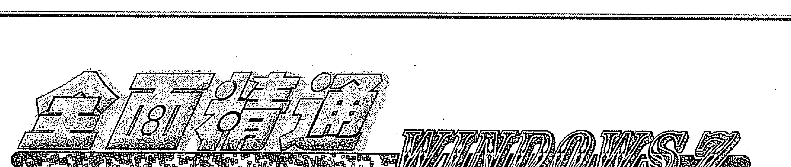

## 第一部分 带你玩转 Win7

## 从XP到Windows 7，细说21世纪的3大操作系统

## 老而弥坚：Windows XP

Windows XP中文全称为视窗操作系统体验版，是微软公司发布的一款视窗操作系统。它发行于2001年10月25日，原来的名称是Whistler。

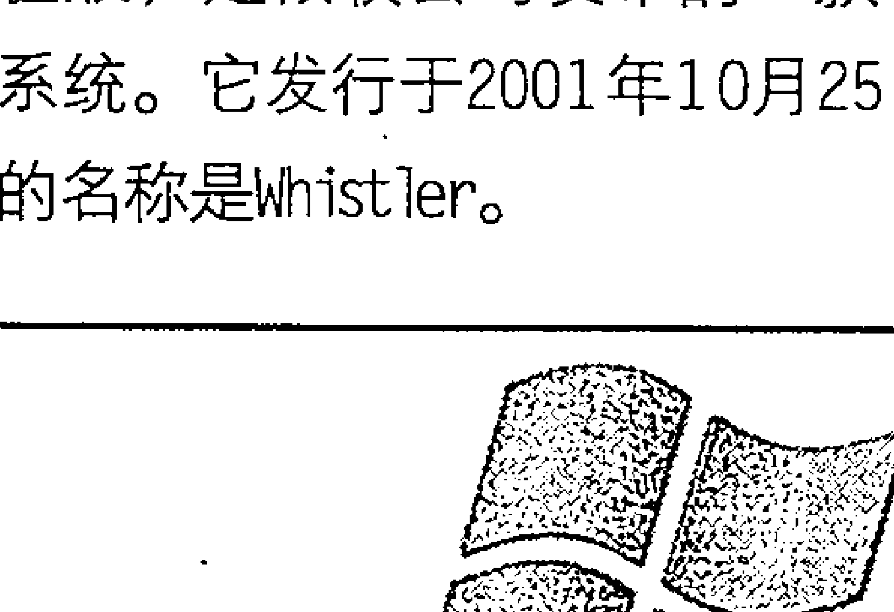

微软最初发行了两个版本，家庭版(Home)和专业版(Professional)。家庭版的消费对象是家庭用户，专业版则在家庭版的基础上添加了新的为面向商业设计的网络认证、双处理器等特性。且家庭版只支持1个处理器，专业版则支持2个。字母XP表示英文单词的“体验”(experience)。

Windows XP是基于Windows 2000代码的产品，同时拥有一个新的用户图形界面(叫做月神Luna)，它包括了一些细微的修改，其中一些看起来是从Linux的桌面环境(desktop environment)诸如KDE中获得的灵感。带有用户图形的登录界面就是一个例子。此外，Windows XP还引入了一个“基于人物”的用户界面，使得工具条可以访问任务的具体细节。

它包括简化了的Windows 2000的用户安全特性，并整合了防火墙，以用来确保长期以来一直困扰微软的安全问题。

XP的最低系统要求：计算机使用时钟频率为300MHz或更高的处理器；至少需要233MHz(单个或双处理器系统)；使用Intel Pentium Celeron系列、AMD K6 Athlon Duron系列或兼容的处理器，使用128MB RAM或更高(最低支持64MB，可能会影响性能和某些功能)，1.5GB可用硬盘空间，SuperVGA(800x600)或分辨率更高的视频适配器和监视器，CD-ROM或DVD驱动器，键盘和Microsoft鼠标或兼容的指针设备。

## 注定失败的Vista

Windows Vista是微软在2005年7月22日正式公布了这一名字，操作系统开发代号Longhorn。Windows Vista的内部版本是6.0 (即Windows NT 6.0)，正式版的Build是6.0.6000。在2006年11月8日，Windows Vista开发完成并正式进入批量生产。此后的两个月仅向MSDN用户、电脑软硬件制造商和企业客户提供。在2007年1月30日，Windows Vista正式对普通用户出售，同时也可以从微软的网站下载。Windows Vista距离上一版本Windows XP已有超过五年的时间，这是Windows版本历史上间隔时间最久的一次发布。

根据微软表示，Windows Vista包含了上百种新功能；其中较特别的是新版的图形用户界面和称为“Windows Aero”的全新界面风格、加强后的搜寻功能（Windows Indexing Service）、新的多媒体创作工具（例如Windows DVD Maker），以及重新设计的网络、音频、输出（打印）和显示子系统。Vista也使用点对点技术（peer-to-peer）提升了计算机系统在家庭网络中的通信能力，在不同计算机或装置之间分享文件与多媒体内容变得更简单。

微软也在Vista的安全性方面进行改良。微软前总裁比尔·盖茨在2002上半年宣布在全公司实行“可信计算的政策”（Trustworthy Computing initiative），这个活动目的是让全公司各方面的软件开发部门一起合作，共同解决安全性的问题。微软称由于希望优先增进Windows XP和Windows Server 2003的安全性，因此延误了Vista的开发。

在开发期间，有许多团体发表了关于Vista的各种负面预测，包括延迟的开发时间、限制更严格的授权方式、限制拷贝受保护的数位媒体而加入的数项新数字版权管理技术，以及新功能的实用性（例如用户账户控制）。

## 扛起大梁的Windows 7

Windows 7（以前的代号为Blackcomb及Windows Vienna）是微软对Windows未来的版本的代号，原本安排于Windows XP后推出。但是在2001年8月，“Blackcomb”突然宣布延后数年才推出，取而代之由Vista（代号“Longhorn”）在Windows XP之后及Blackcomb之前推出。

### 1变，代号改变。

恐怕很少有人听说过这个词。当Windows Vista刚刚走出微软的大门、面对早已迫不及待的消费者时，微软可能已经悄悄地改变其操作系统的命名策略。按照很久以前Microsoft-watch.com的报道，Windows Vista之后的下一代操作系统代号为“Fiji”（斐济），不过后来改称“Vienna”（维也纳），然而从最新的消息看，Vista之后的操作系统将更名为“Windows 7”。

有消息说：“微软将放弃使用年号或者特殊名词，为Windows操作系统命名的方法，而是回归传统，直接采用Windows内核版本号。Vista的核心版本号是6.0，下一代叫Windows 7倒也顺其自然。”这是错误的，“Windows 7” = “Windows 6.1”。

### 2变，更加复杂。

比尔·盖茨就提及了新的操作系统在设计方面的特点，Windows 7将更加模块化，更加基于功能。总的来说，下一代的Windows将更加先进，服务包和功能包将发布得更加频繁。

### 3变，主题变少。

虽然Windows系统早就支持个性化桌面主题功能，但真正的微软官方主题少之又少。这一次，微软终于吸取了教训，在Beta版中就提供了多达20款风格各异的精美主题。默认安装的Windows 7 Beta只有5种主题可选，但实际上，有不少主题都被隐藏了。只要在文件夹设置中去除隐藏受保护操作系统文件的选项，就能够在WindowsGlobalizationMCT文件夹下，找到针对各个地区的多款隐藏主题（.theme格式文件）。

如果这还不够的话，在微软官方网站上还能够下载到更多，加在一起总共20款。Windows 7 Beta的官方主题基本都是世界各地的风景名胜，配上与之协调的色彩方案，让你的新操作系统体验之旅心情更加舒畅。

## 将快捷方式锁定到任务栏

窗口层叠是Win7一个比较有特色的功能，允许用户把一些程序的快捷方式锁定在任务栏上，这为用户操作提供了不少的便利；特别是在打开的窗口比较多时，这个功能显得尤为便利，你不必再显示桌面去打开某个程序。

前些日子在上网冲浪时，用鼠标右击任务栏IE图标选择网站时，由于操作太快而误点了“将此程序从任务栏解锁”的选项（见图1）。

而后IE就从任务栏上消失了，我试着将它恢复，但打开IE，右键选择任务栏IE图标，没有了“将此程序锁定到任务栏”的选项。

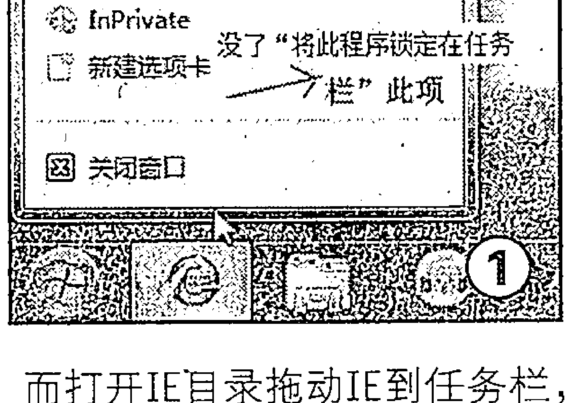

而打开IE目录拖动IE到任务栏，出现了红叉叉不可用的提示。拖动别的程序到任务栏，也出现了一样的提示。想起了在刚装系统时自己曾经删了两个注册表键值(HKEY_CLASSES_ROOT\lnkfile 和 HKEY_CLASSES_ROOT\piffile中的IsShortcut）来去掉桌面快捷方式的小箭头。重新把这两个键恢复了，结果一切问题就迎刃而解（见图2）。

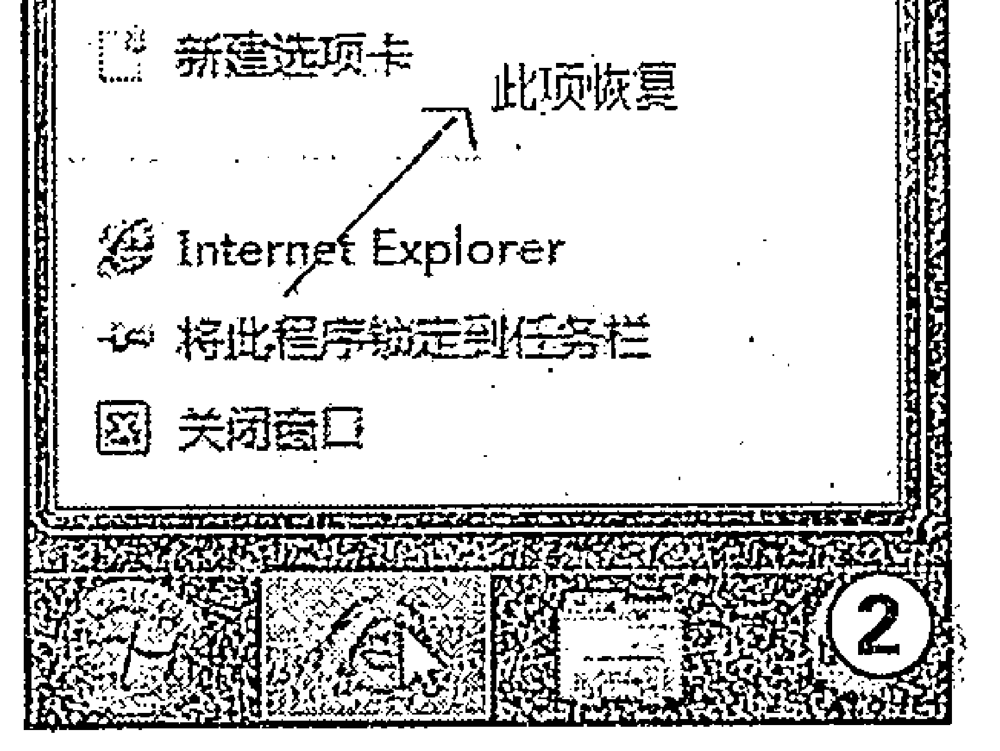

# 第一章 篇章 2009-2010最新应用

## 华丽美妙，初探时尚方便的桌面

在Windows 7中，系统桌面做了很大的改观，与其他几个版本不同的是，Windows 7的系统桌面不仅变得更为时尚，又给用户提供了主题创意的创意空间。这样喜欢个性时尚的用户很轻易就能拥有一个个性的系统桌面。

### 1. 时尚桌面 我设计

Windows 7对桌面设置项目进行了改革，并且各项功能都是开放的，用户可根据自己的兴趣、爱好对系统桌面进行彻底打造，如更改桌面风格、桌面壁纸以幻灯片形式显示、屏保、声音和鼠标动作等，这样使得系统不再是单调的图片做壁纸，让桌面显得更时尚、更个性。下面我们就一起在Windows 7中设置一个时尚、个性的桌面。

首先在桌面空白处单击右键选择“属性”，打开“个性化设置”对话框（见图1）。在“改变电脑的视频效果和声音设置”项中可以对桌面主题进行设置，在主题列表中单击某个喜好的主题后，桌面即可变成该主题风格。

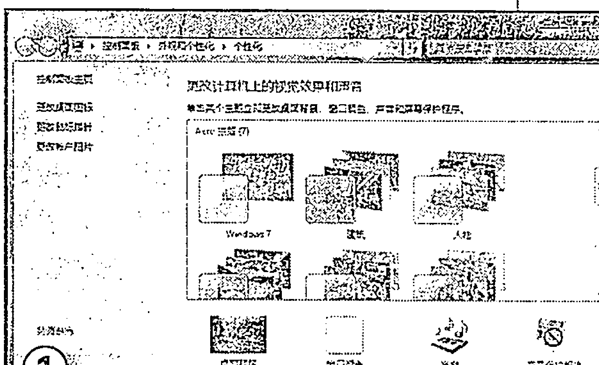

除了系统自带的几个主题外，还可以联机获取更多主题，单击主题列表中的“联机获取更多主题”链接，打开微软提供的“个性化您的电脑”页面，在此可以下载微软提供的最新的桌面主题和背景图片。

主题风格选择后，还可以对该主题进行设置，单击主题列表下面的“桌面背景幻灯片”，打开幻灯片设置对话框（见图2），此程序显示了当前主题中附带的壁纸，在此可以选择自己喜欢的壁纸。单击“图片位置”，在列表中我们可以选择自己喜欢的壁纸添加到幻灯片显示中。

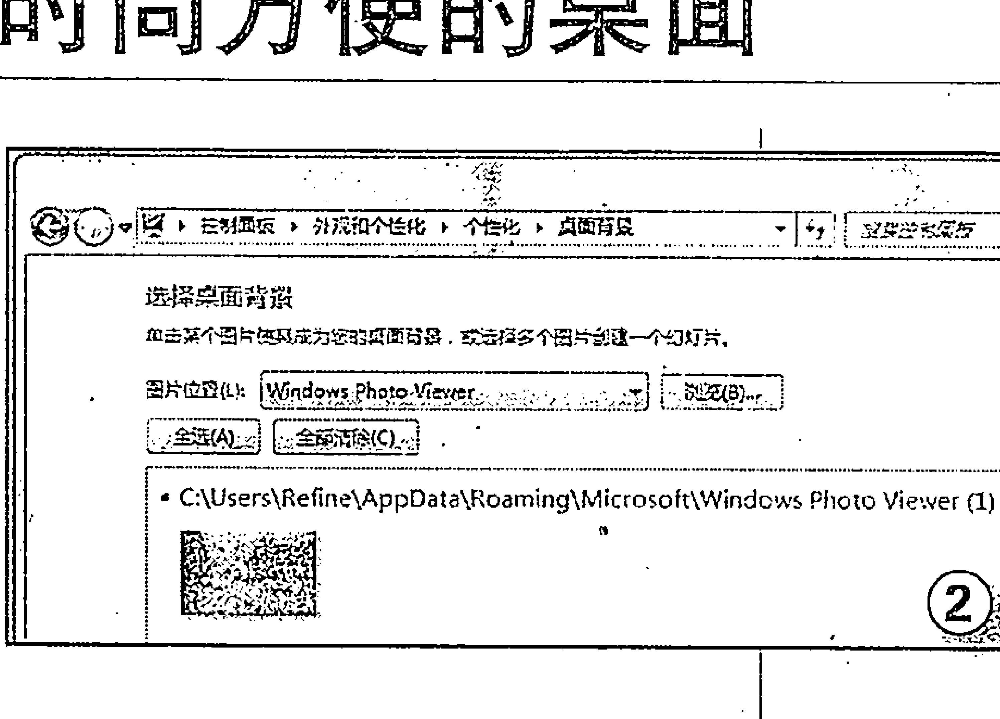

> 小提示
你可以设置多张桌面壁纸以幻灯片形式切换的间隔时间，你可以根据自己的需要，设置壁纸从10秒更换一次到1天更换一次。例如你选择了1分钟，那么系统会每隔1分钟更换一张你选中的壁纸。还可以选择无序播放，让壁纸随机切换你选中的壁纸。

在“图片设置”设置好图片显示的方式，如拉伸、全屏、居中等，设置后选择好桌面壁纸的更换时间，随后单击“确定”返回上一界面。随后在“个性化设置”对话框中我们还可以通过“窗口颜色”选项来设置主题的颜色、在“声音”项目设置好当前主题的声音方案等，在此我们都可以根据需要进行设置。

设置后，你会发现我们的桌面会更加个性、时尚了。在Windows 7桌面的右键菜单中还集成了一个显示下一张壁纸功能，这样当系统自动切换壁纸后，对某个壁纸不满意时，我们只要在桌面的空白处单击右键，选择“下一个桌面图片”，就会显示下一张壁纸。

怎么样，你是不是觉得在Windows 7中进行桌面设置要比以前的系统更方便了？

### 2. 摇一摇桌面窗口隐藏了

Windows 7改进了AERO特效，改进了Aero Shake(窗口控制)、Aero Peek(透明窗口)，可以在操作Windows 7的同时，享受AERO的方便、实用的3D效果，也能改变我们的操作习惯以及与程序交流的方式。

在系统桌面上打开多个窗口后，如果你想在桌面上仅保留一个需要的窗口，而将其他窗口最小时，在以往的系统中我们只有一个一个点击窗口的“最小化”按钮才能实现，而在Windows 7中改变了这些繁琐的操作方式。只要用鼠标按住当前窗口标题栏目，随后拖动鼠标晃动两下，可以看到桌面上其他窗口已经隐藏到任务栏中。呵呵，是不是方便多了。如果想将其他窗口还原，则只需单击该窗口的任务栏再晃一晃就可以了。

> 小提示
对于不同的系统配置，Aero界面有不同的等级。计算机的显存和系统内存越大，用户的体验就越丰富。如果配置过低就不能运行Aero。

### 3. 桌面工具任意摆放

在Windows 7中系统不再对侧边栏中的小工具的位置进行局限。在该系统中我们可以根据需要将这些小工具随意放置到桌面的任意地方，并且在桌面上添加显示的小工具也更加方便自如了。

在桌面添加小工具时，在空白处单击右键，在弹出的右键菜单中选择“小工具”，在打开的小工具库列表中将需要添加到桌面上的小工具拖曳到桌面任意地方即可（见图3）。添加到桌面的小工具我们可以利用鼠标随意在桌面上进行拖动。随后我们还可以在小工具上单击右键，通过右键菜单对小工具的透明度、最前端显示、尺寸等进行设置。

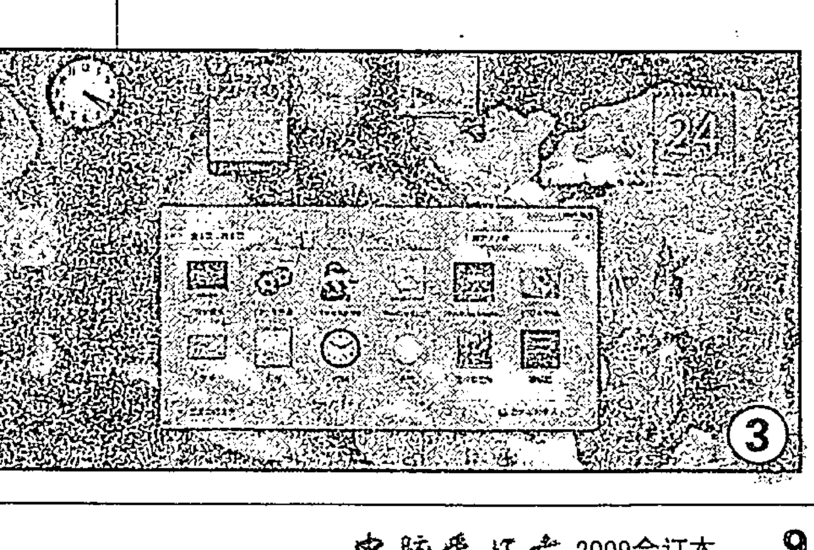

## 别来无恙 搞定QQ自动隐藏问题

基本上每个人都用QQ，大家在使用的时候基本上有个共同的习惯，打开之后让它自动在屏幕右侧收缩或者最小化，听到提示音的时候再打开。但设置了QQ主面板的自动隐藏后，这样一来和Win7的Aero Snap冲突了！

Windows 7为了改善用户操作体验，强化了鼠标窗口拖拽操作的功能。如果用鼠标将某程序窗口拖拽至桌面左侧或右侧，这个程序窗口就会自动以50%的宽度在桌面左侧或右侧显示，方便横向比对；如果将程序窗口拖拽至桌面顶部，则可以实现窗口的自动最大化，再次拖拽又会恢复原始窗口大小，这类似于早期版本Windows的鼠标双击窗口标题栏。

所以，必须小心翼翼地将QQ主面板慢慢向上拖，在QQ面板刚接触到桌面顶部时便立即放手，才能不“惊扰”Windows 7的窗口最大化，实现自动隐藏。这对于用户来说是个技术活，同时考验鼠标精度。

原来，QQ主面板只要其窗口标题栏接触到桌面顶端即可立即吸附并自动隐藏；而Windows 7窗口最大化则是在检测到鼠标箭头已经拖拽至桌面顶端时才将拖拽的窗口最大化。由于拖拽时鼠标箭头与QQ主面板的顶部多少存在一些高差，所以只要向上拖拽时小心翼翼，只令窗口接触桌面顶端，不令鼠标箭头到达顶端，即可不激活Windows 7的窗口最大化。

- 解决方法有三个：
- 方法1: 通过QQ主菜单中的“设置→系统设置→基本设置”，取消“主面板自动隐藏”，彻底关闭QQ主面板的自动隐藏。
- 方法2: 通过Windows 7的“轻松访问中心→使鼠标更易于使用”，选中“防止将窗口移动至屏幕的边缘时自动排列窗口”，关闭Windows 7的自动窗口最大化。
- 方法3: 向上拖拽时不要按住QQ主面板的标题栏，而是按住QQ面板靠下的位置，尽量多留一些高差，拖拽时只令QQ面板接触桌面顶端，不要令鼠标箭头接触到桌面顶端即可。

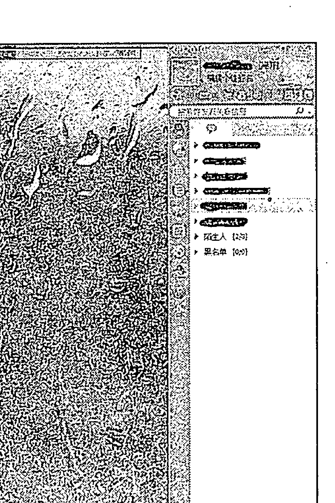

## 两个超级雷人的小错误

有Windows 7用户发现，在屏幕键盘中，数字小键盘上没有按键3和按键8，原本应该是数字3的位置显示的是数字1，应该显示8的位置显示的是数字4。有用户猜测，这可能是微软为了避免有“歧视妇女”的嫌疑，故意将数字键“38”替换了。呵呵……

打开Windows 7数字小键盘的方法：在开始菜单的“搜索程序和文件”中输入“osk”，回车后即可打开Windows 7屏幕键盘程序。

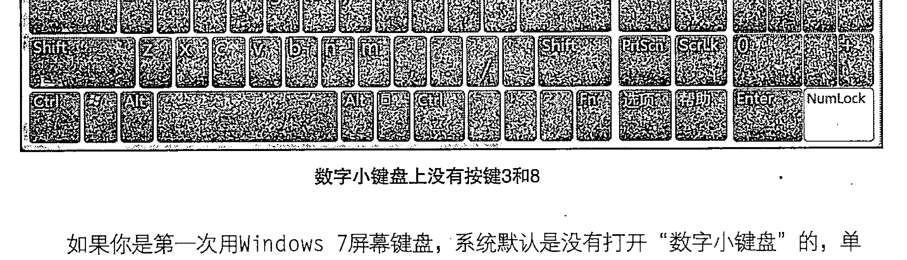

## Windows 电话“插入”

在Windows 7声音属性中有一个雷人的汉字错误，一般的都是写成“电话拨入”，但写成了“电话插入”，是微软在汉化工作中出现的瑕疵。

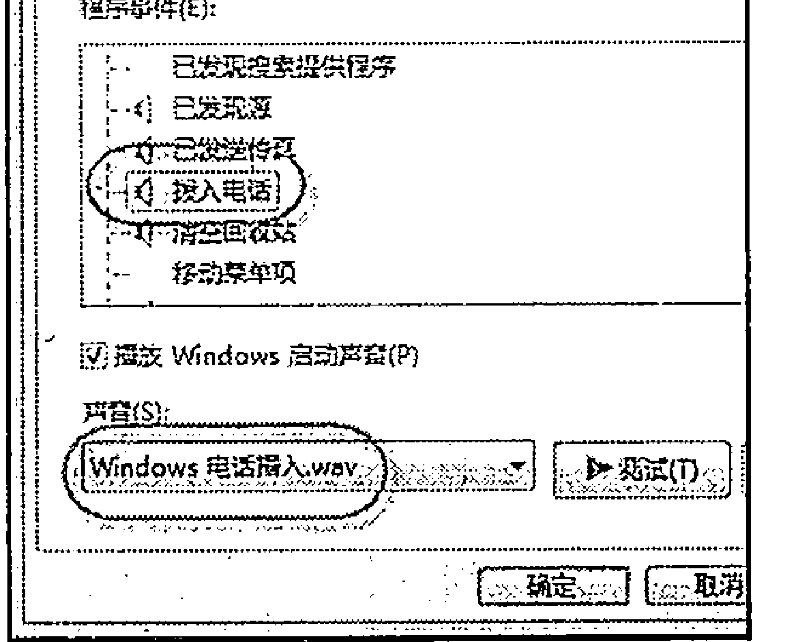

## # TOP10: Win7中Vista不具备的十大功能

自Windows 3.1至Windows Vista, Windows操作系统实现了巨大的飞跃。虽然Vista操作系统受到了众多用户的冷眼对待，然而Windows 7将会替微软抹去用户不愉快的记忆。实际上，从整体的外观上看来，相较于Vista, Windows 7并没有太大的改进。然而，微软积极采取用户的反馈意见，并将它们付诸于行动，使得Windows 7具备更好的稳定性、实用性，特色功能也得到了更新。那么Windows 7中究竟具有哪些特色的新功能呢？下面，我们为您列举了18件炫酷Windows 7特色，它们是Vista中所不具备的。

### 1. 摇走其他不必要窗口

当你打开10个记事本、2个Powerpoint和50个Outlook窗口的时候，你是否会觉得桌面太过拥挤呢？很简单，你只需拖住其中一个正在用的程序窗口，置于计算机桌面的顶部摇一摇，那么其他的应用程序都会被吓跑（Aero Shake功能）。

### 2. Jumplists（跳跃菜单）

Jumplists（跳跃菜单）是Windows 7中的一项新功能，其中包含用户最近经常访问的应用程序菜单和文件列表。通过Jumplists（跳跃菜单），用户可以快速访问自己喜爱的应用程序。同样的，Windows 7的开始菜单中也具备Jumplists（跳跃菜单）。

### 3. 窗口预览

在Vista中，当将鼠标置于任务栏的图标上时，将会出现一个窗口预览。Windows 7中也有类似的预览，只不过Windows 7所提供的是一个全尺寸的窗口预览，您可以直接通过缩略图去关闭窗口。同时，您还可以通过按住Win+T快捷键去滚动任务栏预览。

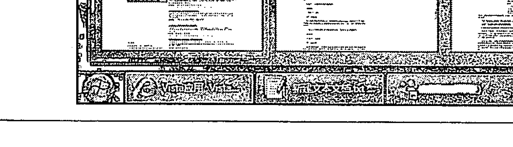

### 4. Snap到位

当您拖住一个应用程序窗口到桌面的最左边或者最右边的时候，这个应用程序窗口会恢复正常大小。而当您将应用程序窗口拖至桌面顶部的时候，它还会自动最大化（Windows 7 Aero Snap功能）。

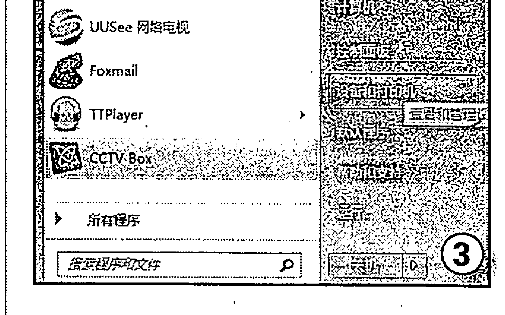

### 5. XP模式

Windows Vista中的最大烦人之处就是它的兼容性问题，在Vista系统下，用户不可以运行很多的Windows XP应用程序。在Windows 7中，微软通过添加“XP模式”针对这一问题进行了改进，拥有“XP模式”之后，用户可以在Windows 7的虚拟环境中顺畅地运行XP应用程序。

### 6. 更加简单、快捷地调整显示器

您是否经常会将您的计算机连接到不同的外部显示器或者投影仪上呢？在Windows 7中，您可以尝试一下Win+P快捷键，这样，您就可以将您的显示器复制和扩展到其他的外部显示器上了，整个过程仅需1秒钟。

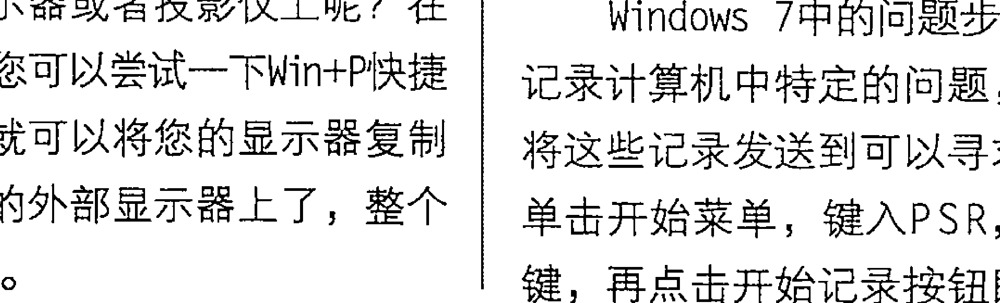

### 7. 设备个性化阶段

Windows 7的开始菜单中具有“设备和打印机”选项，点击该选项，您可以直接查看连接到您计算机中的设备，并对它们进行个性化设置。

### 8. 消除通知区域图标

在以往的Windows操作系统中，用户常常为无法消除时钟和音量的图标发愁，在Windows 7中，这种状况将会一去不复返。点击任务栏右下角的“三角形”图标，然后在弹出的缩略图中选择“自定义”选项，然后单击“隐藏图标和通知”将它们删除即可。

### 9. 问题步骤记录器

Windows 7中的问题步骤记录器可以记录计算机中特定的问题，然后您可以将这些记录发送到可以寻求帮助的人。单击开始菜单，键入PSR，按住Enter键，再点击开始记录按钮即可。启用这项功能后，当您的朋友进行问题操作时，该记录器将会逐一记录您的朋友的操作步骤，并将它们压缩在一个MHTML文件中发送给您即可。无疑，这是个快捷、简单与高效的方法，这将有助于缩短您的故障排除时间。

### 10. 将应用程序锁定到新的任务栏中

在Windows 7中，微软改进了操作系统的任务栏，通过右击打开应用程序的图标，然后选择将此程序锁定到任务栏中。

革命：用“库”提升文件管理

为了方便，文件往往会随意保存在磁盘的任意位置，而不会对其进行合理的统筹归类。这样随着时间的累积，在电脑中会堆积大量的文件，而这些文件的保存毫无规律，如果要在其中找到某个文件简直是大海捞针。虽然，从Vista开始微软加强了系统的搜索功能，但如果忘记文件名称也无法进行搜索，就算知道文件名称，要进行一次全盘检索那也太费时了。也许是基于这样的考虑，微软在Windows 7中提供了一个名为“库”的新功能。利用该功能，我们不仅可以将本地磁盘不同位置保存的多个文件添加到对应的“库”中，而且也可将非本地的文件映射到库中，使用库我们可以非常方便地找到自己所需的文件。

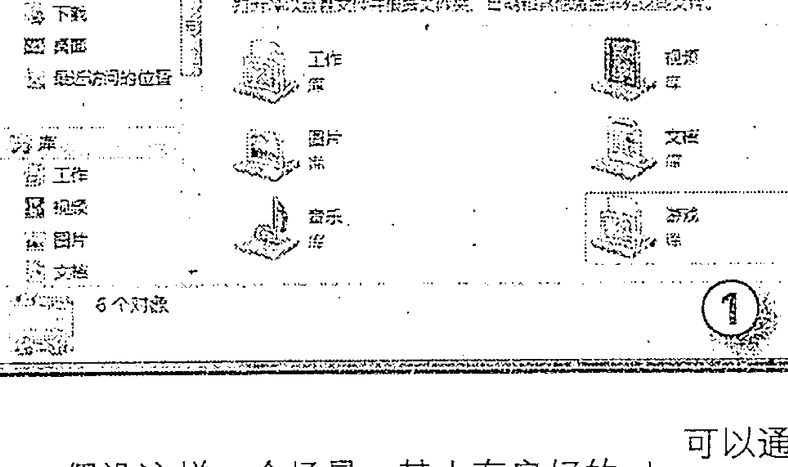

假设这样一个场景：某人有良好的习惯，他将不同类型的文件保存在不同的磁盘分区中，而他希望通过一个统一的位置来浏览访问这些文件而不要访问具体的磁盘分区。或者有一个文件夹隐藏得非常深，访问该文件夹是非常麻烦的，如何实现快速访问呢？毫无疑问，这在Windows 7以前的系统中是无法实现的，而利用Windows 7的“库”功能即可实现。在“计算机”窗口中，在左窗格中我们可以看到“库”节点，在其下有系统默认的几个库。

在此，可以创建新的库，并将目标文件、文件夹添加到该库中。其操作方法是：右键单击“库”图标选择“新建”→“库”命令会自动创建一个库，然后就像给文件夹命名一样为这个库命名，比如命名为“游戏”。接下来，右击该库选择“属性”，单击对话框中的“包含文件夹”按钮，然后定位到要包含的文件夹所在的路径，比如“PSP”，选择该文件夹单击下面的“包括文件夹”按钮即可。当然，可以在文件夹上单击鼠标右键然后选择“包含到库”，找到要包含到的库即可。同样，我们将其他需要统一进行管理的文件夹添加进来。这样在需要访问这些文件夹时，不需要来回切换进入这些文件夹进行访问，只需打开对应的“库”，通过点击进入“库”中对应的文件夹就可快速访问目标文件了。

需要说明的是：添加到文档库中的位置，实际上并不会被移动，而只是在文档库中添加一个指向目标的“快捷方式”，文件还保存在原先的位置。另外，当我们 将“库”中包含的文件夹对应的目标文件夹移动到其他地方的时候，库链接并不会失效，它会非常智能地检测到文件夹的移动并进行自动更新文件路径。也就是说，只要将某个文件夹添加到库中，无论我们将该文件夹移动到任何位置，都可以通过相应的库来进行集中管理或者访问。

共享库或库中的文件夹

如果你需要将你的某个库与他人共享，可以在该库中点击鼠标右键，将鼠标移动至菜单中的共享位置。如果你创建或加入了家庭组，选择该项即可完成共享，所有加入该家庭组的成员均可访问该库。如果你的计算机未处于家庭组的环境之内，则需选择特定用户。

共享库或文件夹时，需要注意：

- 可以通过家庭组共享库或库中的文件夹，如果特定用户共享，他人访问时将无法看到共享的库，只能看到共享库中的文件夹和文件。
- 如果选择特定用户，则进入文件共享的界面，在此界面中，你可以选择下拉菜单来选择网络中不同的用户名，与其共享该库中的文件夹和文件。如果你希望将文件夹共享给局域网中的每一个用户，则可以从文本框中输入everyone，之后点击添加。

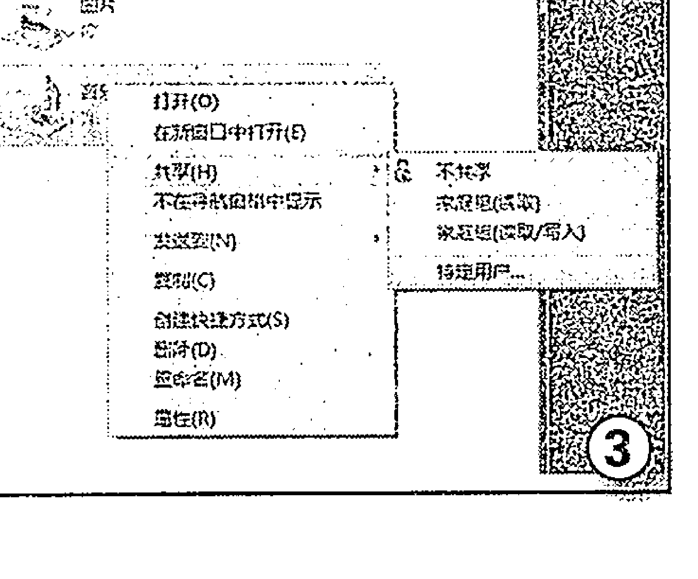

接下来，会在列表中看到刚才添加的新名称，并可以设置对方访问文件夹的权限，如设置为读取，对方将不可修改和删除文件夹内的任何文件。为为了避免不必要的麻烦，推荐选择此权限。最后，点击共享，完成操作。这样，对方可以通过网络访问你共享的文件夹了。

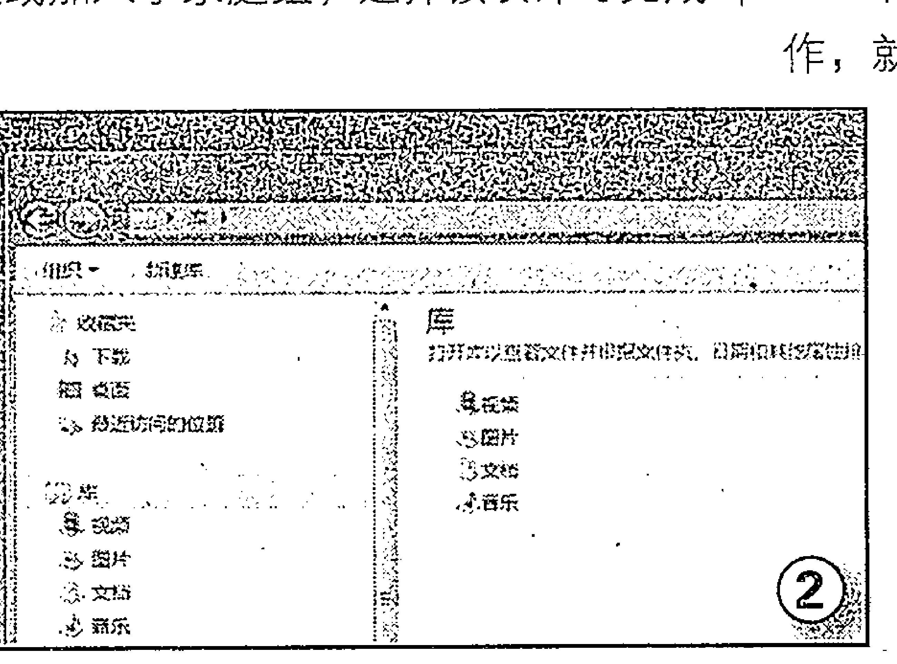

添加网络中他人共享文件夹到库中

将文件夹关联到库中，只需简单操作，就可以实现。除了关联本地文件夹以外，还可以关联网咯或家庭组中他人共享的文件夹到本机的库中，访问起来更加方便。打开Windows资源管理器，打开需要建立关联的库，点击位置。

在弹出的窗口中列出了目前该库中关联的文件夹及其路径，点击位置右侧的添加按钮。

集中管理

Windows 7的“库”不仅可以将某一类文件夹集中在一起，其实，文件库一个更强大的应用是将这些文件夹中的包含某一个关键字的文件都找出来，并“集中”管理。

- ### 1. 找出包含某一关键字的全部文件

打开任意一个文件夹，从导航栏里找到“库”，单击其下的子文件库，在搜索栏里输入关键字（例如“摩擦力”）并按回车，很快，与这一关键词相关的文件将会全部找出来。

由于Win 7的搜索功能默认会将文件库当中的文件纳入到索引中，因此文件库当中的搜索既会按文件名进行，又会按文件内容进行。搜索完毕后单击“保存搜索”，名为“摩擦力”的搜索结果将保存下来。今后，只要双击保存过的搜索结果，即可将该搜索结果当中的文件全部找出来，而不需要再次搜索，可谓一劳永逸。

此外，我们还可以根据其他条件来进行筛选。比如对于照片文件，可添加光圈、快门等筛选条件；对邮件，可按发件人、收件人进行筛选。如果筛选按钮中没有出现你所需的条件，还可以右击排序按钮再选择“其它”来添加。

把文件收藏起来

在Windows XP时代，文件管理的主要形式是以用户的个人意愿，用文件夹的形式作为基础分类进行存放，然后再按照文件类型进行细化。但随着文件数量和种类的增多，加上用户行为的不确定性，原有的文件管理方式往往会造成文件存储混乱、重复文件多等情况，已经无法满足用户的实际需求。而在Windows 7中，由于引进了“库”，文件管理更方便，可以把本地或局域网中的文件添加到“库”，把文件收藏起来。

简单地讲，文件库可以将我们需要的文件和文件夹统统集中到一起，就如同网页收藏夹一样，只要单击库中的链接，就能快速打开添加到库中的文件夹——而不管它们原来深藏在本地电脑或局域网当中的任何位置。另外，它们都会随着原始文件夹的变化而自动更新，并且可以以同名的形式存在于文件库中。

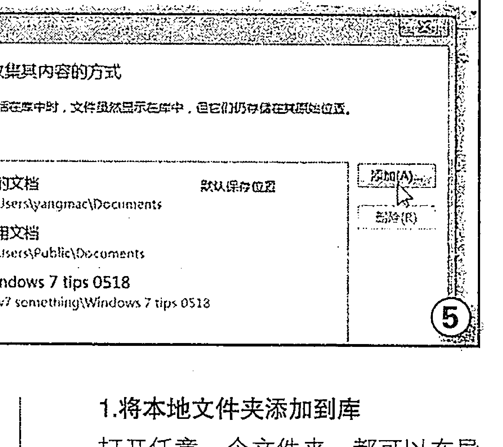

- ### 1. 将本地文件夹添加到库

打开任意一个文件夹，都可以在导航栏里观察到“库”，默认情况下，已经包含了视频、图片、文档、音乐等常用项目。而添加新的文件夹到库中，可以直接右击“库”，在弹出菜单中选择“新建→库”即可。本例中，我们将新建的库重命名为“物理教学”。接着，右击“物理教学”选择“属性”，从弹出的对话框中单击“包含文件夹”项，再将本地电脑中的文件夹添加进来即可。这里我们可以看到，添加进来的文件夹后都标有源文件夹的真实地址，方便我们加以区分（例如出现同名的文件夹）。

- ### 2. 将局域网共享位置添加到库

与添加本地文件夹进入文件库稍有不同，要将局域网的共享文件夹添加到库，必须先将其设置为脱机属性。在开始菜单的“搜索程序和文件”栏里输入“网络”，单击搜索结果中的“网络”链接即可直接访问局域网。找出要添加到库中的文件夹，右击选择“始终脱机可用”。设置完成后，我们就能像添加本地文件夹一样通过“包含文件夹”来添加局域网共享位置的文件夹了。添加完成后，局域网中的文件夹图标上会显示脱机标志。

脱机文件可理解为普通共享的进一步加强。普通共享在网络连接中断时（比如更换了工作场所）便会无法使用。但设置为脱机文件后，可将共享位置映射为本地磁盘，这样就算已离开局域网环境或网络暂时不通也能打开其中的文件进行编辑、复制、删除等操作，一旦网络恢复正常或再次接入，Win 7会自动将文件与局域网共享的文件进行同步操作。

- ### 2. 增加筛选条件，显示特定文件

根据上面的介绍，只要包含搜索关键字的文档都会被罗列出来，那么我们如何查看某一类特定的文件呢？其实只要在前面的搜索基础上加入这一筛选条件即可。

双击前面保存过的搜索结果，在排序按钮一栏中找到“类型”，勾选其下的“Microsoft Office Word 97-2003文件”，这样就只有Word文档才会显示出来。这里的类型选项，Win 7会自动识别搜索结果当中所包含的所有文件的类型，因此，只需要通过选择就可以轻松实现查看该搜索结果当中某一特定类型的文件。

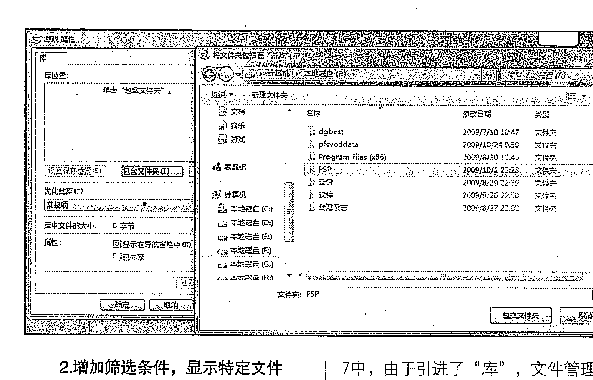

你就是专家——用好自带疑难解答

对于一些新手们，面对Win7的问题可能不知怎么解决。在以前版本的Windows系统中，只能通过安装系统或利用系统盘等方式来修复，实在有些麻烦，如果是一个小小的问题，通过升级安装系统方法来解决又显得有些小题大做了。现在好了，为了帮助用户随时了解系统问题所在并能及时解决系统中出现的这些问题，在Win7中集成了一个“解决疑难问题包”组件，通过这个功能用户可以以“向导的方式”找出系统中问题的原因并能提出解决问题的方案，帮助我们及时解决系统出现的问题。

使用疑难解答包时，打开“控制面板”对话框，在“系统和安全”项下单击“查找并解决问题”按钮，打开“疑难解答”对话框（见图）。在此程序将问题解答包分为程序、硬件设备、网络和互联网、外观和个性化、系统和安全等几个类别。我们可以按照程序的问题对号选择。如果想查看全部的问题，单击“查看全部”，在此查看系统中所有程序和系统设置信息。

如果发现某个程序出现问题，在“疑难解答”对话框中单击该程序，打开一个修复向导，系统开始对该程序出现的问题进行检查，发现问题后，弹出一个修复窗口，在此单击“修复”，这样系统就开始对该程序出现的问题进行修复。如果我们只想找到问题的原因，不想让系统进行默认修复，单击“跳过这个修复”命令，打开修复选项窗口，在该窗口中程序显示出找到的问题及问题产生的原因，随后单击“搜索更多的选择”选项，打开多种解决问题的方案，在此我们可以根据需要选择修复方法，并按照提示一步步进行操作即可。

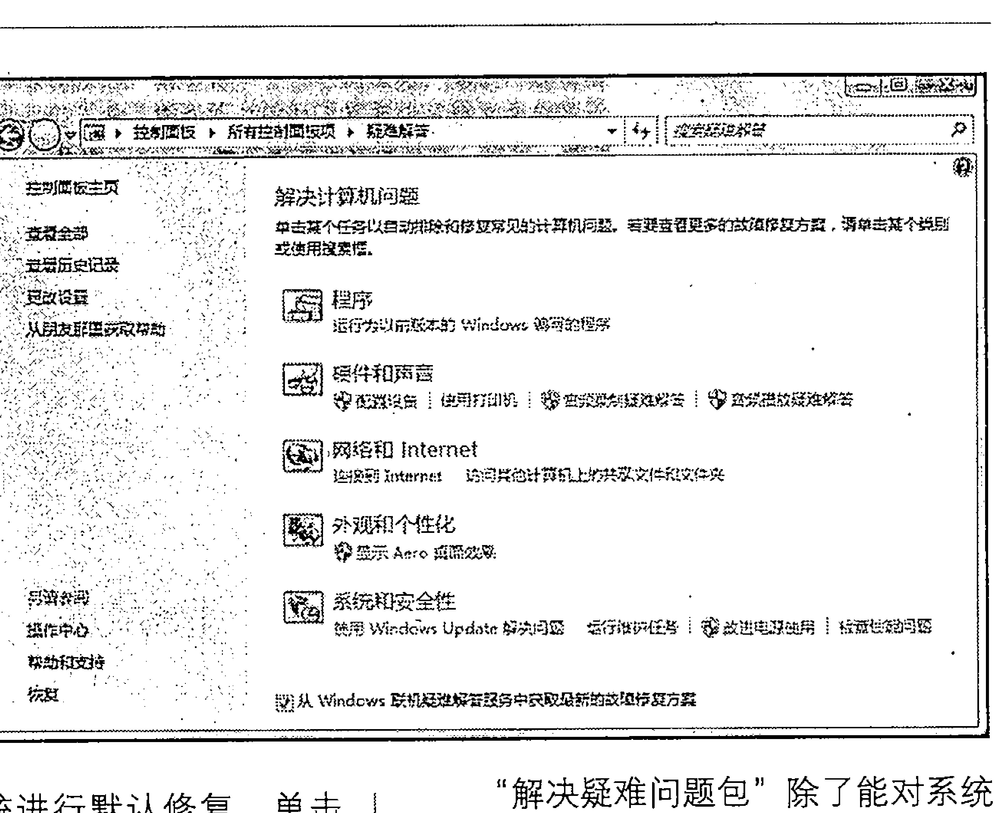

> 小提示
当某个程序发生问题时，系统会为用户提供多种修复方案，但不是每种方案都能智能地对系统进行修复，在此我们可以在多种方案中选择几种修复方法进行尝试修复。

“解决疑难问题包”除了能对系统中的程序修复外，还能对系统的启动项目进行修复。我们在使用Win7时，当我们遇到系统无法正常启动等问题时，系统会自动调用“疑难解答工具”，并在启动菜单中弹出一个“Launch startup repair (recommended)”（修复启动项），选择该项后，安装提示进入修复，在不需要插入光盘的情况下，整个过程用了不到5分钟，非常方便快捷。

有了“解决疑难问题”，我们就可以对系统中的各种文件进行轻松修复了，不用再东奔西跑地到处寻找解决办法了。

QQ2009 别玩视频崩溃

在安装了Windows 7之后，QQ2009只要一打开视频功能整个QQ就会崩溃（见图），而日常的在线聊天则不受影响，这让人心烦不已。

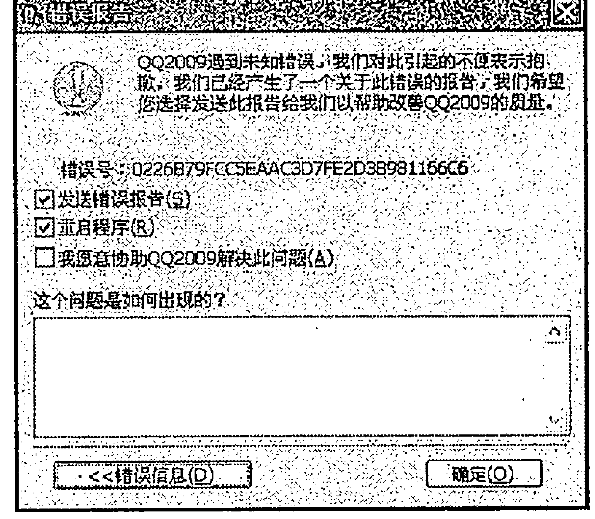

找原因

从开启在线视频就会使QQ崩溃的情况来看，首先从显卡的驱动问题入手。安装官方网站提供的Windows 7驱动程序后，问题依旧，看来并不是由于驱动程序不适所造成的。

排故障

会不会是因为QQ自身的设置不当，使其与Win7存在着兼容性问题，导致了在线视频的崩溃呢？打开QQ关于语音设置的选项卡，选择“优先保证视频流畅”选钮及“节省带宽模式”复选框，保存设置后重启QQ，就可以在稍稍降低在线视频的画质的前提下，避免QQ崩溃的厄运。

> 题外话：
虽然Windows 7已经到RTM阶段，但是依旧存在着与应用软件不兼容的情况，特别是目前国内的应用软件，如QQ以及一些网络游戏。因此还是不能忽视Windows 7的兼容性问题，不能过于乐观地认为兼容问题可以忽略不计。遇到兼容问题时，除从系统入手之外，还应该充分查看应用软件的默认设置是否存在兼容问题。

贴身小秘书——任务计划的演变之旅

随着生活节奏的不断加快，每个人的事务都在增多，以前每天处理10件小事、1件大事，现在这社会可能就需要翻倍了。人的精力是有限的，繁多的事情堆在一起，会让人忘记许多。用Windows自带的计划任务功能，可以自动实现很多功能，就像请了一个免费的贴身小秘书，让她帮你！

关于任务计划

任务计划是一个运行在后台的程序，它可以根据我们预先指定的时间点进行相关操作。比如在上午9点打开Foxmail收邮件等。任务计划可以自动执行EXE文件、BAT文件等。我们可以自己编写合适的BAT批处理文件，执行非常复杂的任务计划。另外，新的Windows 7系统将任务计划的功能进行了增强，使用起来会更加方便。

下面我们来了解下“任务计划”，它可以帮助我们干些什么？如果你对它有兴趣并能够将“任务计划”中的潜藏功能和特殊设置发挥出来，那么它的“功效”还将会成倍增长。这将有助于我们在计算机管理上省下不少的时间！

自动下载：省时省力

现在的网络下载工具下载能力越来越强，很多时候在下载时会将我们的网络带宽占满，这种情况下即使打开一个网页都需要等很久。使用计划任务，我们可以让电脑在系统空闲的时候再自动运行下载工具进行下载。下面我们以快车（Flashget）为例进行介绍，其他下载软件的使用方法类似。

第一步：选择“开始→程序→附件→系统工具→任务计划”，双击里边的“添加任务计划”，点击“下一步”稍等片刻即可看到当前电脑中安装的所有程序。

选中快车然后再单击“下一步”，如果没有找到则点击“浏览”按钮，在弹出的窗口中找到快车的主程序“flashget.exe”，选择执行任务的频率，这里我们选择“一次”。

第二步：在接下来设置任务开始时间，假设我们打算晚上11点睡觉，那么就让计划任务在23点的时候自动运行快车（见图1）。

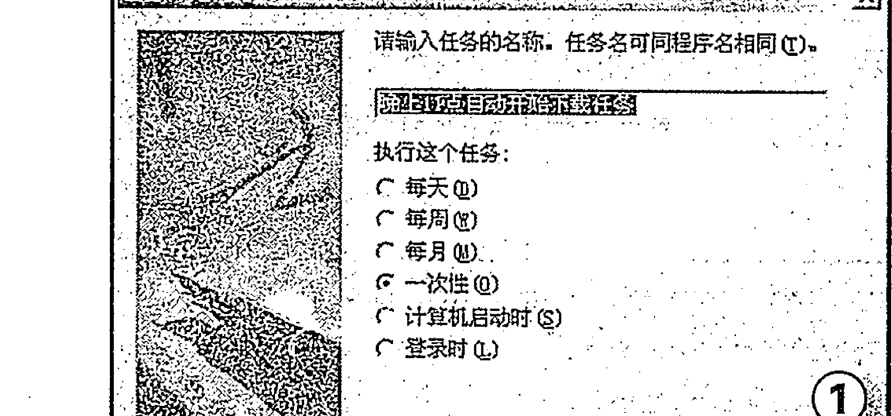

第三步：下面的环节很重要，需要输入执行这个计划任务的用户名和密码（见图2），这代表着运行计划任务的权限，例如你当前的登录账号如果运行快车时会提示权限不足的话，计划任务也会遇到相同的情况。为了保证计划任务可以正常运行，建议使用管理员账号和密码。

设置完成之后，打开快车并添加下载任务，并在快车的选项中选中运行时自动启动未下载完的任务，以及全部任务完成时自动关机。

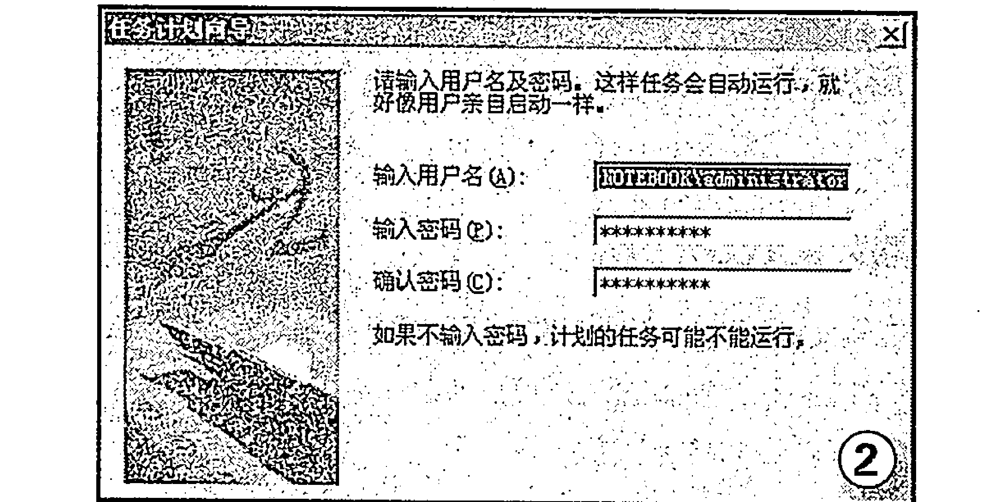

定时开关机：省心、省力

自动开关机是计划任务中非常实用的功能，我们可以设置计划任务让电脑在清晨开机播放音乐将我们叫醒，也可以设置自动关机限制别人使用电脑的时间。

打开任务计划的设置向导。点击“下一步”，在选择运行程序的窗口中直接选择需要播放的音乐文件，之后再设定该任务运行的频率和时间。最后选择“在单击完成时打开此任务的高级属性”（见图3）。

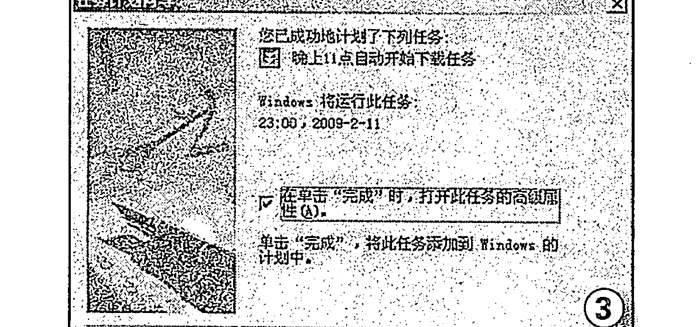

点击“完成”后，在弹出对话框中，选择“设置”选项卡，选定“唤醒计算机以运行此程序”选项。设置完成后，在选择关机时选择“待机”或“休眠”即可。这样在每天对应的时间系统就会自动启动，并播放你预先指定的音乐。

我们还可以通过编写批处理的方式，建立快速关机的计划任务，Windows XP内置的Shutdown命令可以自动关机，例如“Shutdown.exe -s -t 3600”就表示在60分钟后强制关机。在右侧点击“创建基本任务”，在弹出的对话框中按照与Windows XP类似的方法设置任务的名称、摘要以及启动时间等信息，在“操作”选项中选中“程序”并点击“下一步”，接下来在“程序或脚步”中输入“shutdown”，然后在“添加参数”中输入命令的参数，如“/s”。Shutdown的常见参数有：i表示显示“远程关机对话框”（如果使用该参数，必须将其作为第一个参数）；l表示立即注销当前用户；s表示关闭电脑；r表示重新启动电脑；-t表示关机等待的毫秒数。打开一个记事本文件，在里边建立一条关机的命令并保存成BAT文件，然后再使用任务计划执行即可。

**小提示**
在XP中使用计划任务来完成定期执行Begin.bat文件需要注意一点，这个方法只能在Windows XP Professional中实现，Windows XP Home无法使用。

Win7强大的任务计划

在Windows 7中，任务计划工具已经做了很大调整，增强了以前在XP中任务计划管理与调度，使用户在Windows 7中的任务调度更加直观、简单且高效。

整理碎片：根据情况启动磁盘碎片整理

最为强大的一点在于任务的触发条件更加丰富，例如当系统进入空闲状态时启动任务，当CPU达到某种使用量时启用任务或者磁盘空间达到一定程度时启动任务计划等。而不再像Windows XP那样只能根据时间或者登录状况启动任务。下面我们就以在系统空闲时启动磁盘碎片整理为例进行介绍。新建任务计划与XP中的方法是不一样的，现在来了解一下怎么创建新任务。点击“开始”，在“计算机”选项上单击鼠标右键选择“管理”，在弹出窗口的左侧可以选择“任务计划程序”（见图4）。

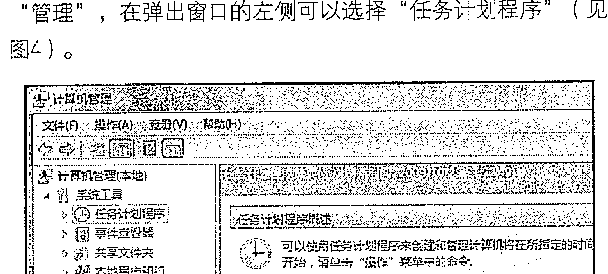

在“任务计划程序”面板中选择“创建任务”，在弹出的窗口中选择“触发器”选项卡，然后点击里边的“新建”按钮，在弹出的窗口中选择触发条件是系统空闲时。

然后再选择“操作”选项卡，在里边点击“新建”按钮，在“操作”中选择“启动程序”，然后在“程序或脚本”中输入defrag，参数中输入“-c”（见图5）。这样设置完成后，在Win7出现空闲时就会自动为我们执行磁盘碎片清理任务了。defrag的参数包括：c表示对此电脑上的所有卷进行碎片整理；a表示仅执行碎片整理分析；r表示进行局部碎片整理，即Win7只试图整理小于64MB的碎片。

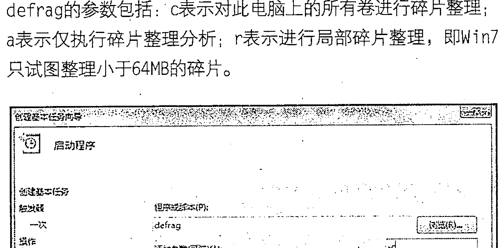

网络设置：一步完成

支持更加丰富的启动条件，我们可以在“条件”选项卡中设置网络连接的状况。在桌面空白处点鼠标右键，选“新建→快捷方式”，然后输入：“explorer.exe {7007ACC7-3202-11D1-AAD2-00805FC1270E}”，然后输入你想要的名称，例如：“网络连接设置”，点击“完成”即可。另外需要注意的是，Win7的任务计划必须要在触发器和条件中的内容都满足的情况下才能执行，否则该任务不会运行。

运行状态：自动扫描空闲状态

Win7的任务计划程序服务，每隔15分钟就会检查电脑是否处于空闲状态。屏幕保护程序正在运行时，就认为计算机处于空闲状态。在屏幕保护程序没有运行时，如果在过去十五分钟的90%时间内，CPU使用率为0%且磁盘输入或输出为0%，并且在此时间段内没有任何键盘或鼠标输入，即认为电脑处于空闲状态。如果将任务设置为只有在电脑处于空闲状态30分钟后启动，并且该任务等待电脑处于空闲状态10分钟，则只有在激活触发器之前电脑处于空闲状态25分钟时，该任务才会在5分钟内启动。如果电脑在激活触发器后5分钟进入非空闲状态，则任务不会启动。

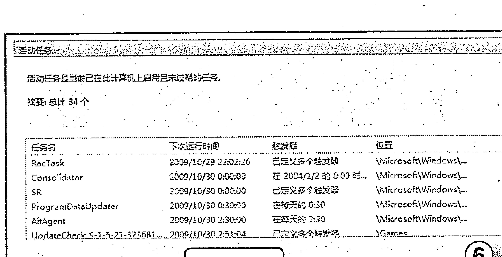

## 10大技巧，全面优化提速Win7

目前关于Windows 7各种文章有不少，不过大多是关于用户界面改变的介绍，例如：新的任务栏，开始菜单的改进，更大的预览缩略图等等。Windows 7的新东西还有很多，今天我们来换个话题。你是否注意到，磁盘碎片整理已经支持多个驱动器并行处理？还有，你知道是哪个IE插件拖慢了浏览器吗？语音聊天时，音箱音量会自动降低，怎么办？没错，这些都是Windows 7带给我们的新东西，而且你很有必要知道。

### 1. 加速磁盘碎片整理

Windows 7中的磁盘碎片整理工具比Windows Vista提供了更多的可控选项，它的命令行版本也提供一些有趣的新功能。下面是参数说明：

- `-r` 并行处理多个驱动器
- `-h` 让磁盘碎片整理工具使用更多的系统资源，以便加速运行
- `-u` 提供定期进度报告，你可以看到整理碎片的详细过程

命令用法示例：
`defrag c: -h -u -r`
作用：在一个命令行窗口中快速整理多个驱动器。

### 2. 让IE加载更快

一些IE插件用去更多时间启动，无疑这会拖慢整个浏览器的性能。在Windows 7中的IE8里，使用者可以知道哪些浏览器插件(扩展)运行最慢。
用法：点击“工具→管理加载项”，右侧的载入用时列表中显示了插件的运行情况。

| 加载项类型 | 名称 | 发行者 | 状态 |
|---|---|---|---|
| 工具栏和扩展 | Shockwave Flash Object | Adobe Systems Incorporated | 已启用 |
| 工具栏和扩展 | Adobe PDF Link Helper | Adobe Systems, Incorporated | 已启用 |
| 工具栏和扩展 | WangWangX Class | Alibaba (Shanghai) Co., Ltd. | 已启用 |
| 工具栏和扩展 | Windows Live 登录助手 | Microsoft Corporation | 已启用 |

### 3. 修复任务栏

Windows 7加强了安全性，因此，在关闭UAC的情况下，用于桌面侧边栏的gadgets将不能启用。如果你禁用了UAC，还打算正常使用gadgets，按照如下方法操作。
运行注册编辑器，找到以下位置：`[HKEY_LOCAL_MACHINE\SOFTWARE\Microsoft\Windows\CurrentVersion\Sidebar\Settings]`，创建一个新的DWORD值，键名为`AllowElevatedProcess`，数值设为1，这样gadgets又能正常启动了。

### 4. Alt+Tab增强用法

假设你已经打开了五个资源管理器，还运行着许多其它程序，此时要想在这么多程序中找到需要的，用传统的Alt+Tab来切换窗口确实是很费时的。
怎么办呢？先按住Ctrl键，在资源管理器的图标上点一下，Windows 7将只在这几个资源管理器窗口间切换，这使得窗口定位的速度更快了。本技巧适用于任何支持同时开启多个实例的应用软件。

### 5. 禁用智能窗口排列

Windows 7的另一个新功能就是智能排列窗口，当你把一个窗口拖拽到屏幕顶部时，它会自动最大化。这个功能可是让人又爱又恨，我们喜欢Windows 7，但不想用到它的部分功能，怎么办？还是求助于注册表吧，运行REGEDIT，跳转到：`[HKEY_CURRENT_USER\Control Panel\Desktop]`，设置`WindowArrangementActive`键值为0，重启。

### 6. 更好用的系统还原

在Vista中，关于系统还原的设置选项很少。这一点在Windows 7中终于有了改进，有几个实用选项可供选择。
点击“开始”按钮，右击“我的电脑”，选“属性→系统保护→设置”，在这里，你可以根据自身需要，设置系统还原的最大使用尺寸，尺寸越大还原点越多，越小则能释放更多磁盘空间。除此之外，还可以设置系统还原的默认保护范围。

### 7. 放大镜

Windows 7中的放大镜有了改进，用起来更方便了。你可以定义一个比例和坐标，让放大镜跟踪键盘焦点。按下Tab键可以移动对话框，并能自动缩放。

### 8. 以不同身份运行程序

按住Shift键，右键点击任何程序的快捷方式，可出现一个以不同用户身份运行程序的选项，比如使用家中孩子的受限账户时，可以临时使用更高的权限。
事实上，这不是什么新功能了，在Windows XP中也能这么做，但在Vista中，微软把它“弄”没了。很不错，微软又改变了主意！要在Windows XP中使用此功能，需开启Secondary Logon服务。

### 9. 用命令行设置时区

Windows 7中新增了一个设置时区的命令：`tzutil.exe`。这意味着可以通过脚本为PC设置时区，IT管理员肯定会喜欢它。
例如，要将某台PC设置为格林威治标准时间，用以下命令即可：`tzutil /s "GMT Standard Time"`，还有几个参数可选，比如，`tzutil /g`，显示当前时区，`tzutil /l`，列出所有时区。

### 10. 调整电脑音量

在Windows 7的默认状态下，当有语音电话(基于PC的)打进来时，它会自动降低PC音箱的音量。如果不想用此功能，可随时设置关掉它。右键点击任务栏上的喇叭图标，选择“声音” -> “通信”，根据自身需要进行设置即可。

## 10大绝对不能关闭的服务

Windows 7出色的地方，除了继承并超越Vista的美观界面，人性化任务栏，并且有XP兼容性八成功力，真是当今世上一个不错的操作系统。Vista的失败除了它“强大”的不兼容性，第二个败笔就是占资源，而Windows 7在这点上改善不少。同时，对于普通用户而言，即使是Windows 7，在服务优化上也是非常头疼的一件事，到底哪些服务该删，哪些不能动呢？下面为大家列举Windows 7十大绝对不能关闭的服务。

### 1. 杀毒软件服务

### 2. DNS Client

DNS客户端服务(dnscache)是缓存域名系统(DNS)名称并注册该计算机的完整计算机名称。如果该服务被停止，将继续解析DNS名称，然而将不缓存DNS名称的查询结果，且不注册计算机名称。如果你停止了此服务，你的电脑将不能解释DNS信息，不能用域名登录网站。

### 3. Network Connections

管理“网络和拨号连接”文件夹中的对象，在其中您可以查看局域网和远程连接。
如果你停止了此服务，不能配置网络，不能创建网络连接，不能上网了。

### 4. Plug and Play

使计算机在极少或没有用户输入的情况下能识别并适应硬件的更改。终止或禁用此服务会造成系统不稳定。

### 5. Print Spooler

官方解释：将文件加载到内存供稍后打印。没有了它你别想珍藏别人的卡片，这个是打印服务。

### 6. Remote Procedure Call (RPC)

RPCSS服务是COM和DCOM服务器的服务控制管理器。它执行COM和DCOM服务器的对象激活请求、对象导出程序解析和分布式垃圾收集。如果此服务被停用或禁用，则使用COM或DCOM的程序将无法正常工作。强烈建议您让RPCSS服务运行。这个很紧要（也就是十分重要的意思），禁止它，你的系统启动不了。

### 7. Workstation

使用SMB协议创建并维护客户端网络与远程服务器之间的连接。如果此服务已停止，这些连接将无法使用。如果此服务已禁用，任何明确依赖它的服务将无法启动。顾名思义，禁止它，你的电脑将在内网消失，更不要想用Media Player玩微软的网络资源。

### 8. Network Location Awareness (NLA)

收集和存储网络的配置信息，并在此信息被修改时向程序发出通知。如果停止此服务，则配置信息可能不可用；如果禁用此服务，则显然依赖此服务的所有服务都将无法启动。

### 9. DHCP Client

为此计算机注册并更新IP地址。如果此服务停止，计算机将不能接收动态IP地址和DNS更新。如果此服务被禁用，所有明确依赖它的服务都将不能启动。禁止DHCP服务，你只有手动设置IP。

### 10. Cryptographic Services

提供四种管理服务、目录数据库服务，用于确认Windows文件的签名和允许安装新程序；受保护的根服务，用于从该计算机中添加与删除受信任根证书颁发机构的证书；自动根证书更新服务，用于从Windows Update中检索根证书和启用SSL等方案；密钥服务，用于协助注册此计算机以获取证书。如果此服务已停止，这些管理服务将无法正常运行。
如果此服务已禁用，任何明确依赖它的服务将无法启动。禁止这个加密服务会导致计算机安全指数下降，不能自动更新，不能使用SSL。

## BitLocker，让你的磁盘安全至极

当年的“艳照门”虽然过去了，但影响之坏，恐怕让每个人都不敢轻易把隐私的文件放在闪盘里。本文主要介绍Win7的一个安全功能：Windows BitLocker。这个功能用于对驱动器加密，是一种全新的安全功能，该功能通过加密Windows操作系统卷上存储的所有数据，可以更好地保护计算机中的数据。

Win7为用户提供了更高的可用性，更流畅的界面，同时也提供了更高的安全性。计算机界对于计算机安全的讨论很早就已经包括了加密整个操作系统。据统计，每天都有几千台手提电脑在机场或车站失窃，这些计算机硬盘里面的各种数据不需要任何专用设备即可直接读取；而人们现在越来越多的使用U盘进行数据存储和转移，但是一旦遗失，里面的数据也是不设防的。要想使用好Bitlocker的功能，需要了解三个方面的内容。

### Win7和Vista中Bitlocker的区别

早在Vista中就已经集成了Bitlocker的功能，但是由于没有一个很好的安装机制，一直没有得到广泛的应用。大部分的用户会将系统装在第一个活动分区中（C盘）。而Bitlocker需要在系统安装的时候产生至少两个格式化成NTFS的卷，一个卷用于安装被加密的操作系统，另一个卷用来启动计算机并且大小不小于1.5GB。如果在Windows安装完以后再扩展卷，系统需要重新安装。这个限制导致Bitlocker功能无法大规模的推广。我的Vista SP2 Enterprise就无法启动该功能，并提示我进行重新分区。但是在Win7的安装过程中，会自动产生一个100MB的隐藏磁盘，用来保存启动管理器等文件，用户不需要重新分区和格式化——大大方便了这个功能的推广。安装完系统之后，可以直接对计算机中的磁盘进行加密，而不需要其他操作。

### 怎么加密磁盘

注意：Win7对于加密系统盘和数据盘的硬件要求是不一样的，对于安装了操作系统的分区来说，需要将密钥保存在磁盘以外的硬件上。BitLocker主要有两种工作模式：TPM模式和U盘模式，为了实现更高程度的安全，我们还可以同时启用这两种模式。要使用TPM模式，要求计算机中必须具备不低于1.2版TPM芯片，这种芯片是通过硬件提供的，一般只出现在对安全性要求较高的商用电脑或工作站上，家用电脑或普通的商用电脑通常不会提供。要想知道电脑是否有TPM芯片，可以运行“devmgmt.msc”打开设备管理器，然后看看设备管理器中是否存在一个叫做“安全设备”的节点，该节点下是否有“受信任的平台模块”这类的设备，并确定其版本即可。

如果要使用U盘模式，则需要电脑上有USB接口，计算机的BIOS支持在开机的时候访问USB设备，并且需要有一个专用的U盘（U盘只是用于保存密钥文件，容量不用太大，但是质量一定要好）。使用U盘模式后，用于解密系统盘的密钥文件会被保存在U盘上，每次重启系统的时候必须在开机之前将U盘连接到计算机上。

所以如果要顺利使用BitLocker功能，硬盘上必须至少有两个活动分区，除了系统盘外，额外的活动分区必须保持未加密状态（且必须是NTFS文件系统），同时可用空间不能少于200MB。为了保证可靠性，这个专门的活动分区最好专用，不要在上面保存其他文件或者安装额外的操作系统。Win7中的Bitlocker对于非系统盘的加密非常简单，打开控制面板，依次单击“安全” → “BitLocker驱动器加密”，我们可以看到BitLocker加密驱动器的界面。

这里已经列出了当前安装电脑的所有本地硬盘分区，对于想要加密的分区，单击对应的“启用BitLocker”链接，随后可以看到驱动器加密向导。可以选择使用密码还是智能卡进行加密，以及是否在这台计算机上自动解码。注意密码的输入必须符合长度和大小写的要求。我在这里遇到了一点困难，因为我是域用户，在登录不到域的情况下不允许加密，点击下一步，对话框的下部显示RPC服务器不可用。只有连到公司域加密对话框才能够继续。对于工作组用户应该不会有这个问题。点击下一步进入密码保存对话框，可以选择将恢复密钥存储到U盘、本地文件或是打印出来。推荐保存到网络存储器中。保存完密码就可以开始加密了。

### Bitlocker To Go功能

Vista版本中只支持对于计算机内部的磁盘进行加密，而Win7提供了加密U盘或其他移动存储设备的功能，大大方便了现在广泛使用的移动存储设备，这就是Win7新加入的Bitlocker To Go功能。微软的设计非常人性化，使用起来非常的简单，和加密本地磁盘的方法很相近。首先插入移动存储设备，系统提示发现U盘。打开控制面板，依次单击“安全” → “BitLocker驱动器加密”，我们可以看到计算机中所有的磁盘，包括新加入的移动存储设备。选择U盘，点击右侧的启用Bitlocker链接。就会弹出向导，输入密码，下次访问U盘的密码，如果有读卡器，也可以使用磁卡上的Pin码进行加密。

使用Bitlocker的加密级别非常高，一旦忘记密码，就可能损失所有数据，Windows提供了恢复密钥的功能，可以保存在文件中或打印出来。点击下一步，开始进行全盘加密，根据磁盘中的文件大小，会显示加密进度。下次再使用时，插入U盘，系统提示U盘被Bitlocker进行加密，使用前需要输入加密的密码，这下你的U盘中的数据只有你能够打开了。还可以把密码保存在经常使用的计算机上，自动进行解锁，这样个人使用的计算机上就不需要反复输入密码。经过我的验证，使用了加密功能以后，U盘的性能并没有受到影响。

对了，Bitlocker的功能只在Win7的高级版本中才有，比如说企业版或旗舰版。如果你购买的家庭版中没有的话，可别来找我呀！

# 第一部分 2009-2010年最新应用

## 拒绝蜗牛速度，快速复制文件夹

通常情况下，为了完成文件的复制或者操作我们需要同时打开源文件夹和目标文件夹，并且要进行频繁的切换。这样的操作流程不仅麻烦而且耗费时间，而这种状况在Windows 7中得到了改善。

不知道大家有没有注意到，在Windows 7资源管理器的“编辑”菜单下多了“复制到文件夹”和“移动到文件夹”两个功能。利用这两个功能项我们可以方便地将一个或者多个文件，以及一个或多个文件夹快速地复制或者移动到目标位置。不过，默认情况下Windows 7的资源管理器是不显示菜单栏的。我们可以按下键盘的ALT键或者调整文件夹选项，以使菜单栏始终显示。这样，当我们要将某文件或者文件夹复制或者移动到目标文件夹时，只需选中源文件或文件夹(一个或多个)，然后执行“编辑” -> “复制到文件夹”(“移动到文件夹”)，此时会弹出对话框，我们只需定位到目标地址即可。

当然，还可采取更加便捷的方法，就像“复制”、“粘贴”那样将这两个功能集成到右键菜单中，随时调用。其实，“复制到文件夹”和“移动到文件夹”在系统中都有其对应的32位标识符。其中，“复制到文件夹”所对应的标识符是“{C2FBB630-2971-11D1-A18C-00C04FD75D13}”，其默认值是“Microsoft Copy To Service”；而“移动到文件夹”所对应的标识符是“{C2FBB631-2971-11D1-A18C-00C04FD75D13}”，其默认值是“Microsoft Move To Service”。

我们打开“注册表编辑器”(regedit.exe)，定位到注册表`[HKEY_CLASSES_ROOT\AllFilesystemObjects\shellex\ContextMenuHandlers]`项下，然后在其下创建“{C2FBB630-2971-11D1-A18C-00C04FD75D13}”和“{C2FBB631-2971-11D1-A18C-00C04FD75D13}”项。这样，就可以通过右键菜单调用这两个功能了。

## 如何用ADSL上网拨号

在家使用ADSL拨号接入宽带上网的用户，需要事先建立ADSL网络连接。在Windows 7中建立ADSL网络连接步骤很简单。

确定你的ADSL设备已经与电话线和电脑进行连接并接通电源。点击“开始菜单”，在快速搜索栏内输入“网络和共享中心”并回车来打开它。点击“设置新的连接或网络”，在列表中选择“连接到Internet”，点击下一步确定，选择“宽带(PPPoE)”(见图)，输入你的ADSL账号名称和密码，点击“连接”，就可以畅游互联网了。

> 小提示：每次开机后如何上网？已经成功建立了ADSL网络连接并连通了互联网，重新启动计算机后，网络又会处于断开状态。如需再次连接网络，可以在屏幕下方任务栏右侧的图标上点击鼠标左键，找到之间建立的连接名称，选择它，点击“连接”按钮。弹出ADSL网络连接界面，确认用户名和密码无误，点击连接即可接入互联网。

## 10大抢眼功能，Windows 7不负众望

### 1. 全新任务栏

Windows 7的任务栏每个程序窗口短小多了，只剩下了简单明了的图标显示，每个窗口不再有繁杂的文字解释，这样同样长度的任务栏，可以同时显示的任务窗口数量就大大增加了！

Windows 7的任务栏图标上没有了相关的文字说明，但是一样能知道有多少窗口在运行，怎么知道的？当然是靠任务栏缩略图啦！它不但可以显示你正在运行的当前窗口缩略图，即使是堆叠的多个任务，也一样可以一字排开为你显示所有的缩略图，有了这个谁还需要文字说明！

### 2. 显示桌面，闭眼一扫就搞定

Windows 7中将显示桌面按钮搬到了任务栏的最右侧，就是那个半透明的小长条按钮，我们现在无需再用眼睛去找小小的显示桌面按钮，只要凭感觉把鼠标移动到屏幕的右下角，就可以点中它（传说中的盲操作）。

### 3. 小图钉钉起来，常用文件一键开

在Windows 7中，如果你想查找近期常用的文件，只需右击任务栏中的程序图标，近期最常用的文件都列在上面，想放得更牢靠？找个图钉把它钉住，下次只要启动该程序，不管这个文件你近期是否用过，它都会在菜单最顶端！

### 4. 告别手动，N张壁纸随时换

太多好看的壁纸了，你哪张都想要？每次换壁纸都要手动设置真是麻烦。现在有了Windows 7，这种纠结的问题立刻就解决啦！你可以同时选中N张壁纸，让它们在你的桌面上像幻灯片一样播放，要快要慢由你决定！而且这次Windows 7系统自带壁纸和主题也很是个性十足，一起来看看吧！

### 5. 搜索、翻译、找路……只要一秒钟

以前在网上看到不熟悉的地名、生词、新奇玩意等，都要再打开相应的地图、翻译、网上购物等各种服务网站查询，现在有了IE8的加速器，只需鼠标轻点，结果立即出现。

### 6. 网络订报真方便，资讯随时送上门

每天都要关注的新闻时政、影视剧集、竞拍商品……再也不用每天登录多个网站才能了解，现在只需使用IE8的网页快讯，新鲜资讯即刻上门，视频还能即时播放哦！

### 7. 我是一个小画家，画画本领强

如果你已经喜欢上了Office 2007的标签式菜单栏，那现在你也一定会爱上Windows 7的画图，它也采用一样的菜单导航，您瞧现在的画图菜单是不是丰富多了？它新增多种笔触效果、图形边框、色彩选择，简单的裁切、编辑都可以轻松完成啦！

Word？不，写字板！打开写字板，你以为这是Word？哈哈，这是Windows 7的写字板，很有Word的风范吧，字体、段落、插入、编辑样样全，最贴心的是还能直接插入我们在画图工具里编辑出来的漂亮小画呢！

### 8. 彪悍的计算器不需要外置

Windows 7的计算器，除了我们熟知的标准模式之外，还新增了科学型、程序员型、统计信息型，这些不同类型的计算器，对计算器有很高要求的特殊行业的朋友们一定会觉得大有用处！

### 9. 工作窗口摇一摇，其他窗口都关掉

说得有点神？这可不是吹的，是真的这么神哦，现在我就表演给你看！点中你正在工作的窗口抖动几下，看，它背后层层叠叠的无关窗口统统不见啦（都最小化了）！试想一下当你需要透过繁杂的桌面窗口找寻桌面文件时，这个小动作是不是很有用啊！

### 10. 窗口碰一碰，要大要小随你便

“眼疾手快”的你常常因为想点最大化按钮而把窗口误关闭？试试这个吧，点中你正在工作的窗口将其拖向显示器上方边缘碰一下，瞧，窗口立刻就变为最大化了，绝不会误操作！向上碰是最大化窗口，那向左和向右呢？真是一个举一反三的好问题，在Windows 7中，将窗口向显示器左侧边缘碰一下，窗口将自动靠左半屏显示，向右碰，则窗口将自动靠右半屏显示，要是向左向右同时使用，我们平时需要对比两个窗口的操作可就简单多了！

## 安全模式下，干苦力

相比于以往的操作系统，微软新推出的Windows 7更注重对用户安全的重视。Windows 7遭遇疑难问题怎么办？找强大的安全模式帮忙。Windows 7安全模式的进入和XP的操作类似，开机后在进入Windows系统启动画面之前按下F8键，就可以直接进入到安全模式了。

### 苦力1. 辛勤快乐的装卸工

#### 删顽固文件

在Windows正常模式下删除一些文件或者清除回收站时，系统可能会提示文件正在被使用，无法删除，出现这样的情况就可以在安全模式下将其删除。因为在安全模式下，Windows会自动释放这些文件的控制权。

#### 卸错误驱动

一般的驱动程序，如果不适用你的硬件，可以通过XP的驱动还原来卸载。但是显卡和硬盘IDE驱动如果装错了，有可能一进入GUI界面就死机；一些主板的ULTRADMA补丁也是如此，因为Windows是要随时读取内存与磁盘页面文件调整计算机状态的，所以硬盘驱动一有问题马上系统就崩溃。

#### 解组策略锁定

其实Windows中组策略限制是通过加载注册表特定键值来实现的，而在安全模式下并不会加载这个限制。重启开机后按住F8键，在打开的多重启动菜单窗口，选择带命令提示符的安全模式。进入桌面后，在启动的命令提示符下输入C:\Windows\System32\XXX.exe（你启动的程序），启动控制台，再按照如上操作即可解除限制，最后重启正常登录系统即可解锁。

> 组策略的很多限制在安全模式下都无法生效，如果碰到无法解除的限制，不妨进入组策略寻找解决办法。

### 苦力2. 认真严肃的排查员

#### 查杀病毒

如今杀毒软件的更新速度已经跟不上病毒的脚步，稍不留神你的电脑就会被病毒感染。但是在Windows下进行杀毒有很多病毒清除不了，而在DOS下杀毒软件又无法运行。这时可以启动安全模式，Windows系统只会加载必要的驱动程序，就可以把病毒彻底清除了。

#### 揪恶意程序、服务

如果电脑出现一些莫名其妙的错误，比如上不了网，按常规思路又查不出问题，可启动到带网络连接的安全模式下看看，如果在这里能上，则说明是某些自启动程序或服务影响了网络的正常连接。

#### 检测不兼容硬件

XP由于采用了数字签名式的驱动程序模式，对各种硬件的检测也比以往严格，所以一些设备可能在正常状态下不能驱动使用。如果你发现在正常模式下XP不能识别硬件，可以在启动的时候按F8，然后选进入安全模式，在安全模式里检测新硬件。

### 苦力3. 神速高效的抢修工

#### 修复故障

如果Windows运行起来不太稳定或者无法正常启动，这时候先不要忙着重装系统，试着重新启动计算机并切换到安全模式启动，之后再重新启动计算机，系统是不是已经恢复正常了？如果是由于注册表有问题而引起的系统故障，此方法非常有效，因为Windows在安全模式下启动时可以自动修复注册表问题，在安全模式下启动Windows成功后，一般就可以在正常模式（Normal）下启动了。

#### 恢复设置

如果用户是在安装了新的软件或者更改了某些设置后，导致系统无法正常启动，也需要进入安全模式下解决。如果是安装了新软件引起的，请在安全模式中卸载该软件。如果是更改了某些设置，比如显示分辨率设置超出显示器显示范围，导致了黑屏，那么进入安全模式后就可以改变回来。还有把带有密码的屏幕保护程序放在启动菜单中，忘记密码后，导致无法正常操作该计算机，也可以进入安全模式更改。

#### 还原系统

如果现在你的电脑不能启动，只能进入安全模式，那么你就可以在安全模式下恢复系统。进入安全模式之后点击“开始→所有程序→附件→系统工具→系统还原”，打开系统还原向导，然后选择恢复计算机到一个较早的时间选项，点击“下一步”按钮，在日历上点击黑体字显示的日期选择系统还原点，点击“下一步”按钮即可进行系统还原。

> ★某些情况下，禁用管理员账户可能造成维护上的困难。例如，在域环境中，当用于建立连接的安全信道由于某种原因失败时，如果没有其他的本地管理员账户，则必须以安全模式重新启动计算机来修复致使连接状态中断的问题。
> ★如果试图重新启用已禁用的管理员账户，但当前的管理员密码不符合密码要求，则无法重新启用该账户。这种情况下，该管理员组的可选成员必须通过本地用户和组用户界面来设置该管理员账户的密码。

## 本本续航时间，怎样更长

笔记本电脑除了体积小巧、轻薄、方便携带外，使用还很方便，屏幕、键盘、鼠标、电池等硬件全部集成于一体。例如商务人士，经常需要随时随地都可以处理文档、访问网络，因此，除了操作方便，运行速度等需求外，如何能让笔记本电池的续航时间更长成为了值得人们研究的话题。

## 哪些设置让本本更省电

除了笔记本电脑本身的硬件特点外，在Windows系统中的很多设置也可以帮助你节省电量，延长续航时间。例如，调节屏幕亮度、睡眠的设定等。更方便的是，Windows 7为你制定了一套科学的电源管理计划，只需通过简单的操作，就可以让你在不影响使用的情况下，尽可能地节省用电，延长电池的续航时间。

在界面中，你可以根据不同环境和情况，选择相关的节电方案。设置完毕后，点击保存修改。系统就会根据你制定的新计划来管理计算机了。如果你还希望进行进一步的修改，还可以点击界面中的更改高级电源设置进行更详细的调整。

需要选择其中的计划，系统就会自动根据不同的标准来调节计算机中的具体设置，为实现最佳节能还是最高性能，由你自己来选择取舍。

**已平衡**：此设置会让你在发挥硬件性能的同时尽可能地做到节电效果。例如接入外接电源的时候，则不需要考虑电池续航，因此系统会让计算机发挥更高的性能。在使用电池时，就应针对如何让电池使用更久一些，来自动调整至省电模式，并且尽量不会影响你的正常使用。而这些调整都是由系统自动控制的，不需要手动进行。

**节能程序**：最为节电的状态，此状态下电池的续航时间最长，代价是计算机的性能受到影响。

**高性能**：不考虑电池续航时间，让计算机发挥出最为强大的性能。

降低显示亮度：闲置计算机超出选择的时间后，系统会自动降低显示屏的亮度，再次使用时自动复原。

关闭显示器：闲置计算机超出选择的时间后，显示屏自动进入关闭状态，再次使用时自动复原。

## 台机可以省吗

台式机与笔记本的概念不同，很多笔记本的特点在台式机上是不具备的。因此，台式机中的电源选项比起笔记本电脑来，选项要简单得多。你可以从开始菜单的控制面板中打开电源选项，来调节显示器的亮度、系统自动进入睡眠的时间等等，也可起到节约用电的作用。

## 更改计划设置

针对笔记本电脑，在任务栏右下方可以看到电池电量的图标。点击这个图标，从打开的菜单中找到更多电源选项并单击鼠标左键打开它。

## 选择你的节电计划

打开电源管理界面后，你可以看到系统为你提供的三种不同用电计划。只需要选择其中的计划，系统就会自动根据不同的标准来调节计算机中的具体设置，为实现最佳节能还是最高性能，由你自己来选择取舍。

## 自行更改电源计划设置

如果你认为现有的三种计划不能满足你的需求，还通过点击与每项对应的更改计划设置来自行调节该设置。

使计算机进入睡眠状态：闲置计算机超出选择的时间后，计算机进入最低功耗的节电状态，再次使用时自动唤醒。

调整计划亮度：手动调整计算机的亮度，让计算机在使用电池和外接电源之间自行调整。

此界面中，可选择的项目更加灵活，让你在高性能与最节电之间自由选择。但有些选项在修改后可能会改变您的使用习惯，建议您在不了解某项目的情况下不要去改动它。设置完毕后，点击确定，即可使设置生效。

## 不装软件，用好自带屏幕录制功能

当我们面对无法解决的问题束手无策时，只好求人上门帮忙了。哎，如今求人难呀，求人上门更难，如果能远程解决最好了。在Win7中系统提供了一个‘问题步骤记录器’工具，通过这个功能我们可以把屏幕上出现的问题录制下来，随后发送给对方，这样当对方了解了我们的操作过程，就可以不用上门解决了。

## 录制屏幕信息

使用‘问题反馈录像机’非常简单。首先我们在‘开始→运行’中键入‘psr.exe’命令，单击‘确定’按钮，打开‘问题步骤记录器’工具条界面。

程序启动后我们就可以使用工具录制屏幕了，录制时单击‘开始记录’按钮，‘问题步骤记录器’便处于录制状态，这时‘问题步骤记录器’便可以随时监视我们屏幕上的鼠标操作，当我们重新操作出现问题的程序时，在屏幕上每单击一次鼠标，‘问题步骤记录器’会自动对当前屏幕进行自动截屏操作，并将每次截屏以图片的形式保存到指定的文件夹中。

## 为录制屏幕添加批注

如果我们想对屏幕上的某个操作添加标注说明，方便以后查看，在添加注释时，单击‘问题步骤记录器’界面中的‘添加注释’按钮，此时我们看到鼠标变成了一个‘+’字，拖动鼠标可以在需要标志的界面中画出一个矩形，此时在屏幕下面弹出一个‘添加注释’对话框，在此输入问题描述信息。屏幕信息录制完成后，单击‘停止录制’即可终止本次桌面录制。

录制完毕后会弹出一个保存对话框，在此我们可以将录制文件保存为ZIP压缩包。将该压缩包解压后，我们看到录制的文件并不是视频文件，而是一个MHTML报告文件。

打开该文件，看到我们在屏幕上的每一步操作都进行了截图，并高亮显示鼠标点击区域，并支持以幻灯片的方式查看，将这个压缩的MHTML报告文件发送给求助对象就行了。

## 好快啊，探寻系统诊断排错

系统在安装之初以及在后期的使用过程中会遇到形形色色的软硬件错误，而系统排错门槛比较高，不是任何用户都可胜任的，就算是一个富有经验的老手也不见得能够手到病除。在Windows 7新增了一项名为‘自我诊断与修复系统’的功能，这项功能也被誉为Windows 7‘十大功能之一’。因为它是由来自微软亚洲研究院的中国工程师们开发，也被称为‘Windows 7背后的中国力量’。

Windows 7中的这一功能能够自动分析、修复并验证客户使用电脑遇到的问题。其涵盖了从视频、音频、网络连接、打印任务到性能优化等十多个问题最常见的领域。一个普通用户通过点击鼠标和键盘就可以解决很多以前需要专业人员才能解决的问题。而且除了内置的解决方案外，用户还可以联网接收最新的疑难解答方案。

在Windows 7的系统任务栏区有一个旗帜状的图标，该图标与Windows 7的‘操作中心’相关联，如果操作中心检测到任何系统错误，该图标旁边就会有一个红色的X，鼠标移上去就会显示系统中的错误情况。比如，笔者当初在部署Windows 7的过程中，明明安装了网卡的驱动，但网卡总是驱动不起来，并且系统任务栏中的网络连接图标上有红X。单击网络连接图标，点击‘疑难解答’，就会启动‘Windows网络诊断’工具进行全面的检测。

检测过程中不需要人工参与，检测完成会告诉你错误原因和修复措施。如图所示，原来是网卡被禁用，进入Windows 7的‘设备管理器’，找到网卡设备，右键单击选择‘启用’，错误排除。当然，我们也可单击错误诊断报告中的‘尝试以管理员身份进行这些修复’链接，让系统自动修复。此外，点击‘详细信息’可生成详细的诊断报告，点击‘浏览其他’链接可从他人或者Internet中寻求帮助。对于系统错误有些我们必须手动进行修复，当然根据诊断报告可轻易完成。不过，大多数错误系统能够自己完成诊断和修复的全过程，这无疑大大地提升了我们的工作效率。

## 教你正确设置Win 7虚拟内存

内存在计算机中的作用很大，电脑中所有运行的程序都需要经过内存来执行，如果执行的程序很大或很多，就会导致内存消耗殆尽。为了解决这个问题，Windows运用了虚拟内存技术，即拿出一部分硬盘空间来充当内存使用，这部分空间即称为虚拟内存，虚拟内存在硬盘上的存在形式就是PAGEFILE.SYS这个页面文件。

> 虚拟内存是计算机系统的一种技术。它使得应用程序认为它拥有连续的可用的内存（一个地址空间），而实际上，它可能是被分隔成多个碎片，甚至被交换到磁盘存储器上的。与没有使用虚拟内存技术的系统相比，使用这种技术的系统使得大型程序的编写变得更容易，对真正的物理内存（例如RAM）的使用也更有效率。

虚拟内存只是真实内存不足的补充，所以不要加以神化，虚拟内存的读写性能（即硬盘的读写）只有真正内存性能的几十分之一，而且对硬盘损伤很大！能不用则不用，能少用则少用！原则是够用+留少量余量即可。

要根据实际使用情况来判断，特别是大内存普及的今天。内存使用率看任务管理器的内存一栏。

一般512MB内存，根据实际使用内存占用情况，可以设虚拟内存为256~768MB（内存+虚拟内存之和一般比正常占用高256MB即可）。

1GB内存，根据实际使用内存占用情况，可以设虚拟内存为128~1024MB（内存+虚拟内存之和一般比正常占用高256~512MB即可）。平时正常占用为几百MB的（占多数），甚至可以禁用虚拟内存（有软件限制的可以设少量虚拟内存，如16~128MB）。

电脑进安全模式（这时不要运行大量程序），然后进行碎片整理，完成后重新设定虚拟内存，可使页面文件不含碎片，读写更快。

以Win7为例，如图1所示，右击“计算机”选择“属性→高级系统设置→性能设置→高级→虚拟内存更改→取消‘自动管理’”，然后自定义大小（见图2），点击“设置”后再确定，退出重启。

## 虚拟内存的产生

我们都知道，虽然在运行速度上硬盘不如内存，但在容量上内存是无法与硬盘相提并论的。当运行一个程序需要大量数据、占用大量内存时，内存就会被“塞满”，并将那些暂时不用的数据放到硬盘中，而这些数据所占的空间就是虚拟内存。现在也明白为什么pagefile.sys的大小会经常变化了。

内存在计算机中的作用很大，电脑中所有运行的程序都需要经过内存来执行，如果执行的程序分配的内存的总量超过了内存大小，就会导致内存消耗殆尽。为了解决这个问题，Windows中运用了虚拟内存技术，即拿出一部分硬盘空间来充当内存使用，当内存占用完时，电脑就会自动调用硬盘来充当内存，以缓解内存的紧张。

举个例子来说，压缩程序在压缩时有时候需要读取文件的很大一部分并保存在内存中作反复的搜索。假设内存大小是128MB，而要压缩的文件有200MB，且压缩软件需要保存在内存中的大小也是200MB，那么这时操作系统就要权衡压缩程序和系统中的其他程序，把多出来的那一部分数据放进交换文件。

## 优化以及设定

一般可以先把虚拟内存禁用，重启。

## 虚拟内存设置的误区

### 误区一：虚拟内存不应该设在系统分区

因为C盘作为默认的系统盘，硬盘读写最频繁的就是系统文件和页面文件。而硬盘读写时最耗时的操作是什么呢？是磁头定位！而同一分区内磁头定位无疑要比跨分区的远距离来回定位要节省时间！所以，系统盘内的虚拟内存（系统默认值）是执行最快、效率最高的。

内存为2GB及以上的，一般可以禁用虚拟内存（有软件限制的可以设少量虚拟内存，如16~128MB）。部分确实会使用大量内存的，如玩大型3D游戏、制作大幅图片、3D建模等，并收到系统内存不足警告的，才需要酌情设定虚拟内存。

### 误区二：虚拟内存的最佳值是内存容量的1.5~3倍

### 误区三：虚拟内存越大越好

虚拟内存过大，既浪费了磁盘空间，又增加了磁头定位的时间，降低了系统执行效率，没有任何好处。正确设置可节省256MB~4GB左右空间（视内存大小）。

## 没有完美，细数Win 7那些不好用的功能

众所周知，Vista出师不利、败局已定，微软不能坐视不管，把全部精力全部放在Win 7的研发之上。微软也试图利用Win 7打一个漂亮的翻身仗，一扫Vista给微软带来的负面影响。因此，微软必须要清除之前版本所包含的一些用处不大、甚至非常招人讨厌的功能。遗憾的是，一些讨厌的功能在Win 7中仍然存在着……笔者就带领大家来细数一下。

### NO1. 注册表

注册表这位老朽，历经了Windows 9x、Windows CE、Windows NT、Windows 2000、Windows XP和Windows Vista几代操作系统，那么注册表有多大作用呢？先来看看它究竟是什么再说。

注册表，是操作系统的中央分层数据库，用于存储为一个或多个用户、应用程序和硬件设备配置系统所必需的信息。包含Windows在运行期间不断引用的信息，例如，每个用户的配置文件、计算机上安装的应用程序以及每个应用程序可以创建的文档类型、文件夹和应用程序图标的属性设置、系统上存在哪些硬件以及正在使用哪些端口。注册表是一套控制操作系统外表和如何响应外来事件工作的文件。这些“事件”的范围从直接存取一个硬件设备到接口如何响应特定用户到应用程序如何运行等等。

当一个用户准备运行一个应用程序，注册表提供应用程序信息给操作系统，这样应用程序可以被找到，正确数据文件的位置被规定，其他设置也都可以被使用。注册表保存关于缺省数据和辅助文件的位置信息、菜单、按钮条、窗口状态和其他可选项。它同样也保存了安装信息（比如说日期）、安装软件的用户、软件版本号和日期、序列号等。根据安装软件的不同，它包括的信息也不同。

所以说，注册表是一个巨大的数据存储库，它里面存储了操作系统、应用程序运行所需要的各种信息，如果没有它，整个系统就会处于瘫痪状态。当你使用某个应用程序对Windows的行为进行修改的时候，实际上它在底层上是对注册表进行修改。但是，如果你要对系统进行大量的修改，那么，你就要直接编辑注册表了，这是一个非常繁琐并且高度危险的事情。因为，稍有不慎，你就会犯下错误，而注册表的一个小小错误就可能会使整个系统陷于崩溃状态。而其他一些操作系统，比如苹果的Mac OS X和开源的Linux都没有所谓的注册表的概念，而它们照样性能非常好。微软也该考虑考虑放弃使用注册表了，因为它给Windows系统带来了太多的灾难。

### NO2. 正版验证通知

Vista中的Windows Genuine Advantage（又称微软正版验证程序）本意是用来判定你电脑上安装的Windows系统是否是正版并提醒你采取操作，也就是说为了抵制盗版。如果WGA检测出你使用的系统不是正版系统的话，它就会对你的系统采取一系列措施。在WGA早期的版本中，它会直接剥夺你访问该系统的权利；这有些耸人听闻了，不是吗？现在，WGA不再那么“严酷”了，如果目标用户的电脑上装的是盗版Windows，那么在每次启动用户时都会弹出你是盗版软件的受害者，并且5秒后才可选择稍后处理。虽然可以通过设置取消该窗口，但却取消不了开机后在托盘上的验证图标，除非使用者购买正版的Windows密钥，否则验证图标将一直存在。尽管如此，真正的高手知道如何避开WGA的骚扰，因此从根本上说，它没有任何存在的意义。总的来说，WGA是一个非常不实用的功能，微软应该在Windows 7中清除这一惹人讨厌的功能。

### NO3. ActiveX控件（ActiveX Controls）

ActiveX是一种技术，它允许Web作者将一些小程序嵌入Web页或其他接口中，以便提供附加的功能。这些嵌入式程序称为ActiveX Controls。开发人员可以使用任何支持Microsoft Common Object Model的编程语言来创建ActiveX控件。在因特网上，ActiveX插件的特点是：一般软件需要用户单独下载然后执行安装，而ActiveX插件是当用户浏览到特定的网页时，IE浏览器即可自动下载并提示用户安装。ActiveX插件安装的一个前提是必须经过用户的同意及确认。

虽然ActiveX控件功能强大，但是，它不支持其它浏览器。并且，它非常不安全，容易被黑客利用作为攻击系统的一种非常有效的手段，关于利用ActiveX控件进行病毒传播的例子数不胜数。ActiveX控件虽然盛行一时，但绝对不会长久。由于AJAX和Web 2.0技术的兴起，很多网站都是利用这两种方式创建的，所以很明显，即使没有ActiveX，非常复杂的应用也可以提供并通过浏览器使用。迫于外界的压力，微软应该停止使用这种技术。

## 软硬兼施！加快Win 7的运行

电脑运行速度和硬件配置有关，和软件的设置有关，下面我们就软硬兼施，加快Windows 7的运行速度。

### 硬件配置

要想流畅地运行Windows 7，微软官方的建议配置是：处理器CPU安装64位1GHz及以上，内存2GB及以上，硬盘20GB及以上，显卡支持WDDM1.0或更高版本，这些都是硬件方面的推荐配置，如果你的硬件还满足不了这个水平，那运行起来Windows 7自然是很慢。要加快系统速度，只有先升级电脑硬件。

### 减少不必要的东西

- 1. 减少随机启动项
随机启动项，可以直接在“开始菜单→运行”中输入msconfig，在弹出的窗口中切换到“启动”标签（见图），禁用掉那些不需要的启动项目就行，一般我们只运行一个输入法程序和杀毒软件就行了。
- 2. 减少Windows 7系统启动显示时间
在“开始菜单→运行”中输入msconfig，在弹出的窗口中切换到Boot标签，右下方会显示启动等待时间，默认是30秒，一般都可以改短一些，比如5秒、10秒等。
选中高级选项Advanced option，这时又会弹出另一个设置窗口，勾选上Number of processors，在下拉菜单中按照自己的电脑配置进行选择，现在双核比较常见，当然也有4核、8核，就这样确定后重启电脑生效。

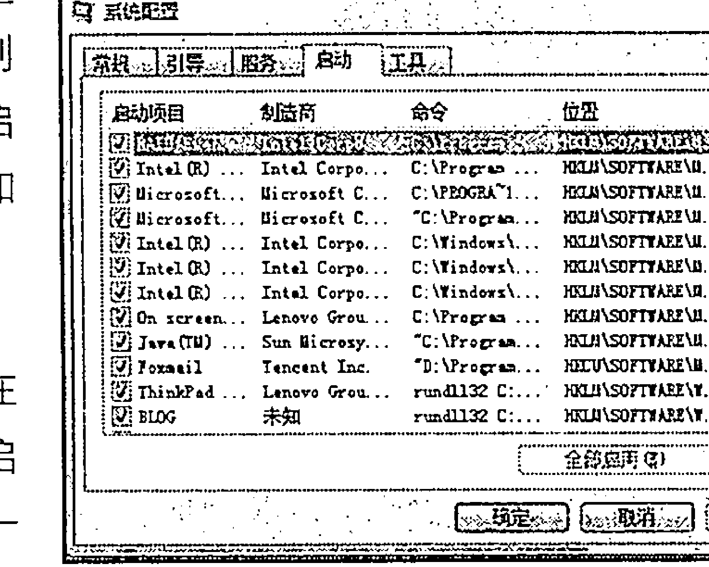

### 3.加快Windows 7关机速度

上面讲了如何加快Windows 7的启动速度，既然启动时间能降低，相对应的关机时间同样能减少。这项修改需要在注册表中进行。

操作方法：还是在系统开始菜单处键入regedit回车打开注册表管理器，然后找到这个键值[HKEY_LOCAL_MACHINE\SYSTEM\CurrentControlSet\Control]，鼠标右键点击‘WaitToKillServiceTimeOut’，将数值修改到很低，一般默认是12000(代表12秒)，这是在关机时Windows等待进程结束的时间，如果你不愿意等待，可以把这个时间值改小，任意值都可以，修改完成后也需要重启电脑才能生效。

## NO4. 用户账户控制（User Account Control）

User Account Control (用户账户控制)是微软为提高系统安全而在Windows Vista中引入的新技术，它要求所有用户在标准账号模式下运行程序和任务，阻止未认证的程序安装，并阻止标准用户进行不当的系统设置改变。在最初的时候，这个功能曾被称为User Account Protection(用户账户保护)，后来才更名为目前的User Account Control(用户账户控制)。

UAC主要用来解决用户以管理员身份登录的问题。由于有些系统功能或程序需要以管理员的身份操作，因此很多用户（包括IT专家）平时都会以管理员身份登录系统，这给系统安全带来了相当多的问题。微软在以往的操作系统中也试图解决这一问题，现在UAC可以让用户以管理员身份登录，但是会以普通用户权限执行大部分操作，当用户试图执行一些需要较高权限的操作时，系统才会提升用户的操作权限。

虽然用户账户控制功能给系统提供了安全性，但是，这种安全性的成本太高了，你需要不厌其烦地忍受它一遍遍的骚扰——没有任何意义的弹出式窗口和荒谬的中断。这给用户带来了极大的不方便，微软应该考虑在Windows 7中屏蔽这一个功能。

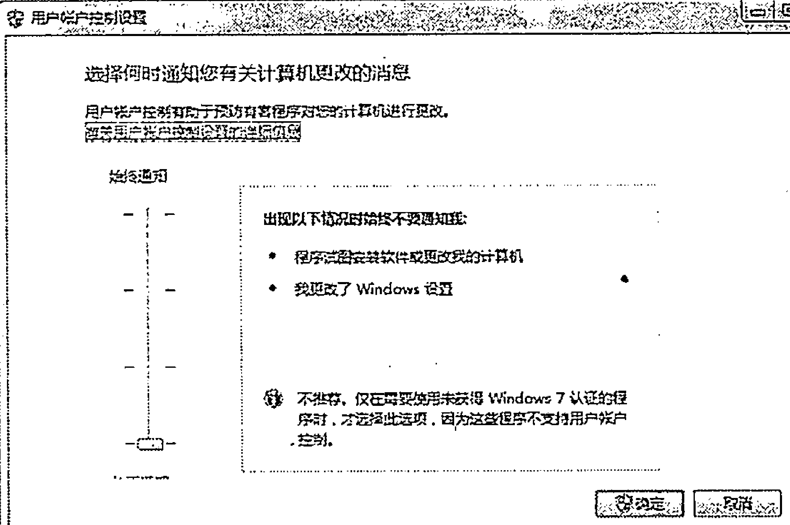

## NO5. Windows会议中心

Windows会议中心是Windows Vista中的一个新特性，很多用户甚至都没有听说过这个功能。即使知道有这么一个功能存在，你可能也从来没有用过它。Windows会议中心可以理解为一个网上的虚拟会议室。通过程序，我们可以在网上创建一个受到密码保护的虚拟空间，接受朋友或同事的访问，大家在这个虚拟空间中，可以进行共享应用程序、共享文件、修改文件等操作。

但是Windows会议中心没有白板，聊天模式毫无价值，并且不支持VoIP，这样的会议中心有谁会用呢？Windows 7中不应该再出现这个作用不大的功能了。

## 数据如影随行——个人“有备”MSN管家震撼上市

“有备”MSN管家基于云计算技术，拥有强大的多终端聊天记录合并功能和便捷的MSN数据管理功能，充分诠释了世纪互联在云备份领域的专注与高效，“有备”MSN管家的问世，将会为广大MSN用户的网络生活增添更精彩的应用体验。

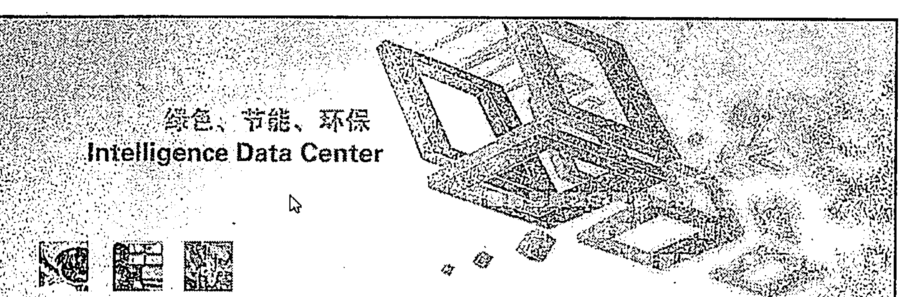

(2009年10月28日，北京) 为了满足MSN用户日益高涨的聊天数据管理需求，国内知名的互联网基础设施服务提供商世纪互联近日宣布，推出一款基于云计算技术的“有备”MSN管家，可实时对MSN聊天数据自动备份、一键恢复、智能搜索、便捷查询及联系人聊天记录备份过滤等。该MSN专用辅助软件拥有智能便捷、绿色安全等特点，将为广大MSN用户带来前所未有的个人MSN聊天数据管理体验！

随着IT技术的迅猛发展和互联网应用的日益普及，用户拥有多台电脑已成潮流，但多台电脑中MSN聊天记录的管理、合并为众多MSN用户带来了管理烦恼。集当前领先云计算技术的“有备”MSN管家适时而生，它秉承了“有备”数据保护专家“科技改变生活”的研发理念，力求解决MSN用户多终端数据便捷管理的实际问题。“有备”MSN管家为拥有多电脑终端的MSN用户提供了聊天记录无缝合并功能，在无需手动干预的情况下，“管家”对多电脑终端的聊天记录进行自动同步备份，在任意电脑终端根据时间顺序一键恢复，无缝合并，有效提升了MSN用户聊天交友、商务谈判的沟通效率。为了提升聊天记录备份管理的优质性、合理性，“有备”MSN管家还特别设置了联系人聊天记录备份过滤，通过该功能挑选出重要联系人进行备份，过滤掉无需备份的数据，从而大大降低资源及效能占用，真正做到了绿色环保。

“有备”MSN管家具全面智能的MSN聊天数据搜索查询功能，MSN用户可以通过关键词、时间或关键词加时间，智能便捷地对MSN聊天记录进行在线、本地搜索查询，极大地解决了重要聊天记录的管理难、查询难的问题，为MSN用户井井有条地管理MSN聊天记录提供了坚实的技术支持。

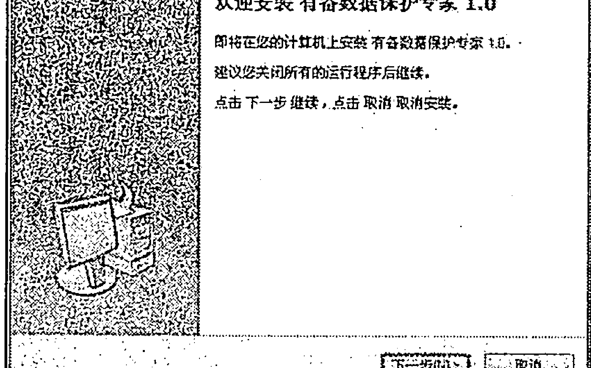

为了解除MSN用户传输重要文件、数据丢失损坏的后顾之忧，“有备”MSN管家还即将推出MSN文件私密备份的保险箱功能，MSN用户通过“保险箱”更为妥善、安全地保管通过MSN传输的重要文件和数据；与此同时，该功能为喜欢展现个性的MSN用户提供了个性表情备份、恢复及合并功能，个性十足的MSN用户将真正体验到个性“随身行”的畅快感受！

“有备”MSN管家从研发设计到功能体验，无时无刻不在为提升用户的无限畅通体验而努力，“有备”MSN管家必将成为MSN用户的完美之选！从现在开始，选择“有备”MSN管家，MSN数据将如影随行！
更多信息请访问：http://msn.youbak.com

### 关于世纪互联：

世纪互联创立于1996年，是目前中国规模最大的电信中立互联网基础设施服务提供商。世纪互联总部设在北京，在上海、广州、成都、东京、美国硅谷等地设有分支机构。世纪互联的主营业务包括互联网数据中心服务（IDC）、互联网内容分发/加速服务（CDN），以及全方位的增值服务和完整的行业解决方案。


世纪互联在中国已经部署了10个以上独立机房，全网处理能力超过200Gbps，拥有按需部署、伸缩自如的弹性CDN网络体系，在北京拥有超过10000平米的电信级数据中心，在华南、华东及全国其他城市拥有超过50000㎡的大型电信级数据中心。这些机房都具备高等级的网络、电力、空调、消防、安全等专业设施，配备了具有多年服务经验的专业团队，为客户获得高标准承诺与高质量服务提供了可靠的保障。

世纪互联在业内率先通过了ISO9002美国RAB和英国UKAS双重认证，率先在国内推行国际标准的服务品质协议(SLA)，首家对客户承诺99.9%网络联通及99.99%电力持续供应。率先推出严谨的专业服务标准，7x24小时客响热线，每一客户均配有“全程责任”客户服务代表，2008年荣获国内唯一“最可靠第三方绿色数据中心服务提供商”大奖，并在2007年获国内唯一“最佳视频技术服务商”、“最佳产业贡献奖”、“最佳优质服务奖”和“最佳产品性能奖”等多项大奖。
更多信息访问：http://www.21vianet.com。

## 阻击偷窥 私人空间保卫战

改革开放30年来，“私人空间”一词从无到有，从漠视到关注，历经了漫长的认知过程，个人独立利益、私人空间日益受到国家和法律的认可与保护。传统的“私人空间”指个人信息、私人活动和私有领域等，而随着IT技术的迅猛发展和互联网应用的广泛普及，“隐私”正由传统物质化演变为数字信息化。如何更完善、更便捷地保护数字信息化隐私，捍卫所剩无几的“私人空间”，杜绝他人恶意偷窥和窃取，成为了当今社会大众关注的热点话题之一。

近日，本刊记者就“个人空间”有效保护问题采访了业内资深专家、中国电子学会云计算专家委员会委员蒋建平先生，从十多年的从业经历中他总结到“进入高速发展的互联网时代后，‘隐私’呈现透明化、公众化，保证‘私人空间’的首要解决办法是选择正确的隐私存储备份方法。”

为此，蒋先生以现阶段被公认为最安全稳定的“私人空间”存储备份手段——采用云计算平台的云存储备份为例，介绍了新技术平台下数据备份的最新发展趋势。所谓云存储备份，就是通过集群应用、网格技术或分布式文件系统将网络中大量的存储设备集合起来协同工作，共同对外提供数据存储的备份服务。目前，云存储、云备份以其领先的技术特性被广泛应用于企业，但能够免费为个人提供该服务的产品并不多，小编挑选了其中非常具有代表性的“有备”数据保护专家进行了试用体验。

使用有备数据保护专家的“私人空间”服务，首先需要下载客户端软件（下载地址：http://www.youbak.com/download.html），软件体积不大，仅2.99MB，为了保证“私人空间”的安全性，安装需要通过网站进行个人ID及密码注册，并在邮箱内激活。注册完成，通过用户名和密码登录软件后，即可对个人私密数据备份。

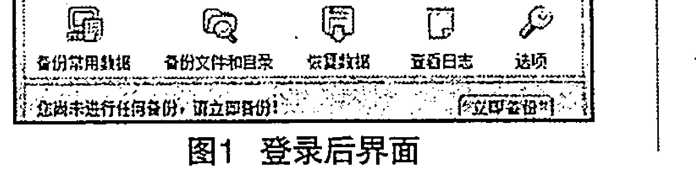

软件界面非常简洁大方，几大功能按钮一目了然，小编用“备份常用数据”对重要邮件进行了备份，操作很简单，点击“备份常用数据”，会显示邮件、聊天记录、收藏夹、文档等重要数据，勾选邮件（见图2），点击“立即备份”，程序就开始备份所选数据了。

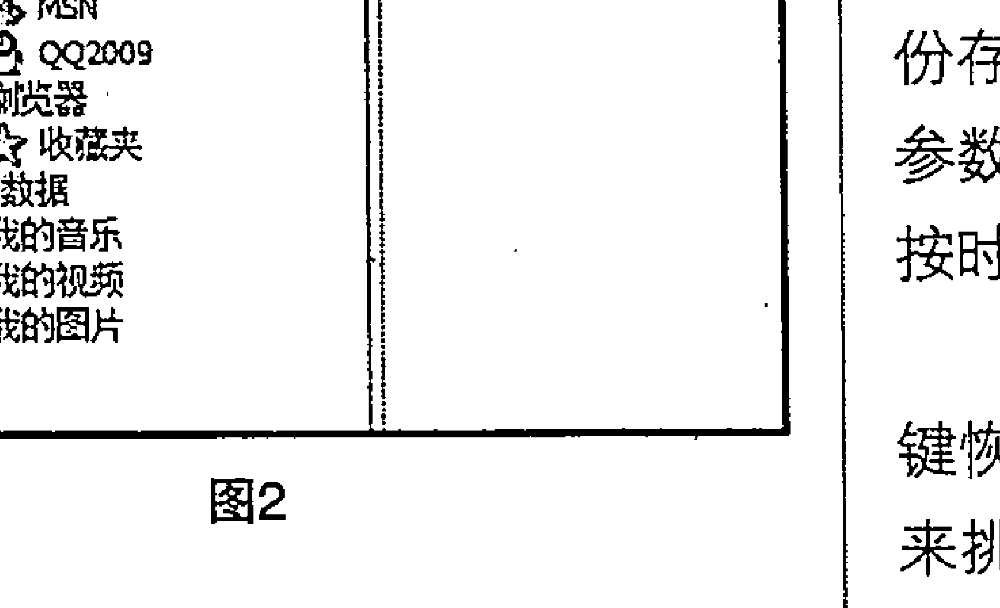

值得一提的是，为了避免用户重复备份没有更新的资料，该软件还提供了增量功能，当用户选择好需要备份的资料后，软件会对上次备份后没有更新的文件智能地进行自动识别，对于这类文件不再重复备份。这样不仅可以大大减少备份文件的所需时间，还能最大化地节省备份空间容量，降低CPU的资源占用率。此外，“有备”不会对存储备份的单个文件大小有任何限制，极大地扩大了文件的存储和备份范围。

“有备”为了确保“私人空间”的安全性和保密性，在本地、传输、存储三层分别采用了448位Blowfish、128位SSL、IDA分片编码、AES加密技术和专利的IDA技术，分布存储在全国十余个IDC机房，也就是说即使存放备份数据的某台服务器损坏，对于备份的重要数据也不会造成任何影响。

另外，“备份计划”功能也是小编在体验过程中感到非常便捷、智能的一点，我们可以通过CPU占用率、电脑空闲时间和当日备份次数三类参数进行设置

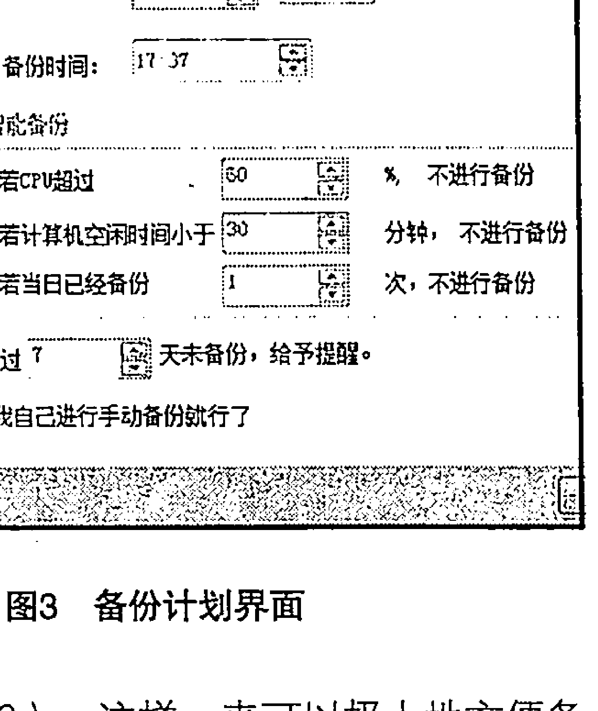

（见图3），这样一来可以极大地方便备份存储，比如可以设置每周备份一次的参数，以后完全不用手动操作，软件会按时自动备份好所选数据。

在数据恢复方面，程序提供了“一键恢复”功能，软件可以根据时间选择来挑选需要恢复的文件，通过“恢复到另一位置”和“恢复到原位置”两种方式来恢复备份，避免了可能出现的恢复错误（见图4）。恢复文件的速度与备份存储速度一样，如果使用的是1M的独立带宽，100MB的文件大概需要7至8分钟。

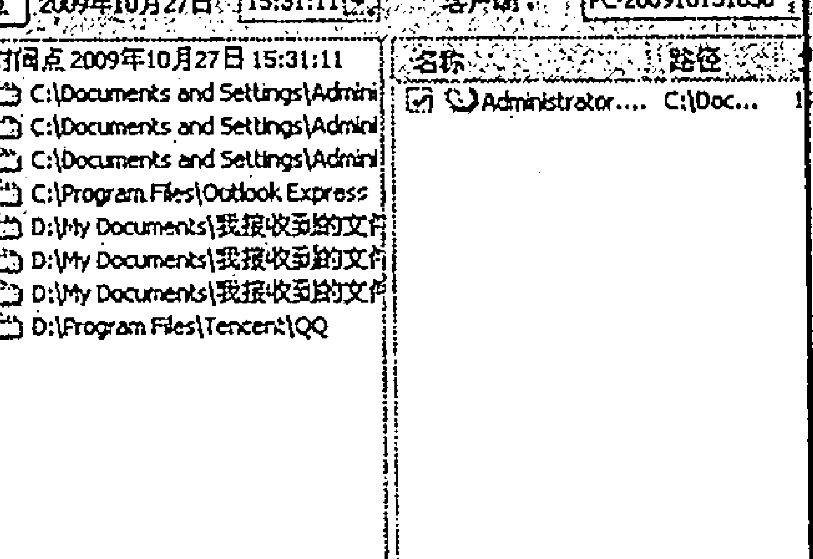

正如业内资深专家蒋先生所言，现代社会人们生活已进入了隐私透明的互联网时代，而像“有备数据保护专家”这类的基于云计算技术又免费提供的“私人空间”保护服务，正如一望无垠裸露的“沙漠”中一块滋润心田的“绿洲”，只有拥有了属于自己的“绿洲”，我们的生活才更丰富多彩！

## 是个好管家！电源管理的惊人本领

没错，Windows 7的电源管理功能变得更加强大了！用户可根据实际需要，设置电源使用模式，让笔记本用户在使用电池的时候最大限度地发挥功效，延长使用时间，保护电池寿命。在细节上，Windows 7同样不负众望，更加贴近用户的使用需求，方便了用户更快、更好地设置和调整电源属性。既然说道很多，那我们就需要共同研究一下使用技巧了。

### 全新设计！电池使用方案

为给使用电池续航的笔记本用户进一步节约能耗，在Windows 7系统中，为用户提供了包括“已平衡”、“节能程序”等多个电源使用计划和方案，同时，相比Windows Vista系统，还可快速通过电源查看选项，调整当前屏幕亮度和查看电池状态（如电源连接状态、充电状态、续航状态等）（见图1）。在默认情况下，Windows 7系统为用户提供的是“已平衡”使用方案。

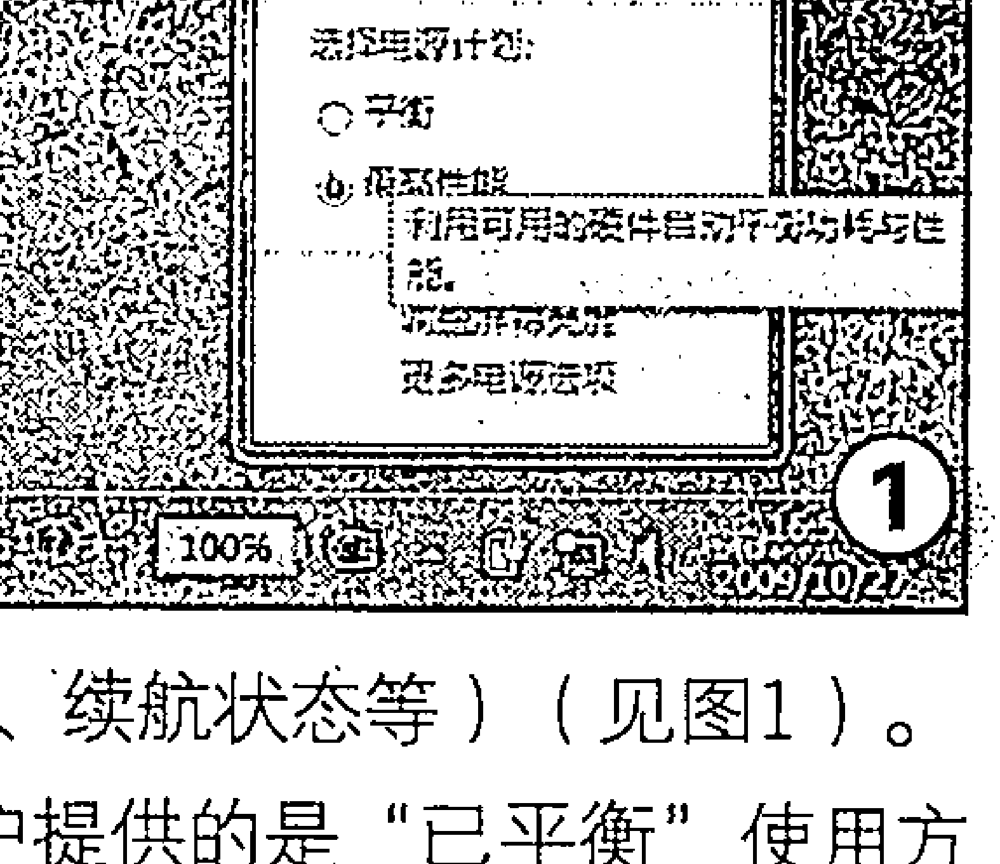

这一方案可使系统在使用电池续航的情况下，2分钟内自动“灰阶”显示器（通过降低亮度解决耗电）、5分钟后自动关闭显示，并在15分钟后自动将计算机进入休眠状态。同时，用户还可直接在电源选项中，对在使用电池模式和接通电源模式下默认的屏幕亮度进行调整。同时，“节能程序”计划和“高性能”计划的“灰阶显示器”、“关闭显示器”、“进入睡眠状态”设置，则分别会为用户提供如下使用方案。

### 表格：三种默认电源使用方案对比

| 方案名称 | 灰阶显示器时间（使用电池/接通电源） | 关闭显示器时间（使用电池/接通电源） | 进入睡眠时间（使用电池/接通电源） |
|----------|-------------------------------------|-------------------------------------|-----------------------------------|
| 已平衡   | 2分钟/5分钟                         | 1分钟/2分钟                         | 5分钟/10分钟                      |
| 节能程序 | 5分钟/10分钟                        | 2分钟/5分钟                         | 10分钟/15分钟                     |
| 最高性能 | 15分钟/30分钟                       | 10分钟/15分钟                       | 从不/从不                         |

> 小提示：若希望对电源使用方案和相应功能进行详细设置，还可在Windows 7操作系统的控制面板选项中，进入“电源设置”选项，并通过自定义电源设置，对相应功能详细进行调整。

### 我爱DIY！自定义电源使用方案

考虑到不同环境下用户的实际使用需求，在Windows 7操作系统中，用户还可通过控制面板中的“电源”选项，创建新的电源使用方案（见图2）。在详细的功能设置列表中，根据实际需求对其进行调整。在功能列表中，可分别对电池使用模式、硬盘耗电模式、无线适配器设置、睡眠时间、电源按钮和笔记本合盖后的状态进行调整。同时在创建过程中若出现失误，还可通过“还原计划默认值”选项进行恢复。同时，在“电源选项”中，用户也可对电源按钮进行定制，例如关机按钮、休眠按钮和关闭笔记本盖子后的状态。还可设置唤醒密码，为系统提供安全保护（唤醒密码默认为系统账户密码）。此外，Windows 7操作系统还为用户提供了功能更加强大的移动中心等功能，更加方便笔记本用户使用。

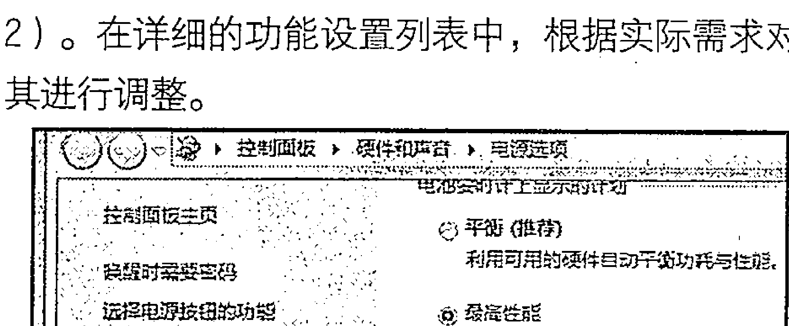

### 强大！Windows移动中心

专为笔记本用户打造的Windows移动中心功能在Windows Vista系统中已经加入，但在Windows 7系统中，功能更加强大，设置选项更加丰富。用户通过使用鼠标右键点击电源属性，即可轻松调用，并快速对显示器亮度、音量、电池、无线连接等进行设置，并快速查看当前系统的使用状态，如是否开启同步合作和连接到其他显示器和演示设备（见图3）。此外，一个和Vista系统有所区别的细节，笔者在这里也可介绍给大家，那就是无需借助Windows移动中心，在控制面板的“电源选项”中，也为用户提供了显示器亮度调节功能。对于自身没有亮度设置功能的笔记本，这一功能无疑十分实用。相比Windows Vista，Windows 7操作系统的电源设置功能更加强大，不仅可通过默认设置，最大限度提高系统运行效率和电池续航时间，还可轻松创建电源使用计划，并通过移动中心和控制面板的相应选项，快速对显示亮度、按钮功能进行调整。在不同环境下，使用不同模式让系统更加稳定。若您已安装Windows 7操作系统，又恰好是笔记本用户的话，那么，您不妨查看一下自己的电源设置状态，是否正处于最佳状态。

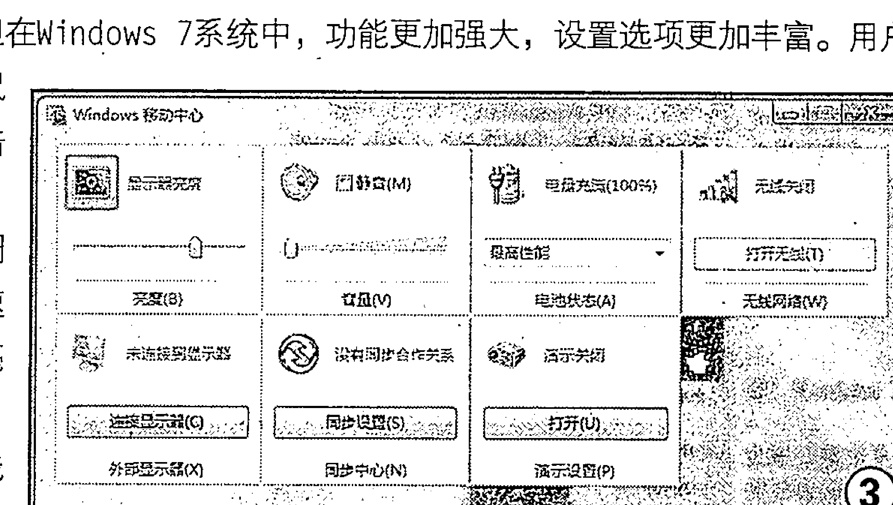

## 特别奉献——全面玩转Windows 7的76技

Windows 7重装上阵，相比XP甚至是Vista，它有很多新功能。由于系统较新，其中的一些功能并不是很容易被人们所发现，所以，我们CFan合订本把其中最重要的技巧窍门、新奇功能，总结梳理，一并献给大家！

### 1. 加快窗口切换速度

主要是通过禁用窗口切换时的动画效果来实现的，方法如下：
- 在 “开始菜单 → 搜索 SystemPropertiesPerformance”，在“视觉效果”选项卡中取消勾选“在最大化和最小化时动态显示窗口”，点击“确定”退出。

### 2. 加快启动速度

默认情况下，Windows只会启用一个CPU核心用于处理与启动相关的数据，那么，通过增加核心的方法也可以加快启动速度：
按WIN+R运行msconfig，点击“启动”选项卡进入“高级”选项，勾选Number of Processors，在下拉菜单中选择核心数，确定退出并重启。

### 3. 删除不必要的字体

系统中的字体，尤其是TureType的字体，往往也是系统资源消耗大户，移除部分字体可以争取到不少的系统资源。
在“控制面板→字体文件夹”中删除不必要的即可（见图1），也可移动到别的盘，作为备份。也可以通过Windows 7优化大师“系统清理→系统字体清理”来实现。

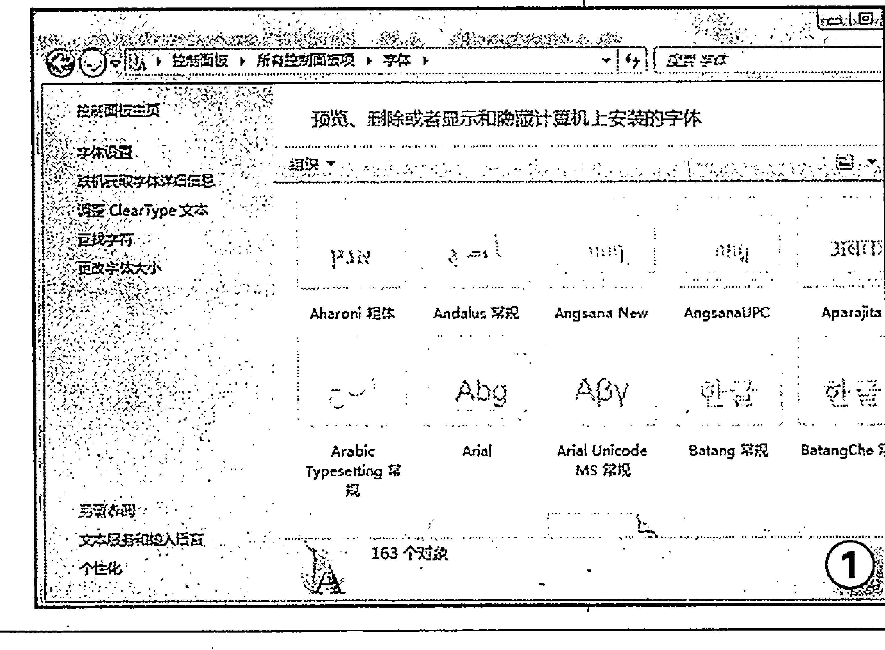

### 4. 禁用系统索引

如果说，你的文件不是多到自己都找不到在哪，每次都得搜索的话，那么完全可以禁用Windows系统索引功能，这也是个资源占用大户，禁用也很简单：按WIN+R运行Services.msc，找到Windows Search服务并点击“禁用”

### 5. 加快任务栏窗口预览显示速度

细心的用户也许已经发现，Windows 7的任务栏预览其实有个小问题，当鼠标移上去时，需要过一会才会出现预览窗口，有时候会觉得有点浪费时间，那么就来让它即移即显吧！
在“运行”中输入regedit打开注册表编辑器，定位到[HKEY_CURRENT_USER\Control Panel\Mouse]，双击右边的MouseHoverTime，将其值从默认的400修改到100（单位：毫秒），确定并关闭注册表编辑器。

### 6. 禁用Aero

对于低配置机器而言，用Aero也是一种奢侈，可以：
在桌面空白处右击选择“个性化”，选择非Aero的主题（见图2），确定即可。

### 7. 禁用不必要的系统服务

不必要的系统服务对于Windows 7而言也是一种累赘，可以通过服务管理来禁用：
运行Services.msc打开“服务”，找到不必要的服务禁用即可。

### 8. PC Safeguard 电脑守卫

我很少让其他人使用我的电脑，因为我怕他们会把它弄得乱七八糟的，但是看起来，微软已经替我考虑到这一点并且顺便解决了这个问题。PC Safeguard不会让任何人把用户电脑的设置弄乱，因为当他们注销的时候，所有的设定都会恢复到正常。当然了，它不会恢复用户自己的设定，但是用户唯一需要做的就是定义好其他用户的权限。
要使用PC Safeguard，首先在“控制面板→用户账户”创建一个新的账户，然后选择“启用PC Safeguard”然后确定。然后用户就可以安心地让别人使用用户的电脑了。

### 9. 显示校准

很幸运，Windows 7拥有显示校准向导功能，可以让用户适当地调整屏幕的亮度，所以用户不会在浏览照片和文本时遇到显示问题。在之前的Windows上浏览照片时有可能会出现亮度过大等问题。现在问题解决了，只要用户按住WIN+R然后输入DCCW即可。

### 10. AppLocker 应用程序锁

对于企业用户或者经常需要与其他人在一台机器的用户而言，AppLocker无疑是个绝佳的助手。按WIN+R运行gpedlt.msc打开本地策略组编辑器，选

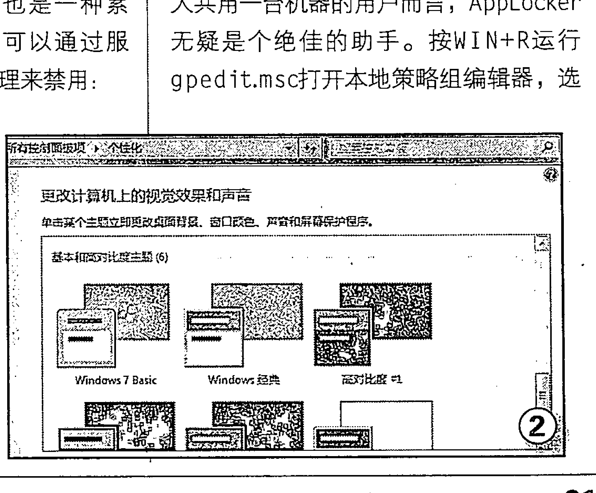“计算机配置→Windows设置→安全设置→应用程序控制策略”，右击其中的一个选项（可执行文件，安装或者脚本）并且新建一个规则即可。

### 11.镜像刻录
我们都有过在Windows下进行镜像刻录的困扰，因为Windows中并没有内置此功能，往往需要安装第三方的软件来解决此问题。但随着Windows 7的到来，这些问题都不复存在了。所有需要做的仅仅是双击ISO镜像，然后烧录进用户光驱中的CD或者DVD中。

### 12.播放空白的可移动设备
默认情况下，Windows 7对空白的可移动设备是不会进行自动播放的，此选项可以通过点击“工具→文件夹选项→查看→取消‘隐藏计算机文件夹中的空驱动器’的选择”来更改。

### 13.把当前窗口停靠在屏幕左侧
这个新功能看起来挺有用，因为有些时候，我们会被屏幕中浮着的近乎疯狂的窗口们所困扰，并且很难把它们都弄到一边。现在我们使用键盘的快捷键就可以很轻松地做到了。按WIN+左键把它靠到屏幕的左边去吧。

### 14.把当前窗口停靠在屏幕右侧
按WIN+右键，可以把窗口靠到右侧。

### 15.显示或隐藏浏览预览面板
按ALT+P，可以隐藏或者显示浏览面板的预览窗口。

### 16.在其他窗口顶端显示小工具
按ALT+G组合键即可实现。

### 17.幻灯片播放桌面背景图片
如果用户像我一样懒或者无聊，那么会去时常地更换用户的桌面背景，这浪费了很多时间。现在用户不需要再这么做了，因为可以设置幻灯式播放了。右击桌面选择“个性化设置→桌面背景”，并且按住CTRL的同时选择图片。然后可以选择播放图片的时间间隔，选择随机播放还是连续播放。

### 18.让任务栏变成Vista样式
如果用户觉得任务栏占用了用户的太多空间，用户可以选择把图标变小。这样做：右击“开始”按钮，选“属性→任务栏→选择‘使用小图标’”（见图3）。
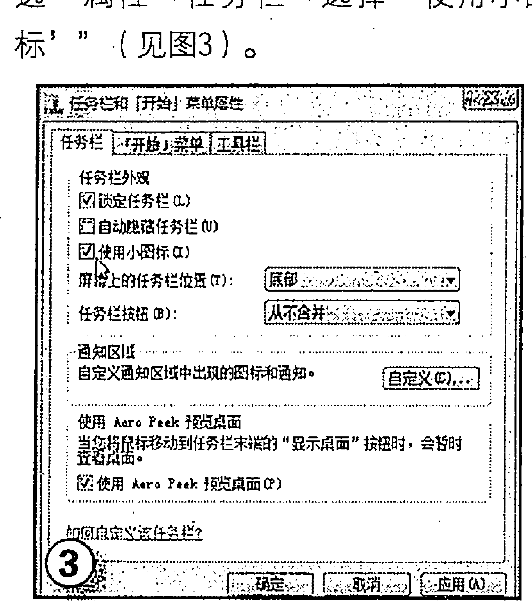

### 19.合并任务栏图标
如果用户打开了很多窗口或者程序，工具栏的空间可能不够用，所以用户需要像在XP、Vista里那样合并它们。方法：右键单击开始按钮，选“属性→任务栏”，选择“在任务栏满时分组”。

### 20.电源管理故障排除
Windows 7可以告诉用户的系统用了多少电，或者为用户提供关于电源使用以及每个程序和设备的相关问题的详细信息。用户可以使用以下这个方法去优化电池，延长它的使用寿命。按WIN+R输入POWERCFG -ENERGY -output c:\ 一分钟后，在C盘根目录下，就会生成一个energy-report.html文件，里面有详细的电源描述。

### 21.在用户的桌面上进行网页搜索
Windows 7的桌面搜索，整合了联合搜索的功能以搜索本地计算机之外的东西。现在你可以通过本地计算机搜索网络上的东西。该技术基于OpenSearch和RSS格式。由于其基于的标准是开放性的，用户可以轻松打造自己的个性搜索工具。

### 22.在开始菜单中添加视频
如果你曾寻求一种更快的方式去找到用户的视频，现在Windows 7给了用户一个答案。右击“开始→属性→开始菜单→自定义”，然后设置视频为“以链接的形式显示”，就完成了(见图4)。
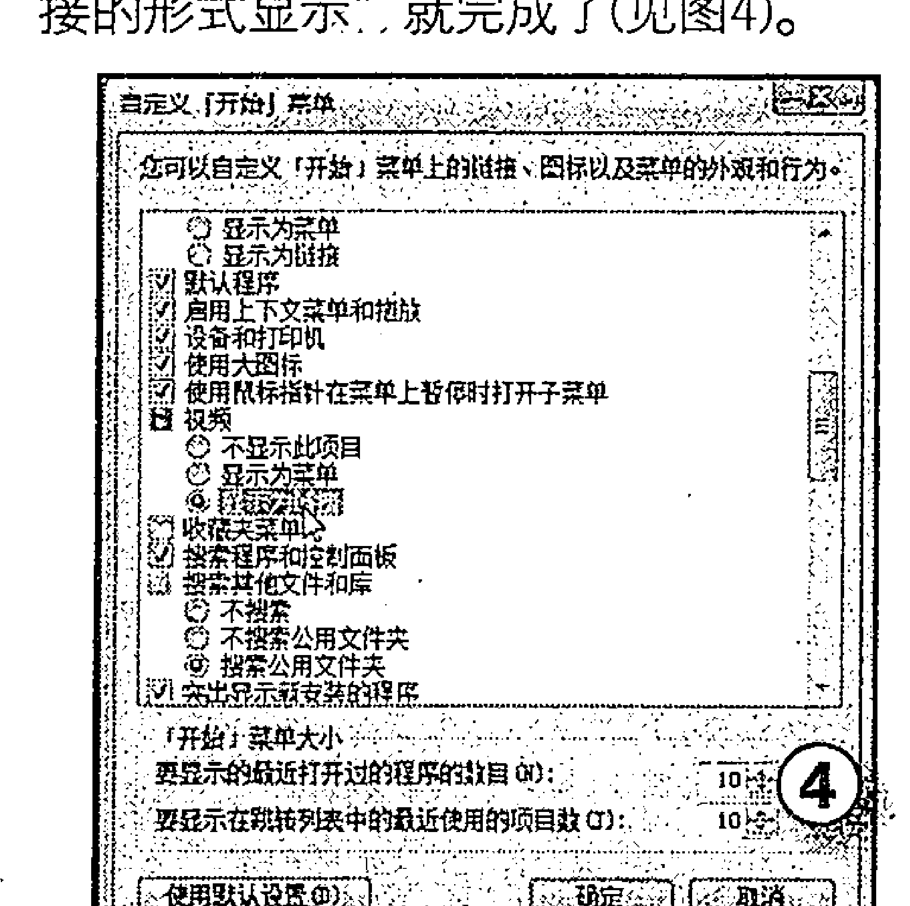

### 23.在不同的显示器之间切换窗口
如果同时使用两个或者更多的显示器，那么可能会想把窗口从一个移动到另一个中去。这里有个很简单的方法去实现它。要做的就是按WIN+SHIFT+左或者右，这取决于想要移动到哪个显示器中去。

### 24.自定义电源按钮
如果你是很少关闭电脑的用户，但会时常地重启它或者让它睡眠，那么在这里有一种选择，就是用其他的行为来取代用户的关机按钮。右击“开始→属性→电源按钮动作”，然后就可以在所给的选项中随意地选择了。

### 25.轻松添加新字体
现在添加一个新的字体要比以前更加容易了，只需要下载所需字体，双击它，就会看到安装按钮了。

### 26.垂直伸展窗口
可以用WIN+SHIFT+上箭头来最大化垂直伸展用户的当前窗口。WIN+shift+下箭头来恢复它。

### 27.打开Windows资源浏览器
按WIN+E打开新的Windows资源浏览器。

### 28.创建一个新的任务栏的第一个图标的进程
按WIN+1可以用来打开一个新的任务栏上第一个图标。

### 29.Action Center行为中心
Windows行为中心会给用户提供电脑自我诊断和修复这个平台可以帮用户解决很多可能会遇到的问题，比如网络连接、硬件设备、系统变慢等等。可以选择用户要诊断的问题、一些说明，真正地给用户提供帮助，这里提供很多可行的选项、指导和信息，所以尝试在按Win之后输入troubleshoot或者fix。

### 30.自我诊断和修复
这个平台可以帮用户解决很多可能会遇到的问题，比如网络连接、硬件设备、系统变慢等等。可以选择用户要诊断的问题、一些说明，真正地给用户提供帮助，这里提供很多可行的选项、指导和信息，所以尝试在按Win之后输入troubleshoot或者fix。

### 31.关闭系统通知
在Windows 7中双击控制面板中的通知区域图标来实现。在这里，可以改变行动中心、网络、声音、Windows资源浏览器、媒体中心小程序托盘和Windows自动升级的通知和图标。

### 32.关闭安全信息
要关闭安全信息用户，要进入“控制面板→系统和安全→操作中心→改变操作中心设置”（见图5），然后可以关闭一些通知，包括Windows升级、网络安全设置、防火墙、间谍软件和相关保护、用户账户控制、病毒防护、Windows备份、Windows问题诊断、查找更新。
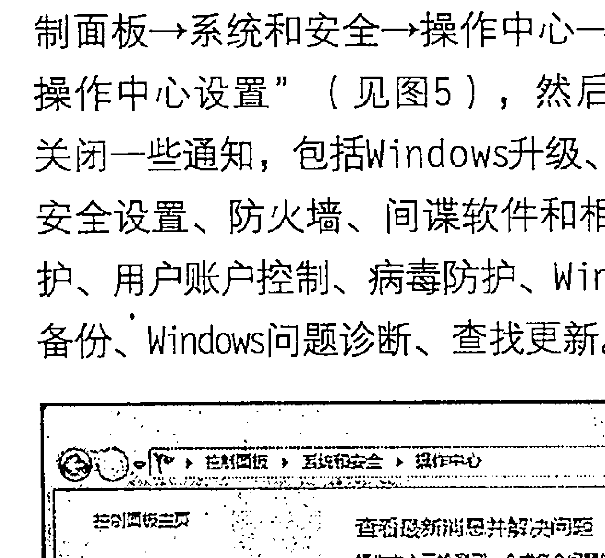

### 33.循环查看任务栏上打开的程序
这似乎和ALT+TAB差不多，但仅仅是打开那些在边栏上方的菜单，看起来不是很实用。可以按WIN+T来体验一下。

### 34.以管理员身份运行一个程序
当用户打开一个程序的同时按住CTRL+SHIFT就能以管理员权限去运行它。

### 35.切换同一程序的多个实例
如果用户有很多程序正在运行，只要按住CTRL的同时单击它的图标，它就会循环在所有的程序中。

### 36.自动排列桌面图标
现在可以忘记右键然后点击自动排列这种方式了，只需要按住F5一小会，图标就会自动排列了。

### 37.加密移动USB设备
加密USB设备从来没这么简单过，现在可以右击可移动设备然后选择启动BITLOCKER。

### 38.关闭智能窗口排列
如果用户不喜欢Windows 7的新功能去智能地排列用户的窗口的话，这里有个简单的方法去关闭它。按WIN输入regedit，找到[HKEY_CURRENT_USER\Control Panel\Desktop]然后将WindowArrangementActive的值改成0，重启之后智能排列窗口就被关闭了。

### 39.创建系统还原光盘
Windows 7的一个工具，可以让你创建一个可引导的系统修复光盘，它包括一些系统工具和命令提示符。按WIN输入system repair disc去创建它。

### 40.强制移动存储
新的强制移动存储功能占用磁盘空间更小和花费的时间也更少。

### 41.改良的计算器
改良的计算器可以进行单位转换、日期计算、一加仑汽油的里程、租约和按揭的计算。也可以在标准、科学、程序员和统计员模式之间进行选择（见图6）。
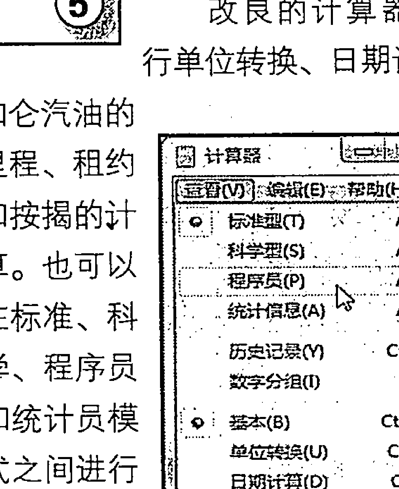

### 42.在新进程中打开文件夹
Windows 7的所有的文件夹都在同一个进程中打开，这是为了节省资源，但这并不表示一个文件夹的崩溃会导致全部文件夹的崩溃。所以，如果认为这是个没必要的冒险的话，可以把它们在各自单独的进程中打开。按住shift的同时右击驱动器并且选择在新的进程中打开。

### 43.问题录制工具
程序安装记录是一个伟大的工具，它可以被运用在很多环境中。你可以通过按WIN输入PSR.exe然后点击记录来启动它。现在它将会记录用户所有的移动，并且储存为HTML格式的文件，可以浏览它或者在上面写下用户的描述。

### 44. Free Codecs Pack免费解码包
Windows 7内置了MOV和DivX解码器支持。但不幸的是，Windows media player仍然不能播放一些音频和视频文件，所以仍然需要一些解码器。但是随着免费解码包的下载，应该不会在这方面有任何问题了。

### 45.更改任务栏“库”图标的指向为“计算机”
输入“explorer”，选择“属性”，然后在快捷路径中输入“%SystemRoot%\explorer.exe /root,::{20D04FE0-3AEA-1069-A2D8-08002B30309D}”。然后右击任务栏上的浏览图标并且点击“从任务栏脱离此图标”，然后把它从开始菜单拖拽出来。

### 46. AeroShake
如果桌面上有很多窗口，用户可以从左到右摇晃窗口来清理桌面，这样所有其他的窗口将会变成最小化。如果想恢复窗口就再摇晃激活窗口。

### 47.找回因关闭UAC而无法使用的小工具
出于安全考虑，一旦UAC被关闭，将无法再使用小工具。如果用户想要在UAC被关闭的情况下冒险去使用它们，这里有一种方法。打开注册表，找到[HKEY_LOCAL_MACHINE\SOFTWARE\Microsoft\Windows\CurrentVersion\Sidebar\Settings]，然后新建一个名为AllowElevatedProcess的DWORD值，把数值改成1（见图7）。现在应该可以使用小工具。如果不行，重启电脑吧！
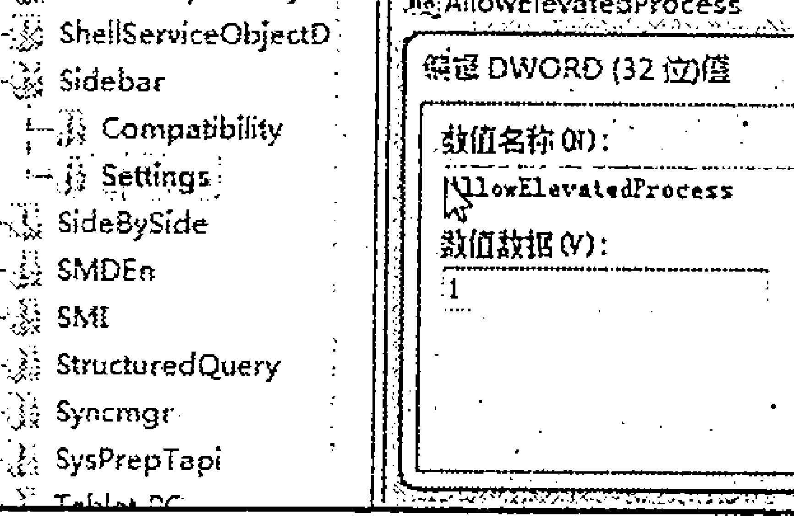

### 48.禁用Jumplists
右键单击“任务栏→属性→开始菜单”，取消勾选“存储并显示最近在开始菜单中打开的程序”和“存储并显示最近在开始菜单和任务栏中打开的项目”，确定即可。

### 49.在电脑上搜索任何东西
Windows 7给用户提供了搜索，包括那些用户不知道的所有类型文件，它会在用户遇到麻烦的时候给用户提供帮助。尽管它不被推荐使用，因为这真的是比普通的搜索要慢很多。用户可以尝试一下，打开Windows资源管理器，选择“工具→文件夹选项→查看→选择尝试搜索未知类型文件”。不再需要它的时候，别忘把它关了以提高搜索速度。

### 50.鼠标手势
Windows 7的手势功能，不只可以被那些购买了触摸屏的人所使用，同样可以被鼠标所使用。所以，可以用按左键向上拖动任务栏图标的方式，来取代右击的方式来激活跳跃列表。另外，点击并向下拖动IE浏览器中的地址栏会打开浏览历史。大概还有很多手势没有被发现。

### 51.配置用户的音乐收藏夹
如果已经修复了Windows Media Center，现在可以想办法来提高在这方面的使用经验了。媒体中心会在播放歌曲次数的基础上创建一个音乐收藏列表，播放率和播放时间都会被添加在上面。如果不喜欢这种方式的话，可以把收藏变成各种样式，点“任务→设置→音乐→音乐收藏”。

### 52.禁用本地搜索历史
Windows 7默认保留和显示最近的搜索。不需要紧张，可以不让它显示。按WIN输入GPEDIT.MSC，然后在“用户设置→管理模板→Windows组件→Windows资源浏览器”，然后双击“关闭显示最近输入的搜索”（见图8）。
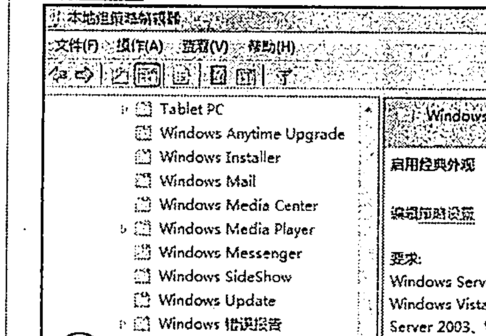

### 53.高级磁盘整理
Windows 7提供了比Vista好很多的磁盘整理功能，可以通过命令行来设置它。按WIN输入CMD。可利用输入命令行defrag整理用户的磁盘，并且还有以下选项：/r多个同时整理，-a执行一个整理分析，-v打印报告，-r忽略小于64MB的碎片，-w整理所有碎片。例如：defrag C: -v -w”整理整个C盘。

### 54.让IE8运行更快
如果想让IE8更快，用户要关闭让它变慢的插件。在“工具→插件管理”检查每一个插件的加载时间。你可以自己选择去掉那些不需要的插件，以提高读取速度。

### 55.媒体中心自动下载
Windows媒体中心允许你制定定时下载，所以它会在不打扰你的情况下就完成了下载。选“工具→设置→常规→自动下载选项”，然后就可以随意地去配置它的下载了。

### 56.移除侧边栏
Windows 7看起来似乎没有侧边栏这个功能，但是实际上它是存在的，并且随着电脑启动而自动被开启，并且在后台运行。所以，如果想把它摆脱掉，有两种方法：比较简单的一种是按WIN，输入MSCONFIG.EXE，点击启动和清除边栏。难一点的方法就是按WIN输入regedit，找到并删除注册表键[HKEY_CURRENT_USER\Software\Microsoft\Windows\CurrentVersion\Run]。这个可以节省不使用的东西所消耗的内存。

### 57.音量自动调整
如果你不喜欢Windows 7在检测到电脑内通话的时候自动降低声音的这种功能，可以关掉它。右击任务栏的音量图标选择“声音→通信”，然后把它关掉。

### 58.以其他用户的身份运行程序
Windows 7可以让你以管理员或其他用户的身份去运行一个程序，即按住Shift的同时右击可执行文件或快捷方式，然后选择以其他用户身份运行。

### 59.使用VHD
在Windows 7中，可在真正的磁盘里创建并管理虚拟磁盘文件。使用Windows的在线安装，安装到虚拟磁盘中而不需要启动虚拟机。创建一个虚拟磁盘用户需要按Win，右击“我的电脑→管理→磁盘管理→操作→创建VHD”（见图9）。在这里可指定虚拟硬盘的位置和大小。
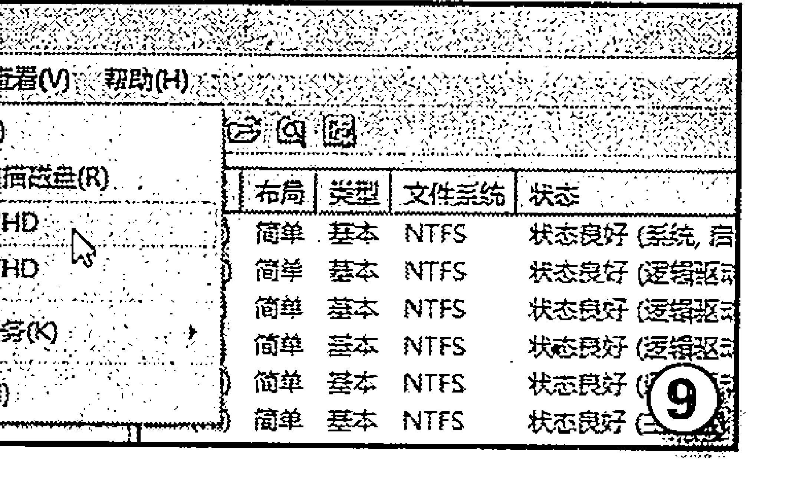

### 60.去除任务栏上的Windows Live Messenger
去掉Windows Live Messenger并且把它弄回到那个属于它的系统托盘区。来到C:\Program Files\Windows Live\Messenger，右键点msnmsdgr.exe设置兼容模式为Windows Vista。

### 61.锁定屏幕
Windows 7的开始菜单里不再有锁定按钮，所以现在用户要按WIN+L去锁定它。

### 62.创建新的锁定屏幕快捷方式
不喜欢使用快捷键或者把它给忘了，这有另外一种方式可以锁定屏幕。简单创建一个新的快捷方式到C:\Windows\System32\rundll32.exe user32.dll，然后就可以随意地锁定或者解锁了。

### 63.启用开始菜单中的运行
怀念XP中的运行命令，这里有办法把它在Windows 7中找回来。右击“开始菜单”的空白处，选择“属性→开始菜单→自定义”并且找到运行命令。

### 64.为NVIDIA显卡改善桌面窗口管理
有的时候桌面的动画效果看起来不是很好而且不够平滑，这是因为桌面窗口没有使用透明度和模糊来渲染。按WIN，右击“我的电脑”选择“属性→高级系统设置→性能→设置→取消“最大化或者最小化时的动画效果””，再点“确定”就行了。

### 65.改变文件的默认保存位置
Windows 7和Vista有点不同，因为它的文档、图片、视频和音乐都保存在一个公共文件夹下：C:\USERS。不想把这些文件存放在那，创建自己想要的储存位置是很简单的。按WIN打开“开始菜单”，单击用户名图标并且双击想要改变位置的文件夹。之后用户会看到两个库的位置。右击希望设置成默认的文件夹，然后点“设置为默认文件位置”，点OK。

### 66.让Windows Media Player默认为64位
Windows自带版本Windows Media Player默认为32位。如果是64位用户，按WIN输入COMMAMD，右键点Command Prompt然后执行Run as administrator，输入“unregmp2.exe /SwapTo:64”，之后，按WIN输入regedit，来到[HKLM\Software\Microsoft\Windows\CurrentVersion\App Paths\wmplayer.exe]下，双击值并且把它从“%ProgramFiles(x86)%”改为“%ProgramFiles%”。现在就可以使用64位的WMP了。

### 67.用任务栏打开多个资源管理器
让Windows资源管理器脱离任务栏，然后按WIN，找到附件，右击资源管理器选择属性，把快捷方式路径改为%SystemRoot%\explorer.exe /root,::{20D04FE0-3AEA-1069-A2D8-08002B30309D}（默认为“我的电脑”）或者%SystemRoot%\explorer.exe /root,::{031E4825-7B94-4dc3-B131-E946B44C8DD5}（默认为库）。现在把资源管理器附加回任务栏就可以了。

### 68.让系统时间托盘显示AM/PM符号
Windows 7默认显示24小时制的时间，所以如果用户想要显示AM/PM，按WIN，输入intl.cpl，打开“时区和语言→自定义格式”，把“长时间”从HH:mm改成HH:mm tt，例如tt是AM或者PM符号（21:12 PM）。把它改成12小时制，用户要输入像hh: mm tt（9:12 PM）。

### 69. IE8兼容模式
碰到网站不能正确渲染，应该启动IE8兼容视图来播放它们。这是因为升级渲染引擎会导致很多麻烦。打开IE，点击“工具→兼容视图设置”然后选择“用兼容视图打开所有网站”，确定。

### 70.多线程文件复制
Windows 7中就内置了Robocopy，一款多线程复制工具，通过命令行来执行多线程复制。在命令提示符下输入“ROBOCOPY /?”，会出现具体用法。

### 71.最大化或者恢复前台窗口
按WIN+上(箭头)。

### 72.解锁被进程占用的文件
在Windows中，删除文件时系统提示“正在被另一程序使用”从而无法删除，这样的状况我们经常遇到。这是由于某个后台进程正在调用该文件，此时只有结束该进程才可实现删除。在Windows 7中利用其“资源监视器”可轻松搞定。

### 73.激活快速启动栏
当用户在使用Windows 7时，可能会想念那个在XP和VISTA中看起来很有用的快速启动栏。幸运的是，用户可以通过几个很快的步骤把它给找回来。右击任务栏选择“工具栏→新工具栏”，在空白处输入“%UserProfile%\AppData\Roaming\Microsoft\Internet Explorer\Quick Launch”，然后选择文件夹。让它看起来像是在VISTA中一样，右击工具栏取消“锁定工具栏”，接着右击分离和取消“显示标题”和“显示文本”。最后右击工具栏并且选中“显示小图标”就完成了。

### 74.在资源管理器中显示预览
在资源管理器窗口，按ALT+P，预览窗口就应该出现在右侧了。

### 75.桌面放大镜
按WIN+加号或者减号来进行放大或者缩小，可以缩放桌面上的任何地方（见图10），还可以配置用户专用的放大镜：能选择反相颜色、跟随鼠标指针、跟随键盘焦点或者文本的输入点。
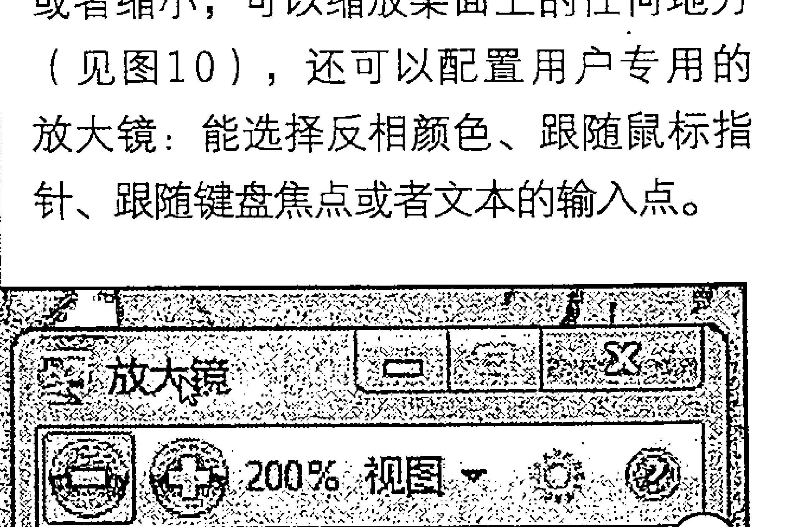

### 76.最小化除当前窗口外的所有窗口
按Win+Home组合键即可实现。

## TOP 10系列——电源管理的10大手段

微软近期对外公布了一份标题为“Windows 7 Power Management”的14页白皮书，描述了Windows 7的电源管理技术是如何降低电能消耗的。如果你想了解Windows 7究竟是如何省电的，这份白皮书会给你答案。如果你只想简单快速地了解一下，以下内容会告诉你Windows 7节能的主要手段。

### 1.空闲资源的能耗

当一台计算机启动后，不会一直处在全负荷运行状态，因此会有很多空闲时间，所以空闲时间里耗电量就成为电源管理的一个重要技术。在Windows 7里，空闲时的耗电量得到有效改善，当某个硬件一定时间不工作后就会进入低功耗状态以达到省电的目的。包括CPU、硬盘、内存以及网络部分都采用了这种技术。比如，一块全功率运行功耗35w的CPU在空闲时功耗几乎为0，仅这一项就能节省不少电量。

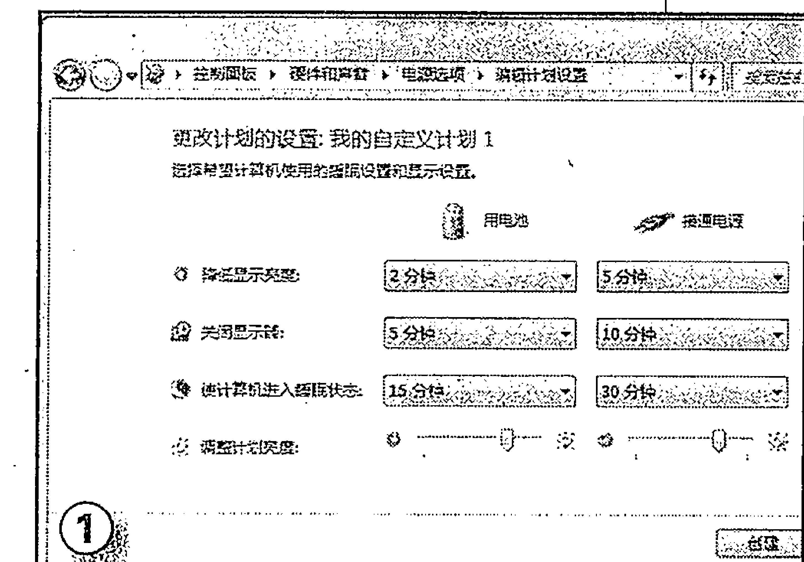

### 2.通过触发来启动服务

通常系统服务都会在系统启动的时候一起启动，然后驻留在后台等待调用。在Windows 7里，部分系统服务只有被一些事件触发后才会启动，如插入某个设备或者更改IP。这样可以减少后台进程里长时间运行的服务数量。

### 3.增强的处理器电源管理

Windows 7里集成了最新的电源管理技术，该技术能够让Windows 7根据当前负载情况和性能要求来动态地调节CPU性能。

### 4.自适应的显示亮度调节

微软表示，通常在10～15分钟时间里无操作的话，显示器会自动关闭。但在实际使用中会有更多短时间的无操作情况，为了更好地节能，该技术就会降低显示器的亮度。此外，它还可以利用一些传感设备，根据周围环境亮度来调整显示器亮度。

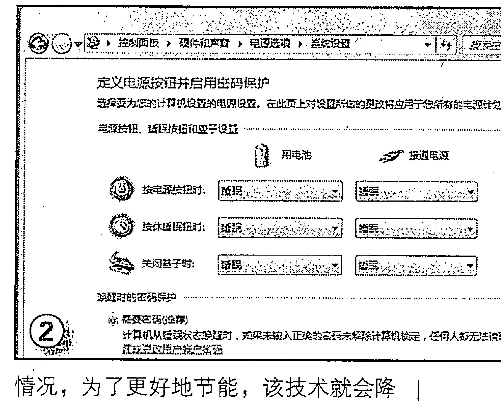

### 5.低功率音频

Windows 7将会支持Intel的低功耗HD音频规范，它能让编解码器进入极低的功耗状态。Windows 7还支持选择性挂起技术，将处于闲置状态的设备关闭，比如麦克风和摄像头这类USB设备。

### 6.计时器整合

目前处理器通过利用处理指令的间隙空余时间来达到节能目的，但大部分节能技术都需要一定长度的空闲时间才能获得节能效果。而这项技术通过让Windows内核在同一时间内终止并集中原本较为分散的多个计时器，在短时间内处理完毕，从而增加了处理器的空闲时间。

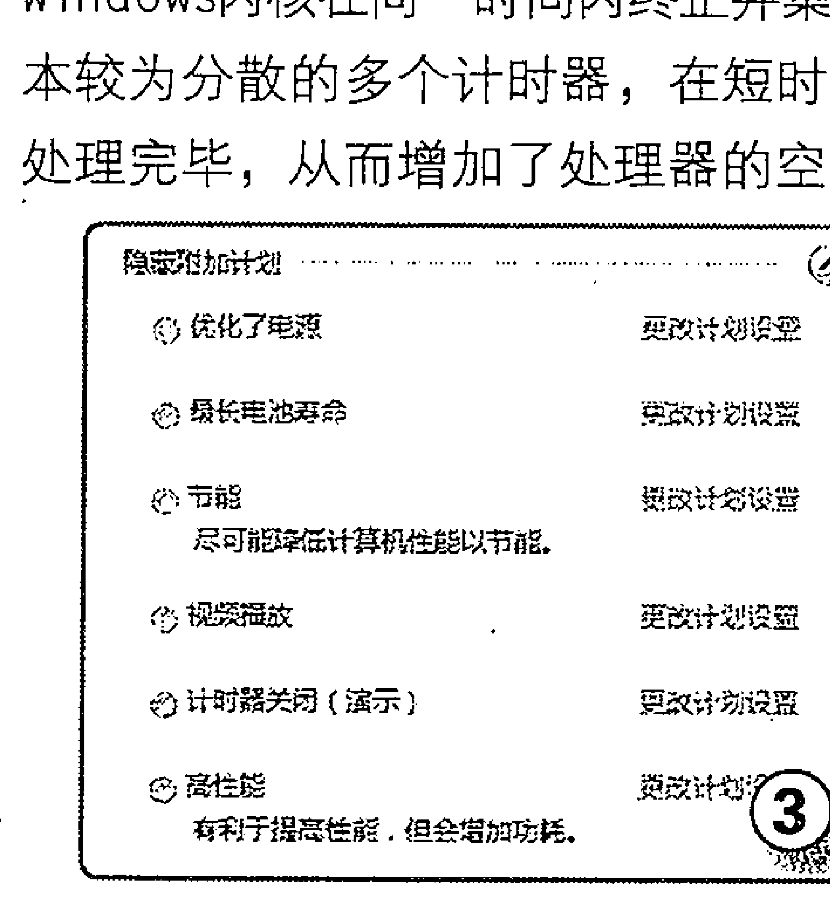

此外，当笔记本在使用电池的情况下，Windows 7会减少非关键后台程序的活动频率。

### 7.蓝牙设备功耗改进

当Windows 7检测到蓝牙设备处于低功耗状态时，会将它们暂时关闭，即“选择性挂起”。

### 8.网络设备功耗改进

Windows 7中对于无线网络控制器低功耗模式的兼容性得到了加强，只有在无线AP设备支持低功耗模式的情况下才会启用。Vista因为不能事先检测是否支持低功耗模式，会导致无线网络连接突然中断。

### 9.典型应用的优化方案

除了上述列出的改进外，微软还把目光转向一些特定的应用场合，包括搜索、浏览互联网和小游戏。下面是DVD播放场合的优化方案部分内容：

在不影响播放性能的前提下让CPU保持低功耗模式；通过改变架构来改进桌面窗口管理器和GPU的功耗；智能数据缓存能降低光驱转速。

### 10.快速调节本本亮度

无需借助Windows移动中心，在控制面板的“电源选项”中，也为用户提供了显示器亮度调节功能。对于自身没有亮度设置功能的笔记本，这一功能无疑十分实用。

以上便是Windows 7在电源管理方面10个重要的改进，比起以前的系统能节省更多电能。除了这些改进，IT专业人员还可以借助电源管理诊断来寻找可能影响电源效率的方法。

## Windows 7中，再虚拟一个Windows 7

什么叫Windows 7下创建虚拟的Windows 7？熟悉的朋友都知道一项新功能——虚拟XP模式，该模式用以解决Windows 7一些兼容性问题。借助自带的虚拟机工具Windows Virtual PC（并非Microsoft Virtual PC 2007）。其实Windows Virtual PC不仅用以安装XP，还可安装Windows 7。

第1步：在“虚拟机”窗口中单击工具栏的“创建虚拟机”命令，弹出“创建虚拟机”对话框，指定此虚拟机的名称和位置（见图1）。


进入“指定内存和网络选项”对话框，推荐设置大于512MB的内存，另外选中“使用计算机网络连接”复选框。

第2步：进入“添加虚拟硬盘”对话框，默认选中“创建动态扩充虚拟硬盘”单选按钮，输入名称和位置后，单击“创建”按钮。一个名为Windows 7的虚拟机创建完毕，在正式安装前需要对该虚拟机进行简单设置，单击工具栏的“设置”按钮。

切换到“DVD驱动器”设置项，由于我下载的是Windows 7 RTM旗舰中文版镜像，所以选中“打开ISO映像”单选按钮，并选择下载的镜像文件。

第3步：设置完毕，启动刚刚创建的Windows 7虚拟机，首先开始读取镜像中的文件。开始正式安装Windows 7时，直接单击“下一步”按钮即可，如右图。


## 多条件复杂搜索，照样玩转

相信玩过Vista搜索功能的一定知道，在Vista中无所不在的搜索功能提供了很大方便。而现在的Windows 7中，搜索功能更加强大，即使是一些现在看起来无理的搜索要求同样可以实现。

设置关键字匹配

对于Windows 7来说，搜索选项就很重要，在文件夹中按下“ALT+T”再进入功能“文件夹选项”，选中“使用自然语言搜索”，可以把Windows 7的搜索打造成“文化人”。

当我们输入“机器猫-小叮当0 or rm or wmv”就表示同时搜索三个条件，只要符合其中一个即可出结果。不过要注意图1中的“查找部分匹配”，如果不选中此选项，那么对于条件中的“机器猫-小叮当0”就不起作用。但是如果“机器猫-小叮当”这样不带数字的仍起作用。


搜索数字范围

在不选中“查找部分匹配”时，文件名中的数字会起很大作用，类似于喜羊羊这样有很多集的片子或是批量文档，文件名一般都会有统一前缀并以数字进行顺序号排列。这和从XP开始文件名排序，将数字字符作为数值大小来排序有很大的类似之处。

搜索具体范围

比如我们要搜索喜羊羊的360集到370集之间，那么我们只要在搜索条件下输入“喜羊羊360 喜羊羊371”即可。

自定义搜索结果打开位置

Windows 7的搜索算起来的确也蛮方便，在搜索结果中，比如我们列出了所有喜羊羊的片子，现在只想把某一部片子移动到已经看完的目录，首先我们只要把以下内容写成注册表文件导入到注册表：

```
Windows Registry Editor Version 5.00
[HKEY_CLASSES_ROOT\shellex\Explorer\]
@="打开文件位置"
[HKEY_CLASSES_ROOT\shellex\Explorer\command]
@="explorer.exe /select,%1"
```


在使用我们自定义的“打开文件位置”后可以打开一个新窗口，这样如果要把文件“喜羊羊397”移动到“喜羊羊OK”文件夹下就很方便了，如果使用图2处的Windows 7所自带的“打开文件位置”会在当前窗口中继续打开，不方便我们操作。

## 不用光盘，高手都用硬盘装Windows 7

刻录光盘浪费资源，“量产”U盘存在风险，如何既安全、又快速地安装这个最新的操作系统呢？那就要试试NT6 HDD Installer了。它至少可以让你在32位系统下安装64位Windows 7，让你不刻盘就能格式化C盘安装Windows 7，安装速度也提升不少。

### 拷贝文件，位置很重要

要用NT6 HDD Installer安装Windows 7，首先需要用虚拟光驱软件装载Windows 7安装光盘镜像（虚拟光驱软件推荐使用MagicISO，或者干脆使用WinRAR解压缩也可以），将光盘上所有的文件按照原来的目录结构拷贝到任意一个分区的根目录下。拷贝完毕后，该分区根目录的目录结构应该是这样的（见图1）。


### 安装启动器，模式有选择

将Windows 7的安装文件拷贝到任意分区的根目录下后，我们就可以下载NT6 HDD Installer并进行安装了。从它的安装界面我们可以看出，NT6 HDD Installer主要支持两种模式的Windows 7安装向导启动。

- 模式一：采用Grub4Dos方式，该模式功能强大，但对于某些机器的支持不是很好（有可能不能启动。）
- 模式二：采用微软自家的引导方式，兼容性好，只不过功能不够强大。

在选择的时候，也不要被软件的提醒所局限，一般选择模式一，电脑不支持Grub4Dos的再去选择模式二；另外，如果你安装有Vista Loader之类的已经采用Grub4Dos引导的程序，最好也选择模式二。


安装完毕后，重新启动计算机，引导菜单中就可以看到NT6 HDD Installer的身影了（见图3）。


接下来的步骤，与使用光盘、使用USB盘启动来安装系统没有什么两样，在选择系统安装到分区窗口时，我们甚至可以格式化掉C盘，进行全新的系统安装。

通过NT6 HDD Installer安装Windows 7的速度很快，尤其是第一步复制文件，几乎都是一闪而过，在解压缩文件的时候，也比光盘和USB盘安装速度快了不少。

如果你想全新安装Windows 7，又无法刻盘，也不能制作USB启动盘，或者你想安装一个64位的Windows 7，都可以通过NT6 HDD Installer来完成。

## 快速切换窗口技巧两则

通常我们切换窗口会使用Alt+Tab来逐一选择，但当程序窗口较多时这种方式的效率就会比较差，定位到你需要的窗口会比较费力，在Windows 7中则有了比较快速切换窗口的新方法。

方法1：将鼠标停留在任务栏中某个运行的程序图标上，任务栏上方就会显示该类所有已经打开内容的小预览窗口，然后将鼠标移动到需要的预览窗口上，会即时在桌面显示该内容的界面状态，单击该预览窗口即可快速打开该内容界面。

方法2：和前一种比较接近，但是不需要鼠标来选择。按住Alt键，然后在任务栏中已运行的程序图标上用鼠标左键点一下，任务栏中该图标上方就会显示该类程序打开的文件预览窗口。然后松开Alt键，按Tab键，就会在该类程序几个文件窗口间切换，选定后回车即可（见图）。


以上这两种方法都能让你在一大堆程序窗口中快速找到自己需要的，特别是每个程序都打开若干窗口的情况下。

## 改改BIOS 让Windows 7运行速度加快

很多用户都在设法提高Windows 7的系统运行速度，比较常见的方法大多是对系统服务进行优化，去掉一些可有可无的系统服务，还有就是优化资源管理器菜单等。除此之外，还有一些“不常见的偏方”，据说也可以让Windows 7的运行速度快上一倍。

如果你想尝试本文分享的方法，让你的Windows 7系统运行速度快起来，首先，你要保证你的主板支持AHCI。如果你的主板支持AHCI，那么请在安装Windows 7前进入BIOS设置，在Advanced选项中将SATA Controller Mode中默认的IDE调整为AHCI。

> **什么是AHCI？**
>
> AHCI，全称是Serial ATA Advanced Host Controller Interface（串行ATA高级主控接口），是在Intel的指导下，由多家公司联合研发的接口标准。在AHCI中，Intel引入了NCQ（Native Command Queue）功能和热插拔技术。支持NCQ技术的硬盘在接到读写指令后，会根据指令对访问地址进行重新排序，减少读取时间，使数据传输更为高效。


> **小提示**
>
> 不同的主板的BIOS可能不同，设置时，请大家找到对应的项。本文跟大家分享的方法，是来自一些网友的投递。据网友自己反馈，在实际的使用过程中，“可以提高Windows 7系统的运行速度”，但笔者未作更多测试。大家是否采用这个方法，请各位自己甄别。

## 提升访问速度，有凭据管理器

登录远程计算机或者访问站点时，我们通常要输入用户名和密码信息。这些重复性的操作会影响我们的工作效率和使用体验，其实对于本地用户来说我们完全可以将这些访问凭据(用户、密码、证书等)保存在本地，在访问时由系统自动完成凭据的认证过程，这无疑会提高我们的工作效率。凭据管理器就是这样一个系统组件，可帮助我们完成本地访问时的认证工作。其实，这个组件从Vista中就有了，但无疑Windows 7中的凭据管理器在功能上更强一些，实用性也更大。


打开“控制面板”，显示所有控制面板项，可找到“凭据管理器”。进入该页面可看到默认情况下“凭据管理器”并没有保存任何凭据。不过，在此我们可以添加“Windows凭据”、“基于证书的凭据”、“普通凭据”这三种类型的凭据。相对来说，“Windows凭据”和“普通凭据”使用较多。特别是“Windows凭据”，我们可将HomeGroup的凭据、远程桌面的凭据、共享凭据等添加进来。至于“普通凭据”，我们可将平时经常访问的站点，比如Windows Live的应用凭据添加进来。添加凭据的方法非常简单，以添加“Windows凭据”为例，单击“添加Windows凭据”链接进入添加凭据窗口。在此，我们分别输入目标地址(Internet地址或网络地址)的名称或者URL地址，以及用户名和密码，最后“确定”即可。此外，保存在“凭据管理器”中的凭据信息我们可随时进行修改、删除。


将访问凭据添加到“凭据管理器”中，不仅可方便我们对于目标站点的访问，同时也便于我们快速地迁移。当凭据添加完毕后，我们可点击凭据管理器窗口中的“备份保管库”链接将凭据信息保存下来。在安装了新的系统，或者我们要将其迁移到另外一台PC的时候，可点击凭据管理器窗口中的“还原保管库”链接将其还原到新系统中，而不需重复添加了。这样，利用“凭据管理器”功能，我们不需重新维护远程桌面列表，同时也不再需要单独记录HomeGroup自动生成的密码了，将在很大程度上解放管理员。

## 关机、睡眠和休眠的不同，你知道吗

打开“开始菜单”，然后单击右下角的三角形箭头按钮，随后会看到很多选项。这些选项大部分含义都很直白，用途一目了然，不过有些选项可能会让很多人纳闷，例如“待机”、“休眠”，以及“睡眠”，这些功能有什么区别，和“关机”相比又分别有什么作用？


每次启动电脑后，如果需要运行一个新的程序，首先Windows会把程序文件从硬盘读入内存，并等待处理器的处理。当然，电脑里可能会同时运行很多程序，其中很多因为是在后台悄悄运行的，因此我们并没有察觉。但和书桌一样，电脑的内存容量也是有限的，如果同时打开了太多程序，内存里已经装不下了，但还需要继续打开更多程序，这时候Windows该如何处理？

### 不同的流程

+   1. 如果“关机”，这时候Windows会保存所有运行中的程序的状态(例如在Word里写了一半的文档)，把所有程序都关闭(可以想像成直接把书合上)，并保存到硬盘中，然后彻底切断电脑的电源。
    2. 如果“休眠”，这时候Windows也会把运行中的所有程序重新保存到硬盘。但和关机的不同在于，关机时，Windows会把书“合上”，然后放回书柜；但休眠时，Windows不把书合上，直接放回书柜，并把书桌上的所有东西都清空，然后彻底切断电脑的电源。
    3. 如果睡眠，这时候Windows一样会把书放回书柜，但是书依然保持打开状态，到这一步和休眠时完全相同。但是在睡眠时，书桌上的内容并不会被清空，Windows会切断除了内存之外其他所有设备的供电，但对内存的供电依然持续，因此内存中的数据不会丢失。

这也就是说，如果要让电脑关机，Windows首先要关闭所有运行中的程序，然后关闭系统后台的服务，接着向主板和电源发出特殊的信号，让电源切断对所有设备的供电，电脑彻底关闭。下次开机后，电脑完成自检工作，然后将Windows系统载入内存，接着继续加载其他后台服务，并显示登录界面。登录后，才可以运行自己的程序，开始使用电脑。

### 待机模式如何

对于待机模式，如果要将电脑放入待机模式，Windows会自动向电源发出另一种特殊信号，随后电源会切除了内存外其他设备的供电，内存中依然保存了系统运行中的所有数据，这个过程一两秒钟就可以完成。当从待机状态进入正常状态时，只要通电，然后Windows就会继续从内存中保存的上一次的“状态数据”下运行，这个过程也只需要几秒钟。

可见，对于待机状态，完全可以不用关闭自己的程序，如果需要，随时可以待机。而要恢复时也只需要按下电源按钮，几秒钟即可恢复。但这种模式虽然方便，有一个致命的缺陷：不能停止对内存的供电。因为内存是一种易失性存储设备，必须在保证供电的情况下才能维持其中的数据。因此一旦电脑在待机状态下断电，哪怕不到一秒钟，内存中的数据将丢失，下次开机的时候，Windows会像从关机状态下启动那样重新开始。

休眠模式和待机模式类似，只不过在休眠状态下，Windows会将内存中的数据保存到硬盘上系统盘根目录下的一个文件中(可以将这个文件理解为内存状态的“镜像”)。而下次开机后则从内存上的休眠文件内读取数据，并载入物理内存。休眠模式可以实现和待机模式类似的功能，只不过恢复速度稍慢，而且需要在硬盘上占据一块和物理内存一样大的空间来保存休眠文件。物理内存越多，占用的空间就越多，而进入状态和从状态恢复所需的时间也就越长(毕竟需要把文件从硬盘读入内存，而硬盘的速度一直都是最慢的)。但这种模式的优点也有很多，不怕断电！毕竟断电后硬盘上的数据并不会丢失。

### 新的功能

Vista中开始新增的一种睡眠模式则结合了待机和休眠模式的所有优点。在进入睡眠模式后，Windows会首先将内存中的数据保存到硬盘上(这一点类似休眠)，同时切除了内存外其他设备的供电(这一点类似待机)。在恢复时，如果没有断过电，那么系统会从内存中直接恢复，只需要几秒钟；而就算断电，因为硬盘中还保存有内存的状态镜像，因此还可以从硬盘上恢复，虽然速度要稍微慢一些，但至少不用担心数据丢失。

综上所述，这几种模式各有利弊，但只要Windows和所用硬件支持，则强烈建议使用睡眠功能代替以往习惯的关机操作。毕竟睡眠功能的优势显而易见，不仅可以避免漫长的启动过程，而且完全可以把电脑当作电视一样的一般电器，随开随关，完全不用担心丢失数据。

## 何其重要？探寻Windows 7神秘隐藏分区

Windows 7的用户，在安装完成后运行diskmgmt.msc打开“磁盘管理器”，可以看到在系统分区（一般为C分区）之前有一个大小为200MB的隐藏分区。这个特殊的隐藏分区与Windows 7系统有什么关联呢？下面就让我们一探究竟。

## 初探结果

该分区的格式为NTFS，没有磁盘卷标也没有分配驱动器号，其磁盘状态描述为：系统、活动、主分区。因为没有驱动器号，所以在资源管理器中是不可见的。

## 都有什么呢

为了一探究竟，笔者为其分配了一个驱动器号F。操作方法是：在磁盘管理器中选中该分区，右键单击选择“更改驱动器号和路径”弹出更改向导。单击“添加”按钮，在弹出的对话框中点选“分配以下驱动器号”，然后点击其后的下拉列表从中选择F（见图），最后“确定”退出即可。接下来打开“计算机”可看到一个新的磁盘分区F，进入该分区发现有两个隐藏目录Boot和System Volume Information，另外还有两个隐藏文件bootmgr和BOOTSECT.BAK。毫无疑问，Windows 7在该隐藏分区中保存了系统的引导文件。


## 添加分区号，是否影响系统启动

重启系统，看看上述操作（添加盘符）是否会影响到Windows 7的启动。测试结果系统正常启动，可见上述修改不会影响系统启动。这是非常好理解的，为启动分区重新分配盘符的操作并没有修改系统的引导文件，也没有修改磁盘引导扇区。可见，微软之所以将Windows 7的引导文件放在一个独立的隐藏分区中，一定是出于对引导文件的保护。

### 能否将分区返回到隐藏模式呢

既然隐藏分区是为了保护系统引导文件，下面我们进行测试看是否可以取消刚才为其赋予的驱动器号。右键单击该分区选择“更改驱动器号和路径”，尝试“更改”或者“删除”驱动器号都显示“无法删除更改卷的驱动器号”，其原因是该卷是系统或者启动卷。由此可见，为Windows 7中的这个特殊的隐藏分区添加驱动器号的过程是不可逆的。

### 删除分区中的文件是否影响系统启动呢

尝试删除该分区中的系统引导文件会怎样？以administrator登录系统，进入F分区然后进行文件删除。在删除的过程中发现，其中有些文件是无法删除的，显示“文件正在使用”或者提示“没有删除权限”。然后又尝试了为administrator赋予“完全控制权限”，结果被拒绝。

> **小提示**
>
> 只有TrustedInstaller用户才有完全控制权限。该用户是Windows 7中特有的，其任务是单一的与系统安装有关，在Windows 7的用户和组（lusrmgr.msc）中是没有该用户的。

在删除了该分区中的某些文件之后，重启系统，没有问题，系统正常启动。可见，我们刚才删除的文件与系统启动无关，而真正与系统启动相关的文件是无法删除的。

通过磁盘管理器，小编尝试“格式化”、“删除卷”均不能成功，可见Windows 7对该分区的保护是做得很不错的。既然系统工具不行，那试试第三方工具。小编用Acronis Disk Director Suite 10.0进行测试，利用该工具删除了分区及其上面的数据，然后重启系统。显示“BOOTMBR is missing”即主引导扇区丢失，系统无法启动。由此可见，该隐藏分区中保存了系统的引导文件和磁盘的主引导分区信息。

### 小结

通过上面的测试揭开了这个隐藏分区的神秘面纱，这个大小为200MB的隐藏分区对Windows 7至关重要，它保存了系统引导文件和磁盘引导扇区的信息。如果它丢失或者被破坏，对于Windows 7来说将是灾难性的。总的来说，将Windows 7的引导文件保存在一个隐藏分区中无疑加强了其安全性。但是，因为目标单一也容易成为被攻击的对象。

建议大家不要为该隐藏分区分配驱动器号，这样就能够在较大程度上杜绝人为或者病毒木马对其造成破坏。

## 卷影副本，回溯文件历史

文档处理占了使用电脑的大部分，有时会面临这样尴尬的处境：千辛万苦修改的文档并不符合需要，不得不回溯到文件修改过程中的某个状态。难道为此我们在修改文件之前需要拷贝一个该文件的副本吗？对Word比较熟悉的朋友应该知道，Word有保存文件版本功能。但这一功能的弊端是显而易见的，不仅会产生大量的文件副本，占用大量的磁盘空间，而且如果是非Word文件（比如图片）那它就无能为力了。这时候我们可以使用卷影副本功能，通过使用该功能，系统每次创建还原点时，都会对启用了系统还原功能的硬盘分区上保存的所有文件创建卷影副本。这样我们就可以在需要时将文件使用特定还原点进行恢复。

> 关于卷影副本
>
> 卷影副本（Shadow Copies）是一个新的概念。通俗点说就是文件的上一版本。用户只要开启了系统还原功能，或为某文件建立了备份，该文件的上一版本就已存储在系统还原点或备份文件中。如果文件被修改或删除，就可以利用这些旧版本将其还原。但需要注意的是：卷影副本与系统还原仍有区别：它不能还原Windows正常运行的文件。

## 它是干什么的

其实，卷影副本不是在Windows 7中才有的，从Vista开始它已经存在了。不过，在Windows 7中卷影副本功能有了很大的改进，更具人性化。其表现是，Vista中的卷影副本和系统还原是相关的，即如果要在某分区中使用卷影副本，必须在该分区开启系统还原。这样的处理其弊端是明显的，通常我们将数据文件保存在非系统分区，为了使用卷影副本功能，我们必须开启该分区的系统还原功能，对磁盘空间的浪费不言而喻。在Windows 7中对这两个功能实施了分离，好让我们有选择的余地，根据需要启用系统还原或者卷影副本。Windows 7中默认只有系统盘同时启用了系统还原和卷影副本，对于其它的分区，如果要使用卷影副本，可手动启用该分区的卷影副本功能。

## 如何开启

启用某分区的卷影副本可这样操作：右键单击桌面上的“计算机”图标，选择“属性”打开系统属性窗口。单击窗口左侧的“系统保护”链接打开系统属性对话框的系统保护选项页面，在此列出了本机所有磁盘分区。如果要启用某分区的卷影副本功能，首先选中该分区，单击“配置”按钮可打开配置对话框。

在“还原设置”下有三个选项，选择第一项“还原系统设置和以前版本的文件”就会同时启用该分区的系统还原和卷影副本功能；选择第二项“仅还原以前版本的文件”就只会启用该分区的卷影副本功能；第三项“关闭系统保护”就会关闭该分区的系统还原和卷影副本。我们选择第二项，然后在“磁盘空间使用量”下拖动滑杆调整卷影副本使用的最大磁盘空间。单击“删除”按钮就会删除所有的还原点。

设置完毕后，当我们对该分区中的文档进行编辑时，系统就会自动在后台创建该文件夹的卷影副本，每次编辑都会创建不同的卷影副本。当我们要将文件恢复到以前的某个状态时，只需在该文档（或者所在分区）上单击右键选择“属性”打开其属性对话框，在“以前的版本”标签页下可以看到所有针对该文档的修改记录，对于每次修改系统都自动创建了卷影副本，并且有详细的时间记录。我们选择某个时间点，单击“打开”按钮可以查看此刻的文件状态，单击“复制”可将此刻状态的文件复制到某个位置，单击“还原”可用此刻文件状态替换当前的文件。可见，使用卷影副本我们不仅能够使得当前文件回溯到此前的某个时间点，而且可随意查看文件此前的某个状态。


需要说明的是：一个文件会有多个时间点的卷影副本，但卷影副本不同于我们通常拷贝的文件副本。一般意义上的文件副本和该文件一模一样，会占用同样的磁盘空间。而卷影副本不同，它只会记录针对该文件的修改信息，和我们通常所说的增量备份类似。因此，它不会占用多少磁盘空间。

## 您别急着挑剔，7个工具让Win7用着爽快

相比颇受争议的Vista，Windows 7在功能上有所创新，将XP的流畅性与Vista的炫酷界面巧妙融合，乃至几年前的老爷机都能在它的支持下流畅工作，几乎就是集之前各操作系统的优点于一身。但在某些挑剔的筒子眼中，大名鼎鼎的Windows 7其实还不够完美，借助七款工具，它们让Win7用起来更爽了！

- 一、MKV播放不再挠头
软件名称：DivX Tech Preview（技术预览版）
下载地址：http://labs.divx.com/filesDivXTechPreviewMKVOnWin7R3_no-reg.exe
和以前的Vista相比，Windows 7在视频原生支持上已经有了很大进步。像平时比较常见的AVI DivX、H.264、.mov视频，都可以在Windows 7下直接播放，不过作为高清标准格式的MKV却依旧未能入选。有筒子问：“下载个通用格式包不就全搞定了吗？”不错！可这样的话，最能代表Windows 7特色的影片缩略图（资源管理器）就没法使用了，怎么说也是留下了一个小小遗憾。
其实这个问题并不难解决，您只要花上两分钟下载这款体积仅为1.66MB的小插件，就能让Windows 7原生支持.mkv视频播放。而且还支持视频硬件加速，能够在配置较低的电脑上流畅播放影片。最重要的是经典的影片缩略图也一并出现在了资源管理器中，让人看着都是那么爽！

- 二、让IE8再顺手一点
软件名称：IE7 Pro
下载地址：http://dl.pconline.com.cn/html_21107id=41517&pn=0.html
虽然历经两代发展，但IE8在细节操作上依然远逊色于传统的第三方浏览器，不过我们倒是可以利用这款IE7 Pro将IE变得更顺手一些。简单来说这款软件总共包含以下几项功能，一是支持鼠标双击，允许用户双击标签快速关闭当前网页。二是提供超级主页，让IE也能像Opera一样实现“快速拨号”。三是加入了“超级拖拽”，使用者可以直接拖拽页面中的文字实现快速搜索。四是增加了“鼠标手势”，让日常操作也能“指来指去”。此外IE7 Pro还提供了拼写检查、自动填表、在线书签、IE提速等诸多功能，绝对可以让你的IE转瞬间强悍百倍！


- 三、登录画面我决定
软件名称：Windows 7 Logon Background Changer
下载地址：http://www.softpedia.com/progDownload/Windows-7-Logon-Background-Changer-Download-132876.html
记得很久以前，网上曾经流传过一个技巧，即通过注册表与文件操作替换掉Win7的登录背景。不过这样的技巧玩玩还成，真要把它当成个功能就显得太麻烦了。不过随着这款Windows 7 Logon Background Changer的面世，更换登录背景也能像换桌面一样轻松很多。使用时只需打开软件界面，随意挑选一幅中意的图片，接下来就可以按动“Apply”完成画面更替！

- 四、“睡眠”也能下电影
软件名称：Windows 7优化大师
下载地址：http://dl.pconline.com.cn/download54440.html
很多朋友都喜欢在睡觉时开着电脑下载大片，可这样的做法不但费电，还很容易因为设置失误而导致下载过程中自动待机。其实除了“睡眠”、“休眠”两项模式外，在Windows 7中还隐藏着一组“离开”模式（AwayMode）。
借助Windows 7优化大师的“系统设置→系统设置”标签，便能开启这一模式。待系统重启后，新模式便已生效。使用时只需提前启动好下载程序，点击开始菜单→“睡眠”项（此时的“睡眠”其实就是“离开”），这时Windows 7便自动进入了“离开”模式。在此过程中虽然下载仍旧继续，但大多数设备的电力都已关闭，真正做到了省电工作两不误！

> **小提示**
>
> 由于登录界面毕竟还要担负一定的操作需要，因此在图片挑选上，还是尽管找一些画面简洁、色调较深的图片为宜哟。


- 五、让Windows 7更省电
软件名称：Windows Vista省电程序
下载地址：http://www.duote.comsoft12620.html#download
对于笔记本来说，持久的电力也许要比花哨的功能更为实在。虽说在此前的测试中，Windows 7明显要比Vista更加省电，可仍然不及XP，于是便有网友开发出了这么一款小玩意。其实它的思路非常简单，就是当检测到电池供电时自动关闭Aero，恢复电力时再将Aero打开，可正是这样一个小小的改动便能省出不少电力。
此外软件还允许当电量降低至某一水平后再关闭Aero，让用户拥有更多自主权。同时我们也可以分别设定不同模式（“电池”或“外接电源”）所使用的电源计划，以满足各种苛刻的环境。

- 六、桌面动起来
软件名称：Windows 7 DreamScene
下载地址：http://bbs.ruanmei.comattachment.phppaid=111657&k=fbcae0ef9630b5a2b0e5dc23864d158e&t=1254258212&sid=86d4AX6BXmC%2B51Tromfbzg1peY0w0FIMrrG0qb1Fl5u8tGk
“动感桌面”其实算不上什么新鲜玩意，之前曾经是Vista为旗舰版用户专门开发的一项增值服务。启动后桌面背景将会变成视频片断，从而给人一种“桌面会动”的感觉。
在这款工具的帮助下，Windows 7也能开启这一模式。而且安装过程完全采用了自动化设计，使用者只需记住启动前使用“管理员身份”即可。待系统重启后“动感桌面”即可生效，这时我们只要在视频文件（WMV或MPEG）上右击鼠标并执行“Set as Desktop Background”命令，便成功开启了桌面视频。而且这里的片断并不限制分辨率，高兴的话可以直接选用1080P，不过高昂的资源占用率可是要您有点心理准备哟！
只支持.wmv或.mpg是不是太受限制？其实我们也能小骗它一下。首先必须要保证WMP12能够正常播放常见视频（可通过安装通用格式包解决），接下来只要在目标视频后加入一个新扩展名（如.wmv）就行了。经过笔者测试，这个方法对于日常比较常见的“.rmvb”、“.ts”、“.rm”、“.avi”等影片都很有效，这下“动感桌面”的资源问题就不用再愁了吧！


- 七、“划圈”启动软件
软件名称：Magic Formation
下载地址：http://www.tokyodownstairs.combinarymform_0981e.zip
记得Windows 7还处于概念期的时候，就曾流传出一幅效果图，其中最吸引大家眼球的，就要数那创意独特的“圆盘启动菜单”了。虽然时至今日，相关猜想早已尘埃落定，可图片中那个“圆圈启动菜单”却依旧吸引着俺。笔者找到了这么一款小工具。启动后便可以在任何时间，通过鼠标划圈（直径约4CM左右，顺逆时针均可）调出功能菜单。不但可以很方便地启动常用软件，而且还能一键打开像“我的文档”、“资源库”这样的日常文件夹，实用性相当不错。
此外默认菜单项也可以由用户自行修改，操作时只需用鼠标右击“圆圈”并执行“Options”命令，接下来就可以通过选框完成新菜单的修改了。


> 小编说：
>
> Windows 7是一款非常注意对过去错误解决的系统，像TCP半开连接这样的经典补丁，如今都已经在Windows 7下正式“下岗”了。当然除了上面介绍的这些，像WinRAR、杀毒软件等也都是日常必备的一些常用工具。不过对于这些相信大家都已熟悉，就不用俺在这再多嘴了。希望今天这些文字能够带给大家一点启示，让Win7更加完美！

## Vista和Win7的PK：高端显卡游戏性能测试

大家已经见识了Windows 7的游戏性能测试，下面为大家带来的测试都是高端显卡，ATI Radeon HD 4870 1GB X2，对阵nVIDIA GeForce GTX 260 896MB。高端显卡针对的玩家不多，但是能够开阔大家的眼界，看看烧钱的筒子们都在用这些钱玩着什么样品质的游戏。

| 游戏名称 | 评分工具 | 画质水平 |
|---|---|---|
| Call of Duty 4 Modern Warfare v1.7 | 自带评分工具 DX9 | 最高画质 |
| Company Of Heroes Opposing Fronts v2.103 | DX10 | 最高画质 |
| Enemy Territory Quake Wars v1.5 | 自带评分工具 OpenGL | 最高画质 |
| Far Cry 2 v1.01 | | 最高画质 |
| Race Driver GRID v1.2 | 自带评分工具 | 最高画质 |

| 项目 | ATI Radeon HD 4870 1GB X2 | nVIDIA GeForce GTX 260 896MB |
|---|---|---|
| Typical pricing (including VAT) | £185 | £165 |
| Shader model | 4.1 | 4.0 |
| Stream processors | 800 | 216 |
| GPU clock speed (MHz) | 750 | 576 |
| Shader clock speed (MHz) | 750 | 1242 |
| Memory clock speed (MHz) | 3600 | 1998 |
| Memory bus width (bits) | 256 | 448 |
| CPU | Intel Core i7 965 Extreme Edition (3.20GHz, 8MB L3 cache, quad-core, LGA1366) | Intel Core i7 965 Extreme Edition (3.20GHz, 8MB L3 cache, quad-core, LGA1366) |
| Motherboard | Foxconn Bloodrage X58 | Foxconn Bloodrage X58 |
| Motherboard BIOS | P04 | P04 |
| Mainboard software | Intel INF 9.1.0.1012 | Intel INF 9.1.0.1012 |
| Memory | 6GB Corsair DOMINATOR PC12800 | 6GB Corsair DOMINATOR PC12800 |
| Memory timings and speed | 9-9-9-24 1T @ DDR3-1333 | 9-9-9-24 1T @ DDR3-1333 |
| PSU | Cooler Master Real Power Pro 1,000W | Cooler Master Real Power Pro 1,000W |
| Monitor | Dell 3007WFP - 2,560x1,600px | Dell 3007WFP - 2,560x1,600px |
| Disk drive(s) | Seagate 500GB Barracuda 7200.11 (3Gb/s mode) | Seagate 500GB Barracuda 7200.11 (3Gb/s mode) |
| Graphics driver | Catalyst 9.3 (Windows Vista) Catalyst 9.3 (Windows 7) | ForceWare 182.06 (Windows Vista) ForceWare 181.71 beta (Windows 7) |
| Operating system | Windows Vista Business SP1, 64-bit Windows 7 Ultimate Beta, 32-bit | Windows Vista Business SP1, 64-bit Windows 7 Ultimate Beta, 32-bit |

## 测试结果


## 统计结果

| Graphics cards | Aggregate marks at 1,680x1,050 | Aggregate marks, normalised* at 1,680x1,050 | Aggregate marks at 1,920x1,200 | Aggregate marks, normalised* at 1,920x1,200 | Current pricing, including VAT | HEXUS.bang4buck score at 1,680x1,050 | HEXUS.bang4buck score at 1,920x1,200 |
|---|---|---|---|---|---|---|---|
| Gigabyte HD 4870 1GB (Win7) | 370.27 | 330.56 | 318.63 | 291.71 | £185 | 1.787 | 1.577 |
| Gigabyte HD 4870 1GB (Vista) | 378.53 | 335.34 | 323.15 | 296.12 | £185 | 1.013 | 1.6 |
| BFG GeForce GTX 290 896MB (Vista) | 386.33 | 337.65 | 326.75 | 301.27 | £165 | 2.046 | 1.826 |
| BFG GeForce GTX 290 896MB (Win7) | 372.58 | 317.35 | 310.31 | 280.38 | £165 | 1.923 | 1.7 |

## 总结

可以看出，A卡在Windows 7下的性能要比Vista下高，但高出不多；而N卡则反过来了。由于目前Windows 7的驱动并不完善，这些测试也只能供参考，相信到时候还会有更公正的测试，拭目以待吧！

# Windows 7 “剽窃” 苹果的10大功能


国外媒体报道，乔布斯曾经说过微软从苹果偷窃出Windows系统，但这些年来双方都有诸多“剽窃”对方功能之处。有好事者（又名吃饱了撑的人），总结了Windows 7和雪豹各自包含对方系统的十大功能（标题纯粹是为了吸引眼球，标题党，谢谢）。

+   1. 跳转列表：Dock菜单

+   2. Aero Peek Expose


+   3. 文件预览

+   4. 屏幕共享远程桌面链接

+   5. Sticky Notes Stickies


+   6. 虚拟文件夹 智能文件夹

+   7. 网络共享自动出现在左边栏

+   8. RSS订阅

+   9. Windows光盘刻录 磁盘工具

# 游戏Win7之前，你需要知道的几件事

在使用Win7进行大型的3D游戏之前，你需要了解DX11和兼容性的相关知识。Windows 7能提供什么样的游戏体验？游戏性能方面比Vista和XP又会有什么样的提升呢？以下我们便为大家进行一些粗略的说明介绍。

# DirectX 11和游戏性能

DX11是在Windows 7/Vista上可用的游戏API，业内人士对DX11可谓寄予厚望。最近AMD官方博客中还专门为DX11进行了介绍，称“DX11使用了最新的显卡硬件技术，而在Windows 7中这些技术能为玩家带来显著的游戏性能和游戏体验的提升。”

AMD着重强调了基于显卡硬件的曲面细分技术tessellator，并称与DX11配合后这项技术能为用户提供更美观的游戏画面。实际上tessellator并不是一项新技术，AMD的显卡很早就开始支持这种技术，只不过此前一直未能在实际游戏中得以采用。

另外，Windows 7还能更好地支持处理器超线程技术和GPU通用计算技术，游戏开发者利用这两种技术能在Windows 7游戏中为用户提供更好的游戏性能和更为逼真的游戏画面，由于Windows 7环境下的游戏编程将更为简化，因此游戏开发的费用也会下降。


# 兼容性

兼容性总是游戏玩家最关心的话题，而在Windows 7环境下，各款大作均能完美运行，玩家们还可以通过点击这个链接，了解Windows 7的游戏支持列表。在本刊的合订本中，也会对具体的游戏兼容性，以及游戏性作出详细的测试，请关注下面的文章。

# 动作感应“Project Natal”技术支持

本月早些时候，比尔盖茨还曾表示其游戏机平台上的动作感应技术“Project Natal”将同样适用于Windows PC。他还表示这项技术并不仅限于支持游戏，同时还可以支持各种多媒体应用，比如视频会议、人机交互等等场合，但这种支持将首先从游戏起步。

# XP、Vista、Windows 7, 玩游戏你该选择哪种系统

在现在的电脑娱乐中，尤其是游戏领域，更多的用户追求的是系统的稳定性和流畅性。相信大家对于操作系统都很熟悉，但对于日常需求与游戏需求我们如何取舍，选一个适合自己的操作系统呢？比如XP、Vista，以及刚刚出来的Windows 7等。这就需要对几大系统的游戏性能、稳定性等方面有深度了解，做一些测试来定。

> 小提示
本文从网络游戏与单机游戏等更多的方面，来认识这些操作系统。只从几款高端游戏就确认一款系统的普及性是错误的。

我们先来简单地介绍一下这三款操作系统，然后再来观看评测细节。

# 评测结果与解析说明:

1. 安装Windows XP SP3，打上所有可用补丁和更新，包括IE7、WMP11和Windows Search 4.0，唯一的非系统自带程序是Firefox。结果硬盘占用5.7GB，内存占用150MB。
2. 安装Windows Vista Ultimate SP1 x86，升级所有关键和推荐补丁，不安装第三方软件。结果硬盘占用14.3GB，内存占用299MB。
3. 安装Windows 7 Ultimate x86 Beta，升级所有关键和推荐补丁，不安装第三方软件。结果硬盘占用8.6GB，内存占用216MB。

2009年04月14日，这就是Windows XP Professional、Windows XP Home、Windows Server 2003 SP1、Office 2003主流支持结束的日子，之后微软只会免费为它们发布安全补丁。用户如果想继续得到微软的全部支持，就必须付费了，其中Windows XP Professional将持续到2014年4月8日，Office 2003则只到2012年8月4日为止。Windows Vista SP2和Office 2007 SP2两个升级服务包在4月份发布。

# 以下是各款Windows系统与Office软件的寿命期限:

+   Windows 2000: 免费支持已止于2005年6月30日，付费支持将持续到2010年7月13日；不会再有SP5了。
+   Windows XP SP2: 2010年7月13日退休。
+   Windows XP SP3: SP4发布两年后或2014年4月退休，具体取决于哪个先到。
+   Windows Vista Business: 免费支持截至2012年4月10日，付费支持截至2017年4月11日。
+   Windows Vista SP1: SP2发布(预计4月)两年后退休，因此很可能是2011年4月份。
+   Office 2003 SP3: SP4发布两年后或2014年8月退休，具体取决于哪个先到。
+   Office 2007: 免费支持截至2012年4月10日，付费支持截至2017年4月11日。
+   Office 2007 SP1: SP2发布(预计4月)一年后退休，可能是2010年4月份。
+   Windows Server 2008: 免费支持截至2013年7月9日，付费支持截至2018年10月7日。
+   测试选用Windows 7 Build 7048 X64是因为这版本最接近RC版本。

# 接下来便是各类基准测试:

+   基本测试平台:
    +   CPU: Core 2 Duo E8500 @ 3.6 GHz
    +   主板: Biostar Tpower Ip45
    +   内存: 2x 1GB
    +   显卡: Nvidia 9800 GT (700MHz 核心，1860内存，1700个渲染器)
    +   显卡驱动: Nvidia ForceDriver 181.71
    +   硬盘: Raid0, 2x Seagate 320 GB
+   参与测试系统:
    +   Windows 7 Beta/RTM 32位/64位
    +   Windows Vista SP1 32位
    +   Windows XP SP3 32位

# 1. 压缩解压

这个版本在这方面有点慢，不过前几个版本还要更慢，或许因为这是64位版本吧。

## Winrar测试


## 7-Zip测试


# 2. Super Pi测试


基本上都差不多，不过7048版本比Vista 32就快多了。

| 操作系统 | 运行时内存占用率 |
| :--- | :--- |
| Windows XP (SP2或SP3, SP4) | 64MB |
| Windows XP Professional x64 | 128MB |
| Windows Vista | 512MB |
| Windows Vista x64 | 512MB |
| Windows Server 2003 (SP2) | 64MB |
| Windows Server 2003 x64 (SP2) | 128MB |
| Windows Server 2008 | 512MB |
| Windows Server 2008 x64 | 512MB |

运行测试 Internet Explorer 8 (IE8) 内存使用状态

# 3. 硬盘测试


或许是驱动的关系，结果很差，甚至于见到了三次22MBS的速度。囧...

图5 硬盘性能测试

## 游戏测试

优缺点对比说明：

就上述内容我再从大众的角度简单的总结一下Windows 7、Windows XP和Windows Vista的各类优缺点，以便普通网友参照，详细的就不再多说了。

### Windows XP

优点：拥有绝佳的软硬件兼容性，内存与硬盘的占用率极低，各类软件运行所需配置较低，游戏兼容完美。

缺点：虽然支持Dx10文本，但不能完整支持Dx10与Dx11等后续版本真正画面、安全性能与Vista相比稍低。

### Windows Vista

优点：安装4GB内存后比XP快，属于针对高端配置与高端游戏的操作系统，支持Dx10、Dx11等后续版本。

缺点：对网络游戏与部分软件的兼容性不是很好，对于系统的内存需求较高，游戏配置需求也很高。

### Windows 7

官方介绍：集XP与Vista的优点于一身，是专门针对游戏娱乐方面的操作系统，内存与硬盘占用率较低，安全性能很好。

Windows 7是否完美绝对不是一两个人说了算，而是更多的玩家、更多的软件与游戏测试后的结果。2001年10月25日，在纽约市举办的Windows XP促销活动上比尔盖茨说过一段话，但这段话能否应允在新操作系统Windows 7或者其他操作系统上，还需要不断的摸索与实践，毕竟没有任何一样东西刚生下来就是完美无缺的，就连XP直到现在还需要不断地打补丁，就好像Dx和显驱每隔几个月时间就需要更新一样。

> 资料引用：
2001年10月25日，在纽约市举办的Windows XP促销活动上盖茨说：“无论新技术在何时出现，父母都会对它的使用投以关注目光，这当然是一种合理的做法。在新技术名单中，互联网注定要排在最前面。你们都知道，我最大的孩子也不过11岁，因此，我们还没有陷入所谓的最为可怕的境地，你们知道我指的是孩子痴迷Facebook和把大量时间用于接发即时信息上。但我相信，这种事情正在前面等着我们。因此，我们决定对家里的电脑实施开放政策。这样一来，孩子们在使用电脑的时候就会意识到一点，我们会在不经意间出现在他们身旁。通过这种方式，我们不用做出大量限制，比如规定时间或者只能做一些特定的事情。我们一家人都会参与其中，看看这个世界正在发生什么并进行讨论。”
“比起以前我们使用的操作系统，Windows XP是有史以来最强大、最快、最可靠的操作系统。”

# 结语：

其实操作系统真正成熟阶段是Windows 2000，XP就是基于2000而升华的。再往下就不行了，我还清楚地记得Win95、98及Me等老系统，开机后不用管它，放一阵它自己就蓝屏死机了。

看过这篇文章，大家应该对XP、Vista以及Windows 7这三款Windows操作系统有了全新的认识与了解，心里也都会有自己的打算。但最重要的是为了游戏我们应该奔向哪里……

经过编者测试：如果不出意外，Windows 7能够成为第二个XP了，现在可以确认的是，单机游戏是绝对可以在Win7中运行，主要问题就是网游方面了，如果Win7网游兼容性做得好，相信无论个人电脑或者网吧都会进行升级的。另外从现有测试结果看，Windows 7一般都能带来更好的游戏性能，甚至可以提升25%之多。

# 当HOT GAME路遇Win7 谁能随心所欲地运行

因为Vista是一代颇具争议的操作系统，所以人们对于Win7的期待更为强烈。根据一些媒体的测试来看，Windows 7无论是在性能、稳定性，还是在易用性方面都有了极大的提高。那么在游戏这块领土上，Windows 7的表现又如何呢？下面就来一起测试一下当今的热门游戏吧！

根据国外媒体的实际游戏性能测试来看，Windows 7相比目前的Vista操作系统在性能方面有着不小的提升。除此之外，对于老游戏的兼容性也是大家都非常关心的话题，这些都将是我们今天了解的重点。

## 游戏性能明显提升

国外媒体针对最新的操作系统Windows 7展开了一系列的测试，为我们带来了更为直观的性能体验。该系列测试选用了FarCry2及Left4Dead这两款比较具有代表性的游戏来进行测试，比较的对象为Windows 7与Vista。


右图是DX10下1680*1050分辨率下游戏性能表现

通过上面的测试结果来看，相同的硬件、相同的游戏，仅仅因为操作系统的差别而在实际测试结果上却存在明显的差别。综合以上的测试结果来看，Windows 7的游戏性能要高于Vista已经是明摆的事实。

而且值得提出的是，目前Windows 7相配套的软件和驱动并不完善，相信Windows 7在性能方面依然有极大的提升空间。由此来看，Windows 7确实是一款非常值得游戏玩家使用的操作系统。

相较于Vista来说，Windows 7的改变还是比较多的。在用户界面方面，任务栏的改进起初可能会令人感到不适应，但是在使用过一段时间以后就会发现这样的设计还是非常的贴心而且更加的方便。接下来我们来了解一下Windows 7与Vista在游戏性能方面的差别。

## 兼容问题依然存在

游戏性能的提升纵然是很大的改变，但是这一切的前提是能否兼容。在以往任何一次操作系统更新换代的时候，软件的兼容性问题一直被用户所关注，这将直接影响到用户是否会选择新一代的操作系统。

通过几天的试用以及网络上的信息整理来看，目前有很多游戏都能够在Windows 7中完美地运行，同时也有一些游戏存在一些小问题或者干脆无法运行，接下来就让我们去看个究竟。

## Windows 7系统下可完美运行《魔兽世界》

《魔兽世界》是目前全球最热门的网络游戏，编辑很欣慰地看到这款游戏能够完美运行于Windows 7之上。而且不得不提的是，在升级Windows 7之后游戏的性能同样得到了提高，部分场景的FPS提升十分明显。


## 《FIFA2009》也可在Windows 7平台下完美运行

除了WOW之外，例如《使命召唤5》、《波斯王子4》、《寂静岭5》、《红色警戒3》、《古墓丽影8》等今年的游戏大作均能完美支持Windows 7。另外说一句题外话，广大非主流人士也完全可以体验一下Windows 7，《劲舞团》同样完美支持。

下面的消息可能令广大足球游戏玩家感到失望了，今年最新推出的《FIFA09》在Windows 7下表现很差，主要表现为游戏FPS严重降低，甚至无法正常游戏。另外《星际争霸》第一代、CS1.6、《GTA4》等很少的一些游戏出现了问题。

下面这几个游戏就更加悲惨了，根本无法运行，甚至选择了各种兼容模式，它们分别是：《穿越火线》、《跑跑卡丁车》、《辐射3》、《DNF》、《奇迹世界》等等。《穿越火线》等游戏暂不支持Windows 7系统。


## 三款暴雪经典游戏测试

首先我们测试以下几款很经典的游戏：《星际争霸》、《暗黑破坏神2》、《魔兽争霸3 冰封王座》这三款游戏都是暴雪出品，每一个游戏都是精品中的精品，现在玩家依然非常多！你去网吧看见的所有游戏当中必然会有这三款。

我截错图了？不！没有，这款游戏确实是《星际争霸》，如果大家看清楚一些的话可以隐约发现《星际争霸》主界面的轮廓……这款游戏在Windows 7下会出现花屏的现象，而《暗黑破坏神2》与《星际争霸》一样都出现了花屏的现象。无论采用兼容模式也好，还是256位颜色也好，都会出现这种情况，所以这2款游戏在Windows 7下不能正常运行！


### 《魔兽争霸3 冰封王座》

《魔兽争霸3 冰封王座》这款游戏一直在单机游戏当中扮演着王者的角色，从每天人山人海一样的DOTA玩家和3C玩家就可以看出来这款游戏强大的生命力。在Windows 7体验当中，这款游戏能够很好地运行，而且在游戏体验当中并没有出现任何卡顿的现象，可谓是一帆风顺！

从前3款游戏来看，有2款游戏未通过测试……但是《星际争霸》和《暗黑破坏神2》已经是元老级的游戏，一款是1998年发布的游戏，另一款是2000年发布的游戏。最短的距离今天都已经9年了，所以和Windows 7操作系统存在兼容性问题也在情理之中。

### 《英雄无敌3：死亡阴影》


在Windows 7下《英雄无敌3：死亡阴影》是无法正常进入的，它会弹出一个错误对话框（如上图）。而选择兼容模式则可以运行，但是游戏会立即在界面停止运行，什么命令都执行不了，除非强制关闭游戏（就像死机一样）。所以这款游戏也不能正常运行。

## 《鬼泣4》和《战锤40K：战争黎明2》

《鬼泣4》在Windows 7下运行得非常不错，没有出现任何卡顿的现象，每一个画面都非常顺畅。

《鬼泣4》和《战锤40K：战争黎明2》都非常出名，特别是《鬼泣4》，这款游戏令每一个游戏发烧友都为之倾倒！完美的操作手感，华丽的技能设计！而现在这两款游戏都能在Windows 7下完美运行，大家可以再去重温一下，或许会有另一种不同的感觉哦。

## 《极品飞车13：变速》

《生化危机5》和《极品飞车13：变速》都是2009年9月份的游戏大作。而这两款最新的游戏都能够Windows 7下完美地运行，非常的流畅！而仅仅从这两款游戏来看，大部分游戏厂商已经注意到了操作系统的变更，我想这应该是他们日后优化工作的一个重要组成部分。


## 《街头霸王4》测试和总结

提到街机游戏大家第一个想到的可能是拳皇97，但现在有另一款画面更好的游戏《街头霸王4》！这款新游戏能否在Windows 7下运行呢？我们共同来看测试。

《街头霸王4》是最近风靡一时的游戏，水墨画的风格非常漂亮。而且3D效果的运行也非常好！这款游戏同样可以在Windows 7下完美运行！


| 游戏名称 | 运行情况 | 不能运行的原因 |
| :--- | :--- | :--- |
| 星际争霸 | 不能运行 | 游戏花屏 |
| 暗黑破坏神2 | 不能运行 | 游戏花屏 |
| 魔兽争霸3冰封王座 | 可以运行 | |
| 英雄无敌3：死亡阴影 | 不能运行 | 死机 |
| 鬼泣4 | 可以运行 | |
| 战锤40K：战争黎明2 | 可以运行 | |
| 生化危机5 | 可以运行 | |
| 极品飞车13：变速 | 可以运行 | |
| 街头霸王4 | 可以运行 | |
| 魔兽世界 | 可以运行 | |

# 总结：

在简单的测试之后，共有3款游戏没有通过测试：《星际争霸》、《暗黑破坏神2》、《英雄无敌3：死亡阴影》。其余游戏全部通过测试。但是今天的测试并不证明Windows 7的兼容性不好，因为笔者选取的游戏都是大家玩的经典游戏，所以有一些非常老。因此和Windows 7存在兼容性问题我们也可以完全谅解！总的来说我对Windows 7这款系统十分满意，在期待它更好的同时，也期望Windows 8的尽快到来。

# 到底如何？ATI和NVIDIA下的Win7游戏性能测试

在Windows 7之前的若干年中，微软为自身的固执付出了沉重的代价：预计给整个PC行业带来疯狂换代需求的Vista系统，不但没有实现预定的目标，反而使得其长久以来被市场广为批评的弊端暴露得更加明显。最终，微软被迫改弦更张，倾力打造Windows 7以再次证实自身的实力。

Windows 7的到来引发了业界的诸多遐想，在微软的历史上，不成功的操作系统绝非只有Vista一例，依照微软方面多年来的惯例，伴随着一款失败的操作系统之后，必然将引出一款异常成功的操作系统。因此无论基于历史原因还是微软的深刻反思且倾注全力的现实原因，Win7对于微软，乃至于对于PC业界所带来的影响，不可估量。

在Win7操作系统之下，有许许多多的硬件需要针对其进行改变，尤其是操作系统层面，对于桌面用户而言，显卡的驱动程序变动最受期待，因为显卡的驱动变换不仅关系到显卡是否能够正常使用，还关联到显卡的性能是否能够充分发挥。在这一点上，业界的两大GPU巨头AMD与NVIDIA都表现出了积极的态度，尤其是AMD方面的表现堪称神速。

## 曾经蹩脚的ATI驱动

毋庸讳言，作为今日AMD的GPU部门，前ATI的驱动程序对于其声誉的影响可谓巨大，至今依然有许多用户对于ATI显卡早期的驱动程序有颇多的微词。尤其是在XP及其之前的操作系统之下，ATI显卡驱动确实存在过诸多不顺手，需要频繁更换驱动的问题。在此前，ATI催化剂驱动，CCC控制台（中文）及其他驱动组成部分，与CCC驱动控制台在XP操作系统之下开启必备的Microsoft .NET Framework，均采取分离式打包下载的设计，给许多用户，尤其是对英文操作界面与英文官网不熟悉的初级用户，带来了相当多的困扰。甚至有许多ATI显卡的用户直到手中的显卡被淘汰更换了，也并不知道显卡的驱动程序如果遇到问题是需要更新的。

如今的AMD显卡方面显然也意识到了这些问题，并且试图加以改进，如今的ATI显卡驱动已保证每个月至少更新一次，解决已发现的问题，同时也针对新操作系统尽快开发更完善、更便捷的驱动程序。尤其是AMD方面自VISTA操作系统发布以来，针对新操作系统开发相关驱动及软件的速度和质量均有明显的提升。曾几何时，AMD方面迫切地希望VISTA操作系统能够尽快替代XP操作系统，使其可以顺利地让VISTA平台下的驱动替代XP平台下的驱动，彻底地抛弃XP操作系统下存在的不顺手、问题多的指责。但随着VISTA操作系统的没落，AMD方面的期望也落空了。不过，尽管VISTA操作系统并没有实现预期的目标，但是AMD方面针对VISTA操作系统开发的驱动在性能、便捷程度和可靠性上都取得了明显的进步。

如今，肩负着更大期待的Win7操作系统已经诞生，AMD方面自然也准备好了在Win7操作系统下继续发力。由于Win7操作系统与Vista操作系统在设计上存在很大的关联和相似，因此AMD在Win7操作系统下的驱动开发也非常顺利，并最早向业界推出了首款Win7显卡驱动。

## 双双推出驱动，性能如何

如今，AMD与NVIDIA双方的Win7版驱动均已经诞生，也使我们得以针对双方的显卡在Win7操作系统下进行一次有针对性的测试。

依照AMD此前公布的计划，首批AMD Win7驱动支持AMD HD2000、HD3000、HD4000系列显卡，意即支持DX10时代后的全系列显卡，在Windows 7下完全支持WDDM 1.1 WHQL认证。透过ATI Stream技术提供辅助运算功能即GPGPU通用加速功能。首款AMD Win 7驱动为AMD 9.4 Win7特别版，全面支持Win 7 32bit/64bit，5月5日正式出现在AMD官方网站上，目前AMD官网最新的一款Win 7驱动为9.7版本，显而易见，AMD方面在Windows 7操作系统的驱动开发上确实投入了大量的人力、物力与财力，那么双方在这一领域的表现对比如何呢？


## 测试数据汇总：

显卡性能测试
| 显卡 | 驱动 | Windows Vista 32bit | Windows 7 32bit |
|------|------|-------------------|----------------|
| ATI Radeon HD 4350 | ATI Driver 8.593 | 3DMark Vantage: Performance: 2612, Extreme: 1063 | 3DMark Vantage: Performance: 2612, Extreme: 1063 |
| | | Call of Juarez: 1680x1050: 30.8, 1920x1200: 26.7 | Call of Juarez: 1680x1050: 31.2, 1920x1200: 27.1 |
| | | Crysis Warhead: 1680x1050: 14.9, 1920x1200: 12.3 | Crysis Warhead: 1680x1050: 15.1, 1920x1200: 13.6 |
| | | World in Conflict: 1680x1050: 28, 1920x1200: 27 | World in Conflict: 1680x1050: 29, 1920x1200: 28 |
| | | Company of Heroes: 1680x1050: 39.1, 1920x1200: 34.9 | Company of Heroes: 1680x1050: 43.7, 1920x1200: 37.8 |
| | | FEAR 2: 1680x1050: 65.3, 1920x1200: 54.3 | FEAR 2: 1680x1050: 67.2, 1920x1200: 55.2 |
| | | H.A.W.X: 1680x1050: 33, 1920x1200: 19 | H.A.W.X: 1680x1050: 33, 1920x1200: 20 |

显卡性能测试
| 显卡 | 驱动 | Windows Vista 32bit | Windows 7 32bit |
|------|------|-------------------|----------------|
| NVIDIA GeForce GTS 250 | NVIDIA ForceWare 190.38 | 3DMark Vantage: Performance: 2981, Extreme: 1264 | 3DMark Vantage: Performance: 2981, Extreme: 1264 |
| | | Call of Juarez: 1680x1050: 22.4, 1920x1200: 18.3 | Call of Juarez: 1680x1050: 21.6, 1920x1200: 17.6 |
| | | Crysis Warhead: 1680x1050: 15.0, 1920x1200: 11.7 | Crysis Warhead: 1680x1050: 15.1, 1920x1200: 12.28 |
| | | World in Conflict: 1680x1050: 28, 1920x1200: 25 | World in Conflict: 1680x1050: 28.6, 1920x1200: 24 |
| | | Company of Heroes: 1680x1050: 31.3, 1920x1200: 28.6 | Company of Heroes: 1680x1050: 35.1, 1920x1200: 30.3 |
| | | FEAR 2: 1680x1050: 62.5, 1920x1200: 53.5 | FEAR 2: 1680x1050: 61.8, 1920x1200: 57.6 |
| | | H.A.W.X: 1680x1050: 0, 1920x1200: 0 | H.A.W.X: 1680x1050: 0, 1920x1200: 0 |

可以看出，当前ATI显卡与NVIDIA显卡的早期驱动，在面对多数主流游戏中均不存在太大的问题，不过双方在不同游戏、不同操作系统下表现出的性能也有所差别，相对而言，ATI显卡方面在不同操作系统下的表现更加平稳，对于部分新游戏，尤其是DX10.1游戏与高负载高画质下的游戏支持更为出色。非常值得一提的是，ATI方面将Win7驱动与Vista驱动整合的方式确实给许多用户带来了方便，得益于与微软方面的紧密合作，在Win7操作系统之下，ATI显卡驱动也无需再担心所谓兼容性问题。可以说，在性能表现上，ATI新操作系统下的驱动毫不逊色于竞争对手的表现，甚至站在了更为超前的起跑线上。

值得高兴的是，ATI显卡催化剂驱动经历了2000、XP、Vista、7四代操作系统之后，终于以一个崭新的面貌出现在我们的面前。每个月一次更新的承诺也为快速地解决潜在问题创造了良好的条件。尽管测试环节本身需要耗费相当的人力、物力、财力，但对于建立产品的品质却相当重要。显而易见，目前AMD方面的驱动程序开发团队已经针对Windows 7的发布在进行紧锣密鼓的准备，我们也希望AMD方面能够继续完善自身对于Win 7操作系统在DirectX Compute上的开发工作，尤其是针对Win 7操作系统所具备的新功能，毕竟Windows 7下的显卡，不再是游戏卡这么简单，希望AMD方面能够在这方面有更好的表现。

## 我要圆润 清除播放时的锯齿

从Windows 7的早前版本开始，就存在播放视频文件出现锯齿的问题。即使是看在线视频文件，如UUSEe和迅雷看看等，都存在类似问题。一开始大家以为是RealPlayer、迅雷看看等播放器与Windows 7兼容得不好，但后来用户发现，换用其它影音播放器问题依然存在。


解决方法，它或许可以解决你的‘燃眉之急’。

在控制面板中依次进入‘系统→高级系统设置’。在弹出的对话框中切换到‘高级’选项，单击‘性能’区域内的‘设置’按钮。在‘视觉效果’标签下，取消系统默认勾选的‘启用桌面组合’。修改完毕后，保存设置退出即可。

## 原因何在

一般的，Windows 7下播放影音文件出现马赛克、模糊，以及锯齿的问题，是和显卡驱动有关，比如兼容不好，或是驱动混用等，都可能造成此类问题的出现。在显卡厂商和微软官方予以解决问题前，笔者给出一个暂时性的

> 需要提醒大家的是，当取消系统默认勾选的‘启用桌面组合’选项后，可能会影响到Windows 7 Aero特效的使用。因此，在你看完影音视频文件后，还需要将图中修改重新设置回去。

# 免费的精彩 体验Win7自带游戏

Windows 7的推出被微软给予了无限的期望，希望将它打造成一个家庭娱乐媒体中心，同时Windows 7也是一个无限庞大的平台，很多软件游戏都在以完全兼容支持Windows 7作为卖点，由于微软本身也已经在游戏业内大有建树，加之Windows系统环境的普及，因此诸多电脑游戏都需要通过微软的系统验证。

## 打开“游戏”

获得这个标识的游戏将会在Windows 7平台上拥有更为良好的用户体验，因此相应的我们注意到在最新发布的Windows 7当中，出现了一个叫做“游戏资源管理器”的程序，它究竟有什么特点？就让我们一起来往下看吧。
通过开始菜单程序中的游戏文件夹就可以看到游戏资源管理器的程序图标了，这是一个全新的功能，在Vista当中并没有这个功能，第一次运行之后程序会询问你是否要选择联网获取游戏信息，回答当然是确定的，因为如果不联网的话那么就会让这个程序失去了一半的意义。


## 网络和分级

由于有了网络的接入，Windows 7当中的这个游戏资源管理器可以在其功能选项中看到有关于帮助游戏检查更新及相关新闻的操作通知功能，或许未来当你所安装的那些游戏发布了一些升级程序时，就可以在游戏资源管理器中看到这些可用更新也说不定，另外它还可以帮你自动下载与游戏相关的技巧和信息，这无疑将使你的游戏体验更加舒心。
不要以为这个游戏资源管理器只有检查游戏信息的作用，它还有另一部分的强大功能，那就是家长控制和游戏分级功能。通过刚才的游戏资源管理器我们可以找到家长控制按钮，点击之后就可以看到游戏分级系统选项了。比如身为家长的你可以自行选择你认可的分级制度系统，然后掌管当前管理员账户后就可以对玩游戏的孩子进行控制了，在你设定之上级别的游戏你的孩子将无法运行。

## 这也有管理器

由于并不是一个独立的程序，因此游戏资源管理器的主界面并无花哨之处，与Windows 7本身的界面窗口相同，可以说与资源管理器别无二致，不过这里我们可以看到目前系统当中安装的全部游戏资源，包括Windows 7自带游戏与之后安装的游戏，而游戏列表右侧显示的是当前系统的硬件评分。


在点击其中的游戏名称之后，界面列表右侧便会立刻显现出联网获取到游戏信息，这里可以看到泰坦国际象棋的游戏分级是“E”，也就是适合全年龄玩家。
在界面右侧游戏信息栏中，可以点击如上图所示的第二个标签页，查看到当前游戏的运行状况评分，这三组数据可以很直白告知你当前电脑能否正常运行该游戏，这款游戏要求为1.0分的系统评价，而得到良好的运行体验则需要2.0分，而我们的测试机评分为5.1分，因此可以肯定将得到非常卓越的游戏体验。

## 让游戏管理器自动下载补丁

在Windows Vista中，游戏管理器仅是把已安装的游戏整合到一起，让我们对计算机上到底安装了哪些游戏可以一目了然。而在Windows 7中，它的功能将会变得更为丰富。用户在安装游戏后，对应该游戏的图标将会出现在游戏管理器中，单击图标后，窗口右侧会显示游戏的发行商和各种相关新闻。如果开发计划不变，用户还能够以自己的账号登录在线游戏平台，类似Xbox 360或Valve Steam客户端，或通过游戏管理器来检查并下载游戏补丁。虽然这些服务可能需要第三方厂商提供支持，但微软的这个创意还是非常不错的。

除此之外，Windows 7中还集成三个新的在线小游戏：Backgammon（双陆棋）、Checkers（跳棋）和Spades（黑桃纸牌）。和Windows Vista中的小游戏一样，这三个新增的游戏都会使用可缩放界面，并支持显卡3D加速功能。


# 细数目前支持和不支持的游戏

很多朋友都安装了各种Windows 7测试版，但是遇到的一个头痛问题是很多游戏目前还无法正常运行，这里总结一下在目前的Windows 7版本中哪些游戏可以玩哪些还无法运行。

目前兼容WIN7的单机和网络游戏：

+   1. 完美运行的游戏
- 《三国群英传7》
- 《QQ游戏(部分)》
- 《神鬼寓言》
- 《双星物语2》
- 《魔兽世界》
- 《暗黑2》
- 《使命召唤5》
- 《CS起源》
- 《天下贰》
- 《鬼泣4》
- 《真三国无双4》
- 《梦幻西游》
等几百款游戏……


+   2. 可以运行但存在问题的
- 《奇迹MU》(窗口模式下，每隔5分钟掉一次线)
- 《CS1.6》(10分钟程序自动结束)
- 《星际争霸1》(能运行，但只能用16位色)
- 《FIFA2009》(可以玩，但是明显很卡)
- 《镜之边缘》(过场动画无声)
- 《狙击精英》(不能全屏)
- 《人工少女3》(角色创建工具里看不到衣服)


+   3. 目前还不能运行的
- 《DNF》
- 《国家崛起》
- 《Overlord》
- 《寻仙》
- 《辐射3》
- 《街头篮》
- 《古墓丽影》
等20余款……


## 4.其他可玩和不可玩

《魔兽世界》是目前全球最热门的网络游戏，小编很欣慰地看到这款游戏能够完美运行于Windows 7之上。而且不得不提的是，在升级Windows 7之后游戏的性能同样得到了提高，部分场景的FPS提升十分明显。

除了WOW之外，例如《使命召唤5》、《波斯王子4》、《寂静岭5》、《红色警戒3》、《古墓丽影8》等今年的游戏大作均能完美支持Windows 7。另外说一句题外话，广大非主流人士也完全可以体验一下Windows 7，《劲舞团》同样完美支持。

令广大足球游戏玩家感到失望的是，今年最新推出的《FIFA09》在Windows 7下表现很差，主要表现为游戏FPS严重降低，甚至无法正常游戏。另外《星际争霸》第一代、CS1.6、《GTA4》等很少的一些游戏出现了问题。

下面这几个游戏就更加悲惨了，根本无法运行，甚至选择了各种兼容模式，它们分别是：《穿越火线》、《跑跑卡丁车》、《辐射3》、《DNF》、《奇迹世界》等等。

### 小结

整体来看，Windows 7对于目前主流的游戏还是具有很好的兼容性的，例如当前最热门的网络游戏《魔兽世界》以及今年最新推出的一系列PC平台的游戏，而且其中绝大部分游戏在新操作系统下还获得了更优异的性能表现。

虽然部分游戏无法运行，但是相信在Windows 7正式推出时，运行商或者开发公司会推出相应的更新补丁来解决问题。目前Windows 7还仅仅属于测试阶段，因此现在不能完美运行根本不会说明什么问题。

# 治好Win7游戏全屏两边留黑的怪病

Win7开始，对于非宽屏游戏在宽屏显示器上运行，两边都会留黑，这让很多人不习惯了，这里告诉你一个很简单的解决方法，用NVIDIA显卡设置（A卡同样有类似缩放设置）

+   首先下载适合Win7的最新N卡驱动：
台式机GeForce系列 190.62下载：http://cn.download.nvidia.com/Windows/190.62/190.62_desktop_win7_winvista_32bit_international_whql.exe。
笔记本GeForce系列 186.81下载：http://cn.download.nvidia.com/Windows/186.81/186.81_notebook_win7_winvista_32bit_international_whql.exe。

安装完，打开“控制面板→硬件和声音→NVIDIA控制面板→更改平板显示器缩放”，右边选择“使用NVIDIA缩放功能”应用即可。


# Win7能“裸奔”吗？如何“裸奔”才安全

在XP系统中，用户分为“计算机管理员”和“受限用户”两种模式。管理员可以进行系统设置、修改等操作，但安全性低，除用户错误的设置使系统安全性降低外，更严重的表现是恶意程序也会借用高权限对系统进行行为所欲为的破坏。如果使用受限用户，安全性比较高，但又会因某些程序无法运行而影响工作效率。

在Windows Vista系统中，这一功能得到了改进，推出了“用户账户”控制，并在Win 7中得到了继承。不论是系统管理员还是标准用户，系统都会对用户操作进行监视，一旦涉及系统安全的操作，管理员用户必须单击弹出对话框中的“确定”以暂时提升权限才能让操作继续；而标准用户还必须输入管理员密码才能进行。不难看出，纵使以管理员身份登录，要使用最高权限也必须手动操作，这就避免了恶意程序利用管理员身份修改系统设置，使其胎死腹中、无法得逞。

## 发挥最大效能

在Win7中，上述安全防范措施都在安全中心的统一管理下“协同作战”。打开控制面板下的“操作中心”，可以看到一块与安全相关的管理窗口（见图）。包括上述系统自带的安全措施和第三方工具无一例外地纳入到它的管理之下。在操作中心，可以观察到它们的工作状态是否正常、是否需要升级到最新版本等，为用户提供了最直接、最方便的管理。

除了上述安全措施，Win7中还包括Windows Defender（恶意软件扫描工具）和数据执行保护（DEP），只不过二者在XP中就已经存在。前者如其名，扫描恶意软件，进行系统的基本维护；后者是一种软、硬件结合的防毒措施，两者结合后将生成一种全新的恶意代码防御机制：将所有内存位置均标记为不可执行——除非该位置已明确包含可执行代码。当有攻击程序企图在不可执行的内存位置中插入代码并执行代码时，这一行为将会被阻止。不难想象，除非得到了用户的允许，不明代码是很难执行的，这在很大程度上遏制了病毒等恶意软件的入侵。

## “裸奔” 依然危险 杀毒软件仍不可少

这么多的安全防护措施使Win7的“裸奔”成为了可能。不过要“裸奔”，还必须善用各种安全功能，具备良好的安全意识以及规范的上网行为。比如：通过改进的任务管理器监控程序，结束恶意进程，并可以手动删除；使用标准用户让系统工作于高安全状态；使用软件控制策略、家长控制限制程序的运行等。总之，调用一切资源来保障系统安全。不过对普通用户而言，显然上述要求有些过高。

如果只用Win7的防火墙而放弃第三方防火墙并非不可取，但杀毒软件绝对不可放弃，微软自己推出杀毒软件就是最好的证明。而且Win7对于主流杀毒软件的兼容性已经很好，因此建议大家，安装Win7，“裸奔”仍不可取，杀毒软件依旧重要。

## 如何让电脑裸奔也安全

病毒的主要传播路径：

- 1. 网页传播
这是最主要的，是通过打开网页而中毒，现在很多小网站，由于维护不周等原因，一些所谓的“黑客”总是出于某些目的将病毒挂到这些网页里，用户浏览到这些网页如果没有一些防护措施，就会中毒。
- 2. 通过执行不明EXE文件而中招
这类病毒主要是用户到一些非正规网站去下载一些软件，极易下载到病毒，有些小站、网页说是一个什么软件，而用户一点下载，往往得到的是一个病毒。即使没有病毒，也要注意，很多流氓软件都是绑定在一些软件里面的，一般有提示安装，也有强行安装的，一定要小心。
- 3. 通过U盘、光盘等可移动设备中招
这类病毒利用Windows的自动播放功能，多数用户一接上有毒的移动设备就中招了。
- 4. 通过局域网传播
此类病毒运行后，不停地扫描网络上的电脑，一有机会就传到其它电脑上了。
- 5. 通过QQ传播

只要我们能够有效地阻止上述病毒的传播路径，基本上就不会中毒了。而阻止上述路径基本上可以不用杀毒软件也能做到的，只需要掌握一点点知识和一些良好的习惯。以下就谈一下如何阻断上述的病毒感染路径。

## 防止网页病毒

绝大多数通过浏览网页就会中毒的用户用的都是IE内核的浏览器，因为此类病毒基本都是瞄准IE攻击的。不是说IE不好，只是树大招风吧。所以我建议在随意浏览网页时使用非IE内核的浏览器，如Firefox、Opera，注意此类浏览器并不多，很多人用傲游，但傲游也是IE内核的浏览器，一样易中此类病毒。笔者用Firefox，一年多来什么网页都随便打开，包括一些明知道有病毒的网页也一样打开，却从来没中毒（笔者电脑无杀毒软件和防火墙）。事实已经证明了，用Firefox基本上不会中毒，虽然有针对Firefox的病毒，但相对IE内核的来说实在太少了，我觉得都可以忽略了。当然Firefox用起来要顺手的话得装扩展，而且在浏览某些网页时兼容性不太好，占资源，尤其是有太多FLASH的网页时占CPU资源比较多，这不属于防毒范畴，此文就不说了。总之，将IE内核和Firefox或者Opera联合起来用就非常好了，安全的大站用IE内核的浏览器，随意浏览或者查找资料时使用Firefox或者Opera。

## 如何避免不明EXE文件中毒

这个比较难，也说不准，只能靠良好的习惯，比如说不要去一些小网站下载一些软件，一般的软件可以到天空、华军去下载，或者到这里http://green.crsky.com去下载，非要到不明小站下载时，一定要注意要下载的软件信息，比如文件名，有时候也可以看出点名堂，这个得靠个人经验了。其次还要注意所要下载的软件估计有几十MB或者网页已有说明文件大小，而你下下来才几十KB，或大小与下载页的说明差之甚远，那么十有八九不是什么好东西，最好不要轻易运行，如果是计算机爱好者，喜欢测试软件，可以用虚拟机来测试，笔者经常用VMware来测试不同的软件和病毒，避免了真系统中招，很安全。要跑题了，这里就不介绍VMware的使用了。

## 避免U盘、光盘等可移动设备中毒

这个比较容易，当然还是习惯问题。禁止Shell Hardware Detection服务，不让其自动播放（如何停止，运行services.msc，在列表中找到Shell Hardware Detection，右键属性先停掉，将自动改为手动或者禁止），再禁止光盘自动运行，这个可以用优化大师，此后要用U盘、光盘时，切记不要双击它的盘符，而要用右键→打开，即使U盘上有毒也不会中。我们可以显示所有文件，包括系统推荐隐藏的文件也一起显示出来，看到autorun.inf的文件一定要注意，那可能就是你的U盘有毒了，可以手动将autorun.inf以及它想运行的毒（通常这个毒和它有同样的特征，你用记事本打开autorun.inf就可以看到这个毒了）一起删掉。

### XP模式要求虽多，提升安全好处多多

如何下载XP模式的专用程序？微软官方提供了32位和64位Windows 7使用的程序，包含九国语言，有简体中文版可以安装。下载地址是http://www.microsoft.com/windows/virtual-pc/download.aspx。

在页面的最下方，有可以选择系统版本以及软件语言版的复选框，根据自己的实际情况，选择对应的程序下载安装。

### 请神之前，还需参拜

但是天下没有免费的午餐，这个XP Mode就对此作了很好的注解。除了只能运行于Windows 7企业版、专业版和旗舰版之外，对于硬件也有要求。此前我们从一些消息得知使用XP模式需要不低于2GB的内存容量，这个标准如今来说不是难事。但是今天根据一则新消息证实，XP模式对CPU也有要求，需要该CPU支持硬件级的虚拟模式并处于开启状态。

如果你的CPU不支持硬件虚拟模式，运行虚拟XP系统的时候，就会看到如下提示：


这是因为，该功能需要Intel的Virtualization Technology(VT虚拟化技术)或是AMD-V，并且确定在BIOS中已经开启。那么如何检测自己的CPU是否支持硬件虚拟技术呢？有一个小工具可以帮助你。

软件名称：SecurAble
软件大小：0.11MB
软件语言：英文
下载地址：http://down.tech.sina.com.cn/content/43522.html
这是一个绿色工具，解压后即可运行，程序界面很简单，其中最右侧的一项就是XP模式需要的硬件虚拟技术(Hardware Virtualization)。


除了支持(Yes)和不支持(No)以外，根据资料还会有Locked ON状态，表示需要到BIOS中更改相关设置。如果你的CPU显示No，那就唯有更换CPU才能解决问题。

### 分析评论：XP模式提升安全等级

Windows 7的XP模式在运行Office 2003(虚拟机)和Office 2007(本地运行)的时候是非常安全的，能够破坏恶意软件的运行和中断许多黑客的工具。这实际上是一个意外的好处，不过，这个好处肯定是受欢迎的。没有任何计算机系统是完全安全的。甚至最安全的系统中也存在不安全的因素，如操作系统代码中的安全漏洞等等。这就是说，Windows 7比它以前的Windows操作系统更安全。你也许没有听说过当一个安全漏洞曝光的时候，Windows 7像OS X操作系统一样要进行认真的审查。微软最近在Windows Vista、Windows Server 2008和Windows 7候选发布版中发现了一个安全漏洞。这个在Windows SMB(服务器消息块)2中的安全漏洞还没有被黑客利用，但是，微软警告：成功地利用这个安全漏洞的黑客能够完全控制用户的计算机。大多数利用这个安全漏洞的企图会引起受影响的计算机停止响应和重新启动。

微软已经发布了绕过这个安全漏洞的措施。微软称，Windows 7 RTM版和Windows Server 2008 R2版已经修复了这个安全漏洞。微软在Windows 7中的一些最佳的安全功能几乎是无意的并且一直没有广泛地公开宣传。
PureWire公司的Paul Royal在SC杂志上最新发表的一篇报告称，Windows 7是迄今为止最安全的Windows操作系统。他说，许多攻击者很难找到攻击路线，如社会工程学阴谋等。
Windows 7的安全主要归功于这个操作系统修补了向内存注入恶意代码的路线。此外，Windows 7的XP模式可能会让攻击者更头疼。XP模式是利用硬件虚拟化扩展实施的。一直常用的黑客工具rootkits也是依靠硬件虚拟化和一种称作VMX根模式的特别权限等级。由于Windows 7现在使用硬件虚拟化，黑客利用硬件虚拟化的企图就失败了。因此，一种常见的黑客rootkit工具“Blue Pill”在Windows 7中不能正确运行。此外，Windows 7的XP模式还能破坏许多恶意软件的运行。

## 不一样的横评：Win7世界里备份还原，你选谁

Windows 7于10月22日如约而至，其实它早已成为不少朋友的最爱。然而，基于微软系统的特点，备份系统还是必修课。面对用户的迫切需求，Windows 7内置了备份功能，这一功能是否已经完全超越了第三方的备份软件呢？给大家推荐Windows 7下所有可用的备份还原工具和解析自带的备份工具，主要包括了：GGhost、一键Ghost、Acronis True Image Home 2010等软件。希望可以帮助朋友们找到自己的最爱。

## 一、自带备份，不如Ghost

目标：备份一个9.76GB的Windows 7系统。在“开始→所有程序→维护→备份和还原”中启动系统的“备份还原功能”。点击左侧的“创建系统映像”进入“创建系统映像”窗口，映像可以保存在硬盘、刻录光盘和网络位置上，这说明了Windows 7的系统映像的备份的位置更加多样灵活。

将系统映像保存在D盘（见图1），接着点击“下一步”按钮，这时发现备份的磁盘空间竟然有10GB。点击“开始备份”按钮就会开始备份的进程。备份的过程耗费了9分钟，生成的备份文件占用6.97GB，以后逐渐生成的卷影副本文件将占据剩余的空间。


那么，Windows 7还原备份映像的速度表现如何呢？在备份还原窗口下方点击“恢复系统设置或计算机”链接进入“恢复”窗口，接着点击该窗口下的“高级恢复方法”链接。这时进入了“高级恢复方法”窗口，点击“使用之前创建的系统映像恢复计算机”链接。然后，点“跳过”按钮忽略备份文件的过程。这时进入了“重新启动”的窗口，点击“重新启动”。重启后，发现系统无法进入还原的功能，看来这种备份通过Windows 7的备份还原成功还原的概率还是不高的。

接着，通过安装光盘启动系统，进入安装窗口时点击“下一步”按钮；然后，在出现的窗口点击“修复计算机”链接。等系统恢复选项功能搜索完安装的Windows系统后，点击“否”按钮，选择“使用以前创建的系统映像还原计算机”选项，点击“下一步”按钮。

这时已经备份的映像成功找到了，点击“下一步”按钮即可。接着在出现的窗口中直接点击“下一步”按钮即可。最后点击“完成”即可开始还原，还原的过程持续了8分钟。


经过测试，发现：Windows 7的系统备份还原的速度还是比较快的，和Ghost有得一比，不过，还原的稳定性有待提高。

## 二、智能高效的“哥哥”

GGhost一键恢复支持包括最新的Windows 7 64位。因此，这个软件堪称万能的一键恢复了。接下来，来看看如何使用这个软件来备份和还原Windows 7吧。

### 人性化备份


在一台双硬盘的系统进行一键备份还原操作。目的是将第一硬盘的系统盘备份到第二硬盘的第一分区。首先，双击桌面的“GGhost一键恢复”图标即可运行GGhost一键恢复程序了，在程序窗口点击“备份C：”按钮（见图3）。

将弹出重启电脑的提示窗口，确定即可重启系统了，然后将出现GGhost一键恢复的启动画面，进入GGhost一键恢复启动菜单。这时，进入到一键恢复的确认窗口，选择“取消”以不进行默认备份操作（见图4）。在操作选单选择“1分区备份”命令。


在备份向导窗口，先通过Tab键切换到“备份【1:1及】到”后，然后将备份的目标文件夹设置为“2.1：\GGhost..\sys.ggh”，也就是第二硬盘的第一分区目录下。

接着切换到“备份（B）”命令，回车即可启动Ghost开始备份，备份完成后即可重启，整个备份的过程，正确识别了硬盘并可以手工选择备份的位置，最后还可以自动启动Ghost进行备份，因此，操作体验非常人性化。

### 全自动还原

那么，需要还原系统的时候该怎么做呢？运行GGhost一键恢复程序，点击“恢复C：”按钮，确定后即可重启系统；重启系统进入GGhost一键恢复，默认即可进入恢复操作。

最后就可以开始启动 Ghost11进行还原了。以后系统无法进入Windows桌面，还可以进入启动菜单GGhost来恢复。系统还原的过程堪称全自动，全程不需要手工干预即可恢复完成了。

### 加把安全锁

GGhost可以支持畸形目录来提高备份文件的安全性，避免其被误删除；然而，陌生人随意通过GGhost备份和还原系统依然是很危险的，那么，GGhost是否可以未雨绸缪，避免无谓的数据丢失呢？只需启动GGhost一键恢复程序，点击“高级选项”按钮进入“高级选项”窗口，选择“设置密码”选项，点击“确定”按钮（见图5）。

接着，在弹出的密码设置窗口输入密码，确认后即可给程序加锁。以后没有密码就无法启动该程序了，即使通过启动菜单也无法进入GGhost一键恢复。这样就提高了系统的数据安全性。

如果，你还在寻觅Windows 7的一键还原程序，那么，GGhost一键恢复应该可以满足你的需求。


## 三、不光个头大，Acronis秘密使命

Acronis True Image Home 2010 (下载地址: http://www.onlinedown.net/soft/25932.htm)。

### 热身：生成隐藏分区

Acronis True Image Home 2010最大的优点是备份的安全性很高，可以建立一个类似的隐藏分区。怎么来建立这个一键还原的隐藏分区的呢？这个隐藏分区称为Acronis Secure Zone。

**第一步：** 先运行Acronis True Image Home 2010，然后在左侧点击“Tools@Utilities”（工具和组件）按钮（见图6）。接着点击“Manage Acronis Secure Zone”（管理Acronis Secure Zone），进入了“Manage Acronis Secure Zone Wizard”（管理Acronis Secure Zone向导）窗口，需要首先选择建立Acronis Secure Zone的空间的来源分区，这里选择Disk2（第二硬盘）的第一分区，勾选该硬盘的分区即可。


> **小提示**
需要注意的是该分区要有足够的空间来建立隐藏分区，点击“Next”按钮；这时，我们就可以通过滚动条来设置Acronis Secure Zone的空间了，设置成足够保存备份的文件就行了。

### 第二步：

点击Next按钮。进入最后的Acronis Secure Zone生成步骤，点击“Proceed”按钮即可执行了，稍等片刻即可生成该隐藏分区了。

### 备份系统

最简洁的方式：在左侧点击“Tools@Utilities”（工具和组件）按钮，接着在右侧点击“One-Click Backup”（一键备份）按钮，在弹出的“Acronis One-Click Backup”窗口中点击“Archive location”（文件位置）下点击默认的位置。

在弹出的选择位置的窗口中选择“Acronis Secure Zone”（见图7）就可以将系统备份在隐藏分区了，接着按照提示即可在Windows中备份完成；不过，这样的备份方式需要较大的隐藏分区的空间，我们还是更倾向于另一种备份方式。


另一种安全方式：在非Windows环境——Acronis True Image Home 2010的启动环境下进行。我们首先需要开启（启动恢复管理器），还是在左侧点击“Tools@Utilities”（工具和组件）按钮，接着点击Acronis Startup Recovery Manager按钮，在弹出的窗口点击“Active”按钮即可激活了。

重启计算机，在启动过程中会出现按F11进入Acronis Startup Recovery Manager的提示，按下F11即可进入该系统了。

这时，可以选择进入“Acronis True Image Home”和“Windows”两个菜单，选择“Acronis True Image Home”即可。进入Acronis Startup Recovery Manager后，左侧点击“Backup”（备份）按钮，右侧点击“Disk and Partition Backup”（硬盘和分区备份）按钮（见图8）。

这时，我们选择备份系统盘，勾选C盘即可。点击“Next”按钮；接着，我们在“Target selection”（目标选择）下选择“Create new backup archive”创建新的备份文件。点击“Browse”（浏览）按钮，在弹出的窗口选择Acronis Secure Zone作为备份文件的保存位置。需要在“File name”处输入备份文件名才能完成，回到刚才的窗口，点击“Next”按钮；在接着的窗口点击“Proceed”按钮即可执行完成了，备份过程持续了6分钟，速度很快。


### 轻松一键还原

在Windows 7系统崩溃时，我们怎么来使用刚才打造的Acronis True Image Home 2010一键还原系统来恢复呢？我们可以在启动过程中按F11键进入Acronis Startup Recovery Manager。然后，我们在出现的界面点击“Recover”（恢复）下的“My Disks”链接。

在弹出的窗口点击“Next”按钮。然后，继续点击“Next”按钮进入下一步。这时，在出现的窗口选择恢复的源分区和MBR（主引导扇区），点击“Next”按钮。接着，需要选择恢复的目标分区，点击“Next”按钮。最后，点击“Proceed”按钮即可执行恢复过程了，恢复过程持续了7分钟，速度还可以。

### 保护有讲究

如果系统安装有Acronis True Image的启动还原管理器，那么不能安装GoBack、还原精灵等还原工具或者OnTrack、EZ-Drive、MaxBlast等磁盘管理工具。因为上述程序将破坏Acronis True Image的启动还原管理器。这样就可以保证一键还原系统的长治久安了，我们可以随时恢复Windows 7系统了。

使用Acronis True Image Home 2010制作的一键还原系统具有安全性高、备份还原速度快的优点，因此，非常适合操作能力高的用户使用。不过，需要注意的是卸载软件前记得要将隐藏分区恢复回来，否则将导致分区容量丢失的现象。

## 四、一键Ghost备份和还原

一键Ghost最新版本也可以兼容Windows 7了。一键Ghost的操作比起GGhost更加简洁明快，体验更加舒适。接下来就来看看一键Ghost是如何备份还原Windows 7的吧。

### 手工备份

在Windows 7中备份系统。可以在Windows中启动一键Ghost，在窗口中选择“一键备份系统”选项，点击“备份”按钮（见图9）。

接着系统就开始重启，不用做任何选择就进入自动备份，不过，一键Ghost无法支持将第一硬盘分区备份到第二硬盘分区的操作，无法备份成功，我们需要进行手工备份，一键Ghost支持鼠标操作，我们选择中文向导即可开始。

接着，在中文向导窗口选择“备份向导”即可。然后，将备份的目标分区设置为第二硬盘的第一分区，压缩率设置为低，最后点击“备份”。

接着就启动Ghost进行备份了，备份用时18分，备份文件大小3.28GB。

一键Ghost的备份的压缩率选择比起GGhost要轻松，低压缩率下的备份速度也有很大提升；而备份的压缩率比起Windows 7的备份具有显著的优势。


### 一键还原

那么，当我们需要恢复系统该怎么做呢？我们一般可以在Windows中启动一键Ghost，在软件窗口选择“一键恢复系统”选项，然而，这次却不可选，说明该功能并不稳定。

因此，我们尝试在启动菜单进行一键还原。默认启动后在程序窗口选择“一键恢复系统”选项。接着无法进行自动的Ghost映像的恢复过程，因此，我们只能选择“Ghost中文向导”选项进行手动恢复了。选择“恢复向导”后选择“硬盘”为映像文件的来源。

只需将Ghost映像的位置设置为第二硬盘的第一分区后，按K键即可开始恢复了。启动Ghost进行恢复时却出现了映像文件不完整的提示，因此无法还原成功。

看起来一键Ghost还不能很好地支持Windows 7系统。非常期待一键Ghost可以在后续版本中改正无法兼容Windows 7的问题，这样，就多了一个备份还原的助手了。

打击盗版 微软的努力与现状

反盗版是个不朽的老话题，同Vista一样，Windows 7对批量授权用户的管理也很严格，批量授权用户的密钥不再是统一的一个，这大大降低了类似于XP的大客户版，类似“上海政府版”出现的几率。至于销售版，微软将继续实行“一系统一密钥”政策。

微软称，最新的Windows 7很难被盗版，他们对正式发布版的系统内置反盗版激活程序。微软中国相关人士称：“Windows 7的激活技术是被内置在操作系统中，可以像杀毒软件一样不断更新，因此可以根据市场新出现的盗版措施而随机变化”。“如果使用盗版Windows 7，前三天并无提醒，4到26天时每天提醒一次，27到29天时每4小时提醒一次，到第30天开始每小时提醒一次。30天期满后进入非正版体验，一开机就会弹出激活窗口，然后弹出用户教育界面。运行一段时间后，提示无法获取可选更新，最后弹出激活窗口。两分钟以后，它会变成无色背景（黑屏）。”

黑屏的Win7

微软这样做的目的也被迫无奈，2009年7月底，当正式发售版Windows 7还未现身时，网上便已出现Windows 7的破解软件，有人利用联想的泄露密钥，制作出了CMD脚本，运行后重启便是激活状态。

即使微软下此狠手，但就大多数用户而言，这个反盗版措施还是失败的。因为大多数是通过硬刷主板BIOS和伪造OEM证书的方式来进行激活的，而对于此，微软却无能为力。微软的技术，不能把每块BIOS芯片和操作系统都捆绑上，这是个现实的问题。

笔者还是告诫大家，为了保护微软的知识产权，最好大家还是选择微软的正版系统。

## 附：Windows 7零售版本、售价及配置要求

- Windows 7 Home Basic (家庭基础版)：
和Vista一样。前者仅用于新兴市场国家，主要新特性有无线应用程序、增强视觉体验(仍无Aero)、高级网络支持(ad-hoc无线网络和互联网连接支持ICS)、移动中心(Mobility Center)。
缺少的功能：Aero特效功能；Internet连接共享。
可用范围：仅在新兴市场投放（不包括美国、西欧、日本和其它发达国家）。
- Windows 7 Home Premium (家庭高级版)：
有Aero Glass高级界面、高级窗口导航、改进的媒体格式支持、媒体中心和媒体流增强(包括Play To)、多点触摸、更好的手写识别等等。
可用范围：全球。
- Windows 7 Professional (专业版)：
替代Vista下的商业版，支持加入管理网络(Domain Join)、高级网络备份和加密文件系统等数据保护功能、位置感知打印技术(可在家庭或办公网络上自动选择合适的打印机)等。
包含功能：加强网络的功能，比如域加入；高级备份功能；位置感知打印；脱机文件夹；移动中心（Mobility Center）；演示模式（Presentation Mode）。
可用范围：全球。
- Windows 7 Ultimate (旗舰版)：
拥有新操作系统所有的消费级和企业级功能，当然消耗的硬件资源也是最大的。
包含功能：所有功能。
可用范围：有限。

微软只公布了其中几个版本的参考价格，语言均为简体中文。
- Windows 7 Home Basic 人民币399元
- Windows 7 Home Premium 人民币699元
- Windows 7 Professional 人民币1399元
- Windows 7 Ultimate 人民币2460元

微软对老爷机的支持，使得在2005年以后的配置即能够较流畅地运行Windows 7。

| 设备名称 | 基本要求 | 备注 |
| --- | --- | --- |
| CPU | 600MHz及以上 | CPU只要性能好，应该没什么问题吧！ |
| 内存 | 256MB及以上 | 最好在1GB以上。 |
| 硬盘 | 12GB以上可用空间 | 最好保证那个分区有20GB的大小。 |
| 显卡 | 集成显卡64MB以上 | 这个不是开AERO的配置，所以省点力气吧！ |

| 设备名称 | 基本要求 | 备注 |
| --- | --- | --- |
| CPU | 2.0GHz及以上 | Windows 7包括32位及64位两种版本，如果您希望安装64位版本，则需要CPU的支持 |
| 内存 | 512MB DDR及以上 | 最好还是1GB DDR2以上 |
| 硬盘 | 20GB以上可用空间 | 因为软件等东西可能还要用几GB |
| 显卡 | DirectX9显卡支持 | 包括集成显卡只要大于128MB就能运行（不确定） |

## 到底谁更前？32位与64位的终极对决

Vista在市场上拼搏多年之后，我们终于看到了新一代系统Windows7。Win7没有像Vista那样的情况，虽然之前出现了很多的Win7测试版本，用户都是自愿去测试，去反应使用的情况并提交存在的Bug，这使得微软从被动变成了主动，再不会出现Vista那种被厂商、媒体压迫的情况。自从2GB内存下降到200元以下，是使用32bit还是64bit系统这个话题争议了一段时间，32bit系统如果不作另外的修改，最多只能支持3.25GB内存，而64bit则支持4GB以上，在目前日常应用的游戏而言，究竟哪个版本的系统更能适合我们使用呢？4GB内存将会是一个分界线，下面让我们来看看相差这点儿的内存分别在哪里。

### 测试平台介绍

| 项目 | 详情 |
| --- | --- |
| CPU | Intel Core 2 Duo E8400 3.0GHz (oc 3.6GHz) |
| 内存 | 威刚红龙 A-Data DDR800 2G2 |
| 硬盘 | 西部数据 250GB 32MB |
| 主板 | 微星P43 NERO3 |
| 显卡 | 影驰 GTX260+上将 |
| 电源 | 航嘉多核F1 额定600W |

| 项目 | 详情 |
| --- | --- |
| 操作系统 | Windows 7 Ultimate 32Bit/64Bit |
| 显卡驱动 | Forceware 186.08 WHQL For Win7 32Bit/64Bit |

| 测试类型 | 项目 |
| --- | --- |
| 3D理论测试 | 3Dmark Vantage、3Dmark 06、PCmark Vantage |
| 游件测试 | Farcry2、Call Of Duty World at War、Crysis WARHEAD、生化危机5 |

为了整体性能得到平衡，采用了E8400并超频至3.6GHz，内存则采用2GBx2双通道，主要目的是测试支持3GB跟支持4GB内存的差别，显卡是最近降价比较厉害的GTX260+，系统当然是本次的主角，Windows 7 RTM 7600.16385 32Bit/64Bit。

在64位系统下，显卡得分比32位要高一分，而内存方面并没有出现差距，或者需要把内存扩展成8GB才会有差别。不过玩过Vista得分的用户也知道，这个只是做一个参考而已，不能代表什么，下面我们来看看专业一些的测试软件表现如何。

### PCMark Vantage 秒杀级的差距

Futuremark已经正式发布了新一代PCMark基准测试软件，不过并没有按照惯例叫作“PCMark07”，而是称为“PCMark Vantage”，而且这个新版本是专为Windows Vista 32/64-bit打造的，不再支持Windows 2000/XP。PCMark Vantage可以衡量各种类型PC的综合性能。从多媒体家庭娱乐系统到笔记本，从专业工作站到高端游戏平台，无论是在专业人士手中，还是属于普通用户，都能在PCMark Vantage里了解透彻，从而发挥最大性能。

总体得分上，64bit落后32bit多达800分，而令人更大跌眼镜的是内存性能，支持4GB内存的64bit居然也落后32bit整400分。为什么支持4GB内存的64bit反而性能更差一些呢？是软件兼容性问题？但安装完PCMark Vantage，桌面会出现两个快捷方式，一个是32bit，一个是64bit，正常情况来说，应该是64bit更好一些才对。跟内存性能一样结果的还有Music，也是落后400分，而差别最小的是TV和HHD项目。

### 处理器运算能力测试 32bit险胜

wPrime是一款处理器测试软件，测试多核心处理器比Super PI更准确。与SuperPI的单线程运算不同的是，wPrime在打开一个软件界面下，可以支持多个核心的处理器运算，甚至是8核心处理器。买了机器最先做的不就是测试么？你也可以把它用作超频稳定性测试。

测试完整机的性能之后，下面就到了单一处理器的性能测试，Super PI跑104万，32bit以0.032秒的优势超越了64bit。而wPrime无论是32M还是1024M，始终是32bit更胜一筹，看来64bit的兼容性还真需要进一步地提高。

### CineBench R10性能测试 64bit大反击

除了SuperPI、3DMark、PCMark之外，CineBench也是很有说服力的一套测试系统，最新的是R10版，CINEBENCH R10支持Windows XP和Vista的X86/X64系统，以及PowerPC和Intel架构Mac平台，最高支持16个处理器核心！
测试包括两项，分别针对处理器和显卡的性能指标。第一项测试纯粹使用CPU渲染一张高精度的3D场景画面，在单处理器单线程下只运行一次，如果系统有多个处理器核心或支持多线程，则第一次只使用一个线程，第二次运行使用全部处理器核心和线程。第二项测试则针对显卡的OpenGL性能。
CineBench自带两个执行程序，分别是32bit和64bit的，它不像wPrime那样只有一个执行文件，这样我们就更能区分两者的差别。CineBench对64bit兼容性相当出色，从测试结果来看，无论是单线程还是多线程，64bit都以1000分的差距抛离32bit。

### Evrest内存及CPU性能测试 激烈打斗的结果是不分胜负

Everest ultimate(原名AIDA32)，是一个测试软硬件系统信息的工具，它可以详细地显示出PC每一个方面的信息。支持上千种(3400+)主板，支持上百种(360+)显卡，支持对并口串口USB这些PNP设备的检测，支持对各式各样的处理器的侦测。目前Everest Home已经能支持包括中文在内的30种语言，让你轻松使用。而且经过几次大的更新，现在的Everest已经具备了一定的硬件测试能力，让您对自己电脑的性能有个直观的认识。
Everest无论对32bit还是64bit都支持非常好，两者的成绩都差不多，在内存写入居然是32bit优胜一些，而内存复制则是64bit，总体来说，这次的测试大家都是握手而和。

### WinRAR性能测试 要和谐就要彻底一些

WinRAR的压缩效率和CPU的性能成等比关系，CPU运算能力越强，压缩及解压文件的速度就越快。
WinRAR想要测试64bit也是需要下载专门的64bit版本，不然会对性能造成一定的影响。单线程下32bit以10分的优势领先了64bit，不过小编认为这是误差，而多线程成绩两者的得分都一致，支持更大的内存看来不能对压缩性能有优势。

### 3Dmark测试 64bit继续狙击32bit

自1998年发布第一款3DMARK图形测试软件至今，3DMARK已经逐渐成长为一款最为普及的3D图形卡性能基准测试软件。3DMARK的一系列版本以简单清晰的操作界面和公正准确的3D图形测试流程赢得了越来越多人的喜爱。3DMark06主要使用最新一代游戏技术衡量DirectX 9级别的3D硬件。
虽然3DMark 06对内存容量大小并不敏感，不过在测试结果可以看见，64bit还是以微弱的100分领先32bit，两者的体验在SM2.0得分上，64bit以200领先32bit。

## 亡羊补牢or十年一剑，从Vista到Windows 7蜕变

10月23日，伴随着Windows 7操作系统的全球发布，微软新任大中华区董事长兼首席执行官梁念坚宣布，中国市场正式进入Windows 7时代。Windows 7即将腾飞的背后，是Vista曾经的失败以及给微软带来的打击，虽然他们一直没有亲口承认并积极地否认。这中间微软经历了怎样的改变？

### 实验揭穿短板

2008年夏季的一天，微软实验室。一个被称为“Mojave”的实验正在进行。几名来自不同行业的用户被请来给Vista打分，在1～10分的范围内，他们给Vista打了3分。这些“评委”大部分之前只是听说过Vista。随后，实验者向这些客户展示了一款Windows的新产品，在演示了这款名为“Mojave”的软件功能和易用性后，这款新产品得到了8分。在电视节目中播放后，很快微软的客服收到很多电话订单，要购买“Windows Mojave”。
而事实是，“Mojave”根本不存在，那就是Windows Vista SP1。
工程师们找到了Vista的真正软肋：兼容性，相比XP，虽然Vista稳定性更好、安全性更高、画面更美，但要流畅运行就必须有2GB以上的内存，CPU要求也相应提高，基本上前两年的PC都不能够有效运行并体现出Vista的优势。第七代操作系统Windows 7必须改变！

### 痛定思痛，联合PC厂商

由此，他们开始了长达三年的不懈努力，以便设计出一款新的Windows系统。为了完成这一目标，微软的工程师在开发周期的最初，就对产品雏形进行明确规划，让合作伙伴能在微软正式发布产品之前一年，甚至更早就开始针对Windows 7进行产品开发。
“我们从未如此卖力地工作过。”负责微软全球Windows平台策略的全球副总裁Mike Nash说，身为Windows专家，Mike Nash和他的团队在过去两年内开始进行Windows业务的长期商业规划、IE浏览器产品的市场推广和宣传。而大部分的时间，Mike Nash部门的使命是打造Windows平台生态系统建设等等。“微软内部很明确一点，就是一方面去测别人的应用可不可以在Windows 7上兼容，更重要的就是向应用厂商发布说明，配合他们开发产品以便和Windows 7兼容。”
通过世界上最大的反馈征集系统，微软收集大量有关企业和个人用户使用Windows的行为信息，并通过可用性实验室观察用户的使用习惯。以便在开发Windows 7过程中进行优化。微软大中华区Windows商用产品部总经理Adam Anger称，在和独立市场分析公司进行合作后，他们走访400家企业的决策人，以便通过他们的反馈意见对Windows 7的功能进行优化。目的是“强调的是现在和未来的需求，而不是根据过去需求来做。”

### Windows 7：兼容之谓美

Windows 7并没有改变Vista的内核。经过反复研究和分析之后，微软总部决定把Windows 7中除英文以外的22种语言的1300多种软件的兼容性测试及错误调试（debug）工作，交给微软中国研发集团集中完成，以确保Win7在全球的顺利发布。

### 3Dmark Vantage

3Dmark Vantage的发布，结束了3D理论测试没有支持DX10的历史。3Dmark Vantage全面支持DX10特效，针对DX10显卡提供相当全面的3D性能测试。3DMark经过这么多年的发展终于进入了DX10的时代。早在2006年的年底，NVIDIA发布了支持DX10的G80系列显卡，自此以后ATI和NVIDIA的新产品都已经全面支持DX10，随着DX10的显卡产品越来越多，产品线已经覆盖高中低三个层次，但是还没有一个支持DX10的3Dmark测试程序，DX10只能通过游戏进行测试，虽然3Dmark Vantage在DX10显卡发布一年多之后才发布，但是3Dmark Vantage正好解决了没有支持DX10的3Dmark这个问题。

随着时代的发展，3DMark 06已经不能真正地反应系统及整机的性能了，Vantage相对06来说就要平衡一些。从测试结果来看，32bit和64bit的成绩十分相近，已经可以作为误差来看。既然跑分的成绩是这样，不知道在游戏方面，大家的表现是否也是差不多。

### 看需求来决定

如果你经常使用不同的软件，很少运行大型软件、游戏，那么使用32位足矣。反之，最好是使用64位了，能得到更好的性能。

微软亚洲研究院的服务外包合作伙伴，中国软件企业文思为了争取这个项目，早在2008年初就成立了一支精通多国语言的测试团队。该公司副总裁吴健将这次“会战”描述成一次“多国部队的合作战役”，据他透露，当微软总部考察团初次来到这家中国软件企业时，一支精通各国语言的多国部队早已坐满了文思的会议室，以至于微软的考察人员立刻取消了去往其他国家的考察计划，下定决心将这个项目放在中国。

除了与合作伙伴的无间合作，微软中国研发集团的工程师们也总在谈论“兼容”。在对合作伙伴提供的数据和消费者行为进行多番调研后，硬件创新中心观察到有三大领域的硬件设备兼容性问题会直接影响到消费者的满意度：网络银行的软件和USB Key、3G上网卡和网络电视卡。为了解决网络银行的软硬件兼容性问题，过去只有在领工资时才去趟银行的工程师，现在成了“拜把子兄弟”。

“兼容是一个积累的过程，也不是一蹴而就的。”微软硬件创新中心的项目经理宋鸿鸣告诉记者，2008年初他们与国内运营厂商合作，测试了近300款上网卡，兼容性从50%提高到了近90%。就在他们踌躇满志的时候，因为国际电信日的到来，部署上网卡的运营商从6家变成31家，市场兼容性一夜之间从90%跌到60%。“面对这个问题我们几乎是一夜白了头！”后来他们与运营商硬件厂商合作，帮助他们开发符合Windows徽标的产品。现在运营商和硬件厂商已经在国内开始大幅部署相应产品。

### 回顾历史版本的演进

Windows 7 Milestone 1 Build 6.1.6519.1
这是继Windows Vista后微软新一代系统的第一个泄露版本，当时泄露出来的视频也是大受欢迎，但随后就有很多人质疑这不是Windows 7而是Vista，而严格地说，当时的版本确实跟Vista没有多大区别，但Build 6519.1.x86.fre.winmain.071220-1525确实是真的，从中大家知道了Windows 7的版本号会是6.1，也就是说，是Vista的改进版本。

Windows 7 Milestone 2 Build 6574.1
随后，由于少数测试者拿到了Build 6519.1.x86.fre.winmain.071220-1525版本，想想也知道会泄露。当时很多人试用还是在怀疑只是Vista的美化版本，但事实上这确实是Windows 7，只是外观上改变不大，微软解释称当时重点是放在内核的改进上。在接下来的D6大会上，微软主管Julie Larson-Green首次公布了Windows 7的官方视频。

2008年8月14日
这一天，微软Windows 7的官方博客Engineering Windows 7正式启动并发布了第一篇文章。从此之后，Engineering Windows 7官方博客开始成为Windows 7开发进度的消息源，直到现在，还在持续不断地更新。

软件的兼容性问题一般来自两个方面：测试软件或操作系统本身。在Windows 7 RC版本发布的最后时刻，韩国的一个软件就出现了与Windows 7的不兼容，并最终检测出这个问题是由于操作系统本身造成的。在这个关键时刻，微软中国研发集团Windows国际部的贾立群和丁泳立马向微软总部的团队汇报了情况并提出了修改系统程序的意见。“做问题分析和解决问题的工作是从03年就开始的，经过六七年积累之后，我们的专家水平已经超过在美国的同行了。”贾立群说。

Windows 7官方名称
就在大家都在纷纷猜测继Vista后，Windows 7会以什么名称亮相时，微软经理Mike Nash一语道破天机，既不是此前的Vienna，也不是其他单词，出乎意料的就是开发代号，Windows 7。此前抢注Vienna域名的顿时眼前一片黑暗。

Windows 7 pre-Beta M3 Build 6801和Build 6956
说到这两个版本，大家就要熟悉多了，去年的PDC 2008上，微软发布了Windows 7 Build 6801，可谓一鸣惊人，一时大热。随后，WinHec大会期间，Build 6956就泄露了。

Windows 7 Beta Build 7000
这个就不用说了，此前曾有人猜测Build 6956就会是官方Beta版本，但随后就证实了Windows 7 Beta的版本号为7000，这个版本发布后，大众对Windows 7的热情更是达到了最高点，全民皆Windows 7了。而这个版本的稳定性、功能性、易用性更是出人意料的好，几乎所有网站在谈及Windows 7时都是溢美之词。

Windows 7 Release Candidate
Windows 7 RC在4月10号发布。RTM其实也就不远了。按照微软的惯例，RC之后要改动的东西就已经很少了。

## 谁更出色？ 正式版Windows 7性能比拼XP、Vista

历经了无数个RC版本以及RTM版之后，Windows 7终于正式发售了。那么这个最终的正式版，在性能方面表现到底如何呢？尤其是与Vista和XP相比，相信有不少同学都对这个感兴趣，因此我们进行了一次性能测试。

为了周全考虑，我们选择了高中低三类不同的硬件平台来测试：上网本（低端），笔记本（中端），DIY的高配台式机。

## 硬件配置如下：

图1中，Low end（低端平台）采用的是一款微星的上网本，1.6GHz Atom处理器，2GB内存，500GB西数硬盘；Mobile（中端平台）是一台Acer笔记本，1.4GHz Core单核处理器，4GB内存和256GB SSD硬盘；而High end（高端平台）是一台配备Intel i7 3.2GHz 4核CPU，6GB内存，256GB SSD硬盘以及ATi Radeon HD 4870显卡的台式机。

| Test platforms | Low end | Mobile | High end |
|---|---|---|---|
| System | MSI Wind NT3325 | Acer Timeline 3810T | Custom made |
| Processor | Atom N330 | Core Solo U3500 | Core i7 965 |
| CPU type | dual core | single core | quad core |
| Clock speed | 1.6GHz | 1.4GHz | 3.2GHz |
| Graphics card | Intel GMA950 | Intel GMA4500 | ATi Radeon HD 4870 |
| Drivers | 15.12.75.64.1825 | Windows 7 | ATi Catalyst 9.6 |
| WDDM version | 1.0 | 1.1 | 1.1 |
| Motherboard | OEM | OEM | Gigabyte EX58-DS4 |
| Memory | 2GB (DDR2) | 4GB (DDR2/533) | 6GB (DDR3/1600) |
| Storage | 500GB WD HD | 256GB Samsung SSD | 256GB Samsung SSD |

图1

## 启动和关机速度（数值越小越好）


可以看出，在高端平台上，Windows 7 RTM全面占优；在低端上网本平台，Windows 7仅在启动加载速度上比XP略慢，但是从开机到完全显示桌面的时间仍然短于XP；至于进入桌面后再启动IE浏览器并打开bing首页，不论是高端还是低端平台，Windows 7都是最快的。

图2 高端平台

图3 低端平台

## 内存管理和缓存使用率

在Vista时代，微软启用了名为SuperFetch的预读取技术，该技术会根据用户习惯在空闲物理内存里预先载入一些常用程序，以加快这些程序下次启动的速度，这也正是Vista“吃”内存大的原因之一。

之所以采用这种技术，也是和当前主流硬盘读写速度瓶颈有关，不过随着新型SSD储存器的出现，在读写速度上得到很大提升，关闭SuperFetch反而是更好的选择，因此这项技术也需要适时地改进。

在Windows 7 RTM里，这项技术比起Vista时代，内存消耗得到更合理的控制，这对用户来说显然是个好消息。从图4中可以看到，在开启SuperFetch的情况下，缓存使用方面，Windows 7没有Vista系统那样巨大的增幅。


## 应用程序性能测试

测试工具为PCMark Vantage，使用默认设置运行三次取平均分值，系统为64位版本的Vista和Windows 7，各项目得分如图5和图6（数值越大越好）。

## 低配也神勇，小记系统专家的测试生涯

早在RC版本阶段，著名Windows操作系统专家Paul Thurrott发表了对Windows 7的评测，非常满意地打了5分。他曾经测试过不同阶段的Windows 7，在低配置电脑上如UMPC或上网本的体验。在Beta阶段，Paul在一台有两年历史的UMPC上安装Windows 7 Beta，运行的结果令人痛苦。当时他撰文写到，Win7相比Vista在低配置电脑上可能确实有优势，但Win7并不是神话。但是在那台老旧的UMPC上装了RC以后，Paul惊奇地发现电脑运行很流畅，甚至播放半个多小时的H.264高清电影都没什么问题。也许Windows 7确实有点神奇，Paul如是写道。

### 忍痛割爱

回想起90年代初我在装着可怜的14MHz处理器的IBM PC上运行Windows 3.0的情景。自那时以来，Windows渲染窗体的过程还从没有像现在这样慢得让人心碎。在UMPC安装完Beta以后，Paul写道。他的抱怨很快反应到了微软负责Windows 7开发的Steven Sinofsky那里，后者给了他一封电子邮件答复。Steven建议Paul安装最新的视频驱动程序，但很不幸，Beta阶段就准备好对应驱动的硬件厂商屈指可数。Paul只好忍了。

### 详尽测试

接下来，Paul得到一个Lenovo Ideapad以供测试。本打算详细地搞点儿剧透的Paul被突然流出的Windows 7 RC之前的各种Build搞得乱了阵脚，他不得不在那悲惨的几个星期里，每天重复着在各种各样的终端安装每一个Build，并且截图上传这样一项疯狂的任务。直到有一天，他觉得是时候把那台UMPC从箱子里面翻出来了。

结局相当美好。尽管这台机器的配置只不过是800MHz赛扬处理器，加上不能扩展的1GB内存(意味着无法使用ReadyBoost)，它仍然能毫不迟疑地用Windows Media Player播放一段H.264的高清DVDRip。Paul用它在体育馆里一边锻炼一边看了半个小时的电影。


Paul认为Windows Me和Vista并不像人们想象的那么糟糕，它们只是微软推出新功能的一项实验作品。它们的优点在Windows XP和7中得到发扬光大，后面风行世界的两款系统如果没有前面铺路石的努力，也是做不成现在这个样子的。如今，Windows 7尽管还在测试阶段，已经变成Paul工作用的主要系统，它的稳定性和易用性始终没有让人失望。


从图表中可以清楚看到，在中高端平台下，Windows 7几乎全胜(除了笔记本平台上游戏性能的微弱劣势)，笔记本平台下各项平均领先幅度超过30%，高端平台也有15%以上的优势。不过PCMark测试的大多是Windows集成的应用程序，在使用第三方程序的时候，性能优势就没有那么明显了。诸如Everest、7-zip、3DMark Vantage、Cinebench等测试表明，Windows 7和Vista差距很小。但不管怎么说，Windows 7比起Vista的进步还是有目共睹的。

### 小结

虽然XP对一些老机器有着更好的兼容能力，但是Windows 7在性能表现方面已经超过了XP和Vista。更快的启动和关机速度，更强的多任务并行处理能力，更迅速的硬件设备和系统组件读取速度，这些都让Windows 7变得更出色。

## 微软的内部竞争，来自XP和Win7的选择之争

一直以来，关于Windows 7的争论非常激烈，问题的焦点在于用户是否值得从XP升级到Windows 7。如果你对此的回答是“否”，对升级到Windows 7还持有疑问甚至抵触的思想，那么不妨让我们一起来看看以下这七个理由，也许你会转换立场，转到“是”的这一边。

还在固守着你的XP吗？

在浏览以下问题时，我希望你能够用心思考一个问题：“难道我真的还要继续使用一个已有8岁高龄的操作系统吗？”接着再问自己“难道我不该享受更好的吗？”因为无论XP怎么好，或者你已经非常得心应手，但你都有权去享受一个更新、更好的操作系统，而Windows 7正是你的中意之选，不信？请接着阅读以下内容。


### 理由一：更加人性化

还记得Vista吗？我们都知道大多数人都不愿提起它，因为这款操作系统实在太令消费者大失所望了。结果，许多用户干脆彻底地放弃了Vista，依旧固守着继续使用XP。但是，这一次挨了教训的微软重新设计了Windows 7，微软这一次的确颇费心思，作出了很大的努力，并于今年1月份把Windows 7的免费测试版发放给了一批忠实粉丝们，以收集更多的反馈意见。Windows 7系统依旧是大家熟悉的风格，XP用户也能够轻松上手，但本质上它又和微软之前的产品天差地别，进步之大，足以令你对微软刮目相看。

### 理由二：兼容性更加完美

微软确实把它的忠实用户放在了心上，包括那些死心塌地的XP系统用户。况且这个技术巨头公司一再承诺，经过重新编码的Windows 7，几乎能够支持XP上运行的所有软件。就算出现例外，有软件偏偏兼容不了，你也可以在“XP模式”的虚拟环境下运行它。尤其妙不可言的是，你无需在XP模拟风格和Windows 7风格之间换来换去。因为以XP模式运行的程序，看上去也不过是一个普通的窗口，与Windows 7的其他窗口毫无二致。

此外，尽管Windows 7的升级图表看上去可能有些费解和骇人，但在发布前，微软会先发行一个兼容性检测软件，用以自动扫描你的系统，以侦测出哪种版本的Windows 7才是你的最佳选择。


### 理由三：驱动完美自动安装

尽管这只是一个小改进，解决的却是此前Windows版本存在的一大弊病。为了自己的设备驱动能够与那些显卡、摄像头、外接硬盘等等能够“和谐相处”，你真的需要把所有的时间都浪费在浏览网页上的苦苦找寻吗？而现在，Windows 7能够为你承担这一切！XP系统中也有这个功能，但它比不上Vista，更比不上Windows 7，那些黄色的问号再也不会来打扰你了，真是不错的解脱。

Windows 7的驱动程序保存在驱动程序存储区中，它们位于%SystemRoot%\System32\DriverStore\FileRepository目录下。另外，在DriverStore文件夹中还保存了对应本地化后的驱动程序信息的子文件夹，对于在系统上配置的每个语种，在这里都有一个对应的子文件夹。

在驱动程序存储区中，每个设备驱动程序都经过了认证，并确保可以与Windows 7系统完全兼容，通过了带有微软的数字签名，这可以确保驱动程序在操作系统中绝对可用。在安装新的兼容性即插即用设备时，Windows 7会在驱动程序存储区中检查可用的兼容设备驱动程序。如果找到，则操作系统就会自动安装该设备。

### 理由四：界面互动更强

新的Aero功能，其中包括在Windows 7中可能都是第一次看到，但是这将会改变你与电脑的互动方式。Aero Peek堪称所有功能之最：有了它，你可以透过当前的活动窗口，看到所有开启窗口的轮廓，且每个窗口轮廓里还包含了缩略图的预览窗口，以便你找到合适的目标。

《小发明》(Gizmodo)网站的马特·布坎南(Matt Buchanan)使用AeroPeek已有6个月了，他对之赞不绝口：“有了它，你不再本能地去把每个窗口最大化了；相反，你只需要让它们都挂在那里，使用的时候就像是变戏法那样非常容易”。此话相当受用，尤其对于我们这代需处理多项任务的人来说，不是吗？

另一项功能Aero Snap，则可使你轻松调整窗口大小，把它放置到合适的位置。

关于界面功能的美，已经不是用语言能够表达的了。你得自己亲自体验，才能明白为何Windows 7在用

### 理由五：多点触摸的效果

比生命有机体进化得更快的是技术，而Windows 7的设计可与即将到来的新硬件携手并进。如今，触摸屏已经成为主流，人气日增（很大程度上要归功于iPhone），因此Windows 7也毫无悬念地包含了多项触摸屏支持。如果2010年——如我们所预见——真的成为“触摸板之年”的话，那么Windows 7将可能在这片新领域中成为操作系统中的赢家。如果你对触摸屏不感兴趣，那么就关注一下处理器核心吧。等到有一天，多核电脑(multicore computers)得到广泛应用，且价格实惠、节能环保，那么像Windows XP这样8岁高龄的操作系统，就只能闲置那些多出来的处理能力。而根据微软的暗示，Windows 7最多可安装256个处理器，这数目当然绰绰有余。你可以再想：Windows 7是一个新的操作系统，它的出现也可以说是为更新的操作系统抛砖引玉。总有一天你要升级的，所以何不马上行动，率先体验一下新系统的新感觉，而非一拖再拖呢？Windows 7的64位版本可以处理更大的系统内核，其随机存储器容量达192GB，相比之下，32位的XP和Windows 7上限仅有4GB，而不太常见的XP的64位版本也只有128GB。说到新设备，Windows 7的设计也相当适用于现在流行的上网本。这些设备体积小、功率低、性能也因此受到拘束，但Windows 7凭借改良的内存管理技术，在笔记本上运行也同样出色。比方说，当Windows XP被不可视窗口占用显存时，Windows 7却不受其扰。它只把显存分配给可视窗口。这也将帮助笔记本做出更快反应，并且延长电池使用寿命。


### 理由六：靓丽的光影诱惑

我们知道这只是表面上的原因，但我们与数码设备如此的亲密无间，因此它们的外表也越发重要起来。有了Windows 7，你的个人电脑将焕然一新，不再是XP版本时期的枯燥界面。更丰富的细节、更光滑的表面、斜度的设计，以及让你的电脑整洁干净的用户界面……所有这一切，都让Windows 7成为一个颇具诱惑的选择。

### 理由七：强悍的媒体播放器

我们知道，有不少人都下载了盗版的音乐或者视频这些“战利品”吧，尤其是在Windows系统泛滥的地方。然而盗版用户与那些付费用户相比，总要多经受些波折。比方说，你若是正版的消费者，从itunes上买下的电影便可不费吹灰之力地在你合法购买的Apple TV上播放。然而，如果你是盗版用户，就不得不为了享受这些资源而去多花些功夫，找寻破解程序和硬件。Windows 7，可说是为了盗版用户而生。想在电视上播放自己的电影、照片和音乐？没问题！如果你有一个具有Wi-Fi功能的电视，或者Xbox，Windows 7的媒体播放器便能助你愿望成真。无需安装其它任何软件：Windows媒体播放器可天衣无缝地连接上你的Wi-Fi设备，原汁原味地在你的宝贝高清电视上播放你所有下载的内容。


不仅如此，分享多媒体文件也是容易至极。想要拿到你哥哥收藏的所有歌曲吗？没问题！有了Windows 7的内置网络应用“家庭组”(HomeGroup)，所有安装该系统的电脑之间都可以轻松共享文件。一旦你的电脑连接上以太网或者Wi-Fi，“家庭组”便会自动询问你是否想加入其中，为你送一个“几分钟共享文件”的迅捷渠道。

## 直观感受，看Win7安全特技的改进

虽然苹果放出话来说“Windows7不过是Vista加几款补丁而已”，但所有人都有理由相信微软，相信这次新版本的变革绝不会这么简单。当微软开始大刀阔斧地展开Windows 7计划时，外界对于这个新操作系统早已争论不一。毕竟Vista问世不久，而新操作系统真的会为用户带来更好的体验吗？对于长久以来关注Windows操作系统的用户来说，安全性能否提升则更值得关注。

## 严谨的操作中心

Windows 7去掉了最初随Windows XP SP2推出的安全中心(SecurityCenter)，改用操作中心(ActionCenter)。这里面包含安全中心、问题报告、解决方法、Windows Defender、Windows Update、Diagnostics、网络访问保护、备份与恢复(Backup and Restore)、复原(Recovery)、UAC。

在进入操作中心后，Windows 7支持用Windows Defender快速扫描本地电脑。扫描系统盘，耗时仅31秒，扫描资源达34955个，虽然不好界定Windows Defender对于系统本身安全性保障有多高，但作为系统内置与系统契合度很高的软件来说，如此的扫描速度已经非常不错了。

其实，Windows Defender在设置中心里的功能还可以让其表现得更加完美。实时保护功能可以对下载以及运行的程序进行扫描。对于特定的文件类型和路径也可以过滤，并且支持邮件以及移动存储的扫描等等。

在安全设置中，可以非常清晰地看到当前系统各项服务的启用情况，维护区域中也可以显示诸如检测问题报告或者备份方面的信息。


## UAC的华丽变身

事实上，在Vista出现UAC功能时外界就争论不休，这种方式在安全性提高的同时却降低了用户体验。由此在Windows 7中，微软开始让用户选择UAC的通知等级，另外还改进了用户界面以提升体验。Windows 7中UAC最大的改进就是在控制面板中提供了更多的控制选项，用户能根据自己的需要选择适当的UAC级别。

在“开始”菜单搜索框中输入Secpol.msc后回车，打开本地安全策略编辑器，选择“本地策略→安全选项”，然后在右侧列表中找到“用户账户控制：管理员批准模式中管理员的提升提示行为属性”，用户可以看到“本地安全设置”中的下拉列表中共有六种选择，分别是：
- 不提示，直接提升
- 在安全桌面上提示凭据
- 安全桌面上提示凭据（默认）
- 不提示，不提升（仅为标准用户）
- 不提示，提升（仅为标准用户）
- 提示凭据（仅为标准用户）

这里有必要提一下“非Windows二进制文件的同意提示”，该选项可以很好地将Windows系统文件过滤掉，而直接对应用程序使用UAC功能，这是Windows 7的亮点所在。

另外一种直观的修改方法为进入控制面板的用户账户更改界面，点击“更改用户账户控制设置”，Windows 7下的UAC设置提供了一个滑块允许用户设置通知的等级，可以选择4种方式，但显然没有上面的方法灵活。


## 全新防火墙功能

Windows 7下的防火墙最大特点就是内外兼防，通过Home or work networks和Public networks来对内外网进行防护。
高级设置项目也更加全面，通过入站与出站规则可以清晰勾勒出当前网络的流通情况，并且针对配置文件的操作和策略的导入都有较大的提升。相信以后的更新升级中，Windows 7防火墙将有更大的用武之地。

结语：相信大家在看了这个专题之后，学到了很多关于Windows 7的应用、技巧、知识、故障解决方法等。这是我们在经过编者和作者深加工后整理出的精品应用专题，献给一直以来支持CFan合订本的亲爱的读者们，你们永远是最棒的！
操作系统的视界历来都是纷繁复杂的，关于它的应用也是说不完的，但许多应用背后都存在相通之处，在学会一点之后，结合相关知识点进行关联，进而举一反三，那么更多的新颖应用在等着你去发现！如果你有好的技巧、应用，甚至是对于Windows 7的观点，都可以反馈给CFan。

## 微软Office 2010发现之旅

## 征文大奖 热烈启动

神秘的Office 2010测试版来了！你想感受最新的强大功能和便利应用吗？《电脑爱好者》合订本特别为亲爱的读者们提供免费的官方特供中文版Office Professional 2010 Beta，可以免费使用到2010年10月！哇，简直不敢相信自己的眼睛了吧？赶快安装，免费尝鲜！把自己的使用心得晒出来，还有惊喜等着你！

### 主办机构：

微软（中国）有限公司、北京《电脑爱好者》杂志社

### 活动时间：

2009年12月～2010年3月

### 活动规则：

请安装《电脑爱好者》合订本光盘中免费赠送的Office 2010 Beta中文版，安装激活后，免费试用微软Office 2010 Beta中文版应用程序。“微软Office 2010 发现之旅”活动乐意收到来自你的任何“新发现”，可以是你发现的Office 2010的新变化、新功能、新使用方法，也可以是你总结出的新技术、实用技巧展示、高效办公方案等，任何Office 2010给你带来的新的惊喜，都欢迎你和我们分享！

### 参与方式：

发送邮件至bang@cfan.com.cn，请在标题中注明“Office 2010 发现之旅”，特别欢迎图文并茂的形式，请以Word附件形式提交，并注明姓名、地址、电话等信息，方便我们与你进一步联系，发放奖品。

### 活动奖励：

- 抢先分享奖：320名（每半月评选一轮，先参与先获奖），奖品为精美的金属限量版微软运动水壶，并获得由《电脑爱好者》和微软中国共同发放的荣誉证书。
- 最有说服力奖：10名（活动结束时产生），你的文章最具有实力，就能获得奖品为100元的卓越礼品卡，并获得由《电脑爱好者》和微软中国共同发放的荣誉证书。
- 最佳技术奖：5名（活动结束时产生），技术含金量最高的文章将获得奖品为200元的卓越礼品卡，并获得由《电脑爱好者》和微软中国共同发放的荣誉证书。

活动期间，《电脑爱好者》半月刊将连续刊登优秀征文，有丰厚的稿费作为奖励，并提供稿件刊用证明，为你的职称评定等带来帮助。优秀征文还有机会荣誉入选微软TechNet网站技术文库，“最佳技术奖”得主将获得由《电脑爱好者》杂志社与微软TechNet网站联合颁发的荣誉证书。


插图/半支铅笔

## Office 2010 应用与实战

作者简介：
★微软特约资深Office讲师/MVP
★PMP美国项目管理协会成员(PMI)
★微软认证讲师MCT
★微软金牌讲师
★微软Office专家俱乐部成员(OTEC)
★微软首批Office2007讲师
★Dell公司特约讲师
有6年以上百家企业职业化办公能力Office培训经验，熟悉Office在不同行业及企业不同职能部门中的应用技巧和方法，所有教学案例都来自于企业，并且可以进行中、英文双语授课，独有的风趣幽默的授课风格以及互动性极强的教学方法深受企业客户的欢迎。
E-mail:trainerzhang@gmail.com


众所周知，微软公司刚刚正式发布Windows 7，Office的新版本Office 2010也紧随其后，带给我们又一个惊喜。那么，Office 2010与之前的Office 2007相比有哪些变化呢？如果说，Office 2007在用户界面彻底颠覆了Office之前版本的使用菜单命令的设计方式，首次采用了全新的Ribbon的设计理念，那么，即将发布的Office 2010给了用户更加丰富和更有效的方法去漂亮地完成日常工作，不论是在家、学校、公共场合，也不论是使用电脑还是智能手机，Office 2010都能够帮助用户高效出色地完成任务。新增的各种自定义模板、增强的图形处理能力、出色的协同工作能力，以及多种灵活的文件存储及访问方式，能够让工作一切尽在掌握。

Office 2010有一些很好的改进，本次升级包括三个目标：让工作流畅更具效率、让用户无论身在何处皆能便利使用网络应用程序，以及和他人分工合作更为顺利。

就让我们来看看各项应用程序最醒目的改进，检视这款最新Office 2010系统如何结合电脑、手机和互联网，使工作更有效率吧！接下来将从整体、常用组件、其他组件的顺序向各位读者逐一介绍Office 2010的新功能。

## Office 2010统一改变TOP 20

图文/张卓 文文

Office 2010安装时间并不长，占用空间也不算大，比起新功能的出色表现，还是非常值得尝试的！此外，Office 2010的默认格式是X结尾的文件，也就是说和Office 2007相似，这样增加了不同版本软件打开、编辑的兼容性。


### TOP1 文档自动保护

首先新建或打开已有文档。进入几大组件的“文件”，选择“新建”，有很多模板可以选择（见图2~3）。


如果打开已有文件的话，保护模式可以减少电脑遭受中毒文件感染的几率。在默认情况下，它禁止直接打开从互联网下载等来源的文件，需要手动启用。同时，我们可以看到该文件的预览，如果它们是值得信任的可靠文件，便可以启用编辑，否则删除。

在Office 2010里第一次打开一个文档并编辑它时，或许会发现编辑无法实现。如果仔细看一下界面，就会发现菜单栏是被隐藏的，这说明文档是在保护界面下被打开的。在文档上方的橙色框提示用户这是保护界面（见图4）。当单击“启用编辑”按键后，菜单栏也会出现，我们就可以对文档进行编辑了。

### TOP 2 智能便捷的菜单栏

从软件的整体来看，Office 2010在界面上跟Office 2007差别不是很大，继续沿用了Ribbon的设计，而且采用Ribbon界面的应用范围扩大，包括Outlook、OneNote和SharePoint等全部Office组件（见图5~7）。


在2010中我们可以随心所欲地定义Ribbon中的按钮以及整个Ribbon标签。我们有充分的控制权，可以依据自己的个人喜好来决定将哪个命令符放在菜单栏里，唯一要做的就是右键单击菜单栏然后个性化设置菜单栏。一个对话框打开后就可以完全定制新的菜单栏（见图8）。


### TOP 3 快速访问工具栏

Word 2010中的快速访问按钮可以随意添加常用操作，它位于Word使用界面的左上角，通常默认的操作有保存、删除、重写，我们可以根据需要自行定义（见图9）。


### TOP 4 后台视图与快捷查看文档信息

Office 2007的用户应该非常熟悉原来界面左上角的Office按键，单击这个按键可以有一系列的任务项和选择项。Office 2010版本里这个按键被重新设计，有了新的外观，由原来的大圆环改为并不惹人注目的小长方形，位置也有所下移，并且开始出现在Outlook和Onenote等组件里（见图10）。


选择“文件→信息”，右侧窗格显示的当前文档相关信息内容十分丰富，包括文件大小、页码、字数、主题、创建日期、最后编辑日期、作者等，这样我们就不需要另行打开文档属性窗口即可查看。左侧窗格则是与当前文档有关的操作命令，例如格式转换、文档保护、语法检查、版本管理等，这些功能集中在一起，显然更为方便（称为“后台视图”）。

对于PowerPoint 2010而言，可以看到演示文稿的大小、幻灯片数量、主题等信息（见图11），当然也可以在完成格式转换、文档保护、语法检查、版本管理等工作。

后台视图实际上是一个一站式信息平台，可以帮助用户了解文档的保存和打印等常见任务的运行信息。从左边目录中选择“打印”，就可以在打印前即时预览文档，并设置打印顺序或页边距等内容。


### TOP 5 文档共享功能

Office 2010赋予用户更多的文字编辑效果帮助用户高效制作出专业的文档，其中最重要的就是为文档提供的在线编辑及存储方式，使用户可以在任何地点任何电脑上打开自己需要的文档（见图12）。

### TOP 8 同步编辑

以往，当我们在一台电脑上打开一个文档后，如要在另外一台电脑上打开，则会被提示“文档正在被打开”等一系列提示，而在2010里，我们将不再受到这些干扰。当一篇文档在不同电脑上打开时，在状态栏上会显示谁在哪里正在编辑。使用Word 2010，我们可以在离线状态下编辑文档，而任何新的更改变化都会在用户上线时自动与服务器上的文件进行同步。


### TOP 9 自动集成PDF/XPS组件

在Office 2007，我们需要访问微软服务器手工下载相应的补丁程序，才能够实现对PDF/XPS两种格式的支持。现在则简单多了，Office 2010已经自动集成PDF/XPS组件，Word 2010、Excel 2010、PowerPoint 2010三大组件都可以正常使用，从主菜单下选择“另存为”，可以在“类型”下拉列表框中发现PDF、XPS的身影（见图15），也可以在“共享”子菜单下发现“创建PDF/XPS 文档”，感兴趣的朋友不妨一试。

### TOP 6 照片、视频和图表功能

Office 2010里的照片编辑功能更加精细。现在，用户可以在Word、Excel和PowerPoint里做相当于以往只有在其他照片编辑软件（如Photoshop）才能完成的艺术设计。同时，在真正编辑前，用户可以先预览这些美化后的图片。在PowerPoint里，可以对图片和视频做更多艺术效果（见图13）。


### TOP 10 直观的导航栏

用户使用Ctrl+F后，可以在左边界打开导航栏，导航栏中有三个功能按钮：主题浏览、缩略图浏览、搜索文件（见图16）。

### TOP 7 新的SmartArt模板

SmarArt是Office 2007引入的一个很酷的功能，可以轻松制作出精美的业务流程图，而Office 2010在现有类别下增加了大量新模板，还新添了数个新的类别。SmartArt新增的华丽样式可以让我们找到真正适用于自己文档或幻灯片的设计（见图14）。

### TOP 11 打印即时预览

在Office 2007之前的版本中，“打印”部分只有寥寥三个选项，现在几乎成了一个控制面板，基本可以完成所有打印操作。

在之前的“所见即所得”操作模式中，显然打印功能不是很好，如果要浏览页面需要使用“打印预览”，而且使用该功能必须打开“打印机属性对话框”来查看是否需要修改什么设置，而且各类和打印相关的设置遍布“页面布局”标签，每一台打印机的“页面设置”、“打印”、“打印机属性”对话框可能都是不相同的，在所有的一切设置都搞定后才可以通过打印预览看到真正的页面。“打印”功能多年来保持不变并不代表它已经近乎完美了，很多情况下它的操作让用户不满意，然而这一功能又十分常用，因此Office团队希望此类功能的操作可以“更直接，尽量少地烦扰用户”。

现在，我们并不需要如同Office 2007那样手工添加打印预览的按钮，因为Office 2010已经集成打印预览的功能。在主菜单中选择“打印”，我们可以在面板右方立即预览到相应的打印效果，不用在修改文档后再点击打印预览选项，现在它始终都在那里，显示的就是实际打印出来的页面效果，当对某个设置进行更改后，页面预览就会自动更新。面板左侧则整合了所有打印相关的设置，打印份数、页面选择、版式设置等功能都可以在这个界面中完成。为了帮助用户使用这些设置，Word 2010中还提供了新的图片说明，不仅告诉我们该功能的名称，而且说明了用途并对其进行描述（见图17）。四大组件都有这样的打印功能，应该说十分方便。


### TOP 13 简易的屏幕截取

每一个需要完成技术报告的人，都要感谢这个Word 2010里出现的新功能。它能够直接抓取屏幕而不是通过其他软件来完成。实际上这个功能在Office 2010每一个组件中都将出现（见图19~21）。


### TOP 12 艺术字处理

艺术字是不少人作为标题、装饰性文字等的首选。Word 2010、PowerPoint 2010等组件中的字体更丰富，新增了许多富于创意的艺术字（见图18），我们可以根据需要，调配出满意的字体颜色。让人高兴的是，这些漂亮的艺术字效果可以运用在普通文字上，而不像原来只能插入艺术字后再输入文字，非常便捷！

### TOP 14 文件类型保护

添加对打开和保存文件类型的锁定选择，大大的提高了文件的安全系数。进入“文件→信息→保护工作簿”，就能根据需要，进行权限设置（见图22）。


### TOP 15 文档检查器

选择“保护工作簿”下方的“检查类型”，文档检查器可以让软件自动检查相关选项，出具检测结果，防止相关信息泄露或误操作。不同组件有细微差别，图23为Excel的文档检查器。

### TOP 16 历史版本还原

文档在不停修改，想看中间的一个历史版本，但是被覆盖了，怎么办？进入“检查类型”下方的“管理版本→还原草稿版本”，即可进入相关路径下的文件下找回历史（见图24）。

| 文件名 | 日期 | 类型 | 大小 |
|---|---|---|---|
| MyUnsaved-3004432... | 2009/11/9 19:09 | ASD 文件 | 27 KB |
| 工作簿(Unsaved-30093... | 2009/11/5 10:19 | Microsoft Excel ... | 10 KB |
| 工作簿(Unsaved-30093... | 2009/11/5 13:46 | Microsoft Excel ... | 9 KB |
| 工作簿(Unsaved-30040... | 2009/11/9 17:20 | Microsoft Excel ... | 11 KB |
| 工作簿2(Unsaved-30040... | 2009/11/9 17:20 | Microsoft Excel ... | 9 KB |
| 演示文稿1(Unsaved-300... | 2009/11/9 14:17 | Microsoft Office P... | 96 |
| 演示文稿1(Unsaved-300... | 2009/11/9 17:10 | Microsoft Office P... | 1,132 |

### TOP 17 恢复未保存文档

不知各位在平时使用电脑工作的时候最怕什么，写东西的时候发生意外导致文档来不及保存就被关闭，眼看就要完工的时候来上这么一下绝对会让人郁闷半天。所以现在不管用什么工具，每隔几分钟按一下 Ctrl + S 保存当前进度已经成为不少人的习惯。
只是有时未必是程序问题导致文档未保存就被关闭，也许当自己在编辑完一篇文档准备退出时却鬼使神差地选择了不保存，点完后才猛然意识到自己做了一件极其愚蠢的事，然而此时无论如何懊悔也没用了。
那么遇到这种情况就真的一点办法都没有了吗？未必，这是来自微软Office部门的回答，因为微软的Office 2010能够帮我们找回文档意外关闭之前的状态。下面让我们来看看Office 2010究竟是如何实现这一功能的。

之前版本的Office里也有一定的保护措施存在，实现方式是每隔一段时间就自动保存一次当前文档，只是想找到这个自动保存的文档并不容易。
Office 2010里的Word、Excel和PowerPoint改进了这种保护方式。在“后台浏览”里会保留多个自动保存点，只有当你手动保存退出之后才会清除这些记录点。
如果文档遭遇意外未保存就被关闭的话，程序会将最后一个自动保存点显示在“后台浏览”下的“最近”文档里（见图25），这样你就能很容易恢复到最后一次自动保存的状态，只需要在菜单里点几下鼠标即可实现。另外，也可以从文档信息里找到这个最近的自动保存点。
如果担心将来使用Office 2010一段时间后，硬盘上充斥着各个文档的自动保存内容的话，可以明确告诉你这种情况不会发生；因为自动保存的文档最长只保留4天。
如此一来，我们就可以专心自己的工作，而不需要时不时地去手动保存。


### TOP 18 新的翻译服务

为了更好地实现跨区域跨语言通信协作，Office 2010进一步完善了多语言功能，在翻译服务中提供了“翻译文档”、“翻译选定文本”、“迷你翻译器”三种选择，其中“迷你翻译器”是首次在Office中出现，让我们来了解一下这个功能。
迷你翻译器的功能和很多词典软件的功能相似，启用迷你翻译器功能后，当鼠标指向某单词或是使用鼠标选中一个词组或一段文本时屏幕上就会出现一个小的悬浮窗口，这里会给出相关的翻译和定义，类似于屏幕取词功能。
迷你翻译器同样会提供“播放”按钮，为用户提供朗读服务，另外“复制”选项也会在窗口中出现，用户可以将翻译后的内容复制下来并在其它文档中执行各种操作。迷你翻译器可以在Office 2010的Word、Outlook、OneNote和PowerPoint组件中使用，在这些软件中实现的功能和相关操作也完全相同。以Word 2010为例：
打开Word 2010输入文本或是直接打开一份文档，打开“审阅”下的“翻译”选项，选择“屏幕翻译提示（英语助手）”，在语言选择对话框中选择相关语言，启用该功能后，鼠标停留在某单词上，翻译器会提供双语字典（见图26~28）。

### TOP 19 粘贴预览

后台视图和Ribbon界面是Office此次最为引人注目的变动，但除此之外还有其他一些重要内容。其中有些改变最初看来非常微小，但却会大幅提高Office 2010的效率，“复制/粘贴”就是其中一例。

我们知道在过去的Office 2003及2007的版本中，对表格或者其它图文混排的文字进行复制粘贴时，用户有时只想保留文本，有时则希望保留原始格式，还有的时候希望将其变成目标格式，究竟哪一种应当成为默认选项呢？之前，用户做出决定之前首先要尝试一种方式，如果不合适再将其撤销并选择另外一种方式。在Office 2010中，由于有了“粘贴预览”，这种反复尝试的繁琐将会一去不复返（见图29）。当用户准备粘贴内容时，可以首先根据粘贴选项进行预览，从而避免了反复撤销带来的麻烦。只需将鼠标悬停在每个选项上方，用户就可以看到使用该选项粘贴后得到的效果。当用户看到了自己想要的效果后，只需选定该选项即可。也可以在粘贴预览中设置默认粘贴选项。

## TOP 20 整合Web 2.0技术

Office 2010的另一大飞跃就是整合了Web 2.0技术。微软商业策略一直扎根于包装产品销售，Office 2010在云计算方面的改进无疑为微软注入了一些新的元素。电脑世界正从PC平台向云计算平台转变，微软面临的挑战已经越来越大。作为软件巨头，微软此次推出的2010版Office也更多地基于云计算而设计。毫无疑问，Office 2010为微软打开了通往云计算领域的大门。

除网络版Office外，微软还将发布手机版Office，我们可以通过智能手机或其他手机查看文档，在不同应用软件间复制和粘贴内容。Outlook也能够在手机上运行。

## Word 2010新变化TOP 5

图文 / 张卓 文文

每一次Office新版本的发布，不少人首先关注的都是Word（见图30）。Word 2010除了刚才提到的Office 2010的整体新功能，例如：粘贴预览、增强的图片处理功能、截屏等，它的新功能还有：

### TOP 1 导航面板

Word 2007里的文档结构图只会显示文档的章节标题，Word 2010的导航面板则允许用户通过拖拽来重新安排文档的整体结构。例如，如果想把文档中的某一部分内容提前，只需要将更改位置的那部分文档的标题在导航面板里（通常在文档的左面显示）拖拽到相应位置就完成了（见图31）。

### TOP 2 OpenType格式

Word 2010的外观看起来和Word 2007没有特别大的变化，不过最大的改进潜藏在表面之下。它是微软应用程序首次支持先进的字体排版OpenType格式。此格式包括能够选择表格中纵栏上层整齐排列的标准字体，结合下层不同宽度的字型格式，让表格更好阅读。其他排版特点还有字尾花俏的swash变形体，以及Qu字体，让我们能在对话框中也能随心所欲使用这些优雅的文字。直到Office 2010出版之前，唯一支持上述格式的软件仅有Adobe的Photoshop、Illustrator、InDesign和QuarkXPress 8。

### TOP 3 搜索功能得到增强

我们可以搜索图表、表格、注释等内容。搜索界面也有所变化，打开时搜索功能将在屏幕左侧显示一个窗格，其中包含缩小搜索范围的选项（见图32）。搜索界面还显示文档的缩略图。

### TOP 4 拼写纠正及联想

Word 2010保留了文档中的拼写错误纠正功能，并在此基础上发扬光大，提供联想的词语和常用短语（见图33）。

### TOP 5 公式编辑器

Office 2010集成了公式编辑器，数理化等公式输入更方便（见图34）。

## Excel 2010新变化TOP 5

Excel 2010 提供了比之前版本更加多的数据分析、管理以及共享方式，追踪和突出显示重要的数据，更加简单和可视化的查看数据趋势，以及更加灵活的协同工作方式，能够让我们更轻松和熟练地达成目标。

图文/张卓 文文

### TOP 1 直观的波型图

这应该算Excel 2010里非常显著的新功能。Excel 2010新增波型图表，可以将用户选择的一组单元格数据生成静态或动态波型图效果，能够嵌入到工作表中数据的旁边以获得快速可视化的数据表（见图35），让表格更容易阅读，同时用户可以有好几种不同类型的图形选择。

利用此项新功能，用户可以在工作表中的数据后边添加一个小图表，迅速、直观地显示数据。例如，如果用户通过工作表跟踪数十支股票股价，就可以为每支股票创建一个波型图，通过图表实时显示股价走势（见图36）。

| 年份 | 高中以下 | 高中 | 大学 | 本科 | Trend |
|---|---|---|---|---|---|
| 1990 | 53% | 55% | 71% | 76% | ↗ |
| 1992 | 47% | 56% | 59% | 70% | ↘ |
| 1995 | 42% | 46% | 55% | 69% | ↗ |
| 1997 | 41% | 44% | 53% | 59% | ↘ |
| 1999 | 36% | 40% | 48% | 57% | ↗ |
| 2001 | 23% | 43% | 48% | 59% | ↗ |

### TOP 2 条件格式化

条件格式化功能也得到了改进，增添了更多格式和图标。对某些单元采用一种格式后，条件格式化功能可以使这些单元的格式根据单元或公式数值发生变化（见图37）。

### TOP 3 数据共享

与Office 2010中其他软件一样，Excel也包含有数据共享工具，可以让多名用户同时编辑一份文档（见图38）。

### TOP 4 更方便的分类函数

相对于以前版本的Excel，Excel 2010计算与函数功能提升到了更加专业化的水准，用户使用更加方便快捷。有财务、逻辑、文本、日期和时间、查找与引用、数字和三角函数等分类（见图39）。

### TOP 5 Excel 2010对Web的支持

较前一版本而言，Excel 2010中一个最重要的改进就是对Web功能的支持，用户可以通过浏览器直接创建、编辑和保存Excel文件，以及通过浏览器共享这些文件。用户只需要拥有Windows Live账号便可以通过互联网在线使用Excel电子表格。另外，Excel 2010还提供了与Sharepoint的应用接口，用户甚至可以将本地的Excel文件直接保存到Sharepoint的文档中心里。

图38（共享功能表格）

## PowerPoint 2010新变化TOP 5

PowerPoint 2010提供了更多更新的动态幻灯片切换的换片方式、改进的声音和图像处理功能，让PPT更加生动。

### TOP 1 背景移除工具

背景移除工具可以在图片工具下或者图片属性菜单里找到，在执行简单的抠图操作时就无需动用Photoshop了，还可以添加、去除水印。

效果如何？比如在PPT中插入这幅图片，选中该图片，选择“图片工具→格式→删除背景”，就可以轻松把LOGO抠出来（见图40~43）。

### TOP 2 PowerPoint 2010新界面

单击左上角的Office按钮，在“共享”子菜单下，我们可以发现许多新增加的功能，例如“创建视频”，按照提示可以创建一个视频文件，如果选择“保存到 SharePoint”，可以将演示文档发布至PowerPoint Live或其他的在线服务，以便其他用户可以通过浏览器进行查看（见图44）。

此外，PowerPoint 2010 左侧的幻灯片面板新增了分区特性，用户可将幻灯片分区归类，也可对整个区内的所有幻灯片进行操作。

### TOP 2 便捷的视频编辑

### TOP 3 多重立体的幻灯片切换效果

在之前的PowerPoint幻灯片的切换都是在二维平面上进行的，而PowerPoint 2010的幻灯片切换的效果则增加更多炫酷的三维切换效果（见图45）

### TOP 4 出色的多媒体编辑

一张图片胜过“千言”，一段视频则可代表至少“万语”。PowerPoint之前的版本都只能将视频插入幻灯片中，对于视频基本没有任何的编辑功能。而PowerPoint 2010推出了一系列改进的视频功能，其中最为主要的是在PowerPoint内部直接提供了一系列基本的视频编辑工具，例如：视频剪辑、压缩以及增加淡入淡出效果等，这些功能在用户插入视频后，可在Ribbon中的“视频工具”中看到。并且，用户还可以在播放演示文件时对视频进行暂停、重放、快进等控制（见图46），这些功能都是此前版本的PowerPoint所没有提供的。虽然无法与成熟强大的视频编辑软件相媲美，但就视频剪辑、压缩以及增加淡入淡出效果等基本任务而言，这些工具可以完成得很好。

不过，PowerPoint 2010视频功能对多种视频格式的支持不够，可以播放AVI和WMV后缀的媒体文件，但许多其他视频格式则需要安装第三方的解码器或插件。

允许用户插入YouTube等视频分享网站的视频是一个非常有用的新功能。用户可以首先访问视频网站，找到希望置入视频的置入代码（包括YouTube等视频网站都在突出位置显示该段代码），然后将其复制并粘贴至PowerPoint中，即可置入该视频。播放演示文件时需要连接到网络。

### TOP 5 动画效果的改善

除了视频功能外，PowerPoint 2010也极大地改善了动画功能。除了有更多的动画可以选择外，用户也可通过功能分区界面更容易地使用动画（见图47）。用户可以使用动画定制功能编辑动画，还可以将选择或创建的动画一次性地应用于多个幻灯片，而无需为每个幻灯手动指定动画效果。

## 其他组件变化

微软Office 2010系列不只包括Word 2010、Excel 2010和PowerPoint 2010，还有Outlook 2010、Access 2010、InfoPath 2010、OneNote 2010、Project 2010、Publisher 2010、SharePoint Workspace 2010、Visio 2010等。

## Outlook 2010新变化TOP 5

- TOP 1 在一个位置管理多个电子邮件账户。
- TOP 2 将常用任务自定义为单击命令。
- TOP 3 轻松计划。
- TOP 4 创建吸引人的电子邮件。
- TOP 5 在收件箱接收语音邮件和传真。

## OneNote 2010新变化TOP 5

- TOP 1 快速将信息归档到正确位置。
- TOP 2 掌握小组项目的变化。
- TOP 3 在任何地方打开和使用笔记本。
- TOP 4 在共享笔记本内轻松参考页和分区。
- TOP 5 对文本快速应用样式。

## Publisher 2010新变化TOP 5

- TOP 1 改进的照片编辑工具使作品如虎添翼。
- TOP 2 为出版物添加精致风格。
- TOP 3 使用新模板增强作品效果。
- TOP 4 使用Publisher组合列表以实现有针对性的邮寄。
- TOP 5 轻松共享作品。

## 微软拼音输入法2010新变化

简体中文版Office 2010 Beta包含了微软拼音2010。基于微软拼音输入法2003/2007，微软拼音输入法2010进行了全面升级，打字更加快速、准确，词库更加丰富并且支持自动的词典更新和共享的扩展词典平台，可定制的在线搜索功能更加方便您的信息查询，两种主流的输入风格满足您不同的打字习惯。

微软拼音输入法2010 Beta2主页http://officebeta.microsoft.com/zh-cn/products/HA101793968.aspx

微软拼音输入法2010 BETA 2的关键更新如下：

### 1. 方便快捷

提供“新体验”和“简捷”两种输入风格，满足不同打字习惯。点击系统语言栏上的输入法图标，选择需要的输入风格即可。

“新体验风格”秉承微软拼音传统设计，采用嵌入式输入界面和自动拼音转换；“简捷风格”为微软拼音输入法2010全新设计，采用光标跟随输入界面和手动拼音转换。

### 2. 准确流畅

基于海量知识库的智能拼音转换：不仅更新了语言模型，改进了算法，而且对输入法词典做了精心的调整和补充，打字更加准确流畅。

快速智能的自学习功能：能够快速智能地学习输入的新词，无论是人名、地名还是特殊专业词汇。

收录最新热门网络词汇：在聊天、博客、搜索、短信等场景的中文输入更加得心应手。

支持丰富的专业词典：收集了47套专业词典，覆盖了从基础学科到前沿科学的众多科研领域。只要作适当的选择，就可以把微软拼音输入法定制成录入专业文献的便利工具。

### 3. 反应敏捷

启动迅速、反应敏捷、随打随有：深入的性能优化，无论是启动速度还是打字速度都有长足的提高。

### 4. 词典自动更新

支持自动的词典更新：无需手工下载，输入法能够持续提供最新、最热门的词汇。

### 5. 扩展词典共享

扩展词典共享，海量词汇应有尽有：通过微软拼音输入法“扩展词典”平台（见图1），任何个人或供应商都可以创建扩展词典与大家分享。

### 6. 即打即搜

支持可定制的在线搜索查询，随时搜索关键词：通过搜索插件功能，可以随时对正在输入的内容进行搜索，还可以根据需要定制搜索插件，满足特定的业务需要。如果第一次使用搜索插件功能，需要先安装搜索插件，然后才能进行搜索；“新体验风格”和“简捷风格”输入法状态条上都提供在线搜索按钮（见图2）；同时，“简捷风格”在输入框中还支持默认搜索按钮，更加方便（见图3）。

2009年硬件很多变化都值得浓墨重彩一笔。处理器的多核时代到来、DDR3内存开始普及、DC长焦的普及、显卡制程工艺的提升、16: 9 LED背光显示器的推出、固态硬盘、2TB硬盘的长足发展、P55芯片组平台的革新，甚至是手机平台都有了Android等诸多新型智能系统……总之，2009年的硬件变化、革新是十分繁多的，面对这么多新技术、新名词你一定充满了好奇，现在就让我们一起去探究2009年的全新变化吧！

## 2009年CPU大事TOP5

图文 / PCTMG

### TOP 1 一统天下的45nm制程

2009年Intel和AMD平台进行全面的更新换代，全面进入45nm制程工艺时代，作为处理器业界的领导者，Intel在45nm工艺上占据先机，旗下的45nm处理器不仅覆盖了高中端领域产品，竟连低端也不放过，投放进度全面领先AMD达一年多之久。不过，随着技术的日趋成熟，AMD壮大了自己的阵营，45nm处理器全面铺开。其中，中低端市场的覆盖面最为齐整，以羿龙II、速龙II分别命名自己的45nm制程工艺的四核、三核、双核等产品。

### TOP 2 CPU多核是趋势

2009年主流CPU是双核，四核也即将成为主流，无论是Intel的酷睿i5 750、酷睿2四核Q8200，还是AMD的AMD 羿龙 II X3 720(黑盒)、AMD 羿龙 II X2 550(黑盒)，都是走多核路线。甚至传出明年会有六核心CPU发布，意味着未来的CPU必然会向多核方向发展。

首先要明白为什么要推出多核心的CPU，这是根据应用而决定的。软件、应用是不断发展的，这就带动整个硬件的发展，因此我们未来也会看到六核甚至更多核的产品。如果脱离了应用，多少核都是空谈，例如我们现在推出80核CPU的话，是没有意义的，因为主流应用还不能与之匹配，用不了这么多核心。因此未来是否完全朝多核心方向发展，还需要看整个业界与当时的应用需求，但至少在一段时间内，CPU仍是往多核方向发展。

### TOP 3 CPU进入三级缓存时代

2009年AMD推出了Athlon II系列处理器，与去年AMD的Phenom II处理器相比，两种处理器最大的区别在于有无三级缓存，其中Phenom II系列有6MB的三级缓存。关于三级缓存，AMD的态度是：第一，三级缓存容量在服务器领域的作用更明显，不过如果服务器和桌面处理器采用不同的架构，必然会提高生产难度和成本，故而带到了桌面上；第二，在桌面上，三级缓存从2MB增加到6MB可以带来大约5％的性能提升，实际测试也证明了这一点；第三，三级缓存增加了两倍，但得益于生产工艺的改进，核心面积反而更小了，成本也更低。此外，Intel也将自己旗下产品添加了三级缓存，例如Core 2 Quad系列四核处理器采用了三级内含式Cache设计。

### TOP 4 CPU内置DDR3内存控制器

DDR3内存已经取代DDR2，早在2008年底，Intel早已推出了支持DDR3内存的Core i7处理器，基于Nehalem架构的Core i7处理器是Intel首款整合了DDR3内存控制器的CPU。随着技术的普及，AMD Athlon II X2 250，采用原生双核设计，内置DDR3内存控制器，拥有高达3GHz的主频。可以说，2009年是DDR3的元年。

### TOP 5 Windows 7让虚化技术备受关注

Windows 7让VT（Virtualization Technology）虚拟化技术成为了关注焦点。要想在Windows 7虚拟机中安装和运行Windows XP应用程序，用户的CPU必须支持VT虚拟化技术。如今AMD除Sempron系列外的主流CPU均支持VT虚拟化技术，Intel的主流CPU也都支持VT技术。不过如果你没有在主板中设置开启VT技术的话，即便你用的是最高端的主板和CPU，也一样无法在Windows 7中运行Windows XP应用程序。

# DIY从这里开始——图解CPU安装

“装机”对于许多朋友而言可能会觉得是个“DIY高手”的专有名词，可能你会觉得它很高深！不过再高深的武功也有起步阶段，今天笔者就教大家如何安装CPU。

## 一、安装CPU

这里我们以市面上最为常见的Intel的酷睿2 CPU为例为大家介绍。


酷睿2的CPU采用LGA 775接口。采用LGA 775接口的CPU最大的特点就是触点式设计，使用户不用再去担心针脚折断的问题。


下图为主板上的LGA 775处理器的插座。在安装CPU之前，需要先打开插座。用适当的力向下微压固定CPU的压杆，同时用力往外推压杆，使其脱离固定卡扣。


当压杆脱离卡扣后，便可以将压杆拉起。


将固定CPU的盖子与压杆反方向提起。


固定CPU的盖子打开后，你就能看到主板上的LGA 775插座。


在安装CPU时，必须找到CPU的一角上有一个三角形的标识，另外仔细观察主板上的CPU插座，同样会发现一个三角形的标识。在安装时，CPU上印有三角标识的那个角要与主板上印有三角标识的那个角对齐。


对准三角形缺口后，慢慢地将CPU轻压到主板插座。所有CPU在安装时，必须对准缺省标识，如果方向不对则无法将CPU安装到位，强行安装只会造成CPU损坏。


将压杆压下，并卡进卡扣。

安装好CPU后，将固定CPU的盖子压上。

CPU安装完成。

## 二、为CPU安装风扇

在为CPU安装风扇之前，让我们先来认识一下Intel酷睿2 CPU的散热风扇。


在安装CPU风扇前，我们首先要在CPU表面均匀地涂上一层导热硅脂，从而帮助CPU风扇更好地为CPU散热。一般CPU散热风扇均自带导热硅脂，如果没有也可以到市场去购买，普通的导热硅脂一般在几元左右。


表面擦拭了导热硅脂的CPU。导热硅脂涂抹的量，以覆盖CPU表面很薄一层即可，不宜过厚，因为过厚的导热硅脂反而会影响CPU散热。

CPU散热风扇安装时，将风扇的四角对准主板螺孔位置，用力压下四角扣具，听到“咔”的一声，证明“卡扣”已经扣牢。


一些CPU散热风扇采用螺丝设计固定，所以在安装时需要将主板背面相应的位置安放螺母背板。

固定好散热器后，我们还要将散热风扇的电源线连接到主板的供电接口上，找到主板上为CPU散热风扇供电的接口。一般该供电接口旁均会标识“CPU_FAN”字样。

将CPU散热风扇的电源线插头插入主板相应的供电接口，一般主板风扇供电接口均采用“防呆式”设计，反方向无法插入，避免使用者插反接口，使安装CPU散热风扇更加方便。


目前主板提供四针与三针等几种不同规格CPU风扇供电接口，而安装方法大同小异，所以这里不多做介绍。


好了，到此CPU就已经顺利安装成功。

# 动下手指就超频——AMD OverDrive超频详解

OverDrive是AMD官方推出的一款系统检测、超频工具，专为Spider平台打造，即支持Phenom处理器、7系列芯片组和Radeon HD 3000系列显卡。它可以帮你手动或自动控制处理器、芯片组、内存、显卡等部件，并按照自己的需要进行细致入微地调节，当然，要想使用OverDrive，一个最基本的前提就是你必须拥有一块7系列芯片组主板，在其他系统上强行安装也无法启动。AMD OverDrive 3.02软件可以帮助用户在桌面下对系统进行超频，同时这样的超频是一种比较安全的方式，就算超频失败，也不需要用户费劲去清除BIOS设置，只需要重启电脑就可以恢复原有设置了。下载地址：http://www.newhua.com/soft/6060.htm。

## 一、启动AMD OverDrive

这里以AMD Phenom II X3 720的CPU为例，启动AMD OverDrive软件，OverDrive的主界面分为“系统信息、状态监视、性能控制、首选项”。可以看到AMD Phenom II X3 720是3核心，默认200×14=2.8GHz。

单击“状态监视”，可以看到CPU各核心的工作状态（见图2）。


## 二、基本超频功能

由于我们的超频操作需要调节处理器外频，而外频超频之后会引起HT总线频率以及北桥频率随之上升，所以要将这两项控制在合理的范围内。首先我们需要进入BIOS，找到CPUNB Frequency和HT Link Speed两项（见图3），将其频率调低，以超频后前者不高于2500MHz，后者不超过1200MHz。

单击“首选项”，在“性能控制模式”中选择“高级模式”（见图4）。


# 给你提几个条件——影响CPU超频的因素

超频失败多数存在于追求极限超频中，为了探求CPU的极限，CPU超频过程中，经常会遇到各种各样超频失败的现象。那么这是为什么呢？影响CPU超频的因素是什么呢？

## 一、CPU先天不足影响超频幅度

超频能否成功，关键当然是CPU的自身体质了。由于CPU在生产过程中同一型号不同晶元材料，同一型号不同生产流水线，同一型号不同产地，同一型号不同生产周期，同一型号不同生产方式等等多方面客观条件导致了同一型号CPU之间的超频差异，这是无法避免的。


## 二、主板品质影响CPU的超频

主板虽然看上去与超频关系不大，但恰恰是在关键的时刻体现出其重要性。主板是PC运转的载体，首先就是主板的做工和用料，虽然我们不能肯定地说做工用料越好，超频越强，但是质量好的主板确实是超频成功的重要保障。其次是一个大家很容易忽略的主板芯片——南、北桥芯片。一般大家都认为芯片是由两家CPU厂商所生产，各为不同平台所有，对超频不会有什么影响。芯片组的不同体质、不同型号直接影响了超频的成败。在Intel双核E8XXX面市后，经过玩家比较，竟然需要用大半年前的Intel P965芯片组主板搭配才能发挥到超频极限。此外，相比之下一线大厂用料十足的主板确实超频性能更优秀，因此我们推荐大家选择以超频为主要应用的主板时，最好选择一线大厂用料豪华的产品，不过它们价格稍微贵了点。

打开“高级模式”后，单击“性能控制”会出现“高级选项”，否则在“新手模式”中这些项目都是隐藏的。

在“性能控制”的“时钟/电压”下可以找到各项控制选项，显示着当前参数以及调整之后的目标参数，而左下角的“时钟频率”里面是各个详细子项目的滑块，用鼠标拖动这些滑块到想要的数值即可（见图5）。


## 三、单核也能超频

从K8开始就进入多核CPU时代，既然是多核那么必然在平台中可以识别不同的核心。轻松玩转单一核心的超频，以往超频是多核心一起超频，受限于每个核心的不同体质和CPU整体超频状况，超频并不能达到满意的效果。而AMD OverDrive 3.0对于体质好的核心可以超得更高，对体质一般的核心可以少超一点，通过合理的搭配，最大限度提高CPU性能。

在左下角的“时钟频率”将第一行“选择所有核心”前的勾选去掉，这样就可以超频CPU任意核心。看到三个核心的倍频调节栏都呈可操作的亮白色，而我们对调节杠杆随意做了拉动，可以看到三个核心可以呈现不同的倍频状态（见图6）。


## 四、内存兼容问题牵连CPU超频

内存颗粒的自身体质也会影响到超频的成功与否。超频是为了发挥整个平台的最佳性能，因此内存效能的提升也至关重要，但是内存体质并不是越好就超得越高，这还和主板、CPU的搭配密切相关，如果内存超频受限制，直接制约了平台的超频提升，甚至会影响CPU超频的发挥。对于内存兼容性问题，这个多是运气问题了，最好在买的时候能进行残酷的拷机测试。


## 五、超频CPU电源供电要跟上

随着大功率电源的普及，电源对超频的影响已经越来越小，不过如果你还是老平台，那么超频失败很有可能是电源供电不足引起的。超频后功耗显著提升，大功率电源对超频玩家来说就是首选。

## 六、散热不畅影响CPU超频

一台计算机不仅是CPU发热，还有内存、主板、硬盘等等。CPU超频热量大幅度上升，一旦不能及时散热，轻者超频失败蓝屏或重启，重者直接烧毁部件。超频玩家的平台上有各种各样的风扇，包括机箱上都有，同时又按一定方向布局，就是为了形成最佳最有效的散热通道。而对于CPU，则不少玩家都会下一定的成本购买较好或极品的散热器及风扇，因为由此带来的超频性能提升和平台稳定运行的保障远远大于所增加的费用。


# CPU针脚弯曲造成无法开机

一台计算机使用AMD闪龙3800+ CPU，集成显卡。最近将计算机拆开做了个大扫除，但是重新安装后，开机显示器黑屏，并且系统无任何提示。

笔者发现按下电源按钮后，电源指示灯亮起，硬盘指示灯却毫无反应，显示器黑屏。无显示内容并且没有任何声音提示，说明系统根本没能完成正常自检过程。笔者仔细检查了CMOS跳线、SATA线、HD Audio线、USB线、各种电源接线，都插接无误。

笔者把头凑近机箱里仔细闻了闻，没有烧糊的异味。这时异常干净的CPU风扇引起了笔者的注意，看起来肯定卸下来擦过。拿下风扇，取下CPU来仔细观察，终于发现问题的症结所在：CPU某个边角处明显的有2根针被压弯至“平躺”在CPU基面上。问题既然发现就好解决了，找来镊子轻轻地将这两根针扶正，然后将CPU轻轻地竖直插入底座。开机一试，久违的开机画面终于出现，并正常进入系统。

清洁CPU时，由于没有在意，导致有两根CPU插针有点弯曲。往CPU底座上安装的时候也没竖直地轻轻放入，而是感觉对准之后直接压了下去，结果导致这两根针被整个平压在底面上。装好各配件后，由于这两根针根本没插上，从而导致了这一开机黑屏无提示的故障。

# 节能减排从CPU开始——轻松玩转Intel&AMD节电技术

如今CPU性能相当的强大，但是如果鸡毛蒜皮的小工作也必须让CPU满负荷运行，无异于大炮打蚊子，杀鸡用牛刀，白白浪费了大量电力，同时也带来更大的噪音。尤其是在夜间使用电脑时，我们都希望尽可能地安静，这时就需要通过设置来降低CPU的频率和功耗。

为了减少电能的浪费，降低CPU的功耗和发热量，Intel和AMD在主流CPU中加入了通过瞬间的降频和降压使得CPU降低功耗和温度的节能技术，Intel的节能技术为Intel SpeedStep，AMD的节能技术为AMD Cool & Quiet。

## 一、Intel SpeedStep

### 1. 什么是Intel SpeedStep技术

SpeedStep技术可以让处理器在两种工作模式之间随意地切换，即通电状态时的最高性能模式（Maximum Performance Mode）和电池状态时的电池优化模式（Battery Optimized Mode）。SpeedStep系统主要由自动电源识别系统和自动电压调整系统组成，其中包括系统BIOS、终端用户接口软件、切换开关控制ASIC和芯片组。最初的SpeedStep技术运用在移动CPU。简单地说，就是当使用AC电源或电池驱动时，自动对CPU的工作电压和工作频率进行切换。采用SpeedStep技术的CPU有两种不同的工作模式：使用AC电源时的最高性能模式（Maximum Performance Mode）和使用电池时的电池优化模式（Battery Optimized Mode），笔记本根据电源情况自动切换工作模式。

随着技术的发展，目前SpeedStep已经基本应用到Intel全系列CPU，SpeedStep（Improved Enhanced SpeedStep）技术尽管仍只有两种基本工作模式，但同时还具有多种中间模式，支持多种频率速度与电压设置（由CPU的电压调整机制来控制），根据CPU当时负荷的强度自动切换工作模式。

### 2. 开启Intel SpeedStep

启动计算机，按“DEL”键，进入主板BIOS设置，选择“Advanced BIOS Features”（见图1）。


选择“CPU Feature”（见图2）。


将“CxE Function”选项设置为“Enabled”，同时将“EIST Function”选项设置为“Enabled”（见图3）。


按“F10”键，保存退出主板BIOS设置，就可以开启CPU降频节能技术。“C1E”和“EIST”可以使CPU在空闲时逐级降低倍频和工作电压，进入低功耗的挂起状态。

## 二、AMD Cool & Quiet

### 1. 什么是AMD Cool & Quiet技术

AMD的Cool & Quiet功能就是可以视系统负载情况自动调节处理器的工作频率，如果散热器搭配测温器件，还可以自动调节风扇转速，达到节能静音的目的。Cool & Quiet技术不仅可以有效地降低功耗和减少系统的运行噪声，还可以根据需要提供性能，因而能够实现极限的计算体验。Cool & Quiet技术可以根据实际需要的性能决定处理器的利用率，从而提高了计算机的能源利用效率。因为常用的台式电脑程序，例如文字处理和收发电子邮件，只需要极低的处理器利用率，而影院级游戏、复杂计算或者数据编码则需要较高的利用率，Cool & Quiet技术可以及时进行相应的调整，以提高系统的能源利用效率。通过降低微处理器的频率和电压，Cool & Quiet技术可以降低整个系统和处理器的功耗。

### 2. 开启AMD Cool & Quiet

启动计算机，按“DEL”键，进入主板BIOS设置，选择“Power User Overclock Settings”（见图4）。


选择“CPU Feature”（见图5）。


把“AMD K8 Cool & Quiet Control”选项设置为“Auto”。

按“F10”键，保存退出主板BIOS设置，就可以开启AMD Cool & Quiet，开启该功能后即可让CPU在空闲时降低工作电压和倍频，以达到节能降耗的目的。

# 让三核变四核——破解AMD 羿龙II X3

今年炒得火热的一个话题是AMD三核变四核话题，许多朋友在寻找能变身的三核产品的同时，ACC功能的主板以及极品BIOS也是发烧玩家四处寻找的对象。今天我们使用华硕一款790GX主板，为大家介绍一下三核变身四核的过程。

我们这里选择的是AMD羿龙II X3 720 BE处理器（见图1）、华硕M4A78T-E（790GX+SB750）主板（见图2）。


启动计算机，进入主板BIOS设置，开机进入主板BIOS设置主界面，选择“Main”（见图3）。


选择“System information”（见图4）。


这个项目可以查看计算机的一些基本配置，比如CPU型号、频率、线程数、内存容量、BIOS版本号等信息，“Processor”下的“Type: AMD Phenom (tm) II X3 720 Processor”（见图5）。


回到BIOS设置主菜单，选择“Advanced”（见图6）。

# 榨干“扣肉”的油——Intel酷睿CPU超频

超频可以提高CPU的性能，今天笔者为大家介绍一下Intel平台CPU超频的方法，本文将以酷睿i7 965为例进行介绍。超频包括两种方法，超倍频和超外频，这两点对于酷睿i7同样适用。

## 一、调节CPU倍频

目前市场上销售的许多型号CPU全部会锁定倍频，不允许用户进行调节，而我们本次使用的酷睿i7 965处理器是个例外，没有锁定倍频，方便我们超频使用。启动计算机，按“F2”键，进入主板BIOS设置，选择“Performance”，接受警告，选择“Yes”，选择“Processor Overrides”菜单（见图1）。

首先 “Maximum Non-Turbo Ratio”（见图2），这个数值是不能够调节的，它标示的是该处理器额定的倍频数，也就是产品规范上明确标出来的频率，这里的数值是24，对应的就是3.2GHz的酷睿i7 965处理器的倍频数（133MHz x 24=3.2GHz）。


再来看一下酷睿i7 965每个核心都有对应的“Ratio Limit”数值（见图3），这个数值就是用来做倍频调节，可以通过调高倍频上限的方法来实现。


选择“Advanced Clock Calibration”，选择“Enabled”打开ACC功能。选择“Active CPU Cores”，可以自行选择核心。

回到“Main”，选择“System information”，发现“Processor”下的“Type: AMD Phenom (tm) II X4 20 Processor”（见图8）。


随着AMD新版的Athlon 64 x2 5000+处理器的上市，新一轮的破核开缓存的大潮扑面而来。虽然表面上看这些“伪双核”处理器都是由四核“阉割”而来，但实际上并不是所有被“阉割”的双核处理器都能将四个核心完整地还回来。不过，随着一些主板厂商将AMD ACC技术进行了扩展研究，实现了可以单独破解核心的技术，从而可以让用户的双核处理器在破不了四核的情况下也可以尝试进行三核的破解，大大地提高了主板和这些双核处理器的可玩性。以华硕为例，其许多型号主板都应用这项技术。如果你的主板在上面这张列表中，那大可以去升级成后面推荐的BIOS版本，这样就可以体验破解三核的乐趣（图9）。

| Motherboard Model | Platform | BIOS Version |
| :--- | :--- | :--- |
| Crosshair III Formula | AMD 790FX+SB750 | 0805 |
| M4A79XTD EVO | AMD 790X+SB750 | 0501 |
| M4A79T Deluxe | AMD 790FX+SB750 | 1501 |
| M4A79 Deluxe | AMD 790FX+SB750 | 1901 |
| M4A78T-E | AMD 790GX+SB750 | 1703 |
| M4A78-E | AMD 790GX+SB750 | 1302 |
| M3A78-T | AMD 790GX+SB750 | 1304 |
| M3A79-T Deluxe | AMD 790FX+SB750 | 1102 |
| M4A785T-M | AMD 785G+SB710 | 0306 |
| M4A785-M | AMD 785G+SB710 | 0308 |
| M4A785TD-VEVO | AMD 785G+SB710 | 0219 |
| M4A785TD-MEVO | AMD 785G+SB710 | 0504 |
| M4A785D-M PRO | AMD 785G+SB710 | 0405 |
| M4A77TD PRO | AMD 770+SB710 | 0702 |
| M4A77TD | AMD 770+SB710 | 0214 |
| M4A78-AM | AMD 780G+SB710 | 1001 |
| M4A78-EM/1394 | AMD 780G+SB710 | 0408 |


# 第二部分 2009-2010年最新应用

温馨提示：超频时建议逐一调高倍频，不要一次性上调过多，每次调节后，最好先测试系统的稳定性，如果能够稳定工作，再往上多调节一个倍频。如果超频操作中导致无法启动，使用主板上重置BIOS的跳线恢复主板默认的BIOS设置。

## 二、调节CPU电压

选择“Performance”，接受警告，选择“Yes”，选择“Processor Overrides”，选择“Dynamic CPU Voltage Offset”，可以调节CPU电压（见图4）。

同时可以调节“TDC Current Limit Override”，TDP的上限上调到140W。


## 三、调节CPU外频

选择“Performance”，接受警告，选择“Yes”，选择“Host clock frequency override”，设置为“Manual”（见图6）。打开具体设置系统外频的选项。


## CPU升级风扇也要跟得上

一台计算机使用赛扬1.7GHz Socket478的CPU，最近购买了一块二手Socket478的P4处理器，安装后使用过程中却出现了不断死机的现象。鉴于电脑的系统是刚重装的，笔者觉得不会是软件的问题，找来300W电源换上一试，发现还是经常死机，看样子不是电源电力不足的问题。又替换了内存，问题还是不能解决。这样，焦点集中到了CPU上，难不成是CPU存在质量问题？笔者准备把CPU风扇拿下仔细观察一下CPU，手刚接触到CPU周围的散热片，烫得手立刻缩了回来，看来是CPU温度过高了。更换散热风扇，回来装上后死机问题不再出现。CPU由赛扬升到P4后，CPU的散热风扇还是用的那个原来的小风扇，而P4的发热量又比较大，小风扇根本不能完成散热的任务，造成CPU温度过高，从而引发系统不断地死机。而换上一散热能力较强的P4级别的散热风扇后，解决了散热问题，机器也就不会死机了。更高频率的CPU必然带来更大的发热量。当我们给老机升级CPU时，一定要注意CPU散热风扇也要跟上升级。

将“Host Clock Frequency (MHz)”的值从133MHz的频率改作150MHz（见图7）。


## TOP 1: Intel i5 750

Core i5零售版采用了全新的包装，延用多年的竖版logo渐成历史，新包装在延续过往蓝色整体风格的基础上融入了许多新鲜元素。

酷睿i5 750处理器与酷睿i7 920处理器同为全新的Nehalem架构设计，45nm工艺制造，但启用了新的LGA1156接口。其主频为2.66GHz，并没有提供超线程功能。四颗核心共享8MB三级缓存，TDP 95W。由于Core i5 750并不支持超线程技术，因此四核CPU也只有四个线程。此外，CPU支持MMX、SSE、SSE2、SSE3、SSSE3、SSE4.1+4.2、EM64T等技术。


Intel Core i5-750处理器是一款原生四核心设计的CPU，采用先进的Nehalem架构，相比上代的Core 2有了大幅改进和强化，增添了三级缓存系统、智能加速、集成DDR3内存控制器等技术。

## TOP 2: Intel 酷睿2四核 Q8200

酷睿Q8200增加了SSE4.1指令集，在具备新指令集的应用类软件中，Q8200能够表现得更加得心应手。
最新的45nm制程的四核Q8200，不仅仅提高了制程，执行效率更优秀，发热量也更低。而且加入了SSE4指令集，进一步提高处理器的性能，特别是在多媒体方面，提高明显。45nm酷睿2 Q8200处理器采用了45nm工艺制造，接口为LGA775，它的主频为2.33GHz，外频为333MHz，倍频为7。它的前端总线为1333MHz，L2缓存容量高达4MB，供电需符合05A标准。


目前45nm处理器是玩家最喜欢的，也是点名率最高的。Intel酷睿2四核Q8200处理器就是采用45nm工艺制造。

## TOP 3: Intel 酷睿2双核 E7400


Intel全新的45nm酷睿2双核E7400已经基本取代了E7300，2.8GHz的高主频对于绝大多数用户来说即使不超频也能完全满足需求。
Intel Core 2 Duo E7400散装处理器采用最新的45nm工艺制造，Wolfdale核心架构，采用LGA775接口，主频为2.8GHz，外频为266MHz，倍频为10.5X，3MB二级缓存以及1066MHz的前端总线。
Intel Core 2 Duo E7400一级数据缓存为32KB，共享3MB的二级缓存，1066MHz前端总线，TDP功耗值为65W，核心电压为1.25V，支持MMX、SSE、SSE2、SSE3、SSSE3、SSE4.1多媒体指令集，具备EM64T 64位运算指令集、EIST节能技术。


英特尔酷睿2双核E7400处理器在高清影像编解码方面有不错表现，快至2.8GHz的时钟频率能够轻松应付高码率1080p格式影片的解码工作。

## TOP 4: AMD 羿龙II X4 965


AMD的高端处理器Phenom II X4 955 3.2GHz已经上市一段时间了，但目前AMD将AM3版本X4 965推向市场，主流桌面高端再度升级。
Phenom II X4 965黑盒版同样具备了不锁倍频设计，这样将非常有利于超频，按照之前各媒体的超频测试，Phenom II的超频潜力非常大，在风冷下也可以轻松达到4GHz的频率提升。Phenom II X4 965采用45nm工艺制程，拥有4个核心，主频为3.4GHz，外频为200MHz，倍频为15x，二级缓存为4 x 512KB，三级缓存为6MB，热功耗设计为140W TDP。另外，它同时可以运行在DDR2/DDR3两个平台上。

Phenom II X4 965默认主频3.4GHz和四核心的设计，使得这款产品完全可以胜任日常的所有应用。

## TOP 5: AMD 速龙II X4 620

四核版本的速龙II的成功推出恰恰满足了这部分普通用户急于体验四核处理器的急切心情。目前对于桌面达人和追求应用的学生朋友来说，速龙II X4 620确实是个不错的选择。名为速龙就依然秉承了高性价比的优势，速龙II X4 620核心代号为Propus，仍然采用增强型K10构架。速龙II X4 620的主频为2.6GHz，外频与羿龙II系列一样同为200MHz，
此款处理器的倍频为13，每颗核心分别拥有64KB数据+64KB指令 L1 Cache，总共512KB L1 Cache。出于成本的考虑，速龙II X4 620的L2 Cache为每颗核心512KB，并非速龙II X2系列的1MB，所以在单线程应用方面较速龙II X2系列是有点差距的。


作为一款性价比较高的四核心处理器，速龙II X4 620的前景非常不错，而速龙II X4 620内存系统的优势又让其对手望尘莫及。

# 2009年主板技术TOP5

图文/PCTMG

## TOP 1 没有北桥的P55芯片组

P55应该是Intel第一款采用单芯片设计的芯片组，但它并非是像NVIDIA那样采用了南北桥合一的设计，Intel是将整个北桥都整合进了CPU内部，也就是说P55主板上仅会看到我们熟悉的南桥芯片，变成了真正意义上的单芯片架构。


## TOP 2 超频更加被官方认可

2009年的主板市场，超频、改造、破解被厂商作为卖点第一次炒作，这在以前是很少看到的。许多主板厂商在自己的产品上开发容易上手的超频特色技术，供用户超频使用，华硕“一键超频”、微星“易超频”就在其中。此外，在主板BIOS添加更加丰富的超频选项，特色超频软件的推出更是家常便饭。更有一些厂商推出了针对破解AMD Athlon 64 x2 5000+核心数量的主板BIOS版本。在DIY市场逐年萎缩的年代，主板厂商把眼光放在产品工艺上，为自己的产品添加更多的亮点、更多的个性技术，吸引消费者，已经成为主板厂商的共识。


## TOP 3 USB 3.0元年

许多朋友对USB 2.0规范很熟悉，但目前的情况来看，这个诞生了8年之久的标准将在两年后被USB 3.0规范取代。目前大容量的移动硬盘和DV摄像机普及程度已经不低，原有的USB 2.0规范已经难以满足要求。USB 3.0的最大改进在于大幅度提升传输速度，它的传输速度达到了5Gbps，也就是625MB/s，同时在使用A型接口时向下兼容原有的USB 2.0和USB 1.1等。2009年可以说是USB 3.0元年，一些主板厂商已经推出了带有USB3.0接口的主板。技嘉GA-P55A-UD4、华硕P6X58 Premium都是其中的代表。


## TOP 4 NVIDIA ION离子平台让HTPC更廉价

自从2006年AMD收购ATI并推出690G芯片组之后，NVIDIA在芯片组市场中的份额便开始节节败退，nForce 7系列芯片组的尽显颓势，使得一度传言NVIDIA将退出主板芯片组市场。2008年Intel推出了Atom处理器，但是，为该处理器搭配的却是老掉牙的945GSE芯片组，在这种背景下NVIDIA ION离子平台推出了。作为NVIDIA MCP7A芯片组的衍生品，ION离子平台所采用的MCP79芯片组在规格方面要比Intel 945GSE强上许多，即便是与Intel即将推出的GN40芯片组对比也毫不逊色。ION离子平台搭配的是MCP79芯片组，整合了GeForce 9400 GPU。GeForce 9400支持DirectX 10，具备NVIDIA PureVideo HD技术，支持1080p高清视频播放，支持CUDA技术，能够很好地为Windows Vista和Windows 7提供支持。而这些都是廉价HTPC所需要的，而整合芯片带来的主板外形小巧，也是上网本所需要的。

| 规格 | NVIDIA MCP79 | Intel 945GSE |
| :--- | :--- | :--- |
| Chipset | GeForce 9400/nForce 730i | Intel 945GSE+ICH7 |
| CPU Support | Atom | Atom |
| FSB | 667 MHz | 667 MHz |
| Max Memory Support | Single Channel DDR3-1066 | Single Channel DDR2-667 |
| IGP Engine | GeForce 9400 | GMA 950 |
| Full 1080p HD video Support | Yes | No |
| DirectX 10 Support | Yes | No |
| SM4.0 Support | Yes | No |
| HDMI Support | Yes | No |
| Display Port Support | Yes | No |
| RAID | 0,1,0+1,5 | Not Support |
| USB | 12 | 8 |
| Lan | Gigabit | Gigabit |
| Audio | HD Audio | HD Audio |

## TOP 5 主板节能主旋律

与其他配件一样，2009年的主板市场环保节能同样是个主旋律，随着华硕和技嘉不约而同地开发出了各自特色的节能技术——EPU和DES，主板行业终于再次找到了新的发展方向。是EPU还是DES，VRD11.1还是EPU第二代？当节能被称为行业内一个新的“技术突破口”时，华硕和技嘉针对谁更加节能的问题产生了争论，雄厚的研发实力、渠道上针锋相对的政策，“战争”的暗流一直在流淌。


# “放电”不只是抛媚眼——主板BIOS放电解决黑屏故障

一台计算机的主板采用Award BIOS，集成显卡，一直使用正常，最近朋友来了一次，好像调节了什么BIOS选项，然后再次启动计算机后，显示器无响应，出现黑屏现象，PC喇叭发出“一长两短”的警报声。

> 你知道“故障提示”是怎么知道问题是由于显示器或显卡造成的吗？呵呵，没错，就是通过PC喇叭发出“一长两短”的警报声，主板BIOS一般都附带这项功能，用于在计算机硬件出现问题时，辅助用户准确判断故障所在，只不过由于BIOS的生产厂商不同，其BIOS响铃的意义也不同。

故障排除：采用Award BIOS的主板，PC喇叭发出“一长两短”的警报声，问题应该出现在显示器或显卡上。

可以利用“排除法”。首先建议你更换一台显示器，看问题是否能够解决。如果问题仍然存在，那么该问题应该就是显卡造成的，由于该台计算机使用主板集成显卡，所以，故障应该是由于主板BIOS中屏蔽了集成显卡。但是，由于启动计算机黑屏，无法对主板BIOS进行设置，所以需要强行为BIOS放电解决问题。

### AWARD BIOS响铃含义
| 铃声 | 含义解析 |
| :--- | :--- |
| 一短 | 系统正常启动。这是我们每天都能听到的，也表明机器没有任何问题。 |
| 二短 | 常规错误，请进入CMOS Setup，重新设置不正确的选项。 |
| 一长一短 | RAM或主板出错。换一条内存试试，若还是不行，只好更换主板。 |
| 一长二短 | 显示器或显卡错误。 |
| 一长三短 | 键盘控制器错误。检查主板。 |
| 一长九短 | 主板Flash RAM或EPROM错误，BIOS损坏。换块Flash RAM试试。 |
| 不断地响(长声) | 内存条未插紧或损坏。重插内存条，若还是不行，只有更换一条内存。 |
| 不停地响 | 电源、显示器未和显卡连接好。检查一下所有的插头。 |
| 重复短响 | 电源问题。 |
| 无声音无显示 | 电源问题。 |

打开计算机主机箱盖，仔细观察主板，找到“BIOS信息初始状态的按钮”（见图）。


> 有的主板不提供“BIOS信息初始状态的按钮”，只提供短接跳线，具体跳线设置方法，由于不同主板跳线设置不同，这里不多介绍，建议操作时查看相应主板说明书。

也许你会说上面这个故障好像是个显卡故障，可是，这个所谓的显卡故障，是由于主板BIOS设置不当造成的。其实，我们这里只是想通过这个故障，为大家介绍一下如果主板BIOS设置错误，使计算机无法开机，造成无法修改BIOS设置，就可以使用为BIOS放电的方法，恢复BIOS出厂设置。

# 主板电容失效引起的机器无法使用

一台计算机在开机时，没有任何反应，电源运转正常，CPU风扇也正常运转，只是显示器没有任何反应，也无报警声的出现。开始以为是电源问题，更换电源后，问题依旧，借来一块主板，将该机其他部件插在该主板上，问题解决。

故障解决：一般这种情况会有很多种可能。首先，你可以将主板从主机箱里取出，仔细观察主板上的一些电容的情况。主板上一般都采用铝电解电容（见图1）。


这种电容内部的电解液可能会由于时间、温度、质量等方面的原因，或者电压不稳、错误不当引起的电容损坏或老化，甚至出现“爆浆”现象（见图2）。这便会直接影响机器的正常运行，一些重要电容损坏后，开机后机器本身就会没有任何的反应。


如果没有找到“爆浆”电容，建议你仔细观察主板上是否附着灰尘，由于主板的面积比较大，灰尘聚集的也比较多，过多的灰尘也会引起主板和其它板卡之间的接触不良。拔掉主机箱电源，使用毛刷对主板和其它板卡进行清洁（见图3），减少接触不良的现象出现。


> 如果出现“爆浆”电容，那么对于普通用户而言，一般不建议自己维修，最好在专业人士的指导下完成或者直接请专业人士进行更换。

主板上的电容、电阻等元器件出现问题，造成主板故障是很常见的，而想尽可能地减少这样的故障，在选购主板时，就要选择一些大品牌的主板，因为这样的主板虽然价格稍贵，但是所采用的元器件用料实在，比一些小厂商所采用的元器件更有保障。

## 菜鸟的技巧你知道吗？——通用主板BIOS基本设置技巧

BIOS是Basic Input-Output System的英文缩写，中文含义是：基本输入输出系统，是计算机系统中不可缺少的重要部分之一。BIOS就是被固化到计算机中的一组程序，为计算机提供最低级的、最直接的硬件控制，保存在主板上一块闪存芯片中。BIOS是硬件与软件程序之间的一个“桥梁”，负责解决硬件的即时需求，并按软件对硬件的操作要求具体执行。

## 一、BIOS主设置界面

许多新手进入主板BIOS后，会被满屏的英文所“雷”倒而不知所措。下面我们就把这“雷人”英文的中文含义介绍给大家（见图1）。


Standard CMOS Features是标准CMOS特征，使用此菜单可对基本的系统配置进行设定。

Advanced BIOS Features是高级BIOS特征，使用此菜单可对系统的高级特性进行设定。

Advanced Chipset Features是高级芯片组特征，使用此菜单可以修改芯片组寄存器的值，优化系统的性能表现。

Integrated Peripherals是整合周边，使用此菜单可对周边设备进行特别的设定。

Power Management Setup是电源管理设定，使用此菜单可以对系统电源管理进行特别的设定。

PNP/PCI Configurations是PNP/PCI 配置，此项仅在您系统支持PNP/PCI时才有效。

H/W Monitor是硬件监视，此菜单显示了您CPU、风扇的状态和全部系统状态的警告。

Cell Menu是核心菜单，使用此菜单可以进行频率和电压的特别设定。

Load Fail-Safe Defaults是载入故障安全缺省值，使用此菜单载入工厂默认值作为稳定的系统使用。

Load Optimized Defaults是载入高性能缺省值，使用此菜单载入最好的性能但有可能影响稳定的默认值。

BIOS Setting Password是密码设置，使用此菜单可以设置管理员的密码和用户密码。

Save & Exit Setup是保存后退出，保存对CMOS的修改，然后退出Setup程序。

Exit Without Saving是不保存退出，放弃对CMOS的修改，然后退出Setup程序。

## 二、主板BIOS快捷键

由于主板BIOS设置界面只能用键盘进行操作，所以这里简单介绍一下键盘的操作方法。

| 控制键位 | 功能 |
| :--- | :--- |
| <↑> | 向前移一项 |
| <↓> | 向后移一项 |
| <←> | 向左移一项 |
| <→> | 向右移一项 |
| <Enter> | 选定此选项 |
| <Esc> | 跳到退出菜单或者从子菜单回到主菜单 |
| <+/PU> | 增加数值或改变选择项 |
| <-/PD> | 减少数值或改变选择项 |
| <F1> | 主题帮助，仅在状态显示菜单和选择设定菜单有效 |
| <F5> | 从CMOS中恢复前次的CMOS设定值，仅在选择设定菜单有效 |
| <F6> | 从故障保护缺省值表加载CMOS值，仅在选择设定菜单有效 |
| <F7> | 加载优化缺省值 |
| <F10> | 保存改变后的CMOS设定值并退出 |

## 三、BIOS设置系统日期、时间

进入主板BIOS设置主界面，选择“Standard CMOS Features”（见图2）。


使用方向键选定“Date”，然后根据实际情况，将月、日、年调节到需要的位置。再使用方向键选定“Time”，将时间调节正确（见图3）。


按“F10”保存退出主板BIOS设置。

## 四、查看系统信息

进入主板BIOS设置主界面，选择“Standard CMOS Features”（见图4）。


选择“System Information”选项（见图5）。


BIOS version、CPU Type、CPU ID/Microcode ID、CPU Frequency、Total Memory项显示了内存容量、BIOS版本、CPU类型等相关内容（见图6）。


## 五、启动顺序自己选

进入主板BIOS设置主界面，选择“Advanced BIOS Features”（见图7）。


选择“Boot Sequence”（见图8）。


1st Boot Device、2nd Boot Device、3rd Boot Device，分别为第一/第二/第三启动设备，此项可设置BIOS要载入操作系统的启动设备的次序（见图9）。


> 小提示
>
> 根据您所安装的启动装置的不同，在1st Boot Device、2nd Boot Device、3rd Boot Device选项中所出现的可选设备有相应的不同。
>
> 而Boot From Other Devices的意思是从其他设备启动，当设置为“Enabled”时，计算机当从1st Boot Device、2nd Boot Device、3rd Boot Device设置的设备启动失败后，可以选择从其他设备启动。

## 六、让计算机启动更快些

进入主板BIOS设置主界面，选择“Advanced BIOS Features”（图10）。


选择“Quick Boot”，将其设置为“Enabled”，将允许系统在5秒内启动，而跳过一些检测项目（见图11）。


## 七、不要个性——开机LOGO我不要

进入主板BIOS设置主界面，选择“Advanced BIOS Features”（见图12）。


选择“Full Screen LOGO Display”，设置为“Enabled”，计算机在启动时显示静态的LOGO图片，设置为“Disabled”，计算机启动时不显示LOGO，直接显示POST信息（见图13）。


## 八、我的USB接口你别用

进入主板BIOS设置主界面，选择“Integrated Peripherals”（见图14）。


选择“USB Controller”，设置为“Disabled”屏蔽计算机USB接口（见图15）。


## 九、上网你要先问我——屏蔽主板网络接口

进入主板BIOS设置主界面，选择“Integrated Peripherals”（见图16）。


选择“Onboard Intel LAN”，设置为“Disabled”屏蔽网络接口（见图17）。


## 十、给你的电源按钮设个“小机关”

进入主板BIOS设置主界面，选择“Power Management Setup”（见图18）。


选择“Power Button Function”：

- 设置为 `Power Off`：电源按钮功能作为普通的电源按钮。
- 设置为 `Suspend`：当您按下电源按钮，此计算机会进入挂起/睡眠模式，但若按下此按钮超过4秒，计算机关机（见图19）。


## 十一、电脑你在干吗——查看电脑工作状态

进入主板BIOS设置主界面，选择“H/W Monitor”（见图20）。


选择“PC Health Status”（见图21）。


System Temperature、CPU Temperature、Current System Fan Speed、Current CPU Fan Speed、Current Power Fan Speed、Vcore(V)、+5 V、+12 V、VBAT(V)、5VSB (V)，显示了所有被侦测的硬件设备或组件的电压、温度和所有的风扇速度等的工作状态（见图22）。


## 十二、载入故障安全缺省值

进入主板BIOS设置主界面，选择“Load Fail-Safe Defaults”（见图23）。


键入“Y”键，可以载入工厂默认值作为稳定的系统使用（见图24）。


## 十三、载入高性能缺省值

进入主板BIOS设置主界面，选择“Load Optimized Defaults”（见图25）。


键入“Y”键，可以有最好的性能但有可能影响稳定的默认值（见图26）。


## 十四、保存BIOS设置

进入主板BIOS设置主界面，选择“Save & Exit Setup”，保存对BIOS的设置，然后退出BIOS设置（见图27）。


## 十五、退出BIOS设置

进入主板BIOS设置主界面，选择“Exit Without Saving”，直接退出BIOS设置（见图28）。


## TOP 1: 华硕M4A78-AM

华硕M4A78-AM主板是一款专门为中低端用户推出的产品，该主板基于AMD 780G+SB710芯片组设计，支持DirectX10特效，支持Hybrid CrossFire混合交火技术。其还支持AMD Socket AM2+接口的Phenom FX / Phenom X4 / Phenom X2系列处理器，同时兼容AM3接口处理器，支持高达5200MT/s的系统总线和Hyper Transport 3.0技术，芯片组集成了ATI Radeon HD 3200显示核心，支持DirectX10特效，支持UVD高清解码技术，支持Hybrid CrossFire混合交火技术。


> 华硕M4A78-AM主板做工精细，用料讲究，性能出众。感兴趣的朋友可以考虑入手。

## TOP 2: 技嘉GA-MA790GP-UD3H

GA-MA790GP-UD3H主板是一款具备技嘉第三代超耐久技术的中高端主板，它采用AMD 790GX芯片组，内建ATI Radeon HD 3300 (DirectX10图形引擎，内建128MB DDR3 1333MHz显存)，更可支持AMD新世代45nm AM3 Phenom II与AM2+ Phenom等系列多核心处理器，并拥有HyperTransport 3.0技术，而两组PCI Express 2.0显示接口 (x8, x8)更可以支持ATI Hybrid CrossFireX/CrossFireX等先进技术。主板整体设计精细大方，全尺寸大板ATX规格和错落有致的PCB元件布局加上超耐久三代带来的全固态电容和扎实用料，在卖相上给用户带来稳健扎实的直观体会。


> GA-MA790GP-UD3H在兼顾性能的同时，主板还配备了DES轻松省节能技术，它会依据CPU负载状况自动调整供电，避免不必要的能源浪费。

## TOP 3: 精英G41T-M

精英 G41T-M采用G41+ICH7芯片，G41整合了Intel Graphics Media Accelerator X4500显示核心，支持Pixel Shader 4.0, DirectX 10, 最大共享显示内存352MB。提供了DVI视频输出接口，并且支持HDCP功能，支持全高清1080p蓝光光盘/HD-DVD。主板使用的是m-ATX板型设计。支持1333/1066/800/533MHz前端总线，并且还支持DDR2 667/800内存。供电部分，精英 G41T-M采用全固态三相回路供电技术，高品质直插固态电容搭配全封闭式电感，每相回路辅以3颗MOS管，保证为CPU提供最纯净的电流。


> 精英G41T-M提供了一条PCI x16插槽，以备用户日后的升级，2条PCI Express x1插槽和1条PCI插槽，可以满足大部分人的需要。

## TOP 4: 微星P45D3 Neo-F

微星P45D3 Neo-F基于Intel P45+ICH10芯片组，芯片组全面支持最新的1600MHz (OC)前端总线规格，可以支持全系列Intel LGA 775接口处理器，适合搭配Q8200和E8系列高端处理器。另外该主板提供了4条DDR3内存插槽。扩展插槽方面，微星P45D3 Neo-F面对的是主流市场，对于性价比平台没有必要组建交火，所以只提供了1条PCI-E x16插槽。另外还有2条PCI-E x1插槽和3条PCI插槽。微星 P45D3 Neo-F供电部分采用3相设计，采用全固态电容和全封闭式电感，每相配备4个MOS管，对于超频来说有很大帮助。


> 这款微星P45D3 Neo-F主板不但采用纯DDR3内存插槽设计，还提供了微星的独家超频技术——易超频开关。通过这个小小的开关，即使是初学者也能很方便地对CPU进行超频。

## TOP 5: 映泰TPOWER I55

映泰TPOWER I55支持DMI总线，总线的带宽2GB/s，主板采用Socket LGA1156构架，可支持Intel Lynnfield (Core i5/i7)处理器，基于Intel全新的P55芯片组，支持DDR3-2200内存规格，并且提供4条DDR3内存插槽，最高支持2200MHz (OC)频率内存。映泰 TPOWER I55扩展接口方面，提供2条PCI-Express 2.0 x16接口，可支持CrossFireX及SLI技术，另外还有1条PCI-E x4、1条PCI-E x1及两条PCI插槽。


> 映泰TPOWER I55提供了1394接口、e-SATA接口、同轴音频接口、光纤接口、双千兆网卡接口以及8声道音频输出接口。整体接口比较丰富。

## 2009年度显卡技术TOP5

### TOP 1 Radeon HD4870×2一卡双芯

作为AMD-ATi发布的双核旗舰单卡Radeon HD4870×2，代号为R700的Radeon HD4870 X2。R700沿用了之前R680单卡双核的思路，在一块PCB板上集成了两颗RV770的核心，从单颗RV770核心就拥有800多个Stream Processor Units来看，AMD-ATi的新旗舰R700就是一款拥有高达1600个流处理器单元的怪兽级显卡，从AMD的官方资料得知，Radeon HD 4870 X2的处理能力就达到了2.4TeraFlops。


### TOP 2 Radeon HD5870发布40nm制造工艺渐成熟

2009年9月23日，AMD发布了全球首款DX11显卡——Radeon HD5870。Radeon HD5870的发布不但让AMD再一次登上了单GPU最强性能的顶峰，同时也正式宣告了DX11时代的来临。虽然坊间一直有着台积电40nm良品率较低的传言，但是Radeon HD5870依然是AMD和台积电合作的产物。这款核心代号为RV870的显卡，和RV740核心相同，依然采用40nm的制程工艺，而在GPU架构上，RV870依然采用了从R600就开始使用的SIMD（单指令多数据流）超标流处理器架构。


### TOP 3 X4500HD性价比最好的硬解码整合显卡

Intel X4500HD采用了先进的统一渲染架构（没有固定的像素渲染单元和顶点渲染单元之分），流处理器从GMA X3100时代的8个增加到10个，像素和材质填充率从4.0Gbps增加到4.8Gbps。不仅如此，GMA X4500HD高清硬件回放单元，可以对MPEG2/VC-1/AVC格式的高清视频提供硬件解码功能，加上Intel第二代Clear Video技术，对画质的提升也起了一定的作用。X4500HD主要整合于Intel G45主板芯片组中，由于它支持硬解码，得到许多HTPC用户的青睐。


### TOP 4 GTS250穿上马甲照样认识你

一句“小样，别以为穿了马甲我就不认识你了”红遍祖国大江南北，如今“马甲”一词早已渗透进各行各业，其中IT的显卡行业最常见到“马甲”一词。近几年，显卡的更新速度非常迅猛，市面上往往出现3代甚至4代时期的产品同时并存，而五花八门的命名方式更是让消费者头疼不已。然而，显卡名称的变化还有规律可寻，可如果换汤不换药地穿“马甲”，那可不是一件光荣的事！
GTS250显卡是一个NVIDIA的“换马甲”产品，其与9800GTX+完全一样，基于55nm工艺的G92B核心，内建7.54亿晶体管数量，核心频率为760MHz。基于统一的渲染架构，拥有128个流处理器，64个纹理着色单元，以及16个ROPs光栅处理单元，完整支持DirectX 10和Shader Model 4.0特效，支持PCI-E 16X 2.0接口标准，支持3-way NVIDIA SLI技术，支持NVIDIA第二代PureVideo HD视频回放技术，支持HybirdPower自动节能技术。


### TOP 5 DX11让GPGPU有规范

2009年10月22日，微软正式发布Windows 7操作系统。对于显卡爱好者或者游戏玩家来说，新系统固然令人向往，但随系统诞生的Direct3D引擎更值得关注。为了抢占DirectX11（以下简称DX11）的制高点，AMD与NVIDIA均磨刀霍霍。
提起GPU的通用计算，大家很容易想到NVIDIA的CUDA（统一设备架构）、AMD的Stream和去年以苹果为代表的提出的OpenCL（开放式计算语言）等技术标准。其实，除上述厂商外，微软也“瞄上”了GPU强大的并行计算能力，并在DX11中提出了DirectCompute规范。

## “改革”显卡BIOS——显卡BIOS刷新/修改不完全教程

升级显卡BIOS是一般DIY发烧友经常做的事情，虽然并不能从根本上提高显卡的性能，不过可以在不花钱的基础上尽量榨干老显卡的性能，让它能发挥出最大的余热，因此这种方法还是为许多人所津津乐道。下面为大家简单介绍一下显卡BIOS的刷新，详细的显卡BIOS刷新教程网上很多，有兴趣的朋友可以去学习学习。

显卡BIOS刷新和主板BIOS刷新比较类似，但是因为显卡有A卡和N卡的区分，因此不同芯片的显卡刷新方法也不一样，下面我们就分别从A卡和N卡各自的刷新方法。

## 一、AMD显卡BIOS备份与升级

一般的，新版本显卡的BIOS可以到显卡生产商的网址上下载，它需要有一个专门的写入程序才能够写入显卡之中。以AMD显卡为例，专用的写入程序为ATIwinflash，下载地址：http://www.newhua.com/soft/2387.htm。

> 小提示：下载新版本显卡BIOS之前，一定要仔细阅读网页上的说明，下载与自己的显卡匹配的BIOS文件。

### 1. 备份显卡BIOS

由于刷新显卡BIOS是个危险的操作，所以在刷新显卡BIOS前，建议备份显卡原有的BIOS文件。运行“ATIwinflash”软件，进入该软件主界面，单击“保存”按钮（见图1），显卡BIOS文件会保存到指定的文件夹。


### 2. 刷新显卡BIOS

备份完显卡原有BIOS后，在ATIwinflash软件主界面下，单击“载入图像”，选择你刚才下载的新版本的BIOS文件（见图2），程序就会自动开始刷新显卡BIOS。


新BIOS刷新完成后，ATIwinflash会出现提示，单击“确定”（见图3）。


到此，AMD显卡BIOS刷新完成。

## 二、NVIDIA显卡BIOS备份与升级

说完了A卡的BIOS刷新方法，下面我们再来说说N卡的BIOS刷新方法。其实N卡和A卡的刷新方法基本上是一致的，唯一不同的就是两者的BIOS刷新工具不一样。N卡BIOS刷新工具是要在DOS下完成的。

虽然A卡方面已经有软件可以直接支持在Windows桌面下保存和刷新BIOS，但是目前来说最可靠的显卡BIOS刷新方法还是在纯DOS状态下。

首先，同样需要在显卡厂商官方网站下载最新版本的显卡BIOS，以及NVIDIA显卡BIOS刷新工具NVFLASH，下载地址：http://www.newhua.com/soft/41399.htm。

这里准备一张启动盘（U盘、硬盘、光盘均可），将NVFLASH和新版本的显卡BIOS放入启动盘，引导系统进入纯DOS模式（见图4）。

按“回车键”后，NVFLASH会要求我们选择“Y键”确认（见图8）。


> 小提示
> NVFLASH和新版本的显卡BIOS文件最好直接存在启动盘的根目录下，如果要存在某个文件夹下，文件夹应该用英文命名，不能使用中文，以免在DOS状态识别该文件夹为乱码，从而给操作带来不便。

### 1. 备份显卡BIOS

进入到纯DOS模式下后，因为我们通过U盘启动因此，系统将U盘认为C盘，同时我们的NVFLASH软件也保存在U盘，下面我们需要做的就是转到C盘，在这里我们只要输入“c:”，然后按下“回车键”（见图5）。


这里我们以NVFLASH存放在启动盘根目录为例，输入“nvflash -b xxxx.rom”，其中“xxxx.rom”为自定义BIOS名，这里我们以输入“nvflash -b yingtong.rom”为例（见图6）。按“回车键”，BIOS就被保存到NVFLASH软件所在的文件夹下。


### 2. 刷新显卡BIOS

输入“nvflash xxxx.rom -4 -5 -6”，其中“xxxx.rom”是刚才下载的最新版本显卡BIOS文件名，这里我们以输入“nvflash yingto~1.rom -4 -5 -6”为例（见图7）。


按键盘“Y”键，开始刷新显卡BIOS，刷新完成后，NVFLASH会出现相应的文字提示（见图9）。


## 三、修改显卡BIOS

上面我们介绍了显卡BIOS的刷新，其实，显卡BIOS还可以进行修改，以达到强化显卡性能的目的。例如通过显卡超频软件将显卡超频至更高频率后，只能在重新启动电脑之前对显卡起作用，而当我们重启或者关闭电脑再打开之后，显卡频率又会自动降低至默认频率，这对于希望显卡长期工作在一个较高的稳定频率的朋友而言比较麻烦。解决这一问题可以通过修改显卡BIOS，将显卡较高的并且能稳定运行的频率写进BIOS里面，然后再通过刷新我们修改后的显卡BIOS来实现。此外一些显卡只要将其BIOS内容修改一下再刷新回去，马上就可以变身成更高阶的产品，使其效能大增。

### 1. 修改A卡BIOS

修改A卡BIOS的软件是ATI Radeon BIOS Editor，它可以修改的显卡BIOS项目非常多，包括核心芯片研发代号、核心芯片运作频率、内存类型、内存运作频率、显卡制作厂商代号、更新频率、电视讯号规格等等。下载地址：http://www.newhua.com/soft/41401.htm。

首先，我们需要提取显卡BIOS程序，具体方法与上面介绍的备份显卡BIOS程序相同，在此不重复介绍。

提取显卡BIOS程序完成后，这里我们以华硕HD4890为例，该显卡的默认频率为850/3900MHz。使用软件超频，对显卡进行拷机，观察该显卡最高可以稳定运行的频率，显卡软件超频方法参看《让显卡“超越极限”——显卡超频图解教程》。

运行“ATi Radeon BIOS Editor”，进入该软件主界面，单击窗口右下角的“打开BIOS”按钮，打开刚才提取的BIOS文件（见图10）。


单击“时钟设置”选项卡，在“时钟/电压设置”下，单击“PowerPlay状态显示”下的某个项目，然后可以根据需要设置多个档位的显卡频率。我们的华硕HD4890频率超频至950/4400MHz，可以稳定运行。单击“保存”按钮，将修改的BIOS保存。

将修改后的显卡BIOS，用“ATIwinflash”刷新。

> 小提示
> 其实，ATi Radeon BIOS Editor还有许多功能，例如：在“风扇设置”窗口，单击“使用自动函数（推荐）”，并根据风扇使用率情况设置最低温度和最高温度，一旦风扇超过某个限度，就会停止运转或高速运转。如果有较高的要求，也可以单击“手动设置表”，之后为显卡的不同温度配对一个转速值，这样就可以让显卡风扇实现多档自动调速。单击“附加功能”选项卡，单击“开启高级PowerPlay”选项，并勾选“同时降低电压”，让显卡实现自动降频节能。

### 2. 修改N卡BIOS

修改N卡BIOS的软件是NiBiTor，下载地址：http://www.newhua.com/soft/41402.htm。

首先，我们需要提取显卡BIOS程序，具体方法与上面介绍的备份显卡BIOS程序相同，在此不重复介绍。

这里我们以盈通GTX260+为例，该显卡的默认频率为630/2200MHz。使用软件超频，对显卡进行拷机，观察该显卡最高可以稳定运行的频率，显卡软件超频方法参看《让显卡“超越极限”——显卡超频图解教程》。


运行“NiBiTor”，进入该软件主界面，单击“文件”菜单，选择“打开BIOS”（见图11），打开刚才提取的BIOS文件。

载入显卡BIOS之后我们就可以修改BIOS了，我们的盈通GTX260+显卡将其频率超至700/2400MHz可以稳定运行。单击“时钟频率”选项卡，在“Extra”处设置为700/2400MHz（见图12）。


单击“文件”菜单，选择“保存BIOS”。完成BIOS修改。

将修改后的显卡BIOS，用“NVFLASH”刷新。

> 小提示
> 与ATi Radeon BIOS Editor一样，NiBiTor也可以修改一些其他选项，提高显卡性能，有兴趣的朋友可以多研究一下。

## 显示芯片与核心代号的区别

显示芯片（GPU）在显卡中的地位，就相当于电脑中的CPU。它的主要任务就是处理系统输入的视频信息并将其进行构建、渲染等工作。它的性能好坏直接决定了显卡性能的好坏，目前世界上设计显示芯片的厂家基本上是NVIDIA、ATI（AMD）两强争霸的局面。


核心代号是指显卡的GPU的开发代号。而所谓开发代号就是，而对一个系列的显示芯片给出的相应的基本的代号。不同的显示芯片都有相应的开发代号。以曾经风靡一时的NVIDIA G92（见图）为例，包括8800GT、8800GTS、8800GS、9800GX2和9800GTX等多个显示芯片。

从上面可以看出，一个核心代号下包括多个显示芯片。同一种核心代号的显示芯片的渲染架构以及所支持的技术特性是基本上相同的，而且所采用的制程也相同，所以核心代号是判断显卡性能和档次的重要参数。

## 给你的显卡“败火”——软硬兼施为显卡降温

随着显卡性能的不断提高，显示芯片的发热量也不断提高！电脑对高温的反应是比较敏感的，过高的温度会经常导致电脑重启、死机等一系列问题，为此很多人想尽办法为电脑降温。今天我们将为你介绍如何为显卡降温！

## 一、显卡温度过高

显卡温度过高最显著的特征就是会造成显卡运行不稳定，通常我们看到游戏画面花屏大多都是温度过高而造成的；其次，过高的显卡温度在一定程度上还会造成系统黑屏死机或者重启；另外，显卡长期在较高的温度下运行对显卡的使用寿命也是一个挑战；最后，由于显卡温度过高，显卡风扇转速也会明显加快，由此产生的噪音也就不言而喻了。

> 目前，市面上销售的显卡风扇采用的是智能温控设计，它会根据显卡的温度自动调整风扇转速以达到准确为显卡降温的目的，并且有效地控制风扇噪音。但是在显卡达到比较高的温度时候，风扇随之也会加速自身的转速，这样就不可避免地会带来极大的噪音。

## 二、加装或更换大功率风扇

显卡的散热方式分为两种，一种是被动式散热方式，一般为散热片（见图1）；


一种是主动式散热方式，一般为散热片配合风扇（见图2）。一般工作频率较低的显卡采用的都是被动式散热，这种散热方式就是在显示芯片上安装一个散热片即可，并不需要散热风扇。因为较低工作频率的显卡散热量并不是很大，没有必要使用散热风扇，这样在保障显卡稳定工作的同时，不仅可以降低成本，而且还能减少使用中的噪音。但是有些朋友由于对显卡进行了超频，使显卡工作温度提高，这时就需要为被动散热的显卡加装风扇。为已经加装散热风扇的主动散热显卡更换功率更大的散热风扇（见图3、图4）。目前大部分显卡厂商为了增加显卡的可玩性，在显卡散热风扇部分都采用了可自行拆卸的设计方式。


## 三、更换热管散热器

如果为显卡更换更大直径的风扇依然无法将显卡温度降低到合理的范围内，或者说我们本身的显卡散热器无法镇住超高温度的显卡核心，此时我们不妨考虑更换性能更好的散热器。我们在更换散热器的时候应该要注意尽量选择做工用料较扎实的散热器（见图5），


像采用多风扇多热管设计的散热器就比采用单风扇少热管或者无热管的散热器要好（如图6）。


## 四、为显存加装散热片

在降低显卡核心热量的同时，显存热量也是我们不可忽视的一个问题。当然，显存部分我们无需动用散热器，目前市面上有专门为显存散热而设计的显存散热片并且价格也比较便宜，有需要的朋友可以考虑为显存贴上散热片（见图7）。


## 五、为机箱加装散热风扇

机箱除了能固定硬件和便于整理外，防尘、防辐射和防噪音就是它另外一个非常重要的作用了。机箱虽然能给我们带来良好的防尘和防辐射作用，但是在如此狭小且密闭的空间内势必会造成机箱内温度无法迅速散开的弊端，当然，机箱厂商在设计之初已经将机箱风道等众多散热问题考虑进去，但是再好的设计，也没有直接加快机箱内的空气流动速度，为显卡散热效果好。

市面上销售的一些高端机箱通常会在机箱的前、后、上、下、左、右等各个部位都设计有风扇或者预留了风扇位以便更好地散热，普通机箱虽然没有像中高端机箱那样在各个部位预留足够的风扇位，但是通常会在挡板侧面留有CPU风扇位和显卡风扇位，在显卡温度过高的情况下将机箱的显卡风扇位装上散热风扇（见图8）。


## 六、软件调节显卡风扇转速

RivaTuner是一款性能强大的超频软件，同时也可以控制风扇转速，从而影响显示核心工作温度。RivaTuner的最新版本是2.24，下载地址：http://www.newhua.com/soft/6463.htm。

进入RivaTuner软件主界面，单击“目标显卡”选区的下拉菜单右侧的小三角，单击“底层系统调整”（见图9）。


进入“底层系统调整”窗口，单击“风扇”选项卡。勾选“启动底层风扇控制”，选择“固定”（见图10）。可以自由对风扇转速进行自由调节，在夏季运行大型的3D游戏时，选择70%，单击“确定”。


单击“风扇”选项卡左下角的“栏目控制”按钮，进入“系统调整”窗口，可以选择自由风扇控制，对显卡在2D、低性能3D、高性能3D分别设置3个转速（见图11）。保存之后显卡就可以按照您的设置自动调整风扇转速。其实，为显卡降温的方法很多，比如DIY水冷，只要能降低显卡温度，我想都不失为一个好的方法。


## 让显卡“超越极限”——显卡超频图解教程

显卡超频一直是提高显卡性能的有效方法。总的来说，通过各种“软”方法来修改显卡的显示核心/显存的频率，以使图形芯片/显存工作在更高的频率下，这样自然能提高显卡性能。需要注意的是长时间使显卡处于过高的频率下工作会导致显卡寿命大大缩短，所以超频是有风险的；我们要做的是在显卡能够承受的范围内，尽可能地提升显卡核心以及显存频率，以获取显卡的最强性能！

### 一、显卡超频硬件基础

显卡超频芯片是关键，不过组成整张显卡的各个硬件作用也是不可小视的，它们对超频起着关键作用。

首先GPU起着决定性作用，半导体芯片技术是非常尖端的，谁都无法确定一款处理器所能达到的确切频率，所以显示芯片厂商只能设定一个一定可以达到的频率作为处理器的默认频率，这个默认频率显然是比较保守的，所以任何处理器都有工作在默认频率之上的潜力，超频的意义就是寻找出处理器所能达到的真正频率，释放硬件的潜力，图形处理器——GPU也是一样的道理（见图1）。


芯片体质很大程度上取决于GPU的生产工艺，例如采用55nm生产工艺的显卡芯片在默认电压下所能达到的最高频率，就比采用65nm制造工艺的芯片在默认电压下达到的高。

此外，显卡的超频能力取决于显卡PCB层数、供电设计。供电设计可以从显卡的电感、电容、MOS管方面看出，基本上所有显卡都使用的是GPU和显存分离的供电设计，全屏蔽电感、固态电容也已经是标准配置（见图2）。


PCB很难用眼睛观察到层数，目前中端显卡一般采用6层PCB，不过还是有很多厂商为了削减成本采用4层PCB，这种4层PCB的显卡很难达到较高的频率（见图3）。


### 二、超频软件

处理器超频我们通常是在主板BIOS里面对处理器外频或者倍频进行调整以达到超频目的，显卡超频相对处理器而言就要简单很多了，目前通过各种超频软件我们直接在桌面上就能进行了。

超频显卡的软件很多，比较常见的有Rivatuner、nTune、Overdrive、EVGA、AMD GPU Clock Tool、GPU Clock，如nTune对应nVIDIA显卡，AMD GPU Clock Tool、Overdrive对应AMD显卡，而大多数超频软件，现在已经朝兼容并包发展，可以对nVIDIA、AMD的主流显卡超频，典型的例子就是RivaTuner，该软件以前只能对nVIDIA进行超频，现在该软件也可以对AMD显卡进行超频。GPU Clock也是一样，它的前身是专门针对ATI显卡超频软件ATI TOOL，现在GPU Clock同样可以针对A卡和N卡超频。

### 1. NVIDIA显卡曾经的“盟友”——RivaTuner

RivaTuner是一款性能强大的超频软件，而且不仅限于超频，在控制风扇转速、查看显存占用率方面RivaTuner也都比较方便易用，它能够支持各种显卡，并且还能支持市面上大部分型号的显卡和驱动，RivaTuner的工作原理是通过修改注册表，来达到优化显卡的目的。RivaTuner的最新版本是2.24，下载地址：http://www.newhua.com/soft/6463.htm。

RivaTuner超频选项十分简单，初次启动RivaTuner，系统会自动收集硬件信息、显卡参数、驱动版本和DirectX信息，所以运行时间相对较长（见图4）。


进入RivaTuner软件主界面，有基本信息面板、系统设置、## 2.AMD显卡曾经的“专供”——GPU Clock

GPU Clock由老牌显卡超频工具——ATI TOOL更名而来，由于现在可以支持A卡和N卡，估计这就是它改名的主要原因。由于操作界面比较简单，而且自带了负载测试功能，因此非常适合普通玩家上手使用。下载地址：http://download.it168.com/114/121/112652/。

启动GPU Tool，在 “Clocks” 的选项卡中，可以手动调节GPU、显存以及Shader的频率滑动条。可以分别拖动 “GPU Clock”、“Memory Clock”、“Shader Clock” 下面的滑块，调至合适的频率后单击 “Apply” 即可保存调节后的频率（见图8）。这里我们以拖动 “GPU Clock” 超频GPU为例进行介绍，超频 “Memory Clock”、“Shader Clock” 的方法同理。


> 在调整显存和内核频率时，最好不要一次性调高很多，可以以5MHz左右的间隔分成多次来调整。如果按“Apply”按钮后出现花屏或个别像素点错误，则马上按ESC键回到调整前的频率。

单击 “GPU Clock” 滑块右侧的 “FindMax” 按钮（见图9），软件便会进入GPU频率自动调节过程。一旦无法突破某个频率，会立即显示错误信息并将极限频率调低一点，保持显卡工作的稳定性。


GPU Clock界面下方的 “QuickClocks” 用于保存设置后的频率。如用户将显卡调节到某个频率后，单击 “QuickClocks” 的 “Save” 按钮（见图10），软件便会自动保存起来，到下次用户调用时，直接按 “Load” 即可马上调出来。


调节频率后，假如想测试显卡能否稳定运行，可以选择 “Test for Stability”，软件就会进入测试模式，测试显卡能否稳定工作。一旦无法突破，便会自动降频并显示警告信息（见图11）。


单击 “Sensors” 选项卡，可以监视显卡的实时状态，如显卡GPU频率、温度、风扇转速等（见图12）。


## 三、超频显卡要注意

上面看过了具体超频显卡的方法，下面我们介绍一下超频显卡时需要注意的事项。

首先，最好安装图形芯片开发商提供的公版驱动程序，而不用显卡生产商提供的驱动程序，因为后者往往在前者的基础上进行了增删或修改，与超频软件配合有可能会出现一些问题。在超频显卡之前，最好搜集一些对应显卡的超频信息，如一般都能超到什么幅度，最高能超到什么幅度，在哪种频率下工作更加稳定。了解显卡的超频信息对实际超频会起到重要的参考作用。

其次，在超频相同幅度的情况下绝大多数测试证明，核心超频明显比显存超频更能提高显卡整体性能。但在一些特殊情况，如显卡显存位宽缩水、填充纹理数据比较大的情况下，显存超频效果会比核心超频更为明显一些。

再次，核心和显存频率应该保持一定的比例，过高提升单方面频率，并不会带来性能的大幅提升。这是因为超频核心可以提高单位时间内显卡的多边形生成能力和像素填充能力，缩短建模和渲染的周期，而提升显存频率则可以使显卡在核心的高效工作下保证‘后勤’部分的数据‘吞吐’不至于跟不上。所以从理论上可以推出在大部分情况下，提升核心频率会显著提升显卡性能，同时可以推想出由于显存位宽处于‘后勤’供应位置，如果显存频率提升幅度超过核心频率提升幅度，即当核心频率不能满足应用，单纯提高显存频率也是不能带来性能增益的。

最次，多数显卡在超频之后能得到5%~20%左右的性能提升，超至最高频率后，如果用测试软件测试的结果仍然显示没有或只有少许提升，说明图形芯片的速度并不是图形运算中的瓶颈，真正的瓶颈是CPU，换一块更高主频的CPU才是解决问题的关键。

## 返修显卡靠边站

### 一、检查显卡S/N号

将显卡从包装盒去除后，首先看一下显卡背面，一般显卡背面的PCB板上都会贴有显卡型号、参数、S/N号的标贴。你要仔细阅读这个标贴上的资料，以核对是否跟你所需要购买的显卡一样。此外，将显卡背面标签上的S/N号与包装盒上的S/N号进行对比，看是否一致。如果不一致，说明显卡肯定被JS‘调换’了，盒子跟显卡不是‘原配’。


图1、图2显卡和包装盒是‘原配’，所以显卡S/N号是一致的。

### 二、卡托固定处的划痕

显卡使用时，一般都需要用螺丝将显卡卡托与机箱进行固定，所以如果是使用过的显卡，显卡卡托位置就会出现螺丝痕迹，特别是目前市面上的一些显卡，在卡托处一般均会喷漆，螺丝痕迹就更为明显。


### 三、看显卡‘金手指’是否有划痕

检查卡托是否有螺丝痕迹，有时也是无法真正判断显卡是否被用过，因为某些JS会在安装显卡时，在卡托上垫衬橡皮圈，这样就会造成卡托上的印记不明显，而这又该怎么呢？其实，你可以通过检查显卡‘金手指’上是否有划痕来辨别显卡是否被用过。

由于要使用显卡，就必须将显卡插入主板上的显卡插槽，所以只要显卡插入主板上的显卡插槽，那么显卡‘金手指’上就会出现很多划痕，那么就说明该显卡应该是已经使用过的。显卡插拔过会产生划痕在‘金手指’上。

# 2009-2010年最新应用

- TOP 1：索泰GTS250-512D3 F1-V

索泰GTS250-512D3 F1-V显卡采用G92的核心，采用55nm新工艺，拥有128个流处理器，支持PhysX物理引擎、CUDA并行运算。索泰GTS250-512D3 F1-V采用8颗 0.8ns 64MB/32bit GDDR3显存颗粒，组建成512MB/256bit的显存规格。默认核心/显存频率为700MHz/2200MHz。索泰 GTS250-512D3 F1-V输出接口部分，采用双DVI+ S-Video接口，用户可通过DVI-HDMI或者DVI-VGA转接头，灵活实现自己所需的输出。


> 编辑点评：索泰GTS250-512D3 F1-V采用双槽涡轮散热器，风扇采用4PIN电源接口，拥有智能控温技术，在不同负载下的风扇自动作出调节，更节能更静音。

- TOP 2：盈通GTX260+游戏高手

盈通GTX260+游戏高手基于55nm工艺制程GeForce GTX 260为核心，它采用了DirectX 10规范的统一渲染架构，没有了传统意义上渲染管线的概念，统一称为单一的Streaming Processor单元。显卡流处理器为216个，核心频率为630MHz，完全支持DirectX 10与Shader Model 4.0技术。盈通GTX260+游戏高手显存部分，该显卡搭载了三星0.8ns GDDR3高速显存颗粒，组成了896MB/448Bit的显存规格，显卡默认核心/显存频率为630/2200MHz，大大高于公版的576/1998MHz。


> 编辑点评：盈通GTX260+游戏高手核心和显存采用了夸张的8+2相的分离式电路设计，核心部分8相。无论核心供电还是显存供电部分的MOS都覆盖了散热鳞片，帮助散热。

- TOP 3：微星N9800GT-T2D勇士II512M

微星N9800GT-T2D勇士II512M显卡基于G92核心，采用1.4ns三星显存，默认工作频率为1400MHz，拥有112个SP单元，支持256bit显存位宽，支持PCI-E 2.0规范，支持第二代的PureVideo HD技术，支持MPEG-2、H.264高清视频的硬件解码。微星N9800GT显卡供电部分采用分离式供电设计，2+1相核心供电，1相显存独立供电，核心供电部分配备固态电容和封闭式电感，提供1个6PIN外接电源接口。显卡输出接口部分采用双DVI-I+TV-Out组合，虽然缺少了VGA接口输出，但已经可以满足绝大部分用户的需求。


> 编辑点评：微星N9800GT-T2D勇士II512M采用G92核心，512MB的DDR3显存，再加上热管散热器，性能表现不错。

- TOP 4：华硕EAH4850/HTDI/512M

华硕EAH4850/HTDI/512M显卡采用RV770显示核心，55nm先进工艺制程，拥有800个流处理单元，完全支持DirectX 10.1和Shader Model 4.1。华硕 EAH4850/HTDI/512M显卡采用8颗奇梦达GDDR3显存设计，组成512MB/256bit的显存规格，默认核心/显存频率为：625/1986MHz。接口方面，显卡采用了双DVI设计，配合专用DVI转HDMI输出转接头即可方便地实现HDMI一线输出，完全满足高清与游戏玩家的需求。


> 编辑点评：出众的性能加上不错的性价比让华硕EAH4850/HTDI/512M显卡上市后就有不错的销量。

- TOP 5：昂达HD4650 256M DDR4

昂达HD4650 256M DDR4显卡采用55nm制程的AMD-ATI RV730核心，内建5.14亿晶体管数量，核心频率为600MHz。核心采用统一渲染架构，拥有320个流处理器，8个纹理着色单元，以及32个光栅处理单元，完整支持DirectX 10.1以及Shader Model 4.1特效，支持PCI-E 2.0接口标准，支持第二代Avivo HD视频解码技术，支持升级后的ATI Powerplay自动节能技术，同时支持整合式HDMI音视频同步输出。显卡搭载的是现代0.9ns GDDR4显存颗粒，组成256MB/128bit的显存规格，其默认工作频率为1800MHz，此外提供了VGA+DVI+HDMI的组合输出接口。


> 编辑点评：昂达HD4650 256M DDR4显卡采用红色的PCB板设计，表面覆盖了硕大的页式锻压被动散热片，既能够将核心散发出的热量迅速带走，同时也有效地控制了工作时的噪音。

# 2009年度硬盘技术TOP5

图文 / PCTMG

### TOP 1 台式机硬盘容量突破2TB

2009年希捷、西部数据、日立等硬盘厂商分别推出了2TB硬盘。2TB容量是怎么样的概念？按照一般典型大小，2TB硬盘可以存储50万首MP3歌曲、700部电影、2000小时视频、700万张照片或者1000多个游戏。而现在普通的视频播放已经满足不了人们对视频的享受需要，HTV高清晰度电视应运而生，主流家用显示器已经能够完美地播放。不仅如此，随着计算机技术的不断升级，性能越来越强大，在电脑上也能轻松播放HTV。但是HTV影片是非常占硬盘容量的，基本一部影片要二三十GB大小，硬盘容量太小的用户经常为了新出的电影，把自己想要收藏的电影删掉，因为没有容量了。并且现在1080P大型电影准备不断上市，大容量硬盘是必不可少的。


### TOP 2 笔记本硬盘容量突破1TB

2009年7月，西部数据推出1TB笔记本硬盘，将2.5英寸硬盘也带入了TB级时代。1TB 2.5英寸笔记本硬盘均隶属于“Scorpio Blue”系列蓝盘，编号“WD7500KEVT”和“WD10TEVT”，重量117克，尺寸是100.2×69.85×12.5毫米，单碟容量333GB，接口SATA 3Gbps，转速5200RPM，缓存8MB，平均延迟5.5ms，读取寻道时间12.0ms，磁道查找时间2.0ms（平均）。


### TOP 3 硬盘也节能

节能环保是2009年IT产品共同的主题，从CPU、显示器，再到硬盘，全部围绕节能作文章，希捷、西部数据等硬盘厂商全部推出了节能硬盘。其中以西部数据推出的“绿盘”系列最有代表性。西部数据的GreenPower技术平台是旨在将节能作为首要任务的3.5英寸硬盘平台。此款硬盘的平均能耗降低了高达50%，并且在提供可靠性能的同时，运行安静，温度超低。


### TOP 4 NCQ平民化

NCQ被称为“全速命令队列(Native Command Queuing, NCQ)”。全速命令队列是SATA II最先进和最令人期待的特性，是SATA II规范中的重要组成部分，也是SATA II规范唯一与硬盘性能相关的技术。NCQ是一项强大的接口/硬盘技术，它通过在硬盘内部优化作业的执行顺序来提升硬盘性能和使用寿命。随着几年的技术成熟，NCQ技术随着SATA II接口硬盘的普及而普及。


### TOP 5 固态硬盘初露锋芒

固态硬盘（Solid State Disk或Solid State Drive），是由控制单元和固态存储单元（DRAM或FLASH芯片）组成的硬盘。固态硬盘的接口规范和定义、功能及使用方法与普通硬盘的相同，在产品外形和尺寸上也与普通硬盘一致。由于固态硬盘没有普通硬盘的旋转机械结构，因而抗震性极佳。其芯片的工作温度范围很宽（-40~85℃）。2009年固态硬盘开始加速普及，目前30GB左右的固态硬盘价格一般在500元。虽然目前固态硬盘的价格与容量还不能与普通硬盘媲美，但是相信，随着技术的成熟，凭借其独特的优势，固态硬盘一定会有更好的发展。


## 点滴开始——固态硬盘优化详解

固态硬盘（Solid State Disk或Solid State Drive），也称作电子硬盘或者固态电子盘，是由控制单元和固态存储单元（DRAM或FLASH芯片）组成的硬盘。固态硬盘的接口规范和定义、功能及使用方法与普通硬盘的相同，在产品外形和尺寸上也与普通硬盘一致。由于固态硬盘没有普通硬盘的旋转介质，因而抗震性极佳。其芯片的工作温度范围很宽（-40~85℃），目前广泛应用于军事、车载、工控、视频监控、网络监控、网络终端、电力、医疗、航空等、导航设备等领域。目前由于成本较高，正在逐渐普及到DIY市场。


### 一、固态硬盘的优点

固态硬盘与普通硬盘比较，拥有以下优点：

首先，启动快，没有电机加速旋转的过程。而且不用磁头，快速随机读取，读延迟极小。根据相关测试：两台电脑在同样配置的电脑下，搭载固态硬盘的笔记本从开机到出现桌面一共只用了18秒，而搭载传统硬盘的笔记本总共用了31秒，两者几乎有将近一半的差距。此外，与普通硬盘相比，固态硬盘有相对固定的读取时间。由于寻址时间与数据存储位置无关，因此磁盘碎片不会影响读取时间。而基于DRAM的固态硬盘写入速度极快。

其次，固态硬盘无噪音。因为没有机械马达和风扇，工作时噪音值为0分贝。某些高端或大容量产品装有风扇，因此仍会产生噪音。而且低容量的基于闪存的固态硬盘在工作状态下能耗和发热量较低。

再次，固态硬盘内部不存在任何机械活动部件，不会发生机械故障，也不怕碰撞、冲击、振动。这样即使在高速移动甚至伴随翻转倾斜的情况下也不会影响到正常使用，而且在笔记本电脑发生意外掉落或与硬物碰撞时能够将数据丢失的可能性降到最小。

最次，固态硬盘工作温度范围更大。典型的硬盘驱动器只能在5~55℃范围内工作。而大多数固态硬盘可在-10~70℃工作，一些工业级的固态硬盘还可在-40~85℃，甚至更大的温度范围下工作（军工级产品温度为-55~135℃）。

### 二、Windows Vista操作系统优化固态硬盘

- 1. 关闭预读取功能

从Windows XP开始，为了提高磁盘性能，微软在操作系统中加入了Prefetcher磁盘预读技术，接着在Windows Vista系统中升级为Superfetch。但是这两项技术对于没有磁头和寻道时间概念的固态硬盘来说毫无意义，反而增大了磁盘I/O的开销。所以需要关闭。具体方法如下：单击“开始→运行”，输入“regedit”，单击“确定”，进入“注册表编辑器”（见图2）。


```
HKEY_LOCAL_MACHINE\SYSTEM\CurrentControlSet\Control\Session Manager\Memory Management\PrefetchParameters
```


在“编辑 DWORD（32位）值”窗口，将“EnablePrefetcher”的“数值数据”设置为“0”，单击“确定”（见图4）。


同样操作将“EnableSuperfetch”设置为“0”。

- 2. 清空页面文件

由于固态硬盘的寿命和闪存芯片存储单元的存取次数息息相关，所以长期占用了一定的硬盘空间且读写频率很高的页面文件就是巨大的隐患。所以，这里需要让系统每次关机时都清空页面文件，同时尽可能多地使用内存。具体方法

### 3.文件系统优化设置

在“注册表编辑器”里选择HKEY_LOCAL_MACHINE\SYSTEM\CurrentControlSet\Control\FileSystem，将目录下“NtfsDisable8dot3NameCreation”设置为“1”，“NtfsMemoryUsage”设置为“2”（见图7）。


### 4.调整系统服务

关闭索引服务“Windows Search”。该服务原本是为了提高Windows的搜索文件和邮件速度的，主要是因为传统机械硬盘寻道时间长，而固态硬盘则没有这个问题。具体方法如下：

单击“开始”菜单，选择“控制面板→管理工具→服务”，进入“服务”窗口，右键单击“Windows Search”，选择“属性”，在“启动类型”选择“禁用”，单击“确定”（见图8）。


此外，还需要关闭的服务就是之前已经在注册表中禁用的功能“Superfetch”，避免出现系统异常（见图9）。

### 5.调整系统环境

关闭系统分区的索引功能。右键单击系统分区图标，选择“属性”，在属性窗口的常规选项卡中取消勾选“建立此驱动器的索引以更快搜索”（见图10）。

在设备管理器中选中固态硬盘的磁盘驱动器，右键单击打开其“属性”，在策略选项卡中勾选“启动高级性能”（见图11）。该选项能够明显提高闪存介质的存取速度，但是有一定风险。特别是在掉电、死机和Windows蓝屏出现的时候，可能会导致系统分区文件丢失。


接着，我们需要修改虚拟内存，进入“控制面板→系统”，单击窗口左侧的“高级系统设置”，进入“系统属性”窗口，单击“高级”选项卡，在“性能”选区内，单击“设置”按钮（见图12）。

在“性能选项”窗口，单击“高级”选项卡，在“虚拟内存”选区内，单击“更改”按钮。进入“虚拟内存”窗口，选择“自定义大小”（见图13）。


填写合适的容量，单击“确定”按钮，重新启动计算机，你会发现Windows Vista操作系统打开程序时明显的停顿情况消失了，性能相比普通硬盘有提升，各项程序的启动时间相比设置前也有明显缩短。

# DM修复硬盘0磁道

一块新移动硬盘BIOS中还是检测不到，拿去维修人员那里，被告知是0磁道损坏。理论上来说，修复是很简单的，只需要将原来硬盘上标记为0的磁道屏蔽，将标记为1的磁道标记为0，其他磁道依次向后挪，就能修复。首先购买一个能外接供电的转换接口，使用标准的数据线也可以连接你损坏的硬盘，然后进入纯DOS界面，利用DM软件来修复。下载地址：http://www.skycn.com/soft/327.html。

启动DM程序，进入主界面（见图）。在主界面中按下Alt+M组合键进入DM的高级模式，将光标定位到“Edit/View partitions”（查看/编辑分区）选项，按回车键之后，程序要求选择需要修复的硬盘，选中硬盘后按回车进入该硬盘的分区查看界面。在分区列表框中选中“1”号分区，此时上面的分区信息栏将显示该分区信息，例如分区格式、容量、开始的柱面、结束的柱面等。此时需要记住开始柱面中的“0”和结束柱面序号“2489”。保持光标定位在1号分区上，然后按下Del键删除该分区，在出现的确认删除分区的界面中选择“Yes”并回车，此时1号分区便删除了。

选中1号分区，然后按Ins键添加新分区。在出现的界面中选择“DOS-FAT32”选项，选择“Select Entry Mode”（设置容量模式）。接下来选择“Cylinders”（柱头）选项，回车后将前面的“0”改成“1”，至于后面该分区结束的柱面数没有必要修改，可以根据之前1号分区的结束柱面数进行填写。重新划分好1号分区之后，保存后重启即可。


# 开启AHCI无法安装操作系统

一台计算机安装Windows XP操作系统出现蓝屏现象。更换其他版本安装盘，问题依旧。该台计算机使用整合主板，因此出问题概率最高的硬件很有可能是内存和CPU。故此笔者对内存和CPU进行了反复替换，发现同样无法避免安装错误。重启电脑进入到BIOS设置中，对启动顺序等设置查看。发现硬盘的“AHCI”为开启模式。记忆中许多主板一旦开启“AHCI”，就极易在安装系统时发生问题，于是马上将其关闭。选择“Advanced”，“Onchip SATA Type”选择“Native IDE”，即可关闭AHCI模式（见图）。

重启电脑后再次重新安装系统，果然第一次重启后的蓝屏故障消失了，最后系统正常安装完毕。AHCI最大的作用是可以得到更高的信号传输速度，使硬盘效率提高。但是出于种种原因，在安装Windows XP操作系统时，若不将其关闭，非常容易造成系统的安装失败。


# 硬盘低级格式化后无法识别

一块SATA硬盘低级格式化后就不能被BIOS正确识别了，无论是DOS下还是Windows XP操作系统下都不能找到这块硬盘。是硬盘在格式化时发出的热量太大，造成电路板损坏，否则即使是硬盘出现质量问题，在BIOS中也是可以识别的。可以先这样判断，首先将硬盘接电，看看在系统启动时，硬盘是否转动，如果继续转动但系统无法识别，可能是电路板的问题；如果无法转动，没有任何热量，可能是硬盘的机械电路出了问题。出现这样的问题，替换同型号的电路板，因为PCBA上使用的主控芯片和马达芯片型号都一样，所以只要是电路板损坏就可以识别。

# 硬盘分区的那些事儿

## 一、公式帮你硬盘分区容量更准

朋友在为硬盘分区的时候都会输入数字，比如你想得到一个100GB的分区，你会输入100000MB或102400MB，其实你输入的这些数字所分出来的区在Windows下面都不会被认成整数的100GB，而是97GB左右，这是为什么呢？其实，想要分区容量准确，只要掌握一个公式，就可以实现！

硬盘分区计算公式：(X-1)×4+1024×X=Y

公式中“X”是想要得到的整数分区的数值，单位是GB，“Y”是分区时应该输入的数字，单位是MB，例如：想得到Windows下的10GB整数空间，通过公式计算(10-1)×4+1024×10 = 10276（MB），那么我们分区时就应该输入“10276 MB”。

## 硬盘分区容量表

| 容量 | 计算过程 | 结果 |
|---|---|---|
| 10GB | (10-1)×4+1024×10 | 10276 |
| 15GB | (15-1)×4+1024×15 | 15416 |
| 20GB | (20-1)×4+1024×20 | 20556 |
| 30GB | (30-1)×4+1024×30 | 30856 |
| 40GB | (40-1)×4+1024×40 | 41116 |
| 50GB | (50-1)×4+1024×50 | 51396 |
| 60GB | (60-1)×4+1024×60 | 61676 |
| 70GB | (70-1)×4+1024×70 | 71716 |
| 80GB | (80-1)×4+1024×80 | 82236 |
| 100GB | (100-1)×4+1024×100 | 102796 |
| 150GB | (150-1)×4+1024×150 | 154196 |

## 二、Windows 7硬盘分区要注意

我们在安装Windows 7的时候，如果您的C盘不是提前分区好，在安装时候让Windows 7分区安装，默认将会分出一个首要的系统保留分区（System Reserved Bitlocker partition），Windows 7会根据硬盘大小划出100MB或200MB的隐藏分区。据说这样做的目的是为了让系统启动速度更快，并且更加安全稳定。这个分区默认是隐藏的，系统不会为它分配盘符。在Windows 7操作系统的“磁盘管理器”中可以看到一个100MB隐藏分区（见图1）。


在Windows 7“操作系统”的“我的电脑”中显示为50GB（见图2）。


如果要为Windows 7操作系统盘分区，那么还要在整数分区计算器算出来的容量基础上加100MB，假如想分一个50GB的NTFS分区，通过前面的计算算出来是51396MB，实际输入51496MB，这样Windows 7操作系统就会自动分一个100MB隐藏分区和一个整数的50GB分区。

## 三、2TB硬盘与GPT

### 1.MBR与GPT

现有的PC机架构，是沿用了数十年的主板BIOS+硬盘MBR分区的组合模式。随着硬盘容量突破2TB，BIOS+MBR组合估计会被主板EFI和硬盘GPT分区的组合模式取代。

现今硬盘容量已达到2TB，Windows Vista操作系统无法识别2 TB以上的容量，因为我们使用的传统硬盘MBR分区，主引导记录(Master Boot Record)，也就是现有的硬盘分区模式。MBR分区的标准决定了MBR只支持在2TB以下的硬盘，超过2TB的硬盘只能管理2TB！为解决这个大问题，微软和英特尔在EFI方案中开发了GPT分区模式。

GPT，全局唯一标识分区表(GUID Partition Table)、GUID，全局唯一标识符 (Globally Unique Identifier)。GPT是EFI方案的一部分，但并不依赖于EFI主板，在BIOS主板的PC中也可使用GPT分区。与MBR最大4个分区表项的限制相比，GPT对分区数量没有限制，但Windows最大仅支持128个GPT分区。GPT可管理硬盘大小达到了18EB(1EB=1024PB=1048576TB)，不过NTFS格式最大仅支持256TB。

GPT的分区信息是在分区中，而不像MBR那样在主引导扇区，为保护GPT不受MBR类磁盘管理软件的危害，GPT在主引导扇区建立了一个保护分区(Protective MBR)的MBR分区表，这种分区的类型标识为0xEE，这个保护分区的大小在Windows下为128MB，Mac OS X下为200MB。在Windows磁盘管理器里名为GPT保护分区，可让MBR类磁盘管理软件把GPT看成一个未知格式的分区，而不是错误地当成一个未分区的磁盘。

### 2.将MBR分区转换为GPT分区

只要使用适当的配置，Windows就可以利用NTFS分区超过2TB。Windows需要GPT代替标准的MBR分区表。你需要Windows XP x64版本，Windows Server 2003 Service或者Windows Vista操作系统。对于GPT磁盘有几个约束条件。首先，一个安装了Windows系统的分区，不能作为一个GPT分区，因为GPT分区是不支持引导启动系统的。但是其他盘是可以的。建议可以找一个小于2TB的硬盘作为主盘，然后2TB硬盘作为从盘使用。

首先，需要清空磁盘上的所有文件，然后，选择“控制面板→系统和维护→管理工具→计算机管理”，单击“磁盘管理”，这时Windows Vista会弹出一个对话框，提示找到新硬盘，而且必须进行初始化操作才能使用该硬盘，进入“初始化磁盘”窗口，在“为所有磁盘使用以下磁盘分区形式”选区内选择“GPT（GUID分区表）（G）”，单击“确定”（见图3）。


# 自己动手，丰衣足食——移动硬盘盒选购要点谈

对于移动办公一族来说，家里电脑与办公电脑之间交换数据资料是常有的事情，如果文件小还好说，但遇到十几GB以上的影音多媒体文件，那只有拆硬盘了。解决此问题目前最好的办法就是用移动硬盘。什么？你有闲置的硬盘？呵呵，那好啊！你可以选择一款移动硬盘盒，让你的闲置硬盘发挥‘余热’！

## 一、硬盘盒的种类

根据硬盘尺寸的不同，需要选择对应该标准的移动硬盘盒，目前市场上的移动硬盘盒主要分为2.5英寸和3.5英寸两种产品，选购时可以按照自己的实际需求选择，其中2.5英寸硬盘盒的标准与移动硬盘是一样的，它可以与2.5英寸的笔记本硬盘组合成移动硬盘使用，由于体积小、不需要外接电源，移动性能好，方便外出携带使用。

3.5英寸移动硬盘盒用来与台式机硬盘配合使用，其特点是体积大，并且由于功率大，因此往往需要外接电源才能确保正常使用，对于要求移动性很强的用户携带不方便，但由于它DIY移动硬盘的方案廉价，适合大部分普通用户选用，特别适合升级完台式机硬盘而淘汰下来的老硬盘用户。

目前市场上还有一些1.8英寸移动硬盘盒，这类硬盘盒体积非常小，方便携带，但由于1.8英寸笔记本硬盘不常见，而且这类笔记本硬盘价格昂贵，除了那些追求超移动性的商务DIY用户外，不建议普通DIY用户购买，其实2.5英寸产品已经很轻便了。

## 二、硬盘盒接口类型

目前市场上常见的移动硬盘盒按外置接口来分有三种类型：USB 2.0接口、IEEE1394、eSATA接口。

USB接口的移动硬盘盒（见图1）是目前的主流，其最大优点是使用方便，支持热插拔和即插即用。不管是PC，还是笔记本电脑，都具有USB接口。USB接口可分为USB1.1和USB2.0两种，目前主流产品为USB2.0，理论传输速度最高达480Mbps（USB1.1为12Mbps）。

IEEE1394接口又称Fire wire接口（中文俗称“火线”），从这个俗称你就可以知道其特点：数据传输率高，其传输速率为100Mbps、200Mbps、400Mbps等多种传输格式，这也是以后流行的趋势。

eSATA接口（图2）是SATA的外置式接口，可以达到如同SATA般的传输速度，例如eSATA 1500Mbps或eSATA 3000Mbps。eSATA 3000Mbps速度同样向下兼容于1500Mbps，与目前台式硬盘的情况相同。初期的外接SATA方案或许未能符合eSATA规范，而唯有取得eSATA标志认证的产品才代表其遵循最新的Serial ATA规范。由于eSATA接口的速度更快，一些高端移动硬盘盒已经使用eSATA接口。

## 三、移动硬盘盒外壳用料

移动硬盘盒的用料是大家选购时往往忽略的地方，在这里我所说的用料并不是指移动硬盘盒在外形是否设计新颖、是否采用彩壳设计方面，而是其材质上。目前硬盘的转速与以前相比有所提高，而随之也带来了散热问题，如果你所选择的硬盘盒散热不佳的话，将对硬盘的稳定运行带来很大的影响。目前市面上价格低廉的移动硬盘盒一般是塑料材料，散热效果较差，在短时间内使用也许是没有什么问题，如果进行长时间资料交换的话，就可能出现机器停滞、数据损坏、死机等问题。而目前正规厂商的移动硬盘盒大都采用铝材，有的甚至是铝镁合金作为材质，虽然这部分的产品价格高一些，但良好的散热措施，将能让你的硬盘更加稳定地工作。

## 四、移动硬盘盒的设计

一款移动硬盘盒是否使用方便，设计是关键，一般而言，移动硬盘盒大多具有以下几种设计：

防震设计：好的硬盘盒，在内部、表面，尤其是易于磕碰的边角都应该覆盖有弹性材质，或者处理成圆角，以减少外来冲击对硬盘的影响。通常，防滑材料也起到抗冲击缓冲垫的双重作用。

散热孔：如果移动硬盘盒的壳体不是热的良导体，其上应遍布散热孔，以帮助硬盘散热。不过对于2.5英寸硬盘，由于本身发热就控制得比较好，这方面并不需要太过担心。

防滑设计：在移动硬盘盒的壳体设计上防滑的花纹，或安装防滑塑料垫等等，以增大壳体的摩擦，防止硬盘盒无意中从手中脱落。

防尘设计：在移动硬盘盒的壳体上安装密封圈以减少灰尘的入侵，当然，前提是壳体散热良好。

## 五、检查使用硬盘的耗电量

这一点主要是针对选择USB接口的移动硬盘盒的朋友的。USB口的最大供应电流为500毫安，这远远不能满足现在3.5英寸硬盘工作的要求。如果硬盘长期在低于额定电流下工作很容易出错，甚至损坏。表现为硬盘经常丢失数据，或者格式化时无法完成，显示出错；或者是在某些主板上无法使用。如果你使用外接电源的硬盘盒或购买一条USB取电线来解决，不过有的产品采用低温内置电源的设计，可以免去额外携带外置变压器的麻烦；如果你是使用旧笔记本硬盘也要留意此问题，早期型号的笔记本硬盘，耗电量比较大一些，使用电流为700毫安~1200毫安的均有。因此朋友们在选购的时候一定要注意查看一下硬盘的额定电流。


# TOP 1: 西数绿盘500GB(WD5000AADS)

西数 500GB 32M(WD5000AADS)/绿盘采用单碟片设计，单碟容量为500GB，总容量为500GB，缓存容量32MB。绿盘拥有智能节能技术，达到节能和静音的目的。值得一提的是，该款硬盘是西数首款500GB单碟硬盘。从西数 500GB 32M(WD5000AADS)/绿盘标签上，除了能看到一些基本技术参数外，还可以看到生产日期、产地等信息。值得留意的是，购买时候注意WD5000AADS-00L4B1这个MDL号，只有该号为单碟产品。


> 编辑点评：WD5000AADS这款单碟封装的500GB绿盘，在功耗方面和寿命方面的确有一定的优势。

# TOP 2: 希捷1TB/200012/ST31000528AS

该硬盘转速7200rpm，平均延时4.16ms，随机读取寻道时间<8.5ms，随机写入寻道时间<9.5ms,硬盘采用了主流的PCB反板设计，把控控制芯片、缓存芯片等元件安装在里面，进一步减少硬盘元件损坏的可能。硬盘采用SATA 3.0接口，支持3.0Gb/s传输速率，支持NCQ。硬盘接口旁边的是跳线部分，通过跳线可以使硬盘运行在SATA 1.5Gb/s规范，兼容早期主板。


> 编辑点评：希捷1TB采用双碟装封装，也就是说这款1T硬盘只需要2个磁碟，不仅降低成本，性能也有明显的提升，同时也能降低功耗，发热量也更低。

# TOP 3: 日立320G SATAII 16M(HDT721032SLA360)

日立 320G SATAII 16M(HDT721032SLA360)采用垂直记录技术，使用SATA 3Gbps接口，转速7200RPM，支持NCQ，平均延迟(潜伏时间)4.17ms，平均寻道时间8.5ms，单碟容量为320GB，缓存容量为16MB，空闲时功率为4.8W。日立320G SATAII 16M(HDT721032SLA360)硬盘背面PCB仍采用传统方式设计，可以看到缓存、主控芯片以及其他元件。此外，该硬盘还采用了第七代电源管理技术，可以提供不错的电源管理功能和杰出的散热功能。


> 编辑点评：320G的硬盘容量加上不错的性能，让日立320G SATAII 16M在市场上占据了自己的的一席之地。

# TOP 4: 西数1.5TB(WD15EADS)


西部数据WD15EADS硬盘容量为1.5TB，采用3碟6磁头设计，单碟容量为500GB，提供了32MB高速缓存容量，绿盘具备空闲时从7200rpm降到5400rpm，起到降低功耗延长硬盘寿命的目的。WD15EADS与西部数据Caviar Green硬盘系列其他硬盘一样，特点在于平均故障间隔时间高达100万小时、待机抗冲击力250G、工作抗冲击力65G等等。细节上其支持IntelliSeek、IntelliPower和NoTouch等节能技术。

> 编辑点评：西部数据Caviar Green 1.5TB SATA2 32M(WD15EADS)是一款单碟容量为500GB的硬盘，此容量在市面上算是比较高的。

# TOP 5: 希捷Barracuda LP 2TB(ST32000542AS)


希捷ST32000542AS转速为5900rpm，容量达到2TB，缓存为32MB，接口为SATA3.0。产品完全按照希捷绿色标准构建：符合RoHS指令，硬盘材料中超过70%都是可循环利用的，而且采用一流的环保工艺进行设计、构建和生产。希捷ST32000542AS注重低功耗、出色的散热性以及静音运行性能，空闲时25dB，寻道时26dB，显然5900rpm硬盘比5400rpm硬盘性能方面更为出众。

> 编辑点评：希捷ST32000542AS注重低功耗、出色的散热性以及静音运行性能，容量为2TB，适合高清爱好者和高端游戏玩家选购。

## 2009年度 中国电脑应用技术 TOP5

文/PCTMG

## TOP 1 更加“亲民”的16：9

液晶面板生产线的经济切割带来了16：9显示器产品巨大的价格优势，除此之外，在应用层面16：9比例产品也凭借对全高清规格的完美兼容拉开了和16：10产品的差距。以21.5英寸宽屏液晶为代表的16：9规格产品，在1920×1080分辨率下，屏幕点距从22英寸16：10宽屏的0.282mm降至0.248mm，使其在影视、游戏方面表现出的黄金视觉感受和细腻的画质，已经成为2009年显示器市场上最为“亲民”的显示器尺寸。进入2009年，22英寸以上的大屏幕液晶显示器市场已经逐渐被16：9比例宽屏产品占领。随着16：10比例24英寸宽屏以及26英寸宽屏逐渐退出市场，目前大尺寸显示器已经完全被机型更丰富的23英寸宽屏、23.6英寸宽屏、24英寸宽屏以及24.6英寸宽屏所垄断。而市面上绝大多数23英寸宽屏、23.6英寸宽屏、24英寸宽屏以及24.6英寸宽屏等16：9比例显示器的售价都在2000元以下，凭借着强大的价格攻势，16：9液晶也顺利占领了大尺寸显示器市场。


## TOP 2 广视角进入寻常百姓家

广视角是指可视角度比较大，用过LCD的都知道正面看画面很漂亮，侧面看就会变色，广视角就是从侧面看变色程度会低很多。以前市面所售液晶显示器90%为TN面板，而TN面板在众多面板中可视角度最差，但价格更便宜，经过film（补偿膜）对可视角度的提升，大部分消费者还是能接受160°的官方参数。而今，面板技术得到了新的发展，降低成本却保留广视角面板的优点，S-IPS/e-IPS/C-PVA等面板悉数登场，一批广视角液晶显示器也陆续登场。采用C-PVA面板的三星F2380、采用H-IPS广视角面板的飞利浦240PW9 H-IPS、采用MVA广视角面板长城M247等一批广视角显示器陆续登场。


## TOP 3 动态对比度不断提高，永攀高峰or虚无缥缈

所谓的动态对比度，指的是液晶显示器在某些特定情况下测得的对比度数值。很多厂商利用对背光灯管控制电路进行改进，使其可以根据画面内容精密程度来动态调节背光灯管亮度，令其全黑画面下最低显示亮度达到更低的水平，以此换来更高的动态对比度。而为了增加产品的吸引力，各大厂商纷纷在动态对比度上做文章，争相推出拥有更高动态对比度的产品。2009年有的厂商陆续推出几百万：甚至10000000:1的液晶显示器。面对动态对比度值的大跨步前进，究竟是永攀高峰or虚无缥缈？
有的朋友认为，动态对比度技术有助于将黑暗画面下的细节显现出来，在游戏以及电影中，由于黑暗的画面比较多，这时候配备动态对比度技术的LCD就可以将画面的层次感体现出来，将细节展示出来。动态对比度越高，细节显示就更出色，层次感就更强。但实际上，由于在大幅提升动态对比度的同时，暗画面亮度被降得过低，反而会使显示器暗部画面变得看不清（人眼是看不清过黑的东西）。所以，从某种意义上来说，过高的动态对比度完全没有意义，反而有可能会产生负面效果。就笔者个人的使用感觉，合理的动态对比度数值应该是在3000:1到1万:1之内，而不必跟风炒作。

## TOP 4 广色域

要了解广色域，首先要了解色域。色域是指颜色的某个完全的子集。不过一般普通液晶显示器的色域值大约在72%左右，为了突出色彩效果，近来出现了一些色域为90%以上的产品，相对普通的显示器来说，广色域这一新名词就出现了。简单来说，色域越广的液晶显示器，其色彩就越丰富，就可以获得更加真实的色彩还原，这对于目前最热的高清影视播放非常有意义，因此2009年的显示器市场广色域也是一个不可忽略的技术名词。


## TOP 5 绿色节能显示器大行其道

当今绿色与环保两大主题成了社会最受关注的话题之一，节能环保的理念已深入人心，同样，与绿色、环保同步的还有IT业各个领域的产品，液晶显示器也不例外。关注过2009年显示器市场的朋友，一定对“绿色节能”这样的名词不陌生。很多品牌显示器主打绿色环保理念，节能X%、节能显示器成为2009年显示器厂商广告单上的最热门词语之一。
绿色环保面板制造不只是为了符合社会潮流，尽社会责任，另一方面也是争取商机，尤其社会环保意识抬头，全球暖化题材广受注目，全球气候变迁已经离我们的生活越来越近，环保、可回收、节能省电的商品成为市场主流。


## “屏”什么啊——液晶显示器选购指南

你准备为自己选购一台合适的电脑。对于这些攒机一族来说，在电脑选购的过程中要特别注意电脑显示器的选购，毕竟显示器的开支在总价格中还是占有较大比例的。

随着显示器技术的发展，液晶显示器的清晰度已经完全可以与原来的CRT显示器一较高下了，特别是在低辐射和轻便性方面更有不凡表现，因此逐渐取代原来的传统显示器成为显示器选购时的上上之选。然而，面对让你眼花缭乱的市场，琳琅满目的液晶显示器品牌，你是否知道我们究竟该“屏”什么啊？下面我们就针对液晶显示器的选购来详细介绍一下，让大家无师自通！


## 1.选购的主流技术指标

液晶显示器在选购的时候有很多技术指标，我们可以借助这些技术指标来判断LCD的性能。但是很多顾客在购买的时候并不了解这些指标，只是错误地一味“最高”，这样是很不可取的。下面我们来详细介绍一些主要常用的技术指标，供大家在选购过程中借鉴。


### （1）接口类型

液晶显示器的接口问题经常被消费者所忽视，然而事实上接口与显示效果有很大关系。不同接口的传输速率不同，价位高低也不同。目前市场上比较常见的液晶显示器接口有D-SUB、DVI、HDMI等。

D-SUB接口，也被称为VGA（Video Graphics Array视频图像阵列）接口，是模拟信号的输出接口，用于低端产品。缺点在于使用时间过长后，会出现模糊情况，需用Auto键重新校对恢复。


DVI (Digital Video Interactive 互动式数字视频)，支持全数字无损失信号的输出，同时兼容模拟信号输出，主要用于中高端产品，通常分为DVI-D和DVI-I。优势在于全数字传输，不会出现“虚化”，因此很多大屏幕液晶显示器会采用该种接口。


HDMI的数据传输带宽很高，能够快速地以数字形式传输未经压缩的高分辨率视频和多声道音频数据，因此在影音效果方面有不俗表现。此外，HDMI的传输距离更长，对高端游戏设施（如索尼PS3和微软XBOX 360游戏机）都可以支持。但是HDMI接口造价比较高，一般低价位的LCD都没有配置。


在购买液晶显示器的时候，要根据需要对接口设施进行取舍，不要花没有意义的钱。

### （2）色彩表现力

对于显示器来说，其色彩表现力是我们应该重点考虑的，液晶显示器更是如此。但是事实上色彩是一个相对来说主观的东西，每一个人心目中的色彩标准都不一样，很多人认为色彩鲜艳就是好，其实并非如此，色彩鲜艳相对于真实事物来说是一种失真。因此我们在购买液晶显示器之前首先应该弄清楚你的需要，是需要真实反映事物色彩，还是要色彩鲜艳美观，这是两种不同追求，对应着两种不同要求。虽然如此，对于显示器的色彩表现力也并非没有硬性的标准来衡量，应用一些特定的标准我们还是有办法鉴别的。

首先，面板、控制芯片决定色彩表现力。目前显示器的面板种类主要有TN面板和VA面板两种。TN面板主要用于中端和低端液晶显示器，分为TN、B-TN、VA和IPS。而VA面板，又有PVA、MVA、S-PVA和P-MVA等不同类型，大多用于中高端产品。理论上说VA色彩表现力强于TN，但目前芯片技术不断提高，如果没有过高要求其实相差不多。


其次，还要考虑显示器的色域问题。过去我们认为LCD显示器色彩表现力不如CRT显示器，原因就在于液晶显示器的色域值太低，一般只能达到72%左右。而影响液晶显示器色域值的因素在于背光源采用的是CCFL（冷阴极荧光灯），背光灯管彩色滤光片的混色效果较差，为了解决这一问题，广色域液晶技术诞生，液晶显示器开始采用新型的W-CCFL（广色域冷阴极荧光灯）背光灯管，有效地将色域值从72%提升到92%以上。


但是这种优势还要看你的显卡是否能够支持，否则并不能很好地发挥，另外16：9显示的字体有些变小。

总的来说，消费者在购买的时候，主要还是要根据自己的需要，如果你是影音爱好者，可以考虑购买16：9的LCD，如果你只是普通的传统用户，16：10则是一个明智之选。另外，16：9在总像素方面的优势也值得我们考量。


因此我们在购买的时候可以从显示器面板以及色域值（主要看背光源所采用的技术）来判断显示器的色彩表现力。但更为重要的是，我们要根据自己的实际需要和主观感受进行理性选择，更可以采取对比的方式来比对。

### （3）显示比例

液晶显示器的显示比例主要有5：4、16：9、16：10这三种，5：4是原来的老式机型，已经慢慢开始淘汰了，目前市场上也并不多见。而16：9和16：10都是宽屏显示器，在性能和显示效果上相差不大，是目前消费者在购买的时候比较头疼的问题之一。

以上介绍了一些购买过程中的误区和一些常见的“噱头”，希望顾客要睁大双眼，仔细辨别清楚，看哪些是必要的支出，不要当“冤大头”。

## 2.选购技巧

现在市场上液晶显示器的种类越来越多，看得人眼花缭乱，而商家异彩纷呈的促销手段又让人心花怒放，涌起购买的冲动。这时候你就要小心了，一定要谨防选购的误区，掌握选购的技巧，耐心选择，细心比对。

### （1）谨防选购误区

在购买的时候，消费者经常会因为对概念不了解而多花很多冤枉钱，为一些自己使用不到的功能和一些没有实在意义的“噱头”买单。

### （2）选购技巧要掌握

购买之前一定做到“胸有成竹”，针对自己的需要在众多品牌和型号中选择适合自己的，确定自己所需要的显示器尺寸、接口等，最好确定几款中意的液晶显示器。这样在购买的时候才不会被忽悠。我们可以去卖场详细了解一下，看中意的液晶显示器是否符合自己的需要。在选择的过程中，我们可以对比技术指标，但切记适用即好，千万不要盲目追高。另外，如果液晶显示器是选作家用，那么外观与家居的搭配也很重要。


首先，我们来对一些概念误区进行澄清。TN面板存在可视角度问题，但与广视角面板产品差距不大，也并不影响使用，特别是对于22英寸以下显示器；DVI数字接口的确比D-Sub模拟接口显示效果好，但19英寸及以下产品受尺寸和分辨率影响几乎没有差距；液晶显示器并不是越大越好，它毕竟不是液晶电视，应该符合一个人使用的范围之内，过大只是一种浪费；动态对比度并非高就是好，它只能使画面的层次感加强、视觉感变细腻，但一旦达到一定高度后肉眼就不能分辨出差别来了。

另外，还可以去相关网站，仔细了解相关型号的价格和性能，详细比较。但是要注意，如果同一款产品的差价过大，最好事先打电话与商家进行沟通，避免去了之后出现“不好意思你说的那款我们现在没有货，我们有另一款类似的……”之类的状况。

其实如果你明白其中的原理，选择起来并不难。16：9的诞生主要是由于在现在的一块基板上切割21.5/21.6英寸的显示器，16：9的面板最划算。

就屏幕面积来说，在同尺寸的情况下16：10无疑要比16：9大一些，在支持16：10显示比例的游戏中表现不错。但是现在很多视频，特别是日韩美剧以及电影大多采用16：9的比例，这方面16：9就占有优势了。

就像素方面来说，16：9要比16：10高很多，在清晰度上具有优势。

另外还存在一些显而易见的“噱头”。“Vista认证”，没有通过Vista认证的也支持Vista系统；“高清显示”，所谓高清指的是有效显示格式为1920×1080，像素数达到207.36万，目前部分23英寸和绝大多数24英寸均达到高清要求，但仅有高清显示器没有高清片源也不行，而目前DVD画质还不到720线，所以意义并不是很大；“LPL面板”，由LG和飞利浦联合研发的一种新式液晶显示器面板，号称高清、颜色鲜艳，接近完美，在消费者中认可度很高，但实际并没有那么优秀。

选择好了之后，我们就可以开始去卖场购买了。在选购的时候要货比三家，最终确定一款自己认为性价比合适的产品。在选择的过程中，我们还可以进行现场比对，仔细鉴别，看是否存在亮点、暗点、彩点，以及外观造型、工艺设计，另外还要检查配件等其他附件。特别需要注意的是，显示器的节能和售后，不要掉入商家的“低价陷阱”。

在检查亮点、暗点的时候，我们可以借助一些测试软件，如“NOKIA monitor test”、“CheckScreen”等等。如果没有软件，或者商家不允许，我们可以自己采取其他简易的方法。如可以借助空白记事本文件，打开后将其拖拽到屏幕的各区域进行检测；还可以通过设置电脑桌面的背景颜色进行检测。

## 3.如何检测坏点

### （1）分清坏点、亮点、暗点

找坏点先从认识它开始。评判液晶面板的等级要综合各种指标来考虑，其中一项就是点缺陷。液晶面板的点缺陷分为三种：坏点——显示器白屏条件下显示为纯黑的点或显示器黑屏条件下显示为纯白色的点。


亮点——显示器黑屏条件下呈现为红色、绿色、蓝色的点。


暗点——显示器白屏条件下呈现出非单纯的红、绿、蓝色的点。


### （2）如何查找坏点

不管是Windows XP还是Vista，都能用这种方法。以Windows Vista系统为例，在桌面空白处单击鼠标右键，在弹出的菜单里单击“个性化”，就会出现个性化菜单，这时候单击“桌面背景”（见右图）。

出现“选择桌面背景”栏后就可以对桌面背景进行选择。平日里我们的壁纸使用的是图片，这时要检查液晶屏幕的坏点问题就应该单击纯色（见左图）。以黑色为背景就可以检查亮点，想检查暗点就要选择白色做背景。


选好颜色，单击“确定”后，你的桌面就变成了刚刚所选的颜色。这时候按“Ctrl+Alt+Del”组合键调出Windows任务管理器，在“进程”标签页中找到“explorer.exe”，选择后单击右下角的“结束进程”按钮，就可以关闭桌面上的所有图标和任务栏（见下图）。把Windows任务管理器最小化或者关闭后，就能在纯色的显示屏上仔细寻找坏点了。

找完坏点直接还原刚刚最小化的Windows任务管理器，或者按“Ctrl+Alt+Del”组合键再把它调出来，在“应用程序”标签页中单击“文件”栏中的“新任务”，在随后弹出的“创建新任务”菜单栏中输入“explorer.exe”后并确定，就能恢复桌面图标和任务栏（见下图）。


使用纯色桌面背景来检测坏点非常便捷，不过用肉眼来找坏点实在是件很费力的事儿。选择液晶显示器的时候，尽量买知名品牌的产品，也算求个品质保证吧。另外，显示器买到手里了应该注意使用，要不然坏点还是会出现的哟。


结语：上面我们为大家系统介绍了液晶显示器的选购，既有选购时关注的技术参数，也有选购过程中的误区和技巧，相信会为大家提供不少帮助，让大家在选购过程中无师自通，轻松选购。

## 搞好电脑的面子工程——显示器调节技巧

每天端坐于桌前的电脑族们，大部分时间都在与显示器对视。有人使用电脑后的不适感特别强烈，除了长期不活动的颈椎痛、腰椎痛，最让人担忧的是视力下降非常明显，一双雾里看花似的眼睛怎可能如古语里所言的那般——明眸善睐？要滴眼药水，要用仪器校正视力……拯救自己双眸的同时，千万别忘了，调节一下电脑的“大眼睛”——显示器。

无论是传统且得到广泛应用的CRT显示器还是新兴并飞速发展的LCD显示器，在调节选项上大致相同，包括亮度、对比度、色调等调节方面。LCD显示器在图像质量（色彩表现、饱和度等）和响应时间等方面逊于CRT显示器，但由于LCD显示器采用了液晶控制透光度技术，图像稳定无闪烁感，辐射低，加之体积小、能耗低，其取代CRT显示器占据市场主导地位的趋势越来越明显。下面以LCD显示器为例，看看究竟该怎样调节电脑的“大眼睛”。

## 一、基本认识

如图1所示，除去电源开关按钮，该品牌LCD显示的调节按钮涉及四个功能：菜单、增加、减少和自动调节按钮。当然，品牌、型号不同的LCD显示器其按钮设置会有差异，厂商会将不同的功能整合于一个按钮上。图2中的LCD显示器自动调节与退出、增加与对比度、减少与亮度各共用一个按钮。若按下“Menu”按钮，屏幕上会显示出主菜单，增加及减少按钮可当作向上、向下键来选择子菜单。在没按“Menu”按钮的情况下，直接按增加按钮能调出对比度菜单，按减少按钮能调出亮度调节菜单。不同的LCD显示器其快捷键设置各不相同，这就要听从说明书的指示了。值得一提的是LCD显示器的“AUTO”按钮，按下它，显示器可自动调节为内部设定的显示状态（见图1、图2）。


## 二、Do It Yourself

虽说自动调节按钮方便快捷，但自动调节出来的亮度、对比度等并不适合所有使用者，尤其是显示器使用很久后，相关部件老化，这时候就要“DIY”一下，才能找到合适的显示效果。

## 1.显示器亮度调节

怎样调节亮度，主要有两点考虑因素：个人习惯和周遭环境。有人喜欢屏幕亮度低，这样眼睛会感觉更舒服，而有些人为使画面看起来更精彩，喜欢把亮度调大。至于周围环境对显示器亮度的影响，可以用一个简单的生活情况来解释：晚上关灯后再去看显示器屏幕，会觉得非常刺眼，此时把亮度调低，显示器就会显得“柔和”些，不致因强烈的亮度对比而使眼睛感觉不适。同样，在非常明亮的环境里，就应该适当提升亮度，使屏幕观感更清晰。图3为某品牌LCD显示器的量度调节菜单界面（见图3）。


## 2.显示器对比度调节

调节亮度的同时，对比度也要进行相应的调整。高的对比度能清晰地体现画面细节，展示景物层次感，但物极必反，对比度也不是越高越好。当LCD显示器的对比度被过度提高后，画面明亮部分的细节会难以辨认，并产生偏色情况。如图4所示，图片右半边的对比度更高，在河流、丛林、田野的表现上更丰富，但远处的雪山明显不如左半边清楚。主要原因在于提升对比度的时候，亮度也会有相应的提高，而LCD显示器控制亮度/对比度的均衡还不能令人满意。究竟该怎么调节对比度呢？找一张明亮的图片，慢慢按增加按钮，调节到明亮部分细节开始缺失的时候就可以了（见图4）。


## 3.显示器的色温调节

为获得较好的画面，调节色温也很有必要。一般显示器会提供几种色温供选择，像5400K、6500K、9300K。图5为某品牌LCD显示器的色温调节界面。数字大小对应的是色温的高低：数字越大，色温越高，画面偏于冷色调；数字越小，色温越低，画面偏于暖色调。图6、图7和图8分别为同一张图片在色温为## 走进新时代——液晶显示器的LED背光时代

2009年LED背光逐渐成为了液晶显示器的热门词汇。而相对传统的CCFL背光源，LED背光源能够大幅度地降低显示器的功耗。一般采用LED背光源的液晶显示器要比同尺寸的CCFL液晶节能大约40%，而LED背光的普及也会更加有利于节能环保。

液晶面板的成像原理（见图1）主要是由液晶分子折射背光源的光线来呈现出不同的颜色，液晶分子自身是无法发光的，主要通过背光源的照射来实现，而普通液晶显示器或液晶电视使用的是冷阴极射线管，也就是我们常说的CCFL（原理近似于日光灯管），而LED背光则是一种能够代替传统CCFL的新型背光源。


和CCFL背光相比，LED背光源有何好处呢？首先我们来了解一下LED背光的分类。目前LED背光主要分为白光LED和三色LED两大类，LED背光源发光体的分布（见图2）非常均匀，而CCFL背光灯管通常为条形或U型，不论哪种形状，它们的分布相对于LED背光而言并不非常均匀，因此LED背光源具有发光更加均匀的特点。


普通CCFL背光源的使用寿命为50000小时，而LED的使用寿命则大于100000小时。因此使用LED背光源的液晶显示器或液晶电视在使用时间较长后，背光源的亮度衰减情况要好于CCFL背光。

除了在发光均匀性以及使用寿命方面占有优势外，LED背光还更加有利于绿色环保。CCFL背光发光含有“汞”等有害物质。而LED背光则并不含有这些有害的物质。此外，LED背光还更加节省能耗。也正是基于这个特性，越来越多的笔记本电脑都使用了LED背光，这对强调移动性的笔记本电脑而言，使用LED背光能够增加续航时间（见图3）。


刚才说过，LED背光主要分为白光LED和三色LED两大类，白光LED在色域方面和普通CCFL大致相同。一般使用白光LED的液晶显示器色域值都在72%左右。而使用三色LED则能够大幅度地增加色域，色域值高达118%左右。虽然传统的CCFL背光源可以通过加入磷粉等特殊物质提高色域，但通常其最高色域只能提升到108%左右，无法和三色LED背光所抗衡。

三色LED背光（见图4）虽然能增加显示设备的色域，但它的成本相对白光LED而言要高出很多，因此我们看到使用三色LED的液晶显示器或液晶电视都拥有较高的价格，这也是三色LED背光目前未得到普及的原因。


2009年7月以来，LED背光源显示器开始全面爆发，在短短的几个月时间内，三星、戴尔、明基、LG、飞利浦等厂商陆续推出了多款LED背光液晶显示器，并且大部分机型已经能够在市场上见到，让消费者大呼过瘾。由于成本的限制，目前上市的LED背光液晶都采用的是白光LED，而并没有使用成本更高的三色LED。


3900~4500K、5500K和9300K下的比对。亚洲人周围环境的平均色温在8000K~9500K左右，所以我们可以选择9300K的色温，这样显示器所显示出的画面与我们的真实生活更接近。


## TOP1: 飞利浦193E1


这款飞利浦193E1显示器具备了视角大、功耗小、色彩均匀一致、屏厚超薄、屏体重量轻、故障率低、易维护等优势。飞利浦193E1液晶显示器采用黑色为机身的主色调，而笔直的棱角线条感则更为强烈。飞利浦193E1液晶显示器采用的是19英寸LED背光屏幕，1000000:1的超高动态对比度、5ms响应时间、300cd/m²的亮度。提供的170度/水平，160度/垂直的可视角等也达到了主流水准，同时还配备了D-Sub、DVI-D双接口的设计。此次推出的193E1，在手握“TCO”与“能源之星”两大国际环保认证的同时，193E1进一步做出了“无汞”承诺，这意味着该款机型的所有焊接点彻底实现了汞污染的零排放。

> 飞利浦推出了全新的193E1。出色的性能加上不错的价格，相信193E1必将是显示器的“热门大片”了。

## TOP2: 明基G2220HD


G2220HD是明基22英寸的液晶显示器台柱，其不俗的外观和超低的价格，赢得了很多消费者的好感。明基G2220HD简约的外形配合正面黑色钢琴烤漆工艺显得时尚大方。性能方面，显示器采用21.5英寸16:9比例TN面板，全高清分辨率1920×1080，支持1080P点对点显示，还有特色技术Senseye+photo显彩科技2代，5种应用模式选择。明基G2220HD还拥有5ms极速响应时间有效消除残影，亮度也达到了主流的300流明，16.7M色彩显示器能力，实际对比度1000:1，画面层次分明，细节一览无余。

> G2220HD是著名液晶大厂明基旗下的产品，明基的液晶产品色彩还原度较高，且功能完善，性价比不错。

## TOP3: 三星2243BW+


三星2243BW+液晶显示器动态对比度提升至50000:1，5ms的响应时间，并且还提供了触摸式按键及可旋转底座，方便用户的日常使用。三星液晶显示器2243BW+采用全黑色的外观设计风格，整体给人稳重大方的感觉。性能方面，三星2243BW+采用22英寸16:10的TN面板，300流明平均亮度，最佳分辨率为1680×1050。配备了D-Sub、DVI双接口，并且支持HDCP高清协议。OSD按键方面，三星2243BW+液晶显示器采用了触摸式设计，使得显示器表面更整洁，同时方便了用户的操作。显示器菜单中也出现了定时关机、屏幕比例缩放两大实用功能。

> 三星2243BW+液晶显示器提供了D-Sub和DVI-D双接口，方便了更多用户的使用。

## TOP4: AOC V24T


作为AOC最新推出的一款大屏液晶显示器，V24T继承了“锋尚”系列超薄时尚的外观设计。AOC V24T在外观方面继承了“锋尚”系列的设计风格，采用了黑色的钢琴烤漆工艺。AOC V24T具有1920×1080的分辨率，在观看全屏高清电影时，不会产生图像失真或黑色边条。画面尺寸达到了521.28mm×293.22mm，DCR动态对比度达到60000:1，同时具有300流明亮度和5ms的响应时间。AOC V24T的OSD菜单样式与之前上市的产品都不相同，采用全新的设计风格，操作起来非常方便。不过显示器可调节的选项不多，与液晶电视的风格比较相似。

> AOC V24T，集多种娱乐功能于一身，除了2个2W的内置扬声器，还配置了HDMI高清多媒体接口，不管是DVD、PS3还是蓝光播放机，都可轻松读取数据。

## TOP5: LG W2486L


LG厂商推出一款超薄LED背光液晶W2486L。这款拥有红酒夜光杯底座的时尚液晶在前不久上市立刻吸引了众多消费者的眼球。外观方面，这款液晶整体采用了全黑色仿钢琴烤漆工艺。性能方面，LG W2486L采用24英寸16:9面板，拥有2ms的灰阶响应时间，250流明的平均亮度及2000000:1的超高动态对比度，且支持1920×1080全高清播放。此外，这款液晶还配备了D-Sub、DVI-D和两个HDMI接口。LG W2486L液晶显示器最有特色的地方就是它的底座设计，利用“夜光杯”的华贵造型，将“葡萄美酒”的温润色泽与柔滑质感生动显现。

> LG W2486L还配备了两个HDMI接口，画面表现更出色，较高的性价比使得这款显示器在市场上有着较强的竞争力。

## 2009年DC年度TOP5

图/文 PCTMG

## TOP1 “类单反”初露锋芒

Micro 4/3相机的最专业说法应该是可换镜头数码相机，但是很多人都形象地称这类产品为“类单反”。去年4/3阵营厂商正式宣布这个概念，就是取消了反光板结构的又可换镜头的相机。松下G1、GH1、奥林巴斯E-P1全是其典型的代表。Micro 4/3系统方兴未艾，可能在秋季上市的三星NX系统相机又出谍报，在画幅上延续了三星单反GX20的APS-C传感器，这无疑可以让其拥有比Micro 4/3相机更大的感光面积和更多的有效像素。而三星的盟友宾得又拥有大批的饼干镜头和丰富的小型镜头设计经验，肯定会给三星以强大支持。


但目前无论是Micro 4/3系统还是三星的NX相机都还只是尝试期，虽然很多人认为未来单反的发展趋势就是Micro 4/3系统，但目前众多技术上的限制却无法让众多Micro 4/3系统相机大展拳脚，所以Micro 4/3系统发展仍然任重道远。

## TOP2 今年时兴卡片长焦机

以前的DC市场，长焦机和卡片机总是朝着两个相反的方向发展，长焦求变焦倍数大，卡片求极致轻薄，但这种情形现今却峰回路转，卡片和长焦在一个点上似乎找到了一种平衡，那就是便携长焦——比卡片功能强大，比长焦轻便。小长焦机型一般拥有7-10倍的变焦范围，大多兼顾广角和中长焦拍摄，具有相当高的实用性。佳能、奥巴、三星、索尼等众多厂商一齐发力，不但丰富了产品线，而且将镜头参数提升至新高，不但出现了12倍光变，更有24mm大广角奉上。很明显的，几个大厂已经将便携小长焦作为2009年主力产品线之一，这种颇具实用性的产品也渴望在今年真正得到广大消费者的认同。一机走天下，轻松自在的拍摄体验，2009年新品小长焦做出的完美诠释。


## TOP3 相机要“三防”

“防火、防盗、防记者”这是新闻界自嘲流行语言！你知道今年DC流行什么吗？呵呵，同样是“三防”，防水、防寒、防震！2009年各大DC品牌都不约而同地推出了三防相机，主推“全天候”概念。可能是今年夏天特别的热，大家都跑去游泳了，也可能是经济危机下厂商在寻找新的热点，再或者仅仅是为了刻意迎合日益增多的户外运动爱好者的需求。总之佳能、富士和松下这三家平日里不常涉足特种领域的相机“大佬”在2009年同时打出“全天候”的旗号，加入了三防DC的行列。其中，佳能D10最为引人瞩目，这款集防水、防寒、防震的相机提供了10m的防水能力、零下10°C的抗寒能力以及强大的防摔性能。


## TOP4 高速快门不再是单反的专利

相信许多朋友在看体育比赛的时候，坐在前排总能听到咔咔的高速快门声，这些以往专属于单反相机的“机关枪”快门，在2009年被大范围地下放到一些普通DC相机上，虽然没有反光板高速震动时那令人心潮澎湃的声音，但是几乎没有机械动作的电子快门却在理论上可以提供更加强大的连拍性能。不同于普通的DC，高速连拍相机对于传感器、图像处理器和相机缓存容量均提出了更加苛刻的要求。相信随着CMOS技术的成熟和图像处理器速度处理能力的提升，未来的高速连拍DC将逐渐被大家接受并得到认可。


## TOP5 3D相机崭露头角

2009年上市的富士FinePix REAL 3D W1是全球首款3D数码相机，它能够拍摄3D静态照片和3D电影，并且在相机的液晶屏上就可以直接欣赏到所拍摄的3D影片和照片，配合富士3D相纸就可以冲洗出立体照片。它的上市标志着DC未来的发展方向，也许若干年后，我们拍摄的照片会脱离2D平面的束缚，当与朋友分享你所拍摄的风景照片时，能使对方有如身临其境般的感觉，仿佛置身现场。


## 不要被购买——DC选购三大防骗法门

购买数码相机，消费者最关心的当然是相机质量。购机过程中我们可以通过一些简单的方法，比如对相机外包装、按键灵敏度、电池接口以及数据线接口金属触点的观察来进行相机质量的初步判断。但是相机的很多关键指标，例如成像均匀度、白平衡、曝光等等则要在使用中才能进行判别。本文中笔者将针对以上问题为您详细解答。

## 一、分清水货还是行货

区别水货还是行货是初次接触数码相机的消费者首先要面对的问题，相比于相机在某个性能上的不足，水货或者翻新货所造成的将是相机整体价值的巨大损失。

水货是相对行货而言的，其区别在于行货是通过正常商业渠道进入国内市场的产品，而水货通常经过走私等手段进入市场。由于行货一般都是直接从国外原厂进货并通过了国家的质量检验，因此行货的质量能够得到保证，同时也能够完整地享受到厂家的三包服务措施。

相比之下，来路不明的水货则存在质量难以保证、售后服务水平较差的问题。由于所谓水货偷逃税款，因而在价格上比行货会低很多，一般都在几百元甚至以千元记，而这也是商家用以争取消费者的法宝。但是由于水货运输是违法行为，不法分子在运输水货时会采取一些便于隐藏可能给相机质量造成损失的方法，例如拆封后另外包装进行携带、为躲避搜查而将相机存放在环境质量较差的空间，从而给相机质量造成隐患。相机是耐久消费品，使用时间会长达数年，为了省下区区几百元钱而购买存在隐患的产品实在是不太划算。识别行货与水货也不是一件很困难的事，只要注意以下几点就可以轻松搞定。


- 小便宜不能占

往往有商家光明正大地向顾客推荐所谓的水货，而其攻心利剑就是数百上千元的“折扣”，并借此推脱质量保证、售后服务等。购买这种产品一旦出了问题，商家便会理直气壮地拒绝修理或赔付，消费者的损失会更大。而行货相机都会附带有完整的保单和发票（见图2），可以解除购机的后顾之忧。


- 检查包装盒以及附件

首先查看包装盒的崭新程度以及包装盒上文字的印刷情况。行货外包装完好，且封口处一般贴有标有厂家LOGO的标签，包装盒外印刷也很清楚；而反之则说明产品质量有问题。再者就是检查附件，尤其是产品的说明书和保修卡。行货都会配有印刷精致的中文或者中英文对照的产品说明书以及保修卡，对各项保修条件与措施也会详细开列出来。而水货通常不具备中文说明书，而不法商家私自印制的类似说明书也存在印刷质量问题，极易识别（见图3）。


- 开机检查菜单

菜单的检查更为简便，行货肯定会有中文的菜单显示（见图4），如果没有，则基本上可以断定为水货。以市场上出现的日系水货而言，往往只有英语和日语两种菜单语言可供选择。


- 拨打商家免费电话查询

正版行货的每一架相机都会有一个特有的产品编号，而且该编号一般会标示在产品的外包装或者机身底部的显著位置（图5），通过服务电话，消费者就可以根据编号获知相应产品的来历。


## 二、识别翻新货

所谓翻新货就是不法商家通过旧机翻新的手段以次充好、以旧充新欺骗消费者，相比于水货，翻新货的质量更加难以保证。因为制作翻新货的原材料一般是廉价的二手货或者故障机器，而不法厂商翻新过程多是对产品外壳进行重新装饰。

识别翻新货同样不是很复杂，只需要仔细小心并注意以下几个方面。

- 检查产品包装和附件配置

与识别水货相同，翻新货同样会由于系私人制造而存在产品外包装上的质量问题，遇到这种情况切不可被商家的花言巧语蒙骗，快速闪人是上上策。此外，翻新货的附件一般也不会是新品，因此需要对电池的金属触点、数据线接口等处仔细查看，如有磨损就不要购买（见图6）。


- 检查相机

翻新机毕竟是使用过的旧产品，虽然被不法厂商精心包装依然还是会有漏洞。最有效的方法是仔细检查相机机身上的产地标签和贴纸，正版行货绝对不会存在标签刮擦、磨损等现象。此外还可以在顺光时检查相机镜头，查看是否有灰尘、指纹（见图7），这些在正版行货上是不会存在的。


## 三、DC使用效果很重要

- 观察成像均匀度

成像均匀，顾名思义是指数码相机拍摄出来的图片各个部分色彩、亮度分布较为一致，而成像均匀度就是描述相机均匀成像能力的指数。数码相机的成像均匀度主要取决于镜头的质量。对于质量较好的镜头而言，无论是广角或者是长焦状态下，镜头中心与镜头周边的聚焦水平是极其接近的，肉眼看不到差别。而有的相机镜头质量不达标，聚焦后可以看到镜头中心比镜头外沿附近更为明亮，边缘真实感较差，即所谓的暗角现象，同时画面会给人以不连续的颗粒感，不仅影响拍摄时的视觉效果，也会影响拍摄图片的质量（见图8）。


- 坏点检测

数码相机有两种坏点可能出现，一种是CCD坏点，一种是液晶屏坏点。

众所周知，数码相机成像是通过感光元件接收经镜头处理的光线成像，而成像元件设置了数以百万计的感光单元完成这项任务。如果某个感光单元损坏，则该单元就不能成像，即成为我们平时所说的坏点。可想而知，如果坏点数量较多对相机成像将会造成严重的影响。检测坏点的方法比较简单。相机开机后盖上镜头盖拍摄，用偏慢快门拍摄一张最大解像度的照片，注意快门速度也不要过慢、ISO值不要太高，以免出现杂点。将拍出来的照片放大数倍观察，由于没有光线进入镜头，拍出来的照片应该是单一的黑色。而如果相机有坏点，那么在图像的固定位置会始终出现斑点（见图9）。


数码相机的液晶屏坏点是指液晶屏的显示问题。判断是否存在这类现象的办法是在菜单和浏览图像状态下切换，同时用不同比例仔细观察，若液晶屏上始终有斑点存在，那么就说明液晶屏存在坏点（见图10）。


购买新的数码相机时，无论遇到以上哪一种坏点，要求商家换机应该是不二选择。

- 其它功能检测

在保证了相机的成像均匀度和没有坏点之后，相机的成像能力基本上就可以确认了。这时还需要对相机的其它功能进行检查，包括按键的灵敏程度、镜头和屏幕的外观质量、相机变焦能力、自动拍摄功能、闪光灯使用等，笔者认为不妨将数码相机的这些常用功能使用一遍，除了检测相机质量，也可以在商家指导下尽快熟悉相机菜单各种功能的使用（图11）。


# DC存储卡终极解读

现今，数码相机早已飞入平常百姓家，而存储介质也摆脱了原本的胶片时代，来到了存储卡时代。

## 一、存储卡种类

现在市面上的存储卡主要有SD卡、SDHC卡、Micro SD (T-FLASH)卡、Memory Stick (记忆棒)和CF卡这五种。

### 1. SD卡

SD卡 (Secure Digital Memory Card) 中文翻译为安全数码卡，是一种基于半导体快闪记忆器的新一代记忆设备，它被广泛地在便携式装置上使用，例如数码相机、个人数码助理(PDA)和多媒体播放器等。SD卡由日本松下、东芝及美国SanDisk公司于1999年8月共同开发研制。大小犹如一张邮票的SD记忆卡，重量只有2克，但却拥有高记忆容量、快速数据传输率、极大的移动灵活性以及很好的安全性 (见图1)。


SD卡的技术是基于MultiMedia卡 (MMC) 格式上发展而来，大小和MMC差不多；尺寸为32mm x 24mm x 2.1mm。长宽和MMC一样，只是比MMC厚了0.7mm，以容纳更大容量的存储单元。SD卡与MMC卡保持着向上兼容，也就是说，MMC可以被新的SD设备存取，兼容性则取决于应用软件，但SD卡却不可以被MMC设备存取。

### 2. SDHC卡

SDHC是“Secure Digital High Capacity”的缩写，即“高容量SD存储卡”。2006年5月SD协会发布了最新版的SD 2.0的系统规范，在其中规定SDHC是符合新的规范、且容量大于2GB小于等于32GB的SD卡 (见图2)。


### 3. Micro SD (T-FLASH) 卡

Micro SD Card产品设计乃是采用SD架构设计而成，尺寸几乎只有一片指甲盖的大小。原名Trans-flash Card为SD Card产品协会的一员，SDA协会于2004年年底正式更名为：Micro SD Card。在Micro SD面市之前，移动电话制造商都采用嵌入式记忆体，虽然这类模组容易装设，然而有着无法顺应实际潮流需求的困扰——容量被限制住了，无法再有升级空间。Micro SD仿效SIM卡的应用模式，即是同一张卡可以应用在不同型号的移动电话内，让移动电话制造商不用再为插卡式的研发设计而伤脑筋。Micro SD足以堪称可移动式的储存IC (见图3)。


### 4. Memory Stick (记忆棒)

记忆棒 (Memory Stick) 又称MS卡，是一种可移除式的快闪记忆卡格式的存储设备，由索尼公司制造，并于1998年10月推出市场；它亦概括了整个Memory Stick的记忆卡系列。这个系列包括了Memory Stick PRO (容许更佳的最大储存容量和更快的传输速度)、Memory Stick Duo (Memory Stick 的小型格式版本，包括PRO Duo)和比Duo更小的Memory Stick Micro (M2) (见图4)。


### 5. CF卡

CF卡 (Compact Flash) 最初是一种用于便携式电子设备的数据存储设备。作为一种存储设备，它革命性地使用了闪存，于1994年首次由SanDisk公司生产并制定了相关规范。当前，它的物理格式已经被多种设备所采用。从外形上CF卡可以分为两种：CF I型卡以及稍后一些的CF II型卡。从速度上它可以分为CF卡、高速CF卡 (CF+/CF 2.0规范)，更快速的CF 3.0标准也在2005年被采用。CF II型卡槽主要用于微型硬盘等一些其它的设备 (见图5)。


## 二、高速存储卡和低速存储卡

其实所谓的高速卡和低速卡的区别在于它们所采用的NAND闪存的不同而划分的。所谓的低速卡使用的是MLC型 (Multi level cell) NAND闪存，这主要是由Toshiba和Sandisk生产；而高速卡所采用的是SLC型 (Single level cell) NAND闪存，主要是由三星生产。MLC的存储密度比SLC高，所以价格更有竞争力。但是它的读写速度慢，能耗高，寿命短。MLC的架构相较于SLC在相同使用条件下多了15%的电流消耗，而数码相机和其它诸如PDA等的数字移动装置所需求的应是省电、高写入速度的储存媒体，以SLC NAND颗粒制成的产品才是消费者最理想的选择。MLC架构虽较为落后，但其弹性大，可利用比较老旧的生产来提高产品的密度，无需额外投资生产设备，具有成本的优势。

高速存储卡的速度一般在16Mbps左右，而低速存储卡则要明显小于这个速度。低速卡一般是2MB/s传输率。某些卡在卡表面的标签上有注明，还有些卡用颜色区分高速和低速，比如东芝和金士顿，蓝色代表低速，白色代表高速。卡当然是买高速的好，特别对于容量在1GB以上的大容量卡，对于某些相机连拍功能强的或者需要拍摄500万以上像素的照片时，就需要高速的SD卡，所以买卡尽量买高速卡。

## 菜鸟请注意——手机存储卡使用小讲究

目前的手机支持存储卡扩展已经成为了主流，想必各位朋友们都或多或少拥有一两张手机存储卡吧。但是鉴于目前朋友们对存储卡的认识不够，在日常的使用过程中多多少少会出现一些问题，比如手机不识别存储卡，比如使用存储卡的一些坏习惯等。其实很多时候存储卡出现的问题，都是非常容易解决的，现在笔者就介绍给大家一些手机存储卡的使用经验和解决问题的办法。

### 1.使用新存储卡需关机再插入重启

这是一个很多朋友容易忽略的问题，喜欢没有关手机便直接插入新买的存储卡。这种做法对于部分机型来说，可能会造成手机不能识别存储卡的情况。因为新买的手机存储卡需要初始化，即手机在存储卡上建立系统应用目录，并生成与其相关的引导文件，没有关机的手机可能不能完成这个步骤，所以手机不识别存储卡。对于这个问题正确的操作应该是这样的，在手机关机的状态下，插入新存储卡，然后再开机。这时的手机开机速度与平时比会慢一点，因为在开机时，手机会主动检测存储卡，并正常初始化，这样手机才能正确地识别存储卡。


### 2.格式化存储卡尽量使用手机

我们在存储卡日常使用过程中，常常会遇到要格式化手机存储卡的情况。建议大家尽量在手机上完成对存储卡的格式化，别轻易使用电脑进行格式化。目前很多手机，在对存储卡进行格式化后，都会生成一些必要的目录，例如system、audio、image等，这样就确保了存储卡格式化后可以正常使用。另外，如果不得以使用电脑进行格式化存储卡，那么格式化时的“文件系统”一定要选择“FAT”（见右图），而不能选择其他，否则经过其他文件系统格式化后的存储卡不能被手机识别。格式化后的手机存储卡如果出现错误，这时可以应用电脑系统里的“磁盘工具”进行修复。首先连接读卡器，然后右键点击存储卡的盘符，选择“属性→工具→开始检查”，并勾选“自动修复文件错误”和“扫描并试图恢复坏扇区”，最后点击开始即可。


### 3.存储卡的一些使用小细节

我们在存储卡的日常使用过程中，往往会伴随一些我们不易察觉的坏习惯，但这些坏习惯可能会造成存储卡使用的不正常。其中应该值得我们注意的有三点：

- 一、支持热拔插的手机在热拔插时切勿对手机进行操作，否则可能会使存储卡出现数据错误。
- 二、手机电量不足时应避免对存储卡操作，如果操作到一半手机没电而自动关机，那么会使存储卡文件紊乱，甚至丢失。
- 三、我们在从电脑端向存储卡拷文件时，应该把各种文件拷到存储卡各指定目录下，如歌曲文件拷到AUDIO或MP3文件夹而不是其他地方，这样才可以避免某些手机不能识别文件的问题。

另外一定要注意避免手机存储卡在高温、高湿、静电、磁场等环境中存放和使用，不要接触液体和腐蚀性的材料，否则将会使存储卡出现不可挽回的灾难。

总结：上文介绍的一些存储卡使用经验只是其中很少的一部分，更多的经验需要朋友们平时在生活中多加发现和多加总结。只有这样，我们才能更好更安全地使用手机存储卡！

## 三、Speed Class

SD memory card及SDHC memory card的数据读写速度的规格，由业界团体SD Association制定，是与内存卡对应的最低限度的读写速度。有Class 2，4，6这3个等级的规格，分别对应读写时的数据传送速度最低为2MB/s，4MB/s，6MB/s。级别的表示在SD memory card中为任意，SDHC memory card中为必需，对应级别的标志被打印在本体和包装中。SD协会规定的这个速度等级（Speed Class），在测试方法上与普通的性能测试有较大区别。测试时根据卡片内的碎片的不同程度分别测试读速率曲线和写速率曲线，而并不是对单一大文件的传输速度进行测试。SD协会定义了满足各等级最低要求的性能曲线，根据测试所得的数据和SD协会规定的性能标准进行比较，从而判断卡片的性能等级。SD2.0的规范中对于SD卡的性能分为如下4个等级，不同等级能分别满足不同的应用要求：

- Class 0: 包括低于Class 2和未标注Speed Class的情况；
- Class 2: 能满足观看普通MPEG4 MPEG2 的电影、SDTV、数码摄像机拍摄；
- Class 4: 可以流畅播放高清电视（HDTV），满足数码相机连拍等需求；
- Class 6: 满足单反相机连拍和专业设备的使用要求；

SD协会是基于实际应用情况，对各个品牌的SDHC产品进行了速度等级的划分，颇为难得的是，一向以率先推出新品而著称的ATP公司则在2007年10月就发布了全球首款cClass 6等级的SDHC产品－ATP ProMax SDHC 4GB Class 6，可以满足专业玩家和高端用户对于高容量和高性能SDHC产品的严格需求。相信上面的介绍已经带你了解了不少存储卡知识。

## 没有金刚钻也揽瓷器活——用好卡片机P档

近年来，随着数码产品的技术成熟，数码相机已经走入了千家万户，而卡片机以其操作简单、体积小巧、外观时尚等诸多优点更是备受大众追捧。无论是外出旅游，还是聚会活动，卡片机已经成为一个不可或缺的小工具。但由于其“先天不足”（镜头、CCD等），因此卡片相机成像一般，拍摄的局限性也较大。不过，如果能掌握一些小技巧，充分挖掘卡片相机的潜力，我们同样能拍出非常成功的照片。

## 一、按快门不是“咔一下”

有的朋友使用卡片机时，喜欢一下按下快门拍摄照片，其实这是不对的。正确的方式是，相机快门要半按下快门不要松开，等到对上焦，听滴滴声的合焦成功提示音，绿灯持续亮时，数码相机的LCD显示屏上出现取景框时（见图1），再完全按下去完成拍摄，这样拍摄的照片才能把焦距对实，效果才更加好。


## 二、如何防红眼

数码照片中的人像出现红眼问题，是由于闪光灯和镜头过近，导致闪光把人眼视网膜中毛细血管的反光也反射到镜头里，从而形成红眼。如果是单反相机，可以架高外置闪光灯，改变反射路线，可以解决红眼问题。但是这种方法显然不适合卡片机，所以卡片机一般都设有“防红眼”选项（见图2），开启该选项可以最大程度地减少数码照片出现“防红眼”现象。


如果开启“防红眼”功能数码照片仍然出现红眼现象，这里有个小技巧，可以找一张透光度相对较好的面巾纸，蒙住卡片机的闪光灯，将闪光灯功率开最大！尽量靠近对象拍摄，由于面巾纸起到柔光作用，可以缓解红眼现象。

## 三、用好P档

### 1.认识单反相机上的“变速箱”

“变速箱”这个名词是用在汽车上的，那么数码相机的“变速箱”指的是什么呢？没错，就是许多数码相机上的“模式拨盘”，这一点在单反相机上最为常见，一般单反机顶“模式拨盘”上常见有Auto/M/A/S/P字样，这些字符都代表什么呢？下面就来解释一下到底什么是Auto/A/S/P/M（见图3）。


#### (1) Auto

全自动档，在传统相机中Auto会根据内置测光表给定一个快门一个光圈，就这么简单，你所需要做的就是按下快门就可以了。在DC中相机还要再多做一些工作，那就是白平衡和ISO，当然在默认模式下，也是Auto白平衡和ISO。

#### (2) M

M档就是全手动档，在这个档内置测光系统不能控制光圈和快门，光圈速度随意调节，如果经验不足，没有外置测光表，这个档很容易出现曝光不足或者曝光过度，只有在一些极端的情况下才使用M档。

#### (3) A(AV)

A档是指光圈优先模式。这个也是最多人喜欢用的模式了。那么A档都做了什么呢？还是从名字开始。光圈优先，在这个档内你所能调节的只是光圈，相机会根据内置测光系统给出一个恰当的快门速度，保证相机正确的曝光量。当然，在DC内你还可以手动控制白平衡，控制曝光补偿，控制测光模式（点测/矩阵/中重）这些是Auto所不能的。那我们就称它为半自动吧。光圈优先可以很好地控制景深，如果你明白倒易律的原理，还可以很轻松地用光圈控制快门速度。（光圈越大快门越快，反之越小）。所以这个档能让你完成基本上你所有的拍摄工作。当然你要很小心快门溢出（大光圈下快门速度过快，超过相机的额定速度，此时相机会有提示）。

#### (4) S(TV)

S档和A档刚好相反，它是快门速度优先模式。在这种模式下你所能调节的不是光圈，而是速度，当然你也可以调节诸如白平衡、曝光补偿、测光模式等，相机会根据你所选定的速度给出一个合适的光圈，这个模式一般用在运动摄影，或者固定速度摄影，比如你要拍流水，要固定快门速度1/4，此时用S档最好了。不过请注意，S档会出现光圈溢出的情况（高速快门时，超过最大光圈，或者低速快门时超过最小光圈）。你也可以根据倒易律通过速度调节光圈。

#### (5) P

P档就是program档，程序曝光，其实说白了，它就是一个A档和S档的组合，在这个档你可以调节白平衡、曝光补偿、测光模式，相机会根据内置测光系统给出一组合理的光圈快门组合，你只需要用拨盘从中间选出一个合适的，在这个模式下你不用考虑溢出。其他的和A/S是一样的。

### 2.详解P档

上面我们说明了单反相机的“变速箱”，不过对于普通的卡片机而言，并没有那么多“档位”（见图4、图5）。最为常见的卡片机摄影档位一般只有“Auto/M/P”。


一般朋友使用卡片机喜欢使用“Auto”档，也就是俗称的全自动档，全自动档的含义是自动曝光，由相机的测光系统来决定曝光量，反映到直观上来就是光圈和快门的组合，这样极大地方便了用户，尤其是从没有接触过相机的用户也可以很轻易地使用自动挡来拍摄出曝光基本合理的照片来。而P档则叫做程序自动曝光，和全自动的区别在于，全自动状态下光圈和快门都不能手动干预，在P档状态下，你可以更改光圈或快门其中的一项，而另一项会由相机自动变更以保证曝光的准确，而且可以根据需要手动开启ISO、白平衡类型、测光方式和对焦方式等需要自己设定，从而拍出更加符合要求的照片。

### 3.了解基本参数

上面说到，使用P档需要手动调节一些拍照参数，下面我们为大家介绍一些常用的拍照参数。

#### (1) 感光度（ISO）

传统上胶片通常会冠以ISO50、ISO100、ISO200等字样，这里的ISO又称为感光度，表示胶片对于光线反应的敏感程度的测量值。相比于传统的相机，数码相机的最大改进之一就是采用了新型的感光材料，即我们所说的CCD/CMOS感光元件，数码相机同样使用ISO的概念来表征其感光元件的感光速度。对于传统胶片来讲，ISO数值越高，其感光能力越强。感光度的值与曝光量是成反比的，为了达到同样的摄影效果，感光度越高，对于曝光量要求越少，相应的曝光时间也就越短。举例而言，在其它条件相同的情况下，ISO400所需曝光时间是ISO200的一半。因此，通过调节数码相机感光度值可以改变光源的多少，从而也就起到了控制图片亮度的效果。

虽然数码相机与传统相机感光材料不同，但是二者在感光原理上却有异曲同工之妙。无论是CCD还是CMOS，感光元件对于曝光多少也有相应的要求，或者说感光灵敏度高低的问题，而我们同样可以参考传统底片的ISO概念来描述数码相机感光元件的感光灵敏度。相对于传统底片而言，目前市场上常见的数码相机感光度都可以在一定幅度内进行调节，且多为中等感光度以上水平，ISO分布范围为ISO50~ISO6400（见图6）。


在可调整范围内，ISO不同所得的拍摄效果也会不一样。较低的ISO值适用于拍摄清晰柔和的照片，而高ISO值则可以弥补光亮不足的缺陷。举例而言，虽然如今数码相机都配置了闪光灯，但是对于不方便使用闪光灯的展览等场合，用户可以将自己数码相机的ISO值调到高档，以增加照片曝光量，改善摄影效果。此外，在光线稍弱的情况下，调高数码相机感光度以代替闪光灯使用，可以有效地节省数码相机电池电量，延长数码相机的使用时间。

#### (2) 白平衡

白平衡是数码相机摄影过程中极为重要的概念，表示相机对于白色物体的还原程度，也可以理解为数码相机表现色彩的真实程度（图7、图8）。数码相机成像，类似于我们用眼睛看到景物并在脑海中成像，数码相机也需要正确识别外界光线和色彩才能够准确地反映真实色彩。人类的大脑和眼睛是数百万年进化的结晶，我们在看物体时可以自动修正外界光线的影响进而辨别出真实颜色。举例而言，一张白纸无论放在红色灯光下还是蓝色灯光下，我们都知道纸张的颜色是白色。但是数码相机作为记录光线的工具并不能自动识别干扰光线，在不同的光线下，由于感光元件输出的不平衡，会造成彩色数码相机摄影的失真。

为了彻底了解白平衡，还需要明白色温的概念。所谓色温，即将黑体加热到一定温度时会发出光，温度不同光也就不同；某种光对应的温度就是这种光的色温。一般而言，物体温度越低，其所散发的光中红色成分就越多，反之则蓝色光增多。为了在不同温度下准确地表现白色，就需要根据温度适时地调整感光材料色温值。由于太阳表面温度为5800K，一般在日光下摄影采用5800K的色温值即可，但是日光较弱或者其它光源下，由于光源表面温度下降，使用5800K的色温就会导致色彩失真。传统相机克服这一缺陷的方法是选用特定胶片，如日光灯胶片；或者使用色温转换滤镜。而对于数码相机而言，则需要调整白平衡。


实质上就是根据现场光源色温情况，调节感光材料(CCD、CMOS)的各个色彩的感应强度。举例而言，对于红光较多的冷光源，调整白平衡时就要减少相机感光材料对于红色的感应强度，以保证色彩平衡，即能够真实地表现白色，而这也是白平衡名称的由来。

对于数码相机而言，手动调整白平衡需要参考相应的相机说明书，较为复杂，且需要一定的专业知识。简单的手动调节办法可根据光源色温（如碘钨灯为3400K）或者拍摄白色纸板光差效果进行调整。

# 第一部分 2009-2010年最新应用

相机一般都提供了常见光源的白平衡模式以供选择，例如日光模式、日光灯模式、闪光灯模式等等，用户可以对号入座进行选择。

### (3) 测光模式

大多数的数码相机都具备这几种测光方式：中央平均测光、点测光以及评价测光。这几种测光方式基本可以应付目前所有的拍摄（见图9）。


首先，我们先来了解一下中央平均测光，中央平均测光是采用最多的一种测光模式，几乎所有的相机生产厂商都将中央平均测光作为相机默认的测光方式。中央平均测光主要是考虑到一般摄影者习惯将拍摄主体也就是需要准确曝光的东西放在取景器的中间，所以这部分拍摄内容是最重要的。因此负责测光的感光元件会将相机的整体测光值有机地分开，中央部分的测光数据占据绝大部分比例，而画面中央以外的测光数据作为小部分比例起到测光的辅助作用。经过相机的处理器对这两个数值加权平均之后的比例，得到拍摄的相机测光数据。适用个人旅游照片、特殊风景照片等。

其次，点测光（SPOT），虽然中央平均测光可以充分地表现整个画面的光线反应，但是也有许多不足之处，例如需要精准的小范围物体曝光准确时，中央平均测光就不那么好使了。为了克服这些不足之处，一些厂商研发出此种点（SPOT）测光模式来避免光线复杂条件下或逆光状态下环境光源对主体测光的影响；点测光的范围是以观景窗中央的一个小范围区域作为曝光基准点，大多数点测相机的测光区域为百分之一至百分之三，相机根据这个较窄区域测得的光线作为曝光依据。这是一种相当准确的测光方式，但对于新手来说，却不那么好掌握，怎样去区别一个测光点，变成了一个需要学习的技巧，错误的测光点所拍出来的画面不是过曝就是欠曝，造成严重的曝光误差。由于点测光的技巧，还可以用在日益盛行的数码相机微距拍摄时大放光彩上，这样可以让微距部分曝光更加准确。因此喜爱微距拍摄者必须尽力学好这种测光方式，初步可以选择画面中的中间小区域来作为测光基准点。点测光在人像拍摄时也是一个好武器，可以准确地对人物局部（例如脸部，甚至是眼睛）进行准确的曝光。适用舞台摄影、个人艺术照、新闻特写照片等。

再次，评价测光（分割测光），这种测光方式与中央重点测光最大的不同就是评价测光（或称分隔测光）将取景画面分割为若干个测光区域，每个区域独立测光后再整体整合加权计算出一个整体的曝光值。评价测光是目前最先进的智能化测光方式，是模拟人脑对拍摄时经常遇到的均匀或不均匀光照情况的一种判断，即使对测光不熟悉的人，用这种方式一般也能够得到曝光比较准确的照片。这种模式更加适合于大场景的照片，例如风景、团体合影等等，在拍摄光源比较正、光照比较均匀的场景时效果最好，目前已经成为许多摄影师和摄影爱好者最常用的测光方式。适用于团体照片、家庭合影、一般的风景照片等。

### (4) 光圈

光圈是相机的重要组成部分，一般位于镜头内部。光圈的作用在于通过控制透过镜头的光线进而控制进入机身内部的感光量，对于成像的效果有着显著的影响。

光圈的大小通常用光圈值来表示，如F1、F1.4、F8、F16、F64等等。需要注意的是这里的光圈值并不是光圈的物理直径，而是镜头焦距与镜头直径的比值。目前数码相机的最小光圈值为F1，最大为F64。光圈值越小，光圈越大，在同一单位时间内进入相机内部的光线就越多，感光元件上感受到的光密度也就越大。

对于数码相机而言，多数卡片相机镜头的焦距短且物理口径比较小，一般光圈值不会超过F16，否则会导致光线衍射现象的出现，影响成像效果。

拍摄时光圈大小的选择应根据环境来设置，一般来讲，为了达到理想的效果，光线越暗，光圈就应该调得越大，以保证曝光量充足，反之则一样。

### (5) 快门

快门是用来控制相机曝光时间的装置，对于摄影效果而言，快门速度具有重要的影响。快门时间越短，相机记录景物的时间也就越短，抓拍运动对象就越清晰，照片也不会轻易模糊。

作为数码相机的重要参数，快门速度无论在相机选购还是使用上都必须认真考虑。各种不同型号的相机拥有完全不同的快门速度，因此使用相机摄影之前必须清楚地了解手中相机的快门速度，以便把握快门释放时机，拍到高质量的画面。

目前数码相机的最快快门速度可以达到1/2000秒，而普通的卡片相机一般快门速度在1/1000秒以上，已足以满足普通相机用户的要求。快门速度不仅要看快速，慢速也是很重要的指标，慢速快门即所谓快门延迟，目前数码相机提供的最大延迟可以达到16秒。如果您想拍静止的夜景，使用快门延迟以有效增加曝光量是非常必要的，然而使用快门延迟也有不足之处，最明显的是会显著增加数码照片中噪点的数量，即照片中会出现条纹。

至于具体的快门速度，目前单反数码相机通过比较常见的B快门功能可以由用户自由设定曝光时间，而卡片相机通常只提供多个固定快门速度的选择。快门速度的选取还要考虑到震动带来的照片模糊，快门速度越快就越不易模糊。一般认为，当快门速度大于1/30秒时就应该使用三脚架配合拍摄。具体快门速度的选择可以参考下面几个数值：一般户外日光条件拍摄最佳快门为1/125秒，弱光线偏暗则可调到1/60秒；拍摄较快的物体，如中等距离外的运动员、篮球运动员等可以使用1/500的快门；拍摄赛车等则可以使用1/1000以下的快门，当然，这时光圈也应该较大，以保证曝光充足。

怎么样？了解了那么多基础知识，是否对P档拍摄产生兴趣呢？虽然P档拍摄相对自动档要复杂，但是相信只要多实践、多拍照、勤思考，你手里的卡片机一定能拍出与众不同的照片！

## 基础要牢——谈摄影构图技巧

想要拍摄出优秀的摄影作品，必须给所拍摄的照片进行出色的框架搭建，即照片的构图。构图往往有一定的规则，但是这里笔者需要首先声明的是，下面所介绍的这些构图技巧主要是为了提供一些构图常识而非必须遵行的规范，了解这些知识可以避免一些典型的摄影弊病的发生，但是不应将自己的想象力局限在某些规则之内，毕竟摄影的第一要务还是准确表现出摄影者的构思。

### 一、主次分明

主次分明，突出重点。主次分明的重要性往往体现在人像摄影上。人像摄影，自然人是摄影的主体，但是很多朋友拍出来的照片上人像却特别小，以至于看不清人物的表情。发生这种情况的原因是摄影对象过分靠近景物而远离镜头，人物与背景处于同一个位置，难以区分前景和后景，照片也随之失去了重心。


而在拍摄主体为风景的风光照片来讲，构图上首先要注意的就是保持画面结构紧凑，这就要求从众多的对象中选择一个点作为照片结构的重心，常见的如一座小桥或者一处小建筑，这个中心可以起到联系画面整体的作用。

### 二、背景要简洁

拍照时尽量使背景简洁，过于繁杂的背景画面会干扰照片对主题的表现。任何时候都要牢记摄影的目的是为了再现我们所看到的景物或者人像，而不是简单地记录现实，因此画面的处理和背景的选取都应该照顾到主题的需要。简洁的背景就是达到这一目的最简便有效的方法。


### 三、根据典型几何位置构图

参照画面根据典型几何位置构图，包括井字结构、对角线结构、黄金分割等，这种方法可以通过观察液晶屏辅助实现。所谓井字结构是通过井字形的四条直线把画面进行均匀分割，那么画面上四个交叉点就分别成为安放摄影主体的最佳位置。类似的，对角线构图法是指连接画面对角的两条支线会在画面中央形成焦点，而该交点在拍摄汇聚、发散等效果时是很有效的参照点。黄金分割点即所谓的1:0.618比例分割点，在拍摄人物等主题鲜明的图像时，黄金分割点具有较高的参考价值。

### 四、画面选取留空白

最后需要指出的一个构图要素是在画面选取上留有空白，从而起到突出主体的作用。留出空白一般参照以下原则：拍侧面人像时在人脸朝向方向要留有一些空白；拍摄前进物体或人物，运动方向前方尽量多留些空白；而如果强调运动物体的运动效果，则可以在运动物体背后留些空白。


小结：摄影是一门艺术，更是一门严谨的技术。而构图就是掌握这门严谨技术的窍门之一，生活中的灵感人人都会遇到，再掌握一些基本的摄影技巧，那么即使是非职业人士，也可以利用手中的相机拍摄出优秀的作品。


## 握稳了，不要晃——DC你该这样握

你是否遇到过用DC拍摄的照片，有的照片出现模糊不清的现象？什么？相机的原因？呵呵，先别急着讨伐自己的相机。想想自己平时拿相机是不是跟下面图里的姿势一样，看着特优雅。还有人受某些著名品牌广告的影响，拍照姿势就跟玩儿似的，非常潇洒。但优雅归优雅，潇洒是潇洒，你的手可抖啊。再防抖的数码相机遭遇颤巍巍的手，静物也能运动起来。让专业摄影师不拿好相机就拍出好照片，似乎也不太可能，何况咱一普通用户？


照片出现模糊不清，其实这多半是由于拍照时相机握得不稳，或者手抖造成的，今天我们就详细说一下数码相机的正确握姿，让你拍出的照片不再模糊。

### 一、卡片机的正确握姿


拿着普通的卡片数码相机时，右手的拇指正好能紧贴着相机后背。

拍照时，右手食指轻搭在快门上。

右手的中指、无名指和小指也就很自然地位于相机前方，左手托住相机，大拇指和食指成九十度角，正好能卡住机身。

拍摄时双臂更要夹紧身体。这种姿势在维持手的稳定上非常实用，适用于横构图，也适用于竖构图。竖构图的时候右手在上，左手在下，保证左手臂夹紧身体。

有些数码相机会设计有拇指槽或是手形位置，用的时候咱们就让手形和它吻合，非常方便。

### 二、单反相机正确握姿


相比卡片相机，单反相机个头比较大，尤其是镜头组，又长又重，当然需要不一样的握持方法。

握单反相机时，右手姿势保持原样不变，左手的掌心放在镜头下，稳稳地把镜头托住。

同时左手拇指、食指和中指正好能调光圈，拨动变焦拨环。

用单反相机进行拍摄时，同样要求双臂夹紧，以维持稳定。

拍照时，摆好了姿势，就差一指下去。心情可不要太激动哦！呼吸不平稳也会影响镜头的平衡。深呼吸，用发现美的眼睛，怀着平淡的心情，“咔嚓”！

## 新手，请多关照！——讲给新手的DV经验

随着数码技术的发展，数码相机、DV等数码摄像器材也开始纷纷“飞入寻常百姓家”，成为我们手中的数码掌中宝，帮助我们记录生活的点点滴滴，记录沿途美丽的景色，我们再也不会为错过精彩的瞬间而懊悔了，还可以与亲朋好友一起分享。特别是原来看起来遥不可及的DV更是越来越普及了，甚至随处可见手捧DV专心摄影的业余“摄影师”。


但是，这些业余选手们并不是都掌握了摄影的技巧和方法，在这一行中是不折不扣的“新手”，他们拍出来的DV作品和专业比起来实在有些惨不忍睹。虽然我们不能拿专业摄影的标准来要求“新手”们，但是掌握一些拍摄过程中的小技巧，会让你拍出来的画面更美，更赏心悦目，如果熟练掌握还可以让你看起来“专业”一些。如果你也是“新手”，那还等什么？快来一起学习一些DV拍摄技巧吧！


### 1.拍摄前先‘列个提纲’

很多DV新手在拍摄的过程中习惯用“记流水账”的方式，这样拍摄出来的素材重点不突出，虽然说可以为后期编辑提供更全面的资料，但是无疑加大了后期加工制作的工作量，另外还浪费了空间和电量，有时候甚至会造成最后到重点内容的时候反而没有空间或者电量进行记录了，这样反而得不偿失。


其实，我们应该养成在拍摄之前“列个提纲”的习惯。当然，这里所说的“列提纲”并不是要对将要拍摄的内容逐一罗列，而是在心中对其做一个主次轻重的排序，做到“胸有成竹”，这样才能有重点、有节奏地记录摄影对象，也不会出现后期没电或没容量的尴尬。而且后期编辑或观看的时候，大家也会轻松理解你所拍摄的内容。

另外，为大家提供一个小提示，帮你轻松解决镜头长短的问题。一般来 说，一个镜头拍摄以4~6秒为宜，对于特写可以给7~11秒不等。摄影者可以采取 默数的方式，注意要从镜头对焦准确开始。

### 2.‘稳、准、平’

下面要重点介绍的就是拍摄过程中 握DV和保持平衡的方法，这些方法是可 以帮助“新手”拍摄出“稳、准、平” 影像的要点，而这三点也是我们拍摄出 好的DV作品的要点和要求。下面我们就 来逐一介绍吧！

### （1）稳——保持DV稳定

首先要做的就是保持DV的稳定，减 少抖动。这一点是很重要的，相信谁也 不愿意看到拍出来的晃来晃去的影像。 而对于“新手”来说，这也是其拍摄过 程中的一个弱项和难点。其实只要你掌 握了，拍摄起来就会得心应手的。


取景没有眼睛取景那么广阔和立体。一 定要从摄像机的取景器或者液晶屏中观 测，并且由于其尺寸有限，有些细微抖 动并不容易察觉。

在实际握DV的方式上也要特别注 意，应该保持身体稳定，两脚略张开与 肩同宽，用双手握住DV，并将重心放在 手腕。如果拍摄时间过长，可以寻找帮 助支撑身体的物体，或者将DV放在固定 物体之上，同时也可以借助三脚架。

### （2）准——避免边走边拍

刚刚使用DV的“新手”大多都喜欢 边走边拍，不仅从拍摄内容上看不利于 主次轻重的表现，更重要的是从画面 上看不利于画面的准确定位，经常会导致


画面模糊或晃动。在拍摄手法上存在跟拍，讲究的就是边走边拍，但对于“新手”来说本身在把握DV稳定性上的能力就不足，如果再边走边拍，画面就更加晃动了。所以对于想拍跟拍效果的“新手”，可以采取走一段停下来稳定地拍摄，然后再走再停再拍，这样既有跟拍效果，画面也会更加稳定。另外，如果腕力够强的话，也可以慢慢地挪步，一定要将身体重心转移一个脚之后，将另一个脚迈出，然后再更换重心，再挪动之前的一个脚，如此交替进行，保持重心平稳移动。

### （3）平——不要频繁变焦

对于“新手”，还有一点需要注意，就是不要频繁变焦。很多“新手”刚开始使用DV，出于新奇喜欢体验变焦的感觉，虽然变焦可以突出细节或变更画面视角的效果，但是频繁的使用不仅会使画面太乱，也会使画面晃动，不够平稳，因此变焦适度即可，切忌频繁变焦。


另外，对于“平”还有一点很重要，就是画面要保持水平，不要为了新奇去追求一些奇怪的拍摄角度，很多时候“新手”不熟悉DV，用怪异角度拍摄出来的效果并不一定能够达到想要追求的效果。在保持水平上，我们可以在画面中选取一个垂直或者水平的物体，然后与液晶屏或者取景框的边线平行，从而使DV达到平行效果。比如我们可以让树与液晶屏或者取景框竖边平行。

### 3.让画面更美一些

除了保持画面的“稳、准、平”外，画面的美观也是我们需要注意的，如果这点你也能做得很好，那么你就可以摆脱“新手”的帽子，步入“老手”的行列了。

### （1）注意画面协调感

DV拍摄与照相一样也需要注意画面的构图，注意画面的协调感。一方面要让画面整洁、流畅，避免杂乱复杂的画面；另一方面在色彩和主次上也要有所搭配，让画面具有层次感。这样就要求摄影者研究画面的构图和各个物体之间的关系与主次。


首先，在镜头上应该长短有度，如果将没有用或不重要的画面拍摄过多会让人觉得无聊，而将重点拍摄过短会让人不知所云。其次，画面的色彩和内容要相互搭配，要人景交融。在拍摄过程中不要一味地拍人或者拍景，人景交融才比较符合人们的审美和欣赏习惯。

### （2）合理运用拍摄角度

在拍摄角度上也有很大大学问的，“新手”在这方面也要多多注意，并不是摄录完整就可以了，很多人出去旅游拍摄的影像看起来只有川流不息的人群，实在没有什么美感。


因此，在拍摄的时候，特别是旅游拍摄，应该注意抢占良好的拍摄地点和角度。如果人群或者其他干扰景象太多，我们可以采取高地俯拍或者广角拍摄，这样画面中有效的景象所占比例就会大大地增多。另外，我们还可以通过不断变换角度，而不要过多使用长镜头，使画面层次分明，重点突出，这样画面就不会无聊了。


在角度上还有一点很重要，就是阳光的问题。很多时候，由于阳光过于灿烂，造成过度曝光，画面很不好看甚至看不清楚。这时候摄影者可以采取让太阳在自己的背后的方式，或者斜45度的被拍摄角度，这样画面就会好多了。

### 4.特殊的拍摄

在拍摄过程中，我们还会遇到很多特殊的情况，需要采取一些特殊的拍摄方法和技巧。这些是“新手”不熟悉的，下面我们就来介绍一下在逆光条件下的拍摄技巧以及拍摄过程中的虚实和冷暖问题。

### （1）逆光

逆光拍出来的画面会灰灰的，有时候还会有明显的颗粒感，对画面影响很大，很难看。逆光状况下劣质画面的产生主要与数码相机的CCD的动态范围有限有关。

## 走进神秘单反世界——从认识镜头开始

摄影开始成为越来越多人的爱好，单反相机也逐渐成为业余摄影爱好者的首选，单反世界已经不再是高高在上的圣堂。今天我们就从镜头开始，走进神秘的单反世界。

## 一、单反镜头类别

单反就是指单镜头反光，即SLR（Single Lens Reflex），这是当今最流行的取景系统，大多数35mm照相机都采用这种取景器。在这种系统中，反光镜和棱镜的独到设计使得摄影者可以从取景器中直接观察到通过镜头的影像。该系统的心脏是一块活动的反光镜，它呈45°角安放在胶片平面的前面。进入镜头的光线由反光镜向上反射到一块毛玻璃上。早期的SLR照相机必须以腰平的方式把握照相机并俯视毛玻璃取景。毛玻璃上的影像虽然是正立的，但左右是颠倒的。为了校正这个缺陷，现在的眼平式SLR照相机在毛玻璃的上方安装了一个五棱镜。这种棱镜将光线多次反射改变光路，将影像送至目镜，这时的影像就是上下正立且左右校正的了。取景时，进入照相机的大部分光线都被反光镜向上反射到五棱镜，几乎所有SLR照相机的快门都直接位于胶片的前面（由于这种快门位于胶片平面，因而称作焦平面快门），取景时，快门闭合，没有光线到达胶片。当按下快门按钮时，反光镜迅速向上翻起让开光路，同时快门打开，于是光线到达胶片，完成拍摄。然后，大多数照相机中的反光镜会立即复位。


### 1. 广角镜

广角镜是一种焦距短于标准镜头、视角大于标准镜头、焦距长于鱼眼镜头、视角小于鱼眼镜头的摄影镜头（见图1）。广角镜头又分为普通广角镜头和超广角镜头两种。135照相机普通广角镜头的焦距一般为38-24毫米，视角为60-84度；超广角镜头的焦距为20-13毫米，视角为94-118度。由于广角镜头的焦距短，视角大，在较短的拍摄距离范围内，能拍摄到较大面积的景物。所以，广泛用于大场面风光摄影作品的拍摄。在摄影创作中，使用广角镜头拍摄，能获得以下几个方面的效果：

- (1) 能增加摄影画面的空间纵深感。
- (2) 景深较长，能保证被摄主体的前后景物在画面上均可清晰地再现。所以，现代绝大多数的袖珍式自动照相机（俗称傻瓜照相机）采用38-35毫米的普通广角镜头。
- (3) 镜头的涵盖面积大，拍摄的景物范围宽广。
- (4) 在相同的拍摄距离处所拍摄的景物，比使用标准镜头所拍摄的景物在画面中的影像小。
- (5) 在画面中容易出现透视变形和影像畸变的缺陷，镜头的焦距越短，拍摄的距离越近，这种缺陷就越显著。

### 2. 标准镜头

标准镜头就是焦距长度和所摄画幅的对角线长度大致相等的摄影镜头。其视角一般为45°～50°。标准镜头所表现的景物的透视与目视比较接近（见图2）。


以前，固定焦距的标准镜头在摄影创作中运用得最多、最广泛，而现在由于从广角到中长焦距的变焦镜头的问世，很多人将固定焦距的标准镜头闲置不用，而用这种镜头来代替标准镜头使用，忽略了固定焦距的标准镜头的作用，这种做法是不恰当的。因此，我们有必要对标准镜头在拍摄佳作中的作用进行重新认识。固定焦距的标准镜头的像差较小，成像质量优于一般同档次的镜头，最大相对孔径较一般同档次的镜头大，如有的135照相机固定焦距的标准镜头的最大相对孔径达到了0.9、1、1.2等，从而保证了在低照度的照明条件下有足够的光圈。同时，标准镜头的体积小，携带方便。

我们将标准镜头对着处于中景或全景的景物对焦，并使用小光圈拍摄，则可以使画面中的远近都很清晰，获得广角镜头的拍摄效果。标准镜头在摄影创作中具有不可低估的作用。

### 3. 长焦镜头

长焦距镜头是指比标准镜头的焦距长的摄影镜头。长焦距镜头分为普通远摄镜头和超远摄镜头两类。普通远摄镜头的焦距长度接近标准镜头，而超远摄镜头的焦距却远远大于标准镜头。以135照相机为例，其镜头焦距从85毫米～300毫米的摄影镜头为普通远摄镜头，300毫米以上的为超远摄镜头（见图3）。


长焦距镜头按其光组结构的不同，又可分为一般远摄镜头、倒置远摄镜头和反射式远摄镜头三种。

- (1) 视角小。所以，拍摄的景物空间范围也小，在相同的拍摄距离处，所拍摄的影像大于标准镜头，适用于拍摄远处景物的细部和拍摄不易接近的被摄体。
- (2) 景深短。景深短能使处于杂乱环境中的被摄主体得到突出。但给精确调焦带来了一定的困难，如果在拍摄时调焦稍微不精确，就会造成主体模糊。
- (3) 透视效果差。这种镜头具有明显的压缩空间纵深距离和夸大后景的特点。

长焦距镜头在使用时，一般都是用来拍摄较远的景物。由于空气的吸收及漫散射光线的影响，所以，拍摄的影像反差较小，加之尘粒消光较严重，要达到十分精确的调焦是不容易的。使用300毫米以上的超远摄镜头拍摄，还难以将各色光聚于一点，因而产生副光谱问题。基于上述情况，有时所拍摄影作品的成像质量不高。虽然使用长焦距镜头要受到不少因素的影响，但其优点却是主要的。在远距离拍摄风光人物、旅游摄影、人物肖像摄影（在拍摄贴证件用的标准照片时，应用100毫米左右的普通远摄镜头拍摄，以减少影像畸变，如果用105毫米的镜头其效果最好），在看台拍摄舞台、体育比赛等照片，在动物园拍摄动物，在野外拍摄禽兽，加辅助镜进行近拍等等，在这些众多的领域中，无处不是它的用武之地。

## 二、镜头附加镜

### 1. UV镜

UV镜又叫做紫外线滤光镜，即Ultra Violet。通常为无色透明的，不过有些因为加了增透膜的关系，在某些角度下观看会呈现紫色或紫红色。许多人购买UV镜来保护娇贵的镜头镀膜，其实这仅仅是它的一项附属功能。UV镜的主要功能是用于吸收波长在400毫微米以下的紫外线，而对其它可见/不可见光线均无过滤作用。它之所以能够过滤紫外线是因为镜片中含有铅，因此UV镜与其它相同尺寸和厚度的镜片相比要重一些（见图4）。


UV镜适用于海边、山地、雪原和空旷地带等环境下的拍摄，能减弱因紫外线引起的蓝色调。同时对于数码相机来说，还可以排除紫外线对CCD的干扰，有助于提高清晰度和色彩还原的效果。

### 2. 偏振镜

偏振镜，也叫偏光镜，简称PL镜，是一种滤色镜。偏振镜的功用是能有选择地让某个方向振动的光线通过，在彩色和黑白摄影中常用来消除或减弱非金属表面的强反光，从而消除或减轻光斑。例如，在景物和风光摄影中，常用来表现强反光处物体的质感，突出玻璃后面的景物，压暗天空和表现蓝天白云等。由两片光学玻璃夹着一片有定向作用的微小偏光性质晶体（如云母）组成。还有另一种制造方法，两片光学玻璃之间的夹层涂有聚乙烯膜或聚乙烯氰一类的结晶物，这一聚合物涂层可产生极细的栅栏状的结构，好像是一道细密的栅栏，只允许振动方向与缝隙相同的光通过。再将这两片玻璃各自独立地安装在可以旋转的环圈里，通过旋转其中一镜片便可以消除被摄物体表面的偏振反射光。这层涂膜会逐渐老化失效，而且受潮、撞击、震动也会缩短使用寿命。说到底，使用聚合物涂层的PL就是消耗品，不是耐用品。在正常情况下，使用五六年没问题（见图5）。


### 3. 增距镜

增距镜也称远摄变距镜，它是一个安装在镜头和照相机机身之间的光学附件。它可以放大影像（见图6）。

远摄增距镜具有不同的放大量。一只2×远摄增距镜能够使影像的大小加倍，也就是说，安装它以后可以使镜头的焦距有效地加倍。如果把远摄增距镜附加在50mm镜头上，得到的影像会和100mm镜头所拍摄影像大小一样；如果把它装在200mm镜头上，就会得到400mm镜头产生的影像大小等等。


### 4. 滤光镜

滤光镜是能够明显改变照片外观的最便宜的一种附件。下面就介绍一下如何最大限度地发挥滤光镜的长处（见图7）。

滤光镜其实就是拍摄时放在照相机镜头前端的一块玻璃片或塑料片。滤光镜的种类繁多，基本上可以分为几类：有些滤光镜可以用来校正照片的外观，有些可以用来加强照片效果，而特殊效果滤光镜可以完全改变照片的外观。


黑白摄影中，我们用滤光镜使某种颜色在黑白底片或照片上产生的灰色调变亮或变暗。彩色摄影中，滤光镜的使用要更复杂一些，因为滤光镜自身的颜色对照片或幻灯片上每种颜色都会产生影响。然而，如果适当地加以运用，可以证实滤光镜在许多彩色的场合中都极其有效。首先，考虑一枚简单的红滤光镜。如果用它来拍摄彩色胶片，那么幻灯片或照片上将会有很强的红色调。如果我们喜欢红色的天空而不是蓝色的天空，使用红滤光镜就可以实现愿望。这就是通常所说的“特殊效果”。

但是，用红滤光镜拍摄黑白胶片，情况就大不一样了。由于只有黑色和白色，因此黑白照片上反映不出“彩色”，不过可以改变照片上的黑白色调值。例如，用同样的红滤光镜来拍摄黑白照片，则蓝色的天空将比不用滤光镜拍出的天空呈现更暗的灰色调。因此，使用红滤光镜可以拍摄出深灰的天空醒目地衬托着翻滚白云的黑白照片。其结果可能是一幅漂亮自然的黑白照片。

关于单反相机的镜头介绍就到此为止了，希望此文对于一些单反入门者有所帮助。

## TOP 1: 索尼TX1

索尼TX1搭载了1/2.4英寸、有效像素为1020万的索尼Exmor R CMOS影像传感器和BIONZ影像处理器，另外TX1还具备了手持夜景模式、全景拍摄、动作防抖和增强高速连拍模式等强大的拍摄功能，将照片画质提高到了一个更高的档次。并且在体形上，16.5mm的厚度，虽然比前任T90厚了1.5mm，但仍然属于一款非常轻薄便携的卡片DC。索尼TX1机身颜色有金、银、黑、粉、蓝色，全身均为拉丝金属材质设计，T系列经典的滑盖造型，也让TX1得以延续，机身十分严密，手感很好，充满了工业设计感。另外索尼TX1的背面搭配了一块92万像素3.0英寸的触摸LCD屏，显示效果十分不错。


> 编辑点评：索尼TX1支持30fps，分辨率为1280×720像素的高清视频拍摄功能，还支持强大的全景扫描拍摄功能，以及非常夸张的10张/秒高速连拍功能，让其在众多卡片DC的功能性上突围而出。

## TOP 2: 三星ST550

三星ST550还拥有1152万像素、世界上分辨率最高的3.5英寸LCD触摸屏，屏幕像素是许多相机的4倍，且可以采用振动或触觉反馈的操作模式来使用。此外，三星ST550同时兼备1220万像素CCD，27毫米广角施耐德镜头和4.6倍光学变焦技术。便于用户在近距离中拍摄较广的范围，提供从画面中心到边缘都清晰、亮丽的图像。三星ST550附带正反两面显示屏，时刻提供最简便的方法完成最完美的自拍。相机前面的1.5英寸的液晶显示屏，确切地显示自拍照片的样子，因此包括摄影师在内，都可成为照片中的主角。


> 编辑点评：三星ST550双屏的设计比较有意思，而且在关闭的时候基本上看不出来，整体比较协调。


## TOP 3: 奥林巴斯µ7000

奥林巴斯µ7000给人新鲜的地方大概只是在于外观的改变，银黑的机身外观也许让我们变得审美疲劳了，但是今天评测的版本是比较特别的粉色版本。除了外观之外，在参数上由µ1060的1000万像素升级到1200万像素，加入了美颜拍摄模式。另外，增设了HDMI输出接口也是奥林巴斯µ7000的特色所在。3.0英寸的LCD占据了机身背面很大一部分面积，按键则被压缩到机身右侧。顺应潮流的发展，奥林巴斯µ7000加入了流行的HDMI高清视频输出接口，另外还具备一个常见的专用型数据传输接口。


> 编辑点评：奥林巴斯µ7000具有多种后期编辑功能，场景模式中保留了预捕捉拍摄之外，还有一个微笑拍摄模式。

## TOP 4: 尼康D90

尼康D90作为世界第一款加入视频拍摄功能的数码单反，虽然最高只可以拍摄720p、24fps的视频文件，而且限时5分钟，但因为是第一款视频单反，所以D90的诞生还是引起业界的轰动，这在数码单反发展史上算得上是一大创举。当然，人们除了为此叫好之外，对尼康D90的1230万像素、11点对焦、3英寸92万像素液晶屏等中端配置赞赏不已。D90机背位置换上3英寸LCD后，感觉上整个背面都要比D80大很多。机身质感有比较明显的增强，几乎所有握持位置都覆盖上橡胶蒙皮，长期使用后应该不会像D80那样变得光滑。


> 编辑点评：尼康D90表现出来的画面细节不错，而色彩方面则是尼康一向的风格，相信配合专业微距镜头将会有更加惊人的细节。

## TOP 5: 佳能EOS 50D

佳能50D采用1510万像素APS-C画幅CMOS传感器和DIGIC 4图像处理引擎，单是这些与成像密切相关的高技术指标足以吸引不少人的眼光。另外，佳能50D还采用了92万像素3.0英寸LCD，可以带来更加逼真和细腻的回放效果。新型图像处理引擎的运用更带来了1.3倍于以往的处理能力，感光度范围也扩展支持到ISO 100~12800。另外14bit图像算法和三种规格的RAW格式输出也体现了佳能50D的中端数码单反象征。与众多用户的预想一致，佳能50D并没有附加上类似于尼康D90的视频摄制功能，但相信对热衷使用佳能数码单反的用户来说并不显得有多大遗憾。


> 编辑点评：佳能50D新增了实时面部优先自动对焦功能，可检测拍摄对象的面部并进行自动对焦。如果检测到多张实时人脸，将会对靠近中央的面积大的面部进行对焦。

## 2009年度手机热点TOP 5

图文 / PCTMG

### TOP 1 迅猛发展的Android

智能手机已经普及的今天，Windows Mobile、Symbian操作系统有了新的竞争对手——Android系统手机。Android系统平台是Google携手众多手机行业大鳄2007年11月5日推出的。2009年Android平台发展迅猛，除摩托罗拉宣布全面转型于Android系统平台的大手笔之外，索尼爱立信、三星以及LG等一线厂商也积极参与，三星i7500就是其中的代表。Android系统手机所呈现的可怕竞争实力无疑将在未来改写智能手机操作系统版图的划分。更值得一提的是，这样的趋势和走向已经在HTC明年的产品构架组成中得到了最大呈现，这家以微软智能手机成名的厂商未来计划将Android系统手机在自家产品中的比例增加至50%。众多厂商的积极参与所带来的行业规模和庞大的市场空间，无疑将会使得Android系统平台产品之间可以形成一个更广阔的产业链，包括应用程序下载、软件开发和互联网应用等等内容都将使得Android系统平台的前景一片光明。


### TOP 2 热捧全键盘手机

2009年人们心目中拥有标准QWERTY键盘的产品即为商务手机的概念被打破，诺基亚5730XM、诺基亚6760s、摩托罗拉、三星、LG诸多侧滑盖全键盘手机的登场，更是让全键盘手机成为了更多用户的首选。作为2009年的旗舰产品，诺基亚N97是诺基亚在主攻多媒体的N系列中首次使用了侧滑盖全键盘设计，并且更是第一次将触控屏操作与QWERTY标准键盘的文字输入融为一体。值得注意的是，全键盘手机的风靡一时，应该还是与移动互联的飞速发展有着密切的联系，尤其随着手机上网人数的不断增加、网络社区的流行，这种能够带来更便利文字输入方式的手机倍受追捧自然就是顺理成章的事情。


### TOP 3 3D触控界面成为趋势

全触屏手机的流行，使开发更具吸引力的手机成为厂商的主攻方向，3D触控界面所呈现的是更眩目的视觉体验。从苹果iPhone开始给用户带来更多的是操作体验上的变革，于是从过去简单的待机画面到如今眼花缭乱的各种操作界面的应用，各大手机厂商已经将用户界面的开发当成了重中之重。从LG在其重量级手机KM900中开始使用3DS-Class操作界面，包括索尼爱立信Satio在传统S60 V5.0界面中融入自己的创意，以及Windows Mobile6.5系统对界面的改进和对触摸操作的功能升级。


### TOP 4 手机也要高清屏幕

2009年对手机屏幕材质的改进和对分辨率的提升成为手机厂商寻求产品升级的主要突破点之一，从诺基亚在N系列中开始使用AMOLED屏幕开始，到三星和LG不仅开始在高端产品中大量使用AMOLED屏幕来获得更理想的画质和更低的能耗，而且还积极地对手机屏幕分辨率进行了大幅度升级，过去相对比较罕见的WVGA（800×480像素）分辨率屏幕配置开始大量充斥在两厂商的产品线之中，代表产品是三星S8000 Jet。随着首款S60 V5.0系统平台产品Satio的推出，索尼爱立信也开始积极向潮流靠拢。如果再加上其他二线厂商的推波助澜，可以说真正实现了整个手机领域的屏幕分辨率全面升级。


### TOP 5 手机摄像头“军备竞赛”在继续

手机的像素大战是手机领域每年例行的硬件升级之一，但也是最受瞩目的潮流风向之一。从索尼爱立信Satio手机到三星M8910，再到夏普一口气推出数款顶级千万像素手机，从1200万像素LG手机再到诺基亚明年进军千万像素手机领域，一场千万像素手机的大战已经全面打响。不仅如此，更多媲美数码相机的拍照功能和技术也开始更多地被应用到手机之上，人脸识别、微笑快门等原来只能在数码相机上听到的技术名词，如今已经被搬到了手机上。

# 智能手机工作室，让你的手机更聪明

现在的手机已经不再是单纯的接听电话工具了，它更像是一个智能终端，特别是在智能手机诞生以后，它越来越朝掌上电脑靠近。但手机的功能多了，使用也就有了各种门道，怎样才能更好地使用智能手机呢？今天小编就为大家推荐一款软件——智能手机工作室（见图1）。

推荐下载地址：http://www.zhuae.com/club/index.jsp。

我们可以单击网页上的“立即下载”，下载智能手机工作室的安装程序“JMC_WindowsMobile_Zhuae_2.3.0.1103”。

智能手机工作室是一个可以通过PC机管理智能手机的短信、联系人、通话记录、手机屏幕截取、系统信息的PC端手机软件。用户可以通过PC机轻松发送、接收、查询短信；管理手机和SIM卡中的联系人资料；备份、恢复手机中的短信、联系人资料、通话记录，硬启动后可以立即恢复数据；轻松安装CAB、HME、TSK等文件，不需要通过将文件拷贝进手机再用资源管理器进行安装这个步骤，直接通过工作室找到需要安装的软件，执行相关操作即可；轻松截取手机的屏幕，并可以保存为BMP/JPG图片格式；通过“任务管理”功能，对手机的任务/进程进行管理；查看手机系统信息，包括电源、内存、存储卡信息等；个性化设置，系统铃声和主题更换。

由2.1版本开始，智能手机工作室中文版将完全免费，大家可以放心使用。新版本的智能手机工作室界面更为美观、功能更具人性化、软件系统更加稳定。双击下载的安装程序进行安装，结束后打开软件，进入主界面（见图2）。

这时，你只需要将宝贝手机与PC机相连，就可以进行下面的操作了。

## 1.短信管理

用户可以通过单击主界面左侧的“短信”工具栏快速实现信息的接收、回复、聊天、转发、删除、复制、移动等功能。

### (1) 发短信

单击工具栏上的“新短消息”，我们可以直接在电脑上输入短信，非常方便（见图3）。

单击收件人，会弹出联系人列表，双击姓名，此联系人会出现在消息接收栏中。可以选择多个联系人，实现群发功能。

窗口下方还有一个“保存发送邮件的副本”可以勾选，这就不会因为网络问题或者手机BUG而丢失短信邮件了。没有发送出去的短信存在寄件箱中备份。

如果放弃编辑，可以单击“保存”，信息会保存在草稿箱中。单击“聊天”，则会直接弹出聊天界面，实现快捷聊天功能，喜欢吹水的朋友省力啦！

### (2) 查看收件箱和发件箱

单击右侧工具栏，选择“收件箱”、“发件箱”、“已发送邮件”、“已删除邮件”、“草稿箱”，可以查看相应信息。

### (3) 新建短信文件夹

智能手机工作室有个比较独特的功能，它可以新建短信文件夹，将短信分类保存。

选择“短信”，单击鼠标左键，选择“新建文件夹”。在弹出的对话框里为文件夹命名，单击确定，可以把一些喜欢或者常用的短信放到新建的文件夹中（见图4）。

## 2.联系人管理

用户可以通过单击主界面左侧的“联系人”工具栏快速实现对联系人的管理。

### (1) 查看联系人

单击“联系人”下的“手机”和“SIM卡”，我们可以分别查看手机和SIM卡上的联系人（见图5）。我们可以单击“姓名”，那么就按“姓名”的拼音顺序排列了；单击“手机”，那么就可以按手机号码从小到大的顺序排列了。很方便的！
选择联系人后，可以单击左键，直接选择和此人聊天、发短信，或进行删除、复制、备份等操作（见图6），方便吧！

### （2）新建、编辑联系人

我们还可以对以上联系人内容进行编辑和增加。
单击工具栏中的“新联系人”的图标，在弹出的“编辑手机联系人”窗口中输入联系人信息，编辑完成后选择“保存并新增”（见图7）。

不过，这样只能添加联系人到手机上，如果想增加联系人到SIM卡的话必须打开“文件”中“新联系人”，选择“SIM卡”，不过只有姓名和电话号码两项（见图8）。

我们还可以对联系人进行编辑，双击需要编辑的联系人，在弹出的对话框内进行相应信息的增加和修改。

## 3.通话记录管理

单击左侧工具栏中的“通话记录”，可以选择相应选项进行查看（见图9）。

在通话记录中，对于新号码可以单击左键选择“保存到联系人”。工作室还增加了查找功能，单击工具栏“查找”即可进行。

## 4.资料的备份与恢复

单击“文件”中的“备份”，在弹出的对话框中选择需要备份的内容，包括短信、联系人、通话记录，即可对相应资料进行备份（见图10）。
单击“恢复”，选择需要恢复的内容，则可进行恢复。

## 5.安装文件

单击左侧工具栏，选择“系统工具”中的“屏幕截取”，右侧窗口切换至屏幕截取窗口（见图11），选择需要安装的程序，单击安装。

> 小提示
通过工作室安装 CAB 和 HME 文件时，它会将要安装的 CAB 和 HME 文件先复制到手机内储的临时文件夹 “temp” 目录下，所以如果你的手机内储空间不够时，是不能通过工作室安装软件的！

## 6.截取手机屏幕

单击左侧工具栏，选择“系统工具”中的“屏幕截取”，右侧窗口切换至屏幕截取窗口（见图12）。

有三个功能键：刷新，当手机屏幕变化要重新截屏时，按刷新键；保存，单击保存选择保存在电脑中的路径；复制，单击后可粘贴在QQ聊天窗口或WORD文档中。

## 7.“任务管理”

单击左侧工具栏，选择“系统工具”中的“任务管理”，右侧窗口将会切换至任务管理窗口，用户可以看到手机上运行的程序和进程。

## 8.查看信息

单击左侧工具栏，选择“系统工具”中的“系统信息”，右侧窗口将会切换至系统信息窗口，用户可以看到相应信息。

## 9.个性化设置

该功能目前只支持Smartphone手机。
单击左侧工具栏中的“个性化设置”，选择需要个性化的项目，进行相应设置即可。可以方便地设置、下载、上传、播放铃声。当然也可以设置主题！
智能手机工作室的功能就基本介绍到这里，相信有了它的帮助，复杂的智能手机你也可以轻松搞定，赶快去下一个吧！

# 手机专业贴膜你也能

给手机贴膜，是保护手机屏幕最有效的手段，当屏幕划伤后，因为有一层保护膜，只要更换贴膜就可以了。“专业贴膜”的牌子，相信许多朋友在大街小巷全看到过，这些“专业人员”给手机贴膜，一般都要10元钱左右。贴膜其实真的不好贴，搞不好进了脏东西，这个贴膜就算废掉了。今天笔者就教大家轻松贴膜的方法。
工欲善其事，必先利其器！首先，需要准备一些工具，这些工具有剪刀、直尺、记号笔、眼镜布、静电膜。

## 一、裁剪静电膜

将静电膜放在手机屏上，用记号笔勾画好屏幕的边框。

勾画好以后还需要仔细地比对一下，勾画的边框与屏幕的尺寸是否合适。比对好以后就可以裁剪静电膜了，裁剪的时候需要细致一点，以免造成膜裁剪得不整齐。

为了裁剪整齐，也可用美工刀按照勾画好的边框割开静电膜。此外，检查一下裁剪下的静电膜的边角，看看有没有不合适的地方。

## 二、贴膜

在贴膜之前，要先用质地柔软的眼镜布擦拭手机屏幕，保证手机屏幕的清洁干燥。

揭开静电膜一侧的保护贴纸，这里要注意的是，揭开而不是撕掉保护层贴纸，揭开一边沿屏幕贴下去，不用担心产生气泡，静电膜有一定硬度和厚度，着力点均匀，就不易产生气泡的。

将静电膜的一面贴好，另一面还有一层保护贴膜，将其揭开，就大功告成。

# 万变不离其宗——手机上网设置介绍

手机用GPRS上网，需要对手机中的上网参数根据移动公司公布的数据或参数进行重新设置，方可使用，MMS彩信也是如此。使用GPRS手机需要设一个连接（APN）设置，其中使用移动梦网WAP业务设为CMWAP，使用其他互联网业务设为CMNET，其他设置与WAP设置一样。一般手机WAP设置如下：

+   首先，进入“WAP功能表”。
1.  选择设置组
    选择“服务→设置→连接设置→设置组1”。
2.  设置主页
    选择“编辑→主页，输入http://wap.monternet.com。”
3.  设置传输方式
    选择“IP地址”，输入“10.0.0.172”，选择“返回”。
4.  设置拨号号码
    选择“拨号号码”，输入“17266”，选择“返回”。
5.  设置安全保护
    选择“安全保护→关”，选择“返回”。
6.  设置数据通话类型
    选择“数据通话类型→模拟”，选择“返回”。
7.  设置数据通话速度
    选择“数据通话速度→9600”，选择“返回”。
8.  启动设置组
    选择“设置组1→启动”。

设置用户名与密码时，建议用户名与密码均为“WAP”。

**CMNET和CMWAP的区别**

| 接入点 | 说明 | 优点 | 缺点 |
| :--- | :--- | :--- | :--- |
| **CMWAP** | 中国移动特别代理的网络接入点，主要是推广中国移动的业务和特殊的梦网服务[如掌上营业厅等]，不能直接连互联网，而是经过移动公司的中转。 | 可以访问移动梦网、飞信等移动产品网站；部分服务（如音乐随身听）免流量。 | 连网速度要比CMNET慢点，尤其表现在上WWW网上；有些互联网网站会拒绝访问。 |
| **CMNET** | 一种直连互联网的接入点，理论上所有Web网页都可以链接，不经过周转，移动公司只是计费。 | 速度会稍微快些；大多数手机尤其是智能手机里的Email、MSN功能都必须选择它才可以连接。 | 不能登录移动梦网、飞信等移动产品网站。 |

> 小提示
由于每个品牌型号的手机设置方法不完全相同，这里不可能完全介绍，不过只要参考本文自己揣摩一下，找到类似选项，一般均可以顺利设置。在设置时一般需要注意以下几个问题，首先，接入点：cmwap；其次，代理地址：010.000.000.172或者是10.0.0.172；再次，端口：80。

# 手机“摇杆”保护主义

现在的很多手机都使用了手机摇杆的这一设计作为控制键。的确，手机摇杆既美观，操作起来也很方便快捷，但是有很多人没有意识到，手机摇杆其实是一个很娇气的部件，在我们平时大量使用手机摇杆操作时，可能手机摇杆便会渐渐香消玉殒了。那么，手机摇杆有什么长寿之道呢？

## 2.使用手机摇杆的一些坏习惯

我们平时使用手机时，常常会伴随一些我们不易察觉的坏习惯，这些坏习惯日积月累对手机摇杆的损害是非常致命的。

### 1.发短信息时使用按键键盘来选字

通过调查，手机在发短信时使用摇杆的概率是最大的，久而久之摇杆不堪重负就罢工了。其实这种情况是可以避免的，使用按键键盘也可以完成短信的输入，并且更加方便快捷。
以索爱手机使用的T9输入法为例，当我们在输入一个汉字的拼音后，可以发现每个备选文字的上方都是带有一个数字的，这个数字可不是虚设，它是有其作用的。比如，当我们输入ni（你）这个汉字的拼音后，“你”字的头上会有一个小小的“5”，这时我们按住键盘上的“5”键不放，一秒后该字就会被选取而输入文本中了，其他字的输入也可以用这个方法。这样，我们就不必摇动摇杆去选择自己需要的字了，大大地减少了手机摇杆的使用频率，延长了其寿命。另外，我们在输入标点符号时也可以这样，按下“*”键进入标点符号选取之后我们只需点按“1”便可以输入句号“。”，其他的标点符号也有其对应的按键。这样是不是很方便呢？既方便了汉字输入，又延长了手机摇杆寿命，何乐而不为？

很多朋友在空闲时喜欢用手机玩游戏，很多游戏都是支持手机键盘控制的，而他们图方便或是其他原因，长期地使用手机摇杆进行游戏，这样非常地损伤摇杆。还有很多的朋友喜欢用手机看电子书，他们在看电子书时常常用手机摇杆翻页，试想几十万字的一本书看完，手机摇杆也差不多奄奄一息了，而翻页这个操作由按键键盘完成也是非常方便的，只是这些朋友习惯了用摇杆操作。查找联系人也是我们常常用到的功能，很多的手机现在都提供了拼音字首快速搜索定位的查找方式，但是有些朋友在查找联系人时经常只简单地输入一个拼音字首，或者甚至从头开始一个一个找。这是一个坏习惯，我们在查找联系人时应尽量多输入相关信息，争取直接定位到自己需要的联系人上。这样无疑效率更高，并且减少了手机摇杆的不必要使用，延长了其寿命。

总结：手机摇杆的应用虽然时尚并快捷，但是朋友们对手机摇杆的保护也要做到位才可以。朋友们看了以上用来延长手机摇杆寿命的方法，是不是已经略有所得了吗？其实这只是抛砖引玉而已，在平时的使用中，只要你细心，一定会找到更多的方法保护手机摇杆，延长其寿命的。

# 你办证了吗——S60手机软件全解

Series 60 第3版（以下简称S60 3rd）作为第2版的升级，为了增强手机系统的安全性，加入了证书机制。这就意味着Symbian对在系统中安装运行的第三方软件有更为严格的规定。某些涉及手机软硬件安全、个人信息安全等方面的操作被做了特别的权限限制，比如随手机开机自动启动就是被限制的功能之一。应用程序要实现这些被特别限制了的功能就必须获得“签名”，也就是说要有人来为这些操作的安全性负责，未经任何签名的程序不能安装运行。而“签名”就是把需要签名的软件和“证书”打包在一起的过程，没有“证书”就无法签名，也就无法安装该软件了。

## 一、得到的“证书”放到哪里

证书其实不是单纯放到哪个文件夹下的，证书是给需要“签名”的软件签名用的。你得到证书千万不要弄丢了，因为从2007.12.13日后申请的证书的有效期是三年，在手机使用期为很多软件进行签名。如果证书过期了，你可以再申请一个新证书，也可以在安装的时候先把手机时间调整一下。时间调整到证书的有效期内就可以。

## 二、什么叫签名

+   （一）通俗来说，签名就是把你自己的手机串号写入你要安装的软件里边，就是一一对应，给A手机用户签名的软件其他用户就不可以用了，会出现证书错误的提示。

+   （二）具体来讲，因为S60 3RD系统安全的设置，所以随机启动的程序必须通过官方的认证。但是不是每个开发者都有能力通过官方认证，通过认证的软件大多数为保护段UID。所有对保护段UID的汉化和破解在很大程度上也依赖证书，虽然我们不可能破解官方认证，但是我们可以利用手中的免费证书为我们的手机申请一张免费的证书，绑定自己手机的串号，只适用于自己的手机，但是为了玩机的乐趣，我们还怕什么？最实用的例子就是为本身支持自动启动的程序加上自启动功能。

## 三、为什么要签名

签名可以使软件顺利通过手机的数据信息验证，即证书验证。

+   （一）签名可以防止病毒文件；
+   （二）签名可以使部分软件随着手机的启动而启动，不需要每次开机都要去打开程序；
+   （三）签名可以简化部分软件的注册过程，即不需要通过注册机计算注册码；
+   （四）签名可以破解部分软件（由于在汉化或者破解过程中损坏了原有的官方证书）。

塞班的智能手机量已经占据50%的市场份额，所以说未来的趋势是证书越来越多，论坛现有的老的办法已经不可以申请到塞班账号，所以本人把目前塞班申请的程序详细地图解给需要的机友。下面我就分四步图解说明塞班账号申请、证书、软件签名。

### 第一步

挑选可以申请塞班账号的邮箱很重要，一般常用的邮箱已经不可以，最好是企业邮箱和一些国外的邮箱。

+   1.  进入 https://www.symbiansigned.com/ 用申请到的邮箱添入，密码设定要大于等于8位，还要和下面设置的密码保持一致，所以要记牢！
    点击下图方框位置，注册新用户（见图1）

+   2.  在出现的页面添入邮箱账号，确认申请的邮箱是否可作为塞班号，要是确认可用，打开你的邮箱，你会收到一条验证码。
    按照图示完成塞班账号的申请（见图2、3）

### 第二步

使用S60证书签名专家(开心智能版)2.3.4c制作 csr 文件。输入你的手机串号（见图4）。点击开始制作证书中间文件，证书中间文件将自动保存在S60证书签名专家(开心智能版)2.3.4b文件夹里（见图5）。

### 第三步

申请证书文件。进入 https://www.symbiansigned.com/ 先用你申请的用户名和密码登录（图6）然后点击网页左上侧的“my symbian signed”再选择网页左侧的“Opensidned→Reques”。请按照图中顺序做（图7）（图8）（图9）。

然后选择刚刚你用程序制作的 csr 文件上传，点击 “send”按钮（图10）。

文件上传后点击“download”按钮（图11）。保存到你要打包的目录。

### 第四步

用S60证书签名专家(开心智能版)2.3.4c轻松给你需要签名的软件签名。

+   - 图示操作（一）（图12）
    - 图示操作（二）（图13）
    - 图示操作（三）（图14）（图15）

文件已经签名，大功告成↑↑↑↑↑

软件安装后的图标会自动归到“应用软件”或“我的应用”文件夹内，当然可以根据自己的习惯再转移到其他文件夹内。由于S60第三版机型加强了对安装软件的保护，为了顺利地完成安装过程，要进行一些设置：进入功能表→工具→程序管理→选项→设置。软件安装：可以选择“仅限已注册的程序”/“全部”，为了顺利安装所有S60第三版机型适用的软件，建议大家选择“全部”。在线证书检查：可以选择“必须通过检查”/“开”/“关”，在这里也是为顺利安装所有第三版机型适用的软件，建议大家选择“关”。

（注意：手机时间及日期也需要按照当时的时间日期正确设置好，否则有可能提示证书错误。）

默认网址：这个部分可以不用去理会。

注：E为存储卡，C为手机机身存储。

## 软件安装两种方法：

### 方法1:手机用数据线连接电脑后用PC套件安装sis/jar程序

（注意：JAR文件不用解压可直接安装。）

- 1. 电脑安装PC套件，用数据线连接手机和电脑，在我的电脑内进入诺基亚手机浏览器。
- 2. 进入后我们可以看到C盘、E盘，以及手机的联系人和信息四大栏目。
- 3. 现在我们开始安装软件，在电脑上找到需要安装的sis/jar软件[任意位置]。
- 4. 双击这个文件后会出现提示“是否要将应用程序安装到手机上？”。
- 5. 选择“是”后，出现“请在手机用户界面上完成此安装过程”。
- 6. 这个时候我们查看我们手机上的提示来进行安装工作，手机界面会提示：安全警告 无法确认提供者，仍然继续？选择是为继续安装，反之则为退出本次安装，我们选择“是”。
- 7. 这是手机界面出现是否安装该软件的提示，同样我们也是选择“是”。
- 8. 这个时候会出现选项，可以选择“安装/查看证书/查看详情”，我们选择安装，后面这两项无关紧要，可以忽略。
- 9. 选择安装后手机会提示你选择软件安装位置，为了节约手机C盘存储空间，我们将软件安装在E盘，也就是存储卡，选择好安装位置后手机就开始自动安装软件了。安装完成后我们进入功能表内就可以找到自己新安装的程序了。

### 方法2:直接在手机端安装sis/jar程序

- 1. 把需要安装的sis/jar程序先放到存储卡上，进入手机自带的文件管理程序并找到我们需要安装的程序。
- 2. 选择“打开”这个软件后出现方法1的第6步的情况，然后我们依据方法1的第6步至第9步就可以了。

软件卸载方法：常规的方法我想大家都知道了，就是进入程序管理下删除，但S60第三版有一点突破，就是可以在功能表内的软件图标→选项→删除，或移动到要删除的软件处直接按C键，即可实现卸载。

注意：手机出厂自带软件有些无法删除。

## 现在给软件签名的方式主要有三种：

### 1. Symbian签名

Symbian手机操作系统官方签名，想要获得Symbian的签名必须通过Symbian的安全认证。而该类软件有最高的安全级别，在手机上能正常安装、运行，且能实现软件提供的所有功能。

### 2. 作者签名

软件作者在发布软件的时候就对软件进行了签名。这类软件可以在手机上安装运行（可能会遇到安全性警告，可跳过），但不能实现那些被特别限制了的功能（如开机自启动），如果软件根本不涉及这类功能就完全没有影响。

### 3. 用户签名

严格来说这个应该是属于“开发者签名”。因为Symbian为软件开发者提供了一种“开发证书”，原意本来是让软件开发者作软件测试用的。这个“开发证书”是与作为测试用的机器的IMEI码挂钩的。使用这种证书签名的软件只能在该IMEI码对应的机器上使用，不能用于别的机器。我们所谓的“自签名”其实就是利用了这个方式。

其实如果可以方便地申请到“开发证书”，那么我们在使用S60操作系统时就不会有太大的困难。毕竟签名过程虽然比较复杂，但是并不影响智能手机的开放性。但前段时间Symbian signed网站暂停S60第3版软件个人证书的申请，所以普通用户无法申请到证书给那些需要特殊权限的软件签名，致使一些重要的软件无法安装。这令一些S60第3版系统的手机用户极为头疼，尤其是众多新买了诺基亚智能手机的用户。2月21日，当Symbian signed再次开放注册的时候，我们发现个人证书已经无法申请。只有原本针对开发者（Publisher ID）用户的“Publisher证书”（或叫“PID证书”）可以申请，但要每年支付200美元的费用。这样看来关于个人用户证书的使用问题还是没有得到很好的解决。虽然Symbian signed在3月20日推出了在线签名的服务，在一定程度上缓解了证书问题给用户带来的影响，但由于在线签名操作比较复杂，所以并没有被广大用户接受。

破解证书的方法和步骤以及相关软件的出现就为我们解决了这个头疼的问题！

- 1. 在手机上安装X-plore_S60_3rd_1.21.sisx程序，（下载地址：破解软件证书软件）这是一个第三方的文件管理程序，以后的操作中会一直使用它。将Freepack.sisx和HelloCarbide.exe两个软件复制到手机存储卡中。启动X-plore，选中HelloCarbide.exe并点击“菜单→编辑→移动”，然后使用手机向上方向键将屏幕向上拉，选中“C:”，然后点击确定键即可将HelloCarbide.exe文件移动到手机C盘根目录中（见图16）。

> 如果X-plore安装完成后是英文界面，则在X-plore主界面下按手机数字“0”键，将“Language”设置为“Chinese”即可。一般情况下我们无法通过电脑或者是手机自带的文件管理器将HelloCarbide.exe文件直接移动到手机C盘根目录中，所以必须通过X-plore这样的文件管理工具“曲线”解决问题。

- 2. 在X-plore中找到Freepack.sisx并按确定键进行安装。安装过程很简单，一路点击“继续”就可以了，过程中会弹出一系列“免责声明”，不用管它，按“确认”即可。程序安装路径要选择在“手机存储”上，安装完成后在程序列表中便会多出名为“TRK”和“HelloCarbide”的程序图标（见图17）。

- 3. 将手机和电脑通过USB数据线连接，在“选择模式”中选择“PC套件”。运行刚才安装好的TRK程序，弹出“蓝牙现处于关闭状态。启动？”的提示框，选择“否”。

> 要完成此步操作，请确保电脑上已经安装了“诺基亚PC套件”程序。

- 4. 点击“选项→Settings”，将“Connection”设置为“USB”，其他选项不用修改。设置完成后点击“返回”。

- 5. 点击“选项→Connect”，TRK程序界面中会显示“Status: Connected”即表示连接成功（见图18）。

- 6. 在电脑上，右键点击“我的电脑→属性→硬件→设备管理”，在设备管理器中点击“端口（COM和LPT）”，这里会看到类似“Nokia 6120 classic USB（COM4）”的选项（手机型号视具体情况而定），记住手机型号后面显示的端口号，比如这里就是COM4（见图19）。

- 7. 在电脑上运行hacks60.exe，会弹出一个DOS窗口和名为“S60 3rd XX Tool”的对话框，从中选择符合自己手机型号的选项和端口号，比如这里小编就选择“Nokia 6120 classic”和“COM4”两个选项（见图20）。确定选择无误后点击最下面的“XX”按钮，随即就开始破解了。当DOS窗口中显示“>End+Exit”即表示破解成功了，此时可以关闭“S60 3rd XX Tool”对话框了。

> 如果DOS窗口中的显示停在了“sending message number 00”，则是因为没有安装“诺基亚PC套件”程序或者没有正确移动HelloCarbide.exe到相应位置。

那么如何确定此时已经成功破解系统了呢？在手机上启动X-plore，点击“菜单→工具→设置”，将其中的“显示隐藏文件”和“显示系统文件/文件夹”两项全部勾上，设置好后按“返回”。进入到手机C盘中，此时我们可以查看C盘sys目录中的文件夹和文件了，如果没有破解成功是不能显示的。还有一种更为直观的检验方法，我们都知道由于权限的问题，A4输入法只能在短信中使用而无法在记事本等程序中使用，但通过上述步骤破解后就可以在记事本等程序中使用A4输入法输入文字，这也表示破解成功，突破了系统权限限制。

无论是哪一类产品线，2009年的产品变化是十分复杂的，你需要认真地了解它们的变化、功能上的实用性。当然，从另一个角度来看，2009年出现的新技术、新产品，无疑变化是巨大的，这将影响未来2~3年的产品发展方向。对于最终的使用者来说，无疑，这一年推出的新产品无论是在功能上还是在性能上，都是值得选择的，毕竟规格上它们将代表着未来一段时间的技术主流。

## TOP 1: 苹果iPhone3GS 16G

苹果iPhone3GS版在外形方面与之前的3G版并没有太大差异，而相比之下，其内在的升级才最值得关注。该机不但将摄像头提升至主流的320万像素水准，且CPU主频也升级至667MHz，同时内存加倍至256MB，这使得软件的运行速度以及稳定性有了明显的提升。iPhone3GS采用了苹果最新的iPhone3.0系统，在软件的细节方面同样有着不小的改进。3GS版iPhone增加了一层独特的抗指纹油污薄膜，这无疑增加了手机的使用寿命，也更加人性化。

> 在北京时间2009年6月9日凌晨2：48分，在美国旧金山Moscone West会议中心举行的WWDC2009（苹果全球开发者大会）上，苹果公司发布了iPhone第三代产品iPhone 3GS。作为iPhone 3G的提升，3GS中的S，代表了SPEED，意味着升级版的iPhone将搭载更加合理的配置，拥有更快的运行处理速度和3G网络载入速度，为人们的精彩生活带来SPEED的提升。

## TOP 2: 诺基亚N97

诺基亚N97采用3.5英寸触摸屏以及全标准键盘设计，最大支持48GB存储容量；同时N97还支持4.5小时连续视频播放，支持TV-out输出、重力感应以及A-GPS导航功能，通过其Ovi服务，可以轻松定制和个性化你的互联网。综合诺基亚N97定位于高端娱乐产品，拥有强大的音乐播放和照片拍摄功能，支持导航和全新的Ovi服务，内置500万像素卡尔蔡司认证镜头，16：9的宽屏设计也可以轻松满足网页浏览和游戏需要。

> 在诺基亚的眼中N97已经不单单是一部手机，而是继桌面PC、笔记本电脑之后，一台能够装在口袋里的掌上移动计算机。

## TOP 3: 三星i329

三星i329采用了3.0英寸触摸屏，分辨率为240×432像素，显示效果尚可。机身内置320万像素的摄像头，可拍摄最大分辨率为2048×1536像素的照片。该机搭载了Windows Mobile 6.1 Professional智能操作系统，扩展性不俗。三星S3C6410中央处理器，频率为800MHz，128MB的RAM+512MB的ROM组合，使其运行速度让人满意。

> 三星i329内置的软件非常全面，娱乐功能也非常强大，完美地诠释了亦商务亦娱乐的理念，是市面上一款不可多得的优秀机型。

## TOP 4: 诺基亚5530XM XpressMusic

5530XM除了仅支持GSM/EDGE四频连线，并没有3G/HSDPA高速连线功能。屏幕也稍微小了一点，为2.9英寸，不过还是保留nHD分辨率。另外，它也拿掉了GPS模组。虽然功能简化了，但5530XM体积也更小了，厚度进一步缩减到13mm，让使用者携带更方便。虽然5530XM不支持3.5G连线，不过还好，手机内置802.11b/g WLAN无线网络模组，因此也可以在有无线网络热点的区域高速上网。在拍照部分，5530XM同样内置320万像素自动对焦相机，但并没有搭载卡尔蔡司认证镜头。

> 诺基亚5530XM被许多人视为诺基亚5800XM的“缩水版”，除了机身变小了，5530XM一些用户比较看重的硬件功能也被忽略，例如屏幕尺寸减小、GPS导航功能缺失、取消了3G网络模块，但是5530XM的意义在于它是诺基亚首款具备WiFi（WAPI）无线功能的行货机型。

## TOP 5: 索尼爱立信T707

T707的镜面翻盖设计非常特别，彩虹般的弧形LED灯在来电时或收到短信时会随着音乐的节拍闪烁跳动。而在这圈LED灯之间还巧妙地隐藏了一个1.1英寸的OLED屏，用来显示时间日期和手机来电。有一颗内置的320万CMOS摄像头，除了没有自动对焦功能让人比较遗憾以外，总体来说，拍照的功能令人比较满意。同时，索尼爱立信T707内置多功能播放器并支持蓝牙立体声耳机，娱乐随时随地。

> 索尼爱立信T707外观时尚小巧，非常惹人喜爱。同时娱乐方面和手机使用便捷性等方面的表现不错。

## Excel 2007数据修改实时共享

图文/PCTMG

面对海量数据，财务人员怎么才能高效管理好数据呢？ Excel 2007和其他一些相关软件就可以帮你解燃眉之急！它不但可以帮助你迅速输入大量数据，还可以帮你高效处理数据，如快速算出个人所得税等。最为重要的是，它的函数功能非常强大，能让你在处理财务数据时更为方便快捷！

在平日的财务工作当中，面对同一个数据表单，多个人或许要进行不同的修改，增删行列、项目，修改数据内容等等，那么大家又怎么知道谁改了？什么时间改的？最后确认使用的是哪一个呢？这样问题出现后，我们很快就会考虑能否建立起一个类似于火车票订购的可共享系统，大家共用一个数据库，同时可以对其内容进行修改。其实，不用那么麻烦，强大的Excel 2007能够轻松解决这一问题。通过共享工作簿的设置，即可达到即时修改的目的。

### 1. 设置共享工作簿

首先，我们要启动Excel 2007，并打开一个Excel表格，选择“审阅”菜单。然后，单击菜单下方工具栏列表中的“共享工作簿”按钮。这时会弹出用于设置“共享工作簿”的对话框，勾选“允许多用户同时编辑，同时允许工作簿合并”复选框，然后单击“确定”进行应用即可（见图1）。

不过这样并没有结束，我们还要进行一些设置，来保证我们操作的可进行性。

首先，切换至“共享工作簿”中的“高级”选项卡，用户可以根据自己的需要进行高级设置（见图2），包括修订记录是否保存、更新时间设置、修订冲突等。

这个设置很重要啊！它决定着Excel是否保存修改记录、保持的时间，以及针对冲突应该如何解决的问题。

在工作簿共享后，Excel上方的标题栏出现了“共享”提示，表示工作表可以共享了。

### 2. 使用共享工作簿

在设置完共享后，我们就可以使用多个用户打开这个Excel文件了，同时也可以有多个人对它进行修改。比如，我们使用Excel编辑一下这个“产品销售”表，然后进行保存。再切换到另外一个用户，打开这个Excel文件，进行修改，并按Ctrl+S保存，这时如果你再打开同一个工作表，就会看到在这个Excel表格中内容被更新（见图3）。

在更新后，我们打开软件，就会弹出一个对话框，提示该文档已经被更新。

需要注意的是，如果两个用户同时对表格的同一个单元格进行修改，而且都进行保存，则将会发生内容冲突，这时候软件就会弹出“解决冲突”对话框（见图4），然后由用户根据需要决定最终是按哪个更改来修改表格中的内容。

| 品牌 | CPU | 内存 | 硬盘 | 购买日期 | 金额 |
|---|---|---|---|---|---|
| 长城 | PII | 64MB | 7.2G | 9-30-97 | 10000 |
| 组装 | PII | 64MB | 7.2G | 10-1-97 | 7000 |
| 联想 | PII | 64MB | 7.2G | 10-2-98 | 12000 |

| 品牌 | CPU | 内存 | 硬盘 | 购买日期 | 金额 |
|---|---|---|---|---|---|
| 长城 | PII | 64MB | 7.2G | 9-30-97 | 10000 |
| 组装 | PII | 64MB | 7.2G | 10-1-97 | 7000 |
| 联想 | PII | 64MB | 7.2G | 10-2-98 | 11300 |
| 方正 | PII | 128MB | 20G | 10-5-97 | 5600 |
| 联想 | PII | 64MB | 7.2G | 10-3-97 | 6700 |
| 联想 | PII | 64MB | 7.2G | 10-3-97 | 6700 |
| 联想 | PII | 64MB | 7.2G | 10-5-97 | 6600 |

终是按哪个更改来修改表格中的内容。

Excel不仅能处理当前的修改冲突，而且还可以查询冲突历史，并按冲突历史进行修改。单击“审阅”菜单中的“修订”按钮即可。

## Excel 2007迅捷删除重复数据

□文/PCTMG

在统计数据表单的时候，重复数据删除的问题Excel 2003已经轻松解决了，但是如果我们只是想要删除数据表单当中的某些相同字段那又该如何解决呢？不用担心，Excel 2007的“删除重复项”按钮可以轻松解决这个问题。下面就为大家介绍Excel的删除功能。

单击“确定”按钮，筛选完成，完全相同的记录除第一个被保留外，其他的均被删除。

### 1. 使用高级筛选

单击数据区，选中其中的任一个单元格。如果只是针对其中部分字段和记录进行筛选，可先选中这部分区域。需要注意的是，该操作只对连续选中的矩形区域有效。

单击“数据”标签，再单击下面工具栏中的“排序与筛选”区中的“高级”按钮（见图1）。

在弹出的“高级筛选”对话框中选中“选择不重复的记录”复选框，在列表区域框中将自动出现筛选区域的范围，查看是否正确，不正确可用鼠标拖动重新选择；此外，可选择筛选结果显示方式，这里选择的是“在原有区域显示筛选结果”（见图2）。

### 2. 删除重复项

单击选中数据区中的任一个单元格。

单击“数据”标签，再单击其下工具栏中“排序与筛选”区中的“删除重复项”按钮（见图3）。

单击“删除重复项”按钮，在弹出的“删除重复项”对话框选择要检查的字段。为了对比第一种方法，此处只选择名称、型号、价格三项（见图4）。

单击“确定”按钮，只要名称、型号、价格字段完全相同的记录会被删除。

这样，想要删除特定字段的重复数据就易如反掌了，看来Excel 2007人性化的设计在Office 2007打入主流办公软件的过程当中也出力不少。

钮菜单中的“突出显示修订”项（见图5），选择时间、修订人、位置等信息。

然后，我们就可以根据这个对话框来选择查看修订历史。在选择完后，在每一个单元格的左上角会显示一个“小黑角”，将鼠标放在这个单元格上，将显示这个单元格的修改历史。再单击“接收/拒绝修订”菜单项，将显示所示的界面（见图6），这时我们可以选择对其中某项或某几项的接受或拒接。

怎么样？Excel表格的这个功能实用吧！对于财务人员来说，熟练掌握Excel的这个功能，能为你的工作带来很多便利，还是很不错的。

此外，Excel 2007还可以为工作簿设置密码，以防止其他用户关闭修订。总之，多用软件，多解决实际问题也就有更多新的发现。

## Excel海量数据高效输入

图文 / PCTMG

面对大量数据的输入，财务人员经常会头疼不已，一个个输入基本上是没有什么效率可言的，劳神劳力，要怎么处理才会提高工作效率呢？放心，作为工作表先锋的Excel 2007自然会帮助你快速高效地处理纷繁复杂的数据资料，帮助您建立一个完美的工作表。但是前提是你要知道其秘技是什么，具体要怎么操作才能高效快速输入，不然工作量仍然很大的。下面我们就来看看Excel 2007处理数据的功能吧！

### 1.输入文本

在Excel中，每个单元格最多可容纳32000个字符数，所以有时我们会在单元格中输入比较多的信息，这时就有换行的问题了，如果不换行，单元格始终不能将全部信息显示出来。这种情况下，只要我们输入文本的同时，按一下回车键，来表示结束当前单元格的输入，光标会自动移到当前单元格的下一个单元格。
如果你想在单元格中分行，则必须在单元格中输入硬回车，即按住Alt键同时按回车键（见图1）。


### 2.输入分数

分数格式通常用“分子/分母”来表示，在Excel中经常会用到这种格式，同时日期的输入方法也是用斜杠来区分年月日的，比如在单元格中输入“1/2”，按回车键则显示“1月2日”，为了避免将输入的分数与日期混淆，我们在单元格中输入分数时，可以在分数前输入“0”（零）以示区别，并且在“0”和分子之间要有一个空格隔开（见图2）。


### 3.输入负数

在单元格中输入负数时，可在负数前输入“-”作标识，也可将数字置在（）括号内来标识，这时候软件就会将其自动转换为带“-”号的负数表示。比如，在单元格中输入“（88）”，按一下回车键，则会自动显示为“-88”（见图3）。


### 4.输入小数

打开“Excel选项”对话框，单击“高级”标签，在“编辑选项”中选择“自动插入小数点”复选框，并在“位数”微调框中输入或选择要显示在小数点右面的位数，负数在非零数字后添零，正数在非零数字前添零（见图4），这样你输入的小数就会按照你的要求，更加规范了。


### 5.输入货币值

Excel几乎支持所有的货币值，如人民币（￥）、英镑（£）等。用户可以选中需要设置的单元格，单击鼠标右键，选择“设置单元格格式”中对单元格进行设置，选择成需要的币值，然后在单元格中输入各种货币值，Excel会自动套用货币格式，将其在单元格中显示出来，很方便的（见图5）。


### 6.输入日期

在Excel中用户可以用多种格式来输入一个日期，可以用斜杠“/”或者“-”来分隔日期中的年、月、日部分，但是这需要选中需要设置的单元格，单击鼠标右键，选择“设置单元格格式”，对单元格进行设置（见图6）。
另外，如果要在单元格中插入当前日期，可以按键盘上的Ctrl+; 组合键。


### 7.输入时间

在Excel中输入时间时，用户可以按24小时制输入，也可以按12小时制输入，可以选中需要设置的单元格，单击鼠标右键，选择“设置单元格格式”，对单元格进行设置。
如果要在单元格中插入当前时间，则按Ctrl+Shift+; 键。
看来Excel 2007的功能果然够强大，无所不能，对于工作表上的海量数据的处理来说可谓是独挡一面。相信这下对于海量数据的输入，你也不用愁了吧?

## 在Excel2007中快速锁定数据

图文 / PCTMG

当我们在使用Excel的时候，会有这样的经验，当数据表条目过多的时候，无论是拉动滚动条或者是用下翻页键，都显得特别的麻烦。这时，在大量眼花缭乱的数据当中去定位所需数据，外加心情急躁，很容易把数据看差，效率相当的低，每次当出现这种情况的时候怎么办呢? 那么不用着急，说到Excel 2007的人性化设计，就不得不提到其在大量数据列当中的快速锁定功能。下面就简单介绍一下Excel 2007三种快速锁定数据的人性化功能。

### 1.引用位置

用户可以按F5键，在弹出“定位”对话框中的“引用位置”框中输入行列的名称，然后单击“定位条件”，进行定位情况的设定，最后单击“确定”进行操作。下面我们就来举例分别演示一下如何定位到某一单元格，定位到某一行或多行，定位到矩形区域，定位到不连续的单元格。

- （1）定位到某一单元格：在“引用位置”中输入“C115”（C代表列），进行此操作就能将C列115行的数据查找出来并且锁定（见图1）。


- （2）定位到某一行或多行：在“引用位置”输入“98: 98”或“100: 112”，进行此操作是将98行一行的全部内容选中或者是将100-112行所有内容选中（见图2）。

- （3）定位到一块矩形区域：在“引用位置”输入“A83:C90”，相当于分别以A列83行和C列90行为顶点，定位的一个矩形选区（见图3）。


- （4）定位到多个不连续的单元格：在“引用位置”输入“A103,B104,C105”，即可分别选中A103B104C105单元格的数据（见图4）。


### 2.编辑栏地址

在编辑栏的“名称框”中输入地址，输入方法同上，然后回车，也可以实现选定某单元格、一行或者多行、矩形区域、多个不连续的单元格。这种方法同样可以实现Excel 2007的快速锁定数据的功能，而且操作起来还很方便。

### 3.鼠键组合

另外，使用鼠标和键盘的组合键，我们同样可以快速锁定数据。我们只需要按住“Shift”键，然后用鼠标拖动“滚动条”，就很快定位到所需修改数据的这一行。
综上我们可以看到，不管哪种方法，都体现出了Excel 2007“快速准确”这样一个概念，相信以后就算面对数据量再大的数据表也不用担心手忙脚乱了。

## Excel为您自动添加度量单位

图文 / PCTMG

对于财务人员来说，度量单位基本上是必不可少的，有时候还要求在使用Excel工具的时候对特定单元格用特殊的度量单位去表达，如果一个个手动输入，工作量还是很大的。这时候，如果Excel能够自动为数据加上度量单位，就能为我们省不少事，也节约不少时间。

不用担心，在人性化的Excel 2007软件中，“格式”中设有“自定义”选项，我们只需要进行简单设置，Excel就可以帮助我们轻易实现换算。例如：在某单元格中输入“10”，换算后马上可以显示为“10.00cm”或是“10.00厘米”。下面我们就来看看具体要怎么操作。

首先，打开Excel表格，在单元格中输入需要的数据，例如在A1输入“10”（见图1）。当然，如果有待操作的单元格，只需要直接选定该单元格即可。


其次，在Excel主菜单栏中单击打开“开始”选项卡，单击其下工具栏右侧的“单元格”项目，然后选择“格式”一项，在打开的菜单中选择“设置单元格格式”（见图2）。


接下来，我们需要在弹出的设置面板中选择“数字”选项卡。然后选择“自定义”，在右侧界面的“类型”框中填入字符串——#，##0.00” cm”，单击“确定”（见图3）进行应用。


这时你就会发现，Excel可以自动添加度量单位了，很神奇吧！

Excel的这个简单小设置可是能够帮助财务人员解决不少麻烦呢！很值得推荐。

而且，有了这个小技巧，我们要在Excel中为数字添加度量单位就成为一件轻而易举的事情。另外，Excel的自定义功能还能适应各种不同的单位换算，为用户提供方便快捷的处理方式。财务人员一定要好好掌握哦！

## 巧设置提高Excel准确度

图文 / PCTMG

在使用Excel的过程中，我们常常会有这样的困扰：数据输入后因为不及时整理，常常会出现浮点舍入的错误，不仅计算后容易出现较大失误，更是浪费时间降低效率。这对于财务人员来说，可是要不得的。不过，如果我们在数据应用之前及时设置了“以显示精度为准”的选项，那么便可及时预防了。具体应该怎么做呢？让我们一起来学习一下。

首先，打开Excel 2007，单击左上角的“office”按钮，然后在弹开的选项卡中单击“Excel选项”（见图1）。


打开“Excel选项”后，单击左侧“高级”选项，右侧窗口将会进行切换，在其中选择“计算此工作簿时”下的“将精度设为所显示的精度”，然后单击“确定”（见图2）。


其次，在Excel表格中选择好要设置格式的单元格，在“开始”选项卡中选择“数字”下的“对话框启动器”按钮，即右下角小箭头一枚（见图3），单击“确定”。


在“数字”分类框中选择“数值”，并在“小数位数”框中输入所需显示的小数位数（见图4），然后单击“确定”。


单击“确认”后即可完成，例如：在单元格内输入“10”，需要精确显示两位小数位数，设置之后，则可显示为“10.00”。

当浮点算法累计错误无法避免的时候，可以通过ROUND函数将数字设置为计算要求的小数位数，该方法快捷精确易行，适合大多数时候报表的设计。

但需要注意的是，“以显示精度为准”选项会有累计计算的影响，当计算次数增加，数据会随着时间的推移而越来越不准确，因此，当确保显示精度可以保持数据精度时才可选择该项操作。

## 轻松实现Excel中的金额分列

财务工作中最普遍，也是最为主要的工作就是日常登记账目表格或是支票填写等工作，需要将金额数据按数位填写进对应的行列格子中，过程需要十分细心。在没有电脑出现之前，这些工作纯粹由笔头完成，当一切业务数字化后，线下的工作便要往线上发展，若是没有技巧地填写输入数据，一不小心便很有可能出错。因此，利用Excel表格实现自动转换金额数据分列排行的功能对于财务人员是十分必要且有用的。

首先，打开2007版的Excel，新建一个表格，同时制作出表头，包括需要的数位（见图1）。


在已形成表格的“金额”列中导入需要转换的数据，或直接输入需要转换的数据（见图2）。


其次，在B2（即第二列第二行）单元格中输入如下公式："公式=MID(REPT(" ",COLUMNS($B:$L)-LEN($A2*100))&$A2*100,COLUMN(A:A),1)"（见图3），单击回车，或单击“√”图标（位于工具栏文本框左侧），开始执行。


这一步是转换中最关键的一步，只要能够好好利用函数关系，然后记牢公式，之后的转换不再是难题了。

确定输入的函数公式无误后，选定B2单元格，将鼠标放置单元格右下角，待其变成十字图标时拖动光标，从B2单元格一直覆盖到L2单元格。这样一来，B2单元格所适用的分式在之后的单元格中也同样适用了（见图4）。


之后的数据皆可参照B2单元格的格式进行，也可将光标拖满整个表格。

Excel表格中的许多函数都是非常实用，不仅使用频繁，使用难度也不高。例如我们这次所展示的技巧，是通过函数的多个嵌套实现的，不经意间展现了该公式功能的强大。用户使用的过程中不仅避免了许多冗长繁复的步骤，还能保证每次数据完成的准确性！

## 自动转换Excel数字成大写

如何将财务报表中海量数据整理得简单明了，Excel中有不少实用的小技巧。而对于财务人员来说，经常会面临大写数字的输入问题，虽然我们可以通过切换输入法来实现，可这样工作量可不是一般的大，而且一不小心还容易出错，得不偿失。下面为大家介绍一种简易方法：用“设置单元格格式”的方式能够快速地将数字自动转换成财务报表中必要的中文数字金额。让我们一起来看看怎么操作吧！

首先，我们要运行Excel 2007，打开一个表格，选择表格中任意一个单元格，然后输入任意一组阿拉伯数字。当然，如果我们有具体的操作对象，则选择操作对象单元格进行操作。

其次，用鼠标右键单击该单元格，在弹出的快捷菜单窗口中选择“设置单元格格式”选项（见图1），将会弹出一个对话框。


在弹出的“设置单元格格式”对话框，将其切换至“数字”选项卡，选择“分类”列表中的“特殊”选项。然后，在出现的右侧界面中，将“类型”选择为“中文大写数字”，之后单击“确定”即可（见图2）。怎么样？操作还是很简单的吧？

经过这样一番设置之后，Excel中的所有阿拉伯数字就都可以自动转换成大写的中文数字，这比每次切换输入法专门输入大写中文数字方便许多，而且也不害怕出错，很方便吧？


我们可以看到，处理过后的表格单元格的输出成果是非常标准的大写中文数字，而这之间却省了输入法切换的麻烦，如此简单省力的常用方式，对制表的速度会有非常大的提高，相信会为财务人员节约不少时间和精力。

## 多种方法帮你单独打印Excel指定区域

图文/PCTMG

在打印Excel表格时，我们有时并不需要打印整个表格，而是只打印其中的一部分，这就经常会遇到要打印指定区域的情况。为此，Excel 2007专门提供了该功能，只要掌握该功能，打印指定区域就不成问题了。今天就教给大家几个单独打印Excel指定区域的小技巧，技巧真的非常简单，一起来学习一下吧！

> 小提示
无论是否设置了打印区域，此方法都是有效的。如果同时选中了多个不连续的数据区域，进行上述操作时，系统只将每个连续的区域打印在一页上。如果打印连续的数据区域，进行上述操作时，系统只将每个连续的区域打印在一页上。在“打印内容”对话框中，选中“打印范围”下面的“页”选项，然后在后面的方框中输入起始页码，即可将指定的页打印出来。（Word中，仿照此操作，也可以将指定的页打印出来。）

### 1.区域设置法

如果每次都是打印某一个固定的区域，用这种方法是最合适的。
启动Excel 2007，打开相应的工作簿文件，选中需要打印的区域，单击“自定义工具栏”命令，单击“其他命令”后，选择添加“设置打印区域”（见图1），单击“确定”即可。以后，需要打印该区域时，只要按一下“文件”工具栏上的“打印”按钮就行了。


> 小提示
此时，如果需要打印整个工作表的内容，请先取消设置的打印区域。

### 2.打印区域法

如果要想打印多个不同的区域，请采取此种方法。
选中需要打印的区域，选择“常用工具栏”中的“打印区域”命令（见图2），单击“设置打印区域”，然后单击“打印”按钮就行了。


### 3.视面管理法

如果经常要打印多个不同的区域，又嫌方法二麻烦且易出错，建议大家采用本办法。
选择“视图”菜单中的“自定义视图”命令，单击“添加”按钮，输入一个全称（如“全部”），单击“确定”退出（见图3）。
选中不需要打印的列（行），在快捷菜单中选“隐藏”选项，将不需要打印的列（行）隐藏起来，单击“确定”退出。
再次选择“自定义视图”命令，选中“全部”视图项，单击“显示”按钮，将整个工作表都显示出来。然后仿照上面的操作，将另外一些不需要打印的列（行）隐藏起来，再“添加”另一个“视面视图”（如“标牌”等），单击“确定”退出。
以后需要打印某个区域时，先选择“自定义视图”命令，选中相应的视图（如“打印报表”）项，单击“显示”按钮，将相应的视图显示出来，然后执行打印操作就行了。


> 小提示
在按住Ctrl键的同时，用鼠标分别单击相应的列（行），可以一次性同时选定多个不连续的列（行），一次性实现上述隐藏操作。

### 4.宏命令法

启动Excel，打开相应的工作簿，按下“Alt+F11”组合键，进入“Visual Basic编辑器”状态，在左侧“工程资源管理器”窗口中，选中上述工作簿对话的工程（如VBAProject(2004备案.xls)），执行“插入→模块”命令插入一个新模块（“模块1”），然后将下述代码输入到右侧的窗口中：
输入完成后，关闭“Visual Basic编辑器”窗口返回（见图4）。
选中需要打印的区域，执行“工具→宏→宏”命令，打开“宏”对话框，选中刚才编辑的宏（“打印”），单击“执行”按钮即可。


```

Sub 打印()
    Selection.PrintOut
End Sub

```

> 小提示
大家如果在“工程资源管理器”窗口中选中VBAProject(PERSONAL.xls)选项，则上述宏对所有的工作簿文件有效。

怎么样，是不是很简单呢？赶快来学习吧！让你可以单独打印自己想要的打印区域哦！

## 快速找到Excel函数的小技巧

现代社会的竞争日趋加大，找到一份工作更是非常的不容易。对于一些刚刚进入公司或者企业的人员来说，工作效率是非常重要的。尤其是对财务人员，不仅工作要做得非常仔细，还要有效率，这样才可以在如此激烈的环境中生存下去。今天就教给大家一个快速找到所需要的Excel函数的小技巧。非常简单，还等什么，赶快一起来学习一下吧！

首先，我们需要运行Excel 2007软件，打开需要操作的表格。

然后，执行“公式”菜单中的“函数”命令，这时会弹出“插入函数”窗口（见图1）。

- 在图1窗口中，不知大家注意到“搜索函数”那个区域没有，这其实就是一个小型的函数搜索器，在这里我们可以像搜索引擎那样输入需要查找的函数描述，然后单击“转到”，等待查询结果即可（见图2）。


> 小提示
此处输入的函数描述要求尽量简明，最好能用两个字代替，比如“统计”、“排序”、“筛选”等等，否则Excel会提示“请重新表述您的问题”而拒绝为您进行搜索。

怎么样？结果很快就出来了吧。要是您还是觉得Excel所推荐的函数过多而拿不准主意用哪个时，还可以在“插入函数”对话框中的“选择函数”列表中依次点击每个函数的名字，下面就会显示出关于它的简单解释以及使用方法，然后根据需要进行选择。
另外，你也可以单击窗口最下面的“有关该函数的帮助”链接来查阅这个函数的详细说明。这样就可以快速而准确地找到自己所需要的函数了。
是不是很简单？赶快行动起来吧！让你的工作效率提升起来吧！

## 规范Excel格式规则的优先级

作为财务人员对Excel表格并不陌生，可以算得上是工作中的亲密合作伙伴。但是如果不熟悉Excel的格式规则“潜规则”，在使用的过程中常常会出现许多无法设定的错误。因此，为了工作起来得心应手，请一起来了解关于Excel的格式规则优先级问题。


单击“开始”菜单栏上“样式”中的“条件格式”下列“管理规则”，将会弹出“条件格式规范管理器”，用户可以在此创建编辑查看所有条件格式规则（见图1）。特别是，当一个单元格的区域内出现了多个规则，这样便可以很清晰展示出来，并且我们还可以在对话框中按优先级的顺序排列这些规则。


由于在默认的情况下，对话框中处于相对高处的规则优先级大于相对较低的规则，而新建规则则是处于对话框高处。掌握到这些特点后，当我们需要对规则进行人为操控也是非常简单的，对话框中的“上移”、“下移”小箭头就可以解决这个问题（见图2）。

另外，我们要知道在什么情况下规则会发生冲突，利于及时避免。

大致分为以下三种：一个单元格区域有多个评估为真的条件格式规则时，规则相冲且只能应用一个规则，应优先高级规则；用粘贴和填充条件格式填充单元格区域必须满足为目标单元格创建一个新的条件格式规则；当条件格式和手动格式发生冲突时条件格式优先。

当我们充分了解条件格式优先级原则后，一起来尝试编辑一下（见图3）。


规则的建立是比较简单的，要注意的是规则一次只能选择一个，排列优先级时可以使用“上移”和“下移”的小箭头解决，不再需要该格式规则时可以点击“如果为真则停止”。虽然看上去有点复杂，但操作起来非常简单容易上手，用户们不妨尝试一下。

## 巧连Access与Excel

图文/PCTMG

在进行财务工作整理时，如果只用Excel表格，功能上是略显单薄的，当许多特殊的项目功能Excel不具备时，这个时候便需要跟其他的办公程序相互联结，取长补短更能完美地配合完成工作！同时合并多个Excel表格是平时比较常见的工作，这时，如果学会些简单实用的小技巧，就可以很好地做到，例如使用Access便可以巧妙地对Excel表格进行合并。

首先打开2007版Access，在顶部的主菜单栏上选择“外部数据”下的“Excel”，导入所需要合并的表格（见图1）。


在弹出的对话框“获取外部数据-Excel电子表格”中选择需要添加的表格。建议用户们临时在桌面上建立表单，不仅好寻找，也容易更改（见图2）。


导入完成。当链接的表过多时，在名字上一定要有所区别，之后的输入SQL语句是比较重要的（见图3）。


之后，在主菜单“创建”中的“其他”栏目中单击“查询设计”，在SQL视图开始新一轮查询。这一步比较重要，为之后重复实行表单做铺垫（见图4）。


为了保证Excel文件的可重复性，要求保留表单的时候，可以用上SQL视图中的select语句，只要在每个select语句间用上union操作符，输入选择查询的语句，以允许传递的重复性（见图5）。


当建立好Excel表格链接之后，只要链接的位置不变，表格的位置不变，每次使用数据库时Access都会自动刷新链接以最快的速度获得最新的数据。也就是说，这样可以做到只需要设置一次合并链接，之后每次需要重新组合Excel表格时会自动运行联合查询。对于财务人员而言，这样的方法是省时省力、加速效率的好办法！不妨一起来试一试吧！

## 为Excel表格自定义排序

图文/PCTMG

Excel表格的数据较为普遍的排序方式为按数字排序与按字母排序，虽然能够很好地工作，但财务报表使用者会希望表格按自己所希望的方式排序，那么，就需要专门的转换了。在这里为大家介绍如何让表格乖乖地听话，让数据依照自己的意思去排序。

首先，打开需要排序的表格。

其次，若是需要在C列单元格按职位排序，Excel自动排序是无法令人满意的，于是，用户要自行设定一个自定义的序列。

单击“office”按钮进入菜单，选择“Excel选项”，进入“常用”选项卡，单击右侧界面中的“编辑自定义列表”（见图1）。


任何排序方式都需要经过这一门槛，所需的序列一定要按照一定的规律排列，因为之后的Excel排序是根据用户自己拟定的过程来排定。

在“自定义序列”对话框中，将需要排序的序列输入到“输入序列”表中（见图2）。


然后单击数据中任意单元格后，单击“数据”中的“排序”，在弹出的对话框中选择刚才设定好的排序方式（见图3），单击“确定”。


这时回到表格我们就会发现，表中的数据以及那个按照所设定的自定义排序方式“排好队”了，这样就完成了自定义排序过程。

这个方法在制表的过程中使用非常广泛，例如财务人员为全体职员制定工资表即可使用，无论是以职位的高低还是工资的多少来排序，都能让账目整理得更加清晰，观者一目了然。当需要为不同的表格排序时总是有不同的排序要求，若是用上这样的技巧，则是非常方便省力的。

## 用PPT2007和SmartArt制作精美市场策划书

图文 / PCTMG

Office 2007新增的功能组件——SmartArt可以设计精美图形，比如市场策划部门人员可以利用SmartArt在PPT2007中非常轻松插入业务流程等图示。下面我们以PPT幻灯片文稿中插入公司业务流程图为例介绍实现过程，赶快来一起学习吧！

### 1.妙用SmartArt设计流程图

启动PPT2007，在‘插入’工具面板中单击‘添加幻灯片’按钮，新建一个幻灯片存放公司业务流程图，将幻灯片命名为公司销售业务流程图。在幻灯片中编辑公司销售业务流程的图示，单击‘插入’项的‘SmartArt’按钮，选择‘流程’类别中的‘水平流程 4’图形，然后单击‘确定’按钮（见图1）。


幻灯片中便插入了一个业务流程图模板，在右侧会显示‘在此处键入文字’的文本窗格，可输入流程图中各环节形状的标题和相关文字，也可在环节形状中直接输入文字。默认状态下，流程图中只有3个环节形状，可单击‘设计’工具面板中的‘添加形状’按钮，单击‘在后面添加形状’即可新增一个形状，添加其余形状类似。

> 新增的形状不能在说明形状框中输入文字，可在右侧的文本编辑框单击需要添加说明文字的环节，比如：客户收货，然后单击工具栏上的‘添加形状’按钮，选择‘在下方添加形状’命令即可（见图3）。


### 2.美化业务流程图

单击‘SmartArt工具’菜单的‘设计’子菜单，在弹出的对话框中，单击‘更改颜色’按钮，在弹出的颜色列表框中为流程图选择一种颜色方案。还可添加一种主题方案，打开‘设计’工具面板，从‘主题’列表框中选择一种幻灯片主题方案（见图4）。


> 幻灯片中选定SmartArt图示后，会在菜单栏中显示‘SmartArt工具’菜单，下面有‘设计’、‘格式’子菜单，但这与菜单栏中的‘设计’菜单是有区别的。

怎么样？SmartArt为你的幻灯片带来很大亮点吧？尤其为幻灯片中的图示带来完美效果哦！

## 为PowerPoint 2007插入Word表格

图文 / PCTMG

大家都知道，在PowerPoint中可以创建所需要的表格，对于经常面对大量表格的市场策划人员，需要在演示文档中加入表格来提高自己策划的说服性。Word文档中如果有策划书所需要的表格，能不能不要再浪费时间和精力重新创建表格，而轻松将Word文档中的表格插入到PowerPoint演示文稿中？当然可以，下面就以PowerPoint 2007为例，介绍插入Word文档表格的具体操作步骤。

在演示文稿编辑模式下，选择功能区的“插入”选项卡，单击“文本”组中的“对象”按钮。接下来在“插入”对象对话框中，选中“由文件创建”，单击“浏览”按钮，找到并选中包含所需要表格的Word文档，单击“打开”按钮，选中的文件将显示在“文件”下方的文本框中（见图1）。


在默认状态下，所插入的Word文档文件会被完全插入到当前演示文稿中。如果希望插入后的表格随着原Word文档中的表格一起变化，在上面所见的对话框中选中“链接”复选框即可。单击“确定”按钮，Word文档中的表格就被插入到当前演示文稿中（见图2）。


如果用户想编辑在PowerPoint中插入的表格，双击所插入的表格，便会调用Word文档中的功能对表格进行编辑（见图3）。编辑完毕后，在表格以外的位置单击便可恢复到演示文稿编辑状态。如果要移动表格的位置，可以直接拖动表格。


> 小提示：以上我们所介绍的插入对象的方法还可以向演示文稿中插入Excel表格、Acess数据库等对象，方法与插入Word表格类似。怎么样？这种技巧能大大加强你的演示文档编辑的效率吧？尤其对于许多写市场策划的工作人员，这种插入表格的方法可以大大减轻工作量哦！

## 为市场策划书瘦身，PPT2007演示文稿有妙法

图文 / PCTMG

许多市场策划人员经常要通过演示文稿来陈述自己的市场策划方案，有时候也需要将自己的演示文档带到别的地方做报告，可是，大的演示文档会占用很大的存储空间，有时候会带来一定的麻烦，那怎么办呢？下面我就给大家介绍如何给演示文档“瘦身”，赶快来跟我一起学一下吧！

打开需要压缩的PPT2007演示文稿，单击“开始”按钮，打开开始选项页面，选择“另存为”下的“其它格式”，或者直接按下键盘上的F12功能键，此时会打开“另存为”对话框，单击左下角的“工具”按钮，弹出下拉菜单（见图1）。


从下拉菜单中单击“压缩图片”，打开“压缩图片”对话框之后，单击“选项”按钮（见图2），弹出“选项”对话框。


在选项对话框中，我们可以看到这里提供了三种不同的输出方式，可以选择“屏幕”或“电子邮件”方式，单击“确认”之后返回即可（见图3）。


有一些用户以前使用PowerPoint2003格式保存演示文稿，在这里我们也可以通过使用PowerPoint2007重新压缩之后进行保存，即使不更换保存格式，将其保存为PPT2003，文稿体积也会有相当的缩小（图片较多的可以精简掉1/4到1/3体积），感兴趣的朋友不妨一试。

经过PowerPoint2007对你的演示文档的特别保存，大大减小了它的体积，节省了很大的存储空间，尤其对于要处理大量市场策划的工作人员，面对着电脑里存储的大量演示文档，在发愁存储空间问题时，以上的方法就可以帮你解燃眉之急。有些人需要将自己的演示文档带到别的地方，存储空间占用得少就可以为你的出行带来一定的帮助哦！

## 方便的InfoPath 2007表单

图文 / PCTMG

我们经常面对着表单，在论坛上注册ID需要填表，在学校办个活动需要填各种申请表，在单位申请出差也需要填表……面对这些表格抓狂之时，有没有想过这些表格是怎么做出来的呢？下面我就给大家介绍一款工具——InfoPath，方便大家填写和设计电子表单。一起来学习吧！

### 1.设计产品订单

运行InfoPath 2007，打开“开始使用”对话框，单击“设计表单模板”打开“设计表单模板”对话框（见图1）。选中里面的“空白”，然后单击“确定”，打开InfoPath 2007窗口和任务窗格。


然后，在任务窗格中单击“版式”，选择“插入版式表格”下的“带标题的表格”，将版式表格插入InfoPath 2007窗口。接下来在“单击此处添加标题”位置输入订单名称，再设置字体、字号等。为了方便客户填写订单，下面是选择合适的控件插入表格。“收货单位”、“联系电话”等由客户填写的项目，可以使用“文本框”或“格式文本框”控件。使用这类控件前先输入“收货单位”之类的项目文字，之后将光标插入其右边。单击“控件”打开任务窗格（见图2），单击“文本框”或“格式文本框”插入控件。然后，要选择订单颜色：单击“格式”菜单中的“配色方案”，在“配色方案”任务窗格中选择就可以了。最后，将订单保存到本地硬盘备用。或者单击如图2任务窗格中的“发布表单模板”，打开“发布向导”，将订单发布到SharePoint服务器、局域网共享文件夹等处，供用户在线或下载填写。


### 2. 发送空白订单

订单设计好之后，要用Outlook 2007发送空白订单：单击Outlook 2007“新建”下拉菜单，用“选择InfoPath表单”命令打开如图3所示对话框。选中需要发送的空白订单，单击“打开表单”即可在InfoPath 2007中看到它。单击“提交”打开“InfoPath表单：采购订单”对话框，输入客户的E-mail地址，单击“发送”，看到“表单提交成功”说明订单发送成功。


> 小提示：订单设计完成并保存之后，用InfoPath 2007打开，单击“文件”中的“发送至邮件收件人”也可以发送订单。这两种方法都要使用Outlook 2007。

通过以上方式，正在面对着大量订单要处理的市场工作人员可以大大提高工作效率，也方便了客户对订单的处理和接收。

## Visio帮你秀出动态销售图

图文 / PCTMG

销售人员对每个周期的一张销售汇总图总是非常头疼，那么，对于销售方面的工作人员来说，如何才能快速地制作一张精美的销售图呢？其实也不是很困难，只要掌握Visio 2007的使用，它就可以帮助你轻松打造精美的销售图，而且还能动态更新呢！正在面对困难的销售人员，赶快跟我一起来了解一下吧！

### 1.精心绘制，秀出精彩

运行Visio 2007，选择“商务”菜单页面项下的“销售图表”，双击打开。然后在左侧的“形状”栏中选择相应的图形绘制销售图模板（见图1）。


> 小提示：如果“形状”面板中没有自己心仪的形状，可以在“搜索形状”栏下输入相应的关键字进行本地和internet搜索。

### 2.按需取舍，导入数据

执行“数据”中的“将数据链接到形状”，在打开的对话框中根据自己的数据源选择数据类型。我们选择“microsoft office excel 工作簿”并单击“下一步”，然后单击“浏览”按钮定位并打开Excel产品销售表（7月份产品销售表.xls）。在“数据筛选”对话框中“选择自定义范围”按钮，自动打开作为数据源的Excel表格，根据自己的需要选择在Visio中使用的区域（见图2）。用Visio制作出的图可以让主管直接看到个人的业绩，而且超漂亮，业绩用图形表示相当好看，最后，它还可以轻松算出公司总的销售额，可谓是一举多得，是一个很不错的动态图处理工具。

## 商务人员的工具：VISIO绘制流程图

图文/PCTMG

Microsoft Office Visio 2007是面向商务、技术专业人员的一种图表绘制工具，他们通常需要对信息进行快速简单的可视化分析和交流。借助Office Visio 2007，使得创建价值流程图、业务流程图、因果图、TQM图、工作流程图等各种图表变得轻而易举。下面我就和大家了解一下VISIO的使用方法，一起来学习吧！

运行Office Visio 2007，单击“文件”中的“新建”，选择“流程图”中的“基本流程图”。

把绘制流程图所需“形状”拖拽到绘图区，选择“连接线工具”进行连线绘制。

从模具中将一个形状拖到绘图页上，并放在靠近另一个形状的位置（见图1）。


按住鼠标按钮，将指针移到某个蓝色的三角形上。三角形变为深蓝色（见图2）。


松开鼠标按钮。形状现在位于绘图页上，并且添加了一条连接线，与两个形状连接（见图3）。


要将文本添加到形状中，先选取该形状，然后键入文本。键入完成后，在文本块外单击。

我们还可以对流程图中的各个形状进行编号，以说明流程中各步骤的顺序。

在流程图中，选择要进行编号的形状。在“工具”菜单上，指向“加载项”，再指向“其他Visio方案”，然后单击“给形状编号”。在“常规”选项卡上的“操作”下，单击“自动编号”。在“应用于”下，单击“所选形状”，然后单击“确定”。

> 小提示
要将新的流程图形状拖到页面上时对其进行编号，可在“给形状编号”对话框中，单击“将形状放到页上时继续给形状编号”。

通过VISIO绘制流程图可便于商务以及技术人员进行工作中流程图的编制，值得一提的是，VISIO绘制流程图形式多样，可以适合不同的流程图作业，需要学习其他流程图的用户，可以认真学习Microsoft Office Visio 2007的使用帮助。

## 统计好助手：Excel的高级条件筛选

图文/PCTMG

市场调查中往往要处理大量的数据，如何高效地应对数据成了市场调查人员的“心腹之患”，该怎么才能应付大量数据的统计呢？下面我就给大家介绍在Excel表格中如何来高效统计数据，赶快一起来学习一下吧！

若通过复杂的条件(为限制查询结果集中包含的记录而指定的条件)来筛选单元格区域，就要使用“数据”选项页面上的“排序和筛选”组中的“高级”命令。“高级”命令的工作方式在几个方面与“筛选”命令有所不同。它显示了“高级筛选”对话框，而不是“自动筛选”菜单。用户可在工作表以及要筛选的单元格区域或表上的单独条件区域中键入高级条件。

Excel 2007将“高级筛选”对话框中的单独条件区域用作高级条件的源。

| A | B | C |
|---|---|---|
| 类型 | 销售人员 | 销售额 |
| 2 | | |
| 3 | | |
| 4 | | |
| 5 | | |
| 类型 | 销售人员 | 销售额 |
| 饮料 | 苏术平 | ￥5122 |
| 肉类 | 李小明 | ￥450 |
| 农产品 | 林丹 | ￥8328 |
| 农产品 | 李小明 | ￥ |

在可用作条件区域的区域上方插入至少三个空白行，条件区域必须具有列标签，要确保在条件值与区域之间至少留一个空白行（见图1）。

在列标签下面的行中，键入所要匹配的条件。单元格中键入文本或值时等号用来表示一个公式，因此Excel会评估用户键入的内容，这可能会产生意外的筛选结果。为了表示文本或值的相等比较运算符，应在条件区域的相应单元格中键入作为字符串表达式的条件：="=条目"。其中条目是要查找的文本或值。例如图2：

| 单元格中键入的内容 | Excel 计算和显示的内容 |
|---|---|
| ="=李小明" | =李小明 |
| ="=8000" | =8000 |

单击区域中的单元格。在“数据”选项卡中的“排序和筛选”组，单击“高级”（见图3）。


若要通过隐藏不符合条件的行来筛选区域，单击“在原有区域显示筛选结果”。在“条件区域”框中，输入条件区域的引用，其中包括条件标签。

若要在选择条件区域时暂时将“高级筛选”对话框移走，单击“压缩对话框”。更改筛选数据的方式，可更改条件区域中的值，然后再次筛选数据。

通过在Excel表格中筛选数据，大量的调查数据就可以有很有效的分类，大大降低了统计人员的工作量，是很不错的数据统计方法！

## PowerPoint 2007帮你自定义专用版式

图文 / PCTMG

不同的用户对幻灯片的版式有具体要求，尤其对于特定企业或者部门的工作人员，制定出展现自己特色的幻灯片非常重要，不仅方便工作人员的操作，而且能在客户面前展现自身特色，能不能在幻灯片中自己确定版式呢？答案是：当然能！下面我就带大家了解一下PPT2007中如何自定义幻灯片的版式。一起来学习吧！

首先，单击功能区中的“视图”选项，然后单击“演示文稿视图”选项组中的“幻灯片母版”按钮（见图1）。

进入幻灯片母版对话框后，在画面左侧窗格即可看到默认的幻灯片母版与版式的缩略图，单击所要添加版式的缩略图，然后单击“编辑母版”选项组中的“插入版式”按钮（见图2）。

添加一张新幻灯片后，即可在此幻灯片上设置个人所要添加的各种组件，快速产生崭新的自定义幻灯片版式。单击“母版版式”选项组中的“插入占位符”按钮（见图3）。


> 小提示
在“母版版式”选项组中有“标题”和“页脚”两个复选框供用户选择，用户可以根据需要选择是否在幻灯片版式上显示或去除幻灯片标题文字、页脚中的日期、页码等信息。

接下来，从下拉菜单中选择采用的配置对象（见图4），然后，直接在幻灯片的版式上用鼠标拖拉出所需的占位符。

最后，将已定义的版式另存为“PowerPoint 模板”（.potx）就大功告成了。以后在使用的时候只要使用该演示文稿模板创建的新幻灯片，便可以套用自定义的幻灯片版式了。


怎么样？这种方法是不是可以大大减少你在以后制作幻灯片中的工作量？而且最为值得一提的是，它能够形成一定的风格和特色，对于在客户面前展现公司的风格有很大的作用哦！

## PowerPoint轻松实现滚动字幕效果

图文 / PCTMG

很多公司通常通过幻灯片向客户展现自己的产品、服务，并进行一些宣传，但是，人工操作往往影响整个介绍过程的顺畅进行，一定程度上会影响客户对自己产品或服务的认识，那么，如何才能顺利地实现幻灯片的顺畅播放呢？滚动字幕效果就是其中非常重要的一个环节，下面我就给大家介绍如何在PPT中实现滚动字幕效果，一起来了解一下吧！

### 1.设置背景

选取新幻灯片为“空白”的自动版式，根据爱好设置背景。单击“设计”选项，单击“背景”项下的小三角，弹出“设置背景格式”对话框（见图1），然后进行背景设置。


### 2.输入文字

单击默认文字框，在幻灯片中输入文字，这里输入“滚动的字幕”，然后右击选择“字体”命令，设置字体、格式等。

### 3.重置文字

为实现滚动效果，应将文字对象拖到幻灯片的左边，并使得最后一个字恰好拖出为宜，这样在演示效果时不至于耽误时间（见图2）。


### 4.实现滚动

用鼠标依次单击菜单上的“动画”→“自定义动画”。在“自定义动画”对话框中，单击“添加效果”按钮，进行“进入”、“退出”的设置（见图3）。


### 5.放映幻灯片

现在，只要选择“幻灯片放映”→“观看放映”命令或者直接按下F5键即可看到字幕滚动的效果了。

通过以上的操作，幻灯片播放会更为顺畅，在公司人员向客户介绍自己的产品或服务时，只需根据滚动字幕进行简要的解说即可，大大减少了工作人员的工作量，同时，也能将公司的形象更为优秀地展现在客户面前。对于公司的市场营销人员，是一个很不错的方法哦！

## PowerPoint转成Word更方便

许多公司的职员面对着同一个问题，即幻灯片打印的时候速度太慢，需要把其他公司展现自己产品或者市场信息的幻灯片转换为Word文档，而且幻灯片中包括文本框里的内容、图表、照片，通过转换来提高打印速度。那么，该如何解决这一问题呢？下面我就给大家介绍转换的方法，一起来了解一下吧！

### 1.利用“另存为”直接转换

打开需要转换的幻灯片，单击存储按钮，弹出“另存为”对话框（见图1）。


然后，在“保存类型”列表框里选择保存为“XPS文档”格式（见图2）。现在用Word打开刚刚保存的文件。


> 小提示
使用这种方法需要对文档进行适当的编辑。

### 2.利用“发布”功能转换

打开要转换的PPT幻灯片，单击 "Office按钮→发布→使用Microsoft Office Word创建讲义" 命令（见图3）。


弹出“发送到Microsoft Office Word”对话框，进行相应设置，然后单击“确定”按钮（见图4）。你发现整篇PPT文档在一个Word文档里被打开。在转换后会发现Word有很多空行。在Word里用替换功能全部删除空行可按“Ctrl+H”打开“替换”对话框，在“查找内容”里输入“^p^p”，在“替换为”里输入“^p”，多单击几次“全部替换”按钮即可。


> 小提示
“^”可在英文状态下用“Shift+6”键来输入。

通过以上方式，公司的职员就可以轻松快速地将幻灯片转换为Word文档，不但可以方便打印，还可以便于浏览。对于很多忙碌的公司职员来说，以上的途径是很不错的收集、转换资料的方法哦！可大大提高工作的效率、资料的收集和整理。

## PPT 2007文档也能共享与重复使用

公司的一些用户在异地需要了解自己的产品，这就需要与客户们共享资料；还有一些资料需要存储，以便下次重复使用，那么如何实现呢？下面我就带大家了解一下PPT 2007的共享和重复使用，赶快一起来学习吧！

### 1.将幻灯片发布到幻灯片库

打开包含想要发布到幻灯片库的幻灯片。单击 "Office 按钮"，指向“发布”，然后单击“发布幻灯片”（见图1）。


在“发布幻灯片”对话框中，选择想要发布到幻灯片库的幻灯片旁边的复选框（见图2）。


在“文件名”下面，执行下列操作之一：若要重命名一个或多个幻灯片文件，单击现有文件名，然后键入新的名称；若要保留默认的幻灯片文件名，在“说明”下面，单击并键入对幻灯片文件的说明。

在“发布到”列表中，输入或单击想将幻灯片发布到的幻灯片库位置，然后单击“发布”。

> 小提示
必须运行PPT2007，且必须连接到正在运行SharePoint Server 2007的服务器。另外，将幻灯片发布到幻灯片库前，必须在SharePoint Server 2007服务器上创建一个幻灯片库列表。

### 2.从幻灯片库添加幻灯片到演示文稿

打开要向其中添加幻灯片的演示文稿。

在“开始”选项的“幻灯片”组中，单击“新幻灯片”下的箭头，然后单击“重用幻灯片”。

在“重用幻灯片”窗格的“从以下源插入幻灯片”框中，输入幻灯片库的位置，然后单击箭头符号来寻找幻灯片库。或单击“浏览”查找幻灯片库（见图3）。


在“所有幻灯片”列表中，单击想要添加的幻灯片。若要从幻灯片库添加更多幻灯片到演示文稿，重复以上两个步骤。

通过以上方法，公司可以和广大的客户方便地共享自己的幻灯片资料，同时，也可以将幻灯片进行共享，以便于以后使用。

## PPT文字组合动画帮你吸引客户

PowerPoint中提供了许多现成的动画效果，但是，PowerPoint本身提供的效果在显示一些需要强调的文本或图片时还不够丰富和生动，尤其对于一些企业的工作人员，需要在客户面前生动地展示自己的产品或服务，可如何能够在客户面前展现自己的风采呢？下面我就带大家一起了解PowerPoint提供的效果组合应用，让文字或图片的动画效果更有冲击力。赶快一起来学习一下吧！


首先，创建一个空白PPT文档，在其中添加一个文本框，输入要展现的文字，建议字号大一些，这样效果会比较好。然后，选中文本框，复制粘贴（见图1）。


接下来，选中的一个文本框，单击打开“动画”选项页面，在“动画”栏中单击“自定义动画”（见图2）。

在页面右侧弹出“自定义动画”对话框，单击“添加效果”，选择“进入”（见图3）。


弹出“进入”的下拉菜单，单击“其他效果”，弹出“进入”效果对话框（见图4）。然后，根据自己的需要选择相应的进入效果，同理，还可以进行“强调”、“动作路径”相关的设置。


接下来，选中另一个文本框，添加效果：“进入”→“出现”，添加效果：“强调”→“放大/缩小”，修改这个动作的效果选项：计时0.2、尺寸200%。添加效果：“退出”→“渐变”，修改效果选项：计时0.2。接下来是最重要的部分，修改动作开始的时间，第一个设置成“单击时”，第二个设置成“从上一项之后开始”，第三个和第四个都设置成从上一项开始。最后拖动一个文本框使之与另一个完全重合。

上面的效果做完了，对图片的操作方式相同。我们还可以对第二个动作配爆炸音效，这样看起来更震撼。同时，利用这个思路可以做很多效果。通过上面的动画效果，展现在客户面前的幻灯片会更为生动形象，具有很强的视觉冲击力。

## 巧用PPT控件导入N多文字

在使用PPT制作幻灯片时，有时候需要把一批具有完整意思的文字导入一张幻灯片中，但常常会出现文字内容过多的情况，使得用户没法用常规方法实现。有没有方法可将这么多的文字快速导入，使得客户快速地看到介绍的内容或者产品呢？当然可以，下面我就给大家介绍用“控件工具箱”来快速导入大量文字到一张幻灯片。赶快一起来学习吧！

首先，打开幻灯片文件，单击“Office按钮”，然后单击“powerpoint选项”，弹出“powerpoint选项”对话框（见图1）。
选择“常用”选项，在“powerpoint首选使用选项”中勾选“在功能区域显示‘开发工具’选项卡”前的复选框，单击“确定”按钮。


然后，回到PPT页面，选中“开发工具”选项页面，出现控件按钮所在的区域（见图2）。
选择“控件”工具中的“文本框”按钮，接下来在编辑区按住鼠标左键拖拉出一个文本框，调整位置及大小。


最后，在“文本框”上击鼠标右键，选择“属性”，弹出“文本框”属性窗口，在属性窗口中对文本框的一些属性进行设置。

**小提示**
名称指使用自定义的字符串或由软件自动产生，AutoSize指规定文本框对象是否自动调整大小以显示其完整内容，AutoTab设置为True时会自动按Tab键顺序接收焦点，AutoWordSelect指定是采用单词还是字符来作扩展选定内容基本单元，BackColor设置窗体背景颜色，BackStyle表示返回或设置对象背景方式（fmBackStyleTransparent透明、fmBackStyleOpaque不透明），BorderColor设置窗体边框颜色，BorderStyle设置窗体边框风格，DragBehavior指定系统是否允许在文本框中执行拖放功能（fmDragBehaviorEnabled允许、fmDragBehaviorDisabled不允许），Enabled设置控件是否可用（是否响应用户操作）。

用户可以根据自己的需要进行操作，它们通常所指的中文含义就是属性所具有的功能。用户如能把它们掌握好了，就可以制作出与众不同、极具个人风格、个性特色的演示文稿，让你的客户在接受你所介绍的内容的同时感到美的享受。

## Outlook 2007文档部件库方便你与客户联系

图文 / PCTMG

公司的一些职员需要经常写邮件，可能会发现许多与客户联系的邮件中实际上会包含一些相同的内容，比如邮件开头套话、联系方式等。有没有方法将这些固定内容进行保存，以便下次使用时再用呢？当然有，在Outlook 2007（以下简称为Outlook）中，可以将这些固定内容存储在文档部件库中，在用户使用的时候简单插入即可。下面我就带大家了解一下，一起来学习吧！

启动Outlook，单击工具栏“新建”按钮，在打开的撰写邮件窗口中输入需要保存的内容，然后选中它们。接下来在上方切换到“插入”选项卡，单击“文档部件”（见图1），单击“将所选内容保存到文档部件库”。


在新弹出的对话框中为要保存的内容命名（如“联系方式”、“邮件抬头”等），然后，单击“确定”即可。用户以后不管什么时候写邮件，只要需要插入固定的内容，可再次单击“文档部件”按钮，内容列表将会自动显示，选中自己需要的那个内容（见图2），便可以便捷地将内容添加到邮件中了。同样方法，可以添加其他的内容。


若想删除已经添加的内容，可单击“文档部件”按钮，右击要删除的内容，选择“整理和删除”，在弹出的对话框中再单击“删除”即可。如果经常要用到某个内容，则可以右击它，选择“添加到快速访问工具栏”，以后可以直接从快捷工具栏中插入它便可（见图3）。


怎么样？以上所介绍的方法是不是很大地方便了你与客户之间的沟通呢？这是一个很不错的加速与客户往来的方法哦！能大大地提高你的工作效率！

## Outlook 2007也能收发短信

图文 / PCTMG

公司职员往往在计算机上办公，那么能不能轻松地通过计算机创建短信并将其发送到移动设备？当然可以！下面我就给大家介绍如何用Outlook 2007方便地与客户往来。

# 1.创建新短信

在“文件”菜单上，单击“新建”，然后单击“短信”（见图1）。


在“收件人”框中输入收件人的电子邮件地址或手机号码。要在通讯簿中搜索收件人，单击“收件人”按钮。

在信息正文中键入信息。


可以在信息中插入表情图标。在“短信”选项卡上的“插入”组中，单击“表情图标字符串”，然后单击想要插入的表情图标（见图2）。

# 2.指定最大短信数量

在“短信”选项卡上的“选项”组中，在“最大消息数”框中输入所需的数目（见图3）。

对于拆分所得的信息数超过此数目的信息，多出的信息将不会被发送，并且在预览窗格中显示为带有阴影。


# 3.发送短信

输入收件人信息，执行下列操作之一：从通讯簿中选择收件人（可以通过在“搜索”框中键入姓名来搜索收件人信息）；直接输入收件人姓名（可以采用收件人的手机号码、电子邮件地址、姓名三种之一）。

单击“发送”。

# 4.保存短信

采用以下三种方式之一保存新短信：单击“快速访问工具栏”上的“保存”按钮；在“文件”菜单上单击“保存”；按 Alt+F，然后按 A。

通过以上方法，公司职员通过计算机就完全可以方便地实现与客户之间的来往，大大地提高工作效率并节约联系的成本，是一种很好的与客户联系的方式。

行政人员经常要写大量公文、接收发送海量邮件、给领导做工作报告，这么多的工作，怎么才能提高工作效率、增强工作效果，得到领导的认可呢？早已习惯于Office 2003的行政人员怎么才能高效地应用2007版呢？下面我们就给大家介绍一些公文中妙用Office 2007各组件的技巧，如使用Word中页眉页脚设置、将Word文档设置成私密文档、用Word找回意外关闭的文档、用Outlook高效处理邮件等等。正在面对大量文件而发愁的行政人员们，一起来了解吧！

## OFFICE 2007

## 行政人员高效处理公文的绝活

### Word 2007为您打造精湛水印

图/文 / PCTMG

### 一、巧用Word 2007为文件添加图片水印

打开需要添加水印的文档，在“页面布局”菜单下选择“水印”，在“水印”选项中，选择“自定义水印”（见图1）。


在弹出的对话框中选择“图片水印”，然后单击“选择图片”找到事先准备做水印用的图片。添加后，设置图片的缩放比例、是否冲蚀。冲蚀的作用是让添加的图片在文字后面降低透明度显示，以免影响文字的显示效果（见图2）。


### 二、用Word 2007为文件添加文字水印

方法同上，我们还是选择“自定义水印”命令，可以看到Word 2007为我们提供了一些水印。我们可以直接选择这些现成的水印，当然我们也可以做自己心仪的水印。在弹出的对话框选择想要的“文字水印”即可。


在“语言”菜单中选择水印的语言种类，在“文字”菜单中选择水印的文字内容，设置好水印文字的字体、字号、颜色、透明度和版式后，确定应用（见图3），就可以看到文本背后已经生成了设定的水印字样。

### 三、打印带有水印标识的文件

在主菜单的“打印预览”中可预览制作的水印效果，然后单击“打印”选项。在“打印选项”内选中“背景色和图像”，水印便会一同打出（见图4）。


看完如此简单又安全的添加水印的方法，相信对于整日忙碌的行政人士们而言，无疑是轻松了许多，也解决了许多麻烦！

## 将Word 2007重转为doc格式

*图文 / PCTMG*

除了文件的安全性问题，我们忙碌的行政白领们在使用Word 2007时还可能会碰到另一个问题——文件兼容性。我们会发现经常用Word 2003打不开Word文件，再仔细一看，原来文件的后缀名由doc变成了陌生的docx，那这里的docx实际上是网页形式的Word版本，是Word 2007版本新增添的文件格式，也是其默认文件保存格式。对于Word 2003版本来说，必须安装一个插件才能阅读此文件，比较麻烦。怎么办呢？别着急！Word 2007其实可以将保存的文件默认格式改为大家熟悉的doc格式。

### 一、更改默认保存格式

单击Word 2007左上角的“Office按钮”，在展开的菜单中选择“保存”按钮（见图1）。
在弹出的对话框中，单击“保存类型”下拉列表，选择“Word 97-2003 文档(.doc)”，这样的话，以后的Word文件就会默认保存为doc格式了（见图2）。


### 二、更改默认新建格式

打开Windows“开始”菜单，单击“运行”命令，输入“regedit”，单击“确定”，即可打开注册表，打开注册表编辑器之后，展开“HKEY_CLASSES_ROOT”项，并找到“.Docx”子项，右键单击该项，并选择“重命名”命令（见图3）。
将其名称改为“doc”，这样的话以后当鼠标右键新建Word文档时，就会新建一个doc格式的文档而不是docx了。


对于docx格式文件，我们要想在Word 2003版本上打开，其实可以借助第三方工具，如Docx-converter格式转换工具，也可在线把.docx文件转换成为其它的文件类型。

虽然说Word 2007功能强大，并且新的格式（.docx）具有体积小等优点，但由于目前兼容性还比较差，而且现在主流使用的还是Word 2003版本，所以对于行政人士们来说，上述两个默认格式设置方法可以有效帮您减少麻烦。

## 巧用Word 2007功能固定单元格宽度

*图文 / PCTMG*

老板让绘制季度销售表，交Word版本，制作过程中发现个麻烦的问题——单元格中的数据过长的时候，要么会出现单元格自动伸展，要么会出现自动换行的情况。这销售表绘制完了但是整个页面显得参差不齐，有些乱，怎么样才能不让单元格的宽度自由变动呢？其实Word 2007当中就有很方便的操作，只要小小设置一番就能省去这样的麻烦。
选中表格的某些单元格，单击右键，选择“表格属性”命令（见图1）。


随后会弹出“表格属性”对话框，切换到“表格”选项卡，单击右下角的“选项”按钮。在随后弹出的“表格选项”对话框中去掉“自动重调尺寸以适应内容”的复选（见图2），此设置的作用是可以将单元格的尺寸固定下来。


返回表格属性对话框，切换到“单元格”选项卡，单击右下角的“选项”按钮，在随后弹出的“单元格选项”对话框中勾选“适应文字”复选框（见图3）。如果将边距设置为0，则可以让单元格放下更多的文字。


依次单击“确认”，关闭“表格属性”对话框。这时，当我们在指定单元格输入文字时，Word会自动调整字符间距以适应单元格的大小，而字符字号依然保持不变。
当然，我们还是需要控制单元格中的文字数量。因为，即使表格可以自动调整字符间距，但如果输入的字较多，就会大大缩小间距，甚至引起字体变形，那就得不偿失了。

通过小小设置一下单元格的属性，既可以达到固定单元格的宽度，同时又自动改变了输入文字的大小。看来这Word 2007功能还真不少，帮助办公一族可解决了不少麻烦事情，办公一族们，再接再厉啊！

## 为文档打造个性图片页眉页脚

我们之前为行政白领们介绍了为文件加上安全简洁水印的方法，不仅有助于彰显自己的版权，更是企业形象的标志。其实这样的LOGO还可以放在页眉或页脚上，同样醒目出色。那么，就让我们来打打页眉页脚的主意吧！Word 2007当中，对于页眉页脚的功能设置十分丰富。

在Word 2007当中，不仅可以在页眉或页脚中插入文本，还可以插入图片。例如可以在页眉或页脚中插入公司的LOGO、单位的徽标、个人的标识等图片。

打开Word 2007文档窗口，切换到“插入”功能区。在“页眉和页脚”分组中单击页眉或页脚按钮（本例单击“页眉”按钮），在打开的页眉面板中选择“编辑页眉”命令（见图1）。


打开“设计”功能区，我们会看到许多的设计预设选项，有添加页码、插入时间和日期等等。在“插入”分组中单击“图片”按钮，在打开的“插入图片”对话框中找到并选中事先设计好的图片，并单击“插入”按钮，就可以将图片插入到页眉处（见图2）。


返回Word 2007文档窗口，我们会发现刚才插入的图片处于选中状态。这时，用户可以打开“格式”功能区设置图片环绕、图片边框、对齐方式等，使其在页眉中的位置更合适。

在这里，我们选“文字环绕方式”中的“浮于文字上方”，选中这种方式，就可以随意移动图片位置到合适的位置（见图3）。


调试完毕，双击当前页面，就可以看到加有图片LOGO的文档。同理，设置页脚的此项功能也可以达到同样的效果。

看完了上边的方法，我们是不是觉得小有成就感，也对Word 2007的新功能赞叹不已呢？其实，页眉的内容并不局限于页眉一隅，适当让它超越边界，便可以获得意想不到的效果。发挥想象，便会有新的发现！

## 关闭Word 2007自动管家功能

我们常常会发现这些问题：复制网址时会自动变成蓝色下划线的超链接样式，一些文字下方会出现红色或绿色的波浪线，还会自动生成不需要的编号。

这么多的自动管家功能虽说是Word智能化、功能全的表现，但是多数情况下用处不大，反而会使得页面显得乱乱的，让人不胜其扰。可是要如何去除呢？下面我们就来看看在Word 2007当中怎么把它们关掉吧！

### 一、关闭自动建立超链接功能

选中文档中的超链接，单击“样式”选项，在“样式”列表中选择“超链接”，并单击“修改”按钮（见图1）。

在“修改样式”对话框中去除下划线，并且将字体颜色改为黑色（见图2）。


如果想彻底关闭自动超链接功能，则需单击“Word选项”命令，在“校对”选项中选择“自动更正选项”，会弹出“自动更正”窗口，将其切换到“键入时自动套用格式”标签卡，将“Internet及网络路径替换为超链接”这项复选框中的“√”去掉即可（见图3）。

## Word 2007轻松去除网页干扰码

图文 / PCTMG

网络确实很棒，因为它包罗万象，内容资料也很丰富，当我们看到觉得不错的内容，复制粘贴就可以为我们所用，但是当我们复制网站信息的时候，会发现在复制的内容里面包含乱码。原来网站为了保护版权，从而加上了干扰码。那么怎么解决？虽然有软件可以提供清除干扰码的功能，但还需要安装，并且只能支持部分浏览器。其实用不着那么麻烦，利用常用的Word 2007，就可以轻松去除网页中的干扰码。

打开Word 2007，然后粘贴要进行复制的文字。

进入“开始”菜单，选择“编辑”选项中的“替换”命令（见图1）。


在弹出的对话框中，点击“更多”按钮，然后将光标定位到“查找内容选项”后的文本框中，再选择最下方“替换”一栏中的“格式字体”（见图2）。在字体颜色设置中选择白色，其它设置保持默认（见图3），单击“确定”按钮。在“查找和替换”的对话框中选择“替换”窗口，单击“全部替换”（见图4），即可完成干扰码的清理工作。


通过上面的方法，我们就能够将网页中的干扰码去掉，只保留文本文件，轻松进行资料搜集，而不用担心无法清除掉干扰码了，这样，节省了时间，同时提高了搜集资料的效率。

需要注意的是，在选中网页中的一段准备复制内容（含有文字水印）后，会发现在每行的前、后端都插入有数字和字母构成的“干扰码”。将它们“Ctrl+V”粘贴在Word中，但由于不少网页默认“干扰码”字符为白色，所以无法看到这些干扰码。此时我们可以将Word更改为“蓝底白字”的显示模式，就可清晰地看到无效字符了。


### 二、关闭拼写和语法检查功能

单击“Word选项”命令，在“校对”选项中查看“例外项”，进行设置。需注意，Word 2007中拼写错误和语法错误功能是自动隐藏的，所以不用对其进行消除设置。

### 三、关闭自动添加编号功能

选择“自动更正选项”，弹出“自动更正”窗口，切换到“键入时自动套用格式”标签，将“自动编号列表”复选框中的“√”去掉即可（见图4）。经过这样设置，Word 2007的自动管家功能就轻松去除了，界面也就变得规整干净多了。这时候我们再进行操作，就不会再有这些多余服务了。


## Word 2007帮您找回意外关闭的文件

图文 / PCTMG

突然断电或突然死机的情况相信大家都碰到过，特别是当我们正在写重要的内容或者是费劲写了好半天的文章，遇到这种情况就更傻眼了。不过不用担心，Word 2007具有的自动保存，可以解决因意外关闭文档的保存问题，不过在默认状态下，为10分钟保存一次。

难道我们就只能听由断电或者死机给我们造成的损失吗？其实不然，Word 2007可是留有一手，只要打开 “C:\ Documents and Settings \ Administrator.用户名-CC19B9C4FD1 \ Application Data \ Microsoft \ Word” 这个文件夹（因用户名称不同，显示可能稍有差异），在文件夹中就能找到死机时自动保存的文件。


由于 “Microsoft \ Word” 文件夹是隐藏的，所以打开过程有些繁琐，我们可以在Word 2007当中这样操作：

在Word窗口中单击Office图标，单击 “Word选项”（见图1）。

在打开的 “选项” 窗口中选择 “保存” 选项。在右侧窗口中，将 “自动恢复文件位置” 框中的文件路径复制（见图2）。


打开 “我的电脑”，将刚才复制的文件路径粘贴到地址栏中，就可以不用通过隐藏文件夹Microsoft \ Word再打开STARTUP文件夹，进入STARTUP文件夹后，右击鼠标，选择 “排列图标” 命令，按照 “修改时间” 查看（见图3），即可将文件夹的所有文件按时间进行排列，这样，即使Word没有自动恢复，我们也可以按断电或者死机时间找回相对应的文件了。


将需要恢复的文件打开，再将其另存为所需路径即可。

在我们平时编辑Word文档时，最好是将 “保存自动恢复信息时间间隔” 设置为1分钟。方法是在Word窗口中单击 “Office图标→选项”，在打开的 “选项” 窗口中选择 “保存” 之后，在右侧窗口中将 “保存自动恢复信息时间间隔” 修改为1分钟，单击 “确定” 即可。这样，即使发生意外问题，也可以将损失降低到最小程度了。

## Word 2007轻松去除作者信息

图文 / PCTMG

相信许多人在搜集资料的时候都会发现这样一个问题：在下载的有些Word文档中，会出现作者的信息、修订人信息等，如果我们要使用的话，留有信息的文档当然对我们而言不合适。同样，我们在完成一份文档的时候，也需要去除相应的信息，如果不去除，一方面暴露个人信息，同时如果牵扯到商业性质的问题时解决起来也很麻烦。所以，既然有那么多的麻烦，我们就来看看Word2007是怎么解决的吧！


右键单击文档文件，选择属性，查看原文档属性（见图1），包括作者、修订人等个人信息。

在用户使用Word文档进行保存之前，单击左上角的Office功能按钮，在下拉菜单中切换到 “准备” 选区，选择其中的 “检查文档” 选项（见图2）。


在弹出的 “文档检查器” 窗口中，我们可以看到文档属性和个人信息、批注、修订、版本以及注释的一些信息，分别取消批注、修订、版本和注释，以及文档属性和个人信息选项，同时还可根据实际需要选择是否取消页眉、页脚和水印数据等。单击确定，即可保存设置信息（见图3）。


设置完成之后，用户重新将文档保存，此时再查看文档属性，所有关于个人信息的内容已经不再显示出来。

看来，这点还是给我们提了个醒，或许有很大一部分人都不一定关注过这个问题。经过这样的设置，我们就不用担心文档中会显示作者的信息与修订人信息等。

## Word 2007修订文档内容的好帮手

图文 / PCTMG

办公一族搞定了合同、协议、策划书、运营计划等等文件，那么怎样让上司能够清楚看到增改的内容呢？是不是要添加提示性的文字呢？写在哪里？要清楚、简洁、明晰又有针对性。别烦恼，Word 2007可是修订文档内容的好帮手，一起来看看好帮手怎样行动吧！

### 一、写批注

在Word 2007中，只要选定要写批注的地方，单击“审阅”工具栏中的“新建批注”按钮，在屏幕右侧的批注窗口中键入批注文字（见图1）。完毕后，单击“关闭”按钮来关闭批注窗口。你还可以直接更改批注的文字样式。输入完毕，右键单击批注，用“编辑批注”和“删除批注”来二次编辑批注。

### 二、作修订

有时，我们要给自己或他人修改文章，这时修订就显得十分重要。单击“审阅”工具栏中的“修订”按钮，之后，你对文章的修改将变为红色，并在行最左边有一道竖线。这样可清楚地看出修改过的地方，便于自己与别人进一步修改。当删除文字的时候，会出现修订框，提示删除的文字信息。当定稿后，可选定修订处再单击“接受修订”或“拒绝修订”按钮（见图2），批注框的样式也是可以进行设置的。

### 三、划重点

单击“开始”项，在工具栏中选择“突出显示”按钮，再选取合适的颜色，就可直接划出重点。当颜色选为“无”后，可将划出的重点清除。当然，你也可以简单地在重点下加下划线来实现上述功能（见图3）。

写批注、作修订、划重点，好帮手为办公族们解决了许多麻烦。为上司上交一份满意美观的增修文件，一目了然、简单明晰，相信一定会大受上司嘉奖。


## Word 2007并排窗口对照功能

图文 / PCTMG

行政办公一族天天都要接触大量的办公稿件，特别是在有些协议文件、策划书、运营方案修订频繁的情况下，对照就成了最棘手的问题，很麻烦，直观性太差，怎么办？

现在不用担心，Word 2007具有多个文档窗口并排查看的功能，通过多窗口并排查看，可以对不同窗口中的内容进行比较。

打开两个或两个以上Word 2007文档窗口，在当前文档窗口中切换到“视图”功能区，然后在“窗口”分组中单击“并排查看”命令（见图1）。

在打开的“并排比较”对话框中，会看到所有当前打开的Word文档，选择一个准备进行并排比较的Word文档，并单击“确定”按钮（见图2）。

在其中一个Word 2007文档的“窗口”分组中单击“同步滚动”按钮，则可以实现在滚动当前文档时另一个文档同时滚动（见图3），这样就可以达到同步对比的目的。

上面的方法是同时开两个窗口进行文档的内容对比，回到“视图”功能区的“窗口”分组中，还可以进行诸如新建窗口、拆分窗口、全部重排等Word 2007窗口相关操作，新建窗口相当于复制了一份打开的当前文档，拆分窗口是将当前窗口拆分为两部分，以便可以查看文档的不同部分，全部重排则是将当前打开的所有文档全部平铺在屏幕上。

单击“全部重排”命令，可以看到当前打开的所有Word文档全部按照等比排列在一屏里。

解决了这样的问题，相信为办公一族解决了很大的问题，老总交待的合同、协议、策划书、运营策略等文件的增修问题便能很快解决，不仅提高了效率，同时也为办公族腾出了更多的休息时间。


# 使用Word 2007便捷书签

图文/PCTMG

办公一族或许有时会碰到这样的尴尬，带着本本去给老总详解一篇很长的Word文稿，如果熟悉还好说，特别是不熟悉的情况下，可能会出现用鼠标拖拉了几遍还没有找到要讲解的地方在哪里，相信不仅仅是老总看得眼花，自己也会头晕，而且还免不了尴尬，甚至会影响到老总对你个人的看法，如何是好呢？其实Word 2007就可以轻而易举地解决这样的问题，便捷书签一出马，一切搞定。那么，快来看看吧！

# 一、添加书签

当我们要想在文档的某处添加书签的话，先把鼠标光标定位在那，接着找到面板上的“插入”选项，单击“书签”按钮（见图1）。

在“书签名”中输入一个名字，然后点击“添加”按钮（见图2），这样就可以实现书签的添加功能，等待接下去的定位实现功能。

# 二、书签定位

在书签的对话框中选中书签名字，单击“定位”按钮（见图3），即可以实现页面的跳转功能，跳转至定义书签的光标位置。

# 三、删除书签

不需要的书签怎么处理？很简单，只要在书签的对话框中选中书签名字，单击“删除”按钮，即可删除书签。

# 四、添加多个书签

当然，只定义一个书签在很多情况下相信是不够用的，所以，在书签对话框中，每次输入一个书签名，添加一次，重复多次，就可以实现多个书签的添加操作（见图4）。

可见，添加书签对于办公一族来说，果然是个很好的方法，这样既不至于在老总面前出差错，又可以表现出一种认真负责的态度，操作简单，得心应手。讲解前一天，利用10分钟时间制作小书签，相信第二天的你一定会备受青睐的。

# PowerPoint 2007玩转双显示输出

图文/PCTMG

当行政一族制作好完备的PPT以后，怎样通过主控制台即在电脑上显示，同时又在投影仪上输出显示呢？这就是所谓的双显示输出。双显示输出的好处很多，就拿演示PowerPoint文档为例，你可以在主显示器上控制播放，而在辅显示器上(投影机端)输出演示。而要想实现这样的功能，往往需要我们准备一块双头显卡，然后经过一些具体的设置。

首先，安装好双头显卡，并在电脑中安装好需要的驱动。通常情况下，Windows会自动识别，并安装相应的双头驱动程序。这时，在桌面上右键单击鼠标，选择“显示属性”，在弹出的对话框中会出现1号和2号两台显示器。选择第2台显示器，同时选中下面的“将Windows桌面扩展到该监视器上”即可打开双屏显示功能。此时鼠标可在1、2号显示器之间自由移动。我们可以通过选择“将该设备作为主监视器”，来交换主显示器（见图1）。

这个过程还是很麻烦的吧？其实，如果你使用的是PowerPoint 2007，可以更轻松地实现双显示输出功能。运行PowerPoint 2007，切换到“幻灯片放映”选项卡（见图2），通过“演示文稿显示位置”设置演示文稿在哪个显示器上显示。

“分辨率”指的是用于放映演示文稿使用的分辨率，需要注意的是设置的分辨率(刷新率)不能大于投影机支持的最大分辨率（见图3）。

在“使用演示者视图”前面打钩（见图4），单击“从头开始”播放演示文稿。这样你可以在主机操控播放进度和节奏，放大显示备注文字作为演示者的讲解内容等，非常方便。看到上面的操作，怎么样？PowerPoint 2007的双显示输出功能还是非常实用和方便的吧！

# 将PowerPoint打包成CD随身带

图文/PCTMG

整天都是忙忙碌碌的会议，幻灯片是经常要用的东西，辛辛苦苦制作精美的幻灯片在机子上打开后居然显示的是默认的字体，完全大失所望，会议效果也是大打折扣，那么，难道还要把PPT做成图片不可吗？其实没有那个必要，PowerPoint 2007内置的播放器就可以轻松搞定这一烦恼，甚至可以在没有安装PowerPoint的机子上都可以轻松演示幻灯片，下面就一起来看看吧！

幻灯片完全设置完成后，单击Office按钮，选择“发布”菜单中的“打包成CD”选项，打开该对话框（见图1）。

在命名框内输入打包后生成文件的名称。在默认情况下，该生成文件中含有PowerPoint播放器和链接的文件。若需更改，可单击“选项…”按钮，打开“选项”对话框（见图2）。

从“选项”对话框中可以选择包含的文件、设置保护文件的密码，同时选择演示文稿在播放器中的播放方式等。其中，PPT播放器可以使没有安装PowerPoint的计算机能播放幻灯片；“链接的文件”可使幻灯片中链接的图片、声音、影片等在其它计算机上也能打开；“嵌入的TrueType字体”则可在其它计算机上显示幻灯片中使用的未安装字体。当然选择越多，生成的文件包的体积也就越大。设置完成后，单击“确定”返回原对话框。

PowerPoint播放器还允许我们加入多个演示文稿。单击“添加文件…”按钮，在弹出的对话框中选择要加入的文件，添加即可（见图3）。

通过右边的“添加…”和“删除”按钮，我们可以自由添加或删除演示文稿，通过左边的上下箭头改变演示文稿的播放顺序等。根据需要设置好后，单击“复制到文件夹…”按钮，根据提示将其打包存放到硬盘上。这时硬盘上会产生一个以该CD名命名的文件夹，里面存放着PowerPoint播放器播放时所需要的全部文件（见图4）。这时只要打开play.bat文件，播放器就开始自动按顺序播放包中的演示文稿了。

是不是超级简单又便捷就能搞定？就算没有安装字体，就算没有安装PowerPoint，只要压缩成CD包，就能轻松携带，轻松在会议上演示自如。

# 巧用Outlook 2007与手机通信

图文/PCTMG

Outlook 2007在Office 2007家族当中，可谓是功能提升不少层次的一个组件，特别值得一提的是，Outlook 2007可以实现与手机互发短信。利用Outlook 2007手机信息服务，可以轻松地通过计算机创建短信并将其发送到移动设备。

要发送短信，您必须首先添加和配置一个Outlook手机信息服务账户（见图1）。

# 1.创建新短信

在“文件”菜单上，单击“新建”，然后单击“短信”（见图2）。

在“收件人”框中输入收件人的电子邮件地址或手机号码。

在信息正文中键入信息，还可以在信息中插入表情图标（“短信”选项卡上的“插入”组中，单击“表情图标字符串”）。

# 2.指定最大短信数量

短信存在默认字符数限制，由手机信息服务提供商指定。如果在一条短信中键入超过此限制的字符数，则多出的字符将被自动移到一条新信息中。您可以在预览窗格中看到原始信息被拆分成的信息总数，以及每条信息的内容。

在“短信”选项卡上的“选项”组中，在“最大消息数”框中输入所需的数目。

对于拆分所得的信息数超过此数目的信息，多出的信息将不会被发送，并且在预览窗格中显示为带有阴影。

# 3.发送短信

要发送已创建的短信，您需要指定其收件人。您可以从某个通讯簿中选择收件人，也可以在信息的“收件人”框中直接输入收件人，单击“发送”。

短信成功发送后将出现在“已发送邮件”文件夹中。

# 4.保存短信

可以采用三种方式保存短信：单击“快速访问工具栏”上的“保存”按钮；在“文件”菜单上单击“保存”；按Alt+F，然后按A。

如果关闭包含未保存的文本或媒体的信息窗口，系统将提示您保存信息（自动保存到“草稿”文件夹）。单击“是”以保存并关闭窗口，单击“否”以关闭窗口而不保存，或单击“取消”返回到信息窗口。

用Outlook 2007，不管是联通还是移动，都可以随心所欲地玩转手机短信，开心无限！

# 用Outlook 2007将不同账号邮件分类存放

图文/PCTMG

我们平日里需要收发许多不同邮件，可能同时用到多个E-MAIL账号，这时候如果一个个地输入网址打开，就会很麻烦，而使用Outlook邮件客户端就可以很方便地在电脑接收、查看邮件了，还不用每次都输入账号和密码，非常省事。

但是，用Outlook 2007的时候收下来的邮件默认情况下都会放在一起，该怎么区分具体哪些邮箱收到哪些邮件呢？总不能一个个查证后，手动分开吧？其实我们可以用“规则”来解决这个问题，下面以在Outlook 2007中将163与QQ的收件箱与发件箱分开为例。

先在Outlook 2007收件夹下建立文件夹，用来存放相应账号的邮件。

在Outlook 2007主窗口上依次单击“工具”菜单，选择“规则和通知”，在“规则和通知”窗口中单击“新建规则”（见图1）。

在接下来弹出的对话框中的“从模板或空白规则开始”下有一个步骤1，选择其中的“将发给通讯录列表的邮件移至文件夹”，并在步骤2中单击“个人或通讯组列表”链接，在发件人处填入你需要对收到的邮件进行分类的邮箱地址（如136531875@qq.com）（见图2）。

单击步骤2中的“指定”链接，选择刚才我们为QQ邮箱专门建立的收件箱文件夹，然后单击“下一步”。

在“想要监测何种条件”内“步骤1”中选择“收件人电子邮件地址中包含”，然后在“步骤2”中单击“特定词语”，在第一个框中输入准备对邮件分类的QQ信箱（见图3）。

然后在“步骤2”中单击“特定词语”，在第一个框中输入准备对邮件分类的QQ信箱（见图3）。

单击“下一步”，设置“例外”的选项，一直“下一步”到完成。

以上我们只是针对QQ邮箱中收到的邮件进行规则设定，用同样方法，还可以设定规则将163这个账号收到的邮件存放在我们建立的163收件箱文件夹中，如此一来，收到的邮件就会自动乖乖地跑到指定的文件夹里了。

另外，如果想将已发送的邮件都归类的话，可以参照“第四步”的步骤，那里会有一个“收件人电子邮件地址中包含”的规则，然后添入自己的E-MAIL地址就OK了。

写作业、做论文、记笔记等等，基本离不开Office，于是学生成为Office使用大军中的一员。但并非每个学生都是Office高手。
使用Word 2007中的一些特殊功能，不但可以提高学习效率，而且文档更加精美，如Word中的表格处理等；Excel、PPT等技巧对于学生写作业都是很有帮助；其他组件如SmartArt可帮助学生制作出精美的简历，效果不错；Onenote 2007的使用还可以帮助学生高效做笔记，非常方便！

# 学生的法宝：Word编写论文五大技

□文/PCTMG

学生大多会使用Microsoft Word来编辑处理论文，因此充分了解Word的一些技巧就很有必要，特别是在撰写和编辑较大篇幅的论文时，可以明显提高速度和效率。下面我就给大家介绍一些Word的巧妙功能。

# 1.用好样式

选择菜单栏中的“开始”，单击“样式”下的“更改样式”，打开下拉菜单中的“样式集”子菜单，将鼠标置于“样式集”选项，单击子菜单的“重设为模板中的快速样式”（见图1）。

# 2.对齐

很多人会采取手动输入空格来达到对齐的目的，但这样反而很影响美观。选中所需文字，右击所选中的区域，单击“段落”选项，弹出“段落”对话框，设置对齐方式（见图2）。

# 3.使用交叉引用设置编号

将光标置于文档要插入“如图***”的地方，单击菜单上“插入”下的“交叉引用”，选择引用类型，单击“确定”（见图3），就可以轻松生成编号了。

# 4.使用分节符

将光标定位于需要使用新页眉的位置，单击“页面布局”项的“分隔符”选项（见图4）。

选中“分节符类型”的“下一页”选框，单击“确定”，并对整篇进行分节处理。
单击“视图”项中的“页眉与页脚”选项进入页眉页脚编辑模式，按要求输入首页页眉。
接下来，从“页眉与页脚”工具栏中单击“显示下一项”按钮，跳转到下一个页眉处。此时，再点击页眉与页脚工具栏中的“链接到前一个”按钮切断当下页眉与前一个页眉的内容联系，再输入第二个页眉。

写毕业论文就像干苦力的搬运工，累死累活也写不了多少东西，而且越写越混乱。上面对文档编辑的一些方法并不全面，但对正在进行文章写作的毕业生较管用，希望它们能为论文撰写者有一定帮助。

# Word 2007自动创建备份文件

学生写毕业论文是一项工作量颇大的工作，有时候一不小心可能会出现论文丢失的现象，这样好久才有的成果就会“毁于一旦”；还有的情况下，在进行论文写作时会出现问题，文章中的内容有了失误的处理。这可怎么办呢？下面我就介绍在Word 2007中自动创建备份文件，预防论文丢失并且防止论文处理出现误差，以备学生写论文的不时之需。同学们，赶快和我一起来学习吧！

首先，打开Word 2007窗口，单击“Office按钮”中的“Word选项”按钮（见图1），将会弹出“Word选项”对话框。

在打开的“Word选项”对话框中，选择“高级”选项卡，然后在“保存”区域中选中“始终创建备份副本”前面的复选框，接下来，单击“确定”按钮（见图2）。

经过上面的操作，我们便可以在原始Word文档的目录中看到自动创建的Word备份文件，一旦原始文件被误操作，或者被病毒损坏，或者不小心删除，即可打开该备份文件并将其另存为正常的.docx文件（见图3）。

通过以上所介绍的方法，学生在写论文出现误差的时候，可以通过Word自动创建的备份文件找回原来的文件。同时，如果论文被病毒毁坏或者小心删除了，也可以通过备份文件找回来。对于正在写论文的学生来说，是一种很好的保护论文的方法，可以大大提高论文的安全性，从而为自己写论文带来很大的益处！所有的学生都会经历写论文的过程，以上方法提前学习，可以为以后的论文写作带来很大的好处，还在等什么，好好学习一下吧，是很好的论文写作助手哦！

# 批量改变下载Word文档文字大小

有时，我们下载的Word文档或者资料，其中会出现数字是半角（即只占一个字符）的现象，或者还会存在字体过大的问题，这时如果要一个个处理，不仅影响处理效率，而且还很费劲呢！尤其对正在写论文的学生，大量的文字处理极其影响论文写作进度。有没有办法批量变小呢？当然有，下面我就给大家介绍一下在Word文档中批量处理文字大小的方法，一起来学习吧！

首先，打开“开发工具”，选择“代码”中的“录制宏”。（见图1）

在“宏名”框中输入“数字全角转半角”，单击“确定”（见图2）。

将出现一个“录制宏”工具栏。然后，再次打开“开发工具”，选择“代码”中的“宏”，再选择“数字全角转半角”，单击“编辑”按钮（见图3）。

打开vba编辑窗口，录入如下代码：

```
Sub 数字全角转半角()
'使用前需先选中要替换的区域
Dim qjsz, bjsz As String, i As Integer '定义qjsz(全角数字)、bjsz(半角数字)为字符串型,i为整数型
qjsz = "０１２３４５６７８９"
bjsz = "0123456789"
For i = 1 To 10 '循环10次
With Selection.Find
.Text = Mid(qjsz, i, 1) 'mid函数:返回文本字符串中从指定位置开始的特定数目的字符,每次取一个数字
.Replacement.Text = Mid(bjsz, i, 1) '将用于替换的相应位置的半角数字
.Format = False '保留替换前的字符格式
.Execute Replace:=wdReplaceAll '用半角数字替换全角数字
End With
Next i
End Sub
```

最后，关闭vba编辑窗口，选中要改变数字格式的文字区域，打开“开发工具”，选择“代码”的“宏”中的“数字全角转半角”。通过以上方法，可以使得用户方便地将文字批量处理，大大减少了论文写作中文字处理的数量，提高论文写作效率。

# 快速处理Word表格的妙技

图文/PCTMG

我们通常会在Word中编辑处理一些表格，因此，Word中如何快速方便地编辑表格就很重要，尤其对一些刚刚学习处理Word文档的学生，高效处理Word表格是提高工作效率的重要途径哦！还等什么？赶快一起来学习一下吧！

# 1. 表格行列宽度调整技巧

表格在制作完成后常需进行一些调整，在调整中是有技巧的。

选中要调整的行或列，在选择区域上单击鼠标右键，选择“表格属性”选项（见图1），根据实际情况选择“行”或“列”选项卡，打开“指定高度”输入具体数值（见图2），单击“确定”按钮，设置完成。

# 2. 轻松微调行列宽度

在Word表格编辑时，如果要知道行或列的宽度，只需在按住鼠标左键调行时按下右键，标尺上会自动显示出行或列的尺度（见图3）。

如果对精确度要求不高，可用鼠标拖动表格线调整，如不想影响整个表格的列宽，可同时按住“Shift”键；不想影响整个表格的宽度，可同时按住“Ctrl”键。

# 3. 文字巧妙转换成表格

如果文档已输入了文字，通过什么方法让文字快速产生表格呢？

将表格中的各项内容输入Word文件中，在这需注意的是，一定要利用分隔符隔开准备产生表格列线的文字内容，该分隔符可以是逗号、制表符、空格或其他字符。

选中需产生表格的文字内容，在菜单栏单击“插入”选项中的“表格”，选择“文本转换成表格”命令（见图4），在弹出的对话框中的“文字分隔符位置”选项中选逗号（与输入表格内容时的分隔符一致），按所要形式对其他选项做适当调整。

2008级奖学金名额分配表

| 学院名称 | 全日制非在校人数 | 名额分配 | 总名额 | 一等奖 | 二等奖 | 三等奖 |
| :--- | :--- | :--- | :--- | :--- | :--- | :--- |
| 政治经济学院 | 134 | 87 | 20 | 27 | 40 |
| 国际商学院 | 75 | 49 | 11 | 15 | 23 |
| 教育学院 | 90 | 59 | 14 | 18 | 27 |
| 新闻与传播学院 | 108 | 70 | 16 | 22 | 32 |
| 体育学院 | 40 | 26 | 6 | 8 | 12 |
| 文学院 | 148 | 96 | 22 | 30 | 44 |
| 外国语学院 | 35 | 23 | 5 | 7 | 11 |
| 音乐学院 | 31 | 20 | 5 | 6 | 9 |
| 美术学院 | 48 | 31 | 7 | 10 | 14 |

怎么样？上面几种处理Word文章中的表格的方法不仅提高了表格的处理速度，更提高了表格处理的精确度，对经常与表格打交道的用户是有益的方法！

# 学生的法宝：Excel里插入符号、分数和特殊字符

文/PCTMG

学生朋友们在使用Excel时会面对输入一些特殊符号、分数或者其他符号的需要。这些特殊的输入要求难免会给同学们带来麻烦，下面来介绍在Excel中输入这些符号的方法。

# 一、键盘上没有的字符

在 Windows XP 中，单击‘开始’，依次打开‘所有程序’、‘附件’、‘系统工具’，单击‘字符映射表’，弹出‘字符映射表’对话框（见图1）。在‘字体’列表中选择需要的字体，再在表格中单击所需的特殊字符。


如果看不到所需的字符，可在‘字体’列表中选择其他字体。

单击‘选择’，然后单击‘复制’。切换到文档，将光标放置在要粘贴字符的位置即可。

# 二、符号、分数或特殊字符

将光标移动至要插入符号的位置，在‘插入’的‘文本’组中，单击‘符号’（见图2）。


在‘符号’对话框中，单击‘符号’选项卡，设置插入符号类别、所需字体，选择要插入的符号，单击‘插入’（如果符号不在列表中，选择其他字体）。

# 三、Unicode 字符

1.  从‘符号’对话框选择 将鼠标光标移至要插入Unicode 字符的位置。在‘插入’选项卡上的‘文本’组中，单击‘符号’。在‘符号’选项卡上的‘字体’框中，单击所需的字体。在‘来自’框中，单击‘Unicode(十六进制)’。


2.  使用键盘插入 如果知道字符代码，可以将代码输入文档，然后按Alt+X将其转换成字符。
3.  查找代码 在‘插入’选项卡上的‘文本’组中，单击‘符号’。在‘符号’选项卡上的‘字体’框中，单击所需的字体。在‘来自’框中，单击‘Unicode(十六进制)’。Unicode字符代码即显示在‘字符代码’框中（见图4）。

# Word：不用公式编辑器也能编公式

文/PCTMG

我们都会在Word中用公式编辑器来编辑数学公式，但是有时候所使用的Word中没有安装公式编辑器，这种状况下，应该怎么处理呢？用Word编公式。赶快跟我一起来了解吧。

# 1.输入向量符号

在大括号中输入域代码‘eq \o(→,a)’，箭头符号使用‘插入’中的‘符号’进行选择。


选中域代码中的箭头，单击右键，然后在弹出的快捷菜单中单击‘字体’命令，弹出‘字体’对话框。单击‘字符间距’选项卡，然后单击‘位置’下拉列表，选择‘提升’，并用其后的‘磅值’微调按钮设置提升值为‘5磅’（见图1）。

单击‘确定’后，箭头符号向上移动至5磅的位置。再选中域代码，右击出现快捷菜单，单击‘切换域代码’命令，就可以得到预期的效果了。

觉得这样操作麻烦的话，可以直接输入代码‘eq \o(\s\up5(→),a)’，这样也可以实现（见图2）。


大括号不能手工输入，只能用快捷键（Ctrl+F9）来完成。

# 2.分式的输入

用域来应付的话，分式的输入还是非常简单的。比如要输入数字四分之三，只需在相应位置按下‘Ctrl+F9’快捷键，就会产生一个空域（一对大括号）。将鼠标定位于大括号内，输入‘eq \f(3,4)’，然后再击右键，在弹出的快捷菜单中单击‘切换域代码’命令，就可以得到标准的分式四分之三了（见图3）。


> 小提示：其它的分式可以模仿来写，不用担心分式中的那条横线，它会根据分子、分母的长度自动调节长度。另外，域代码必须在英文的半角状态下完成输入。

怎么样，操作起来不难吧？如果你电脑上没有安装公式编辑器或者厌烦公式编辑器，不妨试试用域代码来编写公式，相信效率会很高哦！

# 了解Word表格公式自动重算技巧

学生们经常要对Word文档中的表格进行编辑，尤其是一些数字的计算。但是，大多数人并不了解相关操作。其实，Word的表格也是很智能的，特别是其中的自动重算功能，能够帮助我们解决不少问题。下面我就带大家了解一下这种功能。

# 一、打印前自动更新域

我们常常会因为忘记更新域结果，而将计算有误的Word表格打印出来，这样后果很严重。其实只要进行简单设置，Word表格公式就能自动重新计算并更新域结果了哦！

# 1. Word 2003设置过程

在“工具”菜单中，单击“选项”命令。选择“打印”选项卡，选中“更新域”复选框（见图1），单击“确定”按钮。


# 2. Word 2007设置过程

单击“Microsoft Office按钮”，然后选择“Word选项”。单击“显示”，然后选中“打印前更新域”复选框（见图2），单击“确定”按钮。


域，需要选中相关的域。我们可以右键单击选中的域选择“更新域”，还可以选中域后按F9键。

下面两张图分别展示了操作前的数据（见图3）和操作后的数据（见图4）。

| 学院名称 | 全日制在岗人数 | 名额分配 |
| :--- | :--- | :--- |
| 政治经济学院 | 130 | 87 20 |
| 国际商学院 | 75 | 49 11 |
| 教育学院 | 90 | 59 14 |
| 新闻与传播学院 | 108 | 70 16 |
| 体育学院 | 40 | 26 |
| 文学院 | 148 | 96 |

| 学院名称 | 全日制在岗人数 | 名额分配 |
| :--- | :--- | :--- |
| 政治经济学院 | 125 | 87 20 |
| 国际商学院 | 70 | 49 11 |
| 教育学院 | 85 | 59 14 |
| 新闻与传播学院 | 103 | 70 16 |
| 体育学院 | 35 | 26 |
| 文学院 | 143 | 96 |

# 二、随时手动更新域

Excel能够在更改单元格数据后自动重算结果，可Word却不能，在更改Word表格中的数据后，相关单元格中的数据不会自动计算并更新。这是因为Word中的“公式”是以域的形式存在于文档之中的，而Word不会自动更新域。想要更新域，需要选中相关的域。

数据自动更新的操作能够为处理Word文档中的表格带来很大的方便吧！更为值得肯定的是，这种处理方法能够为那些经常处理表格的同学们提供更高的效率和质量哦！

# 轻松使用Excel 2007编写公式

虽然Office 2007问世已经很久了，但是，我身边的很多学生依然在使用2003版，有些学生不使用是因为Office 2007页面变化太大，好多功能找不到地方，导致自己处理表格的效率下降而放弃使用；还有一部分是因为不了解Office 2007的新增功能，没能感受到新功能为他们的学习所带来的方便。下面我们就给大家介绍一下如何在Excel 2007中更轻松地编写公式，对于经常与Excel打交道的学生，这将带来很大帮助哦！

# 1. 轻松访问命名区域

在定义了多个名称之后，可以使用Office Excel 2007名称管理器，在一个中心位置来组织、更新、查看、修改和管理多个命名区域，这有助于任何需要使用工作表的用户理解其中的公式和数据（见图1）。


# 2. 结构化引用

除了单元格引用（例如A1和R1C1），Office Excel 2007还提供了在公式中引用命名区域和表格的结构化引用（见图2）。


# 3. 可调整的编辑栏

编辑栏会自动调整以容纳长且复杂的公式，从而防止公式覆盖工作表中的其他数据。与Excel早期版本相比，在Excel 2007中，用户可以编写的公式更长、使用的嵌套级别更多。

# 4. 函数记忆式键入

通过使用函数记忆式键入，可以快速而有效地写入正确的公式语法。它不仅可以轻松检测到用户要使用的函数，还可以提供公式参数的帮助，从而使得用户在第一次使用以及今后的每次使用中都能获得正确的公式。

这些功能对Excel使用者来说是既简单又实用！尤其对经常输入公式的学生们，它们将在以后学习中提供很大方便，赶快认真学习一下吧！

# 第二部分 成为老板离不开的办公精英

# PowerPoint 2007玩网络视频，文档更生动

图文/PCTMG

在做PowerPoint演讲稿时，为了更加生动，你是否想过加入一些视频来营造生动的气氛呢？尤其网络上四处可见Flv格式的在线视频，有太多有意思的小短片和丰富多彩的演示素材，能不能把它加入到演示文稿中去呢？下面我就带大家了解一下如何插入有用视频。

# 一、插入“ActiveX控件”

首先，要确保电脑已经安装了Adobe (Macromedia) Flash Player。

打开PowerPoint 2007幻灯片页，单击“Microsoft Office按钮”，选择“PowerPoint选项”。然后，单击“常用”选项，在“PowerPoint首选使用选项”下勾选“在功能区显示‘开发工具’选项卡”，单击“确定”（见图1）。


PowerPoint页面上面多了一项开发工具，“控件”选项就在里面。

单击“其他控件”按钮，会打开一个长长的控件清单，一直往下拖，选择“Shockwave Flash Object”，此时鼠标会变成十字形（见图2）。


回到幻灯片页面，单击并拖动鼠标，会出现一个带叉的方格，调整大小。这个方格决定视频在幻灯片中播放时的大小。

# 二、获取网络视频的链接地址

这里列举较流行的视频网站的视频地址获取方法：

-   土豆网：找到需要的视频，单击视频下方的“如何转贴土豆视频”，在弹出的提示框中复制“2.把播放器显示到个人空间或Blog”一栏的地址即可（见图3）。
-   优酷网和我乐网：在优酷网播放页面视频右方，在我乐网播放页面视频的下方，可以看到写有视频地址的文本框，复制即可。
-   YouTube：找到需要的视频，单击播放框右下角的“menu”按钮，再单击“url”，出现文本框。复制所有文字，得到 “http://www.youtube.com/watch?v=1Fv5qxZ6jhc” 链接，将 “/watch?v=” 一段换成 “/v/”。


> **小提示**
其他视频网站获取方法类似，关键就是找出带播放器的视频的原链接地址。

怎么样？再也不用为连接不到有用的网络视频烦恼了吧！相信这些小技巧会为你的演示文档带来更为生动的内容。

# PowerPoint制作3D效果

图文/PCTMG

很多同学都想制作出精美而又生动的课件，但却对专业的3D软件望而生畏！其实呢！也不必苦恼，用PowerPoint也可解燃眉之急，仅仅需要巧妙地使用它的三维设置功能，就可以制作出具有3D效果的逼真课件。还等什么？赶快来了解一下吧！

# 1.制作三维立体图

插入平面自选图形，如三角形、矩形、圆形等，单击绘图工具栏上的“三维效果样式”按钮，为自选图形选择一种立体效果。

打开三维设置工具栏，单击“设置形状格式”按钮，选择“设置形状格式”命令，即可打开“设置形状格式”对话框，在对话框内可以对图形进行三维设置（见图1）。


# 2.进行3D演示

单击“三维格式”选项，可以对图形进行三维格式的设置。

单击“深度”项，“颜色”可以设置颜色，“深度”可以选择不同深度值，改变三维深度。

单击“轮廓线”项，“颜色”可以快速设置图形的轮廓颜色，“大小”的微调可以对轮廓线进行粗线设置。

单击“表面效果”，“照明”可快速改变三维图形表面光照强度，设置照明角度。“材料”可以为表面选择不同效果。“透明”效果则可使图形失去填充色，由实体转为透明（见图2）。

单击“三维旋转”选项，可以设置三维空间的旋转角度。

单击“预设”按钮，可以快速设置初始的三维空间效果。

“旋转”选项可以设置空间的旋转角度，勾选“保持文本平面状态”复选框可以保证不影响文字（见图3）。

怎么样，用PowerPoint制作出的3D效果还不错吧？虽然不如专业3D软件制作的精确，但它操作起来相对简便，学习起来容易，对制作精美、形象而又生动的幻灯片来说，是一个很不错的选择哦！


# 两种方法，轻松为PowerPoint 2007插入视频

图文/PCTMG

在PowerPoint制作中，学生们为了追求更完美的效果，可通过shockwave Flash Object控件插入SWF格式动画。但有时，演示文档还需要插入视频做辅助，下面我就带大家了解在PowerPoint 2007中插入视频的两种技巧。

# 1.直接插入法

在PowerPoint 2007中单击“插入”标签，单击“影片/文件中的影片”（见图1）。


打开“插入影片对话框”，选择影片文件，单击“确定”按钮，所插入影片的第一帧出现在幻灯片中，选中该视频，可对播放画面大小自由缩放。

> **小提示**
PowerPoint 2007提供了两种播放方式，一种是放映时自动播放，一种是放映时单击播放，可以根据自己的需要选用。

# 2.Windows Media Player控件法

用户如果想自主控制视频的播放进度，建议采用Windows Media Player控件法，将其播放界面内嵌PPT中，自主控制视频的播放进度、声音大小等，还可以切换到全屏播放状态。

默认PowerPoint 2007的控件功能处于隐藏状态，所以首先需要开启控件功能。单击“OFFICE按钮”，选择“PowerPoint选项”，打开“PowerPoint选项”对话框，在“常用”中勾选“在功能区显示‘开发工具’选项卡”，单击“确定”（见图2）。


PowerPoint 2007编辑界面功能区多出一个新选项卡，即“开发工具”。

然后，打开“开发工具”，单击“控件”中的“其它控件”，选中“Windows Media Player”（见图3），单击“确定”。Windows Media Player播放界面出现在幻灯片中，选中它单击右键，单击“属性”（见图4）。


在“URL”中输入视频文件的路径和全名称(若视频和幻灯片在同一文件夹则无需输入)。

> **小提示**
Windows Media Player不支持rmvb格式这个格式，故需安装FFDshow解码器。

怎么样？操作起来不是很麻烦吧？同学们，赶快试试吧！相信你的演示文档将会更为生动、形象，你所表现的内容将会更到位哦！


# 巧用Onenote笔记标记功能

文/PCTMG

通常，学生们都会在自己的笔记中的不同地方画个标记来标明所记笔记内容的重要等级。事实上，在电脑上使用OneNote也可以标记——“笔记标记”。用户可使用一个框标记需要标记的项目，从而表明正在考虑该项目，或者用形状、文本颜色、突出显示来标记某个项目，从而在视觉上突出显示该项目。这种操作方法为学生们记笔记带来很大方便，能够帮助学生及时方便地地标记重要项目以及内容。

## 1.标记项目

选中要标记的句子或段落，单击工具栏中的编辑按钮，选择“笔记标记”（见图1）。


## 2.查找并跟踪笔记

单击“视图”菜单下的“所有代表记的笔记”，在窗口的右边会显示“笔记标记摘要”任务栏。可以看出，系统可以按多种条件将笔记标记分组显示，如按笔记标记名称、所在分区、标题、日期、笔记文本等方式重新组织。要想跳转到相应的笔记标记处，只需要轻轻点击相应笔记标记的名称，就可以在正文区看到相应内容（见图2）。


另外，如果你愿意，还可以汇总所有打开分区的全部标记，以便生成每件重要事情的完全列表。看到上图任务窗格正文的“创建摘要页”的命令按钮了吗？单击它，就可以在笔记的该分区插入一页，里面仅包含所有笔记标记的摘要内容。

系统给出的笔记标记只有“待办事情”、“重要”、“问题”、“后续工作”等四种形式，如果你觉得这些还不够，系统允许你自定义标记以使它们对信息的检索和查看更有意义。

单击鼠标右键，选择菜单中的“笔记标记”下的“自定义”，或者在任务窗格中选择“自定义我的笔记标记”任务。单击下方的“未定义的”笔记标记，再单击下方的“修改…”按钮（见图3）。


在弹出的对话框窗口中，输入笔记标记的名称(如“提醒”)，再给这种笔记标记选定一种符号，定义一种字体颜色和突出显示颜色，单击“确定”按钮即可。

OneNote的许多概念都是全新的，是加强协同办公、移动办公的重要工具，是微软向.Net战略迈出的坚实的一步。

# 让我们一起用OneNote记笔记

文/PCTMG

OneNote作为一款专业的记录工具，为用户提供丰富多彩的形式来进行记录，方便用户日常的操作。例如，我们随时都想将自己看到的有用资料或句子摘录下来，或者记录突然产生的灵感，或者记录设计草图的原始构思……这种功能为广大大学生记录报告提供了很好的记录方式，对于经常听报告的同学们，如果想让它为你听报告提供帮助，就赶快跟我一起来学习吧！

## 1.记录语音，语音与文本自动关联

听报告或者演讲的时候，很多人想将会议或报告人的内容全部记录下来，但全部用笔记录或键盘输入是不可能的。这时，只要单击工具栏上的麦克风图标，就可以实现一边录音一边用笔或键盘来记录（见图1）。光标当前位置处会显示“开始录音2003年11月7日1159”之类的提示，再次单击麦克风图标，录音将会终止。


## 2.一拖即存

通常，当我们浏览网页时，会被很多精彩语言或者新鲜观点所打动，有时会觉得这东西太有用了，真的是“踏破铁鞋无觅处”，这时真想赶快拿起笔将它记录下来。其实不用拿起纸笔那么麻烦，OneNote可以很方便地帮你解围。

它几乎允许你将所有见到的有用内容(包括文字、表格、图片)记录下来。除此记录以外，还可将资料的来源自动附上相应链接，一旦日后想“追根溯源”，不用再麻烦地去找了（见图2）。


# 万能笔记OneNote的妙用

文 / PCTMG

OneNote是帮助学生记笔记的重要工具，可是关于它的其他功能是不是还需要进一步了解呢？当然！它的一些其他功能可以帮助学生在记录笔记的时候做一些其他的东西，下面我就带大家了解一下它的一些其他妙用！

## 1.通过键盘创建表格

在指定页面中的任意位置输入“学科”字样，然后按键盘上的“Tab”键，便会呈现出1行2列的表格。然后，输入“具体计划”字样，再次按下“Tab”键，呈现出1行3列的表格，输入“备注”字样。接下来按键盘上的“Enter”键，在原表格下方会创建一新行。按照上述方法，可在输入信息的同时创建多行表格（见图1）。


## 2.用醒目的标记迅速标识出特殊事项

将指针放在要添加标记的段落中，在“常用”工具栏上，单击“标记”按钮旁边的下三角按钮，然后在弹出的下拉菜单中选择所需的笔记标记。执行OneNote菜单栏中的“视图”→“任务窗格”命令，打开“标记摘要”任务窗格。接下来在该对话框中指定标记的分组条件，并选中“仅显示未打钩的标记”复选框，便可搜索出当前未完成的项目（见图2）。


## 3.利用拖放功能轻松汇总所需信息

打开事先创建完成的OneNote 2007笔记本，定位到所需信息的所在目录下，直接将所需资料拖放到OneNote笔记页面中。随后将打开“插入文件选项”对话框，在此可以指定插入文件的方式，如“将文件的副本插入页面”、“插入打印样式的文件，以便我为其添加注释”等。然后，单击“确定”，此文件就会按指定方式插入到OneNote笔记页面（见图3）。


这些非常灵活、实用的功能可以帮助学生在一个地方高效地组织、记录、总结、标记各种类型的笔记信息，从而使学习效率和生活质量得以全面提升。

**小提示**
有些软件不支持拖放操作，比如Windows的记事本。这时我们可以用传统的“复制”和“粘贴”来完成。如果文件的原始位置有相应的格式设置，粘贴时可选择保留格式或者只保留内容（见图3）。

当我们浏览网页时，会被很多精彩语录或者新颖观点所打动。有时会觉得这东西太有用了，真的是“踏破铁鞋无觅处”，这时真想赶快拿起笔记录下来，其实不用拿笔纸那么麻烦，OneNote可以很方便的帮你解围，它几乎允许你将所有见到的有用内容（包括文字、表格、图片）记录下来。除此记录以外，还可将资料的来源自动附上相应链接，以备日后想“追根溯源”，不用麻烦地去查找（见图4）。


对于记录的笔记，在工具栏或菜单中没有“保存”菜单或按钮，“文件”菜单下只有一个“另存为”选项，事实上，这些笔记几乎不需要手工保存，系统已经设置为自动保存了。

## 4.手写输入

为了方便起见，笔记本要保证随时随地都能输入。特别是对于Tablet PC，总想着随手写写画画。OneNote即可满足用户的这个要求。在Tablet PC中，用户可以使用tablet笔添加书写内容，如果用户希望搜索手写体笔记或者将其转换为文本时，须打开书写识别参考线，并且要在格中书写才能保证最佳的识别率。同时，如果希望将手写体识别为中文，必须保证手写输入时打开中文汉字输入法。

怎么样，OneNote提供的记录功能不但对广大的创作者非常有用，对于经常参加会议或者听报告的学生老师也很有用哦！

# OFFICE 2007 办公总动员

文 / PCTMG

虽然Office软件的功能已经非常强大了，但网上仍有很多扩展性资源让用户使用Office时更加得心应手，掌握了这些资源，至少能让你比别人强大一个档次，快来跟我看看吧！

## 1. 微软办公频道

http://office.microsoft.com/zh-cn/default.aspx


Microsoft Office Online是微软官方网站，很有权威性！其中不仅包含Office产品介绍、使用帮助，还包括使用技巧，以及剪贴画和模板的下载。对于广大普通Office用户来说，比较有用的是其“培训课程”、“下载”、“剪贴画”和“模板”这四个板块。

“产品”和“帮助和使用方法”板块提供了Office相关产品的介绍和帮助，解决用户在使用OFFICE过程中遇到的各种问题，例如“Office 2007新手入门”。

“培训课程”板块，包含Access、Excel、Outlook、PowerPoint、Project、Visio、Word等Office组件（2007和2003两个版本）的使用技巧讲解，这些讲解都是录音形式，学起来很方便，你可以一边听一边进行操作，学起来更快！

“下载”板块提供Office产品的更新服务以及相关软件的免费试用。单击网页上的“立即下载”，就可以下载相应的补丁或者软件，很方便，速度也很快呢！

“剪贴画”板块：提供Office中经常会用到的丰富图片，还进行了分类，包括季节、卡通、建筑物、人物、工业等，分得真的很细！另外，它还提供了强大的搜索引擎，用户可以通过关键字和格式进行搜索。

“模板”板块则提供Word、Excel、PowerPoint模板下载，十分丰富，而且还是免费的。

## 2. 微软办公频道的模板

http://office.microsoft.com/zh-cn/templates/FX100595492052.aspx


制作PPT，这不仅需要内容的充实，模板也是很重要的。微软办公频道的模板就提供了大量的资源，不仅仅有丰富的PPT模板，还有Word和Excel的模板，包括日历、报表、表单、明信片、电子邮件、广告、请帖、会议议程等常用Word模板，还包括各种风格的PPT背景模板，以及Excel模板，和其他一些不常用组件的模板，如Publisher等。用户只需要单击相应资源就可以很容易地下载，而且这些资源都是免费的哦！最重要的是，它还提供了搜索引擎，供用户通过模板的类型和关键字进行搜索，不用再像大海捞针一样漫无目的地搜寻。

## 3. 微软办公频道的剪贴画

http://office.microsoft.com/zh-cn/clipart/FX101321032052.aspx?pid=CL100570202052


你还在费力地从纷繁复杂的网络中，如大海捞针般地搜索想要的剪贴画、照片、动画和声音素材吗？其实，大家都忽略了一个很优的资源库——微软办公频道的剪贴画板块。

这里面有丰富的资源，而且与网络其他资源不同的是，这里的素材质量普遍都很高，而且都很“干净”，基本没有病毒和垃圾资源的侵扰，让你放心使用。内容上，它包括Office中使用的各种剪贴画、照片、动画和声音素材，如Web元素、季节、保健、艺术、工业、工具、地图、动物等，你可以单击相应主题进行选择，也可以再使用网页下方的搜索引擎，按照资源类型和关键字搜索，很方便！

# 第二部分 成为老板离不开的办公精英

## 4. 微软办公频道的Office 2007入门专题

http://office.microsoft.com/zh-cn/products/FX102704852052.aspx


Office 2007推出已经有一段时间了，它颠覆了以往Office版本的软件界面，功能也有了大幅度提升，很多用户受其强大功能的吸引，但安装了之后，看到熟悉而又陌生的操作界面，却无所适从。微软办公频道专门在“产品”板块专门设置了Office 2007入门专题，分Word、Excel、Outlook、PowerPoint四个板块和微软输入法，单击相应板块上的“单击此处”，即可进入学习。需要注意的是，这些板块提供的是基础的Office 2007学习，是入门级的，比较简单，介绍也比较清楚，图文并茂，但如果你想学习技巧，还是看微软办公频道的“培训课程”板块吧！

## 5. 天新网学院办公频道

http://www.q.cc/school/office


天新网学院频道包含Office相关介绍、Word文档、Outlook、IE、WPS Office等板块。对于Office组件操作技巧从2003版到2010版都有所介绍！上面不但有使用技巧的介绍，更有办公软件的一些资讯，相对来说，还是比较全面的！

- “Office” 板块介绍了Office组件的操作技巧、资讯！
- “Word文档” 板块提供了Word文档的操作技巧，对用户不经常使用的技巧也是有介绍的！
- “Excel表格” 板块提供了一些Excel表格的处理技巧。
- “PowerPoint演示文档” 提供了PowerPoint的处理技能，更对即将推出的产品有介绍。
- “Outlook” 板块提供了它的资讯和使用技巧。
- “IE” 板块提供了设置IE及应付IE问题的技巧，帮助用户安全高效地使用浏览器。
- “WPS Office” 板块介绍了WPS Office的相关功能。
- “永中Office” 介绍了永中Office的一些使用功能和技巧。
- “输入法” 介绍了QQ拼音、金山打字通等输入软件，既有实用技巧，更有最新资讯！
- “办公其他” 板块提供了IBM Lotus Live 简介等的资讯与使用技巧，是很有用的！

## 6. 网易学院

http://tech.163.com/special/000915A6/officetool.html


网易学院有系统问题系、图像网站系、办公应用系、编程开发系、数字艺术系、视频中心、学院周刊几个板块。
- “系统问题系”介绍一些系统方面的操作技能，
- “图像网站系”提供了一些图像资料以及网站制作方面的资料，
- “办公应用系”介绍了办公相关软件的操作技巧和使用技能，
- “编程开发系”提供了编程相关软件的使用技巧，
- “数字艺术系”提供了一些艺术图片，
- “视频中心”提供了诸如Windows操作视频教程等视频教程，
- “学院周刊”为用户提供了保护计算机安全、网络安全的相关知识。这些技巧的介绍，不但使得用户的计算机能够安全运行，而且为用户的生活工作提供了帮助！

## 7. Excel HOME视频教程

http://www.excelhome.net

Excelhome视频栏目有Excel Home精品图书、Excel数据透视表应用大全-视频教程、经典职场Excel应用案例-视频教程、循序渐进学Excel-视频教程、更多精彩Office视频教程、实战技巧精粹系列图书-视频导读等板块。根据用户的不同需要提供了相应的视频教程，即时的视频教程使得用户在听看的过程中可以进行操作学习，大大提高了用户学习Excel的效率！


## 8. Excel HOME论坛

http://club.excelhome.net


Excelhome论坛有Excel Home原创图书教程研读交流-示例与视频教程下载、Microsoft Excel Zone-Excel2003/Excel2007技术交流与问答、Microsoft Office Family、Excel Profession Apply - Office/Excel行业应用、Office Resource - excel教程excel下载excel2007教程下载、Office Competition - Office/Excel技术竞赛等，为用户学习Excel提供了交流经验和共享资料的平台，最为值得一提的是，上面的资源都是免费的哦！

## 9. Excel精英在线

http://www.exceljy.com


Excel精英在线有Excel问题解答和技术论坛专区、Excel自学讨论区、Excel资源下载、Excel免费教学区等板块，分别为用户提供学习Excel、下载Excel资料的平台，是一个互动的学习平台，用户可以交流经验、共享资源，对于自己学习Excel的用户很有用哦！

## 10. BK网络学院

http://www.blue1000.com/bkhtml/c114/index.htm

BK网络学院办公软件栏目提供了Word文档、Excel表格、PowerPoint演示文稿、Visio、Outlook、Publisher、输入法、Office、WPS教程，分别介绍了如何设置以及使用相应的办公软件，对于Office的介绍不但有2003版，还有2007版。教程内容非常精细，对于具体的操作过程介绍得相当到位，最为值得一提的是，一些教程对用户经常不接触的技巧有很详细的介绍，为广大用户学习办公软件提供了很好的平台！


## 11. 太平洋电脑网办公软件频道

http://pcedu.pconline.com.cn/soft/office/


太平洋电脑网办公软件频道是为办公人员量身打造的软件板块，有微软专区、视频教程、系统安装、热门专区、常用软件等板块。
- “微软专区”板块提供Word、PowerPoint、WPS等的相关功能以及使用技巧。
- “视频教程”包含Office 2007、Photoshop等教程，视频形式的教学使得学习效率更高！
- “系统安装”板块有Windows 7、Vista等系统安装的操作技巧，对办公人员学习电脑系统很有用！
- “热门专区”板块提供了UUSee、诺顿2010等热门软件的功能及使用技能！
- “常用软件”版块介绍了暴风影音、快车等软件，是办公人员了解这些软件的很好途径！

## 12. 天极Office技巧专区

http://soft.yesky.com/office/jiqiao


天极Office专区提供了Office相关软件的使用技巧，图文并茂地介绍了Word文档、Excel表格、PowerPoint演示文稿的操作方法与技巧！它上面介绍的相关技巧包括Office 2003和Office 2007，内容很丰富，更新也比较快，很实用！

## 13. PPT资源之家

http://www.ppthome.net


这个网站有PPT模板下载、PPT素材、PPT工具、PPT技巧教程、PPT案例资源、原创PPT等板块。
- “PPT模板下载”提供了PPT模板，包括商务PPT模板、公司PPT模板等。
- “PPT素材”板块提供了制作PPT的材料，包括许多公司的LOGO。
- “PPT工具”板块介绍了PPT制作中的一些辅助功能和技巧，有“如何调色”、“配色色系”等，提供了完美的色彩搭配知识！
- “PPT技巧教程”模块提供了一些制作PPT的技巧，是很不错的！
- “PPT案例资源”模块提供了一些成功的PPT制作案例，不但有针对性，还全面受用！
- “原创PPT”板块提供了一些原创PPT资源，为一些制作特殊PPT的用户提供了模板！

- “PPT背景”模块有PPT素材图库、精彩图片推荐两个子模块，都是PPT背景资源！
- “PPT资源”模块提供了管理咨询、电信增值等子版块，提供了一些PPT材料！
- “PPT技巧”板块介绍了一些制作PPT的小技巧，虽然小，但是作用大！
- “PPT工具”有制作PPT的工具，如PPTshare File Compressor v2.5 英文绿色版等！
- “PPT课件”板块提供了一些小学课件、中学课件、高中课件、大学课件，学校的用户是获取PPT课件资源的好方式！
- “PPT论坛”是网友对于PPT制作的互动。

## 14. 无忧PPT

http://www.51ppt.com.cn

无忧PPT包括PPT模板、PPT素材、PPT背景、PPT资源、PPT技巧、PPT工具、PPT课件、PPT论坛等板块！
- “PPT模板”板块为用户提供了相关的模板，包括商务模板、色彩模板等，分类精细！
- “PPT素材”板块有素材下载列表、热门PPT素材等板块，提供了丰富的PPT素材资源！

## 15. 扑奔PPT

http://www.pooban.com


扑奔PPT有PPT论坛、PPT商城、PPT教程、PPT模板、PPT欣赏、PPT在线培训几个板块，提供了学习制作PPT的平台！
- “PPT论坛”板块为用户提供了及时的互动与交流功能！
- “PPT商城”板块有商品分类、店铺推荐等子版块。用户可以在“PPT商城”购买需要的PPT模板哦！
- “PPT教程”有PPT基础教程、PPT技巧教程等几个子版块！
- “PPT模板”版块有最新原创PPT作品、最新普通PPT模块等，为用户制作精美的PPT提供了丰富的资源。
- “PPT欣赏”针对不同用户需求提供有针对性的PPT资源。
- “PPT在线培训”为用户提供了培训的相关资讯！


## 16. 个人博客

http://www.70man.com/?cat=9


这位PPT达人在博客中提供了不少有价值的资料。比如“选择好图才能让你的PPT说话（案例分析）”、“给大学新生的88个忠告PPT新鲜出炉”等，都是结合自己的经历所写的关于制作PPT的经验，非常实用！

# 操作系统安装方法四种

## 一、软盘安装

很久以前的操作系统，像MS-DOS、Windows 3.2，就是使用软盘安装。由于软盘容量小（一般为1.44MB），不易保存，容易出错，现在基本上已经退出历史舞台，不过，有些软件，像DOS，目前在很多情况下仍非常有用，除它本身众多功能外，还可解决很多Windows等其它系统所不能解决的问题，安装DOS可用软盘或通过虚拟设备来实现。①BIOS设置②MS-DOS 7.10启动画面③DOS安装初始画面④DOS安装画面


> MS-DOS 7.10 完整安装版下载网址：
> http://www.onlinedown.net/soft/2465.htm

## 二、光盘安装

光盘安装绝对是操作系统安装的主流，例如安装2000/XP/2003/Linux等。优点：CD/DVD光驱、DVD刻录机、DVD-R/DVD-RW刻录盘非常便宜，光盘还有通用性好、便于复制、携带方便、安装速度较快等诸多优点。不过，随着Vista和Windows 7测试版（容量达2GB以上）等庞然大物的出现，缺点也逐渐显现出来，缺点如下：需要DVD光驱和DVD光盘（并不是所有的人都有），安装时间长，如果光驱或光盘出一点错，安装就前功尽弃。技巧：光盘安装大型操作系统，像Vista，Windows 7，最好使用光盘版WinPE，系统映像文件或安装文件最好放在硬盘以提高安装稳定性和速度。①BIOS设置②Windows XP安装画面③刻录可启动光盘④可启动光盘版WinPE


## 三、U盘安装

U盘安装是随着U盘价格大幅下降才流行起来的，现在8GB的U盘，品牌的也才几十块，一个1.44MB的软驱也要几十块。优点：性价比相当高，不用刻盘，不用光驱，可反复擦写，便于携带。缺点：可启动USB类型多，有USB-FDD/USB-ZIP/USB-CDROM/USB-HDD，设置正确的USB类型需要一定的计算机知识，有些主板不支持U盘启动，网上下载的能启动的U盘版WinPE较少，U盘量产技术含量较高，万一操作不当，可能导致U盘不可读，甚至U盘损坏。技巧：U盘安装系统，主要使用可启动U盘版WinPE，系统映像文件或安装文件最好放在硬盘，以提高安装稳定性和速度。①BIOS设置②刻录可启动U盘③可启动U盘版WinPE


## 四、硬盘安装

如果不使用WinPE安装系统，那只能手动安装，以Windows XP的安装来说明，步骤如下：

一、复制光盘I386目录中的所有内容到非系统区，例如D:\I386。
二、用光盘或U盘启动DOS。
三、运行smartdrv.exe(I386中有)。
四、运行D:\I386\winnt.exe开始安装。

相比用WinPE安装，缺点如下：

一、不能转移C盘重要资料。
二、如系统盘为NTFS格式，在DOS下是识别不了的，在DOS下格式化时千万要看清楚，误格式化了其它的分区后果可能很严重。
三、WinPE可集成各种维护工具，包括杀毒、分区、网络备份和还原等软件，显然，手动安装没有这方面的优势，经常需要另外的软件配合来实现，这就增加了安装出错的概率及安装难度。

有了可启动U盘版或光盘版WinPE，就不用再害怕系统崩溃后，重要的资料保存在C盘里而无法挽救了，因为只要你用U盘或光盘启动WinPE，就可以进去将重要资料备份到其他分区里。另外，很多WinPE都集成了众多的系统维护工具和应用软件，对于计算机不太熟的朋友们来说，非常简单，非常实用。

相关软件下载网址：
- WinPE (老毛桃最终修改版)（支持U盘/光盘启动，功能很强大）
  下载网址：http://www.duote.com/soft/8624.html
- WinPE（支持U盘/光盘启动，体积小，功能简单）
  下载网址：http://soft.52z.com/Down2.Asp?ID=31301&action=0&key=def9febbf49ba0f44dfed36ebdb2bdfe

## 给没光驱的上网本安装Windows XP

吕有德

有朋友求救，最近买了一个上网本，很轻薄，比较满意，不过，标配不带光驱，而且不预装系统。不带光驱怎么安装系统？这是朋友的疑问。其实，没有光驱，照样可以安装系统，而且可以安装得更快！由于上网本是当前的热门，所以，系统的安装要引起相当的重视。下面，我就分两种情况讲解安装过程。

### 一、Ghost安装法

1.  BIOS中设置移动设备为第一启动项，用U盘版(可用U盘或读卡器)的老毛桃WinPE启动电脑，用WinPE自带的分区软件WinPM给硬盘分三个区，并格式化，系统准备安装到C盘，用其它电脑下载Windows XP的Ghost文件，解压后，用U盘复制gho文件到自己电脑的D盘。

    

2.  分区情况如图

    

3.  点“开始→程序→克隆工具→诺顿Ghost32 v11”，启动Ghost，点“Local→Partition→From Image”。

    

4.  选择gho文件，点“Open”

    

5.  原分区情况，点“OK”

    

6.  选择硬盘，点“OK”

    

7.  选择第一个分区，点“OK”

    

8.  点“Yes”开始还原

    

9.  

10. 还原完成，点“Reset Computer”，取出光盘。

    

11. 电脑重启，BIOS设置硬盘为第一启动项，继续安装，安装过程全自动，泡壶茶去吧，等茶泡好，系统已全部安装好！

### Ghost法安装之优缺点

-   优点：安装速度快，全自动。
-   缺点：网上下载的gho文件很多都不安全，很多都捆绑有流氓软件，或者留有后门，要特别小心。如果安装此类系统，在安装完成后一定要打开防火墙，并在第一时间升级补丁和病毒库，查病毒和木马。

### 二、标准安装法

#### 1. 提取文件

1.  用U盘版老毛桃WinPE启动电脑，点“开始→程序→磁盘光盘工具→光盘映像工具UltraISO V8.51”

    

2.  点“文件→打开”，选择系统映像文件，点“打开”注：映像文件可以从网上下载，或光盘用UltraISO生成。

    

3.  光盘内容

    

4.  按F4键

    

5.  选择提取文件保存的目录，点“确定”

    

6.  点“是”提取所有文件

    

7.  文件提取中

    

8.  点右上角的关闭按钮，关闭UltraISO，左图为解压后的文件，我使用的是买品牌机时配套的正版Windows XP光盘，内容和网上下载的光盘内容有些不同。不推荐用网上下载的来历不明的系统安装，很多都捆绑有流氓软件，或者留有后门，要特别小心。如果安装此类系统，在安装完成后一定要打开防火墙，并在第一时间升级补丁和病毒库，查病毒和木马。

#### 2. 安装

1.  双击安装程序，出现安装画面，点“安装Microsoft Windows XP”

    

2.  出现无法升级的提示信息，点“确定”

    

3.  安装类型选“全新安装”，点“下一步”

    

4.  点“我接受这个协议”，点“下一步”，输入密钥，点“下一步”

    

5.  主要语言和区域，不用改，点“下一步”

    

6.  C盘已为NTFS格式，点“否，跳过此步骤”

7.  点“否”，点“下一步”开始安装

    

    安装文件就在硬盘上，文件很快复制完成，提示重启。

    提示无法重启，点“确定”

    点“开始→关闭计算机”，选“重新启动”，重启电脑。

    系统安装仅用了18分钟，因为文件在硬盘中，所以复制速度很快，接着一般要手动安装驱动，升级补丁，安装杀毒软件及其它应用程序，过程略。其实，安装大型的操作系统，例如，Windows Vista, Windows 7，用上面的方法比用光盘安装要快很多，也可靠很多。

### 标准安装之优缺点

-   优点：按步骤安装，系统更稳定，不会产生很多垃圾文件。
-   缺点：安装速度慢，建议使用正版系统生成的ISO，更可靠。

注：如果能够配合Acronis True Image的一键恢复，就更完美了。

## 系统罢工了 重装前如何抢救出硬盘里的数据

邹民

系统崩溃了，需要重装，系统盘又有重要的数据，怎么办？当然，在重装系统前先得把重要数据复制出来。这里，WinPE光盘可以帮助你，过程如下。

### 一、下载WinPE

WinPE(老毛桃最终修改版)下载网址为：http://www.duote.com/soft/8624.html

### 二、刻录光盘（或写入U盘）

可用NERO等软件刻盘。

### 三、BIOS设置


插入光盘（或U盘），进入BIOS，WinPE同时支持光盘和U盘启动，选择CDROM（或Removable），即让光驱(或U盘)为第一启动设备。

### 四、复制数据

#### 方法1：

复制到局域网中其他电脑或服务器（不用上网）。


1.  启动后界面
2.  双击桌面“启用网络支持”图标
3.  正在启动网络各项服务，一分钟完成
4.  网络配置窗口，我的电脑在局域网中，IP地址会自动分配，点“确定”即可。如果IP地址不能自动分配，就需要手动设置。
5.  手动设置：输入IP地址、子网掩码和网关。点“确定”，开始应用设置。
6.  现在，你就可以通过IP地址，或者电脑名进入局域网中的其它电脑或服务器，复制文件了。

#### 方法2：

复制到连接互联网的电脑（需要上网）。


我的电脑在局域网中，不用设置就可以直接上网。

1.  如果是ADSL上网方式，双击桌面上“ADSL宽带连接”图标，输入用户名和密码，就可以上网。
2.  点“开始→程序”，里面有QQ等网络软件，你可以传重要数据到邮箱、空间或者网上的好友。

#### 方法3：

复制到U盘


插上U盘，任务托盘马上就会出现移动设备的图标，你就可以直接把重要资料复制到U盘。


WinPE(老毛桃最终修改版)
下载网址为：http://www.duote.com/soft/8624.html

## 借助WinPE安装Windows XP

邹民

提到操作系统的安装，流行的方法就是光盘安装，不过，现在的操作系统越来越庞大，如Vista 2.43GB、Windows 7测试版 2.43GB，如果用光盘安装，会有诸多问题。第一，需要DVD光驱和DVD光盘；第二，安装时间很长；第三，如果光驱或光盘出一点错，就前功尽弃了。所以，用光盘安装肯定不是首选。我经过反复测试，发现了一个好方法，那就是用WinPE安装，此方法有要求低、速度快、不会出错等诸多优点。让我们开始吧。

本文使用的版本是是网虫新春版（09.1.26）XPSP3+2003SP2 单双核+DOS 五合一维护盘(104.73MB)生成的WinPE，体积小，才66MB，功能却很强大。

### 一、下载WinPE五合一文件

下载网址为：http://www.qupan.com/down/fuyibin_1683545.html

### 二、生成基于Windows XP SP3的WinPE

特别提醒：操作系统不同，所需的WinPE也可能不同，Vista和Windows 7的安装要使用基于Windows 2003的WinPE。


### 三、刻录WinPE光盘


### 四、BIOS设置光驱为第一启动设备


### 五、安装Windows XP


电脑爱好者 2009合订本 193

## 分区 我有Paragon Partition Manager

邹民

一个朋友向我求救，他的C盘空间太少了，一开始就只分了10GB，现在可用的空间越来越少，系统运行越来越慢，他上次看了网上的文章，用PQ（魔术分区师）调整分区，真的像玩魔术一样，调整分区以后，几个分区的数据全部没有了！现在再不敢乱动电脑。其实，我所知道的无损调整分区的软件有几个，例如Acronis Disk Director Suite，不过，我测试过它的汉化版，功能严重不全。这里，我推荐另外一个软件，Paragon Partition Manager，软件所属公司和Acronis所属公司是齐名的，我测试过它的汉化版，非常好用，为了更全面地了解这一优秀软件，我以一块新的80GB硬盘分区为例，说明怎样使用它，下面是详细介绍。

### 一、下载

我使用的软件在众多WinPE中都有集成，如WinPE（老毛桃最终修改版），下载网址为：http://www.duote.com/comment/9/8624_0_2.html#

### 二、刻录光盘

双击UltraISO桌面快捷方式启动软件，点“文件→打开”，打开下载的ISO文件


点“工具→刻录光盘映像”


点“刻录”


61秒完成刻录，点“返回”退出

### 三、BIOS设置


BIOS设置：在电脑启动后操作系统启动前按DEL键进入BIOS。有的主板是按F1或其它键，要看清提示，提示在屏幕最上方或最下方，上图为我电脑的BIOS提示信息，左图为BIOS窗口


用方向键移动到高级设置项，回车


用方向键移到第一启动设备，回车


选择CDROM，即让光驱为第一启动设备


按ESC键回到主菜单，用方向键移到保存选项，回车


回车，保存修改，电脑重新启动


### 四、启动软件

插入WinPE光盘启动电脑，启动界面如左图


点“开始→磁盘光盘工具→磁盘分区管理WinPM”，启动Paragon Partition Manager


### 五、分区

点一下待分区的空间，点“鼠标右键→创建”


点下拉列表，选创建分区为主分区，若打算从该分区启动，要选择主分区


有二种方法确定新建分区大小 1. 当鼠标箭头变成如图所示时，拖动滚动条 2.直接在新大小处输入数字，这里，我输入30000(接近30GB，因为1K=1024，1M = 1024×1024) 点“确定”


输入卷名WIN7，点下拉列表，选择系统类型为NTFS，点“确定”


点“高级”弹出详细设置，不用修改


出现提示窗口，点“是(Y)”


刚划分的分区


点一下待分区的空间，点“鼠标右键→创建”


点下拉列表，选创建分区为扩展分区


不要修改


点“确定”


新创建的扩展分区

点一下逻辑分区，点“鼠标右键→创建”

拖动滚动条，或者在新大小处输入数字，这里，我输入40000，点“确定”

输入卷名DATA，点下拉列表，选择系统类型为NTFS，点“确定”

出现提示窗口，点“是(Y)”

刚分好的逻辑分区

点一下没有划分空间的逻辑分区，点“鼠标右键→创建”

不用更改新大小，点“确定”即可

输入卷名BACKUP，点下拉列表，选择系统类型为FAT32，点“确定”。说明：如电脑作为单机使用，不需考虑安全性方面问题，更多注重与Win9X的兼容性，那么FAT32是最好的选择

出现提示窗口，点“是(Y)”

空间已经全部划分完毕，如左图

因为我想把第一个分区作为启动分区，必须激活才行，点一下主分区，点“鼠标右键→设置活动”。这儿显示为激活

右上角的功能区，点“撤消”可撤消所做操作，点“全部撤消”，可全部撤消所做操作，点“应用”，使所有操作生效

显示有8个挂起操作，点“是(Y)”开始执行操作


点“关闭”退出操作

点“开始→关机→重新启动→确定”，重启电脑，启动后，可以看到已成功创建各分区，如下图

| 卷标 | 文件系统 | 类型 | 容量 |
|------|----------|------|------|
| WIN7 (C:) | NTFS | 主分区 | 29.3 GB |
| DATA (D:) | NTFS | 逻辑驱动器 | 39.1 GB |
| BACKUP (E:) | FAT32 | 逻辑驱动器 | 11.6 GB |

注：NTFS具有如下优点：
1.  能存取大于4GB的文件。
2.  能更好诊断并修改硬盘错误。
3.  能管理大于40GB的单分区硬盘，另外，NTFS使用更小的簇大小，因此在一定程度上能节省硬盘空间。
缺点：Windows 98/ME默认情况下，不能存取NTFS分区格式。

### 六、调整分区大小及转换格式

#### 1. 调整分区大小

如果已经分好分区，怎样调整分区大小呢？点要调整大小的分区，点“鼠标右键→调整大小/移动(Z)”

有二种空间调整方式，一是从后面调整，二是从前面调整，我以调整后面的空间为例来说明，我输入“在此之后的自由空间”为5000，点“确定”

这儿多出来了4.9GB的自由空间

点最后那个分区，点“鼠标右键→调整大小/移动(Z)”，我想把刚才多出来的空间合并过来

修改Windows 7中软件安装默认位置

图笨狼

Windows 7由于对硬件要求低、兼容性好以及功能强大等诸多优点，受到了朋友们的广泛关注。不过，有一个问题，就是Windows 7系统安装占用的空间就达5GB以上，如果再安装各种各样的应用程序，占用空间会更大，这就给备份带来了麻烦。如果每次你都要备份十几GB的数据，你想想，备份和还原得多少时间？其实，有更好的办法，那就是应用程序尤其是大型应用程序不要和Windows 7安装在一个分区。

当然，这可以在软件安装时选择安装位置，但每次修改位置是不是很烦？这里我介绍一种方法，能够一劳永逸地解决安装定位的问题，详细过程如下。

## 七、Paragon Partition Manager的优势

Paragon Partition Manager是一套磁盘管理软件，有着直观的图形使用界面，支持鼠标操作。主要功能包括：能够不损失硬盘资料对硬盘分区做大小调整，能够将NTFS文件系统转换成FAT、FAT32，或FAT32文件系统转换成FAT文件系统，支持制作、格式化、删除、复制、隐藏、搬移分区，可复制整个硬盘资料到其它分区，支持长文件名、支持FAT、FAT32、NTFS、HPFS分区和大容量硬盘。

- 能够不损失硬盘资料对硬盘分区做大小调整
- 能够将NTFS文件系统转换成FAT、FAT32，或FAT32文件系统转换成FAT文件系统
- 支持制作、格式化、删除、复制、隐藏、搬移分区
- 可复制整个硬盘资料到其它分区
- 支持长文件名、支持FAT、FAT32、NTFS、HPFS分区和大容量硬盘

软件的特色在于，可以自由选择语言代码页来进行分区转换，从而可以在任何语言的分区上进行操作。而PQ（Partition Magic）在简体中文环境下进行FAT32<->NTFS的转换时会有乱码产生，而Paragon Partition Manager却不会有乱码问题。

## 2. 转换分区格式

> 提醒：在做调整分区和转换分区格式等操作时，一定要先备份其中的重要资料，以免误操作或意想不到的情况（如停电）而造成损失！

| 盘符 | 类型 | 系统 | 大小 | 已使用 | 自由 | 状态 |
|---|---|---|---|---|---|---|
| C: | 主 | NTFS | 29.3 GB | 65.4 MB | 29.2 GB | 系统 |
| *: | 扩展 | | 50.7 GB | | | |
| D: | 逻辑 | NTFS | 34.2 GB | 65.5 MB | 34.1 GB | |
| E: | 逻辑 | FAT32 | 16.5 GB | | | |

| 盘符 | 类型 | 系统 |
|---|---|---|
| C: | 主 | NTFS |
| *: | 扩展 | |
| D: | 逻辑 | NTFS |
| E: | 逻辑 | NTFS |

软件还有隐藏、磁盘碎片整理等众多功能，朋友们还是在使用中体会它的好处吧。

裸“装”上阵 零距离感受Windows 7

邹民

裸机安装Windows 7，即在硬盘没有分区，没有第三方软件（如分区软件）的帮助下安装Windows 7。Windows 7有自己的分区工具，这种方法可能更适合初学者，现在我就详细讲解Windows 7自带分区工具使用的操作过程。

## 一、BIOS设置

插入Windows 7光盘，进入BIOS设置，选择光驱为第一启动设备，硬盘为第二启动设备。保存设置，重启电脑。

中间系统要重启二次，第一次重启后，进入BIOS，修改硬盘为第一启动项。整个过程用时30分钟，过程同前文，略。

## 二、分区

正在启动Windows

Windows正在加载文件

不用变，点“下一步”

点“现在安装”

安装程序正要启动，点“我接受许可条款”，点“下一步”。

安装类型有“升级”和“自定义”可选，裸机，当然选“自定义”。

硬盘未分区

点“驱动器选项”

点“新建”，大小处输入30000（将近30GB），点“应用”。

提示会创建额外的分区，点“确定”。

额外创建的100MB系统分区

此做启动分区

未分配空间

选中未分配空间点“新建”，输入200000（近20GB），点“应用”。

分区成功创建

选中未分配的空间，点“新建→应用”。

用鼠标点选分区2，点“格式化”。

出现提示，因为分区没有数据，点“确定”，点“下一步”。

Windows需要重新启动才能继续

7秒内重新启动

## 三、格式化其它分区

没有格式化

在桌面上点“计算机”图标，点“鼠标右键→管理→磁盘管理”。

双击桌面“计算机”图标，双击分区D图标，弹出一个格式化的窗口。

点“格式化磁盘”

文件系统建议不变

输入卷标

点“确定”

勾选“快速格式化”

点这儿

很快完成，点“确定”

同样的方法格式化E区，过程略，完成后，双击“计算机”图标，分区情况如左。

启动分区

四个主分区

隐藏系统分区

进入“计算机→管理→磁盘管理”，分区情况如上。

是不是很简单的？心动不如行动！

活动分区就是激活的主分区，用来启动系统。硬盘分为主分区和扩展分区，扩展分区可以分成几个逻辑分区，像D、E盘都是逻辑分区，C盘就是主分区，一般用来装系统，当然也可以有几个主分区，像本文中就有四个主分区。如果只装一个操作系统的话，就要装在主分区，不然就不能启动。

如：
1. 你买了一个80GB的硬盘，分区时开始分了20GB，并激活它，那这个就是主分区，也就是C盘可以用来装系统。
2. 剩下的60GB都叫扩展分区。
3. 扩展分区不能直接使用，还要对扩展分区进行再分区，如把剩下的60GB再分为3个20GB，那么这三个分区会分别成为D盘、E盘、F盘。
4. 逻辑驱动器就是指的C盘、D盘、E盘、F盘，就是说你只买了一个80GB的硬盘（这叫物理驱动器），并没有买C、D、E、F四个盘，这四个盘是计算机在计算时把一个盘逻辑上分成了四个盘，便于管理。

Windows 7隐藏分区的产生及清除办法

有朋友说安装Windows 7，会有一个200MB的隐藏分区，把隐藏分区删除后，系统就启动不了了，怎么办？另外，多了这个隐藏分区，备份有些麻烦，有没有办法清除这个隐藏分区？我看了一些报纸和网上关于隐藏分区的解决办法，都不是很详细，因此，我愿意把经验总结成文，和朋友们共同分享。

## 一、隐藏分区是如何产生的

在Windows 7的安装过程中，只要是你用Windows 7的分区工具创建启动分区，而不是安装在已有的分区上，那么，系统在创建启动分区的时候，就会同时创建一个隐藏分区。最初的一些版本隐藏分区是200MB，从版本7048开始，就把隐藏分区的大小从200MB改成100MB了。

## 二、建议的安装方式

建议用分区软件先分好区，再安装Windows 7，这样就不会产生隐藏分区。分区软件建议用Acronis Disk Director Suite（以下简称ADD）的启动光盘。

## 三、不事先分区的安装方式

不建议此种安装方式。

## 四、删除隐藏分区

## 五、修复启动方法一

放入Windows 7光盘，或者Windows 7的修复光盘，用光盘启动，出现此提示，按回车，系统正在加载文件。

到了选择要安装的语言窗口时，点“下一步”。

到了此步，点“修复计算机”。

点“修复并重新启动”，很快，修复完成，自动重启。

成功启动系统！有时，一次修复不了，就需要再修复一次，插入Windows 7光盘或者修复光盘。

点“修复并重新启动”，开始修复。

找到安装的Windows 7，点“下一步”继续。

点“启动修复”。

点“完成”，电脑重新启动，正常进入系统，可看看系统的分区情况。

隐藏的100MB分区已经没有了，第一个分区成了系统分区和启动分区，搞定！

## 六、删除隐藏分区及合并分区

BIOS设置第一启动项为光驱，用ADD启动光盘启动电脑。

此为自动模式；我建议选择手动模式。

硬盘分区图：没有分配空间的分区，598KB，可以不用理会，后面会提到解决办法。

| Partition | Flags | Capacity | Free Space | Type |
|-----------|-------|----------|------------|------|
| System Reserved (C:) | Pri Act | 100 MB | 75.95 MB | NTFS |
| NTFS (D:) | Pri | 29.2 GB | 23.64 GB | NTFS |
| Data (E:) | Pri | 200 GB | 199.9 GB | NTFS |
| Unallocated | | 598 KB | | |
| Backup (F:) | | 20.7 GB | 20.62 GB | NTFS |

鼠标选中100MB分区，按Del键，点"OK"，删除分区。

多余出来的没有分配的空间。

| Unallocated | | 94.13... | Unall... |
| NTFS (D:) | Pri | 29.2 GB | 22.64 GB | NTFS |
| Data (E:) | Pri | 200 GB | 199.9 GB | NTFS |
| Unallocated | | 598 KB | |
| Backup (F:) | | 20.7 GB | 20.62 GB | NTFS |

鼠标点击此分区，点“鼠标右键→Resize”，调整分区大小。

向左拖动滚动条到最左侧，点"OK"。

成功合并分区！598KB没分配的空间，我想合并，点最后一个分区，点“鼠标右键→Resize”，按照上面的方法合并分区。如果最后一个分区没有数据，也可以直接删除最后一个分区，使空间集中到一起。

| Partition | Flags | Capacity | Free Space | Type |
|-----------|-------|----------|------------|------|
| NTFS (D:) | Pri | 29.29 GB | 22.73 GB | NTFS |
| Data (E:) | Pri | 200 GB | 199.9 GB | NTFS |
| Unallocated | | 598 KB | Unall... |
| Backup (F:) | | 20.7 GB | 20.62 GB | NTFS |

再点一下没有分配的空间，点“鼠标右键→Create Partition”，创建分区。

如果此处选逻辑分区，那么，总会有一些没有分配的空间，无法全部分配。

我选择主分区，再拖动滚动条，让空间全部分配！

点"OK"，分区调整成功，空间全部分配！

| Partition | Flags | Capacity | Free Space | Type |
|-----------|-------|----------|------------|------|
| NTFS (D:) | Pri | 29.29 GB | 22.73 GB | NTFS |
| Data (E:) | Pri | 200 GB | 199.9 GB | NTFS |
| NTFS (F:) | Pri | 20.7 GB | 20.64 GB | NTFS |

## 七、修复启动方法二

用Windows 7光盘或者修复光盘启动电脑，到了提示安装语言的步骤，按“Shift+F10”组合键调出命令提示符窗口。

输入"c:\\windows\\system32\\bcdboot c:\\windows /s c:"，回车。

点"OK"退出

用ADD光盘启动来查看一下分区情况。

分区情况如左图

提示：已成功创建启动文件

从硬盘启动，因系统分区保存了系统的引导文件和磁盘的主引导分区信息，删除了，因此硬盘无法启动。

重启电脑，电脑成功启动！分区如图，搞定！

驱动Windows 7中不可识别的设备

山有德

某君遇到一个问题：在虚拟机安装好Windows 7后，没有安装声卡驱动，不知道要安装什么型号的驱动。
其实，因为这是虚拟机，而不是真实机，通过系统的自动更新功能，可以轻松解决这个问题。

## 一、虚拟机设置

在虚拟机VirtualBox中启动Windows 7，没有声音，提示“未安装任何音频输出设备”。

点“声音”项，勾选“启用声音”

声卡类型和控制芯片设置如图，点“确定”

关闭虚拟机，选中它，点“设置”

找到了一个AC'97声卡控制器，点“确定”

点“安装更新”

正在创建还原点，如果安装不成功，可还原至安装前的状态。

正在安装更新，一分钟就完成了。

## 二、Windows 7设置

点“更改设置”

启动Windows 7虚拟机，点“开始”按钮，在搜索栏中输入"windows update"，搜索出来一些结果，点"Windows Update"，出现Windows Update窗口，显示未自动安装更新。

点下拉列表，选择“自动安装更新”，点“确定”。

点这儿

点“关闭”按钮，完成更新，再看任务托盘，已经有了小喇叭。

播放一首MP3看看，马上，动听的音乐传出来，搞定！
此方法一样适用于真实的Windows 7系统中的各种不能识别设备的驱动安装。

点菜单"Operations→Commit"，提交命令，点"Proceed"执行命令。

正在执行，很快完成

Windows 7和XP之间如何共享文件

笨狼

Windows 7正式版已经上市了，不过，使用Windows XP的人应该还很多。那么，怎样在Windows 7和XP之间共享文件就是一个很实际的问题。下面，我就用二台电脑为例说明文件共享的全过程，一台安装了Windows XP，电脑名为winxp，即电脑1，一台安装了Windows 7，电脑名为win7，即电脑2。

## 一、设置Windows XP（电脑1）

### 1. 设置工作组

启动电脑1，点“我的电脑”图标，点“鼠标右键→属性”

点“计算机名”选项卡 完整的计算机名称：winxp. 工作组：WORKGROUP 要使用网络标识向导去加入并创建本地用户账户，请点击“网络ID(N)”。 要重新命名此计算机或加入域，单击“更改(C)...”。

可输入新的电脑名 域（O） 域（D） 工作组（W）：WORKGROUP 工作组我设为"WORKGROUP"。点“确定”，再重启电脑，修改即生效。

为了和其它电脑共享方便，最好设置相同的工作组。默认工作组名为"WORKGROUP"，如果不是，点“更改”：

注：当然，二台电脑互相访问，只要设置相同的工作组名就行，不必是WORKGROUP。

### 2. 设置账户密码

点“开始→设置→控制面板→用户账户” “计算机管理员”为账户类型

点ZM帐户，进入用户帐户设置窗口。点“创建密码”，二次输入一样的密码，点“创建密码”，ZM帐户显示为“计算机管理员密码保护”。说明密码创建成功。帐户没有密码，一般不可以共享，也是相当不安全的。用Ghost法安装系统的帐户一般都没有密码，要特别小心。

### 3. 修改安全策略

在控制面板中，双击“管理工具→本地安全策略”

在“安全设置”中的“本地策略”中的“安全选项”中，双击“网络访问：本地帐户的共享和安全模式”

有“经典”和“仅来宾”二项，选择“经典”，点“确定”。

### 4. 设置共享和访问权限

选中要共享的目录。点“鼠标右键→属性”

点“共享此文件夹” 点“权限”，可设置访问权限

添加权限 ——添加(D)... 删除(R) 允许 □ 拒绝 □ 完全控制 □□ 更改 □□ 读取 □□ 没有勾上“完全控制”，只勾上“读取”，表示每个人只有读取权限，没有更改和删除的权限，修改权限后，点“确定”。

点“确定”，权限修改生效

此时再查看目录“winxp共享目录”，上面有一只手托着文件夹，表示此目录已共享。

### 5. 关闭防火墙

按上面，点“查看Windows防火墙设置”，或者双击控制面板中的“Windows防火墙”，都可以打开“Windows防火墙”

点“关闭”，点“确定”即关闭了Windows防火墙。同时，最好临时关闭其它的防火墙，像杀毒软件的防火墙等。

## 二、设置Windows 7(电脑2)

### 1. 修改工作组

在电脑2上，启动Windows 7。点“计算机”图标，点“鼠标右键→属性”。


点“计算机名”选项卡。

点“更改”。


这儿修改计算机名。

这儿修改工作组名。默认是WORKGROUP，如果不是，修改为WORKGROUP，点“确定”。当然，二台电脑互相访问，只要设置相同的工作组名就行，不必是WORKGROUP。

### 2. 修改网络设置

在搜索框中输入“网络和共享中心”。其实，只需要输入“网络和”三个字，上面就会显示出搜索结果。其中“网络和共享中心”就是我要找的。点“网络和共享中心”。


点“开始”按钮。


点“更改高级共享设置”。


选择“启用网络发现”。

选择“打开文件和打印机共享”。

选择“公用文件夹共享”中的“启用共享”。

点“保存修改”。

### 3. 共享

我要把目录“win7共享目录”设为共享，点这个目录，点“鼠标右键→属性”。


点“共享”。


键入要共享的用户，点“添加”。这里，我直接点“共享”，即不指定用户。


显示您的文件夹已共享。


点“完成”退出。


点“显示该计算机上的所有网络共享”，可以显示当前电脑所有的共享内容。目录Users为默认共享的项目。

### 4. 权限设置

接前面，点“高级共享”。


点“权限”。


把everyone的权限设为“完全控制”，点“确定”。

再点“确定”，点“关闭”退出。

## 三、电脑1访问电脑2

双击“我的电脑”，在地址栏中输入“\\win7”，回车，请注意双斜杠的方向。win7是要访问的电脑名（电脑2，windows 7系统）。


正确输入电脑2的用户名和密码，点“确定”。如果勾选“记住我的密码”，则以后访问电脑2不再需要输入用户名和密码。


双击目录“win7共享目录”，进入到目录son。


选中一个文件，按"Del"键。


点“是”，文件被成功删除。因为电脑2设置everyone的权限为“完全控制”，因此有删除的权限。

## 四、电脑2访问电脑1


点“开始”按钮，在搜索框中输入“网络”，搜索出来的第二个结果就是“网络”。点“网络”。看来，Windows 7的搜索框用起来的确很方便的，根本不用记要找的东东到底在哪里，只要记得项目名称就行了。


网络中的所有电脑，其中win7就是当前电脑，winxp就是要访问的电脑，双击"winxp"图标。


输入正确的用户名和密码，勾选“记住我的凭据”，下次访问电脑1时，就不用再输入用户名和密码。点“确定”。


出现了电脑1共享的目录，双击可以打开该目录。这是访问电脑1的第一种方法。此种方法，方便访问网络中的其它电脑。

## 附：虚拟机Windows 7与主机Windows XP共享

方法完全同上，再设置一下虚拟机即可。


选中虚拟机win7，点“设置”图标。

连接方式默认是NAT，改为"Host Interface"，点“确定”。


双击“计算机”图标，在地址栏中输入"\\winxp"，注意，当输入"win"3个字母时，就出现了相关的3台电脑，这样访问网络中的电脑就方便多了。我选择"\\winxp"，或者输完"\\winxp"，回车。


这儿是共享目录。

双击进入目录，用鼠标选中文件“婷4.png”，按Del键。


出现“确实要永久删除这1项”的提示，点“是”。


出现提示“您需要权限才能执行此操作”，因为在电脑1中，我设置everyone的权限是“读取”，而不是“完全控制”。所以没有删除的权限，不能删除文件。点“重试”出现一样的提示，点“取消”退出。

## 如何清除BIOS设置

小张的电脑设置了BIOS开机密码，设得太复杂，几天不用电脑，连自己都忘记密码了，于是他向我求救。其实，这个很简单，可以通过清除BIOS设置来解决，详情如下。

### 一、在什么样的情况下需要清除BIOS设置

清除BIOS也就是我们通常所说的清除BIOS设置或者给BIOS电池放电。BIOS放电之后，BIOS的各项设置就回到了默认值。那么，在什么样的情况下我们需要清除BIOS设置呢？

- 1. 升级BIOS。为了使主板能支持新出来的硬件和获得更好的工作状态。
- 2. 忘了BIOS设置的开机密码。清除BIOS设置后，就意味着以前用户对BIOS设置的值都没了，回到了出厂的默认值，自然密码也就没了。
- 3. 超频导致系统不稳定或黑屏。清除BIOS设置后，CPU的频率也回到了超频之前的默认速度。
- 4. BIOS设置搞乱了。“动手能力强”的新手往往如此。

### 二、如何清除BIOS设置

### 1. 短接法清除

先清除身体上的静电（简单的方法：将手放在机箱或接地的地线上）；关闭电源，打开机箱，在主板上找到CMOS清除跳线，一般是一个3针跳线，在主板BIOS芯片或电池旁边，标有CLEAR CMOS（或CLR_CMOS）。一般正常情况下，其跳线是在1-2的位置上（保存），我们只要拔下跳线，短接2-3，稍停再恢复到1-2，BIOS设置即被清除。

### 2. 断电法清除

如果主板上没有此跳线，或没有找到，那么，我们在主板上找到CMOS电池，拔下它，等一会再把电池插回去，也可清除BIOS设置。

### 三、注意事项

- 1. 在清除BIOS设置前，要将电源插头拔离电源，以免造成故障。
- 2. 清除BIOS设置再重新开机后，建议进入BIOS进行优化设置。
- 3. 购买主板时要先看看有没有中文说明书。如果没有的话，菜鸟要清除BIOS设置以及对BIOS进行设置就比较麻烦。

## 用OneKey Ghost一键备份系统

提到雨林木风OneKey Ghost，朋友们可能不会陌生，使用的人很多，它在新版中加入了一键备份、搜索映像文件等众多实用功能，因此使用起来更方便了，本文就着重介绍一键备份功能。

### 一、下载

我使用的版本是雨林木风OneKey Ghost Y6.3 四周年纪念版。
下载网址：http://www.skycn.com/soft/54398.html

### 二、安装OneKey Ghost


C盘是系统区，我打算备份系统分区到E盘。


下载软件并解压，软件只有一个文件OneKey.exe，Readme为说明文件，双击OneKey.exe启动软件。


点“安装”。

选择“备份系统”：备份分区。
选择“还原系统”：还原分区。
勾选Ghost32：指定Ghost程序，解决兼容问题。


很快安装完成，点“确定”，点“取消”退出软件。

我选择启动方式：“F9热键启动”，显示启动选项的时间修改为10秒，点“确定”。


### 三、一键备份


重启电脑，出现提示，按F9，超方便！


正在启动操作系统MS-DOS 7.1。


软件主界面。


- ① 还原分区
- ② 备份分区
- ③ 设置备份压缩率
- ④ 手动备份和还原
- ⑤ 进入DOS命令行
- ⑥ 重启计算机


用上下箭头移到第3项，回车。

选择第2项，回车。


用上下箭头移到“最高压缩”，按空格选择，移到“确定”，回车，回到主界面。

按“确定”，如果要备份其它分区，可以选择第4项，即手动方式。


开始备份，几分钟后完成备份。


重启电脑，双击E盘。


有一个新创建的目录。


双击这个目录，出现出错的提示，说明这个目录被保护起来了，可防止被删，点“确定”退出。

### 四、一键还原


系统出问题时，启动电脑，出现提示，按F9，超简单！


出现功能菜单，默认在第1项，回车。


出现映像文件列表，以前的备份文件全部在这儿，以时间先后顺序排列，我选择第一项，回车。


按回车确认，如果要还原其它分区，请选择手动方式。


正在还原，几分钟还原完成，自动重启。

## 硬盘升级超简单 我用一键GHOST

我心飞翔

小张的硬盘买了几年了，感觉容量不够用，另外还出现了一些坏道，经常启动时嘎吱嘎吱响，不知道哪天就会启不动，所以就买了一块新硬盘，老硬盘拆下来做移动硬盘，发挥余热吧，现在要解决的就是新硬盘的分区及复制老硬盘数据的问题。我用一个软件，帮他轻松搞定！软件就是一键Ghost。

### 一、下载网址

我心如水 Server 2003 PE v3.69 T
下载网址：http://www.namipan.com/d/b8775642b0712cb65680b5c8eb92463c91fd09a300082406

此版本是2003核心，支持光盘和U盘启动，经亲测，支持安装Windows 7，里面有很多实用软件，其中包括分区、虚拟光盘和硬件检测等，版本都比较新，WinPE容量很小，不到100MB，是不可多得的维护盘，本文要介绍的主角一键Ghost就在其中。

### 二、新硬盘格式化

WinPE光盘或U盘启动电脑，旧硬盘是IDE硬盘，250GB，分了3个区。新硬盘是SATA2硬盘，500GB，还没有分区：点“我的电脑→鼠标右键→管理→存储→磁盘管理”，查看一下详细的分区情况。


新硬盘，没有分区。


点“开始→程序→磁盘光盘工具→DiskGenius硬盘管理3.1”。


点一下新硬盘，点“新建分区”。


直接点“确定”即可。


选中创建的分区，点“应用更改”，点“关闭”按钮，退出软件。


### 三、硬盘对拷

双击桌面“一键GHOST11.5.0”图标，点“高级模式”。


点“硬盘对拷”。


选中分区C，按住Ctrl键，再选中新分区，点“对拷选择的两个分区所在的硬盘”。


点“是”，从硬盘1复制到硬盘2。点“否”，从硬盘2复制到硬盘1，这里点“是”。


硬盘开始对拷，很快对拷完成，自动退出Ghost。


点“关闭”按钮退出一键Ghost。


双击“我的电脑”图标，可以看到G盘、H盘和I盘为新增加的驱动器，分区大小是按比例划分的，如不满意，可以用光盘中的分区软件调整分区大小。


点“我的电脑→鼠标右键→管理→存储→磁盘管理”，查看一下详细的分区情况。


关闭电脑，取下旧硬盘，重启电脑，以前旧硬盘安装的一键还原也复制过来了，查看分区，数据一个也不少！


硬盘分区情况如图。


## 支持隐藏分区备份和还原的一键GHOST

图我心飞翔

提到备份软件，大家都不会陌生。不过，如果说到要备份到隐藏分区和从隐藏分区还原，这样的软件就少之又少了，像Acronis True Image就是其中的佼佼者。隐藏分区有助于保护备份文件，很实用。我测试了很多基于Ghost核心的备份软件，最后终于找到了一个满足上面要求的软件，愿意与朋友们分享，它就是一键Ghost。

### 一、下载网址

我心如水WinPE v6.88D多功能版
http://bbs.wuyou.com/viewthread.php?tid=132854&extra=page%3D1
WinPE中有很多实用的软件，例如一键Ghost、WinPM等。

### 二、调整分区，创建隐藏分区

- 用我心如水WinPE V6.88D多功能版光盘启动，硬盘80GB，只分了2个分区。

| 分区 | 类型 | 文件系统 | 大小 | 已使用 | 自由空间 | 卷标 | 状态 |
| :--- | :--- | :--- | :--- | :--- | :--- | :--- | :--- |
| C: | 主分区 | NTFS | 29.3 GB | 1.5 GB | 27.8 GB | SYSTEM | 是 |
| D: | 逻辑 | | 49.3 GB | | | | 否 |

- 点“开始→程序→磁盘光盘工具→磁盘分区管理WinPM”。
- 选中第二个分区，即分区D，点“调整大小”按钮。
- 向左拖动最右侧边缘，或直接输入分区新大小，原来分区大小是46352，我输入40000，点“确定”。
- 选中自由空间，点“鼠标右键→创建”。
- 输入卷标，选择系统类型，点“确定”。
- 注：FAT32支持最大文件4GB，不推荐。
- 刚创建的新分区，大小为6.2GB，以后用它来备份系统。
- 点这个新分区，点“鼠标右键→隐藏”。
- 点“应用”按钮。
- 点“是”应用。
- 2分钟不到，操作完成，点“关闭”，点右上角的“关闭”，退出软件，重启电脑。

WinPE光盘重启电脑，点“我的电脑→鼠标右键→管理→存储→磁盘管理”，可知BACKUP卷为未知分区，未分配盘符，是隐藏分区。

### 三、常规备份


- 双击桌面“一键GHOST11.5.0”图标。
- 点“备份系统”。
- 选C分区，点“继续”。
- 选择D盘，输入文件名，点“保存”。
- 点“是”。
- 点“Yes”。
- 6分20秒完成备份，自动退出程序。

建议：安装操作系统后，再安装驱动程序，安装和设置好常用软件，打好系统和程序补丁（建议使用金山清理专家），杀毒软件病毒库升级到最新，确定没有问题后，再做系统备份。

### 四、常规还原

- 双击桌面“一键GHOST11.5.0”图标。
- 点“恢复系统”。
- 选择D盘文件system.gho，点“打开”。
- 选中C盘，点“继续”。
- 点“是”。
- 1分半钟还原完成，自动退出程序。

第二部分 精选实用专题

## 五、备份到隐藏分区

## 六、从隐藏分区还原

## 七、揭开隐藏分区的神秘面纱

## 轻松备份邮件，我用Acronis True Image Home 2010

□我心飞翔
对于公司来说，邮件的作用可以说举足轻重，如果不慎，造成重要邮件丢失，可能会造成严重后果，因此备份邮件十分必要。备份邮件的软件很多，这里，我介绍老朋友——Acronis True Image，使用起来非常方便，方法如下：

### 一、备份邮件

### 二、还原邮件

注：还原前请先关闭邮件系统

## 调整分区遭遇停电 如何拯救数据

山有德

在用工具软件进行调整分区大小或者复制硬盘等操作时，如果数据很多，整个过程可能要花几个小时，在如此长的时间里，如果发生停电之类的意外，可能会导致分区表丢失等严重问题。这不，说到停电，小张最近就遇到一回，他嫌系统分区太大，浪费了空间，就用工具软件调整分区大小，操作进行中，突然停电，他的系统分区有大量重要的资料，结果变成了分区不可读，小张真是欲哭无泪啊。于是他过来找我，我三下五除二帮他搞定了，下面是全过程再现。

### 一、各分区情况

硬盘250GB，分3个区，都为主分区，系统格式都为NTFS，大小分别为30GB/200GB/19.9GB，C区和D区有大量重要资料。

点“我的电脑”，点“鼠标右键→管理→存储→磁盘管理”

硬盘分区详细情况，操作前请记下各分区大小和卷标

### 二、调整分区时停电

用老毛桃WinPE光盘启动电脑，点“开始→程序→磁盘光盘工具→磁盘分区管理WinPM”，启动Paragon Partition Manager汉化版。

用鼠标选中分区C，点“调整大小”按钮。

把鼠标移到分区的右边缘处，当鼠标箭头变成左右箭头时，向左拖动分区边缘到想要的位置或直接输入大小，我移到20006处，放下鼠标，点“确定”

C盘大小变成了19.5GB

C盘和D盘之间多了10.5GB的自由空间

用鼠标选中分区D，点“调整大小”按钮，把鼠标移到分区的左边缘处，当鼠标箭头变成左右箭头时，向左拖动分区边缘到最左端，放下鼠标，点“确定”

现在硬盘分区情况，还没有生效

点“应用”按钮，出现提示窗口，点“是”应用更改

共分二步，第一步减小C区大小，第二步增大D区大小

进行到此步时，我模拟停电，让电脑关机，再重新启动，取出WinPE光盘，看有什么后果

### 三、造成严重后果

电脑重启，大家很熟悉的画面-蓝屏！电脑会反复启动，不能正常进入系统

插入WinPE光盘启动电脑，发现C区没有显示数据，双击C区

显示C区未被格式化，点“否”退出

进入“我的电脑”，点C区，点“鼠标右键→属性”

文件系统竟然变成了RAW，已用空间和可用空间都变成了0！

### 四、修复

下载DiskGenius压缩包，把文件复制到U盘、或者复制到X盘，X盘为WinPE所有，可写入文件，解压，双击可执行文件启动软件。

可以看到C区和D区之间有一个空闲的空间，点一下这个空间，显示“空闲10.5GB”，即刚才调整的空间大小，操作前建议先备份硬盘分区表，防患于未然。

点“硬盘→备份分区表”，或者直接按F9。

选择X盘，输入文件名，点“保存”。

硬盘分区表保存成功，点“确定”退出。

默认为整个硬盘，不改；点“搜索分区”按钮；选择“高级方式”，搜索功能更强大；选“按柱面”，搜索速度更快；勾选这二项，搜索所有扇区。

点这儿开始搜索。

很快搜索到一个30.0GB的NTFS分区，此分区即硬盘没有调整分区前的第一个分区。点“保留”，请特别注意分区卷标、容量和文件系统格式，有绝对把握时才点“保留”。当然，如果选错，只要不确认，可以从头再来。

几秒钟后，又搜索到一个200GB的NTFS分区，此分区即硬盘原来的第二个分区，没错，点“保留”。

又过了几秒钟，搜索到一个20GB的NTFS分区，此分区即硬盘原来的第三个分区，没错，点“保留”。

很快完成分区搜索，共搜索到3个分区，在保证绝对没有错误的情况下，再点“确定”，点“应用更改”，否则可以从头再来。

出现选择分区表格式的窗口，DiskGenius支持传统的MBR分区表格式及较新的GUID分区表格式，GUID分区表(GPT)是一种更加灵活的磁盘分区机制。与传统的MBR分区机制相比，GPT支持2TB以上的大容量磁盘，并且几乎没有分区数量的限制。请注意：Windows XP 32位及更低版本的Windows系统不支持GPT。我选择“MBR”，点“确定”。

分区情况如上，点关闭按钮，退出DiskGenius，进“我的电脑”，分区D和E正常，没有看到分区C，取出WinPE光盘，重启电脑。

出现此窗口，直接按回车。

电脑正常启动！

进“我的电脑”，分区C终于出来了，重要数据一个也不少，看来，得找个不停电的时间调整分区大小了。

DiskGenius 3.1.0412 Beta3 下载网址：http://dl.pconline.com.cn/html_2/1/67/id=4431&pn=0&linkPage=1.html
WinPE(老毛桃最终修改版) 下载网址：http://www.duote.com/soft/8624.html

## 软件与绝招精中选精
### ——2009年最牛免费中文工具与应用绝招大盘点 ■飞云

现实之一：新购置的电脑中一般已经安装了看图、压缩等常用的工具软件。但是，还有许多事情电脑还没法很好地完成，原因是缺乏必要的工具软件。你还需要足够的实用软件！

现实之二：现在网上的工具软件很多，已经不像前几年那样多数软件需要花钱注册购买。如今，多数情况下，你只要上网下载免费的软件就可以使用了，可以省下一大笔银子。但是，你要的软件到底在哪里？

现实之三：朋友会告诉你，到比较好的软件下载网站，比如华军软件园、多特软件站等，可以轻松下载到各类免费软件。但是，对于不是以电脑为业的你来说，软件丰富也不是个好事，上了网站，你不一定知道该选择哪款软件，因没用过，你也不会知道到底哪款软件最适合于自己。

为此，结合广大电脑用户的实际需求，本专题特意为您精选了今年比较优秀的工具软件，同时奉献出一些经过实践检验行之有效的使用案例或技法，希望对大家的工作、生活有所帮助。

### 一、聊天无极限 传输无阻隔

#### ①有线、无线、它都在行

- 精品工具：飞信；最新版本：Fetion2008 3.5.0870；软件大小：15960KB；下载地址：http://www.newhua.com/soft/53887.htm；软件主页：http://www.fetion.com.cn/
- 特色功能：飞信是中国移动推出的一项业务，可以实现即时消息、短信、语音、GPRS等多种通信方式，保证用户永不离线。实现无缝链接的多端信息接收，让你随时随地都可与好友保持畅快有效的沟通。新版支持150开头的中国移动用户。

##### 【案例一】随时发短信 手机变成记事本

在用电脑或者上网的时候，常有随手要记的一些小事情，比如要去的酒家具体地址、某位联系人的电话等，如果你用飞信发送到自己手机上面，既方便快捷，又能随身携带，查询也方便。好处这么多，快看看怎么实现吧。

##### 【案例二】定时发短信 手机变身小秘书

给自己发短信；不仅可以让手机做简单的便签用，利用飞信的定时发送功能，就可以把手机变身为小秘书。

#### ② 在线、离线、它都最棒

精品工具：Lava-lava
最新版本：Lava-Lava build1913
软件大小：827KB
下载地址：http://www.newhua.com/soft/40893.htm
软件主页：http://www.lavalava.com/

特色功能：Lava-Lava是一个高效实用且完全免费的互联网通讯软件，它不仅具有传统即时聊天工具的所有功能，还能够支持5人同时进行语音对话或者视频会议，提供离线文件传输，新推部落版可以建立多达600人的部落并且具有不限容量的文件共享能力。另外，该软件还是一个完全开放的平台，它可以帮你的网站定制一款属于自己品牌的个性化的即时通讯软件，同时兼有网页对话功能（类似淘宝旺旺）。

##### 【案例】回家加班 文件轻松传

用电脑工作，没有完成的事情完全可以回家后晚上加班接着干。如果没带U盘，数据量又大，不便于发邮件，用下面的办法可以解决问题。

第一步：注册两个账号，然后登录自己的其中一个账号（如老顽童UU），并添加自己的另一个账号（如asw16888）为好友。

第二步：下班回家之前，登录你的第一个账号，然后在好友列表中双击你的另一个账号的头像。
注意，离线传文件，不需要你的另一个账号在线，更不用理会你家里的电脑是开着的还是关着的。

第三步：在弹出的聊天窗口中，单击文件传输工具按钮右侧的小箭头，从下拉菜单中选择“通过离线服务器转发文件”命令。

第四步：弹出打开文件窗口，从这个窗口中浏览并定位你要传输的文件所在的文件夹，选择好你要传送的文件（可一次多选），单击“打开”按钮。

第五步：下班回家之后，用你的另一个账号（就是刚才接收文件的那个账号）登录Lava-Lava。登录之后，你会看到弹出的信息，告诉你有通过离线服务器转发来的文件。你可以选择“接受”或“另存为”对文件进行保存。其中“接受”是将文件传送到系统默认设定的接收文件目录，而“另存为”可以由你临时指定存放文件的目录。这里我们推荐你选择“另存为”命令，将文件存放在你要处理工作的一个文件夹中。

#### ③ 暴风袭来 大片看爽

精品工具：暴风影音
最新版本：暴风影音3.6 智能高清版
软件大小：40693KB
下载地址：http://www.newhua.com/soft/25918.htm
软件主页：http://www.baofeng.com/

特色功能：暴风影音播放器是全球领先的万能媒体播放软件，支持429种格式，支持高清硬件加速，全高清文件CPU占10%以下，MKV可进行多音频、多字幕的自由切换，支持最多数量的手持硬件设备视频文件。

##### 【案例一】让连续剧实现自动连续播放

连续剧都是一集一集排下来的，今天晚上你有时间，打算一口气看个爽。至于能看几集，也许你还心中没数。那么到底该向播放列表中加入几集呢？其实不用那么麻烦，也不用费心思去考虑加入几集。我告诉你，使用暴风影音，只要加入开始看的一集到播放列表中即可，然后就可以想看几集看几集了。这主要是运用暴风影音提供的“自动添加相似文件到列表”来省麻烦。具体实现方法如下：点击暴风影音界面上的“播放→高级选项”按钮，在“自动添加相似文件到列表”的选项前面划钩，这样一来，暴风影音就会自动不间断地播放了，即使你只加入了其中的一集播放到播放器中，后续的各集也会自动在播放完前一集后进入播放，省去了很多麻烦。

> 小提示：这里需要特别注意的是，保存的电视剧的文件名需要有统一性。如：文件夹里有《士兵突击》第一到第三十集，你点击播放《士兵突击》第一集，那么暴风影音会自动播放后面的第二到第三十集。但是保存的文件需要是“士兵突击01”、“士兵突击02”……一直到“士兵突击30”。如果保存的文件名称不统一，系统就不能自动识别了。

##### 【案例二】让连续剧实现真正连续播放

下载的一部电视剧，通常每一集都各有一个片头和片尾。这个片头和片尾需要占用不少等待时间，如果用户不愿意反复欣赏片头或片尾的话，还需要手动跳过或执行暂停操作，拖动定位跳过片头往往又不好把握。其实，在暴风影音中，我们可以将其片头和片尾一次性设置，让播放每一集的时候自动跳过片头和片尾，这样就能把里面的实质内容连起来，可以一次看个爽。具体方法如下：首先，在暴风影音中打开需要播放的电视剧，接着在软件的菜单栏中选择“播放→视频设置”选项，打开“视频设置”窗口，这时你可以在其窗口右侧的“跳过片头XX秒”和“跳过片尾XX秒”框中分别输入需要自动跳过的片头及片尾时长，比如一部电视连续剧的片头大致有2分钟，你只要输入120秒，片尾有一分钟则输入60秒即可。

#### ④ 快乐影音 快乐欣赏

精品工具：超级兔子快乐影音
最新版本：超级兔子快乐影音 3.8
软件大小：43205KB
下载地址：http://www.newhua.com/soft/12433.htm
软件主页：http://www.pctutu.com/

特色功能：一个以MPC为基础的影音播放器，它集成了大多数影片的解码器，可以播放VCD、DVD、MPG、MP3、MP4、VOB、RM、MOV等大多数影片和音乐，具有非常好的兼容性，这一切都是完全免费的。重新制作了MPC播放器，独家提供内核为简体中文的版本，绝非一般汉化。另外，超级兔子还为快乐影音播放器提供了一个全新的桌面播放功能，可以让你的电影在桌面图标下面播放，非常过瘾。快乐影音还包括一个RM广告清除器，清除RM格式内的弹出窗口，官方安装版不带任何陷阱，让你放心安装，快乐播放。

##### 【案例一】大片藏广告 休想骚扰我

通过网上下载的视频文件绝大多数是RM或RMVB格式的文件，这类格式的文件体积相对小巧，占用磁盘空间小，我比较喜欢。但是最近我发现，不少这类文件中夹杂着广告，播放时会弹出许多窗口，很烦人。快乐影音播放器附带了一个RM广告清除器。在播放网上下载的RMVB影片时，常常会有网页弹出。要想除去这些弹出网页，不必大动干戈，借助超级兔子快乐影音这款软件，只需指点几下鼠标，影片中的弹出网页就会无影无踪。

首先通过“开始”菜单，一次选择“所有程序→快乐影音→超级兔子RM广告清除器”，打开该工具，然后在“单一文件清除”页面中，选择含有广告的文件，接着设置处理后文件的保存目录和名字，最后单击“开始清除”按钮，一会儿即可完成清理工作。如果有多个需要处理的影片，可以打开“多文件清理”标签，在此可以进行多个文件的批量处理。

## 【案例二】放心看片 你睡了它帮你关机

有时候晚上靠在床上用电脑看一部大片，看着看着就不知不觉睡着了，一觉睡到天亮醒来，发现电脑还在那里做无用功。如果电脑在播放完影片能自动关机就好了，这样就不会白白地在那里费电了。

这个功能许多软件都有，快乐影音亦不例外。

在影片播放过程中，通过“播放”菜单选择“播放结束时→关机”，这样，播放完毕会自动关机，一点也不用你操心了。


> 小提示：不过要注意保证你的播放列表中只有你要看的内容，如果播放列表中的内容很多，完全播放完就得几天时间，那你想想，等到什么时候才能为你“自动关机”啊！

## ③ 在线看片 舍我其谁

| 精品工具：PPStream网络电视 |
| :--- |
| 最新版本：PPS网络电视(PPStream) V2.6.86.8910 正式版 |
| 软件大小：5.8MB |
| 下载地址：http://www.duote.com/soft/1640.html |
| 软件主页：http://www.ppstream.com/ |

特色功能：PPStream(PPS网络视频)是一套完整的基于P2P技术的流媒体大规模应用解决方案，包括流媒体编码、发布、广播、播放和超大规模用户直播。能够为宽带用户提供稳定和流畅的视频直播节目。与传统的流媒体相比，PPStream采用了P2P-Streaming技术，具有用户越多播放越稳定、支持数万人同时在线的大规模访问等特点。PPStream客户端可以应用于网页、桌面程序等各种环境。

## 【案例一】网络视频断点也能续播

不少用户在欣赏网络节目时，由于各种突发事件，不得不半途中断节目观看。更令人烦恼的是，下次再度欣赏该节目时，要么是重新开始看，要么是拖动进度条至上次中断的地方。不过，随着版本的升级，目前PPS网络电视的点播节目，可以直接从上次中断的地点继续播放，也就是所谓的断点续播。具体操作：依次执行“工具→选项”，接着直接勾选“记忆上次播放的位置”即可。之后再次欣赏这部影片时，软件便能自动跳转至之前中断播放的地方播放。

## 【案例二】帮你找到最“热”视频节目

PPS网络电视提供了几十个节目分类，近千个频道节目，全天候24小时为用户服务。面对如此众多的频道节目、分类，我们该如何快速判断当前最受欢迎、最火爆的节目呢？其实很简单，直接查看PPS网络电视提供的收视率即可。

默认情况下，软件只能查看单个分类下所有节目的收视情况，那如何了解频道列表所有节目中哪些是最热最火的节目呢？操作步骤是：鼠标右键点击频道列表任意区域，在随后的快捷菜单中点击“显示分类”，此时，频道列表中的分类将消失，所有节目将混为一体。现在，直接点击“观众”按钮，频道列表就会按照收视率的高低顺序来排列节目列表了，你也就一眼看到当前最热的节目。


## 三、超级大音盒 音乐随心听

## ① 千千世界 静静听音

精品工具：千千静听
最新版本：千千静听 5.5.2.0 简体正式版
软件大小：3295KB
下载地址：http://www.newhua.com/soft/8350.htm
软件主页：http://www.ct.ttplayer.com/index.php

特色功能：千千静听是一款完全免费的音乐播放软件，集播放、音效、转换、歌词等众多功能于一身。其小巧精致、操作简捷、功能强大的特点，深得用户喜爱，被网友评为中国十大优秀软件之一，并且成为目前国内最受欢迎的音乐播放软件。

## 【案例一】定制个性化卡拉OK字幕机

千千静听是一款优秀的音乐播放器，显示歌词的功能也应该是大家所熟知的。但你知不知道，如果在它的歌词显示形式上做些文章，就能把它定制成卡拉OK字幕播放机，要怎么显示就怎么显示。

歌词秀窗口中系统默认的字幕字体太小，只能在近处进行卡拉OK，我们可以通过设置把字体设得大一些。方法是：在歌词秀窗口单击鼠标右键，在弹出的快捷菜单中选择“选项”打开选项设置窗口，选择歌词秀设置窗口的字体选择按钮，在弹出的字体设置窗口中设置字体、字形和字的大小。


> 操作说明
1. 在字幕窗口中单击鼠标右键，选择菜单中的“选项”命令。
2. 在选项窗口中选择“歌词秀”一项。
3. 点击字体选择按钮。
4. 在“字体”设置窗口中设置字体的具体属性。


## 【案例二】轻松得到你想要的格式

想把CD压缩成MP3、WMA或APE，用千千静听可以做到吗？通过添加文件或添加目录来把CD上的所有音轨文件拖到播放列表里面，因为数字方式抓取音轨是独占访问的，所以如果正在播放CD上的文件或是音轨，请先停止播放，然后在播放列表里选中要转换的文件（多选就可以进行批量转换），点右键菜单的“转换格式”命令就可以转换了，如果在压缩格式列表里没有找到MP3或WMA，请重新安装千千静听。用同样的方式可以转换任何千千静听可以播放的文件（例如APE等格式转换到MP3、WMA）。

## 【案例三】听不懂的歌自动歌词帮你忙

如果你希望下载正在播放的一首MP3歌曲的歌词，请在歌词秀窗口中单击鼠标右键，在弹出的快捷菜单中选择“在线搜索”，在随后弹出的搜索窗口中单击“搜索”按钮即可，最后在搜索到的歌词列表中点击你需要的歌曲，按“下载”按钮进行下载。


## 【案例四】将合成的APE音乐专辑分为单曲

如果你正在用千千静听播放一个含有多首歌曲的APE音乐文件，那么，还可以把它们分离成单个的文件存放。具体分离办法如图所示。


## 2 超酷狗狗 听音使者

精品工具：酷狗音乐
最新版本：酷狗音乐(Kugoo) 2008 V5.337 正式版
软件大小：4.26MB
下载地址：http://www.duote.com/soft/13656.html
软件主页：http://www.kugou.com/

特色功能：酷狗(KuGou)是国内最大也是最专业的P2P音乐共享软件，拥有超过数亿的共享文件资料。用户可以方便、快捷、安全地实现音乐查找、即时通讯、文件传输、文件共享等网络应用，是全球最受欢迎的免费中文播放软件、流行音乐搜索平台。最新版本的酷狗音乐2008给予用户更多的人性化功能，实现多源下载，提升了下载速度。提供在线试听功能，方便用户进行选择性的下载。

## 【案例】歌曲格式转换不求人

- 单个格式文件转换：

第一步：打开酷狗音乐2008软件，将你需要转换的文件拖入到酷狗播放单中，鼠标右键点击需要转换的文件，在弹出的对话框中选择“转换格式”。


第二步：点击“转换格式”选项，在弹出的窗口中选择输出的文件格式，点击“开始转换”按钮即可开始转换。

设置“编码格式”项，不要小看了这一步哦，这可以对转换后的质量和转换速度进行控制。通过对转换的音频进行详细的调整可以让转换后的音频文件的质量达到非常好的效果，速度快慢也可以控制自如。


第三步：点击“配置”按钮，将弹出编码设置框，进行详细设置。

在“选项”中，“编码文件输出路径”可设置输出文件路径，“目标文件存在时”可以选择询问还是直接覆盖等；“任务优先级”可设置“最高”、“普通”、“后台”三个优先级别，选择“最高”时，转换的速度最快。


- 批量文件转换

有时多个文件需要转换，但是一个一个转起来又太麻烦。酷狗音乐支持的批量文件转换功能，让麻烦变为便捷，方法如下：

第一步：点击“开始→所有程序→酷狗音乐→音乐格式转换”。


第二步：打开“格式转换工具”窗口，点击“添加文件”按钮，在弹出的窗口中选择需要转换的文件所在目录，选择转换的文件，点击“开始转换”即可。


## 看似简单 实不简单


精品工具：foobar2000
最新版本：foobar2000 V0.9.6.9 汉化版
软件大小：4.37MB
下载地址：http://www.duote.com/soft/1650.html
软件主页：http://www.foobar2000.org/

特色功能：foobar2000是一个Windows平台下的高级音频播放器，包含了一些重放增益支持、低内存占用等基本特色以及内置支持一些流行的音频格式。

【案例】分开连体的APE音乐专辑

有时，你从网上下载的高保真音乐专辑是连在一起的一个APE文件，里面包含有10首左右歌曲。如果你想一首一首地挑选着听，或者挑选某几首拷贝出来欣赏怎么办？用如图所示的办法，就可以让一个连体的APE文件，分成数个单个的文件存放。

## 稳定下载 电驴最好

精品工具：电驴
最新版本：easyMule (VeryCD电驴) 2.0.0.0 Beta
软件大小：4043KB
下载地址：http://www.newhua.com/soft/91408.htm
软件主页：http://www.newhua.com/soft/91408.htm

特色功能：电驴是一个完全免费且开放源代码的P2P资源分享软件，利用电驴可以将全世界所有的计算机和服务器整合成一个巨大的资源分享网络。用户既可以在这个电驴网络中搜索到海量的优秀资源，又可以从网络中的多点同时下载需要的文件，以达到最佳的下载速度。VeryCD电驴(easyMule)是在eMule的基础上全新开发的新版本，具有更快的下载速度，更简便的操作界面，以及更多新增的人性化功能，这一切都是免费和开源的。


【案例】设置临时目录 预防系统崩溃


easyMule目前版本的默认设定是临时文件都统一存放于与文件下载目录相同的目录下，所以是不需要设置Temp目录的。这样使用起来更灵活，并且节约了大量磁盘操作。文件下载目录可以自行设置，但建议不要设置在系统分区，以免下满后影响系统运行效率，造成死机。

## ② 超速下载 迅雷最棒

| 项目 | 内容 |
| :--- | :--- |
| 精品工具 | 迅雷 |
| 最新版本 | 迅雷(Thunder) V5.9.8.1090 |
| 软件大小 | 9.9MB |
| 下载地址 | http://www.duote.com/soft/48.html |
| 软件主页 | http://dl.xunlei.com/ |

特色功能：它是一款基于P2SP技术的下载工具。能够有效降低死链比例；支持多结点断点续传；支持不同的下载速率；同时迅雷还可以智能分析出哪个节点上传速度最快，以提高用户的下载速度；支持各节点自动路由；支持多协议下载（HTTP/FTP/MMS/RTSP/BT/eMule协议）。


## 【案例】合理设置 发挥最大效能

迅雷这个非常不错的工具，要经过合理设置才能最大限度地发挥它的效能。你一般需要进行如下设置：

- 选择“开机启动运行”和“启动后自动开始未完成任务”，可以让系统一启动就自动启动迅雷并自动接着上次关机前未完成的下载任务。
- 你可以根据自己的网络带宽，设置“同时运行的最大任务数”（比如你同时下载几部电影或几集连续剧等）；如果你希望一直保持高速下载，而不想让低速链接拖延时间，那么可以选择“自动将低速任务移至列尾”。
- 设置稍微大一点的“最小缓存”可以减少硬盘的频繁写入次数，从而起到保护硬盘、延缓硬盘寿命的作用。


## ③ 精简实用 迷你快车

| 项目 | 内容 |
| :--- | :--- |
| 精品工具 | 迷你快车 |
| 最新版本 | 迷你快车FlashGet 1.3.0.1046 正式版 |
| 软件大小 | 3696KB |
| 下载地址 | http://www.newhua.com/soft/66695.htm |
| 软件主页 | http://www.flashget.com/ |

特色功能：快车迷你版FlashGetMini是快车FlashGet最新推出的迷你版，是快车开发组经过3个月的努力研发出来的号称最绿色最简单的下载软件，它只是一款纯粹的下载工具，没有过多的选项与设置；迷你版快车虽然在资源占用跟操作设置上尽量做到简洁，但其界面还是非常酷的，有黑色和红色两个版本供网友选择下载。


## 【案例】界面简单 内涵丰富

迷你快车虽然界面很简单，但它包含有一个非常灵活的设置功能，你可以通过它来设置各种参数。


## ① 图片美化 有我秀秀

精品工具：美图秀秀
最新版本：美图秀秀(美图大师) 1.6.5
软件大小：11544KB
下载地址：http://www.newhua.com/soft/74160.htm
软件主页：http://xiuxiu.meitu.com/

特色功能：美图秀秀（美图大师）是一款很好用的图片美化软件，可以简便快速地搞定个性的非主流图片、非主流闪图、QQ头像、QQ空间图片，还有独家的非主流场景、摇头娃娃等。


## ② 光影变幻 魔术大师

精品工具：光影魔术手
最新版本：光影魔术手 nEOiMAGING 3.1.1.58
软件大小：13670KB
下载地址：http://www.newhua.com/soft/51436.htm
软件主页：http://www.neoimaging.cn/

特色功能：光影魔术手（nEO iMAGING）是一个对数码照片画质进行改善及效果处理的软件。简单、易用，不需要任何专业的图像技术，就可以制作出专业胶片摄影的色彩效果。

## 【案例】照片美容 有我光影魔术大师

> 如果觉得皮肤不够好，可以选择“美容”工具进行磨皮


> 如果觉得照片太平淡想做得艺术些，可以选择“影楼”选项，有四种色调可选，调整力量数值，直到效果满意为止


> 调节磨皮力度、亮白、范围三个选项的数值，勾选“柔化”选项，观察面部皮肤变化，直到效果满意为止

> 用卡片机拍的照片看上去很灰，我们可以使用“反转片”里的“素淡人像”选项，一键搞定


> 想要制作出背景很虚化的效果，选择“对焦”，调节“对焦半径”和“背景虚化程度”的数值，用鼠标左键将人物刷一遍，使得整个人物清晰，而背景保持模糊状态


> 如果想制作出有个性的照片，让照片的一部分显示颜色，其余部分为黑白色，这时可用“彩棒”工具，调节“着色半径”，用鼠标左键将要显示颜色的区域刷出来即可


# 第三部分 精选实用专题


如果照片人物皮肤较黄，可选“效果→更多人像处理→人像退黄”，调整“数量”的数值直到满意为止。


如果人物面部有斑点，可以选择“效果→更多人像处理→去红眼/去斑→去斑”，调节光标半径和力量的数值，用鼠标左键点击斑点所在区域，点击多次直到消失。

## ③ 影像处理 数它很牛

精品工具：可牛影像
最新版本：可牛影像 1.8.0.1001
软件大小：8089KB
下载地址：http://www.newhua.com/soft/76941.htm
软件主页：http://www.conew.com/

特色功能：可牛影像是一款全功能免费的数码图片专家软件，快速的图片库管理和强大的照片美化处理功能，让你轻松成为数码照片处理专家。


## 【案例一】建立自己的图片库

点“图片库”选项卡，建立图片库。

这儿是图片库

第一次启动软件最好扫描一次，有3种扫描方式：快速扫描、自定义扫描、全盘扫描，根据自己的需要选择。


## 【案例二】丰富的图片编辑功能

点“图片编辑”选项卡，图片编辑、特效、生成功能都在这儿可以搞定。


这儿有众多魔术场景

点这儿会打开网站，在线生成趣味图片

典型效果

制作日历

将自己喜爱的图片制作成日历，作为桌面壁纸，送给朋友……也属于你自己的个性日历。

点这儿制作属于你的精美日历

照片亮度等参数调整

专业的图片优化功能，帮助你把图片打造成完美妆容。亮度、对比度、饱和度、色阶等参数调整。

调整亮度、对比度等

裁剪图片

可牛为你提供多种裁剪框尺寸，三两下裁剪即可获得自己想要的最佳裁剪尺寸。常用图片比例，自由裁剪……

裁剪图片

影楼特效

想要绚丽典雅的复古效果？不会画画，还想拥有自己的相册写真？快来使用可牛的影楼特效，一键搞定！

影楼特效

人像美容及自动修复

专业的人像美容，细致的祛痘、皮肤美白、眼睛明亮……让你瞬间看起来如十八岁般美丽。人像美容及自动修复。

人像美容及自动修复

改变图片尺寸

上传到网络相册，尺寸有限制？使用可牛快速改变尺寸，做壁纸，到网络上分享。

改变图片尺寸## 4 管图能手 娱乐专家

精品工具：iSee图片专家
最新版本：iSee图片专家 3.815
软件大小：17193KB
下载地址：http://www.newhua.com/soft/39528.htm
软件主页：http://www.iseeclan.com/

特色功能：iSee图片专家是一款功能全面的数字图像浏览处理工具，不但具有和ACDSee媲美的强大功能，还针对中国的用户量身订做了大量图像娱乐应用，可以让你的图片动起来，留下更多更美好的记忆！


## 【案例】用iSee制作图片演示幻灯屏保

用iSee制作演示幻灯屏保的具体步骤如下：

第一步：启动iSee软件，在图像管理视图中，选择要进行幻灯演示的图片。


第二步：选择菜单命令“工具→屏保设置”。


第三步：在“iSee屏幕保护设置”窗口中设置“屏保参数”。包括启动屏保前的等待时间、是否使用屏保密码、是否启用屏保等参数。


第四步：设置“基本参数”。其中包括图片的显示顺序、图片间显示的时间间隔、图片背景的颜色、图片所在的目录、是否包含子目录、显示多大尺寸的图片等。


第五步：设置“显示模式”。包括显示效果设置，可以选择“直接显示”或“幻灯片特效显示”，还可以选择“断点续播”功能。


第六步：设置“幻灯片效果”。在系统提供的数十种效果中选择你喜欢的过渡效果。


第七步：检查前面的设置，确认正确无误后，按“确定”按钮。


第八步：通过控制面板查看一下显示属性，看看其中的“屏幕保护程序”选项卡，里面的当前屏幕保护程序已经被自动设置成iSee屏幕保护程序了。


## 六、防患不可无 安全钟长鸣

### ① 一年三百六十天 有我卫士来守护

精品工具：360安全卫士
最新版本：360安全卫士 6.0 正式版
软件大小：10235KB
下载地址：http://www.newhua.com/soft/50671.htm
软件主页：http://www.360.cn/

特色功能：360安全卫士是当前功能最强、效果最好、最受用户欢迎的上网必备安全软件，不但永久免费，还独家提供多款著名杀毒软件的免费版。360安全卫士拥有木马查杀、恶意软件清理、漏洞补丁修复、电脑全面体检等多种功能。此外，360安全卫士还具备开机加速、垃圾清理等多种系统优化功能；内含的360软件管家还可以帮助用户轻松下载、升级和强力卸载各种应用软件。最新6.0版使用新的木马评估技术，搭载新版360云查杀引擎，更精确地识别和打击木马、病毒，大幅提升侦测未知木马的能力。


### ② 账户密码不用慌 我有安全保险箱


精品工具：360保险箱
最新版本：360保险箱 2.5.2.1004
软件大小：5202KB
下载地址：http://www.newhua.com/soft/60769.htm
软件主页：http://360safe.qihoo.com/down/soft_down9.html

特色功能：360保险箱是360安全中心推出的账号密码安全保护软件，完全免费，采用主动防御技术，可以阻止盗号木马对网游、聊天等程序的侵入，主要帮助用户保护网游账号、聊天账号、网银账号、炒股账号等，防止由于账号丢失导致的虚拟资产和真实资产受到损失。与360安全卫士配合使用，保护效果加倍！

### ③ 恶意垃圾莫猖狂 金山专家帮我忙

精品工具：金山清理专家
最新版本：金山清理专家 2.7.1
软件大小：8485KB
下载地址：http://www.newhua.com/soft/62637.htm
软件主页：http://www.duba.net/

特色功能：金山清理专家是一款对个人电脑健康进行综合评定、一站式解决用户个人电脑安全威胁的工具软件。提供对各种外部威胁（木马、插件、恶意软件）、内部威胁（系统漏洞、历史痕迹）及未知威胁（可疑文件）的主动式快速解决方案。能够彻底查杀300多款恶意软件、广告软件及隐蔽软件，增强的恶意软件查杀引擎，使用“文件粉碎器”和抗Rootkits技术，彻底清除使用Rootkits技术进行保护和伪装的恶意软件；检查、卸载超过200余种IE插件、系统插件；一次性清除多种恶意软件和插件的混合安装，快速恢复系统，不需重复操作，独创插件信任列表管理，避免误删除自己喜爱的有益插件。


### ① 网络时代的超酷输入法

精品工具：搜狗拼音输入法
最新版本：搜狗拼音输入法 V4.2 正式版
软件大小：13.93MB
下载地址：http://www.duote.com/soft/7234.html
软件主页：http://pinyin.sogou.com/

特色功能：搜狗拼音输入法（简称搜狗输入法、搜狗拼音）是搜狐公司推出的一款汉字拼音输入法软件，是目前国内主流的拼音输入法之一。号称是当前网上最流行、用户好评率最高、功能最强大的拼音输入法，并且承诺永久免费、绝无插件。搜狗输入法与传统输入法不同的是，采用了搜索引擎技术，是第二代的输入法。由于采用了搜索引擎技术，输入速度有了质的飞跃，在词库的广度、词语的准确度上，搜狗输入法都远远领先于其他输入法。同时，搜狗输入法以输入法领域内前所未有的速度，在10个月内发布了10个版本。几乎每一个版本都进行了多项重大改进。搜狗输入法诞生于2006年6月。经过一年多的飞速发展，目前在词库、智能组词、高级功能、易用性设计、外观上都全面超过了其他所有输入法。


### ② 简明实用的拼音输入法

精品工具：谷歌拼音输入法
最新版本：2.0正式版
软件大小：10001KB
下载地址：http://www.newhua.com/soft/56938.htm
软件主页：http://tools.google.com/pinyin/index.html

特色功能：它是Google(谷歌)全新发布的一款中文拼音输入法软件。集合微软拼音和紫光拼音输入法的优点，有效地解决微软拼音的长句输入和紫光拼音短句输入的不足。谷歌拼音输入法具有智能组句流行词汇、网络同步、一键搜索、英文提示五大特色。


### ③ 老用户和录入员喜爱的输入法

精品工具：万能五笔输入法
最新版本：万能五笔输入法平台 7.62
软件大小：13385KB
下载地址：http://www.newhua.com/soft/1165.htm
软件主页：http://www.wnwb.com/

特色功能：万能五笔是集国内目前流行的五笔字型、拼音、英语、笔画、拼音+笔画等多种输入法为一体的多元输入法。全部输入法只在一个输入法窗口里，是一种优先选择五笔字型高速输入为主的快速输入法，各种输入法随意使用，无需转换，随心所欲，易学好用。万能五笔输入法平台自带10万的大词库，还提供用户DIY组合输入法码表功能，每种输入法窗口都可个性化换肤。同时增加所有GBK疑难字的输入。


### ① 安全又好用的浏览器

精品工具：360安全浏览器
最新版本：360安全浏览器 3.0 正式版
软件大小：2581KB
下载地址：http://www.newhua.com/soft/66801.htm
软件主页：http://se.360.cn/product.htm

特色功能：360安全浏览器整合了360安全卫士强大的安全防护功能，1.8MB的轻小体积适合快速安装。除“超强安全模式”采用的“沙箱”技术外，360安全浏览器还集成了恶意代码智能拦截、下载文件即时扫描、恶意网站自动报警，广告窗口智能过滤等强劲功能，是目前市面上最安全的浏览器。


### ② 绿色精品浏览器的拓荒者

精品工具：傲游(Maxhon)
最新版本：2.5.8
软件大小：5.26MB
下载地址：http://www.duote.com/soft/7750.html
软件主页：http://www.maxthon.cn/index.htm

特色功能：傲游浏览器是一个可定制的强大的Web浏览器。它是基于Internet Explorer内核的、多功能、个性化多页面浏览器。 它允许在同一窗口内打开任意多个页面，减少浏览器对系统资源的占用率，提高网上冲浪的效率。同时它又能有效防止恶意插件，阻止各种弹出式、浮动式广告，加强网上浏览的安全。Maxthon Browser支持各种外挂工具及IE插件，使你在Maxthon Browser中可以充分利用所有的网上资源，享受上网冲浪的乐趣。


### ③ 小巧安全快速的浏览器

精品工具：谷歌浏览器
最新版本：谷歌浏览器Google Chrome 4.0.211.4 Beta
软件大小：11898KB
下载地址：http://www.newhua.com/soft/48505.htm
软件主页：http://www.google.com/chrome

特色功能：Google Chrome是由Google开发的一款设计简单、高效的Web浏览工具。最大特点是简洁、快速。Google Chrome支持多标签浏览，每个标签页面都在独立的“沙箱”内运行，在提高安全性的同时，一个标签页面的崩溃也不会导致其他标签页面被关闭。此外，Google Chrome基于更强大的JavaScript V8引擎，这是当前Web浏览器所无法实现的。


## 独立内核的浏览后起之秀

精品工具：火狐（Firefox）
最新版本：火狐中国版 2009.7 (Firefox 3.5.3) For Windows
软件大小：8772KB
下载地址：http://www.newhua.com/soft/9819.htm
软件主页：http://www.g-fox.cn/

特色功能：火狐中国版是谋智网络官方产品，专为中国用户定制，提供最专业的全方位浏览体验。中国版在Firefox的最新版本上构建。特点有：立体浏览，轻松实现一心多用；安全可靠，11项措施确保上网安全无忧。


## 能写又能读 文字巧处理

### 免费抗衡微软的办公套件

精品工具：WPS Office
最新版本：WPS Office 2009 6.5.0.1966
软件大小：27683KB
下载地址：http://www.newhua.com/soft/42337.htm
软件主页：http://www.wps.com.cn/

特色功能：WPS Office 2009 正式发布，秉承WPS系列一贯轻巧灵便的特点，27MB即实现了办公软件最常用的文字、表格、演示等多种功能。内存占用低，运行速度快，体积小巧，适合上网本应用。


### 免费小巧的PDF阅读器


精品工具：福昕阅读器(FoxitReader)
最新版本：Foxit Reader（福昕阅读器）3.0 Build 1725
软件大小：3931KB
下载地址：http://www.newhua.com/soft/36437.htm
软件主页：http://www.fuxinsoftware.com.cn/

特色功能：Foxit Reader（福昕阅读器）是一款免费的PDF文档阅读器和打印机，具有令人难以置信的小巧体积、快捷的启动速度和丰富的功能。新版本支持Windows Me/2000/XP/2003/Vista操作系统，其核心技术与PDF标准版1.7完全兼容。Foxit Reader（福昕阅读器）特点突出表现在：难以置信的小巧体积；快捷的启动速度；批注工具可对文档进行批注；文本转换器可将整份PDF文档转换为文本文件；高度安全性和隐私性。

### ③ 多功能的电子图书阅读器

精品工具：读书宝
最新版本：读书宝 0.99
软件大小：501.2KB
下载地址：http://www.newhua.com/soft/74231.htm
软件主页：http://www.dushubao.com/

特色功能：它的功能有正文阅读、搜书、风云榜、分类导读、文学网址大全、打包下载、制作电子书、朗读、更新提醒、书签、收藏、智能加速、鼠标手势，支持左右键上下页，繁体简体转换等，还能当浏览器使用。

## 【案例一】我的宝贝会朗读

读书宝不光能提供文字供你阅读，还能提供朗读图书的功能。
读书宝只能朗读支持正文阅读的页面内容及TXT格式的文件。适用于Windows XP以上操作系统，WIN2000下不支持朗读功能。

## 使用朗读功能的方法为：

- ① 先打开自己阅读的书籍（TXT的，或支持正文阅读的），然后在“工具”菜单中点击“语音朗读”，在出现的朗读悬浮工具条上选择好语音库，点击“开始”就可以进行朗读了。

> 小提示：使用朗读功能之前，你要确保的事情是安装了语音引擎，并且安装了声卡驱动。

## 制作电子书的方法一：

首先找到自己想阅读的图书，然后点击工具栏“打包下载”，将正在阅读的书下载下来。

## 【案例二】下载制作电子书

读书宝可以打包下载网络电子书，并能制作CHM、TXT两种格式的电子书。

- ② 下载完成后进入“书房→我的下载”；找到刚才下载的书项，然后右击，在弹出的菜单中选择制作电子书，再选择要制作的格式，就制作完成了。

## 【案例三】找到真实读书感

读书宝有实体书效的功能。实体书效就是在线阅读图书时，展现的界面不是网页，而是像一本书的界面，让你感觉更像在看书。

开启“正文阅读”功能后使用，开启方法为：通过“正文阅读”下拉菜单下选择“开启实体书效果”命令，或者使用快捷键Ctrl+Alt+T切换。

读书宝对于正文阅读的文字版图书及TXT文件可以支持实体书效功能。图版和其他格式的暂不支持实体书效。


### ① 多语种可扩展的百科全书

精品工具：灵格斯词霸
最新版本：灵格斯词霸(Lingoes) 2.62
软件大小：4122KB
下载地址：http://www.newhua.com/soft/52131.htm
软件主页：http://www.lingoes.cn/

特色功能：灵格斯词霸(Lingoes)是一款简明易用的词典和文本翻译软件，支持全球超过80多个国家语言的词典查询和全文翻译，支持屏幕取词、划词、剪贴板取词、索引提示和真人语音朗读功能，并提供海量词库免费下载，专业词典、百科全书、例句搜索和网络释义一应俱全，是新一代的词典与文本翻译专家。


### ② 强强联合的精品词典


精品工具：谷歌金山词霸
最新版本：谷歌金山词霸 2.0beta 2
软件大小：5098KB
下载地址：http://www.newhua.com/soft/90891.htm
软件主页：http://g.iciba.com/

特色功能：谷歌金山词霸合作版是金山软件与全球最大的搜索引擎公司Google(谷歌)联手推出的面向个人用户的免费词典、翻译软件。传承了金山词霸十年经典品质的同时，也给用户带来了更强的功能、更优的交互体验。谷歌金山词霸2.0Beta版的主要特点：扩大词条容量，改善查词结果，新简明大词典增强面世；汉语组件全新接入，成语、诗词等八大汉语功能让金山词霸更适合中国人使用；手写汉字录入，再生僻的字也能帮你输入并查询出来；仅4MB多的安装包体积，节省下载时间； 增加了迷你界面模式，根据需要调整迷你界面位置，不再遮挡你的工作界面；提供了换肤功能，各种个性皮肤随意换，用户还可以自己设计喜欢的皮肤；无干扰划词模式。习惯在阅读时用鼠标划来划去的你，不会再被频繁弹出的划词窗口骚扰

### ① 免费高效的压缩工具

## 【案例一】解开打包的EXE文件

精品工具：7-Zip
最新版本：7-Zip 4.65 简体中文版
软件大小：917KB
下载地址：http://www.newhua.com/soft/3610.htm
软件主页：http://www.7-zip.org/

特色功能：7-Zip是一款号称有着现今最高压缩比的压缩软件，它不仅支持独有的7z文件格式，而且还支持各种其它压缩文件格式，其中包括ZIP、RAR、CAB、GZIP、BZIP2和TAR等等。此软件的压缩比要比普通ZIP文件高30-50%，因此，它可以把Zip格式的文件再压缩2-10%。

下面是程序文件Acronis.exe，双击出现下图的错误提示，说明文件损坏，我的目的就是把有用的信息解压出来。


点 “Acronis.exe → 鼠标右键 → 7-Zip → 打开压缩档案”，成功打开！


点 释放，选择解压目录，成功解压！！！

## 【案例二】解密MSI文件内容
MSI文件是Windows Installer的数据包，它实际上是一个数据库，包含安装一种产品所需要的信息和在很多安装情形下安装（和卸载）程序所需的指令和数据。


## 【案例三】解压CHM帮助文件
CHM是微软新一代的帮助文件格式，利用HTML作源文件，把帮助内容以类似数据库的形式编译储存。CHM文件因为使用方便，形式多样，也被用来作为电子书的格式。


## ② 抗衡WinRAR的免费工具

| 条目 | 详情 |
| :--- | :--- |
| **精品工具** | 好压 HaoZip |
| **最新版本** | 好压压缩文件管理器(HaoZip) V1.4 Build 2812 |
| **软件大小** | 2.63MB |
| **下载地址** | http://www.duote.com/soft/3384.html |
| **软件主页** | http://www.haozip.com/ |

**特色功能**：好压压缩软件(HaoZip)是强大的压缩文件管理器，是完全免费的新一代压缩软件，相比其他压缩软件占用更少的系统资源，有更好的兼容性，压缩率比较高！它提供了对ZIP、7Z和TAR文件的完整支持，能解压RAR、JAR、XPI、BZ2、BZIP2、TBZ2、TBZ、GZ、GZIP、TGZ、TPZ、LZMA、Z、TAZ、LZH、LZA、WIM、SWM、CPIO、CAB、ISO、ARJ、XAR、RPM、DEB、DMG、HFS等多达33种格式文件。

## 【案例一】转换压缩格式


有时一些不太常见的压缩格式，往往会给交流双方带来麻烦。其实对于这种情况，我们完全可以通过“好压”的“格式转换”功能加以解决。具体方法很简单，首先进入“好压”界面，点击“工具”菜单→“转换压缩文件格式”，然后利用“添加”按钮将所有待处理的压缩文件添加进来（好压支持批处理模式）。接下来再点击“压缩选项”，设置好转换后的压缩包格式（允许转换为ZIP、7Z、TAR，默认为ZIP）。最后点击“确定”按钮，即可开始转换。

## 【案例二】影音文件合并


在网上很多视频都是分段提供，无论管理还是传递都不方便。其实我们同样可以通过“好压”的合并媒体文件功能，对其进行合并。操作时只需点击“工具→合并音频/视频文件”菜单命令，将待处理文件添加到窗口之中。这时“好压”就会自动根据具体文件判断出“合并类型”，并最终生成一个完整的媒体文件。值得一提的是，如果被合并的歌曲码率不同，“好压”将自动按照最低的码率进行编码。不过由于各方面的原因，“好压”暂时还无法支持rm、rmvb等格式的合并。

好压可以支持在无需解压的情况下直接预览压缩包图片。好压能将BMP、JPG、PNG、GIF等格式的图形文件进行压缩，使文件变得更小。“智能图片转换”可是好压的一大绝技，具体原理是通过将图片统一转换为JPG格式（当然还有其他选项），来降低压缩包的整体大小。虽然转换过程中不可避免会影响到一部分图片质量，但每一步都会带有详细的后果说明。具体操作时，只要勾选压缩向导中的“启用智能图片转换”，就可在后续操作中进入“转换选项”窗口。在这里软件主要提供了两组选项，分别是图片大小以及JPEG输出质量，选择完毕点击“确定”，即可完成智能处理，十分方便。这样的JPEG图像应用于网页制作，可使网页读取的速度加快。

## 【案例三】图片压缩转换


## ③ 压缩虚拟二合一好工具

| 条目 | 详情 |
| :--- | :--- |
| **精品工具** | WinMount |
| **最新版本** | WinMount 3.2.0911 |
| **软件大小** | 2933KB |
| **下载地址** | http://www.newhua.com/soft/55439.htm |
| **软件主页** | http://www.winmount.com/ |

**特色功能**：WinMount是一个Windows小工具，它可以把ZIP/RAR/ISO文件mount为一个新的盘符，这样你就可以直接使用里面的文件了，不需要展开。节省时间，节省空间。


## ④ 非常好用的虚拟光驱工具

| 条目 | 详情 |
| :--- | :--- |
| **精品工具** | Daemon Tools |
| **最新版本** | 4.30.4 |
| **软件大小** | 7.46MB |
| **下载地址** | http://www.duote.com/soft/1313.html |
| **软件主页** | http://www.daemon-tools.cc/ |

**特色功能**：Daemon Tools是一个非常好用的虚拟光驱软件，支持加密光盘，装完不需启动即可用。是一个先进的模拟备份并且合并保护盘的软件，可以备份SafeDisc保护的软件，可以打开CUE、ISO、CCD等虚拟光驱的镜像文件。

## 【案例】教你如何使用ISO文件
设置好以后就可以加载镜像文件了。

找到电脑中想要加载的光盘镜像文件，选择然后打开。

-   在任务栏上其红色闪电图标上单击鼠标右键。
-   在弹出的软件系统菜单中选择“虚拟CD/DVD-ROM”命令。
-   在下级菜单中选择”设备“项。
-   在下一级菜单中选择”装载映像“命令。


加载之后，就像是把光盘放入了光驱。如果你的映像文件是由自动运行光盘做成的，这时候就可以等待光盘的自动运行程序启动了。当然，如果光盘没有附带自动运行程序的话，可以从“我的电脑”里，新增加的虚拟光驱里读取光盘镜像的内容了。

## ⑤ Windows优化大师

| 条目 | 详情 |
| :--- | :--- |
| **精品工具** | Windows优化大师 |
| **最新版本** | Windows优化大师(免费版) 7.98 Build 9.915 |
| **软件大小** | 7756KB |
| **下载地址** | http://www.newhua.com/soft/24094.htm |
| **软件主页** | http://www.wopti.net/ |

**特色功能**：Windows优化大师是一款功能强大的系统辅助软件，它提供了全面有效且简便安全的系统检测、系统优化、系统清理、系统维护四大功能模块及数个附加的工具软件。使用Windows优化大师，能够有效地帮助用户了解自己的计算机软硬件信息；简化操作系统设置步骤；提升计算机运行效率；清理系统运行时产生的垃圾；修复系统故障及安全漏洞；维护系统的正常运转。


| 条目 | 详情 |
| :--- | :--- |
| **精品工具** | 超级兔子 |
| **最新版本** | 超级兔子 9.0.3.917 正式版 |
| **软件大小** | 15244KB |
| **下载地址** | http://www.newhua.com/soft/2636.htm |
| **软件主页** | http://www.pctutu.com/ |

**特色功能**：超级兔子是一款拥有超过10年历史的老牌计算机功能辅助软件，它能帮助用户轻松辨别硬件真伪、安装硬件驱动、维护系统安全、安装系统补丁及软件升级、优化清理系统、清除系统垃圾、提升电脑速度、保护IE安全、监测危险程序、屏蔽广告弹窗、清理流氓软件……真正让用户打造属于自己的安全系统。


Glary Utilities的“一键优化”模块提供了注册表清理、快捷方式修复、启动项管理、临时文件清理、隐私清除、间谍软件清除等实用功能，默认设置下除了“隐私清除”功能没有被勾选外，其他所有功能都被勾选了，如果你对于“隐私清除”功能有需求，可以自行勾选。具体设置需要清除的隐私选项后即可启用该功能。


| 条目 | 详情 |
| :--- | :--- |
| **精品工具** | Glary Utilities Free |
| **最新版本** | Glary Utilities V2.14.0.711 |
| **软件大小** | 5.71MB |
| **下载地址** | http://www.duote.com/soft/6188.html |
| **软件主页** | http://www.glaryutilities.com/ |

**特色功能**：Glary Utilities 是一系列系统工具集合，能够修理、加速、增强和保护你的PC机。它允许你清理系统垃圾文件、无效的注册表键值、上网记录等。你也可以管理和删除IE插件，分析磁盘空间使用情况，查找重复文件。另外，Glary Utilities还能优化内存，查找、修理或删除快捷方式，管理Windows启动程序，卸载软件，安全删除文件，查找空目录等。

| 条目 | 详情 |
| :--- | :--- |
| **精品工具** | 格式工厂(Format Factory) |
| **最新版本** | 格式工厂 2.10 |
| **软件大小** | 22028KB |
| **下载地址** | http://www.newhua.com/soft/64717.htm |
| **软件主页** | http://www.formatoz.com/CN_index.html |

**特色功能**：格式工厂是套万能的多媒体格式转换软件，可将几乎所有类型视频转到MP4/3GP/MPG/AVI/WMV/FLV/SWF；所有类型音频转到MP3/WMA/AMR/OGG/AAC/WAV；所有类型图片转到JPG/BMP/PNG/TIF/ICO/GIF/TGA；抓取DVD到视频文件，抓取音乐CD到音频文件。MP4文件支持iPod/iPhone/PSP/黑莓等指定格式；源文件支持RMVB。


## 精品工具：Microsoft ActiveSync

| 条目 | 详情 |
| :--- | :--- |
| **最新版本** | Microsoft ActiveSync V4.5 简体中文版 |
| **软件大小** | 7.53MB |
| **下载地址** | http://www.duote.com/soft/98.html |
| **软件主页** | http://www.microsoft.com/downloads/details.aspx?FamilyID=67dfcc42-34db-44c4-9054-de8e25cad7f8&DisplayLang=zh-cn |

**特色功能**：微软的同步软件ActiveSync可以同时支持PPC和微软智能手机(Smartphone)，它能方便地在PC与PPC或智能手机间方便地进行数据同步。ActiveSync不仅可以同步文件、电子邮件及日程等，更有着许多额外的功能，如同步AvantGo、SMS等。另外，Windows Mobile设备的用户还可以通过PC来访问互联网。ActiveSync可以说是PC与移动设备间的一座桥梁。


## 精品工具：智能手机工作室

| 条目 | 详情 |
| :--- | :--- |
| **最新版本** | 智能手机工作室 V2.3 Build 1103 |
| **软件大小** | 2.24MB |
| **下载地址** | http://www.duote.com/soft/7678.html |
| **软件主页** | http://www.zhuae.com/club/index.jsp |

**特色功能**：智能手机工作室是一个可以通过PC机管理智能手机的短信、联系人、通话记录、手机屏幕截取、系统信息的PC端手机软件。新版本的智能手机工作室界面更为美观、功能更具人性化、软件系统更加稳定。

## 【案例】坐在电脑旁 不用动手机
### 联系人的管理与操作


通过这里可以方便地管理手机和SIM卡中的联系人资料。通过右键单击某个联系人，可以实现聊天、发送短信、拨打电话等功能。

### 资料的备份与恢复


备份手机中的短信、联系人资料、通话记录，以便在数据丢失时可以立即恢复数据。

### 轻松截取手机屏幕画面


轻松截取手机的屏幕，并可以保存为BMP/JPG图片格式。

### 方便的手机个性化设置


通过这里，可以对手机进行个性化设置：包括系统铃声更换和主题画面的更换。

### 手机软件安装变得更简单


轻松安装CAB、HME、TSK等文件：不需要通过将文件拷贝进手机再用资源管理器进行安装这个步骤，直接通过工作室找到需要安装的软件，然后执行相关操作即可。

### 管理程序任务简单方便


通过“任务管理”功能，我们能对手机的任务/进程进行管理。

### 手机系统信息一目了然


## 十四、邮件辅助工具 电子邮件好管家

| 条目 | 详情 |
| :--- | :--- |
| **精品工具** | Foxmail |
| **最新版本** | Foxmail 6.5 Build 021 正式版 |
| **软件大小** | 6819KB |
| **下载地址** | http://www.newhua.com/soft/18552.htm |
| **软件主页** | http://im.qq.com/foxmail/download.shtml |

**特色功能**：Foxmail是一款电子邮件客户端软件，以其简洁友好的界面、实用体贴的功能著称。Foxmail 6.5新增待办事项功能、明信片功能、换肤功能，全文搜索更稳定、更准确等。


| 条目 | 详情 |
| :--- | :--- |
| **精品工具** | 网易闪电邮 |
| **最新版本** | 网易闪电邮 1.1.1.0 |
| **软件大小** | 1174KB |
| **下载地址** | http://www.newhua.com/soft/77650.htm |
| **软件主页** | http://tools.mail.163.com/yjy/ |

**特色功能**：“网易闪电邮”是网易邮件中心2008年全新推出的邮箱桌面工具。网易“右键邮”具有可以把文件和网页通过右键邮发送、右键直接登录网易免费邮箱等功能。闪电邮全新升级至1.1正式：拥有业界最快的邮件发送速度，比上一版本最高提升63%；全面支持邮件签名和多彩信纸；更多的邮件编辑功能；优化了多处细节功能。

# 第三部分 精选实用专题

## 工具·技巧与生活 必备好物推荐

| 条目 | 详情 |
| :--- | :--- |
| **精品工具** | 极品列车时刻表 |
| **最新版本** | 极品列车时刻表 2009.09.18 |
| **软件大小** | 1329KB |
| **下载地址** | http://www.newhua.com/soft/23358.htm |
| **软件主页** | http://www.jpskb.com/ |

**特色功能**：极品时刻表是一款查询全国列车时刻表的单机版软件。该软件特点是：体积小，半张软盘即可放下，携带方便；它的运行不需要网络支持；纯绿色软件，不修改注册表，下载后无需安装可直接运行；数据更新频率极高；操作方便。


| 条目 | 详情 |
| :--- | :--- |
| **精品工具** | 极品公交时刻表 |
| **最新版本** | 极品公交时刻表 2009.09.16 |
| **软件大小** | 444KB |
| **下载地址** | http://www.newhua.com/soft/63548.htm |
| **软件主页** | http://www.jpskb.com/down.htm |

**特色功能**：极品公交时刻表PC版是北京极品时刻科技有限公司于2008年1月17日推出的新查询软件。特点是：单机版软件，无需联网即可运行；输入站名时，支持站名拼音首字母输入法，输入迅速；体积小巧；纯绿色软件；数据更新迅速。

| 条目 | 详情 |
| :--- | :--- |
| **精品工具** | 机票直通车 |
| **最新版本** | 机票直通车 2.00 |
| **软件大小** | 772KB |
| **下载地址** | http://www.newhua.com/soft/86995.htm |
| **软件主页** | http://www.lvxing360.com/ |

**特色功能**：机票直通车是旅行360“省心旅游软件”系列的首款产品。只需输入需求，“省心机票”将实时从国内主要航空公司官方网站为你查询现有的航班，还能找到独家直销特价票！省心又放心！


| 条目 | 详情 |
| :--- | :--- |
| **精品工具** | 龙帝天气预报 |
| **最新版本** | 龙帝天气预报 2.02 |
| **软件大小** | 839KB |
| **下载地址** | http://www.newhua.com/soft/13519.htm |
| **软件主页** | http://www.lonetear.com/ |

**特色功能**：龙帝天气预报可以查询全国两千四百多个县、市、地区，以及部分国家（英国、法国、爱尔兰、加拿大、美国、澳大利亚、新西兰）最近三天的天气预报，包括三天的最高温度、最低温度、上午下午的天气情况。

## 拍出、修出大师级的照片
宋连党

每个人都经常会有一种冲动，那就是拿着手中的相机拍下所看到的一切，但有的时候却总是事与愿违，拍的照片过于普通平实且没有视觉冲击力。其实一张优秀的、大师级的照片是由前期拍摄和后期处理完成的，两个环节同等重要。我们通过一些实例从几个方面来看看如何拍出、修出大师级的照片。

## 拍出大师级的照片

### ① 商品题材拍摄技巧
随着电子商务的发展，越来越多的消费者开始从传统店铺购物的方式转向网上购物。为了使自己的商品看上去很漂亮，有购买欲，就必须拍出漂亮的商品照片来。网上商品主要以展示商品特性为主，过于花哨的背景或是装饰反而会削弱商品原本想传达的信息，因此网上店铺出售的商品图片主要就是由简洁明快的背景和清晰的主体构成。不仅可以明确展示商品，还能够使得店铺看上去整齐划一，增加了舒适感，也容易给第一次来小店的顾客留下不错的印象。

准备好拍摄的场所，一定要让被摄物品的前后左右都包含在背景中，这样更能营造出被摄物的整体感。照片内不适宜有其它与图片不相关的内容，以免喧宾夺主。拍摄区域要保持整洁，不要把凌乱不堪的背景都拍摄进照片里，这样不仅不美观，还会给顾客留下非常不好的印象。

尽量使用小光圈拍摄，主要是为了将商品拍摄清楚，光圈越小，景深越大，而光圈越大，景深越小。景深大，可以更为清晰地表现出商品的细节。

网上出售的食品，一般都是独立包装的小袋食品，因此它就不像拍摄现煮的一些食品，需要各色各样的拍摄技巧。在拍摄时，食品的名称、品牌、生产日期等关键性的文字都需要拍摄，使整体包装给买家良好的整体感觉，内部的食品细节也需要拍摄，生产日期和配料表等拍摄可以增加买家的信任感。如果是戒指或者化妆品之类的商品，可以在商品下面放置一个反光的塑料板，倒影看上去会很漂亮，无疑为商品提色很多，大大增加了人们的购买欲。


### ② 人像题材拍摄技巧
谁遇到美女都想给她拍几张照片，甚至有的时候美女同事主动要求你帮她拍几张照片，总之给美女拍照片是一件多么幸福的事情，如果你没有女朋友，这正是好机会呢！


拍摄人物最重要的是突出人物的眼神，需要将相机保持在人眼高度，以便显现充满魅力的眼神和迷人的微笑。怎样拍才能使背景虚化从而突出人物呢？首先我们把相机的功能键转到手动设置里的AV或A档（光圈优先），选择F2.8光圈（如果有些相机达不到F2.8就尽量调大光圈）；然后就是选择点对焦和点测光功能，将焦点对准人物的眼睛，半按快门会听到滴滴的对焦成功声音；重新构图，最后按下快门完成拍摄。

侧逆光人像会有很美的轮廓光，但是需要打反光板，让光来补充人物的面部或被拍摄的地方，如果没有反光板也可以打开闪光灯（最好是能够控制带TTL的外闪或加上柔光罩），这样使人物的面部效果不至于出现过硬的情况，反光板和闪光灯均能营造出漂亮的眼神光。不建议采用纯逆光拍摄，否则镜头将会进入过多的直接光线而导致照片发白；也不建议采用正顺光，模特会因为阳光过于刺眼而眼睛睁不开，从而影响了模特的表情。可以让模特稍微转一点身体，采用侧顺光是非常好的方法。尽量用垂直的构图方法，也就是竖拍。这种方法会使人物的表现力更强烈！快门速度最好是1/125秒，室内就用1/60秒以上，感光度尽可能使用小感光度，除非室内光线不够，再适当增大感光度。为了避免模特的动作不自然或过于生硬，你需要和模特进行有效的沟通，拍摄过程中要多多鼓励和引导，比如：太美了、头再往这边转一点、就要这种

感觉、你真有镜头感等等，好的照片都是在不断的赞美中产生的。你也可以和她边拍边聊天，让她忘记拍照的事情，这样，想拍出自然的表情就很容易了。另外，所有的Pose最好由你进行讲解，让模特自己体会并摆出来，你可以进行适当的提示，不要生硬地用手上去摆造型，那样十有八九是很假也很难看的。

从人像摄影的造型分类来说，头像最宜于表达人物的表情，半身人像最宜于表现人物的性格和姿态，而全身人像的最大优点是能让人物与周围的环境构成有机的联系，便于营造画面的情调与气氛。

从脸部的基本角度来说，从水平面上看，一般可以分为正面、四分之三侧面和正侧面三种。正面像如同一张证件照，表情容易显得呆板，但是正面像很容易描绘那双沟通心灵的眼睛。如果让脸往左或右侧一些，让另一面的耳朵刚好看不到，就是摄影中最常拍摄的四分之三侧面。这时既能比较全面地表现一个人的脸部形象，又会因脸部的变化而显得较为生动。由于受发型和其他因素的影响，向左还是向右转，对造型效果也会产生影响。侧面肖像有一种戏剧性效果，由于人们平时看不到自己的侧面，所以会对自己的侧面像感到新奇，也容易感到失望。特别是一般人的侧面像并不太美，选择时就应该慎重。

除了水平面上的转动之外，人脸俯仰的角度变化也很有讲究。头部稍微俯低些，适合于脸型比较胖的人，使脸型变得瘦削些，也容易产生柔和谨慎的造型效果。如果头部稍为仰高些，适合于脸型比较瘦的人，使脸部变得胖些，同时能表现一种高傲感，并给人以坚强自信的印象。

关于人物的姿势安排有一个原则：头部和身体不要形成一条直线，也就是当身体正面对着镜头时，头部应稍微向左或右转一些；而当双眼正视镜头时，应让双肩转动一定的角度，或是让双肩上下倾斜些，这样会使画面更富有动感。比如拍摄坐着的半身像，不妨让人物侧坐呈45°或90°，然后让上身转向镜头，通过扭动产生理想的曲线。全身的人像也应该避免平实的站立姿势，同时对两条腿的重心支撑也要有所侧重。

同时要注意手的摆放，在以脸部为主的肖像中，手可以放在脸的一侧，或轻托，或斜倚，但与脸部的接触不要太用力，以避免脸部变形。在半身和全身像中，可以将双手抱在胸前，或以手抚过头发，或者轻抵下颚，也可以拿些小道具，以活泼画面。

在室外拍摄人像，上午8~10时和下午3~4时是最理想的时机，人物可以转动身体或脸部，获得理想的光照效果。除了光照角度，还要注意摄影用光的质感，也就是直射光和散射光的区别。强烈的阳光属于直射光，这种光线的造型质感充满了力度，而加了柔光罩与多云天气的室外自然光就是一种散射光，它的造型质感柔和细腻，层次丰富。

在捕捉人物的神情时，常常牵涉到嘴的表现力，也就是笑与不笑的问题。如果在拍摄时一味地要求被摄者“笑一笑，再笑一笑”，其结果往往使人物失去了个性。只要放松自然，真情流露，笑与不笑就都是次要的了。

拍摄人像一定要注意背景，背景越简单越好，过于杂乱的背景影响了画面效果，不能突出人物主体。背景选好后人物站过去，还要再来一次背景的鉴定，看看背景和人物是否搭配合适。人像的背景拍得清楚也好、拍得模糊也好，总以简洁为宜。

### ③ 微距题材拍摄技巧

微距世界很美丽，有视觉冲击力，因为我们平时很少能看到那些微观世界画面。微距拍摄不一定非要专业的微距镜头，普通DC也具有微距功能，只要运用合理一样可以拍出精彩照片。

景深在微距摄影中往往是成败的关键。由于微距拍摄时镜头距景物很近，所以景深一般都很浅，背景几乎看不清楚。但有时为强调画面效果，需要适当加强景深，因此要特别注意聚焦与景深的调整。

景深一般取决于光圈大小、镜头和景物的距离、焦距三个关键要素。光圈越大景深越小（背景越模糊），光圈越小景深越大（背景越清晰）；镜头和景物的距离越远景深越大（背景越清晰），距离越近景深越小（背景越模糊）；焦距越大景深越小（背景越模糊），焦距越小景深越大（背景越清晰）。不同的光圈和焦距的组合可以产生不同的景深，我们应该学会合理地利用光圈和焦距的组合，既能虚化背景，又能保证主体清晰。

拍摄微距一定要用点测光，多区测光和中央重点测光会出现曝光不准的问题。一般不要使用闪光灯，否则容易造成曝光过度，只要注意观察光线的照射方向，尽量利用好自然光，确保光线平均地照射在被摄物体上。从侧面射入的光线能更好地突出物体的质感，如果自然光线不足可以用个手电筒或反光板进行补光。

一定要使用三脚架，使用快门线或者遥控器，如果没有请使用自拍功能，手持拍摄很难完成微距拍摄任务。如果有手动对焦，一定要使用手动对焦，自动对焦容易对焦不实，手动对焦可以提高对焦精度和拍摄成功率。方便的话可以使用人工布置背景（某种颜色的布），突出主体摄影。使用小喷壶在拍花草时特有用，喷洒点水会使照片特灵光，简单的解决方法就是带矿泉水，口含水喷一下最方便了。

### ④ 风景题材拍摄技巧

遇到美丽的风景让人驻步，经常有一种想把它拍下来的冲动，了解一些风景拍摄技巧会事半功倍。

选用小光圈设定，如光圈11、16、22等，光圈越小，你所获得照片的景深就会越大。当选定用小光圈时，一般都需要较长时间的快门，这时就需要三脚架来帮忙了，拍摄时最好使用快门线或者无线遥控器，没有的话可以只用定时自拍功能。

一个可以让你的风景照脱颖而出的元素，就是在拍摄时仔细考虑你选取的前景，并且将图像的吸引点放置在前景内。这样你不但可以把看照片的人带入到照片里，也可以创造具有延伸感的景深。

很多风光摄影都会有大幅的前景或者天空，除非你的照片可以满足其中任何一条，否则照片就会显得很无聊。如果天空的景色很乏味无聊的话，不要让天空的部分主宰了你的照片，可以把地平线的位置放在三分之一以上的地方，如果天空中有各种有趣形状的云和精彩色泽的话，把地平线的位置放低，让天空中的精彩凸显出来，也可以考虑用图像修改工具或者通过使用偏振镜来强调天空。

如果拍摄一些动静结合的风景照，如海滩上的波浪、瀑布的水流等，一般需要使用慢快门才能实现。

拍摄风景的最佳时间是上午9点前、下午3点后，中午由于阳光炽烈，不适合拍摄出有层次感的风景照。利用逆光可以加强空气透视，并从色调上分清前后景的距离。早晨或傍晚拍摄风光，可以利用云雾，使景物具有远淡近浓的透视效果，增加照片的空间感。在雨天、雾天拍摄，朦朦细雨水的反射，能把景物、灯光映成倒影，使画面非常优美。

风景照片切忌前景模糊，它会使人产生不快的感觉，前景越清楚越好。感光度一定要设置为100，否则噪点太大影响画质。拍摄风景照最好使用包围曝光模式，这样可以拍摄三张曝光的效果，选出一张最满意的做后期处理。

### ⑤ 夜景题材拍摄技巧

我们在霓虹斑斓的城市夜景下，时常有一种想要拍下城市美丽夜景的冲动。拍摄夜景必须使用三脚架以增加稳定性，使用快门线或遥控器，没有的话可以使用自拍功能，使用RAW格式拍摄，回去还可以调整白平衡，将测光点对准最明亮的建筑或光源，宁愿欠曝，否则过曝的夜景相片拿回来没法调，一定运用不同的曝光组合多拍几张，多拍优选。将光圈设定在8～11之间，将感光度调节为100，以保证最小的噪点，速度可以设置在1秒到几分钟不等，可以根据需要来调整曝光组合。

### ⑥ 烟花题材拍摄技巧

节日燃放烟花是经常的事，我们多么希望能把烟花拍下来啊。拍摄烟花时一般都采用慢速快门来进行拍摄，感光度用100即可，太高的感光度在夜晚黑色的幕布下噪点会影响照片画质，通常曝光时间控制在4秒以上，便能拍出烟火划过夜空的景象。光圈采用小于F5.6～F8的光圈进行拍摄，尽量采用广角镜头，一般情况下烟花没有固定的特性，这样可以捕捉大场景中烟花的表现。

一定要使用三脚架，并采用手动对焦来进行拍摄，按无限远对焦即可。如果有快门线或者遥控器一定要用上，没有的话可以使用2秒倒计时拍摄模式，目的就是为了减少按快门时的震动对画面的影响。

拍摄时机最好选择烟花升空到较高点的时候按下快门，多拍优选，一定会有满意的照片。

# 第三部分 精选实用专题

### ⑦ 舞台题材拍摄技巧

我们经常去看舞台剧、晚会、演出等，不如拿出相机拍下来做个纪念也不错。一定要用单反相机，卡片机无法胜任舞台题材的拍摄，因为单反的高感光度可以得到相对细腻的影像。

舞台的灯光经过精心设计，亮度也都较高，通过提高感光度无需闪光灯也可以手持拍出清晰的影像。最好带上独脚架，三脚架由于灵活度差所以基本用不上。

舞台摄影在很大程度上还是以拍摄人物为主，因此从侧面一些的角度拍摄会获得较悦目的照片。通常我们选择正面侧30°~60°的角度进行拍摄。大部分演员习惯用右手拿麦克风，所以在演员的左侧方进行拍摄可以防止麦克风挡住面部。一些庄重或对称性的场景还是适合正面拍摄的，以背景光或大型LED做映衬可以拍出气势恢宏之感。最后结束时的集体造型也适合在正面拍摄。

舞台表演的特点之一就是“动静结合”，就算是再动感的武术表演，也要有亮相的短暂静止瞬间，短暂的静止更有利于拍摄获得清晰的影像。适当使用广角端拍摄，虽然人物占照片比例缩小，但在电脑上观看时影像相对清晰。将高感光度设置为800~1600以便可获得足够的快门速度，这一点千万要牢记。

### ⑧ 运动题材拍摄技法

单位如果有运动会、篮球赛等活动的话，这是你一举成名的好机会。要拍摄哪一种体育运动，就要充分接触这种运动项目，懂得它的特点。只有这样才能预见最精彩的场面会在什么时候出现和怎样出现，不失时机地抓取重点表现动作的速度、观众的情绪、运动员的面部表情，以及胜者得意洋洋、败者垂头丧气的神态等。

在光线较差的情况下，即使把光圈开大也无法获得所需要的快门速度，这时应该在一个动作达到高潮、接近于完成的时候，即动作在改变方向以前趋于停滞的那一瞬间进行抓拍。曝光测量对象自然是照片的主体部分，也就是运动员，可以选择中央重点测光。

拍摄“凝固”性的照片关键是采用高速快门速度，一般来说，1/500秒快门速度已足以能对付大多数动作，但对于极快速的运动，如下坡滑行，使用1/2000的速度基本可以凝固画面。拍摄运动一定要使用快门优先档，只需要调整快门速度到自己想要的速度即可。

### 9 菜肴题材拍摄技法

朋友的饭店开业想请你帮忙拍一些菜肴的照片，你知道如何拍吗？

对于质地粗糙的食物如切开的面包和蛋糕，光线应该是柔和而有方向性，所以可以使用柔光罩；对于蔬菜和水果，由于形状上的不规则而容易产生投影，最好营造散射光；对于某些表面沾满油脂的食品，布光时不能过于求实，略微硬性一些也无妨；如果拍摄具有一定透光性的食物如蔬菜、薄片、果冻、饮料时，适当地运用轮廓光和逆光表现被摄物的诱人之处是非常关键的。

为了保持食品的鲜美感，还可以在食品上喷洒或涂上一些特殊的液体，或将某些物质注入食品之内，以保持其色泽、表面质感和新鲜外貌。拍摄水果时，在水果的表面涂上一层薄薄的油脂，然后再喷洒水雾，就会使水果产生鲜美晶莹的效果，再通过侧光的照明，真会让人垂涎。

具体是先把几滴甘油倒在手掌上，揉擦一下双手，然后把水果拿在手中，用双掌搓动。普遍上过一层甘油之后，把水果放在碗里，并按自己的设想摆放整齐。然后，拿一把灌满水的塑料喷雾瓶，把水小心翼翼地喷到水果上。这样，水果上就出现了一层晶莹的水珠，达到了理想的效果。

如果想表现食品的热气，可以找一根细的吹管，口中吸一口香烟的烟雾，将吸管对准被拍摄食品的内部，用力喷出一口烟雾后，迅速离开，等烟雾上升到最佳的状态时及时按下快门。最好使用逆光或测逆光的照明，并选择深暗色的背景，缭绕的烟雾就会在深色的背景中袅袅升起，令人遐想。

拍摄角度最好避免垂直拍摄，而采用30～60度角拍摄。如果拍摄汤和粥，最好用匙把里面的干货捞出展示一下，这样拍摄使得它更加秀色可餐。

### 10 宠物题材拍摄技法

一只可爱的宠物，总是能让人驻步并引发拍摄的欲望，如果你家中有可爱的宠物，你可能也希望给它们拍摄一些好照片留做纪念。

要想拍好宠物照片，首先需要了解宠物的习性，因为除了狗之外，绝大多数宠物是不听指挥的。摆好姿势让你拍几乎是不可能的，还是要靠了解它们的习性来预见性地安排好拍摄的机会。

大光圈不仅有利于在室内拍摄时获得更高的快门速度，而且有助于虚化杂乱的室内背景，突出宠物。宠物拍摄往往是以特写为主，长焦端越长，越有利于在任意位置捕捉画面足够大的宠物照片。

在光线不好的室内可以采用高感光度400～800，以此获得更快的快门速度，至少要在1/125秒以上，避免使用闪光灯，以免宠物吓坏而逃走。另外还需要使用连拍功能，能大大提高拍摄的成功率。

如果拍摄特写，一定要端稳相机对准焦点，将焦点对准眼睛，分毫毕现地记录下它精致的表情。逆光突出可爱的轮廓，宠物的皮毛在侧逆光的环境下会显得很有质地，外形的轮廓也表现得很好。拍摄宠物的睡姿也是不错的选择，从一个与它相平的高度，用它的视角拍摄，更容易得到一张生动的照片。

可以把宠物带到绿地去拍摄，可以使用稍长一些的焦距，用青草、树木作为背景，拍摄出来的效果会很好。拍宠物时构图就不要太讲究了，因为也许就在你犹豫不决的时候它们也早已经换了“姿势”，所以趁它们充满好奇时赶紧不停地按下快门，多拍优选，构图等如果有问题，回来后期再弥补。半按下相机快门将焦距对准，然后呼唤它们的“名字”，这时它们大多会抬头看你一眼，这是按下快门的最佳时机！

### ⑪ 旅游纪念照题材拍摄技法

旅游纪念照最难得的是人与景的比例的安排，风景纪念照的主体是人，景点只能作为背景，但这背景不是一般的衬托，因为是“典型的而有意义的”背景，要保持它的完整性。景点占画面约三分之二，而人物占画面约三分之一。人物的位置可安排在左侧或右侧的三分之一处。

旅游一般都在白天，旅游摄影大多靠阳光。如果是游岩洞、丛林，或游兵马俑展馆等，要用闪光灯补光。拍摄风景纪念照，由于逆光和后侧光的照射，风景和人物的正面出现较大的阴影，需要强行闪光灯补光。阴天的光线均匀柔和，被照射的景物和人物没有明显的受光面，也没有明显的投影，但是画面显得平淡，缺乏立体感。顺光拍摄由于光线直射被拍摄者的眼睛，使被摄者眼睛睁不开，这时可以让被摄对象转一转身子，换一个角度。简而言之，风景纪念照多采用前侧光。

根据天然风景和名胜古迹的各自特点，让置身画面中的人物全神贯注地领略风光，摄影者选择适当角度和时机，迅速按下快门，把人物的感情和神态充分表现在画面上。拍旅游纪念照片，还不妨采用抓拍的手法，不加干涉地拍摄一些诸如行路、做饭、野餐、篝火、娱乐、爬山、涉水、游戏、晚会，以及互相帮助等独特生动的旅游生活场面，反映丰富多彩的旅游生活。

### ⑫ 会议题材拍摄技法

每个单位都经常举办各种会议，如果让你拍摄会议，你是否能拍好呢？让我们来看看会议的拍摄技巧吧。

首先要全景拍摄来宾的签到过程，特别需要注意领导和VIP的到来，签字和主办方迎接、握手的场面，然后到休息室拍摄领导或VIP交谈的场面。

会议开始后主持人开场白用特写镜头，拍摄角度为45度，麦克风不能挡住讲话领导的脸，还要注意不能在领导头部出现背景分割线条，需要注意讲话的领导表情的抓拍，多拍优选，闭眼睛或者站着大嘴讲话的照片一定要删掉，表情尽量表现领导的气势和气质。接着要拍下全体代表鼓掌的镜头、主席台全景。

研讨会上往往使用投影仪在银幕上放映资料，若用闪光灯拍摄，则银幕上一片雪白，不符合现场演讲气氛。这时可关闭闪光灯，用现场光拍摄，调整感光度为800，可借助三脚架来拍摄。会议结束后，拍合影时，要设置为光圈8以上，对焦点要对准中间的一排，由于人多易发生闭眼睛的情况，可以数一二三，数到3按下快门。

### ⑬ 儿童题材拍摄技法

理想的儿童照片来自于与孩子一起游戏以及在游戏中与孩子的交流。不要给孩子下命令，要求他摆出什么特别的姿势表情，孩子往往会在特别喜爱的活动中突然表现出最好的表情，这个时候才是按下快门的最佳时机。儿童的表情是丰富的，他的喜怒哀乐都可以拍，这是一种成长的记录，回头看的时候你会发现别有乐趣。除了可以采用蹲下拍摄，还可以站高些俯拍，甚至躺下来仰着拍，这样会营造极具冲击力的效果。

### 儿童摄影的“兵法”：

- （1）以逸待劳法
在拍摄前先选好一处景色，利用参照物做好对焦准备，然后耐心地静等孩子走入拍摄范围之内，可以采用连拍模式。
- （2）出其不意法
摆出一副对孩子的一举一动漠不关心的样子，同时照相机也不要对着他，暗地里则用目测法拨好距离标尺，根据拍摄现场的光线和环境，定好光圈和快门速度，等发现可拍摄的镜头时，立即将照相机对准孩子；做到眼快、心快、手快，当机立断抓拍下来。
- （3）远距离跟踪法
可以利用一个长焦距远摄镜头，对孩子进行远距离的跟踪拍摄。距离远一些可以消除孩子的紧张感，以便于抓拍到孩子游玩的自然瞬间。
- （4）调虎离山法
让妈妈与孩子进行对话，或与他做游戏，千方百计地把孩子的注意力吸引过去因而忘记身旁的你在拿着相机对准他，一旦发现孩子的精彩神情，立即按动快门。
- （5）迅速出击法
最佳的拍摄距离是3～5米，用目测法定好距离标尺，并尽量选用较小的光圈，如光圈在11～22之间，快门速度采用1/125秒以上的速度，避免发生画面模糊，一旦发现有不错的机会就马上盲拍，不看取景器，以手代眼，虽然构图和取景往往会存在不足，但可依靠照片的后期制作来进行修补。
- （6）守株待兔法
将相机对准孩子对焦，然后突然喊孩子的名字，等孩子一回头马上抓拍，这个方法刚开始比较奏效，如果喊的次数多了，效果就越来越差了，所以要抓住刚开始的机会，多拍优选。

### 各年龄段的拍摄技巧：

- （1）0岁至3个月：这时候拍照基本都是在家里完成的，1～2个月的宝宝的视距一般是20公分左右，太远或太近的都看不清楚。引导宝宝的视线应以颜色鲜艳或色彩对比强的东西为主，另外这阶段的宝宝对声音刺激也比较敏感，可以轻摇哗啦棒等能发出声响的玩具来吸引宝宝的视线。一般在光线最佳的中午拍摄，可将宝宝的小床移到窗边，才不会造成快门过慢而发虚，请不要打开闪光灯，以免影响宝宝的视力发育。
- （2）3个月至6个月：这个阶段的宝宝大都不认生，可以利用一些能发出声响的玩具，引逗宝宝，同时不断地和宝宝说话，赞美表扬宝宝，还可做一些鬼脸等动作来让宝宝微笑。这阶段的宝宝可能随时会睡一会，但醒来后又变得精神振奋，所以宝宝特别疲倦的时候不妨让他先休息一下。
- （3）6个月到1岁：这个年龄段仍以能发出声响的玩具引逗宝宝为主，很容易吸引宝宝的注意力。基本可以坐着拍摄了，但时间仍不会太久，需要配柔软安全的环境，俯卧的时候也能够较长时间地支撑头部。1岁的宝宝由学会站立到独立走几步过渡，可以爬越障碍。可以和宝宝玩玩藏猫猫的游戏，或者扮鬼脸，学大猩猩走路等比较滑稽的表演都会让宝宝很开心。户外拍照可采用侧光、背光或逆光的方式，然后再用闪光灯补光，拍出背景闪亮、表情自然的照片来。
- （4）1岁至3岁：这个年龄段的宝宝喜欢模仿大人的动作，可以利用这阶段宝宝喜欢模仿的特点做一些示范性的表演与宝宝产生互动。或者也可以用各种宝宝感兴趣的小玩具为交换条件让宝宝站在或坐在拍摄范围内。我们可以投其所好，让其与玩具合影、与动物合影。宝宝外出活动时间也越来越多，更方便我们掌握光线，巧妙构图。拍摄时尽量采用抓拍，摆拍是行不通的。
- （5）3岁至5岁：这个阶段的宝宝自我意识很强，喜欢表现自己，希望得到尊重，爱听表扬的话。这个年龄段起就应该把宝宝当成小大人来对待了。引导时不要采取命令的方式，尽量通过与宝宝一起游戏互动来调动宝宝的表现力。4岁的宝宝不会再被轻易哄骗，且通常不太合作，总是对着干，喜欢表现自己。可以给宝宝一些玩具，让宝宝自然地做一些动作，在和宝宝进行游戏时可以故意装做出错来逗引宝宝发笑。除了在家庭中，宝宝更多时间会在幼儿园里，这时可以多拍摄一些宝宝在幼儿园的活动及与小朋友的合影。可以适当进行一些“摆拍”，宝宝的忍耐力有限，你可要抓紧时间拍啊。

（6）5岁至10岁：这个阶段的宝宝觉得自己长大了，常不好意思，要针对孩子的特点来设计交谈的内容。与之交谈应投其所好，寻找共同语言。总之孩子对什么比较有兴趣我们就顺着话题聊，在聊天的同时多表扬和鼓励。女孩子多注重外表，喜欢漂亮的衣服；男孩大男人主义十分明显。利用一些他们真正感兴趣的东西，比如漫画书、枪、仿真模型等，都会获得很好的效果。

（7）10至16岁：这个阶段的孩子喜欢在一种平等的情况下进行沟通，交谈中了解他们的兴趣和特长所在，然后以此为切入点，展开话题或竞技游戏。对大一些的孩子可以直接阐述我们的拍摄意图、照片想表达的意境效果等，让孩子自身也参与到创作中，这样会激发他们的想象力和表现力。

# ⑭ 婚礼题材拍摄技法

朋友结婚需要拍照，谁都有可能成为临时的婚礼跟拍摄影师，朋友给予你高度的信任，你可不能给拍砸了。要想拍好婚礼，还真有很多学问，提前了解婚礼跟拍的流程对你肯定大有帮助。由于婚礼跟拍是一个复杂的拍摄题材，抓拍为主，所以不建议使用卡片机拍摄，因为卡片机的快门滞后问题严重，很难抓拍到理想的照片。另外卡片机的高感光度不好，不能用感光度200以上，否则将会全是噪点，以至于惨不忍睹。如果想要拍下婚礼当天美好的瞬间，最好还是用单反相机来拍摄，哪怕是入门的单反相机也绝对没问题，如尼康D40、佳能350D等。如果实在没有单反而需要用卡片机拍摄的话，除非在阳光充足下关闭闪光灯，其他时间都打开闪光灯，另外将闪光灯模式改为普通闪光模式，别用防红眼闪光模式，因为该模式由于预闪光，从按快门到拍下来的时间比较长，所以很难完成抓拍任务。

### 1 新郎出发前的拍摄

到了新郎家马上咨询一下去接新娘事宜，然后利用有限的时间拍摄新房的小饰物。


然后再拍一下新郎出门的镜头，接着在头车（花车）旁边来一张


打开车门再来一张，记得时刻提醒新郎看镜头，别眨眼，笑一下，如果逆光，记得要打开闪光灯补光，否则脸会很黑


最后记得拍一下头车的花，因为一般婚庆公司会要这个照片作为存档

### 2 新娘家的拍摄

到了新娘家门前，你要和摄像师先下车，赶在新郎下车之间做好准备，让新郎听你的指挥，新郎一下车就赶紧抓拍两张。


让新郎先别进屋，你在屋外拍两张新郎敲门的照片


进去拍新郎进屋的镜头，然后拍给岳父岳母带胸花，拍时叫岳父岳母看镜头，这样的效果最好


你如果没有把握就提醒他们接红包动作慢一点。

岳父岳母给新郎红包一定要抓拍下来，要提前做好准备，否则很有可能抓拍不到，就在新郎接到红包的一刹那按下快门


接下来就是进门去接新娘，中国的传统风俗是让年轻人堵门要红包，这是比较精彩的一幕，一定要抓拍下来


新郎进屋后，要单膝跪地给新娘献花，你提醒新郎献花动作慢一些，便于抓拍

最好有个鲜花加新郎新娘手部的特写镜头，再拍一下新娘接花的表情，新郎献花的表情


接下来是吃面条环节，这个注意抓拍就行了，采用中央对焦模式，对着面碗对焦就没问题，适当来几个特写即可，接着让新娘和父母、亲朋好友们合影

最后新郎抱着新娘出门的时候拍一张


接下来赶紧到头车前等待新郎新娘出来时抓拍一张


新娘先坐上车，有的地方坐上车后再给新娘穿鞋，这时可让新娘新郎都看镜头，你趁机抓拍两张


然后透过打开车门的V字型拍三张，最好使用大光圈，这个角度车内光线特别柔和，会拍出很好很美的照片


如果是加长车，你可以坐在车里面抓拍一些新郎新娘的甜蜜私语，接下去就等到新房再拍了


> 温馨提示：室内拍摄一定要打开闪光灯，强烈建议把相机模式置于P档，这是个万能档（相机会自动匹配光圈5，快门1/60秒），感光度设置到200即可，太高了噪点就会太大。不用自动档是因为自动档都是随机设置参数，同样的场景拍摄效果却差异很大，这对于我们来说是很痛苦的。如果你经常切换到最大光圈拍特写，可以选择光圈优先模式，调整光圈至最大即可。

### 3 新房拍摄

从新娘家出来，去新房的路上，可以选择坐在新人车的前排座位，回头拍一些他们窃窃私语的幸福表情……

可以让他们做一些造型，如果是加长轿车那就好办了，你可以有更广阔的空间来拍摄新人路上的表情神态了


如果没有机会坐到新人车里，你可以坐在录像车（头车）里拍几张车队照片，要想体现壮观气魄的车队，车队转弯时是最佳拍摄时机

提示：如果在车上拍摄，快门速度不能低于1/320秒，否则由于车颠簸会造成照片发虚

提示：喷雾和喷条离远放并适可而止，拍摄时一定要观察风向，以免喷溅到设备上


进入新房所在小区赶紧下车占据有利位置，等新人下车再拍，告诉放彩花的朋友听你和摄像师的指挥再放，一个接一个地放效果最好，最便于拍摄，要对着天空放，而不能对着新人放，安全第一


现在考验你的是抓拍技术，平时要多注意练习


新郎先下车到另外一侧车门接新娘下车，新娘一下车，就指挥大家放彩条和彩花，你就赶紧抓拍，如果感觉逆光或背景光线过亮或人物正面较暗，就赶紧打开闪光灯进行补光

接下来让新人在花车前摆几个漂亮的造型并拍下来，其中经典的造型有：大心型、小心型、飞翔型


接下来是新郎父母和新娘父母见面握手，侧面的位置为最佳位置，提前开始对焦，刚一握手就按快门。⑥

> 如果已经握手再开始对焦肯定抓拍不到这个画面


然后就是新人和双方父母分别合影和总合影，想和新人合影的抓紧时间拍完后就直接去新房了，记得一定要走在新人前面赶到指定的位置


等新人上楼时，让他们抬头然后抓拍一张，新人进新房门时拍一张，进门后新人双手接红糖水和喝红糖水要各拍一张 ⑦

然后进入新房卧室，新人和双方父母合影要拍2～3张以免眨眼睛，拍不好新人会找你麻烦，和亲朋好友合影如人多可到客厅拍，和重要人物的合影一定要拍两张以上


如果时间允许一定要给新娘在新房来几张特写，如头饰特写、项链特写、耳饰特写、双手特写 ⑧


还有利用窗帘半遮挡做几个造型，然后从新房出来时记得在楼栋门口拍一张，一般那个地方都会布置一些气球之类的装饰物，比较漂亮 ⑨


> 友情提示：与摄像师沟通协调，一定要以摄像师为主导，让摄像师来导演，因为摄像的程序相对比较复杂，在摄像师拍摄时，尽量不要说话，千万不要在摄像的过程中喊停来抓拍，这样会让摄像师十分恼火。抓拍的真正要领是预测最佳拍摄时机的出现，然后按下快门抓拍瞬间。另外最好和摄像师站在一起，不要站在最前面挡住摄像师的镜头，也不要经常跑到摄像师对面，以免这样的穿帮镜头太多。最好在拍摄前和摄像师多多交流，否则合作起来会十分难受，指不定摄像师会在婚庆公司说你的坏话或者告你一状呢！

### 4 婚礼仪式拍摄

去饭店路上基本不用拍摄，到了饭店提前下车，提醒新娘在放彩花时伸手感受一下，这样拍出来感觉最美，在饭店门口合影时让新人离拱门远一点，用广角镜头拍下拱门，接着拍婚典会场的场面，先拍全景场面 ①


然后拍局部特写，婚庆公司往往要求你拍好这些给他们存档，典礼的各种装饰物品都要拍一拍 ②


这时光线一般比较暗，最好用感光度800+光圈2.8

拍摄杯塔前最好准备一个凳子，站在凳子上的好处是角度绝佳，不会受到杯塔的遮挡 ③


如果烛台较高，建议用凳子来拍摄，如果光线不错，最好关闭闪光灯，用中央重点测光对准新人的脸部测光并对焦，这样照片看上去气氛会很好，如果光线不理想，那就直接打开闪光灯拍摄吧


交换信物时，礼仪小姐端着信物托盘走上台，在新人刚刚拿起信物的一刹那抓拍一张，在给对方戴信物时抓拍两张以上半身的，再尽量凑过去拍一张手部特写，最好能把信物清晰地展现出来


喝交杯酒时，当新人从礼仪小姐手里拿起酒杯时抓拍一张，手挽手还没有开始喝时再抓拍一张，开始喝交杯酒时拍两张，对着新郎新娘分别对焦，角度还是侧着点比较好


证婚人和双方父母讲话时，要给证婚人和双方父母单独的特写镜头，拍一两张即可，接着再将他们作为主体，新人作为背景拍两张，从侧面角度拍摄的立体效果会比较好


抛手捧花时，等到接花的朋友们准备好了，新娘还没开始扔之前就赶紧抓拍一张，然后马上追着接花的朋友对焦，一定要把新娘也取景进来，盯着新娘手中的花，出手后在空中滑行并下落还没被抢到的时候赶紧抓拍下来

这个技术相对比较难，不是很好抓拍，要多多练习体会才行

以下为几种婚礼仪式的参数设定：

普通婚礼技法：白平衡：自动；感光度：200；光圈：5.6；闪光灯：打开；快门：1/60秒。普通婚礼主要是靠室内照明灯取光，光线较暗，需要打开闪光灯，否则容易因为快门慢而导致虚影，这是最简单的拍摄技法，相对较容易。

烛光婚礼技法：白平衡：自动；感光度：400~800；光圈：2.8~4；闪光灯：关闭；快门：1/60秒以上。烛光婚礼主要是靠追光灯来照明取光的，追光灯所照区域会亮度很高，而没有照到的地方会很黑很暗，因而反差特别大，如果打开闪光灯则完全破坏了这种气氛，那样拍摄就属于严重失败，新人和婚庆都会找你算账的。另外当对着追光灯逆光拍摄时，人物正面光线会非常暗，这时需要打开闪光灯进行正面补光，否则将无法拍下清晰的照片。

草坪婚礼技法：白平衡：自动；感光度：100；光圈：2.8~5.6；闪光灯：根据光线情况而定；快门：1/200秒以上。草坪婚礼多数都在室外白天举行，光线充足，需要注意的是，如果发现是逆光拍摄时一定要马上打开闪光灯进行补光，否则就成了剪影效果，如果想要把背景虚化以突出新人，最好使用2.8光圈来营造效果。

教堂婚礼技法：白平衡：自动，感光度：400~800，光圈：2.8~4，闪光灯：根据光线情况而定，快门：1/60秒以上。教堂婚礼需要注意不能到教堂台上去，会有工作人员提醒你，你就只能通过侧面进行拍摄。注意拍一些教堂细节，如果想拍下通透效果的教堂全景一定不要打开闪光灯，需要靠高感光度，如果觉得光线不够，可以使用慢速同步闪光照亮前景。

### 5 婚宴拍摄

婚宴结束后，亲朋好友会找新人合影，如果是室外合影，最好使用光圈8以上，这样才能保证景深比较大，不会出现前实后虚的现象，如果是室内合影，也最好使用5.6光圈以上。合影需要先选择好背景，尽可能选择有台阶的地方，如果没有台阶，可以利用凳子，前面一排坐凳子，后面一排站立即可，如果人很多就需要前面蹲一排。人多容易出现闭眼的现象，为尽可能避免，需要你喊一二三来拍摄，人数比较多的合影至少要拍三张以上。为了调动合影的气氛，你可以问大家西瓜甜不甜或者猪肉肥不肥，会收到不错的效果。

-   ① 婚宴时不需要一一拍摄，新人的长辈们、领导们都属于重要人物，一定要拍摄，其他人象征性地拍一些即可。
-   ② 点烟最佳的抓拍时机是新娘点烟的一刹那，对焦点要在烟和火上，否则容易跑焦，看似容易，其实要多多练习才能稳准快地抓拍到这点烟的一刹那。
-   ③ 拍点烟时最好观察取景框边缘，不要把人物切一半进入画面，那样会很难看，也增加了后期处理的工作量，最好将半张餐桌都拍进来，至少要有十多张是带有餐桌的点烟画面，否则新人会很不高兴，拍其他人物时可给新人拍几张点烟时的特写。


### 1 给MM皮肤美白

有时给MM拍照片，很多照片MM的皮肤看上去有点发黄，这让MM觉得有点失望。别着急，后期可以轻松将MM皮肤进行美白处理，想哄MM开心就赶紧学会这招吧！


### ② 拼合全景照片

大家看到画幅很宽、表现恢弘风光的全景合成照片，心里都有自己也要学会拍摄和合成这种照片的心愿吧，其实利用三脚架和Photoshop后期合成一下即可轻松实现。

前期拍摄：一定要将白平衡设置为统一的某个白平衡，比如日光，而不能使用自动白平衡，否则多张照片将有可能因为色调不一致而难以合成。其他的一切参数设定好后一定不要再调整，从左到右或者从右到左依次水平转动三脚架拍下风景，每两张照片之间需要有三分之一重复的景物，这是为了能够准确地后期合成全景照片。

后期合成：打开Photoshop，单击菜单里的“文件/自动/photomerge(图片合并)”命令，在photomerge对话框里点“浏览”找到要处理的图片，软件开始自动拼合，最后得到拼合后的效果，按键盘C键切换到裁切工具，把需要的部分框出来，再按下回车键，把不需要的部分裁掉，这样一幅完整的全景照片就完成了。


### ③ 照片批量处理

面对大量的照片想要调整亮度、对比度、色彩饱和度、修改尺寸等，真是望而畏惧，其实用光影魔术手就能实现照片的批量处理。运行光影魔术手后选择“文件/批处理”，然后选择“增加”或“目录”将要处理的照片批量导入进来，接下来在“自动处理”选项下点击“+”选择进行何种处理，然后在“输出设置”选项下选择“指定路径”，将照片保存到指定的文件夹下，以免覆盖原文件。


### ④ 修复曝光不足的照片

经常遇到照片曝光不足的情况，那么如何才能修复它们呢？首先运行光影魔术手，选择“调整/数字点测光”选项，然后在人物的脸部或者曝光不足的地方用鼠标左键点击一下即可，然后确定保存即可。


## ⑤ 给照片加个边框

有时想给照片加个边框，看上去挺繁琐，用光影魔术手就能轻松实现。首先运行光影魔术手，选择“工具”选项下面的“轻松边框”或“花样边框”或“撕边边框”或“多图边框”，选择自己喜欢的边框，最后确定保存即可。


## ⑥ 黑白照片制作

黑白照片更像是一种纪实的照片，有时照片曝光过度而无法修复的话，也可以处理成黑白照片。首先运行光影魔术手，选择“效果/黑白效果”，然后调整“反差”和“对比度”选项，直到效果满意为止。


## ⑦ 剪切成要冲洗的尺寸

我们要冲洗照片，如果能在自己剪切好就方便了，省得冲洗店剪切的照片不能令你满意。首先运行光影魔术手，选择“图像/剪切(抠图)”，勾选“按宽高比例剪切”，然后点击“快设”下想要剪切的比例，接着在左边的照片上按住鼠标左键对角线拉一下，划出剪切框，框选想要保留的内容，确定即可。


## 8 多重曝光

常遇到照片一部分曝光过度，一部分曝光不足，比如天空和地面总是很难同时曝光准确，那就需要用多重曝光来协助处理了。首先运行光影魔术手，选择“效果/其他效果/包围曝光三合一”，拍摄三张不同曝光的照片或者将一张照片处理成三张亮度不同的照片，然后点击“指定三张包围曝光的照片”，在里面选择三张曝光不同的照片，然后勾选“自动曝光”和“自然过渡”选项，最后确定即可。


## 9 神奇的Lab模式


照片经常看上去灰蒙蒙的，颜色一点都不鲜艳，其实用Photoshop的Lab模式就能把照片处理得鲜艳唯美。首先运行Photoshop，选择“图像/模式/Lab颜色”，然后选择“图像/调整/曲线”，将通道选项设置为“明度”，鼠标左键点击中间曲线，向左上方提拉，然后将通道选项设置为“a”，在曲线中间设置一个控制点，将上下两点分别向两边拉动。同理，将通道选项设置为“b”，在曲线中间设置一个控制点，将上下两点分别向两边拉动。完成后看看效果是否满意，如果不满意可以重新调整，直到满意为止。


## 10 照片的基础处理

拍完的照片总是看上去灰突突的或者色彩黯淡偏色等，所以需要后期处理一下，我们以Photoshop为例说明一下都需要什么工具来进行后期处理。

- 曲线：将上下两个点向两边拉动，这样可以提高照片对比度，使得照片不再灰突突。
- 色阶：将右侧和中间的滑块向左移动一些，这样也可以提高对比度和亮度。
- 色彩平衡：调整色彩平衡滑块，这样可以校正偏色的现象。
- 色彩饱和度：将饱和度滑块向右移动一些，这样可以增加色彩饱和度。
- 可选颜色：选择每个独立的颜色，调节滑块，这样可以使得某个颜色达到想要的色彩。


## 11 制作一键处理的动作

一张一张照片处理太累了，如果按一个键就能自动完成处理就好了，用Photoshop可以完成这项工作。首先运行Photoshop，选择“窗口/动作”，然后点击动作对话框右上角的按钮，接着选择“新建动作”，为动作起个名字，再设置一下功能键，例如F7，以后按这个功能键就行了，紧接着开始录制你要处理的步骤，完成后点击最底下红色录制按钮左侧的停止按钮即可。


## 12 处理RAW格式的照片

专业人士都会拍成RAW格式的照片，后期有很大的空间和灵活度，因为RAW将所有的拍摄数据都保留了，可以后期随意变换白平衡的模式。PS CS4就自带了RAW格式处理模块。首先运行Photoshop，选择要处理的RAW文件，调整基本选项，直到效果满意为止，再调整色调曲线，还可以调整细节及灰度模式，另外还有镜头矫正，调整好后选择“打开”，处理好的照片导入Photoshop中，接着保存为jpg格式即可。


# 让网络接管你的工作、生活——网络应用案例集锦

张莉等

## 网上浏览三维地图 足不出户漫游天下


# 第三部分 精选实用专题

## 游览世界风光 欣赏立体建筑


1. 双击桌面Google Earth快捷图标，运行程序
2. 输入搜索关键词如“法国铁塔”，单击“搜索”按钮
3. 配合右边的按钮进行对象的定位，这就是我们要找的“艾菲尔铁塔”
4. 按下鼠标左键拖动，可调整视角，单击视图中的脚印图标，可变换观察位置

还是使用Google Earth这款软件吧，下载地址：//www.duote.com/soft/3483.html，下载完毕进行默认安装即可


1. 双击桌面Google Earth图标，启动程序
2. 在搜索框里输入“北京天安门”，点击“搜索”按钮
3. 显示天安门的俯瞰图
4. 点选“3D建筑物”前的复选框
5. 适当调整右侧按钮，显示立体建筑样式

## 探索地球之外神秘的星空


1. 启动Google Earth软件
2. 依次选择“检视→切换到空中”命令
3. 在搜索框里输入搜索内容：仙女星系，回车
4. Google Earth将视角定位于仙女星系，遥远而神秘的外太空展现在我们面前

Google Earth集成了虚拟太空望远镜功能，用户可以通过Google Earth轻松查看星空

## 测出我家在地球上的精确经纬度

①启动 Google Earth 软件

②依次选择“新增→地标…”命令

③弹出对话框

④调整地图到合适比例，鼠标拖动使地图能清楚显示家的位置

⑤将地标图标准确地拖动到我的家的位置

⑥填写名称及说明文字，此处的纬度及经度数据就是我的家的具体经纬度

⑦单击“确定”按钮

这个任务可由 Google Earth中的新增地标来完成

## 将自己的数码照片发到Google Earth

①双击桌面的IE图标启动IE浏览器，在地址栏中输入：www.panoramio.com/signin 回车

②在此输入电子邮件地址及任意密码，单击“登录”按钮

③提示注册完成，并拥有了一个新的账户

④点击“上传您的照片”链接，开始上传准备好的数码照片

⑤单击“浏览”按钮弹出选择文件窗口

⑥浏览电脑磁盘并点选已准备好的数码照片

⑦单击“打开”按钮

⑧提示数码照片上传成功，填入该图片的标题，如：高密市田庄中学春季运动会，单击“完成”按钮

⑨出现上传的数码照片的预览图，单击该预览图准备定位该数码照片

⑩要想使数码照片出现在Google Earth上，就必须对照片进行定位，点击“定位这张照片”准备对照片进行定位

⑪填写该照片拍摄的城市或大体地点并点击“搜索”按钮

⑫配合左侧的导航按钮，将地图放大并定位到照片拍摄地点，在此单击鼠标，红色的定位标记将出现在此处

⑬单击“保存位置”按钮，该图片定位成功

⑭定位成功后，还需要等待约半个月的确认录用时间，当照片左上角出现蓝色标记，说明该照片已被Google录用

⑮照片被确认录用后，要等到下一次数据更新才能出现在Google Earth上，数据更新的时间并不确定，笔者的照片是一个多月之后才出现在Google Earth上的

⑯启动Google Earth

⑰配合右侧导航按钮定位到数码照片的拍摄位置，该位置出现了照片标志，点击该标志即可欣赏该照片

## 通过网络测量从家到单位的精确距离

可以借助于Google Earth的路径测量功能来实现

- ①启动Google Earth软件，首先定位起始位置（按住鼠标左键在地图上拖动可以改变观察位置，按住右键向内拖放大地图，向外拖缩小地图）
- ②点击工具栏上的“显示尺规”按钮
- ③点选“路径”选项卡，并设长度单位为公尺
- ④在起始点单击鼠标，并在下一个转弯处鼠标单击，创建出一条路径
- ⑤当路径超出显示范围，按住鼠标左键拖动地图直至显示出足够路径后松开左键，并继续创建路径，要取消新建路径，只需鼠标右击
- ⑥最后在目的地单击鼠标，完成整个路径的创建
- ⑦此处显示整个路径的总长度

## 360角度观看全球的全景照片

- ①启动Google Earth软件
- ②单击“图库”前的“+”按钮，点选“360cities”前的复选框
- ③在地图上出现若干“360”图标，单击其中一个360图标
- ④出现该全景图片的平面预览图，单击此处链接

这是Google Earth增加的一项新功能，在地图上集成了若干张全景图片，大家可以按360度的角度观看到全球的全景照片

⑤查找并进入该全景图进行查看

⑥鼠标拖动该视点定位框，进行全图欣赏

⑦欣赏结束，单击“结束相片”按钮，结束对该全景图片的操作

## 快速方便地阅读网络小说


你可以试用一下“小说下载阅读器”这款软件，它能轻松地为你在网上搜索并下载指定小说，并且还能读给你听，喜欢吧？那一起来吧！该款软件下载地址：www.duote.com/soft/613.html，下载完毕，执行默认安装即可，为了实现听小说，需要下载并安装语音插件 [www.pentaxneospeech.com/Products/VT37/4OB56NW HR49YFR97B/SAPI5/Lily/Setup/20070111/VT-Lily-M16-SAPI5.zip]，下载解压后，运行其中的setup.exe文件，执行默认安装即可。

①双击桌面“小说下载阅读器”图标，启动“小说下载阅读器8.1”

②点选“新增小说”按钮并弹出窗口

③在“小说名称”栏中输入要搜索的小说名称后，点击“搜索”按钮

小说下载


④软件将在网络上搜索该小说的下载地址，并将其列于下表

⑤点选合适的下载条目后，点击“直接下载”按钮

⑥该小说下载完毕，并自动完成下载列表

下载列表

小说：《冰火魔厨-啃书书阁》
| 下载地址 | 分卷名 | 标题 | 下载状态 |
|---|---|---|---|
| http://www.bookge.com/Html/Book/20/3/243.htm | 作品相关 | 关于烹饪... | 下载完成 |
| http://www.bookge.com/Html/Book/20/3/244.htm | 作品相关 | 关于三汁焖锅（改） | 下载完成 |
| http://www.bookge.com/Html/Book/20/3/245.htm | 作品相关 | 关于鸡肉饭 | 下载完成 |
| http://www.bookge.com/Html/Book/20/3/246.htm | 作品相关 | 小三的博客开通了 | 下载完成 |
| http://www.bookge.com/Html/Book/20/3/247.htm | 作品相关 | 关于全卷目录 | 下载完成 |
| http://www.bookge.com/Html/Book/20/3/248.htm | 作品相关 | 关于九鼎神龙沐云阁 | 下载完成 |

256 电脑爱好者 2009合订本


①依次点选该小说的相关章节条目后，可以在下面的窗口中进行小说的阅读


⑧为了实现听小说，先选中小说中的指定章节，再依次选择“章节→朗读”，打开小说朗读窗口

小说阅读


⑨调整朗读速度、音量设置，选定“是否光标跟随”前的复选框，将语音选项选择为“Vw Lily”

⑩点击朗读按钮，该章内容即被朗读出来，单击“下一章”按钮即可继续进行

⑪点选“制电子书”按钮，该小说的电子书即制作完毕。该电子书可以在小说下载阅读器软件的安装目录下的chm文件夹下找到

制电子书

## 把自己的电脑打造成K歌房

首先要求你的电脑具备话筒、音箱及摄像头等配置，下载并安装9158软件，下载地址：vv.9158.com，下载完毕运行vcamsetup.exe文件进行默认安装即可

前期准备

①右击系统托盘的音量图标，在弹出菜单中选择“打开音量控制”


②弹出音量控制对话框

③单击“选项→属性”，打开音量属性对话框


④点选“播放”单选钮

⑤选择以下音量控制

⑥单击“确定”按钮


⑦设置各音量控制到合适位置，关闭此窗口

⑧重新打开此窗口，点选“录音”单选钮

⑨选中以下音量控制，此处选项可能因声卡不同而不同

⑩单击“确定”按钮

⑪调整至合适音量，关闭该窗口


①双击桌面的9158虚拟视频(KTV版)图标运行程序

②点选KTV点歌台

③9158为我们准备了五万余首自带歌词的卡拉OK歌曲，点“拼音点歌”，输入歌曲拼音的第一个字母

④此处列出相关歌曲，点选想要的曲目

⑤双击歌曲列表中的项即可开始播放该卡拉OK歌曲，同时在屏幕上有该首歌的歌词同步出现

⑥调整伴奏及人声声音量，设置播放伴奏还是原唱

⑦一切准备妥当，当伴奏音乐响起，你就可以开始K歌了，你还可以点录音按钮将你演唱的歌曲录下来


⑧歌曲录制结束，点击“停止”按钮弹出提示窗口

⑨单击“打开目录”按钮

⑩这就是刚录制的视频文件，双击打开欣赏一下吧，你还可以将它刻成VCD发给朋友，让大家都来分享你的快乐

## 网上欣赏并下载 高清的MV歌曲


你可以试用一下软件ABplayer，万千高清MV等着你来欣赏和下载！下载地址：www.duote.com/soft/8413.html

①双击桌面的ABPlayer爱播高清视频播放器快捷图标，运行ABPlayer程序

②通过地域、音序等查找演唱者

③在歌手列表里点选歌手“卓依婷”

④在MV歌曲列表中配合右边的滚动条和下边的翻页按钮浏览并找到歌曲《迟来的爱》并点击

⑤提示MV歌曲《迟来的爱》正在下载# 网上看电影轻松又方便

推荐试用“乐鱼影音盒”这款软件，下载地址 http://www.duote.com/soft/6969.html ，以收看《狙击生死线》这部电视剧为例说明

- ①双击桌面“乐鱼影音盒”图标启动程序
- ②在主页进行查找，如查找不到，在搜索框里输入“狙击生死线”，单击“搜索”按钮
- ③搜索到相关电影电视剧，选择并点选“高清播放”链接
- ④点选“第1集”开始电视剧《狙击生死线》的播放
- ⑤电视剧正在播放，双击屏幕进行最大化欣赏

没有电视只有网络，就用电脑看电视

- ①双击桌面的“PPS影音标准版”图标，运行“PPS影音”软件
- ②点击“正在直播”前面的“+”号，再点击“电视频道”前的“>”号，展开电视频道，双击其中的一个频道进行播放
- ③然后这里就会开始播出该电视节目

推荐试用“PPS网络电视(PPStream)”，下载地址 www.duote.com/soft/1640.html ，下载完毕运行安装文件执行默认安装

- ①启动PPS网络电视软件
- ②依次点选“工具→选项...”打开网络电视选项设置窗口
- ③点选“网络信息”选项
- ④按实际情况填写网络接入相关信息
- ⑤单击“确定”按钮

可进行如下设置来改善网络情况，使播放更顺畅

# 在网上进行免费学习来充实自己

- ①你可借助于“超星图书阅览器”这款软件来实现免费网上学习，软件下载地址：www.duote.com/soft/861.html ，下载完毕，双击运行安装程序进行默认安装即可
- ②双击桌面“超星阅览器”快捷图标，运行程序
- ③依次选择“注册→新用户注册”命令，进行用户注册
- ④然后在弹出的界面中填写相关信息并进入下一步
- ⑤点击“发送”按钮，发送注册验证码到所填信箱，进入信箱，打开验证邮件，将验证码填入上面的文本框
- ⑥单击“确认注册”按钮
- ⑦弹出祝贺页面，单击“点击登录”链接进行登录
- ⑧在主页面选择知识门类后，点选相应文章
- ⑨弹出具体讲座页面，在此进行听讲即可

# 第三部分 精选实用专题

# 手机网上查话费 不需密码就能查

- ①登录中国移动省级服务网站
- ②在主页面查找并点选“网上营业厅”链接
- ③在常用查询工具里点选“业务办理”项
- ④在“充值交费”栏目里点选“网上交费”链接
- ⑤两次输入要查询手机的号码
- ⑥任选一个银行，单击“确定”按钮
- ⑦查询得到该号码的话费余额
- ⑧如果要给此号码充值，只需填入金额并点击“立即支付”，通过网银支付即可

# 轻点鼠标 全球图书任你看

数字图书馆馆藏堪称包罗万象，图书、档案、录音、图片等资料一应俱全，从世界上最早的长篇写实小说《源氏物语》，到世界上首张标志有“美洲”的地图。我们可以通过互联网免费进入数字图书馆查阅世界各地的文献资料，欣赏文化及艺术作品。

我对京剧的脸谱艺术很感兴趣，比如编撰于清代的《升平署脸谱》画集，平时是难得看到的，现在跟我一起过把眼瘾吧。

小提示：中文用户进入世界数字图书馆网站时，可能看到网页是空白的情况，这是因为大部分计算机的浏览器编码默认设置是简体中文(国标2312)，需要更改一下浏览器的设置。

在IE浏览器的“查看”菜单选择“编码”，选“其他”、“自动选择”或Unicode即可

世界数字图书馆的资料还在不断地充实当中，尤其是中文资料，目前还不能完全满足我们的阅读要求，不过，只要我们经常去逛一逛，相信会不断有新的惊喜、新的收获。

# 给宝宝做本“照片书”

你是否想把宝宝从小到大的照片做成相册一样的“照片书”，一年一册，给爷爷奶奶姥姥姥爷一家一册，他们会乐得合不上嘴。不用找专业人士，自己就能搞定，太方便了。

选择访问权限，如果不想让别人看到，就设为密码访问或私有

一定要选择“冲印上传”这项，才会把原图保留，否则图片会被压缩，从而影响冲印效果

选择A5经典影集，默认24页，性价比很高，点“制作一本”

选择“宝宝成长日记”选项，然后挑选自己喜欢的相册模板

选择封面纹理

点“下一步”

# 商城 -> 影集 -> 制作影集

彩集制作间

24. 单击添加照片
25. 挑选想要制作成相册的照片
26. 点击“添加完成”
27. 选择要添加的照片，按住鼠标左键拖拽到照片框里即可
28. 点击添加文字
29. 宝宝挑玉米好开心，填写文字，并调节文字大小，直到满意为止
30. 确定
31. 在“背景”下选择喜欢的相册背景，按住鼠标左键拖拽到相册上即可
32. 在“排版”下选择喜欢的排版样式，按住鼠标左键拖拽到相册上即可

先预览相册效果，觉得满意了就赶紧保存作品，否则网络信号不好，容易前功尽弃

33. 预览效果
34. 保存作品
35. 输入作品名称后确定
36. 确定
37. 点“放入购物车”

选择制作相册的数量

38. 点“去结算”
39. 去结算
40. 填写好收货人信息和配送方式，然后点“确认订单信息”（如果满99元是免运费的，所以可以选择两本相册，这样就可以免邮费了哦，很合适）
41. 确认订单信息
42. 选择支付方式，点击“立即支付”，支付成功后等待送货上门即可

# 父母喜欢听啥？往MP3手机里灌

孝顺的子女为父母配置了有MP3功能的手机，但大多数老年人以为MP3就该听年轻人的流行音乐而把这个功能闲置了，其实你可以为父母灌装他们喜欢的评书戏曲！

老年人爱听评书，我爱评书网（http://ctc.5ips.net/）是个大型评书下载网站，提供了包括单田芳、刘兰芳、袁阔成等名家在内的多种评书，像老年人耳熟能详的隋唐演义、杨家将等，无须注册即可免费直接下载，如果老人是个知识型的，百家讲坛中的内容绝对值得下载

另外，评书吧（http://www.pingshu8.com/index.htm）、理想评书网（http://www.yes500.com/）都提供了大量评书下载，特别是理想评书网提供的“打包下载”，可以一次下载多集评书。

许多老年人是铁杆戏迷，中央11台戏曲频道不能满足他们，去中国戏曲网（http://www.chinaOpera.net/mingjia/mingduan/mingduanxinshan/）“名段欣赏”栏目可以下载到许多经典戏曲

如果父母爱好文学，但网上找不到文学作品的MP3格式，你可以用 River Past Talkative （http://www.newhua.com/soft/51890.htm）自己动手制作，下载解压后双击“微软TTS5.1语音引擎(中文).msi”进行安装，再运行 Talkative.exe

- 选取 Microsoft Simplified Chinese
- 单击“录制”按钮
- 把你找到的作品用 Ctrl+C 和 Ctrl+V 粘贴进来
- 设置音频类型为 WAV
- 单击“下一步”
- 设置和质量按默认的即可
- 单击“下一步”
- 单击“浏览”指定保存位置
- 单击“确定”就可得到声音文件

River Past Talkative 下载地址：http://www.newhua.com/soft/51890.htm

# 网络版给图片添加水印

为防自己放到网上的照片被他人盗用或转贴，可加上水印，如果觉得用添加水印的工具麻烦，你可以在线添加，这样更省事。

### Step 1: 上传图片
从您的电脑上传图片，或从 Flickr、Picasa、Facebook 中抓取。或者查看适用于 Windows 的 PicMarkr Pro。

在浏览器打开名为 Picmarkr 的网站 http://picmarkr.com/
单击“浏览”从系统中导入图片，它允许一次上传5张，总大小不能超过25MB

单击此下拉框选择一种图片尺寸，然后单击 OK! Go to Step2

### Step 2: 为图片设置水印
从以下水印类型中选择一种。
完成后点击“继续”按钮。

有三种水印效果： Text watermark（文字水印）、 Image watermark（图片水印）和 Tiled watermark（平铺水印），以文字水印为例，在这里键入文字水印内容

选择一种你想将水印放置的位置

### Step 3: 保存图片
将添加水印后的图片保存到您的 Flickr、Facebook、Picasa 账户，或下载到您的计算机。

不一会儿功夫水印便添加完毕，有四种保存图片的方法，比如你想将处理好的图片保存到本地，单击这里进行下载便大功告成

设置完成后，点击 Continue（继续）

# 歌谱搜索 网络也有一手

搜索MP3歌曲和歌词是我们大家上网经常要做的事情。你有没有想过在网上搜索一首歌曲的简谱或五线谱？其实，歌谱搜索，网络也有一手！

## 一、千千歌谱网 ( http://www.gepuw.com )

最简单的歌谱搜索法：输入歌名，点击“歌谱搜索”按钮。

显示搜索结果，其中有关于这首歌的各种曲谱，选择你需要的那一种，比如吉他谱。

### 搜索“春江花月夜”五线谱示例：

这就是我要的吉他曲谱

## 二、哆来咪简谱 ( http://123jianpu.cn/123/html/index.html )

哆来咪简谱网可不单单是搜简谱的网站。其中还有精简简谱、文字谱、网鼓谱、电子琴谱、古筝谱、胡琴谱、萨克斯谱、笛箫谱、钢琴谱、合唱曲谱、手风琴谱、吉他谱、戏曲曲谱等各种各样的歌曲谱供你选择和搜索。

歌谱多为扫描图片，清晰度不够理想，不过可以看得明白。

## 三、搜谱网 (http://www.sooopu.com)

搜谱，一个免费的歌谱网站。站长也是一个乐器爱好者，曾为了弹奏自己喜欢的音乐买了很多歌本，其中买来的歌本大部分只有一两首是自己真正喜欢的，而其他的都重复了，有些浪费，而目前网上歌谱资源还是不多的，有些歌谱站还是要收费的，为此他决心做一个全国最大的免费歌谱搜索引擎！

如何下载歌谱？在搜谱网下载歌谱很简单的，在搜谱里找到您需要的歌谱打开，然后将页面拉到底端，就会看到“下载”按钮，只需要点击“下载”按钮就可以下载想要的歌谱了！

搜谱的打印问题，只需点击“打印”就可以了。

歌谱下载与打印

## 四、谱天下 (http://www.ptx123.com)

以吉他谱见长，兼收其他乐谱

- ① 注册为谱友以便于共享乐谱和互相交流。
- ② 可以模糊搜索找到自己需要的乐谱。
- ③ 从排行榜和新乐谱中挑选自己需要的乐谱。

## 五、中国曲谱网 (http://chinaquupu.com.cn)

分“戏曲曲谱”、“器乐乐谱”、“歌曲简谱”三大类曲谱可供搜索。

注册账户之后，你还可以发布求谱信息，寻找自己需要的曲谱。

- [04-24] 【求谱】[原版]《红灯记》抄 2009-5-28 23:49
- [05-26] 【求谱】[男歌手]《为父亲洗澡》： 2009-5-28 22:53
- [05-26] 【求谱】[男歌手]《求谱 2009-5-28 20:32
- [05-26] 【求谱】[女歌手]《求“重生的你”在 2009-5-28 14:57
- [05-26] 【求谱】[儿歌]《六一国际儿童 2009-5-28 13:20
- [05-26] 【求谱】[萨克斯]《梁祝》 2009-5-27 19:57
- [05-26] 【求谱】[女歌手]《求林忆莲的歌曲 2009-5-27 19:43
- [05-26] 【求谱】[萨克斯]《求林忆莲的歌曲 2009-5-27 14:07
- [05-26] 【求谱】[电吉他]《求谱：Heaven Ⅱ 2009-5-27 13:19
- [05-28] 【求谱】[电吉他]《求谱 2009-5-27 12:56
- [05-28] 【求谱】[男歌手]《求谱： 2009-5-27 12:25## 六、新芭音乐乐谱 (http://pu.sin80.com.cn/)


## 免费欣赏世界名画

欧洲是油画大师云集之地，达芬奇、拉斐尔、米开朗基罗这文艺复兴三杰不说，梵高、毕加索等也是如雷贯耳，可惜除了在书籍报刊上看过他们的杰作之外，没有机会近距离欣赏，想看原作必须亲赴欧洲。

现在好了，在谷歌地球（Google Earth）技术的帮助下，远在西班牙马德里的普拉多博物馆的15幅馆藏精品已经搬上网络，而且每幅作品图像都有高达140亿的超高分辨率，也就是说，在网络上欣赏这些名作甚至可以看到肉眼看不到的细节。据悉，今后普拉多博物馆其余馆藏精品还将陆续搬上网络。对广大艺术爱好者而言，足不出户，只要轻点鼠标，就可以将世界名画尽收眼底。

- 1. 到http://dl.pconline.com.cn/html_2/1/133/id=10745&pn=0.html下载并安装谷歌地球
- 2. 双击Google Earth桌面图标，运行谷歌地球
- 3. 按下鼠标左键旋转地球仪至西欧，向前滚动鼠标中键放大地球仪，找到位于西班牙首都马德里的普拉多博物馆
- 4. 双击普拉多博物馆图标，进入虚拟博物馆
- 5. 单击该图标将弹出名画缩略图
- 6. 单击名画缩略图可以欣赏完整大图并查看简要介绍
- 7. 单击图片或下方链接均可打开完整清晰大图，单击此按钮可退出照片模式
- 8. 将鼠标置于大图右上角将显示导览图标，移动滑块或滚动鼠标中键可以缩放大小，移动白色方框或按下鼠标左键可以查看大图不同部位


网站内有普拉多博物馆的参观指南，首批搬上网络的是《耶稣殉难》《手抚胸膛的贵族男人》《红衣主教》《雅各之梦》《天使喜报》《圣母怀胎》《卸下圣体》《三美神》《世俗欲望的乐园》《月亮与狩猎女神》《献祭》等15件作品。

## 热门小说一个也不放过

平日里，只要有大片，就能从“狗狗”那里搜到下载种子，何曾掏过银子！既然大片新片都可以从那里得到，那么，热门小说呢？为什么不试一试。

当又一届矛盾文学奖揭晓时，说真的还挺想看看的。上书店购买吗？那要花近百大洋的，心疼。在起点等小说网上在线阅读吗？也不好，而今正规的小说网都是收费的，要看，拿银子来。情急之中，想到了迅雷旗下的“狗狗影视搜索”。

### 两种方式任你选

打开“狗狗搜索”首页，可以发现，“狗狗”提供了多个搜索类别，主要有：网页、全部、影视、在线播放、音乐、游戏、软件、全集、书籍、手机等，在哪个类别中搜？书籍类别吗？想想，小说嘛，在“书籍”类中搜肯定错不了，可能很多朋友都会这么想。当然，错是错不了，但是，如果在“全部”类别中搜，你会惊奇地发现：专业的未必一定比业余的高明。测试中，作者发现：在“全部”类别中搜，得到的资源远远多于“书籍”类别！不过，在“全部”类别中搜，往往也可能搜到其他内容，例如由小说改编成的电影电视剧等。因此，如果想搜到更多的资源，那么就选择“全部”类别；如果想偷懒，建议选择“书籍”类别。

### 关键词有讲究

可以说，在“全部”类别中搜和在“书籍”类别中搜是各有千秋，那么能否鱼与熊掌兼得，既能搜到尽可能多的资源，又能尽可能过滤掉和文本无关的资源？答案是可以的，这就是，在“全部”类别中搜，同时对关键“做手脚”。

怎么“做手脚”？很简单，将关键词设置成作者+小说名的方式，并且给小说名加上书名号就行了。如要搜索贾平凹小说《秦腔》的下载资源，最佳搜索词为“贾平凹《秦腔》”，要搜索小说《红楼梦》的下载资源，最佳关键词为“曹雪芹《红楼梦》”。

### 不妨看个实例


下面，就以在“全部”类别中搜索下载获得新一届茅盾文学奖的贾平凹小说《秦腔》为例，体验体验“狗狗”对热门小说的特异嗅觉。需要说明的是，通过“狗狗”搜到的下载资源，都是迅雷的专有资源，要下载，必须安装迅雷。


### 还有更简单的方法

由于“狗狗”搜索已经被紧密地嵌入到了迅雷中，因此，也可以先启动迅雷，在搜索框中输入“贾平凹《秦腔》”，然后点“搜索”按钮，迅雷即可自动启动IE并在“全部”类别下给出搜索结果。


## 有舍有得·拿自己闲置得别人宝贝

日积月累，你家里一定有许多闲置物品，有些物品并非不能用了，而是被更高级的物品替代，闲置一边，无人问津，当废品处理太可惜了，还是去“舍得网”看看吧。

舍得网（http://www.shedewang.com）为大家提供了一个处理闲置物品的平台，这里不仅可以轻松方便地处理自己的闲置物品，而且可以免费索取别人的闲置“宝贝”。如果你家里有许多“食之无味，弃之可惜”的闲置物品，就赶快把它们交给舍得网吧。

### 1 注册账号，领取舍得券

想在舍得网交易，首先必须注册一个账号。为了方便大家体验交易流程，舍得网向每位注册用户赠送两张舍得券（铜券），注册用户只需通过手机验证和身份验证就可以免费领取。

- ①输入www.shedewang.com，按下回车键，进入“舍得网”首页
- ②单击“注册”，打开注册页面
- ③填写登录账号、登录密码、密码确认、昵称，选择性别、所在地区，输入验证码，勾选“您已仔细阅读并同意《舍得网用户使用协议》”，单击“确定”按钮，完成注册
- ④填写手机号码和验证码，单击“确定”按钮，获取激活码
- ⑤填写激活码，单击“确定”按钮，领取舍得券

小提示：舍得券的激活码通过短信发送到手机，如果没有收到短信，可以单击页面中的“在线客服”请客服帮助。另外，通过身份验证也可以免费领取一张舍得券，登录后单击“身份验证”按钮进入“身份证验证”页面，然后根据提示操作即可。舍得网的身份证验证数据依托于身份网全国公民身份查询系统，需要收验证资费：5元/次。

### 2 登记物品，处理闲置

手机验证获得的舍得券是有时效的，有效期为7个工作日，过期自动作废。通过身份验证获得的舍得券虽然没有时间限制，但是每人只能领取一张铜券。如果你想获得更多舍得券，可以舍出你的闲置物品，当其他舍友成功索取你的物品，你将获得相应价值的舍得券。

- ①登录舍得网，单击“登记物品”，打开物品登记页面
- ②填写物品名称、物品原价，设置新旧程度、是否可用、物品类别、物品重量、有无发票、地区限制、诚信限制和刊登期限
- ③设置索取凭证和物品标签
- ④填写物品描述，单击“登记物品”按钮，提交物品信息
- ⑤单击索取详情，查看索取信息
- ⑥单击“响应索取”
- ⑦选择物品运送方式和运费支付方式
- ⑧选择寄送方式，填写快递公司名称、运单号码、寄出时间、始发地和目的地

小提示：

所提交的物品，舍得网将在一个工作日内完成审核，通过审核的物品才能在网页中展示，才能被网友们发现并索取。如果有人索取你的物品，要及时处理索取信息。

为了提高交易的成功率，在响应索取前，可以先和对方取得联系，通过协商确定物品运送方式和运费支付途径，然后再响应对方的索取，并根据页面中的提示信息设置交易方式。

确定交易方式，收到对方给的运费，或者对方同意办理“到付”的快递方式后，应该及时寄出物品。为了方便对方查询，寄出物品后，最好登录舍得网，填写快递运单信息。

在物品运送过程中，对方随时可以通过一些快递查询网站，在线查询自己所索取物品的运送情况。当对方收到物品，并登录舍得网，单击“索取成功”，完成本次交易后，舍得网会将对方用于支付该笔交易的舍得券转到你的账户中。

### 3 索取物品，以券换物

舍得券是舍得网物品交易的桥梁，目前有铜券、银券、金券、白金券和钻石券。成功舍出的物品越多，获得的舍得券也就越多。当你有足够的舍得券时，就可以“以券换物”，去索取其他网友舍出的物品了。


小提示：

对方看到索取信息后，一般都会主动和你联系（你也可以主动和对方取得联系），协商好快递方式和邮费支付途径，对方寄出物品，收到对方邮寄的物品，经检验没有问题后，登录舍得网确认收货，舍得网会将你用于该笔交易的舍得券转给对方。

## 网上银行，省时省力好轻松

如今网上银行技术已经非常成熟，很多业务不用去银行就能在家轻松搞定，而大多数朋友手中都有工行卡，如果你还没有体验过工行网上银行，那就一起来试试，没准儿你会“爱不释手”。

### 1 办理工行网上银行

先去银行柜台办理网上银行（填两张签约单），领取电子银行口令卡一张。电子银行口令卡相当于一种动态的电子银行密码，口令卡上以矩阵的形式印有若干字符串，客户在使用电子银行（包括网上银行或电话银行）进行对外转账、B2C购物、缴费等支付交易时，电子银行系统就会随机给出一组口令卡坐标，客户根据坐标从卡片中找到口令组合并输入电子银行系统。只有当口令组合输入正确时，才能完成相关交易。这种口令组合是动态变化的，使用者每次使用时输入的密码都不一样，交易结束后即失效，从而可杜绝不法分子通过窃取客户密码盗窃资金，保障电子银行的安全。口令卡上已刮开的密码可以重复使用，每张口令卡可以使用1000次。工行网上银行提供了详细的口令卡状态查询功能。只需登录网上银行，点击客户服务栏下的“查询修改客户信息”，即可查询到电子银行口令卡的卡号、申请日期、已使用次数、剩余使用次数等详细信息。


安全提示：请务必保护好卡号和密码，确保登录网上银行的电脑安全可靠，定期更新杀毒软件，及时下载补丁程序，不打开来路不明的程序、链接、邮件，保持良好的上网习惯。同时，你需要保护好电子银行口令卡，不要将电子银行口令卡借给他人，并防止他人复制口令卡或对口令卡拍照。

## 工行汇款和跨行转账

以前我们经常去柜台办理工行汇款（向工行账号汇款）和跨行转账（向其他银行账号转账），很长的队伍排得让人心烦，如果你通过工行网上银行进行跨行转账，轻松且省时省力，足不出户完成所有操作。

工行网上银行地址：https://mybank.icbc.com.cn/icbc/perbank/index.jsp


银行工作时间为9点至16点，其它时间提交将会在下一工作日处理。

当前跨行业务处理系统已关闭，若您确认提交，则系统为您做预约处理，于下一跨行业务工作日系统开启时，自动为您提交处理。

### 3 公益捐款

有时候我们想要为社会做点事情，想要捐款又不知道到哪里去捐，工行有个公益捐款通道，只要选择你想要捐款的机构就行了。


### 4 网上保险

因为想参加小金额的意外伤害保险而去一趟保险公司，真是费力费时，还要经受保险业务员的“诱惑”，的确是一件很受折磨的事情。工行可以进行网上保险，有很多险种可以选择，让你参加保险从此变得轻松，不用再面对那些热情的保险业务员了。


### 5 网上缴费

受够了排队缴费的煎熬了吧？那么就到工行网上缴费通道去网上缴费吧！可以交费的项目很多，想缴多少就缴多少，真是方便极了。


### 6 网上预约

想要向别的账户转账，又担心到时候忘记了，这时候可以提前网上预约，有了这个功能真是轻松方便啊。

| 序号 | 预约服务名称 | 功能介绍 | 操作 |
| ---- | ------------ | -------- | ---- |
| 1 | 活期转活期预约 | 户内指定活期账户转账 | 预约 详情 |
| 2 | 活期转定期预约 | 户内活期转定期账户、按约定日期、金额转账 | 预约 详情 |
| 3 | 定期转活期预约 | 网上银行注册的定期账户向活期账户按约定日期、金额转账 | 预约 详情 |
| 4 | 单笔转账汇款预约 | 网上银行注册的活期账户向指定的行内账户按约定日期、金额转账 | 预约 详情 |
| 5 | 跨行转账汇款预约 | 网上银行注册的活期账户向指定银行、指定账户按约定日期、金额转账 | 预约 详情 |
| 6 | 境外汇出汇款预约 | 网上银行注册的活期账户向指定国家、指定银行、指定账户按约定日期、金额转账 | 预约 详情 |


- 客户预约信息变更后，未在中国工商银行重新确认的；
- 甲方账户可用存款余额或信用额度不足的；
- 甲方账户内资金被依法冻结或扣划的；
- 甲方未能按照乙方的有关业务规定办理的；
- 网络、通讯发生故障；
- 不可抗力或其他不属乙方过错的情况。

### 7 网上基金定投

网上基金定投就是从银行账户中每月划出一定金额（如300元）用于投资基金。基金定投均摊风险，风险非常小，属于长线投资（15年以上），特别适合子女教育、养老基金的长远打算。想了解更多基金定投，可到网上查找相关资料。

| 序号 | 基金代码 | 基金名称 | 基金类型 | 申购状态 | 净值日期 | 净值 | 累计净值 | 操作 |
| ---- | -------- | -------- | -------- | -------- | -------- | ---- | -------- | ---- |
| 1 | 000001 | 华夏成长基金 | 股票型 | 正常 | 2008-12-05 | 0.9610 | 2.6620 | 购买 详情 |
| 2 | 510029 | 易方达上证50指数基金 | 股票型 | 暂停申购 | 2008-12-08 | 1.1720 | 1.6770 | 购买 详情 |
| 3 | 000011 | 华夏大盘精选混合基金 | 混合型 | 正常 | 2008-12-05 | 0.9450 | 2.1430 | 购买 详情 |
| 4 | 161005 | 富国天惠成长混合基金 | 混合型 | 正常 | 2008-12-08 | 1.1240 | 2.0600 | 购买 详情 |
| 5 | 160605 | 鹏华中国50混合基金 | 混合型 | 正常 | 2008-12-05 | 1.5220 | 1.6420 | 购买 详情 |
| 6 | 000021 | 华夏优势增长股票基金 | 股票型 | 正常 | 2008-12-05 | 2.0140 | 2.1840 | 购买 详情 |


## 硬件维修竟然这么简单——常见故障解决集萃

### 数码相机

### 强光下拍摄不可取

问：我在户外进行拍摄时，有时候会在太阳光照比较强的情况下长时间拍摄。请问这样做对数码相机有没有损害？

答：数码相机对于强光和高温的耐力是有限的，为了保证拍摄质量和成像器件不受灼伤，要尽量避免用数码相机直接拍摄太阳或强光灯以及在强光环境下拍摄。如果因特殊需要无法避开时，也应尽量缩短拍照时间。此外，数码相机长时间受强光照射或受高热，也会导致机身变形。因此，使用或保存数码相机时，注意不要将数码相机放在强光下长时间曝晒及放在暖气或电热设备附近。

### 数码相机有哪些视频文件格式

问：我发现不同的数码相机在进行录像操作时保存的视频文件格式都不一样。请问数码相机主要有哪些视频文件格式？

答：目前数码相机的影音存储格式大致有以下几种：

- (1) AVI格式：扩展名为.AVI的影音格式是最早普及的规格之一。因为AVI格式未经压缩处理，所以短短数十秒的AVI影音文件往往就需要5～8MB的存储空间。由于没有一套完整的规范给使用AVI的格式的厂商作参考，单各家自己演绎出来的规格至少就有一百种以上。因此在播放这种格式的文件时有时会播放不出来。
- (2) MOV格式：MOV是目前大多数数码相机厂商最常采用的动画格式之一。主要的原因在于其精简的压缩技术，提供了使用者在低分辨率下不错的影音选择，一般使用QuickTime播放软件进行播放。
- (3) Motion JPEG-AVI格式：上面提到标准的AVI格式是完全不压缩，然而在存储空间有限的情况下，这种做法非常浪费资源。因此，1995年就有研究团队提出让JPEG这个标准也可以像GIF一样作为动画应用。由于JPEG采用的是全彩影像标准，以独特的失真压缩技术DCT使视频文件明显缩小。
- (4) MPG格式：目前仅有极少部分的数码相机能够支持此一规格的动画录制，大多数是日本的SONY相机。这种格式可直接刻录于VCD上，通过VCD PLAYER来观看。
- (5) ASF格式：这是微软公司推出的一种视频文件格式，特点是影像部分采用最新MPEG4压缩方式，声音部分则改用其自行研发的WMA格式。

### 拍照时怎样消除眼镜上的反光

问：我为带眼镜的人拍照时，眼镜上的反光往往使人物的眼睛变成一片白，十分影响拍摄效果。请问如何才能解决这个问题？

答：其实眼镜也有不反光的角度，只要调整一下拍摄角度就可以很好地解决这个问题。你可以采用如下方法：

- 在室外为戴眼镜的人拍照时，被摄者应该尽量站在亮处，面对背阴的地方，这样眼镜上的光斑和反射影像便会减弱。给戴眼镜的人拍照时，眼镜上的反光可随着被摄者的转动、变方向以及拍摄者相机的移动、升高或降低相机高度而被减弱。
- 在室内为戴眼镜的人拍照时，开始可用一盏灯光照明，拍摄者可通过照相机的取景器观察，并移动灯光，至眼镜片上的反光消失。辅助光不要放在正面。初学者拍摄这样的照片，要想获得成功，关键在于细心与耐心。
- 有条件的话还可以用一块偏振镜加到照相机镜头上，这种眼镜反光就好解决多。拍摄者可旋转偏振镜，从照相机取景器里观察，当眼镜上的反光及反射影像消失时，便可按下快门。

### 数码相机测光模式的含义

问：我的数码相机上有点测光、局部测光和区域评价测光几种模式。请问这都是什么意思？

答：点测光，顾名思义就是只对一个点进行测光，该点通常和对焦点在同一个位置，这种方法的好处是可以根据摄影师的喜好，对某一个摄影师认为正确的点，或者是被拍摄主体进行正确测光，而不会被附近的其他光线干扰了测光。比如当你拍摄逆光的时候，就完全有必要针对脸部进行点测。当你拍摄大光比照片的时候（比如一半天空，另一半在阴影里），你就需要对你希望曝光正确的部分进行测光。由于测光点不一定在构图的中心，或者测光后需要重新构图，这样就有了AE锁，就是测光锁，当测光完成后可以锁定曝光量。接片的时候，要是没有AE锁，那么多张不同曝光量的照片要拼接在一起，就非常麻烦了。

中心局部测光，也叫重点区域测光，原理和点测光是一样的，只是它测的不是一个点，而是一个比较小的区域（一般是中心周边的10%左右的区域），它是将该区域内所有的反射光混合起来，再来评价有没有超过18%，或者低于18%。坏处是无法对一个非常小的参考点进行正确测光，好处是在自动拍摄时，更容易获得较为真实的、更接近现实的测光，不会因为误将测光点对准了错误的地方而造成曝光错误。由于10%的区域并不是一个很大的区域，所以，一般还是可以满足摄影师对局部测光的要求，所以有没有点测光，其实差别并没有那么大。

评价测光，是对于整个画面进行测光，就是把画面内所有的反射光都混合起来进行评价。当然，画面中央区域的光线会被重点考虑。这个方法的好处是可以轻易获得均衡的画面，不会出现局部的高光过曝，整个画面的直方图比较好看。问题是，这种方法不能满足很多情况，比如逆光的情况。

### 数码相机取景变形

问：我在用数码相机拍摄照片时，发现数码相机液晶显示屏中出现了轻微景物变形。请问这是什么原因造成的？

答：出现这种现象的原因估计是你用了广角部分进行取景。

## 数码相机镜头内有水蒸气

问：我的数码相机出故障了，现在从外面就可以看到镜头内有水蒸气，而拍出来照片的中央区域明显感觉朦朦胧胧、模糊不清。请问我该怎么办？

答：在潮湿的地方使用数码相机，或室内外温差很大时，镜头内外有时会结集水珠，形成水蒸气。这对照片的拍摄会有很大影响，严重的还会影响到相机的使用寿命。因此除了要注意温差的问题外，在潮湿环境下拍摄时，要在不拍摄时及时关闭相机并盖上镜头盖。对于你所遇到的问题，建议你买一些吸水变色硅胶，将它和数码相机一起密封在盒子里，让水蒸气能尽快散去。一般而言，只要水蒸气能散去，那么对日后的拍摄并不会造成太大的影响。如果这样还不能解决问题，那么只能送去维修站检修了。

## 数码相机拍照完黑屏

问：我在使用数码相机拍照时，发现按下快门后经常出现1到3秒钟的黑屏情况，随后就会恢复正常。请问这是怎么回事？

答：导致这个问题的原因有如下几种：

- (1) 数码相机存储卡速度太慢或者有质量问题，建议查看说明书上的存储卡兼容类型，更换高速存储卡。
- (2) 数码相机电池电量不足或质量有问题，建议重新充满电试试，如果还不行可更换电池试试。
- (3) 强制使用闪光灯也可能导致拍照时间延长，建议关闭闪光灯试试。
- (4) 拍摄环境比较暗、快门速度设置低等情况导致曝光时间较长时也容易出现短暂黑屏的问题，这属于正常现象。
- (5) 一些数码相机内置了优化程序以在恶劣条件下提高数码照片质量，这种处理也容易出现短暂黑屏现象。
- (6) 一些老款的数码相机本身处理速度慢，如果黑屏时间在1秒钟，一般不属于质量问题。

## 调高ISO值后图像变差

问：我的数码相机可以调高ISO值，当我将该值调整到800或者1600时，并且没有调整其他参数，照出来的相片就会变得非常模糊，就好像一个小图放大后像素变差的效果。请问这是怎么回事？

答：数码相机的ISO值不宜调得过高。单反数码相机的ISO值一般不要超过800，消费类数码相机也不要超过这个数字，如果超过就可以看到很明显的噪点，也就是你所说的图像模糊。只有在光线不满足亮度要求时才调高ISO值，能用较低的ISO时就不调高。ISO越低，成像越细腻。

## 照片中直线会弯曲

问：为什么我用数码相机拍摄完的照片影像中，一些直线会弯曲？

答：镜头的特点决定了直线看起来是歪的。此现象称为“镜头扭曲”，是正常现象，并不是相机出现故障。当相机与拍照物成一定角度时，这种直线歪曲的现象更加明显。当然越高档的数码相机由于镜头更高级一些，这种情况会较不明显。

## 潜望式镜头夜间拍照较差

问：我的索尼T700相机在白天照相效果很好，但是在夜间就很差，照烟火更是一塌糊涂，我把情景模式改成烟火有很长的拖影。而且在夜间快门很慢。是机器原因还是没设置好？

答：索尼的T系列用的是潜望式的镜头。T700虽然外观很好看，但是属于民用卡片DC，最大光圈只能到F3.5，最慢的快门也只能是1秒钟，所以夜间拍照基本上是较差的，必须要用到闪光灯。这是潜望式镜头的局限，基本上没有更好的办法了。

## 日光下拍摄出现竖向的条纹

问：我刚买了一部数码相机，和女朋友一起出去玩，但是我发现在日光下拍摄照片时，生成的图片中常会出现竖向的条纹，请问这是怎么回事呢？

答：在强烈光线的环境下拍摄，或者直接拍摄比较明亮物体的时候，画面中就会出现这种竖条现象，我们称之为拖尾，这是因为没有控制好光线而造成的，并不是相机本身的问题。要避免这种现象的发生，只需要避免直接对焦过亮的物体就可以了。

## DC拍摄有位置偏移

问：用DC拍摄时，发现拍出来的内容与在LCD监视器里的内容有位置偏移的现象，请问这是怎么回事呢？

答：这是因为DC拍摄时需要聚焦，并伴有滞后现象，即按动快门后到实际拍摄出景物之间会延迟一个短暂的时间，如果景物在这个时间内发生了位置变化，那么自然会造成移位的现象。对此你可以先将快门按一半使相机进行自动调焦，然后再迅速按下快门拍摄。

## 数码相机不能准确对焦

问：刚买了台三星蓝调NV11数码相机，最近在拍摄微距时发现相机总是对焦不准。请问这到底是怎么回事。

答：如果你在拍摄其它照片（如风景、人像照片）的情况下，相机能正常对焦，这很可能是使用的问题，而非产品故障。蓝调NV11提供有两种微距拍摄模式。在第一种普通微距模式下，广角与长焦的最近对焦距离为10cm与50cm。也就是说，如果相机太接近于被摄目标，会很难准确对焦。而NV11的超级微距模式下（仅适合于广角端）的工作距离为1cm~10cm。这意味着在超级微距模式下，需要在距被摄物体1cm~10cm的地方拍摄，并且不能变焦。建议你按照上述介绍的方法再尝试拍摄一下。如果还是存在问题，可以到售后中心检测一下。

## 消费级DC出现灰斑如何解决

问：我是个摄影爱好者，刚为自己的数码单反配了个小DC作为随身机。可最近发现小DC居然也进灰了，所拍摄照片的固定位置有灰斑。该如何是好？送修是否需要收费？

答：相对于数码单反，消费级DC出现灰斑的几率并不大，这与产品设计或制造时的瑕疵有关：譬如镜头或机身密封性不强或制造时机身内部留有细小粉尘，这都将导致照片出现难看的灰斑，严重影响照片画面的整体效果。由于镜头不可自行拆卸，因此对于普通用户而言，如果出现灰斑，只能送到厂家指定的维修部进行清理，具体是否收费需视产品是否在保修期内以及故障原因而定。

## 数码相机镜头进水怎么办

问：年初趁着下了雪，我去拍雪景。用TCL DC800相机，开始拍的照片都正常，拍了20多张后，取景器就模糊了……我用毛巾擦了一下镜头，还是一样。回来用电脑打开一看，后面拍的那些照片都看不清。相机坏了吗？怎么调好呀？！是不是因为淋到雨了？

答：第一，有雨雪时，尽量避免在室外用相机，要用也要做好防护工作，避免雨淋。第二，绝对不能随意用毛巾或纸巾擦拭镜头，镜头非常娇贵，能不擦就不擦，可以用气吹把小灰尘吹出来。实在必须擦的时候，尽量要由专业人士用专门工具操作。
你的镜头可能进水汽了，相机镜头内部进水在外面擦是没有用的。建议马上停止使用相机，先放置晾干，如果以后能拍出来清晰的图片，那就不要紧了。如果还有问题，只能送去维修部门修理。

## 数码相机越好照片越清晰

问：是不是数码相机越好，拍出来的照片也越清楚呢？如果真的是这样，我就去买一款贵点的相机。

答：在同等技术下，数码相机的性能越好，获得的照片越优秀是理所当然的。但并不意味着用高端相机拍摄的照片就一定清晰、漂亮。因为很多时候，不同的人使用相同的相机，照片效果截然不同。照片的清晰程度不仅仅与相机有关，更与拍摄者的技巧有关。近几年来，数码相机厂家针对初学者设计了诸如光学防抖、高感光度、面部智能对焦等一系列功能，以帮助普通用户获得更清晰的照片。但这些辅助措施还不能真正保证大家完全发挥产品的性能。因此，提醒大家在选购相机时不要一味追求性能，一定要结合自己的实际需求，否则不仅不能得到理想的拍摄效果，还会造成资源浪费。

## 二手数码相机选购的问题

问：前几天在数码卖场看到有台佳能单反数码相机，型号是EOS 100，才1980元。听说这款产品是1991年出厂的。请问现在还值得去买吗？会不会有假货呢？

答：佳能数码单反家族中没有EOS 100。佳能第一台数码单反是1995年与柯达合作推出的EOS DCS 5。EOS 100其实是1991年佳能公司发布的一款传统胶片单反相机。虽然在二手市场上也有很大的机会找到价廉物美的数码相机，但不建议普通消费者选购，特别是使用时间在3年以上的数码相机（除非你是个收藏爱好者）。因为过老的数码相机，它们的图像传感器以及镜头会随着“年龄”的增加出现一定的老化，进而导致成像劣化。数码相机在使用3年后，出现故障的几率也会大大增加，后期维修不仅麻烦而且费用较高。

## UV镜能防止数码相机镜头进灰吗

问：我的松下FZ5数码相机镜头进灰了，怎么办啊？听说配UV镜后会好点？

答：变焦镜头在变焦时镜片需来回运动，会产生吸尘器效应，如果镜筒密闭性不够理想，确实可能引起灰尘吸入。但镜头内少量的灰尘颗粒对画质的影响微乎其微，远比大多数消费者想象的要轻微。因此你无需太过担心，更没有必要为了少量的灰尘而送去厂家维修部。只要在日常使用中做好维护保养工作，平时使用时要注意擦拭机身，尤其是镜筒；在风沙很大的环境下，尽量少变焦。至于UV滤镜，对于数码相机来说，它的作用主要在于保护镜片不被划伤，它对防止灰尘进入镜头内部的帮助其实并不大。

## 数码相机的照片回放后画质会变差

问：数码相机存储卡里的照片是否会因为回放而使画质变差，最终模糊呢？

答：很多人经常会产生“存储卡更换时会不会曝光”、“照片保存在存储卡上是否会因为时间的因素而使成像劣化”等疑问。其实这些问题归根结底都涉及到数码相机照片的存储原理：数码照片是以数字形式存储在闪存芯片中。这意味着这些照片文件并不会因曝光而丢失，也不会因读取次数增加而影响画质。同时，冲印照片的次数更不会影响画面效果。只要存储数码照片的介质本身没有出现故障，那么它在理论上是可以永久保存的，且可以随意复制。

## 为什么普通镜头在尼康D60上无法自动对焦

问：我买了台尼康D60数码单反，但为什么家里以前的尼康镜头装在上面无法实现自动对焦呢？

答：尼康D60是2008年初发布的一款入门级数码单反相机。这款产品在前代产品D40x的基础上进一步完善了产品性能，如加入了防尘系统等。这款千万像素的数码单反的性价比较高，目前带AF-S DX 18-55mm f/3.5-5.6G ED II镜头的套机价格不足5000元。D60与前代产品D40/D40x相同，在以往尼康数码单反的基础上省略了机身对焦马达，因此普通尼康AF镜头在D60上只能进行手动对焦，无法实现自动对焦操作。如果需要实现自动对焦功能，则需要选购内置对焦马达的尼康AF-S镜头和AF-I系列镜头或内置超声波对焦马达的副厂镜头。建议大家在选购数码单反与镜头时应先了解产品的兼容性，以免出现无法使用的情况。

## 数码相机无法开机

问：我的数码相机出问题了——无法开机，送去售后服务中心维修，竟然发现用他们的电池就可以开机。我的相机是使用机身充电方式的，难道是充电模块坏了？相机已经不在保修期了，这样的维修费用高吗？

答：当数码相机出现故障时，应首先判断一下是电池有问题还是机器本身的故障。目前数码相机锂电池的充电方式有两种：充电器充电和随机充电。根据你的描述，你所遇到的问题很可能是由于机身的充电系统损坏所导致的，建议你再去确认一下是否属于这类故障。如果是的话，考虑到你的产品出了保修期，那么不建议进行维修。你可以选配一个适合于你的锂电池充电器（国产品胜品牌的产品价格约为50元），即可解决问题。其实数码相机采用随机充电的方式并非没有问题，一方面容易使得机身发热；另一方面一旦充电部分出现故障，可能影响机身整体。

## 数码相机机身材质的问题

问：佳能A系列数码相机的机身是不是都是塑料材质的呢？为什么我朋友说塑料机身不好？请问数码相机机身的材质究竟有几种？

答：确实，佳能A系列绝大多数都是采用工程塑料制造机身。工程塑料塑形较容易，成本较低，但质感不强，如果表面处理工艺不好，产品会让人觉得很像玩具。同时，塑料的耐久性较镁铝合金稍差一些，因此往往被使用在中低端产品上。数码相机的机身外壳所采用的材质大致有工程塑料、铝合金、镁铝合金、钛合金、不锈钢等，每种材质都有各自的优缺点，在这些材质中，镁铝合金的产品最被认可。

## 数码单反有面部对焦功能吗

问：佳能EOS 450D在实时取景模式下的对焦速度如何？有没有数码单反提供面部对焦功能的？

答：虽然目前配备实时取景功能的数码单反越来越多了，但还是感觉这个功能仍处于初级阶段，厂家仍在不断摸索与改进中。就实际使用效果来看，佳能EOS 450D在实时取景模式下的自动对焦速度不够快，而且由于受制于反光镜的设计，在开启实时取景模式后拍摄有一定的快门延迟。至于面部智能对焦功能，目前已经有厂家提供了具有面部对焦功能的数码单反产品，比如奥林巴斯E-520就是典型代表。这款产品最多可识别8个独立脸部区域，并能针对人像照片的特点进行曝光优化。相信在不久的将来，实时取景功能不仅会更为完善，而且面部智能对焦也将普及开来。

## 数码相机读写速度慢

问：我新买了一台数码相机，配了一张存储卡。不知道怎么回事，拍好照片后按回放键观看拍摄的效果，却总是提示“正写入存储器”，然后死机并且自动关机。请问这是怎么回事？

答：一般消费级数码相机的处理速度会有一个滞后，反应会慢一些，但你遇到的情况又属于反应太慢了，建议通过如下方法解决问题：

- (1) 存储卡的文件存储出现问题，重新格式化存储卡。
- (2) 一些杂牌存储卡质量很难保证，很可能造成读写速度过慢的问题，请更换名牌存储卡。
- (3) 数码相机的卡槽也有可能出现问题，如果是卡槽问题，可以到厂商指定的维修部门进行维修。

## 能否带电插拽数码相机存储卡

问：我在使用数码相机时有时候在没关机的情况下就插拔了存储卡，也没出什么问题。请问这样做是否对相机有影响？

答：装卸存储卡是使用数码相机的一项经常性操作，但必须在数码相机关机状态下进行，否则有可能损坏存储卡或者使存储卡中的数据丢失。尤其是拔下存储卡时，如果此时相机还在存取数据，则危险性极大。

## MP3/MP4

### MP4播放不了一些下载的歌曲

问：为什么有些WMA格式的歌曲下载到MP4播放机中不能播放？

答：正版WMA格式歌曲有一个KRM（许可证）版权保护措施，它可以让未经授权的人无法播放相应的歌曲，这样就可以很好地保护歌曲所有人的利益。目前大部分网站提供的是没有许可证保护的WMA歌曲，对这种歌曲，你可以像MP3格式的歌曲一样任意复制、播放，但是也有一些网站只提供有许可证保护的WMA歌曲，你下载的可能就有这样的歌曲。解决这个问题的方法是用Windows Media Player播放软件转换一下，这样就可以正常播放了。具体操作步骤如下：

- (1) 将WMA格式歌曲下载到电脑硬盘上，然后启动操作系统自带的播放软件Windows Media Player。
- (2) 在菜单中选择“文件”，单击“打开”选项。
- (3) 将你要复制到MP4播放器中的WMA歌曲全部打开，将MP4播放器连接到电脑上，此时会出现一个移动磁盘的盘符。
- (4) 选择Windows Media Player界面左边的“便携设备”按钮，会出现复制音乐的画面，这里在左边选择你想复制的歌曲名称，然后单击左上角的“复制音乐”按钮，你即可将刚才打开的歌曲复制到MP4播放器中。

经过这样处理的WMA歌曲就可以在MP4播放器中正常播放了。

### MP3播放器可否自己换电池

问：去年我买了部MP3，用了一年，感觉电池的续航力已经跟不上了。送去维修点检修，对方说需要一个月时间。请问能否自己更换电池？

答：市场上只有少数MP3播放器采用手机那种可方便更换电池的设计，厂家通常是将电池焊接在电路板上。如需自行更换，不仅要拆解外壳，而且还需要懂得一定的焊接以及电工知识。如果你对自己的技术有信心，那可以去寻找相同物理尺寸以及电压的锂电池（成本一般为20～30元），拆解MP3机壳进行更换。但并不建议如此操作，对普通用户而言，拆解MP3机身较容易损坏产品，如果电池选择不当，还可能导致烧毁等意外。

### MP3播放器的充电器选购

问：我最近买了台索尼NW-S205，但是回家后发现只能用数据线在电脑上充电，可我并不是随时随地能用电脑的，所以想另外配个充电器，但商家告诉我最好选购专用的充电器，大约80元，我觉得挺贵的，普通的就不行吗？

答：目前越来越多的MP3播放器采用USB接口充电的方式，索尼NW-S205正是其中一员，这款产品还提供有急速充电功能，仅充电3分钟就能持续播放约3小时音乐。目前市场上USB充电器的质量参差不齐，有些产品确实可能对MP3造成伤害，因此在经济条件允许的情况下选择原厂充电器是最好的。但你所询问的这一商家似乎也存有猫腻，他所说的80元充电器极有可能并非原装产品。索尼AC-U50A充电器的售价在150元左右。如果你认为价格超出预算了，也可以选择国内MP3大厂所生产的USB接口充电器，或购买品胜数码王USB万用充电器替代，这类产品的售价大多在20～30元，且产品性能可以得到保证。

### MP3总是感染病毒

问：我经常用MP3从电脑上复制和传递音乐文件，经常会被感染上病毒。请问有什么办法能防止病毒感染MP3？

答：我们使用MP3播放器的过程中，经常要把MP3和计算机连接后进行文件拷贝，这样就很容易发生MP3播放器被病毒感染的情况，应该从下面几个方面来进行预防：

| 预防措施         | 具体操作与说明                                                     |
| :--------------- | :----------------------------------------------------------------- |
| 打开写保护开关   | 如果MP3播放器带有写保护开关，并且也没有往设备上写文件时，最好在连到计算机前打开写保护开关，这样就从源头上切断了病毒传播的途径。 |
| 安装移动版杀毒软件 | 很多知名杀毒厂家都推出了专门针对MP3、闪存和移动硬盘等移动设备使用的杀毒软件。安装后要及时升级病毒库，这样才能做到防患于未然。 |
| 手动更改目录内容 | 在MP3播放器根目录下面通过记事本工具手工创建一个名字为“Autorun.inf”的文件，这样一来一些病毒日后就无法在MP3播放器根目录下面自动生成“Autorun.inf”文件，也就无法通过MP3播放器进行非法传播。该方法可以防止多数低级病毒的入侵，但如果遇到高级黑客编写的病毒，则应用其他方法防毒。 |
| 有病毒则应用专门软件格式化 | MP3感染病毒后，在没有对病毒进行处理之前，不要把该MP3连接到别的计算机上使用。要对MP3播放器进行格式化处理，在格式化的过程中，要特别注意选择正确的文件格式。另外要尽可能地采用厂家提供的格式化程序（一般厂家的随机光盘中或者官方网站上都提供），否则可能会出现格式化后MP3无法正常使用的问题。 |

### 如何升级MP3播放器固件程序

问：我在几年前买了一款MP3播放器，但是只支持MP3、WMA两种音乐格式，很多其他格式的音乐文件无法播放，我只能用转换软件一首一首地进行转换，十分麻烦。最近在一篇文章中看到这款MP3可以通过升级固件来支持更多的音乐格式及中文歌词显示功能，我也想试试。请问如何才能进行固件升级？

答：你可以通过如下步骤实现：
（1）首先将MP3播放器充满电，这样做的目的是为了避免升级过程中出现断电现象，导致升级失败。
（2）清空MP3播放器中的数据。
（3）到MP3生产商的官方网站下载最新固件程序，在电脑上运行该程序，按屏幕上出现的升级说明进行操作就可以了。

### MP3播放器受潮花屏

问：我的MP3播放器有时候会出现花屏，要么是一半白一半黑，要么就是杂乱的彩色，但工作一段时间后就正常了。请问这是怎么回事呢？

答：出现问题的原因很可能是MP3播放器受潮了，在潮湿的季节使用MP3播放器时，要注意尽量使环境干燥或经常给MP3播放器加电，靠其自身发出的热量将机内水汽蒸发掉。受潮后，最好先进行烘干处理，不要直接使用。如果烘干后问题依旧存在，建议你检查排线，排线松动有时也会导致MP3播放器花屏现象。

### MP4容量变小

问：为什么我买的MP4播放器在电脑的操作系统上显示出的存储容量与标称值不一致呢？

答：因为MP4播放器的机内软件会用去存储器中的一小部分空间，所以在操作系统中显示的存储器容量会少于标称值，这是符合有关标准的。

### MP4播放器速度变慢

问：我买的MP4播放器一直能正常使用，可最近发现播放器的反应速度越来越慢。请问这是什么原因造成的？

答：因为MP4播放器长时间使用或进行频繁的文件删除后，其内部闪存可能会出现文件碎片（类似于硬盘的碎片），而导致速度变慢。解决的办法是：用随MP4播放器提供的专用格式化软件把闪存格式化就可以恢复正常。

### 电脑提示不能连接MP4播放器

问：我的电脑提示不能连接MP4播放器，但播放器上有“已经准备好”的提示。请问这是什么原因造成的？

答：这是因为USB连接线插头没有插到底引起的问题。MP4播放器的USB控制电路是根据USB口处是否存在4.5V～5.0V的电压来确认是否连机成功，由于连线已经插上，故播放器能显示出“已经准备好”；而电脑是根据数据信号判断MP4是否连接成功，由于USB是串行设备，电源线和数据线的接口长度不同，USB线没有插到底时不能传输数据，从而造成电脑提示不能连接播放器。

### MP4播放器无法开机

问：MP4播放器长时间未使用，当再次使用时无法开机怎么办？

答：为保证锂电池的使用寿命，当电池电量过低或出现异常断电时，锂电池将被保护，故无法开机。此时只要把MP4播放器插到电脑USB端口或专用充电器上，充电后便可正常使用了。

### 有些电影不可以快进

问：我在使用MP4播放器播放从网上下载的一些电影时，发现有的电影可以快进，而有的不可以快进。请问这是怎么回事，如何解决这个问题？

答：因为下载的片源不一样，转换器编码和码率也不同；所以有些电影在播放时会出现无法快进的问题。解决这个问题的方法是尽量下载那些码率和清晰度适中的电影，或者将一部电影分割成3～5个容量较小的片段，再依次用MP4播放，这样就可以执行快进操作了。

### 如何识别翻新手机

问：我听说现在很多手机是用旧手机翻新的。请问如何才能识别翻新手机呢？

## 第四部分 硬件应用及问答

能识别出这些翻新手机呢？
答：如果手机的推出时间不足3个月，一般很少出现翻新机。如果手机上市时间已经接近或超过一年，则需要特别留心。识别翻新手机的方法如下：

- (1) 外壳
新机外壳接合紧凑，缝隙处平整光滑，无毛刺。翻新机器一般采用仿原装外壳，缝隙处不平整，有毛刺，手机外壳上下两部分容易出现闭合不紧、留有很大缝隙的现象，用手抚摸机壳的喷漆感觉有些颗粒。

- (2) 键盘和数据线接口
由于充电器插头、数据线长期插拔的缘故，翻新机充电接口会出现难以消除的黑色划痕。而键盘翻新机多采用旧机器上的键盘或者是仿制键盘。这种键盘要么夹缝中有灰尘，要么手感比较柔软，没有新机键盘的韧性。

- (3) SIM卡芯片触点与电池触点
翻新机机盖内的SIM卡芯片触点上一般会留下清晰的摩擦痕迹，看起来发亮，这是摩擦过多所致。如果是新机未用过的芯片，则触点表层应是磨砂的。

- (4) 固定螺丝
观察手机外壳上的螺丝帽刀口处有没有明显的划痕，内屏下方的两个胶垫有无划痕。

- (5) 串号（IMEI）
手机串号，如同手机的身份证，每部手机的IMEI号都是惟一的。你可以在手机待机状态下输入*#06#，手机显示的一串数字即为其主板串号，将其记下；取下手机电池，看机身后面的两个标签中的白色标签上的串号（即机壳串号，另一个标签一般是入网许可证），观察是否和前面数字一致；再看手机包装盒上的IMEI号，比较三者，看是否都一致。

- (6) 手机外包装和说明书
正规新机子的包装和说明书印刷精美，多为铜版纸印刷，字体和图像十分清晰、有层次感，而假冒的包装盒却多为简单单面纸张仿造，字体和图像都很粗糙，即便是原装的也有使用过的痕迹。

### 智能手机玩游戏死机

问：我新买的多普达智能手机在玩游戏时间稍长后就容易出现死机的现象。请问这是什么原因造成的？

答：可能的原因有如下几种：

- (1) 你在玩游戏的同时还开启了很多其他程序，这样会导致系统内存不足而死机，你应该在玩游戏前关闭那些没用的程序。
- (2) 手机的系统软件有问题，你可以到手机维修部门重新安装手机软件。
- (3) 手机电路质量问题，这样的话你只能是要求维修或者更换手机了。

### 手机电池总是充不满

问：我最近买了一部新手机，给电池充电时，充了挺长时间，拔下来以后却发现手机提示电池电量不足。请问这是怎么回事？

答：有如下因素可以导致这个问题：

- (1) 新手机的电池要进行彻底放电和充电，也就是要将电池使用到没有余电后再完全充满电，充电的过程会比较长。
- (2) 电池是高仿的或者假冒的，这时使用原装充电器这类电池充电，可能会出现电池已经充满，但是在手机上却一直显示正在充电的问题。如果是这样，应该到经销商处更换电池。
- (3) 充电器质量有问题，有些经销商会把手机充电器调包，以次充好，你可以检查一下充电器是否为原装货。如果你使用的是万能充电器，有时也会出现电池难以充满的现象。

### 入网标签辨真假

问：常听朋友说手机有水货行货之分，价格相差也很大。我知道可以通过上网核对手机上贴的进网证号、扰码和手机机身号进行识别，可手机上贴的那个入网标签怎么知道是真的还是假的啊？

答：教你一个简单实用的方法，要鉴别入网标签的真假，只需把手机机身背后的入网标签放在验钞机下检验。若在验钞机的荧光下，入网标签上清晰出现“CMI”粉红色的字样，那么入网标签就是正品；如果没有“CMI”字样或者是其他字符那就是水货了。

### 下载手机无法访问网站上的软件

问：买了智能手机后经常要下载软件，可是很多的手机软件都是一些专业论坛提供并且是RAR压缩格式，手机上网无法访问这些网站，怎么在不借助数据线的情况下把这些软件转换为手机可以下载的资源？

答：借助UCWEB网络硬盘就可以解决这个难题了。这里以多普达S1手机为例，在手机上安装UCWEB浏览器。在电脑上下载并解压资源，打开http://my.ucweb.com/index.php?op=fileman，按提示登录自己的手机硬盘，把资源上传到手机硬盘。在手机上启动UCWEB选择“我的地盘→手机硬盘”，进入硬盘后把光标停留在“打开文件”的链接上，使用菜单“工具→下载”就可以下载到手机了。

### GSM手机能否在法国使用

问：过几天就要去法国留学了，请问国内的GSM手机能不能在那里用？如果我要买个新手机，是从国内带过去合适还是那边买比较好呢？

答：国内的900MHz/1800MHz双频手机可以在法国也可以在欧洲大部分国家使用，你只需在当地购买SIM卡即可。但对于计划购买新手机的朋友，建议选择三频（900/1800/1900MHz）或者四频（850/900/1800/1900MHz）手机，这样在国外使用起来网络适应性更强。国外不少移动通讯公司的定制手机价格非常便宜，如果你确认要在当地生活一段时间，也可以考虑在当地选购这类产品。

### 香港的3G手机在内地能用吗

问：在香港买的3G手机可以在内地用吗？我正好要去香港，如果可以的话准备带一台回来。

答：2008年4月1日TD手机正式在北京、上海等8大城市放号，这意味着3G网络在国内正式启动。TD-SCDMA是我国自主知识产权的3G网络技术，目前市场上的相关手机产品还不多，在香港更无法买到。香港市场上所销售的3G手机大多采用欧洲WCDMA或美国CDMA2000技术，这类手机在内地只能当普通的GSM手机来用，并不能提供TD网络的视频电话等功能。同时，目前仅有8个城市开通了TD网络，其他城市的消费者即使购买了TD手机，也暂时无法感受到3G的魅力。

外观方面也与iPhone类似。但除了这些仿冒iPhone外观的低价产品外，淘宝上的骗子也不少，他们往往以极其低廉的价格诱人上当、骗人钱财。

### 手机QQ的安装

问：我在开学前买到了自己的第一部手机。我的手机支持JAVA，但并非智能手机，请问它能安装QQ聊天软件吗？费用如何收取（我是动感地带的卡号）。

答：不知道你的手机是什么型号的，但一般只要支持JAVA就可以直接到腾讯QQ的网站下载官方版本的手机QQ软件（http://mobile.qq.com）。如今选购手机，JAVA还是必不可少的，有了它的帮助，能大大拓展我们的手机用途。目前使用手机QQ聊天没有月租费，但需要支付一定的GPRS网络流量费。由于目前中国移动每KB流量的收费在0.01～0.03元之间，因此还是建议你订一个GPRS包月套餐。如果你仅仅是QQ聊天，那么5元或10元的包月套餐即可。

### 手机播放RM格式电影的问题

问：在迅雷上下了些RM格式的电影，可在我的NOKIA 6120c手机上不能播放，播放器中提示“无法播放声音或视频片段，将尝试部分播放”，然后就只有声音没图像。这是为什么？

答：NOKIA 6120c是一款很小巧的Symbian S60智能手机，被玩家称为羽量级选手，性价比很不错。这款产品自带的Realplayer播放器可以播放RM影片，但对影片的分辨率有一定限制——需要在240×320以下。其实，不仅是NOKIA 6120c，绝大多数手机产品都对影片有分辨率或帧速度等方面的要求。建议你使用诸如Total Video Converter等视频转换程序对影片进行处理。不过还是要提醒你一下，由于手机屏幕较小，且画面可能有一定闪烁感，因此经常用手机看影片会对你的视力造成伤害。

### 手机不支持4GB存储卡怎么办

问：买了张4GB的TF卡，但却发现似乎不能用在我的手机上。我的手机只支持FAT16分区格式，不支持FAT32，请问有什么解决办法？

答：选购存储卡前一定要确认自己的产品是否支持该卡，尤其是对于大于1GB容量的存储卡更应该如此，因为部分手机只支持1GB或2GB。4GB必须使用FAT32才行。如果你的存储卡不能退，还可以给你出个主意，那就是将存储卡分为两个分区，然后分别以FAT16格式化，通常手机可以识别其中一个分区，你可以配合读卡器来读写另外一个分区，当作U盘使用。

### 改版手机能买吗

问：我在网上看到一款MOTO Z8手机价格很便宜，卖家说是改版机。什么是改版机，质量有保障吗？能买吗？

答：非内地销售的手机有不少没有内置简体中文菜单，部分产品无法收发简体中文短消息，水货手机经销商会为这些产品刷入简体中文版固件。同时，有些水货手机本身为定制版手机，它们可能被国外移动运营商锁网，即只能识别特定的SIM卡，这些产品需要破解后才能在内地正常使用。手机商家将这种破解或重刷固件的过程称之为改版，而所对应的产品即为改版机。改版手机在产品硬件的稳定性方面与行货手机大致相同，但部分产品的固件经过了破解或修改后，有些在使用时可能会遇到一些行货手机所没有的问题。当然，改版手机一般也不能像行货产品那样方便地升级固件来解决产品的BUG。虽然这类产品价格确实比较便宜，但一般得不到正规保修。因此，建议普通消费者还是尽量不要考虑选购改版手机。

### GPS手机导航需开通GPRS

问：使用GPS手机导航功能还需要开通GPRS？为什么移动公司的宣传资料上这么写呢？是不是只有智能手机才能实现这一功能？

答：你所说的是中国移动通信公司提供的手机导航功能吧，它的特点在于可直接通过GPRS网络下载、更新最新版本的地图，实现三维地图导航功能，并无需用户另购地图软件。同时通过GPRS网络，还可以获得最新的黄页信息，甚至了解实时路况。据中国移动网页上的资料，手机导航功能每公里的流量约9KB～14KB。而这一功能目前确实需要Windows Smartphone、Windows Pocket PC、Symbian UIQ等操作系统的智能手机与GPS设备配合使用才能实现。

## 第二部分 硬件应用及问答

### 笔记本电脑

#### iPhone只卖1000元了

问：苹果iPhone只卖1000元了？前几天在淘宝上看到的，是真的吗？降价这么快？

答：毫无疑问，Apple iPhone是一款流行速度很快的智能手机。正常情况下，全新iPhone（8GB版）的价格在3700元左右。你在网上所看到的iPhone有可能是山寨厂出产的仿冒品。比如目前市场上较常见的HiPhone就是典型代表。它在外观方面模仿了iPhone，虽然内在操作系统与iPhone完全不同，但操控界面却颇为类似，而且HiPhone也采用了触摸设计，售价在1000元左右。HiPhone的厂家还把自己的品牌定为“中国橘子”。国内厂家又发布了dPhone，它是一款采用Windows CE 5.0的产品，在外观方面也与iPhone类似。但除了这些仿冒iPhone外观的低价产品外，淘宝上的骗子也不少，他们往往以极其低廉的价格诱人上当、骗人钱财。

### 笔记本温度过高

问：我买了一台笔记本电脑，使用时发现笔记本电脑的温度总是很高。请问这是怎么回事？

答：可能是以下原因造成的：
（1）工作环境温度高。在35摄氏度的工作环境下，笔记本电脑的底座可能会达到50摄氏度左右。
（2）请确定笔记本电脑的散热通风口没有被阻塞和遮挡。
（3）笔记本电脑的散热部件出现故障，笔记本电脑通常都有温度监控设置，观察一下相关参数，如果不正常，建议到维修部门检查。
（4）某些需要依靠处理器的程序会导致笔记本电脑的温度升高很多，此时笔记本电脑会自动放慢CPU的速度，以保护硬件不会因为高温而损坏，这样的发热一般持续不了多长时间。

### 笔记本无法关机

问：我的笔记本电脑一直以来使用正常，但最近开机后就会出现无法正常关机的情况。请问我该怎么办？

答：这种问题大多是由于使用者在添加或删除软件时，改动了系统注册表文件，造成关机程序无法执行而导致不能正常关机。解决方法首先是按“Power”键持续4~5秒钟，看是否能关机，如还不能关机可采取移除外接电源并取出电池的方法强行关机。重新启动后，可利用系统的还原功能或者重新安装系统的方法解决问题。

### 笔记本光驱卡盘

问：我的笔记本电脑光驱在读一张旧光盘的时候出现卡盘现象，光驱无法弹出。请问我该怎么办？

答：因笔记本电脑放置不平衡会有卡盘现象，CD或VCD无法自动弹出。这时用大头针轻插光驱旁边的小孔就可以使光驱弹出。

### 笔记本鼠标不被识别了

问：我在笔记本电脑上使用一款USB接口的鼠标，最近出现了问题，将鼠标插到电脑的USB接口上，鼠标的指示灯是亮的，但却不显示“发现新设备”，无法被识别，反复插拔也不能解决问题，重启电脑也不行。同一个接口插入U盘后却能提示“发现新设备”。请问如何解决这个问题？

答：解决问题的方法如下：

- （1）鼠标内部连接线出现问题，用螺丝刀把鼠标打开后看是不是线断了，从问题看应该是USB接口里的某一根或两根线断了，经常插拔鼠标和不正确的使用都可能造成这毛病，用电烙铁重新焊接就可以了。
- （2）驱动程序被破坏，你可以从网上下载一个USB万能驱动程序并安装即可。

### 笔记本声音不能播放

问：最近打开笔记本电脑时，显示屏与键盘角度大于90度后，笔记本的声音不能放出来，小于90度时声音就恢复正常了，请问这是怎么回事？

答：出现这种现象应该是笔记本内部的信号连接排线出了问题，可能是排线中的声音信号线快断了，建议到厂商的维修机构进行维修。

### 电视盒连接笔记本后没有声音

问：我买了一个UTV300的电视盒，所有连线都接好了，USB附带的一根音频线连接至MIC的接口，但是只有画面没有声音，最后我通过音频硬件测试软件Sound Hardware Test测试，可外放出麦克风接收到的音频信号，这时可以听到声音，我想电视盒应该没有问题，只是不知怎么设置可以将麦克风的声音放出来。请问如何解决这个问题？

答：你可以通过修改注册表的方法解决问题，具体步骤如下：

- （1）在系统桌面上用鼠标依次选择“开始→运行”。
- （2）在弹出的窗口中的“打开”栏中键入regedit并按回车键运行注册表编辑器。
- （3）在“编辑”菜单下选择“查找”，查找目标中输入“DisableMicFromPlayback”并按回车键。
- （4）找到该项后将键值“0000 01”改为“0000 00”并单击“确定”按钮保存，然后重启电脑。
- （5）用鼠标双击桌面右下角的小喇叭，有一栏是MICROPHONE，调节这个参数即可。
- （6）如果还不行，可以在注册表中展开[HKEY_LOCAL_MACHINE/SYSTEM/CurrentControlSet/Control/Class/{4D36E96C-E325-11CE-BFC1-08002BE10318}/0005/Settings/filter/Rear]，在其中新建两个二进制值：命名为“DigitalInputMonitor”和“DigitalStereoMix”，两个键值的数据都设为1即可。

### 笔记本屏幕不如台式机鲜艳

问：我最近购买了一台笔记本电脑，发现笔记本电脑显示屏显示的色彩看起来没有台式电脑显示器的鲜艳。请问这是为什么？

答：如果你指的是台式机的液晶显示器，那么比较一下两者的先天条件你就会明白，笔记本电脑的屏幕需要省电、轻巧和减低厚度，因此笔记本电脑屏幕大多数只有一根灯管，结构紧凑，而台式机的液晶显示器不太受耗电的约束，在轻巧和减低厚度方面的要求比笔记本电脑屏幕宽松得多，因此台式机的液晶显示器可以用多根灯管并且内部结构比较宽松，能放下更多的反光板来提高对比度和颜色饱和度。它们在先天上就处于不同的起点，因此笔记本电脑的屏幕色彩不如台式机液晶显示器是正常的。

如果你指的是台式机的CRT显示器，那么就更明显了，笔记本显示器的显示色彩是比不上CRT显示器的，大多数笔记本上用的液晶显示器实际上只能显示18bit色深，24bit大多是通过抖动获得，32bit基本上不必指望，单是这一点就无法与台式机CRT显示器相比。因此显示效果也就差距明显了。

### 笔记本屏幕为何不断闪烁

问：我的笔记本电脑屏幕为什么总是不断闪烁呢？

答：很多笔记本电脑屏幕亮度降低到一定程度后，就会出现屏幕闪烁的现象，在Windows 2000操作系统中进行关机操作选择画面停留时尤其明显。有些显卡（例如部分机型的ATI Mobility Radeon 7500或者9000）也会在启动节电功能后自动降低刷新率导致屏幕闪烁。当然也有可能是由于屏幕自己的灯管出现问题而导致这样的现象，但是这种情况比较少见。

### 笔记本使用内置电池速度变慢

问：前不久我买了一台联想笔记本电脑，这几天发现一个问题，在使用内置电池时，系统启动速度很慢，运行任何程序后，处理器的使用率都能达到100%，但使用交流电源就不会发生这样的情况。请问这到底是怎么回事？

答：这很可能是笔记本电脑内置的电池管理软件设置问题，很多笔记本电脑在使用内置电池时，都会自动降低处理器工作频率，以达到延长电池续航时间的目的。如果是双核笔记本电脑，你仔细阅读一下说明书，找一找是不是设置了在使用内置电池的时候只使用一个处理器。另外建议你查查笔记本电脑中有没有病毒，病毒也会导致系统运行显著变慢。

### 电脑配件

#### 刻录机指示灯一直亮着

问：为什么我的DVD刻录机指示灯一直亮着，这样正常吗？

答：如果你将光盘放在DVD刻录机里，那么刻录机面板上的指示灯就会一直亮着，表明“Disc In（有盘在内）”，这是正常现象。

#### 刻录机过热

问：我的DVD刻录机刻了几张盘以后表面摸上去就很烫。请问是不是有什么问题？

答：DVD刻录机的发热主要来自以下几个方面：
1. 光头发射激光的热效应。
2. 处理数据时芯片的发热。
3. 马达高速旋转需更大电流供应导致的电路发热。

刻录机在进行DVD刻录时的发热量肯定会比CD读取时大很多，需要在散热方面做更好的处理。很多DVD刻录机采用了底板散热的方式，发热量大的芯片都会通过导热海绵接触到底板，通过底板来大面积地散热，这也是你感觉到DVD刻录机表面比较热的原因所在。

#### PC机上刻录的光盘是否能在Mac上读取

问：我在PC机上刻录的一些光盘需要在Mac苹果机上读取。请问能否实现呢？

答：PC上刻的绝大多数光盘文件都能在Mac上直接读取，但在Mac苹果机上刻的大多数光盘文件不能在PC上读取，不过像DOC、JPG等常用文件可以读取。

#### CD-RW光盘可重复擦写多少次

问：请问CD-RW光盘可重复擦写多少次？

答：虽然不同品牌的CD-RW光盘的品质不一，但是大都可重复擦写一千次左右。普通用户几乎不可能用到CD-RW空白光盘的使用期限。如果你的CD-RW空白光盘只重复擦写几次就不能使用了，那么多半是CD-RW光盘出了质量问题，购买这类光盘尽量到正规门店选择品牌产品。

#### 刻录软件找不到刻录机

问：为什么刻录软件找不到我的光盘刻录机？

答：此问题可以从三个方面来考虑：
1. 刻录软件版本太旧，因为目前光盘刻录机硬件的发展速度非常快，往往导致刻录软件不能跟上硬件的更新速度。所以请及时将刻录软件更新到最新版本。
2. 安装过程中的意外错误。因为系统等方面的原因，导致刻录软件在检测硬件时没有检测到相应的刻录机信息。解决的办法是：将刻录软件卸载并重新安装一次即可。
3. 系统ASPI（Advanced SCSI Programming Interface，高级SCSI编程接口）驱动程序不全。这是大多数刻录软件会应用到的数据传输接口，如果驱动程序不全，往往会导致找不到刻录机、刻录不稳定、报错等问题。解决问题的方法是根据使用的操作系统下载相应版本的ASPI驱动程序进行安装即可。

#### 液晶显示器使用寿命短吗

问：我想购买一台液晶显示器，不过听说液晶显示器的寿命没有CRT长，请问液晶显示器在正常使用情况下寿命有多久？

答：液晶显示器在正常的使用情况下寿命应该在5年以上。液晶显示器必须依靠背光管才能工作，而一般来说背光管的寿命有一万个小时，一万小时以后背光源的亮度就会降低到原来的一半，此时液晶显示器的亮度也就无法达到正常的标准，从而影响用户的正常使用。用户在使用液晶显示器时，在空闲时间应该尽量关闭液晶显示器的电源，以延长它的使用寿命。

#### 移动硬盘也可以加密

问：我从事广告设计工作，经常需要在公司和家里的电脑上转存数据，于是买了一块40GB的移动硬盘，并将很多私人数据保存在里面，但此时却带来了安全隐患。如果移动硬盘丢失，或外出时遗忘在公司，难免会被他人窃取数据。尽管闪存具有加密功能，但容量太小，加密型移动硬盘价格昂贵。请问有什么解决办法？

答：你可以借助加密软件让移动硬盘也具备加密功能，比如“U盘超级加密”（从华军软件园下载），可以对闪存、移动硬盘、读卡器甚至手机存储卡进行加密。步骤如下：
1. 强烈建议在FAT32格式下使用该软件的加密功能，以获得更好的加密强度，但在默认情况下，多数移动硬盘采用了NTFS格式，需要进行分区格式的转换。首先将移动硬盘连接到电脑上，确保供电正常的情况下，将移动硬盘里的数据备份到电脑硬盘上，然后对移动硬盘进行FAT32格式化，格式化之后，将数据再次复制到移动硬盘中即可。
2. 下载“U盘超级加密”软件后解压，并将文件目录下的“UDE.EXE”文件放置到移动硬盘的根目录下。注意，为了让加密功能有效，移动硬盘只允许一个分区存在，如果有多个分区，建议使用“PartitionMagic”分区软件对分区进行合并。
3. 在移动硬盘里直接执行“UDE.EXE”程序，此时会弹出一个登录界面，在输入框中输入默认密码（默认密码为888888），然后点“确定”按钮就可以登录软件解密界面进行操作了。为安全起见，一定要修改默认密码。

#### 液晶显示器发黄

问：为什么我的液晶显示器最近在显示画面时总是微微发黄呢？

答：液晶显示器在使用到一定期限后，特别是亮度总调节到最大时，液晶显示屏本身和照明灯管会出现老化现象，这样就会产生发黄或发红等现象。你可以到显示器维修部门检查更换相关部件。

#### 显示器开机黑屏

问：我使用的是一台19英寸CRT显示器，最近发现开机后总是黑屏一段时间才能恢复正常，并且显示画面的速度明显变慢。请问这是怎么回事？

答：从以上的故障现象分析，你的显示器电路部分存在问题，很可能是使用时间过长导致显示器电路老化，尤其是阳极电路元件老化容易造成预热时间过长和黑屏现象，也可能导致显示速度慢的现象。由于CRT显示器是集成度较高的电子设备，加上工作时有高压，建议不要自行拆卸维修，你可以送到厂家的维修部门进行检修。

#### 开机后显示器总是花屏

问：我的电脑使用3年多了，以前没有出现过什么问题，可最近不知道什么原因，每次启动电脑后，显示屏幕上总会出现花屏现象，反复对系统进行重新启动之后，花屏现象有可能会暂时消失，但每次正常显示之后再关机重启系统时，显示屏幕的花屏现象往往又会“卷土重来”。请问如何才能解决这个问题？

答：出现这个问题的原因有如下两个：

- 1. 显卡与主板的连接不稳定导致信号时有时无。你可以打开机箱，找到主板上的显卡插槽。首先检查一下显卡是否牢固地固定在了插槽内，最好将显卡从插槽中拔下来重新插好。另外还要检查一下显卡插槽内是否比较脏，底部是否沉淀了很多尘土，显卡的金手指（底部的铜信号片）上是否灰尘过多，如果是，要清理干净，否则也容易导致信号传输不良而产生花屏现象。
- 2. 显卡的显存工作异常。你可以到生产厂商的维修部门检查一下显存的工作情况，可通过更换显存或显卡解决问题。

## 双核变成单核

问：我最近组装了一台电脑，安装了Windows Vista操作系统，进入系统属性后，却突然发现双核处理器变成了单核。我的处理器是英特尔奔腾双核E2140的，主板是P35芯片组的。请问这是怎么回事？

答：双核变单核，很可能是BIOS设置的问题，也就是BIOS设置中关闭了CPU的一个核心，你可以通过如下步骤解决问题：

- 1. 开机后按“Del”键进入主板的BIOS设置菜单，在其中找到“CPU Configuration”选项。
- 2. 将下面的“CPU Core 0”以及“CPU Core1”设置为“Enabled”并保存退出即可。
- 3. 如果你用的Vista系统安装了测试版的SP1补丁，也会出现类似问题，你应该先将原系统补丁卸载掉，再安装正式版的SP1补丁程序即可。正式版的补丁程序下载地址是：http://www.microsoft.com/downloads/details.aspx?FamilyID=f559842a-9c9b-4579-b64a-09146a0ba746&DisplayLang=zh-cn。

如果你用的Vista系统安装了测试版的SP1补丁，也会出现类似问题，你应该先将原系统补丁卸载掉，再安装正式版的SP1补丁程序即可。正式版的补丁程序下载地址是：http://www.microsoft.com/downloads/details.aspx?FamilyID=f559842a-9c9b-4579-b64a-09146a0ba746&DisplayLang=zh-cn。

## Vista无法驱动声卡

问：我的电脑硬件配置老了一些，主板是Intel 848P，声卡是板载Realtek AC'97 Audio，安装完Windows Vista以后发现声卡不能被识别。请问现在有没有Windows Vista版的Realtek AC'97 Audio驱动程序？

答：你可从“驱动之家”或者“华军软件园”下载相应的驱动程序进行安装，或者通过系统的更新程序进行更新。

## 换声卡“丢失”网卡 添内存系统蓝屏

问：最近，我更换了新的声卡，还添加了一条内存，但却找不到网卡，另外有时进入Windows 2000会蓝屏死机，但进入安全模式却没有问题，请问该如何解决？

答：这种情况很可能是由于新添加的内存不兼容或者新的声卡与网卡不兼容造成的。建议你将新添加的内存与原来的内存之间隔一条插槽安装，并将速度较慢的内存安装在序号较靠前的内存插槽中。这样主板会根据较慢的内存的SPD设置内存运行的速度。如果没有解决问题，建议你安装新的声卡时，也不要安装在与网卡相邻的PCI插槽或者最后一条PCI插槽中，否则都可能造成兼容性问题。你可以先拆下网卡，安装好声卡后再将网卡插上并重新安装。

## USB无线网卡与其他USB设备冲突

问：我最近购买了一个USB接口的无线网卡TL-WN320G，连接到电脑上可以正常使用，但发现连上这个设备后就不能用U盘等其他USB设备了。请问这是怎么回事？

答：你应该是把USB无线网卡插在机箱的前端USB接口上了。有的时候由于内部连接线的阻抗比较大，机箱前端的USB插了一个设备后另外一个USB接口就不能正常使用了，你可以试试将它插在机箱后面的USB接口上，应该可以解决问题的。如果还不行的话，应该就是你的USB管理程序有问题或者是你的主板有问题了，前者需要重新安装主板附带的相关驱动程序，后者则应该到主板维修部门维修。

## 解决ADSL感叹号

问：由于电脑中毒，我最近被迫重装了一次操作系统，启动系统后却发现原本正常的ADSL连接上多出来了一个黄色感叹号。请问如何才能解决这个问题？

答：这个黄色感叹号不会对性能产生什么影响。去掉这个感叹号的方法如下：

- 1. 在系统桌面上用鼠标右键单击“我的电脑”图标，在弹出的右键菜单中选择“属性”。
- 2. 依次选择“硬件→设备管理器”，在出现的界面中选择“网络适配器”。
- 3. 双击你电脑中安装的网卡项，在弹出的设置菜单中单击“高级”标签，单击其中的“Connection Type”，在右边的值一栏中选择“10Base-T Half Dupl”，单击下方的“确定”按钮，看这样能不能解决你的问题。
- 4. 如果问题依然存在，依次选择“我的电脑→网上邻居→网络连接”，用鼠标右键单击“本地连接”，选择“属性”，在出现的对话框中双击“Internet协议（TCP/IP）”，在出现的窗口中选择“使用下面的IP地址”一项，然后依次填入IP地址、子网掩码，选择默认网关以及下方的DNS服务器地址，这样设置后应该可以解决问题。

## 品牌机硬盘容量缺失

问：前段时间买了台品牌机电脑，宣传单上说硬盘是160GB，我发现实际只有130多GB，这差得也太远了。请问我是不被骗了呢？

答：其实这是一个比较正常的现象，有这样两个原因造成这样的现象：

- 1. 品牌机的一键恢复功能会将一些恢复时候用到的文件放置在一个隐藏的分区中，以便系统崩溃后实现快速恢复，它会占用一定的硬盘空间。
- 2. 电脑操作系统中是以1024为进制计算硬盘容量的，而硬盘生产厂商用的是1000为进制计算硬盘容量，也就是说硬盘的1MB=1000KB，而操作系统则认为1MB=1024KB，二者之间有一定的误差，因此会导致操作系统显示的硬盘容量相比硬盘厂商标称的容量缩水的现象。

## 增加内存无法启用休眠

问：我的电脑配置如下：P4 3.0GHz CPU、华硕P4P800S-X主板、HY 512MB DDR400内存、迈拓80GB硬盘，我安装的是Windows XP操作系统。原来可以使用休眠功能，但自从我增加了一条HY 512MB DDR400内存以后，电脑休眠功能就不能使用了，这是怎么回事呢？

答：如果你仅是增加了一条内存，而没有修改系统的任何配置，那么就很可能是由于你的C盘剩余空间不足所造成的。由于你的电脑增加了512MB内存，这样电脑内存的总容量就可能会超过你的C盘剩余空间的容量，而电脑的休眠功能就是当电脑休眠时，将原来在你内存中数据复制到你的系统所在分区的硬盘上保存，如果内存的容量大于该分区的空闲空间，硬盘就会自动关闭休眠功能。你只需要删除C盘上的垃圾文件，腾出大于1GB的剩余空间即可。

## 电脑总是蓝屏

问：我的电脑配置是：Pentium E2160 CPU、盈通G31战警主板、1GB DDR2 800内存、希捷160GB硬盘和铭瑄狂镭2600Pro高清版显卡，但在使用中总是无故蓝屏。请问这是怎么回事？

答：系统蓝屏的原因是多种多样的，一般在每次蓝屏之后系统会提示出错的原因（如xxxx.sys文件错误）。如果每次都是这个文件或者驱动的话，那么该文件可能已经损坏，可以尝试从系统安装盘或者其他正常的操作系统中提取该文件并覆盖出错的文件（需要第二台电脑帮助）。如果每次出错的原因都不太一样，则要考虑一下是否硬件问题，一般这种情况与内存（稳定性）的关系比较大，可以尝试更换内存看能不能解决。当然超频以及散热不良等都可能导致系统蓝屏，所以在检查时一定要首先排除这两个因素。

## 玩游戏时电脑总是重新启动

问：我的电脑配置如下：Intel酷睿2双核E7200 CPU、华硕P5N73-AM主板、金士顿2GB DDR2内存、希捷500GB硬盘、七彩虹镭风3650-GD3 CF黄金版显卡、三星2033SW液晶显示器，安装了Windows XP操作系统。我发现在运行一些大型3D游戏时，电脑总是出现重新启动的问题。请问这是怎么回事？

答：出现这种现象一般是硬件问题。大致有如下几种可能：
（1）内存故障，建议打开机箱通过替换内存来排除故障。
（2）CPU散热不良，建议打开机箱，检查一下CPU的散热风扇是否脱离或者没有运转，如果是，可通过重新安装风扇并接好风扇电源接线来解决问题。
（3）显卡散热不良，建议打开机箱检查显卡的散热系统是否正常工作，比如散热片是否脱落或者散热风扇不转，如果是，可重新装好散热片或更换散热风扇。
（4）显卡本身故障，建议更换显卡来解决问题。

## 开机后显示WAIT并死机

问：我的电脑在开机后显示“WAIT”提示，然后停留很长时间，最后出现“HDD Controller Failure”的提示且死机。请问这是怎么回事？

答：造成这个故障的原因一般是硬盘线接口接触不良或接线错误。你可以打开机箱，先检查硬盘电源线与硬盘的连接是否牢固，再检查硬盘数据信号线与主板的连接是否牢固，如果连接松动，可重新连接。

## 开机后鼠标自动失灵

问：我的电脑在开机后有时鼠标会自动失灵，重启电脑后才恢复正常。请问该如何解决这个问题？

答：如果你使用的是USB鼠标，建议安装该鼠标的驱动程序，如果没有驱动程序，也可安装罗技或微软鼠标的驱动程序。另外，应该在系统中安装主板的驱动程序，并在主板BIOS的“Power Management Setup”中将“ACPI Suspend Type”设置为S1（POS）。

## 关机后无法关闭键盘鼠标

问：我买的是品牌电脑，安装了Windows XP操作系统，使用的是光电鼠标，但关机后却无法关掉鼠标和键盘的电源，在鼠标和键盘的电源设置中，“允许计算机关闭这个设备以节约电源”选项无法被选择，我想在关机后将鼠标和键盘也一同关掉。请问该如何操作？

答：一些品牌电脑为了强调个性化，往往会增加各种各样独特的功能。比如一键开机、键盘热键开机、鼠标开机等。你所遇到的情况可能就是该电脑支持键盘、鼠标开机的问题，只要选择关闭这种功能，问题即可解决。不过一般需要在BIOS中进行操作方能生效，且各品牌、系列电脑的相应BIOS设置选项又有不同，因此可阅读相关说明书，开机后按Del键进入BIOS设置，仔细查找鼠标、键盘的相关选项，然后尝试将它关闭并保存退出，接着检查是否生效。另外，有些主板不管在BIOS中如何设置，鼠标的电源也是无法彻底关闭的，但这并不影响电脑的使用及鼠标的寿命。

## 鼠标如何开机

问：我的鼠标支持鼠标开机，但我不知道怎么实现。请问如何设置才能实现鼠标开机？

答：鼠标开机是少数几个主板厂商产品所支持的开机方法，首先要确认你的主板支持此功能。另外，鼠标是由主板上的I/O芯片控制，因此要实现鼠标开机，需要在主板BIOS中进行设置，具体的操作步骤如下：
（1）开机后按Del键进入主板BIOS。
（2）在“Integrated Peripherals”菜单中找到“PS/2 Mouse Power On”设置项，该项的设置可以有三个选择：“Left Double”、“Right Double”及“Disabled”项，分别是用鼠标左键和右键双击来唤醒及关闭鼠标开机功能。设置好后保存退出。
（3）PS2控制器在被初始化后才能生效，因此要使此功能生效，必须重新引导系统且必须是关闭系统后未断开电源才可实现。

需要注意的是，由于I/O芯片只接受鼠标连续点击两下来启动系统，所以在双击鼠标开机的时候，不要移动鼠标。大部分主板上的USB接口同PS/2接口的控制器不同，PS/2控制器集成在I/O芯片中，硬件中断地位高，这种情况下，一些使用USB接口的鼠标有可能实现不了鼠标开机。

## 第四部分 硬件应用及问答

### 硬件应用 3G上网卡你该选谁的

3G移动通信技术较第一代模拟手机（1G）和第二代GSM/CDMA手机（2G）在传输速度上表现更加优秀，特别是处理图像、影音及多媒体方面让人很满意。这种技术除了用于普通的通信方面，还可以用于无线网络服务。目前，随着3G在中国试商用开始，联通、移动、电信纷纷使尽浑身解数，想要在这个全新的领地里抢占有力地位，推出了很多基于3G网络的移动业务，如：3G手机、3G上网本、3G上网卡等。这些服务对于需要无线网络服务的用户来说都是很不错的选择。而对于已经拥有笔记本电脑的用户来说，3G上网卡就显然比3G手机和上网本更加实用一些，不需要重新增添硬件就可以享受更好的服务，因此受到很多用户的欢迎。下面我们就来与大家一起了解一下3G上网卡的相关知识和选购常识。

#### 一、笔记本上网新时尚——3G上网卡

##### 1. 3G上网卡

所谓3G上网卡，指的是目前无线广域通信网络（采用3G通讯技术）使用的上网介质，其作用就相当于我们使用的有线调制解调器，不同之处在于，需要插入UIM卡，然后接收手机信号的频率波段，来进行拨号上网。从某种程度上来说，3G上网卡就像是一部用来接收信号的3G手机，只不过是通过电脑平台来使用的，使用的主要是无线上网功能。

##### 2. 笔记本3G上网卡选购要点

目前，各大品牌的3G运营都处于3G试商用阶段，因此大多数3G上网卡都是和相应的3G无线网络服务配套销售的。我们在选购3G上网卡的时候就需要结合相应的无线网络服务来考虑。但总的来说，还是需要从以下几个方面来考虑。

**速度**：无论以何种方式上网，网络速度都是我们首先要考虑的，它直接影响用户的选择。三大品牌的3G上网卡速度不仅与上网卡自身的性能有关，还与其网络建设密切相关。抛开上网卡自身性能，就目前的表现来说，电信网络覆盖率广但网速一般，联通网络覆盖率一般但网速较快，移动则较两者略微落后。

**资费**：由于在3G试商用阶段上网卡和服务捆绑销售，所以选购的时候我们不得不考虑资费问题，这里的资费主要指的就是三大品牌相应的3G无线服务收费标准。总的来说，电信是以上网时间的长短来收费，而联通和移动则以上网使用流量的大小计费。在各自总的计费标准下，还有不同的套餐供用户选择，优惠的幅度各不相同。

用户在选购的时候，要结合自身的使用习惯和上网时间来考虑。如果每天上网时间不是很长，并且以下载资源、观看视频等需要流量大的操作为主，那么就可以选择按时长计费方式；如果上网时间较长，而以浏览网页、收邮件、玩小游戏等所需流量较小的操作为主，那么按流量计费就显得更划算一些了。不过，具体选择哪种计费方式，我们还需要结合不同品牌不同套餐的优惠幅度来考虑。除了上述两方面问题，我们在选购上网卡的时候还需要考虑其便携性，即上网卡携带起来是否方便，安装是否简单易操作。

目前的3G市场，经过最初的调整，根据电信业重组方案，其网络运营呈现“三国鼎立”的局面（三种3G牌照发放方式）：中国移动拥有TD-SCDMA（08年4月1日开通），中国电信拥有CDMA2000（09年4月3日开通），中国联通拥有WCDMA（09年5月17日开通）。所以，3G上网卡也就分了三种，即TD-SCDMA、CDMA2000、WCDMA无线上网卡。

### 二、三大品牌的笔记本3G上网卡

#### 1. 联通——“沃”

“沃”（“WO”）是09年4月28日中国联通发布的全新业务品牌，以活力、进取、开放、时尚为特性，在技术上依托3G标准中技术比较成熟的WCDMA，分“沃·3G”、“沃·家庭”、“沃·商务”、“沃·服务”，已于2009年5月17日世界电信日正式进入友好试商用阶段。

**速度**：联通WCDMA上网卡，理论速度可达14.4Mbps，实际使用的时候，在正常情况下，下行速率可达170-180KB/S，上行速率可达130-150KB/S，在三者间相对来说算是最快的。

**资费**：按流量计费，标准资费是0.01元/KB，不分本地、漫游，实行统一资费，在标准资费的基础上推出三种套餐。用户选购时默认为150元套餐，但可根据需要进行更改（可选择标准资费），如变更则次月生效。

| 套餐月费 | 包含国内流量 | 超出后资费 |
| :--- | :--- | :--- |
| 150元/月 | 3GB | 0.1元/MB |
| 200元/月 | 5GB | 0.1元/MB |
| 300元/月 | 10GB | 0.1元/MB |

它还具有自动升级模式，当套餐月费加上超出部分费用达到更高套餐月费时，自动升级，下月恢复。另外，无论何种资费和套餐，上网费800元封顶，超过30GB后自动关闭上网功能。

**产品**：目前联通官方推荐了三款上网卡，如下所示。

| 品牌型号 | 外观设计 | 网络支持 | 其他功能 | 价格 | 默认套餐 |
| :--- | :--- | :--- | :--- | :--- | :--- |
| | | | | 上网卡 | 预存款 | |
| 中兴 MF637U | 黑色，直插U口<br>90mm×26mm×13.3mm, 35g | HSDPA<br>2100MHz | 4G扩展存储、HSDPA7.2M<br>下行/HSUPA5.76M上行高速上网、短信、电话本、自动安装/启动 | 438元 | 600元 | 150元/月<br>(可升级) |
| 华为 E1750 | 黑色，直插U口<br>71.5mm×26mm×11mm, 30g | 同上 | 同上 | 438元 | 600元 | 同上 |
| 华为E180 | 白色，旋转U口<br>80mm×26mm×10mm, 30g | 同上 | 同上 | 588元 | 600元 | 同上 |

#### 2. 电信——天翼

“天翼”带有自由自在畅享移动信息服务的意味，是电信针对3G新推出的移动业务品牌。由于“天翼”3G业务使用的是CDMA2000技术标准，可从CDMA 1X平滑过渡，所以在网络建设方面处于领先地位。另外，在运营模式上，电信将固话、手机、宽带等业务进行整合，可以实现统一账户、统一服务、统一账单，十分方便。

**速度**：电信CDMA-EVDO上网卡目前版本为Rev A，最高理论速度可达3.1Mbps，与联通有一定差距。为缩短差距，电信计划逐步部署升级至Rev B版本，未来将可达9.3Mbps。

**资费**：按时长计费，分月付和年付两种套餐。不论何种套餐，均按分钟计时长（不足1分按1分计），分本地和漫游。以北京资费为例具体列表如下。

**月付套餐资费表**
| 套餐档位 | 月基本费（元） | 当月生效的日基本费（元/日） | 国内上网时长（小时） | 超出部分资费 |
| :--- | :--- | :--- | :--- | :--- |
| | | | 北京本地 | 国内漫游 | |
| 160元套餐 | 160 | 5.26 | 300 | 5 | 0.05元/分钟，不分本地和国内漫游 |
| 200元套餐 | 200 | 6.58 | 200 | | |
| 300元套餐 | 300 | 9.86 | 360 | | |

**年付套餐资费表**
| 套餐档位 | 预充上网费 | 有效期 | 北京本地<br>（小时/月） | 国内漫游<br>（小时/月） | 后付方式 | 预付方式 | 到期自动签转的月付<br>套餐档位 |
| :--- | :--- | :--- | :--- | :--- | :--- | :--- | :--- |
| 本地 | 160半年 | 960元 | 7个自然月 | 300 | 5 | √ | 160元套餐 |
| | 160一年 | 1740元 | 13个自然月 | 300 | 5 | √ | 160元套餐 |
| 全国 | 200半年 | 1200元 | 7个自然月 | 200 | | √ | 200元套餐 |
| | 200一年 | 2160元 | 13个自然月 | 200 | | × | 200元套餐 |
| | 300半年 | 1800元 | 7个自然月 | 360 | | | 300元套餐 |
| | 300一年 | 3240元 | 13个自然月 | 360 | | | 300元套餐 |

注：新入网用户需一次性另交UIM卡费20元。

## 第四部分 硬件应用及问答

产品：电信3G上网卡目前大多采取赠送的方式。北京地区，如果办理3G月付套餐，预存480元，就可以获得400元左右的上网卡；如果办理年付套餐，也可获赠400元左右的上网卡。

| 品牌型号 | 外观设计 | 网络支持 | 价格 |
| :--- | :--- | :--- | :--- |
| 华为 EC1260 | 黑色，直插U口 74mm×25.3mm×12mm, 20g | CDMA 2000 1x RTT<br>CDMA 2000 1x EV-DO Rev.0<br>CDMA 2000 1x EV-DO Rev.A | 430元 可选择套餐或预存网费获赠 |
| 中兴 AC581 | 黑红两色，直插U口 25.6mm×85.7mm×12.6mm, 28g | CDMA 2000 1x RTT<br>CDMA 2000 1x EV-DO Rev.0<br>CDMA 2000 1x EV-DO Rev.A | 450元可选择套餐或预存网费获赠 |

### 3.移动—G3

中国移动是最早开始3G业务试商用的，使用的是我国自主研发的3G标准——TD-SCDMA，它于08年4月1日起就打出“G3”的标志推行3G移动业务，但实际上于09年6月底才完成TD二期，在速度和覆盖率上有了进一步提升，达到3G要求。

速度：移动一期的TD-SCDMA在速度上明显有些落后于联通和电信，最高理论速度仅384Kbps，但在TD二期中加入了HSDPA技术，将最高理论速度提至2.2Mbps。

资费：移动也是按流量计费的，流量包含CMNET和CMWAP两种接入方式的数据流量，国内不分本地和漫游，具体资费标准如下。


| 套餐名称 | 套餐月费 | 月包含流量 | 超出部分资费 | 每月费用封顶 |
| :--- | :--- | :--- | :--- | :--- |
| 5元套餐 | 5元 | 30MB | 0.01元/KB | 1000元 |
| 20元套餐 | 20元 | 150MB | 0.01元/KB | 1000元 |
| 50元套餐 | 50元 | 500MB | 0.01元/KB | 1000元 |
| 100元套餐 | 100元 | 2GB | 0.01元/KB | 1000元 |
| 200元套餐 | 200元 | 5GB | 0.01元/KB | 1000元 |

产品：目前移动的套餐业务大多都不配备上网卡，所以就需要用户自己选配了，下面就为大家推荐几款。

| 品牌型号 | 外观设计 | 网络支持 | 数据传输 | 参考价格 |
| :--- | :--- | :--- | :--- | :--- |
| 中兴 MU350 | 黑红两色，直插U口 86mm×27mm×12.5mm, 31g | 双模<br>GSM/GPRS/EDGE/TD-SCDMA/H | TD-SCDMA HSDPA PS<br>DL:3.8 | 550元 |
| 大唐移动 DTM5731 | 白色，直插U口 80mm×40mm×16mm | 单模<br>HSDPA/TD-SCDMA | 2.2Mbps | 530元 |
| 华为 ET128 | 白色，直插U口 87.2mm×25.3mm×12.2mm, 30g | 双模HSDPA/TD,GSM/GPRS/EDGE | 上行384kbps,下行2.8Mbps | 568元 |

## 三、3G上网卡内置or外置

### 1.外置3G网卡

3G上网卡分为内置和外置，外置大部分是USB接口。下图为USB 3G上网卡。


### 2.内置3G上网卡


内置3G上网卡或叫3G无线网卡。这种网卡一般采用mini PCI接口，大多数的3G上网本与普通上网本的区别就是里面插了一块这种网卡。这种3G无线网卡虽然不好买，但是完全可以自己插一个上去。就像我们插一块普通网卡到台式电脑上一样，只要计算机上有空的插槽mini PCI插槽。


外形很像U盘，把3G手机卡（USIM卡）插在里面，就可以使用3G网络上网了。这种网卡通常不用买，在办理3G上网业务的时候，预存一定的网费通常会送一个。


结语：处于试商用阶段的3G移动业务，整体发展状况还是很不错，网络速度和覆盖率方面表现很令人满意，三大品牌各自为用户打造不同的套餐服务。对于经常使用无线网络的用户来说，可根据自身需要选择适合的3G套餐和上网卡，体验一下3G网络冲浪的快感！

## 菜鸟请进——图解天翼3G上网卡使用

如果你已经拥有一台笔记本，那么只需要再购买一个3G无线上网卡和资费卡，就可以畅游网络世界，不再受空间和速度的制约，真正享受到无线网络给我们带来的精彩生活。今天我们以中兴AC2726无线上网卡+中国电信天翼资费卡为例，介绍一下如何使用3G上网卡。


将中兴AC2726无线上网卡的盖子打开。左侧的卡槽可以放入中国电信天翼UIM卡，右侧的卡槽可以放入miniSD存储卡，使3G上网卡平时可以变成U盘使用。


将中国电信天翼UIM卡插入3G上网卡的卡槽。


将3G上网卡插入笔记本的USB接口，系统自动识别安装驱动。


驱动程序安装完成后，系统会弹出客户端，单击“无线宽带3G”选区内的“连接”按钮，可以实现3G上网。


好了，现在一起通过3G网络，开始网上冲浪吧！

## “壳”骨铭心——笔记本外壳讲究多

对一台笔记本除了应了解其配置和价格等硬性指标，还应该对它的外壳材质进行了解！好的笔记本外壳材质能使其更为轻薄坚固、散热效果更好，而普通的材质虽然在这些方面逊色一些，但价格的优势却非常明显。

一般而言，市面上的笔记本电脑外壳可以分为塑料和合金两大类，塑料分为树脂和通用塑料、工程塑料等等。目前应用于电子产品的主流材质是ABS，具体到笔记本中，还有厂家使用碳纤维。而合金方面，则主要包括镁铝合金和钛合金两大类。


### 一、PC+ABS工程塑料

现在市场上绝大多数机型或多或少都采用了PC+ABS，市面销售的万元以下的笔记本中，有70%以上的产品都是以工程塑料为主要材质的。其优点是生产成本低，且易于加工，尺寸稳定性好。而缺点是，外壳质量较重，散热性相对不佳。

ABS的化学名称为丙烯腈-丁二烯-苯乙烯共聚物，英文表述为Acrylonitrile Butadiene Styrene，ABS就是取三个英文单词的首字母所组成。这三种化学单体各自具有不同特性：丙烯腈有高强度、热稳定性及化学稳定性；丁二烯具有坚韧性、抗冲击特性；苯乙烯具有易加工、高光洁度及高强度。

通常在笔记本的材质介绍中将工程塑料表述成PC+ABS，之所以这样表述，是因为这种材料既具有PC树脂优良的耐热耐候性、尺寸稳定性和耐冲击性能，又具有ABS树脂优良的加工流动性。同时其具备极好的冲击强度、电性能、耐磨性、抗化学药品性、染色性，成型加工和机械加工较好。


这样的特性应用在笔记本外壳上非常合适，较好的抗冲击性和尺寸稳定性保证了对机身的保护，而极好的染色性和加工性则使后期的成型加工和染色非常容易。

不过，ABS工程塑料的劣势也比较明显，其密度较大、质量较重，对于笔记本的重量控制不利，所以一般在注重移动性的产品上不会得到使用，而且塑料本身的导热性能较差，所以不利于笔记本的散热，在这种情况下，新的导热性能较好的合金材料受到了厂商的青睐。另外一个导致工程塑料逐渐被厂商抛弃的原因在于塑料本身的环保性不佳，对于环境的污染较为严重，所以目前部分厂商正在尝试一些新型环保材料。

另外值得一提的是，随着ABS加工技术的日趋成熟，部分厂商在塑料顶盖表面添加了“镜面钢琴烤漆”、“膜内转印”等新工艺，使其拥有更漂亮的外观以及更好的抗压耐磨特性。虽然并没有从根本上解决ABS质量重、散热差的缺点，但在价格实惠的前提下，对消费者同样很有吸引力。

### 二、碳纤维

碳纤维材质是很有趣的一种材质，它既拥有铝镁合金高雅坚固的特性，又有ABS工程塑料的高可塑性。它的外观类似塑料，但是强度和导热能力优于普通的ABS塑料；而且碳纤维是一种导电材质，可以起到类似金属的屏蔽作用（ABS外壳内表面则需要另外镀一层金属膜来屏蔽）。优点是外壳散热好，质量较轻，韧性相对较好，缺点是制造成本高，外观相对单调。

碳纤维的强韧性是铝镁合金的两倍，而且散热效果最好。碳纤维的缺点是成本较高，成型没有ABS外壳容易，因此碳纤维机壳的形状一般都比较简单，缺乏变化，着色也比较难。此外，碳纤维机壳还有一个缺点，就是如果接地不好，会有轻微的漏电感，需要在其碳纤维机壳上覆盖一层绝缘涂层。


### 三、镁铝合金


镁铝合金的主要成分是金属镁，其比例占到90%，其次是铝占到9%，另外还有1%的锌元素。镁铝合金的硬度是ABS工程塑料的数倍，但重量仅为塑料的三分之一，再加上其优良的散热能力，通常被用于中高档超薄型或者尺寸较小的笔记本的外壳。优点是强度高、质量轻、散热效果好，缺点是成本较高、喷漆容易磨损。

银白色的镁铝合金外壳可使产品更美观时尚，而且易于上色，可以通过表面喷涂工艺变成个性化的各种颜色，为笔记本电脑增色不少，这是工程塑料以及碳纤维所无法比拟的，因此镁铝合金是目前便携型笔记本的首选外壳材料。

## 善待你的本本——笔记本电脑的清洁与保养

如今笔记本是越来越普及了，由它带来的‘移动办公方式’确实满足了现在忙碌着的我们，它也成为了我们工作、生活中不可或缺的好帮手、好伴侣。但机器毕竟是机器，它只有依靠我们的保护才能更好地工作，因此笔记本的清洁和保养就显得尤为重要了。

在我们详细介绍笔记本的清洁和保养方法之前，还是先来看看我们列举的在日常使用中经常忽视或者屡犯不改的恶习，给大伙提个醒，让我们从平时的小事做起，养成良好的用本习惯，好好善待我们的好伙伴。

### 一、本本使用过程中该杜绝的坏习惯

- 1.频繁移动笔记本

说起笔记本的移动办公，想必很多朋友会认为可以将工作中的本本频繁地移动，现实情况下确实这样做的朋友也不少。这就是存在着的一个很大的误区。其实，笔记本是一个很敏感的机器，轻微的晃动就能使其硬盘因撞击而损坏，更不用说在移动过程中的颠簸了。所以我们建议大家还是尽量不要将工作中的本本随意移动，同时也可以防止本本意外跌落的事故发生。

- 2.对着屏幕指点江山

本本最经常出现的场合当属工作场合，而在这个环境中少不了讨论局面的出现。经常看到这样的场面：三五同事围绕在本本面前高谈阔论着，还不时地伸手在屏幕上指点几下，唾沫星子也不时地飞向屏幕，笔记本在几次这样的交战后就变成了大花脸。其实这样做不仅仅是影响美观，而且还很容易破坏液晶显示屏上附着的保护膜，使机器性能减弱。指点江山，这也是我们必须克服的坏习惯。

- 3.用本过程中进食

很多朋友也许平日里大部分时间都呆在本本前，所以水、饮料、零食等也都自然地搬到了本本旁边。甚至有的朋友会边吸烟边使用本本，觉得舒心、自在。殊不知这样也很容易让心爱的本本减寿哦。先说水吧，大家都知道本本是个超级怕水的东西，键盘里头浸入水，后果也是不堪设想的，所以我们一定要杜绝一切可能的水源，最好是将盛满水的杯子放置在远离本本的地方。当然液体饮料也是如此。再来说说吸烟的问题；敲打键盘时，落下的烟灰要是不小心嵌进了键盘，不仅打扫起来不太方便，使用时细小的摩擦也足以使机器毙命，更不用说零食的细屑了。所以我们一定要保持本本周围环境的整洁，远离危险环境。

### 四、钛合金

钛合金材质可以说是铝镁合金的加强版，它的主要成分包括钛Ti、镍Ni、铬Cr、钼Mo、铝Al、钒V、铜Cu、锰Mn、钴Co等。请注意，把钛写在前面并不意味着合金中的钛含量就高，事实上，和镁铝合金一样的道理，钛合金的主要成分也是铝，而金属钛的含量不足3%。优点是集所有材质的优点于一身。缺点是造价较高。

钛合金与铝镁合金除了掺入金属本身的不同外，最大的分别之处，就是还渗入碳纤维材料，无论散热、强度还是表面质感都优于铝镁合金材质，而且加工性能更好，外形比铝镁合金更加复杂多变。

其关键性的突破是强韧性更强、而且变得更薄。就强韧性看，钛合金是铝镁合金的三至四倍。强韧性越高，能承受的压力越大，也越能够支持大尺寸的液晶屏。因此，钛合金本本即便配备15.4英寸的液晶屏，也不用在面板四周预留太宽的框架。至于薄度，钛合金厚度只有0.5毫米，是铝镁合金的一半，厚度减半可以让笔记本更为轻薄小巧。

钛合金唯一的缺点就是必须通过焊接等繁琐的加工程序，才能做出结构复杂的笔记本外壳，这个制造过程意味着可观的成本，因此造价十分昂贵。目前，钛合金及其它钛复合材料依然是ThinkPad的专用材料，这也是ThinkPad T/X系列笔记本比较贵的原因之一。

此外，除了上面介绍的几种笔记本外壳材质，还有一些厂商采用了一些皮革、竹子等特殊材质，不过由于市场占有率相对较低，这里不多做介绍。


- 4.躺在床上用本本

还有不少朋友喜欢呆在柔软的床上使用本本，这可是一件想想都觉得舒服的事情。可这对娇贵的本本来说，就未必是好事情了。

我们在床上的毫无顾忌，经常让本本的电源线处于极度拉扯的状态，甚至还能将其一把拔出，对接口造成伤害。

柔软的床容易让本本陷进去，通风散热口也因此而被遮挡，长时间的工作后，机器底部异常发热，甚至还能将零件烤坏。再说如果我们舒适地睡着了，本本的安危可就更没保障了。

所以我们最好还是不要在床上办公或者是娱乐，不得已的情况下也最好是将本本置于懒人桌上或者是另用物体将其垫高。


### 二、笔记本清洁方法大集合

#### 1.清洁工具介绍

善待本本，首要的当然是要仔细地完成它的清洁工作。先来看看完成此项工作经常会用到的工具有哪些吧。

- 1. 专业清洁毛刷

首先要为大家介绍的是专业清洁毛刷，这是在平时的清洁过程中用得最多的工具之一。

专业清洁毛刷的质地比较柔软，轻轻擦拭时也容易贴合被擦拭部位，让细小的尘埃也难逃脱。一般是用来擦拭键盘上明显的杂物、尘埃，后者是屏幕表面附着的尘埃颗粒。擦拭时最好是按同一顺序轻轻擦拭，为需清除的垃圾找个出口，特别是键盘上键与键之间的缝隙，这种重点部位最好还是多擦拭几遍的好。

- 2. 棉布

其次用得较多的就当属擦拭棉布了，主要是因为棉材质十分柔软，沾湿后也很容易吸附周围的尘埃颗粒，是本本清洁必不可少的工具。

现在在科技的帮助下，擦拭棉布的性能也越来越强，除了吸附日常的尘埃颗粒外，经过改良的棉布还可以迅速吸收油渍、汗渍，有的甚至还可以将脏东西暂时卷起来，既避免了二次污染，同时也能减少脏东西的摩擦给本本表面带来的损伤。一般在需对本本外壳、键盘、托掌和屏幕进行彻底清洁时派上用场。

- 3. 专用笔记本清洁剂

既然说到了擦拭，那么就不得不说说专业的笔记本清洁剂了。有了它的帮忙，让你擦拭时不需要花费太大的气力，也可以轻松搞定。但就算是同属于专业笔记本清洁剂，也是有好有坏的，所以我们从选择开始就需要睁大眼睛，精挑细选了。当然选择商品还是有章可循的，做好以下这四看就行：第一，需要看清楚清洁剂包装上的标识。生产日期、保质期、条形码、厂家信息、执行标准这些可是一个都不能少，如果还有人体接触提示性安全说明那就更棒了。第二，看清洁剂的颜色。有关专家提醒用户：真正适用于笔记本的专业清洁剂的PH值应该是中性的，并且应该是无色透明的，所以在挑选时请勿选择有刺激性气味的产品。第三，看检测报告。能通过权威认可的，质量肯定不会差。第四，还要仔细看一下产品介绍，虽然部分专业术语可能看不太懂。


另外还有一点要特别注意，使用专业的笔记本清洁剂时，不要直接将液体滴在本本表面，而需要先将清洁剂滴在擦拭棉布上，而后用沾湿的棉布擦拭本本表面。

- (4)清洁吹气球

接下来仍然是一个比较专业的工具，名叫清洁吹气球。它利用空气瞬间流动产生的风力顿时就能让不容易擦拭部位的灰尘无处遁形，用它来清洁本本光盘驱动器上附着的灰尘真是最好不过了。

- (5)专业清洁棉签

还有专业清洁棉签，它可是对付顽固污渍的最佳选手。本本的键盘以及各类接口上附着的顽固尘埃、污渍，用专业清洁棉签都可以一次搞定，不留印痕。

说了这么多清洁工具，是不是有点晕？现在可千万别倒下，接着往下看看本本各部位具体的清洁方式吧，保管让你受益匪浅。


#### 2.各部位清洁方法

##### (1)笔记本外壳的清洁

“人要面子，树要皮”，那我们清洁本本肯定也得先从外壳的清洁开始。在开始清洁工作之前，我们务必要确认本本的电源是否已关闭，交流电源适配器的插头是否已拔掉，本本所用的电池是否已取出。如果以上的回答都是“yes”的话，那我们就可以将心爱的本本放置在一个平整而宽大的空间，最好能放置在专用工作维护软垫上，开始本本外壳的清洁工作了。


先用专业清洁毛刷将本本外壳“刷”上一遍，特别要注意连接处等灰尘容易集聚的部位，让大颗粒状的尘埃消失。然后使用被少量清水润湿的柔软纸巾对本本全身进行擦拭即可，若是遇到指纹、饮料印迹或是圆珠笔痕迹时，可重复多擦拭几次，但是建议最好还是使用专业的笔记本清洁剂，可以达到事半功倍的效果。

擦拭时用力无需太猛，以免对外壳形成重压，造成不必要的损伤。还有擦拭时水千万不能多，不能流进键盘等关键部位，以免造成主板零件的毁坏。清洁完毕后，需在通风处放上几分钟，让本本表面自然风干，然后才可接通电源继续使用。当然一般情况下我们还是要接着进行其他部位的清洁工作的。

##### (2)笔记本屏幕的清洁

接下来，看看本本屏幕的清洁。其实屏幕的清洁和外壳的清洁差不多，只是屏幕比外壳可娇贵多了，稍稍不注意就会造成液晶屏的短路，所以建议用户在清洁屏幕时可要千万小心，最好是使用专业的清洁剂，因为直接用清水的话是很容易渗入的。

棉布也需要足够的柔软，最好不要使用眼镜布或者是纸巾代替。擦拭时方法也很讲究，先将专用清洁液均匀地喷洒在屏幕上，然后使用专用清洁棉布有秩序地擦拭，尽量按照一个方向进行。如果附着灰尘太多，可先从屏幕边缘处开始擦拭，将灰尘推向屏幕中间处，然后一次性粘走，再开始大范围地擦拭。

在擦拭屏幕边缘时，要稍微有意识地提起擦拭，以免清洁棉布上的灰尘被带进嵌入屏幕四周接合的缝隙里。

##### (3)笔记本键盘的清洁

下面接着来说说键盘的清洁。键盘是我们使用得最多的电脑部件，也是整个本本最容易被污染的地方。也正因为这样，对于它的清洁工作需要花费我们很大的精力。

和台式机的键盘清洁相比，将键盘翻转轻轻拍打使灰尘落下的方法显然是不可取的，那么我们该怎么办呢？最简单的方式就是使用专门的键盘吸尘器，这种吸尘器的体积比较小，不需要使用外接电源，接口都是USB接口的，直接插在电脑上就可使用。并且这种键盘专用吸尘器配备有两种吸口：一种用于吸收体积较大的、颗粒状的杂物，口径一般都会比较大一点；还有一种是由三个细小的吸口和一把小毛刷组成，主要是用来吸收细小灰尘的，并且还能边刷边吸。工作从此变得更细致也更方便。


当然，如果手边没有这样的专业键盘吸尘器也没关系，我们同样也可以用简单的工具达到专业的效果，只是过程要相对复杂一些而已。在开始清洁键盘之前，我们要确保本本处于关机状态。将本本向侧面竖立起来，然后可以使用毛刷由上至下进行第一遍的清洁，这通常都是比较

# 第四部分 硬件应用及问答

粗略的，为的是除去本本键盘表面的大颗粒状的尘埃或是杂物，比如烟灰、粉尘等。这个过程建议多重复几遍，效果更好。

然后，我们就要开始对本本的键盘进行细致地清洁了，主要是针对键与键之间的缝隙进行，建议使用专业清洁棉签，对灰尘比较重的局部进行重点清洁，对于顽固的污渍也可将棉签稍稍沾湿后使用。如果是要彻底清除键盘表面的油渍、汗渍，最好还是用棉签蘸上点专业清洁剂反复擦拭的好，只是擦拭时要控制好力度，对于娇贵的本本，下手还是轻点的好。在清洁工作完成后，依然也要置于通风处，让其自然风干后方可使用。

另外还有一种清洁键盘的方法，就是先使用清洁吹气球将键盘缝隙中的灰尘吹出，再一次性的进行清扫。但由于这个清洁吹气球初学者使用起来总是容易将灰尘吹得到处都是，所以我们在此只作介绍，不作推荐。

(4) 其他细小部位的清洁

外壳、屏幕、键盘，这三个本本的重要部位的清洁方法我们已经有了一定的了解，但是在本本的身上，依然还存在一些细小的部位，这些部位在清洁的过程中很容易就被大家给忽视了，但它在本本的使用中作用却不可小觑，应该引起我们的足够重视。像鼠标、移动硬盘等比较外露的地方，我们可以采用同外壳清洁相似的方法进行。

但是像光驱等脆弱部位我们还是建议大家耐着性子，用棉签蘸着专业清洁剂一点点地擦拭，这样一番忙碌后，看着自己心爱的本本一点点恢复到原来的样子，不再是小花脸的时候，那时的成就感是无以言表的，该有多么的满足啊。

以上介绍的都是本本的清洁方法，也就是说当本本已经变得有点面目全非时，我们可以采用以上的方法进行补救。但是这些方法都只是治标不治本，就算补救得再完美，对本本的伤害也还是留下了。因此我们更应该防患于未然，在平时的使用中就要给予心爱的本本全面的保养，这样才能让本本的使用寿命更长，使用起来性能更强。

# 三、笔记本保养方法大集合

# 1. 笔记本外露部位的保养

本本平时出入各种各样的环境中，外壳、屏幕、键盘等部位总是外露着，难免会受到一些突如其来的骚扰，轻则只是留下些伤痕，重则令本本残废都还是有可能的。因此这些本本的外露部位是我们保养的重要方面。

# (1) 外壳的保养

对于本本的外壳，最常遭受的便是划伤、磨损等伤害，而这些伤害在长期的使用过程中想完全避免是不太现实的，因此我们只能尽自己所能，将伤害几率降到最低。目前最有效的方式还是为本本再穿上一层外衣，在本本的外壳上贴上一层保护膜，透明的保护膜通常都很薄，不会影响本本的美观。可以根据自己的喜好，为心爱的本本穿上个性十足的花花外衣，贴上漂亮的不透明保护膜。

# (2) 屏幕的保养

对于本本的屏幕，我在这要特别提醒一下，千万不要用手用力按压机盖，也不要将其他物品放置在机盖上。因为机盖的底下就是屏幕，以上的做法很容易使屏幕破碎。本本的屏幕都是液晶显示器构造，它是不适宜长时间工作的，因此在不需要使用电脑时，最好能将屏幕暂时关闭，一来可以省电，再者还能有效预防屏幕的老化，延长其使用寿命。另外，屏幕也是一直暴露着的，为了更好地阻止尘埃颗粒对它产生直接的破坏，同样可以为它贴上一块透明的保护膜。

# (3) 键盘的保养

键盘，也是外露着的，并且相当容易受到侵害。那该怎么避免呢？曾经听到过一种说法就是不使用本本上的键盘，而是用一种硅胶材质的“软键盘”来代替。这种软键盘是一个整体，不浸水，并且很柔软，可以折叠起来，不重，存放携带也很方便。如此一来，这确实是一个不错的选择。

但大部分的用户可能像我一样，不是特别习惯这种方式，嫌随身携带比较麻烦；那么我们同样可以为键盘也贴上一层特制的键盘保护膜，以预防平日里灰尘等的骚扰。

保护膜对本本的散热还是有很大的阻碍的，哪怕它再薄。所以在一般情况下，我们还是不建议将本本全身都贴膜的，抓住重点部位就行，像本本的底座和托掌处等位置还是能适当裸露的。

# (4) 触摸板的保养

本本上还有一个外露的部位，那就是触摸板了，它其中包含了精密的电子传感装置，灵敏度相当的高。因此我们在平时的使用中要使其尽量避免重压，或者是尖锐物体的触碰，以免使其灵敏度降低。

由于触摸板是凹下去的，所以很容易积累灰尘，所以我们需要经常对此部位进行清扫，一般使用棉布轻轻擦拭即可，必要时也可以使用专业清洁剂。

# 2. 核心部位的保养

# (1) 硬盘的保养

说完了外露部位的保养，我们再来说说硬盘。硬盘是本本工作的核心，但由于本本独具的移动性，使身处其中的硬盘保养起来也相当讲究了。

正是由于它的娇贵，我们在平时的保养中就必须要轻拿轻放，避免碰撞。虽然一般在购买时都会有电脑包相送，但最好还是能为本本准备一个适合的包包，因为在不适合的包包里，本本固定不牢靠必将发生碰撞，这样带给本本的伤害是很严重的。

在工作时，由于硬盘的磁头和盘片都进行着高速的运转，此时轻微的晃动对它们来说都是致命的伤害，所以在使用本本时，一定要确保工作位置的平稳。在开机和关机的过程中也最好不要移动本本，以免危险事故的发生。再者说来，在硬盘等高速运转的同时，一定会产生大量的热量。而本本的空间又比较小，所以散热环境的创造至关重要，一定要保持散热口的通畅。对于硬盘的保养，防尘也是很重要的一项。粉尘颗粒在硬盘上肆意摩擦的场面，想想就令人毛骨悚然。硬盘也不要随意地拆卸，如果是想升级硬盘，也最好是在有专业人士的指导或帮忙下进行。关于硬盘的保养还有一点至关重要，就是要正确地关机。

这里所说的正确关机，是建议大家在关机操作前尽量结束掉当前的所有运行程序，然后再点击开始按键，按关闭的正常程序关机。这样能很好地确保本本在关机过程断开电源前，硬盘早已经停止转动。如果是在硬盘高速转动时关闭电源，磁头和盘片就将发生剧烈的摩擦了，这样的后果只有一个：磁头磨碎、盘片刮伤，而这都不是我们愿意见到的，所以还是尽量避免的好。另外还要提醒大家一下，我们只有在确定已经关机完毕后，才能将本本放进电脑包里。

# (2) 光驱的保养

光驱也是本本相对娇贵的部位之一，在经常定期、不定期做着清洁的同时，我们还需要在日常的使用中养成一些良好的习惯，更好地保护它。光驱的最大敌人依然是灰尘，因此我们每一次在清洁的过程中都必须做得很细致，尤其是激光头等敏感部位。平时使用中必须保持光驱放置的稳定性，避免将光驱经常拆卸和随身携带。

尽量减少光驱的工作时间，在观看光盘内容时，可先将光盘内容拷至硬盘上，而后在硬盘上直接播放即可，这样更能确保光盘内容的顺畅播放。正确的开、关盘盒也很重要，按键时用力不能太猛，关盘盒时也尽量不要直接用手将其推入，最好的方法是采用“弹出”等程序进行此项操作。在这我们还要呼吁用户多使用正版光盘，尽量不要使用盗版的，从光驱保养角度来看，盗版光盘对光驱，尤其是激光头的危害是相当严重的。

# (3) 电池的保养

接下来说说电池的保养，现如今，很大一部分用户在使用本本时都是直接使用电源，而电池由于比较重的关系，很多朋友都将其取出，束之高阁，不再使用了。其实这样的做法是十分不可取的，电池在本本的使用过程中，起到的是备用电源的作用。

一旦直接的插座电源因为某些不可抗因素或是人为因素被切断了以后，电池将立即供电，保证本本的正常持续工作，也为插座电源的维修争取了时间差，作用是不可忽视的。既然是作为后备电源，那么它能坚持的时间也是短暂、有限的，所以节电显得十分的重要。

比如说如果我们现在暂时不需要使用笔记本，但在未来比较短的时间里我们还需要用到，此时我们就可以使用“待机”状态。而如果在未来很长的时间内我们都不再需要使用，那我们还是直接关机的好，或者选择“睡眠”状态也是可行的。当然电池平时的充放电保养也是很重要的，由于篇幅的关系，在此我们就不细说了。

# 四、突发情况应对措施

以上我们说的都是本本各部件的日常保养方式，但如果是遇到了突发事件，处在了异常环境下，那我们的本本又该如何清洁或保养呢？接着往下看吧。

# 1. 本本浸水时的抢救

相信很多朋友也出现过和我一样的问题，有时候不太注意便会把水、饮料等弄到本本上，这可是不能忽视的。我们应该在第一时间里，将电源切断拔出，取出电池以及取下所有外接设备，记住千万不能再使用正常关机程序了，时间可是不等人的。如果水比较多的话，我们就需要将本本倒置过来，让多余的水先流出来。并且找些吸水性很强的纸或棉布将本本外部的水吸干，这个步骤十分的重要，千万不能掉以轻心。我们可以将吸水纸置于键盘缝隙处，因为键盘是最容易浸水的地方，但如果屏幕上沾有水，也是需要全面吸水的。

将外部的水吸干后，我们就需要对本本拆开检查了。必须使用合适的螺丝刀将键盘轻轻拆下，此时本本的主板就能完全看到了，我们就必须细致地检查主板上是否有水。没有的话，那就比较幸运了；如果有的话，也不要太着急，先用吸水纸或棉布将能见到的水吸干，然后用棉球蘸取无水酒精，轻轻地、反复地擦拭电路板。然后再将其自然晾干。趁着这个时间空档，我们也要对键盘进行无水酒精的全盘擦拭，为的就是让无水酒精彻底挥发，那么水分也将挥发尽的。待主板和键盘都自然风干后，将其安装好，就可以通电试机了。一般来说，浸水不多的话，使用这个方法还是非常有效的。当浸水量较多，或者是用户不太放心时，我们还是建议你去专业维修机构检查修理。

# 2. 炎炎夏日用本心得

夏天使用本本，也是相当难受的。首先是因为夏天气温很高，不利于本本的散热。长时间处于工作状态，由此造成的高温很容易灼烧机器零件，因此在夏天使用本本，降温是关键。我们可以选择在凉爽的环境下工作，温度最好是保持在45度以内，这样也最有利于锂电池的使用。实在不行就搬个风扇来给本本降温吧。另外我们还可以减少不必要程序的运行，关闭未使用的外接设备。只有保持本本的温度不离谱的高，才能保证本本正常、持续的工作。夏天的雨季很长，防雨、防潮也是需要做的工作之一。这时候包包就成了本本强有力的保护伞了。

防雷击也是在夏季用本本时需要注意的，在剧烈的闪电、打雷时最好停止本本的工作，或者是使用具有自动过压断电保护器的接线板，这样就能避免雷击造成本本的毁坏。

# 3. 白色笔记本美白如新

现如今，本本已经是越来越个性化，不再只有单调的黑色，而是五颜六色，应有尽有。不过受到广大女性青睐的还是白色的本本了。纯洁而优雅，可是缴获了不少白领的芳心，可是普遍都存在小小的疑虑，就是：白色是不是很不耐脏？其实各位姐妹大可放心，只要平时使用时稍加注意，不遭受到恶意破坏，白色本本还是能美白如新的。

在买以前还是必须得结合自己的情况考虑一下，是买铝镁合金的还是碳纤合金的，如果经常使用圆珠笔或者是油性水笔的，最好还是选择碳纤合金材质的本本吧，清洁起来比较容易。当本本买回来就贴张保护膜是必不可少的。平时使用前，勤洗手也能为白色本本的保养增添一份力。

# 打造HTPC全攻略

HTPC是Home Theater Personal Computer的缩写，即家庭影院电脑。是以计算机担当信号源和控制的家庭影院，也就是一部预装了各种多媒体解码播放软件，可用来对应播放各种影音媒体，并具有各种接口，可与多种显示设备如电视机、投影机、等离子显示器、音频解码器、音频放大器等音频数字设备连接使用的个人电脑。

说到电脑，现在几乎没有人不知道，随着电脑价格的越来越平易近人，以及互联网的飞速发展，电脑已经成为每个人工作学习娱乐必不可少的一部分。而说到家庭影院，由于收入水平的提高和居住条件的改善，家庭影院也会逐步成为每个家庭必备的娱乐设施。而HTPC，正是电脑和家庭影院的结合，更直接的理解，就是以电脑为信号源和处理部分的家庭影院。

# 一、HTPC需要什么显卡

对于HTPC来说，显卡是灵魂，要组建HTPC，显卡是关键设备。之所以这样说，是因为HTPC是以电脑为信号源和处理部分的家庭影院，而显卡则将直接影响到最终的视觉效果。

# 1. 高清与全高清显卡

HDTV英文全称为High Definition Television，即“高清晰度电视”，支持720p、1080i、1080P。720/1080指的是分辨率1280×720与1920×1080；而字母I代表Interlace，即“隔行扫描”，P代表Progressive，即“逐行扫描”。这三种显示模式，每秒钟都提供了60帧的图像，其中720P每一秒钟都提供了60幅图像，而1080i则采用了隔行扫描的方式，每秒钟在奇数行和偶数行交错提供30幅画面，所以1080i模式下的画面会感觉有些闪烁，而1080P在1080i显示模式的基础上提供逐行扫描的方式，通常所说的FULL HD，即全高清。在所有显示模式中1080P的显示效果是最为出众的，高出DVD清晰标准的5倍以上，但是对系统负荷要求也最高。

所谓高清显卡，顾名思义，就是可以进行高清视频播放的显卡，一般来说满足三个条件即可称为高清显卡：GPU支持H.264和VC-1硬件视频解码；显卡支持1920×1080（1080p）格式视频输出；显卡支持16：9宽频显示输出。

在高清显卡的基础上，如今的显卡厂商又延伸出了全高清显卡。按现在的普遍说法，Full HD全高清显卡等于3个“HD”（HDMI、HDCP与HD Video）+1个“Dolby”（杜比），即Full HD全高清显卡=HDMI+HDCP+HD Video+ Dolby Digital（见图1）。

“全高清”（Full HD）是一个整体概念，是相对于“高清”（HD）而言的。关于高清的标准，国际上公认的有两条：一是视频垂直分辨率超过720p或1080i；一是视频宽纵比为16:9，而其中只有当视频垂直分辨率达到1080p、支持16：9宽频显示，才能称之为“全高清”（Full HD），这也是高清的顶级规格（见图2）。

# 2. 高清显卡选购的要点

HTPC要求的全高清显卡应该采用HDMI接口（见图3）。用HDMI显卡连接HDMI接口显示设备时，信号来源显示HDMI，信号格式不再显示实际分辨率，而是显示“720p”、“1080i”或“1080p”。当显卡的分辨率为1280×720及更低时，显示为720p；当分辨率超过1280×720时，则显示为1080i/p。

HDMI最高支持5Gbps的传输带宽，而HDTV仅需要2.2Gbps，还有很大的留给将来可能出现的更高标准数字视频信号。HDMI比DVI的改进之处是加入了版权保护HDCP内核，同时还增加了数字音频传输，从而成为专用的多媒体信息接口；HDMI可以支持1920×1080p高清晰数字信号，并支持Dolby Digital（杜比数码音效）/DTS（数字环绕音效）数字音频格式，HDMI可望成为未来的视频设备的标准接口。现在FCC强制规定：HDMI接口必须加在与高清电视有关的电子产品上，例如高清机、有线机顶盒、DVD播放机等。

此外，选购显卡时，一般需要选购静音功能的显卡，静音显卡一般不采用高速风扇，都是通过被动散热设备来散热，也就是通过热管技术配合巨大的散热片或慢转速风扇排除显卡发出的巨大热量，或者只是单独的巨大被动散热片散热。采用热管技术的静音显卡制造成本要高于普通显卡，所以市售价格均高于同规格显卡，但对于HTPC用户来说，这是必需的，因为谁也不愿意在客厅看电影休息时，听到显卡散热风扇发出的噪音。

# 二、HTPC需要什么显示器

HTPC最重要的功能恐怕就是欣赏高清影片。而HDTV高清标准中的最高级别是1080p模式，即分辨率为1920×1080的逐行扫描模式。现在市场上的液晶显示器，许多21.5英寸以上的产品具备1920×1080分辨率（见图4）。

此外，对于显示器，还需要支持HDMI接口，只有HDMI接口才能取得最佳的视频和音频传输质量。此外还应考虑接口是否支持高带宽数字内容保护（HDCP）、支持显示HDCP加密的内容，否则不能播放受保护的HDTV。

除了显示器外，你也可以选择支持1080P的平板电视或投影机作为HTPC的视频输出设备。

# 三、HTPC需要什么机箱

HTPC需要专用的机箱，机箱需要严格控制辐射干扰，而且要有长时间使用的低功耗，通常这种设备每天使用时间很长。所谓的HTPC机箱即HTPC专用机箱。从外形上看，它更像一台Hi-Fi设备（见图5）。

目前HTPC的机箱都是采用卧式结构，它摆放在客厅中比较方便，更适合在家庭使用，而且大多附带遥控器，方便操作，但缺点在于价格昂贵。

HTPC机箱很多都提供远程遥控功能。它是通过遥控器操作电脑，例如执行软件、任务管理、切换视频输出等功能。这种远程遥控功能的多少取决于所使用的操作系统是否支持。Windows MCE就是针对HTPC开发的，它里面的iMON管理软件功能非常强大。

在购买HTPC机箱时，需要注意一些问题。

首先，防辐射性能好，家庭影院系统中还有音频、视频、输出设备等组成部分，彼此之间的距离都比较近，如果机箱防辐射功能不强，就容易出现各个配件互相干扰的情况。一般来讲，具有前置防辐射挡板、开孔尺寸符合标准、面板厚实的机箱都不错。

其次，散热性能要好，CPU散热器会选择低噪音散热器，而显卡为静音设备，所以散热的重担落在机箱上。因此HTPC机箱的散热能力要强，但HTPC机箱的体积一般都比较小，因此尽量挑选那种机箱钢板厚实（散热好）、散热通道设计合理，具有38℃设计的机箱。

再次，美观兼顾节省空间，HTPC通常是放在客厅，因此外观必须美观大方。国际上流行的HTPC机箱大多是卧式的，这样利于摆放，节省空间，与其他影音器材（如DVD影碟机、功放机）外形相似，能够融入到客厅的大环境中。

最次，PC电源的选择，电源是PC的基础，随着设备的增多和速度的提升，必然会使功率需求大大增加，而且电源风扇噪音也需要严格控制，所以最好是大直径低转速的，可以有效降低噪音。

此外，选择HTPC机箱时，要选择接口丰富的。很多HTPC机箱只是简单地设计2个前置接口，如果用户使用蓝牙外设，无线接收器就占去一个USB接口，此时插上一个U盘同时又想把数码相机上的照片拷到U盘上时，情况就会相当尴尬——必须要先拔下U盘，连接数码相机把照片拷到电脑硬盘，然后断开数码相机，再插上U盘进行拷贝。如果再遇上数个朋友聚会需要一起分享各自相机的照片时，那些数据交换接口贫乏的HTPC机箱绝对会让你直接崩溃。如果你不想遇上这种窘况，那么选购机箱就应该优先选择同时兼备读卡器以及多USB接口的产品。内置读卡器不但可以省去后期外置读卡器购买的一笔投资，而且HTPC外观更加整齐划一。最重要的是，它不会占去主机珍贵的USB资源，像前面提到的数个设备争抢两个USB接口的尴尬情况就不会出现了。

# 四、HTPC其他设备

首先，主板的选择，主要分为两个方向，一个是追求高性能配置电脑，这种HTPC虽然在性能上无可挑剔，但有一个致命缺陷，就是机箱体积大并且功耗巨大，随之而来的是需要大风扇，这带来的噪音是玩家最不想面对的；而近年来的主流方向是采用集成硬件高清视频播放功能的主板来组成HTPC，因为据调查，摆放在客厅的HTPC主要是满足上网、听歌、高清视频、棋牌游戏等，真正对硬件要求很高的PC游戏其实需求不多，因为现在除了网游外，很多专业玩家都选择专业游戏机来玩电子游戏。随着集成显卡性能的进一步提高，这种趋势越来越明显。其他如IEEE1394、USB 2.0、串行ATA、SCSI，则集成或扩展卡皆可。

其次，内存的配置要充足，一般2GB以上的内存是必需的。硬盘自然是在预算允许范围，越大越好，按照目前硬盘的价格选择1TB容量的硬盘也是必不可少的。光驱DVD-ROM是必备，读盘优异是首要。刻录机也可以考虑，但读盘能力略逊于DVD光驱。此外，无线键盘鼠标也是必备，微软、罗技、雷柏等品牌都可以。

## 五、解码应用设置

硬件搭配安装完毕，最后一项工作就是进行软件的安装设置。如今有不少高清播放软件可供选择，使用最多的主要是PowerDVD和KMPlayer，其中普通消费者和入门级玩家以玩PowerDVD为多，而KMPlayer则受到广大发烧友们的普遍喜欢，两者各有千秋，可以根据自身的兴趣和需求进行选择。这里我们介绍一些KMPlayer的设置。

### 1. 基本设置

我们要做的第一件事是让解码器以及分离器的设置无条件使用。首先进入KMPlayer的参数选项内部，双击窗口左侧的“媒体「解码器」滤镜→解码器应用选项”，在窗口右侧的“使用方式”选区内选择“无条件使用（强烈推荐）”。


紧接着我们要取消所有的默认内置解码器，使用我们自定义的解码器。双击窗口左侧的“媒体「解码器」滤镜→解码器应用选项→内置视频解码器”，将窗口右侧所有基本解码器的勾选去掉。


双击窗口左侧的“媒体「解码器」滤镜→解码器应用选项→外置视频解码器”，在窗口右侧单击“用户自定义外部解码器”。

单击“搜索并添加”按钮，就可以把所有已经注册的解码器/分离器全部找出。


下面我们定义一下分离器的使用，只有正确的分离才能解码，这一步更为重要，双击窗口左侧的“媒体「解码器」滤镜→文件合并播放设置→分离器”，在窗口右侧单击“用户自定义外部源滤镜分离器”。


由于其搜索和管理外部分离器的方法和解码器一样，这里就不重复了。

### 2. 设置H.264硬解

H.264解码设置相对比较容易，其要求是之前一定要安装上PowerDVD的H.264解码器，另外分离器尽量不要用内置的分离器，有时候调用nero分离器或者内置的分离器，即使解码器能正常使用，但却开不了硬件加速。

然后选择外部视频解码器，如果之前没有调入外部解码器或者搜索过外部解码器的话都是系统默认，所以我们先要搜索外部解码器。

要搜索外部解码器，选择窗口左侧的“媒体「解码器」滤镜→解码器应用选项→外置视频解码器”，在窗口右侧单击“搜索外部解码器”。


进入“外部解码器/滤镜管理”窗口，单击“在扫描后添加”按钮。


然后在相应的编码格式里选对应的解码器，直接使用PowerDVD的H.264解码器可以直接开启硬件加速。


单击“H.264视频”右侧的“C”按钮，进入“Filter Info”窗口，勾选“USE DxVA”，即可打开硬件加速。


### 3. 设置VC-1硬解

首先我们要确认安装了WMP11，或者WMP11里自带的解码器wmfdist-11.exe这个文件，这个解码器安装了之后，就可以在KMP里调用。


不过在KMPlayer里是无法对WMVideo解码器进行设置的，我们得利用一个设置程序WMV PowerToy.exe对WMVideo解码器进行设置（WMV PowerToy.exe非KMPlayer自带程序，需大家从网上下载）。详细设置后，即可开启VC-1加速。在最后一项是关于画质的，开启强力deblocking以及柔化色块会加重一些系统负担，但对画质的改善有利。


## 六、平板电视点对点显示

一般而言，HTPC主机与平板电视连接，只要将显卡和平板电视相对应的接口连接起来即可，但是一些用户在使用中发现，无法让平板电视点对点（输出分辨率与电视分辨率一致）显示，这时该如何解决呢？

首先，要从平板电视进行设置，关闭平板电视的“画面扫描超出”选项，画面扫描超出也称作过扫描现象，简单来说就是电视机从原始图像中截取了95%的面积，然后放大到满屏。这种现象导致了部分图像信息的丢失，同时也改变了图像的分辨率。如果电视机在任何信号下都无法避免过扫描现象的话，那毫无疑问是无法达到点对点的。


此外，如果使用AMD显卡，关闭电视机过扫描后，进入桌面画面会被缩小，此时实际上图像还未达到点对点。先将桌面分辨率调整为1920×1080。如果用户的电视机是非全高清平板电视，那么也可以调整为其相对应的分辨率。进入催化剂控制中心设置面板，在“DTV（HDMI）”一项中找到“缩放选项”这个子项目，该选项可以让用户对输出屏幕大小进行缩放，只要将“过扫描”调整到0，平板电视可以满屏点对点显示。


nVIDIA显卡设置则比较方便，在连接好HDMI线并关闭了电视机的过扫描后，再将分辨率设置为1920×1080。进入nVIDIA显卡的高级控制面板，在“视频和电视”这个选项中对“更改信号和HD制式”以及“管理自定义分辨率”这两个子项目进行设置。通常来说，在“更改信号和HD制式”中已经为用户准备了常见的HDTV分辨率，用户只要选择适合自己电视机的分辨率，平板电视画面就可以实现满屏点对点显示。

## 无线精彩——无线路由器特色需求设置

### 一、设置QoS限制无线网络P2P下载

QoS的英文全称为“Quality of Service”，中文名为“服务质量”。QoS是网络的一种安全机制，是用来解决网络延迟和阻塞等问题的一种技术。

在正常情况下，如果网络只用于特定的无时间限制的应用系统，并不需要QoS，比如Web应用，或E-mail设置等。但是对关键应用和多媒体应用就十分必要。当网络过载或拥塞时，QoS能确保重要业务量不受延迟或丢弃，同时保证网络的高效运行。

P2P软件的使用大大占用了网络带宽，我们可以通过路由器中的QoS功能限制网段的下载速度来限制P2P的使用。下面我们以IPTIME 416路由器为例，介绍如何设置。

打开浏览器，在地址栏输入“192.168.1.254”，进入路由器设置界面。单击“QOS”按钮。


在“Internet速度设置”，设置“下载速度”、“上传速度”为“0”。
单击窗口左侧的“IP QoS”选项，配置所需限制下载速度的IP段和最大限制的每用户带宽。


设置IP QoS的“下载速度”时，要特别注意其单位，设置的单位为Kbps，其中b=bit，在我们下载的时候是用字节也就是“Byte”来计算的，有某些用户把希望限制的下载速度直接配置上去，从而导致了网络效率低的状况。这里为大家解释一下：1Byte=8bit。例如希望限制的下载速度为80KBps，在配置时应写成640Kbps，就是把字节换算成比特，而不是直接把80配到上面。设置完成后，单击“应用”按钮。

### 二、DMZ主机设置

DMZ是英文“demilitarized zone”的缩写，中文名称为“隔离区”，也称“非军事化区”。它是为了解决安装防火墙后外部网络不能访问内部网络服务器的问题而设立的一个非安全系统与安全系统之间的缓冲区，这个缓冲区位于企业内部网络和外部网络之间的小网络区域内，在这个小网络区域内可以放置一些必须公开的服务器设施，如企业Web服务器、FTP服务器和论坛等。另一方面，通过这样一个DMZ区域，更加有效地保护了内部网络，因为这种网络部署，比起一般的防火墙方案，对攻击者来说又多了一道关卡。

在某些特殊情况下，需要让局域网中的一台计算机完全暴露给广域网，以实现双向通信，此时可以把该计算机设置为DMZ主机。一般情况下，此项设置很少使用。

进入无线路由器设置界面，在“系统配置”中选择“其他配置”，在“DMZ”中选择“Enabled”，然后再把下载计算机的IP地址填入即可。同样，这台计算机就直接暴露在因特网上了，用户要注意安装上最新的杀毒软件。


### 三、DHCP服务器选项设置

DHCP服务：在实际应用中，很多用户的无线路由器DHCP服务是启动的，这样无线网卡就无需设置IP地址、网关及DNS服务器等信息。从DHCP服务的工作原理可以看出，客户端开机会向路由器发出IP地址信息请求，上网过程中，路由器和无线网卡之间还会因为IP地址续约频繁通信，这无疑会影响无线网络的通信性能。为此，建议用户关闭DHCP服务。

客户端列表：通过客户端列表功能，可以查看到该无线路由器的所有活动用户。

静态地址分配：通过静态地址分配功能，用户可以在路由器端为PC指定IP地址，并且根据PC端的网卡MAC地址指定IP。


## 无线路由器的“指引者”——天线

在选择无线路由器的时候，首要关心的是无线上网的速度和覆盖范围。其实，速度和覆盖范围除了与路由器的协议、无线模块芯片等设计有关，天线对其也同样有很大的影响。同样的路由器，如果天线性能不同，也会造成明显的性能差异。

### 一、天线——无线路由器的“指引者”

无线路由器的天线作用是发射和接收电磁波信号，以实现路由器和无线上网设备之间的通信。天线起着电流和电磁波的转换作用。无线路由器的速率和覆盖范围主要由发射功率和天线增益决定，所以在同样的功率下，选择不同增益值的天线能有不同的无线覆盖效果。增益高的天线，功率放大倍数高，信号越强，传输质量和覆盖范围也越好。同为802.11n 300Mbps标准，发射功率也一样，但是由于采用不同的天线，同样造成无线传输性能的巨大差别。

### 二、天线增益决定路由器信号强弱

路由器信号强弱，天线的增益是一个非常重要的衡量标准。天线的增益就是天线提高辐射强度的能力，前提是无线路由器的发射功率不变。增益表示天线功率的放大倍数，数值越大表示信号的放大倍数越大。也就是说当增益数值越大，信号越强，传输质量就越好。在计数上，增益用dB（分贝）作单位，比如3dB、5dB等等。增益每提高3dB，表示信号放大倍数增加1倍。比如，天线A的增益是2dB，而天线B的增益是5dB，那么后者的放大倍数就是前者的两倍，以此类推，非常直观。

目前市场中销售的家用型无线路由器大多都是自带2dB的增益天线，也有比较大的可以达到5dB增益的天线。我们在购买路由器时，需要仔细阅读其说明书，在规格表中应该标注清楚原配天线的增益值。

选择路由器应尽量选择天线增益值大的，信号会更好一些。但一般来说，配2dB增益天线的无线路由器应用在两居室的环境，已经能够满足需要，信号比较稳定；三居室以上的单层住房，配5dB的增益天线也已经足够保证稳定的传输速率了。

### 三、无线路由器天线的方向性

天线可以达到增强无线信号的作用，可以把它当成一个无线信号的放大器。天线在空间中的不同方向上具有不同的发射和接收能力。因此，根据方向性的不同，天线有全向和定向之分。

在水平面上，发射与接收无最大方向的天线叫做全向天线。由于全向天线无方向性，所以多用于“一点对多点”通信的中心位置。全向天线的优点是没有方向限制，一个天线可以覆盖多个无线设备。但是，能量不集中，同等功率下覆盖的范围有限，抗干扰能力不强。

无线路由器可以跟多台笔记本电脑通信，处在中心位置的这台无线路由器就需要使用全向天线，才能“照顾”到覆盖范围内的所有无线设备。因此，我们平时市面上见到的家用型无线路由器几乎都是采用全向天线。发射和接收能力具有一个或多个最大方向的天线称为定向天线。定向天线能量集中，增益相对全向天线要更高，抗干扰能力和保密性都比较强，适合于远距离点对点通信，不适合需要经常挪动位置方向的上网应用。如果室内的上网设备的位置比较固定，也可以采用室内定向天线来增强信号。


### 四、升级天线

你如果觉得无线路由器速度不够强劲、信号覆盖范围不够广、穿透力不够强怎么办？没错，升级你的无线路由器天线。

首先要了解天线的工作频率范围，这个参数决定了天线适用于哪个无线标准的无线设备。比如，802.11g标准的无线路由器需要搭配工作频率在2.4GHz的天线，如果错误地买成了802.11a标准的5GHz天线则不行。对于普遍两居室或者三居室的居住空间，把原来2dB的天线升级为4-5dB的增益天线，信号提升已经足以满足无线上网、游戏的需要。其次，无线路由器的天线结构外面有一层起保护作用的塑料或者橡胶的外壳，里面是天线的金属体。由于不同的工作频率，要求天线有不同的形态。而WIFI无线路由器工作在2.4GHz的频率，所以这类天线的形状都较相似。另外，天线与路由器机身的连接存在几种接口方式，最为常见的是SMA接口、TNC接口等。有的为了节省成本，直接把天线焊死在机身上。此外，MMCX接口也相对常见，不过该接口主要用在笔记本端的无线上网卡外接天线上。

要能升级天线，前提就是路由器采用了可拆卸天线的设计，那些把天线焊死在路由器上的则不予考虑。可拆卸天线的设计就存在天线的接口问题，针对不同的接口要正确匹配相应的天线，才能达到增大信号及延伸距离的作用。

## 无线路由器选购五要素

无线路由器是一种用于把家庭或者企业局域网连接到互联网的设备。无线路由器比有线路由器能够向便携式PC提供更大的移动性。路由器像防火墙一样工作，因为它们隐藏来自互联网的每一台PC的IP地址。新的无线路由器采用802.11n标准，在短距离内提供最多可达每秒300MB的带宽。

### 一、无线路由器芯片

目前用于无线路由器的芯片厂商有：Broadcom和Atheros，而且国内销售的产品大多数都是采用这两个厂商的解决方案，稍后笔者会把采用这两种解决方案的产品简单地介绍一下，不过在这之前我们先来了解一下厂商吧。


Broadcom是全球最大的无晶圆半导体公司之一。公司成立于1991年，总公司位于加州Irvine，其分公司与研究设施遍布北美洲、亚洲与欧洲。Broadcom Corporation是有线与无线宽频通讯半导体的全球领导者。他们的产品让高速传输资料、高解析度视讯、语音与音效在家庭、办公室及行动中皆能够融合。Broadcom为运算与网路设备、数位娱乐与宽频上网产品及行动装置的制造商，提供业界最多元化、最先进的系统单晶片与软件解决方案。使用Broadcom芯片的厂商一般有ASUS、Buffalo、Linksys、Netgear等。


Atheros是全球最大的无线网卡芯片供应商之一。Atheros在无线网卡芯片领域跟Intel在中央处理器领域颇为相似，是在我国台湾宝岛的企业。虽然Intel的CPU和芯片组就是那些，但是与之配套的主板外观却五花八门各不相同。一样的，虽然Atheros的芯片组就那么几代，但是各厂商生产的无线网卡外观却有些不同，让人着实有些迷惑。事实上无论是Netgear还是D-Link，IBM还是东芝，其无线网卡用的很多就是Atheros芯片。使用Atheros芯片的厂商一般有D-Link、TP-LINK等。

### 二、数据传输速率

无线产品目前主要有802.11b、802.11g、802.11n三种标准，这其中又以802.11n为主流产品。在传输速率上，有54Mbps、108Mbps、150Mbps、300Mbps等速率之分(均为理论最大值)。仅从数值上来看，即使是速率最低的54Mbps，也可以满足一般家庭和办公的需要，但这只是一个非常理想的状态下得出的理论值，实际有效传输速率与理论值相差甚远。理论上最大传输速率为54Mbps路由器，受环境及其他因素的影响，实际上有效传输速率仅为40Mbps左右。

随着网络服务的不断增加，大像素、高质量图片的实时传输，视频影视多用户同时点播，画面清晰、动画效果好的视频游戏在线品玩等等大数据流量场合，都要求更高的无线网络传输速率，用户应该考虑选择有效传输速率更高的产品以保证网络数据传输的快速畅通。在选购无线产品的时候，要注意了解产品的有效传输速率。

### 三、保密性和安全性

无线网络的数据完全是在空气中传输，只要处于该无线信号覆盖范围内，就很容易通过其他无线设备截取信息，因此，保密性和安全性对无线产品尤为重要。无线产品须提供SSID、IEEE802.1X、MAC地址绑定、WEP、WPA、TKIP、AES等多种数据加密与安全性认证机制，以保证无线网络的安全性与保密性。作为无线网络的核心设备——无线宽带路由器，则还需要在无线安全的基础上，具备宽带路由器的防火墙、防止DoS攻击等功能，防止病毒攻击网络。

### 四、发射功率

由于无线电管理委员会规定WLAN产品的发射功率不能高于100mW（对应dB数：10lg100=20dB），因此如果通过增加发射功率来提高穿透能力和扩大无线覆盖范围将是违规行为。一般WLAN产品都将发射功率设定在17dB，给生产预留+2dB误差，从而满足无线电管理委员会的规定。

### 五、品牌

在网络技术方面，国外的品牌确实占有了一定的优势，但是并不是绝对的，因为国内有些公司和国外公司进行了战略合作，比如华为、3Com。在选购无线路由器产品的时候，一定要选购知名品牌的产品，比如D-LINK、Linksys、Netgear等，不要贪图一时便宜选择不知名的产品。

SMA接口普及率相当高，大部分家用型无线路由器都是采用这种天线接口。D-LINK、Netgear等的可拆卸天线的产品基本上都用这个接口。


TNC接口多见于Cisco和Linksys品牌路由器。

