# 电脑爱好者2010合订本（上一）

送4张海量DVD

全面了！太实用了！太精彩了！太超值了！

# 合订本

ISSN 1005-0043 / CN11-3248/TP 定价:39.8元 邮发代号:82-528

2010年上半年

- 12期杂志
- 100个专题
- 500个问答
- 1000个技巧
- 80万文字

- Windows 7视频全版教程
- 常用软件视频全版教程
- 动画制作入门到精通视频
- 精品音乐歌曲大合集
- 电脑常用软件大合集
- 网站制作视频全版教程
- Office软件视频全版教程
- 图形图像处理入门与提高视频
- 精品PSP休闲游戏大合集
- 手机常用软件大合集

## DELUX
多彩科技

多彩科技 快乐共享

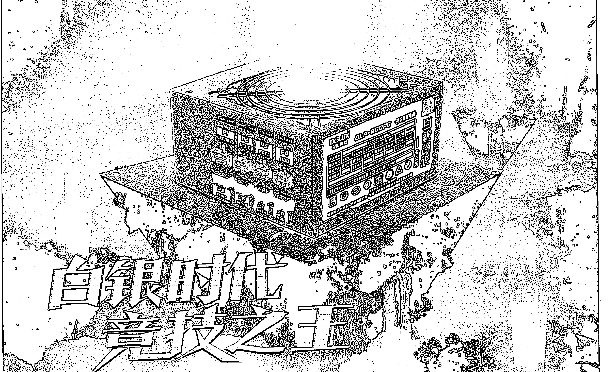

## 白银帝国

白银时代DLP-650PG专业版(450W) 白银时代DLP-600PG标准版(400W)

- 模组化管理
- 绿色环保
- 支持Win7
- 节能省电

多彩白银时代系列电源，银质肌理，强韧钢韧。自由模组管理，完美支持Win7，风云争霸，动能无限。80PLUS铜牌认证，绿色环保更节能，动力之源，战无不胜。荣耀王者，谱写白银帝国传奇！

深圳市多彩实业有限公司 网址：www.deluxworld.com 免费服务热线：400 699 0600

# # 电脑爱好者

合订本·2010上半年

电脑爱好者杂志社

## 《电脑爱好者合订本》2010年(上)

- 主管单位：中国科学院
- 主办单位：北京《电脑爱好者》杂志社
- 顾问：郭传杰
- 社长：葛程远
- 执行社长/总编：封立鹏
- 出版部：聂 静（主任）
- 副主编：潘留军
- 发行部：刘丽华（总经理）
- 办公地址：北京市海淀区翠微中里14号楼4层
- 通信地址：北京123信箱（《电脑爱好者》杂志社）
- 邮编：100036
- E-mail：chat@cfan.com.cn（稿件请投相应栏目信箱）
- 网址：http://www.cfan.com.cn
- 总机：010-68130909
- 广告客户部：010-68250606/68251818/68258181
- 读者服务部（发行）
    - 联系方式（周一至周五，9:00~11:30，13:00~17:30）
    - 在线QQ：864186362 手机短信：13801293315 电话：010-68258784
    - 邮购自助查询：010-68259307 / 68259457
- 零售：全国各地邮局（所）
- 国内发行：北京报刊发行局
- 邮发代号：82-528
- 刊号：ISSN1005-0043/CN11-3248/TP
- 印刷：北京外文印刷厂
- 广告许可证：京海工商广字第0055号
- 法律顾问：北京周涛律师事务所（网站www.zt148.cn）
    - 电话:010-63141013，13366185341

本书如有印刷或装订质量问题，我们负责调换。E-mail：publish@cfan.com.cn

图文版权所有，未经同意不得转载、翻印

全套合订本（正文+配套4DVD） 定价：39.8元

# # 2010年《电脑爱好者》合订本（上半年）配套光盘DVD目录

### 音乐DVD

奥斯卡获奖电影金曲及主题曲(117首)

童年儿歌经典(85首)

美国乡村民谣(80首)

少数民族音乐精选(120首)

古典纯音乐(300首)

不可不知的中国民乐(78首)

青春无悔-校园歌曲(60首)

背景音乐之旅(98首)

汽车音乐发烧之旅(30首)

抒情轻音乐系列(55首)

胎教音乐系列(16首)

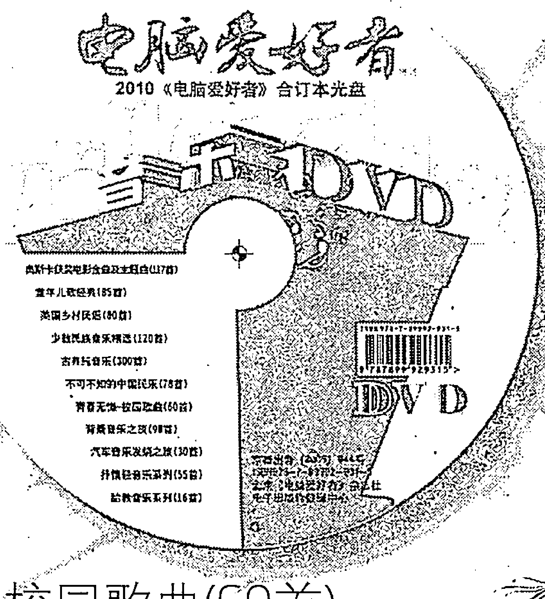

### 教程DVD

1.电脑入门：

2.电脑应用：

系统安装与维护

常用软件学用教程

Vista学用教程

互联网应用教程

Windows 7学用教程

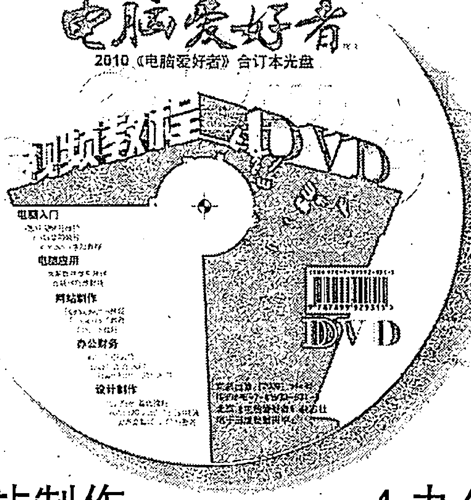

3.网站制作：

4.办公财务：

5.设计制作：

Dreamweaver 8教程

Word 2007入门

3ds Max8基础课程

Fireworks 8教程

Excel 2003 入门

Auto CAD 2010入门到精通

Flash 8教程

PowerPoint 2003 入门

会声会影10入门与提高

### 目录

### 游戏DVD

#### 42款PSP经典休闲游戏合集

- 俄罗斯方块
- 无敌格斗
- UFO光束大捕捉
- 斯巴达勇士
- 方块精灵
- 一起来高尔夫
- 新变形战机
- 泡泡猴
- 僵尸大亨
- 异型浩劫
- 梦想弹珠台
- 升空
- 洗脑管道
- 3D保龄球
- 同色方块
- 魔幻砖块
- 66号高速路线
- 回声
- 炮塔防御
- BT泡泡
- 多彩水晶球


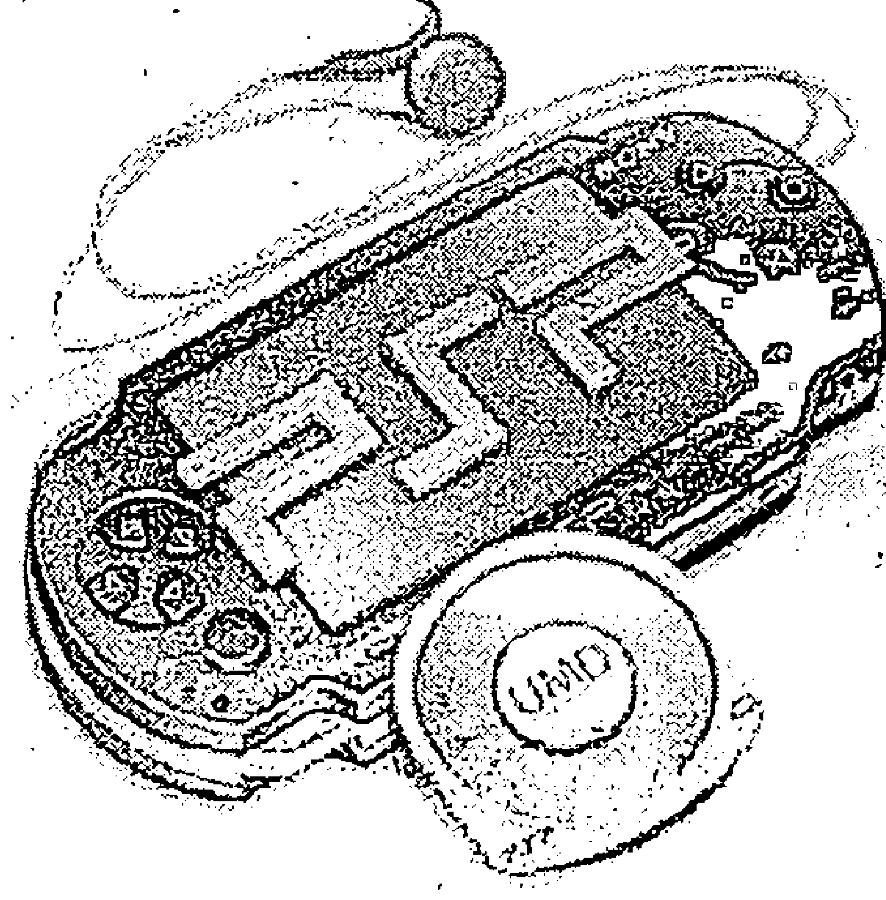

- 女忍传说
- 异形僵尸大战
- 恶魔方块
- 战斗扑克
- 数独PSP
- 无重力战机
- 梦幻弹珠
- 电报填字员
- 福特克斯
- 空间魔球
- 红牛摩托车特技
- 立方体星球
- 解谜方块
- 赫拉克勒斯战车赛
- 超级口袋网球
- 大家来找茬
- 超级汉堡店
- 雪人运动
- 飞行棋
- 麻将考古2
- 美味果酱店

### 软件DVD

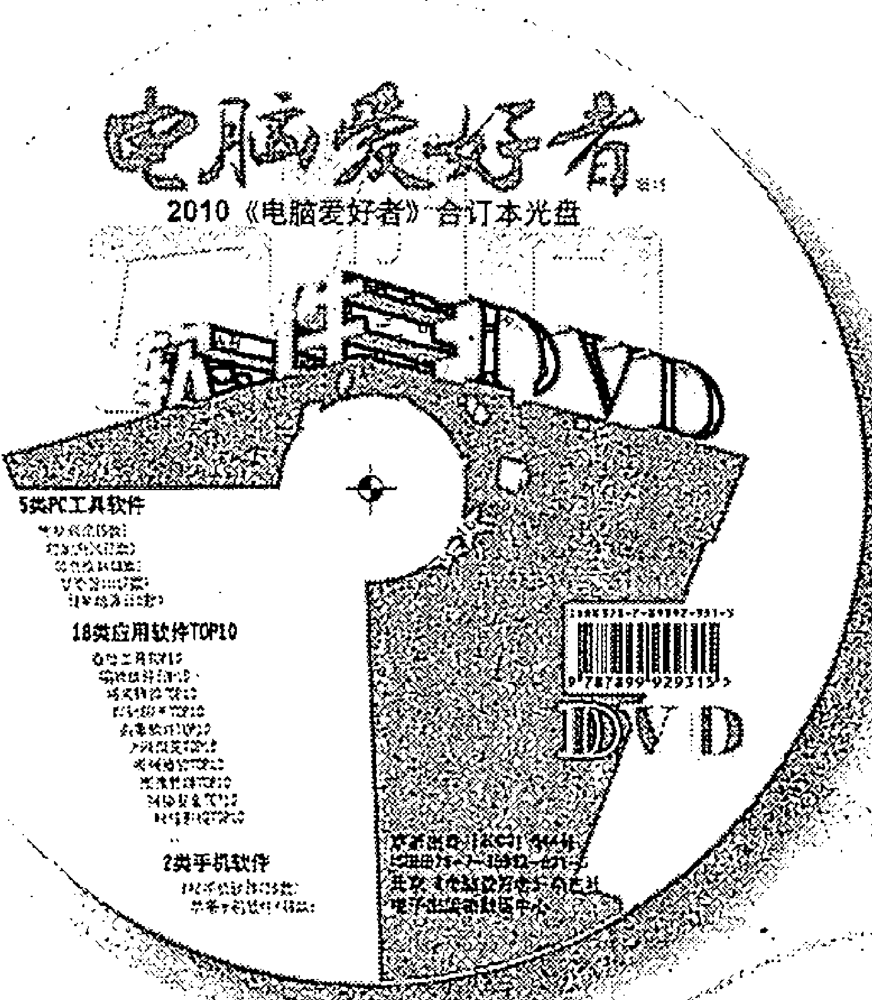

#### 5类PC工具软件

- 性能测试(5款)
- 稳定测试(7款)
- 信息检测(3款)
- 状态显示(7款)
- 性能增强(10款)

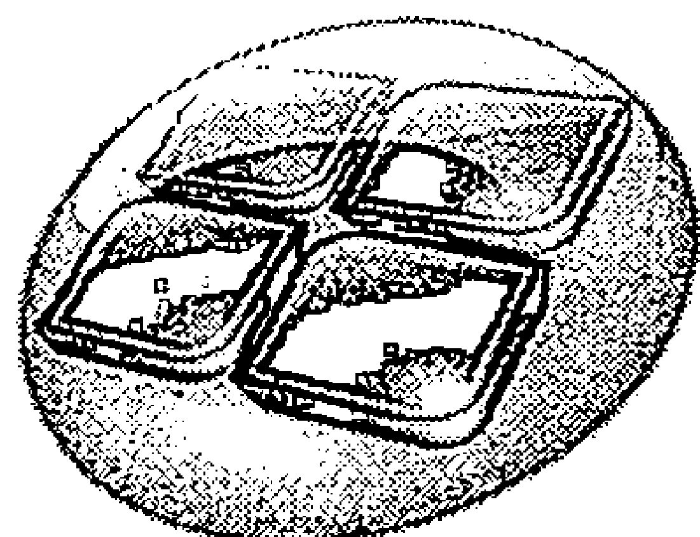

#### 2类手机软件

- PPC手机软件(75款)
- 苹果手机软件(48款)

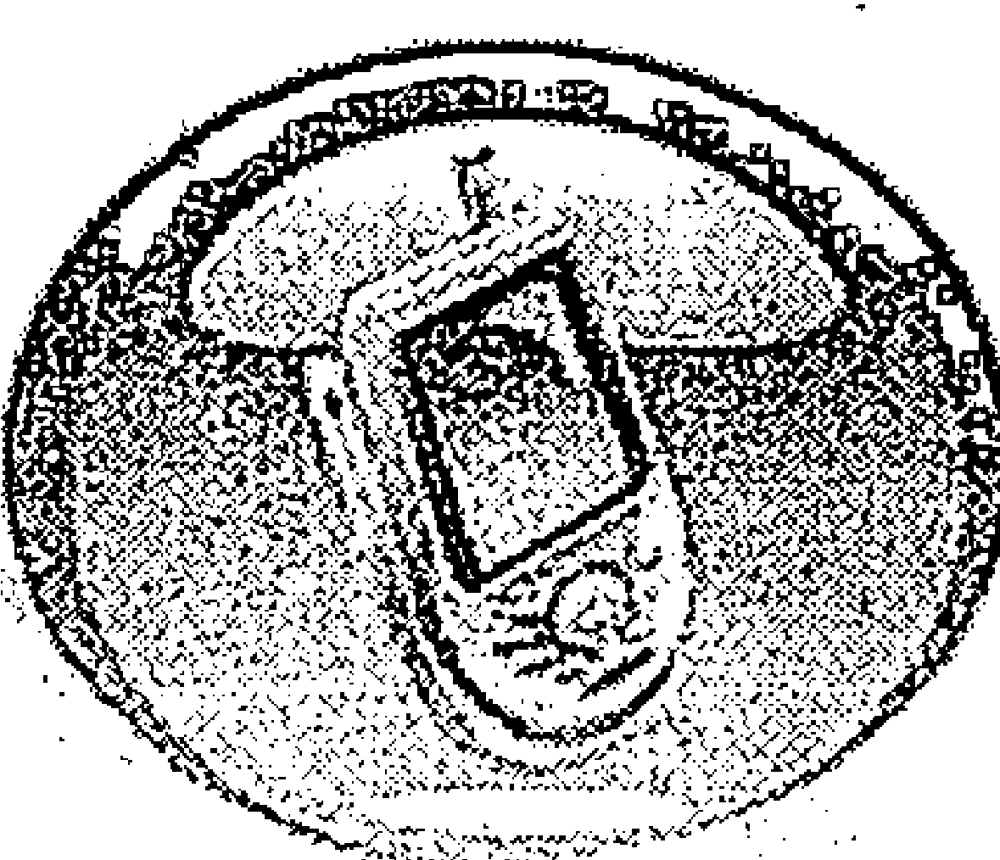

#### 18类应用软件TOP10

- 备份工具TOP10
- 编辑软件TOP10
- 格式转换TOP10
- 即时聊天TOP10
- 杀毒软件TOP10
- 上网浏览TOP10
- 视频播放TOP10
- 图像处理TOP10
- 网络安全TOP10
- 网络影视TOP10
- 文字处理TOP10
- 系统安全TOP10
- 下载工具TOP10
- 音频播放TOP10
- 邮件收发TOP10
- 游戏娱乐TOP10
- 中文输入TOP10
- 桌面辅助TOP10

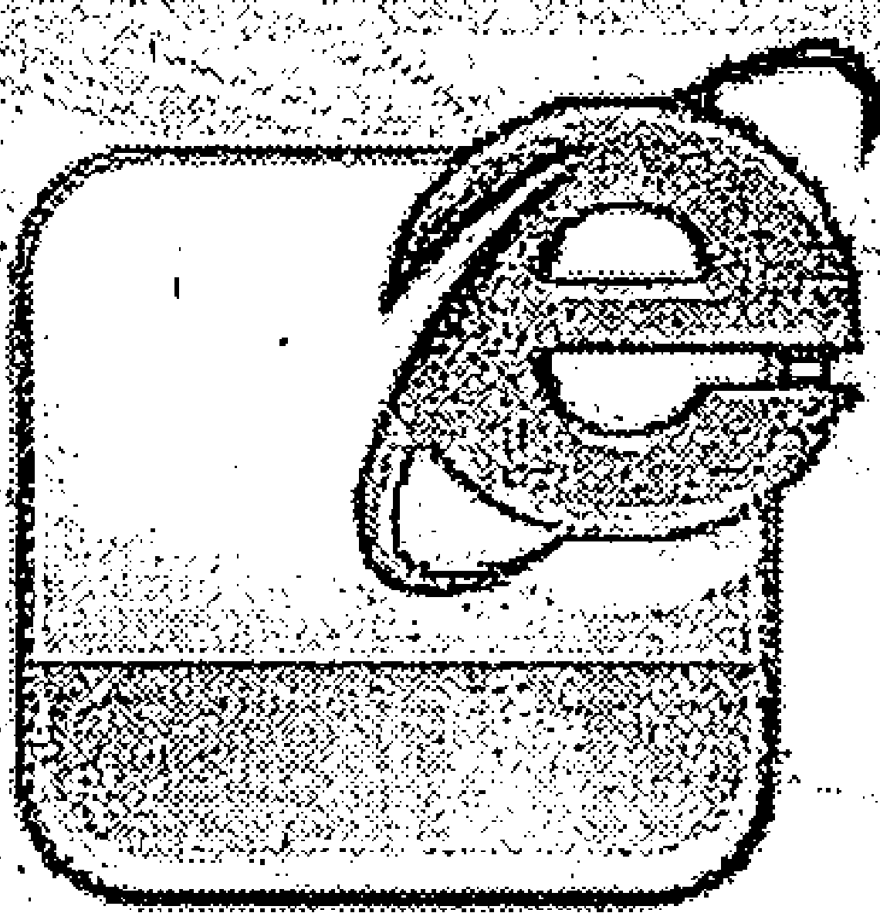

## CONTENTS
电脑爱好者2010（上半年）合订本
[邮发代号:82-528]

### 新人帮

19 谁说IE不好用 8.0我替你出头

19 精彩不错过 上网看NBA啦

20 漂亮的格式 请替我复制一百个!

20 老机也疯狂 老电脑升级可行性研究

21 登录系统不动手 一张大脸走天下

21 微操作控制通知区域的图标

21 好奇也有错 一键还原安装要谨慎

21 获取电源效率报告

21 省钱是王道 UCWeb免费下歌

21 小工具快速添加自启动项

22 好“摄”飞叔与小LOLI的故事

22 亲们 我回来了 闷豆出山记

23 别对我撒谎! 别让同事偷看你的秘密

23 Happy就要“吼”出来!

23 让XP用户也能享受PC Safeguard的功能

24 声卡玩双飞 妹妹很开心

24 有病看病! 数码潮人的就医指南

24 给点阳光就灿烂 给个指令就自转

24 HotMail不要拒绝我

25 免费午餐有很多: 免费杀毒软件大展示

25 闪盘复制太Out 轻松同步赏大片

25 装机从CPU“摸”起

26 我只要第一次! 软件设置不重来

26 谁比游戏BOSS更强大?

26 春节期间节目多 精彩内容勿错过

27 “收藏夹征兵”有捷径 不同方式也能行

27 “文件捆绑”就是“寄居蟹”

27 PDF也能玩填表

27 “选择性粘贴”: Excel也能用

27 选处理器先认清接口

27 QQ农场全屏何需找助手?

28 大起底: 游戏机刷机的秘密

28 逾越办公代沟 Office兼容性大提升

28 干净高效的“一键GHOST”

28 判断QQ好友之我见

29 打开邮件就听歌儿

29 打回原形 Win7怪异操作快速上手

29 治疗加预防 拉闸限电也不怕

29 文档转图片 打印、保护两相宜

> ○不想当破烂卖的老电脑还能升级使用吗?
家有旧电脑,运行速度慢,当破烂卖了得不到多少钱,接着用又觉得很不爽。花些钱升级一下可行吗?
怎么升级?老机箱能否继续服役?老电源能否支持现在的流行平台?主板是否能用流行的新主板?老主板能否使用流行的大硬盘……
请看文章《老机也疯狂 老电脑升级可行性研究》
P20

31 手机变身PPT遥控器 原来很容易

32 三分钟安全教室: 英文安全术语非天书

32 当虚拟照进现实: 柯南眼镜的秘密

32 老爸老妈看电影不发愁

32 MSN保护盾: 提供更安全可靠MSN聊天

32 手机下歌 不用UCWeb

33 虚! 别乱说 淘宝淘极品二手本本

33 精美幻灯片 模板帮忙建

33 欣赏外国大片 不当“睁眼瞎”

34 《天下无贼》Ⅱ——目中无贼!

34 奸商“多核多线程”骗术大揭秘

35 省钱最大化 Wi-Fi路由器+手机GPRS上网

35 选好屏幕来摸7

35 巧用DNA MP3更名全自动

35 QQ音乐批量免费下

35 我用二维码 与时俱进

36 五雷轰不死 我有铁布衫

36 无需东搜西找 翻译专家就在眼前

36 只要想下载 方法总比困难多

37 烟花三月下“洋洲”

37 数据双保险 “兽兽门”岂能再现?

38 电脑城 京东网 淘宝网年后淘货大对比

38 一心两用 “双显”让游戏电影两相宜

38 临时文件夹: 垃圾站? 还是宝藏库?

39 快刀斩乱麻 歌曲齐刷刷

39 局长 记账得用专业工具

40 RAR压缩包密码瞬间可破!

40 360开机加速 一键优化更方便

40 小菜鸟用“方案”选“高清机”

41 最强大的批量改名工具

41 免费赚Q币 其实有门路

41 手机最大只能下载3MB?

41 谁“吃”掉了本本显卡的性能?

### 《电脑爱好者》·合订本

- 43 视频下载 我有好办法
- 44 为闪盘制作专用软件界面
- 44 100英寸玩WOW!
- 44 1M带宽在线看高清?
- 44 揪出偷菜黑手何需第三方“警察”
- 44 刷BIOS的噩梦
- 45 我的视频 最爱“被分享”
- 45 就是不装软件！懒人备份大补贴
- 45 封杀“午夜凶铃” 系统声音智能调整
- 46 京东、淘宝还是易购? 笔记本网购哪里最省心?
- 46 QQ音乐虽然好 适时减肥无烦恼
- 46 写信模板 让简历写作更简单
- 46 都是兔子惹的祸
- 47 软件是如何“被破解”的?
- 47 拒绝Office 2007安装微软拼音输入法2007
- 47 半智能 一场游戏一场梦?
- 48 游戏的躯壳 电影的灵魂
- 48 不能忽视的“热源”：北桥
- 49 老爸！输入法不用装 也不用学！
- 49 单位工作 家里BT
- 50 照片怎么放大都能清晰的秘密
- 50 快速查看陌生人日志
- 50 春游当选离线地图
- 51 诺基亚的免费大餐 塞班导航Go Go Go
- 51 谁说刻盘是件麻烦事?
- 52 CG不过如此！揭开电脑绘画的神秘面纱
- 53 廉颇未老！老本内存升级计划
- 54 扔掉记事本 健忘症良药不苦口
- 54 搜索网站无法制作？免费空间不支持ASP！
- 54 格式工厂的五大绝活
- 55 网络电视的第一次亲密接触
- 55 换种方法 也能玩个性搜索
- 56 硬件评测软件的数据可信吗?
- 56 电视购物中的小把戏：嵌入式系统

## 特别话题

- 57 为什么他们“被搜索”了？搜索黑客的10条绝密笔录
- 59 浪漫圣诞节 你该把什么装在他（她）的袜子里
- 61 三刻拍摄惊奇 DC相片美感瞬间提升3倍！
- 62 不叫“偷菜”叫“采摘” 不会“开心”不应该 SNS网站迅速成长秘籍
- 63 “寒”城攻略做个快乐的单机游戏狂
- 65 没有你 我怎么办？ BT种子复活记
- 67 网上都是活雷锋 18个顶级网络省钱术
- 69 棒子棒子鸡！虎年做个铁公鸡！要面子 不花钱的7种捷径
- 71 男人必会的4种优盘魔术
- 73 韩局长是个好干部！“日记门”背后的6道必答题
- 74 去伪存真 选高清MP4这般不如意？
- 76 12个摄像头你身边的福尔摩斯
- 78 不无线不主流！无线耳机让你尽显“潮本色”
- 80 浏览无障碍超速免罚单 4款最新车型领跑Internet

- 82 买一赠一 AMD 8系列芯片组玩法大解析
- 85 机器与钢铁的决斗 低配放高清的7道难题
- 87 2010！6.11-7.11 你的世界杯主场

#### 系统应用

- 89 别玩虚的 让一键恢复名符其实
- 89 3项改动调出梦幻桌面 耍酷装帅止住1吨口水
- 89 拯救被一键还原“私吞”的D盘
- 89 寻找丢失的备份系统
- 90 我要独立！让多系统启动不互相牵绊
- 90 “时光机”卷影副本 回到过去治后悔
- 90 一劳永逸 删Windows 7多余通知图标
- 91 学生的免费正版 Server 2008变身Win7三部曲
- 91 坐骑浏览器 未来系统
- 91 我删了所有文件夹
- 92 没两把刷子 怎么闯江湖？3大领域 8项策略 全面搞定Win7兼容性
- 92 电话删除闪盘？！
- 93 3枪防毒 给移动硬盘加上无敌只读
- 93 关键进程误被干掉……
- 93 人不在 魂儿在 宿舍电脑使用情况全掌控
- 94 1清2调3顺 搞定大硬盘与系统的“新仇旧恨”
- 94 让Bing背景进驻Win 7
- 95 “祸”上浇油？微软拼音！
- 95 不中毒 不误删 大容量 新款VHD安装盘火热登场
- 96 岁末收拾系统 给自带程序配上10种“核武器”
- 96 主题单调？取出藏在系统角落的巧克力
- 97 记性不好？用数字证书加密！
- 97 当explorer.exe被绑架
- 97 山寨XP？雨林木风Ylmf OS抢先尝
- 98 “计算机管理”带来的崩溃
- 98 抢救RAW闪盘中的文件
- 98 情人节 给MM的本本一个Big Surprise!
- 98 蓝屏的脸不好看 开启AHCI拒绝蓝屏
- 99 I Believe I Can Fly 就是比你快！7招让电脑健步如飞
- 100 指哪打哪 还哥一片纯净磁盘
- 100 不请大爷请小爷 终极攻陷系统指标
- 100 这是事实：无须量产打造系统安装闪盘
- 100 山大王版Windows 7？上网本专用系统

> > CO小贴士 也许你已经被人肉搜索了
>
> 你想从网上搜索到某人的隐私吗？你是不是想知道自己是不是也“被搜索”了？
>
> 你常常为网上找东西容易，找有用的东西很难而感到苦恼吗？
>
> 你想知道“人肉搜索”是怎么一回事吗？
>
> 你想知道怎么对他人进行“人肉搜索”吗？
>
> 你想知道怎样防止自己被“人肉搜索”吗？
>
> “人肉搜索”与防“人肉搜索”的10大秘诀告诉你答案。
>
> 请看专题《搜索黑客的10条绝密笔录》

### 目录

- 100: 老电脑也用XP模式
- 101: 那些传说的美好 抓住被微软放飞的安全信鸽
- 101: 重装系统一波三折 Ghost不行用PE
- 102: 找回Win7图标 我有全能神KEY
- 102: 微软反盗版全球黑屏 我们成惟一例外
- 102: 听@Windows 7新增命令行的闷骚独白
- 103: 强！闪盘让电脑在黑夜与白昼之间徘徊
- 103: 效率时代 公式输入还是手写快
- 103: 分享经验 录像“救命三部曲”
- 103: 天冷 桌面图标冻住了……
- 103: 光驱到用时方恨少
- 103: 网站挂马分析 3秒出结果不是神话
- 104: CFan奇谈：电费比电脑还贵？1算2省3硬上 三招成就省电达人
- 104: 避免鼠标手！抛却烦人的双击
- 105: 获取Windows 7的“尚方宝剑”
- 105: 裸奔天下！挂在胸前的“电脑”
- 105: 保护隐私 将重要文件排除在搜索之外
- 105: 给上网本分区的波折
- 106: 一盘走天涯 将闪盘变身100合1的工具
- 106: 让唐僧闭嘴 多余补丁不再提示
- 106: 进程老仙 法力无边
- 106: 咱们XP有力量 我也能用“上帝模式”
- 106: 新装Windows 7 我要指定盘符
- 107: 重现四大守财奴 看他们如何保护自己的电脑
- 107: 系统也有店小二 私建账户时喊一声
- 108: Ubuntu下装显卡驱动 天下仅此一解
- 108: 限制孩子聊QQ 我用系统自带功能
- 108: 自制U盘工具箱 PE、Ghost双引导
- 109: Pcshare“后门”八招偷光用户账号隐私
- 109: 版本不对引发连接错误
- 109: 危险进程 菜鸟也能挑出来！
- 109: 金山舞剑 意在奇虎？
- 109: 无负载扫毒还是DOS可靠
- 109: 用Ghost修复SD卡
- 110: 游戏照常玩 广告我说NO！
- 110: 用72KB抵御数以万计的病毒
- 110: 鬼影病毒 只是一个传说
- 110: 让奔腾“芯”跳跃在Win7 XP模式下
- 110: 不怕忘密码 KV2010文件加密双保险
- 110: 驱动导致刻录机变慢
- 111: 日记曝光 Win 7与XP畅通无阻
- 111: Windows 7搜索不能只搜文件名

- 111: 上网故障 莫忘检查账号
- 112: 多媒体键盘玩出多账户、多功能
- 112: 三步通晓诺顿360“底细”
- 112: 瑞星专家提醒：警惕木马“自杀式”袭击
- 112: 病毒转居隔离区是“杯具”吗？
- 112: 绝密！每分160字！一分钟练成！
- 113: 瑞星专家提醒：首页劫持木马色诱用户中毒
- 113: Win 7 SP1补丁堆里仅有两朵新花
- 113: 清算陈年旧账清理不用的操作系统
- 114: U盘也是修复 多系统引导的利器
- 114: 为看美女图片 我让Win 7三级增速
- 114: 放行设置 别让UAC自作多情
- 115: 能“打开”就能修复文件
- 115: 常在江湖飘 怎能不中招？
- 115: Tabbles发新品 回味微软WinFS的余香
- 115: 凤姐已整容 U盘启动画面更要美化
- 115: 找回摄像头 快速启动照相机
- 116: 老电脑打激素 USB启动照样行
- 116: 格式化再恢复也能拯救U盘
- 116: 恢复误删分区 要选对软件！
- 116: 瑞星专家提醒：恶意篡改IE首页方式不断翻新
- 116: Ubuntu安装盘
- 117: 迅雷URL扫描 谁家的“杯具”
- 117: 窗口组队 同进同退 一键控制
- 117: 治疗不完全杀毒的后遗症
- 117: 要玩“库” 先让“库”图标更“酷”
- 117: 软件与生俱来的“杯具”——后门
- 118: 放一只羊与放一群羊的区别 菜鸟网管成长记
- 118: JPG图标病毒 冰刃手到擒来
- 119: 迈克菲、小红伞接踵而至 两种风格新鲜体验
- 119: 这张盘被借疯了 完美集成32\64位系统
- 120: 桌面筹建超级回收站 强删各种文件
- 120: 双系统无敌 老系统帮你搞定驱动难题
- 120: 瑞星专家提醒：导航海盗木马绑架IE首页 网站流量变“赎金”
- 120: 打破障碍 Windows下照样玩Linux
- 120: 禁止东张西望 漂亮桌面这样“娶”回家
- 121: 无忧 无惑 无痛 无难 善用Win 7组件摆脱四大难题
- 122: U盘大门常打开 维护工具随意加
- 122: 不再挠头 恢复杀软配置一招鲜
- 122: 巧用卡巴斯基游戏模式 营造专属游戏空间
- 123: 微软新发“触摸补丁”欲作硬件推手
- 123: 治愈“Rotinom”病毒 学用清毒三味药
- 124: 变身钢铁侠营救Windows账户
- 124: 回收站清理咱也能“挑肥拣瘦”
- 125: “图片”后门诱惑大 “无隐私阶级”诞生
- 125: 模仿QQ 窗口都能自动隐藏
- 125: C盘唱空城计 只需修复分区表
- 125: 最后的救赎 用江民KV2010光盘给电脑杀毒
- 125: 问不倒小红伞有奖问答
- 125: 安装小红帽救活XP
- 126: 无光驱无忧盘 一根网线帮你装系统
- 126: 根治PE“健忘症” 扎根硬盘不怕重启
- 126: NTLDR丢失 记得检查启动四文件

### 0电脑受欢迎 主要在于批量处理效率高

说起干活，一台电脑能顶上几个人、几十个人、几百个人、成千上万甚至更多人。从我们日常生活中经常要进行的文件操作、图片操作等就能感受到它的好处。电脑中可以使用的批量操作技巧很多，但Google搜索引擎显示，最常被网民搜索的4大批量技巧是如此这般——欲知详情，请看文章《给点阳光就灿烂 给个指令就自转》P24## 长相很一般 为何照出的照片赛天仙？

数码照片“三刻拍案惊奇”带给你许多简单易用的技巧，让你不用换相机、不用买镜头，相片美感瞬间提升3倍以上！请看文章《DC相片美感瞬间提升3倍！》**P61**

## 网络应用

- 127 网络相册关不住 帅哥美女出墙来
- 127 抽出Flash中的文档 豆丁网巧下载
- 127 适合的才最美——快速找到需要的图
- 127 共同的回忆共同来维护
- 128 千里取文件如探囊取物——手机遥控电脑
- 128 美女 “玩” 一分钟就换
- 128 玩转飞信——批量加好友
- 129 天下网盘是一家
- 129 浏览器“兼职” 会的不只是浏览
- 129 远程监控自己家——2套方案让QQ变身看门狗
- 130 微软“推”一把——MSN也来玩微博
- 130 跟网管捉迷藏 休想挡我听音乐
- 130 20MB 30秒 异地文件瞬间同步
- 131 Wave试水Web3.0
- 131 仗剑走江湖 极速玩网游
- 131 更快一秒“预见未来”——搜索直接看结果
- 131 体检 你的网站合格吗？
- 132 3步 本本摇身变WiFi基站
- 132 人脉决定命运——人脉拓展的3堂课
- 133 盘点2009年3大跳票——看未来网络众生相
- 133 不花1分钱 白得1台无线路由器
- 133 网盘下载 向低速说No！
- 134 CFan金酸梅敲打网络 这些功能2010可以有
- 134 打破断线魔咒 在线谷歌服务本地用
- 135 QQ SP6 2009年的最后疯狂
- 135 揪出QQ农场的偷菜黑手
- 135 Google Bye!
- 135 专治图片不显 探索红叉背后
- 136 驯服傲慢MSN QQ没有的我还有
- 136 百度被黑 谷歌撒娇 搜索引擎集体感冒？
- 136 解放双手 让玩网游更轻松
- 137 过大年 网店赚钱与休假两不误
- 137 MSN多标签聊天敞开聊
- 137 太危险 QQ密码是这样被自己出卖的！
- 137 远程取文件 没共享我也能拿来！
- 138 我是大明星 卡拉OK歌王复仇记
- 138 微博硝烟起 没有第2的战争
- 139 一键登录网易163
- 139 股市行情尽在QQ掌握
- 139 Foobar2000 1.0正式版曝新料
- 139 永久可下载 Rayfile热门资源散“余温”
- 139 QQ和TM唱二人转 破解QQ隐身设置上限
- 139 偷窥陌生人的QQ日志
- 140 唐骏 吃谷歌的“豆腐”？
- 140 More Scripts 定制傲游私房菜
- 140 超级工具箱 解决WebMail的4大难题
- 141 躲在被窝里上网——手机与网络的约会
- 141 聊天窗口的瞬时粘贴工具
- 142 3步！网盘变身在线播放器
- 142 NFS牵线 高清播放器直播电脑大片
- 142 我送你离开 千里之外 你无需回来——聚会在线现场直播
- 142 网易邮箱好兼差 充当多能阅读器
- 143 谷歌Buzz 看个热闹就好
- 143 老板眼皮底下用Excel偷偷聊
- 143 酷！QQ空间张贴约会地图
- 143 找个中间人 RSS看全文不用上网站
- 143 不用外挂 工作 偷菜两不误
- 144 315网络栏目特稿 小心 谁在偷窥你？！
- 144 QQ空间贴图一键到位
- 145 电信有猫腻 我的E家路由藏超级用户
- 145 抢先评：HTML5为Flash掘墓？
- 145 随时聊 最关注的好友放到桌面上
- 145 手机实时邮 E-mail让短信下岗
- 146 剪片网页补桌面 网络新闻即时看
- 146 混乱的SNS 看我怎么整治你
- 147 QQ兔斯基“改嫁”微软MSN
- 147 扔掉数据线 Myphone随时随地玩手机通信簿
- 147 千头万绪RSS 多维定位快速查
- 147 欲退还留 谷歌其实就没走
- 148 在线视频不卡 无线上网“刷刷”！
- 148 不限量 无水印 打造永久外链图片站
- 148 一个人做二份工 QQ兼管本地音乐
- 148 MSN放下身段 像QQ一样随机交友
- 149 腾讯冲“浪” 微博硝烟又起
- 149 和BT说拜拜 下载就用迅雷磁力链接
- 149 连吃带打包 把谷歌服务留住
- 149 网盘遥控器 单位上网家里BT
- 150 群友群助 胜过搜搜问问
- 150 破解百度新歌真实下载地址
- 150 预约物联网 打造智慧家庭
- 151 模糊记忆中找回完美世界
- 151 多网关自动切换 内外双网通行无阻
- 152 QQ概念版 玩的不是寂寞 是花瓶
- 152 开马甲 Q宠治病不花钱
- 152 虾米钓鲤鱼 赚取Dropbox免费空间
- 153 破解微软官网的下载限制
- 153 Foxmail悠着点 别乱记别人的邮箱
- 153 藏好脱机文件里的秘密
- 153 微博更新N合1
- 154 别信邮箱！小心被撞开隐私门
- 155 网站小说更新专用提醒器
- 155 网易借MSN翻身内幕
- 155 网管封不住 电驴出墙来
- 156 网盘里搜索出不一样的秘密
- 156 收到回信没？QQ邮箱免费短信告诉我
- 157 手机告急 无“线”如何与PC隔空对话
- 157 轻轻松松 十分钟把VeryCD整个搬回家
- 157 减的是“肉” 增加的是效率——手机QQ大瘦身
- 158 淘宝试衣 网购也量身定制
- 158 潜伏 小文件禁特定QQ登录
- 158 足不出户也能逛世博
- 158 MSN聊天记录漫游记
- 158 酷网千寻

## 软件应用

- 160 杀软给望风 垃圾邮件自动清除
- 160 迈出软件智能化一大步
- 160 水到渠成的“开发” 为理想而生的“软件”
- 161 省钱又省纸 用软件免费看报纸
- 161 常规加一点小聪明 手杀jwgkvsq.vmx病毒
- 161 文件没了 全是快捷方式 咋办?
- 161 不留污点到明年 瑞星问题各个突破
- 162 一二一 杂乱文件按类别站队
- 162 武汉软件大户 两天开发一个软件
- 162 菜鸟老鸟都来看 超级兔子两大“问题”提前
- 162 人人都是“字符帝” 两步诞生Word字符画
- 163 不坐冷板凳 Windows MediaPlayer也是Windows 7悍将
- 163 老电脑装Windows 7驱动不再是问题
- 163 哑巴英语新主张 聊天不怕外语难
- 163 听歌 看电影一个就行!
- 163 暴风小广告 你一边去!
- 163 临时注册 一键申请邮箱
- 163 重启不慌乱 工作照旧
- 164 年终让兔子帮你清理电脑垃圾
- 164 轻松设置 让瑞星如虎添翼
- 164 一条快捷方式 熟混黑白两道
- 164 子目录再多也不怕 XnView图片转换一锅端
- 164 病毒茶几
- 164 闪图表情 谁用谁闪亮
- 165 《蜗居》新编小贝 宋婷婷与小三的电脑之战
- 165 金山新年改脾气 病毒库更新速度向“钱”看
- 166 帮你拔掉钉子 清除杀毒软件有“专杀”
- 166 兔子快跑有技巧 菜鸟常遇问题一答一
- 166 春节回家 看照片要懂“走马观花”术
- 166 新春临近发短信我有新妙招
- 167 我有金算盘 分区刻盘不用掐指算
- 167 比比就知道 普通电脑也能High音乐
- 167 注册表故障就得迷恋哥
- 167 内向男 三维图片巧传情
- 167 无视“裸奔” 有杀毒软件也运行如飞
- 167 加入云安全?
- 168 Windows 7下分区 只需拖一拖
- 168 老马之乐不在软件 在软件之间也
- 168 兔子也能看家 2010年带你防病毒
- 168 原配不行时 请出“安全小精灵”
- 169 傻郭靖学艺记 工具软件也能集众家之长
- 169 同时登录多个农场? 就用火狐!
- 169 不升级 照样摸死你(MSN)!
- 170 把游戏榨汁喝 精美资源单独提取
- 170 QQ影像新露尖尖角 “趁火打劫”恰逢时
- 170 有志不在年高 少年“高手”初长成
- 170 歌曲麻辣串 想怎么串怎么串
- 171 AV终结者木马新变种 拉多款杀软下马
- 171 群策群力 闪盘安全百花齐放
- 171 要力压群雄还是独“守”一方 抢鲜看Picasa3.6
- 171 和“90后”畅快聊天 非主流输入都在行
- 172 一条国外网盘链接引发的技巧竞赛
- 172 计算省一步 填报销单快人一步
- 172 左手撇 右手撇 两手都满意
- 173 王者能否归来? 新超级解霸
- 173 秒杀僵尸! 上班游戏你要机警藏窗口
- 173 病毒缠身 闪电杀毒手立即解围
- 173 用“家鸽”除伪杀毒软件 雷人而不失强悍
- 174 老百姓的P一下 何须PS亲自出马? 不用PS全能修图攻略
- 174 拦截窗口 兔子反弹天使重生!
- 175 既给面子 又保平安……暂离之后 电脑里的隐私保卫战
- 175 先练后秀 打字速度这样练就
- 176 与帝国战舰博弈 YLMF OS轻装上阵的故事
- 176 云时代 输入法也要“在云端”
- 176 多媒体之旅 海量电影·不再乱糟糟
- 177 不费事 第三方播放器也能硬解
- 177 人小鬼大 小鼠标实现多点多面操作
- 177 不只是看网页 兔子浏览器的绝活儿展示
- 177 汉字做密码 另类的文件加密更安全
- 177 一点即聊 巧用“快捷方式”快开QQ窗口
- 177 让迅雷更加“雷”
- 178 让火狐穿上气象员的“外衣”
- 178 永不再传 经典3式破解软件
- 179 顶级贴身服务? 网秦通讯管家抢先尝
- 179 MSN密码被盗? 密保天使保护你
- 179 混世魔王三板斧 三招让你的虚拟机水平与众不同
- 180 山寨到底 QQ词典打酱油or抢饭碗?
- 180 边看边下 满足你的动漫需求
- 180 只和陌生人聊天
- 181 非典型网络电视 CNTV暴风台能耐几何?
- 181 经典油画 来自Excel瞬间泼墨
- 181 妙生屏幕 3招轻松用好大显
- 182 我要我的音乐! 打造最高音质的CD大碟
- 182 借用一张灿烂的脸 让表情丰富沟通
- 183 拒绝春困 每天都有高工作效率

揭秘社会性网络服务迅速成长诀窍

社会性网络服务简称SNS，如果说这个专业名词你不知道，那么，网上“偷菜”你总该有所知晓吧！那么，要建立一个这样的网站，使它很快火起来并快速超越别人，这里边有什么秘诀呢？请看文章《SNS网站迅速成长秘籍》**P62**

## 办公应用

- 186 填表格式要统一 开发工具来规范
- 186 给出函数 WPS画出课件“抛物线”
- 186 修改颜色 制作“杂志级”专业表格
- 187 “简报”制作 Word其实很Easy
- 187 冬运会宣传缺灵感 Publisher来助阵
- 187 巧用WPS表格筑就强大万年历
- 187 孩子学数学 ET来帮忙——用WPS表格帮助孩子认识大数
- 188 所见即所得 剪贴板变身表格整合器
- 188 Project 2010新体验
- 188 用Word给图片打造漂亮边框
- 188 Excel 2010初次体验的惊喜
- 188 PPT 2010让我变身视频编辑达人
- 188 OneNote胜过Windows边栏
- 188 值得一提的PPT 2010三大新本领
- 189 活用Word表格“小天平” 完美制作错行表
- 189 我用WPS（校园版）玩转在线素材
- 189 专业写手必备的秘密武器——纯文本下的表格处理技巧
- 189 利润 成本分析利器：瀑布图
- 190 参与“Office 2010发现之旅” 为TA准备最好的春节礼物
- 190 辰昊 你打印的报表为什么这么差？
- 191 Word 2010清晰处理任务性文档
- 191 精彩动画 一刷了之
- 191 拒绝繁琐 远程共享广播PPT演示幻灯片
- 191 财务MM必备 WPS的钞票零钱计算器
- 191 Windows 7共享打印机遇“碰瓷”
- 191 Word 2010轻松发布博客文章
- 191 不再呆板的文本框
- 191 安全模式的秘密
- 192 用Excel 2010打印超大字
- 192 Outlook 2010大变身
- 192 2010年 当好数学老师真不难
- 192 PPT 2010达人宝典

## 校园新鲜人

- 193 困窘宝贝的“炯炯”IT生活
- 193 IT技术武装的红色社团
- 193 CFans'工作室 让我在高中收获万元第一桶金
- 194 人人网人气头像 玩的就是这个味
- 194 我这样进入IT名企：工商银行软件开发中心篇
- 194 大学食堂网络点评大PK
- 194 跟着字幕组练听力吧！
- 195 熬夜之谜
- 195 我和短信那些事
- 195 IPV6转IPV4 校园网路路通
- 195 大四宅男宿舍的IT装备
- 196 小妻 笨球和miniplayer
- 196 李雷与韩梅梅中关村买本记
- 196 IT雷锋 写一本《校园网应用手册》
- 196 白色情人节 送给TA最潮惊喜
- 197 I LIKE我的“活物”
- 197 咱也是文化人！搞笑对联自动生成
- 197 天书不再神秘 让WPS成为化学老师的秘密武器
- 197 极客系列千杯不醉？一杯即倒？
- 197 宿舍IT宝贝秀
- 198 寒冬刚过 愿君求职春风拂面
- 198 春节回家送健康 我请网络来帮忙
- 198 阿凡达3D立体效果DIY
- 198 校园DM广告 看我的
- 199 搞定主管联系方式 见证求职奇迹的时刻
- 199 把图书馆资料装进相机吧！
- 199 隐形眼镜 眼睛杀手！？
- 199 不可错过的校园之春
- 200 “自习室搜索器” DIY
- 200 高校edu.cn邮箱潜力大挖掘
- 201 胜利就在前方 考研的童鞋们冲啊
- 201 巧用Office 给简历加点新意！
- 201 点一份最适合你的IT认证套餐
- 202 WPS特色插件吉祥三宝
- 202 保研达人集结号
- 202 变身广告牌 你也是明星！
- 202 北师大里的计算机班
- 203 数据演示 文稿更具说服力——在PowerPoint中使用Excel数据透视图
- 203 为女友打造一个个性搜索引擎
- 203 天才的IT用语大补贴
- 204 零后青春果园 “网乐”你生活
- 204 那年我们十八岁
- 204 磁力巴克球 百变有玩头！

### O没有了BT 你的网络生活该怎么过

享受电影带来的乐趣，已经成为很多人生活娱乐的一部分。从诞生那日起，以BT下载为代表的P2P下载看电影的方法便进入了新的革命周期，众影迷朋友对BT、电驴等的崇拜更是趋之若鹜。树大招风，太火的事物往往都会遭遇“木秀于林，风必摧之”的下场，各国针对P2P下载相继推出限制法律就是很好的证明。就像已经被关停的那个网站BTChina的名称一样，BT早已在China普及。可没有你，我该怎么办？请看文章《没有你我怎么办？BT种子复活记》**P65**

- 206:《阿凡达》IT热词大盘点
- 206:校园电脑救急故事
- 207:4G在美国(4G in America)
- 207:工科堆里的理科班
- 207:零后青春果园①
- 208:珍爱生命给心灵一片晴空
- 208:巧用WPS打造最牛股市赢利试算表
- 209:乌龟变白兔 教育网无障碍提速招招鲜
- 209:玩预测 2010世界杯冠军是谁?
- 210:职场新鲜人邮件礼仪宝典
- 210:带你进入神奇魔术世界
- 210:零后青春果园②
- 211:寝室里IT宝贝的斗智斗勇
- 211:把大片装进口袋 随时随地练英语!
- 211:我这样进入IT名企:搜狐微博运营篇
- 212:要毕业啦!这些事情办妥了吗?
- 212:跨校淘宝创业 快乐猴娃卖拖鞋
- 213:含钛的法藤 真的能治脖子疼?
- 213:走 一起参加电视节目录制去!
- 213:零后青春果园③
- 214:纯纯的浪漫 让爱溢满QQ
- 214:在移动网络中社交(Mobile Web)
- 215:学英语 别忘了Word这个免费家教
- 215:我这样成为腾讯交互设计师
- 216:职场新鲜人之人际沟通宝典
- 216:我是学生我要优惠
- 217:聪明填志愿 网络帮你忙
- 217:巧用QQ校友查找你身边的同生缘

## 达人会馆

- 218:释放资源: 下载之后就退出
- 218:为自由而霸 开源GPL缘何佛挡杀佛
- 219:小编带你去暗访 看病毒专家如何分析可疑文件
- 219:伪技巧曝光台:听声辨人 自动关显示器
- 220:高山别墅不能上网?ADSL传输限制为哪般?
- 220:不同的幻灯片 控制同一声音
- 221:帮白领升值 邮件管理软件谁可担重任
- 222:擦亮双眼 认清系统分区和启动分区
- 222:无规矩不成方圆 探寻Windows 7的库
- 223:爱惜闪盘的小伎俩
- 223:显存与内存 李生兄弟终于分道扬镳
- 223:邮件附件巧分发
- 223:多人挑战:地址栏输入最简化
- 224:小问题最难缠 主页修改已陷僵局
- 224:一挑二:邮件附件巧分发+当“断点续传”附件时
- 225:忽悠吗?宽带平白提高四倍的传说
- 225:免打扰清爽看视频
- 225:终极挑战:系统维护闪盘mini版
- 226:不同的幻灯片 控制同一声音
- 226:释放资源: 下载之后就退出
- 226:强关进程 官大一级压死“人”
- 226:矛盾共同体:QQ“讨论组”
- 227:百花争艳 为什么唯独IE最红
- 227:大肚容天下?102合1光盘的秘密
- 228:假如Google退出中国 你还是你吗?
- 228:阵地大转移 网络危险 网页防!
- 228:微软“漏光”人人喊打 越俎代庖安全吗?
- 229:四款免费工具与EasyRecovery的决斗
- 230:IMAX大屏《阿凡达》的奥秘
- 230:组队秒杀“猥琐问题”
- 230:字幕组LOGO变身爱情图标
- 230:漂亮的透明背景日历
- 231:他住对门你很迷茫?探寻404网页故障的秘密
- 231:带你参观能驱赶“水印”的驱逐舰
- 231:Excel中相似单元格的连接
- 232:任意邮箱的“断点续传附件”
- 232:无线加密已是扯淡 WPA被高速破解的真相告白
- 232:揭开你的隐私 不登QQ 聊天记录轻松查
- 232:寻找最佳的下歌方式
- 233:拒绝黄赌毒 谁是称职的“护花使者”?
- 234:三足鼎立 谁的“压”力大?寻找最好用的压缩软件
- 235:电脑高频怪音何去何从?
- 235:牛“饲料”喂出牛硬件
- 235:节约用电 下完指定文件就关机
- 236:给闪盘找个“回收站”
- 236:破解压缩包的密码
- 236:本是同根生 共存也简单
- 236:垃圾骚扰不再有 屏蔽某地区的电话
- 237:系统整容找哪家 四款美化软件实例比拼
- 238:终极挑战:系统维护闪盘mini版
- 238:拆本拆谎言 电视购物太可恶!
- 239:自拍自编 谁是百姓家的“好导演”?
- 240:是什么弄花了你的贴膜
- 240:从iPad拔开SIM卡迷雾
- 241:高清年代 无敌画质可是传说?
- 241:优化惹祸 探寻桌面图标小箭头后面的秘密
- 242:Excel中相似单元格的连接
- 242:永不假死 HTML5干掉Flash的最大法宝?
- 243:啥!手机的GPS那么烂?
- 243:下载又快又稳 为什么用迅雷还会被鄙视?
- 244:系统维护王者争霸 一键还原谁是“哥”
- 245:娱乐无极限:征集《植物大战僵尸》的最有效阵型
- 245:“迅雷看看”不缓冲 超爽快速看电影

## 最新热读

软件运行得好好的，为何说你有病毒就有病毒？感觉电脑运行不对劲，怀疑是病毒，但用查毒软件一查，说没有病毒；电脑运行得好好的，但用杀毒软件一查，说里面有病毒。杀毒软件为何这么霸道，它说有病毒就有毒，它说无毒就无毒？欲知详情，请跟随我们的小编一道去做一次暗访，看看病毒分析师是如何判决病毒的。请看文章《看病毒专家如何分析可疑文件》**P219**

## 傻博士信箱

#### 系统

- 246 Windows 7下无法使用网银
- 246 Windows 7系统拷贝大文件经常卡
- 246 USB图标丢失
- 246 无法在任务栏中拖放程序图标
- 246 安装Windows 7提示找不到光驱设备驱动
- 246 如何将窗口放到桌面旁边
- 246 为何无法安装驱动程序
- 246 无法转换磁盘格式
- 246 无法访问桌面
- 246 备份文件提示空间不足
- 246 无法打开添加或删除程序
- 246 资源管理器菜单丢失
- 247 已经是SP3 为何提示更新SP1？
- 247 开启系统防火墙后局域网无法共享
- 247 无法将程序锁定到任务栏
- 247 声卡为何不能启用
- 247 硬盘图标变成光驱图标
- 247 运行Chkdsk时总是提示错误
- 247 CHM电子书打开变成了计算器
- 247 远程桌面总是自动取消
- 247 找回丢失的输入法状态条
- 247 无法打开系统管理工具
- 247 系统中的逗号变成P字母
- 247 启动时不加载Explorer.exe
- 247 开机时间变成2004年还要按F1才能开机
- 247 文件夹变成快捷方式
- 248 如何恢复桌面“计算机”图标
- 248 如何方便获取Windows 7文件夹操作权限
- 248 Windows 2008设置密码均不合要求
- 248 Vista偶尔蓝屏
- 248 找回Vista的休眠功能
- 248 无法玩游戏
- 248 部分软件界面文字变成“口”
- 248 “开始”菜单不显示历史文件
- 248 如何恢复图标显示问题
- 248 找回收站图标
- 248 系统升级进入死循环
- 248 部分文件夹为何不能正常显示
- 248 显示分辨率无法设置最大值
- 248 剩余空间很大但闪盘总提示空间不足

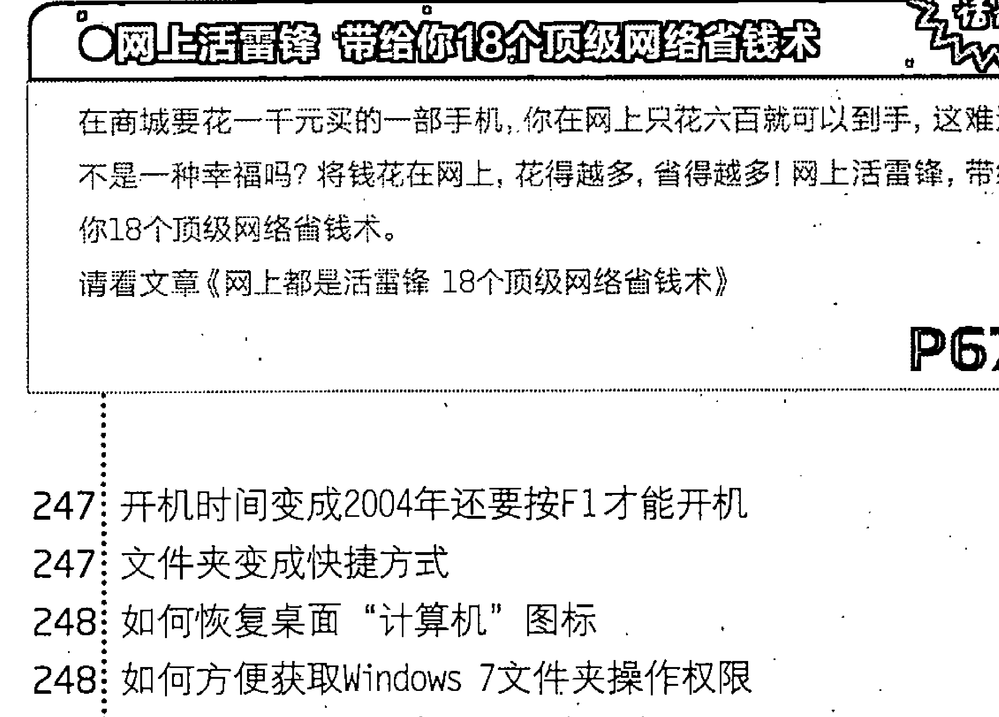

#### 软件

- 248 双系统丢失启动项
- 249 “打开”对话框中的常用位置错乱
- 249 如何找回丢失的网络连接图标
- 249 CPU使用率出现不吻合现象
- 249 系统主题为何自动切换
- 249 找不到Hosts表文件
- 249 系统出现延缓写入失败
- 249 休眠后无法唤醒
- 249 文件夹工具栏丢失
- 249 系统为何没有混音设备
- 249 如何修复系统中的常用目录
- 249 重启后快速启动栏总是丢失
- 249 系统总提示虚拟内存低
- 249 Win7玩游戏不卡WinXP却卡
- 249 光驱总显示前张光盘内容
- 249 找出丢失的音量图标
- 249 组策略设置不能保存
- 250 系统不能自动关机
- 250 安装系统补丁该信谁
- 250 系统启动就蓝屏
- 250 桌面快捷方式失效
- 250 安装程序被禁止
- 250 系统总是多出N个USB磁盘
- 250 更新显卡驱动程序后不能正常显示
- 250 装好系统后桌面显示不全
- 250 系统搜索功能丢失
- 250 找回“以管理员身份运行”项
- 250 如何直接关闭无响应的程序
- 250 在桌面打开C盘显示找不到脚本
- 250 壁纸自动换无法包含子目录
- 250 桌面上的“计算机”图标丢失
- 250 10GB空间只剩下1GB
- 250 Windows 7无法使用无线网卡
- 251 关闭系统后为何还会重新启动
- 251 无法打开桌面快捷方式
- 251 如何调整输入法状态栏位置
- 251 启动系统提示Boot.ini非法
- 251 天网防火墙提示无法加载进程保护
- 251 开机提示360Tray.exe错误
- 251 无法安装Java虚拟机
- 251 如何卸载金山英文写作助手
- 251 Office右键出现乱码
- 251 MP3转换器不能使用
- 251 DVD播放没有声音
- 252 加密文件如何重新找回
- 252 “可牛影像”为何不能制作2015年的日历
- 252 小红伞更新出现An internal error has appeared
- 252 搜狗输入法输入字母总会出现分隔符
- 252 软件移动一次后为何不能用
- 252 WinRAR地址栏丢失
- 252 瑞星升级提示12007错误
- 252 KMPlayer播放器不能使用多媒体键盘控制
- 252 经常弹出KAV script checker
- 252 相片无法预览
- 252 播放电影很卡
- 252 重新安装一次系统 部分视频不能播放
- 252 如何找回被卡巴斯基误删除的文件
- 252 Word 2007不能使用
- 252 McAfee无法启动按访问扫描程序
- 252 游戏时找不到d3dx9_25.DLL
- 253 ImgBurn无法检测到刻录机
- 253 为何不能安装卡巴斯基KIS 2009
- 253 无法安装“QQ第六感”
- 253 Word工具按钮呈无效状态
- 253 PotPlayer播放电影音量很小
- 253 软件运行出现乱码
- 253 千千静听与QQ声音的冲突
- 253 如何读取损坏光盘中的文件
- 253 KMPlayer切换全屏为何会黑屏
- 253 Foobar 2000皮肤为何不能使用
- 253 ESS总提示未能安装设备驱动程序
- 253 开了卡巴斯基就无法打开Google Earth
- 253 Word 2010不能运行
- 253 转换音频格式后为何导致体积增大
- 254 卡巴斯基不能成功启动
- 254 天网防火墙提示无法加载进程保护
- 254 360安全卫士清理插件时假死
- 254 卸载NOD32后总是提示错误
- 254 Ghost无法备份系统
- 254 DWG转换为图片后为何成空白
- 254 MSN无法连接，如何解决？
- 254 雨林木风OS系统下Firefox打不开
- 254 怎么Win7下迅雷老是崩溃啊？
- 254 为何只能打开一个人的QQ农场？
- 254 大体积压缩文件解压时总是失败
- 254 安装任务栏插件后 Foobar 2000最小化无声
- 254 驱动精灵安装驱动后为何仍不行
- 254 uTorrent无法上载续传
- 254 为何在其他电脑中显示正常，但到我这却乱了
- 255 Total Commander不显示文件图标
- 255 千千静听无法播放RM格式音乐
- 255 解压文件出现“不可预料的压缩文件末端”错误
- 255 无法安装阿里旺旺
- 255 启动Word 2003总是出错
- 255 Nero缓冲级别低、废盘
- 255 千千静听无法播放WV格式音乐
- 255 McAfee为何自动关闭
- 255 卡巴斯基2010无法更新
- 255 Foobar退出时出现写入错误提示
- 255 无法安装Symantec Endpoint
- 255 Foobar 2000播放列表顺序混乱
- 255 “千千静听”无法播放电台
- 255 无法安装VMware7
- 255 如何卸载“冰点还原精灵”
- 255 “搜狗拼音”无法输入汉字
- 256 QQ 2009无法运行
- 256 Word 2010 丢失右键菜单
- 256 无法使用千千静听
- 256 KMPlayer遇到字幕有数字时会发音
- 256 无法保存播放列表
- 256 Foobar 2000播放过程中显示错误

#### 网络

- 256 部分网络访问特别慢
- 256 Skype通话时总是自动静音
- 256 总是要修复本地连接才可上网
- 256 无线网络连接后不能上网
- 257 为何QQ农场不能偷菜
- 257 访问百度时需要输入验证码
- 257 无法关闭IE窗口
- 257 QQ农场为何串号
- 257 IE打开网页总显示需要刷新
- 257 QQ2009无法使用
- 257 IE主页被篡改为某不明网站
- 257 傲游浏览器无法打开部分页面
- 257 无法打开网页快捷方式
- 257 IE无法打开淘宝宝贝详细页面
- 257 Firefox无法设置为默认浏览器
- 257 迅雷无法下载4GB以上的大文件
- 257 无法安装QQ2010
- 257 QQ邮箱发邮件提示错误
- 257 局域网中无法访问内网网站
- 257 IE8不显示PNG图像
- 258 uTorrent下载不正常
- 258 Outlook新邮件来时不提示
- 258 去除QQ空间的中奖信息
- 258 按QQ截图快捷键却打开网页
- 258 关闭Firefox超级任务栏支持
- 258 开启ICF后局域网不能互访
- 258 打开网页时弹出警告提示
- 258 无法显示验证码页面
- 258 世界之窗无法修复红叉叉图片
- 258 Windows 7无法访问带密码的XP系统
- 258 uTorrent总是重新下载已删除任务
- 258 QQ无法修改密码
- 258 VeryCD中找不到“复制链接”
- 258 共享上网经常不能连接
- 258 网页浏览正常但是网页打印时却出现乱码
- 259 无法看优酷网视频
- 259 傲游“常用网址”丢失
- 259 开启防火墙“迅雷”无法BT下载

揭露网络生活体面而不花钱的N种捷径
在网络上当只铁公鸡，不仅不会丢人，而且还能很光明正大。免费杀毒、免费短信、免费小说、免费品尝或试用、免费试驾……
请看文章《棒子棒子鸡！虎年做个铁公鸡！要面子、不花钱的N种捷径》P69

### 目录

### 《电脑爱好者》·合订本

- 259 电脑上网总是断线 必须重新插拔网线
- 259 IE无法下载文件
- 259 无法打开指定的网页
- 259 迅雷无法BT下载、无法UPnP
- 259 找不到本地连接中的“验证”选项
- 259 桌面凭空多出商业导航
- 259 Live Messenger运行出错
- 259 淘宝中找不到已买宝贝
- 259 PT站下载为何不显示上传流量
- 259 IE下载到99%就假死
- 259 Firefox无法成功安装Flash播放插件
- 259 收藏链接怎么打开“添加打印机”
- 260 FlashFXP如何自动续传
- 260 Win7下IE下载到99%就停止
- 260 PT下载显示超出文件系统大小
- 260 点击淘宝链接总是启动页面版旺旺
- 260 无法删除桌面多余的IE图标
- 260 不能登录QQ空间
- 260 IE8不能使用选项卡
- 260 IE8空白页刷新出错
- 260 Foxmail无法收取Gmail邮件
- 260 FlashGet点下载就出错退出
- 260 无法打开路由器设置页面
- 260 傲游页面查找功能不能使用
- 260 无线网卡为何假消失
- 260 Opera无法打开任何页面
- 260 无法打开Gmail邮箱
- 260 家庭局域网无法共享上网
- 260 Windows 7无法自动更新
- 261 GreenBrowser无法选择QQ邮箱联系人
- 261 双网卡上网故障
- 261 给QQ好友播放电影无声音
- 261 无法正常浏览繁体中文网页
- 261 安装了Adobe Flash插件仍不能放动画
- 261 旺旺不接收陌生买家消息
- 261 IE不能自动下载控件
- 261 傲游打不开设置中心
- 261 不能登录两个PT账号
- 261 Windows 7提高笔记本待机时间
- 261 开机提示no signal
- 261 笔记本电脑无法对外接USB设备充电
- 262 老无线路由器与高清电影“水土不服”
- 262 修复惠普CQ45-203TX主板BIOS
- 262 玩游戏不能全屏
- 262 笔记本为何不能使用USB 2.0接口
- 262 为何显示器字体扁
- 262 显示器为何黑屏
- 262 无线网卡为何搜索不到无线信号
- 262 无线网上为何掉线
- 262 联想IdeaPad Y450玩《魔兽争霸3》蓝屏
- 262 死机故障内存造
- 262 黑莓7130无法进入系统
- 262 华硕 P5G41-M LX主板休眠唤醒断网
- 262 诺基亚5800快捷键丢失
- 262 HDMI线缆连接液晶电视无声
- 263 刷新主板BIOS提示“写保护”
- 263 nVIDIA控制面板无法找到SLI选项
- 263 开启AHCI为何无法使用网卡PXE
- 263 P31主板内存数量有讲究
- 263 添加硬盘为何总是发现新硬件
- 263 Windows 7操作系统无法使用AHCI
- 263 接入USB设备管理器出现Unknown Device
- 263 打印机色彩不鲜亮
- 263 无线键盘无法进入主板BIOS
- 263 联想Y450显卡驱动造成音频播放“爆音”
- 263 笔记本电脑使用Windows 7死机
- 263 802.11n无线路由器与Intel 5300兼容问题
- 263 笔记本电池物理电量与BIOS侦测不符
- 263 CODE确定Nokia 5800XM颜色与销售地
- 264 笔记本连接液晶电视实现同步显示
- 264 错把硅胶当硅脂
- 264 DELL M17x爆音现象
- 264 运行3Dmark 06报错
- 264 2.0音箱看DTS电影人声偏小
- 264 如何选择启动设备
- 264 DELL755开机要按F1才能进系统
- 264 笔记本连接液晶电视无声音
- 264 WD15EARS中如何安装系统
- 264 离开后网卡总会自动掉线
- 264 新买的ACER笔记本4740G玩游戏老卡
- 264 笔记本硬盘+移动硬盘盒可以做系统吗?
- 264 显示器出现红色虚影怎么办?
- 264 ThinkPad SL410K和SL410有什么区别?
- 265 诺基亚5130XM如何屏蔽来电呢?
- 265 如何区分iPhone 3GS手机是水货还是山寨?
- 265 Ghost装系统 硬盘被合并成了一个C盘怎么办?
- 265 升级Windows 7玩《魔兽世界》报错
- 265 机箱前置音频接口无声
- 265 VT8235南桥芯片无法支持SATA 2.0
- 265 Windows 7下显示器刷新率为59Hz
- 265 3G上网卡无法被电脑正常识别
- 265 笔记本摄像头无法使用
- 265 多核处理器重启没有响应
- 265 诺基亚5530、5230、5232和5233有何不同?
- 265 内存大小无故减少
- 265 诺基亚手机如何设置全屏壁纸
- 265 摩托罗拉Q8无法按照时间显示短信

我的电脑比你的快 7招让电脑健步如飞

世界上没有最牛的电脑，但我的电脑比你的运行速度快，那就说明我的电脑比你的牛!当然，秘诀肯定不是我花钱去买更高级的电脑然后和你比试。那么，秘诀何在呢?

请看文章《就是比你快! 7招让电脑健步如飞》

- 266 联想笔记本爆音现象
- 266 微星790GX-G65用DVI线连接显示器无显示
- 266 插上电源计算机自动启动
- 266 N73拍照死机问题
- 266 电脑关机后USB设备仍供电
- 266 NTFS分区数据能否复制到FAT32分区？
- 266 手机全屏播放视频不能继续
- 266 用驱动精灵更新声卡驱动后无声
- 266 笔记本摄像头与Windows 7兼容问题
- 266 升级驱动造成显卡工作温度升高
- 266 三星SGH-i308无法使用彩信
- 266 802.11n无线设备只有54Mbps
- 266 手机TF卡错误如何修复？
- 266 诺基亚手机主题无法删除

> 谷歌离开 我们的日子将很难过吗？
Google考虑退出中国的新闻传来，“谷粉”小西不禁大叫：啊，那我的谷歌地图怎么办？我的Gmail怎么办？飞叔嗤之以鼻：没有Google地球还不转了？后来大家一琢磨：网上优质服务有很多，干吗在一棵树上吊死。于是大家七嘴八舌，拼出一桌后Google时代的替补大餐。
请看文章《Google Bye!我们会过得很好》 P135

## 新软物语

- 267 微软拼音输入法
- 267 ExceptionFinder
- 267 NBA桌面
- 267 我懂啦！听力播放器
- 267 i2sm
- 267 Accent Fr-De
- 267 Excel模板
- 267 资费通
- 267 Office 2007模板
- 267 万能双盾
- 267 Easy 7z
- 267 街机对战服务器
- 267 为知个人知识管理（WizKnowledge）
- 267 迅雷智能限速模块2.0
- 267 酷我音乐盒缓存终结者
- 267 字幕转换助手
- 267 Win98绿色版
- 267 青云开心网辅助工具
- 267 QQ五笔输入法内测版
- 267 硬盘安装WIN7 nt6 hdd installer
- 267 Teleport Pro
- 267 办公室游戏助手
- 267 3D Image Commander
- 267 Wallpaper Builder
- 267 雪人翻译软件
- 267 一键打包国家地理壁纸
- 267 uManage configure
- 268 DesktopOK
- 268 91炫图
- 268 WinRAR剪刀手
- 268 Temptation Blocker
- 268 CBox
- 268 微微字符帝
- 268 护U使者+弹U专家
- 268 27世纪人工智能系统
- 268 Arcuz(奥库兹)
- 268 2010全年运势&2010年年历带阴历（XLS）
- 268 迅雷/快车/旋风专用链(Chrome插件)
- 268 内核进程启动监控器
- 268 Web杀毒
- 268 美图拍拍
- 268 人人桌面
- 268 视频截取专家
- 268 FreeRapid Downloader
- 268 QQ对战平台抢线器
- 268 凌云软件安装路径修改器
- 268 Album Down
- 268 思想快车
- 268 PM4照片十字绣
- 268 WirelessNetView+Ceng网监视
- 268 AnyBizSoft PDF Converter
- 268 淘宝一箩筐
- 268 谷歌日文输入法
- 268 搜狗地图
- 268 阿里旺旺显IP
- 269 Win7 Library Tool
- 269 电脑配件及周边实时报价器
- 269 小众音乐播放器
- 269 全球短信免费发
- 269 丘易翻页电子书制作器
- 269 弹窗吸尘器
- 269 几何表达式
- 269 iPai图片批处理
- 269 MikuMikuDance
- 269 系统万能引导安装器
- 269 ibox
- 269 KanjiHiragana
- 269 Excel分栏打印辅助工具
- 269 巨博
- 269 飞信2010
- 269 鲁大师游戏性能测试工具包
- 269 挂机下载助手
- 269 图图
- 269 EASY GIF Animator
- 269 世界之窗浏览器极速版
- 269 解字板
- 269 简单百宝箱
- 269 卡搜搜违章查询
- 269 英语单词进阶背诵工具
- 269 QQ农场(牧场)专用浏览器
- 269 系统设置快捷合集
- 269 魔乐移动精灵
- 269 MP3 Cover fetcher
- 270 WinToFlash
- 270 Launchy
- 270 爱福窝家庭装修设计软件
- 270 Transmute
- 270 趴趴猪PushMail推送器
- 270 骨灰字典
- 270 Turbo C/C++ 3.0 汉化版 Build 1003
- 270 至善读书
- 270 腾讯QQ五笔
- 270 Tracker PDF-Tools
- 270 Sothink Logo Maker
- 270 黑营QQ军刀
- 270 扮酷U盘文件夹
- 270 MTV电子相册
- 270 迅雷看看
- 270 Netpeeker
- 270 Math-o-mir
- 270 BurnAware
- 270 BinManager
- 270 SRS Audio Sandbox
- 270 淘宝商品折扣查询器
- 270 PenyuUSB
- 270 个性签名
- 270 Foxit Reader

## 小抄速记

- 271 小抄速记

## 天生我才

- 280 我爱Windows Mobile(二)月入7K WM程序员启程
- 280 起名达人 有才就是“财”
- 281 端起公务员饭碗 真没这么难
- 281 从Flash贺卡发送者变成设计者一起来淘金吧!
- 282 平面设计师生存手册(7)动中有静制作Flash网站
- 282 个性视频创作 亦玩亦赚两相宜
- 283 会做这些题 通过NCRE没问题! 教育部考试中心重难点真题点评Access篇
- 283 电子杂志也能生财? 这是真的!
- 284 我爱Windows Mobile(四)鄙视山寨机 自编联系人备份程序
- 284 教育部考试中心NCRE真题点评四级数据库工程师篇
- 285 网站推广 一举成名天下知(1)江少创业 网上安家第一步
- 286 我爱Windows Mobile(三)和Windows Mobile say hello!
- 286 在线文档分享 此地有银三百两
- 287 教育部考试中心重难点真题点评四级网络工程师篇
- 287 教育部考试中心重难点真题点评二级C语言篇
- 288 我爱Windows Mobile(五)老婆 我终于会备份短信 联系人了!
- 289 网站推广 一举成名天下知(2)网站排名强力优化
- 289 练摊儿练到网上来
- 290 我爱Windows Mobile(六)完美达成: 个人信息保险箱
- 291 网站推广 一朝闻名天下知(3)主动出击式网站宣传
- 291 网站推广 一朝闻名天下知(4)全天候 网站营销步步为“赢”
- 292 红花还需绿叶衬 无处不在的插件(1)
- 293 我爱Windows Mobile(七)终结篇: 不用手机完全“仿真器”
- 293 要钱干什么? 俺直接要货
- 294 教育部考试中心NCRE重难点真题点评二级VFP篇
- 294 Flash奇境漫游记
- 295 教育部考试中心NCRE重难点真题点评三级数据库篇
- 296 Flash奇境漫游记系列 Flash职位龙虎榜
- 296 红花还需绿叶衬 Office插件之旅(2)
- 297 红花还需绿叶衬 脚本给PDF装颗智慧“芯”(3)
- 298 Flash奇境漫游记系列 Flash游戏初级套餐
- 299 Flash奇境漫游记系列 用Flash做一个连连看
- 300 红花还需绿叶衬 插上翅膀的IE浏览器(4)
- 301 Flash奇境漫游记系列物理引擎 Flash游戏的“遥控器”
- 302 红花还需绿叶衬 微博的助推器(5)

## 硬派圈子

- 303 从手写到触摸 Tablet PC的新生
- 303 高清 游戏 下载 全年只花五十元 离子平台全攻略
- 303 宽屏本本游戏全屏有困难?
- 304 创造缤纷Studio全接触!
- 304 记下流星雨的浪漫 夜景数码拍摄小技巧
- 304 嚎头 花哨靠边站 你是慧眼识“经典”的伯乐吗?
- 305 手机交友 圣诞夜不再寂寞!
- 305 看一看数码潮人的家 圣诞礼物篇
- 305 带上移动电源去踏雪
- 305 2000元 买DV还是短片拍摄的DC?
- 306 2012年还没到 疯狂开核为哪般
- 306 变废为宝! 洋垃圾DC物美价也廉
- 306 凉又静还是急速跑
- 307 最火爆主板续写《现代战争2》传奇
- 307 BT命运未卜 网民视频需求谁来满足
- 307 1080P全高清不再是梦 在家免费看大片
- 307 过自己的Hi-Fi小日子
- 308 失效的Think键功能更强大!
- 308 VAIO CW系列时尚与性价比 这些都可以有!
- 308 打劫! 电信 移动 联通 通通把钱交出来
- 309 不一样的键鼠 不一样的品质
- 309 你有迅驰 我有“彪马”!

> 小编唱歌跑调被晕 回家埋头练艺复仇
同事们聚餐K歌，柳絮倾情献唱，却被大家笑话为“跑调王”“破锣嗓”。柳絮一拳砸在桌上，暗下决心，开始了他的学歌练艺之路……
请看文章《我是大明星——卡拉OK歌王复仇记》P138## 目录精选

#### 硬件与数码
- 309: 硬盘还敢再快点不？
- 310: 超酷！办公本本摇身变电话
- 310: “三友那拉” 酷睿2
- 310: 神秘内幕 好本怎就成了次品？
- 310: 就要这个Phone！
- 311: 潮人 达人 宅人靠边站 券人教你日赚二百元
- 311: 脱掉“马甲” 买显卡要当“芯”
- 311: 春节过后 买本捂好钱袋子！
- 311: 老笔记本硬盘 你能卖几个钱？
- 312: 二维条码现身！买火车票不再难
- 312: 越菜越猛 超频算啥！
- 312: 揭竿而起 电子书热潮即将开战！
- 312: 看一看数码潮人的家中学的记忆

#### 软件与技巧
- 313: 参数党教你认清Atom新平台！
- 313: WAP网站被关？还给我！
- 313: 内胆包 笔记本踏春路上的安全气囊
- 314: 本本穿越剑网 名将三国勇斗地下城勇士
- 314: 硬件三人组神侃 新鲜事儿“集显CPU”
- 315: 大剧透：高端键鼠 钱落进了谁的口袋？
- 315: USB设备从此不露头
- 315: 都叫Android 为何界面大不同
- 316: 把GT130M显卡免费升级到GT240M LE！
- 316: 聚焦CES大展：别让“科技玩物”赚眼球
- 317: 要S还是M？
- 317: 节能玩不好 i7跑WOW也会卡
- 317: 春节出门在外也能消费
- 317: 双显示 爸妈不犯愁
- 317: 本本硬盘也能原地满血复活！
- 317: 掉吧 掉吧 不是罪
- 318: 抛弃呆板 究极娱乐之道
- 318: 百元MP3照听APE
- 318: “叫兽”支招 “色弱”本本校正秘法
- 318: 大胃吃天下 追求音质 向功率看齐
- 318: 大家一起炫
- 319: 不支持虚拟技术的本本也玩XP Mode！
- 319: 新机买I还是买A？小王与堂哥的口水仗
- 319: 参数党看高清 指标要过硬
- 320: “叫兽”别电我！
- 320: 监控本本电池有妙招
- 320: Wi-Fi 3G 合体大变身！3G上网卡加速之合体篇
- 320: 你够了解自己的闪盘么？
- 320: 开学选新机 苗条第一位
- 321: 主板篇 春风吹战鼓擂 2010谁怕谁
- 321: 游戏太慢？显存调节你试过了没？
- 321: 彻底解决希捷7200.4硬盘烦人的噪音
- 321: HD5000独显来袭 谨防大忽悠
- 322: 星际2即将君临 武装PC择日再战
- 322: 不求最快但求最省钱！廉价3G上网卡换个看
- 323: 捧着iPad看电视
- 323: 返老还童术 还你个新手机
- 323: DDR2大涨 本本升级选择需抓紧！
- 323: 我PS的图最美
- 324: 宿舍音乐 百元即可
- 324: 多拉专访记 笑侃蓝光市场
- 325: 新离子 上网本的鸡肋还是大餐？
- 325: 惠普笔记本如何找回丢失的F11一键恢复功能？
- 325: 谁能让上网本偷菜不再“杯具”？
- 325: 用好Win7自带的指纹识别功能
- 326: 拿AMD的工具给Intel用
- 326: 突破WAP限制 上全能无线网
- 326: 弹出系统盘？Windows 7让人生厌的BUG
- 326: 你问我来答 三审一体电脑
- 327: 极致身材 小音箱大音效
- 327: 游戏大小 随心所欲
- 327: 拍大照片就选广角DC
- 327: 看一看数码潮人的家——健康态
- 327: 3G上网加速之改造篇
- 328: 迷你音箱的三胞胎
- 328: Hi-Fi 折叠 高续航 无线耳机大翻盘
- 328: 新酷睿 台式机新的青春？
- 329: 为客厅添点啥？另类2000元级HTPC
- 329: 选装备 练操作随着星际争霸II 进入电子竞技的殿堂
- 330: 8MB闪盘竟卖90元？稀饭网友上当记
- 330: 从头到脚分辨i3、i5
- 330: Windows Phone 7请看清 我不是iPhone的弟弟
- 331: 我拿什么来拯救你 低价产品
- 331: 导出手机聊天记录全攻略
- 331: Process Lasso帮你的上网本提速！
- 332: 如何解决ThinkPad SL410掉电问题？
- 332: 快捷键水土不服？本本屏幕亮度调节还有妙招
- 332: 善待本本 从螺丝刀开始
- 332: 人性化设计全面升级 联想昭阳M13专业本轻薄上市
- 332: 谁能兼得鱼和熊掌？NV ATI双显卡技术大PK
- 333: 完美音效 谁让笔记本更动听
- 333: 小强成杀手？别让蟑螂弄坏笔记本
- 333: 新酷睿不再怵XP！戴尔新本XP系统提速秘籍
- 333: 无线路由比刘翔更快的奥秘！
- 334: 以一当二 笔记本分屏软件圆你双屏梦
- 334: 独立功放才够专业
- 334: 数字音频最贵只要500元！
- 334: 警惕2XXX山寨iPad！
- 334: 老总走卖场 富勒篇
- 335: 警惕高仿 寒机把戏升级！
- 335: 固态硬盘普及？便宜才是硬道理！
- 335: 谁更激情？400元“芯”的选择
- 336: 给迷你本本找亲戚 外置光驱如何认亲？
- 336: DirectX 11来了 你了解它多少？
- 337: 鼠标流飙车指南
- 337: 33MB? 1TB硬盘怎么了!
- 337: 打造放心电脑之显卡篇
- 337: 至真至纯 白色耳塞更有味
- 337: HDMI不是前提 MP4选购要留意
- 338: 2010年英特尔信息技术峰会 续写“英特尔式”未来故事
- 339: 配卡的学问: 一张16GB还是两张8GB?
- 339: 实景3D GPS 你能走丢才算牛
- 340: 打造完美移动桌面台式机
- 340: 数码设备巧选二房电源
- 341: 一千多元买笔记本? EPC 山寨本谁更强!
- 341: 十分钟上手 单反相机傻瓜拍
- 341: 大手笔 漫步者C200六英寸称王!
- 342: 买手机 不懂“黑话”可不行
- 342: 要Wi-Fi 行货手机一样玩
- 342: 追求低碳生活 节能也有好音质
- 342: 美食天下随我行
- 343: 好音质离不开独立功放
- 343: 1500元投影机该不该买?
- 343: 拆解航嘉多核R80电源 揭示绿色电源的秘密
- 343: 花屏竟是内存不兼容
- 344: 显卡驱动 加勒比海盗的宝藏
- 345: 小心新版廉价“P55”的猫腻
- 345: 你好 欢迎进入群核时代
- 346: 敢问电子书路在何方?
- 346: 揭开假3D的面纱!
- 347: 我们都想“啃”苹果! iPad绝不是唯一
- 347: 超低价正品电池究竟哪来的?
- 348: 固件升级错误? 盲刷BIOS让本本起死复生
- 348: 窗口显示不全? 巧解上网本分辨率过低问题
- 348: 500元的廉价TD 3G手机
- 349: 针锋相对! GT335M HD5730决战紫禁之巅
- 349: N470来了! Atom新成员体检
- 349: 儿行千里母不忧 摄像头拉近亲情的距离
- 350: 笑而不语 认清那些手机伪窍门
- 350: 巧用注册表 让Atom双核在XP系统更激情
- 350: 老总走卖场昂达数码产品专柜
- 351: 显卡超频无响应? 魔盘帮你释放本本显卡潜力
- 351: 谁是手机上网神器? UCweb 7.2 VS GO 1.5
- 352: 卡片机之非主流玩法
- 352: 好心情 因你而定
- 352: 单反 单电看清再选
- 353: 联通“全互联网手机” 助力畅享新生活
- 353: VIP 名片 短信实时备份
- 353: 玩笑开大了 4GB MP4怎么玩720P?
- 353: 塞班3 我很失望
- 354: LED背光显示器跟风上市价低质优
- 354: 告别游戏黑边 让NVIDIA ATI全屏跑游戏
- 354: 你每天点击鼠标究竟多少次?
- 354: VGA DVI HDMI 小线缆大学问
- 355: 你知道的和你不知道的电源标签
- 355: 老总走卖场——航嘉篇
- 356: 后迅驰时代 新酷睿本谨防大忽悠
- 356: 给你6000元 笔记本还是DIY?
- 357: Intel亡羊补牢 再入移动为时已晚?
- 357: 蜕化 电子书迈入互联网新时代
- 357: 显示器驱动无响应? 或许是PowerPlay惹的祸
- 358: 买主板是不是只买芯片组?
- 358: 重症须下猛药 毒杀吸费手机
- 358: 独立 方能称霸 解读我与麦博的故事
- 359: 有文化才有将来 英特尔MeeGo学习三部曲
- 359: 智能机也低价 快入手吧!
- 360: 未雨绸缪 散热底座让本本安全度夏
- 360: 无线激光鼠标彻底白菜! 百元也有好选择
- 360: 5元和50元的读卡器 区别在哪?
- 361: 好耳机打造夏日郊游好心情
- 361: IT儿童节! 小“领导”也需“科技武装”
- 361: Android来了! 上网本也能跑“谷歌机器人”
- 361: 《阿凡达》蓝光盘仅25元 该入手啦!
- 362: 光纤输出怎么没声儿?
- 362: 挑选插座板切勿“随便”
- 362: 视频聊天不能混音? USB声卡救你急
- 362: 别让5英寸光驱空位闲着!
- 363: 传说不可信 HD57X0对战老一代显卡
- 363: 四核变六核 免费晚宴不可错过哦!
- 363: 找回E-SATA外置硬盘的热插拔功能
- 364: 从像素到以假乱真 赛车游戏的进化史
- 365: 绿色何须植树造林 打造节能PC计划
- 365: 智能显卡应对苛刻游戏配置

## 社区新鲜派
- 368 伯乐与千里马 游戏人才谈
- 368 那些忧伤的年轻人
- 369 星际2 回到原点
- 370 网吧之huo
- 370 GoGoGo! 带着枕头去冒险 体验《G.O.光之冒险》
- 371 单机也快乐
- 371 微博是不是一种浪费时间的东西
- 371 117万域名被删除之后……
- 371 今天 你“被”云安全了吗?
- 372 要娱乐不要靠谱 也说游戏代言
- 373 完胜有端网游 网页游戏《仙域》谁与争锋!
- 373 装机必备里面装的什么
- 374 从小说到游戏
- 374 免费与方便 哪个更关键?
- 375 游戏与世界杯 二者可以得兼
- 375 走向国际 or 精神胜利法

**欣赏蓝光高清影视，你准备好了吗？**

高清影像的逐步流行，已经越来越显现出DVD存储的力不从心，蓝光即将成为未来的主流。目前的蓝光市场发展如何？有多少用户会倾向于购买和使用蓝光？决定蓝光能否取胜于市场的因素有哪些？

请看文章《多拉专访记，笑侃蓝光市场》

### 谁说IE不好用 8.0我替你出头

现在市面上出现了越来越多的浏览器，什么火狐、遨游、Chrome、世界之窗，新人帮也介绍了不少。这些七七八八的浏览器具有的丰富功能和人性化的设置，把咱们用户伺候爽了。所以，大家也就对IE这个老浏览器有了越来越多的抱怨，嫌它不好用。不过，在很多人抛弃了IE之后，8.0版本的IE却有了很大改观，使用之后发现还真不错。IE 8.0下载地址：http://www.newhua.com/soft/65603.htm。

#### “新建”的秘密

以前，IE并不是一个多标签的浏览器，如果你打开一个页面上的链接，其内容会出现在另一个IE窗口中。当你在多个窗口间切换时，会感到无比麻烦，真是不如多标签来得省时省力。如今，IE 8.0（以下简称IE8）学聪明了，也是多标签形式了。当我们想要浏览其他网站的内容时，只需要在新标签中打开就可以了。但是，细心的你会发现，打开IE8的“文件”菜单里面有3种新建方式：新建选项卡、新建窗口和新建会话。一下子跑出来那么多可以新建的东东，各有什么不同呢？

+   ① 新建选项卡：选择菜单“文件→新建选项卡”后，在同一个窗口打开一个新的标签，会显示之前已经关闭的选项卡；
    ② 新建窗口：选择菜单“文件→新建窗口”，打开一个新的IE窗口，可在里面新建多个选项卡；
    ③ 新建档话：选择菜单“文件→新建会话”，打开新的IE窗口，可以实现不同ID登录同一网站，比如可以用好几个马甲ID同时登录同一论坛。

**小提示： 选项卡以“色”列**
IE8默认会将同属于一个网站下的不同网页选项卡，用同一种颜色标记分组，如果要一次关闭这个组，可以选择右击任意一个选项卡，单击“关闭选项卡组”。

#### 收藏夹按需而动

收藏夹是大家比较熟悉的一个功能了，但是未必每个人都能用得得心应手。IE8新增了可以按照打开频率排序的收藏夹，即把你经常会打开的网站收藏排在前面的功能。怎么设置呢？

① 单击“查看→浏览器栏→历史记录”，单击下拉菜单选择“按访问次数查看”，可将网站按打开的频率进行排序，也可以按日期、站点等方式查看浏览记录；单击“固定收藏中心”，可将收藏夹固定在IE的左侧；
② 选择菜单“工具→Internet选项”，出现对话框，切换到“高级”选项，勾选“浏览”下的“启用建议网站”，单击“确定”，单击“建议网站”后，IE会根据我们经常访问的网站，给出一些同类网站推荐；
③ 如果想把当前窗口中所有的页面添加到收藏夹，便于以后快速打开，可选择菜单“收藏夹→将选项卡组添加到收藏夹”，在“选项卡组名”中输入组名，单击“添加”，将所有页面加入到收藏夹中。听说CFan小编们在搜索资料时，都会用这个方法来收藏同一主题的多个页面，很实用哦。

**小提示： 自动打开多个主页**
现在很多浏览器都支持设置多个主页，其实IE8也可以。选择菜单“工具→Internet选项”，在“常规→主页”中输入常用的网址，单击“确定”按钮即可。这样以后只要打开IE，这些网站就可以在多个标签中同时自动打开。

#### 让“钓鱼网站”难下钩

常在河边走，哪能不湿鞋。经常上网的人，总是会遇到钓鱼网站或网络劫持的情况。通过让你在山寨出来的惟妙惟肖的假网站上输入像银行账号和密码等重要信息，来盗取你的钱财。但IE 8.0已经设计了一些功能，使我们避开险境。

+   ① 很多时候，我们辨别一个网址是否安全会看网址的前一部分，而真正连接的却是后面的网址。如果遇到此类网址，IE8会自动识别该链接的真实部分，并且会以高黑显示，其他部分则是灰色的；
    ② 启用XSS筛选器，即跨站脚本筛选器，它能检测网站上运行的恶意代码的功能，帮你抵御这些功能造成的信息泄漏、Cookie窃取、账户/身份被盗等。选择菜单“工具→Internet选项”，切换到“安全”选项，单击“自定义级别”按钮，将“脚本”下的“启用XSS筛选器”选择“启用”，默认情况下是启用的；
    ③ 开启SmartScreen筛选器，它可以将当前网址与微软数据库中的网址进行比对，如果发现恶意网站，就会自动弹出警告“此为已报告的不安全网站”。单击工具栏上的“工具→SmartScreen筛选器→打开SmartScreen筛选器”，默认情况下该功能也是启用的。如果在上网时发现恶意网站，可选择“报告不安全网站”，将恶意网站上报到微软数据库，避免其他人上当。

#### 给IE找个伴儿

很多人认为IE不好用，多半是觉得IE中缺少别的浏览器中一些非常实用的小工具，比如超级拖拽、鼠标手势等。其实，IE也可以具备那些功能，只要下载一个第三方插件即可。IE7Pro就是一款针对IE的增强插件。通过IE7Pro，你可以实现双击关闭标签等人性化的小功能，还可以修改IE8的并发连接网页数量，提高访问速度。此外，你还可以使用拼写检查、自动填表、鼠标手势、超级拖拽、网页截图、代理切换以及查看网站的Alexa排名、Pagerank、下载Youtube等视频、查看全球天气预报等。下载网址：http://www.newhua.com/soft/54169.htm。

+   ① 安装IE7Pro后打开IE8，选择菜单“工具→IE7 Preferences”打开设置窗口，切换到“鼠标手势”选项，选择“使用鼠标手势”，在“手势动作”中可以看到各种手势的功能，单击选中某个手势，在下方的“动作”中可以修改该手势的动作，最后单击“确定”完成设置。重新打开IE8浏览网页时，只要按住鼠标右键不放，然后在页面上绘制手势，此时会以蓝色显示出相应的手势，并且根据手势可实现相应的动作；
    ② 在“地址栏缩写”选项中，可以将一些长网址以简单字母来代替，如：在“缩写”中输入s，在“网址”中输入www.sina.com.cn，之后只要在地址栏输入s，按回车键即可打开新浪网；
    ③ 在“基本设置”中勾选“使用超级拖拽”，然后在下方选择图片的默认存储位置，这样在浏览网页时，将鼠标移动到图片上会出现黄色的手型标志，按住Shift键拖动图片即可保存图片到默认目录，如果没有出现手型标志，选择菜单“工具→IE7Pro Grab and Drag”即可。另外按住Ctrl和Shift，拖动网页上的动画或视频也可以保存。

(江苏/周建峰)

### 精彩不错过 上网看NBA啦

新赛季NBA战火重燃，32支球队逐鹿总冠军，对于我们铁杆篮球迷来说，自然希望随时收看自己喜欢球队的比赛。可现实却有些残酷，周一到周五是上班时间，根本没电视看；周末有时间看了，可某些心仪的比赛，电视却不直播。唉……错过的经典赛事，能否重温呢？其实只要有网络，精彩的NBA赛事就不会再错过。

#### 赛程安排早知道

要想收看自己心仪的比赛，咱们必须先熟悉赛程，知道球队啥时间有比赛，这样才能准点收看，现在大型的网站都提供NBA各个球队的详细赛程以及直播的电视频道。

打开新浪NBA赛程页面(http://nba.sports.sina.com.cn/match_result.php)，这里按时间为序列出NBA各球队的赛程，对于已经结束的比赛会列出比分及技术统计，单击“球队赛程查询”可查看某个球队的赛程。

#### 网站上看 NBA

现在不少网站都提供了NBA的赛事直播，一般情况下只需要安装相应的播放插件，即可在网站上观看NBA直播。哪些是速度较快，更新正常的网站呢？

★NBA中文官方网——视频直播：http://nba.tom.com/video。
这是第一个要推荐给大家的，NBA的官方中文网站，几乎每天都有NBA赛事直播，特别是中国球迷喜欢的火箭、湖人等队的比赛。如果没有电视台直播的，这里一般都会直播。另外网站还收录了不少精彩赛事，说不定里面就有你错过的比赛呢。

★NBA- QQLive：http://live.qq.com/nba/index.html
腾讯给大家带来的NBA赛事，与QQLive精密集合，提供了NBA赛事的高清直播，另外提供了不少球星的精彩进球视频，有腾讯做后台，各方面的服务自然有保障。

★零点吧：http://www.0dian8.com
这是一个专业的体育赛事直播网站，囊括了排球、网球、足球、高尔夫等很多赛事，NBA只是其中的一部分，单击后面的“观看”按钮会列出直播该场比赛的信号，大家可以根据实际情况选择。

**小提示**
类似的网站还有“zqnow直播”(http://zqnow.com)和“直播吧”(http://www.zhiboba.com)，也提供了各种赛事直播，还有不少比赛的录像供观看，感兴趣的朋友可以看看。

#### 电脑上的“电视机”

现在有不少网络电视软件也会直播一些精彩的体育赛事，跟网站相比，用软件看比赛，速度更有保障，画面质量也更高。下面就给大家推荐一些直播NBA的“电视频道”。

#### ★PPS、PPLive中的NBA赛事

PPS是网络电视频道列表中的“正在直播”频道会直播一些NBA赛事，“劲爆篮球场”频道收集了不少NBA赛事录像。PPLive频道列表中有“NBA直播”，不定期直播一些精彩NBA赛事。

**小提示**
PPS网络电视下载地址：http://dl.pps.tv
PPLive下载网址：http://www.pplive.com/zh-cn/download.htm

#### ★边看边聊，QQLive更带劲

登录QQ后，单击主界面底端的“QQLive网络电视”按钮会自动下载安装软件。打开后在“视频库”中切换到“体育”栏目，在这里除了NBA之外，英超意甲的比赛也有很多。更加方便的是我们可以一边看球，一边在QQLive里面和球友们谈球。

#### 将 CCTV 搬到电脑上

中央电视台的体育频道无疑是很多体育迷的最爱，那么怎样在电脑上观看体育频道呢？CCTV BOX就是电脑上的“中央电视台”。

下载并安装CCTV BOX(下载地址：http://cctvbox.cctv.com)，打开后会看到各种资源，单击“直播电视”打开播放窗口，在下方有央视的各个频道可供选择，每个频道都提供了三种模式：普通、标清、高清。如果你的网速快的话，还能免费观看高清体育频道。

(周建锋)

## 漂亮的格式 请替我复制一百个！

我们在编辑文档、制作幻灯片时，复制、粘贴这个操作应该是用得最多的。地球人都知道复制为Ctrl+C，粘贴为Ctrl+V，殊不知，在某些特殊情况下，传统的操作并不灵验，需要掌握点新技巧。

对格式有要求时，要学会“选择性粘贴”

不少朋友将网页中的内容复制后在Word中进行粘贴，发现粘贴后的内容与网页界面类似，甚至部分内容还会超出边界。其实，这时只想复制其中的内容，传统的Ctrl+V就不适合使用了，应该会用“选择性粘贴”。

例如现在想复制http://soft.cfan.com.cn/safe/200911/24/1259048741d4120.shtml这个页面中的内容到Word文档中，那就可以这样来操作避开页面中的格式等无用信息：

先将页面中需要的内容选中并复制到剪贴板中，打开Word的空白文档或是正在编辑的文档，选择“开始”标签，单击“粘贴”按钮旁边的黑色下拉按钮，选择“选择性粘贴”，在打开的窗口中再选择“无格式文本”项，单击“确定”即可将网页中的内容以纯文本的方式粘贴在Word文档中了。

而有时候复制内容时需要保持源内容的格式信息，例如从另一篇Word文档中复制内容到当前文档中，需要保持复制内容的格式，这时就可以直接通过Ctrl+V来进行粘贴了。

> 小提示：在粘贴为无格式文本时，如果复制的内容中含有特殊字符或是符号，需要在列表中选择“无格式的Unicode文本”，否则可能会导致那些特殊字符显示不正常。

## PPT中复制，要想保持格式还需技巧

假如有一份PPT文件，现在需要将其视为素材并编辑一篇新的PPT文档，但是在复制素材并粘贴到当前PPT文件中时可能会发现源内容格式改变了。其实，PPT的素材复制、粘贴要想保持原有格式，也需要些技巧：

不管是复制还是粘贴都需要在左侧的缩略图上进行，否则只能复制到页面中的相关组件，而且还会出现格式等不能保持的问题。

第一步：先打开素材PPT文件找到要复制的页面并在左侧缩略图上右击鼠标并选择“复制幻灯片”。

第二步：打开当前编辑的PPT文件，找到要粘贴的位置并在左侧缩略图中找到目标页面，直接按Ctrl+V先进行粘贴操作，接下来再将鼠标移至刚粘贴的幻灯片缩略图上，单击“粘贴选项”按钮并选择“保留源格式”即可。

## 复制的文件到其他电脑中变了样的解决方法

有的时候直接从其他电脑中复制某个文档，在源电脑中可以正常打开，但是到了自己的电脑中打开后发现字体变了。这并不是复制的方法不对，而是因为系统中没有安装相应的字体，这时系统会自动选用默认的字体替代，因此会出现格式不能保持的情况。这种情况下除了在自己的电脑中安装源文档中设置的字体文件外，还可以通过在源电脑中设置Office文件（例如DOC文档、PPT文件等）中单击菜单“Office按钮→Word(PowerPoint)选项”，选择“保存”，勾选“将字体嵌入文件”选项，单击“确定”保存即可。

> 小提示：有时候只需要打印一个文件，但是通过复制后打印时总是出现与源文件格式上存在差别的情况，这种情况下可以变换思路来解决问题，例如使用QQ聊天窗口中的截图功能直接将源文件截取成图片，然后再直接打印图片，这样的变通方法可以规避各种可能导致格式变化的原因，直接按源文件的格式打印出成品来。

(dream)

## 老机也疯狂 老电脑升级可行性研究

虽然，人民的生活水平不断提高，我们的物质生活不断丰富。但是，能够成为富二代的毕竟是少数。当年动辄五六千元的电脑，真的就只能放弃么？

电脑用久了是会有感情的，还不愿意让它这么快的成为电子垃圾，既然有感情，笔者就跟大家聊聊老电脑升级。

#### ★老机箱能否继续服役?

只要你是不在乎外观的“大老爷们儿”，而且你用的不是粗制滥造的山寨机箱，完全可以继续用。需要注意前置音频接口，因为之前AC 97前置音频的连接方法，与今天的HD AUDIO存在很大差别。

#### ★老电脑怎么升级?

从使用需求入手，如果只是办公打字、上网聊天、玩玩偷菜什么的，那么P4之后的电脑，只需要把内存增加到512MB以上就可以，完全能够流畅运行XP。用CPU-Z来鉴别一下自己所使用的内存，市场上还是有DDR内存销售的，或者通过新蛋、京东等B2C商城网购。

#### ★老电源是否可以使用? 1.3版、2.0版电源能否用在现在的平台上?

这个要看电源版本以及电源额定功率，一般来说，品牌电脑的电源一般额定功率都较低，如果是额定功率300W以上的名牌电源，笔者认为1.3版的电源可以继续应付中档配置的电脑，而2.0版电源用在老电脑上是没有问题的。

米双核处理器升级为VRM 11.1供电规范，别看这0.1的升级，把这个时期的主板都拒之门外了。

但是这个时期还有一些比较豪华的主板属于例外，根据官方的说法，升级BIOS之后可以支持45纳米的双核CPU，但是官方说不完全支持45纳米的四核系列，所谓官方不完全支持，意思是点亮没问题，是否会降频就不好说了。

能支持45纳米的双核CPU的主板：
| 芯片组 | 主板型号 |
| :--- | :--- |
| Intel 965P | 技嘉的GA-965P-DQ6 (rev. 3.3) |
| NVIDIA 650i/680I | 华硕P5N-E SLI、七彩虹九段玩家系列、双敏AK41D |
| 华擎Penryn1600SLI-110dB | |
| NVIDIA GeForce 7100 / nForce 630i | |

不支持45纳米的双核CPU的主板：
| 厂商 | 型号 |
| :--- | :--- |
| 技嘉 | GA-N650SLI-DS4L |
| 技嘉 | GA-N650SLI-DS4 |
| 技嘉 | GA-N680SLI-DQ6 |

说说第二个问题，如果你的硬件不是特别老，那么你的PCI-E显卡、SATA接口的硬盘、光驱，都可以继续在新平台上服役。但是处理器是否可以继续使用就不好说了，PD 915、820处理器，在新的P45、P43平台上被无情地抛弃了，在购买新主板时一定要去官网看仔细了，避免兴致勃勃地买回家之后出现点不亮CPU的尴尬场面，为MM升级的GG可要特别注意了，看过CFan让你不再献丑。

如果你还有IDE设备想要保留，建议你购买英特尔G41+ICH7或者AMD 770/780+SB700/750系列主板因为这些主板带有原生IDE接口。据一些朋友说AMD 770系列的IDE会有兼容性问题，下面我们来做个具体测试。

IDE硬盘/刻录机兼容性测试
| 主板/芯片组 | IDE硬盘兼容情况 | IDE刻录机兼容情况 |
| :--- | :--- | :--- |
| G41+ICH7 | 兼容 | 兼容 |
| AMD780G+SB750 | 兼容 | 部分不兼容 |

所以，如果你只保留IDE硬盘，那么选择G41+ICH7或者AMD 770/780+SB700/750都可以，但是如果要保留IDE光驱/刻录机，建议还是选择G41+ICH7比较稳妥。

★老电脑能否支持现在的大容量硬盘?新上市的1TB SATA硬盘能否被老主板支持?

老主板都是SATA 1.0接口的，笔者用两个老主板进行了一个小小的试验，来验证一下现在市场上新的SATA 2.5硬盘对老主板的兼容情况。

测试硬盘为：希捷1TB 7200.12
主板：磐正EP-4VKM3I

这块主板采用VIA PM800+VT8237南桥，仅支持SATA 1.5Gb/S，根据硬盘标签上的跳线说明，我们把硬盘强行设置在3Gb/S模式之下，看看是否会存在兼容性问题。

第一次测试结果电源烧了，不排除硬盘对主板的影响，第二次测试时设置在强制1.5Gb/S模式下，可以正常使用。据笔者所知，部分新上市的日立硬盘已经取消了1.5Gb/S与3.0Gb/S的切换跳线，只能通过软件设置，但是步骤较为复杂，不建议选购，可以购买有跳线的新硬盘。

如果你的主板不兼容或者根本没有提供SATA接口，笔者建议你购买一个SATA扩展卡配合新的SATA硬盘使用，花费同样的钱购买IDE硬盘很不值得！

#### ★老机升级显卡是否值得?

这个要看你的老机老到什么程度，你的应用需求是什么，而且还要看你的主板是PCI-E还是AGP插槽。

如果你的电脑购买于2004~2005年，那么一般都是奔腾D/赛扬D/AMD速龙/闪龙等搭配AGP显卡，比较典型的就是赛扬D处理器配ATI9550显卡。对于这部分用户，可以从淘宝花费300多元升级一块二手的NVIDIA 7600GT AGP显卡，经过测试7600GT搭配赛扬D330在运行3D MARK 06可以达到三千五百分左右。如果仅想体验高清，购买ATI 2400 AGP显卡更为合适。如果真的想要游戏性能与高清播放兼得，可以去京东看看蓝宝石的3650 AGP还有没有货。

如果你的电脑购买于2006~2007年，那么你比较走运，因为这个时候PCI-E已经一统天下了！而且AMD X2 3800+/奔腾D915/酷睿E6300等明星产品相继上市，电源功率普遍达到额定300W以上……出于升级实惠的考虑，建议你直接购买600元级别的NVIDIA GT240或者ATI 4850，你会得到很好的游戏、高清体验。

(北京/握握你的手)

## 登录系统不动手 一张大脸走天下

早在1998年的电影《国家公敌》中，无处不在的交通监控和公共监控摄像头会一直跟踪着男主角，通过面部识别系统可以很快地找到它，当然在1998年，面部识别系统是不可能那么先进的。

在科幻片中，某国的科技已经基本上完成了不管你在哪里，都可以通过摄像头快速找到你的高度。不过说穿了，这只是未来面部识别（人脸识别）的一种应用而已…… 你脸上的特征（早期为二维画面，现在已经升级为三维特征），比如眉骨、眼睛、鼻子、嘴之间的距离，然后再转换为几何特征值。之所以选择这些项目，是由于它们都是面部骨骼决定的比例关系，不会因为胖瘦、表情、年龄等因素改变。将这些数据保存好后，只要当你登录系统时拿出来比对就可以了。 当然，除了上面的因素外，视频图像质量好坏，周围的环境、亮度、眼镜、胡须等外部原因都会影响最后的结果。

### “照个镜子”登录系统

早期笔记本配备的面部识别软件功能单一，使用一张照片就可以登录系统，但随着技术的改变，目前人脸识别技术也加入了活体检测技术，想进入系统就必须要真人出现了……目前如联想等公司的笔记本已经开始使用具有活体检测功能的面部识别软件，比如VeriFace等。

每次对着摄像头，晃晃脑袋就进入系统是很多人感觉很“梦幻”的事，那么电脑是如何做到的呢？ 和你初见陌生人的时候，通常会首先记下对方的脸部特征一样，电脑“认识”你的方法就是将你的脸部分为N多的“关键点”，通过这些点记住你脸上的特征（早期为二维画面，现在已经升级为三维特征），比如眉骨、眼睛、鼻子、嘴之间的距离，然后再转换为几何特征值。之所以选择这些项目，是由于它们都是面部骨骼决定的比例关系，不会因为胖瘦、表情、年龄等因素改变。将这些数据保存好后，只要当你登录系统时拿出来比对就可以了。 当然，除了上面的因素外，视频图像质量好坏，周围的环境、亮度、眼镜、胡须等外部原因都会影响最后的结果。

### 任意电脑 + 摄像头就能面部识别登录系统

看了别人的笔记本都具有面部识别功能，那自己的电脑怎么办呢？ 第一步：从http://work.newhua.com/cfan/200924/O2face.rar下载O2face，运行软件并重启后，软件会自动打开添加新用户窗口，按照向导完成即可。

+   第一步：从http://work.newhua.com/cfan/200924/O2face.rar下载O2face，运行软件并重启后，软件会自动打开添加新用户窗口，按照向导完成即可。
第二步：添加完用户之后，就可以利用软件登录系统了。这时双击系统托盘中的O2face图标，在主窗口中点击“真人识别”，点击、勾选“启用真人识别”项。
第三步：和其他同类软件相同，O2face也有防盗功能，只要你打开审计日志，如果是非登记的用户准备进入系统，这里就会有偷偷拍下他的照片。

小提示：如果是Windows 7用户，请右击O2face图标，选择“属性”，在弹出窗口中选择“兼容性”标签，勾选“以兼容模式运行这个程序”，同时选择Windows Vista (Service Pack 2)即可。

北京奥运会时，为了安全，就已经启用了面部识别系统，在提供商的一次实验中，电脑通过面部识别系统抓捕了一名逃犯，可是和档案相比，这个人简直面目全非，在大家都以为是设备出现问题时，经过验血等方式才搞清楚，原来这个人比案发时胖了20多斤，这时候人眼真的比不上“电眼”。

摄像头中的面部跟踪，相机的笑脸识别功能都是拜面部识别所赐，至于网上那些可以预测未来长相，或是未来孩子照片的网站，其背后的秘密也和面部识别相关。大家熟知的Google人脸搜索也有面部识别的功劳。

### 微操作控制通知区域的图标

21期回音壁的《Windows 7下打造XP样式任务栏》中提及通知区域图标的操作，其实用下面的微操作，让“自定义”更方便。 首先点击“显示隐藏的图标”所对应的三角形按钮（它会随工具栏位置不同而变化，比如在上面和右边，箭头朝下；在左边时箭头朝右等），要把一个工具从隐藏区域拖到显示区域即可完成显示功能。 此时进入“自定义”功能就可以看到，它的属性发生了改变。 对于不需要显示的图标，只要一次鼠标拖动，即在显示区域拖动不需要显示的对象，往“三角形”处移动（鼠标不放开），此时会显示出所有隐藏图标，选择一个合适的位置进行摆放即可。这样系统会自动记住相应的状态，即该程序对应的图标就变成“仅显示通知了”。

小编点评：四步变两步，使用起来简单。另外，小编再告诉各位菜鸟一个小技巧：右击任务确认“锁定任务栏”未被选中，然后就可以把任务栏拖到屏幕的上、左、右侧。 (杭州/徐怀平)

### 省钱是王道 UCWeb免费下歌

2009年第23期《手机上网，你也需要功能性“饮料”》一文中提到在UCWeb的音乐频道下载歌曲时需要支付2元的下载费，其实用UCWeb下载歌曲不需要花钱的，只需要流量就可以了。 在UCWeb中进入百度MP3搜索，搜索你所要查找的歌曲，点击你所选中的歌曲名称右边向下的箭头标志进入下载提示页面，如果是智能手机点击保存选项，UCWeb会在下载管理里自动下载该歌曲，非智能手机点击“打开”选项，UCWeb会自动关闭，转换到手机自带的浏览器下载。不用花钱的方式才是我们真正想要的方便。 另外，我要着重推荐一下UC生活百事通里的短信宝典，短信宝典里的海量短信任你发，把你的手机生活变得色彩斑斓。

小编点评：同样对本文提出“回音”的是河北的赵博雅，也使用了同样的方法来解决下歌收费的问题，另外他还提供了下载铃声的方法：文章中说可以下载铃声，其实百度也可以，在搜索框中输入“歌曲名铃声”，然后“百度一下”即可。如果这样搜索没有，就直接搜索歌曲名，比较小的肯定是（1MB以下）。两篇文章内容相似，小编只好选择先到的那位了。 (河北/杜培森)

### 好奇也有错 一键还原安装要谨慎

22期《1TB以上硬盘，如何装一键还原》一文中介绍了一键还原装机版在安装过程中选择“安装方式二”，就可以不更改分区表。想想这个功能不错，避免修改硬盘分区表造成的麻烦。恰好朋友有一款某国产品牌机，平时修复系统都是采用手动Ghost进行操作，多有不便。当看到第22期这篇文章时，再想想第21期中的《断网也不怕，远程照协助》，那高手们都用这“一键还原”。行，咱也安装一个多方便呀。然而没想到就因为自己的好奇，才引来了更大的麻烦。 按照第22期中的说明下载安装，也选择了“安装方式二”选项，重启后进入了一键还原精灵的安装界面，但在随后的默认安装中，却明显看到了还原精灵启动PQ调整分区的画面，心想这下没问题吧。谁知，再次重启后并没有看到还原精灵的热键提示，而是直接进入了Windows XP启动界面，再进入Windows系统提示找到了新的硬件设备，要求重启，点“取消”，查看各个分区容量，才发现最后一个分区的容量减少了好几个G。没有热键无法进入一键还原的主界面更别提进行其他操作了，又经过了长时间的折腾还未恢复。 最后，查看朋友电脑的说明书才得知，这款品牌机内置有二合一保护卡，此机上的硬盘采用了保护卡中的分区工具进行分区，在安装好系统后对系统分区C盘进行了保护。没办法，只好用WinPE光盘启动电脑，利用数据恢复软件对电脑中的重要文件进行了恢复，并保存到了移动硬盘上。然后用品牌机内置的保护卡中的分区工具重新进行了分区，才把问题解决了。 可我不死心，既然一键还原精灵无法正常安装，那么别的一键恢复类软件如何呢？于是从网上下载了一键Ghsot 2009.9.9版（http://work.newhua.com/cfan/200924/yjghost.rar），就没出现问题了。

小编点评：除了你需要注意“还原卡”外，本文作者还特别提醒大家——如果你真是不想修改分区表的话，最好是选用一键还原精灵的专业版，但是无论是专业版和装机版，在安装时，都会强行修改你的上网主页为www.kuku123.com，不管你是否同意。 (河北/杨福利)

### 小工具快速添加启动项

最近在伪技巧曝光台上看到一个伪技巧，说是用Msconfig添加自启动项，看到后才知道原来大多数人还在为没有设置自启动的软件而发愁呢……所以，我就现学易语言，为广大CFan写个添加自启动的小工具。这个是我的第一个作品，做得不好请高手不要见笑，下载地址：http://work.newhua.com/cfan/201001/qdx.rar…… (内蒙古/王文璐)

小编点评：王X是位初中生，还是第一次投稿，原创软件是起到了至关重要的作用，希望这样的高手不停的出现！

### 获取电源效率报告

想让你的笔记本拥有更好的蓄电能力吗？Windows 7有一个内嵌的检查电脑电源使用情况并且根据检查结果给你提出相关的建议的功能。 单击“开始”，在“搜索程序和文件”中输入cmd，打开命令提示符。输入powercfg -energy -output\Folder\Energy_Report.html，其中Folder表示你想存放报告结果的文件夹。稍候Windows 7将会检测笔记本，并且在之前指定的文件夹中创建Energy_Report.html，根据文本的相关建议来提高你的电源效率吧！

```
powercfg -energy -output\Folder\Energy_Report.html
```

小编点评：看到了这条技巧，小编也快速实验了一下，发现还是有一些可用信息的。其实Powercfg的用处还有很多，你可以直接运行powercfg /?查看具体的帮助，同时这个命令也可以在Vista中运行。 (占字鹤)

## 好“摄”飞叔与小LOLI的故事

飞叔者，CFan老编柳絮飞之别号也。虽年事已高，却爱假纯装嫩，自称90后心态。前不久，飞叔从CFan老大FLP处购得一部六成新二手智能手机，终于摆脱了常年被同事们嘲笑的那部“属于上个世纪的产品”的手机了(散花)！于是，鸟枪换炮的飞叔喜新厌旧，完全抛弃了之前那个心爱的用来拍摄大头照的摄像头（已经被他扔到桌子底下去了），自拍、偷拍……全靠这部六成新二手智能手机啦！作为这方面的达人，怎能不向我们亲爱的读者“交代”一下他每天都用这部手机拍些什么呢？经过长期折磨，我们终于获得了飞叔的授权，在杂志上撰写他与他拍摄的那些手机图片的亲密故事……

## 时间：7：30 am

地点：北京地铁一号线某拥挤车厢中

> 飞叔感言：每天6：30我就要爬起来上班了，路上的困度可想而知，还好地铁里的MM多啊！我左看看，右看看，激动得睡意全无。从前我追MM，靠的是帮MM装机、修电脑；现在我追MM，靠的是给她们拍美美的照片。虽然我没有高级的单反相机，但就凭我的六成新二手智能手机，一样可以把MM的照片弄得很PP。哎哎，这位小LOLI，叔叔给你拍张照吧，哎，别跑啊，站住……

一般手机拍照的效果可真是不敢恭维，画质低、颜色差、没感觉、没意思。飞叔的秘籍之一就是在拍照后进行图片效果处理，我的诺基亚手机是目前市面上很常见的S60V3版本的，所以可用的软件很多。

### 经典推荐一 乐目 (http://www.joyeye.com/download.php), 它可以拍摄出LOMO效果的图片,非常有Feel啊!

+   1. 编辑短信xz发送到15110296076，手机不一会就会收到短信，用手机登录短信中的链接即可下载；
2. 安装后进入“功能表”找到“Arise Mobile”文件夹，进入后就看到“乐目”软件了；
3. 进入“照片特效”，选择一张拍摄好的图片，横向标签是4大功能，包括颜色、变形、风格化、边框，可以通过“←”“→”键切换，生成效果后如果感觉不满意，选择“选项→还原”即可恢复；
4. 进入“动感拍照”，横向标签是4大功能，包括动感四格、色彩、变形、风格化，拍后不满意，可点击“重拍”取消；在“选项”中还可以设置“相机对焦范围”、“照片尺寸”。

### 经典推荐二 PhotoWings (http://work.newhua.com/cfan/201001/s60rz.rar)

+   1. 在“功能表→应用程序→我的助理”中找到PhotoWings；
2. 在“PhotoWings”软件中打开要编辑的照片，点击“选项→处理→校正/特效”，校正可以调节照片对比度、亮度和色调等，特效可以按需求选择效果；
3. 在“选项→相框/边框底纹”中，可以给当前照片添加相框、边框以及边框的底纹，选择好以后可以再点“选项→移动”，按“↑”“↓”“←”“→”调整照片。

## 时间：12：00 pm

地点：杂志社附近小饭馆

> 飞叔感言：利用共进午餐的时间，给她的照片弄点小花样，讨MM欢心。

+   1. 在“PhotoWings”软件中打开要编辑的照片，点击“选项→卡通表情”，面无表情的大头照立刻丰富起来，按“←”“→”就可以浏览各种逗趣的表情了；
2. 在“PhotoNova”软件中打开要编辑的照片，点击“选项→继续”，在“角色模板”中选择一个确定，再“选项→继续”，OMG！美女与野兽出现啦；
3. 在“自动连拍”软件中，点击确定跳过广告后，在“选项→间隔”中设置连拍的间隔时间，在“选项→数量”中设置连拍的张数后“确认”，手机就开始连拍了。抓紧时间让MM摆出各种可爱、性感的造型，然后去图片库中就能找到这些照片啦！

### 小提示：飞叔鼎力推荐，自动连拍秘器——Snapper

无声+自动连拍，绝对的偷偷拍照的利器，NOKIA手机必备：http://tinyurl.com/ya326n5

## NOKIA不爱涂鸦男

虽然NOKIA这么火，但飞叔撕心裂肺地发出了感慨：“NOKIA不爱涂鸦男啊！”因为，当你用过iPhone和Android这些触摸屏手机之后，你才能会发现，NOKIA居然连涂鸦功能都没有。要想给MM秀一下自己的漫画天赋怎么办呢？假如你是Android用户，推荐使用Cam Painter For Android，下载地址：http://tinyurl.com/y9tq2ql。

## 时间：18：00 pm

地点：杂志社附近某火锅店

> 飞叔感言：写了一天稿，累死我了！今天老大要请客，哈哈！我可要多吃点，嗯嗯！拍张腐败照上传到开心网上吧！不过……小编们又催我请客了，上次承诺大家要请顿大的，我的钱包啊——好干瘪。%>_<%

### 推荐一 乐目 (乐目有自己的Space, 也可以通过它发布微博到开心、校内、Facebook、Twitter等)

+   1. 进入乐目点击“设置”，在E-mail和乐目密码中输入乐目的注册ID和密码；
2. 按右键，切换到SNS及微博网站的设置页面，输入用户登录名及密码，并设置为“同步”来绑定微博；
3. 回到主界面，点击“分享到”，选择“系统相册/乐目相册”，选择照片，并输入标题及正文后，选择“选项→分享”即可。这样，不仅乐目上的“微博”会更新，所设置的其他的SNS或微博网站也会同步更新。

### 推荐二 新浪微博

+   1. 登录自己的新浪微博，在右下角找到“手机玩转新浪微博”，点击“绑定手机号”，在新页面中填写“请输入用来更新微博的手机号”后回车，就会收到一组号码；
2. 在手机中输入该号码，移动/联通用户发送到1066888866，电信用户发送到106688881完成绑定；
3. 只要把想发布的文字或照片都发送到这个号码就可以了；目前发布图片微博（彩信）只支持移动用户。

### 高手支招：为什么我的手机发不了彩信？

行货手机已经设置好彩信了，所以存在问题的只有两种可能：

+   1. 修改了设置。这种情况很好办，只要不保存设置或是恢复默认值，一切就OK了。
2. 购入了水货手机。这种情况也很容易解决，施展靓女计，让JSGG帮你搞定。
如果实在没办法，那就拨打10086，报出你的手机型号让客服MM指导你完成。你也可以在http://tinyurl.com/yeuxecb找到答案。

(北京/COLA)

## 亲们我回来了 闷豆出山记

很多读者都在电话中、论坛上问小编，我们人气最高的闷豆为何消失了大半年？他究竟干什么去了呢？

话说闷豆也是凡人，虽然这么多年在CFan历经JS折磨，渐渐地从菜鸟成长为高手，正当如鱼得水时却娶了美妻生了胖小子。是啊，闷豆只是个普通人，这么多年来也老大不小了，总归是要建立家庭的。虽然已为人父，可是他最大的乐趣仍然是与JS斗智斗勇，牺牲自己服务读者朋友们。谁想曾是高手的他，退隐半年后发现IT圈子发展的太快，自己的那点知识已然跟不上潮流……

宝宝的降临让闷豆下定决心，坚决换掉家中那台老旧的CRT电视机。辐射高不说，尺寸这么小怎么看高清，毕竟能省下电影院的钱还能给儿子买奶粉。终于在发了年终奖后，闷豆满心欢喜的来到卖场，直奔原来还算熟络的老王店铺门前。

“老王啊，半年不见，你可别跟我玩虚的，我这次要装一台能看高清的HTPC，电视可都买好了，52英寸大平板~”

老王抬眼一看：“你看你还生分上了，看这配置怎么样？跟别人卖两千三，来个整儿的收你两千！这配置没的说，玩玩魔兽世界都没问题。”

闷豆接过单子说道：“单子我网上研究过了，一千八装机器吧，你那点小使俩斗不过我啦。”老王边擦汗边皱眉“得得得……我给你装上。”

装好机器后老王头转移话题：“你知道的，看高清效果好，没有一根好线是不行的，烧音响的都知道线材很重要。我这还有精装进口的HDMI线，330块保证值。”

闷豆毕竟身经百战，知道JS会在小配件上打主意，赶忙掏出新入手的3G手机在网上查了起来，直到确定这根线还真卖三百多时，才放心交了钱抱着机器回家。

闷豆回家后发现自己买52英寸大平板时送了根30块的HDMI线，想到自己那根三百多的线，赶忙把两根线都连接上试了试效果，令他惊讶的是，无论他把眼睛瞪得多大，甚至喊来老婆一起看也无法分辨屏幕上的差别……在老婆闷嫂的责怪声中，闷豆想来想去觉得自己这么“厉害”，居然又出了差错，赶忙在网上查起了资料。

## 你了解电脑周边那些线么？

| 数字 | 接口类型 | 应用范围 |
|------|----------|----------|
| HDMI | 所谓的高清接口 | 高清设备（平板电视、LCD显示器、支持高清输出的显卡） |
| DVI | 数字视频接口 | 大部分显卡、LCD显示器 |
| SPDIF | 同轴、光纤 | 声卡、高端音箱、音频解码器 |

| 模拟 | 接口类型 | 应用范围 |
|------|----------|----------|
| D-SUB | 视频接口（VGA） | CRT显示器、低端显卡 |
| RAC | 音视频接口（莲花头） | 音箱、声卡 |

其他像机箱面板连接线、机箱电源线都是模拟信号。

## 为何售价有高低？

传输数字信号的线材实际上不需要线材本身有多好的质量，信号的0与1是一个相对值，有容错范围差，即便是有干扰信号，只要在一定范围内都不会出错。有些线材加入了屏蔽层，导致成本增加，至于HDMI线，在传输距离不大的情况下（3米内）30元与300元画质基本一样，需要注意的是HDMI线版本问题。一共有1.0、1.1、1.2、1.2a、1.3五个版本，HDMI 1.2版支持1080P信号，1.3版增加了传输带宽，尽量使用1.2以上版本的线材。

然而模拟信号的特性，导致线材售价与音质成正比。优质的音响线采用无氧铜、单晶铜等线芯，并且在外层加入了屏蔽层，尽可能的减少传输损耗。喜欢听音乐的朋友可以考虑百元左右的莲花头音频线，当然音箱最好在500元以上，否则不会改善什么效果。

至于品牌的选择上，秋叶原的产品就很不错，没有必要听信传说非要烧个怪兽线之类的。无论是想玩高清设备，还是打算小烧一下音频，线材永远都是放在最后一位，优先考虑设备的差异。

### 别对我撒谎！别让同事偷看你的秘密

莱特曼博士是世界领先的侦探专家，能通过分析一个人的脸、身体、声音和话语来察觉真相。当一个人不经意地耸肩、搓手，或者扬起下嘴唇，莱特曼就知道他们在撒谎。你有这样的本事吗？显然没有，你甚至不能发现同事偷看了你的聊天记录，这该如何是好？

#### 养成随手“关门”的习惯

上班期间偶尔离开电脑(譬如到隔壁办公室去打印文件，或是去走廊透透气)是比较频繁的事情，而这个空档间可能会有人用自己的电脑，假如正在编辑一篇不希望让任何人查看的文档，如何应付呢？

#### 方法1: Win+L锁住系统大门

Win+L是系统锁定快捷键，而要想让此方案有效，当然是要设置系统账号登录密码，假如你还没有设置，请赶快按下面方法设置(以Windows 7为例)：

- 单击“开始→设置→控制面板”，找到并打开“用户账户”项，在打开的窗口中选择“为您的账户创建密码”，然后按照提示创建账户密码即可。

#### 方法2: 只锁住“房门”——锁定需要保护的文档

同事们都很熟，离开一下就锁住系统，有些时候可能是合理不合情。这时，可以针对自己正常编辑的文档进行锁定，不让任何人查看：

#### 为重要文档上把“暗锁”

有时候，文档需要使用其他方式转存，例如一些公司规定每天下班时需要将工作文档备份到服务器中，这样，所有能访问服务器的用户都能看到文档。这时，就需要给文档添加一把“暗锁”，用来防君子，更防小人。在Office中，每个组件(Word, Excel, PowerPoint等)都支持加密文档，例如以Word 2007为例：

#### 第1步：添加凭据

在Office 2007中对文档进行权限限制是通过“凭据”来实现的，要想限制文档，首先就是通过将自己的Windows Live ID账号添加到凭据管理列表中：

#### 第2步：锁定文档

添加了凭据信息后，只要再单击“审阅→保护文档”并勾选“限制访问”项后就会打开权限设置窗口。直接选中“限制对此文档的权限”项后即可锁住这篇文档。此外，还可以给特定的用户赋予权限，譬如，这篇锁定的文档只想对老板一个人开放权限，直接将老板的Windows Live ID添加到下面的列表中即可。

### Happy 就要“吼”出来！

元旦放假啦！这年头，能唱几首拿手的歌已经成为一种必备的技能，朋友聚会要唱歌，公司的晚会要唱歌……Happy时刻真的少不了歌声！这不，元旦临近了，BOSS说了，今年元旦的主题是“尬歌”，每个人都要“吼”几声。为了避免自己的歌声太过直白，俺也得临时抱佛脚，赶紧练习两首拿手的歌啊。去KTV练习，没时间也浪费，咱就给电脑装个“练歌房”，没事就“吼”两声。

#### 免费装个KTV练歌房

现在的练歌工具还比较多，如麦克疯、快乐女生练歌房、mvbox等，俺经过使用对比，给大家首推“酷我K歌”，这是一款免费软件，自带大量歌曲库，创新的练唱图谱功能，最新KTV点唱榜单，可以带给我们全新的K歌体验。

登录http://k.kuwo.cn/index.html，下载并安装酷我K歌，在安装结束后，酷我K歌会自动检测电脑上的音频和摄像头检测，此时要保证这些设备正常工作状态，如果没有摄像头也不会影响使用。单击“点击启动检测”按钮。

单击“下一步”设置MV的伴奏音量;再次单击“下一步”设置麦克风的输入音量,在这里可选择“麦克风音量自动调节”选项;最后检测摄像头。

#### 选择适合自己的歌曲

在练歌之前，必须先选择几首适合自己演唱的歌曲，不同的音色所适合演唱的歌曲也是不一样的。像俺这种破锣般的嗓音，唱刀郎的歌是再合适不过了。大家可以根据自己的特点选择歌曲。进入酷我K歌后，在右侧是“歌库”。

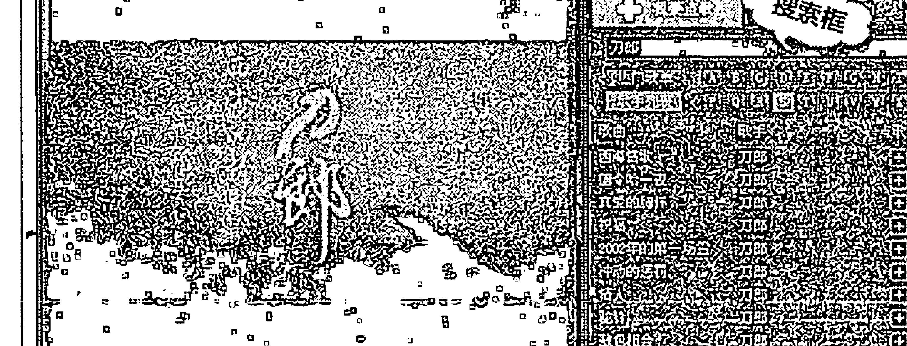

#### 闭门苦练K歌神功

在进行一番试听选择后，俺选中刀郎的成名曲《2002年的第一场雪》，下面就是要苦练这首歌了。

双击歌曲列表中的《2002年的第一场雪》开始播放歌曲，然后单击“播放窗口”下的“伴唱模式”按钮，此时会播放歌曲伴奏，俺就拿起麦克风，看着同步歌词开始吼了。不过建议大家开始练习时，最好先使用“原唱模式”，这样便于模仿刀郎的原唱，在练习过程中，可以根据实际情况，调节伴奏和麦克风的音量。

#### 苦练成功录制MV

在反复练习若干遍之后，俺也准备录制一部个人的MV了，跟刀郎比一比吧，别想得太难，有个摄像头就好了。

单击“录歌”按钮，然后单击“伴唱模式”消除原唱，再单击“显示练歌图”按钮。开始演唱时，下方的练唱图中会显示两条波形曲线，自唱线和原唱线越接近，说明翻唱效果越好。

录制结束后会自动切换到“后期处理”窗口，在这里可以选择“用录的视频”作为个人MV的画面，也可以选择“仅录制Mp3”，这样只会保存单纯的音乐文件;单击“过滤噪音”下的“启动”按钮，会自动对录音中的背景噪音进行处理。

### 让XP用户也能享受PC Safeguard的功能

2009年第22期杂志《能虚则无敌 让Win7成为大沙盒》一文中，为我们介绍了Windows 7下的PC Safeguard，它可以帮你锁定要“写保护”的磁盘分区，通过该功能就可以在该分区内进行任何操作，关机后又可以还原到锁定时的状态!功能很强大，但稍显遗憾的是XP/Vista下并没有提供这样的功能，这让不用Windows 7的用户感到十分遗憾。不过通过一款叫“虚拟保护”(下载地址：http://work.newhua.com/cfan/201001/xnbfsetup.zip)的第三方软件就可以让非Windows 7用户也能享用PC Safeguard的功能。

首先下载这款“虚拟保护”软件到本地，直接运行其中的VP185应用程序，在左边点击你想写保护的分区，在保护选项中选择“一般保护”，点击“保存设置”后要求重启电脑，直接点击OK即可。不过该功能目前是一个受限功能，只能试用30天，过了这段时间转向保护的分区将不再受保护。

软件还有一个特别的功能：“转向保护”。举个例子，大家平时对数据进行操作，往往要多次对数据进行读写，这样运行负荷很大，容易磨损磁盘。使用该功能后，选择好要数据转向的分区，软件在保护分区内读到数据后，将会把数据保存到转向分区中，以后读取数据将直接从转向分区读取，而对原来数据保存分区不产生任何影响

> 小编点评：估计各位作者是在考验小编的能力，几乎每段时间都会有TX直接介绍软件，但不留下下载地址，难道这年头流行“留一手”吗?再有此类只介绍软件的强大使用方法，但没有提供下载地址的，一律封杀^_^。

### 声卡玩双飞 妹妹很开心

图书馆中某个角落，一个妹妹正在与旁边的帅哥争吵：“把耳机给我！” 虽然期末考试快结束了，可是接下来的课程设计，一点也不能放松。每天都要跟女朋友一起去图书馆温书，喜欢看书时听音乐，可是妹妹总跟我抢本本使用权，笔记本不像台式机，有前后两组音频接口，可以分别播放两个不同的音乐…… 虽然有PSP、MP4，可是随身都带着，加上本本，妹妹的包包，课程书籍，分量太大了。最后还是决定入手一个带USB声卡的无线耳机，双声卡输出，难不倒我。 接上USB声卡，点击桌面右下角的喇叭图标，会出现两个音量控制。没错，一个是本本自带的声卡，另一个是USB声卡。 右键喇叭图标，打开播放设备，USB声卡会显示默认通信设备，本本的声卡会显示为默认设备。 既然有了双声卡，那么再找两个播放器就行啦，比如用foobar2000连接耳机A给自己听，用Windows Media Player连接耳机B给妹妹听，两个播放器各不相干。 从foobar2000的文件中打开，到参数选择，在弹出的选项卡中找到输出设备，一般选择“主声音驱动程序”。 打开Windows Media Player的组织，点击选项中的设备栏，再选择扬声器，进入属性，选择音频设备，使用“扬声器（有2.4G字样的即可）”。 学会了这招，还可以尝试双声卡玩游戏、听音乐分开输出，道理是一样的。 (文/dark)

### HotMail不要拒绝我

电脑不能打开HotMail了，但是能打开登录的页面。一开始用的是傲游，输入账号密码后，地址栏里变成黄色，后面还一个小锁。点击小锁会提示没有相应的证书。换用IE也是打不开。再试试别的邮箱吧，QQ邮箱可以顺利登录；139不可以，163用SSL安全登录也不行，把SSL安全登录前的钩去掉了才可以。所以就想肯定是和这个安全问题有关系。又观察了下HotMail的登录页面，有个“使用增强安全措施”；139的登录页面有个“已使用SSL安全方式登录”。这更让我怀疑是有关安全方面设置出的问题了。可怎么解决呢？终于在HotMail登录页面，找到了“了解更多信息”，再到“帮助”，还真找到答案了！在“为什么在尝试登录时收到错误消息？”里找到“在计算机上重新注册所需的安全和加密文件。”

- 在Windows中，单击“开始”，然后单击“运行”，输入regsvr32 softpub.dll，然后分别输入regsvr32 wintrust.dll和regsvr32 initpki.dll即可。

另外，网上还有高人的解决办法 http://tinyurl.com/ylcx7ns (QS) 小编点评：所谓的“SSL安全登录”，其实就是以https开头的网址，比一般的http更安全，防止隐私泄露。

### 有病看病！ 数码潮人的就医指南

经常拇指疼？夜晚睡觉时耳朵总有嗡嗡的噪音？视力越来越模糊？

在你聊的很爽时，想过大拇指没？ E63、E71等QWE键盘手机的流行，改变了曾经习惯的输入方式，在狭小的键盘上点击，时间久了难逃拇指疼。传统键盘的领地也在被大屏幕一步步的侵蚀，无论是QWE键盘还是传统键盘，都面临着手指操作区域面积越来越小的窘境。 短信越短越好，长话短“写”，减少文字的输入量，很多朋友现在都是用手机聊QQ，消息一条接着一条，要注意间隔几分钟就揉搓大拇指一会，上下活动关节。如果已经出现症状，间歇疼痛，有条件冷敷大拇指，并尽快就医。手机的出现，让我们几千年来不经常活动的大拇指一次次的受着摧残，一定要保护好它。

在你听的很爽时，想过耳膜没？ 不论是入耳式耳塞，还是普通耳塞，发音原理都是单元振膜震动，一个是直接传播到耳膜，另一个就是通过耳骨震动间接传导到耳膜。如此说来，音量过大都会对耳膜造成损伤。小编坐地铁、公车时经常遇见把音量开得爆大的朋友，两三米远，都能听出他耳塞里是谁在唱歌。 使用便携耳机，虽然比耳塞稍大，为了健康还是牺牲下吧，每半小时让耳朵休息5分钟，不要连续听音乐超过2个小时。关于入耳式耳塞与传统耳塞的利与弊，入耳式耳塞相对依靠耳骨震动间接传导声音，尽量不用它。播放器的音量控制在三分之一，过大的音量不仅会产生失真，对耳朵的损伤是加倍的。最后一点，听力损伤和近视眼一样，无法恢复。

在你看的很爽时，想过眼睛没？ MP4、MP5、大屏幕手机正流行，要在地铁、公交车摇摇晃晃中看屏幕上小说、新闻，不是一件很轻松的事情。320×240分辨率的屏幕已经很普遍了，字体也更加锐利、细小，长期在小屏幕上阅读，导致视觉疲劳，眼睛干涩。 每隔10分钟，闭目休息一会，当然你要是记得眼保健操怎么做，要一套更好。身边随时携带缓解疲劳的眼药水。调大字号，降低屏幕对比度，用淡色调背景图案搭配暗色文字阅读，如果钱包充裕，把手头上的数码设备换成大屏幕十分必要。

### 给点阳光就灿烂 给个指令就自转——Google最常被搜索的4大批量技巧

“我过几天要去听莫文蔚的演唱会，想先下点儿她的歌补习补习，怎么能一次下整张专辑呀？”“专辑下是下来了，可名字都不对，我挨个儿改名手都快变鸡爪了，有没有办法自动改成对应的歌名呢？”“演唱会归来啦！太high了！拍了好多照片，想放到博客里，怎么能一次性地给照片加上水印呢？”“照片太多了，一张张上传太麻烦，有没有方便点儿的办法？” 最近接到小编Etta MM的求助可真不少，我赶紧上Google搜索相应技巧给她解答，却发现这些竟然都是在Google中被搜索频率最高的“批量”技巧，那不如就好好地给大家普及普及吧！

#### Google频率No.1批量重命名

从网上下载的很多歌曲文件，文件名都是乱的，如果人肉将这些乱七八糟的文件名修改为歌曲名的话，那可费事了！有什么简单的方法可以自动识别歌曲的名称和歌手，并进行批量的重命名操作呢？其实这类软件网上很多，比如“菲菲更名宝贝”（下载地址：http://www.onlinedown.net/soft/59019.htm）这款软件，不仅是个免费的绿色软件，而且还支持最新的Windows 7操作系统。

- 运行软件，打开需要重命名的歌曲所在的文件夹，可以在软件中看到歌曲文件的列表；
- 点击左侧的“7.音乐文件名变更→音乐文件标签表达式→标题（艺术家）”，此时在右下角的预览列表中看见更名后的效果，没问题后选择工具栏中绿色的对勾确认；
- 此外，还可以批量将文件名中的中文换为英文，点击左侧的“1.文件名变更→N2.替换字符串”，设置查找替换，比如把“幽游白书”替换为“YYBS”，此时在右下角的预览列表中看见更名后的效果，没问题后选择绿色的对勾确认；
- 还可以为Office文档修改文件名，点击“5.MS Office文档文件名变更→使用MS Office文档摘要更名→预设方案→标题（作者）—公司”，此时在右下角的预览列表中看见更名后的效果，没问题后选择绿色的对勾确认，即可将文档文件名改为文章名+（作者名）。

#### Google频率No.2批量修改图片大小

俗话说，大图杀猫，在论坛里看图，最让人抓心挠肝的就是打开一个帖子后，有一张超级无敌大图，正在以每秒增添1毫米的速度显示出来，让人等到猫死花谢！想想大家出来看图，都挺不容易的，还是应该在上传前就把图片修改到合适的尺寸。但如果图片数量多的话，一张一张处理就很麻烦，有什么方法可以进行批量处理呢？其实在我们常用的Office软件中就有一个处理图片的工具——Office Picture Manager，用它就可以轻松来批量修改图片的大小。

- 点击“开始菜单→所有程序→Microsoft Office→Microsoft Office工具→Microsoft Office Picture Manager”来打开程序；
- 点击菜单“文件→添加图片快捷方式”来添加图片所在的文件夹，就能在右侧栏中预览到文件夹里面的图片了，选中需要修改大小的图片，点击工具栏上的“编辑图片”，在右侧显示的编辑面板中点击下面的“调整尺寸”按钮，如果是要放到博客或论坛中，推荐选择“网页-大”，之后确定；
- 右击左侧栏中的“未保存的编辑→全部保存”，调整后的图片将覆盖原来的图片。

#### Google频率No.3批量下载MP3

现在好听的歌实在是太多了，可是一首一首地下裁很麻烦，有什么方法可以批量下载歌曲呢？其实使用“酷我音乐盒”就可以了。 打开酷我音乐盒，在“网络曲库”标签下的搜索栏中输入要搜索的歌手名字，比如“周杰伦”，这时在下面的列表中就会显示他的很多歌曲，按住“Ctrl”点选你想下载的歌曲后，右击鼠标，在弹出的菜单中选择“下载歌曲”；

- 在弹出的“下载提示”窗口中点击“浏览”来选择歌曲所要保存的文件夹，可以把下面的“优先下载MP3格式”选中，点击“确定”后就可以批量下载歌曲了。

#### Google频率No.4批量给图片加水印

这招对淘宝卖家和喜欢发图片博客的人来说是最实用的了！一来可以防止别人盗用，二来可以体现自己的个性。用iSee这个软件就可以轻松搞定。 准备好水印图片（可以自己制作，也可以从网上来下载现成的），运行iSee，通过左侧列表来选择图片所在的文件夹，选好文件夹后，在右侧就能看见文件夹里的图片了，选中需要添加水印的图片文件，点击工具栏上的“水印”按钮；

- 在弹出的“批量水印”窗口中，在左上角设置一下处理后的图片保存位置，最好不要和原图片保存在一个文件夹下，设置好后点击工具栏上的“开始处理”；
- 点击右上角的“选择水印”选择事先准备好的水印图片，设置一下水印显示的位置、大小和一些特效，按提示操作就行了，最后点击“确定”。

(江苏/云端漫步)

### 免费午餐有很多：免费杀毒软件大展示

现在病毒不仅局限于破坏系统这类损人不利己的活动，越来越多病毒附带盗窃用户信息的木马功能，导致聊天账号、网游账号、网银密码泄露等各种问题，越是依赖电脑，损失就越大。因此一款优秀的杀毒软件依然是装机必备。与以往不同，现今杀毒软件市场的“免费风潮”来临，让我们来看看目前这些能够免费使用的杀毒软件情况吧！
首先是“一堆”永久免费的杀毒软件（见表1）。

| 软件名称 | 软件特点和点评 |
| :--- | :--- |
| 360杀毒软件<br>下载链接:http://sd.360.cn/ | 360杀毒软件的核心引擎来自国际排名第一Bitdefender，所以具有较高的病毒查杀能力，且操作简捷，闲时资源占用较少。并加入了自身的云安全技术。2009年第22期《彻底免费 不杀白不杀》对它进行了介绍，算得上免费杀软的首选。 |
| Microsoft Security Essentials(微软)<br>下载链接:http://tinyurl.com/yzuqzyq | 操作界面简单、易用。提示窗口、警预声音、升级通知不会经常出现。可以通过Windows Update自动更新。 |
| 趋势杀毒者独立版<br>下载链接:http://www.mozhe.com/ | 这是知名杀毒软件趋势的免费版，功能并无删减，和墨者安全专家相结合，通过墨者独创的“免疫革离术”可免疫防护未知木马病毒。不过在之前的CFan研究院中，它的表现并不太好 |
| avast! 4 Home Edition<br>下载链接:http://tinyurl.com/2w2zfy | avast! antivirus提供全面病毒防护，内置优秀防毒技术，可对抗各种恶意程序和间谍程序。这个版本为简体中文家庭版本，免费使用，无需付费（可通过邮件获得免费的注册号，注册号有效期为一年。但一年期满以后可再免费注册）。不过它只有查杀功能，不具备保护系统的能力。 |
| COMODO Internet Security<br>下载链接:http://tinyurl.com/ydgsq6o | 这款不仅带有杀毒软件，而且还带有世界一流的防火墙，是一个互联网安全套装。你可以选择单独安装其中的COMODO Firewall或是COMODO Antivirus。虽然COMODO的Antivirus比较“闷”，可是它的防火墙在国外最新的防火墙评测中是世界排名第一的，不仅功能十分强大，而且还包含着大量“傻瓜型”功能，适合于不同水平的用户使用。 |

再来是“一搓”非永久免费的杀毒软件，如果你不觉得麻烦，每过段时间总会有一些杀毒软件会提供免费试用的机会，根本不用怕没的用（见表2）。

| 软件名称 | 免费时间 | 免费申请方法和下载链接 |
| :--- | :--- | :--- |
| Dr.WEB(大蜘蛛)标准版 | 一年 | 下载链接：http://tinyurl.com/ycl7mul<br>一年授权期申请链接：http://tinyurl.com/mga436 |
| 瑞星2010 | 半年 | http://tinyurl.com/yzcmlnn |
| 金山毒霸2009 | 888小时 | http://tinyurl.com/y8p5dr3 |
| 卡巴斯基2010 | 半年 | http://kaba.msn.com.cn/(MSN用户)<br>http://kaba.uusee.com/uusee_kav2010.html(UUSee用户) |
| ESET Nod32 | 半年 | http://eset.360.cn/(360安全卫士用户)<br>http://buy.eset.com.cn/alipay/#(支付宝用户) |
| McAfee | 半年 | 详细方法：http://q.yesky.com/group/review-18373988.html<br>(需要到英文官方网站申请注册，但软件是中文) |

你应该能选择到一款最合适的杀毒软件了吧？（江西/秀媛）

小编点评：免费杀毒软件的确越来越多了，不管是自用，还是给别人安装都有了不错的选择。

### 闪盘复制太Out 轻松同步赏大片

第一天上班真兴奋！公司给我分配了双核CPU，4GB内存的新电脑，再加上每秒1MB的下载速度，真是爽呀！想想家里的老P4，看看电影倒不成问题，可是512Kbps的龟速……要是能用公司下大片，直接同步到家就好了！但是，不同电脑或是设备之间的文件同步工作是件费精力的事情，如果用优盘将文件从A电脑拷贝到B电脑，在B电脑中对其修改，最后还要拷贝到A电脑并覆盖旧文件，这样的应用经常会碰见。

系统自带的公文包在文件同步方面很实用，很智能。林俊杰新专辑《100天》，下载只要几分钟！想在下班时带回家听，第二天上班时再将家中处理好的文件替换办公室中之前未处理完的文件，公文包处理起来很简单（以Windows 7系统为例，其他系统操作方法类似）：
第一步：先在办公室电脑的桌面右击鼠标并选择“新建→公文包”创建一个公文包。
设置好公文包名称，然后将要带回家的所有文件放到公文包文件夹中。
第二步：直接将公文包拷贝到优盘或是手机等移动存储设备中，带回家后直接在家中的电脑中打开移动存储设备中需要继续处理的文件，处理完毕后直接保存即可，无须将公文包再拷贝到家中的电脑。回到办公室后，直接将移动设备连接到电脑中，这时只要直接右击移动设备中的公文包文件夹并选择“全部更新”即可自动完成更新了。

很多朋友家中都有自己的无线网络，网络硬盘盒中的电影文件不需要经常同步，只要文件在就可以了，这些文件需要连在局域网中，才能正常访问。但实际使用过程中经常因为网络不稳定而影响工作，但将所有服务器中的文件全部拷贝到自己的电脑中，假如硬盘盒中添加了新电影，又不能及时实现更新。其实，在Windows 7系统中直接通过脱机文件功能就可以轻松地解决这个难题。
第一步：先在网络中找到服务器中的工作文件夹，直接右击该文件夹并选择“始终脱机可用”并确保此项被选中。
第二步：将网络上的文件夹设置为脱机可用后，系统会自动将这个文件夹在本地建立一个备份，当然也可以手工进行同步打开控制面板并选择“同步中心”，单击“脱机文件”文件夹，在工具栏上单击“同步”。
这样，以后如果网络不畅通，系统会自动启用本地同步文件夹中的文件，而当网络畅通后，系统又会负责与网络服务器中的文件进行同步更新，无须人为干预。

淘宝店上给MM选好了生日礼物，链接在哪来的？选中了一家半价的电影院，地址存在哪里了？每天下班时都会使用优盘、手机等移动存储器将当天的工作备份起来，手工备份的话，每天一次太费劲了，何不请位智能同步大师应对这样的“每日一备”呢！Synkron（下载地址：http://www.greendown.cn/soft/14210.html）就是一款非常不错的智能备份同步大师级的软件了，只要事先设置好同步方案，日后只须启用同步功能即可。单击“新任务”按钮创建备份方案，修改方案名称后再分别指定本机需要备份的文件目录，即可备份的目标文件夹位置，再设置成“同步隐藏文件/隐藏文件夹”即可。

### 装机从CPU“烫”起

时间：1999年夏天
老爸正在用电脑工作，突然死机了，回头看着我，眼中充满怒气，无语……
PS：刚接触DIY的我，看了《电脑爱好者》之后，对里面一篇P3处理器涂抹硅脂的文章产生了极大地好奇，转日购入一富士康散热器，结果在安装时在硅脂多少的问题上犯了难，致使经常死机。

时间：2009年冬天
我终于有了第一个四核处理器Q8300，压上南海散热器，不解的是CPU待机温度25度，负载时高达50度，温差近30度，经过反复研究，终于得以解决。
回想起当年很菜的我，感慨很多，作为DIY入门课程，今天就以亲身经历再聊聊涂抹CPU导热硅脂的那点事。硅脂起到加速热传导的作用，增加接触面积填充CPU铁盖以及散热器中间的坑槽。

涂抹越薄越好？
这一条DIY“真理”我曾经也是深信不疑，甚至有段时间坚持涂抹完硅脂后用卡片轻轻刮掉一层，直到前不久的事件发生。当时为了寻找为何有30度的温差，仔细观察CPU表面与散热器底座表面，发现硅脂并未完全接触，CPU中间部分未完全接触，此时CPU温度负载情况下是50度。
错误涂抹方法
涂抹硅脂的薄厚一定要多次尝试，找到散热器与CPU粘合的最大程度，取下散热器观察CPU表面硅脂，如果均匀的呈波浪形，说明此时厚度最佳。CPU负载温度居然降下7度
PS：购买盒装CPU送的原装散热器，建议把上面的硅脂刮掉，重新涂抹效果更好。

(文/CT)

## 我只要第一次！软件设置不重来

你有没有这样痛苦的经历：重新装一次系统并不是很麻烦，麻烦的就是系统中的那堆软件的参数设置。比如，一些朋友为了打造一个最佳使用环境，往往花很多精力设置Firefox，但是重新安装系统后，这些设置都将丢失。如果你也有这样的苦恼，得找一种权宜之计，将这些参数备份起来，这样就不用重复设置了。

## Office中的设置

Office组件程序是最常用的，每个人都会根据自己的使用习惯进行一些设置，小的设置就是字体、页面缩放比例等，复杂点的设置就是多级符号的设定、宏命令等，这些设置往往都很费时间，绝不能让它随系统而终。其实很简单，Office的这些参数设置都被保存在名为Normal.dot(Office则是Normal.dotx)文件中，因此，要想备份参数设置，只要直接备份该文件即可。在资源管理器中打开：%appdata%/microsoft/templates，在打开的目标文件夹中可找到Normal.dot文件了，直接备份即可。

## 借助新版的威力，QQ参数网上存

说到QQ，每个朋友必定有自己的使用习惯，例如有的喜欢Ctrl+回车发送消息，而有的则喜欢简洁模式，回车直接发消息。这些参数设置会随着重新安装系统或QQ软件而消失，下次不得不再设置，而且不在同一台电脑中使用QQ（例如上网吧），每次都得设置一遍。现在，只要安装最新版QQ（V2009 SP5），则可以直接借助新版提供的参数设置漫游功能将参数设置保存到服务器中，以后在其他电脑或是重新安装后，直接调用漫游的参数设置即可，无须再设置了。

## 备份常用软件参数只须出一招

常用的软件有很多，每款软件参数设置的备份方法往往不尽相同。不过，使用这款名为FBackup（下载地址：http://download.cnet.com/FBackup/3000-2242_4-10907579.html?tag=bc）就可以一次性将大多数常用的软件参数备份下来了，使用方法也很简单。

### 下载软件备份插件

接下来还需要下载安装相应程序的备份插件。打开http://www.backup4all.com/kb/15/页面，所有支持的应用程序对应的插件都分门别类地保存在此，细心地在此找到软件对应的备份插件程序。以傲游浏览器的备份插件为例，只要展开网络相关备份类别，找到Maxthon插件并直接将其下载下来。

### 添加插件

打开FBackup程序，先单击菜单“工具→外挂”，在打开的窗口中将Maxthon插件添加进来。

### 进行软件备份

单击“新”按钮，设置一个备份工作名称（例如：Maxthon），再设置好备份的目标目录，再单击“下一步”按钮。在打开的步骤中再设置好备份的内容，然后再单击“下一步”按钮。选择备份的方式（直接备份或是镜像备份），最后只要保存设置即可。要备份时，只要在FBackup主窗口中找到刚建的备份项目后，再单击“备份”按钮即可进行备份。

## 谁比游戏BOSS更强大？

面对游戏中一个个强大的BOSS，可能很多人都会奇怪这些BOSS为什么好像知道你控制的主角下一个出现的位置，你要去哪里？难道这些BOSS是有智慧的？

### BOSS会认路，谁能挡得住？

假设BOSS从出生地A，到你所在的位置B点有三条路，那么它会选择哪条呢？再举个例子，在打“魔兽争霸”时，你正在指挥着大队人马杀向敌人时，突然你的“英雄”被一块大石头挡住不动了，你肯定会对它这种愚蠢行为极为不满。就像我们认路需要地图和GPS一样，BOSS用的是一种叫A*（俗称A星算法）的工具。它就是用来计算在图形平面上，有多条路径时，快速找到成本最低（之所以不是最快，是由于有的时候还要考虑行进过程中消耗的体力等因素）的方法。用在游戏NPC和网络游戏中BOT移动计算上（见图1）。


在2D平面下，A和B是等长的，选择哪条路呢？A*会帮BOSS计算出来

### 小知识：走出迷宫的王道法则

右手定律或左手定律，如果迷宫所有的墙都是连接起来的，只要将其中一只手依照一堵墙前进，则肯定不会迷路，或找到出口，或回到原点（见图2）。

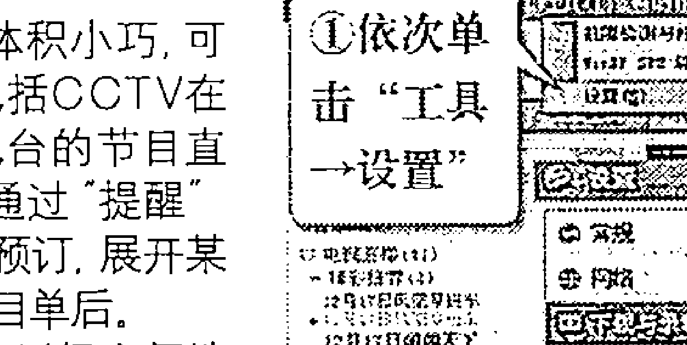

### 会进化的BOSS，“人工大脑”的力量

现在还没有人工智能可以达到人脑水平，但这也不代表游戏中的人物就能被任意蹂躏吧？

在游戏中，有一个玩家和若干电脑控制的NPC，当NPC与主角相遇后，无论强弱都会对主角进攻。但当NPC都有了“人工大脑”后，它们会不断地学习、进化，变成自主角色，根据其他NPC与玩家的交手情况做出判断，如果玩家实力超过自己就会采用逃避或是进行团队作战，反之则主动攻击玩家。这里的“人工大脑”就是“神经网络算法”。

玩过最新的《合金装备》、《天诛》等游戏的应该了解，当你的表现足够出色时，就会发现敌人开始呼唤友军帮忙的情景，这就是“神经网络算法”的应用。

说是“神经网络算法”，其实就是把玩家的距离、攻击力、防御力等数值和NPC的数值相比较，得出一个综合指数，然后根据指数为NPC赋予逃脱、单独攻击、潜伏、召唤同伴、团队攻击等不同的行为。

别以为BOSS就会上面两招，它们会的“招数”还有很多，现在已经有很多人工智能上的算法应用到了游戏中。总之，游戏中的BOSS会越来越难缠，以前那种光靠血多、攻击力强的无赖作风会离我们越来越远。

## 春节期间节目多 精彩内容勿错过

春节期间，通过网络电视软件收看电视节目的用户不在少数。节目播放总有它自己的时间表，怎样才能在和好友尽情聊天时不错过自己想看的节目呢？

### 1. QQlive

QQ是大家必备的聊天工具之一，因而利用QQlive来观看电视，是很常见的选择。具体操作过程（见图1）。所有预订的节目可以在“我的预订”中查看到，依次单击“我的视频→我的预订”。如果要取消某个节目的预订，单击该节目后面的“取消”即可。节目预订成功后，到达指定时刻，就会弹出“QQ温馨提醒”窗口，这样在聊天时，就不必担心错过预订节目了。


### 2. UUSee

UUSee体积小巧，可以免费收看包括CCTV在内的各大电视台的节目直播，我们可以通过“提醒”来进行节目的预订。展开某个电视台的节目单后，UUSee可以很方便地把错过的节目录制下来，如果在指定时刻不能收看的话，这种方法就非常实用（见图2）。


### 3. PPStream

PPStream号称全球第一家集P2P直播、点播于一身的网络视频软件，也有着极为广泛的应用人群。其节目预订在“定时播放”中设置。

网络电视播放软件还有许多，大多数软件都具有节目预订功能，如果担心错过精彩节目，利用软件本身的预订功能是个不错的选择。

小编点评：给大家推荐一款不错的聚合网络电视软件：好易网络电视（下载地址：http://www.haoetv.com/download.html），它聚合PPS、PPLive、QQLive、UUSee、TVU、皮皮、沸点等主流16种网络电视软件。

（江苏/曹春华）

## “文件捆绑”就是“寄居蟹”

王钟是个游戏迷，喜欢各种新游戏，前几天别人从网上给他传了一个EXE文件，号称是个好玩的小游戏，游戏的确不错，玩了两天的王钟才发现自己的QQ账号被盗了，后来一打听，原来这个游戏是被捆绑了木马，难道运行一个文件但执行的却是两个文件吗？

王钟遇到的肯定就是被捆绑了木马的文件，这里我们不说那些高级木马已经使用的新技术，单单只介绍最传统的捆绑方法，就足以让你大开眼界……

传统捆绑方式，你可以理解为“寄居蟹”法。说出来很简单——用软件（如UltraEdit）以二进制形式打开A.exe和B.exe，然后将B.exe的全部数据附加到A.exe末尾，这样A.exe执行的时候，B.exe就会同时执行，很像“寄居蟹”的行为方式吧？

要识破上面的捆绑方式很容易，所有EXE文件的开头都是MZ，所以只要用UltraEdit这类的工具打开

### 正常文件:


### 捆绑文件:

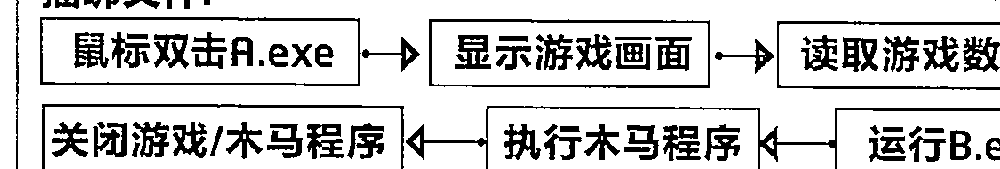

EXE文件，搜索MZ，如果找到两个或两个以上，肯定这个文件就被捆绑了，如果是别人传的肯定就是有猫腻了……网上有很多识别“捆绑文件的检测工具”，它们就是利用了这个原理，只是现在使用这种技术捆绑的几乎很少有了，但是我们平常需要一个文件实现两个功能时，倒不妨试试这个方法，既简单又快捷。

这里也给大家提供一款捆绑文件的小工具，可以从http://work.newhua.com/cfan/200922/bwm.rar下载工具，运行后，使用F5键添加运行的程序，同时去除“选项”下的“运行后溶解”项的勾选（注意，部分杀毒软件会把该程序识别为病毒），最后按F9创建即可。

当然捆绑文件还有很多方法，比如利用资源包，利用编译器，甚至就是传统的方法，经过加密后也会让你看不出来个所以然，唉，没办法，谁让Windows设计之初就不识“双黄蛋”呢？总之别人传过来的EXE文件一定要小心，千万别随便就运行……

## PDF也能玩填表

你好！我是《电脑爱好者》的一名读者。近期看了贵刊2009年17期中《老师是好是坏由你说了算》这篇文章，这篇文章的立意与实际结合……（此处隐去3000字）

但我想此文也有一定的不足之处，所以才想到向你发邮件提一提，希望能广开言路，共同进步！

我的意见在于第四步“智能化的邮件预览”。个人认为前三个步骤都是很实用的，创建了一个具备自动统计功能的Excel表格。但第四步则有一些虎头蛇尾的感觉，究其原因，我认为作者在这里标榜的“智能化邮件预览”并不能减轻结果统计工作的实际工作量。Outlook程序的邮件预览功能固然可以比较方便地查看邮件结果，但是本质上并没有改变一个一个录入结果的实质，所以工作量也并没有减少，这一点值得商榷。

我注意到Adobe Acrobat软件中对于表单有良好的支持，包括创建、发放、回收统计，这些操作是高度自动化的。我想是不是能考虑将Excel转成PDF文档，通过PDF的表单功能进行分发、填写和回收统计？这样的话就能弥补最后手工统计的工作量了，PDF表单可以参考http://work.newhua.com/cfan/201002/pdfform.zip，阅读器软件需要支持PDF Forms功能（建议使用Adobe Reader）。

小编点评：一想到填表，多数人就会想到Excel、Word，用PDF来填到是头一次，有需要的朋友可以参考。再唠叨一句，你的地址离小编家走路不过五六分钟，严重怀疑与LZ相遇过……
（北京/刘小鼎）

## “收藏夹征兵”有捷径不同方式也能行

2009年第21期《收藏夹的征兵计划》一文中介绍了在Windows 7的“收藏夹”中添加所需要的文件夹的方法，笔者试用后，发现还可以通过其他的方式进行添加，特别是对于初学者，还可以省去打开原“收藏夹”下的链接目录的繁琐操作。

方法一：假定我们要添加的文件夹，位于某分区的根目录下，如“J\行云流水”文件夹，首先从“计算机”中打开J盘，然后用鼠标左键点选“行云流水”文件夹，按住左键不放，将其拖动到窗口左侧的“收藏夹”图标上，直到出现“在收藏夹创建链接”的提示时，松开左键，即可在“收藏夹”中创建其文件夹的链接，达到第21期中的原文的目的。

方法二：直接打开“J\行云流水”文件夹，然后在窗口左侧的“收藏夹”图标上，击鼠标右键，在弹出的快捷菜单中选择“将当前位置添加到收藏夹”，也可以创建其相应的链接。

若有特殊需要，我们还可以将某一个分区作为文件夹链接，添加到这个“收藏夹”下，方法同上。如果我们想删除不需要的文件夹链接，直接在窗口左侧的“收藏夹”图标上，点击右键，在弹出的快捷菜单中选择“删除”即可。

小编点评：在Windows 7中，如果遇到收藏夹无法展开时，可以在注册表中展开[HKEY_CLASSES_ROOT\lnkfile]，新建字符串IsShortcut，无需填写串值即可。
（河北/杨福利）

## “选择性粘贴”：Excel也能用

2009年第24期上有篇文章叫《漂亮的格式 请替我复制一百个！》中提到了编辑文档、制作幻灯片时的复制技巧，但并没有提及Excel表。实际应用中复制Excel表格时，选择“粘贴”时应进行“选择性粘贴”，选择其中的“列宽（W）”，这样表格的样式就复制过来了，这时再选择粘贴，就能原原本本地把整个表格复制过来了。

小编点评：用这种方法来保持Excel表格的原有形式是非常方便的，总之你想搞点什么特殊的粘贴，那就一定要从“选择性粘贴”里找找看。
（玄狐小毓）

## 选处理器先认清接口

2010年慢慢迎来了多核时代，Intel和AMD为了划分产品线和提高产品性能，不断变换着处理器的接口，CPU如何与主板搭配是门学问。

说说卖场中比较常见的几个CPU

### Intel

| 接口 | 对应主板 | 对应CPU |
| --- | --- | --- |
| LGA775 | P43、P45 | E5200、E7400、E8400、Q8300、Q9450 |
| LGA1156 | P55、H55 | i5 750、i7 860 |
| LGA1366 | X58 | i7 920 |

### AMD

| 接口 | 对应主板 | 对应CPU |
| --- | --- | --- |
| AM2 | 790、785G、770 | X2 6000+ |
| AM2+ | 790、785G、770 | X2 5000、X2 7750（黑盒）、X4 9650 |
| AM3 | 790、785G、770 | X2 240、X3 720、X4 955 |

目前Intel方面，LGA775接口的处理器仍然是市场的主力，LGA1156、LGA1366会在未来几个月逐渐普及。AMD则有些混乱，790、785G、770某些型号支持全系列CPU接口，有些则只支持AM3，选择时尽量购买标明支持AM3 CPU的主板。

选择Intel的朋友在乎的是稳定性，选择AMD平台追求的是性价比。

## 三千元

在入门级装机选择上，LGA775、AM3是主流，首先考虑奔腾双核，430元盒装E5200，主频2.5GHz，对应的AMD为X2 240，2.8GHz。玩网游、看高清、上网看视频绰绰有余。

## 五千元

游戏型主机由主频较高的酷睿2 E8系列牢牢占据，默认主频3GHz，轻松超频到4GHz以上，凭借高主频优势成为游戏机型最佳CPU，通吃市面上所有的单机游戏。当然，Q8300在办公时四核优势还是很明显的。AMD最强悍的四核CPU也不过千元出头，X3 720、X4 955都是组建3A平台（AMD的主板+AMD的CPU+AMD的显卡）的不错选择。

## 七千元

属于发烧机型，只有全新一代i5、i7处理器才能满足要求，LGA1156和LGA1366则同时定位于千元以上高端市场，适合那些喜欢玩BT级单机游戏，以及从事大量3D图形渲染、多媒体制作这些工作的朋友。
（文/夜之风）

## QQ农场全屏何需找助手？

看了2009年第23期“傻博士信箱/软件”里面的“无法使用QQ农场全屏助手”的问题之后，我就想，其实想全屏玩QQ农场是非常简单的，不需要任何的软件，只需要几步就可以实现QQ农场全屏。具体使用方法是：登录QQ，输入http://happyfarm.qzone.qq.com/index.php?tpl=onlyflash到地址栏，回车就OK了，当然如果你在一台电脑上登录了多个QQ的话，就要先进入自己的空间，不用进行任何操作，再用上面的方法就成了。

小编点评：虽然你的方法不错，但不要被“QQ农场全屏助手”（下载地址：http://www.zuiw.com/soft/）的名字所蒙蔽，其实它还有查询农作物成熟时间，闹钟提醒等功能，可不仅仅就是全屏这点功能。
（□□）

## 大起底：游戏机刷机的秘密

春节到，兜里有了闲钱，适逢情人节，又到了每年疯狂购物的时候了。很多TX的选择自然是游戏机，这时候JS们也磨开了刀准备狠狠的宰上你一把了，所以好在购机前你需要好好准备一下：刷机的知识。

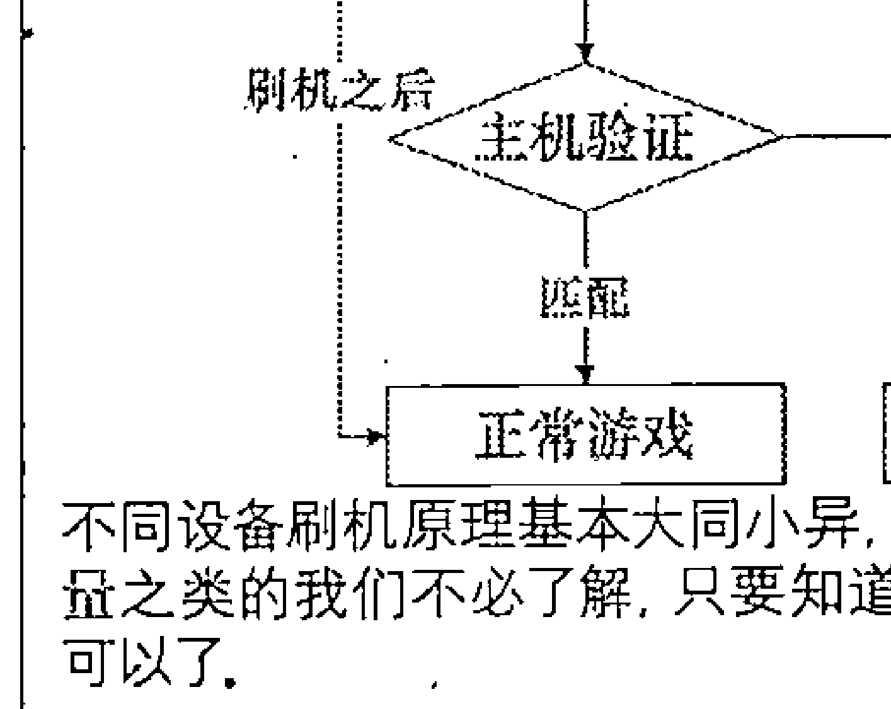

### iPod Touch：2代竟比3代好

由于不少人把iPod Touch（以下简称Touch）当做了掌上游戏机，所以这里我们先来说明它。如果你准备购买iPod Touch（以下简称Touch），那么需要注意两点：一是现在市面上的Touch 3代8GB版本在硬件上和Touch 2代基本一样，主要的区别是所用的固件版本；二是目前市场上的Touch 3代都是非完美刷机，关机或重启后，有时需要重新连接电脑，运行刷机程序，好在Touch平常待机耗电不多，基本可以正常使用。

正由于这样的不完美，通常JS会提供你免费刷三次，之后开始收费，所以如果你准备购买8GB版

### PSP 3000：虽不完美，但不远已

被很多TX关注的PSP目前已经出到了PSP go，但目前还只能花钱购买游戏，所以市场上的主流产品就是不能完美刷机的PSP 3000，和Touch一个道理——平常保持待机状态，不要关机，否则再次开机后需要将刷机软件重新激活，不过不需要连电脑，可以直接用记忆棒在PSP上完成，所以基本算是“准完美”。有些JS就打起了“重新激活”的主意，他们会推荐你花上三五十元购买32MB的刷机卡（32MB的记忆棒），其实这完全是为了赚黑钱误导大家的，普通的4GB、8GB高速记忆棒就可以重新激活，完全没有必要再多花这笔钱。

最后你还要注意两点：

- 至少要让JS把系统刷到5.03GEN-C，才能保证玩上最新游戏
- 一些冷门颜色，如粉色、银色，多为翻新制作，尽量购买黑、白两色。

小提示：iPhone 3GS背面序列号的第4和第5位就是手机生产周，比如88942，就是第42周的机器。其中序列号以8开头的都是新机，以5开头的都是官方翻新机。

### Wii：刷机成本在增涨

Wii的刷机一直没有难度，但由于硬件架构的变化，刷机难度在增加，新版的Wii刷机时，需要更换光驱底板，光驱底板的成本大概在100元~150元，所以Wii涨价了！

小提示：现在市场上还有很多台版（台湾版）翻新机，这些机器支持直接软件刷机，不用更新光驱底板，由于现在台版的Wii序列号为106x，所以如果机器的序列号为100x则必然是翻新机。

### XBOX 360：完美刷机，小心硬盘黑掉你

刷机XBOX 360已经解决得很好了，但JS的利润点现在转移到了硬盘上，现在XBOX 360支持硬盘安装游戏，于是就有了组装硬盘，而且以前在电脑和闪存盘上出现的“假容量”现象在组装硬盘上也出现了，不少组装硬盘标称120GB，实际只有80GB，而且以“组”充“原”这种把戏也让JS找到了盈利点。

### PS3：神机一族

PS3的刷机方式目前还没有，引用一句话与PS3玩家共勉——“神机一族切莫低下高贵的头颅，去当一个物质丰富，内心空虚的五元党”……

## 逾越办公代沟 Office兼容性大提升

### 新树开老花，让Office 2007默认Office 2003

譬如在办公室中，只有自己赶时尚、追新潮安装了Office 2007，而其他同事全部在使用Office 2003，这种场合就需要委屈自己，所有的办公文档都要保存成Office 2003的格式，如果嫌每次“另存为”太辛苦，可以这样设置以达到一劳永逸的效果：单击“Office按钮”，选择“Word选项”，再选择“保存”项，将“将文件保存为此格式”设置为“Word 97-2003文档（*.doc）”，最后保存设置即可。

### 向年轻人靠近，自主解决‘代沟’问题

Office 2007的改动很大，与Office 2003相比几乎达到了面目全非的地步。这也是很多朋友仍坚守在Office 2003阵地的主要原因，但遇到“代沟”问题又是很头疼的。其实，只要为Office 2003安装个插件，就可以达到不换Office 2007而直接逾越这条“代沟”的目的了。

### 请位和事佬抹平‘代沟’

假如周围的电脑均未安装Office 2007，遇到一个文件无法打开，咋办？很简单，只要使用All Office Converter Platinum（下载地址http://www.greendown.cn/soft/14806.html）就可以轻松地解决问题了。安装后运行，先单击“Add File”按钮将要转换的源文件添加进来，设置好转换后的文件保存目录，再选择转换的目标格式，最后单击“Convert”按钮即可转换了，不仅支持Word文件，还能方便地转换Excel、网页文件，方法类似。

## 干净高效的‘一键GHOST’

我的A600联想一体机的操纵系统是Vista，曾用过三款“一键还原”之类备份均夭折，多是修改主页，或是有其他插件。后在“DOS之家”下载里蒋明阳先生研发的免费“干净”软件“一键GHOST”（下载地址：http://doshome.com/soft/），备份恢复一举成功。“只需按一个键，……让你一爽到底！”不虚此言。该软件不夹带插件不篡改主页。

1. 点击“一键GHOST”的“设置”
2. 在“设置”中点击“开机”再选“热键模式”
3. 选“一键备份系统”后点击“备份”按钮
4. 警告：按“K”键开始备份后原有映像被覆盖

## 判断QQ好友之我见

编辑部的故事们（这个称呼挺亲切的哈，但“故事”有何典故呢），你们好啊。本人是《电脑爱好者》的年轻老读者，从对电脑的一无所知到现在的无所不知（夸张了点哈），大学这几年就靠CFan在我寂寞的时候给点温暖（貌似我经常寂寞似的），本人马上就毕业了，不出意外是找不到工作的（悲哀啊），不过由于小懂一些计算机知识，也出于热爱，所以打算在IT事业上做点手脚（这词用得，应该是有点作为哈），感谢CFan给我这么好的兴趣爱好。

好了，下面介绍本人利用搜索引擎找到的更简单的方法：

- 登录QQ，找到你想判断的TA，双击打开聊天窗口；
- 点击聊天窗口右边的QQ形象秀，选择和好友的QQ秀合影；
- 此时浏览器会弹出一个QQShow网页。如果还是对方好友，就会一切正常，有拍照选项；如果不是对方好友，就会弹出一个对话框提示“您不是对方好友，不能进行拍照”。

小编点评：之前被安徽的木忽悠了一把，他说仅需3秒就能判断对方是否还是TA好友，具体方法是：首先登录自己的QQ，然后查找好友的QQ号，找到以后选中，然后点击“添加好友”，如果显示“已经是你的好友，不能重复添加”，那说明你还是TA的好友，否则的话，呵呵，Ta已经把你删除了——你能找到这段文字的问题吗？

## 打开邮件就听歌儿

我在看2009年第8期“小抄速记”栏目的“给客户发送Word文档，如何让她打开文档即听见音乐？”很感兴趣，动手实践了一下，发现没有我想象的效果，在插入WMP对象时，弹出了提示，大意是在Office安装时管理员没有允许宏或安装有关宏的控件，也就是说如果接收方的电脑Office安装不全或对宏有限制是听不到音乐的。
经过多次实验，结果发现系统自带的软件Outlook Express就能加背景音乐，在一个新邮件中，单击“格式”菜单并选择“背景”，然后单击“声音”按钮，最后点击“浏览”就可以在自己电脑中选择合适的音乐文件添加了。
后来我又发现QQ邮箱也能插入背景音乐，在编辑新邮件时直接点击上面的图标就可以添加网上推荐的音乐了，要是不喜欢推荐的音乐可以自己在网上搜索添加，这两种方法比在Word文档中添加简单多了。
小编点评：插入个Flash也能出声，要知道能“唱歌”的可不仅仅是MP3……
（湖北/徐春来）

## 文档转图片 打印、保护两相宜

在拜读了2009年第23期的《在线文档 随处打印不变形》之后，感觉还是有话要补充。作者在打印文档时为防止文档变形，是先将文档转换成PDF格式后再打印，但有些软件对PDF支持不好，甚至还需要安装插件，比较麻烦，所以如果我们将文档转换为JPG格式图片，打印预览时，只需用系统自带的图片和传真查看器即可，非常方便。
要想将文档转换为图片格式，这就需要用到WPS文字（http://www.wps.cn/）。运行WPS文字后，在单击“工具→插件平台”菜单项，在打开的“插件平台”对话框中，单击“推荐插件”选项卡，然后单击“浏览全部插件”按钮，然后在“插件类别”下，单击“图片管理”，此时即可在网站右侧显示出所有“图片管理”类插件了，找到“输出为图片格式”插件，单击“安装到WPS”即可。以后就可以点击“文件→输出为图片格式”菜单项，将文件保存为JPG格式了。
小编点评：其实PDF的转换过程也是“打印”，把文档通过虚拟打印机“打印”成PDF文件，所以通常不会出事，要说真出现问题，那多半是跨平台（比如Windows中生成的PDF文件，在MacOS、Linux中打开），并且字体缺失，除此之外还真是很少见。
（广西/刘长德）

## 批量改名系统就成

在2009年第12期的《照片批量命名 就这么方便》一文中，作者介绍如何用Office自带的Microsoft Office Picture Manager为宁夏旅游所拍的照片批量命名，作者把照片分别命名为宁夏旅游1，宁夏旅游2……
其实，还有更加简单的方法。如下：先把所要重命名的照片用Ctrl+A全选，然后右击重命名输入宁夏旅游，在空白处单击鼠标左键。
小编点评：这是简单的改名方法，不过也只能实现简单的修改名称，对于复杂的重命名，还是看看2010年第2期的《给点阳光就灿烂 给个指令就自转——Google最常被搜索的4大批量技巧》。
（河北/许春辉）

## 打回原形 Win7怪异操作快速上手

新买的上网本是Win7系统！Win7带来了带来很多新功能，不过，同时又颠覆着大家的使用习惯，刚刚学会的使用方法，在新版本中又过时了，不得不重新学习、掌握，这次Windows 7系统的推出，很多新的改进就让不少新手无所适从。其实，很多改进我们可以将其打回原形，按XP的方法去应用它。
显示，这样设置即可：
先按“ALT”调出菜单栏，再单击“工具→文件夹选项”，在打开的“文件夹选项”对话框中选择“查看”标签，勾选“始终显示菜单”复选框即可。

### 文件夹窗口中的菜单栏一呼就出

习惯了Windows XP的文件夹窗口后，转到Windows 7系统中的文件夹窗口，有很多不方便使用的地方。譬如，在向MP3播放器中拷贝歌曲时，其中有几首歌曲不想要，剩下的歌曲全部拷贝到播放器中，这时就需要通过反选功能（菜单“编辑→反向选择”）来快速实现，但是找半天，Windows 7中的文件夹反选功能却不知在哪，在Windows 7系统中的文件夹窗口中隐藏了菜单栏，只要稍加手脚就可以将其显示出来了：
在打开文件夹后直接按下键盘上的“ALT”键即可。
按“ALT”键是临时方案，假如想让菜单栏永久显示，可以打开任意文件夹，单击“组织”按钮，在弹出的菜单中选择“布局”下的“菜单栏”即可。

### 快速启动栏犹报琵琶半遮面

在Windows 7系统中已经将快速启动栏隐藏了，假如你想让其返璞归真，这样操作一下即可：
右击任务栏并选择“工具栏→新建工具栏”，在打开的窗口中的“文件夹”框中直接输入“%SystemDrive%\Users\%username%\AppData\Roaming\Microsoft\Internet Explorer\Quick Launch”项，单击“选择文件夹”按钮即可重现快速启动栏了。

### 控制面板中找设置难？还原成XP风格就方便了

系统中的很多设置都需要从控制面板中开始，最简单而常见的，要想卸载系统中的程序，就需要从控制面板中启动“添加或删除程序”组件来实现。在Windows 7系统中，控制面板被高度集成了，乍一看，你根本就找不到“添加或删除程序”在哪个位置，更别说找其他的组件了。假如你想让Windows 7的控制面板回到Windows XP系统那熟悉的环境，只要将其查看模式设置成“小图标”即可。
全部功能隐藏在“上帝模式”
如果你希望在一个文件夹中找到所有的设置选项，是不是觉得不太可能？其实“上帝模式”就能帮你，所谓上帝模式，可以看做是打开各种系统控制设置的快捷方式，Windows爱好者发现能够在单个文件夹中访问到类似控制面板的功能。
在Windows 7系统中创建一个新的文件夹，将该文件夹名称改为特定值（输入GodMode.{ED7BA470-8E54-465E-825C-99712043E01C}），用户就能从该文件夹进行修改鼠标指针外观等操作。
(dream)

## 治疗加预防 拉闸限电也不怕

天哪！我的文档又没保存，该死的电又停了，折腾半天的成果毁于一旦。类似的“倒霉”事件在很多年轻的电脑菜鸟身上频频发生，没来得及保存、忘记保存、断电、死机、文档编辑软件故障自动退出、中毒等多种事故后，辛苦编写的文档成了泡影。这种菜鸟的通病不仅需要治疗，预防更重要。

### 开启自动保存，预防第一针

在Office系列组件中，都有自动保存功能，只要将该功能开启并设置自动保存的频率，在工作中即使遇到事故时，也只是一次有惊无险的教训。这里以PowerPoint为例，其他Office组件的设置方法类似：
单击“Office按钮”，选择“PowerPoint选项”，在打开的窗口中选择“保存”项，勾选“保存自动恢复信息时间间隔”，然后将时间设置为5分钟。
这样设置后，每隔5分钟后，PowerPoint就会自动保存当前编辑的幻灯片文档，当出现事故后，直接打开Office组件程序，会在左侧面板中看到自动恢复选项，直接单击打开，即可重新回到事故发生前的文档状态。

### 手工也能抢救数据

假如在事故发生后，再次打开Office组件时并没有自动提示恢复文档，这时就需要尝试手工来恢复，将可能出现的损失降到最小状态，以Word为例：
首先确认自动恢复文件的保存位置，先单击“Office按钮”，在打开的窗口中选择“保存”，在右侧便可看到“自动恢复文件位置”，将此位置复制到剪切板。
接下来单击“文件→打开”，在“打开”对话框中的“文件名”框中直接粘贴上面得到的文件位置，选择文件日期最近的文件，在后面的文件类型框中选择“从任意文件还原文本”项，如果自动恢复文件没有损坏，往往还可以将丢失的内容挽救一部分回来，运气好了说不定能够全部找回。

### 定时备份，防止意外灾难

设置让Office组件自动保存文档，可以避免因为忘记保存而丢失文档，但是当病毒侵袭或是硬盘毁坏等恶性事故发生时，即使设置了自动保存，可能也无济于事，养成对重要文档定时“异地”备份的习惯很重要。譬如有两块硬盘，将重要文档自动备份到第二块硬盘，或是备份到网上邻居中的其他电脑中，备份到优盘、移动硬盘中。
从http://www.greendown.cn/soft/7222.html下载Second Copy这款小工具，运行后请单击“文件→新建方案”，选择“快速设置”，接下来选择好保存文档的源文件夹或是直接选择要备份的文件，备份的目标文件夹（可以设置成另一块硬盘、网络存储位置或移动盘），再将备份时间间隔设置成每隔几分钟（或更短）备份一次，完成这几个步骤的操作后即可新建一个备份方案了。
第一步：方案建立完毕后，以后在编辑文档时，只要记住先将文档保存在源文件夹，然后直接双击列表中的备份任务项启动备份任务即可。
第二步：通过定时异地备份整个文件目录，可以防止各种意外灾难的发生，万一遭遇不测，在备份目录中还可以找到备份这根救命稻草。

## 从64位系统能否“裸奔”说开去

亲爱的CFan大编们：
听别人说64位的系统不仅速度快，而且可以“裸奔”（指不用安装杀毒软件），相当安全。请问大编们是不是有这回事？感谢回复，我感谢各位十八辈祖宗！
SIW
感谢你对所有“小编”的“大编”称号，感谢你对我们祖上的敬重！

### JS：64位系统不中毒，助我赚大钱

电脑卖场里面的JS经常会说：“苹果MacOS和Linux不会中毒，能够上网，又没什么游戏，所以特别适合给孩子买”，如今JS也在Windows上做足了文章：“64位Windows由于兼容性的问题，大部分的病毒都不能运行，加个几十块钱就帮你升级到64位系统，放心不影响其他程序的运行。”——看到了吗？64位系统已经成了病毒自动过滤系统，那它到底是不是就有这么神奇呢？

> > 你知道吗？
> 目前市面上支持64位系统的主流杀毒软件
> 其实很多公司都有可以用在64位系统上的杀毒软件，比如卡巴斯基的32位版及64位版是通用的，NOD 32则有专门的64位版，据传360很快就会推出（也许你在阅读本文时，就已经推出了）64位版杀毒软件了。随着64位系统的普及，杀毒软件也会慢慢重视这部分市场的。

### 微软：JS们说的对！

微软恶意软件防护中心的乔·弗哈伯说过，由于64的恶意软件还不多，所以至少根据2009年上半年的统计64位Windows被感染情况很少；64位版Windows XP比32位版感染病毒的机率低48%，Vista的64位版比32位低35%。

> > 你知道吗？
> 为什么病毒到了64位系统就瘫痪？
> 64位的Windows是不能运行32位代码的，而目前大部分程序都用了32位代码，微软为了解决64位系统运行32位应用程序的问题，使用了很多解决方案。不过大部分病毒为了追求短、小、权限大，使用了很多“违反常规的非常见代码”，微软不为这类程序（多数就为病毒、木马）做解决方案也是可以理解的，同样的情况还出现在杀毒软件中。另外，64位系统还有很多独特的安全功能，比如PatchGuard，这也让64位系统更安全。

### 病毒作者：非主流的64位，就是不鸟你！

当然如果说Windows的64版是病毒的低产区，那么MacOS和Linux可以算得上是贫瘠区了。没办法，病毒和木马就是为了破坏系统、盗取电脑中的信息，所以病毒木马都是以感染普及度高的主流操作系统和软件为“根本生存原则”。非主流系统自然不会去理会，就算是其他系统的漏洞比Windows还多又能怎么样？

### 电脑爱好者：64位比32位快吗？

64位系统运行软件，就比32位系统快吗？经过实际测试结果并非这样。
①如果你的内存小于4GB，64位系统在运行32位程序时，会影响你的速度。在只有1GB的情况下，这种拖慢性能的情况更为明显。其实这源于硬盘的读取性能，同样的文件32位可能是1MB，64位就是2MB，读取时间就会增加。但如果有很大的内存（超过4GB），那么64位系统可以使用这些内存，减少这部分瓶颈，所以大内存的情况下64位系统表现更好。
②同样的硬件平台，使用针对64位系统做过特别优化的软件，64位系统要比32位系统表现更佳，比如Photoshop有专门的64位版，要比32位版速度更快。可惜让人遗憾的是，大部分软件及游戏都没有针对64位系统做优化。

### 小编：64位Windows 7的真实使用体验

#### 力挺派：Cornel、Refine

64位系统就是好，速度快，安全，而且Windows 7的64位比Vista 64位版的兼容性大幅度提升，包括CS在内的老游戏也能正常运行。完全没有下面Etta提到的假死情况。虽然占用硬盘空间要比32位系统多上几GB，但值得！

> > 注：此三人机器配置较高，内存均为4GB。

#### 倒戈派：Etta

浏览网页也会假死，运行程序慢！只能说是在容忍范围之内……

> > 注：Etta的电脑是三年前的老电脑，只有1GB内存。

#### 神秘派：小白

闷头用之，从不分享使用体验……

> > 注：个人怀疑有难言之瘾。

> > 你知道吗？
> 为什么Windows 7安装老打印机这么难？
> 从2004年Windows XP的64版推出后，第三方驱动就一直受限，很多打印机、扫描仪和其他设备都不能正常使用。这个问题一直到Windows 7还存在，如果你也遇到了不能在Windows 7中安装网络打印机的问题，不妨看看http://tinyurl.com/yclhxm。

## 迅雷很飚能 杀杀它威风

春节了，想看贺岁档电影，就得下载；想要喜庆点的APE音乐，也得下载；想要大型软件，更得下载。现在的“迅雷”等主流下载软件使用各种新潮技术，可以最大限度地提高下载速度。可是，在使用过程中肯定会遇到很多问题，下面我们就分析分析。

当“迅雷”将电脑变成蜗牛时，咋整？
这主要是“迅雷”全速下载占满带宽而导致的，解决方法就是减少“迅雷”占用的带宽：
按Alt+O打开设置窗口，选择“网络设置”，然后选择“智能限速模式”或“自定义模式”。如果选择“自定义模式”，将“最大下载速度”设置为100KB/s即可（如果网速小于1M，设置50KB/s），直接将“最大上传速度”设置为5KB/s，保存设置即可。

### 常遇99%故障，如何结局？

好不容易等到下载快结束，但就在进度为99%处卡死了。其实多数情况下99%故障可以通过先暂停下载任务，然后双击重新下载就能解决问题。

### 迅雷孪生姐妹多，我该选择哪个？

作为一名新手，可能对迅雷不太熟悉，打开迅雷官方网站后，发现有迅雷5、迷你迅雷、网页迅雷。到底哪一款才适合自己呢？其实，这三个姐妹各何其职，迅雷5是安装在电脑中的完整版下载工具，迅雷的各种功能及应用都包括在内。迷你迅雷是迅雷5的简化版，而且不带广告，但很多功能没有，只注重下载，实用。网页迅雷是直接在浏览器中使用的下载工具，适合临时使用，例如在网吧、朋友的电脑中。

### 遇到下载链接为“快车”专用，咋办？

直接打开http://www.99uxi.com/xl.php，在页面中直接将“快车”专用下载链接输入到相应的框中，再点击“FlasGet地址→普通地址”，之后再将转换得到的地址添加到迅雷中下载即可。

> > 小提示
> 网上流传的一些第三方修改版迅雷也可以直接支持快车、旋风专用链接，例如烈火版迅雷就可以实现。这些第三方迅雷一般都去除了广告，使用起来也很方便，下载地址：http://work.newhua.com/cfan/201004/ThunderSpecial.rar。

### 迅雷很飚能，一个劲往外蹦，如何杀杀它的威风？

下载大型文件时，使用迅雷比较方便，但偶尔下载一首歌曲，一幅图片，启动迅雷很浪费，但每次它都很飚能，不请自到。其实，除了在点击下载链接时按Ctrl键来避免之外，只要稍加设置即可解决：
按Alt+O打开设置窗口，选择“监视设置”，取消选择所有监视设置，保存设置即可。
（文/呆瓜）

## 三把刷子两把剪子 照样玩转NBA

朋友们最近的话题都成了各自喜欢的NBA球星了，我决定使些手段，武装下自己，潮人可不能Out了。这是我趁他上厕所偷偷瞄到的，偷偷告诉你。

### 电脑上的三把刷子

第一把：几个精心讨教到的关于NBA的网站。
NBA中国官方网站：http://nba.tom.com/
ESPN：http://nba.espstar.com.cn/
百度NBA吧：http://tieba.baidu.com/f?kw=nba&fr=ala0
虎扑NBA：http://www.hoopchina.com/

很大很全面，还有很多网友的评论，值得看看。
第二把：据说央视网正与暴风影音酝酿合作，且先不论这消息是真是假，反正我们看到的是央视网节目已经全面植入暴风盒子了。
第三把：2009年24期介绍的“NBA桌面”，下载地址：http://www.nbadesk.com/。
有电脑固然很方便，但没有电脑的时候……

### 手机上的两把剪子

第一剪：UCWeb（下载地址：http://www.uc.cn/）不得不承认，它真的很强大，网址分类也很全面，进入NBA分类的下级目录，可以看到几个NBA的WAP站，比赛时可以看文字直播，比赛完了可以看下技术统计还有评论。
第二剪：既然武装了，就要武装彻底，你可以订阅中国移动手机报，无界篮球，5元/月，每天一条彩信，适合没什么时间，又想了解下NBA战况的非铁杆篮迷们。

小编点评：做为一个伪球迷小编一直关注着NBA的赛程，使用的软件是UC桌面来浏览新闻，而最大的希望就是有一款软件能够及时告诉我比赛的结果，不知道有没有人能推荐。
（小阳仔爱你）

## ‘嫩姜’瞬间变‘老姜’ 会议流程表我来做

很多朋友刚入职场时，领导要求制作一份会议流程图。这活很简单，但是之前由于没有接触过，可能会出现‘新手效应’，折腾半天，做出的流程图还不美观。其实，借助Word中的SmartArt功能，制作这类流程图既简单又美观。一个小小的细节或许让同事们对你刮目相看。在此我们以Word 2010为例：

### 什么是SmartArt？

从Office 2007开始，Office组件中添加了SmartArt功能。它是图形功能设置工具，能够让用户快速创建美观的图表，包括无序结构的图表、有序结构的流程图。如果需要，还可以在流程图中内嵌图片、启动方法很简单，在Office组件中单击‘插入→SmartArt’按钮即可打开模板列表，选择合适的模板样式即可开始制作。

### 点横撇捺，一步一步把图做

用Word制作流程图之前，自己要把会议流程搞清楚。如果比较复杂，还应该在草稿纸上绘制好流程结构图。然后根据结构，在SmartArt列表中选择类似结构的模板。譬如，之前制作的会议流程图的草稿是从上向下逐一展开，那就可以在SmartArt列表中选择‘组织结构图’，选择后并双击即可添加到文档中。接下来就是根据具体的内容进行布局以及增添形状，操作很简单：

-   ①添加形状：直接单击工具栏按钮‘添加形状’，在展开的列表中选择添加的位置项即可进行添加，如果要添加子类别，请选择‘添加助理’，而要添加同级形状，则直接选择前、后、左、右对应的形状进行添加即可。
-   ②位置调整：对于每个形状需要调整位置时，只要直接用鼠标选中它并拖动到目标位置即可。如果同一级形状需要统一大小尺寸，只要按住Ctrl键的同时用鼠标选中这些形状，再右击鼠标并选择‘其他布局选项→大小’选项卡，然后统一指定尺寸即可。
-   ③形状中输入文字：直接双击形状即可输入文字，也可以在左侧‘在此键入文字’框中逐条输入。
-   ④形状风格设定：双击形状后会打开专用的工具栏，在‘SmartArt样式’列表中选择一组喜欢的风格（例如三维模式下的‘强烈效果’），还可以单击‘更改颜色’按钮更换颜色。

最后选择一张漂亮的页面背景图片，并将这个背景图片设置为文字浮于上方（双击背景图片，选择工具栏中的‘位置→其他布局选项’，选择‘文字环绕’项，最后选择‘衬于文字下方’）。一个漂亮而专业的会议流程图便跃然眼前了。按照上面的制作方法，你就可以方便地制作各种流程图。

### 用好模板，咱走的就是捷径

现在Office组件中很多地方都提供了模板功能，平时应该经常挖掘各种模板功能。因为这样不仅可以提高效率，而且制作的作品档次也提高了。例如，现在让你制作一份毛笔描红字帖，你要是使用Word来硬画，估计要花费你半天的时间，保准会累个半死。其实，只要单击菜单‘文件→新建’，选择‘书法字帖’，然后选择书法字体并选择一些字例即可制作完工。从头到尾也不过1分钟的时间，多轻松。

> 在文档模板中还有很多实用的，例如日历、奖状、合同等，只要选择一下即可，比自己创建来得轻松多了。在用电脑过程中，我们就该养成‘投机取巧’的习惯！

## 低碳生活当从节电做起

据爆料编辑部的节电先锋当属小特同学，在每天下班后，吃完午饭完休息时督促大家关灯、关电脑……

新的一年‘低碳生活’被广泛提及，何为低碳生活呢？

### 你知道吗？

-   ★在我们国家人均二氧化碳排放量是2.7吨，但一个城市白领即便只有40平方米的居住面积，开1.6L车上下班，一年乘飞机12次，碳排放量也会在2611斤！所以减少二氧化碳排放迫在眉睫。
-   ★近来我国大力倡导种植固碳植物，森林每年吸收的二氧化碳达到数十亿吨！大大缓和了温室效应。
-   ★所谓固碳也叫碳封存，是增加碳含量的一个方法，包括物理固碳和生物固碳。物理固碳是将二氧化碳长期储存在开采过的油气井、煤层和深海里。生物固碳包括通过土地利用变化、造林、再造林以及加强农业土壤吸收等措施，增加植物和土壤的固碳能力。

我们举手之劳就可以改变的地方还真不少，在生活中减少电器用电也是一门学问，家用电器在耗电量方面，商家是不做详细介绍的。很多没有能效标识的产品，耗电量要比想象的大得多。 为了直观的展现，我们通过功耗计算器监测用电量和用电费用，以0.48元/度电为基准，让大家了解身边家电的真实耗电量。
★笔记本在正常使用时功耗为33.3瓦，一度电为一千瓦小时，也就是大约30小时用电一度，单位小时用电成本1.6分钱。当然如果是独立显卡的本本，在玩游戏时耗电量要翻倍的。
★这台双核电脑正常上网浏览时耗电量为120瓦左右，8小时一度电，单位小时用电成本5.7分钱。在玩游戏等负载较大时接近300瓦，周末玩上一天按8小时算就要消耗2.4度电！
★无线路由器，功率仅为3.7瓦，实际上在有信号传输时耗电量会加大，有些包月上网的朋友24小时开着它，耗电量也是不少的。
★42英寸等离子电视功率不恒定，作为瞬时参考值，260瓦也是相当耗电的，每天少看电视能节省不少电，当然还有休息时间。
★电水壶虽然烧水快，一般5分钟就烧好了，然而功率高达1929瓦，另外电吹风是个很神奇的东西，低档时只有几十瓦，高档位居然有一千多瓦，大功率电器还是尽量少用吧。
★节电很简单
★电脑不用时就关掉，睡眠和休眠都会耗电，累积起来也是个不小的数字。
★短暂离开电脑时可以关闭显示器，比如在去厨房吃东西时。
★数码设备的电池随用随充，不必等到电能耗尽。
★S60系统的手机在晚上睡觉时可以离线，这要比关机等早上再开机省电。

## 手机变身PPT遥控器 原来很容易

2010年第1期《手机Office 2010遥控‘太杯具’了！》一文中小编CT介绍了用手机版PowerPoint2010来切换电脑版PowerPoint2010幻灯片失败的消息，结果就有作者发了解决方案。

### 实现所需要的工具和软件：

-   1.带有蓝牙功能的PC
-   2.带有蓝牙功能，支持Java的手机
-   3.Bluetooth Remote Control v4.0 Full Retail(简称BRC)，下载地址：http://work.newhua.com/cfan/201005/BRC.rar

> ★文件夹下会包含两个版本的软件，分别为3.0和4.0版本。个人建议大家选择4.0版本，就是BluetoothRC这个文件。
> ★BRC在Windows 7系统运行时，开始会出现错误提示，但可以手动选择手动打开你要控制的程序后，不会影响使用。

第一步：在把电脑上端软件安装好BRC，点击‘开始→程序Bluetooth Remote Control→Install Phone Client’，这里有两个文件，分别为BluetoothRC和Instructions，其中BluetoothRC文件就是Java格式的手机端安装文件，把此文件拷贝到手机上，然后安装。
第二步：确保电脑端的蓝牙是打开的，用手机尝试搜索一次，保证可以正常链接，启动BRC电脑端软件，点击Applications（应用程序），来设置手机可以控制的应用程序或操作。
第三步：启动手机端的软件，启动后会出现以下几个选项：

| Connect  | 连接手机 | 用于连接手机 |
| Search   | 搜索     | 可以通过蓝牙搜索到PC端的软件 |
| Settings | 设置     | 可以设置默认端口，程序切换快捷键，软件的界面颜色 |
| Help     | 帮助文件 | 介绍这个软件的使用 |

点击Search项，通过蓝牙自动搜索电脑并连接，连接成功后，电脑右下角的客户端图标会由原来的天蓝色变成黄色。手机端就会出现软件支持的程序列表。支持的程序，取决于刚刚在电脑端的设置。
第四步：下面就是在手机上来控制程序了。和大家一起分享下我研究的成果。
①控制PPT：在手机端选择Power Point，电脑中的PowerPoint自动启动了（程序支持Office 2007和Office 2010），但因为Windows 7问题，只能麻烦你亲自打开PowerPoint了，再开始遥控了。
②控制鼠标功能：在手机端选择Mouse Controller（鼠标控制）。用手机控制电脑屏幕上的鼠标。
③浏览计算机文件：在手机端选择File Browser（文件浏览）就可以看到电脑中的文件了，还支持下载功能。
④控制计算机：在手机端选择Windows，可以遥控电脑，控制系统音量，开启屏幕保护，锁定计算机，关闭计算机，重启计算机等等。

> 小编点评：其实每个手机平台都有一些软件可以遥控电脑，比如Windows Mobile 6.1已经集成远程桌面组件。自己刷机的用户则可以到http://www.yici.net/content/downinfo/0/107.html下载所需的软件（适用于WM5、WM6用户）。下载后直接把文件夹拷入存储卡，导入其中注册表内容就可以运行wpctsc.exe了。S60用户可以使用Remote Desktop for Mobiles|DM手机远程控制电脑：http://www.80139.com/soft/24635.html，这些在2009年的第14期《手机“放飞”电脑，千里之隔一线牵》中部有过介绍。本文使用的是Java客户端，适用于多种手机系统。

## 三分钟安全教室：英文安全术语非天书

面对越来越严峻的安全形式，有越来越多的杀毒软件品牌出现在市场上，随之而来的也有大量安全方面的英文术语，下面我们就花上三分钟时间，让你速成“安全调侃高手”，最起码也能让你出去和别人聊天时，不至于和别人说：“麻烦给我拿这个杀毒软件，对就那个A-n-t-i那个版的……”

#### Anti-Virus

**读法：** 安替-外克瑞死

**英文含义：** Anti是做为单词前缀出现的，意思为反、反对，比如Anti-Lock (防抱死的)、Virus就是我们常说的病毒，合起来就是反病毒。

**电脑用语：** 通常在电脑中Anti-Virus的意思就是指“杀毒软件”，只有安装好它才能保证你的电脑抵御病毒木马的威胁。

**实例：** 老大，帮我安装一个Anti-Virus吧！

#### Internet Security/Smart Security

**读法：** 英特耐特色(security)/斯码特色(security)

**英文含义：** 网络安全套装

**电脑用语：** 由于安全问题主要是病毒木马、网络安全两方面问题，所以杀毒软件厂商会推出具有Anti-Virus和FireWall两种功能的组合套装——这类产品被称为安全套装，顾名思义保证你的系统安全。由于多数厂商都会推出Anti-Virus和Internet Security产品，所以在购买时要认清，后者的定价相对要贵一些。一般家庭单机用户，使用Anti-Virus足矣。

这里不得不提到，有的时候你遇到了网游不能玩，QQ上不去的情况，不妨先试试关闭这种包含防火墙的杀毒软件，说不定就是它在阻挡你的娱乐路线……

**实例：** 你需要经常出差，笔记本要接入不同的网络环境，所以还是安装Internet Security的好。

#### Malware

**读法：** 毛外尔

**英文含义：** 在英语中Mal=bad，做为前缀都常都有坏的、恶意的意思，比如malice (恶意)，ware则是指物体，可以说Malware就是指坏东西。

**电脑用语：** Malware在电脑中就是指恶意软件，它们的目标就是破坏系统，同时还会破坏系统中的文件，让系统无法正常运行。通常有些病毒也具有Malware的功能。

**实例：** 如今Malware太多了，大家上网或是安装软件时要注意安全。

#### FireWall

**读法：** (fai)尔沃

**英文含义：** 防火墙，类似的单词还有Fire door (防火门)、Fire drill (消防演习)……

**电脑用语：** 由于互联网中有很多信息，而局域网内又需要数据隐私保护，所以防火墙就出现了，和一般建筑中的防火墙类似，就算外面的火（互联网的不安全信息）再大，内部（局域网）也没有任何问题，FireWall就是起到这样的作用。前段流传的ARP漏洞，它能把局域网弄瘫，其实用防火墙就能解决问题。目前已经有杀毒软件厂商的防火墙已经可以免费使用了。

**实例：** 最近ARP漏洞太猖狂了，我们宿舍每个人都安个FireWall吧！

#### Patch

**读法：** 派赤

**英文含义：** 衣服破洞了，就需要补丁，英文里就叫Patch，除了“补丁”外，它还有“修补”的含义。

**电脑用语：** 系统破了洞，没办法用针和布搞定，但是可以用Patch来补起来，可以说，Patch就是补丁程序，这样可以防止黑客利用系统漏洞攻入你的系统。常用软件则要注意经常更新，它们的漏洞也会被人利用。

**实例：** 你的系统没打Patch，所以密码很容易被黑客盗走了。

#### Spyware

**读法：** 斯拜外尔

**英文含义：** Spy就是间谍，在你毫不知情之下，就能把你出卖的那个人。

**电脑用语：** Spyware就是间谍程序，它能在你眼皮底下监控你的操作，盗取你电脑中的资料，并发送到外面（黑客的电脑）。要想被Spyware缠上很容易，只要你经常使用登录一些不健康网站，或是一些小站点，很快你就能见到它了。

**实例：** 我中了Spyware，快断网，不要让资料泄露！

## 当虚拟照进现实：柯南眼镜的秘密

这些游戏都是“扩展现实”（现实增强/混合现实）的一种典型“玩法”，如果说“虚拟现实”是让电脑模拟出一个“现实”，其极限就是《黑客帝国》中的“脑后插管”。那么《七龙珠》中贝吉塔初到地球时所用的能够显示一个人战斗力的眼镜就是“扩展现实”，当然《名侦探柯南》中柯南的眼镜也同样是“扩展现实”的产物。

“扩展现实”会以现实为基础，增加虚拟的图像，也就是说现实和虚拟必须同时出现。若你压根就不知道《七龙珠》为何物，那么http://tinyurl.com/yfd93ju这段影片会让你了解Nokia的扩展现实技术。基本上只要有下面三个要素就属于“扩展现实”：① 现实与虚拟相结合；②即时的互动；③3D定位。

### 手机下歌不用UCWeb

第一步：将电视连好你的摄像头，打开http://www.rubberduckzilla.com，点击左数第二个游戏。

第二步：在点击“允许”后，会打开游戏界面，点击右上角的Print (打印) 按钮，打印出体验3D的酷卡。

第三步：将酷卡折好，并放在摄像头前，调整好距离——大黄皮鸭子就出来啦！点击Begin (开始) 按钮，就可以开始玩接水滴的游戏了。

文中说用UCWeb在百度MP3里下歌，大家其实忽略了一个问题，移动对手机上网下载做了设定，只能下载小于3M的文件，所以百度音乐并不是最佳选择。小新推荐手机用户使用易查（什么，没听过易查，你OUT啦！网址：http://yicha.cn），很好的搜索引擎，而且是专注手机搜索的。易查的音乐搜索很好，一般每首歌按音质好坏分都有几个版本，一般都是小于3MB的文件，不仅如此，易查还提供铃声、高潮版等。用了易查，你会发现，手机下歌找铃声其实很简单……

小编点评：这是小编的失查，实在不应该出现这样的错误。

(小新)

**Just Do It**

★试试看其他的黄皮鸭子游戏，你会立刻爱上“扩展现实”。

★你还可以在http://tinyurl.com/ykblf5h欣赏到Michael Jackson的舞姿，在http://tinyurl.com/yf54gdu制作自己专属的MV，在http://tinyurl.com/a17zgs中，则会亲身体会到什么样的设备才是环保节能。

### 给我一片眼镜，还你一堆信息

现实可以扩展这不是问题，扩展到哪了才是重点？最完美的境界当然是眼镜，早期是普通的样式，未来很可能是隐形的。

不过目前来说，还是http://tinyurl.com/ho8b2b提供的这款概念性产品更靠谱些。

### 马上能体验到“扩展现实”

### “悟空的战斗力”是扩展现实

前面有了游戏，还看了概念性产品，难道就没有能让老爸老妈觉得不错的应用吗？

① iPhone上的Metro Paris Subway (巴黎地铁导航软件) 是非常实用的“扩展现实”软件，运行软件后，你立刻就知道附近的地铁路线，随时都像有个路标在帮你导航。

② Nokia等S60系统用户要笑了，网易的有道词典具有摄像头取词功能，马上就可以让你体验“未来”的感觉，下载地址：http://m.youdao.com/help/cidian。

## 老爸老妈看电影不发愁

固守电视+DVD的老爸老妈，总叫着让我弄点新DVD，看着我硬盘上那1TB高清片源和已经积压了很久的DVD刻录盘，我就想到了为什么不能把高清的转成DVD格式，再刻录呢？

结果发现很多刻录软件不支持高清格式，要不就画面不能正常裁剪或是字幕出错。找了半天，最后发现ConvertXtoDVD (下载地址：http://work.newhua.com/cfan/201004/CXtoDVD.rar) 是一款不错的软件。

它支持的格式有RMVB、AVI、MP4、WMV、MKV、FLV等等。

运行软件后，把需要转换的视频拖进“树状视图”窗格，就会显示出，然后直接点击“转换”即可。

小编点评：这款软件非常不错，小编就经常遇到从网上下载的视频需要转成DVD格式，比如开联欢会的时候，再比如领导的一段讲话视频等等。小编建议常备这款软件。

(北京/H)

### MSN保护盾：提供更安全可靠MSN聊天

春天到了，又到了病毒肆虐的时候，尤其在MSN等各种IM工具上传播的不安全信息更让人心烦，频繁跳出的好友发来的未知安全的链接简直就让人崩溃。现在，借助MSN保护盾，可以让我们更安全惬意的使用MSN。MSN保护盾是一款MSN官方插件，它可以实现多账号登录，加密聊天，以及屏蔽骚扰网站等等。在安装新版MSN时就会提示是否安装MSN保护盾，如果你已经安装了MSN，也可以下载安装MSN保护盾 (下载地址：http://im.live.cn/safe/download.html)。

小编点评：很多公司的老板查看员工MSN聊天记录已经不是新鲜事了，加密聊天肯定是很有必要的，屏蔽骚扰网站功能也非常实用。

(山东/水的眼泪)

### 嘘！别乱说 淘宝淘极品二手本本

多数人认为，淘宝连买全新的商品都很有危险，更何况是二手货呢？其实不然，只要你有一双火眼金睛，再好的东西你都淘得到。下面我就把自己淘二手本本的经验给大家说说吧。

淘宝上的二手本本，大多数分为三类，一类是：个人闲置本本；第二类：走私的洋垃圾本本；第三类：从个人手里回收再经过地下加工厂加工的。一看大家就明白，个人闲置的本本最值得买，其实地下加工过的本本也是值得买的，应为毕竟是人家从个人手里收来的，而个人一般买的是行货，所以也是值得考虑的。下面就教大家怎么识别哪些是这样的本本呢，这将为我们淘到极品二手本本打下良好的基础。

#### 个人闲置本

这种本本淘宝上为数不多，但不全是好的，你可以看看他的信用，几乎都是很少或者没有，再看看数量，一般是1。有了这些信息，差不多就可以确定是个人闲置本本了。如果还持有怀疑态度的话，你可以点击“进入掌柜店铺”看看他店铺里面还有没有卖其他的东西。当然，还有一些比较特别的判断方法，像你可以看看他的店铺，一般都是没什么装饰的，因为没有开店的经验，其次，价格方面是在这三类产品中最贵的，但是有的注明价格可以商量。这些判断都符合的话，那就应该是真的个人闲置本本了，你就可以大大方方的给他打电话，谈谈价格了。

#### 走私洋垃圾

这类本本是最不好的，但是也是最多人买的，因为便宜呗，据说收购的时候是按吨卖的，成本最多五六十块钱，卖这些本本的卖家，一般库存数量极多，几乎都是上百的，你可以看出，竟然卖出了150多台，可见现在很多人都是爱贪便宜的，并且大多是国外品牌，像HP，IBM，这类本本是在三类当中最便宜的，所以价格方面非常吸引人，但是值得注意的是，这些本本一般都是很久以前的产品，硬盘20GB~80GB，CPU频率也不高，具体的你可以了解本本的型号，然后起查查它的相关信息就可以了，这些卖家都是开店的老手了，店铺装饰的非常不错，而且店铺中还有同类的本本，有了这些依据，你就基本可以判断是不是走私的洋垃圾了。

#### 地下加工产品

这类本本并不会差，资金不足的话可以考虑。具体判断是不是地下加工产品，你也可以看看它的库存数量，一般是20~50左右，而且大多是国内的品牌，如长城，同方，等等。价格方面一般比走私货更贵。而且你从卖家拍的照片来看，本本的色泽都是非常亮的，应为地下工厂对其进行了化学方面的处理，看起来非常新。

有了上面的判断依据，你买到垃圾本本的机率就更小了，和卖家谈好了以后，最好用QQ远程协助一下，看看本本的真正配置和标明的是否相同，我冒着以后都没有好本本淘的危险，告诉大家淘的诀窍，希望能对大家有所帮助。

小编点评：二手笔记本的水很深，对于初学者来说，如果没有把握还是不要轻易购买……

(wangwei)

## 精美幻灯片 模板帮忙建

俗话说：三分长相七分打扮。要“美容”，女士们都知道“打底”很重要，在PowerPoint中可以用“模板”给幻灯片“打底”，从而制作出精美的幻灯片。办公室的薇儿总能快速制作出精美的演示文稿，秘诀就是使用适合文稿的各式各样的模板。

### 欢聚时刻，模板帮忙制相册

岁末年终，薇儿全家人团聚在一起，拍了不少照片，用PowerPoint 2007的相册模板，可以方便地将照片整合成相册。

打开PowerPoint 2007，单击“Office按钮→新建”出现对话框，在搜索框中输入“相册”，可自动搜索Microsoft Office Online上的相册模板，选择需要的模板，单击“下载”自动下载并应用该模板。

根据模板中的提示文字，单击相应的图标插入照片，默认情况下，整个相册只有5页，我们可以根据实际需要的页面，切换到“开始→新建幻灯片”出现菜单，这里有排版好的图片页面，根据需要选择即可。这样我们只要创建新页，添加图片即可制作出一本精美的相册。

### 自己装饰，模板按需而变

薇儿在办公的时候发现，模板中的色彩、版式、装饰都是固定的，这样并不适合所有要做的演示文稿。此时薇儿根据自己的需要进行了修改。首先在PowerPoint 2007中切换到“视图”选项，单击“幻灯片母版”按钮，切换到模板编辑状态，我们可以添加需要的图片、文字或装饰物等，完成后单击“关闭母版视图”即可。如果对自己所修改的模板比较满意，可单击“Office按钮”选择“另存为→其他格式”出现对话框，选择“保存类型”为“PowerPoint模板”，这样就可以保存自建的模板了。

### 无私分享，好模板大家用

除了使用Office为我们提供的模板外，也可以通过搜索引擎来搜索并下载一些第三方幻灯片模板。模板下载后，为了使用方便，可复制到Office 2007的模板库中，在Windows XP中，模板库位于“X:\Documents and Settings\Administrator\Application Data\Microsoft\Templates”，Windows 7中，模板库位于“X:\Users\用户名\AppData\Roaming\Microsoft\Templates”，这里的X表示系统分区盘符。我们可以在Templates文件夹中，创建一个名为“个人模板”的文件夹，将模板都复制到该文件夹中，这样使用管理更加方便。在新建演示文稿时，单击“我的模板”打开新窗口，单击“个人模板”即可看到安装的第三方模板，选择后单击“确定”即可使用。

小提示：精美模板哪里找？

PPT资源之家：http://tinyurl.com/ycwf27s

PPT模板大本营：http://tinyurl.com/yed374n

无忧PPT：http://tinyurl.com/y9dnqpw

电驴—千个PPT模板：http://tinyurl.com/yb5s947

### 变化多端，多模板一起用

薇儿在办公时发现，某些时候，演示文稿讲解内容前后的变化会比较大，这就需要幻灯片的样式也要跟着变化。

(江苏/张伟利)

## 欣赏外国大片 不当“睁眼瞎”

小虎是绝对的电影爱好者，特喜欢从网上下载电影，而且有一癖好，就是自己欣赏的电影必须带中英文字幕，否则不看。可现在的网络中只有少数影片被一些专业组织加工了一番并内嵌了字幕，而多数最新的国外影片都是没有经过加工的。不过这可难不住小虎，欣赏国外大片，小虎从不当“睁眼瞎”。

### 字幕知识强化班

字幕就是电影中的对话文字，现在流行两种格式字幕：图形格式和文本格式。图形格式字幕由IDX和SUB文件组成，IDX相当于索引文件，里面包括了字幕出现的时间码和字幕显示的属性，SUB文件就是字幕数据本身。由于是图片格式，所以体积比较大（一般能达到数十兆），不过现在主流操作系统环境下，可以将它们进行压缩。IDX+SUB可以存放多种语言的字幕，在播放的时候方便选择。而文本格式字幕的扩展名通常是SRT，SMI，SSA或SUB(和上面图形格式扩展名一样，但数据格式不同)。因为是文本格式，所以尺寸很小（一般在几百KB），其中，以SRT文本字幕最为流行，一般MP4支持的字幕也都是SRT格式。

### 大补帖

往往从网上下载的字幕都有两种语言，即中文字幕和英文字幕。如果是外挂的SRT字幕文件，用记事本程序打开中文字幕文件，把中文的字幕全部内容复制到剪切板，再打开英文字幕文件，在末尾粘贴中文字幕内容，不要改时间，直接保存，以后在播放时就会显示双字幕了，这样能实现一边娱乐一边学外语的好处。

### 有字幕文件，KMPlayer直接上岗

若电影包中已有字幕文件，但是播放时却不显示字幕，这主要是在播放时没有正确加载字幕所致。有些播放器甚至还需要单独设置才能支持字幕文件，比如Media Player。为了方便起见，推荐新手使用诸如KMPlayer（下载地址：http://tinyurl.com/yajr8t）这样的播放器，它内置的字幕支持功能很强大，正常情况下，它直接加载字幕并正常播放。如果遇到问题，可以手工将字幕文件拖放到播放窗口中即可。

### 缺失字幕文件，“射手影音播放器”替你解忧

假如下载的影片没有附带字幕文件，就需要自己找字幕了。不过，换用“射手影音播放器”（下载地址：http://www.splayer.org），只要网络畅通，它就能自动从网上找到匹配的字幕并自动加载，整个过程几乎无须人工干预。启用智能字幕匹配功能，只要右击播放窗口并依次选择“字幕→智能匹配→启用智能网络字幕匹配”项即可。

大提示

“射手影音播放器”智能搜索字幕文件时也有可能遇到失手的时候，这时可以尝试右击播放器窗口并依次选择“字幕→智能匹配”，然后通过“网页搜索字幕”的方法来尝试手工下载。若再次失手，在射手字幕网下载页面中还可以通过修改电影文件名（例如直接搜索电影名称）来尝试下载，下载后再将其拖放至播放窗口即可自动加载了。此外，射手字幕网（http://shooter.cn/）是专业的字幕搜索网站，一些最新的影片中文字幕一般都能找到。

当然，也有朋友可能只喜欢使用自己惯用的播放器，假如使用的是像Media Player这样的播放器，可以通过安装VSFilter插件（下载地址：http://tinyurl.com/ya43b6e）为其添加字幕支持功能，使用起来也不难。

小提示

如果下载的字幕文件包含多种语言，例如中文和英文并存，在KMPlayer中右击播放窗口并选择“字幕→添加多重字幕”，打开中、英文字幕文件即可。

(文/dream)

## 《天下无贼》II —— 目中无贼！

俗话说：只有不敢想，没有不敢做！这不，CFan为了给各位读者恭贺新春，正在筹备翻拍《天下无贼》续集——《目中无贼》！消息传出去后，却遭到了好多网友的质疑——有的说：刘德华因为隐瞒婚事正在家跪主板呢，他出的来吗？也有的说：刚传出刘若英和男友分手的消息，她正郁闷在家偷菜呢，肯定没心情接。都担心没有了这二位主角，《目中无贼》里的傻根带回老家盖房子的钱，由谁来保护呢？呵呵，其实没有他们绝对无妨，因为我们已经找到了保护傻根的最佳方案！

### 网上银行异地转 彻底无视他贼胆

要保护带回家的钱其实很容易，反正这笔钱一般都是孝敬老人的，直接开通网上银行，转账到异地同行的卡里就行啦！什么？你说手续费啊，当然是有了，不过各银行在过年的时候都推出优惠措施，花点小钱，总比把钱带在身上挤火车要安全得多！不过，首先你的银行卡要开通网上银行功能，可拨打银行卡背后的电话咨询。一般只要到柜台填写几张表格就行。安全起见，最好在开通时为银行卡绑定个“电子银行口令卡”，工行每张卡收取2元的工本费。如果你卡里的钱比较多，可以考虑使用“U盾”，它其实就是一个优盘，只有插入U盾后才可以进行转账操作。（以工商银行网银为例，其他银行可参考此法）

网上银行大家最担心的还是它的安全问题，其实只要注意以下几点，网银交易就会万无一失啦！

开通后打开工行网银首页https://mybank.icbc.com.cn，输入你的网银用户名、密码和验证码，然后点击“登录”。

登录后点击导航栏上第一排中的“转账汇款”，在“转账汇款”首页可以看见网银支持哪些转账方式及具体的收费标准。对于异地同行转账，可以点击序号1后面的“转账汇款”链接。

现在就可以进行转账操作了，按提示输入收款人的姓名和账号、要汇款的金额和用途（第三步无需设置），全部设置好后点击“提交”。

如果你绑定了“电子口令卡”，还需要在之后的页面中输入口令卡相应坐标的密码，然后输入一下验证码，最后点击“确定”，无误的话就可以完成转账了。

#### 注意事项：

-   ① 对于银行提供的一些安全产品，如上面介绍的电子口令卡，U盾等，这些东西可以避免大部分网银木马的威胁，能使用的尽量使用；
-   ② 在登录网银时，最好不要通过其他网站进入，这些链接可能会把你带到虚假的银行网站上，在你输入账户和密码的同时，这些信息就被盗了。最好直接输入银行网址，具体可以参看银行卡背面；
-   ③ 有些网银可以来设置每日、每笔的消费额度，可以根据你的需要来合理设置，不要把额度设定得太高；
-   ④ 网银密码要定期更换，最好不要设置成和网络游戏、聊天软件一样的密码；账号和密码不要记录在电脑里；
-   ⑤ 网银汇款时，一定要仔细核对收款人的姓名和账号，如发现异常就选择“取消”，如果你使用U盾，使用完后应马上从电脑上取下来，保管好。

尽管网上银行异地转账需要一些手续费，但与银行柜台汇款、转账的成本相比起来，还是要低不少。例如，建设银行网银异地同行转账按交易金额0.25%收费，最低2元，最高25元，而通过柜台进行异地同行转账，则需要支付交易金额的0.5%，最低2元，最高50元。同样一笔1万元的转账，网上银行只需支付25元，而通过柜台则需要支付50元。类似的情况在深发展、交行、光大、中信、浦发、招行、建行、农行等多家银行中都有出现。

#### 小提示：支付平台转账更划算

现在网上还有很多不错的在线支付平台，如我们熟悉的支付宝、财付通等，不需要手续费。以支付宝为例：

比如我们有2个支付宝账号A和B，以及两家银行（如工行和招行）的银行卡且都开通了网银服务。先用工行给支付宝账号A充值，充值后选择支付宝“即时到账付款”功能把钱打入支付宝账户B，再在账户B中进行提现操作即可，这样就可以间接地完成跨行转账的操作，整个过程都是免费的。不过这样的转账也有一定的限制，每日最多2000元。

#### 手续费排行榜

| 银行名称 | 优惠信息 |
| :--- | :--- |
| 平安银行 (http://www.pingan.com) | 2009年7月1日起至少3年免异地转账手续费 |
| 上海银行 (http://www.bankofshanghai.com) | 2010年1月1日至12月31日期间个人网银专业版跨行转账手续费全免 |
| 深圳发展银行 (http://www.sdb.com.cn) | 到2010新年后免手续费 |
| 广东发展银行 (http://www.gdb.com.cn) | 异地同行转账费按交易金额的万分之一收取，最低1元，最高5元，异地跨行手续费同标准 |
| 光大银行 (http://www.cebbank.com) | 3折优惠，异地转账最低2元，最高6元，一些VIP卡免费 |
| 中国银行 (http://www.boc.cn) | 异地转账费最低1元，最高12元 |
| 农业银行 (http://www.95599.cn) |  |
| 浦发银行 (http://www.spdb.com.cn) |  |
| 中信银行 (http://bank.ecitic.com) |  |
| 交通银行 (http://www.bankcomm.com) |  |
| 招商银行 (http://www.cmbchina.com) |  |
| 建设银行 (http://www.ccb.com) | 手续费最高在10~25元之间，以转账一万元计算的话，最高是25元。 |
| 工商银行 (http://www.icbc.com.cn) | 9折优惠，手续费为转账金额的0.9%. |

(江苏/云端漫步)

## 奸商 “多核多线程” 骗术大揭秘

自打Intel出了i系列CPU，奸商们又多了一条忽悠你的新理论——说什么CPU都是四核，性能极强，远超酷睿，把“小菜鸟”忽悠得一愣一愣地。其实千万不要相信奸商那套Intel的i系列CPU都是四核的理论，其实i3及i5-520还是双核四线程……

### 多核

“多核”，从字面上理解它就是将几个CPU集成在一块上。早期AMD和Intel走了两条路：AMD的多核采用了将核心中的多个CPU和所有组件相连接，而Intel则采用了多核心共享总线的方式。有点像两家公司运货，AMD采用的是多辆车分不同路线同时将货物运达目的地，Intel采用的则是将多辆车组合成一辆大车，走了一条更宽的路。就为这点事，这两位“老大”还大吵一架，AMD力求在多核的“真”与“伪”之间得出答案，而在Intel新推出的i3、i5、i7上，则已经全转为和AMD相似的处理方法了。市售的多核产品基本为双核和四核。

### 多线程

CPU在某个时间点只能干一件事，我们称之为线程，可以说多核CPU天生就具备了多个线程同时处理的能力（双核就有两条线程，四核就有四条线程），但这并不是真正意义上的多线程。

由于CPU需要处理数据的时间可能很快，但从设备中存储或读取数据时需要等待，为了不让CPU“闲着”，CPU会根据一定的算法，对线程进行切换，当一条线程需要从内存读写数据时就切换到其他线程上，被放弃的线程进入阻塞状态，读写完成之后，该线程进入就绪队列上，等待CPU继续处理。所以，多线程其实就是CPU根据算法切换线程，由于速度很快，所以感觉像多个线程在同时运行。到是有点像日本忍者的“分身术”那样，永远只有一个真身，其他的全是因为速度快而产生的幻影。市售的CPU多是双线程。

### i3的“双核四线程”把戏

回到开头所说，所谓“双核四线程”是说CPU利用两个核心不停的在两个线程中不停的切换，以模拟出四核的处理能力，理论上相当于主频一半的四核处理器，实际测试的表现，i3在单线程性能上优于酷睿2，多线程综合性能则落后于酷睿2四核处理器。一方面如果你的预算足够，还是买真正的四核处理器；另一方面，现在越来越多的程序针对多核处理器进行优化，酷睿四核的优势也会慢慢体现出来。

### Atom上的“超线程”

这项老技术你现在能看到的地方估计很少了，也只有上网本用到的Atom CPU能时不时的出现一次。

其实，它是在一个CPU的情况下，虚拟出两个逻辑CPU（有点像硬盘分区），目的就是在同一时间内同时处理两个线程（从另外一个角度来说，超线程其实是为了实现多线程），模拟出双核运算，性能大概提升5%~15%。但这种“伪多核”技术也有很大的不足，一方面并不是所有操作系统都支持，而且需要软件和硬件同时支持，同时如果出现资源互抢的情况，性能反而会下降。

### 多进程与多线程

“进程”就是操作系统中当前执行的程序，包括了维持系统正常操作运行的程序，你开启、执行的程序，还有一些你不知道的，或是非法的程序（比如病毒）。也就说你每运行一个程序，就会至少启动一个进程，在“任务管理器”的“进程”选项卡下你就可以看到正在运行着的“进程”。

至于进程与线程的关系，简单的说，一个程序至少有一个进程，一个进程至少有一个线程，即线程是进程的一部分。就像我们完成一个项目（应用程序），可以分成几个部分让多个人去完成（多进程），每个人领取自己的几项工作（多线程），最后完成整个项目。

在实际的程序运行时，进程都有自己独立的空间，一个进程崩溃，并不会对其他进程产生影响，就像我们在Windows某个程序因非法操作而关闭一样，它并不会影响到其他程序的正常运行。线程则是支撑着进程的运行，只要一个线程死掉，整个进程就会死掉。

#### 小知识

有些新手可能会问运行的软件负荷是如何分配到多核CPU上的，其实这些都是程序本身和系统来协调的，如果你需要强制干预也可以，只要在“任务管理器”中右击程序进程，然后选择“关系设置”即可。

小知识：如何查看CPU的核数与线程数

有很多方法可以看到，比如使用“任务管理器”，也可以使用CPUZ（下载地址：http://www.onlinedown.net/soft/2775.htm）。

## 省钱最大化 Wi-Fi路由器+手机GPRS上网

wap版与www版为何差别这么大呢？单从风格上来看，www版与在电脑上浏览网页感觉类似，搜索内容原汁原味，界面也很漂亮，而wap版则是有所取舍，省略掉了不必要的信息，视觉上难免不够丰富。

那大家都去上www版网站不就好了？没错，注重上网感受的话，用手机上www版更为合适，除了手机屏幕有点小，其他与电脑别无二样。可是www版花费的流量是相当的大，因为文字、图片都被下载到了手机端，看一会网页数兆的流量就没有了。wap版就好很多，只包含比较重要的信息，过滤掉很多图片，非常省流量，正是因为省流量，浏览速度也是相当的迅速……

有没有完美的方法呢？当然有！拥有wap版的浏览速度+www版的精美画面不是不可能的。也许你正抱怨手机的GPRS上网太慢，如果你的手机也有Wi-Fi功能，不如充分利用起来，让爱机搭上Wi-Fi的快车！

#### 设置无线路由要注意两点：

- 开启无线功能和SSID广播。
- 密钥类型选择不易被破解的WEP加密方式，密钥格式选择“ASCII码”。

以用户群最庞大的S60系统为例，连接无线路由器非常简单：第一步：进入“设置”→“连接设置”→“接入点”选项，按键盘左软键进入“新增接入点”，选择“使用默认设置”。第二步：进入WLAN网络设置界面，将“数据承载方式”选择成“无线局域网”，并设置好连接的名称和WLAN网络名称。之后进入“WLAN安全设置”，选择“WEP密钥设置”，将“WEP加密”、“WEP密钥格式”、“WEP密钥”设置成和无线路由相同的设置。第三步：进入“连接”菜单，选择“注册网络”，在“设置”窗口将“内容共享”设置为“开”状态，当搜索到路由器设置好的频道后，连接完成就可以上网冲浪了。

人人网、开心网这些强调互动、图片较多的网站优先考虑使用Wi-Fi上网的方式，而看新闻、搜索消息GPRS更为合适，两种方式交叉使用，省钱最大化！

没有Wi-Fi的手机只能靠GPRS方式上网，那么GPRS套餐怎么选？

以笔者的经验来看，如果上网仅仅是聊QQ的话，那么30MB包月绝对够用。笔者就是此种套餐，一个月基本聊数小时QQ，但是连10MB都没用了，剩下的流量就浏览wap网页也就够了。但是对于经常浏览www网页的人来说，30MB绝对是不够，那么150MB包月便可以满足这些人。

> (文/金朝)

## 选好屏幕来摸7

苹果推出了平板电脑，由于Windows 7的推出越来越多的PC厂商也推出了使用触摸屏的电脑，同时手机也开始大量使用触摸屏，是时候了解触摸屏了！

## 触摸屏看着一样，摸着不同

触摸屏实际主要有四种，我们常见的也就是电阻屏和电容屏。目前市面上支持Windows 7多点触摸的屏幕有电阻和电容两种，显然后者要更好，判断方法只要看这种屏是不是配了指点笔，带上手套还能不能用就可以。至于为何触摸效果有好有坏那就要看软件设计的水平了，就像M8和iPhone的同为电容屏，但效果差很远。

小提示：MP4选触摸式，还是按键式？就目前很多MP4按键的表现，普遍偏硬，如果你用它来打游戏、看书、看漫画效果都不好，触摸式的效果明显更好，当然价格会更贵一些。而在手机使用上就要看每个人的习惯了，有的人就喜欢全键盘，毕竟发短信更习惯。

## Nokia多按键，山寨多触摸

触摸屏几乎已经一统山寨机市场，这是由于触摸屏与普通屏价格差别不大，大家又喜欢多点功能，于是山寨机基本都配上了触摸屏。至于为什么翻盖和滑盖机很少出现在山寨机上，则是由于模具的成本过高，质量低的模具也要几万元，好的要十几万，甚至是百万级，所以翻盖和滑盖机多用在高仿机上，这些模具的来源是模具厂商提供的公版样式，然后给多家手机厂商使用，这样可以降低成本（明白为什么山寨机和高仿机都长的差不多了吧）。另外翻盖和滑盖机还增加了工序，对质量要求也高，所以全屏触摸和直板机几乎占领了山寨机市场。

小提示：硬屏，还是软屏？有些MP4已经使用了硬度较高的钢化玻璃屏，比如台电T51、昂达VX787等，这时不建议大家再去贴膜，否则会影响使用效果。

## 触摸屏贴膜好不好？

不管是买了新手机，还是新MP4，第一件事就是要给屏幕贴膜，不过有人说触摸屏贴膜并不好。这种胡说八道的话完全可以无视，但要注意，选择的贴膜要好，而且还要注意贴膜时需要小心。很多人的膜都是在街边小贩处贴的，通常他们会用打火机给热缩膜加热，由于火机温度过高，一不小心就可能对屏幕造成损坏，尤其是在全包膜时更小心。

| 属性 | 电阻屏 | 电容屏 | 表面声波屏 | 红外屏 |
| :--- | :--- | :--- | :--- | :--- |
| 感应原理 | 检测电压 | 通过人体静电，感应电容变化 | 检测声波 | 信号的断、开 |
| 耐久性（你可以按的次数） | 100万次 | 15000万次 | 5000万次 | 无限 |
| 透光率（指透明度） | 85% | 90%以上 | 92% | 100% |
| 触控介质（指用何控制） | 手或指点笔等非尖锐物品都可，也可戴手套操作 | 手或其他导体 | 只能手或其他软性物体 | 手或其他物体均可，可戴手套 |
| 产品特性 | 怕刮、怕火、透光率低 | 防污、防火、防静电及灰尘，耐刮，反映速度快 | 防火、耐刮 | 可靠性高，耐刮、防火，但不防水（汗），很容易出现误操作 |
| 应用 | 目前大部分市场上的山寨机，大部分GPS，以及目前使用指点笔操作的智能手机都使用的这种屏幕 | 包括iPhone、魅族M8在内的多种中高端手机已经使用电容屏，注意直到6.6版Windows Mobile才支持电容屏 | 主要应用在中、大尺寸面板中，比如自动售票机、POS机，以及医疗仪器中 |  |

## QQ音乐批量免费下载

QQ音乐现在真是越来越讨人喜欢，界面清爽，使用方便！它的下载功能也挺强大，配合SOSO音乐用起来比百度音乐搜索方便多了！不过百度有个“百听不厌”工具可以实现批量下载音乐，QQ音乐开通绿钻也可以有批量下载的功能！但是非绿钻用户只能眼睁睁的看着QQ音乐提示“批量下载是绿钻的特权，您是普通用户暂不能使用本功能！”

下面我就来教你如何不花钱，批量下载QQ音乐！打开QQ音乐库，点击排行榜或者是进入某一自己喜欢的专辑，是不是看到上面有默认勾选的“全选”，后面有“播放”、“添加”、“下载”、“收藏”按钮。我们点击“添加”按钮，左侧播放列表会出现排行榜或者专辑的所有音乐，按Ctrl+A，全选播放列表中的歌曲，右击选中内容，点击“下载”项，便会出现SOSO音乐搜索结果，看到没有，下面大大的“全部下载”按钮，点击就能实现批量下载了。下载完成后可以在下载管理中找到它们了。

> (江苏/费翔)

## 我用二维码与时俱进

2010是一个信息年，因此，信息保护变得尤其重要。想一想，当你和网友在QQ上聊得甚欢时，半路杀出个程咬金，趁你离开时，就算你设了密码，某某左手拿PE闪盘，右手捧QQ聊天记录查看器，你的个人隐私，我就不说了……

正因如此，QR Code Editor（简称QR，下载地址：http://work.newhua.com/cfan/201005/QR.rar）勇敢地站出来，为了大家的隐私安全，勇敢地站了出来。用它，再也不用担心偷窥了。打开软件，切换到“文本信息”选项卡上，在下面的输入框内录入文字，上面的二维码窗口会实时变化。当然，其他选项卡也不是摆设，用它对付电话簿、E-mail、收藏网页更是不在话下。好友读取时，单击软件上方的一个小显示器图标，即可像截图一样把你发给TA的二维码截进来，下面的文本框即可还原出你输的内容啦！

深思熟虑的你，也许会担心，某某手里也有QR，那隐私岂不曝光于天下？呵呵，多虑了。看看文本框的下面，是不是有“密码（P）”的文字？这样就不用担心了。

小编点评：现在二维码的应用越来越多，火车票带了“二维码”、“二维码”的电影票……这年头手机不带二维码识别功能还真不爽呢。

> (浙江/夏中洋)

## 巧用DNA MP3更名全自动

2010年第2期《给点阳光就灿烂，给个指令就自转》一文中介绍了使用菲菲更名宝贝这款软件为下载的歌曲批量重命名的方法，但是经过我的研究发现这款软件是通过音乐文件的ID3信息进行识别从而进行批量重命名操作的。当碰到那些本身ID3信息就不全的文件就无能为力了。这种情况下，我们可以用“酷我MP3伴侣”（下载地址：http://www.kuwo.cn/partner/）。它利用音频指纹技术来识别歌曲，这样即使是ID3信息不全的歌曲也能识别出来。使用时，只要把需要识别的歌曲添加进软件中，然后点击修正，选择文件名的格式，点击修改就OK了。

小编点评：批量处理的软件有很多，方法有很多，欢迎大家继续补充。

> (河南/郑永皓)

## 五雷轰不死 我有铁布衫

快过节了，谁都不想为买台新电脑生气，如今实体卖场不景气，各商家竞争越来越激烈，可以说买电脑是一件很辛苦的事。

一路进电子城，就被一个个如狼似渴的眼神盯住了，这要是没有神功护体，买个电脑还不得掉层皮啊。

#### 全靠装机单呢

咱们从装机单入手，很多朋友喜欢在网上，或者让比较懂电脑的朋友写一张装机单，然后自己去卖场按单索骥，以为只要对装着装机单就可以万无一失。

第一张装机单显然不够专业，只有产品名称，并无细分型号，拿着这样的单子去装机，JS很容易掉包，显然不如第二张来的专业，所以在写装机单时，不要怕麻烦，产品后面的英文、数字全部都要写上。

那么有了单子，还是会被JS算计，最常用的手法就是“你要的这个件没货”，对付这句话，要么转身去别的店装机，要么就耐心学习下如何分辨细分型号，换货也不怕！

#### 显卡

比如第二张单子里写的显卡是“索泰N9600GT-512D3 HD 米格版Green”，这是它的全称，索泰是该显卡品牌，9600GT则是显卡芯片的名字，后面512D3代表512MB的DDR3显存，米格版Green就是米格系列的绿色版，一般是芯片运行频率低一些，功耗小、温度低。

哎？怎么这两张卡长的一样？“索泰N9600GT-TC512D3 黑鹰版”反而便宜了100元，要知道一分钱一分货，便宜自然有缩水的地方。如果装机单没有写清楚，只写了“索泰9600GT”，那么JS完全可以用米格版Green699的报价给你拿一块599的黑鹰版，反正也看不出来。黑鹰版显存是1.4ns，而且频率只有1400MHz，游戏性能会有不少折扣。

不怕笨就怕不认真，只要装机单写得很详细，对着拿来的显卡外包装盒一对比，就不怕掉包了。另外拿到显卡看背面的贴纸，上面也有显卡的名字。

当然你还可以上机测试，钱拿在手中不要轻易给JS，一定要等所有配件装好试机没问题才可以交易。使用EVEREST一看便知真假，不仅能看显卡，还有主板、CPU、内存，在左侧点开想要查看的硬件就可以。下载地址：http://www.onlinedown.net/soft/2944.htm

#### 电源

其他配件也可以按照上面的方法去辨别，这里再提一提电源，话说电源遇到的问题主要就是虚标。

大厂的电源会标明额定功率，是300W就是300W。

不要被电源铭牌上的型号给迷惑，比如这个“节能王450”，它可不是450W的电源，实际上只有300W，如果不注意，被JS忽悠按450W电源的价格卖，要贵出一倍的差价！所以铭牌上标明有“额定功率：XXXW”字样的才可以考虑买，没有标明的基本上都是山寨货，再便宜也不要买，安全第一。（文/许强）

## 无需东搜西找 翻译专家就在眼前

在编辑文档过程中，少不了要碰到英文内容，也不管自己的英文水平有多高，案头摆放一部英语词典是必须的。其实，各种免费翻译工具比比皆是，就连Word也内置了强大的翻译功能，如果你还不知道，那得赶紧了解一下喽！

#### 近水楼台先得“用”，用好Word内置工具

其实，在Word中内置了一个非常强大的翻译工具，不仅可以在中文、英文之间翻译，它还能在其他多国语言间互相翻译，比一些专业的翻译工具还强大，为何不用它？

#### Word 2010:

- 单击“审阅”标签，找到并单击“翻译”按钮，在弹出的菜单中有“翻译文档”“翻译所选文字”及“翻译屏幕提示【英语助手: 简体中文】”。
- 假如想将整篇文档翻译成目标语言，只要选择“翻译文档”项，在打开的窗口中选择目标语言后单击“确定”即可，也可以直接在右侧的“信息检索”窗口中单击“翻译整个文档”按钮来翻译。如果想实现鼠标移动到单词或是文字上即出现翻译结果，只要选择“翻译屏幕提示【英语助手: 简体中文】”项，之后只要将鼠标移至目标上就会出现翻译结果提示。

> 假如想将翻译后得到的内容插入到文档中，只要单击“信息检索”框中的“插入”按钮即可。

#### Word2007:

- 单击“审阅”标签，再找到并单击“翻译”按钮启动翻译功能，接下来只要选择要翻译的内容，Word会自动在中文、英文之间翻译，同时按下Alt键不放，用鼠标单击要翻译的内容可以得到完整的翻译内容。

#### Word2003:

- 单击菜单“工具→语言→翻译”打开“信息检索”框，接下来只要按住Alt不放的同时单击要翻译的内容即可。

#### 借助远客之力，谷歌词霸内嵌Word更好用

假如你不习惯使用Word自带的翻译功能，《谷歌金山词霸》也许是个不错的选择。只要从http://g.iciba.com/下载安装《谷歌金山词霸》，它会自动在Word中添加“加载项”，使用时也很方便。

当要翻译时，只要单击标签栏中的“加载项”，找到《谷歌金山词霸》程序按钮，双击即可打开工具条，再找到并单击锁定在桌面的小按钮，将工具条锁定到桌面。这样设置后，当在使用Word编辑文档过程中需要翻译时，只要直接选中要翻译的内容即可立即得到翻译结果了。

#### 其他免费翻译工具一箩筐

现在免费的翻译工具很多，确实丰富了大家的兴趣爱好及选择范围。下面我们就选择几个知名好用的翻译工具以飨读者朋友。

- ①灵格斯词霸 下载地址：http://www.lingoes.cn/，支持取词、划词功能，支持全球80多个国家的语言之间的互相翻译，体积小巧、功能强大。
- ②有道翻译 下载地址：http://fanyi.youdao.com/translate，提供中、英、日文之间的翻译，能自动识别并给出翻译，无须安装。
- ③Google翻译 下载地址：http://translate.google.cn/，提供多个国家语言间的互译，支持整篇翻译，支持直接上传待译文档，在线翻译无须安装。

## 只要想下载 方法总比困难多

微微是感情丰富的小女子，在网络上欣赏网络视频时，遇到喜欢的视频往往会被感动，那么如何把网络上的视频下载下来，珍惜感动瞬间呢？

#### FLV格式是大头 先砍去这大头

现在国内外有很多的FLV视频分享网站（如YouTube、Mofile、土豆网、56.com、六间房、优酷网等），这里面有着海量的视频资源，下载这些资源时可以利用“维棠”下载FLV视频。

- ①进入http://www.vidown.cn/下载维棠FLV视频下载软件并安装运行。
- ②在维棠主界面点击菜单“新建”，在弹出窗口的“视频网址”栏中输入FLV视频播放页面的地址，在“另存到”栏中设置保存路径，在“重命名”栏中设置该FLV文件的新名称，单击“确定”按钮即可。

> 如果自己是在别人的电脑上，安装软件不方便，这时可以通过http://www.flvxz.com/，这个网址进行下载，直接将FLV视频播放页面的地址粘贴到对话框即可下载。

#### 非FLV格式，直接用截屏软件

对于非FLV格式的视频以及用维棠软件下载不了的视频，这时我们可以用必杀技——屏幕录像软件了。

- ①进入http://tinyurl.com/yhvk9s3，下载软件CamtasiaStudio，解压后先运行绿化补丁“CamtasiaStudio6_绿化工具.exe”，然后运行主程序CamtasiaStudio.exe。
- ②运行Camtasia Studio 6，选择“录制屏幕”，这时会弹出对话框，然后打开自己想要录制视频所在的网页，选择区域。
- ③按F9开始录制，录完后直接按F10即可停止观看录制效果，符合自己的要求就直接点击Save保存即可。

> 网络上也有很多视频是非FLV格式的，像56网、土豆网的视频相册，腾讯网、新浪网以及凤凰网的部分视频。

#### 浏览器临时文件夹 不用软件一样下

在浏览器中看完视频后，这些视频文件实际上已保存到系统缓存中了。对于IE浏览器来说，Windows XP系统下其默认缓存目录为C:\Documents and Settings\Administrator\Local Settings\Temporary Internet Files，Windows 7系统下其默认缓存目录为C:\Users\用户名\AppData\Local\Microsoft\Windows\Temporary Internet Files。因为下载的视频体积相对比较大，在缓存目录中，点击鼠标右键，“排列图标→大小”，即可方便的找到视频文件。

> 因为缓存文件通常具有隐藏属性，因此，在Windows XP里请先在菜单栏里点击“工具→文件夹选项”，在弹出窗口的“查看”面板中勾选“显示所有的文件和文件夹”，即可显示隐藏的文件。在Windows 7里单击菜单栏“组织→文件夹和搜索选项”，在弹出窗口的“查看”面板中勾选“显示所有的文件、文件夹和驱动器”即可。（山东/胡胡清风）

## 烟花三月下“洋洲”

所谓“洋洲”，乃是老外的地盘。俺们要去老外的地盘上浏览网站，尤其是身在教育网内的同学们，想去Facebook跟老外练练口语，或是搜集一些国外技术牛人的博客查查资料的话，那是相当困难。所以，我们这次就为这些同学谋谋福利，为大家提供搜寻更多学习资源的方法。

小提示：什么是代理服务器Proxy Server
形象地说：它是网络信息的中转站。在一般情况下，我们使用网络浏览器直接去连接其他Internet站点取得网络信息时，是直接联系到目的站点服务器，然后由目的站点服务器把信息传送回来。代理服务器是介于浏览器和Web服务器之间的另一台服务器，有了它之后，浏览器不是直接到Web服务器去取回网页，而是向代理服务器发出请求，信号会先送到代理服务器，由代理服务器来取回浏览器所需要的信息并传送给你的浏览器。现在网上有很多出租代理服务器的，这些服务一般被称为VPN服务。

#### 英文网站轻松上

登录“在线代理”(http://www.daili.my)，在“网址输入”后输入英文网站的网址，如：Facebook网站 (http://www.Facebook.com)，然后在下方选择速度快的代理，再单击“代理浏览”按钮，稍后就可以打开了。

小提示
通过代理浏览网站，速度普遍会比较慢，这是因为数据的传输有个中转的过程，相当于多走了路。如果网站无法正常显示，可以多刷新几次，或者选择其他的代理试试。

#### 常用的在线代理服务器

目前有不少代理网站，我们可以用“在线代理”为关键字，在百度或Google中进行搜索查找。给大家推荐3款速度不错的在线代理网站(见下表)。

#### 寻找更多更全的资料

使用国内的搜索工具搜索资料，搜索到的大部分资料都是国内网站提供的。而事实上，很多有价值的资讯都来自国外的网站，不容易上，怎么办呢？此时最好是通过Google英文网检索资料。

- ① 下载安装Hotspot Shield Launch (http://download.pchome.net/internet/tools/detail-140470.html) 并打开，此时会自动启动浏览器打开新页面，并自动开始进行设置，设置成功会显示“已连接”提示，此时如果你的QQ是打开的，会发现QQ自动离线；
- ② 如果网站成功打开，任务栏右下角会出现一个绿色的盾牌按钮，右击该按钮可以选择“断开连接/关闭”则恢复本机设置。如果盾牌按钮显示为红色，则说明没有成功；
- ③ 成功后就可以直接使用浏览器打开一些国外的网站，如果此时你使用Google (http://www.google.com) 搜索资料，会自动打开Hotspot Shield Launch提供的检索页面，通过此搜索引擎可以检索到更多英文资料，方便学习。

#### 速度第一 视频观看要流畅

使用普通的代理虽然可以浏览网页，但如果是用来看国外的视频网站(如hulu)的话，速度肯定会慢得让你抓狂的。如果想享受高速的服务，得要稍微破费些，可以购买专门的账号。

网上提供这种代理服务的商家有很多，使用VPN等关键词就可以在淘宝等网站上找到商家，但在购买时你需要注意如下这些问题：

- ①通过卖家信用、评价就排除不靠谱卖家。需要咨询服务器所在地，比如：VPN服务器是在香港，那么就无法观看hulu等视频网站。
- ②购买之前需先测试，由于咱们家里接入的宽带种类不同，有光纤，有ADSL（电信和联通），而不同的VPN在本地的接入线路也有所不同，所以多数卖家会提供测试账户，测试没问题后再购买，测试时间建议多选几次，尤其是在晚上的流量高峰时间。可以单击“开始→运行”，键入cmd后，输入“ping VPN服务器IP地址”后回车，看看返回的数值，数值越小越好，“丢失”项为0才算正常；
- ③根据需要选择适合自己的代理。目前限制较少的VPN代理通常是30元/月左右，而网上那些只需十几元的VPN代理，通常是有带宽限制的，比如只能用于浏览网页，或是只能打游戏，或者有些需要专用的客户端软件才能使用。所以如果你要看视频，或是需要在手机或其他便携设备上使用时，你只能买高价的了。

#### 高手支招

#### 去美服玩儿魔兽

对于一些玩美服的WOW玩家来说，用常规的VPN是不行的，因为玩儿WOW这样的游戏，要求延迟短，可以到专门的魔兽代理网站 (如：http://www.wowvpn.cn, http://lonlife.net)。一般网站都会提供相关的软件和详细的软件说明，可以让我们很快上手。这里建议除了用前面讲的方法找到ping值小的代理外，还可以cmd后，输入tracert+空格+某代理地址后回车，这样可以看到途经多少个路由器，选择途径路由器最少的，可以在一定程度上减小延迟。
（江苏/缪丽莉）

| 网站 | 地址 | 简介 |
| :--- | :--- | :--- |
| proxyie | http://www.proxyie.cn | 提供了多种语言版本，服务器比较多，由于都在美国，因此速度有些慢。 |
| 在线代理之家 | http://www.zqzj.net | 国内的代理服务器，速度很快。 |
| 无忧代理 | http://www.5uproyx.net | 可以安全地访问正常情况无法访问的网站，如：Google.com、Wiki、Facebook、一些技术牛人的博客等。 |

## 数据双保险 “兽兽门” 岂能再现？

兽兽门、工行女再一次袭来，正当你忙的不亦乐乎寻找曝光视频时，有没有想过自己的隐私文件的安全？太多的朋友喜欢把照片、视频、短信等重要信息保存在存储卡、U盘中。咱又不是美女、型男什么的，泄露在网上不太可能，可要是文件数据丢失了也够心疼的。

#### 几率再小也不能轻心

手机、相机的存储卡，MP4，这些数码设备靠闪存来存储数据，理论上不爱出问题，面对自然老化、人为破坏、误删除等威胁，它们还是很娇气的。稍加进行保养，就能让无价的数据得以更长久的保存。

#### 侦查预防损坏

怎么预防？是说锁在柜子里就可以么？那我们还买它干什么，本来就是要随身存储的。别看U盘、存储卡的样子差别很大，其实它们的闪存都是一样的，存储使用的都是Nand Flash。

小知识
Nand Flash主要分为SLC、MLC。SLC的技术存储比较稳定，SLC的技术也最为成熟。然而MLC可以在一个单元中有2bit数据，这样同样大小的晶圆就可以存放更多的数据，也就是成本相同的情况下，容量可以做的更大，这也是同样容量，MLC价格比SLC低很多的原因，当然使用寿命无法与SLC相比。

#### 装兜里没大事吧？

存储卡、U盘在抗震方面表现优异，当无意掉到地上时，并不会出现大损坏，但磕碰会影响存储设备的寿命。不要将存储卡、U盘和硬物同时放置在口袋里，这样存储卡会因为磕碰造成磨损，也要避免经常放在潮湿的空气中，这样会使接触点氧化，造成接触不良。

#### 数据都拷贝完了，还一直亮灯怎么办？

绝对不要在闪盘的指示灯闪得飞快时拔出闪盘，因为这时U盘正在读取或写入数据。对付假死的U盘，可以直接重启电脑解决。

#### 频繁拔插设备会不会不好？

存储卡不要经常插拔。经常插拔会使接触点磨损严重，同样会造成接触不良，而且会使那层薄薄的抗氧化层脱离，用橡皮擦拭氧化的触点可恢复如新，这一妙招屡试不爽。

#### 一直插电脑上不就行了？

不要将长时间不用的U盘一直插在USB接口上，否则一方面容易引起接口老化，另一方面对U盘也是一种损耗。平时可以把U盘、读卡器、MP4接在USB数据延长线上，减少设备本身的接口磨损。

#### 反侦查补救数据

为了保护数据我们是小心再小心，但还是会出现这样那样的问题。
电脑不能识别我的存储设备了。遇到这种情况我们应该按下列步骤排查：

#### “提示无法识别设备”

- ①安装驱动了么？有些品牌的手机，尤其是非智能机，需要专用联机驱动，而厂家都会送驱动盘，用驱动盘安装驱动即可。
- ②确定不是电脑问题？如果只是普通存储设备，那有可能精简版系统精简了驱动或者是接触不良。对于前者需要修复系统驱动，后者换到机箱后面的接口或者用排除法连接其他电脑试试。

#### “电脑没有任何反应”

- ①是否禁用了电脑端口？如果是请启用或者换到启用的端口。
- ②排除法也不行？存储设备出问题的情况很大，这就牵扯到U盘量产、MP4刷机的问题了，由于篇幅有限，请持续关注CFan，还有会更多的秘籍放送。

#### “不小心删除重要数据”

- ①不要写入任何文件！
- ②安装数据恢复软件，比如免费的Recuva，下载地址：http://www.soft2cn.cn/downinfo/89.html
- ③再次插上移动存储设备，用软件选择好磁盘进行恢复操作。注意恢复文件不要选择恢复到此移动设备里，否则会发生数据覆盖造成恢复难度增加。

其实除了采取硬保护的方法，还可以为数据软加密，防止他人窃取。最简单方法就是用压缩软件将文件打包，打包时加上密码，不要少于六位且尽量复杂。

除此之外，使用宏杰工具之文件夹加密，不仅可以为文件夹提供高强度加密，同时可以防止别人恶意删除、拷贝你的数据。下载地址：http://www.newhua.com/soft/52007.htm
（文/金朝）

## 电脑城 京东网 淘宝网年后淘货大对比

电脑城等实体卖场在京东网、淘宝网这样的网购模式的冲击下，生意大不如从前，三足鼎立的局面，在DIY淘货的时候该如何选择？

## 掀起盖头看个究竟

常看CFan的朋友都知道，每年3月份都有一次装机小热潮，那必须是广大的学生族开学装机热，而根据往年的经验，在这段热潮当中，3000~4000元的价位是大家最能接受的价格区间。

-   ★CPU
    AMD方面主要是速龙II X2 245、X2 250、X3 425、X3 435；Intel方面主要是奔腾双核E5200、E5300。

-   ★主板
    这个价格区间AMD平台基本都是785G、790GX（低价版）主打；Intel平台方面主要是由P43、P45主打。

-   ★显卡
    这个区间N卡主要有9600GT、9800GT、GT240、GTS250等；A卡主要是ATI4830、4850、4870、5750等。

-   ★显示器
    这个价格区间基本都是19寸宽屏，而900元附近19寸带双接口的宽屏就非飞利浦190SW9 CW9系列莫属了。

-   ★内存、硬盘、机箱、电源等其他配件
    选择范围很小，就不再一一赘述了。

下面笔者就列举两套4000元装机方案来对比一下卖场、京东网、淘宝网的价格，来给大家分析一下。由于笔者是山东济南人，所以就用济南的卖场价格来对比了。

以上价格是笔者对卖场、京东网、淘宝网观察了一周总结出来的价格，由于年内内存小有缺货，可能会有小幅上涨，不过不会影响大局。

| 配件   | 型号（AMD平台）                      | 卖场(元) | 京东网(元)   | 淘宝(元)   | 型号（Intel平台）                  | 卖场(元) | 京东网(元) | 淘宝(元)   |
|--------|---------------------------------------|----------|------------|------------|-------------------------------------|----------|------------|------------|
| CPU    | AMD 速龙II X3 435(盒)                 | 490      | 549        | 485-520    | Intel奔腾双核E5300                  | 440      | 449        | 395-440    |
| 主板   | 微星785GTM-E45                        | 490      | 489        | 448-500    | 斯巴达克黑潮BI-500                  | 490      | 无         | 462-510    |
| 内存   | 威刚2G DDR2 800                       | 280      | 259        | 170-280    | 威刚2G DDR2 800                     | 280      | 259        | 170-280    |
| 硬盘   | WD 500GB 7200 转16MB(串口/RE3)        | 355      | 359        | 330-360    | WD 500GB 7200 转16MB(串口/RE3)      | 355      | 359        | 330-360    |
| 显卡   | 双敏HD5750 1024MB 大牛                | 790      | 799        | 715-800    | 盈通 GTS250-1024GD3游戏高手         | 790      | 无         | 765-820    |
| 光驱   | 先锋130D                              | 125      | 126        | 70-135     | 先锋130D                            | 125      | 126        | 70-135     |
| 显示器 | 飞利浦190CW9                          | 890      | 988        | 699-1000   | 飞利浦190CW9                        | 890      | 988        | 699-1000   |
| 机箱   | 动力火车 582B                         | 65       | 59         | 55-100     | 动力火车 582B                       | 65       | 59         | 55-100     |
| 电源   | 航嘉多核DH6 额定400W                  | 410      | 无 预估370元 | 295-430    | 航嘉多核DH6 额定400W                | 410      | 无         | 295-430    |
| 音箱   | 漫步者 R101T06                        | 135      | 135        | 100-150    | 漫步者 R101T06                      | 135      | 135        | 100-150    |
| 合计   | -                                     | 4030     | 4133       | 3367-4275  | -                                   | 3980     | 缺货无法估价 | 3341-4225  |

## 哪个媳妇最好？

卖场从价格上还是具有一定优势，货源充足，可以看到实物，质保可靠、方便，很适合装配整机，各个配件都可以在卖场购买，倒是不适合一些比较宅的朋友，毕竟要扎在电脑城污浊的空气中以及各种菜市场般的叫卖声中待上一天……

京东网从价格上看，内存、机箱有一定优势，适合出手，其他配件价格并没有以前实在了。属于网购性质，看不到实物，具有一定风险，配件品牌种类并不齐全。质保方面，京东网属于商户对个人客户，其开具正规发票，所有产品均享受全国联保三包服务，正品行货，安全方便，质保方面比较可靠。

淘宝网从价格上看具有很大优势，单个配件差价很大，大家一定要选择信誉良好的店，由于看不到实物，二手或者返修货充当新货卖也是很有可能的。质保方面，淘宝属于交易平台，本身不经营任何商品，所以淘宝主要靠个体店铺质保，正品行货可以享受全国联保。淘宝价格虽然便宜，但是风险也是最大。

综合来看，卖场的价格并不高，消费者完全可以去卖场去购买整套电脑。京东网年后价格没有明显优势，内存，机箱可以购买。淘宝网具有比较大的价格优势，但是质保风险大，享受终身质保的内存可以在淘宝网购买，有一定技术的消费者还可以在淘宝购买主板、显示器、音箱、GPU等。

> (文/硬件小笨)

## 一心两用 双显 让游戏电影两相宜

很多笔记本用户都深有感触：本本屏幕太小，程序打开稍微多了点就相互遮挡，想一边看电影一边“偷菜”，要么牺牲电影窗口的面积，要么就得在两个窗口间来回切换。此时如果让本本再外接一个显示器，就可以避免游戏/电影窗口切换的繁琐与延时，尽情享受“一心两用”的乐趣了。如果您担心在“一心两用”时遇到这样或那样的问题，相信这篇文章就能帮您排难解忧。

### 笔记本和显示器分辨率不同会有影响吗？

比如笔记本分辨率为1366×768，显示器分辨率为1920×1080，当鼠标从显示器屏幕移动到笔记本屏幕时会因为纵向分辨率的不对应而出现鼠标被“卡住”的情况，解决方法有二：第一种是在“屏幕分辨率”设置中拖动1号屏幕让其上边或下边与2号显示器对齐，这样在移动鼠标时只需贴着上下边移动就可以了。第二种则可以将外接显示器的分辨率调整和笔记本屏幕一致，虽然显示效果会有所牺牲但可以完美解决鼠标被卡住的问题。

### 双显时鼠标移动变慢怎么办？

双显会让显示范围扩大，因此最好将鼠标的指针移动速度设置的快一些。进入控制面板，打开“鼠标”属性窗口，切换到“指针选项”，拖动指针移动速度的滑块，根据实际需要设置的快一些。

### 双屏显示时可以一边打游戏一边看电影吗？

这主要取决于游戏是否支持窗口模式。以星际争霸2为例，在全屏模式下运行游戏，系统不允许鼠标离开当前屏幕，因此也就不能实现“边游戏边看电影”这类双屏操作的要求。但如果将游戏模式调整为窗口模式，我们就可以在游戏运行时对另外一个屏幕进行操作了。

### 有什么好方法可以辅助主副显示器之间的窗口切换？

我们可以通过“UltraMon”软件辅助主副显示器之间的窗口切换。安装该工具并打开后，系统中的大部分软件除了原来的最大化、最小化和关闭按钮外，还会增加两个按钮，单击“双显”按钮会让软件在两个屏幕中显示，也就是软件的整个界面会显示在两个屏幕中，单击“切换”按钮可以让软件在另外一个显示器中显示，非常方便。下载地址：(http://www.onlinedown.net/soft/50699.htm)

> (江苏/沈军)

## 临时文件夹：垃圾站？还是宝藏库？

为什么会有“临时文件夹”？系统高手说它是“垃圾站”，上网达人却视其为“宝藏库”，这又是怎么回事呢？

### 它记录你的小动作

顾名思义，就是用来存放临时文件的，一般有三个临时文件夹：系统临时文件夹（位于C:\Windows\Temp），主要是系统用来转储临时文件的地方；用户临时文件夹（位于C:\Documents and Settings\用户名\Local Settings\Temp，Windows 7系统位于C:\Users\用户名\AppData\Local\Temp），它是使用的应用软件转储临时文件的地方。例如在安装程序时，安装程序会将压缩包内的文件全部释放到此文件夹中，然后再提取；IE临时文件夹（位于C:\Documents and Settings\用户名\Local Settings\Temporary Internet Files），上网浏览网页、下载文件、看在线电影、听歌曲等所有与网络有关的活动而产生的临时文件都被保存在这个目录中。

### 它给你在线视频

对于IE临时文件夹，可以通过一些小技巧将图片、电影、音乐等可能需要的文件提取出来。而像在线电影往往还不能直接下载或是提取，在这个角度来考虑，IE临时文件夹的确像是个宝藏。

第一步：http://www.onlinedown.net/softdown/57855_2.htm下载“废客IE缓存资源提取器”并运行。

第二步：在“查找的文件名”框中输入要掘宝的文件扩展名，通常在线视频为*.flv、rm、rmvb等，在线音频一般是*.mp3、wma、rm等，图片一般是*.jpg、jpeg、gif等。例如宝宝最喜欢看的在线动画片，看完后想将其保存下来，只要直接输入“*.flv”，再单击“查找文件”按钮即可找到了。

第三步：选中需要的文件，单击“导出保存”按钮将其保存到指定的位置（例如“桌面”）即可。

## 局长 记账得用专业工具

#### 理财小提示: 自定义收支种类的意义

按照自己的实际情况自定义收支种类，就能知道自己每个月的钱到底都花到什么地方去了，哪些是应该花的，哪些是可花可不花的，而不会每个月把钱都花光了也不知道是怎么花的。尽量用现金消费，信用卡能不用就不用（绝大部分记账网站都有现金、信用卡等选项）。

#### 开普蓝

http://www.keepbalance.net/

这是我见过的最专业的记账网站了，功能很强大，强大到我都不知道如何下手去用……试了试房产投资的项目，本来以为会内置贷款利率计算器，能算出来还了多少和连本带利还剩多少，结果并不像我想得那么方便。不过好像它的财务分析报表很厉害，数据也能通过Excel导出。可惜像我这样的普通人是玩儿不转的，呼唤财会牛人来解析吧。

#### 理财小提示: 记账的意义

记账不仅能把你消费清单列清楚，可以时刻提醒你已经花了多少了，至少不会入不敷出。更重要的是，从账单中可以看出资金流向，进而更加合理地安排资金，慢慢就能学会应该怎么花钱才不影响生活品质。

#### 钱包网

http://www.qian8ao.com/

号称是历史最长、最大的记账网站，可以自定义收支种类，我比较喜欢的是里面有个“批量新建”的功能，可以一次性输入10条收入和支出的项目，挺省事的。不过钱包网让我感觉最致命的缺陷是不支持多账户，交流的功能比较强，可惜我用不上。

#### 簿客

http://www.uiuo.com/

支持多账户，点击“初始设置”，在“设置您的银行账户”右侧点击绿色的加号，就可以增加信息了，增加好后点击最右侧的上传图标……哎，这UI设计得太人性化，配色也不好看！不支持收支种类自定义，而且必须选择二级菜单，比较麻烦。亮点是可以将数据导出为Excel文件，或者执行打印。簿客的另一大特色在于有一个店铺账本，不过我不搞店铺，所以是否实用也说不上来，可是店铺账本里却没有Excel的导入和导出，不太理解是为什么。

#### 理财小提示: 多账户的意义

理财讲究规划，你基本上要规划预留出这几份钱：1. 应急的钱，大概是半年到一年的生活费，以活期储蓄的形式存放在一个存折里，当然也可以买点货币市场基金；2. 保命的钱，大概是三到五年的生活费，可以以定期储蓄的形式存放在一个存折里，或者部分购买国债；3. 闲钱，剩下的钱才可以用来买股票、基金、房地产，吃饭、打车、买衣服。当然，这笔钱你也可以按照类型分成不同的账户里，比如专门用来投资是一个账户，零花是一个账户。分开管理的好处是，强制自己只花能零花的那部分钱。

#### 我理财

http://www.5ic.cn/

记账的功能比较单一，支持多账户管理，而收支种类自定义的形式是以标签来给出的，最多可以给一笔收入或支出打三个标签，灵活性强。最大亮点是“计算器”功能，内置了“保险”、“股票”、“按揭贷款”、“基金”、“储蓄”、“其他”六大类的计算器，基本生活中能涉及到的种类都列入了，还挺贴心的。

#### 理财小提示: 理财计算器的意义

在你有投资项目的时候，帮你计算如何才能利益最大化。比如在你买房时，按揭有两种算法，而这两种算法很可能会产生很大的利差；再比如在你买卖证券时，可以方便地计算出除权价、保本价。

#### 理财易

http://www.licaijie.com/

也算是一个功能比较全的记账网站，包括手机WAP记账在内该有的功能都有了。虽然不能干掉系统内定的收支项目，但自定义项目优先显示算是可以抵消一部分不利。界面下方有广告条，有时候会冒一些莫名其妙的广告（生殖健康医院什么的），但还算比较清爽。另外的亮点是还提供了一些辅助性软件，比如可以下载一个客户端，数据保存在本地，机器联网后会自动上传到网站上，操作速度会快很多。理财易也有一个“商家工具”，但感觉没有簿客的全面、专业。

#### 理财小提示: 设定预算的意义

大部分记账网站都有设置预算的功能。理财的根本，在于有财可理，所以首先必须要聚集财富。最好做一个强制性的开支预算，在你的收入范围内计划好支出。对你每月中各项必须支出的项目进行预算，主要针对住房、食品、衣着、通讯、休闲娱乐等方面作一个计划，压缩不必要的开支。

#### 蘑菇网

http://www.gmogu.com/

支持多用户、多账户和自定义收支种类，不过记账要调到二级页面，比较麻烦，还浪费时间。亮点是可以短信记账，包年60元，记账短信格式为：姓名#账户#类型#金额#分类备注，可以免费试用2周。开通了以后还能享受诸如提醒记账、短信优惠券的服务。界面比较温暖，适合女孩子。

#### MYMONEY

http://mymoney.myqueue.net/

哎呀，登录首页一看就晕了。收支的分类很繁杂，虽然不用的种类可以删除，但是操作起来比较麻烦，看着就不想用了。值得一提的是，支持从Excel以及从其他记账网站导入数据。系统默认的是从蘑菇网导入，不知道这两家是不是有过节。

#### 技巧小提示: 随时随地手机记账法

记账这种事当然是随时可能发生的事情，所以有些记账网站提供了手机记账平台，比如前面提到的“钱包网”，只要你用手机登录http://www.qian8ao.com/wap，就可以快速记账，或是查看其他人的账目或日志。

## 快刀斩乱麻 歌曲齐刷刷

#### 未播放 先正名

歌曲下载站一般都使用数字或字母缩写作为歌曲名，这些数字或字母歌曲名不方便日后管理。首先的任务就是给这群还没有正确文件名的歌曲们进行正名，千千静听就能轻松搞定。

-   1.  打开千千静听播放器，单击“添加”菜单项，歌曲文件可能被保存在硬盘中多个位置，在此请选择“本地搜索”项，将硬盘中所有的歌曲添加到播放列表中。
    2.  在播放列表中按Ctrl+A全选所有歌曲，右击鼠标并选择“重命名文件→歌手-歌曲名.扩展名”项，两步即可给那些名不“符”实的歌曲文件正名了。

#### 零乱歌曲 各随其主

平时下载歌曲时，一般都是统一保存到指定的音乐文件夹，各个歌手的歌曲杂乱无章地堆放在一起，一些细心的朋友一般都会将每个歌手的歌曲放到以歌手姓名命名的文件夹中，如果歌曲数目多，手工操作太费劲，其实有智能方案：
从http://www.onlinedown.net/soft/68688.htm下载并安装“快分到文件夹”小工具，解压后将其中的“音乐专辑”拷贝到存放歌曲的磁盘中，这是个歌手目录，里面针对知名歌手均有一个对应的文件夹，方便后面以歌手为分类方法对歌曲分类。

-   1.  运行“快分到文件夹.exe”，直接打开程序，在步骤一中选择上面步骤中拷贝的“音乐专辑”文件夹。
    2.  在步骤二中选择歌曲文件夹，最后直接单击“开始整理”按钮，这些歌曲就会自动按歌手名对号入“住”，移动到歌手文件夹中。
    3.  当然，完成对歌曲的分拣后，可能还会剩下一些无人领养的“毛孩子”类歌曲文件，这可能是因为上面的歌手文件夹中没有对应的文件夹，或是这些歌曲的文件名中没有歌手信息，最后就需要手工再分拣一次，或者直接在“音乐专辑”文件夹中新建一个类似“杂歌”文件夹存放。

## RAR压缩包密码瞬间可破！

相信大部分人为了玩游戏才购买高端显卡，但NVIDIA和ATI的老板怎么可能只针对这么一点用户呢？现在通过显卡的GPU你还能干点正事了，比如破解RAR压缩包密码。

### 你知道吗？

为啥GPU的“数学”比CPU还好？
由于CPU的工作有很多，比如要处理Windows的正常运行，游戏中的人物情节动作，鼠标的点击，同时还要完成部分图像处理。而GPU则可以理解为专门处理图像的CPU，由于处理图像需要大量的运算，所以让GPU的计算能力突出。往深了说，CPU只有一个ALU（算术与逻辑单元运算器），但要干一堆事，而GPU却有N个ALU，但只干处理图形一件事。

### CUDA 和 ATI Stream

使用GPU来帮助你完成日常应用，主要有两种渠道，一是使用NVIDIA显卡，技术名为CUDA，另一种是使用ATI显卡，技术名为ATI Stream。不管是哪一家，只要你的产品不是很旧，基本都可以享受GPU加速。

具体的产品支持可以通过下面的网址查看。注意使用时，需要安装最新显卡驱动。
NVIDIA支持CUDA的产品列表（主要为GeForce 8之后产品）：http://tinyurl.com/y8qwtbo
ATI支持ATI Stream的产品列表（主要为HD 2000之后产品）：http://tinyurl.com/ye8axhe
经过实际测试，CUDA支持的应用更多，而且提速也更明显。所以如果你不是个游戏玩家，仅仅是为了使用GPU加速计算，建议选购NVIDIA显卡。

### 小提示

如果你CPU足够强大，不建议你为了尝试GPU加速而购买低端产品，经过实验，“再低端的GPU都比CPU快”这一概念是不正确的。在转换视频格式或是密码破解上，低端GPU的加速效果有限，甚至不如高端CPU快。

### 几年能破解 RAR 密码？

由于采用了特别的算法，RAR文件的密码使用暴力破解，所谓的暴力破解就是所有字符都要一一尝试，比如密码是1位数字，最多要试9次，如果是字母就要尝试52次，如果是数字、字母、符号混合，就算只是1位密码也要尝试N多次，如果是32位的混合密码那破解的时间只能按年算了。所以就目前来看，重要的资料用RAR加密还算安全。

### 小提示

利用GPU破解WPA、WPA2无线密码的软件：http://work.newhua.com/cfan/201007/EWSA.rar
利用GPU破解MD5码的软件：http://golubev.com/hashgpu.htm
利用GPU转换视频格式的软件：http://zm.baofeng.com/

### GPU 破解你的 RAR 密码

以一个4位由字母数字组成密码为例，共有14776336种组合，如果是i7平台每秒计算233组，则需要17个多小时完成，但是换成NVIDIA GTX 260每秒可以计算2634组，只需要93分钟就可以完成。密码增加一位，差距会更大。具体方法如下：
第一步：从http://golubev.com/rargpu.htm下载RAR GPU Recovery。
第二步：在命令提示符下运行按照“igrargpu 字典 RAR压缩文件名”的格式就可以破解，比如igrargpu -d:example.dic test.rar。小编这里为大家提供一个字典文件，下载地址：http://work.newhua.com/cfan/201007/argon.zip。
CPU擅长整数计算，而GPU则更适合浮点运算，而加解密，多数都是整数计算，这其中就需要一个转换过程，另外，由于加解密部分的处理过程需要CPU的支持，所以在破解密码时，如果你的CPU过于糟糕，显然会它会成为瓶颈。

### 小提示

Adobe的CS4已经全面支持GPU加速。
在PhotoShop CS4中打开GPU支持：点击“编辑”菜单，选择“首选项”，点击“性能”，勾选“启用OpenGL绘图”即可。

## 360开机加速 一键优化更方便

很多用户都会觉得，系统再用了一段时间后就会发现系统的启动会变得缓慢，在1期的《让系统启动更加快捷平稳》一文中说到，造成系统启动缓慢的原因有很多，其中有一个很重要的原因就是启动项目太多，使得系统在开启时要加载很多软件，搞得系统启动变得缓慢。其实我们可以把一些不必要的启动项给禁止掉，可大串大串的英文让小菜们头晕眼花，根本分不清这是什么软件，下面介绍用“360软件管家”来整理的方法。

先在360的官方网站下载“360软件管家”（360杀毒中已经自配），把它安装好后，打开“360软件管家”点击“开机加速”选项，你就可以看到所有的启动项目，你可以手动禁止也可以点击右上方的“一键自动优化”选项，360软件管家会自动帮你整理不需要的启动项目，如果其中有你不想禁止的启动项目，你可以手动取消它，最后，点击“完成”选项就大功告成了，怎么样是不是很方便啊？赶快去试试吧。
(cscz200806)

## 小菜乌用“方案”选“高清机”

高清播放机，简单的说就是能够顺畅播放各种格式的1080P“全高清”分辨率（1920×1080，逐行扫描）电影的数码产品。它使用起来比电脑简单百倍，只要将高清播放机通过一条HDMI线连接电视机，剩下的事就是做在沙发上操作遥控器啦。
目前大多数高清播放机采用硬盘、USB设备作为存储器，少部分采用了蓝光光驱，它们在外观上五花八门，而且在内部解码“方案”上也是让人迷惑。那么，怎么才能挑选一台适合自己的高清播放机呢？

### 小知识：高清播放机的“方案”

所谓方案，简单的说就是厂商为了实现某种功能而设计的一整套平台，比如一台电脑用什么CPU，什么芯片组、支持什么样的硬盘或内存、使用什么软件等等。高清播放机在本质上是一台使用嵌入式系统的小电脑。任何一台电脑，都有一整套软硬件解决方案。英特尔推出的低功耗的Atom平台、NVIDIA推出的ION平台等，这些都可以播放各种高清视频，不过成本就太高，不适合做高清播放机。

实际上，目前市场上的高清播放机市场在方案方面是“三大家族”瓜分的局面：即Sigma Designs公司的SMP863X/864X/865X系列芯片、瑞昱(Realtek)公司的Realtek RTD1073/1283芯片和晶晨半导体(AMLogic)公司最新的AML8626-H芯片。

菜单大多采用黑色背景蓝色字体，万变不离其宗，如果是采用Realtek1283方案，还会有录像或AV in功能菜单；Sigma方案的产品用户界面五花八门，但是通常会具有一个RGB色域范围的选项（16~235或0~255），这也显示出Sigma方案产品在画质上的细节优势；而最新的AML8626-H方案的产品用户界面也是千变万化，但是在操作方面有个细节之处：播放中的菜单功能非常全面，只要遥控器一键呼出，便可以直接操纵快进、快退、音轨切换等功能。

### “合适你”才检验高清机的唯一标准

如果你只是个普通的电影爱好者，购买高清播放机只是为了在全高清液晶电视上方便播放硬盘中的电影文件，其实现在市场上大多数高清播放机都能轻松应付，当然如果你收藏了很多RMVB格式的影视剧集，那么价格高高在上的Sigma方案高清播放机反而不能满足你的要求。但是如果你的家中有次世代功放，或者是对于蓝光格式的影片格外钟爱，那么一定要配备一台Sigma方案的高清播放机。如果你想以较少的投资，以最简便的方式获得和观看高清电影，那可以选择AMLogic方案的产品，因为AMLogic方案的产品通常内置了BT下载功能，使用十分方便。如果你想在家里添置一台“录像机”随时录制喜欢的视频节目，那只有Realtek 1283方案的产品能够满足要求。
总之，一台适合你的高清播放机才是最佳的选择！

### 借你一双慧眼，知人知面也知“芯”

如何辨别某款高清播放机使用哪种“方案”？不要以为这个问题很专业，一般消费者不容易辨别。其实只要打开高清播放机，看看用户设置菜单，就能猜个八九不离十：Realtek1073方案的高清播放机的

#### 网络大补贴

三大家族五种方案，17款主流高清播放机横评：http://tinyurl.com/y9zf5ul
(北京/傻鱼)

### 主流高清播放机芯片方案一览表

| 公司 | 芯片 | 特色 | 弱点 | 代表产品 |
| :--- | :--- | :--- | :--- | :--- |
| Sigma Designs | SMP8634 | 支持色域调整，画质好；完美支持蓝光影碟播放；支持次世代功放 | 不支持RM、RMVB格式 | 开博尔BD-200 |
| | SMP8635、SMP8655 | 支持色域调整，画质好；支持次世代功放* | 不支持RM、RMVB格式 | WD TV Live |
| 瑞昱(Realtek) | RTD1073 | 支持格式全面，BT、网络应用等扩展功能丰富 | 不支持次世代功放 | 海美迪HD-300A |
| | RTD1283 | 支持格式全面，BT、网络应用等扩展功能丰富；支持次世代功放；支持AV in录像 | | 迈乐S01GE |
| 晶晨(AMLogic) | AML8626-H | 支持H.264编码全高清视频、支持RM格式；网络应用扩展功能丰富，价格便宜 | 不支持次世代功放 | 天敏DMP-550 |

*功放是功率放大器的简称，通常是指家庭影院中的音频控制设备，次世代功放是指能够解码还原TrueHD、DD Plus、DTS-HD MA、DTS-HD HRA等7.1声道高质量音频进行解码，并具有HDMI1.3接口的功放。

## 最强大的批量改名工具

在2010年第3期的《批量改名系统集成》和2010年第2期《给点阳光就灿烂，给个指令就自转》中，作者介绍了用右键重命名的方法批量重命名，但这个方法有很多局限，例如无法批量修改扩展名。所以我有一个终极重命名的方法，使用Bulk Rename Utility（下载地址：http://www.onlinedown.net/soft/37310.htm），该软件可以支持多达13种批量重命名的功能。文件名可以进行添加、替换、移除、反转、自动编号、自动日期、大小写变更等功能外，甚至可以批量进行扩展名的修改，并有文件过滤的功能。如果对编程稍有了解，还可以使用正则表达式来指定命名规则。

小编点评：批量更名软件有很多，比如ChgName（下载地址：http://work.newhua.com/cfan/201007/chgname.zip），它最大的特色就可以把多个文件名通过外部文本编辑器编辑（你可以用Excel，也可以是记事本随你意），然后再通过ChgName将文件名统一修改。再来就是Total Commander（下载地址：http://www.onlinedown.net/soft/17722.htm），常用改名功能全都有。

## 免费赚Q币其实有门路

今年第1期杂志的《群音会》上有一篇介绍免费Q币的文章，我觉得这个方法还要提供身份证和户口信息，不免让人担心隐私泄露的问题。现在我给大家推荐几个既能得Q币又不需要提供个人信息的方法。

首先我要推荐腾讯的“问问”（http://wenwen.soso.com），用自己的QQ号登录问问，没有的可以先注册，然后就开始回答各位网友提出的问题，也可以先完成一些任务，这样能更快的升级。如果回答的够好就会被提问的网友采纳，当你的问问升到5级而且积分达到370分，你就可以兑换Q币了，每人最多能换3个；如果问问达到7级积分达到1480分就可以兑换4Q币；等级到9级积分到1850分就能兑换5Q币。兑换Q币要到问问商城，在“我的问问”左下角就能看到，问问商城还能兑换很多东西，只要坚持不懈都能换到。虽然这个方法需要很长时间，但帮助别人同时自己也能有好处，何乐而不为呢？

我要推荐的第二个是腾讯的“财付通”（http://action.tenpay.com/），用QQ号登录完成注册，然后完成新手任务，将自己的QQ号或财付通关联到给出的基金公司，经过基金公司确认后在第二周腾讯就会把Q币发到自己的QQ账户里，每人最多可以领4个。

第三个是“4399小游戏”（http://www.4399pk.com/），注册并登录后，开始玩小游戏，坚持每天玩会，赚取游戏中的银豆（银豆可以通过每天登录和游戏结束后的不同排名获得，具体规则详见游戏中说明）。当你攒到17500个银豆就可以兑换5个Q币了，4399上还有10、15、20Q币不同面值的Q币和移动的充值卡等你兑换，兑换成功后4399会把Q币卡的账号和密码发到自己注册时填的邮箱里，然后就可以将Q币充值到自己的QQ号里了。这个方法既放松了自己又赚到了Q币，一举两得啊！

我最后推荐的是“QQ空间站”（http://www.tqqa.com），别看是装扮空间的网站，我们还能通过它得Q币。登录此网站，页面右边有一个“QQ新闻资讯”，这些都是一些公司和腾讯联合搞的活动，有的是送Q币，有的是送Q钻或会员，不过这种方法能得到的奖品数量有限，全靠的是运气，当然也有运气好的时候，说不定哪天就能得到Q币或Q钻。我曾经通过这个网站免费开了4个月绿钻，1个月黄钻，2个月红钻和2个月蓝钻。

小编点评：方法总比困难多，免费Q币不是问题，只是要用时间来换，成本如何就看各位怎么计算了……

我想无聊插一句，在第4期的回音壁里，作者说移动网络不能下载大于3MB的文件，真不知是怎么搞的，小编应该是没时间验证吧？昨晚我花了差不多一个小时从百度MP3下载了一首4.2MB的歌，从3个不同的地址都试了一下，除了有一个因为网站的原因出错了之外，另外两个都下载成功。后来，我怀疑这是CMNET接入点的优越性，还特意转到CMWAP连接下载了一首5.2MB的歌曲，一样没问题。而且，百度特意为手机设计了MP3搜索的界面，非常方便。真不知为什么这没成为找铃声最好的方法？再说了，百度搜到的歌能不能找到版本多吗？我可是看到了从1.4MB到15MB的各种大小版本可以下载！

另外，我本人是Google的狂热爱好者，但是谷歌音乐在手机上访问（准确的说是在UCWeb上访问）经常出现400或者404错误，可能是Google或者移动做了限制，真可惜。Google可是专门准备了手机铃声的，怎么就不能在手机下载呢？

小编点评：其实中国移动关于手机WAP方式下载文件的的规定是：
①手机浏览器版本为WAP 1.2.1的下载限制为最大350KB。
②手机浏览器版本为WAP 2.0的可以下载3MB以内文件。
不过，使用诸如UCWeb等第三方浏览器是不存在这个限制的，也就是说手机自带的浏览器是会限制我们下载文件的大小的，小编在文章中没有说明，当时测试时也是用的手机自带的浏览器，失误呀……

最后，说个题外话，陈晓奇的邮件最后一句是“从我的Windows Phone发送”，很神奇……

## 谁“吃”掉了本本显卡的性能？

A君笔记本显卡和我的一样，为什么他的3D Mark得分要比我高呢？类似这种问题相信也困扰着很多读者，两个品牌的笔记本配置一致，为什么显卡性能会有非常明显的差异呢？

3D Mark2006 测试成绩
3200分 A机型：HD4570+DDR2显存
4100分 B机型：HD4570+GDDR3显存
2600分 C机型：HD4570+32bit GDDR3

很多用户在选择笔记本时关注最多的是显卡的型号，都知道GT330M比G310M强，却忽略了在显卡核心一定的情况下，显存和位宽对显卡性能发挥的影响。

### 显存在吃

目前中高端笔记本显卡的显存多以GDDR3为主，如果厂商出于成本考虑，用DDR2显存武装此类显卡的话，你会发现，最终性能会比同显卡配GDDR3显存的本本差15%以上。

### 位宽也在吃

和显存一样，位宽也是部分厂商偷斤短两的着手点，比如AMD入门级的HD4330，部分产品就选用了32bit的显存（HD4330标准位宽为64bit），因此这些本本的游戏表现自然惨不忍睹，这丢失的位宽至少会吃进20%以上的性能。

### 如何将“吃客”扫地出门

很多官网也没有注明本本显卡的具体参数，因此我们在购买笔记本前最好可以在网上搜一下相关评测或者网友感受，前人的经验可以省去我们不少顾虑。如果您不放心网上的数据，购买时也可以通过GPU-Z等软件检查显卡的准确参数，一旦发现显存和位宽有所缩水，那就将其从您的待选名单中抹消吧。

## QQ影音“不务正业”

腾讯家族的QQ影音播放器打从诞生之日起，就以快速、简约、无广告等特色吸引了众多用户的眼球。没有用点图标等方式，“勾引”了无数用户快速转移到自己的门下。如今的QQ影音不再是当初只能播放视频的QQ影音，其最新的2.1版本包含着众多实用而强大的功能！下面我们就来介绍QQ影音除了播放还能干啥！丢开播放视频的“正业”，让我们去发现它“不务正业”的功能。

打开QQ影音，用它播放一个视频，然后右击视频，你会发现它有很多功能，其中特别吸引人的是功能是“视频音频截取、GIF截取、视频压缩、转手机/MP4格式，在线字幕搜索、歌词显示……”，为什么这些吸引人，原因是这些功能已经超出了一个传统播放器所拥有的功能！或许知道有这些功能后你会舍弃一些常用的工具软件！

### 1. 截取音视频

打开需要截取的视频，选择视音频截取功能，然后在“滑竿”模式中定位开头、结尾，即可截取自己想要的那段。需要注意的是，在播放高清文件时，QQ影音会默认开启高清加速模式，此时是无法运用视音频截取功能的，只要我们按下F5，在“高清”选项卡中选择“稳定兼容模式”关闭高清加速模式即可。

### 2. 截取 GIF 动画

QQ影音可以最大支持10秒的GIF动画截取，可以选择小、中、大三种尺寸，如果截取的动画体积过大而无法上传成功的话，应选择小尺寸或减少截取时间。

### 3. 在线字幕搜索

QQ影音拥有在线字幕自动匹配下载功能省去了新手苦苦找字幕的过程，极为实用，再也不用找字幕了。

### 4. 视频压缩有时会增大？

为了照顾小硬盘，QQ影音可以压缩视频，一般情况它会根据你选择的设备自动判别合适的压缩比例，在视频码率已经比较低的情况下，QQ影音会提示无需压缩！有趣的是，视频压缩时选择比原来高的码率和分辨率可以起到相反的作用，即“增肥”。

### 5. 视频转码又快又好

很多人只是想转成手机能播放的格式而已，现在在QQ影音的“转手机/MP4格式”功能就能帮你实现，使用时只需选择相应手机型号然后转换即可。而且它支持CUDA，转换速度很快。

小编点评：前段小编测试了一下暴风转码和QQ影音的视频转换功能，结果同样的是iPhone格式（默认设置），一个700MB的AVI视频用暴风转码转换之后为1.4GB，用QQ影音转换之后是700MB，转换所需时间相同，同样的MP4格式，之后的几部片子也都是暴风转码转换的文件体积过大。小编还发现两款软件转换之后的字幕都很小，QQ影音的字幕字号更小（虽然暴风转码可以修改字幕尺寸，但不知什么原因转换之后的尺寸根本没有变化），而QQ影音这边不能批量转换，不过从体积上来看，选择QQ影音似乎更好一些……

## 我不是教你学英语——职场小白的外企生存法则

Hello，大家好！我是一名刚进入职场几个月的小白选手，可能是我RP爆发，本来英语水平普通的我居然进了一家外企（撒花）！不过，刚开始，我几乎是从头开始练习、运用我那可怜巴巴的英语，到现在，勉强还算可以吧，终于可以胜任了，哈哈！最近，也在网上和一些朋友讨论工作后怎么能拾起英语，希望我的经验能对大家有效哦！

### 读出一种境界

进入外企，首先让我感到头痛的是读，因为外企的日常办公都是围绕着Email来进行的，比如最重点的就是，Leader要交代你做什么事情，都是通过Mail，满篇都是英文啊。所以读懂Mail，别理解偏差了很重要。

其实现在我们可以通过网络方便地读到英文资讯，甚至去国外媒体上看最新的报道，比如《纽约时报》(http://www.nytimes.com/)，就是网上看新闻的好地方。

而中国日报英语点津 (http://www.chinadaily.com.cn/language_tips/index.html) 上，不仅能看到很多英文新闻，还有对一些专门词汇或俚语的解释以及背后异国文化的介绍等等，帮助大家学会更多英语最IN的说法。此外，“Office 实用”栏目也是我平时经常光顾的版块。

原版英语小说网 (http://www.en8848.com.cn/)

英文阅读网 (http://www.enread.com/)

好多人认为能有效提高阅读能力的办法就是吭哧吭哧地去啃艰难的英文原版著作，我反而觉得应该选择一些轻松愉快的阅读材料，比如一些可读性很强的故事，让人立即产生阅读的欲望，一旦上手，就放不下来了，就不会感到学英语是沉重的负担了。也没必要去读艰深的科技文献，而是找容易读，不大产生阅读障碍的文章。

#### 外企生存法则小提示：

-   **F.Y.I**
刚进外企的时候，收到很多人转发过来的信上都有这三个字母，过了好久才知道意思是：For Your Information。看到这几个字母意味着下面的内容和你有关，但是关系不大，看看就好。

-   **Concern**
“关注”的意思。如果你的上司或老板说他很concern某事，他可不是只想告诉你他很关注这个case，而是暗示你做的事情有问题，你可要小心了。

-   **Involve**
字面翻译成“介入”。一件事情，被Involve的老板越高层，事情就越复杂，Director要是被Involve了，那Manager就开始紧张；VP要是被Involve了，那整个部门相关人员都别想有好日子过，得加班加得四脚朝天。

-   **Aggressive**
字面翻译成“有进攻性的”。在外企里面意思含糊，褒义的有“具有开拓精神的”、“有事业心的”；贬义的有“咄咄逼人的”、“容易得罪别人的”，反正意思可褒可贬，你得根据语境和环境自己琢磨。

### 写不能丢人

在收Mail和读懂Mail的基础上，回Mail更不是一件轻省的事儿。要想写出简明、清晰，又符合规范，还能不显得你OUT的Mail真不是件容易的事儿，得练啊！

刚开始，我写Mail或者MSN同事的时候总是感觉力不从心，想表达某个意思，却不知道该用什么词。后来感觉灵格斯 (http://www.lingoes.cn/zh/translator/download.htm) 挺好用的，不过，光有词典还不能完全解决问题，句子不清楚如何表述怎么办呢？同事推荐了mylot (http://www.mylot.com) 这个网站给我，我真觉得挺好用的。这是一个国外网赚的网站，语言是英语。它类似于论坛，里面的人都很积极热心，因为发帖、回帖都能挣钱（一般是零点几分，挺少的），所以几乎是任何话题都有人回答。有时候我有字典解决不了的问题，就到这问老外，一般都能得到回答。还有英语角 (http://www.newsmth.net/bbsdoc.php?board=EnglishWorld) 里也有很多人乐意帮助你。

除此之外，BBC Skillwise (http://www.bbc.co.uk/skillswise/words/grammar/) 中设置了各种好玩儿的项目，帮你学习语法。而Various Vocabulary Test online (http://www.vocaboly.com/vocabulary-test/) 上有SAT, TOEFL, GRE, GMAT等不少考试涉及的词汇，可以以两种方式（根据意思选词、根据词选意思）来做测验，帮助大家记单词。还有一个很轻松活泼的网站叫British Council (http://www.englishonline.org.cn/zh-hans)，里面有不少有趣的小游戏，比如Wordshake（找单词游戏）、UK Traveller Challenge（带你畅游英国不同城市，并回答有关日常英语运用的各种题目）；还有讨论小组，在“实践”中让你的写作水平逐步提高。

#### 外企生存法则小提示：

-   **CC, Forward**
分别是“抄送”和“转发”的意思。每次接到Email，除了看标题和内容外，很重要的一点是要看这封Mail都CC给谁了，或者是谁forward过来的。CC给谁基本上能够说明对方的态度，CC给一大批老板的，说明这件事很重要。

-   **Deadline, Bottomline**
“最后期限”、“截止时间”。当你在工作中需要别人的协助时，在给他的Mail中一定要记得给出一个需要他/她完成某事的最后时间，否则有可能你会无限期地等待下去，直到老板来问你怎么这件事还没办完，那就不妙了。

-   **Highlight**
“强调”。为了让别人更好地协助你完成某件工作，记得在Mail中highlight一下重点。方法可能是把重点字段标红或者加粗，让对方无法忽略，并能更加明晰你的意图和他/她的责任。

-   **Appreciate**
好像口语里很少用到这个词来表达感谢，但是在Email里，这个词可是使用率很高的。当某事是你自己解决不了的，需要别人帮忙的时候，一句“Your kind help should be appreciated.”能够发挥很大的作用。如果你想让对方快一点回复你的Mail，也可以在结尾写上“Your quick reply will be highly appreciated.”也可以起到很好的作用。

此外还有一些约定俗成的用语是经常会看到或用到的：
OIC – Oh I see.
ASAP – As soon as possible
BTW – By the way
TTYL – Talk to you later
Plz – Please
Thx – Thanks
Cya – See you
L8r – Later
K – OK
U – You
R – Are
B4 – Before

### 听出来的经典

除了读和写之外，在外企听也是尤其重要的，因为你会被involve到很多全球性的电话会议中，经常需要Call in进去，然后听一堆老外balabala讲英语，如果听不懂，回头老板谈到相关内容你就傻眼了。

爱酷英语 (http://www.icoolen.com) 我认为是最好的，所以放在第一位。网站里多部经典美剧，老友记、越狱、绝望主妇、英雄、生活大爆炸等，还有最新上线的电影，如飞屋环游记、冰河世纪等。每个视频下面都有中英对照剧本，还有难点词以及背后的文化的解释，在看电影/美剧中练习听力。网站里还有英文歌曲、英文漫画和网游中的英文，稍稍微有难度的词都有解释，很酷、很娱乐。

说到练习听力，在线英语听力室 (http://www.tingroom.com) 也是必须要介绍的。虽然网站不好看，但是听力资料非常多，BBC、VOA的各种听力资料以及四六级听力真题等，适合各种考试。同类的还有沪江论坛 (http://www.hjbbs.com/forum-62.htm)。另外普特英语 (http://www.putclub.com/) 中有个“在线听写”我觉得挺有用的，它会在线让你听一段英文资料，并让你写下来，之后还可以跟原文作对比。

### 说的意义更深远

最后一项，也是最难的一项就是说了。随着你职位的提升，说的重要性就越来越明显。而且很多情况下，说英语的能力直接关系到你是否能进入到老板提拔人才的视野中。如果你不想一辈子当小兵，那就抛下面子，大胆地说吧。

其实，我们上面提到的看美剧/电影也是不错的提高口语的方式，因为美剧/电影中的对话都是生活常用语，是练习口语最好的材料。通过跟读模仿，既能了解美国文化（俚语表达与文化背景），又能熟悉语音语调，而且模仿你喜欢的角色非但不会使你对学习产生厌烦感，反而会让你越来越感兴趣。

此外，我很喜欢在 (http://www.speak2me.cn) 上进行人机英文对话，可以在虚拟的英语环境中，与智能机器人Lucy练习口语。

(北京/我不是杜拉拉)

## 拆弹部队专用测试器

奥斯卡的获奖影片《拆弹部队》中，我们看到士兵用机器人窥探可能的爆炸物，用于初级的炸弹排除。在系统中，时不时也会有类似的故障。"0X0002系统找不到指定的文件。"郁闷呀！电脑怎么又蓝屏了？在给维修工程师打电话之前，我们能否做一个简单的推断，看看大概的故障原因是什么呢？

**常见蓝屏代码**
| 代码 | 含义 |
| :--- | :--- |
| 0X0001 | 不正确的函数 |
| 0X0002 | 系统找不到指定的文件 |
| 0X0003 | 系统找不到指定的路径 |
| 0X0004 | 系统无法打开文件 |
| 0X0005 | 拒绝存取 |

### 炸弹还是捣蛋

按Win+R并在打开的运行对话框中输入“eventvwr”并回车即可打开事件查看器，再选择“Windows日志”，下面分门别类地显示出各种日志，按时间找到出错时对应的事件并将详细内容记录下来告诉高手，这就能帮助他们提供分析问题可能存在的原因了。

### 查找炸弹的雷管

从http://www.ttdown.com/Down/316339.html下载这款名为AppCrashView的小工具，运行后它会自动罗列出所有应用程序发生故障的记录。

直接在上面的程序故障列表中选择具体的程序故障原因，即可在下面的详细列表中看到具体的病因了，有些甚至自己就可以看懂并解决，自己看不懂的直接将信息记录拷贝给高手，他们一看就明白：

掌握上面两种方法，当遇到系统、软件故障而不能解决时，将得到的故障报告告诉高手，他们就能方便地解决问题了。

## 本本“藏污纳垢”？快来给笔记本键盘洗刷刷

笔记本是我们最忠实的全能移动伴侣，而键盘则是这个伴侣与我们接触最多的地方，如果平时使用习惯不好，键盘的缝隙很容易成为零食残渣和灰尘的聚集地，爱干净的你怎么能容忍本本键盘内的污秽呢？当本本键盘“藏污纳垢”之后，我们不妨自己动手，拆开键盘“洗刷刷”吧。

#### 拆键盘 认清种类很重要

不同品牌不同型号的笔记本，键盘固定的方式也不尽相同，因此在拆卸键盘时，一定要先确定自己本本的键盘到底属于哪种类型。

##### 最简单 卡扣固定型键盘

这种类型多以国产笔记本和小尺寸便携笔记本居多，观察键盘上方和机盖板连接的边缘，如果看到有突出的卡子压住键盘，多半就属于这种情况，拆卸时只要注意卡扣的位置，用硬物将卡扣撬开，键盘就会自己弹出来。

##### 稍复杂 螺丝固定型键盘

螺丝固定型可以看作是上一种的“升级版”，在卡扣的基础上增加更多的螺丝固定，拆卸这类键盘我们要仔细查看背部螺丝孔附近有没有小键盘的标志，确认拧下所有固定键盘的螺丝之后，从键盘的一侧向上翘起，注意不要用力过猛，一般就可轻松取下。

#### 考验耐心 内嵌式固定型键盘

拆卸这种键盘非常考验耐心，因为除了卡扣和螺丝以外，这类键盘还被键盘上方的机身盖板“压迫”着，通常机身盖板上还会附带有多媒体控制键或者喇叭，机身盖板的固定螺丝通常在电池下面，少数产品还需要拆开屏幕转轴，甚至在本本背部挡板内部还有固定螺丝。

机身盖板螺丝全部拧下后，可以用手指甲沿着键盘上侧（或者机身盖板的两侧）边缘将机身盖板抠开，用力不宜过猛，这个部分可能还会有喇叭或快捷键的数据排线与主板连接着呢。

#### 最复杂 悬浮式键盘

悬浮式键盘又称巧克力键盘，这种键盘缝隙很小，不容易堆积灰尘和杂物，美观时尚，如果想拆这类键盘，往往需要将笔记本键盘面板全部拆解，很多固定螺丝都隐藏在屏幕转轴甚至散热模块内部，非常考验我们的动手能力，对于这类键盘，建议大家还是请专业的维修人员进行对键盘的清理作业。

### 小提示

键盘和主板之间有数据排线相连，因此键盘松开后千万不要猛地将键盘拿起，正确方法是先将键盘翻过来，小心将数据线插座的卡子向外拉取出数据线即可。

#### 清理死角 键帽隐藏的秘密

键盘底部清理干净了，键帽中的脏东西又怎么能放过呢？键帽和键盘大都是通过卡榫连接，拆卸键帽的时候需要用手指按住键帽上方，大拇指拉住键帽下边缘使劲向上抠，键帽就会应声而出。

### 小提示

在拆卸键帽时如果用力过大，可能会把键帽连同按钮的支架一起拔出来，遇到这种情况也不用慌张，正好可以更彻底清理键帽支架内部，若键盘按键不灵敏只要把支架下面的导电橡胶轻轻提起来用无水酒精清理即可，安装时关键也是一个“按”字，只要对准好方向稍用力按下去就好了。

#### 准备好工具 洗刷刷开始

拆下键盘后，我们可以用除尘橡胶球轻轻吹去或者用微型吸尘器吸取键盘缝隙里的灰尘，键帽可以泡在清水中用毛刷洗干净，至于键盘底板上的污渍，则可以用医用棉棒蘸上清水或专用清洁剂来清理。

### 小提示

拆卸键帽时要记住每个按键的位置，否则再安装时出现键盘错位就麻烦了，清洗键盘和键帽后，一定要等到风干之后，才能重新安装到笔记本身上。

## 卡片变单反 摄像水平就能“大跳空”？

不知道有多少人对我说过，“我的照片之所以差，就是因为设备不好，要是换成单反，效果立刻不一样”，没错，很多卡片机拍出来的照片在卡片机的显示屏上显示的非常漂亮，但用显示器或是打印出来后效果很差，问题究竟出在哪里呢？

早在黑白摄影时代就有“三分照，七分洗”的说法，而在数码摄影时代则变成了“三分照，七分调”之说，所以就算你换了单反，但如果不进行调整，显示的时候效果仍然会差一级，打印出来的效果那就更是差远了，这一切都是什么原因呢？

#### 色彩的“力量”

自然界的色彩是丰富的，使用单反相机拍摄的还是可以基本完美呈现的，但一张照片是否漂亮，很大程度上是由色彩决定的，由于硬件的不同，同一张漂亮的照片每种设备能表现的彩色也不同，而起到决定因素的就是“色域”，我们可以这样理解——如果你是画家，而你手中有一块调色盘，当你在绘制一张写实风格的图画时，当然希望手中调色盘越大，颜色越好。

##### 你知道吗？索尼电视BRAVIA的“红”

在正常光线下，人眼对红色光波最敏感，而且冲击力最强，也是最难表现出来的色彩，而索尼BRAVIA电视的“红”，就是利用了特殊的技术扩大色域呈现出来的成果。

#### “色域”不仅是硬件问题

为了保证不同设备之间显示的效果相同，所以有了记录色域的文件，它被称为ICC Profile，当然有了文件还需要可以支持的软件，比如Photoshop，Firefox，Safari等软件都可以很好的支持色域文件的导入，以便让显示效果相同。

#### 相机设置中的色域：sRGB 和 AdobeRGB

作为两种色域标准，普通的卡片机大多只有sRGB，而在多数单反相机中，色域主要有sRGB和AdobeRGB的两个选项，其中AdobeRGB要比sRGB色域更广，也就是说你有一个更大的调色盘。

#### 揭秘照片颜色暗淡的原因

除了专业显示器，多数屏幕的颜色出厂时都不会很准确，加上使用时间、亮度等原因，误差的产生肯定是难免的，不过更多的原因是由软件引起的，在Windows中，它们只支持sRGB，所以使用像IE， IrfanView这些不支持色域管理的软件打开AdobeRGB色域的图片时，颜色就会失真、暗淡，这时候可以用PhotoShop把照片转为sRGB来解决，而sRGB色域的照片在广色域显示器打开时，颜色又过于鲜艳，所以使用支持色域管理的看图程序（比如ACDSee）与浏览器才能保证颜色正确，而要想完美的展现AdobeRGB色域的照片，除了需要软件外，最好再搭配上广色域的显示器。

#### 照片打印：sRGB 显然会更好

如果你想打印照片，那么墨水的成份、打印机的色彩表现、使用的相片纸都会影响最后的效果，打印机则至少达到8色以上的产品才支持AdobeRGB输出模式，sRGB的好处是大众标准，微软和HP等公司花大力气来推广，所以虽然效果差点，但在网络上分享时，大家看到的色彩差异不大，而且冲印店也采用了这个标准，这样打印的颜色不会太偏，但印刷的表现就会完全不同。

## 视频下载 我有好办法

2010第6期登载了《只要想下载，方法总比困难多》一文，文中讲到了几种常见网络视频的下载方法，读过之后，觉得作者对非FLV视频的下载方法有点问题，作者认为，非FLV的视频，可以利用一些屏幕录像软件录制下来；这种方法虽然能够得到我们想要的视频，但是太过麻烦，其实，针对网络上的非FLV的视频，我们还有更好的下载方法，下面我们就来详细介绍一下。

#### 播放器下载法

如果网页有播放器界面，可以直接查看地址，比如http://www.pep.com.cn/xxkx/xxkxjs/kbjc/shpkj/200712/t20071203_427702.htm，在视频下方进度条空白处右击，选“属性”，最下面的位置就是该视频的实际地址。

#### 源文件直接下载

以http://www.klyjy.com/kepu/klmjmv.htm为例，打开网页后，依次点击浏览器菜单栏上的“查看→源文件”，“记事本”就会打开该网页的源文件，点击记事本上的“编辑→查找”，在查找框内里输入.RM或.RMVB，就可以查找到目标，找到后，如果是像这样http://www.*****rm的绝对地址，就把该地址直接复制粘贴到下载软件里进行下载，如果是查找到的是如图2所示的地址，那么这个视频的下载地址就是图中的高亮部分加上地址栏里的上级目录，也就是以下地址：http://www.klyjy.com/kepu/movie/klss.rm，把这个地址复制粘贴到下载软件里就能下载了。

## 为闪盘制作专用软件界面

我特别喜欢《电脑爱好者》第4期中“稀饭软组织”的“傻郭儒学艺记”的内容，但文中的用PStart有点“虎头什么尾”的感觉，本质上有点类似于一个文件夹内放满了应用软件的快捷方式，有点多余。且不是我想像中的“软件”（其实是一点都不像软件），我建议用第2期中的Autorun Builder (http://dytele2.skycn.com/down/AutorunBuilder_Std_12.exe) 代替PStart来设计软件界面：启动Autorun Builder后，画出按钮，输入好标题，在“点击动作”选择“运行程序”，只要在“程序”一栏后输入程序完整路径即可（如\A\B.exe）。

小编点评：使用PStart的确不像软件，但为的是以后能更好的增减程序，选择哪款，就看大家的个人喜好了。
(szq970521)

## 揪出偷菜黑手何需第三方“警察”

本人对2010年2期的《揪出QQ农场的偷菜黑手》一文中提到的找出黑手QQ号的方法不赞同，其原因有二：

- 文章作者所说的方法有点麻烦，不是很方便。
- QQ农场本身就提供了这种功能为什么还要舍近求远去找第三方网站呢？

下面我介绍下QQ农场自己提供的查找偷菜黑手的功能：在登录QQ农场时点击消息图标查看有哪些人“偷”了自己的劳动成果，如果偷来的人不是自己的好友时，在消息的最右边会有“不让他摘”这四个字，再点击“不让他摘”之后就能看到这个人的QQ号码。

小编点评：农场主们的福音呀……
(無瑕之道)

## 刷BIOS的噩梦

我的笔记本是华硕的K40IN，安装了Windows XP和Windows 7双系统，从华硕的官方网站上看到了最新的BIOS文件，心中大痒，听隔壁大哥说，现在刷BIOS太方便了，只要安装华硕的Winflash程序就可以在Windows系统下刷新BIOS，而且刷BIOS可太好了，可以更好的支持硬件，还可给系统提速，还可以超频……

作为小白的我此时已经被忽悠得晕头转向，急匆匆的下载了Winflash软件，可是下载BIOS文件的时候我却发愁了，笔记本的BIOS版本是K40INAS213，而官网更新了K40INAS218到K40INAS221这四个镜像。软件咱装过，最新的可不一定最稳定，于是从K40INAS218到K40INAS221这四个版本我都下载下来，先从K40INAS218开始，结果很不幸，我的噩梦来了……

#### 噩梦初始

运行Winflash程序后，几次警告我都微微一笑不搭理，选择K40INAS218文件开始了第一次刷BIOS之行！
刷过BIOS，十几秒钟后，重启回来，到了双系统选择界面，进入默认Windows XP系统，突然出现了“最后一次正确配置”、“安全模式”、“正常启动Windows”的界面，我明明是在Windows 7下重新启动的。我选择了“最后一次正确配置”启动，结果在进入Windows XP启动的滚动条时，画面几乎是在跳帧，在奋力地挣扎了几下后，蓝屏。进入Windows 7试试，结果，呼哧灯似的飘逸Logo没动几下，蓝屏……

#### 噩梦转折

经过一番折腾，我试着重启机子进入BIOS界面看看有没有什么可以恢复初始设置的操作，此时，一个叫做Start Easy Flash的选项进入了我的视线，发现这个竟然是非常安全和稳定的BIOS自带升级程序，只要找到对应的BIN文件，就可以进行比DOS下更安全的刷BIOS活动。这下我可乐坏了，赶紧找到原来版本的BIOS和最新的BIOS，想通过闪盘由DOS命令复制到磁盘根目录下，可是换了HDD，ZIP等几种引导方式都没办法，只好求助于WinPE系统，但是进入Win PE后却显示不出硬盘分区，那我怎么复制文件啊。

接着是第二番的折腾，原来WinPE不支持SATA的硬盘，只能在BIOS中切换IDE兼容模式，好在这个比较好操作，在BIOS中选择启动引导顺序的最上面，有一个选项正好是为了针对不支持SATA的Windows XP/2000安装准备的兼容模式。之后，顺利进入PE系统，看到那熟悉的分区名称。我把原来的K40INAS213和最新的K40INAS221镜像都拷到了C盘下，因为我觉着既然是升级BIOS，系统机制可能会防止刷回老版本的BIOS，那就铤而走险，再信任华硕一次！我横下心来，在BIOS下找到了两个文件，直接刷K40INAS221！

#### 噩梦惊醒

“来吧！”开机很顺利，我选择了进入Windows 7，很快到了刚刚跳帧蓝屏的地方。看来上天还是眷顾我这个小白的，随着呼吸Logo的跳动，我知道！我的噩梦终于结束了。听着开机音乐，我的系统终于恢复成功了。

小编点评：这篇稿件的原文深刻记录了作者本人的“悲惨噩梦”，小编做了精简，同时也告诉你，升级你的WinPE光盘吧，新光盘都已经支持SATA硬盘了。
(河北/韩政)

## 100英寸玩WOW!

都说编辑部west同学家中有一宝，那个宝就是100英寸大屏幕！玩WOW，看大片老过瘾了……

于是某同学极其羡慕，说道：等我有钱了，买个电影院，实时放映我玩的WOW，门口雇200个人，一人给100块进来着我玩！还得再雇200个人在门口排队，必须比《阿凡达》那场面还要火爆！

网友展示100英寸大屏幕玩WOW的效果
能在家里体验电影院般的震撼效果，那是相当爽的。投影机对一般家庭来说有些陌生，但它的身影遍布于公司、学校之间。进入新单位，假如你之前没玩过，又不想在新同事、新同学面前出丑，一起来看看吧！

#### 初次见面 无从下手？

- 卸去镜头盖，打开电源开关，然后按遥控器的电源键，这时慢慢的就出现主界面了，要等半分钟左右，因为投影机的灯泡有个预热过程。画面模糊？要旋转镜头上的聚焦环把图像调节到最清晰的状态。
- 按投影机或遥控器的输入信号选择键（INPUT），选择输入信号类型，一般是“电脑”、“D-SUB”等字样，切换几个频道之后就能出现正常画面了。
- 投影机的关闭有一定的过程，按下开关后，需要等冷却风扇停止转动后才能关闭主电源。

#### 小试身手，如何连接笔记本放幻灯片？

- 用VGA信号线分别连接笔记本与投影机的D-SUB接口，分别打开笔记本和投影机电源，选择好投影机的输入信号类型。
- 打开PPT，以PowerPoint 2010为例，点击幻灯片放映，在显示位置下选择“监视器2”。
- 在Win7下用Win键+X键，打开投影演示，Win键+P键进行切换到“扩展”。

### 小提示

- 在投影机众多的视频输入接口中，HDMI、DVI、VGA、色差、S端子等类型，它们适合于不同的场合和机型，连接效果是HDMI接口最好。
举一反三，聪明的你是否想到了如何输出游戏、播放电影？没错只要连好线，用Win键+P键将画面扩展到投影机上，开始爽玩吧！
(文/克仑)

## 1M带宽在线看高清？

对于很多人来说，还不太明白ADSL的512Kbps、1Mbps有何区别，很多小区里贴的宽带广告，号称每个月几十元，就能享受高达4M的带宽到底是不是天上掉下来的馅饼呢？

#### 1M 到底下载有多快？

ADSL的1M是多少呢？首先这里的“M”都应该加上b，而电脑中经常使用的单位为B，两者之间是8倍的关系，也就是说你用1Mbps的ADSL，在网络正常的情况全速的情况下你可以有每秒140KB左右的下载速度，下载一首4MB大小的MP3，也并不是只用4秒钟，完美情况下你需要大概30秒左右，考虑到其他操作的影响（比如浏览网页），以及下载服务器的影响，实际速度并没有这么快。

#### 1Mbps 在线看高清，这事靠谱？

随着在线视频的需求越来越高，现在很多厂商已经打出了“在线高清”这一口号，比如暴风影音2012，迅雷看看等等。经过小编的实测“迅雷看看高清”，只有带宽在2Mbps，也就是下载速度在260KB的时候，在20秒缓冲后，能保证流畅播放，但这就是真正的高清吗？
这里就要提到“码率”这个概念，简单理解播放的视频也是由数据组成了，而“码率”就是指每秒的数据有多少，这个数越大那么画面就越清晰，一般来说720P的码率在4500Kbps，1080P的码率在9000Kbps，而暴风影音2012版中的720P的电影只有900Kbps左右，就算是压缩技术再高超，也不可能出现神话，毕竟把干海绵里面挤出水也是不可能的吧？
这里面其实也就有了把原本低分辨率的电影画面通过计算硬是变成高分辨率的电影，虽然这里有取巧的成份，对于不算挑剔的人来说，最后的效果还算可以接受。其中的原理有点像现在流行的“超解像”技术，在这里不再做过多解释，你只要知道，你用1Mbps或是2Mbps不可能享受到真真正正的720P，但现在的科技已经发展到足以欺骗你的眼睛的水平了……

### 小提示

虽然ADSL有一统江湖的地位，但它的局限性也不少，比如离电话局超过5.5公里以上，由于信号衰竭，就无法接入ADSL或是只能接入最低的512Kbps。再算上价格因素，还有一些小区宽带接入商可以选择。但它们多数不能使用路由，大部分不能使用BT和电驴，大部分都会走明线，故障率，断网率要比ADSL高。通常使用这些宽带，正常的浏览网页还算正常，但要打网游或是下载，还是奉劝大家不要贪图便宜。倒是有些公司会和部分常用网站合作（比如视频网站，或是游戏平台网站），这样在看视频或是网内用户一起打游戏时，速度要比ADSL快，但这毕竟是少数。

## 我的视频 最爱“被分享”

这是一个注重分享的时代，你每天会从QQ、BBS、SNS上被分享很多内容，时不时地，你也会想自己给大家分享一个笑话、一首歌或一段视频吧。如何能更有效地分享你用手机拍摄的一段你亲历的社会新闻、演唱会片段，或者自制短片？首先，你要把手机或其他设备中的视频导入到电脑中，这步比较简单，基本一根数据线就可以搞定。格式方面不用担心，优酷网、土豆网、酷6网等网站全面支持各种格式的视频文件上传，为你扫清了道路。只要你注册登录，点击它们首页右上角的“上传视频”，就可以方便地上传视频了。

视频上传后，一般来说，都需要经过网站的审核才能正式被发布，不过优酷在这方面有些不同，似乎优酷网采取的是“后置审批”的机制，即所有的视频上传后即可被允许访问和观看，然后再审批删除不符合规定的内容。

#### 谁是评测胜出的 NO.1

- **优酷网**：上传文件的最大限制是200MB，如果超过了，就必须下载一个“iku客户端”（http://c.youku.com/iku）来进行上传，此时上传文件的最大限制为10GB。当用一段时长为62秒、格式为MEPG-1、大小10.3MB的电视广告视频，分别在超过100Mbps的光纤和512Kbps带宽的情况下进行测试时，我们发现，用网页方式上传耗时1.3秒，而用客户端则非常快，几乎是在瞬间就上传完毕了。而在用低宽带上传时，网页方式上传失败，用客户端则耗时3.5秒。
- **土豆网**：上传文件的最大限制是500MB，这比优酷网多出一多倍，而且，对于豆花（土豆网的积分机制）6级及以上者，一次甚至可以上传1GB的文件。同样用时长为62秒、格式为MEPG-1、大小10.3MB的电视广告视频做实验，发现高宽带上传时，网页上传耗时5.6秒，使用iTudou客户端（http://www.tudou.com/my/soft/itudou.php）则瞬间完成上传。而在用低宽带上传时，网页上传耗时23秒，用客户端则缩短为2.8秒。
- **酷6网**：上传文件的最大限制也是500MB，安装“超G上传”客户端（http://v.ku6.com/upload.htm?t=superup&isinstall=0）后为1.2GB。用相同的视频实验，在用高宽带上传时，我们发现一个很奇怪的现象，就是网页直接上传甚至要比利用插件上传更省时间——网页上传耗时3.2秒，客户端为33秒。而在用低宽带上传时，网页上传不成功，用客户端也长达34秒。
- **六间房**：上传文件的最大限制最小，只有100MB。用相同的视频实验，在用高宽带上传时，网页上传为16秒。在用低宽带上传时，网页上传和用客户端上传均不成功。不过，六间房的客户端上传方式值得一提，它是一个嵌入网页的录像软件，能提供简单的视频剪辑和合成功能。当然，这也影响了六间房插件上传的效果。审核内容大约在9分钟左右。此外，在六间房上传的视频，播放时效果不佳，看起来像是转录的，在少数镜头切换时有“拖影”现象。

#### 谁的各项分数均 80 上

土豆网在高速网络环境下网页上传所花费的时间比优酷网长，原因在于实施文件上传前有很长时间是在等待服务器的响应，网页中显示的状态是“正在计算时间”。而在网络环境不佳的情况下，除土豆网外的其他视频分享网站的多次上传实验均以失败告终。事实上，土豆网也并非每次都上传成功，但相比之下，土豆网的网页上传程序优化水平较好。所以，这一项也比优酷有些小优势。此外，从在土豆网上传视频成功，到该视频被发布，中间的审核过程耗时约23分钟，比优酷时间长些。不过可喜的是，根据肉眼观察，土豆网对上传内容的播出质量是最好的。另外，土豆网对用户的指导也比较多，提供了各种视频上传和分享的解决方案和指导方案，很贴心。

#### 谁有些不尽如人意

如果在上传之前，你还想对你的视频进行一些简单的编辑，比如把两段视频合成一段，或者进行一些剪切，还可以在一些网站上进行，免去你安装视频编辑软件的麻烦。Jaycut (http://jaycut.com/)，只要你免费注册，就可以上传无限量的视频、音频或图片。注册后进入Create Movie（创建视频），你会发现这个编辑界面有点像Windows Movie Maker。Jaycut的功能使用起来也比较简单，很容易上手，可以上传视频、图片和音频素材至Videos（视频）、Images（图片）、Audio（音频）中，在Transitions（转场）中有常用的转场效果，在Effects（特效）中有常用的画面特效，在Other（其他）中有字幕的选取方式。缺点是只有英文界面，不过支持把制作好的视频发布到网站上面或者是分享到Facebook、Myspace之类的社交网站，或是下载到你的电脑或手机中。

### 小提示

- 优酷网还支持用手机来上传手机拍摄的视频，使用“优酷手机拍客”（http://www.youku.com/uploader_mobile）就行了，该软件兼容Java、Symbian S60、Windows Smartphone、Windows Pocket PC等大部分手机平台（具体支持品牌及型号可查询http://www.micat.com/hezuo.php?group_id=008），不过现在手机拍摄的视频清晰度还不是很高，而且上传视频所需的流量比较大，上传的时间也比较长，不太适合一般的用户来使用。
- 酷6网提供了“录制视频”功能，只要你的电脑带有摄像头（如果是台式机，还需要话筒，或带有录音功能的摄像头），就可以直接点击这个功能进行录制。
- 如果你想将你喜欢的片段从一个比较大的视频中截取下来，或者把比较大的视频文件分割为多个小的视频文件，AVI/MPEG/ASF/WMV Splitter (http://www.onlinedown.net/soft/37326.htm) 可以帮你分离、切割、修整。这个软件内置一个播放器，支持AVI/DIVX/MPEG-1/MPEG-2/MPEG-4/AS/WMV/WMA等多种常用的视频文件格式，程序执行速度快，分割后的视频文件没有图像失真。
- 有时你想截取一段游戏视频，该怎么做呢？ZD Soft Game Recorder (http://www.onlinedown.net/soft/50528.htm) 就是一个游戏截图器 + 录像机 + 基准测试的工具，它支持几乎所有的PC游戏，录制速度非常快，占用资源小，对游戏本身没什么速度影响，支持压缩为多种主流的视频格式以便于传输，也可用于为游戏截图或者通过内嵌的FPS指示器进行简单的基准测试。

(江苏/低大调 江苏/周建峰)

## 就是不装软件！懒人备份大补贴

“我们应该养成经常对重要数据进行备份的习惯……”常常听到那些高手像我们念叨“备份”这个词，可是为了防止丢失文件，天天去拷贝一个副本，还要安装软件，麻烦地设置，复制文件还要等候很长时间，叫我们这些懒人怎么办？如果你使用了Windows 7，那么就可以实现自动增量备份（只备份增加的文件）。

第一步：打开“控制面板→系统和安全→备份和还原”，单击“设置备份”按钮，选择备份文件的保存位置，这里建议保存到外部存储介质上(如：本机的另一个硬盘、移动硬盘、U盘等，或者内网中其他电脑中)，如果不具备上述条件，那也不要将数据和备份保存在同一个分区中，一般保存到一个平时用的较少的分区中。

第二步：选中“让我选择”出现对话框，选择要备份的文件，注意：为减小备份文件的体积，建议取消选择“包含驱动器SYSTEM，Win 7的系统映像”。

第三步：单击“下一步”会显示备份文件列表，单击“更改计划”修改自动备份的频率，这里可根据需要进行设置，一般为每天下班前，单击“确定”完成设置，最后单击“保存设置并运行备份”，自动开始对所选目标进行首次备份，并且会在备份目录中生成一个备份文件，文件名是当前计算机的名称。以后只要到了设定时间，就会自动进行备份。

当要使用备份文件时，可以双击备份文件夹中的文件(文件名为计算机名)选择“从此备份还原文件”；或者进入“备份和还原”，单击“还原我的文件”按钮。这样都可以打开“还原文件”对话框，默认还原的文件为最新备份。

选择备份日期后，单击“确定”按钮返回主界面，然后单击“浏览文件夹”按钮选择“N:备份”(N表示被备份文件原来所在分区)单击“添加文件夹”，一般选择“在以下位置”，最后单击“还原”按钮，则可将所选日期的备份文件还原到指定文件夹中。

## 封杀“午夜凶铃” 系统声音智能调整

夜深人静时关机，最怕的就是“那一段关机音乐”，要是赶上个“安装更新”，电脑频繁自动重启，那就更惨了。其实，稍作设置就可以拒绝尴尬情况的发生：

#### 手工关闭系统开、关机声音

Win XP系统的那段开、关机音乐很长，手工关闭方法很简单：单击“开始→控制面板”，选择“声音、语音和音频设备”项，选择“声音”选项卡，直接在“程序事件”列表中找到“启动Windows”及“退出Windows”这两项，直接将“声音”设置为“无”，保存设置即可。

#### 智能控制系统开、关机声音

手工设置固然绿色环保，但需要开启时又得手工操作。推荐Auto Mute (http://www.newhua.com/soft/94234.htm) 这款控制开关机声音的小工具，直接运行它，软件默认会自动屏蔽关机、待机、注销等多种环境下的声音事件，还有将系统设置静音的快捷方法（直接按Ctrl+F10）。

#### 人性化方案 只有电话铃可以响起

上面两种方法均是控制系统开、关机的声音，如果你用的也是Windows Vista或是Windows 7系统，还可以通过系统内置的声音设置功能个性化定制声音，例如将系统声音全部关闭，但经常用来打电话的UUCall却能正常使用。方法也很简单：直接单击托盘区中的小喇叭图标，单击“合成器”项，在打开的窗口中直接将“应用程序”列表中除UUCall之外的所有项均设置为静音即可。

CfanBoundEdition · 2010 45## 京东、淘宝还是易购？ 笔记本网购哪里最省心？

| 价格 | 4599/4699 | 4688 | 4699/4899 | 4387 |
| :--- | :--- | :--- | :--- | :--- |
| 系统 | Linux/Win7 | Linux | Linux/Win7 | Linux |
| 参数是否准确 | 通过型号加以区分（见图1） | 没有操作系统信息（见图2） | 通过套餐加以区分（见图3） | 没有操作系统信息（见图4） |

以上价格参考于2010年4月7日报价

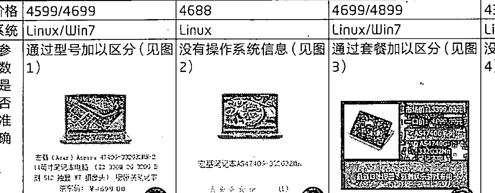

#### 考察从细节开始

我们以ACER最新的Aspire 4740G 332G32MN笔记本为例，对比上述四种网购平台。首先需要指出的是，4740G 332G32MN笔记本拥有Windows 7 Home Basic和Linpus Linux BE两种操作系统的版本，而这四个网购平台有没有给出详细的说明呢？

通过上面的考察，我们不难发现京东商城对产品的信息管理是最科学的，可以详细对比多款产品的具体参数。而苏宁易购网和淘宝电器城都没有统一的产品参数汇总，不同产品的参数项不尽相同，用户在对比产品时会稍显不便。这四种网上商城都提供了用户点评的功能，用户真实的使用感受是我们购买前最好的参谋。如果您对相关产品还有什么疑问，京东商城和苏宁易购网还可以在线提问，工作人员一般都可以作出准确的回答。而淘宝电器城就缺少了厂家和消费者互动的功能，增加了用户解决疑惑的难度。

### 小提示

网购笔记本前，最好可以把商品的配置参数页截图保存下来，一旦出现因配置差异引起的纠纷时可以充当证据。

#### 人性化的交易形式

笔记本作为比较贵重的数码产品，很多用户都担心快递的安全性，还是希望可以亲自把它取回家。此时，如果网上商城可以提供用户上门提货的交易方式，在提货时还可以请专业的工作人员帮忙调试系统，安装软件，自然就显得更加人性化了。

京东商城在主要城市都有支持用户上门提货的配送中心，其中在北京就有8家。易购网有苏宁卖场的依托，支持用户在任意门店提货，在易购网选择产品后，只要选择“自提”的交易形式，就可以在苏宁全国近千家门店中选择距离自己最近的地址取货。

#### 究竟谁更省钱？

作为B2C形式的网上商城，我们不用担心购买到假货，正规的发票可以确保保修无忧。不过，IT产品的价格波动较大，我们也不能单以某几款产品来判断四种网上商城谁最便宜，“货比三家”的真理在网上商城更为适用。就4740G 332G32MN这款笔记本而言，同样是Linux系统，乍看下价格最实惠的是淘宝电器城。不过，苏宁易购网却提供了特色的“以旧换新”服务，目前可操作以旧换新的品类有彩电、冰箱、洗衣机、空调、电脑。在易购网购买产品后，只需在“以旧换新”页面填写相关资料后，便可以享受购机发票的10%的补贴（以旧换新补贴有价格上限，比如电视的最高补贴上限金额便是400元）。也就是说，如果您家里还有废旧的电视（或者在旧品站买一台），4740G 332G32MN实际的购买金额就只有4699-400=4299元了。

### 小提示

苏宁易购网以旧换新服务有地域限制，而且部分商品也不符合以旧换新的条件。因此如果您有以旧换新的需求，在购买前最好可以拨打4008198198电话或者在线咨询一下。一般来说，相关人员会到用户家中拖回旧机，以旧换新补贴需要到苏宁门店领取。

#### 小结

淘宝电器城的价格和淘宝网上的卖家相比优势不明显，但是质量和售后有保证，至少不用担心上当受骗。京东商城起步最早，在产品的筛选和互动方面的体验最好，特价产品比较多。而苏宁易购网的系统虽然比较稚嫩，价格稍贵，但是借助实体卖场的优势，货源和取货方式最为灵活，而且如果购买了支持以旧换新的商品，最终的成交价格往往会更低一些。而品牌旗舰店为了保证经销商的利益，价格很少有惊喜，但是不定期的促销和礼品相赠也能弥补价格上的遗憾。

#### QQ音乐虽然好 适时减肥无烦恼

看过了第4期杂志《一个人做二份工，QQ兼管本地音乐》，试用了一下，觉得非常方便，尤其是不需要另外安装播放软件，的确是很方便。但是使用了一段时间，硬盘空间迅速减小。

原来QQ音乐为了每次播放时的方便，将播放过的歌曲都存在缓存文件夹下，这就意味着即使只播放一次的MP3文件也会永久存放下去，于是它占用的空间越来越多。

在此提供一个很简便的清理软件——QQ音乐缓存清理转移工具（下载地址：http://work.newhua.com/cfan/201008/qyu.rar），直接运行后，可以看到它所提供的清理功能：“清除QQMusic临时目录”、“清除QQ空间背景音乐临时目录”、“不删除到回收站，直接彻底删除”。此外，“音乐文件转移功能”可以让我们将需要的音乐文件很方便地转出来，避免了“误伤”需要的文件。此外，还有一个一劳永逸的方式——“转移临时目录”，可以让我们将QQ音乐缓存转移到其他文件夹中，只要我们将QQ音乐缓存转移到系统的临时文件夹中，那么在以后使用系统清理工具的时候，可以顺便清理了QQ音乐缓存文件，真的是一举两得。

QQ音乐虽然很好用，但是适当的清理还是必需的。

#### 小编点评：

其实QQ音乐缓存在Vista/Windows 7下是保存在“C:\Users\用户名\AppData\Roaming\Tencent\QQMusic\”文件夹下的，Windows XP用户可能通过注册表中的[HKEY_LOCAL_MACHINE\SOFTWARE\Tencent\QQMusic]项下的SaveCachePath键值查到。

> （辽宁/海客）

#### 都是兔子惹的祸

自从Windows 7面市之后，相应的优化软件也随之升级，最先通过Windows 7认证的当然要属超级兔子。功能的提升和系统自带驱动升级，为很多Windows 7用户带来了极大的便利，本人也是“兔子”一上市就开始使用了。可“兔子”竟然给我带来了麻烦。

超级兔子自带了一个内存整理功能，定时对系统内存进行整理，可以保证系统内存得到最充分的利用。可也就是这个功能，给我带来了很大的麻烦。在超级兔子内存整理中的“设置”中有一选项“整理内存自动清空Windows粘贴内容”：因为平时在Office办公组建中经常会要进行大量的复制粘贴工作，每次退出编辑后，都会提示是否要清除粘贴板上的内容。为了简化操作，我就勾选了此项。问题也随之而来。

勾选这项之后，你会发现，无论是在Office办公组件内，还是在浏览器、记事本等程序里，你进行复制粘贴的时候，都要进行两次，才能成功粘贴。最开始是在Office办公组件内出现这样的问题，我就重新安装了Office，并进行了大量的数据复制粘贴，发现问题依旧，并且退出编辑时不再提示“是否清除粘贴板上的内容”。由此我推断出不是Office组件的问题，那就应该是系统问题。在百度上搜索了下，也没有找到解决方案，后面重新启动电脑，超级兔子提示内存整理，让我突然想到了超级兔子内存整理的有一项选型是自动清空Windows粘贴板内容。我把选项取消，然后重新操作复制粘贴。发现问题解决了。

#### 小编点评：

升级Office之后你的烦恼就会消失......

> （广东/王立刚）

#### 写信模板 让简历写作更简单

求职信、工作总结的写作格式一直很让人头疼，也许你认为最简单的方法就是利用搜索引擎搜索简历模板。现在简单了，使用网易免费邮箱就能解决问题。进入“写信”界面，会看到在“主题”下面的“写信模板”（见图）。写信模板分“公务、私务、信函书文、礼仪致词”四大类，共26个写信模板供邮箱用户选择。

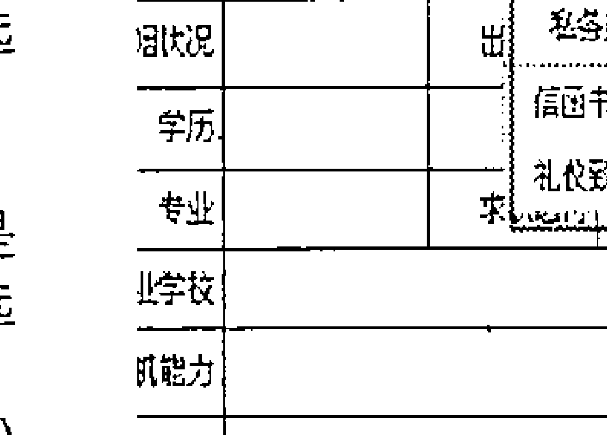

#### 小编点评：

除了模板外，多数邮箱都提供的是“信纸”，比如QQ邮箱，新建邮件后，在窗口下侧勾选“使用信纸”即可。

> （飞天小猪）

## 软件是如何“被破解”的？

不得不说，我们这次要讨论的是个拿不到台面上的话题，但越来越多的人对它感兴趣——软件是如何被破解的？网上的破解补丁都是如何出来的，可以放心使用吗？本文只在探讨技术，揭露“破解”的真相。

#### 软件是如何注册成功的？

软件在注册时，会要求你输入用户名和注册码，这部分是软件内部，通过内置的算法来判断输入的密码是否正确。比如，我制作了一款软件，现在把“算法”定为“将用户名中的字母转换为对应的位置数字，就为注册码，比如A为01，B为02，这就是“算法”。所以若用户名是CFAN，那么注册码就为03060114（见图1）。当然实际软件注册的“算法”是不可能这么容易的，也是不能让你猜到的。

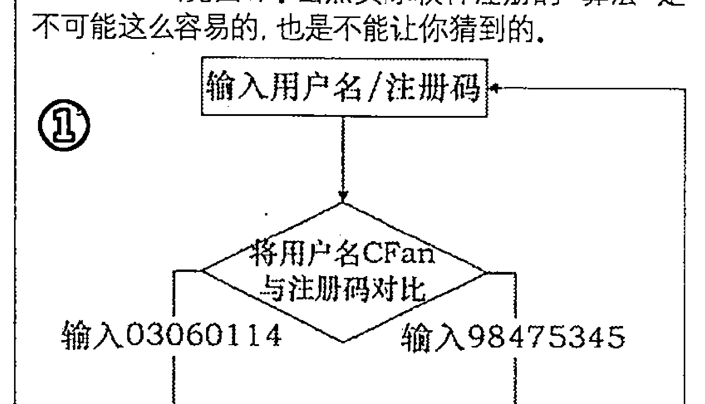

### 小提示

很多软件在注册时，都会告诉你一个“机器码”，这是共享软件作者为了限制软件只能在一台机器上使用的办法。其原理是软件读取电脑中某些硬件或软件信息，生成数字或符号组成的“机器码”，说白了只不过是用机器码充当了一把“用户名”的角色。只是软件的使用环境更严格，比如你的机器码表示使用的是Windows XP，那么你就别想换用Windows 7再用。

#### 玩“机”的和喜欢打“补丁”的

现在破解程序的发布形式主要有两种：一是水平一般的人，只需要跳过注册码验证部分，就能达到正常使用软件全部功能，从而实现破解，于是就有了破解补丁；二是水平比较高的“牛人”，会破解软件注册的“算法”，知道了算法就好办了，也就有了“注册机”——你可以用任何用户名算出注册码进行注册。

而破解的难点就在于要先把程序还原为代码的样子，于是就有了“反汇编（反编译）”的步骤。软件都是使用诸如C，C++这类“高级语言”开发的，经过了“高级语言→汇编语言→机器代码”的过程让软件可以让电脑正常运行。所谓的“反汇编”，就是将软件“机器代码”恢复为“汇编语言”。通过一些反汇编工具，你可以很容易将任何软件反汇编，比如下面就是非常典型的一段汇编代码，数据在运行时，都会有地址，代码中的0045XXXX就“内存地址”，后面的CALL 00405E02，JZ 004572E6都是执行的指令。00451239 CALL 00405E02（用来判断你输入的注册码是否正确）0045123D JZ 004572E6（如果用户输入的注册码正确，就跳向成功处，即004572E6处）XXXXXXXX YYYYYYYYYY ... XXXXXXXX YYYYYYYYYY（执行到此处，提示你注册失败，继续“试用”）... 004572E6 YYYYYYYYYY（提示你注册成功，软件所有限制取消）...

软件被反汇编后，你可以清楚的知道它每一步执行的过程，这样就可以屏蔽软件中验证用户序列号部分了。我们将如图1所示的流程扩展，就可以看到，其实汇编的目标就是找到判断的“入口”（见图2），有了入口，再用比如UltraEdit这类软件直接修改运行程序的EXE或是DLL文件就可以把软件破解了。最后，提醒一下大家，也许网上有很多破解补丁，它们可能除了自带很多广告插件外，还很有可能是黑客布下的“陷阱”——他们发布无效的“假补丁”（其实为木马病毒），吸引你安装，偷取账号。

#### 小知识

为了保护软件不被“反汇编”，从而不被破解，于是软件作者们经常会把自己的程序“加壳”，它会对可执行程序资源进行压缩，类似于WinRAR，只不过压缩后的文件可以单独运行。这有点像我们为了保证能在低温、无氧、失重等极端恶劣的太空中活下来（各种“反汇编”软件），必须穿宇航服一样。当然加了“壳”的程序也并非无坚不摧，在破解前也就多了一道手续，用工具脱“壳”。

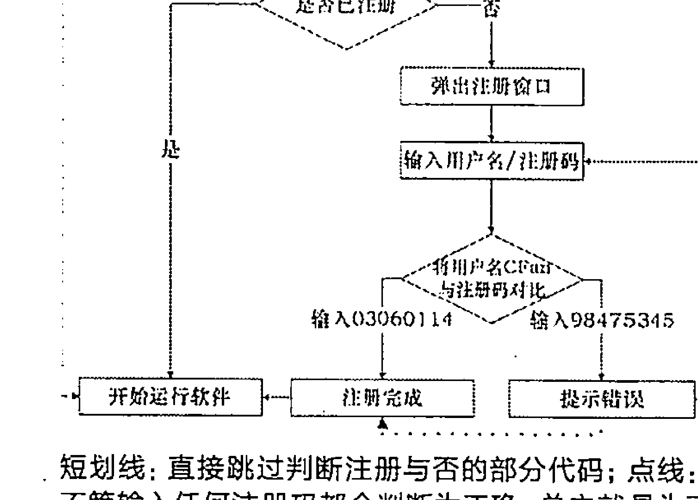

## 拒绝Office 2007安装微软拼音输入法2007

在Windows中，安装Office 2007都会被默认推送一个“微软拼音输入法2007”，可这个输入法并不好用，特别是在Windows 7/Vista下，这还会把系统内的ctfmon.exe文件给覆盖掉，如果碰到一些没有自带输入法项修复功能的输入法，输入法就需要重装，特别是这个Office 2007所自带的输入法难用且词库太小，那么，如何把它用“官方子”赶出家门呢？

方法如下：如果是全新安装，那么可在Office安装过程中，在输入“序列号”后的页面中选“自定义”，然后在打开页面中“安装选项”的选项卡下单击+，展开“Office共享功能”选项，单击展开名为“Microsoft Office微软拼音输入法”项，并选择“不可用”即可。如果是已经安装的用户，可以在控制面板中的“添加和删除程序”中选中Microsoft Office项，单击“更改”，然后在启动的面板中选择“添加或删除组件”，同样点击“安装选项”选项卡下方的+，展开“Office共享功能”，将“Microsoft Office微软拼音输入法”项的安装状态改为“不可用”即可。

小编点评：除了Office 2007外，Office 2010也可以采用相同方法不安装微软拼音输入法2010。
(福建/陈子弘)

## 半智能 一场游戏一场梦？

游戏发展到现在，可以说已经无处不在了，任何平台，甚至家里的电视机里都内置了那款经典的游戏，俄罗斯方块，那么怎么还有那么多人至今仍在高喊“一场游戏一场梦”呢？因为他们的手机是“半智能”（姑且就认为是那些可以通过简单的Java应用扩展的手机吧！）
首先，请高呼三声“咱不是颓废，咱是游戏人生”！谢谢合作，本文将实现你的游戏梦。

#### 推荐1：不得不提的UC浏览器

下载地址：http://www.uc.cn
不知道是第几次提到这款软件了，反正它是非常全面，这里推荐几个我认为还可以的手机游戏WAP站：wap.wukong.com：它会提示游戏的类型，像黑心收费、绿色收费、合计费点、完全免费等，相当实用；wap.baoruan.com：基本上都是免费的游戏。这里教给大家一个小技巧，有些游戏需要发送短信才能继续进行，所以在玩之前把短信中心号码改掉，然后在游戏中你就放心的“发送”吧，保你短信发不出去（不收费）。另外UC主页手游分类上推荐的网站也可以去试下，建议设定好机型再下载，这样可以保证游戏显示正常，键值适配。

#### 推荐2：系统工具MIDPsysinfo

下载地址：http://www.grimo-software.com/java/midpsysinfo/
这是一款实用的系统检测软件，它可以让你更了解你的手机。虽然界面全是英语，但好在都比较简单，它的检测包括：显示、多媒体、系统、API、键值、CPU计算能力等，其中APIs info项需要重点关注下，因为有人在用UC下载时提示无法读取文件系统，而且无法修改权限（这种情况多见国产一些较老机型上），这时就需要查看APIs info下Files-connecting API（文件链接API）是yes还是no，如果是no，那这手机先天不足，请关注手机官网上有没有最新的可更新固件，即俗称“刷机”。上述情况适用于那些对手机游戏需求量不大的小MM们，对于那些手指整天都在键盘上运动的小SG们来说，还是省省那点儿可怜的流量吧，咱用家里包年的宽带吧。

#### 推荐3：Opera桌面浏览器

下载地址http://www.operachina.com/
之所以推荐它，是因为它可以直接通过电脑访问WAP网页，全面贴近咱的手机上网习惯，速度也比手机上网快。还有些懒人觉得一个一个下载游戏太慢了，那我建议你泡下论坛，经常有很多热心的老黄牛把自己的游戏成堆打包，一劳N逸。

#### 推荐4：JAD生成器JADmaker

下载地址：http://www.softsea.net/soft/124930.htm
某些手机在安装用电脑下载的JAR游戏时，可能出现无法安装的现象，像三星，这可能是因为缺少JAR主程序的引导文件JAD，这个文件一般在1KB以下，与JAR同名，放在相同的目录，由于不同的JAD在格式上是一样的，所以能通过JAD生成工具可以生成，这时可以使用JADmaker，直接把JAR拖到JADmaker的窗体上，JAR目录下JAD文件就生成好了。

#### 推荐5：手机顽童JAR模拟器

下载地址：http://www.skycn.com/soft/29626.html
游戏下载好了总要在电脑上试运行下啊，那就需要这个东西了，安装后它会与JAR文字建立关联，双击游戏即可启动程序运行，其界面为手机样式，有多种屏幕规格的手机型号可以切换。
好了，看完文章，让咱接着唱歌吧：“我知道，我的游戏不是梦……”
(小阳仔爱你)

## 游戏的躯壳 电影的灵魂

最近，视频网站土豆网和中影集团联合主办的‘2010土豆映像节’揭晓赛果：创造网络点击纪录的《网瘾战争》从5585个参赛作品中脱颖而出，荣膺份量最重的金土豆奖（即最佳短片奖）。这是一幅疯狂的胜景：64分钟的动画影片，中国制造，0元成本；影片迅速占领各大视频网站头条；网络论坛上，版主不得不设立集中讨论帖。以至于尽管映像节评委会成员杨庆和宁财神都表示并不欣赏该片，但评委会最终还是将份量最重的“金土豆奖”颁给了它，以显示对网民意见的尊重。

#### 玩家的电影

有朋友问我：像《网瘾战争》这样一部视频作品，我们是不是也能作出来呢？我的答案是：“没问题！”Machinima，是游戏引擎电影的意思，指的是以游戏引擎的画面来表现情节，是一个比较新的词儿。实际上是由人操控游戏引擎所提供的虚拟演员在场景中表演的过程，这简直和在幕后操纵着玩偶的“木偶剧”一模一样。更为重要的是，这种新鲜的表达方式实现起来非常容易，甚至我们中间的每一个人都能去尝试。

#### 高手支招

在介绍具体的软件工具前，你必须要明确的是，如果你要取材的是一款MMORPG（大型多人在线角色扮演游戏）游戏的话，注定要有一个团队来完成这个视频，所以每个角色、每个制作人员之间的配合非常重要。但极可能出现的情况是，你和团队的其他成员分散在全国各地，没有机会坐在起商量，那么网络就成了一个必须且重要的沟通渠道。因此作为导演，首要的就是要做好一个计划表，一切都按计划表上写的按部就班地进行。

你得先有个剧本，整理一个故事的脉络，然后发到QQ群里和团队其他成员讨论，哪里有意思，哪里没意思，怎么改、怎么加会更有意思点儿，直至剧本定稿。如果你也想做得像《网瘾战争》那样和时事结合的话，可以先把以往发生的事摆出来串一个故事线，然后用剧情和笑料尽可能把这个故事线捋顺。

做好以上准备后，你可以用“玩家宝宝”(http://www.aipai.com/download/baobao.html)这款专业的游戏录制工具，傻瓜化的操作让电脑新手可以马上上手。登录“玩家宝宝”后，在桌面屏幕上就可以看见一个“玩”字的悬浮图标，用鼠标右键来选择“录像”，这样在屏幕右下角就可以开启录像的控制面板了，而屏幕中间的红色范围框则代表录像的范围。

### 小提示

按提示免费激活你的账户为“宝宝会员”，这样就可以拥有很多高级功能，免费使用素材库（激活地址：http://www.aipai.com/member.php）。

在录制的过程中，可以通过右下角的“预览窗”来对录像范围进行移动和调整，并同步显示被录像的屏幕画面，滚动鼠标滚轮、抓动预览窗内画面，可调整范围；预览窗上还有3个录像形状选择按钮分别是W、H、V，代表横、竖、宽屏模式；

进入游戏，把录制范围调整到游戏窗口的范围里，然后就可以点击控制面板上的红色录制按钮（快捷键F11）来进行录制了，点击正方形的红色图标（快捷键F12）来结束并保存录制的视频，最后在显示的界面中点击“打开”链接；

点击后会弹出一个编辑窗口，在“视频素材”标签中就可以看见刚才录制的那段视频了，按住该视频把它拖到右侧的编辑窗口中就可以进行编辑了，在下面的“编辑视图”栏中，可以给视频添加字幕、配音、背景音乐和特效；

### 小提示

对于视频里面的一些声音素材，如虫叫、乐器、敲击等声效，可以去网络上一些专业的素材网上下载，如“闪电音效”（http://www6.flash8.net/sound.shtml），不仅可以下载，而且还支持在线试听呢。

加字幕时，那只要选中“字幕”，接着在下面的时间轴点选需要插入字幕的起点，然后点击右边的“插入字幕”按钮，在弹出的“字幕设置”窗口中设置字幕的内容和颜色，再设置一下停留的时间，完成后点击“确定”按钮就行了；如果是添加音乐、配音等操作，也是先在时间轴选择要插入的点，再点击相应的插入按钮，按提示选择插入的内容就行了；

#### 高手支招

网络协作不如见面沟通那么直接，尤其像配音这些比较需要情绪的工作，网络协作就要多次重配，所以事先要有个心理准备。为了让声优拿捏好配音的感觉，先要让他明白配音的情境是什么，需要表达角色什么样的感觉，可以由导演先配一些情绪的样本，发给声优听样本，由导演审核，不足的还得反复录制。专业的Machinima制作者曾说，配音工作几乎占据了Machinima制作的大半时间，即使你的引擎和技术再简陋，但只要有好的声音，你的影片还是会很有意思！

全部编辑好后就可以把视频导出到电脑里，点击窗口上方的“导出作品”按钮，在弹出的提示窗口中点击“确定”，然后就可以选择需要导出的格式了，“玩家宝宝”支持多种导出格式和分辨率，设置好后点击“浏览确定”按钮就行了。

#### 高手支招

导演在录制视频前，需要将剧本分成若干场，但极有可能出现在后期组合场的时候，发现片长太长（一般短片应在30分钟左右，长片在60分钟左右），这时只能忍痛割爱地砍掉一些内容，只留下那些最精华的内容，也能避免观众因时间长而流失。

此外，一个成功的导演要能控制住观众的感情，通过剧情的铺垫、起承转合，让观众笑、哭，或者带着眼泪笑。

(江苏/漫步云端)

#### 不能忽视的“热源”：北桥

夏日炎炎，电脑越来越热，除了传统的CPU、显卡外，其实还有一个热源是你很容易忽视的，它就是“北桥”芯片。

北桥芯片具有很多功能，发热量也十分惊人，有些芯片组的北桥芯片功耗几乎和CPU相当，达到几十瓦，如果散热不佳，会引起很多莫名的故障，比如内存反复报错，即使更换内存条也不能解决；主板集成显卡不能正常显示图像等，保持北桥芯片的良好散热很有必要，特别是对于喜欢“超频”的DIYer来说，给北桥加装一个大型的主动散热器几乎是常规做法。那么北桥到底有什么用呢？

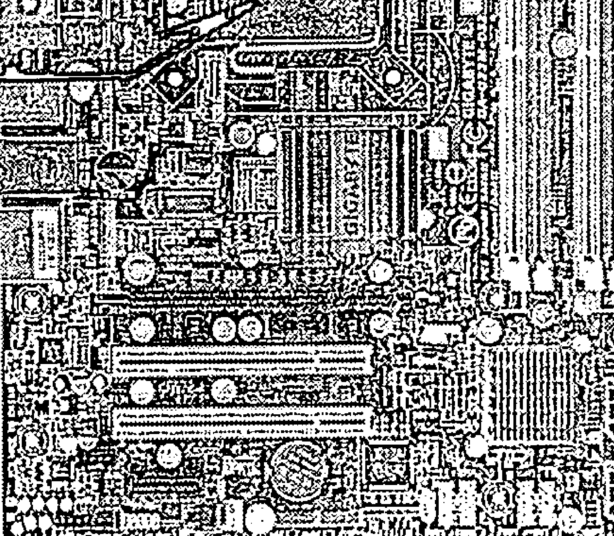

#### 北桥芯片，主板上的“老”车站

很多菜鸟一看到电脑主机板上密密麻麻的电子元件就会头痛，不过我们今天却要教大家认识一下主板上最重要的芯片——北桥（North Bridge）。

北桥的名字很形象，如果把主板看做一张地图，上北下南，上部靠近CPU插座附近的一刻最大的芯片就是北桥了。北桥芯片体积也仅次于主板上的CPU，现在大多数主板的北桥芯片上覆盖着样子夸张散热片或主动散热风扇，甚至是热管散热器，因此一眼就能够认出（见图1）。

北桥芯片的作用非常重要，是决定主板乃至整台电脑性能最重要的芯片，因此芯片组通常就用北桥芯片的名字来命名。形象地说，北桥是CPU数据与内存、显卡数据之间的“中转车站”。具体说来，传统意义上的北桥芯片具有三大作用：负责与CPU的联系，并控制内存、显卡（早期是AGP显卡，现在是PCI-E显卡）数据在北桥芯片内部的交换；提供对CPU的类型和主频、主板系统的前端总线频率（FSB）、内存支持的类型以及最大容量、显卡插槽类型（AGP或PCI-E的速度）等支持；有些整合型芯片组的北桥芯片还集成了显示核心（GPU）。

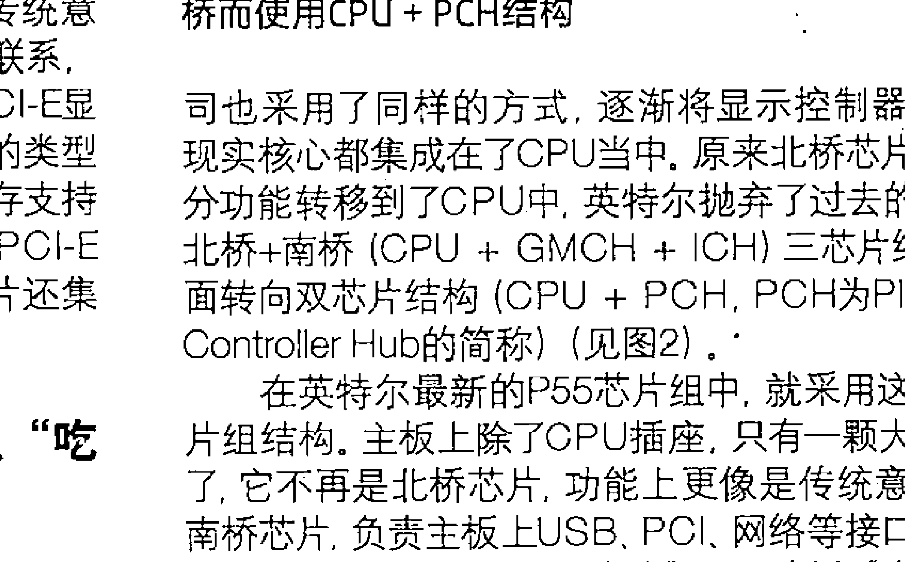

司也采用了同样的方式，逐渐将显示控制器甚至是现实核心都集成在了CPU当中。原来北桥芯片的大部分功能转移到了CPU中，英特尔抛弃了过去的CPU+北桥+南桥（CPU + GMCH + ICH）三芯片结构，全面转向双芯片结构（CPU + PCH，PCH为Platform Controller Hub的简称）（见图2）。

在英特尔最新的P55芯片组中，就采用这种单芯片组结构。主板上除了CPU插座，只有一颗大的芯片了，它不再是北桥芯片，功能上更像是传统意义上的南桥芯片，负责主板上USB、PCI、网络等接口的数据传输。北桥被CPU彻底“吃掉”了，主板上“南北桥”的叫法即将退出历史舞台！

#### 风光不再，北桥被CPU一点一点“吃掉”！

电脑芯片的发展日新月异，北桥芯片虽然作用突出，但是功能上越发显得老迈。首先是“中转车站”的作用最早遭到了挑战。首先是AMD公司K8核心的CPU将内存控制器集成在了CPU内部，这样一来，让内存数据与CPU数据在处理器内部进行交换，没有“中转车站”速度自然要提高了。后来，连英特尔公

#### 网络大补贴

大彻大悟 英特尔5系列芯片组完全剖析http://mb.zol.com.cn/144/1444040.html

(北京/稀饭傻鱼)

## 老爸！输入法不用装 也不用学！

老爸这两天不知怎么了，突然要学打汉字，还说后天就要给老同事写Email！这东西哪是两天就能学会的东西？怎么办？还好我有新办法！

### 为父母解忧，赤手空拳输汉字

老爸都快60岁了，以前就没接触过电脑，现在用电脑时便遇到了汉字输入的麻烦。除了买块手写板外，借助现有资源其实也可以解决问题。

### 鼠标打字，图的就是方便

从http://www.newhua.com/soft/78590.htm下载“疯狂鼠标输入法”，安装后就可以直接用鼠标单击的方式进行汉字输入了(见图1)。

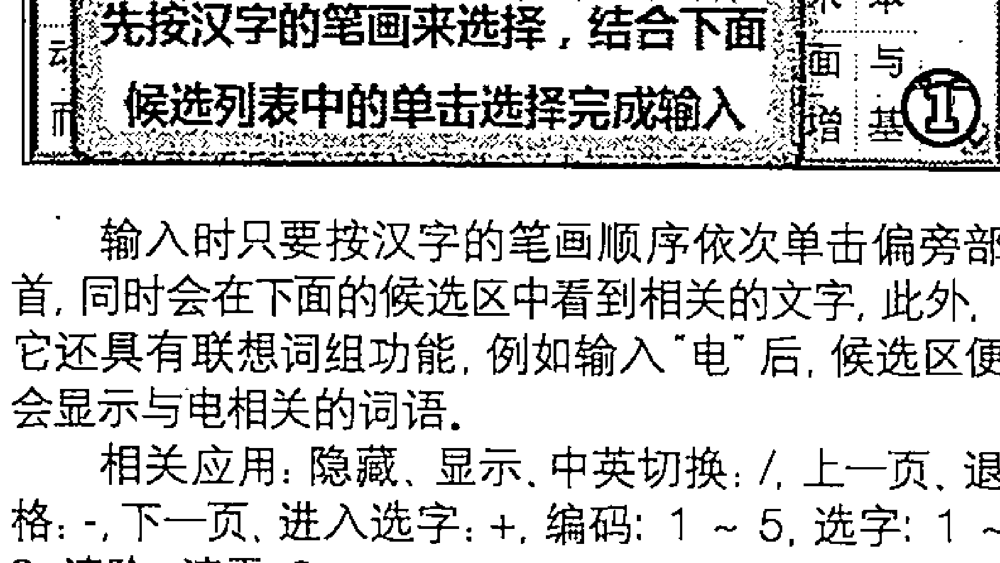

相关应用: 隐藏、显示、中英切换:/、上一页、退格: -、下一页、进入选字:+、编码:1~5、选字:1~9、清除、清零:0。

### 巧借微软拼音+本本触摸板手写输入

如果使用的是笔记本电脑，在安装微软拼音输入法的情况下，直接使用触摸板就可以进行汉字输入了。

切换到微软拼音输入法，单击文字工具栏的“倒三角”图标，在出现的菜单中选择“输入板”，再单击文字工具栏中的“输入板”，此时将会出来一个输入面板，再单击“手写识别”按钮即可开始手写了。手写的时候需要一只手的一个手指按下触摸板的左键，用另一只手在触摸板上涂画，文字实时识别，在出来的一堆备选字中用鼠标、触摸板选择一个正确的文字即可(见图2)。


### 网络时代 输入法要上“云”

老爸最讨厌的事情就是装软件，安装输入法的工作自然不能交给他，就交给云吧！打开http://pinyin.sogou.com/cloud/，右键点击下面的“搜狗云输入法”按钮，选择右键菜单中的“添加到收藏夹……”，加入浏览器收藏夹。浏览其他页面时，点击浏览器收藏栏中的“启用搜狗云输入法”，页面左上角浮出云输入法的状态栏，即可在该页面使用云输入法了。不管是哪里的电脑，只要能上网，老爸最爱用的输入法就从云上来了！

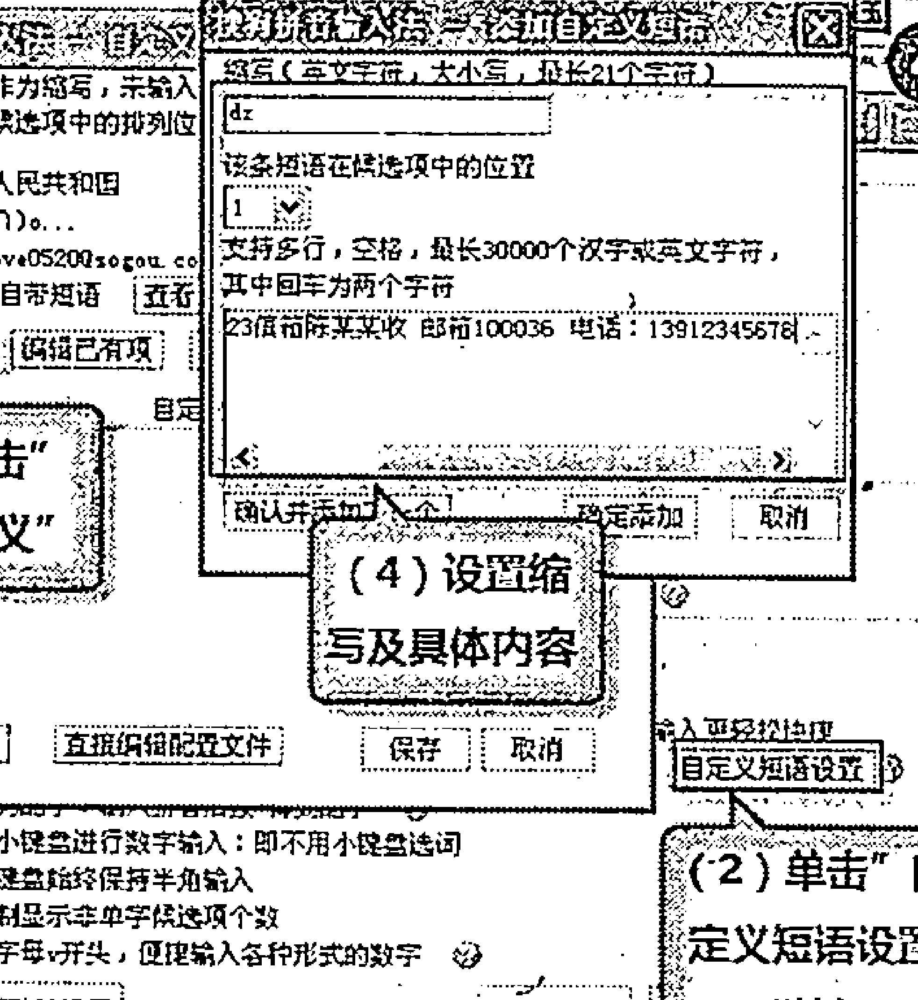

### 固定内容设置为固定词组

将一段文字(例如个人地址)设置成一个词组，日后输入时效率即可倍增。

### QQ输入法中设置方法

单击状态条中的“设置”，选择“词库管理→自定义短语”，通过“添加”按钮即可添加。

### QQ拼音输入法中的设置方法

单击状态条中的“打开工具条”按钮，选择“属性设置”，接下来设置见图3。

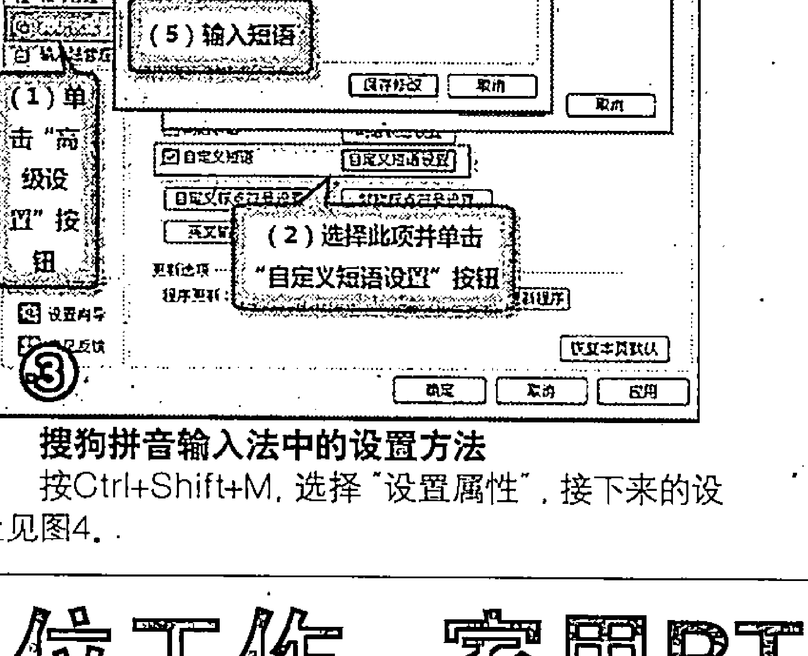

### 搜狗拼音输入法中的设置方法

按Ctrl+Shift+M，选择“设置属性”，接下来的设置见图4。

### 输入法顺序随我定

安装多个输入法程序后，想将自己惯用的输入法程序设置为默认输入法，方法很简单：从http://www.newhua.com/soft/37684.htm下载“IME Tool”这款软件，运行后就可以直接调整惯用输入法的顺序了(见图5)。

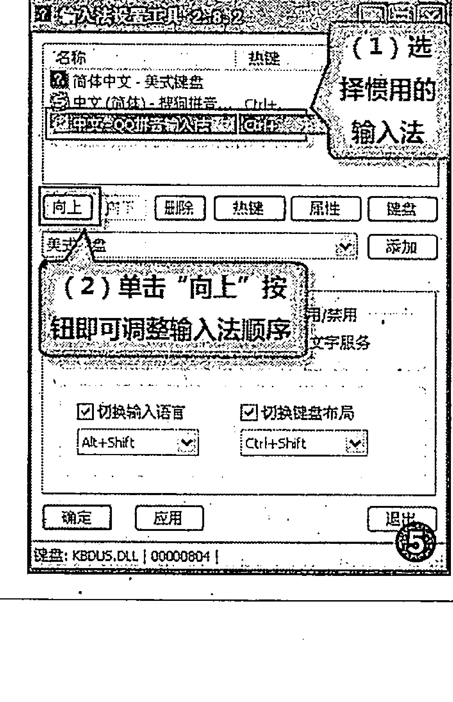

### 单位工作 家里BT

第8期的《网盘遥控器，单位上网家里BT》一文中利用dropbox (https://www.dropbox.com/) 同步种子文件使uTorrent自动开始下载的方法虽然很有新意，但是缺点也很明显，既无法查看下载速度和进度，也无法管理下载任务。其实，uTorrent很早就提供了网页界面，有了它无论你什么地方都可以通过网页控制uTorrent，跟在本地使用几乎没有区别。

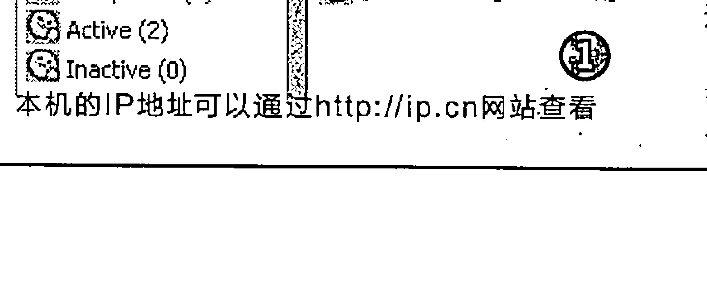

首先，依次点击“选项→设置→远程”进入网页界面设置，勾选“启用网页界面”，并在“验证”一栏中填写好用户名和密码，“连接设置”中勾选“可选监听端口”，同时填入端口号，如8080。到这里，uTorrent就成功启用了，你可以通过这个地址访问：IP地址:端口号/gui (见图1)。

但是如果你是动态IP，网页界面使用起来就没那么方便了，又或者你是内网IP，这个功能基本上就没法使用了。不过，Alpha版的uTorrent中新近出现的FALCON界面让这些问题迎刃而解了：首先申请一个FALCON帐号，地址：http://is.gd/bDxzC。申请成功后下载最新的uTorrent Alpha (http://download.utorrent.com/beta/utorrent-2.1-beta-19225.upx.exe)。安装好后，依次点击“选项→设置→Remote Access”进入FALCON界面设置，勾选Enable Remote Access(允许远程访问)，填入刚才申请到的用户名和密码，点击“应用”，稍等片刻，如果出现This client can now be connected to (这个客户端可以连接)则表示启用成功。要使用FALCON界面只要在用浏览器(不支持IE6)打开falcon.utorrent.com，输入帐号密码即可(见图2)。

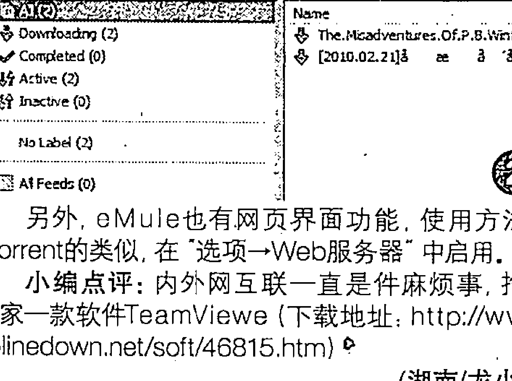

另外，eMule也有网页界面功能，使用方法与uTorrent的类似，在“选项→Web服务器”中启用。

小编点评：内外网互联一直是件麻烦事，推荐大家一款软件TeamViewer (下载地址: http://www.onlinedown.net/soft/46815.htm)

### 照片怎么放大都能清晰的秘密

喜欢发呆的小编常常感慨各种大片中“摄像头”的巨大威力：不管摄像头离男主角有多远，只需要“嗖、嗖、嗖”，屏幕闪动几次，清晰的主角大头照就能显示出来。

科幻的事情我们就先不提了，以现有的民用技术来看，要将图片保持原样的情况下尽可能放大的方法也只有利用“插值”了……

### “插值”：往可乐里加水的可恶做法！

一张1000万像素的数码相机比300万像素手机拍出来的照片要清晰很多，而且尺寸也更大。其实都是由于像素多的缘故。因此，我们把一张图片放大，其实就是把像素增加，这个过程就是通过“插值”算法来实现的。由于是“无中生有”的过程，所以程序会自动选择有用的像素做为增加的像素。为了保证最后的效果，除了会根据临近的像素放大图像外，有时也会利用较远的像素，所以放大的图像会比较平滑干净。简单的说，“插值”就像给一杯清爽的可乐兑了很多白开水（见图1）。

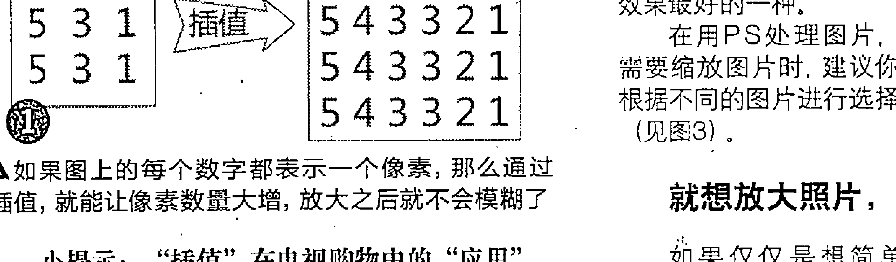

### 小提示：“插值”在电视购物中的“应用”

电视购物中不管是手机、数码相机、数码摄像机都会利用“插值”搞点卖点，比如“最新的拍照手机，像素高达800万……”“啊？800万，真的是800万吗……”等你买回家一看才发现，拍出的照片和其他手机没什么不同，其实这种手机是“插值”800万像素，基本的像素可能很低。还有那些什么号称N倍变焦的DV，也不过是“数码变焦”而已，其原理就是用“插值”实现的。

另外，不少30万、35万像素的摄像头，号称“插值”达到120万，说白了就是摄像头使用了插值算法，将640×480的画面拉大到1024×768了，是个“忽悠”你的技术而已。

### “插值”有三种，用处大不同

我们就从最常见的PhotoShop（简称PS）来说，“插值”算法多达五项，看着挺热闹（见图2），其实只有三种：邻近像素插值算法（Nearest Neighbor interpolation）、两次线性插值算法（Bilinear interpolation）、两次立方插值算法（Bicubic interpolation）。

①邻近像素插值算法：最简单的插值算法，图片放大时，直接从临近的像素生成，效果最差，图像边缘有锯齿，但速度快。由于后两种算法像素之间都有过渡，边缘会模糊，所以对于需要保留边缘的图像，使用这种算法会较好。
②两次线性插值算法：对水平和垂直方向的像素取样，得出平均颜色值，这种方法可以有效消除锯齿，最后图片的品质中等，速度较快。
③两次立方插值算法：对水平、垂直和对角线的像素取样，得出平均颜色值，是速度最慢，但效果最好的一种。
在用PS处理图片，需要缩放图片时，建议你根据不同的图片进行选择（见图3）。

| 插值对比 |  |  |  |
| --- | --- | --- | --- |
| 原图大小 | 邻近像素插值算法放大后 | 两次线性插值算法放大后 | 两次立方插值算法放大后 |
| 原图（原始尺寸） | 总指挥官（邻近像素放大） | 总指挥官（两次线性放大） | 总指挥官（两次立方放大） |

▲邻近像素插值算法，主要用于图像的缩小，可以还原图片中细微的线条，但放大图像，两次立方更为流畅

▲两次线性插值算法，主要用于放大图像，效果好于邻近像素算法

### 就想放大照片，该怎么办？

如果仅仅是想简单的放大照片，那么根本不需要PS这种专业图片处理软件出马，只需要PhotoZoom（下载地址：http://work.newhua.com/cfan/201010/PZP.rar）就能搞定了。做为一款专业的图片放大软件，它最大的特色就是放大的同时，保证无锯齿，并且不失真。它里面自带了很多比前面那三种更高级的插值算法（见图4）。

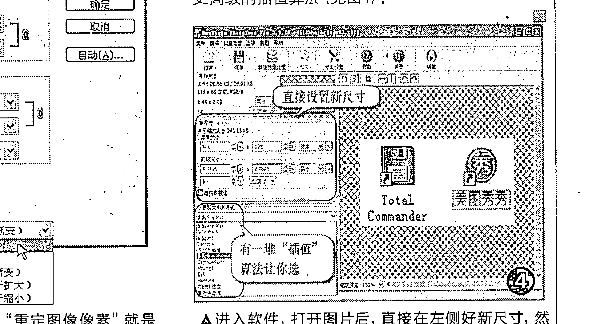

▲进入软件，打开图片后，直接在左侧设好新尺寸，然后选择一种“插值”算法即可

### 快速查看陌生日志

第6期《偷窥陌生人日志》一文，介绍了查看陌生人日志的方法，操作有点复杂。有个更便捷的方法。
打开Q讯（http://www.qqxoo.com/），在网站上方输入要查看的QQ号码，点击“搜索”按钮，在打开的页面中选择个人日志即可，除了日志外还可以查看最近访客、个人资料、主人的好友等，加密空间的一些内容也可以查看到，快试试吧。

小编点评：这类的网站其实还有很多，但这类网站通常很容易挂马，或是盗号，所以登录时一定要打开杀毒软件。

（文/蓝爱国）

### 春游当选离线地图

如果您的手机没有内置GPS导航模块，我们也可以利用免费的“迷你地图”来充当我们春游路上的“向导”。这款导航软件支持S60 V3/V5、Windows mobile、JAVA等平台手机，离线地图非常小，全国地图也只有143MB，北京仅有5.8MB。解压地图包，将里面两个文件夹复制到迷你地图的安装目录\data\Minimap\vmap下。
“迷你地图”下载地址：http://mobile.mapabc.com/download.html


（文/AB剑）

没有GPS功能也可以使用，依靠手机信号基站判别当前位置。
虽然附属功能也很实用，天气、路况、公交出行线路等小功能，当然使用它们需要耗费GPRS流量。

### 诺基亚的免费大餐 塞班导航Go Go Go

迫于竞争压力，诺基亚对手机的GPS导航功能祭出了“免费大旗”，付费的时代一去不返。对于拥有诺基亚GPS导航手机却不打算付出持续性资金支持的用户来说，再也不用因安装破解版OVI地图程序造成系统的不稳定而发愁了，官方版本的地图程序显然更适合初级用户使用。

#### Ovi地图免费下载

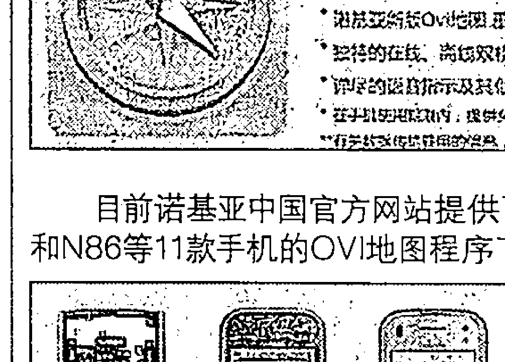

诺基亚免费导航服务：自由自在随我行 * 诺基亚OVI地图支持步行和驾车导航，全球免费 * 诺基亚OVI地图覆盖74个国家和地区，支持中文语音导航 * 支持在线、离线地图浏览，减低对网络的依赖 * 详尽的兴趣点信息及其它生活信息，为生活、旅行、商务提供全方位支持

目前诺基亚中国官方网站提供了X6, N97, 5230和N86等11款手机的OVI地图程序下载，诺基亚同时表示未来会有更多的产品加入到免费产品的列表中来。其实，通过分析下载地址我们不难发现，上述11款手机可下载的程序只有两种，分别为S60 V3和S60 V5这两个版本，也就是说，只要您的手机是塞班S60 V3或V5系统，都可以从中下载到符合自己手机系统的OVI地图程序。

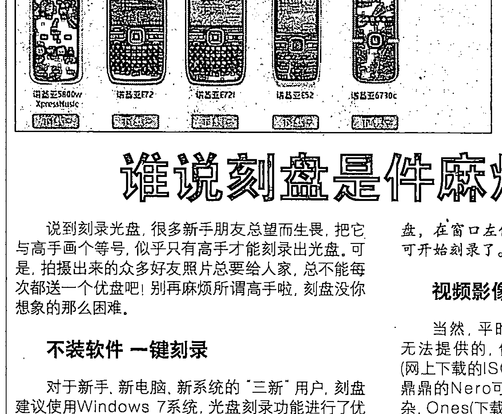

我们以诺基亚5230手机为例，体验一下OVI地图程序的安装过程。

- 下载OVI地图程序
- 下载诺基亚OVI套件
- 下载地址: http://www.nokia.com.cn/maps

首先，在电脑上运行刚刚下载的诺基亚OVI套件，选择以数据线的方式和手机进行配对。完成后在电脑上运行之前下载的OVI地图程序，通过手机屏幕确认安装，安装完成后退出地图程序。

有了导航程序，自然还需要相应的地图数据的配合才能正常运行。点击诺基亚OVI套件窗口中的空白区域，菜单栏下方会弹出“主页”、“通讯录”、“照片”、“消息”等七个图标。点击“地图”图标后，诺基亚OVI套件便会进入地图的下载窗口，我们可以选择需要的地区地图和语音指南。

接下来就是选择需要下载的地图和语音指南。用诺基亚OVI套件下载地图比较慢，中国境内全部地图大约650MB，注意下载途中不要断网，需要耐心等待。

当地图和语音全部下载完成后，您的手机便已经成为了一部GPS导航终端了，拔下数据线，还不赶快出门去试试？

#### 小心流量 '陷阱'

- 辅助GPS
- 集成GPS
- 蓝牙GPS
- 基于网络

现在诺基亚导航手机都支持AGPS功能，让手机可以根据附近通讯基站的位置来辅助定位，通常可以把卫星定位的时间缩减到半分钟以内。不过，AGPS功能需要一定的GPRS流量(每次大约10到20KB左右)，如果您对定位的时间没有太多要求，可以依次在“位置→定位→定位方法”中，只选择集成GPS即可。

### 小提示

在下载地图或者语音时，如果出现“内部错误”的提示信息，请检查当前系统账户名称是否是中文，诺基亚下载服务器似乎并不支持中文账户才会出现上述的提示。此时，我们只需新建一个英文的帐户，通过新帐户运行OVI套件并下载地图即可。


### 谁说刻录是件麻烦事？

说到刻录光盘，很多新手朋友总望而生畏，把它与高手画个等号，似乎只有高手才能刻录出光盘。可是，拍摄出来的众多好友照片总要给人家，总不能每次都送一个优盘吧！别再麻烦所谓高手啦，刻盘没你想象的那么困难。

#### 不装软件 一键刻录

对于新手，新电脑，新系统的“三新”用户，刻盘建议使用Windows 7系统，光盘刻录功能进行了优化，更好用。

当要将某个文件刻录到光盘中，只要右击该文件并选择“发送到”，然后选择刻录机对应的选项，此时系统会弹出一个刻录模式选择窗口。

#### 小知识

分为两种刻录模式，一种是类似于优盘的刻录模式，另一种是“带有CD/DVD播放器”刻录模式，第一种模式就是实时刻录模式，类似于普通数据光盘，假如使用的是可擦写光盘，使用起来就与优盘一样，可以实时再添加新文件或是删除某个文件，而第二种刻录模式则不同，可以直接制作成音乐CD或是视频光盘，之后无法对它们再编辑也无法再添加新文件。

#### 视频影像要刻录 就选 Ones

当然，平时对于刻录需求可能还有些是系统无法提供的，例如刻录视频光盘、刻录映像文件(网上下载的ISO等可直接刻录的文件)等，虽然大名鼎鼎的Nero可以搞定一切，不过它的设置相对复杂，Ones(下载地址:http://www.greendown.cn/soft/1886.html)的性价比更高，体积小、功能足，满足日常家用。

### 小提示

如果想制作DVD视频光盘，之前需要使用其他转换工具将视频文件转换成DVD格式才行，例如WinAVI(下载地址:http://www.greendown.cn/soft/2869.html)就可以转换。

#### 多张盘如何刻录才节省?

在刻录时很多朋友都出现过浪费情况，例如一张空白光盘只刻录一个小文件，之后就无法再刻录了。杜绝这种浪费行为，除了采用Windows 7中的类似优盘的模式进行刻录(这样可以继续向光盘中添加文件)外，还可以在之前通过SizeMe(下载地址:http://www.greendown.cn/soft/6483.html)来计算一下待刻录文件的容量，这样就可以有效地杜绝浪费现象。

### 快车道 EXPRESS

#### 金山召开研讨会 宣布进入第三代云安全时代

4月20日，金山公司召开“可信云安全”研讨会。金山毒霸专家详细讲解了金山云安全的三代发展历程。云安全，这个曾经被质疑为噱头的名词如今逐渐被电脑用户接受，并让数亿用户在其中受益。云安全从早期的探索到部分厂商跟进，再到全行业共识已经走过了三代发展历程，第三代云安全，金山毒霸采用的是“可信云安全的体系”结构，本地蓝芯II+云端紧密集合，实现了云端自动识别和更新，客户端发送文件的“DNA指纹”到服务端匹配，服务端部署的大量鉴定方法，可实现秒级响应，是将传统的杀毒引擎和互联网应用相结合的产物。

#### 绽放十年 Wacom中国公司成立十周年

5月6日，全球领先的数位板系统、笔感应式数位屏系统和数字界面解决方案提供商Wacom公司举行了隆重的Wacom中国公司成立十周年庆典活动。不仅Wacom高管全部到会，更邀请电影《阿凡达》的两位数字主创人员Ryan Church与Todd Cherniawsky在现场和Wacom用户分享宝贵的数字创作经验。同时，Wacom正式向中国市场推出5款新产品，分别是面向专业CG用户的影拓四代无线版和新帝21UX二代，面向行业用户的PL液晶数位屏产品DTU-1631和DTU-2231，以及面向行业用户的LCD签名数位板STU-300，进一步丰富了产品线，全面满足不同用户的不同应用需求。

#### 腾讯网独家探馆世博园 率先开启全景式报道

4月20日，上海世博园首次开园试运营，腾讯网作为中国唯一一家网络门户首发入园探馆，充分体现出腾讯作为世博会互联网赞助商的独家权益。腾讯网将组建起200余人的探馆报道团队，踏遍5.28平方公里的世博五大园区，深入每一个场馆和园区设施，以第一手的文字、图片和视频直播，第一时间全方位揭秘上海世博园真容。“独家探馆”报道专题已同期在腾讯网世博频道上线。在各路媒体的世博报道中，腾讯网抢先一步，率先开启全景式世博报道的序幕。作为中国互联网用户最多的新媒体，普通网民也整合到了腾讯的此次探馆报道中。

### CG不过如此！揭开电脑绘画的神秘面封面


### CG少年必备三宝

CG就是电脑绘画 (Computer Graphics)，顾名思义就是在电脑里完成绘画创作，范畴属于非架上艺术。既然是用电脑绘画，基本的设备是必不可少的：

- 1. 手写板——这个是必须的啦。目前市场上主流的有两个品牌的手写板：Wacom和汉王。总体来说，用Wacom的人相对较多，因为它的质量和操作都较为稳定，但Wacom的驱动却不够稳定，时常会被别的一些程序干扰，还好重装驱动是很便捷的。Wacom有一点很不好的地方，就是手写笔的笔芯是一种巨大的耗材，几个月下来笔芯会被磨损殆尽，苦恼的是，买Wacom只配一支笔芯，然而在市面上却很难买到Wacom的笔芯，即便是在专卖店，也得求老板才能买到，而且很贵。而汉王这点就比较好，买的时候送十支，把板用烂了，笔芯还没用完。
- 2. 扫描仪——这个设备对刚入门的朋友来说是极有用的，我们原来都习惯在纸上画画，虽说是‘CG’，我们也可以先在纸上把稿图起好，这对刚开始‘CG’制作的朋友来说是一个便捷的好办法，在电脑里起稿是一件麻烦的活，缩小看全景就没法画细节，放大画细节时又不能与整体画面做比较，不如纸上来得方便快捷。在下从事‘CG’创作多年，现在依然是纸上起稿，通过扫描仪导入电脑再绘制。
- 3. 绘画软件——一般的画手基本上用两种：Photoshop和Painter，实际上PS是图片处理软件，PT是比较纯粹的绘画软件，个人认为PT画写实仿真的CG图更为有利，在这方面PS的绘画功能的确没有PT强，可是对于卡通漫画类的CG图，PS便显得简单而更易掌握，并且现在很多的漫画家都习惯用PS画画。

在PS中最关键的就是‘图层’的应用，我们可以把所画的每一笔，每一块颜色或是某一类图像分别编排在不同的图层上，这样我们在调整画面的时候就非常的方便。所以我们会发现，当图画非常复杂的时候，画者的原文件图层也会相当的多，有时可能达到上百个图层。当图层非常多的时候，可以给图层命名或是编组以方便我们能更快地找到相应的图层并编辑它。

### Go CG Go!

运行Photoshop CS5 (简称 CS5) 软件，在导航栏‘编辑→首选项→性能→历史记录状态’中，把‘20’改成‘100’，这是设置PS的历史记录，这样画错了可以返回‘100’步。CS5能设置‘1000’步，但不要这样做，因为这样会加大系统盘的缓存量，如果图画本来就大，那么它的缓存量会达到可怕的地步。

- 1. 准备好了我们就开始画画啦，先把CS5右上边的模式选为‘基本功能’，再在纸上画好草图扫描进电脑（见图1）。
- 2. 在PS的导航栏的‘开始’中‘导入’扫描文件，扫描仪的模式设置为专业，分辨率在300万像素以上，这时进入PS的图像只有一个图层，不易编辑，我们很自然地会想把我们画的黑线与白底分开，可以这样：
    - ① 先把该文件的文件模式改变成‘灰度’，在导航栏‘图像→模式’中更改。
    - ② 调整画面的对比度：在导航栏的‘图像→调整’中用‘亮度/对比度’和‘色阶’调整图像，让图像中黑的更黑，白的更白，然后单击‘W’键，这是‘魔棒选择’工具的快捷键，在导航栏的下一排‘魔棒选择’工具的属性栏中‘连续’前的小框中点掉‘勾号’，即选择不连续。然后点击图像中的黑线，这样就得到一个黑线的选区，然后在右边图层框中新建一个图层，重命名为‘线稿1’，鼠标单击图层‘线稿1’，用喜欢的颜色填充（填充前景色快捷键Alt+Delete）选区，按快捷键Ctrl+D取消选区，鼠标选择原背景图层，按填充背景色快捷键Ctrl+Delete把背景图层填充为白色，或是喜欢的颜色。这样就得到了两个图层，一个是白底的背景，一个是独立的线稿（见图2）。
- 3. 在图层‘线稿1’上，用画笔和橡皮擦工具把线好好地清理一下，这就是通常说的‘清线’。这里有一个关键的地方，刚才我们把图片的模式转成了‘灰度’，是为了更好地套取线稿，现在线稿有了，还得再把模式转回来，同样是在‘模式’中更改，如果图片要上传网络则改为RGB，如果是印刷则改为CMYK。
- 4. 到这一步，就可以给我们的大作上色啦。

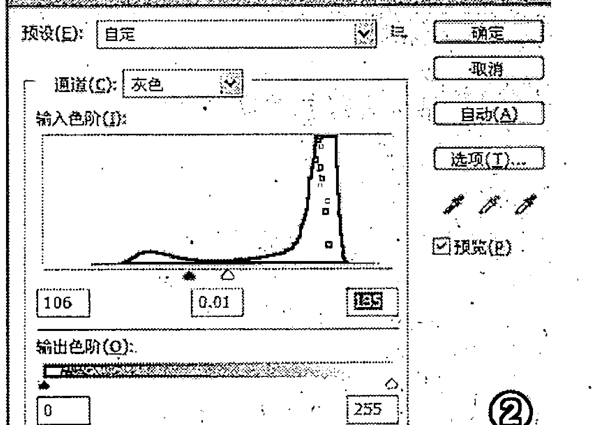


#### 高手支招：

CS5加强了画笔的透明属性以及增添了一些新画笔，下面就讲讲PS绘画常用的一些工具和技法：

- 1. 画笔工具，可以根据自己的作画需要选择相应的画笔，CS5自带的画笔大概……没有统计过，有几十种吧，如果你觉得这些画笔依然不能满足需求，还可以到网上下载一些特殊的画笔，安装添加也很简单。除了选择画笔，我们还可以重设画笔的属性（见图5）。

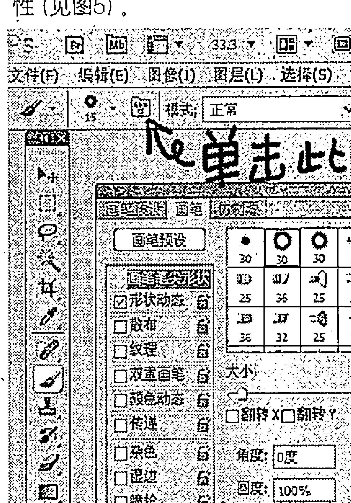

| 工具/快捷键 | 描述 |
|-------------|------|
| 魔棒 | 做选区用，可以选择画面中相近的颜色形成选区。 |
| 模糊/锐化工具 | |
| 文字编辑 | |
| 颜色减淡工具 | |
| 吸管 | 吸颜色工具，比如您想用画面已经存在的颜色来绘制画面，那就会用到它了，如果当下您是画笔工具，那么“Alt”键与之通用。 |
| 钢笔工具 | 前面讲到的钢笔工具，用它来画流畅的线条，在该工具的属性中您可以找到一个叫“橡皮带”的属性，把它点出来，很好用。 |
| 改变PS页面 | |
| 填充或渐变 | |
| 切片工具（很少用） | |
| 交换前景色和背景色 | |
| 橡皮擦工具 | |
| 历史记录画笔 | 恢复原有画面（不常用）。 |
| 形状工具 | 属于路径工具，在“路径框”中运用。 |
| 印章工具 | 可以在您需要的地方复制文件中现有的图像。 |
| 工具栏中显示的前景色变成黑色，背景色变成白色 | |
| 修复工具 | 绘画过程极少用到，处理图片用的多点。 |
| 套索工具 | 做选区用的，有几种不同的套索，都挺常用。 |
| 画笔变大小 | |
| 画面变大小 | Ctrl+/Ctrl-。 |

### 廉颇未老！老本内存升级计划

摩尔定律就好似双刃剑，在引导技术不断革新的背后，总是让我们永远无法跟上时代的步伐。这不，很多早些年购买了笔记本的用户，在Windows7系统和最新软件“压迫”下大有廉颇老矣之感。如果您不想更换新品，为笔记本进行一下内存升级应该是最有效的提升性能的手段。

### 选内存，还得看芯片组

好马配好鞍，挑选内存主要还得看本本芯片组的型号。比如早期的945只能支持到DDR2 667，而最新的HM55则可以满足DDR3 1333规格内存的运行需求。如果给老主板配上了高频率的内存，该内存只能工作在较低的频率下，从而造成了资源浪费。如果给本本选择了主板不兼容的最新内存，您的银子肯定就“打水漂”了。

| 迅驰平台 | CPU核心 | 芯片组 | 支持的内存 | 代表处理器 |
| :--- | :--- | :--- | :--- | :--- |
| Napa | Yonah | 94X系列 | DDR2 667 | T2050/T2400 |
| Santa Rosa | Merom | 96X系列 | DDR2 800 | T3200/T5800/T7200 |
| Montevina | Penryn | GM/PM4X系列 | DDR2 800/DDR3 1066 | T4200/P7350/P8400 |
| Calpella | Arrandale | HM55/HM57/QM57 | DDR3 1333 | i3/i5/i7 |

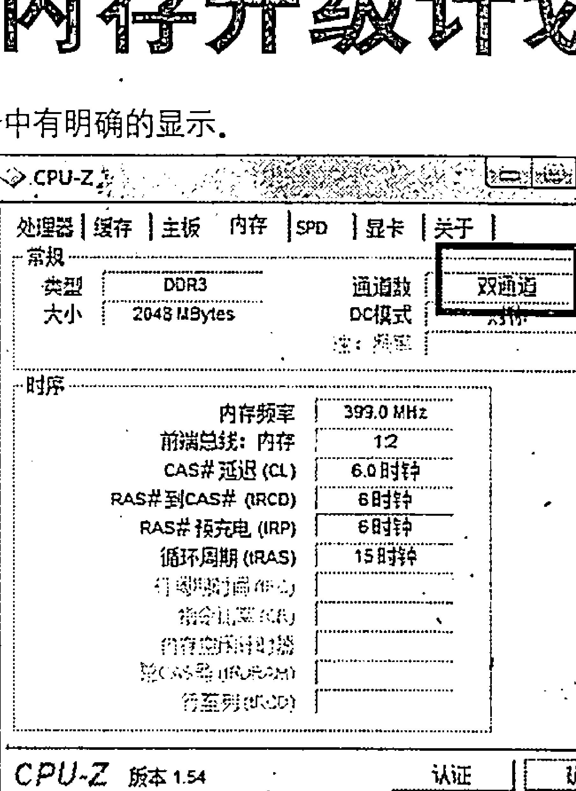

不过，如今笔记本不同规格的内存价格相近，DDR2 800可能比DDR2 667还要便宜。遇到这种情况，您可以直接选择高频率的内存，在价格一定的情况下，内存规格自然是越高越好。

| 容量 | 规格 | 京东报价(元) |
| :--- | :--- | :--- |
| 1GB | DDR2 667/800 | 199~329/186~329 |
| 2GB | DDR2 667/800 | 349~565 |
| 1GB | DDR3 1066/1333 | 189~366/186~219 |
| 2GB | DDR3 1066/1333 | 356~499/369~629 |

### 换内存，其实很容易

为了便于升级，大多数笔记本都将内存设计在了机身底部的一个单独挡板内，只需拧下内存挡板的螺丝，我们就可以对内存进行升级操作了。
除了上网本和一些超轻薄的产品，几乎所有本本都配有两个内存插槽。笔记本内存都是通过两边的卡子固定，换下老内存只需将两个卡子同时向两边拨动，内存就会自行弹出。安装新内存时根据金手指确定正反面，插入内存插槽至完全紧实之后卡子便会自动扣上。


想流畅运行Vista或者Windows 7系统，2GB内存算是最低标准。如果您以前本本内存容量只有512MB，建议直接让其下岗，直接升级至两根1GB内存。部分低端产品仅提供了一个内存插槽，遇到这种情况建议直接升到单根2GB内存。下面的表格是将一部老款笔记本内存从1GB升级到2GB以后的性能变化，用立竿见影来形容再合适不过。

| 测试项目 | PCmark05 | Photoshop载入169MB图片时间(越小越好) | 实况足球10 | 3Dmark2003SE | 3Dmark2005 |
| :--- | :--- | :--- | :--- | :--- | :--- |
| 1GB | 3115 | 322.73s | 26帧 | 900 | 348 |
| 2GB | 3365 | 282.56s | 47帧 | 1365 | 497 |
| 测试平台 | T2370处理器+GL960芯片组+Vista系统 | | | | |

### 互联网大补贴

2GB还是4GB？内存升级前后性能对比测试
http://nb.zol.com.cn/168/1689067.html

### 小提示

32位的Windows系统最多只能识别3.2GB左右的内存，如果您想在本本上体验4GB内存的飞速快感，建议升级到64位版本的Windows系统。如今品牌内存对本本的兼容性基本不成问题，但是为了避免出现百分之一的“杯具”，在选购内存时最好可以带上本本去现场安装调试。

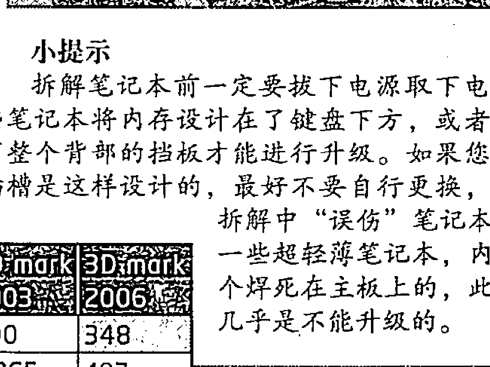

### 双通道，不再是难点

从英特尔9XX系列芯片组开始，便已经放开了双通道内存的诸多限制，几乎任何两条内存都可以组成双通道，只是如果两根内存频率不同，系统则会以频率较低的那条内存为主。查看笔记本内存是否工作在双通道模式也非常简单，在CPU-Z的“内存”选项卡中有明确的显示。

### 测稳定，MemTest 帮你忙

为了避免升级的内存和笔记本“水土不服”，我们可以利用MemTest这款软件来检测内存的兼容性和稳定性。检测时先关闭系统中使用的应用程序，然后再运行软件并在主界面上单击“开始测试”，给软件尽可能多的时间检测内存，找出可能存在的故障。
下载地址：http://www.onlinedown.net/soft/20751.htm

### 扔掉记事本 健忘症良药不苦口

再好的记性也有失手的时候，重要的会议日程被忘记，扣了奖金；总是想不起来及时查收新邮件，误了即时的商业信息，给公司造成了损失，又被扣奖金；到网吧上网，只带了五块钱，按收费标准，只能上2小时，结果因为过度投入游戏，付款时很尴尬……好记性不如烂笔头，有事让它帮忙提醒吧！

### 手机短信——最好的通知单

在接到会议通知后，就可以将需要去参加会议的时间及提醒内容作为定时短信发到自己的手机中，届时手机将会收到一条提醒短信，如果再忘了参加会议，那得吃些治健忘症的药了。

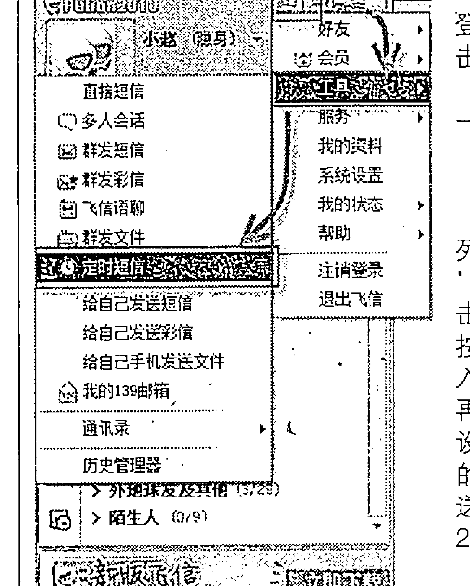

打开飞信，单击标题栏中的“菜单→工具→定时短信”（见图1）。

在打开的“定时短信”列表中选择“我自己”，单击“下一步”按钮直接输入提醒内容，再按照向导设置好提醒的时间进行发送即可（见图2）。

> 小提示：假如需要发送多个定时提醒短信，每条提醒短信之间相隔时间最短为5分钟，不能设置在同一个时间点上。此外，还可以通过“定时短信管理器”来查看、管理多个定时短信（删除、修改时间等）。

### 开通139邮箱当监控，秒杀新邮件

公司与客户、供货商的往来邮件往往都是有时效性的，没有即时查阅可能会因为遗误商机而造成损失。139邮箱自带免费短信提醒新邮件功能，借此功能，可以实现新邮件即时提醒功能了，有新邮件能立刻知晓。

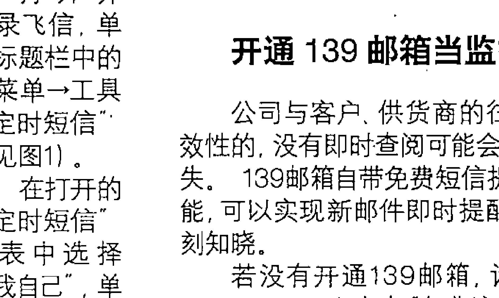

若没有开通139邮箱，请先注册：打开http://mail.139.com/，点击“免费注册”链接，接下来只要按照页面提示输入自己的移动手机号码，点击“获取短信验证码”按钮，然后再按照页面提示即可注册（见图3）。

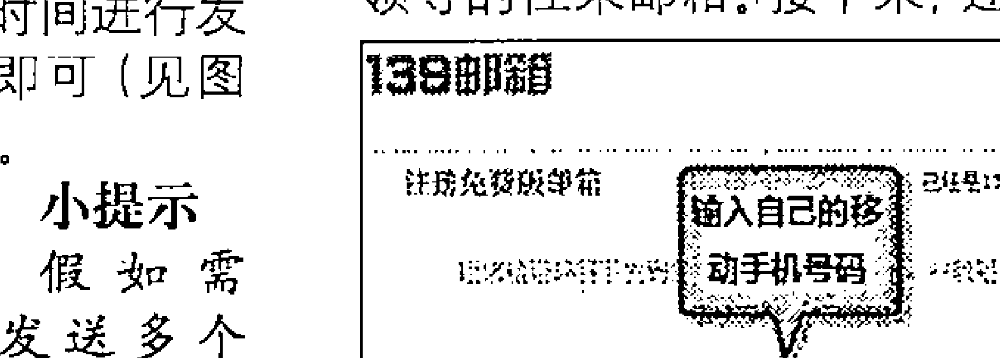

以后直接使用139邮箱作为与客户、供货商或是领导的往来邮箱。接下来，还要设置139邮箱的邮件提醒功能：登录后点击“设置”，选择“邮件到达通知”，选中“开启”选项，再设置提醒时间段及短信提醒方式即可（见图4）。

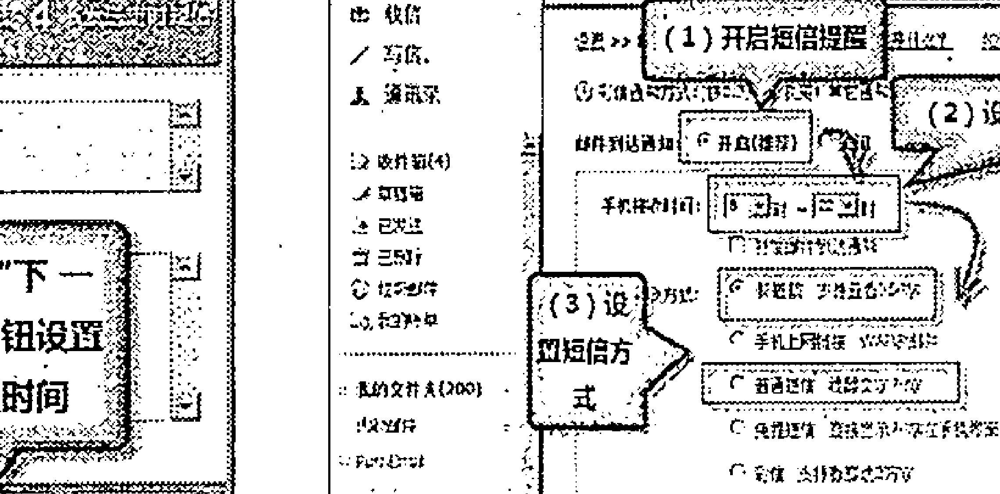

### 借助网页临时提醒不误时

来到网吧上网，为了避免因过度投入游戏而误了时间，这时又不方便安装飞信来进行提醒，那就可以使用临时性提醒方案：在浏览器中打开http://e.ggtimer.com/，接下来只要直接在“Start a timer”框中输入要提醒的时间（例如2小时），最后直接点击“GO”按钮会打开一个倒计时页面，只要不关闭此页面，当到达指定的时间后就会自动弹出一个提醒窗口，同时还会在音响喇叭中播放提醒声音。类似的服务还有不少，例如http://www.countdowndays.com/create/可以倒计时日期、指定日期进行提醒，以发邮件的方式进行提醒，如果填写接收邮箱为139邮箱，同样可以实现免费短信提醒了。http://www.timer123.com/提供了秒表计时、倒计时模式，可以按需使用。

> 小提示：如果方便更换主要邮箱为139邮箱，只要邮箱中自带转发功能（例如Gmail），只要在接收到邮件后转发到139邮箱，同样可以达到免费短信提醒的目的了。

### 搜索网站无法制作？免费空间不支持ASP！

看过了第8期《为女友打造一个个性搜索引擎》，很有兴趣，便自己动手制作。网站文件、空间、域名和解析都制作完成，激动的打开后却发现出现了一个免费空间登录界面。后来发现原来问题出在5944这个网络空间上了，只有VIP收费空间才支持ASP，免费空间并不支持。网站文件是一个ASP脚本，既然空间不支持，就当然打不开搜索引擎了。我又上网找到了一个免费空间，三维免费空间（地址http://3video.cn/user/index.asp），它支持ASP，不过大小只有100MB，做引擎还是足够的。按照书上讲的方法制作即可。需要注意的是，它不能绑定域名，只能使用自带的二级域名。之后向三维免费空间中上传文件，搜索引擎出现了（见图）。

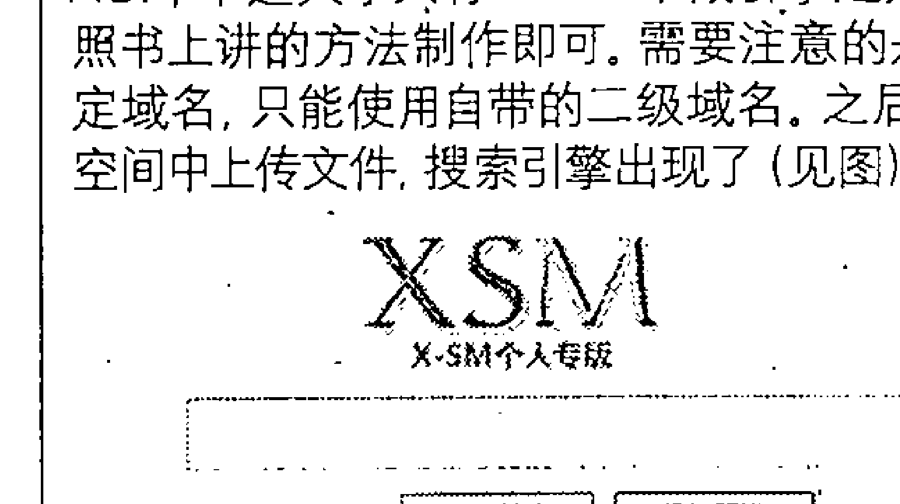

小编点评：由于作者使用的是自己的空间，5944测试的时间不长，所以出现了这个问题……（河南/翟宇翔）

### 格式工厂的五大绝活

我是CFan的粉丝，最近发现仅2010年的《电脑爱好者》中介绍的文件格式转换工具就不下6款。若全装在电脑里，会相当不爽。我为大家推荐一全能选手：格式工厂（下载地址：http://www.formatoz.com/CN_index.html）。

#### 1 大绝活：影音图像随意转

看看吧，手机支持3GP，MP4支持MP4，高清机支持RMVB、AVI，可你下的是FLV，莫非还得配上4只转换器——NO！用格式工厂，它还能批量转换，支持将大多数视频转换成AVI、MP4、SWF等11种格式，将音频转换为WMA、MP3，甚至AMR等12种格式，把图片转换为JPG、PNG、PCX乃至ICO等8种格式，还能把DVD转换为视频格式或ISO格式，把CD转换为音频格式或CSO格式，还能将ISO格式和CSO格式互转，功能着实强大。更可贵的是，软件运行时占用系统资源极少，转换时也不容易出错和假死。

#### 2 大绝活：文件尺寸随意改

图像太大？用格式工厂转换成JPG不就行了？尺寸、质量、识标任你调！手机不支持H.264？格式工厂三步搞定：选择文件，在输出配置中更改视频编码（你也可以自己修改其他配置），转换成功！音乐体积或质量不理想？格式工厂中，码率、声道、音量增益随你调！视频太大，又不想换格式？在格式工厂中选择和你源文件格式一样的格式类型，不用设置，转换，看看转换后的体积。

#### 3 大绝活：制作个性 DIY 影片

看到一部好影片，是不是想取其精华，归为己有呢？很简单：①切换到高级选项卡，选择视频合并，用格式工厂截出你喜欢的片段，并用会声会影、Flash等工具制作好片头片尾。②插入片头、片尾，并调整好顺序，点一下“高质量和大小”，在这里，你可以插入字幕、水印，甚至可以把影片倒着放，随你所好。③还愣着干嘛？开始转换呗！如果你还想加上背景音乐，利用混流就能搞定。

#### 4 大绝活：音频强劲提取

对于学英语的人，最需要大片中的语音。切换到“音频”选项卡，选择你要的音频格式，添加文件，在打开的对话框中的文件类型中选择All Files（全部文件），找到你的影片，然后就开始转换吧

#### 5 大绝活：充当全能播放器

有一张DVD，又没解码器，又不想等待漫长的转换时间，只想知道大致情节，那么——切换“视频”选项卡，任选一种格式，选取影片，点“配置”按钮，即可观看（播放窗口小了点哈^_^）。总之，格式工厂是只好软件，祝大家在影音王国里玩得更痛快！

小编点评：其实每种压缩软件都有其特色，适合自己的才是最好的，比如格式工厂不支持CUDA，转换速度上还是要慢。

### 网络电视的第一次亲密接触

五一购买的创维酷开32E60HR平板电视刚刚被送来不久后，我就开始折腾起这个电视来，选择创维的一个主要原因还是价格，因为它是据我所知的最便宜的WLED（白色发光二极管）背光的平板电视。至于电视所带的“酷开”功能，一开始我并没有足够的重视，不过既然有这个功能，我们DIYer也应该好好地体验一番。

#### 1. 卖场销售的忽悠

创维酷开E60系列的前一代型号大概是LED10系列，因为它们存在很大的相似性，比如酷开播放、LED背光，虽然不知道厂家怎么看，至少我是这样认为的。但是创维的新品似乎细分了型号，E60都是软屏，而更高系列的E80、E90都是IPS硬屏。而之前的LED10系列37英寸以下的是软屏，42英寸以上的是硬屏，都是同一个系列，也没有明显的标注，有可能会让销售人员有意或无意把所有创维LED10系列都说成硬屏……

由于手头银两不多，最后还是选择了最便宜的创维E60系列。

#### 2. 第一次亲密接触

32E60HR机器侧面带有两个USB接口，这里发现了一个小问题，接口面板与电视面板的间隔有些小，还有些斜度，使得厚一些的闪盘就需要用延长线来插入（见图1），笔者的朗科闪盘就只能勉强插在USB接口上。

在看电视的时候，由于家里的机顶盒比较垃圾，4:3和16:9的设置根本没用，收看电视节目时候还是遇到了被拉长图像的问题（见图2）。

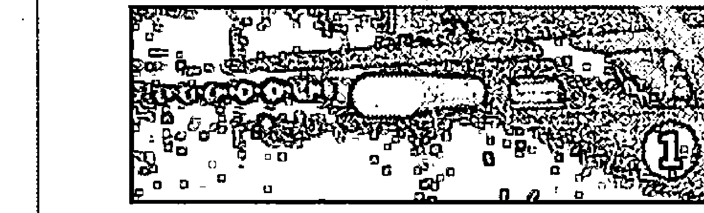


目前除高清频道外，都是4:3的电视信号，所以16:9的电视都是可以将画面修改为4:3的，但由于机顶盒通常是AV接口，可能会因此出现不能调节比例的情况。

按动遥控器上面蓝色的“酷开”键就可以进入酷开主菜单。主菜单分为三个子项——本地酷开（见图3）、网络酷开、酷开设置。要使用网络酷开，必须插入网线或者无线网卡（无线网卡不标配，要单独去创维购买），并且在“系统设置→网络设置”中设置好IP地址和网关，笔者建议用路由器进行ADSL拨号，不用电视的内置拨号。因为电视内部的管理员密码为空，如果有人连接到你家里的电视，很容易就得到了密码。

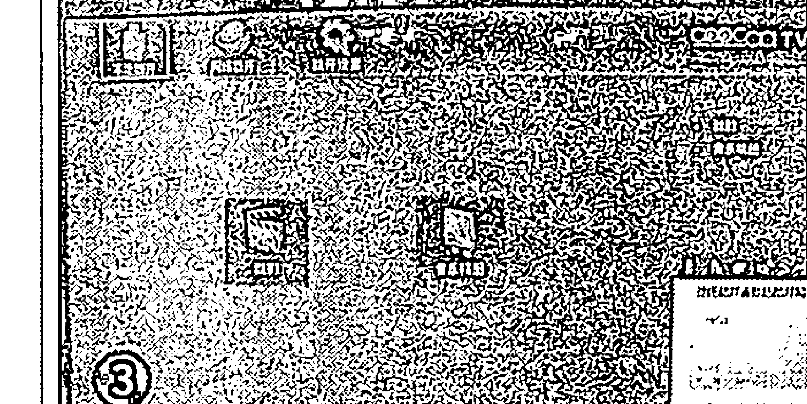

在“网络酷开”菜单可以进行在线视频观看（下载酷影）和搜索下载。总体来说在线酷影的影视库不是很大，也不是很新，有的影片还有重复，而且大部分影片质量不是很高（见图4）。大都400MB~600MB左右RMVB格式，仅有小部分影片大于1GB，笔者的1MB ADSL测试在线看了几个电影，还是偶尔会“卡”。而且在线看电影会严重影响另一台电脑的上网速度，看来笔者的1MB ADSL大概是“在线酷影”的最低标准。在线酷影的搜索功能（见图5），几乎形同虚设，什么都搜索不到，而且输入法没有智能组词，必须一个字一个字的输入。

但是“下载搜索”功能就是完全不同的景象，片源比较丰富，而且更新速度可以接受。笔者一个星期前下的电影，一周之后就出现在了“下载搜索”的菜单中，而且候选资源很多，酷开电视没有内置硬盘，必须要插入移动硬盘或闪盘才能使用下载功能。有些资源速度不是很稳定，总的来说还可以（见图6）。不过你不用傻傻地等着它下载，你可以再次按遥控器的酷开键，去看普通电视节目或者按一下待机键去干别的事情，电视支持离线下载和后台下载。

在播放硬盘中的视频电影时，可以调整字幕和查看视频分辨率。主流格式AVI、RM、RMVB、MKV都支持，音乐播放中发现WAV格式不支持。

网络酷开中还有一个功能是网上邻居，实际就是访问局域网的共享资源，这部分没有太多要说明的，Windows XP系统要关闭防火墙，取消隐藏共享，将IP地址与电视设置在同一网段。

#### 3. “酷开”的秘密

我想起了很古老的TELNET命令，于是进入命令提示符，输入telnet 192.168.1.15（我手动设置的电视IP地址），结果让我喜出望外。出现了让我输入用户名的提示符，根据直觉，我果断地输入了ROOT，结果不用密码就进去了。

根据屏幕显示，发现创维酷开E60系列使用的是BusyBox 1.1.3版本操作系统（一种Linux系统），尝试输入cat /proc/cpuinfo和cat /proc/meminfo，结果显示了CPU和内存信息（见图7）。

到这里，笔者突然想起了一件事情，因为TCL、长虹、海尔、海信、康佳等国内厂家今年纷纷推出了这类网络电视产品，它可以被理解为播放机+电视二合一方案。如果其他CFaner也买了带有类似功能的平板电视产品，希望也能发发使用感受，发掘一下机器的系统和芯片方案。让大家都来了解特色平板电视。

> 小编点评：由于“嵌入式系统”（详见本期“加油站”栏目）的“疯狂”，现在连电视都已经“电脑化”了，有谁深入研究过，欢迎发稿分享。
（北京/握握你的手）

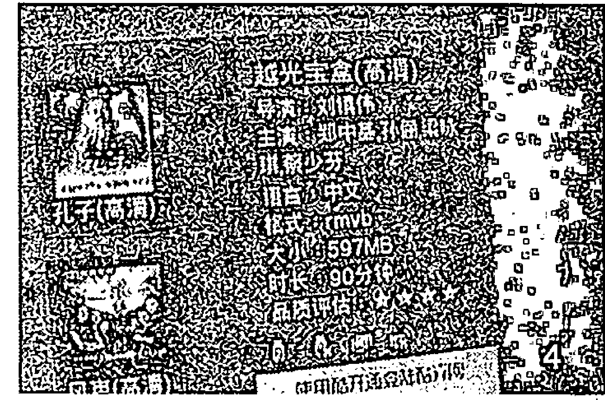

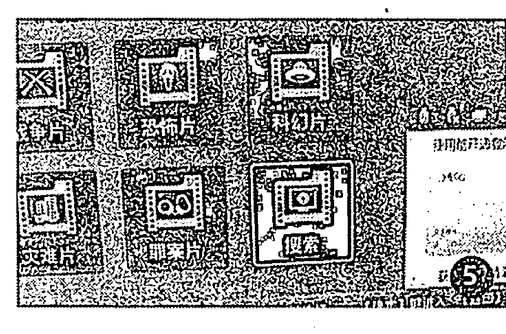

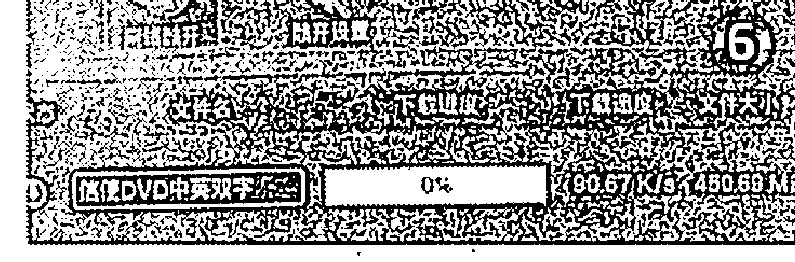

酷开会自动在闪盘上面创建一个迅雷的临时下载文件夹，推测酷开“下载搜索”中的片源来自迅雷

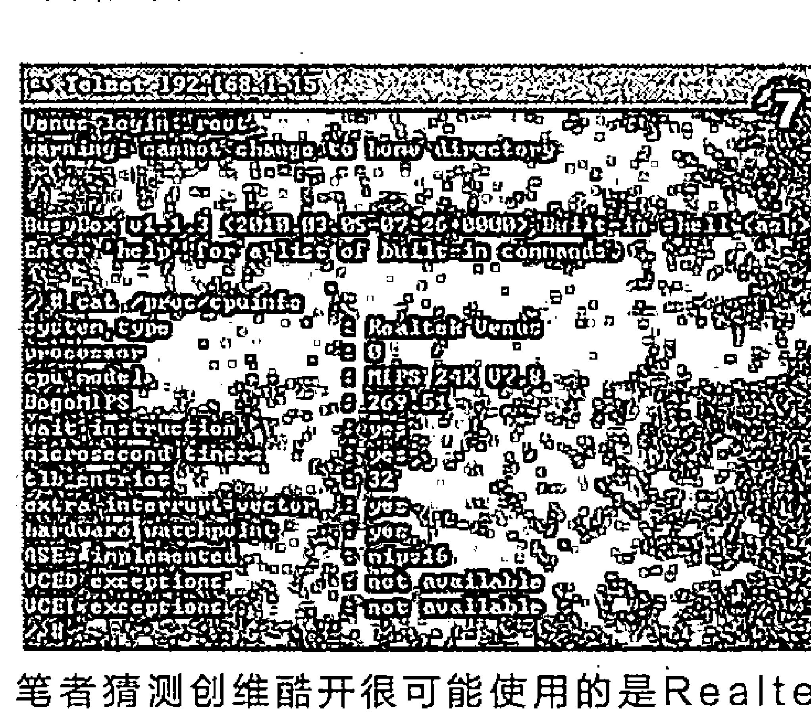

笔者猜测创维酷开很可能使用的是Realtek RTD1073芯片方案实现的酷开功能，关于Realtek RTD1073，在第7期的《菜鸟用“方案”选“高清机”》中做了介绍

### 换种方法 也能玩个性搜索

第8期的杂志为我们介绍了制作个性搜索引擎的办法，但5944并不免费，推荐我现在用的http://www.chez.com。

另外，我为大家介绍一种更简单的方法：不仅做成了一个个性搜索，还做成了一个个性工具栏，一举两得。

首先进入http://www.conduit.com/，这是个全英文的网站，也就是等会儿做工具栏的网站，建议使用IE内核的浏览器打开，笔者先前用谷歌浏览器打开遇到了一些小问题。点击界面上的Get started now（开始制作），然后分别填写你的姓名、E-mail地址、工具栏名称（这里仅限英文，不过呈现在工具栏上的名称可以修改，以后登录就要用这个名称）、密码、重复密码、你的网站地址（这里随便填写一个即可，比如http://www.qq.com什么的）、网站类型（随便选一个即可）、语言（这里一定要选Chinese，否则以后很麻烦），后面两个需要勾选的分别是“我愿意接受与本工具栏有关的邮件”和“我同意服务条款”，最后输入验证码，点击Create My Toolbar（创建我的工具栏），完成注册。

接下来就要开始设计工具栏了。由于我们做的是个性搜索，这一步可以直接跳过，有兴趣的“童鞋”可以自己探索一下。我们只需要点击左上角的Logo选择Edit（编辑）进行样式修改即可，然后点击右上角Install your toolbar（安装你的工具栏）下载工具栏。

软件安装时默认将IE的默认搜索设置为你设计的搜索（360会跳出一些提示，点击“允许”，不会有问题的），以后可以直接在工具栏或IE搜索栏通过自己的个性搜索进行搜索。要进入搜索首页直接点击工具栏上的搜索按钮即可，也可以进入http://tinyurl.com对搜索引擎地址进行缩减。

工具栏嫌麻烦可以再卸掉，但搜索引擎就这样保留了，这些过程看似麻烦操作起来很简单，而原文介绍的5944还需要上传文件，非常麻烦。

> 小编点评：原文的目标是制作个性化搜索引擎，本文在这方面个性化不足，推荐给喜欢的朋友。
（上海/夏日的吸血鬼）## 硬件评测软件的数据可信吗？

很多DIY玩家在购买硬件之前，都喜欢去看看最新的硬件评测，然后再决定究竟是购买什么具体型号的产品。对于很多老鸟来说，即使不购买配件，也习惯定期看看硬件评测，似乎也成了习惯。这些看似高深莫测的评测数据、软件得分，对于一般的消费者来说有什么指导意义呢？

注：我们今天谈的评测主要是指CPU、内存、硬盘、显卡以及笔记本电脑和PC整机评测。

目前我们看到的大多数产品评测，多数为某类产品的“单品评测”。对于这些CPU、主板、显卡等的评测，看似有专业的评测软件对产品各方面性能进行测试，但实际上很多单品评测并不全面，原因有三：

### 单品评测不靠谱，“测试平台”不是DIY推荐配置

一般的硬件评测文章都是典型的“五段体”（见图1）。

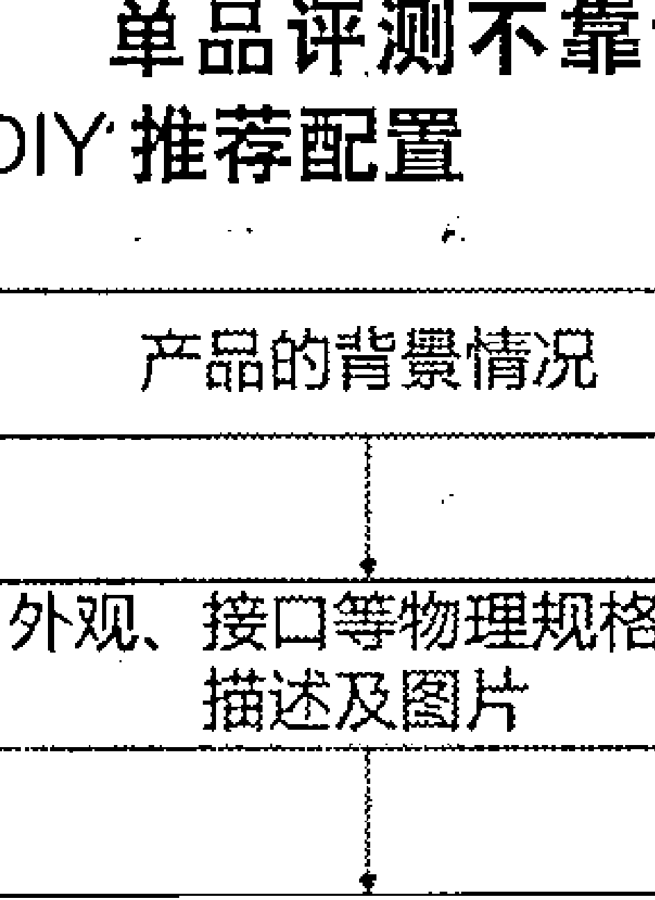

需要特别说明的是测试平台，比如下表，就是显卡的测试平台，在测试平台说明中详细列举了除显卡以外的所有硬件配置以及操作系统、显卡驱动程序、主板驱动程序、DirectX版本等。这样做的好处是让读者清楚地了解评测中使用的软硬件平台，力求使其他配件不至于成为评测中的瓶颈。

不过需要注意的是，测试平台的配置对于大多数用户来说，并不是最佳的DIY配置。因为所用配置价格偏高，这样的评测平台虽然不会给单品评测带来瓶颈，但对于一般用户来说可望而不可即。所以这种形式只有多款同类型单品的横向对比评测，找出产品差异时有用。

### 测试软件更新几乎跟不上硬件升级速度

很多热衷DIY的朋友都能够说出几款著名的测试软件，比如CPU-Z, 3DMark, EverestUltimate, Super π等。如今不仅新的硬件层出不穷，测试元件也更新极快，以对应新硬件的最新特性。以著名的显示性能评测软件3DMark为例，3DMark 06只能支持DirectX 9级别的3D硬件特性，而最新一代的显卡，已经使用了微软DirectX 11 API，不过能够反应DirectX 11级别硬件性能的测试软件现在还是凤毛麟角，一般大家都只能找一些采用DirectX 11技术的Demo片段来进行测试了。类似的例子还有很多，比如大家熟悉的Super π，它是一款很好的CPU性能测试软件，但是对于现在动辄双核、四核的处理器，Super π并不能反映出真实的性能。因此，如果你也热衷于DIY硬件的“DIY测试”，那不妨看看是否该更新一下测试软件库了。

### 某款显卡评测中的测试平台

| 硬件测试平台 | |
| --- | --- |
| 处理器 | Intel Core 2 Duo QX9550(45nm、1333MHz FSB、主频2.8GHz、L2为12MB) |
| 平台 | ASUS Maximus Formula Special Edition(Intel X38+ICH9R，支持PCI-E X8+X8) |
| 散热器 | Tt 大台风Big Typhoon VX CL-P0310 |
| 显示器 | Dell 3007WFP LCD |
| 内存 | 金士顿Kingston PC-2 6400 DDR2 800MHz 1GB x2 |
| | (内存时序: 5-5-5-16) |
| 硬盘 | WD Raptor 150G SATA Hard Disk Drive |
| 电源 | TT ToughPower 650W |
| 系统平台及驱动信息 | |
| 操作系统 | Microsoft Windows 7 |
| 显示驱动 | ATI Catalyst HD5550 win7-32bit |
| | Forceware 195.39 Beta for win7-32bit |
| 主板驱动 | Intel Chipset Software Installation Utility驱动8.3.0.1013 |
| DirectX版本 | DirectX 11 API |

### 小知识：最新硬件测试软件Top 5

- ★PCMark Vantage  ★3DMark Vantage
- ★wPrime  ★Heaven
- ★CINEBENCH

### 为博眼球，华丽的游戏测试仅仅是“精彩花絮”

很多评测文章在最后部分喜欢用一些目前流行的游戏进行测试，特别是在一些处理器和显卡评测中使用。这样做有一定道理：游戏是检验处理器和显卡性能的最好工具之一，特别是一些最新的游戏，使用了DirectX 10甚至是最新的Direct 11引擎，能够很好的反映出显卡对于新一代API的兼容能力。不过对于一般用户来说，游戏评测并不一定适用，因为游戏测试中会开启很多不必要的进程（如网络连接等），并需要用第三方工具获得显示“帧数”，在一定程度上也破坏了纯净的测试平台。其实，很多网站中的游戏评测，不过是为了获得更多点击量的精彩花絮而已，对于产品特性的区分没有太大意义，就连网站小编自己也这么说啦……

不过，在没有其他参考的前提下硬件评测文章还是值得一看的，毕竟多数情况下编辑已经把影响降到最低，只是千万不要过于迷信。

#### 网络大补贴

Fraps是一款显卡辅助软件，用它可以轻松了解机器在运行游戏时的帧数，从而了解机器的性能！另外它还具备在游戏中截图和视频捕捉功能。下载地址：http://www.onlinedown.net/soft/16424.htm
(北京/睿晓)

### 电视购物中的小把戏：嵌入式系统

看着电视上那堆主持人撕心裂肺大叫着“买上网卡送电脑”，你会不会感到好奇，是什么样的电脑这样便宜？这个问题我们已经在第9期杂志上的《拆本拆谎言，电视购物太可恶！》讨论过了，可是你知道吗，其实它们所使用的Windows CE就是我们这次所讲的“嵌入式系统”之一。

### 嵌入式系统“被电脑”，细数你身边的N台“电脑”

想必你一定会问：“我哪有那么多电脑，我只有一台笔记本电脑啊？”其实除了一台笔记本电脑，你平时使用的智能手机、电子词典，家里装备的无线路由器、PlayStation 3游戏机、高清播放机、MP4播放器、数字电视机顶盒甚至是液晶电视，都是“电脑”！智能手机不仅能够通讯，还可以收发邮件，浏览网页；电子词典也有键盘和屏幕作为输入输出设备，符合教科书上“计算机”的定义；就连最新的液晶电视，也成了“互联网电视”，不仅能够上网冲浪，还能在线播放大片。原来，这些都是采用“嵌入式系统”的数字化设备，虽然不是一般人眼中电脑的样子，但确实算是专用的“电脑”了。

### 小知识：嵌入式系统

你要明白“嵌入式系统”已经无处不在，电子表、微波炉、DVD影碟机里面都能称得上使用了嵌入式系统。我们经常接触的MP4、手机更是使用了“嵌入式系统”，它们其实就是便携设备的操作系统，其地位与普通电脑中的Windows相当。
这里小编还要啰嗦两句——现在，“嵌入式系统”开发异常火爆，轻轻松松就是高薪，如果你还没有就业方向，不如考虑一下……

### 谁是处理器老大？英特尔？NO！嵌入式微处理器如影随形

有了“嵌入式系统”，就不得不提到“嵌入式处理器”，就连电脑菜鸟都听说过英特尔的大名，不过在嵌入式系统领域，英特尔却不是处理器的业界老大。英特尔处理器采用X86架构（这也是286、386、486、586名称的由来），需要处理的数据量大，操作也复杂，所以使用了“复杂指令集”。而大多数嵌入式微处理器没有过多的计算，也基本是重复操作，所以用“精简指令集”，所以英特尔在这个领域还处于“不带你玩”状态。目前，ARM、MIPS、PowerPC这些“精简指令集”架构的微处理器几乎充斥着我们身边的每一个数码装备，不信我列举给你看：

### 数码产品中常见的嵌入式处理器

| 数码产品 | 使用的嵌入式处理器 |
| --- | --- |
| 苹果iPhone 3GS/4G | ARM Cortex |
| HTC智能手机 | ARM Cortex |
| 微软Zune HD | NVIDIA Tegra |
| 任天堂DS2 | ARM Cortex |
| 诺基亚智能手机 | ARM 11 |
| Palm Pre 2 | ARM Cortex |
| RIM黑莓 | ARM 9 |
| 三星 | ARM Cortex |
| 索尼PSP | MIPS R4000 |

除了数码酷玩采用嵌入式系统，我们熟悉的家电领域，也早已全面进入了嵌入式时代，并向“片上系统”（就是将一堆不同用途的芯片集成在同一主板上）方向发展。我们在家电卖场看到的可以点播互联网视频的液晶电视、具有双向互动功能的数字电视机顶盒、能够播放蓝光高清电影的高清播放机等等，都采用了集成度很高的嵌入式系统或片上系统。

### 网络大补贴：英特尔推出片上系统处理器凌动CE4100

http://www.soomal.com/doc/00100000779.htm

### 买嵌入式“电脑”不要迷信“主频”

既然我们身边很多数码设备、家用电器都是一台使用嵌入式系统的“电脑”，那是不是也要向买电脑一样，要买处理器快的，内存大的……其实不然。正如我们前面所说，嵌入式系统大多采用“精简指令集”的处理器，并且是为实现特定功能进行了开发和优化，执行效率很高，例如很多高清播放机中使用的Sigma Designs 8635芯片，主频只有400Mhz，却能轻松应付各种编码的1080P视频，比很多使用通用CPU加高档显卡的计算机都强。因此，频率不是嵌入式系统的主要性能指标。我们在购买嵌入式系统的数码产品或家电时，更需注重的是看“功能性”和“兼容性”，能够实现你想要的功能，并能够和你现有的家电或数码产品兼容，就是一台好“电脑”。
(北京/傻鱼)

### 为什么他们“被搜索”了？

### 北京黑客的10月生活记录

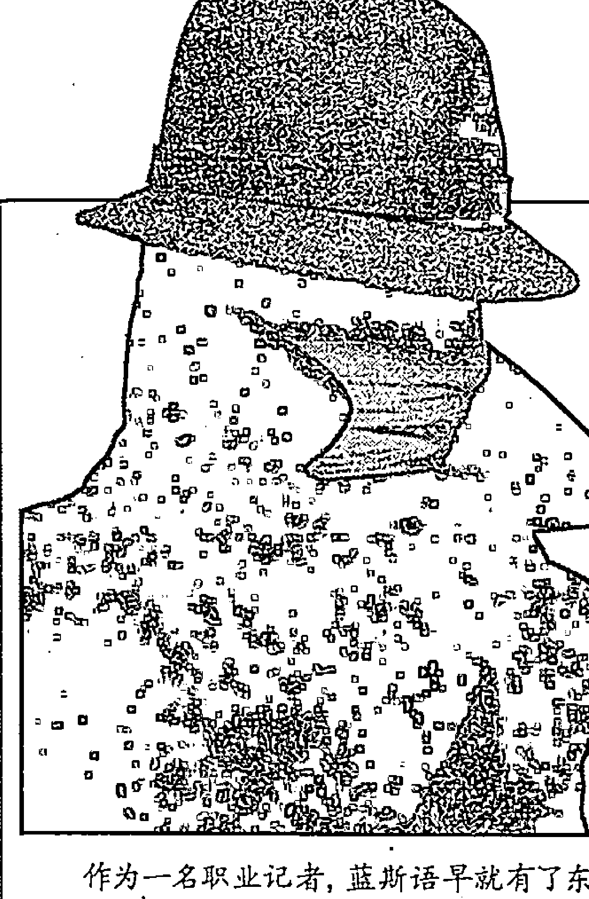

作为一名职业记者，蓝斯语早就有了东奔西跑的觉悟。不过因为所在的报社并不那么知名，每次参加发布会时蓝斯语被安排的位置总是在那种靠长焦镜头都很难拍到发言人的位置，所以每次问不到问题又拍不到能堪头版之用的照片，而后又每每被主编骂得狗血淋头。“要是让你去就是为了带这些材料回来的话，你以后就像新来的实习记者一样去采访下这类边缘话题好了！”，又一次带着满脸新鲜的口水从主编办公室走出来，蓝斯语很不爽地坐回了自己的座位。

“《打人熊姐被网友人肉搜索》，呃，这么直白、苍白、惨白、小白的标题都起得出来，果然是新手。” 蓝斯语还是扫了一眼主编刚才说这话时扔过来的报纸，“谁说边缘话题就一定要写得没深度了？”

人肉搜索揭穿了假老虎，人肉搜索曝光了天价烟局长，蓝斯语深知这个东西的厉害，却不知这究竟是什么东西。面对一个看起来能令主编没话说却又没头没脑的选题，蓝斯语觉得有些无从下手，有些烦躁，右手有节奏地像弹钢琴那样轻轻地在键盘上触碰着。突然，他的目光集中到了手指下的键盘，BINGO！虽然头上没有像漫画一样冒出个灯泡，但他显然已经有了主意。

### 什么是“被搜索”

尽管报纸杂志电视广播都不止一次地报导过“人肉搜索引擎”这个东西，弄得隔壁邻居家小孙子的二大爷的保姆的80岁老母亲都知道现在有个东西叫“人肉搜索引擎”、“听说很厉害”，但对于大多数人来说，这仍然是一个字典上查不出释义的“潮”词。

### 不求最好，但求最肉

简单地说，人肉搜索引擎就是由某人提出问题（通常有悬赏，如果是找某个能引起公愤的人则几乎不用悬赏），大家群策群力，将在传统搜索引擎中找到的内容提炼加工，得出提纯后的搜索结果的方法。人肉搜索的口号是“不求最好，但求最肉”。

### 愤怒吗？一起上

最常见同时也是数量最多的人肉搜索都是通过悬赏来召集大家参与的，这种方式得到的最终搜索结果是“竞争上岗”制，找到最好最合适的答案的人获得赏金。

最强大的人肉搜索都必须有一个前提—愤怒，比如论坛上出现一个“虐猫女”的帖子，呼吁大家找到那个虐猫女的真实身份，这时候就不需要什么赏金了，大家群策群力，找到蛛丝马迹都会贴出来和大家共享，根据众人找到的点滴信息，最终得到搜索结果。

### 胜利？邪恶？炒作？

华南虎造假事件无疑是历史上最成功的一次人肉搜索，从最初的官方否认，到网友一点点地揭开真相，最终造假者落入法网，这无疑是人肉搜索的胜利。

最不义女大学生事件则首次向大家展现了人肉搜索恐怖的一面，人肉搜索的发起者利用谎言骗取了网友的同情，在利用人肉搜索得到了前女友的住址后，残忍地将其杀害。事后，参与了这次人肉搜索的网友们纷纷后悔不已……

兰董和贾君鹏事件都是纯粹的商业行为，而参与人肉搜索的网友则成了他们获取商业利益的工具。

### 找东西容易，找有用的东西很难

“那这么说，人肉搜索最早是由于很多人不会使用搜索引擎而出现的，”蓝斯语问道，“那搜索引擎不是越来越好用了吗？为什么还有这么多人发起人肉搜索？”

何天放有些轻蔑地笑了：“其实传统的搜索引擎是越来越难用了。至于原因嘛，有很多……”

### 搜索引擎天生的“水土不服”

我们平时使用的Google、Baidu等搜索引擎都属于“机器搜索引擎”，也就是依靠搜索特定关键字来获得匹配的信息的传统搜索。随着网络内容的爆发式增长以及中文分词技术的滞后，大量的歧义搜索结果让我们只得不断变换搜索关键字，但也无济于事。

### 小知识：中文分词技术

非常让人遗憾却又不得不承认的是，计算机最初就是为使用英语的国家设计的，从最底层的硬件基础到高级的软件应用都是如此。对于使用英语进行搜索的人来说，并不存在分词的问题，因为比如“I am a CFaner”这个句子本身就由空格将各个单词给分隔开了，而字词之间并无分隔的中文搜索在分词技术出现之前简直就是一个歧义词库，比如搜索“中将”这个词很可能得到的结果是类似“本校将在2年中将学生宿舍全面翻新”的信息。

黑客级建议：在分词不佳造成歧义结果时，调整关键字或使用“完整匹配”指令（大多数搜索引擎将英文双引号中的关键字视为需要完整匹配的内容）。

### 一条信息的无数“影分身”

要在网上找出一条信息的出处比从女子学校找出个男生都难，大量的“转载”、“再转载”使一条信息在搜索结果中无数次重复出现。如果大量重复的正好不是你需要的内容，那么想要找出其他内容只能不停地翻“下一页”了。

黑客级建议：通常搜索结果中出现的大量重复转载信息都是关键字与重复信息的标题吻合，可以使用“allintext:”指令搜索网页内容或者使用指令“-”去排除掉重复内容。

Sample.1
目标：搜索网页内容中包含“upsf”和“pk”的信息，忽略网页标题。
在搜索框中输入：“allintext:upsf+ pk”（不含外侧中文引号）

Sample.2
目标：搜索烤鸭店信息，但不要北京的。
在搜索框中输入：“烤鸭店 -北京”（不含外侧中文引号）

### 竞价排名，花钱就“插队”

插队是一种非常惹人厌的行为，但是在很多搜索引擎中，只要你花得起钱，那么在某个关键字下你的信息就能任意“插队”到最前排。有了这种插队行为，很多和关键字无关的甚至完全相反的广告信息就充斥了你的搜索结果。曾经有个笑话是说使用国内某知名搜索引擎找东西时，应该从搜索结果的最后一页往回翻……

### 小提示：百度“凤巢”取代“竞价排名”

百度将于2009年12月起启用新的凤巢系统取代被网民诟病已久的“竞价排名”系统，据称此系统在排名权重方面作出了重大调整，出价最高的客户并不一定会排在第一。究竟是否能如其所言，还需时间来证明。

黑客级建议：使用不含竞价排名机制的搜索引擎

### 地点：B市某看守所

蓝斯语默默地翻看着手中的资料，时而看一眼正坐在他对面，被手铐束缚着的年轻人。

“何天放，B市人，21岁。中国QH大学学生，网名‘KBDancer’，曾经作为主力参加了历次的中美黑客大战，每次黑掉对方的网站时都会在主页上留一个键盘上跳舞的小人图片，因此被称为‘键盘上的舞者’。”蓝斯语终于打破了沉默的气氛，自顾自地念了起来。

“那又怎么样，现在的我只是个囚犯，”这个年轻人死气沉沉的脸终于有些激动，“你不是第一个采访我的人，也不会是最后一个，你也是想来问我对那件盗窃银行账号的案子有什么说法吗？好吧！我后悔了，我真的后悔了，但那又怎样……”

哽咽的他用头直接撞在了桌子上，泣不成声。

“我和你们狱长还算有点交情，”蓝斯语不禁有些怜惜这个曾经在网络上叱咤风云的年轻人，“如果这次你能帮到我，我也能为你争取到减刑的机会。”

“不用说这些没用的，你想问什么，说吧……”何天放显然对记者的这种许诺并不抱什么希望，但并不抗拒蓝斯语的提问。

### 人肉搜索历年大事件

| 时间 | 事件关键字 | 最终结果 |
| :--- | :--- | :--- |
| 2006年2月 | 虐猫 | 6天锁定嫌疑人 |
| 2006年4月 | 铜须门 | 轩然大波之后发现是炒作 |
| 2006年8月 | 功夫少女 | 3天锁定嫌疑学校 |
| 2007年4月 | 钱军打人 | 当事人及其家属信息被曝光 |
| 2007年7月 | 史上最毒后妈 | 炒作 |
| 2007年8月 | 流氓外教 | 不详 |
| 2007年10月 | 华南虎造假 | 造假者周正龙被捕 |
| 2007年12月 | 张殊凡 | 当事人资料被曝光 |
| 2008年3月 | 天价理发 | 保罗国际被停业整顿 |
| 2008年4月 | 兰董 | 炒作 |
| 2008年5月 | 辽宁女 | 当事人被公安部门拘留 |
| 2008年10月 | 林嘉祥猥亵女童 | 林嘉祥辞职 |
| 2008年10月 | 最不义女大学生 | 被搜索者被杀 |
| 2008年11月 | 桂雪玉道歉 | 当事人信息被曝光 |
| 2008年11月 | 李铭佳侮辱周总理 | 误认当事人 |
| 2009年5月 | 虐婴女 | 当事人信息被曝光 |
| 2009年7月 | 贾君鹏 | 炒作 |

### 只要上网，就会有痕迹

蓝斯语对于刚才何天放所说的那些大事件也略有耳闻，不过他从来没有想过人肉搜索竟然离现实生活这么近。

“我已经获得了特别许可，在这里你可以用电脑给我演示一下，就先查查我吧！”蓝斯语作为一名职业记者，对自己的隐私保护还是有一定信心的。由于蓝斯语事先获得了监狱方面的许可，所以狱警给何天放打开了手铐。

### 找出十三亿分之一

目标：找出基本身份信息
难度：低

何天放看到蓝斯语推过来的ThinkPad，故作平静的他却始终无法掩饰眼睛中的渴望。接过了笔记本，他便开始操作起来。

- 1. 第一步：首先何天放熟练地用Google搜索了“蓝斯语”，结果没想到竟然出现了上千条信息。蓝斯语笑了笑，要在这里头找出个人资料，谈何容易。
- 2. 第二步：何天放将关键字改为“蓝斯语 记者”，然后很容易地找到了蓝斯语曾经在网站上留的新闻线索信息，并找到了他的邮箱地址“lansiyu1982@uuland.com”。
- 3. 第三步：何天放将刚搜到的邮箱地址作为关键字继续搜索，这时搜索结果就只有寥寥几样了，很轻易地打开一条房屋求租的信息，找到了蓝斯语的QQ号。蓝斯语有点吃惊，这是自己刚来B市工作时，为了找房子才在“赶集网”上发的求租信息。

### 黑客教你“人肉”

中国人口有十几亿，可是用来当名字的汉字能有多少。如果你要人肉搜索的对象取了“张伟”、“王芳”之类的超级大众名字（中国被使用最多的人名排行榜：http://zl.pconline.com.cn/post/82/1425），那么必须用你能收集到的其他信息作为补充，缩小搜索范围。比如刚才蓝斯语的记者身份使何天放想到了他可能会在网络上征新闻线索并留下联系方式，职业只是其中一种线索，如果你已经知道目标在网络上常用的ID（网名），那么就可以利用他的所在地或喜好等信息缩小搜索范围，比如“correl” 北京 电脑”（网名cornel外加英文双引号是为了让搜索引擎排除掉“cornell”之类的无关信息）。

### 小技巧：多换搜索引擎

在查找目标的信息时，同一个关键字在几个搜索引擎中得到的结果并不是相同的，多试几个往往会有意想不到的收获。

### 黑客教你“防人肉”

无疑，最有杀伤力也是最基础的防人肉方式是大众化的人名，父母给孩子起名字时不要为了个性化而疯狂地查字典找出各种生僻字的组合。不过显然不能为了防人肉搜索而去把名字改了，但网名我们可以改，因此有效的“防人肉”方法是：

- ① 不通过常用ID发布身份信息。在需要透露身份信息或联系方式的网站上，不使用平时常用的网名注册，比如你平时常用“TOM”在各大论坛发帖，那么你在“赶集网”之类的网站发求租信息时，最好注册个“JACK”的网名。
- ② 使用多个邮箱。黑客常通过搜索邮箱来找到目标的多个关联信息，所以在有可能透露隐私的地方注册或发布信息时，尽量使用新邮箱。多个邮箱需不易猜出关联性，比如“lansiyu1982@uuland.com”和“lansiyu82@yahoo.cn”就属于典型的很容易猜出的邮箱。

### 看你QQ签名的，不一定是好友

目标：通过QQ签名获取目标信息
难度：中低

QQ资料中的“山东淄博”又起了大用处，在设置新密码处填入新的密码（比如12345678），何天放顺利地改掉了刘思佳的邮箱密码。

尽管是冬天，可这时蓝斯语却满头是汗，平时不注意的小细节在别有心人的手里就是一把把能够扎伤自己的利器啊！

### 黑客教你“人肉”

何天放兴奋地说：“现在表演开始。”第一步：进入邮箱后，何天放首先认真地翻了几乎每一页的已收邮件，找出了不少网站的注册信，有的干脆在注册信中这样写道——“您注册的用户名是anda_yoxx，您的密码是ihatekorea”。

第二步：由于这个邮箱是刘思佳唯一的常用邮箱，所以几乎所有网站的注册邮箱都是这个，所以自然而然的，这些网站的密码找回邮箱也是它（找回密码时，密码或者修改密码的链接会发送到这个邮箱）。通过刚才翻出的注册信中的密码以及找回密码功能，何天放破解了几乎所有刘思佳注册过的账号，包括开心网和QQ。

### 黑客教你“防人肉”

并不是每个人都有足够的信息能让你修改邮箱密码的，但获得目标人物常用邮箱控制权是最有效的获取信息的方法，因为一旦获得了常用邮箱，几乎所有网站上属于他自己的个人资料就都能查看了，包括那些连身份证号可能都有的招聘类网站。在无法通过密码找回功能修改密码的情况下，可以尝试使用“溯雪”等邮箱暴力破解工具测出真实密码。

-   QQ资料不要填。QQ资料里把自己生日什么的也填上去实在是“自杀”行为，因为很多邮箱的密码找回都需要用到生日。
-   网名不要包含生日。很多朋友在注册网站或者其他服务时都遇到过用户名被占用的情况，这时通常注册网页都会提示你，要不要试试别的用户名，然后有些人就会在用户名后加上自己的生日信息，比如“anda_yo19870621”，这种用户名简直就像是告诉别人“我的用户名是anda_yo，我的生日是1987年6月21日，请快点来破解我吧”一样。
-   密码找回邮箱和其他邮箱分开。密码找回的邮箱一定和其他经常公布在网上的邮箱分开，而且最好密码设置为与其他账号不同的，以免被“一锅端”。
-   使用复杂密码。密码一定要使用字母和数字组合的方式，而不要用全数字（或者甚至直接用生日、12345678等作为密码）密码，因为如果使用暴力破解，简单的全数字密码破解有可能只需要几分钟。

蓝斯语记录下了这次采访的全过程，手里的这份资料已经足够写出一个非常棒的专题了。要让更多人学会怎样防止被“人肉搜索”，蓝斯语这样想着，但一想到一会儿还得跟刘思佳解释她的账号密码为什么变成了“12345678”，又头疼了起来……

策划/《电脑爱好者》编辑部
监制/Cornel
撰稿/PowerKey

（本文中出现的单位、人名、事件等纯属虚构，如有雷同，纯属巧合）

### 圣诞节的袜子是怎么来的？

很久很久以前有一个心地善良的贵族，他的妻子因病去世，抛下他和他的三个女儿。这个贵族尝试了不少发明，都失败了，也因此耗尽了钱财，所以他们不得不搬到一家农舍里生活，他的女儿们也只得亲自烧煮、缝纫和打扫。一晃几年过去，女儿们陆续到了出嫁的年龄，父亲却变得更加沮丧，因为他没钱给女儿们买嫁妆。一天晚上，女儿们洗完衣服后将长筒袜挂在壁炉前烘干。圣人尼古拉斯（Nicholas）知道了她们父亲的境况后，就在那天晚上，来到他们的家门前。他从窗口看到一家人都已睡着了，同时也注意到了女孩们的长筒袜。随即，他从口袋里掏出三小包黄金从烟囱上一个个投下去，刚好掉在女孩们的长筒袜里。第二天早上，女儿们醒来后发现她们的长筒袜里装满了金子，足够供她们买嫁妆了。这个贵族也因此能亲眼看到他的女儿们结婚，从此便过上了幸福快乐的生活。

### 圣诞节的颜色

圣诞节是什么颜色的？也许每个人心目中的印象都不一样。12月的天气也许是白雪皑皑，缤纷的城市也许是灯火灿烂的金色，节日的家中也许有着绿色的圣诞树和橘色的温暖，爬进烟囱的圣诞老人应该是火热的红色。多姿多彩的圣诞节，你选择了什么颜色的礼物来塞进他（她）的袜子里呢？

#### 红色 (Red) 热情、直白、奔放

提起红色，想必大家脑中第一个浮现出来的就是玫瑰花。玫瑰花的种类多达一百多种，颜色也不下十几种，但其中红玫瑰代表的意义却是众人皆知的。当然，圣诞节只送玫瑰未免寒酸了点，但作为点缀的礼物之一还是很有用处的。

##### 小知识：鲜花怎样存放时间才会更久？

鲜花的根部要斜着剪口，这样吸水的部位大，能够更多地吸收水分；还可以在花瓶里放少许啤酒，或者将两片阿司匹林研成末放进去，可延长鲜花的寿命。

#### 银色 (Silver) 华丽、出众、端庄

银色不用说，钻石是任何人都无法拒绝的东西之一，但是价格……好吧，不是让你大出血啦，有些东西意思到了就可以，比如张柏芝在《康熙来了》节目里送给小S的订婚礼物一大钻戒。虽然质地是水晶的，但是打磨的工艺是钻石独有的，要不是大小过于惊人（可以戴在手腕上）真的可以以假乱真。

##### 小提示：大钻戒哪里买？

在淘宝中搜索“大钻戒”，价格范围在100元～200元，就可以找到。

#### 橘色 (Orange) 真诚、温暖、体贴

上面两个部分是送给“她”的部分，当然我们也不能忘了“他”。橘色有很多可以送出的礼物，但其中皮制品是“他”比较感兴趣的。比如腰带、钱包，这些佩戴品虽然看起来普通，但是往往是“他”不可或缺的，也是最能体现你温柔体贴的。

##### 小知识：如何快速分辨真皮制品？

首先用指甲按压，指甲印迅速恢复者为真皮；其次观察表面，有毛细孔者为真皮；最后如有必要可以取边角料燃烧，有刺鼻塑料味道者为仿皮。

#### 白色 (White) 纯洁、优雅、高尚

话说12月25日是冬天正冷的时候，一条白色的围巾，不但再一次体现出你对“他”无微不至的体贴，更可以证明你贤惠的一面。自己动手打造一条粗织的羊毛围巾可能会让你很费神，但是其中传递的感情……我就不多说了。

##### 网络大补贴：手工编织围巾教程

http://www.tudou.com/playlist/id/1920838

### 男人向左、女人向右

虽说前面我们推荐了很多可能“俗气”，也可能“新奇”的礼物，但是既然是节日，感情传递的背后也要考虑真正的实用性。所以说，前面的礼物只能是“小”礼物，适合在一个浪漫的晚餐中交在他（她）的手里。装在袜子中的应该是能在接下来的一年中伴随他（她）左右的东西（不要问我为什么要伴随左右，这不是很明显吗，看到礼物会想起你）。

#### 摩天手X100无线键鼠套装

套装中的键盘采用笔记本风格的超薄按键，并在键盘包边处进行加固处理，使键盘保持不足8mm的厚度。同时，背板支架的立起使键盘下部的腕托能够以最短的长度，辅助用户支撑手掌。在键帽的设计上，X100细密的点状磨砂外壳与贴膜式的字母刻蚀相互映衬，提升了键盘的手感。

鼠标为标准3键光学智能鼠标，无需开关，智能断电。当鼠标不再点击或停止移动时，自动进入省电模式。而当关闭电脑或取出USB接收器时，LED立刻进入熄灭状态，鼠标瞬间自动断电，不再有任何电量损耗。这样也就免去了鼠标加设电源开关的不方便，也不会因为忘记关开关而浪费电量。这样既带来便利又最大限度地保存了鼠标的电量。

#### Test Stage

##### 测试项目一

按键布局：键盘采用标准104键位，但功能键键帽大小较小应该在50%左右，键盘上侧的多媒体键虽然不多但简捷实用。

##### 测试项目二

键盘压力（此项并未严格数据化，粗略主观分为软、中、硬）：此款键盘压力较软，段落感非常明显，键盘手感较差。

##### 测试项目三

测试中分别采用布垫、塑垫、铝合金垫、木质桌面、玻璃、大理石、地毯几种表面测试。

#### 性能

| 表面 | 评价 |
|------|------|
| 布面 | 优秀 |
| 塑质 | 优秀 |
| 铝合金 | 差 |
| 木质 | 优秀 |
| 玻璃 | 差 |
| 大理石 | 差 |
| 地毯 | 差 |

（优秀标准为定位良好、移动迅速、无异常出现；良标准为移动迅速、无异常出现，但定位稍差；差标准为定位不好，移动迟缓或停滞，严重影响使用）

#### 规格

| 键盘接口类型 | USB |
|---|---|
| 键盘连接方式 | 2.4G |
| 鼠标接口类型 | USB |
| 鼠标连接方式 | 2.4G |
| 鼠标分辨率 (CPI) | 1000 |
| 按键布局 | 104键盘 |
| 电池规格 | AAA×2 (键盘) +AAA×2 (鼠标) |

#### 多彩6800G无线键鼠套装

男性在办公中使用的键鼠，主要考虑几个方面：简约、稳重、干练、耐用。稳重、简约考虑到的是整体风格的需要，而干练和耐用主要考虑的就是效率的问题。

套装中的键盘采用传统的黑色边框及黑色键帽设计，表面镭射字符永久不掉字，可有效提高键盘文字的耐久性，使键帽使用寿命延长三倍。标准104键键盘，按键寿命超过一千万次，标准键位大小均为100%，而F1~F12功能键采用了60%尺寸。不过在办公中功能键并不常用，所以算是为了控制整个键盘尺寸不错的设计，不过需要注意的是键盘采用的是倒“L”回车键，用户初上手时需要适应。

鼠标全黑的造型和键盘搭配起来非常和谐。采用对反射面适应能力更好的蓝光引擎技术和智能省电技术，额定工作电流为8.5mA，在续航能力上表现突出。高达1000dpi的分辨率也基本可以满足办公的需求，定位精准未出现抖动跳帧的情况。滚轮设计比较宽大，用起来阻尼感适中。

#### 产品性能

| 布面 | 优秀 |
|---|---|
| 塑质 | 优秀 |
| 铝合金 | 良 |
| 木质 | 优秀 |
| 玻璃 | 差 |
| 大理石 | 良 |
| 地毯 | 良 |

(优秀标准为定位良好，移动迅速、无异常出现；良标准为移动迅速、无异常出现，但定位稍差；差标准为定位不好、移动迟缓或停滞，严重影响使用)

#### 产品规格

| 键盘接口类型 | USB |
|---|---|
| 键盘连接方式 | 2.4G |
| 鼠标接口类型 | USB |
| 鼠标连接方式 | 2.4G |
| 鼠标分辨率 (CPI) | 1000 |
| 按键布局 | 104键盘 |
| 电池规格 | AAA×1 (键盘) +AAA×2 (鼠标) |

#### Test Stage

##### 测试项目一

按键布局：键盘采用标准104键位，整体键帽大小为100%，F1~F12使用60%大小设计，回车键采用倒“L”设计。

##### 测试项目二

键盘压力(此项并未严格数据化，粗略主观分为软、中、硬)：此款键盘压力较硬，所以使用时需一段时间的适应。段落感比较明显，适于长时间打字、办公。

##### 测试项目三

鼠标适应面：测试中分别采用布垫、塑垫、铝合金垫、木质桌面、玻璃、大理石、地毯几种表面测试。

#### 微软无线蓝影便携鼠标6000

女性在办公中对键盘要求并不是十分苛刻，但她们的天性对漂亮并且好用的东西更加青睐。由于女性的手掌较小，所以在鼠标的选择上在保持握持感的同时要尽量小巧；另外由于女性对鼠标垫的重视程度不够，所以反射面适应更广的鼠标实为上上之选。

蓝影6000采用了传统的对称设计，左右两边都设有一个快捷键。鼠标表面采用了镜面设计，不过虽然看起来足够吸引人，但实际使用起来鼠标非常容易粘上灰尘，而且很容易成为“指纹收集器”。鼠标侧前部略微凹下，而侧部稍微凸起，表面采用胶质材料，并配以了凹点处理，握持感良好。滚轮采用了微软一贯的无段落感横纵滚轮设计，最大的优点便是没有噪音。

#### Test Stage

##### 测试项目一

鼠标适应面：测试中分别采用布垫、塑垫、铝合金垫、木质桌面、玻璃、大理石、地毯几种表面测试。

##### 测试项目二

鼠标尺寸：此款鼠标的尺寸为60mm(宽)×97mm(长)，相比IE 3.0的69mm(宽)×131mm(长)要小了30%以上，在保持握持感的同时，体积控制得刚刚好。

#### 产品性能

| 布面 | 优秀 |
|---|---|
| 塑质 | 优秀 |
| 铝合金 | 良 |
| 木质 | 优秀 |
| 玻璃 | 优秀 |
| 大理石 | 优秀 |
| 地毯 | 优秀 |

(优秀标准为定位良好，移动迅速、无异常出现；良标准为移动迅速、无异常出现，但定位稍差；差标准为定位不好、移动迟缓或停滞，严重影响使用)

#### 产品规格

| 鼠标接口类型 | USB |
|---|---|
| 鼠标连接方式 | 2.4G |
| 鼠标分辨率 (CPI) | 800 |
| 电池规格 | AAA×2 |

#### Razer Abyssus 地狱狂蛇鼠标

如果你的他喜欢玩游戏，那么可以选择的领域就更大了。因为基于游戏专用的键鼠非常多，而质量也参差不齐。总的来讲很简单一看定位的准确性；二看鼠标是否很好地贴合手形。

地狱狂蛇采用的是左右加宽的磨砂材料设计，这在Razer很多产品上都可以看到，手感舒适，防手汗，操控感也极好。段落感极强但又十分灵敏的滚轮有着Razer一贯的风格。底部有两个开关，左右的是刷新速率切换键，可以在125Hz和1000Hz之间切换，平时浏览网页和普通应用125Hz就足够了，玩游戏的时候就可以把刷新率切换到1000Hz来使鼠标更加精准。右面的按键则提供了450、1800、3500三档DPI的切换，不过相比其他可以用驱动无缝切换的产品，硬开关未免过时了点。

#### 产品性能

| 布面 | 优秀 |
|---|---|
| 塑质 | 优秀 |
| 铝合金 | 良 |
| 木质 | 优秀 |
| 玻璃 | 差 |
| 大理石 | 差 |
| 地毯 | 差 |

(优秀标准为定位良好，移动迅速、无异常出现；良标准为移动迅速、无异常出现，但定位稍差；差标准为定位不好，移动迟缓或停滞，严重影响使用)

#### 产品规格

| 鼠标接口类型 | USB |
|---|---|
| 鼠标连接方式 | 2.4G |
| 鼠标分辨率 (CPI) | 3500 |

#### Test Stage

##### 测试项目一

鼠标适应面：测试中分别采用布垫、塑垫、铝合金垫、木质桌面、玻璃、大理石、地毯几种表面测试。

##### 测试项目二

鼠标尺寸：此款鼠标的尺寸为60mm(宽)×114mm(长)，相比来讲比较适合亚洲人的手型，属于比较小的鼠标，但出色的握持感和优秀的表面材质让其手感十分出众。

#### 雷柏6600蓝牙鼠标

虽然在前面的Office女性鼠标中我们偏重了外观的部分，但考虑到真正的笔记本搭配便携鼠标对于外观的权重其实要更高一层。此类鼠标不但要求外观足够吸引眼球，更是需要颜色变幻多样，具有可更换外壳的高档设计。当然作为便携鼠标对于体积的要求也更加苛刻。

雷柏6600蓝牙鼠标采用了对称式设计，鼠标的侧面弧度刚好放下一个拇指，虽然体型小巧但舒适度尚佳。一体式设计的按键保持了鼠标的完整性，与顶盖表面的光滑触感不同，雷柏6600蓝牙鼠标的侧面则为很细腻的仿肤质触感，提升了手指的握感，并可有效防滑。滚轮小巧质感不错，带有段落感的滚轮阻尼尚可。

鼠标底部设计有3块形状不规则的脚垫，表面光滑度很好，在鼠标垫上移动非常顺畅且省力。底部配有电源硬开关，电池仓的开关锁扣和CPI切换键，可以在800/1600CPI两挡切换。由于雷柏6600蓝牙鼠标的外壳可以拆卸，所以看到外壳“背面”的“色彩”分布很均匀，背面的“挂钩”等细节的做工同样很到位。

此款鼠标采用的是蓝牙标准，有效使用距离可以达到10米左右。而对于配置了蓝牙模块的笔记本、上网本用户来说，无需额外的接收器的6600蓝牙鼠标也体现了不错的便利性。

#### Test Stage

##### 测试项目一

鼠标适应面：测试中分别采用布垫、塑垫、铝合金垫、木质桌面、玻璃、大理石、地毯几种表面测试。

##### 测试项目二

鼠标尺寸：此款鼠标的尺寸为43mm(宽)×75.9mm(长)，这个尺寸已经不能算是小鼠标了，可以叫做迷你鼠标。虽然在设计上保持了很好的握持感，但是由于体积实在是太小，手感并不好，长期使用容易造成疲劳。

#### 产品性能

| 布面 | 优秀 |
|---|---|
| 塑质 | 优秀 |
| 铝合金 | 良 |
| 木质 | 优秀 |
| 玻璃 | 差 |
| 大理石 | 良 |
| 地毯 | 差 |

(优秀标准为定位良好，移动迅速、无异常出现；良标准为移动迅速、无异常出现，但定位稍差；差标准为定位不好、移动迟缓或停滞，严重影响使用)

#### 产品规格

| 鼠标接口类型 | USB |
|---|---|
| 鼠标连接方式 | 蓝牙 |
| 鼠标分辨率 (CPI) | 1600 |
| 电池规格 | AAA×1 |
| 特色功能 | 三色可更换外壳 |

### 结语

键盘也像是礼物一样可以说是“萝卜白菜，各有所爱”，众口难调也是我们难以解决的问题。但是众多好东西给你摆在这里了，是“玫瑰+雷柏6600”还是“钻戒+微软蓝影6000”就要看你自己了。当然，一个好的计划和一个好的环境才能事半功倍，圣诞晚宴千万不要太心疼自己的荷包，查查大众点评网，带足银两，为了你的幸福GO! GO! GO!

口策划/《电脑爱好者》编辑部
口监制/Alpha
口撰稿/小静 (北京)

### 三刻拍摄惊奇DC相片美感瞬间提升3倍！

这个冬天有点冷。但是，气温挡不住出游的渴望，寒冷挡不住拍照的渴望。冻人挡不住记录美丽的欲望！2009年，你可能拥有了自己的第一台DC，也可能把卡片机换成了入门单反，但你可能忽然发现一个问题：你的拍摄对象严重影响了你的作品的美观，他们好像得了怪病……本期的《三刻拍摄惊奇》特别帮你一些带给你简单易用的技巧，让你不用换相机，不用买镜头，相片美感瞬间提升3倍以上！

#### 治好“模特”的各种小毛病

不管是去逛街还是去旅游，不管是游览名胜古迹还是领略异地风情，照片都是证明你曾经“到此一游”的凭证。不过，当你回味那些照片时，如果因为照片中傻傻的表情、呆呆的姿态而倍感感觉遗憾的话，那么照片中的你就得讲究一下Pose的摆法了！

#### 不呆不傻的美女Pose如何摆

很多对相机的使用已经炉火纯青的“色友”却总觉得拍出的人像照片不够漂亮。其实原因很简单，最重要的原因是摆出来的Pose不漂亮。想摆出漂亮的Pose，除了平时多多用心分析那些专业模特的照片外，也有一些小技巧可以掌握的。

实际上，很多MM都对Pose的摆法也颇有心得。特别是在装可爱的时候，MM们已经总结出了1、2、3、4、5的数字手法，手放在脸旁，怎么看都可爱。但这些是非主流类型MM的招式，并不适合于所有人，那么，下面从头痛到脚的Pose一定适合你。

#### 秘诀一：头痛，手位于头部的造型

手和头部结合的Pose是摄影中非常常用的Pose。不管何时何地，男女老少，均适合使用。实际上，很多人也会做类似的Pose，但是很多初学者并不知道其中的秘诀。这组Pose的秘诀只有两个字—头痛！

-   右头痛。将手放在头部右边。由于平时我们用得最多的右手，这个姿态几乎能表现所有的主题。需要注意的是表情要自然，而不是真的要做出头痛的苦瓜脸即可。
-   左头痛。将手放在头部左边。除了左撇子，否则左手的动作可能会比较僵硬，那么做这个Pose的时候你可以利用头发（比如左手去顺一下头发，非常合适），让MM你的动作显得自然一些。
-   两边都疼。将手放在头的两边。这样让人把视线注意到你的脸部，这时你可以结合眼神和脸部动作，做出一些比较可爱的造型。
-   后头疼。将手放在头部后方。这个Pose比较合适坐着的时候使用，不过要注意当你手去摸后脑的时候，脸部可以适当往上仰视，动作做起来尽可能自然而然不做作。
-   头顶疼。将双手放在头部顶部。这个Pose比较合适站着的时候使用，可以做出很酷的感觉。

#### 秘诀二：牙痛，手位于嘴周围的造型

手与下巴部分结合也可以做出非常不呆不傻而且优美的Pose，这组Pose的秘诀与“头痛”组Pose类似，在做动作的时候想象一下自己的牙痛就可以了。

-   下巴痛。拇指和食指打开成“八字”，放在下巴的地方，然后微笑着面对镜头，一个招牌Pose就诞生了！
-   小牙疼。用手撑托住下巴。这个Pose适合坐着的时候使用，手必须有一个支撑点，可以是身体，也可以是桌面、台面等。
-   大牙疼。有时候手在下巴托着，头部角度不太自然，那么手还可以向耳朵方向移动，就像是你的大牙痛了，接着这个感觉去做动作即可。
-   将手放在牙齿和下巴附近还有很多Pose，你可以适当地加上肢体语言和道具，比如把手的背部放在牙齿的部位也能收到良好效果。

#### 秘诀三：腰疼，手位于腰部的造型

说起腰疼，用的人较少，一般拍摄全身照较合适。推荐身材不错的MM使用。不过腰疼的Pose摆起来较累人，摆得不好和没摆差不多，所以要多多练习。

-   两边腰疼。将手放在腰的两侧。这个动作做起来比较难，不过你可以身体与镜头成一定的角度，然后将身体自然摆放。
-   右边腰痛。将手放在腰的右边，腰稍稍扭向左边，双脚自然分开，让身体保持一种稳定感。
-   左边腰痛。将手放在腰的左边，腰稍稍向右扭，双脚自然分开以保持身体的平衡。当然，如果你背靠物体，发挥一下想象力，你可以做更多不一样的Pose。

#### 利用身边的道具摆出魅力Pose

除了上面的四种疼痛的秘笈外，如果你利用好身边的一些道具或者一些非常规的拍照方向，一样可以摆出不做作而别具一格的Pose，让你在美景前留下好的回忆。

-   除了人体以外，身上的任何东西都可以成为道具。比如衣物，双手半插在裤兜的动作你应该会吧？看起来是不是很自然也很闲适？
-   美女拍照要避免走光，不过有时候你可以轻轻扯一下衣服，或者抓一下帽子，这样可能会让你更加性感、妩媚。
-   刘亦菲歪歪一照，借助的背带，两手一上一下，比傻站着可爱多了。类似的道具还可以是挎包、手提包等。
-   借用场景是拍摄人像照片的一个妙招，很多摄影师都会借助这个发挥。我们常见到的就有“靠墙”这个经典姿势，而且墙面是直线的，通过透视的方法可以承托出MM的曲线。
-   实在没有啥好道具，你可以趴在一些东西上，甚至抱颗大树也一样动人。在风景区内，这样的道具几乎触手可及，不好好利用怎么行呢？
-   正面拍够了，想没想过从背面拍摄一些照片呢？背景可能不漂亮，但“回头一笑百媚生”的吸引力还是让人忍不住尝试。

#### 小结：姿势是拍摄人像的一个很重要的问题

再漂亮的美女，如果呆呆站在那里也拍不出什么太好的照片。当然我们也不能将Pose摆得好似芙蓉姐姐那么过火，恰到好处需要技巧，也需要经验，希望大家自己多琢磨，最好能够做到举一反三。

#### 教你一招：让ACDSee看图时自动显示拍摄参数

很多朋友在浏览照片时，都希望可以同时显示出拍照时的各种参数，不过这个项目每次都要点击好几个按钮才行，非常麻烦。其实可以用一个小技巧就能实现：在浏览界面选择“查看→说明”，在打开窗口中，选择“插入格式标记→插入元像素”，然后再选择需要显示的参数就可以了。

#### “山寨”摄影师技巧极速提升

镜头前面的Pose摆得再出色，如果镜头后面的摄影师功力太差劲，那么结果也是可想而知的。如果你就属于这种“山寨”水平的摄影师，镜头后面的人一定好学下面的要点，免得被前面的模特鄙视，甚至下次人家不找你拍了，那就更加不爽了。

#### 把TA放在最合适的地方！

事实上，人像摄影构图就是安排画面，确定画面中主体人物与各个组成部分之间的相互关系，以便最终构成一个统一的画面。下面我们将结合具体图片谈谈人像摄影构图的进阶技巧和方法，以便大家在实际拍摄中对人像摄影构图的一般形式有一个系统的理解和认识。

#### 1.三角形构图

这是一种非常典型的构图技巧。这种形式是将人物主体放于画面中间，并把人物主体的形体或形体组合调整成三角形。在实际运用中，随着三角形形状以及角度的变化，我们就可以得到不同的效果照片。

范例：人体整体以及两个脚形成两个等边三角形，具有极强的对称性和稳定兴，给人以端庄、大方的感觉。

#### 黄金分割构图

黄金分割是欧洲中世纪的建筑师、画家等广泛应用，认为是最合适的分割比例，在中国古代称之为“井”字形构图，而黄金分割点，在全景构图中多是表现的对象或视觉中心、趣味中心所处的位置。在中景和近景的构图中，大多是将景物希望突出的部位放在黄金分割点上。

范例：在一个带景七分人像摄影中，将人物放在画面的右侧的黄金分割线的位置，这样人物既是画面的视觉中心又具有变化。

##### 小知识：什么是黄金分割

黄金分割是古希腊数学家在进行线段分割中，发现的一条具有美的价值的规律，它把一根线段分为长短不等的a、b两段，如果a:(a+b)=b:a，那么a和b就是黄金分割。其中，黄金分割的比值是无理数，约等于0.618。

#### 其他形状的构图方法

除了上面两种构图方法外，还有很多几何图形可以融入日常的人像摄影中。比如：

-   范例1：“L”形构图，具有端庄典雅，但又稍有变化的特点，适合表现人物的侧面、半侧面的轮廓，给人们以充分的想象空间。
-   范例2：中心构图，也叫圆形构图。这种手法适合定焦或者长焦镜头单反，将焦点放在中心的位置，四周被虚化，从而突出中心位置的人像主体。
-   范例3：水平构图，图像具有宁静感，非常适合表现MM的安静和羞涩。在构图时，你需要注意水平线或地平线要与上下两边平行。
-   范例4：垂直构图，图像具有重量感。实际应用中，模特可以借助一些垂直的物体（比如墙面、柱子等）来完成Pose。
-   范例5：对角线构图，画面有动感和纵深感。你可以利用人物自身形体的动作构成对角线，利用画面的物体、影调、光线等视觉抽象线构成对角线。

#### 人像构图三大禁忌

摄影就如同绘画，构图的作用极为重要。出色的构图，能使画面主次分明，详略得当，给人以美感。一幅照片，若不具备良好的构图形式，往往无法引人入胜，更不能尽兴地表达内容。只有掌握其基本规律和## 特别话题

标准方法，才能避免出现画虎不成反类犬的现象发生。

1.  画面过分饱满。这是摄影初学者最容易犯的错误，拍照时喜欢将主体充满画面，这样一方面不利于照片的后期裁剪，另一方面会让作品显得拘谨和死板。
2.  地平线倾斜。应该说，构图时保证照片上下边与地平线平行，或者将垂直的物体与照片两边平行，这是一个非常入门的构图技巧。但是，如果风景照中地平线倾斜了，势必导致画面失衡，视觉感受不舒服，这是得不偿失的。
3.  不注意物体的空间感。拍摄侧面的人像或带有向前冲势的物体时，没有在画面主体的前方留一定的空间，给人一种头撞墙的感觉，画面显得沉闷、压抑。

#### 教你一招：主流图片便利处理软件选择

ACDSee调节直观：在ACDSee中只要轻轻拖动滑动条就能轻易改变图像的亮度；同时，通过输入亮度参数值也可以改变图像的亮度，调节的作用效果直接体现在图像上。

光影魔术手参数丰富：光影魔术手的亮度调节中规中矩，只提供了一种调节方式，拖动相应的滑块调整参数值，调节的作用效果直接体现在图像上。

Turbo Photo预览强大：它调节后的效果通过预览窗口来表现，它的预览功能非常强大，提供了前后效果对比、横向对比、纵向对比、对比与直方图。

### 让相机能拍到更多靓照

如果你的旅途时间比较长，但是相机的容量总是有限的，那么能够拍摄的照片数量可能不能满足你的需求。而且，很多朋友在拍摄时都采用最高分辨率，这样得到的照片尺寸确实很大，但存储卡很容易被塞满，最后几天可能是无卡可用。怎么办呢？

第一，针对不同的旅途，你可以带上一些容量更大的存储器，额外多准备几张存储卡。当然，你还可以带一台数码伴侣或上网本，不过这样不仅会增加你的负担，而且出门在外这些设备也很容易丢失，不是很方便。

##### 偷别人的菜，让别人无菜可摘

尽管SNS上的应用众多，但无论从规模还是人气上来说，花园、牧场绝对是目前最旺的。考虑到目前QQ牧场需要黄钻用户才能开通，并且QQ农场也更简单，因此这里以“开心网”的“买房子送花园”组件中的花园、牧场为例，告诉大家快速挣钱、升级的技巧。

##### 快速“入市”，勤劳为先

在“开心网”中添加“买房子”组件后，虽然赠送了花园和牧场，但因为一分钱都没有，无法种植植物和养动物。因此在所谓的致富、升级目标之前，“入市”成了第一要事。也就是说只有获得了第一桶金，然后才能种植植物、养动物，通过收获来获得更多的财富，升到更高的级别。

进入“买房子”组件后，单击右侧的“打工”，这时可以看到这里列出了目前我们可以从事的工作以及工资，选择其中一种工作，单击“打工”，最后在弹出的“打工”对话框中单击“确定”即可。

> **小提示：**
> 打工所得的工资是先支付的，即在图1中单击“确定”按钮后，工资就到帐了，这时进入“花园”或“牧场”，就可以看到已经有钱了。

##### “买房子”没钱？“争车位”来补

由于“争车位”推出较早，并且挣钱相对来说也要容易得多，因此如果花园中的钱不够时，可以把“争车位”中的钱转移到“买房子”组件中。在“房子”标签中，单击下方的“导入争车位资金”，在打开的对话框中输入要导入的金额即可。

第二，适当降低照片的质量，用相同容量的存储卡照更多的相片。一般而言，照片的质量与分辨率有关，在电脑上很容易分辨出来，但是如果照片是用于冲洗的，那么冲洗的相片可能不需要很高的分辨率。比如，一台1000万像素的相机，如果你采用最高画质来拍摄，2GB的存储卡大约能装600多张，但是如果你把画质降到最低，那么存储卡可能存储的数量就可以增加一两千张。每台数码相机都可以设置不同的摄影质量，通常用“Menu”键进入设置画面后，选择“图像质量”来进行设置即可。

□策划/《电脑爱好者》编辑部
□监制/Cornel
□撰稿/金戈

| 冲印尺寸(英寸) | 文件体积 | 要求最低分辨率 | 相片对应尺寸 |
| :--- | :--- | :--- | :--- |
| (1英寸/2英寸) | 150-200KB | 640×480(30万) | 2.5×3.5cm/5.3×3.5cm |
| (5×3.5英寸)3R | 500-550KB | 1280×960(120万) | 12.70×8.89cm |
| (6×4英寸)4R | 600-650KB | 1280×1024(130万) | 15.24×10.16cm |
| (7×5英寸)5R | 800-900KB | 1600×1200(200万) | 17.78×12.70cm |
| (8×6英寸)6R | 1-1.2MB | 1900×1280(240万) | 20.32×15.24 cm |
| (10×8英寸)8R-8F | 1.3-1.5MB | 2048×1536(300万) | 25.40×20.32 cm |

### 不叫“偷菜”叫“摘菜” 不会“开心”不应该

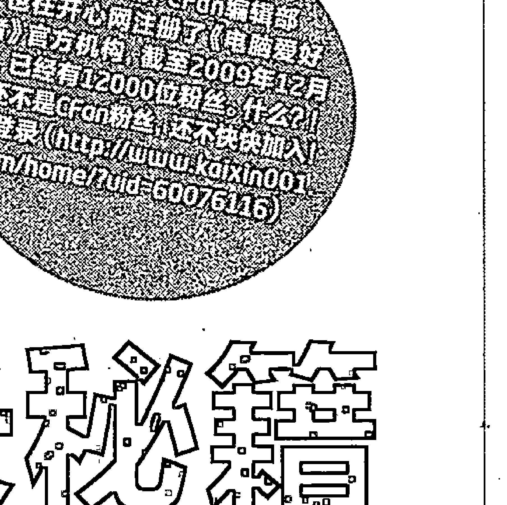

#### SNS热门游戏之不传攻略

如果说你不知道SNS是什么，那么“今天你又偷我菜了？”、“又换什么车了？”、“现在有几套房子了”等问候语一定早已耳熟能详了。因为这些话是在SNS火燎以后，大家日常见面问候最多的语句了。而现在也是一片“全国皆偷”的局势。其实大家玩的开心农场只是SNS中的一个小游戏而已，整个SNS还是有着相当的学问的，看着你身边的朋友级别飞速提高，有什么办法能超过他们呢？

##### 认识奥巴马只需要 6 个人

SNS有两种解释：一是SNS(Social Networking Services)即社会性网络服务，专指旨在帮助人们建立社会性网络的互联网应用服务。二是SNS(Social Network Site)即“社交网站”。其实不论哪种解释现在已经不重要了，重要的是在WEB 2.0时代，已经处处皆SNS了，开心网、QQ、人人网等，就连门户网站也都开始逐步整合相关服务了，可以这么说，凡是能够提供大一统的综合型服务的网站都能归入SNS的范畴了。

而SNS的具体起源还要具体到很久以前，那是1967年，哈佛大学的心理学教授Stanley Milgram(1934~1984)创立了六度分割理论，简单地说：“你和任何一个陌生人之间所间隔的人不会超过六个，也就是说，最多通过六个人你就能够认识任何一个陌生人，甚至奥巴马，这就是六度空间理论，也叫小世界理论。”

后来有人根据这种理论，创立了面向社会性网络的互联网服务，即通过“朋友的朋友”的方式进行网络社交拓展。但“朋友的朋友”，只是社交拓展的一种方式，而并非社交拓展的全部。因此，现在所谓的SNS，其含义已经远不止“朋友的朋友”这个层面。比如根据相同话题进行凝聚(如贴吧)，根据学习经历进行凝聚(如校内网<现已更名为人人网>)，根据周末出游的相同地点进行凝聚等，都被纳入到了“SNS”的范畴。

##### 网络大补贴:

六度分隔理论，http://zh.wikipedia.org/zh-cn/六度分隔理论。

##### 偷别人的菜，让别人无菜可摘

无论是打工、导入争车位资金还是自己种植植物、养动物赚钱都属于自力更生。但是要想在花园和农场中更快的挣钱、升级，仅仅靠勤劳是不够的，咱还需要“偷”。

在花园的右侧单击“我的好友”展开好友列表，这里显示有“可收获”标记的好友，则表明好友的作物已经成熟了，还等什么呢？赶快去“偷”吧。

##### 偷菜太累，雇个“小工”吧

虽然偷来的菜属于额外收入，但总不能时刻都盯着花园、牧场吧？要不然也不用学习和工作了，因此相信这里的“小工”大家已经知道是什么了。对，就是“外挂”了，玩过游戏的朋友都知道，针对开心网的花园和牧场，目前使用效果比较好的是“花园农夫”(http://bbs.snsfun.com/forum-12-1.html)，由于使用非常简单，这里就不多作说明了。

##### 网络大补贴:

开心网花园赚钱攻略：http://www.86kx.com/html/kaixin001/kxwyx/huayuan/2009/0618/235.html。

除了花园、农场外，SNS中比较热门的还有停车位、买房子等游戏，而要想在游戏中快速成长，成为有钱一族，一些小技巧必不可少。

##### 朋友太忙？马甲助阵

虽然开心网上加的好友不少，但每次停车时还是会为车位烦恼。给自己注册几个马甲吧，也就是大家常说的小号，使用小号的好处想必不用多说了，它起码也是一位比较“闲”的好友，比如在“争车位”中马甲的车位永远都是空着的，咱可以随便停，要知道在争车位游戏中能找到有空位的好友是非常不容易的哦。但在注册马甲的过程中，也有一些小技巧哦。

- ①邀请注册。一定使用主号邀请注册，并且马甲号在设定城市的时候与主号的城市不一样。在开心网中，通过邀请注册，主号可以获得很多好处，比如花园中获得兑换道具的机会。
- ②不同IP地址登录。邀请注册的时候一定要注意了，第一次一定要使用和主号不一样的IP地址进行注册登录，因为IP地址相同的话，有可能会被忽略这一邀请，也就是所有的好处都不会给你。至于如何获得不同的IP地址，这个太简单了吧，现在绝大多数用户使用的都是类似ADSL似的网络，重新拨一次号即可，或者使用一次代理服务器也行。
- ③使用QQ邮箱注册。由于在开心网中一个邮箱地址注册后就不能再注册了，为了注册马甲再去注册N多邮箱显然太麻烦。而QQ的邮箱别名是可以注销的，这样就可以在开心网注册验证成功后重新申请邮件别名，然后再注册马甲。但通过这种方法注册马甲的，密码一定不能忘了，因为邮件别名修改后，找回密码的邮件也就收不到了。所以建议所有的马甲使用同一密码，从而方便管理。
- ④适当的伪装。马甲注册好以后，也要进行适当的伪装，不然使用马甲太过火也有可能会被封号处理。马甲号注册好以后，最好填写一下详细信息(当然你可以胡乱填，没有人会去核实)，并且上传一下图像，不知道传什么好就传点明星图片吧，经过一翻伪装后，谁又知道哪个是你的马甲呢。

#### 工作、学习太忙？外挂帮忙

如果只是出于兴趣玩一下，那么完全的手工操作也没什么，但是在玩的同时又有那么一点虚荣心在作祟，总想钱比别人多一点，级别比别人高一点。那么纯人工操作是绝对不可行的，即使你注册了N多马甲，挨个去点击也要累个半死，因此外挂就必不可少了。

- 除了上面提到的开心网的花园牧场外挂外，玩QQ农场的朋友，以下两款外挂绝对不可少。
  - ①QQ开心农场全能助手(http://www.kylgy.com/#Skiyo)。号称“秒偷”不降级，在实际使用过程中，也未有降级的情况发生。
  - ②QQ伴侣(http://www.uu23.com/)。实际使用效果不错，就是每次运行时会弹出网页广告，使用过程中不会弹出广告。

#### “农妇专家言论”：关于外挂

虽然前面我们向大家推荐了外挂，但作为任何一家SNS网站来说，都不可能持支持态度。目前来讲，只要使用外挂不太过分（比如使用过多的马甲，刷新时间过于频繁），网站基本上不会限制使用。

不过，需要提醒的是，就像网游的外挂一样，风险会来自软件本身，木马有可能隐藏其中，你辛苦经营的号码有可能因此丢失，甚至电脑中其他重要内容也会因此流失。所以，到底是否使用，还需要您自己来权衡决定。

目前各大SNS打击外挂的力度都在不断加大，因此在使用外挂的过程中也有一些需要注意的地方。不建议全天候使用外挂，使用一段时间后要停用一段时间，主号不用或少用外挂，以免被封号便有点得不偿失了。

#### 我的果实你别偷

由于现在很多人都使用外挂来看花园、农场，因此作物成熟后，被偷的机率非常高。更有甚者，不用外挂，竟然人工蹲点，先看好你的作物还要多长时间成熟，然后定好时间，提前一点来守候。即便自己使用外挂，作物还是经常被偷走许多。在群雄皆起的时候，要如何来保卫我们的果实呢？有个小技巧绝对好用，并且百用百灵。

无论是开心花园还是QQ农场都有提供了肥料道具，开心网是通过升级或者邀请获得兑换道具的机会，而QQ农场需要使用Q点购买，而在作物上使用化肥后可以缩短作物成熟的时间，而我们要抓住的就是这个时间点。比如开心网的“国光绿色肥”可以使作物的生长期缩短两小时，如果发现自己的作物还剩两小时不到的时间成熟(尽量保证施肥后作物马上成熟，时间成熟时间本身已经很短则不要使用，否则过于浪费)，那么这时候使用“国光绿色肥”后作物马上成熟，这时收取别人就偷不到了。

#### 作物种植有技巧

不论是开心网还是QQ农场，几乎所有的SNS中的花园游戏都是级别越高以后，能够种植的植物越高级，越值钱。因此为了尽早种到高级的植物，快速升级非常有必要，但如何才能快速升级了。

经过广大网友的多年种植经验得出的结论是，在5级以前种植除牧草以外的最便宜的植物，如开心网的胡萝卜，QQ农场的白萝卜；5级以后10级以前种植第二便宜的植物，即开心网的水稻，QQ农场的胡萝卜。10级以后就可以种植与级别相当的植物了，因为10级以后基本上是金钱与经验较平衡的状态了。

- 小提示：
  要想升级快，种对作物还不行，准时收获、补种才是王道。

#### 身边的好师傅—帮助

相信用电脑的人很少有看“帮助”文件的，即便有不会的也是慢慢摸索。其实很多时候看一下帮助文件可以让我们少走很多弯路呢。

比如开心网的“买房子”游戏中如何快速赚钱，除了小号、外挂等偏方外，帮助也会告诉我们一些很实用的技巧。

#### 不用外挂、不想值班 如何偷？

- 首先，我们这里排除使用外挂的情况，外挂显然省时省力，但一点游戏乐趣都没有。确实无效。假如你想做一个真正的菜农，一个不作弊的富裕菜农，就要按照下面的方法行事。
  第一步：按开心网果农经验排行榜，依次计算并记录各菜农作物成熟时间(同样，这里的时间要比作物实际成熟时间提前一分钟，以做好充分准备)。
  第二步：按作物成熟时间排序(选中除标题外的全部内容，EXCEL表格上端选择“数据→排序→升序→按成熟时间排序”)，并将同一个时间段的成熟时间标成不同颜色以区分偷菜时间段，其他时间不必浪费在这里，你可以去看电影或者读书啦。
  第三步：按成熟时间依次偷取作物，记录下你的偷盗成果以便统计这次任务的收获，总结经验，下次再接再厉！

最重要也就是关键的一步，就是调准闹钟，建议在电脑上安装一款带备忘提醒功能的桌面日历，提醒你及时偷菜。推荐一款比较小巧的绿色日历软件，名字叫MyStar（下载地址：http://zjmcc4.newhua.com/soft/96558.htm）。

- 网络大补贴：
  开心网争车位技巧攻略：http://www.86kx.com/html/kaixin001/kxwyx/zhengchewei/2009/0709/637.html。
  开心网买房子最牛攻略：http://club.pchome.net/thread_1_15_3994273.html。
  玩开心网的几个小窍门：http://blog.sina.com.cn/s/blog_541b7c870100dv2p.html。

#### 智力大比拼，自架 SNS 玩比赛

SNS混久了以后，不免觉得有些乏味。级别虽然高了，但实在是没太多炫耀的资本，因为很多时候比谁有钱，级别高，都是通过一些非常规渠道获取的，并不能表现出自己的智慧。有没有想过要在同学或者同事之间玩一场真正的智力比拼呢？不会开发程序？如果告诉你架设一个SNS，只需要下载几个文件点击几下鼠标就能搞定，是不是觉得有点不可思议呢？下面就请大家一起架设一个自己的SNS吧(以大家最为熟悉的Windows XP平台为例)。

##### 基础平台搭建

由于我们架设SNS是使用UCenter Home，很多人对于如何搭建PHP，MySQL平台都没有信心，其实只要下载一个集成的安装环境即可。

- 第一步：从http://www.apachefriends.org/download.php?xampp-win32-1.7.2.exe页面中下载集成安装包并安装。运行XAMPP Control Panel，将需要的模块勾选，在弹出的确认安装对话框中确认。
- 第二步：重新启动计算机，然后运行XAMPP Control Panel，可以看到相关服务已经正常运行了。其中除Apache，Mysql外，其他服务非必须，可以停止其服务。

##### UCenter平台搭建

要想使用UCenter Home，首先选安装UCenter。

- 第一步：从http://www.comsenz.com/downloads/install/ucenter页面中下载UCenter安装程序，然后进入之前安装的XAMPP目录(假设之前安装于D盘根目录)，在D:\xampp\htdocs目录下新建“ucenter”目录，将UCenter安装程序解压，将upload中的所有文件复制到ucenter目录下。
- 第二步：进入D:\xampp\php目录，打开php.ini文件，通过“查找”功能，定位到“short_open_tag = off”行，将off改成on并重启Apache服务。
- 第三步：在浏览器地址栏中输入http://localhost/ucenter/install/开始UCenter安装过程，除了在数据库界面中填写数据库名称和密码以及管理员信息外，其他的按默认设置即可。

UCenter和UCenter Home的安装都非常简单，安装成功后，就可以进入后台管理界面了。登录前台，看一下界面是不是有似曾相识的感觉呢？一切准备就绪，还等什么，添加相关的游戏应用，拉拢同学、同事一起过来比拼智慧吧！在SNS中，推荐比拼的游戏有模拟炒股、超级大亨以及开心富翁类游戏，可以说是比拼智慧的绝佳平台。并且游戏中的货币又是虚拟的，可以放心“投资”，不用担心“劳民伤财”。

有人说“哥玩的不是SNS，是寂寞”，而我说的恰恰相反“哥玩的不是寂寞，是SNS”。俗话说玩物丧志，我们不仅不能在玩SNS的过程中丧志，更应该在玩SNS的过程中斗智斗勇，通过SNS学习更多的知识，开启我们的无限智慧之门。

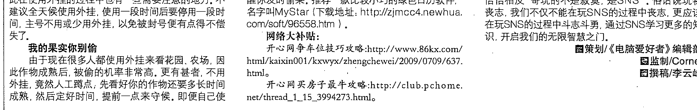

坦白地讲，“寒假你有什么打算？”这类问题非常非常地老套。不过，似乎大家每年都会这么问，就像是例行公事……想起来，大一的寒假自己还老想着“寒假做啥才有意义”。不知是不是因为当时《士兵突击》很火，因此把自己整得跟许三多似地—“好好活着就是做有意义的事，做有意义的事就是好好活着。

坦白地讲，这个冬天真的非常冷，就算生活在热闹的大都市，也很难褪去一身寒气。在这个寒假里，大部分地方已经像个汉城，不对，像个寒冷之城—寒城。

坦白地讲，寒假有意义的事只有一件—玩。不过，为了免得“被网瘾”，我决定不玩网游—这个被誉为“新一代精神鸦片”的东西，而是做一个快乐的单机游戏狂。

##### 摩拳擦掌，检验装备！

在单机游戏中，是我一个人在战斗，因此，武器装备一定要好。在自己家中，单机游戏最佳的武器装备当然是台式电脑了，不过外出则有两种选择：一是笔记本电脑，二是掌机(索尼PSP或任天堂NDSi)。当然，如果你没太高要求，其实许多手机的单机游戏也能不错。我还是先来看看，台式电脑和笔记本电脑吧。

##### ★小测试：看看你的电脑能跑哪些游戏

游戏的配置要求一直和硬件的发展有着非常紧密的联系，游戏玩家们为了能玩到最新最华丽的游戏而不断的升级自己的显卡、内存、CPU等等，因此对于这些玩家来说看到一个新游戏第一件事就## 装备提速必杀技

### ★实战：快速更新你的显卡驱动

当你有了一台足够强大的电脑后，只要正确安装所有的软件和驱动，一般不用担心大型3D游戏的挑战。不过，由于大部分的3D游戏都是与显卡驱动紧密结合的，新的驱动会修正显卡的BUG，而且会针对热门的游戏进行不同程度的性能优化，因此跟紧驱动程序更新的步伐是游戏玩家的必修课之一。

第一步：更新NVIDIA显卡驱动。在浏览器中键入http://www.nvidia.cn/download/index.aspx?lang=cn，在“选项1”中根据自己显卡的产品类型、产品系列、操作系统以及驱动软件语言进行设置，然后点击“搜索”，在弹出的结果中点击“下载”即可。当然，你也可以通过点击“选项2”下的“显卡驱动”按钮并安装一个控件，NVIDIA网站将自动帮你查找合适的显卡驱动。

第二步：更新AMD-ATI显卡驱动。在浏览器中键入http://support.amd.com/us/gpudownload/pages/index.aspx进入AMD显卡驱动下载页面，这是一个全英文界面，对部分朋友而言可能有些陌生，不过递进式的树状产品选择系统使用起来还是很方便，选到自己的产品后，点击“GO”即可获得你想要的最新驱动了。

第三步：直接到官方网站下载最新的驱动并不复杂，但是比较麻烦，而且你还不知道它什么时候会放出新的驱动，因此最好用专门的软件来解决这个问题。首先到http://www.updrv.com下载并安装“驱动人生2009”，启动软件后在主界面中点击“驱动更新”，然后在弹出的界面中点选“最新驱动”，软件将自动提示哪些硬件需要更新驱动，单击开始更新即可。

网络大补贴：除了“驱动人生”软件外，你还可以直接打开http://www.updrv.com/online/get.html页面，通过这个“在线驱动检测”来获得显卡驱动或其他驱动的最新信息。需要注意的是，在线监测功能需要安装一个网页控件。

### ★实战：不花一分钱，独立显卡飙升10%

很多单机游戏都非常耗资源，特别是显卡。当然你可以通过降低画质，从而让游戏运行起来流畅些，或者花钱买块性能更牛的显卡。不过，如果你可以在不花钱而且不降低游戏画质的前提下，也能让游戏运行得更加流畅，我想你一定要试一试给显卡超频。显卡超频有硬超和软超两种，其中硬超是通过修改显卡BIOS来修改显卡的性能，而软超则是指在系统下直接用软件调整显卡性能。对于一般读者，我们建议软超，因为这种方法简单且没有危险。

第一步：到http://www.crsky.com/soft/89.html下载并安装RivaTuner，这是一款可以在Windows下对显卡性能进行调试的软件，可以兼容NVIDIA和AMD（ATI）所有主流的显卡，我们以NVIDIA为例进行超频。

第二步：启动RivaTuner（首次启动时软件会收集当前系统的硬件和驱动信息），在“Main”标签下单击“Driver Settings”项目对应的“Customize”下拉箭头，然后选择看起来像显卡的“System settings”的小图标。

第三步：在打开的页面中有很多选项，其中可以看到有三个具有移动式光标的项目，分别是核心频率、Shader频率以及内存频率的调整项。在实施超频的过程中，建议一个项目一个项目地超，比如先超核心频率，再到Shader频率，最后调整内存频率。

第四步：由于你没有办法可以预先得知GPU可以超多少频率，超频必须要逐步地进行（例如以10MHz、20MHz的幅度来增加），在每次提升频率后，用大量3D需求的应用来快速检测系统的稳定性，最后达到相对稳定就可以了。

小提示：在一般情况下，厂商为了让显卡可以长时间运行更加稳定，一般都会将显卡的默认性能设定在一个有较大冗余的水平上，因此大多数主流的显卡都会存在约10%~20%超频空间。

### 不自量力！集成显卡性能提升术

独立显卡超频很多玩家都试过，集成显卡也可以通过超频的方法来提高其性能。集成显卡超频无须进行任何硬跳线设置，只要修改Windows注册表或用专门的显卡超频软件就可以完成。由于修改注册表需要一定专业知识，并且比较麻烦，而显卡超频软件使用简单，效果也比较好，所以它是玩家的首选。

第一步：到http://www.onlinedown.net/soft/2760.htm将PowerStrip下载到本地，安装完成后系统要求重启，重启后运行PowerStrip会出现一个对话框，显示出显卡和显示器的型号，刷新率定义是按照标准设置还是自定义，是否在启动时运行DDC以检查即插即用的显示器等信息，单击“确定”按钮后PowerStrip便会在托盘区并在内存中显示工作图标。

第二步：单击托盘区的PowerStrip工作图标，会弹出工作主菜单，依次选择“性能设定→设定”，首次使用PowerStrip会根据你所使用的图形芯片类型弹出一个对话框，然后在弹出的“性能设定档”的“频率控制”项下就可以调整当前显卡的工作频率了。

第三步：如果要使显卡超频使用，只要将左侧的显存频率或内核频率的滑块向上拖到合适的频率，再点击“应用”按钮就会使显卡切换到新的频率。这里要提醒大家一点，在超频时不能求高心切，要逐步多次进行调节，不能一次大幅度地调高其工作频率。在超频后，要注意检查芯片组的温度及散热环境。

### 乱点游戏谱：天寒地冻玩游戏

- ① 各类山寨版的“暗黑3” 《暗黑破坏神3》等不来，那么《火炬之光》可以帮你解馋。国内：《秦殇》、《秦殇前传》，都是模仿暗黑的作品，风格很像。国外：《圣域》，非常像暗黑；《FATE（黑暗史诗）》，相当于3D暗黑，不过是卡通风格；《超魔法大战》，日本动漫风格，类似暗黑，不过更像是RPG。
- ②《模拟人生3》不容山寨！当众多大作都有模仿者，你发现模拟人生很少有山寨之作！不过倒是可以玩一个叫《整人邻居》的游戏，自由度也很高，很好玩！
- ③“口味重”的爱好者 寂寞空虚的时候，唯有杀戮能满足我！如果你是这类爱好者，《虐杀原形》不要错过，动作自由度相当优秀，类似游戏：《辐射3》、《GTA》系列、《黑道圣徒2》。
- ④从新手到F1的都能玩的驾驶游戏 说到驾驶类游戏，除了《极品飞车》之外，其实还有不少其他选择。《速度生活》——专为不怕晕、喜欢漂移的人准备的；《无限试驾》——玩过之后，真实驾驶技术也能提高哟！
- ⑤永远的第一人称射击 这个游戏不多说了，都知道：《荣誉勋章3：血战太平洋》，如果你先被小日本给逮了，拿手枪的小日本会踩着你，叫一声把你给蹦了，拿三八大盖的日本兵会拿刺刀捅死你……《重返德军总部》了，它有所谓BOSS的存在，是个射击类游戏里面的亮点吧。如果你喜欢刺激点的，就去玩玩《求生之路》吧，画面精美！

### 我在游戏里当“上帝”！

在单机游戏中，没有志同道合的玩友帮忙，只能只身搏斗，即使有了攻略，还得努力提高自己技艺，但有些BOSS实在太BT（难到是操作太烂，悟性太差？），读档N次之后，终于忍不住请出了神器，我要点石成金，撒豆成兵！我要当上帝！

### ★赛车类游戏中 高速过弯技巧

漂移其实是车辆处于失控与不失控边缘的一种驾驶状态，甚至是漂移的高手也会严重失误。玩飘你可以在反复实施以下五个步骤：

1.  在入弯前减速，速度要比正常过弯要低一些。
2.  入弯点要比正常过弯晚一些，档位减至2档，打方向入弯。
3.  在临近弯心的地方猛然加油，后轮会在突然增加的扭矩下失去抓地力，产生向外弯外侧的横向移动。感觉到车尾的横移后立即向横移的方向转动方向，速度要快。
4.  根据车尾横移的幅度调整方向和油门，保持车辆漂移动态的平衡。这是最难的一点，漂移的角度、距离与方向的幅度有很大的关系，需要多体会，多练习。
5.  接近出弯点的时候稍收油门并且逐渐回正方向就可以令车恢复到正常状态。

### ★《生化危机5》各种技巧大补贴

- 1. PRO难度单人无限速攻打法：http://gl.ali213.net/html/2010/8946.html
- 2. 菜鸟变超人技巧十则：http://gl.ali213.net/html/2010/8950.html
- 3. 穷鬼变富翁的方法：http://gl.ali213.net/html/2010/8926.html

### ★收藏！单机游戏必备工具一揽子计划

- Daemon Tools
  主流虚拟光驱软件——大部分CLONE版游戏都需要。
- YASU_V1.4_(build.7080).exe
  Clone版游戏必备光盘辅助工具YASU（需配合Daemon Tools V4.10）。
  使用方法：把YASU.exe复制到虚拟光驱的安装文件夹内，比如放到默认路径C:\Program Files\DAEMON Tools Pro下。然后运行虚拟光驱加载Clone版的mdf/mds镜像，再运行YASU.exe，点Clue按钮，这时再启动游戏就可以绕过加密。
- fraps_V2.91.rar
  帧数显示，游戏截图，游戏录像。
- applc.msi
  中文程序乱码消除器，消除中文程序接口上的乱码。如果您在简体中文Windows上执行一个繁体字版本的程序，那么这个程序的外观可能会变成许多中文乱码，让您无法辨识。此时便可试试本程序，看看是否能为您化腐朽为神奇。
- w2kxpcjk2.zip
  最佳游戏简繁体转换软件，很多日文游戏必须在日文WINDOWS下才能运行，该软件的区域模拟功能可以为你解决这个问题。
- starfuck:
  这个是starforce克星。
- WinCPK32:
  动画音乐提取器。
- Bink Video
  是播放动画的必备工具，抓取宣传动画等功能。

### ★实战：在单机游戏里点石成金！

以《仙剑奇侠传四》为例，修改游戏中的金钱，操作步骤如下：

第一步：首先到http://game.china.com/zh_cn/download/tools/fpe2001.zip下载并安装“FPE2001”。这是一个游戏修改器，它可以直接读取和修改内存中数据，从而让你可以任意修改游戏中的数据。

第二步：启动游戏和FPE2001，当要买装备的时候发现钱不够用，而你又懒得去刷怪，那么按小键盘上的“*”将FPE2001调出来，然后在FPE2001“分析”选项卡下将“目标游戏”设置为当前游戏。

第三步：在“分析目标”中输入当前角色所拥有的金钱数额，点击“开始”按钮分析。第一次分析得到的结果数量可能会比较多（你可以多分析几次，提高精确度）。返回游戏，你可以去打一个怪物或者买个东西，让角色的金钱数字发生变化，然后再用FPE2001分析变化后的金钱数字，一般分析两次就可以找到唯一结果，那就是你要修改的数据的地址（以8位的16进制数字来标示）。

第四步：双击你分析得到的数据，在弹出窗口的“PC”选项卡下将找到的数值修改到你满意为止（别改得太夸张，否则游戏可能会崩溃掉），勾选“自动锁定”，点击“OK”返回游戏，你就可以发现有用不完的钱了。

#### 小技巧：在FPE2001用模糊分析找到没数值的数据

有些游戏中的数据并没有确切的数值，那么我们可以通过模糊分析来修改相关的游戏参数。以经典的《英雄无敌3》为例，英雄每天可以移动的距离是有限的，如果你希望英雄获得无限的移动距离，你可以这样做：进入游戏，启动FPE2001软件，在“分析”选项卡下将“目标游戏”设置为当前游戏，以“？”来分析游戏的所有数据，然后返回游戏让英雄移动一格（可以用方向键盘来移动，目的是让英雄的移动能力减少），接着返回FPE2001，以“-（减号）”来搜索变小了的数据，反复分析后你就可以找到修改的目标了。

### ★单机游戏万能修改器推荐

除了FPE外，在各种单机游戏中都能通用的修改软件还有不少，大家常用的一般还有以下两个，只要是数据保存在本机或内存中，都可以对其进行修改，使用方法与FPE大同小异。

- 游戏修改大师：http://www.skycn.com/soft/1482.html
- 金山游侠V：http://www.duotegame.com/soft/7247.html

### ★实战：在PSP中我能撒豆成兵！

和PC机上玩游戏一样，在PSP中也有专门可以修改游戏数据的工具（俗称金手指），目前最为常用的有CheatMaster和FreeCheat两个（CheatMaster下载地址为：http://down.tgbus.com/soft/13531.shtml；FreeCheat下载地址为：http://down.tgbus.com/soft/23263.shtml）。我们以FreeCheat为例，安装和使用方法如下：

- 1. 第一步：下载并解压FreeCheat，然后将“FreeCheat”和“Seplugins”两个文件夹拷贝到PSP记忆棒的根目录。其中，“FreeCheat”是主程序目录，“Seplugins”则是配置文件目录，其中包含三个txt文件：“game”将作用于游戏中，“pops”则会模拟游戏调用，使插件作用于PS模拟游戏上，“vsh”将作用于PSP主菜单界面。
- 2. 第二步：安装完毕后，要想在游戏中调用FreeCheat，必须对其进行激活，方法为：在PSP关机后，按R开机进入系统恢复模式，选择“Plugins”按“X”键确定，然后你会看见一些列的配置选项，根据你希望FreeCheat的运行范围进行设定，建议全部开启，完成后选“Back”回上一层，再选择“Exit”退出。
- 3. 第三步：在PSP运行过程中，按音乐键就可以呼出FreeCheat了（你也可以自己设置呼出FreeCheat的快捷键）。FreeCheat全中文化的界面给人十分亲切的感觉（操作也很简单，“O”为确定，“X”为取消）。主菜单一共有10个选项，其中“代码列表”可以直接享用别人的成果，是FreeCheat最常用的功能之一，可以兼容目前所有的PSP修改工具的代码文件，包括DB、SCM、TAB、CMF以及FC/CW格式等，保存在“FreeCheat/Code”目录中就可以被调用。
- 4. 第四步：以“皇牌空战X”为例，用FreeCheat读取DB文件方法：在FreeCheat中进入“代码列表”选项，按“□”键手动加载代码文件并选择CHEAT.DB，FC在读取DB文件后，功能对应的代码还是处于“禁用”的状态，我们需要手动打开，根据自己的需要选择相应打开方式就可以了。

### 我在单机游戏中快乐联机！

在游戏里当了好些天上帝，灭电脑像在切菜，于是自己感觉非常无敌，和菜一般的电脑PK感觉没意思，因此我准备到网上找志同道合的朋友联机，要找人单挑，于是，我开始转战各种单机游戏联网平台……不过，话又说回来了，这种情况算不算网游呢？

### ★实战：对战平台该选谁

目前，最火的单机游戏对战平台有浩方、VS和QQ对战平台等三种对战平台。作为目前中国最大的对战平台，浩方的硬件应该是最强的，所以其支持的游戏也比较多，而VS和QQ虽然游戏数量比较少，但是经典的单机游戏如魔兽争霸、星际争霸等都有，所以还是值得选择。从进入房间的速度来看，只要不是已满的房间，这三个对战平台的速度都差不多，但是浩方的广告确实太多了，可以说是无处不在，有时候弹出广告会影响游戏。当然，你可以选择付费来解决这一烦恼。

- 1. 浩方对战平台
  下载地址：http://www1.cga.com.cn/hfsite/down.html
  点评：浩方对战平台是目前国内最大的游戏对战平台，支持多款竞技游戏，浩方对战平台无论速度、房间数量和支持游戏数量都是三个中最好的，分区域的大厅，让玩家更容易找到同区域的玩家以最好的速度对战。
- 2. QQ对战平台
  下载地址：http://games.qq.com/a/20070611/000140.htm
  点评：这是最方便的单机游戏联网对战平台，与QQ紧密结合，使用QQ号和密码就能登录，但缺点是人多房少，周末晚上都挤不进房间。
- 3. VS对战平台
  下载地址：http://game.vsa.com.cn/starcraft/jsp/comm/down.html
  点评：VS对战平台缺点是支持的游戏较少（只有4个，魔兽争霸、星际争霸、CS和实况足球），优点是玩家的整体游戏水平较高，不少玩家是职业级别的，而且有独特积分排名系统和师徒系统。

有些事，你明知道是没结局的，也要去坚持，因为不甘心——比如单相思；有些人，他们明知道会没命的，也要去坚持，因为欲望——比如贪污；有些东西，我们明知道没路了，却还在尝试，因为习惯了一比如BT种子……享受电影带来的乐趣，已经成为很多人生活娱乐的一大部分。从诞生那日起，以BT下载为代表的P2P下载看电影的方法便进入了新的革命周期，众影迷朋友对BT、电驴等的崇拜更是趋之若鹜，树大招风，太火的事物往往都会遭遇木秀于林、风必摧之的下场，各国针对P2P下载相继推出限制法律就是很好的证明，就像已经被关停的那个网站名称一样，BTChina，BT早已经在China普及，可没有你，我该怎么办？

### 网民被迫学外语 影星无奈买盗版

BT站倒掉，受影响的不仅仅是普通网民，就连大明星也跟着受牵连了。据传，去年年底，影星陈坤被人发现去逛音像店，1个小时后买了七八张D版碟出来了。看起来，BT站倒了，音像店、盗版商最高兴呀！欧美剧 学外语 更容易！国内BT影视网站，能坚持活到现在，一个至少听起来很充分的理由是：供英语爱好者学习交流之用。

### 逛国外BT站两大利器：

- 1. 电子词典：推荐使用有道词典，它在吸纳互联网词库方面做得比较好，比如搜索“钢铁侠”，会自动把电影的英文“Iron man”翻译出来，而且大家关注的续集也会有内容和网址推荐，这在大家知道剧集、电影中文名、反查英文名时很方便。
- 2. 下载工具：这里不推荐迅雷、快车、BC之类工具，国外用户多使用utorrent、Azureus和Transmisson，推荐使用它们，下载速度会更好一些。

海盗湾网站（http://piratebay.org）上的BT种子有可能在3月全部删除，但至少目前它是搜索美剧种子的一个选择。
EZTV（http://eztv.it/）界面简洁，种子集中，更新及时，分类详细！收藏，必须的！
Mininova（http://www.mininova.com）每年提供30亿以上种子文件。
Torrentz（http://torrentz.com）最老牌BT网站。

### 网络大补贴：一些资源丰富的clubbox地址

- http://clubbox.co.kr/maysialec 韩剧下载
- http://clubbox.co.kr/sfiles 伊甸园美剧
- http://clubbox.co.kr/xiaomao123 多达2.2TB韩剧下载

### 被遗忘的角落——FTP 是个宝藏

在BT还没有盛行时，很多老鸟手里都会收藏着一大把FTP资源，大型软件、流行电影，还有很多很好的第一手资料文件经常在FTP服务器中现身。虽然现在BT下载如日中天，但FTP这个被遗忘的角落依然是红旗不倒。

### FTP 这面红旗一般在哪儿飘

大学校园FTP服务器里一般都存放着大量的有用资源，学术论文、学习资料、电影、游戏、动漫、电子杂志、软件等一应俱全。其次，各大论坛也有自己FTP服务器，有些论坛对特定级别的会员（例如高级会员）开放，里面存放的文件资源也是很丰富（例如著名的TLF论坛，地址http://www.eastgame.org）。还有，就是一些大型公司或是组织建立FTP服务器来存放数据。通常，上述三面红旗占主流，当然，还有很多个人也架设FTP服务器来共享文件，但都不太稳定，几乎都是昙花一现。

小知识：FTP服务器就是在互联网上提供存储空间的计算机，它们依照FTP协议提供服务。FTP的全称是File Transfer Protocol（文件传输协议）。顾名思义，就是专门用来传输文件的协议。简单地说，支持FTP协议的服务器就是FTP服务器。

### 找FTP宝贝，需地图指引

FTP服务器并不像我们常见的网站很方便就能找到，要想在FTP服务器中掘宝，需要有“藏宝图”的指引方可。而这张“藏宝图”就是FTP搜索引擎。通过它便可方便地找到宝藏，譬如学校FTP服务器中的学术资料、论坛FTP中影视、软件等。FTP搜索引擎也有不少，例如北大天网（http://e.pku.edu.cn/）、Grid（http://grid.ustc.edu.cn/）、IPCN教育网FTP搜索引擎（http://search.ipcn.org/）、文件挖掘者（http://www.fdigg.net/）等都是不错的FTP搜索工具。我们就以文件挖掘者为例来搜索想要的一篇“计算机图形学”的学术论文，搜索后即可得到大批搜索结果。相中后直接点击“复制地址”按钮将下载地址复制下来，然后启动FTP下载工具即可进行下载了。除了通过专业的FTP搜索引擎来找资源外，在学校BBS、论坛提问区中发帖求助FTP服务器地址、账号、密码，只要口气诚恳、谦虚，一般都会得到热心网友的帮助。

### FTP 也能“自驾游”

其实，自己也能架设FTP服务器，方法也不难。在此教大家一招，快速搭建一个自己的FTP服务器，成功后不仅有成就感，而且还能方便向远方朋友共享自己硬盘中的大型文件。

第一步：从http://www.greendown.cn/soft/16121.html下载这款超级简单的FTP服务器工具，运行后直接设置好FTP端口（默认为21），共享的文件目录，为了安全起见，建议勾选“是否需要登录验证”选项并指定一个访问账号及密码，最后单击“启动”按钮启动服务器。
第二步：点击“测试”按钮将会打开浏览器，输入指定的账号及密码后便可访问到共享出来的文件，接下来只要将地址栏中的地址及账号、密码告诉远方的朋友，他们就可以使用FTP工具下载文件了。

小提示：这个小工具适合个人电脑使用，而在单位中一般都是局域网共享上网，如果不做端口映射，很难直接在外网远程访问。而专业的FTP服务器一般都是使用Serv-U来架设（Linux下常用VsFTP），控制功能、稳定性都很专业。

### 前有“VeryCD”，后有来者

在VeryCD网站中淘宝成功率都能达到98%以上，只要你知道想要的是什么，VeryCD中就提供了。因此，很多朋友视VeryCD为自己的影视帝国、软件基地，它更像一座娱乐城，人们很自然地淡忘了其他的下载方式。万一VeryCD倒下了咋办？鸡蛋还是分开放吧！

#### 全锅端下这座娱乐城堡

《射雕英雄传》中的“黄老邪”的老婆用其超人的记忆能力浏览一遍《九阴真经》并做了个备份，当原版失传后，这个备份派上了用场。VeryCD中提供的各种资源的下载入口就像一张藏宝图，将这张藏宝图备份一份，万一VeryCD倒下，它就能派上用场了。不过请勿担心，一锅端下VeryCD不会惹上黄蓉她妈那样的杀身之祸。

- 第一步：从http://www.greendown.cn/soft/36.html下载HTTrack Website Copier这款小工具，运行后按Ctrl+N新建一个工程，设置好工程名（例如“VeryCD备份”）、备份的位置，再将http://www.verycd.com/添加到网址列表中，其他选项可以留其默认值，直接单击“完成”按钮即可开始下载了。
- 第二步：当将VeryCD网站下载并保存到本地后，就可以直接在本地打开它了（在备份包中找到备份的文件夹，打开后直接打开“index.html”）；而接下来的使用方法与VeryCD网站一样，找到资源并启动电驴即可进行下载了。

小技巧：现在VeryCD网站提供了多种共享方法，可以将淘到手的好电影通过开心网、校内网、QQ空间等方式分享给朋友，只要在电影页面中的“电驴资源”上方点击相应的链接即可进入分享流程。不过，最后提醒大家一句，谁也算不到VeryCD什么时候会遭遇不测，因此，想通过备份大法试图保住青山的朋友要经常执行备份操作，这样才能确保能够囊括最新的资源。

#### VeryCD若倒下，咱后继有人

其实，VeryCD网站只不过是中国的一个分享资源的网站，其兄弟姐妹遍布全球，万一VeryCD倒下了，还有千万个继承者，只要学会联络这些后继人就行了。

Figator网站（http://figator.org/）就是一个很好的电驴资源搜索引擎，通过它就不愁找不到想要的资源了。譬如现在想看《反恐24小时》这部电视剧，只要直接在这个搜索引擎中搜索即可，如果需要特定的影片格式，可以在下面的“Filter”（过滤器）中指定。在搜索结果页面中会看到很多资源，点击“Details”打开影片详细页面，再找到并点击“Cache”链接，在打开的页面中再点击URL链接即可启动电驴资源下载工具来下载了。

小技巧：假如系统中安装了多款具有ed2k资源下载功能的下载软件，可以通过右击URL链接并选择“复制快捷方式”，然后启动自己喜欢的下载工具来下载。除了Figator这个ed2k搜索引擎外，http://hatrix.org/、http://www.emugle.com/也都是非常好用的搜索引擎，特别是前者，使用起来更简洁，只要输入文件名称，在搜索列表中勾选合适的下载资源，点击下载链接即可。

### 网络大补贴：BT好站大把抓

- 我为人人（http://yyets.net/index-html.html）：提供了BT、电驴、快车等多种下载方式，电影更新速度较快。
- 电影天堂（http://www.dygod.net/）：清晰的电影目录以及内置的强大搜索引擎，找电影的好去处。
- 极影动漫BT（http://bt.ktxp.com/）：专业的动漫BT站，只是会弹出广告窗口。
- 飞鸟娱乐论坛（http://bbs.wofei.net/）：以论坛为载体，内含丰富的BT资源。
- 悠悠鸟娱乐论坛（http://bbs.uubird.com/）：也是以论坛为载体的BT站，更新速度较快。

### ★实例：找种子的终极办法

当然，授人以鱼不如授人以渔，上面推荐的几个网站主要是方便那些懒猫，其实，更应该掌握如何在网上找BT站的方法，自然就是借助搜索引擎来找了；在浏览器中打开狗狗搜索引擎（http://www.gougou.com/），输入资源名称（例如《阿凡达》），直接点击“狗狗搜索”按钮即可得到一大批资源了。也可以通过Google、百度这类搜索引擎并在搜索关键词中添加“BT种子”来进行搜索，只是搜索结果无效链接稍多些，耐心点的话，也能找到想要的资源。而对于很多国外BT站，需要使用代理服务器才能访问。

小提示：通过狗狗搜索到电影资源后，还可以通过后面的“试播”按钮来在线播放（第一次使用时还需要安装GVOD播放器），同时，通过狗狗搜索到的资源，还包括电驴资源。假如你喜欢在国外BT站中淘宝，不妨到http://d1.it168.com/show/29562.html页面直接打开一些BT站点来找资源，无法访问时请使用代理服务器。

### PT 下载，开辟 BT 下载的世外桃源

BT下载因为太嚣张而惹怒了一些人，相对BT来说，PT低调很多，也稳定很多。由于是小范围内的互相共享式的下载，速度很快。作为高手来说，不该对PT有陌生感。目前国内知名的PT站，基本都是以高清资源和游戏资源为主，包括高清电影、高清电视剧以及其他高清电视节目和大型游戏软件，也有不少CD、DVD之类的资源。但绝少有标清视频等小容量资源。这是因为PT看重的是速度，而小容量文件用BT、FTP等下载方式即可轻易解决，加入PT反而显得有些杂乱无章，不能凸显特色了。

小提示：何为PT？PT是近几年开始在国内外流行的一种下载方式，英文全称是Private Tracker（私人站点），它是BT下载的一种，但是对BT下载的缺点进行了改善，它通过禁用BT的DHT网络并有要求地选择及控制用户数量，有效地杜绝了BT时代“下了就跑”的现象。因此，PT用户的下载速度基本上可以达到下载带宽的上限。

### PT站点你知道几个？

目前，PT站点比较少，因此也就变得很神秘。比较知名的有以下几个PT站点：

- jHDBits: http://hdbits.ro/
- kHDChina: http://hdchina.org/
- lCCFBits: http://ccfbits.org/
- mHDStar: http://hdstar.org/
- nHDRoad: http://hdroad.org/
- oOURDisc: http://bt.ourdisc.net/
- pPTShow: http://www.ptshow.net

### PT一号难求，没的要争取，有的要珍惜

较早的PT站均已封闭运行，而一些新的PT站又未能形成气候，PT一号难求现状在一段时间内都无法改善。因此，要想求得一个PT账号，需要一些方法和技巧：

- ★先到PT站的外站的相应版块去申请账号，申请的时候可以将自己的高速带宽Show出来，这样一般会加大申请成功的概率，带宽10M以上的情况申请成功的概率很大。
- ★假如有其他PT账号，可以将其他PT站的“战绩”截图展示，往往也能获得青睐。
- ★空闲时间多在各大影视论坛溜达，说不定可以遇到一个扶危救困的PT大侠，可以小帮你一把呢。
- ★最后一招可制敌，那就是直接花钱到淘宝上购买邀请码，不过，有些PT站明文禁止账号交易，在购买之前最好先探明。

获得PT账号后，一定要珍惜，遵守规则，防止被踢。

### 实战：PT下载，飙的就是速度

#### ★PT下载，先扫盲

- 上传量：PT站对你上传数据量的精确统计。
- 下载量：PT站对你下载数据量的精确统计。
- 分享率：上传量/下载量。
- 邀请码：因为PT站为了保持一定的私密性，一般都封闭注册运行，此时，你要想进入PT站往往需要老会员或是管理员发送的邀请码。
- 积分：你在PT站的上传做种活动还可以获得一定的积分，积分可以用来购买上传量或者购买邀请码。当然，积分在不同的PT站称呼也不同，例如CHDBits称之为魔力值，而HDChina则直接称之为积分。

#### ★遵纪守“规”，方可长久

相对于BT的自由性，PT更像是一个纪律森严的部队。在这里，你必须遵守各种清规戒律，一旦触犯，就有被Ban（被封、被踢）的可能。因此，作为PT新手，不应该立即去品尝PT下载的快感，而应该先熟读“二十二条军规”，特别是以下几条：

* 请不要做管理员明文禁止的事情。

防Ban小秘笈: 在PT站里，一定要“听党的话跟党走”，除了要记得经常登录PT站以外，最重要的是多关注你的分享率，往往分享率过低是导致被Ban的主要原因。

#### 顽驴来PT
PT下载很严格，甚至连下载软件也是很挑剔的，通常都是指定下载工具。例如Azureus、uTorrent、BitTorrent、Deluge、Rufus。下面我们就以uTorrent为例来看看设置、下载整个流程。

小提示:
很多PT站点对具体的软件版本还有限制，例如大家熟悉的uTorrent，某些PT站要求必须为V1.6.1，V1.7.5，V1.7.6，V1.7.7，V1.8Beta(Build 10364)及后续版本才能下载，否则可能出现“红种”现象而不能下载，因此在下载之前也都要弄明白。

#### 调整缓存大小，保护硬盘
按“Ctrl+P”打开参数设置窗，展开“高级→缓存”，以内存2GB为例，选中“手动设置磁盘缓存大小”，并设置缓存大小为500，这样做的目的是将下载时经常读写的文件保存到缓存内，减少硬盘的读写次数，从而更好地保护硬盘。

#### 调整连接数，下载不影响其他工作
选择“队列”项，将“最大的活动任务数”与“最大的活动下载数”根据情况设置，例如今晚空闲时间，可以将这两项值设置稍微大些，白天工作时尽量设置小些。

小知识:
当你准备关闭正在下载中的uTorrent时，请务必先手动停止正在上传和下载的任务，并等待uTorrent软件的“速度”面板中的“读取统计”和“写入统计”的缓存减少为零时再关闭，这样做的好处是可以避免因为直接关闭uTorrent而导致一些异常情况发生，比如下次打开时任务丢失或者需要重新检查任务的完成度之类。

OK！驴训练好了，接下来就可以开始在PT大道上飙一把了。下面我们在CHDBits下载电影《阿凡达》的一段特辑《潘多拉的星球》为例看看PT下载的流程：

第一步：进入PT站CHDBits，点击“种子”，进入种子列表，种子列表可以根据评论数、存活时间、大小、种子数、下载数、完成数排序，方便选择。
第二步：在搜索关键字输入框中输入“阿凡达”，点击“搜我”按钮，很快会出现含“阿凡达”三字的所有资源。
第三步：点击《潘多拉的星球》右侧的“下载本种”快捷链接，会出现“文件下载”对话框，点击“打开”，选择保存位置后开始下载。因为种子数较多，下载片刻后即达到1MB/s的速度，264MB的文件，仅用不到六分钟便下载完成了。

高手献技：怎样提高自己的分享率？
通过分享率的计算公式分享率=上传量/下载量不难看出，提高分享率可以从加大上传量和控制下载量两方面着手。显然，上传量可以通过延长做种时间、增加上传种子数来提高。但是，种子应尽量选择那些下载数较多的上传，往往一些热门影片或新片的下载数肯定会很多，这是“小水管”赚上传量的好机会。有些PT站还有2X上传的优惠制度，就是按实际上传量的两倍计入上传量，那下载量怎么控制呢？PT站一般会在新片刚推出时给予一个优惠期，此时下载资源不计流量，或者只计50%，30%，有些影片甚至会永久优惠，这些都是“小水管”们不错的机会。此外，积分也可以购买上传量，而积分可通过做种时间、做种数量、上传量获得，但是做种数量会有上限，下载者要注意研读规则。通常积分还会有一些其他的赚取方式，如CHDBits就规定：发布新种子可获取30个魔力值，上传一个字幕可获取10个魔力值，甚至说谢谢都可以获取0.5个魔力值。“小水管”们通过赢取积分也可以购买不少的上传量呦！

策划/《电脑爱好者》编辑部
监制/Cornel
撰稿/呆瓜、楚留香

### 谨以此文献给那些至今还在银行排队、在饭馆等位、在商场高消费、买机票总嫌太贵的人们

### 18个顶级网络省钱术


### 生活开销—你比他幸福
物价飞涨，工资原地踏步，很是苦恼，但是电、水、气、手机通讯等这些费用还是省不了的，别人都要定期到银行办理交费手续，排队耽误时间不说，有时候还会碰到系统故障无法交费的烦恼事。到商场购物，也会经常遇到类似情况，而且价格一般都很高，还不了价。其实，现在网络如此发达，交费、购物等，都可以在网上搞定。

#### 交费，我争取比他幸福
现在支付宝在一些大城市开通了生活费用代缴服务，例如水费、电费、煤气费、电话费、手机费、房租等，只要有支付宝账号，直接就可以搞定交费。打开并登录支付宝https://www.alipay.com，点击导航栏中的“生活助手”链接，在左侧列表中选择具体的交费类别（例如“通讯费”、“水电煤缴费”），接下来在页面右侧选择自己的城市，再点击具体的交费项目即可打开操作流程，按照向导提示进行细节设置（例如交费单位的选择）并进行付款即可。

##### 方法一：支付宝搞定常规费用
现在支付宝在一些大城市开通了生活费用代缴服务，例如水费、电费、煤气费、电话费、手机费、房租等，只要有支付宝账号，直接就可以搞定交费。打开并登录支付宝https://www.alipay.com，点击导航栏中的“生活助手”链接，在左侧列表中选择具体的交费类别（例如“通讯费”、“水电煤缴费”），接下来在页面右侧选择自己的城市，再点击具体的交费项目即可打开操作流程，按照向导提示进行细节设置（例如交费单位的选择）并进行付款即可。

小提示：
由于每个公共事业单位本身的制度存在差异，在支付宝缴费系统提交的过期账单可能会作为失败处理，无法完成交费，因此，使用支付宝交费时，建议在账单“最后付费日期”之前5日进行交费，已经超过账单“最后付费日期”的，建议直接到相应单位的营业网点交费。

实战：手机话费怎么最划算
在网上交手机话费时，建议使用淘宝网销售的手机充值卡，选择支持快充方式的充值卡，一般都能享受打折。此外，像中国移动、中国联通、中国电信官方网站现在也提供了在线缴费服务，直接通过官方网站交费，不仅快捷到账，方便查询，有些地区用户还能够享受更多的优惠，例如安徽电信网上交100元话费可以享受4元话费的赠送，多划算！

##### 方法二：不同银行 互补缴费
现在各大银行的网上银行都提供了交费功能，即使A银行未提供的交费业务，一般通过B银行或C银行的网上银行可以弥补。以中国农业银行为例，就可以进行各类费用的交费。

实战：网银帮你发现暴利项目
自从上次福彩双色球开出3.599亿，那家投注站生意异常火爆，很多朋友对开彩票投注站顿生浓厚兴趣，但又不知道到底一个月能赚多少钱。其实，只要通过网上银行的福彩交费功能，模拟对周围指定投注站进行交费，在交费页面中就可以看到余额信息，连续跟踪几天，就能大致摸清这家投注站的销售额，然后再按8%的提成，就能估算出赢利水平，到底能不能开，自然见分晓，从而避免盲目投资带来的风险。

#### 购物，我争取比他幸福
现在，网上购物随着流程的简化，已经不是稀罕事，大家都会在网上购买各种物品。不过，自己购买的物品花的钱总是比别人多也是件郁闷的事情。

##### 方法一：借助谷歌购物搜索找最便宜货
在浏览器中打开谷歌购物搜索引擎（http://www.google.cn/products），接下来只要直接输入要购买的物品名称及型号（例如“Yonex NS 9000”一款羽毛球拍），点击“搜索商品”按钮即可搜索到主流网上商城或是网店卖家的商品价格了，再选择“排序方式”为“价格 从低到高”就能筛选出价格最低的商城或是卖家。

这样搜索的结果中含有多个商城的价格情况，通过点击左侧“所有店铺”下面的具体商城（例如“淘宝”）就可以直接锁定这个商城中的所有商品，再通过选择“排序方式”列表中的“价格 从低到高”来排序，就可以得到这个商城中的低价卖家了。

网络大补贴：购物对比搜索网站
有道购物搜索（http://gouwu.youdao.com/）
YY购物搜索（http://www.askyaya.com/）
特价王（http://www.tejiawang.com/）
聪明点（http://www.smarter.com.cn/）

网购大补贴：少信“返现购物”
羊毛永远都是来自于羊，牛的身上不会长出羊毛来。很多购物网站或是第三方网站都打出了“网购返现”活动，按照指定的流程购买指定的物品，可以得到多少多少的返现，借此诱惑消费者。相信这些倒不如多花点时间找到价格相对更低的卖家，然后使出自己的三寸不烂之舌与卖家交流、议价，这样可能更靠谱。

##### 方法二：淘宝网中锁定最佳宝贝
其实，大多数朋友的购买习惯还是在淘宝网中完成交易的。如果不是很挑剔，淘宝网其实也能完全胜任。在淘宝网中，推荐使用《淘宝大买家》（下载地址：http://www.newhua.com/soft/88919.htm#down）来捕捉最便宜的卖家宝贝，这软件还能直接提供卖家的信誉度、好评率等详细信息。

安装运行后直接在搜索框中输入宝贝名称，如果想过滤价格，直接指定价格区间，还可以指定消保卖家以及信用度过滤条件，单击“搜索”按钮后即可得到符合要求的结果。

选择信誉度高、价格低、好评高的卖家宝贝，单击“查看”按钮即可打开淘宝网中的宝贝页面了。接下来的操作流程就与平时在淘宝网购物一样，当然，还可以与卖家沟通，砍价、砍快递费、索要小赠品等。

网购大补贴：注意价格区间
网上有很多仿品，价格一般比正品低很多，找低价卖家并不是找仿品，这时，可以通过设置物品价格区间来过滤掉仿品。譬如之前已经大致了解某件物品的正品价格在1000元左右，那就可以将价格区间设置为600-1300元之间进行搜索，低于600元的肯定是仿品或是有问题的。这招不仅适用于谷歌购物搜索，也适合在其他商城中直接搜索时的过滤。

##### 方法三：代购海外商品，多个心眼少一份担忧
Google手机Nexus One来了，赶快从海外购买吧！现在代购盛行，很多朋友喜欢购买海外“洋货”，但是代购服务市场鱼目混珠，经常有交了钱取不到货的上当案例。海外代购，玩的是时尚，但要多个心眼，这样才能少一份担忧。选择支付宝担保商户就可以免去不少担忧。打开并登录支付宝海外代购页面http://life.alipay.com/overseas，在打开的页面中便能看到很多代购网站，这些网站都与支付宝进行了合作，付款时可以直接通过支付宝付款，也无须担心会出现其他意外情况。譬如以“香港草莓网”（http://cn.strawberrynet.com/main.aspx）为例，打开并找到自己想要购买的商品后，按照页面提示正确输入收货信息及方式、地址等资料，最后选择支付方式为支付宝，然后完成付款即可。

#### 吃饭，我比他幸福
省钱率：10% 省时：>1小时
人是铁、饭是钢，一日有三餐人才不慌。自己一个人当然很好搞定，但需要请朋友吃饭时，特别是重要的客人，可马虎不得，不然，《不差钱》中的赵本山请老毕吃饭，也不会大动干戈了。在网上订餐，不仅可以避免餐厅客满的尴尬，还能比直接到餐厅消费享受更多的优惠，何乐而不为？

订餐也能省钱？在“饭统网”（http://www.fantong.com/）提交订单后，提交了订单后等系统后台及相应的餐厅确认后会发送手机确认短信，得到确认短信后，只要按时间去就餐即可。而最重要的一点可别忘记了，付款时可以根据手机确认短信享受网站上公布的折扣价。

白领专用：多家快餐一键搞定
很多白领一族，午餐都是快餐一份，别人都是自己到快餐店搞定，我却另辟蹊径，让快餐快到家，坐享其成。例如“四季豆”（http://www.4jidou.com/default.asp）在线叫快餐网站就提供了北京、深圳、南昌、广州、西安这几个城市的在线叫快餐服务，使用起来也很简单：先选择自己所在城市以及片区位置，然后在下面提供的快餐店列表中找到离自己最近的一家，展开后选择想吃的快餐并直接点击打开下订单页面，然后按照提示确认订单即可（需要事先注册账号才行），接下来准备好零钱等着快餐的到来吧。

网络大补贴：各大城市的外卖网站
上海市的“129T外卖连锁网” （http://www.129t.com/）
广州市的“广州快餐网” （http://www.eatgz.com/）
深圳市 （http://www.wwdian.com/）
常州快餐网（http://www.czkc.net/）

#### 旅行，省下真金白银
省钱率：>10% 省时：>0.5小时
如果说吃饭、交费省钱，省的是小钱，那么外出旅游花的钱，相比之下就算大钱了。这份钱花出去怎么才能做到比别人幸福呢？

知名的机票搜索引擎有“酷讯网”（http://jipiao.kuxun.cn/），“去哪儿”（http://www.qunar.com/），选择单程或往返项，再设置好出发城市、到达城市及出发日期就可以开始搜索了。例如搜索“合肥→北京”的机票，就可以得到一批航班。

购票大补贴：
如果不是赶时间，订机票提倡“赶早”，越早订票享受的折扣越多，善用机票搜索引擎搜索机票，往往能捕捉到比常规票价格低40%的廉价机票，碰到一些航空公司搞活动，可能还有更低的大餐。若直接在航空公司网站订票有时还能享受到3%-5%的直减优惠。使用信用卡支付，往往还能得10元的折扣。除了“酷讯网”提供机票实时搜索服务外，同样可以搜索到其他低价票。此外，网易的163邮箱、126邮箱（邮箱中的百宝箱）也提供了机票订购服务，每单可省下20元。

购票大补贴：派个特工监视特价机票
从http://www.qunar.com/site/download.htm下载旅游助手这款小工具，解压运行后单击“增加”按钮，设置出发城市、目的城市，再设置心理价位（设置一个最低价格），再设置好日期并选中监控选项即可进入监视状态，当有符合条件的机票，软件会自动提示已经找到机票，然后按提示信息即可预订了。

#### 娱乐消费，我也争取比他们幸福

##### 买个账号=买到高清资源
省钱率：>90% 省时：>1小时
说到娱乐，现在流行看高清电影，但是通常方法很难得到最新的高清电影，刚兴起的PT站则是一个高清下载好去处。不过，PT站一般都限制了普通注册功能，变为邀请注册，而这个邀请权限通常是很难搞到手的，因此也就出现了PT站的一号难求局面。如果真想看高清，倒不如花钱购买PT站的邀请码，虽然有部分PT站的邀请码价格不菲，但相比长期买碟，还是比较省的。除了在一些论坛中淘得邀请码外，一些网友将邀请码挂到淘宝网卖，只要在淘宝网直接搜索“PT邀请码”就可以找到相应的卖家了。

小提示：
邀请码是虚拟物品，在交易前需要与卖家沟通好，确定有货后再付款。此外，PT账号一般还需要养，防止被踢，之前需要多了解PT站的游戏规则，确保花钱买来的账号成为牺牲品。

当然，也有一些新PT站不断地推出，如果要求不是很高，也可以试试这些暂时还未火的新PT站，例如平时多关注http://hd2pt.com/index.php，该论坛中经常会发布一些新PT站信息，还有一些国外PT站开放注册的消息，运气好的话，也可以得到国内知名网站的开放注册信息。

##### 不用往返投注站，网上玩彩票
省钱率：未知 省时：>10分钟
首先提醒你，买彩票重在娱乐和公益，不要抱有过高的获奖幻想。有喜欢炒股的，称为股民，也有很多喜欢玩彩票的，称为彩民。看到别人为了买张彩票，刮风下雨都需要去投注站，我却足不出户，坐在家里就能搞定，还能与网友一起玩合买，提高中奖几率。打开淘宝网（http://www.taobao.com/），点击左侧页面导航栏中的“彩票”链接，在打开的页面中通过相应的彩票入口进入即可。

玩彩大补贴：
不管是淘宝还是“有啊”，都提供了合买，你可以当合买发起人，也可以参与别人的合买，只要在买彩票页面选择“发起合买”或“参与合买”即可进入相应的页面。如果自己发起合买，可以设置中奖佣金，而当中奖金额大于方案金额后就可以分得这份佣金（中奖佣金=（中奖金额-税扣-方案金额）x佣金比例）。

假如自感觉运气一直不是很好，选的号每次都不沾边，就参与别人的合买，有些牛人的确很牛，竟然能连续两次中得头奖！参与别人的合买还有一个好处，那就是每期只要花几毛钱就能玩彩票，几毛钱就能激动一把。此外，在网上买彩票还可以让系统自动追号，假如你相中一组号码，不妨连追它个十期，幸运往往就属于那些执着人士。

除了淘宝网、“有啊”提供在线买彩票外，还有不少网站提供了类似服务，例如500W（http://www.500wan.com/），爱彩票（http://www.2caipiao.com/），博弈网（http://www.boo123.com/），彩票2元网（http://www.cp2y.com/index.jsp）等，不过，还是推荐大家选择名气大的代购网站，避免潜在的风险。

#### 送礼，我比他幸福
油多菜不坏，礼多人不怪，当朋友过生日、办喜事时，给他们送去礼物，肯定能让TA高兴。但是，当自己不在朋友身边，甚至远在千里、万里之外，如何搞定这个礼呢？掌握方法后，你就比其他人幸福了。

##### 方法一：礼金网上送
省钱率：一点不省 省时：>1小时
如果很直接地送礼金，除了通过网上银行直接转账外，通过支付宝无疑是一个好办法：在支付宝中点击“生活支付→送礼金”，在打开的页面中可以选择“直汇礼金”及“红包礼金”，选择后，然后按照页面提示输入对方支付宝账号并付款即可。其中，“直汇礼金”是即时到达对方支付宝账户，对方可以立即取现（前提是对方完成了实名认证，否则无法使用这笔现金），而“红包礼金”则能直接用来消费（例如用支付宝购物）。

##### 方法二：远程送鲜花
省钱率：一点不省 省时：>1小时
一骑红尘妃子笑，在那年代，交通不发达，想吃新鲜荔枝就需要快马加鞭专人送。如今网络如此发达，一枝鲜花送到她手中，上面的露水可能还不会干。不信？请看：

在浏览器中打开“中国鲜花快递网”（http://www.360flower.com/），在“商品分类”中选择鲜花的用途（例如恋情、生日等），选择喜欢的鲜花并点击“订购”，在打开的页面中填写详细订单（注明对方的详细地址、电话、送花时间等信息），最后直接付款即可（支持支付宝付款）。

现在，远程送花网站有很多，除了“中国鲜花快递网”外，“中国鲜花礼品网”（http://www.flowercn.com/），“送花人”（http://www.songhuaren.com/）也都很不错。

##### 方法三：定制个性礼品赠送
省钱率：未知 省时：>1小时
要想送出更具创意的礼品，那就选时下比较流行的“定制礼品”吧。像“布袋网”（http://www.budiy.com/）就是一个不错的在线定制礼品网站，定制其实很简单，无外乎就是上传TA或自己与TA的合影，再选择一个有意义的礼品，他们会将照片印到礼品上，一份个性的定制礼品便出炉了，操作起来也很简单，按照页面提示进行即可，付款时建议选用支付宝付款。

| 网上消费项目 | 传统方式 | 网上银行消费 | 支付宝消费 | 官方消费 |
| :--- | :--- | :--- | :--- | :--- |
| 水、电、煤气类 | 100元 | 100元 | 100元 | 部分地区有优惠(1-5%) |
| 房租、物管费等 | 直接交纳100元 | 使用网上支付，房东、物管部门得到方便，可能会酌情优惠。 |  |  |
| 固定电话、手机费 | 100元 | 100元 | 100元，可选择充值卡，能优惠1~2% | 部分地区有优惠（4%左右） |
| 网上购物 | 本地商城消费100元 | 在网上消费，根据物品性质不同，一般能节约10-20%左右，有的甚至节约更多 |  |  |

## 棒子棒子鸡！虎年做个铁公鸡！


钞票好花，钱难赚，过年期间你没少花钱吧？要不是捂紧荷包，连月光族可能都当不了。这不，过了年，接下来勒紧裤腰带过日子。有时候，当只铁公鸡也是个不错的主意，不过，别像有的人，饭局的结尾自己先开溜，当这样的铁公鸡很丢人，而在网络上当只铁公鸡，不仅不会丢人，还能光明正大。免费杀毒、免费短信、免费小说、免费品尝或试用，免费试驾……

### 第一章 铁公鸡之一

#### 免费的凉白开会不会中毒？

前一阵子，网上有新闻报道，说有囚犯喝了白开水就死了，难道是中毒？可见免费的东西不一定靠得住，那免费的杀毒软件靠谱吗？正邪不两立，但从来没有丢弃过任何一方，病毒这个‘黄老邪’一直没有让人安逸过，而且它永远也不会熄灭。因此，对付病毒是个永恒的话题，不容怠慢。免费杀毒软件现在越来越多，即使是免费的午餐，也不能囫囵吞枣，需要咀嚼味道，品出到底哪个才是最适合自己的。

#### 付费杀毒软件价格走势

近年来，杀毒软件价格总体上还是一个降价的趋势，上世纪几百元一套的价格早已不复存在，我们不妨先看看三年来杀毒软件价格走势吧。

| 年份 | 瑞星 | 江民 | 卡巴斯基 | 金山毒霸 |
|---|---|---|---|---|
| 2008 | 299元1年 | 128元2年 | 免费1年 | 105元1年 |
| 2009 | 299元3年 | 150元5年 | 158元3年 | 135元2年 |
| 2010 | 免费半年<br>30元1年 | 128元3年<br>3台电脑 | 158元3年 | 未知 |

#### 争论：杀毒软件使用收费与免费之讨论

很多人开始犯嘀咕了：既然有免费杀毒软件，那为什么还有人会使用收费杀毒软件呢？其实，具体是选择免费杀毒软件还是收费杀毒软件，众说纷纭，观点不一。

支持免费方：系统中也没有什么特别重要的敏感数据，使用免费杀毒软件就行了，万一真被病毒攻破，大不了重新安装一次系统。

支持付费方：便宜没好货，好货不便宜，用免费杀毒软件不如裸奔。如果免费杀毒软件真那么好，那些收费的杀毒软件如何立足啊，只要动脑子想想就知道了，不要因小失大。

#### 病毒包检测对比表

| 杀毒软件 | 文件数 | 检测出病毒数 | 扫描时间 | 检测率 | 备注 | 推荐指数 |
|---|---|---|---|---|---|---|
| 360杀毒 | 16277 | 9148 | 00:05:19 | 56.2% | 支持离线杀毒、云检测需要联网 | ★★★★★ |
| 超级兔子 | 16277 | 2224 | 00:04:15 | 13.7% | 需要联网，采用云检测技术，支持自定义扫描目录 | ★★★ |
| 小红伞 | 16277 | 9713 | 00:12:07 | 59.7% | 支持离线杀毒，不支持云查杀，支持自定义目录扫描 | ★★★★★ |
| 闪电杀毒手 | 16277 | 0 | | 0% | 软件不能自定义目录，使用不方便，软件主要针对的是木马病毒，普通病毒几乎是视而不见 | ★★ |
| MSE | 16277 | 6684 | 00:42:57 | 41.1% | 支持自定义目录扫描 | ★★★★ |
| DDF | 16277 | 1739 | 00:01:23 | 0 | 支持自定义扫描但不免费版不提供杀毒功能 | ★ |
| AVG | 16277 | 10460 | 03:20:59 | 64.3% | | ★★★★ |
| AVAST | 16277 | 2703 | 00:35:22 | 16.6% | 支持自定义扫描 | ★★★ |

专家点评：以前，免费杀毒软件有很多不足之处，例如只提供扫描，不提供查杀功能，而且病毒库更新不及时。那时候，使用免费杀毒软件的确不是明智之举，但随着‘360杀毒’的真正免费模式的开启，扫描、查杀、更新等杀毒功能一应俱全，甚至还采用云查杀技术。不管怎么样，免费而功能强大的杀毒软件一定是众望所归。

在免费与收费的杀毒软件的选择上，我们并不下结论，毕竟免费杀软刚刚处于萌芽，我们把主流的免费杀软给大家做一个评测，供您参考。做不做‘铁公鸡’，up to you！

#### 主流杀毒软件收费一览表

| 品牌 | 版本 | 价格 |
|---|---|---|
| 江民 | 江民KV2010(1个月许可) | 10元 |
| 江民 | 江民KV2010(1年许可) | 30元 |
| 卡巴斯基 | 2010单机版 | 40元 |
| 卡巴斯基 | 2010全功能三年版 | 158元 |
| 卡巴斯基 | 全功能(3用户/年) | 438元 |
| 瑞星 | 杀毒软件2010(1年版) | 30元 |
| 瑞星 | 全功能安全软件2010(半年版) | 30元 |
| 金山毒霸2009(贺岁版) | 中国移动用户短信购买 | 30元/季度或50元/半年 |
| 金山毒霸2009(贺岁版) | 银行卡、信用卡、支付宝、快钱、财付通 | 限时低至4元/月 |
| ESET NOD32 | 安全套装4.0 | 228元 |
| 赛门铁克 | 网络安全特警2010(1年许可) | 199元 |

#### 参评免费杀毒工具

-   360杀毒，下载地址：http://sd.360.cn/
-   超级兔子，下载地址：http://down.tech.sina.com.cn/content/3377.html
-   小红伞，下载地址：http://www.newhua.com/soft/46738.htm
-   闪电杀毒手，下载地址：http://cn.trendmicro.com/cn/mini/cleantool/
-   Microsoft Security Essentials(以下简称MSE)，下载地址：http://tinyurl.com/yzuqzyq
-   Digital Defender(以下简称DDF)，下载地址：http://www.onlinedown.net/soft/99851.htm
-   AVG Anti-Virus Free(以下简称AVG)，下载地址：http://www.onlinedown.net/softdown/3373_2.htm
-   Avast，下载地址：http://www.avast.com/free-antivirus-download

#### 杀毒谁强劲？

韩寒说：推荐微软的正版杀毒软件Microsoft Security Essentials，免去了像我这样不大会在网上付费购买杀毒软件的人的麻烦，而且很好用，但是前提是你的Windows系统要是正版。如果一个社会中，连看毛片的人看的都是正版毛片，那么很多知识产权相关的工作者可能会活的更好。当然，我们也希望正版可以便宜一些，好在这个杀毒软件是全免费的。

作为一款安全工具，它的主要职责便是杀毒。那么，这八款免费杀毒工具各自的表现又如何呢？为此，我们将一个含有16277个病毒的文件夹作为测试对象，看看这八款杀毒软件在兵临城下的场合各自应对能力如何，这绝对是一个考验。分别对每个杀毒软件进行独立测试，得到如下结果（见病毒包检测对比表）：

由于不同的杀软会采取不同的计量方式（比如变种的统计、压缩包的统计等），因此各杀毒软件的查杀数目报告也相差较大。但从剩余文件数来看，360杀毒、小红伞、AVG在本次评测中表现最好，均能达到50%以上的有效查杀率，而AVG更能达到64.3%的查杀率，不过在整个测试过程中，它竟然花了3个多小时的时间，而360杀毒只花了5分钟多点的时间，效率无疑是这几个参评免费杀毒软件中的冠军。

##### 病毒包杀毒测试

杀毒是亡羊补牢之举，平时更应注重的是防毒，能将病毒挡在系统大门之外，防患于未然也是杀毒软件的一个重要指标。那么，这几款免费杀毒软件在病毒防御方面各自表现如何呢？为此，我们特意找来一些恶意网站、恶意软件以及含有病毒附件的邮件对这几款免费杀毒软件进行横向评测，得到一个对比评测表（见病毒防御功能对比表）。

从该表可知，在病毒预防功能方面，AVAST相对来说是最优秀的，而闪电杀毒手与DDF在病毒预防功能上几乎是空白，此外，小红伞、360杀毒、AVG等表现也较好。而这么多免费杀毒软件中，只有360杀毒采用了启发式病毒监控功能，对付未知病毒功能方面算是最强，在流氓软件的监防方面表现得也较为出色。此外，360杀毒也能像小红伞那样即时监测到病毒并给出提示操作窗口。

##### 云安全查杀

云安全技术也是最近刚出现的新技术，它是指病毒安全厂商利用客户端搜集病毒样本，然后找到处理方式分发给用户，这样整个互联网就成了一个大的保障用户电脑安全的杀毒软件。使用云安全技术后，用户越多，‘云端’的数据就越庞大，更新速度就越快。有了云安全，第一个人受害，所有其他用户幸免于难（云端的数据会时时更新，只要有第一个受害者，之后的成千上万用户都不会受到这个病毒的侵扰）。这些免费杀毒软件中哪些采用了这项先进的安全技术呢？请参照下表。

| 杀毒软件名称 | 是否支持云安全技术 |
|---|---|
| 360杀毒 | √ |
| 超级兔子 | √ |
| 小红伞 | × |
| 闪电杀毒手 | × |
| MSE | × |
| DDF | × |
| AVG | × |
| AVAST | × |

只有360杀毒和超级兔子这两款支持云安全技术，而其他几款国外杀毒软件目前均未提供云安全技术。因此，在选择杀毒软件之前，可以将是否支持云安全技术作为一个参考，毕竟这项技术即将成为一个主流技术，一个趋势。

##### 病毒库更新速度的较量

杀毒、防毒类软件，一般都是通过病毒库来完成病毒的检测，因此，病毒库的及时更新一定程度上影响着查杀的准确性。通常来说，病毒库更新频率越高，说明这款杀毒工具在系统保护方面就显得更安全些。这几款免费杀毒软件的病毒库更新方面表现如何？

360杀毒实时更新，更新频率较大，甚至几小时内就会出几次更新，客户端在更新时，文件的下载速度也很快。360杀毒提供自动更新服务检测功能，无须人工干预，很方便。

超级兔子直接使用云安全技术，客户端无须升级病毒库，只是偶尔需要升级客户端程序而已。

小红伞更新频率也很高，软件默认设置为每天定时自动更新，如果配合手工更新，有时一天中可以完成多次病毒库的更新。不过，由于更新服务器在国外，遇到网络拥堵时，更新速度实在不敢恭维。

闪电杀毒手官方提供的就是绿色版本，使用时需要手工更新病毒库，不过其病毒库更新频率较低，多天才提供一次更新。

MSE的更新频率较高，有时候一天也是提供好几次更新，但更新时的下载速度很慢，需要手工启动更新。

DDF免费版的病毒库更新频率一般，不提供自动更新，需要手工来完成更新操作。

AVG更新频率较快，但每次更新都需要手工操作；人性化不够。

AVAST的更新频率也较快，软件还提供了更新组件，只要下载安装更新组件就可以实现自动检测并完成更新，人性化较强。

综合看来，360杀毒、小红伞、MSE及AVAST这几款杀毒软件的病毒库更新频率较高，表现都不错。其中，360杀毒、小红伞直接提供的自动检测更新服务，更具人性化。

##### 系统资源占用的较量

原始社会中没有暴力，因此也就无须军队来维护和平。现代社会相比原始社会来说，军队就是一个额外的开支。杀毒软件亦如此，它就好比是军队，用来对付各种病毒。用户可以选择不安装它们，但系统可能随时受到攻击而瘫痪。军队可以裁军，杀毒软件却不能。因此，杀毒软件占用系统资源越少越好。这几款免费杀毒软件对系统资源的占用各自表现如何呢？

直接看图（各款杀毒软件资源占用比例图）。

从图上可以清晰地看出，超级兔子在扫描病毒时对系统资源占用最少，但从前文分析可知，它的病毒查杀率不理想。360杀毒与闪电杀毒手之间相差无几，而后者不支持普通病毒的检测，可以不作比较。而MSE及AVAST等对系统资源占用较多，从CPU占用百分比来看，在扫描病毒时几乎导致系统假死。综合来看，360杀毒的表现最佳，如果用性价比(杀毒率/资源占用率)来衡量，它应该是最优秀的。

小结：从上面几个方面对比评测的结果看来，360杀毒、小红伞、AVG这几款免费杀毒软件都不错，病毒的查杀率都在50%以上，而在流氓软件方面，由于360杀毒具有着独到的本地地理位置优势，应该算表现得最好的。在病毒库的更新上，它配合得很好，引用云安全技术，启发式杀毒技术，在病毒监控与查杀方面更高一筹。小红伞也不错，只是在使用国内软件过程中，它的误杀、误报率高是成为诟病，虽然这样会带来一些麻烦，但在系统安全保护方面来说，麻烦点总比被病毒侵扰好过些，这两款免费杀毒软件值得推荐。

##### 大补贴

小红伞目前为止还没有提供中文版本，对于很多英文不好的用户来说不太方便，推荐从http://www.kafan.cn/download/10491.html下载Avira AntiVir Tool这个小工具，可以用其方便地对小红伞进行设置，包括病毒自处理设置、去除广告、配置文件管理等。

### 第二章 铁公鸡之二

#### 拒绝“强加消费”

网络刚刚出现的时候，我们非常习惯于各种免费的项目，但经过这么多年，怎么感觉到免费的东西反而少了？电影少了，音乐少了，反而多了各种收费的项目，免费发短信、免费电子书、免费试用的东西，怎么越来越少了呢？没关系，好在目前还有不少!

当只真正的铁公鸡，试用、试品、试驾 除了免费杀毒软件、免费短信这些常见免费项目外，在网上其实还有很多免费的午餐。例如很多新产品的免费试用、试品尝，买车前先过把新车试驾瘾等。这些免费午餐品起来当然不用讲究什么方法，但是找到这些免费午餐却是个学问。那么，在哪些地方才能获得这些免费信息呢？

#### 试用网站大补贴

-   就爱免费网(http://www.9aifree.com) 专业的免费信息提供商，专注于免费资源的开发、发布和收集。
-   酷试网(http://www.letry.com.cn/) 提供欧美产品试用的网站。
-   试用网(http://www.trybb.com) 以化妆品居多，产品试用网站。

#### ★论坛中藏娇

很多论坛中都开辟一个免费资源信息版块，其中经常会贴出一些最新的免费试用、试品尝及试驾等免费资源。例如以下论坛的相应的版块就经常帖出这类信息: 霏凡论坛的“免费资源区”：http://bbs.crsky.com/thread.php?fid=80，包括“资源赠送”、“有奖活动”、“消息速递”等多个免费信息。

#### 免费吧网站中淘宝

“免费吧”网站(地址:http://www.free8.com/)中提供了很多免费资源，各类免费资源清晰地归类，方便使用。类似的还有http://www.free9.cn/、http://www.freezy.com.cn/index.html。

不过，网上也有不少不法分子借助免费的幌子进行诈骗等恶意行为，在享受一只铁公鸡的便利同时须擦亮眼睛，不要将自己的个人隐私信息毫无遮拦地放到网上，填写联系电话时尽量使用单位电话，收货地址也尽量使用公司、学校或是其他能与自己联系的地址。

#### 告别付费小说，铁一回

很多朋友喜欢使用手机、MP4等数码设备看电子小说，不少朋友甚至还在为电子小说付费，掌握本技巧后，你就可以省下这笔钱了。

-   第一步：从http://www.onlinedown.net/soft/83810.html下载魔爪这款小工具，不管你是已经知道小说的地址，或是正想找一部想看的小说，用它都可以轻松地达到目的。
-   第二步：解压后运行魔爪，如果知道小说的地址，只要直接通过“新建任务”按钮建立下载任务即可进行下载。而多数情况下是需要在网上搜索小说，通过魔爪就显得方便多了。例如，现在我们想搜索“凤囚凰刀”这部小说，只要在“关键字”框输入名称，直接点击“开始搜索”按钮即可从网上搜索了，找到后再右击任务列表中的任务并选择“开始下载”即可。

###### 大补贴：

软件默认将下载的小说保存在系统临时目录中，下载完成后只要在“完成任务”模式下选择已下载的小说并按回车键即可打开保存目录了。假如手机不支持ansi编码格式，无法在手机中阅读下载的小说，这时可以通过将默认的文本格式设置为utf-8格式才行(单击“设置工具”在打开的页面中即可进行设置)。

此外，软件还自带TXT文件合并功能，可以将多个章节的小说内容合并为一个文件以方便阅读。

当然，如何才能获取最新小说资源信息也是很重要的，只有知道最新出的小说名或是最热小说，才能实时地享受到新品带来的乐趣。例如谷歌热榜中的“网络小说最流行”(地址:http://www.google.cn/rebang/detail?bid=12000013)中就能方便地查到最流行的小说信息，然后再使用魔爪进行搜索下载即可。当然，也有很多小说网站中也可以方便地获取最新、最热小说信息，例如“58小说”(http://www.58xs.com/)中的热门新书推荐中就可以方便地看到最新、最热的小说信息。此外，还有一些有声小说下载网站，喜欢听小说的朋友不妨试试，例如http://www1.yousheng8.com/、http://www.52guagua.com/都是不错的有声小说网站。

#### 发短信，铁一回

信息化时代，发手机短信是一个重要的沟通方式。而在电脑中发短信，方法有很多种，例如手机自带的配套软件一般都提供了发短信功能，但需要支付费用。其实，有不少免费的发短信方法：

##### 方法1：飞信

假如你使用的是中国移动号码，却还没有开通飞信，那就太亏了。移动飞信已经免费提供电脑发短信好几年了，可以直接对移动手机发送文字短信，还能群发，非常方便。相关技巧杂志介绍过很多，在此不再赘述。

##### 方法2：英文+汉语拼音短信全球发

假如你想给国外好友发送免费短信，只要你英语或是汉语拼音学得不错，使用这个免费短信网站发送短信绝对是个好主意：

-   第一步：在浏览器中打开http://for-ever.us/，在“Mobile Number”框中输入带国家区号的手机号码，例如中国大陆手机号码添加“86”（8613912345678），美国手机号码添加“1”（14258353390）即可。
-   第二步：接下来只要使用英文或是汉语拼音输入消息，最后再输入正确的验证码即可发送短信了，最后点击“SEND”按钮即可发送短信了。

### Justo Do it Win7长期使用方法

前3次每次延长试用一个月的方法:使用管理员## 男人必会的4种优盘魔术

### Magic - 1

#### 神秘的催眠——优盘变身救命稻草

当遭遇病毒袭击后，系统可能无法正常启动了；当分区丢失在Windows下无法找到时，重要数据变得岌岌可危。遇到这类不情愿看到的灾难时，你一定希望魔术师来帮你复原系统。可惜呀，刘谦太忙请不来，我们帮你借来了他的魔术棍优盘，让你系统被催眠……

#### 桌面魔术：不用道具，用嘴就能完成的奇迹

- ◎好感度：★★★☆ ◎困难度：★★★
- ◎惊讶度：★★★☆

桌上放着背朝上两堆扑克牌，魔术师在纸上写下一行字，盯着观众的眼睛，就能让他被催眠。“这两堆牌，不管选择哪一堆，全都在我的掌握中”。“不可能吧！”观众随意选择一堆，打开一看，里面有4张3。打开纸，纸上写着“你会选‘三’的那一堆”！很神奇吧？

实现方法：准备两堆牌背朝上放在桌上，一堆是4张3，另一堆是任意三张其他的牌。如果观众选择了4张3，自然没话说，如果选择了另外一堆，则不要翻开牌，只需要展示这堆确实只有三张牌，而另一堆是4张牌……等待观众惊讶的表情吧！

#### 电脑魔术：优盘变身救命稻草

##### 1.先让电脑接受优盘

要想借助优盘来拯救各种系统灾难，先要让电脑接受优盘。说白了就是能让优盘引导启动系统。方法很简单：

重新启动系统并按DEL（有些电脑需要按F2、F8等键）进入BIOS设置，找到“Advanced BIOS Features”设置，然后再找到启动项设置将“First Boot Device”设置为“USB-HDD”或是“USB-CDROM”及“USB-ZIP”（具体设置成什么参数，需要根据优盘支持的启动模式以及制作时选用的模式来定），最后按F10保存并退出BIOS设置即可。

###### 大补贴：

现在主流的电脑都支持直接选择启动设备，有些电脑可以在启动时按F12键打开启动设备选择界面，这就无须在BIOS中进行事先设定即可使用指定的设备启动系统。USB-ZIP是移动高压缩软盘模式（使用较少），USB-HDD是硬盘模式，USB-FDD是软盘模式，USB-CDROM是移动光驱模式。不同的机器及主板支持的启动模式可能不一样，一般最新的主板都会支持USB-HDD、USB-CDROM这两种常见启动模式。

##### 2.量产成USB-CDROM后的简便启动盘制作方法

假如之前已经将优盘量产成USB-CDROM了，那就可以在网上找来一些现成的优盘引导系统来制作成引导系统优盘。例如《杏雨梨云U盘系统庚寅版》就能方便地制作一个好用的优盘系统：

从http://u.xunzai.com/fileview_223574.html下载，解压后直接运行，软件会自动检测系统中连接的优盘，检测完毕后会看到优盘对应的编号（可根据容量来辨别哪个是优盘），接下来直接输入优盘编号并回车，再选择启动优盘的模式，之后再选择隐藏分区（例如直接选择单隐藏分区方式），接下来按照提示完成制作即可。

制作完毕后就可以方便地使用这个启动优盘在系统出故障时启动系统，再使用其中内置的一些工具软件来解决问题了，例如当遇到分区丢失或是与分区相关的故障问题后，就可以直接启用“运行DiskGenius 2010”这款专业的磁盘管理及数据恢复工具来解决问题。

《杏雨梨云U盘系统庚寅版》内置了很多实用的工具，包括WinPE系统、DM经典分区、PM图形化分区、数据恢复、内存诊断、硬盘修复等。当遇到系统故障时，请根据具体的故障来选用特定的工具来解决。

###### 大补贴：

量产就是批量生产的意思，量产工具是优盘生产商用来刷写优盘固件系统的一种软件，可以将优盘修改成ZIP、HDD或CDROM工作模式。一般常说的量产成CD-ROM，其实就是用优盘量产工具将优盘划分出CDROM的功能区域来实现USB-CDROM启动模式。不过，量产也有一定的风险，假如量产失败会导致优盘无法使用。类似的优盘版启动系统有不少，例如《超级急救盘》（下载地址：http://www.onlinedown.net/soft/39786.htm）、MaxDOS+WinPE（下载地址：http://tinyurl.com/yhomcj4）、《完美者U盘维护系统V9》（下载地址：http://tinyurl.com/ye86auu）都是不错的优盘版启动系统。

##### 3.不用量产，制作万能启动优盘易如反掌

量产是对优盘的一个底层操作，同时还具有一定的风险，因此，量产法不适合初学者朋友。其实，现在网上有很多现成的优盘启动系统工具的ISO文件（多数都是以ISO映像文件的方式提供），下载后再使用下面的方法就可以方便地将其制作成优盘版引导系统了，下面我们就以《完美者U盘维护系统V9》的制作方法为例：

###### 方法一：借助UltraISO来制作

先下载《完美者U盘维护系统V9》，再从http://www.greendown.cn/soft/10312.html下载UltraISO这款工具，运行UltraISO，单击“打开”按钮打开下载的《完美者U盘维护系统V9》映像文件，双击右侧窗口中的扩展名为isoz的文件将其展开，再单击菜单“启动→写入硬盘映像”，在打开的窗口中单击“便捷启动”按钮并选择“写入新的硬盘主引导记录（MBR）”的方式为“USB-HDD”（这个需要具体对待，假如主板支持其他启动方式，请按需选择），再单击“便捷启动”按钮，将“写入新的驱动器引导记录”设置为“SYSLINUX”，最后回到UltraISO并全选所有文件，单击菜单“操作→提取”，选择优盘盘符（之前需要手工格式化），单击“确定”即可开始写入了。完成写入后就能使用这块优盘启动系统、解决电脑故障了。

###### 方法二：智能制作方法

先从http://unetbootin.sourceforge.net/下载UNetbootin这款小工具，它可以直接将ISO格式的优盘系统做到优盘中，运行后选择“DiskImage”项，接下来选择下载的ISO映像文件，在下面的“Type”中选择为“USB设备”，选择优盘所在盘符，最后单击“确定”按钮即可开始制作了。制作完毕后便可打造出一个可以直接启动系统的优盘版系统了。

#### 小提示：

除了上面的两种常用方法外，使用http://www.greendown.cn/soft/5048.html下载的FlashBoot也能方便地制作启动优盘，方法有好几种。

### Magic - 2

#### 办公室中的心电感应

繁忙、单调的办公室需要一些情趣，变个魔术是个不错的主意。

#### 桌面魔术：Office终极心电感应

- ◎好感度：★★★ ◎困难度：★
- ◎惊讶度：★★★★★

办公室新来了一个漂亮MM，有什么办法能迅速获得好感呢？来一个心电感应吧！给MM一个5角的硬币，代表5，一个1元的硬币，代表1，让MM两手各握1枚，我不会看哦。好，现在把左手的数字乘以35，算一下结果，不用说出来……好，现在把右手的数字也乘以35……好了是吧，我现在可以告诉你，5角硬币在左手！如果错了我给你买一栋房子！实现方法：一句话就能揭开谜底——你只要看

#### 电脑魔术：优盘变身各种系统

在办公中，优盘的用途很大。例如优盘可以独立运行一个系统，进而排除一切可能存在的数据安全问题；优盘可以当成一个杀毒工具，中招后能够立即排除病毒；也可以当成一个数据的安全仓库，应对各种数据安全危机……

- 1. 随身携带的独立优盘系统
  直接制作启动优盘并将WinPE系统、特制的Linux系统放入，需要临时到一台陌生的电脑中处理一些紧急事务时，直接掏出优盘插上，然后只启动优盘中的系统，借用这台电脑的硬件设备，不与其系统、硬盘打交道，很安全。能满足这样的使用要求的有WinPE系统，也有网友特制的Linux系统。下面我们就分而论之：

##### ◎WinPE系统用来办公很时尚

在前面我们已经提到了优盘版WinPE系统的制作方法，在此不赘述。而使用优盘版WinPE来办公，方法并不难，只要启动到WinPE系统中后掌握如何连接上网、如何打开办公时所需要的软件即可。在此，我们就以《完美者U盘维护系统V9》为例，看看在WinPE中如何办公的，以《完美者U盘维护系统V9》中带有的WinPE为例：

- 第一步：启用驱动支持。默认启动后并不加载驱动，因此而无法正常地使用网卡、声卡等硬件设备。双击桌面上的“启用驱动支持”开始安装设备驱动程序。安装后就能启动播放器播放视频、音频，也可以上网，相应的功能会自动在桌面上添加快捷方式，启动拨号程序连接上网或是设置网卡参数连接到局域网中。
- 第二步：所有的程序都放置在“开始→程序”中，部分程序的快捷方式在桌面。例如所有的办公程序都在“开始→程序→Office办公”，只是表格、文档、幻灯片等处理程序可能不是大家惯用的Office，而是其他程序。例如在本WinPE系统中是《PlanMaker表格制作》、《Presentations幻灯片制作》、《TextMaker文字处理》这几款软件，使用方法与Office组件其实差别也不是很大。
- 除了常用的办公组件程序外，上网聊天工具、图片浏览等工具一应俱全，与平时在Windows下相差不大。

###### 大补贴：
在WinPE中办公时，一定要将处理的文件保存到优盘中的文件夹中，例如直接放到“我的电脑”下面的优盘对应的盘符下的指定目录，而在此目录下一般还可以看到硬盘的C分区，切忌将文件保存到这个分区，否则文件会拒绝与你同行。

##### ◎Linux系统中办公亦精彩

现在网上有上百种不同应用的Linux版本，其提供的LiveCD版就可以方便地作为独立的系统来帮助我们搞定日常办公需求。要想应用这些LiveCD版，需要分两步走：

- 步骤一：先将LiveCD装到优盘中，可以直接使用上面介绍的UNetbootin这款工具进行制作。制作方法与一些优盘版系统的ISO文件的方法一样，只要将Linux系统的ISO映像文件选中，再设置好USB模式及指定优盘盘符即可。
- 步骤二：直接用优盘启动到Linux系统中，接下来就可以根据该版本提供的各种功能来进行相应的操作了。例如http://tinyurl.com/yj6xuno可下载的CDlinux就是不错的一个小型Linux系统，它的强大定制功能可以让你根据自己的工作需要、使用习惯定制出一个最适合自己的工作环境。在启动界面请选择简体中文进行启动。进入桌面后，就可以通过左下角的“Xfce Menu”按钮来打开内置的各种应用工具了。

###### Linux优盘版系统推荐：
- a. Slitaz系统
  下载地址：http://www.slitaz.org/cn/get/index.html#cooking
  介绍：启动速度极快，浏览网页、文档处理等功能一应俱全，属于迷你版系统，一共28MB左右。
- b. TinyCore Linux
  下载地址：http://tinycorelinux.com/install.html
  介绍：TinyCore Linux，除Dos系统外，史上最迷你型系统，整个ISO文件10MB左右。本系统的可定制功能较大，用户需要哪些功能，只要下载后自动安装，很简便。
- c. xPUD
  下载地址：http://www.xpud.org/about.zh.html
  介绍：开机速度快，主要专注于小屏幕笔记本或是Eee PC而设计一套开放系统。
- d. Games Knoppix
  下载地址：http://tinyurl.com/ydfca8p
  介绍：这套系统专注于游戏，包含了很多Linux系统环境下的流行游戏，如果硬件配置不高，在这样的系统中玩游戏，以前那种老牛慢跑的感觉应该会得到立即改观。
- e. live-android
  下载地址：http://code.google.com/p/live-android/downloads/list
  介绍：这是android系统的笔记本电脑版，最新版为V0.3（只支持光盘使用），而liveandroidv0.2usb则可以在优盘中使用，配合笔记本电脑可以体验一回Android。

#### 小提示：
当然，不同版本的Linux系统功能各异，内置的软件也不同，使用时需要具体对待。

##### 2. 在操作系统中开辟世外桃源

如果在非自己的电脑中要处理一些事情，除了使用上面的独立的系统外，还可以通过Ceedo这类软件打造独立的子系统。它可以将常用的软件、文件瞬间移植到这台电脑中，无须再做额外设置、安装软件，拿来就用。

- 第一步：先从http://www.crsky.com/soft/8616.html下载Ceedo，再将其直接安装到优盘中，以后只要插入优盘，系统就会自动打开“Ceedo执行窗口”，直接选择“启动Ceedo”即可打开这台操作系统中的独立系统了。
- 第二步：接下来就需要将自己常用的应用程序添加进来，例如添加浏览网页时要用的Firefox浏览器、处理文档时的办公软件Open Office、看PDF时用到的Foxit Reader等。具体添加哪些程序需要根据自己的办公需求来定。安装这些软件时很方便，只要直接在打开的页面中下载并安装（请安装到优盘中某个目录）即可。
- 经过这几步简单的操作，以后只要将这块优盘随身携带，需要在别人的电脑中处理一些事情时，只要直接掏出优盘，插到这台电脑中打开Ceedo后直接启动自己需要用到的程序即可。

###### 大补贴：
Ceedo可以将优盘打造成类似电脑中的小电脑，用起来相对顺手些。其实，现在很多软件都有纯绿色版（例如Office、浏览器、聊天工具、邮件工具等），直接将这些绿色版程序放到优盘中也可以方便在非自己电脑中处理工作。此外，http://www.greendown.cn/soft/12080.html可下载的winPenPack也是不错的小工具，内置了很多实用的应用程序。

### Magic - 3

#### 餐桌上的透视眼

#### 桌面魔术：猜出桌上的器具
- ◎好感度：★★★★  ◎困难度：★
- ◎惊讶度：★★★★
周末了，大家围在餐桌前会餐。甲和乙事先密谋30秒。甲蒙上眼睛（乙没有蒙），其他人任意选择桌上一件物品（桌上有很多东西，每人的碗筷、杯子、菜肴、手机等等），选定之后甲睁开眼睛，乙一个一个指桌上的东西，没有向甲做出任何暗示。当指向之前的选择时，甲果断指出，众人十分诧异。重复猜多次都能成功，而且每次乙指的次数都不同……
实现方法：甲乙事先预定好物品中常见的一种颜色（比如黑色），并约定指向黑色物品后的下一个物品就是答案。开始乙一直选择非黑色的物品，时机成熟后就选择黑色，然后指向正确答案……由于桌上黑色物品很多，所以即使表演多次，每次也可以选用不同的黑色物品，不会让其他人怀疑。

#### 电脑魔术：抛开刻录盘，装系统的魔术棒

对于个人用户，操作系统多数是来自于网络下载，例如最新的Windows 7就可以直接从微软官方网站下载到。不过，下载到手的操作系统一般都需要将其刻录成光盘或是使用虚拟光驱来完成安装，而多数朋友选择刻录光盘的方式。其实，现在只要使用一块大容量的优盘，直接将系统的安装文件放到优盘中，以后直接使用优盘就可以安装了。实现方法很简单：

##### 方法一：借助WinToFlash进行制作
- 第一步：从http://wintoflash.com/download/en/下载这款可以方便地将系统安装文件做成系统安装优盘的小工具——WinToFlash。
- 第二步：为了简单起见，直接使用其提供的向导来完成安装文件的优盘版制作：单击主窗口中的“欢迎”标签，再单击“Windows安装程序迁移向导”按钮，单击“下一步”按钮后选择好Windows安装源文件的路径、优盘的盘符，再单击“下一步”按钮，同意协议后即可开始制作了。

###### 大补贴：
假如下载的系统源文件为ISO映像格式，请先使用WinRAR或其他解压工具将其解压出来，然后再使用WinToFlash制作，否则软件总会提示“错误的Windows源文件”。
- 第三步：经过上面两步操作后即可制作好一个可直接安装系统的优盘，在安装系统时，只要先在BIOS中设置从优盘启动系统，然后将优盘插入USB接口并重新启动系统就开始操作系统的安装了。
这个方法不仅可以制作最新的Windows 7系统的安装优盘，更可以制作Windows XP, 2003, Vista等其他版本的系统安装优盘。制作系统安装优盘，还可以应对没有光驱的系统环境，例如很多上网本的系统安装问题。

##### 方法二：微软自家解决方案
使用WinToFlash不能直接对ISO映像格式的安装源文件进行操作，而微软的这款软件则直接针对ISO格式文件进行操作，使用方法更简单：
- 第一步：从http://down.tech.sina.com.cn/page/45658.html下载并安装Windows 7 USB/DVD Download Tool，安装后即可直接运行。
- 第二步：一共只需要四步即可完成制作。首先是选择系统安装源文件的ISO映像文件（网上下载的多数是这种格式），接下来再设置好使用的优盘工作模式（USB模式或DVD模式），最后再指定优盘所对应的盘符即可开始制作了。

###### 大补贴：
在选择ISO格式映像文件时，软件可能会提示格式无效，说明你下载系统安装映像文件是修改版而非微软官方原版，本工具不认修改版，请换用WinToFlash来制作或重新从官方下载原版系统安装映像文件。

### Magic - 4

#### MM 又爱又恨的猜牌术

看了我们介绍的桌面魔术和电脑魔术，你可能觉得都在使用小伎俩，不是真正的魔术，那么我们这里就来揭秘一个刘谦的真正魔术，这比他在春晚上的道具魔术表演起来简单得多，一学就会！
拿一整副扑克牌，请MM拿出一张，默默看一下是什么，然后背朝上放在牌堆的上面。魔术师切一次牌，然后交给MM随意切牌。现在翻过牌正面，一张一张往外拿，当MM看到自己的牌被翻开时，魔术师却没有停手，又往下翻了四五张，这时候魔术师说：“下面我要翻开的这张牌，就是你刚才选择的那张，信不信？”“不信！”MM想，那张都过了呀，你显然搞错了。“要是对了你要陪我去看电影！”“好！赌就赌！”这时候，魔术师竟然回去翻开那张刚刚错过的牌，然后得意地笑了……
这个魔术怎么变的？嘿嘿，请发送邮件至focus@cfan.com.cn查询答案吧，不过建议你还是独立思考一下，聪明的朋友一定能想出答案！

□策划/《电脑爱好者》编辑部、刘谦
□监制/Cornel
□撰稿/dai

### “局长日记”背后6道必答题

2010年2月28日，一部被认为是广西某市烟草局局长的日记在网上引起极大轰动，被各大网站疯传。网友看后评价，日记主人的中心工作是喝酒，其次才是情人，日记就是一部新时代的“官场现形记”。在这个大学毕业生挤破头也要考公务员的时代，做一个好干部，到底该具备哪些基本素质呢？是不是当干部就必须面临“日记门”的考验呢？为了防止“杯具”的发生，我们准备了一些测试题目，作为公务员考试之外的选修课。

手机中的一条短信就能酿成大祸，使用电脑聊天以及聊天记录更像一颗威力无比的地雷，随时会将你送入绝境。为了工作、学习及生活的更和谐，聊天及聊天记录的安保需要提高到红色警报级别。

#### 测试题1：防家人、防朋友

9月21日 星期三 21℃至30℃多云
上午阿武到后去买了个LGKW820双模双待手机，花了3720元。回来宾。下午到办公室，处理一下文件和他们谈一下销售的事。晚上小谭来找我，一起聊天……[此处省去50字]

【论述题】：用电脑记日记是个好习惯吗？
【答】：如果日记的内容不怕被公开，那用电脑写日记是个好习惯；如果不是，要注意防火、防盗、防家贼……能接触到你电脑的人最危险！

如果在家中的电脑中上网聊天，不想让聊天内容被家中其他成员查看，方法相对简单些。例如，现在一般都使用QQ聊天工具，而最新版QQ的聊天内容都是经过加密的，在聊天过程中无须过多地担心别人会通过嗅探等手段获取聊天内容，因此，在家中只需搞好聊天记录的安保措施即可。

不要使用旧版本QQ，新版QQ的聊天记录经过加密，比旧版QQ更安全。接下来请加密聊天记录：单击QQ主窗口中的“打开系统设置”按钮，选择“安全和隐私→消息记录安全”，勾选“启用消息记录加密”，再设置好密码，保存设置即可。

##### 大补帖：
现在很多网上购物网站将买家与卖家的聊天记录作为日后投诉时的证据，因此，在网上购物的过程中与卖家的聊天记录一定要做好备份保留措施，以防万一。

#### 测试题2：防领导、防同事

9月23日 星期五 晴
早上去办公室处理一上文件。下星期二是八月十五，不回来了，星期六才回。下午和阿武回南宁，刘林林买了个HTC51让我给他装一下软件。晚上给他装好。

【思考题】：办公室中用软件聊天，能和家中电脑用同样软件吗？
【答】：办公室的电脑，更容易被监控，如果聊天中有敏感话题，最好使用特殊的安全通道。

办公室不像家中，不仅聊天记录随时会成为公开的秘密，聊天过程甚至还会被监控。因此，在办公室中不仅需要做好聊天记录的安保措施，还要解决聊天过程中的安保措施。

##### 第一道方案：借助VPN打造聊天绿色通道

- 第一步：获取VPN。VPN服务器通常是收费的，但也可以在网上找到一些免费使用的VPN服务器服务。除了直接使用百度、谷歌这样的搜索引擎来物色外，在免费吧网站的免费VPN频道往往能找到好用的VPN。地址：http://www.free8.com/tag/mianfeivpndaili。此外，再推荐一个比较稳定的免费VPN服务器，地址：http://www.vpn98.com。

###### 小知识：
VPN可以通过特殊的加密通讯协议将不同地方的两个或多个企业内部网之间建立一条专有的通讯线路，就好比是架设了一条专线一样，但是它并不需要真正去铺设光缆之类的物理线路。这就好比去电信局申请专线，但是不用给铺设线路的费用，也不用购买路由器等硬件设备。通过VPN专线后，就可以避开局域网内可能存在的监控，进而规避风险。

- 第二步：设置VPN专线。手头有了VPN服务器后，接下来就可以让聊天软件通过VPN连接网络，从而规避办公室中潜在的风险。以上面的vpn98为例，这样设置即可使用：
  先注册一个vpn98账号，接下来只要按照“如何设置”中给定的方法在本机的网络连接中新建一个VPN连接，然后再使用vpn98账号及密码进行连接即可。使用其他VPN服务器的设置方法与此类似，只是要使用相应的VPN账号及密码拨号。
  成功拨号VPN后，系统中的各种软件均会自动选用VPN专线连接网络，这样的聊天（不管你是用QQ还是MSN或其他聊天工具）自然就安全了。

#### 小提示：
如果使用Windows Live Messenger聊天的话，可以通过“悄悄话”功能实现加密，也可以通过双方都安装的“Windows Live Messenger 保护盾”（下载地址：http://www.windowslive.cn/）来加密聊天，这样就可以有效避开局域网中可能存在的嗅探、窃取网络包的风险。

#### 测试题3：局长日记的终极保护方案

10月3日 星期四 晴
上午躺床上到11点起来。下午去办公室处理文件和他们谈一下工作。专卖要另外搞评先，奖励费高达2.5万元，乱来！

【思考题】工作上不能乱来，生活中也不能乱来！生活中如果要乱来，保护隐私时绝对不能乱来！什么才是保护日记的终极方案？

对于NTFS格式的磁盘，可以直接通过系统（Windows 2000及以上版系统）自带的EFS加密功能将一个用来保存所有聊天软件聊天记录的文件夹加密，这样一来，只有自己才能查看这些聊天记录。实现方法亦不难：

- 第一步：在NTFS格式的磁盘中新建一个文件夹，右击该文件夹并选择“属性”，单击“常规”选项卡中的“高级”按钮，选择“加密内容以便保护数据”，保存设置。
- 第二步：将聊天软件的聊天记录保存到这个加密过的文件夹中。以TM2009为例：单击主窗口中的“打开系统设置”按钮，选择“基本设置→文件记录”，然后直接指定消息记录保存位置为第一步中加密的文件夹。QQ及其他聊天软件的设置方法类似。
- 第三步：备份文件加密证书和密钥。通过EFS加密后，只有加密的系统账号登录后方可查看加密文件，其他任何账号均无法打开。因此，为了避免日后重新安装系统或是其他原因而令自己也被封在门外，需要将当前系统账号的文件加密证书和密钥备份出来以备不测。方法很简单：
  按Win+R打开运行对话框，输入“certmgr.msc”并回车，在打开的证书管理器中在“当前用户→个人→证书”路径下会看见一个以你的用户名为名称的证书，右击该项并选择“所有任务→导出”，然后按照向导将该证书导出，同时将私钥一并导出，导出后应该使用优盘或是手机等设备保存（最后再找一台安全的电脑保存起来）。

#### 小提示：
★在Windows 7系统中，使用EFS加密了文件后，如果没有备份账户证书和密钥，系统会在每次启动时提示备份。
★假如在网吧上网，建议使用网页版聊天工具（例如网页版QQ，地址：http://web.qq.com，QQ邮箱中的聊天功能），或者使用优盘打造一个独立的聊天环境。
★对于聊天记录来说，除了上面的加密方案外，如果聊天内容的隐密程度较高，最安全的办法还是不要在本机保存，直接使用优盘、手机或是网络硬盘等媒介将其移走。

#### 测试题4：网购当心小偷

10月3日 星期三 阵雨
上午和莎先去电科广场买了张TF的1GB卡，我S1用的，原来的给了小谭。再去老爹吃饭。这两天在家玩手机。

【问答题】韩局长为什么不使用网络购物？
【答】：韩局长是个电脑水平很不错的干部，之所以不网购，可能是当地物流不发达，快递不便捷，不如上街购买方便。由于不使用网购，自然也就避免了网络购物的种种陷阱，避免了日记提前曝光的可能……

##### 选好网购浏览器

网络购物都要安装相应的IE插件，因此，最好选用IE或是IE内核的浏览器，像Firefox这类非IE内核浏览器如果不安装相应的插件，无法直接用来网购。此外，还要考虑浏览器本身的安全性，例如对恶意网站的鉴别能力。如果使用IE浏览器，建议使用最新的IE8浏览器，新版本浏览器自带的恶意网站鉴别能力较强。如果不喜欢使用IE浏览器，像最新版的傲游浏览器、360安全浏览器等都不错，遇到一些恶意网站（例如钓鱼网站）后会直接给出提示，从而规避风险。

#### 小提示：
作为新手朋友，建议通过Google搜索引擎的“手气不错”功能找到网络购物网站（例如输入“淘宝网”后点击“手气不错”），或者直接到Hao123导航网站的“购物”频道（地址：http://www.hao123.com/netbuy.htm），打开正规购物网站后再将其添加到收藏夹中，以后直接从收藏夹中打开购物网站，可以避免因为误输入或其他原因进入恶意网站。

##### 再给网购注射安全预防针
- （1）申请口令卡、优盾
  为了安全起见，开通网上银行后应主动申请口令卡或是优盾。在口令卡与优盾之间，我们推荐更安全的优盾。申请之后，要妥善保管口令卡及优盾，万一遗失后应立即挂失、补办。
- （2）预留信息
  现在多数网上银行均提高预留信息安全措施，设置一个自己预留的信息，类似于武侠小说中“天王盖地虎，宝塔镇河妖”这样的暗号，只是这地方只给自己设置一个暗号，当登录时如果页面中显示的预留信息不正确或是没有预留信息，十之八九就是钓鱼网站，应立即停止任何操作，立即通过谷歌的“手气不错”或是像Hao123这样专业导航网站打开网上银行并登录，及时更改密码等数据。设置网上银行的预留信息很简单，以工商银行的网上银行为例：登录网上银行后，点击导航栏中的“安全中心”，选择“修改预留信息”，然后根据提示输入新的预留信息即可。

### 测试题5：网络相册的杯具

4月18日 星期三 6——15℃多云

上午吃了早餐去玉龙雪山。沿途拍了些照片，看到格桑花了。5点多回到宾馆吃饭，和欧阳、司机小杨一起喝了一瓶酒，装了一部分照片给欧阳。

### 【讨论题】韩局长为什么没有把门？

【答】根据日记提供的线索，韩局长似乎不怎么上网，网络相册也很少使用，因此逃过此劫。但是网民因为网络相册被黑的事情层出不穷，因此产生的各种“门”也比比皆是……

### 测试题6

10月28日 星期日 雨

饭后走一下南湖校区，初步有形了，很大。下午先去买了两U盘，本想去“太子”的士又不走，是因为交班，只好到咖啡厅吃了。

### 【问答题】你认为韩局长知道如何给U盘加密吗？

【答】我想不会，如果有这境界，日记至少也该加密吧？！

### 禁用优盘，断掉霉根

很多病毒、木马现在都瞄准了优盘，借机侵袭系统。因此，在很多对安全性要求较高的场合下，就要将优盘禁用。在此推荐disableusb（下载地址：http://work.newhua.com/cfan/201008/disableusb.zip）这款小工具，直接运行后就可以方便地禁用优盘了，在此有两种方式禁用，一种是注册表，另一种是从驱动程序角度禁用。为了安全起见，直接选用“两种方法都用”进行禁用。

### 选择网络存储服务要擦亮眼睛

在网上有很多标着“网络硬盘”的网站，不排除有很多是鱼目混珠，可能没过几天就销声匿迹。因此，在选择网络存储服务时一定要选择大牌、知名的服务商。例如像QQ自带的网络硬盘、谷歌推出的Picasa相册存储服务（地址：http://picasaweb.google.com/）、微软的Skydrive（地址：http://skydrive.live.com/）、雅虎推出的Flickr（地址：http://www.flickr.com/）纳米盘（地址：http://www.namipan.com/）、Rayfile（地址：http://www.rayfile.org/）等都比较稳定，较可靠。

### 有备才无患

世事本无常，就像“尽信书不如无书”的道理一样，我们不能过分相信网络，但在不能离开网络的情况下，建议不要将鸡蛋放在同一个篮子中，更应该以备份的方式同时放到多个安全的“篮子”中。譬如平时拍摄的一些珍贵照片，放在硬盘中不放心，准备放到安全的网络空间中，看看高手是如何解决这个问题的：

先从http://www.skydriveexplorer.com/下载SDExplorer这款Skydrive的客户端程序，安装后打开“我的电脑”或“计算机”，双击“SDExplorer”，再使用自己的Windows LiveID登录，之后就可以看到Skydrive中的所有文件夹及文件了，要想将相片放到Skydrive中，只要像在硬盘中拷贝文件那样简单即可搞定。

接下来再从http://www.viksoe.dk/code/flickrdrive.htm下载Flickr Drive shell extension这款小工具，安装后打开“我的电脑”或“计算机”会看到“Flickr Drive”的图标，双击后使用自己的Flickr账号登录，第一次使用还需要到Flickr页面中允许客户端程序使用。将相片放到Skydrive中后，再右击这些照片并选择“发送到→Flickr Drive”即可将它们再次发送到Flickr中。如果有多个这样的安全网站，按照类似的方式多地备份，降低数据的丢失风险。

### 隐私设置是关键

不管是网络硬盘、网络相册还是日志，在上传文件、相片或是写日志前，一定要根据这些内容的隐私性决定是否公开或是禁止其他人浏览，然后在这些网络服务页面中进行权限设置，如果网络服务没有提供文件权限设定，上传前要根据文件的隐私程度来确定是否上传。这点看似简单，但正是很多朋友容易疏忽的。就拿Skydrive为例，设置文件的权限很简单：选择文件夹后点击导航栏中的“更多→编辑权限”，在打开的页面中可以设置对指定的联系人进行共享，在创建文件夹时默认是不对外共享的，这样安全性就大大提高了。

### 优盘的防与偷

偷：优盘这个小工具，一般都被人借来借去的，很常见，假如别人借去后当着你的面复制几个文件，然后就拔出来还给你，你是否担心过优盘中其他隐私文件的安全呢？没有吧？小心了，其实有一个“U盘小偷”的工具会在你不知情的时候悄悄复制其中的所有文件，而这软件甚至在任务管理器中连一个进程都没有！由于多数杀毒软件已经把它列为病毒，这里就不提供下载地址了。

防：除了上面的disableusb，还有一个微型小工具http://www.soudoc.com/bbs/thread-8786379-1-1.html可以快速禁用、启用U盘，十分方便。

### 防逼供、防抢劫的安全密码

有些时候，需要通过优盘或是手机等移动存储设备将电脑中非常重要的文件转移到其他位置，而在转移过程中可能会带有很大的风险，例如优盘丢失、甚至遇到劫匪等，这种情况下就必须事先考虑到数据的安全性。使用普通的加密软件进行加密，在劫匪面前可能毫无意义，他们都会想尽一切办法逼出密码。为了重要数据的绝对安全，推荐使用TrueCrypt（下载地址：http://www.greendown.cn/soft/7045.html）这款超强加密工具，它可以实现双层加密，先是创建一个隐藏分区，然后再将重要文件加密后放到这个隐藏分区中，即使密码被劫匪逼去也无妨。

- 第一步：运行软件后，单击“创建加密卷”按钮，选择“创建文件型加密卷”项，单击“下一步”后选择“标准TrueCrypt加密卷”，单击“下一步”按钮后选择加密文件位置，可以事先在优盘根目录随意创建一个任何类型的空文件，单击“下一步”按钮后，加密算法留其默认AES即可，单击“下一步”按钮后设置加密卷的大小（例如设置为50MB），接下来再设置一个大于20个字符的复杂密码。最后单击“格式化”按钮进行格式化操作，退出向导。
- 第二步：单击菜单“工具”→“便携磁盘安装”，选择优盘盘符并单击“创建”按钮即可。创建完毕后会在优盘根目录生成“TrueCrypt”文件夹。
- 第三步：退出TrueCrypt程序，打开优盘并运行其中的TrueCrypt程序，在列表中选择一个盘符为加密盘（例如选择Z盘），再单击“选择文件”按钮将第一步中创建的加密卷文件选择，最后单击“载入”按钮，输入当时设置的密码即可。这时在“我的电脑”或“计算机”中将会多出一个Z盘，现在，将重要的文件拷贝到这个Z盘中，最后再单击“卸载”按钮即可放心地随身携带了。而到目标电脑中要想将重要文件拷贝出来时，只要按上面步骤重新载入这个盘符，即可读取其中的文件了。

小结：常在河边走，难免不湿鞋，用电脑上网也难免不会受到黑客、木马、病毒的侵袭，而在这些侵袭来临时，只要事先有预防措施，就能将潜在的风险及损失降低到最低。

### 疑惑！我的高清MP4播放效果竟不如PSP！

那些屏幕分辨800×480的“高清”MP4，为什么放出来的画面没有PSP清晰？要知道PSP的屏幕分辨率仅有480×272！即使是播放720P的视频，仍然觉得模糊。

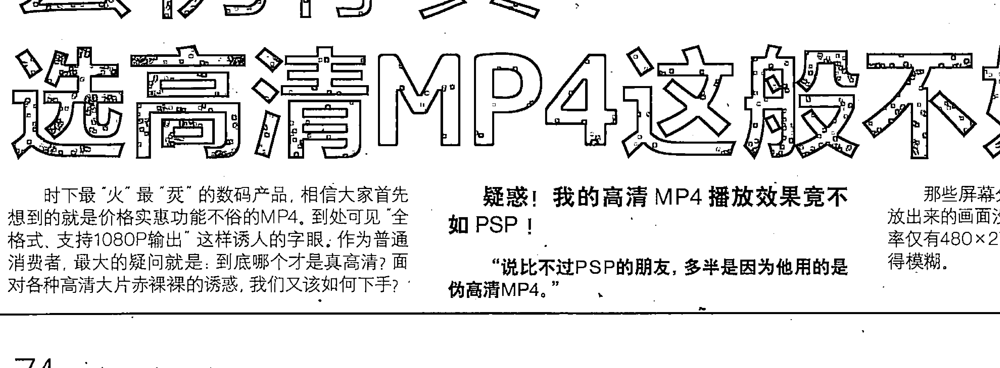

### 探求！720P、1080P 你认清了么？

“许多朋友看到720P和1080P的字样就以为视频，播放器是高清的，如此一来与菜鸟交流没什么问题，不过和高手对招恐怕就要被笑话了。”

市场上有不少商家滥用高清的概念，搞的大家都审美疲劳了。话说高清之初，天下三分：标清、高清、全高清。代表人物：480P、720P、1080P。通常的高清指720P以上，而达到1080P则称之为全高清，也就是物理分辨率高达1920x1080逐行扫描，像素数达到207.36万，它是目前高清的顶级规格。至于市场上一些误导消费者，宣传1280P高清的手法，当作娱乐就好。由于高清视频数据传输量巨大，所以需要压缩算法以保证顺利传输，说道这就要提一提视频编码和格式了。

### 解惑！编码与格式之谜

“视频的清晰度一看分辨率，二要看片源，三要看码率。当然有些特定的格式决定了自身的清晰度。但是有一点可以确定，采用同一种视频编码，越清晰的体积越大。”

现在从网上下载高清电影，一般都是MKV、AVI、MPG、WMV、TS、RMVB的格式，他们只是封装容器，里面封装的是视频流+音频流，影响画面质量的是容器里面封装的什么东西。而常见的视频编码有MPEG2，MPEG4，H264，VC1等。

#### 各个编码优劣

| 编码 | 介绍 | 同清晰度文件体积 | 对硬件配置要求 |
| :--- | :--- | :--- | :--- |
| MPEG2 | 比较老，DVD光盘中的VOB文件就基于MPEG-2编码，压缩率很低 | ★★★★ | ★ |
| MPEG4 | 专门针对高质量视频设计，常见于DVD、Xvid影片，压缩率一般 | ★★★ | ★★ |
| H.264(X.264) | 目前最热的高清编码格式，不少1080p影片都用此编码，压缩率高 | ★ | ★★★ |
| VC1 | 非常高效的高清视频编码标准，最早来源于微软，从WMV9演化而来，压缩效率和清晰度类似H.264 | ★★ | ★★ |

#### 各个格式优劣

| 格式 | 介绍 | 推荐指数 |
| :--- | :--- | :--- |
| RMVB | 体积小，但是不能修改内置字幕，只能达到DVD的画质。 | ★ |
| AVI | 以前DVD都是用MPEG2封装AVI，体积往往4~5GB，但经过DivX或XviD编码后的大小只有650~700MB，图像品质却没怎么下降 | ★★ |
| MKV | 目前比较流行，兼容众多视频编码，由于是民间格式，没有版权限制，官方发布的视频影片都不采用MKV | ★★★★ |
| WMV | 基于WMV9高清编码，在微软的推广下不容小觑。能无损的还原1080P信号，但对硬件的要求较高，H.264文件的封装较为常见 | ★★★ |
| TS | 高清专用封装容器，多见于原版的蓝光，HD-DVD转换的视频影片，一般采用H264、VC1等最新的视频编码。视频质量相仿优秀，还原准确，是高清发烧友比较喜欢的格式，在下载中也可以注意这一点，基本以TS结尾的视频质量很高 | ★★★★★ |

### 思考！大屏真高清

“熟悉了各种高清视频的优劣之后，再去选择心中的那个高清MP4是不是心里有谱了？且慢，选好MP4没有这么简单。”

市场上不乏采用3英寸普通屏幕，分辨率为480x272的“高清MP4”，实际上只有4.3英寸、5英寸、7英寸，1600万色，分辨率达到800x480的显示屏才能满足目前看高清视频的需求。屏幕尺寸，总像素决定了场景展现、字幕显示、细节还原等方面的显示效果，看高清，追求大屏幕是真理。

| 屏幕尺寸(英寸) | 屏幕面积(平方厘米) | 屏幕尺寸倍数关系 | 像素提升倍数关系 |
| :--- | :--- | :--- | :--- |
| 3 | 25.6 | 1 | 1 |
| 4.3 | 52.6 | 2 | 2.9 |
| 5 | 71.1 | 2.8 | 2.9 |
| 7 | 139.4 | 5.6 | 2.9 |

### 高清解码强不强，全靠一颗芯

MP4中的“基尔加丹” Telechips TCC8901

TCC8901是目前1080P方案中视频解码能力最强的方案。给它冠上JD的名字再合适不过了。它有一颗强劲的心，ARM11架构处理器，主频最高能达到600MHz，峰值解码码流可达133MB！

#### 解码能力

包括MPEG-1、MPEG-2、MPEG-4 SP、MPEG-4 ASP、MPEG-4 AVC (H.264)、DivX、H.263、WMV9、VC-1、RV，配合2D/3D图形加速引擎可输出流畅的1080P全高清视频画面。

#### 代表作：台电T56

价格 599元

屏幕尺寸 4.3英寸

屏幕分辨率 800x480

屏幕材质 LTPS

视频输出 1080P全高清HDMI输出，TV-OUT

存储容量 8GB，支持OTG功能

正因为大家对台电产品的强大信心，所以自从几个月前T56发布之日起，便获得了广大玩家的极大关注。虽然屡屡跳票，但还是有不少人对它翘首以待，如今T56终于出来了！

值得一提的是T56的电阻触摸屏幕是“硬屏”，体验效果更优秀。很多人甚至会将T56的触摸屏幕误认为是电容屏，不过当然无法实现多点触摸。此外首次运用Flash灵动界面，操作更人性化，目前搭载的是时尚家居、海豚跳跃两套主题风格。

TCC8901需要外置大容量的高速缓存配合，而这个高速缓存的大小是厂商自己决定的，市场上不乏仅仅使用了64MB缓存芯片，而T56搭载了256MB高速DDR缓存芯片，比其他的SDRAM更快，这一点在预读电影时可以感受到。

### 怎么才能又快又方便的找高清电影？

VeryCD (http://www.verycd.com)

思路论坛 (http://www.mysilu.com)

迅雷看看 (http://www.xunlei.com)

### 一对冤家，电阻屏和电容屏

它们的最大区别就是电容支持多点触摸，电阻不支持。而且电容屏幕更为精确，大家熟悉的iPhone就是电容屏，手感被世人称赞。电阻屏由于成本低，被大部分触摸屏幕所采用。

### LTPS

LTPS (Low Temperature Poly Silicon 低温多晶硅)，与普通TFT屏幕相比，不仅可视角度更大，还能提供更亮、更精细的画面，同时也较为轻、薄、省电。LTPS屏幕是中高端MP4的身份标志。

### 何为ARM？

ARM中国总裁曾说过：未来只有英特尔和ARM两家CPU。你也许疑问ARM是何方神圣，能与英特尔平起平坐。实际上ARM早已融入我们的生活当中。它无处不在，小到MP4、数码相机、游戏机、手机、iPad这些随身数码设备，大到工程控制，流水线制造都有它的身影。ARM基本是一个系统的芯片不是一个单纯的CPU。目前面向市场的有ARM7，ARM9，ARM9E-S，StrongARM和ARM11系列。ARM开发的32位CPU核，全球厂商都可以获得授权生产ARM芯片，而且价格出乎意料得便宜。

不仅MP4用的是ARM，iPad使用的处理器Apple A4到底是单核还是多核一直是人们争论的焦点。实际上它是一颗“缩水”版的Cortex A8，精简了控制器与联通组件的个数，仅具备基本的PowerVR SGX图形处理单元、NAND闪存、DDR内存接口，有限的输入输出控制器，以及单核心的A8处理器。iPhone 3GS的ARM处理器也是Cortex A8核心，频率为600MHz比iPad要低些，因此iPad的界面设计有条件比iPhone更为华丽。用现在的一句话来说就是，以后有电的地方就会有ARM。

#### 代表作：昂达VX575全高清

价格 499元

屏幕尺寸 5英寸

屏幕色彩 1600万色

屏幕分辨率 800x480

屏幕材质 LTPS

视频输出 1080P全高清HDMI输出，TV-OUT

从VX575到VX575HD，VX575+以及现在的VX575全高清，VX575系列是昂达的金字招牌。集合了时下热门的功能，OTG、exFAT文件系统、红外遥控、HDMI都不少，可惜不是触摸屏，这一点要稍微逊色。好在飞梭按键可以直接上下拨动而实现对菜单选项的调节，按下飞梭按键就可以执行确定的效果。

VX575全高清分为黑色版和白色版，虽然UI界面相同，但是主控不同，白色版采用的是TCC8901，黑色版采用的是CC1800，而且较白色版便宜些，虽然主控不同，但性能差别并不大，反而黑色版性价比更高。

#### 昂达 VX575 全高清最新游戏下载

http://www.onda.cn/pro/download/biosexp.jsp?id=1065969

除了大家已经畅玩过的几款经典游戏《黄金矿工》、《极速找茬》、《阿里巴巴》、《美女找茬》外，还增加了两款网络中人气极高的游戏《城市生存指南》与《炮塔防御》

### 游戏下载后如何安装？

将下载的游戏解压缩至昂达VX575全高清的根目录下，运行机器中的应用程序，执行相应的游戏程序即可。

### 电池不够用怎么办？

MP4因为电池的容量限制，往往三四个小时就没电了，有没有想过外置电池？移动电源能给你所有数码装备充电，主要它有一颗强劲有力的心。一个小小的盒子里放上几块大容量锂电池，MP4有了它之后看多少电影也不怕。

### MP4 中的“伊利丹”中星微 VC0831

VC0831单片双核，采用ARM926内核，支持DDR缓存，有着100MB超大码流，硬件高清，支持SuperRMVB三大特性。一般来说，同样分辨率下，视频文件的码流越大，压缩比就越小，画面质量就越高。

然而，100M超大码流只是VC0831设计上的“冰山一角”而已，SuperRMVB技术是指能解码市场上几乎所有已知的RMVB文件并自动识别影片分辨率和帧率，同时硬件高清解码技术解码效率更高并有效降低CPU功耗。

### 续航能力大测试

作为高清MP4，与传统MP4不同的是，由于高清视频需要更高的播放码率，CPU在解码时相对费电些。续航能力也是不容忽视的，考虑到一部分学生族喜欢晚上熄灯后在被窝里夜战，以及自习课忙里偷闲的情况，播放时间至少满足4小时才合格。

| MP4 | 50%亮度播放时间(H) | 100%亮度播放时间(H) |
|-----|-------------------|-------------------|
| 台电T56 | 6.2 | 5.3 |
| 昂达VX575高清版 | 5.1 | 4.1 |
| 月光宝盒PM5926HD | 5.5 | 3.8 |
| 纽曼A18HD+ | 4.7 | 3.5 |

为了模拟正常使用环境，采用的是720P片源，毕竟1080P的片源过于庞大，对于大部分朋友来说观看机会不多。

### 论坛活跃程度大测试

参考官方论坛的用户活跃程度，活跃度高表明论坛互动性好，有什么问题可以及时得到解决，同时考察厂商对新固件的升级速度。

| MP4 | 活跃程度 | 固件升级速度 |
|-----|----------|--------------|
| 台电T56 | ★★★ | ★★ |
| 昂达VX575高清版 | ★★★★ | ★★★ |
| 月光宝盒PM5926HD | ★★ | ★ |
| 纽曼A18HD+ | ★★ | ★★ |

#### 代表作：月光宝盒PM5926HD

价格 799元

屏幕尺寸 4.3英寸

屏幕分辨率 800×480

屏幕材质 LTPS

视频输出 TV-OUT

存储容量 8GB

把游戏画面植入MP4这个想法还是第一次出现，界面很可爱，比较能吸引MM的眼球，而且全系列都是炫彩外壳，整体感觉比较Q，换个流行语就是比较萌。虽然不支持1080P播放，不过给女生用起来，720P完全满足需求，毕竟女生更倾向喜欢MP4的质感和外观。

PM5926HD的屏幕分辨率 达到800×480，最高可支持1080i色差分 量输出，比较有特点的是 植入了劲舞团2炫彩跳舞 视频做音乐播放界面， 动态式主题背景也比较好 有特色，从大厅、影院、 浴室、体育场、水下多音场模式切换，支持RMVB、 MPEG4、H.264、VC-1、MPEG1、FLV等视频编码，在 SuperRMVB的技术下，网络上繁杂的RMVB电影难 不倒它。

### MP4中的“阿克蒙德”华芯飞CC1600

面对CC1600，该问候它一句，廉颇老矣，尚能饭否？当年CC1600主控方案横空出世，将MP4从RMVB时代带进全新的高清时代。一年过去了，CC1600继续发挥着它的作用，仍然是大部分MP4的主控方案。

正是因为它，720P高清标准首次在MP4行业中出现，可以支持720P的RMVB高清播放，实现对MPEG-2编码的AVI格式、Real Video编码的RMVB格式以及FLV格式播放，并支持480P色差输出。

### 播放能力大测试

为了模拟大家平时看电影的真实环境，并没有使用苛刻的极限码率测试。TCC8901无疑是目前高清MP4方案中的王者，很难有视频难倒它。在720P的片源下，VC0831和CC1600表现也不错，但是对于1080P就无能为力了。

| 视频编码 | 码率(Kbps) | 封装格式 | 分辨率 | TCC8901 | VC0831 | CC1600 |
|----------|------------|----------|--------|---------|--------|--------|
| MPEG1 | 2086 | MPG | 640×448 | 流畅 | 流畅 | 不支持 |
| XviD | 3644 | AVI | 1280×720 | 流畅 | 流畅 | 流畅 |
| VC-1 | 5834 | WMV | 1280×720 | 流畅 | 不支持 | 不支持 |
| RV40 | 1632 | RMVB | 1280×720 | 流畅 | 流畅 | 流畅 |

### 传输速度大测试

8GB的容量说大很大，USB接口本身的速度并不慢，但是不同主控对USB支持能力决定了真实的传输电影耗时。由于T56特有的优化方案，写入速度可以达到10MB/S，读取15MB/S!

| MP4 | 文件大小(MB) | 用时(S) | 平均写入速度 |
|-----|--------------|---------|--------------|
| 台电T56 | 3482 | 341 | 10.2MB/S |
| 昂达VX575高清版 | 3482 | 644 | 5.4MB/S |
| 月光宝盒PM5926HD | 3482 | 1055 | 3.3MB/S |
| 纽曼A18HD+ | 3482 | 710 | 4.9MB/S |

#### 代表作：纽曼A18HD+

售价 699元

屏幕尺寸 5英寸

屏幕色彩 1600万色

屏幕分辨率 800×480

屏幕材质 LTPS

视频输出 TV-OUT

存储容量 8GB

薄，这是最直观的感受，9.8mm超薄机身，富于创意的曲线机身十分便携，适合数码装备比较多的朋友，分量轻，易携带。运用人体工学知识，创作出最贴合于手指的曲线外观，令操作更舒适。

在视频播放能力上，自然无法与前两位BOSS相比，现在来看CC1600的定位是那些对高清视频需求偏向快节奏，直接下载几百兆的RMVB看过即删的朋友，而且720P的RMVB播放已经能满足高清需求。CC1600并不老，电子书、PDF、游戏都可以，如果更看重便携，性能只有退居其次，从这一点上看来，A18HD+还有一定的市场。

### 12个摄像头 侦破你的福尔摩斯

19世纪90年代的伦敦，在空前繁华的经济发展和人文地理的掩盖下，却是一个又一个在阴暗潮湿之处滋生、蔓延的毒瘤……

夏洛克·福尔摩斯应运而生，他因为总是能够轻易抵达最复杂的神秘事件的核心部分，将被层层包裹住的真相挖掘出来而闻名于世。在他忠诚的伙伴约翰·华生医生的帮助下，这个世界上最著名的侦探通过每一次细致入微的观察，顺藤摸瓜追查到真正的罪犯，可以说他的能力是无人可以匹敌的。

平时，摄像头只充当视频聊天的载体，很少有朋友挖掘它的潜能。其实，那个看上去并不起眼的摄像头却是你身边的一个私家侦探，能文能武，不仅能帮助你锻炼身体，还能在别人试图入侵电脑时担任私人保镖的角色，甚至还能通过敏锐的眼力记录下蛛丝马迹，让你事后能找到一些重要的线索，扼杀潜在的损失于襁褓中，我们现在都不说摄像头了，改称为福尔摩斯。

### 私家侦探特别行动

#### 任务一 为她做卧底

邻座的MM小涵最近一直很纳闷儿，每天有人在她下班后将她的电脑桌收拾得整整齐齐，干干净净，早晨上班时不是看到刚抹完一尘不染的干净桌子，就是一杯浓香的咖啡，偶尔还会见到一束鲜花。很明显，又一个粉丝加入到“追已”队列中来了。这几百个同事中到底是谁呢？他到底是一位白马王子还是一个钻石王老五呢？我向他推荐了摄像头福尔摩斯。

##### 侦探行动开始

- 第一步：将摄像头连接到电脑中，必要时再手工安装摄像头驱动程序，确保摄像头能够正常使用。如使用的是旧版操作系统而无法自动识别摄像头，手头也没有匹配的驱动程序，可以从http://driver.zol.com.cn/detail/11/106632.shtml下载安装万能摄像头驱动程序来解决问题。
- 第二步：从http://work.newhua.com/cfan/201009/wei.rar下载“微方摄像头监控系统”，安装后即可运行，它默认可以支持16路摄像头的同时监控。在此，只需要支持一路摄像头的监控任务即可。在使用之前需要对其设置一番，在刚安装完成后会自动启动设置向导，如果当时没有设置好，在运行后可以右击监控窗口并选择“基本设置→设置向导”，在打开的向导中要完成以下设置： (1)指定录像、截图保存位置，最好设置为非系统分区中，如果监控的时间长，产生的监控文件可能会越来越大，不过，软件会在磁盘空间不足时自动删除最旧的监控录像文件。 (2)设置警报方式，软件提供多种警报方式，包括警报声音(在此当然不能设置让电脑发声，以免打草惊蛇)、保存图片、发邮件、手机短信等方式。在此自然是设置“保存图片”及发邮件这两种方式。而发邮件时可以借助139邮箱的免费短信提醒功能，直接设置为发邮件报警，将接收邮件地址设置为139邮箱地址即可。这样，当监控到有异常发生时就会立即收到提示短信，不过在设置时需要指定一个能正常使用的发邮件账号信息，包括SMTP服务器及账号、密码信息。
- 第三步：等设置完毕后直接重新启动“微方摄像头监控系统”，在主窗口中便能看到监控画面了，如果连接多个摄像头便能看到多个监控画面。

##### 案情破解及回放

经过上面的几个步骤之后，当摄像头监控到镜头前有变化时就会直接抓取图片。当然，为了避免被对方发现，要关闭显示器，如果是笔记本电脑的话，最好取消合盖后关闭电脑或休眠电脑，然后直接将电脑置入假关机状态，这样进行监控的成功率会更高。到底是谁在幕后坚持每天献殷勤，他到底是位白马王子还是钻石王老五，事后直接通过单击“回放”按钮，查看抓取的截图图片后，自然见分晓。

### 小提示

这次行动中的摄像头要求：不能开启补光灯，最好选择不带电源灯的摄像头产品，如果具有良好的隐蔽性更佳。例如支持USB2.0标准的“天敏 天弓高清版无驱摄像头”就比较适合此任务，外形并不像摄像头，可以达到隐藏而不会引起对方注意。

注意的目的，如果再对其乔装打扮一番，绝对可以避免被对方发现。

**小提示**
“微方摄像头监控系统”还能提供远程监控功能，监控电脑若能正常连接网络，通过访问这台电脑的IP地址及默认端口5080及监控访问密码来远程查看监控画面，例如 http://21.25.123.45:5080 (其中21.25.123.45为监控电脑的IP地址)即可远程打开监控画面了。此外，能够实现类似目的的Vitamin D(下载地址:http://www.vitamindinc.com/)用起来也很方便，而且还是免费的，支持网络摄像头。

#### 任务二 高级门卫兼重案调查组组长

在公司担任秘书职务的陈小姐最近有件事件总是让自己闷闷不乐，事情是这样的：公司现在开始实行绩效工资，有很多项打分项目，而这些工作都由自己负责，显然，这些数据也就成了敏感数据。最近，每当陈小姐离开电脑后，总会有人试图查看这些数据。但留下的线索又不多，无法知晓谁想看。此外，系统的安全也让陈小姐担心。我向他推荐了摄像头福尔摩斯：

##### 侦探行动开始

-   1. 第一步：先从 http://www.onlinedown.net/soft/20472.htm 下载 Alparysoft VideoLock for Webcam 这款软件，它不仅可以借助摄像头来为系统看好大门，还可以记录下曾经试图进入系统的监控画面，可谓是身兼高级门卫+重案调查组组长双职。
    2. 第二步：安装后首次运行时需要设置一个账号及密码，此密码可以在任何时候直接强行进入系统，因此，强烈建议设置一个复杂度较高的密码。
    3. 第三步：单击“Training”按钮，在打开的窗口中用摄像头对准自己的脸，调整好位置后单击“Add Picture”按钮进行拍摄并保存到数据库中。为了安全起见，多拍几张，因为这些照片就是日后系统根据摄像头抓拍的人脸照片与这些保存在数据库中的照片进行匹配，只有相匹配后才能解锁系统。
    4. 第四步：经过上面的设置后，现在离开电脑时只要直接按下快捷键 Ctrl+Alt+L 即可将系统锁定，此时不管是鼠标还是键盘均无法使用，电脑就像假死症状。只有自己对着摄像头才能解锁系统。

**小提示**
用来锁定系统的摄像头要求不是很高，只要能够清晰地识别别人脸即可（当然支持的像素越高效果越理想），为了确保夜晚光线不好时也能正常解锁，最好选用带有补光灯的摄像头产品。例如，“天敏曼尼无驱版摄像头”、“天敏绿雅无驱版摄像头”、“天敏铁甲无驱摄像头”等产品都比较适合选用。

##### 案情破解及回放

这样不仅能锁定系统，还能在后台自动拍摄试图打开电脑的那些人的动作并一记录在案，回来后只要解锁系统并单击“View Logs”按钮查看他们留下的蛛丝马迹。

**小提示**
假如因为光线较暗或是其他原因连自己也无法进入系统，这时就可以使用之前设置的用户名及密码来强行进入系统，方法就是直接按下 Ctrl+Alt+Q 打开登录对话框，输入账号及密码即可。

### 眼皮底下看管密件

#### 任务 替人看管敏感数据

虽然已进入花甲之年的张大爷在儿女们的指导下学会了网上购物，整个网上购物过程中需要的账号、密码有好几组，为了安全起见，又不能全部设置成同一个密码，只能写在小本本上。这样虽然解决了经常忘记的麻烦，但是张大爷的烦恼事又来了，这些账号和密码直接记在本本上，万一哪天弄丢了，落入别人手中咋办？这时，我向他推荐了摄像头福尔摩斯。

##### 保密行动开始

-   1. 第一步：先从 http://www.immagician.com/barcode.htm 下载这款名为 BarCode 2D 的小工具，运行后直接将这些敏感的账号信息输入到“Input Text Contents”框中，将“Block size”设置为7，单击“Encode”按钮即可将这些敏感数据信息制作成一个2维的条码。
    2. 第二步：直接将这个制作好的2维条码通过“Save”按钮保存成BMP格式的图片，最后再使用打印机将其打印出来并保存好，即使这张保存了各种密码信息的小本本落入他人之手，除非遇到高手，否则他们也不知道里面隐藏了什么秘密，几乎是有惊无险之事。
而当自己忘记了密码而需要查询时，只要拿出摄像头对准这个2维条码，在 BarCode 2D 中单击“Read”按钮即可开始解码，稍后就能得到原始密码信息了。

##### 保密原理剖析

二维条码(或称二维码)是用某种特定的几何图形按一定规律在平面(二维方向上)分布的黑白相间的图形记录数据符号信息的；在代码编制上巧妙地利用构成计算机内部逻辑基础的“0”、“1”比特流的概念，使用若干个与二进制相对应的几何形体来表示文字数值信息，通过图象输入设备或光电扫描设备自动识读以实现信息自动处理；它具有条码技术的一些共性：每种码制有其特定的字符集；每个字符占有一定的宽度；具有一定的校验功能等。同时还具有对不同行的信息自动识别功能；及处理图形旋转变化等特点。二维码能够在横向和纵向两个方位同时表达信息，因此能在很小的面积内表达大量的信息，可容纳多达1850个大写字母或2710个数字或1108个字节，或500多个汉字，比普通条码信息容量约高几十倍。而二维码中保存的信息只有使用图像输入设备或是光电扫描设备才能识别，人眼根本无法看出里面保存了哪些信息，从而达到了保密的效果。

**大补贴**
用于识别二维条形码任务的摄像头对数据传输速度、识别像素要求相对较高些，数据传输速度越快，识别速度越快，识别像素越高，识别的准确率也越理想。推荐“天敏天轮无驱版摄像头”。

### 成人之美的化妆行动

#### 任务一 兼职化妆师

平时就爱臭美的小红看到别人与自己视频聊天时，视频画面中有一些好看、好玩的动画特效，打那时起，天天嚷嚷也要让自己的视频拥有此特效。这回，我向她推荐了一个方案，那就是让摄像头兼职化妆师，各种特效任她选。

##### 化妆行动开始

-   1. 第一步：从 http://www.immagician.com/immagician.htm 下载 VimiMagic 这款软件，安装运行后单击菜单“文件→选择摄像头”，找到目标摄像头，此时应该会看到摄像头画面，接下来直接在面板中选择各种喜欢的特效后，最小化或是直接退出此软件即可。
    2. 第二步：打开QQ主窗口，单击“打开系统设置”按钮，在打开的窗口中选择“好友和聊天”，选择“语音视频”，单击“视频设置”，在打开的窗口中选择摄像头设备为“Vimisoft Camera”即可。
现在，启动QQ视频聊天时就会自动嵌入事先定义的特效了，而要想更换特效，只要再回到 VimiMagic 中重新选择新特效即可。

##### 化妆原理剖析

其实这类软件也有不少，它主要是直接在摄像头捕获的视频上面添加一些动态图片进而实现各种有趣的特效，甚至还有虚拟摄像头软件，即使没有连接摄像头也可以直接用软件虚拟出一个摄像头，甚至还可以添加一段视频以达到以假乱真的效果。不过，这类软件通常都比较占用系统资源，老爷机的情况下，跑起来非常吃力，要量力而行。

**小提示**
此方案不仅适用于QQ，其他各种支持视频聊天的聊天软件均能使用，只要在参数设置中选择视频设备为“Vimisoft Camera”即可。

#### 任务二 没有化妆镜临时做替身

办公室不准摆放小镜子，这是公司统一规定，谁也不能坏了规矩，这可苦了几位MM了，正在她们苦恼之际，我推荐了摄像头兼职化妆镜的方案。

##### 替身化妆镜行动开始

-   1. 将摄像头连接到电脑中，必要时安装好驱动程序，确保摄像头能正常工作。接下来，只要打开“我的电脑”，直接打开摄像头对应的图标，在打开的窗口中便能看到摄像头拍摄的视频内容，女士可以直接对着摄像头来补妆，男士则可以用它来刮胡须了。
现在，启动QQ视频聊天时就会自动嵌入事先定义的特效了，而要想更换特效，只要再回到 VimiMagic 中重新选择新特效即可。

**小提示**
用于化妆的摄像头同样需要快速传输数据的特性，像视角大于55度的接口USB2.0、速度640*480 30fps的多彩“DLV-B203”摄像头就比较适合，以及更注重外在美观的多彩“摄神系列”摄像头也都较适合。

### 福尔摩斯的左勾拳

福尔摩斯和华生潜入了一个令人吃惊的新科技组成的世界当中，在这里，逻辑推理有的时候就成了最好的打击罪犯的武器……当然，也不排除一记右勾拳就能解决所有事的可能性。战胜对手，除了惊人的智商外，好的体力也是十分重要。玩游戏通常都是苦了手指、腰部、背部、颈椎，如果沉迷于游戏，肯定是弊大于利。其实，当你改玩摄像头游戏后，这个无法打破的怪圈便能得到改变了。

#### 游戏变健身行动开始

##### 1. 手指健身

如果每天都用电脑，手指按鼠标、键盘时有异样的感觉，这种情况尽量少用鼠标、键盘了，赶快趁机锻炼锻炼自己的手指吧。

-   1. 第一步：从 http://tinyurl.com/yaxmtk5 下载“海之星”，将其安装到系统中，再调整好摄像头就能开始用摄像头来玩游戏了。方法很简单，进入游戏界面后，里面的所有菜单都是通过手指在摄像头前晃动来实现的。如果开始不知道游戏规则，可以将手指放在“帮助”上面来回晃动，当红色块满后便能打开帮助文档了。
    2. 第二步：了解了游戏规则后就可以开始游戏，游戏时只要按照游戏规则用手指来玩了。

##### 2. 脖子健身

天天坐电脑前，如果感觉脖子僵硬，颈椎总是感觉不舒服，那就玩玩这款需要摇头晃脑的小游戏，不仅得到了乐趣，同时也锻炼了自己的颈椎。

-   1. 第一步：在浏览器中打开 http://tinyurl.com/yax5xfuq ，当浏览器提示允许摄像头设备时，请选择允许。
    2. 第二步：现在只要对准摄像头大笑并摇头晃脑，这样就会让骂人的老板身后的小精灵不停地骚扰正在骂人的老板，摇头晃脑的力度越大，小精灵的骚扰力度就会越来越强，同时可以从下面的“大笑力度表”看到力度，最终会逗笑老板，他自然就不会骂人了，否则，你就会一直遭到老板的大骂。如果你想快速地进级，就需要加大自己的摇头力度，下意识地就锻炼了自己的颈椎。此外，在这个网站中还有好几款在线摄像头游戏，玩起来都比较有意思。
如果自己的电脑安装了独立显卡并安装了最新版的驱动程序，还可以下载 CamgooSixplay (下载地址:http://www.onlinedown.net/soft/30778.htm) 这个摄像头游戏包，里面包含多款摄像头游戏，玩起来更有意思。不过，很多使用集成显卡及系统自带的显卡驱动程序时，无法正常运行游戏，会提示 OpenGL.dll 错误。

**小提示**
用摄像头玩游戏，要求的就是摄像头拍摄的视频的速度快，而对摄像头的有效像素的要求并不是很高。只要支持USB2.0标准的普通摄像头都能胜任，当然高档摄像头玩起来更爽，像带补光功能的摄像头，夜晚光线不好也能玩。

### 四两拨千斤，高科技武器装备你

19世纪的福尔摩斯，在一个没有高科技的世界破案，今天的我们借助摄像头，却可以获得更多。善用四两拨千斤的魔法，五块钱能顶富人五十块钱用。不信？很多高手家里一只摄像头就能顶替DC、DV、扫描仪、大头贴机，圈子内戏称为多功能一体机。

### 摄像头拍照、拍视频，五十块钱可省五千块

实现起来很简单：直接从 http://www.onlinedown.net/softdown/44674_2.htm 下载“摄像头录像专家”，安装后直接运行后就可以通过主窗口中的按钮来拍照、拍摄视频了。

**小提示**
很多摄像头现在都带有拍照按钮，直接按下拍照按钮就可以拍照了，例如“天敏小黄蜂免驱摄像头”外形酷似“变形金刚”中大黄蜂机器人，上面就带有拍照按钮，按下即可拍照。而“天敏炫本摄像头N80”还内置麦克风及遥控拍照变焦功能，虽然价格高点，在拍照、拍视频时更方便，甚至能录制清晰的语音。

### 摄像头顶替扫描仪，不用再手动录入内容了

很多朋友喜欢使用扫描仪将报纸或是资料上的文字内容进行扫描，然后再使用OCR识别软件（例如“尚书”）进行识别。其实，在没有扫描仪的情况下，摄像头可以顶替，如果摄像头的有效像素高，效果也是很理想的。实现方法也不难：

首先，在安装了完整版Office的系统中单击“开始→所有程序→Microsoft Office→Microsoft Office工具→Microsoft Office Document Scanning”打开Office自带的扫描工具。接下来，在打开的窗口中选择“将彩色页面扫描为黑白图片”，单击“扫描”按钮启动扫描功能，选择扫描设备为摄像头，然后对准文档进行扫描即可。
在预览窗口中一边看预览效果一边调整距离，单击“捕获”按钮进行捕获，捕获完毕后单击“发送”按钮即可开始识别了，最后可以直接得到纯文本格式的内容了。

### 摄像头顶替大头贴机，不再掏钱给大头贴店老板

用摄像头自拍大头贴虽然不是新应用，但对于那些拥有打印机的朋友来说，的确可以节省不少，何况过程也是一种乐趣呢！

第一步：从 http://xiuxiu.meitu.com/ 下载“美图秀秀”这款小工具，运行后单击“拍照”按钮，此时需要再下载“美图拍拍”组件，运行后选择“大头贴模式”，选择好相框，再将拍摄模式设置为连拍模式，对着摄像头直接按下“拍照”按钮即可。
第二步：拍摄的大头贴照片还可以通过“美图秀秀”进行后期美化处理，处理完毕后直接保存成图片文件，最后再直接打开并使用打印机打印出来即可。

### 总结

身边小小的一个摄像头，竟然还有这么多的玩法。当别人都在习惯性地将它联想到QQ的视频聊天时，我们却还可以用它来做监控，将它当只看门狗守卫系统的大门，亦或用它来玩游戏……只要你敢想，它就敢做。不要再让摄像头成为闲置的电子产品了，它的本事大着呢！

策划/《电脑爱好者》编辑部
监制/Cornel
撰稿/dai

### 不无线不主流

### 无线耳机让你尽显‘潮本色’

你还在为每次使用耳机前需要整理缠绕的线材而困扰吗？还在为耳机线将你束缚在电脑前而无奈吗？如果是，只能说你还不够“潮”！在无线旋风吹进音频领域的今天，没有无线耳机的你，怎么能体验到真正畅享自由的乐趣呢？

无线耳机，则凭借着高可靠性和兼容性、良好的音质、高传输距离、省电、双向双工等优势后来居上，允许用户在360度的空间内自由移动。虽然2.4G无线耳机依旧存在不少缺点，但是随着技术的不断成熟、应用层次的变宽和成本的下降，足以让2.4G无线耳机有机会重现发生在2.4G无线键鼠市场的普及风暴，进而终结犹如蜘蛛网一般的个人电脑时代。

### 2.4G无线耳机与室外‘绝缘’？

如果苹果最新的iPad算是“潮玩物”，彰显个性的服装是“潮服饰”，热辣的劲舞是“潮街舞”，当你拥有了上述潮人必备的技艺之后，又有没有赶上聆听音乐时的一股时尚新潮流呢？

金无足赤，人无完人。虽然2.4G耳机现在非常风光，但是仅凭一项缺陷就能被蓝牙耳机“踩在脚下”，USB接口的适配器，让2.4G无线耳机和MP3、手机一类的数码产品无缘，只能在家里或者在有电脑的环境下使用，毕竟我们外出的时候总不能把开着电源的笔记本背在身上吧？反观蓝牙耳机，则可以通过其它数码产品内置的蓝牙模块来无线传输音乐，在公交车或者室外有着更广泛的用武之地。

无论是在家里还是宿舍，如果你还在被耳机导线锁定在电脑旁的一亩三分地中，再多的“潮技艺”也无法弥补失去自由的窘态。而无线耳机的出现，则彻底摆脱了作为传播介质的物理线路，让无线耳机在传播音乐时还可以带给我们前所未有的空间自由。

### 便携和专业 你要萝卜还是白菜？

俗话说，萝卜白菜，各有所爱，对于无线耳机来说也是如此。如果说便携型无线耳机是小身板的萝卜，那么专业型耳机就是体型硕大的白菜了。很多便携型无线耳机都可以“缩骨变形”，以装进耳机附送的收纳袋中，便于用户保管、携带。而主攻游戏或电影的专业型无线耳机，往往具备更出色的高保真单元和优质皮耳套，不仅音质效果好，戴着还舒服。再加上杜比一类的环绕立体声技术的点缀，说不专业都没人相信！

目前一些2.4G无线耳机已经在机身上配备了Line Out接口，当插入外置音箱时，此接口可以让无线耳机变成一部无线音频收发器，让音箱的摆位更加灵活。如果厂商可以在适配器上多下功夫，增加一个Line In接口并内置供电模块，让MP3一类的音源设备与适配器相连，让无线耳机也能和非电脑的音频产品互动就好了。

就目前无线耳机的素质来看，足以胜任看电影、听音乐、玩游戏、语音聊天等非专业应用。功能方面，大多数无线耳机均已具备麦克风、音量调整和最基本的音乐控制功能，最新2.4G技术产品的价格也走进了200元普及价位。

### 辐射？天大的冤枉！

如果您认为“无线”就是“辐射”的别称，那您可就真的冤枉2.4G无线耳机了。其实，几乎所有的无线耳机都选用了低能量的电磁波，发射功率很低。以2.4G无线耳机为例，网络聊天时发射功率在1mw左右；关闭麦克风，在10米左右距离作纯接收器时，单个耳机得到的辐射强度不足手机的1/2000000，辐射强度不足一提。

### 寻找无线耳机中的‘另类’

回想一下几年前的无线鼠标吧，经历了初期易用性、价格和延时等缺陷后，如今的2.4G技术的无线键鼠已经显露出外设市场的霸王之相。因此，既然我们已经把键盘和鼠标都从有线的世界中解脱了出来，在音频无线技术趋于成熟的今天，不无线的耳机又何以堪称主流呢？

回顾以往，即使鼠标和键盘已经无线，但是在传统耳机导线的约束下，还是将我们“囚禁”在了显示器、机箱等“辐射源大户”的身边。无线耳机的出现，让我们可以远离这些辐射源，躺在床上、坐在客厅的沙发甚至上厕所时都可以聆听音乐或者上网聊天，真的应该感谢他为我们带来的这种360度的全方位自由享受呢。

无线耳机和MP3结婚了！
如果您想把无线耳机“带出去”，在街头郊外也能享受音乐乐趣，不妨留意一下索尼的 NWZ-W252 头戴式闪存音乐播放器，这个MP3的造型和无线耳机很类似，小巧时尚，色彩绚丽，防滴溅的设计更适合“野外作战”。虽然这款产品不能接驳其它音频设备，但是本身已经实现了随时随地享乐音乐的它，也算是一种无线耳机的另类代替品吧？

### 2.4G 技术凭什么这么“牛”？

FM、红外、蓝牙无线耳机这三位“老大哥”已经在无线音频战场厮杀多年，为什么至今仍然没有普及？而初来乍到的“小弟”，2.4G无线耳机却成为了呼声最大的领路人，大有“忽听2.4G技术来，无线耳机遍地开”的势头。

无线耳机也能“隐形”！
一些敏感行业人士还钟爱另外一种个性化的无线耳机，那就是可以藏置于耳孔内部的“隐形”耳机。一些大型考试中经常破获采用隐形耳机作弊的案件，让我们在潜意识里就将隐形耳机和作弊画上了等号。其实，隐形耳机在我们身边也经常扮演着正义角色，经常被用于记者暗访、公安取证、重要人物保护及娱乐场所迎宾等场合的应用。为了让大家可以更好地了解2.4G无线耳机的特色，接下来我们还准备了雷柏 H8000、魅格 PC91、硕美科 EW600 和现代 CHY-G2400 四款耳机的试用报告。

FM耳机败于“奔放”，音效不好还不保密；红外耳机败于“执着”，对使用角度太苛刻；最有机会普及无线音频的蓝牙耳机则跌倒在了高昂的“学费”面前，每款产品都需向国外缴纳专利费。而新来的2.4G

### 主流无线耳机技术对比

| 名称 | 有效距离 | 音质 | 优点 | 缺点 |
| :--- | :--- | :--- | :--- | :--- |
| FM | 10~70米 | 一般 | 成本低，支持多部设备同时使用，甚至可以穿透2~3面墙壁 | 保密性和抗干扰能力不强，只支持单向信号传输，低带宽导致无法集成无线麦克风、音质一般 |
| 红外 | 7米左右 | 较好 | 除强光外几乎没有什么东西会干扰到红外线耳机的工作 | 有使用角度的限制，电力消耗大，抗干扰能力差 |
| 蓝牙 | 10米左右 | 较好 | 保密性出色，稳定，不需要单独的发射机就可以和其他设备连接 | 蓝牙产品需要缴纳专利费，因此成本较高 |
| 2.4G | 10米左右 | 很好 | 数据传输量大，稳定，比较省电，同类产品互不干扰 | 当开启集成的麦克风功能时音质会略有下降，在移动的过程中，也会偶尔出现丢包和延迟等现象 |

### 小技巧：

如果您安装的是 Windows XP 以上操作系统，只需把无线耳机的适配器插在电脑的USB接口就可以直接使用，系统会自动识别并安装新硬件的驱动。如果系统提示驱动已经安装正确但是依旧没有声音的话，我们可以到控制面板的声音设置中，手动将默认的播放设备修改为2.4G无线耳机。

网站: http://www.rapoo.cn/
频率响应: 20~20KHz
信噪比: 91dB
喇叭阻抗: 32Ω
喇叭尺寸: Φ40mm
接收范围: 10米、360度
供电方式: 内置锂电池
重量: 125g

雷柏H8000拥有黑色、银色和白色三种色调的版本，耳机内侧配备了厚厚的海绵耳垫，佩戴非常舒适。H8000耳机头梁能够承受较大幅度的扭弯，支持拉杆式长度调节功能，操作手感很出众。雷柏H8000通过左耳罩的外圈来控制音量，并且将电源开关和充电接口以及麦克风都集中在了左耳罩上。这款耳机附赠插座式USB延长线，在提升信号效果的同时，还可增加无线耳机和电脑之间的距离。雷柏H8000通过内置的锂电池供电，可以提供大约6.5小时的使用时间。

-   优点: 产品较轻，外形时尚，做工精致
-   缺点: 使用时间相对较短

### 2.4G 无线耳机代表之魅格 PC91

参考价格: 399元
咨询电话: 400-626-3330
网站: http://www.maq.cc/
频率响应: 20~20KHz
信噪比: >80dB
喇叭阻抗: 28Ω
喇叭尺寸: Φ40mm
接收范围: 10米、360度
供电方式: 内置锂电池
重量: 150g

魅格PC91用料考究，手感出色，外观显得非常高贵。为了便于用户携带，这款耳机采用了三维转轴设计，机身可以在多个维度上旋转、调节，空间占用最多可以缩减至半圆以内。魅格PC91的功能键非常丰富，音量和停止暂停键通过按压双层“悬浮”结构的右耳罩边缘实现，上一曲/下一曲和各种接口分布在左右耳罩之上，布局非常合理。魅格PC91集成的小尺寸麦克风方便了我们语音通话，内置高容量锂电池，配合Dyn-Elec省电技术，可以让耳机随着音量及工作距离的远近不同，动态调整输出功率，减少多余功耗，能够让耳机的电池寿命达到10~12小时。

-   优点: 三维折叠技术便于携带，控制按键丰富
-   缺点: 售价稍贵

#### 考察一：舒适性和便携性

与无线耳机接触最为密切的就是我们的耳朵了，如何让耳朵“舒服惬意”地享受音乐，这对无线耳机的佩戴方式和耳罩的材质就有了更高的要求。

目前主流的2.4G无线耳机主要采用了后挂式和头戴式两种结构，相对来说后者舒适度更佳。本文试用的现代CHY-G2400就是后挂式的代表，这种结构的优点就是结构轻巧，利于便携，这款耳机利用两段式的可折叠设计，可以将整体折叠成一个类三角的形态，大幅减少产品的体积。但是，这种耳机的侧边框很细，对耳朵有一种挤压感，长时间佩戴会有一种被勒疼的感觉。

剩下的三款耳机都属于头戴式结构，拥有仿皮革材质的耳机外罩，里面丰富的海绵触感柔软舒适，有助于缓冲机身压力，增强用户的佩戴舒适度。不过，说这类耳机佩戴舒服也只是相对而言，长时间佩戴这种耳机还是会带给头部一定的压迫感，而且戴久之后会有略微的发热，冬天倒是可以用来给耳朵保暖。

就拿魅格PC91来说，在头梁部分增加了一层手感出色的橡胶，可以起到缓解头部压力的作用。为了适应不同用户的头型，这款耳机的头梁还支持拉杆式长度调节功能，操作手感很有段落感，灵敏、易用。魅格PC91的耳罩与头梁连接处的转轴还采用了类似“关节”的设计方式，耳罩不仅可以向头梁内侧折叠，而且还可以围绕悬点水平反转，在各个方向上扭动自如，空间占用最多可以缩减至半圆以内。

雷柏H8000在头梁部分设计了一层和耳罩一般的海绵垫，佩戴的舒适性更出色一些，但是这款耳机和硕美科EW600一样，体型固定，无法进行折叠“变身”，便携性相对就要逊色一些了。

| 型号 | 重量 | 舒适度 | 便携性 |
| --- | --- | --- | --- |
| 魅格PC91 | 150g | 很好 | 很好 |
| 雷柏H8000 | 125g | 很好 | 一般 |
| 硕美科EW600 | 180g | 较好 | 一般 |
| 现代CHY-G2400 | 85g | 一般 | 出色 |

#### 考察二：信号稳定性测试

根据官方参数，这四款耳机都可以实现10米范围360度全方位的音乐享受。在办公区的走廊上，让四款无线耳机和笔记本之间没有任何遮拦，在10米左右的距离都可以获得稳定的信号，不过此时如果再移动的话，信号会出现断断续续甚至没有的现象。

接下来笔者在一间50平方米左右的房屋里测试了这四款无线耳机的信号接收性能以及稳定性。其中笔记本放在了卧室，然后在A、B、C、D四个区域测试四款耳机的信号情况。

四款耳机在卧室里面的表现都非常稳定，C和D地点与笔记本有一墙之隔，刚开始会出现断续的现象，不过等信号稳定后音乐收听正常；C区域较大，当与笔记本处于斜对角时信号会变的很不稳定，丢包延时的现象明显增多，在两墙之隔的B地点，四款耳机的信号接收都很困难，信号断断续续，已经无法正常收听音乐了。通过测试，魅格PC91和雷柏H8000的表现相对更为出色一些，信号出现波动时恢复的时间最快。

在测试中笔者发现，如果房间开着门，信号效果会有所提升；当有墙壁或者障碍物障碍时，如果我们移动了耳机的位置，有时候也会需要重新接收信号，此时音乐会出现短暂的停顿。因此，当我们使用无线耳机听音乐时，如果音乐播放出现问题，尽量保持静止不动等待信号稳定后即会恢复正常。

小提示：
在用无线耳机收听音乐时，如果距离超过了5米以外，尽量不要快速移动，刚经过墙壁的拐角出现信号短暂中断是正常的，稍等一下信号就会恢复正常；出现使用距离明显变短或者信号出现问题，应该先检查电池电量是否充足。

| 型号 | A | B | C | D |
| --- | --- | --- | --- | --- |
| 魅格PC91 | 清晰 | 极不稳定 | 较清晰 | 清晰 |
| 雷柏H8000 | 清晰 | 极不稳定 | 较清晰 | 清晰 |
| 硕美科EW600 | 清晰 | 极不稳定 | 较清晰 | 清晰 |
| 现代CHY-G2400 | 清晰 | 极不稳定 | 较清晰 | 清晰 |

### 2.4G 无线耳机代表之硕美科 EW600

参考价格: 299元
咨询电话: 400-698-9993
网站: http://www.somic-elec.com/
频率响应: 20~20KHz
信噪比: >80dB
喇叭阻抗: 28Ω
喇叭尺寸: Φ40mm
接收范围: 10米、360度
供电方式: 内置锂电池
重量: 180g

硕美科EW600采用了单层头戴结构，表面覆盖有橡胶材质，耳机内侧则是柔软的皮质耳垫结构，佩戴时比较舒适。这款无线耳机将麦克风设计在了左侧外壳的下部，使用伸缩结构作为开关。硕美科EW600内置锂电池，充电时间大约5小时，满电之后连续使用可达10小时，随机附带的独立充电器，可以让这款耳机在脱离电脑时也能给耳机充电。EW600的耳罩上设计有ID对码键、音量调节按键和耳机插孔，还可以将其他音箱、耳机设备与EW-600相连，非常方便。

-   优点: 续航时间较长，佩戴舒适，自带USB声卡功能
-   缺点: 相对来说不够便携

### 2.4G 无线耳机代表之现代 CHY-G2400

参考价格: 299元
咨询电话: 0752-3307651
网站: http://hyundai-tech.com/
频率响应: 20~20KHz
信噪比: >75dB
喇叭阻抗: 32Ω
喇叭尺寸: Φ40mm
接收范围: 10米、360度
供电方式: 内置锂电池
重量: 85g

现代CHY-G2400采用了后挂式结构设计，轻盈的机身有助于增强配戴舒适感，通过两段式的可折叠设计，可以将CHY-G2400围绕着“关节”向耳机框架内侧收起，最终折叠成一个三角形结构，配合可以拆卸的麦克风，让CHY-G2400更适合长途外出携带。这款耳机选用了柔软的海绵，透气性很好，机身集成的接口和按键比较分散，使用时不用担心误操作。现代CHY-G2400采用了内置锂电池供电，可以提供8-9小时左右的连续工作时间。

-   优点: 携带方便，重量轻盈
-   缺点: 后挂式结构不适合长时间佩戴

#### 考察三：不可忽视的细节

##### 无线耳机的“能量块”

耳机“无线”之后，如何获取电力驱动就是非常重要的话题了。目前2.4G无线耳机在供电方面基本分为内置锂电池和使用单独的7号电池两种方式。

专题中所涉及的四款耳机全部选用了内置锂电池的设计，这种供电形式的优点非常明显，全封闭式的结构出现故障的几率更小，锂电池体积小，更适合给无线耳机“减负”。不过，不可更换的锂电池，当无线耳机电力消耗完毕后还需要数小时的时间来补充能量，不能持续的工作是其一大缺陷。

对于需要独立电池供电的无线耳机则可以通过更换其它电池的形式来弥补上述缺陷。不过，现在7号电池的分量不轻，而且后期成本较高，建议选择此类产品的朋友，可以购买充电电池来减少未来的开销。

##### 对无线耳机“说话”

对2.4G无线耳机来说，集成麦克风并不存在技术上的问题，只是通过麦克风语音聊天时，耳机会切换到单通道模式，但通话质量并不会受到影响。

对于长麦短麦，集成和可拆卸这些形式而言互有优劣，长麦距离嘴部较近，通话质量更好一些，但是出于美观的考虑，越来越多的新品都开始选用短麦的设计了。而可拆卸麦克风虽然更自由，但是拆下的小麦克风却很容易丢失或者遗忘。

| 型号 | 麦克风类型 | 通话质量 | 特色 |
| --- | --- | --- | --- |
| 魅格PC91 | 集成短麦 | 较好 | 视觉效果好，但不能改变角度 |
| 硕美科EW600 | 集成短麦 | 较好 | 通过伸缩结构实现开关功能 |
| 雷柏H8000 | 集成长麦 | 很好 | 可垂直改变角度 |
| 现代CHY-G2400 | 可拆卸短麦 | 较好 | 自由度较高 |

##### 无线音箱？看起来很美

随着更多厂家加入到2.4G无线耳机市场的争夺后，耳机已经摆脱了最后的一根线的束缚，和鼠标键盘一般，步入了全民的无线时代。那么，耳机“无线”之后，下一个无线普及战役中的主角会不会是无线音箱呢？

为此，我们专访了深圳市奋达实业有限公司总经理张志飞。

从表面上来看，无线音箱可以突破连线的牵绊，让音箱的摆放无拘无束，仿佛犹如笔记本的迅驰时代来临，可以掀起一场革命，但事实并非如此，张总表示，笔记本作为人机对话的设备，离不开人的操作，迅驰时代带来的无线世界，让笔记本摆脱了网线的束缚，在电力允许的情况下真正实现了移动互联的概念。

而无线音箱和笔记本或者无线耳机还是有差别的，后两者可以利用自身的锂电池供电，但是音箱就无法享受如此礼遇了，特别是音质出色的传统2.0和2.1或者5.1音箱，它们并非一种需要移动的产品，况且大功率的音箱无法像笔记本那样用锂电来供电，供电线的牵绊依然存在。再看5.1，如果作为后环绕，虽然解决了音频连线问题，但无法解决供电问题。取消了音频线，却增加了电源线。

此外，目前将2.4G无线技术应用在音箱上依然存在着一些亟待解决的技术缺陷。首先就是传输问题：是分声道传输还是原始数据流传输？如果是分声道传输，需要两组或者以上的发射和接收模块，这个解决方案不会廉价。如果是原始数据流传输，到达主机后解码，主机和副机之间的线回到了有线时代，并且原始数据传输时主机必须增加解码模块。

其次是采样率的问题。如果是播放MP3等格式，就2.4G的带宽以及音箱上的解码来看是完全没有问题的。但如果是播放CD或者APE无损格式，即使2.4G的传输没有问题，但是音箱上的解码模块还是很难和电脑运算或者CD机播放比肩的。

因此说，音箱想通过2.4G技术实现无线化，只有解决了技术本身的缺陷和市场细分问题，才有可能出现普及的机会。

##### 品牌档案

奋达科技企业集团创建于1993年，是一家民营高新科技企业集团。旗下拥有深圳市宝安奋达实业有限公司、奋达科技（香港）有限公司等五家子公司。产品涉及家用音响、移动多媒体、小家电等三大系列200多个品种，产品远销全球80多个国家和地区，并在40多个国家注册了奋达商标，在国内外拥有较高的品牌知名度和美誉度。

策划/《电脑爱好者》编辑部
□监制/王健
□撰稿/王健


### 4元 领航Internet

“走出你的独幢别墅，在海边的沙滩上吹吹海风，然后与最亲爱的人缓步走向你的座驾——那辆价值4000万的布加迪威龙，在平坦的林荫道上驰骋。世界几乎是静止的，只能听到发动机的咆哮和轮胎与地面低沉的摩擦声……”

醒醒吧，不然你不会听到发动机的声音，却要听到老板的叫骂声啦！就算你看了北京车展，也不至于这样痴迷吧？相信很多朋友是从网上、电视上了解到了新车的动向。在欣赏完“酷车”、“酷模儿”之后，有时候我们需要这样的自我安慰：我没有豪车，但我可以冲浪呀——互联网冲浪呀。不要自卑啦，赶快感受一下CFan送你的4辆好车吧！

本期特别策划将帮助你扫清访问各类网站的障碍，让你在网上浏览无障碍、超速免罚单！

#### MINI Cooper

#### 小块头却有大智慧

-   ★车型类别：小型车
-   ★车身长度：< 1MB
-   ★车型特征：排量小（占用空间小）、启动快（加速浏览）
-   ★代表车型：2010款 1.6 MINI Cooper
-   ★车型特征：通过能力强（见电影《偷天换日The Italian Job》）
-   ★市场售价：26万元

> 看过电影《偷天换日The Italian Job》的朋友，一定会对MINI Cooper在好莱坞的星光大道上、地铁站中、下水道里甩掉围追堵截的场景记忆犹新。电脑中有没有这样灵活的小家伙呢？

在平时阅读杂志时，细心的读者朋友可能经常见到过hosts这个文件，一般都是在无法访问网页或是故意限制某些恶意网页被访问时用到它。其实，别看这个小块头，它身上却藏着大智慧，它就可以为你搭建鹊桥，让你与“那人”相会。

#### 2010款MINI 它是把双刃剑

Hosts文件位于“%SystemRoot%\system32\drivers\etc\”目录下。它的主要作用就是定义IP地址和Host name(主机名)的映射关系，是一个映射IP地址和Host name (主机名) 的规定。要访问网上的某个网站，通常都是直接在浏览器地址栏中输入该网站的域名(网址)，而这个域名操作系统自身却不认识，这时就需要有DNS服务器做翻译，将域名翻译成操作系统可识别的IP地址。从系统需要进行域名解析到DNS服务器完成解析并传回数据，这个过程需要一定的时间。而在hosts文件中，系统以前访问过的那些网址与IP地址的对应关系会留有记录，根据Windows系统规定，在进行DNS请求以前，Windows系统会先检查自己的hosts文件中是否有这个网络域名映射关系。如果有，则直接调用这个IP地址映射，如果没有，再向已知的DNS服务器提出域名解析；也就是说Hosts的请求级别比DNS高。

知道了hosts的原理后，我们就不难理解它可以实现的两个常见作用了：

-   (1)加快域名解析，进而加快网页浏览速度；(2)屏蔽网站，我们总是担心误点击链接进入很多恶意网站，这时，可以利用hosts文件的域名映射关系，将恶意网站的域名映射到错误的IP地址或是本机的IP地址(约定127.0.0.1为本地计算机的IP地址，0.0.0.0是错误的IP地址)，这样就能解决误入恶意网站的问题了。
-   除了上面两个常规用途外，hosts文件还可以突破一些网络限制而访问正常情况下无法访问的网站。很多网站的访问限制都是通过传统的IPv4的限制，例如一些论坛可以对指定的IP地址段(在此指IPv4地址段，例如123.12.25.35-123.12.25.255)进行限制访问，那么，这个地址段的IP地址对应的电脑就无法访问这个网站。而现在很多类似的限制都在IPv4层面，最新的IPv6却没有进行限制。借此，我们就能结合hosts来突破限制而访问了。例如，YouTube网站的一些域名对应的IPv6地址只要找到，直接在hosts中建立映射关系，就可以突破限制而访问了。

#### Hosts文件中动手脚，解决大问题

上面，我们了解了hosts文件的工作原理及作用，现在就可以用它来帮助我们突破限制正常访问网站了。而要突破限制，第一步就是要知道目标网站的IPv6地址，第二步还要确保自己的系统能够直接支持IPv6标准(Windows Vista/7系统直接支持，Windows XP系统需要再动动手脚)。

(1)获知目标网站的IPv6
通常我们要查询一个网站的IP地址，使用“Ping”命令即可实现。不过这样查询到的是IPv4，而要查询IPv6则需要使用“ping -6”命令(例如：ping -6 youtube.com)。但是，当网站因为限制而无法访问时，该命令也无法查到IP地址。而要想查询，只有想办法突破网站限制，而这又是我们使用此命令的目的。曲线解决的方法就是使用代理服务器来代理上网或是在其他可无限制访问网络的电脑中使用该命令来查询。在此，我们只是提供一个思路获得IPv6。

#### ★网络大补贴：

要想更详细地了解Hosts表文件，请参考 http://dreamzhao.blog.sohu.com/149037773.html#。

可以直接用来修改Hosts表文件的绿色工具：http://dl.360safe.com/HostEditor.exe，无需设置文件隐藏显示属性，直接在软件中即可修改，还方便导入、导出Hosts表文件。类似地，http://orztech.com/softwares/hostsx可下载的这款小工具也可以达到异曲同工的效果，同时这款软件还提供了网友制作好的专门用来屏蔽流行恶意网站的Hosts文件，使用起来更方便。

(2)坐享其成，不用费脑筋
其实，网上有很多高手制作好的可以突破多数网站限制的hosts文件，我们需要做的只是用这个现成的文件替换掉系统中原有的文件即可大功告成。而这些现成的hosts文件的由来就是上面介绍的方法。例如，http://freakshare.net/files/O2d8ur98/hosts.html可以下载的hosts文件就可以突破很多网站的限制，更新也比较快。此外，也可以通过百度来搜索“hosts突破限制”来找到更多的hosts文件。替换hosts文件很简单，只要打开hosts文件所在位置，使用管理员权限的账户先将系统自带的hosts文件剪切并备份到硬盘中，然后再将下载到的hosts文件粘贴进来即可。

如果使用的是Windows XP系统，还需要安装IPv6协议：
按“Win+R”打开运行对话框，输入“cmd”打开命令提示符窗口，再依次输入以下命令：
C:\ netsh interface ipv6 install
C:\ netsh interface ipv6 set privacy disabled
persistent

这样设置后再将hosts文件覆盖系统自带的hosts文件即可达到目的了。

#### 小提示：

想知道当前网络走的是IPv4还是IPv6通道，可以直接访问http://www.kame.net/来验证，如果看到的是一只跳动的小乌龟，说明走的是IPv6通道，如果看到的静止的小乌龟则走的是IPv4。

#### SUV

#### 超强“越野”性能

-   ★车型类别：SUV(运动型多功能车)
-   ★车身长度：一行网址
-   ★车型特征：加速浏览，访问曾经无法访问的地方
-   ★代表车型：2011款宝马X5
-   ★车型特征：越野性能卓越，城市驾驶中同样出众
-   ★市场售价：109万元

在城市中驾驶SUV很舒适，到了野外，同样具有很强的通过性。沟沟坎坎，浅滩水面，都可以轻松通过。在网络上有没有类似的SUV给我们帮忙呢？遇到访问限制时，最无敌的方法就要数使用代理服务器来绕开鸿沟了。

#### 使用在线代理

有很多在线代理服务网站，使用起来非常简单，直接输入目标网址就能使用代理来打开了。例如现在想访问YouTube网站，就可以将http://www.youtube.com输入到https://www.megaproxy.com/的“ADDRESS”框中，点击“Surf”按钮即可打开了(见图1)。

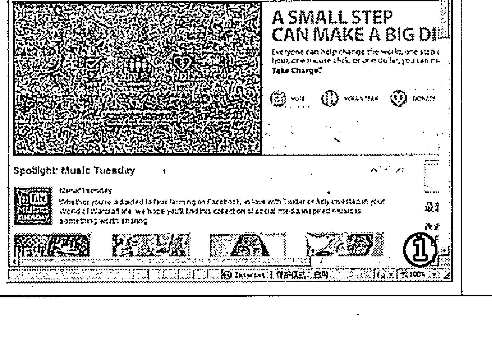这种在线代理服务网站有很多，其中以下两个比较稳定：
- 网址：http://www.netevader.com/，采用glype在线代理系统，页面简洁，但弹窗广告较多，对于中文网页支持较好，没有乱码出现，支持SSL，可以访问Gmail等https网站。如果NetEvader的弹窗广告影响打开链接，可以鼠标右键点链接，在弹出菜单中选“在新选项卡中打开”或“在新窗口中打开”。
- 网址：http://www.zqzj.net/，网站提供了多条代理线路和方式，如果当前代理通道不能连通，可以直接更换另外一个通道进行连接。

小提示：
只要你能正常上网浏览网页，就能成功使用在线代理，使用方便限制最小。不过，也有不少缺点：不同的在线代理速度不一，网址被重新编码，无法查看真实的链接地址，大部分还带有广告，部分老牌的在线代理网站也多数不能正常访问了。

#### 借助SSH安全地逾越鸿沟

小知识：
SSH为Secure Shell的缩写，SSH为建立在应用层和传输层基础上的安全协议。传统的网络服务程序，如FTP、POP和Telnet其本质上都是不安全的，因为它们在网络上用明文传送数据、用户账号和用户口令，很容易受到中间人（man-in-the-middle）攻击方式的攻击，就是存在另一个人或者一台机器冒充真正的服务器接收用户传给服务器的数据，然后再冒充用户把数据传给真正的服务器。而SSH是目前较可靠，专为远程登录会话和其他网络服务提供安全性的协议。利用SSH协议可以有效防止远程管理过程中的信息泄露问题。透过SSH可以对所有传输的数据进行加密，也能够防止DNS欺骗和IP欺骗。SSH另一项优点为其传输的数据是经过压缩的，所以可以加快传输的速度。SSH有很多功能，它既可以代替Telnet，又可以为FTP、POP、甚至为PPP提供一个安全的“通道”。

使用在线代理服务网站虽然方便，但在安全性方面就无法做到最安全，而使用SSH代理方式就能消除安全隐患，这也是很多高手朋友所采用的一种方式，使用起来稍微麻烦些：
- 第一步：获得SSH账号，如果图省事，可以直接在淘宝中购买一个SSH代理账号（以“ssh账号”为关键字在淘宝网搜索），如果不怕麻烦，也可以申请免费的SSH代理账号，网上有很多免费的SSH账号申请方式，以及一些网友直接提供的免费SSH账号，例如http://www.cjb.net/就能申请到免费的SSH账号：打开网站首页，点击“Free Shell Account”右侧的“sign up”，按照提示输入相关信息（见图2）。

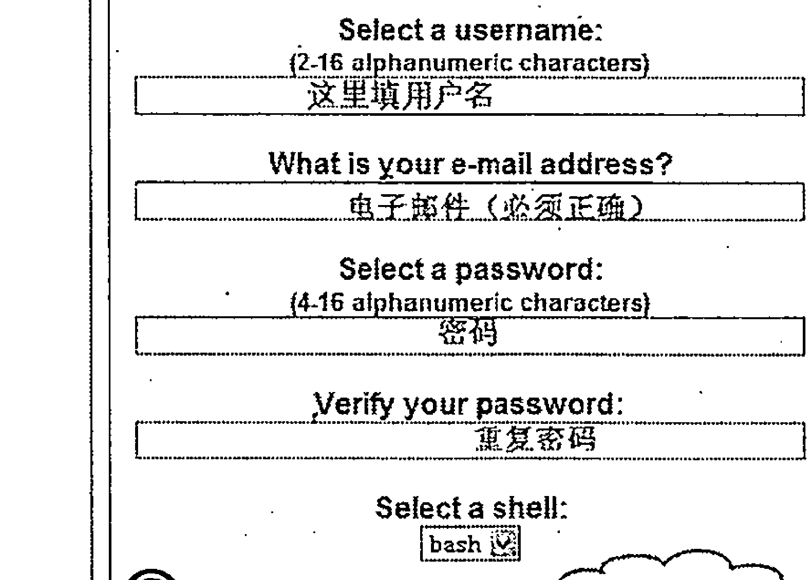

稍后将会收到一封激活邮件，打开后点击激活链接，稍候就会收到包含SSH代理账号、密码的邮件（见图3）。

- 第二步：运行myentunnel，在“Settings”选项卡中将SSH代理服务器账号、密码输入，记住软件默认的代理端口（7070），单击“Connect”按钮连接（见图4）。

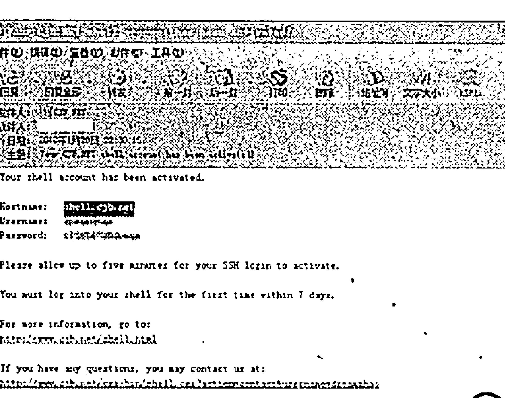

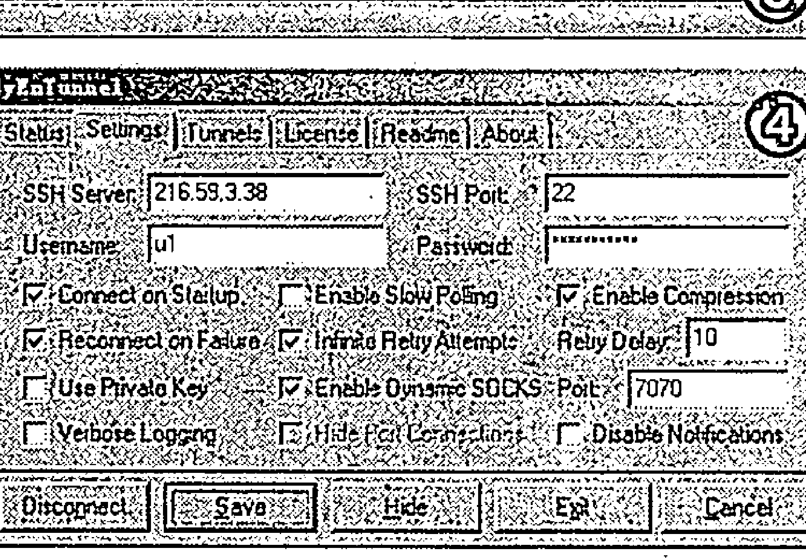

“删除”按钮下面的“设置”按钮并在打开的窗口中指定代理服务器，如果是在局域网环境下，单击“局域网设置”，在打开的窗口中指定代理服务器参数（见图5）。

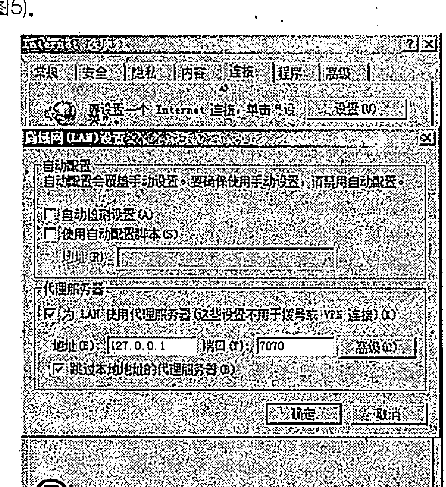

- 第三步：打开浏览器，然后设置代理服务器为“127.0.0.1”，端口为“7070”，代理方式为Socks5代理即可。以IE为例：单击菜单“工具→Internet选项”，选择“连接”，如果使用的是拨号上网方式，请单击“设置”，在打开的窗口中指定代理服务器；如果使用的是局域网方式，则单击“局域网设置”，在打开的窗口中指定代理服务器。

#### 使用智能代理软件逾越鸿沟

比SSH来得更方便些代理方案还有智能代理软件的应用，而且速度比较快：
- 逍遥游：直接运行后，它能自动执行代理功能并完成对IE浏览器的代理参数设置，打开IE浏览器后就能毫无障碍地访问各个网站了，而且速度相当快。
- 无界浏览：直接运行后也能自动进行代理功能，自动对IE浏览器进行代理参数设置，启动IE后即可无限制地访问各个网站了，速度很快。
- PUFF智能代理：安装运行后，遇到无法访问的网站时，只要单击“IE via Proxy”按钮会自动启动IE浏览器并使用代理，直接访问受限网站了。

#### 法拉利

#### 一骑绝尘的穿越

- ★车型类别：跑车
- ★车身长度：一款软件的大小
- ★车型特征：加速浏览，访问曾经无法访问的地方
- ★代表车型：2009款法拉利California
- ★车型特征：超强推背感，无限的加速性能
- ★市场售价：348万元

比起免费的小工具来说，有些朋友想要体验快速访问国外网址，就必须使用VPN这样的“重型”武器了，它能让速度成倍的提高。其中也有不少免费的哦！VPN是“Virtual Private Network”的缩写，是一种常用于连接中、大型企业或团体与团体间的私人网络的通讯方法。虚拟私人网络的信息透过公用的网络架构（例如互联网）来传送内互联网的网络讯息。通过VPN也可以达到逾越各种限制的目的。

现在也有不少免费的VPN服务器可用，只要在自己的电脑中稍加设置，使用VPN连接上网，就能突破限制。

#### 免费的VPN98代理

VPN98是一个不错的免费VPN代理服务，使用起来也很简单：

- 第一步：打开http://www.vpn98.com/，点击页面底端的“VPN98免费注册使用开放中！点击注册！”链接，按照页面提示注册一个VPN账号。
- 第二步：申请到账号并登录后请点击导航栏中的“如何设置”按钮，在列表中根据自己的系统点选相应的设置教程。例如点击“Windows 7”链接后便可打开Windows 7系统的VPN设置（见图6）。

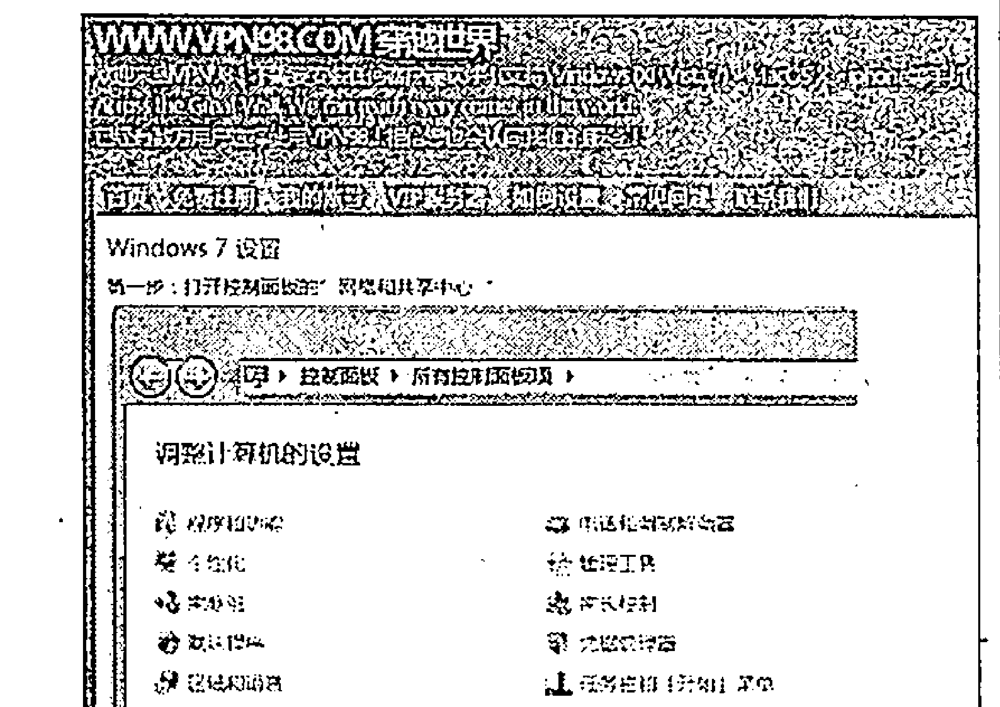

设置完成后便会在网络连接中多出一个“vpn98”的链接（见图7），先按正常方法连接到因特网，然后直接启动这个VPN连接即可，这样，系统中的所有网络数据都将通过这个VPN连接，打开浏览器即可正常访问各个网站了。

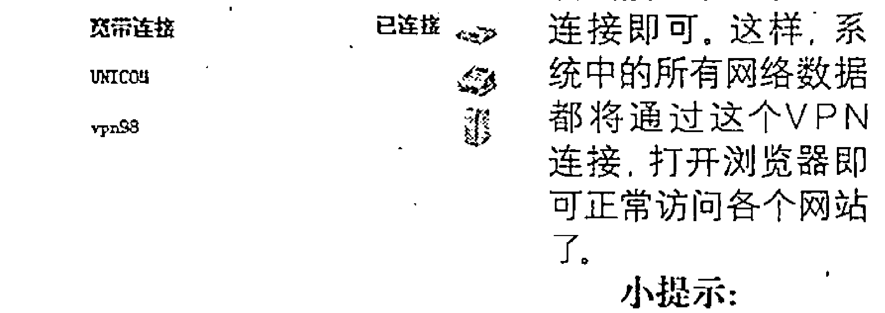

小提示：
免费VPN账号一个月只能使用2GB流量，每次连接20分钟后会自动断开一次，断开后需要5分钟后方可再次连接。此外，免费VPN账号不能进行BT、迅雷等大流量下载，若有需求，只花钱升级为VIP账户，再购买相应的流量。

#### 免费的PacketiX VPN Client

这是一个以客户端软件的形式提供的VPN服务，使用起来更稳定：

- 第一步：进入http://www.packetix.net/en/secure/install/页面，有两种安装方式，一种是“Installation by ActiveX Control”，浏览器弹出警告窗口进行安装，另一种是手动安装“Manual Installation”，前者安装后自动配置，后者需要手动设置。如果网速不是很快，干脆用手动方式，根据操作系统下载相应的“PacketiX VPN Client”安装版本。
- 第二步：从http://www.packetix.net/en/secure/secure.vpn下载一个配置文件，然后运行“PacketiX VPN Client Manager”，在主窗口界面中选择Connect菜单，选择“import vpn connection setting”找到并导入下载的secure.vpn文件就可以了，此时便创建了一个名称为secure的新连接，在“secure”这个连接上右击并选择“connect”进行连接，在打开的窗口中选择“agree to the terms of services and start connection”（同意条款），弹出正在连接窗口，连接成功后状态变成“connected”（已连接）即可（见图8）。

如果想断开连接，右键单击，选择disconnect。

小提示：
如果连接成功但是IP地址并没有改变的话，检查一下服务管理器中的“DHCP Client”服务是否为“已启动”，如果你想卸载软件，有个本地网络连接无法删除，此时右击该连接并选择“属性”→配置→驱动程序→卸载”即可将其卸载。

#### 免费VPN推荐：

- （1）AnonymityNetwork免费VPN代理（http://www.anonymitynetwork.com），使用邮箱注册，但每个邮箱账户限制免费试用3小时，最多使用512MB流量，无需下载VPN软件，直接在操作系统中设置即可，更加方便、安全。
- （2）FocusVPN（http://www.focusvpn.com/trial.htm），新用户可享受免费试用体验，免费VPN可使用4个小时，仅允许HTTP和ICMP连接，最大速度限128kbps，申请简单。提交申请FocusVPN免费试用后，就会收到FocusVPN发来的邮件，其中有你的用户名、密码、VPN服务器地址、客户端软件（一般不用客户端，在网络连接中设置即可）。

#### QQ

#### 能“聊”就成的小车

- ★车型类别：微型车
- ★车身长度：一行网址
- ★车型特征：短小、一次最多140字
- ★代表车型：奇瑞QQme
- ★车型特征：无任何加速快感，交通工具而已
- ★市场售价：5.5万元

不少朋友都是Twitter、做啥网的粉丝，但正常情况下，这两个网站都很难再访问，通过上面的方法可以突破限制，不过，使用“八哥”这个小工具，玩起来更得心应手，与QQ聊天差不多。

#### 第一步：

打开八哥网站http://bage.me/，点击“立刻免费下载”按钮，如果系统中之前没有安装Adobe AIR，此时就会先安装此平台，等安装结束后再安装“八哥”。

#### 第二步：

安装成功后直接运行“八哥”，在登录窗口中直接输入Twitter或做啥的账号、密码即可登录，登录后使用起来如同QQ聊天（见图9）。

图策划/《电脑爱好者》编辑部
图监制/Cornel
撰稿/dai

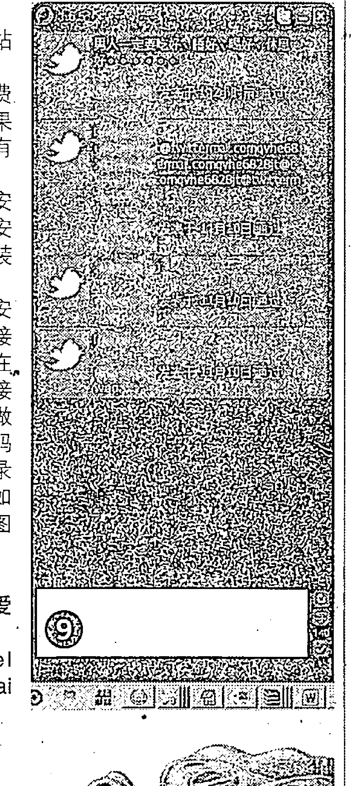

### 买一送一 AMD 8系列芯片组玩法大解析

要说整个DIY市场上最喜欢玩花样的是谁？那无疑是AMD莫属，前有狼（NVIDIA）后有虎（Intel），日子过得那真是相当的辛苦。但怎奈AMD抓准了市场的空挡，扔出一款款性能不俗但价格又非常靠谱的产品。“小核心”战术让NVIDIA落了下风，而平滑升级、整合显卡以及让人欢喜让人忧的“开核”更是成为了对战Intel的有力武器。

虽然处理器、显卡看起来四面皆兵，但是在A系芯片组领域AMD还是一家独大。回想7系列芯片组已经发布1年半，即使有马甲785G（下面会解释为何叫785G是马甲）临危受命出来顶了一阵子，可是再难产的8系列芯片组也是时候该来了……

#### 新平台一代号 Leo（狮子）

从最早在2007年的“Spider（蜘蛛）”到2008年的“Dragon（龙）”，再到现在的“Leo（狮子）”，AMD的主流“3A”平台概念已经平稳的过渡到了第三代。不单如此，“3A”平台还对市场定位进行了二次划分，比如在之前的第二代“3A”平台中，由羿龙II 790FX/GX+HD4000组成的叫做“龙”平台；而由速龙II+785G+整合显卡组成的叫做“双鱼座/棕熊（Pisces/Kodiak）平台”。

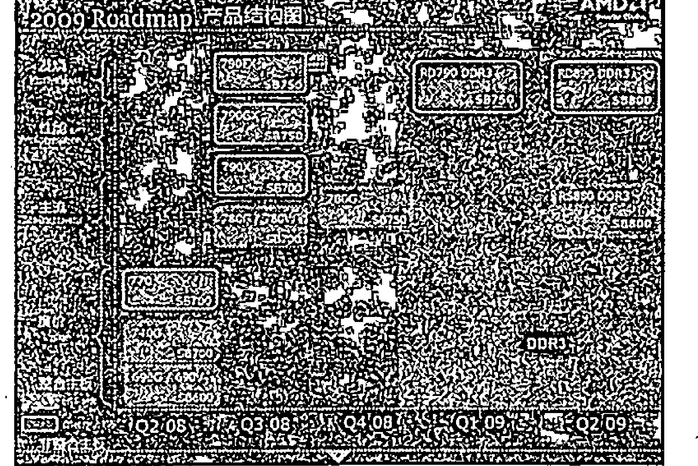

发布已近两年的780G显得非常老态龙钟，不但对第三代接口（USB 3.0，SATA 6Gb/s）无法提供支持，甚至也不支持DDR3（采用SB700南桥的老版780G）。

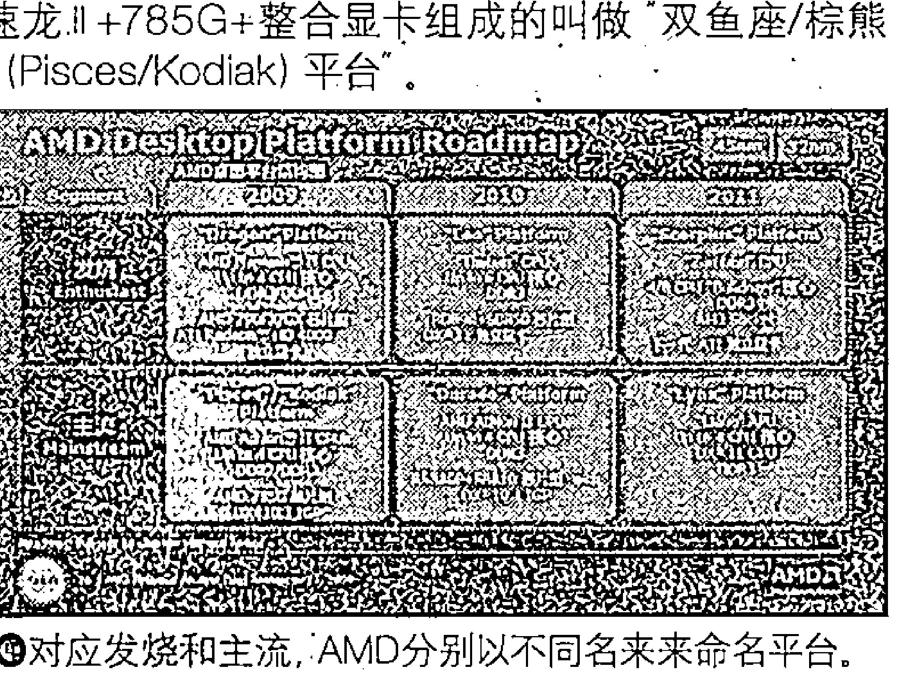

对应发烧和主流，AMD分别以不同名来命名平台。

而在新一代平台中也是如此划分的，由6核羿龙II+890GX+HD5000系列独立显卡组成的叫做“狮子”平台；同样的由速龙II 4核+880G+整合显卡组成的叫做“剑鱼（Dorado）平台”。

#### 初探狮子，剖析相同与不同

既然是新一代产品，那么大家肯定更关心的是它的性能、参数、功能怎样。我们先来看一看它和上一代产品的异同之处好了。

#### 简化

##### 简化之一：内存仅支持DDR3

随着AM2/AM2+逐渐的退市，想必也没有什么理由再去进行接口兼容了。全面使用DDR3不但会减少主板的细分型号（DDR2一个版本，DDR3一个版本，DDR2+DDR3一个版本），并且能进一步简化处理器集成的内存控制器复杂程度。

##### 简化之二：ACC模块消失

ACC模块的消失让很多人痛心不已，这不是意味着“开核”的死亡吗？AMD这么做确实是想堵住开核的漏洞，即使放弃了一部分超频能力也要阻止这个扰乱市场行为的开核。

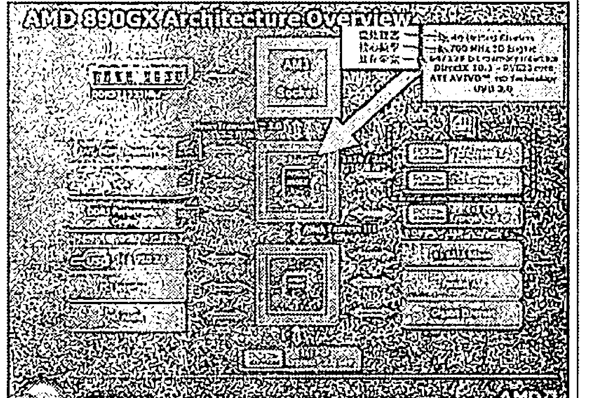

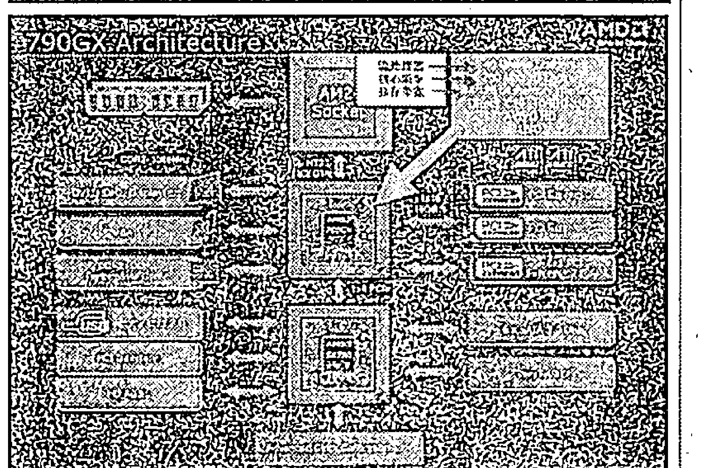

我们可以由结构图中看出，事实上890GX和790GX整体架构是几乎相同的，不同的是很多功能模块的升级和删减。

> **小知识：ACC为何能提高超频能力？**
> ACC时钟校验通过特殊的6pin接口与AM2+处理器接口相互连接，形成信号通路，从而对CPU的时钟频率及运算误差进行校正。这种功能允许CPU在工作的过程中出错后，不会导致系统挂起或瘫痪。


#### 改进

##### 改进之一：原生SATA 6Gb/s

SATA接口的升级是890GX上最大的亮点，在之前的一些评测中我们也谈到在此之前主板的SATA 6Gb/s全部是用第三方芯片来转接的，第三方芯片在设计上受到整个芯片组结构的种种制约使得实际性能与理论性能还有一定的差距。

##### 改进之二：南桥上的PCI-E

看到结构图上南桥的2条PCI-E，让人不明白这到底是何用意，但其实很简单，这是AMD为USB 3.0提供的“专用”通道（当然也可以用来作别的），这样就避免了使用第三方控制芯片时还要去北桥“借”通道。

##### 改进之三：板载显卡升级

如果说790GX的板载显卡是HD3000系列，那么890GX上的显卡就是HD4000系列，DirectX 10.1的支持以及UVD的升级让890GX内板载的显卡有了一个不错的功能性能和参数上的升级。

#### 785、880说不清道不明的关系

从上述分析中我们能看出，此款新一代平台说实实在在是没有什么太大的改动，尤其在对性能影响较大的北桥上除了板载显卡的改进外，只是删减了一些不必要的组件。而整个升级集中在南桥上，无论是SATA 6Gb/s还是额外的PCI-E通道。

| 芯片组 | 核心代号 | GPU | 支持CPU | 南桥 | 功耗 |
| :--- | :--- | :--- | :--- | :--- | :--- |
| 890GX | RS880 | HD 4290/700MHz | Phenom II全系列 | SB850 | 22W |
| 880G | RS880P | HD 4250/560MHz | Athlon64 II全系列 | SB810 | 18W |
| 785G | RS880D | HD 4200/500MHz | Athlon64 II全系列 | SB710 | 15W |

⑦785、880、890参数比较

相对于785G的显卡880G所搭配的显卡HD 4250频率提升有限，与890GX所搭配的HD 4290高达700MHz的主频相差不少，南桥上880G使用的是890GX使用的南桥SB850的精简版本SB810，处理器方面，880G和785G一样可以支持Athlon64 II X2全系列的产品，不过功耗上面880G要高一点，毕竟GPU的频率提高了。

尽管880G的规格平平，但是主板厂商的实际运作却不尽然，880G不仅可以支持六核心处理器，而且更有厂商将南桥更换为搭配890GX的SB850芯片，以此支持SATA 6Gbps扩展功能，最重要的是，其价格基本与785G持平，面对这样的诱惑，显然785G就不如880G主板划算了。

从目前的测试成绩来看，880G芯片组主板的图形性能介于890GX和785G之间，与785G之间有13%左右的性能差距，其他方面则由于基本规格一致没有什么改变。但是，在超频潜力上880G提升较大，不少品牌的880G主板图形核心可以从默认560MHz提升到800MHz甚至更高，性价比显然要高出785G芯片组主板不少。

#### 8 系列“一键开核”超简单

对于AMD处理器来说，“开核”无疑是这一年多来的最大热点，不过随着新款芯片组890GX+SB850的发布，AMD已经悄然屏蔽了开核所必需的ACC功能。


但当我们拿到华硕M4A89GTD PRO的时候这些问题就迎刃而解了，印在包装箱上一角的Core Unlocker（内核解锁）图标让人眼前一亮，这……这不就是传说中的开核吗？废话少说，上CPU测试……

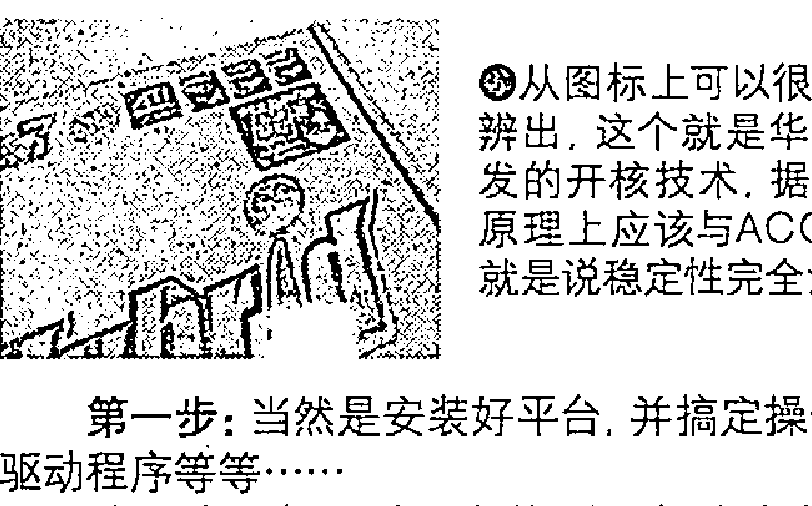

- 第一步：当然是安装好平台，并搞定操作系统、驱动程序等等……
- 第二步：参照说明书找到主板内存插槽旁的CORE UNLOCKER开关并打开，红灯将会自动亮起，主板会自动帮你把CPU开核；

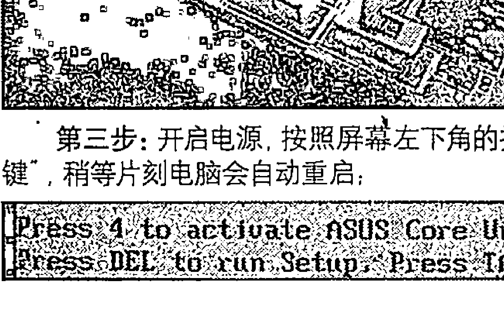

- 第三步：开启电源，按照屏幕左下角的提示按“4”键，稍等片刻电脑会自动重启；

Press 4 to activate ASUS Core Unlocker
Press DEL to run Setup Press Tab to d

- 第四步：重启后观察屏幕左下角，如提示“4 Cores are activated（4个核心已激活）”，那么可以确定开核成功
- 第五步：什么？进不去系统了？那看来是CPU体质不行，4个核心中有残缺品，我们进入BIOS界面，选择Advanced选项卡，选择Active CPU Cores（激活CPU核心）更改为3 Core。需要说明的是3 Core应该有两个，分别对应CPU的0、1、2核心和CPU的0、1、3核心，需要分别测试到底哪个稳定一些才行。

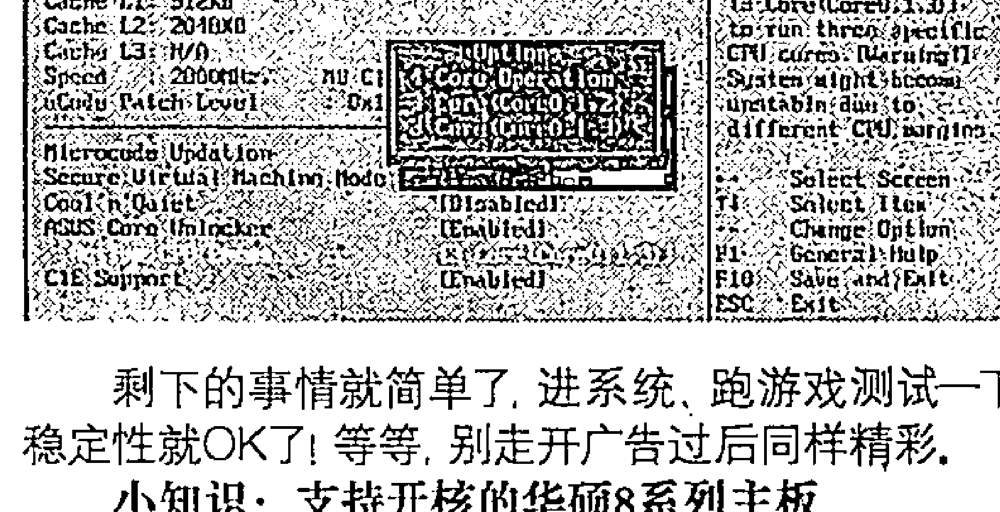

剩下的事情就简单了，进系统，跑游戏测试一下稳定性就OK了！等等，别走开广告过后同样精彩。

#### 小知识：支持开核的华硕8系列主板

| 芯片组 | 型号 | BIOS版本 | TurboV EVO版本 |
| :--- | :--- | :--- | :--- |
| 890GX | M4A89GTD Pro/USB3 | 1208或更高 | TurboV EVO V1.02.20 |
| | M4A89GTD Pro | 1208或更高 | TurboV EVO V1.02.20 |
| 890FX | Crosshair IV Formula | 默認支持 | |
| | M4A89TD Pro/USB3 | | |
| | M4A89TD Pro | | |
| 880G | M4A88TD-V EVO/USB3 | | |
| | M4A88TD-V EVO | | |
| | M4A88TD-M EVO/USB3 | | |
| | M4A88TD-M/USB3 | | |
| | M4A88TD-M | | |
| | M4A88T-M/USB3 | | |
| | M4A88T-M | | |
| 870 | M4A87TD EVO | | |
| | M4A87TD/USB3 | | |
| | M4A87TD | | |

| 芯片组 | Chipset | Intel GMA HD | Intel G45 | AMD 890GX | AMD 785G | AMD 790GX | AMD 780G | Nvidia GeForce 9400 | Nvidia GeForce 9300 | Nvidia GeForce 8200 |
| :--- | :--- | :--- | :--- | :--- | :--- | :--- | :--- | :--- | :--- | :--- |
| 处理器支持 | Processor Support | Core i3 and i5 | LGA775 | AM3 | AM3/AM2+ | AM2/AM2+ | AM2/AM2+ | LGA775 | LGA775 | AM2/AM2+ |
| 内存支持 | Memory Support | DDR3-1066/1333 | DDR2-667/800/DDR3-800/1066 | DDR3 | DDR3/DDR2 | DDR2 | DDR2 | DDR2-800/DDR3-1333 | DDR2-800/DDR3-1333 | DDR2 |
| 显示核心 | Graphics Core | GMA HD | GMA X4500HD | Radeon HD 4290 | Radeon HD 4200 | Radeon HD 3300 | Radeon HD 3200 | GeForce 9400 | GeForce 9300 | GeForce 8200 |
| | PCI-Express 2.0 | 16 | 22 | 22 | 22 | 22 | 22 | 20 | 20 | 19 |
| 板载显存 | Local Frame Buffer | NA | NA | DDR3 | DDR3 | DDR2/DDR3 | DDR2/DDR3 | NA | NA | NA |
| 流处理器 | Unified Shaders | 12 | 10 | 40 (8 set of 5) | 40 (8 set of 5) | 40 (8 set of 5) | 40 (8 set of 5) | 16 | 16 | 16 |
| 流处理器频率 | Stream/Shader Clock | NA | NA | NA | NA | NA | NA | 1,400MHz | 1,200MHz | 1,200MHz |
| GPU频率 | GPU Clock Speed | 733-900MHz | 800MHz | 700MHz | 500MHz | 700MHz | 500MHz | 580MHz | 450MHz | 500MHz |
| DX版本 | DirectX Level | 10 | 10 | 10.1 | 10.1 | 10 | 10 | 10 | 10 | 10 |
| 多显卡支持 | Multi-GPU | No | No | CrossFire 2x8, Hybrid CrossFire | Hybrid CrossFire | CrossFire 2x8, Hybrid CrossFire | Hybrid CrossFire | GeForce Boost | GeForce Boost | GeForce Boost |
| 视频加速 | Video Acceleration | ClearVideo HD | ClearVideo HD | AVIVO HD (UVD 2.0) | AVIVO HD (UVD 2.0) | AVIVO HD (UVD 1.0) | AVIVO HD (UVD 1.0) | PureVideo HD | PureVideo HD | PureVideo HD |
| 显示接口 | Native Display Options | DVI, HDMI, Display Port, d-sub | VGA (extras added by external TMDs) | DVI, HDMI, Display Port, d-Sub | DVI, HDMI, Display Port, d-Sub | DVI, HDMI, Display Port, d-Sub | DVI, HDMI, Display Port, d-Sub | Dual DVI, HDMI, Display Port, d-Sub | Dual DVI, HDMI, Display Port, d-Sub | HDMI, DVI, d-Sub |
| 双数显输出 | Two Digital Displays | Yes (Manuf. Choice) | NA | No | No | No | No | Yes | Yes | No |
| HDCP | HDCP | Yes | Yes (Usually) | Yes | Yes | Yes | Yes | Yes | Yes | Yes |
| LPCM 7.1 Audio | LPCM 7.1 Audio | Yes | Yes (Usually) | Yes | Yes | No | No | Yes | Yes | Yes |
| 南桥 | Associated Southbridge | P55/H55/H57 | ICH10/ICH10R | SB850 | SB750 | SB750/SB710 | SB710 | Single Chip | Single Chip | Single Chip |
| SATA | SATA | 6x 3Gbps | 6x 3Gbps | 6x 6Gbps | 6x 3Gbps | 6x 3Gbps | 6x 3Gbps | 6x 3Gbps | 6x 3Gbps | 6x 3Gbps |
| RAID | RAID | 0,1,10,5 (with H57 only) | 0,1,10,5 (with ICH10R) | 0,1,10,5 | 0,1,10 | 0,1,10,5 (with SB750) | 0,1,10 | 0,1,10,5 | 0,1,10,5 | 0,1,10,5 |
| NCQ | NCQ | Yes | Yes | Yes | Yes | Yes | Yes | Yes | Yes | Yes |
| ACHI | AHCI | Yes | Yes | Yes | Yes | Yes | Yes | Yes | Yes | Yes |
| PHY Ethernet | PHY Ethernet | GbE | GbE | GbE | NA | NA | NA | GbE | GbE | GbE |
| USB 2.0 | USB 2.0 | 12+2 1.1 | 12+2 1.1 | 14 | 12+2 1.1 | 12+2 1.1 | 12+2 1.1 | 12+2 1.1 | 12+2 1.1 | 12 |
| 制程工艺 | Manuf. Technology | 45nm+65nm | 65nm | 55nm | 55nm | 55nm | 55nm | 65nm | 65nm | 65nm |

②890GX、790GX与竞争对手的统芯片组参数详解## 睿频加速，这个可以有

Intel睿频加速技术是Intel最新Nehalem微架构处理器内建的一项创新技术，它可以根据实际运行的应用程序的需求，动态地增加处理器内核的运行频率来提高处理器的运行性能，同时保持处理器继续运行在处理器技术规范限定的功耗、电流、电压和温度范围内。“内功修为”长久利于“强身健体”。

那么常理来讲既然是Intel的技术，必然AMD是无福享受了。但其实不然，今天我们拿到的这款主板带有的“Turbo Unlocker”技术，却是与睿频有着异曲同工之妙。有人可能会说，那个山寨睿频不是羿龙II x6上的新功能吗？老CPU怎么可能支持？华硕Turbo Unlocker技术和AMD的山寨睿频——Turbo Core最大的不同之处，是华硕Turbo Unlocker技术可以支持目前已有的Phenom II黑盒版处理器。众所周知，AMD的黑盒版处理器具有不锁倍频的特点。在超频玩家中，黑盒版的处理器视为“极品”。华硕Turbo Unlocker技术针对黑盒处理器不锁倍频的特点，能够对倍频进行动态超频。

- 第一步：安装主板自带的TurboV EVO软件并开启；
- 第二步：点击上方的Manual按钮，然后选择下方CPU Ratio选项卡并将Turbo Unlocker更改为开启，这样就开启了自动超频功能，但这还远远不够；
- 第三步：点击上方Auto Tuning按钮，然后点击下方More Settings按钮；
- 第四步：在展开的界面中选择Fast Tuning，并点击Start按钮；
- 稍等片刻，这样自动超频+手动超频的结果会让你有一个惊喜，不过需要说明的是，在使用老的羿龙II时，并不能达到与睿频一样自动开关核心的效果，只能达到自动升降频的功能。想要完全实现睿频的功能还是要羿龙II x6系列CPU的支持。

### 高清硬解码，双流我能行

而如果谈到高清视频解码方面，那么ATI的这一优势将会更加明显了。从最早的HD 2000系列产品开始，ATI一直在高清视频解码方面比对手拥有更加明显的优势。而到了HD 4000产品时代，ATI再次推出了新一代的UVD 2.0引擎，让原本已经非常出色的UVD引擎得到了更加完美的升级。此次发布的890GX板载显卡对这些特性也都全部完整支持。我们以完美解码（下载地址：http://jm.wmzhe.com/）为例，看看UVD 2.0是怎样设置硬解码的。

- 第一步：打开完美解码设置（解码中心设置）；
- 第二步：解码模式选择ATI UVD→视频渲染器，VMR9无渲染（修正黑位）；
- 第三步：打开完美解码，按F2进入参数设置，点击最下面的设置管理，新建设置后勾选“在手工切换一个预设后重新打开当前文件”，勾选FourCC，在右边填入MPG2，勾选“使用默认预设启动KMPLAYER”；
- 第四步：返回完美解码设置（解码中心设置）选择解码模式为ATI UVD，视频渲染器为EVR增强渲染（C/A）。

这样新来的UVD 2.0就能很好的工作在完美解码之中了，当然终极解码等软件的设置大同小异，暴风、QQ之流基本无脑自动就好了。

### 有智慧 更强大——华硕AMD 8系列智能加速主板发布

2010年3月1日AMD推出了新一代旗舰级产品890GX，这款产品的推出带来了性能最好的整合显示芯片、原生支持SATA 6Gb/s接口和USB3.0等多项新技术。时隔一个多月，AMD全系列8系产品正式发布，AMD的8系时代正式到来！在AMD正式发布8系芯片之际，华硕也同时发布多款8系列芯片组产品。发布的产品包括890GX、890FX、880G和870四个芯片组系列，共11款产品。这11款产品的发布，象征着华硕的8系军团正式进军AMD平台市场。

### 8系上市 没有硝烟的战争

### 华硕 M4A89GTD PRO/USB3主板

这款主板具备众多混合Hybrid技术，主板自身采用高端黑色PCB设计，整体颜色搭配蓝白色体系，板型为大家熟悉的标准ATX结构；主板整体元件选择和布局合理高效。

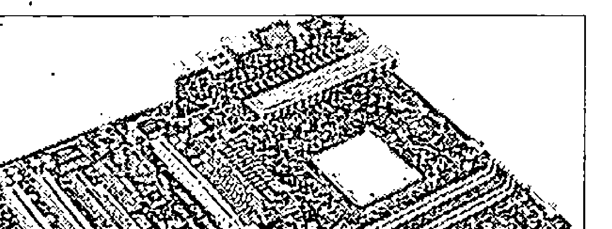

主板采用了890GX+SB850组合，由于采用DDR3内存插槽，不能向下支持AM2+接口的老款处理器。华硕这款主板采用了8+2相回路供电设计，其中8相为处理器供电部分，另外2相则是为内存控制器和HT总线供电。华硕“巅峰设计”(Xtreme Design)系列主板提供了第三代强化散热技术Stack Cool 3（增加的2盎司铜层PCB设计，并且优化了主板电路的信号）。它通过增加PCB供电和接地层的铜层的厚度，使得它的运行温度和稳定性进一步提高。

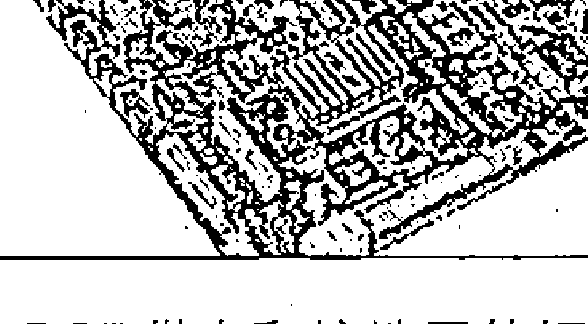

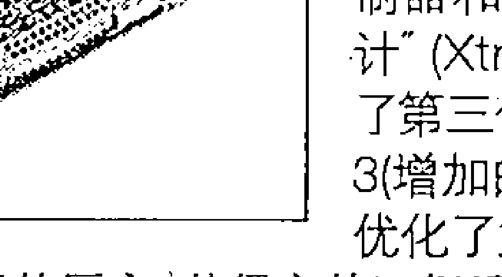


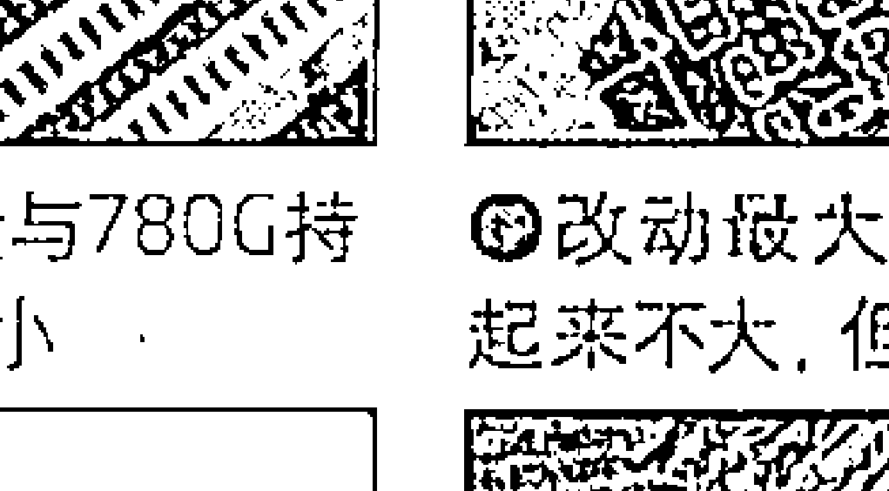

### 技嘉GA-880GMA-UD2H主板

技嘉GA-880GMA-UD2H主板基于880G芯片组，采用2盎司铜PCB，Micro ATX小板型设计，通过NEC USB 3.0芯片，提供有3倍电力的USB3.0接口。


这款产品南桥采用SB850芯片，与原本搭配880G芯片的SB810不同，SB850拥有对SATA 6Gbps的原生支持，在保证了用户可以享受到高速磁盘性能的同时节省了第三方芯片加入的成本。880G北桥芯片集成Radeon HD4250显示核心，它与890GX所集成的HD4290一样同样来源于RV620，支持DX10.1，拥有40个流处理器，官方工作频率为200-560MHz，但用户可以通过BIOS对GPU频率进行超频。

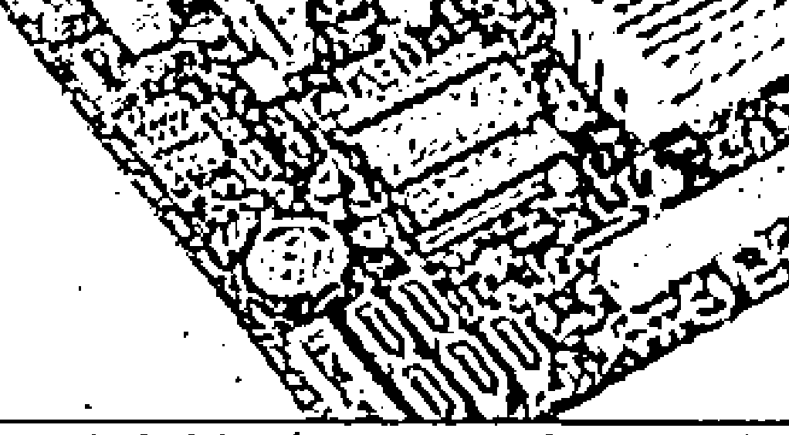

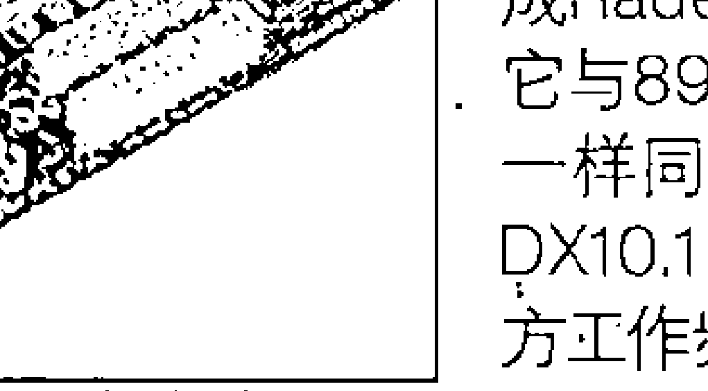


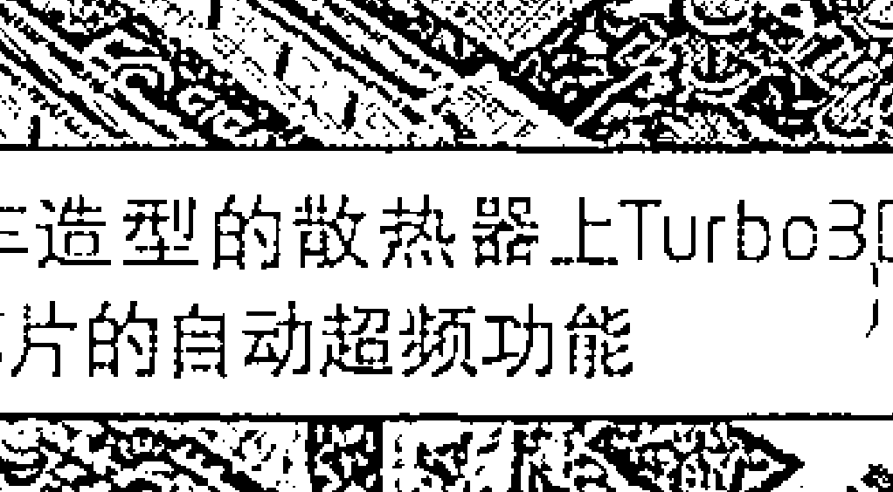

AMD展出了一个有史以来最庞大的阵营：780G、870、785G、880G、890FX、890GX，他们之间有不同之处但也有相同之处，我们的目标自然不能只选贵的不选对的。相对于785G并没有本质升级的890GX能否成功接过790GX的枪？880G与785G的暧昧关系是怎样？870还是890FX，非整合主板该选谁，请您持续关注CFan评测室的后续报道……

■策划/《电脑爱好者》编辑部
■监制/Alpha
■撰稿/west Alpha CT milk

### 低配置玩高清的7道必杀技

要想像“钢铁侠”那样武装自己的电脑来看高清电影，之前就需要了解高清相关的参数，只有对其充分了解，才能打造出最佳看高清武器平台，提高战斗力。

#### 1. HDTV

是High Definition Television的简写，对应中文“高清晰度数字电视输出技术”，中文简称高清，可提供相对于传统模拟电视技术更高清晰度图像质量。HDTV的高清晰主要表现在它支持1280×720，1920×1080，分别有720p，1080i/1080P之分。

#### 2. 720p、1080i、1080p

说到高清，经常会看到电影描述里有这三组数字的身影。其实，它们是指电影的分辨率，其中720是指1280×720，1080是指1920×1080的分辨率，而i代表Interlace（隔行扫描），p代表Progressive（逐行扫描），720p与1080i的带宽是一样的，在清晰度自然是1080i高一些，但在动态画面表现方面720p更好。而1080p则兼顾了清晰度以及动态表现的要求，也就是大家所说的FULL HD（全高清），但它也是对码率、存储空间要求最高的格式。比如《阿凡达》这部电影的720p版是11GB，而1080p的DTS版则有45.61GB之大，从这两个数值就能看出这两个分辨率标准之间的差别了（见图1）。

#### 3. H.264/X.264/VC-1

在视频编解码技术定义方面有两大标准机构。国际电信联盟（ITU）致力于电信应用，已经开发了用于低比特率视频电话的H.26x标准，其中包括H.261、H.262、H.263与H.264；国际标准化组织（ISO）主要针对消费类应用，已经针对运动图像压缩定义了MPEG标准，MPEG标准包括MPEG1、MPEG2与MPEG4。

X.264起源于H.264技术，是H.264的变种版本。与H.264相比，X.264是针对业余市场推出的一个免费编码格式，是H.264的子集，只能能实现H.264的部分功能。X.264多见于网络上流传的重压缩的视频内容。

对于电影行业中的人来说，2010年是一个大日子，《阿凡达》全球票房已经超过27亿美元，把泰坦尼克号远远甩在身后……
这是最好的时代，电影出现100年后，赢来了超级繁荣……
这是最坏的时代，高清设备进入家庭已经大势所趋，人们更关心客厅的试听效果……
《黄飞鸿3之狮王争霸》里有一句台词：“蒸汽机的出现推动了工业革命，因为它的出现，这个世界将有新的贵族”。如同信息时代的到来使权力将转入比尔·盖茨式的人手中一样，人们对于视觉享受的追求也开始发生着转换——不管你乐意与否，机器与钢铁逐渐进入到人类的生活，并改变了人类的生活。若干年后，“电影院”有可能会作为一种古董出现了……
不要以为骑车上班、不开空调才是低碳环保，其实当你在假日不再去挤影院，在家中用一台功耗不高、性能不差的HTPC组成你的家庭影院播放电影时，你已经为节能减排做了足够的贡献——最重要的是，你的视觉享受没有减分；舒适度却成倍提高！要想看高清电影，之前你必须学会“钢铁侠”武装自己的技术，不论是胳膊还是腿，都要武装好，之后才能真正地享受到高清带来的乐趣。

#### Q1 ～ Q4：基础

4道必答题扫清障碍

问：一台老机，配置较低，看720p电影时比较流畅，只是CPU占用率在90%以上，打开1080p时，根本无法播放，只要打开影片，CPU占用率就瞬间达到100%。请问这种无法更换显卡的情况下，如何实现在这台电脑上看1080p高清电影？
答：可以通过添加一块视频硬解卡来实现，例如“BroadCom博通 视频硬解压卡BCM970012”就能帮助解决问题，安装后可以大幅降低CPU占用率，进而解决播放卡的现象。

问：购买一台高清播放器后，能不能直接通过网络播放存储在电脑中的高清电影？
答：播放器可以支持直接播放局域网电脑中的高清视频，不过，高清视频需要较高的网络传输速率才能胜任，否则会出现卡的现象。而很多播放器标注支持100Mbps，但实际上可能10Mbps都达不到，此外，还需要电脑中的网卡支持100Mbps以上的速率，否则也不能顺畅地播放。

问：看高清电影，哪种视频编码格式对CPU的资源占用率较高？
答：经过实际测试，对CPU资源占用率最高的为H.264，其次是VC-1，而MPEG-4编码格式的视频对CPU占用率最低。

问：使用KMPlayer播放器看H.264编码格式的高清电影，请问如何开启硬件加速功能？
答：分两种情况，情况一：安装PowerDVD后直接使用该播放器自带的H.264解码器，设置方法：在解码器设置窗口中通过搜索功能搜索出所有外部解码器，然后将H.264的解码器直接设置成PowerDVD的H.264解码器即可直接开启硬件加速，再单击“设置”按钮即可进入对解码器进行调节，将“USE DxVA”的选项选中即可。
情况二：使用完美解码或是终极解码，设置方法：只要在解码器设置中将H.264的解码器设置成“Cyberlink(DxVA)”中，将分离器设置为“Haali”。

#### Q5 “钢铁盔甲”是不是一定很费钱？

《钢铁侠》电影中制作钢铁盔甲的材料是由恐怖分子提供，用来制作先进武器的，然后由“钢铁侠”巧妙打造出坚不可摧的钢铁盔甲。那么，在电脑中看高清电影，我们该准备哪些材料呢？

##### ★硬件平台—CPU、显卡两者至少有一个较好

要想看高清电影，最基本的就是需要硬件设备能够胜任。那么，到底什么样的设备才能胜任播放高清电影的要求呢？

主板：如果主板支持硬件解码功能，播放高清时就会减少CPU的负担，进而能够享受流畅的画质。现在新出的主板均支持高清硬解。

CPU：理论上说CPU的主频越高越好，最低不能低于1GHz，多核CPU效果更好。说到具体的CPU型号，以下列表中的CPU可以作为最低要求，只要超过此标准的CPU都能胜任：http://dreamzhao.blog.sohu.com/150691345.html

显卡：在硬件方面来说，对显卡要求最苛刻，要想顺畅地看1080p高清电影，显卡必须自带硬件解码功能，否则直接借助CPU来解码，看起来会经常遇到卡的现象。如果你的显卡配置高于上面的测试列表中的显卡也不用担心显卡是否能胜任看高清的问题。

硬盘：通常一部1080p电影的体积最少在20GB，因此，对于硬盘来说，除了操作系统、常规软件，存放一部电影最少也是30GB的空间，要想存放更多的高清电影，建议购买更大的硬盘或是使用硬盘组。

##### ★软件平台—主流播放软件+必要设置

顺畅地看高清电影，需要在系统中安装完整的解码器，需要符合高清播放的播放器（例如PowerDVD、KMPlayer、射手播放器等），需要开启系统的硬件加速功能。满足这样的要求后，软件平台基本上就满足了。

#### Q6 不看FLV 不进影院提升“发烧体温”

编辑部的小特被我们称为“FLV之王”，因为他最喜欢直接在视频网站上看最新大片。网上视频画质虽然不算高，但都特能吹，刚上映的电影网上就敢说有“高清”版本——效果自然极其一般。如果你和小特一样追求时效，希望抢在第一时间看到电影，那么“FLV之王”会给你推荐一些视频网站。如果你的要求更高些，想在家中选择真正的高清画质，那么片源就是一个问题了。虽然在家，但是画质必须足够高才行。

方法一：淘宝直接购买
性价比指数：★
便捷指数：★★★★★
如果不想费劲，直接在淘宝搜索“高清片源”，就可以看到很多高清电影片源，包括蓝光光盘版及硬盘代拷版，如果不讲究性价比，直接掏钱购买，很方便。

方法二：VeryCD中免费找高清
性价比指数：★★★★★
便捷指数：★★★
平时喜欢使用电驴下载的话，直接在http://www.verycd.com或是电驴软件中使用“1080p 电影名”（或“720p 电影名”）来搜索即可直接找到免费可下的高清电影片源了。
与在VeryCD中寻找高清的方法类似，也可以直接在迅雷看看网站（http://www.xunlei.com/）以同样的方式搜索高清片源，然后使用迅雷直接下载。

方法三：PT高清电影站
性价比指数：★★★★★
便捷指数：★★★★★
如果想更直接、快速、即时地找到自己想看的高清电影，则可以直接到更专业的PT高清电影站搜索、下载，往往可以第一时间下载到想要看的最新电影的高清版。现在有很多PT高清电影站，例如：
HDBits：Http://hdbits.ro/、
HDChina：http://hdchina.org/、
CCFBits：http://ccfbits.org/、
HDStar：http://hdstar.org/、
HDRoad：http://hdroad.org/、
OURDisc：http://bt.ourdisc.net/、
PTShow：http://www.ptshow.net。
除了上面的方法外，还可以直接使用搜索引擎或是BT搜索引擎搜索、下载。

| 项目 | 标题 | 分辨率 | 大小 | 发布时间 | 1080p版 | 720p版 | |
| --- | --- | --- | --- | --- | --- | --- | --- |
| 01 | Avatar.2009.BluRay.1080p.AVC.DTS-HD.MA5.1-CHDBits | 阿凡达/化身/天神下凡/神之化身/同名电影/国语中英 | 1080p版 | 11天23时 | 45.61 G | 892 | 135 | 2,875 | Hello |
| 02 | Avatar.2009.BluRay.1080p.DTS.2Audio.x264-CHDBits | 阿凡达/化身/异次元战神/天神下凡/神之化身（国粤） | | 12天01时 | 19.63 G | 1,725 | 167 | 5,879 | CIP |
| 03 | Avatar.2009.BluRay.720p.DTS.2Audio.x264-CHDBits | 阿凡达/化身/异次元战神/天神下凡/神之化身（国粤） | 720p版 | 13天09时 | 11.03 G | 1,340 | 177 | 4,003 | Hello |
| 04 | Avatar.2009.BluRay.1080p.DTSMA.x264.dva-FraMeSToR | 阿凡达/化身/天神下凡/神之化身 | | 241 | 23.02 G | 1 | 9 | 2 | DvF |
| 05 | Avatar.2009.BluRay.DTS-HD.Master.Audio.5.1.Tracks-蔡斯 | 阿凡达英语原盘 DTS-HD Master Audio 5.1音轨 | | 20 | 12天24时 | 4.56 G | 54 | 4 | 251 | DTS |

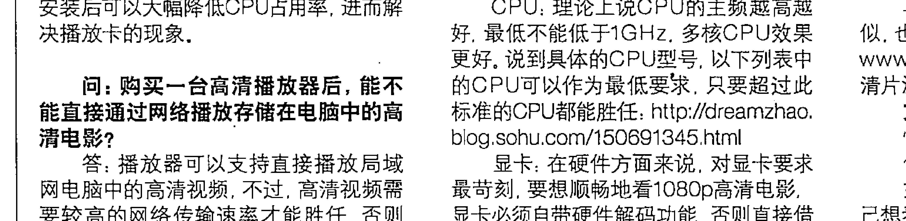

而VC-1则是微软随Windows Media Video 9系列编解码器一道推出的一种编码格式，与H.264优越性相当，在授权费用方面来看也与H.264不相上下，只是一家垄断总会让其他运营商为其担心，在采用率上没有H.264高。

#### 4. TS/MKV

经常见到的高清电影以TS、MKV作为扩展名，而这是两种视频封装格式，用来盛放各种编码格式的视频文件、音频文件，它就像一个碗或是锅，而各种编码格式的视频文件相当于饭，音频文件相当于菜。TS、MKV都是这样的容器，可以封装各种视频、音频文件，像大家常见的AVI也是类似的容器。

#### 5. Blu-ray

传统的VCD、DVD使用的是普通红色激光存储技术，而Blu-ray则使用了波长更短的蓝色激光（Blue laser），这也是其名称“蓝光”的由来，Blu-ray使用的蓝色激光波长为405nm，大大减少了凹槽长度和道间距，从而能够记录下比DVD更多出数倍的数据。

#### 6. TrueHD

杜比TrueHD是专为高清光盘媒体所开发的下一代无损压缩技术。100%无损的编码技术，码率高达18 Mbps、支持多达八个分离式24比特/96 kHz全频带声道，得到高清媒体接口（HDMI）的支持，它是音视频合一的新型单线数字接口。支持各种元数据功能，包括对白归一与动态范围控制，杜比TrueHD技术可以支持八个以上的声道，HD DVD和Blu-ray光盘当前将其最大的声道数目限制在八个。

#### 7. BDRip

BDRip是Blu-ray Disc Rip的简写，对应中文含义为“蓝光影碟转录”。Ripping指的是把音频和视频内容复制到硬盘的过程，内容一般来自移动媒体或者是流媒体，比如iPod。经常会看见诸如CD rip，DVD rip，或者game rip，除了媒体文件的名字之外，媒体内容不会在转录过程中被损坏，也不会有数据被删除。

#### 8. DTS

DTS是“Digital Theatre System”的缩写，是“数字化影院系统”的意思，它一种用于电影和音乐的高质量多音轨环绕声技术。DTS采用声音的相关性高效的压缩数据，使采样率在24-bit下达到192KHz。从技术上讲，DTS与包括Dolby Digital（杜比数字技术）在内的其它声音处理系统是完全不同的。DTS公司用一种简单的办法解决了这个问题，即把音效数据存储到另外的CD-ROM中，使其与影像数据同步。这样不但空间得到增加，而且数据流量也可以相对变大，更可以将存储音效数据的CD更换，来播放不同的语言版本。

#### Q7 武装到牙齿的钢铁侠如何制成——“懒人”、“完美主义者”、“硬件加速狂”、“Win7拥趸”、“参数狂人”方案

下载了好的片源，直接用播放器看电影就成？你大错特错了。不要嫌麻烦，为了提高你的视觉效果，你还需要做不少事情。万事俱备，现在只欠东风，如何在电脑中流畅地播放高清电影（特别是最高级别的1080p）也需要些讲究。在这一部分里，我们为“懒人”、“完美主义者”、“硬件加速狂”、“Win7拥趸”、“参数狂人”分别准备了合适的方案，你可以直接选用就行了。请相信，经过一番调整之后，同样配置下，你的视觉享受一定会大大提高的。

##### 1. 懒人方案

假如不喜欢折腾，那就直接下载安装看高清电影最省事的PowerDVD（下载地址：http://www.onlinedown.net/soft/10881.htm），它可以直接开启硬件解码功能，可以对H.264，VC-1，MPEG2，X264，XVID，DVIX等格式进行解压，不过，PowerDVD不支持外挂字幕，因此，用它看高清只方便于看中文高清电影。

##### 2. 完美主义者终极方案

对于追求完美主义者，一般都采用韩国著名的KMPlayer播放器。虽然KMPlayer自带的解码器包已经相当完整，如果安装的是完整版KMPlayer播放器，就可以直接用来播放高清电影了。不过，在播放过程中由于没有进行优化及设置，CPU占用率往往会很高，对于配置较低的电脑，可能会出现不流畅的情况，再者，不经设置，显卡的硬件解码功能没有激活，因为资源浪费而达不到流畅播放的效果。因此，使用KMPlayer播放器之前也需要进行详细的设置，为了安装一切从简，推荐在安装KMPlayer的基础上从http://tinyurl.com/3xgq9qx下载安装Kmplayer Plus，由于其集成了所需要的解码器，提供统一设置界面，设置起来更省事。

安装运行后按需设置：

###### （1）开启硬件加速

根据播放的电影使用的编码直接选择相应解码器列表中带“DXVA”的项目，保存设置即可开启硬件加速功能了，当然，前提是正确安装了最新版显卡驱动程序（显卡要支持硬件解码功能，例如Nvidia 6/7 系列的用户建议使用93.71/94.24 驱动程序，Nvidia 8 系列建议升级到158.22 或以上），针对H.264编码的高清电影，需要将“H.264视频解码器”设置为“Cyberlink (DXVA)”，保存设置（见图2）。

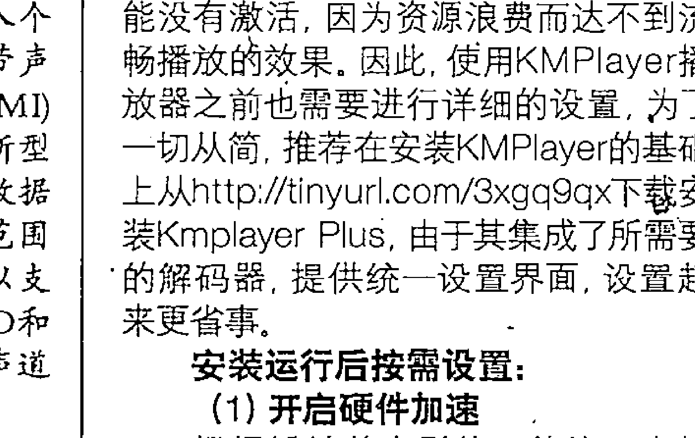

小提示：nVidia显卡的Mpeg2视频解码器比较特殊，默认即可进行硬件加速。此外，nVidia显卡一般将“视频渲染器”设置成“覆盖合成器”或“VMR9 无渲染”容易成功开启。在Windows Vista及以上版本的操作系统中，Nvidia 8 及ATI HD 系列显卡须在“EVR 增强型渲染(C/A)”下才能开启。

大补贴：现在网上下载的高清电影，文件名通常都是统一设定的，例如“Iron Man 2008 Bluray 1080p DTS 2audio x264-CHD”，前面为电影名称，Bluray指蓝光电影，1080p指该电影的分辨率为1920X1080（逐行扫描模式的最高清电影），DTS指该部电影使用的是DTS音频技术，x264指其视频编码使用x.264标准，CHD指经典高清（CLASSIC HIGH DEFINITION）。

###### （2）开启MKV封装的H.264硬件加速

播放1080p标准下并使用MKV封装的电影，开启硬件加速应该这样设置：将“H.264 解码器”设置为“Cyberlink (DXVA)”，再将“视频渲染器”设置成“VMR9 无渲染”，保存设置即可。

###### （3）开启VC-1硬件加速

这要分两种情况：

情况一：使用nVidia显卡
将“MPEG2视频解码器”设置为“Haali”或“Haali (TS&PS)”，将“VC-1 视频解码器”设置为“Microsoft”，将“视频渲染器”设置为“Overlay Mixer”或“VMR9 Renderless(VMR9未渲染)”，保存设置即可。

情况二：使用ATI HD系列显卡
将“MPEG2视频解码器”设置为“CyberLink”或“Sonic”，将“VC-1 视频解码器”设置为“CyberLink (DXVA)”，在Windows Vista及以上版本系统中再将“视频渲染器”设置为“EVR 增强型渲染(C/A)”，保存设置即可。

小提示：使用KMPlayer看高清的更多应用对应于KMPlayer Plus的设置方法可以参考http://dreamzhao.blog.sohu.com/150784563.html。

##### 3. Windows 7系统下的最优选择

KMPlayer在Windows 7系统下的硬件解码功能不完善，而KMPlayer的原作者推出的全新播放器PotPlayer（下载地址：http://www.crsky.com/soft/14175.html），在Windows 7系统下只要安装好“终极解码”（下载地址：http://www.newhua.com/soft/57110.htm）就可以轻松地打开硬件解码功能，进而流畅地播放高清电影了。运行后按F5打开设置，选择“播放”选项卡，单击“滤镜|解码器”管理器”按钮，选择“视频解码”，再单击“内置DXVA解码器设置”按钮，将“使用条件”设置为“总是使用”，单击“确定”保存设置。

在播放高清电影时按下“Tab”键，在界面上看到“DXVA”则说明硬解设置成功，这时播放高清电影时，CPU占用率会降很多。

##### 4. 如何确定已开硬件加速？

之前我们介绍如何开启硬件加速功能，目的是为了正常观看时不卡，而其实在开启硬件加速后，CPU的资源占用就会大幅降低，而未开启硬件加速，解码需要由CPU来软实现，故而因为占用大量CPU资源而造成播放不畅。判断是否成功开启硬件加速方法有二：

###### 方法一：直接观察CPU占用率

按Ctrl+Shift+Esc，在打开的任务管理器中选择“进程”，查看播放器对CPU的占用率（见图3）。

小提示：如果使用的是PowerDVD播放器，查看的方法更简单，只要查看自己显卡相应的加速技术是否被勾选了，勾选的话，说明已经使用了硬件加速技术。

###### 方法二：直接查看是否有DXVA信息

具体方法就是在KMPlayer播放器中直接按下TAB键，如果在屏幕上能看到DXVA字样，则说明硬件加速已经开启，否则就是没有开启了。

##### 5. 何种片源最“吃”CPU？

前面我们说了有多种高清视频编码格式，那么，这些不同的编码格式对CPU资源的占用率各自表现如何呢？通过实测来获取答案：

实测平台：
CPU：INTEL Core 2 Duo E6850(3GHz L2 CACHE 4M)
主板：七彩虹NFORCE680I SLI
散热器：Tuniq Tower120
内存：GSKILL F2-8500CL5D-2GBHK
显卡：NVIDIA GEFORCE 8500GT
实测电影文件：《Babel》(H.264编码格式)、《金刚》(VC-1编码格式)、《兄弟连》(MPEG4编码格式)

在实际测试过程中不难发现，H.264编码视频对CPU占用率要高一些，同时，VC-1编码格式的视频在播放时，CPU占用率变化很少，不像H.264那样高低变化明显，因此，在系统配置不高的情况下，VC-1编码格式的视频看起来会更流畅些。而MPEG-4格式的对资源占用最低。在这几种编码格式中，CPU占用率相比较，结果是：H.264 > VC-1 > MPEG4。

##### 6. 按需设置，应付“卡壳”

在KMPlayer中，可以根据电脑配置高、低来设置一个小参数来解决“卡壳”现象，达到物以尽用的目的。例如电脑配置较高，那可以这样设置来实现更优质的播放画面：右击播放器窗口并选择“视频（高级）→质量（3GHz）”（见图4）。

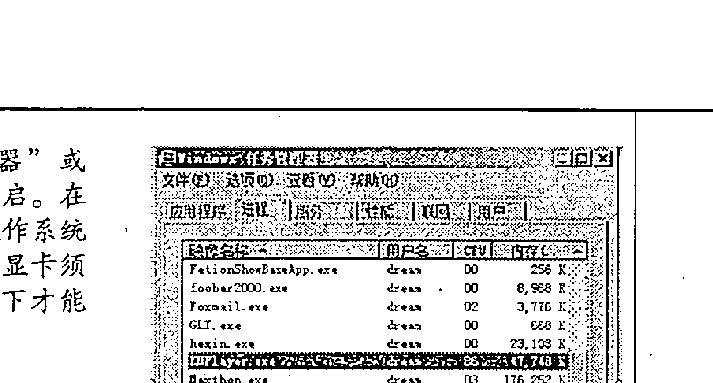

而若电脑配置较低，即使开启了硬件加速，但播放时还是有点“卡壳”现象，这时就可以以损失播放画质来提高播放的流畅性：在上面的快捷菜单中直接设置成“速度（1GHz）”即可。

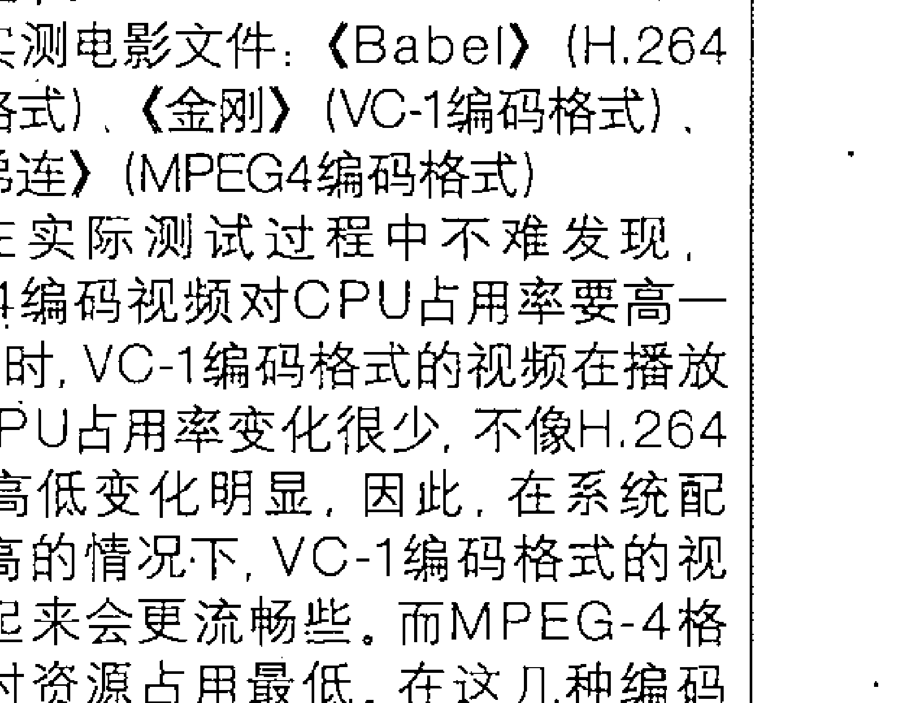

□策划/《电脑爱好者》编辑部
□监制/Cornel
□撰稿/dai# 2010.6.11-7.11 你的世界杯主场

时光荏苒，又是四年。万千球迷翘首企盼的世界杯即将如期而至。激动、兴奋充斥着每一名球迷的内心，那座大力神杯给我们带来了太多美好的回忆。
全新的2010世界杯，有准CFan迷带你探索，如何过一个与众不同的世界杯！这里有怀旧，有感伤，有激动，有搞笑，有希望，让我们打造一个属于自己的世界杯。

## 泪水与希望并存，2010 我做主

1986年墨西哥世界杯，马拉多纳一个人的世界杯，他让我们知道原来一个人可以战胜全世界，上帝之手，连过五人无不历历在目。
1990年意大利世界杯，那经典的一曲《意大利之夏》，悠扬动听，振奋人心，伴随着如此美妙的旋律，德国战车一路披荆斩棘，决赛点杀阿根廷，站在了世界之巅。
1994年美国世界杯，我们永远都忘不了巴乔罚失点球后那只属于亚平宁半岛的忧郁眼神和背影，那一刻无数人为之动容，为其落泪，同时也成就了邓加率领桑巴军团。
1998年法国世界杯，齐达内又一次让我们感受到了优雅的艺术足球，华丽的踩单车，飘逸的马赛回旋，身体与足球的完美结合，在决赛中力挫巴西人的桑巴舞步，让桑巴军团再一次深陷“苏格兰魔咒”。
2002年日韩世界杯，阿根廷在三场小组赛后便匆匆离开了世界杯的舞台；那骄傲的潘帕斯雄鹰低下了头，33岁的一代战神巴蒂斯图塔不禁掩面而泣，当即宣布退出阿根廷国家队，留下了永远的遗憾，也给《Don't Cry for Me, Argentina》刻上了无限伤感的足球烙印。
2006年德国世界杯，阿根廷的探戈狂舞，阿根廷、荷兰、塞黑、科特迪瓦的死亡之组，灵魂附体的黄氏怒吼，小贝饮恨而泣，齐达内的惊世一顶，还有那与大力神杯擦肩而过的背影。

**tache**
**属性：球龄15年，球疯子**
老北京非著名娱乐球迷，上学期间游走各个宿舍挑战实况足球，喜欢各种体育运动，其中以足球见长。崇拜除伊布外所有巴萨球员，曾经在阿迷俱乐部的组织下参加梅西中国行《天下足球》节目录制。此生立志亲临诺坎普、圣西罗看比赛。永远支持国安，国安永远争第一，国足就算了。
**点评：** 体育游戏发烧级，常年潜水各种体育、电脑论坛及博客，观点见解奇、准、狠。

**握握你的手**
**属性：球龄5年，休闲球迷**
不仅是球迷，更是极客型DIYer，重大比赛熬夜必看。在CFan论坛和杂志中最满意的作品是Windows 7_VISTA二合一系统维护光盘，周围朋友遇到电脑问题会第一时间出现。最光辉的记录是看着微星Big Bang Trinermy介绍费米GTX480+创新X-Fi Titanium Fatal1ty发呆一节课。沉寂多年，世界杯再度出山。
**点评：** 对待感兴趣的球赛、电脑问题会拥有强力大招必杀技：废寝忘食，钻研到底。

**aodioicq**
**属性：球龄7年，追星球迷**
计算机女一枚，未婚。成为球迷六七年左右，支持德国队，拜仁慕尼黑和国安。最爱的球员是拉姆和杨智。一有机会就会和男生一起找地方看比赛，是一个标准的矛盾体，爱热闹爱独处，爱高雅爱低俗，爱帅哥爱型男，矛盾点不胜枚举，总之因为矛盾，很鲜活，正在筹备过一个大学时代最疯狂的世界杯。
**点评：** 笔锋尖锐，观点细腻，常年涉足网络游戏，是个称职的腐女+御姐。

**王辉**
**属性：球龄10年，铁杆球迷**
北漂，爱好广泛，游戏、足球、漫画都是俺的最爱。毕业后留守北京，和几个同事合租一套两居室。目前在一家IT公司，已经开了个人网站，平时除了倒腾它就是看球聊电脑，最大的梦想就是可以喝着啤酒吃着烤串亲临世界杯现场。工资大部分花费在奔往各地球赛主场的路费上，及其郁闷不能去南非看真人秀。
**点评：** 正统草根一族，玩乐于各种SNS交友网站，活跃于各大足球论坛。

## 2010，南非，作为球迷的你，做好准备了吗？

巴西放弃华丽，重拾效率足球。首次作为教练带领巴西军团征战世界杯的邓加看似依然求索出一条为攀高峰不惜舍弃一切的道路。力争为自己的执教生涯书写辉煌；橙衣军团荷兰队再演全攻全守。“小飞侠”罗本立志独步赛场，盘活全局，驰骋对手的左边路将进攻进行到底；马大帅与梅西，两个同样天赋异禀的人，同样有过数不尽的绿茵场精彩演绎，他们将带领阿根廷走出怎样的精彩；西班牙斗牛士的豪华中场，哈维、伊涅斯塔、法布雷加斯三人组合谁可比肩，加之比利亚、托雷斯门前灵敏的嗅觉，让我们不得不期待他们这次的表现；意大利蓝衣军团是否在银狐里皮的指导下将防守反击进行到底，他们能否延续442的经典，下一个伟大的意大利左后卫身在何方；德国战车重现钢铁意志，勒夫怎样弥补2006年世界杯克林斯曼的遗憾；本届世界杯谁将上演黑马角色，异军突起，让豪强折服？
想说自己够铁杆球迷，先来过过aodioicq MM这一关，算一算你的铁杆值吧！
**如果你觉得你喜欢足球，经常关注，那么恭喜你，你已经有了1000分的保底分值啦。**
- 经常关注体育新闻，关注各大联赛比赛结果+100分
- 有真正支持的球队+100分
- 熬夜看球，无谓第二天的黑眼圈+100分
- 即便是女朋友极力阻拦，也要冒着跪主板的风险出去喝酒看球+100分
- 爱玩足球类游戏，实况、足球经理、FIFA之类+100分
- 了解偶像们的背景，关注他们的比赛，爱屋及乌的喜欢他们所在的球队+100分
- 只因为小贝之类帅哥才喜欢看球-50分
- 了解联赛积分制度，足球场内的各种规则，掌握联赛及各个杯赛时间进度+200分
- 拥有像健翔一样的激情与魄力+200分
- 去国内联赛现场看比赛+200分
- 立志亲临国外联赛现场看球的+300分
- 看国足比赛，即使输的再窝囊也会坚持看+300分
- 国足一输再输，发誓不再看国足比赛，但有国足比赛时也会心眼痒痒偷看两眼+400分

## 2000以下，继续努力吧，2000～3000正常范围3000以上，恭喜你绝对铁杆球迷！

## 去不了南非又何妨，自己就是主场！

**tache：** 自己看球没意思，怎样与同道中人交流沟通，互动竞技？网上有一些有着同样足球梦想、同样追求的球迷聚到一起，组织着各种活动。先让我们来搜罗一下各个国家队拥趸们的网络聚集地吧。
想看大杂烩，只能去贴吧了，世界杯吧一直是各种信息聚集的地方，帖子多，言论杂，可以找到很有有趣的话题交流，同时世界杯吧内的“友情贴吧”和“友情链接”也能帮你找到属于自己的小窝。除了论坛交流的地方，还有体育门户网站，网易的八卦最多，但实际上新闻并不是很好，建议选择新浪和搜狐。
在贴吧和俱乐部论坛还能找到由球迷发起的看球活动，此外体育门户网站也有很多热心球迷组织。屡试不爽的方法就是在论坛搜索栏输入“看球”，使用标题或全文搜索。向来吃喝见长的大众点评网也有看球活动，在首页点击“社区”，切换你所在的城市再搜索。
搜狐体育论坛“国际足球”：http://club.sports.sohu.com/fifa-0-0-0.html
新浪体育“豪门之家”：http://forum.sports.sina.com.cn/forum-4-1.html
西祠胡同“疯狂球迷”：http://www.xici.net/main.asp?url=/d117529006.htm
大众点评网“社区”：http://www.dianping.com/beijing/group
论坛的版主会发起活动，想去就可以直接去，到里面发现穿着球队队服的人，这就算找到组织了。加入他们的小游戏，比如杀人游戏、三国杀、桌面游戏等，去两三次你们就能侃大山了。这里有一个独家秘籍，大家所在的城市都有大学和高中吧？潜入学校的贴吧，世界杯期间会有一期相约看球的帖子。
**王辉：** 也许家里才是看球的最好场所，想用电视观看后面我们详细说，要是打算在网上看直播的话，推荐：http://www.goalhi.com/tv/ GoalHi足球直播，赛事齐全，画质不错，速度也很稳定。另外，只要手机能上网就可以看文字直播（流量充裕当然也可以看视频直播），比如手机腾讯网（3g.qq.com）、手机新浪网（wap.sina.com）和CCTV（wap.cctv.com）。当然装上较为省流量的JCweb和GO浏览器是明智的选择。
**强烈推荐：**
http://www.chinamobile.com/gotone/operation/vas/video
移动推出的手机视频服务已有大半年时间，流量免费的神话逐渐让大家详细，看球的话只需


| 据点           | 场地                          | 铁杆值                                       |
|----------------|-------------------------------|----------------------------------------------|
| 中国德迷联盟   | http://www.gerfans.cn/bbs/index.php | 光荣永远属于德意志@@@@
| 阿根廷球迷俱乐部 | http://argbbs.fans1.com       | 天下阿迷是一家@@@@@
| 巴迷社区       | http://www.brazifans.cn/      | 黄衫飘飘，艺术桑巴@@@@@
| 荷兰球迷会     | http://ned.miqiu.com/bbs      | 无言以对，橙色再次风靡全球@@@@
| 亚平宁在线论坛 | http://www.itool.com          | 蓝色狂想，点亮黎明!@@@@
| 西迷录论坛     | http://www.espfutbol.com/bbs  | 西迷录，西班牙足球小窝@@@

| 软件名称 | 地址 | 下载速度 | CPU占用率 |
| --- | --- | --- | --- |
| PPS (PPStream) | http://www.onlinedown.net/soft/40570.htm | ★★★ | 10% |
| 风行 | http://www.onlinedown.net/soft/898.htm | ★★ | 12% |
| PPLive | http://www.onlinedown.net/soft/39907.htm | ★★★ | 15% |

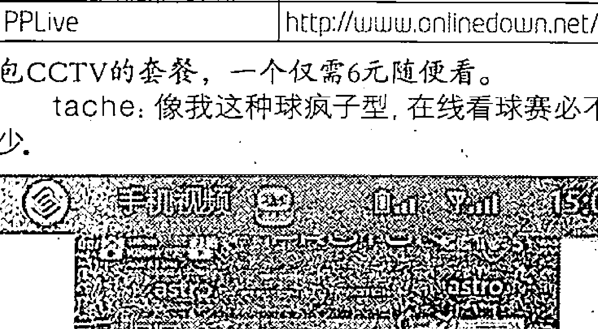

## 熬夜看世界杯吃什么喝什么？

aodioicq: 我觉得除了西瓜加啤酒或者烧烤加啤酒实在没什么其他选择，在人人、开心上网帖调查了一圈身边的朋友，总算弄出个吃喝秘籍！

| 零食 | 男生欢迎度 | 女生欢迎度 |
| --- | --- | --- |
| 嘉士伯 | ☆☆☆☆ | ☆☆☆☆ |
| 科罗娜 | ☆☆☆ | ☆☆☆ |
| 百威 | ☆☆☆☆ | ☆☆☆☆ |
| 冰纯 | ☆☆☆ | ☆☆☆ |
| 燕京 | ☆☆☆ | ☆☆☆ |

| 饮品 | 男生欢迎度 | 女生欢迎度 |
| --- | --- | --- |
| 巧克力 | ☆☆ | ☆☆ |
| 八宝粥 | ☆☆☆ | ☆☆☆ |
| 西瓜 | ☆☆☆☆ | ☆☆☆☆ |
| 薯片 | ☆☆☆ | ☆☆☆ |
| 烤肠烤串 | ☆☆☆☆ | ☆☆☆☆ |

小提示：
aodioicq: 看球的同时我们一定要注意身体，尤其是熬夜！应该吃得清淡一些或者喝一些汤，少吃油炸、少喝酒，喝些矿泉水和淡茶类。
王辉：世界杯期间，请各位球迷的女朋友注意！
- 除了今年最有机会夺冠的热门球队外，还应支持你男友支持的队伍。
- 你最想见到男朋友以及与他通话的时间，通常就是开球的时间，请你原谅。
- 如果你，男朋友兴高采烈和你说一大堆外国名人、战术分析和专业术语，听完给他一个“你好厉害哦”的表情，世界杯后你就会有美妙回忆。
握握你的手：如果你已经跃跃欲试……要么出去球场上奔跑，要么打开电脑开始PLAY！

1. 安装最新版DirectX
http://www.newhua.com/soft/5288.htm
2. 安装游戏
http://www.gmz88.com/showgame/10531.html
安装包大小：3827MB
3. 安装实况足球2010 V1.03官方升级档绿色覆盖版
补丁大小：27.6MB
http://patch.ali213.net/showpatch/7051.html
4. 安装实况足球2010 V1.03升级档免DVD补丁
补丁大小：12MB
http://patch.ali213.net/showpatch/6928.html

## 只要够强，放马来拿吧！

CT: 各位同学踊跃上传视频，最后票选人气最高者，在6月份结束后会有精美礼品哦！
CT: 本次为读者朋友准备了10余款观看世界杯的利器！它们都是市场上的绝对主力，当然，前提是已经无视掉充斥淘宝的大量山寨货。在此之前我们已经通过了四位球友试用，下面不妨就让他们站出来说两句吧。

### 液晶显示器伴侣

天敏LT290HD电视盒
售价：268元 电话：0752-2091800
网址：http://www.10moons.com
aodioicq: 本人比较懒，一直寻找能在电视和显示器之间切换的电视盒，所以在众多产品中申请了天敏LT290HD，它是一款免开主机便可收看电视的电视盒，支持1080P高清色差输入，通吃28英寸以下的液晶显示器，画面色彩还行，而且几乎没有延迟。首先连接机器，目前主流的22英寸以上显示器基本都配有DVI和VGA双接口，可以用DVI连接电脑主机，VGA连接电视盒，显示器的OSD按键就可以切换两个信号，比较方便。
参数：
◎ 支持LCD宽屏和CRT显示器，显示模式16:9，16:10，4:3
◎ 支持PAL、NTSC视频输入制式，提供VIDEO、S-VIDEO、YPrPb接口

### 高品质录放

天敏电视大师4（TM400）电视卡
售价：268元 电话：0752-2091800
网址：http://www.10moons.com
握握你的手：我这次评测的是天敏电视大师4（TM400）电视卡，CT小编对我的拆机装机能力比较肯定，与电视盒相比，电视卡的通用性要差一些（电视盒在笔记本和台式机上通用），适合有一定DIY能力的朋友。在色彩方面，是同价位产品中比较好的一款。3.0压缩引擎可把节目压缩成MPEG-1、MPEG-2文件储存，带录像暂停功能，轻松跳过广告，节约硬盘空间。录制分辨率最高为720×576，可以达到DVD水准。建议使用S端子进行视频录制，在文字方面要细腻一些。
参数：
◎ EPG电子节目指南，随时查询一周电视节目
定时开关机录像技术
◎ 3.0压缩引擎，可压缩MPEG-1、MPEG-2文件，轻松制作VCD、DVD影碟，MPEG-4格式

### 画质便携并重

美如画LT800高清电视盒
售价：188元 电话：0755-26723952
网址：http://www.mygica.cn
王辉：回想当年校园生涯，晚上熬夜和室友们一起为世界杯狂欢的生活，每每回想不觉让人热血沸腾起来。告别了校园生涯的我也沦为了北漂一族，居住空间很有限，仅可配一台24英寸显示器。LT800很小巧，外观和ADSL的MODEM差不多，使用起来蛮方便的，只需要按下遥控器的“画中画”功能，就可以弹出电视视频的小窗口。因为家里的机顶盒不是高清的那种，在高分辨率的液晶显示器上显示的画面感觉很一般，虽然LT800里面有喇叭，但是音量还是偏小。
参数：
◎ 支持4:3，16:9，16:10画面比例，同时宽屏模式支持图像拉伸
◎ PIP（画中画）功能

### 高清频道清吃

圆刚DMB852高清数字电视棒
售价：299元 电话：021-52987988
网址：http://www.aver.com.cn
aodioicq: DMB852支持DMB-TH国家标准，可收看高清、标清数字信号，即使放大到22英寸全屏也十分清晰，但能接收的频道较少，遇到重大活动CCTV1转播的开幕式（比如世博开幕式）倒是可以通过DMB-TH信号看到“高清版”，不过你是别指望用它看上世界杯了（没有体育台）。另外，它还可以用H.264格式录制高清电视节目，最爽的还是直接把录制影片压缩为320×240分辨率放在iPod上随身观看，适合女生用。
参数：
◎ 3D-motion影像还原技术，消除动态锯齿
◎ 信号格式DMB-TH数字

### 电视卡与机顶盒为何不兼容？

有线数字电视采用的是DVB-C标准的传输模式，其中电子节目菜单信息是混在节目码流里面接收的，需要机顶盒相关的程序从TS流里读出并显示，大多数电视卡没有这个功能。所以，电视卡直接与有线电视接口相连，只能读出30多个台，唯有与机顶盒相连接才能收看全部100多个台。
也许你会说，那些高清的机顶盒都有VGA、HDMI等接口，直接就接到显示器或电视上了，还用电视卡么？没错，但是录像是电视卡的强项，只有接上它才能实现。连接时原有的RF有线接口就成了摆设，电视盒和电视卡的方法一样，需要通过机顶盒的AV输出端口，连接到自己的AV输入端口。而USB电视棒因为只有有线电视接口，无AV输入端口，所以无法连接机顶盒获得全部频道。
另外连接机顶盒录像也需要注意，要准备一根莲花头转3.5音频接口线，或者说音箱线。把S端子、音频线连接到电视卡，一般电视卡内部都会附赠AUDIO线，用它连接电脑声卡的AUDIO-IN和电视卡的AUDIO-OUT接口。需要注意的是不要同时连接AV与S端子，因为部分机顶盒、DVD机的S端子和AV是直通线路，也就是说用的是一个通道，同时开机，会直接烧掉电视卡。

小提示
DMB-TH对收看的要求比较高，以北京为例，DMB-TH可以接收两个高清台：京视高清、CCTV1高清，其他CCTV1、CCTV2、CCTV5、少儿频道都是普通信号。其他城市基本保持5个台，比如，广州可以收到5个标清台：GZTV-M2、GZ-CITY、GZ-M3、GZ-M4、Meeting和CCTV1高清台。一般情况下电视卡的接收能力都比数字地面接收一体机和机顶盒差点，天线的好坏对接收高清台影响很大，双天线的设计比单天线好很多，在室内靠近窗户3米的位置，也能保证70%的信号强度。另一无线阵营的CMMB覆盖率要好于DMB-TH，如果你的城市没有开通无线高清广播，不妨考虑CMMB电视卡。
DMB-TH电视节目的城市和地区查询
http://www.avermedia.com.cn/avertv/Upload/DMB-TH/800x800_20090622.html
火速链接：
2010年05期《捧着iPad看电视》，CMMB电视卡导购，丰富你的无线体验。
□策划/《电脑爱好者》编辑部
□监制/CT
□撰稿tache 握握你的手 aodioicq 王辉

## 别玩虚的 让一键恢复名符其实

现在的品牌机，不管是XP系统，还是Vista/7系统，都内置了厂家开发的一键恢复工具。而对于使用组装机的朋友来说，为了能够迅速地修复系统出现的各种故障，往往也安装了自己所喜欢的一键恢复工具。但无论是哪种一键恢复，当按下一键恢复的快捷键（如F11）后，会弹出确认界面，多步操作才可执行恢复。对于菜鸟来说，就很不实用了。怎么办呢？我们需要的是真正的一键恢复！没关系，一番改造，即可实现这个目的。

### 你要做什么准备？

1. 一个独立的FAT32格式的分区，本文举例为F盘，专门用来存放GHO镜像备份和一键恢复软件。
2. 从http://ishare.iask.sina.com.cn/f/6024611.html下载“无忧一键恢复”，将其解压到硬盘的任意位置（如E盘根目录下）。

第一步：运行“E:\无忧一键恢复”目录下的GHOST11.EXE文件，选择Local(本地)→Partition(分区)→From Image(选择镜像)，将解压得到的GHO镜像DIY_SERVICE.GHO，恢复到F盘中。再运行解压得到的“Repair提示写入.exe”文件，弹出一个名为“修复无忧一键恢复”的对话框，单击“是”。
第二步：安装无忧一键恢复后，将备份的GHO格式系统镜像复制到F盘的根目录下（如“WinXP.gho”），然后再单击“工具→文件夹选项”，打开“文件夹选项”的“查看”选项卡以显示所有具有隐藏属性的文件，再打开F盘根目录下的批处理文件AUTOEXEC.BAT，将该文件中的字符串f10.exe替换为以下内容：

```
ghost8.exe -clone,mode=pdump,src=1:1,dst=1:4\WinXP.gho -z2 -auto -fro -sure -fx -rb
```

> 小提示
- DOS命令的含义：将F:的GHO镜像恢复到C盘，其中这个DOS命令中的参数4表示WinXP.gho是在F盘。
- 无忧一键恢复自带的Ghost版本是8.3的，如果你想将其升级为11.0，可先下载的11.0版本的Ghost并将其重命名为ghost8.exe，然后替换F盘根目录下的同名文件即可。

经过以上步骤的操作后，重新启动系统后，就可以看到一个新的开机提示菜单，此时根据提示按下F10快捷键，就会跳过一键恢复的确认界面而直接执行恢复系统的操作了。不仅如此，系统重新启动后，大家还会发现F盘已经被彻底隐藏，且在Windows系统下无法进行查看和删除。
(山东/新玲)

## 3项改动调出梦幻桌面 要酷装帅止住1吨口水

Vista中有一个有趣的小组件，叫做“梦幻桌面（DreamScene）”，它可以使用电影画面来充当桌面背景，并且是动态播放的。要酷的同学很是喜欢。但在Windows 7中，这个组件却消失了……最新的Windows 7连这么潮的功能都没有，哗哗地口水，流向了Vista……

### 1改：流着口水，初尝梦幻桌面

首先系统必须开启Aero特效，再从http://work.newhua.com/cfan/20101/mhbd.rar下载提取自Vista系统的补丁包并解压，解压后右击“安装Windows 7梦幻桌面.cmd”选择“以管理员身份运行”，按提示操作，就能自动安装好梦幻桌面。安装后，在硬盘中任意找一个WMV或MPG格式的视频，右击会发现快捷菜单中多出“设为桌面背景”一项，单击即可体验梦幻桌面了。

### 2改：好看归好看，别影响操作

放上电影后，看着桌面图标的文字，会发现很模糊，这是梦幻桌面的一个小BUG，目前微软还没给出补丁，但并不代表我们就能忍了！
右击桌面空白处选择“个性化”，在“我的主题”下会出现一个“未保存主题”，选择后单击下方的“桌面背景”，先将“图片位置”改成“Windows桌面背景”，再把“平铺”改为“拉伸”后保存改变。回到“个性化”窗口，右击“未保存主题”选择“保存主题”，再设置一个合适的主题名称即可。
以后如果需要使用梦幻桌面，只要使用这个主题，桌面的文字将不再模糊。

### 3改：小戏法，支持更多格式

目前梦幻桌面只支持WMV和MPG两种格式，忒少点儿了吧？事实上，只要Windows Media Player能播放的视频，梦幻桌面都能支持。所以，我们要做的就是小骗它一下。打开控制面板，单击“外观和个性化→文件夹选项”，在“查看”选项卡中去除“隐藏已知文件类型的扩展名”前的勾选后确定，再将其他格式视频的扩展名如AVI改为WMV或MPG即可，梦幻桌面可以正常识别。当然，安装第三方解码器能支持更多格式。

### 作者点评：关于梦幻桌面的资源占用

有很多人告诉我这个梦幻桌面的资源占用相当严重，但是经过亲身体验，似乎没那么夸张。在我的AMD4000+2GB内存的机器上，开启梦幻桌面，CPU占用率上升了3~5%，内存占用也只多了5%。
其实这个资源占用是和播放文件的分辨率与大小有关的，如果你用个1080P的高清来做桌面，我倒觉得完全没必要——这个画质，还是留着用播放器慢慢欣赏好了！
(文/雾雪霏云)

## 拯救被一键还原“私吞”的D盘

前日在家装完Vista SP2，准备用一键还原装机版8.20备份系统，一键还原却将我的D盘“私吞”！那里可有我爸多年积攒的资料，还没备份啊！如果我无法恢复，就无颜见江东父老啦（Refine：你最主要是无颜面对家中老父）。

### 宝贵D盘被吞

在安装时，我发现一键还原在添加隐藏分区时是用PQ Magic分区魔术师（以下简称PQ）参数添加的。一闪而过的PQ界面让我感到了一丝不安。果然，到了DOS界面，安装程序就提示“安装失败”。赶忙重启系统，依提示按F9进入一键还原的界面对进行卸载，可惜没有任何反应！进入系统后，我看到系统在重装硬盘驱动，赶忙打开“计算机”，发现D盘被隐藏了！右击“计算机”进入“管理→磁盘管理”，发现D盘没有盘符啦！我赋予它盘符时出现了错误提示“操作无法完成，因为磁盘管理器控制台视图不是最新状态”。

### 新老不兼容，不难搞定

安装Vista前，我的分区是用PQ划分的，在安装Vista时进行分区操作是用Vista安装盘进行的，就会出现我这种情况了。因为Vista的安装盘在分区时使用了全新的分区方法，而PQ无法识别这种分区方法，导致对D盘的错误操作。
经过检查，我把最后一个分区进行了删除，然后确认系统当中不存在其他一键还原的文件后，在“运行”中输入devmgmt.msc打开“设备管理器”，展开“磁盘驱动器”，右击故障硬盘型号，选择“扫描硬件改动”，待扫描完片刻，再次打开“磁盘管理器”，赋予D盘盘符即可。这样，再打开资源管理器就能够正常管理D盘！
(讲故事的人：福建福州/陈清松)

## 寻找丢失的备份系统

“表弟，我把备份放在F盘了，今儿电脑中毒了，忒厉害，想着直接还原算了，但是一键还原没法儿用：只能备份，不能还原了。是不是把文件给破坏了，怎么办啊？”接到表哥的求救电话时我正在刷牙，叽里呱啦一阵子后，还是得到事发现场——他家去帮忙。
首先，得看看一键还原这个软件本身是否存在、完整。按键盘F8选“正常启动”回车后进启动菜单，在“请选择要启动的操作系统”中存在“一键GHOST”，选择后回车，发现只有备份可用，“还原”选项无法使用。看来，备份文件至少不在原来的位置了，我要一查到底！

### 备份文件在不在？

根据我的经验，一键还原的备份文件，大多以隐藏的形式，“藏”在硬盘的最后一个分区里（Refine：这个经验没错，在最后一个分区，看到名字为“~1”或“yjbf”的文件夹，通常里面都是备份文件），嘿嘿，小样儿跑！到了最后一个分区后，没见到，在“我的电脑→工具→文件夹选项→查看”中选中“显示所有文件和文件夹”，去掉勾选“隐藏受保护的操作系统文件”，再点了“确定”，依然没有GHO文件。得，换招！

### 撞大运，找回备份

一问表哥，差点儿让我崩溃：“我还以为是病毒，就给删了……”“回头我把家里收藏的两年的CFan全给你搬来啊，好好学学”，我一边教育着他，一边试着用EasyRecovery来找回那个文件。在“数据恢复→删除恢复”中定位到F盘，经过十几分钟的折腾，终于找回了昨天刚被表哥删除的GHO文件。运气太好了！
Refine：查找GHO文件的部分，也可以这样做：在“资源管理器”中全盘查找*.gho文件，如果可以查找到，就是一键还原的备份文件，在最后一个分区建立名为Ghost的文件夹，把查找到得GHO文件复制到里面，改名为c_pan。

#### 小编大结：

虽然一键还原有很多版本，比如“一键还原精灵”、“深度一键还原”、“Vista一键还原”等等，但在备份还原等实际操作上大同小异，都会选择将备份文件放在最后一个分区，后缀名为.gho。一些病毒，比如著名的熊猫烧香病毒就会找到且删除GHO文件，非常的坏，所以将GHO文件修改后缀名还是有必要的。至于故事一主人公所遭遇的分区型故障，一般都是Vista和Win7才会遇到，XP中则不会遇到。有时候，可能还会遇到备份文件存在，一键还原软件消失，此时随便安装一个一键还原软件即可。
(讲故事的人：北京/孤独的根号三)## 我要独立！让多系统启动不互相牵绊

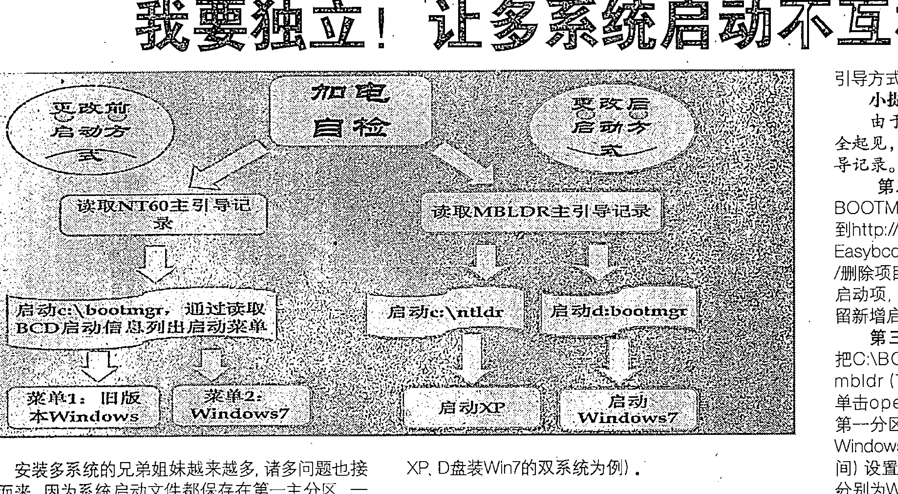

安装多系统的兄弟姐妹越来越多，诸多问题也接踵而来，因为系统启动文件都保存在第一主分区，一旦主分区出现差错，就很容易导致所有系统都无法进入，能不能不看主分区“脸色”行事，让每个分区的系统独立启动呢？我既然说了这么多废话了，自然有解决之道，走着！

### 笔者有话说：我没忽悠人

独立启动，指的是安装在其他分区的系统，不依赖主分区引导文件。好处嘛，开头已经说了：即使主分区遭受病毒感染，或者误删重要启动文件，其他分区的系统仍然可以独立启动，便于进行文件抢救或者进行杀毒、重装等操作。

实现的原理如图所示：借助m bldr更改硬盘主引导记录，把各个系统引导信息并列前置，实现各个分区独立启动。更改前后对比效果如图所示（以C盘装XP，D盘装Win7的双系统为例）。

### 各自为政，手动让它们独立

一个分区（包括逻辑分区）如果要能启动系统，一是要有完整系统文件，二是要有对应系统的启动文件。因此对于逻辑分区系统，要更改分区引导记录，并添加启动文件。

第一步：为了方便进行系统维护，这里在主引导记录再添加一个PE启动项目。只要使用WinRAR打开Win7的安装镜像，然后将除“\sources\install.wim”之外所有文件解压到E:\即可。

然后到http://work.newhua.com/cfan/200924/bootice.rar下载解压得到BOOTICE，启动后单击“更改分区主引导记录”，接着在弹出的窗口“目标分区”选择D:；在“要更改的类型”下单选“BOOTMGR引导程序(FAT/NTFS)”，然后单击“安装/配置”，将分区引导方式更换为“BOOTMGR启动”。

### 小提示
由于是对硬盘主引导记录进行操作，为了安全起见，可以使用BOOTICE先备份当前系统主引导记录。

第二步：同上选择E:，将其引导方式也更改为BOOTMGR启动，选择C:，更改为NTLDR启动。接着到http://www.onlinedown.net/soft/58174.htm下载Easycd，启动后单击“Add/Remove Entries”（添加/删除项目），按提示添加一个Microsoft Windows 7启动项，Drive选择D:；同时删除原来启动项目（仅保留新增启动项）。

第三步：重启系统就直接进入XP了，按提示把C:\BOOTMGR和C:\BOOT目录复制到d:\，启动m bldr（下载地址：http://tinyurl.com/ygqey8q）。单击open Device（打开设备）。在打开的窗口选中第一分区，单击ADD添加到右侧窗格，Label设置为Windows XP, Time boot configuration（启动配置时间）设置为4秒。操作同上，依次添加D:、E:启动，名称分别为Windows 7、Windows PE，其他采取默认设置。

第四步：单击Save m bldr,按提示把引导记录保存为cfan.bin，放置在C:\，接着启动BOOTICE，单击“主引导记录”，在打开的窗口单击“恢复MBR”，导入前面保存的C:\cfan.bin。

重启电脑，此时会自动读取m bldr并列出上述三个启动项目，只要分别选择不同启动项即可进入XP、Windows 7或者PE系统（默认进入XP）。

好了，大功告成。不信的话，你把C盘XP下的引导文件删除（先备份），重启是不是还能进入Win7呢？不过最好别这么玩……

声明：使用这种方法进入非主分区系统如Windows 7，会自动屏蔽C:，需要将应用软件安装在各自分区或者其他公用分区。

### “时光机” 卷影副本 回到过去治后悔

随着生活节奏的不断加快，以前每个人可能每天处理10件事情，现在可能就需要翻倍了。人的精力是有限的，事儿多了就容易犯错。对于办公族来说，基本上每天都要面对各种文档的处理加工，犯错、误删、病毒破坏等情况时常发生，这时就需要让“时光倒流”，找回过去正确的版本。这听起来不可思议，其实并不难，尤其是在Vista和Windows 7中，卷影副本这个“时光机”就能带你回到过去。

#### 小知识：文件快照——卷影副本
卷影副本（Shadow Copies）也称为快照，通俗点说就是文件的历史版本。勤劳的你为某文件建立了备份，那么该文件的上一版本就存储在了备份文件中。如果文件被修改或删除，就可以利用这些旧版本将其还原。

#### 场景1（现实+假设场景）：“劳驾，哪里有卖后悔药的？”
身为记者的小李除了经常外出采访之外，还要经常去参加厂商举办的新品发布会，这不，周一收到一封邀请函。忙得不可开交的小李，就着邀请函的文档直接写起了稿子，等到周三想查找会场地地的时候，傻眼了……“哪里有卖后悔药的呢？”其实，小李应该提前作如下准备，搭乘时光机。

首先，在Windows 7桌面上右击“计算机”选择属性，从窗口左侧进入“系统保护”设置。

假设要为E盘中的文件创建还原点，在“保护设置”框中选中E盘分区，如果当前保护状态为关闭，则点击“配置”按钮。

然后，将E盘的“还原设置”项改为“仅还原以前版本的文件”，这就是仅开启卷影副本而未开启系统还原。再分配一定的磁盘空间用来保存还原点，完成后点击“确定”回到系统保护对话框，点击“系统保护→创建”，为还原点起名后点击“创建”。

创建还原点成功！如果当时小李做了这个准备，那么，下面就可以时光倒流回去了。

#### 场景2（科幻场景）：时光倒流，回到过去
现在，在E盘中的所有数据就已经创建了一个卷影副本。时间回到周一，小李收到邀请函后对其进行修改，然后保存并关闭。到了周三，小李只需执行如下操作，就能找回最初的邀请函了：右击邀请函文档选择“属性→以前的版本”，在“文件版本”框中列出了自还原点之后，对该文档的修改日期及时间，选中最初的版本，单击“打开”可以看到前一次保存的文件，单击“复制”该文件另存到其他目录位置。而单击“还原”，会将该文件还原成前一次保存的版本。

### 小提示
一个文件在系统创建还原点后进行了修改，就会自动生成一个文件副本，文件副本的多少是由系统创建的还原点数量决定的。对于其他类型的文件，如：压缩文件，系统也会随着系统还原点的创建生成相应时间的压缩包副本。

#### 后记：Vista和Windows 7中时光机的区别
卷影副本从Vista开始就有了，在Windows 7中它的功能可谓是“发扬光大”，更加人性化：Vista的卷影副本和系统还原相关，也就是说使用卷影副本必须开启该分区的系统还原。大伙都知道，系统还原这东西一般只在系统分区开启就可以了，在其他分区开启是种浪费。而Windows 7中，两个功能既可以同时开启，也可以单独开启。

### 一劳永逸 剔Windows 7 多余通知图标

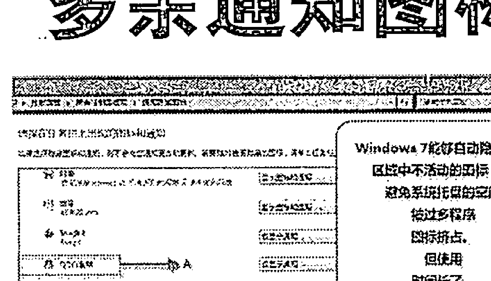

出现如图的情况怎么解决？随我来！

第一步：在“开始→运行”中输入Regedit回车打开“注册表编辑器”，定位到[HKEY_CLASSES_ROOT\Local Settings\Software\Microsoft\Windows\CurrentVersion\TrayNotify]下，删除除了UserStarTime外的所有键值，注销。

第二步：回到“通知区域图标”窗口，窗口中只包含“网络”、“音量”等系统自带的程序图标；接着运行常用程序，如QQ、千千静听等。分别单击“通知区域图标”中常用程序图标右边的下拉箭头，选择“显示图标和通知”并确定。

完成上述操作后，再重新打开注册表并定位到第一步的位置，右击TrayNotify项，选择“导出”，保存为REG格式。以后，有过剩的程序图标时，将备份的REG文件双击导入，再注销一下即可。

### 学生的免费正版 Server 2008变身Win7三部曲

尽管很多学生吹嘘说Win7在中国的售价已是全球最低，但专业版1399元的价格还是让我等学生望而却步，旗舰版就更不用了……难道学生不能用正版吗？没关系，参加微软的DreamSpark计划，就可以获得Windows Server 2008 R2（以下简称R2）系统的正版授权，它和Win7是相同内核的系统，稍加改造，就可以“变成”Win7了。

- 小提示：学生如何获得正版软件？
第一步：通过微软学生中心网站http://www.msuniversity.edu.cn注册“Live-MSU用户”，然后使用教育网邮箱（后缀为.edu.cn）通过学生认证。
第二步：进入DreamSpark网站https://www.dreamspark.com进行登录，然后就可以下载微软学生中心提供的所有软件了。进入软件下载页面，单击GET KEY（获取密钥）即可获得序列号。

### 出入家门还审核？让开关机更简单

每次登录的时候都需要按下Ctrl+Alt+Del三个键，然后再单击相应的用户名才能进入系统。关机的时候，也要填写原因才能关机，非常麻烦。
首先，执行“开始→运行”命令，运行netplwiz打开“用户账户”对话框，在“用户账户”对话框中去掉“要使用本机，用户必须输入用户名和密码”的勾选，指定一个自动登录的用户，输入用户名、密码，连续两次“确定”，下次开机时就会自动登录系统了。
然后，运行gpedt.msc打开“本地组策略编辑器”，定位到“计算机配置→管理模板→系统”，双击右侧的“显示‘关闭事件跟踪程序’”项，选择“已禁用”然后确定，再关机时就不会要求输入关机的原因了。

### 繁琐功能绕开，让R2更快、更好用

由于R2是服务器操作系统，安全性非常好，但我们个人使用，无需那么多繁琐功能。作为桌面操作系统使用时，要做点儿简单的调整，让R2更好用一点。

#### 窍门1：DEP，少管闲事
右击“计算机”选择“属性”，依次点击“高级系统设置→高级→性能→设置→性能选项→高级→程序”，在“数据执行保护”中选择“仅为基本Windows程序和服务启用DEP”，确定。

#### 窍门2：恼人警告，请走开
默认情况下系统开启“增强的安全配置”，每打开一个网页都会弹出阻止对话框，非常不便。
在“服务器管理器”中单击“安全信息”右侧的“配置ESC”，将管理员项设置为“禁用”然后“确定”，这样在浏览网页时就不会总是弹出提示窗口了。

### 玻璃特效，不是Win7专利

安装好R2后，你一定发现了，没有Aero效果，这样的话和同级别的Win7比较起来，不仅外形丑陋，窗口操作上也不便起来。

- 第一步：确认安装了最新的显卡驱动程序，执行“开始→管理工具→服务器管理器”，单击左侧的“功能→添加功能”，勾选功能列表中的“桌面体验”项，然后单击“下一步”，单击“安装”按钮，最后单击“关闭”。“是”。系统会自动配置相关项目并重新启动。
- 第二步：执行“开始→运行”，运行Services.msc打开服务管理器，找到Themes服务，双击“属性”，将“启动类型”改为“自动”，单击“应用”，再单击“启动”开启Themes服务。
  小提示 为了保证开机后声音功能正常，还需要将Windows Audio服务设置为自动启动。
- 第三步：右击桌面空白处选择“个性化”，在打开的“个性化”窗口中已经可以看到“Aero主题”了，单击“Windows 7”主题，稍等之后，Aero效果就成功开启了。
  小知识：DEP干什么用？
  DEP是Data Executive Protection(数据执行保护)的缩写，在软硬件双平台——内存和操作系统同时执行，在内存上执行额外检查，防止在操作系统上运行恶意代码。
  小提示 系统重启后，按照同样的步骤添加“优质Windows音频视频体验”功能等，不建议一次性安装多项功能，实际测试过程中，一次安装多项功能有时会出错。
  Win7中绚丽的Aero、Aero Peek效果已经完全开启了，并且WMP、图片查看器也都可以正常使用了。
  (文/越野苍狼)

### 当奇浏览器 未来系统

近日谷歌终于发布了Chrome OS源代码，它将在2010年下半年正式上市。不过网上高手已经将Chrome OS编译成镜像（下载地址：http://gdgt.com/google/chrome-os/download/），这样即使在普通PC上也可以尝鲜Chrome OS。这个一直被大家津津乐道的操作系统有什么特性？多说无益，一起来尝鲜吧！

#### 最强感受：请进Chrome OS，真的很简单！
安装过程：下载解压到是一个VMware的虚拟硬盘文件（VMDK文件），只要启动VMware新建一个虚拟机→打开虚拟机设置→添加一个硬盘→选择“使用一个已存在的虚拟磁盘”→选择上述下载到的虚拟硬盘文件，然后启动该虚拟机即可开始体验Chrome OS了。

#### 侦破疑点1：怎么登录？
Chrome OS和常规的系统不同，无需设置账户和密码，只要使用自己的Google账户即可登录，如果要离线，可以使用用户名Chromos（密码为空）登录。

#### 侦破疑点2：程序、数据都在哪？
Chrome OS没有提供桌面组件，所有的操作都是借助浏览器完成，所以你的电脑必须始终在线，否则系统就无法使用了。各种在线服务，就是你在Windows下使用的程序。
由于界面只是一个浏览器，你无法像Windows那样通过“我的电脑”访问分区，也无法像Ubuntu那样使用终端命令进行操作。在Chrome OS中，启动应用程序就像打开一个新的网页，因此各类数据都是存储在网络服务器上。

#### 侦破疑点3：基于网络，安全性很差吧？
除了浏览器，Chrome OS根本没有其他访问界面，而且本机硬盘上的数据都会加密，不会受到任何变更，开机区是只读。因此安全性是比较高的，不易受到病毒的侵扰。

#### 小编观点：划时代产品提早出现
从设计理念来说，Chrome OS是一款比较超前的系统，借助网络、云计算、只读的本地系统。Chrome OS方便用户的使用，同时提供极大的安全性。应该说随着网络的发展，这种模式是今后PC的发展方向，操作系统只作为客户端，所有终端服务都借助网络服务器完成。
不过，基于目前我国的网络状况，Chrome OS的使用还会受到各种限制，还无法替代甚至威胁到Windows，并不会对微软的霸主地位产生多大的影响。不过在操作系统格局中微软一家独大并不是好事，谷歌推出操作系统并加入到上网本竞争，对用户来说是利好消息，希望有更多公司加入到操作系统的竞争中。

### 我删了所有文件夹

老王又来了，笑嘻嘻云：“电脑又挂彩了！”过去一看，果然。总结起来，表现有三：其一，无法使用资源管理器；其二，所有文件夹图标都变成了文件夹快捷方式的图标模样，全是小箭头；其三，所有文件夹在电脑中都能正常打开，但复制到闪盘上却不能在别的电脑上打开！
凭着多年看Cfan练就的“火眼金睛”，可以肯定是中毒了，可究竟是什么病毒杀于无形？决定一探究竟。

#### 埋下祸根
360安全卫士是用过多日的法宝了，屡试不爽。正好这台电脑也装着，升级到最新特征库，执行全盘查杀——乖乖，木马影子也未见一个。那会不会是非木马性病毒呢？
用杀软试试！果然，在各分区根目录下都查到了“1478982793.VBS”的VBS脚本病毒，顺利清除。但小箭头依然如故，而且双击居然打不开，还提示“是否删除该快捷方式？”我慌了，赶紧点“否”，数据无价，怎么敢删啊！随手找了一个F盘的文件夹，右击选“属性”，目标中赫然写着F:\1478982793.VBS\F\征文及说明\Dir，原来如此！删掉除“F:\征文及说明”之外的内容，确定后，双击，文件夹顺利打开。
到这里，问题算是解决了吧？我却犯下一个错误。

#### 误删所有“文件夹”！
根据老王的要求，备份系统。我启动Windows优化大师，准备先清理一下垃圾。很快清理完了，谁料，那些带箭头的文件夹突然也不翼而飞了！开启“显示隐藏的文件文件夹”后依然看不到！优化大师把它们当垃圾给清理了！
无奈中，想起还有张PE启动光盘，或许能有搞头。于是，放入光盘，重启，进入PE环境。那些被雪藏的文件夹全部露出了笑脸，而且小箭头也都不消失了，但颜色是浅色的，说明是隐藏属性的。查看其属性，隐藏项被勾选，而且是灰色的，无法取消。只好一个一个文件夹重建，然后移动文件到新文件夹。虽说很费功夫，总算摘掉了“毁灭”数据的帽子。
小编点评：每次操作执行前一定要想好最坏后果，比如清理垃圾文件，如果中的是文件夹类的病毒，就会导致文件夹全部消失，给之后的处理带来更多麻烦。VBS脚本病毒由于编写简单，可谓生命力旺盛，而且破坏力大，但通常经过简单查杀等手段就能清除。很多时候是通过闪盘等移动设备传播，所以给闪盘装个绿色杀软，有时候也很有必要。
(讲故事的人/贺栓运)

### 没两把刷子 怎么闯江湖？

### 3大领域 8项策略 全面搞定Win7兼容性

2006年秋天，Vista：”说我不能兼容？！谁是出头鸟，出来一步！”一干软件、游戏、插件、脚本都前进了一步。“好，按江湖规矩，我们单挑，那个拿葱的大婶你过来”……两年后，Vista已经被兼容性打成了残废！

2009年，还是秋天。Win7可不想重走Vista的尴尬之路，又是兼容模式、又是虚拟机……十八般武艺齐上阵，常用软件早就被它兼容得差不多了，一时间，江湖中好评如潮，可谓众星捧月。Win7自语：”没两把刷子，怎么出来混？”

幻灯片一样的《FIFA2009》，只能16色色运行的《星级争霸1》，游戏时不能全屏，或者干脆不能运行……面对这样的Win7，还不如把自己拿给杨叔叔放电！等待EA和暴雪发布兼容Win7的版本？等待微软发布Win7 SP1？省省吧，靠谱点的话还是一起来DIY解决兼容性吧！

先要来确定你的CPU是否支持XPM！运行SecurAble，下载地址：http://xiazai.zol.com.cn/detail/39/380859.shtml。第三项即为“硬件虚拟化技术”。这里显示的YES或NO就能说明你的CPU是否支持“硬件虚拟化技术”。

#### 系统应用

##### 靠谱策略1：以管理员身份运行游戏

### 小提示
Win7是个大月亮，身边三颗陪月星

大星——驱动精灵。Win7官方宣布在该系统中已经集成了绝大部分驱动，但这并不代表你装好Win7就能高枕无忧地使用它了，尤其是显卡驱动……NVIDIA、INTEL、ATI这三大主流显卡的驱动程序都能完全兼容Win7了，到官方去下载是个麻烦事，驱动精灵倒很省事，可它能兼容Win7吗？

##### 靠谱策略2：启用兼容模式运行游戏

第三项还可能显示Locked ON，表示支持，并且BIOS中已经打开该功能；显示Locked Off，表示BIOS中关闭虚拟化技术，但这并不表示CPU的“虚拟化技术”被BIOS给禁止了，还有可能是因为CPU本身不支持该技术，于是BIOS中就自动将该功能禁用了。可以到BIOS中设置有关hardware virtualization（硬件虚拟化）选项为“开启”来尝试。

启用方法：右击《魔兽争霸》的启动程序选择“兼容性疑难解答”，点击“尝试建议的设置”，这时系统会为你推荐适合的兼容模式，再点击“启动程序”。这样，游戏就以兼容模式运行了。为了一劳永逸，还可以在右键菜单中选择“属性→兼容性”，钩上“以兼容模式运行这个程序”，并在它的下拉菜单中选择合适的模式，就能完成兼容模式的手动设置。

到http://www.drivergenius.com/下载并安装驱动精灵，启动它的时候，界面上醒目的“Win7徽标认证”是个很好的证明。

##### 第二步：外面的世界真精彩！
Virtual XP下载地址：http://www.microsoft.com/windows/virtual-pc/download.aspx。按照相应提示进行简单的安装之后，并不需要作太多设置，就能使用XPM啦！

以前玩得好好的游戏在Win7中却不能全屏……可能很多骨灰级玩家都遇到过。虽然还没找到完全的解决办法，但某些游戏的全屏问题可以通过如下操作来解决：

### 小提示

##### 靠谱策略3：注册表、显卡齐上阵
安装完成以后启动XPM，其中的系统是正版的XP SP3，并且为用户额定分配了256MB的内存。这里以不能在64位Win7中运行的Sandboxie 3.40为例（Sandboxie已经停止了针对于64位系统的开发），将它安装在Virtual XP中。到Win7的“开始菜单”中来看看——Sandboxie的相应程序出现在上面！这就是Win7中Virtual XP的最大优势：你在虚拟机里面安装的应用程序，在“外面的世界”Win 7主机上的菜单就可以看到并点击运行，为用户在Win7中使用老软件提供了很大的方便！

“Win7徽标认证”如图所示，无论是硬件还是软件，只要有“Win7徽标认证”的，都表明它能很好地与Windows 7兼容，页面http://tinyurl.com/yc3vurk，列出了所有能在Win7上完美兼容的软件，并且这个列表一直在更新中。

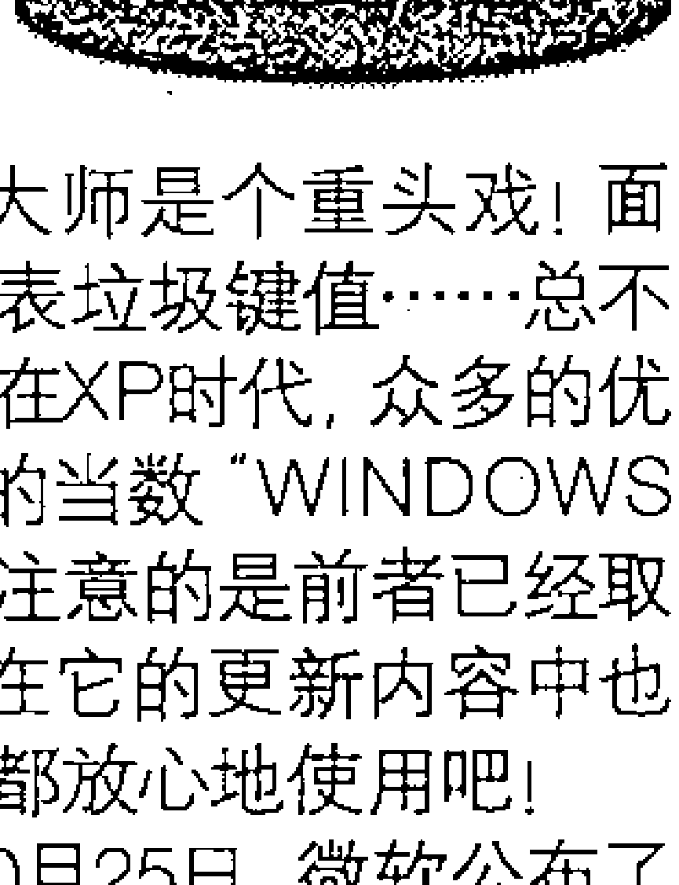

在“开始→运行”中输入regedit打开注册表编辑器，定位到[HKEY_LOCAL_MACHINE\SYSTEM\ControlSet001\Control\GraphicsDrivers\Configuration]，右击Configuration→查找，输入scaling，再将scaling的数值4改为3即可（如果没有完全更新驱动程序，scaling的键值可能为255）。

##### 后语
以NVIDIA的显卡为例进行设置，在屏幕的空白处右击鼠标，选择进入“NVIDIA控制面板”，在“更改平板显示器缩放”中选择使用NVIDIA缩放功能。

在Win7中内置虚拟机，微软这样做不但为用户考虑了很多，同时还树立了“兼容性好”这样的口碑，避免了像Vista那样的尴尬……而且也为自己的虚拟机产品铺平了道路，减少Windows用户对其他虚拟机产品的使用。

二星——优化大师。优化大师是个重头戏！面对着繁琐的系统垃圾文件、注册表垃圾键值……总不可能单纯地全部手动删除吧。早在XP时代，众多的优化大师就在相互较劲了。最出名的当数“WINDOWS优化大师”和“超级兔子”。值得注意的是前者已经取得了“Win7徽标认证”，而后者在它的更新内容中也明确地的说明了兼容Win7，大家都放心地使用吧！

##### 终极策略
(四川/李户林)

### Win7兼容杀手锏——XP模式

三星——杀毒软件。截至10月25日，微软公布了16款兼容Win7系统的杀毒软件。

早就听说在Win7中可以以XP Mode（即XPM）来运行XP系统上的程序。XPM在微软官方又叫Virtual XP，主要是为了方便那些比较古老、但依然被大众使用的专业软件，例如用来设计电路板的Protel 99SE等。与Virtual PC不同，XPM对硬件要求较严：2GB以上的内存和支持“硬件虚拟化技术”的CPU，即可支持Intel-VT技术或者AMD-V技术的CPU才能够使用该功能。

在这16种杀毒软件中，常用的有AVAST、NORTON（诺顿）、RISING（瑞星）、KASPERDKY（卡巴斯基）、ESET（NOD32）……从10月25日到现在，国内的杀毒软件又有很多获得了微软的Win7认证，杀软在Win7中几乎不存在不兼容的现象了。

#### 上网娱乐

#### 电话删除闪盘？！

### 上网无忧：被撕碎的“网页”，带“胶水”的IE8
国际通用的网页开发标准——W3C标准（World Wide Web Consortium即万维网联盟标准）被运用在了IE8上面。但并不是每个网站都按照这个标准来搭建的，于是在浏览网页的时候就出现了一些莫名其妙的问题：网页显示错乱、链接不能打开、找不到下拉菜单……针对这一情况，IE8中特别提供了“兼容性视图”功能。当它检测到某网站因为不兼容而不能正常显示时，地址栏右侧就会出现一个类似于“撕成两半的纸”的标志——兼容性视图按钮。出现问题只需一点，大部分网页显示就会正常了。

前几天，喜好学习的表弟又给我打来电话，我总是怀疑他家电话费不要钱，每次都要问东问西至少半个钟头。这次的问题是，为什么他的闪盘经常无法删除。这个……因为情况有好几种，一两句是说不清楚了，得，反正今天也没事儿，去他家看看。

#### 跟剪贴板无关
往往在把闪盘的文件或数据取出来的时候，都是用的“复制”“粘贴”方式，而如果复制的是闪盘上的文件，这个文件就会一直放在系统的剪切板里，处于待用状态。所以呢，我随便在硬盘上找了一个文件，复制它，然后再粘贴到某处，以便占领系统的剪贴板。一般情况下，再去删除闪盘提示符，都可以的。但是这次……失败了。

#### 系统进程也没占用
无奈，我只好使用必杀技了！打开“任务管理器”，单击“进程”，找到EXPLORER.EXE进程并结束它。桌面不见了，表弟吓了一跳，问我在搞什么。我劝他不要惊慌，继续我的操作。在“任务管理器”中点击“文件→新建任务”→输入EXPLORER.EXE→确定，或者点击“浏览”找到C:\Windows\explorer.exe。再删除闪盘，哈哈，这次成功了！（Refine：其实还有终结必杀技，那就是：重启电脑）

#### 一切重来
每次点击“兼容模式”以后，这个网站将会被自动保存到IE8的兼容性列表中，下次再登录这个页面，IE8会自动启用兼容性视图。

果然，删除盘符的时候，提示“无法停止‘通用卷’设备，请稍候再停止该设备”。这种情况下，如果强行拔除闪盘的话，很容易损坏计算机U口或者闪盘。闪盘是不值钱，但如果上面有重要的资料，那损失就大了。应该怎么办呢？我准备逐一试验。

Refine：目前有些闪盘支持热插拔技术，当然，无论多好的闪盘，有一种情况是绝对不能直接拔下的：仔细看你闪盘的指示灯，如果不停在闪的时候，表示正在读写数据，这时候拔下的话，轻则损坏数据，重则报废。

看来只好用第二种方法了！按下Ctrl+Alt+Del
组合键，打开“任务管理器”，选择“进程→映像名称→rundll32.exe”进程，然后点击“结束进程→是”，再删除闪盘。正常情况下，也是可以删除的，但这次，还是无法删除。表弟鄙视了一下我这种方法，他的观点是rundll32.exe是系统进程，又是多个，怎好随意结束？说得有点儿道理！

最省事的办法就是在IE右侧的“工具”按钮，选择“兼容性视图设置”，钩选“在兼容性视图中显示所有网站”。以后打开的所有网站都会默认以兼容模式打开！

### 游戏不愁：Win7不能玩游戏？不如去见杨叔叔
杨叔叔，即杨教授是也。央视曾有报道，其人善戒网瘾，蒙蔽家长，手段残忍，独创电击疗法……现场相当惨烈！
(讲故事的人/莫各)## 3枪防毒 给移动硬盘加上无敌只读

今年的电视新闻上，除了天气预报，还多了一项每天必备的报告：甲型流感的最新状况。疫苗已经陆续开始接种，因为预防才是最好的解药。移动硬盘作为一种随身设备，随时要在不同电脑使用，感染“流感”几率最大，怎么预防呢？如果能让移动硬盘变为只读就可以有效拦截病毒的入侵，但是市面上又没有带只读功能的移动硬盘……

没防毒面具进毒窝，开玩笑？

移动硬盘最近存了一些高清电影，宿舍几个哥们总爱拿着移动硬盘互相拷贝交流。可是有些哥们的电脑就是“毒窝”啊，移动硬盘一插进去，病毒也随之而入，再插回自己电脑，卡巴斯基杀毒声叫个不停。怎么办？打造一块儿带有防毒面具的移动硬盘吧！

Diskpart是系统自带的磁盘管理命令，通过它可以添加只读属性（XP、Vista、Win7均支持），以Win7为例吧。

第一步：以管理员身份进入Win7，启动命令提示符后依次输入下列的命令（#为注释），成功后屏幕会提示“卷属性设置成功”：

```
Diskpart
List vol
Select vol 10
att vol set readonly
```

第二步：移动硬盘的只读属性是立刻生效的，完成上述操作后，现在移动硬盘插入到任何一部电脑，都无法往其中写入或删除文件。这样不仅可以有效阻止病毒的入侵，而且也可以很好的保护其中的资料不被误删除。

### 小提示

Diskpart的上述参数只能在完整的操作系统中使用，无法在PE环境下使用。上述命令同样可以设置闪盘只读属性（命令：att disk set readonly），不过这个闪盘只是在自己电脑上显示“只读”（在其他电脑上无效）。

第三步：上述操作是将整个移动硬盘变为只读，如果自己使用需要写入数据，可以建立批处理作为只读开关。启动记事本新建一个文本文件cfan.txt放置在c:\，

```
Select vol 10
att vol clear readonly
```

启动记事本，输入Diskpart /s c:\cfan.txt，保存为open.bat放置在桌面，以后只要运行这个批处理即可取消只读。

第四步：为了实现每次关机后自动添加只读属性，还可以新建cfan1.txt（只要把上述 att vol set readonly更改为att vol set readonly即可）。然后启用本机的administrator账户并设置密码，最后制作一个批处理close.bat作为关机脚本即可。这样只要每次关机时电脑还插着移动硬盘，自动关机后就会加上只读属性。

```
runas /savecred /user:administrator "diskpart /s c:\cfan1.txt"
```

不再把病毒带回家

由于没有打印机，经常要把文档复制到移动硬盘拿到外面打印，店铺的电脑经常病毒成堆。由于Diskpart命令只能在Windows 2003 SP2以上版本才能使用，如果你还是Windows XP用户，可以使用NTFS权限设置移动硬盘的“只读”。

第1步：将移动硬盘格式化为NTFS格式分区。

第2步：选中需要设置为只读的分区，右击选择“属性→安全”标签，按提示将所有用户组的写入权限全部设置为“拒绝”。

第3步：由于权限设置是保存在NTFS分区卷中，因此这个移动硬盘即使插入到店铺电脑上，也没有写入权限，但是不影响文档的打印（仍然有读取权限）。

外援相助来保护

如果是要保护自己电脑上资料不被移动硬盘复制，可以到http://www.gaijini.at/dlusbwp.php下载USB WriteProtector。启动程序后选择“开启USB写入保护”（启动前要先将移动硬盘拔下），这样在电脑上插入所有移动存储设备后就变为只读磁盘了。

### 小提示

对于XP用户，还可以通过编辑注册表的方法实现插入本机的闪盘具备只读属性，打开注册表编辑器，展开[HKEY_LOCAL_MACHINE\SYSTEM\CurrentControlSet\Control]，在该分支下新建一个名为StorageDevicePolicies的子项，然后新建名为WriteProtect的DWORD值，将值设置为1并刷新注册表即可。

(文/漂泊在外)

### 关键进程误被干掉……

像往常一样，我和老大（因块头较大，寝室兄弟尊称其“老大”）带上工作证就前往目的地——某女生寝室走去。在问清该童鞋系统“崩溃”原因之后，老大已经在不慌不忙地操作起来。老大就是老大，他选择了终极手段：重装系统（PS：老大暗恋某女生很久，她就在旁边——拖延时间，为了爱情）。

装完系统，装杀软、鲁大师、打补丁，一切都按部就班地进行着。当用360查到有一危险启动项时，想都没想，就让老大英勇地把他给删了。就在一切看似结束了，给电脑重启时，却发现，问题来了：电脑停留在登录界面，一点“登录”就提示“正在注销”。桌面都进不去，我们都傻眼了。老大心仪的MM也发出了叹息之声。

我们俩讨论过后，确定是刚才注册表“误删除”导致的。老大很没面子，决定将电脑背回寝室继续这项“宏伟工程”。回到寝室，就在我还泡论坛寻求解救时，老大不愧是老大，都已经找到解决方法了：

通过打开PE盘里的注册表编辑器，在[HKEY\LOCALMACHINE\Software\Microsoft\Windows NT\CurrentVersion\Winlogon]下新建字符串值Userinit，“数值数据”填写C:\WINDOWS\system32\userinit.exe，重启。

在一阵熟悉的旋律过后，我们终于见到了那个熟悉的界面，成功了！那种成就感就像麦迪在终场结束前0.1秒的3分绝杀一样漂亮，帅呆了！

#### 小编点评

主人公犯的也是急着删除的错误，这种小错误在修电脑中看似不经意，很轻松，往往带来的后果很坏，让故障升级。Userinit.exe是Windows的关键进程，是不同启动顺序的“大管家”，“干掉”它自然不能进入系统了。

(讲故事的人/啊廖)

### 人不在 魂儿在 宿舍电脑使用情况全掌控

宿舍是个特殊的环境，说它是公共场所吧，大家住在一起，时间长了也都有感情；说他是个大家庭吧，每个人的隐私又得不到保障。比如用电脑这个事儿，有的人你不想让他用他偷着用，还有的乱用。对铺那哥们总想猜出你的密码是不是生日，上铺的兄弟趁你不在就上不健康网站……如果你是Windows 7用户，无需借助任何外来软件，即可对一切实现全程监控。

我啥都知道，别猜我密码了兄弟

对于放在宿舍等公共场合的电脑，当你人不在的时候，总会有好奇的同学试图猜出密码，登录系统。怎么才知道有没有人在做这种事情？我没吹牛，只要启用组策略的“Windows登录选项”可以方便知道用户登录状况。

设置后，在每次输入正确密码登录后，屏幕都会显示上次登录状况。如果有人试图使用错误密码登录，屏幕还会显示失败登录次数和时间，有没有人试图猜测密码登录就一目了然了。

### 小提示

在组策略中同样可以对关机事件进行监测。同上在“计算机配置→管理模板→系统”，启用右侧的“显示关闭事件跟踪程序”，选项设置为“始终显示”。这样每次关机都会出现关机原因选项，通过事件查看器中“Windows日志→系统”下查看到。

让无赖现行，巧用步骤记录器

一些舍友明明是访问了一些乱七八糟的网站（近期正在严打的网站哦），下机前却通过清除浏览记录方法百般抵赖。对于他们，Windows 7已经准备好了监控工具。

除了查看浏览器历史记录，还可以借助“问题记录步骤器”来录制访问网页。在“开始→运行”中键入psr.exe，启动它。在程序界面单击下拉按钮选择“以管理员身份运行”，继续单击“设置”，设置好保存录制文件的名称和位置，同时设置捕获最近屏幕数量是100（最大值）。

如果要把电脑给“无赖们”使用，只要先启动“问题记录步骤器”，然后最小化到任务栏并右击选择“将此程序锁定到任务栏”，同时拖动图标到任务栏最左侧（以方便隐藏）。这样要查看使用者上网记录，只要单击“停止录制”，文件会自动保存在指定目录，那么，使用效果如何呢？

哥们，这不是游戏电脑

周末回家，放在宿舍的电脑当然不希望舍友们整天用来玩网游，可是总有不自觉的舍友。如果要监控使用者运行的程序，使用“高级审核策略”可以详细跟踪使用者开启的任何一个程序。

第1步：同上启动组策略编辑器，依次展开“计算机配置→Windows设置→安全设置→高级审核策略→系统审核策略→详细跟踪”，然后依次开启“审核进程创建”、“审核进程终止”的成功审核。这样只要用户在电脑开启任何一个程序，系统就会进行审核记录。

第2步：单击“开始→运行”，输入compmgmt.msc启动“计算机管理组件”，依次展开“系统工具→事件查看器→Windows日志→安全”，在右侧窗格就可以看到用户启动和终止进程的所有审核事件。

第3步：如果要查看用户开启和终止程序的时间，只要使用事件查看器的搜索功能即可。比如，舍友经常用我们的电脑玩跑跑卡丁车，单击右侧窗格的“查找”，然后在搜索框输入KartRider.exe（跑跑卡丁车客户端程序），很快就可以在列表找到该进程启动审核事件，可以看到用户启动跑跑卡丁车的精确时间。同理，通过查看进程终止的审核记录即可知道用户退出该程序的具体时间。当然，这个方法也可以用于父母查看孩子的电脑使用记录。

### 小提示

事件查看器的“应用程序”和“系统”审核事件可以查看系统或者程序运行出错的原因，通过查看事件查看信息可以找到出错的原因。

(福建/俞木发)

### 1清2调3顺 搞定大硬盘与系统的“新仇旧恨”

现在大硬盘价格不断走低，比如“希捷1TB SATA2 32M”的硬盘报价也只不过￥630，折算下来1GB仅约￥0.63！使用500GB甚至1TB大硬盘的用户比比皆是，不过，一个很实际的问题摆在眼前：并不是接上大硬盘就可以使用。

三疯最常收到的三类问题：
- NO1.我的主板（XX型号），或者XX系统能支持1TB的大硬盘吗？
- NO2.大容量硬盘应该怎么分区合适啊？系统盘留多大合适？
- NO3.双硬盘、主从盘的相关问题。

总体来说，老系统要装补丁才能识别大硬盘，新硬盘可能无法安装操作系统等等，怎么解决大硬盘和操作系统的“新仇旧恨”？

### 1 请：大硬盘驾到，开门纳客喽！

一块大硬盘要在操作系统中使用，首先在自检的时候就要被BIOS识别，进入系统后要被识别出全部的容量，这样才能算真正用上大硬盘。因此要请进大硬盘，就要先理顺硬盘与BIOS和操作系统间的关系。

> **小提示**
刚买的新硬盘觉得速度慢？可以到http://www.xdowns.com/soft/softdown.asp?softid=33188下载diskspeed32进行测试，运行软件后在驱动器列表选中大硬盘，然后单击“start→start diagnostic”即可自动对硬盘各个读写参数进行测试（见图1）。

资源推荐：大硬盘到何处寻找资源？
- 电影迷：迅雷高清频道http://hd.gougou.com/、搜狐高清电影电视剧http://tv.sohu.com/hdtv/。
- 游戏族：多特单机游戏http://www.duote.com/game.html、52pk游戏网http://www.52pk.com/。

**表一：Windows7分区方案推荐（1TB硬盘为例）**

| 方案类型 | 分区 | 具体分区 | 推荐理由 |
|---|---|---|---|
| 新装机用户 | 4 | C:30GB D:150GB E:400GB F:420GB | 经典4分区，分区数目较合理。系统分区30GB，一般安装Win7后占用10GB空间，剩余20GB用来作为其他软件安装空间。其他分区用于存放文档、软件、其他资源。 |
| 游戏一族/影视爱好者 | 3 | C:30GB D:200GB E:600GB F:70GB | C:安装系统。由于此类用户经常要下载体积庞大的文件，而且游戏安装后占用体积也较大。D:用于安装游戏，E:专用于下载游戏、电影。F:作为一般数据存放。 |
| 系统爱好者 | 5 | C:20GB D:20GB E:100GB F:840 G:20GB | 系统爱好者讲究系统高效，因此C盘保留20GB足够，D盘预留20GB用于安装双系统。E盘作为双系统公用软件专区。F盘用于存放各种软件。G盘用于存放系统备份。 |

**表二：硬盘分区工具推荐**

| 工具类型 | 特色点评 | 适用用户 |
|---|---|---|
| Windows XP安装光盘 | 兼容性好，操作简单，支持各种容量的硬盘，但是要使用集成SATA驱动的光盘 | 一般用户，本机没有操作系统，针对新硬盘的操作 |
| PE的DISKPART | 兼容性好，命令行操作，支持批处理，可以快速分区。一般已经集成SATA驱动，可以直接识别各种容量的硬盘。 | 高级用户，熟悉命令行的使用 |
| Windows 7安装光盘 | 图形化界面，操作简单，可以创建、删除、扩展、格式化分区，但是对于新硬盘会自动创建100MB隐藏主分区 | 一般用户 |
| Acronis Disk Director Suite | 图形化界面，操作简单，支持XP、Vista、Win7，还可以无损调整分区 | 一般用户，本机至少要安装了其中的一个操作系统 |
| 备注 | 出于兼容性的考虑，对于硬盘分区一般建议使用微软自带工具。这里优先推荐使用Windows XP安装光盘，已经有系统的用户则推荐直接在Windows下使用磁盘管理组件进行分区。 | - |

### 2 调：面积真大，该分成几居室？

经过上面的操作，已经把大硬盘请进了家门。但你会发现容量大也是个愁事，该把这个“大house”分成几居室呢？
如果购买大硬盘是用来安装Windows 7，首要的问题当然是进行分区，不过该如何分区？又该使用什么工具进行分区？通过表格列举的方法，供大家选择合适的分区方案（见表1、表2）。

> **小提示：巧妙分出整数分区**
对于FAT32格式分区，使用“(N-1)×4+1024×N=M”公式即可（M为最终输入容量值）。比如希望分10GB大小的分区，则输入(10-1)×4+1024×10=10276MB。NTFS格式分区则使用“1024×N+1=M”公式。两种分区公式不同，是因为它们簇的大小不同。

如果懒得用公式计算，分区前运行“硬盘整数分区计算器”（下载地址：http://work.newhua.com/cfan/201001/ypfq.zip），先选择分区格式，然后，想想你想分出一个多大的分区，例如：30GB，输入后单击“计算”，软件马上会算出你分区时应该输入多少MB了。

### 3 顺：和谐共处，协调干活儿

很多朋友购买大硬盘是为了升级存储，在电脑中新旧硬盘搭配使用。这样就需要进行主从盘设置。另外，大硬盘的故障也常见，怎样搞定？

#### 1.主次分明，设置好主从盘
大硬盘大多是SATA，由于SATA采用了点对点的连接方式（没有主从区分），每个SATA接口只能连接一块硬盘，因此不必像并行硬盘那样设置跳线。
情况1：如果新旧硬盘都是SATA硬盘，只要在BIOS中设置启动顺序即可。比如设置SATA1为第一启动，那么进入系统后SATA1就先分配盘符（前提是该硬盘安装了系统并可以启动），SATA2盘符在其后顺序分配。
情况2：如果旧硬盘是IDE硬盘，假设系统安装在IDE上，大硬盘作为从盘。只要在BIOS中将IDE设置为第一启动即可，进入系统后会自动为SATA硬盘分配盘符；如果系统安装在SATA硬盘上，设置成从SATA启动，这有可能会导致进入系统后无法识别IDE硬盘。

> **小知识：为啥要限制分区大小？**
随着分区空间大小的增加，FAT表的记录数会变得臃肿不堪，严重影响系统的性能，所以微软把FAT32分区大小限制在32GB以内。而NTFS由于采用更优秀的磁盘管理技术，最大可以支持2TB分区。如果你使用了超过2TB的硬盘，就只能使用GPT分区模式（Vista以后的系统都支持该分区模式）。

硬盘产品推荐：
- 最高性价比：西部数据(Western Digital)1.5TB WD15EADS 7200转32M SATA 878元
- 最可靠（存储重要数据）：希捷(Seagate)1TB ST31000525SV 7200转32M SATAII 729元
- 最适合下载：希捷(Seagate)500GB ST3500320NS 7200转32M SATAII 企业级硬盘 615元

#### 小编点评

就像作者在开头所说的那样，如今大硬盘确实越来越便宜了。一般来说，大硬盘的分区跟小硬盘没什么太大的区别，系统分区的话，XP建议在10-15GB左右，Vista/7建议在30-40GB左右。系统安装好之后，XP系统可以使用PQMAGIC来分区，而Vista和Win7建议使用Acronis Disk Director Suite来划分。
虽然硬盘的容量在逐渐变大，但硬盘的读写速度依然是阻碍整个计算机运行速度的最大屏障，SSD硬盘的出现和普及是解决之道，但相信还有很长的一段路要走。
（文/平淡）

### 让Bing背景进驻Win 7

每天打开Bing的主页都会有一张美丽的图片出现在眼前，不过每次都要打开网页才能看到，有点不便，能不能让Windows 7桌面每天都和Bing同步，打开电脑就出现这些绝美的作品呢？方法是有的！
首先，到这里下载一个名为BING的主题文件：http://work.newhua.com/cfan/201003/bing.rar，然后解压文件，双击将Bing.theme文件导入系统，并点击确定。
然后，稍等片刻，就可以在开机时欣赏到美丽的图片了，简单吧^_?
（文/侠忠）

### “福”上浇油？微软拼音！

近日，沉寂已久的微软拼音输入法发布新版2010 Beta 2（下载地址：http://www.microsoft.com/china/pinyin/），这无疑给眼下正火热的拼音输入市场又浇了一把火。因为前段时间，搜狗和腾讯正在拼音输入市场互相争斗：搜狗起诉腾讯拼音输入法侵权，腾讯则起诉搜狗涉嫌输入法不正当竞争。孰是孰非还没有一个明确了断，微软又高调推出新版拼音输入法。微软的新版拼音输入有什么特色？为什么这些IT巨头又如此热衷拼音输入？今天就一起来解读一番。

### 微软拼音输入法2010

- 软件版本：Beta 2
- 软件大小：2.04MB
- 适用平台：Windows 9x/Me/2000/XP/2003/Vista/2008/7
- 下载地址：http://jy.newhua.com/soft/28270.htm

### 有两种风格了

新版有“新体验”和“简捷”两种输入风格，满足不同打字习惯。

“新体验风格”跟以前版本的输入模式一样，当输入达到两个汉字的拼音时就会自动填写；而“简捷风格”是新增加的，光标跟随输入界面，可以连续输入多个文字，基本上跟搜狗输入法、谷歌输入法相同。

### No网络拾言No

- ❶ 点两下空格键才能上屏，用起来很不舒服！
- ❷ 相比于2007，感觉已经有了不小的进步，但是它的确已经无法对国内的输入法造成什么冲击了，它已经过时了。

### 微软低头，虚心学习本土功能

在试用的时候，流畅度方面，老风格下基本没什么变化，在“简捷风格”下，长句的输入带来流畅度大大增加，但可惜的是，识别率不强，微软拼音仍需要努力。其他特色有：

1. 输入搜索二合一。IT巨头们开发的每款流行拼音输入法几乎都会和自家搜索相连，谷歌、搜狗、QQ拼音无一例外，微软拼音新版输入法也集成搜索组件，在输入字词后只要点击输入栏的搜索按钮（需要安装搜索插件），即可打开Bing必应搜索进行搜索。
2. 分类词库，输入更专业。搜狗正是借助其强大的细胞词库实现专业输入，微软拼音新版也将这个功能学了过去，将类似词库也加进去。安装的方法是：在输入法设置处打开属性，就可以选择自己需要的词库，并进行在线安装。
3. 流行词语轻松输。搜狗、QQ拼音等通过在线词库更新可以方便输入网络流行词汇，微软拼音也与时俱进，同样可以输入类似“楼脆脆”、“打酱油”、“囧”、“雷人”热门词汇。此外，诸如网址输入、自动升级（集成到系统自动更新）、软键盘、词语联想等功能也一应俱全。

拼音输入，醉翁之意不在酒，为什么普通拼音输入会引发各大IT巨头如此大的兴趣？拼音输入作为国人最容易接受的输入法，它普遍存在于中国网民的桌面上。上网浏览、文本输入、资料搜索都离不开输入法，其实输入法已经成为互联网入口的下一个争夺热点。微软拼音安装完成后，默认勾选“将MSN设置为您的浏览器主页”，在输入词语的时候，单击“搜索”按钮，则自动转到Bing的搜索页面。

MSN和Bing搜索正是微软互联网战略的两大阵地，微软正试图通过微软拼音输入引导更多用户使用这两项网络服务。输入为网络战略服务，这正是IT巨头们如此热衷于拼音输入市场的真正原因！

（体验者/漂流在外）

### 不中毒 不误删 大容量 新款VHD安装盘火热登场

谨以此文，献给曾经在人群中流传的安装盘们，DIY攒机不能没有你们！

### 朋友，你的安装程序都放在哪？

- A. 放光盘上，好处：程序处于只读状态，避免了中毒、误删等；缺点：光盘容量有限，存放不了太多，无法对光盘中的软件进行更新。
- B. 放硬盘上，好处和缺点恰好与光盘相反。

能不能同时具备光盘和硬盘的优势呢？笔者经过九九八十一天的研究，终于找到了解决妙方：用VHD来虚拟硬盘，可解决这一问题。

Win7已能全面地支持VHD文件，可直接创建VHD再加载为虚拟硬盘，这样，就能将安装程序拷贝到虚拟硬盘（容量只受硬盘空间的限制）中，再以只读方式加载（保证其中的程序不被改写），如果要更新安装程序，只要以非只读方式加载，再进行修改即可。制作好的安装界面，如图1所示：

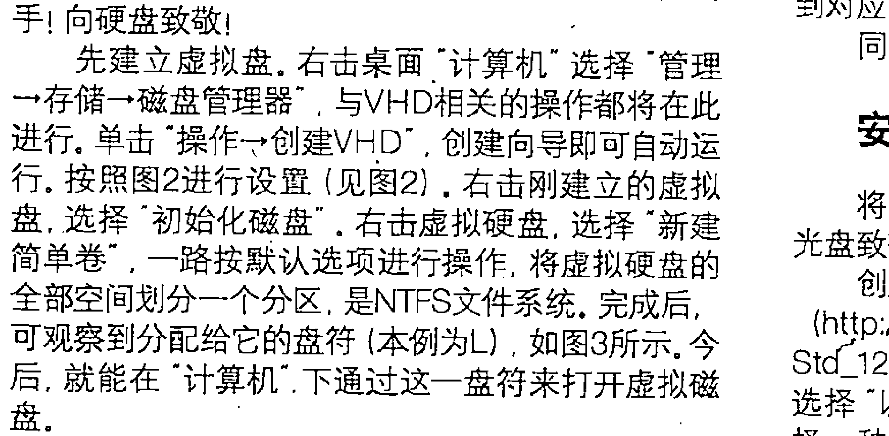

### 买硬盘到京东？不，到Win7

这一环节，随我一起，把这块儿好用的盘弄到手！向硬盘致敬！

先建立虚拟盘。右击桌面“计算机”选择“管理→存储→磁盘管理器”，与VHD相关的操作都将在此进行。单击“操作→创建VHD”，创建向导即可自动运行。按照图2进行设置（见图2）。右击刚建立的虚拟盘，选择“初始化磁盘”。右击虚拟硬盘，选择“新建简单卷”，一路按默认选项进行操作，将虚拟硬盘的全部空间划分一个分区，是NTFS文件系统。完成后，可观察到分配给它的盘符（本例为L），如图3所示。今后，就能在“计算机”下通过这一盘符来打开虚拟磁盘。

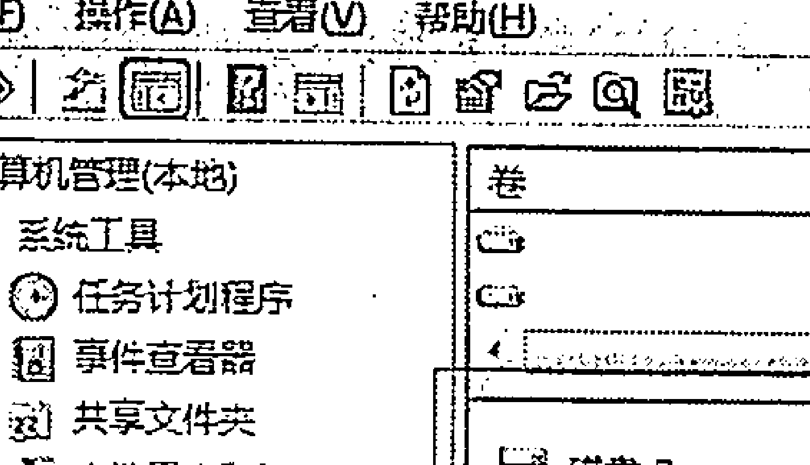

再拷安装程序。以拷贝办公软件为例进行说明吧。首先，在L盘创建名为office的文件夹，接着在该文件夹下创建名为WPS 2009和MS Office 2007子文件夹。然后将WPS和MS Office 2007的安装程序拷贝到对应的文件夹里。

同理，分门别类地存放其他软件的安装程序。

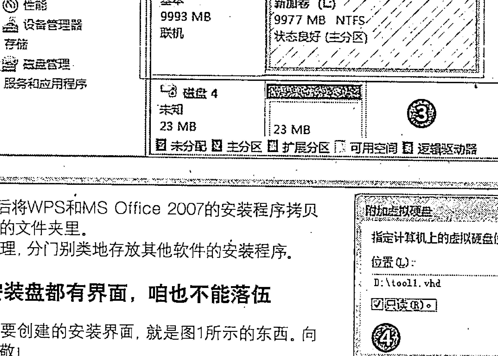

### 安装盘都有界面，咱也不能落伍

将要创建的安装界面，就是图1所示的东西。向光盘致敬！

创建时，笔者使用的工具软件是Autorun Builder（http://dytele2.skycn.com/down/AutorunBuilder_Std_12.exe），下载安装后，右击桌面上的快捷方式，选择“以管理员身份运行”。单击“文件→新建”，选择一种样式后指定保存位置为虚拟硬盘。编辑界面即可打开，以设置“安装WPS 2009”为例进行说明。

第一步：单击“按钮”，在编辑区中画出一个按钮，在右侧的“标题”后输入“安装WPS 2009”，该内容会自动出现在按钮上。

第二步：单击“点击动作”后的空白处直到浏览按钮出现，单击“浏览”，在下一界面中选择“运行程序”，在“目录”后选择“<SelfDir>”表示使用相对路径，这里相对路径指向的是虚拟硬盘的根目录。
第三步：在“程序”后输入WPS 2009的存放路径和安装程序。本例中，输入的内容是\office\WPS 2009\WPSDOCS.18.808.exe。

同理，可为其他安装程序设置界面按钮。完成 后，可在虚拟磁盘里观察到名为Autorun.exe的可执行文件，单击之，安装界面即可出现。

### 小提示

> 为保证输入正确无误，可这样操作：在虚拟硬盘下找到WPS的安装程序，右击选择“属性”，复制路径和程序名即可。复制位置时，不能包括盘符。

最后的改造，以只读方式加载，这样安装盘的内容就不可修改了。学习了光盘的优点。具体操作为：打开磁盘管理器窗口，右击L盘选择“分离VHD”。接着，单击“操作→附加VHD”，将VHD文件导入进来。要注意的是，一定要勾选“只读”（见图4）。

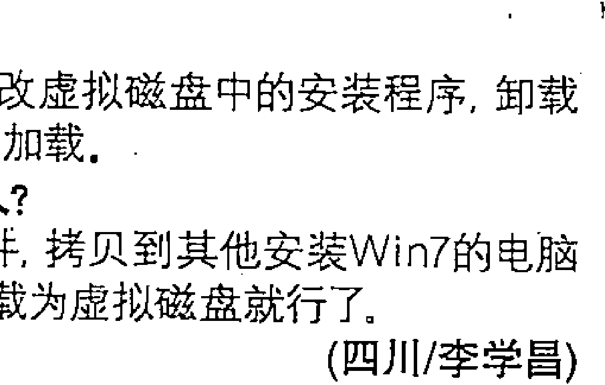

### 我以后怎么改？

今后，如果要修改虚拟磁盘中的安装程序，卸载VHD并以非只读方式加载。

### 我怎么传给别人？

创建的VHD文件，拷贝到其他安装Win7的电脑上，用同样的方法加载为虚拟磁盘就行了。

（四川/李学昌）# 岁末收拾系统 给自带程序配上10种“核武器”

1946年，第一台电脑“埃尼阿克”（ENIAC）要10个房间才能放得下；2010年，电脑可以放在桌子上、书包里、甚至口袋里！1990年，电脑店是“半年不开张，开张吃半年”；2010年，电脑价格一般就5000元左右；1964年，我国第一颗原子弹爆炸试验成功；2010年，《电脑爱好者》普及核武器知识，教Cfan们自己动手给电脑装备“核武器”……

严肃点儿！我声明呢：
1.  本文所用武器，均免费、无毒。
2.  本文所用到的所有工具，都可以到Http://work.newhua.com/cfan/201002/10tool.rar下载。

### PART1.

### 核武器大普及：哪里落后换哪里

#### A“记事本”功能鸟枪换炮

系统自带的记事本太过于简单，于是找来Notepad2，界面简洁，还可以无限撤销、按住Alt可选矩形文本等，语法着色功能，简直就是专门为学生和编程男设计的。
替换方法：对于XP，将软件包中的Notepad2.exe复制到C盘根目录。在“运行”中输入CMD打开“命令提示符”，在其中依次输入以下命令：

```
copy C:\Notepad2.exe C:\WINDOWS\system32\Notepad.exe
copy C:\Notepad2.exe C:\WINDOWS\Notepad.exe
```

询问“是否改写文件”时输入Yes。以后Notepad2将取代系统默认的记事本程序。

小提示：
对于Vista/Win7，由于采用了新的安全机制，替换系统文件不像XP那样简单。需要拿出Vista/Win7的安装光盘，启动时在BIOS中选择光盘启动，进去光盘后，选择“系统修复”。这时在CMD中输入以上命令，重新启动，替换完成。

#### B把Win7的“计算器”借到Vista中

Win7中的新版本计算器除了原有的标准型、科学型等模式之外，加入了实用的统计型、编程型两种模式。计算过程中，发现某一数值输入错误，可通过“编辑”按钮进行自动校对。
将软件包中的calc.exe和calc.exe.mui提取出来放在C盘根目录，按照上文中替换“记事本”的方法，依次输入：

```
copy C:\calc.exe C:\WINDOWS\system32\calc.exe
copy C:\calc.exe.mui C:\Windows\System32\zh-CN\calc.exe.mui
```

这时再打开你的计算器看看，是不是变成Win7的计算器了？

#### C废柴“录音机”就该被淘汰

要录制个声音，有多少人会用系统自带的“录音机”？让Audacity来完全取代它！还能应付常规的音频文件编辑呢。
录音完成以后，如果选择将音频文件以MP3格式导出，会出现不能直接导出的提示，如图2所示。将软件包里的lame_enc.dll复制到Audacity的安装目录里，再点击“是”来浏览相应位置的lame_enc.dll，以后就能直接将声音以MP3的格式导出了。

### PART2.

### 核武器助阵，老家伙更好更和谐

#### 老家伙1.土炮干不过高科技

打开MDIE后，在“工具→MDIE→常规”里勾选“添加至文件的右键菜单”和“替换资源管理器”两项，以后双击“我的电脑”时，MDIE就是默认的打开工具。
MDIE的亮点：
1.  支持鼠标手势；2. 多标签浏览；3. 丰富的搜索模式；4. 详细的选项设置。
此外，进入“收藏夹”功能，可以将常用的文件或程序放进去，以便每次使用都能很快找到；支持多样化的窗口，将多个窗口分割或平铺。
最有特点的还是对插件的支持。插件其实就是一些后缀为VBS、JS的脚本，在工具包的script文件夹中。
点击“工具→扩展功能→管理脚本”。在管理脚本界面中点击“增加”，浏览一个脚本后，输入相应名称。然后在“工具→扩展功能→管理脚本”下就出现了刚才添加的脚本。选中文件，点击“复制选中文件路径”，脚本就能复制路径。

MDIE的亮点：
1.  支持鼠标手势；2. 多标签浏览；3. 丰富的搜索模式；4. 详细的选项设置。

Just Do It：
安装工具包中的IE风行者，便可以在上网的时候享受类似MDIE的便捷功能。除了“鼠标手势”这个功能外，还支持链接拖拽、修复IE、屏幕截图、解除网页内容复制的限制，试试看？

#### 老家伙2.“命令行提示符”增强版

在命令提示符中复制和粘贴一直是个麻烦事。Ctrl+C、Ctrl+V在其中不起作用。Color Console这个增强版的“命令提示符”，可以按照Windows的习惯进行粘贴复制操作，当把文件拖到命令提示符里，路径还会自动生成。
打开Console后，在“文件”菜单中，选择语言种类。Commands（命令）中有常用的CMD命令，方便使用时选择。

#### 老家伙3.“运行”请了新秘书

“运行”是个不折不扣的老“干部”！用处大，又不得事。但如果你是个不喜欢收拾的人，每次都埋头到好几页的开始菜单里或是满屏幕的桌面图标里乱找，Launchy这个免费的程序完全适合你。
安装以后，它会监视开始菜单。默认调出的快捷键是“Alt+空格”，只需要输入关键字（汉语英语都支持），就能打开相应的程序和文件。
对于那些没有出现在开始菜单里的绿色软件，可手动添加索引文件夹路径。在皮肤边框右击，选择“文件夹”，添加相应的文件夹路径以后，再到“文件类型”下面的小框中输入“*.exe”并添加。

### PART3.

### “解码器”化身核武器，抱着WMP看电影

#### A.视频解码，“解码软件”选择多

没有广告、简介的界面，系统良好的兼容性……这就是系统自带的播放器：Windows Media Player。只要安装上解码软件，WMP也能像暴风那样播放各种格式的影片了！下面是目前较常用的解码器对比列表。

| 解码器名称 | 是否自带播放器 | 格式支持 | 推荐指数 |
|------------|----------------|----------|----------|
| Vista Codec Package | 无 | ★★★★★ | ★★★★★ |
| K - Lite Codec Pack | 可选 | ★★★★★ | ★★★★★ |
| 完美解码 | 可选 | ★★★★☆ | ★★★★☆ |
| DivX | 可选 | ★★★☆☆ | ★★★☆☆ |
| 终极解码 | 可选 | ★★★★☆ | ★★★★☆ |
| MPCGo | 捆绑安装 | ★★★★☆ | ★★★☆☆ |

#### B.加载字幕，解码器力所能及

上述解码器中很多都支持字幕加载功能，不过默认没开启！
开启方法很简单，在“媒体库”的下拉菜单中点击“更多选项→DVD→高级”，勾选左边ffdshow对话框里的“字幕”复选框，就能启用字幕加载功能。根据自己的需要，还可以在“字体”窗口中选择合适的字幕大小。

#### C.同步歌词

解码器虽厉害，但还是不具备歌词同步的功能。“乐辞歌词插件”来也，选择安装组件的时候，选择安装“Windows Media Player歌词插件”。第一次使用时，在画面的空白处右击鼠标，选择“乐辞歌词→垂直滚动”，以后它就能自动下载并同步歌词了。

### 岁末大放送，核武器熬锅佛跳墙

#### A.磁盘整理工具——Defraggler

能够快速高效地整理某个磁盘、文件夹甚至一个文件，也可以对硬盘进行查错，还可以通过命令行进行操作。

#### B.图画板的最佳代替者——GIMP

这个免费的图象制作和处理软件，内含几乎所有图象处理所需的功能，号称Linux下的PhotoShop！它的界面、菜单也是模仿PhotoShop，所以风格很像。Windows下的GIMP功能同样强大，而且完全免费，相比PhotoShop，更小巧、节省空间和资源。

#### C.最小的系统清理软件——CCleaner单文件版

正如它的名字一样，整个软件只有主程序这一个文件，无需安装，操作简单、体积小巧，运行速度极快。完全能胜任日常的系统清理工作！

#### 小编点评：

聪明的读者可以看出来，这篇文章用核武器包装，只不过想说明这些增强系统的工具都是经过精挑细选的“实在货”，同类软件中相对最好用。欧盟一直在控诉微软的垄断，让众多软件厂商只能喝稀粥。所以微软很“老实”，除了IE和WMP，不敢给系统配备太强大的软件，其实凭借微软的实力，把这些自带程序都做得很强，并不是什么难事。也好，享受一DIY的乐趣，妙哉！
(四川/李户林)

### 主题单调？取出藏在系统角落的巧克力

在界面上，Win7不仅继承了Vista美丽可人的Aero特效，而且还加入了对开窗口、晃动最小化等花哨功能，让整个系统美轮美奂。但遗憾的是，系统默认自带的主题只有简单的几个，十分单调。其实这只是假象，微软将各国风景特色的主题偷偷地藏在了系统中，不仅漂亮还可以欣赏各国风情，那就来取出来吧！
首先，双击“计算机”打开资源管理器，点击左上角的“组织→文件夹和搜索选项”，点击“查看”，下拉框，去除勾选“隐藏受保护的操作系统文件”，勾选“显示隐藏的文件、文件夹和驱动器”，然后确定。接着进入C:\Windows\Globalization\MCT文件夹，这时候你会看到里头有四五个以“MCT-”开头的资料夹，这就是微软送给你的秘密礼物喽。

小提示
随着Win7的版号不同，能看到的景色主题数量也不尽相同，因此你可能看到的文件夹数量会与文中所说不同。
进入其中任意一个文件夹后，打开Theme文件夹，双击以“.theme”结尾的文件，即可自动打开个性化主题的配置界面，也就是右击桌面选择“个性化→主题”所出现的配置窗口。看看这些布景主题，是不是很漂亮啊！

### 记性不好？用数字证书加密！

在宿舍等公共环境，你的电脑很可能经常要被其他人使用，但是碍于面子，你又不好拒绝。电脑里的隐私文件，是你最担心被发现的东西了吧？提起文件加密，你首先想到的可能就是用系统自带的EFS加密，或者一些加密软件，最专业的要数PGP了，但那个是顶级的专业软件，对于个人用户来说大材小用。我介绍一种小而强大的方法吧！

#### 为什么用它?3大理由说服你

1.  和专业加密软件相比，对解密端需求更低，将证书放在闪盘中，只需携带1MB的解密程序和相应证书即可。
2.  加密介质是数字证书，可在任意位置多份保存。记性不好、懒得去记的兄弟有福了。
3.  和NTFS的EFS加密相比，加密后的文件可任意COPY，不局限于NTFS文件系统。

接下来弹出对话框，在“文件名”处单击右侧的“...”按钮选择保存位置（可在“我的文档”中建立一个专门保存证书的目录），比如放在闪盘中，在“选择导出格式”处选择“PKSC#12及其信任链”并确认，然后输入口令并牢记。

重要提示: 加密证书要妥善保管，最好在闪盘中也备份一下！遗失后，和系统自带的EFS加密相同，数据将无法找回。

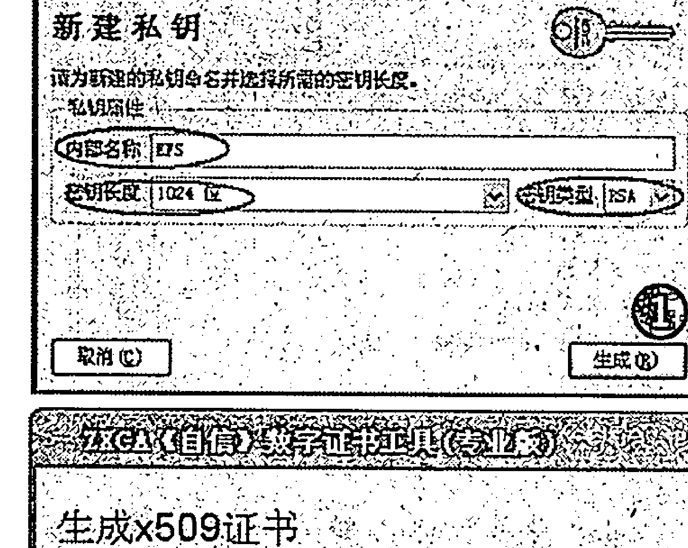

#### 请保镖，你得费些力气

首先，到http://work.newhua.com/cfan/201002/zxca.rar下载解压，进入ZXCA专业版文件夹。

第一步：启动ZXCA，并打开数据库，新建一个私钥，按照图1进行设置。然后到‘证书维护’中‘新建’证书，在‘签发→以此证书作为颁发者进行签发’处选择zxroot，‘签名算法’选择‘SHA 1’；在‘主题’中输入‘内部名称’，‘选配私钥’处选择‘EFS(RSA)’，‘扩展项’中类型选择‘最终用户证书’，勾选‘主题密钥标示’，再选定有效期；在‘密钥用途’中，按图2所示进行选择。

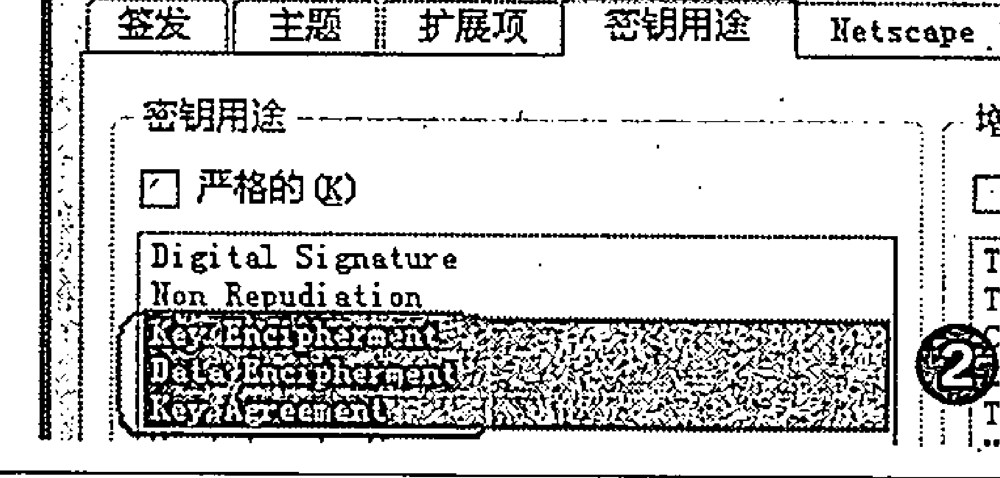

第二步：证书制作完毕，现在导出证书。回到‘证书维护’，点击刚刚建立的证书选择‘导出→文件’。

#### 加密解密，就这么简单！

第三步：将证书导入系统。双击前面下载解压后得到的‘文件小保镖’目录下的EXE文件，安装成功后关闭该界面。双击刚才导出的证书，点击‘下一步’，勾选‘启用强私钥保护……’，然后点击‘下一步’，点击‘根据证书类型，自动选择证书存储区’，下一步后将安全级别设置为‘中级’，再输入密码，点击‘确定’即可。

选择一个需要加密的文件，右击后选择‘文件加密’（见图3），出现证书选择，程序会自动选择刚才制作的证书，确定后即开始加密。一般1GB的视频文件，约1分钟左右加密。

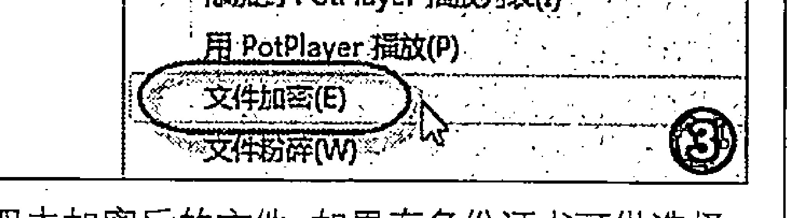

双击加密后的文件，如果有多份证书可供选择，那就选择适合的证书，即可进行解密。解密时间和加密时间大致相等。

#### 小提示：删除本地已导入的证书

点击‘开始→运行’，键入certmgr.msc，在‘个人→证书’下找到相应名称的证书，删除即可。

### 当explorer.exe被绑架

最近几天很烦恼，是这样的，家里电脑只要一打开“我的电脑”，整个桌面就消失了。我知道这是explorer.exe崩溃造成的，这个小程序负责整个系统看得见的窗口啊！但问题在于，找不到让它崩溃的原因，程序一个也打不开，郁闷。

无奈之下，求助了一位电脑达人，这哥们还给CFan写过很多次稿子，他告诉我用Process Explorer就能看出问题，因为很可能是explorer.exe被劫持了。运行Process Explorer后，查看explorer.exe，路径还是C:\Windows\Explorer.exe，但命令行却变成了C:\Windows\System32\rejoice.exe！

我的第1步：先用Process Explorer终止了explorer.exe进程，剩下空荡荡的桌面。打开‘注册表编辑器’，点‘编辑→查找’，在‘查找目标’输入rejoice，回车后发现[HKEY_LOCAL_MACHINE\SOFTWARE\Microsoft\Windows NT\CurrentVersion\Winlogon]下Shell的键值为Explorer.exe C:\Windows\System32\rejoice.exe。哈哈，现身了！双击该键值将其改为explorer.exe。

我的第2步：选择菜单‘文件→运行→浏览’，浏览C:\Windows\System32目录，找到并删除rejoice.exe，再重新运行explorer.exe，系统终于恢复正常了！

(讲故事的人/牲斗士)

它，你将生活在准DOS的年代。被劫持是一种现象，还有，如果发现每个分区都存在autorun.inf，SVCHOST.COM时，explorer.exe很可能已经变为病毒。除了安全方面，有的电脑只要一打开视频文件尤其是MPG格式，会出现错误提示，explorer.exe瞬间崩溃，然后自动恢复，这多半是因为解码器不当导致，更换解码器即可搞定。建议XP用户安装微软官方补丁KB938828，可以改善Explorer.exe的稳定性，下载地址：http://tinyurl.com/ydwfsan。

在explorer.exe崩溃的时候，没有了资源管理器，可以通过按下Ctrl+Alt+Del组合键，点击‘文件→新建任务→浏览’，找到需要打开的程序EXE文件来运行。

#### 小编大结：

explorer.exe虽然不是系统进程，但是缺少了

### 山寨XP？ 雨林木风Ylmf OS抢先尝

近日国内老牌系统技术论坛雨林木风发布新版操作系统——Ylmf OS开源操作系统，据说这是最接近Windows XP的开源操作系统，连操作习惯都没什么区别，甚至微软已经做好了起诉雨林木风的准备。我们的态度是空口无凭，实际情形又如何呢？一起来看。

#### XP？看上去有点像

Ylmf OS的安装镜像可以到http://www.ylmf.org/download.html下载，它的安装和Ubuntu系统非常类似。如果只是想感受一下Ylmf OS，将下载的文件刻录成光盘后启动系统，在启动界面选择进入Ylmf OS livecd即可（默认用户名ylmf，密码为空）。

#### 办公照样在行！

用系统就是用软件，Ylmf OS已经集成OpenOffice办公套装、Firefox、QQ、Linux下的在线电影平台等大量常用软件，而且这些软件菜单也像XP一样集成到了开始菜单。

#### 好酒一瓶，化多年恩怨

Ylmf OS毕竟还是Linux内核，许多Windows程序无法在这个系统下使用，还好集成了Wine平台，使得问题得以解决！有人说Wine不是酒的意思吗？没错，这瓶好酒正是用来化解Windows和Linux之间的深仇大恨。

通过Wine安装，或是把程序复制到Linux系统（Ylmf OS），就可以直接用模拟器运行Windows下的大部分程序。比如需要在Ylmf OS下运行安装在Windows分区下的EXE程序，打开‘我的电脑’，打开已经加载的Windows分区，在EXE文件上右击选择‘使用Wine Windows Program loader打开’即可。

编辑视点：操作系统，仅靠模仿远远不够。从上面的操作我们可以看出，Ylmf OS侧重点主要放在用户操作体验上，不管是操作界面、主题，还是操作方式都尽量做到和XP类似，这样可以使原Windows XP用户平滑过渡到Ylmf OS上，不过对于操作系统来说，系统内在扩展才是根本，由于Ylmf OS本质上还是Linux系统，目前的状况下For Linux的软件还是比较稀少，而且Linux下操作还是繁琐，比如驱动安装和编译就需要一定的水平，这就使得Ylmf OS的应用还存在很大局限性。此外，极力模仿Windows还会带来版权纠纷，我们期望简单易用、完全知识产权的Linux早日走到我们的生活当中来！

(体验者/漂流在外)

#### Wine这杯酒运行Windows程序状况如何？

| 软件类型 | 打开速度 | 运行状况 |
| :--- | :--- | :--- |
| 常用小程序，如QQ、迅雷 | 2~3秒 | 很正常，基本不卡，窗口多、任务多的时候有延迟 |
| 常用大程序，如Photoshop | 5~10秒 | 打开图片速度较慢，操作时稍有延迟，不影响使用 |
| 2D游戏 | 比Windows下慢3~5秒 | 基本不卡，很流畅 |
| 3D游戏 | 同上 | 很卡，不推荐在Wine下运行 |

### “计算机管理”带来的崩溃

我一直喜欢在桌面的计算机图标上点击右键，选择“管理”来调用设备管理器，认为这是最方便、快捷的方法。但最近升级Windows 7后发现，使用这种方法经常导致explorer.exe崩溃。开始以为是安装第三方软件导致的，不料重新安装了一遍Windows 7后问题依旧。多次实验，反复折腾，我终于搞定了这个故障！

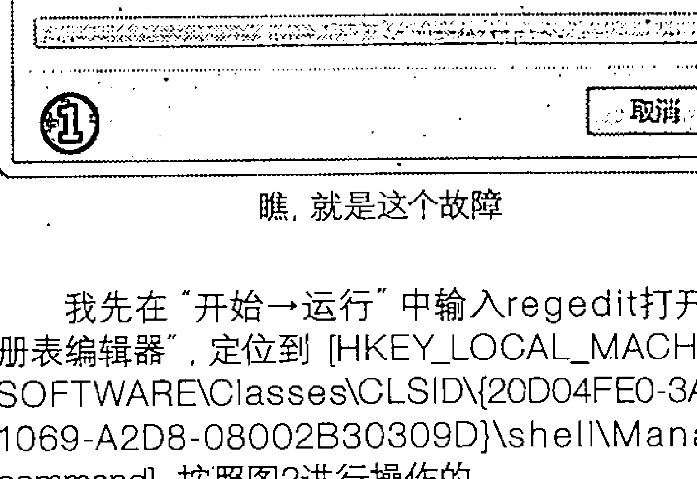

```
regedit打开注册表编辑器，定位到 [HKEY_LOCAL_MACHINE\SOFTWARE\Classes\CLSID\{20D04FED-3AEA-1069-A2D8-08002B30309D}\shell\Manage\command]
然后将图2中1处的键值，修改为：%windir%\system32\mmc.exe /s %windir%\system32\compmgmt.msc
```

作者注：修改后采用的替代命令，是XP系统下调用计算机管理的方法，但是在Windows 7下依然能够正常工作。再多次打开计算机管理，没有出现explorer.exe崩溃的情况。希望微软能在日后的更新中修复此问题。

(讲故事的人：河北/王黎)

### 抢救RAW闪盘中的文件

昨天，通过闪盘拷了一份资料，插到家里电脑上时，打开闪盘却显示未格式化，里面还有重要资料，怎么能格式化呢？紧急时刻，我决定开始修复它。首先，试着使用chkdsk命令扫描闪盘，但是毫无效果。到网上求助，得到一个专业工具EasyRecovery Professional。我打开EasyRecovery，开始了工作。

小提示：不过注意的是，Windows 7默认不会显示常见扩展名，不要将文件名变成backgroundDefault.jpg。如果你的图片不符合上述要求，那么系统会自动从imagesres.dll载入默认的登录图片。

(讲故事的人/李映红)

### 蓝屏的脸不好看 开启AHCI拒绝蓝屏

虽然很早就用上了SATA硬盘，但由于一直用的是Windows XP系统，所以硬盘一直工作在模拟IDE模式下。前几天终于随大流装了Win 7，不过装完才知道硬盘模式忘记改了。开始进入BIOS设置，开启硬盘AHCI，没想到竟然蓝屏了，关闭AHCI重新开启又正常。最终在微软网站找到了原因及解决办法，与大家分享。

小提示：此方法适用于Vista、Windows 7及Windows Server 2008等系统。

(文/李云峰)

### 情人节给MM的本本一个Big Surprise！

#### 天天看到你——登录画面大变身

Windows 7已经原生支持系统登录画面的DIY，这样小李决定用自己的帅照作为MM电脑的开机画面。启动注册表编辑器，依次展开[HKEY_LOCAL_MACHINE\SOFTWARE\Microsoft\Windows\CurrentVersion\Authentication\LogonUI\Background]，将其右侧OEMBackground的值更改为1。接着准备一张JPG格式酷照，但是大小不要超过250KB，分辨率要和当前屏幕显示设置一致（如都为1024*768），文件名称为backgroundDefault.jpg，放置在C:\Windows\System32\oobe\info\backgrounds（本机没有该目录则手动建立）。OK，这样重启后系统的登录画面就显示为小李的酷照了。

#### 一路牵手——恩爱照片做主题

热恋有一段时间了，小李和MM拍摄了不少花前月下的照片。情人节到了，可以把这些照片作为MM的系统主题，让她一起回味幸福的时光。右击桌面选择“个性化→桌面背景→浏览”选择保存爱照片的文件夹，此时在下方的窗口可以预览到照片，依次勾选照片作为背景，同时设置更改图片的时间间隔为5分钟。返回个性化设置窗口，依次设置窗口颜色（为爱美的MM选择粉色）、声音、屏幕保护（设置为显示思爱照片）。最后单击上方的“保存主题”，将主题命名为“一起走过的日子”。这样只要在情人节那天告诉MM，在个性化选择这个主题就会给她一个意外的惊喜。

#### 网络大补贴

如果要制作更为专业的主题，可以参考“Vista主题修改制作入门简单教程：http://bbs.ruanmei.com/thread-106020-1-1.html”

#### 爱要怎么说出口——活动桌面表爱意

要对一个喜欢的MM说出I LOVE YOU并不是一件简单的事情，不过现在借助情人节视频来表达自己爱意则简单多了。Windows 7支持Dreamscene梦幻桌面（使用WMV视频作为活动桌面，AVI、MKV、MPG可直接将后缀名改成WMV），因此小李只要下载一个能表达自己心意的表白视频即可。首先到http://www.xdowns.com/soft/softdown.asp?softid=57381下载“梦幻桌面”组件并安装，安装完成后只要在任意一个WMV视频文件上右击选择Set as Desktop Background（设为背景），就设置成功马上自动播放了。在桌面空白处右击Pause DreamScene（暂停）表示暂停，Play DreamScene表示播放。

#### 小编说说：对你的爱爱不完

除了上述组件，系统中还有许多可以表达爱意的地方。比如可以到网上下载玫瑰形状的鼠标指针（让MM在情人节那天屏幕上移动的都是小玫瑰），或者在组策略的“交互式登录:试图登录用户的文本”里设置一段情意绵绵的告白，MM每次登录系统都会看得真真切切；还可以在“日期和时间”设置中，把自己的名字放在时间前面，让MM天天看到。

(文/平淡)

## I Believe I Can Fly 就是比你快！
7招让电脑健步如飞

李小龙说——拳无不破，唯快不破（《功夫》里那个造型超煞的“火云邪神”也引用过）。大概意思是天下没有最强的武术，招式衔接快，移动速度快等才是最重要的。把这句话用到CFan中：世界上没有最牛X的电脑，只有运行速度快的电脑才是最无敌的……
软硬兼施，本文将传授CFan们打造最快Windows的独门秘笈！

**号外：**
本文所用到的所有工具都可以到 http://work.newhua.com/cfan/201003/js.rar 下载。

### PART 1 内功5心法

#### 1.为电脑巧装启动“测速器”

要想提高自己，得先准确地给自己定位。想要提高电脑的速度，也先得知道现在的速度吧！

##### A.开机测速：

要测开机速度，360安全卫士自带的“开机时间工具”就能解决，对于没有使用360的用户，可以使用BootRacer这个功能简单的测速小软件。

安装完成后，选择Race it(测速)。 Race Setup(测速设置)里保持默认设置，点击Start(开始)之后就重新启动电脑并开始测试。

开机时间的信息会在“事件查看器”中增加一个名叫BootRacer的项目，“右击我的电脑→管理→事件查看器→BootRacer”，双击右边窗口中的“信息”。
如图1所示，里面不但有开机时间的详细记录，还给评出了开机速度的等级。

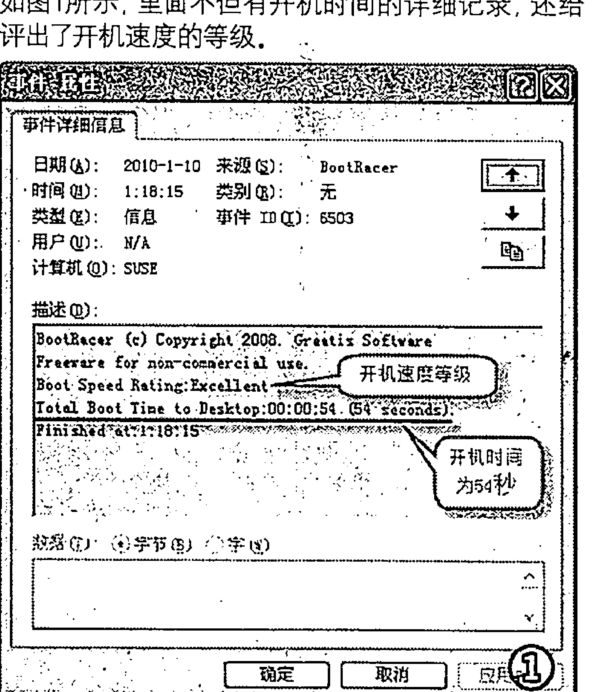

##### B.软件测速：AppTimer——测试程序启动时间的小软件

直接运行即可。在Application中选择要测试的程序位置，在Log File里选择测试结果存放位置，按照图2所示勾选相应项目后，就可以开始了。
Executions框中的数字是测试的次数，可以选择多测试几次再取平均值，这样测得的结果才更加准确。

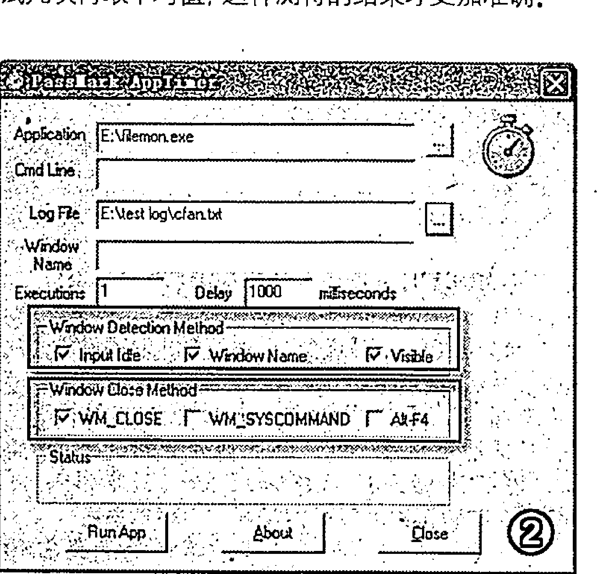

#### 2.IE8不比速度比功能，方便没得说

IE8从2009年3月20日发布至今，有很多新功能依然被大家所忽略。合理利用这些新功能，会带来不少方便。

当土豆上的视频有更新时，如何在第一时间知道它更新的内容？先将土豆网订阅为“网页快讯”，之后，它将在收藏夹栏中显示为一个链接。当网页中的内容更新时，收藏夹栏上的链接将以粗体格式显示，点击它，还能以缩略图的形式显示所更新的内容。

##### 订阅“网页快讯”的方法很简单：

按照图3进行操作，转到需要添加到网页快讯的页面，单击命令栏上的“网页快讯→添加到收藏夹栏”。

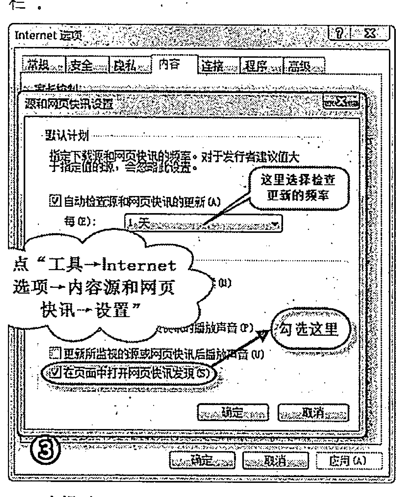

### 小提示

“网页快讯”功能需要网站的支持，http://www.ieaddons.com.cn/webslices/罗列了所有支持网页快讯的网站。

#### 3.加载项管理，IE8有新招

浏览器加载的如百度、谷歌等第三方工具栏……用起来确实挺方便，不过不使用它们的时候，又觉得有点碍手碍脚。IE8中，可以看自己心情对它们“呼之即来，挥之即去”。

在IE8里，每个工具条最左侧会有一个【X】按钮，直接点击就会得到“禁用加载项”的提示，该对话框会将相关工具条及其加载项一并列出，只需点击“禁用”，即可将所选工具条和加载项一起禁用。

当你又想使用这些工具条时，重新启用它们也很简单，在“工具”菜单里点击一下工具条名称即可。

#### 4.不记繁琐英文，拼音打开程序

同样是运行一个程序，为什么邻座的李四就比你快？这个简单，在“运行”中人家输入注册表的时候只输入了zcb，而你是regedit，当然慢了！怎么改？以画图为例。

打开注册表编辑器，找到[HKEY_LOCAL_MACHINE\SOFTWARE\Microsoft\Windows\CurrentVersion\App Paths\pbrush.exe]，键值指向是mspaint.exe也就是画图程序，只需将pbpush改为huatu，以后在“运行”输入huatu就能打开画图，好记又好输入。其他程序类似。

##### 小提示：IE9将能直接调用电脑的硬件？

没错……IE9将支持HTML 5标准，加入了硬件操作功能，网页可与硬件交互，使得动态网页和网页应用程序能直接操作电脑上的硬件，比如浏览器能直接调用摄像头等硬件设备。

#### 5.优化大师+软件闪电侠=计算机中的战斗机

使用优化大师来为电脑提速是软件提速的主要伎俩。无论你用的是“WINDOWS优化大师”还是“超级兔子”，都具有“系统清理”、“系统提速”等功能……它们的使用方法在Cfan中已有多次介绍，这里不再赘述。

所谓的“软件闪电侠”就是各个领域里速度最快的软件了。上表中列举了各个领域里速度最快的软件。

### PART 2. 系统飞奔的两双跑鞋

#### 跑鞋1——迅盘：超高的性价比

Intel Turbo Memory技术，中文名称为“迅盘”。价格不贵，一个1GB的一代迅盘价格不过100元左右，二代2GB的价格也就200多元；对系统性能的提升是相当明显的，尤其是读写速度方面。

#### 跑鞋2——RamDisk：内存变硬盘

32位的Vista最大能用到3.5GB的内存（微软给出的具体数字是3120MB），那么剩下的空间就白白地被浪费了。即使你的64位系统能识别4GB以上的内存，但对于普通用户，8GB的内存相对于4GB内存在性能上的提升也只有5%左右。

利用RamDisk，把不用的内存划分出来当硬盘用。不但充分利用了硬件资源，而且内存的读写速度快，用它作系统的临时交换区，能大幅提高系统的运行速度！

安装RamDisk后，右击程序图标选择“以管理员身份运行”，点击action→add会弹出添加向导，点击“下一步”后，输入虚拟硬盘的空间。这个值的大小可根据这里给出的参考数据（如果内存小于1GB，不建议使用该功能）：

| 内存大小 | 建议设定值 |
|---|---|
| 2GB | 200MB |
| 4GB | 500MB |
| 8GB | 4GB |

设定好虚拟硬盘空间的大小后，其他选项均可保持默认，一路“下一步”……稍等一下就可以在资源管理器中看到虚拟硬盘了。

#### 网络大补贴

RamDisk磁盘的详细应用：http://www.vista123.com/vista/6023.html

将IE临时文件放内存里
在IE浏览器中，选择“工具→internet选项→常规→IE临时文件→设置”，点击“移动文件夹”，更改路径到RamDisk磁盘中，重启之后就完成修改了。

##### 作者经验

如果你的机器配备了8GB的内存，可以毫不犹豫地划出4GB来当硬盘用！把系统的“虚拟内存”直接设置在RamDisk磁盘中，电脑的速度才是杠杠的快！

**(四川/李户林)**

| 适用领域 | 软件名称 | 简介 |
|---|---|---|
| 音频播放 | Foobar1.0 | 老牌“播音”软件，终于出了1.0正式版，容易吗？ |
| 音频编辑、录制 | Audacity | 可以录音、混音、制作特效，支持多种音频格式 |
| 视频播放 | PotPlayer | KMPlayer作者单飞之作，没任何商业杂质，快就一个字 |
| 浏览器 | 世界之窗/Chrome/Safari4 | 这个问题并不绝对……视个人喜好而定 |
| 办公软件 | WPS Office | 超赞的“在线存储”功能，免费、国产…… |
| 翻译工具 | 灵格斯 | 与谷歌金山词霸相比，运行速度更快，资源占用更少 |
| 下载 | Free Download Manager、电驴 | 迅雷速度虽快，但很占系统资源，自己取舍 |

### 指哪打哪 还哥一片纯净磁盘

你也许有这样的经历：不管是下载也好，还是从别处拷贝也罢，长期积累下来，运行程序、操作速度明显变慢，这是由于文件繁多带来的碎片增多，还等什么，快给系统配上新型机械工！

整理磁盘是个太老太老的话题，不整理是不行的，用系统自带整理也是不行的，会等着你地老天荒。

来试试UltimateDefrag（下载地址：http://www.crsky.com/soft/11879.html）这个新型武器，它快在哪里？一个大于1GB的文件，有900MB是位于同一片段中，其它100MB散布在10个片段中，UltimateDefrag只会移动这100MB部分。

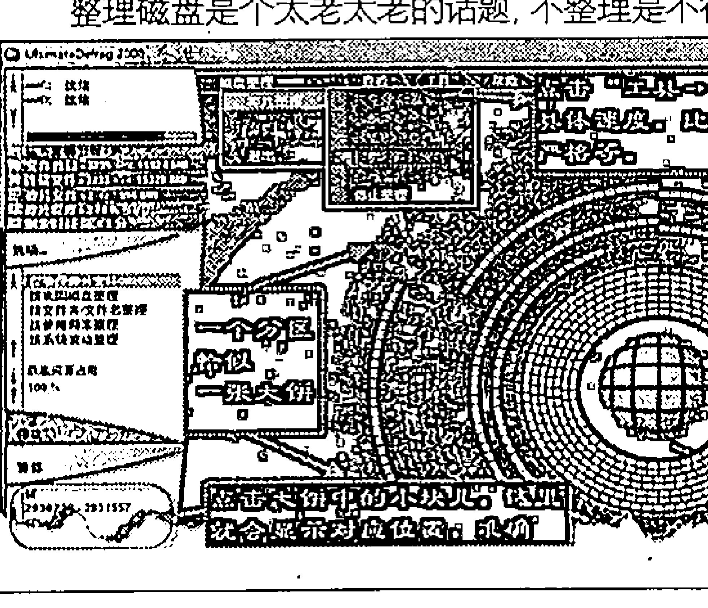

最简单的使用方法：点击“磁盘整理→碎片整理→自动整理”，OK了！想要学会指哪打哪的高级本领，就得研究一下图了：

(文/肥灰机会灰)

### 老电脑也用XP模式！

安装了Windows 7的朋友或许知道，如果打算使用其内置的XP MODE，需要具备一个前提：那就是CPU要支持硬件级的虚拟模式，并保证这个模式处于开启状态。这个要求看似无理，但也算敬，谁让你用的是人家微软的东西呢。两年前的电脑怎么办？总不能凉拌！CPU不支持虚拟技术，也能安装XP模式啦！方法如下：

下载地址是http://work.newhua.com/cfan/201004/vxp.rar，解压后，32位的操作系统选择安装Windows6.1-KB977206-x86.msu，64位操作系统的用户选择安装Windows6.1-KB977206-x64.msu，稍等片刻即可安装完毕，然后再重启电脑，试一下，是不是可以运行安装XP MODE了呢？

小知识：什么是XP模式？所谓XP模式，就是在Windows 7系统下独立出来一套XP系统，用以运行较老的程序。除了对CPU有要求外，对Windows 7版本也有要求，必须是专业版以上的版本才行。

### 不请大爷请小爷 终极攻防系统指标

重装系统之后，你懵了，显卡声卡要什么驱动来着……这时候，你需要一款能够帮你的软件。通常情况下，要查看电脑的系统信息尤其是配置信息，大伙儿脑海中第一个浮现的程序应该是Everest，可惜并非免费。今儿来了一位爷，名为SIW，不仅这方面门清，还通晓系统内所有账户密码，着实厉害。

软件小档案：
System Information for Windows（SIW）
软件性质：中文免费 软件大小：4.13MB
运行环境：Windows 98/Me/2000/XP/Vista/7
下载地址：http://www.gtopala.com/siw-download.html

打开程序后，点击工具栏的“Tools(工具)→Options(选项)→General(首选项)→Language(语言)”下拉框选择“简体中文”并点击Save(保存)，哈哈，整个程序界面立马从天书变成可读易懂的说明书了吧！

### 小提示

安装之后，SIW不会自动在桌面建立快捷方式，你需要到“开始菜单”里找到它的目录并右击SIW程序选择“发送到桌面快捷方式”。

#### 牛技1：系统信息门清

SIW侦测电脑系统信息主要分为三大部分：软件、硬件、网络。点选任一项目，就会以树状图显示分类内容。打算查询系统版本时，只需这样操作：

重装系统之后，想查看具体的硬件配置，点击“硬件”再点击打算查看的硬件设备，比如“显卡”。想将配置单打印到一张纸上，送给会修电脑的表哥查看帮忙？很简单，全选配置单之后，右击选择“导出至→HTML”即可。

#### 牛技2：密码统统盘查

忘记密码是所有人的通病，细心的家伙用一个EXCEL表格全部记录着，结果有一天，这个表格被盗，杯具了……只要你在本机上保存过的密码，不管是本地软件密码，还是网站登录密码，SIW都能统统帮你盘查！

点击工具栏“软件→储存账户信息”，可以显示系统中自动储存记录的账户密码，一样可以用刚刚相同的方法保存下来。“软件”的“授权”里还保存着所有软件，包括Windows系统的KEY。注意哟，在别人电脑上运行这个软件的时候，可不要偷看……

而点击“工具→Eureka!”，则会开启一个密码检测窗口，拖曳放大镜到密码上，可“透视”任何密码区域，这个功能类似于早期的星号密码显示工具。

小编说说：对一般电脑使用者，SIW功能已经算是强大，不输给其他付费的软件，其中可以侦测软件密码与序列号的功能，对记性不好或要重装系统的人非常有用，但是特别提醒，千万不要用这个功能窃取他人隐私，以免违法哟！

### 这是事实：无须量产打造系统安装闪盘

现在流行将系统安装文件放到闪盘中制作可安装系统的闪盘。不过，要想制作一个可安装系统的闪盘，需要量产处理，没有一个统一的软件方案，对于很多电脑新手来说，是个难题。现在，无须量产，系统安装闪盘两步即可搞定。

第一步：从http://wintoflash.com/home/en/下载这款名为WinToFlash的小工具，点击Service→Option（服务→选项），在Language处选择Simple Chinese（简体中文），点击“确定”。

第二步：将事先准备好的大容量闪盘中的重要数据做好备份，然后运行WinToFlash，单击主窗口中的绿色对钩按钮启动制作向导，接下来只要选择Windows源安装文件的位置，再指定闪盘对应的盘符，再单击Next按钮即可开始制作了。

只要经过上述两个步骤，一块可以安装操作系统的闪盘便制作完成。支持Windows XP/2003/2008/Vista/7系统，假如系统安装文件以ISO光盘映象格式保存在硬盘中，可以使用虚拟光驱加载，然后再进行制作。

(文/daigua)

### 山大王版Windows 7？上网本专用系统

随着上网本市场的火爆，早在Windows 7正式推出之前，微软就宣布其支持上网本。不过，现在正式推出预装Windows 7的上网本使用的都是功能“阉割”的Windows7 Starter Edition（初级版）。近日一个名为ModMyEee的组织，开发了名为Windows 7 Netbook Edition的版本，功能上按照旗舰版“标配”，最关键的，是号称能够在任何上网本流畅地运行！真实的情景又如何？下面就一起来尝鲜吧。

#### 下载费点儿劲，安装很Easy

这款系统镜像保存在rapidshare网络硬盘上，需要下载的用户可以先到http://cryptload.info/home/下载专用下载工具（需要.Net2.0支持才能运行）。启动CryptLoad后依次添加http://rapidshare.com/files/336241901/Win.7.Netbook.Edition.part01.rar.html，直到part14.rar.html，总共14个压缩包，全部下载后，选择第一个压缩包解压后，得到Windows 7安装光盘文件。以前CFan介绍过了，上网本系统需要用闪盘安装，用微软推出的系统硬盘安装工具，具体不再赘述。基本上和原版Windows 7安装是一样的。

### 小提示
制作者描述，这个精简系统可以在内存256MB以上的上网本安装，但经笔者测试，内存超过512MB才可以安装，好在市面上的上网本至少都配备了1GB及以上的内存。

#### 详细体验，着实不赖

1.占用容量确实小。制作者说这个版本最低硬盘容量只要4GB，安装后实际测试C盘占用的容量为1.83GB。多数上网本都是固态硬盘，由于造价较高，容量都偏小，省下来4GB的空间，也是不错的。默认开启进程只有25个，占用内存254MB左右，确实可以流畅运行。

2.上网功能，基本够用。上网本主要功能就是网络，虽然这是个精简系统，但基本可以胜任上网需求。Windows Media Play（欣赏在线歌曲、影视）、IE8、网络设置、网络共享等组件一应俱全，经测试全部可以正常、持续使用。

3.功能略有不足。由于制作者主要针对上网本进行优化，一些组件被删除或更改。比如，在8GB硬盘上网本上，系统自带的DVD Maker就无法运行，并且默认关闭UAC提示，等等。

编辑视点：上网本操作系统市场，是谁都想吃一口的肥肉。上述系统只是一个非官方的上网本专用系统，但是它的功能却远远超过官方推出的Windows7 Starter Edition。其实随着上网本市场的不断走热（2009年中国市场上网本的销量高达200万台），上网本操作系统市场也日益引起了很多巨头的关注，谷歌（Chrome OS）、英特尔（Moblin）就纷纷推出自己的操作系统。作为操作系统霸主，微软当然不会放过这块市场，不过之前推出的Starter Edition却没有讨得用户的欢心。在此之前，我们当然希望看到更多类似上述的功能强大的Windows 7 for上网本系统，以便早日让微软推出功能类似的官方上网本系统！

(体验者/漂流在外)

### 那些传说的美好 抓住被微软放飞的安全信鸽

中国有句方言叫“放鸽子”，用这个词来形容微软怎么样？在过去那些年，微软跟我们玩了很多次躲猫猫，一些承诺的功能迟迟没有实现，尤其是安全方面，至今仍是一句空话。Windows 7号称是Windows有史以来最好用的版本，那些被放鸽子的功能是否实现？今天，我们一起来捉住被微软放飞的鸽子！

#### 总有飞回来的鸽子——已实现功能

##### 贴心功能篇

XP时代，“家长控制”主要手段主要有以下三种：

- 1. 技术型家长：这类家长一般会用WIN+R组合键打开“运行”窗口，在其中输入eventvwr打开“事件查看器”，在“系统”中寻找事件ID为6006的信息，双击它，事件属性里记录的时间就是电脑关机的时间……以此来判断孩子什么时候关机睡觉。
- 2. 聪明型家长：这类家长会借助“绿坝花季护航”（下载地址：http://www.skycn.com/soft/46657.html）。注：国内著名软件，功能就不用多介绍了！
- 3. 暴力型家长：锁显示器、锁主机、藏鼠标、藏键盘……

##### 安全篇

- 1. 另类‘云计算’，辛苦却不讨好
微软在IE8中特别添加了“SmartScreen筛选器”。当用户不知情地访问了被挂马的网站时，“SmartScreen筛选器”会主动出击，告诉用户这个网站不安全；当用户怀疑某网站是钓鱼网站时，也可通过浏览器中“安全→SmartScreen筛选器→检查此网站”来判断网站是否安全……
但真正遇到不安全网站时，又有多少人会上报？因此，对付网马和钓鱼网站，IE8依然有些乏力。
- 2. ‘5毛’干果‘MSE’
去年9月末，微软在众多安全厂商的恐慌中推出的免费杀毒软件——Microsoft Security Essentials。经笔者试用，MSE具有4项特点：
    1.操作简单，所有相关的设置都在“设置”栏中，每项设置均有详细说明，适合普通用户群使用。
    2.自我保护能力差，通过CMD命令或任务管理器能轻易结束其进程。
    3.发现新的病毒或木马时，需要用户手动上报。
    4.能检测并报告带病毒的闪盘、邮件，但不能预防挂马网站。
总而言之，MSE的功能一般，只能算是一颗食之无味，弃之可惜的干果！5毛钱买一大把。
- 3. 我为安全而生，客串软件管理
Windows Defender是内置于Vista/Win7中的一个反间谍软件，除了扫描系统中的流氓软件这项本质工作以外，它还能客串软件管理器！
打开Windows Defender的主界面，在“工具和设置”里选择“软件资源管理器”，当前在电脑上运行的所有软件、DLL文件、甚至内核级的程序都将按类别列举出来。

#### 还在放飞的鸽子们——未实现的功能

##### 1.DIY比官方更好的‘自动播放’

自动播放的安全漏洞在XP时代就有，于是，人们就关闭自动播放来换取系统安全。但不会用电脑的人把光盘放入光驱的时候……没有弹出自动播放，谁又来告诉他们该怎么做呢？
等待微软解决这个问题？省省吧……都从XP等到了Win7了还没解决！CFan教你如何按需求设置‘自动播放’

- 第一步：在“运行”中输入regedit回车打开“注册表编辑器”，按Ctrl+F打开“查找”，在查找目标中输入NoDriveTypeAutoRun，找到这个键值，双击它，其中默认的十六进制值91是什么意思呢？
- 第二步：在“运行”中输入calc打开计算器，选择菜单“查看→科学型”，在十六进制下输入91，然后切换到二进制下，91对应的二进制数即为10010001，就是这个八位的二进制数控制着自动播放的启用与否。
- 第三步：对照下表，确定每一位数值的作用：

| 设备名称 | 第几位（从左至右） | 默认二进制值 | 能否自动播放 |
| --- | --- | --- | --- |
| 不能识别的类型设备 | 1 | 1 | 不能 |
| 没有根目录的驱动器 | 2 | 0 | 能 |
| 可移动驱动器 | 3 | 0 | 能 |
| 固定的驱动器 | 4 | 1 | 不能 |
| 网络驱动器 | 5 | 0 | 能 |
| 光盘 | 6 | 0 | 能 |
| RAM磁盘 | 7 | 0 | 能 |
| 供用户扩展的驱动器 | 8 | 1 | 不能 |

为了系统的安全，把第二、三位的值改为1，然后将修改好的八位数值转换成十六进制数值（按此修改后的二进制数即为11110001，对应16进制数为F1），填到前文所说的“数值数据”中，F5刷新，改造完成！

##### 2.Guest账户，超管克隆……黑客的‘后门’依旧

3389就是“远程桌面连接”的默认端口，黑客们拿到系统的控制权以后，往往会将系统中原本禁用的Guest账户克隆成Administrator账户，拥有超管的权限，无视超管原有密码。
将Guest账户克隆成管理员账户的方法：在注册表编辑器中展开[HKEY_LOCAL_MACHINE\SAM\SAM]，在SAM的右键菜单中选择“权限→组或用户名”，选定Administrators，将“完全控制”和“读取”两项勾选为“允许”，确定之后，F5刷新注册表，再依次展开该SAM项所包含的[Domains\Account\Users\000001F4]，将其下二进制项F中的数值复制到000001F5的F中，超管账号就被成功克隆了！
无论是高手还是菜鸟，几乎每个黑客都知道这个方法，而微软却置若罔闻，这样的伎俩在Win7中依然奏效！

#### 连接方式还需增强

在XP里使用投影仪、外界显示器进行演示是个麻烦事，尤其是笔记本！“右击桌面→设置”，选择了相应的屏幕以后，会出现“属性设置”的对话框，保持默认设置，然后再按笔记本的键盘上Fn+F4组合键来完成屏幕的切换。Vista和Win7都有所改进，连接外部显示设备之后，在开始菜单的“附件”里选择“Windows移动中心”，点击“连接显示器”和“演示设置打开”。Win7下，按Win+P组合键，可以快速选择显示模式。
但是，与一些第三方程序相比，微软的产品简直就是小菜一碟了。比如Thinkpad系列笔记本的自带程序Presentation Director，除了普通的快捷调整方式Fn+F7，对VGA、DVI、S端子等接口实现记忆功能，在任何一种接口上连接过的设备的分辨率，下次连接上不必调整。

#### 微软不给钱，我们自己玩

| 实现目标 | 所用软件 | 下载地址 |
| --- | --- | --- |
| 控制自动播放 | Tweak UI | http://www.skycn.com/soft/2981.html |
| 清理间谍程序 | SpyBot | http://www.safer-networking.org/cs/index.html |
| Thinkpad连接管理程序 | Presentation Director | http://tinyurl.com/ydrecz |
| 杀毒软件 | Microsoft Security Essentials | http://tinyurl.com/yzuqzyq. |

#### 网络大补贴

如今的互联网可不太平，流氓软件满天飞，所以你需要Windows Defender，关于它的详细解析，请看：http://tech.ddvip.com/2008-08/121938815156713.html

##### 小编说说：

- 1 先说黑屏，Windows 7安全补丁致黑屏死机，微软对此是一直否认，毕竟死机的原因实在是很多，目前也没有谁能拍着胸脯说完全能解决黑屏死机这一问题。
- 2 再说安全防护，攻击者总会发现新的攻击方式，不过像XP上现在这么容易的攻击方式估计是不会再有了。微软将深度防御技术加入Win7中，让攻击者很难发掘并利用软件漏洞，并在硬件层面通过DEP（Data Execution Prevention，数据执行保护）以及ASLR（Address Space Layout Randomization，地址空间随机加载）等保护功能的形成，形成了一套严密的防护机制。
- 3 最后说下期望，其实我们也并不对微软的操作系统在应付全球数亿用户的同时，还要保证足够的安全，做出过多期望，这会让安全厂商没饭吃，但是，微软能不能不要总做出保证，用户会有种被忽悠的感觉，也真心地希望Win7真的很好很安全。

（四川/李户林）

### 重装系统一波三折 Ghost不行用PE

偶是一位未满14岁的初中生，看，那就是我11岁时的照片，怎么一个帅字了得！更有幸的是咱有才，是公认的电脑高手。但人就怕出名啊，这点事被我英语老师知道了，他有一台八岁的戴尔电脑，那天电脑死活进不去，显示完Logo后就啥也没有了，拯救这台电脑的任务就自然落到了我的头上。立刻我感觉到身后是班里众男生怀疑的目光，还有众MM期待的双眸，此行我只能成功不许失败。带上我的武器：深度技术Ghost XP，工具闪盘一个、螺丝刀一个、Office 2003盘一个，直奔办公室。
上午，把Ghost XP光盘一放，熟悉的Ghost页面出来，估计10分钟就好，逐赶回去上课喽。令人崩溃的事发生了，我可怜的老师从上午到下午，用我的光盘装了N遍，总是到90%报错，然后无情退出。

我再想一招：以前CFan介绍过硬盘和光驱线在一条线上导致错误，可是老师死活不让拆电脑，无奈作罢！
再一招：用PE装。
正好我的光盘里集成了PE，进入用了整8分钟，折磨死我了，内存才256MB，进入，打开个我的电脑用了3分钟，打开盘用了5分钟，上课铃早已打响，这是放电影的语文课。我的电脑打开了，却死活不响应，打开光盘，寻找希望，硬盘安装是个啥？不会是在硬盘上装Windows XP吧，打开一看，onekey ghost硬盘版，希望来了，快乐地打开，又用了4分钟，选择“恢复到C盘”，未响应，吓死我嚎，3分钟后出现正在恢复的字样。我的形象逐放大五十倍，接受身后办公室老师和本班MM的敬仰……

虽然你的形象很高大，不过我不得不说是你偷懒了，直接给老师重装系统了。很多时候别人都不想重装哦，应该先试试解决这个问题。这时，常规思路是先用F8，选择“按照最近一次正确配置启动”，如果不能启动，把所有的外设都拔掉后再重新启动，如果能够进入呢，可以尝试下这个方法：在命令提示符中输入：

```
chkdsk C: 如果显示有问题的话就再输入：
chkdsk C: /f 再就是输入：sfc /scannow
```

无法解决时我们再进行重装，从上面的故事中我们知道，现在装系统有很多方法，Ghost出问题的话，还可以用PE。
（主人公：狂人的脚丫）## 找回Win7图标 我有全能神KEY

每年一到冬天就晕头转向的，很大的原因在于总在屋里憋着，新装的Win7又来找麻烦：桌面系统图标全都没了，集体玩失踪！这对我的智商是个严重的挑战，太容易了吧！

用鼠标右键点击桌面后打开“个性化”，然后点击左侧的“更改桌面图标”，把“计算机”、“回收站”什么的统统勾选，再点击确定，哈哈，桌面上肯定会出来了吧？！回到桌面后，我傻了，还是没有！

想起了CFan介绍的Win7的“上帝模式”，其实就是利用系统中每个组件的身份证（CLSID）将它们调出呀，那我就猜想了，是不是这些系统图标也有各自的CLSID呢？

第一步：按Win+R打开“运行”输入regedit回车打开注册表编辑器，找到[HKEY_CLASSES_ROOT\CLSID]，哈哈，这里保存了系统中用到的所有CLSID，挨个查找，5分钟后，终于找到啦！{20D04FE0-3AEA-1069-A2D8-08002B30309D}后面的描述是Computer（见图），就它了，我把它复制下来。

第二步：在桌面上新建一个文件夹，重命名为“计算机.{20D04FE0-3AEA-1069-A2D8-08002B30309D}”，点击“确定”后，一个熟悉的“计算机”图标就出现在眼前了，点击进入后，出现熟悉的系统盘符。同理，在桌面上增加其它的系统图标，用“文件名.{CLSID}”，然后确定。

### 小知识：啥是CLSID？

英文是Class Unique Identifier（传统的唯一身份），对于不同的应用程序、文件类型、特殊文件夹以及各种系统组件，Windows都会分配一个唯一表示它的ID代码，也就是说，它是系统国百姓的身份证号码。

Refine：通过CLSID这个神奇的东西，你还可以做许多事情。下面是常用的CLSID，参考对照后复制就行，省得大家挨个寻找再输入：

- 回收站：{645FF040-5081-101B-9F08-00AA002F954E}
- 我的电脑：{20D04FE0-3AEA-1069-A2D8-08002B30309D}
- 网络链接：{7007ACC7-3202-11D1-AAD2-00805FC1270E}
- 用户账户：{60632754-c523-4b62-b45c-4172da012619}
- 库：{031E4825-7B94-4dc3-B131-E946B44C8DD5}

(讲故事的人/侯忠)

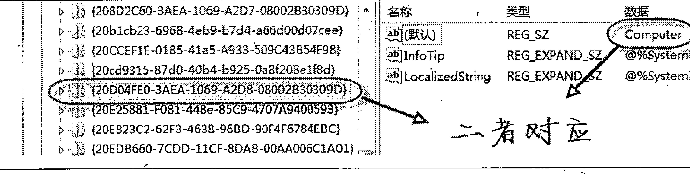

### 微软反盗版全球黑屏 我们成惟一例外

2月17日，微软全球分布一个特殊的Windows 7补丁，此补丁是针对“Windows激活技术”的更新，以验证用户使用的操作系统是否为正版。非正版用户若安装该更新，30天宽限期过后，电脑桌面壁纸将变为黑色。但据微软表示，本次中国市场是“惟一的例外”，尚不会通过Windows Update来要求用户下载安装这一更新。这一消息的发布，真是喜忧参半！

### 亲历激活 新技术有何神奇？

首先，我们来看一下，这个补丁有什么特别。微软提供的Windows 7 WAT更新知识库文章名为KB971033，文件名为Windows6.1-KB971033-x64.MSU或Windows6.1-KB971033-x86.MSU。

正版验证更新程序首先进入下载状态，通过与微软的服务器连接下载微软最新的正版验证数据和程序，从而做到了反盗版技术的实时更新。相关文档透露此次Windows 7的“Windows激活技术”更新数据中，可以检测出70多个已知和潜在的危险激活破解程序，将可以帮助用户确认安装在电脑上的Windows 7是否是正版，并且验证关键系统文件是否完整。这样一来，网上流传的诸如“某某论坛版”、“一键装机版”等等经过特殊改造过的系统将被直接屏蔽掉。

完整性检查完毕之后，正版验证程序开始将系统安装时提供的产品密钥传送到微软的相关服务器上进行检查。在微软的正版验证服务器中存在着一个白名单库和一个黑名单库。顾名思义，白名单库中存放着微软所有发放的产品密钥记录；而黑名单库则记录的是所有因为各种原因被封杀的产品密钥。

### 小提示

在Windows 7刚发布的时候流传出来的两个安装产品密钥，一个是OEM版本的产品密钥22TKD-F8XX6-YG69F-9M66D-PMJBM，另一个是零售版本的产品密钥TFP9Y-VCY3P-VVH3T-8XXCC-MF4YK。这两个产品密钥已经很荣幸的进入了微软的黑名单库。

正版验证程序检测完所安装的操作系统产品密钥都不在黑名单库中之后，这个程序开始在白名单库中查找产品密钥是否有效。为啥？这一招微软是用来对付那些使用算号器来安装操作系统的。如果检测到所安装的产品密钥不在白名单库中，那么就开始享受“黑屏”待遇。并且每一个小时都会告诉你系统不是正版的。如果这些步骤都顺利通过的话，我们将会看到下面这个界面告知已经通过了正版验证。当正版验证程序显示所安装的操作系统不是正版之后，可以在30天之内更换产品密钥然后重新激活并验证系统是否为正版。

### 听@Windows 7新增命令行的闷骚独白

都3D窗口界面了，为啥还要命令行？

- 许多复杂的点击，仅需一条命令就可实现，何乐而不为？
- 图形界面花哨的同时，带来了不稳定的代价，那时候只有命令行能救你。
- 有些事情只有命令行可以做。

虽然Windows的外观做得越来越漂亮，不过微软仍然没有放弃能给大家带来便捷操作的命令行。在Windows 7中新增了不少命令，这些新命令或弥补以前版本的不足，或提高操作效率。

#### 独白一：“哥更加独立了”

- 1.再也不用装复制软件了

Vista时代，系统复制BUG一直让人抓狂，甚至需要安装Teracopy和Fastcopy之类的第三方软件。为了解决复制难题，在Windows 7中新增了Robocopy命令，新命令提供详细复制参数，并大大提高了复制速度。比如，添加/ETA参数（可以显示复制文件的预期完成时间以及复制速度），这样无需任何工具就可以用它来测试闪盘写入速度。输入下列命令，在最后的复制结果，就可以看到写入闪盘的时间和复制速度：

```
robocopy j:\win7\sources k:\install.wim /eta（K:为闪盘盘符）
```

- 2.把补丁集成？用DISM呀

微软每个月都会发布补丁文件，自己要制作集合补丁的安装镜像怎么办呢？Vista下可以使用WIM格式来封装系统，不过并没有自带管理工具。Windows 7新增了DISM命令，不需要安装管理工具，也可以轻松对WIM文件进行管理。使用DISM对补丁进行整合的方法：

以管理员身份启动“命令提示符”输入下列命令即可（rem为注释，不用输入）：

```
rem 将install.wim中第5个映像（U版）加载到D:\win7，install.wim已经预先提取到f:\win7\sources\下
dism /mount-wim /wimfile:f:\win7\sources\install.wim /index:5 /mountdir:d:\win7
rem 将下载到的补丁Windows6.1-KB973874-x86.msu集成到安装文件中
Dism /Image:d:\win7 /Add-Package /PackagePath:k:\Windows6.1-KB973874-x86.msu
rem 卸载集成补丁的映像，重新刻录后安装的Windows 7就自动升级上述补丁了
Dism /Unmount-WIM /MountDir:d:\win7 /Commit
```

#### 独白二：“哥再也不寂寞”

#### 2.文件保护有妙招！

工作文件经常误删？本地邮件全盘失踪？你需要培养备份的习惯。Windows 7新增了一个创建硬链接的命令，通过该命令创建的链接就像生成了一个文件的备份（但是又不占用空间）。因此可以利用这个特性来为重要文件作备份。

假设要保护Outlook的邮件文件夹outlook.pst，备份保存在NTFS分区K:\Mail目录下，为防止其他用户误删这个文件，可以在“命令提示符”输入“fsutil hardlink create C:\mail\outlook.pst k:\mail\outlook2.pst”，成功创建硬链接后，邮件文件夹就链接到了k:\mail\outlook2.pst，这两个文件的内容是一致的。

即使重装了系统导致outlook.pst被删，仍然可以打开k:\mail\outlook2.pst（反之亦然）。而且只要删除链接中的其中一个文件，另一个文件就会带上一个小锁标记，方便我们即使发现并重新添加链接。

#### 1.轻松夺取文件权限

有些朋友看了网上伪劣的“减肥”教程，费了好大的劲把C:\Windows\System32\DriverStore\FileRepository下的所谓“垃圾文件”删除。重启后提示缺少系统文件，此时想把回收站删除的文件还原，系统提示没有权限还原。

借助两个新增的命令，只要一步完成所有操作：

- Rem 将文件所有者更改为管理员组

takeown.exe /A /F c:\Windows\System32\DriverStore\FileRepository

- rem 将指定目录完全控制权限赋予CFAN账户

cacls.exe c:\Windows\System32\DriverStore\FileRepository /E /G cfan:F（cfan为当前用户）

### Just Do It

Foxmail等工具的邮件文件，也占用了不小的硬盘空间，备份不太方便。能不能也用这种便利的备份方法来搞定呢？

(河北/吕又民)

### 强！闪盘让电脑在黑夜与白昼之间徘徊

当你正在浏览美女写真，打算去趟洗手间方便一下时，电脑怎么办？放在那里，等着回来后被众人围观？待机，算是可行，但没什么技术含量。用Win+L呀！No，高手不会把锁定密码和登录密码弄成一个。有些人想到了：用闪盘当KEY！没错，Predator就可以从硬件层面锁定电脑，而开启电脑的钥匙，就是随身携带的闪盘。

闪盘丢了也能解锁。最后“在驱动器上创建密码”项中，选择闪盘的盘符，然后点“创建密码”，闪盘钥匙制造完毕。

#### How to 制作？

下载并解压Predator（http://work.newhua.com/cfan/201004/pd.rar），插入闪盘，然后再双击Predator.exe打开程序，弹出的窗口点确定。

别急，先设置一下，很简单，按照图示设置，其他参数可以按照个人习惯灵活设置。

开工！在“新密码”中输入备用密码，这样的话，

#### How to 使用？

在工作时，Predator会变成锁状图标出现在系统任务栏，变为红色时，代表Predator正在更新闪盘中的安全信息，此时千万别拔出闪盘！后果自负哟。当你拔出闪盘后，会自动黑屏，插入闪盘即可恢复一切啦！

### 小提示

如果闪盘遗失，密码也忘记了，可进入系统的安全模式，选择“开始→运行→msconfig→启动项”，将Predator前面的勾取消，重启进入系统即可。

### 效率时代 公式输入还是手写快

在文档中输入复杂的数学公式一直是个麻烦事，不过贴心的Win7已经帮你想好解决的办法了：用鼠标或手写板手写来输入公式。

在“运行”对话框中输入mip回车，就能打开公式输入面板了。用鼠标在面板里写出你需要的公式，写好后在上栏会自动进行识别，如果识别正确的话，那只要点击下面的“插入”按钮，这样就可以插入到文档中了。

在写公式的时候符号很容易被误认，别担心。这时先点击旁边的“选择和更正”按钮，然后再点击需要更正的字符，这时就会弹出候选字符的菜单，重新选择一下就可以了。万一菜单里面仍然没有你想要的字符，那就直接在显示的虚线框中重新写入！

其实在Office中就自带有“公式编辑器”，使用方法也比较简单：单击“插入→对象”，在“对象类型”中找到“Microsoft公式3.0”，选定后点“确定”，就能在公式编辑窗口中选择合适的符号或类型进行编辑了。如果勾选了右边“显示为图标”的复选框，那么公式就以图片的形式显示在文档中。

（四川/李户林）

### 分享经验 录像“救命三部曲”

经常会有异地的朋友问些电脑问题，为了让对方快速解决，双方都不得不一会儿发截图、一会儿发文字……不但麻烦，而且效果差强人意。比如，对方需要在注册表中添加一个键值，语言表达很吃力。用了Windows 7的话，“问题步骤录制器”可轻松解决这个问题：只需把步骤操作一遍，并把“录像”发送给对方即可。

在“开始→运行”中输入psr，即可快速打开“问题步骤录制器”。

运行“问题步骤录制器”，按照图片“救命三部曲”进行操作（见图），在需要输入文字，比如“运行”处要输入regedit，则点击“添加注释”，此时鼠标会变成十字光标，圈起“运行”框，输入注释。

“录像”默认保存为ZIP压缩包，解压后得到MHT网页文件，用IE浏览器即可查看。

（文/火龙）

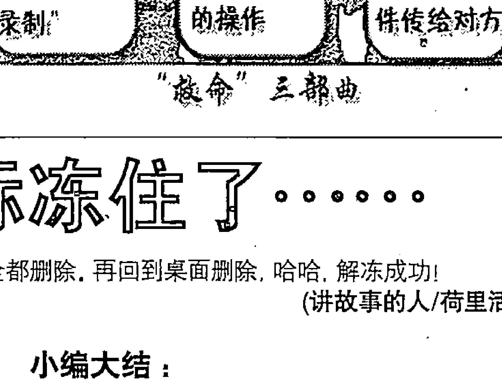

### 天冷 桌面图标冻住了......

今年的冬天真冷，印象里已经十几年没这么冷了，家后面的护城河冻了个结结实实。一早儿，弟弟打开电脑，看到凌乱的桌面，想整理一下，结果有两个图标删不掉，我赶紧跑过去看，真是蹊跷，难道低温把我的电脑也给冻住了？

弟弟说是不是锁住了任务栏造成的，我赶紧给他扫了一下盲，任务栏的地盘仅限于桌面最底下的一条，跟桌面没有一毛钱的关系。于是，我怀疑是中毒了！至少是可疑木马。但无论是瑞星还是360都没有任何提示。看来是中毒的后遗症。

这种情况下，按照经验来说要借助“文件粉碎”之类的软件，但那样需要安装软件，不符合俺的DIY作风。先是在桌面右击选择“属性→桌面→自定义桌面→现在清理桌面”，勾上要删除的图标，效果是……没用！

没关系，我还有招呢！打开注册表编辑器，在“编辑→查找”中输入图标的关键字，然后将出现的键值全部删除。再回到桌面删除，哈哈，解冻成功！

（讲故事的人/荷里活）

### 小编总结：

桌面图标不见了，看似一个简单的故障，通常会给日常操作带来很大不便。刚丢失的时候，可以试着使用组合键Win+E来代替打开“资源管理器”。如果像故事一的主人公那样，在显示“属性”（Win7下是“个性化设置”）中勾选图标没有效果，可以尝试在运行中输入gpedit.msc打开组策略编辑器，展开“本地计算机策略→用户配置→管理模板→桌面”，将几个删除或隐藏桌面图标的选项“禁用”即可。

很多人给XP系统安装了SP3后，发现桌面没有了IE图标，不要急，微软留了后手：右击桌面选“属性→桌面→自定义桌面→桌面图标”，然后按一下i或者alt+i，确定即可。

### 光驱到用时方恨少

一哥们最近烧包得不行，接连购入iPhone、惠普上网本，我这个穷人只能口水伺候。他也没得意几天，上网本就中毒瘫痪了。向我求助时，正好出差，告诉他拨打惠普客服，索要一张HP恢复盘，结果等我出差回来，他的盘也没到，据说人家那边还在申请走程序，这速度，汗。那就我来亲自出马吧！

#### 准备不足吃了亏

修电脑，我在行，所以事前一向不多想，解决各种问题基本都是在现场临时发挥。但这次看到他的电脑时我傻了：上网本没有光驱啊，我今天只带了一张XP系统安装盘，心里开始暗骂自己猪头三。好在哥们的电脑包里有个闪盘，哈哈，这下有救了。

下面就开始制作启动盘吧，先是下载了Flashboot（http://www.crsky.com/soft/6193.html），瞬间就将闪盘格式化成了USB-HDD格式（R：只有格式化成为这种格式，才具备成为启动盘的条件）。然后，下载“WinPE U盘版”（http://www.52z.com/soft/15420.Html），解压缩后拷入闪盘。

#### 帮了大忙，却惹了麻烦

插上闪盘，重启电脑，等着进入PE的时候居然又出现了该死的Vista进度条……前后思量，原来是没设置闪盘启动。再次开机后，长按F2键（有的电脑是DEL键）进入系统启动顺序设置，选择USB boot（USB启动），再次重启，呵呵，进入选择系统的界面，当然选择PE启动了。

把XP安装盘从闪盘拷到上网本的D盘（必须是系统盘以外的分区），然后直接运行安装文件夹中的SETUP.EXE文件，哈哈，出现了用光盘安装XP系统时的熟悉界面。我哥们瞬间移动到电脑前，“下面交给我了！”

经过半小时后，终于搞定了，长舒一口气。突然传来哥们的一声惨叫，忙问怎么了，答曰：“闪盘里的东西没备份呀！”我赶忙转头，假装接电话，挂电话后瞬间消失……

Refine：除了用闪盘安装以外，一些最新的品牌上网本也为消费者考虑到了这一点，提供了“一键恢复”功能，在系统崩溃或者出现大问题时，用“一键恢复”即可解决系统恢复问题。

上网本什么都好，唯一不方便的地方就是没有光驱（这也是其他小本本的局限性），不像传统PC那样出问题了把系统盘往光驱里一塞，一直按下一步，30分钟左右就可以轻松搞定。而上网本万一系统崩了，重装系统就比较麻烦。

（讲故事的人：潘多拉星球/棒槌）

### 网站挂马分析 3秒出结果不是神话

时常看到很多安全公司公布一些挂马网站，他们是如何获取的信息呢？现在已经靠云安全自动捕获了，那我们自己是否可以检查呢？“啊！我可不是行家”，别担心，你看，1、2、3分析结果出来了！

运行网马分析器（下载地址：http://work.newhua.com/cfan/201006/wbfxgj.zip），首先是配置界面，这里为了分析日志的方便，在“你的名称”中输入你的名字，单击“确定”进入主界面。

在左上角的文本框中输入一个怀疑的网站：如：http://61.189.1.162，单击scan（扫描），稍等片刻，此网站的分析结果就出来了。软件读取网站的源代码（会根据链接读取其他的相关的链接），并从里面寻找可疑的项目。比如可疑的标签iframe、script，又如高可疑的关键词eval、document.write、document.writeln等。在日志里面我们可以看到程序找到了一个可疑的链接http://hir.xorg.pl/c.js?google_ad=01x1101_ad，一个图片后面附加了EXE文件，必是木马了。往前看，原来是图片upp.jpg的问题，赶紧去处理吧。单击“网马分析日志分享”能看到网友的日志分析，很多网站都暴露出来了。

（上海/李水）

### CFan奇谈：电费比电脑还贵？

#### 1算2省3硬上 三招成就省电达人！

Google的一位工程师曾抱怨说：电费开支迟早要比电脑硬件本身更贵！据推测，Google一共彻底升级过四次服务器，每次更新性能提升约1.8倍，耗电量也同时增长了两倍。如果按耗电量每年增长25%计算，那么不出20年，电费成本就得超过服务器本身的成本。对于其他拥有上百、上千台电脑的公司来说，即使只关掉显示器，省下来的钱就够付全勤奖了。

#### PART 1：精打细算过日子

##### ★电脑有多耗电？

对于一般的中端机，笔记本的功率在90W左右，台式机的功耗约为笔记本的3倍，不到300W。2009年6月，中国约有3.38亿网民，日耗电量为：
1500万台×300W/台×5小时/天=2250亿瓦/天=0.225亿度
按照这样算下来，全国的电脑日耗电量就相当于三峡电站日发电量的十分之一！

##### ★最费电恶习大揭秘！

1.  频繁地开关主机、显示器，不仅加速电脑损耗，而且费电。空调也是如此。
2.  电脑通宵开着却不干活！主要以单位中的电脑为主，反正不是你们家的！
3.  大马拉小车，每天主要是看看电影、浏览网页，却要配个四核+顶级独显的高配电脑！
4.  挂机玩网游，傻！这样一没了游戏本身的乐趣，二浪费了国家的电能！

##### ★最省电习惯大放送！

1.  扔掉CRT吧！换成LCD后，一年省下的电费就回本了。另外，显示器的亮度最好调低点儿。
2.  用导热的铝质机箱，打开电脑机箱盖子，增加通风、加速散热（小心触电，若家里有小孩儿，您还是算了）。

终极攻略：那就是让自己眼睛放个大假，把平时心爱的电脑藏起来封好，约上三五个好友，去享受一下久违的假期！

#### PART 2：软件省电攻略

注：所有软件都在http://work.newhua.com/cfan/201005/shengd.rar，下载压缩包后解压即可得到！

##### 1.把电源管理交给“NHC”

下载电影、上网聊天时，双核CPU的使用量仅10%左右，可CPU风扇还一个劲地转个不停，噪声大又浪费电。此时的显卡也不老实，耗起电来一点都不含糊！系统自带的“电源管理”太寒碜，试试NHC（Notebook Hardware Control），让它来全面掌管笔记本的电源。
NHC主要是针对Intel CPU而设计，AMD的CPU也能使用，不但能够自动调节电压来降低CPU的频率，还具有电压手动调节、硬盘温度控制、风扇转速控制、显卡调节等功能。

小提示
安装时要以管理员身份进行安装，完成后再以管理员身份运行nhc.exe，否则极易出现死机或蓝屏现象！

网络大补贴
NHC的详细使用方法：http://www.newsunday.com/post/877.html。
磁盘备份可否节能？http://storage.chinabyte.com/77/9185077.shtml。

##### 2.大家一起“省省看”

“省省看”是个极具创意的小软件，本质工作是调节显示器亮度、关闭不常用硬件设备……但它的创新之处在于能把节省下来的电用数据显示出来，并折算成节约了多少树木和石油，让使用者意识到省电的同时，也在为生态环保做出贡献！
第一次运行时，软件会提示你注册一个账号，然后登录。主界面将显示你的节能成绩，以及你所加入的省电团队节能总成绩。所有的功能设置均在“工具”一栏里，设置方法一目了然，根据需要合理设置即可。

定时！值得一提的是其中的“定时器”功能，可以用来实现定时关机、定时执行特定程序等功能。在“定时器→新增”中，设定好“主题”和“闹铃时间”，在“启用闹铃任务”的复选框中打上勾，再浏览需按时执行的程序路径即可。

节能！省省看也有“CPU节能”功能，将其中的“手动降频节能”选择为“中度降频”或“高度降频”，不但节约电能，还延长了CPU的使用寿命。

##### 3.断网就关机，电费不白给

有事要出门，想让电脑开着继续下载，又怕遇到断网，白白浪费了电……于是，“断网自动关机”正好派上用场！

*   Step1. 启动软件时会要求确定当前已经连接到网络，在弹出的“注意”对话框中单击“是”。
*   Step2. 程序会在连接信息中显示当前网络的状态和连接类型，单击“点我设定”，根据需要设定断网后自动关机倒计时的时间（单位：秒）。
*   Step3. 设置完成后，程序就会自动运行。一旦断网，程序就会启动关机倒计时，然后自动关闭电脑。

小提示
在一个名为tp的文件夹里，tx.jpg是显示在界面的那张大图片，而ico.ico是程序的小图标，可以自己修改，只要名称一致即可，tx.jpg的规格为160*160最佳。

小编攻略1：
除了这几种软件，还要学会善用虚拟机这个宝贝！不要以为一台电脑只能装一个系统，可以安装多个独立的系统，也可以在一个系统下用虚拟机将其他系统集成。

开机的时候把无用的进程都停止掉，或者干脆在“管理→配置→启动项”中将它们禁止。善用系统自带的电源管理，品牌电脑自带的电源管理程序等。

#### PART 3：“硬”是要节能

节能光靠从系统的软件层面还不够，还需要在其他方面比如硬件上精打细算。或许你使用电脑只是为了玩玩斗地主、看看新闻，拿着四核的电脑也没地方使！

##### 方案一：整机攻略

其实，应付一些大学常用的软件、看高清电影、玩魔兽等游戏……不妨考虑一下“一体机”或“迷你机”。

###### ★迷你机：外形小巧，集成了主板、电源，在购回后只需安装CPU、硬盘、内存。

“索泰MAG HD ION330”就是一款整体出售的迷你机，它的功耗极低，待机功率不到1W，负载情况下也不会超过40W！

###### ★一体机：由一台显示器、一个键盘和一个鼠标组成的电脑。推荐三款不同档次的一体机：

| 型号 | 电视卡 | 触屏 | 说明 |
| :--- | :--- | :--- | :--- |
| 惠普TouchSmart 300-1038cn | 支持 | 支持 | 3核、独显的配置高端；能应付各种主流游戏。 |
| 微星AE2010-BNOS-E | 支持 | 支持 | 性价比高；支持 VGA 输入、输出；人脸识别。 |
| 微星MSI AP1900 | 支持 | 不支持 | 价格便宜，是入门级的一体机。 |

##### 方案二：DIY省电机器，看准耗电三巨头

###### 1.谁才是“省油”的CPU

说到低功耗，自然要提一下Intel的Atom处理器，功耗仅为8W的它，绝对算是低发热、低功耗方面的专家，但它的性能确实有限，不建议DIY使用。

推荐如下几款低功耗CPU：

| CPU型号 | TDP | 制作工艺 | 主频 | 超频能力 |
| :--- | :--- | :--- | :--- | :--- |
| Intel 奔腾双核 E5200 | 65W | 45纳米 | 2.5GHz | ★★★☆☆ |
| Intel 酷睿2双核 E7400 | 65W | 45纳米 | 2.79GHz | ★★★★☆ |
| AMD Athlon 64 X2 5050e | 45W | 65纳米 | 2.6GHz | ★★★☆☆ |
| AMD 羿龙 X3 8450e | 65W | 65纳米 | 2.1GHz | ★★★★☆ |
| AMD Athlon II X2 240 | 65W | 45纳米 | 2.8GHz | ★★★☆☆ |

小知识：什么是TDP？
TDP是英文Thermal Design Power的缩写，意思是热设计功耗。它反映的是CPU在满负荷情况下的发热情况，经常提到的CPU功耗，一般都指TDP值。

###### 2.主板多相供电为什么节能？

随着CPU性能的提升，工作电流也越来越大，多相供电是将供给CPU的电流均分到每一相的电路中，使电路产生的热量减小，达到节能的目的。
某些主板的供电参数为“N+1”相，这就是带“多相调节技术”的主板。

###### 3.节能显卡，电费年省上千元

作为PC中的功耗之王，“节能显卡”也逐渐走进了DIY市场。在非3D应用下，最低功耗在110W左右，3D满载应用下，最高功耗不超过180W的显卡，都可以称作节能显卡。使用这样的显卡，一年下来能节约近千元电费！

小编攻略2：
充电器永远都是电能的吸血鬼。如果你的手机已不需要充电，把充电器从插座上拔下来吧！
Wifi、蓝牙不用的时候请关闭！
拔掉所有没有用到的USB设备（打印机、扫描仪、移动硬盘等）。

（四川 李卢林）

### 避免鼠标抛却烦人的双击

当你玩游戏的手已经接近“鼠标手”，鼠标即使是双击这样的操作也力不从心时；当你夜深人静，在寝室熬夜，即便是鼠标双击的声音都会室友造成打扰的时候，你该如何用鼠标打开文件呢？

在Windows下，平时打开文件及文件夹，无非是以下几种方式：双击文件的快捷方式；选中文件后按下键盘上的Enter键；右击文件，在右键菜单中选择“打开”项以及在一些应用程序中的“文件”菜单下选择“打开……”，来打开该程序的一些相关联文件。当然还有一些高级一点的操作，如开始菜单里面的“运行”中输入相关命令，以及任务管理器中的“文件”菜单下“新任务（运行）”也具有相似功能。

除以上这些，我发现了一种“快速”“省力”“不为人知”的打开文件及文件夹的新方法：鼠标指向要打开的文件或文件夹，左手按住Shift，右手向前滚动鼠标的滚轮（见图）。难道这是Windows的Bug或彩蛋？真正把这一技巧发挥到极致的，是在笔记本中支持多点的触摸板上：左手按住Shift键，右手双指放在触控板上轻轻向上移动，文件就打开了，彻底省去了那烦人的双击，还不赶紧去试试？

小提示
当关掉当前窗口，显示桌面的时候，由于此时桌面并没有被激活，需要在桌面的任意位置，单击鼠标，激活桌面。文件夹窗口操作不存在此问题。

（四川/王亚洲）

### 获取Windows7的“尚方宝剑”

随着Windows 7正式发售，很多朋友都安装了这个新系统。由于Windows 7采取了更为严格的权限保护措施，这样在平时的操作中我们就经常遭遇权限的困扰。比如，试图对系统分区进行写入或者删除操作的时候，即使以Administrator账户登录系统也经常会提示权限不足，这种情况下，我们可以启用超级账户TrustedInstaller，拥有完全控制权限。
要对某一个无法操作的文件操作时，首先要打开文件属性窗口，接着在“安全”标签单击“高级”，获得该文件所有权，然后才能对权限进行编辑。其实具体操作不必要这么麻烦，我们可以将更改所有权和编辑权限合二为一，集成到系统右键菜单，只要将注册表文件（下载地址：http://work.newhua.com/cfan/201006/cjzh.rar）导入注册表，完成修改，以后如果要对哪一个文件（夹）进行提权操作，只要右键单击，选择“管理员取得权限”即可（CFAN为当前登录的管理员账户），就像获得了皇上赐予的“尚方宝剑”。
（文/俞木发）

### 给上网本分区的波折

星期天早上接到朋友电话，说他的上网本只有一个分区C盘，让我帮他重新分区。过了一会儿朋友把他的电脑送到了——DELL mini 10，红色的小本，很可爱。上网本没有光驱，只能用我的闪盘启动了。

滚动条突然卡住了……无奈之下只得重启，但是在进入PE的时候故障依旧。我还是第一次碰到这种情况，不太清楚是什么原因。这个启动盘做得比较早，PE版本较老，难道是因为这个？打开我自己的电脑，下载了最新的以Windows 7为核心的PE；迅速将这个版本的PE制作成启动盘（R：用PE制作启动闪盘的过程并不复杂）。
将闪盘插到上网本上，开机等待……这回滚动条过后终于进入PE界面！找到GHOST的快速分区，把电脑分为4个区，然后安装系统，此后就一切正常了。

#### ## 驱动精灵搞死电脑？

打开电脑，查看了一下需要的驱动程序，好多啊……于是用新版的驱动精灵将那些驱动备份，打开软件后没事，当开始检测时，马上死机。重启后再使用该软件仍然如此，在过去修理电脑的时候，也遇到过类似的情况，但由于个人比较钟爱这款软件，所以就一直没换。
无奈之下，换用了闪盘里保存的老版本的驱动精灵（2009 beta1），安装后使用正常了！呵呵，于是将驱动备份。

#### ## 进PE一波三折

下一步就可以进PE下分区软件分区了，重新启动计算机，设置闪盘启动，选择PE，已经开始自检，但

小编大结：同许多品牌笔记本一样，新的上网本默认也是只有一个分区，出于数据安全考虑，由于操作系统仅就这个分区，最好不要采用PQ之类的第三方工具。故事二主人公的方法虽然麻烦，但是在安全性上值得肯定。至于上网本系统，CFan介绍过几次，包括各种系统的评比、安装试用等，目前来看Windows 7的家庭基础版是最适合上网本的，现在又有了“山寨”版的Windows 7 Netbook Edition，更是能够在任何上网本上流畅地运行。
（讲故事的人：辽宁/闫天纲）

### 裸奔天下！挂在胸前的“电脑”

什么？！将操作系统安装在闪盘，而且能启动不同硬件配置的电脑（没搞错吗？是的，现在只需拨打010-89999XXX，就可以……喂，别做广告！），在家或办公室，不必担心硬盘上的系统损坏，插上闪盘即可进行维护。出门，要带的不是本本儿而是挂在胸前的小小闪盘，而且不必担心对方电脑有没有你熟悉的软件，插上闪盘就能开始干活儿！

#### ☆ 面临的问题

XP在启动时会对硬件进行检测，如果主要硬件与系统中的驱动不相符，会导致蓝屏死机。

#### ☆ 准备

1.  USBoot 2.11，核心工具，打开http://www.usboot.org，单击Register（注册）后注册账号并登录，单击Download（下载）下载。
2.  HPUSBFW，将闪盘格式化为USB-HDD格式的工具，下载地址：http://nc.onlinedown.net/down/HPUSBFW2.2.3_yfy_plus.zip。

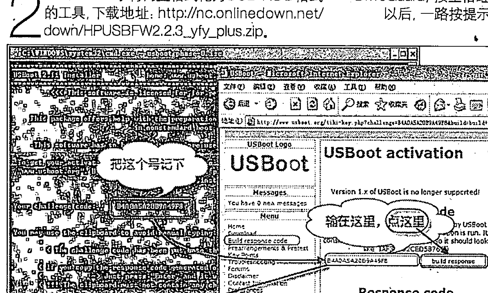

使用完全版原版XP且安装于C盘，适量安装常用软件到C盘，比如Office、播放器、杀毒软件等。

#### ## 第一阶段：初始化

第1步：进入D:\USBoot tools目录，双击其中的cmd_here.cmd，命令提示符窗口会自动打开，输入usboot phase-0.isc。首先，会要求输入激活码，此时打开并登录http://www.usboot.org，然后按照图所示进行操作，然后按空格键继续。

第2步：当屏幕上出现以下提示信息时，这样来操作：

*   `<c> continue and skip waiting for installation operations to start， 按C继续。`
*   `<space> install and activate the USBoot DriveGuard， 按空格继续。`
*   以后，一路按提示操作，会重新启动电脑。

#### ## 第二阶段：安装驱动服务、设置

*   重新运行cmd_here.cmd，并在命令提示符窗口输入命令usboot phase-II.isc。除以下几步外，都可按S键跳过。
    1.  出现`<Space> install and activate the USBoot DeviceGuard`， 按空格键安装驱动。
    2.  出现`<Space> install and activate the USBoot ServecetGuard`， 按空格键安装服务。
    这一阶段完成时，提示Press Space to end program， 按空格键， 再手动重启电脑。

重新运行cmd_here.cmd，输入命令usboot phase-ll.isc。全部按空格键就行了，只是花的时间稍长，请耐心等待。完成后电脑会自动重启。
小提示：
经过以上操作后，安装于硬盘上的XP已发生了一些变化，主要包括：C盘上多出的文件与后面的图2完全相同，而且启动过程也与后面要谈到的闪盘启动过程完全相同。其实，不难理解，要移植到闪盘的正是这一变化了的XP系统。

#### ## 第三阶段：移植到闪盘

将已格式化为USB-HDD格式的闪盘插入电脑，重新运行cmd_here.cmd并在命令提示符窗口输入命令usboot phase-III.isc即可。

中间会出现两次please choose an item by specifying its index，都输入数字1就行。其他的，一路按空格键，C盘上的所有文件都可自动拷贝到闪盘，花费近40分钟。
U版XP到此制作完毕！

#### ## 胸前电脑使用秘籍！

启动大法！只要在BIOS里将启动的首选位置设置为USB-HDD，就能用闪盘来启动电脑。启动时的启动菜单，选择第一项（后面几项相当于安全模式）就行了。驱动大法！如果驱动没有内置，可像常规系统那样手动安装，长期将该闪盘用于同一电脑或硬件配置相同的电脑，可在“U版XP”启动后，运行一下闪盘根区EWF文件夹下的SAVE.BAT，让驱动保存下来。
分区的秘密！启动完成后，闪盘的盘符将自动被指定为C盘，原硬盘的C盘排到最后，原硬盘的其他分区盘符不变。
（四川/李学昌）

### 保护隐私 将重要文件排除在搜索之外

用过Windows 7的朋友都知道，Windows 7的搜索功能非常强大，可以很轻松地找到自己想要的文件。但有的时候这并不是一件好事，因为过于强大的搜索功能，会导致用户的隐私泄漏。这就需要通过设置，将一些重要的文件排除在搜索之外，来保护自己的隐私。

先打开Windows 7开始菜单中的搜索框，然后输入索引，打开“索引选项”选项卡，点击上面的“修改”按钮，再点击“显示所有位置”按钮。会看到自己的硬盘情况，将自己想要排除的位置进行勾选，然后点击“确定”按钮即可。并且还可以点击“索引选项”对话框中的“高级”按钮，在“文件类型”选项卡下通过文件类型进行排除，将不想搜索文件的扩展名前面的对号去掉。这样一来，指定位置和指定文件类别在搜索的时候，就不会检查到，从而保护了自己的隐私。

另外还可以将重要文件放到文件夹中，然后点击鼠标右键来编辑文件夹属性。点击“高级”按钮，将“索引此文件夹以用于快速搜索”的对号去掉，最后点击“确定”按钮退出保存。这样一来，指定文件夹里面的内容也不会在搜索的时候被搜索到。
（广州/赵川）

### 一盘走天涯 将闪盘变身100合1的工具

电脑安装太多程序，时间长了担心性能降低？每次要用到某种软件时，才去匆忙下载？这是很多人用电脑时经常碰到的难题。现在Lupo PenSuite可以彻底解决这些烦恼，它集合了多种常用工具，种类涵盖浏览器、影音播放、音乐剪辑、系统管理等，而且全部是可免费使用的绿色免安装软件！Lupo PenSuite有这么牛吗？内含软件真的是“绿色无污染”？不听人家忽悠，眼见为实才是真。

*   **Lupo PenSuite小档案：**
*   软件版本：6.80完整版
*   软件大小：217.99MB
*   软件性质：免费软件
*   适用平台：Windows 2000/XP/2003/Vista/7
*   下载地址：http://www.newhua.com/soft/60142.htm

#### 程序安装，简单易行

下载到的是一个压缩包，解压后双击安装将程序安装到闪盘根目录下即可。由于内置Autorun.inf文件，这样只要在任何一部电脑上插入闪盘，程序就会自动运行并弹出类似Windows的开始菜单，你可以从中选择需要的程序运行。如果系统关闭自动播放，只要运行安装目录下的Start.exe即可。

切换到中文的方法是：单击开始菜单的“选项”，在打开的设置窗口切换到Languages（语言）选项，选择Tradechinese.xml可以切换到繁体中文界面。

#### 内置程序，种类丰富

Lupo PenSuite是多个程序集合，在它的开始菜单左侧已经根据程序性质，将同一类别的程序归纳在一起。比如，要使用系统管理工具，只要展开System→Managers→system explorer.exe即可启动，瞧瞧它的功能，是不是比系统自带的组件更为强大？而且很多软件自带简体中文语言文件。其他程序的使用类似，操作和系统开始菜单几乎一样。

#### 绿色程序，即插即用

打开程序安装目录Apps子目录，可以看到Lupo PenSuite整合了多达92款应用软件（基本上每个子目录一款软件）。而且还可以单击其开始菜单的Myapps→additional Apps，联机到程序主页下载更多的程序，或者自行将其他绿色程序（比如WinRAR）复制到Myapps目录。如果闪盘容量较小，你可以删除Apps目录下不需要的程序来节省空间。为了测试这些软件是否为真正的绿色软件，笔者把闪盘插到其他电脑上测试，猜猜发生了什么？呵呵，Lupo PenSuite集合的软件均可以完美运行！

> **编辑视点：**
绿色软件，为系统减负。用电脑就是用软件，需要某个功能的时候，我们会去安装软件，用完后又会将软件卸载。如果不是绿色软件，反复地安装/卸载就会在系统中留下大量的垃圾文件。此外，非绿色软件由于会往系统注册表写入数据，在重装的时候多数无法继续使用。因此，越来越多软件采用绿色方式发布，比如常见的WinRAR、Foxmail等，这些软件不仅可以为系统减负，而且也便于共享和在不同电脑上使用。我们期待更多类似Lupo PenSuite绿色软件集合的出现。

（体验者/漂流在外）

### 让唐僧闭嘴 多余补丁不再提示

系统打补丁，我们可以用系统的Windows Update，也可以用各种工具软件，但有件事情一直困扰着我们，例如笔者Windows 7检测补丁时总是提示那些无用的多国语言包，这些我们不想安装的补丁就像《大话西游》中的唐僧一样，唧唧歪歪，每次都提示，看着闹心，能闭嘴吗？

#### 轻松操作 因有工具帮忙

很多人喜欢用工具软件打补丁，十分方便，例如360安全卫士。这时，我们要取消部分补丁提示就方便多了，打开360安全卫士，选择“漏洞修复”，选中不想打的补丁，单击“忽略”。这样，再检测时，这个补丁就不会象苍蝇一样出现在眼前，整个世界都安静了。（如果想打这个补丁，取消“忽略”即可）。

#### 善意谎言 照样能闭嘴

工具软件打补丁，虽说方便，但他们检测的补丁没有一个能和微软网站的完全一致，于是很多人还保持着原始的更新方式，那这种情况如何让补丁不提示呢？呵呵，欺骗法！

如果你用Windows XP，可以通过添加注册表项来达到欺骗系统的效果。比如，我们不想打KB978506这个补丁，却又要让系统认为补丁已经打了，可以将特殊的键值导入注册表即可。下载补丁（http://work.newhua.com/cfan/201006/zcbjz1.rar）双击导入注册表即可，再检测时，KB978506已经没有了。对于别的补丁，用记事本打开这个文件，将其中的KB978506替换为其他补丁名，保存后添加到注册表即可。

**小提示**
对于Windows 7，方法一样，下载补丁（http://work.newhua.com/cfan/201006/zcbjz2.rar）双击导入注册表即可，Windows7安全性很高，要先为administrators组取得注册表分支的所有权，再为它添加写入权限，才能导入成功！对于别的补丁，依然是替换KB978506补丁名，保存后添加到注册表即可。

唐僧不再啰嗦，窗外的阳光也显得格外明媚，补丁打好了，去爽一下《星际2》啰！

（河北/banner）

### 进程老仙 法力无边

正玩得尽兴，却发现程序假死了，这怎么办？“三键启动→任务管理器→关闭进程→重启”，如此的步骤要重复多少次啊？要是把某个进程变成挂不死的“进程老仙”不就省去很多麻烦了吗？例如，我们可以把电脑上的Adobe Reader程序设置为“进程老仙”，一旦进程出错，能自动重启。

这件事还得加个软件，安装并运行Watchdog-O-Matic（下载地址：http://work.newhua.com/cfan/201006/wdog.rar），点击File→Create a new watchdog→Browser（文件→创建一个新监控→浏览），选择Adobe Reader 9后，右键单击，选择Properties→Options（属性→设置），下面就有很多重启的选项供你打勾选择，比如失去响应（时间可以自己设置）、不小心随手关闭之类的，基本上你能碰上的都给你列出了，勾选自己需要的，单击“确定”，Adobe Reader就变成了挂不死的“进程老仙”。

**小提示**
一些浏览器都具备了自动重启功能，比如Opera，火狐，TT，GreenBrowser等，这里我们还可以用这个软件来设置杀毒软件的自动重启，让电脑更加安全。

（湖北/李峰）

### 新装Windows 7我要指定盘符

安装Windows 7的朋友都有个烦恼，那就是安装时不管将系统安装到哪个分区，进入Windows 7后系统分区都是显示为C盘，进入Windows 7后又无法更改系统盘符，怎么解决这个棘手难题呢（假设我们要安装在第二个分区下）？

*   **第一步：** 从http://work.newhua.com/cfan/201006/zhdpf.rar下载所需的脚本，并解压到F盘下，使用Windows 7安装光盘启动系统，在出现安装界面时按下Shift+F10调出命令提示符界面，输入下列的命令进行安装（G：为光盘的盘符），安装的位置选择第二分区。使用这个命令激活安装后，在安装第一步完成后不会自动重启（而是停留在命令提示符界面）：`G:\sources\setup.exe /noreboot`

**第二步：** 安装第一步完成后，在命令提示符界面继续输入下列的命令更改Windows 7到自己指定的盘符，这里为D。重启继续完成安装，这样安装好的Windows 7，进入这个系统后盘符就显示为D了。
`F:\osletter7.cmd /targetletter:d /currentos:d`

**小提示**
如果是直接使用默认方式启动安装，第一步完成后会自动重启。此时不要退出安装光盘，重启后选择再次从光盘启动（只要在启动提示时按下任意键即可），进入安装界面后同上按下Shift+F10调出命令提示符界面，输入上述命令更改盘符即可。千万不要直接进入Windows 7后再执行上述命令，这样会导致重启后无法进入Windows 7。

（文/平淡）

### 咱们XP有力量 我也能用“上帝模式”

Windows 7有一个“上帝模式”，可以方便地控制电脑，很眼馋吧！对于那些还不用上Windows7的人来说，是否想过Windows XP也有此模式呢？正所谓，天对低，大路对长空，这“上帝模式”要对“圣经模式”。

对于Windows XP，我们结合注册表可以方便地打造一个“圣经模式”，将所有对系统的设置都集中起来。在“运行”菜单键入Regedit回车，调出注册表编辑器，定位到[HKEY_LOCAL_MACHINE\SOFTWARE\Microsoft\Windows\CurrentVersion\Explorer\MyComputer\NameSpace]，右键单击NameSpace项，选取“新建→项”，输入快捷方式名称：“运行”，然后双击右侧列表中的默认数值，在弹出的字符串编辑对话框中输入{2559A1F3-21D7-11D4-BDAF-00C04F60B9F0}，“确定”后完成编辑，按F5刷新注册表即可。

同样的，我们还可以添加其他系统控制项：“回收站{645FF040-5081-101B-9F08-00AA002F954E}等”、“管理工具{D20EA4E1-3957-11D2-A40B-0C5020524153}”等项（各对应代码可下载这个文件获取http://work.newhua.com/cfan/201006/kzx.rar），完成后在桌面上双击“我的电脑”就可在列表的“其他”处运行这些程序了。

**小提示**
除了自己动手，我们也可以从别处请一个“上帝”——System Explorer（http://www.onlinedown.net/soft/96240.htm），可对目前系统的运行状态一目了然。

（文/张航瑞）

### 重现四大守财奴 看他们如何保护自己的电脑

电脑已经占据了生活中的大半个比例，很多私密的东西都放在电脑上，但却常常面对不愿让其他人使用我们电脑的尴尬。轻则把系统设置搞得乱七八糟，重则自己隐私文件外泄，那么应该如何更好地保护自己的电脑呢？这个问题CFan小编跨越时空隧道，采访了历史上著名的四大守财奴，让他们为我们讲解保护私人电脑的妙招！

#### 钻营守财奴 葛朗台

巴尔扎克的名著《欧也妮·葛朗台》中的葛朗台，对财务有着狂热的占有欲，甚至连自己女儿的遗产继承权都要剥夺，他的财务只能由他一人独享。

适用读者：环境简单，不让别人登录即可。不想让别人使用，那还是很简单的，葛朗台把自己的电脑管理得很严实，因为里面有他的财务秘密，采用什么方法呢？简单限制一个其他用户登录就可以了。保护好自己的密码，一般不会出问题。

启动组策略编辑器（对于Windows 7用户，要以管理员身份运行），依次展开“计算机配置→Windows设置→安全设置→本地策略→用户权利指派”，然后启用左侧窗格的“允许本地登录”（XP中显示名称为“在本地登录”），单击“添加用户和组”，将CFan账户添加到允许登录列表，同时将administrators组、CFan账户外其他账户删除。这样本机其他账户试图登录系统时就会收到“本地策略不允许交互式登录”的提示。

> 小提示 要取消限制，只要重新添加账户到允许列表即可。要注意的是这样限制的只是标准用户登录（包括新建标准账户，但系统管理员账户可以登录）。我们可以只保留系统内置administrator账户，电脑平时只是使用受限账户登录。

#### 极致吝啬鬼 阿巴贡

莫里哀的喜剧《吝啬鬼》中的主人公，他拥有万贯家财，却不肯付出一点，对所有人都是苛刻的，甚至他自己也常常饿着肚子上床，以致半夜饿得睡不着觉，便去马棚偷吃荞麦，只入不出的境界可谓到达极致。

连对自己都很吝啬的阿巴贡怎么会放心一个限制，一个密码，他要的保护就要高得多，他想到了利用硬件进行限制，例如设置只有使用闪盘才能登录系统。简单的DiskLogon就可以实现，不过这些软件大多可以在安全模式下破解。由于系统的启动都要借助启动文件，我们可以换个思路，将启动文件存放在闪盘上，这样只有插入闪盘才能读取系统启动文件启动系统。

1. Windows XP
   - 第1步: 制作一个启动闪盘，使用该闪盘引导系统。确认引导后的盘符是A还是C，这里以引导盘符为A为例。
   - 第2步: 重启进入Windows XP系统，到华军下载grldr引导文件，下载后将它复制到C:\。然后插入闪盘，将c:\ntldr、c:\NTDETECT.COM、c:\bootfont.bin三个启动文件全部剪切到闪盘。
   - 第3步: 将c:\grldr重命名为ntldr，启动记事本新建一个menu.lst文件放置在C:\，启动代码如下：

```
default 0
timeout 5

title Boot NT/2000/XP/2003
root (fd0)
chainloader /ntldr
```

   - 第4步: 重启后系统就从grldr启动了，现在如果没有插入闪盘，系统引导就会停留在Boot NT/2000/XP/2003（没有其他任何提示）。由于本地硬盘没有Windows XP启动所需的文件，电脑只有插入上述闪盘才能正常启动。

2. Windows 7
   - 第1步: 进入系统后将c:\bootmgr、c:\boot整个目录全部剪切到闪盘，同时将下载到的grldr重命名为bootmgr放置在C:\。
   - 第2步: 启动记事本新建一个menu.lst文件放置在C:\，启动代码如下。这样系统重启后也必须插入上述闪盘才能启动：

```
default 0
timeout 5

title Windows 7
root (fd0)
chainloader /bootmgr
```

> 小提示 如果你的闪盘启动系统后显示为C:，则将root (fd0)代码更改root (hd1,0)，表示引导第2硬盘（这里U盘被识别为硬盘）。

#### 狡猾小气鬼 夏洛克

莎士比亚的喜剧《威尼斯商人》中的夏洛克，以犹太人的头脑聚敛财富，生意成功，就连久负盛名的反对高利贷的商人安东尼奥在陷入困境时也要去找他求助。

适用读者：允许别人用，但要保护好隐私。

夏洛克是有名的和气生财，上述方法虽然可以很好地保护电脑，但是往往不好意思拒绝身边朋友的要求，于是夏洛克专门建立一个权限受限的账户，作为向朋友开放的专用账户。比如可以打开控制面板的用户账户，新建一个名为sheyou的受限账户，然后进行简单设置即可。

如果使用的是NTFS分区，我们还可以使用权限对账户进行各种限制，比如“d:\我的文档”是自己私密文件藏身之地，现在只要右键单击“d:\我的文档”选择“属性”，然后在安全设置标签里设置sheyou账户拒绝访问该目录，这样即可有效保护文件的安全。

如果是FAT32分区，我们还可借助DiskGenius来制作隐藏分区（下载地址：http://www.onlinedown.net/softdown/9570_2.htm）。将所有重要文件保存在需要隐藏的分区后，启动DiskGenius它会自动检测硬盘分区情况，在需要隐藏的分区右键单击选择“隐藏当前分区”，点击“保存更改”，重启后即可将该分区彻底隐藏。

> 小提示 以前我们讲过很多关于家长控制的技巧，都可以在此类应用中使用，例如隐藏私人文件，可以用隐藏，可以加密，也可以限制账号不使用游戏程序等。

#### 疯狂敛财者 泼留希金

果戈里《死魂灵》笔下的泼留希金收集一切实物，永不知满足，即使“地窖里的面粉硬得像石头，只好用斧头去劈下来。”他还要把“一块旧鞋底、一片破衣裳、一个铁钉、一角碎瓦”都收集起来，什么都不舍得丢。

适用读者：自己电脑一点都不想让别人做改动。

泼留希金的东西是一点都不想丢失，已经成为一种嗜好。他不想别人对他的电脑做出一点改动。能满足他的也只有让别人使用影子系统了，但他还很聪明，不让别人在启动时发现。

1.  第1步: 安装PowerShadow 2008（下载地址：http://work.newhua.com/cfan/201006/powershadow.rar），安装完成后重启电脑，然后启动影子系统，切换到“提醒设置”，启动菜单显示设置为“显示完全影子模式选项”，默认启动模式设置为“完全影子模式”。接着切换到“提醒设置”，去除其中所有的勾选（以免被他人知道在使用影子模式）。
2.  第2步: 将文件夹显示方式设置为显示所有文件和受保护的系统文件，取消c:\boot.ini只读属性并使用记事本打开，将等待时间设置为1秒（这样基本不会显示多重启动菜单），将“Microsoft Windows XP Professional的完全影子模式”更改为“Microsoft Windows XP Professional”，保持原样以免被他人看出是完全保护影子模式。
3.  第3步: 重启系统，这样如果电脑给他人使用，系统默认进入的就是完全保护的影子系统。如果是自己使用，只要在开机时按下F8启动菜单，然后在多重启动菜单选择“返回到操作系统选择菜单”，在此选择“Microsoft Windows XP Professional的正常模式”进入即可正常使用。

(文\俞木发)

### 系统也有店小二 私建账户时喊一声

办公室的同事小秦跑来求援，说是不知什么时候，系统中竟然增加了好几个新的账户，好不容易才将这些账户删除干净。她希望教给她一个方法，无论通过什么样的方法在系统中新增用户账户，系统都会自动弹出警告框进行提醒，这样就可以在最短时间内进行处理，从而防止更大的隐患……

第1步: 经过询问，得知小秦使用的是Windows 7，于是建议她使用事件查看器解决这一问题。在运行中输入“secpol.msc”，在“本地安全策略”中依次选择“本地策略→审核策略”，在右侧双击“审核账户管理”，勾选“成功”，单击“确定”保存。

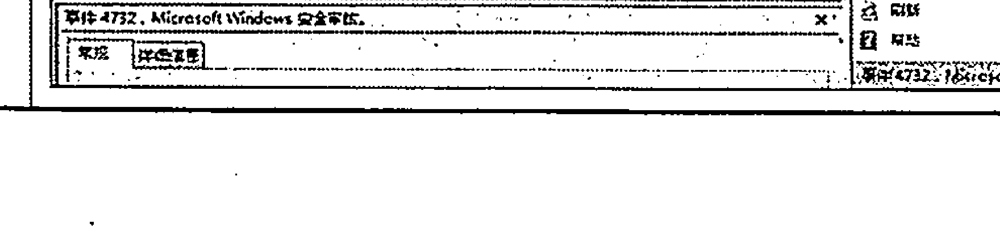

第2步: 为了将任务附加到新建账户的事件中，我们需要手动触发一个新建账户的事件。打开控制面板，新建一个账户，然后在运行中输入“eventvwr.msc”，打开事件查看器，依次选择“Windows日志→安全”，根据“日期和时间”进行排序，找到刚才由于创建账户所添加的用户事件，事件编号是4732（见图1）。

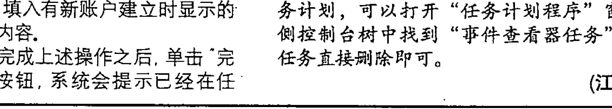

> 小提示 当然，小秦可以按照类似的步骤对其他的高危操作进行绑定，如果需要删除刚才所添加的任务计划，可以打开“任务计划程序”窗口，在左侧控制台树中找到“事件查看器任务”，将这个任务直接删除即可。

(江苏/王志军)

### Ubuntu下装显卡驱动 天下仅此一解

很多人为了体现Ubuntu的3D桌面才去安装的，谁想运气不好，老是因为驱动折腾半天，笔者搜遍天下，试遍驱动，最终总结出了我认为天下最好用的驱动安装方法，特来献丑！

第一步：首先检查显卡驱动是否装好，运行

```
glxinfo | head
```

如果显示“direct rendering: Yes”，则已安装。如果没有的话自然是到Nvidia官方网站根据显卡型号下载对应的驱动，放在个人主目录。

第二步：删除原驱动包，运行

```
sudo apt-get --purge remove nvidia-glx nvidia-glx-new
```

然后删除/lib/linux-restricted-modules/2.6.31-14-generic/文件夹下面带有nvidia字样的内容，这里是内核自带的驱动。再检查一下这两个文件是否存在，/etc/init.d/nvidia-glx和/etc/init.d/nvidia-kernel，如果存在，删除掉。

第三步：安装编译环境：

```
sudo apt-get install build-essential pkg-config xserver-xorg-dev linux-headers-`uname -r`
```

（注意：这两个不是单引号，而是数字键1左边那个）

第四步：备份，运行以下命令

```
sudo cp /etc/default/linux-restricted-modules-common /etc/default/linux-restricted-modules-common.backup
sudo cp /etc/X11/xorg.conf /etc/X11/xorg.conf.backup
```

第五步：用以下命令禁止系统使用默认的驱动

```
sudo gedit /etc/default/linux-restricted-modules-common
```

在最后的双引号中添加 nv nvidia_new，即把文件中的 "" 改成 "nv nvidia_new"（如果前面第二步删除完整了其实也可以不用执行这一步）。

第六步：按Ctrl+Alt+F1，登录后停止GDM进程:

```
sudo /etc/init.d/gdm stop
```

然后进入准备好的驱动所在目录（用ls命令确认文件在不在）

```
sudo sh NVIDIA-Linux-x86-173.14.22-pkg1.run
```

（长文件名只要输入NV再按Tab键就会自动补足）

安装过程中，如果提示有旧驱动，询问是否删除旧驱动，选Yes；如果提示缺少某某模块（modules），询问是否上网下载，选NO；如果提示编译模块，询问是否进行编译，选OK；如果提示将要修改Xorg.conf，询问是否允许，选Yes；接下来就是等待安装完成。

安装完成就回到终端，重启GDM:

```
sudo /etc/init.d/gdm start
```

好了，现在应该能看到Nvidia那个大大的Logo了，现在打开“系统工具→NVIDIA X Server Settings”可以设置分辨率和刷新率，打开“系统→首选项→外观→视觉效果”，选择“扩展”，关闭对话框，然后拖动窗口和缩放窗口就有3D效果了。安装了Compiz以后还可以设置旋转3D立方体桌面等等很酷的3D效果。

最后提示

1.  如果安装了受限驱动但是无法正常工作，先卸载它们：

```
dpkg -l |grep nvidia   [查看nvidia受限驱动]
sudo dpkg -P 包名     [卸载]
```

2.  在每次更新了内核相关的包之后（linux-image或者restricted-module等等），需要重新安装显卡驱动；
3.  如果是刚装好系统，运行

```
sudo apt-get update
```

更新源。

小提示

对于本文提出的安装方法，是适用于任何一种情况的最完整的方法，当然具体到你的机子，有的步骤，比如2、4、5可能不是必须的。

（福建/洪东华）

### 限制孩子聊QQ 我用系统自带功能

程序是电脑的灵魂，一味地阻止并不是好事，在家，可能将小孩堵上网吧，在办公室，可能影响工作效率。下面，我们将在Windows 7下用实例来说明如何限制电脑运行程序，让你家的小孩不能常用QQ。

第一步：这里我们要使用Windows7的AppLocker，首先，在开始菜单中输入：services.msc，“回车”后在服务中找到Application Identity，双击，将其“启动类型”修改为“自动”，再单击“服务状态”下的“启用”，启动该服务才能使用AppLocker，然后为系统新建一个小孩用的用户：LXCLOW。

第二步：启用管理员账户登录系统，通过命令gpedit.msc打开本地组策略编辑器，依次展开“计算机配置→Windows设置→安全设置→应用程序控制策略→AppLocker”，右键单击“可执行规则”，选择“创建默认规则”。

第三步：右键单击“可执行规则”，选择“创建新规则”，按照提示进行操作，在“操作”下选择“拒绝”，在“用户或组”中将事先创建好的标准用户LXCLOW导入进来。在“条件”中选“发布者”，并在“发布者”的引用文件中指定QQ的程序文件，将控制力度滑块向上拖到“发布者”位置。最后单击“创建”完成规则创建。这样就可以阻止标准用户（你家的小孩）LXCLOW运行所有腾讯程序，不是随便可以破解的喽！

小提示
此处，我们将发布者作为条件来对程序进行阻止，力度很大——凡是腾讯出品的都将被阻止，包括QQ游戏、QQ音乐、TM等概莫能外。如果要允许运行其中之一，可在下一步“例外”中添加进来。

(文/李学昌)

### 自制U盘工具箱 PE、Ghost双引导

U盘已经成为最抢手的系统引导载体，以往我们用光盘维护电脑，现在都用U盘了，作为《电脑爱好者》的读者，你肯定不满足于使用别人的工具，自己制作一个U盘工具箱，以后就可以拿着它走南闯北了！于是我们从本期开始，开设“我爱玩U盘”栏目，专门与大家分享一些U盘工具的制作和使用方法。首先，我们来看如何将你的U盘变成一个维护系统的工具盘，可以实现DOS、WinPE双引导，并且两种模式下都有Ghost可以用！

#### 建立可 DOS 引导的 U 盘

创建DOS引导型U盘有很多种途径，下面讲两种最常用的方法。下载任意版本的DOS，可以是矮人DOS，可以是MAXDOS，这里使用MS-DOS7.1。将MS-DOS7.1.IMG文件，用Winimage展开，释放到MS-DOS7.1文件夹（下载地址：http://work.newhua.com/cfan/201007/msdos.rar）中备用。

第一步：下载HPUSBFW.exe（下载地址：http://work.newhua.com/cfan/201007/upgj01.rar），双击打开，在“设备”中选择要建立引导的那个U盘，“文件类型”选择FAT（如果U盘大于2GB请选择FAT32），勾选“创建一个DOS启动盘”，在下方的栏内填入“MS-DOS7.1”所在位置（或通过“浏览”按钮设置），设置完成后单击“开始→确定”，这样一个含有MS-DOS7.1的引导盘就做好了。

第二步：下载USBTOOT.exe（下载地址：http://work.newhua.com/cfan/201007/upgj02.rar），双击打开，首先是一个警告提示，“确定”后，在弹出的对话框中选择要制作引导的U盘（选错了，你的硬盘就被格了），在“工作模式”项目中选择主板支持的模式，这里选择“HDD模式”，单击“开始”，中间会要求把U盘拔出，再插入，即完成。

#### 利用 Grub 构建 DOS+WINPE 的引导

第一步：把系统工具盘的镜像文件加载到虚拟光驱中，从里面复制“WXPE”文件夹下面的SETUPLDR.BIN到U盘根目录下，并改名为Ldrxpe，复制“MINIPE”文件夹到U盘根目录，复制Winnt.xpe，从Windows XP系统中复制Ntldr，Bootfont.bin，Ntdetect.com这3个文件到U盘根目录。从“Grub”文件夹中复制Grub.exe到U盘根目录。

第二步：在U盘根目录下新建两个TXT文件，分别命名为grubidx.txt、menu.lst，用“记事本”打开menu.lst，并输入如下代码：

```
timeout 0
default 0
fontfile /BOOTFONT.BIN
title 启动 WindowsPE
find --set-root /grubidx.txt
chainloader /ldrxpe
```

最后，打开“Minipe”文件夹，把OP.wim删除，复制微软原版WINPE.wim到“Minipe”文件夹中，并改名为OP.wim。OK，原汁原味的微软WINPE引导打造完毕。

#### 加入 Ghost 增强功能

在U盘上新建一个DOS文件夹，把MS-DOS7.1中的一些有用的工具复制到DOS文件夹中。把网上下载的Dos版的Ghost复制到U盘根目录下。

第一步：在U盘根目录下，新建config.sys，输入：

```
[MENU]
MENUITEM=1,DOS with CD-ROM support
MENUITEM=2,Ghost
MENUITEM=3,Windows PE
MENUDEFAULT=3,30

[1]
DEVICE=\DOS\HIMEM.SYS
DEVICE=\DOS\EMM386.EXE NOEMS
DEVICEHIGH=\dos\VIDE-CDD.SYS /D:SSCD001
[2]
INSTALLHIGH=\ghost.exe
[3]
```

其中，[1]是DOS启动(带光驱)，[2]是运行Ghost，[3]是PE启动。

第二步：在U盘根目录下，新建AUTOEXEC.BAT，输入：

```
@ECHO OFF
PATH=A:\;C:\;A:\Diskgen;C:\DiskGen;A:\DM;C:\DM
GOTO %CONFIG%
:1
LH \SHSUCDX.COM /D:SSCD001
GOTO COMMON
:2
GOTO COMMON
:3
GRUB
:COMMON
@ECHO
:END
```

这样，一个带3个选项菜单的U盘工具箱就OK了，也许你觉得这个U盘工具箱还略显单薄，菜单不够炫目，程序不够多样，但它是你自己打造出来的U盘工具箱。而且，以后我们会教你更多的内容，下一次，你可以把这个工具箱打造得更美丽。

### 近期安全综述

据瑞星“云安全”系统统计，2010年2月上半月瑞星共捕获了144万个挂马网址。瑞星反病毒专家介绍，近期瑞星公司截获了一个黑客后门病毒“Pcshare远程控制后门”（Backdoor.Win32.PcClient.rki），该后门病毒具有比较高的隐藏性，普通用户通过任务管理器无法看到。黑客可以对中毒机器进行任意操作，包括监听对方键盘，当对方输入私密信息，比如银行账号、网游密码等会有泄露的可能。任意结束内嵌电脑上的进程，上传下载文件，监控对方屏幕，录制对方摄像头信息捕捉到的画面和监听对方声音，泄露用户大量隐私信息。

### 近期关注病毒分析

#### "Pcshare 远程控制后门 (Backdoor.Win32.PcClient.rki)"

警惕程度 ★★★★

该后门病毒会在%windir%\system32目录下生成一个随机文件名的动态库文件，然后加载该动态库文件，执行里面的service001函数。该动态库的service001函数执行安装服务的过程，会在SOFTWARE\MICROSOFT\Windows NT\CURRENTVERSION\SvcHost下面创建一个服务，并将其下的Parameters\servicedl指向自身，然后启动该服务。这样就可以随开机启动这个后门病毒了。

### 近期关注的被挂马网站

“大嘴车坛”、“站长家园”、“FESCO招聘求职”、“广捷居网址大全”等网站的部分页面被黑客挂马，黑客利用微软最新漏洞和服务器不安全设置进行入侵。用户访问这些页面后，可能会感染木马下载器、盗号木马和黑客后门。

### 防范方法

- 1.使用“瑞星全功能安全软件2010”，有效阻拦通过网页挂马方式传播的病毒；2.安装卡卡上网安全助手6.1自动修复漏洞；3.同时可拨打客服热线400-660-8866咨询，访问客户服务中心网站 (http://csc.rising.com.cn) 寻求帮助，使用在线专家门诊获得即时支持。

### 版本不对引发连接错误

虽然Windows 7已经是大家的宠儿，但是在我们学校，它可没有那么受欢迎，我们往往是双系统，为啥呢？不是为了炫耀技术，实在是Windows 7不好用！因为我们学校是用dr.web上网客户端软件来连接校园网上网的，但在Windows 7下却遇到了“成功连接，却打不开网页”的问题，最奇怪的是连接其他网络环境却是正常，大家只能换回Windows XP系统。

这个问题最终由我们学校的大英雄——我解决了。我仔细研究后发现，dr.web上网客户端在Windows 7下安装时会弹出一个错误对话框，仔细对照错误对话框，原来是学校提供下载的dr.web里面的winpcap软件版本过低，不支持win7系统所致。于是安装上最新版的winpcap，上网便畅通无阻了。

解决问题都是从环境给我们提示中得出的，很多错误电脑都会有提示，例如蓝屏中的代码，还有MSN、ADSL连接不上的错误提示代码都是解决问题的关键。对于Windows 7中不支持的软件程序，可以在EXE文件中设置为使用Windows Vista或Windows XP兼容模式来运行，很多都可以解决问题。

(河北秦皇岛/tonylee)

### 无负载扫毒 还是DOS可靠

病毒总是千方百计地企图绕过或关掉杀毒软件，而杀毒软件的运行也需要一些系统组件的支持，这就给病毒的这个阴谋提供了机会，于是有时杀毒软件无法对付一些病毒。但DOS杀毒因为不需要调用系统其他组件，可以轻松上阵，DOS工具很多，你知道哪个工具最全面吗？

我们在困难时刻可以使用熊猫的扫描工具 (下载地址：http://work.newhua.com/cfan/201007/xmscan.rar)，解压后运行Pscan.exe，单击“同意”后软件开始自动升级，稍等一会后，软件会提示你填入一些信息，带星号的必填，大框内是电脑问题说明（随便乱填即可，这里我不需要这个描述），单击Save and Scan computer（保存并扫描电脑），你就看到了来自熊猫的安全扫描工具的界面了，稍等一会，首先进行病毒库升级，然后就会自动开始DOS扫描（时间跟你的网速有关），扫描完成后会自动打开扫描报告，电脑安全状况全在这里了。

(文/吕珊)

### 危险进程 菜鸟也能找出来！

手动分析病毒向来是高手们的专长，现在不一样了，我们可以借助进程自动分析工具，哪个进程有危险，一键得知，不再核实什么路径，什么名字，给你一个自动分析器就好了。运行金山清理专家（下载地址：http://www.duba.net/qing/），单击“安全百宝箱→进程管理器”，如果计算机是联网的，进程管理器会自动进行“互联网可信认证”并显示认证检测的结果，单击“找出存在风险的进程”，进程管理器会自动分析存在风险的进程，如果该进程存在风险，软件会自动显示其详细情况，在详细信息中还提供了“搜索与此相关的资料”的自动链接，单击该链接即可查看网络上有关该危险进程的一些资料。

进程管理器在发现可疑或者危险进程后会自动显示结果，如果需要结束进程，先记下该程序所在路径以及名称，方便在结束进程后手动删除该文件。选中需要终止的可疑进程右键单击，在弹出的菜单中单击“结束进程”，即可结束该进程在系统中的运行。

(北京/小兵)

### 金山舞剑 意在奇虎？

2010年年初，一直扮演着和和气气的传统书生身份的金山忽然与奇虎360打起来“口水仗”，正待偃旗息鼓之际，3月初，金山突然推出“金山卫士”（1.0Beta），一听名字就是与360安全卫士类似的软件，试用过后，你会发现它的外观、功能都和360安全卫士十分类似，看来金山势必要与奇虎360来一场产品对抗赛了！

### 对抗一 电脑体检

金山卫士启动后默认全盘体检，这个功能已经是防护软件必备了，但它在体检过程中是无法取消的，而360安全卫士的体检可以取消，以防误点耽误时间，再来看体检的时间，同样的电脑，金山卫士需1分49秒，而360安全卫士仅需25秒。那么设置呢？金山卫士依然略逊一筹，设置项不如360丰富，金山设置项易用性不好，少一个提示设置。

### 小提示

金山卫士体检设置项为复选框，当都不选中时为手动扫描。

### 对抗二 插件检测

安全防护必然要做的就是插件检测了，在插件检测上360提供了网友投票评分的方式给出结果，全盘扫描仅需10秒，而金山是直接给出结果，分为“危险、未知、安全”，金山多了一个“查看插件清理历史”，但没有全选、全不选，只有“选中危险插件”的按钮用来方便清理插件，全盘扫描仅需8秒。

### 对抗三 查杀木马

金山卫士使用了和360完全一样的选项：快速扫描、全盘扫描、自定义扫描。测试中，小白发现金山卫士在木马查杀中，停止的反应速度要稍慢，如果选择中途停止，要稍等几秒钟才能回到初始页面。

### 小提示

对于修复漏洞的测试，小白的意见是全部忽略，大家都是在做自己的检测，谁也不能和微软的一致。

### 对抗四 修复IE

修复IE方面，金山卫士好像从网盾的成功中学到了经验，在这里，金山的设置和360不太一样，设置项比360多，这里有了“全选/全不选”按钮，包含IE修复、IE设置、IE清理，两者都有一键修复功能。

### 对抗五 实时防护

在实时防护方面，360要丰富，将木马、系统、漏洞网页、U盘、ARP防火墙，而金山将漏洞防护、关键未知保护，进程防护、U盘防护，并且360在右侧提供了详细的防护记录，金山卫士则只有功能的文字说明。

### 用Ghost修复SD卡

笔者有一台日产柯尼卡美能达Dimage-x31数码相机，该机使用SD和MMC卡，前几天，我的两个SD卡，插进数码相机后就立刻显示“该卡无法使用”。我在相机里格式化SD卡后，仍显示该卡不能用，拿到电脑上又格式化，问题依旧。两张卡在电脑上读写都没什么问题，说明卡是好的，但为什么在数码相机上无法使用呢？

细细回想，原来我曾将这两张卡当做启动盘使用，问题一定是出在这里！于是，笔者又分别用Usboot和Flashboot对SD卡格式化，插进相机，仍显示不能用，怎么办？

笔者电脑里有一个HP启动盘的镜像文件，能不能用Ghost将其写进SD卡试一试？好，发挥DIY精神，立马动手！将SD卡插进电脑，重新启动电脑，进入DOS，运行Ghost，找到HP镜像文件，将其恢复到SD卡，全部过程不到1分钟。再将SD卡插入数码相机，开机，哈哈，令人头痛的“不能使用”显示不见了，又能正常识别、正常使用了！

故事中我们知道SD卡的错误应该是出现在卡的引导扇区部分，格式化没有修复问题，但通过Ghost进行镜像恢复时，作为目标的SD卡改变了主引导扇区MBR，使得相机开始识别此卡。不过相对来说，遇到此情况，用量产工具对SD卡进行量产成功解决问题的几率更大。

(主人公：姜胜群)

### 游戏照常玩 广告我说NO！

由于盗版越来越猖狂，很多单机游戏都有植入性广告。当我们在玩游戏的过程中或关闭游戏的时候，会弹出一些广告窗口。并且这些广告无法直接关闭，需要完全观看完后才能自动关闭。其实不用为这个事而苦恼，我们可以利用卡巴斯基安全软件，来将这些广告进行屏蔽。

首先我们正常玩有植入性广告的游戏，退出的时候会有广告弹出。这时候打开卡巴斯基安全软件（一定要完全版，从官方下载），在安全中心中点击应用程序活动。就在列表中找到游戏广告程序进程，用鼠标双击程序名就会弹出一个应用程序规则。点击规则按钮，然后点击下拉菜单选择权限，将鼠标拖拽到最下面会看到启动自身选项，右键单击选择拒绝按钮，最后点击确定保存退出。以后我们再玩这一款游戏的时候，就不会在游戏的过程中或结束游戏的时候，再弹出广告，可以专心致志地玩游戏！

> 如果不能确定哪个进程是游戏广告，可以根据修改日期进行排序。时间最靠后的，应该就是游戏广告进程。
(辽宁/间皓的皓)

### 用72KB抵御数以万计的病毒

为了对付日渐增多的病毒，安全厂商提出了各种各样新的对付病毒的方法，什么沙盘，什么主动防御。在民间同样存在各类的病毒对抗软件，今天给大家推荐一个工具，仅需72KB，仅需面对一个选择窗口。

从网上下载“小小黑防”（下载地址：http://work.newhua.com/cfan/201007/xxhf.rar），运行后会在托盘创建一个图标，平时对电脑操作不会有任何影响。我们复制一个病毒文件到虚拟机里面，此时软件会马上弹出了一个提示发现未知进程，给出了危险等级提示，并提供给我们三种操作。点击“是”的时候，这个文件会加入软件的白名单中，下次运行的时候就不会再骚扰你；而点击“否”，报警的程序会被结束掉；点“取消”自然是不做任何操作了。

> 小小黑防会挂起认为危险的程序进程，接下来会获得程序的一些信息比如文件是从哪里运行的，文件创建时间、修改时间，访问时间等等，通过这些信息和内置的一个规则（比如修改时间迟于系统时间，文件位于IE临时文件夹之类的）进行匹配，判断并弹出警告窗口，提示用户是否唤醒程序让它继续执行。
(珠海/脑残)

### 鬼影病毒 只是一个传说

鬼影病毒，听名字就够吓人的，更是号称“可以破坏所有安全软件”，而且中毒的电脑即使重装系统依然不能解决问题，真的如此恐怖吗？我们今天就教大家如何来捉“鬼”，让鬼影病毒迅速现出原形。

### 鬼影现“原形”

鬼影病毒在安全实验室里现了原形，原来不过是一个普通的能够破坏系统引导区的病毒。很多人疑惑于中了鬼影病毒的电脑，重装系统、全盘格式化都不能清除病毒，要理解其中原因，我们还要从电脑的启动说起。一台电脑的正常启动过程通常是：电脑硬件初始化完成，控制权转交给MBR（主引导记录），MBR检查磁盘完毕再将控制权转交给引导文件用以加载内核文件，最后控制权转交给操作系统内核。而鬼影病毒可以控制电脑启动的整个过程，通过篡改MBR完全控制引导文件，通过引导文件继续控制内核文件，最终通过内核文件启动病毒文件。这种名为Bootkit的技术可以在操作系统还没有启动就将自己加载到电脑里面，因此重装系统、普通格式化是无法解决的。

### 专杀来捉“鬼”

要对付这个病毒，我们已经有专门的工具可以用了，下载“鬼影专杀”（下载地址：http://work.newhua.com/cfan/201008/guiyzs.rar），运行“开始查杀”，软件就自动扫描，首先检查当前系统的MBR是否正常，如果发现鬼影病毒，就会用病毒备份的MBR文件来恢复MBR，同时会提示下载“金山急救箱”来清除鬼影病毒下载的顽固病毒和盗号木马。

> 鬼影病毒会自动下载大量病毒，所以需要调用“金山急救箱”来清除。目前鬼影病毒不会对Windows XP以上的操作系统产生威胁，所以该专杀不能运行在Windows Vista和Windows 7下。

### 一朝被鬼咬 十年不怕鬼

当出现新的变种而又没有专杀的时候我们又该怎么处理呢？我们发现鬼影病毒这类病毒的软肋是必须依靠MBR，因此只要将MBR进行恢复就可以阻止病毒的启动。在这里笔者提供一种比较常见的Windows 2000/XP系统上恢复MBR的方法（详见http://bbs.duba.net/thread-21826218-1-1.html）。

第一步：如果你之前通过X:\i386\winnt32.exe / cmdcons（X为光驱盘符）命令安装了恢复控制台可以直接选择进入。如果以前没有安装过恢复控制台则要使用系统的安装光盘启动计算机。

第二步：当出现安装界面的时候按R选择“恢复控制台修复”，系统会提示你登录到哪个系统（一般为Administrator），请输入相应的序号然后输入管理员密码（一般为空）按“回车”即可。然后分别执行fixmbr（恢复主引导记录）和fixboot（恢复启动盘上的引导区），再输入EXIT，“回车”并重新启动即可。

(北京/脑残)

### 不怕忘密码 KV2010 文件加密双保险

江民杀毒软件KV2010的病毒防护能力大家有目共睹，但你能想到它如何保护你的隐私文件吗？用密码加密？那太常见了，如果用KV2010加密文件，有U盘，就不用记密码了。

#### 第一步

插入U盘后，依次选择江民安全专家的“工具→文件加密→制作U盘加密”，然后输入密码（密码不能为空，当没有U盘时可以用这个密码解密），单击“加密”完成制作。

#### 第二步

现在回到“文件加密”对话框，单击“文件加密”，浏览到要加密的文件夹，单击“确定”后让你输入密码，这里发现有一个使用U盘加密的选项，勾选后不用输入密码，单击“加密”，软件则为文档内所有文件进行了加密处理。以后要打开加密的文件，就有两种办法：一个是插入U盘，不用输密码就可以解密，一个是没有U盘，输入密码来解密，方便自由！

> 加密和解密在Windows XP中支持右键菜单，加密后的文件夹内除了原始文件外多了相应的“jmbox”格式的加密文件，加密成功后，建议读者将原始文件删除，以达到保护敏感或私密信息的目的。
(北京/邹严)

### 驱动导致刻录机变慢

最近，家里一直工作正常的刻录机出现刻录速度变慢的情况。原来刻录速度在8X左右，但现在一旦开始正式刻录，始终速度维持在1X左右。

笔者一度怀疑是因为刻录机的老化，但最近突然出现这一状况，可见是最近的某一因素导致的。后来有人支了不少的招，有人说是因为病毒关闭了IDE通道，在BIOS里将其恢复到出厂状态，仍然没有解决此问题。

就在准备要放弃决定重装系统的时候，居然只是用了简单的一招就柳暗花明了：在“我的电脑”上点击右键，选择“属性→硬件→设备管理器→IDE/ATA/ ATAPI 控制器”，在“在次要IDE通道”和“在主要IDE通道”上右键单击，选择“卸载”将它们从管理器时删除，再重启电脑，系统重新发现新硬件，自动重新安装，当“我的电脑”里再次出现刻录机的盘符，即表示刻录机安装成功。经过这样的光驱卸载安装后，再放入空白光盘进行刻录，发现一切恢复正常。

一些硬件故障在确保硬件没有损害的情况下，一般问题出在驱动程序上，这时，先卸载设备，再安装，或者先卸载驱动，再重新安装常常会解决问题。

(主人公：陈佳)

### 让奔腾“芯”跳跃在Win7 XP模式下

彭师傅经不起Windows 7的诱惑，把自己的“老爷机”的操作系统升级到了最新版本的Windows 7旗舰版，不过他常用的几个行业软件与Windows 7不能兼容，只好打起了Windows 7中的Windows XP Mode的主意，但发现自己的电脑还是用的奔腾系统的CPU，不支持虚拟化怎么办呢？其实没有关系，给计算机打个补丁就可以了。

#### STEP1

下载并安装Windows Virtual PC（本文所需工具包下载地址：http://work.newhua.com/cfan/201007/ptxin01.rar），安装完成后可以暂时不重新启动计算机，继续下载并安装免虚拟技术补丁，注意选择适合自己计算机系统的补丁版本，更新补丁安装完成后，根据系统提示重新启动计算机系统。

#### STEP2

运行XP Mode安装包，除需要在安装过程中对安装路径进行更改外，安装过程全程自动完成，不需要进行人工干预。

#### STEP3

单击“开始”按钮，在“开始”菜单中找到“Windows XP Mode”程序项单击即可打开，彭师傅放心地用起了原来的软件。与以往的虚拟机不同的是XP Mode模式进行的文件操作，实际上也就是对真实系统的文件进行操作，这样对两个系统间的文件做到了无障碍调用。

> 原本要开启XP模式，必须有支持硬件虚拟化的CPU，你可以使用软件SecurAble测试一下自己的计算机是否支持硬件虚拟化。
(河北/刘占军)

### 日记曝光 Win 7与XP畅通无阻

作为一个游戏迷，老张业余时间几乎都是在游戏中度过的，可是近日却有些郁闷。因为自己心爱的一款游戏在Windows XP与Windows7之间惹出了不少的麻烦。老张用日记的形式记录了这段经历。

#### 3.15 日，星期一，晴

上班时间，我喜欢用华丽的Windows 7，今天我很盼望下班，因为我下载了《帝国时代2》，看着保存在桌面上的游戏安装文件，我就坐不住了。下班到家赶紧装上，想想Windows 7太占内存了，我就将游戏安装到Windows XP下运行。可是我进入Windows XP后试图从Windows 7桌面复制文件时，系统却给了拒绝访问的提示，自己明明在Windows 7下把游戏下载到了桌面保存，怎么到了Windows XP就无法进入？

原因分析及对策：上述故障的出现正是由于用户权限不足所致。因为权限是和用户SID关联的，在Windows XP和Windows 7中用户SID是不同的，而对于个人文件夹（如桌面、个人文档）默认只有当前用户才有权限读取，所以到了Windows XP下当前用户自然无法访问这些目录。解决的方法是添加完全控制权限，只要启动命令提示符输入 “cacls D:\Users\Administrator\desktop /g cfan:f”（CFAN为XP当前登录账户，假设Windows 7安装在d:\）获取该目录完全控制权即可。

火速链接
即使是在Windows 7，我们同样有很多系统目录没有访问权限，要取得文件所有权，可以参考2010年第06期《简单一招，获取Windows 7的“尚方宝剑”》。

#### 3.16 日，星期二，小雨

在Windows XP下搞定了游戏安装，我几乎玩了大半个晚上。今天一上班就迫不及待地把这个游戏推荐给了同办公室的死党小新。由于昨天被Windows 7权限折腾够了，我切换到Windows XP下准备共享游戏安装文件给小新。

常规方法：游戏安装程序保存在c:\game，我先在Windows XP下右击该目录选择“共享与安全→共享该文件夹”，确定后退出（如果要在Windows 7中设置共享目录，右键单击需要共享的文件夹选择属性，选择“共享”，再点击下方的“高级共享”，在弹出的窗口中选择共享此文件夹）。本以为这样小新就可以轻松访问，没想到小新的本本安装的竟然是Windows 7，又给我惹出了不少麻烦。

难题一：没有发现网络计算机
小新在电脑上依次打开“计算机→网络”却没有发现网络里有任何计算机。

原因分析及对策：原来他的计算机没有打开“网络发现”。只要以管理员身份登录，依次打开“控制面板→网络和Internet→网络共享中心→高级共享设置→启用网络发现”，这样打开网络后就会自动找到本地网络计算机。

小提示
如果在Windows XP要发现本地网络其他计算机，只要依次打开“我的电脑→网上邻居→网络任务→查看工作组计算机”即可。

难题二：发现了计算机却无法访问
打开网络发现后，小新很快就找到我的电脑，可是双击打开后却要求输入用户名和密码，明明已经输入的我当前登录账户administartor和正确的密码，系统却仍然提示错误。

原因分析及对策：原因是由于小新没有输入正确账户名所致。在Windows 7中要访问其他计算机上的共享文件，必须输入对方账户上完整的名称，格式形同“china-94a990b1e\账户名”（china-94a990b1e\为对方计算机名称，可以右击桌面“我的电脑→属性→计算机名”获知），这样即可正确打开对方计算机。

小提示
如果在Windows XP下打开共享计算机，只要在“查看工作组计算机”窗口双击其他计算机，然后按提示输入对方计算机账号和密码即可（无需输入完整的名称，因为Windows XP默认已指定正确的域环境）。如果在访问Windows 7共享资源时提示密码错误，可以在Windows 7中网络发现设置窗口，单选“关闭密码保护共享”。如果这样仍无法正常访问，这很可能是由于非Windows 7版本的系统不支持128位加密。只要打开“高级共享设置”，在“文件共享连接”区域中，将系统默认选择项修改成“为使用40或56位加密的设备启用共享文件”。

难题三：无法往共享目录写入文件

通过上述方法，小新成功提取游戏安装文件。正好他的电脑上也有不少好游戏要共享给我，可是试图将这些文件复制到“C:\game”是却提示没有写入权限。

原因分析及对策：在默认情况下，启用共享目录针对everyone只有读取权限。对于Windows XP用户，如果要允许对方有写入共享目录权限，只要在共享属性设置窗口，单击“权限”，然后在打开的窗口勾选“完全控制”即可。对于Windows 7用户，在“共享→高级共享”设置里单击权限，剩余操作同XP。

#### 3.17 日，星期三，多云

今天，小新刚到单位就来找我，提议两人联机。这下也把我的兴致给勾起来了，赶紧开机，在还没到上班时间的半小时内先玩一把，谁想却闹出了不少麻烦，竟然连接不上，这可把我急坏了。

原因分析及对策：原来微软从Windows Vista开始就取消了IPX/SPX协议，但是一些游戏还是需要IPX/SPX协议的，例如《帝国时代2》，那么我就要为小新的Windows 7补上这个协议。

第一步：准备文件
在Windows XP或Win Server 2003计算机中的Windows\System32文件夹中，把wshisn.dll， rtipxmib.dll和nwprovau.dll这三个文件复制到Windows 7中的Windows\System32文件夹中，然后还要将Windows XP或Win Server 2003的Windows\System32\drivers中的nwlnkipx.sys和nwlnkspx.sys文件复制到Windows 7中的Windows\System32\drivers文件夹。

第二步：安装协议
打开Windows 7的“本地连接→属性→安装”，在弹出的对话框中选择“协议→添加”，然后就可以看到NWLink IPX/SPX/NetBIOS Compatible Transport Protocol协议了，直接安装，无视没有数字签名的提示，安装完成后重新启动计算机。

第三步：建立直连
安装好了协议，我再与小新联机，却发现还是不行。原来《帝国时代2》太BT了，还要一步操作，进入游戏目录，运行DirectPlay.exe就可以了。

双机互联的确是件非常麻烦的事情，就连相同系统下连接都会出现不少问题。以往，一些系统优化软件由于对Windows的网络设置做了更改也会造成联机故障，所以优化软件还是不要对系统做过多修改为好。除了本文所介绍的技巧，遇到联机故障，最常用的方法就是要把防火墙全部关闭，安全软件的防火墙也要全部关闭，有时折腾半天却发现还是防火墙没有关。

### Windows 7 搜索不能只搜文件名

细心的朋友会发现，Windows 7的新搜索却不能搜索文件内容，例如现在要找一位朋友：王晓明的电话，只记得保存在F盘中某个Excel文件里了，怎么办呢？

其实Windows 7也没那么笨，只是为了提高大部分情况下的搜索速度，Windows 7默认是不搜索文件内容的，要修改的话其实很简单，打开资源管理器，依次单击“工具→文件夹选项→搜索”，然后勾选“始终搜索文件名和内容”，单击“确定”，现在切换到F盘下，切换到右上角的搜索框，输入关键字：王晓明”回车后，很快就可以找到符合条件的文档了。

熟悉Windows 7的朋友会说了，平时我不想搜索文件内容，只在某个目录下会搜索内容，那可不想每次都更改这个文件夹选项。那么，有这个需求，你就可以单独考虑，因为Windows 7默认只搜索已经有索引的目录下的文件内容，咱们可以只添加你时常需要搜索文件内容的目录，打开我的电脑，单击左侧的“库”，打开“文档库”，单击文档库下的包含“2个位置”链接，在打开的页面中将目录F添加到文档库中就可以了，这样你就无需更改文件夹选项，进行上面的搜索就可以了。

(文/俞木发)

### 上网故障 莫忘检查账号

一日，同学家新装的宽带不能上网了，于是，我就火速赶了过去，先问他以前可不可以上网？他说可以，系统不能上网的原因真的太多了！但是他的电脑真是奇怪，分明是连上了，右下角的宽带连接也都会一直闪，但是无论网页、QQ、MSN，凡是要连网的都不能用。于是，我试着用“黄山IE修复专家”，修复了一下，打开百度，不行！

由于连得上去，我就排除了硬件、驱动、协议等，那到底是怎么了呢？无奈，看到启动画面装了一键还原，也就试下还原可不可以，之后宽带连接正常，但是情况还是和前面一样，我一直很郁闷，于是，我又辛辛苦苦地跑回家拿我的笔记本电脑带过去试，上网账号、密码输入进去，连接成功，打开网页、QQ，我晕！竟然还是不行。

两台电脑都不能上，我就猜是不是网络有问题，打电话给客服，虽然声音很好听，但是说了一大堆没用的废话，像是什么打开CMD，输入ping 127.0.0.1，等等。我也就不理她了。我问同学，他家接的是什么？竟然是8M的“我的E家”，真有钱！无意间，我看到桌子上有两个盒子，一个是“猫”，还有一个不知道是什么，我好奇的打开来了哦！是那个什么“我的E家”看电视用的，奇怪，上面怎么有账号、密码，难道是上网用的吗？我又把他猫的盒子打开了，晕，竟然也有，而且还是不一样的，于是，我就怀疑是不是他误把互动电视的账号密码输入进去了，导致不能上网，我马上动手，把他宽带连接的账号、密码重新输入，连接成功，打开网页，光明重现！可爱的百度重现在我的眼前了，折腾半天却是一个小失误导致。

小失误往往让人瞎折腾，还记得编辑部曾发生的“杯具”：外接键盘被压住，众人齐杀毒。“我的E家”这样的套餐看来要特别注意了，电视节目有一个账号，而且在电脑上还能正常登录，真是迷惑不小。这个故事倒是让我们顺一顺排除电脑不能上网的维修步骤：检查上网账号→网络配置→协议安装→修复IE→驱动→猫设置→网线连接→客服。在这个故事中，用替换法来排除疑难杂症是最好的，用正常的电脑连接，如果连接正常就是原电脑有问题，如果连接不正常就是网络配置或网络本身有问题。

(主人公：王炜)## 多媒体键盘玩出多账户、多功能

在家中，老婆就是我的“老大”，老婆说，用好电脑的快捷键就是节约时间，就是延长生命……但是一般的快捷键技巧已经不能满足她了，为此我“吐血”奉献了我的珍藏技巧。

#### 实例1 各用各的多媒体键

“老大”和我对键盘多媒体键的需求不同，例如我喜欢按下多媒体键盘上“我的电脑”按键后直接打开Total Commander，但“老大”对这款好用的工具却不感冒，甚至还不会用。为此，我使出绝技，为我俩的账户各设置一套不同的快捷键应用环境。

切换到我的账户下，运行TweakUI（下载地址：http://work.newhua.com/cfan/201007/kjsj.rar），展开到“资源管理器→键盘命令”，接下来在打开的列表中找到不方便使用的多媒体按键并重新设置其功能。例如就以指定“我的电脑”按键为打开Total Commander为例：找到“我的电脑”，单击“更改”按钮，在打开的窗口中选择“按键被按下时运行自定义程序”，在“目标”窗口中输入Total Commander程序的路径，保存设置即可。这样设置后，在我的账户下按下“我的电脑”按键时就会直接打开Total Commander，而在“老大”的账户下按下该键却还是系统自带的资源管理器。按照同样的方法，可以为其按键功能重定义，这样，在两个不同的账户下，同一个按键的功能就不一样了。

#### 实例2 多媒体键可以做更多

简单的打开程序对挑剔的“老大”来说亦显示不出我的聪明，于是我给键盘设计了更多的功能，例如“老大”平时在发邮件，最后都需要留下自己的联系方式，复制粘贴已经过时了，只要按下快捷键，就能自动写上她的联系方式。

下载HotKeyP（下载地址：http://work.newhua.com/cfan/201007/gjklj.rar），运行后单击“添加”按钮，单击“命令”下的箭头按钮，选择“宏命令→粘贴文本”，在“参数”框中输入联系信息，设置好快捷键后保存设置即可。通过宏功能还可以实现更多的好用功能，但要求相对较高，需要对宏命令有所了解才行。

### 小提示

有时，笔记本会出现某些快捷键无效的情况，尤其是Fn类型的快捷键，一般情况下，是驱动问题。首先检查驱动程序是否安装好，可以重新安装驱动来解决，另外对于Sony的本本还要注意驱动安装的顺序，如果顺序不对，就会出现快捷键无法使用的故障。

(文/呆瓜)

### 三步通晓诺顿360“底细”

诺顿360 4.0中文版终于正式发布了，很多希望让杀毒软件集大成者的人终于有了舒心的选择，但这新秀，很多朋友还要慢慢熟悉，今天我来让你偷懒了，直接探得新秀“底细”。

#### 第一步：使用个人邮箱，免费注册Norton账户

安装不必说，完成后提示输入电子邮件地址以建立诺顿账户(Norton Account)，回到主界面，单击下面的“运行LiveUpdate更新”，进行软件更新，同时更新防病毒库，入侵保护定义，以及反垃圾邮件规则，重启电脑，再进行一次全面扫描，电脑就进入完全防护状态。

#### 第二步：补全身份 网购有保障

依次单击“身份防护→查看详细信息”可以看到网页防护已经打开，身份安全还是灰色，单击“配置→本地→(输入密码)→输入配置文件名称→(保持默认密码方式)→下一步”，然后提示你“编辑卡”，根据自己需求完成设置后，单击“保存”即可。

### 小提示

Norton将个人安全分为两类：电脑安全和身份安全。电脑安全防御所有病毒和间谍软件，扫描并清理电子邮件附件，身份安全抵御身份盗用，验证常见网站的真伪。数据备份和以前没有太大变化，无需单独处理。上面的“配置”在开启身份安全后才有此项。

#### 第三步：优化电脑 要防护也要速度

依次单击“优化电脑→运行诊断报告”，首先让诺顿360对电脑进行一个全面的诊断，并给出诊断报告，现在来进一步加速，回到主界面，启动“磁盘优化”进行磁盘整理，在回到主界面，单击“设置→防病毒→自动防护”，开启“启动时加载”，再单击“扫描和风险”，将“手动扫描的线程数”设置为“8”或更高（线程数越高扫描越快，占用资源越多），最后单击“应用”。

### 小提示

诊断报告中红色的即为需要注意的，例如，启动项过多，可以直接单击该项下的“运行启动管理器”，根据“社区使用情况、资源使用率”来选择该关闭的启动项，对于重要但不想拖慢启动速度的项可以设置为“延迟启动”。

(浙江/李晋荣)

### 瑞星专家提醒：警惕木马“自杀式”袭击

### 近期安全综述

据瑞星“云安全”系统统计，2010年3月上半月瑞星共截获了200万个挂马网址。瑞星反病毒专家介绍，近期瑞星公司截获了一个“自杀式”袭击木马病毒“Trojan.DL.Win32.NoSorFo.gl”，这是一个可以攻击安全软件的木马下载器病毒。该木马不会与安全软件做正面对抗，而是利用安全软件和其他程序加载输入法文件的特点进行“注入”的攻击方式。病毒利用这一特点，不费吹灰之力，便可以让大部分安全软件加载病毒，从而实现“自杀”的效果，最终访问黑客指定地址，下载大量木马病毒到用户电脑中进行盗号和破坏操作。

### 近期关注的被挂马网站

“中华广告网”、“社集网”、“亚洲财经”等网站的部分页面被黑客挂马，黑客利用微软最新漏洞和服务器不安全设置进行入侵。用户访问这些页面后，可能会感染木马下载器、盗号木马和黑客后门。

### 近期关注病毒分析

“自杀式袭击木马（Trojan.DL.Win32.NoSorFo.gl）” 警惕程度 ★★★★

遍历进程查找如下进程：avp.exe， kswebshield.exe， kav32.exe， Mctray.exe， 360tray.exe， mcshield.exe， 如果找到则调用VirtualFreeEx函数不断释放其内存，直至进程崩溃退出为止。

在系统文件夹下创建一个winagi.ime文件，该文件是模仿标准的输入法文件格式写的。调用InstallIme通知系统加载该输入法，然后调用FindWindowEx函数查找窗口以及其子窗口，并向每个窗口发送WM_INPUTLANGCHANGEREQUEST消息使得对应进程加载该输入法文件。由于大多数软件以及安全软件都需要加载输入法或者未屏蔽输入法文件，因此这时候该输入法文件就会大量“注入”到这些进程中，这些进程就成了病毒的傀儡。

### 防范方法

- 使用“瑞星全功能安全软件2010”，有效阻挡通过网页挂马方式传播的病毒；
- 安装卡卡上网安全助手6.2自动修复漏洞；
- 同时可拨打客服热线400-660-8866咨询，访问客户服务中心网站（http://csc.rising.com.cn）寻求帮助，使用在线专家门诊获得即时支持。

### 病毒专属隔离区是“杯具”吗？

前面几期，我们看到杀毒软件已经将几个病毒给处理了，这些病毒已经“杯具”地被删除了，细心的读者却又发现，他们并没有被真的删除，在进行杀毒软件设置时，发现了一个杯具：它们还保存在杀毒软件的“隔离区”里，这可如何是好？

先不要紧张，把病毒放在“隔离区”里可不是杀毒软件收了回扣，放过病毒一马。这是一种规范的病毒处理方式。病毒删除后，放在“隔离区”是为了以防删除病毒时，发生了误操作，在这里可以对删除的程序进行恢复。作用说清了，我们来安心了解一下隔离区吧。

病毒隔离区是杀毒软件在电脑中建立的一个特殊文件夹，当杀毒软件将病毒文件删除后，为了防止误删除，让我们以后可以再恢复出来，就将病毒文件在删除之前，先进行特殊加密，然后复制到隔离区目录下，最后删除原来的文件。被隔离的病毒文件是无法运行的，因为这个加密过程相当于把原来文件的二进制代码按照一定的变换规则进行了打乱处理，变成了一堆乱码，毫无意义。只有掌握这个变换规则的杀毒软件在获得用户操作请求后，再将乱码按照规则反向变换一下，才能得到原来的文件。

它的作用就好比系统的回收站，是方便我们恢复文件的。现在这个隔离区还有另外一个作用，就是可以让我们看到被删除的文件，并且可以让我们将自己电脑上发现的可疑文件上传给杀毒软件的技术分析工程师，对这个文件的安全性进行进一步分析，以便确定文件是否安全。

### 绝密！每分160字！一分钟练成！

知道最快的打字员一分钟可以打多少字吗？顶尖水平是200字/分钟左右，看看自己的打字速度，是否汗颜呢？现在跟我学，让你的搜狗帮你实现“160字/分钟”！

首先右击搜狗拼音输入法面板，选择“设置属性→高级”，确认“自定义短语”之前已经打钩，然后点击“自定义短语设置→添加新定义”，在缩写中填写一个没有冲突的英文字母，如Z，在下面的一个大框框中随便写二十个字，点击“确定添加→保存→确定”完成设置。接着就要“刷”词了，打开记事本，用刚才设置的自定义短语输入，按下Z，再按空格，当然，根据是设置的自定义短语字数，一分钟不要输入太多，这里输入8次就可以了（输入太多，别人就不信了）。再打开“输入统计”看一看，最高速度就是160字/分钟了，到处炫耀去吧！

(上海/夏日的吸血鬼)

### 瑞星专家提醒：首页劫持木马色诱用户中毒

### 近期安全综述

据瑞星“云安全”系统统计，2010年2月下半月共截获了137万个挂马网址。瑞星反病毒专家介绍，近期瑞星公司截获了一个首页劫持木马病毒“Trojan.Win32.StartPage.ozj”，这是一个恶意修改IE主页的病毒。病毒将图标和文件名修改为色情电影图标，并将其放在一些不健康网站上，引诱用户下载、点击。当病毒运行后，会弹出对话框，要求用户在杀毒软件拦截时进行允许操作。用户点击允许后，会在桌面产生大量指向的恶意网址快捷方式，并创建虚假的IE图标，使用户打开这个假的IE图标或其他快捷方式后，直接访问黑客指定的网站。病毒还会劫持浏览器的搜索引擎和多种第三方浏览器软件，达到提高网站点击率的目的，并且还会在后台下载、安装流氓软件。

### 近期关注的被挂马网站

“商都网”、“瑞丽女性网”、“加拿大投资移民”等网站的部分页面被黑客挂马，黑客利用微软最新漏洞和服务器不安全设置进行入侵。用户访问这些页面后，可能会感染木马下载器、盗号木马和黑客后门。

### 近期关注病毒分析

首页劫持木马（Trojan.Win32.StartPage.ozj）警惕程度 ★★★★

病毒通过VC++编写，采用UPX进行加壳。当用户点击允许后，会进行如下操作：删除HKCR\lnkfile\IsShortcut，使LNK文件的小箭头消失，URL文件的不受影响，在以下地址创建虚假的IE图标（LNK），使其指向恶意网址：“%AllUsersProfile%/桌面”。

[开始]菜单\程序，删除%HomePath%\Application Data\Microsoft\Internet Explorer\Quick Launch\中的“启动Internet Explorer.lnk”，修改其他主流浏览器的设置文件，病毒会从注册表中获取360浏览器、遨游、火狐、世界之窗的路径，并对其配置文件进行修改，使其主页修改为恶意网址。调用IE，打开http://jump.41119.cn:31369/report3.ashx，弹出网页。病毒弹出窗体，提示用户安装失败，给用户造成假象。

### 防范方法

- 使用“瑞星全功能安全软件2010”，有效阻挡通过网页挂马方式传播的病毒；
- 安装卡卡上网安全助手6.2自动修复漏洞；
- 同时可拨打客服热线400-660-8866咨询，访问客户服务中心网站（http://csc.rising.com.cn）寻求帮助，使用在线专家门诊获得即时支持。

### Win7 SP1补丁堆里仅有两朵新花

Windows 7要更新到SP1的消息不胫而走，一些论坛上还专门为Windows 7 SP1开设了专门的讨论版块，粉丝们摆好阵势迎接Windows 7的第一个补丁包，网上更是出现了不少泄露版的截图。虽然据微软透露，SP1将会在今年第四个季度发布，但为了让大家获得第一手的权威信息，CFAN小编亲自为大家测试了最新泄露的Windows 7 SP1补丁包，以解期盼之苦。

#### 补丁安装暗藏玄机

Windows 7 Service Pack 1安装过程非常简单，一路点击“下一步”即可，安装中会自动重启，以便自动配置相关更新（测试中此过程长达半个小时）。安装结束之后，系统显示的版本号为7601。

细心观察发现，该补丁程序会自动对比SP1的更新补丁是否是最新版，如果不是，就会自动下载文件更新。看上去是一个更新方式的改变，实际上微软另有打算，因为微软可以随时更新Service Pack 1的主要安装文件中的验证机制，保证黑名单的有效性。看来，微软在反盗版上多了不少心思。

#### 远程连接 效果照样棒！

如果是新安装的系统而且没有安装过任何系统补丁的话，那么本次测试的SP1会安装多达164个更新补丁程序，而这些补丁多是累积的常规补丁，只有两个新内容：Dynamic Memory（动态内存）和RemoteFX。

首先我们来测试一下RemoteFX，笔者使用两台计算机进行演示，其中一台安装的是安装了SP1的Windows 7旗舰版，另一台安装了Windows 7企业版。使用其他电脑远程桌面连接到安装了SP1的电脑后，桌面显示为透明的玻璃效果，而使用远程桌面连接到没有安装SP1的电脑上之后则显示为标准的界面，没有任何3D的效果。

### 小提示

RemoteFX功能允许用户在远程Windows Aero环境下工作、观看视频和Silverlight动画，流畅运行3D应用程序，远程访问计算机的体验和本地相差无几。Dynamic Memory（动态内存）功能允许用户将所有可用的物理内存动态的分配给虚拟机，即虚拟机可以在不关闭的情况下获得额外内存，不过该功能需要物理机支持64位运算，支持硬件DEP，支持虚拟化技术。

#### 虚拟机超载 自动分工不重启

再来看Dynamic Memory（动态内存）技术，这个补丁或许只让喜欢使用虚拟机的用户感兴趣。笔者选择了在Hyper-V（虚拟机）中安装Office 2003，在实体机上安装Office 2010，以往这个时候，经常因为分配给虚拟机使用的内存不够而将虚拟机关闭，然后重新分配内存重启虚拟机。在有了Dynamic Memory技术之后，我们就有了两种方案，一种是在不关闭虚拟机的情况下分配更多的内存给虚拟机；另一种方案则是让系统自己来处理内存的分配，进行动态调整。

### 清算陈年旧账清理不用的操作系统

为了尝鲜，很多朋友都会安装不同的系统，尝鲜过了又觉得新系统不好想去除，可是请神容易送神难，怎么才能让另一个系统安静地走开？

#### 学前班，新系统带给硬盘的变化

我们首先了解在安装了新系统后本地硬盘的变化。比如，常见的在C盘装有Windows XP基础上在D盘安装一个Windows 7，安装后的变化主要有两个：
1.  更改原系统引导方式，Windows 7将硬盘主引导记录更改为NT60，使用Bootmgr启动管理器接管原来NT52+NTLDR启动模式；
2.  新增（或转换）特定分区和新系统所需文件，Windows 7会将分区格式化为NTFS，同时将所需的引导文件复制到C盘，系统文件复制到D盘。（新装系统引发的变化见表1，假设在C:Windows XP基础上安装其他系统）。

#### 对症下药，彻底割除多余系统

了解上述知识后，下面就根据常见双系统组合分别介绍相应的清除方法。为了叙述方便，这里假设是在C盘安装Windows XP基础上安装了其他系统。

#### 情况1：在Windows XP下删除Windows 7

有上面内容可知，如果要清除多余的Windows 7系统，一是要恢复原来的引导并删除新增的启动文件，二是删除Windows 7系统文件并将分区格式转换为原来格式。

第1步：进入Windows XP后将“Windows 7安装光盘\boot”目录下的bootsect.exe复制到C:\，启动命令提示符输入“c:\bootsect.exe /nt52 c:”，屏幕提示“Bootcode was successfully updated on all targeted volumes.”则表示成功恢复XP原来启动模式。

第2步：运行BOOTICE.EXE（下载地址：http://work.newhua.com/cfan/201008/zydxf.rar），依次单击“主引导记录→Windows NT5.x默认引导程序→安装/配置”。重启系统删除c:\bootmgr文件和c:\boot目录，然后将Windows 7所在分区格式化即可。

### 小提示

如果要在C:Windows 7删除XP，则进入Windows 7后以系统管理员身份启动命令提示符依次输入“bcdedit /delete {ntldr} /f”，删除XP启动项，同时删除c:\ntldr、c:\bootfont.bin、c:\boot.ini、c:\NTDETECT.COM文件即可。

#### 情况2：在Windows XP下删除Ubuntu

第1步：仍然是使用BOOTICE.EXE恢复引导，重启后依次删除c:\wubildr.mbr和c:\wubildr这两个文件。由于安装Ubuntu后在系统新增ext格式分区，我们还要将这些分区转化为FAT32或NTFS格式分区。运行diskgenius（http://www.onlinedown.net/soft/9570.htm），在分区列表的可以清楚看到ubuntu交换分区为“Linus swap系统”，现在要转换的就是这个分区。

| 安装的系统       | Windows 7 | Ubuntu                     | MAC OS X                       |
| :--------------- | :-------- | :------------------------- | :----------------------------- |
| 更改引导方式     | NT6.0     | GRUB                       | Boot Camp                      |
| 更改分区格式     | NTFS      | 新增ext3格式主分区和交换分区 | 新增一个HFS格式主分区（分区ID为AF） |

第2步：确认删除分区后，打开磁盘管理选中右侧窗格的“未知分区”，右击选择“删除逻辑驱动器”并创建为FAT32分区即可。如果在安装Ubuntu时选择的是主分区，则还要使用PQ将其转化为逻辑分区，以免多主分区引发启动故障。

### 小提示

如果要在C:Windows 7删除Ubuntu，则先运行bcdedit命令，在列出启动菜单项记住Ubuntu的启动标示符，比如{4333cb29-c648-11de-b1c2-ca1101fc7965}，接着输入“bcdedit /delete {4333cb29-c648-11de-b1c2-ca1101fc7965}”，然后再删除上述两个文件引导文件，剩下操作同XP。

#### 情况3：在Windows XP下删除MAC

先使用BOOTICE.EXE恢复XP引导。对于HFS格式的分区我们也可以使用磁盘管理将其删除，启动磁盘管理后删除其中“未知分区”即可。由于普通PC上安装MAC有不同引导方式，大家需要根据不同情况删除对应的mac引导菜单。一般情况下使用“Bootthink引导”或者“变色龙启动程序”，只要打开c:\boot.ini删除其中引导菜单即可（为了系统安全，一般不建议删除其中引导文件，因为其所占空间很小）。

### 稀饭软组织：系统

《电脑爱好者》· 合订本

### U盘也是修复多系统引导的利器

修复一个系统好说，可要是面对装有多个操作系统的电脑，你的修复工具还管用吗？有U盘，有《电脑爱好者》事情就好办了，就拿上期我们做的工具来说，只要再稍加改动，就可以用它来修复多系统的引导了。

第一步：制作DOS启动U盘 (这一步可以参考上一期的《U盘工具箱PE、Ghost双引导》的制作方式，也可以用HP优盘格式化工具、Usboot等软件，目的只有一个：可以启动到DOS下的U盘)。

第二步：下载Extended Operating System Loader (下载地址：http://work.newhua.com/cfan/201008/xosl.zip，以下简称XOSL)，将安装文件拷贝到U盘，设置BIOS启动顺序为U盘优先，当电脑启动到DOS界面下时，运行XOSL的安装文件install.exe，会出现XOSL的安装界面，4个选项中，我们选择Install XOSL (安装XOSL)，然后选择XOSL安装目录，这里有本地硬盘分区和DOS启动盘，我们选择DOS启动盘，这样一旦安装完成，就可以在任何一台电脑上使用了。接下来是一些常规设置，依照默认设置，选择Start Installation (开始安装)即可。在安装过程中按照提示进行操作，安装完成后，会出现Reboot System (重启系统)的界面，这时候，我们就可以重启一下使之生效。

XOSL只是一个多系统菜单管理软件，对U盘本身的功能没有影响，制作多系统菜单时，把U盘设置成DOS系统盘，这样U盘在其他机器上运行时，只要选择从DOS启动，就可以启动到U盘，并可以使用其中的工具，选择设置，可以进行系统引导。

第三步：重新从U盘启动，会发现进入的是XOSL的设置界面，这说明XOSL已经接管了各个分区的引导程式。点击Setup (安装)，出现XOSL启动项目配置窗口，单击Add (添加)，在Add boot item (添加启动菜单)窗口中选择相应的引导分区，在boot item name (启动菜单名字)里给相应的启动菜单命名。之后，选择Apply (应用)即完成一个启动项目的设置。我的硬盘里安装了Linux和Win7的双系统，再加上DOS启动盘，一共设置了三个启动菜单。等设置完成后，点击Save (保存)保存退出。

- 在此过程中，XOSL不仅支持鼠标或触摸板，还可以单独设置某一引导系统的引导过程，操作如下：选中相应操作系统后点击Preference按钮即可对Graphics (图形)、Color (颜色)、Mouse/Keyboard (鼠标/键盘)、Password (密码)、Misc (快捷键)等进行设置。

第四步：再次重启，XOSL界面里已经出现刚才所设置的系统的引导菜单，选中想要启动的系统，点击Boot即可启动。如果想进入DOS启动U盘，可在XOSL里按照上面说的方法，把U盘添加为DOS启动菜单，这样我们可以接着使用U盘里的其他DOS工具了。

- 对于已安装过XOSL的U盘，想在其他电脑上使用，按照上面的做法重新设置一次即可。如果想删除XOSL，一种方法格式化U盘，另一种方法是再次运行XOSL的安装文件install.exe，选择Uninstall XOSL即可。

### 为看美女图片 我让Win 7三级增速

我是一个奔三的IT人士，但我是一个不带近视眼镜的人，要问秘诀？那就是眼保健操加多看美女，由于电脑里收集了无数的美女照片用来养眼，昨天做摄影师的朋友来串门，又给我传来了他新收获的美女照片，打开新装的Windows 7正欲养眼，却遭到朋友这个MAC用户对我系统速度的鄙视，几经系统提速，才让他闭嘴。随将我的必杀技拿出来分享，以便让骄傲的“果粉”低调一点。

#### 第一眼就吵架 看图速度要提速

朋友一来，我赶紧插上移动硬盘，迫不及待地看他的新作品。谁想，第一张图还没打开，朋友就鄙视我了：“双击看图都要等啊，什么系统啊？”，虽然看图速度只慢一秒，但我也要堵住他的嘴。

看图的速度如果要提高，就要关闭Windows 7的颜色校正功能，因为Windows 7自带的颜色校正功能会在系统内产生一个ICC配置文件，此后，当用户阅读图片文件时，Windows 7默认的不是调用显卡自带的组件，而是去调用产生的ICC配置文件，从而造成Windows 7系统被拖慢。要关闭Windows 7自带的颜色校正功能，点击“开始”菜单，在搜索栏里输入“颜色管理”回车，在“颜色管理”对话框中依次单击“高级→更改系统默认值→高级”，然后取消勾选的“使用Windows显示器校准”，单击“关闭”退出。再次看图，浏览图片的速度快了一点哦！

- 其实朋友的挑剔我是知道的，在朋友来之前我专门对Windows 7的启动速度进行了提高，一个360安全卫士就够了，进入“软件管家→高级工具”，切换到“开机加速→启动项”下禁止不需要随时启动的程序。切换到“服务项”下，根据软件建议，禁止服务启动，对于一些不属于系统的软件服务可以设置为“延迟启动”，最后再切换到“计划任务”，精简下不需要的计划任务。对于不熟悉电脑的读者，可以使用软件提供的“自动优化”功能。

#### PS 修图遭鄙视 系统满载自动调节

为了鄙视一下朋友的摄影技术，我挑了几处毛病，却引发了他修图的欲望。霸占着电脑，运行Photoshop，然后修改图片，这个人有点BT，一张原图几十兆，愣是要同时打开多张图片修图的同时玩SNS游戏，谁知道系统常常满载，朋友又抱怨我的Windows 7了。

第一步：我连忙解释，我刚装的系统还没装完附件呢，赶紧把Process Lasso (下载地址：http://work.newhua.com/cfan/201008/xtjctj.zip)找出来装上，选择“选项→ProBalance设置→配置ProBalance参数”，在打开的对话框上可对进程抑制的选项进行设置。从图2可以看出，当总的CPU使用率超过80%时，Process Lasso就自动对CPU使用率超过20%的进程进行降级 (降低进程优先级)抑制。

- Process Lasso还有一个绝招就是让选择的程序始终保持运行，例如选择杀毒软件的进程，右键单击，选择“保持这个进程持续运行”，这样当杀毒软件的进程被关闭时，Process Lasso会自动启动该进程。

第二步：因为咱电脑用的是酷睿双核，所以现在开始专门针对Photoshop做多核心处理，选择“Photoshop.exe”进程，点击右键，选择“当前CPU关联”，在打开的对话框中把“Photoshop.exe”关联到1个使用率较低的CPU，可以提高正在运行的Photoshop的效率。如果选择“默认CPU关联”，在打开的对话框上让“Photoshop.exe”关联到1号CPU，其他进程都关联到0号CPU，这样任何时候启动Photoshop，它都能独霸1号CPU高效运行。经过这两项辅助，再运行Photoshop，系统就不会再卡了。

- Process Lasso分32位和64位两个版本，如果你的某些进程比较重要，不需要降级抑制时，可添加到“排除进程”列表；前台程序是你正在使用的进程，可设置为“前台程序禁用进程抑制”，对于系统服务，如果你觉得它比较重要，比如你的电脑提供Web服务，可设置为“排除系统服务”。

#### 精益求精 PS 修图再加速

为了避免朋友再挑毛病，我决定拿出杀手锏，将Photoshop重新安装，把它放在“高速硬盘”上。要用Ramdisk？那是个方法，不过我有新招。

第一步：右键单击桌面的“计算机”，选择“管理”命令，依次展开“存储→磁盘管理”菜单，选择窗口右侧“操作→磁盘管理”选项下“更多操作”中的“创建VHD”命令。

第二步：根据提示，依次指定虚拟硬盘在本地计算机中的存放位置、文件名称以及它的容量大小 (注意把硬盘大小的容量单位选择准确)。单击“确定”按钮，即开始创建虚拟硬盘。

第三步：在“计算机管理”窗口下方找到该虚拟硬盘，使用鼠标右键单击未分配名称区域，运行“初始化磁盘 (I)”命令，进行虚拟硬盘的初始化操作。初始化完成后，在虚拟硬盘的空白区域，运行右键菜单中的“新建简单卷 (I)”命令，使用新建向导，为该虚拟硬盘创建一个或多个新的分区并为每个磁盘分区分配盘符，然后各分区进行格式化。这一系列操作完成后，该虚拟硬盘就可以像其他的物理磁盘分区一样正常使用了。现在重新安装Photoshop，磁盘路径选择新打造成功的VHD，这样Photoshop运行起来要比以前更加顺畅。

- 虚拟硬盘VHD创建完成后，必须要经过初始化才能被访问、进行分区及磁盘格式化。根据实测，VHD的更适合于经常进行读取的软件，VHD容量尽量小，磁盘性能提高才会更明显一些，所以如果想要为多个常用程序加速，可以多建几个VHD用于安装多个不同的程序。

系统加速的技巧有时在不断变化着，例如以前我们可以说把系统背景由纯色变为图片避免系统VUG引发的启动延迟，但现在微软已经发布了修复补丁。另外，VHD的加速效果在一些论坛中存在争议，为此我们专门进行了测试，使用“HDTach”对硬盘随机存取测试发现，与本地硬盘“希捷ST3320613AS”相比，VHD在平均读取上稍差一些，但在随机存取方面还是占有比较大的优势的，即它的随机存取时间要更短一些。说明对于随机存储VHD是有优势的，适合存放经常用的软件。因为系统对虚拟盘是建立在文件访问的基础上的，系统对文件访问有了缓存，利用这个缓存，文件访问就实现了加速。

(陕西/王刚力)

### 放行设置 别让UAC自作多情

经常看到有人问为什么Windows 7下一些软件的设置无法保存，比如傲游中添加的插件等，还有就是连迅雷下载文件也不行，提示没有权限，按提示提升权限时又会出错。

其实造成以上原因最主要的问题在于Windows 7的UAC在作怪，完全可以通过以下方法简单解决。

对于有上述情况的软件，只需右键单击该程序或该程序的快捷方式，在弹出的快捷菜单中选择“属性”，在打开的属性对话框中切换到“兼容性”标签，勾选“以管理员身份运行此程序”即可。

- 如果电脑同时有多个用户登录使用的，可单击“更改所有用户的设置”按钮，在打开的对话框中勾选“以管理员身份运行此程序”即可。

(文/越野苍狼)

### 能“打开”就能修复文件

某日早读，政治老师突然光临我班，不为别的，就为了找我……不是我政治出问题了，是政治老师的电脑又出问题了，咋了？原来是PPT文件打不开了，提示“无法打开XXX文件”。在充满“政治”的目光下，我苦思冥想，双击文件，打不开，再用这台电脑打开其他PPT文件，正常，再在其他电脑上打开这个文件，打不开，也就证明文件有问题，与电脑无关，只能尝试修复文件吧。

问题找到了，但是手边没有PPT修复工具。正在准备用谷歌搜索修复工具时，突然想到一招，把文件发到Google Docs试试。于是上传文件，打开，居然成功了！稍微改动一下保存，然后下载，再用PowerPoint打开，成功！随想，原来在线办公系统也能修复文件啊，偶真是聪明啊！一番夸奖后，偶拎着老师奖励的一包饼干“PIAPIA”溜跑着上课去了。

Office在打开文件前需要对文件进行检测，发现有错误时就拒绝打开，有时换用其他办公软件却能打开，这类软件应该是自动修复了错误，能打开就能保存。换用WPS或者Google Docs都是好方法。除此之外还有修复办公文件的专门工具，PPT常用PowerPoint Recovery修复工具来修复PPT文件。Word用DocRepair修复，Excel用宏宇excel文件修复工具修复。

（主人公：张翌(Tony)）

### 常在江湖飘 咋能不中招？

不夸张地说，在网络中处处是陷阱，一不小心，就会中招上当，那么应该如何避免在网上受骗呢？将“专家”请回家，就不会出现上当受骗的情况。这里说的“专家”，当然不是现实中的专家，而是一款名为“网络防骗专家”的软件（下载地址：http://www.newhua.com/soft/91338.htm）。这不，小新正在与一个卖家商量购买相机的问题，一场防骗斗争也由此开始。

小新觉得对方价格低，但又觉得过低了，于是用网络防骗专家进行检查。启动网络防骗专家，默认打开“初级鉴别”，在手机归属查询中输入了卖家的手机号，检查对方所在地，再单击“身份证校验”，输入对方的身份证号，检查对方身份，再在“IP查询”中核对对方发帖的IP地址。综合对比这些信息是否一致，最后发现：三者完全不是一个地方，小新断然拒绝了交易，避免上当。

### 小提示

网络防骗专家是绿色软件，解压后先运行RegDll进行注册。对于一些商家的查询，可以单击软件“高级鉴别”，对ICP证书和工商信息进行检测。这里要注意的是检测IP的方法并不是绝对的，因为有很多人会使用代理服务器来对IP进行造假。所以就算是本地的IP，也要多小心。

（辽宁/小新）

### 找摄像头 快速启动自动相机

在Windows XP系统下，双击打开我的电脑，在硬盘图标下面有个摄像头的图标，双击打开它，就可以快速使用摄像头了。现在安装了Windows 7系统后怎么也找不到摄像头的图标了？莫非消失了不成？

其实，无论是笔记本自带的摄像头，还是后来单买的USB接口的摄像头都可以在Windows7下生效使用，我们还是可以把它复原出来的。先判断你的摄像头是否要装驱动（一般USB即插即用摄像头都是免驱的）。如果是要装驱动的，那好办，找到摄像头自带的驱动软件，创建快捷方式，然后复制到C:\Users\myfjdthink\AppData\Roaming\Microsoft\Windows\Network Shortcuts中，将myfjdthink改为你的计算机用户名，然后在计算机中就可以看到你的摄像头了。

对于免驱的USB摄像头，比较麻烦，暂时只能借助第三方软件来实现。下载一个拍照软件（下载地址：http://www.skycn.com/soft/55193.html），解压后找到CamCap.exe将其复制到上述目录中，即：C:\Users\myfjdthink\AppData\Roaming\Microsoft\Windows\Network Shortcuts，也可以下载其他照相工具用同样方法添加进去。完成后就可以直接在计算机（我的电脑）里打开并使用摄像头了。

（广东/冯进达）

### Tables发新品 回味微软WinFS的余香

微软曾经为了更好地地方便用户寻找文件，提出了WinFS的理念，并宣称将来会是替代NTFS文件系统成为新的标准，但因为开发过程的艰难，原计划在Windows Vista中发布的WinFS直到Windows 7都没有发布。正当我们已经淡忘它时，Tables最近出现新的软件版本，并且获得了“What WinFS should have been”（WinFS重新杀入）这样高的评价。下面就让我们一起来看看，Tables究竟有什么本领，与WinFS有多像。

下载并安装Tables（下载地址：http://work.newhua.com/cfan/201009/tables.rar），发现它相当于一个的资源管理器，在文件旁边有一些小标志，这是它给文件贴的标签（相当于我们定义的文件关键词）。一个文件可以被Tables定义不同的标签，例如有的可以定义为视频、好玩、图片，这样我们搜索“好玩、图片”的时候就可以找到此类文件。这就是一种关系的概念。这样文件可以与任何位置的任何文件或文件夹关联，一个文件可以存在于多个标签中而不需要产生副本，也不会修改文件本身——因为Tables是基于数据库的，这与WinFS一样。

#### 关于WinFS的知识与传闻

- 1. WinFS的定义：http://zh.wikipedia.org/zh-cn/WinFS，http://baike.baidu.com/view/743173.htm
- 2. 有网友宣称Windows 7 RC2安装中出现WinFS选项：http://os.51cto.com/art/200907/133591.htm
- 3. 根据微软内部传来的说法，WinFS已经在Windows个人产品中放弃，但是对其研究的成果已经运用到SQL Server Team。

#### 搜索也懂加减法

这看上去有点儿像另一个“库”？但Tables与“库”是完全不同的，因为它支持标签之间的运算。例如，我正在浏览“我的稿子”，这里面有很多文件，我希望快速地找到为“电脑爱好者”所写的稿子，就可以双击“电脑爱好者”，这样就进行了一次加法，将同时存在于“我的稿子”和“电脑爱好者”中的文件筛选出来。如果这时候文件仍然很多怎么办呢？我还可以继续过滤，比如让Tables显示“在‘我的稿子’中，也在‘电脑爱好者’中，但不在‘博客’中的文件”，则只需在“博客”上点击右键，选择菜单中的“Subtract”，这样，标记有“博客”的文件就会被过滤掉了。

#### 自动标记识文件

当然，Tables的进步并不仅在于此，它还提供了Auto-tagging Rules（自动标记规则，ATR）功能，使得我们可以使用多种过滤条件，并定义满足条件后的操作，来减轻自己的劳动。例如，我可以设定，当我的“作品-设计”文件夹及其子文件夹中，创建了后缀名是png的文件时，就弹出“One-click Tagging（一键标记）”的提示，并自动将文件添加到“design”这一tabble中，那么，当我向“作品-设计”文件夹复制png文件时，Tables就弹出了下面的提示，并自动将文件添加到“design”之中。

自动标记规则，实际上与“索引”异曲同工，只是仍然没有触及内容。而真正的“索引”，则是桌面搜索软件甚至WinFS的基础。不过，尽管Tables仍然还只是一款基于文件的软件，与WinFS的真正目标尚有不少差距，但它的管理模式却是实实在在的来源于WinFS的思想，也在很大程度上做出了WinFS的“感觉”，当得起“what WinFS should have been”这样的评价，是一款值得一用的软件。

（文/CoolCFan）

### 凤姐已整容 U盘启动画面更要美化

各位读者跟着“我爱玩U盘”栏目的文章，已经做出了DOS7.1+WINPE双引导的启动盘，但是总觉得跟网上传播的作品还是差那么一些。为什么？因为启动界面不够漂亮。听说凤姐都整容了，咱们怎能不美化下我们的启动界面？

由于DOS天生的缺陷，要制作出漂亮的界面很困难，所以，本次利用GRUB进行界面引导。所需要的文件和程序有：MS-DOS7.1.IMG、grub4dos-0.4.4、Gfxlv3.5、Ghost.img（下载地址：http://work.newhua.com/cfan/201009/upqdhm.rar）。

- 第一步：打开上次制作好的启动U盘，删除autoexec.bat，打开config.sys，将全部内容删除，并写入如下内容，并保存后退出。
DEVICE=GRUB.EXE
INSTALL=GRUB.EXE
SHELL=GRUB.EXE
- 第二步：因为本次引导菜单中包含中文，所以我们要从grub4dos-0.4.4文件夹中，找到chinese文件夹，从中复制grub.exe和gldr两个文件到U盘根目录，覆盖原来的文件，从grub4dos-0.4.4文件夹中复制menu.lst到U盘根目录。
- 第三步：打开GfxMenuInstaller.exe，输入“2”并回车，选择“GfxMune个性主题等相关设置”，输入“1”并回车，选择“背景选择”，在候选的7幅图中，选择自己喜欢的图片来作为启动菜单的背景，然后输入“Y”并回车，返回到上一级菜单。
- 第四步：输入“V”，返回“启动中心管理”。输入“4”并回车，选择“建立或更新菜单文件”，提示菜单文件生成完毕。打开.\Gfxlv3.5\menu\文件夹，复制message文件到U盘根目录。将MS-DOS7.1.IMG、Ghost.img复制到U盘根目录，下载新的Menu.lst替换原有文件。这样，一个漂亮且独一无二的引导U盘就诞生了！

### 小提示

如果都不满意，可以自己找一些JPG图片，最好是800*600、1024*768大小，另外，如果图片被PS过，最好用“画图”再另存为JPG，不然可能在菜单中不能正常加载这个背景图片。把图片放到.\Gfxlv3.5\tools\bg\下面。操作同上，就可以选择刚才那张图片作为背景了！通过相似的操作，我们可以设置背景图片、图片的分辨率、字体、菜单文字颜色等个性设置。其中个性字体要复制到.\Gfxlv3.5\tools\font\下面，才能在设置中引用。

（文/banner）## 老电脑打激素 USB启动照样行

众所周知，一些比较老的机器是不支持USB启动的，这样在进行系统维护或重装系统时，就变得非常不方便了。不过，科学家发明了一种“激素”（补丁），我们只须给电脑打上这个“激素”——“USB启动补丁”，就可以让老机器具有USB启动的功能。

第一步：如果你用的是Windows XP，那么首先将系统设置为显示隐藏属性的文件，然后下载笔者所提供的USB启动补丁文件——“双系统USB.RAR”（下载地址：http://work.newhua.com/cfan/201009/usbbd.rar），解压到硬盘的任意位置。

第二步：把解压的“XP USB启动”文件夹里边的所有文件复制到C盘的根目录下（C盘为系统盘），打开C盘根目录下的boot.ini，在文件末尾添加语句“C:\GRLDR="Grub4Dos Menu"”（不包括外侧引号）；最后保存对boot.ini所做的修改即可。

第三步：重启系统，在新出现的启动菜单中就会有一个“Grub4Dos Menu”菜单选项，选择该项即可看到Grub4Dos的启动菜单了。将具有USB启动功能的U盘插入电脑的USB接口，选择“引导USB移动盘”选项并按下回车键，然后在USB的启动界面中选中USB选项，回车之后就能够用U盘启动系统了。

### 小提示

C盘根目录下的boot.ini在默认状态具有只读属性，必须先去掉这个文件的只读属性，才可以保存对其所做的修改。如果你用的是Windows 7系统，那么只需将刚刚解压得到的“Win 7 USB启动”文件夹里边的所有内容复制到系统盘的根目录下即可。重启系统，选择“Grub4Dos”，再按照上边所介绍的方法操作，就可以很方便地用U盘启动系统了。

> （山东/啄木鸟）

### 格式化再恢复也能拯救U盘

大家好，我来自著名的城市——辽宁铁岭。那天我去姑姑家串门，她向我提起了她的U盘，说是出了点问题，打不开U盘了。听说这个症状，我立即锁定了两种情况：一个是U盘锁没打开，一个是中了Autorun病毒。这两个情况对我而言可谓手到病除，于是便接下来了这个活，谁想要来U盘一试，这两种情况都被排除了。

插入电脑后，U盘盘符显示出来，为防止病毒自动运行，选右键打开，可是系统却不具地假死了，无奈结束了Explorer进程。又调出了命令提示符，访问下U盘盘符，十分荣幸地又卡住了。看来这U盘不太好办，但我也确定了病因：分卷文件损坏。

在进行下一步行动前，我先做了一下祷告，千万不能出丑。我的路线是：格式化U盘再恢复数据。我试了Format命令，不出所料地失败了。我又想到format这个小工具，可在她家电脑上打不开。恰巧看见网友提到一个小工具Uformat，用它删除了分卷文件，U盘好了，格式化，然后再用Recover my file对文件进行恢复，得到了大部分文件，保存到U盘。文件、U盘完璧归赵，姑姑一阵惊喜……

这种情况多是由于U盘的不正当插拔造成的，特别是些小厂家的U盘，十分容易出现各种问题。希望大家按正规方式退出U盘，防止此类杯具发生。

> （主人公：魏尧）

### 恢复误删分区 要选对软件！

我同学住在我隔壁，他是地地道道的冒失鬼，那天折腾电脑；直接用Windows7自带的磁盘管理进行分区，本想删掉盘，结果连H盘也删除了，只好敲门喊我去帮忙。既然是邻居我也就不多评论这等傻事了。拿出了U盘，用数据恢复软件去恢复，结果恢复出来的文件只有100k-200k。又打开了DM分区工具，准备使用DM恢复分区表，打开后，却发现无法加载现有的分区表。

同学疑惑的眼神给我莫大压力，突然，我想起以前自己装Windows 7时用过的ADDS分区软件有恢复分区的功能，安装文件还恰好留在U盘中，不管是驴是马，拉出来溜溜。随后将ADDS安装到他电脑上，重启运行，选择手动模式，点击需要恢复的硬盘，再在左边的任务栏中选择恢复分区，稍等片刻，就会出现ADDS恢复专家的恢复向导，单击下一步，开始恢复配置，在恢复方式中选择手动，选择那个绿颜色的分区，单击下一步开始搜索分区，会出现搜索方式的选择，选择快速就可以了，单击下一步，等那个绿色的进度条跑完就出现了刚刚丢失的那两个分区，只要选择要恢复的那个分区去就可以了，最后点击完成，点击ADDS主界面左上角的提交按钮即可恢复，恢复完成，打开桌面上的计算机，看一下文件的情况，完好无损。

误删分区是误删了分区表信息，文件并没有消失，如果用文件恢复工具恢复就用错工具了，一来不一定能找到丢失分区的文件，找到的却不是你想要的东西（以前删除的东西），二来恢复的时间比较长。而用恢复分区表的方法是又快又准，常用的具有恢复分区表功能的软件有：PQ、ADDS、Diskginus、PartitionMagic。

> （主人公：Grassheling(江西)）

### Ubuntu安装盘

话说前几天某同学把系统搞崩溃了，启动引导项损坏。虽然说用安装光盘修复一下就没问题了，可是他总是觉得这个系统装了有一段时间了，运行越来越慢，干脆重装算了。更重要的一点是，该同学平时习惯把各种文件都存在桌面上，虽然我给解释了重装后原有的用户文件会保存在Windows.old目录下，但他还是想先备份出来再装系统。

既然人家来求我，自然是责无旁贷。找了一张PE盘扔进光驱，在BIOS中设置了从光盘启动后顺利进入PE中，却发现了一个重大问题：PE无法读取硬盘中的数据。考虑到可能是PE的问题，我又换了几张光盘，都是无法读取。这可把同学急坏了，万一有个什么闪失，里面相当多的重要文件可就没了。

既然微软的东西靠不住了，咱就换个Linux吧。手头正好有一张Ubuntu 9.04的安装盘，扔进光驱，从光盘启动。在读取光盘后，选择“使用Ubuntu而不改变计算机的内容”。进入Ubuntu的Live CD中，和Win PE差不多。进入系统后，在左上角找到“Place”，在下拉菜单看到了几个标着“XX GB Filesystem”的选项（见图），问了一下同学，他的C盘容量是多少，点击了对应大小的选项。然后就看到了非常亲切的“Windows”“Program files”等文件夹。找到C:\Users\用户名\Desktop文件夹（Windows XP的桌面位置是C:\Documents and Settings\用户名\桌面）赶快拿移动硬盘复制粘贴走，这下同学感激涕零了。

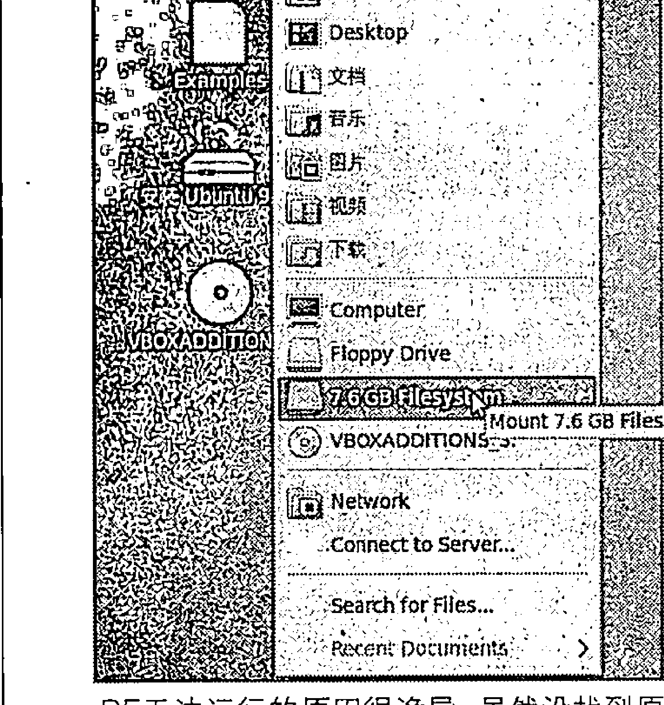

PE无法运行的原因很诡异，虽然没找到原因，不过倒给我们一种启示，在维修电脑时，准备PE、DOS、Linux三种工具比较好，Ubuntu系统盘也是不错的工具。当然，在一些工具盘中已经集成了C盘文件转移工具，我们的选择非常多，但资料文件之类的东西不要放在桌面上，万一C盘出问题了，可能就会造成文件丢失哦。

> （主人公：赵雪斌(北京)）

### 瑞星专家提醒：恶意篡改IE首页方式不断翻新

### 近期安全综述

据瑞星“云安全”系统统计，2010年3月下半月瑞星共截获了183万个挂马网址。瑞星反病毒专家介绍，近期瑞星公司截获了一个首页劫持木马病毒“Trojan.Win32.StartPage.pgg”，这是一个恶意修改IE主页的病毒，病毒将图标和文件名修改为搜索引擎图标，放在色情视频网站中引诱用户点击。当病毒运行后，会在桌面产生大量指向恶意网址的快捷方式，并创建虚假的IE图标，使用户直接访问恶意网址导航类网站。病毒还会劫持浏览器的搜索引擎和多种第三方浏览器软件，到达提高网站点击率的目的，并且还会在后台下载木马病毒进行盗号。

### 近期关注的被挂马网站

“第一车网”、“中国金融网”、“北京航空航天大学”等网站的部分页面被黑客挂马，黑客利用微软最新漏洞和服务器不安全设置进行入侵。用户访问这些页面后，可能会感染木马下载器、盗号木马和黑客后门。

### 近期关注病毒分析

“首页劫持木马 (Trojan.Win32.StartPage.pgg)”

#### 警惕程度 ★★★★

病毒通过VC++编写，采用UPX进行加壳。在桌面产生大量指向的恶意网址的URL快捷方式，删除HKCR\lnkfile\IsShortcut，使LNK文件的小箭头消失，URL文件的 不受影响。在以下地址创建虚假的IE图标（LNK），使其指向恶意网址：“%AllUsersProfile%/桌面”，删除%HomePath%\Application Data\Microsoft\Internet Explorer\Quick Launch\中的“启动Internet Explorer.lnk”。修改HKCR\CLSID\{208D2C60-3AEA-1069-A2D7-08002B30309D}（此CLSID原本为网上邻居）添加DefaultIcon，将默认图标指向IE图标，添加Shell\Open\Command，将网上邻居的打开方式指向为恶意网址。

### 防范方法

1.  使用“瑞星全功能安全软件2010”，有效阻挡通过网页挂马方式传播的病毒；
2.  安装卡卡上网安全助手6.2自动修复漏洞；
3.  同时可拨打客服热线400-660-8866咨询，访问客户服务中心网站(http://csc.rising.com.cn)寻求帮助，使用在线专家门诊获得即时支持。

### 迅雷URL扫描谁家的‘杯具’

古语有云：“病从口入”，电脑本是安全的，病毒文件进驻电脑才有了威胁，而文件进入电脑的方式有两种，一个是网络下载，一个是移动存储设备传输。目前网络下载的方式占的比例相当高，于是，迅雷就提出了一个计划，文件在下载前就进行一次安全扫描，这样就可以防止病毒进入电脑了？即迅雷的“安全扫描”，今天我们就通过一个病毒文件来看看这样的防护下，能不能让病毒“杯具”一次。

实验开始，我们要从http://qvod.cctv8.com/qvod.exe下载这个文件，下载开始后先暂停，然后用迅雷的“安全扫描”扫描，发现均是未知，这是怎么回事呢？原来，这个URL安全扫描是这样的，有人用迅雷从某一个地址下载了一个文件，并使用杀毒软件进行了扫描，那么这个文件的安全性和这个URL之间就建立一个一一对应的关系，迅雷收集到这些一一对应的关系，建立一个资源库，以后再有人下载这个文件，有URL就可以查到这个文件的安全性了。不过，这显然要依靠于两个条件：首先要有第一个吃螃蟹的人，下载了某文件并进行扫描，第二就是安全软件要把这个建立对应关系的URL安全资源库分享给迅雷。

这样就可以解释文中的截图了，瑞星、卡巴斯基、江民、金山的检测结果都是未知，看来迅雷的URL安全资源库里还没有这个信息，下载完成后，江民文件监控显示这是一个木马病毒，病毒名为Trojan/KillAV.ctz。

由此我们可以知道，迅雷的安全扫描的想法是好的，如果你在迅雷安全扫描中发现某个杀毒软件给出的结果是安全的，那么就说明这个文件已经有人用这个杀毒软件扫描过了，基本可以放心使用。不过目前的迅雷的URL安全资源库不够丰富，更新也跟不上，如果碰到检测结果未知，还是用自己的杀毒软件进行本地扫描吧。

### 窗口组队 同进同退 一键控制

工作干完，要一个个关闭窗口，工作没干完，下次开机还要一个个开启窗口，这一来一回多了不少麻烦，能否让窗口组成队伍，关闭的话一起关闭，要开启，又能一键开启呢？嗯，这是一个问题！

#### 实例1下班回家 窗口一键恢复

下班了，发现工作还没处理完，只好先将窗口一一关闭，回家再一一打开，好麻烦，有了“凌云windows资源管理器打开窗口总管家”（http://www.onlinedown.net/soft/96575.htm）就省事了。

运行后，首先单击“刷新”按钮将当前与系统资源管理器相关的窗口全部显示出来，然后在列表中将需要保留的窗口选中，依次单击“文件→保存当前受保护的文件夹集合为默认文件”，然后单击“部分关闭保留勾”按钮，窗口就一起关闭了。

回到家，开机后只需再运行软件，依次单击“文件→调入默认的文件夹集合（上次退出记录）”，之前我们关闭的窗口又批量打开了，继续工作吧。

#### 实例2 窗口分组 同进同退

有时候处理某件事情时，可能需要打开一些相关而特定的窗口，处理完还要一一关闭，如此反复的事今天可以终结了。只要通过下面的方法将这组打开的窗口保存为文件，以后在任何时候都可以直接打开这组窗口了：选中这组文件夹，依次单击“文件→另存为”将这组文件夹窗口保存起来，设置一个方便区分的名称（例如“动画设计”）即可。以后需要打开这组窗口时，只要单击菜单“文件→重新调入其它的文件夹集合”，选择之前保存的记录即可迅速打开这组窗口了。

### 小提示

如果只想关闭多个窗口，可以按下Ctrl，然后单击任务栏的多个窗口，右键单击，选择“关闭组”就可以将其一起关闭了。凌云windows资源管理器打开窗口总管家”目前不支持Windows 7，有些遗憾。

(文/呆瓜)

### 治疗不完全杀毒的后遗症

那天，我收到了班里一位女同学的短信，偷偷在被窝里看了好几遍才明白是她的笔记本中病毒了，勾画过无数情节后，认为咱义不容辞啊，把本本拿回宿舍，大致检查了一下，发现她感染的病毒是传说中的快捷方式病毒（不知道她去了什么网站，嘿嘿），虽然病毒已经被电脑自带的杀毒软件干掉了，只是电脑不正常，硬盘各分区主目录下的文件夹变成了“系统+隐藏”的属性。

因为隐藏文件夹带有系统属性，不能直接取消其隐藏属性，而且数量众多，直接改费时费力。于是乎我亮出了利器：超级批量文件属性修改器UltraFileExternal（下载地址：http://work.newhua.com/cfan/201007/plggsx.zip）。添加完文件和类型，最后点击“开始”，稍等片刻，大功告成，顺利赢得共进晚餐的机会。

快捷方式病毒的清除方法读者可以看看2010年第一期《全是快捷方式 咋办？》一文，本故事中的MM使用的杀毒软件杀毒不彻底，只把病毒删除了，病毒对系统做的修改没有修复，而UltraFileExternal对于修改文件属性来说确实是不错的工具，还能根据时间、文件名进行检索。

(主人公：赵雪斌)

### 要玩‘库’ 先让‘库’图标更‘酷’

要想在Windows 7搜索快，就必须要会用“库”，这已经是必须要接受的理念了，Windows 7提供了文档库、音乐库、图片库和视频库。但是，我们也可以对其行个性化，自定义库图标，漂亮又个性。

第一步：先找好看的图标，登录http://www.iconfinder.net/，利用英文关键字搜索自己想要的图片（也可以单击左上角的Browse随便浏览图片），选择ICO格式的进行下载（见图），修改一下文件名保存到某个特定目录下备用。

第二步：进入库图标的存放目录：X:\Users\用户名\AppData\Roaming\Microsoft\Windows\Libraries，将其中的库图标用记事本打开，会看到一段诸如<iconReference>imageres.dll,-1003</iconReference>的代码，现在用我们下载的图片的路径来代替其中的“imageres.dll,-1003”，例如：<iconReference>C:\Windows\123.ico</iconReference>，保存后可看到图标已经实时替换，是不是很神奇？

### 小提示

现在右键单击开始菜单调出资源管理器，出现的是库而不是我的电脑了，要想改回去可以：在“资源管理器”图标右键单击选择属性，在弹出的窗口中选择“目标”框，只需要在后面加入一个空格以及半角的逗号(%windir%\explorer.exe,)，保存就可以了。

(天津/李慧武)

### 软件与生俱来的‘杯具’——后门

前面我们认识了脚本病毒、宏病毒，除此之外你还会看到杀毒软件的另一种常带有‘backdoor.win32’前缀名字的病毒（见图），通过之前的了解，我们知道后面的不同命名指的是病毒发现者对它的个性命名以及变种名，前面的win32表示是一种感染Windows 32位系统的病毒，而backdoor标明了这是一种后门病毒。

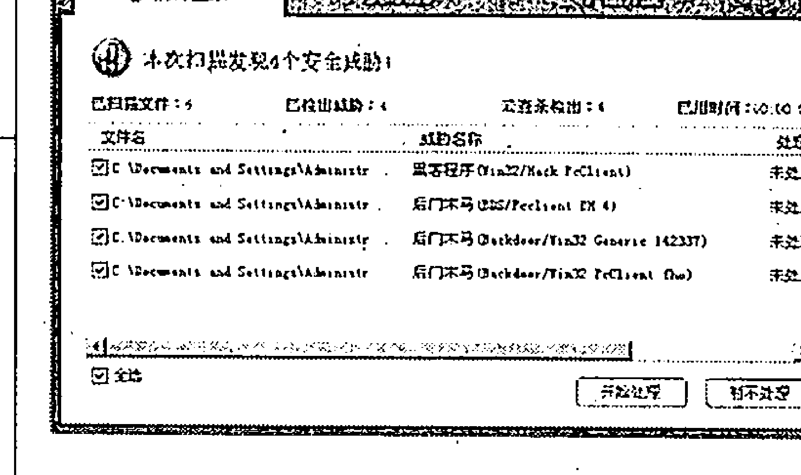

首先我们先来了解下软件的开发过程，程序员在编写一个较复杂的软件时，都习惯于先将整个软件分割为若干模块，然后再对各模块单独设计、调试，大型软件更是会将软件分成几个模块，每个人或几个人负责其中一个模块的开发，最后再将代码合并。这样，为了让最后的测试员方便测试，每一个模块都设计了一个特殊的秘密入口，称为后门。当然，这个后门只有设计者知道，别人是不知道的，按照正常操作程序，在软件交付用户之前，程序员应该去掉软件模块中的后门，但是，由于程序员的疏忽，或者故意将其留在程序中以便日后可以对此程序进行隐蔽的访问，方便测试或维护已完成的程序等种种原因，实际上并未去掉。

后门的存在本来是方便开发者使用，但这也让软件从诞生之初就有了一个隐患，当黑客利用穷举搜索等破解后发现，就可以利用这个后门，像软件设计者一样去控制软件，做一些非法操作。当然，这样的后门并不好找，于是病毒制作者就让病毒首先运行在系统中，通过病毒的运行修改电脑设置，创建一个隐秘的后门，这个后门就用来供病毒制作者使用，这种病毒就是后门病毒。

现在大家常说的后门病毒通常是带有强烈的目的性，也被称为远程控制软件，它分服务端和控制端；服务端相当于总司令，而控制端则相当于士兵，司令通过网络来发送命令让士兵执行各种命令和操作，控制者通过恶意软件捆绑等方式把士兵（病毒客户端）放到被控制者计算机上，通过司令（病毒服务器端）对被控制计算机上的文件等进行操作。后门病毒简单的说就如同拥有一把正常用户的隐形钥匙，什么时候进来和什么时候出去用户自己是不知道的，只是在某些情景下，用户知道自己家进‘小偷’了。

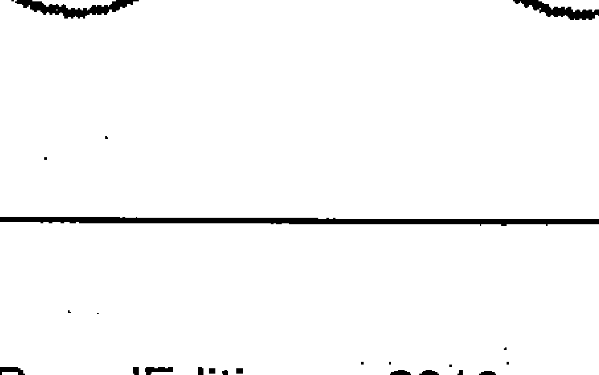

Other sizes of this icon (本图标的其他尺寸)

### 放一只羊与放一群羊的区别 菜鸟网管成长记

想当年我可是学校著名的电脑高手，出入女生公寓，值班师傅都不带过问的，那家伙……”新来的实习生小王向网管老李描述着他的丰功伟绩。“你知道放一只羊和放一群羊的区别吗？”小王飞起来的眉毛停在了半空中，“你能玩转一台电脑，但现在你要面对的是数十台甚至上百台电脑，如果再用老方法装系统、玩软件，你会累死的”。老李从包里把《如来神掌》下面的《菜鸟网管成长记》拿给了小王，原来是老李当网管的回忆录。

#### 序言：我的必备工具

AutoRuns：管理系统启动项；Process Monitor：监视当前系统的文件、注册表读写情况；IceSword：删除顽固木马则。当系统中毒太深甚至系统都进不去时，WinPE工具盘就显得非常有必要了，现在的WinPE很多，老毛桃的稳定版2.0就非常不错，因为我们主要是维护，所以只要稳定不要性能。并且还可以利用UltraISO将一些自己常用的工具加进去，我目前加了IceSword、DiskGinus、AutoRuns、Process Monitor、驱动精灵、Wireshark等，最后将其刻录成光盘。

#### 网络大补贴

| 序号 | 内容 | 链接 |
| :--- | :--- | :--- |
| 1 | 如何修改组策略的刷新时间 | http://support.microsoft.com/kb/203607/zh-cn |
| 2 | 使用WAIK快速部署Windows 7 | http://yuelei.blog.51cto.com/202879/235405 |
| 3 | 什么是UNC | http://baike.baidu.com/view/244940.htm |
| 4 | 什么是GPO | http://baike.baidu.com/view/798408.htm |

#### 实习篇 批量安装系统 不要累傻小子

本篇收获：创建适合自己的无人值守光盘
时值月薪：800元

第一步：进入电脑自带安装光盘的"SUPPORT\TOOLS"目录，找到DEPLOY.CAB文件，将其内部的文件全部提取(也可用WinRAR等解压缩)，运行其中的setupmgr.exe程序。
第二步：在弹出的"安装管理器"对话框中按照提示进行各步设置，"用户交互"类型选择"全部自动"项，"分布共享"选择"从CD安装"项；在

1.  第三步是非必要步骤，可根据自己的实际情况进行选择。如果不将"AutoPartition"项的值改为"0"，安装程序将自动选择安装分区，如C分区本身存在系统，则会选择安装到D分区(D分区有足够的存储空间的话)。不添加"FileSystem=*"语句，安装时不会询问是否格式化磁盘分区。
2.  Windows XP光盘中的setmgr.exe只支持到Windows Server 2003。对于更新的操作系统，需要WAIK工具进行部署。Windows Vista的WAIK可从http://tinyurl.com/ycam77n下载，针对Windows 7及Windows Server 2008系列的WAIK可从http://tinyurl.com/y3vsq5q下载。

#### 转正篇 遭遇 AutoRun 病毒 修改设置不再跑断腿

本篇收获：批量给电脑更改系统设置
时值月薪：2000元

第一步：先将大家的电脑加入一个域中，在员工电脑上打开"我的电脑→属性→系统属性→计算机名→更改"，输入域管理员用户名和密码单击"确定"按钮，"确定"之后重新启动计算机，使用域用户登录就算是为计算机在域中安了户口了。
第二步：在运行对话框中输入"gpmc.msc"后回车，在"组管理管理"窗口中，右键单击当前的域名，选择"创建并链接GPO (组策略对象)"项，输入一个GPO名称。
第三步：右键单击刚刚创建的组策略，选择"编辑"，依次定位到"计算机配置→管理模板→系统"，打开"关闭自动播放"项，选择"已启用"项，并选择"所有驱动器"。待员工电脑组策略刷新后，你会发现放入光盘、插入优盘等设备，自动运行已经不起作用了。

小提示：如果运行"gpmc.msc"时提示找不到文件，请到http://tinyurl.com/y6extwt页面中下载并安装GPMC。如果想在客户端查看组策略的效果，但组策略又没有刷新，可在客户端运行"gpupdate /force"命令强制刷新组策略，在客户端运行"gpresult"命令可查看应用的组策略。使用组策略管理软件分发可参考：http://v.youku.com/v_show/id_XMjcyNDM3NTI=.html。

#### 晋升篇 MSN 升级风波 安装软件用分发

本篇收获：学会局域网分发软件
时值月薪：2500元

第一步：首先保证电脑已经加入域，在服务器中设置共享目录"Software"，并要保证"Authenticated Users"组具有访问权限，在自己的电脑上安装MSN，然后进入C:\Program Files\Common Files\WindowsLiveInstaller\MsiSources (其中C为系统盘盘符)，这时可以看到有扩展名为MSI的程序。将MSN的MSI安装文件放到共享目录中(在软件批量部署的过程中，只能部署扩展名为MSI的安装程序)。
第二步：打开"组策略管理"，新建一个软件分发的策略，并进入"组策略编辑器"，依次定位到"计算机配置→软件设置→软件安装"，右键单击"软件安装"，选择"属性"，输入默认程序包的UNC路径并确定。
第三步：右键单击"软件安装"，选择"新建→程序包"，选择需要部署的安装程序。待员工电脑策略刷新并重新启动计算机后，软件分发策略便会起作用。同事们打开"添加/删除程序"对话框，单击"添加新程序"，这时在右侧的"从网络添加程序"下方看到在服务器端发布的安装程序，用户单击"添加"按钮即可开始安装。

评论：网管，你可以把它当成是世界上最简单的工作，也可以把它当成是世界上最艰难的工作。简单在于，你只要保证服务器不出故障、网络畅通就行了；艰难在于如何提升管理网络的水平，让网络、系统更好地为同事服务，提升他们的工作效率，提升公司的生产力。即便是再大的工厂，你都可以“立于机房之中，决胜千里之外”，而不是每天穿梭于各个车间之中。所以即便同样是网管，个体之间的差异还是非常大的。如果你想当网管，我希望你把它当成“管理网络”来看。
(浙江师范大学\王超)

### JPG图标病毒 冰刃手到擒来

多年前我们还会认为看图片是不会中病毒的，可如今笔者自己就遇到了一个图片病毒(文件名为：“QQ截图未命名.jpg.scr”)，在IceSword的“端口”列表中可见一个svchost.exe进程通过33端口访问网络，典型的病毒嘛，在冰刃下岂能长存？
第一步：首先在IceSword中禁止进程创建(见图)，以防病毒衍生新的进程。在“端口”界面找到异常进程，记下其PID。在“进程”列表中根据PID找到病毒模块插入的svchost进程，发现有一个奇怪的ACDSee目录，用IceSword结束此进程。
第二步：在注册表中搜索“ACDSee”，在[HKEY_LOCAL_MACHINE\SYSTEM\CurrentControlSet\Services\ias\parameters]的键值中可见：

小提示：这个病毒文件名具有很大的迷惑性，但SCR类型文件是可执行文件，可以用处理病毒的常规思路：利用兵刃发现进程存在发现异常，然后根据异常进程PID推出svchost进程，然后再推出相关服务和文件。该病毒在当前用户“应用程序数据”目录下(C:\Documents and Settings\Administrator\Application Data\)创建一个名为ACDSee的文件夹。此文件夹中含一病毒主体文件imagevv.ddf，imagevv.ddf动态插入svchost.exe进程。

(北京/林保和)

## 迈克菲、小红伞接踵而至 两种风格新鲜体验

2010年3月, Mcafee (迈克菲) 和Avira (小红伞) 相继正式进入中国, 这两款杀毒软件的背景类似, 都是在国内一些技术圈子里有小有盛名的安全软件。他们选择在这个国内安全软件市场纷争四起, 竞争白热化的时候正式登陆中国, 到底有什么本领呢？

## 简洁明快的 “咖啡小伙”

首先, 我们按照时间顺序来认识一下迈克菲的主力产品: McAfee网络安全实时防御套装, 它是一位清纯的“小伙”, 绿色界面上部可以看到安全软件的组件开启状态以及动态变化的安全报告(见图1)。

使用迈克菲最大的感受就是软件只有一级主界面, 在主框架下可以展开各个功能组件, 切换起来犹如切换网页, 通过单击“主页”返回主界面, 通过“关闭”按钮返回上一级目录, 单击“导航”, 软件的所有功能设置就一览无余了。点开“导航”按钮可以看到软件的所有选项。

在工具菜单下, 会看到“流量监控”组件, 它的功能要比目前有此功能的软件强大得多。在“流量使用情况”中可以看到系统以及各类软件对网络的使用比例, 在“活动程序”中可以查看活动程序在一段时间内的网络活动情况(见图2), 对于筛选可疑文件来说, 可谓是好工具。

> 小提示
迈克菲在工具中提供了三个小软件, 快速清理器用来清理注册表、系统文件和邮件垃圾; 文件粉碎机具有五级粉碎标准, 最高可以对文件进行十次粉碎; 而碎片整理程序只是调用的Windows组件。

## 朴实严谨的 “红伞大叔”

小红伞从界面到功能都渗透着德国血统的严谨, 是一位留着胡子的“大叔”。它没有修饰的软件界面略显枯燥(见图3)。功能上, 小红伞将精力集中在扫描、防护、杀毒这三个领域上, 并把这些做得非常细致、深入。所以, 常规功能不再赘述, 我们就来分析下它的功能有多深入。

小红伞的配置窗口有普通和专业两种模式, 专业模式下设置项相当丰富和细致。例如扫描处理方面, 自动处理模式下,“主操作”如果设置为“修复”而操作失败, 那么小红伞就根据“辅助操作”的设定进行处理; 在启发式配置上, 除了可以设定启发式扫描的级别外, 对压缩包的处理上还增加了递归深度的配置。

> 小提示
小红伞在其他功能上也不落后。提供了Rootkit扫描和救援光盘的制作, 提供了游戏模式以及网络活动实时图形化显示。

性能测试(均按默认配置)
| 软件 | 扫描病毒数 | 清除病毒数 | 扫描用时 | C盘扫描时间 | CPU占用峰值 | 内存工作值 | 内存峰值 |
| --- | --- | --- | --- | --- | --- | --- | --- |
| 小红伞 | 99 | 94 | 13秒 | 8分19秒 | 17% | 86MB | 105MB |
| 迈克菲 | 89 | 87 | 58秒 | 12分 | 5% | 28MB | 38MB |

## 32 与 64 位的 Windows 7 合体

Windows XP和Windows 7是大家最常用的系统, Windows 7又有32位, 64位之分, 而这些不同版本的系统都是独立存在的, 那要做一个高手岂不是要准备3张光盘, 如果你有一张光盘可以完成这三大系统的安装, 那么你的光盘就要小心点, 肯定要被朋友们借疯的!

## 前期准备：

- 1. UltraISO (http://www.onlinedown.net/soft/614.htm)、Easyboot (http://www.onlinedown.net/soft/4530.htm)、GimageX (http://work.newhua.com/cfan/201010/zhxt.rar)。
- 2. Windows XP和Windows 7对应的32位、64位ISO安装文件。
- 3. 在电脑中空出一个有10GB空间的NTFS分区(因为FAT32存放超过4GB文件会出错, 这里假设为D:, 操作环境为WinXP SP3, 由于Windows XP 64位用户较少, 而且它和32位系统相同文件不多, 集成起来不方便, 下面只介绍集成Windows XP 32位、Windows 7 32位和64位系统的方法)

```
Imagex /export d:\64\sources\install.wim 4 d:\32\sources\install.wim /compress maximum
```

> 小提示
使用/export参数整合镜像时, 源文件和目标文件必须使用相同的压缩类型。查看目标文件压缩率可以使用GimageX, 启动程序后切换到“映像信息”, 选择install.wim文件, 再单击“显示信息”即可, 如图1中的压缩显示为LZX(表示高压缩率), 这样整合进来的映像就必须使用/compress maximum参数, 否则命令会出错。

## 制作多系统光盘

第1步: 安装Easyboot到默认目录c:\easyboot, 把Windows XP安装光盘的全部文件, 上述整合好的d:\32全部文件复制到c:\easyboot\disk1。接着启动UltraISO, 打开Windows7的32位ISO文件, 单击“启动→保存引导文件”, 保存为win7.bif, 放置在c:\easyboot\disk1\easyboot下。

## 桌面筹建超级回收站 强制删除各种文件

对回收站，我们都不会陌生，有垃圾就拖进去，但这快乐并不像太阳一样时时存在，经常会遭遇一些无法删除的顽固文件，仅仅借助原有的回收站是无法删除的，现在来让回收站升级，顽固文件统统回收。

启动记事本输入下列代码保存为“del.bat”，放置在c:\，然后将其发送到桌面并将名称改为“超级回收站”，右击该快捷方式选择“更改图标”，将其图标替换为回收站图标，现在超级回收站就打造成功了，遇到顽固文件，只要将要删除文件拖到该图标上即可完成删除。

```
DEL /F /A /Q \?\%1
RD /S /Q \?\%1
```

当然有些文件不仅仅是顽固，简直就是难缠，这时可以请一个超级回收站（下载地址：http://www.onlinedown.net/soft/67334.htm），运行后把这个悬浮框放在一边，有文件要删除，就把文件拖进这个垃圾桶图标就好了。（注意：这是强制删除，不会在回收站保存）。大家可以试一试在桌面建立一个a:\畸形目录，看看拖到该图标上是不是直接删除了呢？

(文/俞木发)

## 双系统无敌 老系统帮你搞定驱动难题

电脑日新月异，操作系统不断创新，然而驱动程序总是姗姗来迟，没有驱动程序，就无法使用该硬件，有时朝思暮想，寝食难安，但如果在尝试时保留了双系统，那么你的问题就好解决了。

### 借用旧系统驱动

尝鲜Windows 7已经不是新鲜事了，不过有些另类驱动就是搞不定，如果你这时保留的是Windows Vista、Windows 7双系统，这时你要想到Windows Vista下的驱动都是完美的，沿用即可：依次打开“计算机→属性→设备管理器”，找到相应设备，选择“更新驱动程序软件”，选择手动安装（见图），找到d:\windows\inf文件夹（Windows Vista系统所在分区），让Windows替你分析并安装，绝大部分会奏效。

### 让驱动换个样子

有些厂家驱动是EXE执行文件放到另一个操作系统无法运行，这时可用WinRAR帮忙，例如“sp44390-8.0.0.144.exe”Windows 7下的驱动程序，无法在Windows 2008 R2安装，右键单击此EXE文件，选WinRAR解压，生成了一个新文件夹sp44390-8.0.0.144，里面有很多文件，这样就把Windows 2008 R2升级驱动的地址指向sp44390-8.0.0.144这样驱动就安装好了。

> 小提示
第一种方法尤其适合测试一些新系统，或许将来升级Windows 8都会用到！另外我们用安装文件无法正确安装时，利用INF文件更新驱动常常会解决问题。

(北京/张永进)

## 瑞星专家提醒：导航海盗木马绑架IE首页 网站流量变“赎金”

### 近期安全综述

据瑞星“云安全”系统统计，2010年4月上半月瑞星共截获了243万个挂马网址。瑞星反病毒专家介绍，近期瑞星公司截获了一个通过电脑底层驱动技术恶意篡改IE默认首页的病毒。病毒运行后，就像非法武装的海盗劫持人质一样，通过“绑架”系统驱动文件，使其具有直接修改IE首页的病毒功能，将首页绑架成恶意导航网站，且自身具有驱动级的自我保护功能，与杀毒软件进行对抗，从而提高恶意导航网站流量，获取经济利益。

### 近期关注的被挂马网站

“四川在线”、“中国摄影在线”、“手机中国”等网站的部分页面被黑客挂马，黑客利用微软最新漏洞和服务器不安全设置进行入侵。用户访问这些页面后，可能会感染木马下载器、盗号木马和黑客后门。

### 近期关注病毒分析

### “导航海盗木马 (Rootkit.Win32.Mnless.bpa)” 警惕程度 ★★★★

该病毒会替换正常的系统驱动文件netbios.sys，且有微软正常的版本信息，创建名为 \Device\pcidump 的设备对象，和一个名为 \DosDevices\pcidump 的符号链接对象，通过挂钩IoCreateFile，判断当前操作的文件名是否为自身驱动文件，如果是，则返回 STATUS_UNSUCCESSFUL (不成功) 从而使得其他软件无法打开它，更无法有效删除。病毒挂钩进程创建通知CreateProcessNotifyRoutine，当某个进程启动的时候，会对该进程做一些检查，判断创建的进程是否是IE进程，如果是则修改IE命令行为“<IE执行路径> http://www.ie7.com.cn”，通过这种隐蔽的手段达到修改IE主页的目的。

### 防范方法

- 1、使用“瑞星全功能安全软件2010”，有效阻挡通过网页挂马方式传播的病毒；
- 2、安装卡卡上网安全助手6.2自动修复漏洞；
- 3、同时可拨打客服热线400-660-8866咨询，访问客户服务中心网站（http://csc.rising.com.cn）寻求帮助，使用在线专家门诊获得即时支持。

## 打破障碍 Windows下照样玩Linux

Windows是大家最为常用的操作系统，但单一的操作系统平台并不能满足特殊人群对软件开发和测试的需要，喜欢技术的人，偶尔也会接触一下Linux系统，这时是不是一定要安装Linux呢？不必如此！不安装，不重启，我们完全可以在Windows下玩Linux！

- 第一步：下载并安装Cygwin（下载地址：http://work.newhua.com/cfan/201006/cygwin.rar），首先选择Install from Internet（从网络安装），随后在下载网站列表中选择一个下载地址，在选择组件安装时要单击all（全部）后的图标，选择为all Install（全部安装）将组件都安装上。
- 第二步：接下来安装默认完成安装并在桌面建立了快捷方式，启动Cygwin就发现它已经等待你输入命令了，输入Linux命令进行体验就OK了。

如果你觉得这样还不满足，我们还可以使用直接运行在Windows下的Linux软件——“windowsLinux”（下载地址：http://work.newhua.com/cfan/201006/WinLinux.rar）来完全模拟Linux桌面。

(江苏/曹春华)

## 禁止东张西望 漂亮桌面这样“娶”回家

## 无忧 无惑 无痛 无难 善用Win 7组件摆脱四大难题

看过《生化危机》的读者都对变异的人留下深刻印象，他们的强大在于受伤后伤口能自动愈合，这才是不死之身。读到这篇文章的朋友们，你重装过多少次系统呢？你因为电脑故障又向网管求助过多少次呢？现在我们用一篇文章来催化系统变异，让Windows遭遇故障后能靠自己的功能组件来修复，从此你将无忧、无惑、无痛、无难！

### 不能上网之忧

要说故障，那么不能上网是最常见的了，这不，小李的计算机今天无论如何也不能上网了（见图1），打电话找网管？先别，系统可以自己搞定！

单击任务栏的“诊断连接问题”，此时，Windows 7会启动系统的网络“自我诊断与修复系统”，即网络诊断功能。诊断过程中，如果出现“检测是否解决问题”时要跳过，让系统继续搜索，最后会给出诊断结果（见图2），从图中可以看出，本台计算机由于网卡被其他程序禁用而导致出错，系统自动进行了修复，帮助我们解决了不能上网的问题。

> 小提示
在Windows XP中，也有类似的功能，如“网络诊断工具”。当网络出现故障的时候，单击浏览器的“工具”、“网络故障诊断”，即可进行网络故障诊断。与Windows 7相比，Windows XP的“诊断与修复”仅仅局限于个别功能。

### IE崩溃之惑

你也许会说，系统使用倒无所谓，关键是系统出现这样那样的问题，我只能求助别人了。现在这话要改改了，微软专门推出了“电脑自动疑难解答”组件，有问题，系统自己告诉你怎么办！例如，现在IE崩溃了，我们怎么办呢？
第一步：运行FixitCenter_Run（下载地址：http://work.newhua.com/cfan/201010/xtwhzx.rar）。安装Microsoft Fix it Center，首先会提示你创建一个账户，如果你有MSN账户，那么选择“我已经拥有账户”，以方便以后的交流。之后根据提示就可以完成配置过程，桌面便有了一个Microsoft Fix it Center的图标。

第二步：双击图标启动（见图3），在列表中切换到“IE冻结和崩溃自动修复”一项，单击安装，首先将这个组件安装上，运行，它就自动检测IE的问题了，之后它会提示你出现的问题并修复（见图4）。

> 小提示
如果你还不满意，可以利用“IE性能”来优化下临时文件的缓存策略以及服务器的同时连接数。

### Fix it Center常见功能

| 选项 | 实际功能 |
| :--- | :--- |
| Internet Explorer安全性 | 修改IE安全设置为默认级别 |
| Internet Explorer性能 | 阻止加载项，优化临时文件和连接。 |
| Internet Explorer连接 | 主页修改，上网疑难解答 |
| windows Media Player媒体库 | 修复媒体库问题 |
| 电源 | 修改显示器、计算机进入睡眠前的时间 |
| 录制音频 | 检测音频设备是否有故障，是否开启。 |
| “性能” | 启动“系统配置”，手动优化启动程序。 |
| 显示质量 | 自动“视觉效果设置”，手动调整 |
| 视频播放问题 | 调整解码器，会建议关掉一些微软不推荐的编解码器 |

### 求助无门之痛

时常听到好多人打电话说电脑出问题了，但是让他描述问题，却不懂如何说。这时你不会想到，系统连这点都帮你想到了，Windows 7提供的“问题步骤记录器”能够一步一步记录电脑中执行的一系列操作，方便你查找问题。
点击“开始”，在搜索栏中输入psr.exe，在搜索结果中点击psr.exe可运行“问题步骤记录器”。点击“开始记录”按钮即可进行记录，此时我们把故障重现，操作完毕后点击“停止记录”按钮即完成录制（见图5）。记录完成后，“问题步骤记录器”会弹出对话框提示我们将记录结果保存为一个ZIP文件，把这个文件发给高手吧，该文件记录了整个故障过程，高手据此可以帮我们解决问题。

> 小提示
“问题步骤记录器”需要使用Windows 7提供的工具来打开，因此使用范围有限。在Windows XP下，可以使用远程桌面或者QQ中远程协助帮助我们解决问题。笔者发现，此功能可以用于教师记录电脑操作，由于采用压缩文件，比录屏软件好很多。

### 忘记密码之难

### 实例1 系统密码

忘记系统登录密码的糗事你有过吧？有人会说用XX光盘启动，用密码修改工具修改，别说，菜鸟可不懂。但如果你学会使用windows的密码重设盘，事先自己创建一个，你就不怕忘记系统密码了。
首先插入一个U盘，依次打开“控制面板→用户账户和家庭安全→用户账户”，在左侧窗格中，单击“创建密码重设盘”启动恢复密码设置向导。然后选择你的U盘（见图6），输入当前账户的密码，单击“下一步”即可完成设置。以后如果忘记了密码，在面对系统登录窗口发呆时，插入你的U盘，下面就出现了“重设密码”的选项，单击它按照提示重新为这个账户设定一个密码就好了。

> 小提示
这个操作不会删除你的U盘数据，需要注意的是，不要删除那个userkey.psw文件，密码就藏在这里。同样，Windows XP中也有这个功能。另外，Windows 7中还提供了虚拟键盘（见图7），如果正在使用触摸屏的电脑，那么你完全可以丢掉键盘了。需要注意的是，这个虚拟键盘是用来代替真实键盘的，不能实现防止木马盗号功能。

### 实例2 局域网密码

忘记系统好说，在公司我们连接服务器的密码都会忘记，找个记事本存着？太土了！系统有“凭据管理器”工具来帮助我们。
打开“控制面板”，单击“凭据管理器→添加Windows凭据”链接可进入添加凭据窗口。然后在“目标地址”后输入共享服务器的IP地址（如192.168.0.252），接着输入访问账户和密码，最后点击“确定”即可。这样在访问共享服务器的时候不用再次输入账户和密码即可进行访问（不要填入协议类型）。
系统的这些辅助组件给了我们很好的帮助，一些故障都可以依靠它们解决。当然，有时我们无法直接解决，例如，不能连接局域网了，用系统诊断也不能直接解决问题，但是它给出了错误代码，利用错误代码，我们经过简单搜索就可以找到准确的解决方式。在与本文作者交流时，作者提到，系统的这些功能至少可以帮助我们精确定位问题，是驱动问题，还是DVS故障，等等。
(河南/赵建超)

## U盘大门常打开 维护工具随意加

很多读者按照杂志的介绍制作好了启动U盘，却发现，PE里工具太少，维护系统不方便。所以，我们要在WinPE中添加一些修复系统时经常用到的程序，以下以diskgenius为例来讲解，如何将程序添加到PE中。

第一步：把以前做好的引导U盘下“Minipe”文件夹中OP.WIM复制到本地硬盘，并在桌面上新建文件夹“WinPE”，运行WimTool（下载地址：http://work.newhua.com/cfan/201010/wimtool.rar），在弹出的对话框选择“挂载和解开”，在“选择要挂载或解开的WIM文件”中指定本地磁盘OP.WIM，在“选择挂载或解开的目标文件夹”指定为桌面上的“WinPE”文件夹，勾选“可写方式挂载”（见图1）。

第二步：单击“挂载映像”，这时“WinPE”文件夹里会产生4个文件夹。在“WinPE”文件夹里，新建一个名为“外部程序”的文件夹，并将Diskgenius文件夹（http://www.onlinedown.net/soft/9570.htm）复制到此文件夹中。

第三步：选择WimTool对话框中的“卸载映像”，并在弹出窗口上选择“是”，对映像进行保存。将修改好的OP.WIM复制回U盘原来位置，打开U盘“Minipe”文件夹下的WinPE.INI文件，将内容改为如下代码（见图2），保存后制作完毕。现在让U盘引导电脑，在WinPE的程序组里就可以选择运行Diskgenius了。如法炮制，我们可以加入更多的工具，比如PQ、FinalDate等工具。

```
//配置文件开始
MOUN %CurDrv%\MINIPE\OP.WIM,B:,1
ENU OPDir=B:\外部程序
LINK %Programs%\杰哥的工具\Diskgenius,%OPDir%\Diskgenius\diskgenius.exe
//配置文件结束，注：其中“杰哥的工具”可以自定义为其它内容，也可省去。
```

### 小提示

上面的方法是为了制作统一的修复U盘，这样可以把你制作的工具与别人分享，但如果自己使用的话，把软件复制到U盘，就可以在PE访问并运行了。

#### 网络大补贴

常见的绿色工具软件都可以添加到PE中，例如Windows密码恢复：（http://work.newhua.com/cfan/201010/mimaxf.rar）、C盘个人资料转移器：（http://work.newhua.com/cfan/201010/zlyzq.rar）、Finaldata：（http://work.newhua.com/cfan/201010/wenjianxf.rar）、Filemon：http://www.onlinedown.net/soft/8986.htm

## 不再挠头 恢复杀软配置一招鲜

使用杀毒软件时，有没有发现一些配置常被弄得很乱，怎么用都不顺手，好想回到上次配置好的模式或恢复出厂设置，大家这么聪明，肯定知道下面要做什么，在一些选项里就有恢复默认设置按钮，一旦配置乱了，就去那里恢复，不过有些配置多的杀毒，你去哪找呢？现在给你展示一下高档滴。

#### 自我备份型

瑞星2010的配置可以用文件单独备份出来。当对瑞星全部配置好后，用PE或其他系统引导，然后将瑞星目录（Rising\Ris\Update）下的rsconfig.cfg和rsconfig.cfg.bak文件复制出来，当瑞星不好用或被改乱时，再用PE或其他系统引导电脑，把之前备份的两个文件替换现有文件就可以让瑞星配置恢复了。

### 小提示

备份文件时也要特别注意，不能在现有window下备份，很可能瑞星的某些参数还没有保存到那两个文件中。

程序组中有修复选项的有：瑞星、卡巴斯基、ESET NOD32。

### 小提示

金山毒霸2011的设置进行了简化，没有设置专门的恢复默认，如果有威胁性的更改，打开金山毒霸主界面会提示“危险”，单击“修复→一键修复”即可（见图2）。诺顿和小红伞没有特殊的恢复方式，不过恢复默认的按钮安排得很丰富；诺顿在设置界面中，单击上面的“使用默认值”为将当前页面的设置项恢复为默认值，单击下面的“全部默认”可以将软件的所有值恢复为默认。

#### 专业修复型

卡巴斯基2011版的功能可谓丰富之极，但也造成了一些参数配置不好就引发问题，这时我们可以用卡巴斯基的恢复操作：打开“设定”界面，单击“恢复”，选择需要恢复的控制项（见图1），按照提示进行恢复即可。

#### 起死回生型

如果这些你忘了，我们还有一个通用招数，在杀毒软件的程序组中选择“卸载”，然后在其中选择“修复”，这样就可以让软件恢复出厂设置了。目前

(北京回民学校/曹永冬)

## 巧用卡巴斯基游戏模式 营造专属游戏空间

对于狂热的游戏玩家们来说，最厌恶的事情莫过于游戏账号遭到木马偷窃，许久的努力瞬间灰飞烟灭。可矛盾的是，杀毒软件往往会拖慢系统的运行速度，还会时不时地跳出提示窗口，破坏游戏雅兴。不过，现在这一矛盾终于可以解决了，卡巴斯基全功能安全软件2010版为狂热的游戏玩家推出了游戏模式，接下来就让我们领略下如何玩游戏吧！

#### 安全登录 保障账号安全

开始运行游戏，面对登录界面你要小心哦，在输入游戏账号和密码之前，先进入到卡巴斯基的“工具中心”（见图1），运行“虚拟键盘”，通过虚拟键盘输入账号和密码，这时，无论是利用键盘记录工具还是截图工具进行的密码盗窃行为都会失效，防止账号及密码泄露。

#### 优化资源 确保游戏流畅

为了玩游戏，很多人竟然会选择卸载安全软件，这可不好。安装卡巴斯基后就不用担心了，进入卡巴斯基的“设置”菜单，依次找到“选项→兼容性”，勾选“为其他应用程序让出资源”（见图2），单击“应用”后，就能确保杀毒软件不会跟游戏抢占系统资源了。

#### 使用静默模式 专心游戏免打扰

正在游戏里激战却被一个弹出窗口切换出游戏界面的囧事你遇到过吗？让卡巴斯基帮你吧。首先还是进入卡巴斯基的“设置”菜单，进入“选项→游戏模式”，点击“启用游戏模式”后点击“应用”即可。这样，当卡巴斯基检测有全屏程序在运行时，就暂时停止扫描和更新，最大程度释放系统资源，再配合静音，就能让游戏玩家完全处于无打扰状态。

## 微软新发 “触摸补丁” 欲作硬件推手

相信很多人一直在等待Windows 7 SP1的发布, 不过, 这事用北京话讲, 那得“且等呢!” 微软倒也没闲着, 最近发布了一个新东西: Microsoft Touch Pack for Windows 7, 一个专供Windows 7的触摸补丁包, 到底是何方神圣? 我们先睹为快!

#### 三维地图 娱乐中摸到自己家

Microsoft Touch Pack for Windows 7没有作为微软自动更新进行推送, 需要自己下载名为touch-pack-web.exe的安装文件 (下载地址: http://work.newhua.com/cfan/201011/w7cmbd.rar), 安装前补丁包会首先检查系统版本是否支持 (家庭高级版以上版本), 以及电脑是否包含支持多点触摸 (至少两点) 的硬件, 安装中可以看到补丁包包含6个程序文件 (见图1), 很快安装结束。

在开始菜单中找到Microsoft Touch Pack for Windows 7, 运行Microsoft Surface Globe, 一个漂亮的地球仪就出现了 (见图2), 可以用手指进行滑动、放大、缩小操作。在下面的搜索框中, 输入我们要查找的地方, 例如: 北京, 回车后地球仪就会自动帮你找到地方 (目前都是英文标识)。

### 小提示

运行Microsoft Surface Globe前要保证电脑联网, 一些数据需要随时下载。Microsoft Surface Globe提供了道路视图和卫星视图两种模式, 道路模式只能看到比较笼统的地区板块, 卫星视图除了看到更详细的内容外, 还可以看到星座图。

这时, 用两根手指分别进行反方向滑动, 视图就会逐渐放大, 通过滑动地球仪, 小编找到了自己的住所, 但道路视图就比较笼统了, 连三环都没有标注。这时我们点一下下面的图钉按钮就出现了七种标记 (见图3), 选择一种, 输入你的注释, 例如“家”, 然后用手指按住图标, 出现“放置我”的提示后, 将图标放置到地图的合适位置, 再次点击下面浮动框的圆形地球仪, 我们就可以在整个地球仪上看到我们刚刚标记的位置了 (见图4)。

### 小提示

下面浮动框里的三个地球图标分别提供了视角改变、地球全图、指南针三个功能。另外, 在扩展功能中, 我们还可以导出我们的图钉标记, 以后可以在线导入。

#### 触摸游戏 要动手更要动脑

在小编的试用中, 除了Bing Maps 3D是应用程序外, 其他的都是供大家娱乐的了。提供了一个Microsoft Surface Lagoon屏保, 激活后为一个鱼缸场景, 用手指触碰水面会产生水波, 吓跑小鱼 (见图5)。Microsoft Surface Collage为一个图片拼接程序, 通过它可以将系统库中的图片作为材料, 通过手指触摸来完成一幅图片的拼接 (见图6), 可以选择背景图片, 背景颜色, 给图片加不同的边框。按住某个图片不动, 可以将其设置为图片的底层, 默认是后来者位于图片上方。

最后是三款非常有意思的游戏, Microsoft Blackboard (见图7, 黑板画搭建游戏), Microsoft Garden Pond (见图8, 水花推船游戏), Microsoft Rebound (见图9, 磁力推球游戏)。

## 治愈 “Rotinom” 病毒 学用清毒三味药

如果你发现你的U盘插入电脑后, 指示灯不停闪烁, 而你又没有对U盘进行操作, 那么你要小心了, 或许是病毒正在偷偷复制你的文件, 而如果同时你的C盘里发现了一个超大的Rotinom文件夹, 那么你已经中毒了, 来这医治吧! 对付这个病毒, 你不用懂什么道理, 通过病毒现象就可以找到对策。

#### 病情:

U盘内的文件都复制到了C:\Documents and Settings\Administrator\Local Settings\Application Data\S-1-5-31-1286970278978-5713669491-166975984-320\Rotinom文件夹, 并且往U盘内多了一个名为USB2.0驱动的文件夹, U盘内又产生了和原有的文件夹名字相同的EXE文件。

#### 用药:

1.  惯用消炎药: 无论什么病毒, 首先看进程, 发现它存在一个名为Update.exe可疑活动进程 (部分中毒电脑没有这个), 先结束Update.exe病毒进程。
2.  特征专用药: 现在来清除病毒主体, U盘上有了好多同名EXE病毒, 我们可以想到这和同名文件夹类似, 一定是隐藏了U盘原有的文件夹, 并创建一个与原有文件夹同名的EXE文件, 那么我们要分两步走: 第一步: 以关键字*.exe搜索U盘上存在的EXE文件, 将图标为文件夹的EXE文件全选并且删除; 第二步: 恢复被隐藏的U盘原有文件夹, 新建一个记事本输入: attrib /S /D -s -r -h, 保存为名为fixhide.bat, 然后将这个文件复制到U盘根目录执行。
3.  外用调理药: 病毒清除后剩下的就是要做一些调理工作, 因为它会将U盘的文件拷贝到C盘Rotinom文件夹中, 我们就要删除\S-1-5-31-1286970278978-5713669491-166975984-320\这个文件夹, 如果不能删除, 建议开机后用F8进入安全模式下查杀。这样病毒就清理干净了, 会者不难啊。

### 小提示

目前这个病毒金山、诺顿等都已可以查杀, 我们通过这个手动的方式来学会通过现象去判断病毒的清除方法, 一些其他的文件夹图标病毒, 我们可以用金山U盘专杀 (http://www.duba.net/zhuansha/261.shtml) 来清除。

(文/脑残)

## 变身钢铁侠营救Windows账户

系统账户是我们操作电脑的根本，我们对电脑的操作，其实都相当于我们在指挥系统中的一个账户来做一些事情。但往往，由于系统默认设置或者误操作，经常会导致账户无法使用。这个时候我们对系统已经丢失了控制权，想要找回来，非常力所能及也，难道只能让钢铁侠来解决吗？还别说笑，这是真的，仔细研究第一部《钢铁侠》的精彩剧情，我们就能学到“营救”账户的有效方法。

#### 营救行动一：拯救丢失密码的普通账户

##### 借鉴剧情：小辣椒盗取电脑数据

面对奥博戴恩与恐怖分子的武器交易，钢铁侠的助手“小辣椒”盗取了奥博戴恩电脑的武器数据。在这个过程中，你要了解到破解密码是其重要一步。同样，总是有些马大哈会忘记自己账户密码，如果本机还有其他管理员账户可以进入，只要进入系统右击“我的电脑→管理”。在打开的窗口依次展开“系统工具→本地用户和组→用户”，右击需要重置密码的账户选择“设置密码”，按提示重置密码即可。

### 小提示

对于Vista、Win 7用户，如果连管理员密码也忘记了，还可以使用安全模式开启系统内置Administrator账户进行密码重置操作。开机按下F8键，选择安全模式后用Administrator账户登录系统，进入系统后也可以执行上述操作。

#### 营救行动二：开启被禁用管理员账户

##### 借鉴剧情：利用奥博戴恩未解决的冰冻BUG赢得胜利

能量不足的钢铁侠与奥博戴恩的大盔甲展开搏斗，钢铁侠的胜利完全借助于大盔甲没有解决的冰冻问题，我们用计算机知识理解就是BUG。那么我们面对一些复杂情况，例如系统管理员账号被禁用，很多操作无法执行时，你是否想到系统也存在BUG，利用经典的登录漏洞我们完全可以开启被禁用的管理员账户。

由于无法使用管理员账户进入Win7，辅助工具替换需要在另外一个系统中进行，对于XP+Win7用户可以在XP下操作（否则请使用PE系统修改）。下面以XP下操作为例，使用“cmd.exe”替换其中的“narrator.exe”（即“讲述人”）。

-   第1步：由于辅助工具在系统目录，文件的更改首先要取得文件所有权。打开“D:\Windows\system32\”（假设Win7安装在D盘），右击“narrator.exe”选择“权限”，然后单击“高级”，切换到“所有者”标签，将当前XP下管理员账户设置为所有者（如果当前账户没有出现在列表，则单击“其他账户”，手动输入当前账户名称）。单击“确定”返回权限设置窗口，单击“添加”，将当前管理员账户添加到列表，并将账户对该文件读取权限设置为“完全控制”。

### 小提示

一些下载版的系统安装文件都对系统账户进行了修改，例如微软原版在安装时会提示你新建系统管理员账户，而MSDN版是禁用系统管理员账户的，网友制作的自动安装版大多是开启的。

-   第2步：操作同上，设置当前账户对“cmd.exe”权限也为“完全控制”，然后将“narrator.exe”重命名为“narrator1.exe”，“cmd.exe”重命名“narrator.exe”。
-   第3步：重启登陆Win7，在登录界面单击左下角的“轻松访问”按钮，在打开的窗口勾选“启动讲述人”（见图2），此时启动的就是命令提示符窗口（是以SYSTEM身份开启，自然拥有管理员权限），在命令提示符下输入下列的命令开启Administrator账户，重启后即可使用Administrator账户登录了：
`net user administrator /active:yes` 强制开启Administrator账户
`net user Administrator 123456 /add` 强制将用户Administrator的密码更改为123456。

### 小提示

这个登录环境是系统内置SYSTEM账户，还可以在“命令提示符”下输入“explorer.exe”，此时屏幕会显示加载桌面。成功加载后可以像普通用户登录那样使用电脑（但是一些系统组件如控制面板无法使用），这里可以运行IE下载，或者启动杀毒软件扫描等操作。

#### 营救行动三：留下隐藏管理员账户

##### 借鉴剧情：钢铁侠保留旧反应堆

故事高潮部分，奥博戴恩用神经麻痹声波麻痹托尼并取走了托尼的微型反应堆，这时钢铁侠想起了助手为他保留的旧反应堆，最后反败为胜。由此我们想到留一手是多么重要。面对账户问题，如果平时在系统正常的时候就建立一个隐藏管理员账户，出问题时就不用着急了。

-   第1步：以系统管理员身份登录，启动命令提示符后输入“Net user cfan$ 123456 /add”，在本机建立一个用户名为“cfan$”，密码是“123456”的受限用户。
-   第2步：打开注册表，展开[HKEY_LOCAL_MACHINE\SAM\SAM\Domains\Account\Users\000001F4]，将其右侧窗口的“F”值打开后全选复制，然后粘贴到[HKEY_LOCAL_MACHINE\SAM\SAM\Domains\Account\Users\000003EC]下的对应的“F”值处（见图3）。

需要先给注册表项[HKEY_LOCAL_MACHINE\SAM\SAM]的子项赋予当前用户读取权限，才能展开上述键值。上述的“000001F4”和“000003EC”分别对应的就是Administrator账户和cfan$账户，其中的“F”值则是账户权限数值。通过复制“F”值获取管理员权限。

-   第3步：将[HKEY_LOCAL_MACHINE\SAM\SAM\Domains\Account\Users\000003EC]和[HKEY_LOCAL_MACHINE\SAM\SAM\Domains\Account\Users\Names\cfan$]分别导出为“3EC.reg”和“cfan.reg”。然后运行“net user cfan$ /del”将帐户删除，最后再导入“3EC.reg”和“cfan.reg”复原帐户。

### 小提示

觉得上述手动克隆操作麻烦的朋友还可以到http://www.119.xdowns.com/uploadFile/2009-2/aio_1.0.rar下载AIO克隆工具（不过这是个黑客工具，运行时杀毒软件会报警）。下载后将文件解压到C:\，然后在命令提示符下输入“c:\aio -clone Administrator cfan$ 123456”，回车后即可将本机内置cfan$账户（登录密码为123456）克隆为管理员账户（见图4）。

这样我们就在本机建立一个Administrator的克隆隐藏账户，但是无法在用户列表看到其身影。以后如果再遭遇账户密码忘记、账户被禁用，我们只要重启后在登录界面使用克隆账户名“cfan$”，登录密码“123456”即可进入系统。由于克隆账户拥有Administrator账户所有权限，可以轻松进行密码重置、开启账户等操作。

（文/闯人）

## 回收站清理咱也能“挑肥拣瘦”

桌面上的回收站是我们存放垃圾文件以防不测的，不过天长日久，会吃掉我们很多宝贵的硬盘空间。要释放磁盘空间很简单，只需右键轻轻一击，选择“清空回收站”即可。不过，这种“一锅端”的做法未免太武断，而且极易伤害到近期删除的可能还需恢复的文件。除了这种“一锅端”的做法之外还有更好的方法吗？

有！借助于BinManager（下载地址：http://work.newhua.com/cfan/201011/dqq.rar）我们就可以“挑肥拣瘦”有选择地进行删除了。安装完成后，右键单击一下回收站，我们会发现在右键菜单中多出一项“Delete Items Older Than（删除在此之前的项目）”的选项，通过该选项，我们就可以按日期清理回收站了。可以按日期删除一月前、一周前、几天前甚至从今天开始的所有回收站内容（见图）。

### 小提示

除了这种添加在右键菜单里的软件，还可以使用“回收站安全清除工具（下载地址：http://work.newhua.com/cfan/201011/aqqc.zip）”，运行软件，可以清除指定日期前的文件，还能分析出垃圾文件占用的空间。

（辽宁/乔珊）

## “图片”后门诱惑大  “无隐私阶级”诞生

### 近期安全综述

据瑞星“云安全”系统统计，上半月瑞星共截获了222万个挂马网址。

瑞星反病毒专家介绍，近期瑞星公司截获了一个借助“图片”传播的黑客后门，由于该病毒采用了极具诱惑性的名字来引诱用户点击，再加上普通用户认为“图片”文件一般不会是病毒的原因，导致该病毒可以大面积感染，使用户电脑被黑客远程控制，不断“吸食”个人隐私和账户密码等信息。

### 近期关注的被挂马网站

- “Amoi夏新手机”、“高比软件”、“广捷居网址大全”等网站的部分页面被黑客挂马，黑客利用微软最新漏洞和服务器不安全设置进行入侵。用户访问这些页面后，可能会感染木马下载器、盗号木马和黑客后门。

### 近期关注病毒分析

“图片后门 (Backdoor.Win32.ECode.rp)”
警惕程度 ★★★★
该病毒是用易语言写的后门程序，伪装成图片文件。该病毒运行后，会将自身和相关动态库到%SystemRoot%\System32\下，创建服务，接受远程指令。创建Program Files\Snvovuzcz\srvany.exe，并将该程序注册为服务Snvovuzcz以实现自启动。Zosouiero.exe会用-nohome参数启动iexplore.exe，并使IE窗口不可见，然后通过创建远程线程注入iexplore.exe使其加载Zosouiero.dll。Zosouiero.dll是一个后门dll，该dll隐藏在iexplore.exe进程中，连接lzl8.3322.org并等待远程命令。

### 防范方法

- 使用“瑞星全功能安全软件2010”，有效阻挡通过网页挂马方式传播的病毒；
- 安装卡卡上网安全助手6.2自动修复漏洞；
- 同时可拨打客服热线400-660-8866咨询，访问客户服务中心网站 (http://csc.rising.com.cn) 寻求帮助，使用在线专家门诊获得即时支持。

## 最后的救赎 用江民KV2010光盘给电脑杀毒

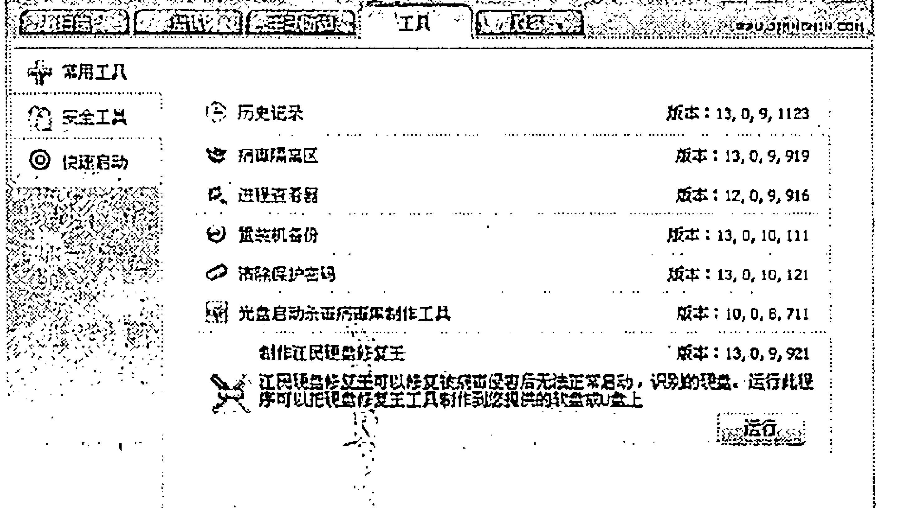

光盘启动时就可以调用最新的U盘病毒库，这样即使你电脑无法上网，或者系统瘫痪无法进入，也能用最新的病毒库为电脑进行杀毒哦。下面来体验下完整的使用过程。
第一步：启动KV2010，点击“工具”按钮，在列表中运行最后一项U盘病毒库制作工具（见图），接入U盘并单击“更新列表”，方框中出现U盘盘符，单击“确定”，很快下面制作进度条出现了制作进度，一会儿后，U盘病毒库就制作成功了！

许多电脑用户安装完江民杀毒软件，都会将光盘扔在一边，其实，大家别小看了这张小小的光盘，这张光盘还具有启动电脑和杀毒功能，最重要的是，如果你能够用U盘制作一个最新的病毒库包，这张杀毒

第二步：用KV2010光盘引导系统重新启动，系统继续引导进入用户的操作选择界面，在USB口处插入制作好的包含病毒库的U盘，光盘自升级杀毒软件会自动从U盘查找新的病毒库以及其他升级文件，并自动更新。更新完毕，启动江民杀毒软件（正常模式）或者（特殊模式），进行全面杀毒就好了。

## 问不倒 小红伞有奖问答

你是一个喜欢思考的人吗？你是一个善于提出问题的人吗？
有位德国杀软鼻祖Avira公司的安全工程师号称“问不倒”，“小红伞”系列安全软件的任何问题他都能对答如流。小编特号召广大CFAN牛人集体发问，一起讨论小红伞。打开邮箱，以“小红伞问答”为邮件主题，把你对小红伞的疑问发到xit@cfan.com.cn，与“问不倒”过过招吧！

**问：我应该多久扫描一次电脑？小红伞能自动帮我定期扫描吗？**
答：我建议每周至少做一次全盘扫描。定期扫描？当然可以，你只需实现设置自动定期扫描的任务，小红伞就会无打扰式地帮你完成扫描任务，操作很简单：


打开小红伞，点击“管理→计划程序”，点击插入新作业的图标，按照提示进行操作就可以了。需要特别提醒的是：如果你不希望小红伞自动扫描时弹出窗口打扰你，可以在“显示模式”中选择“不可见”；在设定执行时间时，我建议你勾选“如果时间已过期则重复执行作业”，这样当你预定的时间，例如周三中午12点临时有事关机，无法执行时，下次开机时会补上这一次扫描；另外，扫描路径可不止这几个选项，我们还可以通过自定义配置文件来设定个性化的扫描路径。

## 模仿QQ 窗口都能自动隐藏

窗口打开过多，桌面以及任务栏难免拥挤不堪。有时想从中找个打开窗口，得花上半天时间去查找。如果窗口能像QQ窗口一样有自动吸附在屏幕边缘的功能，那么不仅找起来方便，而且也能让我们的桌面清爽许多。
安装并运行WinAutoHide (下载地址：http://work.newhua.com/cfan/201010/ckxifu.zip)，在系统托盘区就看到了它的小图标(见图)，现在只要选中任意窗口，按下“Win+方向键”，如：“Win+←”，就会发现该窗口已经隐藏在了屏幕的左边。把鼠标移到上面时，它就会重新出现，鼠标离开则恢复隐藏。如果我们要取消隐藏这个窗口，只要把鼠标移到这个窗口上再按下“Win+←”键即可。当我们要恢复所有的窗口

时，可在托盘区图标上右击鼠标，选择Un-autohide all windows (取消自动隐藏全部窗口)就可以了。把常用的窗口用这种方法隐藏起来，就可以快速访问或隐藏它们了。
(广东/熊欣)

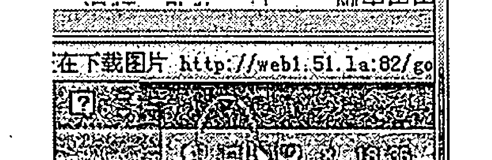

## 安装小红帽救活XP

迫切想安装Linux，又不想删除XP，昨天安装了System Command 8 (多系统引导工具，简称SC)，没想到麻烦一大堆，不仅XP进不去，SC也进不去了。习惯性地掏出老毛桃U盘PE，用磁盘管理程序把F盘改为C盘，删除多余分区，但还是无法启动，推测是硬盘问题，于是将硬盘改为并口，但退出BIOS后，一时傻眼，屏幕停留在第一页，连BIOS也进不去了，真是连喝凉水都塞牙啊！

估计是我弄坏了其他BIOS选项，万般无奈，给BIOS放电，终于有效。于是，我打算卷土重来，放入小红帽9.0的光盘，提示找不到硬盘(SATA的)，出来几行英文，快速重启，重设IDE。再次安装，这时，我跑到另一台电脑上查文件，再回来时竟然发现小红帽安装正常，哎，原来是不能守着啊！一路Next后终于安装成功了。但事情却总没那么顺利，我选择保留原有操作系统，在空闲的磁盘上安装！代表XP的DOS也赫赫在列表中。不过可恶的是，System Command又被救活了，XP还把小红帽拖死在地，改写了MBR。与小红帽的缘分暂告一段落吧，日后再想办法，枕着修复好XP的丰功伟绩睡觉去喽。
(主人公：闫黎明)

## C盘唱空城计  只需修复分区表

年方一打又一度春秋，正值豆蔻年华，麾下“四大密探”(U盘)，个个身怀绝技，曰DOS、PE、Linux及Windows下系统维护。逢初二中试，Diana于英语课面露忧色，盖本本罢工也。苦矣！考试之卷存于C盘，欲取不能，非彼得(本人Peter)出马不能及也！探之，XP以“蓝脸”相迎，答曰：“不驯之徒，吃我PE一拳！”遂祭出“杏雨梨云”大侠，双击“我的电脑”，囚于300余秒不能动；卒见C、D盘，单击于C之上，Explorer休也。如此反复，再看，C盘容量为空，心生

疑：貌似分区表故障。初遇此妖，何以也？幸得“小杏”集PE、DG (Disk Genius，此为DOS版) 于一身，呜呼哉！待吾与分区表试比高。按F12，查分区表，果有xxx溢出。既得疾根，又见C盘容量未知，遂得治疾之术：依次单击“工具→搜索已丢失分区(重建分区表)”，提示寻得一10G左右分区，问曰，保留哉？跳过哉？必前者。用DG浏览分区，试卷重返！拷至U盘，重装系统，大功告成。
(主人公：骏达(A K Peter Bee))

## 无光驱无忧盘 一根网线帮你装系统

虽然我佛慈悲，将无光驱装电脑的方法广传众生，但却屡屡听见耳边无奈的叹息，哎，其实没有光驱，没有优盘，又有什么关系，只要你有一台正常的电脑，一根网线，就可以为无光驱的电脑安装上系统。

第一步：用健康的那台电脑从网上下载一个Ghost版本的系统镜像，只保留后缀名为“.gho”的文件即可（很多ghost安装盘里的gho文件即可）。网上下载的一般是ISO打包文件，你可以用WinRAR直接解压得到Gho文件。

第二步：下载并运行诚龙网维全自动PXE网刻工具PXE_ghost11.0（简称PXE，下载地址：http://work.newhua.com/cfan/201011/wkpe.rar），选择“仅网刻C盘”，点击“浏览”定位到你下载的Gho文件（见图1）。点击“开始网刻”，等待几秒钟就可以看到如图2所示的画面，最下面显示的是等待客户机（要安装系统的电脑）连接，说明已做好网克的准备。

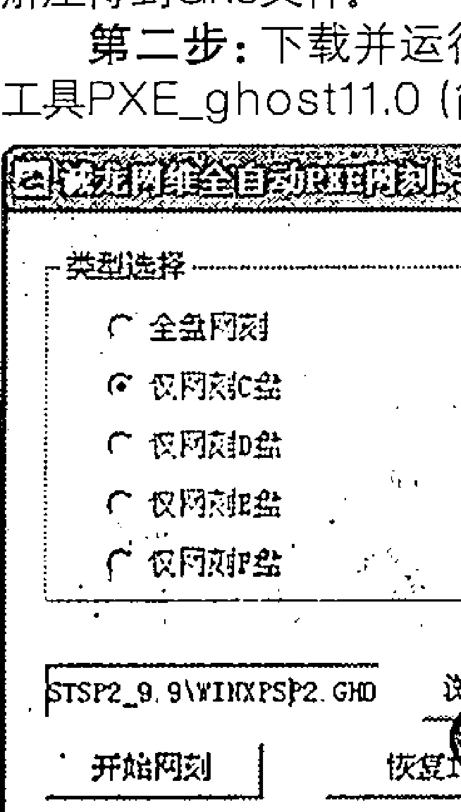

第三步：启动要安装系统的电脑，先在BIOS Peripheral Setup（外设启动方式）中有一项包含LAN Boot Rom（网卡启动）设置为Enabled（开启）。然后把Advanced cmos setup（高级启动方式）中的First Boot（首启动项）设为LAN（网卡，有的电脑开机时，按F12有启动顺序设置，比如网卡启动、硬盘启动等，此时选择网卡启动）。

小提示
PXE集成了常见网卡的驱动，使用中无需配置电脑的网卡驱动和协议，客户端电脑主板支持网卡启动就可以了。其他注意事项请阅读http://tinyurl.com/2dqyaaa。

第四步：重启电脑，然后它会自动搜索并连接服务器，成功连接后会显示Ghost界面，此时正常电脑上就可以看到我们要装系统的电脑的IP地址已添加，当全部或部分添加完毕，点击“发送”按钮就可开始进行镜像分发。发送完成后，大家就功成身退吧，客户机BIOS设置复原，在装有网刻工具的电脑上，点一下图1中的“恢复IP”来还原IP。

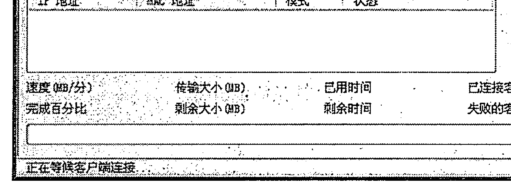

## NTLDR丢失 记得检查启动四文件

星期六刚回家，楼上的腰哥（有“系统杀手”的美称）就把我家的门敲得砰砰响，进门吼道，电脑又不能启动了。晕，带上“神器”WinPE启动盘，let's hunter。

到腰哥家，启动电脑，发现电脑在显示完品牌LOGO后，出现NTLDR is missing press Ctrl+Alt+Del to restart（NTLDR已经丢失，请按Ctrl+Alt+Del重启），但重启多次都是这个现象，神器没了用武之地，严刑逼问腰哥，原来是他手痒，把C盘里的一些文件当病毒误删除了。

找来系统光盘，按R进入故障恢复控制台，输入Copy X:\i386\NTLDR C:\（X代表光驱的盘符），利用Copy G:\i386\NTLDR C:\命令将NTLDR文件复制回C盘，重启系统，久违的XP引导菜单出来了，正在我欢呼的时候，发现引导菜单居然成英文了，选择XP启动，出现“NTDetect Failed”，哎，杯具还在延续。

难道是刚才的方法错了？但NTLDR没有再报错，突然我想起杂志曾介绍过，NTLDR，BOOT.ini，NTDETECT.COM是主要的引导文件，还有bootfont.bin，嘿嘿，再次用故障恢复控制台把BOOT.ini、NTDETECT.COM拷到C盘根目录里，重启后发现引导菜单恢复成中文了，耶！大功告成。
（主人公：蔡世源（浙江））

## 根治PE“健忘症” 扎根硬盘不怕重启

众所周知，常见的维护工具PE是运作在内存中的程序，对PE的配置、编辑在重启后都将消失，面对PE天生的健忘症，我们无法对它进行自己个性化的设置。为解决这一问题，我们现在要颠覆这一理论，将运行PE所需的文件全部展开存入硬盘，使得PE可以保存，像使用一个真正的系统一样去使用它，下面我们以Windows 7 PE为例来实现这一想法。

第1步：准备Windows 7安装光盘，将其中的“Bootmgr”文件、“光盘\BOOT”目录复制到D盘（该盘格式要为NTFS格式）。将下载到的“imagex.exe”、“geldr”、“win7re.wim”（即PE主体文件，下载地址：http://u.115.com/file/f3813568c2）复制到C:\。启动命令提示符，输入下列命令将PE文件展开到D盘：c:\imagex c:\win7re.wim "1" d:\",
            "bbox": [0.04

小提示：
文中所需工具请到http://work.newhua.com/cfan/201011/peqdgr.rar下载，默认操作环境为Windows XP SP3，Windows 7用户请参考右侧小提示进行操作。

第2步：运行“bcdtool.exe”，单击“启动配置/打开”，打开“d:\boot\bcd”，单击“编辑/删除启动项”，把原来启动菜单全部删除。接着再单击“编辑/新建Vista启动项目”，建立一个新的启动项。选中新建启动项，双击右侧窗格的“device”，设置为“partition=D:”（请根据展开win7re.wim的实际分区设置），同样将“osdevice”项也设置为“partition=D:”，description（菜单名称）设置为“启动win7re”（见图1，因为bcdtool用到WindowsAPI函数VirtualAllocEx，运行该软件后，有些杀毒软件会误报为病毒或恶意程序等，请放心使用！）。

第3步：启动记事本新建一个menu.lst配置文件放置在C:\，代码如下：
```
timeout 5
default 0
title win7pe
chainloader (hd0,4)/bootmgr
#表示启动第一个逻辑分区（D盘的bootmgr），
如果你的PE放置在其他分区，请自行修改代码
```

如果PE放置在其他分区，请自行修改代码

第4步：打开“C:\boot.ini”，添加“c:\geldr=启动硬盘版PE”引导语句，这样我们就在不改变Windows XP引导记录的情况下，成功安装PE系统到硬盘上。以后只要在启动菜单选择“启动硬盘版PE”即可进入PE系统。由于它是直接加载硬盘的文件，不仅启动速度快，而且要求的内存也较低（网友测试256MB内存也可以启动），完全进入桌面后占用的内存大约为220MB（见图2）。

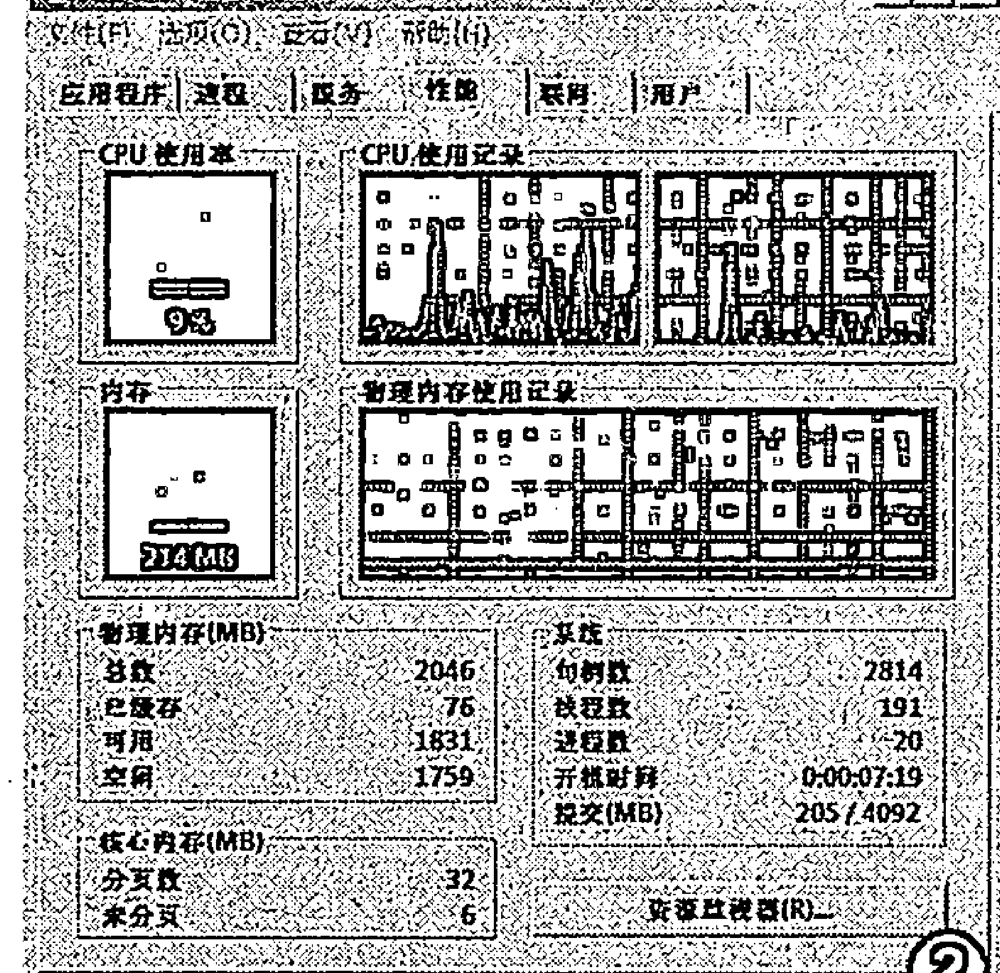

小提示
我们现在打造的PE已经是一个精简的Windows 7了，我们可以像安装完的多系统之一一样去使用它。要注意有些软件在PE下运行时可能会提示缺少“XX.DLL”文件，此时只要按屏幕提示到原来系统分区去复制到缺失DLL文件到“X:\windows\system32”下即可。

第5步：成功加载PE并进入桌面后，可以看到PE所在的系统盘符为X:。现在我们就可以轻松使用这个PE了。由于启动文件和BCD配置文件均在D盘，我们可以在PE中格式化C盘，进行系统重装或者使用Ghost32恢复系统。当然还可以在这PE中安装常用的软件如迅雷等，方便在系统维护时下载使用，或者使用记事本打开“X:\windows\system32\winpeshl.ini”，添加自己需要的自启动程序。这些操作在重启后仍然可以继续使用。

## Windows 7做法

对于Windows 7用户，由于本身系统已经支持VHD，我们可以制作单VHD文件的PE。进入Windows 7后，在“磁盘管理”右击选择“创建VHD”，创建一个2GB虚拟磁盘“pe.vhd”放置在D盘并加载。假设虚拟磁盘盘符为N:，同上将winre.wim释放到N:，然后运行“bcdtool”，添加一个PE启动项，不过此时“device”要设置为“vhd=[D:]\pe.vhd”，“osdevice”项设置为“vhd=[D:]\pe.vhd”。

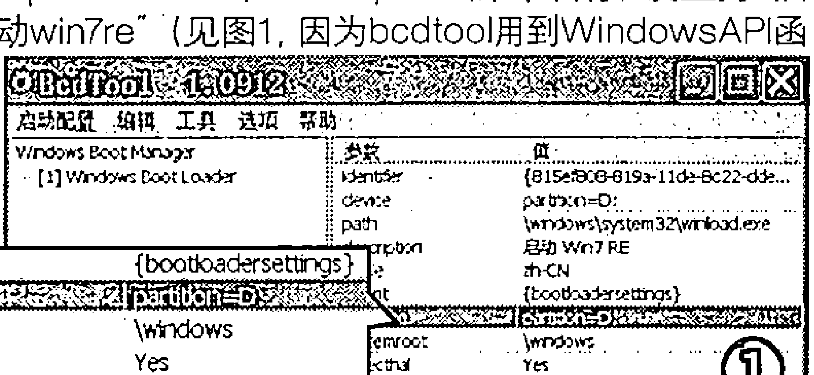

对于Windows 7系统用户，由于本身系统已经存在“bootmgr”文件、“c:\BOOT”目录。因此只要将“winre.wim”展开到D:\，然后运行下载的“bcdtool.exe”，操作同上，添加一个PE启动项目到BCD，以后在多重启动选择“启动win7re”即可进入PE。
（文/平淡）

## 网络相册关不住

平时做个报告、写个文宣，或者制作PPT幻灯演示，总需要大量的图片。尤其是搞美术设计的人，对图片的需求更多，而且对图片的质量也有很高要求。如果你手头没有图片库的话，不妨从网上找找看。

### 超大图库 神速阅览

相比国内，国外图片网站能找到较多的高画质、高清的美图，但这些网站通常访问较慢，预览也不便。搜索的结果也不够精确，无数的垃圾链接浪费了我们宝贵的点击时间。那么试试GiniPic，会让你找图更方便。

GiniPic支持Flickr, Google, Yahoo, Picasa, Bing等数十个大型网络相册的搜索。打开http://www.ginipic.com/download下载最新版GiniPic安装（注意：GiniPic需要安装Microsoft's .NET Framework 3.5 SP1或更高版本）。完成后，它会以侧边栏的形式显示在桌面右侧。

假设我要为某篇黑客相关的文章配插图，可以在上方的搜索框中输入“hacker”（GiniPic支持中文搜索，不过用英文单词能搜索到更多的精确结果），很快就能得到多个结果，并以图片墙的形式展现。点击GiniPic下方的箭头按钮，还可以前后翻页，以查看更多图片。

单击想要的图片，会以一个独立窗口中打开它。一般图片会有小图（Th）、大图（Or）两个选项，有些图片则提供Th（略图）、S（小）、M（中）、L（大）多个选项。选择大小类型，再点击磁盘按钮，就可以将图片保存到本地了。下方的一排按钮，还提供了共享、复制、设置为桌面、收藏等多种功能，用起来很方便。

> 小提示：GiniPic，让FlickrDown走开
> Flickr（http://www.flickr.com）号称是全球最大的图片存储网站，不少人用过专用工具FlickrDown（http://sourceforge.net/projects/flickdown/files/）批量下载其上的图片，其实GiniPic完全可以替代它。
> 点击GiniPic上面的齿轮图标打开配置窗口，仅选中Flickr项，并点击其右侧的齿轮图标进一步进行设置。我们可以设置搜索模式为全文检索（Text）或者为关键字检索（Tags），还可以按特定用户账户名称（User id）来搜索。其他还有照片类型、大小等设置条件，可以进一步精确搜索。

### 帅哥美女出墙来

#### 绕开QQ空间“门锁”收美图

国内网站，QQ空间上的图片比较多。不过在打开某好友的空间时，碰到冷冰冰的“请回答主人问题”的提示时，是不是很灰心？别灰心，我们可以迂回查看他（她）的QQ相册。

首先打开网页http://www.gogoqq.com，然后在输入框中输入好友的QQ号码，再点击“进入他/她的QQ空间”，即可看到该空间所有的相册。点击进入某个相册，光标移到略图上，即可显示出大图片。或者点击打开图片，再另存到自己的电脑上。不过要注意的是，这一工具虽然能绕开QQ空间的大门，但是却不能破解加了密码的相册。

#### 要 MM 也要漫画，OX163 狂扫国内相册

国内相册网站，网易相册算得上是代表了，上面聚集了很多网友的图片，不过同样会遇到访问受限的问题。这时，可试试OX163（下载地址：http://www.onlinedown.net/soft/76657.htm）这款工具。

下载解压后，双击其中的OX163.exe运行它。这里以搜索网易博客上的图片为例，输入某位好友的网易博客地址，按回车键很快检索出结果，勾选找到的要下载的相册，再单击工具栏保存（左起第5个）按钮就可以了。

非163相册，可点击软件主界面搜索相册按钮，选择“页面搜索”，在打开的页面中切换到“搜索在线漫画 相册”，就可以选择中文雅虎、搜狐、TOM、迅雷图库及二十多家漫画网站进行搜索下载了。
（文/侯忠）

### 共同的回忆 共同来维护

单位组织活动，一般会有好几个人自带相机（飞叔说：CFan就经常这样），你拍几张我拍几张，最后那些没带相机的同事就有点头大了，不知道自己究竟有几张照片。其实带相机的同事，可以通过新版Picasa 3.6快速与大家共享。

#### 给照片建造一个共同家园

从http://down.tech.sina.com.cn/page/6958.html下载安装Picasa 3.6，运行它，选择照片（可多选），单击下方Upload（上传），在弹出对话框中按提示输入Google账户名和密码登录，之后在新窗口中点击右上角New按钮创建一个新相册，本例命名为“香山游玩”。

#### 邀请好友共同管理

从Share With（共享给）下拉列表中，选择添加其他同事的通讯录，然后单击下方的Upload按钮上传照片。

得到授权的同事，可在自己机器上运行Picasa 3.6，选择照片，上传时请从Upload to this album（上传到此相册）中选择Contribute to a friend’s album（协助好友相册），接下来输入公用相册创建者的邮箱地址，显示出该账户允许上传照片的相册名称（本例为“香山游玩”），确认后单击Upload上传就可以了。

#### 美景共欣赏

需要从“香山游玩”相册下载照片时，可打开http://picasaweb.google.com/home，选择“香山游玩”相册，就可以看到多位成员共同上传的照片了。

### 飞叔说：

如果网页访问Picasa网络相册时图片显示“×”，可用记事本打开“\Windows\System32\drivers\etc\hosts”文件，在文件末尾添加如下IP地址：

- 203.208.39.104 picadaweb.google.com
- 203.208.39.104 lh1.ggpht.com
- 203.208.39.104 lh2.ggpht.com
- 203.208.39.104 lh3.ggpht.com
- 203.208.39.104 lh4.ggpht.com
- 203.208.39.104 lh5.ggpht.com
- 203.208.39.104 lh6.ggpht.com
- 203.208.39.104 lh7.ggpht.com
- 203.208.39.104 lh8.ggpht.com

保存文件，重新打开浏览器即可生效，这样相册就能正常显示了。
（江苏/长江边上）

### 抽出Flash中的文档 豆丁网巧下载

豆丁网（http://www.docin.com/）是一个非常不错的C2C文档分享社区。不过通过豆丁发布的文档会自动转换成SWF格式，只能使用播放器在线欣赏，这算是豆丁的一种保护措施吧。如此一来，下载这些文档阅读就有所不便。如果你像我一样有此困扰，那不妨试试“豆丁文档下载器”吧。

从http://work.newhua.com/cfan/200924/ddwdxz.rar下载软件后解压，首次使用请点击“第一次请先运行.bat”，组件注册成功后，以后只需要双击Docin.exe即可运行（注意：如果无法运行，可能是系统中没有安装微软.NET Framework 3.0所致，从微软网站下载安装即可）。

把自己准备要下载的文档的网址复制粘贴到Docin网址栏中，精度栏里默认的数值是“2”，可以自行调整，数值越大文档越清晰，不过文件体积也就更大了。设置好后点击“下载”按钮，再在“另存为”对话框中设置文件保存位置，然后点击“保存”开始下载。

软件下方的状态栏上可以看到文件的下载转换进度，完成后会出现“处理成功”的对话框提示，点击“确定”，一切搞定。
（重庆/陈佳）

### 适合的才最美——快速找到需要的图

网上图片非常多，但有时真正想找一张需要的图片，却如大海捞针。下面就跟大家分享一些找图片的经验。

#### 找对人先要找对词

如今的图片搜索，使用的主流技术依然是通过对文件名及关键词进行分析，从而得出结果。所以要想找到需要的图，选择好关键词非常重要。

如果是搜索某个名人，可直接使用他（她）的名字来搜索即可。但如果是一些较抽象的图片，就不能采用太直接的描述。比如我想找一张多人手牵手的图片，如果直接用“牵手”、“拉手”等关键词，那么找到的大多是两个情人牵手的图片，与我想要的图相去甚远。但如果用“团结”、“人脉”等作为关键词，很快就能找到需要的图片（关键词“团结”）。

另外还有一个不算技巧的技巧，就是在用中文关键词搜索不到满意的结果时，可以试试相近的英文单词。因为英语网页上的图片信息更丰富，而且找出的图片也很精美。如果不太懂英文也没关系，使用词霸翻译一下即可，或者直接用谷歌在线翻译（http://translate.google.cn/）。

#### 巧用搜索引擎的百宝箱

自从谷歌推出“百宝箱”后，其他搜索引擎都竞相模仿。谷歌百宝箱，实际就是增加了更多的过滤条件，从而精准找出我们想要的图。谷歌中搜索图片后，点击上方的“打开百宝箱”，页面左侧即会显示多个选项。

如果想找某个人的大头照，可点选“脸部特写”项，如果想找暖色调风格的照片，则可以点击下面的暖色调色块进行过滤，非常方便。其他如微软bing、有道搜索等，功能相似，就不一一介绍了。

#### 类似图片、图片主人、高清图片查找秘籍

谷歌百宝箱已尝试脱离关键字，而是通过对图像本身的分析进行搜索，如色调指定等。其实专业的以图找图网站已有不少，比较有名的是TinEye（http://www.tineye.com）。

比如我有一张萧亚轩的照片，比较小，想找到质量更高的同样的照片。打开TinEye主页，点击“浏览”上传那张萧亚轩的照片，很快找到了几十个结果。通过这样的方法，由于可以找到包含图片的网页，就能比较容易地找到图片的主人，知道名字后，找到更多图片就不是问题啦！
（文/流言）## 千里取文件如探囊取物——手机遥控电脑

出门在外，突然需要用到自己电脑里的文件；或者就在电脑旁边，但没有手机数据线，电脑也没装蓝牙，眼睁睁看着电脑上的文件手机就是用不了。这时，你有没有想过，其实你的电脑可以用手机远程控制？用你的手机，可以对电脑做关机、重启、锁定计算机、待机、休眠、进程管理及强大的文件管理等多种操作。

#### 未雨绸缪——准备软件

- ★wap电脑控制PHP版
  下载地址：http://work.newhua.com/cfan/200924/remoteManager.rar
- ★PHP运行环境精简绿色版
  下载地址：http://work.newhua.com/cfan/200924/apache_php.rar

如果担心精简版的安全性问题，大家可以从Apache (http://www.apache.org/) 和PHP (http://php.net/) 的官方网站下载安装完整版。

#### 亦步亦趋——营造遥控环境

1.  将下载获得的PHP运行环境精简绿色版解压到C:\xblue\，双击运行其中的setup.cmd，输入1后按回车键将看到“请求的服务已经启动”的提示，这样每次开机程序都将自动在后台运行。如果Windows弹出安全警告，请点击“解除阻止”，关闭命令提示符窗口，然后在浏览器中打开网址http://localhost/，如果看到图所示界面，说明安装成功了。

    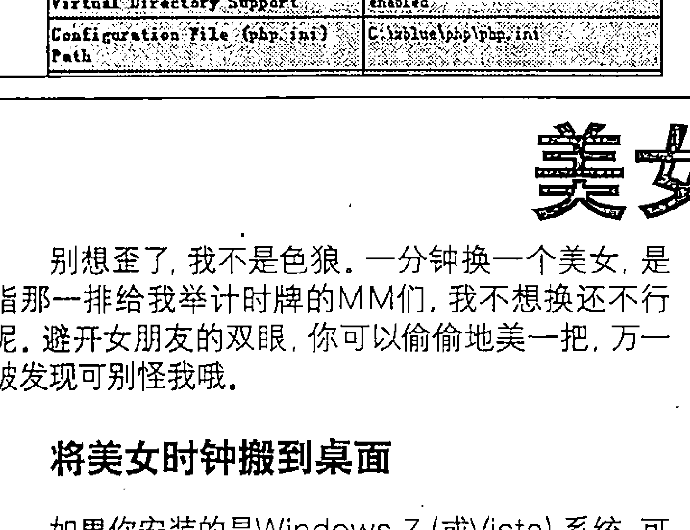

    > 小提示
    > 端口占用是常见安装失败的原因，由于Apache服务器使用的默认端口80，如果同时有其他软件使用了这个端口，将造成apache不能启动成功。解决办法是将Apache的默认端口重新指定，打开httpd.conf，搜索：“Listen 80”，将这个80改成81或者其他数字即可，注意不要和系统其他常用端口冲突。

2.  接下来安装wap电脑控制PHP版。将下载的压缩包remoteManager.rar内三个PHP文件，解压到C:\xblue\www\下，覆盖原有文件，使用浏览器重新打开http://localhost/将看到输入密码的界面，说明控制模块安装成功。

    输入访问密码“1234”，点击Login (登录) 按钮后进入控制界面，选择其中一项然后提交，电脑即进行相应的操作。注意：选择前可一定要保存好你正在进行的其他工作。如果要修改默认的访问密码，请使用记事本打开C:\xblue\www\password.inc.php，修改$password的值即可。

#### 曲径通幽——连通外网服务

众所周知，我们要访问一个网站或Web应用，一定要知道它的域名或者IP地址才行，那么，想要让其他电脑或者手机访问自己的电脑提供的服务，也一定要知道本机的外网IP或者域名。

可以打开http://www.ip138.com这个网站，查看本机当前的外网IP。为了确定这个IP地址能够访问本机，我们将这个地址再次输入到浏览器地址栏，看到的界面如果是和http://localhost界面一样，说明外网访问正常。

如果访问失败，可能是电脑的防火墙设置不允许访问Apache提供的端口，在防火墙开放对应端口即可。修改方法：控制面板→Windows防火墙→例外→添加端口“名称：http，端口号：80，TCP”。

> 小提示
> ★右击系统托盘中的网络连接图标，选择“状态”，在打开的连接状态窗口切换到“详细信息”选项卡，其中客户端IP地址后面的地址，即是你的电脑当前的IP地址。
> ★获取IP地址后就可以用手机的网络功能访问并进行远程控制了，但如果电脑重启后外网IP会发生变化 (ADSL一般是动态IP)，上次访问的地址将会失效，这时可借助“花生壳”之类的工具实现免费的动态域名。花生壳的使用，可参考：http://fly2spring.blog.cfan.com.cn上的文章。

#### 水到渠成——手机远程提取文件

万事俱备，只差遥控了。这里以Nokia 3230手机 (任意能上网并浏览网页的手机都可以) 进行介绍：在任何地方用手机，进入功能表→网络→选项→导航选项→进入网址，然后在输入框键入刚才得到的外网IP或者动态域名，确定后就能看到登录界面了。

输入密码后单击Login登录，接下来选择“文件管理”项并点击“提交”，稍候片刻，默认打开家中电脑的C分区。C分区下的文件，前面带“+”号的表示为文件夹点击可以进入，带“-”号的为一般文件点击它即可将文件下载到手机中了。点击“..”则返回上一级目录。

点击“浏览”，还可以选择手机中的文件，并通过点击“Upload”按钮将手机上的文件回传到家中的电脑上。

为了方便访问，可将这个页面保存在书签中，以后点击书签就能够快速进入控制界面。当然，何止是手机，只要是能上网的电脑或移动设备，都能通过这个网址来访问你的电脑，但需要知道密码才能进行控制，如果你能将本程序安装在其他用户的电脑上，你也能用手机控制他的电脑了，不过可别做坏事哦。

### 小编有话说：

★使用这一方法，一定要注意安全性，比如将登录密码设置得更复杂一些，以防止被别人破解。另外，最好是在需要的时候使用，平时一定要关闭Apache服务器。
★本方法适用于使用ADSL或者其他直接上网方式，如果是局域网方式上网，外网将不能直接访问你的电脑。这时，必须确保你有权限访问路由器，并做好NAT转发设置，将路由器相关端口的访问转发到你的电脑的内网IP才可以访问。

### 美女“玩”一分钟就换

别想歪了，我不是色狼。一分钟换一个美女，是指那一排给我举计时牌的MM们，我不想换还不行呢。避开女朋友的双眼，你可以偷偷地美一把，万一被发现可别怪我哦。

#### 将美女时钟搬到桌面

如果你安装的是Windows 7 (或Vista) 系统，可以直接在桌面上添加一个美女时钟。
首先从http://work.newhua.com/cfan/201002/bijintokei.rar下载bijintokei.Gadget，解压到系统分区下的Program Files\Windows Sidebar\Gadgets目录下。然后单击“开始→控制面板”，切换到“小图标”显示模式后打开“桌面小工具”，找到“美女计时”并右击之，选择“添加”就可以了。

现在，桌面上就会看到一个漂亮MM举着时间牌在那看着你了。如果你嫌默认的显示尺寸看得不过瘾，还可以右击美女时钟并选择“大小→大尺寸”将画面放大。

> 小提示：美女时钟嵌入博客中
> 将Bijin-tokei嵌入自己的网站或是博客中可能又是一个创意，实现方法也很简单：直接打开http://tinyurl.com/yc2bbu5，设置好标题、图片尺寸、边框风格，点击“获得代码”按钮，最后再将获取的代码嵌入到网页或是博客的源代码中即可。

- 网络大补贴：中日韩美女时钟大比拼
  - 搜道美女时钟：http://www.sodao.com/
  - 美女计时：http://www.bijint.com/jp/pages/tokei/ (可以切换不同国籍的美女)
  - 世嘉美女时钟：http://24c-quatre.niaoke.com/ (美女还可以申请参加拍照成为举牌女郎)

#### 揭密：美女时钟制作

美女时钟这类网站主要是赢在创意，而制作方法很简单：在大街上看到一个美女后，只要让她帮忙用不同的姿势举一下写有时间的黑板，直接拍照，再用时间来命名该照片；之后在网站中通过程序控制在不同的时间直接调用并显示对应的照片就可以了。假如你有兴趣，只要有一台数码相机，脸皮再厚点，也可以制作这类美女计时网站，或者干脆亲自上阵。

### 玩转飞信——批量加好友

为了节省通讯费，使用移动的飞信是很划算的方案。不过飞信只能一个一个添加好友，很是麻烦。怎么才能批量添加好友呢？看我的！

首先按常规方法随便添加一个飞信好友，然后利用飞信中的“菜单→好友→导出好友列表”导出一个包含好友信息的CSV文件，在Excel中打开它，内容如图所示。

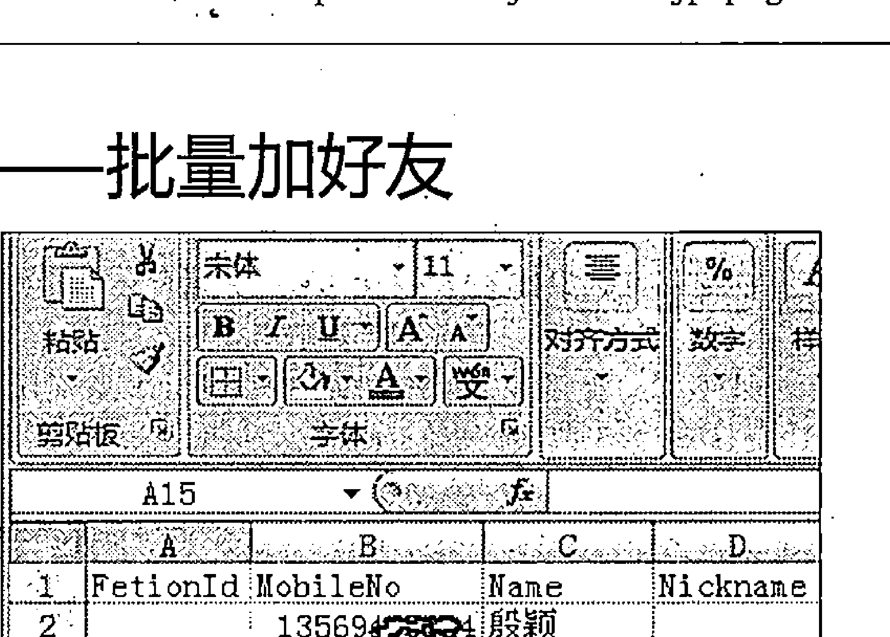

其中A列FetionId是显示好友的飞信号码 (如果对方没有开通飞信则为空)，B列MobileNo显示的是手机号码，C列Name显示的是屏显名称，D列Nickname显示的是飞信昵称。注意：可能A列、B列中显示的是类似1.0E+10这样的科学计数法，这时只要拉宽A列、B列就可以显示完整了。

接下来，想批量添加多个好友，只需要在这个文件中填写B列和C列就行了，其实C列也可以不填写，不过为了能标识好友是谁，最好填写一下。好了，拿出你的手机，将通讯录里的好友挨个填进去就行了。

最后，将编辑好的CSV文件，导入到飞信，点“下一步”，就等着好友一个一个确认添加就可以了。

> 小提示
> 飞信只能添加移动的号码，如果添加联通 (130、131、132、155、156、185、186)、电信 (180、189、133、153) 的号码是不行的。另外在最后保存文件时，会提示逗号分隔符不兼容，直接点“是”就可以了。

### 天下网盘是一家

现在各种各样的网盘服务层出不穷，提供的空间也越来越大，其中保存的资源也十分丰富。不过各家的网盘有各家的限制，有的要安装专用软件才能下载，有的没有专门的搜索引擎，查找网盘里的资源就像大海捞针。看官莫急，只要稍加动手我们就可以让天下网盘成一家！

#### 多媒体Fans——高级搜索找资源

对于常见多媒体资源如视频、歌曲、动漫等，很多论坛的会员大多将自己拥有的资源存放在网络硬盘。我们可以利用搜索引擎的高级搜索来查找网盘指定视频资源。

推荐工具：谷歌自定义搜索（http://www.google.com/coop/cse/）

#### 实战：打造自己的网盘专用搜索

打开上述网址并使用自己的Google账户登录后点击“创建自定义搜索引擎”。在打开的页面搜索引擎名称中输入“网盘搜索”，在“选择一些网站”下输入常见的网盘地址，如纳米盘http://www.namipan.com（每个网站一行）。完成后勾选“我已阅读并同意接受服务条款”，点击“下一页”创建自己的搜索引擎。这样以后只要登录自己的Google账户，然后点击“自定义搜索→我的搜索引擎→网盘搜索”，这个专用的搜索就只会在上述几个网盘中查找资源。

### 小提示

对于纳米盘，还可以打开http://www.namipan.info/，输入“关键词 more 指定文件类型”，如“qq more rar”，即可快速找到和QQ有关的压缩资源文件。对于fs2you则可以使用高级搜索语句快速查找到指定的资源。比如可以在Google搜索框中输入“site:fs2you.org.cn 论文”（不含外双引号，下同），快速搜索网盘中的论文资源，或者输入“site:fs2you.org.cn intitle:rmvb 康熙来了”，快速找到和《康熙来了》相关的rmvb格式的视频文件。

- 网盘推荐：此类用户需要资源丰富的网盘，优先推荐添加下面网盘到自定义搜索：
  1.  Fs2you（www.fs2you.org.cn），资源丰富，分类清晰。
  2.  纳米盘（www.namipan.com），其中的文件比较多。

#### 共享达人——网盘资源专业搜

网络讲究共享，共享达人经常在各个网盘中查找资源。由于自定义搜索引擎只能在指定的几个网盘中进行搜索，此类用户可以借助专业网盘搜索引擎快速在各个网盘中搜索资源。

推荐工具：网盘精灵（http://www.file2me.cn/）

#### 网络大补贴

海海搜搜也是一款网盘搜索引擎，支持Rayfile、Damipan、Namipan、Brsbox、Mediafire、Rapidshare、Megaupload、zShare等网盘。网址：http://www.hihisoso.com/。
Rapidshare是世界上最大的网盘，可以借助http://rapidshare-search-engine.com/以及http://www.rapidshare-searcher.com/这些专门网站进行搜索。

#### 实战：快速找到网友珍藏的QQ表情包

网盘精灵支持搜索常见的飞速网、纳米盘、DBANK数据银行、115网盘、BRSBOX、趣盘、千脑网盘等。比如要搜索QQ表情包，只要打开上述网址输入“QQ表情”进行搜索，很快就可以在搜索结果中找到网友珍藏于网盘上的资源了。

- 网盘推荐：共享达人试用资源后经常会将资源上传到网盘共享，此类用户空间需求较大，推荐使用下列网盘：
  1.  微软Skydrive（http://skydrive.live.com/），服务稳定、25GB免费空间。
  2.  飞速网（http://www.rayfile.com/zh-cn/），无限空间，知名度高，访问用户多。

#### 下载狂人——网盘轻松下载

对于下载狂人来说，他们经常要在众多网盘中下载资源，但网盘服务商大多数会在网盘页面放置广告，因此一般不直接提供文件的外链下载（或者只能使用专用软件下载）。此类用户可以利用一些工具直接获取外链，使用通用工具下载其中的资源。

推荐工具：FreeRapid Downloader（下载地址：http://wordrider.net/freerapid/download.html）

#### 实战：下载RapidShare网盘资源

FreeRapid Downloader支持多达80个网盘下载，由于它通过插件的形式实现对网盘的支持，因此每次启动程序后如果提示有更新，请及时确认升级。现在如果要下载RapidShare的文件，在打开的资源下载页面，找到页面显示的文件下载地址，右击选择“复制”，然后切换到程序界面单击“文件→新增连接”，在打开的窗口中粘贴上述地址，同时设置好保存文件的路径，单击“开始”即可开始下载指定的资源了。

- 网盘推荐：下载讲究的是稳定和速度，对于此类用户优先推荐到下列网盘中下载资源：
  1.  Mofile（http://file.mofile.com/），下载速度快。
  2.  QQ中转站，稳定、下载快，但有7天限制（可通过文件续期延长），适用临时共享。

### 小提示

★对于Rayfile地址可以借助http://php.44-3.cn/code/rayfile/提供的在线地址解析服务，只要打开Rayfile文件下载地址页面，然后粘贴到上述网址进行解析即可，这样就可以使用迅雷等软件直接下载了。
★注意：软件运行需要JAVA支持，没有安装JAVA的同学需要先到http://www.slune.cz/cn/java/下载安装。
（文/平淡）

### 浏览器“兼职”会的不只是浏览

在CFan上看到过极点五笔“兼职”的文章，颇受启发。不过极点五笔毕竟用的人少，而浏览器的用户就要多得多了，要兼职也得请它来兼啊，多方便。这里先说说大家用得比较多的世界之窗浏览器，“兼职”的思路是利用其中的外部工具栏。
世界之窗是大家用得比较多的浏览器，它本身就已经包含了丰富的小工具，我们仍然可以向其任务栏添加其他任意的小工具，方法如下。
在世界之窗安装目录中找到plugin文件夹，在里面新建一个文件夹，比如我们想启动抓图软件Snagit，不妨就给这个文件夹起名字为Snagit，再在Snagit文件夹中创建一个plugin.ini的文本文件，内容如下：

```
[General]
Name=Snagit
Author=**（注：这里可以输入你的名字）
Version=1.0.0（注：这里可以定义你想要的版本号）
ModuleType=exe
FileName=C:\Program Files\TechSmith\SnagIt 8\SnagIt32.exe（注：此处为要启动程序的实际位置）
Comments=注释文字……
Icon=snagit.ico（注：按钮图标文件）
Type=STATUSBUTTON
StartAfterPageDone=
```

保存退出，再在同一文件夹下创建一个snagit.ico的图标文件。设置完毕，重启世界之窗浏览器，会发现浏览器的状态栏中多出snagit.ico图标按钮，用鼠标指向它会显示“Snagit”，点击即可启动这个程序了，很方便吧。添加其他程序调用，方法同上，只要把“FileName=”后面换成新程序的位置即可。如果需要经常打开某一文件夹，还可以将FileName的值换成此文件夹的路径，方便以后随时打开。

#### ★实例扩展：为傲游添加软件调用

默认情况下，傲游插件栏中已经预置了5个常用程序调用按钮（我的电脑、记事本、画图等），点击即可启动相应程序。如果这几个程序不是你想要的，可右击按钮，再在弹出的对话框中重新指定调用的程序。如果想增加新的程序调用按钮，可点击左侧“增强功能”，选择“添加外部工具”，打开类似的窗口，选择要调用的程序就可以了，以后，上网冲浪时，随时点击按钮即可调出自己想要用的程序来。
（文/小玄）

### 远程监控自己家——2套方案让QQ变身看门狗

一眨眼又迎来了元旦小长假，小长假总得出外逛逛，可是最近小区的治安形势不怎么好，不放心家里的情况？没关系啦，搬出我们最常用的QQ作为看门狗吧。只要借助QQ视频工具，即使出门在外也可以随时监控家中情况。
方案1：如果出门在外可以接触到上网的电脑，首先准备两个QQ并互加为好友（假设家中QQ为A，在外使用QQ为B），然后执行下列的操作即可随时远程监控家中的情况。
第1步：将家中的电脑设置为开机自动联网并自动登录QQ，同时设置好摄像头的位置和拍摄角度。在A中将B好友昵称设置为“主人”。在电脑上同时登录A和B，通过B向A发起视频聊天请求，此时在桌面会弹出“和主人聊天”对话窗口。
第2步：到http://www.autohotkey.com/download/AutoHotkey.zip下载Autokey录制自动应答脚本。下载后解压软件，然后运行其中的AutoScriptWriter，单击“Arecoord”启动脚本录制，单击视频请求窗口中的“接受”，然后停止脚本的录制。
第3步：返回录制窗口按提示将脚本保存为cfan.ahk，接着运行AutoHotkey的“Convert .ahk to .exe”组件，将上述脚本转化为cfan.exe放置到C:\windows\system32目录下。好了，接下来设置cfan.exe开机启动，以后我们在任何一部上网的电脑上向家中QQ发起视频邀请后，家中QQ就会自动接受让我们查看视频。
方案2：如果出门在外没有电脑，我们还可以借助手机QQ查看家中视频，手机首先要开通GPRS套餐，版本则要QQ2007以上，操作同上只要在手机QQ上向家中QQ发起视频，我们就可以在手机上查看家中的视频了。
小提示
如果没有QQ账号，我们还可以借助XP自带的远程桌面，远程登录家中电脑并开启视频查看。
对于Skype用户，可以到http://code.google.com/p/skypeautoanswer/下载SkypeAutoAnswer，它可以设置自动接收指定好友的来电并开启视频。
（文/平淡）

### 微软‘推’一把——MSN也来玩微博

微博越来越火，它可以让我们随时掌握朋友的动态。可是小K的女友是个办公室白领，不喜欢注册那些“乱七八糟”的微博网站，这可难坏了小K。其实小K完全没必要着急，白领一般都爱用MSN，而MSN现在也有了自己的微博——聚酷。有MSN账号就能玩，不用再重新注册。

首先打开http://club.msn.cn/，单击“马上登录”按钮，用自己的Windows Live（即MSN）账号登录就可以打开聚酷了。如果已经开启MSN，则会自动登录，无需再手工输入账号。首先是一个新手指引，按向导提示，连续点击“下一步”，完成设置，并向还没有加入聚酷的好友发出邀请，最后点击“开始使用”。

聚酷微博的一个特色就是时间轴，各种动态（包括你及MSN好友在聚酷、Windows Live及第三方热门站点上的动态更新信息等），按时间的先后在时间轴上形象地显示出来。点击某好友所发的消息，可以查看更具体的内容（文字、图片、视频等），并且能在下面直接给予回复。按住鼠标左键拖动，时间轴可以进行左右移动，或者通过鼠标滚轮快速操作。当然自己也可以随时吼两嗓子，在下方“大喊”框中，输入要喊的内容，再点击“发送”（或直接按回车键），朋友们就能看到你的消息了。

小K试了试，发现聚酷既方便好玩（集成了不少在线小游戏），还很时尚，于是赶紧点击下方“未进入聚酷”的链接，勾选上女朋友的MSN账号名单，向她发出邀请链接，然后坐等女朋友收到邮件后加入了。

### MSN上玩 Twitter

小K虽然已经开始使用MSN的聚酷微博了，不过不想放弃自己使用已久的Twitter账号，怎么可以方便地在MSN上玩Twitter呢？

启动自己的MSN后，点击“添加联系人”把twitonsn@live.com加为MSN好友。添加完毕，向TwitOnMSN机器人发送“Help”消息，这时会收到绑定Twitter账号的帮助内容：一种是通过其发给你的链接使用OAuth的方式验证；另外一种方式就是直接发送一条内容为“signin 你的用户名 你的密码”（用户名和密码间有空格，不含外侧双引号）的消息进行绑定。这里小K通过第二种方法绑定自己的账号。

以后，当自己订阅的Twitter有消息时，都会变成MSN消息主动弹出。当要自己发布消息时，则使用Twitter官方的命令即可，如：@、D、RT、follow、get、whois、on、off、stats等。当想要发布图片时，只要拖动一下，发送图片文件可直接发布到Twitpic，非常方便。

> **小提示**
> 也可以添加msntw001@hotmail.co.jp来更新Twitter，在msntwitter首页用twitter账号登录，添加联系人后，就可以在MSN上收发Twitter信息了。

(文/赵卫伟 李丹)

### 跟网管捉迷藏 休想挡我听音乐

工作累了，想下载几首MP3听听，折腾半天也不成。改用QQ音乐在线听，结果还是“无声”而返。真奇怪啊。辗转打听，才知道是单位的网管将MP3给封锁了，这太过分了吧。不过你有损招，我也有对策。

（飞叔插话：CFan网管就是这么干的）

### 暗修栈道，VPN 助你私网公用

单位的网络进行了限制，但家里的网络没有限制，如果在单位能用上家里的网络，那一切限制不就没有了吗？

- 第一步：从http://www.onlinedown.net/soft/16715.htm下载VPN-X，解压后得到两个安装文件，文件名中含“Client”的为客户端版本，另一个为服务器端版本。家中的电脑上安装服务器版本，单位的电脑安装客户端版本。
- 第二步：在家中电脑上运行“VPN-X服务器”，VPN-X会自动进行配置。进入“控制面板→网络连接”，会看到VPN-X创建的虚拟网卡呈连接状态了（本例中为“本地连接8”）。在“VPN-X服务器”窗口中，切换到“用户管理”标签，单击“添加”按钮，在弹出对话框中输入用户名及密码等信息。
- 第三步：上班后，在单位电脑上运行“VPN-X客户端”，在“登录”对话框中输入家中的公网IP地址，然后使用在“VPN-X服务器”中添加的用户名和密码进行登录，登录成功后就可以在单位使用家中的网络，想下载什么就下载什么了。

### 飞叔说：如果你试验没成功

- ★默认情况下“VPN-X服务器”通过TCP或UDP的25000端口进行VPN连接，如果单位对这些端口进行了封锁，则可以在“配置”标签的“VPN服务器设置”标签中单击“添加”按钮进行端口的添加。
- ★如果在访问网络时还存在一些受限的资源不能访问，可进入“网络连接”中，同时选中“本地连接”和VPN-X的虚拟连接，右击，选择“桥接”即可。
- ★如果通过路由器或者其他网络设备上网的，需要在相关设备中做端口映射。判断本机“VPN-X服务器”能否正常连接，在命令提示符窗口中执行“telnet 公网IP 端口”命令，将可看到提示。

###### 网络大补贴：

什么是VPN？参见：http://zh.wikipedia.org/zh-cn/VPN。

可以通过修改本地路由表的方式使得在访问Internet资源时全部通过家中的网络，修改方式参看http://blog.cfan.com.cn/html/02/11702-376391.html。

### GOGOGO，让网络走出国门

日本的网络非常发达，可恨的是他们很多的资源分享网站都只限日本当地的IP地址才能访问。不过通过PacketiX的免费VPN，我们可以轻松“打进”日本内部分享他们的资源。

- 第一步：进入http://www.packetix.net/en/secure/install/，根据自己的系统情况下载相应的版本并安装VPN客户端。
- 第二步：通过http://www.packetix.net/en/secure/secure.vpn下载PacketiX为我们准备好的设定参数文件。运行PacketiX VPN Client Manager（以下简称PXV），右击Create New VPN Connection（创建新的VPN连接），在弹出的快捷菜单中选择Import VPN Connection Setting（导入VPN连接设置），在打开的对话框中选择打开刚下载的secure.vpn设定文件。PXV的主窗口中将多出Secure项，右击它，选择Connect（连接），在弹出的一个大窗口中，单击Agree to the Terms of Service and start connection（同意服务条款并开始连接）。稍等之后，VPN连接成功，这时查看右下角的VPN网络连接状态可以看到其显示的IP地址已经是内网地址了。再进入http://www.ip-adress.com/页面查看，即会发现你的IP地址已经“出国”，变成日本的啦。

(文/李云峰)

### 20MB30秒 异地文件瞬间同步

### Wave试水Web3.0

公元1368年早春二月，一个书生模样的中年人挥毫泼墨，写下了“话说天下大势，合久必分，分久必合”的名句，他就是罗贯中。

公元2007年8月，谷歌CEO埃里克·施密特在首届数字论坛上说，Web 1.0/2.0是化整为零，Web 3.0则反其道而行，将是对一些零零碎碎的应用程序的整合(applications that are pieced together)，其想法竟然与古人不谋而合。

公元2009年5月29日，谷歌宣布Google Wave诞生，它果然实现了埃里克的承诺，将谷歌零零碎碎的一些网络应用整合成“四不象”。

公元2009年12月，Cfan柳絮飞说：嗯，其实Google Wave不错，台下听众（还有正在看文章的你吧）一片哗然：Wave推出好几个月了，你现在才说？

非也非也，Wave还只是小范围测试阶段，非邀请莫入，还有很多人不明底细，所以今天来说正当时。

#### Google Wave是什么

有人将Google Wave比喻成“互联网上的圆桌会议”，这里借用一下，飞叔觉得可从两方面理解：一、技术的圆桌，它实际就是将谷歌多个服务整合到了一起，包括Gmail（邮件）、Gtalk（即时通讯）、Docs（文档协作）等；二、人的圆桌，Google Wave就是提供一个平台供多人实时交流。Wave的实时性非常强，比如你在和好友聊天时，每打一个字，对方都能立即看到。

#### Google Wave邀请的几个传闻

- * 传闻一：在Twitter上搜索“google wave invites”，回复那些拥有邀请码的人，就有机会拿到。
- * 传闻二：进入https://services.google.com/fb/forms/wavesignup/注册获取。

据测试，以上方法的成功率太低了。不过看到这篇文章的朋友有福了，飞叔现在有25个邀请名额，先到者先得，快去http://fly2spring.blog.cfan.com.cn留下你的Gmail地址吧。

#### Google Wave怎么用

拿到邀请码激活以后，打开http://wave.google.com，用自己的Gmail账户登录，界面将如下图所示。是不是有点像Gmail？左上方是导航栏，左下方是通讯录，中间是收件箱，右侧是会话窗格。

单击收件箱上的“New wave”创建新的会话，再点击会话窗口上“+”号按钮，即可任意添加好友进来，加进来的好友，同样方法可以添加自己的好友。

注意：Google Wave需要在谷歌浏览器下运行，如果用的是IE，它会提示你安装Chrome frame插件。

发言或回复，除了能输入文字信息外，点击上方的按钮，还可以添加附件、Google地图（比如在聊天中告诉大家具体的位置）、Google插件（添加游戏插件可以多人一起玩游戏）等丰富内容。如果工具按钮不全，可点击右侧“...”使其显示。输入完内容，单击Done（完成），其他人立刻就可以看到了。

### 仗剑走江湖 极速玩网游

一MM正与飞叔视频聊天，MM说：工作半天了，好累！飞叔道：那就玩一把网页游戏（WebGame）吧。MM：会让老板看到的。飞叔嘿嘿一笑，从MM的显示器中飘然而出，幽灵一般坐到她的旁边：网页游戏不用下载安装客户端，打开浏览器就能玩，老板来了，一键关闭就OK，MM：……

#### 多开账户，组队赚钱不误

飞叔给MM介绍的是《昆仑世界》，如果能同时多开几个游戏账户，就不必担心组不到人练级了，还可以利用小号来赚游戏币供养大号。

极速游戏浏览器（http://www.onlinedown.net/soft/39552.htm）就可以多开账户，点击浏览器右上角“小号窗口”按钮，再点击相应的编号，在打开的新窗口中就能登录同一网游的其他账户了。

#### ★小插曲

MM的两个同事突然过来，问飞叔：我们用IE8和Firefox浏览器的怎么多开账户？

- 1. IE8：首先登录第一个游戏账户，接着点击菜单“文件→新建会话”打开新浏览器窗口，再登录第二个游戏账户，重复操作即可登录多个账户。
- 2. Firefox：右击Firefox快捷图标选择“属性”，在“目标”栏参数最后添加空格及“-p -no-remote”。接着启动Firefox，点击“创建配置文件”，想多开几个游戏账户就创建几个配置文件，以后运行Firefox时，选择不同的配置文件即可登录不同的账户。

#### 请闭嘴，多窗口声音不混乱

多开账户后多个窗口的游戏背景声音过于混杂，在极速游戏浏览器中，点击窗口状态栏中的“设置→不播放声音”即可让此窗口静音。

傲游浏览器中，点击菜单“工具→傲游设置中心→常规选项”，选中右侧“禁止播放声音”，点击“应用”即可。

#### 自动刷新，挂机不怕被踢

有不少网页游戏为防止玩家长时间挂在线上，当游戏页面在一定时间内无操作时，就会把游戏角色踢下线。

在极速游戏浏览器中，点击右下角的“自动刷新”，先选择“自动刷新频率”设置刷新频率（比如600秒），再点击选中菜单中的“自动刷新”。这样浏览器将定时自动刷新，就不怕被踢了。

傲游中，右击游戏页面标签，选择“自动刷新→设置刷新频率”设置时间，确定后再右击游戏网页标签，选择“自动刷新→启用”即可。

#### 一键隐藏，上班也能玩游戏

玩游戏怕老板发现，可设置一键隐藏，在极速游戏浏览器里，点击“设置→设置老板键”，按提示按一下键（比如Ctrl+W），确定即可。看到老板来时，按一下Ctrl+W就隐藏了。

傲游中默认的老板键是Ctrl+~，也可以在傲游设置中心进行定制。

#### ★小插曲

旁边那位使用Firefox的MM问：这个功能在Firefox中怎么实现？Firefox自身虽然没有老板键，不过可以从https://addons.mozilla.org/zh-CN/firefox/addon/13288/安装插件Super Tab Mode来实现。安装后重启Firefox，点击菜单“工具→附加组件”，在弹出窗口中点击Super Tab Mode组件中的“选项”，在“过滤/隐藏”标签中选中“启用老板键”即可。默认老板键是Alt+Q，可以点击后面的“改变”按钮来自定义。

MM及她的同事正听得有味，突然听到老板的脚步声渐行渐近，忙要飞叔躲起来。扭头一看，飞叔消失了！不知何时他已从显示器中飘了回去。她暗呼了一口气，一键关掉网页游戏，装模作样地工作起来。

### 更快一秒 “预见未来” ——搜索直接看结果

我们在使用搜索引擎时，搜出一大堆结果后，还要一一点击结果打开查看，最惨的是打开链接后发现里面的内容风马牛不相及，耽误了很多时间。有道搜索2010，可以让我们直接看到结果。

#### 直接告诉你答案

进入http://www.youdao.com/，输入关键词搜索，将进入一个有着3栏的搜索页面，左侧是一些过滤选项，如博客、论坛等的区域限制，搜索结果的时间条件等。我想知道的是2010年春节在哪一天，果然搜索页面直接给出了答案。

还有不少朋友是彩民，在有道搜索中搜索“双色球”，同样会在第一时间直接给出最新一期的开奖结果，并且还有形象的图示。除此之外，天气、购物、车次等一些生活问题，有道也能直接给出答案，完全无需再次点击。

#### 直接进行网页预览

今年的国产大片还真不少，到底看哪部呢？莫急，让我们在有道里搜一搜。搜索最新大片“花木兰”，发现每个搜索结果的后面多了“预览”链接，将光标移到它上面，在不用打开网页的情况下就可能直接到网页，从而决定要不要打开它细看了，够方便的。

### 小提示

★有道搜索联手安全厂商推出一个很有益的功能：当搜索结果中包含恶意网站时，它会给出警告标识，并且还可以预览这一可疑网页中的内容，有效防止因搜索陌生网站而遭受侵害。

### 体检 你的网站合格吗？

最近有朋友制作了一个网站，让我去帮忙提提意见。我用Firefox打开该网站时，发现网页多处显示不正常。这位朋友也很奇怪，因为他在IE下测试一切正常。其实，不同浏览器对网页解读的标准稍有不同，极有可能出现这种兼容性问题，制作网站一定要在不同的浏览器中测试一遍。

如果使用Dreamweaver制作的网站，完成后，可点击菜单“文件→检查页→浏览器兼容性”，下面将显示一个检查面板，详细指明哪一行代码有兼容性问题。这个方法便于修改，但是还不够直观。还有一个笨办法，就是在自己的机器上安装多个浏览器，然后在Dreamweaver中，点击“文件→在浏览器中预览→编辑浏览器列表”，点击“+”号按钮将其他浏览器程序添加进来，以后就可以直接在Dreamweaver中调用这些浏览器预览效果了。

不过安装多个浏览器实在是麻烦，还有一个方法，就是借助一些在线工具来完成检测，比如登录网站http://browsershots.org/，会看到它列出了不同平台下几大流行浏览器的不同版本，选中你要测试的所有浏览器，再在上方输入你要测试的网址，单击“submit”按钮，将以略图的方式显示不同浏览器中的测试效果了。

### 3步 本本摇身变WiFi基站

每次到星巴克喝咖啡，其实都是醉翁之意不在酒，享受免费的WIFI上网才是真正的目的。其实Windows 7系统中已内置WiFi基站功能，简单开启即可构建自己的WIFI网络，省去N多买咖啡的钱。

### 小提示

Windows 7的WiFi功能，需要相应的无线网卡配合才能实现。假如你的无线网卡不在以下列表，可尝试直接通过Windows 7安装驱动程序，某些无线网卡安装了最新的兼容驱动后也可以实现WiFi基站的搭建。目前支持的无线网卡有：

- Atheros AR5005GS
- Atheros AR5007EG（固件版本8.0.0.238）
- Broadcom 4310-series
- D-link AirPlus G DWL-G510 Wireless PCI Adapter（需要驱动程序V3.0.1.0支持）
- Intel 5100/5300（需要最新的V13.0.0.107版驱动程序）
- 64位系统
- Ralink RT2870
- Realtek RTL8187SE
- Realtek RTL8192u with 1370(Beta)

#### 第一步

按Win+R键打开运行对话框，输入services.msc并按回车，找到WLAN AutoConfig服务项后双击将其开启。WiFi基站功能需要此服务的支持，默认情况下Win7并未启动此服务。

#### 第二步

将无线网卡插入本本并安装好最新版的驱动程序（一般情况下，Win7系统会自动识别、安装），确保无线网卡可以正常工作。单击开始菜单并选择‘所有程序→附件’，右击‘命令提示符’项，选择‘以管理员身份运行’。在打开的命令提示符窗口中顺序执行以下命令：

```
netsh wlan set hostednetwork mode=allow ssid=Hotspot key=passwordhere
netsh wlan start hostednetwork
```

#### 第三步

打开控制面板中的‘网络和共享中心’，就会看到多出一个网络‘Hotspot’。点击‘Hotspot’右侧的无线网络连接，在打开的窗口中再单击‘属性’按钮，选择‘共享’选项卡，勾选‘允许其他网络用户通过此计算机的Internet连接来连接’，保存设置即可。之后便可以看到‘Microsoft Virtual WiFi Miniport Adapter’对应的网络连接正处于工作状态。按上述方法设置后，就可以通过WIFI设备来访问本本共享的WiFi信号了。假如WiFi网络断开，要重新连接时，只要按上述方法重新运行‘netsh wlan start hostednetwork’命令即可。

#### 火速链接

除了上述手工设置外，还可以通过Connectify软件来实现，详细内容请参阅本刊2009年23期《让WiFi来得更猛烈些吧》一文。（文/daigua）

### 人脉决定命运——人脉拓展的3堂课

#### 第1课：立即开始整理你身边的人脉

> 一个人的成功，专业知识的作用占15%，其余的85%则取决于人脉。——戴尔·卡耐基

CFan: 你怎样理解人脉？如何创建自己的人脉？ 雪儿(公关MM)：人脉，就是人际关系的形象说法（笑）。人脉就在你身边，比如家人、朋友、同学等等。如果能有目的地将身边的关系归纳整理出来，会发现自己其实很强大。 飞叔：你在创建人脉网络时遇到过什么难题？ 雪儿：一是心理上的，比如开始不愿意和别人打交道，难以融入他人的世界；还有是技术上的，比如现在QQ、MSN在建立人脉上起着很大作用，但是好友一多，管理起来就很麻烦等。技术方面，你们CFan应该多介绍些相关技巧啊。

##### 秘技1：一眼找对人，好友批量改名/大挪移

现在的人脉关系，许多是靠QQ来联系的，但因为加的好友太多，好友的名字又都千奇百怪非常个性，事到临头往往找不到需要的人。所以，人脉管理第一步，让我们先对QQ好友做个梳理分类。 在QQ面板空白处右击，选择‘添加分组’，输入组名确定后即可建立新组。组名最好简捷明了，并且能涵盖你的人脉。这里给大家推荐一个分类：父母圈、爱人圈、亲戚圈、朋友圈、同事圈、同学圈、老乡圈、贵人圈。当然，也可以根据自己的行业特点来划分。 建立分组后，就可以将相关的好友拖放到不同的分组中了。不过好友太多，一个一个拖放比较麻烦，这时可在WebQQ中进行批量操作。打开网页http://web.qq.com，输入自己的QQ账号、密码及验证码登录WebQQ。在右侧窗格中单击‘管理好友’，然后在左侧点击勾选所有同组的好友后，再点击上方的‘移动到’下拉按钮，点选相应的分组，在弹出的对话框中点击‘确定’，即可批量移动了。注意，如果勾选好友后点击‘删除’，将可以批量删除好友。通过这种方法删除，还可以通过WebQQ的‘回收站’再恢复过来。 QQ好友的昵称五花八门，不利于查找，可让它们显示为真实的姓名。在QQ中，右击某好友，选择‘修改昵称’，再改成真实姓名即可。不过每个人都要右击选择未免太麻烦，我们同样可在WebQQ中批量进行，直接点击某好友的‘备注’栏，输入新名称即可。

##### 秘技2：抓稳人脉，QQ好友全数存个底

QQ被盗，或者忘记密码，总因为各种原因导致QQ不能找回，如果其中有很多重要的联系人，那损失就大了，所以将QQ好友列表导出来保存才是万全之策。而该死的腾讯居然不提供好友导出的功能，第三方软件用起来又不放心。下面就教你一个安全又快捷的导出方法。 上面的秘技1中，如果是使用IE完成，会感觉速度非常之慢，而如果换到谷歌浏览器（Chrome）中进行，速度可就快多了。要注意的是，在谷歌浏览器中第一次登录WebQQ，如果点击‘管理好友’没有反应，可退出后重新登录，再点击‘管理好友’就可以正常加载数据了。 拖动鼠标，选中所有要保存的好友数据，按Ctrl+C键复制，然后进到Excel电子表格中，点选第1行第2列（即B2单元格，A列留给QQ号码），再按Ctrl+V键粘贴，并点击右下角显示的粘贴选项按钮，选择‘匹配目标格式’完成粘贴。 现在好友数据齐了，但是还缺少对应的QQ号码。接下来，在WebQQ的好友列表任意处右击，选择‘审查元素’，打开开发工具窗口，将发现其中显示出所有的QQ号码。不过这些号码无法直接复制出来，可先通过截图软件（如Snagit）将这些号码截取保存成为图片，然后再使用OCR识别软件（比如本刊2009年第24期56页上介绍的汉王文本王）将它们识别成文本，复制粘贴到Excel表格的第1列，使其与后面的好友数据对应，一个专业的QQ好友列表就导出了。 如果只需导出部分好友，可在WebQQ好友列表上方，点击‘分组’，再选择具体的组，还可以达到有选择导出列表的效果。

##### 秘技3：多路查询，MSN好友大玩多重身份

除了QQ外，MSN也是一个重要的人脉工具，而且MSN为白领及外国友人使用居多，人脉价值往往更大。对人脉的管理，最基础的就是对好友分门别类，这方面，MSN的分组功能要比QQ强大得多。 打开MSN主界面，在任意自定义组上右击，选择‘重命名组’可以为已有的组改名，或者点击‘新建组’创建新组。QQ中分类时批量移动好友需要WebQQ协助，MSN则可以直接完成：右击后选择‘编辑组’，在打开的编辑组窗口上方输入组的名称，再在下方直接点击要加入此组的成员，然后单击‘保存’，分类和好友移动工作就完成了。 现实生活中，一个人可能是你的亲戚，同时又是你的客户/厂商，这样一个多重身份的人，你可以将他加到不同的组中。这可是MSN的绝活，QQ目前还做不到。以后无论在哪个相关的组中都能找到他，大大提高了查找的命中率。

#### 第2课：拓展人脉打造个人品牌

##### 秘技4：博文快速转贴百家站

文章写得好，推广也要有力度，只有吸引注意的人越多，人脉拓展的机会才越大。好文章需要大家自己来写，而文章推广，我却可以给大家推荐一个工具：菊子曰（下载地址：http://www.juxianzi.com/downloads/juziyue.zip），它能将同一篇文章快速发布到多个博客上去。 安装运行软件，登录进入菊子曰的主界面，点击‘新建’打开撰写窗口，写下你的精彩博客，按Ctrl+S键保存后点击上方的‘发布’，在打开的发布网志向导窗口，点击‘操作’，选择‘添加博客账户’，按提示输入你的博客地址及账户等信息后，选择发布就可以了。添加博客账户后，菊子曰还能将这一博客上以前的博文都同步下来，不失为博客备份的好工具。同样方法，可以添加其他博客账户（支持新浪等近百个博客），就可以达到本机发送文章到N多主流博客的目的了。

##### 秘技5：精彩文章主动投稿送抱

如今，搜索引擎是网上搜索信息的主要方式。在搜索引擎中取得一席之地，可以大大提高自己的博客访问量。如果想让搜索引擎找到你，可采用手工登录的方法。以Google为例，打开http://www.google.com/intl/zh-CN/add_url.html，输入你的博客网址、关键字及验证码之后，点击‘添加网址’就可以了。 百度的网址登录地址则为：http://www.baidu.com/search/url_submit.html。 飞叔：第1课中，我们认识到人脉的重要，以及如何整理身边已有的人脉网络。接下来就如何进一步拓展人脉，我们来听听大师怎么说。 老江（网站主编）：吃饭喝酒这些传统方法暂且不谈，今天说说如何在网上拓展人脉，基本有两种方式：一种是以守为攻，最典型的就是写博客；一种是主动出击，打入别人的人脉圈，最典型的是SNS网站。这两种方式有各自的优点，其中博客如同个人会客厅，SNS网站则如同公共会客厅。

#### 第3课：人脉之树常浇水——人脉维护

飞叔：充实了人脉之后，维护也是个难题，这方面能否介绍介绍你的独家经验。 阿健（杂志主编）：人脉不是说建立起来后就不管它了，它就像一棵大树，必须时常浇灌维护，才能茁壮成长。比如过年过节，一定要通过短信向好友致以问候以加深感情。如果人数众多，可以采用群发，但是一定要分组区分对待，因为不同领域的人脉关系会有不同的偏好。 E-mail也是一个很好的联络工具，而且它还有一些独特作用。因为杂志社所面向的客户流动性较大，如果发送的邮件被退回（邮箱不存在了），则说明对方可能已离开这家公司，这时就得抓紧联络他及时更新信息。类似这些平时积累的经验，虽然小，但却很有效。

##### 秘技6：精确定位，问候来得恰到好处

逢年过节，或者好友的生日等重要时间，恰到好处的一封问候邮件，会让人觉得心里暖洋洋的。 大部分邮件工具，都具有及时提醒及定时发送邮件的功能。这里以Outlook 2007为例。新建一封邮件，填写好收件人、主题、内容后，点击选项右下角的扩展按钮，弹出邮件选项对话框，勾选‘传递不早于’项，再在后面的下拉列表中选择要发送这封邮件的日期和时间。确定后，点击‘发送’，这封邮件将自动存放在发件箱中，等到你设定的时间才会发送。

### 盘点2009年3大跳票——看未来网络众生相

你拿着100元的支票兴冲冲去银行取钱，结果银行里只有50元了，不够支付你支票上的金额，这就是传说中的跳票。后来，凡是做事延期的都叫作跳票，而自从IT大佬们学会这个词之后，食髓知味，更是逢票必跳。今天，飞叔就来盘点2009年的几大跳票事件，乱猜一下IT的未来。

#### 冤家易结不易解

微软和谷歌，这两家可谓是“血海深仇”水火不容，从一些小事上就能看出些许端倪。比如我一个谷歌的朋友，虽然在MSN上聊得热火朝天，可是你在她的名片上找不出半点MSN的影子。同样的，我一个微软的朋友，虽然在Gmail里相谈甚欢，他的名片上也没有Gmail的一丝踪迹。

不过相比起来，微软的仇恨更深，因为谷歌不只在网络上抢了微软的风头，而且一直以来江湖风传谷歌要推出自己的操作系统Chrome OS。操作系统，那可是微软安身立命的根本，他能不恨嘛。不过，现在微软可以稍微喘息一下了，原计划与2009年7月发布的Chrome OS被跳到了11月，而到了11月20日，发布会改成演示会，谷歌又把Chrome OS跳到了2010年或甚至更后的时间。

#### 微软大玩软跳票

而说起Office Web Apps，也确实是微软对谷歌的一次反击，很明显针对的是Google Docs。相比起来，Word、Excel、PowerPoint，这些都是微软自家的东西，微软要出手推在线文档协作，肯定对谷歌文档是不小的冲击。

不过，Office是微软重大的财源之一，难道他要使出伤人一千自损八百的七伤拳么？带着这个疑惑，飞叔前往http://workspace.officelive.com，打开的居然是繁体中文界面。单击“登入”然后用自己的MSN账户登录就可以工作了。想要“新增”Word文档，并不是在线编辑，而是自动调出了本机的Word 2007。保存文件时，还要将MSN账号导入系统中。唉呀，总之操作要麻烦一些，限制要多一些，主要还是对本机Office的协作。看来，微软到底舍不得Office这块大蛋糕，使的不是七伤拳，而是“棉花拳”，看来被微软跳票了。

#### 大树底下难乘凉

巨人相争，虾米不一定倒霉，夹缝中的一些残渣，足以让小厂商们很滋润的生活了。Firefox就是一例，谷歌作为它背后的金主，没少出钱。

不过，谷歌可不是什么慈善家，眼看着Firefox终不能撼动IE的江湖地位，按捺不住推出自己的浏览器Chrome。Chrome对IE不构成威胁，它只是胁迫IE能更好地支持谷歌的各种在线服务而已（Chrome Frame就是明证），反而是Firefox深受其害。

明白过味的Firefox，加快了升级的脚步，3.0、3.5、3.6相继推出，但是到了Firefox 4.0时，终因气力不济，跳票了，有消息称，4.0正式版，要到2011年才能正式推出。

从透露的消息可一窥Firefox 4.0的思路：整合。据悉，4.0将采用Gecko 1.9.4内核，并以独立的线程分别处理内容和chrome，以及整合云计算功能Weave实现用户数据实时同步等。大树下也难乘凉，看来要靠自己了，Firefox，祝一路顺风吧……

### 不花1分钱 白得1台无线路由器

大四，把工作签了，平时课又少得可怜，单身汉们上网打发时间是再普通不过的事情了。可是学校在晚上11点就断电，宿舍里的交换机就没法工作了，这时只有主网线可以上网，这可苦了其他不能上网的哥们。不过幸运的是，我发现通过Intel的MyWiFi技术可以把网卡变成一个小型的无线热点，组成无线局域网，其他本本就可以经由它上网冲浪了。

#### 未雨绸缪准备软硬件

实现以上想法，首先要有硬件支持，Intel的MyWiFi技术现在只可用于Intel 5100和5300系列。我的Lenovo昭阳E43A配置的是Intel WiFi link 5100的无线网卡，完全满足要求。

软件方面，操作系统必须是Windows Vista或者Windows 7，另外就是今天的主角Intel的MWT软件了。进入Intel的官方下载网站http://downloadcenter.intel.com/Default.aspx，根据自己的产品型号及使用的操作系统，选择最新版本的软件即可。我选择的是Windows Vista Ultimate版本，下载后文件名为ICS_v32.exe。

#### 调教 MyWiFi，创建无线路由

安装MWT的过程中，采用自定义安装方式，选择英特尔(R) PROSet/无线WiFi连接实用程序。完成后重启，即可在系统托盘处看到MWT图标，右击它，选择启用英特尔(R)MyWiFi。此时的网络中心中，无线网络变成3个，MWT已将无线网卡拆分成Intel Wi-Fi PAN和Intel Wi-Fi STA两块网卡。前者负责向周围设备发送信号，如同一个虚拟的无线路由器，后者负责连接到因特网。

接下来对无线网卡和要共享的宽带连接进行设置。打开英特尔My WiFi实用程序，单击“选项”，切换到“DHCP”选项卡进行设置。之后单击“配置式”，选择默认的配置文件并进行编辑。注意密码不要少于8位，其他WiFi设备连接到此网络时需要提供此密码。

保存设置后，MyWiFi服务会重启。接下来要对宽带连接进行共享设置，在这之前最好把宽带连接断开，在共享的连接中选择My WiFi PAN对应的无线网络。

#### 实战，大家一起来冲浪

设置完毕，马上在隔壁宿舍的HP 6515b上进行了测试（Windows XP操作系统）。进入网络中，打开无线网络连接，选择Intel开头的网络连接，输入之前设置的密码，连接后就可以上网了。初始速度为54Mbps，实测上网，视频、QQ速度还不错。

本宿舍的Lenovo-Y450和HP-CQ45实测都没有问题，开网页视频也很流畅。呵呵，大功告成。

其实，通过上述方法组建成无线局域网后，所有支持WiFi的设备，如PSP、打印机、数码相机、手机等都可以经由它上联网了。
（山东/梧桐）

### 网盘下载 向低速说No！

小峰在一外企工作，有一天，因为产品质量问题，与总公司（在国外）沟通后初步怀疑某一道工序的操作有问题，最后决定总公司将对应工序的操作流程摄像然后将视频传给我们参考。由于视频文件巨大，发邮件基本上不可能，而大容量网盘则很好地胜任了这一工作。大网盘如同本机硬盘的延伸，在保存、中转文件时很方便，只是下载速度有时太慢了，怎么才能为它提速呢？

#### 魔法转换，让专用链接见鬼去

大多数网盘对下载链接进行加密，只能通过它的专用工具才能下载，而这些工具的下载速度令人不敢恭维。如能将这些链接转成普通链接，再用快车、迅雷等下载，那可就快多了。
“专用链转换”就是一款双向转换专用链的小工具，进入http://www.xnlab.com/zh/utils/Link.aspx，输入专用链地址，单击“转换”，再将“原始地址”转换成快车、迅雷等的链接，这样下载就大大提速了。
“专用链转换”除支持快车、迅雷、QQ旋风、BitComet等专用链转换外，还支持FS2You、RayFile、纳米盘、uushare、mofile、BrsBox等，常用网盘几乎都包括了。
在转换纳米盘链接时，在“专用链”中直接输入资源页面地址即可，然后使用下载工具时需要加上下方的“引用页”内容。经实际测试，转换后的链接使用迅雷无法下载，但使用傲游等下载工具可以下载。
专用链转换离线版可从http://files.cnblogs.com/unruledboy/SpecialLinkio.zip下载，不过从实测情况看，没有在线版效果好，不少地址离线版无法转换。

#### Rayfile不可不知的技巧

使用Rayfile客户端，随它一起启动的还有peer.exe、peeradapter.exe这两个进程，它们在初次加载时任务优先级比较高，所以下载速度也快。而下载第二个文件时，它们的优先级就会降低，如果能重启这两个进程，就又可以提高它们的优先级而达到提速目的。
手工重启进程很麻烦，可在记事本中输入以下两条命令，并保存为EndPeer.bat批处理文件：
TASKKILL /F /IM peer.exe
TASKKILL /F /IM peeradapter.exe
添加新任务前执行上面的批处理文件，这两个进程会重新启动，从而获得更高的优先级。

小提示
- RaySource默认上传速度设置得很大，占用了大量带宽，从而影响下载速度。因此通过RaySource下载完文件后，可将下载完的文件转移到其他位置，这样可避免资源的检索而达到提速的目的。

#### QQ中转站文件随处下

QQ中转站空间大、速度快，不过QQ中转站的文件只能自己下载，并且最近连通过邮件发送下载链接的功能也取消了。如何才能共享给好友呢？可采取一些变通的方法。
进入QQ中转站，单击要发布的文件，右击下方“直接下载”链接，选择“复制快捷方式”，同时记下提取码。
将刚刚复制的链接和提取码一同发送给需要文件的人（或论坛共享），对方单击链接后，将会进入文件提取页面，填写提取码后单击“确定”按钮，即可出现下载页面下载了。
通过这种方式共享文件时，如果是与多人共享，不建议使用迅雷下载，否则可能会因为连接的线程过多而被临时停止下载。
如果想将QQ文件中转站文件发布成无限次下载可参阅http://qq.maxuearn.com/make.html。
（文/越野苍狼）

### CFan金酸梅敲打网络 这些功能2010可以有

金酸梅奖，是与奥斯卡相对立的一个奖项，专门奖给年度最烂的那些影片。顾名思义，CFan2009网络金酸梅奖，则是奖给那些功能或服务尚有很多欠缺的网络软件或服务。

#### 浏览器——宽屏阅读，多核浏览

不思进取奖：以IE为代表的浏览器
2009入选理由：微软IE，可作为软件界不思进取的典范，比如多标签功能，其他浏览器实现了N多年之后，它才在IE7中姗姗来迟。而对于多核、分屏等新技术，IE依旧熟视无睹。
2010期待指数：★★☆☆☆

##### CFan解决方案1：给IE加装1颗“心”

还未正式发布的傲游3.0 (http://work.newhua.com/cfan/201001/mx3.0.6.8.exe)，将支持多内核。安装运行后，点击地址栏右侧按钮，即可在极速模式（采用Webkit核心）及兼容模式（采用Trident核心，即IE内核）之间切换。Webkit即谷歌Chrome所采用的内核，以速度快而著称，IE中如何采用它呢？一个折衷的办法是安装Chrome Frame，可从http://code.google.com/intl/zh-CN/chrome/chromeframe下载。安装后重启IE，再访问那些涉及大量JavaScript脚本的网页（如WebQQ），会感觉速度提升了N倍。而要运行最新的谷歌服务（如Wave），则必须安装此插件。

小提示
- Lunascape号称为三核浏览器，集成了Trident（IE）、Gecko（Firefox）、WebKit（Chrome）三大核心。安装时要选择自定义安装，然后勾选相应核心项。第一次运行，会要求选择默认的核心引擎，以后点击左下角的浏览器图标，可以随时切换到其他核心中。
- 有不少使用Firefox的朋友，在浏览某些网站（如在线银行）会出现功能不全的现象，这时要么换用IE重新浏览，要么就去https://addons.mozilla.org/firefox/addon/1419?lang=zh-CN安装IE Tab插件，为火狐定制一颗IE的心。

##### CFan解决方案2：任意浏览器1键分屏

傲游和糖果浏览器中，简单按下F10键即可实现分屏浏览，这时可以一边浏览网页，一边听歌、看电影、玩游戏等，互不干扰，充分发挥宽屏优势。但是IE、Firefox、Opera、Chrome等其他浏览器怎么办呢？这方面的插件几乎没有，看来只能自己动手打造了。虽然可以用记事本完成，不过用Dreamweaver（DW）更方便：在DW中新建一个空白的HTML页面，切换到“布局”选项卡中，点击其下的“框架”按钮，选择“右侧和嵌套的上方框架”创建一个框架网页。在右侧框架中，输入“看电影”，选中后在下方属性框的链接中，输入“http://www.youku.com”（不含引号）。同样方法，可任意添加自己喜欢的音乐网站、QQ农场等链接。接着点击左上方的框架，切换到“表单”选项卡，在其中插入一个文本字段框和提交按钮。然后点击上方“代码”进入网页代码编辑框，添加网址跳转的JavaScript代码（完整代码见：http://work.newhua.com/cfan/201002/cs.rar），其中关键的两个语句为：
```
var url=document.login.url.value;
//读文本框中输入的地址
window.mainFrame.location=url;
//在下面的窗格中打开网页
```
接着找到<form>标签，将其中的action=""，换成onsubmit="return gourl(this);"。单击“文件→保存全部”，然后按F12键预览效果。在IE（或其他浏览器中），将此网页收藏，再显示到工具栏上，即可实现任意时间1键分屏，工作娱乐两不误。

#### 泡论坛、写博客——陌生过客即时交流

超级懒汉奖：以Discuz为代表的网络论坛
2009入选理由：泡论坛就是为了交流，如果多个网友同时在翻阅同一篇帖子，互相之间却看不见，多么的无趣。校内网已看到这种需求，浏览时右下角会显示即时聊天浮动条，点击即可开聊。和讯博客也看到了这种趋势，在博客右下角单击“在线好友→在线用户”也可选择任意在线用户聊天。但是，Discuz论坛、开心网SNS，为什么不添加此功能？也许只是几行代码的事！
2010期待指数：★★★☆☆

##### CFan解决方案1：陌生过客即时交流

个人站长，只需要简单修改自己的论坛或博客，就能轻松添加上文所说的同网页即时交流功能，这对提升网站访问量将很有帮助。首先打开http://woocall.sina.com.cn，这里新浪为我们提供了同一网页访问者聊天程序。按提示填写个人信息，单击“下一步”，选择即时交流框在网页中的位置，然后单击“生成代码”，最后将代码粘贴到自己网页的HTML源代码中就可以啦，所有该网页的访客，在下方输入自己的话按回车键发送，就可以跟其他陌生网友开聊啦。实在没有加代码权限也没关系，只要在任意网页地址前面加上“http://gabbly.com/”，比如博客是http://yumu fa.blog.163.com/，只要告诉朋友们用http://gabbly.com/yumufa.blog.163.com/这个网址访问，打开后大家就可以一起在此页面聊天了。

##### CFan解决方案2：在线QQ随时聊

论坛发贴一般不支持添加代码，但只要论坛签名支持img代码，我们也可以迂回实现同贴在线即时聊。登录http://is.qq.com/webpresence/code.shtml，按提示生成自己QQ的论坛代码，并复制下来。登录自己的论坛账号（如爱好者论坛：bbs.cfan.com.cn），进入个人资料，将复制的代码粘贴到签名中。确定后返回论坛，此时再发贴，就会看到签名中多了一个QQ交谈的图标，任何浏览该贴的人点击该链接就可以和你在线聊天了。

#### E-mail——闻其声见其人，一封家书抵万金

不知所措奖：以Outlook为代表的邮件客户端
2009入选理由：E-mail退休论已经喊了很多年，没想到近来老树开新花，E-mail反而成了发展趋势。比如Google Wave，就是基于Gmail平台所搭建。从现在的情况看，即时语音、视频等的富文本传送，绝对是E-mail的一个趋势。
2010期待指数：★★★☆☆

##### CFan解决方案：E-mail声情并茂

普通邮件客户端暂且还不能即时传送视频、语音（只能作为附件，无法即时预览），不过各式网页邮箱中可预先感受富文本邮件的风采。准备好摄像头和麦克风后登录QQ邮箱，新建邮件，点击“音视频邮件”，根据提示录制视频或语音，发送即可。对方的QQ立即获取消息，进入QQ邮箱，就可以直接浏览你的留言或者视频了。

小提示
- CFan以前介绍过的移动139邮箱（http://mail.139.com）也有视频邮件功能，新建邮件后单击“视频邮件”，录制视频后“插入到邮件”发送即可。接受者还可以用手机登录到手机网盘查看。
- 非QQ、139邮箱的朋友，可登录http://www.eyejot.com/，在线发送视频邮件。

#### BT下载——P2P下岗，P4P上位

碌碌无为奖：以迅雷为首的BT下载软件
2009入选理由：随着对互联网的整顿，BT下载软件们开始小心翼翼，渐趋保守。而新一代的下载技术，则呼之欲出，大有超越前辈之势。
2010期待指数：★★☆☆☆

##### CFan解决方案：BT下载中的同城约会

P2P过于强调“对等”，一个北京用户，既可能和广州的用户交换，也可能和远在美国的用户交换，跨地区的“流量旅行”耗费了带宽资源。如果正好用户都在同一个地区，何不让他们在一起交换文件？P4P正是基于这一理念而生。现在P4P下载软件还不多，其中pando（下载地址：http://www.pando.com/dl/download/PandoSetupNCI.exe）还算不错。启动软件后单击Share new（新建共享），选择需要共享的文件并输入对方E-mail地址，单击Send（发送）即可。对方收到扩展名为.pando的种子附件后，可自动下载传输的文件（同样需安装pando）。

### 打破断线魔咒 在线谷歌服务本地用

许多人在使用谷歌的在线办公系统，如果能将这些在线功能“搬”到自己的桌面上，就更加安全、方便了。

#### GDocBackup：谷歌文档搬回家

某日，单位的网络出现故障，全体无法上网，小水急得哇哇大叫，原来他急需的一些重要文档保存在谷歌上了，现在无法读取。如果早早将谷歌文档备份到本地，他就不用这么着急了。将谷歌文档（包括Gmail中的附件）备份到本地，可以从http://code.google.com/p/gdocbackup/下载安装最新版本的GDocBackup，第一次运行，首先会弹出配置窗口，输入自己的谷歌账户、密码，设置备份的位置，点击Save（保存），进入软件主界面后，单击Exec即可完成同步了。GDocBackup不支持定时同步，需手动点击Exec（执行）按钮。不过不用担心它会重复同步，只要点击Action（动作）菜单，选择Download (only modified docs)，将只同步那些更新过的文档。

小提示
- 使用Gmail离线版：登录自己的Gmail后，点击右上方“设置”，切换到“离线版”，选中“为此计算机启用离线邮件”，保存更改后，根据向导提示设置就可以了（如果还没有安装Gears插件，将会提示安装并重启浏览器）。当邮件同步完成后，即可在不上网的情况下依然能查阅过往的邮件。另外，还要在离线版设置页面，点击“创建桌面快捷方式”，方便离线时能调用Gmail。
- 谷歌文档同样提供了离线版。进入谷歌文档（http://docs.google.com），用自己的谷歌账号登录，单击右上角“离线”，点击“启用离线访问”，按提示操作，即可开始将谷歌文档同步到本地。

#### OffiSync：完美整合谷歌和微软

小水正在本机通过Word编辑一份报告，需要征求远在外地出差的领导的意见，如何才能让异地的领导直接批阅报告的初稿呢？OffiSync可以完美将微软的Office与谷歌共享整合在一起。首先从http://www.offisync.com/download.html下载安装免费版的OffiSync，重启Word（也适用其他Office组件），将发现多出一个OffiSync菜单，单击其中的Accounts（账户）添加谷歌账号，即可与谷歌文档关联了。编辑好报告后，单击菜单“OffiSync→Save”，指定文件保存位置，再单击Save即可成功保存到谷歌文档中了。将自己的谷歌账号告诉外地的领导，他就可以下载，甚至直接在线给小水的报告进行批阅修改了。

### QQ SP6 2009年的最后疯狂

2009年是腾讯QQ疯狂升级的一年，不过这次的QQ2009 SP6的发布，应该是它2009年最后的疯狂。让我们来看看它又带来哪些惊喜。

### 实战：传照片写日志一步到位

使用QQ空间的朋友不少，不过每次向QQ空间上传照片、撰写日志都要登录空间，比较繁琐。如果已升级到QQ2009 SP6，就不用这么麻烦了。
右击联系人列表中自己的头像，选择“QQ空间编辑器”，打开窗口。然后单击“添加照片”按钮逐一添加照片，或者直接从资源管理器中将照片拖曳过来。检查无误后单击右下角“上传照片”按钮即可上传到QQ空间了。切换到“写日志”选项卡，则可以快速编写和提交日志，非常的方便。
想要查看刚提交的照片和日志，也不必登录QQ空间，可直接右击头像选择“个人资料”，依次打开“我的资料→QQ空间”面板，就可以看到了。

### 小编有话说：

注意，QQ2009 SP6版本，需要先向http://exp.qq.com/cgi-bin/present/tec_cgi_index?source_flag=3&x=1748发出体验申请，否则安装的QQ无法登录。
QQ2009 SP6给我的第一感觉，是运行速度快了不少。只是感觉此版本还不是十分稳定，比如不管是否重新选择安装目录，它都会将原来目录中的QQ清除，所以安全起见，安装前应先将之前的QQ安装目录完整备份一份。
(江苏/长江边上)

### 揪出QQ农场的偷菜黑手

最近迷上了QQ农场，可是玩了一段时间后发现，自己的菜老是被一些陌生人给偷走，而我却偷不到他(她)的。后来才知道，原来这些人曾经是自己的好友，由于某些原因把他们直接删除了(没有拉黑名单)，这样我还是他们的好友，而在我的QQ里面，他们则是陌生人了。悲剧就是这么发生了。
可恨的是，虽然在农场有偷取记录，但是里面只显示昵称，不显示QQ号码，通过昵称查找往往能找出一堆人，很难找出真正的“偷菜黑手”，看来，我要动用我的独门秘技了。
首先让自己QQ农场种的菜先成熟了，不要去收菜，并且让这些“偷菜黑手”都偷过，因为只有偷过你菜的才可以查出。舍不得孩子套不住狼嘛。
接着，如果发现有陌生人来偷菜了，这时可以打开网址http://happyfarm.qzone.qq.com/api.php?mod=user&act=run，打开后会发现很多的数字，我们只需注意n后面的那些数字，这些数字就是农场的ID。
接下来再打开网址http://www.324324.cn/happyfarm，把前面复制的农场ID粘贴到上方“请输入QQ号码或者农场ID”，然后点击“按农场ID查询”，点击后就可以在页面上查看该农场ID对应的资料了。其中就包括QQ号码。
找到了元凶，要么添加他为好友大家相互偷，要么就添加为好友后再拉入黑名单，这样对方就偷不到你的菜啦。
(文/漫步云端)

### 图片不显示的背后

我们在看网页、逛论坛的过程中，有时会遇到网页中某些图片打不开的情况，图片位置显示为红色的×。如果是无关紧要的图片也就罢了，但如果这图片对你来说很重要，比如网上电脑教程的一个重要步骤的截图，那可就郁闷了。
遇到这种情况也并非无计可施，迅雷网页图片修复工具可以让这些红叉原形毕露。首先从http://work.newhua.com/cfan201003/LiteView.zip下载安装该软件。以后，当遇到网页中图片无法显示时，把鼠标放到红色的×上，将显示“修复”按钮，点击后弹出修复窗口，修复成功后，将在软件窗口中显示出该图片。经我的实测，修复成功率还是相当高的，未载入完整的图片也可以试试它。

### 飞叔说：

图片显示为红叉，无非就是网络中图片的原始资源失效或者网络速度太慢等原因所致。迅雷的网页图片修复工具，正是基于迅雷的下载技术，从其他位置找到相同图片予以替换罢了。原理简单，不过还是挺实用的。
(湖南/贺全荣)

### Google Bye!

Google考虑退出中国的新闻传来，“谷粉”小西不禁大叫：啊，那我的谷歌地图怎么办？我的Gmail怎么办？飞叔嗤之以鼻：没有Google地球还不转了？后来大家一琢磨：网上优质服务有很多，干吗在一棵树上吊死。于是大家七嘴八舌，拼出一桌后Google时代的替补大餐。

### Google影响生活——三口之家的一天

早上，已经上初二的小宝在Android手机闹铃声中醒来起床。母亲是个办公白领，她送小宝上学并顺路上班，正式工作前先看看Google资讯有什么新闻。父亲是一家公司老总，可以晚点上班，在Google日历的提示下开会，处理一些Google文档和Gmail邮件等。下班时通过Google交通查询路况选择接小宝下学的最佳路线……可以看出，网络的普及，使得Google的各种服务也融入到我们的日常生活中。

### 没有Google的日子——该怎么过还怎么过

Google要走了，拉也拉不住，但是生活还要继续。网上其实有很多类似的服务可以替代它。
- 6:30 小宝赖在床上，手机闹铃不停响起
该起床上学了，手机闹铃是不错的提醒方式。不过说什么Android，手机又不只是Google一家有，现在的手机基本都有闹铃设置，随便找一款替代就可以啦。
- 8:30 单位，母亲在浏览定制新闻
送完小宝上学，母亲顺路上班，工作前习惯先用Google的个性化资讯浏览新闻，其实百度的个性化新闻也不错。比如，只要登录http://news.baidu.com/newsgx.html，切换到“定制地区”，选择自己所在省市。这样每天打开百度新闻，显示的就是本省新闻，同样方法还可以设置指定“关键词”新闻。
- 9:30 单位办公室，父亲收到日历提醒
父亲是公司老总，迟到一会也没事，刚开机，Google日历弹出“准备10点会议”的提醒，Google日历还是不错的。
不过Google要退出了，安全起见还是换一个日历服务吧：使用365日历网服务，登录http://www.365rili.com/并注册为用户，进入“我的日历”，单击“添加日程”，在弹出的页面设置好提醒时间和日程内容、提醒方式(邮件提醒)，单击“提交”，这样到了设定时间，就会收到提醒邮件。
- 10:00 会议室，父亲边听发言边收录网络信息
Google笔记本不错，不过1Tie也不赖。进行会议记录，只要登录“http://1tie.cn/你的用户名”，在打开的在线记事本页面进行记录即可。并可设置“私密”或者“公开”权限。
网络大补贴：
- 15个在线记事本网站推荐：http://www.docin.com/p-5329440.html
- 11:30 办公室，父亲搜索特色餐厅
吃饭时间到，以前用Google“生活搜索”，现在则可用大众点评网，它不仅提供各地特色餐厅的位置，而且还有许多用过餐的网友点评。简单登录http://www.dianping.com/citylist搜索即可。
- 14:00 办公室，父亲在线处理会议文档
饭后归来，父亲准备处理上午会议的文档。该死的Google docs，竟然打不开了，还好有Zoho Writer在线文档服务可用。打开http://writer.zoho.com/home?serviceurl=%2Findex.do，用自己的账号登录（可以使用雅虎通账号直接登录），单击New，即可新建文档，编辑完成后保存的文档在“My doc”下。Zoho Writer的使用其实和Google文档差不多，如果要将文档与身在外地的其他员工共享协作，选中相应文档，单击其后的设置按钮选择Share（共享），设置共享用户及相应读写权限即可。还可以将在线文档输出为DOC、RTF、PDF等常见格式的文档。
网络大补贴：其他在线文档服务
- WPS在线文档：http://docs.wps.cn/docscare
- 千脑在线：http://www.qiannao.com
- 14:30 家中，母亲搜索风景区资料
老家突然有客来访，母亲请假回家，先在网上搜索周边的一些风景名胜，准备带客人去游玩。
- 15:00 家中，母亲为来客地图指路
客人下了火车后不认识路了，母亲只好上网查地图指示。Google地图不能用了，那就用百度地图吧。打开http://maps.baidu.com，切换到自己所在的城市，在此查询公交路线、驾车路线等信息。查询好准确的路线后可以截图，通过彩信发到朋友的手机上，或者单击“分享”把地图网址发到朋友QQ等即时通讯工具上。
如果所在的城市地图被E都市(http://www.edushi.com/)收藏，登录上述网址还可以使用3D地图来为朋友指路。比如要为朋友介绍“中国美术馆”的具体位置，登录http://beijing.edushi.com/后输入上述地址进行查找，定位后，目标地域的3D图就直观地标注出来。
- 16:30 家中，母亲上传照片到网络相册
母亲带着客人去风景区转了转，还拍了不少照片。送走客人后，母亲准备将照片上传到网络相册，客人回到家中可即时看到。
网络大补贴
- 更多网络相册资源，可参考：http://site.baidu.com/list/192xiangce.htm
- 17:00 办公室，父亲下班前处理邮件
母亲来电话问父亲什么时候下班，父亲准备处理完邮件后就回去。用惯了Gmail在线邮件处理，再用邮件客户端很不方便。
其实，现在QQ邮箱就非常地强大了，完全可以代替Gmail。如果怕“@qq.com”这样的地址显得不正规，可以在登录QQ邮箱后，在网址的最后加上“&t=foxmailreg1”（不含外侧引号），按回车键打开，再按提示注册一个“@foxmail.com”形式的邮箱，用于商务。在QQ邮箱中，点击“设置→账户”，将默认发信账号设置为@foxmail.com的邮箱即可。
- 17:30 办公室内，下班回家查询交通路况
处理完工作，父亲准备下班了，顺路开车去接小宝下学。正值下班高峰，父亲想先查一下路况信息，以便选择最佳的路线。百度现在也提供与Google相似的实时交通流量查询。
打开http://map.baidu.com/，选择“驾车”，确定起点和终点后找出路线，然后点击上方的“交通流量”，就可以看到当前路线的具体路况信息了，以红、橙、绿三色标注，绿色表示道路通畅，每隔五分钟自动更新。
最后小宝一家人团聚，平凡但是很幸福的一天，就这么度过了。
(策划/CFan编辑部 撰稿/流言 平淡)

### 驯服傲慢MSN QQ没有的我还有

Windows Live Messenger，我们还是习惯称它为MSN，是很重要的在线联络工具，但与QQ比起来它有点“傲慢”，缺少贴心功能，不太好用。但如果为它配备上Messenger Discovery Live（以下简称MDL，下载地址：http://www.msgdiscovery.com/MD_2.1.79.exe）这个外挂，它就会驯服好用得多，许多QQ上所没有的贴心功能MSN也具备了。安装完成，重启MSN，点击主界面右下角MDL图标，选择Settings（设置），再将Interface Language（界面语言）中设置为Chinese（Simplified），点击OK按钮确认，就可以将它切换到简体中文界面了。

### MSN也能玩多开

不少人有多个MSN账号，分别用来联系不同的朋友（如客户、朋友、同学等）。但是MSN限制只能登录一个账户，非常不便。装了MDL后，点击MDL图标选择“设定”，在设置窗口点选左侧“Windows Live Messenger”标签，接着将右侧的“允许Windows Live Messenger开启多重登入”选中，确定后，就可以实现MSN账户多开了。

### 我闪你你闪不了我

为了引起好友注意，MSN中可以点击对话框上的“闪屏”闪他（她）一下。不过闪屏不能连续发送，而在MDL中，进入设定窗口，切换到“对话”，勾选“让我发送无限震动”，你就可以不断发送闪屏直到对方回应为止。当然，你也可以选中“不要让来电震动不断震动对话窗口”项，防止别人用这一招来对付你。

### 侦查MM的一举一动

MSN里的MM三天两头更换昵称，有时改得我都不认识了，而MDL的即时通知功能，可让我第一时间知道MM更改昵称的消息。打开设定窗口并切换到“通知”标签，把右侧的“连络人改变他们的别名”勾选中，确定即可。

### 小提示

MM经常更换在线状态、心情签名等，也可以通过MDL记录下来：右击MM的昵称，选择“MessengerDiscovery→显示这连络人的事件”即可。

### 把好友的头像“偷”过来

发现有些好友的MSN头像不错，想不想偷过来？如果通过软件截图保存，再设置为自己的头像，步骤太繁琐。有了MDL，可一步搞定：首先在列表中找到要借用头像的好友，右击该昵称选择“MessengerDiscovery→盗取显示中的图片”，现在看看自己的MSN头像，是不是已经掉包了。

### 轻松录制聊天视频

MSN本来是不提供聊天视频录制功能的，不过有了MDL，它也能实现了。和好友连通视频后，点击MDL图标，选择“视像摄录”，在弹出窗口中双击列表中的好友，再在窗口中把要录制的区域框起来，点击“开始录制”按钮，这时还会弹出一个“视频压缩”的设置窗口，点击“确定”就开始录制视频了。如需结束录制，点击窗口中的“停止录制”按钮，然后点击“显示档案位置”按钮，在打开的文件夹中就可以找到刚才录制的视频文件啦。

### 查询自己是否还是他（她）的好友

MSN里的一些好友好久没联系了，他（她）是不是已经把你删除？如果有这些疑惑，可通过MDL快速侦察到。在列表中找出那些很少联系的好友，右击该好友昵称，选择“MessengerDiscovery→连络人资料”，将弹出一个窗口，如果对方已经把你删除了，窗口中会用醒目的红色字体显示“已将您从连络人清单上删除”。这样的好友，要么你重新加他（她），要么就将其也删除吧。
(文/云端漫步)

### 百度被黑 谷歌撒娇 搜索引擎集体感冒？

2010年的开春有点寒，飞叔差点就感冒了，不过一想到可能是甲流，一害怕，居然不治而愈，吓好了。飞叔的感冒刚好好，那边厢却传来搜索引擎们接二连三的咳嗽声，难道它们也……

### “史无前例”的百度被黑

2010年1月12日百度被黑，李彦宏连呼“史无前例”。不过极具讽刺意味的是，我在谷歌里搜索“百度被黑”，出现在前面的网页中，却有不少是2006年百度被黑的那条新闻，据当时的一些追踪结果显示：百度被黑，是因为黑客不喜欢百度（瀑布汗……）。当时黑客采用的是同步泛滥技术（syn flooding），就是通过大量的虚假IP地址建立不完整连接，使得服务超载，从而使百度不能提供正常的服务。而今次的百度被黑，网上也有传闻，说是连国外的黑客都对百度竞价排名很不满，因而发起攻击，采用的手段则是域名劫持。所谓黑客不满百度的竞价排名，当然纯属无稽之谈的恶搞。不过在这些真真假假的传言中，却反应出网民对百度的复杂感情：爱恨交加。一方面，搜索在网络日常生活中越来越重要，百度也确实为网民们做出了很大贡献，但另一方面，竞价排名这类小动作不断，损害了广大网民的利益。飞叔希望，这次事件不只是在技术上，也能从思想上，对百度是个警醒。

#### 小知识

2009年知名网站DNS被篡改回顾
- 2009年5月18日，暴风影音DNS服务器提供商DNSpod服务器被黑客DDoS攻击，导致江苏等十几个省份网站访问异常。
- 2009年12月19日，著名微博Twitter的DNS提供商Dynect被黑客攻击，导致Twitter网站大约80%的访问量都被引向了其他网站。

### 谷歌撒娇为哪般

听说“百度被黑”被列入了2010年网络大事记，谷歌有点坐不住了，左思右想，抛出了“退出”的话题，果然引起话题如潮，总算是“扳”回了一局。当然，上面只是飞叔的说笑。不过谷歌退出，可绝不是一个笑话，不少人的工作甚至生活与谷歌发生了千丝万缕的联系，谷歌如何能一走了之？中国有句俗话，叫“三思而后行”。谷歌怎么还跟一个大孩子似的，撒起娇来了呢？如果把中国网民对谷歌的喜爱作为要挟的资本，那飞叔要说：谷歌，你错了。

另外，在CFan 2010年第2期网络栏目中，飞叔居然有先见之明，做了一篇谷歌文档备份相关的文章《打破断线魔咒，在线谷歌服务本地用》，不是很成熟，大家可以作为参考。

### 号外：Foobar，性格决定命运

两大搜索引擎闹得沸沸扬扬，不过这段时间，还有一件“小事”也引起了大家注意：Foobar2000发布1.0正式版了。这个消息来得毫无征兆，让许多当年的Foobar拥趸们纷纷下载（http://www.foobar2000.org/download）试用。令飞叔想不到的是，CFan编辑部中Foobar的粉丝居然也有3个之多。不过仅是怀旧吧，真让他们完全回归Foobar不太可能。有了好功能，就会追求易用性，好用之后又会要求外观漂亮。人的欲望无限延伸，这也算是趋势吧。试看当年叱咤风云的超级解霸，不也因为界面太难看而变得半死不活的么（至少是原因之一）。

### 解放双手 让玩网游更轻松

网游中有许多重复操作（如打怪），比较乏味。可通过软件模拟操作就方便多了。提起这方面的软件，很多人会想到“按键精灵”，只是它太出名了，不少网游将它列入了“黑名单”。看来只能另辟蹊径，试试“鼠标键盘动作脚本执行器”了（AutoAll，下载地址：http://work.newhua.com/cfan/201003/autoallcnzy.zip）。

### 实战1：模拟键鼠自动战斗

最近迷上了《梦幻诛仙》，游戏中30轮自动战斗快结束后按下Alt+~组合键，游戏就会最小化并且重新进入自动战斗状态，再按下Alt+Tab键把游戏窗口恢复正常。这个过程完全可用软件模拟。第1步：运行AutoAll，选择“输出热键”，将光标定位在下方输入栏中，按下Alt+~键，点击“插入”。接着在下拉菜单中选择“延时”，设置为1000毫秒（1秒）。重复前面的操作插入热键Alt+Tab。第2步：接下来设置两个动作之后的延时，一般20分钟左右就行。最后选中“循环执行”，保存脚本即可。以后只要双击刚才制作的脚本文件，“确定”后就可以挂机自动杀怪。如需退出脚本，按下Esc键就可以了。

### 实战2：少血自动吃补药

上面的软件可以自动打怪，只是不支持抓色，无法自动补血。如有这方面的需求，可借助“按键小帮手”（下载地址：http://work.newhua.com/cfan/201003/KeyHelp.zip）来实现。不过该软件只有繁体中文版，会显示乱码。第1步：先运行梦幻诛仙，然后运行“按键小帮手”录制脚本。建议大家编制脚本时不要用自己常用的账号，可以创建一个小号，角色只要为满血状态即可。第2步：点击左侧“新建”，然后在下拉菜单中选择Colorchackn，再点击其后的“插入”。接着点击“辅助工具→ColorChackN辅助”，在弹出窗口中点击“开始”，这时把鼠标移动到血条的三分之一处，按下F3键即可取得该位置的颜色代码，再点击右面的“插入”把颜色代码插入到脚本文件Colorchackn的后面。第3步：同上方法插入Colorchacknelse（忽略没血的颜色往下运行）、toprun（回到起始点继续运行）、Colorchacknend（配合Colorchacknelse同时使用）。第4步：游戏中加血的快捷键是F1键，点击菜单“辅助工具→KeyCode取得”，再按下F1键得到其代码值“112”。然后同上方法插入keydown、keyup并将它们的值设置为112。最后插入toprun，回到起始点继续运行。全部设置好后保存脚本（如“梦幻诛仙.txt”）。现在就可以登录游戏，在游戏界面上按F8键来运行脚本即可实现自动加血了。如需停止，按下F7键即可。注意：软件的“开始”和“结束”键是不能修改的，所以在游戏中F8和F7键上尽量不要摆放技能和物品，以免发生冲突。
(文/云端漫步)

### 过大年 网店赚钱与休假两不误

春节到了，少不了探亲访友，但是网店生意怎么办？莫急，下面教你生意、休假两不误的方法。

#### 春节不守店——旺旺机器人值班

春节期间可以到 http://www.shareplan.net/wwrobot3.0.rar 下载“依Q屋旺旺机器人”（免费试用10天，足够春节假期使用了）。运行软件后单击“系统设置”，按提示输入旺旺账号和密码，保存设置返回主界面。在运行模式下选“自动发送”和“自动学习”，机器人就开始值班了。

只要登录旺旺，机器人就会自动帮助我们和来访的顾客交流。如果有顾客在我们的店面上单击“和我联系”，开启旺旺聊天窗口后，输入常见语句如“什么时候发货？”，机器人会自动回复预设的语句如“当天下午5点前的单当天发货，5点后下单统一到第二天发货”。

下午5点前的单当天发货，5点后下单统一到第二天发货。

- ★修改预设的回复，可单击“培训客户→添加”，输入顾客常见的问题和回复，“添加并保存”即可。软件还可以自动执行“批量关闭交易”、“修改运费”等操作，具体可以登录软件主页 http://www.shareplan.net/ 查看。

#### 春节不上网店——店面自动监控

春节应酬多，没有时间登录店面查看，可以请个网页监测工具 WebMon (http://www.onlinedown.net/soft/2435.htm) 来值班，当出现宝贝到期下架等变化时，再通知我们去查看。

比如需要监控店铺交流区帖子变化，启动软件后单击“网页→添加”，输入自己店铺交流区网址（可以添加多个页面），再设置检查间隔、检查内容（可以自己指定关键词）等项。当指定网页发生变化后，我们就会即时得知消息，而不用整天守着网页了。

- ★登录“我的淘宝→网站提醒设置→开通手机”，这里淘宝为我们提供多个手机短信通知服务，不上网也能即时获知消息。
- ★开通支付宝“手机开启/关闭余额支付”，在完成支付宝交易后就能用手机关闭账户。再次开启账户，则需通过淘宝发送的验证短信才行，一定程度上可确保资金安全。

(文/俞木发)

### MSN多标签聊天敞开聊

据传，微软正在小范围内测新版 Windows Live Essentials Wave 4（即MSN），就让我们来探访一番。什么，还没有邀请？呵呵，那就试试安装一个补丁文件吧（http://work.newhua.com/cfan/201009/Patch-WLM-2010-532.zip）。注意：此补丁来自网络，安装使用前一定要检测一下它的安全性哦。

#### 亮点1：好友再多也不乱

对于工作达人而言，一般都会同时打开多个聊天窗口，来回切换相当麻烦，查看消息也不方便。新版 MSN中，默认会自动启用标签式的聊天风格，再也不用安装第三方插件了。它与傲游等多标签浏览器的操作方法相似，这里就不多介绍了。

如果不习惯使用标签（这样的人应该很少吧），可以恢复为以前的单一窗口模式，依次选择“Tools→Options”（工具→选项），切换到 Conversations（会话）面板，取消对 Enable tabbed conversations（激活会话标签）项的选择，确认即可。

#### 亮点2：搜索美图直接共享

新版MSN的另一个亮点是搜索共享。当我们搜索到某些漂亮的图片，搜索的同时就共享给对聊的好友了，非常方便。

打开聊天对话框，单击对话框底部工具栏左侧第二个照片按钮，从下拉菜单中选择 Search the web for photos（从网络搜索图片），打开 Share content from the web（从网络共享内容）窗口。在右侧搜索框中输入关键词（目前仅支持Bing，不过也足够使用了），按下回车键后很快就得到搜索结果，单击 Add to Conversation（添加到会话）按钮，随后会在后台自动下载图片并显示在聊天窗口中，聊天双方能同时看到，而且并不强制要求对方也使用MSN新版。

(江苏/林丽华)

### 太危险 QQ密码是这样被自己出卖的！

#### 网络上流行的伪技巧

飞叔曾收到一篇投稿，讲的是如何通过“更新好友”以获取好友没有关掉的QQ的密码。在QQ2009下试了一下，根本行不通，其中涉及到的菜单在新版QQ中都不存在了，更遑论破解。而且QQ2009的登录机制有所改变，即使想办法自动登录QQ，也不再显示HASH密码。不过，大家别高兴得太早，又有人发现了QQ2009下的新漏洞。下面的介绍，主要就是为了警醒大家：千万莫忘关QQ，真风险不是闹着玩！

#### 自当小白鼠，体验密码被盗

如果你不相信，不妨拿自己的QQ测试一番。在QQ2009主面板下，点击“QQ游戏”按钮，将自动登录到QQ游戏大厅。接下来，单击“开始→运行”，在运行对话框中输入 cmd 并按回车键，调出命令提示符窗口，然后执行 wmic 命令，进入特定的 wmic 环境。

**小提示**
WMIC 是扩展 WMI（Windows Management Instrumentation，Windows管理规范），它实际上是一个命令行管理工具，提供了直接从命令行（支持批处理）控制/设置 Windows 的功能。WMIC百科：http://baike.baidu.com/view/843375.htm。

输入 process 命令后按回车键，即可显示出当前系统中运行的所有进程及相关信息。找到其中的 QQGame.exe，然后点击命令提示窗口左上角图标，选择“编辑→标记”，接着用光标拖选 QQGame.exe 这一行（反白显示），按下回车键将其复制下来。

在这一命令行中，QQUN 后面显示的是QQ号码，PWDHASH 后面显示的字符，则是经过HASH加密的QQ密码。正是本例所需要的，将这些字符提取出来。假如QQ密码非常简单的话，进入 http://www.md5.com.cn 之类的网站，在线就可以破解了。

复杂的密码较难破译，但是可以安装旧版的QQ2008，再通过类似下面的命令一键登录：

`“C:\Program Files\QQ2008\QQ.exe” /START QQUIN:QQ号码 DHASH:hash密码 /stat:40（40为隐身登录，41为正常登录）`

虽然改不了密码，但是别人总偷偷上你的QQ，那么还有什么隐私可言呢？

怎么样？是不是很可怕！这件事对我们的警示就是：密码一定要设置得尽量复杂，另外在外用QQ千万别忘了走之前关掉它。切记！切记！

### 远程取文件 没共享我也能拿来！

现在的网盘，有不少提供了自动同步功能，只要将文件复制到本机（假设为家中电脑）共享的同步文件夹中，然后在其他任意地方的电脑上（假设为单位电脑），只要安装相应客户端后，就能轻松获取到被同步的文件。但现在有一个问题是：如果你忘记了将文件放到共享同步文件夹中，这时在其他地方，有什么办法能取得不在共享中的文件？这可以通过本文的方法实现，它的工作原理如图所示：


《电脑爱好者》·合订本

稀饭软组织·网络

### 我是大明星卡拉OK歌王复仇记

**契子:**

窗外的雪在飘，柳絮的心却如火烧火燎，昨夜耻辱的一幕还在他的眼前晃动：同事们聚餐K歌，柳絮倾情献唱，却被大家笑话为“跑调王”、“破锣嗓”。柳絮一拳砸在桌上，暗下决心，开始了他的学歌练艺之路……

#### 神秘人送神秘礼 免费歌厅百练钢

春节长假正是玩卡拉OK的最佳时光。不过冬雪飘飘，去歌厅不太方便，而且还要花钱。柳絮正在犹豫，QQ里一个陌生人发来消息：跟我来，歌厅免费让你练。

##### 入驻巨星演唱会

陌生人把柳絮带到了盛大“巨星”（卡拉OK网游）的注册页 (http://register.sdo.com/PTNew/index.aspx?from=41&zone=nav)，按提示免费拿了两张门票 (注册盛大通行证账号)，接着进到 http://jx.sdo.com/ob，下载安装巨星的客户端。

启动巨星，(低配置电脑者勿选“窗口化启动”) 点击“进入”。输入盛大通行证账号登录，新账号还要创建一个角色，完成后选择一个频道，按MM的提示测试好耳机和麦克风，就进到游戏大厅了。

##### 练歌房闭关苦练

刚开始唱不好怕人笑话，所以柳絮开了个单间。点选左侧“练歌房”，进入后再点击“创建房间”，房间人数默认设置为1，这样就能安心练唱了。

现在歌单还是空的，点击右上角“歌曲库”，在歌曲管理窗口中输入歌曲或歌手名搜索，找到歌曲后点击右侧“下载”即可。

##### 神秘人提示

- ★也可以在巨星官网下载歌曲补丁，这些文件扩展名为 psf，双击即可自动装入游戏。

下载完毕回到练歌房，点击播放按钮左侧的点歌按钮(音符图标)，再单击“点歌”，选中要唱的歌曲，确定后返回，拿好麦克风准备开唱吧。五彩的舞台，炫目的追光灯，有置身梦中的感觉。

柳絮看过浙江卫视《爱唱才会赢》，对屏幕下方的评分系统很感兴趣，没想到巨星里也有这个系统，唱得比较准时血条呈现蓝色，并自动在左上角加分。如果调子跑得太离谱就会变成血红色，一曲歌罢，所得的分会自动兑换成游戏经验值和游戏币。

##### 欢唱厅遇欢唱妹

柳絮唱累了，点击右上角向上箭头按钮返回游戏大厅，再点击左侧“多人欢唱房间”，在中间列表中，随便找了一个房间，双击进入。

房间里已经聚了不少歌友，大家都忙着抢麦克风(点击中间绿色的麦克风按钮)，点选自己想唱的歌曲，排到自己点的歌曲时，就可以对着麦克风尽情演唱了(跟歌厅一样的感觉吧)。

柳絮只看别人唱，这时舞台上那位叫小爱的MM，声音如天仙一般，太美了。于是双击MM名称，打开窗口，添加为自己的偶像。以后爱MM只要在线，都可以快速找到她。没想到底下的聊天窗口突然收到爱MM的短信，激动啊！聊了一会，还请教了不少卡拉OK的唱歌技巧呢。

#### 二连败壮士意冷 燃激情美眉宽言

柳絮又一次惨败而归。苦练一段时间后，柳絮约同事们去麦乐迪重开战局，结果还是铩羽而归：这次不是输在演唱上，而是输在很多歌曲不会唱。巨星虽好，只是它的曲库小了点。就在柳絮借酒浇愁时，在巨星中认识的爱MM悄然而至，领他到一个新去处。

柳絮抬头一看，只见门上写着“K秀在线(http://www.kkyoo.com)”四字，爱MM点击“立即下载”非常利索地安装上K秀软件。

K秀集在线K歌、IM、个人MTV录制于一身，首次使用需要注册一个号码并登录。登录成功后，发现K秀客户端和QQ有点类似。点击主面板下方的“练歌房”进入KTV模式，就可以导入本地歌曲练歌了。

K秀登录成功后默认打开“K房大厅”，在“K房大厅”中还可以选择一个房间进入，然后在房间中和其他网友一起K歌。

##### 爱MM的绝招

- ★大家唱累了，想要自由聊天时，可重新将模式切换为“自由模式”，这样大家就仿佛面对面聊天，没有一点限制。
- ★在K秀中，我们可以来把自己唱的内容录音下来，只要在唱歌的时候点击窗口下的“录音”按钮，再设置保存目录和文件名就可以了。

###### 网络大补贴：

- ★爱MM又给了柳絮一个清单，提供更多卡拉OK练习的资源。

| 名称 | 官网地址 | 特色 |
| --- | --- | --- |
| 9158虚拟视频 | http://ok.9158.com/ | 同时提供软件和Web版。 |
| MvBox | http://www.mvbox.cn/ | 支持在线录制、上传。 |
| 麦克疯 | http://www.51mike.com/ | 同时提供软件和Web版，曲库大，但Web免费选择少。 |

#### 知心好友当靶子 歪歪语音狂飙歌

有了上次失败的经验，柳絮不敢贸然再找同事飙歌了。想来想去，只好拉一些在线好友当靶子来PK。反正网友不见面，唱不好也不会没面子。

柳絮想起在网游中，大家常用歪歪语音 (http://yy.duowan.com/) 来联络，何不用它打造网上真人飙歌房。

安装并运行歪歪语音后，按提示注册一个账户并登录，点击左下角的“菜单→创建频道”，按提示输入频道名称、类别等，完成后点击“确定”，就自动得到一个ID号了。把这个ID号告诉其他网友，他们在歪歪中搜索此ID，很快就进到柳絮所创建的频道中。

大家进来后，点击左上角“自由”按钮设置模式，为了防止人多声乱，最好选择为“麦序模式”，“抢到麦”的人才能进入自动排队，轮到他点的歌曲时就能一展歌喉放声歌唱了(见图)。

#### 请外援洋妞助阵 雪前耻歌王君临

万事俱备，柳絮还是感觉缺了点什么。爱MM一语点醒梦中人：你应该再练一些英文歌曲。

打开 http://www.karaokeparty.com/en/star，一洋妞已经拿着麦克风在等待了。点击上方的 Songs (演唱) 链接，再从下方列表中找到自己想唱的歌曲，点击 Sing It，就可以跟着学唱英文歌了。这里也有血条模式，如果唱得高低不准，就会在血条上显示出来，这对纠正英文发音太有帮助了。

又练习了一段时间的英文歌曲，柳絮开始信心满满，非常慷慨地请所有同事去K歌，实际就是抱着一雪前耻的目的而去的。果然是天道酬勤，他才唱了几句，就把同事们给震住了，真是士别三日当刮目相看。柳絮也不免心中暗暗得意。不信的朋友可去 http://fly2spring.cfan.com.cn 收听一下当时小编们K歌的风采，最终柳絮还得了一个编辑部“K歌之王”的称号呢。

##### 尾声

这次胜利多亏爱MM帮忙，柳絮为爱MM献唱一曲，在线制作成MTV送给她。

登录56相册视频网站 (http://www.56.com/m2v)，注册后，点击“添加图片→上传本地图片→上传多张图片”，将爱MM的照片上传，单击“请输入说明”，依次给每张图片加上一句歌词。接下来点击“添加音乐→本地音乐文件”，选择自己事先录制好的演唱文件上传。还可以在“播放模式”中，为MV添加各种有趣的特效。完成后，将MV保存在网站上 (当然也可以下载下来) 就可以了。将MV网址 (或MV文件) 发给爱MM，她就可以看到你的心意啦。下载的文件格式是MP4，还可以在手机上播放呢。

(策划/柳絮飞 撰稿/流言 沈明锋 越野苍狼 独孤の败)

### 微博硝烟起 没有第2的战争

无论是在谷歌还是百度上搜索“微博”，排在前面的总是与新浪微博相关的网页，新浪“围脖”俨然成了中国微博的代表和急先锋。不过这也真够讽刺的，话说还在不远的过去 (2009年之前不算遥远吧)，当饭否、叽歪等大行其道的时候，新浪围脖还只是一团空气呢。

不甘寂寞，1月20日飞叔看到网易正式推出自己的微博Beta版，居然也装模作样地要求什么邀请码，这只是幌子吧，它恨不得所有人马上就能用上它的微博呢。几乎同时，搜狐也推出了它们的微博，几大门户网站的微“搏”击战开始了。不过就飞叔的预测，看似激烈的争夺，其实只有一个赢家——新浪。

不少人将新浪微博的成功归之于大环境的改变及新浪的投机取巧，飞叔则不以为然，新浪的成功在于它把握了微博的本质，源于它在传统博客运作中的成功经验积累：明星效应。为何这么说？

说起微博，大家总爱用“三言两语，现场记录，发发感慨，晒晒心情”等等来描述它，让人感觉着它是如何一个亲民的工具，人人可用，没有任何的门槛。其实，大谬不然。微博绝对与平民无缘，它就是一个明星垄断的王国。飞叔开通新浪微博的时间与李开复相仿，并且也努力更新，但是现在飞叔的粉丝还不到60，而开复的粉丝已经50多万了。

我作为一个平民，当发表的感言很少有人回应时，持续更新的心慢慢冷却，十天半个月也不见得再更新一次。我相信这也是其他大部分微博者的心境历程。而我之所以还在微博上停留，则是因为这里还有李开复、唐骏、曾子墨、赵薇等等我所关注的名人，他们的微博可能会即时透露出我需要的信息。我相信这也是其他大部分微博者停留于此的动力。所以，明星才是支柱，关乎微博生死，我等水民只有围观和转发的份儿。

第一代的微博者不明白这个道理，所以消亡了。我知道有人不服这个说法，那么请看国外环境下的微博网站，除了明星荟萃的Twitter之外，试问还有哪家微博能舒服地活着？而第二代的微博者，新浪已抢先赚得明星的人气，后来者，网易、搜狐将很难赶上。况且，后来的两家志在网游，微博只是他们观望的一个桥头堡吧。

### 一键登录网易163

不少人喜欢直接在网页中使用网易邮箱，只是每次都要打开网页再登录，非常麻烦。下面的方法能让我们一键登录，省事多啦。

首先打开记事本，输入相应代码（大家可从 http://work.newhua.com/cfan/201011/163.zip 中下载获取代码）。其中关键语句为：

`<FORM id=login163 name=login163 action=https://reg.163.com/logins.jsp?type=1&url=http://fm163.163.com/coremail/fcg/ntesdoor2?lightweight%3D1&verifycookie%3D1&language%3D-1&style%3D-1 method=post target=_blank>`

注意，action后面实际是网易用来验证我们平时登录时输入的用户名和密码的程序地址。接下来省略的代码就是填写自己邮箱的相关信息，大家只要修改两处即可：用户名是 @163.com 之前的字符，密码就是你邮箱的密码。最后一行的“163邮箱”可以改成任意你喜欢的文字。

保存文件，文件名随意，扩展名必须为 html，如“一键登录163.html”。双击运行保存的文件，将出现如图所示的网页，点击“163邮箱”就可以直接进入啦。

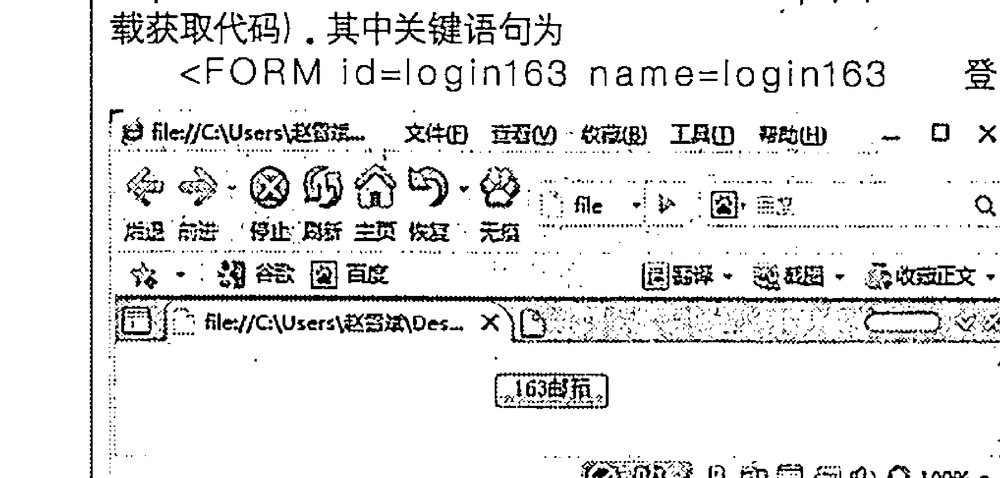

(北京/冰叶)

### 股市行情尽在QQ掌握

小王买了几只股票，可单位电脑不许安装证券软件，怎么办？其实通过QQ就能即时查看股市行情。

在QQ面板左侧点击“股”按钮，进入“证券大厅”，搜索到自己购买的股票后，如600050（中国联通），按回车键添加，以后直接在QQ面板上点击“中国联通”即可打开相应网页查看行情了。

当某只股票出现浮动时，是否想要QQ及时提醒？简单，可在 http://www.soso.com 中，输入股票号（如：600050），在搜索下拉框中选择蓝色名称并标有黄色星号的那一项搜索，将能搜到QQ专用结果，单击“QQ提醒”，按提示设置波动幅度，确定即可。当股价波动幅度超过设定值后，只要QQ为登录状态，不管在何处，都会自动弹出提醒窗口。

**小提示**
有时会发现QQ股票与大智慧的显示结果不相符，这是因为网站更新速度不同而造成的。一般来说，大智慧的更新比较快些。

(文/江苏 缪丽莉)

### 偷窥陌生人的QQ日志

某天我正在挂QQ，突然有陌生人要加我好友。好友怎么能随便加呢，先探探他的底细再作决定。可是我打开他的QQ空间准备了解更多一些时，却弹出提示，说是系统维护无法访问。但是打开好友的QQ空间没有任何问题。难道非要先加对方为好友才能访问？其实有一个小窍门，可以轻松访问非好友的QQ日志。

首先登录到自己的QQ邮箱，进入“邮箱首页”，接下来点击左侧“阅读空间”按钮，再在右侧切换到“我的订阅”，点击右上方“添加订阅”，在弹出的文本框中输入要访问人的QQ号，最后点击“订阅”按钮即可。

接下来就会发现，原本不能访问的QQ空间出现在QQ邮箱的订阅中，可以正常浏览里面的内容。除了正常浏览外，还可以进行评论，这样在不加对方为好友的情况下也能看Ta的日志了。

**小提示**
如果对方QQ空间设置了问题密码，则需要回答出答案后才能订阅。

(文/小新)

### QQ和TM唱二人转 破解QQ隐身设置上限

QQ里面有个很不错的“隐身可见”功能，它能让我们对一些挚友显身，而对另外一些不想见的人又隐身。不过，对于非会员来说，只能设置三个隐身可见的好友，显得有点少，有什么免费的方法可以突破这个限制呢？其实通过QQ的姐妹——TM，可以轻松搞定。

下载安装腾讯TM后，用自己的QQ号码登录，然后切换到隐身状态，接着在好友列表中找到需要设置的好友，右击，选择“设置权限→隐身对其可见”，成功后会弹出一个提示窗口。TM中是没有限制的，同样方法设置其他想要隐身可见的好友。好了，现在退出TM回到QQ中，会发现TM中“隐身可见”的好设置，全部依然有效。

**小提示**
- ★在QQ和TM中，当你为隐身状态时，权限设置中的命令将显示为“隐身对其可见”。如果是在线状态，则该命令相应变成“在线对其隐身”。

(文/犀利的风)

### Foobar2000 1.0正式版曝新料

毫无征兆，Foobar2000 1.0正式版突然来袭，赶紧到 http://www.foobar2000.org/download 下载试用（安装类型选择 Full，即完全安装）。发现除重新编排了菜单结构外，还内置了 Windows Media 和 RTSP 流的直播功能。

启动软件后，点击菜单命令“File→Add Location”（文件→添加地址），再在打开窗口中输入诸如“mms://”、“rtsp://”之类的网络流媒体文件地址，确定后就可以播放啦（刚开始会静音一会，因为要缓冲）。有时想把收听的电台节目保存下来，以备以后欣赏。这时可右击该电台的播放项目，选择“Convert→Convert”（转换→转换），按提示输出保存就可以了。

默认情况下，Foobar 输出为 WAV 格式的音频，如果想输出为 MP3 格式，可在输出窗口中点击 Output format（输出格式）下拉按钮，选择 MP3 项即可。如果没有找到 MP3 项，则需要下载安装 Lame 解码器（http://www.newhua.com/soft/49048.htm）。

**网络大补贴**
一些英语电台，通过 Foobar2000 录制下来，对英语爱好者锻炼口语和听力还是大有好处的。
- ★中国国际广播电台国际在线英语
网址：mms://live.hitfm.cn/fm887
- ★彭博环球BLOOMBERG International
网址：http://www.bloomberg.com/streams/audio/radio_live.asx
- ★英国BBC
网址：http://www.bbc.co.uk/worldservice/meta/tx/nb/live/ww17.asx
- ★纽约公共广播（New York Public Radio）
网址：http://www.wnyc.org/asx/wnycam.asx

(文/江北书生)

### 永久可下载 Rayfile热门资源藏“余温”

Rayfile网盘相信不用我多说，大家都知道其优点，也因此成为了 很多同学分享资源的首选。但Rayfile网盘也有个不足之处，就是时间久了文件的热度不够之后，服务器就会自动删除上传的文件，这样一些后来者再次访问资源页面时就会被提示“404错误-文件未找到”。那有什么办法可以让这些资源的分享时间更长一点呢？

以 http://www.rayfile.com/zh-cn/files/a57e9735-2085-11df-ab9d-0015c55db73d/ 资源为例，大家访问该页面时会被提示文件未找到，但我们在分享资源时只要稍作变通，就可以让更多的人能下载到该资源了。

- 第一步：上传资源文件，进入资源下载页面。
- 第二步：使用 Raysource 客户端下载刚刚上传的资源文件。这里不需要真正的下载，只需要点击下载页面中的 Raysource 下载按钮，使 Raysource 客户端弹出“新建下载”对话框即可。
- 第三步：在“新建下载”对话框中的“文件下载链接（URL）”右侧的文本框中，以“fs2you://”开头的即为下载链接，将其复制并对外发布即可。如果是自己下载过的文件，要与别人分享，在 Raysource 客户端的“历史文件”中，单击选中文件，将下方的“URL”右侧的以“fs2you://”开头的地址复制给别人即可。

这样有一个好处就是与他人分享资源时，其他人不需要进入资源页面，可通过 Raysource 客户端直接下载，即便在访问资源下载页面时被提示文件不存在，在 Raysource 客户端中直接新建任务，输入下载链接（前面的资源页面文件对应的下载链接为 fs2you://Y2FjaGVmaWxlMzEuZmlsZXMuc291cnNlLmNvbS9zaG93ZmlsZS81OTQxODE4ZWM3Y2ZkZmVmOTI5YTMyMTgyNDk4OTY5L2ZvYmFyMjAwMC5leGV8MTI3NzQ4Njk4OHwwfFwv），文件同样能够被下载。

**揭秘：为何删除了的Raysource资源还能下载？**
- ★由于 Raysource 客户端也是基于P2P原理的，因此，假设小李通过客户端的方式下载了资源A，即便服务器上已经删除了资源A，但只要小李未删除资源A，并且客户端是在线状态，这时小李就成了资源A的一个“种子”（类似于BT、电驴的下载），可以为其他客户端用户提供下载源，这也就是为什么服务器端删除资源后，通过下载链接仍然能够下载资源的原因。
- ★这一方法仅对那些被用户使用客户端下载过的资源有效（大文件基本上都有效，因为超过10MB，Rayfile就不提供HTTP下载链接了）。
- ★在使用此方法下载某一资源时，如果某一时刻没有速度，不要放弃，可以在不同时间段进行尝试，因为只有下载过该资源的用户Raysource客户端在线时才能提供下载源，所以在不同的时间段进行尝试，往往会有收获。
- ★如果想让自己上传的资源长期有效，可在资源上传成功后，自己通过 Raysource 客户端下载一次，并保持 Raysource 客户端经常性的在线，从而为需要下载资源的用户供源。

(文/越野苍狼)

### 唐骏 吃谷歌的“豆腐”？

2010年1月25日，新华都集团总裁唐骏发了一条“今天我回归IT…重回我热爱的产业，IT需要我，我更需要IT”的微博，引发各界猜想，业内更风传唐骏将出任谷歌全球副总裁兼中国区总裁。

其实也难怪大家有如此的猜测。自从谷歌玩了一票“退出”中国的闹剧后，唐骏突然异乎寻常的热心，时不时对谷歌品头论足一番。诸如“这将是他们做出的史上最蠢的决定”及“谷歌真的走了，那它就很难再回来了”之类的言论，不绝于耳。当然这些道理，许多人都明白，也说过，在唐骏之前飞叔就曾有过类似评论呢。但唐骏作为前微软中国总裁，由他说出来分量自然非同一般并且别有一番意味。

我们不妨将唐哥“回归IT”论当成一种放话和试探。放话给谷歌：让我来拯救你们吧；试探的是网民：我去谷歌各位意下如何？谷歌那边没有反应，但网民们先炸开了锅，赞成和反对的都有，很多意见还相当极端，甚至有网友称：你去谷歌我就用百度，你去百度，我戒网不用了。

飞叔倒觉得，唐骏为什么不能去谷歌？其实也很称职。我们可以将唐哥与谷歌中国前任掌门人开复兄做个比较。我与开复有过两面之缘，唐哥则是在电视各类创业栏目中见过访谈。他们两人给我的第一印象，都是那种要竖起兰花指的冲动。这个比喻，不是说他们女性化，而是想形容他们的儒雅与谦和，感觉上很容易接近。

两个人的工作经历也颇为相似，都是加盟微软升级到全球副总裁及中国区总裁，名利双收，接着又巨薪跳到其他公司。这两人对中国IT的发展现状，可谓是了然于胸。只是近来稍有不同，开复选择创业，唐哥继续选择做“打工皇帝”。既然有这么多共同之处，那么开复可以领导谷歌中国，唐骏为什么就不可以呢？当然，除了开复回锅，唐骏跳槽外，谷歌中国未来掌门人，很有可能的还有以下人选：

- 刘允 (谷歌现任)
- 陈永正 (NBA中国)
- 杜家滨 (诚奕科技)
- 张亚勤 (微软中国)

不过整个事情的发展，越来越像做秀，唐哥出面澄清，所谓的“回归IT”，是指的新华都收购了两家软件公司而已，并且模模糊糊来了句“Google需要唐骏，唐骏不需要Google”。看来只是一场炒作，看来谷歌是被唐哥吃了“豆腐”了。唉，没劲，停止围观。

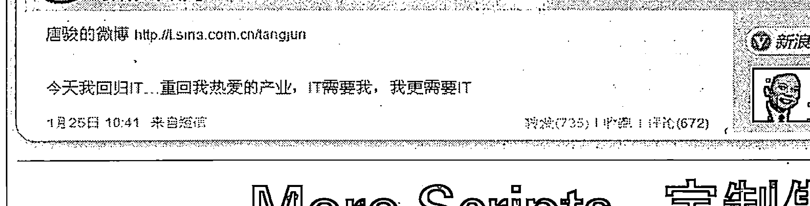

### More Scripts 定制傲游私房菜

傲游浏览器的功能已经很全面，不过这些功能是针对所有人设计，不一定能满足个人的一些特殊需求。既然它不管“开小灶”，那我们就自力更生自己定制傲游的功能吧。

### More Scripts 给傲游插上翅膀

More Scripts (以下简称MS) 实际上也是傲游的一个插件，不过它能让傲游支持脚本，这样只要稍懂一点JavaScript语法，就能自己编制出五花八门的功能。从http://addons.maxthon.cn/zh_CN/post/2715下载、安装MS插件后，单击傲游插件栏的MS按钮，选择打开“管理脚本”，就可以方便地启用、禁用、编辑脚本了。

### 小提示

如果MS安装后没有自动启用，请进入“傲游设置中心→插件管理器”，启用“More Scripts、More Scripts Helper”插件即可。

#### 自动定时刷新网页

在网上发了个租房的广告贴，想时刻关注该贴的跟贴，自己一次次刷新过于麻烦，通过MS内置的Auto Reload可实现自动刷新。

在MS的脚本管理界面，点击勾选Auto Reload (自动刷新) 项，右侧可以看到相应的功能说明。在下方的输入框中，按提示输入需要自动刷新的网址，然后“确认”。Auto Reload就会自动刷新对应的页面了。

Auto Reload默认刷新的时间间隔为1分钟，如果想改得短 (或长) 一点，可直接双击Auto Reload进入脚本编辑窗口，将脚本中最后一行中的“60000” (1分钟) 按比例缩小或加大就可以了。

#### 用别人的脚本丰富自己的网络

网上有很多的JavaScript脚本资源 (比如: http://userscripts.org)，有些可以直接添加到MS中为我所用。

#### 批量下载Google正版音乐

Google音乐上有大量正版且音质好的音乐，但是Google并没有提供专辑批量下载功能，手动一首一首地下载，太麻烦。我们可借助网友制作的脚本来批量下载。

进入http://userscripts.org/scripts/show/51016，单击右侧绿色的Install (安装) 按钮安装Google music脚本，并在MS的脚本管理中启用该脚本。

接着进入Google音乐某一专辑页面，将会发现每一首歌曲名称后面都出现了一个Download (下载) 链接。在专辑页面空白处右击，选择“使用傲游下载全部链接”，在打开的“批量添加任务”对话框中单击“筛选”，勾选“psp-music.appspot.com”项，连续点击“确认”，傲游便开始批量下载Google音乐了。

### 小提示

- 建议在傲游中将同时进行的任务数设置得小一些 (建议不超过3)，因为同时的连接数过多有可能会导致Google临时封IP从而导致不能下载。

（文/越野苍狼）

### 超级工具箱 解决WebMail的4大难题

WebMail (网页邮箱) 能直接在浏览器中使用，非常方便。不过因为没有独立的客户端软件，还有不少功能缺陷，比如不能设计个性签名、垃圾邮件过滤差等。今天给大家带来的几个工具，就来帮你弥补这些缺憾。

#### “素颜”邮件签名变彩妆秀

通过邮箱客户端 (如Foxmail) 发送的邮件可以附带非常精美的个性签名，但WebMail一般只能添加纯文字的“素颜”签名。不过火狐下借助WiseStamp插件 (也有谷歌Chrome版)，同样可以让WebMail签名变彩妆秀 (支持Gmail、Yahoo! mail、Hotmail邮箱)。

打开http://www.wisestamp.com/在线安装WiseStamp插件，重启火狐，单击“工具→WiseStamp”即可设置自己的签名。在此可以添加文字 (如姓名、公司信息等) 及链接，并设置彩色字体；还可以插入在线图片进行编辑；下方还能快速添加自己的SNS网站、常用IM软件 (如MSN、QQ) 等。点击Preview (预览) 可随时看到效果。完成签名设置，以后只要是在火狐中使用上述支持的邮箱，新建邮件后这个签名就会自动插入到邮件中，非常方便。

#### 网络大补贴

- 如果要在签名中留下其他邮箱地址，还可以使用E-mail图片生成服务以保护邮箱，将邮箱变成图片：http://www.makepic.com/email.php。

#### 快速打造 E-Mail 相册

分散在不同邮件中的图片等多媒体信息，找起来很麻烦。对于本地使用Outlook的用户，可以借助OPE (下载地址: http://www.ope2000.com/download/ope/Setup.exe) 自动提取邮件附件中的图片。在Outlook中收取所有WebMail邮箱中带附件的邮件，接着启动OPE选中“收件箱”，右击选择Extract to (提取到)，选择存放图片的目录，程序会自动将所有邮件中的图片提取到指定目录。

WebMail也有相应工具，如2PAD，它能将邮件中零散的图片快速生成图片相册 (支持Hotmail、Gmail、Yahoo)。不过因为要输入自己的邮箱和密码，安全起见，在这类在线服务中，请勿使用自己的机密邮箱 (包含各类隐私邮件)，一定要试的话，最好用不重要的邮箱尝试。

#### 超大附件不再发送难

许多邮箱不支持5MB (不同邮箱限制可能不同) 以上大附件的收发，如果你有一个超大文件 (几百兆甚至更大)，这时怎么办呢？一些主流WebMail已经解决这一问题，比如QQ邮箱的“文件中转站”。

登录自己的QQ邮箱后，在新建邮件界面单击“超大附件”，然后上传需要作为附件的大文件。这样好友收到的邮件就包含附件的链接，单击该链接进入QQ文件中转站下载附件就可以了。

#### 网络大补贴

- 中国移动139邮箱也提供类似服务。其他通过E-mail发送大型文件的更多方法，可参阅：http://article.pchome.net/content-676162.html。

#### 曲线救援绕开 WebMail 垃圾邮件

相比于邮箱客户端 (如Foxmail)，WebMail的垃圾管理功能就差了很多，如果一不小心泄露自己的邮箱地址，很容易招致垃圾邮件围攻。

不过，很多时候我们又不得不在网上留下自己的邮箱地址，这时可通过Tinymail.me来保护自己的邮箱。登录http://tinymail.me/输入自己需要保护的邮箱，然后单击Protect it (保护它)，网站会自动生成邮箱的HTML链接 (个人主页上使用)、BB代码 (论坛使用) 和网址，比如可以将其中BB代码作为自己邮箱地址联系方式，这样其他人单击这个链接时，在打开的页面需要输入验证码才能看到我们正确的邮箱地址。而垃圾邮件是非人工群发的，无法输入验证码，自然也就进不了你的邮箱了。

（文/俞木发）

### 躺在床上上网——手机与网络的约会

引子：
根据2010年1月的《中国互联网络发展状况统计报告》，截至2009年12月30日，中国网民规模达到3.84亿人，其中手机网民规模2.33亿，占网民总体的60.8%！这么多人用手机上网，他们都在做什么？飞叔在开心网上打探了一番 (http://tinyurl.com/yf8m89z)，得到如图所示结果。

| 手机上网，你会玩什么？ (最多可选14项) | |
| :--- | :--- |
| 可以多选，没有的项可忽略说明 :) | |
| 谢谢, , , | |
| QQ: | 482 (77%) |
| 看MSN: | 75 (12%) |
| 飞信: | 228 (37%) |
| 收邮件: | 105 (17%) |
| 看新闻: | 401 (64%) |
| 玩开心网: | 469 (75%) |
| 玩校内: | 119 (19%) |
| 看小说: | 247 (40%) |
| 搜索资料: | 290 (47%) |
| 写微博: | 47 (8%) |
| 查地图: | 185 (30%) |
| 百度贴吧: | 79 (13%) |
| 上论坛: | 88 (14%) |
| 其他: | 52 (8%) |
| 3G在线电影: | 18 (3%) |
| 网购(如买东西，买电影票什么的...) | 16 (3%) |
| 手机下载(如歌曲、小说、视频等) | 83 (13%) |

可以看出，QQ和开心网占了绝对的优势，可见娱乐是当今手机上网的主流应用，今天我们将以一定的篇幅介绍这方面的技巧。不过另一方面，飞叔觉得，手机上网应该有助于我们平时的生活和学习，本文也将极力为你灌输这方面的应用。

#### 某涛小档案

- 年龄：85后
- 形象：瘦弱，架一副眼镜，头发看似凌乱实则是刻意的修饰。手机不离手，吃饭间隙，也会边发短信边作沉迷微笑状。
- 性格：比80后激情，比90后成熟。喜欢宅，看似寡言少语，实则内心狂野。

#### 第一季：掌中娱乐乐翻天

MM给某涛发来短信，让他上QQ有事要问。这三更半夜天寒地冻的，某涛躲在被窝里真不想起来。灵机一动，就用手机上网聊QQ吧。

##### 手机聊天还是要悠着点

手机聊天可要注意流量，上月某涛就超了，费了不少钱。第一，在QQ登录时要选择好接入点，可以单击"菜单→接入点设置"，选择自己开通套餐的接入点 (一般为WAP接入)。第二，在登录界面要去除"接收QQ群消息"前的勾选，并选中"屏蔽语音图片"项，以节省流量。如果要接收指定QQ群消息，可以在登录QQ后进行群消息接收设置。第三，对于QQ2009 (JAVA)正式版用户，登录后还可以单击"选择→系统设置→开启节能模式"，这样QQ会关闭更新好友资料、声音及震动、浏览器图片显示更节省流量。

> 涛涛秘诀：
> - 对于无法安装QQ客户端的用户，还可以登录http://w.qq.com使用WebQQ的Mini版。此外对于有些S60用户，SIS格式的QQ不支持cmwap接入，这些手机用户应该去下载JAVA版本的客户端。
> - 对于PPC版本的QQ客户端很容易掉线，此类用户可以去http://work.newhua.com/cfan/201005/JBED_20080912.5.1.cab下载JAVA模拟器，在PPC中使用JAVA版本的QQ客户端。同理，这个模拟器也支持在PPC手机上运行各种JAVA游戏，如QQ斗地主等。

##### 开心农场"摘"菜忙

聊了一会，MM困了，让某涛帮她看守着开心网和QQ农场，自己先睡了 (没人性啊)。没办法，某涛打开手机浏览器Ucweb，输入wap.kaixin001.com登录，开始发照片、日记、投票、争车位等。

某涛的手机系统是S60 V3，还可以通过QQ手机浏览器2009 beta2 农场版"摘"菜 (V2也行)。登录手机腾讯网下载相应的软件后，单击"默认首页→手机网站→农场"登录手机QQ农场，按提示即可对农场进行管理。如果要偷好友的菜，单击"好友农场"进入，如果有可摘的果实，单击"一键摘取/浏览器特权"即可。

> 涛涛秘诀：
> - 对于Ucweb的用户，根据网友的测试可以使用下面的方法登录QQ农场 (不过成功率不是很高)：在Ucweb中进入app9.z.qq.com/farm/index.isp，在打开的页面登录QQ号后即可操作自己的菜地，或者偷别人的菜，后续的操作和QQ浏览器类似。

##### 省钱——手机套餐按需选择

MM也想办手机上网，让某涛帮她选一种套餐。某涛仔细分析了不同情况下的上网流量，再登录当地移动公司网站查询费用，最后做出选择。
MM最多也就聊个QQ什么的，再加上偶尔的其他应用，选择30MB的套餐就足够了，每月仅需5元。注意：因为每个人上网状况不同，具体流量花费请登录移动公司的官网进行查询。

#### 第二季：宅男也是购物狂

手机上网，不只是用来娱乐的，还可以对生活有很大的帮助呢。这不，某涛不但用手机帮MM买过衣服，还躲在被窝里“抢”了两张阿凡达的电影票，可把MM美坏了。

##### 手机里为MM淘衣服

买衣服许多人选择淘宝网，其实它也可以在手机上完成。在电脑上登录自己支付宝页面，切换到“手机服务”，开通“手机支付”功能。再在手机中浏览m.taobao.com，就可以搜索自己需要的物品，找到后单击链接进入宝贝页面，点击“图片”链接，查看商品的具体图片。确认购买该宝贝后，单击“立即购买”，输入自己的收货信息，“确认购买”，最后按提示用支付宝付款即可，流程和在电脑上差不多。

##### 躲在被窝里抢购阿凡达

某涛带MM回湖南老家，恰逢《阿凡达》盛行，当时找不到地方上网购票，结果还是手机帮了他的忙。登录http://www.piaolala.com/film/34944.html，搜索到需要订购的电影后点击“立即订购”，按提示输入自己的手机号注册，成功登录并订购后，手机会收到系统下发的短信购票密码，到影城前台换取电影票就可以啦。
不过某涛在北京的好友多拉就更方便了，直接登录网票网 (http://www.wangpiao.com.cn)，选择地区及具体影院，然后选择时间和影片，点击相应的“选座位”按钮进入剧场示意图，点击某个中意的座位 (蓝色表示空闲)，再输入自己的手机号并选择接收电子影票的方式 (二维码或短信)，确认付款方式后就可以获得电子影票了。

##### 网络大补贴：其他支持手机购票的常见院线

- 万达影城（支持多个城市影院）：http://www.wandafilm.com
- 中国票务在线（支持在线选座，支持北京多家影院）：http://www.piao.com.cn/index.html
- 上海票务（支持上海多家星级影院）：http://www.shtickets.cn/scripts/ticketing/product/8450.html
- 哈票网（支持多个城市影院）：http://www.hipiao.com

#### 第三季：掌中学习更轻松

MM要考英语六级，这个某涛可就无法代考了。拍拍脑袋，为MM的手机订阅了许多英语相关的内容，供她随时随地用手机学习（上班途中、会餐间隙等）。
启动Ucweb，进入用户中心并登录，展开“UC用户中心→UC阅读器→每日英语，好好学习”。UC已内置多个英语RSS，展开相应文章阅读即可。如要添加订阅，展开“管理订阅→添加订阅”，按提示输入订阅网址或关键词，在打开的页面选择文章，单击左上角的“订阅”即可。

##### 网络大补贴：更多在线英语学习网址

- BBC手机访问http://www.bbc.co.uk/ukchina/simp/services/2009/08/000000_mobile.shtml
- 爱词霸（英语素材，在线翻译）：http://wap.iciba.com
- 英语学习手机网（各种英语，4、6级英语素材）：http://wap.iamlk.cn
- 水滴英语（各种英语学习资料）：http://wap.e2g.cn
- 英语广播（可以下载到各种听力资料）：http://www.tingclass.com/broadcast

> 涛涛秘诀：
> - 为了节省手机流量，可以先在电脑上使用WAP模拟器访问网址，预览满意后再添加到RSS订阅。比如可以在电脑上先登录http://ppt.pp.cn，然后再输入相应的WAP网址进行访问。此外，如果是S60用户，则可以登录wap.gg.3g.cn下载ggradio网络收音机软件，用于收听英语广播。其他手机用户可以用电脑下载好英语听力资料上传到手机上收听。

(策划/柳絮飞 撰稿/平淡)

### 聊天窗口的瞬时粘贴工具

小丽的QQ上有很多好友，她按需要分成了家人、朋友、同事、业务联系等多个组。逢年过节，她会为每个Q组定制不同的问候语，再分别重复发给各组里的好友。
以往她都是一条条的按Ctrl+C，Ctrl+V键重复发送，非常麻烦，而QQ拼音升级到3.1之后，就不用这么麻烦了：QQ拼音能将多条信息保存在剪贴板上，需要时可以有选择地发送其中的某条。
调出QQ拼音输入法，点击输入法状态条右侧的扳手图标，选择“剪贴”，从弹出的对话框中勾选“开启剪贴板收集”复选框，确定后退出，分别选中不同的问候语（支持文字和图片），并按Ctrl+C键，它们将自动保存到QQ拼音剪贴板中。
这样，在给不同Q组的好友发送问候时，在聊天窗口，直接输入vv进入QQ拼音剪贴板模式，点击需要的内容发送就可以啦。

#### 小提示：图片传情无需QQ截图

- QQ拼音新增截图功能，无需启动QQ，在QQ拼音状态下，按Ctrl+Alt+Q键即可调出截图工具任意截图了。
- 在QQ拼音状态下，按vbq，可打开表情符窗口快速插入QQ中的表情图符。

(文/行人三)

### 3步！网盘变身在线播放器

虽然大部分博客空间都能自主设置背景音乐，但是它针对的是整个空间。而每篇日志内容和心情不一样，如何能为单独日志设置个性化的背景音乐呢？通过酷狗音乐的网盘，可以轻松达到这个目的。下面就以最常用的QQ空间为例。

第一步：在浏览器中打开http://disk.kugou.com/，不用注册，直接单击“浏览上传”按钮，依次上传符合要求的mp3歌曲。上传结束后，系统会提示输入可用的邮箱地址，以便将下载链接发到邮件中，这里也可以选择“跳过”，稍后仍然会自动生成提取链接。

第二步：单击“生成组件”按钮，刚才所上传的歌曲会自动创建为一个迷你播放器，确实是够迷你，因为只有“暂停/播放”、“上一首”、“下一首”等极少的按钮。如果需要更多的设置，可以单击“高级设置”按钮进行操作，这里可以对播放器的颜色、面板尺寸、播放设置等参数进行设置。

由于准备在Qzone的日志中嵌入播放器，因此这里选择Flash地址，单击右侧的“复制”按钮将其输出到剪贴板中备用。

第三步：进入QQ空间，跳转到日志频道的“写日志”页面，写好日志，将光标放在适当位置，再单击工具栏中的“Flash动画”按钮，填入刚才复制的Flash代码，提交即可边浏览边听歌了。

其实，同样方法还可以将酷狗硬盘播放器插入到MSN空间、新浪博客、网易博客、搜狐博客，甚至爱好者博墅的日志中。还可以将播放器代码发送给朋友或转发到校内网、开心网、新浪微博等外站上，只不过有时需要粘贴HTML代码而已，有兴趣的试试吧。

#### 小知识

- NFS（Network File System），网络文件系统。它本是Unix上磁盘文件共享的一种方法，由Sun公司开发。NFS独立于操作系统，能在不同硬件及系统之间进行文件分享。使用NFS，就可以象访问本地文件一样访问网络上其他系统上的文件。

### 给 Windows 披上 NFS 战袍

NFS在Linux上极为风行，但如果想让Windows XP支持NFS，可安装haneWIN NFS (http://www.hanewin.net/nfs-e.htm) 来实现。

安装后重启，双击桌面上“NFS Server”打开NFS设置窗口。切换到Server（服务）选项卡，勾选“UTF-8 character”项，否则在Linux中访问Windows时，中文文件和文件夹会显示乱码。切换到Exports（输出）选项卡，点击Edit exports file（编辑输出文件），将自动调出记事本打开配置文件，如图所示设置，表示192.168.1.1到192.168.1.200地址之间所有机器都可以访问这台NFS服务器上的“D:\clw”文件夹和整个E盘。

保存文件后返回NFS配置窗口，点击Restart Server（重启服务）使上面的设置生效，最后点击“确定”退出。

### 小提示

- 如果关闭系统防火墙，本步骤可以省略，但会带来安全问题，建议配置防火墙开放NFS端口来解决。NFS服务需要111、1058和2049三个端口号，在防火墙的例外设置中添加这几个端口给以放行即可。

#### NFS牵线 高清播放器直插电脑大片

```
## exports example
#c:\ftp -range 192.168.1.1 192.168.1.10
c:\public -public -readonly
c:\tools -readonly 192.168.1.4
#下面是我想要共享的文件夹示例，上面注释掉
d:\clw -range 192.168.1.1 192.168.1.200
e:\ -range 192.168.1.1 192.168.1.200
```

### 小提示

- 很多嵌入式Linux文件系统，受硬件限制是只读的，导致NFS不能直接使用，即不能把远程（电脑）文件夹安装到本地（播放器），通过插接闪盘，可以解决此问题。

- 第二步：播放器自动将闪盘安装到/tmp/udbmounds/sda1设备上，可通过telnet终端查看闪盘，其中只有一个movie文件夹。通过播放器遥控器选择USB设备，在电视上看到闪盘被播放器识别为C分区了，C/movie文件夹为空。

- 第三步：前面在XP下我们已经设置了NFS共享文件夹（D分区），将要播放的电影文件放到此文件夹中。然后将（远程）电脑上的D分区挂接到播放器闪盘的movie文件夹上。在命令提示符窗口进入telnet终端，执行以下命令（192.168.3.100是我电脑的IP地址）：mount -t nfs -o nolock 192.168.3.100:/d /tmp/usbmountd/sda1/movie

#### 实战：高清播放器直插电脑中的电影

很多智能电子设备，比如采用Realtek1073芯片的高清播放器，都装有嵌入式Linux系统，有网络、USB接口，可与电脑连接互访。下面尝试让高清播放器直接播放电脑上的电影。

第一步：将高清播放器接上网络，加电开机，插好闪盘（对闪盘没有特别要求，本例使用的是很老的64MB朗科优盘）。接着从XP系统的电脑上打开命令提示符窗口，执行“telnet 192.168.3.152”（不含外侧引号，下同）命令登录到高清播放器，用户名是root，无需密码（1073芯片播放器一般无密码），IP地址192.168.3.152是路由器自动分配给播放器的，各人可能略有不同。

现在在播放器上就能看到闪盘movie文件夹中，已将电脑D盘的所有内容映射过来了（实际文件在电脑上）。用电视上的遥控器选择并播放大片，然后就可以坐在沙发上，喝着咖啡看大片了，是不是很爽啊。

#### 飞叔说

有了NFS，网络上不同系统之间的文件共享就方便多了，限于篇幅不再详述。有兴趣的朋友可访问http://blog.cfan.com.cn/index.php/1172/viewspace-1932436，查看Linux笔记本如何配置NFS客户端访问XP系统的电脑。

### 网易邮箱好兼差 充当多能阅读器

图片有图片浏览器查看，文档有办公软件打开，PDF也有相应阅读器浏览……但如果电脑上没有安装相应软件，可是又急于打开这些特殊文档，怎么办？今天给大家推荐一个不用安装软件的多能“阅读器”，它就是网易邮箱，可以一解燃眉之急。

原来，网易邮箱最近推出了一项新功能——附件在线预览功能。打开http://mail.163.com登录自己的网易邮箱，然后点击上方的“实验室”链接，找到“附件预览”，点击其下的“马上开通”开通此项功能。

假设现在有一个PDF文件，但是却没有安装PDF阅读器，可以马上将此文件作为附件，发送到自己的网易邮箱中，再自己在线收取此邮件，打开后点击“在线预览”，就可以阅读这个PDF了。最妙的是，它不仅仅是预览，对于电子书或者文档等，它还可以翻页，以及放大缩小等。

经我的实测，网易邮箱还支持Office文档及各类图片，甚至连压缩包中的文件也不放过，相当强悍。

### 我送你离开 千里之外 你无需回来——聚会在线现场直播

小丽就要只身一人去北京发展了，在无锡的一帮同学准备办一个派对欢送她北漂。不过还有几个好友身在外地无法赶来，怎么办呢？有同学建议在线视频直播，让外地的同学也能“参加”。这事，自然就落在了我的身上。

#### 未雨绸缪准备好软硬件

- 笔记本电脑一台，能上网就行。
- 高清摄像头一个（如果笔记本有摄像头也可以凑合使用）。
- 视频软件，本例采用的是Webcam (http://www.onlinedown.net/soft/91650.htm)。

#### 布置派对现场

找好角度，将摄像头对准派对现场，并固定好。再将摄像头和笔记本电脑连接，确保摄像头在电脑中可以正常使用，然后再将笔记本连接上网。

#### Webcam 带你进入虚拟现场

首次运行Webcam，它会要求选择版本，这里我选择第一个webcam 7 Free（免费版）。虽然只支持一个视频源，但对我们来说已经够用了。

第1步：进入软件主界面后，在中间的Monitor（监控）窗格中右击，选择“PCI/USB—USB视频设备”再点选摄像头设备，这样即可显示出摄像头的画面。

第2步：点击左侧Web/Broadcast（网络/广播）按钮，在“IP Address/Host Name”（IP地址/主机名）中选择软件自动搜索出的本机IP地址，其它设置不变，然后点击窗口右上角的Activate（激活）按钮，这时会在右下角显示一个网址（类似 http://*.*.*.*:8080），这个就是摄像头视频的观看网址了。把这个地址告诉没能参加聚会的在线好友们，他们进入这一网址后即可看到现场视频。

第3步：为了让在线好友能真正参与进来，还可以在直播画面下方加入聊天功能。点击软件上方Live Chat（即时聊天）选项卡，然后单击Create a private room（创建私密房间）按钮，在打开的网页中输入聊天室的名称，再输入URL，比如我输入“cfan”，其他按默认设置即可，完成后点击Continue（继续）按钮。接着会显示注册页面，按提示输入注册的用户名、密码和邮箱，点击Sign up（注册）即可。

好了，返回软件主界面，在Room name（房间名称）中输入前面的“cfan”，再点击右上角的“Activate”按钮就可以看见聊天室界面了。这时外地的在线好友，不但能看到派对的现场视频，而且还能够通过文字、表情等和所有现场的朋友进行实时交流呢。

### 谷歌BUZZ 看个热闹就好

Buzz, 蜜蜂振翅时发出的嗡嗡声响，微博纷争已经够热，谷歌竟也按捺不住，“嗡”的一声加入“闲话、谣言”的行列，并美其名曰谷歌Buzz。不过谷歌“嗡”一小声，业界听到的是一声雷。谷歌高管称，Buzz既不是Twitter终结者，也不是架在Facebook脖子上的刀。这个声明看似安抚，实则表明出谷歌的野心：谷歌近年的发展意图很明显，不想只在一棵树上（单一服务）吊死，而是加快整合的步伐，竭力打造超级网络平台，想得到微软曾在PC上获取的那种统治地位。之前的Wave是Gmail（邮件）+GTalk（即时通讯）+DOCS（在线文档）等网络交流工具的整合，如今的Buzz则是社交媒体（微博）+Facebook（SNS）+Foursquare等经典社会化应用的大聚集。这样的整合尝试相信谷歌还会继续。某网站一个近千人的小调查中，近65%的人认为Buzz能成功，对此飞叔不以为然，谷歌以前没少推社会化产品，Orkut, Friend Connect，刚推出时叫好一片，到现在大都不了了之。另外时过境迁，在网络这个开放的世界，很难由某一家左右。而且Twitter，Facebook羽翼已丰，也会是强有力的竞争者。

Buzz刚推出两天时，官方统计通过Buzz发布的信息超过900万条。看似很热闹，细探究不过是虚热：Buzz是绑定在Gmail中推出的，所以Buzz并没有超出Gmail的用户群，它只能再次证明了Gmail的成功而已。Buzz在中国市场，更是不容乐观，一是中国的Gmail用户少，另外它很难抵挡新浪微博及QQ等的围攻，注定水土不服。所以，对于谷歌Buzz，我们看个热闹就好。

> Etta: 嗯，老外能在mail里聊天，所以gmail就有那种界面。咱们联络感情要不是qq，要不就是短信。飞：中国人用筷子，所以手指灵活，发短信正是扬长避短。老外手太笨，所以用mail。west：手笨怎么能用黑莓发长篇email？飞：黑莓是全键盘，你让他用九宫格的数字键发mail试试。

### 歪评：文化差异？Buzz 注定水土不服

CFan编辑部的QQ群里，常常就时事新闻展开热烈讨论，而结果往往是跑题千里。比如本来在谷歌新推的Buzz，结果能扯到筷子和文化上……

> Etta: 用了一下buzz，没什么感觉。先不说gmail在国内有多少人用，我觉得email对国人来说主要是商务用途，以email为基础的sns，在中国很难火起来。国人就不像老美那么爱发mail。west：因为老外不喜欢短信，长信息用来说事情，短信息用来说心情，美国佬喜欢直接沟通心情。

### 其他人的声音

雅虎：我们一年半前就Buzz上了。微软：不就是一个社交网络嘛，不就是聚合对话嘛，我们现在做的就是这个。路人甲：Buzz是一个“微社交”工具，用它来关注更紧密的人，与Twitter相比，它更像是一个小圈子的交流工具。路人乙：Google Buzz什么的社交网络，太讨厌了，还我清净的Gmail。路人丙：我决定在buzz的个人网址上写上我的百度hi……

### 老板眼皮底下用Excel偷偷聊

小林单位禁用QQ，MSN等所有聊天软件，但他最近正与某同事MM热恋，半分钟不说话都忍不住。于是他想了一个用Excel聊天的绝招，还不用担心被领导查到。这里以Windows XP上使用Excel为例来演示。启动Excel后新建一个工作簿，随意命名。依次选择“工具→共享工作簿”选项，弹出对话框，勾选“允许多用户同时编辑，同时允许工作簿合并”项。如果使用的是Excel 2007，那么可以切换到“审阅”选项卡，在“更改”功能组下选择“共享工作簿”进行设置。接着小林在自己的计算机上创建一个名为“temp”的共享文件夹，注意这里要勾选“允许网络用户更改我的文件”项。将刚才创建的共享工作簿复制到这个文件夹中。设置完毕，双方分别约定在各自的列进行输入。例如小林在A1单元格输入文字内容，在B1单元格按下“Ctrl+Shift+;”组合键输入当前时间。按下“Ctrl+S”组合键保存。MM从共享文件夹中打开此工作簿后，在C1、D1单元格中分别输入文字内容和当前时间，同样执行保存操作，双方就可以你来我往用Excel狂聊了。

### 不用外挂 工作 偷菜两不误

用外挂偷菜，一旦被发现就可能被封号。人工记忆的话，又常因为事多而忘记偷菜时间。其实一些定时提醒的便签软件（如“Sticker桌面便签”），则既能提醒偷菜，也能对工作任务即时提醒，还不用担心外挂被封。本方法通用于QQ、开心、校内等任意的开心农场。从http://work.newhua.com/201006/sticker1.71.zip下载Sticker桌面便签，解压运行后，先单击浮动窗口中的“新建便签”按钮（或右击系统托盘中的Sticker图标选择）新建提醒事件，在打开的窗口中输入偷菜摘要（如“晚上7点10分张威种的甘蔗可以偷”），接下来再单击下面的闹钟定时按钮，设置提醒时间（提醒时间最好要比菜成熟的实际时间提前一些，以留有打开农场的时间），保存设置。按照同样方法可以添加所有好友可偷菜的时间，一一设置成定时提醒便签，以实现实时提醒。如果添加了多个提醒便签，还可以通过右击任何一个便签窗口并选择“便签管理器”来进行统一管理，通过便签管理器还可以避免重复新建便签的麻烦，例如这次偷菜任务完成后，直接对便签标题、内容、提醒时间进行修改，修改成下一个偷菜任务即可，现在就可以忙其他事情，能偷菜的时候Sticker会即时提醒你的。

### 酷！QQ空间张贴约会地图

MM约会，朋友聚会，如果是在一个陌生的城市，不认识路，怎么办？可以在自己的QQ空间里张贴详细的地形图，他们就不会迷路啦。登录自己的QQ空间，点击“自定义→版式布局”，选择自由布局，将不需要的模块移除，给地图模块留下空间。接着点击“模块→新建模块”，选择Flash模块，Flash动画地址设置为http://uu.51ditu.com/uu.swf，输入名称后确认即可（不要设置尺寸）。成功添加后，调整好地图模块大小，保存设置即可。既不花钱，又充满个性的QzoneMap（Q空间地图）就制作完成了。

全国600多个大中城市的数据，精确到街道和周边的景点、商城、银行、单位等。首先选择你要找的地方，比如输入“bj”即可进入北京的地图，按住地图拖动可以任意平移位置，连续双击某点可以放大地图，操作起来非常方便。灵图还支持公交查询，在地图上标记起点和终点，地图将会自动导航，给出最佳路线及具体搭乘方式，很酷吧。定制好地图路线位置后，通过邮件、QQ群来告诉你的好友，他们只要上你的QQ空间就能找到地方啦。

### 找个中间人 RSS看全文不用上网站

虽然很多网站提供了RSS订阅服务，但这些订阅并非全文输出，还需要一条条地点击，进入到原始网站中才能查看全部内容，效率实在太低。甚至有些网站，如新浪微博，连RSS输出服务都不提供，难道只能每次都要登录之后才能查看吗？莫急，本人自有妙计。

### 搞定 Cnbeta 的非全文输出

许多朋友是通过Cnbeta的新闻来了解IT界的新鲜事的。不过，Cnbeta的RSS内容只是个摘要，如果你不想打开原始网站而是直接在RSS阅读器中看全文，可通过下面的方法解决。首先打开http://feedex.net/，这时出现一个英文页面。不过不要紧，操作很简单，完全可以无视那些文字，只需把http://www.cnbeta.com输入到页面中唯一的输入框里，然后点击Go按钮，全文RSS地址就生成了。接下来，把上面的地址放到订阅软件或者RSS订阅网站就可以啦。

### 无账号、不登录，新浪名人微博照样看

新浪上的名人微博很多，只要你能获取他们的网址，即使自己不登录新浪微博（甚至没有微博账号），同样可以在鲜果里集中订阅查看。首先找到你想要访问的新浪微博的地址，例如李开复的微博地址是http://t.sina.com.cn/kaifulee，然后将http://t.sina.com.cn后面的地址取出（即kaifulee，实际就是该微博的用户名）作为参数，放到“http://www.cnzaobao.com/sinarss.php?username=”（不含引号）地址后面，即李开复的微博订阅地址就是http://www.cnzaobao.com/sinarss.php?username=kaifulee，然后在鲜果（http://xianguo.com）中订阅就可以了。通过这一方法，可以订阅更多的新浪微博，统一查看。

### 雅虎一出，RSS 一统

每一个博客占用一个订阅地址，不太容易管理。通过Yahoo的Pipes（管道）服务，可以将这些地址统一输出。进入Yahoo Pipes（http://pipes.yahoo.com），新建一个Pipes，然后点击“Sources→Fetch Feed”，再点击几次“+URL”添加多个RSS订阅，然后将这个“Fetch Feed”拖到“Pipe Output”上，就完成了多个RSS订阅的组合。保存后点击“Run pipes”，接着点击“Get as rss”，就可以得到类似http://pipes.yahoo.com/pipes/pipe.run?_id=67847d72fb72ed47669ba60ef5e553f2&_render=rss的订阅地址了。

### 小提示

- 如果觉得上面的地址不容易记，这时我们可以进入http://www.feedburner.com，用谷歌账号登录，把上面的不规则地址进行“烧制”，得到类似http://feeds.feedburner.com/sinaweibo这样容易记忆的规则地址。

### 315网络栏目特稿 小心 谁在偷窥你？！

现在的电脑，基本上是开机就进入连网状态，这给我们的隐私安全带来极大的隐患。病毒木马，可以借助安全杀毒软件来防范，但现在一些正规的软件也暗藏后门，难免让人防不胜防。315到了，如何更好地保护自己的隐私不被偷窥？让我们为你出谋划策。

### 拒绝后台扫描，自制绿色QQ整治QQ要流氓

作为用户最多的即时通讯软件，QQ前段时间被网友曝出启动时会在后台扫描用户隐私文件，包括Hotmail客户端、MSN、杀软、Skype、Firefox浏览器、私人文件夹、支付宝数字证书等。QQ也开始耍流氓了？对于我们这些离不开QQ的网虫该怎么防范？

安装QQ时它会注册不同的组件到系统中，我们可以自制QQ免安装版，这样少去QQ组件注册，尽量减少风险避免这些组件对文件可能的扫描。QQ安装文件实际上是一个压缩包，只要使用7ZIP解压即可自制绿色版QQ，下面以QQ2010beta版为例。

第1步：由于从QQ2009开始就需要VC2005运行库的支持，因此没有安装过QQ的用户，首先要到http://work.newhua.com/201006/vcredist_x86_64.rar下载安装VC运行库（Win7用户，已经安装过QQ的用户则无需再次安装）。

第2步：到http://www.7-zip.org/下载7zip并安装，打开资源管理器找到qq2010beta.exe，右击选择"7zip→打开压缩档案"，依次展开".rsrc\2052\MSI\2019"，单击"释放"，然后将全部文件解压到d:\qq目录。

第3步：打开D:\qq\program files\Tencent\QQ2009\Bin，运行其中的qq.exe即可启动QQ登录，由于省去QQ安装步骤，加载的组件少了，扫描后台文件的风险自然也少了。

- ★对于在公用电脑上（当然自家电脑也可以）使用QQ的用户，还可以使用WebQQ，由于它只是在浏览器中登录使用，因此不会扫描本地硬盘文件。只要登录http://webqq.qq.com/，输入自己QQ账号登录即可使用。如果电脑配置较低，还可以登录http://w.qq.com/，使用专为移动设备设计的网页QQ。

### 自己做体检，看“老流氓”们有没有新动作

除了近日爆出的QQ可能会在后台扫描文件外，其实之前很多正规软件就已有这些“不良嗜好”，比如会在后台偷偷传输用户文件的迅雷，曾经造成全国网络大塞车的暴风影音等。由于这些软件大多在后台偷偷地进行网络连接，普通用户很难发现这些软件到底在后台执行什么操作，我们需要借助一些专业检测工具进行识别。

#### 1.Windows XP用户——Process Monitor监控

Process Monitor是一款系统进程监视软件（下载地址：http://download.sysinternals.com/Files/ProcessMonitor.zip，可以到http://www.onlinedown.net/soft/58054.htm下载汉化版），它可以有效监控软件发起的所有后台操作，包括文件创建、读取、发起连接等。这里以监控迅雷最新版5.9.16.1306为例。

第1步：联网后启动迅雷，然后关闭除迅雷外的所有网络软件如QQ、杀毒升级等，启动Process Monitor，单击“过滤器→过滤器...”，在打开的过滤器设置窗口，“根据以下条件显示条目”设置如下，依次选择“进程名”、“是”、“thunderservices.exe”和“thunder.exe”，“保留”，然后单击“确定”退出。

第2步：这样Process Monitor监控的结果就只显示迅雷的两个组件，现在迅雷没有下载任何东西，但是在Process Monitor的监控列表中我们却发现迅雷在后台异常的忙碌。它一会儿创建文件，一会儿又在读取文件，而且还不时发起连接，几分钟之内激活的事件就多达上万个。

第3步：打开系统任务管理器，切换到“联网”标签，可以看到虽然此时本机表面上没有任何网络活动，但是却不时有流量峰值出现。显然迅雷在后台不停读取本机文件，并不时将文件上传到服务器。方法同上，通过Process Monitor我们可以监控任意值得怀疑的网络软件，看清楚他们在后台到底做什么。

#### 2.Windows 7用户——使用自带资源监视组件监控

对于Windows 7用户，我们可以使用系统自带的资源监视器组件来监控软件的网络活动。这里以监控“暴风影音2012在线高清版”为例。

同上，先关闭所有无关的网络程序，然后单击“开始→所有程序→附件→系统工具→资源监视器”，打开资源监视器后启动暴风影音，在资源监视器窗口切换到“网络”标签可以看到，启动暴风影音后联网的程序是stline.exe（暴风盒子）和Storm.exe（暴风主程序）。勾选这两个进程进行筛选，可以看到虽然当前没有播放任何影片，但是暴风仍然有不少数据流量，依次展开TCP连接、侦听端口，暴风的所有网络活动就一目了然了。

展开“网络活动”可以看到，只要我们开启暴风影音，Storm.exe（暴风主程序）就会始终发起连接，而播放窗口右侧弹出的stline.exe（暴风盒子）则定时发起连接（用于更新视频介绍和广告）。在5.19断网事件中，正是由于这两个程序发起异常海量连接导致大面积断网事件发生。因此对于只是使用暴风播放视频的用户，我们可以在任务管理器中结束stline.exe进程，这样可以有效节省带宽。

- ★启动一个程序后，在资源监视器窗口切换到“硬盘”标签，选中需要筛选的进程就可以看到程序启动后读取本机文件，QQ流氓事件正是网友通过这个方法发现的。此外通过资源监视器可以发现本机各种后台连接（比如搜狗输入法升级等）。
- ★既然迅雷、暴风等软件有这些不光彩的记录，我们可以选择其他替代软件以保护自己电脑安全。比如迅雷用户可以使用网友制作的去广告版精简迅雷，暴风用户则可以使用具备同样功能的Kmplayer等。

### 连接全掌握，自己动手监控未知连接

扫描文件还不是最可怕的，可怕的是从后台将扫描到的数据传出去。除了已曝光的几大软件流氓外，还有更多你不知道的哪个软件也在侵犯你的隐私？最直接的方法，当然是检查当前系统中的网络连接（电脑数据的出入口），看看哪些软件在后台偷偷联网。

#### 1.自力更生，系统工具直查本机连接

对于Windows 7用户使用前面介绍的资源监视器可以有效对系统连接进行全面监控，对于Windows XP用户则可以借助netstat命令查看本机所有连接。在命令提示符输入“Netstat -a -n -o”，这样当前电脑上所有连接信息都可以一览无遗，包括端口信息、连接进程。

- ★各连接参数含义
  - LISTENING：表示处于侦听状态，就是说该端口是开放的，等待连接，但还没有被连接，只有TCP协议的服务端口才能处于LISTENING状态。
  - ESTABLISHED：意思是建立连接，表示两台机器正在通信。
  - TIME_WAIT的意思是结束了这次连接。说明端口曾经有过访问，但访问结束了，用于判断是否有外部电脑连接到本机。
- 如果发现不明连接，断开连接的方法自然是结束连接的进程。比如通过netstat命令发现PID 2856进程连接异常，可以先打开任务管理器查看该进程具体名称，如果是陌生的程序则可以将其直接终止，或者在命令提示符下输入“taskkill /pid 2856 /f”将其强行终止。

#### 2.在线检测，关闭危险端口

如果本机开放危险端口，这样黑客就很容易连接上我们的电脑。因此很有必要对电脑端口进行一番安全检测，这里可以使用赛门铁克在线检测服务。打开http://security.symantec.com/sscv6/sc_scan.aspx?langid=cs&venid=sym&plfid=22&pkj=HEFWUFJJSZOGIJPUVGC，然后单击“开始”，网站会自动对你的电脑进行全面扫描，我们可以在扫描结果展开查看，比如展开“黑客暴露程度检查”即可看到本机开放的端口，每个端口还有详细的说明，可以根据扫描结果选择是否关闭。

- 常见涉嫌侵犯个人隐私软件一览（解决方法是查看厂商公告即时升级）
  - ★百度硬盘搜索，默认情况下，它会将用户的检索次数等信息发送到百度。
  - ★Flash Player漏洞，可能被黑客利用进行攻击。
  - ★火狐3.6版零日漏洞，如被攻击可被黑客稳定利用窃取资料。

> （策划/柳絮飞 撰稿/平淡 漫画/梦与梦寻）

### QQ空间贴图一键到位

QQ空间已成为大家在网络上展示个性的绝佳平台。我们可以在这里写日志、上传图片等，与网友们分享自己的所见所思。而说到QQ空间上传图片，虽然并不复杂，但是图片一多，重复操作还是很繁琐。如果能一键贴图，那就方便多了。好了，腾讯最新推出的“QQ影像”（下载地址：http://image.qq.com）助你梦想成真。

下载安装后，运行QQ影像，软件界面看起来像个图片浏览器，左侧可以方便地展开电脑里所有的目录，选择图片所在文件夹后，右侧即会显示该文件夹下的所有图片预览，一目了然。

选定欲上传的图片（配合Ctrl或Shift键，可一次选择多张照片），点击鼠标右键，在弹出菜单中选择“上传到QQ空间”（也可直接按Ctrl+U快捷键）。弹出要求登录的窗口，输入自己的QQ号码及密码先行登录。如果当前你已经登录了QQ，则会出现对话框询问是否登录当前QQ空间，如果是，点击“登录”。如果不是，就点击“其他账号登录”选择其他要上传图片的QQ。

接下来显示图片上传对话窗口，选择欲上传的相册名称，或者点击“新相册”创建新的相册，最后点击“上传”就可以啦。上传完成后，点击“去QQ空间查看”即可直接进入空间查看已经上传的图片，方便快捷。为防止重复上传，对已上传的图片，QQ影像还会显示蓝色箭头标志。

> (重庆/陈佳)

### 番外篇：不是花瓶，QQ影像真功夫

- ★轻松添加超酷画框
  QQ影像当然不是浏览图片那么简单，它提供的图片编辑功能，也够我们平时使用的了。点击下方“编辑”按钮进入编辑模式，选中要编辑的图片，即可进行一键美化、调整曝光、剪裁大小、添加文字以及添加图片特效等操作。不过我最喜欢的是它的边框功能，在左侧切换到“边框”选项卡，点击展开“炫酷独特”，选择一个边框后在右侧进行一些微调，保存即可。
- ★换发型、配项链，打造卡通MM
  更酷的是它的装饰功能。切换到“装饰”，点击展开“华丽饰物”，这里提供了多种发型、发卡、项链、包包等装饰品，给MM换个卡通可爱的发型，再加一些装饰，一定会萌倒一片的。

> (文/流言)## 电信有猫腻 我的E家路由藏超级用户

“我的e家”是中国电信推出的面向家庭用户网络通信需求的产品，提供宽带、通话等多种服务。不过在电信提供的配套产品中，常会“阉割”掉一些实用功能，需要自己动手，才能突破它所带来的限制……

#### 我的E家无线路由自动拨号

家里开通了我的E家，5M+IPTV用起来相当过瘾。一直以来，我都是老老实实“开机→网络→宽带连接→连接”，日复一日不胜其烦。为什么不让我E家无线路由器自己拨号上网呢？

查看电信所送无线路由器（中兴_ZXV10_H608B）背面，配置地址为192.168.1.1，默认用户为useradmin，默认密码为tg9np。进入路由器配置页面，竟然没有找到自动拨号的选项，仅开启了无线及其他一些没多大用的选项。上网搜索得知，原来这款路由器还有一个超级用户为telecomadmin，密码为nE7jA%5m。重新通过超级用户登录路由器配置页面，果然多了不少功能强大的选项。

在“网络→宽带”设置中，连接名称下拉菜单中有三个选项：第一个为动态主机设置协议，主要为局域网里的主机分配IP；第二个则提供桥接功能，主要实现拨号上网；第三个是为IPTV提供的一个特殊连接，绑定在LAN2接口上，即路由上标示为IPTV的接口。

接下来点击“创建”一个新的Wan连接，路由模式设置为PPPoE，业务模式为INTERNET，下方还要输入拨号上网时的用户名和密码，绑定在LAN3接口（避免与IPTV接口冲突）。设置完毕，确定。以后只要开启路由器，就会是一直在线状态了，不用再手工拨号。

#### ☆后记

开始设置的时候，我删除了原有的三个默认连接，并通过新建Wan连接实现自动拨号上网，但却出现了无法看IPTV的现象。相信大家看过上面的说明之后，应能明白是删除了IPTV连接所致，重新创建IPTV连接即可解决。所以建议大家一定要保留原来的连接设置。

既然知道了IPTV使用的连接模式是“Other VPI 8 VCI83”，那么，我们在LAN4上再建立一个IPTV的接口，如果有两个IPTV机顶盒，我们能不能同时双开呢？由于我家里只有一个机顶盒，这个问题就留给有条件的同 学尝试吧，呵呵。

> (文/无影之彬)

### 抢先评：HTML5为Flash掘墓？

月黑风高。一座孤楼，一盏孤灯，却有两个人影。坐着的少年人称闪客Flash，后面站着的老者则是阿土伯Adobe，闪客少年正翻着一个卷册，一边问：“HTML5究竟是个什么组织？”
阿土伯道：“你还记得2004年，一个叫WHATWG的小帮派曾来找过我们吧？”闪客道：“记得，当时他们苦苦哀求我与微软决裂，我没答应。”“WHATWG幕后真正的老板是苹果、Opera和Mozilla，当日被拒后，辗转三年，终归W3C门下。”“这和HTML5有什么干系？”“他们手中握有一本武林秘笈《Web Applications 1.0》，如今已乔装改名为HTML5！”
突然一声轻微响动，闪客与阿土伯对望一眼，故意不动声色。闪客继续问道：“土伯，依你之见，HTML5对我派Flash会有何不利？”阿土伯道：“HTML5抱着一统网络江湖的野心，修练的武功既全面又怪异，即时二维绘图、定时媒体播放、在线编辑拖放、离线存储、实时交互，招招致我派要害。尤其可怕的是，他们一旦被W3C推为标准，即可放之所有浏览器皆准，而无须如Flash还要配备插件，将更加方便。到那时，我派难逃消亡厄运。”
两人正对话间，一条黑影突然由窗外扑了进来，一柄利剑直指闪客，却被早有防范的闪客轻轻让过，反手用折扇抵住刺客的咽喉。阿土伯掌灯细看，竟然是江湖人称“Flash杀手”的微软Silverlight。闪客哂然一笑：“你想杀我已经很多年，可从来就没有过机会。”Silverlight嘿嘿冷笑道：“我杀不了你，是命。可我同门师兄IE9不会放过你的，他已从HTML5那里习得绝技，不日即会为我报仇的。”“IE9也被HTML5降服了？不过我可以先要了你的命。”闪客手上正要用劲，却被一柄刀顶住了后心。
那个人竟然是阿土伯：“你不能杀他，因为我如今也是HTML5的人了。”闪客满脸的诡异：“你也被HTML5收编了？土伯，你我名为主仆，实属父子，虎毒不食子，你为如此待我？”阿土伯道：“其实，你不是我亲生儿子！当年我从Macromedia手中将你抢来，实指望靠你一统江湖。今日看来，HTML5才是王道，我只有忍痛割爱，对不起你了……”（纯属演义，请勿对号入座）

### 随时聊 最关注的好友放到桌面上

现在很多朋友都喜欢上网聊天，可是每次聊天都要去QQ里面找到好友，好友多了找起来也不是很方便。其实我们可以把最好的QQ好友放到桌面上，想聊天时，直接双击桌面上的快捷图标即可打开他的聊天窗口。
方法很简单，首先在桌面空白处右击，从弹出菜单中选择“新建→快捷方式”打开向导窗口，在项目位置框中输入“tencent://message/?uin=好友QQ号码”（不含外侧引号），点击“下一步”，给这个快捷方式取一个名称，比如用该好友的昵称做名称，最后点击“完成”就可以了。只要QQ是启动状态，随时双击桌面上的好友图标，就可以快速打开该好友的聊天窗口了。
除了QQ外，我们熟悉的MSN也可以实现类似功能，不过它需要插件Messenger Plus! Live（下载地址：http://www.msgpluslive.com.tw/download）来协助。插件安装好后，右击要放到桌面上的好友，在弹出的菜单中选择“Messenger Plus!特性→在桌面上显示”，这样好友就会以图标显示在桌面上了，双击即可聊天。如需关闭它，只要在图标上右击，选择“从桌面移除”即可。

> (文/云端漫步)

### 手机实时邮 E-mail让短信下岗

相比短信，E-mail有很多优点：不限字数、可随意添加附件、可图文排版……收发E-mail一般免费等。但是，E-mail需要手动收取（登录网页或使用邮件客户端），在电脑上操作就已经很麻烦，更别提在手机上不断查邮箱、等邮件了。而且，手动查看也显得不够“实时”。如何才能既享受E-mail的优势又能兼有短信的好处呢？

#### Google Sync，任意邮件变短信

其实很简单，Google提供的Google Sync服务使用了微软的Exchange协议，只要拥有一个Gmail账号，和一部支持微软ActiveSync的手机（所有Windows Mobile系统，和大部分Windows CE系统的手机），就能享受到大众化的邮件实时推送服务了。
首先，打开手机上的ActiveSync程序，在右键菜单里选“配置服务器”项，一步步完成设置。在服务器地址栏填入m.google.com，勾选“服务器需要加密的SSL连接”复选框，用户名填入自己完整的Gmail地址，密码填入Google账号密码，勾选“保存密码”项，其他选项留空。
设置完服务器，可以选择参加同步的项目，比如日历、邮件、通讯录等，这里可以只选“电子邮件”。接下来手机就会从Gmail中定时收取邮件了。也可以在ActiveSync主界面的菜单中选“日程安排”，再设置更新的频率，比如“每15分钟”。同时，还可以设置使用Gmail收取其他邮箱的邮件，实现所有邮件账号的收取。
不过我们的最终目标是实时收取邮件，所以在同步设置中，需要将“高峰时段”的频率设置为“项目到达时”，“高峰时段”设置为周一到周日、00:00~23:59，即可实现全天候邮件实时推送。当然，也可以根据情况设置为某个时间段实时收取邮件。
设置完毕，就可以把邮件当成手机短信来用了。发到你Gmail邮箱的邮件，很快就能在手机上查看。如果网络信号良好，直接用另一部手机使用其他Gmail账号发送邮件，到达手机只需要几秒钟而已，这跟短信已经没什么区别了，而这一切还是免费的（当然手机流量还是要付出费用的，下同）。

> 网络大补贴
> - ★Google Sync手机在线同步工具使用指南
>   http://www.cnbeta.com/articles/76713.htm

#### QQ邮箱也玩邮件短信

QQ几乎是中国网民必备的上网聊天软件，而与之相配套的QQ邮箱用户也越来越多。如今QQ邮箱也提供手中邮功能，让我们享受一把邮件当短信的快感。
登录自己的QQ邮箱后，单击上方“设置”，切换到“手机邮”标签，选择“方式三：QQ手中邮（免费）”，再根据自己的手机系统，下载相应版本的软件（手机上可直接访问http://mail.qq.com，根据手机型号下载软件）。这里以Windows Mobile系统的手机为例，下载安装后，在手机中启动QQ手中邮，输入QQ账号和密码登录，即可像在电脑中一样操作QQ邮箱了。
QQ手中邮可设置开机自启动，新邮件到时有声音和弹出窗口提示，是不是跟短信的效果差不多了。当然，这些需要在手机联网并且QQ手中邮为启用状态。

### 小提示

> - ★139邮箱支持邮件短信通知，所以使用移动手机的朋友，可以尝试注册一个（http://mail.139.com）。登录自己的139邮箱后，点击上方“设置”按钮，选择手机通知下的“邮件到达通知”，然后按提示设置接收时间和手机接收方式（一定要注意选择，因为有些接收方式会收费），确定即可。
> - 不过这只是邮件到达的短信实时提醒，阅读邮件的话，还需要按提示继续操作，会产生短信费用。

> (广州/陈晓奇 漫步云端)

### 混乱的SNS 看我怎么整治你

引子:

> - ★100亿，2010年3月5日，著名微博Twitter消息统计显示，Twitter消息发送总量已经突破100亿条。
> - ★500万，同一天，开通仅半年的新浪微博客用户则已经达到500万人。
> - ★2000万，著名的社区网站——开心网用户更是超过2000万，浏览量甚至超过大型的门户网站。

要问当前网络上最火的应用，上面的统计数字已经告诉大家——当然是SNS和微博了。SNS或微博，实际就是交际圈，离开它们你就会与世界脱节，OUT了。不过，每一个SNS和微博都是一个独立的交际圈，而我们一般都拥有好几个甚至十几个这样的圈子，圈了多就容易混乱，何不将它们统一管理呢？

### 统一管，SNS微博再多也不乱

每天辗转于多个SNS微博之间，东奔西跑地发布或接收圈子的好友信息，够累的吧。巨博 (http://hbcrc.onlinedown.net/down/blogio.zip) 可以将多个SNS“圈”起来，一次将消息发布到多个SNS上，并且还能同步管理、备份多个微博消息和数据。

启动巨博后切换到“管理”选项卡，按照自己的SNS微博添加账号信息即可。比如新浪微博用户，在左侧展开博客客后选择具体类型和提供商，再输入账户密码，单击“保存”即可。如果想让指定好友接受信息，还可以切换到“接受列表”输入好友名称。

同上，依次添加自己其他的SNS、微博账号。为方便不同电脑上使用巨博，还可以单击“同步→创建 账号”创建一个巨博账号，以后在任意电脑上（可上网），使用巨博时单击“同步→使用同步”，会自动将 设置的多个微博信息同步到本地。

账号添加完毕，可在“管理”选项卡打开具体微博，右击选择“访问”即可打开微博页面进行访问。切换 到“发布”，输入文字内容，勾选相应的微博，再单击“发送勾选账号”，即可一次将信息同步发送到多 个指定的微博了。

网络大补贴

> - ★对于使用Facebook、Twitter等国外SNS、微博的用户，则可以使用Inbox2提供的类似服务http://hi.baidu.com/yumc/blog/item/d2e31223d7f8ba459358072b.html

小提示

> - ★可以将在一个SNS网站查看其他SNS上的文 章，比如开心网用户可以进入自己的日记组件，单击右侧的“导入到开心日记（将你的站外博客 导入到开心日记）”，然后输入博客首页地址，即可将其他博客文章添加到开心网，实现在一个 SNS网站上查看其他多个博客站点的文章。

### 不装软件，公用电脑也玩微博群发

巨博需要安装本地客户端，这对使用公用电脑的 朋友就不方便了。这时不妨试试在线免费的微博通服 务，它已经支持Twitter、开心网、嘀咕、人人网、新浪 微博、做啥、豆瓣、人间网、鲜果联播等流行的SNS及微博服务。 比如现在需要在新浪微博、人人网上发布消息， 登录http://www.weiboto.com/注册微博通账号，登录 后单击“绑定IM账号”下的微博账户列表，依次 绑定新浪微博、人人网。这样只要在微博通上输入消 息，单击“发布”即可在绑定的微博上同步更新。另外 嘀咕(http://www.digusync.com/addService.jsp) 也支持多个微博群发，只要登录上述网站绑定相应 账号即可。

实例扩展:手机一键群发

> - ★由于信息短小、互动性强，很多人开始用手 机玩微博，不妨试试和信推客。手机上登录和信网 站(wap.hesine.com)，按自己的机型下载安装客 户端，启动和信后，再次登录和信网站，点击推客选项， 可以绑定多个微博账号，即可手机管理多个微博了。 比如PPC手机用户，依次单击“开始→信息→和信→ 新建信息→编辑内容（可插入图片），收件人为网站名 （如zuosa,sina,renren等），点击发送，即可同步更新 多个SNS微博了。如果收件人设为123或all，将更新所 有绑定的社区。

### 多个朋友多条路，好友多了也不怕

如何累积圈子的人气？SNS微博有死有活，万一 网站挂掉了，我们在上面累积的人脉又该怎么办？

> - 1. 呼朋唤友，导入SNS 平时使用的QQ、QQ、MSN都有许多的好友，如 果希望熟悉的好友加入自己的SNS圈子，很容易将他 们拉入。以开心网(www.kaixin001.com)为例，登录 后，切换到“好友→邀请朋友加入”，按提示操作即可 导入邮箱、MSN通讯录。
> - 2. 有备无患，导出好友资料 加入的SNS微博多了，时间一长，好友中的张三 和李四就有些分不清，怎么管好这些SNS好友？因为 各SNS微博基于保护自己用户群的考虑，并不提供 数据导出服务，所以需要自己手动操作，其实用QQ通 讯录就可以。 登录自己的QQ通讯录后，单击“添加联系人”， 输入SNS好友的名称并双击打开，按提示输入好友的 详细信息（建议格式为“SNS网站名+真实姓名”，这 样在通讯录中以姓名排序时同类SNS网站的好友可 以归结在一起）。即使自己SNS好友再多，只要一个 QQ通讯录即可将好友一网打尽，而且不限时间区域， 可以随时随地查看。
> - 实例扩展:Follow5上忆饭否 ★可能饭否已决定放弃，所以已开放用户数据导 出，登录http://fanfoublog.com，以自己的饭否账号 登录，按提示操作即可，导出的数据是一个网页，可 以将它保存在自己博客或个人主页上。比如follow5用 户可以登录http://www.follow5.com/f5/jsp/plugin/plugin.jsp###下载“饭否记忆工具”，将导出的数据 安放在follow5上。
> - 小提示 ★想不想知道自己的SNS好友身在何处？现 在许多SNS微博已提供地理位置服务，比如嘀咕 (http://www.digu.com/)，follow5(http://www.follow5.com/)等。这些微博以卫星地图的方式展示 微博用户的地理位置。

### 安全至上——微博资料轻松保存

除了好友外，SNS微博上的日志、照片等，也是我 们岁月的记忆。因为网站总是个未知数，所以将这些 资料好好保存起来，也方便方便日后回忆。

> - 1. 狡兔三窟，微博日记互为备份 使用前面介绍的微博通服务，把一条日志同时发 到多个微博上，这样即使其中一个微博无法访问，还 可以通过其他微博浏览。如果是英文博客，还可以直 接使用http://www.backupurl.com/提供的在线备份 服务（中文字符会出现乱码）。
> - 2. 本地备份，日志变电子书 要保存博客内容，还可以使用“超印速”(http://www.mirprint.cn/) 提供的免费导出服务，登录上述网 站后，切换到“博客书”板块，然后按向导的提示，最 后点击“下载博客书样例”的链接，网站会将你的博 客打包成一个Word文件下载。

### 统一入口，统一管理

多个SNS微博，要记的网址实在太乱。如果想随 时随地访问这些地址，借助“入口网”将这些网址收 藏到自己的个性化主页中，就方便多了。打开http://www.lookou.com/，注册登录后，单击“添加内容-添 加网址收藏夹”，在新添的组件上单击“设置”，将名 称改为“我的微博、SNS入口”，接着点击设置图标展 开“添加新网址”，按提示依次输入自己SNS微博的 网址（还能记录登录状态），以后在任意电脑上登录 入口网就可以轻松访问多个SNS微博了。

> - ★延展阅读:微博10大新潮用语
>   - 脖(博)领儿: 微博一族中的“领袖人物”，微博关注率、点击率双高，粉丝众多。
>   - 微博(博)炉: 如微波炉般把一些“半成品”放在炉里“加热”一番，便有“翻新猛料”爆出。微博标题及文字吸引眼球，颇具动力。言辞哗众，语不“雷”人死不休。
>   - 脖(博)梗儿: 微博一族中的“刺儿头”，微博文字以讥讽、拍砖、恶搞等为主。
>   - 铂(博)金: 含金量高、很有名望的微博客。
>   - 长脖(博)鹿: 微博文字言简意赅，高屋建瓴；着眼点高，观点独到。亦指命清高，俯视其他博主。同时有“脖子伸得很长，专窥探别人隐私”的意思。
>   - 伯(博)爵: 微博一族中的“贵族”，多为知名人士以及各行业里的“专家”等。
>   - 老伯(博): 微博的先行者。
>   - 漂泊(博): 微博一族中的“散户”，三天打鱼两天晒网，飘忽不定。也指以“转载”他人文章为主的微博，博客内容多为“舶来品”。另：也指外观漂亮的微博。
>   - 泊(博)位: 在微博一族中虽够不上“老伯”、“伯爵”、“脖领儿”式的人物，但在微博中也算“有一号”的。在微博一族中占有独特的一席之“位”。
>   - 薄(博)荷糖: 微博一族里，语言特色、内容形式都很具个性的微博。

（策划/柳絮飞 撰稿/河北乐亭第一中学 李丽 漫画/小梦）

### 剪片网页补桌面 网络新闻即时看

2010世界杯快来了，很多网站为此开辟专栏，发 布一些赛前新闻及动态等，可是每次都要进入网站打 开相应页面才能看到，比较繁琐。其实动态新闻在页 面中的位置往往是固定的，只要借助snippage，可以 将这部分“剪”下来“贴”到桌面上，就可以既不影响 工作又能随时关注喜欢的新闻了。 snippage需要Adobe AIR的支持(下载地址: http://get.adobe.com/cn/air)，安装后再装snippage (下载地址: http://www.uushare.com/user/chaos4/file/2394457)。最好设置软件开机自动运 行，这样每次开机后就可以看见桌面上的新闻了。

接下来双击桌面上的“Snippage”图标运行程 序，在显示的窗口中点击右上角第四个箭头按钮 放大窗口，然后在地址栏中输入世界杯的网站，如 “http://2010.sina.com.cn”，单击“go”按钮打开页 面。 这时就可以通过软件中的裁剪工具来截取需 要的画面了，调整到自己需要的位置，再点击右上 角的剪刀图标来采集。裁剪好之后再把软件窗口 移到桌面适合的位置，一个动态新闻便利贴就制 作完成啦。 其实除了动态新闻之外，同样方法我们还可以把 天气预报、在线报时、股票行情等内容放到桌面上， 方便浏览。如不想显示这些窗口，右击系统托盘处的 软件图标，选择Exit（退出）就可以了。

> - 小提示
>   - ★snippage窗口右上角的四个按钮，它们的功 能分别是：第一个按钮用来创建新的snippage窗 口；第二个按钮设置要不要让窗口里面的网页链 接在新窗口中打开，默认是关闭；第三个按钮设 置是否让网页刷新，默认是关闭；第四个按钮前 面已用到过，它是用来放大软件窗口的。

（文/饭米粒）

### QQ兔斯基“嫁”微软MSN

我既用QQ也用MSN，可是我QQ里的许多表情（比如我最喜欢的兔斯基系列），怎么在MSN中也能用呢？其实让兔斯基“嫁”给MSN并不难。

在任意QQ聊天窗口点击“表情符号→表情管理→导入和导出→导出全部自定义表情符号”，将QQ表情导出为qq.eif文件。它实际是一个压缩文档，可用7zip (http://www.7-zip.org) 解压，本例解压到“k:\qq表情”，其中每个表情文件是由1个GIF文件（动态表情）和1个小的BMP文件（表情中的小图标）组成，仅保留GIF文件即可。

### 小提示
- 网上下载的EIF文件同样可以使用7ZIP解压。不过不要使用QQ2010导出的表情，此版本的表情已加密，无法正常解压。

MSN不支持表情批量导入，需借助MSNSHELL (http://www.onlinedown.net/softdown/25240_2.htm) 完成。下载安装后重启MSN，点击“显示菜单→Shell→设置”，切换到“头像.签名.表情的管理”，单击“批量添加或删除表情符号”，批量添加上述解压所得的QQ表情文件。

在MSN中打开任意好友聊天窗口，单击“表情符号→全部显示”，就可以使用上述导入的QQ表情了，表情可以脱离MSNShell使用。

### MSN 表情，QQ 也能偷

MSN2009表情的默认目录在 “C:\Documents and Settings\cfan\Local Settings\Application Data\Microsoft\Messenger\cfan@hotmail.com\ObjectStore\CustomEmoticons”，其中的cfan和cfan@hotmail.com是我当前的登录账户和MSN账户（各人有所不同），其中扩展名为DT2的是表情主文件，对应的ID2为表情注释文件。将所有DT2文件复制到“C:\msn表情”中，再通过软件批量改为GIF文件。这样，在QQ表情管理面板中就可以批量导入改为GIF的所有MSN表情了。

#### 网络大补贴

- QQ表情官方资源库：http://im.qq.com/cgi-bin/face/face
- MSN表情图片：http://www.bjcg.com/list/emotions_1

(文/俞木发)

### 扔掉数据线 Myphone随时随地玩手机通讯簿

如果我们的手机丢了，可能损失一两千，但如果手机中重要的关系丢失，那损失就无法估量。另外来说，手机中的联系人一多，手机屏幕小，编辑整理很不方便。其实通过网络和软件在电脑上协助管理，那就柳暗花明啦。

对于PPC系统智能机，可以使用微软提供的免费在线服务My Phone（可在 Windows Mobile 6 或更高版本操作系统的手机上使用），这样即使没有数据线，同样能随时随地在电脑上编辑手机资料。在手机浏览器上输入Myphone.microsoft.com/install，然后点击“下载”，根据自己的手机型号安装客户端。安装完成后单击“开始→程序→Microsoft Phone”，启动程序后按向导提示以自己的MSN账号登录，选择需要同步到网络的项目（如联系人、短信等）。上传完毕，就可以随时在电脑上打开http://sn1-p3.mymobile.microsoft.com/mkweb/Start.po?mkt=zh-CN，用自己 MSN账号登录并对联系人进行编辑、修改等操作了。

### 小提示
- 还可以使用Outlook在电脑上管理手机联系人。PPC手机，使用微软ActiveSync连接手机后，先按提示将联系人数据同步到电脑上即可导入Outlook。S60手机，则可以使用诺基亚PC套件将联系人数据导入Outlook进行管理。
- 非智能手机，只要支持java，可打开http://www.hozom.com/download.shtml，看看能否安装火种JAVA版软件对联系人进行管理。启动软件并登录后单击“同步电话本”，可以把本机联系人上传到火种网站。以后可以随时登录http://www.hozom.com/对自己的联系人在线管理了。

对于S60用户，除了使用“诺基亚Ovi套件”在线同步联系人外，还可以到http://mobile.qq.com/pim/下载“QQ同步助手”，安装并启动后使用自己的QQ账号登录，选择“上传收集资料从手机到网络”，按提示上传联系人数据即可（以后如果要同步网络数据，则选择“下载名片”）。现在QQ同步助手已与QQ2010的通讯录模块整合，我们可以在电脑上进入QQ通讯录对上传的联系人数据进行编辑。

(文/平淡)

### 千头万绪RSS 多维定位快速查

RSS是获取资讯的重要途径，订阅得多了，大家会进行简单归类，一般习惯按内容归类，如资讯、娱乐、软件、密友等，每类建立单独的分组。只是每一组RSS订阅源中，有些更新较快有些较慢，鱼龙混杂，比较重要的RSS订阅反而会被忽略掉。

其实换个思路增加其他的分类方式，比如除了按内容进行分类外，还可以根据网站对自己的重要性来分，如“每天必看”、“一般网站”等。还可以按自己的需要来分类，如“写稿阅读”、“工作阅读”、“朋友博客”等。从多个角度对收藏的订阅进行分类管理，也就是同一个订阅网站可以设置多个标签，这样的多维定位后重要信息就不容易被忽略了。

#### 延展阅读
- ★RSS多维管理的关键是根据实际情况合理分类。有网友总结出“三维法”，可供大家参考：
- 首先明确三个维度，即重要性（如重要、一般、次要），主题（即传统的内容分类法）及位置（根据阅读环境分类）。具体的标签设置可以是：
- 重要性：★★★、★★、★（星号越多越重要）。
- 主题：IT、摄影、博客、时政、生活、科学、设计、同学好友……等等。
- 位置：@Tips、@个人、@欣赏、@观点、@资讯、@资源、@很少更新……等等。前置的@是为了与主题类标签区分。

#### 实战：玩转 RSS 多标签
这里我们以谷歌Reader为例进行介绍，因为用它的人很多，而且它也支持多标签管理。谷歌Reader中的标签类似于文件夹，操作前我们应先设计好标签名称。

### 欲退还留 谷歌其实就没走

快讯：北京时间3月25日，据国外媒体报道，微软今日对必应（Bing）用户界面进行了升级，添加了“快速标签”（Quick Tab），帮助用户更快更准确地进行搜索。

两个月前，飞叔就曾麻辣点评过谷歌退出事件，没想到这次他们似乎玩起了真的。但是仔细想来，这次谷歌依然是耍了一个花活：香港本来就是我国的一个地区，所谓退守香港，不过是把谷歌中国从我国北方移到了我国南方而已。另外在研究了谷歌现阶段对cn域名的处理时，发现他们对google.cn和g.cn这两个域名以及Google香港的首页仅是做了点特殊处理而已，并没有实质改变。我之所以这样说，是在访问谷歌时发现了两个疑点。

疑点1：无论是google.cn还是g.cn都会自动转向google.com.hk，做到这一点只需要域名转向一下即可。而被转向之后的页面并非google香港的传统繁体页面，而是简体中文。但如果在地址栏直接输入google.com.hk你会发现进入之后也是简体中文，为什么不是繁体呢？
在浏览器地址栏输入g.cn，按回车键后会返回http://www.google.com.hk/webhp?source=g_cn地址，相信懂开发技术的朋友比我更懂这其中的奥妙。
如果将系统的区域改成“香港特别行政区”（更保险一点可以使用VPN或其他方式连接到国外网络），再在浏览器地址栏输入google.com.hk你会发现打开的就是google香港的繁体页面，而非简体了。

疑点2：在访问google.com.hk的简体页面中，访问谷歌提供的其他服务时（如谷歌音乐），从打开的页面的地址栏可以看到，提供服务的仍然是google.cn。
从上面的两点可以看出，目前谷歌所做的只是对google.cn和g.cn这两个域名以及google香港首页的一些特殊处理而已。至于google所说的目前是google香港的服务器提供的简体中文服务，我看则未必，一方面是服务器迁移不是那么简单的事情，另一方面就算是通过网络传输，浩大的数据量不是一下子就能转得完的吧？所以从目前来看，谷歌连“退守”香港都是假退。（感谢读者越野苍狼贡献的技术支持）

### 在线视频不卡 无线上网“刷刷”！

家中多台电脑经由路由器同时上网，会发现速度变慢，在线看视频变得很“卡”。因为这时它实际上是个局域网了（即内网），所以会慢。开启路由器UPnP映射，则能让内网变成“外网”，从而提速。UPnP是局域网中实现自动端口映射的一种技术。局域网如同封闭的居民大院，只有一道大门供进出。当要找院内（局域网）的某个人（某台电脑）时，需经门口的传达室（网关）帮你转接查询。而UPnP如同专门在大院门口安排一个人，直接将访客带到指定的人家，这样自然快多了。

### 开启UPnP，内网变外网

以TP-Link WR340G为例，在浏览器中打开http://192.168.1.1登录路由器管理界面，定位到“转发规则→UPnP设置”，单击“启用UPnP”即可。

接下来检查网络视频软件是否开启了UPnP。通常UPnP设置项目都在软件“设置”或“选项”类对话框中和“网络”相关的项目，比如视频软件风行，点击“菜单→设置→选项”，在打开的“选项”对话框中切换到“网络连接”，即可看到UPnP选项，启用即可。

### 莫让Windows 7成UPnP拦路虎

有人发现升级到Win7后，即使设置了路由器，软件的UPnP也无法自动映射。这时可按以下方法解决：

在“计算机管理”窗口中展开“服务和应用程序→服务”，分别找到Function Discovery Provider Host、Function Discovery Resource Publication、SSDP Discovery和UPnP Device Host四项服务，全部设置为“自动”即可。

#### 延展阅读：UPnP排错
论坛上经常遇到UPnP不成功的求助贴，可按以下步骤逐步排除。
- 第一步：依次检查路由器和相应软件是否开启UPnP。
- 第二步：关闭所有防病毒软件、防火墙（包括系统防火墙），然后重新尝试UPnP。如果映射成功，接着逐个开启这些安全软件测试，当发现某一安全产品（比如系统防火墙）开启后，UPnP便不能映射成功，则问题可能就出在此软件上。比如在系统防火墙中，点击“更改设置→允许运行另一程序”，添加要放行的网络软件即可。

(文/越野苍狼)

### 不限量 无水印 打造永久外链图片站

网文配上美图才能吸引人，不过图片网站许多不提供外链（常会显示“本图为某某网站专用”的大红叉），有些提供外链的也会强行打上网站水印影响美观，甚至网站定期清理导致我们的图片丢失。最好的解决方法，就是自己搭建一个图片站，就不用担心别人删除你的图片或加水印了。

### 3步创建GAE网络平台

许多人没有自己的域名和网站，怎么搭建图片站？其实谁都可以通过GAE（Google App Engine）快速建立网络应用，并免费获得5GB的空间。

- 第一步：打开GAE注册页面http://tinyurl.com/nq8w3j，使用自己的Gmail账号登录。
- 第二步：点击Create an Application（创建应用），按提示输入自己的手机号（格式如“+86 13112345***”）及其他信息，手机短信获得谷歌验证码后，按提示输入并点击Send。
- 第三步：接着填写自己想要的二级域名、应用标题等，点击Save（保存），我们的云平台即搭建完成。

> 小提示
> ★目前，GAE支持Python和JAVA语言，要在本机搭建GAE开发环境，需分别安装GAE SDK(http://tinyurl.com/oz8re)及Python（http://work.newhua.com/cfan/201008/python-2.5.4.msi）或JAVA（http://www.java.com/zh_CN/）。

### 1分钟DIY自己的图片站

使用GAE，不一定需要自己编程，网上有许多开源项目可免费使用，比如大菠萝（diabloimage，http://code.google.com/p/diabloimage/），它就可以在GAE平台上搭建图片服务器，可以随意外链，不限制流量，以及可以绑定自己的域名等，另外也不用担心图片“被水印”。

下载后解压，将其中的src文件夹复制到安装的GAE SDK目录下，用记事本打开其中的app.yaml文件，将“application:”后边改为刚才申请的GAE账号（如二级域名是abcde.appspot.com，则GAE账号就是abcde）。

然后在命令提示符窗口，切换到GAE SDK的目录，执行“appcfg.py update src”（不含外侧引号）命令就可以上传了。第一次上传需要输入邮箱以及密码（密码不显示），如果出现错误，执行“appcfg.py rollback src”重新上传即可。

现在，你就可以任意上传自己的照片到此空间上，对上传的图片，还提供了原图网址，可粘贴到MSN、QQ、邮件中的网址，以及嵌入博客分享的地址，方便吧。

> 小提示
> ★懂得GAE开发的朋友，可以对开源项目进行更多修改，以适合自己的个性需要。

#### Just Do It!
想写博客赚美金吗？想让谷歌收录自己的文章吗？想成为同学身边的潮人吗？想成为独立博客儿吗？下载Micolog（http://micolog.xuming.net/），成就自己的博客之路。

#### 网络大补贴：GAE还能干什么？
GAE无所不能，不会编程，也可以有很多应用，下面推荐几个比较有意思的应用。

| 应用名 | 功能描述 | 网址 |
| --- | --- | --- |
| Grab-it | 在线收藏夹 | http://grab-it.appspot.com |
| simpletext | 在线记事本 | http://www.simpletext.ws |
| Rubypdf | 可以去除PDF密码、旋转PDF等 | http://rubypdf.appspot.com |
| 围着脖子推 | 能同时更新Twitter、新浪微博、人人网、嘀咕等 | http://twittersing.stevenwang.name |
| 开心大盗 | 开心网自动偷菜 | http://tou001.appspot.com |

(文/Liere)

### 一个人做二份工 QQ兼管本地音乐

许多人喜欢把下载的歌曲都放在同一个文件夹中，时间久了，有时找歌就比较麻烦。比如某天，我突然想重温周传雄的歌，怎么才能快速找到呢？一些音乐管理软件可以帮到我，可为这还要装个软件太麻烦，不如就用手边的QQ吧！

- 第1步：点击QQ面板下的“QQ音乐”启动它，点击“乐库”按钮，在显示的窗口中切换到“本地管理”标签。这里可以手动添加歌曲，也可以让软件自动扫描。
- 第2步：选择自动全盘扫描后，电脑中的歌曲很快全部显示，点击“歌手”标签，所有歌曲即按歌手自动分类，并且QQ音乐会自动下载歌手的图片作为图标，这样找起歌来就一目了然了，如题图所示，它是不是像一个电子CD架。点击歌手图标上的播放按钮，想听谁的歌马上就能欣赏了。

#### 号外：QQ音乐的其他小技巧
技巧1：一键复制歌曲到MP3
将MP3播放器连接到电脑上，然后在歌手或者多首歌曲上右击，选择“复制到移动设备”，再选择MP3所在的盘符就可以啦。如果需要把MP3中的音乐复制到电脑中，可以点击本地管理窗口右上角的“打开移动设备面板”按钮，选中MP3中的歌曲直接拖到左侧的歌曲栏中即可。如果想保存到其他文件夹中，则右击歌曲，选择“复制到本地磁盘”，再选择具体的文件夹即可。

技巧2：一键添加QQ空间音乐
QQ空间的背景音乐设置比较麻烦，而在QQ音乐里则能一键添加：首先在QQ音乐中在线搜索自己喜欢听的歌曲，然后点击播放列表中歌曲名称后面的心形图标，在弹出的窗口中写下喜欢这首歌的理由（随便输入），确定即可。现在再打开你的QQ空间，会发现所选的歌曲已经添加进来了。

(文/云端漫步)

### MSN放下身段 像QQ一样随机交友

我们在添加MSN好友时，一般需要预先知道对方的邮箱账号，能加的基本是熟人。而QQ却能“遍地撒网”随机寻找陌生人加好友。如今MSN低调发布“新人连连看”，也具备了QQ找好友的模式。

- 在IE浏览器中打开“新人连连看”主页（http://friend.live.cn），单击“立即开始”按钮，然后用自己的MSN账户登录。点击“创建我的信息”按钮，可以为自己设置个性头像、昵称、爱好、地理位置等信息，方便他人也能快速找到你。保存设置后返回。

> 小提示
> ★如果不希望别人查看到以往自己在新人连连看中设置的交友信息，可以点击右上方的“去除我的信息”清除。

此时新人连连看主页已随机显示许多陌生MSN网友，点击其后的“添加”即可发出邀请。点击“显示”右侧下拉按钮，选择过滤条件，如“兴趣爱好”、“视频聊天”、“电影”、“体育”等，还能对随机网友过滤，而点击年龄、性别、城市等列表项，还能按类别排序，加速找到希望的好友。

对方收到你发出的邀请后，TA就会出现在你的MSN联系人列表中了。一旦对方通过邀请，互相就可以即时聊天啦。

(武汉/王勇)

### 腾讯冲“浪” 微博硝烟又起

网上称之为“一直在模仿，从未被起诉”的腾讯，最近又有了新的模仿大作——腾讯微博。甚至连发布日期也学的某某搜索引擎公司的，选在愚人节那天发布。说实话，这个发布日期模仿得太没创意了，腾讯的RP路人皆知，他说的是真话或者假话，又有多少人真在意呢。

其实腾讯的微博客，算起来早就有了，2007年腾讯就发布了滔滔，不过最终也没“滔”起来。据飞叔的分析，这事不能怪腾讯。你想想，腾讯是以模仿起家的，只有被模仿者足够优秀，他才能模仿得够像，所谓遇强更强，遇弱更弱。大家不妨回想一下，2007年，微博客正是饭否当道，但是飞叔已经在前几期中点评过了，饭否的发展思路不符合国情，被淘汰是必然的。遇到这么个先行者，跟错人，站错队的腾讯滔滔不失败才怪呢（虽然他号称是模仿的Twitter）。

然时过境迁，新浪微博的成功再次勾起腾讯的野心。其实追随新浪的微博已有不少，比如网易、搜狐、百度等，这些飞叔都不看好。只有腾讯微博，才是新浪的真正劲敌。为何这么说？因为作为资深、专业的模仿者，腾讯不是像其他微博那样，仅仅模仿140字的限量等表面文章，更是深得名人效应这一博客成功的精髓。从最近腾讯大肆炒作飞人刘翔的博客，即可看出些许端倪。

其次，腾讯的用户基数太庞大了，使得一切皆有可能。这里有个先例，大家还记得偷菜这回事吧？2008年之前，提起偷菜大家都知道是在开心网上(kaixin001)，千橡通过购买kaixin域名制作仿开心网，也没来撅其锋头。但是腾讯一介入之后，一下子就抢去了开心网的不少份额。有图有真相，请看飞叔做的一个小调查。

虽然开心网依然占着优势，但是QQ农场偷菜和从开心网转到QQ农场偷菜的相加之后，差不多有开心网的一半人数了。而且大家要知道，这个调查可是在开心网上所做的。通过这一实例，可以看出腾讯的威力了吧。

而更狠的是，腾讯在推出的QQ2010beta3中，直接集成了腾讯微博，这有点类似微软在Windows中捆绑IE浏览器的效果。飞叔个人的观点是，如果新浪能通过反垄断法起诉腾讯成功，将腾讯微博从QQ中剥离出去，尚有坐稳老大位置的可能，否则，危矣。

#### 短讯快评
最近，网上关于腾讯要收购ICQ的消息甚嚣尘上。如果腾讯花2个亿仅仅是为了一个模仿者的污名，那未免太幼稚可笑了。如果是为了拓展国外市场，飞叔倒觉得值得规划一番。

#### 【软件尝鲜】QQ里直接玩微博
现在要想通过QQ直接玩腾讯微博，必须先从http://dl_dir.qq.com/qqfile/qq/QQ2010/QQ2010Beta3_Trial.exe下载安装最新版的QQ2010Beta3。安装运行后，会发现上方多出一个带“小尾巴”的圆形图标，单击后即可直接在QQ上看到腾讯微博中的信息了。点击某人发送的微博，再单击右上角显示的“对话”按钮（弯曲箭头图标），在弹出窗口中就可以直接回复此微博，另外还有转发、复制、举报等功能。

要想发表自己的微博，可在切换到微博后，单击右上角“广播”按钮，在打开窗口中输入要说的话，点击“发送”就可以啦。（目前为止，注册腾讯微博需要邀请）

### 和BT说拜拜 下载就用迅雷磁力链接

迅雷从5.9.17开始，支持一种叫磁力链接(Magnet URI) 的下载方式。它实际就是以“magnet:?”开头的一种链接协议，与传统BT不同的是，它不再需要tracker服务器储存和解析BT种子文件。

#### 磁力链接怎么下？
在支持迅雷磁力链接的网站找到需要的电影或者其他资源时，将发现Magnet开头的链接，单击“复制链接”，然后运行迅雷，在“新建”下拉按钮中选择“磁力链接(Magnet)任务”，将刚刚复制的磁力链接地址粘贴到任务对话框中。最后单击“立即下载”，设置好保存目录和要下载的文件，再点击“立即下载”就可以了。

#### 磁力链接怎么找？
现在磁力链接资源还不丰富，如何寻找呢？
- 方法一：使用磁力链接搜索引擎，如http://oabt.org进入后，输入搜索关键字再选择资源分类，搜索即可。
- 方法二：进入专门发布磁力链接地址的网站，这些网站会有网友及时公布最新的电影、游戏资源，如动漫花园（http://share.dmhy.org），其中有很多丰富的动漫电影。

> ★部分磁力链接网址，右击后选择“使用迅雷下载”，迅雷会自动获取链接信息进行下载。

（文/寂寞的犀利哥）

### 连吃带打包 把谷歌服务留住

近来，谷歌的服务器变得有些不稳定，时断时续，可是又有点舍不得放弃它的一些服务，怎么办呢？一些能通过中转方法继续使用的谷歌服务，我们就继续“吃”着，不能继续用的，那就把存在上面的重要资料“打包”留下吧。

#### 谷歌阅读器，转发到新浪微博
不少人在谷歌阅读器中订阅了不少精彩资讯，安全起见，可将这些资讯转发到自己新浪微博上。
- 第1步：登录自己的谷歌阅读器，单击上方的“设置→谷歌阅读器设置”，切换到“发送到”标签，单击下方的“创建自定义链接”。
- 第2步：在打开的自定义窗口，标题输入“新浪微博”，网址输入“http://v.t.sina.com.cn/share/share.php?url=${url}&title=转发自谷歌阅读器：《${title}》&content=utf-8”，图标网址输入http://t.sina.com.cn/favicon.ico（可以自定义其他在线图标）。最后单击保存并返回阅读器界面。
- 第3步：打开自己订阅的信息，对于需要转发到新浪微博的，单击最下方的“发送到→新浪微博”。同样方法，依次将需要转发的订阅全部设置。现在只要打开自己的新浪微博，就可以读取订阅的信息了。

#### 实例扩展：继续使用Gmail
- 通过Gmail的转发功能，可实现继续“曲折”使用Gmail服务的目的。登录自己的Gmail邮箱后进入设置界面，切换到“转发和POP/IMAP”，选择“将收到邮件的副本转发到”，再选择一个国内邮箱（如163）即可。这样Gmail收到的邮件将自动转发到指定邮箱中。

#### 谷歌文档、相册，批量下载到本地
不能转发使用的，最好的办法当然是将其下载到本地保存，或者另存到其他网络硬盘上。

##### 1.谷歌文档下载
谷歌文档下载，本刊以前介绍过GDocBackup，不过今天要说的Google Docs Download（下载地址：http://1st-soft.net/gdd）与之有所不同，它可以有选择地下载，并且可以指定保存格式（如DOC、PDF、TXT等）。它实际上是Firefox的一个脚本插件，安装后会在谷歌文档右上角增加Download Your Documents（下载文档）链接，勾选需要下载的文档，再点击此链接选择格式，接下来点击DownThemAll（全部下载）即可批量下载啦。

##### 2.Picasa相册保存
Picasa中的照片，可以借助PicasaDownloader（下载地址：http://www.uushare.com/user/xdash/file/2315553）来保存。运行程序后用自己的谷歌账户登录，再按提示下载需要的照片就可以了。照片默认保存在C:\Documents and Settings\当前用户名\My Documents\My Pictures\PicasaDownloaded下。

> ★谷歌博客和主页的内容比较多，如果要完整下载回来可以借助整站下载工具WEBZIP（下载地址：http://www.onlinedown.net/soft/1989.htm）打包下载。
> ★如果你不想再使用谷歌服务，可以参考本刊第3期《Google bye 我们会过得很好》，寻找谷歌替代服务。

（文/平淡）

### 网盘遥控器 单位上网家里BT

许多单位禁止BT下载，如果上班时遇到紧急需要的资料，并且只有BT下载链接，这时该怎么办呢？其实现在的网盘，大多具备同步备份的功能，巧妙利用，即可达到“遥控”家中电脑BT下载，并同步到单位电脑上的效果。下面，就随我一起玩次“穿越”吧。

#### 让家中/单位电脑互通有无
- 第一步：这里我们以Dropbox为例，使用其他网盘的朋友也同样适用。打开https://www.dropbox.com，注册账户并在家中和单位电脑上分别下载安装Dropbox客户端并运行，且都用同一注册账户登录。
- 第二步：在负责下载的电脑上（家中），安装一款具有自动监视文件夹并载入下载任务的BT工具，如uTorrent、Vuze等。我比较喜欢用uTorrent，小巧好用且支持中文，可以从http://www.utorrent.com下载获得。
- 第三步：运行uTorrent，点击菜单中的“选项→设置”，在弹出窗口中选择左侧的“目录”，并勾选右侧“自动载入Torrent于”选项，指定目标文件夹为Dropbox的同步文件夹。所有设置工作至此完成。

#### 单位上网家里 BT
现在，当在单位电脑上（即遥控端）发现需要下载的BT种子时（.torrent文件），只要将该种子文件存放到本地Dropbox同步文件夹下，它会自动被同步到家中电脑上，uTorrent一旦检测到Dropbox文件夹下新增的.torrent文件，即会自动启动并下载了，够方便的吧。

如果单位不禁止BT下载，你可以反过来在家中遥控单位电脑下载，这样能充分利用网络带宽资源，有效减少本地电脑的内存和带宽消耗呢，呵呵。

#### 实例拓展
> ★本刊今年第4期《远程取文件 没共享我也能拿来》一文中，介绍了如何通过网盘的同步功能，配合使用批处理命令，达到远程获取家中电脑上文件的目的。同样方法，可以将上面实例在家中BT下载好的文件传到单位的电脑上。

（文/范冰）# 预约物联网 打造智慧家庭

### 引言

刚刚过去的两会，温家宝总理在政府工作报告中首次提及物联网，众多代表委员也聚焦物联网，建议把它作为国家战略来抓。奥巴马就任美国总统后，对IBM提出的“智慧地球”概念（即物联网另一说法）同样也给予了积极回应并上升至美国的国家战略。那么什么是物联网？一个看上去有些陌生的新词汇为什么会引起这么多高层的关注？物联网又能给你我的生活带来什么便利？想不想亲身体验一下物联网……

### 物联网，你与世界只有一个转身的距离

物联网指的是将各种信息传感设备，如射频识别装置、红外感应器、全球定位系统、激光扫描器等与互联网结合起来，组成一个巨大的网络。然后将生活中的所有物品都纳入这个网络，方便识别和管理。通俗地说，互联网的终端是人，而“物联网”的终端是物品，每一件物品都有CPU、网络地址和传感器，物品与物品之间也可以传递信息、发送指令，这里的物品可以是我们生活中使用的任何东西如牙刷、汽车、煤气等等。看上去颇为神秘的物联网是怎么工作的？其实物物之间的相连是通过“标识→感知→信息传送→处理”这个链条完成的。在现实生活中我们已经可以看到物联网的一些应用了，比如中国移动和上海世博局共同发布了可承载世博手机票的RFID-SIM卡，并宣布从2009年11月1日起，用户只要使用内置了RFID的SIM卡，就可以通过手机购买世博会门票、刷手机入园、刷手机在园区购物等。在这个应用中，SIM卡中的RFID就是标识物，在入园时通过世博园门票检测系统感知这个特定SIM卡，并通过无线网络传输到检测系统上，通过检测系统的处理后完成验票操作。

#### 趣味物联网体验1：穿在身上的互联网

- 世博手机电子票还只是简单的物联网，现在已经有更为先进的物联网科技产品问世。比如麻省理工媒体实验室流体界面小组（Fluid Interfaces Group）的Pattie Maes展示了一套可以穿着在身上的计算机系统，它可以让用户在任何物体表面（包括人的身体上）显示内容，并可以与网络互动。这套系统的主要开发者Pranav Mistry使用手势拍照，在实体书的封面投影亚马逊上的评论，在

### 预约未来，打造自己的“类物联网”

一般人在当前条件下要实现物联网的完全应用并不现实。不过利用现有的网络条件，我们可以模拟出类似物联网的一些应用，给我们的日常生活带来便利。

#### 实战1：家庭防盗短信即时通知

1. 第1步：为了能使手机收到邮件短信通知，登录http://mail.139.com进入自己的手机邮箱，单击“设置”，设置为接收到新邮件时短信通知。
2. 第2步：到http://nj.onlinedown.net/soft/6871.htm下载安装SupervisionCam，启动程序后，单击“Configuration→Settings”（配置→设置），切换到“Send Message/Mail”（发送信息或邮件），然后在右侧窗格选择SMTP，使用一个支持SMTP邮箱（如163邮箱）作为发送邮件服务器，Address（邮箱接收）设置为139邮箱，Subject（主题）输入“家庭监控报警”。
3. 第3步：现在设置好摄像头的监视区域，返回程序主界面单击“Supervision→Start supervision”启动监控。这样一旦家中的监控区域显示有活动图像，SupervisionCam就会将图像保存下来（一次5张）并作为邮件附件发送到139邮箱，139邮箱又会发送邮件通知短信到我们手机上。如果情况不对就可以马上报警或进行其他处理了。对于支持图片预览的手机，还可以使用GPRS连接到139邮箱查看监控图片。

#### 趣味物联网体验2：联网减肥秤

- 摄像头和手机互联并不神奇，在未来科技设想中，家中几乎所有物品都可以相连。比如联网减肥秤就可以实现你的体重和冰箱相连呢：你正在减肥，清早起床洗了一个澡，顺便在秤上称一称体重，接着锻炼后准备吃早餐，这时你会发现，冰箱的门打不开了——原来秤与冰箱是联网的，秤“发现”你体重超标后就及时向冰箱传达了这个信息，于是冰箱向你发出警示，希望你不要打开冰箱吃东西。

#### 实战2：路盲MM出行，家人随时关注

相关物：地理位置+GPS+手机
对于一个超级路盲MM，出门在外家人总不放心，就怕她一不小心迷路，问她身处何地也一脸茫然。对于这些用户，我们可以使用免费手机在线定位软件maply来追踪MM的足迹。

1. 第1步：确认你的手机支持蓝牙（用来外接GPS模块或内置GPS）并支持JAVA（用于安装所需软件），开通GPRS（用于传输地标文件）。接着到http://www.maply.cn/download/，按自己机型下载对应的软件并安装到手机上，下面以诺基亚6110为例。
2. 第2步：在手机上启动maply，首次启动时需要输入maply.cn的账户密码登录。登录成功后选择发布轨迹的方式：保密。程序启动后会自动搜索本机GPS装置，maply连接上GPS后就可以读取手机GPS轨迹了，成功连接后界面会显示轨迹信息和GPS信息。在GPS信息界面单击“选择→发送地标”，按提示输入地标的名称并发送。
3. 第3步：这样手机会自动连接到GPRS并将地标文件发送到软件论坛，轨迹信息是根据设置自动发送的（默认是间隔50米和30秒发送一个航点）。现在把手机交给MM使用，我们只要随时登录http://www.maply.cn/diS/forum-9-1.html，找到类似“GPS在线轨迹实时监控：具体时间 你设置地标名”主题的帖子，打开后就可以追踪到MM的足迹啦。

#### 实战3：追踪笔记本盗贼

相关物：笔记本电脑+跟踪软件
国外一位网友通过GadgetTrack跟踪软件，在笔记本失窃后拍下使用者照片，连同上网IP一起传到原主人的邮箱，从而找回失窃的iMac。这个理论上是可以实现的，国内也有一款类似软件。

#### 趣味物联网体验：房屋也Twitter

- 一位名叫Stanford-Clark的IBM工程师，他在房屋的电表、窗户等物品上安装了传感器，从而可以监测照明、采暖、室温、电话和自来水使用情况等。他还为传感器建立了一个Twitter账户：andy_house（私人账户，需要通过同意才能follow）。通过Twitter监控房屋，由于Twitter和手机紧密相连，许多操作就可以通过手机完成了（如打开/关闭电灯、暖气等）。

## 破解百度新歌真实下载地址

百度新推“新歌首发”频道，可以在线试听，但却不再像以前那样提供歌曲下载地址了，想要保存歌曲很不方便，而且想把这些在线歌曲添加到QQ空间等处也变得无从下手了。各位看官莫急，下面我就为大家解开百度新歌真实下载地址的秘密。

```
Xinge.baseurl={
    cover:"http://xinge.baidu.com/cover/",
    lrc:"http://xinge.baidu.com/lyrics/",
    hashedurl:"http://xinge.baidu.com/wgns/url/"
};
```

在浏览器中打开此地址（请先关闭迅雷等下载软件的浏览器监视功能），又会得到类似“/listening/1c6a81b53f697d92754afa20675705e9/4b81edc5/28d853c5292e3a9916b54af22729e678.mp3”的字符，这才是真实地址，但它还不完整，在它前面还要加上http://xinge.baidu.com前缀，一个真实的百度新歌地址就提取出来了，本例是歌曲《命中注定我爱你》这首歌的完整地址。现在就可以下载它，或者把它添加到其他网络音乐盒中啦。

注意：上面的实例，有可能因为百度新歌改版而失效，但这个分析提取的方法与思路，即使百度新歌改版，相信对我们找出歌曲真实地址有所帮助。

## 模糊记忆中找回完美世界

大家在平时的搜索中是不是经常遇到这样的情况：想找一篇文章、一首歌或者一幅图片，但是只能记住其中的一些模糊信息，比如某首歌里的一句歌词、某篇文章的大意，或者某幅图片的大致内容。面对这种情况，我们该如何快速找到自己想要的内容？其实，这时就可以使用搜索引擎的模糊搜索。不过模糊并不等于“迷糊”，要想事半功倍，就必须掌握模糊搜索技巧，让模糊变成相对清晰。

## 多媒体搜索，手到擒来

我们经常在网上搜索音乐、图片、视频等多媒体资源，我们可以根据这类资源的特点进行快速的搜索。

#### 实战1：从模糊歌词和曲调找歌

上班途中，我们经常播放的好听歌曲，却不知道具体歌名和演唱歌手，这时只要能模糊记住其中的一两句歌词，就可以利用百度的歌词搜索快速找到它。比如，一首歌中我们只记得其中的“二路汽车”这个词，打开百度MP3搜索（http://mp3.baidu.com/），输入上述关键词，搜索类别选择“歌词”，很快就可以找到这首《2002年的第一场雪》。不过对于一些英文或者生僻的歌曲，如果连歌词都听不清楚，这时可努力记下它的一小段曲调，然后上网时打开网站http://www.midomi.com，按提示对着电脑麦克风哼唱一小段歌曲旋律（最好在10秒以上），网站即会根据这一旋律将相关的歌曲给找出来。

#### 实例拓展

- 对于任意类型文件的搜索，谷歌都提供了相应的百宝箱服务，在搜索页面单击“展开百宝箱”，即可对指定文件进行筛选、组合搜索。比如人物图片搜索可以选择“脸部特写”，以便自行缩小搜索范围，提高模糊搜索效率。
- 由于图片不包含文字，如果无法通过文字描述对某些图片进行搜索，还可以使用http://www.google.com/images/搜索。打开该网址后，上传一张类似图片（或输入类似图片在线地址，甚至可以手工绘制），网站就会找到你所需的图片。

#### 网络大补贴

- http://tunespotting.com/，可以通过键盘把音乐旋律弹出来（如果你具备足够的音乐知识，还可以直接把准确音符给写出来），网站就会帮你找到相同旋律的歌曲。
- http://audiotag.info/，一个免费的音乐识别服务，可以通过你上传的一段或整首音乐判断出歌曲名称、艺术家名称、专辑名称等歌曲信息。

#### 实战2：模糊景物印象中找图片

图片上一般没有文字信息，如果只模糊记得某张图片的一些特征，那么借助谷歌地表搜索也可以快速找到它。比如曾经在网上看到一张欧洲城堡的美图，但具体不知道是哪个国家的城堡，只是依稀记得城堡旁边有个湖面。现在打开http://similar-images.googlelabs.com，输入“欧洲城堡”进行搜索，再任意打开一张有湖面显示的城堡图片，谷歌即会从其图库中列出类似景象的图片（和常见的“图片搜索”结果不同），在此进行筛选比对，一般就能够快速找到自己所需的图片了。

#### 实战3：通过主角找影视

有时只是看了某部影片的一些精彩片段，看到了熟悉的演员扮演的某个角色，过后想完整地搜索这部影片欣赏，此时可以试试Bing（必应）独特的视频搜索功能。比如，想查找一部成龙扮演警察的影片，打开http://cn.bing.com/?scope=video&FORM=ZFHD，输入“成龙 警察”，在打开的页面就可以看到很多影片。Bing和常见视频搜索引擎不同，我们此时只要把鼠标停在视频截图上就可以开始预览影片，这样不用在新窗口中打开影片，通过预览影片情节就可以很快判断出是否是自己要找的影片。

## 生活搜索，让我们过得更好

除了多媒体模糊搜索，我们还经常借助搜索引擎查找生活中的一些事物，比如出门所需的地图搜索，购物时的价格搜索等。

#### 实战1：买东西就买最低价

平时购物，我们会有一个模糊的预算。比如想购买一部带100到200万像素拍照功能，价格在1000到1500元之间的手机。现在只要打开谷歌输入“手机 100..200 百万像素 1000..1500 元”（第一个数字是最小值，第二个数字是最大值，两个数字之间用2个半角的句点隔开）进行搜索，谷歌很快就可以返回搜索的结果供我们选择。

#### 实例拓展

- 谷歌的云搜索（Google Squared）也可以指定一系列筛选参数，方便我们进行模糊搜索。只要登录http://www.google.com/squared，输入关键词即可。比如可以输入“iPod”（目前只支持英语）进行搜索，网站就会返回一个直观的表格，包括各种iPod图片、指标等详细信息。而且我们还可以在Addcolumn自行添加搜索项目，比如可以添加搜索iPod容量、电池续航等指标，非常方便对某一商品进行全面的搜索。

#### 实战2：从模糊景物中找到具体地点

在陌生地方游览或者消费时，经常只依稀记得某个地标性建筑，而无法记住具体方位。比如，在一个福州的沙县小吃店品尝特色小吃后觉得口味不错，但是只记得这个小店对面有座名为“高湖集团综合大楼”的建筑，即可利用E都市三维地图模糊搜索找到具体店铺。登录http://fuzhou.edushi.com/后，在地图搜索处输入“高湖集团综合大楼”，找到具体位置后在弹出的窗口单击“查找周边”，然后选择500米范围查找“沙县小吃店”，很快就可以找到具体店铺。由于E都市使用三维地图标示，展开地图后根据你的地形回忆也可以快速找到具体位置。

#### 实战3：从模糊资料中快速找到老同学

有时想找失去联系的老同学，可是又没有他的联系方式，只模糊记得他的一点信息，比如在某城市工作。此时可以尝试用谷歌搜索SNS网站来查找好友。因为现在很多朋友都在使用SNS，并且大都使用真实信息注册。通过搜索引擎找到同学并加为好友后，不仅可以查看他的详细资料，还能随时了解最新信息。

- 借助谷歌自定义搜索可以快速在指定SNS网站进行搜索。打开http://www.google.com/coop/cse/，使用自己的Google账户登录后点击“创建自定义搜索引擎”，按提示创建一个SNS搜索，搜索网址输入常见SNS网站如http://www.kaixin001.com、http://www.renren.com等。这样启用自定义搜索后，输入同学名字即可进行搜索。

## 专业搜索，模糊搜索特定资料

除了上述常见搜索外，很多时候我们还要进行一些较为专业的搜索，比如搜索指定论文、图书馆藏书等。

#### 实战1：模糊搜索专业论文

由于工作或者学习需要，我们经常要参考一些论文。由于搜索的只是某一领域的论文，此时可以借助百度进行模糊搜索。对于专业的论文在网上大多以PDF格式存在，因此可以使用filetype:pdf语法进行搜索。比如可以输入“中国手机浏览器行业市场调查 filetype:pdf”进行搜索，即可快速找到手机浏览器行业市场调查PDF报告。

#### 实战2：模糊搜索馆藏图书

模糊记得在某篇杂志、报纸或博客上读过的一篇文章，想要引用，却怎么也想不起具体在何处了。比如在近日新闻中看到一句“Knowledge is power”名言，但是想不起来在哪篇新闻中，这时可借助谷歌时间线试试。打开http://newstimeline.googlelabs.com，在搜索选项选择NEWS，输入上述语句，谷歌会以日期排列，列出近几日包含这句话的文章，通过日期很快就能找到文章了。

## 柳盲飞语

其实在平常的搜索中我们经常要用到模糊搜索，不过由于搜索对象的不特定，如果只是简单输入关键词，我们很难在海量的搜索结果中找到自己需要的资料。本文的目的就是要教会大家如何设置好自己的搜索条件，缩小搜索范围。除了上述介绍的技巧外，飞叔最后为大家再介绍一些模糊搜索的通用技巧。

1. 选好合适的关键词。搜索依靠的就是你输入的关键词，一定要对搜索的目标设置一个明确的定义，设置好搜索的关键词。
2. 剔除容易干扰搜索的页面。比如谷歌搜索音乐下载时，可以在关键词后添加-html -htm -php（去html/htm/php页面搜索结果）。
3. 限制指定网站。经常我们只是要在一些特定的网站进行搜索，此时就可以使用Site命令。比如，只想在新浪网上搜索关于世博会的消息，可用“site:sina.com.cn 世博会”即可。
4. 限制搜索类别。比如在Bing中搜索图片时，可以在左侧窗格对搜索参数进行限制。
5. 限制搜索文件类型。如果确认自己只需要特定文件，则可以使用“filetype:特定文件类型”语法来搜索指定文件（主流搜索引擎都支持）。比如可以输入“filetype:3gp 成龙”，快速找到可以在手机上播放的影片格式。

（策划/柳絮飞 撰稿/俞木发）

## 多网关自动切换 内外双网通行无阻

我所在的学校，网管设置了两个网关。一个网关（10.150.222.254，以下简称254）只能连接到学校的内网，这个内网是用于学校内部教学使用的，与外网隔离；另一个网关可以连接外网（10.150.222.253，以下简称253），但不能访问内网。作为老师，有时我既要在内网教学，又需要在外网找资料，来回切换网关实在是麻烦。几经周折，终于实现不用反复修改而自由切换网关的目的。

#### 小知识

- 从一个房间到另一个房间（同一局域网），从一家到另一家（不同网络，互联网）都需要出门、进门，网络信息传递也一样要进、出门，这个“门”就是所谓的“网关”。而网关实质上就是一个IP地址，只不过这个IP地址是一个网络通向另一个网络的“桥梁”。

首先删除默认路由。打开命令提示符窗口，执行“route delete 0.0.0.0”（不含外侧引号，下同）。

接下来添加默认路由，将默认路由指向253网关，执行的命令为“route add 0.0.0.0 mask 0.0.0.0 10.150.222.253”，就是将外网的访问都绑定到253网关上。

```
route delete 0.0.0.0
```

```
route add 0.0.0.0 mask 0.0.0.0 10.150.222.253
```

最后再添加一个内网路由，以保证内网应用不受影响。执行的命令为“route add 10.0.0.0 mask 255.0.0.0 10.150.222.254”，其中“10.0.0.0”表示单位内网的所有网段（可根据自己单位的实际情况修改），将它们都绑定到254网关了。设置完毕，访问内网应用时会自动通过10.150.222.254网关，而访问其他网络时则自动通过10.150.222.253网关，从而实现了内、外网的同时互访，且相互不受影响。

```
route add 10.0.0.0 mask 255.0.0.0 10.150.222.254
```

（文/李云峰）

## QQ概念版 玩的不是寂寞 是花瓶

1998年的冬天有点冷，马化腾垂头丧气地从某竞标会中走出来，心情如同天气一样灰暗：他所开发的OICQ软件，刚刚在一家企业的竞标会上败北了，30多万的发财梦就此打了水漂。为此，小马郁闷了好几个月，后来想想，既然不值钱，那就白让人用去吧。于是在1999年2月，小马自己推出了第一版QQ——OICQ99a，为了造成有许多人在用QQ的错觉，初始QQ号故意设置成10001，看着这0011的组合，当时的小马是不是有些寂寞？不过如今的QQ可不再寂寞了，同时在线人数，据传已达到了1000万个，其热闹程度可想而知。QQ每有一个小动作，或者推出一个新版本，业界都会热炒一番。这不，腾讯最近玩起了花样，推出所谓QQ概念版，引得飞叔也抢先试用了一番。如图1所示，左侧为最新QQ概念版界面，右侧为最早的OICQ99a（QQ前身）界面，两者相比，一个豪华一个寒酸，是否有天壤之别？但是在飞叔看来，两者的本质没有任何改变。只不过概念版看起来更花哨了而已。从腾讯的官方介绍可以看出，这次他们特别强调了QQ概念版应用了微软WPF技术，WPF是何物？Windows Presentation Foundation的缩写是也，大致意为“Windows显示基础”，专为UI（程序界面）设计，说白了就是为了让程序界面更好看。所以基于此技术之上的QQ概念版，暂时还只是个中看不中用的花瓶就不以为怪了，看起来赏心悦目，但是功能却非常不全，所以那些没来得及试用的同学们，也不必太遗憾了，看看介绍就好。呵呵）

### 【抢先体验】QQ 概念版的新变化

QQ概念版，最大的变化是在界面上，动感背景、时尚的相框，显得非常酷，这倒是很对80、90后的胃口。不过飞叔更看重的，是它的一些功能上的改变，下面介绍一些个人觉得比较实用的变化。

#### 变化1：标签聊天

很多浏览器都提供了标签浏览的功能，微软正在测试的Windows Live Messenger Beta也已经默认启用“tabbed conversations”标签对话功能。QQ概念版虽然也拥有了类似功能，但必须手工拖曳用户头像至已有会话窗口，然后才能实现标签聊天的风格。鼠标单击窗口底部的用户头像可快速切换，需要分离时将其拖曳出来就可以了。虽然这个功能不如Windows Live Messenger Beta来得自然，但总算迈出了可喜的一步。

#### 变化2：桌面好友

相信你总会有一些需要经常联系的好友，每次都从长长的联系人列表中选择，即使从“最近联系人”列表走近路，也确实是很麻烦的。现在，我们可以将相关密友从联系人列表中直接放到桌面上，以后直接双击即可开始对话，单击相框中的头像，可以显示一个圆形的界面，如图2所示，这里提供了发送消息、发送邮件、传输文件等功能按钮，应当说非常的形象化。麻烦的是，每次登录QQ，都需要重新将好友拖曳到桌面上。

#### 变化3：表情历史

在聊天窗口中选择表情，这里会出现默认的四组表情，通过左下角的彩色圆盘可以进行快速切换，所有我们曾经使用过的历史表情，都会在表情窗口的底部自动排列，下次使用时直接选择即可发送。

## 虾米钓鲤鱼 赚取Dropbox免费空间

CFan上已多次介绍过网盘Dropbox了，确实非常好用，但是有一点不足的是，免费用户最多只能有2GB的空间，折腾几部大片空间就不够用了。现在好了，我们可以玩一把虾米钓鲤鱼的计谋，获取额外的免费空间。方法其实很简单，使用自己的账号登录到DropBox，点击导航栏中的Account（账户），在打开的页面中再点击Referral Status（推荐状态）链接，然后单击Invite your friends to Dropbox（邀请朋友加入Dropbox），将会得到一个邀请链接页面。在此页面中，可以直接输入朋友的邮箱地址进行邀请，也可以分享到Facebook、Twitter这类社交网络中，以及输入自己的Gmail等邮箱账号及密码，让系统自动给你的好友发送邀请。据我的经验，复制邀请链接放到论坛、博客中，或者直接发送给身边的好友，成功率最高。每成功邀请一位新人就会获得250MB的免费空间，依此类推，最高可达到8GB额外空间，加上原有的2GB累计便是10GB，这下够用了。（文/dream）

## 开马甲 Q宠治病不花钱

不少Q友都领养了QQ宠物，如果Q宠生病或死亡，没有元宝购买还魂丹等药品为宠物疗伤和续命，那就只能花钱换Q币，然后再买药来挽救宠物的生命了。如何为生病的QQ宠物免费疗伤？山人自有妙计。

### 开马甲巧治病

众所周知，QQ宠物生病以后是不能够依靠打工或玩游戏等方式来赚取元宝的。这样一来，如果不想自己花钱的话，可用另外一个QQ号来领养QQ宠物做为马甲并登录之，然后就可以为自己已生病的宠物治病了。操作步骤如下：先登录自己另一个QQ号码所领养的做为马甲的QQ宠物（这两个QQ号必须互加为好友），然后右击桌面该QQ宠物并选择“喂养宠物→好友交互”，按照提示将自己所领养的已生病或死亡的QQ宠物邀请到本地来做客（见图1A处）；再将鼠标移动到宠物身上并单击新出现的工具栏中的“吃药”按钮（见图1B处），按照提示购买自己所需要的药品（百草丹或还魂丹），最后将已购买的药品喂给宠物吃就可以了。

### 小提示

- 刚刚领养的QQ宠物，默认会赠送一颗还魂丹，可为已生病或死亡的QQ宠物来疗伤和续命。不过一个QQ号一周只有一次领养QQ宠物的机会且不一定能100%领养成功。

### 玩游戏赚元宝

百草丹、还魂丹，价格昂贵。如果自己的另一个QQ号码所领养的宠物没有这么多元宝来购买相关药品，又该怎么办？其实可以通过玩游戏来迅速地赚取元宝。先右击桌面的QQ宠物，接着分别选择“宠物社区→社区向导→我要轻松得元宝”，在弹出的“史蒂夫社区向导”对话框中就可以找到一些比较容易上手的小游戏了。在“史蒂夫社区向导”对话框中，双击与某个游戏有关的按钮（如“跳伞游戏”），就可打开这个游戏。跳伞游戏不但很容易上手，而且单局游戏奖励的元宝也很丰厚（稍有经验的用户一局即可获得15个元宝，见图3）。除此之外，“标枪大比拼”和“打砖块”也很容易获得元宝奖励。赚足购买百草丹、还魂丹等药品的元宝后，赶紧给自己已生病或死亡的QQ宠物治病和续命吧。（文/抚远大将军）

完成上述操作，会发现自己所养的生病或死亡的宠物已经药到病除（见图2）。如果自己的宠物生病了，就购买价值为240元宝的百草丹来喂食；如果自己的宠物已经死亡，则须购买价值为400元宝的还魂丹来喂食。用马甲不但能够将自己的宠物救活，也可以让两个号的宠物互相帮助，非常方便。

## 破解微软官网的下载限制

最近，我想从微软官网上下载Windows Server 2008试用一下，谁知下载时发现它不支持第三方下载工具，如图1所示，右击“Download”（下载）按钮，找不到“使用迅雷下载”等项。如果直接左键单击，只能调用IE自带的下载工具，速度奇慢无比。

既然微软网页不允许自动将下载网址添加到迅雷任务中，我何不找出它的下载链接手动添加。突然想到，Word就可以提取网页中的超链接，于是点击IE菜单“文件→另存为”，将网页保存为“Web档案,单一文件（*.mht）”，再用Word打开此网页文件，找到“Download”（见图2），鼠标在上面停留片刻就可以看到跟踪到的超链接提示了。右击此“Download”，选择“编辑超链接”，再在“编辑超链接”对话框中将网址复制下来，然后启动迅雷或快车等下载工具，就可以快速下载啦。

（文/小王子）

## 微博更新 N合1

不少人有四五个甚至更多的微博账号，一个一个更新会很麻烦。还好，有需求就有市场，批量更新微博的工具应运而生。

### 边聊天边微博

首先要有一个谷歌账号，接着下载安装Gtalk（http://www.google.com/talk/intl/zh-CN/），登录Gtalk后点击下方“添加”，将Twitboo@appspot.com添加为好友即可（见图）。

与Twitboo聊天，发送“help”（不含引号），机器人即会显示帮助信息，按提示绑定多个微博账户，即可同步更新这些微博了（支持Twitter、新浪、网易、搜狐等微博，还支持人人网、开心网等SNS网站）。

### 边浏览边微博

没有Gtalk的，可以通过浏览器快速同步多个微博。在任意浏览器中，直接上Twitboo的官方网站微博通（http://www.weiboto.com），简单注册后登录，单击展开“绑定您的账号”，按提示绑定需要同步更新的微博或SNS网站即可。网页版还及时跟进对腾讯微博的支持。

而使用Firefox的朋友，还可以通过Ubiquity扩展实现多个微博同步更新。首先在Firefox中打开https://addons.mozilla.org/en-US/firefox/addon/9527安装Ubiquity扩展，然后导入相应的脚本，就可以更新Twitter、新浪等微博啦。有兴趣的同学可以参考：http://tinyurl.com/38889vd。

（文/无名）

## Foxmail悠着点 别乱记别人的邮箱

因为工作关系，我每天都要收取和回复大量邮件，其中大部分邮件都是一次性联络，但是自作聪明的Foxmail，却将所有回复过的发件人都自动添加到常用联系人列表中，很烦人（见图）。如果一个个地右击删除，太繁琐了。下面的方法，则可以让我们批量删除常用联系人，并且能一劳永逸地让Foxmail不再乱记他人邮箱：

关闭Foxmail后进入它的安装目录，在其mail子目录中会发现多个文件夹，每个文件夹对应你自己的某个邮箱账户，在需要清除和屏蔽自动添加常用联系人的邮箱文件夹中，找到Foxmail.ADC文件并在记事本中打开它，里面就是自动记录的那些邮箱了，清空之后保存文件退出。接着右击此文件，选择“属性”，勾选“只读”项，确定就可以了。重启Foxmail再回复邮件，你将发现该发件人的邮箱又显示在常用联系人中了！别担心，这只是在内存中显示的假像，重启后它会自动消失的。

### 小提示

- Foxmail.ADC文件也不必完全清空，对于自己真正常用的联系人，可以将他们的邮箱留在其中，这样在你撰写邮件时，双击某联系人即可加到收件人栏中，非常方便。在编辑Foxmail.ADC文件时还会发现，每个邮箱前有一个数字，这表示你回复此邮件的次数。如果数字很大，说明你经常与此发件人联络，反之亦然。用这种方法也可快速判断哪些该留。
- 如果希望经常要联系的邮箱能出现在所有账户撰写邮件的窗口中，可在Foxmail主界面点击“地址簿”，在“默认”文件夹下按Ctrl+N键新建联系人添加即可。
- 以上操作，安全起见，请先对要编辑修改的Foxmail.ADC文件做备份处理，以方便在误删后恢复。

（文/流言）

## 藏好脱机文件里的秘密

小张最近的工作越来越忙，每天到下班总还有事情没做完，为了不影响第二天的工作，晚上不得不在家加班。在家办公与在单位办公最大的区别就是，有些文件在单位的文件服务器中，如果直接将文件拷贝回家，总容易造成版本混乱。如果在家与单位的数据来回传输之间，文件会自动同步就好了，“脱机”功能正好可以帮忙。服务器中的文件和脱机文件版本有变化后，系统会自动以较新的版本来同步更新较旧的版本，这样也就不会造成版本错乱的问题了。在“资源管理器”中右击文件服务器中的文件夹，选择“始终脱机可用”项即可启用脱机文件功能（见图1）。

使用“脱机”功能后，虽然工作方便了，但也会带来新的问题。脱机文件是存储在本机的，如果有别人登入了我们的电脑，这样脱机文件也会被看到，如果脱机文件中存有机密内容，显然我们不希望被别人看到，这可通过下面的方法解决：Windows Vista/7系统中，进入“控制面板→同步中心→管理脱机文件”，切换到“加密”标签单击“加密”即可对脱机文件进行加密了（见图2）。

除了文件服务器中的文件可以使用脱机功能外，企业内网中使用浏览器访问的某些内容也可以通过“脱机”的方式进行访问，实现方法是在单位将需要访问的页面全部打开一次，不要清除浏览器缓存，回家之后，在浏览器中执行“文件→脱机”命令，然后再输入单位内网中资源的地址，基本上也能够正常访问。

### 小提示

- 加密脱机文件，只会加密存储在本地计算机上的脱机文件，而不会加密文件的网络版本。也就是说文件服务器中的文件不会被加密。并且存储在本地计算机上的加密文件或文件夹在使用之前无需解密，整个加密、解密过程都是自动完成的，这是因为脱机文件的加密也是基于EFS加密的缘故。

（文/越野苍狼）

## 别信邮箱！小心被撞开隐私门

午夜阑珊，飞叔正沉迷梦乡，殊不知此时正有一只黑手悄悄伸入他的电子邮箱，取走了存储其中的系列暧昧照片，飞叔“艳照门”即将惨痛上演……呵呵，大家不用担心，这只是一次演习。原来，飞叔平时喜欢将资料存储在各大邮箱中，以备随时随地调用。有资深网络技术的朋友警告飞叔，邮箱并不是百分百安全的，机密文档最好别存储于线上。飞叔不信，于是有了这次的演习。当然所谓的“艳照”也只是演习用的普通照片啦。不过经历这次演习之后，相信大家会更加当心自己的邮箱文档安全了。

警告：破解进入他人账户是违法行为，下文所有测试，都是使用的作者自己的邮箱，意在警醒大家网络的不安全因素，以加强防范。

- 蝙蝠侠小档案：
大二学生，编程爱好者。从初中开始迷恋上计算机，能熟练使用网上的许多黑客工具，尤其对嗅探类软件颇有研究。今天他的任务，是通过传输截获的方式，破解飞叔的邮箱账户。

### 敞着口袋旅行的新浪邮箱

#### 邮箱弱点：明文传输信息，可以被直接捕获用户名和密码

演习之前，首先要准备嗅探软件，如Wireshark、sniffer、HttpWatch等。如果在无线网络中使用，可使用无线嗅探软件，如WinAircrackPack等。这里推荐使用HttpWatch，它作为IE的一个插件，主要功能就是对通过浏览器发送的http请求进行监控和分析，和网关的捕获信息一样，但是又可以不需要网关的配合在本地进行。HttpWatch专门捕获http请求，能够极大减轻数据分析工作量，当捕获到数据之后，单击POST Data选项卡就可以看到用户名和密码（见图1）。

我们是如何得到账户信息的呢？当我们进入新浪邮箱页面登录时，之前输入的用户名和密码将进行简单的编码转换，并使用标准的http协议在网络中传送。这样，在信息通过的任意一个环节都可能得到这些消息，如网络管理员可以利用职务之便，在网关处得到；如果不是网络管理员，局域网的其他计算机还可以利用ARP欺骗技术，自己冒充网关得到；在没有加密的无线网络中，好似无线电广播，任何人都能够收听到。嗅探器接受到数据包之后，再进行一次编码转换，把网络传输中的代码变为我们可以看得懂的文字，因此就能够找到刚才在页面中输入的用户名和密码了。

**小提示**
- 不只是电子邮件，登录论坛、博客等，通常也是不加密的普通登录方式，很容易被截取数据包查看到账号和密码。在使用Firefox的时候，淘宝的登录也是普通登录。

**小知识：嗅探技术**
- 在共享网络的情况下，网络上所有的机器都可以“听”到通过的流量，但对不属于自己的数据包则不予响应（换句话说，工作站A不会捕获属于工作站B的数据，而是简单地忽略这些数据）。如果某个工作站的网卡处于混杂模式，那么它就可以捕获网络上所有的数据包和帧。使用特殊软件来让网卡工作在混杂模式中，从而捕获这些不属于自己的数据包，就叫做嗅探。

### 重放攻击下倒地的雅虎邮箱

#### 邮箱弱点：简单Javascript脚本实现的单向加密很容易破解

既然上面所说，明文传输的内容很容易让别人看到，那么把传输的内容变成暗语是不是就可以了呢？这样即使别人看到也理解不了意思。雅虎邮箱采用的就是这样的技术。

如图2所示是捕获到的登录内容，用户名很容易看懂，但是密码变成了一行无意义的字符。这行字符并不是真正的密码，它是雅虎使用Javascript技术进行的单向加密算法，对发送的密码加密之后的文字，它是不可以直接使用的。

其实，可以使用重放攻击来登录雅虎邮箱。首先安装网站测试工具paros，这个软件为自由软件。我用的是3.2.13版本。安装之后，单击IE的“工具→Internet选项→连接→局域网设置”，代理地址设置为：localhost，端口：8080，将IE的信息通过paros工具进行发送。然后，将上面捕获的以POST开头内容保存为一个文本文件（单击HttpWatch的stream卡片，然后将内容复制保存在记事本中）。
接下来在IE浏览器中打开雅虎网站，输入捕获的用户名，密码随便，不要单击“登录”。然后单击paros的Trap，选择Trap request，对网页的请求进行单步执行，这时单击IE中的“登录”按钮后，会发现paros的窗口在闪动，paros拦截了用户的请求。分别以刚才保存的文件替换以POST开头的请求头部分和以TPL_username开头的主体部分。单击Contion后回到IE中，这时你看到了什么？居然已经登录到雅虎邮箱了。这就叫重放攻击。

- 红拂妹小档案：
现职工作为某公司网管，对Windows、Linux等系统有深入了解，熟悉各类网络工具。今天她的任务，是通过暴力破解方式攻克飞叔的POP3类邮箱。

### 难逃一劫的网易邮箱

#### 邮箱弱点：POP3邮箱是一把双刃剑，方便本地管理的同时也带来风险

邮箱有POP3、IMAP和Webmail等几种，支持POP3协议的称之为POP3邮箱，它允许我们用Outlook、Foxmail等客户端软件来访问、接收邮件。这虽然方便我们本地管理邮件，但也留下了被攻击的隐患。目前免费邮箱中有163.com、126.com、tom.com、21cn.com、Gmail.com等支持POP3功能，QQ邮箱激活14天后也能开启POP3功能。这类邮箱也就成了暴力破解的大餐。

#### 第一步：生成密码字典

暴力破解首先要有一个密码字典做依据。这里以免费的易优超级字典生成器为例。这类软件都能按位设计密码，还能自动生成字符密码、生日密码、数字密码、拼音密码、电话密码等。
启动易优后，在“基本字符”选项卡中选择密码是由哪些字符组成的，如是否含有数字、大小写字母或其他符号等。密码设计完后，进入“生成字典”选项卡，勾选密码位数（例如要生成6位密码就勾选6），然后在“保存路径”中设置密码字典保存的文件名和路径（如：c:\aaa.txt），最后点击“生成字典”，按提示确定即可生成密码字典了。

**小提示**
- 如果要自定义密码某位是何字符，可进入“自定义”选项卡进行设计，例如要生成ly开头的密码，可在特殊位下面的1～3位分别输入ly这3个字母；如果要生成生日密码，可在“生日”选项卡中设计。

#### 第二步：暴力破解

有了密码字典即可暴力破解POP3邮箱了。这里以免费的MailCrack破解网易163邮箱为例。MailCrack是通过Smtp服务器对邮箱账号进行破解的。
连网后启动MailCrack，如图3所示，服务器地址选择smtp.163.com，再设置要破解的163邮箱（输入邮箱账号即可，有时需要输入完整的邮箱地址），然后点击“字典设置”选择密码字典（如上一步中我们生成的aaa.txt）。最后单击“开始扫描”按钮开始破解，软件会自动用密码字典中的每个密码去试探，破解成功后会弹出提示框显示正确密码（见图4），通过它登录邮箱就可以了。

### 柳言飞语：打鹰莫反被鹰啄

需要再次声明的是，本文立意并非是如何破解邮箱（这是犯法的），而是提醒大家网络的不安全性，机密、隐私文件建议不要放到网上。另外，本文的方法还有一个好处，就是自己的邮箱密码忘记了，又无法通过其他途径找回时，不妨试试。
观察上面的几种方法，可以看出并非是各大主流邮箱被“破解”，而是用户名及密码等敏感信息在发送的过程中被拦截了。所以应对的方法可以是两方面的：一方面，各邮箱服务提供商，应该提供更安全的连接，如安全连接（SSL），这样即使数据被半路拦截也照样有一定的安全保障；另外从我们用户方面来说，如果邮箱服务商提供了安全连接功能，一定要记得启用它。另外使用涉及敏感资料的邮箱时，最好是在相对较为干净、安全的计算机环境中使用（尽可能不要使用来历不明的软件，不去可能挂马的非法网站，安装并尽量及时更新安全软件等）。还有一点，密码千万不要用纯数字、纯字母等等简单的密码，一定要设置成有一定长度并较为复杂的混合型密码，增加破解难度，可以让邮箱更安全些。
最后需要警告大家的是，不要因为好奇而使用各种破解软件，这类软件中挂马的概率更高，莫要打鹰反被鹰啄了。上面那几款软件的测试，飞叔也是在启动了影子系统等等安全措施下进行的。

**小提示**
- 另外还有一款免费的邮箱密码探测软件“黑雨”，它也是一个基于POP3协议的自动登录机。连网后启动黑雨，选择之前制作的密码字典文件，再设置最大线程、邮箱服务器的POP3地址、要破解的邮箱账户及端口等信息，确定后即可自动以密码字典中的密码逐个测试，找到正确密码后将显示在右侧。其实也可以不通过字典文件，软件自身带有多种算法，也可以进行破解。

(文/赵建超 窗前雨)

## 网站小说更新专用提醒器

相信很多朋友都有需要随时关注的内容，例如在线连载小说的更新、淘宝出价、打折优惠等，经常要守在电脑前不停地刷新页面。其实我们可以定制免费短信，关注的内容一有风吹草动，随时随地就能获悉。

### 未雨绸缪简单准备

要想获得短信通知，先要注册一个139（中国移动）或189（中国电信）邮箱，它们都提供免费邮件短信通知功能。这里以189邮箱为例说明：注册后登录，进入设置页面，切换到“邮件提醒”选项卡，开启邮件提供的服务，通知方式选择“普通短信”。

另外还需要一款监视网页更新的软件，这里我们用的是WebSite-Watcher（试用下载：http://www.onlinedown.net/soft/1597.htm）。下载安装后，初次运行时请将语言设置为“Chinese_gb”，即可进入简体中文界面。

### 实战：追踪起点中文网小说更新

不少人在起点中文网上看在线小说，比如我就一直在追《长生界》。在WebSite-Watcher中，点击菜单“书签→新建→新建书签”打开书签窗口，将网址设置为《长生界》小说的更新页面（见图）。接着单击“过滤器助手”按钮，按提示设置过滤条件，以便只追踪需要的更新。

返回“书签”窗口后切换到“自动监察”选项卡，勾选“启用自动监察”项，根据作者的更新周期设置监察的时间段，比如设置为每隔1天进行监察。切换到“操作”选项卡，勾选“发送电子邮件”，格式选择“text/plain”，这样比较适合在短信中进行显示。

返回程序主界面，点击菜单“选项→程序选项”，在选项对话框中切换到“检查”选项卡，点选左侧“常规”，再单击右侧“电子邮件”设置邮箱用户名和密码，SMTP服务器设置为smtp.189.cn，切换到“模板”选项卡还可以设置邮件主题、提示内容等信息。

完成上述步骤后，每当《长生界》连载有更新，我都能在第一时间接收到手机短信通知了。

### 小提示：追踪淘宝网的价格变化

- 在淘宝上搜到苹果的iPhone，不过近5000元的报价有些高，想等它降价之后再买。仍然可以通过WebSite-Watcher来监察：同上例操作，新建书签，网址设置为这家淘宝店的URL地址，再选好要监察的内容，其他的操作相似，就不再细述了。这样当这家店的iPhone价格有变化，我就能及时得到通知了。

(文/王志军)

## 网易借MSN翻身内幕

这一段时间内各网站“微博声”此起彼伏，实由新浪微博始。随后搜狐、网易、腾讯等也纷纷加入战局。感觉自从丁磊养猪之后，网易发展思维明显慢半拍，IM、博客、网购等莫不如此。网易微博同样姗然来迟，是否还有机会后来居上？

直到前几天，才接到网易朋友的邀请加入网易微博，打听后得知一些内幕，原来网易的编辑们都有“任务”，每个人必须完成多少个邀请名额才行。飞叔就跟他说：靠这些传统的方法来与新浪等微博竞争，徒劳无功，必须得下点猛药，比如去收购MSN（本文指MSN中国，下同）。没有一个流行的IM客户端做支持，就无法抗拒腾讯微博的来势汹汹。各大门户纷纷开博新浪尚能泰然处之，为何独腾讯微博还没正式开放新浪就已露出穷于应付之像了。新浪也不是不明白这个道理，只是他们主推的UC不太争气而已，市场份额已萎缩到可以忽略不计的程度。

网易泡泡与新浪UC其实是相同的命运，依靠它肯定是没什么希望了。那为何收购的一定要是MSN呢？飞叔给他一一分析：

其一，现在稍能与QQ相抗衡的IM软件，也就剩下MSN了。调查显示，中国即时通讯市场，腾讯QQ约占百分之八十多，MSN占百分之十几，其他还有飞信、淘宝旺旺等。不过这些数据并不精确，比如既用QQ也用MSN的用户就没有区分，并且MSN用户中白领居多，忠诚度、购买能力较高，综合各方面潜力，MSN抢回百分之三十甚至更多的市场不是没有可能。

其二，移动市场是网络商家下一个必争之地。据易观国际2009年第2季度相关报告，手机QQ占59.6%，手机MSN占12.3%，差距小了很多。当然飞信21.6%的市场份额也很壮观，但是中移动也不可能出手啊。

其三，现在收购MSN恰逢其时。上海联投早就对MSN没有了信心，急于抛售他手中的MSN中国50%股份（这在业内已不算新闻）。对于这么一个急着要卖的卖家，生意就好谈多了。

以网易多年积累的中国市场经验，收购MSN成功后，使之真正本土化绝非难事。而网易自身的内容资源，有道搜索、博客/微博、词典等服务一旦与MSN绑定，威力自然大增。

据这位网易的朋友说，他将以上想法与领导分享后，大为赞同。不久之后，网络上就充满了网易收购MSN的各种消息。

## 网管封不住 电驴出墙来

许多单位限制电驴下载，而偏偏电驴上的资源还特别丰富，让人欲罢不能。现在好了，QQ旋风提供的离线下载功能解决了这一烦恼。另外，离线下载还解决了断线等网络问题所引起的下载中断，我们不用再一直守在电脑旁边了。

目前，QQ旋风的离线下载暂时只对QQ会员开放，而且必须已通过申请并开通权限（申请页面：http://act.vip.qq.com/2010/xuanfeng/）。完成这些准备工作，在QQ旋风中执行“账号→登录”，然后在主界面中切换到“离线下载”选项卡（未获得权限的只会看到“资源库”）。

单击“新建”按钮，在随后打开的对话框中输入下载地址及文件名（见图1，支持http、eMule链接），再单击“确定”就可以了。现在你可以退出QQ旋风，甚至断开网络，关闭计算机，离线下载任务会由QQ旋风的专用服务器在后台自动完成。

下载完成，在任意一台计算机中登录QQ旋风，切换到“离线下载”选项卡，勾选需要提取的离线资源，再单击“存到本地”按钮，即可将它下载到本地了（见图2）。需要注意的是，我们可以同时添加3个离线下载任务，存储空间达3GB，但只可以免费保存7天，所以要尽快保存哦。

### 小提示：QQ旋风和迅雷离线下载的对比

迅雷较早就推出了会员离线下载功能，这两者有何异同呢？下面让我们比较一下。

| | QQ旋风 | 迅雷 |
| :--- | :--- | :--- |
| 支持的下载方式 | HTTP/EMULE | HTTP/FTP/BT/EMULE |
| 任务存储空间 | 3GB | 最低3GB，VIP6用户可达100GB |
| 已完成任务保留时间 | 7天 | 7天，VIP6用户可达15天 |
| 同时支持任务数 | 3个 | 2个，VIP6用户可达7个 |
| 费用 | 每月10元 | 每月10元 |
| 管理方式 | 客户端管理 | 客户端、WEB端 |
| 专属带宽 | 无 | ≥300KB/s，VIP6用户不限 |

从比较可以看出，QQ旋风在支持的协议、管理方式、下载速度等上面有待进一步加强。不过，许多人已经是QQ会员了，所以跟免费使用差不多，何乐而不为呢。

(江苏/王临)

## 网盘里搜索出不一样的秘密

### 小白秘技
——用MD5值搜索文件

实战：在飞速网用MD5值搜索PE系统

适用资源：操作系统、大型软件

小白由于负责操作系统版面，近日要测试某PE系统，可是很多专门下载网站的资源链接都已经失效。幸好对于操作系统这类资源，很多网站都提供下载资源的MD5值。现在小白只要记下失效链接网站提供的资源MD5值，然后在地址栏输入 http://www.rayfile.com/zh-cn/files/6FA8B7054AB3EE91A6F542227FDC7493 （“files/”后面的内容即为要搜索文件的MD5值），回车后即可跳转到该资源的下载链接中（见图1）。

小提示
- ★在飞速网下载资源快完成的时候，比如下载到98%，速度一般就变得很慢，这是rayfile强制让你上传的一种手段。此时可以暂停下载，右击任务托盘Raysource图标选停止服务，然后再启动服务即可快速下载完资源。

### Cornel秘技
——组合查找获取多种资源

实战：快速找到U盘Linux相关资源（包括下载、介绍、使用心得等）

适用资源：各种综合资源

作为专题栏目的责编，Cornel经常要在不同网站、博客查找某一资源全方位介绍，这样才能丰富专题的内涵。比如07期专题《男人必会的4种优盘魔术》，文中要介绍各种U盘Linux系统，现在既要找到网盘中可以在U盘上使用的Linux，同时也要找到相关说明。Cornel使用的是组合搜索。打开Google，关键字输入“U盘linux 纳米盘 site:forum.ubuntu.org.cn”（不含外侧双引号，格式为“搜索关键字+网盘关键字+site:网址”，网址可以是论坛、博客、空间的任意网址），按回车键后，很快就在某论坛中找到可在U盘使用的Ubuntu “Linux Mint 5 r1 私人汉化综合版”，详尽介绍以及纳米盘的下载链接（见图2）。

小提示
- ★如果只要在指定论坛、网盘搜索相关资源，我们还可以使用谷歌自定义搜索，在指定几个网页内快速查找资源。打开 http://www.google.com/cse?hl=zh-cn ，点击“创建自定义搜索引擎”按钮，再按提示操作，添加指定的网站即可。

### CT秘技
——断点异地续传网盘资源

实战：断点续传115网盘中的电影

适用资源：115网盘所有资源

编辑部CT的GF是成龙的粉丝，近日在115网盘发现成龙主演的某部电影，可是这段时间GF工作忙，网络又不太好。很多时候为了保证工作上的浏览，不得不忍痛将下载的影片暂停。到了单位后又得重新开始下载，这样下了好几天还没下完这部影片。其实只要变个法子即可实现迅雷断点异地续传影片。CT是这样做的：首先启动迅雷下载影片，假设下载了20%，暂停后打开迅雷下载目录，复制其中的“某某影片little.big.soldier.2010.mp4.td.cfg”和“某某影片little.big.soldier.2010.mp4.td”复制到U盘。在单位重新用迅雷下载时，找到原来链接页面，提示成功连接后暂停下载并关闭迅雷，然后将前面导出的那两个文件覆盖到迅雷下载目录，替换同名文件。这样再次启动迅雷后就可以从前面的20%开始下载了。其他下载软件如快车、QQ旋风的操作类似。

小提示
- ★一些发布热门资源的帖子很容易被删除，但是网盘上的资源连接本身可能并没有被删除，此时可以通过百度、谷歌等搜索引擎的网页快照去查找资源链接。

### 小特秘技
——重新下载已删的网盘资源

实战：下载显示‘404错误 - 文件未找到’的软件

适用资源：资源链接被删，但是已经保存fs2you地址的软件

小特负责软件栏目，他在rayfile网盘上传了很多软件供人们下载。由于rayfile网盘会对时间长但下载量不多的文件删档，为此，每次上传完软件后，小特都会在文件正常的时候打开下载页面，右击“下载地址”选择“属性”。记下类似 fs2you://Y2FjaGVhZHZsMnN8ODAyMDNlN2Q4N2Y4YjA4N2E5NzA1ZjQyZWNlNGM4MzI=/ 的地址（每个软件可以加上名称+fs2you保存在记事本）。这个是该文件真实的下载地址（见图3）。有了此地址，即使资源被删除，也可能通过rayfile客户端重新找回。更具体的操作，请参阅本刊第6期《永久可下载，Rayfile热门资源散“余温”》。

### 飞叔秘技
——网盘电影轻松搜索

实战：在各大网盘找到周星驰电影

适用资源：电影、电视剧

飞叔工作之余的爱好就是看电影，可是在不少BT被封之后，电影的下载就只好转移到网盘上去了。飞叔找到了一个专业网盘搜索（ http://www.wpsoso.com/index.html ），这样只要选择好关键字，如打开上述网址后输入“imdb 周星驰”，不仅可以搜到星爷的很多电影，而且还有相关的IMDB链接，既可以看到电影详细信息，还可以下载到具体电影（见图4）。

小知识
- ★IMDB即互联网电影数据库，是一个关于电影、电影演员、电视节目、电视明星、电子游戏和电影制作小组的在线数据库。它是目前全球互联网中最大的一个电影资料库，里面包括了几乎所有的电影，以及1982年以后的电视剧集。

网络大补贴
网上有不少综合网盘搜索的网站，下面给大家推荐几个。
- ★PanSou盘搜，支持纳米盘、飞速网、115网盘、BrsBox等主流网盘的搜索。网址： http://www.pansou.com
- ★海海搜搜，同样支持各大网盘搜索，可以搜索网盘上的各类影音、动漫、游戏、书籍等。网址： http://www.hihihiso.com
- ★网盘精灵，目前支持飞速网、纳米盘、大米盘等，具有和迅雷狗狗搜索类似的功能，可以显示资源的大小、文件类型、引用网站及发布日期。网址： http://www.files2me.com
- ★JetDL，国外网盘搜索网站，支持rapidshare、megaupload等国外网盘。网址： http://jetdl.com
- ★UVRX，提供近十个国外主流网盘搜索，提供中文版本。网址： http://www.uvrx.com/ch

## 收到回信没？QQ邮箱免费短信告诉我

每每发出邮件后，心里常常会挂念这封信有收到回音没有？上网时就会时不时地去开启邮箱关注一下。告诉大家一个好消息就是，QQ邮箱开始提供免费短信通知了，再也不用担心错过任何重要的邮件回复。
首先要做的就是开通QQ邮箱的“提醒到手机”功能。登录自己的QQ邮箱后，点击左侧的“提醒”，再在右侧找到“提醒到手机（新）”，点击其下的“立即开通”，此时会提示你以发送短信的形式将一串数字发到指定的号码。
发送的这条短信和平时发送普通的短信收费是一样的，不过只有中国移动手机才可以用哦。很快会收到一条回复短信，提示开通成功。这时回到QQ邮箱发送邮件，就会在页面中看到“回信手机提醒（新）”，点击“对本邮件开启回信提醒”按钮。当页面出现“本邮件已成功开启回信提醒”的提示，就表示开启成功了。只要对方回复了这条邮件，无论你在何时何地，都会通过手机接收到短信提醒了，大意为“您发给某某某的邮件[主题]，有回信了”，够酷的吧。
（重庆/陈佳）

## 手机告急 无线如何与PC隔空对话

手机数据线丢失，正好又有数据要与PC相互交换，怎么办？好办！现在无线路由器、本本、手机等设备，大多有WiFi、蓝牙功能，善加利用即可扔掉数据线，轻松实现手机、PC无线互连。

### 手机、PC整进同一局域网
适用人群：无线路由+WiFi用户

带WiFi功能的手机，可以通过无线路由器连接，使用SymSMB（下载地址： http://work.newhua.com/cfan2010/symsmb40.rar ）将手机和电脑组建成局域网，这样两者的互访就简单多了。下面以诺基亚N80手机为例介绍。

第1步：在电脑上设置一个共享文件夹，设置权限为所有人允许读写。再在N80上安装运行SymSMB，依次点击“控制面板→共享→选项→新建→文件夹”，选择手机存储卡共享盘共享。注意：安全起见，最好设置访问手机的用户和密码。

第2步：进入SymSMB“控制面板→连接→myphone→选项→启动”，提示选择接入点时选择WiFi扫描到的电脑无线路由，成功后手机即可获得一个IP地址，类似192.168.1.31。现在要在电脑上访问手机，打开“网上邻居→查看工作组计算机→myphone”，提示输入用户名和密码时输入任意值即可（因为手机共享默认对所有人开放）。展开“MyPhone\Disk_E”可以看到手机上的文件夹，在此写入或者提取文件即可。如果要在手机上访问电脑，在SymSMB面板中打开“网上邻居→选择无线路由接入点→具体计算机名”，打开后就可以看到电脑上的共享目录了。

小提示
- ★如果在电脑上无法访问手机，可以在资源管理器的地址栏直接输入手机IP地址访问，如“\\192.168.1.31”。SymSMB适用手机请登录 http://www.telexy.com/Products/CompatibilityList.aspx 查询，支持大多是S60第三版、第五版手机。如果你的是UIQ3系统如索爱w960i，请下载“SymSMB 3.10 for UIQ3”（ http://www.telexy.com/Support/HowToInstall.aspx?ProductID=11 ）。此外，由于国内不允许WiFi手机上市，只有诺基亚港行（香港行货）和欧美水货才带WiFi，目前诺基亚支持WiFi功能手机列表见 http://bbs.dospy.com/thread-5204078-1-1.html 。

### 无线网卡助手机WLAN相连
适用人群：笔记本无线网卡用户

如果没有无线路由器，但是本本有无线网卡，还可以用无线网卡和手机WLAN相连。

第1步：打开无线网络连接属性窗口，切换到“无线网络配置”，单击“添加”，按提示添加一个计算机到计算机（特定的）网络。网络名（SSID）随意设置（如YY），网络验证为开放式，数据加密选择已禁用。勾选下方的“这是一个计算机到计算机（特定的）网络”，接着单击“高级”选择“仅计算机到计算机（特定）”，确定后单击“查看可用的无线连接”，此时就可以看到上述建立的YY连接了。

第2步：在N80上按下功能键→连接功能→连接管理→可用Wlan连接→找到YY连接，单击“选项→定义接入点”，单击“选项→高级设置→ipv4设置”，依次进行如下设置：IP地址：和本本在同一网段即可；子网掩码：225.225.225.0；默认网关：本本无线网卡IP地址。

第3步：这样在本本无线网络连接上YY后，在手机上启动SymSMB，操作同上，接入点选择YY即可连接上本本了，剩余的操作同上。

### 普通手机电脑也要玩互连
适用人群：普通本本或台式机用户

如果本本有蓝牙，利用它连接也很不错，比如HP本本使用HP Wireless Assistant激活蓝牙后，进入配置窗口，在General（常规）选项卡中将电脑类型设置为Laptop，再如图所示，选择让其他蓝牙设备发现本机，这样在N80手机上开启蓝牙扫描，找到本本并连接即可。

小提示
- ★普通台式机、手机也没有蓝牙，这时可借助GPRS实现电脑和手机互连。比如，要把电脑上的文件传到手机上，可以先将文件上传到QQ网络硬盘，手机通过GPRS上网访问网络硬盘下载文件。移动用户还可以使用飞信将文件传送到手机（实际上是一个文件短信链接，手机打开链接后可以下载文件）。不过这些会产生流量费。

（文/俞木发）

## 轻轻松松 十分钟把VeryCD整个搬回家

大家知道，由于版权的关系，前一段时间各大影音BT站点都被整顿了，我们常用的VeryCD也在受影响之列，一直害怕哪一天它会被关掉，它上面的优秀资源，我们就真的找不到了。其实，VeryCD上存放的只是电驴的下载地址而已，只要保存这些地址即可轻松地使用电驴下载需要的内容。不过VeryCD上的资源是海量的，怎么把它搬回“家”，并且能方便地查找资源呢？

第一步：打开 http://desktop.simplecd.org/index.htm ，点击“立刻下载”，下载SimpleCD Desktop软件包。因为是7z格式，需要使用7-Zip（ http://www.7-zip.org ）来解压。解压后直接双击其中的SimpleCD Desktop.exe运行软件。

第二步：单击菜单“Config→Config（配置）”打开配置窗口，在“Update From（simplecd is usually 4-5 times faster）”（从何处更新）中，选择SimpleCD项，这样下载会更快一点。

第三步：确定后返回软件主界面，点击工具栏“↑”图标（Update，更新按钮），用不了10分钟就可以把电驴资源从SimpleCD上下载到本地电脑了。下载完成，点击工具栏第一个Home（首页）按钮，就好像进入了VeryCD的首页一样，在这里既有分类索引，也可以搜索资源，比如要下载“中国日报”，输入关键词后，点击“SimpleCD搜索”按钮，再点击搜索结果中相应的链接，就可以调用电驴下载文件了。

小提示
- ★点击工具栏上的Update（更新）按钮，可以随时更新VeryCD上的新资源数据。另外，还可以从SimpleCD主页下载网站打包好的数据库（最新有500MB之多），然后在软件中通过“DB→Update from”菜单命令直接从数据库更新，这样速度更快。

## 电驴歇工，VeryCD资源照样批量下载

自从BTChina倒下之后，不少朋友就转战VeryCD了，不过VeryCD中一个页面往往有多个资源，不通过电驴的话就不能批量下载，但是许多人又不愿在电脑中安装太多的下载软件，怎么办呢？其实解决方法很简单。

首先当然是上VeryCD（网址： http://www.verycd.com ）找你想要的资源啦，找到后勾选你想要的资源，再点击文件下面的“复制选中的连接”。如果后面有“自动包含字幕”选项，最好一并勾选上，免得自己再去找字幕。

这时，那些资源的ed2k连接就都复制到剪贴板里面去了。打开系统记事本程序，按Ctrl+V键将这些ed2k连接粘贴下来并保存文件。保存时，先保存类型改为“所有文件”，文件名为“*.lst”即可（不含外侧引号，*可以换成任意名字）。

现在启动本机支持ed2k连接的软件，比如迅雷，依次点击菜单“文件→导入下载列表”，选择打开刚才保存的下载列表文件，显示列表窗口，剔除不要的项目后，单击“下载”按钮就可以啦。下面的步骤不用我啰嗦，慢慢下载吧。

（文/侯忠 梁振琛）

## 减的是“肉” 增加的是效率——手机QQ大瘦身

现在QQ的体态越来越臃肿，手机QQ也不例外，对于存储空间较为紧张的手机，我们何不为QQ减肥？

### 从头开始，为手机QQ脱壳
对于S60手机，比如QQ2010(S60V3)Beta1 Build0708，腾讯提供的是一个sisx文件，在手机上安装QQ时需要两次解压安装。我们先在电脑上运行SISContents软件，单击“文件→打开”，打开下载到的sisx文件，可以看到真正QQ安装文件为date\qq.sisx。单击软件界面上的“解包”将其中qq.sisx提取出来放到手机上，安装即可，这可以节约1.5MB空间。

网络大补贴
- ★动手能力强的用户，还可以对QQ.sisx再次解包，进行个性化设置。具体参阅： http://bbs.dospy.com/thread-6653292-1-190-1.html 。

### 全程减肥，移除无效文件
QQ使用一段时间后，垃圾文件也会不断增多，比如接收的文件、图片等，我们可以将其删除，既节省空间还可以加快启动速度。对于S60的QQ2010的聊天记录，默认保存在“安装盘\system\data\Tencent\QQ\你的QQ账号”下，只要定期提取其中的文件到电脑上备份，然后删除其中对应QQ好友号码目录即可。

小提示
- ★system是系统隐藏目录，将文件夹设置为显示所有文件和文件夹，可以使用诺基亚PC套件打开提取。
- ★手机QQ2009开始使用.info作为聊天记录格式，可通过软件将它转为TXT文本。在电脑上，从 http://work.newhua.com/cfan201011/qm.zip 下载相应文件，将QQ聊天记录复制到相同目录中，然后运行解压所得的“批处理.bat”即可。

（文/平淡）

## 淘宝试衣 网购也量身定制

网购衣服，虽然价格便宜，也省去逛街的麻烦，但无法试穿，无法预知衣服合不合身。虽然可退换，邮来邮去也是麻烦。还好，最近淘宝推出的试衣间功能，解了网友的一块心病。
首先登录淘宝试衣间（ http://shiyi.taobao.com/ ），接下来选择男模或女模。然后还可以根据自己的实际情况，选择一个跟自己风格比较相近的模特，以及空间背景。
选好模特后，在右侧衣裤列表中选择自己中意的衣服，这些服饰会自动穿在模特身上，并且可以随时更换。要是觉得哪件服饰比较适合自己，直接点击服饰，在弹出窗口中点击“购买”，就会进入相对应的淘宝店铺。接下来的事情就跟普通购物一样，这里就不细说啦。
不过要注意的是，目前进入淘宝试衣间的商家还不多，但相信不久的将来，可选择的服饰会越来越多。

（辽宁/小新）

## 潜伏 小文件禁特定QQ登录

有时，我们可能不希望某个特定的QQ账号在某台机器上登录，但是又不想影响到其他QQ账号的使用，这时可通过下面的方法解决。
打开资源管理器，进入QQ安装文件夹，在这里可以发现若干个以数字命名的文件夹（这些数字实际就是在本机登录过的QQ号）。首先检查其中有没有自己不希望登录的账号文件夹，如果有的话，直接删除该文件夹（如果存有重要聊天记录等数据，删除前请做好备份工作）。接下来在当前目录中，右击，选择“新建”，任意新建一个文件，并将它重命名为不想登录的那个QQ号码，注意不要带扩展名。
现在，再使用这个账号登录QQ，输入密码之后反复尝试登录，都只会弹出提示框。如果更隐私一些，可以将这个文件设置为只读、隐藏属性。如果又改变主意想要登录此账号的QQ，只要删除这个“捣乱”的小文件就可以啦。

（文/王志军）

## 足不出户也能逛世博

2010年上海世博会聚焦了全世界的眼光，谁不想亲临世博会一睹她的芳容呢？！只是因为各种原因，恐怕有不少朋友像我一样无法成行。不过也不必遗憾，因为本届世博会有一大创新亮点——网上世博会，于5月1日正式全面上线，这样我们足不出户也能逛世博了。
我们可以从上海世博会官网上点击“网上世博会”链接进入，也可以直接输入网址 http://www.expo.cn/indexn.html 进入。世博会吉祥物海宝早已在此等候你了，并且热情导游。如图所示，世博会有ABCDE五大区域，点击进入大区后，就可以看到各个国家和地区的展馆了。比如点击“中国国家馆”，就会进入场馆界面。

不要以为网上世博会只是图片展示，她可是应用了先进的3D技术，让我们如同进入虚拟幻境。单击右上角“俯视”按钮，然后上下左右拖动鼠标，可以从不同的方位欣赏展馆。单击“平视”按钮，则能更贴近展馆，上下左右拖动鼠标，则可以欣赏到街景和如潮的人流。而单击“进入”，还可以进入场馆中游历一番呢。
点击右上角“园区地图”，可以回到主界面中，然后再选择进入其他场馆，这样足不出户就可以逛遍整个世博会了。

（文\流言）

## MSN聊天记录漫游记

用MSN的网友都知道，聊天记录是保存在本地的，如果碰到电脑硬盘意外“罢工”，或者系统感染病毒重新安装，所有MSN聊天记录都会灰飞烟灭。还有就是在一台电脑上使用MSN的聊天记录，在另外一台电脑上就看不到，不能漫游。只要你把有备MSN管家请回家，这些烦恼也就迎刃而解了。
首先到官方网站下载有备MSN管家（ http://msn.youbak.com ），安装完成后它会自动整合到MSN中去，并可以自动伴随MSN的登录而自动“激活”。接下来就见识一下小管家的本事吧。

### 聊天记录实时备份、漫游
启动MSN后，会发现MSN的工具栏上多了一个“有备MSN管家”工具选项，单击该工具图标，勾选“开启数据备份”，然后单击“参数设置”，在“常规设置”里面，勾选“开启实时备份”项。这样有备MSN管家就会自动实时备份用户聊天的每一句话，而且备份的内容会上传到远程服务器上，就不担心聊天数据会丢失了。当你在另外的电脑上用装了有备MSN管家的MSN聊天时，会发现以前的聊天记录都可以看到，而且当下所聊的内容，同样也会上传到服务器，在其它电脑上也可以漫游了。

### 聊天记录智能管理
漫游还只是一方面，其实有了有备MSN小管家，可以对聊天记录更好地管理。

#### 技巧1：聊天记录搜索、删除
想要找很久前的某条聊天记录，可打开有备MSN管家的“数据管理”，它的界面是不是跟QQ的消息管理器很像？其实操作也差不多，输入关键词搜索即可，在这里，同样可以方便地删除一些消息。

#### 技巧2：统一导出散落的聊天记录
重要的聊天记录想要保存，同样在“数据管理”中，单击“导出”，选择“导出全部聊天记录”就可以啦。

#### 技巧3：保护隐私聊天记录加密
如果聊天内容比较隐私，可以选择有备MSN管家的“备份密码保护”，按提示设置好密码，以后当你要搜索和查看聊天记录时，必须输入正确密码才能访问，就安全多了。

小提示：自定义表情随身带
- ★很多人在MSN上喜欢使用好看的自定义表情，但换了电脑后，以前收藏的自定义表情就不见了，通过有备MSN管家，可以将每次在电脑中收藏的的MSN个性自定义表情增量备份。单击“有备MSN管家”工具图标，选择“参数设置”，选择“备份类型”，勾选“自定义表情/传情动漫备份”即可。

（文\寂寞的犀利哥）

### IMAX怎么读
《阿凡达》的火爆，让IMAX一词也变得家喻户晓。不过这个词究竟怎么读？万一在人多的场合念错可就丢人了。中文并没有标准读音，一般念着“艾麦克斯”。如果想知道老外的发音，可在Forvo上搜索，点击单词前的三角按钮即可在线收听。Forvo号称是世界上最大的发音指南网站，还能显示不同口音所处的地理位置。网址： http://zh.forvo.com

### 图像搜索罗盘
谷歌试验室为图像搜索也推出了罗盘搜索的功能：输入一个关键词搜索后，它会以主题的形式将搜索结果智能归类，每个大主题下又分成多个小的子类，子类下又有子类，只要跟着导航一步步点击选择，就能更快速、精准地找到需要的图片。网址： http://image-swirl.googlelabs.com

### 变身阿凡达
《阿凡达》正火，想不想把自己也打扮成阿凡达的模样？很简单，打开下面的网址，点击Upload Photo上传自己的大头照，按提示对齐脸部中线及五官位置，再点击Submit提交就可以了。另外还可以设置不同表情及添加文字（英文）。网址： http://tinyurl.com/ykl5mod

### 免费高清图标库
流程图、PPT、文章报告，经常需要图标点缀，搜索引擎中的图标总不合适，那就到ICON FINDER这个高清图标库中找找吧（请用英文单词搜索）。绝对飞叔私家珍藏，吐血奉献。网址： http://www.iconfinder.net/

### 不用刻刀雕印章
输入两到四个汉字，挑一种字体，选择雕刻风格，点击“生成”，一枚鲜红的大印章就完成了。用作QQ头像或表情，或者论坛、邮件签名，非常之酷。网址： http://www.makepic.com/print.php

### 在线三维家装设计
新房怎么装修，当然不能用真材实料实验，但是可以在线在虚拟的家中折腾一番。家具、地板、装饰，N多模板尽情尝试。网址： http://www.designmyroom.com/

### 比尔·盖茨也遐想青春的肉体？
只不过在比尔·盖茨Twitter的Follows列表中出现了一个金发女郎而已，“绯闻”就这么传出了。engadget主要关注时尚潮人们的新玩具，偶尔也曝曝IT界的趣闻轶事。网址： http://cn.engadget.com

### 不装系统也能玩 Windows7
不用重装系统，浏览器里就能体验Windows7。登录Windows7测试网页，选择一个Take a Test（测试），进入Launch Virtual Lab（启动虚拟实验室）就可以啦。网址： http://www.microsoft.com/click/WindowsTestDrive

### 用1万种字体写你的名字
写一手好字，把自己的名字作为QQ、MSN、E-mail、论坛等上面的在线签名，很酷的吧。自己写不好没关系，可以通过一些在线工具帮你写：打开下面## 在线配色工具

Kuler，Adobe Lab中一项新的Flash应用。它实际是一个在线的配色工具。通过它可以创建自己的配色方案并保存，并且可以发布到网上，让大家品评方案的优缺点。你也可以浏览欣赏他人的配色方案，在制作PPT、网站、图书时，能得到很好的借鉴。网址：http://kuler.adobe.com

## 在线图标创建器

在美化系统、网站的时候，经常要用到ICO格式的图标文件。支持这种格式的图像软件很少，甚至连Photoshop也不行。其实，我们不用安装软件，通过RealWorld Graphics提供的在线服务就可以搞定。在网页上画好图标后下载，直接可以得到ICO文件。网址：http://www.rw-designer.com/online_icon_maker.php

## 自制大头贴

进入下面的网站后，既可以选择在线图片，也可以从本地上传图片，然后从众多的素材中挑选一个自己满意的贴纸，自制的大头贴就完成了。作为网上虚拟头像使用，还是非常酷的。网址：http://pic.sdodo.com/tool/hphoto/

### 在家自拍大头贴

wypz.com提供在线拍摄和制作大头贴的服务。接好摄像头后，进入该网站，点击进入“在线试拍”，就可以对着摄像头摆拍了。可以从右侧各式各样的边框中选择一个喜欢的，最后“确定拍照→保存照片”就可以啦。网址：http://www.wypz.com/datoutie/

### 美图秀秀网页版

美图秀秀网页版无需安装软件，可直接在线制作图片特效。首先点击选择自己喜欢的图片样式，然后在打开的制作页面中，按提示上传自己的图片，非常轻松就能P出自己的美图。网址：http://web.meitu.com/

## 轻松制作闪亮Flash网站

不需要精通Flash动画制作，不需要美术基础，通过wix.com网站，可以轻松在线制作自己的Flash动感网站。这个网站提供各种多媒体素材及各类网页挂件（Widget），只要鼠标拖拖点点即可完成漂亮的网页。网址：http://www.wix.com

## 在线美化一键优化

青春痘、雀斑、肤色暗淡，或者是数码相机拍出的红眼照片，别担心，PicTreat助你在线照片美化。一键让你的肌肤光滑发亮，清除皮肤瑕疵。按提示上传照片，网站会自动进行美化，效果满意的话保存下载就可以了。网址：http://www.pictreat.com/pickup

### 嫌图片太小？教你在线放大

假如手头的一张图片很小，一时又找不到这张图片的大尺寸版，那就通过本网站来在线放大吧。它支持将本地图片上传进行放大，也可以放大在线图片。放大时可以自定义目标图片的尺寸，放大后可以下载图片，也可以取得该放大图的外链插入到博客或论坛中。网址：http://reshade.com/online-image-resizer/add-image

## 专业资料免费查询

很多专业资料网站需要付费，例如“万方网”需要花钱才能看到完整版。其实在找专业资料时，不妨先试试“PDF搜索引擎”，它还能扫描到部分“万方网”数据库中的数据。网址：http://www.sopdf.com

## “赤手空拳”做图表

工作、学习过程中经常需要制作图表，如果没安装Excel之类的软件也没事，可以试试图表网的在线服务。注册后，选择导航页面中的图表样式，再根据向导提示一步步按自己的需要制作就可以了。完成的图表，可以直接导出为图片，也可以插入到网页中。网址：http://www.tubiao.net

## 轻松找乐谱

音乐爱好者如果想找歌曲、吉他、钢琴、二胡等曲谱时，可以试试搜谱网。这个网站分门别类提供多种形式的乐谱搜索，而且还可以制作和上传自己的乐谱，内容相当丰富。网址：http://sooopu.com

## 跨越时空建网上工作室

MangBar（忙吧）是一个在线任务、项目管理的网站。天涯海角不曾谋面的网友，只要志同道合，就可以在线组建一个工作室。它提供多种团队协作工具，让异地交流畅通无阻，提高工作和沟通效率。网址：http://www.mangbar.com

## “音”为知己者“悦”

“音悦台”提供大量高清MV音乐，对新音乐的更新速度相当快，一些刚出的新音乐就能在此觅其身影。音悦台在提供高清MV音乐的同时还内置交友功能，说不定能觅到知音呢。网址：http://www.yinyuetai.com/index.do

## 运动健将不再难遇“对手”

不少喜欢体育运动的朋友，经常有找不到“对手”或者场地的困惑。动趣网就是一个找场所的平台。而且，如果活动人手不够，还可以借此网站寻找团队。网址：http://www.donqu.com/

## 在线录制屏幕

对菜鸟最好的帮助，就是将操作过程录下来给他看。不用装软件，通过ScreenToaster即可在线录制屏幕操作。按Alt+S键可以全屏录制，Alt+Shift+S则为区域录制。网址：http://www.screentoaster.com/record

## 菜鸟也能快速搭建自己的聊天室

QQ群有人数限制（非会员为100人），而tinychat能让菜鸟也能快速搭建聊天室，容纳更多的好友甚至陌生人一起在线聊天。网址：http://tinychat.com

## 迅雷、快车、旋风三国不鼎立

遇到迅雷、快车、QQ旋风专用下载时再也不用发愁了，本网站提供的转换工具非常好用。将上述专用链接地址粘贴到地址栏，即可一键转为普通链接，再用任意下载软件下载。网址：http://99uxi.com/xl.php

## 网页资源一键下载

不少页面资源如音乐、Flash等，无法直接下载，甚至专用下载工具也不奏效。借助File2HD，只要将目标页面URL粘贴过来，单击Get Files（获取文件），即可取得这些文件的下载地址了。网址：http://www.file2hd.com

## 快速将网页页面保存成PDF

PDFmyURL可以直接将网页保存为PDF文件，操作非常简单：将网页地址粘贴到地址框，再点击“P”按钮，稍后就会提示下载了。网址：http://www.pdfmyurl.com

## 显示器变身五彩霓虹灯

在家唱歌，想不想营造出一种浪漫的氛围？那么赶紧关掉所有的灯，再上网打开本网站，单击BACK按钮即可看到一盏特别的小电灯，用鼠标还能拖动灯的位置，点击灯托可让这盏灯占满屏幕，双击则可以让灯幻化出五彩光线。网址：http://www.blankbubble.com/click/click_donate.html

## 做个诗人很简单

不会写诗，自有助手帮你“吟”。打开舞文弄墨网站，在文本框中输入任意汉字（8个以内），选择“藏头诗”或“层层递进”的方式，再在下方选择送爱人或送朋友，最后点击“开始作诗”，即可佳句天成了。网址：http://labs.soso.com/app.php?app=makepoem

## 两人变一的在线照片合成

网上有些将两个人融为一体的合成照片，一般需要高超的PS技术。而通过MorphThing，只需将两个人物的照片上传（照片文件名及路径要确保为英文），即可自动合成。网站提供大量名人照片素材，你可以试试与名人合成。网址：http://www.morphthing.com

## 没有BT软件照样下载BT资源

如果所用的电脑中没有BT软件，可以通过Torrent2exe直接将BT下载链接制作成EXE文件，双击运行此EXE文件即可BT下载了，可应用于临时救急。网址：http://www.torrent2exe.com

## Ping也能环球一圈

just-ping，可以给出从世界各地（26个节点）到目标服务器之间的网络状况。假如你想购置一个服务器来架设网站，这里的数据是个不错的参考。网址：http://www.just-ping.com

## 让照片开口说话

fotobabble，可以让原本静止的照片开口说话：从本机上传你的照片（或取自Flickr、Picasa等图片网站），然后对着麦克录音，可以是音乐也可以是段对话或独白，就会自动生成一段音形并茂的动感视频了。网址：http://www.fotobabble.com

## 不明进程查查看

系统的任务管理器中出现了“陌生人”，是病毒还是“好”程序？茫然不知的你不用担心，ProcessLib.net能打出它的原形。网址：http://www.processlib.net/directory/a/1.html

## 杀软给警风 垂圾邮件自动清除

很多杀毒软件都有自动监控邮件的功能，如果是垃圾邮件还会自动在邮件标题中添加相应的标识信息。其实，我们可以手工指定这个标识信息，然后在邮件客户端中设置邮件规则将这些邮件直接删除，不用再手工清理了，给邮箱的垃圾邮件判断功能吃颗大补丸。

#### 第一步：换做醒目的提醒信号

杀毒软件对垃圾邮件的扫描可以说有自己独特的技术，而且已经给我们了很多信号。不过平时我们没有利用，对信号置之不理，现在就教你利用起它来，简单设置就OK。就拿ESET NOD32来说吧，只需右击托盘区程序图标并选择“高级设置”，选择“反垃圾邮件模块”，在“向电子邮件主题添加文字”中将原来的 “[SPAM]”改为“垃圾邮件”，取消选择“将邮件移至垃圾邮件文件夹”，保存设置即可。

**小提示**：卡巴斯基的设置方法是将两个标记都改为垃圾邮件即可。

#### 第二步：有标记就处理

前面我们设置好了杀毒软件的标记，接下来要做的就是让标记有用。在邮件客户端设置过滤规则，将标题中含有“垃圾邮件”的邮件直接扔到垃圾邮件箱或是删除即可：

**Foxmail**：单击菜单“邮件→创建过滤器”，将“主题中包含”设置为“垃圾邮件”并选中该项，在“执行”选项卡中再选中“直接从服务器中删除”或是“转移到”垃圾邮件箱即可。

**Outlook**：单击菜单“工具→规则和通知→新建规则”，选择“将主题中包含特定词语的邮件移至文件夹”，点击下面蓝色字体的“特定词语”，然后将“垃圾邮件”添加进去，再点击点击蓝色字体的“指定”，选择“垃圾邮件”或“已删除邮件”即可。在该向导的最后一步选中“立即对已在‘个人文件夹’中的邮件运行此规则”，保存即可。

（文/流水一方）

## 迈出软件智能化一大步

对很多电脑初学者来说，将电脑上的视频文件导入到手机、MP4等移动设备中还是有一定困难的，他们往往不知道自己的设备是什么型号，更不懂应该如何设置呢？暴风转码1.2新版就给出了一个好思路。

先将手机连接电脑，并且确保手机上有一个可以播放的视频文件（一般手机出厂时都会在手机里预存一段视频，作为演示用的例子）。然后运行暴风转码(http://zm.baofeng.com/)，单击“我的设备→添加新设备”，启动“智能分析”对话框，单击“浏览”将手机中的视频样片添加进来。再单击“下一步”为你的设备输入一个名字，如“W958C”，“确定”后软件就会自动分析出原视频的参数来了，合适的屏幕分辨率、码率也就配置好了。现在直接拖动要转换的文件进入暴风转码，单击“开始”，软件就可以将原视频转换为适合手机播放的视频。

可以说这是一个很好的思路，用设备中已经有的例子作为模板，读出它的参数也就知道了手机支持什么样的视频，直接解决了我们不知道型号的麻烦，简化了操作。我们可以再来看另外一种来自“抓抓掌中影音伴侣”(下载地址：http://www.9618.cn/)的思路。首先是设备连接到电脑后，软件会自动检测，但这种方式识别率很低。当转换视频时不懂配置，转换的视频无法播放怎么办呢？

**小提示**：目前暴风转码在自动识别上的技术还不太完善，虽然匹配的分辨率是对的，但格式目前只有MOV格式，很多移动设备不安装专门的播放器是无法播放的。这个问题看来需要尽快解决。

首先，在软件的视频转换配置窗口，单击“视频看不了也不会配置参数”，接下来单击“开始”，软件就开始将自动的视频样本转换为不同格式/不同典型配置的18个视频，单击“查看”打开这些视频所在目录，将这些视频拷入你的设备中挨个播放，记住播放最好的是视频样本。然后回到软件，单击“下一步”，选择你认为效果最好的视频后，单击“好了，我选完了”，这样软件就会按照这个例子的参数去配置合适的转换参数。

其实这两个软件的思路从原理上来说是一样的，就是依照合适的例子来自动配置参数。不过，一个靠手机来提供视频范本，一个是自己提供视频，经用户测试后选择视频范本。先不说这样的技术有着这样、那样的问题，毕竟技术才刚刚起步，还处于蹒跚学步的阶段。但这两款软件都在朝着自动识别的路子去走。回顾这几年视频转换软件的发展，经历了自己配置参数转换，到按设备自动分配设置参数，到转换完成自动复制到设备，再到现在的自动匹配参数，视频转换软件为工具软件的自动化发展提供了一个很好的榜样。在做好软件本身功能的同时，尤其是目前主流技术已逐渐被大家掌握，那么下一个课题就是如何去减少用户敲击键盘的次数和移动鼠标的距离，让软件使用者的操作更加便捷，哪怕是少打开、关闭几个窗口，少移动一段距离，都是软件智能化发展的一种进步。

**小提示**：通过一个工具软件（下载地址：http://work.newhua.com/cfan/201001/sbji.rar），可以测试你每天鼠标点击了多少次，移动了多少距离。

## 水到渠成的“开发” 为理想而生的“软件”

最初对健康上网专家的关注，源自一封读者来信，这位读者要考程序员，一个劲地夸这个软件写得好，用最小的程序，实现了最多的功能，带着这样的赞许，记者联系到它的研发者郑恒。当问及如何开发软件时，他回答得很平淡：“看的书多了，自然就想去实现自己的想法”，大家眼里神秘的软件开发却是如此简单吗？

### 郑恒
专业：教育
毕业时间：1999年
工作：软件开发
软件作品：局域网助手、图标制作工具、健康上网专家(原名：飞腾反黄软件)
软件小档案：健康上网专家
软件性质：免费软件
开发语言：C++
支持平台：Windows 2000/XP/2003/Vista/7
下载地址：http://www.feitengsoft.com/

### 背完唐诗三百首 不会作诗也会吟
郑恒对计算机的兴趣不是源于游戏、娱乐，却是源于大学里看似枯燥的计算机等级考试。为了考证，他学起了VB语言，一下子喜欢上了这种能和计算机交流的方式。后来在论坛中听说C++好用，就一股脑地研究起C++。毕业后，顺理成章地做了一名教师。在这之前，他从来没想过去做软件，但是在他负责机房管理的2002年，他有了这种需求：想在教师机上控制学生机。自然而然，他就拿起C++来试着实现，从只懂程序代码，到界面制作再到网络控制，郑恒慢慢攻破难题，几个月后软件还真写成了。他告诉记者，在这之前，他从未看过关于如何写一个软件的书或例子，完全是有想法就试着去实现，摸着石头过河。不过那会儿并没有发布出去的意识，只是为了自己用。而图标制作工具也是因为要解决做软件图标的难题而用C++实现的，果真是“水到渠成”般的简单。

**小提示**：由于软件的特殊功能，郑恒常常遇到一类特殊的求助，说自己忘了密码，问怎么恢复。一交流，郑恒就发现对方是被家长管理下的小朋友，想骗密码呢！这时，郑恒就当起了“知心姐姐”，好好劝导小朋友健康用电脑。

### 偷师学艺“病毒”也是好老师

前面的工具都是为了自己需求，但健康上网专家可是郑恒有规划地去做的。2006年的时候，他已经离开教师队伍在软件公司做了三年的软件开发。对软件的了解，让他想去做一个属于自己的软件，于是他就找方向，看到很多领域都有不错的软件，而且有的背后还是大公司在做，而自己只是一个人，竞争激烈，于是他就选了一个小市场，去做管理电脑上网和使用的软件，也就是健康上网专家。

由于特殊的软件功能，软件必须做到不能轻易被关闭，于是自我保护方面用了不少技术，有些技术还是从病毒的自启动里学习的。不过这样也带来了不少问题，常被杀毒软件误报为病毒，每次他都要及时去联系、更正。当然还有更有意思的事情。因为自我保护做得好，曾有人在卡饭论坛里提议，研究一下到底如何才能从系统中强行破坏“健康上网专家”。他们把此当做手杀病毒的练习方法，有不少高手参与进来，出谋划策，郑恒就“偷偷看”，他们提到的东西有些属于软件安全漏洞，他就立即想办法改进。

### 灵活的上网控制

除了可以控制哪个时段可以上网，哪个时段不能上网以外，还能在限制上网的时段里做更详细的设置，如允许用IE、Outlook、限制QQ、MSN等。这个对学校和有小孩的家庭很有帮助。实际上就是有控制地让孩子上网，即不全堵也不完全放任，既让孩子能上网学知识，又防止其上网沉迷。打开程序，单击“时间控制”，单击“上网时间控制”下的“高级”，在高级选项里选择“启用白名单限制”，然后在白名单里把IE、Outlook加进去。

### 新一代U2侦察机 让程序完全隐身
有些家长可能不希望让小孩知道有软件在监护他，可以通过以下几种方式加强：
- 进程隐身：打开管理程序，依次单击“常规设置→安全加强→隐藏程序进程”
- 安装目录隐身：依次单击“常规设置→安全加强→强制隐藏文件”，然后再删除开始菜单和桌面的快捷方式。
- 拦截到不健康网页时，显示网页无法打开，依次单击“黄色过滤→其它→设置跳转页”，然后在“无法访问页面”里设置。
- 隐藏右下角图标：在“常规设置”里将“显示任务栏图标”钩去掉。

**点将台**：你喜欢哪款工具软件呢？你想知道它是如何开发的吗？你想让开发者自己揭秘软件的使用秘籍吗？把你的需求告诉给小白吧（发邮件到ruanj@cfan.com.cn）！你指定软件，我来采访，他来揭秘。

（本刊记者/白斌）

## 省钱又省纸 用软件免费看报纸

早晨起床或是傍晚下班回家后，泡上一杯热茶，读上几页报纸，对很多人来说绝对是一种享受。不过对于现代人来说，有电脑就能解决好多事，《北京晚报》、《京华时报》、《体坛周报》……这些报纸你想免费看吗？跟我来吧！

### 全国报纸 免费阅读

安装“8点报阅读器”（http://www.onlinedown.net/soft/88610.htm），在弹出的窗口中设置一下你所在的位置和网络类型，单击“确定”。软件不需要注册就能直接使用，但如果为了以后的管理方便，最好先注册一下，依次单击“账户登录→申请帐号”进行注册，然后使用刚刚申请到的账号进行软件登录。

### 无纸读报 管理更方便

在“阅读站点”选择窗口，可以有选择地阅读该报纸最近十几期的相关内容，并且可以把该版报纸保存到自己的电脑中，方便以后随时查阅。单击软件主窗口工具栏中的“下载中心”，在“多任务下载中心”窗口中单击鼠标右键，选择快捷菜单中的“打开目录”命令，就可找到已经下载的报纸了。在文件上双击即可打开该报纸进行查阅阅读。软件提供了很实用的“剪报”功能，当遇到自己想要保存的某些文章时，单击报纸上方工具栏中的“剪报”按钮，选择一种剪报样式，然后拖动鼠标，把想要剪下来的内容用鼠标框选中，根据提示，对对话框中的“存放目录”、“内容类别”等进行必要的设置，然后单击“开始裁剪”按钮，完成剪报操作，该剪报默认以“日期+报纸名称+版次”命名，以“Bmp”格式保存到已经设定好的存放目录中。这样管理起来就非常方便了。

还有其他读报软件供大家选择，“互动快报”可以对热点新闻进行分类归纳整理，“看天下快报”提供最近1-2年的报纸内容。 (河北/刘占军)

## 常规加一点小聪明 手来jwgkvsq.vnx病毒

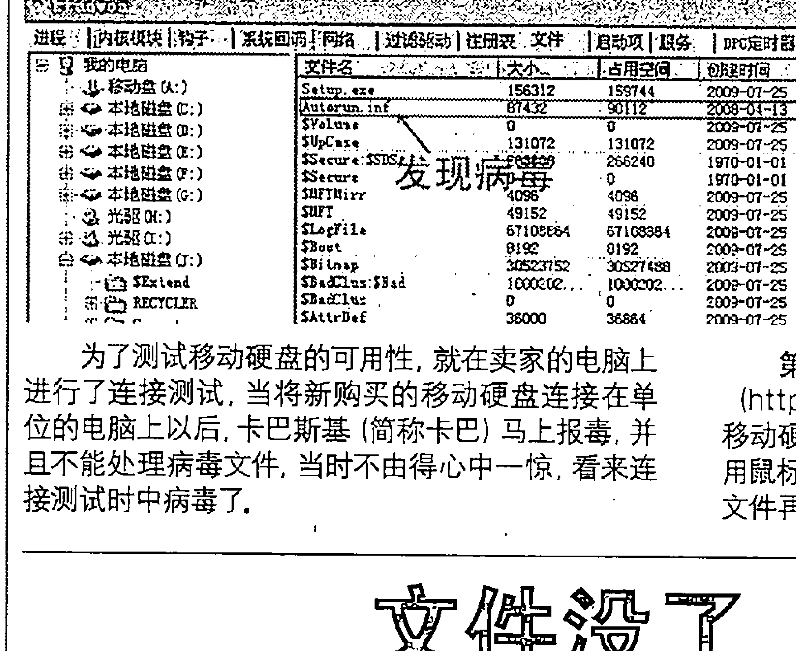

为了测试移动硬盘的可用性，就在卖家的电脑上进行了连接测试，当将新购买的移动硬盘连接在单位的电脑上以后，卡巴斯基（简称卡巴）马上报毒，并且不能处理病毒文件，当时不由心中一惊，看来连结测试时中病毒了。

第一步：调出电脑安全辅助工具xuetr0.30（http://www.xuetr.com），选择“文件”选项，查看移动硬盘的文件，发现病毒文件autorun.inf（见图），用鼠标选中autorun.inf，点击右键，选择“删除后阻止文件再生”选项，然后再用右键选择“强制删除”，然后重启电脑，用卡巴对移动硬盘进行扫描，结果发现了病毒文件jwgkvsq.vmx，而且卡巴仍然报毒。

第二步：看来，这个病毒躲在回收站里使卡巴无法将其删除，现在只好用xuetr来对付他了，重新启动xuetr，选择“文件”选项，查看移动硬盘的回收站，用鼠标选中jwgkvsq.vmx，点击右键，选择“删除后阻止文件再生”选项，然后再用右键选择“强制删除”，然后重启电脑，卡巴不再报毒了，用xuetr查看移动硬盘，病毒文件已经被彻底删除了（佩服xuetr的强悍），这个世界终于清净了。

**小提示**：这是个现时比较流行闪盘病毒，该病毒是利用微软“MS08-067”漏洞，可以通过下载安装KB958644补丁，将该漏洞堵住。 (文/泡泡龙)

## 文件没了 全是快捷方式咋办？

丽丽早上打开电脑，满心欢喜地正想把昨天的计划书发给领导，可突然脸色大变，表情木然，怎么了？同事小张赶紧过来询问，丽丽哭道：电脑里的文件都没了，全都是快捷方式……小张怎么忍心，按照昨天看到的清理病毒的帖子分析起来。

### 症状分析 莫着急

丽丽的电脑，系统分区根目录下的文件夹被病毒隐藏，各分区根目录下出现隐藏的病毒文件VBS和Autorun.inf，再看文件选项，丽丽没有设置“显示隐藏文件（夹）”，小张见到的却是伪装成原有正常文件夹名字相同的病毒链接文件（扩展名为LNK）。

**小提示**：病毒文件、病毒链接文件大小均为1KB，点击这些假冒文件夹后即激活病毒。病毒的名字是worm.script.vbs.autorun.bc。此毒为脚本+数据流双料病毒。中此毒后，系统程序explorer.exe和smss.exe会被此毒附加上病毒数据流.vbs。

### 手动杀毒 一切如初

这个病毒并不可怕，只需对症下药，下载并解压修复工具（下载地址：http://work.newhua.com/cfan/200924/kf.rar），如果自己电脑的系统盘是NTFS格式的，那么需要三个步骤。

第一步：先运行“清理工具”，单击“开始处理”，然后按系统提示重启电脑，然后运行“数据流清除工具”，依次单击“同意协议→打开杂项工具→打开ADSSpy”，然后取消“快速扫描”的勾选，单击“扫描”，扫描完成后勾选扫描出的结果，单击“移除选择”。

第二步：运行“wscript文件权限恢复”，单击“开始处理”恢复被系统禁用的文件权限。

第三步：运行“恢复文件夹属性工具”，单击“恢复文件夹属性”，勾选所有盘符后单击“改写”，马上就可以恢复被隐藏的所有文件夹了。

**小提示**：如果系统所在的分区系统格式是FAT32的，那么步骤上就可以简化些，运行附件里的“清理工具”，然后用“恢复文件夹属性工具”恢复被隐藏的文件夹即可。

## 小白手册：判断数据流

只有NTFS格式的数据分区才支持数据流。附加了数据流的文件由NTFS分区移到FAT32或FAT分区时，附加在文件上的数据流会丢失。此时，系统会警告用户，因此，我们可以不用特殊工具，仅将NTFS分区的可疑文件移动到U盘或FAT32（FAT）硬盘分区，即可判断文件是否被附加了数据流。 (北京/林保和)

## 不留污点到明年 瑞星问题各个突破

#### 实例1 发现病毒却“不处理”

瑞星发脾气最让人担心的就是，明明告诉你发现了病毒，但却不处理，急死人！仔细一看，原来是病毒隔离区空间不够了，随手解决。依次点击“开始→程序→瑞星杀毒软件→病毒隔离区→设置空间”，查看隔离区剩余空间大小，如为0MB，那就需要删除一些文件，释放磁盘空间。如果仍有问题，请将该病毒文件上报给瑞星：打开瑞星杀毒软件，点击“上报可疑文件”，将病毒文件上传即可。

#### 实例2 安装后程序无法联网

忽然发现一些软件不能上网，这可是怪问题，可能是由于防火墙升级过程中出现异常导致的。首先将防火墙停止保护，查看是否和防火墙有关。如果和防火墙有关，查看所使用的模式是不是常规模式，如果不是，就切换到常规模式下。如果还不能解决问题，在程序菜单里启动“瑞星个人防火墙”，依次单击“添加删除组件→修复”，修复的过程中不要勾选“保留用户配置文件”，一直“下一步”，重启计算机后查看是否正常。

#### 实例3 局域网里瑞星不让打印

一些局域网用户，安装瑞星后，发现不能使用共享文件夹或打印机等服务。解决这个问题就要用到“可信区”了。打开瑞星全功能安全软件2010，依次单击“设置→网络监控→IP包过滤→可信区设置”，在界面中单击“增加”，将可信区名称填写为自己的局域网IP地址，“本地地址”选择为“指定地址”，输入地址范围，例如本机IP地址段即可。而“对方地址”选择成“地址范围”，将“起始地址”和“结束地址”填写成该局域网的IP地址段即可。

## 一二一 杂乱文件按类别站队

平时从网上下载的文件一股脑儿放在同一文件夹中，这些文件有DOC、MP3、RAR、FLV等多种类型，突然想把不同类型的文件放到不同的文件夹当中，用搜索、剪切的方法总觉得不爽，能不能让这些文件自动站队到不同的文件夹当中呢？你别说，软件DropIt（下载地址：http://work.newhua.com/cfan/200923/wjfl.zip）还真有这样的魔力。

第一步：首先建立多个文件夹，可根据自己的需要建立诸如D:\DOC、D:\MP3等文件夹。运行DropIt软件，软件以悬浮窗口形式浮于桌面，右击该悬浮窗口，从右键菜单中选择Manage（管理），单击弹出窗口中的Folder（文件）按钮，指定文件夹为D:\DOC。

第二步：在Search File（搜索文件）右侧的文本框中输入DOC，这里可以指定多种文件类型，比如PDF、TXT等，中间用逗号相隔，然后单击Apply（应用），此过程表示D:\doc文件夹将吸纳DOC、TXT、PDF等指定类型的文件加入；同样的方法，可添加其他文件夹，并为它们做上吸纳文件类型的标签，完成后单击Close关闭。

第三步：右击悬浮窗口，选择右键菜单中的Settings（设置），在Positioning mode（粘贴模式）中选择是Move files（移动）还是Copy files（复制）文件，然后单击OK，把存放在多种类型的文件夹拖放到悬浮窗口后松开，不同的文件就会按指定要求站（移动或复制）到不同的文件夹当中。

（江苏/曹春华）

## 武汉软件大户 两天开发一个软件

第一次打开http://www.pt42.cn/，我只注意到了第一个软件——“淘宝一箩筐”，再往下看，一个接一个的工具软件让我应接不暇，个个功能都很吸引人，令人兴奋，这里简直是“软件一箩筐”哦！我正在琢磨这是谁开了一个软件资讯网站，却猛然发现这些软件均来自一个人，这个人曾创下2天开发一个软件的记录，此人正是来自武汉的pt42（网名）。

+   pt42
-   专业：机械工程
-   毕业时间：2006年
-   工作：软件开发
-   软件作品：博客备份工具、网页净化器、窗口净化器、淘宝一箩筐等

软件小档案：博客备份工具
-   软件性质：免费软件 开发语言：python、c
-   支持平台：Windows 2000/XP/2003/Vista/7
-   下载地址：http://www.pt42.cn/

## 仅用三年 软件已过百

联系到pt42后，我的第一问题就是，他究竟开发了多少个工具软件，他竟然还没数过，只要觉得有用，自己能写的，他就写出来。截止到2009年12月25日，他一共公开发布了25个软件，再加上自己个人用的、定制的，已经超过了100个，绝对是开发软件的大户。更令人吃惊的是，他曾两天就开发了一个软件。而说到最上心的，花费心血最多还要数他开发的第一个软件——博客备份工具，那是他在2007年为解决同学的博客保存需求而编写的。近期，他正在参加淘宝的TOP大赛，等取得TOP合作伙伴资格，他就可以做个买家工具了。

小提示
他是一个很低调的人，一直坚持用自己的网名。pt42中，pt指的是名字的缩写。而42呢就有一层意思了。它源于电影《银河系漫游指南》中虚构的一个生命、宇宙以及一切的答案——42。

小提示
如果博客服务器选错了，右下端会有提示的。如果不对，选择博客，单击“编辑用户”修改即可。

## 只要饿不死 我就写下去

对于软件开发者来说，最耗费精力的不是开发，而是后期的维护。我们可以想象一下，pt42身后背着100个软件，担子会有多重啊！在与他聊天中，他对记者感慨道：“有一天，找家公司把软件转让出去，我就解脱了。”话虽这么说，他还是日复一日地为软件做着更新，而且有一新想法，他还会编写新软件。这些软件，就好比他自己的孩子，哪个发现Bug了，哪个需要更新功能了，他都个个照顾到。

在软件光环的背后，困难只有他自己知道。他很讨厌软件里加广告的方式，为了让电脑清爽一些，他开发了网页净化器和窗口净化器。而这也让软件开发者的利润之源——广告与他成了陌路。在国内，大家都没有花钱买软件的习惯，肯捐助他开发软件的人寥寥无几，而完全在工作之余义务写软件的他也和我们一样背负着家庭、个人理想的重担，他就靠工资加写定制软件的收入来继续自己的理想。谈到将来，他毫不退缩，“以后，只要饿不死，我还是会利用业余时间写一些小软件”。

## 百里挑一，给博客上个意外保险

在pt42开发的软件中，博客备份工具是他最用心的，也是本次读者点将的软件。小白就从他的手里讨来了最好的用法。例如你有一个博客，担心丢失，想自己保存下来，那么使用Blog_Backup（下载地址：http://www.pt42.cn/）就可以了。

第一步：解压后直接运行，右击左侧的博客列表，选择“新建分类”命令，在弹出的对话框中输入“我的博客”新建一个分类。接着点击“新增用户”，在“服务器”下拉列表中选择自己博客的服务器类型，保证下面的URL的地址正确，设置分类和别名，别名即你博客后的个性名。例如小白的新浪博客是http://blog.sina.com.cn/zuixinstu，那么别名就是zuixinstu，最后点击“新增用户”按钮即可回到主界面了。

第二步：点击“备份博客”按钮，软件就开始了备份。如果想导出，点击“导出文件”按钮将博客保存为网页文件（HTML文件），还可以保存为RSS 1.0和RSS 2.0文件。“进入软件目录\export\MSN\cide63ad69074 251b（博客用户名）”就可以发现刚才的日志已经完整地保存下来了。

（本刊记者/白斌）

## 菜鸟老鸟都来看 超级兔子两大“问题” 提前

超级兔子已经成为很多读者使用电脑时的好伴侣，不过很多入门级用户在使用过程中还是会遇到各种各样的问题，今天我们请到了超级兔子的客服“小飞兔”，让他为我们预报下你可能会遇到的问题及解决方法。

### 更新缓慢 换个时间

运行超级兔子，软件检测到有新版本的更新，而点击“在线更新”后，出现更新进度很慢或者进度条停滞的问题，如何解决呢？这其实是大量用户在同一时间段都检测到了新版本的更新信息，都选择了“在线更新”，导致服务器繁忙，从而造成更新很慢或者进度条完全停滞。我们可以换一个时间段进行更新，或者避开下载的高峰时段，还可以去官方网站（http://www.pctutu.com）下载最新的安装包进行手动更新。

### 分区恢复 身在此山中

使用超级兔子的“文件安全助手”工具的“隐藏磁盘”功能时，不慎将超级兔子程序所在的硬盘分区给隐藏掉了，从而导致超级兔子无法使用，也无法将被隐藏的分区恢复回来，如何解决呢？首先，在桌面“我的电脑”上点击右键，再点击“管理→磁盘管理”，寻找被隐藏的磁盘分区（应该会显示空盘符）。

在此基础上，右键点击这个磁盘分区，选择“更改驱动器名和路径”，进入新窗口点击“添加→确定”，计算机会自动恢复这个磁盘分区的默认盘符，最后重启电脑，就可以将被隐藏的磁盘分区恢复。

## 人人都是“字符帝” 两步诞生Word字符画

最近，网上“字符帝”制作的Word动画非常火，之所以火是因为他能用Office甚至记事本来做字符画。看到广大网友纷纷“跪求”方法，下面为大家揭晓一下这些字符画背后的秘密。

第一步：字符画的基础就是先将图片转换成字符，而这个转换交由Image2Html（下载地址：http://www.htm2pic.com/image2html-v10-released/）来搞定，运行后选择需要转换的图片，可根据需要选择单张转换，还是一次性转换多张。

第二步：转换结束，将字符粘贴到Word中，格式调整结束后，按下Alt+F11键，在打开的窗口中执行“插入→模块”命令，然后在右侧的窗格中输入以下代码以实现页面自动翻动。

```
Declare Sub Sleep Lib "kernel32" (ByVal dwMilliseconds As Long)
Sub Play()
For n = 1 To ActiveDocument.BuiltInDocumentProperties(wdPropertyPages)
Application.Browser.Next
Sleep 1000
Next n
End Sub
```

所有页面排版完成后，将光标移动到第一页，在“视图”标签的“宏”功能区中选择“查看宏”，然后在“宏”对话框中选中“Play”，单击“执行”，这时就可以看到动画了。

小提示：
电脑配置不高者一开始处理的图片不要太多，可逐步增加，或分成多个文档进行处理，在Word中需要注意几点：①做动画的图片必须大小相同，实际处理时可以将多幅图片拼接在一起，一次完成转换。②Word版面以横排为好，页面显示比例调整为“整页”。③在实际测试时，上下页边距为2.5厘米，字符为Courier New、七号、行距为3磅，效果较佳。

（安徽/越野苍狼）

## 不坐冷板凳 Windows Media Player 也是Windows 7悍将

随着Windows 7的到来，Windows Media Player 12也成了播放器中的板凳队员，善良的你是否考虑过让这个家伙派上用场，回到视频播放的主赛场呢？

### 让它认识更多伙伴

为了让它支持更多的视频文件家族的兄弟们，我们安装一个Win7codecs（http://www.onlinedown.net/soft/82278.htm）解码包就可以让它支持几乎全部的音频和视频格式了，不过以后要注意的是，更新win7codecs前必须先卸载老版本，控制面板里无法卸载，我们可以用360安全卫士、超级兔子等工具卸载。

### 让它在哪都听指挥

Windows Media Player 12在最小化运行或在后台运行的时候，不能使用Windows Media Player 12的快捷键，不过我们可以安装WMP Keys插件（下载地址：http://work.newhua.com/cfan/201001/qjrj.rar）来让它支持全局热键，安装后，打开Windows Media Player 12，依次选择“更多选项→插件→背景”，勾选Wmpkeys Plugin后，点击“应用”按钮就启用了该插件。

（文/樊国强 小新）

## 老电脑装Windows 7驱动不再是问题

小赵是个网游迷，他最近遇到了难题，每次游戏玩一小会，画面就会出错，询问专家得知可能是显卡的驱动程序出错引起的，但对于自己那台有点年月的电脑，要找全各配件的驱动程序可不是件简单的事。不过要是有了“超级兔子驱动天使”，一切就都好办了。

+   第一步：打开“驱动天使”，依次点击“驱动程序信息→系统设备驱动信息→快速检测”，驱动天使能自动检测系统各个硬件的型号，并给出每个硬件推荐更新的驱动程序，点击“安装驱动”，软件会启动相对应的硬件驱动程序下载并自动安装。
第二步：如果你的电脑上了年纪，你希望把所有硬件的驱动程序都更新一遍，那么在一开始的“驱动程序信息”页面点击“一键安装系统驱动”，驱动天使就会下载所有推荐更新的硬件驱动并安装。
第三步：点击“下载管理”，可以查看各个驱动程序的当前状态，例如“正在下载”、“下载完成”、“正在安装”、“安装成功”等，有些年代久远的硬件，安装最新的驱动程序往往会有BUG出现，这时勾选“强制更新驱动”，即使“驱动天使”推荐的驱动程序没有系统当前的驱动程序新，也能安装成功。最后，勾选“安装驱动前自动备份驱动”，这样即使安装驱动出错，也能恢复到之前的状态。

## 哑巴英语新主张聊天不怕外语难

聊天时，遇到老外怎么办呢？外语不过关，可以去找谷歌的“翻译”，实时翻译能帮你应付中文到多种语言的翻译，不过网页翻译太麻烦了，今天要教你的是聊天时的随手翻译，不太懂英文也能与老美聊天。

这里要用到一个聊天助手，安装免费的金山快译（http://ky.iciba.com/）后，打开QQ聊天窗口，对方发来一句英文，直接选中它，聊天翻译助手就出现了，单击“译”，上方就出现了翻译后的中文。那我们怎么回复呢？回到消息发送窗口，输入要说的话，例如“没事，测试翻译的准确度”，然后选中文字，聊天翻译助手又出现了吧，单击箭头，在下面选择“中→英”后单击“译”，上面就出现了英文，单击这个英文框，你说的文字就替换成了英文：Be free, test translation of accurate degree.

QQ2009 SP5本身有个翻译功能，不过只限于英文单词翻译成中文。要满足多方面应用，就要用金山快译了，为了提高整句翻译水平，要注意加标点符号哦！此外，聊天翻译助手也支持MSN以及Office、IE插件的注入，还能批量翻译文件。

（上海/吴军）

### 听歌、看电影一个就行！

虽然大多数视频播放软件都具有音频播放功能，但它们在功能和音质上大都有缺陷，所以我们是左手一个视频播放器，右手一个音频播放器，不觉得累吗？如果你够聪明，也够懒，那么你会想用一个来搞定两件事，下面的几招就是为你准备的！

### 自动匹配歌词 听歌还缺啥？

用普通的视频播放软件播放音乐时，最大的问题就是没有歌词桌面显示功能，我们可以通过安装辅助插件的方法来解决问题。安装“迷你歌词”（下载地址：http://www.skycn.com/soft/9402.html），安装过程中勾选“支持KMPlayer”，并单击其右侧的“浏览”按钮，定位到KMPlayer文件夹，单击“下一步”安装完成，运行KMPlayer并播放音乐，即可自动搜索歌词并同步显示，右击歌词界面，选择“浮动歌词”模式，桌面歌词就有了。要想实现卡拉OK模式，右键单击歌词界面，选择“显示选项”然后勾选“卡拉OK”、“水平滚动显示风格”，桌面歌词就出来了，其他设置在“参数设置”修改。

QQ影音比较前卫，已经开始自己支持自动匹配歌词，但其歌词搜索能力相对较弱，当弹出“当前歌曲暂无歌词”提示时，可单击“手动搜索”，修改歌手和歌名后就可以提高搜索成功率了。

### 狂人闭嘴 音质咱也不赖！

对于音乐发烧友来说，普通的视频播放器是看不上眼的，音质才是重中之重，满足此类要求，KMPlayer依然可以。下载dfx forkmp（http://work.newhua.com/cfan/200924/dfx.rar）解压到KMPlayer目录下，运行，单击“绿化”，然后运行KMplayer，按F2键打开“参数设置”窗口，依次单击“插件→音频DSP”，在“插件文件/设置”中勾选“DFX”，即可打开DFX面板，在这里可以调节高保真度、3D环绕等项目，从而获取更高的音质。

一些网友对Kmplayer进行了修改，专门制作了音质高保真的版本，有音响版和耳机版两个版本（下载地址：http://work.newhua.com/cfan/200924/kmgbz.rar）

（江苏/曹春华）

### 暴风小广告你一边去！

暴风影音2009很好用，唯独不爽的就是其边角广告（见图），虽然基本没有人会去点开那些链接，但它总是出现，如果不小心点开了就更加烦人，笔者在此献出解决方案。

先找到暴风影音的安装目录，接着打开media文件夹（如笔者的是D:\Program Files\Storm\media），找到stcon.ini这个文件，打开后会看到里边的中文就是广告内容，比如“<MESSAGE>美女都去的另个世界（图）</MESSAGE>”，这个文件直接删除掉就可以了。同理，不喜欢暴风盒子的也可以将它们删除掉（在X:\Program Files\Storm\box里）。

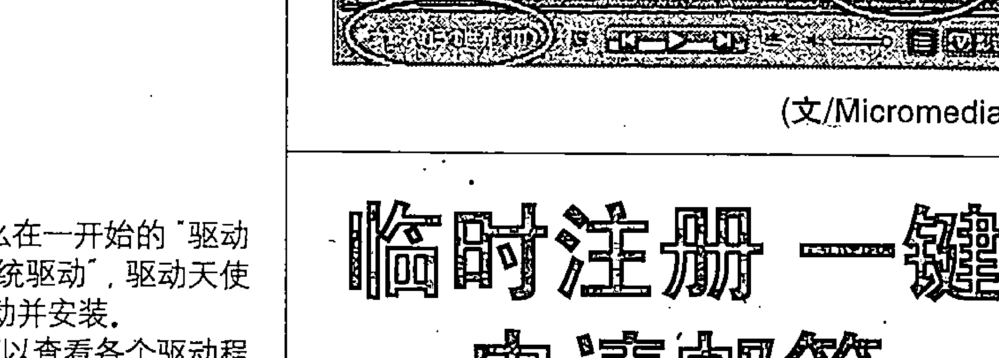

（文/Micromediar）

## 临时注册一键申请邮箱

为下载个文件，注册个账号，你会出卖自己的邮箱吗？回答“是”那就可以看下一篇文章了。如果你正在为此事发愁，希望这是有一个临时的邮箱让你用，而且真实有效的，你会感激我吗？这样的东西随手即来。

这么神奇的事情，先要下载“一键邮箱申请器”（下载地址：http://work.newhua.com/cfan/201001/yjyx.zip），点击“开始”按钮，软件开始帮你申请，出现验证码时需要自己填写，单击“提交”按钮。

当软件下方的状态栏出现“申请成功”的提示，一个邮箱就到手了，右侧是用户名及密码，单击“导出”就可以看到刚申请的邮箱，在这里可以导出、丢弃或直接登录。如果你追求一键申请，单击“高级”，可以在163.com、126.com、yeah.net三个邮箱类型中选择，单击“高级”可以进行选择，单击“导出”，可以看到刚申请成功的邮箱，点击“导出所有”即可将申请成功的邮箱资料（用户名及密码）输出成TXT文本备份。

如果你有固定的邮箱，可以自己制作一个一键登录器（http://tinyurl.com/ykbobxf）

（重庆/陈佳）

## 重启不慌乱工作照旧

不知你是否有过这样的经历，一边在编辑文档，一边在欣赏音乐……一边还在安装软件，当软件安装完成后，却弹出要求重新启动电脑的提示，你是不是要手忙脚乱地保存文档、关闭许多正在运行的程序？现在不用这么麻烦了！

安装“CacheMyWork”（下载地址：http://work.newhua.com/cfan/201001/hcgz.zip）后，在关机或重启前运行软件，它会自动检测正在运行的程序，并打开窗口显示程序列表，勾选需要保存的程序，然后单击Save（保存），这样，电脑重启后，被保存的程序将自动重新启动出来，继续你的工作吧。如果想让电脑在下次登录时恢复以前的资源管理器窗口，可依次单击Tools→Options（工具→设置），勾选restore previousexplorer windows at nextlogon（下次登录时恢复资源管理器窗口），再单击“OK”即可。

（江苏/曹春华）

## 年终让兔子帮你清理电脑垃圾

很快一年又要过去，每天陪伴着大家工作、生活的电脑可谓是这一年中最勤奋的“助手”。最近白领小张感觉自己的“爱机”运行速度越来越慢，如何给辛勤工作了一整年的“它”减减负呢？用“超级兔子清理天使”来让“它”重新焕发活力吧！

### 使用痕迹清理

系统使用一段时间后，会产生一些暂存在硬盘内的文件，例如IE历史记录、IE临时文件等，时间久了也占用不少系统空间。依次打开“超级兔子→工具→清理天使”，在“使用痕迹清理”选项中可以选择需要清除的项目，再点击右下角的“一键清理”，再看看你的硬盘，是不是多了很多空间？

### 系统垃圾清理、自定义清理

要想系统跑得快，定期清理垃圾文件是应该养成的习惯。依次打开“超级兔子→工具→清理天使→系统垃圾清理”，在软件界面的左侧选择需要清理的目录，在“设置中心”的“通用清理规则设置”中设置文件类型（一般选择软件默认设置即可），回到“系统垃圾清理”界面点击“扫描”，完成后再点击“清理”就可以完成系统垃圾的清理工作了。

有的文件并不是垃圾文件，但我们希望快速找出它们并清除，怎么办？“自定义清理”就为用户提供了这样的功能。依次打开“超级兔子→工具→清理天使→自定义清理”，在软件界面左侧空白区域点击鼠标右键，共有“添加自定义目录”、“删除自定义目录”以及“设置自定义规则”三个选项。其中“添加自定义目录”可以指定扫描某个系统盘或者某个文件夹，分别在不同的目录上点击“设置自定义规则”，则可以对不同的目录设置不同的清理规则。

例如在C盘上点击“设置自定义规则”，在“自定义清理规则设置”中，可以添加你认为无用的文件类型，例如想清除目录下的JPG图片文件，就在“使用以下类型作为清理无用文件的目标”框内输入“JPG”，然后点击“添加”；“清理方式设置”则提供了“将文件移动到回收站”或者“直接删除，不经过回收站”的选择。设置完成后，记得点击右下角的“保存”按钮，然后回到“自定义清理”界面，点击“扫描”，完成后再点击“清理”就可以完成指定类型文件的清理工作了。

### 小提示

一般我们推荐在清理完使用痕迹、垃圾文件，卸载完无用IE插件、软件后，最后再来清理注册表，以这样的顺序执行，注册表的瘦身无疑将会更彻底。

## 病毒茶几

今天，“稀饭软组织”有了一个新的“家具”——病毒茶几。数年来，病毒一直在危害大家的利益，这个茶几将成为病毒的噩梦，病毒来到这，那就是“杯具”、“餐具”，我们将教给大家很多安全知识，经过在“茶几”旁的学习，你就会远离病毒，让病毒的存在成为“杯具”。

### 杀毒软件怎么分类？

作为第一讲，我们来瞅瞅病毒的敌人——杀毒软件，和杀毒软件交了朋友，病毒也就先怕你三分。而杀毒软件家族也有不少弟兄。一般每个品牌下都有两类软件，一类称为：XX反（防）病毒软件或XX杀毒软件，这就是普通的杀毒软件。另一类会称为：XX全功能安全软件，当然也有称为XX（安全）套装或XX网络安全特警的，这一类听名字就有点综合的意思，区别会有不少，但简单来说就是后者加入了防火墙功能，可以对你的邮件、局域网传输等进行专门防护。两类软件可以自由选择，后者要贵一些，两者的激活码也不能混用。

### 不能装在C盘吗？

杀毒软件拿到手里，自然是安装了，在安装中就有一些小的步骤。为了方便用户使用，卡巴斯基、诺顿的默认安装都几乎没有什么设置，安装路径也是默认安装在系统分区了。而当瑞星、诺顿等软件使用自定义模式安装时，安装路径就可以选择了。有人说杀毒软件安装在C盘不好，担心隔离的病毒文件和系统文件挨得近，容易被感染，或者担心病毒首先会找系统盘感染，这样杀毒软件崩溃得就会早。其实这些担心都是多余的，我们所说的电脑病毒和普通生活中的病毒不一样，不会说靠近就会感染，电脑病毒也是一种程序，只不过运行后实现的功能损害电脑安全。而一旦被杀毒软件放入隔离区，也就不会再让病毒运行了，不运行就没有任何威胁。对于第二个问题，即使杀毒软件安装在别的分区，系统一旦崩溃，杀毒软件也必然无法运行。而对于专门关闭杀毒软件的病毒，他们采用的是查看电脑现在运行的程序里是否有杀毒软件，以及通过系统的注册表来找到杀毒软件的安装位置，也就不在乎安装在哪个分区了。总之，我们根据分区剩余容量来指定杀毒软件的安装路径就好了。

### 轻松设置 让瑞星如虎添翼

“大师，再帮我修一下电脑吧，又中病毒了……”。嘻嘻，隔壁MM一直对杀毒软件提不起精神来，电脑中病毒竟成了常事，好吧，为了减少以后的麻烦，看来我要忍痛共享出我的正版瑞星杀毒软件了。很快为她的电脑安装好了瑞星杀毒软件，不过，这还并不是大功告成的时刻，为了更大程度地保护电脑，还需要对瑞星进行一番加工。

### 快捷杀毒，定位保护

全盘杀毒不会常做，经常是选一些关键目录重点查杀，可菜鸟MM不懂哦！换个思路，再给瑞星加个功能，双击快捷方式就能对特定目录杀毒。

依次打开“瑞星全功能安全软件→杀毒→快捷方式”，在这里看到瑞星已经预设了几个常用的快速查杀快捷方式，单击“添加”按钮，在“瑞星快捷方式管理器”选中要进行杀毒的文件目录，单击“下一步”，输入该快捷方式名称并选择一种个性图标，也不要忘了把“生成桌面快捷方式”前面的复选框选中哟，这样就可以在桌面上生成相应的快捷方式图标。单击“完成”按钮，完成瑞星查杀快捷方式的建立。以后只要双击桌面上这个图标，杀毒就可以随时开始了。

### 瑞星也会打补丁

很多安全问题都是因为系统没有打上补丁，装了瑞星，这个还用担忧吗？让它帮你搞定补丁问题。

运行瑞星，切换到“安检”标签，你会发现右下角显示了系统漏洞扫描，如果没有安装瑞星卡卡还暂时无法使用，单击“立刻下载”，下载并安装瑞星卡卡，再打开“安检”标签，我们会看到系统漏洞的扫描结果。单击“详细报告”按钮，打开“瑞星卡卡上网安全助手”主窗口，选中系统漏洞前的复选框，然后单击“更新所选项”，瑞星卡卡就开始自动下载并修复系统漏洞了。

### 一条快捷方式 熟悉黑白两道

像往常一样打开千千静听，咦？怎么不放歌了？定睛一看，播放列表什么都没有，只有一个网址，这是怎么回事啊？

### 阴谋败露

打开千千静听播放列表变成了某个网址，是某些流氓软件做的修改，我们只需在右键单击千千静听的快捷方式，选择属性，会发现“目标”中程序路径后多了一个网址，问题就在这了，把网址删除即可。

### 改恶从善

改变下想法，如果我们将网址变成歌曲路径，这样无论怎么播放，下次启动千千静听，打开的就是最喜欢的歌曲了。例如，按照上面的方法，在“目标”路径里添加歌曲路径：“G:\歌曲\6.MP3”即可。

（广州/雷霆）

## 子目录再多也不怕 XnView图片转换一锅端

因为业务需要，要把一大批的BMP图片进行格式转换，如果只在一个目录中，也许有很多工具可以完成，但是在一个有子目录的多层目录环境下，估计有很多工具就让人很郁闷了。现在我们就让XnView来给我们表演一番吧。

第一步，在“查看”菜单中依次点“查看方式→详细信息”，找到自己需要批量转换图片的主目录，用鼠标右键点目录，然后选择右键菜单中的“显示所有文件（包括子目录）”，即可显示出此目录下所有文件信息。

第二步，我们按“类型”进行排序，选中所有的BMP类型的文件，单击右键，选右键菜单中的“批量转换”，在“批量文件处理”对话框中只要点“开始”即可。

如果需要把原来的BMP文件删除，只要利用搜索功能或者是直接在XnView中选中进行删除即可。简单两步，就完成了我们对复杂目录中所有BMP图片的转换任务。当然如果想完成其他格式的转换，也是易如反掌了。

（杭州/徐怀平）

## 闪图表情 谁用谁闪亮

小K正在“追”漂亮的小姚同学，当然QQ聊天是必不可少的了。在聊天时，小K不断地把含有小姚照片的QQ表情发过来，让小姚“惊喜”不断。不过小姚也想知小K一样制作好玩好看的表情，这下小K不得不从“实”招来，公布快速制闪图秘技。

首先打开闪图制作工具（下载地址：http://work.newhua.com/cfan/201005/shantu.rar），点击“添加素材”添加相应的图片（需为JPG、BMP、PNG等几种格式之一），如果有多幅，可以连续添加，添加完拖动就可以调整顺序。然后点击“添加用户图片”添加一张图片（一般为主图，不添加这个不能制作哦），点击“预览效果图”，就可以看到生成的图片效果，单击“保存预览图”将图片保存为GIF格式。

### 小提示

以前GIF图片追求过渡自然，现在流行两张图片反差大，变换突然，成了“闪图”的概念。如果单击主界面的“保存”，可以将制作好的闪图保存为MTST格式的标准闪图文件，和之前的GIF图片一起复制到美图秀秀的meitu\sucai\shantu\feizhuliu\qita目录下，就可以作为美图秀秀的闪图模板使用了。

（文/侯忠）

## 《蜗居》新编小贝 宋婷婷与小三的电脑之战

从扭捏到从容，海藻逐渐接受了小三的生活，倒也觉得得到两个男人的爱也是一桩美事。宋思明对海藻也是愈加离不开，两人虽然每次见面都只隔一两天，但他却无法克制自己的思念。感谢电脑的存在，QQ、MSN成为他们谈情说爱的第二个世界。正所谓，纸是永远包不住火的。虽然宋思明和海藻的交往很隐蔽，但他们身边最亲的人最会发觉事情的异常。宋思明的老婆，海藻的名誉男朋友都开始发现身边的这个人有诡异，相同却又不同的私欲让他俩决定揭开这片阴霾。

### 剧情一：宋婷婷拯救老爸，小鬼难敌老鬼，无功而返

宋思明的老婆与他生活了多年，每个细小变化都会看在眼里，不过也只急在心里，对老公有没有情人，也只能是在睡不着的时候喋喋不休。而这让女儿宋婷婷觉察到了，她不管这么多，决定帮助老妈搜集证据。借电脑技术课备考为名，提出要借老爸的电脑。宋思明脑子转了几个圈，嘴上还是暖暖的微笑，说：“晚上我给你送来”。宋思明也不是傻子，研究起隐私保护来。

#### 1.让QQ不说话

排在第一位的自然是QQ，说不准哪个查看器就可以给你全盘托出。不过，秘书发现，QQ提供了聊天记录保护功能，只需开启即可。以QQ2009为例：登录QQ后，在其控制面板中单击“主菜单→系统设置→基本设置”打开设置窗口。点击左侧导航栏中的“文件记录”，勾选“启用消息记录加密”项，然后为其设置密码，输入完成后单击“确定”关闭设置窗口。这样每次以该账户登录QQ时会弹出对话框，要求用户输入密码，只有输入正确的密码，才能成功登录并查看聊天记录。

> 小提示
勾选了QQ登录“记住密码”的人记得要设置消息验证密码，这是防本地偷窥的有效措施。而且，这样即使QQ密码真的被盗用，没有聊天记录，也是没有危险的。

#### 2.让MSN也闭嘴

除了QQ，宋思明最担心的就是MSN，平时虽然和海藻用MSN聊得不多，但其聊天记录谁都可以看的模式实在让人心寒。这个怎么加密呢？安装“Messenger Plus!插件”。
访问http://www.onlinedown.net/soft/36102.htm下载并安装Messenger Plus!。在MSN面板中展开最右侧的“显示菜单”，依次点击“Plus→偏好设定以及选项→会话”标签页下，点击左侧的“记录加密”，勾选“用密码保护我的聊天记录”项，最后输入密码，单击“确定”。这样当有人找到MSN的聊天记录文件，然后企图双击打开时，会弹出一个对话框，只有输入正确的密码才可以查看。

> 小提示
上面的操作只是加密新创建的聊天记录，如果要加密现有的记录，首先点击“重新加密文件”，在弹出的对话框中输入刚才设置的密码，然后定位到此前的聊天记录文件选中即可。

#### 3.私密文件密不透风

关于海藻的东西隐藏好了，不过花心的宋思明也在电脑存了不少色色的东西，肯定不能让女儿看到，这个是否也能加密呢？秘书推荐了“文件密码箱”（下载地址：http://www.newhua.com/soft/16331.htm）。
第一步：运行后依次单击“密码箱→新建密码箱”，选择保存目录，输入“新建密码箱”的名字，如：“工作机密”，单击“确定”然后设定密码和提示问题，单击“确定”。
第二步：在软件左侧展开“工作机密”，出现一个“新建文件夹”，双击它，右侧变为空白后，右键单击选择“添加并加密”，选择要保护的文件，单击“确定”就完成了添加。现在文件就保护好了，删除、移动、复制都不能行了，要打开，必须知道密码。

这些都搞定后，老宋为了掩饰一下，将无关紧要的东西留在了电脑上，什么IE浏览记录、播放记录、Word文件访问列表等就留给侦探挖掘。果不其然，女儿宋婷婷第二天就找来班里的电脑高手来共同查找电脑里的线索，看到最近使用记录都在，两人一阵高兴，不过在费了九牛二虎之力才将老爸QQ密码破解到手后，却发现提示，最公开的MSN也无功而返，所谓的电脑高手被宋婷婷一顿暴打！

### 剧情二：小贝隐秘设计，小三恋情终暴露，哭笑不得

虽然，海藻回家还会和小贝亲热，依然常在一起吃、一起住，但已经是最真诚的表演了。小贝也已觉出其中的无味，正苦恼中，上天给了小贝一个机会。一天，海藻正要关上笔记本睡觉，却发现电脑蓝屏了，无法进入系统，只能喊起小贝，让他帮自己看看。小贝应声起来，感觉到这是一次机会，连忙安抚海藻睡下，自己修电脑，同时一个阴谋也在开始执行。

#### 1.给电脑装监控

小贝修好电脑，决定要验证下自己的猜疑，看看海藻有没有另外的男人。但一时也找不着更好的方案，下载了各种QQ聊天记录查看器，却发现这些工具根本赶不上QQ的更新步调，根本不管用。灵机一动，想到曾经用过的一款秘密屏幕监控，计上心头。
第一步：下载并运行“商鞅截屏工具”（下载地址：http://work.newhua.com/cfan/201002/dsjp.zip），在弹出窗口中，设置“间隔时间”和“最多截取”分别为10和10000，表示30秒钟截取一次屏幕，图片截取到10000张后就停止工作，并勾选“截屏时隐藏窗口”，单击“打开文件夹”指定截图保存路径后，单击“开始截屏”，软件就开始工作了。
第二步：对于这款软件，小贝也有更完善的考虑，最怕杀毒软件把它当病毒给删了。再看海藻的电脑，装的还是买电脑时自带的小红伞，这倒也不难倒小贝，打开小红伞的配置，单击Exception（例外），在File objects to be omitted for the Guard（排除在监控范围外）中将“商鞅截屏工具”加入例外，防止杀毒软件查杀而引起海藻的警觉。这样，下次小贝就直接进入目录查看，就可以知道海藻都做了什么了。

#### 2.获取密码不是罪

第二天，小贝借口帮海藻再整理下电脑，在海藻睡觉后怀着窃喜打开了海藻的电脑，飞快地进入截图保存目录，满眼的屏幕截图让小贝既激动又矛盾，他忽然合上笔记本，有时候还真是害怕得知真相。慢慢地回到床上躺下，刚闭上眼小贝又猛地起来，差点惊醒海藻，打开笔记本挨个看保存的屏幕截图，结果可想而知。不过小贝还是不敢相信自己的眼睛，决定既然已经不是君子，又何必虚伪，干脆找到密码看。

QQ密码是无法获取的，现在给小贝剩下的路就只有MSN密码的提取了，小贝首先进入MSN默认的聊天记录保存路径：C:\Documents and Settings\用户名\My Documents\我接收到的文件，却发现里面没有文件。难道海藻保存到其他位置了，干脆直接找密码吧！他找到了MessenPass（下载地址：http://jy.newhua.com/soft/27729.htm）。一步步安装后运行，窗口一打开，一份惊喜就出现了，海藻MSN账号haizao****@hotmail.com的密码iloveyou2005立马显现。

## 金山新年改脾气 病毒库更新速度向“钱”看

金山安全中心2010 beta版终于在官方论坛露出了庐山真面目，从界面和模式上，软件都进行了全新设计。更为醒目的，软件用大红色标出了新品的重大更新——会员制，提出成为会员才能享受实时的病毒库更新特权，难道这电脑安全也要分穷富，向钱看了？

打开软件，金山安全中心2010beta已经换用了中国风的皮肤，将金山旗下四大安全产品：金山毒霸、金山网镖、金山网盾、金山清理专家进行统一组合，成为“金山安全中心”，并且具有了“统一升级”功能。再打开其主力产品——金山毒霸，界面上简洁了不少，但从功能上还是常规的扫毒、杀毒，倒是在安全百宝箱中看到了一些实用的小工具：文件粉碎、进程管理等工具。综合来看，新版产品功能并没有明显的改进。只有当我们打开“会员特权中心”的时候，亮点才显露出来。
会员功能可以说是金山安全中心2010beta版最大的变化，打开官方网站，我们也看到了会员特权的

第一项：病毒库更新特权——病毒库抢先实时升级。从名字上就产生了不少疑惑，再详细看说明：“为您实时升级最新病毒库，使用会员专用升级通道无需排队等待，全自动安静升级，保护您的电脑处在最佳安全状态！”

如果我们要傻傻地去看，原来是一个挺好的会员特权啊，我付费就可以比一般用户有更多的特权，这和QQ、迅雷的会员差不多嘛，在杀毒软件里就是我的病毒库比别人更新地更快，或许同事小张也在用，如果遇上了同一个新病毒，我是会员的话，病毒库更新了，我不中毒，小张却中毒了，我就高人一等，值！等等，想到这，你是否会像我有着一样的怪异。那么小张呢？是不是有点不公平？

我们来看一幅漫画，同一栋楼里，两家都着火了，“消防队员匆匆赶到，对着楼下一家开始大力喷水，灭火，楼上的则在痛苦挣扎，大呼“救救我们啊”，消防队员打一个敬礼，说道：“我们是会员消防车，普通用户要等普通消防车，他们就在后面！”相信，谁看到这

一幕都会对漫画中的消防队员恨之入骨，救死扶伤也要分等级？

平时，我们也常会见到各种VIP通道，银行里有VIP服务台，机场也有VIP专用通道，但在这幅漫画里，我们却看着很别扭，因为消防队员救火不是其他服务啊，救火救急，咱这也分三六九等吗？或许消防队员正在开着普通车过来，按法律来说无可厚非，但道德呢？能提供更快的救援，却因为交服务费的多少，见死不救，这话绝对说不过去！杀毒软件在软件领域同样有着自己的特殊角色，承担的责任也比较特殊。杀毒软件几经更新，都是为了能为用户提供最及时的病毒防护，因为清除病毒无疑于消防员救火。如果技术做不好，病毒库未能及时更新我们还可以谅解，但如果明明已经有了新的病毒库，还要因为付费太少，不给你更新，那本身产品就不合格，这“见火不救”的会员招牌，金山能在“中国风”的皮肤下扛下去吗？

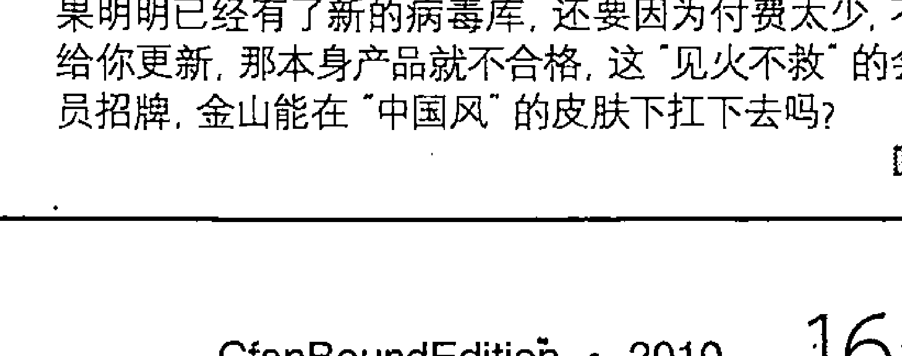

主演：老五、小兵
导演：小白

## 帮你拔掉钉子 清除杀毒软件有“专杀”

杀毒软件作为系统保护神，有时也会成为“钉子户”！无法卸载，文件丢失或破坏等状况是屡见不鲜。怎么办？得用非常规手段，你要知道，既然有专门清除某种病毒的专杀工具，那么有专门卸载杀毒软件的“专杀”工具哦！

### 难卸软轻易卸

访问http://www.appremover.com/并下载AppRemover工具，解压后运行。在AppRemover窗口中单击Next，勾选Select Removal Type→Remove Security Application（选择要删除类型→删除安全已应用）。AppRemover便会扫描系统中所有的安全软件。扫描完毕后，单击Next会列出扫描结果，然后从中勾选需要卸载的软件，即可完成对该软件的卸载。

勾选AppRemover的Clean Up a Failed Uninstall（清除失败的卸载）项，然后依据向导可清除此前曾经安装的杀毒软件的残留文件，以节省磁盘空间并提升系统性能。

### 残留文件简单除

非正常卸载软件在新手手中是比较普遍的，比如直接删除杀毒软件目录（如果可以的话），这使得系统中残留多个与其相关的垃圾文件。同样我们也可用AppRemover清除。

与上面的操作类似，在Select Removal Type（选择要删除类型）选择窗口勾选Clean Up a Failed Uninstall（卸载失败的卸载项），单击Next，AppRemover会扫描杀软残留文件。扫描完毕后勾选结果中的杀软名称，单击Next即可完成清除。

瑞星、金山、卡巴斯基都有专用卸载工具，不过有了这个工具就可以通吃了，对付没有专用卸载工具的更是一招制敌。登录http://www.appremover.com/supported-applications可以看到软件支持卸载的杀毒软件，常见的瑞星、卡巴、ESET NOD32、迈克菲都包含在内。

(甘肃/老五)

## 新春临近发短信我有新妙招

随着春节的临近，各种节日祝福也接踵而至了，看看别人的短信，要么词语优美，要么搞笑怡情，自己想破脑袋也想不到什么好的短信。去网上找又懒得用手机打字，唉，怎么办呢？

### 短信不用编 这里找资源

喜欢手机上网的人就方便了，肯定知道UCWeb浏览器 (http://www.uc.cn/index.shtml) 吧，使用它，在标签栏里依次选“百宝箱→短信宝典”，选中一个你喜欢的主题，选中短信，“发送”给好友就OK了。

如果不喜欢手机上网，那么用电脑登录http://www.google.cn/rebang/msg，进入“谷歌热榜→短信最流行”，选择一个主题进入，这里也有你喜欢的短信哦！在这里虽然可以直接发，但毕竟麻烦，我们可以复制下来用电脑发！

### 短信不用写，用电脑发祝福

飞信已经普及了，不过很多人还都不在飞信上呢，发短信人家也不喜欢那种模式，有干净的短信发送方式吗？当然有，有了前面你找到的好短信，发送还不简单吗？

- 第一步：运行“玩转手机”（http://tinyurl.com/yelczy7），将手机用数据线（仅以数据线为例，但是该软件支持红外和蓝牙）连接到电脑上，并安装好相关的驱动。
- 第二步：找到解压出来的MobMnb.exe并运行，在打开的窗口上会有向导，选择自己的手机厂商、型号，选择“下一步→数据线→下一步”程序会自动检测手机。在检测到的“端口号”中随便选择一个，单击“连接”即可。待左下角显示已连接以后，单击右上角的“选项”按钮，单击“选项设置”，在通讯端口那里选择“自动检测”，在“其他”中可以换皮肤。
- 第三步：正头戏来了，单击软件左侧的信封样式的图标，在右侧上部会出现一些图标，单击“新建信息”，程序提示下载后才可以进行操作。等待下载完毕后，会出现信息编辑器，在收件人右侧的头像那里单击，出现手机上的联系人，选择一个，然后单击窗口的下部会有一个聊天模式，即可使用如同QQ一样的聊天界面，可以使用电脑的键盘输入文字。

最后，现在你可以自己手动输入短信（这输入速度，啧啧）也可以像第二步一样从Google上选择好的短信复制过来，一粘贴，一发送就OK了！

玩转手机支持那些手机呢？可以到http://www.qidiankaji.com/cn_gbk/cpm/compatibility.php查询。

在开心网的一项调查显示，面对祝福短信，大家一般以两种方式应对，一部分人选择等待别人发短信，自己顺手转发一下；另一部分人则选择不再直接回复泛泛的祝福短信，改用简单的问候短信。对于前者来说，祝福短信已经成为一种形式，或者说是另一种“骚扰”，一条短信，大家相互转发，只为拉近关系，反而产生了一些不快，就算没有这些事情，收到百余条短信，却翻来覆去就那么几条，索然无味。如果为了方便，那么用本文所说的方法，短信发送就方便了许多，省出时间找些有意思的短信，即使每一个人都不一样，也不困难了。这不正是电脑带给我们的便利吗？

(河北/咖墨)

## 兔子快跑有技巧 菜鸟常遇问题一一答

上期杂志，我们超级兔子的客服小飞兔为大家介绍了用户在使用超级兔子过程中常遇到的几个小困惑，分享了解决小技巧。看来使用好超级兔子还是需要一点电脑知识的，这期杂志小飞兔又为大家整理了新一批用户反映的小问题，要想兔子跑得快，赶紧来研究一下吧！

### 用“文件安全助手”将文件隐藏，无法恢复?

小飞兔：我们发现绝大多数遇到此问题的读者都是在将文件伪装或者隐藏后，修改了文件名或者路径，这样导致软件无法自动识别相关文件。因此大家在操作此功能时，要记住存放于哪个路径，也不要轻易去更改用户名。

### 安装“IE守护天使”后安装不了“IE上网精灵”？

小飞兔：“IE守护天使”、“IE上网精灵”早就成为流氓软件重点关照的对象，很多恶意程序会阻挠“IE上网精灵”的正常安装，这时建议大家首先去超级兔子官方网站(http://www.pctutu.com)下载最新版的超级兔子软件并安装，进入“IE守护天使”后手动点击安装“IE上网精灵”即可。有时系统中可能安装了一些保护IE的相关插件，并被默认设置成屏蔽所有IE插件的安装，无论这个插件安全与否。因为“IE上网精灵”也属于IE插件的一种，所以也被拦截了，这时我们只要在相关软件中将“IE上网精灵”设置成不拦截就可以了。

### 老电脑能否取消超级兔子的温度提示?

小飞兔：超级兔子的温度提示是无法单独取消的，如果只是担心老电脑的启动速度，可用超级兔子进行开机优化设置；打开“超级兔子→魔法设置→启动程序”，在这里将你认为没必要的程序取消打勾，就可以加快开机速度。另外，定期使用“清理天使”清理系统垃圾和无效的注册表信息，再进入“专业卸载”删除恶意插件和恶意软件，也可以提高电脑开机和运行速度。当然，最后的方法就是取消超级兔子的开机启动了，在超级兔子程序界面的右上角“设置”的“开机启动设置”中将超级兔子设置成不随计算机启动而启动。这里建议用户默认开机时自动启动超级兔子伺服器，让超级兔子从始至终保护系统安全。

## 春节回家 看照片要懂“走马观花”术

春节聚会，抱着一堆旅行照片归来，浏览、整理是回味这个快乐春节的又一快事。然而，几百张大尺寸的照片，查看起来要等半天，以后查找起来也是麻烦，这却是一件烦心事。别急，有CFan在，春节过年怎么会有困扰呢？

### 图片浏览不再“慢半拍”

旅游回来，迫不及待地想看看那些照片吧！用Windows默认查看器查看的话，不假死就是好事了，想要解决问题，除了升级内存，那就是升级看图软件了！

安装“美图看看”（下载地址：http://kankan.meitu.com/）后就自动将它设置为默认看图软件了。首次用美图看看来图片呢，会提示你是否选择全屏模式，打开后你会发现图片是悬浮在一个黑色背景上，拖动鼠标，还可以拖动它呢，当你把鼠标移到最下面，同文件夹里的图片就尽在眼前了，点哪个看哪个。

首次使用滚轮也是会让你选择滚轮动作的，当然，这些操作习惯都可以在启动软件后，通过“工具→选项→使用习惯”进行重新设置。软件采用了PEV-II图像引擎，CPU占用率相对较低。

### 筛选人物我要“一招制敌”

喜庆的春节，当然不会忘了多给自己和家人捕捉一些美景，但照片一多，分类就是一个麻烦事。相信你最常做的就是把风景照和人物照分开吧，对于这一点，我只用一个键就可以将它们轻松分开。

启动美图秀秀程序，在左侧浏览器菜单找到图片目录，然后单击上面工具栏的“头像识别”，稍许等待之后，美图秀秀就把人物照就给你提出来了，并会人性化地提示搜索到的张数，而其他无关的照片会自动屏蔽（只是暂时不显示）。这就大大方便我们对图片归类整理了，单击右键，剪切、复制、移动任由操作。

## 我有金算盘 分区刻盘不用掐指算

要说计算，现在，大家都用上了计算机，还怕计算？谁想，却遭遇“只缘身在此山中”的麻烦，最麻烦的就是面对一大堆资料要刻盘，光规划哪些资料刻一张就费尽脑汁。这些问题只因没有一个“金算盘”帮你统筹。

- 第一步：首先将需要刻盘的所有文件，保存在某个文件夹里，不要包含子目录。运行sizeme（下载地址：http://work.newhua.com/cfan/201001/sizeme.zip），在Actions（任务）的Preset（列表）中选择我们的存储介质，在依次点击File→Scan new directory（文件→扫描新路径），添加将要刻录的文件夹，确定后软件会自动扫描并分配好软件的搭配方式以及刻录所需要的光盘。
- 第二步：点击右侧任务空格下面的Select default destination（选择默认保存位置）文字，为光盘镜像文件选择一个保存目录，点击Add all discs into the queue（添加所有光盘到任务列表）后单击start（开始），软件就会把刚才的光盘文件，制作成镜像文件，这样就好刻录了吧！

（文/熊欣）

## 比比就知道 普通电脑也能High音乐

普通人买电脑都会选择各种性能相对平衡的机子，而游戏爱好者偏好游戏性能优越的机子，音乐发烧友则配备了高档的音响设备，用那种电脑听音乐绝对享受，可是我们这些普通的用户想享受高品质的音乐该怎么办呢？

聪明人就会用软件来弥补。安装Volume Logic（http://work.newhua.com/cfan/201003/yinzhi.rar），运行对应的安装程序，比如我想安装Windows Media Player的插件，就运行VLforWMP.exe，选择好Windows Media Player的根目录（暂不支持64位Windows 7），直接安装即可。安装完毕后用Windows Media Player打开你想播放的音乐，就可以发现同时打开了一个小软件（没出现的在系统托盘找），这个就是插件的控制台了，你可以在这里选择合适的音效，比如“摇滚”、“音响”……

比较一下不开插件和开启插件的效果吧，怎么比较？点击控制台上的开关按钮即可，点一次就关闭，再点一次就开启。有时候比较轻柔的歌曲比较不出来，你可以选择摇滚类的音乐试试。

（四川/衡荣）

## 注册表故障就得迷恋哥

注册表就是系统的心脏，但它比人的心脏发病率高，出了问题，自然想到找工具，不过优化来优化去，常会让系统越弄越糟，这是因为工具不专业，有问题啊，还得靠专家！

运行RegistryBooster（下载地址：http://work.newhua.com/cfan/201002/zcbz.rar）后，直接单击“开始扫描”按钮即可针对各种常规故障将对应的注册表项搜索出来，例如无效的文件关联、共享DLL文件的问题、ActiveX/OLE/COM部件、卸载的程序等，若有问题便直接将其记录在案。发现问题，直接单击“清除注册表”按钮即可快速解决问题。譬如在开机时提示某某DLL文件不存在等类似故障就会瞬间消失。假如因为清除注册表后导致系统运行不稳定或是有异常出现，可以通过软件对注册表的备份还原到清除之前的状态，直接单击“恢复”选项卡并选择最近一次备份文件进行恢复即可。

### 小提示
RegistryBooster还提供了注册表中的磁盘碎片整理功能，可以直接对因长时间添加、删除注册表项而导致的磁盘碎片进行清理，以提高系统运行性能。

（文/dream）

## 内向男 三维图片巧传情

最近很想发张图片向MM表白一下，但一是MM爱面子，不想让人知道，二是自己也想含蓄一点，看MM是否明明白白我的心。幸好我会制作三维立体图，一副外人看上去全是奇怪花纹的图，MM只要在特定距离盯上一会儿，就能心有灵犀一点通，很神奇吧？

- 第一步：运行“三维立体图像制作大师”（下载地址：http://work.newhua.com/cfan/201003/swlt.rar），点击“从这里开始→打开”，载入自己希望MM看到的“绝密图片”（注意软件只支持BMP格式），也就是隐藏在3D立体画下的深度图像。当然，我们也可以点击“编辑”，自己设计深度图像，例如写上悄悄话，或是画一个简单的图。
- 第二步：选择覆盖在深度图像上的材质背景，这就是我和MM最好的掩护。只需要选择画像的质量，默认的选择“高”即可，点击确认按钮，稍稍等待生成的进度完成之后，神奇的三维立体画已经显示在眼前了。既可以保存图像，也可以直接打印出来。我们在使用中慢慢体会后，就可以制作出美轮美奂并且非常专业的立体画。相信MM看到自己的心意，一定很HAPPY。

（四川/党伟）

## 无视“裸奔” 有杀毒软件也运行如飞

很多人在向你炫耀电脑“裸奔”吧！不装杀毒软件，确实在一定程度上减轻了资源占用，毕竟要监控就要必然占用资源，但我们可不要因小失大，装完杀毒软件，只要适当地进行调整，一样可以不影响电脑运行速度。像瑞星，安装完之后我们完全可以通过简单设置，实现安全、速度两全其美！

### 加入云安全？

今天，“稀饭软组织”有了一个新的“家具”——病毒茶几。数年来，病毒一直在危害大家的利益，这个茶几将成为病毒的噩梦，病毒来到这，那就是“悲剧”、“惨剧”，我们将教给大家很多安全知识。经过在“茶几”旁的学习，你就会远离病毒，让病毒的存在成为“悲剧”。

书归前传，上回咱们说到如何选择杀毒软件，以及如何选择分区，在安装过程中，有时还会遇到一些特殊的设置，让人不明所以，例如在安装瑞星过程中，会提示你输入一个邮箱，加入云安全。那什么是云安全呢？你会在其他一些资料上看到各种解释，如果你还不明白，那么，咱们用一种不太严格但通俗的说法。之前，杀毒软件都是靠你装的软件从安全厂商的服务器上读取病毒库等软件的升级数据，让软件获得更高的查杀能力。现在，网络带宽提高，安全厂商把服务器增多，散布在全国甚至全球范围内。这样，你安装后的软件就可以更快、更及时地读取到服务器上的升级信息。同时，再做一个改进，让你的软件也具有数据发送功能，把软件在你电脑上扫描出的可疑文件信息上传到服务器，然后服务器分析文件，给出解决方案，并把信息与所有的服务器进行共享，然后产生升级信息，传送给所有的软件用户。这样就构成了一个及时分享数据的大家庭，我们称之为云安全，散布在各处的服务器称之为云服务器（见图）。

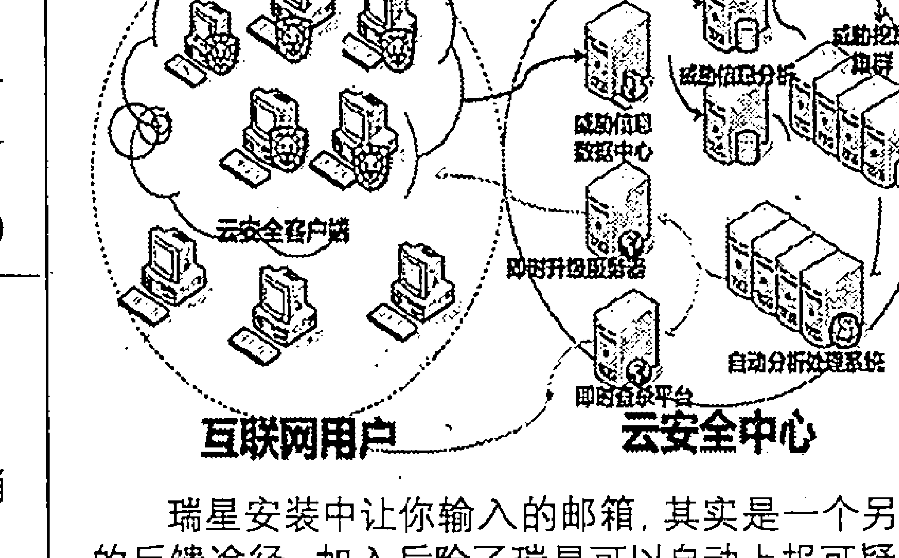

瑞星安装中让你输入的邮箱，其实是一个另外的反馈途径，加入后除了瑞星可以自动上报可疑文件外，你也可以通过右键菜单单独上报可疑文件，瑞星后台处理后会把结果发送到你的这个邮箱。同样，在ESET NOD32的安装中，我们看到的ThreatSense.Net预警系统，其实也是开启软件客户端和服务器的数据交换功能，原理一样，名称不同而已。

> 小知识
目前开通云安全服务的杀毒软件：瑞星、金山、诺顿、趋势、ESET NOD32、迈克菲、360杀毒。

#### 第一步：关闭不常用监控

安全系数：5级 资源占用：4级
很多读者平时邮件收发不多，或者只使用网页收发邮件，我们可以把邮件监控禁止。另外，嵌入式杀毒对Office影响比较大，我们也一并卸载。

不过不要去设置里修改哦，那样瑞星的绿伞会变成红色，我们需要在组件里卸载：在开始菜单中找到瑞星程序组，依次单击“瑞星杀毒软件→添加删除组件→添加/删除”，然后依次展开“瑞星监控中心→实时监控”，取消对“邮件监控”的勾选，然后取消“瑞星嵌入式杀毒”的对钩，单击“下一步”，按提示进行卸载就好了。

#### 第二步：减轻文件监控

安全系数：4级 资源占用：3级
文件监控，我们就不能直接卸载了，因为杀毒软件的实时监控价值就在这。不过，我们倒可以进行一下优化，让瑞星不至于每个文件都监控，打开瑞星的设置窗口，先将“文件监控”设置为“低”，然后单击“自定义级别”，取消特征扫描中“普通文件”的对钩，而下面的智能扫描，我们保留好可以了。

#### 第三步：降低防御力度

安全系数：4级 资源占用：2级
瑞星包含有主动防御技术，不过这样监控下来对于一些常用操作就会有速度影响，我们可以在无关紧要的监控中予以优化。在瑞星设置对话框中将“木马行为防御”、“木马行为入侵拦截”的级别改为“一般用户”，减弱对网页的监控，浏览网页也就加快了。

> 小提示
在各种监控中都有“记录日志”功能，如果你平时不用看日志，那么都可以取消，这样就可以降低瑞星后台的操作。

## Windows 7下分区只需拖一拖

不知道你有没有遇见过，就是在分区的时候用Windows自带的管理工具看剩余空间还很多，但是不管怎么压缩卷就是压缩不出来，于是就上网搜了搜，发现了下文中的主角EASEUS Partition Master，是绝对免费的无损分区软件哦，只需拖一拖就可以完成分区。

- 第一步：运行程序（http://www.onlinedown.net/soft/1254.htm），逻辑分区的不同格式会以不同颜色显示出来，分区的使用情况会以柱状图显示，在工作区中选中需要调整大小的分区，单击右键执行Resize/Move（重置/移动），出现对话框，这时候只要拖动上边那个框框或者在Partition Size（分区大小）里直接填写数字就可以调整分区的大小了，点OK完成操作。
- 第二步：如果你是压缩了分区，工作区会出现一个灰色的未分配空间，现在来把它分给其他分区。选中你想要的扩充的分区执行Resize/Move（重置/移动）操作，还是如上面所说拖动或填写调整后的分区大小点OK就行了。

### 小提示
- 第三步：调整完毕最后不要忘记点击工作区左边的Apply（应用），因为这时候一切都还没执行呢。点击“确定”后重启计算机（建议重启），分区工作就完成了。轻松吧！

## 老马之乐不在软件 在软件之间也

打开Google搜索页面，输入“老马”，在谷歌给出的搜索候选词中，第二个是一个个人站点：“老马的原创空间”，一个“个人站点”怎么会有如此高的关注度呢？如果你知道，这里有老马自己开发的70款免费软件，这里有大量可以解决电脑难题的工具软件，这里有9款免费开源代码的软件……你能不能常来看一看吗？那么，此空间主人的故事你能不读一读吗？

### 马健

专业：制造工程
毕业时间：1991年
工作：软件开发
软件作品：ComicsViewer、Zip2Dir、MyReader等70余款软件。
空间地址：http://www.comicer.com/stronghorse

### 70款软件20余年人生

老马是一位爱好广泛的人，自称人生三大爱好：奇书怪想佳山水，写的文章也颇有文采。对“对联”是他一大爱好，动漫、电子书、摄影组成了老马丰富的个人生活。而老马又是一位普通的人，70后一代，中年男人的大众身高、大众体型和大众脸型。当你跟他聊起软件、聊起电脑，你才知道老马果然是老马。跟他对话，你犹如在跟一部电脑方面的百科全书对话。早在1984年，还是“小马”的马健就开始写软件了，大学毕业，大家在用的是16位的Windows 3.3，那时还没有现在Windows下面的任务栏，为了调用方便，他就自己用C语言编了一个工具条软件：Toolbar，而微软在Windows98中才加入任务栏功能。之后，伴随着老马的生活，他需要什么工具，就会先搜索有无工具可以解决，没有的话，就自己写。20多年过去了，马健便成了大家熟知的老马。对软件，老马谈到：“这些软件都是伴随着我的个人爱好的，喜欢什么，需要什么，就会自己写相关的软件来实现一些想法。正好，也方便了和我一样遇到难题的其他人。”最近，老马又开始研究电子书。那么，他空间最近关于电子书的软件肯定开始活跃了。

### 一本书，两个软件，成就一个老马

老马是公认的电脑高手，开发的软件涉及动漫、电子书、编程、数码影音等领域，这样的成绩让很多学编程的人都汗颜，尤其是很多学计算机专业的大学生，他们只会语法、分析函数，不会写软件。谈到这一点，老马为我们讲起了他20多年前的故事。老马上中学时就用上了电脑，为了学Basic语言，他时常去书店看书，最终让他发现了一本好书《VC技术内幕》，写得非常好，他还研究了英文原著。这样下来就好比大学里学完了编程语言课，但写软件还是不会！接下来的两件事让老马记忆犹新，是这两次机会让他成了今天的老马。一是，正好赶上计算机世界传媒集团下的《少年电脑报》组织了一次编程大赛，出于比赛的激励，他第一次真正明白了如何用言语代码来表达自己的想法。另一件事是他后来正好赶上一家公司的会计想找个做工资的软件，他就把这事给接了下来，一开始代码写了老长，就好比写了一篇流水账，然后进行删减，最后还真能用了，回想起来，老马总说是“运气好”才碰上了这两件事。而现在大学里是按部就班地系统学习，这并不是坏事，但最后要迈过一个坎去，就是抛开习题，真正为了需求而写一个软件，只要有一个软件写成功了，明白了想法变代码，用代码实现需求的整个过程，就好比他经历了那两件事，也就学会了如何开发软件。

### 再多难题，招招制敌

老马的空间是一个巨大的宝库，很多难题我们都能找到专用工具，这里，小白就不单独针对某一个软件研究了，给大家挑两个，让大家过过瘾！

- 图片无损转PDF：图片转换成PDF，很多软件可以做到，但要无损就要数老马的FreePic2Pdf好用了，软件运行后，你会看到软件标题行了1到4，按照这个顺序进行操作就可以了。在1处，单击“打开文件”图标，添加图片，2处指定保存路径，3单击“参数设置”。“原始图像文件的DPI”一项默认参数不用变，单击“确定→开始转换”，图片就变成PDF了。
- 影音码率一眼清：平时下载的影音文件，是否担心有错误、质量不高或者中间有错误呢？如果是AVI或者RMVB格式的话，那就好办了，运行BitrateCurve，单击上面的“打开文件”图标，将要影音文件添加进来，不用任何按钮，稍等一会儿，文件的码率就都显示出来了，中间如果出现0码率，那么文件就是有损坏了。多个文件可以批量处理。

## 兔子也能看家 2010年带你防病毒

最近，网游迷小孙发现自己的《魔兽世界》账号被盗了，电脑医院的王伟帮小孙一分析，既没有去过网吧，密码设置得也比较复杂，看来应该是小孙家里这台电脑中了木马。然而小孙身边没有杀毒软件，去买一个正版的至少得花费二三百元，怎么解燃眉之需呢？王伟给小孙下载了超级兔子2010版，其集成了先进的云计算杀毒技术，还等什么，马上去赶跑木马吧！

打开超级兔子，点击“杀毒→免费在线查杀”，系统会下载并打开最新的云杀毒程序。进入云杀毒界面，可以看到有“快速扫描”、“全盘扫描”以及“自定义目录扫描”供我们选择。点击“设置”，我们还可以选择诸如定时扫描、创建快捷方式、自动上报可疑文件、发现病毒后的处理方式等等。而点击“高级”，则可以对病毒/木马的隔离区进行查看和操作，还可以进行在线求助。

接下来我们试试云查杀的速度吧！点击“开始查杀”，云查杀就开始工作了，可以发现云查杀的速度非常快，通常用某品牌杀毒软件需要查杀1个小时的电脑，使用超级兔子云查杀只需要1/3的时间，当然这与网速也有一定关系。查杀完毕后，还可以点击“上报未知文件”，提交给专家进行检测。同云查杀不同，点击“木马查杀”，木马清理王会下载特征库到本地进行木马的查杀工作，下载的速度还是比较快的。再点击“开始查杀木马”，查杀工作就开始运作了，查杀中若发现木马，系统会提示处理的方式，一般选择自动清除即可，软件会将这些文件转移到隔离区，我们可以点击“程序隔离区域”来查看和彻底删除这些文件。

### 原配不行时请出“安全小精灵”

相信大家系统里都有自己中意的杀毒软件，瑞星、卡巴或者ESET NOD32等，这就好比你的原配杀毒软件，但也会遇到面对个别病毒出现无能的现象，表现为能查出病毒、病毒文件位置，但就是无法删除。这时，“安全小精灵”（下载地址：http://www.newhua.com/softdown/93962.htm）就是一个比较好的应急方案。

#### 强删病毒文件

根据常规杀毒软件的报告信息获取病毒文件的位置，接下来在资源管理器中直接打开这个文件所在的文件夹，启动“安全小精灵”，打开“扫描→强删文件”，然后将病毒文件直接拖放到“文件强删器”窗口中，再单击“删除”按钮即可将其清除了。

#### 自制专杀工具

当遇到一些新木马、病毒时，可能还没有专杀工具，在网上找到高手们的手工删除方法，虽然照葫芦画瓢能够解决，但当下次再次遇到时，或是朋友们也遇到同样的病毒时还要继续这样操作，很费劲。通过“安全小精灵”可以自制一个专杀工具，方法也很简单：单击“特色功能→专杀生成”，打开专杀工具制作窗口，设置好名称，将病毒的文件、进程名称、在注册表中的相关项（高手们的解决方案中一般都给出详细说明），再单击“生成”按钮即可制作，最后将其保存即可。而遇到这个病毒时，单击“特色功能→专杀”启动专杀窗口，再将之前保存的专杀文件拖放到这个窗口中即可开始查杀了。“安全小精灵”还提供了进程管理、网络连接管理、启动项管理、驱动程序备份，以及木马查杀等功能，平时将它当兵养，遇到病毒来袭时就可以派上用场了。

## 傻郭靖学艺记 工具软件也能集众家之长

话说，郭靖小时候，什么都不会，他却特喜欢电脑，傻傻的他还时常做电脑设置，各种工具软件装了一大堆，但工具软件越做越大，里面的功能往往是各有所长，总是没有一款让它特别满意，难道还要都装上吗？郭靖心一横，虚心求学，把各种工具软件的优点都集合在一起，挑选喜欢的组件，自己制作符合自己爱好的工具软件。

### 遇七怪通武艺 各家长处尽收藏中

郭靖起初不懂电脑，电脑优化，总是按照哲别师傅教的，用注册表来修改。后来，他遇到了江南七怪，发现电脑优化，很多都可以用工具软件来实现，不过像超级兔子这样，功能有些都用不到，好在超级兔子无私，我们完全可以从超级兔子等工具软件中单独提取出自己需要的组件，组成适合自己的优化软件。

- 第一步：打开超级兔子的安装目录，我们发现有不少封装好的EXE文件，它的机制比较简单，我们通过简单的文件名就可以知道EXE文件所需的DLL资源。超级兔子的魔法设置属于相当优秀的，那么，我们就将超级兔子目录下的srms.exe，chklsb26.ocx，shlobj71.ocx复制到一个新目录下单独用。
- 第二步：内存整理组件，我们要选择Windows优化大师的，直接把WoptiMem.exe复制出来即可。
- 第三步：清理工具，我们选择鲁大师的组件，可以实现一键清理，从它的安装文件里，复制出“一键清理”的相关组件，CleanZ.exe，ComputerZ0.dll复制到一个目录下。管理电脑里软件的升级，目前，360安全卫士的软件管理功能最好，我们就选它了。进入360安全卫士的安装目录，将名为SoftMgr的文件夹全部复制出来，这个就是360软件管家了。另外，像驱动升级，我们可以使用超级兔子的驱动天使组件，文件包括srDriver.exe，SrDriver.dll。

到现在，我们自己整理的电脑优化工具组件就准备了，放在一起，可以作为我们电脑优化的工具箱。

> 小提示
360软件管家本身就作为单独的组件开发的，所以它是可以自己升级的，而其他组件，如果要更新就要记准文件名，重新替换了，不过好在软件的功能组件一般不需要更新的。

#### 小提示：我们可以单独提取的组件

来自超级兔子：

| 组件 | 关联文件 |
| --- | --- |
| 内存整理 | memdef.exe |
| 反弹天使 | srapw.exe、srapw.dll |
| 升级天使 | srupdate.exe、SRUpdate.dll |
| 驱动天使 | srDriver.exe、SrDriver.dll |
| 清理天使 | srck.exe |
| 硬件天使 | srsi.exe |
| 魔法设置 | srms.exe、chklsb26.ocx、shlobj71.ocx |
| 虚拟磁盘 | srromdisk.exe |
| 系统备份 | SRRest.exe |
| 快速关机 | srshut.exe |

来自Windows优化大师：

| 组件 | 关联文件 |
| --- | --- |
| 内存整理 | WoptiMem.exe |
| 进程管理 | WoptiProcess.exe、WoptiP2P.dll |

来自鲁大师：

| 组件 | 管理文件 |
| --- | --- |
| 驱动管理 | DriverZ.exe、ComputerZ.set、ComputerZ0.dll、ComputerZ4.dll、ComputerZ6.dll |

### 师从洪七公 监控电脑最在行

前面郭靖学了些常规武术，要行走江湖还远远不够，郭靖又得机缘认识了洪七公，并得到降龙十八掌的真传。这降龙十八掌是专门制敌的，对于控制电脑相当有帮助，例如，QQ医生中集成了一个“网络流量监控”组件，可以控制上传和下载的具体流量，但直接根据名字，无法直接提取，我们就要略费一些周折。

- 第一步：安装Filemon（下载地址：http://work.newhua.com/cfan/201004/wjjk.rar），然后切换到QQ医生的安装目录，将网络流量监控的主程序：QQDrNetMon.exe复制到另外的文件夹，然后运行Filemon，单击“过滤”，在“包含”中输入“QQDrNetMon.exe”。
- 第二步：将窗口都摆好，方便在QQDrNetMon.exe和Filemon两个窗口间切换，然后“清除记录”开始捕捉事件。这时，双击QQDrNetMon.exe，软件会提示缺少DLL组件而退出。这时，立刻停止Filemon捕捉事件。
- 第三步：单击保存，将Filemon的日志保存出来，用文本编辑器打开，然后搜索NOT Found，在包含NOT Found的句子里，查看前面此时正在寻找什么文件，如果因为此文件找不到而退出，那么这个文件就是“网络流量监控”组件所必需的，要把它复制到QQDrNetMon.exe所在目录。按照同样的方法，依次验证QQDrNetMon.exe所需文件，统一放在“网络流量监控”文件夹里（小白提取后的文件下载地址：http://work.newhua.com/cfan/201004/lljk.rar）。

> 小提示
这一步的监控需要操作者有一定的英语语言基础，对于不懂英语的人，可以使用一种笨方法：把所有可能与主程序QQDrNetMon.exe有关的文件都复制出来，然后依次修改其他文件的文件名，看QQDrNetMon.exe是否可以运行，如果可以，那么这个文件就可以删除，否则，该文件为必需，改回原来名字即可。
这里小白还推荐大家提取超级兔子的反弹天使来管理目前越来越多的弹窗类广告。另外，对于进程管理，小白为大家提取了来自金山毒霸的进程分析工具（下载地址：http://work.newhua.com/cfan/201004/jcfx.rar）。

### 结交周伯通 工具运行更有长进

机缘巧合，郭靖遇上老顽童周伯通，他自创的双手互博功，让郭靖的武功更上一层楼。前面，做成了不少工具，但你会发现一些组件，里面很多文件，看起来很不爽，我们可以用老顽童的聪明，给软件加以封装，现在我们以封装“驱动升级”为例，来做一下多文件的封装。

- 第一步：运行MoleBox（下载地址：http://work.newhua.com/cfan/201004/wjfz.rar），单击右上角的“浏览”，找到DriverZ.exe，然后指定保存路径，单击“包裹”下的“添加文件”，将“驱动升级”的其他文件都添加进来，在选项里设置成按照默认包裹封装，最后单击“封包此工程”完成封包，保证封装后的两个文件在同一目录下，就可以单独运行了。
- 第二步：我们现在将我们的劳动成果变成自己喜欢的软件，首先将所有的文件都复制到一个文件下，运行PStart（下载地址：http://work.newhua.com/cfan/201004/qsqd.rar），将准备好的几个EXE文件，拖动到PStart的界面即可。如果要更改名称，右键单击srms.exe，选择“属性→常规”在“名称”里输入“系统设置”，还可以在“高级”里替换图标。

目前的工具软件都在走更大、更全的路线，就像本文提供的技巧，你会发现有很多组件都可以加入进来，这也可以加，那也可以加，但组件多了，却往往多而不精。超级兔子、Windows优化大师、鲁大师、360安全卫士、迅雷软件助手、QQ医生，几乎每个软件都是各有特色，谁也没有在细节上做出更大的提升，来让人有足够的理由抛弃其他软件。于是，我们也就有了要将各软件的优点自己集合在一起的想法。希望有一天，我们不再面对这种困惑，软件本身就是集众家之长的精品。

（江西/李良余）

## 同时登录多个农场 就用火狐！

2009年什么网游最火？我认为非农场偷菜莫属了，就连我几个从来不玩游戏的朋友都开始着迷了。但他们白天都很忙，不在电脑前，于是将偷菜大任交给了我，但是我只能同时登录一个农场的账户，多个账户同时照顾，有点儿困难……开始钻研多开方法，哈哈，终于让我在火狐浏览器下找到了。

右击桌面上火狐的快捷方式选择“属性”，在“目标”栏的路径后面，添加空格-p空格-no-remote完成后点“确定”。然后运行火狐，点击“创建配置文件”。点击“下一步”，输入新配置文件的名称，如“小华的农场”，然后点击“结束”。计划多开几个农场，就创建几个配置文件。重复上面的操作即可。

以后打开火狐时，在弹出的窗口中会出现选择配置文件的页面，选好一个后，点击“启动Firefox”按钮，在打开的浏览器窗口中就可以来登录QQ农场了。每个配置文件所打开的浏览器窗口都可以来登录一个QQ农场，这样，就实现多账户的同时登录啦！

## 不升级 照样烦死你（MSN）！

虽然我不是MSN（现名Windows Live Messenger）的忠实粉丝，但身边的很多人都在使用，尤其是工作中的客户，我也会经常用到它。让人感觉最不舒服的，就是一旦有新版本出现时，MSN就会强制自动更新。虽然新的版本可能更加安全、易用，但我已经用惯了现在的版本，不想再升级了。怎样禁用MSN自动更新呢？

单击登录后出现“必须安装新版才可以继续使用”的提示，若不更新就无法使用，微软的霸道尽显于此。经过多次尝试，终于找到了解决方法。MSN是通过判断主文件版本号来决定是否需要更新。既然知道了原理，下面的事情就简单了，用到的工具是eXeScope（下载地址：http://www.onlinedown.net/softdown/9594_2.htm）。

方法：首先单击“打开”，打开MSN主文件msnmsgr.exe，会自动载入文件，并完成分析过程，展开左侧“资源→版本”的“1”项，右侧会显示出“文件版本”和“产品版本”，把版本号修改为最新的版本号，比如“14.0.8089”，单击“保存修改”，勾选“允许改变文件大小”选项，确定即可。输入账号和密码，登录试试，MSN再也不自作多情地提醒你了吧？

> 小知识：eXeScope的金字招牌
它能在没有资源文件的情况下分析，显示不同的信息，重写可执行文件的资源，包括EXE，DLL，OCX等，是方便强大的汉化工具，也可以直接修改程序，包括菜单、对话框、字串表等。

## 歌曲麻辣串 想怎么串怎么串

新年到，小虎队要在春节联欢晚会上重新登台，并演唱三首成名歌曲的串烧。是否听着就很过瘾啊？想想自己制作一首串烧呢？把喜欢的歌曲串在一起，尽情听吧！

-   第一步: 运行Cool Edit Pro（下载地址: http://work.newhua.com/cfan/201004/yyj.rar），按照提示设定临时文件夹存放位置。点击多轨切换，进入多轨编辑界面，然后依次打开我们准备好的歌曲文件，可以直接拖入音轨。
-   第二步: 在多轨界面，按下电平显示钮，出现白色音量指示，左键单击加入调整点，上下调整音量大小，用于多轨混音；右键点击整个音频块可以前后或上下音轨拖动，用于调整音频文件间的相对位置。红线代表调整后的音量大小和位置，可以看到它们间的总音量大小合成后基本不变。
-   第三步: 认真调整切入点，本例中第一首歌曲是成龙、刘媛媛演唱的《国家》，在第一段中时间2‘15”处，伴奏音量压低后结束，第二首《关不上的窗》，本例中有较长的前奏，衔接后给人的感觉松垮，所以把前奏部分一起压掉。选26“开始至2’38”，同样第三首《勇敢》，从32”开始，作为串烧的最后一首，结束不必拘泥，使音量平衡后，右键单击后混缩所有波形，混合后进入单轨编辑界面，把混合后的文件另存即可。
-   第四步: 运行Lrc歌词编辑器（下载地址: http://www.onlinedown.net/soft/48444.htm），打开第一首歌曲的歌词文件，最好为TXT，保留曲目剪辑部分，依次把第二首歌和第三首歌的歌词复制在后面，边听边点击，加入时间标签，光标会在点击后自动换行，重复歌词可重复点击，加入不同的时间码——对应剪辑后的串烧位置。在本例中分别是在1...创造地球的奇迹，2...向着心扉的窗，3...不分手结束，最后保存为LRC文件。

> (河南/李传忠)

## 把游戏榨汁喝 精美资源单独提取

正在玩大型网游《天龙八部》的大军哥被《天龙八部》游戏外的精美资源深深地吸引住了，不禁痴痴地想，如果能把《天龙八部》游戏中的影音、图画等资源提取出来，抽空看看，或者作为电脑屏保、手机铃声，该有多好呀。

-   第一步: 运行Extractor（下载地址: http://work.newhua.com/cfan/201004/ytqt.rar），单击“选择”按钮，定位到已经安装到本地计算机中的游戏程序的安装目录下，选择较大的游戏文件作为提取对象。在下方的“保存临时文件夹到:”框后，选择提取出来的文件要保存的目录。
-   第二步: 在下方的“文件格式”标签项中，根据自己的提取目的勾选相应的类型选项，如JPG、MP3等。单击“开始”按钮，Extractor即开始对所选择的文件进行扫描分析，以详细资料形式列出了分析出的所有符合条件的文件。选中其中一个，按“显示”按钮，在新打开的窗口中对该文件进行预览。
-   第三步: 单击“扫描”窗口下侧“功能”按钮上方的“对扫描分析出的文件进行选择或舍弃操作”，选择好需要保存的文件后，单击“解压”按钮，把扫描提取出来的文件保存到本地计算机中，这样无论是使用播放器播放还是做电脑以及手机的屏保，一切都可以随心所欲地为我所用了。

> 小提示 游戏资源提取软件常用的还有FMV-Extractor，不过Extractor在提取速度上要更快一些。而提取的关键是要选择对游戏文件。音频、视频等文件已经被封包到了游戏的相应文件中，我们要从相应的文件中提取出来，例如，MOVIE、PIC等文件夹的文件。所以查找的时候注意那些容量比较大的文件。在游戏安装目录下多试着选择几个文件，肯定能找到你想要的内容的。

> (河北/刘占军)

## QQ影像新露头角 “趁火打劫”恰逢时

2010年的第一个月，继QQ影音之后，腾讯用QQ影像1.0 Beta宣告了一款新图片处理软件的诞生。不过从软件功能上来看，常规功能比较普通，只是搭好了一个基本框架，细节和资源上还没有往深层次加工，而对QQ资源的支持依然成为腾讯软件不变的特色，明显这是腾讯在图片处理领域的一次试水。

### 能搜能看能编辑

运行QQ影像（下载地址：http://image.qq.com/），一个四周带有蔚蓝色边框的窗口就出现了，典型的QQ软件风格。在右侧有一项扫描全盘图片的提示，单击后几分钟就把电脑上所有的图片都搜索出来了，而且，在每个电脑目录旁都表明了里面图片的数量。这一点很实用，不过可牛影像早已实现，还能制定哪些目录的图片不检索。

### 能标能写能上传

平时图片的管理，最麻烦的就是找到想要的图片，QQ影像下方增加了一个“标记图片”的按钮，标记过的图片可以单独归为一类，不过只有一种标记，显然不太够。QQ影像提供了信息添加功能，右键单击图片，选择“图片信息”，输入图片名称和文字描述信息后，以后在QQ影像的搜索框里就可以输入关键词搜索了。作为腾讯的产品，自然可以和QQ完美结合，如果要上传图片到自己空间，单击“上传”，选择相应QQ账号的相册（还可以新建相册），单击“上传”就好了。这对于喜欢在QQ空间里晒图片的人来说，没有更方便的操作了。

## 有志不在年高 少年“高手”初成长

“我写了个软件能发表吗？”2008年10月的一天，小白的QQ忽然收到这样一个询问。一问才知道是一位还在上初中的学生，他写了一个小程序想发表……一年多后，小白收到了两位读者的点将，一看软件作者，竟然是我QQ里的那位中学生，喜出望外，随想把他的故事展示给大家。他的软件虽不是很完善，很优秀，但以中学生的身份来说，何尝不是“高手”？

-   郑侃炜
-   学习编程时间: 3年
-   软件作品: 文件加密器、USB监视器、IE速填助手、QQ消息群发器、文件内容搜索器等
-   软件小档案: 文件搜索器
-   软件性质: 免费软件
-   开发语言: Delphi
-   支持平台: Windows 2000/XP/2003/Vista/7
-   下载地址: http://work.newhua.com/cfan/201005/wjssq.rar

### 一篇文章 一个转折

郑侃炜这位90后和其他人一样，一开始玩电脑就是玩游戏，后来，他玩腻了，就受他堂哥的影响，学起了编程。他刚开始学习的是C语言，学会了一些基本算法，然后尝试着自己编写程序，刚开始就是抄书上的例子，编程成功，他就很兴奋。不过C语言都是控制台模式的，这对于一个初中生来说，明显过于枯燥了，他想编写有窗口的程序，所以我就去学习VB，可是那时候他英语不好，毕竟才八年级，也没有编出软件。直到2007年的一天，他偶然之中看到了《电脑爱好者》杂志中有一篇关于易语言写浏览器的文章《只要会打字就会编程》，尝试着按文章说的步骤进行操作，结果编写出了他的第一个小软件。这对他产生了很大的激励，通过不断地学习，他现在编写的软件已经有10多款，而且他还替别人写一些付费工具，成为可以编软件的高中生。

### 自强 其实就这么简单

郑侃炜是很要强的一位学生，几年前，他每周的生活费加餐饮费只有40元，但他从来不要别人的同情，学习很好，目前，他正在准备数学奥林匹克竞赛。当初，他懂得编程后，就想靠自己的技术让自己的生活更好些。于是在各大QQ群里，发布承接编写软件的广告。但天真的孩子没有什么经验，时常是赔了夫人又折兵。一次，他接了一个写软件的任务，写完后，他改了多次但对方都不满意，提出把源代码给他们，自己改。结果源代码一给，对方就消失了。几次经历后，郑侃炜慢慢长大，懂得了流程和合同。现在他已经靠自己写的软件，赚到了一千多元，而且还是学校计算机协会的会长。自强，其实就这么简单。

### 一招搜索 多才多艺

文件搜索再平常不过了，郑侃炜的文件搜索器只有一个文件，运行后，单击“浏览”指定要搜索的目录，然后在“文件名”或“文件内容”中输入要搜索的关键词，以指定通过文件名还是文件内容进行检索，单击“枚举”，很快包含关键词的文件就检索出来了。

> 小提示 他还有一个QQ消息群发器，要给多个好友发送通知，但大家又不在一个群里的时候，QQ群发器就派上用场了。运行软件，左侧显示了检测到的窗口，在右侧输入要群发的内容，单击“群发”，QQ消息就都发送出去了。

> (本刊记者/白斌)

## AV终结者木马新变种 拉多款杀软下马

近期安全综述：
据瑞星“云安全”系统统计，2010年1月下半月瑞星共截获了335万个挂马网址。瑞星反病毒专家介绍，近期瑞星公司截获了一个恶性木马病毒“AV终结者木马”(Trojan.Win32.AVKiller.mt)，病毒运行后，利用机器狗功能结束常见杀毒软件的程序文件和服务，以躲避对其查杀，随后会用病毒文件替换多个系统文件，使系统无法正常工作，最后会访问指定网站下载大量木马病毒，盗取用户账号密码信息。

近期关注病毒分析：
“AV终结者木马 (Trojan.Win32.AVKiller.mt)”
警惕程度 ★★★★
病毒原理：病毒运行后会查找avp.exe，360tray.exe，safeboxtray.exe等杀毒软件进程，调用DestroyWindow函数销毁杀毒软件窗口，同时用taskkill命令结束杀毒软件进程。在临时目录下一个名为bxn?.tmp的文件（?表示随机获得），下载http://g.****.com/s.txt到C:\WINDOWS\Fonts\best.ini，然后读取里面的内容并解密（和0x0A做与操作），并下载该配置文件中的病毒到临时目录运行。

防范方法：
1. 使用“瑞星全功能安全软件2010”有效阻挡通过网页挂马方式传播的病毒；
2. 安装卡卡上网安全助手6.1，自动修复漏洞；
3. 拨打客服热线400-660-8866咨询，访问客户服务中心网站（http://csc.rising.com.cn）寻求帮助，使用在线专家门诊获得即时支持。

### 近期关注的被挂马网站：

“广捷居网址大全”、“网易博客”、“北京百业网”、“966网页游戏”等网站的部分页面被黑客挂马，黑客利用微软最新漏洞和服务器不安全设置进行入侵，用户访问这些页面后，可能会感染木马下载器、盗号木马和广告点击木马。

## 强策强力 闪盘安全百花齐放

闪盘一直是我们最常接触到的病毒传播介质，各种免疫工具也比较多，而目前的主流杀毒软件都加入了对闪盘的保护，只要能够合理准确地进行设置，就能保证闪盘安全。

### 闭关锁国 外邦勿入

既然闪盘带病毒，最简单的思维就是只让电脑用自己的闪盘，别人的用不了，这样就安全了，使用ESET NOD32就可以实现这个想法。
第一步：切换到高级设置，单击“工具→高级设置→ESET Smart Security设置→病毒和间谍软件防护→文件系统实时防护”，选中“高级设置”命令，在右侧展开的窗格中把“可移动磁盘”框下的“阻止可移动磁盘”前面的复选框选中。

第二步：在“高级设置”的“阻止可移动磁盘”选择“例外→允许的可移动磁盘”，把需要使用的USB设备插入USB接口，NOD32系统会自动进行USB设备检测，选中允许接入的可移动磁盘端口前的复选框，然后单击“确定”按钮，这样只有自己的USB设备才能在电脑中使用，防止其他USB设备的病毒侵袭。

### 实时防护 有毒必杀

我们还有一种模式就是实时监控端口，诺顿防病毒软件对闪盘等可移动磁盘的保护是以实时防护方式进行的。

运行诺顿，单击“电脑”标签中的“设置”按钮，展开“实时防护”标签，在“可移动介质扫描”后的开关按钮上使用鼠标单击以确保设置为“打开”状态，这样当需要打开访问可移动磁盘时诺顿会对引导型病毒进行检测。

小提示
卡巴斯基对闪盘的保护同样做得细致入微，采用的基本方法也是实时监控，实时防护，当卡巴斯基监测到有闪盘等移动存储介质连入计算机时，会进行提醒，并提供对闪盘的各种查杀选择。
(河北/刘占军)

## 要力压群雄还是独“守”一方 抢鲜看Picasa3.6

2010年伊始，互联网大鳄便动作频频，先是整了一曲“退出中国”的戏剧，紧接着又开始大张旗鼓地谋发展，先是融合了Panoramio和Picasa的图片服务，近日又收购了著名的图片编辑网站Picnik。由于Picnik是雅虎图片分享网站Flickr的默认图像编辑软件，致使大家一致认为谷歌这笔交易的目的在于增强旗下图片网站Picasa的实力，以挑战Flickr的市场领先地位，如果说这些还看不出端倪，那么Picasa3.6的发布则表明了谷歌在相片领域的雄心，那么谷歌家的“毕加索”能否如其预期呢？先尝尝其新版再说（下载地址：http://picasa.google.com/intl/zh-CN/）。

### 毕加索也玩“圈人”

玩过SNS网站的人应该都知道SNS网站的相册中大多数都提供了“圈人”功能，而那里的“圈人”功能实则没有太大的意义，而Picasa中的“圈人”功能则非同一般。

安装完Picasa后，会按要求对电脑中的图片进行扫描，并自动将扫描出含有头像的相片进行分组，用户可以对这些照片进行“画圈”，在Picasa中，选中照片后可直接添加人物的姓名。

那么在Picasa中“圈人”的意义在哪呢？将这些照片上传到Picasa相册中后，Picasa相册会自动以人物的名称创建相册，上传的照片还可以进行合并。

### 好友之间互通有无

聚会上朋友之间一起拍了一些相片，回家处理完毕之后拿闪盘拷贝好，待下次见面再给朋友？这种方式太OUT了，Picasa已经替你想好了，在Picasa中引入了“协作”的概念。

只要我们在Picasa中和朋友的账号之间设定了共享，上传照片时就可以选择“上传到朋友的相册”，原来很复杂的事情，现在是不是简单多了？

除此之外，Picasa现在俨然已经是一个图片管理外加小型图片处理软件了，并且和Picasa网络相册之间互通更加便利。

### 点评

难道2010年将是图片管理与网络相册争夺年吗？先是腾讯推出了QQ影像，其主打便是“一站式体验玩转图片”，由于和QQ相册无缝集成，加上腾讯软件一贯的“出色”作风，QQ影像非常受欢迎，然后是网易更新了“网易相片管家”，也是主打“一站式”牌。Picasa现在走的是当年网易的路，相片管理、网络相册集成，再附加自己的个别特色功能，很明显，现在大家都想在这个领域分一杯羹。

虽然对于Google的技术我们无需怀疑，也有理由相信如此优秀的互联网企业，对于做好一款相片管理软件、网络相册集成一体式的解决方案不在话下，但对于Picasa这个外来户，能在中国市场力压群雄，还是最终和Youtube的命运一样“杯具”，我们走着瞧。
(文/李云峰)

## 和“90后”畅快聊天 非主流输入都在行

网络新新人类张翔很喜欢网络聊天，最近和几个网友聊天时发现，对方打出的文字都是新潮的“火星文”，对比自己打在电脑屏幕上沉闷单调的文字，他觉得有些郁闷。如何打出“火星文”呢？2010版超级兔子就附带了一款“非主流火星输入法”，想消除与“90后”网友之间的代沟，就去试试吧！

### 玩转QQ聊天90后零代沟

打开超级兔子2010版（下载地址：http://www.pctutu.com/），点击“兔子工具→系统增强工具”，找到“非主流输入法”并点击，首次使用要先安装，启动后，软件会启动一个浮动窗口，系统右下角任务栏的通知区域也会有输入法的图标，在浮动窗口上，点击“火”之后，打出的字就变成了“火星文”，而点击“简”则能恢复简体中文输入，点击“繁”则是繁体中文输入。

点击浮动窗口的“笑脸”图标，软件还提供了丰富多样的“火星个性符号”，其来源于网上新潮的字符表情，如“o(n_n)o”、“囧rz”等等，用鼠标左键将符号拖动到聊天窗口，或者在聊天窗口按“Ctrl+V”就可以轻松使用这些个性符号了。

小提示
点击浮动窗口的“工具”图标，点击“设置”就可以进行输入法的基本设置，例如是否隐藏浮动窗口、是否自动升级、开机时是否自动运行等。“非主流火星输入法”还提供了“火星程度设置”，分为入门版、标准版、超级火星版和随机版，用户可以根据需求自由设置。另外，用户还可以自由选择浮动窗口的皮肤，“充分”展现个性。

### 高档自定义 我也是新潮人

“非主流火星输入法”还提供了丰富的自定义选项：点击“自定义火星文”，在“原始简体字”中写入自己想修改的字，在“自定义火星文”中写入自己想修改的结果，点击“添加”然后点击“确定”，即可生效。另外，通过“导入”、“导出”功能，可以把自定义的火星文转化为以.chx为结尾的文件，方便火星文爱好者之间传阅火星文字。“自定义火星符号”的操作同“自定义火星文”的基本一致，总的来说，用户可以很方便地打造自己专属的“火星文”。

## 一条国外网盘链接引发的技巧竞赛

网盘的流行，让我们的下载多了不少选择，很多个人原创或DIY的特色工具得以共享。不过，完美的事情总是少数，网盘下载也有着它的烦恼，真正链接不好找，需要输入验证码、下载前要等待处理等等。这不，小白今天遇到了一条网盘链接：http://rapidshare.com/files/286338982/USD_OpenSSL_ReconnectSuite.zip，这样的链接怎么样才能更好地下载呢？小编们开始纷纷出门划策。

### 网盘下载，我们不想等时间

出招人：阿贵
口号：方便一点是一点
阿贵听说了，作为网络编辑，他要出招了，麻烦的是下载前需要一段等待时间呗，这个等待是如此的“漫长”，这浏览器上出现的问题，咱用浏览器来解决。

#### 方法一：空手套白狼

如果习惯使用Rapidshare网盘，相信更多的人是free user，但由此带来的就是需要26秒的等待期。不过我们可以“空手套白狼”。打开上面的链接，选择free user后这时就出现了倒计时界面，这时把浏览器的地址全部删除掉，输入javascript:alert(c=0)，然后按“回车”键。这时候会跳出一个“0”对话框，单击“确定”后一个大大的下载按钮就出现了吧，想怎么下就怎么下，使用迅雷也可以哦！

#### 方法二：浏览器请外援

我们接触的文件必然不会只限制在Rapidshare网盘上，“空手套白狼”的方式自然不通用了，面对等待时间有些无奈，或许在想，哪怕让我少操作一步啊，如果你可以退而求其次，那Firefox就有一招。安装SkipScreen（下载地址：http://work.newhua.com/cfan/201005/ddsj.rar），当我们再打开上面的网盘下载链接时，已经不需要你点什么了，Firefox替你屏蔽掉，眼不见心不烦，时间到了直接下载。

### 网盘下载 单文件解决

出招人：CT
口号：用一个文件解决一件事？
下载东西，像CT这样的硬件小编还会把各种网盘当作“怪兽”，听了阿贵的技巧，他很不屑，这么复杂，明明有专门的工具解决吗？一个单文件就可以解决。运行Rapidshare Plus9（下载地址：http://work.newhua.com/cfan/201005/wpxzcj.rar），将下载链接粘贴到“添加”后的文本框，然后单击“添加→下载”，文件就开始下载了，问题轻松解决。

### 小提示

遨游浏览器2.0版可以借用插件Time Wait Filter（下载地址：http://work.newhua.com/cfan/201005/glsj.rar）过滤掉网盘的等待时间。

### 特殊下载 咱们用专业工具

出招人：小特
口号：太低档了，用专业工具吧
小特对网盘下载有自己的理解，阿贵的太繁琐，CT的应用限制多，要是遇上那种变态方式，在下载前要提供验证码，他们这些方法都得歇菜，还得用手动。其实对付这些多来自国外的网盘资源，这时使用Jdownloader就很方便了。

#### 一软定乾坤

第一步：首先要为我们的工具打造一个舒适的网络环境，安装JAVA（下载地址：http://work.newhua.com/cfan/201005/java.rar），然后安装Jdownloader（下载地址：http://work.newhua.com/cfan/201005/jdownloader.zip），运行后首先选择语言和下载目录，并提示添加Firefox支持。

小提示
如果当时忘记设置中文界面，运行后单击“Settings→User Interface→Language”中选择“Zhongwen[Simplified]”即可切换为中文界面。

第二步：下载网盘文件，我们一般使用免费模式，所以这里要进行一个调整，依次单击“付费账户→全局启用付费账号”，取消“全局启用付费账号”让软件使用免费账号模式。下载文件时，依次单击“链接→添加链接→添加链接”，我们把刚才需要等待下载的链接粘贴进入，单击“解析URL”，软件开始分析，单击“继续”开始下载，一会儿后提示下载完成。果然省事好多。

#### 特征码识别不是传说

在很多下载中，我们会遇到需要输入验证码的情况，尤其是国外的网盘，例如rapidshare，这中高端的下载限制我们还能用工具吗？回答是肯定的，例如我们需要下载一个http://rapidlibrary.com/download_file_i.php?file=137234468&desc=Wiley+-+iPhone+SDK+3+Programming++2009++.zip文件，打开网页后发现还需要输入验证码，虽然只有三个，那我们按照前面的步骤来试试Jdownloader，添加链接、下载，发现不用我们做任何操作，文件已经开始下载了。

### 小提示

很多网盘都有自己专门的工具，例如

| 网盘 | 工具 | 下载地址 |
|------|------|----------|
| Rayfile | Raysource | http://static.rayfile.com/zh-cn/client/ |
| 纳米盘 | 纳米机器人 | http://www.namipan.com/download.html |
| BRSBOX | Orbit Downloader | http://www.onlinedown.net/soft/54559.htm |
| VDISK | Vdisk 网络闪盘 | http://www.onlinedown.net/soft/31631.htm |
| Filebox | filebox extender | http://www.onlinedown.net/soft/6302.htm |
| IDriver | IDrive Online Backup | http://www.idrive.com/online-backup-download.htm |

#### 小知识

Jdownloader植入了OCR识别技术，当然，这样的OCR识别技术还不能保证100%成功。验证码最初发明的目的是为了让机器识别人与电脑，现在普通的应用是防止恶意注册、恶意下载等。于是变成了简单的字符图片。中间经过了几种发展模式，早期验证码由EZ-Gimpy程序产生，用扭曲的字母和背景颜色组成，背景颜色增加了渐变。第二代验证码开始使用弯曲的字母加一条曲线穿插其中，增加了识别难度。而现在普遍采用的是简单的数字和英文字母拼接在一起的图片，并且字母和数字会交叉并将笔画连在一起，有的还会加背景色干扰。

### 评论

任何事物都有着两面性，速度的提高方便了使用者，但也加重了网盘提供商的服务器压力。我们总在抱怨下载个文件或软件都要这么麻烦，需要进入各种转接，然后是各种迷惑性的按钮，但这种环境却是我们一手创造的。我们喜欢免费，不会去付费下载，但下载站靠什么活着呢？只能是越来越多，无处不在的广告，这已经成为了一种环境，而这种环境下，也产生了特殊的工具，例如软件去广告工具，例如今天我们用到的工具，真是越来越复杂了，这时，你是否考虑过付出一点费用，获得干净的软件和舒适的下载通道呢？
(山西/杨得利)

## 计算省一步 填报销单快人一步

平时填报销单总要数一大堆的票，先是算总的钱数，这项操作直接用系统的计算器就可以搞定，但它没有计数功能，之后还得再数一遍有多少张。其实，填报销单不用这么麻烦，讲究途径，用好软件，节约你宝贵的上班时间。

### 票据累加，不用再算张数

拿出票据，运行DeskCalc Pro（下载地址：http://work.newhua.com/cfan/201005/tjs0.rar），依次单击“模式→系统计算器模式”。接下来，通过数字键盘将票据中的金额累加到一起，当累加完毕后单击=按钮或是按回车键，计算器会自动统计出所有的项目总数，这个项目总数就是所有的票据总数，直接填写保险单就好了。如果你觉得好用，那么干脆将其代替系统的计算器吧，依次单击“设定→使用DeskCalc代替系统计算器”即可完成设置，如果使用多媒体键盘的话，调用就更方便了。

### 小提示

DeskCalc Pro还能将计算过程及结果直接导入到Word文档或Excel电子表格中，其内置的汇率计算功能也很好用，可以及时更新到最新的汇率并提供计算功能。

### 语音报读，不用重复检查

## 王者能否归来 新超级解霸

不知道还有多少人曾记得在奔腾时代，“窝”在宿舍用电脑看VCD的日子。如果你还“记得”，那你一定知道，有一款软件是我们的装机必备，它就是“超级解霸”。这位曾经的领军人物在沉寂多年之后，打着全能播放的旗号，能否王者归来呢？我们一起尝尝看。

### 披上马甲也能认出你！

超级解霸被暴风收购想必很多人都知道了，而此次超级解霸新版一推出，就宣称支持超过600种格式，可以说是真正的“全能王”了，而影音全能似乎是曾经的暴风的亮点所在。除了全能外，早期超级解霸的“超级编辑”功能得到了继承。在Real格式的处理方面，吸取了暴风的经验，并且处理套路也一样，提示用户需要下载Real插件才能播放。所以超级解霸此次的新版，可以说是披上了早期暴风的马甲，然后再将自身的原有功能加以增强。

### 新功能并不新

除了本职的视频播放外，此次超级解霸的使用依旧较为简单，除了界面上有了较大变化，以及全面兼容Windows 7新特性外，通过“播放助手”中的“遥控器”、“播放设置”等可以轻松地控制影片的播放并实时调节播放器的播放效果。早期的截图、跳过片头片尾、AB复读，以及支持插入视频光盘后自动使用超级解霸播放等特色功能，都得以保留。如果一定要说特色的功能，个人感觉就是新增的“剧情快照”功能算是一个特色，另外支持字幕绑定、字幕调整，弥补了早期超级解霸的不足，但尽管如此，这些宣称的亮点是很多视频播放软件已经提供了的。尽管超级解霸的新功能列表列出了非常多的项，但只是整合了暴风的全能以及其他视频播放软件的功能而已，所以宣称的新功能并没有特别吸引人之处。

### 编辑视点

视频播放软件前进的方向似乎都是向互联网领域进军，比如风行、迅雷看看、QVOD以及暴风自己。而新版超级解霸俨然还是一个本地视频播放软件，并且新版超级解霸也并没有什么十足的特色功能能够打动用户，充其量也只能与目前主流的本地视频播放器打个平手。既然这样，为什么暴风要在这时候推出并不是特别抢眼的超级解霸2010？个人感觉这是暴风打的一张多品牌战略发展的牌，毕竟暴风现在在前有阻击（互联网视频）后有追兵（本地视频播放）的情况下，拿出超级解霸这张老牌，借助品牌效应兴许能稳固一定的用户群体。但在本地视频播放领域，暴风手下的超级解霸能否王者归来，关键还是要看后劲是否充足，从而打动那些“怀旧”用户的心。 (体验者/越野苍狼)

## 秒杀僵尸 上班游戏你要机警藏窗口

在公司电脑上偷偷菜，抢抢车位，这是很多上班族的最爱，最近又流行起了《植物大战僵尸》。可是当你正在乐呵呵地种着向日葵和各种植物的时候，BOSS已经像僵尸一样悄悄地来到了你的身旁，总不能用植物去打他吧？！他一句话你的月奖估计就泡汤了。如何在上班时间安全地玩这些流行游戏？

### 奇招1：快速隐藏指定的窗口

登录http://www.onlinedown.net/soft/14681.htm下载OuttaSight，启动程序后切换到“热键”，在此为应用程序的隐藏设置热键。比如可以设置按下F9键，用来隐藏所有窗口（F10显示），这样你正在玩游戏的时候，一旦发现BOSS光临，只要按下F9即可全身而退。此外还可以设置自动隐藏窗口，比如启动MSN后可以设置其自动隐藏（需要查看消息时再设置显示）。

### 奇招2：一键切换到办公程序

OuttaSight虽然好用，但是每次BOSS来时都是显示一个空空的桌面，次数多了难免会引起BOSS的怀疑，这说明你上班期间根本没工作。利用Don't Panic则可以自定义实现窗口的隐藏，并设置热键快速激活工作程序，下载地址：http://work.newhua.com/cfan/201006/DPanic.rar。启动程序后按默认参数完成设置，程序默认最小化到任务托盘，右击程序图标选择“参数设置”。在打开的设置窗口切换到“panic按钮”，panic按钮的位置设置在屏幕右方，这样只要BOSS来时，用鼠标点击一下屏幕右方即可激活隐藏。再切换到“运行”选项卡，单击“选择应用程序”，然后选择上班期间常用的程序比如WORD。这样每天上班的时候用Word打开一个工作文档，当发现BOSS来时只要点击一下屏幕右方（或者使用ctrl+空格热键），除了打开的Word工作文档，其他窗口都会自动隐藏到后台（ctrl+退格恢复显示）。

### 歪招一箩筐

- 1. 对付头顶监控的方法。有的公司可能在办公室还安装了监控摄像头，对于处在这种“恶劣”办公环境的用户，可以通过旋转屏幕，或者在屏幕前添加遮挡物的方法“阻截”监控。
- 2. 台式机，平时将插线板放在脚下，关键时刻脚踏插线板开关！笔记本，合上屏幕，装作要去外面见客户或者拜访谁谁谁。 (文/平淡)

## 病毒缠身 闪电杀毒手立即解围

系统遭遇病毒侵袭是所有用户最头疼的事情，临时找来的杀毒软件要么功能太弱无法解决问题，要么就是收费，不给钱它不干活。其实，有一个绿色且免费的家伙能在危机之时拉你一把，那就够哥们了！

### 实例一：威胁一扫光

我们面对的威胁主要是两大类，一个是病毒，一个是恶意软件，这两大威胁用趋势科技闪电杀毒手(http://cn.trendmicro.com/cn/mini/cleantool/)完全可以一下解决。第一步：运行后，先等一会，让软件进行更新。单击“实时保护”，开启“智能清毒引擎TDME”，让软件清毒能力达到最强。因为是首次开启这个杀毒引擎，开启5到10分钟后，新的杀毒引擎才能用。第二步：单击“闪电杀毒→开始扫描”即可开始对电脑进行病毒扫描了。若有病毒，在扫描结果列表中即可看到相应的报告，最后单击“开始清除”按钮即可。而恶评软件呢？再单击“恶评软件清理→开始扫描”功能，如果系统中有类似软件，将会被扫描出并清除。

### 实例二：专杀实时到达

病毒出现似有规律，一般每隔一段时间就会出来一个“轰动一时”的病毒来，对付这类病毒，一般都是借助专杀工具来实现，很多杀毒软件并没有直接提供专杀工具或是相应的入口，很不方便。单击趋势科技闪电杀毒手的“专杀和工具”，就可以看到趋势最近推出了哪些专杀工具。我们发现，有一个DownAD专杀，闲话少说，单击标签，按照提示下载并安装，再来单击这个标签，黑色的命令符窗口就出现了，一看这个就感觉很专业吧。不过，目前提供的专杀工具较少，以后应该会陆续添加更多的专杀工具。

### 小提示

软件可以与现有的杀毒软件同时运行，不产生冲突。提供的实时保护功能很实用，例如经常搞得民不聊生的USB病毒，ARP病毒的攻击等，杀毒手提供了相应的保护（ARP病毒防护需要安装后方可使用），确保自己不受这些恶意病毒的攻击。 (上海/刘亮亮)

## 用“家鸽”除伪杀毒软件 留人而不失强悍

不久前看到一款自称山寨“Windows任务管理器”的软件——家鸽小助手(http://www.onlinedown.net/soft/4524.htm)。笔者顺手找了一个不久前下载到的伪装杀毒软件病毒进行了测试，从病毒实际清除的角度来了解这个软件的贴心之处。

### 第一步：看鸽子玩监控

运行家鸽小助手，依次单击“高级→文件监视”，在监视里面填入你需要监控的目录路径（最多支持5个位置同时监控，支持子目录的监控），比如我这里填入“c:\windows|C:\Program Files|C:\Documents and Settings\Administrator”，点击“监控”并运行病毒样本，接下来会产生很多条记录，我们看到该病毒会在临时目录生成一个名为del.bat文件来实现自己删除，同时我们发现该病毒会反复对hosts文件进行操作，很容易就猜想病毒会利用hosts来干一些见不得人的事情。了解了病毒的一些操作以后，接下来我们就要各个击破。

### 第二步：用鸽子“吃病毒”

切换到“进程”，勾选“只显示非系统核心进程”，进程数目减少了很多，右键选择可疑进程，选择“进程高级操作”。在这里为了对付这个伪杀毒软件，我们可以右键选择p423b.exe进程，选择终止进程，病毒进程被成功结束。回到“基本→启动”，选择名为LPCG和live pc Care的启动项目，然后右键单击选择强力删除文件（进行该操作以后病毒启动项目被删除，病毒文件也会被删除并且会生成一个同名的文件夹来进行免疫防止病毒重写）。切换到“文件管理”下，针对这个病毒我们可以直接选择423ba8，右键强制删除即可将病毒的尸体清理掉。

### 小提示

软件还提供了修复功能，不过目前功能较弱，对付国外的一些病毒的破坏操作无法恢复。 (北京/脑残)

## 老百姓的P一下 何须PS亲自出马？ 不用PS 全能修图攻略

2010年2月20日，PhotoShop迎来了自己的20岁生日。作为图像处理界的标准，它的影响是如此深远，甚至已经成为了一个动词。时髦用语“P一下”，“PS一下”，就是Photoshop的代名词。不过它仍然价格昂贵（最便宜的也要1800元人民币），上手困难。再加上ADOBE公司最近加大了对盗版的打击，在个人领域盛行的D版PS也正式进入倒计时……没有那么多的票子怎么办？其实PS对大多数个人用户来说有点儿大材小用，日常的照片处理，用一些小软件反而更加方便。

#### PART 1 基本功能代替篇

##### 1.裁剪、调整图像，小软件有大效率

在网上发布照片时，图片的格式、大小并不全都符合要求。若要按规则调整，一两张图片还好说，几十张、上百张呢？别看IrfanView这个小巧的软件只是个图片查看器，但办起事来不但能“批量”，而且还很“快速”！（下载地址：http://www.skycn.com/soft/2691.html）在IrfanView的主界面里，选择“文件→批量转换/重命名”，在“批量转换”的窗口下，选择需要处理的图片，点击“添加”将其输入到待处理的文件中；工作模式中选择第三项：“批量转换并重命名结果文件”，在“设置”中根据自己的需要进行配置，点击“开始处理”就OK了。它的批量处理速度确实很快！在笔者这台刷新都能刷死机的电脑上，以38张数码相机拍到的JPG图片为素材（共42.7MB，图片像素均为2048×1536），进行了如下实验：

| 实验内容 | 耗费时间 |
| --- | --- |
| 转换为80%的最好质量的JPG文件 | 27秒 |
| 转换成900×600像素的JPG文件 | 16秒 |
| 转换成亮度值为50的JPG文件 | 8秒 |
| 重命名成“新年快乐###”（#代表数字，即从001开始，每次增1） | 23秒 |

##### 2.滤镜集成，小软件带来大方便

在Photoshop中，可以使用滤镜来实现图像的各种特殊效果。操作虽然简单，但要真正用得恰到好处，往往都需要与通道、图层等配合使用，才能取得最佳……这可不是每个人都能搞定的。

###### 滤镜集成A: 光影魔术手

“光影魔术手”是咱们土生土长的图像处理软件，在“美图秀秀”、“可牛影像”之前就已经大有名气了，对图像的色彩调整正是它的强项（下载地址 http://www.neoimaging.cn/download.shtm）。例如在背光拍摄的照片中，颜色偏黑的情况常常发生，或者照片出现欠曝的现象。这时只需要在“光影魔术手”中打开该照片，点击工具栏中的“数码补光”，照片上暗部的亮度可以有效提高，同时，亮部的画质不受影响，使明暗之间的过渡自然，暗部的反差也不受影响。

###### 网络大补贴：

除了“数码补光”功能，光影魔术手还提供了很多的色彩调整选项，如自动曝光、柔光镜等。即使没有任何图片处理知识的人都能用它来对照片进行修复、润色及后期处理。相关视频教程，可以到http://www.neoimaging.cn/help_video.shtm观看。

###### 滤镜集成B: PhotoClean Express

和光影魔术手相比，PhotoClean Express的功能显得很单一，但操作起来却十分的方便。它将很多专业的图片处理方式做成内置滤镜，如：废像素移除、镜头纠正和色彩增强等功能。载入图片以后，在“滤镜设置”中选取相应的选项，图像便会自动进行处理，方便而且快捷。

> 小知识：什么是滤镜？如果把人的眼睛比作镜头，带上墨镜后，看到的事物都偏黑，墨镜就相当于肉眼的“滤镜”。在图像处理领域中，“滤镜”是一种特殊效果，比如生产光晕、阴影以及各种逼真的木纹效果等；专业相机的配件“滤镜”则是一种镜片，主要起过滤紫外线、增加色彩鲜艳度的作用。

##### 3.随意分割，小软件做得大贴心

往往会有这样那样的原因需要分割图片，最常见的就是两个人分手了……冲洗出来的照片到好办，一剪刀下去就OK！可现在都啥年代了，很多照片都存在电脑中，还不会使用Photoshop的ta，用Photoscape（下载地址：http://www.skycn.com/soft/37604.html）就行，可以选择软件提供的比例来拖拽分割框的大小，也可以自定义。分割框拖拽到位以后，点击“剪切”就能咔嚓掉照片上的ta了！如果有一天两个人又和好了……对自己切割掉的照片感到后悔了，还可以利用“拼图”对图片进行合并。合并的方式有左右、上下以及棋盘三种，用可视化的拖拽来完成。这个功能对于开网店的人尤其适用，可以将多张商品的图片放在一起，方便客户对比。

#### PART 2 升级用法替代篇

##### 1.图片没注释？一招成就“图文并茂”

注意到本篇文章图片上的注释了吗？这些注释都是用即将要介绍的SnagIt Editor添加上去的。SnagIt Editor是截图软件SnagIt的一个组件（截图功能异常强大，传说编辑部里的小编们都在用它）。使用SnagIt进行截图后，图片会自动导入到SnagIt Editor中进行编辑，除了一些基本的图片编辑功能，添加图片注释是它的看家本领。在Draw(画图)一项中选择气球状的图标，用于写注释的模板就会显示在Styles(类型)一栏中。选取合适的模板，放到图片上合适的位置，图文并茂就这么简单！

##### 2.长痘痘？照片也能用“满婷”

一个奔三的人了……脸上突然长颗类似青春痘的东西，在照片上出现肯定不合适吧！照片用不了满婷，咱用Teorex Inpaint效果更明显。载入图片后，用“矩形工具”选取需要去除的对象，然后选择“消除”……这时，Teorex Inpaint就会自动计算周围的颜色和分布，利用周围的背景自动填充去除的对象，从而使“祛痘”后的皮肤看上去完美、自然。其实，这个软件的本意是去除图片上的水印，但水印的面积一般较大，所在位置的颜色也比较复杂，去水印的效果并不好。用来给人像祛痘、取痣正是恰到好处！毕竟痘痘不会长得比脸还大啊……

#### 除PS外，目前主流修图软件推荐：

| 软件名称 | 实用指数 | 流行时尚指数 | 特色功能 |
| --- | --- | --- | --- |
| 光影魔术手 | ★★★★★ | ★★★ | 局部着色/证件照排版/对焦模拟 |
| 美图秀秀 | ★★★ | ★★★★★ | 非主流风格处理 |
| iSee图片专家 | ★★★☆ | ★★★☆ | 一键操作/自动补光/PS滤镜 |
| 可牛影像 | ★★★☆ | ★★★ | 特效处理/场景更换/PS特效 |
| Turbo Photo | ★★★ | ★★★ | 历史记录/超强图片修复 |

#### 网络大补贴：在线也可以修图！

什么是在线修图？就是人家网站已经为你准备好了修图工具，你只需上传图片并点击鼠标修改即可，推荐几个不错的站点：https://www.photoshop.com/，Adobe官方的在线修图网站，PS最纯正的在线版。来两个中文的：http://www.iephotoshop.com/，涂改网http://www.tugai.net/，都不错。还有改图网http://www.gaitu.com/，适合90后使用。

#### 小编说说

1.先来看PS：在2010年2月20日这天，20岁的PhotoShop举行了盛大的庆祝仪式。在20年的不断升级、不断进步中，PS在全球实际上已经成为了图形图像处理的标准。2.再来用PS：几乎我们看到的所有图片、广告、杂志、网站、报纸都不同程度地经过了Photoshop的染指。有了PS，人们可以还原出照片里慈禧太后袖子上绣着的花纹；有了PS，伊朗试射的导弹可以从两颗变成三颗；有了PS，曾哥可以变成史泰龙……有的证明真相，有的制造假象，有的让人哭笑不得。3.最后再反思一下PS：在国内，从“美图秀秀”到“可牛影像”，再到“QQ影像”，让人有点春秋战国时乱战一气的感觉。20多年前，Thomas Knoll和John Knoll两兄弟为了完成博士论文，编写了PhotoShop。历时20年，我们在感叹PS的进步、感叹PS的辉煌时，不要忘了，这些成就不是靠着几张非主流图片、挣点广告费就能换来的……人家的20年如一日的做软件，赢在坚持，赢在踏实！注：本文中，未提供下载地址的工具均可到“http://work.newhua.com/cfan/201006/06j.rar”下载。(四川李户林)

## 拦截窗口 兔子反弹天使重生！

白领小王感觉最近自己的电脑开机越来越慢，找来公司电脑专家周俊一看，原来每次开机都会有软件在任务栏右下角弹出一些提示窗口，影响了开机的速度。周俊说，现在很多软件开启时就会时不时在右下角系统托盘区、桌面上弹出消息框，有用的信息也就罢了，有些垃圾信息就很烦人，而且每次都需要手动关闭。有什么办法拦截掉这些弹窗吗？2010版超级兔子附带一款“反弹天使”软件，轻松解决软件弹窗烦恼。打开2010版超级兔子，依次点击“兔子工具→反弹天使”，第一次使用时软件会提示：当前规则库为空，详细规则设置如下：

- 第一步：单击“新增规则”按钮，单击“下一步”，软件会提示拖动“导弹”图标到你需要屏蔽的软件界面上，“反弹天使”将自动获取程序的相关信息。当然，也可以在“执行程序”一栏点击右侧省略号图标，指定需要屏蔽软件的路径。
- 第二步：单击“下一步”，系统出现“选择匹配与操作”界面，这里首先可以为屏蔽某一软件的规则命名，方便今后记忆和管理。接下来需要勾选各项“规则设置”，用户视需求勾选即可。接下来勾选“立即启用本规则”，并选择“隐藏窗口”或“关闭窗口”，最后点击“保存规则”即可。

以上是屏蔽软件弹窗的基本操作，另外，2010版超级兔子附带的“反弹天使”版本为2.0，比之前的版本更增加了“拦截所有软件的右下角窗口”功能，只要在软件界面的左下角勾选相关选项就可以。最后，我们可以点击“帮助指南”的“设置”选择是否在“系统启动时加载”和是否“记录已经关闭的窗口”，用户可以视需求使用。

> 小提示：如果想将你设置的规则做个备份或者与他人分享，可以在软件界面左侧点击右键，再点击“导出规则”进行导出。当然，如果你有设置好的规则，可以直接使用“导入规则”进行导入。

## 既给面子 又保平安……
暂离之后 电脑里的隐私保卫战

宿舍等人多的环境，要离开电脑一段时间，又担心别人来乱动你的电脑，说不定你聊天记录里的敏感内容就成了朋友们茶余饭后的笑料了！正巧愚人节也到了，小心你的电脑被恶搞。用Win+L锁定电脑的做法不错，但会让人觉得你太小气，不好相处……其实，锁定常用的工具软件就OK了！

题内话：本文所有提及软件都可以到http://work.newhua.com/cfan/201007/ysjr.rar下载得到。

题外话：假如，“XX门”的“主角”们多读CFan，至于丢人现眼吗？

### PART 1. 电脑里的软件锁

#### A. 锁定傲游，我的操作你别碰

出去接个电话的时间，原来浏览的网页不知道已经被谁动过了！找到的美女图片还没复制下来就已经不知去向了……郁闷。要是浏览器也能像系统那样，离开时可以锁定就好了。

在傲游浏览器中，这个贴心的功能就被添加了进来。用户使用账户进行登录后，若需短暂离开，直接按动键盘Ctrl+Alt+L键，即可对正在浏览的网页内容进行锁定，轻松保护“隐私”不被泄露。

#### B. 锁定QQ，我的聊天记录你别看

QQ2009：电脑常常被公用？还勾选了QQ登录框上的“记住密码”？你登录QQ倒方便了……就不怕别人用你电脑时登录你的QQ，把聊天记录曝出来！？

对此问题的担心很好解决：打开“系统设置→安全和隐私→消息记录安全”，勾上“启用消息记录加密”前面的复选框并设置密码，当再次登录QQ时，还需要输入设置的“消息记录密码”才能登录。

如果你已经登录了QQ，别人可以操作这台电脑，但又不想让他看到QQ的相关信息怎么办呢？按下Ctrl+Alt+L将QQ锁定就万事大吉了。

WebQQ：在WebQQ中，虽然没有消息记录加密，但“QQ锁定”也能达到同样的效果。在浏览器中登录WebQQ后（http://web.qq.com），当自己要暂时离开电脑，可以按快捷键ALT+L或单击窗口右上方的“锁定”来将WebQQ锁定，并且解锁码还可以重复设。

.Just Do It: 打造病毒障眼法
修改注册表，文件隐藏更彻底：在电脑如此普及的今天，不知道如何查看隐藏文件的人应该很少了吧，TA的照片该怎么“藏”起来呀？打开注册表编辑器，定位到[HKEY_LOCAL_MACHINE\SOFTWARE\Microsoft\Windows\CurrentVersion\explorer\advanced\folder\hidden\showall]，将CheckedValue中的值修改为0。此时，即使选择了“显示隐藏的文件和文件夹”，下次打开“文件夹选项”窗口时，隐藏文件的选项又自动跳回到“不显示”。明白了吧？还不快试试！PS：很多病毒都用到了这个障眼法。

#### C. 杀软也能锁，我的设置你别动

为了防止别人在使用你电脑时对杀毒软件胡乱设置……于是，在瑞星、卡巴斯基、NOD32等杀毒软件中，可以设置密码将其“锁定”！

例如在瑞星2010中，要将工作模式从“家庭模式”切换到“专业模式”，则需要输入密码才能够完成。设置方法：打开设置界面，“高级设置→软件安全”，勾选“启用瑞星密码”就能进行设置。

#### D. 想锁什么，就锁什么

孩子要用电脑，但是你正在编辑工作重要文档，但又不想退出重新打开，怎么办？用LockThis，即可锁定已经打开的程序。

运行后，默认自动激活程序，按住Ctrl并点击想要锁定的程序的最小化按钮，即可锁定程序。初始密码是“LockThis!”。暂时不用的时候，右击托盘图标点击Deactivate，可以临时关闭锁定功能。点击任务栏程序窗口，会出现输入密码的窗口，输入后恢复正常。

### PART 2. 电脑里的硬件锁

反感别人把你的电脑拿来当游戏机，可又不好直说。对着劈啪直响的键盘鼠标……难道只有藏在被窝里偷偷的流泪？教你个相当抠门的办法——把键盘、鼠标、USB接口等都锁起来，看他怎么办！

-   1. 锁鼠标——千宇鼠标锁：启动软件后，设置并输入解锁密码，之后点击锁定，即可将鼠标控制在当前软件的界面范围内！只有正确输入解锁密码后，才可让鼠标正常使用。
-   2. 键盘——电脑键盘锁：点击窗口中的某个按键，按键图标背景色变深即为锁定，再次点击该键位即解锁。咱厚道点，锁定WASD这四个键就是了……
-   3. USB——雨人USB锁：提供了“禁用所有USB设备”（USB接口的鼠标、键盘、手柄都将失效）、“只禁止USB存储设备”（闪盘、MP3、读卡器等）两种方式；还能让它在“后台运行”，让你屁都不留痕迹！
-   4. 光驱/磁盘分区——极品私人密盘：一个在电脑中创建加密磁盘分区的小软件。根据向导，轻松搞定加密磁盘的创建。通过“高级设置→硬盘保护”选项，还可以对硬盘分区、光驱进行加密并隐藏的操作。

#### 轻松加愉快，U锁一步搞定

能不能给电脑配上一把“钥匙”？当人离开的时候，只需拔出“钥匙”，就能把电脑锁起来……用ALock来做个闪盘锁，开机时需插入闪盘才能启动，拔出闪盘就自动锁定！

打开ALock.exe，插入要做为登录钥匙的闪盘，选择USB钥匙盘盘符，单击“启用”按钮。然后重新启动系统即可。

> 注意！启用Active Lock后，用户每次登录都需要插入钥匙盘。如果闪盘丢了，可以从安全模式登录，再运行ALock.exe并禁用Active Lock即可。但如果选择了“禁止从安全模式启动”，则无法进入安全模式，只能重新安装操作系统才能解除！所以不推荐禁止从安全模式启动。

#### 小提示：给Windows 7开个离开模式

Windows 7中也有“离开模式”（默认是未被开启的）。可以说它是专为下载而设计的，比如在下载电影的时候，离开模式会让系统工作在半休眠状态。开启方法：打开注册表编辑器，定位到[HKEY_LOCAL_MACHINE\SYSTEM\CurrentControlSet\Control\Session Manager\Power]，在右侧新建一个名为AwayModeEnabled的32位DWORD值，并将键值设为1。如果想关闭此功能，删除该键值即可。

### PART 3. CFan支招，愚人节咋样恶搞？

自从傻博士管买羽绒服、系围巾以后，CFan正逐步朝着广谱、大众的方向发展。在愚人节到来之际，大家可以趁被愚对象不在电脑旁边或者故意将其支开，然后对电脑做如下几点手脚：

-   整蛊招术1——开关机鬼叫声：打开“控制面板→声音、语音和音频设备→声音和音频设备”，在“声音”选项卡下，选择“Windows关机”，再浏览准备好恐怖声音。设想一下：如果被整对象半夜时关机，并刚欣赏完一部恐怖片……
-   整蛊招术2——恐怖屏保：安装软件包中的“恐怖屏保”之后，右击桌面空白处，选择“属性”，在“屏幕保护程序”选项卡下将启动屏保的时间设置为1分钟（最小时间）。因为突然，所以恐怖。
-   整蛊招术3——抓狂的桌面：关闭桌面上所有的窗口后，按Print Screen键捕捉桌面。打开系统自带的“图画板”，按下Ctrl+V粘贴所抓图片，并保存为24位的BMP格式。将刚才所保存的图片设置为桌面。这时再右击任务栏，先将“锁定任务栏”前面的勾取消掉，把任务栏拖到屏幕边缘并隐藏；在桌面空白处右击，将“查看→显示桌面图标”前面的勾取消，这时桌面上只留下假的图标……等主人回来，死机了？（这个方法对Vista/Win7系统不适用，因为Vista/Win7下的任务栏是不能拖到屏幕边缘的）

PS：开玩笑应该适可而止哦！

#### 网络大补帖：

1.  美图秀秀帮你成为愚人节恶搞王：http://www.duote.com/tech/1/2223.html。
2.  各种整蛊的小游戏、小软件，看看有没有合适你的：http://pcedu.pconline.com.cn/soft/gj/others/0903/1605153_1.html

(四川/李庐林)

### 先练后秀 打字速度这样练就

记得小学刚学电脑那会，最烦人的就是打字，而且老师还要检查才能过关的，令人纠结啊！现在在网上混了那么久，打的字不计其数，不过如果问你打字速度有多快，你知道么？不知道的就来测测吧！

#### 线下练，练练手感提速

假如你是一名小学或中学的计算机教师，这个月的课题是教学生们打字，许多学生都是很懒的，如何能刺激他们迅速提高打字速度呢？用打字软件的联机考试功能就可以测试。打字速度测试软件（下载地址：http://down.tech.sina.com.cn/content/30860.html）仅需简单设置，就能完成考试任务。

运行软件后，首先单击“测试设置”，单机测试需勾选“本机用于单机考试，根据下列选项进行测试”。在下面出现的“单机考试选项”中单击“录入、修改考生资料”，由于是自己练习，可以随意填写，填写后单击“添加考生→保存返回”。接下来在“指定测试文本文件”处指定用于测试的TXT文件。最后勾选“限定测试所有的输入法”，在下拉框中选定常用输入法后单击“保存并返回”返回主界面。联网考试时，用做服务器的设置与单机考试相同，学生们是客户端，只需要搜索服务器就可以了。单击“进入测试”，输入设置的考号即可进入考试界面，按提示操作测试吧！在下方会即时显示出时间和速度，挺方便的。

### 小提示

测试文本必须150个以上汉字。在开始测试以后，会禁止更换输入法，禁用任务管理器。当有急事需要关闭软件时，可以按住空格键不放，你会以飞快的速度完成测试。

#### 线上秀，展示哥的实力

如果你是一名打字高手，对自己的打字速度很有自信，不妨到“Speedtest - how are you?（中文测试地址：http://chinese-speedtest.10-fast-fingers.com/）网站来测测你的打字速度，看看你的水平有多高。在浏览器中打开该网址，单击页面上方的国旗可以转到其他语言的测试界面，测试打字速度只需要在那个“60”后的文本框中输入上方的汉字就可以了。测试完成后会自动转到成绩页面，第一行第一个数字是你的分数，下一个是排名。

(文/雾霏霏云)

## 与帝国战舰博弈 YLMF OS轻装上阵的故事

提起雨林木风，你首先想到的是什么？没错，雨林木风版的系统，广泛流传于DIY装机市场和系统达人手中。雨林木风名气虽大，但一直都很低调，甚至有点儿默默无闻。但就在去年，他们突然高调：年中，建造一栋六层的办公楼，配备专门的娱乐休闲区，这与目前流行的开放式办公、一人一平米空间的办公条件形成鲜明对比，据说谷歌中国的办公环境也不过如此；平安夜，发布了号称Linux版XP的操作系统“雨林木风开源操作系统(Ylmf OS)”。这款操作系统是否会给他们带来很大的利润？研发背后又有怎样的故事呢？

### 研发系统的初衷

中国有3.5亿的互联网用户，但现状是超过3亿的用户都在使用微软公司的产品，至今还没有一款能够跟Windows分庭抗礼的自主操作系统。于是，雨林木风工作室挺身而出，一款免费的国产系统应运而生，“我们一方面希望能够给用户带来实惠和方便，并逐步唤醒国人的民族品牌意识，另一方面也希望通过抛砖引玉，吸纳Linux业界的行业精英。”雨林木风的工作人员这样告诉记者。

然而市面上Linux改版系统在此之前并不是空白，比如大名鼎鼎的Ubuntu系统，在中国市场已经拥有一定的用户基础，雨林木风面对这种情形做出的决定就是：做最像XP的Linux系统。但是问题来了，即使外形做得很像XP，内在的操作、软件支持等能像Windows吗？

### 应对被 Windows 熏陶的用户

相对于Windows，Linux操作系统虽然也经历了很长时间的发展，但是始终无法走入寻常百姓家，这其中有很多原因。早期的Linux系统多以命令行操作为主，让大部分初级用户难以适应。虽然近年来在Linux界面操作上已经得到了较好的改善，但是基于开源的Linux操作系统的各个发行版本各自为政，发展方向比较分散，用户无所适从。

雨林木风也深知要获得用户的青睐，就必须在容易上手的图形化交互操作的界面上下足功夫，让用户远离命令行操作的不便，在这一点上他们借鉴了一些同行的先进经验；其次是提供了良好的服务，从技术层面普及Linux系统，消除大家对Linux系统的排斥，当然还要大力宣传免费这个旗号。

### 开发的故事

雨林木风系统的研发，是从2008年年底开始酝酿，2009年正式投入研发，这中间经历了很多困难。有些好的点子实现起来并不如想象中的容易，他们甚至遇到过毫无头绪的时候，还好最终都得到了解决。虽然没有发布测试版本，但邀请了许多Linux爱好者和行家来帮助测试，大概用了一个月的时间。目前Ylmf OS开发小组有十五位开发人员，每个人都有相应的分工。对他们来说，加班是件很平常的事情，如果自己的任务不能按时完成，都会自觉加班。批评偶尔也会有，负责人会委婉地指出一些不足之处，然后大家会根据要求重新调整。

现在是个娱乐的年代，一款操作系统对于娱乐软件和网络服务的支持好坏，直接决定了它的用户基数和黏度。Linux在游戏方面的支持一直比较薄弱，但这个问题仅仅靠雨林木风的努力还是不够的，需要更多的人参与，如果Linux桌面系统普及率占有了一定的比例，开发商自然会开发Linux平台的版本。

当然，Linux平台下也有一些优秀的游戏，通过Wine也可以模拟大部分Windows平台的游戏。根据CFan小编的评测，利用Wine平台玩一些2D游戏是没有任何问题的，但对于3D游戏，尤其是大型3D游戏就很难了。

### Q&A 环节

CFan记者：你们对Ylmf OS的期待值有多高？有具体的用户数吗？

YLMF：雨林木风发布Ylmf OS，主要是为了共享研发成果，目前来讲还谈不上盈利，用户基数比较乐观，发布两个多月来，从官方站点下载安装的已有36万，通过其他途径安装的保守估计也有20多万，还有为数不少的海外用户对Ylmf OS表现出巨大兴趣，这是出乎我们意料的。

CFan记者：目前雨林木风主要的盈利项目有什么？

YLMF：网址导航站点114la.com，地位仅次于百度的Hao123，搜索网站115.com用户数与日俱增。我们不缺资金和项目，缺少的是人才。

CFan记者：雨林木风想对《电脑爱好者》的读者说些什么？他们中许多人一直很关注YLMF OS的开发。

YLMF：感谢所有关注和支持Ylmf OS的朋友们，正是有了你们的关心、支持和建议意见，我们才有足够的动力继续研发开源系统，并不断加以改进和完善。

## 云时代 输入法也要“在云端”

“云”除了指天上的云彩之外，在互联网世界里也被越来越频繁地提及。现如今，如果哪家互联网企业说还没有涉猎“云计算”领域，那么他必定会被众人排出大公司之列。搜狐刚刚发布的拼音输入法5.0版，宣称首创云计算输入，云里来、雾里去，先看看它的闪光点再说。

### 首创“云字库”

搜狗输入法此次更新最大的特色就是首创了云计算输入，在实际输入时，会自动获取“云端”信息，保证输入结果更准确，并且默认显示在第二个选项。搜狗宣称的“云输入”个人觉得说“云字库”也许更合适一些，与以往输入法只是从本地字库取词不同的是，新版会实时连接搜狗输入法服务器，从服务器中获取最新的词库信息，从而进行更精确的匹配。虽然输入法更新词库的功能很早就已经有了，但每次取词仍然是从本地取，因此就存在几个方面的问题。词库的大小需要考虑到不能占用用户太大的存储空间，从另一角度说也就是词库不能无限制。并且词库太大，更新时间也是个问题。且传统的更新词库功能都有阶段性，无法做到实时，因为对于新鲜热点事件来说，云输入的精准度将更高。

### 手写输入、截屏

使用微软拼音的朋友一定都知道其“手写输入”功能，对于不知道某一个字的读音时，手写输入非常实用，新版搜狗输入法引入了手写输入功能。不过是作为可选安装的形式存在的，在输入法设置选项的“扩展功能管理”中可安装、卸载该功能。经过实际测试，其手写输入识别的准确率还是挺高的。“扩展功能”可以说是一个非常实用的功能点，目前除了手写输入外，搜狗输入法还提供“截屏”功能也较为实用，截屏后可点击功能按钮实现编辑、保存、复制等功能。除了上述几个功能外，标点智能判断、超级简拼以及中文和大写字母混合输入等多项实用的功能。搜狗输入法从推出后口碑就一直不错，此次“云计算”功能的加入，势必会给其注入更多的竞争力。

### 点评

搜狗拼音输入法从一诞生便成了输入法创新功能的领跑者，此次“云计算”的引入又一次的领先于其他竞争对手。而在谷歌退出内地的第三天便发布“云输入法”，再加上张朝阳提出“搜狗接管谷歌内地份额”的高调声势，不免让人联想到此次“云输入法”的发布也是在为自家的“搜狗”搜索引擎进行宣传。尽管搜狗拼音输入法不断创新，但新的隐患也令人担忧，特别是“云输入法”自动连接服务器查词功能，相比以往的自动更新词库隐患更大。如果哪天搜狗的“云输入法”服务器出现故障，不知道是否会再次上演“暴风影音导致DNS故障”事件。因此也希望搜狗拼音输入法在创新的同时，一定要把好安全、稳定关。

## 多媒体之旅 海量电影 不再乱糟糟

对于不少人来说，电脑就是一台影碟机，硬盘中保存着大量的电影，时间一长，自己都搞不清楚影片的剧情是什么。给朋友推荐几部精彩的影片，都不知道从何说起，哪些看过了，哪些没看过？其实只要使用电影大师，就可以给硬盘中的电影添加详细资料，管理起来就非常方便了。

### 快速更新信息

打开电影收藏大师（下载网址：http://www.onlinedown.net/soft/76624.htm），解压后双击其中的MyFilmCollection.exe打开软件)，如果下载的电影是分别保存在相应的文件夹中，并且文件夹名是电影名，比如：风行下载电影时就会自动保存在相应的文件夹中，那么单击“新增”选择“搜索硬盘批量添加……”出现对话框，单击“搜索目录”选择电影所在文件夹，这里会显示该文件夹中的所有电影，单击“全部添加”按钮添加影片，单击“添加”按钮，此时会自动根据影片名搜索下载电影的相关资料。

### 小提示

如果搜索到多个版本的资料，单击“下载影片资料”按钮，即可自动下载添加影片的信息。下载后单击影片即可看到各种资料，如：导演、剧情介绍、获奖信息等等。

### 最爱影片，放到一起去！

默认情况下电影收藏大师会对影片进行分类，不过这可能不符合你的需要，可根据需要对影片进行分类，比如：将自己最爱的电影归类成功夫片、恐怖片，这样查找起来就非常方便了。切换到“系统设置”，单击“我的分类”按钮出现对话框，单击“增加”按钮选择“结点”，单击下一步选择“收藏版本”，再单击选择父结点“我的分类”，单击下一步输入节点名称“我的最爱”，单击保存即可创建分类。再次单击“增加”可以增加诸如“功夫片”之类的分类。单击“我的分类”，然后单击“所有影片”，在这里会看到所有添加的影片，下方会显示详细的信息，右击影片选择“我的分类→我的最爱”，可以将影片添加到指定分类中，这样就可以将影片按照个人喜好进行分类。

### 不费事 第三方播放器也能硬解

小知识：啥是硬解？
硬解就是硬件解码，通过显卡的视频加速功能对高清视频进行解码。因此硬解能够将CPU从繁重的视频解码运算中释放出来，使电脑具备流畅播放高清视频的能力。
硬解对很多高清用户都是件头疼的事情，特别是Windows 7用户。其实Windows 7系统内自带了硬解码器(Microsoft DTV-DVD Video Decoder和WMVideo Decoder DMO)，只需要下载一个很小的自己喜欢的纯播放器就可以了，如Potplayer、Kmplayer等。设置方法以Potplayer为例：
第一步：打开后，在主界面右击后选择“选项→播放→滤镜/解码器管理器”，点击下部的“解码器管理”，然后“添加系统解码器”，添加Microsoft DTV-DVD Video Decoder和WMVideo Decoder DMO，选择这两个解码器。
在“滤镜/解码器设置”的“基本设置”中，选择“不使用内置的图像处理滤镜”，这样做的目的是确保这两个解码器优先。
第二步：回到“参数选项”，进入“视频”项，将“视频输出”设置为“EVR(Vista/.Net3)”
小提示
EVR在KMPlayer中名为“EVR增强型渲染(C/A)”，同时KMPlayer还要取消内部解码器，并选择“极速模式”。
哦了！对于显卡支持硬解的电脑，播放高清就轻松许多了！

## 人小鬼大 小鼠标实现多点多面操作

现在很多新电脑、智能手机都是多点触控了，多点操作的优势非常明显，大大提高了效率，尤其在玩游戏的时候，可以多点同时操作。没有多点触控的屏幕，怎么办呢？

### 单显下，双人连连看

正常情况下，一台电脑上不管插上几个鼠标，晃动在屏幕上的都是一个指针，也就是一个点可以操作。MultiPointer就可以让你插上两个鼠标来多点操作，这样你玩连连看的时候，就可以两个人甚至更多人一起发现一起点击，无疑提高了效率！
到http://work.newhua.com/cfan/201007/mpr.rar下载软件后安装，按提示重启后再次运行软件，软件会最小化到任务托盘，右击程序图标打开设置窗口，设置鼠标速率和是否加速等参数。完成设置后，再次右击任务托盘程序图标选择ON，这样两个鼠标就可以独立运行。
然后就可以打开连连看游戏了，游戏的时候，两个鼠标可以同时移动，但不可以同时单击或双击。

### 双显时，肥皂剧专用电视

假如你的家人有一个肥皂剧迷，但无奈家里却只有一台本本，喜爱上网游戏的你和这个需求发生了冲突，怎么办呢？完全可以把它嫁接到外部显示器，然后你就可以在电脑上“为所欲为”。
使用视频输出线和液晶电视连接，然后设置为扩展。当在笔记本上用网络电视看视频时，视频就会自动显示在液晶电视上，把无线鼠标移动到显示器2，家人就可以轻松用鼠标在液晶电视上点播肥皂剧了，而在本本上可以使用触摸板浏览网页，效果就像使用两台电脑。
小提示
有些显卡默认视频输出可能无法在“显示器2”操作鼠标，此时只要把视频窗口拖到“显示器2”上显示，鼠标2即可在其上进行操作。
(文/平淡)

## 不只是看网页 兔子浏览器的绝活儿展示

IT公司的小李每天要面对电脑超过10个小时，工作间隙他喜欢安装各种新鲜软件试用。小李最近发现系统自带的IE浏览器经常出错，千篇一律的界面也有些“过时”，听说超级兔子推出了一款浏览器，赶紧去网络上搜索、下载、安装。

### 最初的美好

1.  超级兔子浏览器beta版的打开速度很快，界面简洁明了，系统占用资源也比较低。
2.  页面上显示的除了网站的名称外，还有网站的缩略图，可快速打开常用网站。

### 邮件的好管家

打开超级兔子浏览器，依次点击右上方工具栏的“工具→邮件检测→邮件检测设置”，进行邮箱的设置。点击“添加”，可以添加邮件账户信息。目前，超级兔子浏览器beta版的“智能邮件检测”功能支持网易邮箱、新浪邮箱以及QQ邮箱等常见电子邮件服务提供商，只要在“邮箱”选项中选中您的服务提供商就可以自动设置参数，这时仅需输入用户名和密码，点击“确定”，再点击“应用”，设置就可以生效了。
另外，超级兔子浏览器beta版的“智能邮件检测”功能还支持设置多个邮箱，设置完成后，依次点击“工具→邮件检测→检测全部”，就可以自动登录邮箱，快速查看邮件了。是不是很方便呢？而且比起常见的电子邮件软件，超级兔子浏览器beta版的“智能邮件检测”功能所占的系统资源更低。
更多实用功能还有很多留待用户们去发掘，也期待其早日推出正式版，方便广大超级兔子的粉丝们。

### 网页变图片

3.  依次点击右上方工具栏的“文件→存为图片→保存到”，就可以将当前网页整体保存为一个图片，有多种格式，不用截图啦！

## 汉字做密码 另类的文件加密更安全

为文件设置保护密码时，我们习惯于使用英文字母、阿拉伯数字和一些特殊符号，而常用的密码破解软件所具有的密码字典内容也多是由这些字母、数字及符号组成的。为了使一些重要文件加密后不容易被猜出破解，可以试试使用压缩软件，设置中文汉字密码。

好压下载地址：http://www.haozip.com/。用鼠标右键选择单击进行加密保护的文件，选中并单击“添加到压缩文件……”，打开“压缩文件”，首先为该压缩文件命名，先后选中“压缩后删除源文件”前面的复选框。
单击“密码→密码”，准备输入中文汉字作为保护密码。其实，在这里的密码输入框中并不能够直接输入汉字，输入想要设置为密码的汉字，然后把该组汉字复制到好压压缩软件的密码输入框中，完成密码的输入。
设置完成后，单击“确定”按钮，进行文件的加密压缩，并同时彻底删除原来的文件，以保证重要文件资料的安全。
小提示
目前只能给ZIP文件、7Z文件两种格式进行汉字加密，暂时不支持其他格式。
(河北/刘占军)

## 让迅雷更加“雷”

有时候上网，遇见一些专用链，什么快车啦，QQ旋风啦，大家第一个想到的就是使用“专用链转换”，而民间高手制作的修改版迅雷又不放心，今天就让迅雷支持专用链，快车旋风资源统统揽入怀中！
首先下载http://work.newhua.com/cfan/201008/xlreg.rar得到压缩文件后解压，复制其中的“注册.bat”和“LinkSmulate.dll”到迅雷安装目录的ComDlls文件夹下，执行“注册.bat”即可，然后去旋窝(http://x.soso.com/)随便挑个资源下载吧，看看是不是直接弹出迅雷了？
小提示：屏蔽自动上传！
自动上传是个很让人头疼的东西，设置太小吧，提示会影响下载速度，设置太大吧，又影响上网速度，干脆让它一点也别上传！打开迅雷安装目录下的\UserData\Components\Streamer，打开编辑Streamer.xml文件，将false更改为true。然后退出，保存。再右击该文件，将其更改为只读属性，确定即可。在迅雷下载速度设置的窗口里仍设置为最高上传速度30KB/s，这样的话既不会影响到下载速度，也不会让迅雷后台上传。
注：笔者使用的迅雷版本是5.9.17.1334

## 一点即聊 巧用“快捷方式”快开QQ窗口

对于喜欢聊天的朋友，往往添加了许多QQ好友，要与其中一个聊天，就需要在好友列表中找到他，把自己常聊的好友放在同一文件夹下，这样当需要和他们聊天的时候，只要双击好友的快捷图标就可以快速打开聊天窗口聊天。以QQ 2010为例说明具体方法。
在桌面建立一个存放QQ好友快捷方式的文件夹，名字可任意取（我这里的名字是“QQ好友快速聊天”）。在该文件夹下新建快捷方式，输入“tencent://message/?uin=好友QQ号码”，指定快捷方式项目位置，为了方便起见，可以设置名称为该好友的昵称或者名字，直接双击某个好友对应的快捷图标，立即会打开与该好友的聊天窗口，如同直接在QQ中聊天一样。
(四川/胡学林)

## 永不再传 经典3式破解软件

虽说一款共享软件的价格不算贵，如果不小心把注册码丢掉，重装系统的时候只能干瞪眼儿了。本文带领大家一探软件注册的神秘世界：网上流传的卡巴斯基30天循环使用补丁，是怎么制作出来的？怎样找回自己丢失的注册码？软件注册码的玄机，随软件种类不同而不同吗？

本文内容以交流技术为主，软件破解仅限于读者找回丢失的软件注册码，软件的版权仍归软件作者所有，未经软件作者同意，禁止其他之用。

## 开篇废话：

- 1. 我将借助几个比较实用而操作简单的小软件来做为例题，为大家详细介绍一下突破共享软件限制的方法。
- 2. 本文提到的所有软件工具都在http://work.newhua.com/cfan/201008/jpgj.rar。注意，PEiD、Ollyice以及keymake由于工具特殊，会被杀毒软件误报为病毒。

## 第1式 注册表对照造就永久免费

适用对象：未注册版本有试用次数或时间限制的软件

工具：Regshot 这是一款通过记录操作前后注册表状态并进行比较，分析注册表变化的小工具。

原理：一般来说，软件使用的次数被记录在注册表中，如果能找到这个注册表文件，把已经使用的次数改为0，又可以重头计算，那样不就是无限循环使用了吗？

实例：Flash日语五十音图 过程详解：这个软件对日语初学者来说是很好的练习发音的小工具。在使用之前，打开工具Regshot，依次选择“快照A→全部注册表”。第一次扫描结束后，不要关闭Regshot，打开软件，提示软件最多试用30次。关闭软件，使用Regshot中的快照B，依旧扫描全部注册表，这次记录的是试用过软件一次以后注册表的状态。 扫描结束后，自动弹出一个HTML文本，显示在前后两次注册表变化的地方。其中，在注册表已改变值这一项中，路径

```
HKEY_CURRENT_USER\Software\VB and VBA Program Settings\MyApp\set\Time
```

的键值从0变为1，这里记录的很可能是这个软件已经试用的次数。为了验证猜想，打开“注册表编辑器”（“开始→运行”输入regedit并回车）按照上述路径找到该键。再次运行软件后，提示还能试用29次，而按下F5刷新注册表，发现键值已经变成了2。 如此一来，可以确信这个键就是记录试用次数的地方。在试用的30次快用光的时候，只需将键值改为0，就能继续试用了。也可以将修改好的键导出，需要的时候，直接双击导入就可以了。 课后练习：相信很多使用过卡巴斯的朋友都会知道网上流传的30天试用循环补丁，其实它就是通过一个批处理删除记录曾经试用过软件的注册表文件实现循环试用的。具体删除哪些键呢？大家可以使用Regshot，自己动手查找一下吧（答案请参考2009年1期文章《仔细对比，试用永不过期》）。

## 第2式 “爆破大法” 经典不休

适用对象：有共享软件找不到注册码，那就让我不管输入什么都是对的！

工具：Ollyice

原理：给出这样一个软件的注册验证算法： Step1.输入自己获得的注册码（简称输入码）。 Step2.调用储存在软件中的真正注册码（简称真码），与输入码比较。如果二者相同，即输入的是正确的码，则继续进行下一步。如果二者不同，则跳转到步骤4。 Step3.显示“注册成功”。结束。 Step4.显示“注册失败”。结束。

实例：XColor for Excel（下载地址：http://www.onlinedown.net/soft/30695.htm） 过程详解：XColor是一个Excel里的插件（COM add-in），通过为提供自定义的背景色来增强Excel行的显示效果。未注册的版本最多试用30次。打开注册界面，注册码输入不正确的话，会提示Invalid Regcode。这个字符是最关键的信息，也是入手点。 打开调试工具Ollyice，依次选择“文件→打开”，找到安装文件夹，双击后选择打开文件类型为DLL，目标文件是XColor.dll。依次选择“插件→超级字串参考→Unicode”。

小提示 一般来说，选择字串种类要根据软件编写的语言。VB和这样的动态链接库通常选择Unicode，其他通常选择ASCII码。

按下组合键Ctrl+F调出查找功能，以Invalid为关键字搜索，就能找到提示的字符。双击该字符提示，跟进到地址

```
11032B0A
```

。在它的上方，地址

```
11032B05
```

处的HEX数据中，开头有一个>符号，并且有一条红线连接着更上方的地址，那意味着是从红线另一端的地址跳转到此处。再向下运行一步就来到了提示Invalid Regcode的地方。顺着红线，找到了地址

```
1103254E
```

，比较输入码和真码，输入错误就会跳到提示注册错误的地址。按照爆破的原理，将其修改为反义。 在这一行右击选择“汇编→取消”。这时，原来地址上的je变成了jnz，而且用红色加亮。修改完毕，在该界面上右击选择“复制到可执行文件→所有修改”，再选择“全部复制”。在新界面中，右击选“保存文件→覆盖文件”即可。 现在重新打开Excel2007，调用XColor工具，选择“注册”，随意输入一个注册码都会提示registration succeed（注册成功）。查看软件信息，已经是注册版本，功能没有任何限制了。至此完成了爆破处理。

## 第3式 撅出内在注册码

适用对象：常见的要求输入注册码的共享软件。

工具：PEiD，脱壳工具，Ollyice

原理：之所以随意输入一个注册码会被提示注册失败，是因为在软件编写时，已经放置了真正的注册码，放置的位置叫存储器，只是看不到真码。采用调试工具让软件一步步慢慢运行，可以查看到存储器的信息，来到存储真码的寄存器时，就会找到真码。再拿这个注册码来注册，当然就能成功了。 调试过程中，会看到几个比较重要的命令。CALL是调用数据，Mov是赋值，Push是出栈。

实例：《云南高等植物电子辞典》 过程详解： 第一步：查壳。软件编写好以后通常要加壳，加壳是一个压缩和加密的过程。打开工具PEiD，选择要处理的软件，这里选择的路径一定是安装目录下的可执行文件，而不是快捷方式。 第二步：尝试注册。打开软件，提示未注册版只能试用15天，而且一些功能受到限制。随意输入一个注册码，点击注册后，得到提示为“注册码错误”，这个重要字符将是接下来操作的入手点。 第三步：设置断点。用Ollyice载入软件，查找ASCII码，按照上边爆破的方法，搜索到字符“注册码错误”并且双击跟进到地址

```
006A14B0
```

，向上还看到了关键判断的地址

```
006A1475
```

。通常CALL是调用数据，有可能调用寄存器中的注册码，所以断点一般设在CALL处。来到地址

```
006A1445
```

，按下F2以后，地址变为红色，说明设置断点成功。断点的意思是，软件运行到这里会被终止，就可以按照自己的需要进行操作。 第四步：找到注册码。接下来按下F9运行软件，如果提示有异常，则按下组合键Shift+F9继续，直到软件打开，依旧提示注册，随意输入注册码以后，软件还没有运行到提示错误的地址就被断点停下了。此时回到调试工具Ollyice，已经运行到断点的地址。按下F8软件会单步运行，就是每次只向下进行一步，放慢了软件运行的过程，注意观察右侧的寄存器。当运行到地址

```
006A145D
```

时，寄存器中出现了两组奇特的字符。其中，下面一行的数据是机器码，上面毫无规律的字符是注册码！ 在寄存器中右键将寄存器信息复制下来，提取注册码。关闭Ollyice，重新打开软件，输入这串数字，提示注册成功了！这样，成功追踪到了注册码。 课后练习：利康医药进销存系统（下载地址：http://www.onlinedown.net/soft/34993.htm），答案见视频教程。教程地址http://u.115.com/?ct=pickcode&pickcode=f94665f993。 （山东/牟宗棋）

## 活动Express

## 时尚炫彩 摩天手送精美鼠标垫

对于追求时尚炫彩的朋友来说，摩天手T10和T20这两款无线鼠标无疑具有着巨大的诱惑力。其中T10有7种颜色，T20有6种颜色可供大家参考，两款无线鼠标颜色多种各异，靓丽时尚、诱惑力自然不小，如果你正在为自己的爱本寻觅一款颜色匹配且又性价比高的无线鼠标，那么请来摩天手，T10和T20无线鼠标将会满足您这一需求。从5月5日起，购买T10或T20无线鼠标任一款，便可获得价值35元的精美鼠标垫。（李隆）

## 百度地图开放API 助力位置服务融入在线生活

4月23日消息，百度旗下产品百度地图（ditu.baidu.com）正式对外宣布开放API（应用程序接口）。这意味着300万中文网站将有可能通过二次开发，为他们的用户提供更为准确详实、基于地理位置的生活信息服务。依赖百度强势的品牌和技术资源支持，此次地图API开放将影响亿万网民的在线生活和信息获取方式，并带动本地化互联网应用浪潮的到来。据CNNIC的报告显示，截至2009年年底，网络地图的使用率远低于搜索引擎、即时通信、网络游戏等，位居十大应用之外，业内人士分析认为，这是因为一直缺乏拥有广泛号召力和技术储备的基础服务提供商，基于地图应用的互联网生态链也不够成熟、稳定，导致众多优秀的想法难以得到实现。百度地图加入开放API阵营将彻底改变这一现状，为地图应用的爆发带来契机。（陈荣贵）

## 顶级贴身服务 网秦通讯管家抢先尝

通讯管家在目前来说还是个比较新颖的概念, 意思就是全方位为手机管理好一切。就像是PC上的360安全卫士一样, 不仅可以保护安全, 还可以管理软件的安装, 清理垃圾等。网秦通讯管家会提供什么样的管家服务呢? 带着好奇, 小编装上了这个软件。
如果你有不想收的短信, 不想接的电话, 不想被别人看的秘密, 网秦通讯管家就可以派上用场了, 让你重归宁静私密手机生活。与杀毒软件相似, 通讯管家同样提供了4种免费功能和2种VIP升级功能。进阶式的服务似乎成为了网秦公司的产品特色, 详情是什么? 一起随着小编来看看。

### 智能过滤垃圾短信

告别黑名单和关键字的繁琐设置, 智能识别欺诈短信, 彻底避免垃圾短信骚扰, 识别准确率达99.5%! 将烦人的广告放入垃圾箱, 闲暇时还可慢慢查阅。安装软件后, 不需设置任何关键字或者黑/白名单, 通讯管家会自动帮你过滤烦人的垃圾短信, 采用网秦专利技术的反骚扰引擎, 是目前最先进的垃圾短信过滤引擎。

### 拦截骚扰电话

不想接的电话, 一键巧妙拒接。设置电话黑名单

方法: 使用通讯管家的多功能来电大头贴, 除了能显示来电号码的归属地信息外, 还可以直接将来电号码加入黑名单。从主界面进入“来电管理”, 按右方向键切换到“联系人分组”, 管理电话黑名单。
来电归属地一目了然, 对陌生来电心中有数。可以根据电话号码查询归属地, 或者根据地名查询长途区号。

### 专属私密空间

将重要联系人的短信和通话记录加密, 保护隐私不泄密, 让手机成为真正专属工具。私密空间只有你才能查看。
从VIP服务列表中选择“私密空间”, 按中键, 或者使用左键选项菜单中的“打开”即可进入私密空间。进入之前, 需要输入密码(初始密码为123456)。试试看, 创建一个私密联系人并且给他/她打个电话或者发一条短信。进入“私密联系人”界面, 可以重新创建一个私密联系人, 或者从名片夹中导入已有的联系人。检查一下“设置”, 确保“私密模式开关”是开启状态。

### 需要更新反骚扰策略库

更新反骚扰策略库可以让通讯管家越来越“聪明”, 应对不断出现的新类型垃圾短信。每一次软件升级, 都会更新反骚扰策略库(包括最新垃圾短信特征库), 关注其官方网站http://www.netqin.com/products/comm.master/ 获取软件升级信息, 并安装最新的通讯管家软件。

### 小提示

也可以按次更新反骚扰策略库, 只需要在“VIP服务”中选择“反骚扰策略库”, 并点击中键或者点击左软键选择“更新”菜单项, 成为网秦VIP会员后, 软件将定期自动更新反骚扰策略库。

#### 小编点评：

通讯管家在手机通话方面功能做得还是比较全面, 黑名单, 来电地区, 以及手机名片复制都让通讯更加的便利, 也让手机资料得到保证不丢失。值得一提的是, 小编对私密空间这个功能感到十分新奇, 需要密码的设置等于让人有了私人空间, 不想被别人看见的心情小秘密, 私人电话和隐私信息都可以通过这个软件得到更好的保护。

## MSN密码被盗 密保天使保护你

刘伟是一家公司的销售经理, 周一刚上班就发现MSN提示密码错误, 这可急坏了每天都用MSN和客户交流的他。经过公司网管的检查, 确认刘伟的电脑中了木马, 密码就是被木马盗取的。通过一番复杂的认证, 刘伟总算拿回了MSN密码, 而如何保证今后的安全呢? 网管给刘伟安装了超级兔子密保天使, 这款软件可以保护客户端软件在注册、登录以及修改密码时不被盗号木马盗取密码信息。

### 看家是我本行

打开超级兔子2010版, 进入“兔子工具→系统增强工具→密保天使”, 密保天使就开始工作了, 密码防御功能将自动启动。当保护状态按钮显示为“停止”时, 密码保护功能已经完全启动, 你可以随意切换密保天使对密码的保护状态。
保护启动后, 用户在进行注册、登录或者修改绝大多数常用软件的密码时, 会在系统屏幕右下角看到一个提示窗口, 提示该软件密码窗口正在被保护。另外, 密保天使仅在软件注册、登录以及修改密码时进行保护, 密码输入完成后密保天使将自动取消对该程序的保护, 不影响软件运行速度。

### 小提示

要更好地保护密码安全, 还需要对密保天使进行一些设置。在密保天使的主界面上点击“设置”, 除了默认勾选的选项外, 建议再勾选“自动运行”, 从电脑启动之时就运行保护程序。

### 杀马也是专长

密保天使还集成了查杀内核盗号木马的功能, 在密保天使的主界面上点击“查杀”, 再点击“扫描”就可以开始查杀。扫描完成后, 根据安全级别, 在详细信息列表里会将扫描结果区分为安全内核模块和危险内核模块, 程序会对安全组的所有内核模块自动进行保护, 对危险组所有的内核模块自动进行隔离。右键点击相应模块选择“百度一下”, 还可以查看网上对此模块的评论, 供用户参考是否清除这一模块。
最后, 密保天使在运行过程中还会自动检测新版本, 如果发现有新版本的发布, 就会提示用户进行升级更新。想保护你的密码安全, 赶紧去下载最新版的超级兔子吧!

## 混世魔王三板斧 三招让你的虚拟机水平与众不同

深夜, 笔者梦遇一鹤发童颜老者, 衣袂飘飘, 宛若仙人。老者捋须叹曰: 众电脑病毒为祸人间, VMWare虚拟机乃当世利器, 查毒、测毒必不可少。凡会用之者, 皆为程咬金转世, 传我三板斧, 使之修成“混世魔王”, 造福苍生……说完飘然离去! 醒来一开电脑, 桌面上赫然出现此篇文章!

### 第一斧：巨斧跨顶——随意调整硬盘容量

## 山寨到底 QQ词典打酱油or抢饭碗？

自打QQ站稳脚跟吸收了号称上亿的用户群体以后，腾讯的胃口就在增大，不断地推出“山寨”性质的软件。网友恶搞，腾讯官网底部的“CopyRight(版权)”是这样解释的：Copy is right(抄袭是正确的)。短短几年，QQ影音、QQ拼音、QQ五笔、QQ影像……一批模仿而生的“山寨”软件纷纷面世，其中几个甚至迅速占据了大量市场份额。
这次，瞄准了已经混乱不堪的词典软件，QQ词典客户端开始提供下载。此次腾讯高调进军翻译工具市场，是不是又要验证小沈阳那句经典台词呢？“走别人的路，让别人无路可走？”先不管它的未来如何，看看它自身有什么绝招吧！

### 基本功能咋样？

安装之后打开QQ词典，直观感觉这是一款很简洁的未成品软件，随意输入一个英文单词之后，会出现“基本解释”、“同反义词”、“相关词组”三项分类，“基本解释”是最常用的，里面列出了音标、发音、属性、释义、比较级和最高级等。当鼠标单击发音按钮时，便可以听到该单词的发音（见图1）。

**小提示**
再次按回车键，或单击基本解释的最下方，可出现“网络解释”、“网络例句”及“百科”，会打开网页版的词典通过搜索得到更多更详细的释义。

### QQ 词典的对手逐一大赏

#### 金山词霸2010

在5月4日的下午，金山词霸宣布和谷歌之间两年的合作期限结束，从此“谷歌金山词霸”于江湖中消失，回归为金山词霸。作为国内最知名的一款词典软件，金山词霸可谓是元老级别。功能上无可挑剔，包括全文翻译、句库参考、汉语词典、网络释义等一个不落，最新版也已经免费提供。但是，词库不够开放，可扩展性不高，专业用户瞧不上眼，只适用于要求不高的初级网友；无需设置即可展开工作，还是一个很不错的选择。

#### 灵格斯词霸

俗话说“外来的和尚会念经”，这一点在灵格斯词典身上体现得很到位，它集各家之大成，具备很高的扩展性，又汇聚了金山词霸的出色功能。免费提供了许多优秀的词典，很具有奉献精神，实用价值非常高。但是，灵格斯的弹出广告问题很让人心烦，所以，在享受灵格斯周到的服务同时，你还得忍受它婆婆妈妈的广告。

#### 有道词典

作为一款由搜索引擎起家的词典软件，网络词典是它的最大亮点，这使得它可以从容回答出用户提出的各种问题。经过几年的发展，有道在功能与扩展性方面已经不输其他对手，初级用户和老用户都可以考虑的一款词典。

### 小编点评：还得靠QQ

最后回过头来看看QQ词典，所谓初生牛犊不怕虎，它集合了本地翻译、词库扩展、网络翻译三大必备素质，假以时日磨练的话会争抢到不少的用户。尤其是经常使用QQ聊天的用户，腾讯日后肯定会在词典和QQ软件上做一些衔接，让聊天窗口的翻译更加方便，这可能是其他软件做不到的地方。但QQ词典目前的测试版功能太少，还仅是Windows XP系统可以使用，兼容性不行。

## 边看边下 满足你的动漫需求

80后、90后几乎没有不喜欢动漫的，即使是现在已经是奔三、奔四的年龄了，动漫热情仍不减当年。在上班的空闲时间，乘车的路上，真正做到拳不离手，“动漫”不离“眼”。当然，要想全方位欣赏动漫，也需要你掌握一些技巧的。

### 清晰动漫如影随形

现在很多动漫网站，只要安装了Qvod播放器（下载地址：http://www.qvod.com/）就能直接在线看，速度与画面质量均理想。譬如，打开http://www.eqvod.com/Anime/这个网站，点击导航栏中的“动漫片”链接，在打开的页面中便能看到很多动漫电影了，还可以通过内置的搜索引擎找到想看的动漫影片。找到喜欢的动漫后直接点击进入并点击相应的集数链接即可在线播放了，同时在Qvod播放器中也可以播放。

类似的动漫网站有很多，例如，http://www.zerodm.cn/中提供了大量清晰的动漫资源，直接在线即可播放。http://www.4090.com/、http://www.163kt.com/也提供了很多动漫资源，同时还有不少电影可以在线看。此外，直接使用“QVOD+想看的动漫名称”在百度中进行搜索就会快速找到相应的动漫资源了。

**小技巧**
在Qvod看的精彩动漫，还可以将其直接分享到SNS类网站（例如开心网、人人网等），只要直接在播放列表中右击要分享的动漫资源并选择“视频分享到”，选择列表中相应的SNS网站即可打开相应的网站，按照提示即可进行分享了。

### 让动漫全程伺候自己

只要下载安装“波波虎”（下载地址：http://www.bobohu.com/download.html），不仅无需东奔西走找动漫资源，更无需下载，直接在线看还能同时下载。此外，它还能帮忙将动漫转换成手机、PSP、iTunes等设备识别的格式，进而实现动漫全程伺候自己的目的，坐火车、乘飞机，随时享受动漫盛宴。

第一步：运行“波波虎”后，单击“我想看的”列表，在影片类别中找到“精彩动漫”，列表中便会看到各类最新动漫资源，还可以通过点击“查看更多内容”来找到更多动漫资源。
第二步：找到自己喜欢的动漫后，直接双击开始播放。默认设置下，播放的同时会将动漫下载到本地硬盘，如果当时没时间看，还可以让其下载，下载完毕后根据自己的手机型号或是拥有的PSP、iTunes设备来将视频转换成相应的格式。转换方法：等动漫下载完毕后，直接在“下载列表”中右击并选择“转换本视频到手机、PSP”项。
选择好目标设备，调整分辨率，设置保存地址，最后单击“开始转换”按钮即可，转换完毕后直接将转换得到的视频拷贝到设备中即可。

#### 网络大补贴

正在使用eMule下载的这部动漫到底好不好看呢？使用KMPlayer，直接将保存文件目录中扩展名为.part的文件拖放到KMPlayer播放窗口中就可以开始预览了。
(文/daigua)

## 只和陌生人聊天

每天都是和熟人聊天非常没意思吧？不知道你是不是和我一样，一心期望来一次“偶遇”。要知道和陌生人聊天，那种刺激完全与QQ不同，这就叫“聊过一次之后说分手”。
现在可以和陌生人聊天的网站越来越多，当然你也直接使用客户端聊天，比如“一起偶遇”（下载地址：http://www.17ouyu.com/download.html）。软件最大的特色就是可以视频、语音聊天（见图）。

“一起偶遇”的使用方法非常简单，运行后，就可以自动找人聊天了。
如果你不喜欢视频，还可以进行文字聊天，比如陌路人（http://moluren.com.cn/）、路过的（http://luguode.com/）和在乎（http://zaihoo.com/）。在小编的测试中“陌路人”和“在乎”可以很快找到陌生人聊天，“路过的”则人气不高，几次提示已经连接，但对方没有任何反应。而号称“全球最大的免费中文随机视频聊天交友网站”对对碰（http://www.ddpoo.com/），可能是和小编“无缘”，“碰”了半天也没人冒泡，个人怀疑为RPWT。
(文/冷)

### 非典型网络电视 CNTV暴风台能耐几何？

四月末的北京，天气阴沉不定，气温也是升降幅度大。这个不怎么温暖的春天，就像是传统电视台被网络电视所带来的冲击一样。虽然不至于寒冷得让人哆嗦，却足以提防起来多穿点儿衣服。中国电视台CNTV的推出正是中央电视台面对网络电视竞争的一个产物。暴风影音头几年就开始了从本地播放器向在线化发展。按理说作为一款非典型网络电视它也算是CNTV的一个竞争对手，为什么二者会走到一起呢？走到一起之后，究竟能耐能有几许？

播放点播的高清可能需要2Mbps的带宽。从图1可以看出，CBox的设置极为简陋，在播放的时候，除了常规的几个控制，你很难找到类似亮度调节、后台播放这样的选项。难怪CNTV对这样一款客户端不是很有信心，要去跟另一款客户端合作呢。

CNTV依托于CCTV强大的内容支援，拥有其他任何在线视频网站和客户端无法比拟的优势。但是他们似乎缺乏一个突破口，于是在国内拥有稳定用户群体的暴风影音就成了CNTV的落脚点。

#### 不争气的CBox

不要被CNTV的名字所误解，进入这个视频网站，除了上面的央视节目列表，下面也有分类网友上传的详细的视频列表，以及各种排行。它也有自己的客户端，名为CBox(下载地址：http://cbox.cntv.cn/)，打开后你会发现右侧是所有CCTV频道的列表，分为直播和点播两大类。画面分为高清和标清两种，流畅。

#### 暴风借机上位？

要说目前国内的视频领域，有靠客户端起来的PPTV（原PPLive）、PPStream、UUSee等等，有靠网站的优酷、土豆等，还有各大门户站点的视频频道，放眼一看，好生热闹的竞争场面。搜狐视频和新浪大片争先抢夺热门电视剧的首播权，比如搜狐播了央视一套开年大戏《乡村爱情故事》，新浪则紧随其后首播了《老大的幸福》。优酷和土豆前一阵儿刚获得2010南非世界杯的播出权……总之，各家都在往电视上靠拢，走向在线化的暴风岂能独自寂寞？几年前，他们走向在线视频领域是正确，今年，他们跟内容老大央视的合作当然也是正确的。

可以猜想：
明年的开年大戏网络首播权是不是得归暴风了？
世界杯的播出权还用得着宣传吗？央视的CCTV5全程直播外加各种全方位报道。暴风影音将PPTV、PPS等网络电视软件一并告到法庭：播央视节目，有许可吗？！
……

当然，以上都是猜想，其实，他们的这次合作，宣传噱头大于内容，CNTV利用这条新闻让使用暴风的用户熟知了中国网络电视台；暴风影音借着国字号的视频网站大露了一把脸。

除了前一步的百度搜霸，暴风影音CNTV版还为你准备了这些捆绑软件。

编辑视点：
逐个点评目前的视频站点和播放器：
PPTV等传统网络电视：直播和点播并重，主要靠普通及高清电影、电视剧资源，直播体育节目，娱乐节目，各种娱乐视频为辅。
优酷土豆等视频网站：点播为主，主要靠各种网友上传的原创视频、连载电视剧集、电影为辅。发展现场访谈节目，向新闻及娱乐化转型。
门户视频网站：点播为主，致力于打造品牌访谈节目，主要也是依靠上传的视频。由于受正版限制较严，电影及电视剧资源不多，但是通常会有首播权。
三大势力摆在暴风影音的前面，CNTV暴风台的这次合作只能算是一个开始，至于未来的能量能有几何，且看吧。

## 经典油画 来自Excel瞬间泼墨

油画大家都知道吧，世界经典名画大多是油画作品，比如《蒙娜丽莎的微笑》《最后的晚餐》等，油画的最大特点是近距离看起来颗粒感很强，质感粗糙，但也正是这种感觉让油画别有韵味。这是CFan，不是画fan，要教给大家的是如何用Excel画油画。

进入http://work.newhua.com/cfan/201007/ef.rar下载解压得到ExcelArt Freeware这款小工具，打开后点击Click to locate image(从本地导入图片)，选取一张你打算转换为油画的图片，然后决定是否使用彩色(Full colour)，或者使用黑白(Black&White)，选择好后点击Create ExcelArt(创建)稍等片刻，经过Excel的奋笔泼墨一副酷似经典的油画作品就诞生了。

## 妙生屏幕 3招轻松用好大屏

只要打开电脑，就必须时刻面对着电脑屏幕。现在的大屏幕液晶显示器越来越普及，如何才能优化屏幕操作，让她更好为你服务呢？本文就从聚焦屏幕区域、智能调整屏幕亮度、合理规划屏幕布局、开发屏幕角落潜能等方面，帮助大家使用好自己的屏幕。

### 为屏幕巧设“探照灯”

漆黑的夜里，探照灯可以划破黑暗照亮目标区域。使用CinemaDrape这款免费软件（下载地址：http://download.hellogramming.com/cinemadrape/cinemadrape-setup.exe），就可以为屏幕找台“探照灯”，让锁定屏幕特定区域，而避开屏幕的其他背景内容的影响。CinemaDrape运行后会自动识别当前的活动窗口区域，并将其设置为焦点区域，将其他屏幕区域自动隐藏在黑色背景中。点击Ctrl+K键，可以恢复默认的聚焦区域。点击Ctrl+B键，可以更改背景颜色。点击Ctrl+O键，在弹出窗口中拖动滑块，可以调整背景区域的透明度。点击Ctrl+Q退出程序。

### 摄像头巧变屏幕亮度“传感器”

现在大屏幕液晶显示器越来越普及，给我们带来了更好的视觉享受。但液晶屏为了突出显示效果，往往将亮度和对比度调得很高，观看时间长会让人眼睛不舒服。使用Smart Brightness Control这款独特的软件，可以自动调整屏幕亮度（下载地址：http://www.brightek-soft.com/download/sbc_setup.exe）。

首先连接好摄像头，之后运行Smart Brightness Control(智能亮度控制)，点击Skip wizard(跳过引导)按钮，直接进入其主窗口。勾选Webcam Sensor brightness control(摄像头感应亮度控制)(见图1)，允许其通过摄像头检测外界变化。点击Real-Time Scan(真实扫描)，激活外界亮度自动扫描。之后就可以自动检测外界亮度，并在窗口右侧将其变化动态显示出来，不管外界亮度如何变化，屏幕亮度始终与其保存大体一致，让眼睛始终感觉舒适。

小提示
为防止亮度过高或过低，可点击Configure Brightness Controller(亮度控制参数)，在弹出窗口的Bright point（亮度值）栏中输入屏幕亮度最大值（例如190，范围从0到255，例如90），在Dark point（暗度值）栏中输入屏幕亮度最小值（例如50）。

### 屏幕边角巧变“热点”

屏幕的四个角落往往是被人遗忘的地方，如何发掘屏幕角落的作用呢？使用Hot Corners（下载地址：http://programsforpeers.googlepages.com/HC2-2-2-0.exe），就可以让屏幕的角落变成“热点”，将鼠标移动屏幕的角落时，即可触发预设的动作。

在系统托盘中的Hot Corners图标右键菜单中点击Configure（设置）项，在Hot Corners(热点边角)面板中可以分别针对Top Left（左上角）(见图2)、Top Right（右上角）等位置设置对应的动作。选择My Documents，可以打开我的文档，等等。按照上述方法，可分别针对不同的屏幕角落，来设置不同的触发动作，当鼠标移动到对应屏幕边角时，即可触发设定的动作了。

(河南/花的神明)

## 我要我的音乐 打造最高音质的CD大碟

作为一个音乐发烧友来说，即使花几十块钱买来一张高音质的音乐CD也总是无法满足自己的需求，主要是因为“被听”总是不爽的，如果能打造一张自己最爱歌曲的个人大碟，打破“被听”的怪圈，想必是很多音乐发烧友的梦想。今天，这个梦想就要成真了！

从网上下载的APE、FLAC格式的音乐，如果只需要整个专辑中的某一首歌曲，那就需要对APE、FLAC文件进行切割了。这时只要将APE或是FLAC专辑添加到Foobar 2000中，然后右击插入列表中的指定歌曲并选择“转换→转换”，再选择转换成WAVE文件以备用即可（见图1）。

-   What we need……
1. Exact Audio Copy (以下简称EAC)，下载地址：http://www.newhua.com/soft/20632.htm
2. Nero，下载地址：http://www.greendown.cn/soft/2328.html
3. Monkey's Audio，下载地址：http://www.newhua.com/soft/2950.htm
4. Foobar2000及UltraISO（下载地址：http://www.newhua.com/soft/614.htm）

### 获取原质音乐

#### 方法一：CD抓轨

手头上现有的音乐CD中的一些喜欢的音乐，可以作为自己个人大碟的一个资源。不过，音乐CD中的音乐无法拷贝出来，需要抓轨。将音乐CD插入光驱，运行EAC，它会自动检测到音乐CD，接下来只要直接在列表中选择要抓取的音乐，按F5即可开始抓取，保存到一个文件夹中备用。

#### 方法二：网络下载

现在网上可以很方便地下载到原质音乐，以APE、FLAC这两种格式最为常见。具体的下载方法一般有以下几种：

1) PT站中搜索
很多PT站中都含有大量原质、无损音乐，直接搜索、下载即可。例如HDBits: http://hdbits.ro/, HDChina: http://hdchina.org/, CCFBits: http://ccfbits.org/, HDStar: http://hdstar.org/, HDRoad: http://hdroad.org/, OURDisc: http://bt.ourdisc.net/, PTShow: http://www.ptshow.net.

2) 驾“驴”搜索
直接在“电驴”(http://www.verycd.com)的搜索框中以“APE 歌曲名”或“FLAC 歌曲名”为关键字进行搜索，一般可以很方便地找到这些原质、无损音乐。
除此之外，http://www.ape9.com/, http://www.kinghou.com, http://www.zasv.com/, http://bbs.besgold.com/等论坛、网站也可以方便地找到大量的原质、无损音乐。

### 刻录个人大碟

得到了原质、无损音乐文件后，接下来就是想想法对它们进行组合、刻录了。在此有多种方法：

#### 方法一：Nero+插件的方案

如果下载的整个专辑是APE或是FLAC格式的，可以直接通过Nero（安装相应的插件，方法参考：http://dreamzhao.blog.sohu.com/149633909.html）进行刻录。
评价：方便，但刻录出来的音质不高。

#### 方法二：借助“猴子”EAC组合刻录

如果下载的是APE格式的原质、无损音乐，那就可以通过Monkey's Audio+EAC组合来进行刻录了：
第一步：运行Monkey's Audio后，按Ctrl+2，接下来单击Add Files（添加文件）将APE音乐添加进来，再单击Decompress（解压）按钮。
第二步：运行EAC，单击菜单“CD-R→刻录CD”即可进行刻录了。在刻录时将刻录速度选择低点，例如4倍速、2倍速（见图2）。
评价：这种方法刻录出来的音乐CD音质还凑合，但在实际操作过程中容易刻坏盘。

#### 方法三：Foobar 2000+UltraISO组合拳

先用Foobar 2000将下载的APE或是FLAC转换成WAV文件（千千静听播放器也可），接下来使用UltraISO软件新建一个音乐光盘，将需要刻录的WAV文件添加进来，调整好顺序，然后启动刻录功能即可进行刻录了（见图3）。

评价：这种方式刻录的音质也是最好，由于是以映像文件的形式进行刻录，坏盘的机率也小，是所有方法中最优秀的。

编后：制作个人音乐大碟的思路很简单：先从音乐CD中抓取音轨或是将网上下载的无损音乐提取出来转换成WAV格式，经过组合后直接刻录成音乐CD即可，只是在刻录方案选择上建议选择稳定、安全的方法，例如Foobar 2000+UltraISO组合拳就很不错。

## 借用一张灿烂的脸 让表情丰富沟通

“表情”一词在古汉语中本是表达感情、表达情意的意思……比如《金瓶梅》第三十六回中西门庆笑道：“些须微赆，表情而已”就是这个意思！现在一说到表情，不免让人联想到面部肌肉活动产生的效果，然后就是QQ表情、符号表情等……在某些用文字难以描述的场合用表情来代替，效果会更加巧妙！

### QQ表情：新拿来主义

#### A 借用别人的——找回丢失的“添加到QQ表情”

在浏览网页的时候，遇到了喜欢的图片或Flash，想将它保存为自己的QQ表情，可右击该图标时，熟悉的“添加到QQ表情”却不见了。这个问题是相关的注册表项缺失所造成的，重新安装QQ虽然能解决，但为了这个小问题还没必要大动干戈，手动修复即可。
1. 在“运行”中输入regedit打开注册表编辑器，依次定位到[HKEY_CURRENT_USER\Software\Microsoft\Internet Explorer\MenuExt]，右击MenuExt并新建一个名为“添加到QQ表情”的项。
2. 双击右侧“默认”字符串，将数值数据设置为QQ安装目录下的AddEmotion.htm文件，具体路径根据自己安装目录而定。
3. 再在该窗口中新建一个名为Contexts的Dword值，并赋值为2，确认之后退出注册表编辑器就修复完成了。

#### B 制作自己的——美图秀秀+动一下，成就表情达人

5年前，QQ表情的制作可是一个技术活，并不是人人都能做得出来的……5年后的今天，只要用美图秀秀（下载地址：http://xiuxiu.meitu.com/），制作QQ表情只需要“选模板+抠图”两步就可搞定！
选模板：首先在美图秀秀中打开要恶搞的照片，在菜单栏中选择“闪图→打开一张图片”，在左边的窗口选择闪图种类，比如“多图闪图”，然后连续点击“添加一帧”来添加一张图片，直到你满意为止，点击“保存”即可将制成GIF格式的QQ表情！
QQ 2010的动一下：在QQ 2010的聊天窗口中，有一个横着慌手指的图标，点击它，就是该版本中新增的“动一下”。除了几个默认的“动作”之外，选择下方的“添加个性动作”，按照输入提示给定的格式输入后，再选择“添加”。

### MSN表情：要效率，还得想法子批量

从MSN的诞生到如今的MSN 2010，一直不支持表情批量导入，微软又创造了个体力活啊！MSN Shell这个插件正好解决了微软的“不体贴”（下载地址：http://www.onlinedown.net/soft/25240.htm）。
安装插件后，在MSN的主菜单中打开“shell→选项→头像、签名、表情”，该窗口中就有批量添加表情的选项，选择之后浏览需上传的表情即可。除了批量添加MSN表情之外，MSN Shell还提供了很多贴心的功能，比如让MSN能像QQ一样隐藏在屏幕边缘；天气预报标签；去除广告等。

### 邮件表情：文档中加表情，输入法就能玩

现在写电子邮件，无论是使用网页邮箱，还是使用Outlook、Foxmail等邮件客户端，几乎都能支持在邮件中添加表情。但如果用电子邮件发一份Word文档呢？就不能在其中添加有趣的表情了吗？
QQ拼音输入法就可以将表情输入融合到任意支持表情的程序中，比如要在word中输入“流汗”的表情，只需要输入“liuhan”，然后选择5就可以输入这个表情。除了QQ拼音输入法，搜狗拼音的符号表情输入也是很有名的，比如输入haha就能得到“^_^”。

### 网络大补贴：QQ表情资源推荐

http://www.q789.com/qqbq/list-1.html，几乎所有在网络上流行的表情都能在这里下载。

## 拒绝春困 每天都有高工作效率

一杯茶、一张报纸就能工作一整天的时代早已经过去啦……现如今，事事都是讲效率，可春天很多人又会春困，俗话说春困秋乏。除了百度里上万篇的通过养生方法解决春困，在工作中合理使用软件来提高效率，同样能应对老板提出的高要求！

### PART 1: 追根溯源，人们缘何春困？

医学上来讲，春困是这样滴：因为冬天很冷，人体就让毛细血管收缩以减少血流量，让汗腺和毛孔也闭合，降低热量的散发，维持人体正常体温（暂不考虑羽绒服等特殊设备）。进入春季后，气温升高，人的身体毛孔、汗腺、血管都开始舒张，血液循环啦，新陈代谢啦什么的都要旺盛一些。这样一来，供给大脑的血液就相对减少，大脑的供氧量也就显得不足了……因而人们就会感到困倦思睡，总觉得睡不够。

### PART 2: 对症下药，如何提高效率？

#### A 午餐时段看资讯，CFan动口不动手

无论是在学校的寝室，还是在1平方米左右的办公空间，往往午饭都是在电脑屏幕前解决的。吃饭的时候能干些什么？看看新闻，听听音乐……不但惬意，还能顺便了解下最新资讯。

##### 收听线上广播 My Radio Box

在电脑还没有普及的时代，广播可是学生和上班族打发无聊时间的最佳选择。如今，吃饭的时候听广播，耳朵都可以解放出来专注于饭菜了。My Radio Box是来自宝岛台湾的免费收音机软件，可听、可录、可预约……内置电台大都是台湾的，IT咨询、娱乐咨询从不缺乏！（下载地址：http://work.newhua.com/cfan/201010/RadioBox.rar）。推荐KISS Radio的几个电台都不错。

##### 关注CCTV，就用UUSEe

说到网络电视，PPS、PPLive绝对是众多Cfan装机必备的。可如果想随时听听CCTV的新闻、了解下国家大事……它们却办不到。UUSEe!在拥有前两者一样有丰富的节目同时，还能收看CCTV、BTV等卫星电视，遇到好的电视节目，顺便录下来也没问题。

经测试，大多数电台都可以在网通内网的环境下收听，外网更OK了！

#### B 提高Windows操作的效率

别小瞧操作系统的操作效率，同样的一份工作，人家操作熟练步步走捷径很可能就抢在你前面完成，年中加薪的名额里就没有你了！为大家献上一个提高系统操作的必备软件列表：

#### C MindManager——画出来的头脑风暴

MindManager俗称“脑图”（下载地址：http://work.newhua.com/cfan/201010/mmlv.rar）。在该软件的官方介绍中，还用到了什么形象思维、大脑半球等高深词汇……简单来讲，它就像一张白纸，当你思考问题时，顺便将大脑中的一些思想碎片画在这张“白纸”上，画着画着头脑风暴就产生了！

小提示
千千静听、谷歌音乐和QQ音乐等都可以通过心情来进行选歌，除了按照歌手和随机方式等顺序听歌，不妨试试心情听歌哦！

虽然目前还没有汉化版，但和Word相似的界面大大降低了它的上手难度，在其中文网站http://mindmanager.huaxlee.com中也有很多的视频教程。在视窗内单击选定位后，就能编辑中心主题，然后以此这里为起点，将想法逐条地加到图中（见图3）。添加想法的过程中，顺便插入图片、设置高亮、超级链接……方法和word中执行这些操作相似。

小提示
除了制作思维图，用它来安排计划、制作流程图等也是非常好的！MindManager 8这个版本更是功能强大：可直接读取数据库，让所有的表、数据都能直观地显示；支持Team Work，可多个人共同编辑一个思维图。图3即为笔者用10分钟时间完成“软件上手+规划”的结果，事情的联系一目了然，仅供参考和娱乐^_^）

### PART 3: 事后反思，我真的高效了？

我的工作真的高效了？光是说还不算，统计是符合科学规律的，就用专业软件来统计一下，它会在后台记录本机软件和网络使用时间，让你知道一天到晚在电脑上都干了些什么事情。

到RescueTime的官方网站http://www.rescuetime.com上注册一个账号（需要信用卡才可以注册，14天的试用账号不收费），下载并安装。打开后RescueTime会在内存中记录每个软件的使用时间，每隔30分钟将记录到的数据上传一次。到http://rescuetime.com/dashboard，数据统计图看上去非常专业，很有说服力。另外，Time3Panic也能实现和RescueTime相似的功能，到http://work.newhua.com/cfan/201010/Time3Panic.rar下载并解压得到绿色版，双击Tip.exe打开软件，最小化后它会在后台记录这一天的所作所为。

网络大补贴
早鸟网帮你早起：http://iwekela.com/，还可以在上面相互监督，起晚了就会被上面的好友批评。

（四川/李户林）

## Cfan特别奉献猛药10帖：增强Windows效率的必备软件

| 名称 | 功能 | 说明 | 下载地址 |
| --- | --- | --- | --- |
| 1. TrueCrypt | 文件加密 | 将被加密文件虚拟成一个磁盘 | http://www.onlinedown.net/soft/57783.htm |
| 2. SyncBack | 数据备份 | 能监控文件的修改，自动同步备份 | http://www.newhua.com/soft/38632.htm |
| 3. Xplorer | 资源管理器 | 替代资源管理器的绝佳软件 | http://www.onlinedown.net/soft/6275.htm |
| 4. WinDirStat | 硬盘工具 | 不同的颜色显示文件占用硬盘的情况 | http://www.newhua.com/soft/38599.htm |
| 5. DriveImage XML | 数据备份 | 可查看这个镜像的内容 | http://www.newhua.com/soft/13268.htm |
| 6. SyncToy | 文件共享 | 两台电脑之间实现文件共享 | http://www.newhua.com/soft/47837.htm |
| 7. WinMerge | 文字校对 | 比较两个文本文件的不同之处 | http://www.newhua.com/soft/3910.htm |
| 8. TeraCopy | 文件复制 | 必备复制软件，速度快 | http://www.newhua.com/soft/61376.htm |
| 9. DoubleKiller | 清理重复文件 | 找出磁盘中的相同文件并删除 | http://www.newhua.com/soft/42063.htm |
| 10. Restoration | 数据恢复 | | http://www.newhua.com/soft/46767.htm |

注：以上10种软件均为免费软件## 三条“讲究” 让看PDF成为一种享受

在网上找到的很多重要资料都是以PDF形式提供的，要想查看其中的内容，就需要安装PDF阅读器。传统的Adobe Reader固然很好，但是其庞大的体积总会让人退却，打开了PDF后，想复制其中的内容，总是无法成功，主要是这个PDF文档做了限制，只有想办法将其“破解”方可复制其中的内容。想想法子，让看PDF成为一种享受，不再是折磨。

### 阅读PDF，“讲究”轻装上阵

为了看一篇PDF文档不再需要安装上臃肿的Adobe Reader了，只要从http://work.newhua.com/cfan/201011/PDFXVP.rar下载这三个文件，运行其中的PDF-XChangeViewer程序就可以直接阅读PDF文档了（见图1）。

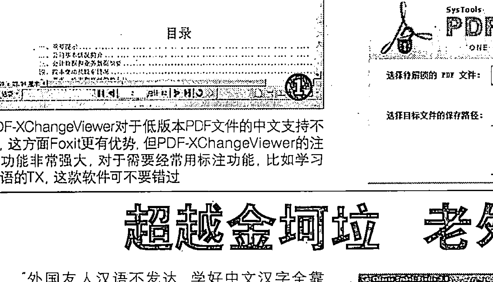

PDF-XChangeViewer对于低版本PDF文件的中文支持不好，这方面Foxit更有优势。但PDF-XChangeViewer的注释功能非常强大，对于需要经常用标注功能，比如学习英语的TX，这款软件可不要错过。

在看PDF文档时的各种操作也是样样俱全，例如放大、移动、翻页、添加注释等，还可以直接打开网页中的PDF文档（单击菜单“文件→打开URL”，然后输入PDF文档的URL即可）。

### 看加密PDF，“讲究”易如反掌

不少PDF文档都被加密了，没有密码是无法打开的，这时就可以使用“PDF.Password.Remover”这款小工具，运行后只要单击Open PDF(打开PDF)按钮将加密PDF文档添加进来，稍后再按照提示设置保存位置即可完成破解了。

### 拷贝锁定PDF，“讲究”小菜一碟

假如遇到一篇锁定的PDF文档，无法复制及其他编辑操作，也不用慌，只要运行PDF UNLOCKER，运行后直接单击“浏览”按钮将加密的PDF文档导入，再单击下面的“浏览”按钮，设置好保存目录，最后单击“解锁PDF文件”即可完成解锁，解锁后的PDF文档便可使用任何一款PDF阅读器打开后进行拷贝了（见图2）。

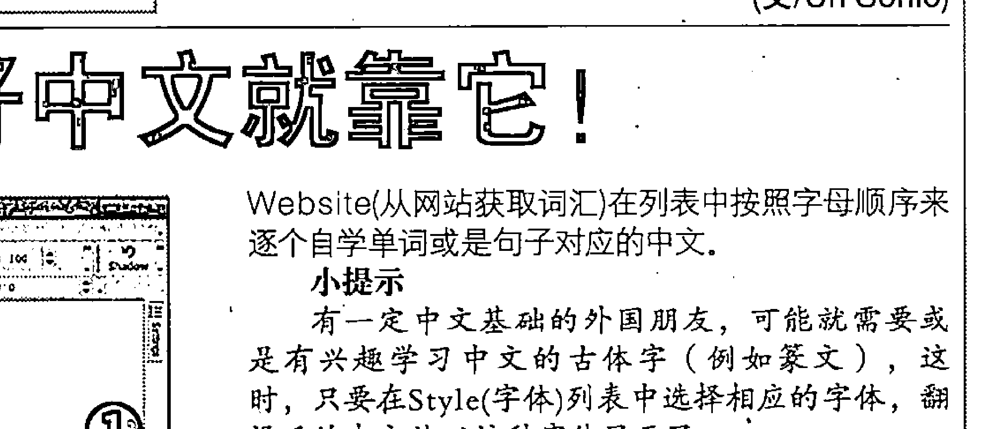

(文/Un Sonio)

## 超越金坷垃 老外学好中文就靠它！

“外国友人汉语不发达，学好中文汉字全靠它”！继宇宙超级无敌霹雳级化肥“金坷垃”享誉全球之后(资料参考：http://tinyurl.com/2en7pfq)，一个神奇的东西再度问世！学一门外语，那是相当的不容易，我们学英语、日语如此，外国人学中文亦如此。假如你有一位会说英语的朋友，不妨与其互相合作，让他教你学英语，你再教他学中文，互相帮助，互相进步。先从http://www.work.newhua.com/cfan/201011/css.zip下载Chinese Symbol Studio这款小软件，运行后开始学习之旅！

### 天生是块儿学习的料

软件自带了很多简单的中文汉字，例如one、two、three对应的一、二、三，常见英文姓名的中文TOM、JACK对应的汤姆、杰克等，老外朋友可以直接在软件左侧的Symbols Library(单词列表)列表中点击相应的单词来自学（见图1）。同时，还可以通过单击左侧的Translation(翻译)

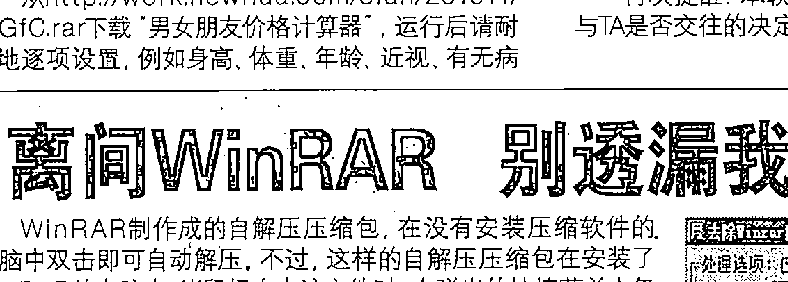

打开翻译窗口，输入英文单词或是整句，单击Go按钮后即可立即得到相应的中文翻译，也可以直接单击Symbols from Our。

### 还会写篆文？

不仅国外朋友对中文古体字有兴趣，即便是国人也有不少喜欢中文古体字的。通过本软件可以将一段文本直接转换成古体字：先在“Style”列表中选择要转换的古体字，然后单击菜单File(文件)→Insert Text(输入文字)，然后将文本粘贴到打开的文本框中即可进行转换了（见图2）。

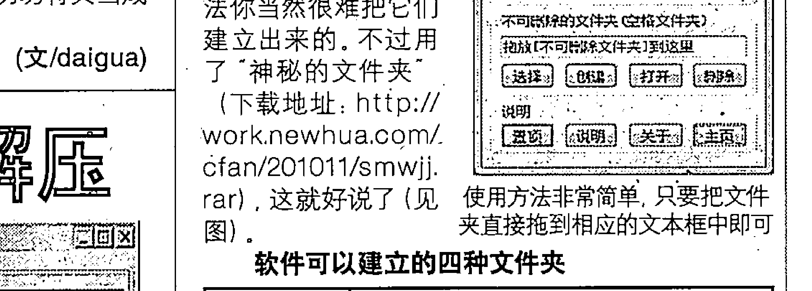

(文/dream)

## 算算TA值多少钱？

很多人说钱不是个东西，但有时候，钱可以作为一种尺子，往往能衡量不少东西。例如，真正的朋友之间的友情是无价的，假如只为一点钱而闹红脸的朋友，建议你不要深交。说到钱作为尺子，这款小软件很有意思，可以从各个角度来计算你的TA到底值多少钱（注：仅供娱乐，可别当成择偶标尺）。从http://work.newhua.com/cfan/201011/BfGfc.rar下载“男女朋友价格计算器”，运行后请耐心地逐项设置，例如身高、体重、年龄、近视、有无病史、考试是否挂科等等，如实填写，这些参数填写完毕后直接单击“计算”按钮即可得到TA的“价格”了。

**小提示** 在计算时还需要分为“年轻纯情”及“成年激情”两种模式，选择不同的模式而计算出来的结果会有差别。再次提醒：本软件纯粹当个玩具，切勿将其当成与TA是否交往的决定因素！

(文/daigua)

## 创建“神秘文件夹”

还记得CFan以前教过你的创建带点的文件夹、不可见的文件夹、不能删除的文件夹……吗？使用一般的方法你当然很难把它们建立出来的。不过用了“神秘的文件夹”(下载地址：http://work.newhua.com/cfan/201011/smwjj.rar)，这就好说了（见图）。使用方法非常简单，只要把文件夹直接拖到相应的文本框中即可。


### 软件可以建立的四种文件夹

| 文件夹类型 | 描述 |
|------------|------|
| 带点文件夹 | 可用于简单加密，不能打开、删除 |
| 不可见的文件夹 | 一键Ghost使用的文件夹，一般是无法看到该文件夹的 |
| 不可删除的文件夹 | 可以打开，但不能删除，防止重要数据被删除 |
| 空格文件夹 | 文件夹名称为空格，如果图标设置为透明，可以起到隐藏的效果 |

(文/abc)

## 离间WinRAR 别透露我是自解压

WinRAR制作成的自解压压缩包，在没有安装压缩软件的电脑中双击即可自动解压。不过，这样的自解压压缩包在安装了WinRAR的电脑中，当鼠标右击该文件时，在弹出的快捷菜单中仍然可以看到“用WinRAR打开”的选项，完全是画蛇添足。如何屏蔽掉这个选项呢？方法很简单。从http://work.newhua.com/cfan/201011/qcziyyl.rar下载这款名为“去除Winrar自解压Exe的右键菜单”的小工具，运行后直接将自解压压缩包拖放至软件窗口中，再单击“开始处理”（见图）。处理完毕后再右击自解压压缩包，保证就看不到用WinRAR打开的选项了！


(文/DG)

## 从蹒跚学步到腾云驾雾——一周足矣！

记得在封闭式学校读书的高中时代，上网可不是个容易的事。一周放半天假还要家长签字到家的时间……以至于在生病的时候，左手输着液，右手还要握着鼠标！那时候不懂什么是鼠标手势，“一指禅”式的点击着鼠标那叫一个辛苦。现在好了，最多一周时间，你就可以成为满手跑火车的快速操作达人！

### 星期一 傲游勾起的“手势之痒”

好吧，我不得不承认，在我印象里的鼠标就只有单击和双击这两个用法……晃眼间看见隔壁同学在浏览器上顺手的拉出一条绿线，然后页面就自动翻到上一页面了。原来这是傲游浏览器的“鼠标手势”，按下鼠标的右键并移动一段距离，再释放鼠标，屏幕就会根据移动的方向作出不同的反应。

- 比如傲游浏览器中一些默认的鼠标手势：
鼠标手势 相应操作
左（←） 后退
上-下（↑↓） 刷新（F5）
下-右（↓→） 关闭窗口
下-左（↓←） 关闭所有其他页面
打开“选项→Maxthon选项→鼠标动作”，可查看傲游默认的鼠标动作及自定义鼠标手势。

### 星期二 ChromePlus，兼得鱼与熊掌

快捷，我所欲也，安全，亦我所欲也。喜欢傲游浏览器在操作方式上的方便，而谷歌浏览器的沙盒技术所带来的安全亦难以割舍……想要兼得鱼与熊掌，ChromePlus做得恰到好处！（下载地址：http://www.chromeplus.org）

ChromePlus具备谷歌浏览器的所有特性，同时还增加了鼠标手势、IE标签、广告过滤、超级拖拽、隐私数据保护等增强功能。用Ctrl+Shift+O组合键打开配置选项页面，在该页面的“鼠标手势”选项卡中勾选“开启鼠标手势功能”即可（见图1）。

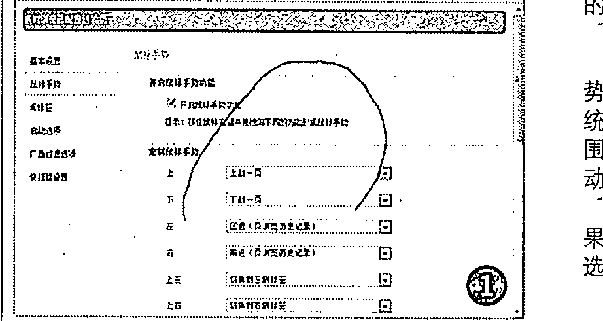

### 星期三 新Firefox 与老插件

听说Firefox（简称FF）已经更新到了3.6.3的版本，难道还需要像2.0中那样，安装FireGesture或Mouse Gestures插件才能让FF支持鼠标手势吗？决定亲自体验一下。

3.0以后的FF，一如既往的不能支持鼠标手势这个实用的功能。拿出以往在2.0中使用的鼠标手势插件，安装时又会出现“扩展不兼容”的警告（见图2）！要解除这样的警告，需对插件作出如下修改：

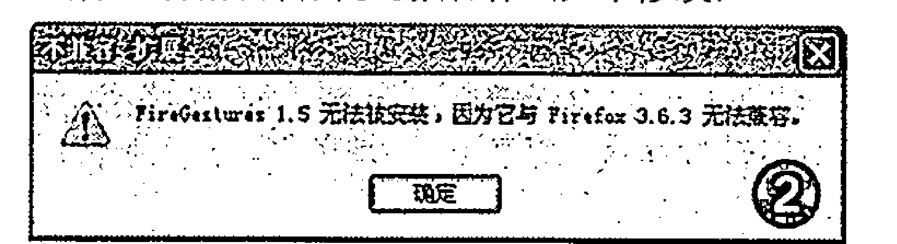

- 1. 使用WinRAR等压缩软件打开扩展名为XPI的插件，将其释放到某个文件夹中；
- 2. 将其中的install.rdf文件用记事本打开，按下Ctrl+F组合键，以maxversion为关键字进行搜索；
- 3. 将所有maxversion尖括号后的版本号都修改为4.*.*，号位置的值不改变，即只将版本号的第一位改变成比当前版本更大的值；
- 4. 保存之后，将所有文件压缩为ZIP格式，然后手动修改扩展名为XPI，将这个文件拖拽到FF的主窗口下，重启FF后即完成安装。

相比之下，个人感觉Mouse Gestures更加好用一些。

### 星期四 两个插件，争啃一块鸡肋

不安全、速度慢……种种缺点让人不得不抱怨IE浏览器很不好用。曾经的老牌IE浏览器插件——IE Plus在IE8问世之后似乎停止了更新，所有的功能在IE8中都无法使用，想要成为IE Plus的替代者，IE风行者和IE伴侣谁更强大？用性能说话！
相同功能：鼠标手势、广告过滤、地址栏搜索、超级拖拽、媒体文件快速保存、网页截图、IE修复……
不同之处：

| 软件名称 | 下载地址 | 股市行情 | 网页内容限制解除 | 页面内嵌搜索 | 一键网址 | 划词翻译 | 代理浏览 |
|----------|----------|----------|------------------|--------------|----------|----------|----------|
| IE风行者 | www.iefxz.com | × | √ | √ | × | × | × |
| IE伴侣 | www.iemate.com | √ | × | × | √ | √ | √ |

### 星期五 StrokeIt 让鼠标手势无处不在

在与鼠标手势接触的日子里，已习惯了享受它在浏览网页时给我带来的方便。看着熟悉的Windows桌面……能不能让系统也支持鼠标手势？找到了被人们称为“鼠标精灵”的StrokeIt（下载地址：http://www.onlinedown.net/soft/7145.htm）。利用它可以为系统中的任意一款软件设定鼠标手势，通过打钩、画圈等动作来执行预先定义好的命令。

#### 1. 安装与了解

下载得到的StrokeIt是一款绿色软件，解压后运行“添加启动项.bat”这个批处理文件，就会在任务栏的托盘处多出一个鼠标图标，双击它，打开StrokeIt的“命令编辑器窗口”。
StrokeIt的内置手势大体分为两种——“通用手势”和“特定手势”。其中，“通用手势”可以作用于系统中的每一款软件；“特定手势”则只能在限定的范围中使用。例如默认的手势中，“右左（→←）”这个动作在桌面上是打开任务管理器，而在通用手势中，“右左”和Ctrl+Z组合键的功效一样，表示撤销。如果对StrokeIt的默认设置不满意，通过“编辑→参数选择”即可进行修改。

#### 2. 修改默认手势

对于任何一款软件来说，无论它的内置功能多么丰富，恐怕都难以同时满足每个挑剔的用户。因此，StrokeIt能让用户根据自己的习惯来更改默认手势。
以“Windows桌面手势”中的打开任务管理器为例，要将其修改为“上下（↑↓）”。从左边的窗口中选定“Windows桌面→打开任务管理器”，点击“移除手势”按钮将原有的Right-Left删除后，再从下拉菜单中选择一个新手势，本例中选Up-Down之后并点击“添加手势”，对默认手势的修改就完成了（见图3）。

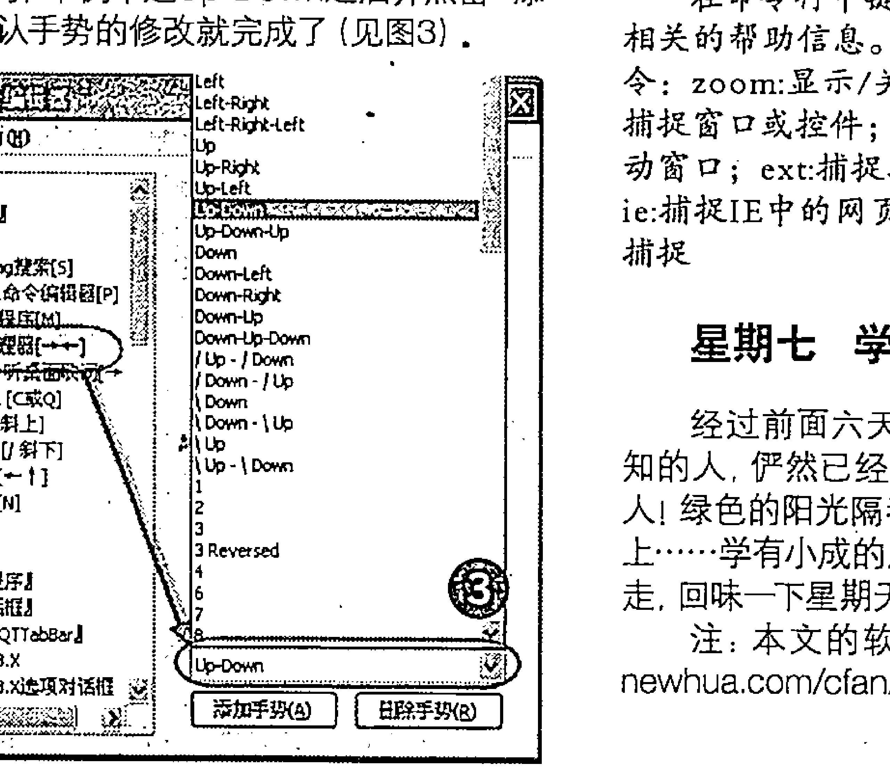

#### 3. 定义新手势

要记住StrokeIt内置的50多种手势……谁会这么有耐心？马克·吐温曾经说过：要让一件事能轻易地被记住，最好亲自去做一遍！不妨自己动手设计一套新手势。

例如“程序关闭”这个命令，直接用鼠标右键画出一个“大叉”的样子，不是更加直观易用吗？通过“编辑→学习手势”打开“学习模式”窗口，画出想要的动作后（比如大叉，见图4），单击“新建手势”并输入手势名字，即可将新手势存入StrokeIt的手势库中。然后再按照步骤二修改默认手势的方法，在通用动作中将“关闭窗口”修改为自己画的“大叉”，对手势的定义和使用就这样完成了。

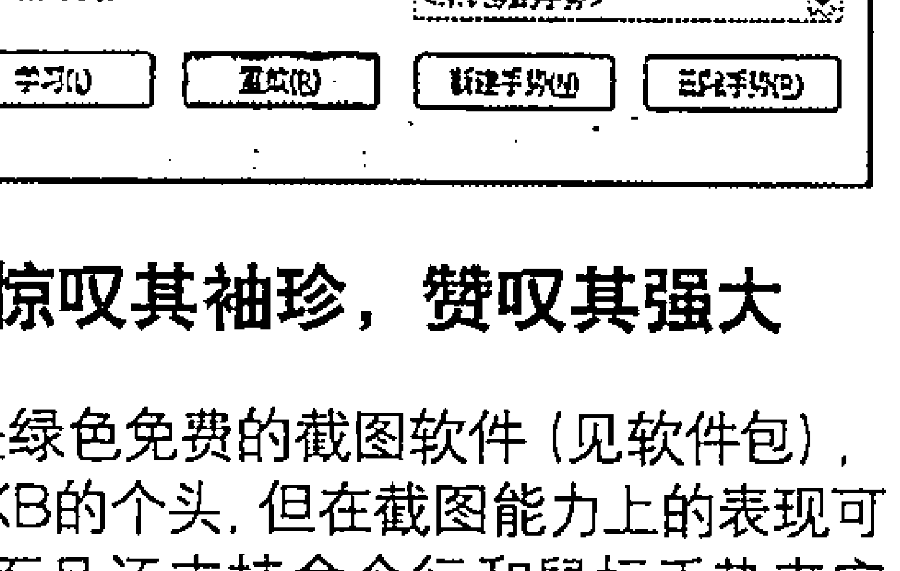

### 星期六 惊叹其袖珍，赞叹其强大

EP Snap是绿色免费的截图软件（见软件包），别看它仅有346KB的个头，但在截图能力上的表现可是不容小觑的，而且还支持命令行和鼠标手势来完成截图！

EP Snap默认是不支持鼠标手势的，在初次运行时，按照提示打开“选项”窗口，切换到手势选项卡，只要勾上“使用鼠标手势”前面的复选框即可打开这个贴心的功能。虽然默认的手势不多，但已完全能够满足截图的需求（见图5）。

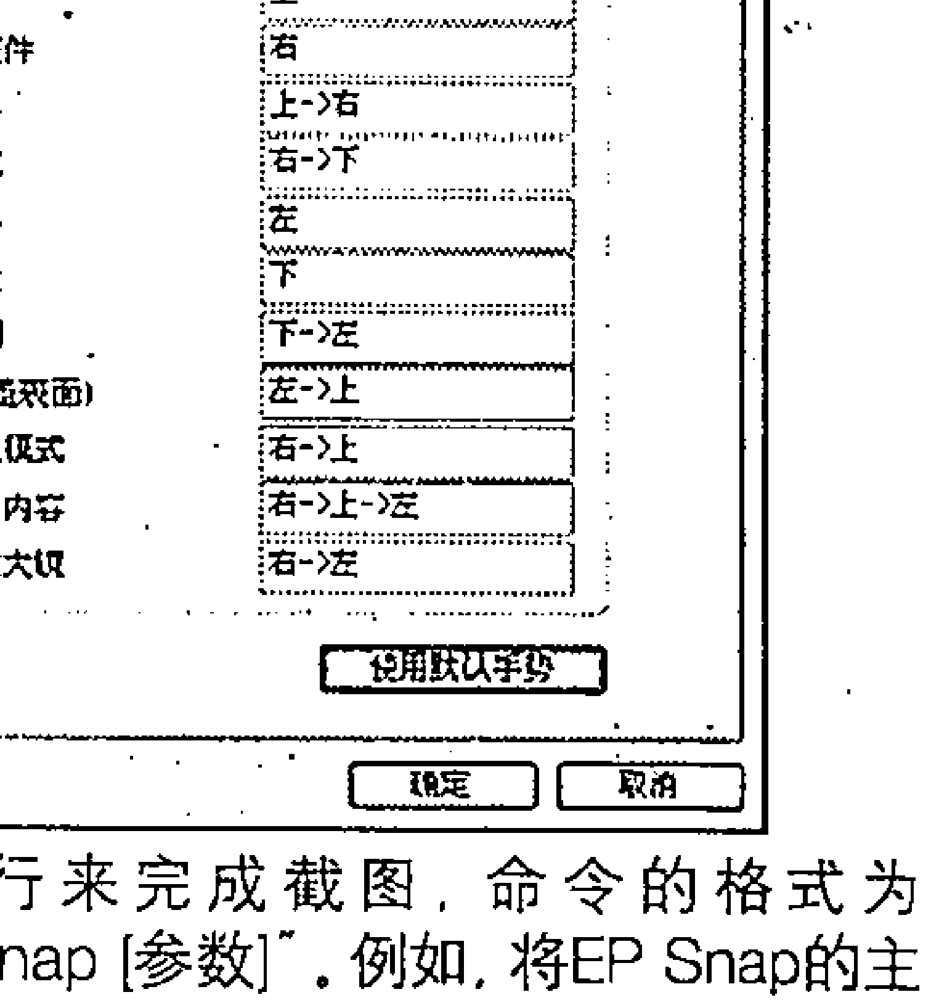

要用命令行来完成截图，命令的格式为“epsnap.exe /snap [参数]”。例如，将EP Snap的主程序和Dll文件都放在D盘，要通过命令行来完成捕捉屏幕，则应当在CMD窗口中依次输入如下命令：
D:
epsnap.exe /snap scr

### 小提示

在命令行中键入“EP Snap.exe /?”时将不会显示相关的帮助信息。经收集，EP Snap有如下一些命令：
zoom:显示/关闭放大镜；
scr:捕捉屏幕；
wnd:捕捉窗口或控件；
swnd:捕捉滚动窗口；
ext:捕捉扩展窗口；
zone:捕捉指定区域；
ie:捕捉IE中的网页；
dx:特殊捕捉；
redo:重复上次捕捉。

### 星期七 学有小成，适当休息

经过前面六天的学习，一个对鼠标手势一无所知的人，俨然已经成为了满手跑火车的快速操作达人！绿色的阳光隔着树叶儿洒下来，溅在初夏的大地上……学有小成的周末格外美好，关掉电脑去外面走走，回味一下星期天的味道。

注：本文的软件包下载地址是http://work.newhua.com/cfan/201011/rj.rar。

(四川/李卢林)

## 填表格式要统一 开发工具来规范

单位里经常发送一些电子表格让员工填写，即使填表说明上写得清清楚楚，哪些单元格里用什么字体、什么字号，出生日期的格式怎么填，哪些单元格留空，但有些马虎的员工就是不注意，交上来的表格还是五花八门。如何对表格进行统一规范呢？在Word 2007中，调用“开发工具”，只要稍做一番设计，就可解决。

首先调出“开发工具”，单击左上角的Office按钮，再单击“Word选项”，在“常用”选项卡中勾选“在功能区显示‘开发工具’选项卡”后即可。然后在Word 2007中设置好表格。

### 字体、字号不走样

将光标定位于姓名后面的输入框，单击“开发工具”，然后单击“格式文本”按钮，再单击“属性”按钮，弹出“内容控件属性”窗口，勾选“使用样式设置内容的格式”，并单击“新建样式”，弹出“根据格式设置创建新样式”窗口，在“格式”一项中设置字号、字体等项目后，单击两次“确定”返回，这样在姓名栏中输入文字的字体和字号会自动设置成我们事先设定的格式。

### 日期数值不必输

单击选中“出生年月”后面的单元格，再单击“开发工具”中的“日期选取器”，然后单击“属性”，在“日期显示方式”中选择所需要的格式即可。

### 性别没有第三种

有些员工，可能会在性别中输入诸如“难”、“南”之类的性别，实在可恶！如何避免呢？光标定位于“性别”后面的单元格，再单击“下拉列表”按钮，并单击“属性”，选中“显示名称”列表中的“选择一项”，再单击“修改”，在“修改选项”窗口中将“显示名称”和“值”后都输入“男”，然后单击“添加”，输入“女”后“确定”。这样在输入性别时，只能通过鼠标从“男”或“女”中进行选择。

### 留空表格动不了

表格中的“单位总评”是领导的评语，有些员工不知什么原因竟然自行评价，可以禁止员工在其中输入任何内容。
选中“单位总评”后的单元格，依次单击“纯文本”、“属性”，在“标题”中输入警示语句，比如输入“此处由领导填写”，同时勾选“无法编辑内容”后单击“确定”即可。这样，当鼠标单击该单元格，显示警示内容，且无法输入。如果想对原始表格内的内容进行保护，以防他人修改，也可以通过这种方法来达到目的。
(江苏/曹春华)

## 绘出函数 WPS画出课件“抛物线”

数学教师在使用WPS演示制作教学课件过程中，当有关函数图像出现时，一般情况都会是直接用“照相机”或“扫描仪”把书中的例图直接插入到课件当中，这样的图像虽然准确，但是不能任意调整。当我看到有人用ET（即“WPS表格”）绘制了精确的函数图像，WPS又推出在线素材时，我就想：这两者能不能结合起来，把ET绘制的函数图像在“在线素材”中共享给大家使用呢？

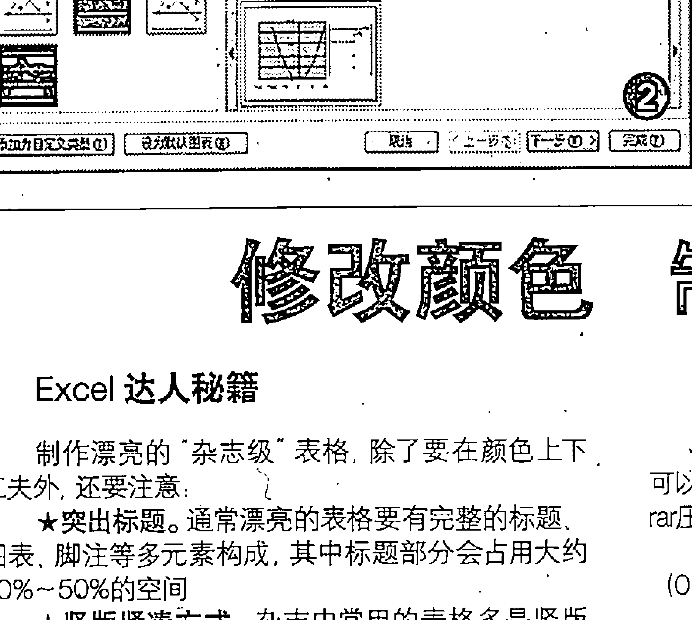

### 绘制精确函数图像

第一步：打开WPS演示，选择“插入→图表”菜单项，打开ET。
第二步：在A列的A1格输入X=，表明是自变量。在A列的A2及以后的格内依次从大到小输入自变量的各个值；在C列、D列和E列中输入函数公式中a、b、c的值。
第三步：在B列的B1格输入 y = a x ^ 2 + b x + c；在B2格输入 =$C$2*A2^2+$D$2*A2+$E$2（$C$2是绝对引用C2中的数值，其他相同）。B2格内马上得出了计算的结果。这时，再选中B2格，让光标指向B2矩形右下角的“□”，当光标变成“+”时按住光标沿B列拖动到适当位置即完成函数计算（见图1）。
第四步：选择“插入→图表”菜单项，在打开的“图表类型”对话框中选择“X,Y散点图”，在“X,Y散点图”类型中选择“无数据点平滑线散点图”（见图2）。
第五步：单击“下一步”按钮，选中“列”项，单击“数据区域”后的选项，给出数据区域=Sheet1!$A$1:$E$21。
第六步：单击“下一步”按钮，单击“坐标轴”、“网格线”和“图例”选项卡，去掉这三个选项卡中所有的复选框选项。点击“完成”按钮。

### 修饰函数图像

此时完成的图像还有背景框，根据自己的实际情况，选择留下的数据，清除不需要的内容。
单击“绘图区”（即默认的灰色背景），按DEL删除“绘图区”。选中“图表区”，单击工作栏的“设置图表格式”按钮，打开“图表区格式”对话框，“边框”和“区域”都选择“无”，单击确定按钮。关闭“ET”，退出图表编辑状态。

### 上传精确函数图像

第一步：回到“WPS演示”，右击抛物线图像，在右键菜单中选择“上传到我的素材库”菜单项。
第二步：在打开的“在线素材（校园版）”中输入用户名和密码后“登录”。
第三步：输入标题、标签和备注内容，并且共享到群组中，给大家下载使用。
大家现在就可以在“在线素材”中搜索到我共享的“抛物线”图像，并且可以双击进行相应的修改，变成自己需要的那条抛物线。
(李月林)

## 修改颜色 制作“杂志级”专业表格

### Excel 达人秘籍

制作漂亮的“杂志级”表格，除了要在颜色上下功夫，还要注意：
★突出标题。通常漂亮的表格要有完整的标题，图表、脚注等多元素构成，其中标题部分会占用大约30%~50%的空间。
★竖版紧凑方式。杂志中常用的表格多是竖版紧凑格式，这样制作出来的表格效果最好，通常合适的表格比例是2:1到1:1之间。
公司在给客户制作资料时，经常需要引用一些表格，Excel本身的表格非常难看，尤其是在配色方案上更是很难做到完美，以至于制作出来的表格非常难看，其实这时你不妨借鉴一些国外杂志的表格制作方法，有了这些方法，就会让你制作出来的表格更漂亮。

### 给Excel表格“点颜色”看看

首先给大家几组杂志常用的填充颜色组合，大家可以参考http://work.newhua.com/cfan/200923/zzjbg.rar压缩包中的样式，对照下面的具体RGB数值。
①水蓝色图表。主体为三种颜色，分别为 (0,81,107)，(90,146,181)，(0,166,231)。
②蓝红组合图表。主体为两种颜色，分别为 (0,56,115)，(247,0,0)；背景为两种颜色 (206,219,231)，(231,239,247)。
③单色配色。主体为四种颜色，分别为 (0,174,247)，(255,134,24)，(206,219,41)，(0,166,82)。
④棕色配色。主体颜色共六种，分别为 (96,45,37)，(121,78,67)，(145,104,99)，(166,135,132)，(192,167,165)，(216,196,189)。
现在颜色的数值都已经有了，下面我们需要完成图表颜色的改变了，其实方法非常简单：在已经制作完成的图标中，点击需要修改颜色的柱形或饼图等图表元素（注意一定要单击，这样选择出来的是所有同色的元素），右击后，选择“设置数据系列格式”，在弹出窗口中选择“填充→纯色填充”，然后点击“颜色”按钮，点击“其他颜色”，在弹出窗口中根据上面的数值按顺序填入红色（R）、绿色（G）、蓝色（B）即可。

### 漂亮表格就要反复利用

## “简报”制作 Word其实很Easy

我是事业单位的工作人员，在单位负责简报的制作。简报上传下达，是上下级单位沟通的桥梁，领导自然非常重视。为了制作出精美而且富有特色的简报，开始我也试用过不少排版软件最后发现Word 2003完全能满足需要。

为了使报头美观大方，报头字体使用了迷你繁智楷，下载解压后复制到C:\Windows\Fonts即可安装成功。优美的字体使简报报头简洁明朗，引人注目。Logo是单位的重要标志，简报报头使用Logo会突出行业特色，因此必须使用尺寸大小适宜的Logo，必要时使用Photoshop等图像编辑软件进行编辑。为了使报头美观大方，在报头的制作中还使用了Word绘图的自选图形。反复试验，终于找到了比较满意的图案。在图案的挑选中，一定要反复认真试验，使报头图案协调美观。

Word中最让人头疼的是图文混排。其实图文混排的关键在于图片的设置格式。具体操作步骤如下：在插入或复制的图片设置好大小和位置后，点击鼠标右键“设置图片格式”，环绕方式设成“紧密型”；如果图片能确定放在左边、中间或右边，水平对齐方式要设为“左对齐”、“居中”或“右对齐”，不确定则设为“其他方式”，在“高级”选项里，依次选择“图片位置→选项”，将“对象随文字移动”、“允许重叠”、“锁定标记”以及“表格单元格中的版式”选项全部取消。这样，图片就可以在图文混排中随意拖动位置，版面不至于由于图片或文字的部分调整而面目全非。

Word中文本框的灵活运用既可以使版面灵活，也使图片和文字和平相处，相得益彰，达到图文并茂的效果。在菜单栏中单击“插入→文本框（横排或竖排）”，使用文本框插入文本。同时为了使版面美观，简报的每一单元文本（即“豆腐块”）的排版都采用了分栏与边框。具体操作步骤如下：先拖动鼠标左键选中所要编辑的文本，然后鼠标左键单击菜单“格式→边框与底纹”，在“边框”的“设置”选项选择“方框”，“线型”选项选择波浪线，“应用于”选项选择“段落”，最后点击“确定”；左击菜单“格式→分栏→预设→两栏”，“应用于”选择“所选文字”即可。

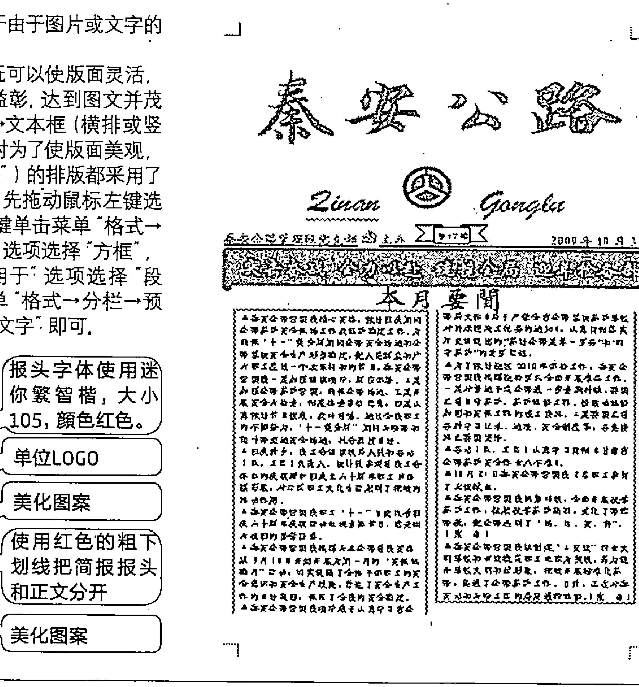

## 冬运会宣传缺灵感 Publisher来助阵

学校决定近期举行冬运会，因为邀请了友校来观摩，所以领导要求我们几个懂电脑的打印一些有创意的宣传画标语。这就有些强人所难了，电脑我们是懂点，但创意的宣传画标语我们怎么做出来呢？其他什么奖状、赛事简报也要我们负责，站着说话不腰疼呀！人家是领导，服从第一。情急之中，用Office 2007解决了难题，相信许多单位公司经常搞一些活动，这篇文章希望能起到抛砖引玉之效。

### 宣传标语依样画葫芦
运行Office 2007组件中的Publisher，在“出版物类型”中选中“广告”，从预览窗口中双击一款与运动会广告样式相似的模板，打开模板进行编辑，我们需要做的工作就是在这里进行文字的修改或图片的更改即可。打印出来后，用复印机适当放大复印就可。

运动会向导标志、各类警示标志等的制作可以在“标志”中找到许多合适的模板。

### 赛事简报快又好
选择“出版物类型”中的“新闻稿”，几十种风格的新闻稿模板可以供我们选择，双击打开后，在文字编辑区域输入赛事新闻、比赛成绩、通讯稿等，一份漂亮的赛事简报就算大功告成了。

### 让奖状彰显运动会特色
以前发放的奖状千篇一律，一点特色也没有，而Publisher中的奖状模板可以让奖状更合乎运动会的特征，模板中的“体育”类就可直接套用，只要输入获奖内容、获奖人姓名等，就可以做出一份有纪念价值的奖状。在运动会闭幕式中，领导还专门表扬了我们宣传组的业绩，有了这次经历，再应付其它的会议、集会之类，就可胸有成竹了。
（江苏/张冬琴）

## 巧用WPS表格筑就强大万年历

ET 2009是一个表格设计软件，其内置的函数具有强大的运算功能，利用函数设计万年历非常方便、快捷。本篇教导大家利用在最短的时间内设计一个强大的万年历。

**设计万年历前，先罗列出万年历的具体要求：**
- 可计算1900到9999年之间的所有日历；
- 可方便地切换时间，即查找任意年、月的日历；
- 仅仅使用ET的内部函数完成，不用VBA及引用外部数据

**操作步骤如下：**
第一步：在A1单元格随意输入一个日期，例如2009-11-9，选择A1:G1区域，然后单击工具栏中的“合并单元格”，使该区域合并居中显示。选择A2:G2，输入以下数组公式：={"Sun","Mon","Tue","Wed","Thu","Fri","Sat"}。

第二步：选择 A3:G8，并输入数组公式 =VALUE(TEXT(A1-DAY(A1)-MOD(A1-DAY(A1),7)+{0;1;2;3;4;5}*7+{1,2,3,4,5,6,7},"d"))

第三步：为了让标题与日历加以区分，对A1:G1、A3:G2和A3:G9三个区域设置不同背景色及字体。其中字体、背景色可以根据个人喜爱设置。此时，修改A1的值日历将相应地更新。

第四步：目前这种效果显示了与当月无关的一些日期，为了消除它，可以利用条件格式来完成。选择A3:G3区域，然后打开条件格式对话框，设置为小于10的值，字体颜色显示为背景色。

第五步：再选择A7:G8区域，同样方式设置条件格式为小于15者显示为背景色与字体色相同即可。

### 小提示
如果感觉修改A1不太方便，可以利用窗体来滚动式编辑年与月。即在工作表中插入一个微调项，设置其“控制”属性。以同样方式再添加一个微调项窗体控件，并将其最小值设为1，最大值设为12，单元格链接为“$G$1”。

修改A1的值为以下公式：=H1&"年"&I1&"月1日"

通过以上设置后，鼠标单击微调项就可以控制日历的显示年月了。
（罗刚君）

## 所见即所得 剪贴板变身表格整合器

在Excel表格中，我们经常需要将许多单元格中的数据合并到一个单元格中，Excel的合并单元格有个缺点，只能保留合并区域左上角单元格数据，而在Excel公式中运用连接符（&）连接多单元格数据也存在一些不便，这时就可以利用剪贴板来实现。

1. 第一步：选择区域A2:E5，点击Ctrl+CC（按住Ctrl键的同时连击两次C键），调出剪贴板，并将区域内容复制进剪贴板。Excel 2007默认情况下，无法通过Ctrl+CC调出剪贴板，按如图所示方法即可。然后，双击任一空单元格，点击剪贴板中内容，即可将A2:E5区域中的所有内容粘贴至单元格中。

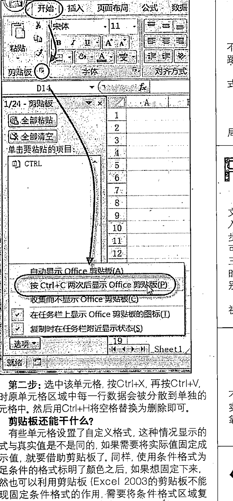

第二步：选中该单元格，按Ctrl+X，再按Ctrl+V，此时原单元格区域中每一行数据会被分散到单独的单元格中。然后用Ctrl+H将空格替换为删除即可。

剪贴板还能干什么？有些单元格设置了自定义格式，这种情况显示的格式与真实值是不同的，如果需要将实际值固定成显示值，就要借助剪贴板了。同样，使用条件格式为满足条件的格式标明了颜色之后，如果想固定下来，仍然也可以利用剪贴板（Excel 2003的剪贴板不能实现固定条件格式的作用，需要将条件格式区域复制粘贴到Word中，再复制粘贴回Excel，可实现Excel 2007剪贴板同样效果）。

## 用Word给图片打造漂亮边框

说到处理图片，PS是当之无愧的NO.1，但是如果我们只是把图片加个边框，增加点文字难道还要去学PS吗？当然不用，其实Word 2010已经具备了初级的图片处理功能，用好这些功能，菜鸟也能做出漂亮的图片。

1. 给图片选择一个合适的版式，现在光标定位到图中的“文本”字样中，输入自己需要添加的文字，并设置好字体与字体的大小。
2. 选中文字，单击菜单栏上的SmartArt下的“格式→文本效果”，这里有多种效果供我们选择，选择一种满意的效果把单调的文字设置得更漂亮些。
3. 选中图片，再选择“图片工具→格式→图片效果”，为图片选择合适效果，不同效果可以叠加，例如可以为图片设置“阴影”、“柔化边缘”与“映像”。
4. 现在大家快来一起看“摔锅”呀！如果对图片还不满意，还可以在“艺术效果”选项中为图片设置漂亮的艺术效果。

## Excel 2010初次体验的惊喜

1. “插入”标签增加了“屏幕截图”、“迷你图”、“切片器”功能。
2. 在“页面设置→页眉/页脚”中增加了“奇偶页不同”、“首页不同”、“随文档自动缩放”、“与页边距对齐”选项。
3. 在“页面布局”标签，提供了各种漂亮的主题样式。
4. “定义名称”提供了“备注”选项，而且提供了“名称管理器”，并能够显示隐藏名称。
5. 新版Excel在“视图”标签下，提供了“页面布局”按钮，Excel按页码显示，并出现按厘米计算的“标尺栏”，更符合文档编辑习惯，也更直观，在页面布局视图下，编辑页眉页脚更直观，而且单元格大小是以“厘米”度量，用厘米设置行高列宽，使Excel套打更容易实现。
6. 滚动条增加了最前端行列标记提示，大文档操作时，拖动滚动条仍能清楚当前视图中所能显示的具体区域。

果果：真细心！一个组件就发现了这么多新变化！很有挖宝潜质！

## PPT 2010让我变身视频编辑达人

在PPT 2010中插入视频，不仅可使其成为演示文稿文件的一部分，不再发生视频文件丢失事件，导入视频速度大为提高，而且对这些视频可以添加同步的重叠文本、标牌框架、书签和淡化效果。此外，还可以对视频应用边框、阴影、反射、辉光、柔化边缘、三维旋转、棱台和其他设计效果。当重新播放视频时，也会重新播放所有效果，使视频播放更加生动、别致、新颖。

例如：对视频应用边框、形状和效果，插入一段视频后，在“视频工具→格式”菜单下，将鼠标移到一个视频效果图标上即可预览效果。还可以在右边的“视频形状”、“视频边框”、“视频效果”下拉菜单中对视频进行更丰富多彩的编辑。此外，还可对视频的长短进行剪切，在“视频工具→播放”下进行设置，大家不妨自己试一试。

果果：玩转动画还不够，个性视频编辑更让我们眼前一亮。春节里亲友聚会，你拍下了喜庆的视频吗？放到PPT 2010里编辑一下，小心大家叫你大导演哟！

## OneNote胜过Windows边栏

Windows Vista边栏的便条本太小，有时记点东西不太方便，但使用OneNote停靠到桌面功能可以更好地实现临时记事！打开OneNote，单击位于左上角的“停靠到桌面”按钮，便可以将OneNote固定在右侧了。

果果：OneNote是Office中一个低调的组件，专攻电子笔记，本刊介绍过不少它的应用技巧。当三大组件光芒四射的时候，它淡定地为学生、公司合作团队等群体服务，以更大的魅力吸引着越来越多的粉丝。鼓鼓掌吧！

## 值得一提的PPT 2010三大新本领

Office 2010启动的画面更加动感，感觉比较舒爽。PPT 2010的新增实用功能值得一提。

### 动画功能更强大
在PPT 2010中切换到“动画”选项卡，可以发现这里已经完全是Ribbon效果，选定需要设置动画的幻灯片对象，将鼠标指向“动画”功能组的某一动画样式，可以在编辑区实现即时预览幻灯片效果。PPT 2010对动画动作功能进行了加强，具有丰富的动画动作选项，可以快捷地设计出如同在电视上一样的场景切换效果。不但可以选择内置的各种形状的路径动画，还可以通过简单的设置，让指定对象沿着指定路径移动，做出各种复杂的运动曲线。

### PPT 直接保存为视频格式
PPT 2010增加了保存演示文档为Windows Media视频格式功能，超级强大。制作好PPT演示文档后，选择“文件”标签下的“另存为”，选择保存类型为“Windows Media 视频”，同时设置好保存位置与文件名称，单击“保存”按钮即可开始转换PPT成为WMV格式的视频。这个转换过程快慢由PPT演示文档的大小和动画的复杂程度等来决定，比使用第三方软件转换要快而且效果更好，还不会丢失动画效果。

另外在PPT 2010演示过程中提供的虚拟“激光教鞭”功能，演示过程中只需要按住Ctrl键与鼠标左键，就会出现一个红色圆圈光点，这时就可以使用鼠标移动该光点来达到激光教鞭功能。

果果：这位读者对PPT的感情一定不浅，一上来就列了两大发现。咱们就不用满大街的“两枪拍案惊奇”标题党了，但效果还真是让人挺惊奇的。比如“激光教鞭”，这得让演讲加不少分哦！

## Project 2010 新体验

增加了“时间表”等多个视图，支持“手动计划”；你可以只输入开始时间或结束时间，也可以把任务调至半天、1/4天，甚至0.XX天，支持直接把文档输出为XLS、XLSX、PDF及XPS文件。

果果：Office 2010是个宝藏箱，除了Project这个时间管理的宝贝外，还有什么闪闪发光呢？大家赶紧再挖掘一下吧。
（吉林/张博禹）

## 活用Word表格“小天平” 完美制作错行表

在使用Word制作各种表格时，经常会遇到表格中内容出现多与少分布不平衡的情况。通常会采取增加列宽或行高值来解决这个问题。其实，制作左右错行表格是一个有效的解决办法。既可以快速地把奇数行的“不平衡”表格调整为排列整齐的错行表，又可以还表格以美观大方、错落有致。具体方法快来看一下吧。

### 第一步：插入特定表格
在Word中键入表名（如个人资料表），设置“居中”。将文字居中。然后点击“表格→插入→表格”，这时会出现“插入表格”提示框。把提示框中“行数”与“列数”设为需要的内容，行数应为大于3的奇数。这样才能更好地体现这个技巧的作用。此例行数设为5，列数设为2。

### 第二步：巧设表格行高
将表格内容输入好后，单击鼠标左键选择表格上的第1~3行，然后在所选区域处单击右键，在出现的快捷菜单中选择“表格属性→行→指定高度”，在其后的设置栏内填写2厘米，在“行高值是：”栏内选择固定值。最后单击“确定”。用同样方法设置表格第4~5行“指定高度”为3厘米，“行高值是：”选择为固定值。这里有个准则是第1~3行的总高度等于第4~5两行的总高度。即2×3=3×2=6（厘米）。这样才能保证在第三步得到一个左右对齐的错行表格。

### 第三步：细设分栏参数
选中表格的所有内容，然后用鼠标单击“格式→分栏→两栏”，然后勾选“分隔线”和“栏宽相等”，把“间距”的数值设为0字符，并在“应用于”提示栏内选择“所选文字”，最后单击“确定”就OK了。一张美观大方的左右平衡错行表格立刻展现在我们的眼帘。
（河北/田静涛）

## 我用WPS（校园版）玩转在线素材

笔者就以初中物理教学中实物电路的连接为例，简要介绍一下“在线素材”在教学中的应用。

### 在线素材练习实物电路连接

第一步：运行WPS 2009校园版 (http://www.wps.com) 后，单击插件工具栏上的“在线素材（校园版）”按钮，或单击右侧任务窗格标题栏右侧的下拉箭头，在弹出菜单中单击“在线素材（校园版）”命令，打开在线素材窗格。

第二步：单击在线素材窗格右下方的“选择分类→初中物理”，当然你也可以同时勾选多个学科，即可看到与初中物理教学相关的素材。如果你对某件素材感到满意，只需将鼠标移到该素材的缩略图上，就会弹出信息框，显示出该素材的基本信息。点击素材作者的名字，系统会迅速搜索出该作者上传的所有素材。

第三步：用鼠标双击“伏安法测电阻（电功率）电路图”图标即可将该素材插入幻灯片中。调整该素材的大小和位置后，再用同样的方法插入其他电路元件图片，并调整它们的大小和位置。

第四步：保存演示文稿以后，按下F5键，进入幻灯片放映视图。右击后，在弹出菜单中选择“指针选项→水彩笔”，此时鼠标指针就变成了水彩笔的形状，就可以用笔画线来练习实物电路的连接了。

第五步：此时，你可以选择不同颜色的水彩笔绘制线条：在幻灯片放映状态下右击，在弹出菜单中单击“指针选项→墨迹颜色”项后，选择选色器中的某种色块，即可绘制出相应颜色的导线。

如果想重点强调某部分电路，可以参照上面的方法选择其他颜色的水彩笔绘制导线。如果某条导线画错或画得不满意，可以擦除该线路进行修改。做法如下：在幻灯片放映状态下右击，在弹出的菜单中单击“指针选项→橡皮擦”命令，此时鼠标指针变成一块橡皮擦，按住鼠标左键在该导线上拖过即可将其擦除。

如果你想重新连接电路，只需在幻灯片放映状态下点击鼠标右键，在弹出的菜单中单击“指针选项→擦除幻灯片上的所有墨迹”即可。

在退出幻灯片放映状态时，系统会弹出警示对话框询问您“是否保留墨迹注释？”，如果你想保留连接好的电路，只需单击“保留”按钮即可。

### 上传珍藏素材完善资源库
上传素材非常简单，你只需打开包含素材的文件，在想要上传的素材上单击鼠标右键，在弹出菜单中单击“上传到我的素材库”。在系统弹出的登录窗口中输入你的WPS通行证和密码，单击“确定”按钮后，在“上传到我的素材库”窗口中输入素材的标题等基本信息即可。

本教程的视频地址: http://tinyurl.com/yeme2gy
（孙少辉）

## 专业写手必备的秘密武器——纯文本下的表格处理技巧

给杂志、报纸撰过稿的朋友可能有这样的体会：很多媒体要求作者提供的稿件要使用文本文件+BMP图片的方式，也就是说稿件内容要用记事本这类纯文本编辑工具来撰写。当稿件内容需要用表格来处理时就会犯难了。有些聪明的朋友这时就变通地用Word来制作一个单独的表格。其实，纯文本模式下也可以制作表格。

从http://work.newhua.com/cfan/201006/txtedit.rar下载《文本排版大师》，运行后直接将鼠标放在要插入表格的地方，单击工具栏中的“自动制表”按钮（或按Ctrl+Tab键），在打开的窗口中设置表格的行数、列数及行宽、列宽，设置完毕后即可插入表格了。接下来就可以直接在表格中输入相应的内容了。

在输入内容时，这个表格不像Word那样以单元格为单位自动根据内容放大单元格，而当输入的内容过多，会自动将内容放到下一个单元格。因此，当内容过多时，需要手工增加单元格的列宽或是行高。单击菜单“表格→扩大列宽”。

当内容全部调整完毕后，可以直接将表格复制到任何一个文本编辑器（例如记事本、EditPlus等）中。

### 小技巧
当表格制作完毕后应该通过单击菜单“表格→锁定表线”将表格线锁定，这样就可以避免在编辑时出现表格线错位的现象。

此外，《文本排版大师》还提供了表格转换功能，可以将一段使用特定分隔符分隔的文本、数据等对象转换成表格：全选待转换的内容，按下Ctrl+W即可打开转换对话框，设置好分隔符即可开始转换了。

### 小提示
在转换表格时，可以通过固定宽度来进行转换，适合有规则的数字内容的转换，通常建议直接通过分隔符来转换。当然，在纯文本模式下制作的表格，处理起来肯定没有Word或是Excel这类高级编辑工具处理得方便。
（文/dream）

## 利润 成本分析利器：瀑布图

在新的一年来到时，不管是未来一年的成本核算，还是去年的利润计算都需要Excel表格的帮忙。除了可以用Excel表中自带的直线图、曲线图外，还可以使用特殊的“瀑布图”来完成。“瀑布图”顾名思义看起来就如同瀑布那样，具有自上而下的流畅效果。有的也叫做步行图，这种图对于用来解释从一个数值到另一个数值的变化过程具有特殊效果。

本文表格可以从http://work.newhua.com/cfan/201003/pbt.rar下载到。

### 整理相关销售利润数据
新建“销售利润瀑布图”工作簿，在C3:D17区域中输入此公司2009年度1月~12月份的期初利润、各个月份利润额及期末利润总额。

为了设计销售利润分析瀑布图，必须将这些数据加以整理，就是以这些数据为基础，整理成为3列数据。分别是每个期间的利润起初值、中间值以及期末值。在此表的F3:I3区域中，输入列名，然后在下面的第一行的上年结转利润初始值的G4中输入数值0，本期利润期末值的I4中输入公式=G4+D4，在利润中间值的H4中输入公式=(G4+I4)/2；在第2行的2009年1月份利润的初始值的G5中输入公式=I4，在中间值的H5中输入公式=(G5+I5)/2，在本期利润期末值的I5中输入公式=G5+D5，然后将这3个公式复制到下面的2009年2月~12月份相关单元格中。最后在最底端的年终利润总额初始值的G17中输入0，中间值的H17中输入公式=(G17+I17)/2，期末值输入公式=G17+D17。

### 设计销售利润瀑布草图
在前面整理数据的基础上，就可以进行瀑布图的设计工作了。选择整理数据表中的F4:I17区域，单击“插入→图表”菜单项，选择“折线图”。选择其中的“二维折线图”中的“折线图”，即可创建一个以整理后的3列数据为数据源的折线图。

插入折线图后，单击其中的任意一条折线，如利润中间值折线，选择弹出“图表工具→涨/跌柱线→涨/跌柱线”选项。这样在图表中就显示了涨跌柱形，基本具有了瀑布图的雏形。但是涨跌柱形还没有显示相应销售利润数值。而且由于涨跌柱形是第一个数据系列与最后一个数据系列的数据点之间的差，因此需要显示数值时，选择图表中的利润中间值折线系列，单击“图表工具→布局”菜单中，“标签”功能区中的“数据标签→居中”项，即可显示中间平均值。

这样虽然能够在柱形图显示数值，但是这个数值只是中间值，并不是起始值以及每月利润的实际值。因此必须逐一手工予以调整。调整时，单击相应的柱形图中的数据标签，如2009年1月份，在编辑框输入“=”符号，然后选择“2009年度各月利润明细表”中2009年1月份销售额值的D5单元格即可。

### 精心修饰销售利润瀑布图
首先取消图表中无用的折线以及网格线。右击图表中的利润中间值折线，从弹出的快捷菜单中选择“设置数据系列格式”命令，选择“线条颜色→无线条”项即可。采用同样的方法，将其余两条折线也予以隐藏。接着选择全部图表区域，从“图表工具”菜单中的“坐标轴”功能区中的“网格线”下，将图表中背景网格线删除。

其次需要修饰涨跌柱图标以及背景，比如按照传统数值表示习惯，选择图表中的所有正值涨跌柱图标，单击“图表工具→格式→形状样式”，选择一种合适的图标样式。比如蓝色的“强烈效果-强调颜色1”，同时为负值涨跌柱选择一种红色的样式图标。

为了使所制作的瀑布图更加美观，给瀑布图添加一份漂亮的商业背景图是非常必要的。最后，漂亮的“瀑布图”就出现了，把它放在PPT中也能够有不错的效果！
（山东/朱晓燕）参与“Office 2010发现之旅” 为TA准备最好的春节礼物

网络化的2010版Office

迫不及待试用了Office 2010版，发现这个试用版标志着微软办公软件开始向网络化方向发展，微软提供了免费的网络版，拥有Windows Live的用户就可以免费使用Web版。试用感觉除了界面与Office 2007版相似之外，网络功能也增强了。

1.  可以按需要下载，你可以从http://tinyurl.com/下载安装程序，实际上这个安装程序不过1MB多，等到你启动相应组件的时候，会自动通过网络下载所需要的程序。这种按需下载方式免除了用户下载安装大量程序的烦恼。
2.  上传中心的设置。在Office工具中增加了上传中心，方便了用户将重要文档安全保存，以防止本机出现问题而丢失了文件。这个功能非常贴心，但是不知什么原因还无法使用，也许需要等到正式版推出吧。（辽宁/王尧威）

发现Office 2010新功能

安装后右键菜单增加了一个“共享同步文件夹”，在每个文件夹下面点击右键，选择“共享同步文件夹”，就会开始同步这个文件夹。后来使用中发现，这个功能的实现程序就是Office 2010中新增的“Microsoft SharePoint Workspace 2010”程序实现的，可以方便公司办公电脑和家中电脑工作文件的同步。（广东/寂寞流星）

Office 2010初体验

前几天刚安装了Office 2010，试用一段时间，总感觉非常不错：
1.  安装体积没有想象中大。装Word、Excel、Outlook、OneNote、PowerPoint这几个组件，一共占用1.2GB左右（700多MB的安装源缓存文件可删除）。
2.  可以使用在线存储和发布功能！这是最重要的。可以直接把文档存到SkyDrive，或者发布到Blogger上等等。但在共享中用另一个Live帐号登录SkyDrive后，为方便使用了自动登录，可是问题来了：我不知道怎么样切换到别的帐号，找了半天没找到相关的功能，所以现在只能一直连最初的那一个Live帐号。（浙江/赵海宁）

更多“格式”更多“选择”，尽在PowerPoint 2010

在PowerPoint 2010中，我们与别人分享制作好的幻灯片有了更多的选择，如：将幻灯片发布为PDF格式的文档，或者直接输出为视频。

Office 2010 文档兼容性测试

你可以与时俱进，开拓创新，但是你的BOSS，你的老师，你的同事，可能并不是这样的激进分子；所以你编辑出来的文档一定要和大家兼容。否则让别人电脑都抓狂，你的后果就不堪设想了。

测试A：Office 2010能否打开其他办公软件生成的文档。
笔者用WPS 2003 OEM版和WPS 2009校园版编辑了两篇文档，然后尝试用微软Office 2010打开它们。
WPS 2003：打开成功，但是提示需要运行转换器才能打开，选择确定之后，正常打开文档。由于文档不是很复杂，所以无法判断对复杂排版的支持程度，但是简单排版的WPS 2003文档，打开是没问题的。
WPS 2009：打开成功，支持良好。
测试B：Office 2010创建的文档能否被其他办公软件打开？创建的密码保护是否有效？
由于Office 2010支持多种文档格式的保存，你可以在“文件→选项→保存”中设置自己默认保存的文档格式。笔者分别保存了四个文档，其中不加密和加密的DOCX格式各一个，不加密和加密的DOC格式各一个。
然后分别用Office 2010，WPS 2003，WPS 2009打开它们。

|          | DOCX 加密 | DOCX 不加密 | DOC 加密 | DOC 不加密 |
|----------|-----------|-------------|----------|------------|
| Office 2010 | √         | √           | √        | √          |
| WPS 2003 | ×         | ×           | ×        | √          |
| WPS 2009 | ×         | √           | √        | √          |

小提示
Office 2010输出WPS文档，也许是笔者的理解错误；也许Office 2010输出的WPS文档并非我们所说的WPS文档。总之，保存的这份WPS文件，无论是WPS 2003还是WPS 2009均无法识别，强行打开之后均为乱码。（北京/杨潇宇）

Word 2010新发现

1.  Word 2010的界面简洁清爽且各工具安排合理，五脏俱全。最左侧的文件选项卡可以立即看到文档的基本信息和各种细节设置，极为方便。还可在此添加标题、备注、作者等信息。
2.  右上角多了个“功能区最小化”的选项，开启后只剩下了选项卡名称，留下了更大的可操作界面。更难能可贵的是，点击相应的选项卡会出现相应的功能菜单且会自动隐藏。
3.  左上角多了个Word的图标，双击即可快速关闭Word！（浙江/吴榴炯）

大按钮消失了
Office 2010和Office 2007界面上最大的变化就是左上角的按钮变，我还是喜欢原来的样子……（小柯）

Office 2010 测试感受

Office 2010将所有初始化过程都置于一个带有酷炫动画的溅射屏幕之后，避免了用户在等待时误操作引发的程序失去响应或崩溃的现象。溅射屏幕上还人性化的设置了“取消”按钮，可以使用户随时关闭由于误操作引发的程序启动。Office 2010的主界面一改以往风格，改为简洁大气的白色，同时延续了ribbon风格界面并为以前令用户摸不着头脑的图标添加了详尽的注解，省去了用户在结构复杂的菜单树中逐项阅读以寻找所需指令的麻烦。
另一个让用户兴奋的改变是兼容模式的性能提升。Office 2007让广大用户诟病的一个主要原因，就是兼容模式的运行效率过于低下，而且由于转换过程会在显眼处弹出一个类似错误报告的取消框，让很多用户误点，耽误了时间，而在兼容模式中读取、写入、演示、保存都十分缓慢。此次Office 2010大幅提高了兼容模式的执行效率并将文档格式转换过程与程序初始化同时完成，令整体效率和用户体验产生明显提升。（北京/赵冬毓）

Word 2010里的小变化

当插入一个图片时，会弹出，可以把图片改的极具艺术。这个是本人最喜欢的！（雨林）

辰昊 你打印的报表为什么这么差？

啪！‘辰昊，不是我说你，这是第几次了，打印出来的Excel表格太难看了，还真不知道省纸，回去好好学学！’经理老吴重重的把厚厚的报表摔在了桌上……

页页有表头 领导不头疼

辰昊遇到的第一个难题就是多页的报表，而一般情况下只有在第1页才能够打印出标题行来，领导看起来非常费劲。
打开需要打印的文档后，打开“工作表”选项卡，然后单击“顶端标题行”右侧的选择按钮，在弹出的设置对话框中，选择此文档的标题所在的单元格区域，如$1:$4即可，这样1到4行都是标题了，打印出的文档每页都有标题行了。
小提示
★以上选择标题行是在文档顶端区域中的，如果标题在文档的左端区域中，只需要通过‘左端标题列’设置即可。
★#DIV/0!、#NULL!、#NUM!、#REF!这种错误，这种情况怎么能在报表中出现呢？将窗口中的‘错误单元格打印为’选项设置为<空白>就可以了。

省一张纸，领导嘴角上翘一度

Excel预览会‘骗人’，其实这个问题辰昊也发现了，明明合适整页效果打印出来却多了‘小尾巴’或者一条边线消失，这是由于实际的打印机驱动版本不同等情况造成的，这是很正常的误差，你能做的：
①修改页面设置，调整页边距、行高及列宽，不要让表格占满。
②使用分页预览，精准控制每一页打印的范围。
③在打印时调整：进入‘页面设置’窗口，在‘页面’选项卡中，设置‘调整为’，在其后面需要设置的打印页宽以及页高，比如将4页的文档缩减为3页，只需要设置为1页宽，3页高即可。
小提示
很多人说Excel没有双面打印，其实这项设置是在打印机设置‘属性’设置中，大部分情况都可以通过打印机来实现。

领导喜欢专业 Logo 要用美图

其实这项设置仍然是在‘页面设置’中，这次是在‘页眉/页脚’设置窗口中，单击‘自定义页脚’按钮，选择插入的位置，点击‘插入图片’按钮，选择图片即可。用了上面的技巧，老吴的脸色终于好了点……（Zxy）

## Word 2010清晰处理任务性文档

工作中我们写有任务性的文档，往往在处理时会分成三大块：一、计划做哪些事，即计划任务；二、已经做完的列出文档标题，表示已经做了哪些事；三、还有需要编辑的位置和内容，表示我们正在做的事。因此一个好的文档编辑至少要有三窗格才能适应需要。有了Word 2010，简单来得太快了。
第一步：点击“视图”，选中“导航窗格”，类似于老版本中的“文档结构图”。在打开的导航中，除了常规的标题项目外还可直接定位到文档的开始处，这也是人性化的地方。
第二步：现在只要和平常使用分割条一样，把它拖到合适的位置即可。看看工作效果如何吧。
如果要在计划区快速跳转，可以激活它，再到“导航区”直接定位即可；如果要针对计划区的项目进行“链接跳转”，可以在其上直接编辑；激活“工作区”之后，也可以在“导航区”进行快速跳转，经过三分天下的安排，任务性的文档处理过程就变得非常清晰。
果果：这个功能其实不少读者都发现过，但是本文作者挖掘得更深，结合了更有价值的任务管理理念。不错！
(浙江/徐怀平)

## 不再呆板的文本框

在Office 2010中，文本框摆脱了它正正方方的形象，我们可以按需对其进行编辑修改，得到形状多样的文本框。右击文本框，选择“编辑顶点”，文本框的4个顶点可任意拖动，在矩形的任意一条边上单击可以增加顶点，拖动该顶点也能改变文本框形状。右击文本框可以删除顶点、平滑顶点等；对于封闭的文本框选择“开放路径”，可将文本框修改成非封闭图形。通过这样的修改，基本上能将文本框绘制成我们需要的形状，不错吧？
果果：这应该是最常用的功能啦！看起来有点像PS中的铅笔工具哟！
(江苏/周建峰)

## 精彩动画 一刷了之

以往在PPT中，大家都用过“格式刷”，可谓事半功倍。在2010版中，它增加了一个孪生兄弟——“动画刷”。如果在某一页制作了精彩的动画效果，想让这一效果移植到其他页，在以往的版本中只能仿照再做一次。但有了“动画刷”之后，这一问题就简单多了，只刷一次，动画效果多次复制。
使用起来非常简单，选择一个带有动画效果的PPT幻灯片元素，点击PPT功能区“动画”标签下“高级动画”中的“动画刷”按钮，或直接使用“动画刷”的快捷键：Alt+Shift+C，这时，鼠标指针会变成带有小刷子的样式，与格式刷的指针样式差不多，找到需要复制动画效果的页面，在其中的元素上单击鼠标，动画效果就复制下来了，不但可以复制同一文件中动画格式，而且还可以在多个PPT之间复制动画效果。
果果：“动画刷”不愧为“格式刷”的好兄弟，还在愁重新一个一个设计动画对象的麻烦吗？用格式刷喜刷刷吧。
(黑龙江/梁爱华)

## Word 2010轻松发布博客文章

Word 2010可以将Word文档直接发布到我们的博客，不需要登录博客Web页也可以随时随地更新博客。Word 2010有很强大的图文处理能力，可以让博客的书写更加舒心惬意！
首先登录Windows Live Spaces，单击“选项”按钮，选择“更多选项”，进入“共享空间选项”页面，单击“电子邮件发布”，进行相关设置。然后在Word中进入“文件→共享→发布为博客文章”，建立博客账户，在Word 2010中编辑完博客内容后，点击左上角的“发布”，就成功发布到博客中了！
果果：Word 2010有这么多文字、图片、图表美化工具，一站发布到博客，快捷又绚丽，何乐而不为？
(天津/李慧武)

## 安全模式的秘密

新版的Office 2010引进了“安全阅读”模式，这种模式采用了“沙盒”技术，让我们更安全地使用文档。
当你启用“安全模式”时，文档会被锁住，处于只读状态，“沙盒”技术将最小化某文档系统的访问，并且将其与其他文档隔离开。这样即使用户读取的文档含有恶意代码，也将无法从沙盒之中逃离出来，更别说去伤害数据和计算机了。所以说我要用两个字评价Office 2010——安全！
果果：这位可爱的女大学生在爱好者论坛是个活跃分子，今天以技术专家的角度出来揭秘，玩专业了！呵呵！要说这“安全模式”的确认，新用Office 2010的朋友一定感触特深，虽然只需轻轻一点，但真是很贴心的设计哦。
(广西/谢芳慧)

## 拒绝繁琐 远程共享广播PPT演示幻灯片

小章是公司市场开发部的商务经理，经常要给客户演示新产品应用，每次都要亲自上门到客户那里去演示幻灯片，身心疲惫，推广效果甚微。自从我推荐他使用PPT 2010后情况就大为改观了……
第一步：运行PPT 2010，在本地电脑上打开事先制作好的“新产品说明”PPT文稿，点击左上角的“文件”菜单，依次选择“共享→广播幻灯片”就可以启动幻灯片广播服务了。
第二步：点击“启动广播”按钮，输入Windows Live ID和登录密码，就会连接到PowerPoint广播服务器，同时将现在打开的“新产品说明”PPT文稿向网络进行广播。稍后就会给出一个供远程查看者打开的Web链接地址，点击下面的“复制链接”将链接发送给客户，告之对方在浏览器中打开该链接，对方打开就会提示“等待广播开始”，现在你在本地就可以点击“开始放映幻灯片”按钮进行新产品文稿的演示了，对方也可以同步地看到你的演示了。怎么样，是不是很方便呢？
小提示
在演示文稿广播视图下，是无法直接对文稿进行编辑修改的，需要点击“结束广播”按钮来结束广播。另外，你也可以用这个办法来跟客户演示幻灯片中的视频，即使对方没有安装PowerPoint 2010也没关系。
果果：这让我想起了QQ里的共赏电影等功能。“共享幻灯片”太实用了，要不怎么好几篇来稿都专门介绍了它？篇幅所限，只好刊登一篇最有代表性的了。
(重庆/罗勇)

## 财务MM必备 WPS的钞票零钱计算器

杜鹃是财务部负责出纳的MM，每月的月底都是财务MM最忙的时候，月底结账、工资、出差补助、绩效奖金，各种报销都集中在一起，忙得晕头转向。
经理：杜鹃，报销单我批好了，你去把零钱准备好。老赵2079元，钱胖子1533元，孙瘦子2015元，李大个儿1442元，周大姐1570元，吴小妹1319元，郑总1911元，王董事长2026元，冯编辑1679元，都要准备成正好零钱。
杜鹃：好嘞，一共需要152张百元的，3张50元的，7张20元的，4张10元的，5张5元的，19张1元的。
经理：怎么这么快，不会算错了吧？
杜鹃：不会的，我是用WPS统计的，相信我，没错的！
其实计算多少张零钱很简单，只要安装一个WPS的插件就可以解决这类问题。
第一步：下载体积仅100KB插件，下载地址：http://tinyurl.com/yaau86g，下载后安装插件。
第二步：打开WPS表格，在表格中输入相关数据（这里以本文开头数据为例），然后选定工资数据，点击“工具→钞票面值计算”。
第三步：在弹出的对话框中，选取金额，点击“计算钞票张数”，然后会自动弹出对话框，输入要显示的工资区域，点击确认即可。
小提示
绝对超出你想象的100个办公软件技巧 http://www.wps.cn/zhuanli/plugin/do-show.htm

## Windows 7共享打印机遇“碰瓷”

“人人向新”，很多朋友都将自己的系统升级到Windows 7，但是在局域网中进行打印机共享时却遇到各类问题，好像遇到Windows 7的“碰瓷”。Windows 7要“碰瓷”我们该如何应付呢？
网络打印机却要像本地打印机那样
症状：在局域网中有一台网络打印机，Windows 7的64位系统总是无法安装，尝试多种方法均不奏效。
解决方法：在添加打印机向导中将网络打印机当成本地打印机添加，解决了问题，结果让人意想不到。在控制面板中的“设备和打印机”窗口中单击“添加打印机”按钮，在打开的向导中选择“添加本地打印机”，选择“创建新端口”并选择端口类型为Local Port（本地端口）项，在打开的窗口中要求输入端口名称，这时请直接输入网络打印机的IP地址及名称，最后在列表中选择网络打印机的型号即可完成安装。
小提示
当然，正常的添加方法是直接借助向导添加网络打印机，输入打印机的IP地址、端口号等这些参数，或者直接通过浏览搜索功能来定位网络打印机，假如方法失效，请试试上面的“拐”方法。
老机跑Windows 7，都是精简惹得祸
症状：有些朋友仍在使用“奔4”老电脑，为了尝鲜安装了精简版的Windows 7系统，在添加网络上的共享打印机时总是提示“打印后台处理程序”服务已经停止，试了N次均不能解决问题。
解决方法：这主要是因为精简系统中的打印服务被停用所致，不管是本地打印机还是网上的共享打印机，网络打印机，没有打印服务的支持均不能安装及使用。只要按Win+R输入Services.msc并回车，找到并双击print spooler并启动该服务，然后重启系统即可。
(文/dream)

## 用Excel 2010打印超大字

单位的卡拉OK比赛要制作大海报，我突然想起在自己起时髦安装的Excel 2010中，如果表格过宽或超长，会自动分到下一页，能实现跨页打印。是不是能变通着用它实现超大字跨页打印呢？

第一步：启动Word 2010，在编辑区中输入要打印的字，选中它，单击工具栏中的“字号”框，把里边的默认字号删除，把字号手工设为388号，回车。因为Word文档页面设置中纸张大小默认为A4，左右页边距各为3.18厘米，保证字的大小不能超出页边距，否则粘入Excel中显示不全。选中大字后单击“复制”。

第二步：打开Excel 2010，保证光标在A1单元格中，单击“粘贴”按钮下的小三角箭头，在“选择性粘贴”下选择“图片（增强型图元文件）”。

第三步：单击“快速访问工具栏”后的下拉按钮，勾选“打印预览”，然后单击“打印预览”图标下的“视图”选项卡，这样就会在Excel工作表中用虚线标示出纸张的大小。接着在“视图”选项卡下单击“显示比例”，选择“25%”，也可自定义为10%或更小，最后点“确定”退出。

第四步：拖动大字右下角的圆圈控制点，根据最终所需大小拖到相应的页数后放手。注意最好不要拖动右边或下边中间的方块控制点，因为会改变原有宽高比例。单击“文件→打印”，最后再把打印出的各页拼成一页即可。

后果：王道才果然有“才”，一出手就获得“原创之星”殊荣。因为篇幅所限，这里只刊登他提供的一个技巧。怎么样，高手玩的是实用+深度吧？ (内蒙古/王道才)

## Outlook 2010大变换

“快速步骤”让你 e 往无前
以往用Outlook处理大量邮件时会手忙脚乱，现在2010版本有效解决了这一烦恼，新增“快速步骤”功能大大提高邮件的处理速度，事半功倍。
在Outlook中选择一个邮件，单击右键会出现“移至”、“给经理”、“小组电子邮件”等多个选项，选择相应选项，执行操作。此外，也可以根据自身情况来自定义设置“快速步骤”区中的内容。选择“新建快速步骤→创建会议”，根据向导即可完成创建工作。

Thread 追踪功能
新增“对话视图”功能对于优化邮件显示视图起到了很好的辅助作用，并使得日常邮件、会议、任务的组织、管理更加简单、高效。

为了节省空间，Outlook将邮件折叠为单行显示，选择该会话的“展开”项，与该主题相关的所有邮件项目将会按树形结构依次排开。单击右键，随即将打开快捷菜单，你可以看到很多内容，例如对会话中的邮件添加类别标记、设置后续处理标记、选择忽略邮件等。

有些邮件会附带很多回复邮件，而且大多都是对我们没用的东西，可以利用快捷菜单操作来清理会话内容，删除冗余信息，只保留所要查看和处理的邮件内容。但应注意的是，一并删除的还有引用的文本，并且是彻底删除，所以要谨慎处理。

后果：邮件是互联网中的主流应用，难以想象没有Outlook，多少人的工作要变成一锅粥。2010版本的Outlook界面变化很大，更亲切，同时很多快捷功能的增加，让我们的速度追赶刘翔。 (陕西/李绚)

## 新品上市 EXPRESS

三星金条DDR3 1600 2GB内存到货
三星作为全球第一线的消费电子厂商，总是走在行业的尖端，自从前段时间推出40nm内存以来，就获得广大消费者的关注，现又推出一款新品——三星金条DDR3 1600，该内存条不仅具备一流的超频能力，还环保节能：该内存一共采用16颗三星原厂颗粒，正反8颗组成2GB 1600MHz的超强规格，1.5V工作电压，默认时序11-11-11，金手指采用电镀工艺，在抗腐蚀性和数据传输方面也具有出色的表现，目前三星金条DDR3 1600 2GB只需499元即可购入。(何昊)

## PPT 2010达人宝典

### 视频+书签可以这样玩

很多时候，我们想在视频播到某个时间点时出现一段文字，或者再到某时出现一张图片，对视频起到补充说明的作用。之前的版本很难实现，在2010中可以轻松完成。
插入视频文件到PPT 2010中，在合适的时间位置插入书签。选择“视频工具→播放→添加书签”，这时时间轴对应位置出现一个小圆圈，即书签。在时间轴其他位置分别再添加两个书签。
OK，三个触发器做好了。在当前页面中，加入三个对象分别是艺术字“超炫颠球”，文本框“COOL”、剪贴画“足球”。
按F5测试一下，当播到47秒、1分32秒、2分45秒时，视频所在页面会分别自动出现三个对象。真的好棒！
现在，我们要让视频播到书签1的时候，出现艺术字“超炫颠球”，播到书签2的时候出现文本框“COOL”，播到书签3的时候出现剪贴画“足球”。
先选中艺术字“超炫颠球”，并选择一种动画效果“飞入”，在“触发”列表中选择“书签→书签1”。同样操作，我们为“文本框”“COOL”和剪贴画“足球”分别设置动画，并把触发分别设为“书签2”和“书签3”。

### PPT 对齐就是这么简单

做课件有一件很令人头痛的事，就是页上有几个对象（如自选图形、文本框、艺术字等），对齐很麻烦。现在好了，PPT 2010提供了关键线的提示功能！
在幻灯片页上插入一个矩形和一个椭圆。当我们拖拽椭圆向矩形靠近时，矩形会有虚线进行提示。当椭圆在矩形周围慢慢移动时，矩形会根据位置提示“边线”、“中线”的提示。当椭圆在矩形内部移动也有虚线提示。这样不用再去“找”“对齐”命令，也一样可以很轻松地对齐这些自选图形了。经测试，“自选图形”、“文本框”、“艺术字”、“公式”都可以使用这功能，不信你试试！

后果：在我为微软转发了阶段性优秀稿件之后，邮箱里忽然收到一个大文件包。裴亚杰几乎以日记的形式来了好几篇连载，技巧既新又巧！让我想到庖丁解牛，一些人只看到表层，而他看到了牛骨结构。一等奖获得者有个共同特点：稿件数量多，质量高，感谢你们的分享！ (河北/裴亚杰)

## 2010年 当好数学老师真不难

2010年，进入21世纪已经10年，面对着90后的孩子，如何在教学方法上有所创新？这是整个数学教研组最近一直在思考的问题。用坐标纸描点绘制简单的函数图像是最基本画图方法，但是描点法在讲解复杂函数图像、图像变换法时就变成了体力活。没有技术性可言，枯燥的体力活动反而影响了学生对数形结合的感知和理解，与强化素质教育的初衷似乎有些偏差。90后的孩子，几乎是和电脑一起长大的，能不能和电脑结合起来尝试一些新的教学方法，让学生把精力更多的集中在理解和掌握知识上，而不是体力上。

“有了！”刘峰突然想起最近在制作教案时使用的WPS函数图像生成插件，最具创意的数学作业诞生了……
第二天，刘峰先在课堂上介绍了WPS函数图像生成插件的使用方法（见图1），只要输入公式选择颜色，点击绘制按钮即可绘制出函数图像。对于90后的学生，使用起来实在是太简单了，只花一分钟所有学生都学会了使用方法。插件支持所有常见的加减乘除四则运算、平方、开方、多次方及幂函数、对数（lg和ln）、正弦余弦正切反正弦反余弦反正切等三角函数，支持多个函数图的并列显示。
尔后，刘峰神秘地对着学生笑了一下，说：我们班一共有26名学生，按照学号每个人分配A-Z不同的字母，请同学们下周回来时交一篇数学应用小论文，说明你们如何用函数图像汇出字母图形，比如说用字母A可以用三条直线来绘制（见图2）。26个字母，每个人的作业都不一样，下周请每个同学上台来讲解自己对函数学习的心得体会。

小提示
WPS函数图像生成插件下载地址：http://tinyurl.com/y85fqmx (文/黄振)