# 电脑爱好者2010合订本（下一）


值100元的一年期《江民2011正版杀毒软件》 | 超值赠送3张DVD

IT科普领域的四库全书

定价：39.8元 | 邮发代号：82-528

电脑爱好者2010年 下半年12期杂志 全版集成

硬件、软件、网络 全景教学

应用专题、工作指南、学习参考 娱乐生活、购物导览、评测推荐 无所不有

# DELLUX 多彩科技

多彩科技 快乐共享

触控自如 指舞飞扬 多彩多点触控鼠标上市！

# 灵睿M118 灵睿触动，智趣无限！

用指尖舞一曲芭蕾，灵动触启自由空间！ 多彩M118灵睿鼠标，应用智能多点触控技术。 手指点划间，即可感受非凡触感，尽享触控科技； 精巧外观，时尚品位；更有缤纷色彩，随心搭配。


深圳市多彩实业有限公司 网址：www.deluxworld.com 免费服务热线：400 699 0600

# 电脑爱好者

# 合订本·2010下半年

电脑爱好者杂志社

# 《电脑爱好者合订本》2010年(下)

| 项目 | 内容 |
|------|------|
| 主管单位 | 中国科学院 |
| 主办单位 | 北京《电脑爱好者》杂志社 |
| 顾问 | 郭传杰 |
| 社长 | 葛程远 |
| 执行社长/总编 | 杨富强 |
| 执行总编 | 潘留军 |
| 发行部 | 刘丽华 (总经理) |
| 出版部 | 聂 静 (主任) |
| 办公地址 | 北京市海淀区翠微中里14号楼4层 |
| 通信地址 | 北京123信箱 (《电脑爱好者》杂志社) |
| 邮编 | 100036 |
| E-mail | chat@cfan.com.cn (稿件请投相应栏目信箱) |
| 网址 | http://www.cfan.com.cn |
| 总机 | 010-68130909 |
| 广告客户部 | 010-68250606/68251818/68258181 |
| 读者服务部 | 联系方式 (周一至周五， 9:00~11:30， 13:00~17:30)； (发行) 在线QQ： 864186362  手机短信： 13801293315 电话： 010-68258784； 邮购自助查询： 010-68259307 / 68259457 |
| 零售 | 全国各地邮局 (所) |
| 国内发行 | 北京报刊发行局 |
| 邮发代号 | 82-528 |
| 刊号 | ISSN1005-0043/CN11-3248/TP |
| 印刷 | 北京外文印刷厂 |
| 广告许可证 | 京海工商广字第0055号 |
| 法律顾问 | 北京周涛律师事务所 (网站www.zt148.cn)； 电话：010-63141013， 13366185341 |

# 2010年《电脑爱好者》合订本（下半年）配套光盘DVD目录

# 全新软件视频教学大全

-   * Flash CS4标准教程
* 会声会影标准教程
* Office2010技巧标准教程
* Windows7学用教程
* 数码照片处理技法教程
* Office2007标准教程


# 生活百科视频大学堂

-   * 家居与室内设计
* 强身健体气功视频
* 汽车驾驶学习技巧
* 淘宝学堂讲座
* 运动健身视频教程
* 民谣吉他弹唱入门
* 上路开车步入高手


# 电脑百宝工具箱


# 精选软件

精选各大主流软件，且均为无捆绑的绿色纯净包。包含了15个分类，70余款最新版软件，覆盖生活、娱乐，满足专业工作所需，节约您下载的时间，也省去了查找的麻烦。


# 装驱动

市面数百厂商的主流硬件驱动，加入驱动人生软件技术，对各种不同硬件实施智能匹配自动安装，方便用户装驱动，只需一盘一键即可完成。


# 快速装机

可以对用户实现超便捷装机，光盘智能检测硬件，匹配相关公版驱动，勾选各种精品绿色纯净主流软件选择装机，实现一键安装所有用户所需的驱动和软件。

# PE工具箱

一款极适合于网管、装机人员使用的多功能WinPE系统维护工具箱，操作简便，界面清爽。可以使用它进行磁盘分区、格式化、磁盘克隆、修改密码、数据恢复、系统安装等一系列日常应急维护工作。

-   * 2010《电脑爱好者》全年电子版


# CONTENTS

# 电脑爱好者2010（下半年）合订本

[邮发代号：82-528]

## 新人帮

-   - 19 谋杀短信狂人时间的输入法——首届CFan小编短信大赛开锣
- 19 备份路径 重装系统不再愁
- 19 谁说百度跟不上潮流 人家有i贴吧
- 20 我本“精彩” 显示器色彩优化攻略
- 20 网上缴费 不排队！
- 20 轻松下载 何必绕圈？
- 21 傻博士说：不能进系统的电脑 那是坏电脑
- 21 闪盘工具Ceedo有你不知的秘密
- 21 搜狗拼音输入法的新发现
- 21 QQ邮箱邮件异常怎么办？
- 21 菜鸟的小问题
- 22 我勒个去 就用这货看漫画
- 22 常见故障要抓“根” 解决起来超简单
- 23 小改AAM APM 彻底释放笔记本硬盘最佳性能
- 23 名不正 何来言得顺？——了解IT名称的真实故事
- 24 买来就要充三次12小时的说法到底有没有
- 24 如何成为网络桌游霸主NO.1？
- 24 有保护也不怕 精彩视频任我下
- 25 48小时速成打字员
- 25 有了手机WiFi路由 上网不愁
- 25 跟我来 一起给CPU节能减排
- 25 备份&恢复Office 2010激活信息
- 25 在QQ邮箱中体验QQ云输入法
- 26 不花一分钱 世界名校课程任你听
- 26 距离远 网爱断 超大文件怎么办？
- 27 DDR2还是DDR3？谁是整合主板的绝配？
- 27 揭露视频网站“黑幕” 它们的电影来自哪儿？
- 28 信息大爆炸 3招让你成为知识达人
- 28 保管网络密码 好脑子不如好小秘
- 29 软件搬家 文件迁徙 QQ教你如何乾坤大挪移
- 29 LOGO控博客装修大起底
- 29 哪管图片是否消失 “红叉叉”照看
- 30 拒绝“白膏药” 电脑图标大变身
- 30 今夏你没“围脖”你就OUT啦！
- 30 管你酷我酷狗 均能秀出真我
- 31 换个短信中心号 免费游戏爽翻天
- 31 让右键背景漂亮起来
- 31 给个铃声就能找到歌
- 31 博客空间闹独立 菜鸟也行
- 31 360防火墙：小区局域网免费防黑保安全
- 31 提速！下载QQ邮箱大附件必胜绝招
- 31 无列表 不费神 永远只有最爱的歌
- 32 超酷！电脑无线管理手机文件——电脑和手机的无线联姻
- 32 把不可告人的秘密全部粉碎在硬盘中
- 32 360安全卫士变身“网监员”
- 32 3招清扫信箱 远离垃圾邮件
- 33 视频聊天 不走寻常路
- 33 字幕转换有难度 Pubso帮搞定

### 家庭装修


-   - 即将装修的家该如何合理布线？
- 装修好的家庭如何架设网络？
- 布线中应该注意哪些细节？
- 网络器材如何买得划算？
- 我们为你设计更科学、更好用的布线方案！

> P55

> 请看文章《家装布线 你该补课了》

-   - 33 不开店 无成本 网络赚钱不是梦
- 34 不务正业 or 一专多能？——充分发掘软件的另类功能
- 34 删除闪盘 移动硬盘 真的很简单
- 34 阅后即焚？小心文件名！
- 34 菜鸟所不知的迅雷技巧
- 34 上网时间全掌握 系统帮忙来记录
- 34 不是黄钻 照用QQ信纸
- 35 快来！Windows Mobile刷机补习班
- 35 电子词典里的秘密
- 35 最酷的3D方式 展示最漂亮的照片
- 36 目标：更稳定更强大 塞班手机系统升级攻略
- 36 网购菜鸟防骗记
- 36 修改Windows 7 一个软件一锅端
- 37 远离过劳死！我要健康用“脑”
- 37 查找视频缓存文件快人一步
- 37 借你远程同步，便我隔空取物
- 37 酷我音乐盒歌词背景随“我”所欲
- 37 自制书法帖 练好钢笔字
- 37 自制书法帖 何必如此麻烦？
- 38 新版飞信 新的省钱之道
- 38 一锅端下所有网站图片
- 38 Nokia手机变电脑 WiFi访问免蓝牙
- 39 RAID飞进寻常百姓家 白菜价让硬盘性能媲美SSD
- 39 网络赚钱还有更多路
- 39 不做邋遢CFan 桌面从此不再乱糟糟
- 40 笔记本也有“自动档” 教你玩转NVIDIA智能显卡切换
- 40 一剑在手 影音转换随意行
- 40 巧用网盾 轻松搞掉流氓快捷方式
- 40 右键弹“美女”轻松又给力
- 40 更改邮箱SMTP服务器 隐藏真实发信邮箱
- 40 打印 节省才是硬道理
- 41 释放N卡潜能！教你品味NVIDIA免费大餐
- 41 “回收站” 后悔之后的好帮手
- 41 QQ360度全方位保护
- 42 自拍影像有瑕疵 会声会影来修复
- 42 漫画迷的终极观看方案
- 42 简单重复的事？交给电脑来完成！
- 42 父母用的浏览器 贴心就是好

# 《电脑爱好者》·合订本

-   42 : 我的电脑你别关
43 : 我要“跳”得更高——袋鼠族五大必备技能
43 : 直接点播随心所欲 外接大屏彩电看高清
44 : 网址随身带 上网不迷路
44 : 妙用360 屏蔽网站广告省带宽
44 : 善用收藏夹 效率刷刷刷
45 : 解放双眼！文字从此只要“听”
45 : 做自己的影像管家——QQ影像1.0功能完全试用
45 : 抽丝剥茧 谁说局域网互访“没有权限”？
46 : OCR不用外求 Office为你解忧
46 : 一键登录163邮箱可以更简单
46 : 拒骚扰 护隐私 我的手机最安全
46 : 和数据线说拜拜——手机电脑用WiFi也能同步
46 : OneNote获取图片文本更轻松
47 : 公用电脑管理好 磁盘配额显神威
47 : 给耳朵来场“盛宴” 享受高品质音乐
47 : 自制拼图 将记忆凝聚
48 : 软件安装 一步到位
48 : S40后台玩QQ 看准再刷
48 : 三招齐发 更新微博我不怕
48 : 巧用Foxmail 让重复操作“见鬼”去
48 : 搜狗也让网址随身带
48 : 算算自己活了多少天？
49 : 不会读没关系 生僻字照样打出来
49 : 还在解压缩？你OUT啦！
49 : 做Office达人 随心所欲改文档
50 : 速度提升250%！软件RAID 0让你的硬盘飙起来！
50 : 电脑“一心可二用” 办公娱乐两不误
50 : 想玩就玩 游戏乐园任我行
50 : 手撕广告 Word也能轻松搞定
51 : 没有MP4不要紧 新闻我们只需听
51 : 显示问题 一站直通车
51 : 善用收藏夹不可缺这两招
52 : PDF也能修来改去
52 : 自己动手做Logo
53 : 系统“休息”有学问 CFan为你来解惑
53 : Excel文件打印 你真的玩得转吗？
54 : HDMI连接液晶电视 “点对点”输出才算靓
54 : 小插件解决大问题 迅雷计划任务全面增强


> 闲置电脑
远程为你下大片

虽然电脑性能不高，
但仍能可以派上好用场——

如何自动下载美剧？
如何远程下载大片？
什么是最方便的远程控制？
被盗的文档也能保证安全？

请看文章《建立“月球基地” 让电脑成遥控器》

-   56 : 键鼠你会挑吗？
58 : 建立“月球基地” 让电脑成遥控器
59 : 打响12年轮回战役《星际争霸2》笔记本挑战赛
61 : 清凉简装电脑减负非诚勿扰
63 : 专家不会告诉你的14个“养生”绝招
65 : 暑促先别急下手 CFan帮你摸门道
67 : 击碎三大“谣传” 从Office新人到文案高手
68 : “本草纲目”完结本之电子书疑难杂症全解
70 : 扔掉资源管理器换用TC的16种理由
72 : 做好准备 迎接新酷睿时代的来临
74 : 亲！你要买点啥？30个淘宝省钱采购秘籍
76 : 卡片机也能当单反 CFan教你拍出好效果
78 : 玩的就是跨界 高清播放机变“大杀器”全攻略
79 : 17厘米诠释小主板的大智慧
81 : 谁说海底难捞针 网上找图片、音乐、电影的15招
83 : 让你十二分满意的学生族廉价3G入门方案
85 : 12种场合 教你搞定系统安装难题
86 : 和凌乱的桌面说拜拜！触控式一体电脑诱惑来袭！
88 : 12招让你当个甩手掌柜信息管理不求人
90 : 显示器要你好看！
91 : 14招让你生活得更惬意
92 : 代号Barts 中端DirectX 11的新篇章

## 特别话题

55 : 家装布线 你该补课啦


> 每天都在用
键盘鼠标学问大

键盘和鼠标是电脑一族每天必用的两样“物品”，你的键鼠用得舒服吗？你会随便买了键鼠来用吗？也许，看了你才会知道这里头学问还真不少。

你了解自己的手型特征吗？
键鼠是怎么设计出来的？
什么样的握持姿势才是正确的？
如何判断键鼠适合于自己？

请看文章《键鼠 你会挑选吗？》

## 系统应用

-   94 : 一人得道 鸡犬升天 Media Center新增网络视频
94 : 三步一哨五步一岗 病毒入侵我知道
94 : 快而不糙 关机也需明智之举
94 : 点击就出来 右键也能弹“美女”
94 : 我的回收站是仓库
95 : 菜鸟专用 不进BIOS也能设置光驱启动
95 : “坏银”？“好银”？我这样保护孩子上网
95 : 不是病毒的病毒——Autorun文件
95 : 英特尔也出操作系统 普通电脑体验Meego
96 : 只说免费 盘点我们能获得的免费杀毒软件
96 : 向官方靠拢——自己打造Win7保留分区
96 : 批处理+U盘=专用开机密钥
96 : 木马变身“安全卫士” 巧妙伪装危害大
97 : 小资MM自曝生活语录 Gho镜像借此大放异彩
97 : 杀软忙吵架 保护主页还是靠自己吧
98 : 禁止写入 自家与外家的U盘生意经
98 : 摆脱“张飞眼” 桌面图标管理自有一套
98 : 新型机器狗重出江湖 40种杀毒软件被斩落马下
98 : 网络赌球遭遇“世界杯木马” 足彩软件捆绑钓鱼网站

98 Windows Media Player巧加断点续播

99 都是风扇座惹的祸

99 Windows Live新版试用 一套软件八大应用

99 删除多余“赘肉”，还Windows 7苗条身材

100 找回浏览器的Flash播放功能

100 格式无障碍 好压助你上传PP照片

100 好人要有“技术” 帮人杀毒莫让自己中毒

100 苹果装XP之惑

100 用昵称调用程序 “运行”好强大

101 上网本 U盘专用 Veket 5.192一天试用

101 木马进行隐身为恶意网站带来巨大流量

101 AV终结者木马新变种拉多款杀软下马

101 桌面图标惹是非 危害不只“Lnk漏洞”

102 不用重新封装 自己动手集成Win7补丁

102 启动U盘学隐蔽 不怕你来借

102 Win 7快捷键“搬进”老XP

102 塞满硬盘 拒绝Win7红灯亮！

102 告别繁琐——U盘安装Ubuntu只需3步

103 NOD 32搬家 住进系统维护U盘

103 要稳定还要漂亮 一键还原VS双启动菜单

103 摄像头丢失之谜

103 假冒《植物大战僵尸2》 游戏捆绑盗号木马

104 Win 7享有自救术 抛弃Ghost照样玩备份

104 双系统有新问题 诊治系统还原失忆症

105 尝试Windows 8新专利 电脑只能用Word

105 干净的电脑才得力 “牛皮癣”图标挨个揭

106 还我全屏 妙手巧解Win 7“全屏门”

106 利用NTFS文件管理权限打造安全U盘

106 为“果粉”保驾 卡巴Mac版产品初体验

106 主动防御分三级 KV2010带你逐步深化

106 看我指点江山 移动鼠标就关机

107 给虚拟机盖上保鲜膜 天天是初始状态

107 好压不仅压缩好 改名也是个行家

107 巧藏字体 Windows启动再加速

107 系统隐密命令 超速复制大文档

107 鸽子首页木马成本周毒王 瑞星2011全力查杀

108 为速度而战 虚拟机内外兼修

108 Windows XP真的要寿终正寝了吗？

108 输入也玩混合交火？搜狗拼音新版尝鲜

109 365+24全年运转不休 伺候电脑不爆机的3大战略

109 互联互通 开启IE暗藏的远程控制

110 无忧无虑 打造无毒的杀毒闪盘

110 巧用江民“系统诊断” 对付顽固的系统蛀虫

110 老树换新颜 经典游戏Win7照样全屏

110 病毒感染系统文件 暗地为恶意网站刷流量

110 钓鱼网站“买”“卖”通吃 瑞星提醒用户中秋购物需谨慎

111 文件放云端 空手走天涯

111 老机Windows 7大提速 给我点内存就发飙

111 江民杀毒帮你预防“交叉感染”

112 挖出品牌机潜能 解开正版Windows 7的那些事

113 密码 还是随身带着放心

113 专属电台 你可以有

113 不用等F8 修复菜单直接显示

113 QQ不安分 找个侦探来监控

113 3步 Windows更新不用再重启

113 请出去 Windows 7 SP1

113 QQ表情 现拍现秀

114 PC臣服 做iPad的“发电机”

114 Windows XP/7 和睦相处好邻居

114 对战鼠标不济 免费来加速

115 上网控制 KV2010为网络安全保驾护航

115 打造应急预案 细调Win7私家“医生”

115 动点小手脚 让Office2010无限试用

115 找回文件类型绑定 IE8用起来更省心

116 杀毒遇“三急” 优盘来解决

116 拒绝混乱 让Windows桌面图标守规矩

116 激活潜能 文档搜索从创建时间找起

117 诺顿网络安全特警2011——打造快速安全的网络生活

117 密码随身带 要方便也要安全

117 跟iTunes备份说再见

118 武装桌面 Windows用得更顺手

118 火眼金睛 一条命令找出染毒的U盘

119 数据恢复不求人 Windows自有恢复术

119 我要拿什么来爱你？Windows 7 SP1 7601

120 大量盗取QQ密码 木马为网站带来灰色流量

120 软件更智能 瑞星2011开启完整安全解决方案

120 “假苹果”“假赌博”钓鱼网站肆虐

## 网络应用

121 实时搜索摘掉“火星”标志

121 自由定制在线倒计时

121 巧用路由器 双网打印不再掐架

121 手机配邮箱 新闻早知道

121 MSN 就像QQ一样用网盘

122 串起碎碎念 圆你出书梦

122 书签随身带 四大浏览器收藏共享

123 最佳网文浏览器选出来了！

123 长篇电视剧 快车帮你一锅端

123 像聊天一样看QQ邮件

123 Freeze Frame 谷歌缘何突然变脸？

123 QQ邮箱玩百变字体

123 只要登录过 您的QQ好友我知道！

124 国外网站访问大提速

124 手机变热点 无线路由随身带

124 Bye eD2K，VeryCD电驴为何自断后路？

125 多图文档免上传 照搬论坛格式全

125 网友必备 网页浏览护目镜

125 强制断网 一起来做工间操

## 最热话题

### 玩网游

你的本本够格吗？

玩网游，你的本本够格吗？

用这显标来检验一下你的本本吧：

职业玩家如何看待星际2？

你的本本能玩星际2吗？

选游戏本应该注意什么？

最热游戏笔记本有哪些？

请看文章《打响12年轮回战役 <星际争霸2> 笔记本挑战赛》

## 电脑族 健康不容忽视

好多人在电脑前一坐就忘了时间。严重危害到身体健康。看来，得通过一些非常手段强制休息和运动了。非常手段有哪些？请看文章《强制断网 一起来做工间操》

## 最热话题

- 125: Opera “超级通道” 两剑客
- 125: 游戏玩出的 “邮件达人”
- 125: 一键合并重复的网址收藏
- 126: 别扰民 让迅雷夜间独享单位网络
- 126: QQ超个性 昵称加“靓”号码颠覆
- 126: 图片玩魔术 Photoshop CS5华丽出击
- 127: 跟定你 微博更新早知道
- 127: 走多少路耗多少油 一量就知道
- 127: 酷狗 立马让你的音乐品质上档次
- 127: 5招！给QQ降压又减肥
- 128: 高速下不停 迅雷批量离线下载
- 128: 玩酷 打造自己的QQ概念版
- 128: 神了！任意窗口 任意部分 任意置顶
- 128: 没绿钻照用本地音乐装点QQ空间
- 128: 月黑风高！京东商城价格报警器
- 129: 宽带浏览还这么慢？学会两招就好办！
- 129: 检测微博更新也要更简单
- 129: 做一键转发 让别人替你宣传去吧
- 129: 找回最有用的QQ右键
- 129: 网站被挂马？在线专家帮你查！
- 129: “破解”电信ADSL猫
- 130: 快试试！Web邮件的几个新玩法
- 130: 电子杂志业 只是一个伪命题？
- 130: 神秘任务！快乐岛上的华丽冒险
- 131: 众乐乐 谷歌阅读分享到人人
- 131: 真的？不装软件照样发飞信
- 131: 下载 浏览两不误 从下载软件中抢速度
- 131: 告别Dropbox 数据银行随时随地共享
- 131: 小心！你的网站被人挂马啦
- 132: 网名个性又另类 两招立刻实现
- 132: ADSL自拨号 WiFi手机随时上网
- 132: 邮件撤回 给你个机会吃后悔药
- 132: QQ在线3.0 没有骚扰的沟通
- 132: 不花钱 装扮超酷飞信秀
- 133: 找人何须“寻人启事” 网上找人3分钟搞定
- 133: 让客户端下岗吧 网页邮箱更方便
- 134: 置顶显示 特别人物特别关注
- 134: 谷歌推波助澜 HTML5电影来势汹汹
- 134: 我的QQ中心 做QQ上不能直接做的事
- 134: 冲高QQ空间人气不求人
- 135: 不怕网址失效 资料打包收藏
- 135: 淘宝同店购 多商品同时搜索
- 135: 不用开网页 “人人”消息比你早知道
- 135: IE9王者归来 难掩英雄迟暮
- 135: 购物小助手 轻松帮你货比货
- 136: 对症下药 巧治内网互访障碍病
- 136: 躲开“劫持” 直访被黑的网站
- 136: 非腾讯在线服务也挺进WebQQ2.0
- 137: 老爸老妈要上网——老年人上网速成班
- 137: MSN博客曲终人散 腾讯再挖墙角
- 137: 火狐聊QQ 聊天浏览两不误
- 138: 两家上网一家花钱 图解无线路由互联
- 138: 360为你配火眼金睛 好友位置不再是谜
- 139: 4招赶走IE9的“拦路虎”
- 139: 天涯若比邻——Windows Live Mesh玩三方同步
- 139: 迅雷无助 快车帮忙 快车下载迅雷离线文件
- 140: 网文任意评 人人都有话语权
- 140: 不用记地址 直接访问路由器设置
- 140: 一专多能 好压软件玩“兼职”
- 140: 有容乃大 30大战的神秘大礼？
- 141: 有图有真相——网络诽谤的截图维权
- 141: VS加速器让在线视频快马加鞭
- 141: 农场牧场被封 照偷不误
- 141: 妙用插件清除迅雷7失效任务
- 142: 架设ESET服务器 不在线也升级NOD32病毒库
- 143: 实时更新微博变身邮件签名
- 143: 更好记 手机号转邮箱账号
- 143: 酷网千寻

### 软件应用

- 144: 为兼容而生？双核QQ浏览器尝鲜
- 144: 跟我比懒？偷视频火狐秒杀搞定
- 144: 抵制后遗症 做掉Word和Excel的超链接
- 144: 裁军！硬盘军团拒绝双胞胎！
- 144: 让酷我音乐盒 歌词背景跟我“姓”
- 145: 你准备好720P了吗？烂电脑小水管也玩高清
- 145: 从搜到刻 APE最流畅之路
- 146: 免费杀毒欲成三国之势 且看“牛皇叔”坐稳“免费帝”
- 146: 从热门影视到QQ动画表情
- 146: 日和标语LOGO自己造
- 147: C盘满了 让“企鹅”帮你搬软件吧
- 147: 鲁大师帮你开关显示器 从此低碳下高清
- 147: 精准助读 扫描版PDF也能点链接
- 147: 逃离火星 谷歌拼音狂写菊花文
- 147: 定时提醒 我要3D的
- 148: 双剑合并 Win7下免费编铃声
- 148: 美图秀秀 风景照片“阴转晴”
- 148: 公用电脑动不得 画个禁区非请勿入
- 148: 视频作证：我真逛过世博会！
- 149: 看！这是批量打印最省时的方法
- 149: 技术突破 音乐闪盘DIY
- 149: 迅雷看看预览截图 咱用可视化拖动
- 149: 回味经典 DOS游戏轻松玩
- 149: 移花接木 打造最强输入法词库
- 150: 老电脑RP爆发 特殊优化不惧新游戏
- 150: 老电脑别闲置 摇身变成电影点播机
- 150: 真不要钱 小说 报纸免费送上门
- 151: 导航网新下“两蛋” 以视频网之名做播放器
- 151: 腾讯下“狠手” 与QQ词典三大更新过招
- 151: 轻松识别数码照片是否为原装
- 151: 挑逗ShowGirl要有才 美图秀秀助你做漫画
- 151: 蛇吞象正传 小扫描仪搞定4开大纸
- 152: 多浏览器一键换
- 152: 服务到底 谷歌文档的三次华丽变身
- 152: 借用超人透视眼 提前看透压缩文件
- 152: 耳边全“自然” 鸟语花香助你高效工作
- 152: 不想让人看的 QQ影像帮你挡“羞”
- 152: 手撕小广告 不用排版自动敲
- 153: 雕刻时光 业余选手玩转3D造型
- 153: 处理网店图片 一分钟100张不是梦！
- 153: 批量收集链接不用愁？
- 153: 高清重要吗？
- 153: 良禽择木而栖 系统安装文件迁移进U盘
- 153: 按摩穴位 我有帮手！
- 154: 迅雷7空降 四句话带你品尝新版本
- 154: 多管齐下修复FLV视频
- 154: 彻夜BT不怕下载软件偷懒
- 154: 影视动态表情 QQ影音打造
- 155: 同步控的福音 金山快盘抢先尝
- 155: 球迷专属 看球要用球迷秀
- 155: 世博归来分照片 哥俩照片自动分
- 155: 抠出Flash的声音
- 155: 天气预报 我能随时查
- 156: 不用手工输入 图书资料导入到电脑
- 156: 学习苹果的美丽 温机也有Dock栏
- 156: 傲游3 在双核和Chrome阴影下的挣扎
- 157: 淘宝店老板的免费美图师
- 157: 关机之前全搞定 健忘朋友的必备技巧
- 157: 屏幕玩美容？就靠3D屏保
- 157: 拯救丢失的照片
- 157: 电驴下载完成也能自动关机
- 157: 打败远古播放器 网吧电影搬回家
- 158: 1+1=2 软件实现宽带叠加
- 158: 偷梁换柱 非QQ会员也玩好友克隆
- 158: 突破MSN限制 MSNLite实现记录文件漫游
- 159: 另类文件粉碎 偷得了电脑也偷不走的隐私
- 159: 雨林木风一键还原 系统瞬间重生
- 159: 我的桌面一直在改变 从未被模仿
- 160: 多人共享安全加密 各管各的密码
- 160: 百度电脑管家发布 “闹剧”愈演愈烈
- 160: 未雨绸缪 好压一键备份文件
- 160: 笔记本报警声可以与众不同
- 160: 绕开陷阱 下载资源自动找
- 161: 词库 让输入更美好
- 161: 桌面搜索 神速翻出沉底的文件
- 161: 无忧重装 找回被遗忘的软件注册号
- 162: 音乐播放顺序自定制
- 162: 任务栏缩略图不再忽隐忽现
- 162: 剪贴板也可以很强大
- 162: 动动鼠标 就能关机 注销
- 162: 让迅雷7支持更多专用链接下载
- 163: 另辟蹊径 大蜘蛛提升Foxmail反垃圾邮件能力
- 163: AltRun的一键操作革命
- 163: 忙而不乱 让工作有条不紊
- 164: 诺基亚大裁员 Symbian系统前途堪忧
- 164: 不再“孤独” USB设备也玩网络共享
- 164: 美图化妆秀 个性化妆变变变
- 164: 想要多大 屏幕就有多大
- 165: 独立自主 寻找最适合自己的发型

### 装电脑 整合主板该配DDR2还是DDR3？

DDR3和DDR2内存正处于新旧交替的时代，很多厂商为了迎合消费者，都让主板同时支持这两种内存规格。对于集成显卡的整合主板来说，选择哪种内存才能激发出显示核心120%的潜能呢？

> 请看文章《DDR2还是DDR3？谁是整合主板的绝配？》

## 最热话题

- 165: 公司杂志自己做
- 165: 让秘密文件无影无踪
- 165: 狂玩小游戏 就用4399游戏盒
- 165: 声音能不能再大点？
- 166: 手写输入 谁是老人的贴心伴侣？
- 166: 放飞智慧的翅膀——电脑辅助幼儿启蒙教育
- 167: 轻松玩转照片抽奖
- 167: 无须任何播放器 视频文件双击即看
- 167: 让桌面也动起来
- 167: Windows 7个人资料轻松转移
- 168: 强悍清除打印队列
- 168: 两步完成远程控制
- 168: 音随我动声随我定
- 168: PPT演讲需要放大局部怎么办

### 校园新鲜人

- 169: 我这样成为傲游网页设计师
- 169: 边看边聊 没电视球赛不错过
- 169: 打造属于自己的个性域名邮箱
- 169: IBM销售支持篇
- 170: 跟着美剧字幕练口语吧！
- 170: 软件助力 课程设计轻松搞定
- 170: 3D漂亮立体字 校园活动我出彩
- 171: 手机武装卡哇伊 俘获芳心甜蜜蜜
- 171: 转笔 指间的舞蹈
- 171: 听 英语在唱歌
- 172: 别让电脑操纵健康（颈椎篇）
- 172: 校园黄金搭档 手机销售人气旺
- 172: 文档自动编号不怕改
- 172: S40的同学有福了 爱机也玩后台运行
- 173: 暑假减肥季 开学呈现完美自己！
- 173: PDF飞速转Word看我的
- 174: Excel复式记账 小编“负翁”变身“月光族”
- 174: 寻寻觅觅 昔日同窗在何方？
- 175: 用游戏规划你30岁前的人生吧！
- 175: 为革命保护视力
- 175: 同学生日送温暖 Excel显神通
- 176: 走 一起参加暑期社会实践去
- 176: 世博会Robots & LED
- 177: 老师 您还在为试卷而忙碌吗？
- 177: 国外大学生暑假都在忙什么？
- 177: 大学志愿者带你游世博
- 178: 我这样进入瑞星互联网攻防实验室
- 178: 油耗计算其实很简单
- 178: 手机QQ空间不再是“鸡肋”
- 178: 把班级照片装进华美幻灯片
- 179: HR来电我不怕
- 179: 中医出手 鼠标手不愁
- 179: The IT Crowd之狂人IT英语
- 179: QQ互动状态让你想聊就聊
- 180: 我这样进入华硕品牌中心
- 180: 谁操纵了你的健康之腰部疾患
- 180: 暑假 我要玩转人人
- 181: Lie to Me之仪器探秘
- 181: 宿舍共享文件我有妙招
- 181: 简历不能发附件？邮件正文完美呈现！
- 182: 让你的校园电子杂志风靡全国！
- 182: 照片化身神秘马赛克拼图
- 183: 全国计算机等级考试考前官方秘训
- 183: 学弟学妹们好 知心哥来了！
- 184: 超酷软件扮靓社团宣传片 很带感嘛！
- 184: Word目录巧调教
- 184: 给挂机键一个葵花点穴手
- 185: 玩酷PPT 做最潮大学生
- 186: 垃圾回收机器人出没
- 186: 文档在线分享之实战秘笈
- 186: 电子作业提交哪个方法好？
- 187: 0.1折买Windows 7 我们学生有特权
- 187: 录专辑 我也可以做明星
- 187: 美国大学的计算机类专业探秘
- 188: 大学生PPT课堂之：别用图片说错了话
- 189: 隐真示假 打造完美页眉标题
- 189: Iron Man——梦想照进现实
- 189: 完美“网申” 敲开名企第一步
- 190: Excel行多别怕 批量填充空白单元格
- 190: 校园精彩生活一幅打尽
- 190: 轻松玩转个性T恤
- 190: 借道文本框 横向表格立起来
- 191: 谷歌帮你玩转人人
- 191: IT养生之电脑族的皮肤问题
- 191: 用活微软剪贴画 为PPT找美图
- 192: 超酷！我用真人QQ表情秀
- 192: PSP变身游戏手柄

### IT从业者必知“养生”绝招

有关的数据显示，IT工作人员的平均寿命只有5.2岁！越来越多的事实，一遍又一遍的警示我们：健康是最昂贵的财富！电视里、报纸上的健康专家非常多，他们会告诉你该吃什么、什么时候该锻炼、什么时候该休息，但是他们不管你的工作会不会丢，他们不知道你电脑里的一堆报表如果今天不做完，明天就会挨骂，后天没准就要下岗……怎么办？我们要把工作做完，但是要用最短的时间，让身体做出最小的消耗来！

> 请看文章《专家不会告诉你的14个“养生”绝招》

## 最热话题

- 192: Word 2010下划线问题巧解决
- 192: 视频学习机何必步步高 打造自制视频学习机指南
- 193: 学术牛人是如何炼成的？
- 193: 简历巧改造 眼前一亮没问题！
- 194: 信手拈来 创意宿舍视频拍拍拍
- 194: 校园分享型PPT 精彩看你的！
- 195: 校园浪漫 自己营造更甜蜜
- 195: 校园智能手机网络生活百宝汇
- 195: 学生记账 用专属账本
- 196: 拒绝千篇一律 3招让Word 2010更有个性
- 196: 比《盗梦空间》更精彩的《致命魔术》
- 196: 我这样拿到4家IT名企Offer
- 197: 校花的秘密藏在这里——Excel多行数据单行化
- 197: 软件当老师 成就浪漫吉他达人
- 197: Excel分类处理 条件格式最贴心
- 198: 校花的秘密藏在这里(2)：多表合一
- 198: 妙用内置选项 让Office 2010文档变得更小
- 198: 让大学生们崩溃的七种课堂PPT
- 199: 校园大型晚会现场直播无缝切换
- 199: 你写过九宫格日记吗？
- 199: 不登录人人 新鲜事也知晓
- 200: 电脑族：小雪节气话养生
- 200: 巧用VBS+批处理 礼貌回绝“霸机者”
- 200: 作业雷同轻松认定

### 达人会馆

- 201: 寻找最佳的下歌方式
- 201: 边走边读：用手机看书
- 201: 我的QQ中心超级好友管理器
- 201: 揪出QQ群里的大话痨
- 201: QQ聊天记录你会合并吗？
- 201: 骚扰不再有 屏蔽某地区的电话
- 201: 找回那时的好友
- 202: 轻便快捷 迷你下载工具谁最“迷你”？
- 203: 事实说话 iPad硬指标到底有多强
- 203: 组团挑战：为了隐私，抹杀浏览器中某网站的一切
- 203: 3招让隐身好友显形
- 204: 打开自动静音
- 204: 屏蔽QQ上的无聊新闻①
- 204: 屏蔽QQ上的无聊新闻②
- 204: 在线视频网站的断点续播
- 204: 超简单 浏览器整合任务栏
- 204: 快速找出文档修改前后的不同
- 204: 揪出QQ隐身好友①
- 205: 谁是黑客的对手？五款账号保护软件实战考验
- 206: 年龄计算器如何算出20年后的你？
- 206: 批量替换Excel中的艺术字
- 207: 时势造英雄 AMOLED与LCD的故事
- 207: 蔓延到浏览器的“双核”之争
- 208: 办公超人有秘技 N多邮件同时回
- 208: 终极挑战：系统维护闪盘mini版①
- 208: 2009年“被遗忘”的无解挑战大放送（上）
- 208: 揪出QQ隐身好友②
- 209: 操作自如 遥控万里远程桌面谁称王？
- 210: 无线路由信号太弱 软硬兼施改之

### 新软直递特别策划

《电脑爱好者》· 合订本

- 210: 网络视频加字幕 国外大片何需再下载？
- 210: 重回2008 QQ好友指定删
- 210: 破除浏览器密码 星号工具就能搞定
- 211: “伪命题”研究 IE工具栏就是“恶意软件”
- 212: 一次解决文件管理五大难题
- 212: 已阅链接巧识别 随你所欲设置浏览链接字体
- 212: 妙用QQ自由人 聊天记录合并不求人
- 212: 终极挑战：系统维护闪盘mini版②
- 212: 释放资源 下载之后就退出
- 213: 电话玩省钱 越简单越好
- 213: 来吧 请连接我 搞定Windows 7 “远程桌面”连接
- 213: 知QQ邮箱 则知QQ号
- 214: 另类笔记本导购 谁家附赠软件最有用
- 214: 搜索无忧 在指定文件夹下快速找到文件
- 215: 洋话连篇：谁是最好的桌面“翻译官”？
- 216: 键鼠锁定也能输入密码解锁
- 216: 破解网页禁止另存为的麻烦
- 216: 文档找不同
- 217: 梦幻快车收编QQ群邮件
- 217: Web邮箱中的批量回复
- 217: 这个程序读取了谁？看我“三枪”定案
- 217: 双网互联导致QQ语音不清不楚
- 218: 销毁文件 哪款文件粉碎机能放心？
- 219: 更贴心的爱护 家长控制软件选哪款？
- 220: 准 快 全 文件搜索谁称王？
- 221: 不许耍流氓 禁止QQ自动升级
- 221: 豆丁网资料免费下载
- 221: 寻找刚刚添加的联系人
- 221: 在指定文件夹下搜索内容
- 222: “伴侣争艳” 谁能俘虏Windows 7的“心”？——八款Windows 7优化工具大比拼

### 电脑办公做文案
你是行家里手吗？

办公室也讲究生存竞争，办公室也讲究优胜劣汰。作为办公室新人，必须先学会一些拿手的文案工作技巧，不然恐怕连试用期都过不去了……
请看文章《击碎三大“谣传” 从Office新人到文案高手》

P67

- 223: 突然停电后无法启动系统
- 223: 找不到刻录机
- 223: 无法打开优盘
- 223: 任务管理器看不到CPU使用率
- 223: 无法运行cmd命令文件
- 223: Ghost还原系统不能用
- 224: 系统提示缺少hal.dll文件
- 224: 修复回收站的确认删除对话框
- 224: 摄像头图像倒置
- 224: 系统搜索功能丢失
- 224: 找回Windows 7显示桌面按钮
- 224: 鼠标放到MKV文件上Explorer就重启
- 224: 系统无法启动
- 224: 修复变黑的桌面图标
- 224: 找回丢失的音量图标
- 224: 系统无法启动并伴有嘀嘀声
- 224: 删除收藏的一个网址总是出错
- 224: 更换映射盘的登录账号
- 224: 无法安装系统
- 224: Windows 7没有“搜索”框
- 225: 无法安装摄像头驱动程序
- 225: 无法修改文件夹选项
- 225: 系统关机总出现问题
- 225: 系统无法运行EXE文件
- 225: 系统无法休眠
- 225: 管理工具变成英文
- 225: 不能继续卸载程序
- 225: 系统启动时每次均要按F1键
- 225: 系统启动时总要按F11键并选择硬盘启动
- 225: 无法安装安全更新KB2286198
- 225: 换Windows 7后摄像头不能用
- 225: 系统总是自动降低亮度
- 225: Windows 7系统不能休眠
- 225: 无法去除托盘区的安全警告小红叉
- 225: 必须插入光盘才能启动系统
- 226: 资源管理器总是崩溃
- 226: 系统缺少文件无法登录
- 226: 系统图标变成黑块
- 226: 无法保存下载文件
- 226: 全新Windows 7优化后丢失输入法
- 226: 系统缺失Winlogon.exe无法启动
- 226: 不能直接在远程桌面粘贴文件
- 226: 系统补丁无法安装
- 226: 屏幕画面逆时针旋转90度
- 226: 桌面图标总是很慢才能显示出来
- 226: 删除文件名含有非法字符的文件

### 俊博信箱

### 系统

- 223: 任务栏图标模糊不清
- 223: 开始菜单搜索功能丢失
- 223: 桌面图标变成未知文件类型
- 223: Windows时间同步总是出错
- 223: 安装Ghost系统时提示出错
- 223: 开机出现BIOS错误
- 223: 双显示器无法分别显示内容
- 223: 安装Windows 7提示无法创建分区

### 读书
你正在使用什么工具？

新一代e-ink屏《电子油墨屏》电子书风生水起，价格已经开始走进人心。多屏电子书更值得高性价比和多面金能手的身份包抢不少市场。无论是彩屏还是e-ink屏电子书，价格偏高已初见疲态，无论选择性，考虑区多了一种选择。
请看文章《“本草纲目”完结本之电子书疑难杂症全解！》

P68## 系统
- 226 所有Win组合键均失效
- 226 屏幕分辨率突然变低无法上调
- 226 系统经常出现 “pinyinup.exe” 错误
- 227 系统日期总是停留在星期天
- 227 一键恢复软件导致无法进入Windows 7
- 227 设置了密码仍能自动登录
- 227 解决Runtime error 216错误
- 227 Shutdown命令无法关机
- 227 启动项 “dumpprep Q -k” 无法清除
- 227 任务栏跑到右侧无法调整
- 227 让系统防火墙阻止程序时显示通知
- 227 复制文件出错
- 227 系统无法使用远程桌面
- 227 无法显示硬盘分区
- 227 系统黑屏无法启动
- 227 Convert无法转换F盘
- 227 安装DirectX无法通过徽标测试
- 227 删除桌面上的 “淘宝特卖”
- 228 按Shift键就解锁Caps Lock状态
- 228 打开 “我的文档” 变搜索
- 228 Windows 7无法使用读卡器
- 228 开启系统混合睡眠
- 228 资源管理器无法进行搜索
- 228 恢复被旋转的系统桌面

### 软件
- 228 无法保存播放列表
- 228 Media Player播放音乐突然没声音
- 228 Outlook 2010总是提示错误
- 228 无法使用 “金山密保”
- 228 KMPlayer无法播放MKV文件
- 228 无法安装卡巴斯基2010
- 228 无法正常安装VMware
- 229 KMPlayer无法截图
- 229 双显示器下切换画面出现假死
- 229 如何找回被金山密保拦截的文件
- 229 FlashFXP复制URL总是乱码
- 229 联通用户无法更新小红伞
- 229 删除迅雷未下载完的文件
- 229 记事本文件打开出现乱码
- 229 图片预览与实际为何不一样
- 229 Potplayer播放声音很小
- 229 Everything无法使用
- 229 粘贴选项按钮丢失
- 229 SD卡中的相片能恢复但无法打开
- 229 Everything搜索不完整
- 229 无法复制光盘镜像文件
- 229 玩 “极品飞车” 总是自动退出
- 229 McAfee内网镜像升级失败
- 229 卡巴斯基报出26亿威胁
- 230 搜狗输入法皮肤为何无法安装
- 230 QQ拼音输入法为何自动显示或隐藏
- 230 无法删除江民杀毒软件
- 230 无法安装卡巴斯基杀毒软件
- 230 系统无法安装软件
- 230 文件夹变成EXE后缀文件了
- 230 Easy CD-DA Extractor分轨音乐文件出错
- 230 千千静听无法取消关联文件夹
- 230 Word总报错
- 230 为何Excel不能自动计算了
- 230 卡巴斯基发现旧版Office漏洞
- 230 被误报的软件如何在小红伞中忽略
- 230 播放电影时画面总显示邮票大小
- 230 EditPlus中的文字旋转90度
- 230 瑞星为何导致系统假死
- 231 冰点还原为何失效
- 231 PDG文件为何无法打开
- 231 为何玩 “梦幻西游” 很卡
- 231 “启明口语” 无法正常使用
- 231 TeamViewer总显示对方屏幕黑屏
- 231 QQ总是不能运行
- 231 千千静听播放音乐没声音
- 231 虚拟机不能拖拽文件
- 231 PPStream总是自动停止
- 231 射手播放器无法播放电影
- 231 瑞星卡卡无法删除也无法安装
- 231 系统空间不足无法解压大文件
- 231 可牛影像不能使用场景
- 231 TC丢失 “扩展名” 项
- 231 UltraISO提示 “无虚拟光驱”
- 231 KMPlayer播放电影画、音不同步
- 232 启用天网后其他电脑不能访问
- 232 Foobar2000运行出错
- 232 如何去除AiReader2中文章前的四个空格
- 232 在线播放总提示没装Qvodplayer播放器
- 232 为何无法安装AiReader2
- 232 搜狗拼音常用词为何丢失
- 232 Word无法启动转换器mswrd632.wpc
- 232 射手播放器播放蓝光电影时声画不同步
- 232 看电影时画面出现灰色条纹
- 232 无法更新MSE
- 232 QQ拼音输入法总是闪屏
- 232 小红伞例外文件无效
- 232 Foobar无法使用
- 232 刻录总是出现CRC错误而坏盘
- 232 同花顺总是无法删除叠加指标
- 233 Word空格变成小黑点
- 233 Foobar2000无法播放APE
- 233 Total Commander为何不能重命名
- 233 Excel中两数相加值为何不正确
- 233 使用uTorrent为何导致内存占用率升高
- 233 Office软件总提示环境变量问题

## 最热话题

有时，当你在处理某些文件时，觉得系统自带的资源管理器不够用？于是你去借助于其他工具软件来为你工作。那么，有没有比资源管理器功能更强大，而又不逊色于其他工具的资源管理工具能为你评判？请看文章《扔掉资源管理器 换用TC的N种理由》 P70

### 英特尔推出全新英特尔酷睿处理器系列

2010年1月8日，英特尔公司推出2010全新英特尔酷睿处理器家族，即全新的酷睿i7/i5/i3处理器。全新酷睿实现了前所未有的高集成度与先进性能，其中包括用于笔记本、台式机的英特尔睿频加速技术，能够根据工作负载动态、智能地调节频率和性能，在工作量较大时能实现按需提升频率并自动加速，可自如应对用户工作、娱乐、生活的万变需求。

> 请看文章《做好准备 迎接新酷睿时代的来临》

#### 网络
- 233 无法安装中国银行网上银行插件
- 233 傲游浏览器无法播放声音
- 233 无法向收藏夹添加网址
- 234 FlashFXP打开FTP列表乱码
- 234 金山网盾每次都弹出选择浏览器窗口
- 234 uTorrent没有剩余时间显示项
- 234 IE窗口无法自动最大化
- 234 上传导致下载速度很慢
- 234 播放画面全屏后就静止
- 234 拨号连接无法保存用户名及密码
- 234 傲游下载模块损坏
- 234 Foxmail中总是无法设置Gmail
- 234 QQ空间下载播放插件出问题
- 234 百度贴吧无法发帖
- 234 无法打开QQ空间中的加密相册
- 234 “爱布谷”无法安装插件
- 234 NOD32导致IE浏览器无法使用
- 234 uTorrent下载时出现红种现象
- 234 Foxmail频繁弹出输入凭证窗口
- 235 uTorrent开启后占用内存量过多
- 235 修复系统域名解析功能
- 235 IE无法下载文件
- 235 网址无法打开
- 235 找回Outlook中的邮件
- 235 网上邻居无法保存密码
- 235 总是无法开启无线猫的路由功能
- 235 无法安装Windows Live Essentials Wave4
- 235 QQ邮箱不能收邮件
- 235 突破QQ中转站的文件下载次数
- 235 FireFox频繁提示无法初始化应用程序安全组件
- 235 为何无下载速度却有上传速度
- 235 无法登录部分论坛
- 236 拨号成功后等很久才能上网
- 236 双机共享文件速度不一致
- 236 百度图片搜索显示为红叉叉
- 236 Outlook遭遇Ricked20.dll错误
- 236 傲游设置为何无法保存
- 236 无法打开QQ空间
- 236 支付宝登录出现内存错误
- 236 无法正常浏览论坛网页
- 236 IE运行出错
- 236 无法删除桌面上的“淘宝网”图标
- 236 QQ每次登录都需要3、4分钟时间
- 236 无法使用邮政储蓄银行
- 236 酷狗一直读取硬盘
- 236 傲游查找框变成了IE的查找框
- 236 QQ提示在另一个地方登录
- 236 网页只显示上半部分
- 237 桌面总会出现SpeedDial.ini文件
- 237 无法打开QQ迷你页面中的链接
- 237 无法进入路由器设置页面
- 237 uTorrent经常无反应
- 237 无法打开百度网站
- 237 安装IE9失败
- 237 QQ空间和邮箱均成空白页面
- 237 QQ好友莫名其妙消失
- 237 关闭Foxmail为何不是最小化
- 237 合并旺旺聊天窗口
- 237 系统频繁提示IP地址冲突
- 237 工商银行网上银行无法使用
- 237 QQ邮箱无法成功添加联系人
- 237 IE内核浏览器均无法显示网页
- 237 安装IE9后傲游功能失常
- 237 无法删除迅雷浏览器插件
- 238 总是无法打开部分网页
- 238 QQ邮箱发邮件无法同步到“已发送”
- 238 无法打开HTTPS网站
- 238 QQ截图功能失效
- 238 无法显示PNG图片
- 238 uTorrent为何会自动限速
- 238 IE临时文件夹为何经常满
- 238 突破IE9常用网站的数量限制
- 238 无法删除桌面IE图标
- 238 找不到证书无线网络无法使用
- 238 QQ显示两次登录IP不一致
- 238 找回宽带账号及密码
- 238 重装后绿色版QQ无法使用
- 238 IE无法保存密码

#### 硬件
- 239 笔记本电脑电池无法充满
- 239 电脑突然黑屏，重启不认硬盘
- 239 诺基亚手机如何把C盘的短信移到E盘
- 239 USB风扇在不同的电脑上转速不一样
- 239 无法识别三星硬盘
- 239 笔记本显卡开机温度太高
- 239 换显卡的疑问
- 239 硬盘补充程序造成计算机整体性能下降
- 239 开机为何无法进入主板BIOS
- 239 无线路由器无法登录管理界面
- 240 英特尔酷睿 i5 750主频过高
- 240 500GB和1TB硬盘怎么选
- 240 新酷睿笔记本无法双显卡切换
- 240 超频过高导致安装Windows 7报错
- 240 新配主机选开核X2 555还是X4 635
- 240 华硕主板自带WiFi无线上网问题
- 240 三星i8000手机运行速度慢
- 240 为何无法使用CPU Level Up功能
- 240 3G上网经常“被流量”
- 240 如何关闭触控板多点触摸功能
- 240 ThinkPad指纹识别技术禁止使用
- 240 新硬盘为何运行很慢
- 240 更换显卡注意调节PCI-E插槽电压
- 240 RC Bluetooth驱动为何过期
- 240 乐Phone手机为何不能国际漫游
- 240 戴尔XPS 730X笔记本电脑无故重启
- 241 索爱U1和X10哪款更好?
- 241 Windows 7桌面特效造成显卡花屏
- 241 鼠标长时间闲置后失灵
- 241 主板BIOS找不到闪盘启动项
- 241 CPU电压为何上下浮动
- 241 笔记本无法开启蓝牙功能
- 241 麦克风录音为何有噪音
- 241 摩托罗拉XT701和XT702的区别
- 241 超频导致网卡故障
- 241 GT425M笔记本显卡怎么样?
- 241 如何避免诺基亚触屏手机解锁键损坏
- 241 电脑显示闪盘容量缩水
- 241 技嘉主板不能识别出四块硬盘
- 241 一体电脑内置MIC不能混音
- 242 东芝笔记本电脑LED灯长亮
- 242 USB接口耳麦插入后无法使用
- 242 AMD速龙II X4 630死机问题
- 242 DVD刻录机电源校验错误
- 242 添加内存能否提升集成显卡显存位宽
- 242 待机唤醒后光驱无法使用
- 242 升级4GB内存后无法录音
- 242 诺基亚E71呼吸灯闪烁
- 242 耳麦插入后无法使用
- 242 诺基亚N97刷机后要硬格式化
- 242 如何确定已经超频Vcore电压
- 242 数码相机摔后屏幕白屏
- 242 显卡风扇为何噪音过大
- 242 游戏与声卡驱动冲突造成蓝屏
- 243 ATI显卡浏览网页花屏
- 243 每次关机为何都需手动
- 243 AMD 890GX芯片组主板玩游戏声音卡
- 243 诺基亚手机听音乐时收短信死机
- 243 笔记本读卡器无法使用
- 243 手机升级Android 2.2为什么更耗电
- 243 立式机箱站立就重启
- 243 PCI建议通讯控制器出现问号
- 243 索爱X10i Midiascape文件混乱
- 243 笔记本数字小键盘无法使用

什么？你为了买个手提包还在逛商场，太out了吧！
淘宝商城无奇不有，大到汽车，小到戒指，应有尽有。
不过，在淘宝网淘宝贝，也需必备一些秘笈，这样才能淘得更畅快、更省劲、更实惠、更安全！
请看文章《亲！你要买点啥？30个淘宝省钱采购秘籍》

卡片机和单反机，这两个真有可比性？诚然，单反相机的先天技术优势必然要强于卡片机，但在普通用户来看，光圈、焦距、拍摄技巧、选景方式、构图……这些真的有必要学习吗？我们只是为了留下美好的记忆，卡片机足矣！而且，现在的卡片机功能十分强大，各种特效模式可以直抵昂贵的专用镜头，拍摄效果出奇的好。不信？
请看文章《卡片机也能当单反 CFan教你拍出好效果》

- 243 插上电源计算机自动启动
- 243 苹果Macbook触控板BUG
- 243 显卡显存为何变大了
- 243 刷BIOS失败如何修复
- 244 SATA硬盘与Pqmagic不兼容
- 244 Optimus笔记本玩魔兽争霸3卡
- 244 MP3播放器为什么很容易“饱”
- 244 因内存造成“注册表损坏”提示
- 244 AMD三核变双核
- 244 诺基亚E72速度不如E71
- 244 如何开启节能技术
- 244 电源为何发出“嗡嗡”噪音
- 244 CPU风扇检测要插准
- 244 诺基亚E66出现证书错误提示
- 244 麦克不能正常使用

## 新软物语
- 245 XP混响调节器
- 245 SnagIt 10
- 245 ASAP Utilities
- 245 秋秋网页下载
- 245 Network Switcher
- 245 百度空间漫游蜘蛛
- 245 MD5批量破解工具
- 245 植物大战僵尸外挂
- 245 嘟嘟小游戏
- 245 Tux Paint
- 245 咔咕图语
- 245 IconRestorer
- 245 超级兔子浏览器
- 245 UNetbootin
- 245 美图看看
- 245 网秦手机卫士
- 245 Sports Sounds Pro
- 245 AI+CDR+FH+PSD+PDF+EPS缩略图补丁
- 245 MP3芯片识别工具Chip Genius
- 245 星空收藏夹
- 245 推图
- 245 Watch 4 Folder
- 245 nrLaunch
- 246 千千静听
- 246 飞度网络收音机
- 246 网卡驱动王
- 246 可牛杀毒“疑难问题工具箱”
- 246 得心应手escape加解密器
- 246 木瓜局域网QQ捕捉大师
- 246 快乐无极系列软件
- 246 无忧绿化
- 246 Windows 7 Start Button Changer
- 246 时间专家
- 246 Z小窗口
- 246 PS在线图片编辑器
- 246 Repair RealMedia Files
- 246 PPSave
- 246 优体地址修改自动拨号软件
- 246 爱书阅读器
- 246 中行说GIF分离器
- 246 Game Protector
- 246 Easy Poster Printer
- 246 Win7StyleBuilder
- 246 Paragon Go Virtual
- 246 尚美粥谱查询助手
- 246 尚美百家姓查询助手
- 246 QQ表情精灵
- 246 BIOS 对照图
- 246 Magic Date Picker
- 246 Size Matters
- 247 Windows机器人
- 247 WinMount
- 247 百度贴吧相册下载工具
- 247 漫画下载器
- 247 新超级解霸
- 247 游戏修改器制作软件
- 247 网络连接自动修复工具
- 247 几何画板
- 247 KillQQAd
- 247 Songtaste音乐下载助手
- 247 EdgeSwap
- 247 Windows任务栏缩略图自定义
- 247 PE内置软件添加工具
- 247 搞笑证件制作软件
- 247 通用PE工具箱
- 247 Windows7主题包
- 247 解决Word启动错误报告工具
- 247 Restamper
- 247 DirSnap
- 247 百度风云榜
- 247 TimeComX
- 247 DocFetcher
- 248 QQ2D桌球辅助器
- 248 Free Hide IP
- 248 Avira UnErase Personal
- 248 silenteye
- 248 HugFlash
- 248 微软箱
- 248 PPSSave
- 248 Virtual Router
- 248 Luxand Blink
- 248 163相册下载
- 248 KeyTweak
- 248 虚拟乐器（VMI）
- 248 任务栏图标修复工具
- 248 FotoMorph
- 248 优蛋
- 248 大白菜超级U盘启动盘制作工具
- 248 91坛子
- 248 Q-Dir
- 248 FotoMix
- 248 QQ文件接收秘书
- 248 HideInfoPanelAddin
- 248 Win7系统Ipx安装器
- 249 Logon Screen
- 249 极品公交时刻表PC版
- 249 一堆微博客
- 249 魔影工厂
- 249 All in One Runtimes
- 249 艾码谷歌翻译助手
- 249 MiPony
- 249 Fast Windows Hider
- 249 素描制作工具
- 249 WinRAR打包任务助手
- 249 Capture
- 249 魔爪
- 249 网络标准头像采集工具
- 249 System Silencer
- 249 中铁时刻表
- 249 特殊符号输入器
- 249 MP3/MP4/MP5维修工具集
- 249 宽带卫士
- 249 MouseEnhancer

高清播放机，它不是高高在上的蓝光影碟机，也不比随身携带的199元高清MP4，就是一台其貌不扬，买回来还需要另外购置硬盘的“高清盒子”。不过，可不要小看这个盒子，只要稍加改造，它就能变成一台不折不扣的“大杀器”。它不仅能够让你欣赏到高清画质的影片，它还能变成你工作、生活的得力助手以及家庭中的多媒体文件仓库。当然，要让高清播放机实现这些功能，还得有一些“跨界”的功夫。
请看文章《玩的就是跨界——高清播放机变“大杀器”全攻略》

## 小抄速记
- 250 新人帮
- 250 系统
- 251 网络

### 软件
252 校园新鲜人
253 硬件
254 Flash奇境漫游记系列 三维引擎牵手Flash 玩的就是立体
257 红花还需绿叶衬 SNS插件开发(6)
258 挖出不一样的秘密 数据分析师
259 锦囊相赠 护淘宝小店扬帆远航
260 开好店先要装门面 网店装修师
261 开好店先要装门面 淘宝旺铺的装修
261 淘宝皇冠店客户沟通宝典
262 大三学生玩软件 上百万利润如何成就
262 大学生创业四连环超级变变变！
263 人人都是项目经理(上)
263 网店推广 淘宝小店的不传秘籍
264 人人都是项目经理(下)
264 毕业一年当老板 积累人脉“设计”未来
265 买家摇身变卖家 淘宝开店我最大
265 淘宝开店不求人系列 后期处理巧扮靓 宝贝图片更诱人
266 老照片翻新 修复残缺的岁月
267 新新掌柜 来给宝贝拍美图吧！
267 第三方利器助力淘宝小店经营
268 TN终现疲态 王位谁来继承
268 硬盘托架让本本变身双硬盘
269 惺E生活 奋达世博音箱高调出世
269 钢铁侠归来 IT产品也要金刚不坏之身
269 服从新标准！老内存超频更强大
270 CPU频率波动惹祸了？让i系笔记本远离爆音
270 笔记本 用好你的“蓝色牙齿”！
270 冲击波T30 入门价格 体验翻倍
270 同质化阴云笼罩 一体电脑如何前行
271 地震毁硬盘？防震笔记本笑而不语
271 我为环保出份力！清点离线下片装备
271 诺基亚大换血 四大花旦当家
271 双卡双待 手机1×2
272 别逗了 玩什么Flash
272 看一看数码潮人的家 Hello 世界杯
272 大屏手机 网购到手软
272 伪移轴VS移轴 DC乐拍小人国
273 用品味与时尚锻造 漫步者M20强势登陆
273 手机用户注意啦！备份联系人要用Outlook
273 选主板785G还是880G
274 寻找电源真正的代工厂
274 新酷睿笔记本 还我双显卡切换功能
274 三网融合助力网络新生活
274 震惊！麦博新梵高FC361 6折仅需376元即可获得！
274 10元自做手机休息袋
275 是什么决定了Loading的长短？
276 品美食品的是口味还是用料
276 上网本不在沉默中爆发就在沉默中死亡
277 主板厂商预言笔记本危险！
277 Computex Taipei 2010台北国际电脑展
277 智能机为何深陷信号门
278 平田真悲剧平男看IT
278 DDR3内存年内普及！
278 用丝袜给电脑机箱做“防尘手术”
278 换个方式看电子书
279 长焦广角称霸 毕业照不再有遗憾
279 自制草根族玻璃鼠标垫
279 二手手机选谁最超值？
280 老总走卖场——摩天手篇
280 显示器 VS 液晶电视？你的电脑该嫁给谁
280 数字游戏 教你认清英特尔驱动版本号
280 新机老系统也能自动启动蓝牙
281 开核不仅是CPU的专利 显卡也行
281 WE战队代言 技嘉助我成功
281 用好DisplayPort接口 电脑电视功放大串联
281 金士顿索尼闪盘 黑片黑心黑数据
282 先进格式化是否“先进”
282 4000出头爽游戏！处理器显卡不必门当户对
282 小改注册表 启用AHCI Windows 7也有后悔权
282 GPS的真真假假
283 散热哥玩散热
283 笔记本键盘膜到底用不用
283 一寸之差 游戏本选14还是选15？
283 它们都在这里！从索尼笔记本隐藏分区中提取驱动
284 界面究极进化 诺基亚不惧iPhone
284 摄像头管屏幕 亮度也能动态调
284 打造最强集成显卡
284 光芒背后 AMD新VISION险象仍存
285 “我为什么不买国产品牌机”
285 \*#06#只是入门 手机绝密技巧！
285 华硕CS5120外拍活动侧记 当科技之美遇见九寨沟梦幻之水
286 不必拆机 笔记本散热孔灰尘清光光
286 自己动手更换MP4电池
286 编译Android也能玩转Market
286 HTPC电源凭啥这么贵？
286 迟到的M9 快出现吧
287 最廉价的下载机 UC迅雷vs手机迅雷
287 你的网络管家 Google通讯录
287 45元买96元3G号
287 无线耳机DIY只需几十元！
287 手机 工包测试我不要
288 龙的对决！四核选速龙还是羿龙？
288 拷1GB电影只需18秒 赶快升级极速USB3.0
288 暑假装机首选 平民法拉利 金士顿ValueRAM DDR3内存
小主板无法实现高性能？
成本不低的HTPC常常会被称为高价的低能儿。“厚、重、大”成为了高性能的代名词。抛开笔记本电脑不谈，小体积、高性能真的无法实现吗？
请看文章《17厘米，诠释小主板的大智慧》 P79

### 网上找资源 高手教你15招
工作之余，想找一些美景图片饱饱眼福，找一些悦耳动听的歌曲大饱耳福，周末还想找一些大片彻底放松一把。对于多数朋友来说，都会选择Google、百度的常规搜索功能来搜索，但结果往往是收效甚微——要么就是没找到自己想要的，要么就是找到的资源链接失效了。其实，网上找图片、音乐、电影是有技巧的，那些高手们都是一找一个准，毫不浪费时间和精力。如果你掌握了这些技巧，一样可以快速直达目标。
> 请看文章《谁说海底难捞针——网上找图片、音乐、电影的15招》 P81
- 289 BIOS已死 群雄逐鹿将起
- 289 凌动牵“羊” 赛扬Atom谁给谁面子？
- 290 电脑销售场地争宠 完善服务是根本
- 290 选购Core i系列繁乱型号先理清
- 291 尼罗河来袭！轻薄本又有新选择
- 291 双核四线程不是摆设 i3+H55平台如何选？
- 292 闷豆火眼金睛 真假蓝光盘 看看便知
- 292 给你3000元 买投影还是电视？
- 292 烽烟再起 无线音频技术谁最强
- 293 上网本升级DDR3内存 新Atom值不值得选？
- 293 仅需300元 网速翻6倍！
- 293 同主频 高外频 VS 高倍频究竟选哪个？
- 294 只要1分钟 3G网络大家分享
- 294 我的5740DG 我的PS2游戏机
- 294 不花钱也有高待遇！4.1音箱组建大法
- 294 主板机箱都要迷你的 电脑“最小化”攻略
- 295 天桥贴膜靠边站 实战手机全包膜
- 295 新老Fermi对决 千元搅局者诞生
- 296 老总走卖场 金河田篇
- 296 制造业布局高端产品塑造品牌价值 投资未来出路
- 296 淘宝缘何向iPhone大抛绣球？
- 297 闷豆卖场遭遇“京剧票友会” DC商家上演“狸猫换太子”
- 297 MTK 廉价智能机的救星
- 297 升级低电压CPU 本本高效又节能
- 297 小解电容屏触摸笔
- 297 迷信独显错误多
- 297 数码潮人的家①
- 298 “创新”的人最美 本土外设企业的笔记本之路
- 298 CPU升级接口更替 用户请勿埋单
- 298 小龙虾惹祸 相信高科技不如信自己
- 299 见证6.5英寸音箱传奇 低价大功率 大尺寸时代
- 299 设置只要30秒 本本也做媒体中心
- 299 心随乐动 主流手机播放器体验
- 300 数码潮人的家②
- 300 多拉西扯
- 300 便宜不等于随便！小小鼠标怎么选？
- 300 完美定义 漫步者M20高调亮相
- 300 给您提个醒 联通186明白入手
- 301 70块钱也能买到好键盘
- 301 键盘黑白配 “宝马”任你开
- 301 机械大战固态 半路杀出混合硬盘
- 302 游戏推动硬件发展的原动力
- 302 谁说音箱不能有创新？
- 302 不怕秋老虎 笔记本也能“刮痧”降温
- 302 MP4要千元？全新Android智能体验
- 303 蟑螂还没走 惠普再陷“返修门”
- 303 天下手机本一家 携号转网好处多
- 303 装机买风扇 三点秘诀教你辨
- 304 省钱有道 畅聊网络电话
- 304 演绎都市 白领生活 “双面”三星 Q430笔记本
- 304 32nm VS 45nm新老奔腾如何选择？
- 304 极速体验 游戏玩家超频首选 金士顿HyperX DDR3内存
- 305 13英寸就是黄金尺寸？此言差矣！
- 305 索尼EA28体验 我的小E 我的时尚生活
- 305 勇做节能哥 谁爽谁知道
- 305 优化山寨固态硬盘 让其也有好性能
- 306 解读显示器的厚古薄今
- 306 平台化战略 独立显卡是否会消亡
- 307 一分钱一分货 难掩攒机价格底线
- 307 低价CPU新旧之选莫盲目
- 308 Android 未来掌上终端统治者？
- 308 换壳之物？Android互联网电视推广难
- 308 暴力测试！SSD 传统硬盘生命力大比拼
- 308 4000元 “爱妻她妹” 娶回家
- 309 接近完美 新小黑体验
- 309 不怕厂商不厚道 笔记本C盘分区攻略
- 309 脱下马甲 NVIDIA G400M系列显卡杀到
- 309 诺基亚总裁易主 新皇帝玩转型
- 310 手机美化跟我来
- 310 iPhone合约计划我看行
- 310 极致媒体中心 麦博M-700U给你好看
- 310 街拍达人说 定焦镜头赞
- 311 实惠是第一位 电源功率之我见
- 311 500元玩高清 这不是玩笑！
- 311 退市DC 不买就没啦！
- 311 你要舒适还是面子？低价液晶显示器如何选
- 311 手机配件价值几多？
- 312 随身电源大小不一怎么挑？
- 312 我不是CT 我是暴力拆解哥
- 312 小音箱大用途 声丽H5极限身材
- 312 看看你的本本 功耗究竟有多少？
- 312 那些扩展卡
- 313 风云14载 从代工到设计 三诺 智能家居领先者
- 313 漫步者M20 她是谁的最佳伴侣
- 313 四核变双核 i5减核超频性能更强
- 313 显示器 买广角还是LED？
- 314 盒装原封不一样 原装散热器的一二事
- 314 超值工包机箱 买的要比卖的精
- 314 高效稳定是怎样炼成的
- 315 行货与水货 夹缝中的进口产品
- 315 原厂卡 重蹈覆辙还是披荆斩棘
- 316 出师未捷身先死 反思智能本困局
- 316 PS达人：32位Windows 7还是3GB内存最靠谱
- 316 要性能不要蓝屏 联想小Y征服催化剂10.8
- 316 WLK来袭！啥配置才能平息巫妖王的怒火？
- 317 多核弈龙降临 AMD Intel多核CPU谁更强？
- 317 夹缝中求生存 电子书出路在何方？
- 318 从独立声卡 集成声卡到是否需要声卡

# 《电脑爱好者》·合订本
- 318：漫步者M15 全新便携体验感受
- 319：榨干系统潜能 内存时序如何超？
- 319：VW2420H酷玩酷看 我的明基显示器
- 319：只要99元 唯美系 学生最爱现代F-220音箱
- 320：多显卡 主板的鸡肋还是大餐？
- 320：超频会引来“电老虎”
- 320：大肚能容还看硬盘笼
- 320：质疑还是肯定 三诺N-20G传承版 200元的2.0书架音箱
- 321：管理好账单 话费节省最大化
- 321：网购本本硬盘未必真划算
- 321：你的键盘是真防水么？
- 321：酷软我最大
- 321：三星R478 我的廉价游戏杀手
- 321：数码潮人的家③
- 322：硬件厂商：我们都是软件公司
- 322：随心所欲 笔记本显卡也能一键调频
- 322：谁说低价等于低性能？ACER 4551G告诉你OUT了！
- 323：固态硬盘大餐何时享？
- 323：平板挑战iPad：输在起跑线上的竞赛
- 323：骨灰级玩家的神器 我家的“外星人”M15x
- 324：Intel还是AMD？谁是低价上网本的最佳搭档
- 324：以质取胜 金河田E01
- 324：对笔记本键盘指示灯说拜拜
- 324：导航仪 “X99元”的选择
- 325：充电电池的那些事儿
- 325：找出节能模式下速度变慢的“杀手”
- 325：无线耳机 无限享受
- 326：信号不好？无线耳机增强有妙招
- 326：为中小企业减负 联想云端服务
- 326：左有iPhone 右有Android Windows Phone 7
- 327：谁是全能卡片机？长焦广角通吃
- 327：只要四步 全键盘手机打字速度飞升
- 327：600元 要1TB容量还是要200MBps速度
- 328：色彩原来区别这么大！体验明基VW2420H有感
- 328：升级还是要看性价比 金士顿“2+1”方案推荐
- 328：塞班联盟瓦解 诺基亚将何去何从？
- 329：打造桌面无线世界
- 329：CUE出错 无损音乐白忙活？
- 329：水冷还那么高不可攀吗？
- 330：外置显卡 笔记本的“鸡肋”大餐
- 330：APU 不一样的路
- 330：新“新酷睿”就要来了 你分得清吗？
- 331：闹剧后的反思 苹果专利大棒下的魅族M8
- 331：本本升级CPU 谁最划算
- 331：电视上！看牛人如何打造另类“一体电脑”
- 332：哪些“可以省”？笔记本“低价”的秘密

### 装系统
### 12种场合你能过几关？
都说安装系统是个体力活，其实这个说法并不完全妥当，在很多场合，成功安装系统还是个智力活。例如，既没软驱、光驱，又不支持优盘的场合，如何将系统成功安装到电脑中，不仅费力更是个斗智的过程。
> 请看文章《12种场合，教你搞定系统安装难题》
- 332：桌面局促不是问题 小尺寸键盘帮你忙
- 332：告别“单身” 双核上网本到底咋样？
- 333：浏览网页 你的CPU吃得消吗？
- 333：嫌机箱风扇太吵？不花钱让你战胜噪音
- 334：双显卡玩游戏 不要迷信PCI-E通道速度
- 334：看书新体验 400元的电子书谁合适？
- 334：游戏键鼠 新的利益增长点
- 335：把机箱缩小为4升 主板是关键
- 335：NBA开赛了 准备好你的CMMB电视吧！
- 335：USB3.0 主板和机箱不是一家人！
- 335：击碎涨价谣言 硬盘2TB最低660元
- 336：M20与iPhone的故事——漫步者试用体验
- 336：比一比官方漫步者网店谁最实惠
- 336：投影机的中国梦
- 337：运营商没魄力 走马观花看2010通信展
- 337：Android来了！千元级平板电脑怎么选？
- 337：开启无损播放之门 朗琴天梭T6音箱
- 338：新苹果很好吃 MacBook Pro新鲜体验
- 338：赔钱了！香港买iPad还要上税？
- 338：擦亮眼睛 看清市售平板方案
- 339：无解的后遗症！破解4GB内存需小心
- 339：频繁断网？Modem也需解暑降温！
- 339：传统&固态硬盘 SATA3.0到底是谁的嫁妆？
- 339：速龙变弈龙 新一代“开核帝”来了
- 340：小手一抖 NVIDIA显卡一键切换达成
- 340：电源下置 机箱的新选择
- 340：15元还是70元？读卡器帮你辨
- 341：就要最便宜的！
- 341：玩去！手机恶意软件我不怕
- 341：我不是CT 我是暴力拆解哥
- 341：给电子书穿上衣服
- 341：没钱买名牌 山寨可用否？
- 342：与新赛季同步 NBA2K11手柄选哪个？
- 342：还在用手发短信？动动嘴就可以了
- 342：单电相机值得买吗？
- 343：通吃所有格式 高清播放器热辣点评
- 343：300元 无线、路由、ADSL三合一
- 343：极速SDHC Class 10 SD闪存卡 均价150元！

### 穷人
### 也能玩得起3G手机
学生群体是个巨大的市场，三大电信运营商针对学生市场频出新招。争夺新生的战役开演了，你是否也想趁着好机会换个3G手机呢？
> 请看文章《让你十二分满意的学生族廉价3G入门方案》
- 344：把银行装入口袋
- 345：假期的终极骑行之路

## 最热话题
告别凌乱桌面
我们该用什么样的电脑？
没有了台式机那凌乱的连线，拥有了媲美主流台式机的性能，还能更好地和家具环境融为一体，现在多点触控功能也呈现出普及的趋势，随你的手指来指点江山的惬意不再是梦想！即将给家里添置PC的你，还能抵御一体电脑的诱惑吗？
请看文章《和凌乱的桌面说拜拜！触控式一体电脑诱惑来袭！》
→ P86
- 345 小胖战术大讲堂①
- 346 《波斯王子》，玩家必看的游戏电影
- 346 DIY笔记本的“抽油烟机”
- 347 ESWC2010中国总决赛铸就电竞高峰 究竟有多高？
- 347 走近游戏大王SKY李晓峰
- 347 危险的“毁容咖啡”
- 348 iPhone助你睡眠
- 348 工欲善其事 必先利其器 游戏达人选“柄”计划
- 349 看书也要与众不同！
- 349 带宽翻倍 谣言与神器的较量！
- 350 DC不光只照相 高清电影也能拍
- 350 大明星的“小保姆” 史上最帅领队KING
- 351 仙剑5 是悲是喜 是福是祸？
- 352 凤姐参选2010 WCG GIRL 电竞如此选美为哪般？
- 352 当电子竞技搭上传统体育的外衣
- 353 定位搜索很强悍 手机帮你指路、找朋友
- 353 “黑幕”下的电子竞技 朝阳产业即将胎死腹中？
- 353 小胖战术大讲堂②
- 354 网游上演“低俗门” 情何以堪？
- 354 二手移动上网设备放心淘
- 355 丢掉数据线 iPhone不用PC传东西
- 355 谷歌拯救微软！WM手机登上Android舞台
- 355 用手机玩电脑 懒人的专属特权
- 356 暑假宅男必备技 30天抱着吉他唱“狮子座”
- 357 淘eBay比淘宝更便宜
- 357 坐进模型“开”飞机
- 357 小胖战术大讲堂③
- 358 又酷又炫制作又Easy的HDR照片
- 358 我叫MT——走近MT真人奶茶超人
- 358 电子竞技：游博天下
- 359 体总谈电竞：坚冰会破 未来更好
- 359 试试看 你在说谎吗？
- 359 GPS轨迹帮你向MM表白
- 359 寻找涂鸦感觉 触摸屏笔记本新玩法
- 360 绿色环保：不开电脑，照下大片
- 360 国服！我来了 巫妖王千呼万唤始出来
- 361 给你一双千里眼 万里星空近在眼前
- 361 没钱你就动动手 DIY厕所液晶电视
- 362 CHINAJOY-镜头下的美女嘉年华
- 362 魅族M8+300能买里程碑？极品“倒爷”说没问题！
- 362 iPhone 4算个啥？本本也能DIY多点触控屏
- 363 三道屏障保证iPhone被盗无忧
- 363 没有巨星光环闪耀的WCG2010
- 363 小胖战术大讲堂④
- 364 我晕！这玩意就是3D？
- 364 供未来火星移民研究的光盘
- 365 魔方大陆最强者
- 365 我去！纸糊相机 骗妹妹呢？
- 365 电子竞技：要做一个有价值的产业
- 366 电子竞技就是个Mr.Children
- 366 OSL！决战在东方明珠之巅
- 366 《封神榜3》乾坤幻境初体验
- 367 永恒之塔新版本呼之欲出 撒花还是拍砖？
- 367 拍转人像之妙用反光板
- 367 Wii手柄成功入侵 让你的Android手机变掌机
- 368 只要三千元 家庭实用型高清影院
- 368 魔方Team给你不一样的Social·Game
- 369 声音破解小Case 电话外放音正在暴露隐私
- 369 独一无二 笔记本也玩“夜光彩绘”
- 369 耳机线不再打结 牛人教你做
- 370 国产008 打造“军工级”笔记本电脑
- 370 MOD鼠标也能赚钱 模型级MOD心得
- 371 别样风情 红外摄像不是只能拍透视
- 371 iPhone帮你躺在床上逛淘宝
- 371 享受CPU待遇 打造显卡专用“垂直风道”
- 372 好玩实用 LED手电筒不简单
- 372 游戏漫画达人白素素 不做美人物 要做女美人
- 372 爱书有道 巧选读书灯
- 373 何去何从？电竞发展中“七宗罪”
- 373 网博会“最闻”报道
- 374 玩转配件 晋升极限数码装备达人
- 374 只要“经典”相伴“淘客”是如何炼成的

### 社区新鲜派
- 375 星际2之崭新的人族
- 375 魔兽世界小号情缘
- 375 常被破解与永不要破解
- 376 童话Q版传奇的网游 你玩过吗？
- 376 永做快乐的uDer 专访TED
- 377 最后的杀手锏——超级网银
- 377 中国互联网还有没有“掘金”空间？
- 377 软件没有盗梦空间
- 377 微软的出路

## 最热话题
信息再多
管好了 活得也轻松
虽然电脑很智能，但在平时实际使用过程中需要自己参与进去的工作有很多，例如个人信息的管理、各种账号密码的管理、光盘硬件管理等等，全部工作叠加起来也是很累人的。其实，只要你掌握一些技巧并恰当地运用一些软件，在电脑应用过程中完全可以当个甩手掌柜。
请看文章《12招 让你当个甩手掌柜——信息管理不求人》
→ P88## 谋杀短信狂人时间的输入法——首届CFan小编短信大赛开锣

你还在用手机自带的输入法吗？你尝试过新一代的手机输入法吗？如今，手机输入法越来越成为厂商们争夺的领域，也成为用户最火的热门下载软件，催生出一代又一代的短信狂人。不过，对于短信狂人来说，输入速度和易用性是最关键的。说到这里，我不禁感伤——自从用了iPhone之后，我是能不发短信就不发……别人都评选哪个输入法好用，我们这次就偏要反着来——比比谁的输入法最慢、最难用；看看谁是谋杀短信狂人时间的输入法！

-   测试方法使用的是中文输入、英文输入，中、英、数字、符号结合输入三种，来对比哪个品牌手机+哪种输入法更加快捷。
-   纯中文测试用字：《电脑爱好者》小编短信大赛
-   纯英文测试用字：Computer Fan Editor SMS Match
-   中英混合测试用字：参加CFan小编短信大赛请发邮件至SMS007@cfan.com.cn

-   为了从各个方面去衡量输入法，测试评判标准分为以下项：
-   输入速度：分别输入以上三条短信的用时
-   响应速度：点击按键或虚拟按键时手机的反应速度
-   字/词联想：在输入字/词/字母时的联想情况
-   高频先见：输入次数多的字/词自动排列在候选项的前列
-   整句输入：一次输入一个句子
-   自动造词：自定义中/英文词汇，如CFan、MSN
-   词库：词库量大小、支持词库更新
-   首字母拼音输入：输入“dnahz”即可出现“电脑爱好者”
-   复制/粘贴：复制/粘贴文字内容
-   操作手感：是否会由于键盘界面设计产生误操作
-   智能标点：成对符号自动联想

#### 机型：魅族M8 机主：健圣

输入法：点讯
比赛成绩：1. 00:30.4；2. 00:24.6；3. 01:48

-   优点：
1.  键盘布局切换很方便，用手指从键盘最左端划至最右端可滑动切换键盘布局。
2.  切换中英文、标点符号、数字较为便捷，点按一次即可。
3.  支持手势选字母功能，比如，要输入“VB”键上的“，”可以按住该键向上滑动，要输入“.com”，则按住该键向下滑动。注意！要使点儿劲哦！
4.  支持切换到五笔输入法，其他很多输入法都没有五笔。
5.  双击文字内容即可复制/粘贴/全选。

-   缺点：
1.  9键界面下不支持整句输入，切换到双键界面可以支持全拼输入整句，如“diannaaihaozhe”，但一次性输入这些字母后，首先只能看到“电脑”在候选词中，选择“电脑”之后才会出现“爱好者”，因此不易察觉后面词语的拼音是否输错。
2.  不支持首字母拼音输入。
3.  边边角角的按键不好用，比如删除键“←”。不过这可能是由于触摸屏的硬件问题导致。

#### 机型：HTC S1 机主：Cornel

输入法：TouchPal
比赛成绩：1. 00:37.5；2. 00:35.6；3. 02:9

-   优点：
1.  在整句输入方面，尤其是中英文混合输入方面表现出色。不用切换，即可直接输入“参加CFan小编短信大赛”。
2.  如果我要输入“躜(zuan)”，就要先按9826，但“zuan”不如“xuan”和“yuan”常用，出现的第一排候选字肯定没有它。此时可以再次按下9所代表的首字母“z”，就会出现“zu/zuan/z”的候选字，“躜”出现在了这些候选字之中。
3.  在全键盘模式下，选项中启动“增强按键纠错能力”后，即使点击时按键全部按错，仍然会出现候选词。

-   缺点：
1.  不能不切换输入法输入单个字母。
2.  没有词库在线备份功能。

#### 机型：Nokia E71 机主：CT

输入法：搜狗拼音
比赛成绩：1. 00:15.8；2. 00:16.3；3. 00:55

-   优点：
1.  支持首字母拼音输入，这是速度超快的秘诀！
2.  有自学习功能，可以随用户的使用提高输入效率。只要是以前输入过的词或短语，之后只需要首字母缩写输入即可。
3.  具有新细胞词库，能让字库不断升级，很多流行词汇直接出现在候选词中。还可以根据需求自动升级。
4.  可以自动识别输入栏的要求，比如在字典词库、搜索栏等位置会自动切换到中文输入；在填QQ号码时它会变为数字输入，光标切换到密码栏又会自动变为字符输入。

-   缺点：
在长句输入上表现有些不足。比如我们第一次输入“电脑爱好者”，用首字母缩写是实现不了的。只有在第一次全拼实现正确输入，之后再输入时才可以使用首字母缩写输入。

#### 机型：HTC G2 机主：west

输入法：搜狗拼音
比赛成绩：1. 00:28.0；2. 00:36.4；3. 01:06.4

-   优点：
1.  两种键盘排布（全键盘和K9数字键盘）可通过手指触摸屏幕滑动进行切换（CT很羡慕的功能，但E71没有触摸屏，实现不了，囧）。
2.  自学习功能如上。
3.  在英文输入时，不启用字典“A”可输入单个字母（输入“c”需点按3次），启用后则可以实现单词拼写联想。
4.  虚拟键盘的手感好于M8，误操作率低。

-   缺点：
1.  全键盘排布时的单键太小，误操作率高。
2.  键盘响应速度略低于M8。

为了有个对比，小白携索尼爱立信W958（实体K9键盘），Alpha携iPhone 3GS（虚拟全键盘）也参加了比赛，他们都用的是手机自带的输入法。

-   小白比赛成绩：
1. 00:31.7；2. 00:45.9；3. 01:17.5
Alpha比赛成绩：
1. 00:41.6；2. 00:23.2；3. 02:07.3

#### 总结

-   1. 无敌的实体全键盘——大获全胜的E71！全方位胜出，怪不得深受短信狂人CT的宠爱。
-   2. 在中文输入方面，虽然从比赛成绩来看TouchPal显得有些差强人意，但个人感觉这主要是Cornel选手不够熟练加上紧张造成的。各种输入法在中文输入环节差别并不明显。iPhone自带输入法就不要说，不顺手就是不顺手！
-   3. 在英文输入方面，虽然CT和west都使用的是搜狗拼音输入法，但全键盘到底是王道啊。并且，同为虚拟K9键盘，M8上的点讯也比G2上的搜狗速度快。iPhone自带输入法的英文输入速度虽然快，但是因为没有单词联想功能，很容易拼错。
-   4. 到了最BT的中、英、符号混合的环节了，主要比拼的是输入法切换的速度。基本上是真实水平的写照。
-   5. 别光看热闹，也拿出你的手机测测吧！
（北京/凡凡）

### 备份路径 重装系统不再愁

重装系统谁都遇到过，而重装后还得重新安装软件是一件比较麻烦的事情。但其实稍懂电脑的人都知道，每次重装完系统后，只要找到软件安装目录下面的应用程序并运行还是可以使用的。但笔者平时喜欢将一些重要的软件安装到管理员账户下，那有没有办法在系统重装前“转移”那些软件到非系统盘下面，然后重装完系统后恢复到原来位置呢？

其实解决方法相当容易，交给这款“个人文件夹位置设置”（下载地址：http://www.onlinedown.net/softdown/103521_2.htm）工具就行了！软件无需安装直接运行就可以看到窗口。当然操作起来也就相当方便了！如果想备份用户所有文件，直接在“个人文件夹位置设置”中选择用户名和备份文件新位置，单击“应用”，软件就会自动备份账户下所有文件了。
（蓝色熊猫）

-   小编点评：
与其让C盘空间慢慢被吞噬，不如尽早把一些“容易变胖”的文件夹全都转移到非系统盘。

### 谁说百度跟不上潮流 人家有i贴吧

话说有个同学十分鄙视百度，连个“围脖”都没有。其实，百度虽然没有“围脖”，但有足以媲美“围脖”的东西——贴吧。其中，i动态是你关注的人最近的动态和所发的贴（贴吧里每个ID发帖后，ID下面都会有一个大大的“加关注”，点击即可关注），传送门也是你所关注的ID的动态，只不过是它在贴吧里发的。关注则是你所关注的ID，粉丝则是所关注你的ID，并且如果你关注了他，同时他也关注了你的话，你和他就可以互相进行评价了。

而最最重要的就是发表贴了。我们都知道，新浪微博一次可以发表140个字，正好是一条短信的字数。而百度的贴吧，虽然一次只能发表32个字，但是，发表出来的贴可以像帖子一样。也就是说，先前的32个字是帖子的题目，后来的回复就可以是帖子的内容了。

这个“围脖”，不错吧，不仅使用方便，而且与贴吧紧密结合，并且不会出现像新浪微博里的看他们的微博看半个月的情况。
（_菜_）

新人帮 特别策划 系统应用 网络应用 软件应用 硬件达人 法人会诊 故障排查 新软物语 小妙活用 天生我才 硬派圈子 支招擂台 这期派

《电脑爱好者》·合订本

### 我本“精彩” 显示器色彩优化攻略

#### 善用模式切换

为了方便用户使用，显示器在出厂前就已经预设了适合不同应用环境的显示设置，比如正常模式、办公模式、电影模式等等；简单来说就是厂商预设的多种亮度、对比度、色温的组合，比如在看电影的时候用“电影模式”，较高的亮度和对比度可以帮助我们看清电影黑暗情节中的更多细节。一般通过显示器上的快捷键或者显示菜单就可加以调节，不要辜负厂商的心意，将这种最简单最实用的功能荒废了。

如果您对厂商预设的几种显示模式不满意，也可以自己手动调整显示器的色彩、色温、对比度和亮度，直到自己看着舒服为止。网络大补贴：液晶显示器亮度对比度调节技巧http://tinyurl.com/2bodc9y

小提示：显示器画面都是由RGB三原色的像素组成，过度调整会导致偏色，所谓的暖色温和冷色温只不过是RB成分调多一点的偏色效果，人眼都有适应性，任何一种色度看久了也就适应了。对于普通用户，建议按照默认的50%设置即可。

#### 专业的“蜘蛛”

知道专业摄影师和影楼都用什么设备吗？除了特丽珑的CRT显示器、PVA甚至IPS面板的高端液晶显示器以外，“蜘蛛校准器”也是他们必不可少的装备。“蜘蛛校准器”会通过软硬件自动对显示器的色彩进行校准优化，最大限度提升显示器的表现效果，避免利用人眼手动调节色彩参数引起的主观偏差。

小提示：“蜘蛛”是什么？“蜘蛛”是一种专业的显示器校准仪器，因造型类似蜘蛛而得名。根据专业程度和定位的高低，又被划分成绿、蓝、红三色“蜘蛛”。目前在淘宝上最便宜的“绿蜘蛛”也在400元以上，最高端的“红蜘蛛”均在千元以上。

#### 穷人的“蜘蛛校准器”

对于绝大多数同学而言，为一款显示器就花费大价钱买个“蜘蛛”回家的确很不实际，但同时我们又希望自己的显示器是PVA面板甚至IPS面板的高端产品，理想和显示的差距总是很遥远的，面对手中主流的TN面板显示器，不妨从软件方面着手，打造属于我们穷人的“蜘蛛校准器”。

以Windows 7系统为例，依次进入控制面板→外观和个性化→显示界面，点击左侧列表的“校准颜色”按钮，就可以根据提示一步一步对显示器的颜色进行调节了。每个调节步骤前会提供标准的色彩样式，以及两个极端的偏色样式，进行校准时尽量和标准色彩样式接近。

其中比较重要的有伽玛调节，如果感觉屏幕太亮则可以往下调节，让图中的圆点尽量模糊。然后是调整亮度和对比度，我们可以根据微软提供的标准图例，在调节屏幕的亮度和对比度时测试图片尽可能接近标准图例。笔记本可以在桌面右键进入显卡的控制面板来调节屏幕的亮度和对比度。

接下来就是比较关键的颜色平衡调节了，大家可以根据自己的感觉来调整，最后会提供调整先后的效果对比，如果您觉得不满意可以恢复默认重新再进行调整。

需要注意的是，软件校准显示器与专业的硬件校准的效果相比还是有一定差距的，如果你从事的是专业图形处理工作，还是老老实实购买一部专业显示器和色彩校准仪吧，不过对于普通用户而言，上述的校准效果肯定要比单纯的调节对比度和亮度强很多。

小提示：对于非 Windows 7系统的用户，也可以尝试一下三星显示器调节软件 MagicTune，功能比系统自带的还要丰富。具体的软件介绍和教程请参考http://tinyurl.com/3495wr8。无论采用哪款软件，调整前都要尽量将屋内的光照强度调到适度水平，显示器不要面向窗户等强烈光源，白天要把窗帘拉上，晚上可以打开天花板的日光灯。有条件的话建议手工制作一个屏幕遮光罩，几块钱买张纯黑卡纸裁剪粘好就行。

#### 如何测试屏幕显示效果？

软件校准完了，如何体现咱们的“工作成果”呢？以热门系统优化软件鲁大师为例，这款软件在“硬件测试”功能中就支持“显示器测试”功能。单击“开始测试”按钮就会弹出显示器质量检测的窗口，在白蓝绿红四纯色状态下点击可以看清的最后一列文字，该软件会根据你的点击给出一个测试成绩。对比校准前后的效果，看看在“显示器测试”是不是能看到更多列的文字了？

小提示：鲁大师的显示器测试是一个互动的测试，是根据用户的主观视觉来判定的，因此测试中尽量正对屏幕，亮度可以设置偏高一些，看到测试文字的列数越多越好。鲁大师下载地址：http://www.ludashi.com/

#### 节能？对比度靠边站！

现在很多显示器的对比度都达到了“数万：1”，实际上这个参数是动态对比度，噱头的成分更多一些。如今国家正在大力开展节能减排工作，作为祖国好少年的咱们也要响应号召，平时让显示器的亮度暗一些，在不影响观看效果的前提下同样可以为节能出份力，让屏幕变暗有两种方法，降低亮度或者对比度，但他们都可以为节能做贡献吗？

参考产品：HKC G2249

| 亮度 | 对比度 | 功耗 |
|---|---|---|
| 100 | 100 | 43W |
| 80 | 100 | 41W |
| 60 | 100 | 30W |
| 40 | 100 | 27W |
| 20 | 100 | 16W |
| 0 | 100 | 15W |
| 100 | 0 | 43W |

是不是大吃一惊呢？在对比度最低状态，即使屏幕已经很暗了，但是显示器功耗依旧没有变化。液晶显示器里边的耗电大户是背光灯管，负责亮度调节，直接与功耗对应，而对比度调整的是液晶颗粒的最大偏转角度，相同亮度下，对比度越高画面层次感更加鲜明，和功耗没有任何瓜葛。因此，调节对比度只能作为改善显示效果的手段；想要节省电费还是老老实实降低亮度吧。

#### 网上缴费 不排队！

有了网络，缴费你还去营业厅排队么？只要学会在网上缴纳各种费用，除了挤入人群排队耗时间外，通常还能享受到优惠政策，不仅赚了方便，还能赚到额外的优惠。

#### 官方网站缴费，就能赚到优惠

用户直接通过网络完成缴费，对于收费公司来说可以节约人员、资源等成本，因此，他们更愿意用户直接在网上完成缴费，甚至愿意给用户一些返现等优惠政策，这一来，就相当于一个便宜两个人赚。因此，在网上缴费，首选各收费公司官方网站。例如以电信缴话费为例：

先通过谷歌、百度搜索引擎找到缴费公司网站，打开中国电信网站。在页面左侧的地图中找到自己城市（例如“北京”），在“快速充值缴费通道”框中输入电话号码，点击“充值”，接下来便会打开充值向导页面，按照向导提示使用网上银行完成付款即可。

大补贴：很多公司（例如中国移动）在重大节假日（例如五一、国庆、春节等）会推出一些预存话费送礼品或是预存话费送话费这样的大型优惠活动，请直接到营业厅办理，网上缴费无法享受这类优惠。各家收费公司的收费发票上一般都留有公司网站地址，建议直接将这些缴费单上提供的网址收藏起来，日后方便打开。像中国电信、中国移动、中国联通等这类大公司几乎支持全国各地直接在线缴费服务，操作界面也几乎一模一样。

#### 化零为整，网上银行中设置为“常规缴费”项目

如果嫌挨个打开收费网站缴费太麻烦，也可以选择直接在网上银行中完成各种费用的缴纳，例如水、电、煤气、电话、宽带、手机、有线电视等，现在很多网上银行的收费项目已经很全面了，几乎可以实现一站式收费。例如我们以工商银行的网上银行缴费为例：

打开并登录工商银行网上银行后，在导航栏中点击“缴费站”，在打开的页面中便可看到支持的所有缴费项目了。

接下来只要点击相应的缴费项目后的“缴费”链接，再按照向导提示输入相应的账号、付款即可。

小提示：通过“加入常用”加入到常用列表中，日后缴费时，只要直接在左侧“我的常用缴费项目”列表中选择即可打开缴费向导，很方便。

#### 支付宝也能协助缴费

如果你有支付宝账号，也可以用它来完成一些缴费，例如水、电、煤气、手机费等，操作起来也很简单：

打开并登录支付宝，点击导航栏中的“生活助手”，接下来再选择要缴费的城市，在下面的列表中就可以看到已经开通的缴费项目了。

现在，只要点击相应的缴费按钮（例如“水费”），在打开的缴费向导中直接输入缴费账号信息，再按照向导提示使用支付宝付款即可。

此外，如果对方有支付宝账号，还可以直接通过支付宝来缴纳房租费，结合淘宝商城，还可以借助支付宝完成对手机话费的充值，通常还可以享受到一定的折扣优惠。

小提示：支付宝目前提供的缴费项目不是很全，不同的地区（城市）提供的缴费项目也不一样，例如北京市支付宝提供的缴费项目就很少，甚至像水、电、煤气费都不支持。

> 轻松下载 何必绕圈？
第10期《破解微软官网的下载限制》的局限性在于：①通用性不高。按照作者的方法，我没有在Word中见到所谓的链接地址，造成在迅雷中只能下载到ASPX文件，不能下载真正的所需文件；②操作麻烦，要启动Word。其实在Download按钮点击，就会在地址栏出现下载文件的真实地址，拷贝并粘贴到迅雷即可。我所用的浏览器是TT。
小编点评：
这个问题对于一些第三方浏览器以及已经设置迅雷或FlashGet为默认下载工具的系统是不存在的，但经过小编测试数次，使用Word的方法都可以得到正确的下载地址。虽然这次用不上，以后如果遇到找不到下载链接的时候，不妨一试。
(甘肃/段晓东)

20

电脑爱好者 合订本·2010

### 傻博士说：不能进系统的电脑 那是坏电脑

想当初Windows 95/98时代，傻博士每天都提心吊胆，就怕一开机进不去系统，换了Windows XP，情况有所好转，但仍然偶尔会出现问题，装上Windows 7后，系统进不去的问题居然还存在……
你知道吗？系统是如何启动的？
当按下电源按钮后，BIOS程序中的硬件自检模块开始启动硬件自检程序，硬件检测完毕并确保能正常工作后，就开始使用指定的系统启动设备（光驱、硬盘、闪盘等）并读取活动分区的引导记录，接下来就开始通过操作系统的启动文件逐步启动系统了。在启动过程中，某一个环节出现问题就会导致系统无法启动了。

#### 傻博士揭秘：NTLDR is missing

这几乎是最常见的Windows XP无法启动故障了，出现的情况挺多，比如你卸载了双系统的时候，就会提示NTLDR is missing press Ctrl+Alt+Del to restart (NTLDR丢失，请按Ctrl+Alt+Del重启)，既然是丢失，只要找回来就能解决问题了。
傻博士有话说：先从其他同版本系统中通过搜索功能找到缺失的文件，使用任意一个可启动系统的光盘（例如Windows PE，闪盘启动系统等，如果是安装盘，NTLDR在I386文件夹下）启动到系统中，然后将NTLDR拷贝到系统损坏电脑中的系统盘根目录即可。类似的还有Boot.ini, Ntdetect.com, Ntoskrnl.exe等几个，无法启动并得到相应的提示后，如法炮制即可。

#### 傻博士揭秘：Windows 7激活时的错误

如果在激活Windows 7系统之后，系统启动时黑屏，这一一般是由于激活工具损坏了硬盘的MBR数据所致。
傻博士有话说：只需要使用PE启动盘，运行Disk Genius或PartitionMagic重新写引导，就能恢复了。之前流传的进入DOS，然后使用fdisk /mbr进行修复，只能是让Windows 7无法启动而已。
小提示：
MBR (Master Boot Record)，硬盘的主引导记录，硬盘0磁道的第一个扇区，大小是512字节。作用是判断哪个分区被标记为活动分区，然后去读取那个分区的启动区，并运行该区中的代码。

#### 傻博士揭秘：老毛桃 PE 引发的故障

给笔记本换装新硬盘，用老毛桃PE闪盘版给硬盘分区，结果安装系统后，无法进入系统。其实，这是“老毛桃PE”的问题
傻博士有话说：这应该是使用的“老毛桃PE” 110MB版，里面的分区软件，只支持最大160GB的硬盘，所以建议还是使用FDisk进行分区，或是换用其他PE版本。

#### 傻博士揭秘：隐藏分区设暗桩

启动Windows，结果出现“因以下文件的损坏或者丢失 Windows无法启动\windows\system\vga oem.fon” (见图)。如果你没有删除这个文件，那就是隐藏分区搞的鬼。

您可以通过使用原始启动软盘或 CD-ROM 来启动 Windows 安装程序，以便修复这个文件。在第一屏时选择 'r'，开始修复。
傻博士有话说：vga oem.fon是个一个标准模式字体，是必须要使用到的，所以缺少这个文件系统是无法系统的。如果你是品牌机，那么删除隐藏分区，问题就能解决。如果没有隐藏分区，可以用安装启动，进入“故障控制台”，在光盘的I386的文件夹中执行copy vga oem.fo_ C:\Windows\System\命令，然后进入C:\Windows\System\文件夹，运行ren vga oem.fo_ vga oem.fon即可。
小提示：
如果是其他文件的掉失而无法进入系统，则可以用 expand 将安装盘中的文件恢复到系统文件夹中。
系统无法启动的可能原因有很多，但万变不离其宗，只要知道无法启动是在哪个步骤，然后有针对性地解决，往往能够达到事半功倍的效果。
(dream)

#### 闪盘工具Ceedo有你不知的秘密

在2010年第7期的《男人必会的四种闪盘魔术》一文中介绍了多种闪盘的使用技巧，并且介绍了闪盘工具Ceedo，在使用过程中，发现它的功能确实很强大，值得注意的是，Ceedo必须安装在闪盘的根目录下，否则软件将无法使用。文章介绍说要添加程序，点击主体窗口中的“添加程序”，但实际却弹出一个下载软件的网页。在网页当中，我们看到了一系列可兼容的程序名单，其实不然，实际测试中，安装其他不在支持列表中的程序照样运行。但是，如果我们想要的程序在网页中找不到怎么办呢？很简单，去别的网站下载安装程序！经过我的不懈努力，终于找到了可安装的文件夹，将安装程序安装在“闪盘盘符\Ceedo\Common\Start Menu\Programs\Startup”安装完成后，在主窗体中依次单击“所有程序→Startup”，中即可看到刚刚安装的程序。其实，Ceedo的强大之处还不只这些，由于是利用自动播放功能，很多病毒感染到闪盘后能让你打开闪盘之后运行病毒。但恰巧，Ceedo比它们更优先，所以你运行的将是Ceedo而不是病毒。这样，你就可以进入Ceedo中的“资源管理器”安心的删除病毒了。当然，如果你不想用它的时候可以点击“卸载Ceedo”，如果你要卸载闪盘的话，单击任务栏中的“弹出”就相当于是弹出闪盘了。
小编点评：
Ceedo 其实除了闪盘之外，还可以安装在其他设备上，比如存储卡，MP3/4，甚至是iPod上。
(福建/王炜)

#### 搜狗拼音输入法的新发现

我和我妈的“异地联(系)”，激发了她对网络的热爱。不过“一指禅”对她来说简直是一种折磨，手写板是她的最爱。前些天，我更新了搜狗拼音输入法，突然间发现一个新功能——手写输入，让我异常兴奋，马上告诉我妈：“你可以告别手写板了！”
进入搜狗拼音输入法的“设置”，打开“扩展功能”(包括：手写输入、截屏、扩展功能管理、快捷键设置)。进入“扩展功能设置”，单击“使用”按钮，进行安装。再进行快捷键设置，如Ctrl+Shift+D，使用时，光标放在待写处，按快捷键即可。
小编点评：
现在已经有高手制作了专门的“搜狗鼠标手写输入法”(下载地址：http://work.newhua.com/cfan/201012/handinput.rar)，这样就算你不用搜狗输入法也一样可以使用。
(上海/杨巍)

#### 菜鸟的小问题

设备管理器中keyboard filter 01出现了问号（见图），是否会对电脑有影响？我怎么做才能处理那个问题呢？(妹～)

答：keyboard filter实际上是用来实现FN+按键的功能，也就是说缺少它不会影响你的正常使用，但如切换显示屏、屏幕明暗度等快捷键是没办法用了。解决方法就是安装快捷键驱动即可。
在我们局域网中只有实验室的电脑可以上互联网，宿舍只能上局域网，这样我通过在实验室电脑上安装CCProxy来实现宿舍通过代理上网，但安装了卡巴斯基全功能版后，只能关了防火墙才能上网；请问如何设置才可以既开防火墙又能上网呢？ (GJ)
答：打开卡巴斯基的设置窗口，点击“保护→系统安全→防火墙→操作模式”设置为“允许”，同时勾选“防火墙”里的“网络数据包→设置→局域网”。
如果仍然无法访问，可以在规则设置对话框中点击“网络数据包”，打开“信任网络和局域网”，勾选 Any Network Activity (任何网络变动)及“操作”。然后点击“网络数据包”后的网络，找到正在使用的局域网名称，将“网络状态”修改为“局域网或信任网络”。

#### QQ邮箱邮件异常怎么办？

大家都知道申请了二代密保的QQ如果在别处登录就会在自己经常登录的那台电脑上提示我们在异地登录，便由此知道QQ号可能被盗。那如果QQ邮箱（有很多人给QQ邮箱设置了独立密码）被别人在异地登录了怎么办，那里面可是有不少私密照片和私密文件啊，还是注意点的好。
先登录自己的QQ邮箱，在页面右部点击“我的信息”，然后再点“自助查询”，就可以看看自己的邮箱在最近的30天有哪些异常了。如果是在自己没到过的地方登录，那赶紧改密码吧。
当然有时也有些例外，用不着大惊小怪，如果你曾经用过手机登录邮箱，会显示是自己所在省的省会。如果不是手机登录出现异地登录，那就看看“登录方式”是不是用的POP3登录，如果是，那这里显示的城市就是POP3服务器所在的城市。
小编点评：
小编亲自查看了一下，从自己的登录邮箱的时间到是看出来了使用习惯，看来这样又增加了一个了解某人习惯的方法。
(河北/梁敬尧)

为什么我的TXT、RAR和ZIP文件的图标是这样呢，是不是有病毒？但是360安全卫士扫描后未发现病毒(见图)。
(3487*****)
答：可能是图标坏了，重建一下缓存试试，使用软件http://work.newhua.com/cfan/201011/rbc.rar。另外，360安全卫士并不能代替杀毒软件，它仅仅是安全辅助软件。

### 我勒个去，就用这货看漫画

对于嗜漫画如命的漫粉来说，一款好的看漫画设备是可遇不可求的。今天我们就从使用感受方面，评鉴几款主流的看漫画便携设备。

#### 机型：PSP

#### 价格：1300元上下

在PSP已经成为街机的今天，拿它来看漫画应该是个比较便捷的选择，你只要去一些PSP主题网站，下漫粉们转好的JPG、BMP、PNG、GIF等就可以了。小P 4.3英寸的屏用来看漫画也不至于太小，但遗憾的是不是触摸屏，翻页、定位、缩放什么的相对来说有些麻烦。还不能竖屏，因为屏是16:9的，分辨率也比较低，只有480×272。

软件方面有好几款可供挑选，比较主流的是PSPComic和xReader。这两款软件在网上的评价挺有意思，有些漫粉说用PSPComic看时，经常会提示文件损坏，看不了，但用xReader就没问题；而有些则恰好相反，反映用xReader看漫画总出问题，而用PSPComic则很好。不知道是不是两款软件的五毛党在活动啊……

我先声明我跟这两款软件没有任何关系。经过我的实测，xReader的效果要好于PSPComic，主要在于：

- 1. 速度较快，无论是换下一页还是放大，PSPComic在这方面简直就是一个杯具，卡到我想死！
- 2. 缩放平滑，字幕不会出现锯齿。
- 3. 支持屏幕两倍宽度模式显示图片，如果是双页的图就不用人工裁剪了。

#### 缺点：

- 1. 双页显示的效果都不好，会有压图压字的现象，单页显示时还不错。
- 2. 没有预读机制，简单说就是你在读这一页的时候，下一页已经预先读入到内存了，这样在翻页的时候就不用再等待了。

#### 机型：智器V7

#### 价格：1500元上下

这么说吧，如果你是个对漫画视觉感受要求比较高的漫粉，无敌的7英寸大屏绝对是个NB的选择！内建Android、Linux和WinCE 6.0三套系统，开机时可以切换。顺便说，它有WiFi，4500mAh的锂电池，续航时间那叫一个长……

都说MangaMeeyaCE是WinCE系统上看漫画的王道，它可以直接读取RAR、ZIP文件，很方便。打开MangaMeeyaCE后，可以看到标注的不同功能区域（如上一页、下一页、放大、缩小等），看漫画时直接手点就行，并且各个区域的功能是可以自定义的。打开漫画，用触控笔长按屏幕会弹出菜单，可以定义是单页或双页显示，定义分割方式、旋转方式。不过因为是电阻屏，必须按住屏后使点儿劲拖动，才能挪动画面定位到你想看的地方，而不能轻点或者轻拨，那样的话只会触发区域对应的功能。

#### 缺点：

- 1. 毕竟V7的CPU只是一个主频600MHz的ARM11处理器，所以响应速度不快，但也不是无法忍受，对于压缩包的漫画来说，文件打开以后翻页速度还是比较快的，基本没有延迟。
- 2. V7的屏幕是一块7英寸WVGA（800×480）的屏幕，比较细长，看视频是很合适的，但是在竖起来看漫画的时候，左右两边不能完全显示，需要手动左右移动才能看全整个页面，问题不大，但是还是略显麻烦。还有一点是重量，大约480g的重量在长时间握持，尤其是竖着看漫画的时候，没有一个支架还是比较辛苦的。
- 3. 对于一些漫粉来说，1500多元的价格还是贵了些。

#### 机型：iPod touch

#### 价格：1400多元

iPad是最具诱惑力的漫画神器，没有之一！可就是暴贵啊暴贵，我只能忍，也只能退而求其次选择iPod touch。iPod touch虽然比不上iPad，但在某些方面还是要强出大多数设备一大截。主要有几点：

- 1. 有重力感应，不用手动旋转，横屏、竖屏随意转来转去。
- 2. 翻页、缩放速度比较快、流畅，比如用Comic软件，翻下页只需轻点屏幕左下角（日式看漫画风格，从右往左翻），回上一页则点右下角，回到目录点左上角。
- 3. 苹果的触摸屏就是好用啊！定位精准，比如横屏观看的时候，要点住屏幕向上轻拨，画面就会向下滑。拨的力量越大，划动的时间就越长。如果到了你想看的地方，点下屏幕就定住了，而并不会触发其他功能，误操作率很低很低。

缺点是屏幕还是小啊，3.5英寸屏，郁闷！！分辨率也比较低，只有480×320，不过对于一些字不是特别多的漫画来说，基本不用放大就可以看了。

如果眼馋又嫌价格不可爱，可以淘个成色好些的二手，成色稍差的一代iPod touch大约已经降到700元左右了。

#### 其他

可能有的漫粉还会关注电子书，我再简单说说SONY PRS-600。用这个看漫画我基本上比较满意；因为它电力持久力长，只在翻页时才会用电；大小刚好，重量轻；E-ink技术，看久了不累眼；没有风扇声，也不会发烫。但是用了几个月后，所有的缺点又都出来了：转档麻烦，每一本漫画转档要先裁边，调低对比，再解压打包成LRF，每一本漫画都得花5分钟做出来。刚用的时候还有心情一本一本地做，但热情退去后，有新漫画出来我还是会选择在电脑上看；虽然支持PDF，但载入奇慢无比；还有最重要的一点，因为它本身不会发光，所以阅读时要开灯看，但开大灯却会反光，每次看还要尝试用不同角度避开反光源。

再说说现在比较火的Android系统的设备吧。目前国内的一些知名MP4厂商都推出了使用Android系统+电容触摸屏+高分辨率（800×600）的MID设备。由于使用Android系统，使用软件IREADER，可以“妥妥儿的”进行漫画体验，加上选择品牌多，屏幕尺寸也可以根据需要选择，所以还是相当不错的“漫画机”。只是这些MID的质量参差不齐，待机时间也不同，价格也不同，所以在购买前需要仔细研究一下。《电脑爱好者》也会在近期为大家推荐一些这类产品。

#### 漫粉选购便携神器四大要点：

- 1. 屏幕最好在6英寸左右，要是你有米购入iPad的话……能给我玩两天吗？
- 2. 最好别买那种没有触摸功能的几百块钱的MP4看漫画，缩放非常麻烦，不停按放大键的结果很可能是导致误操作。
- 3. 设备的分辨率高，意味着你在看漫画时可以减少缩放、移动画面的操作步骤，能省很大事。
- 4. 超级漫粉一般不会拒绝二手，比如戴尔的x51v，惠普的hx4700等，这些机器已经停产多年，只能买二手的了，也就几百块钱。

(北京/凡凡)

### 常见故障要抓‘根’ 解决起来超简单

软件作者最喜欢用的软件更新说明就是——“修复之前版本的XXX问题”、“解决前一版本的XXX故障”，谁让软件这东西总是有问题需要解决呢！当然也不排除你在使用软件时因错误操作出现的问题，总之下药要对症，解决故障要从“根”入手。

#### WinRAR：解压缩中的 CRC 错误

从网上下载了最新的ISO游戏分卷压缩包，有个把文件解压缩时出现“CRC错误”就让人火大。

##### 原理解析：

如果是“CRC失败于加密文件(口令错误？)”，多半是你在复制密码时多拷贝了个空格或标点。另外一种最常见的情况，就是下载文件的问题了，这多是网络问题引起的，而且别以为你用下载工具就没事，只要网络不好，管你是用网盘工具，还是迅雷，照样给你搞出CRC。

##### 解决方案：

密码问题换密码；问题文件重新下载过即可。

#### 播放器：漫长的播放准备

刚刚下载的精彩小电影，打开之后，居然出现了漫长的等待，时间轴在一点点的读取，好半天黑黑的播放窗口才开始出现期待已久的画面。关键是还不能快进，而且每次打开这个电影都要这么来上一次，让人恼火。

##### 原理解析：

这是一个古老的问题，老鸟基本都能轻松解决。黑屏的时候，播放器是在“重建索引”。在每个视频文件中都有一部分“索引块”，它对视频文件中的媒体数据块进行索引，用来控制什么时间应该播放哪部分内容。早期，“索引块”出现问题，播放器会直接提示视频损坏。后来随着软件技术的创新，重建索引功能开始集成到播放器中，同时也有了“播放未下载完的电影”，以及“边看边下”等功能的出现。

##### 解决方案：

老问题，由于没什么技术含量，所以用老软件就能摆平，比如Fix Joiner（下载地址：http://work.newhua.com/cfan/201014/spxf.rar）

#### 浏览器：越来越慢

仅仅中午吃个饭的时间，系统速度就已经如老牛般，浏览器的内存泄露问题还存在着。

##### 原理解析：

“内存泄露”是造成这个问题的主因，内存里面有一块内存不能使用，不能回收，只能在关闭浏览器后才能结束，就是“内存泄露”。在C++中是手动管理内存，所以“内存泄露”是常事。现在流行的C#和Java则自动回收管理内存，一般不会出现“内存泄露”的情况，但如果处理方法不当就会有BUG。出现这种情况主要是网页中的JavaScript、Ajax和iframe引起的。

##### 解决方案：

换个浏览器吧！比如：傲游世界之窗等等。

#### 搜狗：卡、卡

一直风传搜狗输入法输入多省事，输入速度大提升，结果安装之后，正想和MM畅聊一番，结果发现它经常卡上几秒，不管是聊QQ，还是编辑Word，都是“卡”你没商量。

##### 原理解析：

由于搜狗词库过大，对CPU占用较高，所以会“卡”。

##### 解决方案：

哥们，升级电脑吧！当然没钱的解决方案就是换用其他输入法，还有就是不要选太多没用词库。

#### QQ 2010：“死”得更“假”

原本QQ 2010是完美适合Windows 7的一个版本，结果它还是经常玩假死，腾讯很不给力呀！

##### 原理解析：

这个问题其实有三种情况：一是Windows 7的UAC，关掉问题就能解决；二是你使用了兼容模式运行了QQ，右击QQ快捷方式去掉兼容模式就能搞定；三是DLL的文件的问题，就需要你替换QQ目录下的同名DLL文件了（下载地址：http://work.newhua.com/cfan/201014/QQWin7.rar）。

##### 解决方案：

据说腾讯已经准备在QQ 2010 SP1中解决该问题，等吧……

### 小改AAM APM 彻底释放笔记本硬盘最佳性能

很多同学都遇到过笔记本在闲置状态时硬盘经常发出“咔嗒”的异响，而且在运行过程中偶尔会出现系统小卡的现象。很多时候这些问题都是硬盘为了节电降温并保护磁盘盘片而将磁头移位至缓冲区归位造成的，原本用于节能的技术却成为了影响我们使用心情的根源。

#### 解决问题先需要掌握的小知识：

#### C1 值是什么？

磁头伸出周期计数，也就是统计硬盘磁头归位的次数。一般来说，当硬盘磁头归位次数超过50万次后，就会出现延迟、停顿等现象，宣告着此硬盘即将“退休”。

AAM：Automatic acoustics-management（自动减噪功能）通过调整转速在安静/性能模式间转换

APM：Advanced Power Management（高级电源管理）调节硬盘的睡眠状态，有利于节省移动设备的电能

#### 解决问题还得从APM着手

CrystalDiskInfo下载地址：http://www.newhua.com/soft/65171.htm
HD Tune Pro下载地址：http://www.newhua.com/soft/98042.htm

既然知道上述问题是硬盘节能技术造成的，下面我们 需要做的就是关闭此功能。运行CrystalDiskInfo，在“功能”菜单中的“高级特征”中选择“AMM/APM控制”，在弹出的窗口中就可以对这两个参数进行调整了。

## 小提示：

如果你的硬盘不支持这些技术，那么这两处会显示为灰色即不可调，一般品牌台式机的硬盘通常配备的是不支持APM的硬盘，因为不需要嘛。部分笔记本硬盘也不支持AAM调节。如果CrystalDiskInfo无法保存APM值设置，可以在该软件的“功能”菜单下选择“常驻”和“开机启动”（见图），这样每次开机时APM就会自动调整到最后设置的状态。

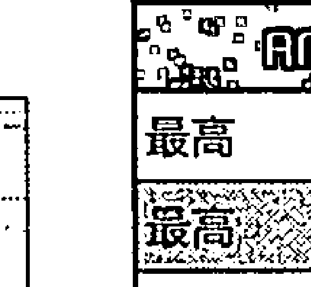

#### APM 有那么神奇吗？

APM在节能模式下，可以帮助磁头读写数据后自动归位以达到节能和防止震动破坏的目的。不少网友反映称每天归位400次左右。经过笔者的测试，开机不进行任何操作，C1值每小时就会增加50左右，就是说当硬盘在空闲时也会频繁的归位。而当将APM值调整为高性能状态后，一小时C1值也没有增加，虽然牺牲了许电力，但是硬盘寿命却保住了。

| 项目                     | 数值1 | 数值2 | 数值3 | 数值4 | 状态 |
|--------------------------|-----|-----|-----|-----|------|
| 09：累计通电时间         | 94 | 94 | 0 | 2655 | 良好 |
| 0A：马达旋转到标准转速重试 | 100 | 100 | 60 | 0 | 良好 |
| 0B：通电周期计数         | 100 | 100 | 0 | 612 | 良好 |
| BF：振动感测错误率       | 100 | 100 | 0 | 0 | 良好 |
| C0：断电磁头缩回计数     | 100 | 100 | 0 | 10 | 良好 |
| C5：磁头伸出周期计数     | 100 | 100 | 0 | 7896 | 良好 |

| 项目                     | 数值1 | 数值2 | 数值3 | 数值4 | 状态 |
|--------------------------|-----|-----|-----|-----|------|
| 09：累计通电时间         | 99 | 99 | 0 | 577 | 良好 |
| 0A：马达旋转到标准转速重试 | 100 | 100 | 60 | 0 | 良好 |
| 0B：通电周期计数         | 100 | 100 | 0 | 197 | 良好 |
| BF：振动感测错误率       | 100 | 100 | 0 | 0 | 良好 |
| C0：断电磁头缩回计数     | 100 | 100 | 0 | 16 | 良好 |
| C5：磁头伸出周期计数     | 99 | 99 | 0 | 24002 | 良好 |

▲两个硬盘的C1值对比

可能有同学会问了，就是简单一个设置，真的会对硬盘寿命造成如此巨大的影响吗？我们可以用两个硬盘的数据对比一下。A硬盘累计通电时间已达2655小时，但是C1值只有7896，而B硬盘刚刚累计通电577小时，C1值就已经超过了24000。通过CrystalDiskInfo查看，前者硬盘APM值在50%，而后者APM则在最低状态。

#### APM对性能影响大吗？

调整AAM和APM对硬盘的性能影响大吗？相信

| APM设置 | APM设置 | 平均传输速率 | 存取时间 | 突发传输速率 | 硬盘温度 |
|---------|---------|--------------|----------|--------------|----------|
| 最高    | 最高    | 50.3 MB/s    | 18.2ms   | 128.8MB/s    | 44度     |
| 最高    | 最低    | 49.6MB/s     | 18.1ms   | 125MB/s      | 43度     |
| 最低    | 最高    | 49.5MB/s     | 20.5ms   | 125.2MB/s    | 44度     |
| 一半    | 一半    | 49.5MB/s     | 20.6ms   | 128.7MB/s    | 43度     |
| 最低    | 最低    | 50.1MB/s     | 20.4ms   | 129.9MB/s    | 43度     |

测试平台：联想Y450A笔记本 320GB 5400rpm SATA硬盘，具体型号：日立HTS543232L9A300

这也是不少同学关心的问题。通过最下面的表格可见，抛开HD Tune测试的误差，AAM和APM不同的组合方式对性能的影响有限，一般的应用中基本感觉不出来。

硬盘是笔记本中价值最“不可估量”的配件，因此我们一定要对他的健康负责。如果您不是特别追求极致的性能和节省电费，建议将硬盘的AAM调整到50%或者最低，而APM则调整到高性能状态，一方面可以提升静音效果，一方面也能避免C1值过早刷爆的“杯具”，最重要的是可以顺带解决笔记本运行过程中突然变卡的症状，实际应用中也不会有明显的性能下降。

### 名不正 何来言得顺？——了解IT名称的真实故事

孔子曰：“名不正则言不顺”，“有其名必有其实”，中国人对姓名的讲究那是达到了很高的迷信程度，从部分名字里就可以看出其老爸老妈在取名时很可能被“忽悠”，比如李森林（命中缺木），刘淼（号称缺水）…… 那么，我们熟知的公司、网站、产品的名称都来自哪里呢？

#### 1. 来自鸟叫的 Twitter

Twitter其实是一个拟音词，最早有“蟋蟀叫”、“鸟叫”的意思。Twitter的创始人之一—Biz Stone觉得鸟通过短、频、快的鸣叫进行沟通的方式，与微博相似，于是就有了Twitter这个名字。

#### 2. Hulu 是“葫芦”

Hulu.com是为美国用户提供在线分享电视剧的网站，在美国是大大有名。Hulu的名字你用很多语言都可以解释，但是那些在hulu.com的家伙们挑选了汉语来说明——Hulu有“互录”和“葫芦”的含义，“互录”指interactive recording（交互式记录），而“葫芦”通常会被用来保存比较珍贵的东西，比如美酒（Hulu当时指的“珍贵的东西”其实是热门美剧《迷失》）。

#### 3. 分享舱：iPod

在iPod制作过程中，乔布斯先确定了1000 songs in your pocket（把一千首歌放入你的口袋）的广告词。老乔的想法是让这款播放器成为数字中枢（音乐和苹果电脑的连接器）。而最大的中枢就是宇宙飞船的分离舱（Pod），它可以离开宇宙飞船，但必须回母舰补充燃料及食物。于是苹果就采用了Pod。至于前面的i，原本代表Internet（互联网），它出现在苹果所有的软硬产品中，比如iPhone、iMovie、iWork等等。但后来果粉们纷纷表示是“我”的意思，表示苹果公司产品的独特个性。

#### 4. 单词缩写：Intel

当时，理工课出身的Intel创始人Robert Noyce和Gordon Moore在为公司取名时，并没有去想那些华丽词藻，最早他们决定使用自己名字的组合，即Moore Noyce，但是这听起来有点像more noise（更多的噪音）。于是，他们就从Integrated Electronics（集成电子）提取了几个音节，组成了Intel这个名字。从此随着CPU巨头的发展，这一名称连不懂电脑和英语的老爸老妈也能说出口了。

#### 5. HTML：Hotmail

Jack Smith在开发Hotmail时，想制作一个每台电脑都可以通过Web方式就能使用的电子邮件服务。到了取名时，开发团队在尝试了多种以mail结尾的单词后选择了Hotmail，因为它包含了HTML一词：HoTMaiL。

#### 6. 被迫多个G：Digg

http://www.Digg.com是一个以科技为主的新闻站点，通过点击率对文件进行排序。网站的创办人Kevin Rose在谈到网站名字的时候说，他原本是想用dig.com，表示“挖掘”，但这个域名是在迪斯尼手中，于是转而想用500美元购买digdig.com，被对方拒绝后，他不得不花了1200美元买下了digg.com。

#### 7. 没有故事：Android

Google之所以把手机系统定为Android，主要就是2005年Google收购了一家名为Android的公司，于是就采用了这个名称。

#### 8. X 不是 10：MacOS X

其实MacOS X中的X就是指第10代，不过果粉们更愿意将它看成字母X，比较有意思的苹果为X的每个版本指定一个猫科动物，比如猎豹、美洲狮、美洲虎，一直到最近的雪豹。

#### 9. 让人愉悦的水果：BlackBerry

这个故事还要从2001年讲起，当时加拿大的RIM公司找到Lexicon Branding为他们那款适合发送E-Mail的设备起名，Lexicon Branding立刻建议放弃E-Mail这个单词，因为这会让人看起来不爽。在看到了设备上像种子一样的按键时，他们想到了草莓、西瓜等等，最后终于决定使用BlackBerry（黑莓），让人愉悦，同时又符合该设备的黑色基调。

### 买来就要充三次12小时的说法到底有没有

总听说商场里面的营业员告诉我新买的电子产品都要进行电池激活，说什么需要充三次，每次12小时，难道真有这种事？

小提示：要判断你的电子产品中是不是使用锂电池，只要看下电池标签中的电压即可，一般电压标为3.7V、3.6V，或是7.4V、7.2V的都有可能是锂电池。另外，如果充电器电压为4.2V也说明电池是锂电池。

#### 台式机中也有锂电池

你可能想不到，锂电池是由发明家爱迪生发明的。正是它的出现使得数码产品做的越来越薄，越来越轻。

除了我们常见的手机、数码相机使用了可充电锂电池，其实很多地方都有锂电池的身影，比如电脑主板上的纽扣电池、方块装9伏层叠电池，不过这两种电池都是锂—二氧化锰电池，是不可充电的。其中纽扣电池可以储存3年以上，体积小巧，可以做成各种形状，非常适宜在各种电路中长时间工作，其中就包括电脑主板。

#### 电池为什么会爆炸？

如果你的化学知识还没有还给老师，应该还记得“锂”元素非常活跃，早期的锂电在充电时就经常出现燃烧的问题。现在的锂电都是加入了能够抑制锂元素活跃的成分。加上现在的锂电池基本是全密封，这样，如果电池在充电时长期处于高温、高热的环境，再没有有效的保护电路（通常假电池都会把这部分省掉，以节约成本），爆炸就很容易产生了。

#### 锂电池真的需要“激活”么？

锂离子电池充电速度较快，仅需要1小时~2小时就可充电即可达到最佳状态；同时，锂离子电池的漏电量极少，即使随意放置1周~2周后再拿出来用时，一样能发挥电力、照常工作。此外锂离子电池几乎没有“记忆效应”，所以锂离子电池可以在未完全放电的条件下充电而不会降低其容量。锂离子电池在出厂前都进行过多次充放，因此完全没有必要在首次使用前进行“激活”（传说中的充三次，每次12小时）。相反，如果是使用不规范的充电器长时间的充电，很可能在首次使用中便损坏了锂离子电池。

#### 是谁偷走了五（七）号充电电池里的电？

五（七）号的充电电池，放着没用，电池里的电居然就没了，难道这些五号充电电池有问题？这你还真说对了，其实，目前可充电的五（七）号电池只有镍氢或镍镉的，而不是锂电，其主要原因就是电压问题。锂电池电压为3.6V以上，而五（七）号电池的电压是1.5V，充电电压是1.2V。另一方面，锂电虽好，但安全性要差，所以它对设计要求很高，在工艺上制作成五（七）号电池成本就要提高。不过其实我们笔记本锂电池里面就是类似于五号电池的封装形式，但由于电压问题，它是不能代替普通五号电池。

至于放着不用就没电，其实是充电电池的“自放电”现象，锂电池的自放电率低于8%/月，但镍镉五（七）号充电电池电池是30%，镍氢电池甚至达到了40%。所以对于普通的五（七）号充电电池充完电就抓着用吧！

> （北京/傻鱼）

### 如何成为网络桌游霸主NO.1？

俗语道与人斗，其乐无穷也。现实中的广大人民群众大多处于安分守己的状态，百分之八十几乎每天重复着公司与家里两点一线的生活，百无聊赖的同时大众开始转战网络，在虚拟世界里火拼智慧与实力。要说如何以惊人的智慧称霸网络，那还真得讲究点儿方式方法。在单机游戏退居二线，大家又看腻了网游的面孔，竞技游戏退化成“黄脸婆”之后，网络上我们越来越不知道玩什么好了，也逐渐开始明白一切不过如此的局面，劳苦大众们又开始寻找娱乐新方式。此时，一股带有杀人游戏风格的“桌游”应运而生，并开始大火特火了。

#### 把“桌游”搬到网上

“周六中午一点老地方见，智慧达人桌游吧！”周五刚到，ANGEL就开始张罗同事聚会，不同于以往唱歌吃饭，这次聚会主题换了个新鲜玩意儿——桌游。几个朋友，一杯饮料，大家围桌而坐，一边聊天一边游戏，这就是桌游，并且已成为时下京城年轻人休闲游玩的新时尚。

目前桌游当中最火的要数《三国杀》，此款游戏娱乐之余还能恶补一下历史知识，这对现代人而言不得不说是一件好事。后来出的《三国斩》（官方网站：http://sgz.playzy.com/）与三国杀异曲同工，玩法和角色几乎相同，只是萝卜青菜各有所爱，推广平台不同，玩家们的选择也不同罢了。2009年《三国杀》成功移植网络平台，并推出了ONLINE版（官方网站：http://web.sanguosha.com），这就弥补了大伙儿不能同一时间聚齐的缺憾。

#### 不见面一样能玩桌游

大学毕业了，也到了分别的时刻，以后想和宿舍好朋友们一起玩桌游都难了，大家都五湖四海各奔东西了，不过好在可以转到网上继续玩。目前可以实现不同地域不同玩家一起游戏的桌游平台是：http://www.173zy.com/，在这里通过下载游戏大厅，选择自己想玩的游戏，点击进入游戏大厅，然后下载客户端。下载完成后，安装桌游平台的客户端。

安装结束，会自动弹出桌游世界的登录界面，此时你需要注册个ID，然后在界面上输入自己的ID登录就可以了。当你进入桌游世界平台后，你会发现平台里游戏多的有点让人眼花缭乱的感觉。此时千万不要慌，玩过QQ游戏吧？这个和它很相似。

- 第一步：看右边游戏列表，选择自己喜欢的游戏。
- 第二步：选中并点击游戏，右边的界面会出现此款桌游的详细规则介绍，左边则是与之相对应的玩家测试房间。
- 第三步：进入测试房间，点击右上角的“快速加入游戏”，就可以开始游戏啦。

桌游平台的最大优点是，你可以选择跟自己认识的朋友一起玩，也可以选择与天南地北各路陌生人共同切磋“游技”。平台里每天都会推出一些新桌游的游戏列表，热门游戏的排行榜会根据当天游戏人数和声望产生排名，个人如果表现良好也可以进入风采展示区。但是各路排行榜未经任何考证，仅凭玩家们投票而定，这里有没有刷票就不得而知了。

> （文/咪西）

### 有保护也不怕 精彩视频任我下

### 48小时速成打字员

从俊博士支招怎样购买羽绒服、怎样系围巾，再到果果做的暑假减肥攻略……深知CFan在我们的生活中渐渐变得跟“稀饭”一样，必不可少！好吧，先声明一下，电脑高手、打字员、文职工作者略过此文章；家有初学电脑的小孩、老人者，请剪下本页，贴在电脑旁边最显眼的位置！

抛开小学课本上好几页的打字基础知识，一句话概括：键盘上F和J这两个键，上面都有一个小小的突起……就是让你分别将左右手的食指放到这两个键上，其他指头依次排开，各个指头负责附近区域的键位。

小知识：标准键盘：因为 Windows 系统的普及性，目前市面上有售的键盘几乎都印上了微软的烙印——Win键。目前通用的键盘主要有104键和107键两种，104键又叫 Win 95键盘；107键盘又称为 Win 98键盘，后者多了睡眠、唤醒、开机这三个电源管理键（笔记本键盘除外）。

有了以上的“基础”，就可以结合“金山打字通”来实际操练了。有了它的帮助，48小时就能学会打字（下载地址：http://typeeasy.kingsoft.com/game/）。不过，不同的人群要有不同的用法：

老人 建议先进行“英文打字”训练，需要按的键就在软件界面的上方，并且会以不同的颜色显示其所在键盘上的位置。同时，规范要求的按键指头，也会在下面的“双手”上用绿色的圆圈指示出来。当你觉得“键位练习”对自己已经毫无挑战时，可以选择红色表情处的“单词练习”、“文章练习”等提高难度。

当然，英文打字的目的只是为了加深你的键位的熟悉，我们的目的是中文。在首页中选择“拼音打字”，输入的过程中，软件也会有相应的提示……跟英文打字训练大同小异。

小孩 考虑到小孩的集中力不好，需要有东西持续不断的吸引他们。要是孩子在玩游戏的过程中也能学习……这是最好的办法。

在软件首页中，选择“打字游戏”，这时将打开“金山打字游戏”的网页，下载并安装之后，先让孩子玩玩打字游戏，在玩的过程中，就能加深对键位的意识。之后再进行“拼音打字”等练习，娱乐学习两不误！

小提示：★不建议使用 Windows 集成的输入法，它们在智能方面确实不如搜狗、谷歌等输入法，而且后者还和搜索引擎挂钩，自定义词组、频率词也更加贴心。★打字的姿势不要局限于书本上的建议，随意就好，舒服才是王道！★聊天是真正提高打字速度的直通车。

（寒怒）

### 备份&恢复Office 2010激活信息

正版Office 2010的激活过程有些繁琐，所以使用软件将激活信息备份下来吧。从http://work.newhua.com/cfan/201015/Obr.rar下载工具包，运行CMD文件，就会生成Office 2010的激活信息备份文件。

（济南/贾培武）

### 在QQ邮箱中体验 QQ云输入法

腾讯在QQ拼音输入法的基础上推出了QQ云输入法。不用下载，不用安装，无论在什么地方登录QQ邮箱，就算你的电脑不支持中文输入，也都可以在当前的QQ邮箱页面输入中文。

开启QQ云输入法，有两种方法：一是在QQ邮箱主页页面的页脚处有“开启QQ云输入法”的快捷方式，点击即可开启；二是进入邮箱设置页面，切换到“体验室”选项，选择“我要启用”QQ云输入法即可。

打开写信页面，切换到“中文”模式，此时就可以调用QQ云输入法了。

（飞天小猪）

### 有了手机WiFi路由 上网不愁

在看了第12期《手机变热点，无线路由随身带》一文之后，我看了看自己的WM手机，对自己说：智能手机绝对不止这点能耐！

我找到了一款名叫WMWiFiRouter（以下简称WWR，下载地址：http://work.newhua.com/cfan/201014/WMWiFiRouter.cab）的软件。名字虽然是“WiFi路由”，它的功能可不止转发GPRS网络到WiFi那么简单。事实上，这款软件支持GPRS/3G，蓝牙，WiFi、USB接口之间的网络互相转发。

当手机作为热点转发网络时，通过WiFi和GPRS/3G模块收发数据的巨大流量会很快耗尽手机的电池。这时，许多人会很郁闷的连上数据线充电，然后看着两部已经用电线连接好的电子设备还在傻傻地用无线传输着数据……何必呢？将手机连接到电脑，然后使用WWR中的“GPRS/3G to USB”而不是“GPRS/3G to WiFi”就行了。更高的带宽和连接稳定性，何乐而不为呢（Windows XP或更旧的系统需要安装附带在ActiveSync中的网络驱动才能使用USB端口上网）？

WWR的另一大绝活就是创建蓝牙网络，让另一部设备通过蓝牙借道上网。比如你的朋友用GPRS/3G上网，你们就可以用这个功能，让你共享他的网络！

（广东/陈晓奇）

小编点评：其实只要有ActiveSync，没这款软件，手机连接电脑后，也能共享电脑的网络。

### 跟我来 一起给CPU节能减排

所谓降频技术就是利用一系列判断机制，衡量处理器的负载状况，如果不需要处理器尽全力就会自动降低电压和主频，让处理器的部分资源休息一下从而起到节能的效用。下面我们就先拿英特尔平台为例，看看如何让这些技术为已所用吧。

#### BIOS 里有乾坤

想用好动态节能技术，第一步就要在BIOS中找到并开启此功能。目前英特尔芯片组主板的BIOS主要包括AMI和AWARD两大系列，节能相关的选项位置也不尽相同。其中AMI BIOS位于Advanced（高级）项中，包含C1E Support（C1E支持）和Intel SpeedStep tech（英特尔动态节能技术）两大功能，分别拥有Disabled（关闭）和Enabled（开启）两种状态。Award BIOS的节能设置位于CPU Feature选项卡中，只是名字换成了C1E Function和Enhanced Intel Speedstep Tech。

小知识：什么是C1E？
C1E的全称是C1E enhanced halt stat（增强型深度休眠技术），由操作系统idle进行发出的HLT命令触发，然后处理器就会进入到低功耗的挂起状态，但CPU的倍频与工作电压并不降低。

小知识：什么是EIST？
全称Intel SpeedStep tech/Enhanced Intel Speedstep Tech，是一个根据处理器负载来调节主频和电压的模块，不过它的触发机制同C1E halt state不同。SpeedStep提供了更多的CPU频率和电压调节级别，因此可以比C1E halt更加精确的调节处理器的状态。

#### C1E和EIST各显神通

既然C1E和EIST都是处理器节能减排的武器，那么谁的“杀伤力”更出色呢？笔者测试的平台为英特尔奔腾双核E2140处理器，默认主频为1.6GHz，超频至2.66GHz测试以下项目：

| 奔腾双核E2140 超频至2.66GHz， 倍频8， 1.312V |
| :--- | :--- | :--- | :--- |
| **模式** | **倍频** | **电压** | **频率** |
| EIST+其它电源模式 | 8 | 1.312 | 2.66GHz |
| EIST+节能模式 | 6 | 1.176 | 2.0GHz |
| 奔腾双核E2140 默认主频1.6GHz， 倍频10， 1.312V |
| C1E+其它电源模式 | 8 | 1.168 | 1.6GHz |
| C1E+节能模式 | 8 | 1.168 | 1.6GHz |
| EIST+节能模式 | 6 | 1.176 | 1.2GHz |

超频状态，单独开启EIST，配合电源管理中的“最少电源管理”，可以发现低负载时CPU倍频降低到了6X，工作电压也得到了降低，系统属性和CPU-Z都为2.0GHz左右，有些偏差为晶振误差，正常范围内。当系统负载较高时，倍频会恢复到8，以2.66GHz的频率运行。如果选择了其他电源模式，可以发现工作频率、电压始终不变，没有起到节能的效果。可见EIST必须要与电源管理模式配合。

排除超频导致C1E不正常工作这个说法，将CPU设定回默认的1.6GHz工作频率单独开启C1E功能，只有电压在波动和降低，而CPU主频和倍频没有任何变化。通过测试，单独开启C1E不受电源管理模式影响，作用仅是动态调整CPU工作电压，而不会降低CPU倍频。

小提示：C1E和EIST在超频状态下也可生效，只是如果使用加电压的超频，C1E将失去自动调压的功能。C1E在轻载状态的节能效果最明显，EIST必须与“最少电源管理”的电源工作模式配合，两者开启效果最佳。

#### AMD 我有“冷又静”

英特尔同学写出了EIST“论文”，AMD自然也有特殊的“作业”应对。这就是Cool N' Quiet（冷又静）技术。在BIOS中找Cool N' Quiet的选项，然后将其设为“Enabled”（启用）状态。和EIST一样，此技术也需要在电源管理中将电源使用方案改为“最少电源管理”模式。

小提示：如果你的系统是 Windows XP，想开启AMD“冷又静”还需要专门的驱动支持，下载地址：http://tinyurl.com/27vpx3u，Vista和Windows 7系统则无需安装此驱动。

#### 节能从现在做起

上述节能技术可以帮助电脑在低负载时降低功耗。当系统负载上升后他们会自动退居幕后让处理器全速运行。因此，如果你的主板BIOS中有这些选项就全部开启吧！部分主板可能隐藏C1E的选项，可以尝试在BIOS里面按Ctrl+F1让其显示出来。

（河南/马甲）

### 不花一分钱 世界名校课程任你听

离开黑色的6月，你的7月应该是充满希望的吧？怀揣着即将踏进大学的激动心情，享受着冗长的假期，你还想干点儿什么？也许，这是一个找点“大学感”的好时候，因为你可以坐在家里的沙发上聆听哈佛教授的讲课……

互联网的自学功能，大家都不陌生。只要在Google或优酷上打“怎样”二字，就会有无数自动生成的结果浮现出来。我的一个朋友甚至告诉我，他是通过优酷学习自由泳的，并且当场演示了他标准而漂亮的泳姿。从做日本寿司到修水管，互联网以DIY精神，教会很多人日常诀窍和应急措施。而现在，免费高等教育在互联网上的上升势头，在我看来，更是一场具有开拓性的教育革命。

#### 坐在哈佛的课堂里

> “设想你是一名电车司机，你的电车正以每小时10公里的速度行驶。这时你突然发现在车轨的尽头，有5名工人正在干活。你想尽办法停下了，但已经停不住了，你的手刹失灵了。你感到十分绝望，因为你知道如果你撞向这5名工人，他们必死无疑。你不知道该怎么办好，就在这时，你发现在车轨的前方，刚好有一条分叉，而在这条分叉上，只有1名工人。你的方向盘还没失灵，所以你可以选择把电车拐向那条分叉路，撞向那1名工人，但救活了另外那5名。你会怎么选择？”

多数人会选择撞向那1个人，来保全5个人的性命。但是哈佛大学的Michael Sandel教授在一门名为《正义》（Justice）的讲座中却提出了三宗类似的道德难题——每一个都设计巧妙，以至于抉择的难度增加。当学生们站起来为自己的艰难抉择辩护时，Sandel提出了他的观点。这让我们发现了我们的道德推理背后的原则往往是矛盾的，而什么是正确什么是错的问题，并不总是黑白分明的。至今已有一万名哈佛的学生上过此课，是哈佛历史上累计学生人数最多的课程之一。

| 大学公开课程 | 网址 |
| :--- | :--- |
| 耶鲁大学公开课程 | http://oyc.yale.edu/ |
| 麻省理工大学公开课程 | http://ocw.mit.edu/ |
| 斯坦福大学公开课程 | http://itunes.stanford.edu/ |
| 加州大学伯克利分校公开课程 | http://webcast.berkeley.edu/courses.php |
| 卡内基·梅隆大学公开课程 | http://oli.web.cmu.edu/openlearning/ |
| 犹他大学公开课程 | http://ocw.usu.edu/front-page/Course_listing |
| 英国公开大学公开课程 | http://openlearn.open.ac.uk/course/index.php |
| 华盛顿大学公开课程 | http://www.cs.washington.edu/education/course-webs.html |
| 哥伦比亚大学公开课程 | http://ci.columbia.edu/ci |
| 剑桥大学公开课程 | http://mediaplayer.group.cam.ac.uk/main/Podcasts.html |
| 普林斯顿大学公开课程 | http://uc.princeton.edu/main/index.php |

ITUNES U和YOUTUBE.COM/EDU——通过这两家媒体，可以找到众多录像和录音课程。其中YOUTUBE已有300家大学的200门课程和六万堂录像课。

http://Academicearth.org——拥有十所顶尖大学的130门课程、3500堂录像课。同样附有收费网络大学学位的咨询，多为著名学府如哈佛网大等。

http://Ocwconsortium.org——搜罗了全世界250所大学的13000网络课程。

#### 哈佛大学其他受欢迎课程

积极心理学（Positive Psychology Lecture）
1-10
课程下载：http://www.verycd.com/topics/2802308/#theCon

Tal Ben-Shahar博士拥有心理学硕士、哲学和组织行为学博士学位。他所开设的《积极心理学》和《领袖心理学》，被哈佛学生们推选为最受欢迎率排名第一和第三的课程。选修这两门课程的哈佛学生超过了总人数的20%，其中23%的听课者向学校教学委员会反映：这两门课程“改变了他们的一生”。

课程下载：http://v.24en.com/list1/2010-01-14/345.html

#### 耶鲁的同学们关心什么

耶鲁的每门网络公开课，都需要3万~4万美元的制作费，这些钱大多来自休利特（Hewlett）基金。耶鲁公开课程始终以“质量保证”作为准则，所有公开课几乎都是本就在耶鲁校园广受欢迎的“好课”，教授也几乎都是在本领域颇有建树的专家。今年秋季，耶鲁的网络公开课将增扩至36门，正是耶鲁四年前创建网络公开课时的预定目标。《心理学导论》就是耶鲁热门课之一，不仅因为很多人对心理学极为好奇，更因为主讲教授Paul Bloom讲课风格深入浅出、风趣幽默，听来毫不费力，甚至颇有娱乐性。

Paul Bloom在介绍这门心理学课到底是在讲什么的时候说：“一些学生是带着非同寻常的动机来上心理学导论这门课的。也许是你觉得自己疯了，所以希望能不那么疯；也许你想学会如何更好地学习；想多交点儿朋友；想学会如何影响他人。作为选择这门课的理由，这些倒也并不算太差，这门课实际上还是能帮助你们解决一些问题的。科学的心理学研究，能让你们更多地了解与我们日常面对的真实问题有关的真实世界。”

课程下载：http://www.yyets.net/forum-671-1.html

#### 斯坦福牵手iPhone

去年，斯坦福大学的免费课程《iPhone应用程序编程》（iPhone Application Programming）的下载量超过百万次！这门课目前已经更新到18课时，内容是有关iPhone应用程序的结构和构建方法。

课程下载：http://www.verycd.com/topics/2751791/
字幕：http://www.cocoachina.com/bbs/read.php?tid-8973.html

此外，加州伯克利83岁老太太的《人体解剖总论》、MIT的《微分方程》和《线性代数》http://www.verycd.com/topics/97179/，以及斯坦福的《现代理论物理：爱因斯坦》http://www.youku.com/playlist_show/id_4081179.html等，都位列目前网上的十大热门免费课程。

#### 如果没有字幕组

互联网打破了名校的“围墙”，但无奈国内大多数网友的英语水平有限——听不懂怎么办？

在人人影视论坛YYeTs里，有个名为“大学开放教程交流区”的版块。版主whujulius告诉《电脑爱好者》，YYeTs是目前字幕组中第一个开始做国外名校公开课字幕的组织。就现在来说，YYeTs主要翻译的是耶鲁大学的几门知名的公开课，这些课程的视频以及讲义在耶鲁大学的官方网站上就可以找到。YYeTs字幕组的任务是，将这些讲义翻译成中文，并按照时间轴制成字幕。“我们现在每个组有8个人左右，这些组员基本上是那些课程相关专业的，或是有兴趣的。目前我们翻译了心理学、哲学、金融、欧洲文明等课程。”whujulius说。对于目前最大的困难，whujulius认为是缺少可提供下载的服务器，“这是最大的问题”。另外，不少网友感兴趣的计算机类的课程，很多是需要付费才能得到的资源，所以现在也不具备去翻译那些课程的条件。但不管怎么说，YYeTs字幕组的努力得到了不少网友的支持，很多网友在该版块留言，感谢YYeTs字幕组的无私奉献。

还不得不提一下TED http://www.ted.com/，它从2009年5月15日开始为视频提供字幕，同时在全球招募志愿者来翻译不同语种的字幕，里面的讲座都是紧跟各自专业的最新理念和想法，讲得深入浅出，强烈推荐。这类视频不但能开阔你的眼界和视野，而且能听到行业顶级牛人的看法和理念，会让你思考问题的角度发生变化。以前做梦都不会想到，竟然有一天可以不花钱就能听到世界顶级牛人的讲座和视频，现在竟然实现了，这真是一个幸福的时代。

（北京/凡凡）

### 距离远 网要断 超大文件怎么办？

用电脑过程中，难免需要给远方的朋友发送大文件，如视频文件、软件包、照片压缩包、歌曲专辑等，这些文件体积一般很大，使用邮箱附件的方式往往受附件大小限制而无法实现。如果网络状况不好，容易断线就麻烦了，我们应该用什么工具解决呢？

#### 最简单 聊天软件的文件对传

现在各种主流聊天软件都支持文件对传功能，例如QQ、MSN、飞信、淘宝旺旺等，这种文件对传也是点对点方式，直接由发送方传到接收方。方法也很简单：直接将文件拖放到与对方的聊天窗口中即可，或者通过软件内置的发送文件按钮来进行传送。不过，在传大文件时一定要预防文件传输过程中的突然中断而导致前功尽弃，在传大文件时建议选用支持断点续传功能的聊天工具，例如QQ、TM均支持断点续传功能，即使传输过程中遇到错误也不会导致前功尽弃，下次可以从中断处继续传输。

#### 最高速 下载工具就能下

从网上下载文件大家都会，如果将自己发给对方的文件让TA启用下载工具进行下载，不仅可以规避传输故障带来的风险，又可以保证文件传输的快速。SendLink这款小工具就能帮助实现。

先从http://www.onlinedown.net/soft/38995.htm下载安装SendLink软件（安装时注意取消选择安装捆绑的软件）。运行后单击“文件→选项”，在打开的窗口中选择“服务器”选项卡，在检测到的本机IP地址中选择因特网IP地址。

保存设置后软件会自动启动服务，也可以手工单击菜单“服务器→开始”启动服务器。成功启动后只要直接将文件拖放至下面空白框内，再右击列表中的文件项并选择“复制”即可得到下载地址了。

现在，将这个下载地址通过聊天工具、短信、邮件等方式告诉对方，TA只要使用迅雷、快车等下载工具就可以直接进行下载了。

#### 最简便 P2P

点到点文件传输由于不需要经过服务器，速度一般是最快的，不过通常情况下要想通过点到点技术传文件则需要相应的软件来实现。其实，有了“iSendr”这个网站就能赤手空拳借助P2P来传大文件了。

在浏览器中打开“http://isendr.com/”，点击“Send a File”（发送文件）按钮，选择要传送的文件，稍候将会得到一个下载链接。点击链接前面的剪刀图标复制地址，再直接将此地址告诉对方，TA便可直接在浏览器中打开这个地址，随后点击“Save”按钮即可下载。如果传送的文件比较重要，为了安全起见还可以在点击“Send a File”按钮前勾选“Password Protect”选项来设置保护密码，这样，对方还需要知道保护密码才能进行下载。

（文/裴姗姗）## DDR2还是DDR3？谁是整合主板的绝配？

| 项目 | 配置 | 3DMark06总分 | SM2.0成绩 | SM3.0成绩 |
| ---- | ---- | ------------ | --------- | --------- |
| A    | 单通道DDR2 800 | 1447 | 466 | 558 |
| B    | 双通道DDR2 800 | 1821 | 599 | 702 |
| C    | 单通道DDR2 800+板载显存 | 1718 | 557 | 668 |
| D    | 双通道DDR2 800+板载显存 | 2027 | 670 | 788 |
| E    | 单通道DDR3 1600 | 1836 | 607 | 706 |
| F    | 单通道DDR3 1333+板载显存 | 1769 | 606 | 657 |
| G    | 单通道DDR3 1600+板载显存 | 1972 | 656 | 759 |
| H    | 板载显存模式 | 567 | 179 | 213 |

测试平台说明：AthlonII X2 215处理器，主板板载128MB 32bit GDDR3显存，同时拥有DDR2和DDR3内存插槽

# 显卡模式：1+1>2

虽然绝大多数785G主板都已经板载了显存颗粒，但是规格和容量都不尽如人意，因此才需要我们引入内存这个“外援”。在主板BIOS中找到Internal Graphics Mode（显存模式选择），四个选项的释义分别为：1.关闭板载显卡 2.使用系统内存 3.使用板载显存 4.系统内存+板载显存（混合模式）。通过测试可见，混合模式是整合显卡性能的最佳方案。如果你觉得你的整合主板集显性能发挥失常，不妨先进入BIOS中检查该选项。

> 小提示：自带显存的785G主板在BIOS里面基本默认都是混合模式，部分厂商为了避免用户选错而造成性能下降，会屏蔽SIDEPORT（使用板载显存）模式。

# BIOS优化不可少

一般来说，在785G主板的Advanced（高级）设置里面都可以找到详细的集显方面的设置，建议修改以下设置：UMA Frame Buffer Size（划分内容为显存的容量），2GB以下内存推荐选128MB，4GB内存可考虑最大值896MB；Interleave Size（板载显存使用容量），按照主板集成显存的最大值设定；Interleave Ratio SP:UMA（板载显存内存占用比例），该选项对性能影响较大，而且有众多比例选项，785G主板建议选择5:11。

# DDR3要1333还是1600？

现在2GB DDR3 1333内存的价格多在300元~350元，而2GB DDR3 1600内存的报价基本维持在380元左右，价差不是很明显。通过F、G组的测试可见二者的性能差距还是较为明显的。如果预算不是特别紧张，建议新装机的用户直接选用DDR3 1600，已经使用DDR3 1333内存的同学可以进行超频，大多数DDR3 1333内存都可以稳定在1600的频率上。

# 谁是785G的绝配？

对于集成显卡来说，双通道和内存+显存的混合模式可以换来更明显的性能提升，同样单通道和双通道模式，DDR2不是DDR3内存的对手，千变万变，物理学没有变，同位宽的前提下，高频者强。因此，想让785G的集成显卡发挥全部潜能，建议同学们为其配备双通道（两条或以上内存），高频DDR3内存。

时下DDR2内存价格有所下降，DDR3内存依然很高。宏观来看DDR2适合手头现有内存升级的用户组建集显平台，而DDR3更适合新装机用户。如何搭配选购适合自己的整合主板和内存，要根据各自实际情况而定，省钱够用的前提下发挥最佳性能就是硬道理。（河南/马甲）

# 揭露视频网站“黑幕”：它们的电影来自哪儿？

# 有图有真相：揭秘的视频网站背后的秘密

连“真相”也看不懂？也许再简化点你就能明白——插个移动硬盘，然后用电脑播放里面的电影，移动硬盘相当于视频网站，用资源管理器打开，就相当于“点播”了视频。只是视频网站保存的“电影”格式是FLV格式。

# FLV ≠ 低清视频

其实早在FLV格式（全称Flash Video）出现之前，视频网站采用的是ASF、WMV、RM等格式。后来，一方面由于Flash Player机器几乎每台电脑都有安装（在你看Flash广告，玩Flash游戏的时候就安装过来了），平台统一；二来，当初世界最大的视频网站YouTube采用了FLV技术，以国人的COPY水平自然也选择FLV了。

当然这也和FLV自身优点分不开，用FLV压缩的视频，体积小，也便于网络传输。

不过我也挺郁闷，每次在视频网站上看视频都被“伪高清党”嘲笑：“FLV格式，你居然也能忍受？”其实，没有低清的格式，只有码率（简单说就是控制清晰度的数值，可以在处理时进行设置）的区别。所以现在不少的视频网站都开始提供“高清”格式视频。

小提示：“果粉”是与众不同的，是鄙视FLV的，所以它们看的视频网站必须是H.264编码的MP4格式。所以为了伺候好“果粉”，很多视频网站还特意单独开辟了“果粉”专用站，真折腾。

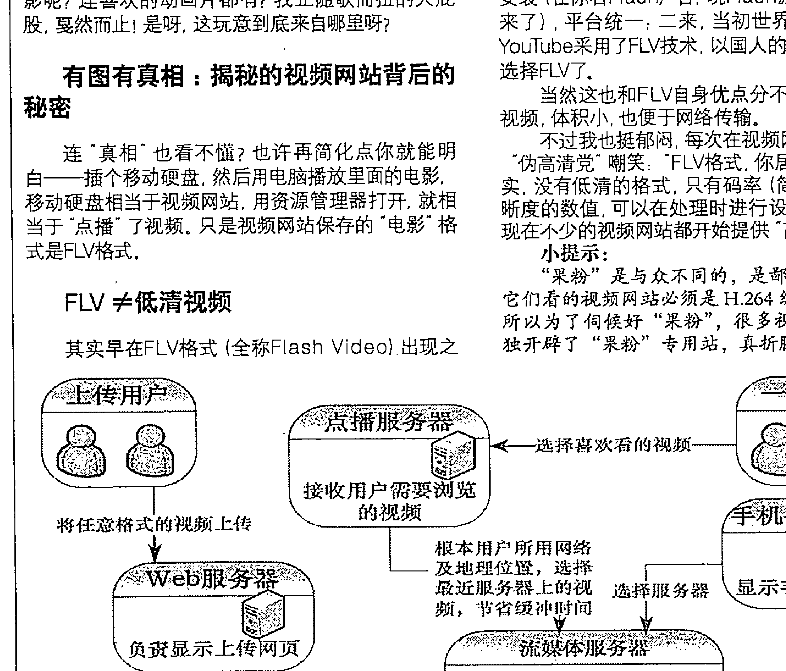

# 加速，加速，飞起来

经常看视频的人知道，很多视频网站都会大力推荐FLV加速软件，网上也有很多同类软件出现。

它们的原理其实很简单，把要看的视频通过多线程，或是P2P方式下载到本地，将FLV文件缓存起来，然后再通过本地代理等方式播放本地的FLV，从而起到了加速作用。

- ★小知识：
- ★网络直播为什么慢上几分钟？
去年看某视频网站的十一阅兵直播，发现直播速度比电视上要慢上很多，难不成是网络慢的原因？
其实这是由于电视信号是通过卫星传送，电视台接收后，再通过有线光缆传到你家。
而视频网站的直播则是利用网站收到电视信号，进行实时压缩，减低清晰度后，传到服务器上，你再收看时，所以会慢一些。
其实，就算是同一局域网内两台电脑收看同一直播源都会有时差，这是很正常的延时，并非电脑出现问题。
当然，有些延时也可能是因为你网络故障引起的。
- ★看视频网站伤硬盘吗？
首先你要知道，所谓的BT伤硬盘那是胡说八道，高温及震动是硬盘损坏的原因，由于在进行BT下载时，硬盘在长时间工作，容易出现高温，并且机箱受到震动，所以才会误传BT伤硬盘。而看视频网站读取硬盘不多，安心看吧。
- ★视频网站和PPLive、QQLive的不同
像PPLive、QQLive它们的原理都是P2P，看得人越多，速度也就越快；视频网站则是看得人越多，服务器消耗的资源就越大，所以视频网站就需要不停的增加服务器及带宽，搞视频网站是一件很烧钱的事。

# 信息大爆炸 3招让你成为知识达人

当我们离开学校，我们也就离开了被动的“海绵式学习”（单纯吸收），在互联网的时代里，我们的学习方式变为主动的“淘金式学习”（注重批判及与知识的互动）。然而，互联网时代同时也是一个知识爆炸、信息过载的时代，如果不对每天接触到的信息进行收集、归类、整理、吸收，只凭有限的记忆力，会使你很快迷失在信息的海洋中。没有积累，你也就不可能在需要的时候“一拍脑门”就想出一个创意来。因此，对知识、信息进行收集、分类、存储、检索、重构就成了我们最应该掌握的学习方式——知识管理，它是一种对知识的组织和再组织，从而在大量的信息中进行知识挖掘，以及对人的显性和隐性知识进行管理。这么重要的事情，当然要交给功能强大、可扩展的软件工具才最放心，今天我们就介绍一些入门级的工具吧。

# 双G混搭王

我们以前就讲过RSS阅读器的作用和用法，RSS阅读器无疑是个非常棒的收集信息的工具，但是订阅的时间长了之后，过多的无用信息会淹没那些真正对你有用，或者你真正在意的信息。怎么办？你可以选择将你认为最有价值的资料转发到Gmail邮箱中。这一招非常好用！

- ① 在Google Reader中可以以关键字搜索订阅的内容，点击“订阅”后可为内容建立一个专门的文件夹。
- ② 看到值得收藏的文章，可点击文章下部的“电子邮件”按钮，将其发送到Gmail邮箱中。这里需要在邮件中加注关键词，并标记上“#知识管理”（你可以修改为任何你喜欢的）。
- ③ 在Gmail邮箱中单击“设置”，选择“创建新的过滤器”，过滤包含的关键词是“#知识管理”，“下一步”后，选择处理方法是“跳过收件箱”、“标记为已读”、“添加标签‘知识管理’”。这样一来，每当收到用上述方法转发的Google Reader阅读收藏，系统将会自动完成信息的归档分拣工作。配合Google强大的搜索功能，今后可以方便地查询整理这些内容。

## 小提示：

使用 Gmail 的过滤器来管理邮件接收过程，你可以根据关键字、发件人、收件人和其他内容的任意组合，自动为邮件添加标签、存档邮件、删除邮件、为邮件加注星标或转发邮件，甚至不让邮件发送至“垃圾邮件”。

Google Reader的另一个方便知识输出的分享小技巧是使用“发送到”按钮（位于“电子邮件”按钮右侧）。点击Google Reader右上角的“设置→阅读器设置”，在新页面中点击“发送到”标签，这时能看到些我们没办法用的网站，却没有像人人网、开心网、豆瓣这样国内主流的分享网站。没关系，翻到页面底部，点击“创建自定义链接”，输入如表格中的内容后“保存”，返回Google Reader后就可以在“发送到”看到新增的这些功能了。比如点击“发送到→豆瓣”，即刻会弹出豆瓣的页面。

| 项目            | 人人网                                                                 | 豆瓣                                                                                     |
| :-------------- | :--------------------------------------------------------------------- | :--------------------------------------------------------------------------------------- |
| 网址            | http://share.renren.com/share/buttonshare.do?link=${url}&title=${title} | http://www.douban.com/recommend/?url=${url}&title=${title}                                |
| 图标网址 | http://s.xnimg.cn/favicon.ico                                           | http://www.douban.com/favicon.ico                                                        |

### 离线处理文章

在网上看到的好文章和博客，你会以什么方式保存下来？有段时间我用的是Word，后来发现太麻烦不好同步，又用QQ记事本还有自己的博客来记录，最后发现这些工具都存在同步或使用太麻烦的地方。WizKnowledge（下载地址：http://cn.wizknowledge.com/）是一个支持离线阅读的知识管理客户端，除支持多级分类、标签、搜索、编辑器这些最基本的功能外，还能提供桌面任务便签、日历功能。通过插件扩展，还可下载Google Calendar, Google Docs的数据，实现单向同步。软件自带同步功能，免费提供100MB空间，可将程序数据同步到官方服务器。

- ① 在浏览网页的过程中，遇到有价值的网页想要保存，可在页面上点击右键，选择“保存到Wiz”。在弹出的页面中选择适合的文件夹（文件夹可在WizKnowledge最左侧的目录栏中右键“新建根文件夹”即可），点击“仅保存正文”后，在WizKnowledge相应的文件夹中即可读到。经过一段时间的积累，你会拥有方方面面的资料。
- ② 除了网页内容外，在Windows中，右键点击文档或文件夹，选择“发送到→Wiz”，也可以把这些内容输入WizKnowledge管理。

支持的其他的常用的文档格式包括：
MS Office文档：DOC、PPT、XLS；
WPS Office文档：WPS、ET、DPS；
Adobe文档：PDF；
常用文档：TXT、RTF；
网页文档：HTML、MHT、EML；
常用图片格式文档：JPG、PNG、GIF、TIFF、BMP等；
源代码文档：C、H、CPP、JAVA、PHP、CS等。

- ③ 一旦你积累的文章数越来越多，就会为回顾带来一定麻烦。想要快速找到特定的知识内容，可以用搜索功能来迅速定位。输入要搜索的关键字，点击“选项”，根据实际情况选择对应的范围即可。

## 小提示：

如果要换电脑，可以先通过菜单里的“工具→备份全部数据”备份数据（会生产ZIP文件），再将压缩包覆盖到新电脑该软件的数据文件夹即可。一般覆盖“My Documents→My Knowledge”文件夹即可。数据文件夹位置可通过菜单栏的“工具→选项→数据库”来设置。

知识管理进阶级篇：入门后，能通过什么方式来更好地掌握知识管理的理念和方式？

- 1. 求教身边的老师。如果你身边有知识管理高手，没错，这就是你的最大资源、最大法宝，再没有比现场的教授获益更多、更快、更好的了。
- 2. 阅读经典书籍。如果没有现实中的贵人，那么你最好能找一些业内权威人士的书籍来进行系统学习。比如《你的知识需要管理》、《知识管理原理》。
- 3. 参加网络交流圈。网络无限大，在这里互相学习吧。
    - ① 寻找知识管理社区。比如田志刚老师的知识管理中心；如果你正在用OneNote的话，可以登录OneNoter中文应用网。
    - ② 寻找知识管理博客。比如GTDStudy，还有旅程无限、萧秋水以及人月神话的博客等。
    - ③ 寻找知识管理QQ群。比如《你的知识需要管理》读者群；如果你用OneNote的话，可以加入OneNote讨论群。
- 4. 构建知识管理系统。发现你的人生目标，进而寻找你的知识管理目标，接着构建你的知识管理流程，挑选适用于你的知识管理工具，实施你的知识管理。记住，没有实践的知识是不牢靠的，实践才是硬道理。

（北京/凡凡）

### 保管网络密码 好脑子不如好小秘

网站去多了，需要记忆的东西也就增多了。很多网站、论坛都要注册，不少朋友是见着一个申请一个，这样太累；聪明的朋友使点小花招，所有的注册账号、密码、邮箱等信息都用一组，这样又太不安全，万一哪天你注册的一个小网站的幕后使者使出阴招，你的所有账号、密码便成了别人的免费午餐……在网上申请通行令，保管通行令，得讲究点科学！

### 一键注册网络通行令并没错

很多浏览器都自带了自动填表功能，事先将一组账号、密码以及邮箱地址、个人其他信息等数据保存起来，日后遇到需要注册时，一键即可完成这些琐碎项目的输入，省时、省力。例如傲游浏览器这项功能就很好用：

### 先设置“我的身份信息”

单击菜单“工具→傲游设置中心”，在打开的页面中选择“智能填表→我的身份信息”，在打开的页面中按需填写相关信息，最后别忘记点击“应用”保存设置。

在输入身份信息时，建议不要将自己的真实身份信息填入（例如身份证号码、手机号码等），随便输入一个，在以后注册网站时，根据实际情况再作修改，这样可以避免个人隐私信息在网上泄露。

### 需要注册时，只须一键

当打开一个需要注册账号的网站时，在注册页面中只要单击菜单“工具→智能填表→我的身份信息”即可快速完成注册信息的填写。

### 重要账号，须临时更改

上面的方法是为了方便注册账号，这样注册后，若网站很重要，就应该立即登录并重新修改密码，防止生变，不同的网站建议使用不同的密码（账号相同无妨），而且确保使用的密码有一定的复杂度，防止被暴力破解。在设置密码时，有些讲究：要复杂，自己不容易忘记，看看高手们支的招：

- 1. 键盘上画暗号做密码
又要复杂，又要让自己永远不忘记，那就在键盘上画个“暗号”，以后只要记住这个“暗号”就记住密码了。
小提示：
在这个基础上还可以变换出其他密码，例如输入时按住 Shift 键就可以得到相应的大写字母与特殊字符（5→%，7→&）的混合密码，只是日后要记住这个“暗号”要配合 Shift 键同时使用。
- 2. 一句名言、古诗的特定字符做密码
例如将“终随松柏到冰霜”这句古诗作为密码的“算法”来源，你可以选择每个字的拼音首字母作为密码，也可以将这几个字的五笔输入码的第一个码作为密码，还可以添加一组固定的数字（例如电话号码、QQ号等）来组合出更复杂的密码。而更有经验的高手会选择一个基准密码+特定网站的特定名称组合出密码。例如基准密码取古诗首字母“zssbdbs”，然后在注册网站账号时将网址名称作为前缀，后缀添加自己的手机号码后四位，比如注册163邮箱时，那就设置成“163zssbdbs1234”，注册新浪邮箱设置成“sinazssbdbs1234”，如果想复杂点，可以将后面的手机号码四位数按Shift键输成“！@#￥”，够复杂了吧！

### 密码保存，杜绝安全隐患

如果没有“家贼”或是“内鬼”，直接将不同的账号、密码记录在纸质笔记本中收藏好，是很安全、直接的方法。不过，有的朋友家中有“家贼”或是“内鬼”，这时除了想办法藏好记录密码资料的笔记本外，还可以想办法使用“KeePass”（下载地址：http://www.greendown.cn/soft/6656.html）来掌管密码，这款软件使用高度加密方法替用户保管密码，安全系数相当高，具体使用方法可以参考：http://tinyurl.com/2vdryrj。

### 软件搬家 文件迁移 QQ教你如何吃掉大挪移

看了文章题目，大家可不要以为要介绍什么搬家攻略或者游戏哦，这里我们是将硬盘中的各种文件（包括安装好的软件），从一个分区移动到另一个分区，使用的工具为“QQ电脑管家”中的“软件搬家”，那么“搬家”到底有什么作用呢？且看下面分解。QQ电脑管家下载地址：[http://dl_dir2.qq.com/invc/qqmaster/setup/QQPCMgr_Setup.exe](http://dl_dir2.qq.com/invc/qqmaster/setup/QQPCMgr_Setup.exe)

### 装好的软件轻松挪窝

平时我们都有这个习惯，装软件时一般都是选择默认设置，这样不知不觉系统分区就会被塞得满满的，最终会导致系统运行缓慢，某些操作无法正常进行，此时我们一般会卸载部分软件，或重装系统，可这些操作无疑都是比较麻烦的，其实我们大可将某些软件搬移出系统分区，这样系统分区就可以获得足够的空间了。

打开QQ电脑管家4.0，切换到“功能大全”选项，单击“软件搬家”出现对话框，在左侧是本机上的各个分区，单击可查看分区的大小、使用情况等，一般会自动检测分区上安装的软件，以及该软件的大小、占用分区空间的百分比。

单击系统分区（win7(c:)), 在右侧会列出分区中安装的软件，单击选择该分区中的大软件，如：会声会影X3（Corel VideoStudio Pro X3），然后单击下方的“选择位置”按钮，选择软件要搬到的分区，最后单击“开始搬移”按钮开始搬动软件，搬移结束后，软件的快捷方式、开始菜单中的程序组都可以正常使用，可以说和重新安装没啥区别啦。但是如果搬家后发现软件不能正常使用，此时可单击“查看搬移历史”出现对话框，选择要还原的软件，再点“还原”按钮即可回到原位。

> 小提示：在进行软件搬家时，分区的格式必须是NTFS，如果是FAT32格式，可进行转换，比如：要将D盘分区格式由FAT32转换成NTFS，打开命令提示符，输入“convert d: /fs:ntfs”后按回车键即可。

### 大文件批量“迁徙”

现在硬盘价格低的离谱，我也给电脑加装了一个大硬盘，把老硬盘中的数据迁移到新硬盘中，我发现普通的剪切复制很慢，也不方便，此时还可以请“软件搬家”来帮忙。

打开QQ电脑管家后，启用“软件搬家”模块，单击老硬盘分区盘符（如：ziliao(G:)），然后单击右侧的“该盘大文件”，稍后会自动列出该分区中的所有大文件，选择要迁徙的大文件，再单击“选择位置”按钮选择新硬盘的某个分区，最后点“开始搬移”按钮即可开始批量迁移大文件。

(江苏/周建峰)

### LOGO控博客装修大起底

博客大家多多少少都写过，没什么新鲜的，可要想达到LOGO控的博客境界却并非平常，由于所谓的LOGO控们强迫症般的视那些漂亮的图片，精致的按钮，斑斓的花纹，BT的小游戏插件，个性的字体及签名为博客必备品，所以他们会费尽心机地将博客装点到最漂亮。

### 装修第一步 门面事儿

博客的门面（头图）是挺重要的，虽说现在不少博客平台都会内置很多非常漂亮的图片，可是却没有标志性，如果能加上代表你自己的个性元素就更好了。

- ① 登录StreetSignGenerator（[http://www.streetsigngenerator.com/](http://www.streetsigngenerator.com/)），选择一个自己喜欢的背景，输入文字（不支持中文）后，点击Generate Street Sign，将生成的图片保存到本地；
- ② 打开自己的博客（本文均以新浪博客为例），点击“页面设置→自定义风格→修改头图”，点击“上传图片”将前一步保存的图片添加进来，利用右侧选项调整图片位置后保存。

### 装修第二步 设LOGO

我就是我，你就是你，你的博客是你的地盘，个人资料中的一个个性化LOGO必不可少！

- ① 登录YouMade（[http://www.youmade.com/font/](http://www.youmade.com/font/)），点击“千种字体”，在输入框中输入你想编辑的文字，如“电脑爱好者”，在左侧选择点击不同的“字体分类”，再在页面中选择具体的某一字型，最后点击“查看效果”，字型效果即会以图片形式出现在页面最顶端，将它保存在本地；
- ② 打开自己的博客，点击“页面设置→自定义组件→添加文本组件”，点击“图片”按钮将前一步保存的图片添加进来；
- ③ 点击该图，再点击“链接”按钮，在弹出的对话框中的http://后面输入[www.cfan.com.cn](www.cfan.com.cn)（你希望链接的网址）后输入标题“LOGO”，点击“保存”，这样在其他网友点击该图片的时候便会自动链接到相关网站去了。

### 装修第三步 要社交

越是社交广的人越会在个人资料中留下自己的邮件联系方式，普通的就是写下来啦，这是为LOGO控所不耻的，看看LOGO控们怎么干。

- ① 登录MakePic（[http://www.makepic.com](http://www.makepic.com)），点击“邮址图片生成”后输入自己的邮箱用户名，选择后缀后点击“生成”，将制作出来的图片保存到本地；
- ② 打开自己的博客，点击“页面设置→自定义组件→添加文本组件”，点击“图片”按钮将前一步保存的图片添加进来；
- ③ 点击该图，再点击“链接”按钮，在弹出的对话框中输入mailto:xxxx@xxx.com（你的邮箱）后输入标题“邮件”，点击“保存”，这样在其他网友点击该图片的时候便会自动调用Outlook给你写邮件了。

其他制作邮件LOGO的还有：[http://www.nhacks.com/email/](http://www.nhacks.com/email/) [http://www.makepic.com/email.php](http://www.makepic.com/email.php) [http://services.nexodyne.com/email/](http://services.nexodyne.com/email/)

> 小提示：在新浪博客里，当你执行到上述第三步时，可能会被新浪博客强制在mailto前面加上了http://，功能就实现不了了。可以在编辑该组件时勾选“显示源代码”，将http://去掉即可。

### 装修第四步 多按钮

普通的相关链接都是一串字，如果将它们改成漂亮的按钮会非常亮眼。

- ① 登录Cooltext（[http://cooltext.com/Buttons](http://cooltext.com/Buttons)），选择一个自己喜欢的按钮风格点击，在新页面中输入按钮文字（支持中文哦~）并调整配色后，点击“Render Button”，即可生成漂亮的按钮图标及对应代码；
- ② 打开自己的博客，点击“页面设置→自定义组件→添加文本组件”，点击“图片”按钮将前一步保存的图片添加进来；
- ③ 点击该图，再点击“链接”按钮，在弹出的对话框中的http://后面输入[www.cfango.com](www.cfango.com)（你希望链接的网址）后输入标题“相关链接”，点击“保存”，这样在其他网友点击该图片的时候便会自动链接到相关网站去了；
- ④ 以此类推，可以在“相关链接”中，反复加入多个按钮，并关联到相关网站上。

其他制作按钮的还有：[http://bannerbreak.com/banner-maker/](http://bannerbreak.com/banner-maker/)

### 装修第五步 小装饰

在博客里可以增设很多小装饰，如闹钟、宠物、小游戏等。

- ① 登录爱狗狗吧（[http://www.igogo8.com/](http://www.igogo8.com/)），点击“挂件中心”，可以看到“时钟”、“宠物”、“游戏”三类挂件，选择一个你喜欢的点击，在新打开的页面中复制“代码”框里全部代码；
- ② 打开自己的博客，点击“页面设置→自定义组件→添加文本组件”，将前一步中复制的代码粘贴至此，输入标题“时钟”并勾选“显示源代码”之后“保存”；
- ③ 回到“自定义组件”，勾选刚才建立的“时钟”组件，即会出现在博客页面中啦。

(北京/凡凡)

### 哪管图片是否消失 “红叉叉”照看

浏览网页时，满怀希望的点开美女图片……结果却是“红叉叉”，是不是感到很烦人？只要从原理出发，这个无解的问题也并非那么绝对了。

### “红叉叉”的五大成因

- ① 网页图片经过期，源图被删除了（主要原因，不往下看几乎无解）；
- ② 自己的网速不够快，加载图片时发生错误或失败（主要原因）；
- ③ 图片被网站屏蔽；
- ④ 没有安装Flash Player；
- ⑤ 浏览器设置不当。

### 解决“红叉叉”

在以上的诸多原因中，如果不是无解的①，最常用的方法就是右击红叉叉，点击右键菜单中的“显示图片”，或在该图片的右键菜单中单击“属性”，将窗口中“地址（URL）”后的网址复制并粘贴到浏览器中，有时也能打开该图片。如果在一个页面中有很多图片都不能正常显示，手动打开肯定不是办法，就没有自动化的工具吗？不知道使用迅雷时是否发现——当把鼠标移到不能正常显示的图片上时，会有图标。

这就是“迅雷图片查看器”（下载地址：[http://work.newhua.com/cfan/201016/LVIC.zip](http://work.newhua.com/cfan/201016/LVIC.zip)），不但可以批量查看不能正常显示的图片，还可以把163、百度、QQ空间等防盗链的图片显示出来，甚至是无解的①都能解决。在5.9.18版以后的迅雷都集成了该工具，老版本的迅雷用户，可单独下载安装。不需设置，移至“红叉叉”，点图标，图片就显示！

(四川/李户林)

### 拒绝“白膏药” 电脑图标大变身

看了N年的桌面图标，是不是有些腻了？虽然图标小，但“白膏药”一样的图标背景是我心中的痛，总是用其他人制作好的也不能满足我的需求。所以啊，图标要自己DIY才靠谱。

### 从零开始认图标

Windows（以下简称Win）中的图标都是ICO格式，它是Icon File的缩写。尺寸从最早的16×16到Win XP时代的48×48，Win Vista/7的256×256，颜色也从黑白到了彩色，支持的格式更是从最早的ICO到了现在的PNG格式。除了Win中会用到PNG图标，一些软件工具栏和网页中的按钮图片也都是PNG格式的图标，也就是说你学会了下面的方法，就能到处换图标了……

### 透明图标四步成

自己制作ICO图标是极简单的事，有不少网站就可以直接将图片转换成ICO格式。由于Win Vista/7的普及，本文的重点也转到了“透明”图标上。这里的透明是指图标的边缘是透明区域（PNG的优势也正是透明背景），这样就能透出图标下的桌面背景，保持美观。

能制作透明图标的软件有很多，IconWorkshop正是其中最好的一款（下载地址：http://work.newhua.com/cfan/201015/IW.rar）！不但能边缘透明，而且还能支持对PNG格式的加工。制作步骤如下：

- 第一步：找原图。先找到一张PNG格式的图片做为加工源。
- 第二步：在IconWorkshop的菜单栏中选择“文件→打开”打开上一步制作的PNG图片，之后点击“转换”图标，从PNG到透明ICO的转换就完成了。
- 第三步：继上一步的转换完成之后，将弹出ICO图标尺寸的选择窗口。其余的保持默认即可，关键是左上方256×256选项前的复选框，它是确保最后透明效果的关键。
- 第四步：完成了透明ICO图标的制作，将它替换到系统中吧。右击桌面空白处选择“个性化”，单击该窗口左侧的“更改桌面图标”，选择了需要替换的系统图标之后，点击“更改图标”并定位到刚制作好的ICO图标即可。

#### 小提示：找不到原图怎么办？

①用画笔就能将普通照片，转为PNG格式；②Photoshop、Flash等软件生成一个；③到http://old.zool.com.cn/png/vista/ 下载，里面有很多Win Vista/7适用的PNG格式素材，可直接用IconWorkshop进行加工。

### 同样是“透明”巧去Win 7小箭头

话说去掉快捷方式上的小箭头……这种老技巧也能出现在CFan上？但你可知道，用Windows XP时代那些修改注册表的方法来对付Win Vista/7会有后遗症的，比如Win 7中的库文件不能正常使用，快捷方式会多出一个小黑块，真正无毒无副作用，去掉后不反弹的方法如下。

首先需要全透明的ICO图标（下载地址：http://work.newhua.com/cfan/201015/w7jt.rar），将Empty.ico保存到Windows文件夹中，再在新建的本文档中输入如下内容：

```
Windows Registry Editor Version 5.00
[HKEY_LOCAL_MACHINE\SOFTWARE\Microsoft\Windows\CurrentVersion\Explorer\Shell Icons]
"29"="C:\Windows\Empty.ico,0"
```

输入完成并保存为REG文件，双击导入，重启之后生效。

| 尺寸 \ 版本 | Win3.1 | Win95 | Win98 | Win2000 | Win XP | WinVista/7 |
| :--- | :--- | :--- | :--- | :--- | :--- | :--- |
| 16×16 | √ | √ | √ | √ | √ | √ |
| 32×32 | √ | √ | √ | √ | √ | √ |
| 48×48 | | | | √ | √ | √ |
| 256×256 | | | | | | √ |
| 颜色深度 | 4bits | 8bits | 16bits | 24bits | 32bits | 32bits以上，PNG格式 |
| 图标大小 | 0~1KB | 0~4KB | 0~8KB | 0~18KB | 0~22KB | 0~100KB |

### 今夏你没“围脖”你就OUT啦！

### 开通我的“围脖”

围脖冬天戴？NO，你OUT了已经。现在流行的范儿就是夏天玩儿“围脖”，夏天天天戴“围脖”。
微博（“围脖”谐音）的开通和注册邮箱差不多，这里我们以新浪微博为例，登录http://t.sina.com.cn，如果你有新浪帐号，则可直接用来开通新浪微博，如果没有的话单击“立即注册”，填写电子邮箱完成注册。这样还可以和博友们分享你目前爱听的音乐哦。

#### 小提示：用好@功能

@在微博里的意思是“向某某人说”，只要在微博用户昵称前加上一个@，并在昵称后加空格或标点，他（或者她）就能看到。比如：“@某某 很想与你相识！”在某某的个人首页，单击微博右侧菜单中的“@我的”，就能看到相关留言。

网址。

登录微博后，单击“设置”按钮，在“个人资料”选项中可修改自己的昵称（相当于微博的名称），在“修改头像”中可增加自己的个人照片，这样写微博时前面都会有自己的照片；切换到“个性化域名”选项，输入自己的自定义域名，如果有人使用了就更改成其它的，最后单击“确定”按钮，这样微博的地址就是“固定网址/个性化域名”，如：http://t.sina.com.cn/zhoujianfeng2010。

### 微博分享心情

登录微博后，我们就可以写下自己的喜怒哀乐，在首页顶部，输入自己的心情想法，单击“发布”按钮即可。如果要将自己的照片发布到微博上用来吸引大众的关注，那么单击“图片”按钮选择本机上的照片，点“打开”，最后点“发布”按钮就可以将文字和图片一起发布到微博上了。
在网上看到自己喜爱的搞笑视频，要和他人分享时，只需要复制视频的网址，然后单击“视频”按钮，粘贴视频网址，点“确定”后会自动转化成特定网址，视频发布后也可以直接在微博中观看，非常方便。

### 为微博换“新衣”

微博的外观往往可以体现我们的品味，对某些潮人来说，可以根据需要对微博进行装扮，让其更合自己的“口味”。
登录自己的微博后，单击页面上方的“模板”按钮，此时会显示各种模板，选择后点“保存”。如果对已有模板不满意，可以单击“自定义”按钮创建个性化的模板。

### 自定义微博网址

默认情况下新浪微博的网址http://t.sina.com.cn/数字，这肯定不便于记忆，我们可以自定义微博的

### 不登录网站写微博

每次写微博都需要登录网站，肯定会比较麻烦。其实我们可以在电脑上安装微博类工具，这样就可以在本机上看微博写微博。下载微博乐乐（http://down.tech.sina.com.cn/page/47508.html），解压后双击Kuaikuai.exe打开软件，输入自己的微博账户和密码。如果是在自己的私人电脑上，可选择“记住密码”和“自动登录”，这样开机即可运行，就可以随时看或写微博了。单击“发微博”按钮，便能随心所欲地写自己的微博了，在这里同样可以查看私信、评论等，非常方便哦。

### 管你酷我酷狗 均能秀出真我

### 酷我篇——超越霍华德

是否记得2007年NBA扣篮大赛上，霍华德那威猛一扣的同时，把自己的大头贴顺手粘到了篮板上……做别人做过的就太没追求了，咱来做个霍华德很难办到的事，超越他！
首先，运行“酷我音乐盒2010盛夏版”（下载地址：http://www.newhua.com/soft/44034.htm），切换到“应用宝库”窗口，在“制作工具”列表中找到“大头贴皮肤工具”，点击“添加”，就会自动打开大头贴皮肤的制作窗口。只要按照软件提示的步骤，大头贴皮肤的制作就十分简单了。在第1步中点击浏览图片，再调整选择框选择合适的图片范围；再到第2步中选择自己喜欢的模板……简单的两步，大头贴的皮肤就打造就OK了！

### 酷狗篇——包装张学友

酷狗上张学友的照片也太忧郁点了！换换换！马上就得换！

连歌手的照片都能想换就换？没错！“酷狗2010正式版”就有这个功能（下载地址：http://www.newhua.com/soft/23764.htm）。当播放歌曲时，将鼠标滑动到当前歌手的头像上，单击此时出现的“上传头像”按钮，即弹出“酷狗图片上传”的页面，点击左侧的“歌手头像”，上传的方法和酷我是大同小异，也是先浏览照片，再选择合适的区域。不同的是，由于酷狗的照片编辑在网页上进行，所以当选定了合适的区域后，要点击左边工具栏中的“预览”才能看出效果。

### 换个短信中心号 免费游戏爽翻天

2010年第9期《半智能，一场游戏一场梦？》中提到将短信中心号改掉可以免费玩游戏，但是游戏开发商已经意识到这个问题，所以有些游戏如果短信发不出去将无法注册使用。其实，可以将短信中心号码改为+12085978915或+447785012998，这样短信可以发，但不扣费（在MTK、Java和塞班平台的手机上测试过有用）。

小编点评：关于这些短信中心号，流传着两种说法，一是联通和移动的旧服务号，二是国外运营商所用的号码（英国的区号是+44）。不管哪个是真，都会出现即便是改了，对于部分游戏还是无效的情况。总之，要想玩爽了游戏，还是支持游戏开发商，花钱吧，当然吸费游戏是可耻的！

### 提速！下载QQ邮箱大附件必胜绝招

最近我在网上购买了一个英语视频教程（大概1GB），卖家是通过QQ邮箱发货的，我的QQ邮箱收到邮件，下载附件时发现速度非常慢，几乎处于停滞状态。后来无意中发现，只要将邮箱中的附件先转存到自己的QQ中转站中，然后再进行下载，速度就会非常快。

首先进入自己的QQ邮箱并打开邮件，单击“保存到我的中转站”，稍后点“文件中转站”可看到邮件中的附件，单击“下载”按钮即可直接下载或使用QQ旋风下载，如果有多个文件，选择后点下方的“旋风批量下载”按钮，可批量下载所有的文件，非常方便。这里强烈建议大家使用QQ旋风下载QQ中转站中的文件，速度超级快哦。
（江苏/周建峰）

### 让右键背景漂亮起来

拜读了第12期杂志《点击就出来 右键也能弹“美女”》一文后，其实用“右键背景修改器”（下载地址：http://work.newhua.com/cfan/201015/yjbjxgq.rar）就能代替文章中相比较繁琐的操作步骤。
运行软件，在“选择图片”或“自定义”中选择图片，调整图片显示位置，单击“运用效果”即可。
如果对选中的图片不满意，只需重新上传你需要设置的背景图片，然后单击“刷新效果”即可。想恢复白色背景的话直接单击“恢复空白”即可恢复白底黑字的模样了！

### 给个铃声就能找到歌

在网络电台听到一首歌，想找到这首歌；从朋友那里拷贝了非常好听的铃声，想通过简短的铃声找到整首歌曲。那么怎样快速的实现这些目的呢？其实找酷狗音乐（下载地址：http://www.kugou.com/）就成。
首先进入酷狗音乐的网络收音机面板，然后单击左下方的“识别”，这时会弹出一个识别窗口，我们选择内部音频录音，选择了歌曲的高潮部分进行识别即可。
我测试了三首歌，分别为《我们的歌》（王力宏）、《她们》陈楚生、《Poker Face》（Lady Gaga），在歌曲前三十秒时开始识别，结果均无法识别，然后在高潮部分进行识别，则只有《她们》无法识别。
（安徽/谢寰宇）

小编点评：推荐几个另类的音乐网站

| 网站 | 描述 |
|---|---|
| http://www.midomi.com/ | 哼歌搜索，和本文功能类似 |
| http://www.1g1g.com/ | 自动学习你的喜好，从而安排播放列表 |
| http://www.yamelo.com/ | 找寻“经典”歌曲，可以根据时间来查询歌曲 |
| http://cn.last.fm/ | 根据喜欢的歌手，推荐其他歌手 |
| http://www.u2.fm/ | 根据心情选歌 |
| http://mp3.youdao.com/feel | 根据心情选歌 |
| http://www.yobo.com/ | 测试音乐DNA进行推荐 |
| http://zh.musipedia.org/flash_piano.html?&L=3 | 弹琴搜歌曲 |
| http://tunespotting.com/notes.asp | 弹琴搜歌曲 |

### 无列表 不费神
永远只有最爱的歌

不用添加任何播放列表，也不用费神思考听什么，喜欢就点红心，不喜欢直接Pass，经过一段时间的“培养”，聪明的“豆瓣电台”就会知道你的口味，只播你真正想听的歌……
为了更方便的使用，推荐你不要直接在网页登录“豆瓣电台”，而使用“豆瓣电台桌面版”（下载地址：http://slippor.blogbus.com，有Windows 7版和非Windows 7版）。解压之后即可直接运行，下面的方法几乎人人都会了。
在http://slippor.blogbus.com/logs/62940673.html中是豆瓣客户端的插件下载页面，可以选择其中的“所有插件打包”，全部下载之后解压，覆盖软件目录下的Plugin文件夹，在设置窗口就可以对插件进行管理了。
（寒怒）

### 博客空间需独立 菜鸟也行

某月某日某时某分，历史课上老师正在滔滔不绝的讲述着新中国的历史“中国要践行独立自主的外交政策”，“新中国从这一刻独立自主”……而我的思维也从这一刻彻底的转移到了老师演示的那台电脑上，我的博客何时也能独立自主，不再受制于新浪、网易、腾讯……何时才能不用可怜巴巴的二级域名？
要点：找存放的网络空间，国外是首选，主要是空间质量好，稳定性高，免费空间也很多，美中不足的是，国外的速度实在不敢恭维。还有就是语言不通的问题，其实用谷歌翻译就可以了，但谷歌翻译的网页对Cookies支持非常不好，建议用谷歌浏览器的翻译功能。
我安装的博客系统是WordPress，需要PHP与MySQL的运行环境，所以申请的空间也需要支持这两项技术。
我以http://kilu.de为例，和同类网站的申请过程相似，完成申请。
第一步：登录空间，新建一个类别，添加完项目之后，在该项目的设置页面中可以添加一个FTP账户、3个MySQL数据库、N个二级域名，之后就可以使用FTP上传博客程序了。
第二步：现在就该上传博客了，先给大家推荐几个PHP博客系统（见表）。
我使用WordPress，将下载的WordPress的ZIP包中的文件全部上传到FTP空间目录下，十五分钟后（这个空间上传之后要等待），运行http://你的域名/install.php，进行设置。
输入你的数据库信息，然后键入博客名称、电子邮件，得到一个新密码。这样你就能使用密码登录博客了。安装完后，浏览器会自动跳转到你的博客首页，是不是有了欣喜之感呢？然后就是装饰了。
（河北/xycklw）

小编点评：
最近玩免费空间、申请域名的读者越来越多，不得不说，还是有自己的一亩三分地好呀。

| 名称 | 网址 | 特点 |
|---|---|---|
| Wordpress (国外) | cn.Wordpress.org | 目前适用范围最广的博客系统 |
| Emlog (国产) | www.emlog.com | 界面非常简洁，速度很快 |
| Jblog (国产) | www.lisijie.org | 速度快，操作简洁明快，有近似Discuz的后台 |

### 360防火墙：小区局域网免费防黑保安全

一次郊游时朋友问我：有没有既好吃，又多，又便宜的东西？我表情扭曲，然后惨笑……
后来，使用小区局域网的他又问我：有没有既安全、又简单、还不要钱的防火墙？我果断地说——“360网络防火墙”。如今很多人都单家独户的拨号上网，黑客几乎不会主动来攻击这些个人电脑，再加上防火墙配置麻烦，又是端口，又是规则……它也就渐渐的被人忽略了。如果你用的是小区局域网，为了安全，防火墙还是必不可少的。
“360网络防火墙”这个名字已经流传了好几个月了，再加上云安全、Outpost内核……这些关键字都让人有跃跃欲试的冲动！快来从http://dl.pconline.com.cn/download/62594.html下载尝鲜吧。

超简单，傻瓜式安装
软件的安装没有特别之处，只是在安装快要结束的时候，由于要安装网络协议和驱动，网络会暂时的断开，安装结束就会恢复。
之后，软件会自动对电脑上的软件进行安全检查，包括入侵检测、修改系统中那些不安全的默认网络设置，够简单吧？

安全，无需设置
“360防火墙”的安全设置几乎不需要任何手动修改，默认的防护等级是比较折中的“智能模式”，正好适合小区宽带用户。除此之外，“严格防护”模式将开启所有防护，提醒的频率会增加；“最少防护”模式将保留最小限度的防护，保护能力较弱，在网络环境较好的地方可以使用这种模式。在“入侵检测”的标签中，点击“防护等级”旁边的按钮打开调整窗口，在其中选择自己需要的防护等级即可。
（四川/李户林）

## 新人帮

《电脑爱好者》·合订本

### 超酷！电脑无线管理手机文件 —— 电脑和手机的无线联姻

现在很多手机都自带存储卡，平时我们向存储卡拷贝文件时，一般都会使用读卡器，或者使用数据线连接到电脑上，这两种方法都需要拆卸手机，无疑比较麻烦。想象一下，如果能让电脑和手机无线连接传输数据，这样又酷又方便，还能避免很多不利因素。其实手机和电脑的无线联姻并非想象中那么神秘，今天就教教大家如何用蓝牙无线连接手机和电脑。

#### 启用电脑的蓝牙装置

大多数笔记本电脑都会自带蓝牙设备，只是平时我们很少用而已。对于台式电脑，我们可以购买蓝牙适配器，从而让电脑拥有蓝牙功能。

#### 激活本本的蓝牙功能

一般自带蓝牙的本本，在其键盘上会有蓝牙标志。在确认安装本本的蓝牙驱动后，按住Fn+该键即可启用蓝牙。

#### 台式机安装蓝牙适配器

台式机一般不会自带蓝牙功能，不过我们可以安装蓝牙适配器，实现蓝牙功能。

#### 手机和电脑的蓝牙连接

将蓝牙适配器插入电脑的USB接口，如果需要安装驱动，则安装相应的驱动程序。开启手机的蓝牙，此时一般会自动连接。打开“控制面板”，双击其中的Bluetooth，可以看到已经连接的手机。切换到“选项”，在这里可设置蓝牙设备的各种属性。
如果手机未能自动与电脑相连，切换到“设备”选项，单击“添加”按钮，选择“我设备已经设置并且准备好，可以查找”，单击“下一步”会自动检索到外部蓝牙设备，选择手机后单击“下一步”，设置密码，手机会提示输入设置的密码，输入密码后确认即可完成连接。连接后我们就可以进行数据的传输了。
在手机和电脑的连接过程中，我们会发现每次连接都需要在手机上进行确认，非常麻烦。因此对于自己的电脑，可将其设置为默认授权设备。进入手机的蓝牙设置模块，选择“配对设备”中的电脑（显示为计算机名：xuxiao），选中后打开“选项”，选择“设为授权设备”，以后便可以自动连接了。

#### NOKIA PC套件管理NOKIA手机

相信使用NOKIA手机的朋友非常多，我们可以使用NOKIA PC套件对手机进行全方位的管理。在启用蓝牙后，NOKIA PC套件和手机就可以实现无线连接。
打开NOKIA PC套件（下载网址：http://www.nokia.com.cn/get-support-and-software/nokia-pc-suites），选择菜单“设置→添加更多手机”，单击“下一步”选择“蓝牙连接”，此时就可以通过NOKIA PC套件对手机进行管理操作了，此方法非常实用哦。

(江苏/浒小☆周建峰)

### 把不可告人的秘密全部粉碎在硬盘中

在写此篇文章的时候，我感到深深的内疚与惋惜！要是本文诞生在两年前，那么陈老师，他就不会出那么大事了……
P.S.近期准备要换电脑的TX请收藏本文。

#### 换电脑的第一步：粉碎分区/磁盘

如今还有谁不知道“数据恢复”这个词的？在2009年第13期到17期的“天生我才”中就有“速成数据恢复工程师”的培训。
针对这种情况，各种杀毒软件想用户之所想，急用户之所急大都增加了文件粉碎功能，但只支持单个文件添加，然后粉碎，要换电脑了，还是整体粉碎一下吧。这个特殊的要求只有MiniTool Drive Wipe（下载地址：http://work.newhua.com/cfan/201016/mdwipe.rar）才能够满足了。使用方法也极其简单，安装之后，根据需要选择Wipe Partition（分区擦出）或Wipe Disk（粉碎磁盘数据）。

#### 重要文件夹禁止恢复

粉碎整个磁盘上的文件……如果不是卖自己的电脑，估计很难有人会用到这么极端的功能，平时最多粉碎个文件夹就是了。对于这个要求，绿色版的“文件夹粉碎工具”（下载地址：http://work.newhua.com/cfan/201016/CF.rar）就成。选择软件界面中的添加目录之后，再点击开始粉碎即可。值得一提的是，在“粉碎选项”中，“粉碎方式”和“粉碎次数”的设置保持默认即可，建议勾选“在邮件菜单中添加粉碎命令”，这样，“粉碎文件”的选项就会出现在你的右键菜单中了，用起来更加方便。

(四川/李户林)

### 360安全卫士变身“网监”

在上网时，没有执行占用大量带宽的程序，网速却慢如蜗牛。排除网络自身的问题后，可能原因之一是有程序在后台运行，占用带宽资源。那我们要怎样查出偷吃带宽的嫌疑犯呢？利用360安全卫士近期升级新增加的网络“流量监控”功能查出“小偷”是再好不过了！
打开360安全卫士主界面，点击“流量监控”就可以对系统运行后上传或下载产生过流量的程序一目了然。如果可以确定占用大量带宽的是恶意程序，对其点击右键，再点击结束程序或禁用程序，网速应该就正常了。
如果想即时了解上传和下载速度，在第一时间发现网络的异常。可以点击右上角的“设置”，再勾选“显示悬浮窗”，确定后右下角就会显示即时的上传和下载速度。

#### 小编点评：

360安全卫士这个功能的确很实用，对小编来说，它更多的是充当“下载速度监视器”的角色，当下载文件时，时不时的看看屏幕的右下角就知道下载情况如何了。

(江西/江湖小帅)

### 3招清扫信箱 远离垃圾邮件

虽然垃圾邮件没有太大破坏性，但它像苍蝇蚊子一样那样赶之不去，总是让人烦恼至极。对付垃圾邮件也是有学问的，从平时的小心谨慎，到邮件软件中的自动过滤，都有一些科学的方法来对付垃圾邮件。

#### 留邮箱地址学会“隐身”

在论坛、博客及一些网站页面中，可能需要留下自己的邮箱地址，这种必须要留邮箱地址的情况，可以将地址中的“@”换成“#”，例如“abc@gmail.com”换成“abc#gmail.com”。这样做的好处是可以躲避一些抓取邮箱地址的“机器人”程序直接将自己的邮箱地址识别，再添加到发送垃圾邮件的地址后备库中。这样说可能不太好理解，你只要知道在网页中正常的邮箱地址通常都会显示为一个超链接，直接点击它一般都可以启动系统自带的邮件程序来给该地址发邮件。
除了上面的方法外，还可以将邮箱地址以图片的形式提供出来，譬如使用QQ中的截图功能（Ctrl+Alt+A）将邮箱地址截取成图片，然后在需要留邮箱地址的地方提供这幅图片，即可实现既提供邮箱地址又能隐身的双重目的了。

#### 注册账号时填写“公共邮箱”

现在注册网站、论坛、游戏等账号时，通常都需要用户提供邮箱来进行验证，除了像淘宝网、网上银行等这类比较重要的网站提供真实的邮箱地址外，一些临时注册的网站使用“公共邮箱”或是其他方法避免提供真实邮箱地址。

#### 公共邮箱方案

在注册需要填写邮件时，直接输入“随意邮箱名+@yopmail.com”，假如注册后需要到邮箱验证，只要再打开http://www.yopmail.com/zh/，然后输入上述邮箱地址即可查看注册验证邮件信息了。
小提示：
如果发来的邮件信息比较重要（例如通过邮箱找回的网站账号及密码），请做好备份后及时删除，因为别人也可以查看这个邮箱，如果不手工删除，系统会在5个工作日后自动删除，而此邮箱长期保存。

#### 雅虎替身邮方案

如果自己有雅虎邮箱，登录后点击“选项→更多选项”，点击“替身邮地址”链接，点击“添加地址”，打开替身邮创建向导后，设置一个替身邮种子，接下来再填写一个关键字即可创建一个替身邮地址了。之后，按照同样的方法可以创建最多500个替身邮地址，在注册网站时，就填写替身邮地址，如果哪天发现某个替身邮地址被垃圾邮件盯上了，只要在雅虎邮箱的替身邮地址设置中将其删除即可。

## 小提示：

替身邮地址相当于是真实雅虎邮箱的快捷方式，一个伪装，收取的邮件也会自动进入真实的雅虎邮箱中。而种子是指替身邮中不变的一组字符，而关键字则是可变的一组字符，正是其可变，进而演化出N个邮箱地址。此外，假如使用Gmail邮箱，也可以参考（http://a.md/159）实现类似于雅虎邮箱替身邮的功能。

#### 善用邮箱的垃圾邮件过滤功能

现在，主流的邮箱都提供了垃圾邮件过滤功能，直接在邮箱（WEB邮箱）中设置过滤，直接将垃圾邮件从服务器端删除到垃圾邮件箱更省事。最后再结合邮件客户端程序（例如Foxmail, Outlook等）的垃圾邮件过滤，双重保险更坚固。以163邮箱为例：
点击“设置→来信分类”，在新建分类规则中设置“名称”为“垃圾邮件关键字过滤”，将“邮件主题”包含以下关键字后直接设置成“拒收”或转移到“垃圾邮件”。
关键字：免费电影；美女欣赏；免费致富；群发邮件；赚美元；高级培训班等，更关键字请参考：http://a.md/15A。

32 电脑爱好者 合订本·2010

### 视频聊天 不走寻常路

如今视频聊天是非常普及，不过你有没有开始厌烦那千篇一律的视频聊天模式？有没有想过让视频聊天更有趣味呢？加上趣味特效，营造出浪漫的氛围，相信跟你聊天的MMGG一定会觉得你与众不同的。9158虚拟视频就可以实现不寻常的视频聊天效果。

### 视频窗口加点“料”

下载安装9158虚拟视频 (http://vv.9158.com/index.html)，安装结束后选择“设置为QQ、MSN、UC、呱呱、9158缺省摄像头”，此时就可以自动打开9158虚拟视频，单击“特效”按钮，双击里面的各种效果，就可以给视频添加各种特效（动画、边框、挂件等），在“抠像”中可以改变视频的背景，“画中画”能给影像加上各种边框，漂移效果，非常的酷，操作也很简单。当你再次打开QQ、MSN等工具视频聊天，聊天效果就是9158虚拟视频中的效果了。

> 小提示：
如果 QQ 视频时没有显示特效，可单击“主菜单→系统设置→好友和视频”，然后切换到“语音视频”选项，单击右侧的“视频设置”按钮出现对话框，在“视频设备”中选择“9158 Capture”即可。使用 9158 虚拟视频后，在 QQ 中我们就可以同时跟多个好友视频聊天，非常方便。

### 营造 MTV 式聊天

打开聊天工具进行视频聊天，然后切换到“9158虚拟视频”，单击“KTV点歌台”，在这里选择一首自己喜爱的歌曲，双击播放后在聊天视频中会显示歌词，一边听歌一边聊天的感觉会别有一番情趣哦。（江苏/微风）

### 字幕转换有难度 Pubsub帮搞定

前段下了部很感人的动画片，但字幕都是SSA格式的，偏偏这动画的字幕射手网 (http://www.shooter.cn/) 上还没有，为了让我那MP4也能顺利播放，那就试着转换为SRT格式吧。

在这里先普及下概念，主流的字幕主要有SSA/ASS, SMI, SRT, LRC, SST/SUB，其中SST和SUB是图片字幕，基本只用于VCD和DVD光盘中，由于图片字幕的种种使用上的不便，这两种字幕慢慢的被淘汰了，也渐渐淡出了人们的视线。随后出现的LRC和SRT字幕由于是文字字幕，不仅占用空间更少，而且在放大拉伸时不会失真，由此得到了青睐。SMI字幕由于使用不多，在此不做介绍。SSA/ASS字幕同样是文字字幕，但是可以很好地在字幕文件中对字幕的颜色、位置、字体等进行设置，还能设置字幕的切换动画，是近期新兴的，应用最广泛的字幕之一。

由于大多数移动设备只支持SRT字幕的外挂，如PSP和我使用的昂达VX575FHD等，这使得SSA字幕的应用被抑制了。于是不停寻找如何将SSA字幕转换成SRT字幕的方法，尝试了只有64KB的SubConvertor (下载地址：http://work.newhua.com/cfan/201018/subconvertor.rar)，经过试验，它完全败给了SSA字幕大军。

在N久之后，终于发现了用Pubsub (下载地址：http://work.newhua.com/cfan/201018/popsub.rar) 可以转换字幕，它不仅支持各种格式字幕的互转，而且可以直接修改时间轴中的时间和字幕。于是用软件对字幕进行了转换（其实就是打开在另存为SRT），结果大多数都取得了成功，只有个别的极少数转换出现乱码。

直觉上我就想，应该是编码出错了，用记事本打开出现乱码的原SSA字幕，发现编码是UTF8，再仔细观察Pubsub，它只支持unicode和ANSI的编码，剩下的大家都知道了。用“记事本”另存UTF8的字幕为Unicode或Ansi再用Pubsub转换即可。（折隼的风筝）

### 不开店 无成本 网络赚钱不是梦

在网上赚钱是越来越多的人的梦想，所以有了Freelancer这么一个特殊的职业。这个暑假，就让我们当一把Freelancer，高效地把财富揽入自己的口袋吧！

> 小提示：
Freelance 这个词最早出现时是用来指“中世纪的雇佣军骑士”，即“free-lance”。随着时间推移，它慢慢被用于指自由撰稿人（应该算自由职业中非常流行的行当，特别是在西方国家），进而扩大至指所有自由职业者们。

### 调查赚钱

填写调查表赚钱可以说是目前最为普遍的一种网赚方式。全球每天都有成千上万的公司正在测试和生产他们的产品，为了解消费者对他们产品的评价，了解未来的市场需求，而对于帮助他们完成调查的您，市场调查公司肯定会给予一定报酬。每个人每月得到的付费调查邀请是有限的，大部分收入都在600元以下，但是相对于你所付出的一点零碎时间，还是挺值的，打几个勾，也是非常简单的！

其中库玛http://www.51poll.com/member/index.asp是经营多年并已经做出一定规模的调查网站，而题客http://www.qtick.com/号称是调查题目最好做，成功率极高的。

- 1. 登录库玛首页注册，根据提示下载“51POLL调查助手”；
- 2. 进入调查中心，点击“参加调查”即可。

其他还有：
- 中国调查网http://www.zdiaocha.com/index.asp
- 积沙成塔http://www.jisha.cn/
- 信息调查网http://www.ezypoint.com/
- 益派调查http://www.epanel.com.cn/
- 调查快车http://diaochabus.com/
- 第一调查网http://www.1diaocha.com/

### 点击赚钱

所谓点击赚钱，是要登录到广告公司的主页中点击他们网站上所列出的一些广告链接。点击一个广告，然后根据提示停留一段时间，你就有收入，一天你只要花很少的时间就可以了。点击赚钱同样也要求同时参加多家公司，一个月下来才能有一定的收入。

以Incentria (http://www.incentria.com/) 为例：
- 1. 登录首页注册；
- 2. 选择点击赚钱的鼠标图标；
- 3. 点击单个任务赚钱。

其他还有：
- Clicksia http://www.clicksia.com/
- Extra10 http://extra10.com/
- LinkGrand http://www.linkgrand.com/

### 注册赚钱

注册赚钱是现在比较可靠且收入较高的一种赚钱方式。你只要完成公司给你的注册任务，等上一段时间（通常是一个星期），就能得到报酬。通常一个注册任务在10~30美分之间，属于网赚中的较高收入了。最有名、最专业的注册网赚要算“三大站” LeadExchnager, Clixies和Cash4Action了。另外还有一些容易收款的注册小站。此外，有很多邮件公司也提供注册赚钱，但其中有一些不对国人开放，要注意。而且，有些公司注册后往往要求你保持一段活跃期才给你奖励。另外，此类赚钱方法对英语水平有一定要求，以PC蛋蛋http://www.pceggs.cn/为例：
- 1. 登录PC蛋蛋首页注册；
- 2. 进入“体验中心”，点击“广告体验”，可以看到不少靠注册赚钱的任务。

其他还有：
- 豆包网http://www.doubao.com/

> 小提示：
一台电脑不能重复注册同一家公司，即同一IP地址只能有一个账号。一家公司同一时间也只能开一个窗口，但同一时间开几家不同公司的窗口是可以的。

### 冲浪赚钱

冲浪赚钱是以前非常流行的一种赚钱方式，这种赚钱方式不需要有自己的主页，而且赚钱较容易，一般不影响你的正常上网。冲浪赚钱通常有两种方式：一种方式是到提供这类赚钱服务的网站注册成功后，它会让你下载一个软件，在自己的电脑上安装上该软件后，每次上网时运行该软件就可以了。这种软件程序在上网运行后就会在用户的电脑屏幕的上方或下方占用一定的区域，在此区域里不断显示广告商投放的广告图片。广告商的报价一般是理论上计算出的每小时广告显示单价，实际计算时按[每次计算出的显示单价×显示次数=你的广告收入]。每当你启动浏览器上网时打开它，您的浏览器下方会显示广告。中国第一家初具规模的网赚公司Newsbar（新闻时报）就属于这一类。另一种方式不需要下载工具，而是登录后直接运行它提供的一个链接就可以了，很方便。
- NewsBar http://www.ads4cn.com/newsbar/
国内最老牌的网络冲浪赚钱工具！攒够30元即可申请支付，还不影响你上网打牌、聊天、玩游戏。
- 1. 登录NewsBar首页注册；
- 2. 点击“下载”栏目，免费下载NewsBar软件；
- 3. 启动该软件，屏幕下方即会出现广告，填写用户名和密码即可开始自动赚钱，每10分钟它会有声音提醒你保存积分，你也可以选择“自动存点”功能。

其他还有：
- 任务码头http://www.yanting003.cn/
- 牧羊广告任务网http://www.yxfacai.cn/
- 忆客网http://www.007700.com.cn/

> 小提示：
现在冲浪赚钱通常每小时1 ~ 10 美分不等，如果高于这个价格就要小心了。

### 注册和赚钱时的注意事项

在注册和使用邮件赚钱类公司的时候有一点值得注意，就是注册和收到赚钱邮件的时候，比如在注册的时候，有些兴趣选项是为了看你是否认真选择设置的，比如 I am Cheat（我是骗子）, Delete Me（删除我的账户）, Cancel your account（取消你的账号）等。总之一个原则，注册的时候，兴趣多选些当然好，可以收到更多的邮件，但一定要看清楚哪些是不能选的（看不懂意思的千万别选）。另外，许多公司的兴趣选项中有Search一项，这指的是搜索赚钱，而一般的搜索都不支持中国用户，所以最好别选。同时，收到广告信的时候，有些是Cheat Click（欺骗点击）, 或者写了DON'T CLICK THE LINK（不能点击该链接）, 也是不能点的，否则轻则扣钱，重则删除账户。另外，现在很多邮件注明：Quality Control.Please Trash.（控制点击质量的连接，请删除。）千万别点击，请特别留意。（北京/凡凡）

### 不务正业 or 一专多能？——充分发掘软件的另类功能

在日常计算机的应用过程中, 很多人都有这样一种定势思维: 不同的操作会使用对应的软件。比如: 抓图使用抓图软件(SnagIt, QQ屏幕截图), 转换图片格式使用图像处理软件, 音频处理找Cooledit, 制作用动画用Flash……事实上电脑应用并不是一把钥匙对应一把锁, 有时一把钥匙可以对应多把锁, 这就是所谓的“万能钥匙”吧。下面我们就来看看一些常用工具自带的另类功能:

#### 一专多能的 QQ 拼音

QQ拼音相信大多数人都不会陌生, 这是目前非常流行的拼音输入法。但QQ拼音不仅用于输入汉字, 他还有其它一些实用功能哦。

#### 抓图很方便

在输入文档时, 需要截取屏幕图像插入到文档中, 一般需要使用其他软件, 如果用QQ拼音, 只需单击QQ拼音工具栏上的“打开工具箱”按钮, 此时便会出现各种实用功能菜单。单击“截屏”按钮, 选择当前屏幕中要截取图像的部分, 即可截取当前屏幕图像。

#### 多重剪切板

正常情况下, Windows的剪贴板只能保存最近一次复制剪切的内容, 而某些时候我们需要连续多次使用复制粘贴功能, 此时就可以使用QQ拼音提供的剪贴板。单击“剪贴”按钮, 打开QQ拼音剪贴板进行剪切复制操作, 会看到剪贴板中会依次增加相关的内容; 将鼠标指向剪贴板上的内容会显示按钮, 单击“×”可以从剪贴板中删除当前内容, 选择“在剪贴板置顶显示”, 可将当前内容放到剪贴板的最上方。

> > 小提示: 在使用QQ拼音时, 输入 VV 也可以打开剪贴板, 此时剪贴板上的内容都是候选项, 可以直接插入到当前文档中。

#### 飞信召开小型电话会

飞信是中国移动的免费发短信工具, 其实它还有一个鲜为人知的功能: 那就是协助召开多人的小型电话会, 如同开会一样, 通过飞信的“手机语聊”可以召开最多8人的小型电话会议哦。单击“菜单”按钮选择“操作→多人手机语聊”出现对话框, 在好友列表中选择同时通话名单, 单击“确定”, 稍后开始邀请好友进行语聊。此时你的手机和受邀请好友的手机都会接受同一个号码(12520XXXXXXXX)打来的电话, 当他们全部接听后即可进行有趣的多人通话。

> > 小提示: 飞信语聊资费说明: 1. 国内通话: 早8点到晚6点 0.25元/分钟, 其余时段0.15元/分钟。漫游费0.5元/分钟, 免长途及本地通话费, 主被叫均按此资费标准收费。2. 国际通话: 在国际及港澳台漫游的情况下使用飞信语聊, 产生的费用按照当地通话的国际标准资费收取。主被叫均在接听电话后开始计费。

#### Win7 优化大师不只会优化

Win7优化大师是一款非常优秀的Windows 7优化软件, 可以修改Windows 7的各种设置, 让其运行速度更快, 用起来更顺手。其实除了优化系统, 它还能延长试用版Windows 7的使用时间。

安装Win7优化大师 (http://www.win7china.com/windows7master), 打开后切换到“系统设置”选项, 单击“Win7免费一年”, 在右侧可以看到系统激活的相关信息。当系统免费试用期快到时, 单击“延长体验期至30天”即可再次使用30天, 该功能累计可以使用11次哦。

(江苏/游小☆周建峰)

### 删除闪盘 移动硬盘 真的很简单

2010年第2期“我来修电脑”故事1《电话删除闪盘?!》, 总结了删除闪盘时提示“无法停止‘通用卷’设备”, 再补充一些心得: 如长时间无法“停止”, 可查看托盘中, 是否有正在不断活动的绿色图标, 这是360杀毒软件正在进行病毒查杀。停止360杀毒, 就能移除闪盘了。遇到不明原因的不可删除闪盘(移动硬盘), 还可以用CFan介绍过的弹U专家(下载地址: http://work.newhua.com/cfan/201003/myusb.rar), 或“注销”电脑后拔出。

> > 小编点评: 网上还流传着闪盘无法拔出时, 用关闭 rundll32.exe 的方法来解决, 至少在小编的测试过程中, 这个技巧是无法实现的, 还是乖乖地按文章里的方法来吧。

(李晓东)

### 阅后即焚？小心文件名！

16期《把不可告人的秘密全部粉碎在硬盘中》一文需要补充二点: 1.用MiniTool Drive Wipe擦除分区后(如擦除H盘), 该分区的盘符将在“我的电脑”中消失, 但该分区并没有丢失, 在系统的磁盘管理中可以见到, 并可进行相应操作, 如更改分区名称及进行格式化等。对磁盘管理不熟恐的少了分区可能引起恐慌。

2.用“文件夹粉碎工具”粉碎文件或文件夹后, 用数据恢复软件如FinalData进行磁盘扫描后, 可见到被粉碎的文件名或文件夹, 能恢复文件, 但该恢复文件不可用。所以若有暧昧名称的, 先改个文件名或文件夹名后再粉碎。

(王法根)

### 菜鸟所不知的迅雷技巧

迅雷是当下使用最为广泛的下载工具, 几乎每台电脑上都会安装它, 但是相信大多数的网友都只会点击下载链接, 打开迅雷下载, 如果掌握了以下小技巧, 会使迅雷使用起来更加得心应手。

#### 有序文件批量下

迅雷的批量下载功能可以方便的创建多个包含共同特征的下载任务。例如某网站提供的10个下载地址有规律: 前面是http://www.pladaily.com.cn/item/xinli/xinling/mp3-1/, 只有文件名为Track01.mp3到Track10.mp3。这时就能用通配符(*)表示不同的部分, 将地址改为批量格式http://www.pladaily.com.cn/item/xinli/xinling/mp3-1/Track(*).mp3。点击迅雷“文件→新建任务→批量任务”菜单项, 在批量任务对话框中的URL里输入上面的任务网址, 然后设置下面的通配符, 从1到10, 通配符长度指地址不同部分数字的长度, 本例为2, 如果是001.mp3～010.mp3时通配符长度就是3。这时, 在下面的文本框内会看到地址的预览, 确定下载即可。

#### 同网页资源批量下

有些网页上写了很多的下载地址, 比如《XXXXX合辑》, 如果这些资源都是同一类型, 右击网页, 选择“使用迅雷下载全部链接”, 在弹出窗口中根据文件类型进行扩展名过滤即可。

> > 小提示: ★资源下载完成, 关闭电脑: 在迅雷左下角点选“计划关机”, 选择“下载完成后关机”即可。★在迅雷的“工具”菜单里选择“配置→网络设置”, 将“下载模式”设置为“智能限速模式”, 能减少迅雷对系统资源的占用。

(山东/殷强)

### 上网时间全掌握 系统帮忙来记录

“白天不许上网, 告诉你, 你上网的时间, 我可都查到!”知道怎么操作吗? 只需按照以下几步做即可。

- 1. 第一步: 点击“开始”菜单里的“运行”命令, 输入eventvwr后回车, 调出“事件查看器”窗口。
- 2. 第二步: 在该窗口下左侧列表中选中“系统”, 点击“操作→属性”菜单项。
- 3. 第三步: 切换到“筛选器”标签下, 在“事件来源”处通过下拉菜单选中RemoteAccess。
- 4. 第四步: 这时, 在右侧的主窗口会列出一些关于日期和时间的数据, 也就是最近一段时间内每一次用本机上网的初始时间。

仔细看看每一天的上网时间吧, 很容易地就可以看出是否有白天上网的记录了。

(山东/冯晓伟)

### 不是黄钻 照用QQ信纸

在QQ空间里面, 很多东西需要黄钻, 没有了黄钻, 就算信纸都没办法使用。而那些免费信纸, 也只是宣传黄钻用的。还是用最简单的HTML方式添加表格让QQ空间拥有信纸功能吧。

进入HTML编辑模式, 在QQ空间, 点击“高级”, 再点击HTML。

进入之后, 把http://work.newhua.com/cfan/201017/dm.rar中的代码贴到文本框中。这段代码利用了0边框的表格排版, 底色和背景属性仿制信纸。

代码中第一个图片连接就是信纸头图片, 后面的图片是底部的图片地址。其中width(宽)最好等于869, 因为这适合QQ空间日志的窗口。可以使用任何软件把图片给裁剪出来, 网址可以通过在线相册然后引用。height是高度, 不用限制, 多高都可以。然后, 就可以在中间的部分编写日志啦。

就算没有黄钻, 也要享受黄钻待遇, 快来试试吧。

(广东/徐奕成)

### 快来！Windows Mobile刷机补习班

#### 早自习：名词解释

SPL：简单来说就是刷机的安全套件，保证手机刷机失败时也不会变砖头。更新SPL的过程也被称之为“解锁”，想刷机首先要确认的就是看SPL是否是已解锁的版本，未解锁千万不要贸然刷机。

ROM：这就是我们要升级的系统（固件）了，ROM文件的后缀为NBH，就好像PC上的番茄花园和雨木风林，第三方ROM就是民间高手在官方ROM的基础上加以优化，集成了更多功能或程序。

> 小提示：
如果你的手机通讯或者GPS信号不稳定，可以考虑升级Radio，Radio文件的后缀同样为NBH，操作方法和升级ROM一样。反之，如果你的信号没有异常，尽量不要更改Radio。

#### 上课啦：系统升级之旅

##### 第一步：确认手机解锁状态

很多新版ROM只有已解锁的手机才能更新，没解锁就冒然升级是很危险的。以HTC Touch HD手机为例，关机状态先按住音量向下键不放，再点击电源键进入三色屏状态就可查看SPL版本。目前HTC Touch HD最新的解锁SPL版本为1.56.01Nex，不同HTC手机型号的SPL解锁版本并不一致，但破解的方法基本一致。
确认手机解锁状态非常重要，解锁的机器基本就成了“不死之身”（不怕变砖头），大多数水货HTC手机都是已解锁状态。

> 网络大补贴
HTC Touch HD 解锁教程 http://bbs.cfan.com.cn/thread-1166257-1-1.html

##### 第二步：下载刷机必要程序和ROM

- ActiveSync 4.5：XP系统同步软件，下载地址 http://www.onlinedown.net/soft/21106.htm
- Windows Mobile设备中心：Vista以上系统同步软件，下载地址 http://tinyurl.com/2vrsmj
- RUU：HTC手机刷机程序，下载地址 http://tinyurl.com/28ps5y
- HTC Touch HD推荐ROM：http://tinyurl.com/33v7x7

将下载的shuaji.Net_RUU.RAR和HD-21914纯净正式版.RAR文件解压缩，将生成的文件全部放在同一个目录下。

> 小提示：
有些高手制作ROM后，会将其和RUU刷机程序绑定，直接生成EXE的刷机程序，遇到这类ROM就不需要单独下载RUU程序了。

##### 第三步：开始刷机

尽量选择笔记本进行刷机（避免突然停电），刷机时要保证手机电量至少在50%以上。将手机设置为“飞行模式”（避免电话短信干扰），利用USB线以“同步模式”和电脑相连。
运行RUU刷机程序的目录内的ROMUpdateUtility.exe，按提示一步步操作，确认升级前软件会将手机当前系统和即将升级到的最新系统版本列出，确认无误后点击确定即可。升级过程中软件和手机屏幕都会显示升级的进度状态，期间手机机会自动进入三色屏状态，中途千万不要断开数据线，刷机成功后手机会自动重启。
升级成功，Touch HD也用上和HD2一样的WM6.5系统了。

> 小提示：
刷机有风险，操作需谨慎。刷机最为关键的部分就是确认手机的解锁状态，同时要下载和自己手机相匹配的ROM版本。一般来说只要确认手机已解锁，按照步骤操作是不会出现问题的。

### 电子词典的秘密

天热，无聊，手“不由自主”地搭在了电子词典（以下简称“词典”）的“退出”键和电源开关上，结果词典也“不由自主”地开机了，居然进了一白底蓝字的英文文字界面，颇像电脑的BIOS，再定睛一看，居然是“828自检测试工具”。

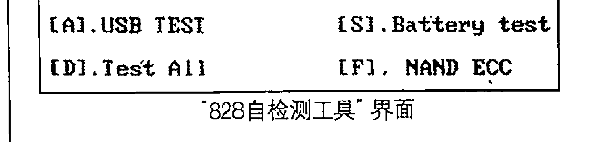

| 英文名称 | 中文名称 | 对应键 | 说明 |
|---|---|---|---|
| LCD test | 屏幕测试 | 1 | 推荐，用来测试坏点 |
| SDRAM test | 内存测试 | 2 | 推荐 |
| BACK Light | 背光测试 | 3 | 推荐 |
| LED Test | 指示灯测试（右侧指示灯） | 4 | 推荐 |
| KEY Test | 键盘测试 | 5 | 推荐 |
| Touch Test | 触屏模块测试 | 6 | 推荐 |
| Voice Test | 声音测试 | 7 | 不推荐，因为发出的声音很大 |
| RECORD Test | 录音测试 | 8 | 推荐 |
| NAND Test | NAND闪存测试 | 9 | 推荐 |
| SD Test | SD（TF）卡检测 | 0 | 推荐 |
| USB Test | USB测试 | A | 此项不知道是干什么用的，插上USB没响应 |
| Battery Test | 电池测试（量电压的） | S | 强烈推荐，可媲美万用电表 |
| NAND ECC | NAND闪存坏块测试 | F | 强烈推荐，可媲美HD Tune |

深入研究，发现这个“自检工具”（828 Self test program）非常强大，可以测试声音、内存、TF内存卡、触屏模块、USB连接和录音等等，甚至还可以检测电池电压和NAND闪存坏块，共有13个功能。

此电子词典是凌阳SPCA556方案，应该是利用嵌入式Linux带图形界面系统实现图形化的，这个“自检工具”反应速度很快，可就是没有图形化界面（名人厂商笑而不语），给大家留一个中英文对照表（见表）。

功能很多，其中，NAND闪存坏块测试和电池测试非常好用，测量的非常准。这小工具还有个功能——“全部测试”功能，按D键执行。怎样，这小小的牛津CS828电子词典还有这样的“世外桃源”。
还有，如果进不去此功能，请重试一遍。开机前按住“退出”键，再按两秒钟电源开关（电源开关松手后，按住“退出”键的那只手别别松开，一直等到出现Self test program等字样的文字界面就行了。如果还是不行，建议你更新一下机器的固件，下载地址：http://work.newhua.com/cfan/201017/828A18.rar。
退出此工具的方法：用手写笔插一下机身下面的Reset孔，重新启动机器就行了，要不就直接关机。
应该其他的“名人”牌电子词典（黑白屏幕的老机器除外）也应该会有此功能，去试试吧。

### 最酷的3D方式展示最漂亮的照片

90后爱臭美，自拍、偷拍、互拍不可少，于是留下了“永久的宝贵”记忆，拍完了自然希望能和其他人分享一下了，传统的方式那都已经玩腻了，所以这次将相片做成动态的电子相册，这样当礼物都“倍儿有面”。

3D Flash Gallery（简称3DFG，下载地址：http://work.newhua.com/cfan/201017/3DFG.rar）一款3D相册制作软件，能制作出无与伦比的3D效果，拥有上百种形态各异的模板可选，并且可以打包成EXE、SWF、SCR等多种格式。

3DFG的主界面相当简洁，左上方明确地示意出只需进行Add Photo（添加素材）、Template（模版套用）、Publish（作品发布）即可。
第一步：点击Add Photo（添加照片）按钮，在弹出窗口中找到并选中准备好的相片。

第二步：打开相片素材后，很快在主显示区内以缩略图的形式显示出所有相片。拖动右上角的滑块来调整当前相片显示的大小，利用左上侧的几个按钮对相片进行增删或简单的编辑调整。

第三步：确定了添加的相片素材无误后，点击左上角的Template（模板）按钮，进入到下一环节“添加特效”，这里提供了Cool、3D Shape、3D Wall三种不同类型的立体特效，每种类型下都有数十种不同的相册特效。逐一体验一下吧，任意选取一种，屏幕中央都会显示出相应的相册效果。在效果图上按住鼠标左键拖动可将相册上下左右地旋转或放大。
另外，点击一下Add Music（添加音乐）按钮，就能为相册添加背景音乐，软件支持MP3、WMA、OGG等多种格式的音频文件。

第四步：设定了合适的相册特效后，点击上方的Publish（发布）按钮，进入到最后一环节“作品发布”，如用到网页中，可以选择SWF，和他人分享，建议选择EXE，要是准备用来当做屏保，可以使用SCR格式。

点击相应的存储格式后，弹出设置窗口，设定好输出格式和存储路径及文件名后，点击OK即可完成作品的发布。
第五步：作品发布完成后，就可以尽情地观赏极具立体感的梦幻相册了。找到输出的作品文件，双击后打开，用鼠标左键按住拖动，可将该立体图进行旋转调整，点击立体图上的任意相片，即可放大显示。
（山东/冯晓伟）

### 目标：更稳定更强大 塞班手机系统升级攻略

所谓手机系统升级其实就是利用软件刷写固件的过程，推荐普通用户使用诺基亚官方的Nokia Software Updater（诺基亚在线升级程序，后文简称NSU）在线刷机，需要注意的是，诺基亚塞班手机只能从低版本固件升级到高版本的固件，不支持降级操作。

### 用官方 NSU 程序刷机

诺基亚PC套件下载地址：http://tinyurl.com/2cfo8gb
NSU下载地址：http://tinyurl.com/ml78qu
安装上述软件，利用USB数据线和电脑相连，在手机屏幕上选择PC套件模式，等待系统识别并完整安装手机驱动。
运行NSU软件，按照窗口提示操作直至出现固件升级的确认信息，在此会显示出手机当前的固件和即将升级的最新固件版本信息，确认无误后点击窗口右下角的“更新”按钮即可。注意中途不要对手机进行任何操作，手机出现重启和白屏也是正常现象，直至软件提示更新完成，宣布你的手机已经“鸟枪换炮”了。

#### 小提示

为了保证刷机过程的安全，在刷机前请保证手机电量的充足，在设置中改为标准模式，刷机过程中不要接收电话或者短信，不能断开和电脑的连接，确保网络顺畅。上面的刷机方法只适合购买了行货诺基亚手机的用户，如果你的手机是水货，下面的内容可要留意了。

### 修改 Code 码 李鬼变李速

水货手机来自世界各地并以Code码加以区别，不同地区因语言不同，在刷机时会被NSU软件自动识别和产地匹配的固件，如果是欧版或者产地默认无中文的手机，在刷机之后系统将恢复当地语言版本，也就是说没有中文语言可选，此时就有必要利用NSS软件修改手机的Code码了。
Code码在手机电池底下就可以找到，在百度输入“手机型号+Code码”就可以查到手机的产地，一般只有港行、马来西亚和新加坡等亚太版本支持中文，其余版本都需要修改Code。0575722（新加坡黑）和0576130（新加坡白）是N97公认比较好的支持中文的Code版本。
安装NSS时不要修改默认路径，运行NSS前要关闭诺基亚PC套件，再将手机以PC套件模式与电脑相连，打开NSS软件就可以被正常识别。修改Code码的步骤如下：
首先点击NSS窗口右上角的放大镜图标，选择Flash图标，点击窗口右侧的Scan（扫描）按钮可以查看手机当前的Code码。
选择Phone Info（手机信息）图标，点击Scan按钮可以查看手机芯片详细信息，在右侧Product Code（生成Code码）对话框中输入你想修改成的Code码数字。
然后点击Write（写入）按钮，当左下角出现“Write new values...Done”（写入新固件...完成）就表示修改成功。
比如笔者N97的Code为0576567，属于销往沙特的版本，不支持中文显示。通过NSS软件将Code修改为新加坡版的Code码0576130，“骗过”NSU让其以为手机是新加坡版，就可以安心刷机而不用担心没有中文显示了。

#### 网络大补帖

N97 Code 码大全：http://bbs.cfan.com.cn/thread-1158300-1-1.html
Code 码修改软件 NSS 下载地址：http://tinyurl.com/26byre5

### 第三方刷机，霸王硬上弓

如果你不想修改Code码，还可以利用PHOENIX（http://bbs.dospy.com/thread-4043199-1-1.html），或JAF（http://bbs.dospy.com/thread-6939444-1-271-1.html）软件进行刷机，这类第三方刷机软件的好处就是无视Code码，任何版本的手机都可以升级到指定的系统。即使刷机失败手机变成了“板砖”，也可以利用PHOENIX进行强制刷机而“原地满血复活”。

#### 小提示

利用第三方刷机软件时要注意手机的 RM（工厂代码），以N97为例，拥有RM505（全球）、RM506（行货）、RM507（美版）几个版本，不同 RM 版本的手机固件并不兼容，比如 RM506硬件上缺少对WiFi和3G的支持，因而不能刷写RM505的系统。
(北京/巴姆雷特)

### 网购菜鸟防骗记

在淘宝网购买一台洗衣机，按照“正常”的流程并通过“支付宝”付款了，但是宝贝迟迟未到，某天查询交易记录，竟然没有这项交易……又诞生一个被骗的童鞋！网购被骗莫怪人，之前应该练硬基本功：

### 记住购物网址 + 掌握打开购物网站的科学方法

去得最多的网上购物网站就是淘宝网（http://www.taobao.com）、京东网（http://www.360buy.com/）、拍拍网（http://www.paipai.com/）、百度有啊（http://youa.baidu.com/）等几个网站。一定要熟记这几个网站的地址，如果真记不住也没关系，可以使用正规的导航网站来进入购物网站，比如百度旗下的导航网站——Hao123（http://www.hao123.com/）就是很不错的导航网站，打开后找到“购物”链接并打开后可以看到很多知名的购物网站的入口。
为了方便起见，可以通过导航网站打开自己常去的购物网站，然后在浏览器中通过“Ctrl+D”将其添加到收藏夹，以IE为例：
打开购物网站后，例如打开淘宝网，直接按“Ctrl+D”打开添加窗口，如果之前没有新建购物网站文件夹，请创建一个，日后将所有与网络购物相关的网站添加到这个目录中，需要购物时，直接从收藏夹中打开，既安全又方便。

### 再练就一双火眼金睛

仅仅记住购物网站地址及知道正确地进入购物网站的方法还是不够的，还需要练就一双火眼金睛。假如你看到这样的地址：http://item.taobao.com.autosd.com/auction/sw_buy_now.htm.AsP，你会不会看出来其中的猫腻？其实，这个地址是一个正宗的钓鱼网站，而很多新手朋友并不知情，甚至一些老手也会因为粗心而误信为真。那么，如何来判断一个网址是否存在猫腻呢？
方法一：升级新版IE浏览器，借助域名高亮显示判断猫腻
假如还在使用旧版IE浏览器，请升级到IE8以上版本，在新版IE浏览器中将域名高亮显示，打开购物网站时，高亮显示的域名一眼便能判断是否有猫腻了。
方法二：了解域名组成知识
像www.taobao.com就是一个域名，标号“taobao”是域名主体，“.com”是域名的后缀（代表国际顶级域名）。相关文件规定，域名中的标号都由英文字母和数字组成（现在也支持一些国家文字域名），每一个标号不超过63个字符，也不区分大小写字母。标号中除连字符（-）外不能使用其他的标点符号。级别最低的域名写在最左边，而级别最高的域名写在最右边。因此，在看到一个网址后，假如从左向右看，在出现了正规网站的域名后还通过“.”符号追加了其他内容，十之八九是骗子网站，前面的正规网站的域名被当成二级域名或是三级域名来使用的。
#### 小提示
要想对域名知识进行深入的了解，可以参考http://baike.baidu.com/view/43.htm#2。

### 辅助工具

除了上面的方法外，还可以通过一些辅助工具来辨识真假购物网站。例如“金山网盾”（下载地址：http://www.duba.net/wangdun/）就可以辨识大部分骗子网站，避免用户受损。除此之外，一些恶意网址还会被QQ网友举报，特别当“卖家”主动将宝贝链接告诉你并让你拍时，还可以直接将这个链接拷贝到QQ聊天窗口中并发送出去，如果是恶意网站，QQ就会显示提示。

### 修改Windows 7 一个软件一锅端

不记得是哪一期的CFan上教我修改Windows 7登录画面讨好MM，虽然改改注册表对在下来说并非难事，但能简单处理的事何必改注册表呢？这显然违背了计算机越用越简单的理念。
还记得CFan推荐的nodrivermanager用来隐藏Windows分区，Windows 7资料转移器用来转移文档、音乐之类的用户文件夹，修改环境变量以快速运行程序或打开深处的文件夹……
其实这一切用Win 7优化大师（下载地址：http://www.onlinedown.net/soft/84522.htm）就可以搞定，运行软件，单击右上方“系统美化”再单击“登录画面设置”直接浏览选择一个图片文件即可，不必设置分辨率。修改右键菜单背景，方法同样简单（这个本来也是要改注册表）。此外利用软件还可以破解Windows 7主题，可以更改窗口，按钮样式，而不是仅仅换换颜色与桌面。至于系统OEM信息，改改权当自娱自乐啦。
点击“安全优化”、“驱动器设置”，想隐藏哪个分区，点几下就行了。点击“驱动器安全设置”，则可以具体设置各种驱动器的读取、写入权限。
点击“系统设置→运行快捷命令”，可以随意将某个文件与几个字母之类的快捷命令联系起来，而不必设置什么环境变量了，只需点击“添加”再输入快捷命令，浏览并选择文件如某个程序即可。然后你就可以打开“运行”输入命令直接运行程序了，等着别人崇拜的目光吧。
点击“系统设置→系统文件夹”，用户文件夹和IE缓存、临时文件夹可随意移至指定位置。作为一个高手，不把程序装在非系统盘，不把个人文件夹移至非系统盘显然是一件耻辱的事，有了这个功能，那就简单得多啦。
（晓枫 残越）

### 远离过劳死！我要健康用“脑”

办公自动化的普及，让电脑成为了工作的必需品，很多人上班时对着电脑工作，下班时对着电脑娱乐。在长期面对电脑的同时，很多“电脑病”便应运而生了，眼睛干涩、腿脚酸麻、颈椎疼痛、体重直升……这些不起眼的毛病，最终会让我们体会到什么是“小洞不补，大洞受苦”。因此不管你是美女亦或是好汉，命却只有一条，在专心工作之余，我们别忘了缓解一下疲惫的身体，远离过劳死，让我们健康用电脑吧。

#### 小提示
使用电脑一段时间后，站到窗前向远处眺望，做做眼保健操，闭目养神片刻，这些很简单的操作都可以很好地保护我们的“心灵窗户”。

### 定时护眼有良方

大家谁都知道长时间使用电脑会伤害眼睛，可关键是一旦专心做事时，就忘记了要让眼睛休息。因此我们最好让电脑定时提醒我们休息，使用“眼睛卫士”（下载网址：http://www.newhua.com/soft/24450.htm）便可以帮助我们随时护眼了。
下载解压后，双击其中的EyeGuard打开“眼睛卫士”，此时会自动加载任务栏通知区域。右击图标选择“设置”打开“参数设置”窗口，在“时间设置”里面设置每次工作的时间（如：50分钟），休息的时间（5分钟），以及每天限用电脑的时间，这样在连续使用电脑50分钟后，便会自动黑屏锁定，5分钟后会自动解锁。

#### 小提示
对于常用电脑的朋友，这里有个小秘诀可降低颈椎病发生的概率：将显示器垫高，让显示器的上端高于自己坐着时的头顶，这样看屏幕时，头要稍微昂起来，如此做可避免长时间俯视屏幕压迫颈椎。另外加强户外运动也能避免和治疗颈椎病。

### 跟着电脑做瑜伽

瑜伽一直非常流行，利用工作休息的片刻闲暇，我们可以跟电脑练习瑜伽，这样做既能休息又能锻炼身体。给电脑安装一个“瑜伽屏保”（下载网址：http://www.nike.com.cn/yogirl/clock/pc.zip），即可让电脑成为免费的瑜伽老师。
安装工具后会自动默认屏幕保护，然后设置屏幕启动时间，在Windows 7中右击桌面空白处选择“个性化”，再单击下方的“屏幕保护程序”。
这样到了指定时间会自动启动瑜伽屏幕，一招一式地教我们练习瑜伽。

### 颈椎保护不可少

据不完全统计，现在办公室中的男女白领中70%左右都患有或多或少的颈椎病。在这里给大家介绍一款叫做“摇头晃脑—颈椎病治疗大师”（下载网址：http://www.newhua.com/soft/77714.htm）的实用软件。

- 网络大补贴：
职场白领多患肩颈腰背痛，自我治疗的四大高招：http://health.sohu.com/s2010/pain01/
白领如何保护自己的背部：http://user.qzone.qq.com/29021929/blog/1280712158
白领女性如何保护眼睛？ http://user.qzone.qq.com/29021929/blog/1280712319
保护白领健康的八大方法：http://user.qzone.qq.com/29021929/blog/1280712558

(江苏/浒小☆周建峰)

### 查找视频缓存文件快人一步

在14期的《有保护也不怕 精彩视频任我下》文章中，作者介绍了各种下载受保护视频的方法。其中有一种就是通过浏览器的临时文件夹来提取视频。这是一个好办法，但是临时文件夹中包含各种缓存文件，想找一个视频无疑太难。如果使用VideoCacheView软件的话，那查找过程就简单多了。下载软件（下载地址：http://www.onlinedown.net/soft/65670.htm），运行后，软件可自动扫描IE、Chrome、Firefox和Opera等主流浏览器的缓存文件夹，并找出当前存储在里面的所有视频文件。找到视频文件，直接复制出来即可。如果获得的视频文件不完整，还可以根据URL地址重新下载。是不是比自己手动查找缓存文件快多了？
(飞天小猪)

### 借你远程同步 便我隔空取物

截图工具、视频下载工具、网页剪报工具……都是些必不可少的实用软件，虽然小，但要单独安装就显得麻烦了。于是，“All in One”的“91剪报”（下载地址：http://rj.91.com/note/）配上具有亲和力的蓝色界面，自然能打动你的心。
初次使用该软件时，首先要注册一个账户，只有拥有了这个账户，才能使用它的精髓功能——同步！选择“联机登录”后，就可以尝试它带来的方便了。
为了防止病毒传播，很多公司禁止员工们使用闪盘等移动存储工具。没做完的怎么办？要么留在办公室加班！要么……把它上传到91剪报的服务器上，到家后再取下来继续。
“91剪报”的自动同步功能默认就是开启的，上传容量大，速度也不错。软件会在添加文件的15分钟后自动同步到服务器。如果希望它立刻上传，点击菜单栏最左方的“同步”按钮即可。
另外，91剪报的视频下载功能就是一个视频嗅探工具，只要将视频地址复制到在“工具→视频下载”中，点击“开始捕捉”，之后的下载就不再赘述了；“剪报”功能也很实用，比如将食谱从网页上完整的“剪”了，再打印出来贴到厨房，做饭都能跟啃CFan一样——边看边做。
(四川/李户林)

### 酷我音乐盒歌词背景随“我”所欲

在2010年第12期的《让酷我音乐盒歌词背景跟我“姓”》一文中介绍了一种很简单的更换自己喜欢歌词背景的方法。但是这种方法只能一次添加一张可选图片背景。如果想在“歌词背景”下拉列表中多几个选择背景，可以从修改酷我安装目录中的NowPCfg文件入手。以酷我音乐盒2010盛夏版为例，用记事本打开NowPCfg文件，将count=6后面的数字6修改成自己增加之后的背景数目。然后将[NowP1]至[NowP2]前的value=30整段代码拷贝至该文件代码的末尾，并将其中的相关数字都改为“7”（后面想再加背景时依次增加数字即可，修改的数字可以照葫芦画瓢参考其他代码修改就可以了）。然后再将代码[PicPath7]下面的value=改为背景图片所在的路径即可，如value=D:\Documents and Settings\西班牙.jpg。
#### 小编点评
空白着也没事，反正也不影响使用就成。
(蓝色熊猫)

### 自制书法帖 练好钢笔字

这年头，打字已经成为主流，写字似乎不那么重要了。事实上在某些场合，我们还是需要写字的，而字在很多时候体现了一个人的品味和学识，这也是现在设计个性签名业务比较火的主要原因。对于我们个人用户来说，要练字一般需要书法帖，Word虽然提供了书法帖制作功能，却是主要用来练习毛笔字的。如果要练习硬笔书法那该怎么办呢？我们可以使用“全新硬笔书法大师”制作硬笔书法帖，从而练好钢笔字。
第一步：下载“全新硬笔书法大师”（http://work.newhua.com/cfan/201018/shufa.rar），解压后将“楷行隶书简字体”文件夹中的三种字体，复制到“X:\Windows\Fonts”目录中（X表示系统安装分区盘符，这是Windows的字体文件夹，要给系统安装新字体，一般就是将新字体直接复制到该目录即可）。
第二步：双击“全新硬笔书法大师综合版v1.0.EXE”打开该工具，单击主界面上的“书法知识”，可以给自己补充一些书法方面的知识，如怎样临摹、行书与楷书的区别等。
第三步：单击“楷书版”此时可以选择字帖的目录（如：唐诗精选、名言警句、英文笑话、常用3500字）。建议大家先练练“常用3500字”，对常用的汉字结构先有个大致了解，如果是让小孩练字，可以选择“唐诗精选”，这样可以一边背诵古诗一边练字。点“唐诗精选”，这里共有近200首唐诗，单击古诗名即可自动生成Word字帖。
第四步：默认情况下书法字帖的页面是A4纸张，如果要打印成其它大小的页面，按Ctrl+A全选字帖中的古诗，按Ctrl+C复制，然后打开Word，按Ctrl+V粘贴字帖，通过这种方法可以将多首古诗字帖放在一个Word文档中。点“文件”选择打印，单击“每版打印1页”出现菜单，可以将多页字帖打印到一张纸上，也可以使用缩放将A4页面打印到16K纸，非常方便哦。
(文/天一学校☆张伟利)

点击打开左侧的“字帖”类别，再在右侧的模板缩略图中，点击打开第一个“硬笔田字格字帖”。
第三步：这时，WPS会自动加载字帖模板，并且有一篇示例文章《出师表》。我们需要做的就是把内容进行修改，输入自己想要的任意内容，并用打印机打印出来。如果你喜欢写钢笔字描红的话，也可以把文字的颜色变成红色，就更像书店里卖的字帖啦。
#### 小编点评
支持国产软件。而且，现在WPS Office确实越来越好用了，免费的，并且也支持查看编辑微软Office的各类文档，非常方便。
(山东/殷强)

### 自制书法帖 何必如此麻烦？

CFan今年第18期上刊登了一篇《自制书法帖，练好钢笔字》的文章，介绍了如何自制钢笔字帖的方法。但是使用该方法，首先要下载名为“全新硬笔书法大师”的软件，然后还要在Word里面进行编辑，非常麻烦。其实，如果你的电脑里面安装了国产的办公软件WPS Office 2010的话，根本就不用再另外下载软件，也可以轻松制作出钢笔书法字帖。
第一步：从WPS官网(http://www.wps.cn)下载并安装WPS office 2010，已经安装此软件的朋友可跳过这一步。
第二步：运行WPS Office 2010中的WPS文字工具，在打开的程序首页可以看到许多文档样式模板。

### 新版飞信 新的省钱之道

在之前的新人帮中，我们就介绍过飞信这款软件，它可是我们节省话费的一个超级帮手。最近，中国移动推出了新版的飞信，增加了很多实用的功能，比如非移动用户也可以使用飞信了，还有直接短信功能等，手机版的飞信也推出了最新版，除了一般的聊天功能外，还集成了手机联系人和短信的管理功能，方便我们在飞信中快速使用联系人。下面我就来具体介绍一下这些新鲜的功能。

### 电脑上用飞信

以前我们使用飞信必须是中国移动的用户才可以，不过新版的飞信就取消了这个限制，非移动的用户只要通过一个邮箱就可以注册获取飞信号，然后通过飞信号来登录飞信软件进行使用。打开“https://feixin.10086.cn/account/registermail”，按提示输入邮箱地址、昵称和密码等相关资料，完成后点击“接收协议，申请注册飞信”按钮就行了。注册好后，注册的邮箱就会收到一封激活邮件，按提示就能收到一个飞信号了。接下来的使用就简单了。

### 直接短信功能

以前要想通过飞信给朋友发短信，必须要加他们为好友才行，不过现在方便了，使用飞信的“直接短信”功能就行了。点击“菜单→工具→直接短信”，在弹出的短信窗口里面就可以输入对方的手机号码、短信内容，这里还支持定时发送短信功能，按指定的时间来发送短信。

### 新增“地图”功能

在新版飞信的聊天窗口中多了个“飞信地图”的按钮，点击它就可以在聊天窗口的右侧增加一个地图窗口，在里面通过鼠标滚轮来放大缩小地图，地图支持目的地搜索、公交查询、线路设计、网上测距等多项服务。打开地图时，默认显示的城市是你的手机归属地。

### 完善的群组功能

此次新版本对群组的窗口进行了升级，现在终于可以发送截图和图片了，并且还可以自动保存截图记录，方便以后查询。这次还改进了离线接收机制，当我们由于某种原因无法与好友们畅聊时，飞信会将聊天内容自动收集下来，并在您下一次登录时自动显示，这样就不会错过精彩的群内话题了。

### 手机上用飞信

此次飞信的手机客户端也进行了更新，最新版的3.1试用版也已经推出，目前提供Java、Symbian、Windows Mobile三个不同平台的版本，而且集成了读书、新闻资讯、飞信空间等内容在里面，功能很强大。

### 快速调用手机通信录和短信

在新版的飞信手机端软件里，飞信会自动读取手机里的联系人，当我们需要给他们发送短信或者电话的时候，就可以直接点击他们的姓名来进行操作，而无需再返回到通信录里进行操作了。而在“短信”标签下面，飞信会对手机里保存的所有短信进行归类，按联系人或者手机号码，方便我们查看短信聊天的完整内容。

### 群组功能的应用

对于喜欢在群组里面聊天的朋友，手机客户端也能完全满足他们的要求，因为在手机里也可以进行搜索群、加入群、群会话等操作，几乎和PC上的功能一样。

### 新闻、好书，轻松看

在新闻资讯和读书频道里面，我们可以快速地浏览最新的新闻资讯，而且还可以在读书频道里面找到自己喜欢看的书，这些书都是按故事情节进行分类，点击相应的分类即可进入找书。

#### 小提示
新版的飞信还支持了WiFi功能，这样就可以通过无线网络来进行上网使用了，而无需使用GPRS流量了。可惜的是，目前只有该版本支持WiFi功能。

### 飞信的使用小技巧

- 1.信息条数的限制
很多人都以为飞信是可以无限发送短信的，其实并不是，飞信实际上也是限制条数的，只不过限制额度很高罢了。当我们通过飞信客户端互相聊天的时候，是可以无限制发送；但是如果你是通过手机或PC客户端向手机发短信（即客户端发给手机），则每天最多可以发送600条短信，每月最多发送10000条短信，超过这个数量即无法再发送短信了。
- 2.轻松加对方为飞信好友
一般我们申请加对方为飞信好友，都需要对方回复“是”（或Y）才可以，有些朋友以为会产生费用，所以都直接被忽略了。其实这里有个小秘诀，让你能轻而易举地让别人加你，前提是你能借他的手机用一用。
当借到手机后，可以编写短信内容“是”发送到“12520026+你的手机号码”，发送成功后，飞信就记录这个用户允许加你为好友了，这时我们只要在自己的飞信里面添加一下对方的手机号码就可以添加为飞信好友了。
- 3.用好“飞信助手”查问题
在使用飞信的过程中，如果有一些操作或者安全、资费等问题，我们可以通过“飞信助手”来获得帮助，现在新版的飞信里已经自动添加你为好友了，它其实就是一个聊天机器人，并且24小时在线，当我们随意发送内容给“飞信助手”时就会弹出一个帮助列表，回复相应的序号即可获得相应的帮助，是不是很方便呢。
- 4.to香港也能免费发短信
现在飞信还推出了香港版，如果你有朋友在香港，并使用的是中国移动的号码，那你只要把他们的手机号（或者飞信号）加为自己的好友，这样就可以免费地进行短信、视频、音频等操作了。

#### 小提示
如果用户使用香港本地电话卡发短信到内地，资费是0.5港元～3港元/条，内地用户回复则是1元/条。如果你使用了飞信香港版，内地用户可以直接添加好友的香港飞信号，同好友免费进行聊天。

### 一锅端下所有网站图片

人人都有“贪婪”之心，看到一个页面上有多少幅精美图片，总想一锅端，想法是有了，但方法呢？

### 借助迅雷一锅端下页面所有图片

安装了迅雷的话，只要先在浏览器中打开图片页面，右击页面并选择“使用迅雷下载全部链接”，在打开的窗口中仔细设置“文件过滤”，只保留图片类型文件。

### 傲游浏览器也能批量下载桌面图片

若使用傲游浏览器，直接使用内置的图片批量下载功能即可搞定：右击图片页面，选择“使用傲游下载全部链接”，在打开的窗口中单击“筛选”按钮，选择图片文件类型对应的扩展名。

#### 小提示
如果使用“超级兔子浏览器”也可以直接批量下载图片。打开图片页面后，单击工具栏中的保存按钮，选择“保存图片”，然后选择图片文件类型即可批量下载了。

### 一锅端下百度贴吧相册的所有图片

看到百度贴吧相册中的很多精美图片，想一锅端，方法也不难：先从http://www.xyzkz.tk/bdtxcxzg.rar下载“百度贴吧相册下载工具”，解压后直接运行，输入贴吧名称并进行分析，再双击提示位置即可将贴吧中的所有图片保存在软件目录中以贴吧为名的文件夹中。

### 一锅端下整站图片

如果找到了一个图片网站，想将这个网站中的所有图片一锅端下，也有法可循：从http://www.crsky.com/soft/7707.html下载“NeoDownloader”，安装运行后按“Ctrl+N”新建任务向导，按照向导提示将要下载图片的目标站点的起始页面地址输入，例如想下载“http://www.mytu.com.cn/index.html”这个站点的所有图片，那只要将上面这个地址作为起始地址输入到软件中，再选择“从整个网站下载所有图片和影片”项，最后单击“完成”按钮即可开始分析并下载网站中的图片了。

#### 小提示
软件默认将图片放到当前系统账户中的文档目录，例如在Windows 7中对应“系统盘：\Users\账户名\Documents\”目录。下载整站图片，除了上面这款软件外，还可以使用“Teleport”、“Crazy_Pic”等软件，都可以达到同样的目的。上面的方法可以交叉使用，根据现有的条件直接选择最简单的方法来实现即可。

### Nokia手机变电脑 WiFi访问免蓝牙

看到16期《超酷！电脑无线管理手机文件》一文介绍使用蓝牙连接手机，其实如果有WiFi网络，手机也支持，在没有数据线和蓝牙的时候用电脑就能访问手机文件夹。
首先需要一款手机端软件SymSMB（下载地址：http://dl.pconline.com.cn/download/54195.html），它是一款手机上的网络驱动器。

#### 第一步
进入“控制面板→共享→选项→新建→文件夹”，选择C：(手机自带内存)或者E：(内存卡)，可以任意修改共享名，提示权限时选择“是”即可。
#### 第二步
进入“账号→新建→用户→密码”，为访问手机共享添加访问用户及密码，本文以用户bddiudu为例。
#### 第三步
返回“控制面板→共享→E→打开→选项→新建→账号”，选择刚刚创建的账号bddiudu，设置“读”及“写”权限即可。建议删除“所有人”这样可以限制其他人随意访问。
#### 第四步
返回主界面，点击“控制面板→连接→选项→新建”，名字任意，工作组使用默认，接入点选择WiFi网络即可，“自动连接”建议禁用，如果启用会比较耗电，IP地址不必设置。回到“控制面板→连接→选项→启动”，手机端就设置完毕了。
#### 第五步
在电脑上，在“我的电脑”中点击“工具→映射网络驱动器”，随意选择驱动器，在“文件夹”输入“\上面所记住的IP地址\e”，同时勾选“使用其他凭据链接”，之后就可以使用刚刚设置的输入账号密码进行登录。

# RAID飞进寻常百姓家 白菜价让硬盘性能媲美SSD

目前英特尔和AMD主流芯片组都加入了对RAID功能的支持，只是根据RAID控制器差异，会造成不同程度的性能折损。就笔者的经验，英特尔芯片组的板载RAID性能是最好的，接近100%提升。但由于带RAID功能的英特尔主板价格普遍较高，所以本文主要介绍消费级的AMD芯片组。

**小提示：RAID 0**
RAID 0提高存储性能的原理是把连续的数据分散到多个磁盘上存取，这种数据上的并行操作可以充分利用总线的带宽，显著提高磁盘整体存取性能，理论上RAID 0性能提升是：单盘性能 × 硬盘数量。

**软件设置一切从简**
RAID 0虽然高效，但考虑到数据的安全性，建议在已有硬盘的基础上，用另外的硬盘组建RAID 0，也就是将系统安装在普通硬盘上，免去了进RAID BIOS组建RAID的繁琐。组建RAID 0需要2块以上硬盘，也就是说只要是2块以上，单数双数都可以组建，3块可以，4块也可以。AMD平台还需要安装RAID控制器驱动和Raid_Xpert管理工具。

AMD Raid_Xpert下载地址：http://driver.newhua.com/soft/20728.htm
AMD芯片组RAID控制器驱动：http://tinyurl.com/372yeb8

在BIOS中开启RAID功能后，AMD Raid_Xpert管理工具就可以直接在Windows桌面环境下进行RAID组建、删除、管理。此次笔者一共准备了五块硬盘，其中包括安装操作系统的西数硬盘一块，组建RAID 0的希捷硬盘四块。

通过AMD RaidXpert程序进入Web管理面板，用户名和密码都是admin。点击创建可以直接进行RAID的组建，右侧窗口会显示当前芯片组所支持的RAID模式。在这里选择RAID 0，按照提示选择组建RAID 0的硬盘，端口1代表主板上标识的SATA 1，同理端口2就是主板上标识的SATA 2，识别起来很方便。为了方便管理可以为自己组建的RAID起一个名字，可以任意输入。组建完成之后需要注意设置条带块大小，建议选择64KB，通常小条带适合琐碎文件的读取，反之则是大条带。

**小提示：**
由于RAID 0会将数据分散到多个磁盘上存取，其中任意一块硬盘故障都会引发数据“杯具”。建议组建RAID 0时定期对重要数据备份，有条件的话按照本文方法，将操作系统安装在非RAID 0阵列的硬盘上。

# 性能媲美固态硬盘

上面介绍了Windows环境下RAID 0的组建，接下来我们再来实际对比一下AMD 770芯片组+SB710南桥+4块希捷新酷鱼500GB硬盘组建RAID 0前后的测试数据。

| 项目 | 单硬盘 | 4硬盘组RAID 0 |
| :--- | :--- | :--- |
| 平均读取速度 | 131.2MB/秒 | 224.1MB/秒 |
| 突发传输率 | 153.5MB/秒 | 152.0MB/秒 |
| 存取时间 | 8.3毫秒 | 7.0毫秒 |
| 64MB文件基准测试读 | 130MB/秒 | 425MB/秒 |
| 64MB文件基准测试写 | 125MB/秒 | 350MB/秒 |

仅仅是简单的设置，四块硬盘组建RAID 0磁盘阵列后性能出现非常明显的飞跃，在HD Tune 4.01文件基准测试中提升了300%的性能，足以和固态硬盘比肩。

# 廉价的磁盘性能提升方案

目前399元起AM3接口的AMD芯片组都带有RAID功能，而500GB硬盘的价格也沦落到不足300元的白菜价。本文的方法非常适合需要新攒机或者需要对硬盘升级的用户，虽然500GB×2的价格要比单块1TB硬盘贵上稍许，但是性能的提升却是显而易见的，大容量和性能得以两全。考虑到安全因素，最好配备一个UPS不间断电源，避免突然停电对数据造成损失，单盘也是如此。

# 网络赚钱还有更多路

看了17期《不开店，无成本网络赚钱不是梦》一文，不禁回顾起自己多年的网络赚钱经历，所以想在这里补充几个比较好的网络调查赚钱方式。首先，希望大家对网络赚钱有一个正确认识，如果想依靠这些方式赚到大钱，那你还是趁早退出，不过想要赚点小钱花花还是没有问题的。

**推荐之一：题客调查网（http://www.qtick.com）**
作为网络调查的赚钱网站，题客网提供了丰富的调查问卷，此外，它兑换现金也非常方便，只要达到2370分就可以兑换20元，当然也提供了大量的实用物品供你选择。非常值得一提的是，题客调查的问卷会甄别你是否符合调查条件，如果你不符合将得不到积分，但是与完成调查一样可以得到一个抽奖机会。

**推荐之二：艾瑞调查（http://www.iclick.cn）**
艾瑞调查历史比较悠久，它还提供桌面模式，注册后下载它的软件，然后申请一个认证码，以后电脑每天挂半个小时这个软件就可以得到一角钱（这也是每天的上限）。如果有调查软件图标会变成红色，可以点击进入调查，每次根据问卷可以得到一元两元不等的酬劳，有的调查没有现金奖励但是提供抽奖。由于占用资源不多，所以挂着它也不碍事，尽管一角钱不多，但是积少成多，你会发现自己的钱会渐渐增加。艾瑞调查兑换现金也很方便，如果使用快钱最低10元就可以申请兑换，如果是银行卡就需要达到50元才能申请兑换。

**推荐之三，GlobalTestMarket（http://www.globaltestmarket.com）**
对于网络赚美元，我曾经做过很多尝试，尽管也曾拿到过一些美元，但总体感觉不是像宣传的那么可靠。这里推荐GlobalTestMarket，只要你的Market点数达到1000就可以申请兑换，虽然是美国网站，但是它提供的兑换是兑换成你所在地的货币，我曾兑换过多次。即使甄别到你不符合调查的条件，也可以得到每月以及每日的抽奖机会。

**小编说：**
网络赚钱绝对不可能一夜暴富，而且不少网友反映一些调查网站的积分达到一定程度可以兑换时，账号被莫名其妙删除等现象。总之是赚不了大钱，权当娱乐吧，祝愿大家都能赚到网络的第一桶金。

# 不做邋遢CFan 桌面从此不再乱糟糟

一位被人称为“大虾”的电脑高手曾经说过：电脑桌面在某种程度上体现了一个人的生活习惯。平时邋遢的人桌面上一般也是乱糟糟的，的确，这句话还是蛮有道理的。今天CFan就教教大家如何不做邋遢人，让桌面整洁有序实用又好用。

# 桌面图标，分区摆放

当我们的桌面不可避免的要放置很多图标时，Windows却只有四种类型的排序方式，因此图标杂乱是会经常发生的。所以我们最好能将桌面划好区域，图标分门别类放在相应区域内，这里推荐大家使用“栅栏桌面”（下载网址：http://www.newhua.com/soft/94555.htm）。
打开“栅栏桌面”，单击“创建栅栏”，然后在桌面空白处按住鼠标右键不放拖动划出一个矩形区域，此时会弹出菜单Create new Fence here（在此处新建栅栏），单击选择后出现对话框，输入该区域的名称（如：办公软件），这样在桌面上会增加一个矩形区域。
按住Ctrl键分别选中办公软件的快捷方式，然后拖放到创建的矩形区域内，如果区域较小，可将鼠标移动到区域边缘拖动放大该区域，否则会自动生成滚动条。根据需要创建不同的区域，分别在里面放置相应的图标，这样一个井井有条的桌面就诞生了。

**小提示：**
切换到软件主界面上的“定制”按钮，可设置区域背景的外观；切换到“工具”选项，单击“照一个快照”可保存当前的桌面布局哦。

# 常用程序，快速打开

桌面之所以会乱糟糟的，一般是快捷方式比较多。在Windows 7中，系统强大的搜索功能与开始菜单紧密结合，只要输入程序名称或名称中的部分字符，就会在开始菜单中显示该程序，而这项功能在Windows XP中却没有。其实只要安装Launchy（下载地址：http://www.onlinedown.net/soft/49404.htm）就可以轻松实现类似功能。打开Launchy，输入程序名（部分或全部），下方会出现相关程序，打开程序后，Launchy会自动隐藏，此时按“Alt+空格键”会显示Launchy，右击Launchy选择“选项”，可修改软件的各种设置、皮肤，在“目录”选项中增加Launchy的搜索范围。

**小技巧：给Windows 7的开始菜单整整容**
我们曾介绍过对 Windows XP 开始菜单程序组进行分类，在 Windows 7 中也同样可以，打开文件夹 “X:\ProgramData\Microsoft\Windows\Start Menu\Programs”（X 表示系统盘符），在里面创建程序分类文件夹，然后将相应的程序剪切到文件夹中，就可以实现对开始菜单中的程序进行分组。

# 系统桌面，各用各的

桌面凌乱还有一个重要原因，就是使用电脑的人比较多，这种现象在单位公用电脑上十分常见。
在Windows 7中，选择“开始→控制面板”，然后单击“用户账户和家庭安全”下的“添加或删除用户账户”出现对话框，单击“创建一个新账户”，再输入用户名并选择账户类型，最后点“创建账户”按钮就创建了一个新账户。我们还可以给自己的账户添加密码，从而保证自己的桌面不被他人“污染”。

# 虚拟桌面，方便实用

有时桌面乱是因为我们开启的应用程序太多，桌面上都是应用程序窗口，虚拟桌面精灵就可以满足我们多桌面需求（下载地址：http://www.onlinedown.net/soft/63511.htm）。
打开虚拟桌面精灵后，当前默认桌面为“桌面-1”，开启多个程序后桌面上就会有些乱了，此时单击“切换到桌面-2”，桌面上又是一片纯净，可以再次开启其他应用程序，这些应用程序就会显示在“桌面-2”上。通过这种方法，我们便可以根据需要使用多个桌面，最多可创建10个，在不同的桌面切换可以按Ctrl+（F1~F10）键，非常简单哦。

新人帮 特别话题 系统应用 网络应用 软件应用 捍卫硬盘 高人会诊 傻博士信箱 新品物语 小抄速记 买本行动 问道阁学 笔记本区 独区新闻

《电脑爱好者》·合订本

# 笔记本也有“自动挡”
教你玩转NVIDIA智能显卡切换

## 笔记本上的“自动档”轿车

我们可以把Optimus理解为自动档汽车，不需要我们手动换挡，汽车会根据当前速度的需要搭配适当的齿轮。当笔记本在运行一些日常办公的小程序时，Optimus会自动匹配小齿轮（高档位），仅使用集成显卡工作实现省油（节能）的目的；当笔记本运行3D游戏等高负载程序后，Optimus会调整到大齿轮（低档位），也就是使用高性能的独立显卡工作。游戏关闭后，Optimus还会重新恢复到集成显卡模式，整个流程完全不需要人工干预。

**小提示：**

所有支持 Optimus 的笔记本，集成显卡始终负责视频输出的工作，独立显卡只负责高负载时的渲染工作，也就是说Optimus笔记本的集显是不能屏蔽的，如果屏蔽了你的本本也就会没有显示了。简单来说 Optimus技术就好比画面，集显负责图案框架的绘制，而独显则负责上色，无论你上不上色，框架总是必须的。

## 常保养 自动档才好用

Optimus在驱动中有一份程序列表，预先设定了这些程序启动时选用集显还是独显模式。除了这些默认列表以外，当我们运行的程序触发了DX Calls（3D游戏引擎或DirectX应用都会触发该功能）、DXVA Calls（高清视频解码）或CUDA Calls（NV的通用计算功能）时也会自动启动独立显卡。新游戏和程序总是不断涌现，我们需要经常更新Optimus驱动中的程序列表，在NVIDIA控制面板中的管理3D设置界面中，可以设定管理更新，联网后系统会自动更新程序列表，确保独立显卡可以被新程序调用。

**小提示：**

Optimus 驱动中的程序列表是由注册表来记录的，千万不要用优化大师一类的软件清除冗余注册表和DLL一类的文件，否则会出现在某些程序中独显无法启动的问题。

## 自动档失灵？手动来解决

由于Optimus驱动还不太成熟，部分程序可能会出现无法启动独立显卡的情况，此时就需要我们手动选择显卡模式了。在桌面右键鼠标进入NVIDIA控制面板，在视图选项卡中勾选“添加桌面上下文菜单”和“将用图形处理器运行添加到上下文菜单”。开启这两项功能后，在运行游戏或软件的exe程序前，就可以右键手动选择集显（集成图形）或独显（高性能NVIDIA处理器）模式启动了。先选择NVIDIA控制面板左侧功能列表的管理3D设置界面，在通过预览调整图像设置中勾选使用“高级3D图像”设置。接下来点击管理3D设置，在我希望使用以下3D设置窗口中选择“程序设置”，在这个界面可以添加自定义程序，并为此程序设定首选图形处理器。如果你不想麻烦，可以在“全局设置”中就选择高性能NVIDIA处理器。

**小提示：**

对于没有注册表文件的绿色版游戏，建议都先在“程序设置”中添加一遍，并选择以高性能NVIDIA 处理器的方式运行。

## 巧用网盾 轻松搞定流氓快捷方式

你的IE主页被篡改时怎么办，看了注册表、IE设置都没有问题，原来是快捷方式出现了问题，那么如何删除呢？其实360网盾就能帮你搞定，而且不管你用的什么浏览器，直接修复！打开360安全卫士，选择“修复”。只要几秒钟，问题就完全解决了。

(寒怒)

## 右键弹“美女”轻松又给力

第12期，看见一篇文章《点击就出来 右键也能弹“美女”》，就照做了，感觉好繁好繁哦……其实设置右键菜单背景，只需一款软件——在CFan出现过的魔方（下载地址：http://www.tweakcube.com/），打开魔方后，点击上方的系统美化，然后打开“右键菜单背景”，选张图片，点击应用到系统，再根据提示重启EXPLORER.EXE后，右击“我的电脑”，“美女”就出现了，但经测试在“我的电脑”里面的硬盘上，右击没有效果。

(狂人的脚丫)

## 更改邮箱SMTP服务器 隐藏真实发信邮箱

QQ邮箱是一款应用比较广泛的邮箱产品，通过开启QQ邮箱的POP3/SMTP服务，我们可以通过QQ邮箱管理其他邮箱的邮件，给我们带来了很大的便利。但是，当你在发件人的下拉框中选择其他邮箱的地址作为发件人时，在别人收件时就会显示两个邮箱地址——发件邮箱和代发邮箱，这样难免会泄露其他的邮箱信息。

还好，贴心的QQ邮箱已经考虑到了这一点并拿出了解决方案：通过其他邮箱的SMTP服务器发送邮件。设置方法如下：在邮箱首页，选择“设置”，进入邮箱设置页面；切换到“账户”窗口，找到“账户管理”项，选择需要更改发信服务器的邮箱后的“设置”，会打开设置窗口，在“发送设置”中选择“通过其他邮箱的SMTP服务器发送”，点击“确定”即可。这样，当使用QQ邮箱代发其他邮件时，就只会显示先前选择好的发信邮箱，而不会出现“（由***@qq.com代发）”的提示了。

(飞天小猪)

## 一剑在手 影音转换随意行

当要转换铃声或是视频时，你再也不必去寻找多个软件来解决了，只需要“移动影音转换专家”就能搞定（下载地址：http://www.onlinedown.net/soft/50435.htm）。初次使用时要求选择保存目录文件夹，在这里假设保存到G:\Temp文件夹下。

- 第一步：将事先准备好的音乐文件添加进来。
- 第二步：点击“预览播放”，播放音乐确定需要的部分。
- 第三步：设置“开始点”。在时间轴上点击，然后点击“开始点”后面的“√”，即可设置开始点。同样方法，使用“结束点”后面的“√”，即可设置结束点。
- 第四步：通过“秒退”、“帧退”、“帧进”、“秒进”的按钮进行精确调整，试听确认所选的铃声无误。
- 第五步：单击“输出模式”按钮，在随后弹出的窗口中，拖动滚动条，找到适合手机的格式（如MP3），单击即可。
- 第六步：点击“开始处理”按钮，转换专家即刻为你执行所选择的操作，转换的速度还是相当不错的。稍等一会，转换完毕后，找到保存目录G:\Temp文件夹，将转换后的文件传输到手机上。
此外，移动影音转换专家还能对常见的视频文件进行切割选取和转换，让分割与转换一气呵成，方便极了。

(河北/雨蝉)

# 打印 节省才是硬道理

日常办公，文档打印是再平常不过的事情，而由此产生的耗材费用也是惊人的，特别是硒鼓、墨盒和纸张的消耗，占据打印耗材的主要部分。其实如果我们平时多加注意，完全可以大幅减少打印耗材的消耗。

## 集腋成裘，打印能省则省

Office是我们平时用的最多的办公软件，在使用Office时，我们可以根据需要修改某些设置，减少办公耗材的浪费。作为秘书，小薇经常需要将各种文稿打印后交给领导审阅，在领导修改后，还要再重新打印。像这种再次打印类似的草稿，由于只是让领导确认，完全可以使用缩放打印，这也既能节约纸张，也能节约硒鼓或墨盒的消耗。启动Word 2010并打开文档，单击“文件”选择“打印”，单击“缩放”选项，在这里可以将当前文档进行缩放打印，比如：一张纸上打印2页、4页文档，甚至可以打印更多；我们还可以将大页面的文档打印到小页面纸张上，如：将A4页面的文档打印到16K的纸张上，这样无疑也能节约纸张。单击“打印机属性”选项出现对话框，切换到“纸张/质量”选项，选择“打印质量”下的“经济模式”，这样打印的文档会稍淡一些，但是根本不会影响阅读，并且可以节约20%的耗材，长此以往，节约的耗材是非常可观的。如果打印机没有经济打印模式，我们也可以设置文档中文字的颜色，选中文字，单击“颜色”选择淡一些的黑色。有时我们遇到这种现象，文档的最后一页没多少字，完全可以合并到之前的页面中，此时可使用Word的“减少一页”功能，单击“文件”选择“选项”，出现对话框，切换到“快速访问工具栏”选项，选择“打印预览选项卡”，然后在下方找到“减少一页”按钮，再单击“添加”，这样就可以将“减少一页”按钮添加到主界面，以后要使用时单击该按钮，会自动对文档进行缩页操作，如果不能缩页也会给出提示。另外我们也可以将文档的“页边距”调小一些，这样一页也可以打印更多的文字。

## 按需打印网页

有时我们需要打印网页上的资料，如果直接打印就会比较浪费，因为页面上有不少无用的内容也会被打印，因此我们最好将网页中需要的部分“扣”出来进行打印。当网页需要打印时，按下键盘上的【Alt+PrintScreen（Prt Sc）】组合键将当前页面保存成图片，打开“附件”下的“画图”，按【Ctrl+V】粘贴图片，然后使用选择工具选择网页中需要的部分，再选择“反向选择”则会选中不需要的内容，最后按删除键清除不需要的内容，这样再打印该图片就可以节约打印耗材。

(江苏/蒋小春)

40 电脑爱好者 合订本 · 2010

# 释放N卡潜能！教你品味NVIDIA免费大餐

当你兴高采烈地将笔记本抱回家后，不要以为她会对你“鞠躬尽瘁，死而后已”。就拿NVIDIA显卡来说，如果不进行优化设置来“鞭策”一下，很多实用功能都将被埋没，不相信？那咱们就来看看很多用户都容易错过的三顿免费大餐。

## 大餐一：电影画面更靓

很多使用ATI显卡的同学都在炫耀“A卡的电影效果颜色正，N卡视频效果不如A卡”，身为NVIDIA显卡用户的笔者表示“鸭梨”很大。作为曾经ATI显卡笔记本的用户，在用NVIDIA显卡笔记本播放视频时的确会感觉画面包着一层“白膜”，颜色不是很亮丽。实际上，我们只需在NVIDIA控制面板进行简单设置，足以让少数没素质的A卡用户闭嘴。

在桌面单击鼠标右键，进入NVIDIA控制面板。依次进入视频和电视→调整视频颜色设置，在右侧窗口选择“通过NVIDIA设置”，点击高级按钮，将动态范围值调整为“完全（0-255）”，勾选“动态对比度增强”（如果有“颜色增项”的选项也要打开），保存退出。此时再欣赏电影，曾经屏幕上的“白膜”消失了。画面是不是更靓了呢？

## 大餐二：体验飞速解码

视频效果追上A卡了，接下来轮到咱们炫耀CUDA功能的时间了。CUDA是NVIDIA推出的通用并行计算架构，在很多软件中可以分担处理器的负担提升运行速度，下面我们就以视频转码来看看CUDA的实际效果：

| 项目 | CUDA开 | CUDA关 |
| :--- | :--- | :--- |
| 暴风转码CPU占有率 | 13% | 14% |
| 暴风转码转码速度 | 3.12 MB/s | 2.91 MB/s |
| MediaCoder CPU占有率 | 31% | 87% |
| MediaCoder转码速度 | 3.53MB/s | 1.97 MB/s |

需要注意的是，很多软件在默认设置中并没有开启CUDA加速功能，浪费了NVIDIA给我们提供的这顿免费大餐，精明的你一定要记得在设置中打开哦。
暴风转码下载地址：http://zm.baofeng.com/
MediaCoder下载地址：http://www.newhua.com/soft/55266.htm

## 大餐三：物理“加速度”

PhysX是NVIDIA显卡特有的物理加速功能，在游戏中可以获得更真实的体验，物理加速性能和显卡核心流处理器数量成正比。PhysX开启方法很简单，进入NVIDIA控制面板，在左侧列表选择“3D设置→设置PhysX配置”，在右侧窗口启动该功能即可。

> **小提示：**
虽然NV显卡驱动带有PhysX物理加速功能，但实际应用中效果一般，只有安装完整物理加速驱动后，NV显卡物理加速度才能得以完美发挥。下载地址：http://drivers.mydrivers.com/drivers/387-154963-NVIDIA-PhysX-9.10.0513-For-WinXP-XP-64-V/

> **火速链接：**
NVIDIA 显卡笔记本玩游戏不能全屏？解决方法：2010年11期 P82 页
Optimus 双显卡切换不好用怎么办？解决方法：2010年13期 P76 页

# “回收站” 后悔之后的好帮手

安装系统后，在桌面上总显示一个垃圾筒样式的图标，它就是回收站，一颗可以找回之前误删除的重要文件的“后悔药”，它非常实用，但你用好了么？

#### ★了解回收站

回收站是在硬盘中单独开辟的一块特殊区域，用来保存用户删除掉的各种文件，只有当用户执行清空回收站后，这些被删除的文件才会真正意义上的被删除。因此，更多时候它被称作系统的垃圾筒，若发现某个被删除的文件还有用，就可以从这个垃圾筒中将其找回。

#### 开启、关闭回收站及相关设置

默认情况下，安装系统后回收站就处于工作状态，通过鼠标右击删除命令或是键盘上的“Delete”键删除的文件都会进入回收站，而回收站是有开关的：
右击桌面上的回收站图标并选择“属性”，在打开的窗口中就可以对回收站进行开启、关闭设置。
如果关闭回收站，被删文件将被永久删除。

> **小提示：**
回收站可以指定其占用磁盘空间大小，如果分区中剩余空间大，可以相对设置大一些，反之，设置小些可以节约磁盘空间。

#### 误删除后请服回收站这颗后悔药

如果之前删除的某个文件是重要文件，现在需要这个文件，可以打开回收站来找回：
打开回收站，如果之前删除的文件数目少，直接在文件中寻找目标即可，反之，通过回收站内置的搜索功能就可以快速找到目标，找到后直接单击“还原此项目”即可。

> **小提示：**
删除文件时，如果同时按下“Shift”键就可以直接将其删除而不进入回收站，请慎用。

#### 清理回收站

时间长了，垃圾筒中堆满了垃圾，需要定时清理，回收站亦如此，清理回收站的方法很简单：

##### 系统自带清理方法

打开回收站，手工找到的确实无用的文件，将它们选中后并右击鼠标，选择“删除”即可将其彻底删除了。而若回收站中的文件数目较多，可以借助日期归类功能对它们进行筛选。比如，一年前删除进回收站的文件基本上都是绝对无用的，就可以通过时间筛选功能将它们找出来并进行批量删除，方法也不难：
在回收站的搜索框中单击鼠标，在展开列表中单击“修改日期”，在日历中选择具体的日期或是日期范围，这样就可以筛选出符合要求的文件，之后再按“Ctrl+A”全选，最后按“Delete”键即可。

> **小提示：**
如果回收站中的所有文件都确定无用，可以直接单击工具栏中的“清空回收站”按钮将它们删除。

#### 借助RecycleBinEx进行清理(下载地址：http://work.newhua.com/cfan/201019/bin.rar)

该软件提供了更科学的回收站文件清理功能。例如在通过日期筛选时提供了2天、1星期、半个月、1个月、2个月、3个月等多种合理的筛选日期，选中相应的天数后可以直接筛选，最后通过“删除”按钮即可达到目的。

> **小提示：**
单击“设置”，选中“软件随系统启动”及“自动清除被删除项目”项并设置相应的文件筛选日期，软件会自动帮助清理无用的文件。

(文/裴姗姗)

# QQ360度全方位保护

毫不夸张地说，QQ几乎是每个中国网民必备的即时通讯软件，这简直就是一部网络“手机”啊。而QQ的使用很多时候正应了中国的一句俗语“树大招风”，盗号木马，QQ诈骗等层出不穷，说不定当你登上QQ时，一双罪恶的双眼已经盯上了你的那一连串小号码呢，那我们如何保护自己的QQ并健康安全地使用它呢？

#### QQ安全系数是多少？

首先我们来检测一下自己的QQ安全系数是多少？登录QQ，单击“主菜单→安全中心→安全中心首页”，此时会弹出QQ安全中心页面，可以看到安全级别分数，单击分数可以获悉分数较低的原因以及解决方法。

> **小提示：密码的强度很重要**
QQ密码的强度非常重要，它会直接影响QQ安全得分，一般情况下只要密码包含大小写字母、数字、特殊符号，那么密码的强度就会非常高。大家可以登录微软官方提供的密码强度测试网站（http://www.microsoft.com/protect/yourself/password/checker.mspx），测试自己的密码强度，在Password中输入自己的密码，下方会给出测试结果（Weak、Medium、Strong、Best），其中Best的强度是最高的。

#### 加强设置，让骚扰远离我

QQ安全隐患某种程度上来自不明骚扰，我们可以切断这方面的安全隐患，让陌生人无法与你直接联系。登录QQ后，单击“主菜单→系统设置→安全和隐私”打开对话框，切换到“防骚扰设置”选项，选择“不接受任何临时会话信息”。

> **小提示：**
如果你的QQ被盗过，里面的好友被恶意删除，可登录 QQ 好友恢复系统（http://huifu.qq.com），输入自己的 QQ 号码和密码，根据提示进行恢复。

#### 密保，QQ安全生命线

QQ二代密保是QQ安全的生命线，在申请到号码之后，应该尽快填写相关资料并牢记，几乎所有的QQ安全操作都会使用到密保资料。
登录自己的QQ，单击“主菜单→安全中心→安全中心首页”，打开QQ安全中心页面，切换到“密保管理”，单击“密保问题”，选择密保问题并输入答案，密保资料非常重要，万一密码被盗，这是找回密码的最佳途径哦。

点“密保手机”，按密保答案提示输入手机号码，单击“下一步”输入号码，此时会提示编辑短信发送到指定号码获得验证码，输入验证码后便可捆绑成功。

#### 使用密保卡，密码变变变！

使用密保卡后，每次登录QQ都会输入不同的密码，类似于网上银行提供的口令卡一样，即使密码被盗也不用担心了，因为密保卡会让每次登录QQ的密码都不同。
进入QQ安全中心后，切换到“密保管理”，点“免费领取密保卡”，将密保卡图片打印或保存到随身携带的电子设备中，这样便于查阅；然后单击“绑定”按钮输入密保问题，将密保卡绑定到QQ完成捆绑。

#### QQ虚拟财产全保护

如果你的QQ中有Q币Q点，那么QQ被盗的机率会大幅度提高，此时最好登录到QQ安全中心，单击“帐号保护”然后选择要保护的项目，点“开通帐号保护”按钮，根据提示进行操作即可。

(江苏/石小兵)

## 自拍影像有瑕疵 会声会影来修复

最近买了一台DV，没事就东拍西拍，有时还会把自认为精彩的视频上传到优酷、土豆等网站，与摄友们共享是件幸福的事哦。在拍摄影像的过程中，我也发现不少自拍视频存在着瑕疵（如：光线过暗、画面颤抖等），后来一些摄友告诉我，可以通过会声会影对视频进行修复。下面就和大家一起分享使用会声会影修复视频的经验技巧。

#### 让影像色调更入境

照片可以调整修改色调，制作出各种风格的效果，其实影像也一样可以调整色调，让其更有意境。在“会声会影”中，就可以根据需要调节影像色调等。
打开“会声会影X3”，单击“全功能编辑”，选择菜单“文件→将媒体文件插入到时间轴→插入视频”，将影像文件导入到“会声会影”中，选中视频轨道上的影像后，点“选项”按钮打开视频修饰面板，单击“色彩校正”弹出对话框，拖动滑块，就可以修改影像的色调、色彩饱和度了，选择“白平衡”选项，在这里可以模拟色温，从而得到云彩、日光等情境，让影像色调更加入境。

> 小提示：
对于横向拍摄影像，如果要竖立起来，可以单击“选项”面板上的“旋转视频”按钮，这样影像可以按照顺时针或逆时针方向进行90度的旋转。

#### 让影像不再“发抖”

通常情况下，我们都是手持DV拍摄影像，此时轻微的晃动都会导致影像画面抖动。对于此类画面“颤抖”的影像，可以使用“会声会影”的“防手震”滤镜进行修复。将影像导入到“视频轨道”上，单击“滤镜”按钮，再将其中的“防止颤抖”滤镜拖放到视频上，单击“属性”选项下的“自定义滤镜”按钮出现参数设置对话框，拖动“程度”上的滑块，可调节消除抖动的参数，在右边的“预览”窗口中可以看到调节后的效果哦。

#### 画面过暗巧添光

普通DV在光线较暗的环境中使用时，所拍摄的影像也会比较暗，直接带来的后果就是画面黑乎乎而且不清晰。使用“会声会影”同样可以给影像“增光”。将影像导入到视频轨，单击“滤镜”按钮，将其中的“亮度和对比度”滤镜拖放到影像上，然后点“自定义滤镜”按钮出现对话框，右击“开始帧”，在“通道”中可选择三原色（红、绿、蓝）中某种颜色亮度、对比度的调节，满意后单击“结束帧”，最后点“确定”按钮即可，自己拍的视频再经过亲自“美化加工”，一定别有一番情趣哦。

> 小提示：
在滤镜库中，还有自动曝光、光线、镜头光晕等滤镜对过暗影像进行全方位的修复，从而达到最佳的效果。

#### 精彩镜头剪出来

很多时候，拍摄的影像，没有注意取景的范围，导致影像中的核心部分就不能被凸显，类似的毛病都可以通过裁剪画面来“治疗”。将影像导入到“视频轨道”上，然后将滤镜库中的“剪裁”滤镜拖放到视频上，右击“自定义滤镜”按钮出现对话框，在宽度和高度中可输入百分比，当数值是100%时完全保留影像画面，在修改数值时，可以在“原始”窗口中看到虚线框的大小在改变，虚线框的内部大小就是保留影像画面尺寸，虚线框的外部将会被清除；单击虚线框中的“十”标志，可以拖动虚线框，从而调节其位置；右侧的“预览”窗口中可看到裁剪后影像的效果。选择“填充颜色”选项，被裁剪掉的部分就会用黑色填充，也可以选择其他颜色；取消选择“填充颜色”选项，则保留的画面将会自动放大充满窗口；调整完成后，将“开始帧”和“结束帧”的参数设置相同，最后点“确定”按钮即可。

(江苏/汤宝秀)

## 漫画迷的终极观看方案

从1989年的《圣斗士》开始，日本动漫作品开始大量流入中国。从小学时满书包的漫画书，到现在的电脑、手机、MP4——“方便”才是关键词！

#### 电脑篇

首先，在线看漫画是个地球人都会的办法，关于如何上网……就不再废话了。
如果网断了怎么办？有时图片下载速度较慢，那种感觉比断网还难受！来使用“Mangadowner + MangaMeeya”吧，最强悍的漫画下载、阅读组合（下载地址：http://work.newhua.com/201019/mhmgk.rar）。
使用Mangadowner时，先在“设置”标签中选择保存路径，再切换到“主界面”。点击“帮助”会弹出一个网页，其中列举了很多漫画下载的网站。打开需要的漫画页面后，复制地址到URL框后点击“分析”，如果该网站的漫画支持下载，就会在“目录列表中”看到所有可供下载的内容。单击右边的“使用程序自动下载”，剩下的就是等待它完成下载了。

下载得到的漫画有很多格式，除了常见的图片和PDF，还有CBR和CBZ格式。看漫画的工具也不少，推荐大家使用的是MangaMeeya，它几乎支持所有的漫画格式，最受人欢迎的是它的操作——非常人性化！比如载入一张包括两页内容的大图，随着操作，显示区域依次从右上移至右下、左上、左下。同时，可以直接打开RAR/ZIP文件，操作习惯还可以在“工具→操作设置”中自行修改。
另外一点好处是MangaMeeya支持预读取技术，只要按照速度的阅读，就算你的漫画尺寸很大，还是压缩的，也不会感觉到延迟。

#### 手机、MP4篇

用手机、MP4等来看漫画，这也不是什么新鲜事。虽然这些手持设备的系统不统一，所支持的软件也不一样，但它们对PDF的支持毫无问题。所以，如果有条件可以直接下载PDF的漫画，如果是图片格式，那么若是Windows Mobile手机可以试试MangaMeeya CE（下载地址：http://xeloss.cn/MangaMeeya）。Android手机用户可以使用ACV（下载地址：http://android.tgbus.com/soft/media/201005/306888.shtml）。

(四川/李户林)

## 简单重复的事？交给电脑来完成！

在游戏中遇到重复的操作是常有的事，比如梦幻西游中的“跑商”，梦幻虽然有自动行走的功能，但地图切换时，自动行走就不管用了。想一心多用？“鼠标录制精灵”（下载地址：http://www.onlinedown.net/soft/107714.htm）来帮你。
软件的功能直截了当，没有任何配置选项。点击“开始录制”就开始记录鼠标的操作了。录制完成后再起一个名字，之后只要点击“开始回放”就能自动重复录制的鼠标操作了，准确无误。
另外，如果要想录制包括按键在内的操作，那么可以使用“按键精灵”（下载地址：http://www.newhua.com/soft/104738.htm），就可以在游戏中单刷一些难度不大的副本了。

(四川/李户林)

## 我的电脑你别关

在寝室、单位等集体场所用电脑，要是随时都把电脑锁起来不让别人用，还显得你小气，可允许别人用，一不小心把电脑关了或重启，还没保存的工作成果也就毁了，想哭都没地方去！
“计算机防关闭工具”——别人用电脑前开启它，并选择“禁止关闭/重启计算机”，这样的悲剧就不会发生啦！下载地址：http://work.newhua.com/cfan/201019/NoClosePc.rar。

(四川/李户林)

## 父母用的浏览器 贴心就是好

爸妈都开始学习上网了，不过家里就一台电脑，我又不想弄得很麻烦，浏览器又太复杂，担心他们不会操作，又怕病毒什么的……沉思之后，决定打造一个爸妈专用的浏览器！

#### 去繁就简，爸爸说它方便

其实父母使用浏览器最多就是看看新闻，在线看电影什么的……界面上那些复杂的按钮，很多都从未被使用过，简化它们，只留一些必须的选项，父母使用起来就一目了然了。
以傲游浏览器为例，右击任意一个工具栏前的竖线，首先酌情将“搜索栏”、“网页工具栏”等不常用工具栏前的勾取消，然后在“添加或删除按钮”的子菜单中，将不常用的按钮隐藏。建议保留“后退”、“前进”、“刷新”、“停止”与“主页”，这些按钮几乎涵盖了大多数浏览需求，且简单易懂。
另外一个可以精简的地方是状态栏，选择右键菜单中的“添加或删除按钮”，除了“剩余内存”、“收集面板”和“广告过滤”，其他不需要的按钮逐个隐藏即可。

#### 能大能小，妈妈说它贴心

现在显示器上像素单元间的点距越来越小，这让文字在屏幕上显得也越来越小。看不清时，按住Ctrl键并将鼠标滚轮向下滚动，显示的内容就会相应放大……但这个简单的操作对父母来说还是稍有难度。就让傲游在每次加载页面时自动放大，充分利用屏幕空间。
“工具→傲游设置中心→常规选项”中，“默认页面缩放比例”处填入要放大的比例，比如150%，应用之后，每次浏览器打开网站时，就会以这个比例放大页面，方便又贴心。
最后，将那些常用的看新闻、看电影等网站都分类收藏到收藏夹中，再配合QQ等可视频聊天的工具、游戏平台……在大时代下，父母们也不能落伍。

(寒怒)

## 我要“跳”得更高——袋鼠族五大必备技能

进入10月，一年一度的人才市场“金九银十”已过去了一半。有调查显示，面对“金九银十”，民营、私营企业职员中有近一半的人准备“转岗”，而“转岗”的首选方式是跳槽。对于职场中广大“蠢蠢欲动”的“跳蚤”们来说，再不抓紧时间的话，机会可就要错过了。然而，如何能充分地利用网络资源，牢牢把握住机会呢？很多人都知道去招聘网站广撒网，可以增加面试的几率，有助于找到更好的工作机会。但面对无数次简历石沉大海的经历，你是否反省过自己真的会用招聘网站吗？

#### 用好职位搜索

大家都知道，要在招聘网站中找工作，就必须用到搜索。但要找到好公司，找到适合自己的职位，就得会用搜索，用好搜索。

- 登录前程无忧www.51job.com首页，点击“高级搜索”；
- 从“智能类别”和“行业类别”中选择，这两个类别中都可以选择5项。别小看这个功能，它能帮助你更为精准地定位你所希望选择的领域，很有用处；
- 设置好搜索条件后，可以点击下面的“保存为个人搜索器”，这样以后就不用一遍一遍地设置了，同样也可以为不同需求设置多个个人搜索器。

#### 管理工作申请

- 有些人喜欢用邮件投递简历，因为在每个公司的职位需求下面都会留有公司HR的邮箱地址，但这样做其实是非常麻烦的，因为公司一般都不接收带有附件的应聘邮件，所以你只能把文字内容粘贴在信框中，表现力较弱，而且不方便管理；
- 进入“简历管理”创建简历，可以根据目标行业及职位的不同创建最多5份简历，这样在搜索到合适的公司职位后，可以点击页面中的“申请职位”，用人单位的HR即会在后台系统中看到你的简历；
- 之后如果接到面试电话，可以到“我的工作申请”中查看、管理申请记录，便于根据职位要求准备面试。

现在新型电视机多数都能够支持硬盘电影或电视剧播放，我们要做的只是从网络上下载高清资源，再接上电视机播放即可。

#### 1. 下载高清电影

许多网站都提供高清视频，比如迅雷狗狗。打开http://hd.gougou.com高清资源频道，即可看到主界面。它有相应分类，并可以搜索。在迅雷狗狗中搜索相关资源时，如果是视频资源，狗狗会自动识别，并在其后显示“播放”图标。单击后可以看到该资源的预览。确认无误后，即可用迅雷来下载。下载完成后，将电影或电视剧拷贝到移动硬盘上。

#### 2. 外接电视机播放

接着把移动硬盘接到电视机的USB口上，之后打开电视机，按下遥控器上的TV/AV按键，选择USB1或USB2，之后可进入硬盘状态。通过电视机遥控器将电视机设置到“电影”模式，即可开始选择电影并进行播放。另外，我们还可以通过电视机遥控器上的控制区按键来控制播放，包括上一个电影、下一个电影、快进、快退、播放/暂停、退出播放等。也可以按下电视机遥控器上的OK按键，就会在电视屏幕上出现相应的控制菜单，直接按上下键选择后再按OK键即可操作。

#### 使用广电点播系统来点播内容

广电系统的双向交互改造在全国轰轰烈烈展开，有不少城市市民已经免费获得高清交互数字机顶盒。这种高清机顶盒和过去的普通机顶盒相比，最大的特色在于其增加了点播功能，同时增加了HDMI端子和数字音频输出端子，可以完美地实现目前广电系统中最高清晰度的1080i视频输出，以及5.1数字音频环绕声输出。我们通过HDMI线将高清交互机顶盒接到电视机后面的HDMI接口，按下遥控器上的TV/AV按键，选择HDMI1或HDMI2（视你机顶盒接电视机而定），之后可进入机顶盒状态，通过机顶盒遥控器上的点播按键即可进入交互点播状态，在左侧列出了相应的内容提供商，右侧则提供了影视或电视剧的分类，还有内容的预览。我们可以通过机顶盒遥控器上的上下和左右键来选择相应的内容，按下OK键播放。同时，我们还可以进行资源的搜索，也可以看到资源的热门排行，这样我们就总能看到最热资源。

#### 让新公司搜到你

- 记得要经常更新简历，保持一定的活跃度，这样比较容易被在这类网站扫简历的用人单位及猎头发现；
- 在首页点击“修改简历”，或进入“My51job→我的简历”，选择需要更新的部分进行“修改”后，再进行“保存”即可；
- 为了让用人单位及猎头更容易找到你，你还可以在“我的简历”中设置“简历关键词”，例如你的行业、特长、业绩等；
- 在修改好简历后，可以点击“简历管理”中的“刷新”按钮，还可以点击“外发”，这个功能能让你迅速地将简历以邮件形式发到他人的信箱中，比如有朋友想推荐你，需要你的简历时，你就可以使用这个便捷的功能了。

#### 外接播放机点播硬盘内容

如果电视机比较老，不能支持移动硬盘播放怎么办？现在已经有不少的外接硬件播放器可供选择，有了它，也能够在老电视机上点播硬盘上的内容了。下面我就以蓝光播放器为例进行介绍。它不仅可以直接下载网络电影，还可以直接点播硬盘上的电影或电视剧。

##### 第一步：连接硬件

把分量信号线与音频线和电视机后的相应接口相连接（必要时要查阅电视机说明书），同时把移动硬盘的USB线连接到播放器上的USB口。接下来，将电池装入遥控器中，确认可用。最后，按下播放器的电源按钮，使其通电。

##### 第二步：播放电影

接下来，按下电视机上的“分量信号”按键将电视切换到分量信号输入状态。此时屏幕会出现播放的界面，该播放器支持RM/RMVB/AVI/VOB/VCD/DVD/MPEG1/2/4/DIVX/XVID/MOV等格式节目。对于下载回来的电影，只要选择USB项，即可看到相应移动硬盘上的文件夹，选择后即可播放。

##### 第三步：控制播放

在播放的过程中我们可以按下遥控器上的快进、快退、暂停等按键来控制电影播放，也可以按下“屏显”按键来显示相应的控制界面来控制，还可以按下“返回”按钮回到文件选择列表界面重新选择文件来播放。

#### 避免被现老板发现

- 如果你跳槽的时候还处于在职的状态，那么你一定不希望你的老板洞察到你想跳槽的小心思，但事实上，不少公司的HR会不定期地在招聘网站巡视，如果被他们发现了你的简历，可是会向你老板打小报告的，所以一定要小心！
- 在“简历中心”点击“屏蔽公司”；
- 在搜索框中输入想要屏蔽公司的名称，如果不确定，可以先在该网站上搜索一下自己公司使用的名称。

#### 小提示:

如果你想要其他（你并未申请的）公司能搜索到你的简历，就可以把简历的公开程度设置为“对所有公开”。不过不用的担心，即便你公开了你的简历，也只有网站的专业人员以及网站企业会员的人事经理有权搜索你的简历，在百度、Google上是不会搜索到你的简历以及个人信息的。

#### RSS让职位自动上门

- 其实，想找工作也不需要天天登录招聘网站，适合你的职位也会自动找上门；
- 在“职位搜索”页面中点击右侧的“RSS订阅”，就可以用RSS的方式浏览职位信息了；
- 根据自己的情况选择“地点”、“职能”、“职位”后，点击“获得RSS路径”；
- 在自己的RSS阅读器中复制该路径即可。

(北京/太挤司机)

## 直接点播随心所欲 外接大屏彩电看高清

现在彩电都是大屏，相当便宜，很多人都非常喜欢。但可惜的是，传统电视的线性直播模式已渐成明日黄花，取而代之的是三网融合。现在互联网速度和硬盘的容量都得到了提升，我们完全可以从网络上下载更多的高清电视剧或电影，后接到电视机上欣赏，也可以直接使用广电机顶盒的点播系统来点播电影或电视剧，或者通过外接播放器来实现硬盘内容的播放，甚至可以直接接上PC或笔记本电脑来播放网络或硬盘上的电影、电视剧。这样，不仅屏幕大了很多，画面和音响效果也堪称一流！享受，自己作主，无需等待！

#### 网络高速下载 + 电视机点播

#### 外接 PC 或笔记本点播内容

PC或笔记本能够连接到互联网上，由于带宽较高，因此能够实现点播。同时，电脑平台上的播放器也特别多，我们完全可以通过它们来播放硬盘里的电影，并将内容扩展到电视机上，再用上无线鼠标控制，一定很high，很过瘾！

##### 第一步：连接硬件 设置电视模式

准备好线材（一般可以选择HDMI或DVI连线）并且将显卡与电视连接，声卡和家庭音响连接好后就可以开始设置操作了。为了安全起见，最好不要带电插拔，尤其是HDMI或DVI接口设备需要在冷启动下才能检测到。

打开电视机，用遥控器来选择信号源输入。

##### 第二步：设置视频输出

接下来，启动电脑。打开显卡的控制面板来设置，要注意的是，在安装驱动程序时，要下载完整版本，即带有控制面板的套件（如ATi，则要下载CCC驱动）。在视频那一项中的标准设置里面找到向导按钮，开始相应的设置向导。进行相关设置后，电脑上的图像和声音就会传输到电视机和家庭音响上来。

#### 小提示:

如果是笔记本电脑，在完成连接后，只要按下相应的热键（一般是Fn+功能键，如笔者机器上是Fn+F10键）即可切换（不要担心，我们也可以连续按下此键在模式中循环）。

##### 第三步：安装无线鼠标

为了更好地操作，摆脱线缆的束缚，我们可以考虑购买并安装无线键盘和鼠标，现在并不是很贵了。

## 网址随身带 上网不迷路

QQ 用户，两大利器漫游收藏夹

这年头，几乎每个网民对QQ都不会陌生，QQ可以说是装机的必备工具之一，几乎每台联网的电脑都少不了QQ，所以可以将网址收藏到QQ中，这样就能随时随地使用。

#### 1.用好网络收藏夹

我们可以将常用网址添加到QQ网络收藏夹中，这样只要登录QQ就可以使用这些网址，非常方便。QQ可以自动将Internet Explorer（简称：IE）的收藏夹导入到网络收藏夹中，不过第三方浏览器（如：傲游、360浏览器）中的收藏夹却无法自动导入，必须先将第三方浏览器中的收藏夹导入到IE中，才可以再次导入到QQ网络收藏夹中。

第一步：打开第三方浏览器（如：傲游），单击左上角的“主菜单”按钮，选择“导入/导出用户数据”，出现对话框，选择“将收藏夹导出为HTML文件”，点“下一步”输入文件名（如：收藏夹.HTM），将文件保存即可。

第二步：打开IE 8.0，单击工具栏上的“收藏夹”按钮打开IE的收藏夹，点“添加到收藏夹……”后的“▲”按钮，选择“导入和导出”出现对话框，单击“下一步”选择“从文件中导入”，点“下一步”选择“收藏夹”，单击“浏览”按钮选择刚才保存的收藏夹文件，最后点“导入”按钮即可。

第三步：打开QQ，单击“主菜单”选择“工具→网络收藏夹→上传本地收藏夹”，稍后即可将IE收藏夹中的网址上传到QQ网络收藏夹。以后只要登录QQ，就可以选择“工具→网络收藏夹→管理网络收藏夹”即可打开网络收藏夹。单击“添加收藏”按钮还可以添加其它网址到网络收藏夹。另外还可以和QQ好友分享里面的网址，非常方便哦。

#### 2.QQ网络书签

QQ网络收藏夹必须在QQ中使用，如果本机没有安装QQ就没辙了，想避免这种情况的话，可以使用QQ网络书签，这样只要能上网，就可以打开书签中的网址了。

打开QQ书签（http://shuqian.qq.com），用自己的QQ号码和密码登录，单击“导入收藏”选择“导入已有的浏览器收藏夹文件”，然后点“浏览”按钮选择保存的收藏夹文件（如：收藏夹.HTM），点“上传”按钮上传书签，最后单击“开始导入”按钮即可将网址保存到QQ网络书签中。

#### 以一顶千，个性导航网站更便捷

只要记住一个网站，其它所有的网站都可以收藏其中，这种方法不会局限于本机软件，只要能浏览网页，就能方便快捷地使用自己的常用网址。“A1个性导航”网站就提供了这样的服务。

第一步：打开“A1个性导航”（http://www.a1.cn），单击右上角的“注册会员”先进行注册，这样可以得到个性化的首页；点“立即创建我的个性导航”切换页面，选择“是，开始导入”，单击“下一步”可导入当前浏览器中收藏夹中的网址，也可以单击“浏览”按钮选择保存的的收藏夹文件（如：收藏夹.HTM），点“上传”按钮，稍后会列出所有网址，默认所有网址都是公开的，对于私密网址，可以在下方将其设置为“私有”，这样就不会泄露给其他人了，最后选择“开始导入”上传网址至自己的网络收藏夹。

第二步：以后只要打开自己的首页，就可以看到首页分类显示着自己公开的网址，对于私密网址只要单击右上角的“我要登录”，用自己的用户名和密码登录后就会显示出来了，将鼠标移动到网址上，在后面还可以移动、修改或删除网址，对于新网址可单击“添加收藏”按钮添加到个人账户中，另外还可以更换皮肤、浏览模式、安装A1助手以方便于收藏新网址。

（江苏/周建峰）

## 妙用360 屏蔽网站广告省带宽

相信大家在上网时对于不清自来的广告一定很讨厌，笔者分析了一下，这些广告至少有三种坏处：影响注意力、增加网络负担、浪费时间和金钱。有鉴于此，笔者一直在修炼去除广告的神功。但是很多时候需要各种不同的工具，下载安装特别麻烦，而且这其中就有可能会夹带木马或后门程序，风险颇大。现在我们安装奇虎360安全卫士 V7.50 beta版，只要一个选项，就可以屏蔽掉四大门户的广告，十分方便，也十分安全。

首先从http://down.360safe.com/instbeta.exe下载其在线安装包，下载后直接双击即可在线安装，其间对网络的需求较高，请保持足够的带宽。另外，在安装到最后，一定要选择重新启动系统，因为其广告过滤功能只有重新启动系统后才能够生效。同时，由于它默认没有打开广告过滤功能，所以需要我们手工打开：双击任务栏下方的360安全卫士图标，打开其主界面，再单击工具栏上的“网盾”按钮，在打开的“360网盾”组件中单击“广告过滤”按钮，再在下方启用相应的规则就可以了。我们可以看到，其能够封杀四大门户、凤凰网以及各类广告联盟的网页广告。

要注意的是，最好使用IE或360安全浏览器，其他浏览器，网盾有可能不支持。

## 小提示：

我们还可以从 http://wd.360.cn/ab_index.html 处下载并安装相应的网站的广告过滤模块，比如一些小说站上有不少小广告，现在有了这些功能，网站上的广告都可以消失了。

（文/ITWriter）

## 善用收藏夹 效率刷刷刷

有经验的朋友都会启用浏览器的收藏夹，的确很方便。会者不难，难者不会，如果你对收藏夹还不太熟悉，有必要花点时间研究研究，可以大幅提高日后的上网效率。

#### ★收藏夹能做什么事？

它是用来保存网址以供日后再次访问网站时直接调出打开。添加网址到收藏夹的快捷操作为“Ctrl+D”。添加到收藏夹中的网址只要在浏览器菜单“收藏夹”中选择即可打开。如果使用傲游浏览器，还可以将收藏夹同步到网络服务器中，更方便使用。

#### 常用网址请放眼皮底下

将每天可能都需要使用的网址应该放到眼皮底下，这样可以提高工作效率。具体操作方法就是将它们放到“收藏夹栏”（有些浏览器称为“链接”栏），然后再将“收藏夹栏”显示在浏览器工具栏中。设置方法很简单：

step1:单击浏览器菜单“收藏夹→整理收藏夹”，直接将常用网址复制或是移动到“收藏夹栏”中。例如以IE为例，方法见图，其他浏览器设置方法类似。

step2:单击菜单“查看→工具栏→收藏夹栏”并确保该项处于选中状态，以后就可以很方便地在工具栏下方直接找到目标网址链接了。

#### 小技巧：

将“收藏夹栏”中的网站名称通过右击鼠标并选择“重命名”来设置一个方便区别又短小的名称，这样就可以大大增加收藏夹栏可视区的容量了。将网址名称前按顺序追加“1”、“2”等这样的数字，可以为它们排名。

#### 在线收藏夹，信息永不丢失

如果你正在使用傲游浏览器，一定要开启在线收藏夹功能，若还没有使用，推荐从http://www.maxthon.cn/download.htm下载使用。开启傲游浏览器的在线收藏夹方法很简单：

单击左上角“帐户”按钮，在打开的小面板中单击“注册”注册一个账号，再以此账号登录便会自动启用在线收藏夹，添加到收藏夹中的网址会自动与服务器同步，日后在其他任何一台电脑中只要使用账号登录傲游浏览器，收藏夹中的网址便可直接使用。

#### 小技巧：

若没有傲游浏览器，可以直接登录 http://fav.maxthon.cn/ 页面，之前添加到傲游中的收藏夹也可直接调用，也可以在其他浏览器中打开调用。

#### 养成好习惯，定期整理收藏夹

收藏的网站也会“过期”，有的是日后可能不需要或是重复的，而有的则是网站失效了，这些网址不及时清理出去，必然会影响使用效率。如果网址较少，可以直接手工整理，若收藏夹中内容较多，推荐使用“AM-DeadLink”（下载地址：http://search.newhua.com/softdown/9029_2.htm），可以方便地对死链、重复网址进行智能检测，智能清理，支持IE、Firefox、Mozilla、Opera及导出的收藏夹文件，清理方法很简单。

要删除某个网址时，只要选中（支持Shift或Ctrl+鼠标多选）直接按Delete键即可。

#### ★技巧集

1. 通过http://1link.in、http://www.multiurl.com/类网站可以将多个好网站打包成一个网址，方便与朋友分享。
2. 在浏览器中打开收藏夹管理界面，将之前已经准备好的某个收藏夹目录导出为HTML文件，分享给朋友。
3. 傲游浏览器在线收藏夹提供了“回收站”功能，若误删除了多个网址，可以从收藏夹的“回收站”中找回。
4. 在IE、傲游、Firefox等多标签浏览器中可以将当前打开的所有标签直接添加到收藏夹中，方便保存当前浏览的网页，待下次上网时继续浏览。

（文/裴姗姗）

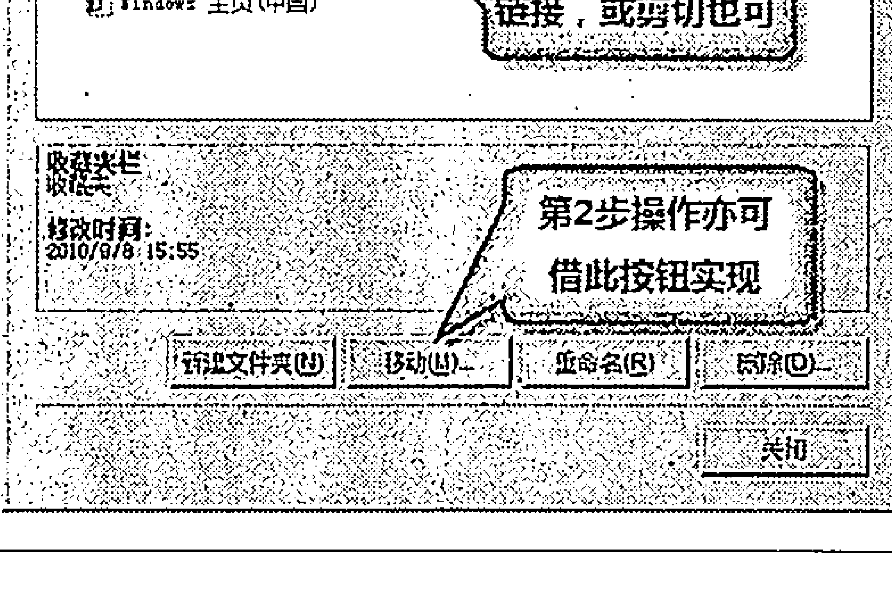

## 解放双眼！文字从此只要“听”

这年头，电脑、看书，接人待物用眼的地方太多了，这样不难理解为啥戴眼镜的人也那么多了。其实很多时候，我们应该尽量保护双眼，巧妙地利用双耳，由此来“听”，无疑是一个较好的解决方法呢。“随读语音朗读”就可以帮忙读出网页、文档中的文字，让我们体验听书的乐趣。

#### 网络小说读出来

大把大把的网络小说，老是盯着看，眼睛会比较累，肯定会伤害自己的双眼，那就让电脑读小说给我们听吧。

下载安装“随读语音朗读 10.0完整版”(http://work.newhua.com/cfan/201018/yuying.rar)，安装过程中“选择组件”时，点“完整安装”并选择下方的“VC2005运行库”，这样才能确保软件的正常使用。

启动IE浏览器(或者以IE为核心的浏览器，如：遨游、360安全浏览器等)，然后进入小说网站，打开要阅读的小说；点“随读语音朗读”，将其主界面拖放到浏览器的小说页面上方，单击“设置”选择“自动朗读”和“分析XML标签”，最后单击“朗读”按钮即可开始读出当前页面中的小说。

在朗读的过程中，可以拖动滑块快速进入小说中，单击后面的“调节”按钮，可以调节朗读时的音量、语速等，这样便于让自己听得更清楚。如果想朗读小说的某一部分，可选中该部分，然后点“选中朗读”。有些小说的页面进行了加密，可选择“IE强制复制”选项，这样就能复制上面的文字。凡是阅读过的小说，都会自动以时间为名保存在“历史记录”中。

#### 文本转换成MP3

下载了不少的网络小说，可平时都要在电脑上看或听的话那就不方便了，如果能将文本网络小说转换成MP3文件，并且将小说文本转换成LRC格式的歌词，那么就可以随时随地听小说，小说内容也能同步显示哦。

首先将小说转换成文本格式，打开“随读语音朗读”，单击主界面上的“导出”按钮出现对话框，模式选择“批量转换”，点“添加”按钮将所有小说加入到转换列表中，这样可以一次转换小说的多个章节。

单击“下一步”进行语音设置，这里可以设置语音、声音采样率、音量、语速，其中采样频率直接决定着MP3的音质；单击“下一步”设置文件格式和保存位置。如果需要歌词，可选择“创建LRC文件”，并且设置歌词中每行显示的文字，在“导出位置”中选择保存文件夹；再次单击“下一步”设置标题、作者等信息；最后点“导出”按钮即可，转换时间一般会比较长。

#### 文档轻松校对（语音校对 Word 文档）

校对文档是我们常做的工作之一，随读语音朗读可以朗读文本文档或Word文档，并可以直接进行编辑，非常方便。

打开随读语音朗读，将要校对的文档拖放到“我的图书”栏目中，然后将下方的“朗读面板”拖大一些，这样可以将文档的显示窗口设置的大一些，再单击上方的“朗读”按钮就可以朗读该Word文档了，如果听到有错误的地方，在面板上右击选择“编辑模式”来修改错误的文字。另外建议大家在输入文档时开启“录入朗读”，开启后在输入文字时会自动读出输入的内容，单击“设置”按钮选择“录入朗读”便可将文档轻松校对了。

（文/天一学校 张伟利）

## 做自己的影像管家——QQ影像1.0功能完全试用

现代人的生活是芝麻开花——节节高，交通便利了，数码装备便宜了，存储卡容量也大了。越来越多的人喜欢上了旅游，带上相机记录下祖国的大好河山、风景名胜，留下美好的回忆。不过每次拍完的海量照片总是让我们头疼，如何快速处理呢，最新版本的QQ影像 (http://image.qq.com)，帮你一站式玩转图片。

#### 任务一：管理空间相册

拍摄了大量的照片，一般都会从中挑选部分有意思的照片放到QQ相册，以便与天南地北的好友共同分享旅游的快乐，但通过网页上传照片，虽然安装控件之后可以实现批量上传，仍然觉得相当麻烦。利用QQ影像，除了管理本地图片之外，还可以在本地直接管理空间相册，而不需要在浏览器中操作。

- 一键批量上传多张照片

在QQ影像中配合Ctrl或Shift键选中多张照片，右击，选择“上传到QQ空间”命令，在弹出登录窗口中输入QQ帐号和密码即可开始上传。至于上传后图片的最大长宽尺寸，可以根据实际情况进行设置，检查无误之后，单击“上传”按钮，很快就可以将这些照片快速上传到QQ空间。上传成功之后，可以选择立即去QQ空间查看，也可以关闭窗口之后继续上传。

- 轻松新建相册

只要用QQ号码登录QQ影像，就可以在“我的空间相册”直接查看QQ空间的相册照片，单击最右边的“+”按钮，可以新建空间相册，只需要设置相册名称、描述信息和访问权限即可，避免了在网页中登录QQ空间的麻烦。

- 本地直接修改相册共享选项

默认设置下，相册都是被设置为“公开”，即允许来访者自由转载和分享，如果需要更改访问权限，也可以利用QQ影像来实现，例如只有回答了正确的答案，然后才能正常访问空间相册：选择“我的空间相册”，登录需要更改相册的QQ帐号，选择需要更改访问权限的相册，在右侧照片窗格，单击右上角的“编辑网络相册”按钮，再在“谁能访问”下拉列表中选择“回答问题”，设置问题和答案，确认之后就可以生效了，以后，来访者只有回答了正确的答案，才能顺利进入你的QQ相册。

#### 任务二：为照片进行美容

由于各种原因，可能某些照片拍摄得不尽如人意，原本是美女、俊男，拍摄出来的照片却成了“恐龙”或“青蛙”，这可太尴尬了。常规的办法是后期处理，不过并非每位朋友都能够掌握PhotoShop，对于一般人，QQ影像可以完全满足你的需求，并且方便快捷：选定需要处理的照片，按下Ctrl+E组合键进入编辑界面，这里提供了很多特效，拖动滑杆调节就可以了，包括曝光、颜色、美容，还提供了自动操作的选项，数码照片中常见的斑、红眼等缺陷，都可以在“人像美容”下找到调节选项，更妙的是还可以通过处理前、处理后的对比图进行实时的调整。

小提示：

如果只是需要批量转换照片格式或缩小照片尺寸，那么可以通过“批处理编辑”完成这个任务。遗憾的是，暂时还无法实现调整曝光、调整颜色、人像美容、调整方向等效果的批量处理。

#### 任务三：为照片添加水印

出于新闻宣传的需要，小张准备挑选几张特色鲜明的照片放到单位网站的窗口栏目，考虑到隐私保护的问题，准备在这些照片上打上水印，此时该怎么办呢？

进入编辑界面，切换到“装饰”选项卡，文字水印在“快调”面板中选择“添加文字”实现，或者也可以添加其他的饰品作为水印，例如浪漫爱情、浓浓亲情、华丽饰物、会话气泡等类别，这里提供了诸多饰品供选择，可以调整水印的透明度和位置，确认之后就可以生效了。

如果需要导入其他的图片水印，可以选择“导入饰品”→“水印”，选择事先做好的图片水印，确认后即可生效。如果需要删除饰品，只要将其拖出照片区域，右击，选择删除即可。

（文/王志军）

## 抽丝剥茧 谁说局域网互访“没有权限”？

看了CFan第20期《对症下药，巧治内网互访障碍病》一文，颇有收益，这里也和大家分享一下我在这方面碰到的问题及解决方法。

单位新装了一批计算机(Windows XP系统)，组成了局域网，但组网之后出现访问故障，表现为A机可以正常访问B机的共享资源，但B机却不能访问A机的共享资源，并弹出错误提示对话框。

A机能访问B机的共享资源，说明网络是通畅的，看来问题出在A机的设置上。对照了A、B两台计算机的设置，都是一样的，问题到底出在哪里呢？安装上NetBEUI协议、关闭网络防火墙(包括系统自带的)也都不行。后来看到网上看到一个修改注册表解决此问题的方法，我抱着试一试的心态，打开A机的注册表，找到[HKEY_LOCAL_MACHINE\SYSTEM\ControlSet001\Control\Lsa]下的“restrictanonymous”和“restrictanonymoussam”两项，将这两项的数值数据都修改为0(修改注册表之前请注意做好备份工作)，关闭注册表后重启计算机使其生效，B机终于可以打开A机的共享资源了。

但我还是不明白，这两项指的是什么？上网一查，原来“RestrictAnonymous”是一个RED_DWORD值，它可以被设置为0、1或者2，下面是这三个值的含义：

| 注册表键值 | 安全级别 |
| :--- | :--- |
| 0 | 无，依靠默认的权限 |
| 1 | 不允许SAM账户和名称的枚举 |
| 2 | 没有明确的匿名权限则不能访问 |

该项对应的是组策略“本地安全设置”里的“网络访问: 不允许SAM账户和共享的匿名枚举”。Windows可以允许匿名用户执行某些活动，如枚举域账户和网络共享的名称等，如果启用了本项，则会对这一操作进行限制，这样无授权的匿名用户也就无法访问共享资源了。

“RestrictAnonymousSam”对应的是组策略“本地安全设置”里的“网络访问: 不允许SAM账户和共享的匿名枚举”。同样，该项启用的话，匿名访问文件和打印服务器的用户将无法列出这些服务器上的共享网络资源；用户将必须先进行身份验证，然后才能查看共享文件夹和打印机的列表。因此也就出现了没有权限使用网络资源的问题。

上文在注册表中将这两项设置为0，实际也就等同于在组策略表里停用了这两项了。需要注意的是，这虽然方便了两台电脑的互访，但是安全性就打了折扣，大家需根据实际情况抉择。

> ★以上问题是因为不允许 SAM 账户和共享的匿名枚举造成的，但是即使启用了此设置，匿名用户仍将能够访问具有某些权限的任何资源。比如我直接在运行对话框中输入具体的共享文件夹位置“\h22\d”(本例假设 h22 的 D 盘设为共享)，按回车键后居然可以打开。更多限制匿名检查的知识，可参见微软知识库文章：http://technet.microsoft.com/zh-cn/library/bb418944.aspx。

## OCR不用外求 Office为你解忧

看过了18期的《不用手工输入，图书资料导入到电脑》一文，学习了很多东西，尤其是文章中提到的免除手工输入文档，为经常需要录入内容的朋友提供了很大的方便。而在实际应用过程中，我觉得没有必要使用那些特色的OCR专业软件，使用Office 2003就可以解决这个问题。

单击“开始→程序→Microsoft Office→Microsoft Office工具”，可以看到在Office程序组中就提供了OCR软件——Microsoft Office Document Imaging。这个工具的识别程度很高，完全可以满足我们的需要。它识别的图片文件格式主要是tiff和tif，如果是其他格式，可以通过画图等软件完成转换。这个程序的本身使用非常简单：

- 第一步：单击“文件→打开”，选择需要识别的图片文件。
- 第二步：单击“工具→使用OCR识别文本”。
- 第三步：单击“工具→将文本发送到Word”，我们就可以在Word中使用这些文字了。

大多数人都装有Office程序，所以我们完全不需要另外安装OCR软件，使用这个小工具就可以解决问题。

(辽宁/王尧威)

## OneNote获取图片文本更轻松

拜读了第20期《OCR不用外求，Office为你解忧》一文，受益匪浅。不过，如果你用的是Office 2010，那么它的组件OneNote 2010同样能够让你轻松获取图像中的文本，具体操作如下：

- 第一步：启动OneNote 2010，单击“插入”选项卡，然后在“图像”组中，单击“图片”。
- 第二步：在“插入图片”对话框中，找到并单击要获取其中文本的图片，然后单击“插入”。
- 第三步：右键单击文档中的该图片，然后从弹出的快捷菜单中，单击“复制图片中的文本”。此时，OneNote将自动识别图片中的文字，并将识别出的文本复制到系统“剪贴板”中备用。

现在，你就可以启动文字处理软件，比如Word、WPS或“写字板”等，按Ctrl+V键粘贴使用就可以啦。与原文介绍的Office Document Imaging相比，OneNote 2010具有操作更加简单、正确识别率更高的特点，并且支持的图片格式也更多，大家快试试吧。

(山东/王霞)

## 一键登录163邮箱可以更简单

2010年第11期的《一键登录网易163》一文中，介绍了通过相应代码的方式实现更快捷登录163邮箱的目的。其实，利用网易邮箱的“桌面快捷方式”，可以更简单地实现这一目的。

登录自己的163邮箱后，可以在邮箱首页的左下角，看到一个并不明显的“桌面快捷方式”的链接，点击它则会跳出文件下载保存窗口，这就是163邮箱的快捷方式。将这个扩展名为url的文件保存到桌面上，以后，随时双击桌面163mail的快捷方式，输入账号和密码，即可快速登录163邮箱了。如果勾选了登录界面中的“两周内自动登录”，下次再从桌面双击该快捷方式，将直接进入163邮箱了。而且，这一方法同样适用于网易的其他邮箱。

(文/飞天小猪)

## 拒骚扰 护隐私 我的手机最安全

#### 给手机请个合适的“小卫士”

智能手机的品牌非常多，各自所用操作系统也不相同，所以我们要根据自己的手机型号选择最适合的“手机卫士”。进入“360手机卫士”网站（http://shouji.360.cn/?src=360mainnav），在右侧可以根据手机的操作系统下载“手机卫士”，也可以单击“选择机型进行下载”切换页面，我们可以选择自己的手机型号下载相应的手机卫士。最后复制到手机存储卡上安装即可。

#### 给安全卫士加把“锁”

在安装“手机卫士”后，可以先自行加把“锁”，这样只有知道密码的人才能够修改安全设置从而确保安全。打开手机安全卫士，选择“设置”，然后切换到“系统设置”选项，选择“密码保护”后的“开启”并输入密码，这样以后打开手机卫士就必须有密码才可以；选择“密码输入错误时”后“进入虚假界面”，这样即使密码错误也可以进入“手机卫士”，只是此时的“卫士”是假的，无论怎么设置都不会对手机造成影响。另外选择“开机自启动”后的“开启”，来确保开机后即可得到手机卫士的保护。

小提示：
选择“安全扫描”可对手机进行病毒查杀，当检测到流氓软件或病毒后，可以进行自动清除，非常简单哦。

#### 莫名短信电话勿骚扰

艺术班的小薇有不少追求者，其中不乏死缠烂打的人物，她换了几个号码都无法逃避他们短信、电话的“孜孜追求”，此时为小薇介绍“手机卫士”，就可以将骚扰短信、电话一扫而光了。进入“手机卫士”，选择“黑白名单”，单击“通讯黑名单”，选择“菜单→添加号码→手动输入号码”，然后输入不愿接受电话短信的号码，在“拦截对象”中可以选择拦截短信还是电话。完成设置后返回手机卫士主界面，选择“拦截模式”，选择拦截模式下的“只拦截黑名单”，这样通讯黑名单中的号码，打来的电话或发来的信息都会被拦截，拦截的电话或信息在“拦截记录”中可以查阅。

#### 私人短信放入保险箱

某些时候，我们的个人短信不希望被其他人看到，此时“手机卫士”就可以将隐私短信自动放入隐私空间中。进入手机卫士，选择“隐私空间”进入“隐私收件箱”，点击“菜单”，选择“隐私设置”，这样对手机的保护就万无一失了。

(江苏/Alex)

## 和数据线说拜拜——手机电脑用WiFi也能同步

小李想把下载的最新游戏拷到手机里，可惜身边没有数据线，还好手机和笔记本都有WiFi功能，只需一款软件和简单的设置就打破了“巧妇难为无米之炊”的尴尬，让数据实现了“空中”传输。如果你也碰到了和小李相同的窘境，或者手机数据线接口损坏了，都可以尝试本文的方法。数据线？拜拜吧！（下文以Android手机为例）

简单来说，本文的方法就是先利用笔记本的WiFi功能将其设置为一个无线热点，接下来用手机的WiFi功能搜索并连接该热点，之后就可以让手机和笔记本通过WiFi无线来管理数据，除了刷机和充电以外，数据线能做的事情都可以办到，再也不用为手机数据线接口损坏或忘带数据线而担忧了。

#### 本文所需软件下载

- aFile 下载地址：http://work.newhua.com/cfan/201021/afile.apk
- Connectify 下载地址：http://www.connectify.me/

#### 笔记本变WiFi热点

打开笔记本的无线开关，如果你的本本是Windows 7系统，建议使用Connectify软件来设置热点。安装该软件后，在桌面右下角任务栏可以打开设置界面，依次设定WiFi Name（起一个方便记忆的名字）、Password（随便输入密码）和Internet（你打算共享的网络，可以是本地ADSL，也可以是笔记本所接入的无线网络），接下来点击“Start Hotspot”按钮笔记本就变成无线热点了。

小提示：
如果你的无线网卡不兼容 Connectify，或者使用 Windows XP 系统，可参考链接中的手动设置教程让笔记本变身 WiFi 热点：http://bbs.cfan.com.cn/thread-1181680-1-1.html

#### 和数据线说拜拜

运行aFile软件，关闭弹出的提示框，按手机的菜单键进入软件的设置界面，勾选“只管理SD卡的文件”，按返回键退出程序。
依次进入手机设置→无线和网络→WLAN设置，开启WLAN搜索之前在笔记本上用Connectify设置的WiFi热点名称，输入密码后会显示“已连接”。退出手机设置界面，再次打开aFile软件，此时弹出的提示框中会显示手机的登录地址（网址），例如：http://192.168.2.101:8888，在电脑浏览器中打开这个地址，注意一定要加上“http://”和“:8888”的端口号。

稍等片刻浏览器就会显示出手机存储卡中的数据，在此界面可以对数据进行添加、删除、重命名、新建目录等常用的操作，实现了和数据线几乎一样的功能。比如你想添加文件，只要点击右下角的“添加待上传文件”，选中想要添加的文件后再点击“开始上载”就可以了，传输速度和USB2.0差不多哦。

好了，至此你就可以对数据线说拜拜了，在无线传输数据的过程中不会耽误你的电话短信，可以在WiFi信号覆盖范围内任意移动，看来数据线今后的工作就只剩下充电了吧？

小提示：
其它系统的智能手机怎么办？
塞班和 Windows Mobile 手机 WiFi 管理文件教程：http://bbs.cfan.com.cn/thread-1181835-1-1.html

## 公用电脑管理好 磁盘配额显神威

虽然电脑已经走进了千家万户，但多人共用一台电脑的现象还是比较普遍的。比如那些科室用来办公的电脑、家里用来娱乐的电脑，都是不止一个人在用。由于公用电脑是多人使用，我们不可能随时监控使用情况，因此给管理带来了不少麻烦，如：电影、游戏常常会把硬盘塞得满满的，最终可能会让系统崩溃。其实我们可以从根本上管理好公用电脑的使用，让每人都拥有一个帐户，并根据实际情况分配硬盘空间，这样就会从根源上解决“管理难，难管理”的问题了。Windows的磁盘配额功能就正好可以满足我们的此类需要，下面我们以Windows 7为例，来介绍一下具体的操作方法。

#### 磁盘配额，“看人”给空间

单位的公用电脑一般就是处理文档，每个用户分配2GB的空间足矣；而家里的娱乐电脑也要进行限制，可以把儿子的硬盘空间控制在15GB，不然整个硬盘都会是电影、游戏……Windows中可以通过管理员帐户给其它用户分配空间。

启动Windows 7，用管理员帐户登录，单击“开始”菜单，选择“控制面板”，点击“用户帐户和家庭安全”切换界面，右击“更改Windows密码”为管理员帐户添加密码；再点击“添加或删除用户帐户”按钮切换到用户管理界面，在“创建一个新帐户”中输入帐户名（如：zjf），帐户类型为“标准用户”。

打开“计算机”，右击磁盘分区（如：C盘）选择“属性”，切换到“配额”选项，单击“显示配额设置”出现对话框，选择所有选项，将“磁盘空间控制限制为1GB，警告级别为800MB，这样以后新建帐户默认磁盘空间就是1GB，当空间超过800MB时会出现警告提示。

> 小提示：
要使用磁盘配额功能，必须保证当前分区是NTFS格式，右击分区选择“属性”，在“文件系统”中会显示分区格式。如果是FAT32格式，打开“命令提示符”，输入：“convert d: /fs:ntfs”（引号不要输入），按回车键即可将D盘的分区格式从FAT32转换成NTFS，此过程虽然不会破坏分区中的数据，但是最好提前先备份该分区中的数据，以防万一。

单击“配额项”打开配额项，选择菜单“配额→新建配额项”出现对话框，点击“高级”按钮选择用户，右击“立即查找”会在下方列出当前计算机中的所有用户，双击普通用户添加用户，再点击“确定”按钮出现添加新配额项，为选中的用户设置磁盘空间限制大小。同样，如果要在其它磁盘分区设置磁盘配额，也可以使用上述的方法进行，这样当用户使用电脑时，所用磁盘空间就不能超过设定值。通常情况下，系统分区的空间要尽量少给普通用户。

#### 调整受限用户的硬盘空间

给某个用户指定磁盘空间后，我们还可以根据实际情况进行修改，以满足用户的需要。右击需要修改磁盘配额的分区，选择“属性”，单击“显示配额设置”，然后点击“配额项”打开该分区的磁盘配额，右击某个用户选择“属性”出现对话框，将“磁盘空间限制为”的数值修改成需要的数值，最后连续点击“确定”按钮即可。另外在这里还会显示出空间使用超额的用户。

#### 全面管理受控用户文件

通过搜索功能并不能查找某个系统用户的文件，而通过磁盘配额却可以实现批量管理某个用户的所有文件。用管理员帐户登录系统，进入“配额项”，右击某个用户选择“删除”出现对话框，在这里会列举出选中用户在当前分区中的所有文件。选中里面的文件（按Ctrl键可选择多个文件），单击“删除”按钮即可删除；点“浏览”按钮选择某个文件夹，此时点“移动”按钮就可以转移特定用户的文件了。

(文/季慧燕)

## 给耳朵来场“盛宴” 享受高品质音乐

当今，500G的硬盘差不多算低配了，1TB的硬盘也屡见不鲜了，这么大的空间怎么才能充分利用呢？电影只下高清的，音乐当然也得是最高品质的。慢着，别告诉我你还在听MP3，OUT啦，来体验体验下无损压缩的音乐吧。

> 小知识：
今天的主角就是APE和FLAC，不过在介绍他们之前，我们要先了解下当前最流行的音乐格式mp3，mp3是一种有损压缩格式，它设计出来的目的就是大幅度地降低音频数据量，同时音质也有一定的下降。而APE和FLAC都是无损压缩，也就是说原来的音乐文件压缩成APE和FLAC格式后，再还原后的音乐文件和原来的一模一样，没有任何损失。

APE不仅是无损压缩，同时还开放其源码，这获得不少音乐发烧友的青睐。在现有不少无损压缩方案中，APE是一种有着突出性能的格式，令人满意的压缩比以及飞快的压缩速度，在国内应用比较广泛。

FLAC是Free Lossless Audio Codec的简称，这是一种非常成熟的无损压缩格式，名气不在APE之下！该格式的源码也完全开放，而且兼容几乎所有的操作系统平台。它的编码算法相当成熟，并且通过了严格的测试，当在编码损坏时依然能正常播放。一般情况下外国电影的原声音乐和一些外国歌手的专辑都是采用FLAC格式压缩的。而APE在国内比较常见。

#### 高品质音乐在哪里

高品质无损压缩的音乐格式有APE和FLAC两种，不过去哪找这种格式的音乐呢？一般有3个途径：VeryCD、音乐PT站和音乐论坛。VeryCD（网址：http://www.verycd.com/）属于开放环境，资源较多，但是由于没有良好的分享制度，很多人都是下完就删或者不做种，有时速度会非常慢，但一般热门资源的速度还是很有保障的。

音乐PT站资源丰富，但是属于全封闭环境，想获得邀请比较难，因为有分享制度要求，不过速度有保障。音乐论坛里的资源因为大多数都是上传到网盘的，而网盘一般都有期限，所以过期的资源比较多。

这里推荐两个PT站，皇后PT站（网址：http://pt.kinghou.com/login.php）和CHD PT站（网址：http://chdbits.org/login.php）。皇后PT站是主打音乐的一个PT站，刚刚成立，人不是很多，获得邀请也相对容易，很多关于无损音乐和PT站的QQ群里都有人有皇后PT的邀请，表明诚意一般都是会要到的。另外，皇后的审核也相对容易通过。

CHD是比较综合的PT站，但是审核期很严，并且对标题之类的东西有着很严格的要求，但是如果能进去，里面的资源肯定会让大部分人留下口水。此外还有国外的一些音乐站点，比如What.CD（http://what.cd/login.php）。

#### Foobar2000，让无损音乐更精彩

有了音乐资源，现在就开始准备播放器，推荐Foobar2000，下载最新的Foobar2000汉化版（http://www.foobar2000.com.cn/showtopic-18195.html），这个版本内置了对APE的支持和音乐转换器插件，安装完成后打开会看到一个朴素的界面，如果你是一个对界面很讲究的人，可以参考一下CUI和PUI界面配置方案（http://www.foobar2000.com.cn/showforum-4.html）。如果你觉得现在的Foobar2000完全不能达到自己想象的效果，可以下载增强插件来试试（http://www.foobar2000.com.cn/showforum-35.html）。

有时下载的音乐ID3信息都是完整并且正确的，但是有时候不是，需要我们手动修改或者补充。可以借助Mp3Tag帮我们实现，在http://www.mp3tag.de/en/download.html下载，安装完成后在选项里将语言更改为中文，可以看到中文界面。

点击工具栏上的“文件”，选择“添加目录”，在弹出的对话框里选择音乐文件目录，等待读取完毕。选中需要修改信息的音乐，可以在左侧更改标题、艺术家、唱片集等信息，如果需要添加封面，可在空白CD图片上右键选择“添加封面”。

音乐不能总是在电脑上听吧，有时也需要在iPod或手机上来听，不过APE和FLAC的文件太大，最好转换成其他格式。同样可以用Foobar2000来实现。选择需要转化的歌曲，右键选择“转换”，在出现的界面中，选择输出格式就可以了。个人建议选择AAC，大小是APE和FLAC的1/3，但是音质还是不错的，适合移动存储。

有些人喜欢带歌词听音乐，这里给个好东西。奥特歌词（http://www.autolyric.com/）是一个桌面显示歌词软件，兼容WMP12，Foobar2000等众多播放器。同时它还有一个很好的功能——内嵌歌词。安装好以后，打开Foobar2000，奥特歌词同时自动启动，在任务栏里的奥特歌词图标上右键，打开“选项”对话框，把“自动嵌入歌词”前的勾打上，然后用Foobar2000播放想要传到手机或iPod里的歌曲，等待搜索并下载歌词，此时歌词就会在后台自动嵌入到文件里。

(文/周明陶)

## 自制拼图 将记忆凝聚

生活中我们会经常看到一些精美的影楼照片，这些照片中很多都使用了拼图技术，就是将多幅照片巧妙地组合在一起得到多镜头效果，给人一种将记忆凝聚起来的感觉。制作这种精美的照片拼图，其实并不需要什么高深的技术，我们只要使用美图秀秀即可完成。下面笔者就用我家宝贝的照片，借助美图秀秀制作了一张精美宝贝的拼图。（美图秀秀下载网址：http://www.meitu.com）

# 第一步：

打开美图秀秀，单击“打开一张图片”按钮，先取一张宝贝的照片作示范，然后切换到“拼图”选项出现对话框，此时有三种拼图样式供我们选择。其中“自由拼图”可以任意摆放照片，“模板拼图”是使用内置的模板组合图片，“抠图换背景”可以根据需要给照片中的人物更换背景图。为了方便，我们选择“模板拼图”进入场景界面，在右侧对场景模板进行了分类，左侧是场景模板的预览图，点击“宝宝场景”，在左侧有相应的场景模板供选择哦。

# 第二步：

选择一种场景模板，此时会弹出排版预览窗口。双击拼图中的小图片出现对话框，然后可以选择其它的图片，在左侧调整图片显示区域和大小、旋转翻转图片，效果满意后单击“应用”按钮即可完成效果图。如果不满意则点“取消”，重新选择场景模板即可。

##### 第三步：

拼图完成后，切换到“边框”选项，左侧是边框分类，右侧是边框预览图，点击“简单边框”，为拼图再加上一种合适的边框，这样拼图就不会显得太散，有一种整体的感觉，最后单击“保存”按钮保存拼图即可。

(文/STAR)

## 软件安装 一步到位

如今下载常用的工具软件是非常方便的，类似于QQ电脑管家、迅雷软件助手、360软件管家这样的“管家婆”，它们都会提供大量的工具软件让我们直接下载，但是不便之处就是下载后需要一个一个地安装，无休止地单击下一步，有些软件还会夹带插件，一不留神安装后系统便会被拖慢……这样重复做就太繁琐了。不过有了“金山软件管家”，便可让此类烦恼从此烟消云散。

# 第一步：

下载安装“金山软件管家”（http://soft.kuaikuai.cn），开启后默认显示“装机必备”中的软件。细心的朋友会发现，绝大部分软件后面会显示“云安装”字样，此时要选择需要的工具软件，单击后面的“安装”按钮，提示选择安装模式，点“云安装”即可。这样软件下载结束后就可以使用了，操作方法和平常安装软件的操作方式一样也无须我们进行其它设置，非常的简便。

#### 什么是“云安装”？

“云安装”是“金山软件管家”独有的集虚拟化、软件流等于一体的全新专利技术，真正实现了“一键安装”，为计算机用户免去传统安装过程中的复杂操作，整个安装过程省去了繁杂的“下一步”，软件跳过安装便可直接使用。使用“云安装”的软件，还具有以下几大特征：确保“无捆绑”插件，绿色纯净；软件升级及时到位，一键更新；保证软件一键卸载，绝无残留。“金山软件管家”通过“云安装”功能，能自动根据软件的实际情况整合安装过程中的所有“下一步”，体现了软件管理和功能控制方面的人性化思路。

# 第二步：

金山软件管家收集的所有软件，都进行了安全测试，确定不包含恶意插件或病毒才会提供给用户使用，对于包含插件的软件，在软件名后会出现“有插件”的提示，非常安全，98%的软件都可以使用“云安装”，单击主界面上的“设置”按钮出现对话框，在这里可以为下载的软件选择“保存位置”。

#### 小提示：同类软件知多少？

除了金山软件管家以外，同类的软件还有不少，如：小白软件管家（http://www.xiaobai.com）、云端（http://www.yunduan.cn）等，他们提供的软件都是绿色版，无需安装，下载后就能使用。

> (江苏/锦秀年华)

## 搜狗也让网址随身带

在2010年19期的《网址随身带，上网不迷路》一文中，介绍了通过QQ漫游浏览器收藏夹的方法。这里，我也把自己常用的方法介绍给大家。我使用的是新版搜狗高速浏览器（http://ie.sogou.com），并且注册了它的网络账户，用此账户登录后，我收藏的网址就会自动保存在搜狗的服务器上，这样我在任意一台电脑中上网，都可以快速同步收藏的网址，达到“随身带”的效果。另外，通过搜狗浏览器“收藏”菜单，也可以导入IE中的收藏夹或HTML格式的收藏夹。使用搜狗浏览器比原文方法优越的地方在于，它不仅可以同步用户的收藏夹信息，还可以同步用户的访问记录以及保存的智能填表信息，甚至是浏览器的自身设置数据，相比360等浏览器只能漫游收藏夹的功能，是不是更为全面。

> (河南/郑永皓)

## S40后台玩QQ 看准再刷

从13期上看了《S40的同学有福了，爱机也玩后台运行》，是关于S40刷机的文章。作为一名早已刷机成功的TX，觉得文章写的有一些问题，现在来更正一下。首先，PPU文件不是每一款手机都一样的，一共有3种PPU文件，分别是“第28项”、“第48项”和“第68项”，其中我的N7210c就是“第48项”，文中提到的只有“第28项”，你可以从http://work.newhua.com/cfan/201017/pp.rar下载到其他项，请自行下载验证。另外，不是所有手机都能成功的，S40 V3及以下版本的手机是不能实现后台功能的，比如Nokia 3602，但V5的没有问题。

#### 小编点评：
S40现在主流的系统主要有V3、V5、V6，每个版本的硬件配置不同，版本号越大，硬件平台越好，速度越快，拍照、音乐的效果越好，目前只有V5、V6能够实现后台播放。要解决这个问题，目前只有两个折中的方法：

- ①使用集成软件，可以从 http://work.newhua.com/cfan/201017/JT.rar 下载手机 QQ2008、手机飞信 1.0 和趴趴歌词秀奥运版的集成版，间接实现后台功能。
- ②登录3G.QQ.COM，使用网页版QQ，按红色挂机键退出，可以挂半个小时不掉线，就是流量钱和电量消耗的会快一些。

> (王皓)

## 算算自己活了多少天？

光阴如梭，从出生那天到今天，你知道自己已经活了多少天了吗？拿起笔来算？那就太慢了，其实使用Windows 7的计算器，便可以轻松计算出我们活了多少天。单击“开始→所有程序→附件→计算器”，打开Windows 7的计算器，选择菜单“查看→日期计算”，此时就可以计算两个日期之差，选择开始日期，也就是自己的阳历生日（现在的日期是默认的），最后点“计算”按钮即可算出从出生到今天自己已经活了多少天喽。正常情况下人的寿命难过36000天，看看自己已经有了多少天，又还剩下多少天呢……好好珍惜生活哦。

> (文/江苏 建峰)

## 三招齐发 更新微博我不怕

当下微博热正在互联网上流行，新浪微博、搜狐微博、腾讯微博、网易微博……各种各样的微博都在互联网上兴起。但是账号一多，麻烦就出来了：每次更新都要一个网站一个网站的跑，Ctrl+C、Ctrl+V按得手都疼了，更新微博，实际上不用这么麻烦的！

#### 不用来回跑 一键即更新

貌似自从腾讯微博出来之后，微博界就非常不安宁，这不，QQ签名、QQ说说也可以同步到腾讯微博了，怎么样？不过这还不够，在QQ邮箱的阅读空间里，QQ广播增加了更新到新浪微博和搜狐微博的新功能。首先进入QQ邮箱的阅读空间，打开更新至腾讯微博、新浪微博、搜狐微博的功能（需要用户名验证），输入想在微博里更新的内容，之后发表即可。如果还想到QQ空间里发表在空间说说，就可以复制到QQ空间说说输入面板即可。这样，腾讯微博、新浪微博、搜狐微博、QQ阅读空间广播、QQ空间说说都有你更新的微博了。

#### 懒人有懒招 一网打天下

嘿嘿，上面的方法还是麻烦？别着急，网上有许多同步微博的网站，这就有一个：微博通：http://www.weiboto.com，可以支持更新新浪、网易等各大网站的微博或分享，可惜现在腾讯微博仍不能支持。很简单，注册之后点击已有的微博输入用户名和密码验证绑定即可。以后更新，上微博通即可。

#### 网站好内容 不能就错过

发现某一网站的内容好，怎么能错过？赶快转发到微博吧！别急，你还在复制粘贴？舍弃掉吧，现在一键转帖到微博在每个站点真是随处可见，点击一下，更新即可。

> (文/张宁)

## 巧用Foxmail 让重复操作“见鬼”去

心理学研究表明，人最怕的就是重复性工作。例如，日常处理大量邮件就有很多重复性动作，那有没有办法批量来处理邮件、自动应用模板或自动处理附件呢？Foxmail 6.5 beta2可以帮我们做到。

#### 设置邮件模板 批量自动签名

发E-mail，必不可少要在后面注上个人基本信息，例如姓名、职位、公司、地址、联系电话等，如何在创建每一封新邮件的时候都自动带上这些信息。第一步：新建模板 在Foxmail的主窗口中选择“工具”→“邮件编写信纸管理”，打开“信纸管理”窗口，然后选择“新建”→“新建HTML模板”命令，然后将其重新命名为“带签名模板”。第二步：添加图片和文字 单击右侧窗格中工具栏上的“插入图片”按钮，然后添加相应的图片文件，再在下方写上相应的信息，再单击工具栏上的“保存”按钮保存此模板。第三步：使用信纸 右击账户，选择“属性”，再在打开的窗口中单击“信纸”，再选中“新邮件格式”为HTML，然后单击下方的“HTML格式邮件”旁边的“浏览”按钮，再选择先前的“带签名模板”即可。以后单击Foxmail主窗口工具栏上的“编写”按钮，即可使用“带签名模板”来编写邮件。

#### 效率空间两不误 批量处理附件

选择“工具”→“附件管理”命令，打开窗口，我们只要选中某个邮箱，其下包含有附件的邮件，包含的附件、所在邮件、大小、发件人、发件日期都会显示出来，我们可以选中多个附件，单击下方的相应按钮来批量处理附件。其中“删除附件”将它们删除掉而只留下信件内容（也可以先保存附件再删除），这样一来，可以减少硬盘空间占用，而且对于Foxmail运行速度也会有提升。当然，也可以单击“保存附件”来批量保存附件，“转发附件”来批量转发附件。

> (文/江北书生)

## 不会读没关系 生僻字照样打出来

如今拼音打字是大众的主流汉字输入法，80后、90几乎无一不用拼音打字。可以这样说，未来的中国，拼音输入法普及率会达到95%，五笔等输入法估计只有专业打字员才会使用。不过拼音打字虽然好学好用，但是万一遇到个不认识的生僻字，那就没办法打出来了，这样岂不是显得很OUT？如今Cfan为大家支支招，让不认识的字照样都能打出来哦。

#### 看到的就能打出来

在手机上有一种笔画输入法，只用5种笔画（横、竖、捺、撇、折）就能打出汉字。现在常用的拼音输入法（如：搜狗拼音、QQ拼音、谷歌拼音）都自带这种笔画输入法，这样就可以根据汉字字形，打出汉字了。切换到常用的拼音输入法，按u键会开启笔画输入法。笔画对应的按键一共有5个，h为横（横字的第一个拼音字母），s为竖，n为捺，p为撇，z为折。此时根据生僻字的写法，输入相应的笔画即可。

小提示：
对于某些生僻字，我们可以根据相关资料进行搜索，比如：煜，这是南唐后主李煜的名字，只要搜索关键字“南唐后主”即可获取相关资料，其中就有“煜”字，复制使用便是。

#### 会写就能打出来

从微软拼音添加手写输入功能后，现在的主流拼音输入法都添加了手写输入，非常实用方便。

##### 搜狗拼音5.1：

安装最新版的“搜狗拼音”（下载网址：http://pinyin.sogou.com），安装过程中会询问是否启用手写输入，点“立即启用”即可自动下载安装；切换到搜狗拼音，单击“主菜单”选择“扩展功能→手写输入”可以开启手写输入，此时就可以使用鼠标在手写面板上写出不认识的汉字，在旁边会显示该汉字及其读音，单击该字便能够输入到当前文档中了。

##### QQ 拼音 3.4

安装最新版QQ拼音（http://py.qq.com）后，切换到QQ拼音，输入选择9启用“手写输入”，如果没有安装“手写输入”则单击“在线安装”，在手写面板上用鼠标写出所要输入的汉字，最后选择即可。

##### 微软拼音 2010

安装微软拼音2010（下载：http://www.microsoft.com/china/pinyin），点“开启输入板”按钮打开输入板，单击“手写输入”，就可以用鼠标书写所要输入的汉字了。

##### Windows 7 的 Tablet PC

在Windows 7中内置了Tablet PC，也可以进行手写输入，点“开始→所有程序→附件→Tablet PC→Tablet PC输入面板”，开启输入面板后，即可书写汉字，此时也会自动进行识别。

#### 奇妙的结构输入法

有些生僻字通常由几个简单的字组合，如：焱、淼……在最新的搜狗拼音、QQ拼音中，可以输入生僻字中的简单字，让其自动组合出生僻字，比如：“淼”字，输入shuishuishui，即可出现该字，非常简单哦。

(文/ALEX)

## 还在解压缩？你OUT啦！

CFan上介绍过不少WinRAR之类的解压软件，但是当面对超大的游戏或高清电影文件，解压缩时超高的CPU占用率和龟爬般的速度那是相当不给力，尤其是对于一些低配置的机器来说，死机也是家常便饭。那么，不如来试试WinMount吧（下载地址：http://cn.winmount.com）。

软件安装后，右击任意压缩包文件，会在右键菜单中看到多个WinMount命令项，其中“挂载至新盘”和“快速挂载”就是我们今天的秘密武器了。WinMount可以像虚拟光驱一样把压缩文件挂载为一个虚拟的磁盘，这样就省去了解压时间，并且WinMount对文件的操作是在虚拟路径中进行的，不会像WinRAR那样在文件解压后要占用双倍的空间。
经我测试，一个1.5GB大小的ZIP压缩包，内含多个文件，使用WinMount挂载新盘只用了5秒左右，CPU占用率维持在10%左右，峰值为36%。而用其他软件解压的话，则用了1分50秒，并且CPU占用率一直保持在40%以上，峰值达到68%，优势够明显的吧，赶快拿起电话，不对，是下载来试用吧。

> 小编点评：
WinMount 支持 RAR/ZIP/7Z/ISO/MOU/CAB/ARJ/GZ/BZ2/TAR/WIM 等主流压缩包格式，不过在应用“快速挂载”时只支持 ZIP/MOU/WIM。另外，使用 WinMount 挂载 ISO 等镜像文件，可以将它当作虚拟光驱来用。除了对压缩包文件的支持，WinMount 还支持多种虚拟机硬盘镜像挂载，不用开虚拟机即可取出虚拟硬盘中的文件，非常方便。

(河南/郑永皓)

## 做Office达人 随心所欲改文档

很多Officer会遇到类似的情形：一份文档可能需要多人修改，如何保留修改的痕迹？急需打开一份Office文档，却没有Office软件？工作没做完，想带回家继续做，怎样快速共享文件？……魏峰是一个Office达人，我们来看看他是怎么做的？

#### 计划你修他改，变动一目了然

作为某游戏公司策划部的主任，这两周魏峰做了一份游戏开发计划书，完成后要请团队的其它成员提意见，为了让改动一目了然，他使用了Word2010的加密修订和加密批准功能。
第一步：打开游戏计划书，切换到“审阅”选项，单击“限制编辑”，选择“编辑限制”下的“仅允许在文档中进行此类编辑”，然后选择“修订”；再单击“是，启用强制保护”，输入文档保护密码。这样该计划书在发到团队其它成员后，就只能进行修订操作，所有的修改都会以修订形式出现，不影响原文。

小提示：
单击“修订”选择“修订选项”可以设置各种修订标记的样式；选择“更改用户名”将当前Office用户名修改成自己的姓名，这样以后对文档进行修订时，修订用户名就会显示自己的姓名，便于审阅人了解是谁修订的。

第二步：当成员修改计划书后返回给魏峰，切换到“审阅”选项，单击“审阅窗格”，可以很清楚地看到各处的修改痕迹，增删的文字，修改人员，所有变动一目了然。如果要接受里面的修改，单击“停止保护”按钮，输入保护密码，此时对于改动的各个部分进行分别确认，如果认可的则单击“接受”按钮会自动更改，如果不认可则单击“拒绝”按钮会保留原文，这样单击“下一条”按钮则可对整个计划书进行修改，非常方便。

#### 文档修改编辑，随时随地搞定

魏峰出差与客户谈游戏策划事宜，需要经常对原有的计划书进行细微改动，可晚上在宾馆使用Office修改文档时，却意外发现Office不能使用了，这可咋办呢？还好微软的网络版Office解除他的燃眉之急。
第一步：打开live.com，用自己的用户名和密码登录，单击“Office”切换页面，然后单击“添加文档”选择网络文件夹，再单击“选择文件”选择本机上的计划书（文档体积不超过50MB），最后单击“上载”按钮将计划书上传SkyDrive中。

第二步：上传结束后，将鼠标指向文档选择“在浏览器中编辑”，此时就会自动打开启用网络版Office打开计划书，这样就可以对文档进行简单编辑修改。完成后单击“保存”按钮并关闭网络版Word2010，再单击“更多”选择“下载”即可将计划书重新下载保存到本机中。

小提示：
有些时候本机电脑未安装 Office，无法打开 Office 文档，或者低版本 Office 无法打开高版本 Office 文档，此时我们就可以使用网络版 Office 来应急，非常方便。

#### 文档存网盘，远程办公也简单

相信不少Officer都曾在家里加过班，在单位撰写一份报表，回家后想继续编辑，此时用U盘拷贝、发到邮箱……这些都太out，存放到网盘倒是个不错的选择，不过如果网盘每次使用都需要登录复制，那就太麻烦喽。魏峰用的是网络“数据银行”，可以在电脑上创建本机文件夹，平时使用时只需要将文件保存在本机文件夹，就会自动上传到网盘中，在家里的电脑上也创建本机文件夹，数据就自动同步。
第一步：打开数据银行（网址：http://www.dbank.com），免费注册一个账号，可获得3G的免费空间，上传的单个文件不大于100MB。下载数据银行PC客户端（http://www.dbank.com/pc/download.jsp），安装后用注册的账户登录客户端，然后在本机上选择一个文件夹，作为数据设置同步文件夹，最后连续单击“下一步”完成设置。

第二步：以后要共享的数据只需要保存在本机共享文件中，此时就会自动上传到网盘中；双击桌面上的“数据银行”可打开本机文件夹查看里面的数据，和网盘中的数据是一致的。同样在家里的电脑上也安装数据银行客户端，登陆后打开就会自动从网盘中下载已有文件，从而自动同步。以后无论在家里还是在单位的电脑上，向共享文件夹中添加或删除文件，都会自动同步到网盘，非常方便。

小提示：
其实微软的 SkyDrive，也可以在本机安装客户端，从而快速分享文件，不过 SkyDrive 网盘的速度太慢，反应迟钝，所以笔者建议大家使用“数据银行”，简单快捷。

(江苏/周建峰)

## 速度提升250%！软件RAID 0让你的硬盘飙起来！

RAID 0好似双车道的高速公路，速度比普通模式下的单/多硬盘快得多。“杯具”的是很多Intel芯片组都不支持RAID功能，自然无法享受到硬件RAID 0的优越感。硬的不成就来软的，只要你的电脑已经安装了Win7系统，而且还有额外的2块以上同规格硬盘，利用系统自带的“软件RAID 0”功能同样可以让数据跑在双磁盘组建RAID 0的高速公路上！

不同品牌、不同规格的磁盘也能组建RAID 0，但组建后容量和速度都会以规格低的磁盘为主。比如用500GB+1TB组RAID 0，最终系统只能识别500GB×2。为了稳定及磁盘的利用率，建议大家使用同品牌同型号的磁盘组建。现在500GB硬盘价格普遍不到280元，额外买两块组RAID 0，成本不高但性能的提升却是显而易见的。安装硬盘时，可以将装有系统的硬盘安装在主板的SATA1接口上，组建软件RAID 0的两块新硬盘按照SATA2、SATA3的顺序安装即可。

#### 实战软件 RAID 0

将两块新买的磁盘在主板上安装好后启动计算机，按照以下步骤操作：

1. 右键单击开始菜单中的计算机并选择“管理”进入计算机管理控制台，在计算机管理中单击“磁盘管理”。在这里除了原先的系统磁盘以外还会显示出没有初始化的两个未知磁盘，分别是磁盘1、磁盘2。首先要做的就是初始化磁盘。
2. 在磁盘管理中，右键单击未分配的空间并选择“创建卷”。创建卷向导出现，单击下一步，选择“带区卷”。
3. 选择想使用的磁盘（将磁盘1和磁盘2都添加到“已选的”对话框中）和输入想在每块磁盘中分配给该卷的空间。单击下一步，指定盘符，以NTFS文件系统执行快速格式化即可完成设置。
4. 此时两块新磁盘的盘符均为“X”，比如笔者电脑显示G盘，创建/删除文件都会同时在两个磁盘里出现。

小提示: 软件RAID 0为动态磁盘联机，所以会显示为两个磁盘。如果是硬件组RAID 0就会将两个硬盘显示为一个磁盘，而且性能更佳，但需要芯片组的支持。

#### 软设置性能提升 250%

说软件RAID 0性能稍逊只是相对于硬件RAID 0而言，与普通单磁盘相比，软件RAID 0的表现也可以用质变来形容了。下面我们就来看看使用FastCopy V2.01软件，测试复制955.4MB的文件时软件RAID 0与普通磁盘的性能差异。

| 传输类型 | 存储位置 | 总计时间 | 传输速率 |
|----------|----------|----------|----------|
| 跨区传输 | E盘→D盘 | 24.73秒 | 38.63MB/秒 |
| 跨区传输 | E盘→G盘 | 11.02秒 | 86.73MB/秒 |
| 内部传输 | E盘→E盘 | 24.13秒 | 39.6MB/秒 |
| 内部传输 | G盘→G盘 | 9.64秒 | 99.10MB/秒 |
| 注：C-E均为普通单磁盘，G为软件RAID 0磁盘 |

普通磁盘内部数据传输的速度只有39.6 MB/秒，而软件RAID 0磁盘的速度则接近100MB/秒，近2.5倍的性能提升难道不值得你去尝试吗？

## 电脑“一心可二用” 办公娱乐两不误

现在很多电视机都有连接电脑的功能，这样方便我们把电视机接在电脑上使用，再链接到互联网上，方便欣赏一些网络电视、在线电影等，可是这样使用的话，电视机就霸占了一台电脑主机，感觉有点浪费了。其实我们可以利用Windows的双屏显示功能来轻松搞定。

#### 硬件要求

1. 需要电视机有VGA接口。
2. 电脑显卡需要有双头输出功能，比如一个VGA，一个DVI，如果是两个DVI的话，可以用DVI转VGA转接头，将显卡的DVI转为VGA，方便和电视机连接。
3. 电脑主机和电视之间的距离不超过3米，可以直接通过VGA线或HDMI线将电视连接到电脑上使用；如果距离超过5米，由于信号的衰减，直接用VGA线或HDMI线连接有点困难了。

上面这些硬件满足后，我们就可以把电视机和电脑连接在一起了，操作很简单的，对准相应的接口插上即可。

#### Windows 系统设置

我们常用的Windows系统本身就支持双屏幕显示功能，当把一个显示器和一台电视机都接在电脑主机上后，我们在电脑桌面上右击鼠标来选择“属性”，在“显示属性”的“设置”标签下就会看到有两个显示器的图示。
用鼠标选中2号显示器，给它设置合适的分辨率，并勾选“将Windows桌面扩展到该监视器上”，然后我们把电视机切换到VGA模式，这样就可以在电视机上看见电脑桌面了。

#### 扩展屏幕工具—UltraMon

细心的朋友可能会发现，电视机的屏幕和电脑的屏幕还是不完全一样：电视机的屏幕（扩展屏幕）没有任务栏，也不能把程序的快捷按钮锁在该屏幕上，只能用鼠标拖到扩展屏幕上，但是重启后会自动移回到主屏幕。这样的话，用客厅电视作为扩展屏幕，书房显示器作为主屏幕，就会很不方便，这又怎么办呢？
这时我们可以使用扩展屏幕管理工具——UltraMon（http://www.onlinedown.net/softdown/50699_2.htm）来搞定，安装了这个软件后，电视机屏幕（扩展屏幕）上就可以锁住程序的快捷按钮，这样只要把需要在电视机上运行的程序（如播放器等）快捷按钮一次性拖放到该屏幕上就可以了，不必每次都进行拖放动作。
默认的扩展屏幕上是没有任务栏的，我们在软件UltraMon的选项设置页里把“智能任务栏”中的“使用智能任务栏”和“镜像-每个任务栏显示所有任务”勾选住，这样就方便我们在电视机上使用程序了。

## 想玩就玩 游戏乐园任我行

工作闲暇之余，很多朋友喜欢通过玩玩游戏来放松身心，但是找游戏、下载游戏再装游戏就比较麻烦了，而且现在游戏数量太多，寻找下载的过程中一不小心就有可能误入不健康网站然后感染病毒。要是在电脑桌面上就能直接玩遍各种游戏，那就非常方便喽。今天我们就借助“金山快快游戏世界”平台，轻松行走于游戏乐园中吧。（“金山快快游戏世界”下载网址：http://www.kuaikuai.cn/down）

进入“金山快快游戏世界”后，先注册一个账户，登录后可以享受多种特权（如：保存游戏进度、与好友分享游戏、收藏游戏）；单击“游戏库”，这里对游戏进行了分类（如：单机游戏、网络游戏、模拟器游戏），便于选择；在“首页”会定期会推荐热门游戏，对于热门游戏还有各类评分。另外还推荐了一些实用的游戏工具供玩家选用。

单击菜单选择“设置”，切换到“常规”选项，为游戏选择“缓存磁盘”，切换到“热键”选项，在这里可以自定义老板键，这样进入游戏时万一出现“紧急情况”，便可以按设置的快捷键隐藏游戏世界的主界面了。对于平时喜爱玩小游戏的玩家，可以单击“小游戏”按钮，这里有26000多款小游戏供你选择，在右侧还列举出了很多热门小游戏，不知道玩啥时可以选择大家都喜欢玩的游戏。点“游戏”（如：拳皇）会打开游戏详情、操作方法等，单击“立即运行”开始加载游戏，加载结束后即可开战。
如果知道某款热门游戏的名称，在搜索框中输入游戏名（如：植物大战僵尸），则会显示多个版本的游戏，单击则可下载使用，非常快捷实用。

小提示: 对于一些大型网络游戏我们不可能一次玩完，此时需要保存游戏进度，并且要上传至服务器，保存后玩家在异地也可以下载游戏进度然后继续游戏了。具体请参阅该帖：http://bbs.kuaikuai.cn/thread-3941-1-1.html。

#### 同类软件知多少？

- 【游戏酷】——顾名思义：“游戏酷”就是“游戏库”，与“金山快快游戏世界”功能类似，玩家只需搜索和选择游戏，寻找下载游戏使“游戏酷”自动完成，方便快捷，安全无忧，下载网址：http://www.youxiku.com/Soft/Down。
- 【迅雷游戏大厅】——迅雷游戏大厅是迅雷针对广大游戏用户推出的综合游戏娱乐平台，为用户提供全方位的游戏娱乐服务，下载网址：http://dl.xunlei.com/ghall.html。

## 手撕广告 Word也能轻松搞定

在CFan今年16期第46页《手撕小广告，不用排版自动敲》一文中，作者认为手撕广告用Word排版很麻烦，所以为大家介绍了一个简易的“便撕广告打印小程序”。对此我感觉有必要纠正一下，其实用Word制作手撕广告也很方便快捷，而且功能更强大，关键是要掌握一些方法。

对于手撕广告，有不少网友可能采用的是完全依靠空格键和回车键来排版，这当然会很繁琐。实际上只要使用Word自带的竖排文本框功能，就都能轻松搞定。我们只需要在输入完广告内容后，在页面下方或是其他合适位置插入竖排文本框，然后输入手撕条的内容并调整合适后按回车键。接下来就不用我说了，复制后一路Ctrl+V，大功即可告成。

此外，通过把页面横放，放置两个横排文本框，左边的输入广告内容，右边的同上所述输入手撕条内容便可以制作出更加个性的手撕广告。当然，最好在文本框格式中将线条设置为“无线条颜色”。打印预览一下，怎么样，效果够拉风的吧！

没有MP4不要紧 新闻我们只需听

电视节目中，谈话类节目受到了很多观众的欢迎，如《鲁豫有约》的名人访谈，《一虎一席谈》的激烈辩论，《锵锵三人行》的侃侃而谈等等。不过看电视的时间总是有限的，其实我们可以将视频节目中的声音提取出来，保存成MP3格式，然后放到手机或者MP3设备中，就可以随时随地“听”节目了。这一切，仅需QQ影音即可搞定。

首先我们打开要进行转换的视频文件，然后在QQ影音的主菜单中选择“转码/截取/合并”→“视频/音频截取”。在底下的播放条中就会出现截取按钮，先移动“截取起点”小三角滑块，确定截取起点，移动另一侧确定截取终点。如果要是觉得手动截取不够准确，上面分别有起点和终点的微调，可以更仔细地调整。都调整好之后，点击“保存”按钮，就会弹出保存窗口。在“输出类型”中选择“仅保存音频”，在格式中选择“MP3”，下面选择文件名和保存路径，最后点击“确定”按钮完成保存。最后要做的事情就是把转换的MP3音频格式，放到MP3播放器中，随时随地“听”新闻，从而打发自己等车的时间。

（文/闽皓的皓）

显示问题 一站直通车

火眼金睛识坏点

选购液晶显示器就是为了眼睛舒适，但是面对市场上琳琅满目的产品你可一定要擦亮眼睛，稍不留神就会掉入奸商为你挖好的陷阱内。在购买之前一定要去http://tinyurl.com/27qmq4恶补一下关于液晶显示器的亮点、暗点、漏光等质量检测的知识，同时也要带上专业测试软件去甄别。

网络大补贴：

之外，还有更多种液晶显示器检测软件你可以到http://tinyurl.com/235257d下载备用。如果你准备购买的是LED显示屏可以去http://tinyurl.com/27wzugs下载LED显示屏测试软件使用。

显示器开关我做主

我们在处理手头工作的时候，总遇见这样的情况，因为一点小小的事情要离开十几分钟，又不想关掉电脑，但需要把显示器关上，因为继续开着显示屏除了费电外，时间久了也影响晶体管的寿命，容易老化。台式机还好说，可是大部分笔记本电脑都没有显示器的电源开关，想要关闭显示器只能把笔记本合起来。这样一来浪费不说，时间长了对于“本本”本身就是一种损害。所以我们有必要请个专业的关闭显示屏软件来帮助我们。

分辨率自动设置

现如今，随着人们生活质量越来越高，购买电脑时配置的显示器也越来越大，动辄就是二十几英寸。这样的显示器摆放起来很气派，但是在日常使用的时候就不是那么乐观顺手了，最大的问题就是分辨率设置。其实我们只要使用显示器分辨率自动修改工具（http://tinyurl.com/2yva3dr）这款小软件就可以自动设置最合适的分辨率。

显示窗口自动“分家”

日常在用电脑工作的时候，通常会遇到需要同时打开几个窗口的情况，如一边使用Word编辑文档，一边浏览网页，在工作不是特别繁忙的时候，有的朋友还想偷偷瞄两眼影视大片……很多人对此的做法是缩小相关窗口，然后调整好大小，让它们共同显示在屏幕上，这样做固然可行，但每次都要调整显然很麻烦，其实你只要使用Acer GridVista（http://tinyurl.com/2ff987d），所有问题都迎刃而解。

安装运行Acer GridVista后系统托盘区会出现一个显示器状图标，右击它，选择“窗口配置→显示1”，在出现的选项菜单中可看到不同的分割方式，每种方式都以直观的图示显示出窗格效果，选择一种方式后即可实现屏幕分割。

小提示：

设置好窗口数后，只要缩小要拖入的窗口，然后把指针移到其标题栏，按下鼠标左键进行拖动，便可显示窗格，此时将其拖曳到相应的区域中即可。程序会自动调整窗口，使其占满所在的窗格。当然我们还可以利用窗口右上角的 Acer GridVista (tm) 扩展，把该窗口发送到指定分割窗口。

大桌面也“保险”

对于上班族来说，在工作累的时候能偷个懒打个游戏绝对是一种享受。然而老板的炯炯目光无处不在，稍不留神你的小动作就会让老板尽收眼底。这该怎么办呢？别急，上有政策下有对策，用“意天多桌面专家”（http://tinyurl.com/2envy2）来帮你吧。

善用收藏夹 不可缺这两招

不同浏览器收藏夹同步

如果你的电脑上安装了多个浏览器，你肯定希望它们的收藏夹能保持一致，通常的做法是一个个手动添加，但这样太麻烦了。Transmute（http://www.onlinedown.net/soft/75606.htm）则可以轻松完成此任务：程序运行后，首先选择好源浏览器和目标浏览器，然后点击“开始”，这时会弹出预览窗口，如果导入的结果正确，点击“确定”完成即可。

收藏夹也要备份

当重装系统或者换用其他电脑时，对于像浏览器这种使用频率极高的软件，最好能将收藏夹等各种个人数据保存下来，这样能省去重新收集的麻烦，但是目前浏览器几乎都没有备份个人数据的功能，只好请第三方软件来帮忙。首先下载 FavBackup（http://www.onlinedown.net/soft/88405.htm），解压后直接运行，选择“备份”标签页，然后点击要备份的浏览器，接着选择需要备份的项目和备份文件保存的位置，然后点击“下一步”即可。恢复的方法和备份类似，这里就不多说啦。

（湖南/刘金波）

PDF也能修来改去

下载文档、发布文档，PDF是我们最常遇到的文件格式。不过制作、编辑PDF文件却有着种种限制。今天就教大家通过免费软件来快速生成PDF文档，并在一定范围内修改PDF文档。

PDF轻松发布

PDF是一种重要的文档发布工具，不过平时我们编辑文档经常用的还是Word、Pagemaker等，通过这些软件完成的文档如何快速发布成PDF格式呢？

这里推荐使用PDFCreator (http://www.onlinedown.net/soft/50412.htm)，安装后会在电脑中添加一台名为“PDFCreator”的虚拟打印机。在任意文档编辑软件中，执行“打印”命令，并选择“PDFCreator”虚拟打印机，即可将文档制作成PDF格式。

PDFCreator也可以将多个文档合并成一个PDF文件。在打开的“PDFCreator-PDF打印监视器”程序窗口中，执行“文档→新增”命令，在对话框中，将“文件类型”选为“全部文件 (*.*)”，然后选择需要合并的文档（可以是之前制作好的PDF文档，也可以直接是其他类型的可打印文档），选中之后（可按住Ctrl组合键一次性选择多个文件），单击“打开”按钮进行添加。

默认情况下PDFCreator会自动按文件逐一生成PDF文档。文件添加之后，便自动弹出生成PDF文档信息输入的对话框，这时单击“等待-收集”按钮，这时会回到“PDFCreator-PDF打印监视器”程序窗口中，这时可以看到所有的文档状态都是“等待中”，这时再执行“文档→合并全部”命令，PDFCreator会自动合并所添加的文档，然后再执行“文档→打印”命令，即可将添加的文档输出成一个PDF文档，也就完成了PDF文档的合并工作。

小提示：
1. 如果使用的是 Office 2007，可下载“Microsoft Save as PDF 或 XPS”加载项，实现 PDF 格式文档的输出。
2. 如果使用的是 Office 2010，可以直接执行“另存为”命令，在打开的“另存为”对话框中选择“PDF”格式即可。

PDF也能修来改去

PDF格式虽然好处非常多，但是领导要为下属发布的文档增加一些批注，或是在一些会议上使用PDF格式文档讲解时需要进行标注或者一些着重强调的动作就非常不便。不过借助PDF-XChange Viewer (http://www.newhua.com/soft/86635.htm, 以下简称PXV)，这一切都将迎刃而解。你会发现，即便是PDF，你也一样能够修来改去。

运行PXV后，执行“Edit→Preferences”命令，在打开的对话框中，选择“Languages”标签，在右侧选择“Chinese(PRC)”，然后确定即可将其切换成中文界面。

这时就可以使用PXV很方便地对PDF文档进行一些额外的标注动作，例如单击工具栏上的“打字机”按钮，这时就可以在PDF文档中的任意位置添加文字内容。

单击工具栏的选择工具按钮（照相机按钮的右侧），这时可以直接选取文档中的文字，很方便地将其复制到其他文本编辑软件中。另外通过“工具→注释和标记”菜单下方的各个功能项，可以对文档进行更多的注释、标注动作。

（文/李云峰）

自己动手做Logo

漂亮的logo对于企业的形象宣传至关重要，作为学校的社团组织，如果也能够拥有一个属于自己的logo，岂不是很有面子。现在，我们就自己动手做logo。

前期准备

俗话说没有调查研究就没有发言权，说白了logo不仅仅是一个图形或文字的组合，而是根据组织结构、行业类别、运营理念，并充分考虑标志接触的对象和应用环境，为组织制定的标准视觉符号。所以有必要在设计之前，先要对组织的运营目标、需求人群等做全面深入的了解分析。

背景状况摸清楚了，接下来就要寻找logo中需要包含的关键要素，例如结构类型、色彩取向、关键词等。有了这些就可以开始大胆设想，小心验证了。

小试牛刀

快速设计logo，现在网络上有不少模板。接下来我们就以在logo标志在线 (http://free.logomaker.cn) 制作电脑爱好者创意logo为例和大家共同学习一下。

第一步：进入logo标志在线网站，在“网站顶部logo免费制作、动态链接logo免费制作”选项选择一种自己需要的类型。在这里我们选择动态链接logo制作，并选择“打字闪光效果”制作logo图标。

第二步：接下来在打开的“动态Logo在线制作，打字闪光效果”新页面的主题背景处选择蓝色天空。logo文字栏输入：电脑爱好者，网址文字处输入：www.cfan.com.cn，并选择字体和文字颜色，设置好相应的动画效果后，单击“生成动态logo”按钮。

第三步：稍等几秒钟网站就会为你生成一个创意logo，预览满意后，单击“点击下载此标志”，保存起来待用。

小提示：
如果你对你所选择的制作的logo效果不满意，可以返回主页重新制作。之外该网站还提供了ICON图标在线生成和图片改圆角的在线处理工具，让你处理图片的时候更加方便实用。

简单并专业着

上面我们介绍了通过在线方式自己制作logo，但是这些logo设计完成后总有让我们意犹未尽的感觉，那么下面我们就用“乐谷啦啦”(http://logodesign.logo.la/)来学习制作一款合成logo吧。

第一步：下载安装该软件后，在打开的软件主界面上方工具栏单击“文件→从模板新建”。打开模板选择对话框后，我们可以在经典、简单、流行等分类模板下选择一个自己喜欢的模板，点击“选择”。

第二步：进入编辑页面，我们可以看到该模板是由几幅图片和文本组成。接下来我们就要修改该模板的各个素材组成排列和效果属性了。首先在效果显示面板选中一个图片素材，然后单击下面工具栏颜色效果选项，把图片修改成自己喜欢的颜色，并拖动到合适的位置。接下来其他素材的修改几乎和图片素材的修改大同小异。

第三步：如果我们感觉到制作的logo还有所欠缺的话，可以在软件右侧资源工具栏，单击下拉按钮选择“电脑与网络”，找到自己喜欢的图片资源拖动到编辑页面即可。

第四步：当所有图片处理完成，并预览满意后，我们可以选择“文件→输出logo”。选择合适的位置保存好。

（文/清风幕缘）

系统“休息”有学问 CFan为你来解惑

开机、关机，几乎是很多办公族每天必做的操作，每次开机后都要启动不少应用程序，然后相继打开文件，这的确有些让人抓狂。随着软硬件的不断升级，其实我们还有更佳选择，用好Windows 7的睡眠和休眠，同样可以让系统“踏实休息，健康工作”。

## 短暂离开，让电脑“打瞌睡”

#### 1. 什么是睡眠？
“睡眠”是让电脑进入节能状态，除了内存，电脑的其它硬件电源都会被切断，工作状态时的所有数据都会保存到内存中，当我们需要工作时，只需要“摇醒”系统就能进入工作状态了，这就如同影片暂停播放，只要按下播放按钮就可以继续工作。“睡眠”既可以节电，也可以快速恢复工作。

#### 2. 让电脑“打瞌睡”

在使用电脑的过程中，如果要启用睡眠，可以选择“开始→睡眠”，此时电脑就会开始“打瞌睡”，如果想要唤醒电脑，那么动一动鼠标或者敲一敲键盘，便可将电脑从“瞌睡”中叫醒。

#### 3. 让电脑自动睡眠

在Windows 7中，我们可以对电源选项进行修改，让电脑在一段时间内没有任何操作，就会自动进入睡眠状态了。单击“开始”输入“电源”，然后选择“电源选项”打开控制面板中的电源设置窗口，点“更改计算机睡眠时间”切换窗口，设置计算机自动进入睡眠状态的时间，最后点“保存修改”按钮，这样在设定的时间内，如果电脑没有任何操作，则会自动进入睡眠状态。

如果你比较注重个人隐私，可以为电脑加上唤醒密码，这样即使别人唤醒了睡眠的电脑，也无法直接进入系统。点“唤醒时需要密码”切换窗口，然后单击“创建或更改用户账户密码”，为当前用户创建系统登录密码，这样计算机进入睡眠状态再唤醒时就必须输入系统登录密码。在这里还可以更改电脑“电源”按钮的功能，将电源按钮更改为睡眠或休眠功能。

## 长时不用，让电脑睡个好觉

如果长时间不用电脑，我们一般选择是将电脑关机，其实现在我们可以有更好的选择，那就是让电脑休眠，休眠有个最大的特点，即可以快速恢复关机前的状态。

#### 1. 休眠及启用方法

“休眠”是一种主要为笔记本等便携式计算机设计的电源节能状态。“睡眠”通常会把工作和设置保存在内存中并消耗少量的电量，而“休眠”则将打开的文档和程序保存到硬盘中，然后关闭计算机。在Windows使用的所有节能状态中，休眠使用的电量最少。单击“开始→休眠”即可让电脑进入“冬眠”状态，此时就可以切断外部电源。

#### 2. 治疗系统的“失眠症”

可能不少朋友会发现自己的Windows 7系统没有“休眠”按钮，无法进行休眠，这该怎么办呢？造成“失眠”的原因可能有三个：

一是系统分区的空余空间不足。启用休眠功能后，将在系统盘生成一个同你的内存大小一致的休眠文件，用以存储内存当中的数据，所以至少保证系统空余空间不小于内存。

二是启用了“混合睡眠”功能，即睡眠和休眠的组合，这主要是为台式电脑设计的，它将所有打开的文档和程序保存到内存和硬盘上，然后让计算机进入低耗能状态，以便可以快速恢复工作。这样，如果发生电源故障，Windows可从硬盘中恢复您的工作。进入控制面板的“电源选项”，单击“更改计算机睡眠时间”，然后点“更改高级电源设置”打开设置窗口，选择“睡眠”下的“允许混合睡眠”，单击后面的“打开”选择“关闭”，这样关闭混合睡眠后，点“开始”按钮，即可看到关机后增加“休眠”功能按钮。

三是休眠功能被关闭了，手动开启即可。点“开始→所有程序→附件”，然后右击“命令提示符”选择“以管理员身份运行”打开命令符窗口，输入命令：powercfg -h on，再按回车键确认即可。

网络大补贴：
Windows7休眠状态下载：http://www.enet.com.cn/article/2010/0929/A20100929742091.shtml

（文/马塘小学★蒋晓春）

Excel文件打印 你真的玩得转吗？

尽管现在都在提倡无纸化办公，但某些时候将电子文档打印成纸质文档还是必不可少的。大多数Office用户，都擅长使用Word打印文档，而对于Excel文档的打印，就不那么擅长了。因此本文就重点为大家介绍下Excel2010的打印技巧。

## 用好“打印”窗口

Excel2010提供了直观易懂的打印预览窗口，使用打印预览窗口，我们可以根据需要对当前打开的Excel电子表格进行打印，非常方便哦。
打开Excel文档，选择菜单“文件→打印”启用预览窗口，不要小看了打印预览窗口，很多打印秘诀就蕴含其中。

1. 打印→份数：这个很简单，就是将当前电子表格打印多少份，根据需要进行设置，如：打印20份，在“份数”后输入20即可。
2. 打印机：如果电脑上连接了多台打印机，可单击“打印机属性”可以对当前默认打印机的属性进行修改。
3. 打印区域：在“设置”下可以设置打印区域；“打印活动工作表”：即使当前电子表格包含多个工作表，也只会打印当前处于活动状态的工作表；“打印整个工作簿”则是打印当前电子表格中所有的工作表；“打印选定区域”是打印处于选中状态的单元格。三种打印方式我们可以根据需要灵活选用。
4. 自定义边距：是设置纸张四周的空余区域，也就是表格在纸张中的打印位置。
5. 缩放设置：“无缩放”就是按照工作表实际大小进行打印；“将工作表调整为一页”，是将当前所有页面打印到一张纸上；“将所有列调整为一页”，是将打印内容的所有列缩放至适合当前纸张，非常适用于某些“列”稍多一点的表格；“将所有行调整为一页”，是把打印内容的所有行缩放至适合当前纸张，非常适用于某些“行”稍多一点的表格，缩放打印可以同时节约纸张。

## 让每页表格都有表头

默认情况下，Excel表格的表头一般在表格的最顶端，如果表格有多页，那么打印时表头就必须重复打印到每一页，这样查看时才会比较方便。
打开电子表格，切换到“页面布局”标签，单击“打印标题”按钮出现对话框，点“顶端标题行”后的选择按钮，在表格中选择用来作为表头的单元格，点“确定”按钮即可，这样打印时就会自动在每页增加表头。在这里还可以设置打印质量、打印顺序等。

小提示：
选中表格中某些内容，点“打印区域”按钮可将当前选中部分设置为打印对象，非选择内容不会打印；如果打印内容要进行手动分页，可在需要分页的位置单击鼠标，然后选择“分隔符→插入分页符”，即可手动分页。

## 巧用视图打印分散内容

某些时候，电子表格并不需要全部打印，我们可能只要打印部分内容，对于连续的内容，我们可以选中后使用“打印”窗口中的“打印选定区域”即可，但是对于非连续的内容该怎么办呢？可以用“自定义视图”创建完整视图和打印视图，例如：打开电子表格，切换到“视图”标签，单击“自定义视图”出现对话框，点“添加”输入名称：完整视图，单击“确定”将当前表格原始样式保存起来，再次添加一个视图：打印视图，然后分别选中表格中不需要的行或列，右击选择“隐藏”，这样就可以将不需要打印的部分都隐藏起来，如果要查看完整表格，点“自定义视图”选择“完整视图”，单击“显示”即可。

（文/马塘小学★蒋小春）

## HDMI连接液晶电视 “点对点” 输出才算靓

如今笔记本和大尺寸高清液晶电视都成为不少同学家中的“标配”，但将二者相连时即使设置为标准的1920x1080像素，电视画面还是会出现屏幕边缘超出显示或者屏幕边缘存在黑边的现象，这就是电视和电脑信号源没有实现“点对点”输出造成的。下面笔者就简单介绍一下AMD显卡和液晶电视在Win7系统中，如何用HDMI实现“点对点”输出，以及电视看高清的同时本本屏幕还看网页两不耽误的设置方法。

#### 为什么点对点

很多同学都会将“全屏”显示和“点对点”显示混淆，前置是通过电视机自身的驱动满屏显示出来，图像会有模糊和发虚的问题。而后者则是在图像信号源的分辨率与电视机物理分辨率正好相同时，像素一对一映射（即“点对点”），保证清晰度和锐利度都处于最佳状态。

- 本文所需软件下载地址：
- Media Player Classic – Home Cinema 播放器（下文简称MPC-HC）：http://work.newhua.com/cfan/201023/mpc.exe
- Real_Alternative 解码器：http://www.free-codecs.com/download/real_alternative.htm
- AMD 显卡控制中心驱动（下文简称CCC）：http://tinyurl.com/2dyrexk

#### 实战“点对点”

将笔记本和液晶电视利用HDMI线相连，用遥控器将电视设置为HDMI输出模式。右键笔记本电脑屏幕桌面选择“屏幕分辨率”，点击“检测”按钮识别出第二个显示器（电视），将其分辨率调整为推荐状态（如今绝大多数大尺寸液晶电视都支持1080P，即1920×1080像素）。“多显示器”一栏建议先选择“复制这些显示”，以便检查点对点显示的效果（见图1）。

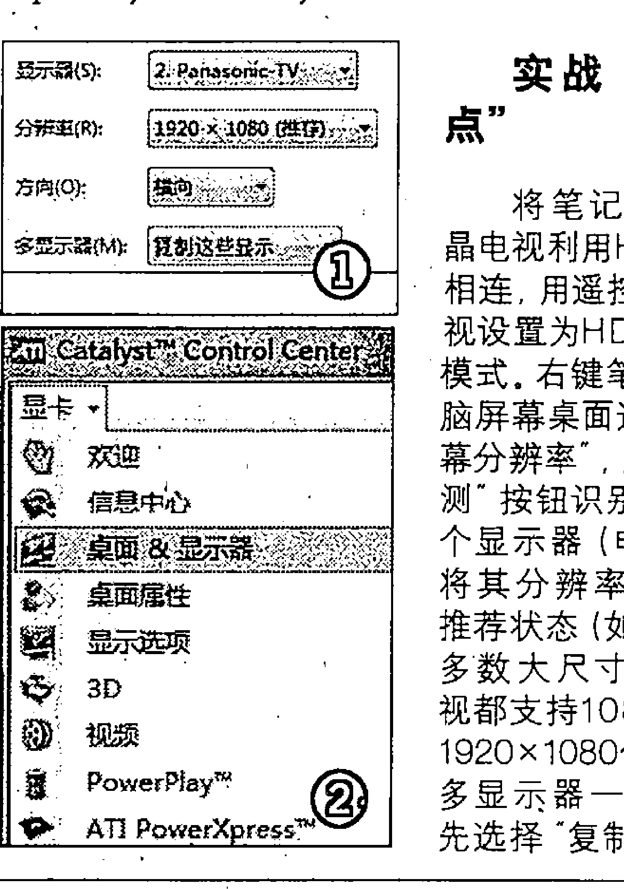

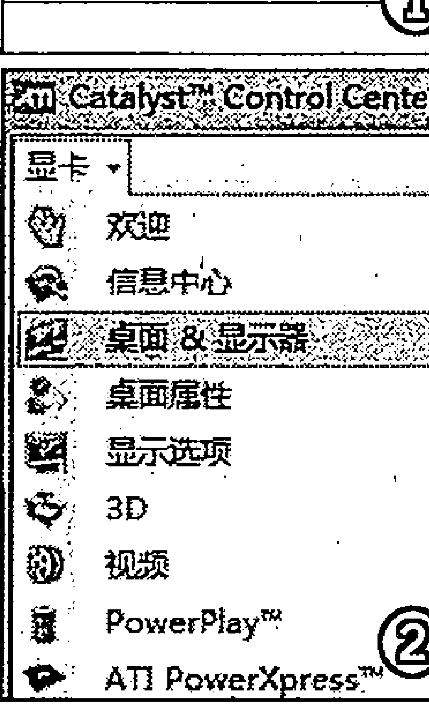

在桌面右键鼠标进入AMD CCC控制中心的桌面&显示器设置界面（见图2），点击下方电视图标右上角的小三角，在弹出的对话框中选择“配置”（见图3）。在新弹出的窗口中选择“HDTV”选项卡，找到并勾选“添加1080P60显示器管理器的格式（NTSC）”（见图4），单击应用按钮。接下来点击上方“缩放选项”的选项卡，把“过扫描”设置为0%（见图5），点击确定退出即可。经过以上设置，液晶电视应该就可以完美实现点对点的视频输出了，画面清晰锐利。

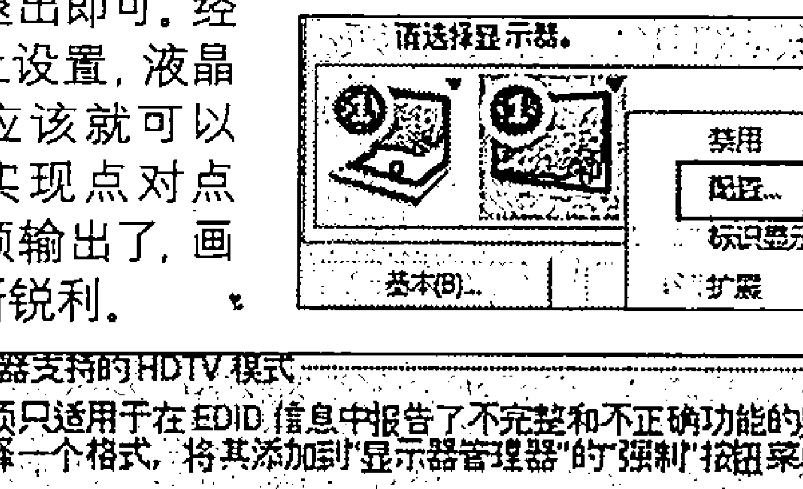

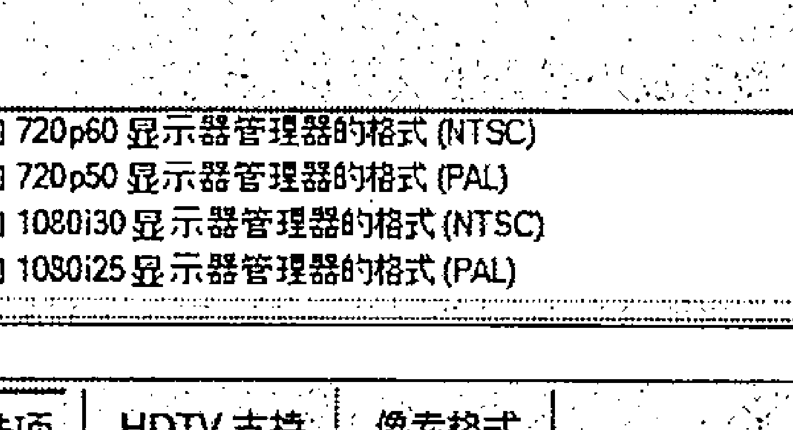

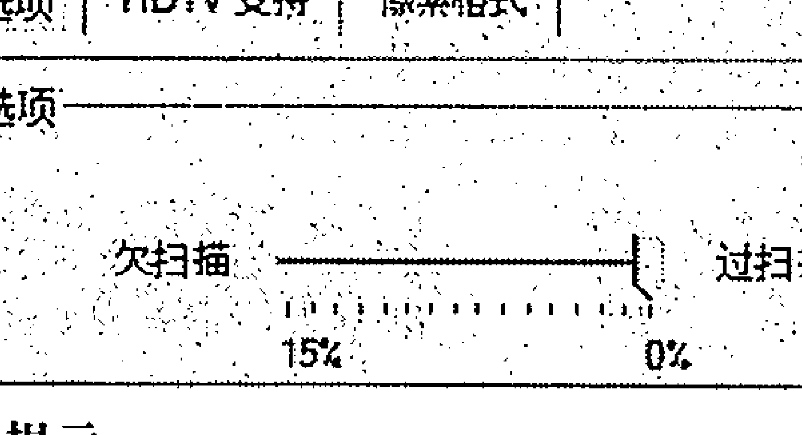

**小提示：**
在CCC中将过扫描调整到0%后如果电视还存在黑边或显示不全，可尝试利用电视遥控器将电视显示模式手动设置为16:9；找到类似“显示区域”的菜单并设置为“全像素”；或在“扫描余量”之类的选项下，对像素显像区域进行横向和纵向调整，一般就可实现点对点显示。

**网络大补贴：**
NVIDIA 显卡外接电视方法：http://tinyurl.com/38ac47

#### 实战“一本两用”

安装MPC-HC后，右键桌面其快捷方式选择属性，在目标对话框的地址后面加上“ /monitor 2”（见图6），接下来运行MPC-HC，右键选择“选项”。在右侧列表中进入“全屏”设置，在“全屏输出显示器”中选择你家的电视机（见图7），定义MPC-HC全屏播放时将视频画面在电视屏幕中输出。如此一来，当双显示器工作在“扩展模式”下笔记本就可以“一心二用”了，电视看电影，笔记本屏幕则可以上网打游戏，互不耽误。

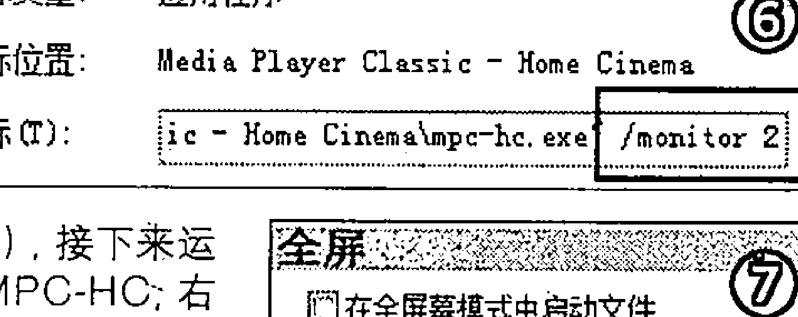

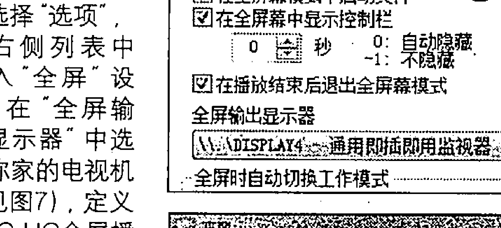

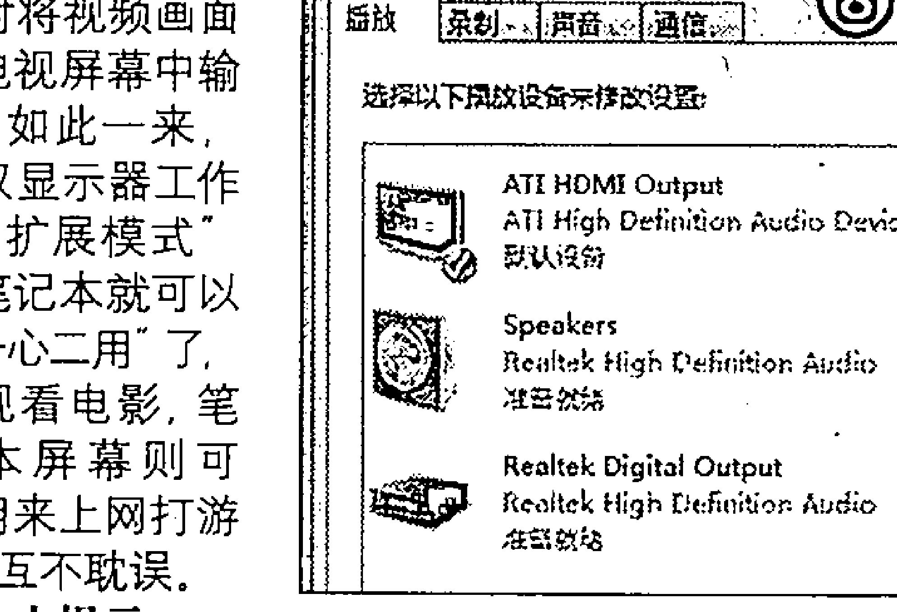

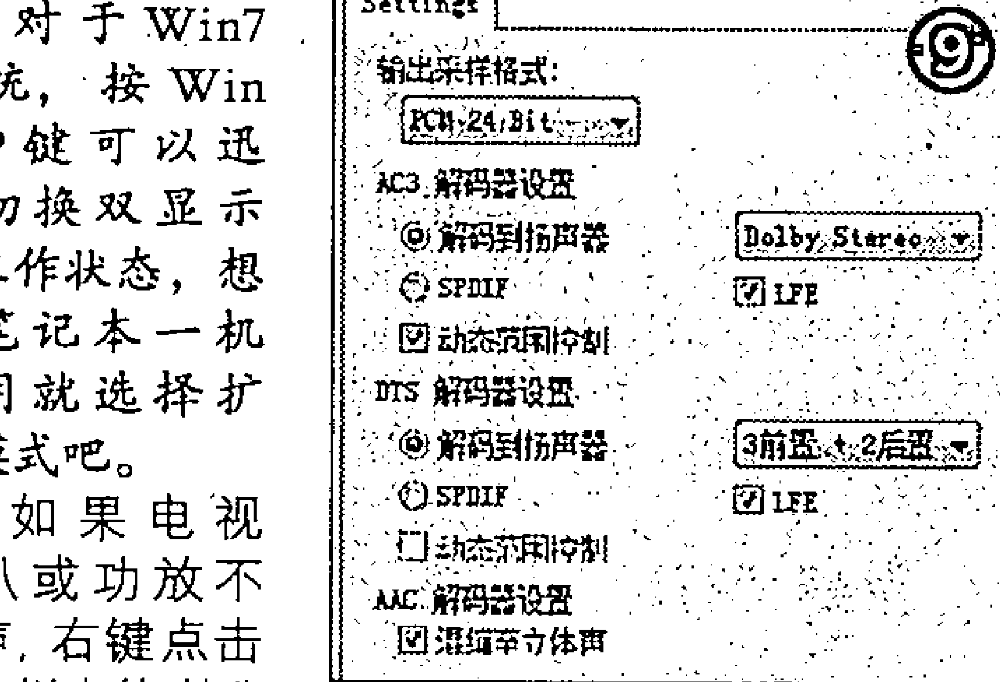

**小提示：**
对于 Win7系统，按 Win + P 键可以迅速切换双显示的工作状态，想让笔记本一机两用就选择扩展模式吧。
如果电视喇叭或功放不出声，右键点击任务栏中的喇叭图标，选择播放设备，将“ATI HDMI Output”（见图8）作为默认设备即可。如果你家电视还连接着功放，可以在MPC-HC选项中找到“内部滤镜”，对AAC、AC3、DTS进行如图9的设置，当音频输出到功放时就可以完美解码出杜比环绕声了。

## 小插件解决大问题 迅雷计划任务全面增强

迅雷7是一款下载利器，但可惜的是，其中的计划任务功能太弱，无法灵活控制下载和带宽，常常会影响到同一网络中其他人的使用。为此，CFan第22期《快车下载迅雷离线文件》一文提供了一种解决方案，而现在迅雷推出了一款插件，提供了更完美的解决之道。
这款插件必须应用于迅雷7.1.2.2014或以上版本（下载地址：http://dl.xunlei.com/xl7.html），插件可从http://tinyurl.com/35ymvj处下载，解压后双击其中的Plugin.exe安装即可。

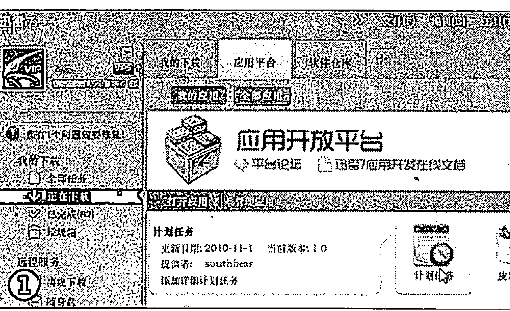

重启迅雷7，单击主界面上方的“应用平台”标签，再点击左侧“计划任务”（见图1）打开相应设置窗口。首先选中“启用计划任务”复选框，再单击“新建任务”按钮，然后设置标题和周期（可选择每日、周一至周日），再设置相应的起始时间（比如21：01~09：00，这段时间同事一般不在公司上班，可以利用公司的高带宽下载）。之后，再单击“动作添加”下拉按钮，可以选择任务操作、下载指定任务或退出迅雷、系统操作等，根据自己的实际需要设置，最后单击“应用”按钮即可生效（见图2）。

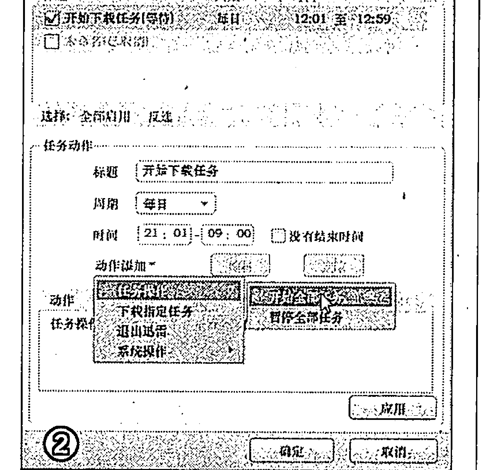

如果大家想定时关机，只要再新建一个任务，设置好时间（如早上09：15，这时同事们大多已上班了），并设置系统操作为关机即可。
由于这款增强计划任务插件可以进行各种组合，所以能让我们自由地控制开始任务下载、停止任务、退出迅雷或关机、重启等操作，非常强大，也十分实用哦。
（文/江北书生）

## 家装布线 你该补课啦

主持人：Cornel
参与选手：家庭A、家庭B
设计师：Dream
本期节目看点：不管你是装修完毕还是正准备装修，拒绝凌乱的布线，为你设计更科学、好用的布线方案

本电脑的想法，取消了在卧室布置网线的计划，将来可能就要忍受无线看在线电影那种时断时连的痛苦经历……

暗敷墙壁走线或地板下走线。为了防止湿气和其它环境因素的影响，这些线的外面都要加牢固的无接头套管。如有接头，必须进行密封处理。为了避免在施工中对线缆造成的损伤，可以先预埋线管，先穿入引线铁丝，等到装修结束安装电气时再换上相应的线缆。布线过程中不能有直角死弯，要解决拐弯问题（使用弯管器，也可以使用一段硬性弹簧替代），使线缆可以在线管里抽动自如。在布线过程中和结束之后要详细绘制各居室电路分布走向图，这是因为在装修完成后难免在墙上打孔，稍不小心就会对线缆造成损伤。若有数码相机，直接将布线实况拍下来保存好就省得手工绘制，日后再次装修或是需要在墙壁上钻孔时就可以作为参考。此外，如果采用整合了路由器的弱电箱，那么可以设计打造一个壁柜将弱电箱包含其中，这样能够在不影响网络正常使用的情况下确保整个家居装修风格的统一，而且一旦出现故障需要更换接线的时候，也能够在最短的时间内解决故障。

#### 家庭A

已经完成装修，由于家中的网络、电视线（音频线）、电话线之前没有进行合理的布置，现在使用起来很不方便。例如当初安排电脑放在书房，因此直接将网线放到书房，现在又配了一台电脑，在卧室就无法上网了……

#### 家庭B

新房刚交接，以前没有经历过装修，无任何经验，听别人说装修布线是个重要环节，因为布线结束后很难更改，正在犯愁如何才能做到合理、科学的布线……

建议：在装修前，先通过网络、朋友介绍、逛大商城，来捕捉未来的一些家居发展方向信息，特别是电器设备的发展方向，已经面世的新产品，以及即将上市的一些新产品，在装修前，给它们预留个座位，说不定哪天，这个座位就会升值100倍。

#### 设计师dream建议一般家庭预留的布线方案：

投影电视线槽、投影机挂架（最好是固定在顶端水泥板中，切忌固定在天花板上），音频线槽（考虑多声道布局，可能需要将音频线引到沙发后侧）（见图）、光纤、安防报警系统等。

## 小提示：

直接在网上也可以捕捉到最新的电器产品信息，例如中关村在线（地址：http://www.zol.com.cn/）、至顶网（http://www.zdnet.com.cn/），以及《电脑爱好者》杂志，都是获取最新电器设备（包括IT新品）信息的最佳渠道。

#### 装过修的给未装修的指点迷津——不要重蹈覆辙

在螃蟹还没有成为人类的食物之前，它到底是什么味道，只有吃过的人才知道，也只有他才有话语权。装过修并且入住后，才能对什么叫合理布线有着深切的感触，也只有装过修的人或是资深装修设计师才最有话语权。家庭A这次就给出了很多优秀的布线方案建议，结合设计师dream的指点、总结与整理，得到以下宝贵的经验：

- 1.为未来预留空间，远虑才无近忧

在进行装修时，布线一定不能只看眼前，特别是那些经济有些拮据的朋友，一心想着省钱、方便，没有放眼未来。房子装修后可能是大半辈子甚至一辈子的事情，该省的咱们一定得省，而不能省的绝对不能省。别因为现在还没有买投影大电视的预算就忘了给它留个空，将来买回来后，不得不走明线，不得不在不在天花板上打洞；别因为现在还没有添置一台笔记

- 2.布线DIY 先“脑”中谈兵后纸上谈兵

根据自家的房屋结构以及结合当前市场上的电器设备产品，就可以开始构思布线结构了。开始先在自己的大脑中进行构思，同时辅之以纸、笔来勾绘简单的草图。在勾绘布线时，一般要分以下几个方面：

- (1)电脑、电话布线

早些年头里，一般都采用串联的方式布线，虽然各个房间可以正常打电话、上网，但只能使用一个电话号码并且还有串声的情况，电脑上网也只能限于同时只能一台上网。建议使用并联布线方案，电话线和网线分别采用4芯和8芯（五类线）线。为了避免干扰，电话线和网络线应分开布线，间距10cm，用密封PVC管铺出。对于网线，应该考虑将ADSL猫、路由器集成到弱电箱中（也有自动集成路由器的产品），这样就可以确保每个房间中的电脑方便地通过路由器共享上网了。

- (2)有线电视布线

有线电视布线相对简单不少，只要将电视线引到每个房间并在合适的位置留插槽即可。不过，有线电视线布线过程中最重要的一个环节就是做好屏蔽干扰信号的工作。外线进户后，建议用户根据房间的多少，直接用一只（一分三或一分四）分配器经分配后接入各房间，不要使用多个一转二分配器。如果进户有两路线的话，建议一路直接接客厅，这样客厅电视机的清晰度会更好。另一路经分配器接各房间。此外，布线应采用质量较好的双层屏蔽的宽频视频线。

小提示：
在进行网络布线前，首先应该了解自己的居室环境及各房间的用途，什么地方可以开槽埋线，什么地方不可以？同时要了解家庭的网络需求，什么地方要上网？什么地方要看电视？自己心里要有数。

- (4)纸上谈“布线”

在脑子中勾绘出大概布线方案后，参考随手绘制的草稿，现在就可以用电脑绘制出一份清晰的设计图纸。不管日后是自己动手施工还是交给专业的施工队，有一份图纸，就能确保实际布线方案能够符合自己的要求了。如果自己会AutoCAD这类专业的绘图工具，绘制图纸就非常简单了。假如只是对电脑略微了解的初级用户咋办？也不用着急，咱们有方便的方法，例如使用Office组件中的Visio就可以简单地完成制作。除此之外，如果有户型图（一般楼盘开发商都会提供）的话，直接借助系统自带的画图软件就可以绘制自己的布线图了，这些布线在户型图上其实就是线条，只要按照需要直接在户型图上绘制相应的线条即可。

## 小提示：

在线绘制布线平面图也能实现，例如AutoCAD公司推出的在线版制作平台：http://www.homestyler.com/designer。此外，如果自己也想在前期按照自己的想法做装修设计，现在也有不少软件可以帮助实现。例如“3D Home Architect”（汉化版下载地址：http://www.greendown.cn/soft/2263.html）设计起来也很方便，而“创想家居设计软件”（下载地址：http://xiazai.zol.com.cn/detail/36/358536.shtml）、“我爱我设计”（下载地址：http://www.onlinedown.net/soft/49051.htm）还可以在线搜索自己家的户型，即使搜不到也可以直接在类似户型上进行修改，然后通过内置的各种装修元素（例如门、窗、家具等）进行设计，最后还能得到3D全景装修效果图。


- (3)电力布线

电力布线也是很重要事情，电源的稳定是保证电脑、网络稳定运行的根本，所以也是需要用户注意的地方。除了按照用电设备的功率大小来调整电线的型号（像空调、电热水器都应该使用粗电线）。其次，按电脑、电器设备的使用位置提供相应的插座也很重要，只有之前做到合理分配，日后使用时就不会有烦忧。此外，电力线也应该与网线、电话线等弱电线保持一定的距离，防止干扰信号。在电脑桌旁边可以多预留一些电源插座，同时再为这些插座统一配置一个开关，可以在不用电脑时，直接断电，这样也可以避免日后再引出接线板。

#### 布线大补贴：

走网线、音频、有线电视线时，可以选择吊顶内走线、

- 3.施工时自己当“工程师”兼职监工

整个布线蓝图勾勒出来后，下面就可以进行施工了。如果自己有足够的DIY精神，也可以自行完成。但大多数朋友可能还是应该选择携着布线图将自己的想法、思路传达给施工队，在自己的监督下进行完成。假如想自行完成，那你就需要掌握以下技能：

- (1)墙壁钻孔、水泥地面开槽技能

按照绘制的图纸并量好实际尺寸，用粉笔画好需要开槽的线路（专业人士均采用弹线直接弹出直线），然后直接使用切割机切割一个线槽，最后再使用凿子清出不要的砖屑、混凝土即可。

## 小提示：

假如强、弱电需要交叉（例如电力线与网线需要交叉），请将这两路电线使用专用的屏蔽铝箔纸进行包裹，可以避免信号干扰。

- (2)制作网线、连接有线电视线、电话线、视频线、音频线技能

如果自己有网线钳、拨线刀（带卡线功能）、水晶头、测线仪、网线（符合RJ45接口标准的双绞线）就

可以自己制作网线了:

#### 第一步：认识双绞线

双绞线都是由4对铜线组成，传输数据其实只用到其中的4条，另4条则是用来屏蔽干扰信号的。在制作时我们可以采用568A标准（线顺序：白绿、绿、白橙、蓝、白蓝、橙、白棕、棕），也可以采用568B标准（线顺序：白橙、橙、白绿、蓝、白蓝、绿、白棕、棕）。

#### 小提示:

通常情况下都采用直通线（网线两头均采用568A标准或568B标准），例如电脑与交换机、路由器相连，两台交换机、路由器相连。而若两台电脑通过网卡互联，则需要采用交叉线（网线一头使用568A标准，另一头使用568B标准）。

#### 第二步：制作双绞线

根据需要的长度，用网线钳剪取一段双绞线（一般为0.6米-100米）。将双绞线的一端套在剥线器的夹缝刀口上，大约预留2厘米的长度。接下来用左手紧握双绞线，用右手食指旋转两圈后，剥线器的刀口就可以顺利剥开双绞线的外皮，用力一抽就可以将外皮抽出。现在就能看到各种颜色的数据线了，再按照568A或568B的线序对它们排序，使用网线钳修剪成齐头，再将这组线插入RJ45水晶头中直到另一头可以清晰地看到铜芯为止。最后直接使用网线钳用力压下即可，再按照同样的方法制作另一头即可。而一般附在墙壁的网线插槽需要使用剥线器上的卡线器将线卡到指定的位置，方法也很简单，只要理好线序即可。

#### 小提示:

双绞线所允许的最大网络长度为100米，若需要超过这个距离，可在两段双绞线间安装集线器或交换机作为中继器（最多能安装5个），使网络的最大范围达到500米。此外，如果制作的是屏蔽双绞线，在压制水晶头时需要将金属屏蔽层压入RJ45水晶头的金属片下，否则起不到屏蔽作用。

连接有线电视线、制作及连接电话线、视频线、音频线就相应的简单多了。有线电视线连接时就是要注意屏蔽层的处理（屏蔽层不要连接到信号线），电话线可以直接使用网线钳压制，视频、音频线直接连接，只要做好与电力线及其他信号线之间的干扰即可。

- (3)铺线施工

准备工作完毕后，接下来就可以将相应的线缆放入PVC管（拐弯时需要使用弯管器处理）中，按照之前切的线槽进行铺设，同时要按照规则来处理，该屏蔽的地方做好屏蔽。

- 4.验收

布线完毕后，最重要的一个步骤就是验收，看线路是否畅通，再者还要检验线路工作的稳定性。有线电视、电话、视频线、音频线、电力线的检测相对简单，例如电话线是否畅通，只要直接用一部电话机拨打电话即可检测出来（例如直接拨打电话服务商的免费服务号码），有线电视线只要直接用电视机即可进行检测（当然，如果有小电视机，检测起来更方便，专业人士一般自带袖珍型电视机进行检测）。而网线的检测相对复杂些，不仅要保证畅通，还要保证数据传输工作正常（如果有干扰或是接线顺序不正确导致数据传输效率低、不稳定）。检测起来一般需要下面几个步骤:

#### 第一步：用测试仪检测连通性

如果手头有测试仪，直接使用测试仪即可进行检测，将网线两端的水晶头分别插入主测试仪和远程测试端的RJ-45端口，将开关开至“ON”（S为慢速档），主机指示灯从1至8逐个顺序闪亮则是正常的，若连接不正常，按下述情况显示:

(1)当有一根导线断路，则主测试仪和远程测试端对应线号的灯都不亮。

(2)当有几条导线断路，则相对应的几条线都不亮，当导线少于2根线联通时，灯都不亮。

(3)当两头网线乱序，则与主测试仪端连通的远程测试端的灯亮，当导线有2根短路时，则主测试器显示不变，而远程测试端显示短路的两根线灯都亮。若有3根以上(含3根)线短路时，则所有短路的几条线对应的灯都不亮。

#### 小提示:

一些高手还可以通过网络设备指示灯来判断网络线路的通断性，具体方法可以参考 http://dreamzhao.blog.sohu.com/152021057.html。

#### 第二步：测试网线工作的稳定性及效率

网络畅通并不代表完全OK，还要实际检测一下网络的工作状况，看看实际数据传输速率、稳定性如何。在此，我们可以通过“QCheck”（下载地址：http://down.tech.sina.com.cn/page/15837.html）来检测，方法也很简单:

确保局域网畅通（设置好相应的网络参数，如IP地址、网关等），在两台电脑中分别安装该软件并同时运行该软件。接下来只需要在其中的一台电脑中打开该软件主窗口，在第一个文本框中选择“Localhost”（即本机），在第二个文本框中输入另一台电脑的局域网IP地址，其他参数直接留其默认值，单击“Run”按钮即可进行测试了。最后单击“Details”按钮查看详细的检测结果，其中:

+   ①Response Time: 测试完成相应协议通讯的最短、平均与最长时间；
②Throughput: 测量出两个节点间使用相应协议时，每秒钟成功送出的数据量；通过这项测试可以得出网络的带宽；
③Streaming (UDP or IPX): 此测试显示多媒体流需要多少的频宽，以方便网络硬件速度和网络所能达到真正数据传输率间的比较；
④Traceroute: 可描述出网络中两个测试点之间的详细路由信息。

在测试时，直接测出Throughput的值（也即带宽），如果与网卡的标准带宽相当（或是相差值较小），则说明布线成功，如果偏值较大，那就得重新检查布线，例如水晶头是否压紧，按个再压制一次，检查是否未做好信号屏蔽工作等。

#### 小提示:

假如架设的是千兆网络，使用“QCheck”可能就不太适合，它只适合百兆网环境的测试，对于千兆网，可以使用另外一款软件“NetIQ Chariot”（下载地址：http://www.piaodown.com/soft/292.htm）

#### 设计师支招：借助无线弥补装修留下的遗憾

像家庭A这样已经装过修的家庭，当初装修时没有策划好，该布的线没有布，导致现在使用起来很不方便。不要紧，科技发展迅速，完全可以借助高科技来弥补当初留下的遗憾——借助无线网络跨越有线的障碍。

无线网络因为不需要布线，操作起来很简单，只要直接从电话线上（小区宽带直接通过入户线）通过分离器将宽带信号送入ADSL猫，再由ADSL猫连接到无线路由器中，设置好网络参数（无线路由器最好启用加密功能），再由电脑端的无线网卡即可进行上网了，当然，最好将无线路由器放在常用的电脑旁边，然后采用有线连接，有线毕竟比无线稳定。

#### 网购装修材料更实惠

装修材料一般都可以在本地购买到，布线相关的线管、插座、开关、线缆等都可以直接在当地购买到。假如时间充足的话，还是建议直接从网上购买，通常比本地购买要便宜很多。不过，在网上购买首先要做预算，计算出一共需要多少材料后还要在本地查询价格（别成了网购“冤大头”），还有一点更重要，那就是要选择好品牌。下面就看看具体的步骤吧:

#### 第一步：做预算、开材料单

最简单的方法就是直接用Excel表格来制作，例如经过估算大概要多少米网线、多少米音频线、视频线、多少只网络插座、音频插座、电话插座等，几个有线天线转接器、多少米有线电视线、多少个水晶头（可以多买些，以后也能用得上），网线制作工具、测试仪（这些工具、设备倾向于向朋友借用），而像PVC管这类价格不高又不方便邮寄的材料直接选择本地购买。最后，列好单子及估计数目（为了避免使用过程中短缺，在估计值上再多购置一些）。

#### 第二步：查品牌

像网线、插座、水晶头等这些材料不能选择质量不过关的产品，这些小件本身也不是烧钱的对象，建议选购品牌产品，质量有保障的。如何选择品牌呢？方法就简单了，只要放“狗”搜一下即可知晓答案。譬如以“网线 名牌”，很方便就能找到一些质地较好的品牌产品了。例如进口品牌“安普”、“康普”、“西蒙”、“范达”、“耐克森”、“施奈德”、“GCI”、“普利驰”、“MOLEX”，以及国产品牌“TCL”、“普天”、“一舟”等。

此外，多逛逛相关论坛，那些“先驱者”们的意见、推荐产品，往往都比较可靠，可以作为自己选购的参考。例如“千家论坛”（http://www.1000bbs.com/）里就有很多网友推荐的产品，也可以直接发贴咨询。

#### 小提示:

如何判断一个网线的质量好坏是有些方法的，具体方法可以参考 http://dreamzhao.blog.sohu.com/152050431.html。

#### 第三步：打听价格后便可下单

知道品牌后，现在就可以打听价格（可以结合在本地实体店询价及在淘宝网或是拍拍网这样的网上商场直接搜索目标产品，再通过价格从低到高排序的方式来获得最低价格）。选择价格最低、信誉度最好的卖家即可下单。此外，在选择卖家时，最好选购买家货物齐全的，最好是自己相中的品牌产品都有，在一家购物可以省下邮费。当然，如果遇到那些“部分特价、多数高价”的“奸商”，毫不犹豫地避开。

#### 小提示:

在购置电脑插座时，推荐选购带USB接口的插座，这样方便给数码相机、手机等数码产品直接充电，例如“航嘉”就开发了多款带USB充电接口的插座，包括内嵌墙壁式、便携式、直板式，使用起来很方便。

总结：在这次装修节目中，由于家庭A将自己家装修的切身体会总结出来的经验直接告诉家庭B，让家庭B在新家装修时少走了弯路，将各种布线按最科学、最实用的方法进行施工，家庭B集体成员大喊过瘾。而家庭B由于没有装修经历，更无相应的经验，交换装修由设计师替代完成，使用无线网络方案帮助已装修而又不能更改的家庭A弥补了遗憾，我们的任务圆满完成！

□策划/《电脑爱好者》编辑部
□监制/Cornel
□撰稿/dai

## 键鼠你会挑吗？

首先，看看你家里的鞋子究竟有几双？和你足部尺码相当的同伴之间，鞋子的样式是否一模一样？这就是我们要说的，就像每个人的鞋一样，人们要款式、舒适、美观等等诸多条件，并不是说只一双鞋就能满足所有的脚，键鼠亦是如此。手型大小、手指长短、使用习惯，这些都是选购键鼠产品最最重要的依据，不要说几百元的高档键鼠就必然合用，认识自己，才能找到好搭档。

#### 手型决定一切

从手说起的话，我们关注的焦点首先便是鼠标，大多数人每天用鼠标的时间绝对超过于其他事情。当然，每个人的手都是不一样的，我们将其加以区分，分别以四种不同的视角来判断手型的区别在鼠标的选用上有何差异。

#### 男性大手:

通常情况下，男性的手掌与手指长度比例是5:5，也有一部分是6:4，在握持鼠标的时候，如果想要更好贴合手掌握持状态下的掌心，鼠标的最高支撑## 女性大手：

之所以会区分大手的男女性别，是因为大多数情况下女性手指的长度要多于手掌，通常手掌与手指的比例为4：6，这样在握持鼠标的时候就会与男性有所区别。手指较长的情况下，选择的鼠标最好是在鼠标从前端向后约3/5处为最高点的产品，这样掌心才能更好的得到支撑。

#### 男性小手：

注意哦，男生也有不少是手型较小的。如果你也是小手的男生，我建议最好不要选择太大的鼠标，因为使用时你很容易感到疲劳——因为在使用大鼠标时，手指为了更精确的控制左右键，整体就需要向前移动，手掌固然也能够贴合到鼠标上，但是手腕会处于悬空状态，会很累哦。

#### 女性小手：

小手的女生可不少见，但同样无论手型大小，女生的手指总是会比男生的略长一些，但是，手掌也会比较薄，在选择鼠标时，将手自然放在鼠标上，手腕的上扬角度不能超过45°为标准（最好在30°以内），并且食指与中指可以自然贴合在鼠标左右键上，这样长期使用时才不会感到疲劳。

还有部分左撇子用户，对于目前绝大多数的人体工程学设计鼠标来说，真的没法使用，唯一的选择是类似罗技G3那种采用对称设计的鼠标产品，但同样要注意根据自己的手型大小选择鼠标，否则也容易产生疲劳感。

#### 鼠标手与手腕劳损

想知道自己有没有鼠标手吗？手心向上，看看你手掌最左下角是否有皮质增生？尤其是天天Dota、WoW一族的玩家，还有那些开心、人人网的转帖达人，很容易得鼠标手，这就是长期劳损的结果，长期使用电脑，除了鼠标手，手腕的劳损问题也非常值得关注，当我们握紧鼠标的时候，用左手摸摸你右手手臂尺骨与桡骨，实际是呈交叉状的！这就是为什么保持一个姿势泡网久了，小臂会有酸痛感的原因之一（肌肉僵持是另一主要原因）。

小知识：
人体小臂是由尺骨与桡骨组成的，桡骨上端细小，下端粗大；而尺骨上端粗大，下端细小，这样人的手臂才可以做不同的动作。

#### 鼠标好坏一测便知

新买了个无线鼠标，不管这广告宣传上怎么说，你都感觉不到好与坏的差别，都是无线鼠标，低价与高价产品究竟差在哪？新买的鼠标究竟如何？其实有个简单的方法可以让你立刻知道结果——测试。这里推荐使用Mouse Rate（下载地址：http://tools.mydrivers.com/soft/1096.htm）来测试鼠标平均频率，所谓平均频率是指鼠标在移动时所有频率的平均值，它可以从单方面来反映鼠标的移动速度，而白色框中不断变动的数字便可以看出鼠标的稳定性，得分相差越大，表示鼠标越不稳定，得分越大，表示鼠标速度越快，性能越好。

当运行程序后，晃动鼠标，如果平均频率保持在一个近似的水准下，说明鼠标工作稳定，如果鼠标平均频率在150Hz左右，这个鼠标的性能就比较差了；平均频率在500Hz左右，鼠标属于中端水平；高端鼠标的平均频率一般在1000Hz~1500Hz之间，很容易分辨鼠标的性能。

网络大补贴：USB鼠标超频大法：
http://blog.cfan.com.cn/?uid-196050-action-viewspace-itemid-2104210

#### 键鼠是如何设计的

不要以为这个话题是个看热闹，了解了键盘鼠标的制作过程，你才会知道为什么很多鼠标设计的奇形怪状——这与你的使用舒适度息息相关！键盘也好，鼠标也罢，现在要是不说自己是经过人体工程学设计的都没人买，因为人体工程学设计才是最贴合用户（人本身）实际使用需求的一种设计方式。

#### 小知识：什么是人体工程学

人体工程学起源于欧美，原先是在工业社会中，开始大量生产和使用机械设施的情况下，探求人与机械之间的协调关系，作为独立学科有40多年的历史。按照国际工效学会所下的定义，人体工程学是一门研究在工作中、家庭生活中和休假时怎样统一考虑工作效率、人的健康、安全和舒适等问题的科学。

先来说说鼠标的设计过程吧，以雷柏为例，鼠标的设计绝对不是想象中那么简单，这涉及到人体工程学设计、逆向工程等诸多科学手段，无论是几十元的鼠标还是几百元的鼠标，要做到让用户使用舒适，这一切都少不了。经雷柏设计师介绍，鼠标的制作过程大致是这样的：雷柏设计团队的员工首先草绘出图样，然后依据图样进行模具制做（通常用泥塑、木雕等方式），然后进行细节修整（人体工程学）。这个模具其实就是逆向工程的一个“标本”，然后再根据这个模具进行图样设计（电子化）、进行开模（制造鼠标模具）等等工作，当然，其中还涉及到内部元件设计、功能设计以及制造等诸多环节。经过这么多道工序，鼠标才真正制造出来。

为什么要先做个泥塑或是木雕呢？这是因为草绘的图样只能是凭空想象，用替代物“雕刻”出一个鼠标，这样才能进行细节修整，以便让各个部位更能贴合实际用户的手型，这就是体现人体工程学设计的部分了，不要小看这些看似繁琐的设计方法，侧面的曲面角度、深度、流线型体的高度、宽度，都是在这会儿定型的。

再来看看键盘，富勒品牌的创始人谢伟明先生告诉我们，富勒极为重视键盘的设计，因此特意聘请曾为奥迪等全球知名的汽车品牌提供设计服务的德国全球顶级设计公司——die:haptiker GmbH公司全程参与富勒产品的创意与ID设计。

细节部分富勒充分考虑到消费者的使用体验感受，如“F”元素、“跑车”元素等其实不仅是为了美观，更重要的是考虑到人体工程学，为的就是让消费者使用起来更加舒适。当键盘设计的细节确定之后，设计师就需要绘制键盘外形的平面效果图、三维图和手板制作。

工程图纸及模具图纸的设计及输出在富勒产品的设计流程中极其重要，富勒产品的开发流程严格执行国际QS9000质量体系中的APQP产品质量先期策划和控制计划流程，特别是导入DFMEA（设计潜在失效模式及后果分析）及PFMEA（制程潜在失效模式及后果分析）以确保键盘，包括对手感、按键、寿命、尺寸精度、制程完美无缺，保证设计出来的产品一步到位并拥有极高的品质。

之后还要经过诸多工序，才能最终见到一款能够让消费者使用起来更舒适的键盘产品。谢伟明先生还透露，富勒的产品用在设计上的时间绝对要比生产的要多得多，这跟富勒对产品设计理解的重视，另外也跟其拥有全球最先进的全自动化生产机器人分不开，据悉，生产一个键盘从原材料到成品只需要25秒的时间，效率之高，而人力成本也大大减少。

#### 键盘的愉悦如何选择

键盘的选购要提到几个点：机械键盘与薄膜键盘、半高键帽与全高键帽、无线键盘与有线键盘，无线键盘与有线键盘自然不必多提，而机械键盘与薄膜键盘，半高键帽与全高键帽其实也不算什么高深的学问，简单学习一下你就能了解这之间的差别了。

##### 机械键盘与薄膜键盘：

薄膜键盘就是大家现在最常见的键盘，从十几元的低端产品到上千元的薄膜键盘都有，覆盖面最广，无论是超薄键盘还是非超薄键盘，键帽结构如何复杂，只要是有三层薄膜结构设计的就是薄膜键盘。至于机械键盘，并不能从手感、声音等主观感受来确定，还是要从结构来定义机械键盘，每一颗按键都有一个单独的Switch（也就是开关）来控制闭合，这个开关也被称为“轴”。

网络大补贴：机械键盘
http://baike.baidu.com/view/1442584.html?tp=4_01

##### 半高键帽与全高键帽：

顾名思义，这两种键帽的差别主要体现在键帽的高度上，笔记本键盘无一例外都属于半高键帽的范畴，不管他是曲面键帽还是巧克力键帽都是如此。而台式机键盘现在发展的趋势也开始向半高键帽发展了。全高键帽的优点是敲击键程（从触摸到键帽到按下的全程长度）容易控制，可长可短，半高键帽则体现在静音及美观上，随着设计水平的不断提升，现在半高键帽的键盘键程也非常理想了，如富勒的产品就以半高键帽见长。

除了键帽的高度不同，很多人可能会问，为什么XX家的键盘敲起来手感很柔和，摸着不那么生硬，我家的键盘敲起来就硬邦邦的？这和键帽的使用材质有关，键帽一般是采用塑料+硅胶两种材料制造出来的，硅胶含量较少，键帽的硬度就比较大，敲击感生硬；反之，如果需要让键盘敲击起来更加柔和舒适，只要厂商多加一些硅胶就可以了。

#### 如何判断键盘是否适合自己

想要判断键盘是否合用，最重要的是手感，大体可以分为手感偏重的用户，手感偏轻的用户，在使用方面，有些用户追求功能，还有一些用户对键盘布局非常敏感，这都是需要注意的。

##### 偏重手感体验敲击快乐

不少人敲击键盘的频率、力度都比较大，尤其是不少男生都偏爱这样，这种情况推荐选择全高键盘，键程略长一些，敲击的段落感也会比较清晰，如果经济允许，可以考虑购买机械键盘，敲击时的段落感十分明确。

##### 偏轻手感把玩电脑生活

追求静音的人，可以考虑使用X结构的半高键盘，这种键盘的静音效果相对更好些，而且，绵软的键帽加之较短的键程，会让敲击的疲劳感降至最低，尤其是女生，这样的键盘再合适不过了。

##### 键盘布局也能决定一切

在选用舒适的键盘时，要注意两个问题，第一，你是否习惯非标准键盘布局的产品，比如不少键盘为了突出设计的差异，将方向键上的功能控制键呈纵列（横2×竖3）摆放，方向键则下移并被收拢到右Shift键处，尤其是游戏玩家，操控的时候很容易发生误操作。此外，一些按键的设计也值得关注，比如Enter、Backspace、右键（鼠标右键功能）、右Shift键的设计，一般来说，Enter、Backspace键最好是大键帽设计，这两个最常用的按键触发率最高，宽大的面积操作时会让人感觉非常方便，有些键盘为了能挤下所有按钮，就像我们提到的那种方向键被“挤”到右Shift键下的键盘，甚至会省掉右键功能，这会让你丧失一个非常方便的快捷操作方式，不大划算。

#### 错误的键鼠使用方式！

也许你并不注意，其实很多使用方式都会使你“身心疲惫”。正确的握姿极为关键，与之对应的键盘、鼠标设备也同样需要与自己“匹配”，这也是为什么我们说选择键、鼠就如同选择合适的鞋子一样，道理是相同的。

1. 手指翘起，用指尖按左右键，会很累哦！
2. 正确的鼠标握持方式，无论手指还是掌心都贴合在鼠标上
3. 如果鼠标不符合自己的使用习惯，小臂的尺骨、桡骨会“拧麻花”
4. 鼠标最好选择左侧略高于右侧的产品，这样尺骨、桡骨就会很自然了
5. 手放在键盘上，呈X状的姿势将使手腕、背部肌肉很快产生疲劳感
6. 30°以内的夹角、手腕自然顺直，最好是有掌托的键盘，这样输入时才会感觉舒服

#### 键盘好坏一试便知

不少人都认为键盘没什么可测试的，打开记事本，每个键敲一遍，都能用就好了，最多是那些游戏玩家，7键同按是否能用。其实，我们还需要了解的是键盘的反应速度，下载PassMark KeyBoard Test（下载地址：http://download.pchome.net/system/benchmark/detail-19075.html）程序并安装。运行程序后，随便找一个按键直接按下去不要松手，注意其中几个参数，Depress time(下压时间), Lag time (按键时隙), Characters/sec (每秒输入字符数)。尤其是每秒输入字符数，在单位时间内，按住某个按键不放，每秒钟可以输入超过15个字符证明键盘的反应速度足够迅捷，这是验证键盘好坏的一个有效手段。

#### 有线如何当做无线用

很多人买鼠标的时候，现在都倾向于购买无线产品，但也有部分用户更喜欢有线产品，正所谓“萝卜青菜各有所爱”。不过，这些买了有线鼠标的用户，大多都会被一件事情困扰，没错，就是那条讨厌的“尾巴”。其实，我们用简单的方法就能让有线鼠标当做无线鼠标使用。当移动鼠标时，有线鼠标的线缆是最烦人的，总是“阻碍”鼠标的移动。其实，要解决这个问题非常简单。

- 方法一：首先，将鼠标线缆留出约50cm的距离（从鼠标顶端算起），然后，将这50cm的线缆呈U字形摆放（U字形的底端朝向屏幕）。然后，在50cm处用透明胶带粘到桌子上即可。
- 方法二：如果感觉胶带时间久了会有点脏，可将50cm后到70cm的距离规律收紧在一起（呈圆形自然线缆缠绕方式），然后用捆线将其捆绑在一起，也能起到固定的作用。如此一来，鼠标的移动就不会受到线缆的影响了。

策划/《电脑爱好者》编辑部
监制/west
撰稿/TKD, west

## 建立“月球基地” 让电脑成遥控器

5月31日，首届世界月球会议在北京召开。据介绍，现在到2020年，我们将会为月球基地的建立做好技术等各方面的准备工作，而到了2050年，人类第一个月球基地将会诞生。据说月球基地将选址地下，地下将设有紧急避难所，基地的实验室可以分为三个舱，分别是生物培养舱、科研工作舱和人员训练舱。不过，到了2050年，就算是90后也要将近年60岁高龄了，真的要等那么久吗？算了吧，40年太久，我们只争朝夕，现在就建立我们自己的“嫦娥工程”吧！“嫦娥工程”最终将会在月球建立有人驻留月球基地，目的就是与数十万里之外的月球进行联系，而在我们现在的生活中，也需要时常在异地的电脑中建立“基地”，这样就能方便地解决很多难题，诸如：在家中操控办公室电脑执行下载任务；身在千里之外，帮助好友解决电脑故障；想当回真正的自由人，在家中操控办公室中的电脑来办公……这些，都需要想办法在另一台电脑中建立一个“基地”，不管是有人还是无人，只要能解决问题，我们都可以采用。

## 歇人不歇机 闲置电脑用处多

不管是工作上需要的大型文件，还是生活中的娱乐（高清电影、无损音乐等），都需要从网上下载，而像高清电影这类体积庞大的大块头，下载时间长、占用带宽多，有时并不适合在当前电脑中下载；单位的电脑24小时不关机，再单独开启家中的电脑来BT，纯属资源浪费……

## 巧借新版uTorrent远程启动闲置电脑为我下载

- 第一步：如果办公室电脑中的uTorrent不是最新的V2.1测试版，请从https://falcon.utorrent.com/talon/download下载安装最新的程序，最新版uTorrent中集成了远程组件，无须过多设置就能实现远程控制下载了。
- 第二步：运行uTorrent后，单击菜单“选项→设置”，在打开的设置窗口中选择“Web”项，选中右侧的“Enable uTorrent Web Remote Access”选项，同时输入一个账号密码，最后别忘记了单击“应用→确定”保存设置。

> 小提示：不用担心你准备注册的账号被别人注册，即使账号名已经有别人注册，系统使用动态方案，只有别人使用这个账号及密码注册后并在线使用，你才无法注册，只要他离线，你就可以使用自己的密码及该账号进行注册了。

- 第三步：上述两步操作后，只要确保办公室电脑满足开机、联网并运行uTorrent这三个条件，任何一台可上网的电脑都可以充当办公室电脑的遥控器来启动BT下载功能了。方法很简单，在浏览器中打开http://falcon.utorrent.com，使用之前注册的账号、密码直接登录，成功登录后便可看到Web页面下的uTorrent界面了。直接通过点击工具栏中的第一个按钮（上传本地Torrent文件）及第二个按钮（添加网上的Torrent文件）即可添加下载任务，最后直接点击绿色的“Start”按钮即可启动远程电脑中的uTorrent下载或是上传任务了。

#### ★方案1:电视剧下载, 启用订阅方案

如果平时喜欢看美剧或是类似连续剧，每天为着及时下载到最新的剧集，需要频繁地刷新页面，然后再添加下载任务，很费劲。其实，这些繁琐的工作完全可以交给uTorrent来代办。不管是直接在办公室电脑中的uTorrent中设置，还是通过上面地址打开远程控制页面都可以方便地添加对连续剧的订阅，当有最新一集可下载时，uTorrent便在第一时间启动下载任务将其下载到本地硬盘中了。例如我们以在PT站中订阅高清连续剧为例：点击PT站右上侧的RSS图标，接下来在打开的RSS订阅页面中直接输入该连续剧的名称，点击“生成RSS链接”便可得到分别可在RSS阅读器中查看的链接以及在BT下载工具中直接下载的链接。现在只要打开uTorrent（也可以直接在远程页面中操作），单击菜单“添加RSS订阅”，直接将上面得到的RSS链接添加进来即可。选择“自动下载在订阅中发布的所有项目”，同时勾选“使用智能剧集过滤”项。

#### ★方案2:离线 + 远程 不耽误回家吃饭 看大片

有时在上班时，同事或其他朋友推荐了一部好片，想立即将其下载下来，下班回家就看。但是单位的电脑在上班时间限制了带宽，下载速度慢不说，还有很多其他限制。如果真想回家时就能看到大片，还是及时启动家中的电脑来下载。为了更快速下载，再借助迅雷的离线下载功能，如果是热门资源，迅雷会瞬间完成离线下载，接下来再通过迅雷下载工具从迅雷服务器中高速下载，绝对不耽误回家吃饭看电影。第一步：如果你还不是迅雷会员，请先注册成迅雷会员，离线下载、远程控制下载功能均属会员专属，普通用户不能享用。注册会员账号后，还需要手工将“远程下载”功能添加到常规功能列表中：单击“应用平台”项，在打开的列表中找到“远程下载”，并单击“开始应用”按钮即可完成添加。第二步：想要下载电影，先通过离线功能将其下载到迅雷服务器中，使用会员账号登录http://lixian.vip.xunlei.com/task.html，然后根据要下载的任务类型点击相应的按钮即可添加下载任务并启动服务器端下载任务。第三步：待离线下载完毕后，接下来再通过迅雷的远程控制功能直接启动家中电脑的迅雷，将电影高速下载到硬盘中。而要使用迅雷的远程下载功能，只要在家中的电脑中的迅雷中启动远程下载模块，单击“进入受控状态”按钮，再设置一个控制密码并记好受控电脑的名称。受控电脑（家中电脑）置入可控模式后，就可以在任何一台电脑中通过网页来控制这台电脑的下载任务了。直接使用自己的迅雷账号登录http://yuancheng.xunlei.com，在列表中即可看到受控电脑，输入之前设置的密码后便可进入控制页面，现在只要将离线下载的文件从服务器下载到硬盘中即可。

> 小提示：也可以使用另外一个迅雷账号来进行控制，只要登录http://yuancheng.xunlei.com后直接通过“新增用户”按钮将受控用户迅雷账号添加进来即可。

小提示：迅雷的离线下载功能还可以让你得到更多实惠：例如在玩游戏时，不想因为下载而影响玩游戏的流畅、规避长时间挂机低速下载伤害硬盘、绕开BT、电驴下载等低速下载时浪费电费，以及可以随时随地（任何一台可上网电脑中）索取已经完成下载的内容。

## 电脑排障专家 善用悬丝把脉诊断术

放假在家，事情好办；而回到学校后，家中老爸、老妈用电脑时常常让自己揪心，电话里说如何解决故障，老爸、老妈听了揪心。为此，我特意在家中的电脑中建立了一个遥控“基地”，解决了两边揪心难题，遇到小故障时，我直接在任何一台可上网电脑中便能搞定。家中的电脑使用的是ADSL拨号上网方式，每次拨号后IP地址都是随机变化的，因此，建立“基地”时要考虑到这个因素。经过一番搜索与比较，最终选择更方便的“TeamViewer”（下载地址：http://www.newhua.com/soft/59771.htm）来打造这个“基地”，如果喜欢用汉化界面，请从http://www.greendown.cn/soft/1867.html下载。第一步：在家中的电脑中安装“TeamViewer”程序，运行后会在主窗口中看到一个数字类型的账号及密码，请记下这个数字账号。接下来再单击“为这台电脑配置固定访问”链接，在打开的窗口中设置一个复杂度高的密码，同时确保“随系统启动TeamViewer”选项被选中。第二步：家中电脑系统启动联网后，只要“TeamViewer”随系统一道启动，就可以在任何一台可上网的电脑中实现远程连接，操控家中的电脑了。启动“TeamViewer”后在主窗口中将之前在家中电脑“TeamViewer”生成的账号输入到右侧窗口相应的文本框内，选择“远程支持”项，单击“连接至伙伴”，稍后再输入密码，单击“登录”按钮即可直接连接到家中的电脑并在打开的窗口中操控家中的电脑了，如同坐在家中电脑跟前一样。现在，电脑什么小故障、小问题，解决起来比在电话中叙叨来得方便多了。

> 小提示：除了借助“TeamViewer”实现远程协助解决电脑故障外，如果对方的QQ可以正常登录、使用，也可以通过QQ内置的远程协助功能建立远程连接，在对方申请控制并成功回应后，也可以方便地在异地电脑远程协助解决电脑故障。如果远程电脑使用的是固定IP地址，也可以借助系统自带的远程桌面功能无须借助任何其他外在软件直接远程控制电脑来解决问题。

## Just Do It: 动视频，实时监控

在上班时间想家里的宠物狗狗了，想看看这会它在干什么，只要之前已经在家中的电脑中安装好摄像头并将摄像头对准了狗狗的活动场所，那么，想看时就可以直接远程启动摄像头来查看了。在当前电脑中的“TeamViewer”窗口中连接到家中的电脑后，就可以直接启动视频、语音功能，看狗狗在干什么，它是否因为听到有陌生人临近而狂吠几声呢？

## 远程展示、在线指导全搞定

有时候，我们可能需要向远处地的客户展示一个新产品，教远方的朋友如何使用某个软件或是如何设计一幅工程图片，或者帮助召集部门员工开个会议。这时，只要你记住 “Mikogo”（下载地址：http://www.mikogo.net.cn/）这个名字，一切都变得简单了。它可以支持多达10个用户，直接通过网络连接到自己的电脑并同时查看自己电脑桌面上正在演示的内容，还可以分别操控其中的任意一台电脑（包括键盘与鼠标），使用起来也很简单。

## “基地”需要部署在自己的电脑中

先在自己的电脑中打开“Mikogo”网站，点击“现在注册”链接注册一个账号，这个账号就是后来在自己的电脑中登录“Mikogo”的。注册后将会收到一封邮件，密码也在其中。不过，在注册时推荐使用Gmail、Hotmail邮箱，部分国内邮箱无法收到注册邮件。注册后，再下载“Mikogo”软件，使用注册的账号（邮箱地址）及邮件中发来的密码登录软件。也可以右击托盘区程序图标并选择“Settings”，在打开的窗口中选择“Account”选项卡中输入账号及密码。

## 启动“Mikogo”开始广播啦

现在就可以启动“Mikogo”开始广播啦！右击托盘区程序图标并选择“Start Session”，成功启动后会得到远程可访问的账号及密码。现在，只要通过聊天软件、邮件或是手机短信等方式将这个ID告诉远方的朋友们，他们直接通过http://www.mikogo.net.cn/页面中的“参加会议”按钮打开连接页面，输入上面这个ID并设置一个名称，这时系统会下载一个小程序，直接下载运行即可看到自己电脑桌面的内容了，不管你是想向他们展示产品特性还是教他如何用某款软件，都可以方便地实现了。

## 小提示：

对于参与者的查看内容还可以进行限制，例如只想让这些参与者看到自己的桌面，而自己打开的磁盘、文件夹等内容不想让他们看，这时只要右击托盘区程序图标并选择“Application Selection”，在打开的窗口的程序列表中将不想让对方看到的窗口直接取消选中即可。

## 远程操控这些电脑

假如需要对远程的那几台电脑中某台电脑进行操作，这时只要右击托盘区程序图标并选择“Remote Control”，在子菜单中选择对应的参与者昵称就可以对这个参与者的电脑进行远程控制了，可以直接通过自己的键盘、鼠标来操控他的键盘和鼠标，这样也就实现了远程控制电脑的目的了。此外，还可以通过右击程序图标并选择“Send Files”来给某台电脑发送文件，通过“Whiteboad”启动白板程序，甚至还可以通过“Recording”命令录制远程电脑的画面。

## 安全 + 启动

进入远程控制阶段后，关闭系统很简单，但假如远程计算机没有开启，如何让其开启运行却是难题（让远程计算机24小时不关机的情况另论）。根据不同的场合针对自动开机问题，我们来研究个最佳解决方案。

mainhome注册一个账号，再新建一个动态域名，然后在本机（需要远程操控的目标计算机）下载客户端软件，运行后在“管理账号”中增加注册得到的动态域名、用户名、密码信息，等“状态”变为“可用”即可。

## 定时开机

例如想在办公室中遥控家中的电脑办事情，那就可以直接让家中的电脑在上班时间左右自动开机，并且设置好自动登录系统、自动拨号上网，诸如此类“TeamViewer”这类远程控制软件。方法不难：开机按DEL键进入BIOS设置界面，选择“Power”，找到“AMP Configuration”并回车打开设置界面，选择“Power On By RTC Alarm”，接下来直接设置好自动开机的时间即可。只是在设置日期时要注意，设置成“0”代表每天定时开机。最后按F10保存设置即可。

# 第一步：

开机后要自动登录系统，而为了安全起见还需要设置系统密码。解决这个问题可以借助微软的TweakUI来实现：从http://www.newhua.com/soft/26929.htm下载安装运行后，选择“登录→自动登录”，选中“系统启动时自动登录”，输入好账号、密码保存设置即可。

## 小提示：

在Windows 7系统下，可以通过按Win+R并输入“control userpasswords2”，在打开的窗口中取消选中“要使用本机，用户必须输入用户名和密码”。

# 第二步：

解决自动拨号，这个很简单，如果使用支持自动拨号的路由器或是带此功能的ADSL猫，直接在设备中设置自动拨号，或者在系统中将拨号连接拖放到程序组中的“启动”组中，然后设置保存密码并设置断线重拨。最后再检查远程控制类软件是否设置成随系统一起运行，如果没有请设置。

## 解决动态IP难题

要想远程操控电脑来解决问题或是下载电影，经常遇到动态IP地址难题，例如要使用远程桌面功能，就需要知道远程电脑当前的IP地址，如何知道当前远程电脑的IP地址是多少呢？也是有办法解决的：

#### IP更换后立即通知我

从http://sourceforge.net/projects/ipmonitor/files/下载“IP Monitor”，运行后单击主窗口中菜单“File→Options”，在打开的设置窗口中选择“Notification”选项卡，勾选“Enable mail notification”选项，单击“Configure”按钮，在打开的窗口中设置邮件发送信息，其中，在“Server”框中输入发邮件服务器信息（设置方法与在Foxmail中设置邮箱类似）。例如我们以Gmail为例，将服务器设置为“smtp.gmail.com”，将“Port”修改为“465”，再设置接收IP变换信息的邮箱及提示内容，保存设置后可以通过“Test”按钮来检查是否设置正确。接下来还可以根据需要设置间隔检测并提醒的时间，例如设置为10分钟，最后单击主窗口中的“Start”按钮即可，当IP地址更换后它会直接以邮件的形式通知自己了。

## 小提示：

假如系统中没有安装JAVA运行平台，请在下载页面中选择相应的带JAVA平台的安装文件。这款小工具还可以直接设置成系统服务，设置成系统服务后它会自动随系统启动，监控并提醒IP地址变换。

## 使用免费动态域名技术

例如想用系统自带的远程桌面功能完成远程操控，通过免费域名也可以解决：

# 第一步：

# 第二步：

现在，在任何需要使用远程桌面来遥控这台电脑时，只要记住这个动态域名及系统账户名、密码就可以轻松地使用此功能了。

## 小提示：

由于“Mikogo”直接借助服务器来完成双方连接，因此，在使用这款软件时无须考虑动态IP地址的问题，只要记住软件生成的账号、密码即可。

## 安全设置

要想在远程电脑中操控本机，就必须要增加一些权限。例如通过远程桌面功能来操控的话，就需要在本地开启远程桌面功能，要想使用“TeamViewer”远程操控，就需要在本机安装该软件，若其他人知道相应的账号、密码，他们也能远程操控这台电脑，后果无疑是严重的。因此，在方便的同时请不要忘记安全！

## 文档信息巧保密

不管是在什么场合下，数据备份、加密工作应该常记在心，相关账号千万别以电子文件的形式放到硬盘中，敏感数据使用加密手段将其加密（例如使用WinRAR加密打包），使用EFS加密或是第三方加密工具进行加密。像Office类文档，则可以借助其内置的权限管理及Windows 7的凭据管理功能直接对重要文档加密处理，即使别人能够访问你的电脑并将这些重要文档拷贝走了，他们也是无法打开的。以Word为例：

打开文档后，单击“审阅”标签，再单击“保护文档→限制访问”，在打开的向导中将可以访问此文档的用户添加进来（对应的邮件地址，这个邮件地址一般是Windows Live ID账号），也可以选择“其他选项”，选中“用户可以从此处请求附加权限”选项，将自己的Windows Live ID输入（也就是当前系统已经添加到凭据列表中的Windows Live ID），可以让其他用户向自己发邮件索取文档浏览、编辑权限，保存设置。这样设置后，这篇文档只有在被允许访问或是编写权限的用户才能打开，在Windows 7中也就是那些已经将指定的邮箱地址并已经添加到系统凭据后才能正常打开，其他用户一概无法打开了。

## 管理员账号的保密

很多朋友在安装系统时并未留意为Administrator这个很有权力的账号设置复杂密码，而当自己的IP地址被别人知晓时，别人甚至就可以直接访问本机了，假如没有关闭远程桌面功能，甚至自己的电脑就成了别人的第二台电脑，太恐怖了。而在使用uTorrent等下载工具进行下载时，别人很容易能得到自己的IP地址。设置Administrator账号密码：按Win+R，输入“control userpasswords2”，单击“高级→高级”，选择“用户”，找到“Administrator”项并右击，选择“设置密码”，在打开的窗口中即可设置密码。而要为此账户重命名也可以解决一些安全隐患：右击“Administrator”并选择“重命名”即可。

## 打响12年轮回战役《星际争霸2》笔记本挑战赛

很难想起第一次玩星际的时间，模糊的记忆里只剩下当初那些年少的同学，还有在网吧认识的朋友，不同年龄、不同学校，唯一相同的是那年我们都未满18岁。虽然如今我们都已散落天涯，但是仍在不时感叹当时的峥嵘岁月。

## 1998年4月1日

12年前，一款名为《星际争霸》的游戏横空出世，开创了一段长达12年的辉煌历史。你可曾记得，当你用“Ctrl+1, Ctrl+11”（小狗变飞龙）这种龌龊秘籍横扫网吧无敌手的惬意；你可曾记得，当你用4工蜂采矿，6只小狗RUSH战胜星际高手的那种狂喜；你可曾记得，当初Grrr…自杀飞机克隆技巧的惊叹……没错，星际争霸给我们留下了太多的美好回忆。

经历了无数的等待、跳票、泄露之后，2010年2月18日，《星际争霸2》Beta版封闭测试正式开始。熟悉的面孔，更惊艳的画面，更宏伟的音乐，暴雪没让我们失望，《星际争霸2》以更完美的姿态呈现在了我们面前。在单机模式被破解之后，没有Key的玩家也能和AI电脑进行对战，儿时的乐趣再度被我们寻回。

## 接下来：2010年7月27日

没错，暴雪已经正式宣布《星际争霸2》将于2010年7月27日正式发售！桃花依旧，但是电脑面前的我们已经成熟了很多，而且我们面前的电脑已经不再是十余年前那呆板笨重的模样，取而代之的则是更具个性和便携特征的笔记本电脑，如今这种小巧强大的智能终端已经成功战败台式电脑，成为了越来越多普通用户的首选。正所谓“宝剑锋从磨砺出，梅花香自苦寒来”，12年轮回过后，你的笔记本做好准备迎接新作的挑战了吗？叫上昔日一起厮杀于星际战场的伙伴，再度出发吧！当然，我们也要做好暴雪在最后一刻再度“跳票”的心理准备……

策划/《电脑爱好者》编辑部
监制/Cornel
撰稿/dai
CfanBoundEdition · 2010 59

## 职业玩家眼中的《星际争霸2》

丁伟
ID: DuskBinjaystar
2009广州WCG分赛区 亚军
2009PLU第一人战 亚军

ID: skypig
湖南GOC亚军, 湖北EST冠军

ID: 凯文史东
正在晋级中的普通职业玩家

#### 我看《星际争霸2》

丁伟
目前我打《星际争霸2》大约有300盘, 和很多人相比算是很少的了, 谈不上对这款游戏有多了解, 但如果以竞技性来对比星际1和星际2的区别我还是可以发表些意见的。《星际争霸2》现在很火对很多人也很有吸引力, 毕竟是新出来的, 而且它的名字叫“星际争霸”2, 应该来说在我们老一批星际职业选手的心中, 星际争霸肯定是最珍贵记忆, 但因为现实的竞技环境和《星际争霸2》的面世, 星际争霸将无法避免渐渐淡出竞技舞台。在我们星际争霸职业玩家心中应该分成3种人：

- 第一种：每天练星际2, 为了将来的生活和事业, 但星际争霸永远是心里最重要的。
- 第二种：退役再不玩星际, 因为星际1快没比赛了, 而星际2他又没兴趣。
- 第三种：坚持玩星际1, 即使没有比赛了, 只是把职业变回爱好!

skypig
《星际争霸2》给我的感觉是“玩之前很期待, 玩之后很一般”。个人觉得很难达到曾经星际争霸1的高度, 虽然画面音效的效果很华丽, 但平衡性和对抗性均达不到大师级的标准, 从用户的观赏角度来说也不如星际争霸1。当然, 星际争霸1也不是刚一出来就被冠以“神作”的称号, 暴雪不断修改的平衡性和新资料片带来的更多的战术和趣味, 才是让星际争霸1称霸电竞舞台十余载的秘籍。《星际争霸2》想重现前辈的辉煌, 还需要很长时间的路要走。

凯文史东
《星际争霸2》在操作界面上做的更加完善, 图标明确, 技能栏延续了星际1的设置, 注释更加明确清晰。现在所有的技能和单位均有相应的制造时间和CD（冷却）时间显示。星际1中快捷键的使用成为了左右战斗的一个标准, 星际2中也依然适用, 并且更加智能。暴雪在设计上给电脑提供了更高的AI水平, 使得一些操作更加简单, 减少了无用的APM。为了暴雪游戏的一个硬性指标, 画面的细致美化成为了星际2可圈可点的一个方面。其中兵种死亡时就有5种甚至更多的表现方式, 魔兽世界中的光影转变也应用在星际2中。

#### 我看游戏笔记本

丁伟
游戏性能无疑是笔记本的弱项, 所以就目前来看笔记本肯定是不适合练习电子竞技的, 但做为观看录像或研究战术还是可以的, 从这个角度来看笔记本只要能运行《星际争霸2》就可以了。

skypig
如果用笔记本打《星际争霸2》, 至少要是双核处理器, 配备4GB内存和512MB显存的显卡。不考虑成本的话可以考虑一些专门针对游戏设计的笔记本。

凯文史东
有条件的话我是不会用笔记本玩《星际争霸2》的, 因为操作起来不是很顺手。不过暴雪对低配置电脑的优化也是很不错的, 比如现在采用主流G310M显卡的笔记本都可以胜任游戏。但是如果考虑联机对战或者联网对战还是家用台式PC比较有优势。

#### 我的装备

丁伟
三星DT35键盘, 罗技迷你鼠标

skypig
华硕G1笔记本

凯文史东
罗技 G1游戏键鼠套装

> 编者按：三位职业玩家对《星际争霸2》总体还是持肯定态度, 但是对笔记本的态度似乎不太满意。在这里健圣需要向大家澄清一点：只要你不追求最高画质, 今年新出的独显笔记本完全可以让你好好地在《星际争霸2》的世界中Happy一下。当然, 如果你需要联网竞技, 或者视画面为生命的话, 时下中低端笔记本的确很难“伺候”您, 此时就需要中高端笔记本或者DIY的台式机来帮你圆梦了。

ID: Alexad
Cfan论坛网友, 就读于北京某名牌大学, 他要告诉我们什么时期的笔记本可以玩《星际争霸2》。

作为宿舍第一批购买笔记本的“楼长”和阿伟绝对算得上是“悲剧”的代表, 画面极度卡顿已经完全失去了游戏性。小军和睿斌稍晚添置的笔记本, 勉强可以跑跑。我是去年加入的本本一族, 游戏速度最快, 而刚刚破费的海洋的爱本也可较为流畅的运行游戏(游戏分辨率均为1280×800或1366×768像素)。

嘿嘿, 谁让楼长他们以前总是在我们面前炫耀自己的本本多么牛, 正所谓“牛什么傻什么”。通过《星际争霸2》, 我和海洋总算理解了“谁笑到最后”背后的深刻含义。

我觉得用2008年主流娱乐笔记本玩《星际争霸2》游戏帧数不会超过15fps, 只能在最低画质下看个新鲜; 而后09年主流配置的娱乐笔记本基本都达到了运行游戏的需求, 但是想兼顾画质和速度, 显卡至少也要达到HD4570或者G310M以上的级别。

#### 显卡——《星际争霸2》速度的“催化剂”

想用笔记本玩《星际争霸2》, 没有一款好显卡怎么能成? 如今NVIDIA和ATI针对笔记本设计的显卡多达数十款, 还不时用“马甲”策略来忽悠我们, 真正能一眼分辨显卡好坏的玩家可谓凤毛麟角。没关系, 我们已经把目前主流笔记本显卡的性能给大家罗列了出来, 各位同学赶紧来充充电吧。

| 主流显卡型号 | 3Dmark06参考成绩 |
|--------------|------------------|
| HD5730       | 8100             |
| GT335m       | 8000             |
| HD5650       | 7800             |
| GT330m       | 7800             |
| GT325m       | 6400             |
| GT320m       | 4700             |
| HD5470       | 4600             |
| G310m        | 4200             |
| HD5430       | 3600             |

网络大补贴：
如果上面没有你想了解的显卡, 不妨输入下面的网址, 了解百款笔记本显卡3D性能对比 http://tinyurl.com/fel6p

#### 那么，我的笔记本属于什么级别？

建议各位同学安装3DMark2006或者3Dmark Vantage来检测笔记本的游戏性能。以3DMark2006为例, 在1024×768测试环境中, 如果得分不足2000分, 除非你能忍受“幻灯片”的效果, 否则就打消用本本玩《星际争霸2》的念头吧; 如果得分在2000分~3500分, 那么恭喜你, 你的本本可以在低画质一睹大和巡洋舰的风采; 得分在3500分~5000分, 意味着你可以打开部分特效, 看清楚虫族肮脏泥地和神族基地眩目的光影效果; 5000分~7000分则可以保证在中高的画质下流畅游戏了; 当迈过7000分这道门槛时, 你就可以在较高画质下在《星际争霸2》战场厮杀了。

| 购入时间 | 宿舍成员 | 本本配置       | 游戏画质 | 游戏速度 |
|----------|----------|----------------|----------|----------|
| 2007     | 楼长     | T5500+7300 Go  | 最低画质 | 幻灯片   |
| 2008     | 阿伟     | T5800+8400m Gs | 低画质   | 幻灯片   |
| 2009     | 小军     | T4200+G105m    | 低画质   | 勉强运行 |
| 2009     | 睿斌     | P7350+HD4570   | 中画质   | 较为流畅 |
| 2009     | Alexad   | T4200+GT130m   | 中高画质 | 较为流畅 |
| 2010     | 海洋     | I3 330m+G310m  | 中画质   | 较为流畅 |

## 小提示：

显存对笔记本显卡性能的影响非常明显, 同样的硬件配置, 当显卡分别采用GDDR2和GDDR3显存时的性能差异往往会超过20%。详细的辨别方法请参考07期杂志中《谁“吃”掉了本本显卡的性能？》这篇文章。

想不想知道哪些笔记本可以爽翻《星际争霸2》? 请往下看!(后文推荐的产品都能在1366×768分辨率和较高画质下流畅运行游戏哦)

## ACER 4820TG

参考价: 5899元 | http://www.acer.com.cn/ | 400-700-1000
基本配置
屏幕: 14英寸
处理器: i5 430M
内存: 2GB DDR3 1066
硬盘: 32GB 5400转
显卡: ATI Mobility Radeon HD 5650
重量: 2.1Kg
测试数据
3D Mark2006: 7874
3D Mark Vantage: E11907
PC Mark Vantage: 4706
HD Tune平均读取速率: 54.3MB/s
编辑体验:
这款笔记本最大的特色就是轻薄, 2.1Kg的重量在14英寸笔记本中属于轻量级选手, 而且金属拉丝的外壳和掌托部分看起来更加大气。虽然4820TG并没有选用上一代Aspire T系列的ULV平台, 但是6小时左右的续航时间同样出色。在酷睿i5以及HD5650独立显卡的支持下, 游戏性能可以用“震撼”来形容, 可以在较高画质下保证《星际争霸2》流畅运行。
用户来挑刺儿:
右边的三个USB口靠得太近, 没有Windows XP和VISTA系统的驱动, 320G硬盘只分了一个区, 自己找软件分区很费神, 推荐买的时候让商家搞定吧。

## 三星R480

参考价: 5899元 | http://www.samsung.com/cn | 400-810-5858
基本配置
屏幕: 14英寸
处理器: i3 330M
内存: 2GB DDR3 1066
硬盘: 500GB 5400转
显卡: NVIDIA GT330M
重量: 2.3Kg
测试数据
3D Mark2006: 7843
3D Mark Vantage: E9846
PC Mark Vantage: 6036
HD Tune平均读取速率: 61.7MB/s
编辑体验:
这款产品的外观设计非常出众, 红色的水晶材质面板喷涂在美观的同时还起到了防划的作用。配置方面, R480采用了GT330M独立显卡, 性能上超过了上一代的GT240M, 基本和HD5650属于同一个级别。可惜的是, 虽然R480的处理器集成了显卡, 但是三星并没有将其利用起来, 缺少了时下流行的双显卡切换技术, 如果后续产品可以加入这个功能, 相信R480会受到更多用户的关注。
用户来挑刺儿:
外壳虽然漂亮但是很容易留下指纹, 两条1GB内存占满了扩展位日后升级不便, 自带的随机软件太多了, 而且多是试用版, 说明书太简单, 很多想知道的问题都没有, 例如恢复软件如何使用。

## 不要忽视了内存的影响

很多厂商很不厚道，即使给本本配备了主流的双核处理器和独立显卡，但是内存却只有可怜的1GB容量，待Windows 7本身掠夺完资源后，留给《星际争霸2》的还能剩下多少呢？利用《星际争霸2》录像回放功能，在一款i3+G310M显卡的笔记本平台上，在分别安装1GB/2GB/4GB内存的情况下，以中画质的标准对速度进行测试。

| 内存规格 | 最低帧率 | 最高帧率 | 平均帧率 |
|---|---|---|---|
| 1GB | 14fps | 40fps | 34fps |
| 2GB | 31fps | 42fps | 36fps |
| 4GB | 32fps | 42fps | 38fps |

可见，1GB内存根本就是在和《星际争霸2》“闹着玩”，关键时刻游戏给你卡那么一下，你的200人口部队还能剩下多少？

## 您还可以考虑下面的这些游戏笔记本

- 海尔简爱G7 14英寸屏幕+GT335M显卡
- 索尼 EA28 14英寸屏幕+HD5650显卡
- 联想Y460A 14英寸屏幕+HD5650显卡
- 华硕N82 14英寸屏幕+GT335M显卡
- ACER 5820T 15.6英寸屏幕+HD5560显卡
- 三星R580 15.6英寸屏幕+GT330M显卡

## 华硕N61Jv

参考价: 7299元 | http://www.asus.com.cn/ | 400-600-6655

#### 基本配置

- 屏幕: 16英寸
- 处理器: i5 430M
- 内存: 2GB DDR3 1333
- 硬盘: 500GB 7200转
- 显卡: NVIDIA GT325M
- 重量: 2.85Kg

#### 测试数据

- 3D Mark2006: 6474
- 3D Mark Vantage: E8872
- PC Mark Vantage: 5313
- HD Tune平均读取速率: 76.8MB/s

#### 编辑体验:

华硕N61Jv的特点就是大，16英寸的屏幕可以媲美液晶显示器，更大的机身也可以武装数字小键盘，自带的低音炮喇叭效果还是很不错的。NVIDIA OPTIMUS技术可以让笔记本根据系统负载，自动在集显/独显之间进行切换，对于初级用户来说还是很方便的功能。此外，这款产品还提供了一组USB3.0接口，在技术和功能方面要比其他产品出色不少。

#### 用户来挑刺儿:

键盘虽然舒服但间距有点大，玩FPS游戏手小点的不好按Ctrl键，而且还容易碰倒触摸板，双显卡切换技术有的时候不好用，如果可以在BIOS中加入可以屏蔽集成显卡的功能就好了。

## 联想IdeaPad Y560A

参考价: 6499元 | http://www.lenovo.com.cn/ | 400-810-8888

#### 基本配置

- 屏幕: 15.6英寸
- 处理器: i3 330M
- 内存: 4GB DDR3 1066
- 硬盘: 500GB 7200转
- 显卡: ATI Mobility Radeon HD 5730
- 重量: 2.7Kg

#### 测试数据

- 3D Mark2006: 8171
- HD Tune平均读取速率: 74.3MB/s

#### 编辑体验:

这款笔记本的综合表现最为均衡，特别是加入了JBL专业高品质音响和7200转的笔记本硬盘，在影音和磁盘性能上的表现更为优秀。Y560A最吸引用户的就是HD5730显卡，这应该算是万元内笔记本可以选择的最高标准，双显卡切换功能也非常实用，高配版的Y560AT还内置SSD硬盘，如果把系统安装在这个固态硬盘中，系统的响应速度还能有明显的提升。

#### 用户来挑刺儿:

Y560A性能强大是肯定的，但是发热量也有点让人吃不消，刷了联想最新的30CN54WW版本BIOS发热有所改善，不过自己升级BIOS总有些危险的感觉。

#### Optimus技术不好用怎么办?

在桌面右键选择“NVIDIA控制面板”，展开“3D设置”，在“通过预览调整图像设置”中选择“使用高级3D图像设置”，然后再展开“管理3D设置”，在“全局设置”选项卡中选择“高性能NVIDIA处理器”，接下来点击“程序设置”按钮，在“为此程序选择首选图形处理器”下选择“使用全局设置(高性能NVIDIA处理器)”，这样一来，笔记本就可以一直工作在独立显卡的模式，自然就可以避免Optimus显卡切换技术的BUG了。

有一类笔记本绝对可以打消丁伟同学的顾虑，从容登上《星际争霸2》的竞技舞台，比如戴尔的Alienware 17系列，华硕的G系列，ACER刚刚曝光的8943G，他们都代表了顶级的笔记本性能，不信，那咱们就来看下华硕G73的表现：

## 华硕G73

- 3D Mark2006: 13622
- 3D Mark Vantage: E20877
- PC Mark Vantage: 6289
- HD Tune平均读取速率: 74.6MB/s

#### 编辑体验:

作为一款定位游戏旗舰的产品，G73将时下最顶级的技术融于一身：四核处理器，8GB内存，双硬盘，顶级的HD5870独立显卡，甚至在1920×1080分辨率和最高特效下也能较为流畅运行《星际争霸2》，游戏性能无可挑剔。为了给内部的“老虎”(发热高的硬件)们散热，G73在机身的“屁股”上增加了硕大的散热模块，使用两组风扇降温。当然，随之而来的就是高价格和高重量，这就意味着G73很难进入寻常百姓家。

## 我们只需激情不需“热情”

当你看到这篇文章时应该正值盛夏，燥热的空气一定会影响我们游戏的心情。此时，如果笔记本散热风扇吹出的热浪持续打在你的手上，怎么想都是一件非常不爽的事情。如果你是右手使用鼠标，一定要选择散热孔设计左侧的笔记本，反之，如果你左手更灵活的话，热浪右侧排出的产品显然更适合你(见表1)。

| 机型 | 出风口位置 | 出风口温度 |
|---|---|---|
| ACER 4820T | 左侧 | 49度左右 |
| 三星R480 | 左侧 | 48度左右 |
| 华硕N61 | 左侧 | 50度左右 |
| 联想Y560A | 左侧 | 50度左右 |
| 华硕G73 | 后侧 | 51度左右 |

其实，与将散热孔设计在机身两侧相比，将其安置在机身的后侧或者底部显然更为合理。但是笔记本的后侧基本都被电池“霸占”，而散热孔在机器底部的产品要更注重笔记本(比如三星R580)的使用环境，一定要放在平整的桌面上，千万要小心底部的散热孔被挡住(放在松软的床上就很容易出现问题)。

#### 小提示：如何测试温度?

没有专业测温设备？没关系，咱们还是可以利用鲁大师一类的软件来监控本本的温度。运行鲁大师后“硬件检测”功能就会自动启动，在这个窗口我们可以检测处理器、显卡和硬盘的温度波动情况，在长时间的游戏过后，如果处理器和显卡最高温度没有超过70/80度，键盘表面没有因过热产生的不舒适的感觉，则说明这款本本的散热设计还是值得肯定的。

## 未雨绸缪 本本升级很重要

虽然上面介绍的这些笔记本都足够支持你自由驰骋在《星际争霸2》的世界，所谓“人往高处走”，咱们也得为将来考虑，如果暴雪大发慈悲在2011年就推出《暗黑破坏神3》，谁能保证这些产品还能胜任呢？因此在选购笔记本时还要注意升级的难度(见表2)。

| 机型 | 机箱内部设计 | 升级难点 |
|---|---|---|
| ACER 4820T | 内存、无线网卡和硬盘集中于一个扩展仓内 | 需要拆下整个背部挡板才能升级处理器 |
| 三星R480 | 内存、无线网卡和硬盘集中于一个扩展仓内 | 需要拆下整个背部挡板才能升级处理器 |
| 华硕N61 | 硬盘、处理器和内存分别被安置在两个扩展仓内 | 升级相对容易，显卡可升级 |
| 联想Y560A | 硬盘、处理器和内存分别被安置在两个扩展仓内 | 升级相对容易 |

以上几款产品都可以轻松地对内存和硬盘进行升级。但是ACER 4820T和三星R480的处理器部分都不在扩展仓的位置，今后升级时需要把整个背部的外壳都拆下来才可进行，相对麻烦一些。

## 操作 决定胜败的关键

即时战略游戏对键盘的要求虽然没有射击类那么高，但是依然足以影响对战的胜败。以最常用的Ctrl键为例，台式键盘此键均位于最左侧，而笔记本由于增加了Fn功能键，不少产品就将Ctrl键往右移了一位，对于初次使用笔记本的用户来说，使用时还需要一段的适应时间。

此外，如今绝大多数笔记本都选用了悬浮式的巧克力键盘设计，键距更合理而且手感也很不错，还可以起到一定的防尘作用。无论如何，笔记本键盘的手感都是很难超越普通的台式键盘，因此如果您对键盘或鼠标的要求较高，除了前文介绍的产品以外，不妨参考上一期《键鼠 你会挑吗？》特别话题。

策划/《电脑爱好者》编辑部
监制/王健
撰稿/王健 丁伟 skypig 凯文史东 Alexad

## 清凉简装 电脑减负非诚勿扰

世界杯的热潮刚刚褪去，气温的热浪接踵而至。谁说夏天对于女人才是绚烂的，不管你是何种性别、何种身份，就算你是一台笨重的大电脑，我同样能让你清凉简装，轻松度夏！巧了，国家正在大力宣扬低碳，减排，其实这不仅仅是公益事业，也是关心到我们日常开销的省钱良方，更是一项符合时代潮流的生活方式。身边的IT设备，无论是30W的下载机，还是300W的游戏电脑，其实都可以轻装上阵，高效运行，又能轻松应付电费单，何乐而不为！

清凉的夏天，穿上厚重的衣服当然负担沉重，不如换上清凉简装吧。不管身高、体重，你的IT设备都能减轻“体重”，轻松又惬意！

#### 人气嘉宾：显示器

- 身高: 30W至50W
- 谬误: 身体已经够苗条(潜台词: LCD待机不费电)

#### 新特长：具备新技术的显示器更节能

你知道吗？常见显示器功耗揭秘

现在主流的22英寸显示器，根据不同品牌，工作功耗大约在30W至50W，待机状态下(屏幕通电，黑屏情况)功耗大约在4W至10W。假如你换用更大的24英寸以上的显示器，功耗就会陡然增加，一般会达到40W至90W，26英寸以上的机型将会达到100W！在这种情况下，即使是待机功耗，也会达到30W！你不会整夜开着30W的灯不关吧？那还是麻烦你按一下显示器的电源按钮吧！

一般谈到电脑功耗，多数人谈论的都是主机功率，却忽略了静静站在桌面上的显示器。殊不知身材纤薄的显示器却有着自己的减负秘诀。

液晶显示器主要由面板和电路两大部分组成，而面板除了占据显示器绝大部分成本外，也是消耗功率的主要部件。面板主要能耗用在液晶层和背光源上。液晶分子的偏转也不需要耗费太多电能，因此液晶显示器主要的能量被消耗在背光源上，而对于使用传统CCFL（冷阴极荧光灯管，可以简单认为是日光灯光）背光源的液晶显示器而言，灯管消耗了大部分电能。据相关的资料显示，CCFL背光占到整个显示器功耗的四分之三。因此背光源成为了显示器减负最重要的着手点。

#### 更换背光从根本上降低功耗

如果你打算更换显示器，那么更换背光源也是一个很好的办法。很多显示器厂商都推出了采用LED背光源的产品，相对于CCFL背光源，LED背光源最大的优势就是拥有更低的耗电量。

| 减负指数 | ☆☆☆ |
| 减负数值 | 15W~20W |

#### 动态对比 无心插柳柳成荫

动态对比度技术，原本是用来增加显示器图像的层次感，而移植到液晶显示器中，由于动态对比度技术并不会增加显示器的最大亮度值，而当显示器表现黑暗场景时，IC电路会自动降低背光源的亮度，此时液晶显示器的功耗会更低，也能够达到节能的效果。

| 减负指数 | ☆ |
| 减负数值 | 3W~5W |

#### 主动减负，自动调节亮度

显示器引入实时光线采集系统，自动调节显示器亮度，就能减少夜晚使用显示器的功耗。这一技术在手机和电视屏幕亮度调节已经有所应用，在显示器领域也由LG慧智技术实现，通过采集外部光线的亮度数据，再根据显示内容，实时调节显示器亮度，在保持节能的同时也让眼睛更加的舒适。

| 减负指数 | ☆ |
| 减负数值 | 3W~5W |

#### LCD省电大礼包

是不是粗心的你有时会忘记关闭显示器？没关系，这里推荐你几款辅助软件，专治你这样的费电小马虎！

- ◎ PcYuan挂机锁：可在锁屏时自动禁用显示器、硬盘节能功能，以防止显示器黑屏被误关机。可设定万用解锁密码(网管人员使用)，以便当客人挂机忘记密码时解开。
- ◎ 关闭屏幕保护：很多用户都在自己的电脑系统中设置了屏幕保护程序，花哨的主题可将电脑桌面装扮成不同风格。但是可能大家没有意识到，虽然相比传统的CRT显示器，液晶显示器更节能，但是在液晶显示器工作时，无论是显示全白高亮的图像，还是全黑低亮的图像，背光灯管的强度并没有变动，功耗就不会像CRT显示器那样有太大改变。也就是说，在很多时候当用户有事离开，屏幕保护程序运行时，显示器却是一直打开着，仍然在按照正常工作状态耗电。因此，忘掉屏幕保护程序吧，那是上个世纪的东西了！
- ◎ 笔记本专用的关屏工具：可能你要问了，为何要使用软件关闭显示器而不按显示器的电源开关？因为笔记本没有显示器的电源开关；而合住笔记本屏幕再打开很麻烦。对于台式机，直接关闭显示器的电源，这样并不会延长显示器的寿命，毕竟开关关的，电源还是容易出问题。多数笔记本上是没有关闭显示器的快捷键的，少数机型有，如华硕 (Fn+F7)、Acer (Fn+F6)。这个关闭显示器的小工具体积很小巧，下载地址：http://www.newhua.com/soft/53006.htm。双击执行就可以关闭显示器了，随便按一下键盘或移动一下鼠标就能恢复，当然也可以在桌面上建立一个快捷方式，然后设定一个热键，用热键来执行。

#### 人气嘉宾：电脑主机

#### 身高：200W至400W

#### 谬误：买了，功耗就定了

#### 新特长：电源是省电核心

多数人一谈功耗便提起主机。确实如此，电脑中功耗最大的莫过于主机了。减负的重中之重也在于主机功耗的降低。魁梧身材的主机减起负来门道可是说一说也说不完。

#### 身体减负从心脏开始

如果说计算机的大脑是CPU，那么电源无可争议的该称为计算机的心脏。高效的心脏不但可以及时地供应养料给其他器官，更是让营养能够得到充分的利用。心脏如此，电源更是如此。转换效率直接决定了能源能否由电源高效地提供给其他部件。通常，只有由单纯的电阻构成的耗电电路的功率因数才等于1，比如白炽灯泡、电热丝等等。从电源端口输入的功率一定与它们实际输出功率相等。而相对较为复杂的电源要浪费掉较多的能源，一般电源的转换效率只有0.7左右。也就是说，电脑主机功率200W的时候，电源要使用286W才能让主机满负荷工作。

那么提高电源的转换效率，也就是让电源减负从而变得高效。既然说到转换效率，那么不得不提起著名的80Plus，80Plus标准要求在任何负载下转换效率高于80%。我们简单来计算一下，200W功率的主机使用普通电源需要286W，而使用80Plus标准的电源只需要250W。

| 减负指数 | ☆☆☆☆☆ |
| 减负数值 | 30W~60W |
| | (主机功率取200W~400W) |

#### 身体减负头脑同样需要减负

如果一味地为了性能使用高速的CPU，而不采取其他的相应措施，就必然增加整机的功耗。但是如果为了功耗而降低CPU的配置又会使电脑变得又慢又傻。鱼与熊掌不可兼得吗？当然可以兼得，头脑的减负就是为了解决这个问题而生的，让CPU在不忙的时候小憩一会儿，降低发热又降低功耗，何乐而不为。

##### (1)开启节能技术，减负第一站

虽然不同厂商CPU的节能技术各不相同，但是开启它的操作基本相同。

- 第一步：在开机自检的同时按下“DEL键”进入BIOS（不同BIOS进入方法不同，具体请参阅主板说明书）；
- 第二步：在菜单中找到Advanced(高级)或者CPU Features(CPU设置)选项进入；
- 第三步：将C1E设置为Enable；
- 第四步：将StepSpeed(或者叫EIST，AMD的技术叫做Cool'n'Quiet)设置为Enable；

到这里BIOS设置部分就完成了，但是为什么CPU没有自动降频呢？其实它还需要操作系统的配合才行。

- 第一步：打开控制面板中的电源管理选项；
- 第二步：选择电源计划为节能，这样才能让StepSpeed发挥作用。

| 减负指数 | ☆☆☆ |
| 减负数值 | 20W~40W |

##### (2)四核太浪费，双核减负担

一般来讲四核CPU的功耗要远远大于双核，但是这并不意味着我们鼓励购买双核CPU。毕竟四核CPU强悍的多任务性能是双核比不了的。但是，我们可以自由定制每颗核心的频率，让四核处理器成为1+1+0.2+0.2的模式从而减负成功。

当然这个方法仅限于AMD处理器，并且最好是黑盒（Intel的Core2不具有这种功能，而Core i系列无需设置自动会开启更智能的睿频技术）。

- 第一步：下载并安装AMD OverDriver软件(下载地址：http://www.onlinedown.net/soft/6060.htm)；
- 第二步：开启软件后选择Performance Control(性能控制)选项卡，在二级选项卡中选择Clock/Voltage(频率、电压)选项卡；
- 第三步：勾选掉左下侧的Select All Core(选择所有核心)，并滑动CPU Core 2 Multipler(CPU核心2倍频)、CPU Core 3 Multipler滑杆至4X处。
- 第四步：点击右下方OK，保存确认设置并在弹出的确认框中选择Yes。

这样，四核中最后两颗核心的频率便被一下子拉下来，轻量多任务速度丝毫未减，但却得到了接近双核的功耗。

| 减负指数 | ☆☆☆ |
| 减负数值 | 15W~30W |

#### 全身减负，别拿豆包不当干粮

除了上述介绍的减负方法外，其实主机中众多的配件都有节能型号或节能方法。但相对于上面的减负效果可能稍显弱了一些。但是蚊子再小也是肉，蚂蚁多了也能咬死大象。

- (1) 使用低转速硬盘或可变转速硬盘，比如西部数据绿盘系列。

| 减负指数 | ☆ |
| 减负数值 | 2W~3W |

- (2) 使用DDR3内存，告别DDR、DDR2内存。

| 减负指数 | ☆ |
| 减负数值 | 1W~5W |

- (3) 使用带有节能技术的可变相主板。

| 减负指数 | ☆☆ |
| 减负数值 | 5W~15W |

- (4) 拔除暂时不用的USB设备。

| 减负指数 | ☆ |
| 减负数值 | 2W~5W |

- (5) 不用电脑时切断主机电源。

| 减负指数 | ☆☆ |
| 减负数值 | 8W~10W |

- (6) 使用显卡进行高清硬解码。

| 减负指数 | ☆☆ |
| 减负数值 | 5W~20W |

#### 人气嘉宾：下载机

#### 身高：30W以内小尺寸

#### 谬误：苗条身材不用减(潜台词：小功耗设备无需节电)

#### 新特长：1GB冷门数据可以减排80kg二氧化碳！

##### 方案1：他为我用 突破低速瓶颈

当资源所在的服务器不稳定、BT下载过程中断种或少种现象、自身电脑环境下的带宽限制(例如上班时间的带宽限制)等多种原因可能会导致下载速度慢、下载时间长的结果，就像一个渠道，只有30%的水量在流淌，白白浪费了70%的资源，进而增加了70%的时间。而现在迅雷、旋风下载工具提供的离线下载功能可以突破这样的低速瓶颈，通过下载服务器完成用户想要的资源下载工作，最后用户只需要从迅雷的高速服务器中进行二次下载即可。而用户需要开机下载的只是后面从下载服务器中高速下载这个过程，先前服务器代理下载是不用开机的，因为节约了挂机下载的时间，进而节省了资源。

以迅雷为例，使用迅雷会员账号登录并打开迅雷后，在主窗口左侧将会看到“离线下载”链接，直接点击该链接打开离线下载页面(也可以在http://lixian.vip.xunlei.com登录进入离线下载)，接下来的操作方法与以前使用迅雷的方法类似，只要新建下载任务将要下载的文件地址添加进来并执行离线下载即可。等离线下载任务完成后，再单击“下载到本地”即可进入真正的下载任务了，方法与在迅雷中下载文件一样。

《电脑爱好者》·合订本

## 低碳生活小贴士

- 每张纸都双面打印，相当于保留下半片原本将被砍掉的森林。
- 是的，一只塑料袋2毛钱，但它造成的污染可能是2毛钱的50倍。
- 关掉不用的电脑程序，减少硬盘工作量，既省电也维护你的电脑。

小提示：
如果是热门资源，迅雷会立即完成离线下载准备（也就是已经在迅雷服务器上，无须再另外去离线下载），而一些冷门资源则需要真正地启动下载，待下载完毕后才算准备好。此外，离线下载功能每位迅雷用户都可以免费体验三天，如果你还不是迅雷会员，不妨到http://free.lixian.vip.xunlei.com/申请体验。

电脑，但却保留了网卡、硬盘等主要设备，这样就可以实现在睡眠模式下能够正常执行下载以及聊天软件在线等任务。在Windows Vista/7系统中只要稍微动动手脚激活默认未启用的离开模式即可：
按Win+R，输入“regedit”并回车，在打开的注册表编辑器中依次展开到[HKEY_LOCAL_MACHINE\SYSTEM\CurrentControlSet\Control\Session Manager\Power]，在它下面新建名为“AwayModeEnabled”的DWORD 32位项，将它的值设置为1，重启系统，以后下载时只要将系统置入“睡眠”模式即可确保下载正常进行又能节能了。

## 宅男用 PC 的低碳知识

对于操作系统来说节能设置我们已经讨论过多次了，在最新的Windows 7中在节能方面更是考虑得很周全，根据平时工作的需求可以直接将系统置入低能耗模式，进而达到节能、减排的目的。

1. 使用节能模式
打开控制面板中的“电源选项”，直接选择“节能”模式将系统置入低功耗模式下工作。
还可以通过设置具体节能细节参数来定制更详尽的节能计划。

2. 开启并使用休眠功能
现在的电脑均支持休眠功能，建议开启系统的休眠功能，在不使用电脑时设置成自动休眠或是手动置入休眠状态，可以在电脑的使用与功耗之间达到均衡之目的。

3. 使用节能插座亦节能
即使将主机电源关闭，在没有断开电源的情况下，电脑也是有功耗的。有些台式机的功耗甚至能达到30W之多，主要是因为系统在支持鼠标、键盘唤醒的情况下需要一定的功耗，有时候还会出现忘记关闭音响、显示器的情况。推荐大家购置节能插座，这类产品可以设定在设备功耗低于某个值时自动切断整个电源线路，进而可以达到自动断电节能的目的。在淘宝网以“节能 插座”为关键字可以找到很多这类产品。

##### 方案2: 午夜狂奔 开启下载全速通道

主流的下载软件均自带下载速度控制功能，平时为了工作理应当控制下载速度，而在夜间挂机下载时则应该调节下载软件并让其能够全速下载，再设置任务完成后自动休眠或是关闭系统，进而达到节能减排的目的。例如以uTorrent为例，设置方法很简单：
单击菜单“选项→设置”，选择“带宽”，直接将“全局下载比率限制”设置为“0”保存设置即可。
接下来，再单击菜单“选项→自动关闭”，在子菜单中选择下载任务完成（切忌设置成所有任务完成后执行操作）后自动关机或是休眠，任务完成后就不再浪费电能了。

## 小提示：

在Windows XP 系统环境下，需要从 http://work.newhua.com/cfan/200721/awaymode.rar 下载“AwayMode”补丁程序，解压后导入压缩包中的注册表文件，再运行“AwayMode-KB902437-ENU.exe”及汉化补丁，最后在控制面板的“电源选项”中的“离开”标签中启用离开模式即可。

新版迅雷还自带了智能限速模式，设置成此模式后，软件会自动检测当前是否有其他软件需要使用网络，如果有它会自动降低迅雷占用的带宽，而若检测到没有其他软件使用网络资源便自动全速下载。

## 低碳生活小贴士

- 没必要一进门就把全部照明打开，人类发明电灯至今不过130年，之前的几千年也过得好好的。
- 请相信，痴迷皮革那不过是一种反祖冲动。
- 可以这么认为，气候变暖一部分是出于对过度使用空调、暖气的报复。

##### 方案4: 打造专用听歌PC

闲暇的时候，电脑经常成为音乐播放器。这时显示器开着，但没有任何用途，还浪费了电池的能量。当然，用户可以把显示器关闭，但这样的操作会缩短显示器的寿命，而且也比较麻烦。能否让它自动化呢？其实在XP、Vista中可以这样操作：
第一步：在桌面上单击右键选择“属性”，在打开的属性对话框中点选“屏幕保护程序”选项卡，单击“电源”按钮。在弹出的对话框中，单击“关闭显示器”下拉箭头，选择时间最短的“一分钟以后”。然后单击“另存为”按钮，为自己的新模式取个名字，比如“听歌模式”，单击“确定”返回属性对话框。
第二步：点选“高级”选项卡，勾选“总是在任务栏中显示图标”，单击“确定”。这时会发现系统托盘内多出一个电源图标，点击它就可以选择模式了。当选择刚刚设置的“听歌模式”后，如果1分钟之后没有任何操作，计算机就会关闭显示器，不用我们手动去强制关闭了。

##### 方案3: 省电冠军“离开模式”玩下载

在Windows Vista/7系统中内置了离开模式，该模式与睡眠模式类似，可以关闭大部分硬件设备的供电

策划/《电脑爱好者》编辑部
监制/Cornel
撰稿/dai

## 专家不会告诉你的14个“养生”绝招

你是不是一名IT从业者？即将成为其中一员？你每天也要在电脑桌前坐上七八个小时？不是耸人听闻，有关的数据显示，IT工作人员的平均寿命只有53.34岁！越来越多的事实一次又一次的警示我们：健康是最宝贵的财富！电视里、报纸上的健康专家非常多，他们会告诉你该吃什么、什么时候该锻炼、什么时候该休息，但是他们不管你的工作会不会丢，他们不知道你电脑里的一堆报表如果今天不做完，明天就会挨骂，后天没准就要下岗……怎么办？我们要把工作做完，但是要用最短的时间，让身体付出最小的消耗！

殊不知，将手当口来“说话”是多么危险的事，很多“键盘手”都是在聊天中不知不觉地练出来的。

浏览器“最热收藏”页面，不用激活傲游就能快速访问页面。

## 伤手的烦恼——聊天族

聊天工具，应该算是电脑一族人人有之的最基本的应用，甚至一些聊天狂人日聊万字都是家常便饭。

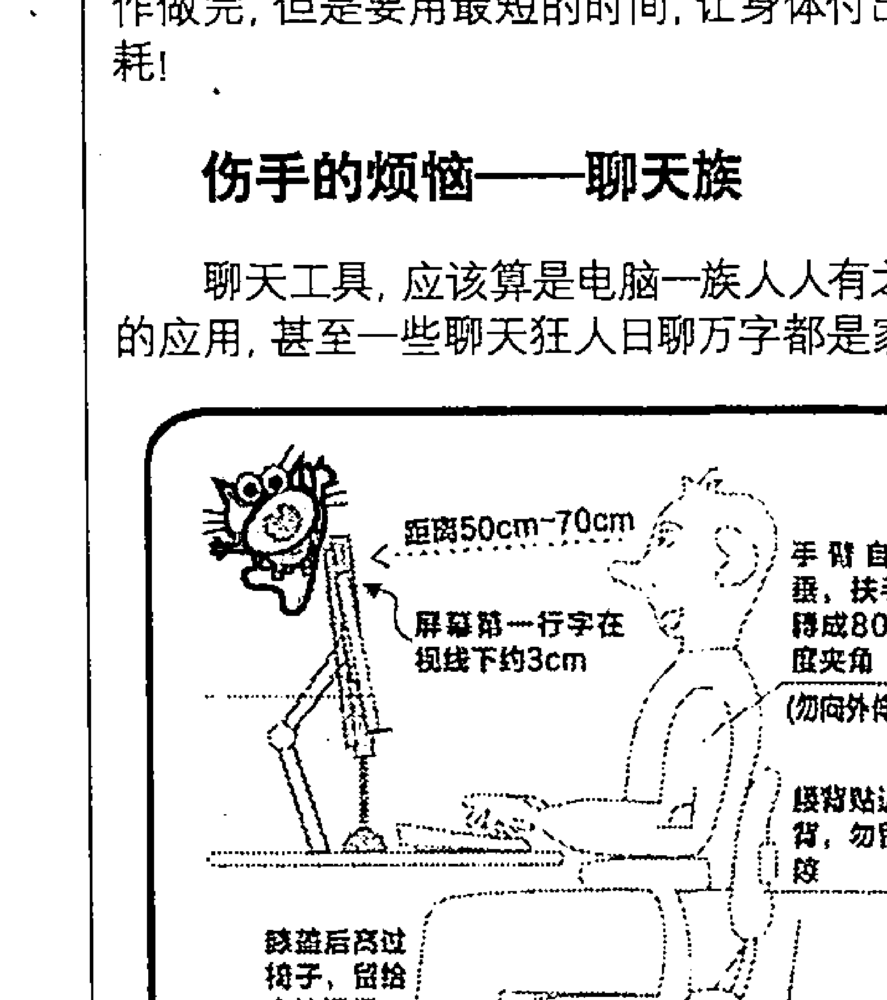

◎不管你在电脑前的坐姿多么正确，也不如每隔1小时站起来活动一下身体。

## 大幅减少鼠标移动距离

当桌面图标超过20个以后，你肯定就会遇到找不到图标的情况，鼠标会在桌面上作很多“无用功”。怎么解决这种情况呢？用“开始菜单”？显然也不够方便。在这里，向你推荐一款日系软件nrLaunch，nrLaunch界面分布上主要是普通的按钮和小按钮条，小按钮条是固定的，并不会根据按钮页面的变动而变动，而上面的普通按钮则可以有多个分页（就是标签啦）。

虽然跳跃列表功能很方便，但却有可能导致隐私外泄，尤其是多人共用一台电脑，甚至共用一个账户的情况下。因此如果希望不保存打开文件历史记录，只需在任务栏空白处单击鼠标右键，选择属性，在开始菜单选项卡下，取消隐私类别下的两个选项并确定，就可取消跳跃列表功能了。

除了能点击托盘启动外，还能用双击右键、双击中键等点击方式启动。还有鼠标画圈启动（就像Magic Formation），鼠标贴边启动（不会在边缘留下痕迹），而且在设置里可以对这两种启动方式进行微妙调整。nrLaunch的各个操作都能瞬时完成，呼之即来，感觉非常轻巧灵便。

## 键盘替鼠标 手腕不用挪！

为什么要用键盘代替鼠标？鼠标使用那么方便，定位那么准确，为什么要用笨拙的键盘？你回想一下，当你在Excel报表的单元格中修改其中内容的时候，是不是还要鼠标双击一下单元格，进入编辑状态？修改少量单元格还好，如果是几十个、上百个呢？那时候你就会觉得双击是一件非常苦恼的事情！还有，当你需要做一些重复性操作时候，比如隔一段时间自动点击一次某个链接，都需要工具帮忙。MouseClick（下载地址：http://ufridman.org/mouseclick.html）可以帮你，它使用非常简单，能够通过快捷键控制鼠标点击，自动按间隔时间点击鼠标左键，自动拖拽，很值得一用。

## 把鼠标点击减少90%!

回忆一下你平常的案头工作，除去文字输入和思考时间，大量的时间都消耗在查找以前曾经打开过的文件、访问过的网页、软件曾经访问过的目录上了。这些重复操作都需要鼠标一步步点击。有没有快速访问的方法呢？也许你早就换用Win7了，但你可能还没用过它的“跳跃列表”吧！在任务栏上，用鼠标右键单击一个程序的按钮，也会出现跳跃列表。对于已经可以支持跳跃列表功能的程序，只要将程序的图标钉到任务栏上，就可以随时借助跳跃列表实现各种方便的操作。
在任务栏右击后，会有已固定、常用、任务和功能四栏。如果点击过“锁定至此列表”，即可让该历史永远留在已固定栏，并通过的访问记录，保存在常用栏，直接点击就可以快速打开。在任务栏里，各软件有相应的任务。以Maxthon为例，右击后就会显示浏览器“最热收藏”页面，不用激活傲游就能快速访问页面。

## 降低文字输入量

文字聊天最伤手。在能够语音聊天的情况下，坚持提倡语音聊天替代文字的输入。一对一的聊天场合下，直接在聊天软件中启动语音聊天功能，只要对方同意语音聊天即可进入语音聊天环境了。而若需要多人在一起商议某个话题，也可以通过群聊天功能来实现。例如在QQ群聊天窗口中直接单击“发起多人语音会话”按钮，再选择需要参与的成员，待被邀请成员同意后即可进入群聊环境了。不过，如果你希望使用手机的高质量的多方通话，使用手机群聊（如电话会议）在飞信中，也可以发起语音群聊，最多支持8个人同时参与，只是针对任何参与者都需要收费(8:00

#### 小提示：免提长聊的好工具

像 QQ、MSN、旺旺等主流聊天软件都支持蓝牙设备，配备一块蓝牙耳机并在聊天软件中设置好音频设备就可以实现聊天，并不需要坐在电脑前，只要开着电脑，一边聊天甚至还可以一边干家务活；不过，若不需要一边做家务一边聊天，进行语音聊天时还是建议使用麦克风+音箱组合，避免使用耳塞，因为长时间戴耳塞聊天对耳朵危害相当大。现在市场中有聊天专用音响，内置麦克风，甚至还可以实现免提语音聊天，例如淘宝有卖的“QQ精灵音箱”就是不错的选择。

#### 小提示：更多的键盘替代鼠标操作

在 QQ 中需要屏幕截图时，按 Ctrl+Alt+A 快速调用截屏工具，比用鼠标先打开聊天窗口，再单击截屏按钮省力；Ctrl+Z 清空/恢复输入框里的文字并恢复为默认显示大小；Alt+H 查看聊天记录；Ctrl+Alt+Z 直接提取消息，而 Ctrl+Alt+S 则直接打开消息盒子；锁定 QQ 直接使用 Ctrl+Alt+L 即可；QQ 窗口、Word 等文本工具中放大字体，按住 Ctrl 键，向上滚动鼠标滚轮即可，完全不必全选文字，再费力地选择字号了。

## 网络大补贴：IT 健康美食

- 菠菜：菠菜是预防和治疗夜盲症及贫血的很好的食疗菜。
- 粗粮：粗粮中含有许多特殊的维生素和矿物质，这些营养素有助于调节肠胃内环境。
- 大蒜：除了可以杀菌消炎、增强免疫功能、抗衰老。
- 蓝莓：蓝莓含有丰富的营养成分，具有防止脑神经老化、强心、抗癌软化血管作用。
- 枸杞：枸杞所含胡萝卜素很高，在人体内可转化为维生素 A，促进视网膜内视紫质的合成或再生。

## 现在就要甩掉的坏毛病——办公族

现在的办公室应该是清一色的使用电脑+办公软件的无纸化办公了，而办公软件用得最多的无疑是微软的 Office 系列办公软件。在使用 Office 过程中，也有不少朋友养成了两步路做三步走的坏毛病，无形中增加了劳动量，自然会对身体健康有损无益。请看看，如果你也有这些坏毛病，抓紧改掉吧！

## 不会用模板 费时又费力

这个现象特别普遍，很多朋友都没有模板概念，每次需要制作一个文档时，文档的格式的编辑又是一次从头来过，浪费时间不说，白白的让双手重复着无用功，双肩、腰、眼睛等各个器官跟着受罪。同一类型的文档，只要第一次制作时将其保存成模板，日后直接调用模板，接下来只需要关注内容即可，省事、省时、省力！用模板其实很简单：编辑好文档的格式后，只要单击“Office 按钮→另存为→×××模板”，设置一个易区别的模板名称（例如“月报表”）将其保存起来。日后要编辑类似格式的文档时，只要直接右击该模板并选择“新建”即可，或者将该模板添加到系统模板中，然后在 Office 软件中通过菜单“新建”并选择这个模板来新建文档，这时就无须再去编辑文档的格式了。

## 你真的会“复制+粘贴”吗？

不要奇怪，很多使用电脑多年的人并没有真正掌握这个基础技能。当你使用粘贴功能时，除了用“Ctrl+V”，或者右键选择“粘贴”，还有其他选择吗？你可以尝试一下“Shift + Insert”键，这两个键虽然需要两手完成，但是他们距离手在键盘上的位置都很近，两手只需小范围移动，比起“Ctrl+V”移动左手，还要有点扭曲地按键来说，轻松许多。不信？你试试，真的很轻松！另外，罗技等知名品牌的鼠标在大拇指位置的按键都可以自定义功能，Cornel 就很喜欢把它设置为粘贴，在频繁粘贴的情况下，用它真是省了很多力气！

##### 大补贴：

网上有很多现成的模板，只要将它们下载到本地硬盘中，即可套用该模板提供的格式，例如 http://www.verycd.com/topics/225059/ 可下载的“OfficeReady”中就包含了大量的模板，用它便能达到事半功倍的效果。

此外，在最新版 Office2010 中也内置了大量好用的模板，直接调用这些模板可以省下很多精力。

只想复制网页中的文字，但粘贴到文档中却成了网页原型；想将源文档中的内容按原样式复制过来，粘贴后却只保留了文字，格式丢了……类似这样的没按照意愿的粘贴时常出现。

(1) “Alt+Ctrl+V”直接调出“选择性粘贴”，想贴成什么样就什么样。在 Office 组件中，复制好源内容后，按下这个组合键便可打开选择性粘贴对话框，是想原文复制还是只保留文字，直接在列表中选择即可。
(2) 定制默认粘贴规则，每次都省心。在 Office 组件中可以定制一组默认的粘贴方式，将平时用到最多的粘贴方式设置成默认，日后操作时就省力了。比如平时需要经常在网上复制内容到 Word 中，由于只需要文字而不需要格式，若将粘贴为文本设置为默认粘贴方式，日后 Ctrl+V 即可。设置方法很简单：单击“Office 按钮→Word 选项→高级→剪切、复制和粘贴”，在下面的列表中逐项设置即可。
(3) 选用自带复制、粘贴功能的鼠标。有很多鼠标产品都内置了复制、粘贴快捷键，操作起来很是省力。例如“罗技 Revolution VX”就内置了这样的快捷键，对于办公一族不妨更换一款类似功能的鼠标。

#### Office 剪贴板大补贴：

Office 组件中提供的剪贴板功能强大，最多支持 24 份不同的剪切内容，通过单击“开始→剪贴板”即可将其打开使用；在非 Office 组件环境下，可以通过下面的剪贴板工具打破每次只能复制、粘贴一项的陈规。

- “超级拷贝大师”（下载地址：http://www.newhua.com/soft/7378.htm），能够拷贝常规方法无法拷贝的内容，像星号密码。
- “ClipCache Pro”（下载地址：http://www.newhua.com/soft/9418.htm）能够自动监控剪贴板的变化并将新内容保存下来。
- “Clipboard Box”（下载地址：http://www.newhua.com/soft/49333.htm）支持多达 50 个剪贴内容。
- “超级剪贴板”（下载地址：http://www.newhua.com/soft/16137.htm）
- http://clip.net/ 在线剪贴板

## 不会批量处理，自讨“苦”吃

同样的操作（例如给文件更名、统计多篇文档字数、批量打印等）每篇文档都要来一遍，就像上桌敬酒，本来一杯可以敬完全桌人，但你偏偏挨个敬，岂不是自讨“苦”吃。

##### (1) 批量重命名文件名

如果要求不是很高的话，直接借助系统自带的批量重命名的功能即可搞定。例如在某个文件夹下有 100 篇文档，文件名现在需要重新按“2010+原文件名”（文件名前添加年份），直接 Ctrl+A 全选，再右击并选择“重命名”，在被更名操作的文件名前直接添加“2010”，在空白处点击一次鼠标，所有的文件名都会自动添加“2010”前缀了。

##### (2) 文档打印也批量完成，省劲

如果现在要打印多篇文档，你还是一篇一篇打印然后再打印么？如果真这样操作，那也太费劲了！批量打印吧，保准省劲：

第一步：先从 http://www.print-conductor.com/ 下载“Print Conductor”软件并安装到系统中。

运行“Print Conductor”后，单击“Add Documents to the List”按钮将需要批量打印的文档添加进来（在添加时软件就会提示安装了哪些相应的软件），再单击“下一步”按钮。

第二步：在打开的窗口中可以通过“Printer Settings”按钮来设置打印机的相关参数，最后单击“Run”按钮即可开始批量打印了，在这期间将无须打开任何一篇待打印的文档，你将看到需要打印的文档直接从打印机中呈现，省事！

这款软件支持多种文档格式，包括 PDF、Word DOC、WordPad WRI、WPS、RTF、TXT、Excel XLS、PowerPoint PPT、PPS、POT、Visio VSD、DWG、DXF、SNP 等，但相应的应用软件必须安装后才被支持。

## 小提示：

批处理在办公中的应用场合有很多，除了上面几种常见的需求外，譬如批量将文字转换成拼音，这时就可以通过“实用汉字转拼音”这款小工具来实现了；若需要批量将图片格式转换成需要的格式，除了通过 ACDSee 这类专业工具来完成外，通过安装“Image Converter”（下载地址：http://a.md/zp）这样的小巧型工具照样可以方便地实现，将其放到任务栏，要转换时，只要启动软件并将图片拖放到软件窗口中，它会按照之前设置的默认格式目标进行转换了。若需要批量发传真，通过“MightyFAX”、“winfax”、“ActiveFax”或 Windows 自带的传真工具就能搞定。

##### 大补贴：

如果文件不在同一个目录，可以通过系统内置的搜索功能，使用过滤条件搜索符合要求的文档，在搜索结果窗口中全选再重命名；如果对文件重命名有更多要求，可以使用专业的工具来实现，例如“拖把更名器”（下载地址：http://www.newhua.com/soft/1665.htm）、“妖眼文件批量改名器”（下载地址：http://www.newhua.com/soft/47723.htm）都很强悍，此外，若在处理图片时需要重命名，直接通过 ACDSee 就可以实现。

## 大文档处理不在行，尽走弯路

在处理上万行的大文档时，如果上下翻页通过右侧的上下滑块来定位会不准确，经常会拖过了。其实，直接在鼠标上下功夫，让中键滚轮一次滚动一页或是一次滚动 N 页就显得更方便了。

(1) 系统重新赋予鼠标滚轮新功夫：在控制面板中找到鼠标设置项（Windows 7 系统中直接在“开始”菜单的搜索框中输入“鼠标”），选择“滑轮”，在设置窗口中可以让滑轮一次滚动指定行数（最大为 100），一次滚动一个屏幕的内容，一次水平滚动指定个字符（最多为 100），按需设置吧。
(2) 选用对滚动页面很在行的鼠标产品，例如“Revolution VX”，在安装了驱动程序后甚至可以设置成一次滚动一千行。
(3) 善用 Office 的协作办公功能，让所有人都能同时并行参与编辑，拒绝串行工作。此外还可以通过 Google 文档提供的更方便实施的协作处理的功能来实现并行工作的目的。

## 减压重头戏——降低鼠标负担

- ★单击替代双击：打开文件夹窗口，按 Alt 后单击菜单“工具→文件夹选项”，选择“常规”选项卡，直接选择单击替代双击选项即可；
- ★左手帮右手：既能通过锻炼左手来让大脑更聪明又能减轻鼠标对右手的伤害；
- ★别忘了中键：滚轮键按下后可以让文档自动上下滚动，只要调整好滚动速度即可省下频繁的切换文档位置时对手指的伤害了。
- ★加速优盘弹出：右击优盘或移动硬盘并选择“属性→硬件→属性→常规→改变设置→策略”，中设置为“快速删除”，保存后只要不再读、写数据，直接拔除即可，也可以安装“USB Safely Remove”（下载地址：http://www.newhua.com/soft/56442.htm），然后通过快捷键即可快速弹出设备了。

## 别让放松成负担——“宅”一族

好不容易到了周末放松的时间，娱乐休闲本是惬意的事情，如果因为这个影响了健康，那就太得不偿失啦！

#### ★新发现：脑力劳动者，补瞌睡对你没什么用

睡眠的确是一种有效的休息方式，但它主要对睡眠不足者或体力劳动者适用。但如果你是坐办公室的，大脑皮层极度兴奋，而身体却处于低兴奋状态，对待这种疲劳，睡眠能起到的作用不大（除非你是熬夜加班，连正常睡眠时间都达不到），因为你需要的不是通过“静止”恢复体能，而是要找个事儿把神经放松下来。这样你可以理解为什么你周末两天不出门依旧无精打采，而只需下班后游泳半小时就神采奕奕。比如你星期五写了5个小时的企划案，最好第二天去给你的盆栽们剪枝而不是睡到太阳晒屁股。

#### ★长时间用耳塞坏处多

长时间使用耳塞会导致听力下降，这个常识应该# 《电脑爱好者》·合订本

多数人都应该养成良好的用眼习惯，在看大片时也不例外。

1.  看大片时，首先把音量调节到刚刚能听清的位置，随后稍微调节音量至自己耳朵感觉舒适的程度，建议设置为不超过最大音量的60%。
2.  使用耳塞、耳机时，不仅音量要适中，还要注意间隔休息，最好每隔半个小时就休息一次。当然，能使用音响的场合最好不用耳塞。

## ★别忘了“课间休息”

这是多数影迷朋友共同的毛病，随着电影情节的跌宕起伏而早就将45分钟后的课间休息忘得一干二净了。若自己的“自觉性”差，推荐使用“眼睛卫士”（下载地址：http://www.newhua.com/soft/79280.html）来定时提醒休息，甚至还可以使用软件提供的强制休息功能来克制自己的惰性。除了上面几点之外，将显示器的亮度调整在标准水平，同时还应该注意色温的调节。在显示器色温调节方面，可以通过“f.lux”（下载地址：http://work.newhua.com/cfan/201015/f.lux.zip）来智能实现，之前设置时，设置一个适合自己的变化色温范围，通常白天的色温控制在6500K以下，晚上的色温控制在3500K以上，之后它可以根据当前时区下的时间智能设置最佳显示器色温，对眼睛很有好处。

## ★拍照懒人必备提速工具

很多人都是摄影爱好者，却不是相片文件管理者，照回来的众多照片，一股脑地塞进电脑，时间一长，也不知该怎么管理了。怎么办？辛苦地重新建立多个文件夹再归类？那就不是放松了。一张卡内的照片可能是多次拍照的成果，当想处理这批照片的时候，麻烦就来了，你需要很费眼力地将不同日期拍摄的照片分拣出来……

Adebi Photo Sorter（下载地址：http://www.adebis.com/photo_sorter/）根据EXIF里的日期信息分拣照片的，拷贝照片到按日期创建的文件夹内（C:\……\2010\07），可选年、月或年月日来分类。利用Adebi Photo Sorter的过滤功能，你可以选择只处理某一段时间内的照片，并且可以筛选出照片格式，支持重命名文件。

## ★让强制休息成为“习惯”

玩游戏比看电影更容易入迷，不知不觉中可能已经过了2小时，这样连续2小时以上的长时间在电脑前并处于集中精力状态下，对身体健康伤害特别大。如果是在网吧上网，“开始→运行”可以使用的情况下，在玩游戏之前就输入`shutdown /s /t 7200`并回车，这样系统就会自动打开一个2小时的倒计时关闭系统对话框，这样便能被动按时间玩游戏，并按时间强行休息了。

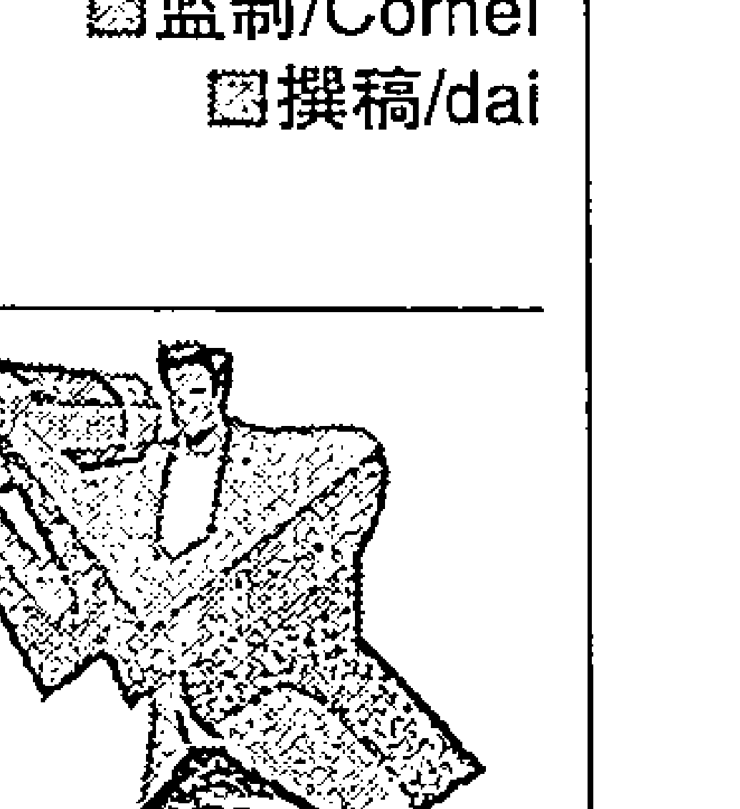

## 暑促先别急下手 CFan帮你摸门道

每年的暑促，都是IT产品的销售旺季，因为在这个时候，学生、教师都进入了假期，为了打发漫长无聊的假期，人们通常会选择上网娱乐。此外，进入7月以来，天气炎热，上班族下班或周末时，都不愿意出门，呆在家里吹空调、上网、打游戏，电脑需求量自然暴涨。厂商们也在暑促前卯足劲发布了多款新产品以刺激用户的购买欲望。

#### 风往北吹，价格飘忽怎么猜

虽说暑促时大部分产品都会做一定的促销让利，但无商不奸，国货、炒价也促使了一部分货源不是很充足的产品涨价，谁涨谁跌，让CFan带你分析来看。

#### 显示器：高端看跌，低端价格维持不变

市场看点 ★★★ 降价空间 ★★

west：我觉得就一个字，“跌”，现在的形势是液晶面板的整体产能都在增加。LG显示公司（LG Display）和新奇美（CMI）都在提高他们8.5代线产能，而新奇美和中国大陆京东方（BOE）都在扩宽他们6代线工厂业务。

CT：west说得有道理，不仅如此这些面板厂还在吃官司，因为合伙操纵价格被告上法庭，如果最终裁定罪名成立估计他们又要被罚款十几亿美刀。都这样了还敢涨价吗？

Alpha：新一代生产线都用于造大尺寸液晶电视了，对显示器液晶面板的影响不大。要说有影响也就是大尺寸的显示器有些许影响罢了。暑促期间市场需求大幅攀升，就算不进行价格操纵也没有降价的理由啊。

综合分析：液晶面板近些年一直保持着缓慢下跌的趋势，但惟独暑促例外，由于需求上升会带动商家大量出货，足以抵挡价格下跌。所以目前看来暑促期间出货量较大的18.5英寸~24英寸液晶显示器价格应维持不变。而价格略显高昂的大尺寸液晶显示器26英寸~30英寸液晶显示器为争夺暑促出货量有下跌趋势。不过让人欣喜的应该是广视角液晶开始大面积抢占市场，比起去年的曲高和寡，今年暑促液晶显示器的主要看点就在广视角液晶显示器。LGD、SAMSUNG、AUO等面板厂的全力出击应该会给我们带来高潮迭起的价格战。

综合分析：暑促期间最受人期待的便是显卡市场，采用GF104核心的GTX460在这个时候应该已经大量铺货。相比HD5850/HD5830来说，GTX460成本控制更为出色，性能上也不分伯仲。初期上市的GTX460价格应该在1300元-1600元左右，而大量铺货和非公版产品出现后会冲击千元价位市场。对应的HD5830也会因为GTX460的冲击大幅调价。价格下跌是好事，可是伴随而来的缩水也让人头痛，这个时候选择增强版还是简化版便是消费者应该抉择的事情。

#### 硬盘：传统硬盘需求饱和，固态硬盘暂不靠谱

市场看点 ★ 降价空间 ★★

CT：台式机硬盘掉价掉得都麻木了，笔记本硬盘没什么反应，观望固态硬盘中。

Alpha：3TB硬盘用户表示暂无需求。

west：我好像有10来块硬盘了，谁让家里机器多，网速上不去硬盘大有啥用。

综合分析：随着硬盘技术不断成熟，硬盘容量不断翻新，2TB容量硬盘全面铺货，1TB硬盘开始逐渐成为主流，因为它们的价格越降越低，致使性价比远高于低容量硬盘。从近期硬盘不断的降价可以看出除了货源比较充足外，还有一个重要的原因就是现在消费级市场出现饱和现象，大多数消费者升级至TB容量存储的时候已经能满足日常的存储需求，导致硬盘大量囤积。预计暑促期间硬盘还会持续小幅下跌，即使上涨也应该是商家炒货的短期行为。

#### 内存：看涨、看涨、看涨、看涨、看涨……

市场看点 ★ 降价空间 无

Alpha：我要是JS，我肯定炒货，此时不赚更待何时？

CT：我还是先购入几条存着吧，到时候出给你们还能赚点钱。

综合分析：都说平静是暴风雨前的征兆，近几个月来内存市场的平静也正是如此。随着DDR2→DDR3的转换，目前内存市场上的DDR3的出货量持续走高，但是无可否认，当下组装机市场内存霸主依旧是DDR2（据不完全消息称出货量比例在5：1左右）。而工厂端DDR2的出货量并不高，所以很容易出现人为或非人为的货源问题，从而带动整个内存市场的价格大幅飙升。以往多年的经验告诉我们暑促这个时间正是内存暴风雨来临的时间，做好防汛（提前购买）措施，防患于未然吧……

#### 电源、机箱：常年如一

市场看点 ★ 降价空间 ★

CT：我觉得机箱这个东西和暑促无关，顶多是做做活动送水杯、遮阳伞。

剑圣：同意楼上的观点，没准推推新版本打造绿色攻势还能涨点价钱。

综合分析：无论是寒促、暑促、旺季、淡季还是金融危机机箱电源产品都是雷打不动。只有偶尔的新品推出可能会带动产品线的价格变化。理由很简单，不需要太大的升级换代。

## 攒机配置不求人，四款实用配置推荐

虽说攒机时大部分产品都会做一定的促销让利，但无商不奸，囤货、炒货也促使了一部分货源不是很充足的产品涨价，谁涨谁跌，让CFan带你分析来看。

| CPU | Intel 奔腾双核E5300(盒) | 425元 |
| --- | --- | --- |
| 主板 | 技嘉 GA-EP43T-S3L | 699元 |
| 内存 | 金士顿 2GB DDR2 800(窄板) | 285元 |
| 硬盘 | 希捷 500GB SATA2 16MB 7200.12 | 299元 |
| 显示器 | 明基 T902HD | 720元 |
| 机箱 | 航嘉 暗夜H507 | 178元 |
| 电源 | 航嘉 冷静王加强2.3版 | 178元 |
| 键鼠套装 | 富勒 U55无线激光多媒体键鼠套装 | 199元 |
| 合计 |  | 2983元 |

剑圣：办公用机必须Intel、高速、安静、不出问题。E5300+技嘉P43主板的搭配可谓是经典中的经典，500GB的希捷硬盘虽然容量不大，但是性能出众，并且由于单碟设计，故障率要低很多。

小知识：为何单碟硬盘故障率低？单碟的物理结构更简单，只有两个磁头；而多碟的话，磁头更多（每碟两磁头），因为单碟物理结构更简单，所以出故障的机率要低一些。

#### 小巧富有智慧的家用影音机

| CPU | AMD 速龙II X2 245(盒) | 380元 |
| --- | --- | --- |
| 主板 | 微星 785GTM-E45 | 499元 |
| 内存 | 金士顿 2GB DDR2 800(窄板) | 285元 |
| 硬盘 | WD 500GB SATA2 16MB | 299元 |
| 显示器 | AOC iF23 | 1399元 |
| 机箱 | 华硕 TT-67(带电源) | 170元 |
| 键鼠套装 | 雷柏 1800 无线键鼠套装 | 88元 |
| 合计 |  | 3120元 |

CT：家用影音必须3A，UVD各种硬解1080p，价格便宜功耗低。板载的HD4250显卡也能在低特效下玩转多数游戏，采用IPS广视角技术的23英寸显示器效果出色，可视角度大，更适合多人观看。

小知识：什么是UVD？UVD（通用视频解码器），是ATI显卡里其中一项技术，利用UVD引擎，显示卡就能完全硬件解码H.264和VC-1格式的高清影片，而不消耗CPU的资源，而且功耗得到降低。

#### 超高运算性能的影音图形工作站

| CPU | AMD 羿龙II X4 965(黑盒) | 1160元 |
| --- | --- | --- |
| 主板 | 华硕 M4A87TD | 790元 |
| 内存 | 金士顿 2GB DDR3 1333×2 | 640元 |
| 硬盘 | 希捷 1TB SATA2 32M 7200.12 | 465元 |
| 显卡 | 索泰 GT240-512D5毁灭者 | 599元 |
| 声卡 | 节奏坦克 HiFier Serenade (小夜曲) | 499元 |
| 显示器 | 戴尔 UltraSharp U2311H | 1499元 |
| 机箱 | 航嘉 暗夜公爵H403 | 315元 |
| 电源 | 康舒 IP 430加强版 | 399元 |
| 键鼠套装 | 多彩 8800G无线键鼠套装 | 168元 |
| 合计 |  | 6534元 |

West：说实话，我更喜欢Intel，但是好钢用在刀刃上，借助CUDA的帮助我们可以将整机运算提升极大的档次，这样CPU的运算差距就不明显了，节省出来的价钱可以配备一块准专业级声卡为使影音编辑工作更加得心应手。

#### 硬件发烧友的游戏机

| CPU | Intel 酷睿 i5-750(盒) | 1350元 |
| --- | --- | --- |
| 主板 | 华硕 P7P55 LX | 1030元 |
| 内存 | 金士顿 2GB DDR3 1333×2 | 320元 |
| 硬盘 | 希捷 1TB SATA2 32M 7200.12 | 465元 |
| 显卡 | 索泰 GTX460-1GD5 极速版 | 1599元 |
| 显示器 | 三星 P2770H | 2580元 |
| 机箱 | 航嘉 暗夜公爵H403 | 315元 |
| 电源 | 航嘉 磐石600 | 518元 |
| 键鼠套装 | Razer DeathAdder炼狱蝰蛇(升级版)鼠标 | 249元 |
| 键盘 | 雷柏 V6背光游戏键盘 | 155元 |
| 合计 |  | 8901元 |

Alpha：虽然是发烧友的游戏机也不是无节制的提高预算，比如游戏中超频程并没有太大的作用，所以我们选择了i5-750而不是i7-940之流，而在显卡的选择上集万千宠爱于一身的GTX460，高性能、低发热，相信炎炎夏日也不会‘发烧感冒’。

## 走访卖场，亲临JS新骗术

要说开开心心去攒机，最怕碰到什么？当然是JS！每一年的暑促JS们都会搞出无数的花样，让你不知不觉就上了圈套。看着JS那诚恳的态度和‘给你一个实在价’的悲痛表情，你动容了，他就成功了。

#### 实在的是价格，而不是产品

我们首先来到了中关村最鱼龙混杂、水最深的海龙。

Alpha：老板给我攒台便宜电脑，兜里没多少钱，越经济实惠越好，2000元的预算你看看着办吧。
JS甲：好嘞，没问题，一看兄弟就懂行，不盲目追求高配置。你看这个配置怎么样，价格绝对超值！
Alpha拿过配置单一瞧，好家伙……Athlon64 X2 690G的主板、9300GS的显卡。

小编点评：一分价钱一分货是永远不变的真理。实在价很多情况就是给你一些过时的产品，比如Athlon64 X2的CPU、AMD 690G芯片组的主板、HD3450、9300GS的显卡等等，这些产品如果你的要求不高，性能或许还过得去，但最主要的是此类产品由于积压很容易混杂有返修货所以故障率也会偏高。

#### 借我一双慧眼，让我认清产品细分型号

告别了一个JS我们再去寻觅另一个。寻了几家报价还算正常，正在纳闷是不是海龙的风气变了，转眼间走到了一家卖显示器的店里。

Alpha拿出一份配置单：你看这个你能做的再便宜些吗？不能我就走……
JS乙满脸堆笑：能，能，没问题！我给你在这个价格的基础上砍100块怎么样，没问题马上就给你装。
Alpha心想：呦？这么透明的价格他还能给我砍100，我倒要看看他怎么玩的。
JS：你看东西都给你拿来了，你看是验验货不过你放心，咱家老型号了。
Alpha一样一样检查着配件，怎么也没见什么有问题，当看到主板的时候Alpha看着内存插槽总觉得不对劲，原来JS把785G/DDR3主板换成了785G/DDR2主板，100块的差价就是这么来的。

小编点评：主板型号上相近的产品型号命名，同样容易给买家造成混淆。好比是同一品牌同一系列基于不同内存平台的主板，在型号命名上可谓相当接近，甚至DDR2和DDR3架构的主板之间只相差一个字母，这样的微小差别实在是让人感到苦恼，一不留神，就会让商家钻上空子，以较高的价位卖给你较低档次版本或规格的产品。显卡市场其实也是如此，高性价比的499元GT240显卡，采用GDDR5显存的高频版本，但真的会有不少商家会趁着买家以为捡到便宜好货的疏忽之际，直接用DDR3的音频版GT240冒充高频产品，以同样499元的价格出售给买家，当然他们只会在产品配置清单和售后凭证上写着‘某某品牌GT240 512M’之类的字样。

#### 外传：JS都说网购IT不靠谱

在海龙走了十几家，碰到稍微厚道些的商家Alpha还会主动和他们聊聊天，但Alpha发现一个问题，一旦说到网购，商家们便会异口同声地告诉Alpha，网购靠不住，超黑暗、以次充好、售后难找等，更有甚者甚至用血淋淋的例子来触犯Alpha本来就头疼还总是忘事的大脑。什么爆炸、漏电、辐射（好吧，确实有人这么告诉Alpha的）。偶尔有几个商家不诋毁网购也是因为自己也去网上卖东西而已。究其根本很简单，网购抢了实体卖场太多太多的生意了，这些商家很乐意宣传它们的负面新闻。不过说实在的，相对低廉的价格和免去了与JS的口舌之争，网购在一点点上不时为最佳的购买方式之一。即使在配置上，售后上稍逊于商家集中的卖场，但是我们能看到在一点上改进，而实体卖场却在一点点的退步……

## 售后服务，电话问答真知

也许哪个厂商的客服人员看到这里，会对Alpha恨得牙痒痒，可是为了用户的利益，我们只能偷偷的拿起电话，对客服们进行无情的折磨。

测试项目一，态度：首先有的没的聊天20分钟以上，烦躁不安者0分，亲切和蔼者5分。
测试项目二，产品了解：装傻充愣对产品进行提问，比如几个PCI，几个USB这些容易被遗忘的东西，回答不知道或需要查资料者0分，回答完全正确者5分。
测试项目三，故障处理能力：从CFan傻博士栏目随机抽出5个问题，回答含糊或当时无法回答者0分，回答基本正确者5分。

| 客服电话 | 测试项目一 | 测试项目二 | 测试项目三 |
| --- | --- | --- | --- |
| 技嘉 | 800-820-0926 | 5 | 5 | 3 |
| 华硕 | 400-600-6655 | 5 | 5 | 3 |
| 微星 | 400-828-8588 | 5 | 4 | 2 |
| 索泰 | 0755-83307560-893 | 4 | 5 | 2 |
| 航嘉 | 400-678-8388 | 4 | 5 | 3 |
| 明基 | 400-8888-980 | 5 | 4 | 3 |
| 三星 | 400-8105-858 | 4 | 4 | 1 |
| 雷柏 | 400-8887-778 | 5 | 4 | 1 |

## 旁门左道真功夫，哪个好用哪个上

验机，是在攒完电脑后要做的事情，通常来讲可以自己带一张操作系统的盘，自己动手装，并确保装上所有驱动后跑几个类似SP2004、3DMark的程序，以确保电脑稳定，之后再让商家出一个明确的装机配件清单，并写上每个配件各是几年保，盖上商家章，最后再将钱付给装机商。但是呢，很多时候因为时间仓促或者条件不行（没有网络）等等，让验机匆匆而过。并且由于这些方法你知道，我知道，JS必然也知道，如果有的问题他们必定想好了招数来应付你。所以我们还需要一些偏方来配合使用。

#### 偏方一：电吹风模拟酷热环境

这个方法是怎么来的呢？这还要说起Alpha的一个朋友，开网吧的老板路人甲。网吧需要成批更换机器的时候，我们一起到去了卖场，Alpha的朋友敲定商家与价格后，从包里拿出800W电吹风对老板说：我不管你这是什么供电，什么PCB，什么长寿命，你让我用电吹风50℃左右的温度开游戏吹箱子里15分钟，不死机我也不验货了，照单全收。

仔细一想朋友做得还真是挺有道理，电吹风模拟高温环境，50℃的热风与满载的CPU配合如果不会死机，那么足可以保证机器酷暑无空调下的稳定性。这可比OCCT等测试软件来得全面多了。

#### 偏方二：指纹暴露犯罪证据

说起指纹，可能有些人会说Alpha走火入魔了，但其实不是这样，因为越来越多的显示器为了彰显时尚搞成了‘指纹收集器’，这就为我们提供了便利。老板口口声声显示器不包点，可当你打开显示器的箱子发现边框上沾满了指纹，你就应该知道这是挑剩下的。剩下的事情怎么办，自己看着办吧！

#### 偏方三：音频接口识别主板新旧

这个偏方不是让你去看，而是让你拿来耳机去插，如果主板被长时间用过后返修回来，那么音频接口是不会更换的。分别插入6个音频接口，如果发现其中一个松紧度不如其他，无论老板怎么说，想办法换掉，你还没给钱呢不是。

夏日当空照，暑促有门道。顶着炎炎烈日的你，从卖场攒机归来应该是兴奋的心情，激动的面容，而不是失意的心情，沮丧的脸。看走势选时间，理需求选配置，识JS防被骗，做好这三点相信你会一定买到称心的电脑。


## Office新人 到文案高手

我们的办公室，和达尔文说的丛林或草原，没有什么两样，就像巨大的恐龙和攻击力超强的猎豹，同样也会被生态淘汰。埋头努力工作，并不一定收获丰硕。办公室里本来就没有公理，却有一些看不见的‘定律’，他们真的有道理吗？ 8月下旬，刚刚走出大学校门，秦矿第一次以工作身份走进新的办公室，一切似乎都很陌生，除了桌上的电脑。由于工作经验不足，在电脑数据处理方面由于没有一套好的方案，经常出问题，明明亲手保存在硬盘中的一份客户资料，老板指明要这份资料时，翻遍C、D、E、F、G等所有的磁盘都找不到，真是急煞人也！作为办公室新人，必须先学会一些拿手的文案工作技巧，不然恐怕连试用期都过不去……

#### 谣传定律1：工作效果第一 程序不重要

错！如果是一个职场老手，这一点可能是对的，但是作为职场新人，工作的流程是否合理，可能直接决定你的试用期长短！

##### 天！我竟然不会建文件夹

做任何工作，有思路、有条理都是重要的，特别是职场新人，领导会从一些细节观察你的工作方式。硬盘中的数据就是从新建文件夹、文件开始的，这就相当于源头，在源头处做好科学的规划，自然会给日后留下便捷之路。除了掌握归类建立文件夹、文件取名要有明确代表意义，目录层次一般不要超过3层等常识性知识外，下面的这些高手总结出的经验很有参考价值。

在工作量比较大的场合，每天可能都会制作出多份文件，或者是给家中宝宝拍照，可能也是每天都要拍而生成照片文件。这些场合下直接建立‘记事本文件夹’就是比较科学的方法。所谓的‘记事本文件夹’就是应对每年、每月份、每日（当然可视具体情况决定是否建立‘年’或是‘日’文件夹）建立一个文件夹目录，例如‘1月\1日’，或‘2010年1月\1日’、‘2010年\月\日’。

*   ★智能建立‘记事本文件夹’的方法
    从http://www.greendown.cn/soft/24735.html下载‘Folder Frenzy’，若要建立‘年、月’这样的目录，只要在前面文本框中输入年份，后面文本框中输入月份数（12），若要建立‘月、日’这样的目录，则进行相应的调整即可。例如前面输入‘2010年’，后面设置为‘12’，这样便可在当前软件所在目录生成一组目录‘2010年1’、‘2010年2’…… 如果这种智能生成的方法并不满足要求（例如无法建立‘2010年1月’这样的目录），也可以直接在上面的列表中手工输入目录名称序列，更简便的方法就是借助Excel单元格的拖拉方法生成目录名称序列，再拷贝到上面的列表中进行制作。

小提示：
有时候可能还需要多次使用上面方法进行制作，最后手工合并目录，比如要想建立‘年、月、日’这样的目录，就要先建立‘年、月’目录，最后在每个月份目录中再建立对应日期的目录，由于日期文件夹每个月都一样，直接拷贝即可。

*   ★技能突破：巧用命令制作人名文件夹
    有一份保存了名单的文本文件，每行都是一个人名，这时如果想针对这个人名列表中的每个人名制作一个文件夹，通过命令就可以很好地解决：
    例如这个记事本文件名为‘d.txt’，将其放到需要建立人名文件夹的目录，按Win+R打开命令提示符窗口，使用cd命令切换到人名文本文件所在目录，然后输入‘for /f “delims=” %i in (d.txt) do md “%i”’并回车便可在当前目录下创建人名文件夹了。

对这个命令进行修改可以制作很多种需求的文件夹，例如产品目录、客户资料目录等。

1.  文件常修改，可用版本号做文件夹名称加以区分。
2.  正在处理及已处理文件要分开，做好处理完毕的文件的归档工作。
3.  喜欢视桌面为工作台的朋友，切记要用快捷方式替代文件本身，重要文件应该放非系统盘。
4.  通过‘Folder Maker’（下载地址：http://amd/148）这款小工具即可实现为不同的文件夹定制不同的颜色。再结合系统自带的更换图标功能，方便在众多文件夹中一眼找到目标。
5.  按Win+R，输入‘AppData\Roaming\Microsoft\Windows\Network Shortcuts’，在此建立任意文件夹将会直接显示在‘计算机’目录下，方便日常操作，而文件的真实保存地址则是‘E:\Users\系统账户名\AppData\Roaming\Microsoft\Windows\Network Shortcuts’。
6.  平时在管理文件而建立文件目录时，尽量不要超过3层目录，目录层数多了会给日后的管理带来一定的麻烦。

#### 谣传定律2：埋头苦干就好 慢工出细活

错！什么时代了，效率第一，又快又好才是目标，当你慢腾腾地写策划的时候，别人的标书已经递交上去了，抢时间，追效率，要想在新公司出彩，必须展示出你的高效来！

打工可以，但是不能打白工（只有付出没有回报的工作）。作为新人，容易接到一些不太需要动脑，但是比较花力气的‘苦活’，遇到这种情况，怎么展示你的能力呢？最好的方式，就是以无人能及的速度、第一时间完成它！

*   ★秀给老板看的小酷招
    当老板在你电脑前面的时候，不如向他展示一些他不知道的小伎俩，迅速提升你的形象！比如，在Excel表格中经常需要填入一些重复内容，比如在名单后面都加上‘读者’，如果输入名字后，在每个单元格中都会显示相同的内容，太麻烦了，不如用简单的方法。选中该列，右击后，选择‘设置单元格格式’，选择‘自定义’，在‘类型’中输入‘电脑爱好者@读者’。

*   ★技能突破：Excel输入提速三妙招
    ◎设置格式为‘[>999999999]（000）00000000;[>99999999]（0000）00000000;0’，就可以直接输入‘01068130909’这样的电话号码，回车后，会自动变成‘（010）68130909’，符合一般的电话号码写法。

*   ★技能突破：Excel输入提速三妙招（续）
    ◎单元格中如果是文本格式的数字，是无法进行运算的，可以先复制文本单元格，然后选择空白单元格点击‘粘贴’下的‘选择性粘贴’，再选择‘加’或‘减’即可。

*   ★技能突破：Excel输入提速三妙招（续）
    ◎设置格式为‘[DBNum2]G/通用格式’，则输入的数字自动转换为大写中文。

*   ★技能突破：规划硬盘文件 瞬间找到所需
    作为新员工最容易犯错的地方就是不知道哪里找到需要的东西，文档、表格、PPT……如何在最短时间找到呢？

    需要处理及接触到的文件类型创建相应的库，如‘本周必做工作’、‘待修改文档’、‘已完成文档’、‘相关PPT’、‘会议照片’等库，再养成及时将相应的文件夹‘入库’（右击文件夹并选择‘包含到库中’，选择相应的库即可），日后就能得到很多方便。

*   ★快速定位照片
    打开图片库，选择右上角‘排列方式’中的‘月’或‘天’即可在资源管理器中按日期显示拍摄的照片，这样可以有效地解决图片大海中找特定图片的难题。此外，还可以借助图片库中的图片分级功能快速给图片评级，日后按评级来查找特定图片，或者借助标记功能来实现同样的目的。

*   ★快速查找文档
    Windows7文档库与Office文档结合相当紧密。在Word中单击Office按钮，选择‘Word选项/常规’，在‘对Microsoft Office进行个性化设置’中填写了用户名即为自己的Office文档设置了作者信息，在文档库中选择以作者的排列方式显示即可按照不同作者进行归纳，非常适合办公族在往来频繁的文件中找到自己撰写或他人发送过来的文件，如果觉得这还不够快捷，还可以结合强大的库搜索功能及结合预览窗格快速找到自己想要的文件。

*   ★技能突破：批量修改文档中的日期格式
    有时候需要将一篇Word文档中的日期由一种格式转换成另一种格式，例如原先为‘2010.8.1’，现在想改成‘2010-8-1’，手工修改太费劲，批量实现更简单：
    在Word中按‘Ctrl+H’打开替换对话框，‘查找内容’框中输入‘([0-9]{4}).([0-9]{1,2}).([0-9]{1,2})’，在‘替换为’框中输入‘\1-\2-\3’。
    其中，输入的内容除其中的‘.’是根据文档中日期格式中的‘.’格式一致外，其余全为半角字符，最好是在英文状态下输入。再单击‘更多’按钮并选中‘使用通配符’项，最后单击‘全部替换’按钮即可搞定。按照同样的思路，可以在多种日期格式之间转换。

*   ★技能突破：批量修改文档中的‘电话号码’
    公司电话换了，以前制作的方案中的电话号码现在全部需要统一更换成新号码，手工修改太费劲，批量实现更简单：
    从http://www.newhua.com/softdown/25246_2.htm下载‘WordPipe’，安装运行后选择选择‘替换’选项卡，将‘Find what’设置成原先电话号码，在‘replace with’中设置新电话号码，注意勾选‘全字匹配’，防止将其他含有电话号码数字的数值替换了，再选择‘要处理的文件’选项卡，勾选‘包括子文件夹’，接下来选择所有文档存放的磁盘（甚至可以直接选择‘计算机’或‘我的电脑’），最后单击‘替换’按钮，软件就会搜索并进行替换了。

小提示：
本软件支持HTML、WPS、DOT、RTF等多种文件格式，设置好替换参数可以实现多种无毒的替换要求。

*   ★技能突破：快速删除Excel空白行方案
    不需要使用VBA，更不需要其他过多的复杂设置，即便是几万行的表格也可以快速删除其中的空行：

    情况一：如果不需要保持表格数据的排序完整性，直接通过排序功能将所有空行放到末尾，然后选中第一个空行后按Ctrl+Shift+End全选所有空行，之后直接删除即可。

    情况二：如果要考虑顺序，就是说删除后顺序不能乱，就在第一列后增加一列，从第一行开始按增序方式用自然数填充到最后一行，然后按照刚新增的列开始排序，并按上面的方法删除掉空行。

# 《电脑爱好者》·合订本

#### 谣传定律3：新员工要低调 不能乱说话

刚到单位，秦旷总觉得自己才疏学浅，和同事工作中不敢表达自己观点，怕说错话。后来，慢慢地，他发现了多沟通的重要性。不仅是当面的沟通，与领导之间的邮件沟通也十分重要。往来邮件往往也是最需要花力气去处理的对象，如果没有科学的管理方案，不用多久，你的邮箱就会变得零乱不堪，想找一封邮件甚至需要半天时间，直接影响到工作。

## ★技能突破：从名单到邀请函

上班第三天，领导就让秦旷去制作200个邀请函封面，要求倒是很简单，其实就是信封的表面，包括邮编、地址、职务、姓名。可是给他的只是包含这样信息的Excel表格，怎么让它变成可以打印的200个封面呢？难道要一个一个筛选？显然不用这麻烦！

- 第一步：首先新建一个Word文档，纸张类型无所谓，一般是A4，不过最好调整一下页边距，这样在一页的空间可以打印更多的成绩单或者信封的收件人。在Word中插入一个表格，如果想在一页纸中打印两列，那就选择两列。为了打印出来美观，也可以设置表格属性，把边框去掉（设置边框为“无”）。
- 第二步：进入Word文档，在“邮件”中选择“选择收件人→使用现有列表”，在出现的“选取数据源”对话框中，选中名单的Excel文件名并确定。
- 第三步：点击鼠标，使输入框停留在表格的第一个格中，然后在“邮件”菜单中选择“插入合并域”，将需要打印的字段按照顺序排列，可以自己调整每行的格式。
- 第四步：点击鼠标，使输入框停留在表格的第二个格中，点击“邮件”菜单栏中“编写和插入域”的“规则”选项，选择“下一记录”。然后在“下一记录”的后面，插入和第一格相同的内容，选中第二个格的全部内容，并复制。
- 第五步：将同样内容复制到表格的其他格中去，填满表格。这时就基本完成任务了，点击左上角的保存按钮，选择“邮件”菜单中的“完成并合并”，选择“编辑单个文档”，在“合并到新文档”中选择全部记录，也可根据需要选择部分记录，并“确定”。

这时候会生成一个新的文档，里面的内容就是你想要的了！

## ★Office大补贴：

- （1）如果邮件数目太多，通过邮件客户端软件、QQ邮箱、Gmail等邮箱提供的给邮件加标签的功能，为邮件添加标签（例如“重要资料”、“公司文件”、“朋友来信”等）后可以方便日后的管理，邮件客户端软件均支持此功能。
- （2）旧邮件及时整理，如果不重要的、可以删除的，应该随手删除到废件箱，重要的旧邮件及时归档（移动到一个独立的邮件文件夹）。
- （3）邮件客户端都有自动检查邮箱的功能，开启此功能并设置好收信的时间可以省得手工检查新邮件。
- （4）发出去的邮件可以通过设置“回执”功能来追踪邮件的打开状态，而http://www.spypig.com/提供的邮件跟踪功能更强大，可以主动查看邮件的当前状态而不受对方的操作限制。
- （5）通过http://send-email.org/ 可以发送匿名邮件，一些不重要的场合可以拿来用用。

## ★巧用搜索文件夹，归类邮件很省劲

在Outlook、Foxmail等邮件程序中，有一个叫“搜索文件夹”的功能，并没有多少朋友在用，用好此功能其实很省事。譬如，现在想将某个客户所有发来的邮件放到一起，通过“搜索文件夹”手到病除，以Foxmail为例：

右击邮箱并选择“新建搜索文件夹”，设置好搜索文件夹名（以客户名命名），再根据目标邮件的特征（例如发件邮箱、邮件主题含有的元素等）设置好筛选条件，选中“符合以下任意一个选中条件”，最后单击“确定”按钮即可建立。

## 小提示：

如果需要多个条件同时限制（例如需要限制最近6个月的邮件），在设置该筛选条件的同时还要选中“符合以下所选中的条件”项。

这样建立的搜索文件夹就能将符合筛选条件的所有邮件搜集到一起，类似于系统自带的搜索功能可以将所有DOC文档搜索后显示在一个窗口中一样，方便操作。

## 新人大补贴：图片管理

硬盘中的图片文件也是个经常令人头疼的对象，而图片中以照片居多，掌握一套科学的整理这些图片的方法显然也很重要。

## ★按“日记文件夹”方式整理照片

专门用来存放相机拍摄照片的文件夹时间一长，各个时间拍摄的照片混在一起，通过“日记文件夹”的方式将这些照片自动按拍摄日期归类可以方便存档和日后查阅。方法很简单：

解压“jhead”压缩包（下载地址：http://work.newhua.com/cfan/201016jhead.rar），直接双击运行“done.bat”，再将要整理的照片目录用鼠标拖放到程序窗口中，接下来只要按照屏幕提示进行设置或是选择相应的参数即可，根据选择的参数不同可以将所有照片按照片分辨率进行归类或者按拍摄时间进行归类。由于需要按“日记文件夹”方式分类，在此选择按日期来归类并选择好日期格式。

## ★借助强大的Picasa智能整理

Google的Picasa图片管理软件功能非常强大，对硬盘中的图片进行智能管理、分类，可以让主人省心。

如果还没有安装，请从http://picasa.google.com.hk下载安装，第一次运行时请让其对整个计算机上的图片进行搜索，并且在下面的窗口中选择所有图片格式。

搜索完毕后会直接将硬盘中的所有图片按其所在文件夹显示在列表中。

其实，这样就已经完成了图片的整理，日后需要找图片时，直接打开Picasa，借助树状图，再结合其内置强大的搜索功能就能快速地找到目标图片了。

假如，你现在想将所有的图片统一放到某个指定的位置（例如放到另外一块专门保存图片的硬盘中），通过Picasa也可以统一搞定：

单击菜单“工具→备份图片”，接下来在左侧列表中选中需要的图片文件夹（也可以全选后删除不需要的），在“备份组”中创建一个备份任务并设置好目标位置为第二块磁盘中的某个目录，最后单击“备份”按钮即可。

这样就能将保存在不同位置的各种图片一次性转移到新位置下的同一文件夹中，更加方便日后的管理了。

## ★Office大补贴：

- （1）照片越来越多的情况，做好整理后使用专用的硬盘保存，或者直接制作成DVD类相册（例如会声会影即可制作）保存在硬盘中，方便保管又方便日后浏览。
- （2）一些专业从事摄影的朋友选用更加专业的“Adobe Photoshop Lightroom”（下载地址：http://a.md/17e），功能更加强大，但是界面为英文，使用也相当复杂。
- （3）在Windows 7以前版系统中设置成以图标形式显示图片后是无法预览图片的，只要将“thumbs.7z”解压得到的“thumbs.dll”拷贝到Windows目录下的System32目录，然后在“运行”对话框中输入“regsvr32 /s thumbs.dll”并回车进行注册即可，卸载时使用“regsvr32 /u /s thumbs.dll”命令。
- （4）如果从网上找的一些图片素材，随手使用http://a.md/17h下载的小工具将N张小图片合成为一张图片，也有助于磁盘的整洁。

掌握上面的这些科学管理文件的方法，可以让自己的硬盘更整洁，找起文件时也更快捷、方便，慢慢地再将这样的管理方法养成习惯，以后就不再担心硬盘还会乱的情况了。

策划/《电脑爱好者》编辑部

监制/Cornel

撰稿/dai

## 屏幕是阅读体验的关键

何为E-ink屏？说复杂了晦涩难懂，简单说就是效果逼近印刷纸，不闪烁、不伤眼，看文字的效果远不是TFT液晶屏所能比拟。然而彩屏电子书娱乐功能多元化也是它不具备的，彩屏与E-ink屏都有着各自的用户群，优缺互补，相依相生。

新一代E-ink屏（电子油墨屏）“珍珠”已经被新款亚马逊kindle dx所使用，支持10：1的对比度，相比目前对比度提高了50%。期待售价139美元的Wi-Fi版与189美元的3G+Wi-Fi版kindle早日到来，相信在这有力的一击之下，千元电子书口号不会像现在一样，只是喊喊而已。而彩屏电子书更凭借高性价比和多面能手的身份已抢占不少市场，无论是彩屏还是E-ink屏电子书，上半年的价格虚高已初现疲态，这段时间将是入手电子书的绝佳时机，两者势均力敌，不论选择谁，你都应该读完这本“本草纲目”，从此来者不拒。

## 口袋宝贝iriver Cover Story

http://www.iriver.com.cn | 价格：2200元

- 参数
  - 产品容量：2GB
  - 屏幕尺寸：6英寸E-ink
  - 分辨率：800×600
  - 支持格式：TXT、PDF、PDB、EPUB、PPT、DOC、XLS、ZIP

# 《电脑爱好者》·合订本

#### 压缩包浏览

#### 缺点

磁吸式保护盖略松,容易误碰

#### 漫画显示效果

想找一款可以装在口袋中的电子书?只有触控版Cover Story才能胜任.没有全键盘的它身材大幅缩水,要比一般电子书短上五分之一,但它仍是6英寸E-ink屏,更融入了触摸屏的元素,Cover Story有个独一无二的设计就是配置了Cover,磁吸式保护盖,平时可以吸附在机身正面(携带或是收藏时)或是背面(阅读时),按键被压缩至屏幕左侧,可以左右拨动完成翻页操作,上下两端还可以按下,来实现‘返回’等操作,方便快捷。

#### 点评

创新的磁吸式保护盖设计以及业界领先的6英寸E-ink触摸式屏幕、五维按键,这些都是拉风吸引眼球的亮点,更有重力感应自动旋转画面让阅读轻易在左右手间切换,亮点颇多,值得一提的是Cover Story只要抽出手写笔即可自动打开便签功能,文字、图画均可随时记录,比较人性化。

## 眼花不可怕,批量变黑重见“光明”

由于源文件或屏幕的问题,总感觉看漫画时灰蒙蒙的,在PS中调节色阶固然可以,如何才能做到批量调节呢?同样,对于彩色漫画调节亮度、色彩饱和度也可以先记录动作再批处理。

在PhotoShop(PS)中打开‘窗口’菜单,勾选‘动作’,在弹出的选项卡中点击新建动作,新建一个动作,起名后确认后就需要手动录制这个动作,在‘图像’菜单中找到‘调整’下的‘色阶’,滑动中间与右侧的滑块,让图片看起来黑色更黑,白色更白,最后在‘文件’中选择‘自动’下的‘批处理’,选中刚才创建的动作,‘源’位置改成文件夹或打开的文件,数百张图片也能轻松改。

#### 小知识

即便黑白图片也不是‘纯’黑白,用PS打开后,在‘图像’菜单下找到‘模式’,勾选‘灰度’,此时图片才真的够‘纯’,图片文件大小急剧缩小数倍,电子书浏览速度自然也会飞涨。

显示器、手机、电子书谁的显示效果最强?无2.8英寸手机屏幕还是24英寸显示器屏幕,只要屏幕的文字控制在16-19行左右,此时就是屏幕最合适的字体大小,那么我们可以在不同大小的屏幕上模拟出人眼最舒适的微观文字,然而横向比较,很明显,E-ink屏细腻程度毫无争议。

## 轻薄先生欣博阅G6

http://www.slibrary.com.cn | 价格:京东:无/淘宝:1600元 / 卖场:1999元

#### 参数

- 产品容量:2GB
- 屏幕尺寸:6英寸E-ink
- 分辨率:800×600
- 电池:1500mAh(可更换),翻页18000次以上
- 主控:E-ink屏标配三星方案
- 支持格式:TXT, PDF, PDB, HTML, EPUB, BOE, CHM

#### 缺点

细节做工有待加强,方向摇杆手感一般

|          | 手机 | MP4  | 电子书 |
|----------|------|------|--------|
| 屏幕大小 | 2.0-3.5英寸 | 3-5英寸 | 6英寸  |
| 屏幕材质 | TFT  | TFT  | E-ink电子油墨屏 |
| 优点     | 色彩好、亮度高,分辨率为240×320和480×320 | 色彩好、亮度高,分辨率为480×272和800×480 | 无背光,对眼睛刺激小,分辨率为800×600 |
| 格式     | 可安装阅读软件,支持所有格式 | TXT、PDF,其他格式需安装软件 | TXT、HTML、PDF、EPUB、DOC等主流格式 |
| 使用时间 | 2-4天 | 5-10小时 | 10天左右 |

三彩两黑白,这就是本期专题的5位主角,由它们给大家讲述关于电子书疑难杂症的故事,先来比比谁更轻薄吧,从左到右分别是智器R7、欣博阅G6、歌美GM2000、iriver Cover Story、台电K5,以及和一台HTC G2手机大小对比。

#### 漫画显示效果

G6并不是目前最薄的一款电子书,但10.8毫米的厚度足以傲视相当一部分同类产品,背面极具金属质感的塑料材质让握持感进一步提高,全键盘的设计虽然很常见,G6粗看起来似乎并没有什么让人过目不忘的地方,不过,细细一看,标志性的五向键,可自由拆卸的后盖,可自由更换的诺基亚(BP-4L)手机电池,还有背后两个效果不错的立体声小喇叭,布局优化过的侧按键,这些,又都显示出它的与众不同。

#### 点评

除了看书,G6还支持众多主流音乐格式,不过播放功能比较简单,预留SIM卡与Wi-Fi网卡空位,后期还有升级空间,G6的屏幕在对比度、锐利度上都有一定优势,之前的固件版本功能太弱,好在升级到1.4版可以使用收音机,1.5版更是加入了对重力感应的支持,遗憾是缺少挂绳孔,单手持书安全系数不高,建议厂商改进。

## 口齿不清,TXT文件乱码一招治

兴致冲冲的下载一个电子书,打开后却是乱码,TXT文件产生乱码主要是编码的问题,电子书或MP4因主控不同,支持TXT编码的能力也有区别,具体参考说明书,一般电子书都会支持ASCII和Unicode编码,所以,在电脑中把TXT文件另存为相对应的编码即可,及时升级新固件能让你的电子书支持更多格式。

## E-ink屏翻页为何黑一下？

全屏刷新:一般在功能界面和含有图片的书籍中,它是默认的方式,每次翻页后页面都会非常清爽,在翻页过程中电子油墨颗粒进行全面重新排列,屏幕会出现很明显的黑屏现象,同时刷新时间稍长。

局部刷新:只有在纯文字的阅读时才会使用,此时翻页速度稍快,并且页面变化比较平缓,视觉上没有明显的黑屏现象,但在没有文字的空白处会隐约可见淡淡的油墨印。

黑白刷新:速度最快,但是效果不好,字体变得干瘪,但是在大字号阅读时最为方便快捷。

## 彩屏型男台电K5

http://www.teclast.com | 价格:京东699元 / 淘宝:610元 / 卖场:699元

#### 参数

- 产品容量:4GB
- 屏幕尺寸:5英寸TFT液晶
- 分辨率:480×800
- 电池:约12小时,3500页
- 主控:瑞芯微RK2728B
- 支持格式:文本: TXT, EPUB, FB2, HTML, PDB, PDF, DOC, 人声朗读
- 视频: RMVB, AVI格式720P播放

#### 缺点

按键声音大,附送的外套略松

#### 漫画显示效果

K5的主打造就彩屏电子书阅读器,不仅阅读能力强大,还具备720P高清视频播放,音频播放功能,16:9的屏幕显得比较修长,但它确实是5英寸屏幕,K5从底层驱动入手,柔化液晶屏幕的显示,优化亮度和对比度,使之更适合长时间阅读,本身尺寸仅为149×104×10.5mm,拿在手中质感极佳,米白色工程塑料面板搭配铝镁合金材质背板,手感很细腻,优化设计的UI界面以及全新布局按键的外壳让它更适合看书。

#### 点评

K5就是这么一款处于MP4和电子书阅读器之间的产品,液晶屏的翻页速度比电子纸屏幕要快得多,看书之余还能看电影,即便被人说成MP4又怎样?不过K5的固件有待丰富功能与加强稳定性,不能更换字体与DIY电子书背景用起来确实不够完美,朗读功能很强大,包括普通话、粤语、四川话、东北话四种口音,断句有轻重,音调有起伏,朗读效果比较顺畅。

## 窈窕淑女歌美GM2000

http://www.gemeitech.com | 价格:京东:无 / 淘宝:700元 / 卖场:799元

#### 参数

- 产品容量:4GB
- 屏幕尺寸:7英寸TFT液晶
- 分辨率:800×480
- 电池:2500mAh
- 主控:华芯飞CC1800
- 支持格式:文本: TXT, PDB, PDF, HTM, HTML, CHM, UMD, EPUB, 人声朗读
- 视频:全格式1080P播放

#### 缺点

外放音质单薄,没有专用外套

#### 漫画显示效果

GM2000可以说是性价比的代名词,基于华芯飞最新的电子书解决方案,搭载7英寸高清润眼显示技术的触摸式液晶屏,看书之余还能够播放1080P的高清视频,不必担心7英寸的大屏幕不方便,16:9的设计让它很苗条,触摸屏也省略不少按键,所以GM2000的身材只不过比屏幕稍大一圈,HDMI、色差输出,这些接口在MP4上常见,但在电子书上还是第一次,从这些接口来看,它的定位不仅是电子书,而是影音、电子书面面俱到的娱乐多面手。

#### 点评

不可否认,GM2000身体内流淌着MP4的血液,但它出色的电子书功能,让我们哑然,它就是电子书,包含笔记批注、字体设置、书签管理等全面的阅读体验,不足之处润眼屏保护视力的同时也会降低看电影的效果,屏幕整休发暗,而PDF兼容性也有待提高。

电子油墨屏的8级灰度和16级灰度对文字显示来说没有任何意义,2级灰度显示白底黑字足够了,他们仅仅在图片上有区别,看图片的效果和源文件的清晰程度有很大关系,总之在价格差别不大的情况下,优先选16级灰度。

## 易容有方,换个字体更漂亮

新买的电子书只有宋体和黑体,看着很不爽?大部分电子书都可支持更换字体,只要把字体文件(TTF格式)复制到存储卡或内存根目录下的Font目录中就好了,重启后在设置菜单中更换新字体,至于哪找字体,爱问搜索或字体网站查找都可,推荐(http://font.chinaz.com),提供字体预览效果,满意后再下载。

## 电子书MP3播放

由于电子书主控方案的差异,歌曲的原有排序顺序复制到电子书后全被打乱?重命名文件,在原有的文件名前加上数字或字母即可手动改变播放顺序。

## 穿上衣服更显帅

部分型号电子书没有专用外套,淘宝选购的通用外套一般是袋状,只能存放,无法翻开阅读,DIY外套并不难。

- 1.找台历或有一定韧性的塑料包装盒,裁剪成两张电子书大小的卡片。
- 2.裁剪废旧的牛仔裤包好制作完成的卡片,用双面胶粘在牛仔裤与卡片之间,可以防止长期携带起褶变形,之后将上下封皮封住。
- 3.在放电子书一面的四角缝上有花边装饰的固定带。

## 窈窕淑女歌美GM2000

## 特别话题

## PDF减肥！浏览速度翻倍

PDF文件本身很大，图片分辨率又很高，这样一来书非常慢，不如给它来个瘦身。用PS打开PDF文件，如果是单色PDF可以在导入时改成“灰度”，体积更小。将导入的PDF文件另存为单个JPG文件，在另存为时“品质”设置为8，将这些JPG文件都保存在一个文件夹内。

打开JPG To PDF Converter，选择添加目录，压缩质量控制在50%以上。转换后即可得到单个PDF文件，至于图片效果要多次尝试改变两个压缩数值，找到文件体积与清晰度的平衡点。

JPG To PDF Converter下载地址：http://www.bkill.com/download/2326.html

#### 小知识：

电子书屏幕损坏是否属于保修范围？如果是被挤压产生的屏幕破裂，这种受力是不均匀的，裂纹呈放射形状，不属于保修范围。如果是均匀地从上到下或是从左到右的非常规则的形状，此类多为排线或屏幕本身的故障，理论上应该免费换屏，勿被商家忽悠。

## 睿智一哥智器 R7

http://www.smartdevices.com.cn | 价格：京东：1680元 / 淘宝：1680元 / 卖场：1680元

#### 参数

- 产品容量: 2GB
- 屏幕尺寸: 7英寸TFT液晶
- 分辨率: 800×600
- 电池: 3300mAH
- 主控: Telechips 8901
- 支持格式:
  - 文本: PDF, EPUB, TXT, HTML, CHM, RTF
  - 视频: 全格式1080P播放

#### 缺点

屏幕略刺眼，很可能是机器附带的屏幕贴膜导致，建议降低亮度或更换贴膜

#### 漫画显示效果

借助于支持1080P解码的Telechips 8901主控方案以及Ubuntu操作系统，智器R7不仅视频播放能力出色，还具备准MID实力，上网、安装程序、看书看电影样样精通。7英寸1600万色TFT LCD屏幕，分辨率800×600像素，支持全屏触摸操作，而这也是Ubuntu系统的基础。主频600MHz的CPU，256MB内存除了打开书箱与上网时反应略慢，其他操作还算顺畅。Wi-Fi无线的信号不错，50米范围内上网正常。

#### 点评

本机视频兼容能力稍差一些，但是不能掩盖它强大的电子书功能，高分辨率彩屏对于PDF全彩阅读十分有利，图片清晰字迹锐利。Ubuntu系统的扩展性也不是平常MP4所具备的，而上网功能更是犀利，不过自带的Midori浏览器速度稍慢，另外整合了各大视频网站、音乐网站和在线电视台的线上媒体中心“智播”也十分实用。

#### 小知识：

网上哪找书最快捷？在网上找书很麻烦，小说网站广告太多，下载又有限制。推荐新浪爱问资料共享，要比百度文库强不少，后者只会找出一堆网址而不是能下载的文件。

#### 爱问 :

http://ishare.iask.sina.com.cn

## 火速链接：

想了解各个电子书格式之间的区别么？如何制作专业格式的电子书？2010年14期《看书也要与众不同！》全面详尽的教你做。

## 谁强谁弱，体检全测

速度是大家最关心的，TXT文件大小分别是5MB与10MB，PDF文件分别是10MB与50MB，前四项为电子书打开文件的速度，后两项则是复制文件的速度。不得不说台电以其做MP4的深厚功力，K5在速度上有明显优势。iriver Cover Story软件端优化的十分不错，打开文件速度远远超过G6。

策划/《电脑爱好者》编辑部
监制/CT
撰稿/tache CJ逆水流离

| | TXT(5MB) | TXT(10MB) | PDF(10MB) | PDF(50MB) | 100MB文件写入 | 100MB文件读取 |
| :--- | :--- | :--- | :--- | :--- | :--- | :--- |
| iriver Cover Story (秒) | 3 | 3 | 5 | 5 | 24 (4MB/s) | 12 (8MB/s) |
| 欣博阅G6 (秒) | 16 | 21 | 5 | 5 | 33 (3MB/s) | 15 (6.6MB/s) |
| 台电K5 (秒) | 1 | 1 | 3 | 3 | 19 (5.2MB/s) | 11 (9MB/s) |
| 歌美GM2000 (秒) | 3 | 3 | 6 | 7 | 41 (2.4MB/s) | 15 (6.6MB/s) |
| 智器R7 (秒) | 4 | 6 | 3 | 3 | 48 (2MB/s) | 25 (4MB/s) |

## CFan小编谈经系列之一

## 扔掉资源管理器，使用TC的16种理由

Total Commander (以下简称TC) 是CFan小编的首选文件管理器。你可能会奇怪，为什么不用资源管理器，不是挺好用的吗？很多老用户会这样告诉你，刚开始，因为它很难上手，疏远之，在经过三次卸载、三次安装后，开始喜欢上了它，越用越方便，越熟越好用。从此再也离不开它了，由于它的强大插件支持、第三方软件的配合工作，特强的定制功能，造就其无比强大的功能和魅力。平时用电脑过程中，每个目的都有专业的软件可以实现，但并不是每个目的都需要处理得很专业——TC就可以一锅端下平时的很多应用目的……

## 文件夹管理 资源管理器没有的六大功能

凡人都用资源管理器访问文件夹，都说效率不高，那TC管理文件夹到底牛在哪？

## 1.神奇的定位功能

#### ★Win7资源管理器最“智能”的方法

利用库功能，将各种常用文件夹“入库”，需要打开时，直接从“库”中打开。打开库的最快捷方法：按“Win+E”，鼠标点选左侧库中对应的目录，不同的文件夹还需要用鼠标选中+双击才能打开。

#### ★TC中打开任何一个常用文件夹，最多不超过3秒钟

##### 第一步：添加常用目录

譬如现在将“D:\2010年\电爱”、“F:\soft”添加为常用目录。打开TC，按“Alt+F1”，按D即可打开D盘（其他盘只要按相应的字符），再依次定位到“电爱”目录，按“Ctrl+D”，按“A”即可将当前文件夹（电爱）添加到常用目录。按类似的方法将“F:\soft”或是自己常用文件夹添加到常用目录中。

##### 第二步：访问常用目录

不管当前打开的是哪个盘下的文件夹，要想打开“电爱”文件夹，只须按“Ctrl+D”，用方向键选择“电爱”并回车即可立即直达该目录。

#### ★小提示：

常用文件夹数目多时，在按“Ctrl+D → A”（先按Ctrl+D，释放后再按A键，下文类似）打开的设置标题框中，标题前添加“&+字符”（例如&z），以后只要按“Ctrl+D → 该字符”即可直达该目录，如果快捷字符重复，连续按该字符将会按顺序选中相应的文件夹。也可以为目录标题前缀加“1、2、3”这样的数字，访问时可以通过按对应的数字快速访问。

- (1) 如果需要为常用目录下的子目录设置快捷访问功能，一一将下面的子文件夹添加为常用目录，接下来按“Ctrl+D → C”，单击“添加子菜单”按钮，设置标题为常用目录名（例如本例为“电爱”），直接将上面添加的子文件夹项拖到“电爱”下面即可。
- (2) “Alt+F1 → X”（X为盘符）是切换TC左侧窗口的盘符，“Alt+F2 → X”切换右侧窗口的盘符。
- (3) 若想一键直达目标目录，只要单击菜单“开始→改变开始菜单”，单击“添加项目”，设置好标题（例如“桌面”）后，在“命令”框中输入“cd 目标目录”（例如“cd E:\Users\dream\Desktop”），再设置一个快捷键并保存设置，日后只要按下此快捷键即可在任何位置直达目标目录。
- (4) 打开的目录文件很多时，直接输入文件名（或文件名前面部分字母及汉语拼音），可以直接选中该文件，例如输入“dr”就可以将该目录下的“dream”选中，若有重复，多输入一些字符即可加以区分。

## 2.目录结构复制，资源管理器没法比

办公一族经常会遇到复制目录的难题，例如，在2009年为工作建立的目录结构，在今年照样需要，只是根目录名由“2009”改成“2010”，在资源管理器中不借助第三方软件，很难搞定这种目录结构的复制任务。而在TC中复制目录结构易如反掌。

##### 方法一：

在TC中选择要拷贝的目录（例如“D:\2010”），按“F5”打开拷贝对话框，在“仅此类型的文件”框输入“*.abcdefgh”（或其他奇怪字符后缀），单击“确定”开始复制。由于没有符合条件的文件被拷贝，实质上只是拷贝了一个空目录，目的达到。

##### 方法二：

在TC中按“ALT+F7”打开查找文件对话框，“文件名”框输入“*”，“高级”标签中选择“属性”及其中的“文件夹”，“加载/保存”标签中单击“保存”，设置一个名称，例如“仅复制空目录”。以后要想拷贝目录结构时，选择要拷贝的目录，按“F5”，在“仅此类型的文件”框中选择“仅复制空目录”，“确定”后即可搞定，与方法一相比具有通用性。

## 3.新建深层目录，一招搞定

要想建立这样的目录：D:\work\2010年\9月，在资源管理器中的操作步骤：先在D盘建立“Work”文件夹，打开“Work”后再建“2010年”文件夹……依此类推。而在TC中，只需要按“F7”，在打开的窗口中输入“D:\work\2010年\9月”并“确定”即可搞定。

## 4.打印目录 资源管理器无法办到

例如现在想将一张光盘的目录及文件列表打印出来，方便直接查看光盘中有哪些文件，这种需求资源管理器无法办到，而在TC中很容易实现：选择光盘在根目录，按“Alt+F10”，单击“打印”即可。

#### ★大补贴:

-   (1) 在操作系统中可以通过命令行中输入类似于 `tree c: /f > d:\c.list` （将C盘整个目录导出并保存在D盘下的c.list中）的命令将目标目录导出来，若在Windows 7系统中，请先使用管理员权限运行命令提示符窗口。
-   (2) 查看某个目录下各子目录的磁盘空间占用情况，直接定位到该目录，按“Alt+Shift+Enter”组合键即可。
-   (3) 直接按 Alt+ ↓ 可以查看最近打开目录的历史记录。
-   (4) 在左右窗口中各打开两个目录，再单击按钮“同步文件夹”即可对两个目录进行文件同步，可以达到备份文件的目的（支持网络同步也可实现网络备份），还可以删除重复文件。
-   (5) 单击“配置→改变工具栏”，可以将诸如“我的电脑”（计算机）、“网上邻居”等这些常用项添加为工具按钮，以后直接单击工具栏中的按钮即可打开这些项目。

## 5. 神奇的标签 资源管理器望尘莫及

平时总有几个使用频度最高的文件夹（例如工作目录，歌曲目录），除了“Ctrl+D”来直达外，还可以选中这些文件夹后按“Ctrl+T”即可将其添加到标签中，然后再右击该标签并选择“锁定标签”，日后可以直接在标签中用鼠标单击直达目标目录。这个功能，资源管理器在没有第三方软件的支持下是无法实现的。

## 6. TC下最实用的文件（夹）命名规则

在使用TC过程中，如果你的文件夹很多，定位起来可能还是会有一些困难。如何命名文件夹最科学，最容易找到呢？可以将文件夹按“2位数字序号+2位字母缩写+多个汉字描述”的规则进行命名，如“01 cn 菜鸟集训营”。它最适用于工作目录，工作文件，也可参考应用于软件目录。
内容描述：就是用最简单的语言描述文件夹内容，以防将来忘记。
序号：很多人都会给文件加编号，但是对文件夹就不会这样做。其实文件夹加序号，很容易安排工作顺序，可以按照重要性来调整。
你进行如上设置后，对于这样的目录，只须按下两个字母就可直达了，可以是“01”，也可以是“ch”。

## Windows 搜索无法逾越的两大功能

在Windows 7中集成了微软的Windows Search服务（Win+F调用），方便搜索硬盘中的文件。不过，相比较而言，还是逊色于TC，以下几点就是证明：

#### 1. 支持正则表达式，搜索更强大

在Windows Search中支持自然语言（例如“图片 假日”就是搜索与假日相关的图片），也支持“and， or， not， >， <”等高级搜索功能，而TC不仅提供了这些搜索功能，更以支持正则表达式而强化搜索功能。譬如，在一篇中英文对照的文本文档中，想搜索“for”在前、“为”在后、中间隔有若干单词的相应段落，通过正则表达式就能完美的达到目的：
先在TC中选中该文件，按“Ctrl+Q”打开查看窗口，再按“Ctrl+F”打开搜索框，输入搜索内容为“\bfor\b.*?为”，勾选“正则表达式”选项，单击“确定”即可快速找到符合要求的内容。

> 小提示：
> “\b”是单词边界，“.”代表任意字符，“*”代表搜索的次数为0次或多次，“?为”表示最后一个字为“为”，正则表达式的语法请参见 http://dreamzhao.blog.sohu.com/157669711.html。

#### 2. 一次设定搜索方式，终身受用

TC中可以将某个搜索方式保存成一个固定的方案，日后有类似搜索需求时便可直接调用。譬如前文提到的复制空目录的第二种方法，就是按照搜索需求设置好搜索功能，然后将其保存，以后在搜索时直接调用。这种功能，Windows Search无法比及的。

#### ★小提示:

-   (1) TC搜索默认是“Alt+F7”，若“Ctrl+F”的习惯不好改，可以用记事本打开TC安装目录下的“wincmd.ini”文件，在“shortcut”段增加：C+F=cm_SearchFor A+F8=cm_FtpConnect，保存退出。这样，原先的Ctrl+F打开的FTP连接窗口的快捷键变成了“Alt+F8”。
-   (2) 习惯中文帮助的朋友，可以从 http://ghisler.fileburst.com/chinese/chinese_chm.zip 下载，解压 WCMD_CHN.chm 到 TC 安装目录下的 LANGUAGE 子目录，也可以从 http://www.boxcn.net/shared/9pv7hqapex 下载相应版的帮助文档。
-   (3) 如果不想手工安装、配置插件或者手工修改不方便使用的快捷键，可以选用“张学思美化版TC”（http://a.md/1GH）或“TC Shanny 版”（http://shanny.com.cn/tcee/）。
-   (4) 搜索到目标文件后可以尝试按“Ctrl+Q”启动内置的文件查看工具查看，对于一些使用频率很低的应用，达到无须安装另外的软件的目的。

## 让资源管理器“脸红”的三大文件操作

除了在文件夹管理方面显示出强大的威力外，在文件处理方面，TC也能让资源管理器脸红：

#### 1. 合并有重复文件的目录最方便

例如A和B是两个放有大量图片的目录，现在想将它们合并，在合并过程中可能会遇到重名的文件（图片重名，但并不重复），借助资源管理器合并会累煞人，而TC却很方便：
选中待复制文件后按“F5”，选择“替换选项”为“自动重命名文件复制”项，单击“确定”即可自动复制，遇到重名后会自动重命名，最后删除源目录即可。

#### 2. 用DOC文件标题作文件名，有时能解决大问题

例如，有一堆以数字为名或是其他没有规则的文件名的Word文档，现在想直接用每篇文档的标题来修改文件名，通过TC及“ShellDetails”插件（下载地址： http://a.md/1GR）就可以轻松地达到目的：在TC中打开该插件压缩包并进行安装，再打开或是通过搜索功能找到这一堆要修改的DOC文档并全选，按“Ctrl+M”打开重命名窗口，“文件名”文本框中输入“[=shelldetails.标题]”，单击“扩展名”按钮，最后单击“开始”即可完成替换，最后再手工修正一些因为文章标题不标准（例如标题行只有一个符号）的文件名即可。

#### ★大补贴:

-   (1) TC本身功能极其丰富，再加上各种插件又为其增姿添色，官方插件下载页面： http://www.ghisler.com/addons.htm。
-   (2) 通过“WordRename”（下载地址： http://work.newhua.com/cfan/201017/rename.rar）也可以将一堆没有规则的 Word 文档文件名使用文档标题替换，适合：系统能运行 VB 程序 + 待更名 DOC 文件在同一文件夹 + 系统中已经安装 Word 程序。
-   (3) 通过 TC 的文件备注功能（快捷键“Ctrl+Z”）可以对文件进行备注，例如硬盘中的一些软件，添加上程序功能、版本号、官方网站、md5 值等以方便日后使用或是管理。

#### 3. 有选择地隐藏特定的文件（夹）

平时将一些较敏感的数据设置成隐藏属性，在正常情况下可以达到隐藏的目的，但当资源管理器中设置显示隐藏文件后便失效了。而在TC中可以针对特定的文件（夹）进行隐藏，不论系统中设置是否显示或是隐藏具有隐藏属性的文件。比如，将电影文件夹、相片文件夹设置成隐藏：
先选中要隐藏的文件（夹），单击菜单“配置→选项→隐藏文件”，勾选“隐藏（不显示）下列文件和文件夹”选项，直接通过“添加文件名（包括完整路径）”按钮将目标文件添加到列表，或者直接粘贴文件（夹）的路径，最后直接单击“确定”即可。

> 小提示：
> 在设置文件（夹）时可以使用 * 或 ? 通配符，隐藏的文件名及路径被保存在默认的“tcignore.txt”文件中，也可以自定义一个保存文件。

#### 4. 快速揪出一堆图片中的无效图片

假如有一堆图片文件，有一些是损坏了的（例如下载的漫画图片），现在想将这些损坏的图片文件揪出，借助“ImgSize”（下载地址： http://www.ghisler.com/plugins.htm#lister）插件可以很轻松地实现：
先定位到图片文件夹（或者通过搜索功能找出所有的图片），直接在列（事先定义列为该插件的“Width”）中按“Width”排序，有问题的图片可能无法显示“Width”值，最后再统一删除即可。按照类似的思路，可以快速找到符合要求的各种文件。

#### 5. 赤手空拳压缩、解压文件

压缩、解压缩文件是最为常用的一项功能，在没有安装专用的压缩工具时，直接在TC中也能很方便地完成：选择文件后直接按“Alt+F5”即可打开压缩文件对话框。
各种压缩、解压缩功能都提供了，还支持各种常用的压缩文件格式，当然，也可以通过“配置”按钮直接调用外部压缩程序（例如WinRAR）进行操作。同时，在安装专用的压缩工具时，也可以直接在TC中使用（默认是右击目标文件1秒后自动弹出资源管理器菜单）它们来压缩或是解压缩。

#### 6. 与其他程序配合

除了插件外，TC还支持与其他应用程序的无缝配合工作，这样便能实现功能无限扩展了。例如TC的“开始菜单”就能将系统中的任何一款程序添加进来并设置好快捷键以方便实时启动，以添加阿里旺旺为例：
单击菜单“开始→改变开始菜单”，单击“添加项目”，设置好标题（建议使用&指定热键字母），再将程序路径添加到“命令”框中，再根据需要设置快捷键，保存设置后就可以从TC的“开始”菜单中启动这个程序或是使用快捷键来启动了。

#### ★大补贴:

-   (1) “Ctrl+D”打开的文件夹菜单也可以将应用程序添加进来以实现快速启动，方法也简单，只要将“命令”由“cd 目录”改成程序路径即可。
-   (2) 通过 TC 内置的键盘重映像也可以设置一个快捷键来启动外部程序：单击菜单“配置→选项→其他”，在“键盘重映像”中进行设置即可。
-   (3) 通过 TC 的别名功能也可以快速启动外部程序，方法是直接在“wincmd.ini”中的[Alias]段增加一句：别名 = 程序路径，以后只要在 TC 的命令窗口输入这个别名就可以打开目标程序了。
-   (4) 在系统的“开始”菜单中找到并右击 TC 快捷图标，选择“属性”，然后设置一个快捷键（例如“Ctrl+Alt+E”），日后就可以直接打开 TC，就像“Win+E”调出资源管理器样方便。

#### 7. 批量复制文件到多个文件夹

有时候需要将同一份文件的副本拷贝到多个位置存放（譬如同时拷贝到四个优盘中）这时借助TC的复制功能非常容易实现：
在右侧窗口中先选中多个目标文件夹或是磁盘，在左侧窗口中选择待复制文件并按“F5”打开复制窗口，展开“选项”，选中“复制到目标窗口中所有选中的文件夹/链接”选项，“确定”后即可达到目的。
在文件处理方面，TC还可以通过安装插件程序来达到更多的目的，由于插件数目很多，搭配起来几乎可以让TC成为全能王，像看图片、批量修改图片大小、格式，看PDF文档、修改文件的创建日期、对文件进行CRC校验……可以涉及到常用操作的方方面面。此外，再将TC的安装目录及配置文件拷贝到优盘中，可以随身携带在任何地方使用。

#### 8. 预防鼠标手还有绝招

在TC中可以直接用键盘实现对绝大多数应用的操作，但可能还有部分操作需要配合鼠标来完成。这时，可以通过设置用单击替代双击来减弱鼠标操作时对手指的负担：
单击“配置→选项→操作方式”，勾选“单击打开文件和文件夹”，保存设置即可。
也可以单击“配置→编辑配置文件”，在打开的配置文件中的[Configuration]字段中增加一个新的键值“SingleClickStart=1”，保存后退出，重新运行Total Commander即可让所有的鼠标双击变单击。

■策划/《电脑爱好者》编辑部
■监制/Cornel
■撰稿/dai

## # 做好准备迎接新酷睿时代的来临

2010年1月8日，英特尔如约发布了全新的酷睿家族处理器，集万千宠爱于一身的新酷睿拥有32nm的轻薄身段，手持睿频和同步多线程技术两柄利器，宣告了酷睿2时代的终结。大半年过去了，新酷睿笔记本也从曲高和寡的高价姿态转化为更为亲民的主流面孔，新酷睿笔记本的普及战役正式打响。

## 关于新酷睿

你必须知道的关键词：
制程工艺：32nm
微架构：Westmere
核心代号：Arrandale
特色：整合显卡，将原本的主板北桥芯片（包括图形核心）集成到CPU当中
新增技术：睿频加速技术、同步超线程技术、增强型英特尔智能高速缓存等
家庭成员：Core i3、i5、i7

可能会有同学会问了，春节后新酷睿笔记本就能买到了，为啥说刚刚要普及呢？原因很简单，从厂商角度来看，如果全力推广新酷睿笔记本，那以前从英特尔那边买来的老款处理器如何处理？从代理商角度，在没有把库存的老款产品清空前，力推新品同样容易造成库存“消化不良”。从消费者角度，明知道新酷睿笔记本价格虚高，谁家的钱也不是大风刮来的。而经过暑促的洗礼，上一代酷睿2机型的库存得以大量消化，i3笔记本逐渐向4000元级靠拢，酷睿i5笔记本也占据了6000元以内市场的半壁江山，新酷睿笔记本的最佳选购时机就此来临。

这一次我们找来了强大的达人后援团，相信在他们的指导下，你一定可以找到最适合自己的新酷睿笔记本。
耗子：论坛版主，最喜欢出问题的笔记本达人
健圣：硬件小编，帮人选本是他的乐趣所在
CT：数码小编，编辑部的笔记本“升级帝”
Newking：自由撰稿人，最大的爱好就是玩遍所有牛本

在达人们发言前，还不赶紧温习功课，五分钟就能让你成为新酷睿专家！

## 英特尔的免费超频大餐

新酷睿处理器最大的特色就是加入了Turbo Mode（睿频加速）技术，以及曾在奔腾4时代创造辉煌的同步多线程技术（Simultaneous Multi-Threading, SMT）的回归。

简单来说，SMT技术可以让处理器每个核心同时执行2个线程，利用这种模拟的逻辑运算核心让双核变四核，四核变八核。而睿频加速技术则可以让处理器根据负载情况，选择性地关闭不必要的核心，提高余下核心的运行频率，从而做到提高工作效率且降低功耗的目的。如果各位同学还是一头雾水，不妨参考下面的漫画。

#### 传统双核处理器


●图1：传统双核处理器，在处理多个任务时，两个核心会分别承担50%的工作

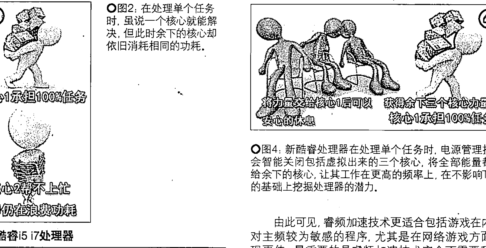

●图2：在处理单个任务时，虽说一个核心就能解决，但此时余下的核心却依旧消耗相同的功耗。
●图4：新酷睿处理器在处理单个任务时，电源管理技术会智能关闭包括虚拟出来的三个核心，将全部能量都交给余下的核心，让其工作在更高的频率上，在不影响TDP的基础上挖掘处理器的潜力。

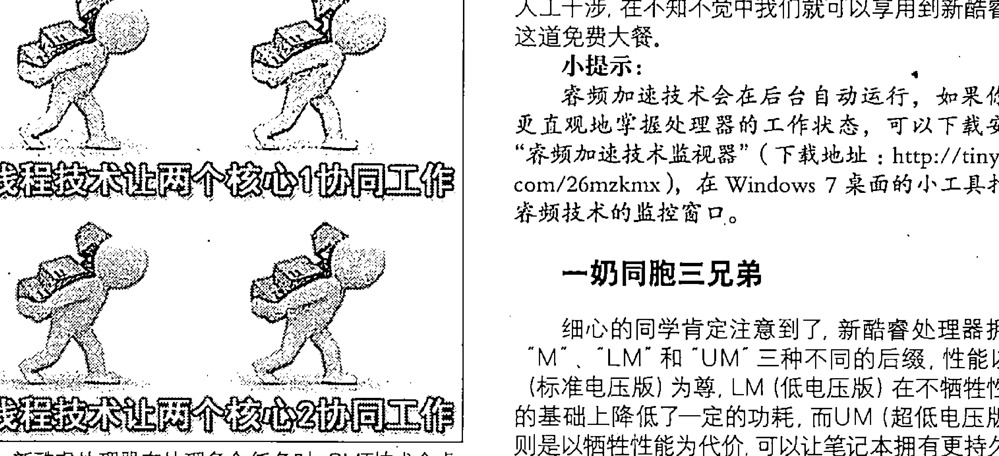

●图3：新酷睿处理器在处理多个任务时，SMT技术会虚拟出两个核心，让四个核心分别承担25%的工作，从而提升效率

由此可见，睿频加速技术更适合包括游戏在内的对主频较为敏感的程序，尤其是在网络游戏方面表现更佳，最重要的是睿频加速技术完全不需要我们人工干涉，在不知不觉中我们就可以享受到新酷睿的这道免费大餐。

## 小提示：

睿频加速技术会在后台自动运行，如果你想更直观地掌握处理器的工作状态，可以下载安装“睿频加速技术监视器”（下载地址：http://tinyurl.com/26mzknn），在Windows 7桌面的小工具打开睿频技术的监控窗口。

## 一奶同胞三兄弟

细心的同学肯定注意到了，新酷睿处理器拥有“M”、“LM”和“UM”三种不同的后缀，性能以M（标准电压版）为尊，LM（低电压版）在不牺牲性能的基础上降低了一定的功耗，而UM（超低电压版）则是以牺牲性能为代价，可以让笔记本拥有更持久的续航能力，也就是英特尔ULV平台的新成员。英特尔新一代32nm ULV处理器还包含奔腾U5400和赛扬U3400。

#### i3处理器规格表

| 型号 | 主频 | 三级缓存 | 显卡频率 | 制程工艺 | TDP |
|---|---|---|---|---|---|
| i3 350M | 2.26GHz | 3MB | 500/667MHz | 32nm | 35W |
| i3 330M | 2.13GHz | 3MB | 500/667MHz | 32nm | 35W |
| i3 330UM | 1.20GHz | 3MB | 166/500MHz | 32nm | 18W |

#### i5处理器规格表

| 型号 | 主频 | 睿频 | 三级缓存 | 显卡频率 | TDP |
|---|---|---|---|---|---|
| i5 540M | 2.53GHz | 3.06GHz | 3MB | 500/766MHz | 35W |
| i5 520M | 2.40GHz | 2.93GHz | 3MB | 500/766MHz | 35W |
| i5 450M | 2.40GHz | 2.66GHz | 3MB | 500/766MHz | 35W |
| i5 430M | 2.26GHz | 2.53GHz | 3MB | 500/766MHz | 35W |
| i5 520UM | 1.06GHz | 1.86GHz | 3MB | 166/500MHz | 18W |

#### i7处理器规格表

| 型号 | 主频 | 睿频 | 三级缓存 | 显卡频率 | TDP |
|---|---|---|---|---|---|
| i7 620M | 2.66GHz | 3.33GHz | 4MB | 500/766MHz | 35W |
| i7 640LM | 2.13GHz | 2.93GHz | 4MB | 266/566MHz | 25W |
| i7 620LM | 2.0GHz | 2.8GHz | 4MB | 266/566MHz | 25W |
| i7 640UM | 1.2GHz | 2.26GHz | 4MB | 166/500Hz | 18W |
| i7 620UM | 1.06GHz | 2.13GHz | 4MB | 166/500Hz | 18W |

# 《电脑爱好者》·合订本

U3400，它们的TDP同样为18W，只是不支持超线程和VT-x虚拟机技术，如果您对新ULV处理器感兴趣，后面相关新品的评测千万不要错过哦。

## 一样的显卡 不同的性能

“买一送一”的促销手段在处理器领域同样适用，英特尔新酷睿处理器就将CPU和集成显卡的北桥芯片混搭，厂商只需再搭配一枚输入输出芯片（原南桥）就可以组建完整的笔记本平台，有利于降低整体功耗，简化主板布局，新酷睿处理器集成显卡被英特尔命名为“GMA HD”，说白了就是上一代GMA X4500HD的升级版，硬件支持DirectX10、SM4.0和OpenGL 2.0，虽然性能提升幅度有限，但更适合用于高清视频流解码的工作，需要注意的是，虽然i3、i5和i7处理器集成的都是GMA HD，但它们之间的性能表现还是有着明显的差异。

| TDP | 显卡频率 | PC Mark05 显卡子成绩 |
| --- | --- | --- |
| M 35W | 500/667MHz (i3) | 2500 左右 |
| | 500/766MHz (i5 和 i7) | 2800 左右 |
| LM 25W | 266/566MHz | 2100 左右 |
| UM 18W | 166/500MHz | 1740 左右 |

G310M入门独立显卡该项测试参考成绩：4350左右

如上表所示，不同版本的处理器集成的显卡拥有不同的核心/显存频率，比如针对ULV定制的UM超低压系列只有166/500MHz，而标准电压版本的酷睿i5和i7则达到了500/766MHz，性能是前者的1.6倍左右。

## ACER Aspire 4745G

价格：5999元 | http://www.acer.com.cn/ 400-700-1000

4745G一改昔日4700G系列的宝石外观，整体设计更为沉稳硬朗，同时大幅强化了显卡规格，在HD5650高端显卡的带领下打破了4700G游戏性能孱弱的历史，金属拉丝工艺的掌托，巧克力键盘、双显卡切换功能和杜比音效等流行元素无一缺席，作为一款14英寸机型，4745G的整体重量只有2.15Kg，便携性非常不错。

高配置也是4745G的杀手锏，接近8000分的3D Mark2006成绩足以征服所有新出的3D游戏大作，在集显模式超过4小时的续航时间，对于一款高配的14英寸轻薄产品也显得难能可贵，只是显卡在高负荷工作时温度经常向85度看齐，考虑到这款本本的厚度比较薄，因此这样的表现也是可以接受。

小遗憾：机身右侧的3个USB接口比较拥挤，不利于同时接驳USB外设。

## 耗子时间：选本先做测试题

睿频加速很好很强大，但代价则是更高的售价，i5或i7笔记本明显比i3高出一大截，你是否愿意为这些价差埋单呢？不着急，先做一道测试题，看看你究竟是单纯还是理性。

测试题：假如你比较喜欢玩游戏，排除外观和品牌等因素的影响，下面两个配置你会选择的是：

| | 配置A | 配置B |
|---|---|---|
| 处理器 | i3 330M | i5 520M |
| 内存 | 2GB | 4GB |
| 硬盘 | 320GB | 500GB |
| 显卡 | GT330M | G310M |
| 售价 | 5999 | 5999 |

选择A：你是一个很理性的人，可以看穿事物的本质

选择B：你很容易被表象迷惑，考虑问题时稍显单纯

从表面来看，配置B较A有着明显的优势：支持睿频的高端i5处理器，更大的内存和硬盘，怎么看都比A超值啊？实际上，笔记本显卡对游戏性能的影响才是最重要的，真正到了游戏战场，A至少要比B快50%！此外，笔记本显卡大都是焊死在主板上的根本无法升级，如果你日后你碰到了想玩却跑不快的游戏，则只能重新购买一部电脑了。

当然，如果你能确定自己是大型3D游戏绝缘体的话，B配置则是当然不让的选择，更大容量的内存和高频处理器，在一般应用中的表现会更加突出，除了上述的几个冷冰冰的参数以外，品牌、外观、做工同样是我们考核的重点，在这里笔者只是给大家提供一个选购的思路，要把钱真正花在刀刃儿上。

## 联想 ideapad Y560D

价格：7999元 | http://www.lenovo.com.cn/ 400-810-8888

Y560系列无疑是目前联想娱乐产品线中的旗舰产品，HD5730独立显卡的性能相信大家早有耳闻，而Y560D在延续前辈们高端配置的基础上，将屏幕的刷新率提升到了120Hz，在偏光3D显示技术的支持下可以带给我们一个三维立体的“视界”。

无论是看图、电影还是游戏，都需要TriDef 3D软件引导，再搭配立体眼镜才能实现3D效果，需要注意的是，并不是所有游戏都可以实现3D效果，而且游戏通过TriDef 3D引导后对资源的消耗会更大，在《街头霸王4》DEMO测试中，普通和3D化之后游戏速度会从平均58.67大幅下降到33.13FPS，值得一提的是，Y560D除了标配一款很酷的3D眼镜的同时，还为戴眼镜的用户准备了支持3D显示的眼镜夹片，非常人性化。

小遗憾：虽然电影可以通过软件转化为3D效果，但效果和真正的3D片源尚存差距，而后者却很难下载到。

## CT 时间：小投入实现大回报

耗子说的没错，咱们都是普通老百姓，钱就得花在刀刃儿上，i3的性能在2年内绝对够用，日后自行升级绝对比直接选择高配的机型划算，不相信？那就来看看我的经历吧。

小编去年2月入手T6400处理器版本的华硕F8，在内存便宜的时候升级到4GB（很有先见之明，现在内存价格涨上去了），上学时上网、玩游戏并没有感觉吃力，但是随着工作后各种应用的增多，觉得T6400有些力不从心，便冒出了升级CPU的念头，最终650元原购入SP9400（小封装）加基板组成的P9400，更换CPU极为简单，拆下散热片，换上CPU，涂抹硅脂，调节散热片与新CPU的高度即可，TDP从45W降到35W，Windows 7得分从5.5上升至6.1，这就是频率从2.0GHz提升到2.4GHz，2MB缓存与6MB缓存的差距，用Everest测试下来，各方面提升约30%，之后T6400以450元出手，相当于两百元就能换来30%性能的提升。

回到今天的主题，单看CPU性能，i3已经超越很多酷睿2机型，在日常应用性能过剩的情况下，建议选择搭配中端显卡的i3机型，价格便宜量又足，如果手头富裕i5绝对是首选，不论从整体性能还是性价比，在步入6000元价位后都是十分抢眼的，年底出现5000元机型也是可以预见的，i7虽然强悍，但是身价不菲，口味偏小众，不如关注如何挑选一台性能、配置搭配合理的i5本本，如果并不着急入手i7，目前可持观望态度，除了CPU，内存也十分重要，建议在入手2GB内存机型时直接升级至4GB，升级之前先去DIY柜台问问价，如果卖本的店家价格合适合当时即可升级，若价格偏贵自行购入内存升级。

鱼和熊掌不可兼得，也许预算不足以让你处理器和显卡样样如意，因此我们在选购新酷睿笔记本时要学会如何取舍，只要给核心应用留下足够的冗余，其余配置本着“够用就好”的原则足以，以联想Y460为例，其他配置相同的情况下，i3 350M和i5 450M两个版本的价差在500元左右，选择i3版用余下的资金把内存升级到4GB或者换成7200rpm的硬盘，本本的综合表现会更加值得期待，当日后感觉i3力不从心的时候，说不定网上淘一颗高频i5的成本也只有500元了呢。

## 三星 R440

价格：7299元 | http://www.samsung.com/cn/ 800-810-5858

三星R440可以看作是高端R480的清新版，外观上取消了个性惹眼的渐变色，不过膜内漾印工艺的外表和巧克力键盘依旧时尚，虽然缺少了R480那惊艳的视觉效果但更为耐看，在三星R440电池的背部设有剩余电量指示灯，不用开机就能掌握当前电量，透过这些细节设计不难看出三星的诚意。

全新的NVIDIA GT320M显卡和i5 430M处理器，使三星R440拥有更加卓越的性能，而宽大舒适的触模板或是接口设计方面也体现了三星友好的用户体验设计，值得一提的是，三星R440采用了少见的双散热孔设计，分别位于机身的左侧和后侧，高负荷运行时处理器和显卡温度始终被控制在75度以内，双散热孔设计效果还是比较明显的。

小遗憾：缺乏独立快捷键，调节亮度音量等功能都需要使用Fn和组合键的配合。

## 健圣时间：留心名字里隐藏的秘密

前面两位同学介绍了新酷睿笔记本的选购方面，接下来小编就爆料一下JS惯用的猫腻吧，我们都知道，热门笔记本大都拥有无数的子型号，殊不知在不同名字的背后，隐藏着很多不可告人的秘密呢！

如果你锁定了某款机型，一定要留意产品名字后面的后缀，比如ThinkPad T410和T410i，二者的差别仅仅在处理器，选择起来不用过多在意；还有一种是跨越两种平台的，如惠普的CQ42系列，后缀为CQ42-AT的版本选用的是AMD平台，后缀为CQ42-TX则为英特尔平台，这类产品无疑是最让人头痛的。

#### 一字之差 谬之千里

就拿索尼EA系列来说，EA25、EA27和EA28只有一个数字的差别，如果只有处理器内存硬盘的差别倒也罢了，但偏偏三者的显卡分别为HD5145、HD5470和HD5650，游戏性能有着云泥之别，再比如前面提到的CQ42-AT和TX系列，笔者就听说过有网友被JS忽悠，把注意力全部放在了“双核独显”的冠名和“CQ42”这简单的系列名称上，以英特尔平台的价钱购买了一部AMD平台的机器，欲哭无泪。

#### 善用对比 货比三家

类似京东商城和专业媒体的产品库都有“产品对比”功能，如果你对某品牌的双子座笔记本存在疑虑，可以利用对比功能检查二者的差异所在，有条件的同学在购买前最好到卖场看看实物并加以对比，仔细核对参数（重点检查显卡的规格），不要盲目地“以貌（名）取人”。

火速链接：现在还有一种外观规格相似，只是屏幕尺寸有所区别的“兄弟型”笔记本，比如联想的Y560和Y460、三星 R580和R480，有关这类产品的选购问题请参考2010年15期《一寸之差游戏本选14还是选15？》这篇文章。

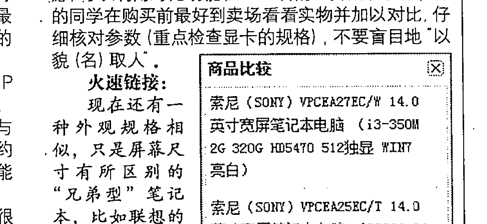

②善用对比功能哦

## 华硕 UL30JT

价格：5299元 | http://www.asus.com.cn/ 400-600-6655

华硕UL30JT延续了UL30系列的经典设计，金属拉丝材质的外壳保证了强度和耐磨度，圆滑过渡设计的边角增强了整机的工艺美感，24.4mm的机身厚度和1.78Kg的重量，相对于ULV机型来说属于偏重选手，但不要忘记，UL30JT还配备了NVIDIA最新的G310M独立显卡和5600mAh超大容量的锂电池，虽然牺牲了一定的便携性，但是却换来了超过10小时的续航时间和更强的游戏性能，孰轻孰重相信各位看官心中已然有数。

别看i5 520UM的默认主频只有1.06GHz，但是在睿频技术的帮助下可以瞬间提升至1.86GHz，使UL30JT获得不逊于传统笔记本的性能，作为主打轻## Newking 时间：ULV 卷土重来

喂喂，别忘了新酷睿家族中还有ULV的新成员呢！也许你的潜意识还将超轻薄笔记本和性能差劲联系在一起，殊不知这次ULV可算是咸鱼翻身了，看看上面的评测吧，和现在主流的标准笔记本又有什么差别呢？

随着英特尔32nm超低压处理器的出现，沉寂半年多的ULV市场再度沸腾起来。新工艺让处理器在尺寸上缩减32%，而在性能上却至少提升32%，可以帮助厂商将笔记本模具厚度缩减到最低7毫米，设计出更轻薄的产品。值得关注的是，睿频加速和超线程技术也随酷睿系列正式加盟ULV平台，先天性能不足的缺陷已经得到了极大的改善。

| 型号 | 主频 | 睿频 | L3 缓存 | 超线程 |
| :--- | :--- | :--- | :--- | :--- |
| i7 640UM | 1.20GHz | 2.26GHz | 4MB | 支持 |
| i7 620UM | 1.06GHz | 2.13GHz | 4MB | 支持 |
| i5 520UM | 1.06GHz | 1.86GHz | 3MB | 支持 |
| i3 330UM | 1.20GHz | 不支持 | 3MB | 支持 |
| 奔腾 U5400 | 1.20GHz | 不支持 | 2MB | 不支持 |
| 赛扬 U3400 | 1.06GHz | 不支持 | 2MB | 不支持 |

## 选购新ULV有门道

如果说上网本只能扮演第二台电脑的角色，那么拥有和上网本类似便携性的新ULV笔记本，则足够承担传统电脑应尽的娱乐办公义务。现在很多13英寸的ULV本本已经开始武装独立显卡，必要时切换到集显模式还可以节省电力。总之，选择ULV平台新品，最应注意的是产品的便携性和电池容量，超过1.8Kg（13英寸机型）或者续航时间少于5小时根本就不配称之为ULV笔记本，如果你是游戏狂人，那么现阶段ULV肯定无法满足你的GAME梦，相同的价格建议选择性能更强劲的普通大尺寸笔记本。

## 同类产品推荐

- 联想IdeaPad U160: 11.1英寸/i3 330UM/2GB/320GB/GMA HD显卡/5399元
- 索尼Y218EC: 13.3英寸/i3 330UM/2GB/320GB/HD540v显卡/5999元
- 戴尔Inspiron 13Z: 13.3英寸/i3 330UM/2GB/320GB/HD5430显卡/6499元

> 小提示：
如果你想进一步体验本专题涉及的评测产品，请输入以下地址欣赏实物图片：http://tinyurl.com/26o5qgb

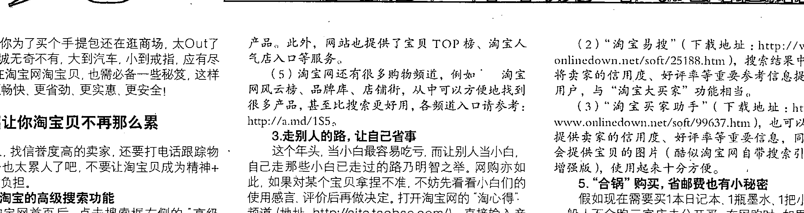

## 26 招让你淘宝贝不再那么累

找宝贝，找信誉度高的卖家，还要打电话跟踪物流状态……也太累人了吧，不要让淘宝贝成为精神+体力的双重负担。

## 1. 善用淘宝的高级搜索功能

打开淘宝网首页后，点击搜索框右侧的“高级搜索”链接即可展开高级搜索页面，或者直接打开http://search1.taobao.com/browse/ad_search.htm#。假设现在想找同城的皇冠级别以上的卖家，支持货到付款，卖家承担运费的宝贝，借助高级搜索页面就可以轻松地实现了，只要选中相应的选项即可，同时需要点击“显示辅助选项”链接。

> 小提示：
在淘宝搜索结果页面中点击“启用搜索定制”链接，将平时习惯的搜索结果布局（例如喜欢将搜索结果按价格从低到高排序、宝贝显示方式等）设置成常用模式并保存，日后搜索时就无须再调整这些参数了。

## 2. 选择淘宝TOP产品保准不会Out

假如现在还没有目标，但又想“腐败”一把，不用再逛商场了，直接打开淘宝的TOP产品页面（http://top.taobao.com/rank/index.htm），不同系列产品按关注度排名、销售排名的榜单便赫然眼前，有了这些榜单，即使“腐败”也不会失败（保准能将钱用在恰当处）。

## 3. 走别人的路，让自己省事

这个年头，当小白最容易吃亏，而让别人当小白，自己走那些小白已走过的路乃明智之举。网购亦如此，如果对某个宝贝拿捏不准，不妨先看看小白们的使用感言、评价后再做决定。打开淘宝网的“淘心得”频道（地址：http://site.taobao.com/），直接输入产品名称后点击“搜索”按钮，在搜索结果中点击“查看详情”按钮就可以打开众多小白们对该宝贝的肺腑之言了。

> 小提示：
在“淘心得”页面中点击“打听”标签，借此也可以打听一下目标宝贝的详细信息、评价等内容。

## 4. 常搜宝贝，请位帮手—“淘宝大买家”

虽然直接通过淘宝的搜索功能也可以较方便地找到目标宝贝，但若机器配置低、带宽小，仅首页的图片、Flash等就能让你每次等得不耐烦，而且搜索到的宝贝页面中还不方便查看卖家的信誉度、好评率等非常有用的信息。借助“淘宝大买家”（下载地址：http://www.onlinedown.net/soft/88919.htm）不仅能给搜索宝贝节省体力，还直接提供了卖家信誉度、好评率、保障等重要参考信息。使用门槛也很低，直接输入宝贝名称，设置好搜索控制参数（例如价格区间），单击“搜索”按钮即可。

## 5. “合锅”购买，省邮费也有小秘密

假如现在需要买1本日记本、1瓶墨水、1把小刀，一般人不会跑三家店去分开买。在网购时，如果能在一个卖家那买齐所有的宝贝，打一个快递包，无疑会省下相当可观的快递费（假如遇到奸商级卖家，用10元钱的低价鼠标诱惑你花300元购买一块只值50元的键盘，此情况不在讨论之列）。这种情况下借助“淘宝一箩筐”（下载地址：http://www.onlinedown.net/soft/92471.htm）就可以方便地搞定了。运行软件后，直接将需要购买的宝贝名称按顺序填入左侧的文本框中，同时还可以在下面设置搜索控制参数（例如“全新”或“二手”、限定地区等），搜索后若找到同时卖这些宝贝的卖家，就可以在右侧窗口中直接双击打开卖家店铺了。

> 小提示：
其实在淘宝网的搜索中也可以通过多个宝贝名组合搜索同一卖家，例如输入“硬盘+内存”（“+”号前后要留空格）进行搜索，就可以搜索到同时卖这两个宝贝的卖家，或者先搜索其中的一个宝贝，在搜索结果页面右上侧点击“同店购”链接，然后再输入第二件宝贝、第三件宝贝……

## 6. 彩友，你还义无反顾地往返投注站么？

又一位亿级彩票大奖再次点燃彩民的热情，以前一天一趟彩票投注站，最近改成了一天两趟。假如你家的电脑上网了，也有淘宝账号，你还会义无反顾地往返彩票投注站么？其实，只要打开彩票频道（地址：http://caipiao.taobao.com/），单注、复式、追号或是参与别人的合买，甚至是自己发起合买让别人跟单，非常简单地就可以实现了。现在淘宝的彩票频道彩种相当丰富，福彩、体彩、时时彩、足彩等应有尽有，如果以前玩过，直接按常规方法下单即可，如果以前没玩过，先看一遍帮助再玩。

> ★网络大补贴：
（1）百度有啊彩票频道（地址：http://caipiao.baidu.com/youa.baidu.com/）现在也可以方便地购买彩票，玩法与淘宝彩票频道相似。
（2）500WAN 彩票合买俱乐部（地址：http://www.500wan.com/）专注于彩票合买，喜欢合买的朋友可以去逛一逛。
（3）网易彩票频道（地址：http://caipiao.163.com/index.html），彩种也比较丰富，支持合买，目前还不支持高频彩种。

## 7. 购买多件宝贝，借助购物车比较省劲

购买N件宝贝，你还在遵循一码是一码的规则么？先是一个一个地拍下，一个一个地付款，等收到货后，一个一个地确认收货，再一个一个地好评……这也太累人了吧。如果你没有锻炼手指和耐心的想法，使用购物车吧。相中某个宝贝与卖家讨论好相关事宜后，直接点击“加入购物车”，接下来再将其他需要购买的宝贝全部添加到购物车，完毕后点击导航栏上的“购物车”，确定数量后即可确认购买，确认后就可以让卖家们修改价格，之后即可进入统一付款流程，日后的确认收货、给卖家好评等均可一次性搞定。

> 小提示：
在没有使用购物车的情况下，在淘宝中拍好多件宝贝后，也可以在“我的淘宝→已买到的宝贝”列表中通过“合并付款”功能来统一付款。

## 8. 跟踪物流状态，妙请助手

付款完毕后，接下来就是等待物流送货了，淘宝网会根据交易选用的物流类型（平邮、快递）设定一个倒计时，逾期买家未申请退款，之后系统会自动将货款打给卖家。因此，在未收到货之前，买家最好要实时跟踪物流状态，对于像顺丰快递、申通快递等这类常用快递，淘宝网直接内嵌了物流查询功能，但像EMS、物流托运等都没有提供物流状态查询功能，独立地去查询这些物流状态，往往很费劲。而借助物流查询小助手，就能避繁就简了。

最便捷法：直接打开http://115.com/，将卖家提供的物流编号作为关键字进行搜索，即刻得到物流信息。

软件法：从http://www.greendown.cn/soft/18879.html下载“快递查询助手”，运行后直接通过运单号即可查询物流状态。

> 小提示：
假如查询到物流状态仍在途中，但倒计时已经快结束，这种情况下除了通过申请退款，再等待卖家同意这样的方式来延长时间外，现在也可以直接与卖家协商让其延长交易时间。

## 9. 外力阻断不了我的淘宝情

很多单位、公司都通过技术手段将淘宝网屏蔽掉，禁止在办公室上淘宝网。如果没有追加罚款等惩罚措施，只是从技术手段阻止浏览淘宝网，可以通过远程控制的方法直接控制家中的电脑这样的隔山打牛招术来打开淘宝网。方法也很简单：直接借助“Teamviewer”（下载地址：http://www.newhua.com/soft/46815.htm）这款功能强大的远程控制软件操控家中的电脑即可。

> 小提示：
如果自己的手机开通了上网功能，也可以直接借助手机来上淘宝网（地址：m.taobao.com）进行网购。

## 10. “怀旧”也容易

以前买过的一个宝贝，经之后的使用证明它是最棒的，但早已忘记了宝贝的型号，不方便找到，也不太记得当时花了多少银两，又没将卖家添加为好友……不要紧，借助淘宝网的交易历史记录查询功能，很快就能查到历史交易信息了。

登录淘宝网后，点击“我的宝贝→已买到的宝贝”，默认显示近三个月的交易记录，如果要查询之前的交易记录，只要点击“三个月前订单”标签，接下来在搜索时将“成交时间”设置为之前的某个年份及月份即可。

> 小提示：
如果每笔交易都使用支付宝付款，也可以登录支付宝，然后在交易记录中查询历史交易记录。

## 4 种方法 花钱之后还能“赚回来”

#### 1. 自当“淘宝客”，变推广费为折扣

由于担心把握不好关，买了山寨货、假货，或是上当受骗，现在不少买家转向了“淘宝商城”，省心也省事。不过，淘宝商城的宝贝卖家一般是不会给你议价的机会的，很有一种爱买不买的样子。而这一点从侧面来说也是很公道的，因为所有从此商城卖家处购买的同件宝贝，价格均相同。不过，只要你是一位“淘宝客”，就可以在不议价的情况下享受“折扣”。

第一步：打开阿里巴巴旗下的“淘宝联盟”推广网站—阿里妈妈（http://taoke.alimama.com/），注册一个账号（这是必须的，日后提取推广费用或称折扣就是通过账号来提取）。

第二步：账号注册并激活后，想买东西了，只要在阿里妈妈网站中内置的“宝贝推广”搜索引擎来找自己想买的宝贝，例如“Yonex NS 800”，接下来只要面耐心地在列表中找到一家淘宝商城卖家，之后直接点击“推广此商品”，复制推广链接并在浏览器中打开，这样购买后就会得到卖家提供的佣金了。

> 网络大补贴：
（1）如果之前是随意在淘宝网看到某个宝贝，可以在阿里妈妈中通过“搜索卖家”（搜索框左侧下拉列表选择）来尝试搜索该卖家，如果碰巧该卖家参与了产品推广，就可以在正常议价后没有砍价空间的情况下，通过推广链接来享受“折扣”。
（2）同是“淘宝商城”的宝贝，价格也有高低之分，不要一味地追求“佣金”而买了特高价商品，要知道羊毛永远是来自于羊。
（3）如果自己有网站、博客或是有一手写文章的妙手，闲暇时间里不妨做位“事业淘宝客”，一些高手“淘宝客”月入是相当可观的。
（4）从 http://www.seenao.com/ 可下载的“赛猫购购”也提供了购物返现机制，除了支持淘宝外，它还支持京东、卓越网、当当网等多达 270 家网上购物网站的返现，只是部分网站的返现周期比较长（最终到账的可能要一两个月）。
（5）返利网（http://www.51fanli.com/landing.asp）也提供了 200 多家网上购物站的购物返利，该网站还提供了价格比较功能，在购物的退货期后，就可以领到返利。

#### 2. 积分别浪费了，除了当钱用还有更多用途

每次购物，只要使用支付宝账号，都会得到一定的积分，而这个积分被很多朋友忽略了。据淘宝网公布，新的积分系统将从2010年10月14日开始启用，届时，积分不仅可以直接当钱来购物，还可以还款、兑换奖品等多种应用。而之前的积分也可以在上面的日期前进行抽奖、现金兑换、新积分兑换、小商品加钱兑换等。假如你不是刚用支付宝，老用户都可以到http://a.md/1Rw用自己的积分进行礼品兑换。

#### 3. 善用红包购物抵现金

红包在淘宝中有两种概念，一种是商家为了促销而发的购物红包（一般需要指定店铺、指定商品才能使用，并且还有有效期），淘宝网在一些特殊日子发的礼仪红包，还有亲戚、朋友、同学借助支付宝发来的现金红包。红包都有使用时间，逾期不用将会自动作废。因此，如果收到红包，应该查看有效期，在有效期内按红包指定的网站使用红包，在使用支付宝付款时就会看到下面有红包提示，选中即可抵价现金了。

> 小提示：
在购物时，如果卖家支持红包支付的话，可以到一些人气较旺的论坛寻求网友闲置不用的红包，甚至很多论坛经常有人无偿贡献红包。

#### 4. 组团购买，更低价出手

团购可以享受更低价格，这个道理自然不用再说，在淘宝网中，也可以方便地借助团购来享受更低的价格。只要打开“聚划算”（地址：http://ju.taobao.com/），就能看到每天推出的三款超低价值的宝贝，如果其中有你一直想得到的宝贝，立即下手，保准比正常手段购买的同件宝贝优惠得多。

其实，对于大多数卖家来说，都喜欢“走量”，如果你身边有多个朋友、同学有对同一件宝贝需求的情况的话，可以直接“组团”，只要直接与卖家洽谈，以量压价往往都会有成效。此外，如果参加几个淘宝帮派（地址：http://bangpai.taobao.com/），也可以很容易找到团购信息，或是快速组织对某个宝贝的团购的团队。

## 借助淘宝，购全球货

找宝贝、找信誉度高的卖家，还要打电话跟踪物流状态……也太累人了吧，不要让淘宝贝成为精神+体力的双重负担。

#### 1. 海外购0难度，直接上手

虽说冠名为“海外购”，但其实整个流程与平时在淘宝购物一样，例如，现在想购一部 iPhone 4 手机，只要直接打开淘宝网的全球购频道（http://global.taobao.com/），接下来，只要按照以前搜索宝贝的流程来寻找宝贝即可，付款流程亦如正常的淘宝网店铺物流程一样。

> ★小提示：
（1）在淘宝的宝贝搜索页面中，勾选“海外商品”后就可以在搜索结果中筛选出海外代购商品了。
（2）卖家提供多种邮寄方式：国内统一发货（2-3天）；国际直邮（1-几周），在选择邮寄方式时，需要与卖家协商好。

#### 2. 加入全球购帮派很容易找到团购海外商品的对象

在淘宝帮派中以“全球购”为关键字搜索相关帮派，然后直接加入到这些帮派中，可以通过帮派内的帖子来快速找到可以全球购的相关宝贝，甚至还可能找到一些全球购拍卖交易，若自己的拍价在截止时间时为最高，就可以享受低价拿货的美事了。

## 网购之安全篇

说到安全一事，应该是每位网购者最为关心的事情。除了老生常谈的安装杀毒软件、升级病毒库、不要在公共电脑（例如网吧）购物等最基本的安全防范意识外，做一位网购达人，还必备以下几点安全防范秘笈：

#### 1. 警惕卖家要求在非旺旺中交流的各种理由

目前来说，淘宝网针对旺旺聊天提供了聊天内容可作为事发后的投诉、维权等手段的凭证，而像QQ、MSN等第三方聊天软件的聊天记录不作为凭证。一些不良卖家正是借助这个“漏洞”并在第三方聊天软件中行使诈骗伎俩。

#### 2. 警惕“专柜验货”之万能说

在淘宝购物，很多宝贝的描述或是介绍中都冠以“专柜验货”大名，很多买家见此就以为这个宝贝绝对正品、绝对安全。殊不知，有几家专柜会无偿提供验货服务？或者，买家所在的城市、县城或是更小级别地区，如何在宝贝付款倒计时间内找到一家提供专柜验货的地方？而很多不良卖家正是看透了这些，以“专柜验货”的方式堂而皇之地行骗。

#### 3. 匿名购物，杜绝骚扰

不少买家买了一袋茶叶，第二天就有一批卖茶叶的找人来推销，开始倒还能挺住，当每天有十几个这样的卖家来骚扰时，保证会让你崩溃。而在淘宝中拍宝贝时，使用“匿名”的方式购买就可以杜绝这种现象了。

#### 4. 防钓鱼之必杀技

网购中遇到的很多骗子借助钓鱼网站进行行骗，除了牢记淘宝的域名“taobao.com”外，还需要注意逼真的“假域名”（例如“taobao.com.***.????”这样域名中将淘宝域名作为二级、三级域名来蒙人的假域名），并且，这种警惕要贯穿整个购物流程。

> ★大补贴：
（1）使用最新版 IE 浏览器，开启域名高亮显示可以将淘宝钓鱼网站的域名打回原形，只有高亮显示的域名才是当前网页的真实域名。
（2）通过最新版 QQ 的域名举报检查功能可以过滤掉大部分流行已久的钓鱼网站，方法很简单，只要将网址以 QQ 消息的形式发送给自己的另一个 QQ 号，若显示被举报多次，十之八九是有问题的，终止任何操作。
（3）借助傲游浏览器及金山网盾提供的钓鱼网站识别功能可以过滤掉流行的钓鱼网站。
（4）谨防卖家提供的宝贝链接，很多不良卖家正是使用狸猫换太子之骗法将买家从正常的淘宝页面引入钓鱼网站页面，例如以“修改了价格的宝贝地址”、“我的另一个网店的宝贝地址”等理由进行诈骗引导。
（5）遇到不良卖家，不管是已被骗还是未被骗成，都要学会“维权”的自我保护方法，可以直接在旺旺中举报该卖家并提供聊天过程中骗子诈骗相关的聊天记录，对部分恶劣不良卖家还可以通过“以牙还牙”的方式对其警告，方法就是新申请一个淘宝账号，然后将其店铺中的所有宝贝（包括某个宝贝的所有数量）拍完，让其无法正常营业。

## 部分优秀店铺推荐

1.  **韩都衣舍旗舰店**（店铺地址：http://a.md/1TH）销售各种流行服饰，品牌多，可选择空间大。掌柜信用91180，三皇冠，并且是商城卖家，提供全球代购，加入了消费者保障计划，值得推荐。
2.  **茵曼旗舰店**（店铺地址：http://a.md/1TI）销售各茵曼品牌棉麻服饰的网店。掌柜信用113775，四皇冠，有多位销售客服人员，服务态度好，0等待购物，也是淘宝商城卖家，值得信赖。
3.  **pba化妆品旗舰店**（店铺地址：http://a.md/1TJ）销售pba化妆品的专业网店。掌柜信用84988，三皇冠，淘宝商城卖家，加入消费者保障计划，值得信赖。
4.  **上海游戏地带 彭浦电玩实体店**（店铺地址：http://a.md/1TK）销售游戏机相关装备。掌柜信用三皇冠，好评率100%。
5.  **【火盟通讯】淘宝数码至尊卖家 顶级电**子3C平台（店铺地址：http://a.md/1TL），销售各种数码设备，品种齐全（包括电脑周边设备），掌柜信用1018096，双金皇冠，已加入消费者保障计划，值得信赖。
6.  **淘客居数码专营店**（店铺地址：http://a.md/1TN），销售电脑及配件、数码产品及周边产品，掌柜信用3377，四钻，淘宝商城卖家，加入消费者保障计划，值得信赖。

策划/《电脑爱好者》编辑部
监制/Cornel
撰稿/dai


## CFan教你拍出好效果

卡片机和单反机，这两个真有可比性？诚然，单反相机的先天技术优势必然要强于卡片机，但在普通用户来看，光圈、焦距、拍摄技巧、选景方式、构图……这些真的有必要学习吗？我们只是为了留下美好的记忆，卡片机足以！而且，现在的卡片机功能十分强大，各种特效模式可以直接昂贵的专用镜头，拍摄效果出奇的好。不信？CFan教你如何用卡片机拍出好效果！

## 停止误会 正视卡片机

#### 像素至上

对于专业摄影来说，无疑高像素会带来更好的画面质量，但问题是我们日常生活中根本不需要那么高的像素，卡片机1000余万像素已经绰绰有余了，完全没必要唯像素论，哪款产品像素高哪款就一定好。卡片机更注重的是使用时是否方便，这才是重点。

#### 镜头太差

卡片机受机身限制，潜望式镜头或者伸缩式镜头确实存在一定局限性，不过现在随着技术的革新，镜头技术发展让人瞠目结舌。比如富士的FinePix F305EXR吧，光学变焦竟然达到15倍，要是单反机配个长焦镜头会是多少钱呢？现在，再也不要认为卡片机的镜头太差了哦。

#### 卡片机是玩具

卡片机确实是玩具，不过玩出来的效果堪比单反机！全景拍摄、鱼眼特效、移轴特效，各种场景设置让用户切换菜单就能拍摄出单反机必须更换镜头并且手动调节许久才能拍摄的画面，方便、好用，这才是卡片机的最大魅力。

#### 拍不出好效果

拍摄效果的好坏不仅仅取决于设备优良，更重要的是掌握好光线，具备良好的构图思路。当然，在日常生活中，更是没有必要言必构图云云，拍照本就是个简单轻松的事情，为了留下快乐和记忆，一味强调手段而非目的，这样并不可取。再则，卡片机现在的拍摄能力也大为提升，各种场景模式的应用一样可以让用户拍出好效果，谁说P挡（自动挡）就不行了！

> 网络大补贴：
- 摄影师用 iPhone 3GS 拍摄时尚相片
  http://www.cnbeta.com/articles/115928.htm
- 国内与国外摄影爱好者的区别
  http://lengxiaohua.net/2010/08/28/cha-ju/

## 卡片机也是淘宝卖家好助手

淘宝上浏览商品经常能够看到非常漂亮的实拍图片，对我等的诱惑程度自不必详述。但是，这些照片是怎么拍摄出来的？不少店面规模较大的专业卖家都是用单反机拍摄的，其实，卡片机一样可以拍摄出好效果。

#### 好光线才有好照片

首先你要看看自己的拍摄环境，良好的光线是拍好产品图的重要基础。卡片机虽然不具备手动调节能力，但不代表静（物）拍（摄）能力就一定不好。如果是想用自然光拍摄，最好能靠近窗户，那里有更多的阳光，而且这样可以避免阴影投射到产品上。如果需要的话，使用一张白色的纸放在光源的对面，把光线反射到阴影区域，以平衡光线。

#### 没有阴影很重要

拍摄静物时，如果自然光线投射在物体上时产生的阴影影响了被拍摄物体的美观程度，就必须使用灯具来补偿光源了。注意，刚刚入行的小卖家还不值得为这个投资很多钱，毕竟一个摄影灯便宜的也要几百元。生活中经常使用的白炽灯即可，当然尽量功率要大一些，这样才更亮。而且，你需要的可能是两盏台灯，一左一右，而且要前后错落有致的摆放，这样才能形成一个无阴影的光源投射，光线照在物体上才能显得更均匀，拍出来才会更好看。
如果拍摄出来的照片显得比较刺眼，甚至有一些光斑，可以考虑在台灯上遮一层薄薄的纸（白色），这样发出的光更柔和，就相当于实现了柔光箱的作用。

#### 物品不同方法不一

除了环境要充分考虑外，拍摄物体时也要格外注意，不同类型的物品拍摄时对光线的要求也不一样。尤其是卡片机，没有手动挡、光圈优先、快门优先这样的调节能力，因此掌握好拍摄的环境设置、不同物品拍摄技巧就更为重要了。

#### 吸光物品

毛皮、衣服、布料、食品、水果、粗陶、橡胶、亚光塑料等。它们的表面通常是不光滑的（相对反光体和透明体而言）。因此对光的反射比较稳定，即物体固有色比较稳定统一，而且这些产品通常是本身的视觉层次比较丰富。为了再现吸光体表面的层次质感，布光的灯位要以侧光、顺光、侧顺光为主，而且光比较小，这样使其层次和色彩表现得都更加丰富。
食品是比较典型的吸光体。食品的质感表现总是和它的色、香、味等各种感觉联系起来，要让人们感受到食品的新鲜、口感、富于营养等，唤起人们的食欲。关于光源的摆放、投射方法，可以参考本期“天才我最大”栏目中《新新掌柜，来给宝贝拍美图吧！》一文，这里就不再赘述。

#### 反光物品

反光体表面非常光滑，对光的反射能力比较强，犹如一面镜子，所以塑造反光体一般都是让其出现“黑白分明”的反差视觉效果。反光体是些表面光滑的金属或是没有花纹的瓷器。要表现它们表面的光滑，就不能使一个立体面中出现多个不统一的光斑或黑斑，因此最好的方法就是采用大面积照射的光或利用反光板照明，光源的面积越大越好。很多情况下，反射在反光物体上的白色线条可能是不均匀的，但必须是渐变保持统一性的，这样才显得真实，如果表面光亮的反光体上出现高光，则可通过很弱的直射光源获得。

#### 透光物品

拍摄透明体很重要的是体现主体的通透程度。在布光时一般采用透射光照明，常用逆光位，光源可以穿透透明体，在不同的质感上形成不同的亮度，有时为了加强透明体形体造型，并使其与高亮逆光的背景剥离，可以在透明体左侧、右侧和上方加黑色卡纸来勾勒造型线条。比如是用逆光形成明亮的背景，用黑卡纸加以修饰玻璃体的轮廓线，用不同明暗的线条和块面来增强表现玻璃体的造型和质感。当然在使用逆光的时候应该注意，不能使光源出现，一般用柔光纸来遮住光源。

总的来说，卡片机可以调整的空间少之又少，想要调节进光量只能加大、减小ISO、EV值（注：曝光补偿），但在台灯辅助下，可以最大限度避免这些，只要把握好光线的角度、位置以及亮度，一样可以拍摄出效果出众的照片，当个淘宝卖家，不一定也要“长枪短炮”哦！

#### 小知识：光线色温我全知

在选择台灯灯泡的时候，要留意色温差异。不同的温度下呈现的色彩不同，这就是色温。万里无云的蓝天的色温约为10000K，阴天约为7000K～9000K，晴天日光直射下的色温约为6000K，荧光灯的色温约为4500K，钨丝灯的色温约为2600K，日出或日落时的色温约为2000K，烛光下的色温约为1000K。如果不是专业摄影必须配备专用的影灯，荧光灯无疑是最好的选择了。

#### 松下 DMC-FX700

800-810-0781/400-810-0781
http://panasonic.cn

#### 微距拍摄不犯愁

不仅如此，如果你想进一步展示自己出售物品的细节时还需要卡片机提供更多的支持。举例来说，这款松下DMC-FX700的微距功能就不错，它可以贴近物体到3cm的位置进行拍摄。注意，在拍摄的时候选择大光圈，这样焦点以外都会有一种虚化效果，更能突显拍摄的细节内容。当然，光线也要充分保证，这样可以尽量选择低ISO值（卡片机建议拍摄细节图在ISO 200以下），画面才不会有粗糙的颗粒感。需要注意的是，为了获得清晰的微距照片，就要尽量保证DMC-FX700的稳定。当然，可能不少人没有三角架这样的设备，可以找一些书本垫到合适的高度、角度，并开启延时拍摄功能，这样可以避免按下快门时带来的震动。

#### 明基 T1260

400-888-8980/400-828-2822
http://www.benq.com.cn

#### 光线不足勿担忧

如果你不具备那么多条件，尤其是光线条件不理想的情况，那么可以考虑使用明基T1260这样的产品。T1260拥有一个HDR影像优化技术，这个技术可以让微小亮度变化都能完全呈现，无论在晴天还是夜晚，都能获得不错的拍摄效果。晚，都能拍摄出清晰自然的照片。这个技术很大程度上弥补了卡片机不具备手动调节能力带来的缺陷，即便是光线不足的场地，一样可以拍出优质的静物照片。

除了拍摄静物、微距照片之外，有的时候为了更好的展示物品，还可能用到视频这样一个“比文字更详尽，比图片更直观”的方式。当然，你必须了解，无论任何DV产品或者像明基T1260这样具备拍摄高清视频的DC在拍摄时都要遵从近似的拍摄手法。但是要注意，用DC拍摄短片不同于DV产品，比如不能光学调整焦距，这就是包括卡片机在内的所有DC都存在的问题。不过T1260在拍摄类似视频短片，尤其是物品展示的短片时，高清分辨率无限制摄像的功能还是蛮有用的。

## 网络大补贴:

网络视频拍摄技巧点滴：
http://bbs.taobao.com/catalog/thread/514518-5030112.htm

## 风景拍摄卡片机也拿手

一提到旅游，很多人分享的照片都只是几个人站在镜头前，想要拍风景？至少要准专业数码相机才行吧！其实不然，卡片机的功能固然不够强大，但胜在方便，同时掌握好正确的拍摄技巧，卡片机就未必不能拍出好风景。

#### 桥梁树木皆为良伴

在公路附近拍摄照片怎样拍摄呢？卡片机没有光圈、快门优先，很多细节设置方法、调节手段都没有。别担心，这些桥梁、公路，都是让用户拍下好风景照的良伴。你可以将其作为标尺，例如一条要远方延伸的小桥、小溪、公路等，拍摄时，根据这条引导线被带入整个画面，避免视线到画面外面去。引导线中对角线则更能起到引入视线的作用。同时，注意不要正对着光线拍摄，逆光下卡片机是没有能力拍摄出好照片的，一定要保持顺光（太阳在拍摄者的身后），这样，拍摄出的景色才会更加宜人，拍摄的人物也不再是“一脸黑”。

#### 海天一线不难

去海边玩的时候，卡片无疑最小巧使用也最方便，但要注意，在拍摄的时候，除非光线充足，否则建议开启防抖功能，并且，在拍摄的时候要注意构图——让地平线位于画面中的1/3或者2/3处，而不是1/2处，这样拍出来的效果很惊艳哦。选取的场景得当甚至不输单反机。值得注意的是，拍摄大场景的时候不一定焦距就要拉到最远端，光圈在F4.5左右就比较好。另外就是ISO值尽量不要超过ISO 400，否则画面看起来颗粒感会非常强，光线不够的话可以通过调整EV值来增加曝光补偿。

#### 远景拍摄卡片也行

卡片机拍出来的风景，有时候看起来很“平”，没什么特殊之处，尤其是远景照片，感觉非常突兀，就是一个场景而已，没有吸引力。诚然，这与卡片机机能不足有一定关系，也有一些卡片机，甚至具备长焦功能，这就让远处的物体能够“拉到身边”，效果会好很多。

为了让照片的纵深感更强，充分发挥卡片机应有的功能，可以在拍摄时对物体的选择有所取舍。在拍摄时，可以将一些近在咫尺的如岩石、物体当作前景，在对焦时要将焦点对准远景目标，这样拍摄的画面会有比较强的层次感。同时，前景物也可以有效“淡化”卡片机长焦能力不足的问题。

#### 富士 FinePix F305EXR

400-820-6300/800-820-6300
http://www.fujifilm.com.cn

#### 广角变形我不怕

如果你看上了具备长焦能力和广角能力的富士FinePix F305EXR卡片机，远景拍摄起来就会显得更为简单，不过，在使用广角时画面经常会产生变形，用长焦拍摄时就没有问题了，这究竟是怎么回事？

画面的变形与否本质上并不取决于镜头的焦距。事实上，变形是透视规律的必然结果，任何事物都是近大远小的，简单说近大远小就是一种变形最简单的例证。在双眼观察景物的时候物体实际上也是会产生变形的，但人脑会对其进行“自动修正”，告诉自己这个图像并没有变形。

不同于人脑，卡片机的镜头并没有大脑这样的调节功能，它只能如实地记录由几何光学决定的图象，所以近大远小的结果也就被如实地记录下来了，由此看来，变形是无法避免的。但是这种变形是有规律可循的，只要处理得好，是可以把变形降低到可以被接受的程度的。

在使用像FinePix F305EXR这样具备广角的机型拍摄近景，比如人像时，要距离人像一定距离，不能贴近了拍摄，否则必然出现变形。同时，相机也要与人体保持一个标准的90°夹角的水平线上，这样在拍摄近景照片的时候才不会出现变形问题（注：如拍摄大楼时，不能从下向上拍摄，必须保证水平角度）。

#### 镜头特效为何卡片也能行

卡片机这几年发展的越来越厉害，原来需要昂贵单反机身+专用镜头的功能，现在让卡片机也收入其中，对卡片机而言这不过是“特效之一”，究竟是什么让卡片机如此神奇？

事实上，卡片机内的系统已经越来越复杂，机内不仅有专用的处理芯片，还包含了一个“系统”，这个系统中包含着大量的特效设置，除了像ISO调整之类的基础功能，还有一些高级的软硬件结合功能，比如光学防抖等等。但是，这还不是卡片机的全部。现在卡片机将越来越多原本只有昂贵的专业产品中才具备的功能引入卡片机，比如移轴特效。

#### 佳能 IXUS 130

400-622-2666
http://www.canon.com.cn

#### 卡片也能玩移轴

简单说一下移轴功能，利用这个功能拍摄出来的场景，最终效果就如同萎缩模型般，非常有趣。现实世界拍摄的最终效果看起来与用乐高玩具搭建起来一样，别有一番风味。这个功能以前需要专用的镜头加单反机才可以，动辄数万元才能获得这个效果。现在小小的卡片机也可以实现这个功能了。

佳能IXUS 130这款产品中加入的“微缩景观效果”拍摄模式就是移轴模式，通过“微缩景观效果”，我们能够拍出主体清晰、周边模糊的照片，令卡片机的功能表现更加全面。当然，拍摄移轴画面的时候还需要注意拍摄方式。

在拍摄前，首先调整佳能IXUS 130的选项菜单，将其设置为“萎缩景观效果”，并设置好对焦范围。在拍摄时，选取中心区域并将其套在显示场景的焦点（被拍摄主体）。注意角度的选取，45°以内为宜。尽管这与使用价值万元的移轴镜头拍摄效果要稍显逊色一些外，已经非常接近了。

#### 10秒让老照片也“移轴”

看到这样像是模型一样的美丽照片，是否你也有心思想将自己电脑中保存的老照片也“移轴”一下？Photoshop固然可以修改，但对于一般用户来说，操作有点复杂了。别急，现在用别的软件也可以实现哦！

用下载好的美图秀秀（下载地址：http://xiuxiu.dl.meitu.com/XiuXiu_Setup.exe）打开需要修改成移轴特效的照片，选择“美容→磨皮祛痘”并点选右侧的“深度磨皮”，然后点击鼠标在想要弱化的部分，将主体要突出的地方空开（最好是某个区域，不要乱涂哦），在衔接处，要做适当的过渡处理，可以改用“轻度磨皮”涂抹衔接处，这样会感觉更加自然。此后，还要在主界面上选择“美容”，将照片的亮度、对比度以及色彩饱和度调高一些，这样会让照片更接近真实拍摄的移轴效果。

#### 自拍不要变形脸

爱自拍的男生女生都要注意，不知道你们发现没有，为什么自己有时候拍出来的自拍照都有点变形呢？脸没以前瘦了，照片也看起来有点扭曲。这种情况究竟该怎样避免呢？

首先要给相机一个良好的支撑，比如手臂举起45°自拍时，可以靠近墙面，这样手臂碰到墙壁会有个支点，不至于抖动太厉害。当然，如果卡片机本身具备防抖功能，就一定要开启。

其次，要和镜头保持一定距离，避免变形和对焦失误。很多数码相机的镜头在广角状态下近距离拍摄都会产生不可避免的透视畸变，最简单的说法就是相机拍出来的人物的脸都已经变形了。这对于人像的拍摄来说是大忌，所以需要和相机保持一定的距离。此外，近距离的自拍可能还会产生一些不必要的对焦失误情况，因为自己距离相机的距离过近，可能已经小于这台数码相机的最近对焦距离了，这样拍摄出来的照片自然是模糊的。

另外要注意，不要使用闪光灯，近距离的人物拍摄肯定会显得闪光灯亮度过高，引起面部过度曝光，油光锃亮的皮肤加上黑漆漆的背景，这样的自拍怎么说不上是卡哇伊。在光线条件不好的情况下自拍，可以使用白纸或者贴近墙面（白漆）的地方，将它们当做反光板使用，效果绝对要比使用闪光灯来得好。

如果觉得还是太暗，可以调整卡片机的ISO值、EV值（请勿使用夜景模式）提高感光度，这样也可以最大限度弥补光线不足的问题。当然，这种情况下红眼设置一定要开启，否则就成了“贞子自拍”了，网友可是会拍砖的哦！

## 网络大补贴:

无须专业技巧！摄像头自拍菜鸟变达人
http://software.it168.com/a2010/0414/873/0000008733_93.shtml
周立波模仿90后照相姿势：
http://v.youku.com/v_show/id_XMTk4Nzc0MjQ4.html

#### 开心一笑：

悟净，你看你不去饮马，又拿着手机玩自拍。为师讲过，你脸巨口阔胡须茂盛，再怎么嘟嘴也不卡哇伊。来，给我拍几张，为师教你几个剪刀手造型。

#### 三星 ST100

800-810-5858/400-810-5858
http://www.samsung.com/cn

#### 双屏自拍秀Time!

说起自拍，ST100等一系列三星双屏卡片机都是最理想的选择，双屏在自拍的时候好处显而易见，你可以通过前置屏幕看到相机的曝光模式以及自拍延迟时间，而且可以自动提示拍摄者倒计时时间，比起数“一二三”可方便不少。不仅如此，双屏幕的ST100除了自拍之外，还能够有意想不到的妙用。比如在拍摄可爱的宝宝或是宠物的时候，前置屏幕还可以显示有趣的画面吸引宝宝的注意力，抓拍起来更加方便了。

除此之外，ST100中的特效设置更是让自拍达人乐不可支，尤其是鱼眼特效，可以呈现极为夸张的变形画面，效果出奇的有趣。

##### 小知识：什么是鱼眼特效

简单说它是一种极端的广角镜头，它与人们眼中的真实世界的景象存在很大的差别，通过鱼眼镜头实现的画面类似哈哈镜般，变形极为严重，但非常有张力。当然在卡片机上不可能使用这类镜头，像三星ST100这样的特效设置完全是通过机内的系统处理功能“后期加工”而成。

#### 手机也来客串卡片机

这些林林总总的功能、特效，已经让卡片机有了几分单反机的神似之处。但是，如果你身边连卡片机都没有呢？看看自己的手机吧，现在的智能手机甚至可以实现这些功能，虽然不能达到极佳的拍摄效果，但是玩起来也十分有趣哦！

##### Nokia S60 3rd手机

##### 全景拍照我也行

只要是诺基亚手机，并且系统为S60第三版的用户（包括第五版系统），都可以使用PanoMan来增强摄像头拍照功能，实现数码相机中才能实现的360°全景拍摄！当然了，它拍照的能力受到一些限制，最好设置为1024×768，这样就不会出现花屏、不清晰的情况（尤其是N95手机）。
PanoMan下载地址：http://www.tpiao.net/bbs/viewthread.php?tid=29535

##### Android手机

##### 拍照无所不能

Camera 360是一款基于手机Android操作系统的照相类软件，她囊括了目前手机照相模式，包括照片增强、风格化处理、高动态范围轻度渲染（HDR）、搞笑模式、移轴风格等，可以拍摄出独具风格的照片，弥补了手机镜头成像质量不理想、层次

高清播放机，听上去很山寨的产品。它不是高高在上的蓝光影碟机，也不比随身携带的199元“高清MP4”，就是一台其貌不扬，买回来还需要另外购置硬盘的“高清盒子”。不过可不要小看这个山寨盒子，只要稍加改造，它就能变成一台不折不扣的“大杀器”，娱乐方面不必说，它不仅能够让你欣赏到高清画质的影片，第一时间享受最新的影讯、花絮、片源、字幕，它还能变成你工作、生活的得力助手以及家庭中的多媒体文件仓库。当然，要让高清播放机实现这些功能，还得有一些“跨界”的功夫。

#### Realtek 1073芯片和Realtek 1283芯片

采用Realtek 1073芯片的播放机价格一般在500元到750元之间，这个芯片的特点是便宜实用。从最基本的DAT，MPG1到RMVB格式的电影，再到H.264和蓝光原盘拷贝包含ISO的映像文件的1920x1080P的全高清电影，都能很好的播放。1073芯片支持DTS，Dobly AC3的解码输出，也能实现DTS和Dobly AC3的源码输出。采用1073芯片的播放机都具有网络功能，开机速度快，一般十几秒。对字幕支持不佳，不能支持BD光盘内嵌PGS字幕（支持外挂字幕），外挂字幕不能支持颜色、边框、位置等调整功能。

## Part 1

#### “跨界”准备：你和高清机一起Crossover

跨界，英文叫Crossover，指的是两个不同领域的融合，现在甚是流行，从时装到汽车，到处刮起“Cross”风。如果说21世纪最宝贵的是人才，那么掌握多种知识，又会玩“跨界”的人才最吃香。一台高清播放机，究竟能有多大“跨度”呢？

Realtek 芯片方案高清播放机功能拓展图

- 熟练掌握Windows操作系统
- 对局域网有一个基本的了解
- 简单的Linux操作系统操作
- 对于各种互联网资源驾轻就熟

看了上面这些，是不是头晕了？不要怕，你不会“跨界”，有高手帮你跨，你只要了解你的高清播放机能够做什么，确定你想要用你的高清机实现哪些功能，然后对你的知识“查漏补缺”就行了。

## Part 2

#### 一步跨界，Realtek高清机固件出了免费增强版固件

说实话，要想熟练掌握上面那些知识，没有个一年半载真不敢说。不过如今这个充满Share精神的互联网时代，大家有福了。很多跨界高手在网络上发布了免费的“增强版”固件。只要找到你的高清机对应的增强版固件，更新到你的高清机当中，恭喜你，你的高清机“跨界”成功！上面提到的那些强大的功能，十有八九已经具备了。

#### 网络大补贴：

HDPFans 高清爱好者论坛，免费“增强版”固件的大本营

http://www.hdpfans.com

##### 表：能够刷新“增强版”固件的常见高清播放机品牌和型号

| 品牌 | 型号 |
| :--- | :--- |
| 美如画 | R3、R6 |
| 元古 | HD Pro、X1 |
| 天敏 | DMP581 |
| 开博尔 | M1073、H1073 |
| 海美迪 | HD300A、HD300B、HD300D、HD500B、HD500B-TH |
| 迈乐 | 3536、3916C、M01IE、S01GE |
| 亿捷 | M880、M890、X6 |
| 亿格瑞 | R1 |
| 海信 | MP800H、MP801H |
| 夏新 | V6、V6T |
| 方正 | G230 |

注：采用 Realtek 1073/1283 方案的高清播放机通过破解都可以刷新通用版增强固件

#### Realtek芯片高清播放机升级固件的一般步骤

- 第一步：在官方网站或http://www.hdpfans.com网站找到适合你的高清机最新版本固件，下载到电脑；
- 第二步：将下载的固件压缩文件解压缩到一个干净的U盘中，并放置在U盘根目录，固件是一个兼做“install.img”的文件，大小在150MB以上，最好找一个大于1GB的U盘，并事先格式化成FAT32格式；
- 第三步：将带有“install.img”文件的U盘插入高清播放机的一个USB HOST接口上，等U盘加载成功后，通过高清播放机的“设置-系统-系统升级”菜单，开始升级固件，此时高清播放机会自动寻找U盘根目录中的“install.img”文件开始升级过程，直到升级结束，自动重启。在此过程中千万不要按动遥控器，更不要断电哦！

有些采用Realtek芯片的高清播放机具有强制刷机功能，比如海美迪HD300A，它的机身上有一个Reset孔，更新固件更加方便：首先断开高清机电源，将带有“install.img”文件的U盘插入高清播放机的一个USB HOST接口上，用一个尖利物插入Reset孔，此时打开高清机电源，按住Reset孔大约20秒钟，高清播放机就会自动进入固件升级界面，并扫描U盘根目录中的“install.img”文件开始升级过程。拥有这种“升级孔”的高清播放机可谓是“刷不死”，绝对是爱折腾的高清爱好者之首选。

##### 小知识：固件

高清播放机的固件就是指出厂时固化在ROM存储器中的软件，包括基本的高清播放机播放功能、人机界面、网络功能等，增强版固件中还包括了BT、电驴下载程序客户端、FTP服务器等软件以及Web控制台程序，因此体积比原厂固件大得多，一般在150MB左右。

#### “增强版”固件强在哪？

刷新完了免费的“增强版”固件重新开机后，似乎感觉不出哪里有增强，原来增强版固件是在官方固件的基础上，重点增加了很多基于网络功能。将你的高清播放机连接到局域网中，在局域网中任意一台电脑的浏览器（建议使用IE以外的浏览器，比如Firefox、谷歌Chrome等）中输入“http://高清机的IP地址:8081”，此时就可以看到一个叫做“媒体服务器”的Web控制台，在这里通过Web界面，可以和用遥控器一样，对高清机上的文件进行复制、粘贴、删除等操作。更为强大的是，通过这个Web控制台，我们可以控制“增强版”固件中的NSA功能、FTP功能、BT/电驴下载功能的开启、关闭、启动、停止等，甚至可以实现一键下载电影字幕！

## Part 3

#### 扔掉U盘，忘掉Google Doc，把重要文件放在家里

自从买了高清播放机，加班爱好者傻鱼同学再也不在公司多呆一分钟了，到点绝对走人。“傻鱼，工作都处理完了么？”Boss一脸狐疑。“明天是周六，我在家自觉加班，需要处理的文件我都带回家，bye老板~”傻鱼言迄不见。连移动硬盘都不带？傻鱼怎么把文件“带”回家呢？着急回家看片吧！Boss无奈地看看傻鱼一溜烟跑了。

很多人喜欢把公司里没有做完的文件拷回家处理，因此需要随身带着一个U盘，下班时拷贝一下要带走的文件。不过U盘毕竟是“身外之物”，没准儿会不小心丢失，那就用谷歌文档这种远程文档吧，可是谷歌文档只能处理简单的文档，如果大量的不同类型文件，光同步就需要浪费很多时间。看看傻鱼是怎么通过高清播放机，将重要文件放在家里的：

- 第一步，在家里（局域网中）登录高清播放机的Web控制台，在浏览器中输入“http://高清机的IP地址:8081”，在左下角点击“系统设置”，在新打开的页面中点击上面的“NAS模式”，进入高清机增强固件的NAS管理页面。点击“NAS 模式NAS(samba)模式已停止”下面的“启用”即可开启NAS模式，此时在局域网中的一台电脑上，通过网上邻居访问\\高清机的IP地址，就可以访问高清播放机中内置的存储空间了。

##### 小知识：NAS

NAS 是 Network Attached Storage，网络附属存储器的英文缩写。最简单的一台 NAS 可以是一台用于存储文件的专用设备甚至是电脑，可以同时将文件共享给网络中的多台设备。

局域网中可是实现了共享，那么这台高清机怎么才能玩“穿越”，让我们在公司也能像在家中的局域网一样，轻松访问呢？傻鱼通过VPN虚拟专网来实现。首先，我们需要在家中使用一台具有VPN Server功能的路由器，现在一般家用的宽带路由器都具有VPN Server功能，VPN服务具有多种协议，使用最普遍的是PPTP协议，在路由器的VPN设置页面指定路由器本机的IP地址，分配给客户机的IP地址以及用户名密码即可。

VPN服务器架设好了，使用Windows操作系统的电脑可以轻松登录，以Windows XP操作系统为例，在“网络连接”中新建一个连接，选择“虚拟专用连接”，并填写VPN服务器的IP地址或主机名（域名）即可。话又说回来，在办公室里，如何能访问到家中的路由器呢？哈哈，现在的宽带路由器里面，几乎都集成了动态域名功能，只要申请个“花生壳”、“3322”、“MyDNS”之类的动态域名，你就可以在全球任何一个地方，连接到你家中的专用VPN啦！

##### 小知识：VPN

VPN（Virtual Private Network）虚拟专网是一种通过因特网建立的一个临时的、安全的连接，VPN 的客户端一旦与 VPN 服务器端建立连接，就仿佛在局域网中一样，可以随意访问局域网中的资源，并完全与因特网隔开。很多企业都采用这种技术，即使员工在远程办公，只要登录公司到 VPN，就如同在公司的网络环境中一样。

其实，VPN不仅可以用来办公，傻鱼我最喜欢架设VPN拿来玩局域网游戏，只要给的朋友一个用户名和密码，他们就可以用操作系统内置的VPN拨号功能连接到我的路由器，接连成功后大家都在一个局域网里，然后星际，CS，魔兽，实况……

## Part 4

#### 在办公室里爽下大片，“跨界”不要太过份哦！

买高清机之前，傻鱼天天央求同事们帮他拷贝最新的影片，可是买了高清机，反倒听不到他吵着要拷片了，奇怪，“高清播放机能够脱机下载BT、电驴，你不知道嘛？”原来只要是安装了“增强版”固件的高清播放机，都内置了Transmission和MLdonkey下载软件，前者可以下载BT、PT种子文件，后者可以下载BT、电驴、FTP链接和HTTP链接，功能可谓强劲，乃是傻鱼的最爱。傻鱼在公司里只要竖起耳朵，听听大家最近在八卦什么新电影，在网上搜索一下种子或电驴链接，远程“播种”，第二天就可以收获了！

#### 网络大补贴：

Transmission 远程管理工具 Transmission Remote
下载地址：http://code.google.com/p/transmission-remote-dotnet/
MLdonkey 远程管理工具 SANCHO
下载地址：http://sancho-gui.sourceforge.net/

## Part 5

#### 师傅只管领进门，“跨界”应用在个人
将重要文件远程存储在家中，在公司远程下载大片，这些都是高清机最基本的跨界应用。“增强版”固件Web控制台页面中的“软件管理”页面，还有n多软件呢？这些都是干嘛的，究竟怎么用呢？

##### 表：“增强版”固件内置软件功能一览

| 软件名称 | 功能简介 | 用法及说明 |
| :--- | :--- | :--- |
| Vsftpd | Linux下著名的FTP服务器软件 | 使用FlashFXP、CuteFTP等软件登陆高清播放机的内置存储器，管理文件 |
| DDNS | 高清播放机内置的动态域名功能 | 使用 http://www.dyndns.com 网站的动态域名 |
| QiFar | 网络影视资源在线播放平台 | 在高清播放机的网络功能中直接在线播放 |
| NFS Server | NFS文件服务器，跨平台文件共享 | 在Linux、OS操作系统中使用mount命令挂载访问高清播放机 |

*注：更多增强版固件中内置软件的功能介绍请参看 http://www.hdpfans.com/viewthread.php?tid=2200

除了“增强版”固件中集成的这些软件，其实我们手中的这台小小的“山寨盒子”还能够安装很多有意思的软件，因为它是具有一套开放的Linux系统“Optware”进行开发的，Optware不仅是高清播放机的底层平台，也是很多路由器、NAS、机顶盒、游戏机等数字家电的平台。如果你稍懂Linux操作系统，就可以挖掘它们的更强功用，只要使用Telnet命令登录到高清播放机，运行一下 ipkg update，就可以更新到数以百计软件包，功能全面得超乎想象！比如“增强版”固件中已经内置的Mediatomb，就是一款跨平台的UPnP媒体服务器软件，它不仅可以添加ASF、WMA协议的流媒体地址，实现网络电视功能，还可以将高清播放机内部的多媒体文件Share给局域网中的电脑、PlayStation、PSP甚至是智能手机！

#### 网络大补贴：

关于UPnP流媒体服务器的相关知识，请参看本刊2009年01期文章《影音文件长翅膀，自己飞进播放器》

喜欢做Web网站的同学们注意了，用高清播放机，可以架设自己的论坛或blog哦，因为“增强版”高清播放机固件本身就内置了HTTP服务器和PHP服务器，甚至还自带了简单的数据库SQLite，安装一个像PunBB、Wordpress这样轻量级论坛或blog程序，再用上面说到的动态域名功能……恭喜你，你可以到信产部备案了！

## 购买前要小心 区分两类高清播放机

在购买高清机之前，有一点必须提醒您注意：市场上有两种高清播放机，一种是偷换概念的“高清播放机”，这种机子一般二百元到五百元，主要以播放RM/RMVB为主，也能兼顾多种其他格式，但是码率不能太高，一般也就能支持720P的RMVB，不支持H.264和VC-1这2种高清影片中应用最广泛的编码格式，声音方面也不支持DTS、AC3。这类高清播放机唯一和高清沾边的地方就是视频输出使用了YUV（色差分量）接口/HDMI接口，一般YUV可以支持到720P输出，HDMI接口可以支持到1080P输出，仅此而已。这类产品内置的解码芯片并不具备解码高清影片的能力，应该叫“RM播放机”或“硬盘播放机”，不能算真正的高清播放机。另一类是能真正解码并输出720P、1080P高清的播放机，这种播放机起码能支持H.264、VC-1里的一种或两种编码格式，解码能力强大，即使是高码率影片也能流畅播放，具备DTS、DTS-HD、Dobly、Dobly-HD等声音格式的解码输出或源码输出，这种高清播放机一般价格较高，从五百多到二千多的都有。

## Part 6

#### 相关高清机推荐

##### 奥可视 HD300

参考价格：650元
除可以播放各种视频格式外，还可以支持BT下载和DTS软解码等众多实用功能，600多元的售价使本产品更加具有性价比。

##### 爱国者 P8125

参考价格：839元
爱国者是国内知名企业，也推出了自己的高清播放机设备，这款 P8125 可以说是精品之作，不论从外观还是产品功能来说，都可以满足我们的各种不同需求。

##### RCA L10

参考价格：700元
采用全金属外壳，可以很好的保证产品不受外力而损坏内部元器件，全兼容目前流行的各种音视频格式。

> 一定要选最大的电脑卖场，营业员必须是发烧友，攒就得攒最高档次的电脑，专车运送上门，重量至少得百八十斤，什么 SSD 啊、蓝光啊、双卡啊，能给他接上的全给他接上，电脑上面空调直吹，电脑里面水冷散热，音箱上接一个 iPhone，特贵的那种 4 代，用户一开机，甭管 Intel 还是 AMD 都得播放周杰伦的新专辑，“还记得你说家是惟一能吃饱，随着肉香可乐继续奔跑，微微笑想吃肉的梦我知道……”，一口地道的听不懂周总腔，倍儿有面子，搭配一个好机箱，材质用铝合金的，光面板厚度就得三五厘米，再选一块豪华主板，全固态是基本要求，扩展能力就是个强，显卡就能插个三五八块的，周围朋友不是 6 核就是 8 核，你要是用一个 4 核处理器都不好意思打招呼……

很久以前多数人对高端电脑的概念就如我们恶搞的台词一样，虽然不知何时开始的 HTPC 转移了大众对高端电脑的认识，但同样成本不低的 HTPC 常常会被称为高价的低能儿，“厚、重、大”成为了是高性能的代名词。抛开笔记本电脑不谈，小体积、高性能真的无法实现吗？

#### 主板尺寸的大小小标准

自1995年Intel制定ATX标准至今15年，ATX标准奠定了不可撼动的霸主地位。9年后的2004年Intel再次推动产业链而制定BTX标准，却是出师未捷身先死，足可证明ATX标准的深入人心。ATX不是没有它的缺点，比如标准散热风道效率不佳、体积过于庞大无法小型化等，但随着机箱的风道优化和早些年间用户对体积不敏感所淡化。

##### 小知识：为何品牌机大多都是MicroATX主板？

目前市面上所出售的品牌电脑，有超过一半都表1: 各规格尺寸详细数据
| 规格尺寸 | EATX | ATX | MicroATX | FlexATX | Mini-ITX | Nano-ITX | Pico-ITX | A4纸 | 香烟盒 |
| :--- | :--- | :--- | :--- | :--- | :--- | :--- | :--- | :--- | :--- |
| 长×宽(最大)(mm) | 325×266 | 305×244 | 244×244 | 229×191 | 170×170 | 120×120 | 100×72 | 210×297 | 87×55 |
| 与ATX相对大小 | 116.2% | 100.0% | 80.0% | 58.8% | 39.0% | 19.3% | 9.7% | 83.8% | 6.4% |

是采用小型化ATX标准——MicroATX规格的主板。主要因素在于成本压力，不但主板自身的成本降低，电脑整机的尺寸和重量下降，使其在运送成本上也得以缩减。HTPC的深入人心使得很多用户开始有了越来越高的要求，体积要小、性能要好、价格不能太贵，此等要求可能在几年前是天方夜谭。这其中处理器、硬盘、内存等配件并不会为整机体积带来太大压力，体积的控制主要在于显卡、电源以及主板，在这中间以主板为罪魁祸首。毕竟机箱的体积主要是考虑能否安置主板而定的。但其实，主板规格并非没有小型化标准，早在1995年Intel制定ATX标准时，就有MicroATX(小型ATX)标准出台。而今更是越来越多的小型主板标准被制定和推广，我们先来看看各种主板规格的尺寸和大小。一般来说，主板尺寸缩小20%机箱尺寸可以缩小20%以上，如果采用紧凑化布局，更是可以让主板减小的比例翻倍体现在机箱上。

## **大的、小的不一定是适合的**

看到这里你可能会迷茫，这么多主板规格标准，哪个才是适合我们的呢？先前说到，此次的目的是满足小体积、高性能的电脑，说完了尺寸，且不谈性能，我们讲讲它们之间除了尺寸外最大的区别——扩展能力。众所周知，主板的尺寸缩小必定意味着扩展能力的降低，比如常见的MicroATX在网卡、声卡、IEEE1394扩展卡独立的时代并不受欢迎，理由很简单扩展槽不够用。而现在呢，网卡集成，声卡集成(当然如果你的要求比较普通的话)，IEEE1394被淘汰，WiFi网卡可以使用USB后……玩游戏的话还是要有一条扩展槽用于独立显卡。除此之外，还有着USB接口、SATA接口、内存插槽数量的区别。从这里我们能看出，MiniTX是个扩展能力的分割点，如果为了保证基本的扩展能力，那么必不可缺的是2个左右内存插槽、1个PCI-E插槽、2个以上磁盘接口和至少4相的供电相数。其中最重要的是供电相数，为什么这么说呢？因为如果要确保性能，那么处理器功耗自然不会太低，单相供电难以满足30W以上的处理器，这就注定了与主流处理器无缘。这样，小型化的主板只剩下了MicroATX与MiniITX两种。它们之间又有何区别呢？

## **MicroATX、MiniITX两类人群的不同选择**

一般来讲MicroATX与MiniITX并不会互相争夺市场，因为它们应对的是两类不同的人群，第一类是标准ATX电脑的缩小版，在保证强悍性能的同时，稍稍损失一些扩展性，而第二类则是HTPC的性能升级版，它们需要的是保证HTPC尺寸的同时最大化的提升性能，因为应用较为集中所以在扩展性上要求不高。并且在整机尺寸上这两种主板也有着很大的差别，MicroATX由于性能要求较高采用标准电源，机箱尺寸一般在10升左右，而MiniITX的低功耗配置采用外置或专用电源一般整机尺寸在3升~5升。判断自己使用哪一种主板更适合，其实非常简单，根据你理想配置中的显卡来选择是再合适不过了。由于MiniITX的电源和机箱限制一般只能使用半高中低端显卡，比如GT240、HD5550或者更低端一些的显卡，你只需要判断显卡在这条分界线的上下即可选择适合自己的主板。

目前市面上的MiniITX主板与ATX主板一样分为两个阵营，Intel与AMD。Intel多数为H55芯片组，AMD多数为880G芯片组。既然是两个阵营，为何要说H55是首选呢？原因在于孱弱的AMD处理器。无论是Athlon X2还是Phenom II X4，在被i3、i5围追堵截下性能或功耗都占不得一丝便宜，并且由于880G的南北桥结构使得PCB非常拥挤，一般只能采用笔记本内存，导致通用性不佳。所以，我们今天就带来了4块主板，其中三块为MiniITX主板一块为MicroATX主板，是好是坏比较一下咯！

## **磐石品质**

## **华硕P7H55-M PRO**

## **899元**

整体设计上，华硕P7H55-M Pro采用Micro ATX小板设计，基于Intel H55芯片组，采用摩卡色调PCB底板，整体定位风格依旧，它支持Intel的32nm的Clarkdale Core i5/i3/Pentium等LGA1156接口系列处理器，而且该主板还支持华硕GPU Boost技术，这项技术可以让GPU的性能有不少提升。P7H55-M Pro延续了华硕一贯扎实稳定的做工，在CPU供电方便该主板采用了4+1+1项供电设计，支持华硕的EPU节能技术，同时搭配了全固态电容，为i3提供强大的超频空间。该主板配备了4条DDR3内存插槽，最高支持DDR3 2133(超频)规格的内存，最大容量16GB，并且还配备了完整的全固态内存供电，能够在超频时保障整体稳定。

GPU Boost其实是华硕TurboV EVO的一部分，可以对主板所集成的GPU进行实时超频，不过GPU Boost暂时没有自动超频功能，只能手动设置，选择Manual选项卡之后即可对GPU频率和电压进行改动，如果选择Easy Mode，电压则不能被改变(包括CPU电压)。加压后的i3集成显卡可以很轻易的迈过1.0GHz频率大关，搭配CPU超频后可以带来整机接近20%的性能提升。

> **小知识 为何供电是4+1+1的形式?**
从H55/H57开始，Intel平台主板的供电设计就从传统的“X+Y”(4+1、8+2等等)变成了“X+Y+Z”的形式。这X、Y、Z分别对应处理器供电、内存控制器供电与集成显卡供电。

## **ITX普及第一大难点——设计功底**

Mini-ITX主板的尺寸仅为17cm×17cm，刚好包括四颗固定螺丝和一条扩充插槽，由于尺寸太小，因此设计上的最大难点就是如何合理安置主板上的各个功能部件和扩展插槽，以及合理的走线。以往在Mini-ITX主板上的“整合”处理器功耗很小，供电电路相对简单，也不用考虑过多的散热设计。如果主板上还要安装处理器插槽用于搭配桌面级处理器，那么在设计和布局上的难度就更大了。比如，ATOM主板的处理器TDP功耗只有4W，只提供一相供电回路就足够了。而桌面级处理器必须使用三相供电回路，才能有效分担电流，降低发热量。因此，一款设计出色的MiniITX主板不仅要在性能和品质上满足我们的需求，还要在扩展性和功能上达到最优。有时我们使用标准ATX主板时常常会发现，显卡挡住硬盘接口、内存挡住超长显卡等等问题，这都是设计上的失误。如果把主板做到MiniITX这个尺寸上，恐怕每一个接口的位置都要调整，而由于接口的调整导致布线也将进行大幅度调整，这都是三线乃至二线厂商难以投入的精力，以至于我们目前在市面上看到的MiniITX主板多数为一线大厂设计制造，品种也相对单一。

## **显卡厂商玩主板**

## **索泰迷酷H55 WiFi**

## **699元**

能够被称为完美的HTPC平台，索泰这款迷酷H55 WiFi自然有其独到之处。主板基于Intel H55芯片组，支持LGA1156接口系列处理器，单芯片芯片组的设计让主板可以设计地更为紧凑，主板采用小巧的ITX板型设计，非常适合用作HTPC平台，全固态供电设计，3+1+1相供电，选用小体积高规格的供电元件，如高容量的SMD电感和高效LFPAK顶级mosfet，搭配全日系FPCap，充分保证处理器供电稳定。提供两条DDR3内存插槽，支持双通道DDR3 1333/1066内存。此款主板最独特之处便是提供一条Mini PCI-E插槽并自带一块支持802.11n标准的双天线无线网卡，这样做不但减少了无线网卡的开销更是等于免费赠送了一个PCI-E插槽。虽然体积小巧是HTPC第一要务，但是为了添加遥控器、蓝牙等功能模块时，扩展性同样是非常重要的。为此索泰特意增加了一个GL-850A的USB Hub芯片，整机USB数量仍能达到14个之多。

## **客厅、卧室两个影院——双流解码、多屏输出**

要实现双流解码功能，硬件方面必须配备有NVIDIA的GeForce 9以上系列显卡、ATI HD4000(包含785G以上集成显卡)以上显卡或者使用Intel i3、i5系列CPU集成显卡，另外显卡上必须同时提供双DVI或者DVI+HDMI视频输出接口，而软件方面必须使用两款均能够支持HDTV硬件解码的播放器，通过驱动程序控制面板的多显示器设置选项，把不同的视频输出到不同的显示器上。音频部分我们可以利用声卡上的光线/同轴端子与模拟信号端子来同时输出不同的音频内容，从而完美实现HDTV的双流解码与多屏输出。测试中选用了CyberLink PowerDVD 8与完美解码两个软件，测试中我们发现，CyberLink H.264/AVC Decoder能够被PowerDVD 8与完美解码2009同时调用，但必须先打开PowerDVD 8然后再开启完美解码2009，这样才能同时对H.264/AVC视频进行硬件解码。而CyberLink VC-1 Decoder只能被一个播放器调用(实现VC-1视频的硬解码)，如果两个软件同时调用的话会导致死机。因此在使用PowerDVD 8硬解VC-1时，完美解码2009就应该选用其他VC-1解码器，例如微软自带的WMV解码器等。

-   **第一步：** 下载安装PowerDVD和完美解码(PowerDVD下载地址：http://www.newhua.com/soft/10881.htm；完美解码下载地址：http://www.newhua.com/soft/52770.htm)；
**第二步：** 打开Power设置，点击左侧的视频选项，勾选启用硬件加速(Intel ClearVideo)，如果使用其他品牌显卡，括号里的英文会有变动；
**第三步：** 打开完美解码，按照下图进行设置，这样我们就完成了图像的部分，只需要把两个播放器视频拖拽到不同显示器上全屏就可以播放了；
**第四步：** 接下来我们进行声音部分的设置，打开完美解码的设置(快捷键为F2)；
**第五步：** 点击左侧音频处理，在右侧的渲染器中选择SPDIF输出(不同声卡名称不同)，关闭选项；
使用模拟音频连接卧室电脑音箱，光线/同轴端子连接客厅电视，一台电脑两部高清大片轻松完成……

## **超耐久、超寿命**

## **技嘉GA-H55N-USB3**

## **899元**

技嘉主板一向给人以稳重的印象，这款主板采用第三代超耐久技术，全部采用优质固态电容、低阻抗MosFET以及封闭式电感，配合两倍铜PCB为主板带来更稳定的表现与更长的使用寿命。

表2: 各规格主板扩展槽数量
| 接口类型 | ATX | MicroATX | Mini-ITX | Nano-ITX | Pico-ITX |
| :--- | :--- | :--- | :--- | :--- | :--- |
| 磁盘接口 | 6~8 | 4~6 | 6~4 | 1~3 | 1 |
| 内存插槽 | 4~6 | 2~4 | 2 | 1 | 0 |
| 扩展槽 | 6~7 | 3~4 | 1 | 1 | 0 |
| 供电相数 | 4~10 | 2~6 | 2~4 | 1 | 1 |

的稳定运行打下坚实基础。另外值得一提的是，主板采用了小巧的迷你ITX版型，针对狭小机箱里的走线也进行了优化，SATA、USB及开关连线接口都设计在PCB边缘，避免了组装时“飞线”的麻烦。

技嘉H55N-USB3主板拿在手中感觉真是非常小巧，因为平时看惯了ATX主板，ITX主板可以说是相当迷你。不过能看到虽然主板尺寸很小，但是主板上的元件还是密密麻麻整齐的排列着，做工用料一点也不马虎。这款主板采用了Intel H55单芯片设计，它支持最新的32nm Core i3/i5处理器，采用LGA 1156接口。在处理器的供电部分，它采用了4+1+1相供电回路设计，并且由于它支持超耐久3代技术，在本次测试的MiniITX主板中，它的处理器支持范围最广，超频性能也最强。

## 好马配好鞍，好板配靓箱

迷你精致是MiniITX机箱的共同点，漂亮的外观和多样化的造型是普通ATX机箱所没有的，或很难做到的。随着DIY文化的不断深入，廉价和性价比已经不是DIY玩家的最大追求，个性化已逐渐成为他们的新的目标；而与众不同的MiniITX架构产品则成为了市场上最具个性化的产品之一。而且，由于ITX机箱拥有精美小巧的外观，它们可以有更广适用范围。

首先，应该确定一个价位。目前的MiniITX机箱的报价从几百到上千都有，因此最好自己心里先有个数，免得在卖场被奸商所忽悠；其次，对于准备用ITX系统来做什么最好事先确定下来。如果只是用来作为BT下载机，那对MiniITX机箱外观就没有过多要求，只要扎实、满足扩展需求，散热好就可以了；但是如果希望把它摆放到客厅，那最好挑选外观家电化，跟家居颜色相近的Mini-ITX机箱，这样选购时就能做有的放矢。

相对普通机箱来说，由于MiniITX机箱更加小巧，内部结构更加紧凑，因此在选购时要特别注意，特别是一些细节，比如，它是支持普通光驱还是笔记本光驱？是不是可以支持普通硬盘？是否标配电源，标配电源功率有多大等。在选购Mini-ITX机箱要特别注意它的散热，机箱越小，对散热的要求就越高。另外，选择非ATOM处理器的用户要特别注意散热器的问题，可能需要额外添置一款超薄散热器，我们还要提醒准备选购MiniITX的用户，一定要根据机箱配备的电源功率进行选择处理器。

## 产品推荐

-   技展高清三号
  200元
  一句话点评：用料不错，设计中规中矩，内部结构稍显传统。
- 多彩MS-126(带电源)
  288元
  一句话点评：外观漂亮，体积稍大，钢板较薄，性价比不错。
  备注：需安装刀版显卡。
- 金河田翼扬M210B(带电源)
  299元
  一句话点评：外观朴实，体积稍大，内部结构一般。
  备注：需安装刀版显卡。
- AOpen S120
  260元
  一句话点评：外观漂亮，结构平庸，并且不带电源，性价比稍低。
  备注：背板无显卡位。
- 安泰克 ISK 300-65(带电源)
  650元
  一句话点评：一分钱一分货，用料扎实，做工出色，但价格同样很“出色”。
  备注：需安装刀版显卡。

## MiniITX 想说爱你并不是很困难的事

说了半天，可能大家早就心急了，那我们就来打造一个MiniITX整机，看看它究竟好不好用。

| 组件 | 型号 |
|---|---|
| CPU | Intel 酷睿 i3 661 |
| 散热器 | 超频三刀仔超薄散热器 |
| 主板 | 技嘉 GA-H55N-USB3 |
| 内存 | 金士顿 2GB DDR3 1333 |
| 硬盘 | 希捷 1TB SATA2 32M 7200.12 / ST310005 |
| 机箱 | ANTEC ISK300-65 |

#### 性能测试

-   WinRAR: 1822KB/s
- Super Pi 1M: 12.225秒
- EVEREST Ultimate:
  - Memory Read: 9873MB/s
  - Memory Write: 9280MB/s
  - Memory Copy: 10015MB/s
  - Memory Latency: 61.3ns
- 鹰击长空
  Average FPS: 22 (1280×1024)
- 街头霸王4
  Average FPS: 22.3 (1280×1024)
- 冲突世界
  Average FPS: 31 (1280×1024)
- 3DMark 06
  总分: 2015
  SM2.0: 631

从测试中我们可以看出，在一般中低画质下，Clarkdale集成的显卡可以勉强流畅运行，但是如果你的要求比较高，一块GT240或HD5550是比较必要的。不过记得看好自己的MiniITX机箱支持的显卡位，一般MiniITX机箱的背部显位都是半高卡，也就是俗称的刀版卡，购买时需要注意。

> > 小知识：什么是半高显卡
> 半高卡一般指 HTPC 专用显卡，这种卡高度与常规显卡不同，加全金手指高度 7cm，插入后高度6.2cm，俗称刀版卡。

在进行功耗测试中我们发现“超频三刀仔”这个超薄小风扇的噪音真是不小，非常吵闹。建议喜欢静音的用户购买一些更好的超薄散热器（一般MiniITX机箱内空间较小，建议选用超薄散热器）比如Samuel 17（399元，价格较贵）。与Atom整机比起来这套平台的功耗并不占太大优势，但是谁在意30W和40W的仅仅10W的差距呢？

#### 功耗、CPU温度测试

| 测试状态 | 整机功耗 | CPU温度 |
|---|---|---|
| 桌面待机 | 41W | 40℃ |
| 软解1080p视频 | 57W~59W | 46℃ |
| 硬解1080p视频 | 54W~65W | 43℃ |
| 网页浏览（CPU占用率10%左右） | 43W~45W | 42℃ |
| BT下载 | 42W~45W | 41℃ |
| OCCT满载 | 97W | 69℃ |

## 结语

其实，小型化机箱并不适合所有人，比如Alpha曾经脑热的入手了几个小机箱，但后来噪音，扩展性等种种困扰纠缠着Alpha，为什么这么说，因为Alpha本身就是个发烧友，4GHz主频的处理器，GTX470显卡塞在一台不足10升的小机箱里，不出问题才怪。所以我们总要说，理清自己的需求才是最重要的，如果你认为家里的HTPC需要一点点性能，如果你想为GF或者父母攒一台漂亮并且性能还不错的电脑，那么MiniITX正适合你。但是如果你像Alpha一样脑热喜欢烧硬件，那么Alpha血淋淋的经验告诉你，男人哭吧哭吧真的不是罪……

策划/《电脑爱好者》编辑部
监制/Alpha
撰稿/Milk

# # 谁说海底难捞针

## 网上找图片、音乐、电影的15秘招

工作之余，想找一些美景图片饱饱眼福，找一些悦耳动听的歌曲大饱耳福，周末还想找一些大片彻底放松一把。对于多数朋友来说，都会选择Google、百度的常规搜索功能来搜索，但结果往往是收效甚微，要么就是没找到自己想要的，要么就是找到的资源链接失效了。其实，网上找图片、音乐、电影是有技巧的，那些高手们一般都是一找一个准，毫不浪费时间和精力，如果你掌握了这些技巧，一样可以快速直达目标。

### Part 1 网上找图片，5招助你直达

#### 骑驴找马，以图找图特招

若手头有一张美女图片，但是尺寸较小，想找一幅完整版的图片，或是想找到该图片中美女的其他照片，这种要求就需要你掌握骑驴找马特招，通过图片来找图片。

首先，将原始图片准备好，接下来在浏览器中打开http://www.tineye.com这个最牛的以图找图网站，点击“浏览”将原始图片选中，稍后网站会自动完成图片上传及搜索任务。譬如，手头有一张很小的“天仙妹妹”的照片，现在想找这张照片的大尺寸版，就可以按上述方法进行搜索，结果会得到多种尺寸的“天仙妹妹”照片。

在搜索结果中可能还会看到被修改的图片（例如有一张竟然是“芙蓉姐姐”在东施效颦），为了快速定位目标，可以通过“Sort Order”下面的三个排序链接对搜索结果进行排序，从而找到最适合我们的那张图。如果想把搜到的图片保存到本地，可以右击图片选择“图片另存为”，如果想直接使用在线图片，点击“View Image”即可在新窗口中打开该图片。

## 找美景，善用色彩过滤技巧

有的朋友喜欢春暖花开之美景，而有的朋友则喜欢金色的秋收季节，每个人对美景的要求口味不尽相同，而要快速找到自己喜欢的美景图片，善用色彩过滤往往就能事半功倍。譬如，春季的美景图片以绿色调为基准，在找美图图片时，选择“绿色”为关键字就能很好找到了。在Google的图片搜索频道就能轻松地实现：打开Google的图片搜索频道(http://images.google.com/)，输入“春天”进行搜索，在搜索结果页面中在左侧面板中的“所有颜色”区中直接点选绿色，稍后就能看到所有绿色春景美图了。

#### 大补贴:

- 百度图片搜索频道 (http://image.baidu.com/) 也提供颜色筛选搜索的图片，在搜索结果页面中点击“所有颜色”下拉列表，选择相应的颜色即可。
- http://www.picitup.com/ 也是一个可以按颜色筛选从Flickr中搜索到的图片的搜索引擎，同时它还可以方便找到相似图片。类似的，http://www.etsy.com/color.php、http://color.slightlyblue.com/、http://labs.ideeinc.com/multiclr/等都可以直接按颜色搜索图片。
- http://new.myfonts.com/WhatTheFont/ 可以帮助你搜索图片中的字体，假如某个图片中的文字的英文字体不错，就可以将这幅图片进行上传来找匹配的字体文件了。

## 意念也能找图

有时候想在网上找一张图片，既不知道如何用关键字，又无法通过颜色来找，只有自己脑子里有个大概想要的形状。例如，画一个“十”字型图形(类似于空中飞行中的飞机或是大雁)，在http://www.gazopa.com中看看能搜到什么图片。当然，要想追求搜索结果的精度，就需要你有足够的绘画功底，能够将自己心里想的通过鼠标或是手写笔画出来。

## 找美女图片，要有“色”功

工作之余，找几张美女图片养养眼，甚至很多女士也是乐此不疲。如何快速找到一些漂亮美女的图片呢？网上找美女图片也是有些讲究的。

##### 1)“星迷”找偶像

直接打开百度图片的美女明星频道(http://image.baidu.com/search/index?tn=baiduimage&word=%E7%BE%8E%E5%A5%B3%E6%98%8E%E6%98%9F)，页面中搜集了大量明星照片，如果平时只对荧幕上镜率较高的明星MM感兴趣，那只要打开这个页面找到自己喜欢的女星点击进入即可，譬如点击“贾静雯”后即可看到她的大量照片了。

> **小技巧:**
> 在明星照片集页面下侧的“相关搜索”中还可以直接得到不少相关链接，例如她的微博、她的家人以及相关的链接。如果想将喜欢的明星MM设置为桌面背景，那在明星页面中点击“壁纸桌面”即可找到很多适合做背景的照片。此外还可以查看“生活照”、“写真”等。此外，腾讯明星写真频道(http://ent.qq.com/picture.shtml)也可以方便地查看影星MM们的照片。

##### 2)美女时钟，一分钟一换

现在网上流行美女时钟，一分钟就会更换一位手持当前时间的美女，不仅可以欣赏到美女，还能知晓当前的时间，还有一个好处：不会因为看美女而忘记工作。直接运行“真人美女时钟”这款小软件（下载地址：http://work.newhua.com/cfan/201020/clock.rar），它会自动在桌面按1分钟的时间为周期不停地更换美女(右击托盘区程序并选择“背景位置→居中”，实现一分钟更换一次美女桌面背景)，一天让你欣赏1440位美女，够爽了吧。

> **小技巧:**
> 现在美女时钟网站有很多，相应的美女也就有很多，只要多搜集一些美女时钟网站，同样可以欣赏到大量的美女了。例如http://24c-quatre.niaoke.com/、http://24.niaoke.com/，此外，还可以从http://www.sodao.com/app/showtime/download下载这款功能类似的桌面版美女时钟软件。

##### 3)收藏一些美女图库，想看就看

很多美女图库类网站，将它们添加到收藏夹中的“美女”文件夹中，日后想看不是只要打开即可欣赏了。例如：
(1)微来美女网(http://www.vlike.com/)，直接以“清纯美女”、“网络美女”、“美女明星”、“美女模特”、“混血美女”等醒目的分类将所有搜集的美女图片分门别类，欣赏起来也很方便。
(2)美图写真(http://www.6188.net/)，不仅提供了影像影集，还有一些网友自拍图片，清晰的目录浏览模式也是个看美女的好去处。
(3)美空间(http://www.moko.cc)，这里有最真实的美女、模特、空姐，都是真人真姓名，看起来更真切。
(4)更多图片在线欣赏网站，可以从http://dreamzhao.blog.sohu.com/159752683.html获取。

#### 大补贴:

除了百度、Google的图片搜索频道外，你不可不知的图片搜索引擎：
- 狗狗图片搜索 :http://pic.gougou.com/，支持QQ头像、套图、壁纸的直接搜索。
- 爱问图片搜索 :http://p.iask.com/，更专业与壁纸搜索。
- 中搜图片搜索 :http://img.zhongsou.com
- 雅虎图片搜索 :http://image.cn.yahoo.com/，在“爆笑趣图”的搜索方面是特长，内置了“爆笑趣图”频道，而“Yahoo论坛画报”(http://newspic.cn.yahoo.com/)中的图片更有意思。
- Bing图片搜索 :http://cn.bing.com/images/，更专注于人文、地理类图片的搜索。
- SOSO图片搜索 :http://image.soso.com/，名车鉴赏频道特别适合爱车一族去耍。
- 搜狗图片搜索 :http://pic.sogou.com/pics，支持QQ头像、套图、壁纸的直接搜索。

## 一锅端下图片有学问

找到图片后，将它们批量下载至本地硬盘，是有学问的，掌握了技巧后可以事半功倍：

##### 方法一：激发下载工具的批量下载潜能

要想将某个含有许多美图的页面中所有图片下载下来，通过快车、迅雷这类下载工具就能实现批量下载，例如以迅雷为例：右击图片页面并选择“使用迅雷下载全部链接”，在打开的窗口中直接设置文件类型过滤设置为“图片”，然后直接进行下载即可。这样就可以将某个页面中的所有图片文件下载到硬盘中，如果在图片类型过滤时取消选择Gif类型，还可以达到过滤页面中的小广告图片。

> **小提示:**
> 除了常规下载工具外，还可以通过“ImageDown”（下载地址：http://www.newhua.com/soft/36571.htm）来批量下载。

##### 方法二：端下整站图片

假如遇到一个图片专业站点，里面全是好图，要想整站端下，也是有法可寻的：从http://www.neodownloader.com/下载安装“NeoDownloader”，运行后直接按“Ctrl+N”建立任务，在“Starting Address”框中输入图片站的首页地址，再设置一个可区别其他下载任务的名字，单击“Next”按钮后选择“Download all Pictures and Movies from Entire Web…”项，接下来直接启动下载任务即可开始搜索、下载了。

#### 大补贴:

- 通过http://www.newhua.com/soft/104187.htm下载的“QQAlbum”可以批量下载QQ相册中的所有图片。
- 通过http://www.skycn.com/soft/57829.html可下载的“HiAlbum”可以批量下载百度空间所有图片。
- 通过http://photodownloader.sourceforge.net/可下载的“PhotoDown”可以批量下载多个相册（例如，谷歌、网易、百度贴吧、51、Yupoo等）中的图片。
- 新版迅雷具有修复网页中红叉叉图片及损坏图片的功能，右击损坏图片并选择“使用迅雷查看图片”即可。

## Part 2 网上找音乐，5招助你找得精准

## 找歌必备音乐站

百度MP3(http://mp3.baidu.com)、谷歌音乐(http://www.google.cn/music/homepage)、搜狗音乐(http://mp3.sogou.com/)、网易音乐(http://mp3.163.com/)、狗狗音乐(http://mp3.gougou.com/)。更多在线音乐站可到http://www.hao123.com/music.htm获取。

## 坐享其成，找“火歌”

哪首歌曲最火、最流行，如何找到它们呢？这是个问题。不过，现在各大音乐站提供的排行榜功能就很好办到了。例如以百度MP3为例:打开http://mp3.baidu.com，点击“新歌top100”、“歌曲top500”，这样就可以快速找到最新上市的歌曲和最受欢迎的歌曲了。其他音乐站的查找方法类似。除此之外，若安装了酷狗、酷我音乐盒这样的在线播放器，也能很方便地借助内置的歌曲排行或是搜索功能来找歌曲。

## 反其道而行，找熟悉的“陌生歌曲”

从电台、街道音乐等渠道听到一首感觉不错的歌曲，只记住了其中零星的几句歌词及旋律，这种找歌需求几乎每个人都遇到过。其实，只要借助音乐站的搜索歌词功能先搜索歌词(歌词搜索支持模糊搜索)，通过找到的歌词核对要找的歌曲及名称，再反其道而行搜索目标歌曲，成功率往往很高。

## 找无损音乐

网上在线音乐多数是压缩格式(例如MP3、RM等)，而若对音质有更高的要求，内行的都会通过搜索无损音乐文件来犒劳自己。找无损音乐也有技巧：

##### ★VeryCD中巧用关键字

无损音乐多数是原质CD的“拷贝”，通常以APE、FLAC自居，因此，只要在音乐名称后缀加这两个关键字往往就能方便的找到目标了，特别是在VeryCD(http://www.verycd.com)中搜索，几乎是一找一个准。例如以“张学友 APE”搜索得到大量张学友的原质歌曲了。

> **小提示:**
> APE音乐下载后通常还伴有CUE文件，而Foobar等播放器正是通过CUE文件来分辨其中的每首歌曲的分段位置等信息的。

##### ★PT站中找无损音乐

假如你手头有一些影视、音乐类PT站，直接到PT站中找无损音乐最直接，成功率也是最高的。譬如，以CHDBits(http://chdbits.org)为例，直接在搜索框中输入“张学友”，搜索结果中便是大量相关无损音乐的下载种子链接了。

##### ★酷狗中找无损音乐

直接在搜索框中输入歌曲名称，选择“无损”选项进行搜索就能找到无损音乐了，而且更方便找到单首无损音乐。当然，除了上面两个最直接的方法外，在一些音乐论坛中，迅雷中，甚至是百度、Google中也能找到无损音乐，只是要注意添加APE、FLAC或是“无损”这类限定关键词。

## 找曲谱

对于乐器爱好者来说，找曲谱往往是个体力活，其实只要知道“http://www.sooopu.com/”这个网站，以后不管你找什么乐器的对应曲谱都不是问题了。譬如最近喜欢弹吉他，想找“同桌的你”的吉他谱，先在类别中点击“吉他谱”，然后输入歌曲名，稍后便能找到目标了。更有趣的是，你还可以听到这首歌曲的吉他伴奏。

## 找伴奏

喜欢K歌的话，肯定需要伴奏，如何快速找到目标歌曲的伴奏呢？只要收藏几个好网站，以后就能达到事半功倍的效果了。例如，http://www.5sing.com/、http://www.ifufu.com/、http://www.wo99.com/这三个专业的伴奏网站，直接通过内置的搜索引擎就可以方便找到你想要歌曲的伴奏了，而且也方便下载至本地，是K歌一族不可不备的网站。

#### 大补贴:

- http://www.xiami.com/中提供的在线音乐音质相对一般音乐站来说较高些，堪称可以媲美CD音质。
- http://www.midomi.com/可以用来搜索国外歌曲，而其亮点却是可以通过麦克风来哼唱一段旋律，进而可以搜索目标歌曲或音乐。此外，还可以通过声纹识别来查找相似歌曲。

## Part 3 5招让你找视频、电影、连续剧不再费劲

## 闲了找乐子，就看幽默视频

一些幽默搞笑视频看后能令你捧腹大笑，心情立即阴转晴。如何快速找到这些令人捧腹的幽默视频呢？方法很简单：首先，你要知道几大知名视频网站：优酷网、搜狐视频、新浪视频、6间房等，它们的网址可以从http://www.hao123.com/wangmei.htm获取。接下来，你还要会在这些网站中挖掘。不是想看幽默、搞笑类视频嘛，只要在导航中找到“幽默”、“搞笑”入口，点击即可。例如在优酷网导航栏中点击“搞笑”，稍后便能看到大量可以上你兴奋的幽默类视频了。

## 想随身看电影，请用“狗狗”

现在的手机或是MP4等设备都支持电影播放。要想随身看电影就得提前将喜欢的电影下载到这些设备中。除了传统的方法外，直接到http://shouji.gougou.com/这个“狗狗”的手机视频下载频道直接搜索下载，放到手机存储卡中即可随身欣赏了。由于“狗狗”可搜索到的资源较丰富，而且直接支持手机播放，相当方便、实用。

## 小提示：

直接将视频文件转换成手机支持播放的格式视频有很多工具软件可实现，例如XMedia Recode(下载:http://www.xmedia-recode.de/)就能方便地实现。

## 专解找电影时的“提笔忘字”

以前看过的一部电影，现在想再重温一遍，但愣没想出来到底叫什么名字。这种情况对于绝大多数影迷朋友不陌生，其实可以借助网络的力量来找到电影名，例如百度知道、雅虎知识堂等问答平台往往就能解决问题。而最直接的方法就是加入这个专门找电影的小组(http://www.douban.com/group/108863/)，将电影的大致故事情节描述出来，不用多久就能知道这部电影的名称了。

## 先看评论，再选电影

某部影片好不好看，通常只有看了后才能下结论，但对于时间紧张的人来说，这样的试验并不想做，那怎么办？其实，只要事先看看电影的剧情、看过的网友的评论，就能对其有个大概的了解，到底下载不下载或是去不去电影院看，自然就心中有数了。很多下载站都给出了电影剧情介绍。而http://www.mtime.com这个网站给出的相关信息更全面，参考价值更高。例如看看“盗梦空间”的剧情介绍，甚至比看第一遍更有收获。

## 从电驴、迅雷中找电影

平时找一部电影，除非有PT站账号，否则应该先去电驴、迅雷这两个电影集散地，通常都不会空手而归。譬如想看“盗梦空间”，那就可以到电驴的官方网站http://www.verycd.com，直接以电影名进行搜索，立即就会找到可使用电驴软件下载的链接资源了。不过请注意，一些最新上映的电影，可能搜索到的只是宣传片或是花絮类视频，只有上映一段时间后的电影在这些网站中搜索的成功率才有保证。

##### 大补贴：

- (1) 其实直接通过Google、百度也能搜索到电影资源，但在搜索时要善用搜索关键字，例如输入电影名后缀加电影文件的扩展名（例如“盗梦空间 RMVB”，当然也可以使用其他电影文件扩展名，例如MKV、AVI、MP4等），这样往往能提高搜索的精准度。其次，还可以在电影名后缀加“.torrent”来搜索BT下载资源。
- (2) “狗狗批量下载”（下载地址：http://soft.pt42.com/gougoupl_index.htm)可以方便地从“狗狗”批量下载视频，而且还能躲避广告的骚扰。
- (3) 如果对影片质量要求不是很高，也不是一味地追求最新电影，PPStream、PPLive、CCTVBox等在线电影播放器也是个好渠道，打开即可观看，很方便。
- (4) 如果常用BT下载电影，在BT下载工具中的Tracker服务器设置中添加更多的服务器，可以增加下载的速度以及减少断种的概率。Tracker服务器可以参考:http://irc.nbtvpn.com/。

□策划/《电脑爱好者》编辑部
□监制/Cornel
□撰稿/dream

## 让你十二分满意的大学生开学低价3G入门方案

高校开学已有月余，三大电信运营商针对学生市场频出新招。争夺新生的战役开演了，你是否也想趁着好机会换个3G手机呢？

今年的争夺战格外精彩。开学没几天各地就爆出高校新生被校方强制购买手机的消息，必须在入学时购买校方提供的手机一部并存入套餐。冠冕堂皇地说是为了学生着想，要信息化管理，吃饭、上课点名、洗澡、图书馆都离不开这个手机。让人不得不怀疑运营商与校方有“合作”关系，无论出于什么目的，被强制购买显然不如自己挑选适合的手机和套餐。

#### 小知识：

将手机与校园卡绑定使用这么神奇？百度一下“RFSIM卡”就知道了。通俗点说是把带有IC芯片的磁感线圈植入SIM卡内，类似刷公交卡。手机本身并没有特别之处，SIM卡账户与校园卡账户也是分开的。所以只要想办法把线圈取下来贴到别的手机上，就能复制刷卡。有兴趣的朋友可以看下如何把公交卡内的线圈取出并放置到手机内（http://www.docin.com/p-57474954.html）。

#### 3G已不贵学生套餐优惠多

除了利用低资费吸引学生成为3G用户外，新生入网赠送话费也是运营商们屡试不爽的招数。三大运营商校园套餐资费均已出炉，以北京为例，三家运营商在资费套餐、手机礼包、3G上网方面各出奇招，甚至加入了原来仅属于高端商务人群的WLAN无线高速网络免费时长，全国绝大部分城市的消费水平都要低于北京，所以说其他城市运营商的优惠力度更大。但，仅仅靠这些实惠就能投靠3G阵营么？能赚实惠固然是小，换种移动网络生活方式才是真的。

#### 换3G会不会比2G不好用？

目前来说，3G网络、手机相比之前已经成长的太多，尽管如此，总有人质疑换3G时机是否合适。新事物总是要取代旧东西的，3G取代2G也是必然的事情。

#### 主人公A：花牛，通信专家。曾任职于移动、联通，目前为电信高级员工

3G的好处很多，除了提供高质量语音通信外，还能进行多媒体通信。用户可以在3G手机上直接写字、绘图，并将其传送给另一台手机，而所需时间可能不到一秒。用3G手机直接上网、查看电子邮件、浏览网页，甚至是看优酷高清视频，都是2G时代无法想象的。3G不知不觉正在改变着我们的生活。

#### 主人公B：晴天，资深IT产品商户。曾任职于各运营商公司，目前为淘宝卖家

大部分人很需要3G的，因为工作或者求学相隔两地的家人、朋友、情侣，平时少有机会见面，一般只能短信或者电话来联系，有了3G的视频功能，在手机里想见面就见面。上下班等车或者乘车时，这段时间是最无聊的，有一个高速网络看看新闻听听歌、放松心情，可以尽情享受网络生活。

3G资费一直是大家比较关心的，其实不能只考虑资费，还要综合服务、网络速度、信号覆盖率等等才能货比三家。

#### 资费篇

以北京为例，通过各家3G套餐比较，电信套餐最为合理，资费相对较低；联通推出的套餐价格最低，三家套餐真是各有千秋。下面我们从各方面来对比一下：

#### 短信费联通最低

移动是23元校园套餐，其中包括240条短信，相当于每条短信0.096元/条；联通主推的15元套餐，含240条短信，相当于0.062元/条；电信19元校园套餐中含短信150条，相当于0.127元/条。不过北京电信有一个1元100条的短信增值包，换算后是0.08元/条。

#### 打电话电信最便宜

移动的校园联盟本地主叫0.12元/分钟，被叫免费，在校园联盟外忙时本地主叫0.25元/分钟，闲时本地主叫0.12元/分钟，而长途通话方面，北京移动校园用户需要加拨17951，并且开通5元/月套餐，可拨打国内长途1000分钟；联通校园联盟内通话资费也比较简洁，市话与电信一样，都是0.10元/分钟，但长途直拨0.2元/分钟；电信用户在本校及北京电信高校联盟所包含的高校中通话均为0.1元/分钟，无论是长途通话还是本地通话都是一个价。

#### 小知识：

校园联盟是可享受校园套餐优惠的高校。以北京为例，依次是电信为191所、联通190所高校，移动为187所。拨打当地客服电话即可查询自己的学校是否在联盟范围内。除了适合学生的校园套餐，三家运营商最便宜的套餐是多少呢？移动最低19元，包含100MB流量，100条短信；联通66元，包含300MB流量，240条短信；电信19元包含30MB流量，300条短信。如何选择？可以参考详细对比（http://tinyurl.com/2dgk5sd）。

| 运营商 | 中国移动 | 中国联通 | 中国电信 |
| :--- | :--- | :--- | :--- |
| **3G标识** | **TD-SCDMA** | **WCDMA** | **CDMA2000** |
| **上行速率** | 2.8Mbps | 7.2Mbps | 3.1Mbps |
| **下行速率** | 384kbps | 2Mbps | 1.8Mbps |
| **功能** | 可视电话、高速数据上网、WAP、彩信、话音、短信 | 可视电话、高速数据上网、WAP、彩信、话音、短信 | 可视电话、高速数据上网、WAP、彩信、话音、短信 |
| **简评** | 中国自有3G技术，获政府支持 | 产业链最广，全球用户最多，技术最完善 | 本身技术优势明显，网络覆盖好 |
| **手机终端** | 中兴、联想、酷派、摩托罗拉等少数几款 | 诺基亚、三星、索爱、摩托罗拉等大多数手机厂商 | MOTO、酷派、LG、多普达等 |## 3G 网络技术谁更好？

相对而言，联通采用的WCDMA标准是最成熟，终端最丰富的；其次是电信天翼CDMA2000频段稍好，覆盖更完善；中国移动的TD-SCDMA标准成熟度偏弱，终端较少。

#### 小知识：除了3G，有没有1G和2G？

- 1G (First Generation)，以模拟技术为基础的蜂窝无线电话系统，如已经淘汰的模拟移动网。1G无线系统在设计上只能传输语音流量，并受到网络容量的限制。制定于上世纪80年代，AMPS为1G网络的典型代表。
- 2G (Second Generation) 表示第二代移动通讯技术。代表为GSM，以数字语音传输技术为核心。2G可被切为两种，基于TDMA所发展出来的以为代表，另一种则是CDMA规格。

#### 网上选号最方便

了解优惠信息和套餐区别后，接下来自然是入手3G号了，有了号才能买新手机。去营业厅办理号码局限性很大，如果提前在网上营业厅预约办理，可以自由挑选，直到找出比较满意的号码。对于已有号码，可以到营业厅办理保号入网3G。

移动 (http://tinyurl.com/38q8yjw)，可以选择动感地带和神州行的号码，而前者直接可以支持3G手机。

联通 (http://tinyurl.com/3x8ylhf)，能选择预付费或后付费号码，预付费号码成色要好不少，同时还提供36元150MB的套餐选项。

电信 (http://tinyurl.com/2cr5mxt)，选择范围大，提供“个性号”、“靓号”、“情侣号”等方式。

## 小提示：

快速选号可以在网页中按“Ctrl + F”，在页面中查找不想要的数字，即可标记成黄色方便识别。选号后及时确认付款或去营业厅办理，否则几天后就会被收回的哦。联通选号有技巧，如何去营业厅花45元买到96元号码？2010年15期《45元买96元3G号》。

#### 淘宝买号有风险

关于淘宝上出售的无限卡，充斥着各种不限流量卡、BUG卡等字眼，如何选择？稍有不慎就会被骗。很多漏洞卡都是从渠道出去的，有的是包销，不属于运营商政策，说停就停，就像大家说的最多的1分卡。凭着自己多年经验和各位网友的热心帮助，发了一篇帖子，简单谈一下目前流通的各种有限无限卡，经验之谈，可以借鉴 (http://tinyurl.com/2gxg2xt)。

需要注意的是，上面说的是无限卡，正常资费卡只要过户没问题，使用都可以保证。最近出现不少商家花4999元购入iPhone后，话费与手机单独出售的方式，话费的价格一般在600元左右。交易过程是需要获取卖家的身份证复印件，在营业厅办理完过户（当天办完）就可以了，比较安全。4999元话费用两年，月套餐两百多元附送的流量、通话时间都十分可观，总共只需600元。

## 小提示：

充值话费哪最便宜？淘宝卖的充值卡确实很便宜，但不要忽略运营商自己的网上营业厅。少了中间商，价格更透明，以联通为例，100元的充值卡淘宝要99元，而联通网上营业厅是98.5元。

#### 3G 手机谁最超值？

3G手机已经很普遍，但谁才是最具性价比、最具使用价值的3G手机？让两位大神来告诉你，看一看大众点评，“听听”普通人的心声。

#### 阵营：中国移动 G3

宣言：便宜、实惠、信号好，G3我看行

联想TD30t 600元
网络模式: GSM, TD-SCDMA 屏幕: 2.8英寸 240×320 摄像头: 200万像素 电池: 1100mAh

联想TD30t在材质方面的选择还是十分到位的，正面镜面，背面磨砂，整体金属质感包裹手感不错。仅仅设置了一个物理按键，其他三个为触摸按键，比较美观。200万像素的摄像头没有自动对焦的功能，多少会影响喜欢拍照的朋友使用。手机音乐、手机电视、手机证券这样的高端G3功能在这款手机上也都有所体现。加入CMMB手机电视的功能也大大丰富了多媒体娱乐方面的体验。

> 大众点评：价格低，屏幕大，手写灵便，200万像素摄像头还算清晰；外观不错，手感也挺好的，通话质量也不错；屏幕进灰，操作界面太多没用功能；样子很酷，拿着感觉有面子。

诺基亚C5-01 1900元
网络模式: GSM, TD-SCDMA 屏幕: 2.4英寸 240×320 摄像头: 500万像素 电池: 950mAh

诺基亚C5-01整机非常圆润时尚，做工精致。诺基亚在TD网络上的产品很少，C5-01的整体硬件配置并不如诺基亚C5一样强大，但是支持TD-SCDMA网络无疑非常有卖点。屏幕分辨率虽然只有320×240，对于S60系统来说已经足够，看书还行，看漫画不太适合。很遗憾行货不支持WiFi，可以考虑改版机，选择它主要考虑到S60的易用性比较好，简单实用。

> 大众点评：S60相信大家和我都一样用得很熟了，软件兼容性好，机器相对稳定；不支持自动对焦，电池容量稍微小了点；价格偏贵没有WiFi，做工还不错，实用为主。

中兴和酷派的手机是国内生产TD手机先锋，质量为大家所认可。高端机子中有WM系统也有Android系统也有移动自家的OMS系统，可选空间大。

| 价格 | 屏幕 | 摄像头 | 电池 |
|------|------|--------|------|
| 酷派F608 660元 | 2.6英寸 240×320 | 130万 | 1100mAh |
| 中兴 U230 990元 | 2.4英寸 240×320 | 200万 | 1500mAh |
| 三星 S5630C 1500元 | 2.8英寸 240×320 | 320万 | 960mAh |
| 摩托罗拉 MT710 2600元 | 3.7英寸 480×854 | 500万 | 1140mAh |

#### 优惠活动

移动的特色是推出5元/月彩信套餐包（限动感地带用户），内含25条国内（不含港澳台）点对点彩信通信费，相当于每条彩信0.2元。

#### 阵营：中国联通 沃

宣言：我最快，我自豪

三星I6410 1000元
网络模式: GSM, WCDMA 屏幕: 3.2英寸 240×400 摄像头: 320万像素 电池: 1500mAh

三星I6410使用600MHz的Cortex-A8处理器，1GB ROM+256MB RAM内存，硬件配置非常不错，属于低价高质型手机。它使用的是Limo系统，虽然小众但在不少论坛都能找到应用软件。1500毫安的电池比较耐用，不必一天一充。当然它也是有缺点的，没有闪光灯，塑料质感明显，屏幕材质一般，但它绝对是性能玩家的首选，千元左右很难看到硬件配置如此强悍的机型。

> 大众点评：外观低调稳重，屏幕够大显示效果不错；发送短信不能手写只能触摸，容易勿按，软件相对其他智能系统要少；用来上网、聊天，速度快，价格实惠。

摩托罗拉ME600 2300元
网络模式: GSM, WCDMA 屏幕: 3.1英寸 320×480 摄像头: 500万像素 电池: 1380mAh

摩托罗拉ME600的后360度空翻设计是一大亮点，键盘可调节角度大，单个按键也达到了10×10毫米。在ME600上安装了点控触摸板，类似于笔记本的触摸板，使用更方便。硬件方面，在Android机器中只能说很平常，高通528MHz CPU，512MB ROM+256MB RAM内存，不过500W的摄像头效果不错，加上它极具创意式的后空翻设计，十分适合爱玩手机的朋友，值得推荐。

> 大众点评：外形个性，设计独特，够拉风，500万摄像头自拍很爽；机身材料感觉容易掉漆，要小心使用；Android 1.5版本有点低，反应速度还可以接受。

几乎所有水货诺基亚手机都支持WCDMA网络，所以门槛很低，只要换张SIM卡即可。WCDMA机型最为普遍，涵盖塞班、Android、WM等主流系统。HTC、三星、摩托罗拉都代表了手机业界的最高水平，不管是玩手机还是商务使用都很棒。

| 价格 | 屏幕 | 摄像头 | 电池 |
|------|------|--------|------|
| 诺基亚 5230 1200元 | 3.2英寸 360×640 | 200万 | 1320mAh |
| 三星 I5700 1600元 | 3.2英寸 320×480 | 320万 | 1500mAh |
| HTC Wildfire 1950元 | 3.2英寸 320×480 | 500万 | 1300mAh |
| 摩托罗拉 XT702 3200元 | 3.7英寸 480×854 | 500万 | 1390mAh |

#### 阵营：中国电信 天翼

宣言：信号好，价格优，不选我选谁

中兴N600 990元
网络模式: CDMA2000 屏幕: 2.8英寸 240×320 摄像头: 320万像素 电池: 1000mAh

## 12种场合 教你搞定系统安装难题

都说安装系统是个体力活，其实这个说法并不完全妥当，在很多场合，成功安装系统还是个智力活。例如，既没软驱、光驱，又不支持优盘的场合，如何将系统成功安装到电脑中，不仅费力更是斗智的过程。相信，类似的场合很多朋友都会遇到，因此，我们精心策划了一期各种场合下安装系统的指导性专题，以飨读者。

#### Part 1 “三无”情况下装系统

适合场合：无软驱、无光驱、不支持优盘安装的电脑（旧电脑），以及一些不支持优盘安装的上网本、笔记本电脑，前提是BIOS支持网络启动。
难度系数：★★★★

1.  待装电脑必备要求及准备工作
    待装系统的电脑（下称“待装机”），必须支持网络启动，并且还需要在BIOS中设置使用网络启动才行。例如以华硕EeePC上网本为例，查看是否符合要求及设置过程如下：
    重启并按“F2”键进入BIOS设置，选择“Boot”项，将“OnBoard LAN Boot ROM”设置为“Enabled”，按“F10”键保存，重新启动再次进入BIOS设置界面的“Boot”项中，将“Boot Device Priority”的第一个启动项设置为“Network:Atheros Bo”，最后按“F10”键保存设置即可。
    小提示：
    不同的电脑，BIOS版本不同，不仅进入的方式不同（例如多数是“Del”键进入），设置界面及方法也不尽相同。有的是直接在“Boot”项中设置成“Network boot from AMD Am79C970A”项即可，只要找到“LAN”、“Network”等相关项进入设置即可。

2.  借助“网刻神器”快速装机
    Step1: 先将作为服务器的电脑的本地连接IP地址设置成：10.1.1.1，子网掩码：255.0.0.0，网关：10.1.0.1。
    Step2: 从http://a.md/2AB下载“诚龙网维全自动PXE网刻工具”这款专业、好用的网刻工具，使用管理员权限运行该软件，由于只是为待装机安装系统，在此选择具体的盘符（例如C盘），再选择好之前准备好的系统镜像文件（可以是之前对待装机系统盘的Ghost备份，也可以是Ghost安装系统镜像文件），单击“开始网刻”打开设置窗口。
    接下来，就可以直接启动待装机，它会自动搜索局域网中提供启动服务的机器并启动到Ghost界面。
    Step3: 成功启动后会在使用网刻工具的电脑中的“Tftpd32”程序中看到连接信息，回到网刻工具打开的“GhostCast服务器”窗口中便会看到有电脑连接，这时直接单击“发送”按钮即可开始用Ghost镜像文件为待装机安装系统了。
    大补贴：
    （1）一定要将服务器电脑的本地连接IP地址按要求设定，在Windows Vista/7系统中，一定要右击网刻程序并以管理员权限运行，否则无法成功。
    （2）确保局域网内没有第二台DHCP服务器，例如使用路由器连接局域网的情况下，需要先将路由器中的DHCP服务器功能关闭。部分带路由功能的宽带猫亦需要关闭DHCP功能，否则无法成功。如果有交换机、集线器这些设备，直接换用它们连接服务器与待装机可省去设置的麻烦。
    （3）可以对多台电脑按照同样的设置进行装机，如果电脑型号一致（例如网吧）可以使用同一个Ghost备份进行恢复，如果机型不一致，则需要使用万能Ghost安装文件，并且在网刻过程中不要做任何操作，否则会前功尽弃。
    （4）通过“深度远程启动服务器”（下载地址：http://a.md/2Ar）配合诸如Maxdos.img这样的启动文件，配置好Grup启动后也能达到类似的目的，方法稍微繁杂些，可参考http://a.md/2At。
    （5）撇开技术研究角度，若经常需要为“三无”电脑装系统，效率最高的方法就是使用外置光驱，例如淘宝商城中的Thinkpad机芯超薄移动DVD刻录机性价比就不错。

#### Part 2 “二无一有”情况下装系统

适合场合：无软驱、无光驱但支持优盘启动的电脑，这也是现在主流电脑的常见环境，更适合安装Windows 7这样的大体积操作系统。
难度系数：★★★

1.  通用最简法
    Step1: 备份好优盘中的重要数据，直接将其格式化，再将系统安装文件拷贝到硬盘中的某个文件夹中备用。
    Step2: 从http://wintoflash.com/download/en/ 下载WinToFlash这款工具，运行后单击“任务”标签，再根据需要使用优盘安装的操作系统类型（例如“迁移Windows Vista/2008/7(X86/X64)安装程序到闪存”，也支持Windows 2000/XP这样的系统），选择系统安装源程序所在文件夹（就是系统安装光盘中的文件或是下载的ISO映像文件使用解压工具解压出来的文件）以及优盘盘符，最后单击“运行”按钮即可开始制作了。
    Step3: 将BIOS中设置为USB设备引导启动系统，重新启动系统便可像安装光盘那样直接安装系统了。
    大补贴：
    （1）若有原版安装光盘，可以在其他有光驱电脑中使用http://a.md/277下载的“Windows 7 USB/DVD Download tool”来制作系统安装优盘，步骤更简洁。
    （2）若使用的优盘是非杂牌产品，可以在网上找来量产工具将其量产成USB-CDROM模式，然后将安装文件拷贝其中并按照光盘安装的方式进行安装即可，不过对技术要求较高，同时伴有风险。
    （3）设置优盘启动：将优盘插入机箱后置USB口，重启电脑并按“Del”键（有的为“F2”键）进入BIOS设置，进入“Advanced BIOS Features”（部分主板BIOS中在“Boot Seq & Floppy Setup”中），将“First boot device”项设定为USB-HDD或USB-ZIP（请尝试这两个模式，不同主板可能支持情况不尽相同），最后按“F10”，再按“Y”回车确认即可。

#### Part4 单分区双系统

适合场合：硬盘只分了两个分区，第一个分区安装了Windows XP或Vista系统，第二个分区作为数据盘，现在想在不影响数据盘的情况下再安装Windows 7系统，或者只有一个分区的上网本环境，电脑支持优盘引导启动系统。

1.  使用“Ghost安装器”时，无须设置BIOS，无须任何引导工具，直接在Windows备份或是恢复系统，对Sata硬盘支持也较好，很像系统还原功能的增强版，适合经常需要恢复系统的情况使用。
2.  使用雨林木风版“Ghost安装器”（下载地址：http://amd/2EV）也可以实现类似功能。这两款安装器都可以切换到DOS模式后手工备份或还原，同时它们还支持ISO格式映像文件的直接还原。
3.  在重新恢复系统前，最好将系统中可能存的账号及密码信息（例如ADSL拨号密码、论坛及邮箱登录账号及密码信息等）做好备份工作，推荐使用Dialupass（下载地址：http://www.newhua.com/soft/36743.htm）直接抓取。这种防备措施同样适用于重新安装系统等场合。

Step1: 在工作正常的电脑中按上面“像用光盘一样用优盘安装Windows7”介绍的方法做准备，再将imagedx.exe拷贝到优盘根目录，在D盘根目录建“vhd”文件夹。
Step2: 用优盘引导启动，待复制完安装文件重新启动后，按“Shift+F10”键打开命令窗口，依次输入以下命令：
```
Diskpart
Sel disk 0
Sel part 1
active
#上面的命令是选择当前磁盘的第一分区并将其激活，可以在输入Diskpart命令后再输入List vol命令来查看分区的具体情况并以查询到的信息进入命令

Create vdisk file=d:\vhd\win7.vhd maximum=20480 type=fixed
Sel vdisk file=d:\vhd\win7.vhd
Attach vdisk
Create part primary
Sel disk 0
Assign letter=V
Format fs=NTFS quick
exit
```
Step3: 现在就可以直接按照安装向导进行安装，在选择安装位置时只要选择刚建立的虚拟盘即可。

小提示：在安装时，可能会需要中途重新启动系统，进而导致最终安装失败，其实，只要在第三步前再次按“Shift+F10”键打开命令窗口，切换到优盘所在目录（例如优盘为H盘，则直接输入H:），借助第一步中拷贝在优盘中的imagedx.exe程序来解决这个问题，只要输入以下命令将Windows7的安装文件install.wim导入Win7.vhd文件中即可：
```
imagex.exe /apply X:\sources\install.wim 1 V: /verify
```
上面的“1”是指Windows7系统在install.wim中的位置，可以通过“imagex /info”命令查看。

经过上面的安装，结束后重新启动系统时就会出现双启动菜单，选择Windows7项即可进入虚拟盘下的Windows7系统了。

#### Part5 多功能装机法

适合场合：系统不兼容grub4dos，进而无法使用部分优盘启动工具安装系统；在32位电脑中安装64位系统；甚至可以绕开一些常规安装法下出现的故障而最终完成安装。
难度系数：★★

Step1: 先将要安装的系统源文件拷贝到某个非系统分区根目录。注意两点：拷贝的是系统源文件，也就是安装光盘根目录下的文件，如果是下载的ISO或其他压缩类安装文件，请使用WinRAR或是虚拟光驱、UltraISO等工具将其中的安装源文件提取出来。其次就是必须保存在某个分区的根目录。
Step2: 启动第一个系统（例如C盘中的Windows XP），或是直接启动到WinPE，安装“nt6 hdd installer”，在安装时软件会根据搜索到的系统安装源文件来推荐安装模式，例如Windows7系统会推荐安装模式2。

小提示：不管安装什么操作系统，推荐先尝试选择模式2，这样可以解决电脑不兼容grub4dos等问题。

Step3: 重新启动系统后会在启动菜单中显示“nt6 hdd installer”相关项，直接选择“nt6 hdd installer”相关项后便可开始进入系统安装进程了。如果是Windows7（或Windows 2008R2）系统，无须任何其他设置直接按照光盘安装系统的方式进行安装即可。而若安装的是Windows Vista、Windows 2008则需要按下面步骤来：

选择“nt6 hdd installer”相关项进入安装界面后，单击“修复计算机”，如果提示修复启动项，请选择“否”，搜索硬盘系统后可能会列出已经安装的旧系统，这时请单击列表空白处确保旧系统项不被选中，按“Shift+F10”键打开命令提示符窗口，使用下面命令进行安装：
```
D:
cd \sources
setup
```
注：D是指定安装源文件所在盘，根据具体情况而定。

下面的操作就和光盘安装系统一样了，如果选择其他分区安装则成双启动系统，如果格式化C盘则变成了单系统，对于上面安装Windows7亦是如此。假如想在32位电脑中安装64位操作系统，不妨试试这个方法。

1.  “nt6 hdd installer”不适合硬盘安装Windows 2000/XP/2003系统，因为它们属nt5.x，不在nt6 hdd installer处理范围。
2.  对于Windows Vista/7系统，可以直接将某个非系统分区格式化成NTFS格式并设置为活动分区，然后将安装源文件放置根目录，并将该分区设置为活动分区，重新启动系统后会像使用光盘安装系统一样使用硬盘引导并安装系统了。
3.  启动菜单中选择“nt6 hdd installer mode 1”后无法进入安装界面，提示找不到“sources/setup.exe”，先检查系统安装文件的位置是否为根目录，确认无误的话则是分区格式和模式1不兼容，直接换用模式2重新操作即可。

警告：无论以何种方法重装系统，都具有一定的风险，无经验者请勿尝试。另外，在决定使用本文的方法之前，请务必确保装机上没有什么重要数据，或者已做好妥善备份。

编辑/《电脑爱好者》编辑部

## 本期嘉宾

> 健圣：Cfan整机小编，关注一体电脑多年但一直没有下手，原因：口袋缺米...
> CT：Cfan数码小编，胆大心细，没事喜欢自己搞搞DIY，但这次一体电脑让他失望了...
> 娜姐：稀饭网美女，已经换过两部一体电脑，她将教我们如何玩转一体电脑的触控功能...
> 耗子：Cfan论坛版主，他将根据网友的反馈告诉你容易忽略的一些选购细节...

## 硬件平台：混乱之制

#### CPU多平台混战

一体电脑没有“门户”的观念，无论是上网本、笔记本还是台式机，谁的配件都可以唯我所用。正是出于这种海纳百川的心胸，让一体电脑的成本有着极大的压缩空间，从3000元到上万元哪里都有她的影子。

如果以处理器和芯片组划分，现在的一体电脑基本可以划分为上网本平台、轻薄本平台、笔记本平台、台式机平台几类（见表一）。

#### 显卡移动称霸

俗话说一山难容二虎，一体电脑内部空间就这么大，好不容易制服了CPU这只“电老虎”，说什么也不能让中高端台式机专用的独立显卡这只“热老虎”再进来了，于是乎针对笔记本设计的移动显卡就在一体电脑市场遍地开花。当你看到某款产品参数上标注的是ATI Radeon HD5650，不用问，这肯定是Mobility版的，性能和台式显卡的HD5650相差甚远，因此不要指望一体电脑在游戏性能上可以超越台式机哦。

小提示：凡事都有例外，联想B305就采用了台式机专用的HD5450显卡芯片，不过这类产品也只能引入低端的“热老虎”，高端台式显卡还是一体电脑的“绝缘体”。

# 《电脑爱好者》·合订本

表一

| 举例 | TDP | 性能 | 分类 |
|---|---|---|---|
| **英特尔平台** | | | |
| Atom | Atom N270 | 2.5W | ★ | 上网本 |
| 奔腾双核 | T4300/P6100 | 35W | ★★★ | 笔记本 |
| 酷睿i-M | i3 370M/i7-7400M | 35W/45W | ★★★★ | 笔记本 |
| Atom | Atom D510 | 13W | ★★ | 台式机 |
| 奔腾双核 | E4300/5300/7500 | 65W | ★★★★ | 台式机 |
| 酷睿2四核 | Q8200/Q9400S | 95W/65W | ★★★★★ | 台式机 |
| **AMD平台** | | | |
| 移动单核速龙 | Neo L325 | 18W | ★☆ | 上网本 |
| 低功耗双核速龙 | Athlon X2 3250e | 22W | ★★★ | 台式机 |
| 低功耗速龙II双核 | Athlon II X2 250u | 25W | ★★★ | 台式机 |
| 速龙II双核 | Athlon II X2 235e | 45W | ★★★☆ | 台式机 |
| 速龙II三核 | Athlon II X3 400e | 45W | ★★★★ | 台式机 |
| 速龙II四核 | Athlon II X4 605e | 45W | ★★★★☆ | 台式机 |
| 奔龙II四核 | Phenom II X4 900e | 65W | ★★★★★ | 台式机 |

表二

| | 投射电容式(PCAP) | 电阻式(Resistive) | 光学式(Optical) |
|---|---|---|---|
| **优点** | 效果好，不容易误操作，可实现真正意义的多点触摸 | 成本低，定位精准，可使用手指输入及笔写输入两种选择 | 触感轻、透光率高、材料成本相对较低，适合大尺寸显示设备 |
| **缺点** | 屏幕越大成本越高，老百姓很难埋单 | 容易误操作，流畅度和触控施力的感受一般 | 对两点以上触摸支持不佳，怕强光和面板脏污 |

## 触控时代：三国演义

目前Windows 7支持的多点触控技术主要以投射电容式(PCAP)、电阻式(Resistive)、和光学式(Optical)为主，它们的差异和优缺点请见表二。

电容式用于10英寸左右的平板电脑还好，要是用在20英寸以上的一体电脑上估计没多少人负担得起。光学式触控技术在一体电脑上的应用最广，它利用了屏幕外框上方X、Y轴的红外发射管和接收管进行触点定位，在屏幕的对角线存在触控的“信封缺陷”。电阻式触控屏是大家最熟悉的了，iPhone出现前所有触控手机用的都是这种技术，不要鄙视它哦，现在出现了数字电阻多点触控面板，已经突破了两点以上触控的技术瓶颈，触控效果已经接近光学式触控技术，包括ACER Aspire Z5751在内的很多新品已经开始武装此项技术了。

## 小提示：

联想 IdeaCentre A700 还采用了多点触控表面声波触摸技术，通过屏幕表面声波的发散来扫描手指的定位。

## 触控尚缺杀手级应用

相同的配置，加上一个触控功能价格可能就会增加数百元，在缺乏杀手级应用的今天，触控功能的优点并没有充分发挥出来，它不可能取代键盘鼠标，最多只能算是一种补充的输入方式而已。但多点触控在未来的发展空间很大，如果你比较倾心于类似iPhone的操作，有足够的耐心等待，相信一年后就会有更多有趣的应用出现，如果你不想到时再换新机，现在还是有必要为触控功能埋单。

#### ACER Aspire Z5610
价格：8999元 | http://www.acer.com.cn
400-700-1000
C指数
易用程度□□□□□□□□□9
界面外观□□□□□□□□8
性能表现□□□□□□□7
特色功能□□□□□□□□□9
处理器：英特尔酷睿2四核Q8200
内存：4GB DDR3
硬盘：750GB 7200转
显卡：ATI Mobility Radeon HD 4570
显示器：23英寸/1920×1080像素
特色：光学触控屏；红外线感应摄像头

Z5610采用了简洁的银色机身，硬朗有型，科技感十足，摆放在家中能很好的与室内装饰相融合。这款产品选用了23英寸全高清液晶屏幕，显示效果非常出色，配合支持5.1声道的音频系统堪称“家庭影院”。配置方面，Z5610搭载了强大的酷睿2四核Q8200处理器，标配4GB内存和750GB硬盘，相当强悍。需要注意的是，Z5610拥有ATI Mobility Radeon HD 4570和NVIDIA GeForce 210M两种显卡的版本，性能上前者更强一些，大家在选购时需要多加留意。除了这些一体电脑标准的规格以外，Z5610还采用了红外线感应摄像头，通过红外线的发射正确感应人体的位置，利用随机预装的摄像头软件可以玩出很多花样。为了进一步展现触控的魅力，ACER独家研发了TouchPortal触控套件，整合了常用的多媒体功能，操作起来也是非常的便捷。

## 英雄得有用武之地

触控式一体电脑的卖点就是“玩触控”，可惜现在缺乏丰富好玩的触控软件，多点触控技术如果仅靠Windows 7系统本身的程序，优势很难体现。为此，厂商们大都会选择“闭关自修”，努力开发独家的触控软件，把电影、音乐、看图、上网、小游戏等常用功能一股脑给揉进去，做到菜鸟都能流畅用手指操作的地步。总之是谁的界面炫、功能强、操作易，谁家的一体电脑就更好卖。外观和硬件设计是很容易被复制的，但我们在触摸体验时爽不爽就得靠这些软件的支持了。在这方面ACER、华硕、联想、索尼和惠普等厂商都是比较出众的，比如ACER的TouchPortal软件就利用了人性化的大型图标将日常使用功能整合在同一平台上，无论是界面布局还是按钮大小都针对触摸进行了优化。

#### 图标太小怎么办？

现在大尺寸一体电脑基本都是全高清的分辨率，字体和图标都很小，想用手指点到它们还真有点困难呢。没关系，我们可以在桌面单击鼠标右键，在查看中选择大图标；接下来点击资源管理器界面右上角“更多选项”图标，选择“大图标”或“超大图标”，再来看看屏幕上的图标，是不是更容易点击了呢？

#### 体验触控需要注意啥？

如果你的一体电脑是光学触控屏，摆放机器时尽量不要让屏幕对着强光，如果屏幕上有污点也要及时擦干净，否则容易出现触控失灵或干扰的情况；对于电阻触控屏，使用时要注意按压屏幕的力道，避免鲁莽之士及婴幼儿的“猛按”，或使用尖锐利器划伤。现阶段两种技术在使用时的差别不是很明显，前文所提光学式“信封缺陷”影响有限，而改进后的电阻式在拖拽流畅度和对多点触控的支持也越来越出色。

#### 小知识：如何辨别触控技术

只能识别皮肤的为电容式；挡住屏幕边框内侧的一角（红外线光发射器的位置），如果触控失灵就是光学式，反之就是电阻式技术。

#### 海尔江山帝景乐趣Q8一体电脑
价格：13999元 | http://www.haier.cn/
4006-999-999
C指数
易用程度□□□□□□□□8
界面外观□□□□□□□□8
性能表现□□□□□□□□□9
特色功能□□□□□□□□□9
处理器：英特尔酷睿2四核Q9400s
内存：4GB DDR3
硬盘：1TB 7200转
显卡：ATI Mobility Radeon HD 5730
显示器：23.6英寸/1920×1080像素
特色：光学触控屏；标配电视卡

海尔Q8拥有23.6英寸震撼的超大屏幕，典雅的外观设计很容易和家居环境融为一体，配合5.1声道扬声器视听效果相当出色。这款产品提供了丰富的扩展接口，随机标配的电视卡更可以连接机顶盒或有线电视线，让Q8在继承传统电脑衣钵的同时再度把电视逼出卧室。Q9400s四核处理器，HD5730独立显卡，当这两种配件组合在一起，3D Mark2006测试可达9051分，3D Mark Vantage也突破了15200大关，基本可以秒杀主流的大型3D游戏。考虑到Q8的处理器和显卡都是“热老虎”，海尔在这款产品背部和顶端布满了散热孔，高效的散热模块可以迅速排出热量，但随之而来的则是全速工作时较高的噪音。总的来说，海尔Q8在硬件设计和性能上非常出众，可惜的是随机并没有预装更多适合多点触控的软件，“软”实力有待提高。值得一提的是，Q8家族还拥有支持3D显示技术的旗舰版，喜欢更真实视听体验的同学不妨多关注一下。

## 娜姐：触控乐趣我知道！

大家别被健圣吓到，虽然现在PC系统还无法充分发挥多点触控的优势，但是在一些经典的小游戏中，触控式一体电脑同样可以获得不一样的另类体验呢！

一体电脑简约时尚，屏幕够大，非常适合与家人一起进行互动游戏。将触控纳入一体电脑标准功能已成未来趋势，如何才能玩转这种新潮的操控方式呢？在这里娜姐推荐塔防类游戏代表《植物大战僵尸》（下载地址：http://www.newhua.com/soft/20455.htm），已经购买了触控式一体电脑的同学可以尝试一下，用手指操作绝对比鼠标来得爽快！

《植物大战僵尸》里的菜单和植物图标都很大，简直就是为触控量身定制。用手指“戳太阳”和“栽植物”的效率绝对比移动鼠标来得高。可惜的是这款游戏虽然可以用手指代替鼠标，但却无法体现多点触控的优势，比如当你想用两根手指点选两个小太阳时，游戏只会根据先后点选顺序判断，如果是同时放在两个太阳上就会没有反应。没办法，PC游戏在设计时肯定不会考虑到有人会用两个鼠标同时操作吧？

如果你想抢先体验多点触控的乐趣，可以下载微软在年初发布的Touch Pack体验程序包，里面有很多针对多点触控定制的小游戏，比如物理学游戏Blackboard，我们可通过在黑板上创建奇特的机器来解答谜题。下载地址：http://tinyurl.com/33y2w23

## 小提示：

只要游戏本身是利用鼠标点选操作的游戏都可以借助触控功能实现，比如经典的《怪怪水族箱》、《祖玛》和《连连看》，感兴趣的同学可以尝试一下哦。

#### 华硕EeeTop ET2010AGT
价格：5699元 | http://www.asus.com.cn/
400-600-6655
C指数
易用程度□□□□□□□□□9
界面外观□□□□□□□□□9
性能表现□□□□□□□7
特色功能□□□□□□□□□9
处理器：AMD Athlon II X2 250u
内存：2GB DDR2
硬盘：500GB 7200转
显卡：ATI Mobility Radeon HD 5470
显示器：20英寸/1600×900像素
特色：光学触控屏；显示状态一键切换

华硕EeeTop ET2010AGT外观很“性感”，屏幕最薄处厚度只有20.3mm，在一体电脑中绝对属于苗条型选手。这款产品采用了20英寸光学多点触控屏，屏幕硬度达到了9H级别，想在上面留下划痕还是很困难的。值得一提的是，ET2010AGT支持超级显示器和电脑一键切换功能，比如当你外接PS3游戏机时，可以用ET2010AGT当显示器用，当碰到难点时可以切换到电脑模式上网查找攻略，然后再返回游戏中继续驰骋，非常方便。ET2010AGT采用了AMD平台，Athlon II X2 250u和ATI Mobility Radeon HD 5470显卡的组合虽然算不上高端，但足以应对主流3D游戏的挑战。除了这些硬性指标外，华硕EeeTop系列一体电脑全部支持A.S.H.E和ASUS@Vibe功能，前者可以最大限度节省电力，后者则整合互联网上主流数字内容，只要接入互联网就能获得丰富的服务内容，而且界面和操作都为触控进行了优化。

## CT：升级？有点难！

#### 联想ideacentre B305触摸版
价格：6399元 | http://www.lenovo.com.cn 800-828-2008 C指数 易用程度□□□□□□□□8 界面外观□□□□□□□□8 性能表现□□□□□□□7 特色功能□□□□□□□□9 处理器：AMD速龙双核235e 内存：2GB DDR3 硬盘：500GB 7200转 显卡：ATI Radeon HD 5450 显示器：21.5英寸/1920×1080像素 特色：多点触控屏，支持3D显示

作为经典ideacentre B5系列的低配版本，B3继承了前辈的幻影黑色炫酷面板，整体感觉酷劲十足，层次分明又倍显轻薄，只是黑色的钢琴漆外壳极易收集指纹。触摸型B305标配蓝牙无线键盘和鼠标，无需适配器就可以和电脑相连，节省了更多的USB接口。

触摸型B305采用了AMD速龙双核235e处理器，显卡选用了台式机领域的ATI Radeon HD 5450，足以满足主流3D游戏和高清电影播放的需求。支持多点触摸的全高清的21.5英寸屏幕也为加分不少，这款产品随机还附送了3D眼镜，利用2D3D软件引导可以让游戏或视频实现3D的显示效果。喜欢身临其境的3D游戏或视觉体验的朋友不妨多关注一下。

小提示： 根据配置的不同，B305拥有畅速型、悦速型、触摸型和极速型等多款子型号，价格涵盖3500元～6500元之间。如果你对触摸和3D不是特别感兴趣，配置相近的B305畅速型只有4000左右的售价，更为超值。

## 老子：不能忽视的小细节

家里的台式机下岗了，但它的岗位（电脑桌）依旧。很多同学在选购一体电脑时经常忽略“岗位”和新机的“不兼容”问题，在在这里小弟要最终给大家提个醒。

#### 身高带来的烦恼
如果你想让一体电脑“住”在原台式电脑的电脑桌上，一定要留意机器的高度、宽度和屏幕可调整的倾斜角度。很多电脑桌上方都有打印机、音箱或书架隔板，如果碰到身材高挑的一体电脑会非常尴尬的。现在很多一体电脑都将音箱设计在了屏幕的底部，再算上脚架会将机身的整体高度拔高不少，此时就可能需要购买新的桌子或更高的凳子了。

#### 触控问题找你找
很多用户在更换操作系统后经常出现触摸失灵的问题，此时需要打开控制面板中的“笔和触摸”，勾选“触摸”选项卡中的“将手指用作输入设备”和“启用多点触控笔势和墨迹”。在“笔选项”中还可以对触控操作的细节进行设置，如果遇到了触控方面的问题在这里一般都能得到解决。

#### 尽量只剩一根线
一体电脑的简洁是台式电脑无法媲美的，省去了显示器连接线、音箱连接线，只剩下一根电源线，相信谁也不愿意这种超简洁的环境被鼠标和键盘的连接线所破坏吧？目前5000元以内的电脑大都配备的是有线鼠标，在电脑里这类原装有线鼠标通常是可以回血的，建议大家将其换掉另购2.4G无线键鼠，将电脑从“蜘蛛网”的世界彻底解放出来。

#### 推荐无线键鼠套装

- 雷柏8500花蝴蝶键鼠套装（219元） 外观时尚，可以根据一体电脑的颜色选择搭配的色彩版本，键盘多媒体按键丰富，手感出众，电池使用时间非常持久。
- 多彩8500G无线键鼠套装（168元） 科技感十足，三种配色风格更容易和一体电脑混搭，巧克力键盘配鹅卵石鼠标，给人一种时尚亮丽的感觉。

| 型号 | 屏幕 | 多点触控 | 处理器 | 显卡 | 内存 | 硬盘 | 价格 |
| --- | --- | --- | --- | --- | --- | --- | --- |
| 联想IdeaCentre A700 | 23英寸 | 支持 | 酷睿i5-460M | ATI Mobility Radeon HD 5650 | 4GB | 500GB | 9299元 |
| 微星Wind Top AE2400 | 23.6英寸 | 支持 | 奔腾双核E5400 | ATI Mobility Radeon HD 5730 | 4GB | 1TB | 7999元 |
| 苹果iMac（MC508CH/A） | 21.5英寸 | 不支持 | 酷睿Core i3 3.07GHz | ATI Radeon HD4670 | 4GB | 500GB | 9198元 |
| 索尼VPCL118FC/T | 24英寸 | 支持 | 酷睿2四核Q8400S | NVIDIA GeForce GT 240M | 4GB | 1TB | 14999元 |

## 12招让你当个甩手掌柜

虽然电脑很智能，但在平时实际使用过程中需要自己参与进去的工作有很多，例如个人信息的管理、各种账号密码的管理、光盘硬件管理等等，全部工作叠加起来也是很累人的。其实，只要你掌握一些技巧并恰当地运用一些软件，在电脑应用过程中完全可以当个甩手掌柜。

#### Part 1 从个人信息管理中解脱

个人信息在电脑中表现得很丰富，例如随时在网上看到了一篇好资料，想将它随手保存起来供日后使用，如果使用传统的方法（拷贝→粘贴→保存为文件），整个过程很费劲不说，日后管理及使用也是个麻烦事。而若交给PIM类软件就显得轻松了，譬如EverNote就能帮你了：

从http://www.evernote.com/about/download/ windows.php下载最新版EverNote程序，安装后还要注册一个账号，之后直接登录即可使用，可以将自己的信息、资料文件等以笔记的形式存放到EverNote中。

##### 1. 网上摘录信息可甩手

如果使用IE浏览器浏览网页，需要收录某页面中的指定内容，只要先将这部分内容选中，单击“工具→Add to Evernote”项即可将这部分内容以新笔记的形式添加到笔记列表中。

小技巧：使用IE8及以上版本浏览器时由于工具栏隐藏，在操作时可以先按Alt键调出工具栏，也可以在选择好目标内容后通过鼠标右键进行添加（支持所有IE内核浏览器，例如傲游、The World等）。

##### 大补贴：

- 在添加笔记时，尽量选择好标签（也可设置标签），而且还要确保标签具有概述、分类作用，这样方便日后从收集的众多的信息中快速找到目标。
- 在任何位置想搜集目标内容时（网页、文字编辑器等），只要直接选中目标内容，之后按Ctrl+Alt+V即可快速将其添加到笔记中。
- 若搜集的多条信息内容相似，可以通过全选这些笔记，右击鼠标并通过合并选项将所有笔记合并到一起。
- 若需要将当前窗口或是屏幕上的某个区域以图片的形式保存下来，只要按下键盘上的PrintScreen键，直接拖选目标区域即可将其以笔记的形式添加到EverNote中了。
- 配备手写笔（也可用鼠标代替）后，可以直接打开手写笔记窗口，甚至可以将一些手稿图等手写内容以笔记的形式保存起来。

##### 2. 借助EverNote学英语也是个好办法

每天在电脑前可能都会遇到一些新单词，直接将其选中并按下Ctrl+Alt+V即可将其添加到EverNote中，然后再结合一些翻译网站（例如Google Translate）将其翻译信息查获并编辑到EverNote中，每天翻一遍保准能将其记住。通过此快捷键可以记下任何位置的各种文字信息，非常方便。

##### 3. 甩手掌柜也能做到个人信息如影随形

上面是将EverNote安装在本机系统中来使用的，如果到网吧或是其他公共电脑中，即使没有安装EverNote也能轻松地打开自己之前收集的所有资料，或者临时添加一些个人信息资料。方法很简单，只要打开https://www.evernote.com，登录后就可以直接在浏览器中使用它了，只是界面显示为英文。

如果在手机中也安装了EverNote的手机版本程序，在手机中更方便随时随地记录一些信息，甚至还可以借助手机的摄像头来拍摄图片并保存到EverNote中。

##### 4. 重要邮件资料转到EverNote

假如邮箱中有一些重要的邮件，也可以直接将其转到EverNote的笔记列表中，方法很简单：先单击菜单“工具→账户信息”，查询对应自己EverNote账号的邮件账号，直接在邮箱中将那些重要的邮件选中并转发到这个邮箱账号中即可完成中转了。

小提示：

免费 EverNote 账号每月有 40MB 的网络存储空间，超过 40MB 的数据将无法从电脑端同步到网络服务器端。

总之，有了EverNote的帮忙，可以将平时用来记录这些个人信息的各种方法（笔纸法、软件收藏法等）统统抛弃，直接借助EverNote即可解决问题。此外，Office系列中的OneNote、CintaNotes（下载地址: http://cintanotes.com/）、Wiz（下载地址: http://cn.wizknowledge.com/）、PKM2（下载地址: http://dl.pconline.com.cn/download/53048.html）、NoteExpress（下载地址: http://download.pchome.net/utility/file/manage/detail-20336.html）、91剪报（下载地址: http://rj.91.com/note/）等都提供了较好的个人信息管理功能，可以按需选择使用。

## Part 2 从时间管理中解脱

在工作中，一天的工作时间往往都被排得满满的，但稍有疏忽就有可能会将某件重要的事情遗忘掉。特别是那些人多事杂的场合。其实，只要善用时间管理类工具（GTD工具）就能让自己得到解放，脑子里没必要整天为记那些繁杂的事情而烦恼。

##### 1. 将时间安排交给Outlook

Outlook大家已经不陌生了，但多数朋友都将它作为邮件客户端，而它在时间管理方面却很强大。例如未来一周、一个月甚至更长时间的工作时间安排就可以交给Outlook来管理：

先选择工作周期，如果是未来一周的时间安排，那只要在打开的日历窗口中选择“工作周”，然后在下面的任务列表中按照每天的时间设置好时间安排即可。

大补贴：

- 若工作日历为整个单位建立，其他同事也需要参考，可以直接在 Outlook 日历窗口中的“共享”标签中单击“电子邮件日历”来进行共享，单击“收件人”并将所有同事邮箱添加进来并统一发送即可。
- 若同时使用 Google 日历，可以通过从 http://dl.google.com/googlecalendarsync/GoogleCalendarSync_Installer.exe 下载的“Google Calendar Sync”来直接同步，这样便可实现 Outlook 与 Google 日历的无缝结合。
- 使用 Google 日历的话，可以直接将提醒设置为邮件提醒，然后设置邮箱为 139 邮箱，这样便可实现短信实时提醒了。若想直接绑定移动手机，也可以直接设置提醒为“SMS”实现短信实时提醒。
- 腾讯也推出日历管理软件——QQ 日历（下载地址: http://www.newhua.com/soft/59725.htm）提供的单一日历管理功能也比较不错，直接像 QQ 聊天窗口那样自动隐藏在屏幕边缘，方便日常使用。

##### 2. 使用ToDoList实现简洁的时间管理

如果平时不使用Outlook，使用ToDoList这款工具也很不错。从http://hi.baidu.com/jamesfancy/blog/index/0可下载到较新的汉化版。软件功能非常强大，但使用起来倒不难。

直接单击工具栏中的“新任务”按钮即可建立一个新任务，设置好该任务的名称，设定好任务的操作时间及相关细节即可。例如早晨上班时，将当天的工作计划添加进来，新建一个任务，通常一天的工作时间为8小时，那就设置“预计时间”为8（单位为“H”），接下来再右击该任务并选择“将任务拆分成→4个子任务”，再分别为每个子任务设置好标题（对应于具体的工作事项）及时间、截止时间等，保存好任务设置即可。单击工具栏中的小铃铛图标并设置播放声音文件进行提醒。

这样设置后，只要到达预设的时间，软件就会自动给出提醒，从而确保不会因为杂事多而遗忘某件重要的事情。

小提示：

如果有多台电脑，可以在 ToDoList 中单击“文件→另存为”将文件列表导出，在目标电脑中直接打开该任务列表即可。

大补贴：

- 如果开通了飞信，可以借助飞信的定时发短信功能事先给自己发送任务短信，这样便可以更简单的方法实现短信定时提醒目的，按时间将工作事项规划好，就不必再伤脑筋了，届时只要按照短信提醒即可达到按部就班的效果了。
- 如果平时工作只在一台电脑上，还可以通过QQ的网络备忘录功能来打点时间：单击主窗口“主菜单→工具→网络备忘录”，操作起来也很简单，适合简单或是临时性的工作安排。
- 从 https://i.doit.im/ 下载的“Doit.im”也是个小巧而方便使用的时间管理小工具，支持服务器端统一保存，还提供了浏览器插件，主流手机端客户端，时间管理可达到随时、随地的目的。

## Part 3 从账户信息管理中解脱

各种软件账号、密码、上网账号及密码令很多朋友烦恼不堪，如果统一设置一样的账号及密码，安全没法保障，各设一套，自己能否记住也无法保证，又不能以文件的形式保存在硬盘中。有些朋友只好用纸、笔单独记录下来，其实，只需要一个KeyPass（下载地址: http://www.onlinedown.net/soft/18014.html）便能解决这个矛盾。

第一次运行KeyPass时需要设置一个管理密码，这个密码是打开Keypass的，也相当于是日后管理众多账户、密码信息的总钥匙，建议设置一个较复杂（例如数字、字母、特殊字符的多位组合）之后就可以将各种账号、密码信息保存进去了，分两种情况。

##### 情况一：应用软件及临时添加网站登录信息

直接在Keypass中新建类别（例如“普通网站”或软件），在此类别下再按Ctrl+E新建登录项，接下来只要在右侧窗口中单击“Details”标签，在“Web Address”框中输入目标网站的登录页面地址（例如“电脑爱好者”论坛页面：http://bbs.cfan.com.cn/logging.php?action=login），再分别设置好登录账户及密码，保存设置即可。这样简单的设置后，只要在“电脑爱好者”论坛的登录页面中直接按Ctrl+鼠标右键即可打开输入账号、密码窗口，选择即可快速完成输入。同样，在软件登录窗口中按Ctrl+鼠标右键同样调出Keypass并选择登录。

##### 情况二：常用网站批量添加登录信息

为网站及相关网页版服务保存账号、密码，最快速的方法就是先将IE收藏夹导入，然后再对应每个网站独立编辑及设置账号、密码。单击菜单“File→Import from→Internet Explorer Favorites”，可将收藏夹统一导入，接下来只要在Keypass中逐一选中这些网站再进行账号、密码信息编辑即可。

##### 情况三：智能登录

Keypass提供了登录脚本，可以实现快速登录，编辑这个脚本也很简单：在账户编辑窗口右侧的“Login Script”框中即可进行编辑了。其中要了解“F”是指填入内容，后面直接跟上用户名字段或密码字段；“K”代表键盘按键，可按需定制；“Add delay”则是添加延迟时间。了解了这几个简单的脚本编辑命令后就很简单了，只要在目标页面中实地测试一下整个登录过程要用到哪些键盘按键（排除鼠标操作），然后对应地插入脚本命令即可。譬如在登录窗口中先输入用户名，那就用“F”并设置用户名字段（直接在列表中选择），按Tab键切换到密码框，那就插入一个Tab键（若需要按两次Tab键才能从用户名框切换到密码框，则需要插入两个Tab键，按实际情况定），再插入指定的Tab键到“登录”按钮上，最后插入回车即可登录。

这样设置后，要想登录某个网站，直接在Keypass中找到该网站并右击选择“Launch”即可进行登录了。

小技巧：

为了防止相关文本框中有默认内容（例如有些网站登录框中默认有提示文字），在编辑脚本时可以添加“K”并设置为“Ctrl+A”将其全选，接下来再输入内容时就会直接将其覆盖，避免错乱。

大补贴：

- Keypass内置的密码生成功能很强大，借助其统一记忆、管理，在注册网站时倒不如先在Keypass中将这个网站添加进来，账号可以手工指定，密码直接通过“Generate and copy to clipboard”来生成，日后登录该网站时直接借助Keypass，甚至连自己都不需要知道这个密码到底是什么。
- Keypass还提供文件加密功能，直接新建一个项目，在编辑模式下将文件移动到“Files”标签列表中（可以通过“Move from”直接将文件移动过来），这样，被保护的文件就不会被别人随意打开，只有先打开Keypass，之后方可打开该文件。

## Part 4 从光盘数据管理中解放出来

很多朋友都喜欢使用光盘来备份硬盘中的重要数据，时间一长，想找一个文件，从一大堆光盘中查找就很费劲了，最终不得不一张一张地打开、搜索。其实，掌握一套科学的光盘数据管理方法，就可以让自己得到很大程度的解放。

从http://www.newhua.com/soft/85201.htm下载“苟国光盘管理工具”，运行后将光盘放到光驱中，按“Ctrl+S”后软件会自动搜索光盘上的文件，搜索完毕后会建立光盘文件目录映像，即使将光盘取出也可以轻松地查看光盘中的文件。待扫描检测完毕后，再将其设置到一个类别中。

最后直接将光盘名称做成成一个标签贴到这张光盘上，日后找光盘中的某个文件时，只要打开“苟国光盘管理工具”，直接在光盘列表中查找，或是通过按“Ctrl+F”打开查找窗口以关键字进行搜索即可快速定位到目标了。找到目标光盘后，再根据对应的光盘名称找贴了相应标签的光盘即可快速找到目标光盘了。

这样，再多的光盘只要之前先通过本工具将光盘信息进行扫描，之后就能方便管理及日后找文件了。

大补贴：

- 右击光盘列表中的光盘图标并选择“导出光盘内容到文本文件”即可将光盘目录及文件导出为文本文件，若需要再使用打印机将其打出，日后找文件如同在一本书中通过目录找文章那样方便了。
- 如果想将某个目录及下面的所有文件目录导出来，可以直接在命令提示符窗口中使用命令“tree 路径 /f >c:\tree.txt”进行导出，其中“路径”是指要导出目录的路径，“c:\tree.txt”指保存路径的文本文件。
- 对于硬盘中的数据，建议安装一款桌面搜索工具（例如Google Desktop、百度硬盘搜索），它们会直接对文件进行索引并放到索引数据库，日后直接搜索，找文件的效率很高。

## Part 5 从媒体文件管理中解放出来

现在，除了喜欢听在线音乐、看在线电影的朋友不在硬盘中存放音乐、电影文件，多数朋友的电脑硬盘中都会保存有大量的音乐、电影文件，如果手工去管理这些文件，非得将自己的意志折磨尽。

##### 1. Media Player即可统一管理

如果平时只用Media Player播放器听音乐，那只要直接通过它就可以对音乐进行统一管理了。在Media Player中单击“组织→管理媒体库→音乐”，接下来只要将所有保存音乐的文件夹添加进来，Media Player就能将这些音乐按“艺术家”、“唱片集”、“流派”等类别自动分门别类而完成整理。

比如某天想听听王菲的歌曲，那只要在“艺术家”类别中找到并打开王菲就能看到所有她唱的歌曲，而与这些歌曲存放的硬盘位置并无关系。

同样，如果硬盘中保存了很多视频文件，也可以借助Media Player来进行统一管理，操作时将上面“组织→管理媒体库→音乐”中的“音乐”换成视频，接下来的操作类似。

大补贴：

- 进行歌曲整理时，之前最好先通过一些工具（例如“千千静听”）按歌曲ID3信息将歌曲名不正确的歌曲进行统一更改名称。
- 从 http://www.onlinedown.net/soft/68688.htm 下载“快分到文件夹”工具可以将文件名正确的歌曲快速按歌手整理存放，此外，也可以直接将所有歌曲添加到“千千静听”播放列表中，然后在播放列表中直接将歌曲拖放到目标文件夹即可完成移动归类了。
- 如果平时多花点时间将音乐文件归类到播放器的播放列表中，然后做好播放列表的备份及日常歌曲的临时添加或是删除等整理工作，以后只要管理好这个播放列表，所有的歌曲就显得不再凌乱了。

2010年，很多人都开始对大屏、高清显示器产生了浓厚的兴趣。不仅仅是因为高清电影、游戏多了起来，显示设备的更新换代更是激起了诸多用户的购买欲望。自今年以来LED背光屏幕已经成为了主流中的主流产品，技术规格的提升带来了更好的显示效果。但同时，由于尺寸的变化，越来越多的问题摆在我们面前。比如，为什么21.5英寸的是1080P全高清显示器，而21.6英寸的产品反而达不到这么高的分辨率？还有，显示器说了半天比例问题，16:9看电影没黑边云云，咋回家放电影，黑边还有呢？

## 点距影响有多大？

为什么有时候小编在推荐给老人孩子使用的显示器时，要特别提示大家尽量选择18.5英寸等低尺寸大点距的产品？这是由于超精细的点距会让用户看到屏幕显示内容时显得有些吃力，尤其是老人视力普遍较差，而孩子的眼球还处于发育期，所以才会给大家以提示。也许你注意到，iPhone4在宣传的时候，有一个名为“Retina（视网膜）”技术的屏幕参数，参照其说法，应该是点距越小越清晰呀？为什么又和小编说的不太一致呢？

其实这还是由于Windows等系统本身的制约造成的，当点距减小时，电脑的操作系统图标、文字看起来都会小很多，这会让老人和孩子长时间使用时产生疲劳感。如果你并未留意，买到的显示器看起来图标都很小，可以通过在控制面板的“显示”属性中调整（以Windows 7为例）获得更理想的字体大小，不过图标大小就没有办法调整了。在iPhone或者Android等系统的手机上这些问题已经经过特殊优化（图标文件经过适应性修改），所以不存在这个问题。

简单说，液晶显示器点距越小，画面精细度越高。比如说，用Word文档时，15英寸的显示屏（笔记本）5号字体就可以看的很清楚了，但要使用20英寸的显示器，4号字体无疑更好一些。这也是为什么在分辨率一致的情况下，21.5英寸1080P显示器要比24英寸1080P显示器看起来精细很多的根本原因所在。

主流显示器点距规格：

| 尺寸 | 分辨率 | 比例 | 点距 |
|---|---|---|---|
| 17.0英寸 | 1440×900 | 16:10 | 点距:0.255mm |
| 18.5英寸 | 1366×768 | 16:9 | 点距:0.3mm |
| 19.0英寸 | 1680×1050 | 16:10 | 点距:0.243mm |
| 19.0英寸 | 1440×900 | 16:10 | 点距:0.284mm |
| 20.0英寸 | 1600×900 | 16:9 | 点距:0.276mm |
| 20.1英寸 | 1680×1050 | 16:10 | 点距:0.258mm |
| 21.0英寸 | 1680×1050 | 16:10 | 点距:0.269mm |
| 21.5英寸 | 1920×1080 | 16:9 | 点距:0.248mm |
| 21.6英寸 | 1680×1050 | 16:10 | 点距:0.276mm |
| 22.0英寸 | 1680×1050 | 16:10 | 点距:0.282mm |
| 22.0英寸 | 1920×1200 | 16:10 | 点距:0.247mm |
| 23.0英寸 | 1920×1080 | 16:9 | 点距:0.266mm |
| 23.0英寸 | 1920×1200 | 16:10 | 点距:0.258mm |
| 24.0英寸 | 1920×1200 | 16:10 | 点距:0.27mm |
| 24.0英寸 | 1920×1080 | 16:9 | 点距:0.276mm |

像素（Pixels）是组成数字图像的最小单元，即一个一个彩色的颜色点。一般人都以为像素是一个个的小圆点，实际上它是方的。如果把一幅图像放得很大，在图形的边缘和有斜线的地方，就可以看见像素了，那是阶梯状或马赛克状的小方块。像素点距（pixel pitch）是指显示屏相邻两个像素点之间的距离。我们看到的画面是由许多的点所形成的，而画质的细腻度就是由点距来决定的。点距的计算方式是以面板尺寸除以解析度所得的数值。在屏幕尺寸一样的情况下，分辨率越高，显示效果就越精细。

## 为啥16：9黑边依旧？

从去年开始，显示器有两大变化，一个是比例从16:10逐步变成16:9，另一个就是开始普及LED背光。就前者而言，很多人买显示器的时候都听过商家这么说：“16:9比例好，看电影没黑边，实际有效的显示面积其实更大了。”但买回家一放电影，怎么还是有黑边呢？

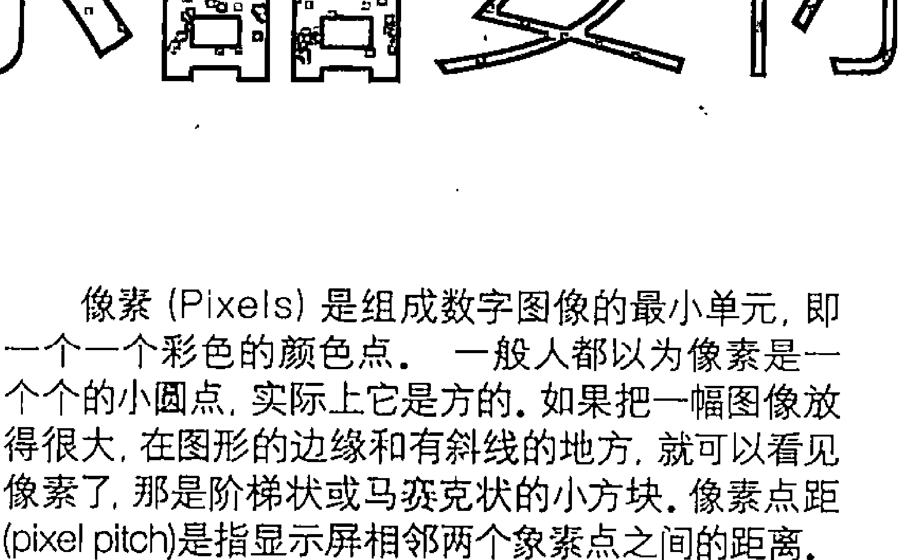

16:9较16:10实际尺寸要小5%

其实，无论是16:10还是16:9，在播放电影时，必然会有黑边。从4:3到16:9，再从16:9到2.35:1（即21:9），电影的画面是越来越窄了，画面两边的黑色区域是越来越宽了（普屏）。近年来，2.35:1的好莱坞电影大片是越来越多，大部分的电影都是采用这样的显示格式。这样一来，无论是哪一种规格的显示器，都会有不同程度的黑边。但是在播放美剧等电视剧节目时，黑边就不存在了，这是因为不少电视剧节目都是采用16:9的缘故。

可以说，16:10这个比例是计算机显示设备特有的比例规格，当时由于液晶屏生产线在计算切割成本时发现按照这一比例切割液晶面板最划算。而现在随着液晶屏生产线的更新换代，切割方法也不同以往，16:9成了最经济、最划算的切割比例。所以这一年来，16:9比例的显示器产品已经完全淘汰了16:10比例屏幕。

#### 小知识：4：3比例的由来

众所周知所谓“黄金分割”是0.618:1，而4:3顾名思义是宽度为4个单位，高度为3个单位，换算比例约为1.33:1，此标准是20世纪50年代美国国家电视标准委员会（NTSC）制定的比例标准，后被广泛用于世界多数国家，也是最常见的视频比例。4:3比例的优势是视觉感观更加真实、舒适，符合“黄金分割”的比例要求。

如果这样说，是否16:9的比例就没什么意义了呢？其实不然。首先是在这一比例下，日常的办公应用，网页浏览功能会得到前所未有的加强。原因也非常简单，在16:9屏幕比例下，显示器可以容纳两个网页、Excel、Word文档并排摆放显示，而在16:10屏幕比例下，所能显示的内容会少不少。

## 玩老游戏屏幕如何才能不拉伸？

有些老游戏，比如《魔兽争霸3》等等4:3比例的，在宽屏显示器上运行时会拉伸撑满整个屏幕，看起来很怪。而且这种情况调节显示器是不能做到的。唯一的办法是调节显卡驱动程序。

- 使用ATI显卡的用户，可以进入ATI CCC控制中心，找到属性中“图像缩放”一项，点击“启用GPU缩放”并选中“保持纵横比”即可。
- 使用NVIDIA显卡的用户，在NVIDIA显卡控制面板中，选择“显示”中的“调整桌面尺寸和位置”，将“当使用的分辨率低于显示器本机分辨率时”设置为“以固定纵横比使用NVIDIA缩放功能”即可。
- 在使用Intel集成显卡的平台上，可进入对应驱动的“图形属性”→“显示设置”窗口，找到“显示的扩展”一栏，选择“保持纵横比”就可以了。

网络大补贴：宽屏比例探寻
http://www.libnet.sh.cn/keven/guangpan/dvd4.htm

## 强大的功能从底座支架中诞生

显示器底座和支架有什么作用？你想一口气完整浏览一个网页吗？竖立摆放显示器就能实现了。想要和淘汰下的老显示器一起组建主、副屏幕的桌面组合吗？显示器支架会让你梦想成真！

- 1. 确认显示器的尺寸和除去底座的重量，选择显示器支架承重范围标准，在支架承重范围内，否则“头重脚轻”可放不稳哦。
- 2. 确认显示器的安装孔位，小于等24英寸的市场常见显示器多为100mm×100mm和75mm×75mm安装孔。尤其要注意，有些显示器（如超薄显示器）就没有按照VESA规范设计这些安装孔，这样的显示器就不能更换使用底座或支架。
- 3. 显示器面板选择很关键。广视角的显示面板在竖立摆放时观看效果没有问题，但若是TN面板，同时又不具备广视角技术规格的显示器，竖立摆放时怎么看都会显得偏色。这是因为不具备广视角功能的显示器可视角度上下（竖立后就变为左右了）两端非常差的缘故。

不同的地方在于，显示器支架除此之外还要注意一个问题，就是桌子本身。首先，桌面边缘的厚度最好不要小于3cm，并且板材以高密度板为宜，这样显示器会固定得更牢靠。当然，无论是支架还是底座，除了具备独特的优点外，不可避免的还有一些问题。以底座来说，它占用空间较大，而且可变形的余地小，只能竖立、平放或是倾斜摆放（相信没人这么做），不过价格便宜许多（拆机可旋转升降底座一般100元左右即可）；支架的不足就是价格偏高，而且对使用环境有一定的要求。

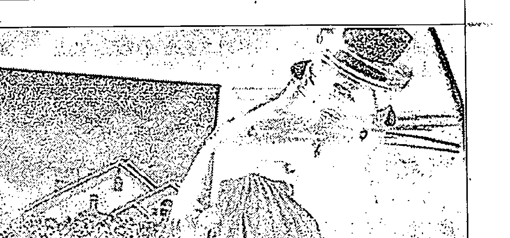


## 让你生活得更惬意

有网友QQ签名:生，容易，活，容易，生活不容易。只能说TA还没有找到科学的生活方法，譬如现在网络如此发达，什么生活难题不能通过它解决?百度在其基本搜索的基础上又推出了专职生活的“百度身边”，不管是衣、食、住、行、玩、乐，都可以借助网络来丰富，让生活变得更方便，更美好。

- *★ POCO网站的美食频道中的“美食DIY”也提供了很多菜谱，地址：http://food.poco.cn/diy_list.php，只要对照着做就可以做出拿手好菜。
- *★ “美食天下”（http://www.meishichina.com/）不仅提供了凉菜、热菜、糕点小吃等菜谱，甚至还有很多饮食健康相关方面的知识，诸如豆腐不能与菠菜同锅这样的小常识也是很重要的。

## 让你吃得更香、喝得更辣

美食人人皆喜欢，快速找到目标城市最知名的美食，方法并不难，只要你掌握以下几招即可。

#### 让别人当小白，自己少上当

传得红红火火的美食、小吃，当自己花钱品尝后才后悔不已，与其让自己上当，倒不如先听听已经尝试过的小白们的“吃后感”，如果所有的小白都持肯定态度，那肯定也是八九不离十；反之，捂紧自己的钱包，同时还能躲过一“当”。

譬如，打开“大众点评”网（http://www.dianping.com/）就可以找到很多目标城市的名吃，同时还有很多小白为自己提前品尝，若好咱们再下手。先切换到目标城市（例如“北京”），再点击“频道→美食”，在打开的页面中便能看到各种类别的美食，有的甚至还按人群分类，而在“排行榜”中往往就能找到最地道、最有名的小吃，点击后进入即可看到各种好吃的、好喝的，点击打开后即可看到很多小白们的“吃后感”。

#### 大补贴

- *★ “大众点评网”还提供了“优惠券”，可以通过在线获取优惠券来享受一些店铺的折扣。
- *★ 如果身边的朋友都是“美食家”，不妨大家约个时间“组团”去目标美食店，团购来得就是实惠，“大众点评网”就提供了团购平台，方便组织团购。
- *★ 点击首页右上角的“我的主页”，开通后可以实现对指定饮食点评的定制进行跟踪，这样就可以“被动地”享受小白们的“吃后感”了。
- *★ 很多我们常用的搜索引擎（例如百度、Bing、雅虎等）都提供了周边搜索功能，通过这些功能照样可以快速找到美食、名食。此外，像知名的“口碑网”（http://koubei.com/）也可以作为美食搜索工具来用。
- *★ 最近百度推出的“百度身边”（http://shenbian.baidu.com/）在本期专题截稿时已经开始内测，这个平台专职于生活类信息的搜索，包括美食、购物、休闲娱乐、健身、旅游、酒店等项目，待其正式上线后也是个不错的选择。

#### 遇到“御膳”，要学之以“渔”

“授人以鱼不如授人以渔”的意思想必大家都知道，而很多时候我们争做“授之以渔”的人。在哪有幸吃到一份好菜，一定要将其菜名记下来，当然，直接询问人家菜谱（这菜的做法）而能得到正确答案的想法不太现实，这时就需要掌握如何搜菜谱，买哪些食材，如何制作，一旦掌握，受用终身。

有很多网站都是专业级的菜谱网站，例如“贝太厨房”（http://www.bettyskitchen.com.cn）就是一个不错的美食菜谱网站，打开后可以通过内置的搜索引擎输入菜系名称，一般都能立即找到菜谱。譬如我们以让一些朋友垂涎三尺的“红烧肉”为菜名，搜索后可以得到多种制作方法。

#### 大补贴

- *★ 在“贝太厨房”网站还有很多做菜的视频，点击“美食视频”链接即可看到很多在线做菜的视频，对于那些动手能力差些的朋友来说很有用。

## 让你玩得更High，乐得更到位

都是休闲娱乐，会者玩得很High，乐得很开心，而不善于娱乐的朋友，在一番折腾后反而变得郁闷起来，究其原因，主要是方法不对。打个比方，原本晚上几个朋友想到KTV吼一把，结果由于初来乍到，打的士跑了几个圈，原来宾馆附近不到300米处就有一家KTV，花了打的费不说，那种郁闷心情不言而喻。其实，只要掌握借助网络找乐子的小技巧，这样的尴尬保准日后不会再现了。

#### 找周边娱乐场所一招即中

像前面提到的“大众点评”网中就有“休闲娱乐”专项功能，点击打开后即可找到目标城市目标地点周边各种休闲、娱乐设施。进入“大众点评”网后先切换目标城市，再点击页面左侧的“休闲娱乐”链接进入，接下来只要选择目标休闲项目并按目录进入即可。例如进入“KTV”后就会看到很多KTV店，包括地址、电话等信息，更重要的是，这地方也有很多小白们的“玩后感”，目标娱乐场所人气如何，服务及环境分别又是哪般，直接通过小白们的“玩后感”就能窥见一斑了。

#### 地图网站中找周边休闲娱乐

很多地图服务网站都提供这类周边休闲娱乐场所的搜索功能，配合地图标注，找起来更方便。例如百度地图（http://map.baidu.com/）的“附近”搜索就能方便地找到周边相关设施，找休闲娱乐场所自然也不在话下。譬如，现在想找王府井附近哪地方有羽毛球馆，那只要在百度地图的搜索框中设置在“王府井”附近找“羽毛球馆”，接下来系统可能会询问在哪个城市，直接选择“北京”，稍后便可看到所有周边的相关设施，并且还会在地图上用英文字母标注出来，在右侧列表中还给出具体的地址及电话信息。

#### 大补贴

- *★ 丁丁网（http://www.ddmap.com/）提供的周边休闲娱乐搜索功能更加好用，对目标设施提供了简介、优惠券、导读等详细信息，只是目前只提供上海、杭州两个城市。
- *★ 搜狗地图（http://map.sogou.com/）的搜索功能也很强大，地图会自动定位到使用者当前所在城市，接下来只要直接在搜索框输入要搜索的目标设施名称即可找到目标，此外，点击下面“更多”链接展开的“热词”列表中直接点击目标设施就可以进行搜索，或者点击导航栏中的“生活信息”链接，找目标设施更直接、方便。
- *★ “图吧”（http://nb.mapbar.com/）提供的周边搜索不仅可以在电脑中用来搜索周边设施，还可以直接用手机来查询。

## 让你住得更安逸

家总让人有一种温暖的感觉，不管白天工作多累，或是漂泊、流浪，晚上回到家中，那种感觉是很微妙的，如果你还没有一套房子盛放这个“家”，那得赶紧行动了。有钱买房，也得买套最合适的，暂且手头紧，租也得租套最宜居的。借助网络，让你住得更安逸。

## 买房免中介，搜房网帮你搞定

很多朋友还在求助于“房屋中介”，网络如此盛行，为何还交钱找房啊！如果无法直接通过朋友介绍等方式找到合适的房源，不妨先试试“搜房网”（http://www.soufun.com），新房、二手房、租房都可以借这个平台来物色。方法也不难：先在导航栏中定位到目标城市，接下来再选择“新房”或是“二手房”、“租房”，接下来再设置好价格区间以及相关信息就可以搜索了，在搜索结果列表中再根据详细介绍进行筛选。

#### 小提示

通过搜房网的搜索引擎，可以直接对目标楼盘进行搜索，这样可以快速得到目标楼盘中未售楼盘信息，往往可以在心仪的位置找到房子。此外，用好搜房网的搜索参数设置，还可以将搜索结果缩小，例如设置二环内，那就可以排除二环外的楼盘信息。

## 租房像买菜，不怕频繁搬家

由于工作的原因，很多朋友不得不频繁搬家，一个月换次房子，时间甚至会更短。而找租房本来是件体力活，但若掌握了方法，就变得像上街买菜那样简单了。譬如打开“58同城”（http://bj.58.com/zufang）后，如果当前城市不是目标城市，要点击更换。接下来再根据实际情况选择要找房的区域，最后就可以看到所有符合要求的租房信息了。

#### 大补贴

- *★ 搜狐租房频道（http://rent.focus.cn）提供的租房信息也比较丰富，提供的搜索参数限制更丰富，例如可以很方便地找到价格在2000元内的1室1厅房源信息，支持按租金重新排序，面积重新排序，更方便筛选符合要求的房源。
- *★ 新浪房友在线（http://www.fangyou.com/）以更简洁的界面提供房源搜索，针对一些高房租的大城市，还能轻松地找到合租、短租等房源。
- *★ 赶集网（http://www.ganji.com/index.htm）中的“房产”频道也能方便地用来找到合适的房源，同时，赶集网还支持手机访问，从http://www.ganji.com/mobile/client.php下载手机客户端程序，找房源或是其他周边信息更方便。

## 让你出门旅行得更惬意

出门旅行本是一件非常惬意的事情，但在整个过程中会让很多朋友烦恼。譬如，未出发之前如何将目的地地形掌握清楚，如何方便地知晓列车时刻，如何方便地买到去往目的地的机票……其实，这些事情完全都可以交给网络来办。

#### 摸清目的地找电子地图帮忙

现在电子地图产品已经有了很多了，有电脑版的，也有很多手机版，查起来很方便。就以百度地图为例，打开“http://map.baidu.com”后，直接在搜索框中输入目的地名称即可快速定位到该地点的电子地图。借助内置的“测距”功能还可以测量出A地到B地的行车距离。

通过“标记”功能可以给目的地点添加标记，适合带着上网本旅行的朋友，事先给即将行经的地点加上标注，回头再次打开地图时就能轻松地找到目标了。而地图内置的公交、自驾查询功能可以使你方便地在陌生城市坐车或行车。

#### 大补贴

- *★ 在百度地图右侧的“地铁路线图”链接可以用来查找目标城市的地铁路线及停靠站点信息，目前可以查询到北京、上海、广州三个城市的地铁路线，如果有打印机，出行前不妨将地铁图打印出来。
- *★ 若使用Google地图（地址：http://maps.google.com/）

## 8684，公交信息随时查

上面已经提到可以通过地图内置的公交查询功能来查询公交，不过，部分二级、三级城市可能还未被支持，而查询公交最牛的方法无疑是8684网站 (http://www.8684.cn)，譬如，现在想查询阜阳这个小城市的公交信息，就可以分别通过“公交线路查询”、“公交站点查询”及“公交换乘查询”这三种渠道进行查询了，如果现在想从“火车站坐车到阜阳师范学院西区”，那只要将这两个地址输入“公交换乘查询”下面的查询框即可。

#### 小技巧:

- *★ 如果在查询目标位置时，站点列表中找不到，可以结合使用地图来锁定周边地名，或是更换查询方式，例如试试线路查询法。
- *★ 在手机中可以直接访问 http://wap.8684.cn/ 来进行查询公交信息。
- *★ 在8684网站首页还可以点击“列车时刻”链接进入查询火车时刻表。

#### 查列车时刻 要找专业网站

网上查询列车时刻的方法应该不算新鲜了，很多网站都提供查询功能，不过，数据最准确、查询最方便的要数“中国铁路网” (http://www.tielu.org/)，数据更新及时，查询起来也方便。查询分为站站查询、车站查询、车次查询，查起来很方便。而在中国铁路网中还可以通过“售票网点”来查询到当地最近的火车票销售网点，给就近买车票带来不少方便。

#### 小提示:

从 http://www.tielu.org/WindowsPhone.aspx 下载手机版 (支持 Windows Mobile) 车票软件可以直接在手机中查询车票信息。此外，类似的手机查询车票信息软件有很多，例如“路路通” (下载：http://www.lltskb.com/list/1_1.html/) 可以在Java/S60/Android 平台的手机中运行。

#### 足不出户，淘宝上买机票

要想查询机票或是买机票，方法比火车票更简单。譬如大家常购物的淘宝网站就有机票查询及在线购买服务，只要打开http://ipiao.taobao.com/2010/home.htm页面，不管是搜索机票，还是直接购买，都非常方便。类似的还有携程旅行网 (http://www.ctrip.com)，以及各大航空公司的官方网站的在线订票系统，这些方法都不难，在此不再赘述。

#### 小技巧:

专业的机票搜索网站“去哪儿” (http://www.qunar.com/) 也提供了机票搜索功能，同时，其开发的机票监控小助手 (下载：http://www.qunar.com/site/download.htm) 可以监控低价打折机票。


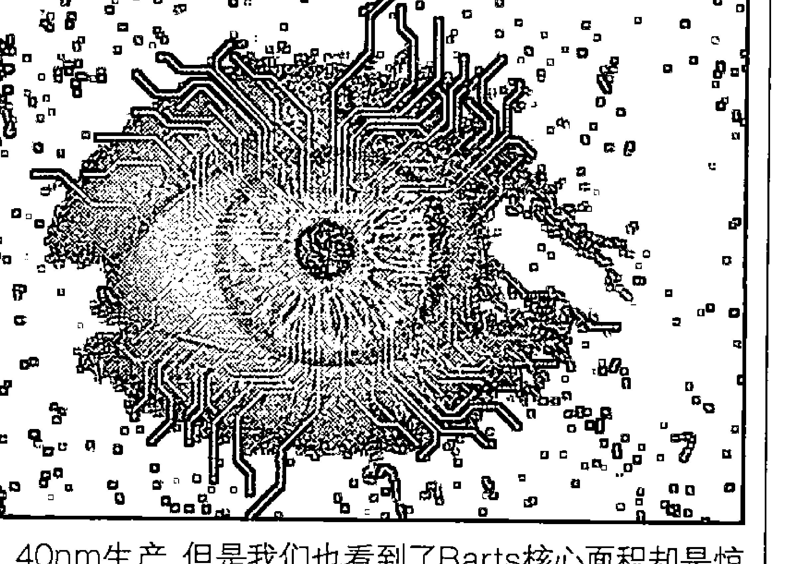

## 让工作更顺心，跳槽更有理

没事你走两步，工作环境不满意，你跳三跳！不管是刚毕业时的找工作，还是想跳槽，如何快速找到心仪的工作显得尤其重要。而借助网络找工作就显得太方便了，前面我们提到的赶集网、58同城网等都提供工作、职位的搜索。而更专业的要数51job (http://www.51job.com/) 了。

先注册一个账号，然后选择目标城市，再对求职的工作进行详细设置，例如求职的职位、行业等，最后直接点击“搜索”即可找到很多相关职位，接下来再根据具体的招聘信息逐个筛选出自己心仪的职位，之后就可以直接选中并申请该职位，接下来只要在邮箱中静待佳音即可。

#### 大补贴:

- *★ 如果工作还未落实，需要经常查看邮箱，可以直接将无忧网账户信息中的邮箱设置为139邮箱，有招聘信息时及时知晓。
- *★ 在注册账号时，尽量使用自己的笔名、学生证号这样的“真实信息”，尽量避免将自己的真实姓名、身份证号码等重要信息注册到个人资料中。
- *★ “中华英才网” (http://www.chinahr.com/) 也是老牌的求职类网站，找工作也适合“广撒网”，虽然最终只需要一份工作，但给自己创建多个可选工作不失为聪明之举。
- *★ 直接通过Google快讯 (http://tinyurl.com/2wo8dr3) 创建一个快讯 (例如“招聘程序员”)，设置好自己的接收邮件，这样就可以借助Google的强大搜索功能来被动地接收网上的招聘信息。

## 购物有理，购物有优惠

购物是生活中必不可少的一项内容，现在网络如此发达，很多东西自然买自网络，网购也有很多技巧和方法，可以让网购来得更舒坦、更实惠。

#### 淘宝网中找宝贝

虽然淘宝网内置了强大的搜索引擎，可以用来快速找到自己想要的宝贝，但若再知道以下频道入口，找宝贝更方便：

- *★ 淘宝商城频道: http://tinyurl.com/26zrm8p，淘宝商城频道中的宝贝都经过严格把关，在宝贝质量上可以让用户放心，也就是说，直接在淘宝商城中购买宝贝，一般不会买到假货，买得放心。
- *★ 淘宝皇冠店铺: http://tinyurl.com/2a967oj，淘宝商城的确不错，但是价格往往无法砍下去，但皇冠店铺既可以砍价，由于卖家信誉度高，也可以确保宝贝的正品。
- *★ 淘宝风云榜: http://tinyurl.com/22n3c7s，到底哪些东西卖得更疯，也就是哪些宝贝更受用户欢迎，可以直接通过淘宝风云榜来获取。

结合这些频道入口以及淘宝内置搜索引擎，就可以搞定网购了。

#### 团购达到降价目的

团购更能体现买家优势，如果要买的东西不是很急用，不如参加团购，来得更便宜。现在有很多团购网站，例如美团网 (http://www.meituan.com/) 就提供了每日一项的团购，可以通过手机定制第二天的团购信息，遇到自己需要的团购项目就可以享受低价了。

而现在大众点评网、饭统网 (http://tinyurl.com/3x2ghep，饮食团购)、焦点网 (http://hf.focus.cn/，房产)、赶集、58同城，甚至各大门户网站如新浪、腾讯等都推出了团购服务，团购是消费者最强势的一种购买方式，值得采用。

#### 二手市场掘金有技巧

二手货不代表是次品、低质货，二手货往往性价比更高。因此，在对其新旧要求不是很苛刻时，选择二手货是个聪明之举。像前面提到的58同城、大众点评网、百度身边等网站都提供了二手交易服务，供、求均可以通过它们来实现。此外，很多论坛也有二手交易版块，也可以作为找便宜的二手货的好渠道。而像淘宝网中以目标名称+二手为关键词进行搜索，也可以快速找到很多卖家处理的二手货，甚至在多位卖家出手的情况下，还可以对比、选择性价比更高的。

策划/《电脑爱好者》编辑部
撰稿/Dream

## 中端DirectX11的新篇章

2009年的9月23日，AMD凭借Radeon HD5870旗舰产品一马当先，率先跨入了DX11显卡时代。随后的短短5个月当中，HD5970、5870、5850、5830、5770、5750、5670、5570、5550、5450，共计11款Radeon HD 5000系列产品，从高端顶级双核产品到入门级的低功耗产品全部集结完毕。让竞争对手在DX11产品时代，始终只能步HD5000后尘。

但是在成功的背后，Tessellation (细分曲面) 屏弱，通用性计算的乏力以及被千元级NVIDIA Geforce GTX460打乱的市场也带来了一些麻烦。正是因为如此，下一代产品HD6000系列是否能继续HD5000系列的辉煌便成了众人关注的焦点。而在HD6000系列中1500元~2000元这个市场又是整个产品线利润、品牌的重中之重，核心代号“Barts”的HD6870/6850究竟是怎样一款产品呢？

## “马甲、更名”什么的最讨厌了

看到HD6800的型号很多人会疑惑，为什么这一代的旗舰产品价格定位在1500元~2000元，难道是AMD大发善心或者是恶意抢占市场吗？错！还记得NVIDIA Geforce 8800 Ultra与Geforce 9800GTX的关系吗？这次AMD玩得更大，本应是中端的Barts原定型号是HD6770/6750，但在后期内部测试中表现接近HD5870/5850，甚至在细分曲面等方面有小幅超越。于是乎“更名战术”便再一次发挥奇效，本应是主流产品的Barts活生生地被冠以了高端HD6800的型号。当然这都是通过发布前透露出的资料进行的“臆测”，你问AMD他们肯定是不会承认啦。不过通过我们后面的一系列测试，相信你也是能看出来一些端倪的。

## 传承：Cypress 的进化体

既然Barts的型号是HD6870/6850，那么我们就要与上一代的HD5870/5850 (核心代号Cypress) 进行比较，由于代工厂的32nm/28nm工艺进展不够快，Barts以及整个北方群岛系列GPU仍然要采用40nm生产，但是我们也看到了Barts核心面积却是惊人的255mm²，对比Cypress的344mm²缩小了25%以上，更不要说对手Geforce GTX460其336mm²的身材了。就算是性能稍弱于Cypress也可以降低大量的成本，从而让价格更有竞争力。

当然，作为DX11时代的产品，显然AMD并不会在这款产品上进行较大的架构改动，而是采用了小幅优化从而提升产品的性能表现。除此以外，HD6870/50还在细分曲面方面进行了加强，同时反锯齿的性能与功能也得到了提升。

此外，这次的Barts也带来了UVD 3.0、HD3D、Flash视频加速等新技术，当然这些技术大部分是由NVIDIA阵营率先出现的。

## 小故事：ATI彻底淡出业界

AMD在几年前收购完ATI之后虽然一直保留了ATI的标识，但是并不意味着ATI能够长久保留下去。AMD将会从Radeon HD 6000系列产品开始，全面启用新的产品标识以及LOGO，也就是说“ATI Radeon HD xxxx”的字样，今后全部## 独家：更便捷的 Eyefinity 多屏输出技术

如果说UVD、HD3D、Flash视频加速等技术是弥补与NV阵营的差距，那么Eyefinity多屏输出便是AMD的独家法宝。通过DisplayPort接口链接6台显示器，它可以让消费者根据实际情况灵活地扩展他们的系统。可以先购买一台显示器，然后有能力的时候再添置第二台、第三台显示器。另外，从成本角度考虑，购买多个普通的液晶显示器远比购买一台超高分辨率显示器要划算。比如18.5英寸显示器售价最低的大约为800元，那么3台的话也不过2400元，而2400元买到的是一台分辨率高达4096×768，对角线长度为50英寸的显示器。它提供的视野大小是16：9显示器的3倍，4：3显示器的4倍。想想吧，玩FPS、网游3倍以上的视野无疑会让你在某些方面等同于作弊，而在感官上环绕的视野也让人有着极强的冲击感。

现在，Radeon HD 6000系列又进一步提升，带来了增强版的“Eyefinity+”。Eyefinity+技术的精髓是DisplayPort 1.2标准规范。相比于此前的1.1a版本，最新的1.2版本将数据带宽从10.8Gbps翻番到21.6Gbps，视频输出率也从8.64Gbps翻番到17.28Gbps，60Hz 24bpp下的最大分辨率支持提升到2560×2048之上。而其特别支持多流输出，得益于此，Eyefinity+获得了更高的传输带宽，再加上带内立体3D信号，就为支持3D立体技术打开了方便之门。而且尤其是支持单接口多数据流、多显示输出，通俗地说就是一个接口可以连接多台显示器，因而只需要两个DisplayPort接口就能连接六台显示器。

## 小知识：高分辨率有何好处？

高分辨率的好处数不胜数。简单地来讲同为Windows 7操作系统，1280×720只能在桌面上摆放102个图标，而在1920×1080的分辨率下可以摆放250个图标，这就是其一空间变大；而我们同样打开一个1000万像素数码相机拍摄的照片，1920×1080分辨率下可以显示20%的细节，而1280×720仅仅能显示出不足10%，这是其二显示细节精细，在游戏中就是画面更清晰了。

## 玩转 Barts

总是讲技术可能让很多读者头痛了起来。既然CFan有卡有平台，那么我们接下来讲一讲Barts的独特玩法和应用吧。

## 玩显卡，怎能不超频

说到显卡的玩法，首当其冲就是超频。由于Barts优秀的功耗控制，使得它的超频潜力十分可观。当然潜力高并不意味着超频能力强，换散热、改电压一个都不能少。在这里我们先教教大家利用驱动进行简单超频。

- 第一步：在控制面板中点击进入Catalyst Control Center；
- 第二步：在弹出的窗口中选择显卡→ATI Overdrive；
- 第三步：在接下来的界面中点击左上方的小锁图标进行解锁，并调整下方的频率；
- 第四步：点击“测试自定义时钟”进行测试并确定。

测试中我们很轻松地将HD6870超频到1000MHz/1100MHz（核心/显存），其中核心频率达到了驱动程序超频上限，但显存频率远远低于HD5870的默认1200MHz（显存颗粒与HD5870相同）。如果想要超频至更高，看来只有改电压一个方法了。其中涉及的步骤较为复杂，限于篇幅限制我们就不再进行说明了。

> 网络大补贴：铅笔大法改电压
> http://vga.zol.com.cn/202/2023555.html

## 超频、开核，平民法拉利的两大法宝

说了超频怎能不提开核。AMD可是一家盛产“平民法拉利”的公司，其中开核就是它的一大法宝。这次的HD6850作为HD6870的次级产品也是由屏蔽管线产生的，但若想开启硬件屏蔽的管线技术难度并不低，好在第一批生产的HD6850有一部分产品采用了HD6850的PCB+HD6870的核心。我们只需要修改BIOS就能使它成为1120SP的HD6850。当然，需要说明的是这批产品究竟有多少谁也不知道，能开不能开就看你的运气啦。

- 第一步：下载并运行HD6850ShaderMaskCleaner工具（下载地址：http://works.newhua.com/cfan/201023/6850SMC.zip），使用它进行BIOS的修改。需要说明的是此程序支持32位WINDOWS系统，而64位VISTA/WIN7系统需要在系统启动的时候按F8键，关闭“驱动签名强制”选项以后才能用；
- 第二步：点击HD6850 ShaderMaskCleaner左下方的“提取BIOS”按钮后，查看“在本显卡是否可以开核？”后的检测结果。如果是YES，那么我们就可以进行接下来的操作，如果是NO，那么就说明此块显卡不能开核；
- 第三步：点击修改BIOS，将BIOS保存到硬盘上；
- 第四步：将修改完毕的BIOS、ATIFlash（下载地址：http://www.techpowerup.com/downloads/1731/ATIFlash_3.79.html）拷贝到带有纯DOS启动的闪存盘中；
- 第五步：引导闪存盘中的纯DOS，在命令行中输入atiflash -p -f 0 你的显卡BIOS名字.ROM；

经过数十秒后即可完成刷新操作。手动重启后，进入系统后由于设备ID的变更，因此驱动程序会对显卡进行重新识别。接下来打开GPU-Z等软件确认下你的HD6850是不是变成了1120SP了吧。

## Photoshop CS5也能GPU加速

超频、开核无非是提升性能。那么提升的性能只能用来玩游戏吗？也不尽然！常常有读者咨询到图形工作站需要好显卡吗？以往我们的答案都是不能，但是随着图形图像界Adobe推出了Photoshop CS5，这个答案就值得商榷了。新升级的CS5版PS新功能可以用神奇来形容：细致到毛发级别的选择技术、神奇的内容智能识别填充、令人赞叹的HDR图像成像技术等。简化工作流程和64位系统中的优秀表现也构成了CS5重要的升级内容，不论是对于业余爱好者还是专业人士，CS5的功能都是令人震惊的。除此之外，GPU硬件加速便是我们最为关注的功能。

启用GPU加速实际上很简单，只需要在Photoshop的菜单里开启即可。但是需要注意的是Photoshop CS5里的GPU加速分为三个档次：基本、正常、高级。根据显卡的能力进行选择。一般我们的界定范围是：

|      | AMD     | NVIDIA  |
| ---- | ------- | ------- |
| 高级 | ≥HD4850 | ≥8800GT |
| 正常 | ≥HD4650 | ≥GT240  |
| 基本 | ≥HD1650 | ≥7600GT |

- 第一步：开启Photoshop CS5，在标签栏中选择编辑→首选项→性能；
- 第二步：在弹出的窗口中勾选右下方的“启用OpenGL绘图”，并点击高级选项选择加速等级。

我们知道，从CS4时代开始，Adobe将GPU通用计算技术引入到自家的产品中来。Photoshop CS5中，GPU可提供对图像旋转、缩放和放大平移这些常规浏览功能的加速，还能够实现2D/3D合成、高质量抗锯齿、HDR高动态范围贴图、色彩转换等。测试中我们将一个20000×20000像素容量为1.12G的图片放大至50000×50000像素，然后旋转45°。

## 测试结果

|              | 缩放时间 | 旋转时间 | 缩放CPU占用率 | 旋转CPU占用率 |
| ------------ | -------- | -------- | ------------- | ------------- |
| 开启GPU加速 | 40s      | 182s     | 11%           | 7%            |
| 关闭GPU加速 | 48s      | 235s     | 37%           | 81%           |

## 华硕 EAH6870/2DI2S/1GD5

参考价格：1999元
点评：华硕 EAH6870/2DI2S/1GD5采用了公版设计，整体做工相当优秀。显卡供电采用了核心与显存4+2相独立的供电模块，用料上采用了全固态电容配合双6pin电源接口，为显卡在高频下使用提供了保障。散热方面，华硕 EAH6870/2DI2S/1GD5搭载了全覆盖散热器，提供了良好的散热效果。该显卡使用了GDDR5高速显存颗粒，组成了1024MB/256bit的显存规格。显卡默认频率为915/4200MHz。输出方面，华硕 EAH6870/2DI2S/1GD5提供了双DVI+HDMI+双Mini Display Port的输出接口设计，通过转接头可满足大众用户的使用需要。

## 游戏测试

| 项目            | 参数                    | HD6870 | HD6850 | GTX460 1G |
| --------------- | ----------------------- | ------ | ------ | --------- |
| 3DMark Vantage  | Performance             | 16522  | 140237 | 16003     |
| 星际争霸Ⅱ       | 2560×1600 UltraHigh     | 56.1   | 51.2   | 52.3      |
| 天堂2.0         | 1920×1200 High 4xAF     | 886    | 758    | 1028      |
| 孤岛危机        | 1920×1200 VeryHigh      | 33.1   | 26.9   | 28.9      |
| 地铁2033        | 1440×900 Tessellation ON | 25.8   | 21.9   | 29.1      |
| 叛逆联队2       | 1920×1200 High          | 57.1   | 49.2   | 55.1      |

## 微星 R6870 2PM2D1GD5

参考价格：1999元
点评：同样采用公版设计的微星R6870 2PM2D1GD5除了散热器上的贴纸与华硕不同外，内部结构几乎相同。供电方面，微星 R6870 2PM2D1GD5显卡采用了4+2相分离式核心+显存+I/O供电设计，能避免相互之间的干扰现象。每相供电均配备了做工不俗的铁素体电感、陶瓷电感与全固态电容。PCB上微小的供电元件也是高效稳定供电的保证。公版密封式涡轮散热方案，在涡轮风扇及纯铜散热底座的辅助下，充分保证核心以及显存等元件的热量能够快速的发散出去。默认频率相较华硕低了一些，为900/4200MHz。

## 蓝宝石 HD6850 1G DDR5

参考价格：1399元
点评：此款显卡核心和显存频率分别为775/4000MHZ，使用了与HD6870一样的海力士T2C 0.4ns DDR5显存颗粒，组成了1024MB/256bit显存规格。默认频率为4000MHZ，同时此款显存理论设计值为5000MHZ，通过ATI控制台内超频软件可轻松超至4500MHZ。散热方面，蓝宝石HD6850 1G DDR5版显卡采用双热管+散热鳍片式设计，同时散热器底部采用塞铜式设计，有效将核心热量吸收传导给热管及散热鳍片，提高散热效率。值得一提的是，蓝宝石此款显卡散热依然保留了HD5850毒药等高端显卡上使用的带角度式风扇设计，这种设计在风量及噪音控制上有非常不错的表现。

## 东西好不好测试来说话

## 测试平台

CPU AMD Phenom II X4 955BE
主板 华硕Crosshair IV Extreme
硬盘 西数黑盘 2TB/64MB
内存 金士顿HyperX DDR3 2100 2GB×2
显卡 华硕EAH6870/2DI2S/1GD5
蓝宝石HD6850 1G DDR5
Geforce GTX460 1G
电源 航嘉X7 900W

## 温度测试

|        | HD6870 | HD6850 | GTX460 1G |
| ------ | ------ | ------ | --------- |
| 待机   | 26     | 25     | 31        |
| 满载   | 73     | 71     | 93        |

## 结语

虽然AMD对HD6800系列显卡的架构并没有进行翻天覆地的改动，即便是核心的生产工艺没有变化，但是AMD还是通过架构方面的优化，在大幅削减流处理器数量的前提下，最终获得了很不错的性能表现。考虑到其较小的核心面积带来的成本降低，从性价比角度来讲HD6870/6850是非常优秀的，相信近期内对手NVIDIA便会有所动作，新一轮价格战即将开启……

策划/《电脑爱好者》编辑部
监制/alpha
撰稿/milk

## 一人得道 鸡犬升天 Media Center新增网络视频

“一人得道，鸡犬升天”的成语想必大家都知道，这古人的智慧已经把当今的微软看穿了。Windows Media Center早在Windows Vista时代就有了，集合了DVD播放、图片、浏览、音乐和电影播放，强化多媒体资源的统一管理，但这种方式却没有得到多少人的认可。Win 7发布后，它也开始变得有活力，最近，微软悄悄对它进行了升级，新增了“互联网视频”选项，包含“高清”频道的海量视频轻松浏览。

> 小提示：
> 目前微软只为 Windows7 下的 Media Center 提供互联网视频功能，而且 Windows 7 “简易版”和“家庭普通版”不含此功能。

隐秘更新 悄悄推送
不知道为何，微软的这次更新比较低调，平时使用Windows Media Center时是发现不了的，打开后在“电视”类别下还是“录制的节目”加“电视设定”，现在，切换到媒体中心的“任务”一项，依次选择“设置→常规→自动下载选项”，单击“立即下载”，程序就会在后台自动检查更新了，更新完毕后，你就会发现新的变化。单击“互联网视频”，按照提示进行Internet TV组件的下载、安装，再次进入，节目单就出现了。安装完成后，它还会提示是否安装桌面小工具，更方便地查看最新的新闻影视资讯信息。

> 小提示：
> 如果你的电脑支持媒体中心的遥控器，那么更加便利，只需要使用遥控器上下左右和确认键，就可以很方便地选择要浏览的内容。普通电脑可以自己加装这类遥控器，淘宝中以“USB电脑遥控器”为关键词进行搜索即可，价格在30元左右。

海量视频 轻松观看
进入“互联网视频”后通过左右方向键，可以看到“国际在线网络电视、搜狐视频、新浪视频”三个频道，选择一个进入，其中国际在线网络电视采用的是WMV视频格式，因此直接就可以进入，但新浪视频和搜狐视频采用的是网络上目前流行的 Flash 视频格式，因此必须再安装一个插件。进入视频的节目单一字排开，在“高清”类别提供了搜狐和新浪的高清视频，虽然并非真正的高清视频，但还算DVD画质吧。

搜索加预览 视频搬回家
如果我们想观看某一部视频，单击媒体中心界面右上角的“搜索”按钮，然后利用媒体中心内置的遥控器输入法输入需要的影片名称（虽然电脑键盘输入非常难用，但它不支持粘贴也不支持其他输入法），再在右侧选择时间、类型等限制选项进行分类搜索。三家视频网站有的我们都能搜到（包括“凤姐”相关视频哦），算是提供了一个互联网视频的软件终端。另外，进入“电视”类别下的“指南”，可以看到所有的电视节目表，选择某个视频之后会自动跳转到该视频在“互联网视频”中对应的类别。如果你正在观看一个视频，然后转去搜索其他视频时，媒体中心还会在左下方为你保留一个视频预览窗口，十分贴心。

## 三步一哨五步一岗 病毒入侵我知道

目前木马猖獗，将系统弄得乱七八糟，很多操作都进入驱动级，杀毒软件的实时监控还能存活多久？如果能在电脑里布置好岗哨，随时监控电脑变化，那还安全吗？下面以监控系统的驱动文件夹drivers为例进行说明，如果没装驱动，这个目录却发生了变化，必然有问题了。

第1步：在运行中输入“gpedit.msc”，回车后打开组策略编辑器，依次展开“计算机配置→Windows设置→安全设置→本地策略→审核策略”，找到并双击“审核对象访问”，从弹出的对话框里同时勾选“成功”、“失败”。在此，能添加的审核策略还多，比如“审核过程跟踪”等，添加得越多，后面的系统日志也越复杂，筛选起来就越困难，考虑到这次的目的是监视对驱动文件夹drivers的访问，为此，只创建“审核对象访问”策略就行了。

> 小提示：
> 目前，很多木马都会采用在驱动目录下创建文件，伪装驱动进行破坏行为，而这种方式甚至会关闭杀毒软件进程，对于驱动目录的监控就显得极为必要，另外我们也可以监控自己的账户目录、system32和fonts目录，都是木马经常释放文件的地方。

第2步：右键单击C:\Windows\System32\drivers文件夹，选择“属性→安全→高级→审核→添加→高级→立即查找”，找到用户“Everyone”后单击“确定”。接着，勾选“遍历文件夹/运行文件”后的“成功”与“失败”即可。

第3步：如果想得知电脑情况，在运行框时输入“eventvwr.exe”，回车打开“事件查看器→Windows日志→安全”，单击右侧“筛选当前日志”，在“关键字”中勾选“审核成功”和“审核失败”，确定后，日志就少了很多。双击其中一条记录可对其进行详情查阅（名为LOW的用户在2010年6月2日12:45访问过我们要监视的drivers文件夹），如果不是自己的操作，赶紧查毒。

> 小提示：
> 在Win XP下，请单击“开始→控制面板→文件夹选项→查看”，再清除“高级设置”下对“使用简单文件共享（推荐）”的选择，否则，文件夹的属性对话框中不会出现“安全”选项卡。

(文/李学昌)

## 快而不糙 关机也需明智之举

作为一个守时的人，关机要快，要知道下班的瞬间办公室就会跑没人，当然有很多快速关机的方式，但按照操作系统的设计规则，那样对系统是莫大的伤害哦，下面我来给你最明智的关机方式。

去掉多余动作
Windows 7在关机时，总是多管闲事地问你是否关闭程序，这个太烦人了。我们要取消它：按Win+R，输入“gpedit.msc”，依次展开到“计算机配置→管理模板→系统→关机选项”，双击“关闭会阻止或取消关机的应用程序的自动终止功能”，选择“已启用”即可。

快而不糙
这样的关机你很怕会丢失东西吧，咱们再来做一步，让电脑记住你关机前的设置，，比如说自动打开关机前打开的文件夹：在开始菜单中输入regedit，回车后在打开的注册表编辑器中，找到HKEY_CURRENT_USER\Software\Microsoft\Windows\CurrentVersion\Explorer\Advanced]分支，右边的窗口中找到一个名为“DesktopProcess”的DWORD值（如果没有，就自行创建一个）。双击它，将数值数据设置为1，点击“确定”按钮即可。

(文/呆瓜)

## 点击就出来 右键也能弹“美女”

与千娇百媚的桌面、带背景图片的窗口相比，右键弹出菜单倒显得有点俗气。其实我们同样能让右键弹出菜单充满个性，为之加上漂亮的背景图片。

第一步：在网上下载动态链接库文件ContextBG.dll（http://work.newhua.com/cfan/201011/dtlk.zip）和软件ResHacker（http://work.newhua.com/cfan/201011/hacker.zip），然后将“ContextBG.dll”解压到C:\WINDOWS文件夹中。

第二步：在“运行”对话框中输入命令“regsvr32 C:\Windows\ContextBG.dll”（不包括双引号），单击“确定”，弹出一个regsvr32加载成功的对话框，右键菜单背景图片添加成功。再右键任意文件或文件夹，你就发现右键弹出菜单有一幅背景图片（该方法对“我的电脑、系统盘符、我的文档等系统图标的右键弹出菜单不能出现背景图片）。

第三步：如果我们看倦了默认加载的背景图片，可以通过下载的ResHacker工具软件来修改“ContextBG.dll”库文件进行背景图片的更换。

运行ResHacker，依次单击“文件→打开”，弹出打开文件对话框，选定并打开C:\WINDOWS文件夹下的“ContextBG.dll”动态链接库文件。单击“操作”菜单下的“替换位图”命令，在弹出“替换位图”对话框的右上角可以清楚地看到已加载的图片，单击“打开新位图文件”按钮，弹出“打开”文件对话框，选定并打开事先准备好的一张Bmp格式的位图文件，单击“替换”按钮完成图片替换。最后，单击“文件”菜单中“保存”命令，保存替换图片后的“ContextBG.dll”动态链接库文件。

最后注销或重新启动电脑，按上面介绍的方法在“运行”对话框中输入命令“regsvr32 C:\Windows\ContextBG.dll”重新加载动态链接库文件就可以了，这时右键菜单的背景就变成了替换后的图片。

> 小提示：
> 如果要取消右键菜单背景图片，同样在“运行”对话框中输入命令“regsvr32 /u C:\Windows\ContextBG.dll”，单击“确定”，出现加载成功对话框，完成对图片的卸载。

(四川/胡学林)

我的回收站仓库
桌面文件在增多，面积在恶化……
这是很多懒人的做法：将各种小型文档、文件堆砌在桌面上，久而久之，桌面这块儿黄金地皮已经枯竭。怎么办？就把回收站当成桌面的后方根据地吧！用的时候进入还原，但时间长了，回收站的文件也多了，乱套了……
RecycleBinEx帮你整理回收站这个临时仓库，是个不错的管理员！
下载RecycleBinEx（下载地址：http://www.xiazaiba.com/html/1828.html），运行后，查看主界面中的资源列表，可根据不同类型排列，显示回收站中的所有文件。
如果要在回收站中查找文件，则可在RecycleBinEx顶端的文本框中输入搜索关键字，在列表中会自动筛选出符合当前条件的文件。

# 菜鸟专用 不进BIOS也能设置光驱启动

无人值守盘让重装系统已经变得越来越傻瓜化，但对于很多菜鸟来说还是摸不着头脑，因为不仅不同品牌的电脑进入BIOS设置界面的方法五花八门，而且，往往知道方法却不知何去何从，如果能在Windows下设置让电脑从光盘启动，菜鸟们还担心什么？这就需要一个工具协助：光驱启动设置工具（下载地址：http://work.newhua.com/cfan/201013/gqqdgj.rar），运行后，出现“添加/删除开机光盘启动菜单”窗口，按“A”键是添加光驱启动菜单，在光标闪动处输入字母“A”，然后按回车键，提示“恭喜！添加成功”，这样电脑就添加一条“从光驱启动”的开机菜单了。如果不需要这个菜单了，按“D”键就可以删除该菜单，然后我们把系统安装盘放入光驱，重新启动电脑，在重启电脑的过程中出现的“开机菜单”上新增有一项中文的“从光驱启动”选项，这时用键盘上的上下方向键移动，选中“从光驱启动”这项，再回车，电脑就能从光驱启动了，接下来就可以轻松装好系统了。

# “不安全”？“好安全”？ 我这样保护孩子上网

网络对于孩子来说真的是太凶险了，怎么样告诉孩子哪里是好的，哪里是坏的呢？猛然发现江民杀毒软件KV2010在杀毒的同时，也具备帮我保护孩子的功能，添加自定义网址以及访问控制方式，避免浏览恶意及不良网站，不仅能够为孩子上网加一道屏障，更可以全面保护电脑自身的安全。

- 第一步：启动江民杀毒软件后，点击主界面的右下角的“设置”进入软件的详细设置界面。在左侧目录的下方，可以找到“黑白名单管理”这一选项。
- 第二步：点击黑白名单管理器中的“修改”按钮，读者可以分别手动在黑白名单中添加程序文件或进程。另外，在默认白名单中，江民杀毒软件已经预置了一部分被认为是安全的系统程序及进程。
- 第三步：在“上网控制管理”中，点击网址库列表下方的“添加”按钮，输入要进行控制访问的网址，并选择需要江民对该网址进行何种访问控制方式。添加完成后，我们在自定义网址库中就可以通过网址前的图标或列表右侧的文字，直观地看到对已添加的网址设置的控制方式。双击该网址或点击列表下方的“修改”按钮，可随时进行修改。

小提示：当网址库中已经添加了一定数量的网址后，为了避免因为重装系统或误操作造成列表丢失，可以点击“导出网址”按钮，将网址库列表保存备份，这样即使发生了以上情况，只要点击“导入网址”，将备份文件直接导入，就可以恢复网址库了。

# 不是病毒的病毒——Autorun文件

听见Autorun病毒，你肯定不陌生了，众多“悲剧”是由它产生的，尤其是U盘上，我们常见到的是一个Autorun.inf和一个EXE文件（见图），朋友时常问，这个病毒流传这么多年了，怎么还有？杀毒软件还不能根除吗？这个疑问源自一个误解，我们常说的“Autorun病毒”不是一个病毒，是一类病毒的统称。Autorun准确的说法是一种传播类型，病毒需要实现感染目的，需要把自己复制到其他地方，传播给其他电脑。途径有这么几个：网站植入、软件捆绑、移动设备复制。移动设备传播怎么实现呢？病毒制作者发现，光盘和U盘插入电脑时会自动播放，因为里面有个Autorun.inf文件，其代码见下文。它的作用呢就是告诉系统：“你要自动启动我制定的这个EXE文件”，也可以告诉系统将它的盘符图标改成某个路径下的icon。你看，它能自动运行，如果让它指定自动运行病毒文件，一个可传播的病毒不就诞生了吗？有这个想法的人就是Autorun病毒的开发鼻祖。

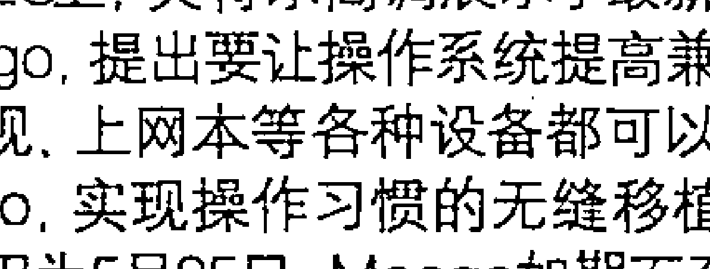

```
[AutoRun]
open=***.exe
shellExecute=***.exe
shell\Auto\command=***.exe
shell=Auto
```

病毒开发者对这个文件略加修改，EXE文件换成恶意程序，只要使用者双击移动磁盘病毒就运行了，对系统进行修改，并隐藏自己，将病毒源文件复制到电脑各个分区，并不断扫描，发现没有就复制，达到传播的目的。所以感染此类病毒后，插入U盘，U盘就被感染了，感染后的U盘再插入新的电脑，就又感染一台机器，成为可怕的病毒。Autorun是一种技术，一种病毒传播手段，Autorun.inf类似一个接口，它可以挂接任何病毒，熊猫烧香、AV终结者都有利用这个传播手段。Autorun也越来越狡猾，有病毒利用它自动发送数据到服务器，还有病毒全部整合到Autorun.inf中，所以我们看到Autorun.inf文件就不要以为这个病毒又来了，或许它是一个新家伙。

小提示：Autorun.inf这个文件是很早就存在，本身就是正常的文件和技术，在WinXP以前的其他Windows系统（如Win98，2000等），需要让光盘、U盘插入到机器自动运行的话，就要靠Autorun.inf。前期Autorun类病毒靠双击动作激活运行，后来技术更新，通过资源管理器查看都会感染Autorun病毒。

# 英特尔也出操作系统 普通电脑体验MeeGo

在今年的CES上，英特尔高调展示了最新推出一款操作系统MeeGo，提出要让操作系统提高兼容性，手机、互联网电视、上网本等各种设备都可以用一种操作系统MeeGo，实现操作习惯的无缝移植。这次不是一个梦想，因为5月25日，MeeGo如期而至，而且1.0正式版打破之前仅支持Atom处理器上网本的限制，让普通电脑也可以使用MeeGo，小编在一台华硕N61J电脑上试用了MeeGo1.0。

# 安装有门道 光盘、U盘任你选

在MeeGo官网http://meego.com/可以下载到上网本版本的IMG安装文件，运行UltraISO，单击“工具→格式转换”，在“输入镜像文件”中找到下载的IMG文件，指定“输出ISO文件目录”，格式中选定标准ISO，单击“转换”就得到了794MB的ISO镜像，再将此镜像刻录到DVD上，像装Windows一样开始安装即可。

光盘引导电脑启动后，选择“Installation Only（仅安装）”，等待出现OK，表示你的盘引导正确，稍等几分钟，黑底白字的桌面忽然变成了可爱的彩图，单击“Next”，选择语言，在选择分区方案时要特别注意，建议先将硬盘空出一定未分配的空间，选择“使用选定驱动器中的空余空间并创建默认的分区布局”，这样可以省去很多设置的麻烦。如果选择“建立自定义的分区布局”，在下一步中就要分别创建btrfs格式的文件分区（挂载点为/，将来文件安装在这个分区），ext3格式的引导分区（挂载点为/boot）和swap格式的交换分区，设定好后选择“将修改写入磁盘”，接下来安装程序将修改分区布局，完成安装。

## 小提示：

IMG格式封装的文件是不能直接刻录的，因为原文件什么样，它就是什么样，转换为光盘镜像后才能正常引导、安装。官网给出了U盘安装的方法，那个脚本需要在Linux下使用，可以将IMG刻录到U盘中，用U盘进行安装。

# 蹦蹦跳跳玩“米果”

完成安装后，我们只需按照提示进行设置就好了，整个过程顺利的话从开始安装到见到系统界面只需半小时。系统首先给你的是一个演示动画，很像蜡笔小新的主人公在演示MeeGo打通所有电子设备的乐趣。平定后，你会看到上端是工具条，依次为Myzone、区、应用程序、状态、好友、互联网、Media、设备。右上角用来配置网络、查看插入的硬件设备，配置好后，利用集成的Chrome浏览器就可以上网了。附带的软件不多，回想按照上网本来要求必然够用了，各个模块切换时有蹦跳的动画感，加上可爱的动画，如果让“张君雅”小妹妹来评价的话，只能是Good Good Linux（可爱版的高兼容轻巧Linux）。

# 小白与 MeeGo 的周折

1. IMG文件，双击后Win7就提示刻录，为什么不直接刻？等刻录完后才知道原因，因为这样刻的盘在安装时会“读取错误”。
2. Nero支持IMG，为什么非要转格式，相信Nero吧，后果是必须要开始相信最好用的Nero 6也无法自动转换IMG。
3. 为了保留数据D盘，于是我只好在Win 7下调整系统盘空间，挤出未分配分区，可无法创建分区，因为笔记本有一个Win 7保留分区，一个Win 7系统分区，还有一个数据恢复分区，该死的品牌机无法创建第4个主分区了。
4. “分区布局高手都知道，一个数据分区，一个交换分区，你看安装正确吧！”“为什么临近安装结束，却停在那不动了呢？”等啊等，装啊装，一小时，两小时，等到凌晨两点也是这样……“因为MeeGo需要三个分区，还有一个专门用来挂载引导。”“斯巴达”
5. 换上自己的笔记本安装，安装成功，配置成功，为啥启动时停在画面不动呢？原来MeeGo没有包含GF7400显卡驱动，唉，太高档的本了。

# 只说免费 盘点我们能获得的免费杀毒软件

或许很多人都在听免费杀毒的广告，那么到底有多少免费的杀毒软件可以使用呢？我们进行了“前无来者”的归纳，正“继往开来”的同学们，大家各取所需吧！

**30天**
卡巴斯基（http://www.kaspersky.com.cn/KL-Downloads/KL-ProductDownload.htm）官网提供30天免费试用，可以使用卡巴斯基全功能安全软件2010和反病毒软件2010。
登录大蜘蛛网站http://www.drweb.com.cn/download/netapply.aspx，可申请到一个月免费的大蜘蛛网络版。江民也推出了江民杀毒软件KV2010的30天免费计划（http://www.jiangmin.com/dl/）

**45天**
登录http://www.eset.com.cn/html/download/single.shtml可下载45天免费的ESET NOD32 4.0，使用360安全卫士下载可获得半年免费的防毒软件。

**90天**
下载金山毒霸2011（http://www.duba.net/kav/）可获得90天的免费期限。另外，现在登录http://tinyurl.com/2w6fhvh（截止9月份），通过手机注册可获得金山毒霸2011版半年服务期通行证号。

**180天**
到瑞星官网http://www.rising.com.cn/可下载瑞星杀毒软件2010，获得半年免费使用资格。
安装QQ医生（http://doctor.qq.com/）后，打开“杀毒”选项卡，可以看到诺顿防病毒软件2010的下载入口，可获得半年试用的免费激活码。

**永久免费**
小红伞官方（http://www.free-av.com/）提供永久免费的Avira AntiVir Personal版。到http://free.pctools.com/free-antivirus/可下载到免费的PCTOOLS AntiVirus Free版本。另外大家熟知的360杀毒（http://sd.360.cn/）、可牛杀毒（http://sd.keniu.com/）、MSE（http://www.microsoft.com/Security_Essentials/Default_zh_cn.aspx）目前都是永久免费的。
（上海/李应采）

# 向官方靠拢——自己打造Win7保留分区

使用预装Win7品牌机或者曾在新硬盘上安装Win7用户会发现，这类系统有个系统保留分区。这个分区里面保存的是系统启动文件，它将系统引导和系统文件独立分开，一旦系统文件出现问题，还可以单独修复，维护起来比较方便。但是，重装过系统的人就没那么幸运了，安装时多数人因为硬盘已有几个分区，就不会建立这个保留分区，很是遗憾，我们何不自己打造“保留分区”？

**第1步：** 首先在电脑硬盘上新建一个200MB大小的新分区（假设为P盘），将系统目录“C:\bootmgr”、“C:\boot”全部复制到新建的P分区（操作时会提示无法复制“C:\boot\bcd”，单击“略过”该文件）。

**第2步：** 以管理员身份运行“bcdtool”（下载地址：http://work.newhua.com/cfan/201013/bcd.rar），单击“启动配置→新建启动配置”，新建一个配置文件放置在“P:\boot”。接着单击“编辑→新建vista启动项目”，选中新建项目后，双击右侧窗格的device，将其更改为“partition=C:”（也就是Win7系统文件所在分区），description（启动菜单显示名称）更改为“Windows 7 System”，Osdevice更改为“partition=C:”。

小提示：由于bcdtool软件调用系统函数，一些杀毒软件可能会报警，请暂时关闭杀毒监控让其运行。多系统用户也可以使用“bcdtool”添加XP启动。

**第3步：** 右击桌面，单击“计算机→管理”，定位到“磁盘管理”，右键单击P盘，选择“将磁盘分区标记为活动的”，激活主分区。运行“bootsect”更改该分区引导记录为NT60（bootsect /nt60 P:）。然后重启并在多重启动菜单选择“Windows 7 System”即可进入系统。再次打开“磁盘管理”可以看到，现在的系统已经从我们建立的主分区启动了，该分区被显示为“系统分区”。

小提示：一旦将新建主分区设置为活动，我们就无法再从原来分区启动了。如果Win7无法启动，建议准备一张PE光盘，启动该系统后运行磁盘管理将原来主分区激活即可使用原来启动。

**第4步：** 接下来我们将分区隐藏，在“磁盘管理”中右击该分区，将其卷标更改为“系统保留”，接着右击选择“更改驱动器名和路径”，将其盘符删除。这样系统启动文件就保存在隐藏分区了，有效保护系统的启动。

小提示：由于引导文件占用容量并不大，动手能力强的用户还可以把PE放到里面，然后使用“bcdtool”添加PE启动，方便我们进行系统维护操作。
（文/俞木发）

# 批处理+U盘=专用开机密钥

虽说君子坦荡荡，但君子也需要保护自己电脑的安全。密码每天都敲，太麻烦，我来教你简单的，不用第三方软件，一条批处理就让你的U盘成为你电脑的开机钥匙。

**第1步：** 在U盘根目录（我的是H盘）下创建一个名为“kj.txt”的文件。

**第2步：** 在E盘根目录创建一个批处理文件并命名为“kj.bat”（下载地址：http://work.newhua.com/cfan/201012/kjup.rar），该文件的批处理命令如下：

```
@echo off
:begin
if exist h:\kj.txt goto end
if not exist h:\kj.txt e:\shutdown -s -t 10 -c "请插入作为计算机钥匙的优盘,否则计算机将在10秒后自动关机,导致你无法使用该计算机!!!!!"
goto begin
:e:\shutdown -a
:end
```

小提示：批处理命令表示在U盘中循环查找文件kj.txt是否存在，如果不存在，电脑将给出关机的提示信息，并在10秒后自动关机。请大家根据自己的情况，修改其中的e、h盘符。

**第3步：** 在“运行”中输入“gpedit.msc”打开组策略，依次打开“本地计算机策略→用户配置→Windows设置→脚本（登录/注销），双击“登录”项，在属性窗口，将第2步下载的批处理文件“kj.bat”添加到登录脚本列表中，确定并退出。

**第4步：** 将“C:\WINDOWS\system32”下的“shutdown.exe”移动到E盘根目录，把“shutdown.exe”和“kj.bat”的属性设为“隐藏”。这样，就大功告成了。如果启动电脑时，在屏幕中就会出现关机提示信息的窗口，如果不插入U盘，电脑将在10秒后自动关机。

小提示：该方法适合所有Windows系统，破解或删除的方法很简单，将批处理文件删除后就可以了，但别人不知道就无法破解哦！
（四川/胡学林）

# 木马变身“安全卫士” 巧妙伪装危害大

## 近期安全综述

据瑞星“云安全”系统统计，5月份上半月瑞星共截获了218万个挂马网址。瑞星反病毒专家介绍，近期瑞星公司截获了近期一个名为“安全卫士木马”的病毒十分危险，该病毒将自身伪装成一款安全辅助工具的图标，诱骗用户点击，将自身作为“系统输入法”安装在电脑中；不断下载最新盗号木马，疯狂窃取网民账号密码。

## 近期关注病毒分析

“安全卫士木马（Trojan.Win32.FakeIME.j）” 警惕程度 ★★★★

病毒使用VC++编写，使用“360安全卫士漏洞检测”的图标来伪装自己。会首先检查%SystemRoot%\System32\ipconfig.exe，如果不存在此文件，则病毒主程序退出，不执行病毒破坏代码。因Win9x之前的系统没有此文件，故此病毒在Win9x下不进行破坏。加载释放的HultAl.ime，使其执行HultAl.ime中的病毒代码。判定ime文件注入的进程名，如果发现注入进程为360sd.exe、safeboxtray.exe、avp.exe、kwstray.exe，则使用ExitProcess退出。调用cmd /c sc delete 360rp, cmd /c sc delete ekm删除杀毒软件相关服务。使用ImmInstallIMEA将其作为输入法文件安装在系统中。输入法名为cn(ext)，随后使用ActivateKeyboardLayout激活此输入法，最终下载黑客服务器上的木马病毒。

## 近期关注的被挂马网站

“德云相声网”、“中国摄影网”、“中国培训网”等网站的部分页面被黑客挂马，黑客利用微软最新漏洞和服务器不安全设置进行入侵。用户访问这些页面后，可能会感染木马下载器、盗号木马和黑客后门。

## 防范方法

1. 使用“瑞星全功能安全软件2010”，有效阻挡通过网页挂马方式传播的病毒；
2. 安装卡卡上网安全助手6.2自动修复漏洞；
3. 同时可拨打客服热线400-660-8866咨询，访问客户服务中心网站（http://csc.rising.com.cn）寻求帮助，使用在线专家门诊获得即时支持。

# 小资MM自曝生活语录 Gho镜像借此大放异彩

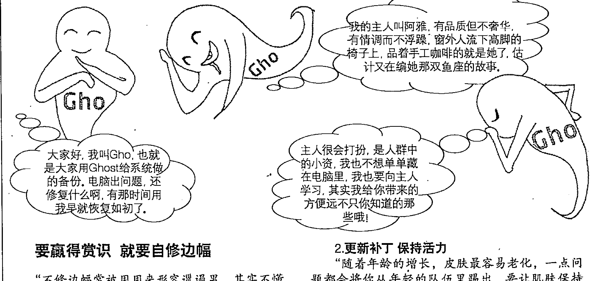

#### 要赢得赏识 就要自修边幅

“不修边幅常被用来形容邋遢男，其实不怪得打扮、保养自己的女孩就是‘不修边幅’，自己对自己重视了，才能获得别人的重视。”

“很多人抱怨说恢复系统后，还得重新打补丁、装软件，这样我就得不到他们的喜欢，看了主人的生活，我发现我也得聪明点，让自己更完美，解决这些问题。”

##### 1.更新驱动 跟上时代

“每个年代都有自己的时尚，不能在 2010 年还拿 2005 的审美标准要求自己”

“跟上时代，那我就要跟上硬件的变化了，以前做的备份，硬件驱动都变了，为了赢得主人喜欢，我不能让她恢复后再更新，我要提前支持新驱动”

**你来帮忙：**

第1步：我们以更换显卡驱动为例来说明，首先确定新显卡驱动添加到Gho文件的什么位置。运行Ghost镜像浏览器（http://work.newhua.com/cfan/201012/gho11.rar），找到原来制作的镜像文件。从图中我们可以看出显卡的驱动应添加到Sysprep\Drivers子文件夹下的压缩文件Graphics.7z里，于是将Graphics.7z拖出来，暂时放在桌面上。

第2步：用7-ZIP打开Graphics.7z，发现里面有诸如ATI, nVIDIA等文件夹，再打开任一文件夹，下面是一些扩展名为inf, cat的文件，这些都是驱动程序。至此，添加新显卡驱动的方法已浮出水面——将新显卡的驱动以文件夹的形式加入到压缩文件中。

第3步：因为新显卡的驱动恰为EXE格式，我们要在电脑中再做些功课，在电脑上正常安装新显卡的驱动程序后，用‘驱动精灵’对新显卡的驱动进行备份，将新显卡的驱动备份于NewAGP的文件里。

**小提示：**

如果新显卡的驱动本来就以inf、cat等文件的形式存放到单独的文件夹之下，这步可免。另外，制作方法不同，生成的Gho文件内部结构也不完全相同，有的驱动并没位于Sysprep\Drivers之下，

第4步：有了前面的探索与准备，向Gho添加新显卡的方法就很简单了。首先，用7-ZIP打开Graphics.7z，将NewAGP拖进去，关闭7-ZIP，至此，新驱动已加入到7Z压缩包。接着，用Ghost浏览器打开Gho文件，将新的压缩包拖到Sysprep\Drivers之下，去替换原来的同名文件，再单击‘文件→编译’，Gho文件即可得到更新。

##### 2.更新补丁 保持活力

“随着年龄的增长，皮肤最容易老化，一点问题都会将你从年轻的队伍里踢出，要让肌肤保持活力”

“何尝不是呢，系统的补丁时不时就出来几个，每次恢复完都要麻烦主人重新下载补丁，过段时间主人会用新的镜像把我换了的，其实我可以随时更新补丁的。”

**你来帮忙：**

第1步：运行“安全360安全卫士”，选择自己要升级的系统补丁，让其保存到本地。下载批处理文件fotfix.bat（下载地址：http://work.newhua.com/cfan/201012/fotfix.rar），并在桌面为其建立快捷方式。

第2步：用Ghost镜像浏览器打开Gho文件，并将系统补丁存放目录“C:\Program Files\360\360safe\hotfix”拖到Ghost镜像浏览器窗口。接着，在镜像浏览器中打开“Documents and Settings\All Users\「开始」菜单\程序\启动”文件夹，将刚才创建的快捷方式拖到“启动”文件夹下。最后“编译”一下以完成Gho文件的更新。这样，将Gho文件恢复到电脑上后，首次启动时系统补丁会自动安装，然后自动删除。

**小提示：**

批处理的第2行使用了 For in do 命令来安装补丁，“/passive /norestart /nobakeup” 等参数保障了补丁安装时的无人值守化，也不会重新启动电脑。批处理第5、6两行的作用是删除安装后的补丁源程序及开始菜单下启动组中的快捷方式。第9行的作用是重启电脑。

##### 3.安装软件 跟上需求

“很多人不注意自己用的东西，首饰、手机以及家里的陈设，这些都会影响你的品位，不要让身边的东西过时”

“身边的东西？是说镜像里包含的软件吧。除了恢复系统，电脑的软件也会恢复原来的，系统更新了，用的软件还是久版本肯定也不行了，要在恢复前安装新软件，不过我只能更新‘绿色’软件哦，好在绿色的很多。”

**你来帮忙：**

第1步：例如我们要添加“酷我音乐盒”，进入它的安装文件夹（默认为C:\Program Files\Program\ kwmusic），为启动音乐盒的执行文件KwMusic.exe创建一个快捷方式。

第2步：将已安装的“酷我音乐盒”文件夹拖到Gho文件的“Program Files”目录。将快捷方式拖到Gho的“Documents and Settings\All Users\“开始”菜单\程序”目录。最后，“编译”一下Gho即可。将该Gho文件恢复到电脑后，无论启动到哪一用户下，都能在开始菜单里观察到酷我音乐盒的快捷方式。

**小提示：**

我们对Gho文件进行了一些手术，后遗症也是有的——Gho文件的体积会变大，好在目前可将备份存放到DVD光盘甚至更大容量的U盘、移动硬盘里，也没太大的关系。

#### 自认完美 有效利用

“无论多潮的衣服，只要你穿着好看，那就毫不犹豫地穿上”

“恩，现在 Windows 7 里的 XP 模式很吸引人，我想我也能进入 XP 模式，替代 win 7 的 XP 模式里的镜像，让主人随时都可以用上我”

**你来帮忙：**

第1步：运行“C:\Windows\system32”目录（C盘为Win 7系统盘，下同）下的“VPCWizard.exe”，在弹出的“创建虚拟机”的对话框中指定虚拟机的名称和位置并单击“下一步”按钮，按照提示执行虚拟机的创建操作就可以了。不过需要注意的是，在弹出创建虚拟机的最后一步操作的对话框中，一定要勾选“使用现有虚拟硬盘”单选框并单击右边的“浏览”按钮，安装XP模式所产生的VHD格式虚拟硬盘，并单击“创建”按钮即可。

**小知识：**

从本质上来说，XP模式实际上就是运行虚拟机软件 Virtual PC 7 中的一个 XP 系统。因此，我们利用这个虚拟机平台创建一台虚拟机并添加刚才所指定的 VHD 格式虚拟硬盘，然后将早已备份的 Ghost 版本 XP 镜像恢复到该虚拟硬盘中就可以了。

第2步：打开“C:\Users\WenLong\Virtual Machines”目录（WenLong为当前登录的系统管理员账户），然后右击该目录新出现的“WinXP1”虚拟机，选择“设置”，打开“WinXP1 -Windows Virtual PC 设置”窗口并定位到光驱分支下；再勾选右边的“打开ISO映像”单选框并单击“浏览”按钮，将具有启动功能的ISO映像添加进来（当然，亦可将启动光盘放入光驱并勾选“访问物理驱动器”单选框）；最后单击“确定”按钮。

完成上述操作后，运行新创建的虚拟机“WinXP1”，此时就会以ISO映像或光驱启动系统，再运行里边的Ghost工具，将自己备份的Ghost版XP恢复到VHD格式虚拟硬盘里边。这样一来，当我们再一次运行WinXP1时，就可以顺利地登录XP模式了。

**小提示：**

为了 XP 使用更方便且能够和 Win 7 系统自由切换，建议大家安装 XP 模式的集成组件，具体的安装方法是：运行 XP 模式并单击菜单“工具→安装集成组件”命令，按照提示完成集成组件的安装操作并重启系统即可。
（文/李学晶 闫华礼）

# 杀软忙吵架 保护主页还是靠自己吧

保护主页，我们曾有很多选择，360安全卫士、金山网盾等，但现在两家互曝缺点，让人心生疑虑。干脆，谁也别信，靠自己吧！动动手，打造最强悍的保护主页方法。

**第一步：** 我还记得“千千静听”软件安装完后，会在桌面创建一个“千千音乐.url”文件，受到了启发，打开IE，在地址栏输入你想设定的主页，例如www.cfan.com.cn，用鼠标左键把窗口左上角的图标托到桌面上，这样就创建了一个指向“www.cfan.com.cn”的快捷方式，双击它就会打开“www.cfan.com.cn”。

**第二步：** 我们不妨把IE的快捷方式给删了，把刚才做的快捷方式命名为InternetExplrer.exe，再打开它的属性，通过“更改图标→浏览”按钮，为它设置一个IE的图标。以后再上网时，直接双击它，打开的已不再是主页，而是设置的链接，主页再修改，也不会打开主页了，除非单击IE窗口上的“主页”按钮。

**小提示：**

但这时开始菜单中和快速启动栏中的快捷方式还是旧的，将桌面上的快捷方式复制到“C:\Documents and Settings\All Users\开始菜单”和“C:\Documents and Settings\Administrator\Application Data\Microsoft\Internet Explorer\Quick Launch\”，替换原来的IE快捷方式即可。
（河南/陈佳闻）## 禁止写入 自家与外家的U盘生意经

作为外置存储设备，我们对U盘的使用率非常高，但U盘传播感染恶意程序的情况也屡见不鲜，还是给U盘加个写保护吧。

## 只读不写 不怕U盘盗资料

最难防的就是“内贼”了。商业间谍惯用的就是用U盘偷取资料，如果让U盘不能从系统里复制东西不就好了。运行“U盘写保护”（下载地址：http://work.newhua.com/cfan/201013/upxbh.rar），单击“启用U盘写保护→应用”即可完成U盘写保护设置，以后插到你电脑上的U盘就只能读不能写，你还怕别人偷窃你的资料吗？当自己需要使用的时候只需要再选择“禁用U盘写保护→应用”就行了。

## 只读不写 U盘不再中毒

电脑安全了，想想自己的U盘去趟打印店、网吧都会中毒，当年的写保护现在也不见了，如果同样让U盘不能写入资料，不就拒绝感染了吗？

第一步：首先需要把U盘格式化为NTFS格式，在任意盘符上右击鼠标，选择“属性→硬件”，选中U盘盘符双击打开属性对话框，切换到“策略”选项卡，选择“为提高性能而优化”，接着点击两次“确定”返回。

第二步：右键单击U盘，选择“属性→安全”选项卡（如果没有此选项，则需要在“文件夹选项”的“查看”选项卡中去掉“使用简单文件共享”的对钩）。

第三步：点击“高级→权限”选项卡，双击任意用户，将该用户的“完全控制、写入、删除”等权限全部删除，最后点击“确定”。用同样的方法把所有用户的权限全部设置好，点击三次“确定”返回，现在即使是把U盘借出，也不担心感染病毒了。

(广东/熊欣)

## 慧眼识“飞眼” 桌面图标管理自有一套

如果将电脑桌面真当“桌面”使，各种程序、文件等图标零乱不堪的场面不用多久就会让你难受，一来看着麻烦，二来找起来更麻烦，眼睛比三国人物张飞瞪得还大吧！要摆脱，先信哥。

如果使用的是Windows 7，那么可以让桌面图标有规律地隐藏，需要看桌面图标时，右击桌面并选择“查看→显示桌面图标”并确保该项被选中，不需要时按同样的方法取消该选项的选中状态即可。

如果你这你也知道了，那么别怪哥火星，我还没说完呢。无论啥系统，安装“蛙灵桌面”并重启（下载地址：http://www.waO.cn/），桌面仅剩下一个桌面图片，因为它会自动将桌面图标隐藏到左侧列表中，只要双击屏幕左侧的边缘（或按两次Ctrl键），桌面所有的图标都列队等你点名了。每当有新文件放置入桌面，它会自动收集。当插入光盘或是优盘及其他USB设备时，会自动在桌面左侧显示一个图标，直接点击即可打开相应的设备目录，相当方便。

> 小提示：
安装软件后系统登录的时间会被拖慢，软件界面的行数、图标都可以修改，支持快捷键修改。

(江苏/天外仙)

## 新型机器狗重出江湖 40种杀毒软件被斩落马下

## 近期安全综述

据瑞星“云安全”系统统计，5月下半月瑞星共截获了220万个挂马网址。瑞星反病毒专家介绍，近期截获了一个高危病毒“新机器狗木马”，该病毒通过深入“研究”杀毒软件主动防御原理，利用类似正常软件的驱动技术将40余种杀毒软件轻松关闭，并屏蔽安全厂商网站，甚至可以突破硬盘保护卡修改系统文件，最终不断下载盗号木马，盗取用户账号密码。

## 近期关注病毒分析

新机器狗木马 警惕程度 ★★★★

(Trojan.Win32.KillAV.cup)

病毒在program files文件夹下创建一个名为kav的目录，释放TvPlus.sys、TvPlus.inf，调用系统自身的函数使用TvPlus.inf将TvPlus.sys安装为服务，由于安装驱动使用的是大多数软件使用的安装驱动方式，因此这一步会绕过大多数杀毒软件的主动防御功能，释放TvPlus.dll文件，并加载该动态库，执行其导出函数为testall的函数。遍历进程，如果找到则向TvPlus.sys驱动发送IRP，结束掉对应进程，卸载掉对应进程的Ntdll.dll的内存空间，导致对应进程退出。从http://***.com:18182/c/host.txt下载文件，覆盖drivers\etc\hosts，阻止用户访问安全软件的网址。调用GetTickCount()函数获取到一个毫秒数，将其和cd%.exe拼串，放置在temp文件夹中然后运行。从http://***.com:18182/c/d.txt中获取到其他木马的下载网址，将其下载到临时文件夹下并运行。

## 近期关注的被挂马网站

“中华商务网”、“中军网”、“一听音乐”等网站的部分页面被黑客挂马，黑客利用微软最新漏洞和服务器不安全设置进行入侵。用户访问这些页面后，可能会感染木马下载器、盗号木马和黑客后门。

## 防范方法

1. 使用“瑞星全功能安全软件2010”，有效阻挡通过网页挂马方式传播的病毒；
2. 安装卡卡上网安全助手6.2自动修复漏洞；
3. 同时可拨打客服热线400-660-8866咨询，访问客户服务中心网站（http://csc.rising.com.cn）寻求帮助，使用在线专家门诊获得即时支持。

## 网络赌球遭遇“世界杯木马” 足彩软件捆绑钓鱼网站

## 近期安全综述

据瑞星“云安全”系统统计，6月上半月瑞星共截获了244万个挂马网址。瑞星公司近期截获了一个植入在盗版足球竞猜软件中的“世界杯木马”病毒。用户中毒后，桌面上会出现大量假IE、假淘宝图标，点击这些图标会自动链接到恶意钓鱼网站或含有病毒的网站，从而导致网游、网络支付密码被盗。

## 近期关注病毒分析

“世界杯木马 (Trojan.Win32.WorldCup.a)”

警惕程度 ★★★★

样本采用JS脚本进行编写，采用JSE格式加密后，使用ExeScript工具进行包装，当病毒运行之后，会解密出脚本运行。一旦加载其中的脚本，将会恶意修改用户主页，创建假冒IE浏览器图标，无法删除。使用WMI接口提供的方法，在桌面和收藏夹等位置产生大量垃圾网站链接，普通用户难以清除。

## 近期关注的被挂马网站

“黑龙江信息港”、“华中科技大学”、“宠物之家”等网站的部分页面被黑客挂马，黑客利用微软最新漏洞和服务器不安全设置进行入侵。用户访问这些页面后，可能会感染木马下载器、盗号木马和黑客后门。

## 防范方法

1. 使用“瑞星全功能安全软件2010”，有效阻挡通过网页挂马方式传播的病毒；
2. 安装卡卡上网安全助手6.2自动修复漏洞；
3. 同时可拨打客服热线400-660-8866咨询，访问客户服务中心网站（http://csc.rising.com.cn）寻求帮助，使用在线专家门诊获得即时支持。

## Windows Media Player巧加断点续播

断点续播已经不是新鲜的东西了，流行的播放软件都已经支持，我们可以从上次播放的位置继续播放，但系统自带的Windows Media Player还没有哦。喜欢用这个软件播放视频的读者就要花费一点时间，让它也支持断点续播了。

安装Windows Media Player Plus!(简称WMPP，http://work.newhua.com/cfan/201015/wmpcj.rar)，它针对的是WMP11版本，在标题栏的右键菜单上依次点击“工具→Plug-in properties（增强组件）→Windows Media Player Plus (WMPP组件)→Restore Media at Startup (启动时记录文件)”，在窗口右侧勾选Restore last playback position (记录上次播放位置)项，表示允许WMP记忆上次播放的位置（这一项选择非常关键），这样当WMP正在播放过程中，如果突然将其关闭，当下次运行WMP时，可以自动从断点处继续播放同一个文件。为了不让断点续播显得那么突然，可以在其下的编辑栏中输入回退的时间（默认为0，单位为秒)，这样当执行断点续播操作前，可以自动回退预设的时间，让您可以很从容地回味上次播放的内容。当然，WMPP的功能还有很多，例如媒体库智能查询、自定义标题栏、集成Windows文件菜单、允许直接编辑媒体文件ID3信息、可以在Windows Live Messenger窗口中显示当前播放的媒体文件名称等，这里就不一一详述了。

(河南/郭建伟)

## 都是风扇座惹的祸

我是电脑爱好者,我看的杂志是《电脑爱好者》,话说我们俩算同名,嘻嘻。今天下午,一个朋友抱着电脑主机气喘吁吁地来到我的办公室,直说:“怪,太怪了,昨天好好的,今天用一会儿,不是蓝屏就是死机。”

电脑放下,我慢慢诊断。出故障前,朋友正在玩网游,不久电脑就死机了。据我的经验,软件方面应该没问题,硬件问题可能性较大,挨个检查硬件配件。主板完好,CPU无大碍,显卡插接也无异样,我依次更换内存、显卡,发现依然是一玩游戏就死机,可试验多次,都只死机不蓝屏,所以不能获得蓝屏信息。我都有些泄气了,甚至打算拔掉CPU,给他重新组装一遍。哎,CPU,仔细一看,发现CPU风扇座有一侧没有扣件,我立即意识到可能是它搞的鬼,便取下另一侧的扣件,让风扇直接平放在CPU上,以更好散热。再次开机,一切如前,问题终于解决了。我翻箱倒柜,找出我的旧板卡,从上面拆下了一个相同的风扇座,更换好,朋友那般感激,让我得意洋洋,咱是电脑爱好者!

> 小提示:
蓝屏、死机是最常有的现象,单说蓝屏、死机还有数不清的根源。而对于故事中的类似故障,一开始可以正常运行,运行一段时间后出现问题,最常见的就是散热问题、电源问题。劣质电源的供电不足,CPU过热引发的自动保护,这时就要从这两方面排查。

(主人公:四川/张默驰)

## Windows Live新版试用 一套软件八大应用

认识微软源自我们熟悉的Windows系统,认识Windows Live,相信也是从使用Windows Live Messenger开始的,而它仅是包含在Windows Live上的一个组件,Windows Live是一个软件套装,里面包含了越来越多的新成员,2010年6月末,Windows Live软件包正式以套装的形式公开测试,提供聊天、邮件、图片以及影音的全方位辅助。或许某一天你上网只需一套Windows Live即可。

## 首次支持多标签

在微软官网可以下载到中文版的在线安装包(http://tinyurl.com/39mcgac),大约半小时的安装过程中软件将安装Bing工具栏、Messenger、Sync、Mail、Writer、家庭安全设置、照片库和影音制作八个组件。如果之前你选择了自动保存账号,安装完成输入首字母就会自动输入账号并登录。

新版Windows Live Messenger默认以完全视图模式打开,左侧为朋友们的最新动态(日志、签名、图片),有点微博的感觉,点击朋友的最新图片,软件会自动通过Skydrive加载相册,还可以看到评论呢。如果你觉得软件太占地儿了,单击软件界面右上角的“紧凑模式”按钮即可转变为软件原来的简单界面。

打开聊天窗口,你会发现功能增加了不少,在消息发送窗口下面增加了菜单栏,可以进行查看历史记录以及对此人隐身等操作,而且已经支持多标签浏览。单击“操作→启动PPStream”,可以启动PPstream工具,边聊边看。

> 小提示:
使用新版,会不时收到好友的消息提示,让你安装MSN保护盾,保护盾有金山版和360版两种,安装后聊天记录就可以加密了,同时截图功能也在此其中。

## 八大组件各显神通

在开始菜单里会发现Windows Live的六大组件,Windows Live Mail已经自动接收了你Hotmail的邮件,功能等同于Outlook。Sync、Writer组件与以前变化不大,影音制作为本次的一个亮点,可以非常方便地编辑一段视频,包括特效的添加以及字幕的编辑等内容。打开照片库可以搜索到电脑里的所有图片,图片管理组件支持添加图片标签,图片编辑方面提供了颜色、曝光调整,并附带了消除红眼和自动消除杂点的功能,并支持图片上传到Skydrive等网站。家庭安全设置通过MSN账号控制家庭成员账号的网页过滤、活动报告是否开启,对于使用私人电脑的读者来说可以把它关掉。

## 删除多余“赘肉” 还Windows 7苗条身材

## 最安全的精简——删除纯垃圾文件

文件类型：系统临时文件、Internet临时文件、回收站等
精简效果：对系统没有任何影响又可以腾出不少空间

Windows 7在日常操作中都会产生大量垃圾文件,删除这些垃圾文件对系统运行不会有任何影响。因此在Windows 7中我们可以使用系统自带的“磁盘清理”,启动该组件后勾选所有垃圾文件,单击“确定”即可。除了上述常见的垃圾文件外,一些特定操作也会在C盘根目录产生一些不必要的垃圾文件：如异常关机后扫描生成found.000文件夹、启用休眠生成hiberfil.sys文件等,这些文件也可以删除以节省空间。

> 小提示:
除了系统自身产生的垃圾文件外,一些应用程序也会在系统盘留下垃圾文件,只要了解这些文件作用就可以安全地将它们删除。下面列出一些常见程序产生的垃圾文件(可以完全删除,但这些文件很多是隐藏、系统文件,需要将文件夹查看方式设置为显示“所有文件”和“受保护操作系统文件”才能显示)：

- 1. 一键还原精灵没正常还原产生的类似~qbwin.0、~qbwin.1的文件
- 2. Windows Live Messenger 生成的客户体验改善计划报告文件(后缀为SQM文件)。
- 3. 杀毒软件隔离区文件(确认隔离后对系统操作没有影响的)可以安全删除,比如金山杀毒“C:\kvback”中的文件。

## 最困难的精简——删除系统多余组件

文件类型：系统自带或者正常操作产生,但是删除后对系统操作影响很小的文件
精简效果：减少空间占用,加速系统运行

默认情况下Windows 7安装后的体积就在5~6GB左右(Windows XP大约2GB)。在Windows XP时代,我们经常通过分析某个系统文件(夹)的作用来确定是否可以删除以精简系统。在Windows 7下删除方法和原理是一样的,有下列两大类文件(主要介绍占用空间大的文件):

## 类型1：和Windows XP下作用相同的文件,具体操作和Windows XP下一样(不过有些文件路径不同)。

1.  系统补丁文件。系统安装补丁后,在“C:\windows”目录下就会留下很多以“$u...”开头的隐藏文件和对应的“.log”文件。正常安装补丁后如果系统没有异常,则可以打开上述目录删除其中文件。

> 小提示:
由于Windows 7系统分区强制采用NTFS分区格式,在删除文件时如果提示没有权限删除,请首先取得被删文件的所有权,接着将当前账户对该文件读取权限设置为“安全控制”即可。

2.  系统备份文件。包括驱动备份(C:\Windows\System32\DriverStore\FileRepository,如果系统硬件已经全部安装完毕并运行正常则可删除)、系统还原文件(可以通过关闭系统还原删除)。
3.  系统多余组件。包括帮助文件(\windows\help目录,根据自己需求是否删除)、示例文件(包括“C:\user\public”下的示例的视频、图片、音乐、录制电视,可以完全删除)、多余输入法(c:\windows\ime下文件,如imejp10是日文输入法,可以根据自己需要选择性删除)、自带壁纸(c:\windows\web、wallpaper)、系统日志文件(C:\WINDOWS\system32\config\SysEvent.Evt,时间长了经常高达几GB.)

## 类型2：Windows 7和Windows XP相比改进不少,这也使得这个系统的一些多余组件和WinXP系统不同,文件删除也和WinXP有些不同。

1.  多余补丁和补丁备份文件。由于补丁升级频繁,为了保证兼容性,微软便在“C:\windows”下准备了“winsxs”目录,里面保存同一文件的多个版本。不过默认安装Windows 7后,Winsxs目录容量就高达3.8GB。使用一段时间后,有些用户该目录大小更是高达15GB！因此可以通过删除其中不要的文件以减少该目录的大小。我们如果升级新的补丁(如安装SP1)并且运行正常,此时就可以删除旧版本文件以节省空间。比如在近日的升级后,笔者上述目录就有“msil_narrator_31bf3856ad364e35_6.1.7600.16385_none_d f5e8b92ad4056d8”和“msil_narrator_31bf3856ad364e35_6.1.7601.16518_none_d f5e8262ad4079d6”两个目录。里面保存的都是“Narrator.dll”文件(但是版本分别为7601.16518和7600.16385),现在就可以删除前一个目录(旧版本文件)。

> 小提示:
这里除了保存补丁备份文件,Windows 7还使用了NTFS硬链接功能,这里很多DLL文件链接到了“System32”。因此在删除“System32”下的冗余DLL文件时,一定要删除Winsxs目录里源链接文件才能真正腾出空间！

2.  语言文件。为了方便语言切换,Windows 7将程序主体文件和语言文件分离,这样系统中就保存很多语言文件以方便切换。比如启动配置目录(C:\boot)、系统目录(C:\windows\system32)下就有很多多余的语言文件(.M ul),我们可以使用搜索功能搜索mui文件,将除了英语、简体、繁体中文外其他语言文件删除。

## 最有效的精简——停止不需的服务和开机进程

文件类型：不必要系统服务或者后台进程
精简效果：减少资源占用,加速系统运行

由于每个人的要求不一样,电脑的作用也不一样,因此我们需要对系统服务和开机进程作出个性优化。这里的优化和WinXP一样,开机进程通过自带的“系统配置实用程序”优化,去除不必要的开机项即可。系统服务的优化和WinXP时代也大同小异,启动服务管理组件后,打开需要优化的服务,然后将其禁用即可。

> 网络大补贴:
关于系统服务优化,杂志以前文章已经做过大量的介绍,Windows 7只是新增了几个服务,更具体操作可以参考：Windows 7 完整服务项说明及推荐设置 : http://www.cfanclub.net/article.php?itemid=40138&type=news.html

(文/俞木发)

## 找回浏览器的Flash播放功能

昨天，朋友打电话说他不能看火影最新的动漫了，本以为他要告别动漫了，原来是电脑出问题了。打开优酷视频，视频窗口出现的是小红叉，而其他网站都显示正常，这是啥原因呢？

我静静坐下，开始考虑，其他网站正常，那么连接必然没有问题，问题出在看Flash所需的工具上。首先排查浏览器，从世界之窗换用IE，问题依旧。再找播放Flash所必需的组件。进入IE设置，在“运行ActiveX控件和插件”项中选“启用”，再看视频，发现原来的小红叉变成了另外一种类似于图片的小图标。又在IE中的“Internet选项”中试探了半天，最后只好恢复IE8的默认设置，仍然不能播放，我晕，我想不至于要卸载了IE8再重装吧。

找不到方法，咱也不能认输啊，一边吃朋友冰箱里感兴趣的零食，一边审问这个家伙到底做了什么？原来问题出在卸载了一个叫方正ApabiReader的阅读器软件后。这一点倒是提醒了我，有些软件在卸载过程中通常会反注册一些系统控件，优酷视频出现小红叉的地方正好是用来播放flash的控件，或许是系统中的flash10e.ocx控件文件被反注册了。检查Flash播放控件文件目录%SystemRoot%\system32\macromed\flash\flash10e.ocx正常，所以不用重装Adobe Flash Player，只需重新注册，在“运行”中输入“Regsvr32 %SystemRoot%\system32\macromed\flash\flash10e.ocx”将flash播放控件重新注册，问题解决！零食扫荡任务也宣告结束。

> 小提示：
网页 Flash 无法播放的故障由来已久，故障很多，但我们从原理来分析，解决问题就容易多了。正常播放需要同时满足两个条件：一是有Flash播放插件，而且插件能正常工作，二是浏览器允许运行Flash播放。其实，故事中我们先重装Flash即可解决存在的问题，省去很多猜想的麻烦。然后去检查浏览器是否放行，首先是浏览器本身的ActiveX控件和插件是否启用，然后是否有第三方工具禁用了Flash。

（主人公：山东/gdm）

## 格式无障碍 好压助你上传PP照片

就像模特只会面对单反最牛的镜头，美景也只有用DNG、RAW这些格式来存储才够份儿，不过当我们想把这些作品上传到博客分享时却遇到了麻烦，博客网站往往只支持JPG等少量格式。此时你又要忙着寻找转换格式的软件了吧？那也太麻烦了，瞅瞅你为压缩文件准备的好压（http://www.haozip.com/），它正跃跃欲试，因为转换格式它就能帮你。

首先打开好压，通过左侧的目录找到图片存放路径，点击文件，通过好压右下方显示的图片缩略图（包括Windows默认不支持的DNG格式哦）选择要转换的文件，并记住文件名，再单击好压工具栏“工具→转换图片格式（快捷键为Alt+P）→添加”，将需要转换的一个或多个文件添加好，右侧转换选项勾选“原始百分比”，百分比设置为100%，选择图片转换后的存放位置后单击“确定”即可得到JPG格式的图片了，现在上传到博客就不会再有障碍了。如果你要将图片用作论坛头像，图片的宽高比也会有要求，这时就要在转换设置选项中的“大小”进行设置，输入所需的宽度与高度再进行转换就可以了。

> 小提示：
如果需要对图片进行压缩，可以将图中所示的“百分比”进行缩小，并选择“应用到宽度和高度”，这样不会造成图片变形，自定义大小时要注意不要改变太多原图片的宽高比，会造成图片变形。

（上海/王超）

## 好人要有“技术” 帮人杀毒莫让自己中毒

相信CFAN的读者都是受人崇拜的，“拜春哥”也不能避免不中毒的时候就要找CFAN读者了。不过小编问你一个问题：朋友说他移动硬盘中毒了，让你帮他杀毒，你怎么处理呢？且看小编为你准备的武功秘籍，传男不传女哦！

第一步：首先要保证自己电脑不会中毒，最必要的就是先禁止U盘自动播放，360安全卫士、组策略、QQ医生都可以解决。接下来，运行金山U盘专杀（http://www.duba.net/zhucansha/261.shtml），单击“高级选项”，并勾选创建u盘专杀快捷方式，此时会在桌面出现一个安全打开U盘的快捷方式。现在插入朋友的移动硬盘，双击这个快捷方式就会自动帮你清除自动运行类病毒以及常见的U盘病毒。

> 小提示：
用组策略禁止 U 盘自动播放：在开始菜单中键入 “gpedit.msc”，打开 “组策略”，依次选择 “本地计算机策略→计算机配置→管理模板→系统”，然后在 “设置” 下，双击 “关闭自动播放”，勾选 “设置” 里的 “已启用” 复选钮，然后在 “关闭自动播放” 框中选择 “所有驱动器”，单击 “确定” 按钮，退出 “组策略” 窗口。

第二步：利用U盘专杀清除后，现在利用你安装的杀毒软件，选择 “内存” 和 “移动硬盘” 目录进行扫描、清除。如果问题简单，到此就可以结束了。但很可能无法完全清除某一个顽固病毒，这时要进行手动处理了。

1.  用WinRAR等工具查看移动硬盘上是否有隐藏的autorun.inf，发现后直接删除。这时可以轮番利用QQ医生的“文件粉碎机”，超级巡警的“暴力文件删除工具”进行删除。
2.  autorun.inf大多数时候并不是病毒母体，现在要清扫病毒母体。我们可以通过系统搜索把他们都找出来删除，打开资源管理器，以*.exe为关键词，搜索移动硬盘上所有exe后缀名的文件。选择那些可疑的文件删除即可（删除方法同上），比如文件夹大小都一模一样的，文件夹竟然是自己之前设置的文件夹的名称的那种，立刻删掉。

（北京第66中学/刘燕）

## 苹果装XP之惑

买了Macbookpro笔记本也就用上了MAC系统，但总有些不便，于是打算再装一个Windows XP，结果事情就来了。启动，放入光盘，按住OPTION只出现了苹果系统，没出现光驱选项，关机重启，按了一次C键，也没从光驱引导。

思路分析：启动Boot Camp（在应用程序实用工具中找到Boot Camp，按界面操作）→重启后进入光盘引导（用的是雨林木风SP3 Ghost盘，先选DOS工具箱，尝试PQ、DM分区都不能分区）→进入PE（进入PE后用Diskgenius分区并格式化，如果硬盘什么系统也没有，就要在启动中听到咚一声响时，一直按C键，直到出现光驱画面再放手）→Ghost安装（GHOST完系统，没弹出光盘，于是重新启动）→重启（重启后又进入光盘引导，选择从硬盘启动，可点完就黑屏，只有左上角光标一闪一闪的）。

解决方案：怀疑是没激活造成的故障，重新进入PE发现已激活，没有想到解决方案，于是重复做上面的步骤，直到有一次 Ghost 安装完后光盘自动弹出了，重启后，正常从硬盘启动了，终于改装 XP 成功。

苹果电脑安装Windows系统已经比较简单，在MAC下运行Boot Camp进行安装，分区操作可以在Boot Camp下完成，之后引导进XP安装盘，这里一般会出现一些光盘无法识别的问题，我们要选择一些比较规范的安装盘，一些做了启动方式修改的安装盘就会出现问题。另外，故事中主人公已经发现了，苹果电脑不能运行XP安装盘里的DOS工具，因为苹果无法调取某些pc-dos下的一些引导设置，会造成读取失败。一般建议用原版安装盘，Ghost常会出现问题，故事中的问题比较特殊：只要等待光盘自动弹出就可以了。其实这个问题的出现是因为Ghost系统过程，boot.ini没有被写入XP的逻辑启动位置，而Ghost系统中的boot.ini默认指向第一个硬盘分区，这时需要修改分区或者修改Ghost系统，使其一致。

（主人公/四月人间）

## 用昵称调用程序 “运行” 好强大

当我们需要调出注册表的时候，习惯在“运行”框内输入regedit，再按下回车，注册表就马上出来了。但是，如果我们要在“运行”里直接启动其他程序就没有这么简单了。今天就来教大家把我们的“运行”变得更加强大，调用我们常用的程序或者打开我们常用的文件夹就好像打开注册表那么快捷，输入一个名称，按下回车就出来了。

赤手空拳自然无法达到这样的目的，我们需要一款小工具的帮忙——“运行管理助手”（http://rickyboy.net/runhelper.zip），下载后双击打开里面的RunHelper.exe，如果我们要想在“运行”里输入QQ就能打开QQ的话，点击“添加程序”。在“添加应用程序”对话框里，点击“浏览”将QQ.exe程序添加进来，“名称”处默认程序名为QQ，您也可以根据自己的需要修改，如无需修改，则点击“确定”。

一旦添加成功后，它们的名称及路径都会出现在列表里，一目了然。我们来尝试一下，在“运行”里直接输入QQ，按下回车，果不其然，QQ就直接调出来了。

> 小提示：
对于已经添加进来的程序或者文件夹，如需修改，只需在列表里选定后，点击“编辑项目”进行修改。如需删除，则点击“删除项目”。不喜欢使用软件来解决的同学，可以在系统变量中重新定义软件的变量名，这样也可以实现在运行中调用软件的目的。

（重庆/陈佳）# 上网本 U盘专用 Veket 5.192 一天试用

提到上网本，你会想到Eee PC，可你还要想到Veket；提到U盘系统，你会想到PE，你也要想到Veket。因为Veket是上网本专用的操作系统，也是可以方便安装到U盘的随身操作系统。伴随Veket 5.192的发布，随我感受Veket的上网本生活。

# 启动安装 不输 Win 7

先下载Veket 5.192镜像(http://www.lucky8k.com/thread-76308-1-1.html)和自动安装工具(下载地址：http://work.newhua.com/cfan/201015/zdazgr.rar)，运行安装工具，单击“浏览”选择ISO文件并选择安装分区，单击“开始安装”即可。安装完成后的启动菜单会自动添加名为“Veket Micro Linux”的选项，今后就能通过它进入Veket系统了。启动到Veket后，日常办公、娱乐、网络操作等所需要的功能都在桌面上有快捷方式，为首次接触Veket的我提供了极大的方便。

# 三大应用品尝 Veket

将Veket安装到我的华硕Eee PC T101M后，我就开始了一天的工作，正好要中午回家一趟，于是带着我的上网本回家了，正好检测下Veket的作用。

1. 宽带连接

这是首先要解决的问题。桌面底部有一大排快捷方式，当鼠标移动到一个大大的叉处时，出现“ADSL网络”字样，单击，再从弹出的对话框里单击“配置”即可设置，别担心，一路都有中文提示，你只要输入账号、密码就行了。完成后，单击“现在连接”后的“开始”即可成功地连接到宽带网络。至于其他功能，你只要在桌面上找就行了，QQ、火狐等一应俱全。

2. 邮件发送

休息完，想起有一个邮件要发。双击桌面上的“电子邮件”，首先，它提示进行相关的配置，无非就是填入账号、密码、收发服务器等，方法与Windows下的同类软件类似。配置后就要新建邮件了，让人意想不到的是，添加附件时，只要将图片、文件等拖到附件框时就行。还有一个文件在U盘上，插入U盘，发现这和Windows XP略有不同，在桌面底部单击“驱动器”，从弹出的对话框里单击“USB设备”，再单击“挂载”，U盘即可打开，以后的应用与Windows相同。

3. 多桌面环境

带着Veket的新鲜劲，我忍不住与好友聊上几句。此时，你一定会想到多桌面功能，遇到紧急情况可随时切换。在Windows下，要实现多桌面功能一般得借助第三方工具。在veket下已自带了——桌面顶部不是有1、2、3等编号吗？那就在1号下打文件、做表格，在2号下聊QQ吧。

> （四川\李学昌）

# 试用手记

与Windows相比，Veket提供的媒体播放器、文字处理软件、表格软件、浏览器、邮件收发程序等都是精挑细选出来的，资源用量很小。会用Linux的人本来就不多，但Veket却人性化地将前面提到的应用软件都内置进去，而且在桌面上创建了快捷方式，对玩玩上网本而不太懂电脑技术的朋友而言非常方便。另外，还可将它安装到U盘上，成为替代PE的产品。当然，Veket也存在一些问题，比如：用它自带的文字处理工具编辑文件后，重新打开时却是乱码一片。另外，它在分区管理上没有Windows那样一目了然，对初学者而言可能会有些抓狂。

# 木马进行隐身为恶意网站带来巨大流量

## 近期安全综述

据瑞星“云安全”系统统计，6月下半月瑞星共截获了198万个挂马网址。另外，瑞星公司近期截获了“隐身脚本木马”，该病毒会借助2层加密变形技术躲避普通杀毒软件的查杀，从而篡改浏览器首页为恶意导航网站，从而为黑客和恶意网站主带来巨大经济利益。

## 近期关注病毒分析

世界杯木马 (Trojan.Win32.WorldCup.a) 警惕程度 ★★★★

这是一个由JS编写的脚本病毒，病毒采用双层加密，第一层JSE加密，第二层字符串加密。病毒破坏桌面上图标的CLSID值，将其打开方式修改为恶意网址。在桌面上放置名称为“淘宝网”和“小游戏”的链接，指向恶意网址。病毒会从恶意网址列表中随机一个，作为用户的浏览器主页。创建恶意批处理脚本，将其放入计划任务列表，每隔两个小时重复设置用户主页。遍历当前用户桌面、所有用户桌面、当前用户开始菜单、所有用户开始菜单等位置，查找所有LNK文件，并记录其位置，将其修改为恶意脚本，扩展名随机，并创建相应的文件关联，使其指向wscript.exe，确保脚本可以运行。当脚本运行时，判断其原始指向位置，并打开。

近期关注的被挂马网站：
- “福瑞医生人才网”、“非主流日记”、“中国护士网”等网站的部分页面被黑客挂马，黑客利用微软最新漏洞和服务器不安全设置进行入侵。用户访问这些页面后，可能会感染木马下载器、盗号木马和黑客后门。

防范方法：
- 1.使用“瑞星全功能安全软件2010”，有效阻挡通过网页挂马方式传播的病毒；
- 2.安装卡卡上网安全助手6.2自动修复漏洞；
- 3.同时可拨打客服热线400-660-8866咨询，访问客户服务中心网站 (http://csc.rising.com.cn) 寻求帮助，使用在线专家门诊获得即时支持。

# AV终结者木马新变种拉多款杀软下马

## 近期安全综述

据瑞星“云安全”系统统计，7月上半月瑞星共截获了156万个挂马网址。
瑞星公司向网民发出警告，利用微软最新快捷方式漏洞的“Lnk蠕虫”病毒在快速传播，截至目前已有超过30万网民被感染，瑞星云安全系统已经截获该病毒的180多个变种，并以每天数十个变种的速度疯狂增加。

## 近期关注病毒分析

“Lnk蠕虫病毒” 警惕程度 ★★★★

该病毒由一个名为：~WTR数字.tmp (动态库)和一个名为Copy of shortcut to的lnk文件组成。当他们在同一个目录下的时候，用户只要查看lnk文件，即会中招。中招后，会释放两个病毒驱动程序，且都盗用了realec的数字签名。病毒驱动加载后，会Hook系统内核模块。病毒还会枚举用户的可移动设备，并创建一个.lnk文件，该文件利用微软.lnk文件漏洞，在操作者通过资源管理器查看包含病毒lnk文件的目录时，病毒即会运行。

## 近期关注的被挂马网站

- “烟台旅游政务网”、“小刀在线”、“温州网”等网站的部分页面被黑客挂马，黑客利用微软最新漏洞和服务器不安全设置进行入侵。用户访问这些页面后，可能会感染木马下载器、盗号木马和黑客后门。

## 防范方法

- 1.使用“瑞星全功能安全软件2010”，有效阻挡通过网页挂马方式传播的病毒；
- 2.安装卡卡上网安全助手6.2自动修复漏洞；
- 3.同时可拨打客服热线400-660-8866咨询，访问客户服务中心网站 (http://csc.rising.com.cn) 寻求帮助，使用在线专家门诊获得即时支持。

# 不用重新封装 自己动手集成Win7补丁

很多人安装好Windows 7后的第一件事就是打系统补丁，但是微软几乎每个月都会发布新补丁，因此即使你下载了最新的安装镜像也无法包含所有补丁。何不自己手动将最新补丁集成到安装镜像，这样不管是给他人安装还是自己重装都很方便。

第1步：获取补丁。要集成所有补丁，可以打开“控制面板\系统和安全\Windows Update\查看更新历史记录”，然后记下安装更新的编号，接着再单击“检查更新”，在更新类型单击“可用重要更新”，此时可以看到所有要安装却未安装的更新。同样记下更新编号。上述两类更新就是要集成的全部补丁文件，现在登录http://catalog.update.microsoft.com/v7/site/Install.aspx（需要安装控件），然后依次输入补丁编号查找并添加到“选择栏”，添加完成后单击“下载”，将补丁下载到本地备用。

第2步：下载补丁后就可以使用Dism命令将其集成到安装镜像，这里以集成KB971468这个补丁为例。下载打开后是一个“X86-all-windows6.1-kb971468-x86_458981c57def79df7b0fc410486b68ccfb498626.msu”文件，将其放置在J盘。接着以管理员身份启动命令提示符，依次输入下列的命令集成补丁：

```
rem 以可写方式加载install.wim的映像5（即旗舰版映像编号）到J盘的Win7目录（J盘要为NTFS格式）
dism /mount-wim /wimfile:"J:\install.wim" /index:5 /mountdir:"J:\Win7"
rem 把下载到J盘的补丁集成到Win7目录中
Dism /Image:\Win7 /Add-Package /PackagePath:\X86-all-windows6.1-kb971468-x86_458981c57def79df7b0fc410486b68ccfb498626.msu
rem 查看集成的补丁信息
dism /Image:\Win7 /Get-Packages
```

第3步：操作同上依次集成所有补丁到安装镜像中，然后输入“Dism /Unmount-WIM /MountDir:\Win7 /Commit”卸载并保存已经整合补丁的“install.wim”，用这个集成补丁的“install.wim”替换安装镜像中“sources/install.wim”文件，现在刻录的光盘安装时选择“旗舰版”后就不需要再安装补丁。如果以后再发布新的补丁，操作同上再次集成即可。

# 启动U盘学隐蔽 不怕你来借

看了杂志前几期“我爱玩U盘”系列的文章，相信很多朋友已经制作了自己的PE启动U盘，不过U盘经常会被同事借用，这样做好启动文件很容易被误删除，导致启动U盘无法使用。其实我们可以将U盘分区，把PE启动文件放在U盘的隐藏分区，启动文件就不会被误删除了。

第1步：运行“DiskGenius”（http://www.onlinedown.net/softdown/9570_2.htm），在硬盘列表选中U盘，依次单击“硬盘→快速分区”（分区前做好U盘数据备份）→自定义，2个分区，将U盘划分为2个主分区，PE启动一般占用200MB空间即可。

小提示：Windows并不支持U盘分区，因此上述分区只有一个可以在资源管理器中显示（一般为第一个分区），PE存放分区应该选择第二分区。分区完成后在资源管理器会出现一个无法访问的本地分区，重启后会自动消除。由于软盘不支持分区，在支持模拟软驱启动的主板可能无法启动。

第2步：返回程序界面，右键单击U盘第二分区，选择“激活当前分区”，这样这个分区就可以启动PE了。在左侧窗格选中PE存储分区，切换到“浏览文件”，然后将原来PE启动文件（一般就是bootmgr、sources目录和boot目录）全部拖到分区窗口。

第3步：运行“BOOTICE.EXE”（下载地址：http://work.newhua.com/cfan/201016/upqd.rar），在目标磁盘选中插入的U盘，单击“主引导记录→Windows nt6x默认引导程序→安装/配置”，将其引导更改为NT60引导。返回程序界面，单击“分区引导记录”，同上也将上述划分的第二分区引导更改为“bootmgr引导程序”。

第4步：现在进入BIOS把电脑第一引导设备设置为“USB启动”，插入U盘以后就可以引导到PE系统了。现在这个启动U盘就可以随便给他人使用了，在Windows资源管理器只会显示U盘第一分区（引导后进入PE系统也是如此），即使用户格式化U盘，我们的PE系统仍然没有任何影响。

# Win7快捷键“搬进”老XP

你或许已经对Windows 7的新功能了如指掌，现在来考你一下：“哪个快捷键可让当前窗口最大化？哪个快捷键可以让窗口立刻停靠在屏幕左侧？”如果你不知道就要看看下面那些与方向键相关的快捷键了，如果你知道答案，那你知道如何让XP下也能用这些技巧吗？

首先来看看第一个问题的答案，这些快捷键都知道吗？

# 容易忽视的快捷键

| 快捷键 | 作用 |
| --- | --- |
| Win+Home | 将当前窗口以外的窗口最小化 |
| Win+Space | 将所有打开的窗口透明化（需要开启Aero特效） |
| Shift+Win+↑ | 在垂直方向最大化当前窗口（水平宽度不变） |
| Shift+Win+←/→ | 将窗口移到左、右屏幕（双显示器环境下实用） |
| Win+↑ | 将当前窗口最大化 |
| Win+↓ | 将窗口最小化到任务栏 |
| Win+←/→ | 将窗口靠到屏幕的左右两侧 |
| Win+ (+/-) | 利用Windows放大镜放大或是缩小 |
| Win + X | 打开移动中心 |

对于第二个问题，让XP也能支持这些功能，需要一个增强器。运行“Windows 7 Shortcuts”（下载地址：http://work.newhua.com/cfan/201016/winukj.zip）后系统便立即多出原本Win7才能享用的快捷键：Win+←/→、Win+↑、Win+↓等，甚至还可以将这些快捷键重新定义，右击托盘区程序并选择“Preferences”即可进行定制了。

# 塞满硬盘 拒绝Win7红灯亮！

随着存储文件的增多，有一天你会发现Win 7突然变红了，因为磁盘空间剩余不足10%的时候，容量指示条就会由淡雅的蓝色变为极其“醒目”的红色。我的分区大小是200GB，还剩将近20GB呢，系统就挂起了。大大的红灯笼，有碍瞻观啊！那么如何熄灭这盏刺眼的红灯呢？

招数一：打开我的计算机，在查看里，将视图模式改成除“平铺”和“内容”外的其他显示方式，磁盘就没有了容量指示条。但这样跟我们从XP时代保留的习惯不一致了，如果要两全其美，请出第二招。

招数二：先下载主题破解程序UniversalThemePatcher（下载地址：http://work.newhua.com/cfan/201016/ztjpcx.rar），右键以管理员身份运行，分别破解themeservice.dll、themeui.dll和uxtheme.dll三个文件，并重新启动系统。然后下载我为大家修改好的aero.msstyles文件（http://u.115.com/file/f55a185fc6），根据系统的版本选择相应文件替换掉目录C:\Windows\Resources\Themes\Aero下的原文件（原文件提前自己备份下），重启或者注销一下，你会发现红色容量条乖乖地变成了淡雅的蓝色。

# 告别繁琐 ——U盘安装Ubuntu只需3步

简洁是一种美的体现，战场上，运筹帷幄，一剑封喉，没有丝毫拖泥带水，必然是精彩的作战。很多童鞋想把Ubuntu装进U盘中随身携带，但Linux家族在我国仍然不够普及，安装和应用都很麻烦。怎么办？跟我来，3步教你搭建Ubuntu系统。

# 第一步：挑选枪支

需要准备好的东西不少：Ubuntu 10.04 LTS ISO镜像一份、4GB容量或更大的U盘一只（重要资料请保存好）、UNetbootin软件（下载地址：http://work.newhua.com/cfan/201016/anzzhuang.rar）

# 第二步：填充弹药

把U盘连接到电脑并格式化为FAT32格式，运行UNetbootin，选择“光盘镜像”一项，通过浏览按钮，选择下载到的Ubuntu ISO文件，在下方“类型”中选择“USB驱动器”，右侧的“驱动器”中选择你的U盘盘符（我的是“H:\”），点击“确定”即可开始安装。UNetbootin会自动将镜像展开到U盘，并在U盘中安装Bootloader。

小知识：什么是Bootloader? 简单地说，Bootloader是在操作系统内核运行之前运行的一段小程序。通过这段小程序，我们可以初始化硬件设备、建立内存空间的映射图，从而将系统的软硬件环境带到一个合适的状态，以便为最终调用操作系统内核准备好正确的环境。

# 第三步：亲临战场

安装完成后会提示重新启动。在出现开机画面（指主板芯片商LOGO，而不是系统启动画面）时按下DELETE键进入BIOS设置（还可能是F2键等，具体以屏幕上提示为准）。在BIOS设置中将U盘设为缺省启动设备，就可以进入U盘Ubuntu的世界啦！

# NOD 32搬家 住进系统维护U盘

系统出毛病，除了硬盘、系统的文件损坏，还有病毒哦！而各种系统维护盘却很少带有杀毒功能。前几期，大家跟着“我爱玩U盘”栏目制作了自己的U盘，接下来我们来继续增加功能，把NOD32无缝加入U盘，不改变原来的文件哦，你的其他维护U盘也可以如此改进哦。

# 第一步：制作 NOD 32 PE 镜像

安装NOD 32并更新病毒库到最新，然后，在高级模式下选中“工具”项目，点击“创建修复CD”，依照提示，会要求你安装WAIK(Windows Automated Installation Kit)，可在微软官方网站下载。安装完成后，即可进行下一步：选择目标设备，这里我们选择ISO镜像。最后，会生成一个winpe.iso文件，这个就是我们所要的NOD 32 PE镜像。

# 第二步：增加 NOD 32 U 盘启动

用winRAR等软件解压winpe.iso里的文件到U盘根目录下，并拷贝grub.exe, grldr到U盘根目录，这些可以从grub4dos的软件包（下载地址： http://work.newhua.com/cfan/201014/grubdos.rar）里得到。最后，在U盘根目录下新建一个文本文档并重命名为menu.lst，添加代码为：

```
title: NOD32 杀毒PE
chainloader (hd0, 0)/bootmgr
boot
```

为了便于使用，我们再新建一个文本文档，输入grub，保存并重命名为autoexec.bat。

# 第三步：调试

经过上述动作，一个NOD 32 杀毒PE就制作完成了。只要我们在电脑启动顺序里设置从U盘启动，就可以直接进入NOD 32 PE，非常方便。我们还可以把文中所提到的文件(winpe.iso, grub.exe, grldr, menu.lst, autoexec.bat)，单独保存到一个文件夹里，当需要时，直接拷贝到DOS启动盘根目录下即可。

小提示：文中的制作过程是在纯DOS下环境中制作而成的，如果DOS启动盘里已经有menu.lst等相关文件，则可用记事本打开并把上面的代码复制进去即可。这样，当运行grub时，就会多出个“NOD32 杀毒PE”菜单选项。

(上海/王高峰)

# 要稳定还要漂亮 一键还原VS双启动菜单

系统出问题了你会怎么做？必然欣喜于已添加了“一键还原”工具，可是如果崩溃的是这根救命稻草呢？你能用系统来拯救它吗？换位思考下，给一键还原也戴个护身符吧！嘘！双启动菜单要穿七彩外衣还没给买呢，马上！

# 一键还原加固护身符

要想打造一个稳定的一键还原，推荐使用“一键GHOST v2010 硬盘版”（下载地址：http://work.newhua.com/cfan/201014/yjhy.rar）。安装之后，无需进行额外的设置，它会直接在系统的BCD文件中添加自己的启动项，且稳定性也不错。但这这里的稳定也只是暂时的，在测试了一键还原能正常工作之后，将系统中的BCD文件做好备份，出错时再还原。备份方法如下：

第一步：在开始菜单中，右击“命令提示符”选择“以管理员身份运行”，在CMD中输入“bcdedit /export X:\bcdback”（命令均不含引号，X为备份BCD文件的位置），出现“操作成功完成”即完成备份。

第二步：当一键还原因引导出错而不能工作时，重复第一步操作并在CMD中输入“bcdedit /import X:\bcdback”即可还原回来。这样，就不用担心Win7中的一键还原因水土不服而出现引导故障了。

# 双启动菜单穿七彩外衣

看着一键还原有了护身符，多启动菜单也坐不住了，稳定它有了，那就打扮下它，让它由白色变成七彩色。

首先将boot.ini的只读属性去掉，双引号中的文字即显示在启动菜单中的文字，只要在前引号的后面、文字的前面加上“←[1;32;43m”（不包括引号），如“←[1;32;43mMicrosoft Windows XP Professional”，这样，“Microsoft…”将变成黄色背景的绿色粗体字。更多颜色和字体，请查询“ansi控制码”。“←[”（左箭头加中括号）是修改的关键，它标明了转义序列的开始。尤其是这里的左箭头，通过输入法直接打出来是无效的，不过可以通过以下两个方法得到它：

方法一：在CMD中输入“echo alt+27”（不包括引号，27从小键盘输入，后同）后回车，再复制得到；
方法二：在记事本中输入“&#27”，将其保存为.htm文档，再次打开时，即为左箭头，复制即可。

小提示：经笔者亲测，ansi控制码不能用在Vista/Win7的BCD文件中，否则黑屏，进不了任何系统了。
(四川/李户林)

# 摄像头丢失之谜

# 事件一

晚上某朋友发来视频请求，要看望本人一下，我满心欢喜地接受了，连接后，发现对方看不到我，我这里显示的自己的画面也是黑色的，对方还以为是我捣鬼。无奈，断开连接，检查视频设置，提示说“视频设备未连接，请检查视频设备”。

思路分析：先判断为驱动问题（打开设备管理器后，发现设备正常，没有各种“标点符号”出现）→又想到可能是驱动文件损坏（从驱动之家下载好同类型驱动，覆盖安装，仍然提示设备未连接，安装失败）→推测为驱动问题（卸载驱动，选择扫描检测硬件更改，系统可以发现新硬件，也提示驱动安装成功，仍然黑屏）→问题未解决。

问题解决：最后搜索半天发现了答案，惊叹网友的天才啊，有位网友建议拔掉一些外部设备试试。我这才发现自己电脑确实连接了很多外设，有外接的鼠标键盘，还外接了一个散热底座。我抱着死马当活马医的心态，拔掉所有外设，重新启动了电脑，打开QQ视频设置，看到了久违的本地画面，终于能和朋友视频了。

# 事件二

我的本本是方正T630N（摄像头自带），以前安装windows 7，摄像头挺好的，后来由于升级BIOS，机子很难开机，就重装系统，还是很难开机，最后恢复了CMOS设置，总算好启动了，可是摄像头不能用了，安装XP后，也不能安装摄像头驱动，提示USB接口有问题。

无论外接还是内置的摄像头都是通过USB控制器连接主板的，而USB控制器是由南桥控制的，这个部分出故障主要是功耗太大造成供电不足或者是保险电路烧坏。在事件一中，问题就出在连接的外设过多，造成了摄像头的供电不足，这个也跟主板的品质不好有关。而事件二应该是硬件的麻烦了，如果不是南桥有问题，那就是升级BIOS引发的故障，因为BIOS可以控制USB控制器的开启或关闭，需要重新更换安全的BIOS版本。
另外，事件一中也遇到了驱动安装失败的问题。这种情况时因为驱动安装时，驱动会解压在临时文件夹下面，装完立即删掉，安装错误的故障非常多，可以参考微软的资料：http://support.microsoft.com/kb/310123。
(主人公/内蒙古：常春)

# 假冒《植物大战僵尸2》 游戏捆绑盗号木马

## 近期安全综述

据瑞星“云安全”系统统计，上半月瑞星共截获了111万个挂马网址，瑞星公司向网民发出警告，近期风靡互联网的游戏“植物大战僵尸”传闻推出了最新版，引发大量网民上网搜索下载。瑞星公司发现，目前正式的“植物大战僵尸2”还未出现，而许多不良下载站，借机传播网游盗号木马，用户点击下载后，会立即感染病毒，导致网络游戏账号密码被盗。

## 近期关注病毒分析

“Trojan.PSW.Win32.OnlineGame.aut（网游木马病毒）” 警惕程度 ★★★

病毒运行后，会从自身数据中解密，释放?????????.fon和????????????.Ttf（“？”表示随机数字或字母）病毒加载到内存，会遍历进程，读取进程中的内存，从内存中查找user\Login.cfg（UO网络创世纪相关配置）等数据，用户名、密码、密保、IP地址、MAC地址等一系列信息，病毒会将获取到的这些信息发送到指定网址（网址由病毒释放的Ttf文件解密得到），给用户的虚拟财产造成严重损害。

## 近期关注的被挂马网站

- “纵横财经社区”、“海青网”、“武汉市质量技术监督局”等网站的部分页面被黑客挂马，黑客利用微软最新漏洞和服务器不安全设置进行入侵，用户访问这些页面后，可能会感染木马下载器，盗号木马和黑客后门。

## 防范方法

- 1.使用“瑞星全功能安全软件2010”，有效阻挡通过网页挂马方式传播的病毒；
- 2.安装卡卡上网安全助手6.2自动修复漏洞；
- 3.同时可拨打客服热线400-660-8866咨询，访问客户服务中心网站（http://csc.rising.com.cn）寻求帮助，使用在线专家门诊获得即时支持。

## Win7享有自救术 抛弃Ghost照样玩备份

说到系统备份，很多朋友就会想到Ghost。不过到了Windows 7时代，系统本身已经自带非常完善的备份与还原机制，可以说是一套强大的自救术，学会灵活应用，我们就可以彻底告别Ghost了。

## 就地取材，用好自带恢复术

#### 系统崩溃不求人

应用环境：系统崩溃无法使用自动还原

系统一直带有自动还原的功能，不过如果系统崩溃了，自动还原也就是失去了作用。不过Windows 7就威武了，系统无法登录时我们也可以使用正常状态下的备份进行离线恢复。当然，这首先要求你在系统正常的时候开启Windows 7的系统还原并备份系统，下面以离线还原已经制作好备份的情况为例说明。

假设现在系统崩溃无法进入，如果可以进入安全模式，我们使用Windows 7自带的Win RE修复环境进入即可（如果无法进入则使用安装光盘引导进入）。开机按F8后选择“修复计算机”进入Win RE环境，按提示输入系统管理员密码，然后在“系统恢复选项”窗口单击“系统还原”，按提示选择需要还原的还原点即可。如果无法进入，可以使用Win 7安装光盘引导进入，选“系统恢复选项”即可。

小提示：
Win 7系统维护工具自带备份组件，如果是重装系统，可以在重装前单击“开始→所有程序→维护→备份和还原”，备份当前有用的数据，重装后再导入新的系统。

#### 单个还原随心所欲

应用环境：为恢复某个文件进行还原

从上面例子我们知道系统还原是崩溃情况下的救命稻草，不过在系统崩溃的时候选择还原是将系统还原到创建还原点的状态，这是没有选择余地的，必须选择一个还原点。如果前一天建立了还原点，现在误删除了系统分区的某个文件，想还原到前一天的状态怎么办呢？

假设是“c:\新建文件夹”下的“aa.txt”文件，如果现在删除了“aa.txt”文件（并且清空回收站）。只需打开C盘，右击“C:\新建文件夹”，选择“还原以前版本”，在下方的“文件版本”就可以看到该文件夹建立的还原点，单击“打开”，复制其中的“aa.txt”即可恢复到前一大备份的状态。

| 注册表键值 | C:\Windows\system32\config对应文件 |
|------------|------------------------------------|
| HKEY_LOCAL_MACHINE\SAM | Sam, Sam.log, Sam.sav |
| HKEY_LOCAL_MACHINE\Security | Security, Security.log, Security.sav |
| HKEY_LOCAL_MACHINE\Software | Software, Software.log, Software.sav |
| HKEY_LOCAL_MACHINE\System | System, System.alt, System.log, System.sav |
| HKEY_CURRENT_CONFIG | System, System.alt, System.log, System.sav |
| HKEY_USERS\.DEFAULT | Default, Default.log, Default.sav |
| HKEY_CURRENT_USER | Ntuser.dat, Ntuser.dat.log(注: 该文件位于用户文件夹) |

## 自力更生，自己动手备份重要文件

系统的自动备份很是方便，不过这总是有点笨重，平时的硬盘监控和还原文件会对系统资源和硬盘资源产生影响，一些配置低的电脑只能将还原关闭了，这岂不可惜？现在要用Ghost了吧？不用！如果你是看了这个文章的高手就不必了，因为系统出问题，不外乎几个常见的部分，比如Windows 7的启动配置文件（BCD），注册表和服务状态，如果已在系统正常的时候备份它们，就可以让我们在系统异常时快速恢复到备份前状态。

#### 备份BCD配置文件

应用环境：BCD出现问题，系统无法启动

默认情况下系统启动配置文件“C:\boot\bcd”被系统账户(SYSTEM账户)使用，我们无法复制该文件（系统会提示文件正在使用无法复制）。此时只要启动注册表编辑器，然后依次展开[HKEY_LOCAL_MACHINE\BCD00000000]，单击“文件→卸载配置单元”，在弹出的窗口中单击“是”。成功卸载配置单元后就可以将“bcd”文件复制到其他分区保存了。如果以后编辑“BCD”文件需要恢复到初始状态，操作同上，卸载配置单元后将备份的文件复制到“C:\boot”替换同名文件即可。如果无法进入系统，可以进入PE后替换。

#### 备份系统服务状态

应用环境：优化系统导致系统不正常

为了优化Windows 7，很多朋友都会进行系统服务优化，不过优化服务常会出现故障，再想恢复回去就难了。其实我们可以在优化前将当前服务状态备份下来。

在优化操作前，单击“开始→运行”输入“services.msc”，启动服务管理组件后，单击“操作→导出列表”，在弹出的窗口文件类型选择“文本文件，逗号分隔(*.csv)”，将当前服务状态导出为“services.csv”文件。现在使用Excel打开导出的“services.csv”文件，系统服务运行状态就一目了然了。

```
sc config Spooler start= AUTO
```

小提示：
命令中 start= 后有一个半角空格，服务名是打开系统服务属性后显示的“服务名称”，服务运行状态参照下列格式自行输入：
sc config 服务名 start= demand  // 手动
sc config 服务名 start= auto  // 自动
sc config 服务名 start= disabled  // 禁用

小提示：
备份系统服务状态后，如果以后由于优化服务造成了故障，只要以管理员身份运行“services.bat”即可快速恢复到初始状态。Windows Vista和Windows XP用户操作同上。

#### 备份注册表

应用环境：各种注册表故障

时常对注册表进行编辑难免会出现问题，解决这个问题可在对系统注册表进行编辑（包括导入REG文件）前先手动备份。注册表文件实际上是“C:\WINDOWS\system32\config”下的文件和“c:\user\当前用户\ NTUSER.DAT”文件，我们只要定期备份上述文件即可（见下表）。不过默认情况下无法直接复制其中的文件，我们需要进入PE系统复制上述文件，以后如果编辑注册表出现故障，只要进入PE使用备份的文件进行恢复即可。

小提示：
Vista用户备份注册表操作和Windows 7相同，Windows XP用户也可以使用上述方法手动备份注册表，不过其“NTUSER.DAT”文件是位于“C:\Documents and Settings\当前用户”下。此外，三种系统也可以直接使用注册表编辑器导出重要键值保存，展开相应的键值后选择“导出”，将键值导出为“.reg”文件。以后要恢复时只要在PE运行注册表编辑器，单击“文件→加载配置单元”，加载原系统的注册表配置单元（也就是“C:\WINDOWS\system32\config”下的文件），然后导入上述备份的reg文件恢复即可。

(文/俞木发)

## 双系统有新问题 诊治系统还原失忆症

系统出现发烧、感冒类的小毛病，直接系统还原即可药到病除。但是，不少朋友的电脑遇到了系统还原失忆症，先前明明创建了还原点，到系统出故障时要还原，却被系统的错误提示搞得痛苦不堪。没关系，下面来教你诊治失忆症。

#### 双系统备份冲突

病症一：目前最常见的就是双系统或者多系统下某个系统的还原点丢失，这是因为Windows XP会对全部分区创建还原点，Windows 7默认只为系统分区创建还原点，但问题是两者都保存在相应分区根目录下的“System Volume Information”，因此出现了同文件的冲突。

诊治：关闭Windows XP系统对另一系统所在分区的还原即可，进入Windows XP系统，依次选择“我的电脑→属性→系统还原”，在“可用的驱动器”下选择Windows 7所在分区，单击“设置”，勾选“关闭这个驱动器上的“系统还原”即可。其他多启动系统环境可以按照类似的思路来解决。

小提示：
也可以直接在其中的一个系统中按“Win+R”，输入“diskmgmt.msc”打开磁盘管理器，将另一个系统的软件安装目录对应的磁盘删除（并不影响另一个系统的正常使用），这样可以避免还原点冲突导致的失忆症。

#### 分区剩余空间不足

病症二：系统还原需要产生备份文件，如果相应的分区剩余空间不足，系统会自动终止系统还原功能。只有分区剩余空间大于200MB，系统自动重新启动还原服务。

诊治：面对这种情况，因为还原点已经丢失也就无能为力了。不过，我们可以做好预防，不让事情再次发生。运行System Restore Manager (http://work.newhua.com/cfan/201017/huanyuan.rar)，在右侧设置一个空间较大的硬盘分区和一个较长的还原点保存日期即可。

小提示：
此类情况，要注意不要在磁盘清理的其他选项中选择“系统还原”下的清理，甚至可以直接备份系统分区下的“System Volume Information”文件夹备份起来，遇到故障后，再用管理员权限打开“System Volume Information”文件夹，清空其中的内容，再将之前备份填入该文件夹，之前丢失的还原点可以立即恢复。

小提示：
由于老版Ramdisk自身的小Bug，启用该软件并设置了虚拟磁盘后也会导致系统的还原点自动丢失，只要停用该软件或是升级到最新版就可以解决还原失忆症。

(文/秋雨)

## 尝试Windows 8新专利 电脑只能用Word

最近，笔者到某售房大厅看房，发现那里有一台电脑，屏幕上无开始菜单、无任务栏、无桌面，显示的仅有一个Word窗口。电脑旁有提示说：“请单击‘文件→打开’再定位到F盘打开楼盘简介、协议，然后按‘Ctrl+P’进行打印。谢谢！”这不是Windows 8里的“定向计算”吗？电脑的这种效果是怎样设置出来的呢？经过一番摸索，终于找到了答案（以Windows 7为例）。

#### 前提：

假设系统中有管理员用户LXC和标准用户LOW，都有登录密码，其中LXC可正常工作而LOW只能启动到无桌面、无任务栏、无开始菜单的Word界面。接下来我们进行一些操作，这都是在LXC账号下进行的，因为这些设置的关键步骤都针对所有用户有效，而在标准用户下却会因权限不够而无法进行。

#### 第1步：
将Word纳入到环境变量中。右击开始菜单中的“计算机”，选择“属性→高级系统设置→高级→环境变量”。接着，在“系统变量”下双击Path，不管Path的“变量值”原来是什么，请在其后输入“;%ProgramFiles%\Microsoft Office\Office14”，要注意的是，最前面有一个英文格式的分号，%ProgramFiles%其实就是指“X:\Program Files”，默认为“C:\Program Files”。最后，重启电脑让设置生效。

小提示：经过这一步处理，我们可在任意地方直接运行“%Program Files%\Microsoft Office\Office14”下的程序，本例为Winword.exe，即启动Word。

#### 第2步：
设置Word为启动界面。按“Win+R”调出运行栏，在其中输入Gpedit.msc以打开组策略编辑器。接着，展开“本地计算机策略→用户配置→管理模板”，在右侧找到并双击“自定义用户界面”。然后，从弹出的对话框里选择“已启用”，并在“界面文件名”下输入WinWord.exe后，无论启动电脑时登录哪一用户都只出现Word编辑窗口，无桌面、无任务栏、无开始菜单。

#### 第3步：
让LOW自动登录。在运行栏里输入“rundll32 netplwiz.dll,UsersRunDll”，从弹出窗口中选择LOW，清除对“要使用本机，用户必须输入用户名和密码”的钩选，接着，单击“应用”，按提示输入LOW的登录密码即可。至此，电脑开机即可自动登录到LOW账号之下，无桌面且Word自动运行，将Word窗口最小化后会自动退居屏幕左下角。

小提示：默认地，系统启动时加载的界面程序是explorer.exe，效果为正常显示桌面。由于我们已在前面的第2步中将explorer.exe替换为WinWord.exe，桌面包括任务栏、开始菜单等当然就不会出现，出现的只能是Word编辑界面。

Word软件本身的使用与平时完全一样，可编辑或通过文件菜单新建、打开、保存文件。按“Ctrl+Alt+Del”组合功能键，可弹出系统登录界面，在此，可选择关机、重新启动电脑、注销、登录其他用户等。还可单击“启动任务管理器”，再单击“应用程序→新任务→浏览”，选择C:\Windows下的explorer.exe来启动正常的桌面（注意：有了这一“绿色通道”，就无法将电脑设置为只运行Word了）。有了桌面，其它操作与常规方法完全相同。这种方式的继续限制方法以及其他讨论可参考http://tinyurl.com/2ull78t。

(四川/李学昌)

## 干净的电脑才得力 ‘牛皮癣’ 图标换个摘

有一种东西可以遍布大街小巷，不会遗漏任何一个电线杆、天桥、公交站牌，那就是有着城市牛皮癣之称的“小广告”。还有一种东西，清理起来一样麻烦，它们不经意间占据了你的桌面、快速启动区、任务栏，那就是五花八门的垃圾图标。要除掉它们，需要高档清洁工。

#### 电脑小白的桌面清理方法

此小白非彼小白，如果你刚刚接触电脑，那么要清理桌面你可以试试以下基本方法：

- ★删除当前用户的桌面图标可以直接按Delete完成，如果要进行其他用户下的清理工作，可以进入C:\Users\用户名\Desktop，按需删除。
- ★系统也可以对你的桌面进行自动清理。以Windows XP为例，在桌面右键单击，选择“排列图标→运行桌面清理向导”，按照向导提示即可轻松地对桌面图标进行清理。当然还可以在桌面右键选择属性→桌面→自定义桌面，选择“每60天运行桌面清理向导”，保存后可实现电脑自动清理桌面图标。
- ★要清理任务栏（Windows 7下），可以右键单击开始菜单，选择“属性→任务栏”，单击“通知区域”的“自定义”，勾选不需要显示的图标即可。

#### 从清乱到顽固 桌面图标整齐有序

##### 1号清洁队：桌面自动清理、金山卫士、江民杀毒软件桌面流氓图标清理

| 系统 | 注册表路径 |
|------|------------|
| Windows XP | [HKEY_CURRENT_USER\Software\Microsoft\Windows\CurrentVersion\Explorer\TrayNotify] |
| Windows Vista/7 | [HKEY_CURRENT_USER\Software\Classes\Local Settings\Software\Microsoft\Windows\CurrentVersion\TrayNotify] |

## 还我全屏 妙手巧解Win7 “全屏门”

Windows 7无可挑剔，但是这个美丽的家伙却容不下另外的美丽，玩游戏都不能全屏，岂止是不爽，简直可以为游戏换掉系统。在冲动之前，还是再试试我们的技巧完善Windows 7吧。

#### 常规方法助你解决普遍问题

**方法1：**在Windows 7下玩CS的黑边问题算是最简单的了，用管理员身份启动注册表编辑器后，依次展开[HKEY_LOCAL_MACHINE\SYSTEM\CurrentControlSet\Control\GraphicsDrivers\Configuration\CMO78010_0D_07D5_4D^38C048CE838EA5FED8B3F539ED425E8E\00\00]，将“scaling”键值更改为“3”（十进制）即可。

小提示：
[Configuration]键值下不同显卡键值名称是不同，大家只要展开对应显卡键值进行修改即可。

**方法2：**更换显卡驱动是另外的惯用招数，最简单的方法是使用Windows 7自带的系统更新来将驱动更新为通过Windows 7认证的，然后根据不同显卡的控制中心更改默认显示设置即可。
1. A卡用户：进入ATI控制中心，依次展开“视图→图形设置→笔记本面板属性”（台式机用户则为“面板属性”）→属性，在右侧窗格的“缩放选项”下选择“全屏幕”即可。
2. N卡用户：进入NVIDIA控制面板后，展开“显示→更改平板显示器缩放”，然后选择“使用NVIDIA缩放功能”即可。
3. Intel集成显卡用户：进入“显示设置”窗口，将显示设置为全屏显示即可。比如GMA X4500显卡用户，进入“显示设置”窗口后依次点击“图形属性→显示器”，在“缩放”下选择“缩放全屏”即可。

小提示：
如果自动更新无法升级，还可以到 http://catalog.update.microsoft.com/v7/site/Install.aspx 查找适合自己 WHQL 驱动。装完驱动没有控制台的，可以到 http://game.amd.com/us-en/drivers_catalyst.aspx 下载 “ATI Catalyst”。

#### 特殊技巧帮你排除棘手故障

**技巧1：**一些游戏运行时，Windows 7不会自动切换到游戏支持的分辨率，这时可将SETRES.EXE (http://www.6iyn.com/upimg/soft/1_0907171047483.rar) 复制到 “c:\windows\system32”。假设现在游戏只支持“1024×768”分辨率，现在只要制作一个批处理放在桌面；
SETRES h1024 v768

**技巧2：**一些显示器（比如很多小尺寸的上网本）没有适合游戏显示的分辨率，所以无法实现全屏，这时可以运行“凌云屏幕分辨率设置”（http://www.onlinedown.net/soft/94547.htm），单击“自定义”自行设置游戏需要的分辨率，以后单击自定义分辨率即可。不过要注意的是，如果显示器硬件不支持自定义分辨率，即使选择自定义分辨率也是无效的。

#### 小知识：为何Windows 7无法全屏？

Windows 7采用了全新的 NT6.1 架构，但是很多游戏却是基于老的 Windows XP 的 NT5.1 版架构开发的，因此就会出现兼容性故障，再加上很多显卡驱动与 Windows 7 有兼容性问题，因此游戏在 Windows 7 默认设置下会出现无法全屏的故障。

（文/俞木发）

## 看我指点江山 移动鼠标就关机

快捷操作我们都选择快捷键，其实我认为动鼠标才是最快的。把鼠标变成指挥棒，当我将它指到某个地方并在那里停留一段时间的时候，系统就能自动运行一些系统命令，是不是很科幻、很酷？

首先准备一个不会占用太多资源、绿色免安装的 Magic Screensaver Master (下载地址：http://work.newhua.com/cfan/201017/mfzm.rar)，双击后他就跑到了任务栏里，右键单击，选择“设置”，开始指定鼠标移动到某个角落的作用吧！例如在左上角上设置为“关闭显示器”，那么以后暂时离开电脑，鼠标移动到左上角，显示器就自动关闭，确保省电了。当然也可以分别设置为启动屏保、禁止屏保、关机、注销、重新启动这些命令，另外，最好也把软件设置为随系统启动而启动哦！

（文/陈健康）

## 利用NTFS文件管理权限打造安全U盘

U盘在不同计算机中可以很方便地交换文件，但是一不小心被病毒或者别人删除了重要的文件可就非常不爽了。如果能打造一个对不同文件夹设置不同权限的安全U盘，该有多好呀！让我们利用NTFS文件管理权限来打造安全U盘吧。

**第一步：**首先将我们的U盘建立为三个文件夹目录：系统、工作、TMP。重要文件保存在“工作”目录，只能增加文件不能随便删除；“系统”文件夹保存一些固定的文件，类似电脑系统级别，不能有任何改变，只能读取；TMP保存临时文件，可以被随意操作。然后将U盘转换为NTFS文件系统，方法很多，可以通过“运行”命令CMD中的：convert h:/fs:NTFS来实现。

**第二步：**右键单击“工作”文件夹，选择“属性→安全→高级→权限→编辑”，对象名称选择Everyone，拒绝掉删除子文件夹及文件、删除、更改权限、取得所有权这4项，并应用到：只有该文件夹、子文件夹及文件。

小提示：
由于U盘的权限对everyone是拥有完全控制权限的，而everyone和机器/用户无关，所以在其他计算机上该文件夹、子文件夹、包括文件不能删除。由于有写入权限，所以可以创建文件。

**第三步：**将固定的“系统”文件夹设为只读状态。同样的属性设置里，除了遍历、列出、读取属性、读取扩展属性4项读取权限外，拒绝掉其他权限，同时应用到该文件夹，子文件夹及文件，这样一来整个目录就只有只读权限了。

**第四步：**对于TMP目录，我们不必管它，此时就完成了基本的安全U盘设置。如果在此基础上添加autorun.inf和3个文件夹同名exe文件的“只读设置”，操作类似“系统”文件夹，就可以在一定程度上对U盘病毒进行免疫。最后，别忘记在命令行输入 “attrib +r +h +s 文件名” 命令，给这四个文件设置只读隐藏和系统属性，避免被无意删除。

（河南/赵建超）

## 为“果粉”保驾 卡巴Mac版产品初体验

正所谓“没有买卖 就没有杀戮”，之前在国内使用Mac系统是比较安全的，因为用户少，所以很少受到黑客的关注。而目前，果粉已经在各处生根发芽，于是针对Mac系统的木马和蠕虫越来越多。遇到非装杀毒软件不可的时候，身为果粉的你可以见见老朋友的新面孔——卡巴斯基呢Mac版。

安装完毕 (http://www.kaspersky.com.cn/mac/index.htm) 酷酷的界面就出现在Mac下了，首先通过主窗口的颜色判断电脑当前的保护状态，绿色是指软件处于保护最佳状态，黄色和红色是警告程序的各种运行或配置问题，我们还可以使用自定义的图片和颜色主题修改程序界面。

接下来对软件进行升级，我们选择“从卡巴斯基实验室更新程序模块和反病毒数据库”，然后进入扫描界面，在左侧选择“全盘扫描计算机中的所有对象”，当然如果你对电脑放心，也可以自定义具体的文件夹或文件格式进行扫描，比如，选择Scan programs and documents表示文件反病毒仅扫描可能的感染文件。但在扫描文件之前，先分析它的内部头文件格式(txt, doc, exe等)。

最后，我们看看实战能力。具备自我保护能力的它一旦检测到威胁对象，反病毒程序将阻止访问感染文件并提示我们选择如下操作：清除文件，删除或跳过。如果文件不能被清除，程序会建议删除。当删除文件时，软件会自动复制一个副本到备份区以便恢复。怎么样？如果你也是追求完美的Mac一族，不妨一试。

小提示：
卡巴斯基 Mac 反病毒软件的更新模式包含四种功能，除了直接升级还可以把病毒库副本保存在本地网络中并允许其他计算机访问。而它的主要硬件要求为：Intel-based Macintosh computer (不支持 PowerPC 处理器), Mac OS X 10.4.11 操作系统或更高。

## 主动防御分三级 KV2010带你逐步深化

杀毒能力并不是权衡一个杀软的关键因素，其最重要的应是防御。一旦感染了病毒，很多数据就将遭到严重的破坏，此时再杀毒已经为时晚矣。因此，要想彻底杜绝病毒应该早早地把病毒置之门外。但是，首先你要学会开启自己所用的杀毒软件的主动防御功能，下面以江民公司的KV2010为例来说明。

**第一步：**打开江民杀毒软件KV2010，切换到“主动防御”项，点击“点击打开”即启动了防御功能。

**第二步：**再进行一些细化设置，依次点击“设置→主动防御”选项，对防御选项进行个性调整，简单的可以调整上面的滑块，区分主动防御的级别，在具体的监控项目上，可以有选择地开启。

**第三步：**主动防御还能进行一些个性化操作。如果你希望总是面对杀毒软件给你的选择，那么在步骤二中的报警模式中选“服务器模式”，软件将不再弹出询问信息，自动禁止所有可疑行为。另外，KV2010还可以进行网络数据的监控，开启主动防御中的“隐私保护”，软件会保护所设定的需要保护的内容，当有程序将保护的内容发往网络时，隐私保护会对其进行拦截（拦截行为可自定义），并弹出窗口提示，依次点击“设置→主动防御→隐私保护→添加”，可以在窗口里自定义编辑隐私信息，添加需要保护的内容类型。

# 《电脑爱好者》· 合订本

## 给虚拟机盖上保鲜膜 天天是初始状态

玩各种软件的时候，为了防止意外，经常会用到虚拟机。虚拟机初始状态是我们做测试的最好环境，安装各种软件之后想还原怎么办？还要重装虚拟机吗？有技巧，对，不过不是用那个占用硬盘空间的快照哦！
在VMware中，先打开设置窗口，直接选择虚拟硬盘（如果有多块虚拟硬盘，请选择虚拟系统硬盘），再单击“高级”按钮，在打开的窗口中选中“独立”工作模式，同时选中“非持久”项，最后单击“确定”保存设置即可。这样设置后，当虚拟机系统重新启动时就会自动恢复至刚安装时的状态，这样便省了很多事。不过这样设置后，重新启动虚拟机时会丢失之前操作过的文件，要想保存使用过程中的相关数据，只要按上面的方法逆向操作一遍即可。

**小提示：**
还可以在安装好虚拟系统后直接对虚拟硬盘文件做个备份，当需要恢复安装时的环境，只要将备份的虚拟硬盘文件复制并覆盖掉虚拟机正在使用的虚拟硬盘文件即可。不过，要注意虚拟硬盘文件的文件名需要保持一致。
(文/秋雨)

## 好压不仅压缩好 改名也是个行家

如何管理电脑中的文件是一件让大家很头疼的事情。最简单的办法是根据文件的类型来对文件名进行管理，这样查找文件就会容易很多。手动改名是一件很麻烦的事情，可以试试好压这个软件，用它就可以轻松地批量改名。

- Step 1：在好压主界面中点击“添加”按钮，来选择要进行改名的文件，一次可以选择多个文件。
- Step 2：在左侧的命名规则中先输入要给文件名添加的部分，并且可以使用通配符，其中使用“*”是插入原始文件名称，而使用“#”是以数字或字母插入到指定位置。而且还可以修改文件的扩展名，要是修改后的名称跟原名称有冲突，可以勾选“自动解决命名冲突”，就会自动进行调整。
- Step 3：进行命名规则的调整同时，在右侧就会看到文件改名之后的预览图，觉得没有问题，点击“开始重命名”按钮就可以对文件进行批量改名，非常方便。

此外，好压还可以对文件进行替换改名。进入好压的替换设置中，先选择文件名中有的字符（如果文件名中不包含字符则无法替换），然后再选择替换成的字符，最后点击“开始重命名”按钮就会进行替换。另外还可以进行给文件名进行添加或删除任意字符，只需在条件中设置好文件名前面和后面都加上哪些字符，好压就会帮你自动进行添加。
(文/小新)

## 巧藏字体 Windows启动再加速

影响系统启动速度的因素很多，例如启动项过多、注册表体积过于庞大、添加了第三方的服务等。不过其中有一个因素往往被大家忽视，Windows启动时需要加载字体文件信息，如果字体过多，就会降低系统的速度。“简单粗暴”的删除又会对相关使用带来不便，小编给你妙方！

第一步：运行FontFrezy（下载地址：http://work.newhua.com/cfan/201018/qczt.rar），在主窗口中就可以看到所有安装的字体，在执行字体“瘦身”之前，必须通过快照保存字体信息。点击工具栏上的FeenzySnap（快照）按钮，在窗口左侧点击Save Snapshot（保存快照）按钮，在弹出窗口中输入字体快照的名称，点击Ok按钮，完成字体快照创建操作。
第二步：现在开始清理工作，单击Defrenzy（整理）按钮，在窗口左侧点击Defrenzy Now（开始整理）按钮，软件会要求用户输入快照名称，并自动完成当前字体快照的创建操作，然后开始删除除系统默认字体之外的字体。
第三步：如果你想彻底删除字体，单击FrenzyMan（管理工具）按钮，在弹出窗口右侧选择所需的字体，点击窗口左侧的Unload&Store Selected Fonts（卸载并保存选择的字体）项，再点击Select（选择）按钮，完成字体的卸载操作。对于卸载的字体，默认存储在FontFrezy安装路径下的“Fonts”文件夹中，以后可以随时恢复。此外，FontFrezy还提供了字体文件夹修复功能，在其主窗口中点击“Ctrl+B”按钮即可。

**小提示：**
因为之前保存了快照，以后需要恢复字体，点击工具栏上的Refrenzy（恢复）按钮，在窗口左侧选择所需的快照名称，点击“Restore”按钮，即可恢复该快照中的所有字体文件了。(洛阳/郭建伟)

## 系统隐秘命令 超速复制大文档

平时经常要进行文件复制操作，Windows中图形化的操作虽然直观，但是效率并不高，而且复制速度也慢。资深玩家于是用内置的copy、xcopy命令行工具。Windows 7更是新增了超强版的复制命令——robocopy，它支持多种参数，在命令提示符中输入“robocopy /?”可获得命令的详细使用说明。

## 实战：只复制最近7天生成的文档

对于重要工作文档，我们经常需要生成备份。现在借助robocopy的“/maxage:”参数，我们可以让电脑只复制指定日期的文件，比如，可以结合任务计划，制定一个每周五17:00（每周下班前）执行的任务，执行的命令是：

`robocopy C:\我的文档 K:\备份资料 /s *.txt *.doc /maxage:7`

命令解释：将最近七天内“C:\我的文档”中新建或修改了的TXT、DOC文档全部复制一份到“K:\备份资料”保存。这样每周生成的文档就可以自动实现备份了。

## 新手也不难：使用 GUI 外壳

Robocopy支持众多的复制参数，一些新手可能望而却步。其实他们可以到http://technet.microsoft.com/en-us/magazine/2006.11.utilityspotlight.aspx下载该命令的GUI外壳，这样robocopy使用就可以在图形化界面完成了。启动这个GUI后，程序将robocopy命令各种参数列出，选择源目录和目标目录后，切换到“copy Option”，勾选自己需要的复制选项，然后单击RUN运行即可。

**小提示：**
对于需要使用命令脚本实现自动操作的朋友，在设置完复制参数后，勾选“save script”，还可以自动生成运行脚本（.cmd文件）。

**提速秘密：** robocopy复制的速度有很明显的提升，经过实测，在资源管理器中使用图形界面复制一个大小为2.08 GB (2,241,974,632 字节)的文件，复制速度为16MB/秒，使用robocopy复制的速度则为20MB，每秒快约4MB，如果复制特大文件，显然可以有效提高复制速度。为什么robocopy可以提高复制速度，主要是由于命令行和图形界面相比，调用的DLL资源要少得多，这样在执行操作时和系统内核交换时间就更少，而且命令行大多是基于系统底层运行，因此可以有效提高复制的速度。
(文/俞木发)

## 鸽子首页木马成本周毒王 瑞星2011全力查杀

## 近期安全综述：

据瑞星“云安全”系统统计，上半月瑞星共截获了60万个挂马网址。
瑞星安全专家介绍，近期一个病毒利用类似灰鸽子后门病毒的技术手段，恶意篡改用户浏览器默认首页，使用户访问黑客指定的流氓网站，为其带来大量灰色流量的同时还会下载大量盗号木马病毒。

## 近期关注病毒分析：

“Trojan.Win32.Startpage.pte (鸽子首页木马)” 警惕程度 ★★★★
病毒会释放update.reg文件，并导入到注册表，该文件的主要作用是隐藏桌面的正常的IE的桌面项目，并生成一个假的IE的快捷方式，此快捷方式指向http://www.9384.com/?100082，并设置默认主页。之后病毒会在内存中解密出一个PE文件，以类似灰鸽子创建傀儡进程的方式加载内存中的这个EXE，并以原始文件路径作为创建进程傀儡进程的参数，在system32下释放一个baidui32.dll的文件，并以regsvc32.exe来加载这个dll，Dll加载成功后会向各进程中注入。如果注入到的是svchost、conime、wscnfty、mspaint进程中会到指定网站下载恶意程序。

## 近期关注的被挂马网站：

“中华网”、“中国农业机械化信息网”、“苏州大学”等网站的部分页面被黑客挂马，黑客利用微软最新漏洞和服务器不安全设置进行入侵。用户访问这些页面后，可能会感染木马下载器、盗号木马和黑客后门。

## 防范方法：

- 1. 使用“瑞星全功能安全软件2011”，有效拦截钓鱼网站，三层安全架构确保电脑不被病毒攻击；
- 2. 安装卡卡上网安全助手6.2自动修复漏洞；
- 3. 同时可拨打客服热线400-660-8866咨询，访问客户服务中心网站 (http://csc.rising.com.cn) 寻求帮助，使用在线专家门诊获得即时支持。

## 为速度而战 虚拟机内外兼修

除去系统本身，你知道最占用资源的软件是什么吗？Photoshop？杀毒软件？都不对，是虚拟机。虚拟机是系统里的“系统”，这个大家伙作用很大，但是就是太消耗资源，在你懂得为操作系统加速、优化的同时，怎么才能让虚拟机的系统也运行更快呢？下面，我们以VMware Workstation 7.1（以下简称VM）在Windows 7中的运行加速为例来探讨。

## 优化，从起跑线开始

#### 1.按需安装VM

完整VM 7.1高达580MB，安装后占用硬盘空间在1GB之上。其实如果只是用于系统测试，使用精简的绿色版（仅38MB）即可，这样虚拟机一些不必要的组件就不会被安装。如果追求完美，在安装VM时还可以选择自定义安装，如可以选择不安装“Visual studio plug In”、“Eclipse Java IDE plug In”、“Eclipse C/C++ IDE plug In”等组件。

> **小提示：**
在安装 VM 之前单独开辟一个 20GB 左右的 NTFS 分区，专门用于安装 VM。NTFS 磁盘性能较高，可以加快虚拟机运行。

#### 2.优化虚拟机“硬件”

虚拟机的硬件是可以定制的，对硬件进行合理的定制可以大大加快虚拟机运行。

##### A.屏蔽不必要的组件

虚拟机默认硬件和我们常见PC相同，一些过时或者不必要的组件可以在BIOS中屏蔽，或者在虚拟机中设置中删除。比如软驱基本是无用设备，只要打开虚拟机设置，在列表中选中“Floppy”，然后单击“remove”（移除）即可。如果虚拟系统用不到网络，则可以在启动虚拟机时候按F2进入BIOS设置，将网卡设置为“disable”（禁用），可以加快虚拟系统的启动。

##### B.优化硬件

按照默认设置建立的虚拟机都会使用默认的硬件配置。为了提高虚拟系统运行速度，我们可以手动进行更改。比如，建立的是Windows XP系统，默认只分配256MB内存，进入虚拟机设置窗口后选中内存，在右侧窗格拉动滑块，设置更多内存供虚拟系统使用即可。虚拟机硬盘则可以使用SCSI格式以提高读取速度，CPU则可以开启多核设置。

##### C.虚拟机优化设置

为了提高虚拟机运行，VM本身还有一些优化设置。比如，为了进一步提高虚拟硬盘性能，可以使用主机的物理硬盘或者主机物理硬盘的一个分区作为虚拟机的硬盘。只需要选择创建虚拟机，在“Select a Disk”选项中选择“Use physical disk (for advanced users)”，并且按照提示使用即可。不过注意的是，由于这是使用本机真实分区，数据读取速度会快很多，但是要注意数据的安全。

## 优化，VM 的专用措施

运行虚拟机后，我们要面对的系统将是两套，宿主机和虚拟机。那么安装了VM，与VM相关进程一般有两个，与VM相关的服务及启动方式如下表所示。现在我们要做的就是将自动启动的服务修改为手动：在任务管理器下单击“服务→服务”，找到“VMware Authorization Service”并双击，选择“启动类型”为“手动”就行了。

| 服务名称 | 启动方式 |
| :--- | :--- |
| VMware Agent Service | 手动 |
| VMware Authorization Service | 自动 |
| VMware USB Arbitration Service | 自动 |

对于启动类型为手动的服务不会随系统的启动而自动运行，要启动它有两种方法。其一，在界面的“服务状态”下单击“启动”，这可是最“纯”的手动方式。其二，随对应程序的启动而启动，上表中的后两个服务就是这样的，当我们运行VM时，这两服务就会屁颠屁颠地运行起来，为运行好VM铺平道路。修改这两项服务的启动方式后，不会因为VM的安装而影响宿主系统的运行，与没有安装并无两样。但是，当我们运行VM时，又不会因服务的关闭而导致VM异常。

> **小提示：**
在虚拟机安装的虚拟系统和实体系统其实是一样的，因此我们还可以对虚拟系统进行优化。它的优化和实体系统一样，我们可以用优化大师之类的专用软件进行优化。

(文/李学昌 平淡)

## Windows XP真的要寿终正寝了吗？

对于抛弃Windows XP，微软“图谋”已久。早在2008年4月，微软就宣布Windows XP正式停产，并且停止更新，只提供安全漏洞补丁，并于2014年彻底退出。不过，最近的种种迹象显示这个时间表可能要提前了。

微软最近放出IE9的beta版，支持的操作系统为32位和64位Windows Vista和Windows 7，并没有XP版本。IE商业和营销部门高级主管Ryan Gavin表示，微软不会为当前的IE8提供硬件加速功能，也不会让IE9支持Windows XP，微软的重点放在“如何让Windows 7表现得更好”，Gavin指出：“一个现代化的网络需要一个现代化的操作系统。”微软这一举动很显然是为了尽快边缘化XP操作系统，加速它的淘汰。

不过，IE的竞争对手Opera和Mozilla也已在新版本中使用了硬件加速，而且所有版本都可以在XP中运行。因此，Windows XP用户并不需要担心在自己的系统上不能享用HTML5带来的全新浏览体验，哪怕是正式版IE9真的无法在Windows XP上运行！

另一个针对Windows XP的不利消息是，微软要求预装其操作系统的PC厂商于今年9月的晚些时候停售所有预装Windows XP操作系统的电脑，并将在下个月终止所有运行该系统的电脑的发货。早前微软已经停售Windows XP，但允许戴尔及其他PC厂商将预装Windows 7的电脑降级为XP。然而，这一许可也将于10月22日终止。国内电脑厂商对微软的这条指令响应地相当迅速，现在各大电脑城的品牌电脑专卖店里预装Windows XP系统的电脑型号几乎是屈指可数了。

Windows XP真的是到了穷途末路了吗？虽然Windows 7相对Windows XP来说是升级换代的产品，但是从市场反应和用户认可度来讲，Windows XP依然是王者。不少电脑销售业者反应，虽然微软停售了Windows XP，并且不再提供预装，而主推Windows Vista和Windows 7，但大部分顾客，尤其是企业用户，还是要求直接装Windows XP系统。有的购买了预装正版Windows 7的顾客在用了一段时间之后，还是要求装回Windows XP。“古旧的计算机”运行Windows 7吃力不说，高配置的电脑用户照样青睐Windows XP，这充分证明了XP强健的生命力。

在微软看来完美的Windows 7要想完全取代Windows XP，看来还有很长的路要走。据报道，现阶段每五台电脑中，就有三台安装了XP系统。相比之下，Windows 7的使用率仅为16%，Windows Vista仅为14%。不知道何时微软才能交出令XP老用户满意的答卷，让各位欣然的更换新系统，而不再留恋从前的老“古董”呢？

## 输入也玩混合交火？搜狗拼音新版尝鲜

最新版的搜狗输入法出来了，版本号是5.1，数字对我们这些用户来说并不重要，重要的是这次更新又带来了什么惊喜。搜狗并没有让我这样挑剔的用户失望，中英文混输谈不上惊喜，却也实用，搜索功能进一步得到提升，另外还增加了几样比较有乐趣的新内容，下面开始体验之旅！

## 混合交火，不用切换啦

经常看CFan硬件版面的读者朋友，大概都知道“混合交火”。简单地说就是可以让ATI的独立显卡和集成显卡组成交火系统，双卡合并工作效率更高。通常情况下，在输入中文句子的时候，如果中间夹杂着英文，比如刚才那句“世界范围内iphone面临缺货”，一般会完成“世界范围内”的输入，按下Shift键，输入iphone，然后再切换成中文输入“面临缺货”。这样一个句子就要经历断开输入、切换英文输入两次操作，无疑降低了输入效率。

中英混输就是要一气呵成，将一句夹杂着英文单词的中文语句完整输入即可。比如太简单了，有些潮人喜欢用“太easy”了，还有“小case”之类的，都可以连续输入之后按下空格，即可完成整句的输入。

经过多次混合输入短句及长句的测试，可能是由于5.1版本刚刚面世，字库尚未健全，目前只能显示小写字母，比如打算输入“NBA常规赛”，只会拼出“nba常规赛”；打算输入“腾讯QQ”，拼出的是“腾讯qq”。所以，中英文混输暂时只适用于一些非夹杂专业名词的短句输入。

## 鸡肋否？搜索功能继续提升

在谷歌和百度等搜索引擎的搜索框内，输入一个关键词后都会出现搜索建议，自动弹出一个菜单，列出与这个关键词相关的人物事件等的关键词句，供用户自行选择参考。但是，现在很多用户都偏向使用浏览器自带的搜索引擎，因为可以不用费力地输入网页地址，位置一般在浏览器的右上角，这种搜索引擎并没有搜索建议，比如微软的IE8和傲游浏览器（包括最新的傲游3正式版）都没有搜索建议。新版的搜狗拼音加入了这一功能，了却了这类用户的小小烦恼。

比如输入关键词“美国”，则会提供出“美国大片”等搜索建议。点击这种搜索建议，就会在浏览器提供的搜索引擎中打开该关键词句。

有人问了，能不能不在浏览器提供的搜索引擎中打开，比如我默认用的是谷歌，而这个词句我想用百度打开，能实现吗？来试试看：进入“属性→高级→自定义搜索引擎”里，会看到三项搜索引擎，勾选“百度搜索”，点击“确定”。这样设置之后，利用搜狗拼音输入关键字，便能直接调用百度来完成搜索。

## 花哨功能一箩筐

**分出精彩：** 一项人性化功能面板，将平时最为常用的“搜索”、“换肤”、“手写”、“表情”、“邮箱”等功能汇聚在一起，以九宫格的形式提供出来。使用方法，只要在输入过程中按；即可。

**|键换肤：** 一个快速换肤机制，按下|键后，会在一个弹出窗口中自动显示出几款推荐皮肤，光标键完成切换。

## 写在最后

拼音输入法的竞争进入白热化阶段，市面上有竞争力的似乎只剩下搜狗和QQ两家。搜狗几年时间下来，创新、玩花样几乎成了它的代名词。对于这样的做法，一些人表示不屑，认为输入法还是应该专心本职为好。QQ拼音加入了微博功能，输入法都在玩周边比拼。不管怎么说，竞争是好事。希望搜狗继续努力，为我们带来更好用的输入工具。

## 365+24全年运转不休 伺候电脑不爆机的3大战略

“我的电脑已经连续开机三个多月了，可能还会继续”。小韩是一名自称不太入流的漫画创作者。他白天和晚上都用电脑搞创作，还经常与客户联系，偶尔玩会儿《魔兽世界》，入睡就打开迅雷或电驴，用1Mbps的ADSL的“小水管”拖1080P的高清大片。跟小韩用电脑处于相似境遇的情况日益增多，这让爱惜电脑的“小盆宇”(小朋友的可爱称呼)不禁出来反驳：
“这样用下去的话，电脑没多久就会爆掉！”
其实“小盆宇”问得很好。

经常有一句话，老师、领导或者家长都可能对你说：调整一下你的状态，你要保持在最佳状态去应对……所谓状态，包含身体及精神两方面。只要，让电脑的系统和硬件两方面都保持在最佳状态，那就永远不会出现爆机的情况！简单来说，要实现三方面任务：

- 没有无用进程、程序增加负担。
- 仓库搬运情况良好，不是拥挤不堪。
- 温度控制得当，多余热量及时排散。

#### 题外话：

就在2010年夏天的尾声阶段，小编家中的老电脑因为使用不当导致主板烧毁，完成“爆机任务”。要知道，笔记本更换主板代价昂贵，可能相当于整个价格的三分之二。所以，珍爱你的电脑，从今天开始！

#### 战略一：不让大进程摧毁你的电脑

所谓大进程，就是大型程序所占用的进程。一般有3D大型游戏、Photoshop、格式转换类软件等。有时候出于某种需求，在不关闭一个大进程的情况下开启另一个大进程，比如小韩进行漫画创作时，偶尔会玩魔兽放松一下，又不能关闭进行到半路的专业软件，只能让它在后台运行。这时候就可能会导致内存“爆满”、CPU超负荷，长期下去，对电脑无疑是有害无益。怎么办呢？我们可以不关闭大进程，让它暂停一下。

> 软件小档案:Free Process Freezer
软件性质：免费
软件大小：298KB
运行平台：Winxp/vista/win7/2000/2003
下载地址：http://www.greendown.cn/soft/18459.html

第一步：安装并运行Free Process Freezer后(下文简称FPF)，左侧的进程数量栏，显示了当前运行的所有进程。开启FPF后，假如又开启了新的大程序，点击Refresh Process List(刷新进程列表)按钮即可刷新进程列表。
第二步：在列表中查找到需要暂停的大进程，鼠标点击选取之后，在右侧的Process Info(进程信息)中会显示出Name(进程名称)、ID(Windows任务管理器中的进程PID)、Status(运行状态)。不放心的话，可以打开资源管理器，进行PID对照，确认后，点击Suspend process(暂停进程)即可暂停进程。
效果：暂停之后，打开任务管理器查看，会发现其CPU与内存资源占用大幅降低。小韩使用的Photoshop和3D绘图软件均大幅降低资源占用。玩完游戏，当你需要恢复被暂停的大进程时，点击Resume process(恢复进程)，即可从娱乐回到工作状态。

## 小提示：

除了避免多个大进程同时运行，也要注意在运行大程序的同时，不要开启太多的窗口和小程序，虽然单个看起来占用资源并不可怕，但叠加在一起，后果还是相当可怕的。

#### 战略二：不让垃圾腐蚀你的系统

#### 1. “阿香婆牌”一键清除

什么是操作系统的垃圾？众所周知，无非就是网页缓存、网络软件缓存、注册表垃圾等，时间长了之后，由于大多寄居在系统盘，会导致系统盘变得臃肿，系统运行缓慢，对电脑着实有害。下面介绍一款“阿香婆”Ashampoo WinOptimizer 7，最大的特点是一键优化系统，清除所有垃圾。

> 软件小档案:Ashampoo WinOptimizer 7
软件性质：中文共享软件大小：20.15MB
运行平台：Winxp/vista/win7/2000/2003
下载地址：http://download.pchome.net/system/uninstall/detail-4536.html
要想无限制的使用“阿香婆”的所有功能，你还需要在下载安装之后，到http://work.newhua.com/cfan/201019/aszc.rar中下载解压补丁包。

打开“阿香婆”WinOptimizer后，可以看到这个系统优化软件的功能非常全面，包括了“系统维护”、“性能改进”、“自定义Windows”常用的优化功能，而我们要使用的则是左下角的“一键优化”功能。
点击“一键优化”按钮，软件会立刻切换到另一个窗口，并自动搜索系统中存在的垃圾，包括IE浏览器产生的垃圾、驱动器清洁、注册表垃圾等，搜索完成之后，点击“删除”，即可将系统中的垃圾清扫干净！

#### 2.抓出硬盘里面的肥猫

硬盘的空间在逐日减少，效率在降低，寿命也在降低，这并不是危言耸听。但常见的情况是，我们不知道是哪些文件占用了这么大的硬盘空间，别急，只需一招，即可揪出硬盘里的肥猫。它就是不大出名的TreeSize Free。
TreeSize Free特技：可以扫描指定的磁碟或目录，并且把每个资料夹占用的硬盘空间显示出来，让你可以一目了然，马上就抓出肥猫来！下载地址：http://www.jam-software.com/treesize_free/TreeSizeFree.zip。
第一步：下载完成后，双击TreeSizeFree.exe启动TreeSize Free，接着点击按钮Select Folder for Scanning(选择扫描目录)，并选择要检测的目录。也可以直接点击Scan(扫描)然后选择分区。
第二步：TreeSize Free开始扫描，并把统计结果呈现出来，每个文件夹的下面都会显示一个长条图，表示这个文件夹所占用硬盘空间的比例，再搭配树状的显示方式，最肥的肥猫三两下功夫就被抓到。如果你知道这个文件夹里面放的是什么的话，就可以处理掉了。

## 小提示：

为了方便检测，TreeSize Free提供了不同的显示选项选择，你可以根据文件夹大小、占用空间、使用百分比等等来进行统计。另外，你也可以选择显示的单位，比如选择以GB的方式显示。

#### 战略三：不让高温烧掉你的主板

长期连续工作的电脑，不管是台式机还是笔记本，散热都是一个必须要解决的问题。当然，在散热方面，台式机的优势凸显，笔记本用户尤其要注意连续作业所带来的温度累计，尤其是在炎炎的夏日。

#### 1.通宵下载也节能

Windows 7有一项叫做“离开模式”的功能让用户受益匪浅，既可以让电脑开着，又可以省电节能。但这项功能在经典的XP系统中并不存在。只要安装AwayMode补丁，即可让XP支持离开模式。该补丁下载地址：http://www.orsoon.com/Soft/7092.html。
安装完成重启电脑，在“控制面板”的“电源”可以看到“离开模式”的选项。启用该模式，会取代系统本身的休眠模式。今后，通宵下载的时候，只要进入离开模式，就可以低热量、无忧虑了。

#### 2.让Win7的热度降下来

有人在使用双系统的时候会发现，进入XP系统和进入Win7系统后的电脑“发热量”并不相同，Win7要明显高于XP，确实是这样，在同样的硬件环境下，Win7温度一般会比XP高出几度。
Win7的电源设置比XP要丰富几倍，这就说明了我们可以通过设置让Win7降温到前辈系统的水平。进入“控制面板→硬件和声音→电源选项”，如果选择了“高性能”的话，系统会一直以最高性能运行，CPU不会在空闲时自动降频，显卡也不会在空闲时切换到2D模式。
只需要把电源计划设置为“平衡”模式，点击确定退出。以后使用时，如果觉得发热量依然大，还可以再次进入电源选项，将其设置为“节能”模式。当然，这样会造成整体运行速率的降低，怎样割舍，看你自己喽。

#### Just Do It：用鲁大师监控温度

国产免费软件鲁大师可以检测电脑整体运行的温度。打开软件之后，会在任务栏的右侧显示当前电脑的CPU、硬盘、显卡和主板的实时温度。在鲁大师中还提供了报警功能，当超过一个温度值，接近危险的时候，就会发出警报声音，怎样设置？你自己试试看！

## 互连互通 开启IE暗藏的远程控制

在平时的操作中，我们经常要进行远程控制。常规的方法是在控制端和受控端分别安装远程控制软件。由于分别要在不同电脑上安装软件，这就给我们远程控制带来不便，比如有时要在外面使用其他人的电脑进行控制操作等。IE作为系统自带的浏览器，我们在每台电脑上都可以运行，如果可以把它作为远程控制软件，显然可以给我们的日常操作带来极大的便利。还别说，对于Windows XP用户，我们就可以开启这个暗藏的远程控制功能。

#### 添加组件，被控电脑变身服务器

Windows XP的这个远程控制功能实际上是借助“Internet信息服务”实现，由于默认没有安装该组件，我们需要先在受控端电脑上添加这个组件。
第1步：打开“控制面板”中的“添加或删除程序”，然后单击“添加/删除 Windows 组件”。在弹出的Windows组件向导窗口，选择“Internet 信息服务”，然后单击“详细信息”。

第2步：在打开的“Internet 信息服务的子组件”列表中，选择“万维网服务”，然后单击“详细信息”。接着在“万维网服务的子组件”列表中，勾选“万维网服务”和“远程桌面 Web 连接”复选框。然后单击“确定”，按提示安装这两个组件。
第3步：右击桌面“我的电脑”选择“管理”，依次展开“计算机管理(本地)→服务和应用程序→网站→默认网站→TSWEB”，确认它的运行状态为“已运行”(即表示运行状态的三角形标记灰色)。

## 小提示：

被控电脑需要联网。如果有人在使用，只要叫对方在命令提示符下输入“ipconfig”，然后告诉我们IP地址即可。如果没有人使用，则可以在其电脑上安装一个QQ并设置自动登录，我们通过显示IP的QQ来获取该电脑的IP。此外还可以使用免费花生壳等软件绑定一个域名，通过域名即可访问对方电脑。

#### 简单操作，使用IE控制远程电脑

受控端的电脑完成上述的操作后，我们现在可以在任意安装Windows的电脑上启动IE进行远程控制了。
第1步：在任意控制端的电脑上启动IE，在地址栏输入“http://被控电脑IP或域名/tsweb”，回车后按提示安装控件就出现Windows远程WEB桌面控制界面。
第2步：按提示在“服务器”中，键入要连接的远程计算机的名称或IP地址。单击“连接”即可成功连接到对方电脑上进行操作了。

## 小提示：

tsweb默认允许匿名访问(但是匿名访问只有读取权限)，如果需要完全控制对方电脑，需要在tsweb属性中设置一个管理员用户和密码。以后在Windows远程WEB桌面勾选“发送这个连接的登录信息(L)”，按提示输入用户名连接，成功连接后输入密码就可以完全控制对方电脑了。
(文/平淡)

## 无忧无虑 打造无毒的杀毒闪盘

#### 先确定你的闪盘无毒

闪盘中毒的解决方法有很多，但最终还是需要根据不同的病毒提供不同的解决方法，在这之前我们最需要知道闪盘是否已经中毒了，这有什么方法呢？
我们都知道中毒的闪盘常会多出一个Autorun.inf文件和病毒文件，我们就可以从这来做文章了。
提前亮一眼看出闪盘是否带毒。通常情况下，当我们插入闪盘的时候，资源管理器里就会显示那个图标了。而当发现闪盘不显示图标时，就要小心了，紧先扫描一下，因为这表明原来的Autorun.inf被修改了，这样就破坏了icon=hs.ico这句，图标就没了，很可能被病毒修改的。当然也有可能是杀软或免疫工具把Autorun.inf给删了，但是现在这种情况越来越少。此法不用免疫，却可以轻松从图标的有无来判断闪盘是否中毒，还可以DIY，是不是很棒啊？

#### 打造杀毒闪盘

现在，网上有一些现成的PE杀毒闪盘，不过自带的杀毒软件或许不是你想要的，这里我们以卡巴斯基为例来说下如何制作杀毒闪盘，打造一款无坚不摧的PE杀毒闪盘，查杀病毒倍儿轻松。
第一步：制作PE闪盘本着实用出发，我们需要准备一个干净的PE系统，这样才能在中毒后快速进入PE环境进行查杀。这里我们使用通用PE工具箱，运行安装程序，选择“安装通用PE工具箱到闪盘”，先选择Grub模式，然后单击“制作”开始安装制作。记得格式化闪盘之前先备份好数据。
第二步：杀毒软件安装到闪盘。为了方便，推荐使用绿色版杀毒软件，这里以卡巴斯基v 2009绿色版（下载地址：http://www.greendown.cn/soft/983.html）为例，下载得到压缩包，解压到闪盘根目录下。运行解压后的avgreen.exe启动卡巴斯基主程序，首先升级病毒库：右键单击托盘区卡巴斯基图标选择“更新”。
升级完成后退出卡巴斯基，接下来我们就可以用这个闪盘杀毒了：把闪盘插到中毒的电脑上，开机选择从闪盘启动进入PE，运行卡巴斯基，就可以查杀了。

## 巧用江民“系统诊断” 对付顽固的系统蛀虫

某日，为了完成一个项目，到网上搜索参考源代码，进入一个网站，发现这上面有该项目相关的源代码可以下载，于是点击了下载按钮。下载完之后发现VISTA操作系统提示该程序“需要您的许可才能继续”，便点击了“继续”。打开该程序发现原来这个程序里面捆绑了百度工具栏。之后我便卸载了百度工具栏。
噩梦就此开始了！之后的几天电脑运行很正常。

某一天，打开电脑出现了蓝屏，进入系统后发现某些应用程序也被修改了，此时我意识到那个百度工具栏可能被捆绑了其它病毒。
于是，启动江民系统诊断对启动项进行扫描。打开江民杀毒软件KV2010界面，选择“工具→安全工具→系统诊断”，选中“系统诊断”，点击“运行”开始扫描，弹出“系统诊断”界面，此时选择“启动项列表”，对启动项进行扫描。
扫描结束，发现了一个可疑的启动项，选中该可疑启动项，点击鼠标右键，定位注册表，发现该启动项。将这些可疑注册表项删除以后，再次运行未知病毒检测删除系统蛀虫所在文件，重启电脑，用未知病毒扫描工具扫描就没有发现该系统蛀虫了。

## 老树换新颜 经典游戏Win7照样全屏

用过一阵儿Windows 7的读者可能知道，一些老游戏在这个新系统上运行得并不十分完美，尤其是分辨率问题上，有的老游戏直接修改桌面上的快捷方式属性，就能以全屏方式运行了，但有些游戏比如星际、CS等，就需要另外想办法了，因为无法全屏实在让一款游戏的可玩性大打折扣。
那么，就来一起试试这款“Win7游戏全屏助手”吧，下载地址：http://work.newhua.com/cfan/201019/qpzs.rar，下载解压后，直接运行EXE文件即可。

第一步：运行全屏助手之前，确保UAC关闭。关闭方法：进入“控制面板→用户账户和家庭安全→用户账户”，右击“Windows7游戏全屏助手”，选择“以管理员身份运行”，使用管理员的身份来运行补丁程序。以《魔兽争霸3 冰封王座》为例，在下方“冰封王座分辨率设置”中，查看当前计算机的分辨率信息是否正确，然后设置一个不超过当前分辨率的数值，然后点击“设置”。

第二步：点击助手主界面上的“开始”，如果出现提示“补丁已打上”，证明“Windows7游戏全屏助手”已经运行成功，游戏已经可以全屏运行。

## 小提示：

如果锁定了注册表，那么一定要点击界面上的“解锁”，否则无法应用“Windows7 游戏全屏助手”哟。

## 病毒感染系统文件 暗地为恶意网站刷流量

## 近期安全综述：

据瑞星“云安全”系统统计，上半月瑞星共截获了84万个挂马网址。
瑞星安全工程师介绍，近期发现大量恶意网站与病毒互相勾结，利用病毒将系统文件感染，使其加载恶意网站，当系统启动后或用户打开某些文件时，就会在后台自动访问这些捆绑好的恶意网站，从而为网站带来巨大灰色流量。

## 近期关注病毒分析：

"Win32.Agent.if (恶意网站感染源)”警惕程度★★★

该样本首先在%temp%目录下生成33228随机数字.jpg的文件，读取自身资源并写入到该文件。遍历进程查找ctfmon.exe进程，如果找到则调用TerminateProcess函数将其结束。然后在60秒内不断查找窗口名为“Windows文件保护”，类名为“#32770”的窗口，如果找到则将其隐藏。被感染的ctfmon.exe文件尾部被添加一个名为Qing的节，并把入口点指向该节。主要作用就是调用LoadLibrary函数加载，通过读取该列表中的网址，病毒不断的模拟点击恶意网站。

## 近期关注的被挂马网站：

"湖南省招标投标监管网”、“AMD芯联互动”、“北京林业大学”等网站的部分页面被黑客挂马，黑客利用微软最新漏洞和服务器不安全设置进行入侵。用户访问这些页面后，可能会感染木马下载器、盗号木马和黑客后门。

## 防范方法：

1.使用“瑞星全功能安全软件2010”，有效阻挡通过网页挂马方式传播的病毒；
2.安装卡卡上网安全助手6.2自动修复漏洞；
3.同时可拨打客服热线400-660-8866咨询，访问客户服务中心网站 (http://csc.rising.com.cn) 寻求帮助，使用在线专家门诊获得即时支持。

## 钓鱼网站“买”“卖”通吃 瑞星提醒用户中秋购物需谨慎

## 近期安全综述

据瑞星“云安全”系统统计，下半月瑞星共截获了70万个挂马网址。
瑞星安全工程师介绍，随着中秋小长假的到来，瑞星智能反钓鱼系统截获的假冒购物的钓鱼网站数量在不断增加，通过分析发现这些钓鱼网站不仅会以假链接的形式骗取买家金钱，而且还会通过发送病毒网站的形式，使卖家电脑中毒，从而盗取网银账号密码，获取大量网络财产。

## 近期关注病毒分析

“Trojan.Win32.FakeKsUsr.a (魔兽特洛伊)”警惕程度★★★
病毒运行后会调用rundll32.exe, 加载释放出的DLL，并利用释放出的DLL里的导出函数IntStallService将自己注册成为一个服务。同时会查找当前是否运行WOW.exe游戏进程，如果发现就将它结束。DLL加载后会设置一个全局的消息钩子，盗取用户密码账号。

## 近期关注的被挂马网站

“杭州摄影网”、“复旦大学”、“珠海文体旅游网”等网站的部分页面被黑客挂马，黑客利用微软最新漏洞和服务器不安全设置进行入侵。用户访问这些页面后，可能会感染木马下载器、盗号木马和黑客后门。

## 防范方法

1. 使用“瑞星全功能安全软件2010”，有效阻挡通过网页挂马方式传播的病毒；
2.安装卡卡上网安全助手6.2自动修复漏洞；
3.同时可拨打客服热线400-660-8866咨询, 访问客户服务中心网站 (http://csc.rising.com.cn) 寻求帮助, 使用在线专家门诊获得即时支持。

## 文件放云端 空手走天涯

虽说现在U盘、移动硬盘的价格持续走低，随身携带文件也越来越方便，但是文件在这些可移动的存储设备里却并不安全，忘带、弄丢、弄坏、中毒，随时都有可能发生。在网络如此普及的今天，将文件放在网络空间里，随时随地取用岂不是更加方便。

## 邮箱变硬盘 文件随心存

163邮箱有3GB空间，Gmail邮箱已经接近8GB，QQ邮箱无限按需增容，拥有这么大的空间，难道只是收收邮件吗？真是大材小用，那如何将这些大空间邮箱变成自己的网络硬盘呢？

## 小提示：

启动程序后如果是英文界面，点击主菜单最右边的“Language → Chinese”即可变为中文。不过Gmail邮箱的速度一直不太理想，如果希望将国产的这些大邮箱变网络硬盘，我们可以采用MailMagic魔邮来实现（下载地址：http://www.mailmagic.com/Download.html）。安装后第一次启动MailMagic，会弹出“增加新邮箱”的向导界面，直接点击“下一步”，随意输入你期望的邮箱标识名称后，依次按提示输入你的邮箱地址，输入你的邮箱登录密码，最后设置空间大小和上传附件最大尺寸后就可以开始使用了。如果你要上传的文件实在太多太大，可以利用MailMagic的虚拟盘功能，将多个邮箱的空间组合起来使用。选择主菜单上“邮箱→创建虚拟盘”，在弹出的窗口中选择“增加邮箱”，其他属性位置“索引邮件保存在”下拉菜单选择任意一个邮箱，就告完成。

GMailStore的出现让Gmail邮箱拥有了网络存储空间的功能，更新到3.2.0版本功能已经相当完善，下载地址在http://code.google.com/p/gmail-store/downloads/list。

压缩包解开之后就可以使用了，先输入自己的Gmail邮箱账号和密码，上传文件之前需要在界面上选择“登录”，当左侧标签栏你的用户名下出现“Default”标记的时候就可以开始使用了。上传的大文件会自动被分割，下载后可以通过“工具→合并文件”，指定目录后自动合并。分割文件的大小可以设置为0.5M~15M之间，在“工具→设置”界面里进行调整，这里还建议将“其他选项”里的“传输服务自动启动”和“登录时自动获取所有文件信息”选项勾选，并把缺省语言设为“Chinese”。

## 网盘 共享文件的最好选择

用邮箱作为网络存储的最大好处就是比较安全，但是如果需要和别人分享，选择网盘是最好的办法。国内比较主流，速度也不错的网盘空间有 www.115.com，www.namipan.com，www.brsbox.com，www.rayfile.com，www.mofile.com，www.uushare.com等。基本上都是无限空间无限文件大小并提供相应上传下载工具，使用上也是0基础0难度，根据自己的喜好选择即可。这些空间都有一个优点，就是你上传的文件只要有人下载，存放期就可以自动延长，这是QQ中转站或者网易网盘所没有的。其中重点推荐115，它是雨林木风推出的存储空间，优点是速度快，提供专用的上传下载工具“优蛋”（下载地址：http://u.115.com/download.html）。比较有特点的是微软的skydrive（http://www.windowslive.cn/skydrive），可以开辟空间让家人朋友一起在共享文件夹中添加或更新文件。国内的网盘有时对上传内容有一定的要求，如果你想挣脱束缚，可以考虑国外的网盘。www.filedude.com，www.mediafire.com，www.rapidshare.com，www.uploadingit.com，www.box.net速度容量都不错。

## 自己的硬盘也可以上云端

如果你的电脑可以长时间不关机，那你也可以拥有自己的私人网盘。最简单的方法就是在自己的电脑上安装Serv-U FTP Server（下载地址：http://www.serv-u.cn/download.htm），把自己的电脑变为FTP服务器，安装和使用都很简单，有难度的是让你的电脑能够外网访问，推荐使用花生壳动态域名来实现，访问http://www.oray.com。

## 老机Windows 7大提速 给我点内存就发飙

Windows 7如今已甚为流行，市面上主流的电脑配置基本上都已经预装Windows 7，可是家中用了多年的电脑它就是不坏，在Windows XP的环境下干什么都还很快的，可是试试Windows 7又觉得有点迟缓。不想升级又想自如地享受Windows 7，不妨牺牲一点内存，来换取Windows 7性能的绽放。

#### 本文需要的软件

SuperCache V4.0，Ramdisk 下载地址：http://www.superspeed.com/download/trialversions.php
Sandboxie 3.48 简体中文版 下载地址：http://www.sandboxie.com/index.php?DownloadSandboxie

#### SuperCache 突破硬盘瓶颈

老机的硬盘是最拖累系统速度的罪魁祸首，为了提速，必须让它提高效率，最好的方法就是增加硬盘读取缓存，SuperCache正是为此而生。
第1步：安装SuperCache，重新启动。
第2步：打开“桌面→计算机”，在C盘上单击鼠标右键选择“属性”。
第3步：找到“Performance（性能）”，点击“SuperCache”按钮。
第4步：在弹出的界面中按下“Start（开始）”按钮，进入SuperCache设置界面。
第5步：如果你有4G内存，调整数据直到“page size”变为32K，CacheSize需要根据你的硬盘大小来设置，高于你硬盘容量的一半即可。设置完成后，重新启动Windows 7，速度会快10秒左右，效果非常明显。
“Deferred-Write Mode（写缓存）”选项就没有必要打开了，如果在使用中电脑崩溃，数据很容易丢失，而且下面的沙盘已经把很多写入引入到RamDisk，所以没有必要写缓存。

#### 垃圾文件就别糟蹋硬盘了

浏览器和下载工具会频繁在硬盘上制造垃圾和各种临时文件，既缩短了硬盘的寿命又拖慢了系统的速度，这里我们用Ramdisk将内存假造为硬盘空间，让它们在那里折腾吧。
运行RamDisk后选择主菜单“Action→Add（行动→添加）”，点击“下一步”。
“Specify the size of the RAM disk in”指定内存盘的大小，4G内存就建立1G虚拟硬盘空间，选择1000MB。
“Specify the driver letter to assign”指定盘符，随意，本例为Z盘。
“Specify the file system to format”指定分区格式，选择“NTFS”，“Create 'temp' folder（建立temp文件夹）”可以选上，点击“下一步”完成设置。
系统会弹出要求格式化Z盘分区的提示，格式化即可。接下来，将系统的临时文件夹（temp）改到ramdisk所在分区（如“Z:\temp”）即可。IE的临时文件夹、虚拟内存等也可以重新指向Ramdisk虚拟磁盘。

#### 小提示：关闭Windows 7的Superfetch功能

Windows 7的Superfetch与SuperCache功能上有一定的重复，既然它不那么完美，就让它歇菜吧。
第1步：进入控制面板，双击“管理工具”（在“经典视图”模式下），在打开的对话框中的右侧区域内，找到并双击“服务”。
第2步：随后系统会再次弹出一窗口，请在列表中找到并双击“Superfetch”，在弹出的对话框中将其禁用即可。设置完毕后，保存设置并退出对话框即可。

#### 常用软件常驻内存

那些频繁使用的软件也可以直接在内存里面工作，不再打扰硬盘。这个时候需要Sandboxie，可以把对硬盘垃圾读写量最大的IE、迅雷、QQ等，转移到RamDisk上，保障系统安全、提高速度、保护硬盘，还不需要专门去清理，一举多得。
方法非常简单，安装Sandboxie之后，在主菜单选择“沙盘→设置保存文件夹”，将Sandboxie默认的保存文件夹指向Ramdisk即可。这样我们就把系统经常麻烦硬盘的地方都转移到了内存，大内存被充分地利用了。

#### 提速后带来的问题

★虚拟内存的自定义大小设置还需要根据你常用的软件来决定，如果设置后使用某些软件系统出现虚拟内存不足的提示，请适当增大或者在用RamDisk分区做虚拟内存的基础上再增加一个硬盘分区。
★软件常驻内存后，很多数据都变成了临时数据，断电即逝，所以请注意重要的数据要及时保存到硬盘中。

## 江民杀毒帮你预防“交叉感染”

面对当前日益严峻和日趋复杂的网络安全形势，当别人将U盘、移动硬盘及MP3等移动存储设备随便连接到你的电脑时，如果这些移动存储设备本身带毒，则非常容易和被连入的电脑形成交叉感染。其实在“江民设置程序”的“保护密码”选项卡中，就有一个很好的对所有移动存储设备的限制措施。
第一步：启动江民杀毒软件后，点击界面右下角的“设置”进入软件的详细设置界面。在左侧目录的下方，可以找到“保护密码”这一选项。
第二步：进入选项卡，在右侧有提示输入密码保护的操作，选中其中的“移动设备存储”选项。
第三步：点击勾选右侧“修改密码/设置新密码”选项，输入密码，点击“确定”。注意：选择此项后若已设置密码，则在对移动设备进行存储时需要先输入密码才可以操作，此功能重启后生效。
设置完以后只有能够正确输入限制密码的合法用户，电脑才能被允许读取移动设备中的相关信息。

这样，江民KV2010就又成功封死了一个可能对用户电脑带来侵害的病毒传播途径，把病毒置之门外，好比给自己吃了一个定心丸。
小提示：对于用户的所有个性定制，软件还支持将其整体导出备份，方便用户在系统重装或异地使用江民KV2010时即时导入，功能非常体贴。

## 挖出品牌机潜能 解开正版Windows 7的那些事

#### 购买篇——正版随机系统看明白

对于预装正版系统的品牌机有很明显的标志，大家只要一看二查即可。一看，是看看机箱后面是否贴有正版标记COA标签，只要是正版系统都有这个标记。COA（Certificate Of Authenticity）是帮助识别正版Microsoft软件的卷标，在卷标的顶部印有Microsoft产品名称，在卷标中部印有25个字符的Product Key（产品密钥），下方印有COA条码及14位编号。网络补贴：COA信息请参考http://www.microsoft.com/howtotell/content.aspx?displaylang=zh-cn&pg=coa
二查，是使用“SLIC Tool Kit”工具（下载地址：http://www.bios.net.cn/down/Blos99j/2009-12-04/448.html）进行检验：查看主板BIOS中是否有与品牌机品牌对应的SLIC 2.0或2.1。
小知识：什么是SLIC？
SLIC（Software Licensing Internal Code）即软件许可内部码，它是固化在BIOS里，用于鉴别OEM正版的一种反盗版技术。要更好地了解SLIC，我们就先来了解一下Windows 7正版激活方式（主要有两种）：
一种是零售版激活，首先获得正版序列号，然后在安装步骤或者进入系统后，根据系统激活提示输入“安装密钥”；连接到“微软激活服务器”，输入密钥进行验证，如果验证通过则激活系统。
另一种是“OEM版激活”，它采用的是“SLP 2.1验证技术”，电脑开机后，如果检测到有效产品密钥，验证过程启动；如果检测到有效OEM证书，验证过程继续；如果产品密钥、OEM证书和BIOS中的ACPI_SLIC完全匹配，则结束验证自行激活启动。SLIC就是用来验证OEM版本的一种激活技术。

#### 使用篇——正版系统用得更顺手

- 1. 升级系统：由于成本考虑，品牌机预装Windows 7大多是家庭版，使用了一段时间后，如果你觉得这个版本功能不足，无须重装我们可以将其升级为更高一级的版本（当然前提是你手中有对应版本的正版序列号）：比如家庭高级版的用户可以直接升级到旗舰版（普通版则需要先升级到高级版），单击“控制面板”的“Windows Anytime Upgrade”，然后在弹出的窗口中输入升级密钥，键入正版的旗舰版序列号按升级向导的提示操作即可。
小提示：Windows Anytime Upgrade并不是免费升级，只有在获得正版升级序列号的前提下才能正确升级，否则你的OEM正版Windows 7可能变成盗版！此外，这个升级只能在同位版本（如32位）、同语言版（如中文版）、同级Windows（如不能从WinXP升级到Windows 7）之间升级。
- 2. 重新规划分区：大家知道品牌机的分区规划都不合理，比如200GB硬盘，经常只有两个分区，系统分区容量一般就100GB。我们可以使用Windows 7自带的分区工具对分区重新进行规划。启动系统的磁盘管理组件后，在右侧窗格选择需要调整的分区点击“压缩”（只能针对NTFS分区调整），然后输入需要压缩的数据即可。完成后再将未划分的空间建立新的分区即可。
小提示：分区调整是很危险的操作，而且调整之后可能会造成Windows 7启动失败，操作之前一定要做好数据备份和准备启动修复工具。很多品牌机自带保存备份文件的隐藏分区，注意不要误删该分区。此外，品牌机分区大多使用安装光盘在安装时创建的，这样创建的都是主分区。经过上述压缩后再创建的分区也是主分区，此时注意主分区总数不要超过4个（否则系统会提示创建为动态硬盘分区），解决方法是将新分区创建为逻辑分区。

#### 维护篇——自己动手制作系统备份

- 1. 手动替换联想机型的出厂备份：现在预装Windows 7的联想电脑大多使用“一键恢复7.0”作为还原载体，下面以Y460为例介绍如何替换出厂备份。由于该机型预装Windows 7家庭普通版，自己将系统升级到旗舰版后就要将出厂备份变成旗舰版。
第1步：使用联想键盘的一键恢复按钮进入“一键恢复7.0”界面，此时按下Ctrl+Shift+O（字母O）调出命令提示符界面。
第2步：在命令提示符下依次输入下列的命令查找保存工厂备份的盘符，找到盘符标记为“lenovo_part”的卷。
Diskpart
Select disk 0
List volume
第3步：可以看到上述卷的盘符为K：，现在输入“exit”退出diskpart，然后输入下列的命令重新制作出厂备份即可，这样下次使用“一键恢复7.0”时，只要单击程序界面的“一键恢复”，系统就恢复到我们自己手动制作的备份了：
K：\onekey\osimage\osimage /fb
- 2. 自己制作其他机型的备份：现在大部分预装Windows 7机型使用的都是PE作为恢复环境，对于Windows 7我们可以使用Imagex手动进行备份，为了方便大家使用，这里介绍如何使用“Imagex 一键恢复”（下载地址：http://www.onlinedown.net/soft/90324.htm）进行系统备份和恢复。将上述软件下载后命名为“im.exe”保存在“C：\windows\system32”，重启机后按住F8键选择“修复计算机”（如果你的机型没有该菜单，则使用恢复光盘进入PE），按提示进入PE后启动命令提示符，输入“C：\windows\system32\im.exe”启动程序，单击“分区备份”，按提示将系统备份为Windows 7.wim即可。以后恢复系统时，再次运行该软件单击“恢复分区”，选择上述备份镜像进行恢复即可。
小提示：如果系统恢复也无法解决运行故障，此时就要选择重装系统。在重装前我们可以手动备份正版激活数据。首先在系统正常的时候备份好激活的序列号和下面三个文件：C：\Windows\System32\spp\tokens\pkeyconfig\pkeyconfig.xrm-ms、C：\Windows\ServiceProfiles\NetworkService\AppData\Roaming\Microsoft\SoftwareProtectionPlatform\tokens.dat、C：\Windows\ServiceProfiles\NetworkService\AppData\Roaming\Microsoft\SoftwareProtectionPlatform\Cache\cache.dat。重转系统后以管理员身份登录，同上找到上述三个文件将其删除（需要更改所有者和完全控制权限到当前用户）。然后在服务管理中将“Software Licensing”服务停止，使用备份的文件替换删除文件后重开停止的服务。这样使用原来序列号，不要联网就可以自动激活了。（河北武邑中学/鲁伟）

## 纸牌游戏中最火的要数三国杀了，三国杀中比较难玩的当属曹操、司马懿和甄姬。这三个角色想上手不难，但如何玩好可要看各自的“武功秘籍”了。


曹操：(攻击型)
经典打法：主动掉血拿群攻牌和决斗，在一圈牌之中造成双倍群攻伤害，适合一切角色，内奸如果摸到可以优先选择。作为主公可以和甄姬及装备八卦的郭嘉形成良好的配合。
弱点：曹操最怕的就是拿了一把群攻和杀，被一个乐不思蜀闷宫。
解决方案：手中有无懈可击可以放心掉血拿牌，或者在自己前面出牌的人已经不多，可以选择主动掉血拿牌。
克星：大乔、夏侯敦（刚烈不拿牌）、貂蝉

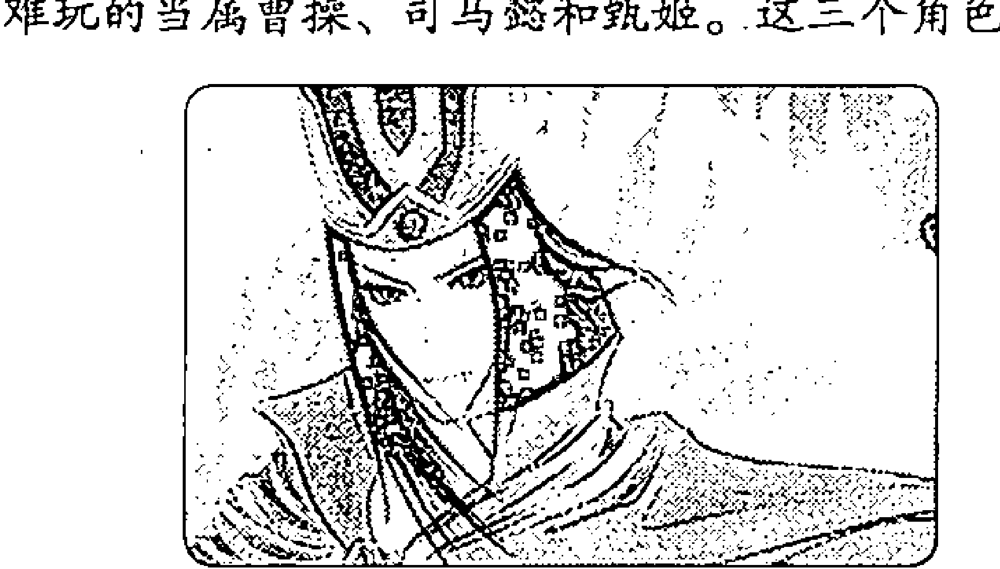

司马懿：(干扰型)
经典打法：手牌替换闪电或乐不判定，适合一切身份，跟司马懿一队给了队友主心骨。克大乔、夏侯、华佗。甄姬对他又爱又恨，如果一队洛神威力大增，不是一队洛神基本被废。
弱点：无明显弱点。
克星：张飞（唯一无法被拿走的连弩），貂蝉（一切反伤技能的克星）


甄姬：(爆发型)
经典打法：全留黑牌，手握连弩，期待洛神爆发；装备银月枪，制定目标出闪。
适合所有身份。
弱点：过于依靠人品，实战中甄姬的爆发是非常困难的，远远低于黄月英爆发的可能性，但总是总有xx用甄姬爆发秒全场的传说，而自己用甄姬的时候只能抱怨人品不济，就像有人中了500万，大家都觉得自己买彩票也会中500万一样。实际上甄姬摸牌的数学期望低于周瑜的稳定3张，而且经常要放弃“无中生有”和“桃”这样的好牌来终止自己的洛神。
克星：司马懿水能载舟亦能覆舟，闪牌虽多耐马超何？

## 密码 还是随身带着放心

生活中的账户和密码真多，有些可能不太重要，如论坛、博客等，忘记或者丢失了大不了再申请一个；而像电子邮件、QQ之类的密码，忘记或者丢失了，那可有点麻烦了。虽然以前CFan讨论过在网站上在线管理密码，但是将密码放在网上总感觉不踏实，密码，还是随身带着好。

#### 方法 1：手机短信加密保存

将密码保存在手机中是个不错的方法，但关键是你手机也有可能丢失，所以对存有密码的信息再加一次密，就会安全一些了。360旗下的信安易手机安全软件最近增加了隐私管理功能，它可以将隐私号码的通话记录和收发的短信、彩信等加密后保存在360信安易的隐私记录中，查看这些记录需要输入密码。我们可以将自己的手机号码设定为隐私号码，然后把自己认为重要的密码编辑短信发到自己手机上，如果密码过多，还可以采用彩信的方式。

首先在http://www.msafe.com.cn/down/select.shtml页面中根据自己的手机型号下载安装相应版本的信安易软件，可以直接使用手机下载，或者在电脑下载后再传到手机中（目前仅支持塞班系统）。
安装完成，通过隐私密码进入隐私管理界面，选择“选项→隐私设置→名单管理”可以设置隐私联系人的号码，在此将自己的手机号码设为隐私号码，然后再将自己认为重要的密码编辑成短信发送到自己的手机上。

#### 方法 2：软件，我只信任微软

如果你对来自网上的软件不放心，一些非常重要的密码可使用大公司的产品来保存。对于很多人来说，“软件产品，我只信任微软”。庆幸的是，多数智能机，都可以使用微软的Office办公软件。

这里以Excel为例，将自己的密码资料一一填入表中。完成后，单击上方的保存按钮，在打开的另存为对话框中，设置好文件名及保存位置，再单击其上的“工具→常规选项”，在打开的对话框中为文档添加打开权限密码保护就可以了。其他人没有正确的密码，将无法打开这个文档。

小提示：
★ 这个密码文件，推荐放入手机本身的闪存中。想知道原因吗？据说手机机身内的闪存大都是NOR FLASH，而其它闪存大都是NAND FLASH。NOR FLASH的可靠性远远高于NAND FLASH，我经常看到损坏的内存，但是很少看到过手机内存储损坏，就是这个原因。

#### 方法 3：安全闪盘随身带

在生活中，有人会将密码文件存放到优盘中，方便随身携带。网上有很多优盘的加密软件，可以为优盘加一把安全“锁”，比如超级U盘加密器（下载地址：http://www.newhua.com/soft/63362.htm），下载解压到优盘中需要加密的文件夹中，双击lockdir_63362.exe运行，默认已选择“加密当前文件夹”，设置好密码，单击“加密”即可对当前密码文件夹加密了，不过这种方法稍有点麻烦，加密和解密都需要连接到电脑上进行。

小编有话说：
上面的三种方法，各有优缺点，大家可以根据自己的实际情况选用。另外我个人还有一个小小的建议，安全起见，最好不要把账户名和密码放在一起保存，这就如同平时一般不会把存折与身份证放在一起一样。
(河南/赵建超)

## 3步 Windows 更新不用再重启

Windows 7每次更新之后居然还沿袭Windows XP需要立即重新启动的传统，这让更新后需要立即正常使用电脑的朋友感到很烦恼，而最长也只能将这个提醒推迟到4个小时之后，可是不断反复的提示令人生厌，今天就把这个恼人的提醒关闭吧。

- 第1步：打开“开始”菜单，在搜索栏中输入“gpedit.msc”并按回车键，运行“本地组策略编辑器”。
- 第2步：在编辑器窗口左侧依次点击“计算机配置→管理模板→Windows组件”，双击右侧的“Windows Update”文件夹。
- 第3步：在右侧的列表中，找到并双击“配置自动更新”，选择“已启用”，将“选项”下方的“配置自动更新”选项框中选为“自动下载并计划安装”，计划时间自己安排。
- 第4步：在右侧的列表中，找到并双击“对于已登录用户的计算机，计划的自动更新安装不执行重新启动”选项，在弹出的窗口中将“未配置”改为“已启用”，点击“确定”按钮完成设置。
这样，当Windows 7每次更新完成后就不会再重新启动系统。

(大连/东东)

## 请出去 Windows 7 SP1

很多朋友抱怨微软发布的Windows7 SP1公开测试版运行非常不稳定，安装之后，以前正常的程序也无法运行了。我们建议大家等待SP1正式版发布之后再进行升级，现在先把它请出去吧。

卸载方法很简单，在“控制面板→程序→卸载程序”中，找到“Service Pack for Microsoft Windows (KB 976932)”，双击即可开始卸载。

由于是测试版，仿佛它的卸载程序也不稳定，有些朋友反映无法完成卸载，一开始就退出。我们也可以尝试下面的方法。

- 第1步：在“开始”菜单搜索框中输入“cmd”，当上方搜索结果中出现“cmd”的时候，在其上点击鼠标右键并选择“以管理员身份运行”。
- 第2步：在弹出的命令提示符终端中输入“wusa.exe /uninstall /kb:976932”，接着按照提示进行操作，就能完全卸载SP1了。
(重庆/阿拱)

## 专属电台 你可以有

欢迎收听豆瓣电台，调频http://douban.fm!
在这里您可以拥有自己的私人电台，听为您特供的歌曲，只需要把您对歌曲的好恶通过点击红心、不喜欢的点击垃圾桶，经过几次磨合，豆瓣电台播放的都是你喜欢的歌手你喜欢风格的歌曲了，这就是名副其实的私人电台了。

为了让豆瓣电台更快了解你的个性喜好，你可以直接添加自己喜欢的歌手。在豆瓣电台首页点击“加心”或“累计收听”，进入“我收听过的歌曲”页面，再点击右侧的“我喜欢的歌手”下方的“你可能喜欢的歌手”右侧的小三角，下方会出现“添加我喜欢的歌手”选项，直接添加你最喜欢的歌手吧。

如果希望增加对电台的拥有感，不妨安装豆瓣电台桌面版，下载地址：http://slippor.blogbus.com/logs/63221196.html，支持各种插件和快捷键。所有插件的下载地址及使用方法请到http://slippor.blogbus.com/logs/62940673.html，有详细说明。

## 不用等F8 修复菜单直接显示

在Windows 7启动时，按下F8快捷键，选择高级启动菜单中的“修复计算机”菜单选项就可以打开“系统恢复选项”对话框了（即Windows RE），如果反应稍慢错过了按F8的时机就只能重启了。如果我们把Windows RE加到启动项里就可以像多启动一样使用它了。

先打开Windows 7所在的系统分区C盘，接着单击菜单“组织→文件夹和搜索选项”，打开“文件夹选项”的“查看”选项卡以显示所有具有隐藏属性的文件和文件夹。再打开“C:\Recovery”目录，将该目录下唯一一包含N个字符的子文件夹中的“boot.sdi”和“Winre.wim”剪切到“C:\Recovery”目录下；最后双击笔者所提供的批处理文件“Windows RE.bat”（下载地址：http://work.newhua.com/cfan/201016/xtxfqd.rar），在Win 7开机启动菜单中添加一个与之同名的菜单选项，重启系统后就可以看到该菜单选项了，想修复电脑的时候再也不用等F8了。

(山东/华军)

## QQ表情 现拍现秀

聊QQ一定要不停展现自己收集的好玩QQ表情来带动气氛，可是什么样的表情才能正确表达你当时的心情呢？到处去找不如自己DIY吧，用摄像头拍下自己搞怪的表情，按照自己想要的情绪来表演，以后都不用愁发什么表情了吧。有“可牛拍照”，你的这个创意可以一气呵成，现拍现用。

- 第1步：运行软件，选择“做QQ表情”。
- 第2步：将脸部对准摄像头，点击“闪图模式”左边的圆形相机按钮开始倒计时，赶紧发挥创意做表情吧。
- 第3步：点击“复制到QQ”，在QQ的聊天窗口粘贴即可开秀。别忘了，在QQ中鼠标右键点击你自制的表情“添加到表情”。
用可牛拍照制作的QQ表情为4连拍gif动画，希望调整动画速度的话，打开主界面右上角的“设置选项→高级选项”，在“QQ表情设置”处选择动画速度，表情的大小也可以在此处选择。

## QQ不安分 找个侦探来监控

几年前，迅雷在后台偷偷上传文件的报道让大家对软件开始警惕，就拿很多人每天必用的QQ来说，它的行为就不一定“老实”，它是否也会在背后扫描你的文件呢？为了解答这个疑虑，我们可以给QQ安排一名侦探，监控它的行为。

这位QQ侦探很无私，是开源软件（http://code.google.com/p/qqdetective/）。运行QQDetective.exe，先把一些不必要的取消，取消对“拦截QQ文件内容扫描、拦截QQ创建进程”的勾选，保证QQ可以登录，在“系统管理”中勾选事件记录，最后单击“确定”保存。现在QQ侦探的模块已经加载并运行（某些杀毒软件会报毒，放心放行即可），正常使用QQ后，运行QQ侦探的QDLog.exe就可以看到QQ做了哪些操作。

小提示：
软件目前还不完善，一些拦截行为会导致QQ无法登录，按照本文所示的设置算是一种折中的设置方法，获得中级保护，不影响QQ登录。

## PC臣服 做iPad的“发电机”

最近发现很多无良JS在出售iPad时，所配充电器为山寨仿品或者从不明渠道进来的iPhone或Touch充电器，功率不足10W。不少朋友反映，只有在iPad彻底关闭电源的情况下才能充电。如果你也有这样的情况，证明你并没有拿到合格的充电器。

如果没有合格的充电器，该怎么办?是不是也可以通过PC来充电呢?当然可以，不过由于iPad需要提供1.2安的电流才能进行充电，而普通USB 2.0接口供应的电流只有0.5安，所以非苹果电脑在为iPad充电时，总是显示“不在充电”，其实还是在充电，不过非常慢。如何解决呢?只要你的电脑采用的是技嘉、华硕、微星等一线大厂的主板或者是品牌的笔记本，只需要简单安装个驱动就可以轻松搞定。

#### 1.技嘉主板iPad On/Off Charge驱动

从技嘉官网上我们可以看到无论是Intel平台还是AMD平台，无论是入门级的G41，770，还是旗舰级的X58，890FX，均能提供对ON/OFF Charge插槽全时快速充电功能的支持。

下载地址：http://www.gigabyte.com.tw/microsite/185/on-off-charge.htm

#### 2.华硕的Ai Charger

华硕宣布旗下所有的主板、Eee PC、笔记本电脑、台式机安装了“Ai charger”之后都能支持iPad充电。

下载地址:http://event.asus.com/mb/2010/ai_charger.

#### 3.微星的i Charge

支持微星全线主板、笔记本、一体机等。

下载地址：http://www.msi.com/index.php?news_no=1013&func=newsdesc

#### 4.华擎的App Charger

可以自由选择安装位置，支持华擎全系列主板，支持关机充电。

下载地址：http://www.asrock.com/feature/AppCharger/index.asp

经测试，华硕Ai-Charger在大多数的笔记本、整机、主板上都能使用，理论上这个软件适用于任何品牌，不过还需更多验证。

小提示：

非以上品牌主板的读者朋友，完成下面两步，你也可以实现关机给iPad充电，让你的PC彻底变充电器。

- 第1步 记得在关机前插入iPad。
- 第2步 进入Bios设置，找到电源管理的“ACPI Standby State”设置为S3。不同的主板设置可能略有不同。

(文/拱旭东)

## Windows XP/7 和睦相处好邻居

很多朋友用惯了Windows XP中的网上邻居和共享文件方式，突然遇到局域网环境中有Windows 7，发现相互之间共享文件经常会有些问题，这是由于两个操作系统在权限管理上有一定的差异造成的。如果你也遇到这样的困扰，下面几个技巧可以尝试一下。

#### 自己家不用输入密码共享

Windows 7在默认的情况下不能直接访问网上邻居里面的电脑，需要设置密码才能访问，这是因为Windows 7默认把Guest用户禁止了，如果你希望家中的电脑不需要密码直接访问，那么按下面操作：右击桌面“计算机”，选择“管理→本地用户与组→用户”，右击其下的Guest并选择“属性”，把“账户已禁用”前面的勾去掉就可以了。但是由于系统版本不同，可能这样操作你仍然无法访问，那么还需要做些权限上的调整。

- 第1步：在“开始搜索”框中输入“secpol.msc”，按回车进入本地安全策略管理程序，选择“本地策略→用户权限分配”，先找到“从网络访问此计算机”，在“添加用户或组”中输入“Guest”，点击“确定”。接着找到“拒绝从网络访问此计算机”从中删除Guest用户。
- 第2步：在你需要共享的目录上右击，选择“共享→特定用户”，加入“Guest”就可以了。

小提示：

如果在Windows XP中还是无法显示工作组电脑，可以再设置一下：在桌面“网上邻居”点击鼠标右键选择“属性”，“网络连接”窗口中单击“本地连接”，接着选择左侧“网络任务”栏中的“设置家庭或小型办公网络”，跟着弹出的向导提示设置之后一般就可以正常显示了。

#### 共享驱动器需要高级共享

上面的方法将Windows 7的文件夹共享给Windows XP时很好用，但是遇到共享NTFS格式的驱动器时又会遇到麻烦了，不但设置时不会出现共享向导，而且虽然网上邻居能够看到共享的驱动器，访问时却会提示没有权限。这是为什么呢?明明在高级共享中已经添加了Guest的权限，怎么还是没有权限呢?因为在Windows系统中共享除了要分配相应权限外，还同时受制于文件系统NTFS的权限。所以还必须在驱动器的安全选项卡中添加相应的NTFS权限，而Windows 7下格式化的驱动器及以下的目录默认是没有Everyone和Guest的任何权限的。但由于通过向导方式共享时会自动匹配和更新NTFS的权限的，所以一般共享文件夹没有遇到问题。

那么我们怎么在Windows 7中为Windows XP共享驱动器呢?

- 第1步：进入“计算机”，在你需要共享的NTFS格式的磁盘上，点击鼠标右键选择“属性→安全”。
- 第2步：在“组或用户名”栏点“编辑→添加”，在“输入对象名称来选择”中输入“Everyone”，点击“确定”按钮。

之后，Windows XP系统就能访问你在Windows 7中所创建的共享驱动器和文件夹了。

在Windows 7下默认的文件夹权限和Windows XP中是不同的，Windows 7下格式化的驱动器默认的权限有“Authenticated Users”（Windows XP没有该权限设置），“System administrators管理员组”和“Users受限用户组”。而Windows XP默认的权限是“administrators 管理员组”、“CreatorOwner创建文件夹的所有者”和“Everyone”。Windows XP下驱动器默认就有只读的权限。

而System Users（系统用户）具体权限两个系统也有些不同，所以各自系统下创建的文件夹默认也有区别，但最大的一点不同就是所有者了。在Windows XP下创建的文件夹所有者是创建该文件夹的具体用户（比如是拥有管理员权限的你的用户名），所以设置过权限的文件夹重装系统后NTFS后往往会出现以SID方式显示的未知账户。而Windows 7默认是所有者组，比如你是管理员，你创建的文件夹所有者就是“administrators组”，所以Windows 7下创建的文件夹没有Creator Owner的相应权限了，这样的设置使权限更加清晰明了。

(重庆/阿拱)

## 对战鼠标不济 免费来加速

如果CS中自己没有一只趁手的利鼠，战斗起来往往束手束脚，常常不是败在技术差上，而是鼠标的硬件跟不上你的战斗指数。如果没有办法更换更高级别的鼠标，也不要紧，可以想办法为它加速。我们知道鼠标的DPI和刷新率是决定鼠标性能的两个重要因素，DPI是购买鼠标的硬指标，有些鼠标可能通过一些按键或者驱动来调整，但是也是厂家规定的范围，只有刷新率我们可以修改微软的USB口驱动来随心所欲地调整。提高鼠标的刷新率可以提高鼠标操作时的平滑度，对提高你对战的战斗力非常有益。下面来提升你的战斗指数吧。注意：以下涉及系统文件的修改，请在修改前先做好备份工作，一旦修改失败也好恢复。

- 第1步：用WinHex、UltraEdit等16进制编辑器打开“C:\Windows\System32\Drivers”下的“usbport.sys”文件。
- 第2步：搜索下面列表中“原数据”后面的16进制代码，找到后替换为下方对应的代码，保存即可（见表）。
- 第3步：重新启动系统，你的鼠标就已经不是原来的龟速了。

检验鼠标是否完成提速的工具使用Mouse Rate Checker 1.1B。

下载地址：http://tools.mydrivers.com/soft/1096.htm

在Windows 2003 Server及Windows 7系统中，你需要用Administrator权限来修改“usbport.sys”文件。用鼠标右键单击“usbport.sys”，选择“属性→安全→高级”，在“所有者”标签中点击“编辑”把这个文件权限改为Administrator，然后在“权限”设置中点击“更改权限”，“包括可从该对象的父项继承的权限”，然后将Administrator用户赋予完全控制权限。

(北京/东东)

#### Windows XP SP2适用
| 原数据(150Hz/8ms) | 替换为 |
| --- | --- |
| 3C 08 73 09 C6 86 0A 01 | 250Hz/4ms:B0 04 73 09 52 8A 0A 01<br>500Hz/2ms:B0 02 73 09 52 8C 0A 01<br>1000Hz/1ms:B0 01 73 09 52 8D 0A 01 |

#### Windows XP SP3适用
| 原数据(150Hz/8ms) | 替换为 |
| --- | --- |
| 3C 08 73 09 C6 86 0E 01 | 250Hz/4ms:B0 04 73 09 52 8A 0E 01<br>500Hz/2ms:B0 02 73 09 52 8C 0E 01<br>1000Hz/1ms:B0 01 73 09 52 8D 0E 01 |

#### Windows 2003 Server适用
| 原数据(150Hz/8ms) | 替换为 |
| --- | --- |
| 3C 08 73 09 C6 86 02 01 | 250Hz/4ms:B0 04 73 09 52 8A 02 01<br>500Hz/2ms:B0 02 73 09 52 8C 02 01<br>1000Hz/1ms:B0 01 73 09 52 8D 02 01 |

#### Windows 7适用
| 原数据(125Hz) | 替换为 |
| --- | --- |
| 3C 08 73 09 C6 83 | 360Hz: B0 01 73 09 52 8A |

## 上网控制 KV2010为网络安全保驾护航

近些年来，计算机病毒猖狂肆虐，病毒黑客化的趋势已经显现，这不仅严重危害了广大网民的信息安全，也给人们带来了网络安全隐患和经济损失。防患于未然，我们应确保在安全的情况下浏览网页，不仅是为自己上网加了一层安全屏障，同时也是保护电脑自身的安全。江民杀毒软件KV2010正是想到了这一点，“上网控制管理”为用户屏蔽恶意网页，提高了用户系统的安全性。

第一步：打开江民杀毒软件KV2010界面，点击“设置”按钮，在弹出的“江民设置程序”界面左侧列表中，点击“上网控制管理”。

第二步：选择网址访问控制方式。“安全访问”是检查完病毒再打开，“直接访问”是不检查网络是否有病毒直接打开。“禁止访问”是禁止访问除自定义网址中允许访问的其他网站。根据自身实际情况选择，确定即可。

> ★用户在启用上网控制时，可以点击“自定义网址库”来编辑管理想要控制的网址（或直接点击“上网控制管理→自定义网址库”）。在此设置中，点击“添加”，在弹出的“添加要进入访问控制的网址”对话框中，将要进行控制访问的网址输入进去，并选择控制访问方式即可。另外，点击“导入网址”按钮可导入本机网址，也可点击“导出网址”按钮导出本机网址。

小技巧：如何判断自己的电脑是否中毒？电脑病毒具有一定的隐蔽性，它们一般都是在后台悄悄寻找机会进行破坏，所以我们应学会从平时的一些蛛丝马迹中，及时发现问题。

安全软件扫描

大家最好安装一款安全保护软件，如瑞星、KV2010等。及时升级病毒库，当一些新病毒出现时，也好及时发现。

细心观察

如果经常出现莫名其妙的死机现象，或者系统运行越来越慢，网页浏览器运行异常，系统初始启动时间变长，一些本来运行正常的软件时不时崩溃等异常现象，排除了软硬件的故障后，可以考虑是病毒在作怪。也可通过下面一些小技巧加强判断：

- 1. 内存观察
通过任务管理器查看程序内存占用情况。
- 2. 注册表观察
在注册表的一些关键位置查找，如RUN子键下的一些陌生程序，就很值得怀疑。

## 打造应急预案 细调Win7私家“医生”

如果是全新安装Win7，它默认就集成了WinRE修复环境，它可以在开机时按F8键选择“修复计算机”进入。WinRE相当于Win7的私家医生，它提供了重装Windows等功能，这样在系统出问题时我们就不必手忙脚乱了。不过美中不足的是，系统自带WinRE功能还是比较简陋，重装Windows则需要安装光盘的支持。我们何不自行对其进行改造？让系统修复功能更强大。

操作不盲目，了解改造原理

由于WinRE实际上就是基于Win7内核的PE3.0系统，PE3.0系统核心是boot.wim文件，而WinRE核心则为winre.wim。因此我们只要将网友制作好的boot.wim文件改名为winre.wim释放到指定位置即可。而“重装Windows”是通过释放“install.wim”指定映像完成，我们只要将安装光盘中的这个文件复制到本地硬盘并指定重装源位置，这样就可以脱离光盘使用重装功能了。

轻松改造，简单四步走

对于修复环境的更改，Win7已经提供“Reagentc”命令行，我们只要准备好相应的文件，然后使用上述命令进行更改即可。

第1步：下载网友制作好的PE系统，然后提取其中的“boot.wim”和“boot.sdi”文件备用。由于WinRE修复环境默认保存在系统分区，为了避免重装后造成修复环境的丢失，我们可以自定义修复环境到其他分区，假设为D盘（需要为NTFS格式分区）。首先在D盘新建一个名为“recovery”目录，然后将准备好的“boot.wim”改名为“winre.wim”，与“boot.sdi”文件一起复制到“D:\recovery”，从安装光盘提取的“install.wim”也复制到D盘根目录下。

第2步：在Win7中以管理员身份启动命令提示符，依次输入下列命令，自行设定WinRE和安装源位置（rem为注释无需输入）：

```
Rem 查看修复环境信息，查询结果可以看到原来修复文件是c:\recovery下的winre.wim文件
Reagentc /info
Rem 关闭修复环境，以便自行指定重装源位置和修复环境位置
Reagentc /disable
Rem 指定安装源路径为D盘
Reagentc /setosimage /path d:\
Rem 指定修复环境位置为d:\recovery
Reagentc /setreimage /path d:\recovery
Rem 重开修复环境
Reagentc /enable
```

第3步：完成上述操作后再次输入“Reagentc /info”，现在可以看到系统修复环境位于第三分区（注：第一分区是100MB隐藏分区，第三分区即为D盘）下“07fb1a06-6b64-11dd-bd93-b75ee54b69d7”目录（每台电脑名称均不同，具体名称和图中BCDID字符一致），安装程序文件也在这个分区。

第4步：再次打开D盘，可以看到在“d:\recovery”生成一个新的“07fb1a06-6b64-11dd-bd93-b75ee54b69d7”目录，里面保存的是WinRE所需的“winre.wim”与“boot.sdi”文件。

> 上述目录当前用户默认没有打开权限，如果要打开该目录，需要先右击该目录选择“属性”，切换到“安全”选项卡，然后在文件夹安全属性设置中，将当前用户对该目录的读取权限设置为“完全控制”即可。

通过上述替换设置后，以后在开机时按F8键选择“修复计算机”进入的就是我们自定义的修复环境，使用起来当然更方便了。如果要重装系统，进入PE环境后启动系统修复工具，在系统修复选项菜单下单击“重新安装Windows”即可开始重装系统。

> 小提示：
在Win7中同样可以启动重装功能。在控制面板单击“系统和安全→备份您的计算机”，在打开的窗口单击“恢复系统设置或计算机→高级恢复方法”，接着在打开的窗口就可以选择“重新安装Windows”。这样重启后就可以直接进入Windows安装步骤。

> 小编有话说：不留遗憾，所有Win7均可改造
对于在WinXP下安装Win7，或者不是使用全新方式安装Win7的机型，他们的F8键菜单里并没有“修复计算机”菜单，这些机型怎么进行改造？对于WinRE修复环境的添加，可以参考本刊2009年第4期《让Vista也有开机修复》一文介绍的代码，将“winre.wim”与“boot.sdi”复制到指定位置，然后以管理员身份运行文中提供的代码即可（代码请到 http://work.newhua.com/cfan/200903/daima.rar 下载）。添加完成后再执行上述命令即可。

最后要提醒大家的是，本文操作需要较高的系统知识，不熟悉的朋友请勿轻易尝试，以免造成系统故障或数据损失。
(文/平淡)

## 动点小手脚 让Office2010无限试用

今年一直在使用Office2010 beta版，包括Word， PowerPoint，Excel等七个组件，功能和现在零售的专业版完全一样。进入十一月，突然发现打开时提示软件已经过期，无法使用，难道真的要乖乖地卸载？其实大可不必，只需4步，就能让你的Office2010无限试用。

第一步：打开系统的任务管理器，找到osppsvc这个进程，结束它。

第二步：删除osppc.dll文件。在<X>：Program Files\Common Files\microsoftshared\OfficeSoftwareProtectionPlatform 中可以找到它，其中<X>为系统盘符，默认为C盘。

第三步：删除<X>：Program Files\Common Files\microsoftshared\Office 14\Office Setup Controller\setup.exe文件。

第四步：打开注册表编辑器：Ctrl+F键来查找OSPPC.dll，在查找到的结果中，删除“ED417E2A8BA189D4C8741500D3BAD4A3”项。

这时候再次打开Office2010 beta版，是不是又可以用啦。唯一美中不足的是在软件的上方会显示“非商业用途(未经授权产品)”，不过这不会影响软件的正常使用，功能上不会有任何限制。

注：本技巧在版本Build 14.0.4536.1000（32位）上测试通过。
(文/慕菲)

## 找回文件类型绑定 IE8用起来更省心

当我们在IE中单击一个指向Word文档的链接时，此时将弹出一个对话框询问是下载保存还是直接打开这个文档，可能很多朋友并不希望弹出这个对话框。

如果是Windows XP系统，可以打开“文件夹选项→文件类型”对话框，选择需要更改的文件类型，单击右下角的“高级”按钮，打开“编辑文件类型”对话框，这里可以选择是否需要在下载之后确认打开。但遗憾的是，Windows 7由于使用“将文件或协议与特定程序关联”取代文件关联功能，我们将无法再找到“下载后确认打开”的选项。

这里，我们可以借助一款名为FileTypesMan的第三方软件解决这一困难，下载页面为http://tinyurl.com/2c5jx43。下载解压后直接运行程序，在文件类型列表框中找到“.docx”，选定后按下F2功能键，此时会打开“Edit File Type”（编辑文件类型）对话框，如果勾选“Open this file type immediately after download， without confirmation”（打开文件时不提示直接下载）复选框，则鼠标点击之后，将不再会弹出原先的询问框，而是在IE窗口中直接打开Word文档；如果勾选“Don‘t open inside a Web browser window”（不在浏览器内部打开），则表示不使用IE打开Word文档，而是单独启动一个Word窗口打开所点击的文档。我们根据自己的实际需要确定即可。
(江苏/王志军)

## 杀毒遇“三急”优盘来解决

遇毒就杀！可有时会遇到一些尴尬事：文件正在使用而无法清除病毒；毒太深导致系统已无法启动；毒太烈已将杀毒软件干掉……何不制作一张杀毒光盘或优盘来应急呢？目前，很多杀毒软件都提供了制作应急杀毒光盘或优盘的功能，下面以NOD32为例进行说明。

#### 准备篇

NOD32应急盘由负责启动的WinPE和杀毒程序两大部分组成。其中，WinPE由微软发布的免费工具AIK提供，为此，请先到http://tinyurl.com/3xbth4h下载，再运行其中的wAIKX86（32位）来安装备用。 NOD32也可免费得到。登录NOD32官网（http://www.eset.com.cn/2010/0622/375.html），按提示申请30天免费无功能限制的试用版，别小瞧啦，用它制作出来的应急盘可是能永久使用的。另外，我们还可以随时到官网（http://down1.eset.com.cn/eset/offline.rar）免费下载病毒库来离线对应急盘进行升级，总之，一切都是免费的。

#### 制作应急盘

安装并运行NOD32，在其主界面上单击“设置→切换到高级模式”，再单击“工具→创建修复CD”，应急盘创建向导即可运行，下面就要“按部就班”了。

- 1. 第1步：在“Windows AIK安装”一步中，单击“请输入Windows AIK根文件夹”下的“浏览”，导入AIK的安装位置（默认为C:\Program Files\Windows AIK）即可。
- 2. 第2步：在“目标选择”一步中，为方便起见可选择USB，这样，可直接以U盘为介质来创建应急盘。
- 3. 第3步：在“设置”一步中直接单击“创建”，接下来你就泡一杯茶看着优盘指示灯闪吧，直到创建完成。

#### 使用应急盘

重新启动电脑且在BIOS里将启动首选项设置为USB-HDD，电脑就会通过优盘启动而且自动运行NOD32，至于如何杀毒，与硬盘版NOD32完全一样，不再赘述，够简单吧！

用过就知，它的杀毒效果非常好，这主要得益于两大因素。首先，通过U盘上的WinPE启动电脑，而硬盘上的系统、病毒文件处于完全非活动状态，无“文件正在使用，无法清除”之忧。而且，应急盘是新鲜出炉的，病毒库正处于全新状态。

#### 应急盘使用技巧

上面的方法，已经可以发挥出NOD应急盘的作用了，但由于WinPE无窗口化的资源管理器，要想使用WinPE本身的功能，或对应急盘进行病毒库更新，那也是很麻烦的事。为此，我们还得进修进修。

##### 技巧1：无中生有的窗口化资源管理器

用优盘启动电脑时，可观察到命令提示符窗口一闪而过，接着出现的才是全屏化的NOD32杀毒界面。其实，只要将NOD32窗口变小或最小化，命令提示符窗口即可显示出来，请输入“notepad”再回车，记事本程序即可打开。接着，单击记事本编辑窗口中的“文件→另存为”，图形化的“资源管理器”不就出现了吗？你就可以在硬盘的各分区、U盘、光盘上自由穿梭了一一这正是我们进行后面操作的基础。

别激动，暂时还只能观察到文本文件，请在“保存类型”后选择“所有文件”，凡是存在的文件（包括程序）都一览无余了。遇到程序文件，只要右击，再选择“打开”即可。

众所周知，WinPE其实就是就是微缩版的Windows系统，很多32位程序都可在其下运行，比如系统自带的注册表编辑器，手动拷贝到优盘、硬盘中的绿色软件（分区魔术师、Ghost32）等，为杀毒后的辅助修复提供了极大的方便。当然，要完成这些操作，得熟悉各软件的具体存放位置一一不难，有窗口化资源管理器支持，加之要运行程序都是你自己拷贝进去的，不会找不到吧。

##### 技巧2：本地升级病毒库

前面制作的应急优盘可长久使用，但通过WinPE却难以上网，为此，病毒库的更新得手动进行。

- 1. 第1步：在能正常使用的电脑上将前面下载到的Offline.rar解压到应急优盘名为Offline的文件夹下。
- 2. 第2步：用应急优盘启动电脑，通过前面的方法打开图形化资源管理器，找到应急优盘的盘符，假设为X。
- 3. 第3步：在NOD32界面上单击“设置→切换到高级模式→显示所有高级设置→更新”，接着，在“更新服务器”下单击“编辑”，再手动输入“X:\offline”，表示从这一文件夹更新病毒库。
- 4. 第4步：返回到NOD32主界面，单击“更新→更新病毒库”，病毒库就能更新了。

##### 技巧3：无法启动之谜

网上，有朋友称制作的应急优盘无法启动，极有可能是因为内存设置有误。

前面，我们在讲应急盘的制作时全部采用了默认设置，如果要自定义，请在“设置”一步中单击“更改→高级”。原来，它已将目标计算机（即要用应急盘启动的电脑）的内存默认为576MB之上，如果要启动的电脑内存低于此值就会无法启动。解决这一问题的方法是选择“小于576MB”。另外，如果目标电脑有特殊的硬件，也可在“外部驱动程序”下添加，这可保证应急优盘有更好的兼容性。

实际应用中我们发现，如果目标电脑的内存小于512MB，启动仍然困难，那是因为应急盘使用的WinPE版本为3.0，它要求内存不小于512MB。另外，更多的朋友还反映自己制作的WinPE在实体电脑里工作正常但却无法在虚拟电脑VPC中启动，也是因为VPC的内存设置小于512MB，而实体电脑却恰好在512MB之上的原因。

##### 技巧4：扩展应用

如果还想扩展应急优盘的功能，请将绿色版的分区魔术师、Ghost32等其他程序拷贝到优盘，再通过前面讲过的窗口化资源管理器找到它们，右击并选择“打开”就行了。如果精力及技术都不错的话，完全可为应急盘加上桌面、开始菜单、图形化资源管理器等外壳。
(四川/李学昌)

## 拒绝混乱 让Windows桌面图标守规矩

看看你的电脑桌面，是不是塞满了凌乱的图标，有文档、有快捷方式、有压缩包、有图片，想找个文件都眼花缭乱不知所踪。可是我们已经习惯了把东西堆在这里，有没有办法既能放在桌面上又能显得很整齐呢？

#### 请大师来分类整理

如果桌面上的各种资料是分类存放的，那就整洁多了。DC桌面大师（下载地址：http://www.dmato.com/DownloadFile/DCSoft_2010B1.exe）这个工具，可以帮我们把桌面上的各种文件区分管理。

安装DC桌面大师后，会发现你的桌面变得干干净净了，也许会担心原来放在桌面上的文件都到哪里去了？点击左侧桌面菜单的“显示桌面”你就会找到它们，在“显示桌面”菜单中包括“所有内容、桌面目录、桌面文件、更换图标”，其中桌面目录及桌面文件是分别对原Windows桌面内容进行归类。

除此之外，DC桌面大师还能够将程序的快捷方式和IE的收藏夹分类归放，是不是有条理多了。

#### 九个屏幕放图标

桌面如果只有一个，放的东西太多了，就算再分类也不太好找呀。Windows就不能像Linux那样多几个桌面吗？没问题，小小的虚拟桌面V1.20（下载地址：http://www.onlinedown.net/soft/17119.htm）就可以让你拥有9个桌面，这样，一个桌面专门放文档，一个桌面放各种工具的快捷方式……你就可以为它们各自提供一个空间了。

安装运行之后在主界面上点击1～9的按钮，你就可以在9个桌面之间切换。另外也可以通过快捷键来快速切换：

- Ctrl+1～Ctrl+9：切换桌面
- Ctrl+Alt+1～Ctrl+Alt+9：把当前窗口移动到指定的桌面

#### 小提示：有人临检桌面？统统跑光

如果有领导来，不希望看到桌面放的太多东西，那就让他们暂时跑光光吧。在桌面上点击鼠标右键选择“排列图标→显示桌面图标”。如果是Windows 7系统就选择“查看→显示桌面图标”，即可切换桌面是否显示图标。怎么样？干净吧！如果你的Windows没有发现上述选项，很有可能是版本太老了，试试下面的办法吧。

- 1. 第1步：在桌面空白处单击鼠标右键，选择菜单项“活动桌面→显示Web内容”。
- 2. 第2步：取消“活动桌面→显示桌面图标”菜单项的选择即可。至于怎么恢复，就不用教了吧。

#### 玩个性图标任我排

桌面除了整洁，有时候还需要点个性，有的朋友为了表达自己正处于幸福期，将桌面的图标摆成心的形状，过程还是满辛苦的。其实用个小小的工具Desktop Icon Toy（下载地址：http://www.idesksoft.com），一瞬间就可以摆出自己想要的造型。安装运行之后，Desktop Icon Toy会驻留在任务栏中，在其上点击鼠标右键就会显示各种设置参数。在菜单中选择“Layout（布局）”，在列出的菜单中就可以看到能够排列的各种图标形态。当效果满意时，可以选择主菜单“Save Layout（保存布局）”，方便下次快速调用。不满意的话选择“Restore Layout”来恢复。
(文/东东)

## 激活潜能 文档搜索从创建时间找起

有时我们在搜索一个文件的时候，能记起大概是什么时间创建的，但遗憾的是，Windows 7的搜索框只有作者、类型、修改日期、大小、名称等筛选器，并没有关于“创建日期”的筛选器，难道我们只能在资源管理器中，按照“创建日期”排序之后手工查找？

其实，Windows 7完全可以按照文件的创建日期进行搜索，操作很简单，只要在右上角的搜索框中直接输入“创建日期:”，这里的冒号使用英文或中文均可，随后会弹出一个时间选择框，在这里选择相应的日期，即可看到按创建日期搜索之后的搜索结果。接下来的事就不用多介绍了吧。当然，我们也可以直接输入类似于“创建日期: 2010/10/25”这样的搜索条件，同样可以获得满意的搜索结果。

其实Windows 7的搜索还有更多潜能可挖，比如即使默认的搜索筛选器并没有我们所需要的内容，仍然可以按照其他的文档属性进行搜索，只要在搜索框中直接使用“搜索条件:”这样的格式，例如“页码范围:”或“字数:”等，有此需要的朋友不妨一试。
(江苏/王志军)

# 诺顿网络安全特警2011——打造快速安全的网络生活

诺顿网络安全特警2011（以下简称NIS2011），依然延续其安全高效的特点，病毒防御力强悍，使得普通用户也能够全面有效地防护自己的电脑。那么，如何更好地利用这些功能呢？以下为你一一分析。

## 电脑防护

对于电脑防护来说，诺顿不但提供普通的防病毒和反间谍软件功能，而且提供了全球智能云防护和SONAR主动防护功能。智能云防护可以借助于诺顿社区对云用户上传威胁信息的分析，迅速发现未知病毒，因此建议大家开启。SONAR可以根据病毒的行为来判断未知病毒，能够有效发现未知病毒。当然，如果你怕误判率增多，也可以不开启，这都取决于用户的实际需要。

## 网页安全

诺顿的网页安全功能，可以给我们上网提供安全防护，例如，当我们进行搜索的时候，会立即给出该网站的安全状态。网友发来一个网址，不知道是否安全，但是又想看看是什么内容。怎么办？虽然有安全软件的防护但是还是担心是恶意网页。单击右下角的“网页安全”检测工具，在该工具的网址输入框中输入需要检查的网址然后点击“检测站点”按钮，NIS2011就会自动弹出一个关于该网址的检查报告页面，里边以醒目的图标来表示该网址是否安全，非安全网址还会列出该网址中存在的安全威胁项目，十分贴心。

自定义规则。除此之外，NIS2011提供了对第三方应用程序的漏洞防护，给一些平时不太留意为系统和应用软件打补丁的电脑用户提个醒，这是它的一个很大特色。
网络安全拓扑图则是提供给企业网管人员的功能，可以查看本地电脑、需要监控的电脑和每个设备的详细信息，如设备名称、安全状态和IP地址。

进为现在的多功能版，增加了多种网络工具的支持，如常用的即时通讯工具(QQ/MSN)、下载工具(迅雷/BitTorrent)、Outlook等，可以更全面地进行保护用户的文件下载与传输安全了。

## 更多新功能体验

- ★网络威胁分布图
显示过去24小时全球的网络威胁分布，有点科幻电影的感觉，非常有意思。
- ★性能报告
NIS2011新增的一个用于监控程序所占用的系统资源情况的工具。
- ★在线备份
用户电脑崩溃了怎么办？在线存储可以替大家解忧，NIS2011将在线备份功能加入了进来，推荐大家采用。
- ★家长控制
点击“网页防护”功能中的“父母控制”可以下载一个工具，确保孩子上网的安全性。

NIS2011给普通用户提供了全面的防护，系统资源消耗很低，总体表现不错，因此非常值得升级。

## 密码随身带 要方便也要安全

2010年第20期中的《密码，还是随身带着方便》一文，介绍了几种加密保存账号、密码的方法，其实就我个人来说，我更推荐大家使用专业的KeePass，它几乎支持所有桌面和移动操作系统，这就意味着无论你在哪儿，只要有电脑或者手机，你都可以方便地查看保存的账号、密码。

KeePass的版本众多，这里只简单介绍下Windows和Android版的使用方法。其实其他版本的基本操作方法也是类似的。首先，下载KeePass的移动版（Portable KeePass, http://keepass.info），解压后运行其中的KeePass.exe即可，可以直接在U盘上使用。
第一次使用需要建立一个数据库，点击“文件→新建”，然后选择数据库文件的存储位置，保存后接着会弹出创建密钥的窗口。KeePass提供三种管理密码方案：管理密码、密钥文件提供程序和Windows账号，可以单独使用也可以组合使用。第三种方式的限制太大，不建议使用。密钥设置好了之后会要求配置数据库，保持默认配置即可，接下来就进入了KeePass的主界面（见图），在左侧选择文件夹，然后在右侧点击右键选择“添加记录”，填写好“标题”、“用户名”和“密码”，点击确定保存即可。

要使用已保存账号和密码非常简单，在相应的条目上双击用户名或者密码部分都可将其复制到剪贴板，然后粘贴使用即可。双击网址部分则会启动浏览器打开该网址。KeePass也有自动填写功能，不过设置起来稍微有点麻烦，这里就不多说了，有兴趣的可以去折腾一下。
手机上的使用以Android系统为例，首先下载KeePass的Android版KeePassDroid，安装好后点击“Open”，选择KeePass的数据库文件，然后按要求输入密码和密钥文件即可打开，之后就可以随意地查看数据库内的账号、密码了。打开某个条目后，KeePassDroid会在状态栏中添加复制账号和密码的选项，依次点击、粘贴即可。
注意：KeePassDroid暂时还不支持在新版KeePass的.kdbx数据库文件中添加条目，如果你需要在手机上添加的话，请使用旧版的.kdb数据库。
(湖南/龙小康)

## 跟iTunes备份说再见

拥有iPhone、iPad的朋友都知道，每次使用iTunes同步时都要经历漫长备份才能开始正式的同步，其实你根本没有机会用得上它们（尤其是联系人通过Gmail来同步的用户），与其像很多朋友在备份时不厌其烦的按备份进度右侧的小叉来取消它，不如跟它直接Say Goodbye。

#### Windows 用户这么做

```
"%CommonProgramFiles%\Apple\Mobile Device Support\bin\defaults.exe" write com.apple.iTunes AutomaticDeviceBackupsDisabled -bool true
```

运行后即可关闭备份功能。
如果按照上面的方法系统提示找不到“defaults”程序文件，我们可以用另外的方法实现。关闭iTunes，找到系统中“C:\Documents and Settings (Windows 7用户在“用户目录下”）\你的用户名”\Application Data\Apple Computer\iTunes”目录下的“iTunesPrefs.xml”文件（或者用系统的文件搜索功能来查找），注意要先备份一下（在当前位置直接复制粘贴即可），然后用UltraEdit或Editplus等非系统自带文本编辑器打开它，找到文档中 “<key>User Preferences</key>” 的位置，在 “<dict>” 下面紧跟着加入如图所示代码，保存后关闭并重新启动iTunes，备份功能就没有了。

```
</dict>
<key>User Preferences</key>
<dict>
	<key>AutomaticDeviceBackupsDisabled</key>
	<data>
	dHRU1ZQ==
	</data>
	<key>Documents.131</key>
	<data>
	</data>
</dict>
```

#### Mac 用户这么做

```
defaults write com.apple.iTunes AutomaticDeviceBackupsDisabled -bool true
```

关闭iTunes，然后在Mac系统主菜单上找到“Applications（应用程序）→Utilities（工具）→Terminal（终端）”，将下面的代码复制进去之后运行即可。

#### 小技巧

iTunes备份的资料既庞大又有可能用不着，很多朋友反映，就算没有同步任何通讯录、日历等信息，备份还是要等待很长时间。如果觉得已经备份的数据占用了宝贵的系统盘空间，那么可以在iTunes的主菜单中选择“编辑→偏好设置→设备→设备备份”，选择你已经备份过的资料，点击“删除备份”来节省出备份所占用的磁盘空间。当然，前提是你确实觉得这些备份数据没有用了。
如果你不善于操作或者没有太多的DIY精神，上面的方法对你来说都太困难了，那么这里还推荐你一款小工具BackOff，下载地址：http://www.digidna.net/products/backoff/download. 同样可以实现关闭备份的功能。
当我们按照上面的操作关闭备份之后，如果临时希望备份，怎么办？可以在你的设备接入后，在iTunes左侧的设备项下用鼠标右键点击你的iPhone或iPad名称，选择“备份”就可以立刻开始备份了。
(甘肃/宝宝)

## 武装桌面 Windows用得更顺手

电脑如此普及的今天，无论是硬件还是软件，功能当然是越强悍越好。要是还能用着顺手……那就太无敌了，难怪苹果的乔帮主一再强调“用户体验”。其实只需简单几步，你的Windows同样也能更加得心应手。

#### PART A：Windows 桌面 DIY 篇

##### Gmail放到桌面上

2004年愚人节，谷歌邮箱的容量率先达到1GB之巨。今天的Gmail容量更是超过了7GB，是容量最大的免费邮箱之一。再加上它那强大的搜索系统……实在没找到不用Gmail的理由。如果我们把Gmail放在系统桌面上，不用开浏览器即可随时使用，那就更方便啦。

- **技巧1：一键访问Gmail**
创建Gmail的桌面快捷方式，用Google自家的Chrome是最方便的。在Chrome中进入你的Gmail，点击右上角的“控制当前页”，选择第一项“创建应用程序快捷方式”，以后双击此快捷方式即可快速访问Gmail了。
- **技巧2：配置多账户**
1个Gmail是7GB，2个就是14GB，以此类推，Gmail账户当然是越多越好（Gmail最多支持5个账户）。不过一般情况下，当前只能用一个账户登录，如何让多个Gmail账户能同时使用呢？几乎所有的邮件客户端都有配置多账户的功能，而对于Gmail，点击右上角的“设置”打开设置页面，在“账号和导入”标签中选择“导入邮件和联系人”。之后，就能像Outlook那样，配置其他邮箱的账户了。
- **技巧3：离线也用Gmail**
如果上不了网，Gmail中保存的重要邮件怎么处理？可以使用Gmail的离线版，不上网时也可在本机使用。
在Gmail设置页面的“离线版”标签中，选择“为此计算机启用离线邮件”即可为Gmail打开离线支持。此选项会将邮件全部下载至本地，之后就可以离线浏览和操作你的邮件了。比如断网的时候写封邮件，下次上线后再发出。
- **技巧4：邮件到达及时通知**
没有邮件到达通知，估计这是Gmail唯一的不足。这点瑕疵用Gmail Notifier (http://toolbar.google.com/gmail-helper/notifier_windows.html) 这个小软件就能弥补。安装并选择语言之后，输入Gmail的地址和密码即可，它可以同时监视多个Gmail邮箱的邮件。当新邮件到达的时候，在语音提示的同时，位于系统托盘处的图标还会像收到QQ消息那样一直闪烁。

##### “玩具”有魔力，XP桌面生辉

微软为了增强Windows XP的功能，在XP正式发布之后，又推出了PowerToys以增强其功能。其中的新功能都十分贴近人意，下面介绍的Slide Show和msvdm.dll，就是从PowerToys中提取出来的工具。想试试它？可从http://www.onlinedown.net/soft/10554.htm下载到。

- **技巧1：像Windows 7一样自动换壁纸**
Slide Show: 这个PowerToys中的桌面增强工具，可以让XP也能自动更换桌面背景！安装之后，在桌面空白处点击右键选择“属性”，此时的属性对话框中将多出“壁纸自动换”的选项卡。先指定一个桌面背景图片的文件夹，再设定自动更换壁纸的时间……点击“确定”后即开始生效。
- **技巧2：大屏幕闹“分家”**
msvdm.dll: 同样是PowerToys的成员之一，它负责“虚拟桌面”这个功能，也就是将一个桌面分割成多个（最多四块），每块可以显示不同的内容。首先将msvdm.dll放到X:\Windows\System32中，X为系统盘盘符，然后在“运行”中输入“regsvr32 msvdm.dll”。
成功注册后，右击任务栏空白处，选择“工具栏→MSVDM”，虚拟桌面的控制台就出现在任务栏中了。如果觉得它碍事，右击MSVDM控制台，将“显示标题”、“显示快捷切换按钮”前面的钩去掉。此时只剩下虚拟桌面的“预览”按钮，要切换桌面，用组合快捷键“Win+X”（X依次为1234，分别代表四个桌面）。
也可以在控制台中自行设置快捷键。

#### PART B：Windows 桌面软件武装篇

> > 路人甲：我喜欢保持桌面的整洁和美观，最好是什么图标都不要放在桌面上，但使用时的快捷和方便也不能落下……
CFan：苹果够美观够华丽了吧，它的工具栏DOCK能满足您的要求吗？把它搬到Windows中怎么样？RK Launcher——能在Windows中完美模拟Dock的软件，支持Windows 7，小巧精致，不但有漂亮的ICO图标，还支持动态弹出效果！下载地址：http://windowsedge.com/downloads/RKLauncher(x86).exe。
安装RK Launcher之后，默认没有对简体中文的支持，可将它的中文语言包 (http://work.newhua.com/cfan/201022/RKcn.zip) 解压到其安装目录的lang文件夹，重启后在设置中选择简体中文即可。RK Launcher的具体设置并不复杂，看看都会。只要将软件的执行程序拖放到工具栏中即可，但要注意它的文件路径只支持英文路径。

> > 路人乙：我是个不喜欢收拾的人，每次要运行个什么程序，都埋头到好几页的开始菜单里或满屏的桌面图标里找，太麻烦。有没有捷径？
CFan: Launchy (http://www.newhua.com/soft/101998.htm) 这个免费的程序就是为你这样的人定制的！
安装Launchy之后，它会监视开始菜单。也就是说，无论你开始菜单里的程序多么复杂，现在只须输入关键字（汉语英语都支持）就能打开了。完全不用担心在桌面上会碍事，Launchy平时是隐藏着的，需要它的时候，用“Alt+空格”组合键把它叫出来，不需要时，同样的快捷键将其隐藏。
对于那些没有出现在开始菜单里的绿色软件，可手动添加文件路径。在Launchy皮肤的边框右击，选择“文件夹”，添加相应的文件夹路径后，再到“文件类型”下的小框中输入“*.exe”并添加。

##### 不记繁琐英文，拼音打开程序

比起在开始菜单里苦苦寻找程序，用“运行”来打开的确快得多。可是你知道运行同一个程序也有快慢之分吗？比如别人打开画图程序的时候输入的是ht，而你却要输入mspaint，当然慢咯！怎么改？请继续往下看。

打开注册表编辑器，定位到[HKEY_LOCAL_MACHINE\SOFTWARE\Microsoft\Windows\CurrentVersion\App Paths]，其下pbrush.exe的默认键值指向mspaint.exe，即画图板程序。只要将pbrush改成ht或其他自己喜欢的拼音，以后在运行中输入ht就能打开画图程序了，好记又好操作。其他程序的操作方法相似。

#### PART C：Windows 桌面小技巧篇

- **技巧1：去掉Windows 7小箭头**
话说去掉快捷方式上的小箭头……这种老技巧也能出现在CFan上！？但你可知道，用XP时代那些修改注册表的方法来对付Windows Vista/7会有后遗症？比如Windows 7中的库文件不能正常使用、久后快捷方式会多出一个小黑块等等……真正无毒无副作用、去掉后不反弹的方法如下：
找一透明ico图标，保存到Windows文件夹中，文件名为Empty.ico。再在新建的文本文档中输入如下内容：
Windows Registry Editor Version 5.00
[HKEY_LOCAL_MACHINE\SOFTWARE\Microsoft\Windows\CurrentVersion\Explorer\Shell Icons]
“29″=”C:\Windows\Empty.ico,0″
输入完成并保存后，将其改名为“去掉快捷方式箭头.reg”，双击导入。重启之后生效即可（相关文件，可从http://work.newhua.com/cfan/201022/qjt.zip处下载）。
- **技巧2：调用3D窗口，快捷方式更方便**
都知道用“Ctrl+Win+Tab”组合键可以调出Windows Vista/7的3D窗口。不过，要用一只手来完成这样的三键式操作，多多少少的有些不太方便……换成鼠标双击怎样？
在桌面的右键菜单中选择“新建→快捷方式”，窗口中输入“C:\Windows\System32\rundll32.exe DwmApi #105”点击“下一步”（输入时不包括双引号，C为Windows 7系统盘盘符），之后就让你给快捷方式重命名，可不予理会，点击“完成”生成快捷方式，以后双击它就可以调用啦。
（四川/李户林）

## 火眼金睛 一条命令找出染毒的U盘

小王最近有点郁闷，因为自己放在宿舍的电脑周五还好好地，周日回来使用后就发现中了Autorun病毒。由于周五刚刚重装的系统，所以可以肯定是同宿舍的哪位哥们在自己电脑上使用了带毒U盘。可是一问之下，那几个人都不承认用过。为了防止带毒U盘再坑害其他电脑，说什么也得找出“真凶”。
其实，“犯罪”U盘，在系统注册表中难免留有蛛丝马迹，看我们怎么抓出它。在“开始”菜单中找到“命令提示符”，右击它，选择“以管理员身份启动”，然后在命令提示符窗口中执行“reg query HKLM\System\currentcontrolset\enum\usbstor /s”命令，很快就可以看到本机总共使用过两个USB设备。从“FriendlyName”可以知道一个是我自己安装系统时使用的金士顿U盘，一个则为外来的朗科(Netac OnlyDisk)U盘，显然它就是元凶。

小提示：
如果本机使用过的U盘很多，可以使用“reg query HKLM\System\currentcontrolset\enum\usbstor /s >c:\usb.txt”命令，将结果输出到txt文件中，然后使用“FriendlyName”作为关键词查找即可。

##### 查询U盘的更多信息

宿舍里就上铺的大李在用朗科U盘，可是在罪证面前大李仍然负隅顽抗，说其他人在外面也能借到朗科U盘。看来还得找出更有说服力的证据。大家知道，在本机使用硬件时，系统都会依据硬件的序列号为其分配一个“设备范例ID”，这个ID号在其他电脑上的显示也是一样的。上述命令中的“\Disk&Ven_Netac&Prod_OnlyDisk&Rev_1.10\FEA80E9B624B23E5&0”最后的数字就是“设备范例ID”。现在把大李的U盘插到其他人电脑上，然后打开设备管理器，依次展开“磁盘驱动器→当前U盘→属性”，打开属性窗口后切换到“详细信息”，这里的“设备范例ID”显示的代码和小王电脑上查询到的是一致的，这下大李终于无话可说了。

如果还要查看U盘详细使用时间，可以到http://www.ph-ok.com/attachments/month_0804/f2008413195138.rar下载“USBLog.exe”，运行后它会在桌面直接生成一个文本文件，里面详细记录了本机所有USB设备开始和最后的使用时间。这样，谁曾用过你的电脑，就容易找出来了。

## 小编有话说：

实际上注册表保存了很多硬件、软件的使用信息，比如，即使你设置在Excel中不显示最近打开的文件，我们打开[HKCU\Software\ Microsoft\Office\11.0\Excel\Recent Files]，仍然可以看到Excel最近打开的文档。善于查看注册表信息，可以给我们操作带来很多便利。
（文/俞木发）

## 数据恢复不求人 Windows自有恢复术

重要文件不小心被误删除了，许多人首先会想到“EasyRecovery”、“Final data”等专业恢复软件。但如果出现这样的情况：对某个文档做了大量的编辑修改，并保存文件关闭后，却突然想到原文档中被删除的一些数据很重要，想要恢复，这时再专业的恢复软件也无能为力了。不过先别着急，如果你曾经配置过Windows 7的系统还原，对旧文档的恢复就还有一线生机。

## 小提示：

实际上Windows 7系统分区的系统还原文件是保存在“\localhost\C$\”的，如果忘记误删文件的具体位置，我们还可以打开上述目录进行搜索。为了方便创建还原点，大家还可以到http://work.newhua.com/cfan/200812/CreateRestorePoint.zip下载脚本，这样只要每天运行一次脚本即可快速创建还原点。

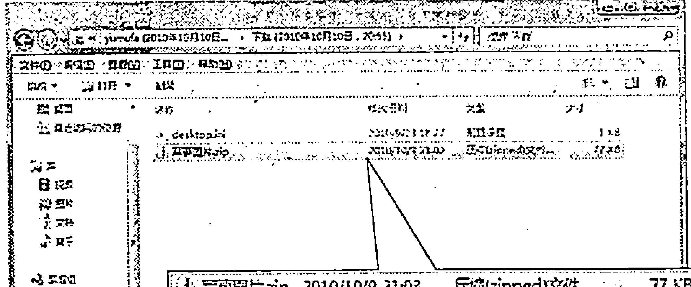

## 系统还原轻松恢复旧版文件

系统还原是Windows系列自带的功能强大的备份组件，在Windows 7中更是提高了这个组件的恢复能力，它集成到了资源管理器的每个文件(夹)属性菜单中，如果发现某个文件夹中的重要数据丢失，只要打开资源管理器就可以快速进行恢复。

前提当然是你的系统已经开启系统还原。在发现文件丢失，或者需要恢复到该文件的旧版本时，可以立即启动系统还原进行数据恢复。假设现在用户发现上周下载的“军事图片.zip”(默认保存在“C:\Users\当前用户\Downloads\”)被误删除了，现在打开资源管理器找到下载目录，右击选择“属性”，然后在打开的属性窗口切换到“以前的版本”，在这里就可以看到上周创建的还原点，选择一个误删(或误改)文件前的还原点单击“打开”，在打开的下载目录中复制被删除(或被改)的文件到其他位置即可（见图）。

## 全盘通吃，从系统镜像中恢复文件

数据恢复都是在操作系统下进行的，因此除了对常见文件制作备份外，我们还要对操作系统本身进行备份。这样一旦病毒等导致系统无法启动，我们可以通过备份来恢复系统。而如果有特殊需要，还可以在不重新恢复系统的情况下，提取其中需要的备份文件。Windows 7的“创建系统镜像”正是为此而准备。

前提当然是创建过系统镜像。同上打开“备份和还原”后单击左侧窗格的“创建系统镜像”，按提示将创建的镜像保存即可。创建得到的是一个VHD文件，默认保存在“存储分区:\WindowsImageBackup\计算机名\Backup备份日期\”下。如果系统还可以进入，并且只是恢复部分数据，可以在磁盘管理中加载VHD以提取文件。右击桌面“计算机”选择“管理”，依次展开“存储→磁盘管理”，右击选择“附加VHD”，然后加载上述创建的VHD文件，成功加载后就会出现一个新的磁盘1，打开这个磁盘提取备份的文件即可。

由于这个备份包含整个系统镜像，如果系统无法进入，我们还可以使用Windows 7安装光盘引导进入PE，在系统修复窗口单击“使用系统镜像还原系统”，然后按向导的提示选择上述创建的系统镜像进行全盘的恢复即可，这样系统连数据一起恢复了。

怎么样，用好Windows 7的备份组件后，你的数据恢复简单多了吧。

（文/俞木发）

## 我要拿什么来爱你？Windows 7 SP1 7601

2009年10月，Windows 7与大家见面了。时隔1年，Windows 7 SP1的RC版（候选版）也在微软官网上露面。毕竟不是正式版，稳定性确实不敢恭维，正如微软所说“任何感兴趣的人都可以下载并安装测试”。所以本文只献给有小白鼠精神的CFan们！

#### 拨开 SP1 的乌云

要尝鲜Windows 7 SP1，对电脑的硬件几乎没有什么特殊的要求。简单来说，只要能用Windows 7，升级SP1就没问题。但有个前提是必须要正版系统。

在IE浏览器中打开如下网址：http://tinyurl.com/2bwt37p，通过正版验证之后进入下载页面。适用于32位Windows 7的SP1有514.7MB，64位的865.4MB。根据自己的系统选择相应的文件下载，之后的安装过程中，只要勾上“自动重新启动计算机”的复选框（见图1），10分钟左右就能尝到SP1的滋味了。

除了版本号从以往的7600变成了7601，性能没有明显的提升，反而伴随着这样那样的问题，最常见的便是以下两种：

#### 问题1：屏幕右下角的“水印”

这个问题是不可避免的，桌面右下角会出现当前系统版本的标识，俗称“水印”（见图3）。想别掉这颗小刺，就要用到“水印移除补丁”了（下载地址：http://work.newhua.com/cfan/201023/RemoveWatermark.rar)。32位系统请运行32bit.exe，64位系统必须运行64bit.exe，右击相应程序，选择以“管理员身份运行”，键入“Y”重启即可。

#### 问题2：没有Aero效果

显卡是ATI 3000系列的电脑容易遇到这样的问题，安装官方提供的最新的显卡驱动一般能解决。

不过还是不要总说SP1的缺点了，其中有一个小改进倒是蛮贴心的。以前删除文件时，系统提示正在使用中而不能删除，现在好了，SP1中就在删除对话中会提醒你是什么程序使用了这个文件，你就可以先关掉对应的程序然后再删除（见图4）。

#### 小知识：

微软本次发放的SP1是Windows 7和Server 2008的通用服务包。以往一些文章中所介绍的“动态内存”和“RemoteFX”这两个新技术，其实是Windows Server 2008专属的！

在以往关于Windows 7 SP1的消息中，是否听说过“RemoteFX”这个词？说白了就是让远程桌面也支持3D效果，我觉得这非常酷！远程看高清、玩3D游戏都不是问题。

安装好SP1后，我第一件事就是登录了它的远程桌面。用“Win+Tab”的组合键没有任何效果，在“运行”中输入“dxdiag”，切换到DirectX诊断工具的“显示”选项卡中，发现远程桌面的“DirectDraw加速”和“AGP纹理加速”都不可用（见图2）……3D效果从何谈起？

#### 柳言飞语：

在RC版的前提下，我们暂不考虑它的稳定性、BUG等问题。就功能而言，按照微软的说法：“第一个服务包只是以往更新补丁的合集而已”。那么对于开着“自动更新”用户来说，这个SP1有什么意义？堪称亮点的RemoteFX却与Windows 7桌面用户无缘……是Windows 7本来就很完美，还是微软不想让Windows 7变得太过强大，增大下一代操作系统开发的压力？所以啊，现在要说爱你真的好难！正式版的SP1预计将在明年春天发布，但愿它能给我们带来稍许的惊喜，至少不要像现在的这样不痛不痒……

#### PS：

尝鲜之后，卸载SP1只是早晚的事，因为SP1正式发布时，RC版是不能直接升级到正式版的。具体卸载方法，可参见21期《请出去，Windows 7 SP1》。

（四川/李户林）

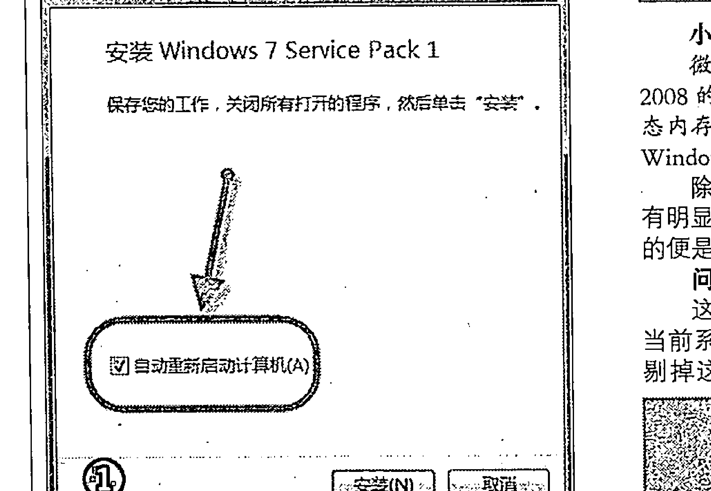

## 大量盗取QQ密码 木马为网站带来灰色流量

## 近期安全综述

据瑞星“云安全”系统统计，下半月瑞星共截获了71万个挂马网址。瑞星安全专家介绍，本周瑞星截获了一个利用安全工具漏洞，恶意篡改用户浏览器首页的恶意病毒。该病毒会将IE等主流浏览器首页修改为黑客指定的网站，从而给这些网站带来大量灰色流量，并且可以盗取QQ等软件的账号密码信息，使用户的个人隐私外泄，利益受损。

## 近期关注病毒分析

“Trojan.Win32.StartPage.oer (流氓网站修改器病毒)” 警惕程度 ★★★★

病毒运行后会将自身文件复制到C:\Program Files\qcat，同时使用“-safe”参数启用复制后的文件，并将自身退出，通过bat文件进行自删除。病毒扫描桌面和快速启动栏中的LNK文件，将LNK文件复制到C:\Program Files\qcat\temp中，同时修改原始位置的LNK文件的指向，通过C:\Program Files\qcat\qsetup.exe来启动原始指向的程序。用户一旦运行桌面上的快捷方式，病毒就会再次被激活。病毒不断遍历系统进程，当发现进程列表中包含“QQ.EXE”后，便释放Qheart.EXE并运行。Qheart运行后，会以“-qheart”参数启动qsetup.exe，并向QQ.EXE进程中注入代码，检查窗口，并构造虚假的窗口劫持用户的输入，将其记录并发送到黑客指定地址。

## 近期关注的被挂马网站

“中国地质大学”、“东方卫视”、“小刀在线”

## 软件更智能 瑞星2011开启完整安全解决方案

作为一家致力于安全技术研发的公司，瑞星公司最新推出了“瑞星全功能安全软件2011”（以下简称瑞星2011），它以“智能云安全”和“虚拟化云引擎”设计为核心，以技术领跑安全领域。那么瑞星2011功能版有哪些亮点？安全防护能力如何呢？今天我们就来见识它的魅力。

#### 实战1：系统安全状态一目了然

启动瑞星2011后，第一感觉就是界面漂亮了很多，各个功能模块非常精致地安排在主界面上（见图1）。默认显示安全中心界面，便于我们了解近7天以来的安全防护情况以及当前的网络状况。主界面下方，实时显示当前都有哪些程序在连接网络，以及所占用的带宽流量。单击下方任意一个联网程序的图标，还会自动切换到“联网程序”标签中，在这里可以更具体了解各联网程序的状况。如果勾选“不显示标识为‘安全’的程序”，还可以快速找出不安全的程序连接。瑞星2011程序界面的右侧，则以仪表盘的形式显示电脑的整体安全状态，红色表示极为危险，可单击“请修复”选择修复。

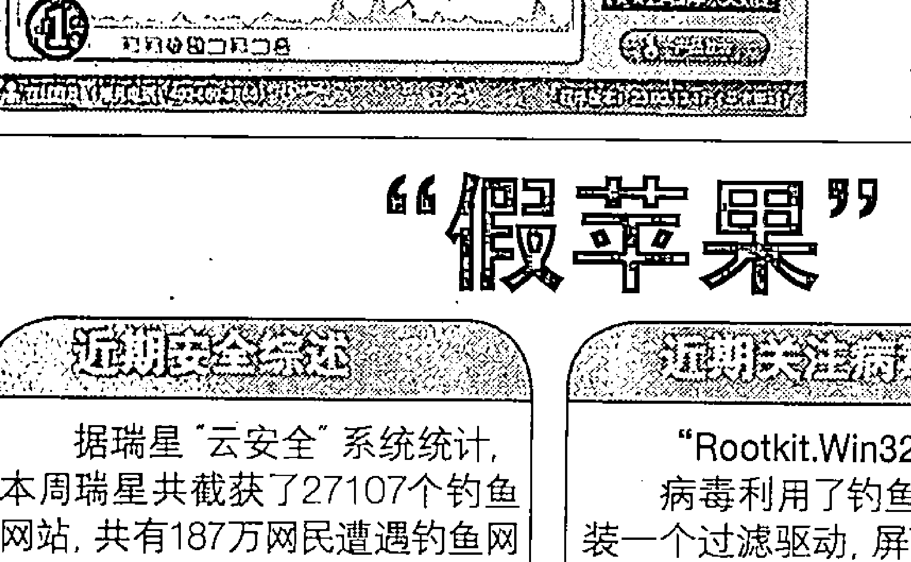

#### 实战2：查杀病毒自己做主

切换到“杀毒”模块，云安全已经非常完美地融入到该模块，提供了三种查杀方式，可以根据自己的实际需要进行选择。该软件基于瑞星核心虚拟化技术，可对木马、后门、蠕虫等病毒进行极速智能查杀，让杀毒速度提升3倍，全盘扫描500GB硬盘大约只要40分钟。右击文件或文件夹也可以快速进行杀毒。此外像“智能扫描”、“仅使用活跃记录”等也是新版的特色，能够大幅提高软件的扫描效率。每个人使用的情况不尽相同，我们还可以根据自己的需要对查杀进行量身定制。单击上方“设置”打开设置对话框，在“查杀设置”中可以对杀毒引擎进行低中高三种设置，并且还可以选择“自定义”，以选择检测的病毒类型、压缩或安装包的大小及文档类型等，很是贴心。

#### 亮点1：极小的系统资源占用

在我个人的印象中，老版本的瑞星杀毒占用系统资源不少，而瑞星2011版完全颠覆了这种印象。刚开启瑞星2011后，我看到内存占用不足20MB。进行病毒扫描时，系统资源占用也很少，进行正常的操作没有任何停滞感，这和以前大不一样。在游戏状态下，系统资源的占用几乎为0，从而保证游戏的最佳性能。

#### 亮点2：真正的智能反钓鱼

一直以来安全类软件在反钓鱼技术上比较滞后，瑞星2011在钓鱼网站的智能辨别和防范技术上，取得了巨大的突破。通过深入研究数十万个钓鱼网站，通过对其色块布局频率、引诱用户鼠标点击的行为习惯、域名变化趋势等进行数学统计，瑞星2011总结出了一套应用广泛的“反钓鱼网站”智能辨别模型，将其植入到瑞星“云安全”系统中，从而使该系统拥有了智能辨别钓鱼网站的能力。使用该技术之后，黑客虽然改变了钓鱼网站的域名、色块、服务器IP等常见的元素，但只要网民去访问，瑞星2011一般会及时发出提示，警告网民不要点击这些危险网站。再加上“智能化云引擎”、“三层防御体系”、“MSN加密保护”等一批新技术的应用，瑞星用户可以享受到比以往时候更安全的高等级保护体系了。

#### 亮点3：智能全方位贴心防护

瑞星全功能安全软件2011的智能安全防护功能分为对操作系统内核的安全防护和对电脑中各类应用软件的安全防护。利用瑞星“智能云安全”强大的智能分析技术和瑞星虚拟化引擎，可对木马病毒、U盘病毒、各种浏览器威胁、办公软件、MSN聊天等进行全面立体防护。

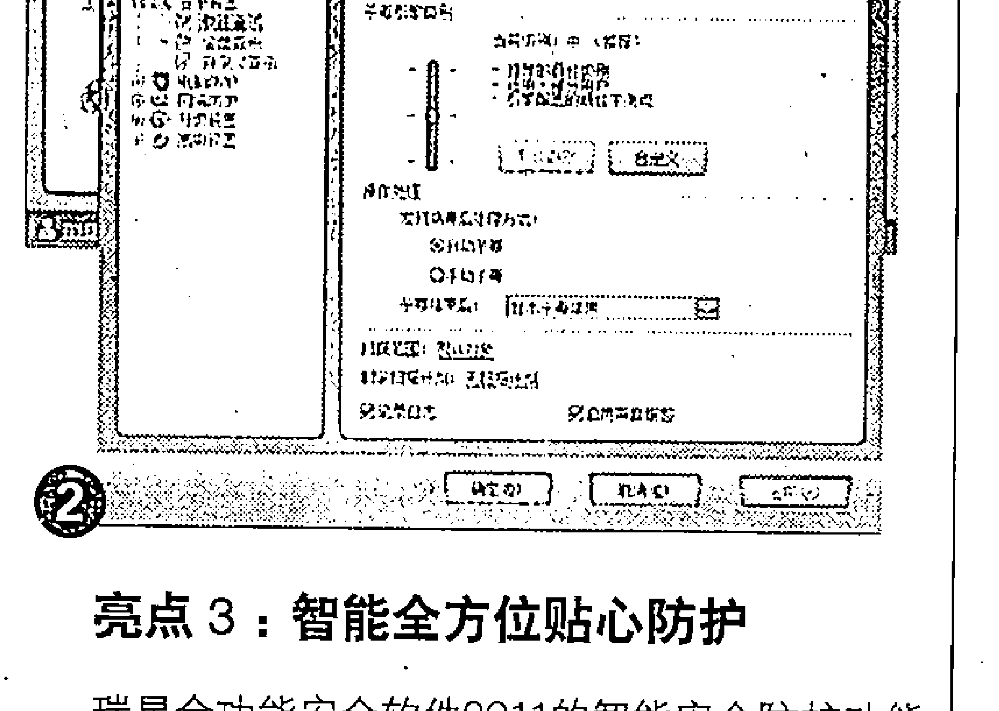

## “假苹果” “假赌博” 钓鱼网站肆虐

## 近期安全综述

据瑞星“云安全”系统统计，本周瑞星共截获了27107个钓鱼网站，共有187万网民遭遇钓鱼网站攻击，其中北京、广东和浙江成为受钓鱼网站攻击最严重的三个地区。瑞星安全专家介绍，本周流行的钓鱼网站主要集中于“假冒苹果iphone4”、“假冒股票”和“假冒赌博内幕”等类型的网站。用户使用具有智能反钓鱼功能的瑞星2011新品可有效拦截。

## 实时搜索摘掉“火星”标志

飞叔的网名原来叫柳絮飞，后来因为不管我向大家报告什么消息都会被笑话：“你火星啦，这个上周就有报道了。”更离谱的是，后来发展到一两个小时前的消息，我刚刚在群里通报，也会被嘲笑太OUT，飞叔一怒，遂改名为“火星的柳絮”。

但是最近状况却大有改观，哪几家厂商又开始口水战了，哪个网站又推出新的内测服务了，往往飞叔通报之后，群里一片寂然，因为这些消息他们都还不知道呢，再也没了嘲笑飞叔的本钱。而这些，都依赖于“实时搜索”之功。

首先还是来认识一下“实时网络”，它可是当前网络上最火爆的应用之一，国外的Twitter、Facebook、FriendFeed，国内的新浪微博、腾讯微博等，它们的核心部分正是实时网络：你或他人在网络上的动作，都可被实时发现和反应，这就是实时化的真谛。而“实时搜索”正是在实时网络的基础上风生水起。传统的搜索技术，数据更新有很大延迟，最快搜索到的也往往是好几天前的信息。而针对实时网络的搜索，几分钟甚至几秒钟前的信息，都可能被及时展现。

#### ★抢先试：快抢腾讯微博邀请码

腾讯微博还在内测阶段，他们采用“饥饿营销”方式，邀请码非常难找，甚至有人在淘宝上进行贩售的。其实有不少已拿到邀请的网友在网上友情赠送，只是我们不知道而已。通过实时搜索即可快速找到这些资源。

打开Google之后，在搜索框中键入“腾讯微博邀请码”的关键词，将会搜索出许多结果，不过这些结果大多数是没有用的，偶尔有几个里面包含了邀请，也常常是被使用过了的。

现在请点击“打开百宝箱”（默认情况下百宝箱也可能自动打开），单击“更多”展开选项，接着点选“动态更新”，此时再看搜索页面，排在前面的都是较新发布的信息，抓紧去抢注吧。我们还可以一边工作一边查看这个页面，如果有新的搜索结果，也会在上面及时登出，只要动作够快，抢一个邀请应该不成问题。

#### 小技巧：定制谷歌实时搜索

Google搜索中有一条小技巧，可以快速得到特定时间段之内的结果，代码为：`http://www.google.com/search?as_qdr=n10&q=关键词`。将代码复制粘贴到浏览器地址栏中，并将关键词替换成你想要的内容，按回车键后即可自动在谷歌中定时段搜索了。代码中“as_qdr=n10”表示搜索10分钟内的结果，你也可以修改这一数字，比如改为5或者改成1，这样的搜索结果，已经非常接近实时搜索啦。甚至可以将“n10”改成“s10”，这样能返回10秒钟以内的搜索结果。在 `http://work.newhua.com/cfan/201012/Realtime.zip` 中包含了一段JavaScript代码，可以按自己的需要修改时间，再将它加到收藏夹中，就可以随时快速进行谷歌实时搜索了。

## 手机配邮箱 新闻早知道

如今，中国三大运营商（移动、电信、联通）分别推出手机邮箱业务，它们的共同亮点是：邮件到达短信提醒。通过它我们可以做很多事情。

#### 实战：手机实时看新闻

如果不能随时使用电脑上网看新闻，那么用手机来接收带有新闻内容的邮件也是一个不错的选择。

由于绝大多数新闻网站提供的都是RSS订阅，很少有网站直接提供邮件订阅，所以我们需要用到“RSS FWD”网站的RSS自动转发到邮箱的功能。

首先找到需要的新闻RSS订阅地址，然后打开http://www.rssforward.net，填写RSS地址后单击Submit（提交）按钮，再填写自己的手机邮箱地址，确认即可（需要登录自己的邮箱收取确认邮件并确认）。以后，只要订阅的新闻RSS有更新，手机便会收到该网站转发给你的邮件了。

## 小提示：
★要想使用手机邮箱的短信通知功能，事先需要进行一些设置，这里以139邮箱为例：登录139邮箱后，进入“设置→邮件到达通知”，开启邮件到达通知，建议顺便把手机接收时间设为0时到24时，这样即可全天候服务了。其他邮箱的设置大同小异，不再详述。

（广东/黄宇）

## 自定义在线倒计时

生活中许多时候需要倒计时，比如定时象棋比赛，比如还有30分钟就要吃饭，比如再过一个小时要去接人，等等……“倒计时”的软件有很多，但为了这个小小的功能还要装一个软件，很不划算，这里给大家介绍一个在线定制倒计时的方法，只要输入一个网址就OK。

大家先看看下面的网址实例：
`http://e.ggtimer.com/1minute` (倒计时1分钟)
`http://e.ggtimer.com/30` (倒计时30秒)
`http://e.ggtimer.com/1hour2minutes10seconds` (倒计时1小时2分钟10秒)

看出它们的规律了吗？前面的网址“http://e.ggtimer.com”是固定的，后面是具体的时间设置，这个可以由你的需要进行设置。稍有英语基础的人应该就能看出来了，Hour是小时，minute是分钟，second是秒。

如果不输入任何单位，只输入数字，则默认单位为秒。所以如果你不熟悉英文的话，可以将要倒计时的时间换算成秒输入在http://e.ggtimer.com/网址之后即可。格式为：
`http://e.ggtimer.com/倒计时时间`

这种倒计时设置的方式，相当方便吧，而且，想倒计时多长时间都行，甚至上天（day）、上年（year）都成……时间一到就会自动发出响亮的“哔哔”声，并且跳出对话框提示“Time Expired”（时间到）。

（重庆/陈佳）

## MSN 就像QQ一样用网盘

除了QQ之外，相信很多朋友也会同时使用Windows Live Messenger（以下简称MSN），可惜MSN并没有提供类似QQ的网络硬盘、文件中转站的功能，每次需要临时存储文件都要另想他法，例如25GB的SkyDrive服务，但从网页上访问SkyDrive相当繁琐。

其实，只要安装最新版本的MSNShell，即可通过MSN快速操作SkyDrive。安装MSNShell 2010之后，我们会发现MSN主界面的工具栏上多出了“网盘”按钮，点击登录，进入网络硬盘的上传界面，这里默认使用3D界面，单击右上角的按钮可切换到2D界面，通过“MSN”按钮则可以快速返回MSN主界面。

上传文件的方法有两种：一种是从资源管理器直接拖拽过来，一种是通过传统的浏览按钮选择文件，每个文件上传成功之后，都会弹出确认对话框。进入列表界面，左键单击选中某个文件，在此可以完成下载、删除、重命名等操作。有了这个网盘，我们就可以在任意一台安装了MSNShell的计算机上登录网盘并使用其中的文件了。

由于此网络硬盘就是微软的SkyDrive服务，工具栏上的“网盘”其实就是SkyDrive的一个快捷入口，因此即使没有安装MSNShell，也可以在浏览器中登录SkyDrive，在这里可以发现一个名为“MSNBox”的文件夹，同样可以进行相关的文件操作。感兴趣的朋友还不快试一试。

（文/江苏 林丽华）

## 巧用路由器 双网打印不再拖累

以前，单位打印服务器与所有同事的计算机同在一个网段，正常使用了5年，相安无事。如今应上级要求，单位进行了双网改造：内部办公网和外部互联网完全隔开。问题随之出现：只有一个网络接口的打印服务器，只能放在其中的一个网中，而用户在另一个网中是完全不可能访问这个打印服务器，共享打印成了问题。

虽然增加一台双网卡的计算机当打印服务器可解决此问题，但考虑到这样会增加成本而且还有开关机之烦扰，所以放弃了。后来在家上网查询，发现桌子上的家用路由器，不由心里一亮：把打印服务器设置在内网中，路由器相当于一台交换机，这样内网用户就可以访问到打印服务器了，再把外网网络接到路由器的WAN口上，把路由器的DMZ设置到打印服务器的IP上，外网访问的问题也就可以解决。

想到做到，第二天早早来到单位，将打印服务器的IP设置成192.168.3.15，把TP-link R420路由器的LAN设置成192.168.3.21（核心交换机网关为192.168.3.1），再将WAN设置成10.1.5.21，网关设置为10.1.5.1。然后将打印服务器网络接口与LAN接口相连，将内网网线与LAN口相连，在内网PING打印服务器192.168.3.15是通的，打印亦正常；将外网网线与WAN口相连，在外网PING路由器10.1.5.21也是通的。最后进入路由器管理界面，将路由器的DMZ功能打开，并将地址设置为打印服务器的地址192.168.3.15，打印测试一切正常。

以上测试在内网环境为Windows XP，外网环境为Windows 7，打印机为惠普LaserJet 5100LE型，打印服务器为万兆牌WPS-520。

#### 小知识：
★什么是DMZ？
DMZ（Demilitarized Zone）可以理解为一个不同于外网或内网的特殊网络区域，DMZ内通常放置一些不含机密信息的公用服务器，比如Web、Mail、FTP等。这样来自外网的访问者可以访问DMZ中的服务，但不能接触到存放在内网中的信息等。
★如何判断是否为同一网段？
不同网段就是使用了不同类型的IP地址或网络号。不同网段之间的计算机不能直接访问，需要通过交换机或路由器连接。一般的判断方法是看IP地址的前三部分是否相同，如192.168.1.2和192.168.1.3是同一网段，而192.168.1.2和192.168.2.3则不在同一网段中。当然这个判断方法有时会失误，正确的方法是将IP地址与子网掩码相与计算，从而判断不同主机的逻辑地址是否在同一网段中。

（文/林明琳）

## 嘀起碎碎念 圆你出书梦

“朋友一生一起走，那些日子不再有，一句话一辈子”，每次听到周华健的《朋友》这首歌，我都会不由自主地跟着哼唱。人生路上，很多时候确实可以用一句话来诠释人的一生。这句歌词也是对当前微博最好的阐释。微博的消息都是一句话，但是微博的每一句话却记载着自己和朋友的喜怒哀乐。有没有想过把这些记录整理成册，制作成电子书或者纸质书籍作为美好记忆？下面就以新浪微博为例教大家如何做。

## 微博文章，批量拖回家

对于勤写微博的网友来说，时间长了微博的消息就有很多，新浪微博是以类似http://t.sina.com.cn/profile.php?uid=你的新浪通行证&page=1, http://t.sina.com.cn/profile.php?uid=你的新浪通行证&page=2等形式分页保存的。这是一个PHP页面，里面包含大量的脚本代码，我们无法通过迅雷这些常用的下载工具批量下载。由于要下载的只是简单的文本消息，这里借助Webzip（下载地址：http://www.onlinedown.net/soft/19648.htm）批量下载。

首先登录自己的微博，启动Webzip后单击“方案→新建方案”，在弹出窗口“开始链接”下的文本框中，依次输入自己微博页面链接地址（每页一行）。接着切换到“下载方法”，模板选择“保存网页（本页）-完全”，其他设置使用默认参数。

设置完毕，单击“立即开始”，Webzip就会自动将你的微博页面保存在“C:\Documents and Settings\当前用户\My Documents\我的 WebZIP 站点\t_sina\t.sina.com.cn”下，其中类似“profile.php?id=1708243320&page=1.html”页面就是你的微博消息。下载后可批量将页面文件改为1.html, 2.html等并复制到c:\。

- ★ Webzip也可以用来下载好友的微博文章，不过下载之前一定要使用自己的微博账户登录。如果下载到的只是1K、2K大小的页面，请检查是否登录了自己的微博，一般在Webzip中重新下载即可（正常页面大小应该在100K以上）。

## 火速链接：

- ★批量下载自己的博客文章，可以参考2010年第7期《混乱的SNS，看我怎么整治你》一文介绍的博客备份工具。

## 微博消息，自动整理成文

上述下载到的HTML页面，包含了新浪微博上的公共信息，而且文章也比较杂乱。对于公共信息的删除，使用Word打开上述页面，将上述信息替换为空格即可。文章的编排则可以借助“排版助手”（下载地址：http://www.gidot.net/typesetter/download.html）。

启动程序后，单击“文件→打开页面”，打开“c:\1.html”，提示脚本错误时单击“确定”，然后单击“排版→执行”，这样就可以将网页转换为TXT文本并排版。

操作同上，依次完成微博其他消息排版，单击“文件→保存”，依次保存为“a1.txt”、“a2.txt”、“a3.txt”放置在c:\下（以三个页面为例，TXT文件保存编码要使用“UTF-8”）。完成后启动命令提示符，输入“copy c:\a1.txt+c:\a2.txt+c:\a3.txt a4.txt”，将所有微博整合为一个文件。

## 小提示：

- ★如果你的微博消息很多，合并之前可以自行整理，比如可以将微博消息按照年或月归档保存。此外，排版助手可以直接在线打开微博网页进行排版，适用日志量小的用户。

## 微博封面，在线设计

经过上述操作我们已经将微博消息全部整理成一个文档，现在就在线为日志设计一个漂亮封面吧。

1.  在线设计LOGO
打开http://free.logomaker.cn/，选择一个自己喜欢的LOGO风格，然后输入LOGO标题如“我的新浪微博之2010”，单击“创建我的LOGO”。生成之后点击“下载此标志”，保存在本机备用。

2.  在线设计封面
准备一张漂亮的图片，然后打开http://www.magmypic.com/并注册登录。单击“浏览”上传准备好的图片，然后选择自己喜欢的风格，单击“Save And Continue”（保存并继续）就可以看到最终生成的封面图片了，将它保存在本机备用。

#### 网络大补贴：

- ★ OnlineLogoMaker，实用的免费在线Logo设计工具：http://tinyurl.com/2erdefj
- ★ 在线制作艺术字：http://tinyurl.com/23xfsh7
- ★ 三款在线制作封面网址：http://tinyurl.com/24xhd4w
- ★ 十大在线图片编辑器：http://tinyurl.com/24la2r6

## 在线制作电子书

完成封面设计后，就可以把上面的素材转化为电子书了。对于网虫来说，当然是使用免费的在线转换，这样不管在哪里都可以使用。

1.  在线制作PDF书籍
登录http://dopdf.ewebe.net/，依次输入书籍相关信息，然后单击“添加图片”，将上述制作好的封面图片插入电子书前面。再打开前面整合好的微博文章a4.txt，将全部内容复制粘贴到PDF文档空白处，下方“获取文档选择方式”设置为“直接浏览查看”，单击“提交”。转换成功后就可以在浏览器中看到制作好的PDF电子书了。预览满意的话单击“保存图标→另存为”，下载到本地保存即可。

2.  在线制作免费Flash电子书
由于PDF格式需要专用软件查看，而且外观也不是非常精美。对于爱美的博友来说，可以使用http://cn.calameo.com提供的在线电子书制作服务。

网站支持TXT、PDF文件，我们可以先用上面的方法插入图片，制作出图文并茂的微博PDF文档。接着登录http://cn.calameo.com后按提示注册并登录，单击“创建刊物”，然后单击“浏览”，选择制作好的PDF文档并输入书籍相关信息，允许访问方式设置为“秘密”（允许使用私密URL地址访问）。同时展开下面的“使你的刊物更个性化”，在这里可以为电子书设置“皮肤”、“背景图案”、“背景音乐”等个性参数。完成上述设置后单击“开始上传”。成功上传后，在“我的刊物”下展开新建刊物即可阅读。这是Flash模式的动感电子书，图、音、文并茂，网页上方阅读工具一应俱全，是不是很有纪念意义。

## 小提示：

- ★如果上传的文本无法显示，这是因为你原来的文本使用了ANSI编码。需要使用记事本打开整理好的a4.txt，然后单击“文件→另存为”，编码选择“UTF8”，最后粘贴到http://dopdf.ewebe.net/ 制作PDF即可，或者TXT转换后也可以直接上传到 http://cn.calameo.com 制作电子书。

## 在线制作自己的纸质书籍

如果不满足制作只能在电脑上浏览的电子书，还可借助“超印速”（http://www.mrprint.cn/）服务（一册就起印），可以把电子书制作成真正的纸质书籍！

由于网站支持直接导入新浪博客文章，可将之前整理好的a4.txt复制发布到新浪博客上，同时再发布一篇标题为“本博客开通超印速博客书服务60867”的博文（这样网站才能绑定该博客）。

登录http://www.mrprint.cn/default.asp?type=BlogBook单击“绑定我的博客”。输入自己新浪博客并绑定后，单击“我要印博客书”，此时网站会自动列出博客文章，按提示勾选需要印刷的“微博文集”这篇文章，剩余操作按网站提示输入相关信息，提交订单并支付款项后，可以在订单管理页面单击“下载博客书样例”，网站会把书籍样式保存为DOC文档，下载后可以先睹为快了。

## 小提示：

- ★即使不想出书，我们也可以将微博文章发送到“超印速”支持的博客上，既可以作为微博备份，也可以借助“超印速”将微博消息快速转化为DOC文档保存。

(文/俞木发)

## 书签随身带 四大浏览器收藏共享

平时浏览遇到精彩的网页，一般都会将它收藏为浏览器的书签方便以后查看。可是有些朋友并不是使用一款浏览器，也不是在固定一个地方使用电脑。如何才能快速同步不同位置、或者不同浏览器所收藏的书签呢？下面就给大家提供两个解决方案。

## 异地同步，快盘相助

适用用户：经常需要在公司、家里等不同地点使用电脑的用户。

虽然很多朋友日常只是使用一款浏览器，但是由于工作或者学习的需要，他们常常要在不同地方上网。对于这些用户我们可以使用金山快盘提供的同步服务来同步书签。

第1步：登录http://k.wps.cn/注册为快盘用户并安装本地客户端，成功安装后在本地硬盘（本例为F盘）生成一个“快盘”目录，这个目录会自动在安装快盘客户端的电脑上同步数据。因此我们只要把浏览器书签保存位置指向该目录即可。

第2步：以IE浏览器为例，启动IE后先将当前收藏夹数据导出。然后启动注册表编辑器后依次展开[HKEY_CURRENT_USER\Software\Microsoft\Windows\CurrentVersion\Explorer\User Shell Folders]，将右侧窗格的“Favorites”值更改为“F:\快盘”。这样IE的收藏夹位置就指向快盘，接着再导入上述导出的收藏夹数据到此。在其他电脑上进行同样的设置，以后我们在这些电脑上使用IE时就可以自动同步收藏的书签了。

## 小提示：

- ★除了使用具备同步服务的网络硬盘外，很多浏览器也提供在线同步更新书签服务。比如，傲游用户，启动傲游后注册一个账户并登录，然后单击“工具→傲游设置中心→收藏”，勾选“启用傲游在线收藏服务”。以后只要单击“收藏→更多操作→同步在线收藏”即可在线同步书签。

## 四大浏览器同步——Xmarks 插件

适用用户：同时使用多个浏览器（如火狐、IE等）的用户

很多用户在同时使用多个浏览器，如果要快速同步多个浏览器书签，我们可以使用Xmarks插件，它支持Firefox、Chrome、IE和Safari等四大浏览器。这里以同步IE和火狐书签为例。

第1步：打开http://www.xmarks.com，分别安装IE和火狐版本插件。首次启动插件会运行一个同步向导，按提示注册一个Xmarks用户并登录。Xmarks会在后台自动同步书签到Xmarks服务器上。

第2步：假设现在需要在火狐中同步IE的书签，启动火狐后单击“工具→Xmarks→马上同步”，Xmarks会自动连接到Xmarks服务器并将书签同步到火狐中。同样的，在IE中也可以自动同步火狐的书签。

(文/俞木发)

## 最佳网文浏览器选出来了！

很多朋友喜欢上网看小说，通常的做法就是使用浏览器一页一页地翻看，在看书的过程还要忍受广告的侵扰，难免会破坏看书的心情。不过如果使用苹果浏览器Safari就可以免受这些烦恼。它的智能阅读模式可让我们免打扰。

自动探测小说的页面结构，自动预载小说的下一页，我们只需按Page Down键翻页即可，如果懒得翻页，可以按下鼠标的滚轮键，稍微向下拖动，此时会自动翻页。

## 用好 Safari 的阅读器

启动Safari (下载地址: http://www.apple.com.cn/safari) 并登录小说网站，比如我常去的新浪读书http://book.sina.com.cn，打开一部小说开始阅读，此时Safari浏览器会自动进行检测，在地址栏的右侧会出现“阅读器”按钮，单击此按钮将会只保留小说页面，广告等都被屏蔽了。在页面上还会出现工具栏，可以放大缩小文字、打印页面等。另外Safari还会

## 火狐也有阅读器

其实，火狐浏览器也能实现类似功能，不过它需要插件的帮忙。在火狐中打开https://addons.mozilla.org/en-US/firefox/addon/46442/，点击“Add to Firefox”安装Readability插件，浏览器右下角会出现R按钮。现在再登录网站阅读小说，单击R按钮即可使用小说阅读模式了。右击R按钮，还会弹出选项窗口，可以设置页面风格、字体大小等，非常方便非常炫。
(江苏/周建峰)

## 长篇电视剧 快车帮你一锅端

不少网友喜欢在优酷或土豆网上在线看电视剧，遇到特别喜欢的还要下载保存。不过优酷或土豆上的视频地址很不好找，而且一集一集下载未免太麻烦。最新版快车 (FlashGet) 3.6增加了视频探测功能，助你把精彩剧集一网打尽。

另外，快车浏览器右上角还有一个快捷搜索栏，在其中输入想要找的电视剧名称，再单击一旁的下拉框，选择是在“优酷”中搜索还是在“土豆”中搜索，接着单击搜索按钮，很快就会列出该剧集的所有视频资源，同样选中自己想要的剧集，单击“下载选中视频”即可批量下载啦。

在快车主界面，单击窗口左侧新增的“视频下载”，右侧将显示一个内置的网页浏览器，这里可以直接浏览优酷或土豆上的电视剧相关页面，不管你打开的是哪个视频播放页面，快车内置的这个浏览器都会对该页面进行视频探测，并将探测出的可供下载的所有视频文件名称罗列在下方“本页可以下载的视频文件”中，选中后点击“下载选中视频”即可批量下载啦。

如果不想用快车内置的浏览器，可以在任意浏览器中的任意一集电视剧播放页面中（目前仅支持优酷和土豆的批量下载），右击，选择“使用网际快车3下载全部视频”命令，此时快车将自动探测出页面中可供下载的所有视频，并显示出下载任务列表，确定后下载就可以啦。
(武汉/山一居士)

## 像聊天一样看QQ邮件

我和大多数办公一族一样，平时和朋友、同事来往的邮件比较多，每次回复的邮件都显示为一封独立的新邮件，这样一来，关于同一个主题的多次往来邮件在“收件箱里”形成一个长长的列表，显得非常冗余。有没有一种简单的办法让这些邮件“合并”呢？

当然有，QQ邮箱推出一种新的邮件发送和接受模式——回话模式，完全解决了上述问题。首先需要启用这种模式，登录自己的QQ邮箱后点击“设置”链接进入“邮箱设置-常规”，找到“邮件列表视图”项，选中“会话模式”项，最后单击“保存更改”即可。

#### 小提示：不用写主题的QQ邮件

登录 QQ 邮箱后，在左侧点击“短消息”，再在“发给”栏里输入对方的昵称、拼音首字母或 QQ 号码，写一两句简短的话发送就可以了。对方收到短消息时 QQ 邮箱会弹出提示，可立即点击“回复”，这样即可一来一往交流了。因为此功能还在内测阶段，如果你的邮箱还没显示此选项，可以让已经有此功能的朋友给你发送消息作为邀请，即可激活了。
(山东/尚进)

这时就会发现，好友收到并回复我发送的邮件后，收件邮件列表将把这两次（或多次）同一个主题的往来邮件合并为一个邮件，并在邮件标题后面显示往来邮件数目，在标题前显示发送和接受人。点击邮件进入后，同一个主题的往来邮件集中在一个页面分段显示，跟平时的聊天没什么区别吧。

## 国外网站访问大提速

DNS服务器的主要作用就是解析域名,它就像一个翻译官,当我们从浏览器地址栏发送网址时,首先要通过它将网址转换成真实的IP地址才能访问站点。所以作为中间人,DNS服务器的反应速度也会影响上网速度。

我们知道,DNS解析也是决定网速快慢的一个很大原因。如果总是自己手动查找并配置速度较快的DNS服务器,实在麻烦,其实彗星DNS优化器(下载地址:http://www.onlinedown.net/soft/100870.html)可以智能做这件事:它提供了2000个左右备选的DNS,并可以一键测速并选择最快的DNS作为本机DNS服务器。启动程序后,单击“操作→一键完成(推荐)”即可。程序会自动将测试最快的DNS写入网络连接里的设置,此时再打开“网络连接→支持→详细信息”就可以看到多个DNS地址了。

另外,还可以使用谷歌推出的“namebench”,启动程序后单击“Running”,程序会自动对200个DNS进行测速,并给出具体测试结果,我们只要按提示输入最快DNS服务器地址就可以啦。

## 稳定上网，使用谷歌公共DNS

通过上述方法可以找到最快的DNS,不过最快的并不意味着最稳定的。稳定DNS,还是要推荐谷歌的免费“Google Public DNS”服务,它的服务器IP地址是8.8.8.8和8.8.4.4。打开“控制面板→网络和Internet连接”,右击当前网络连接(如ADSL)选择“属性→常规→Internet协议(TCP/IP)”,然后单击“属性→常规”,单选“使用下面的DNS服务器”,首选DNS服务器和备用DNS服务器依次输入上述谷歌公共DNS地址即可。如果要使用默认的DNS,只要重新选择“自动获得DNS服务器地址”即可。

## 小提示：

- ★ GoogleDNS 提速揭秘 http://www.techweb.com.cn/news/2009-12-07/489803.shtml
- ★ 国内外DNS 服务器地址列表 http://www.williamlong.info/archives/1842.html
- ★ 教育网DNS (方便外网用户访问): http://www.docin.com/p-2235745.html
- ★ DNS智能解析 http://baike.baidu.com/view/1802649.htm

## 上网无忧，自己判断DNS服务故障

有些时候明明自己的网络没有问题,可以使用QQ但是却无法打开页面,提示“Internet Explorer 无法显示该网页”,此时就很有可能是DNS服务出现故障(因为QQ直接使用IP地址登录服务器,无需DNS解析)。DNS故障可以借助系统自带的“nslookup”命令来判断。

启动命令提示符后输入“nslookup”并回车,此时在屏幕上就会显示当前系统所使用的DNS服务器地址。如果当前DNS出现故障则会返回“Default servers are not available”提示,表明正在使用DNS不可用。继续输入无法访问的网址如www.baidu.com,也是返回“DNS request timed out”提示。此时我们就可以使用上面介绍的方法自定义可用的DNS。

#### 网络大补贴：

对于经常访问国外网站的朋友,通过自定义DNS可以更方便地访问,下面介绍一些这方面的资源。

## 试一试：

使用最快的DNS后真的能提速吗?首先在默认DNS设置情况下打开IE8,并在“常规”选项中选中“退出时删除浏览历史记录”,以免由于缓存造成打开网站时间误差。接着在IE中打开http://webwait.com,这是一个在线测速工具,它采用了AJAX技术,通过模拟浏览器加载页面并记录加载的时间。在此页面中,分别输入http://www.cnn.com、http://www.aol.com、http://www.picoon.co.uk(我很喜欢的一本英国杂志网站)测试。接着关闭IE8清空缓存,运行“彗星DNS优化器”使用最快DNS,同上再次重新测试。前后测试结果表明使用最快DNS后,完全打开上述网址大约可以节省三分之一左右的时间(默认DNS下平均时间分别为25、30、47秒,优化后为16、21和29秒)。

## 手机变热点 无线路由随身带

不少人喜欢泡星巴克,就是为了享受其中的无线网络。但是这成本未免太贵,况且也不能总是在星巴克泡着啊。其实除了公共热点外,我们还可以自己制造热点,方便其他便携设备共享上网。

## 移动热点——Wi-Fi手机变身无线路由器

应用场景:在外秋游,好友笔记本共享手机3G宽带传送旅游照片。

如今手机接入互联网正在变得越来越便利,通过高速的移动3G宽带,随时随地访问互联网已不是什么难事。借助“JoikuSpot Light”(支持S60v3 S60v5带Wi-Fi手机,下载地址:http://work.newhua.com/cfan/201012/JoikuSpotLight.zip)我们就可以把手机变成热点,让其他Wi-Fi设备共享3G宽带。下面以诺基亚N80、联通沃为例介绍具体操作。

以诺基亚N80、联通沃为例介绍具体操作。

第1步:由于3G宽带要开放共享,操作之前强烈建议申请3G包时套餐(可在淘宝、有啊购买到包时套餐),这样可以免去因流量过大产生的巨额费用。申请套餐后根据运营商的提示,接入点选择3GNET。

第2步:在手机上启动“JoikuSpot Light”,首次使用点击“选项→设置”,切换到“接入点”选择上述在手机上建立的3GNET接入点,切换到“加密密匙”,然后设置3G共享的密码(长度为8位),其他采用默认设置,返回程序主界面点击“选项→启动”,程序询问是否同意与外部设备共享互联网连接,单击“是”。成功启动后手机就变成一个移动热点了。

第3步:这样,支持无线上网的设备就可以共享这个3G连接了。比如,具有无线网卡的笔记本开启无线搜索后,在无线网络列表可以发现名为“JoISpot——0016BCCCCC7F”的热点,单击“连接”并输入上述在手机上设置的共享密码即可上网了。只要有3G信号的地方,如火车上、野外都可以使用3G手机共享上网。

接并输入上述在手机上设置的共享密码即可上网了。只要有3G信号的地方,如火车上、野外都可以使用3G手机共享上网。

## 小提示：

- ★ 本文所用是 JoikuSpot Light 免费版,只能浏览 HTTP(不支持 HTTPS)开头的网页,基本可以满足我们浏览网页、使用 QQ。需要注意的是,其他设备共享上网极其耗费流量,共享完毕要及时关闭共享。

#### 网络大补贴：

- ★ 使用其他系统的手机也可以变身热点,请参考“手机变笔记本无线路由! 六大手机平台皆可能” http://nb.sanhaostreet.com/NewsData/2010/5/201052892718840_2.shtml

## Bye eD2K，VeryCD电驴为何自断后路？

飞叔用电驴的时间并不多,只有在急需一些图书资料,而在网络其他地方又很难找到的时候,才会想起电驴来救急。这天,飞叔又启动电驴准备下载,发现弹出一个电驴更新提示,随手点击同意更新,当时并没在意。但是之后,却隐隐约约觉得哪里不对劲。搜索某本电子书,没有找到,下意识点击“搜索”左侧的输入框,却并没有像预想的那样弹出下拉框,让我选择“全局(服务器)”和“Kad网络”。飞叔恍然大悟:难怪别扭,原来新版电驴取消eD2K服务器和Kad网络的搜索支持了。不过这样一来,我们仅能搜索到VeryCD网站上的资源,范围大大缩水,许多资料就找不到了。电驴如此“自宫”为哪般？

## 关于电驴的几个传言

行文至此,飞叔必须要先声明一下了,前面一直说的是VeryCD电驴,而并非真正官方电驴eMule。VeryCD的这一手玩得还是挺高明,他们所推的电驴英文名为easyMule,让一些粗心如飞叔我的人,还以为eMule是它的精简版,自己倒成了官方版本了。以前一直用eMule的飞叔就是这样在不知不觉中“被easyMule”的。

VeryCD限制用户在更大的范围内搜索并下载网络中的共享内容,有内容垄断之嫌,将加速从开源走向商业化封闭的脚步。

VeryCD官方说法,这么做主要是为了保证搜索结果的安全,以及为了符合国家对视听节目管理的相关法律法规政策。

VeryCD创始人黄一孟对网络上的反应,笑而不语。

## 网友们的应对

选择权在用户手里,除了VeryCD电驴还有其他软件可用。eMule最新的官方正式版本为0.50a,运行后,既可以选择搜索文件的类型提高搜索精度,也可以在服务器、全局(服务器)、Kad网络及FileDonkey(Web)等多个区域搜索,范围非常广泛。相对于0.49c,此版本新增了一个用于搜索的eD2k链接类型: ed2k://|search|[searchterm]|/,点击链接,传送至eMule中之后,即可直接在eMule中搜索链接定制的文字。

除官方版本外, eMule还有许多延伸版本(VeryCD电驴就是其一)。据某网站非正规调查显示:在参与投票的用户中,40%用户选择了Xtreme,26%的用户选择了VeryCD电驴,16%的用户使用ScarAngel,官方eMule的用户则为13%。可以看出,VeryCD电驴的用户还是不少的,这次的改变本来他们自己很低调,更新日志中简单一笔带过。不过由此带来的影响还有待进一步观察。

## 【名词解释】

- ★ eD2K服务器 eMule以前版本连接的是传统eD2K网络,这个网络的特点是用户运行eMule时,首先连结到一个服务器,通过该服务器用户再连结到其他eMule用户(客户端)进行下载。
- ★ Kad网络 Kad是Kademlia network的简称,从eMule v0.42b开始支持。对于Kad,用户不需要连结服务器,而是直接连结到客户端,所以Kad也被称之为Serverless network(无服务器网络),它具有eD2K所不具备的优势。

## 多图文档免上传 照搬论坛格式全

还在为论坛发帖时一次只能上传一张图片而苦恼吗？还在为有些心仪的论坛图片贴时只能用外链而烦恼吗？下面教大家一招，轻松解决所有论坛发帖带图的问题。
首先在Word中制作图文混排的文档，文档内容即为你想要发帖的内容，然后进入在线办公系统，比如国产的在线办公平台百会(http://www.baihui.com/)，用自己的账号登录(没有账号的可免费注册)，然后点击进入“百会写写”。
点击左上角“导入”按钮打开导入窗口，单击“浏览”选取前面准备好的Word文档，注意，该文档不得大于10MB。另外也可以使用其他的在线文档，或谷歌文档，直接贴入网址即可。
导入文档后返回主界面，点击“协作→发布→公开发布→发布→公开文档URL”，即可成功创建网页。按Ctrl+A键全选网页内容并按Ctrl+C键复制，接着就可以在其他博客或论坛中打开写帖编辑窗口，按Ctrl+V粘贴并发布就可以啦，非常便捷。
(文/谢亚卓)

## 网友必备 网页浏览护目镜

喜欢在网上看电子书的朋友都有这样的烦恼：长时间盯着白花花的电脑屏幕看，眼睛会很疲劳；文字太多，注意力稍不集中，就会串行。这里我给大家推荐一款小工具，它就像是一副护目镜，可以帮大家保护眼睛，避免串行。
这款工具是由外国人编写，打开作者的博客http://yuiblog.com/blog/2008/09/30/reading-blinds，直接翻到文章最后，找到“you can drag the following link to your links toolbar: Reading Blinds.”，右击其中的“Reading Blinds”链接，选择“添加到收藏夹”就可以了(或者直接将此链接拖放到浏览器书签栏上)。
以后打开任意网页，比如打开《红楼梦》在线版，只要点击“Reading Blinds”链接，随着你的鼠标移动，页面只显示一定高度的内容，其他部分被黑色阴影遮盖起来。页面上方还有操作小提示：按b键可以选择开启或隐藏Reading blinds功能，按s键可以减小高度，按l(是L的小写，而不是数字1)可以增加高度。这样的小工具，能让你读电子书既不那么累同时也能提高效率。
(江苏/无可问人)

## 强制断网 一起来做工间操

许多人在电脑前一坐就忘了时间，严重影响到身体健康，看来得通过一些非常手段强制运动休息了。
工间休息来做操——Workrave
适合用户：需要长时间面对电脑工作的朋友。
提醒效果：可以按照你设置的时间间隔弹出提示窗口强制休息，休息的过程中，还可以跟着它一起做做操。
启动Workrave(下载地址：http://tinyurl.com/23zlnjm)，右击程序界面选择“首选项”，切换到“计时器”，在“休息”选项设置休息间隔和休息耗时即可。等到了指定时间，程序首先给出休息提示(三次)，然后会弹出体操播放窗口并屏蔽输入(无法再执行操作)。此时你既可以停止工作休息，也可以对着屏幕一起做做工间操。
但如果确实需要继续工作，按下Alt+Del+Ctrl键启动任务管理器，结束“休息”进程即可。
时间到了就断网——Freedom
适合用户：长时间沉迷网络的网虫。
提醒效果：时间到了自动断开网络。
玩网游的人最容易沉迷，而使用Freedom(下载地址：http://tinyurl.com/2d6s6un)可定时强制断开网络。运行软件后首先输入需要断网休息的时间(如60分钟)，单击OK，接着在打开的窗口单击Begin Freedom(开始断网)即可。即使重启，在指定时间内仍然无法上网(结束程序进程也无法上网)，这样就达到强制休息的目的了。不过办公室人员还是慎用，以免误事。
小提示：
★ Chrome 浏览器有一个 Stay Focused 插件(下载地址：http://tinyurl.com/26w9zsy)；激活该插件后点击浏览器上方篮球状插件图标，之后会有一个窗口弹出，默认时间10分钟(可以自定义)，然后点击 Block the entire site (阻止所有网站)，这样过10分钟后就无法浏览网页了。
(福建/平淡)

## Opera “超级通道” 两剑客

Opera 10.60正式版发布(http://www.opera.com)，再次提速50%。这款号称世界上最快的浏览器，其实还有不少秘密“武器”，可以进一步打通“网络通道”，让网上冲浪更加方便快捷。
秘密武器1：书签通道 Opera Link
Opera Link可以同步你在Opera中所收藏的网络书签、所做的网站笔记及一些设置等，让你在一台电脑上输入的网址也可在其他电脑上随时调用。
启动Opera，点击软件左上角的O图标打开菜单，选择“同步Opera→启动同步”，按向导提示注册一个Opera账户，已有账户的则直接点击“我已经注册”按钮使用已有账户登录即可。接下来设置要同步的内容，如书签、输入历史、笔记等。现在你对Opera所作的一些操作如收藏书签、网站笔记等，会自动同步到Opera服务器中。以后在其他电脑上，比如从单位回到家中，同样打开Opera，启动同步，就可以看到你在单位电脑中收藏的书签网址及所做的笔记啦。
秘密武器2：文件通道 Opera Unite
文件共享是网络上非常大的一类需求，比如公司文档、旅游照片、影视音乐等，常常需要与同事或好友分享。有了Opera Unite，这些变得异乎寻常的简单。点击O图标，选择“Opera Unite→启动Opera Unite”，设置本机网址后，一个“个人网站”即快速建立。点击页面上的“启动File Sharing”，再选择要共享的文件夹即可。然后将自己的共享文件夹地址发给其他好友，好友就能浏览和下载你的共享文件了。安全起见，你还可以为共享设置相应的访问密码。
(文/一页)

## 游戏玩出的“邮件达人”

因为Gmail提供了超大的邮箱空间，许多人因此养成了不整理邮件的“坏习惯”。虽然说Gmail搜索功能强大，但是乱糟糟堆在一起的邮件，终究还是会影响我们的工作效率的。现在，OBoxer提供了一种类似游戏的方法，让我们边玩边纠正这个坏习惯。
OBoxer作为插件的形式，可安装在谷歌浏览器(Chrome)、火狐(Firefox)及苹果浏览器(Safari)上，它可以统计你删除、封存、写信、回信以及标记垃圾信件的次数，然后给予积分，并可以跟世界上其他的玩家一较高下，看看谁才是邮件整理高手，从而激励你积极处理邮件。
- 第一步：使用谷歌或Safari浏览器打开OBoxer首页(http://www.Oboxer.com)，点击右侧的“Sign in with Google”(登录Google)图标，并用你的Gmail账户登录，在Google账户中认证OBoxer的使用，让它可以统计我们的Gmail相关数据。
- 第二步：完成后回到OBoxer首页，这时会提示你安装Chrome、Safari或Firefox插件，根据自己的浏览器点击相应链接安装。
- 第三步：现在再进入自己的Gmail账户，会发现在网页上方多出了一条OBoxer工具栏，当然一开始的时候上面所有的积分都是“0”。现在我们尝试开始整理邮件吧！把该删除的删了，该回复的回了，你会发现OBoxer工具栏的积分开始增加了，比如删除一封邮件为1分，回复邮件3分，发新邮件5分，等到了一定的积分后，工具栏会弹出一个醒目提示，恭喜你获得了第一个游戏徽章，是不是很有成就感啊。
对于每周的积分，OBoxer网站还提供了一个“世界排行榜”，点击“Leaderboard”链接就可以浏览，看看那些上榜的邮件处理达人，很难想象他们怎么会收到这么多电子邮件的。
(文/沈明峰)

## 一键合并重复的网址收藏

浏览器使用时间久了，收藏夹中经常会出现一些相同的项目，手工清理虽然可行，但显然是相当麻烦。其实，如果你使用腾讯的TT浏览器(Tencent Traveler)，那么可以很轻松地解决这一问题。
运行TT后，单击“收藏”菜单，在这里可以发现名为“合并同名收藏夹”的项目(见图)，选择之后会询问将同名文件夹下的收藏项合并到网络或是本地，你可以根据自己的实际需要作出选择，确认之后就可以清空其中的同名收藏夹。当然，为了安全起见，操作之前建议通过“收藏→其他操作”进行备份。

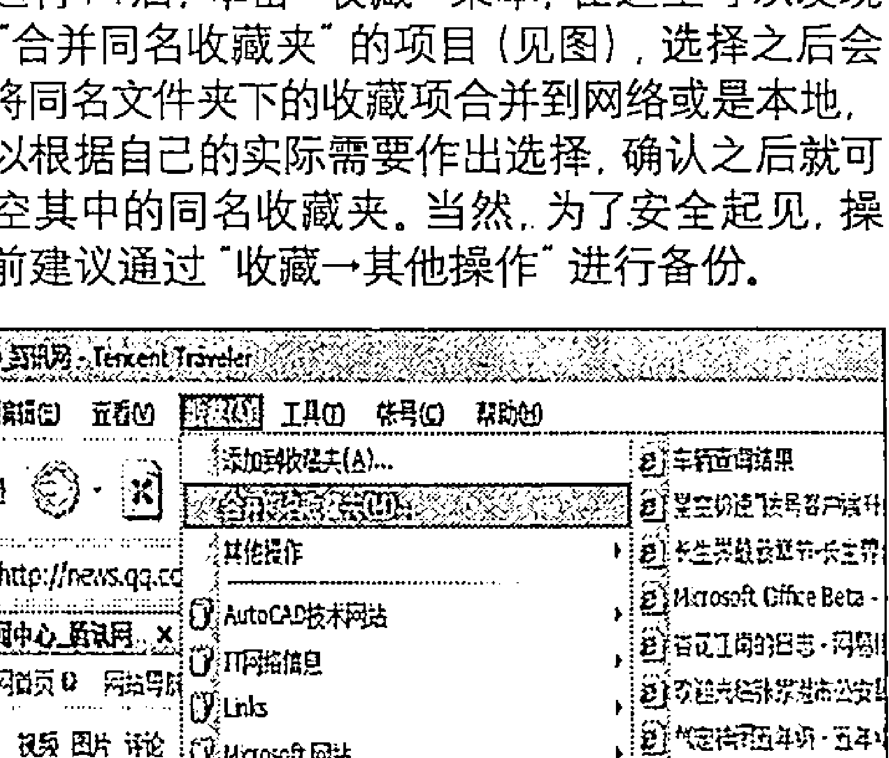

扩展：非TT浏览器也可以合并处理
如果你使用的并非TT浏览器，而是IE、Chrome、Firefox等其他浏览器，也可以对浏览器中的同名收藏夹项目进行合并处理，只不过借助TT作为中转站来操作。首先将当前浏览器的收藏夹项目导出，将其导入TT进行合并操作，最后再将其导入回来就可以了。
(江苏/王志军)

## 别扰民 让迅雷夜间独享单位网络

单位网络一般比家里的快，不过在单位用迅雷势必影响其他同事的正常工作。最好是在夜深人静大家都下班时下载，可总不能住在单位吧？别急！下面的方案能让你独享单位带宽而且不扰民。

#### 未雨绸缪调教好迅雷

为确保下载正常，先要设置好迅雷，单击菜单“工具→配置”调出配置窗口，然后进行如下设置：

- 在“常用设置”中，取消“显示欢迎界面”项，同时选中“启动后自动开始未完成任务”选。
- 在“任务默认属性”中，单击“任务开始方式”下拉列表框，选择“手动”。
- 在“网络设置”中，选择“下载模式”下的“高速下载模式”。

#### 准时出动迅雷夜间全速下载

首先将多个准备夜间下载的任务全部添加到迅雷中（已设置任务开始方式为“手动”，所以此时迅雷并不会下载）。接着单击菜单“工具→计划任务管理→添加计划任务”，设置X小时后“开始全部任务”，时长根据实际情况而定，一般可推迟到下班后2个半小时。新版迅雷5.9中，计划任务与下载完成后关机不再排斥。所以，还可以单击“计划任务”按钮，选中“下载完成后关机”。
小提示：
★长时间下载，Windows的电源选项可能会对下载造成影响，可作相应设置：在控制面板中打开“电源选项”，再在电源使用方案中，将关闭监视器、关闭硬盘和系统待机项全部设置为“从不”。

#### 早九点强制关闭迅雷

万一自己上班迟到，怎么才能自动关闭迅雷呢？首先编写一个killthunder.cmd的批处理文件，内容如下：

```
taskkill /im thunder.exe /f
taskkill /im thunderservice.exe /f
```

接着单击“开始→设置→控制面板→任务计划”，把killthunder.cmd拖放到“任务计划”窗口中。双击打开该任务，将任务计划设置为“每天”，开始时间设置为9:00。
下班时不要关机，按Win+L键锁定计算机即可。为节约能源，可关闭显示器。到了指定时间，迅雷就会开始全速下载，早上9点前如完成下载，迅雷将自动关机。如果下载尚未完成，也会在9点时自动退出迅雷。这样既充分利用了公司资源，又不会影响同事的使用，两全其美吧。
（文/韦虫）

## QQ超个性 昵称加“靓” 号码真颠覆

QQ号码，是加好友时候最先看到的，如果显示号码时就能让用户注意到你，是不是很妙？

#### 扮靓招数 1：让自己的QQ昵称“靓”起来

在您的QQ号码后加个“靓”字（当然了，你可以加任何一个你想要的字），让您的好友“刮目相看”，而且是不掏钱的“靓”号。
- 第一步，登录QQ在好友列表里右击自己的头像，在弹出的下拉列表中单击“个人资料”，弹出个人资料窗口，清空原有的QQ昵称。然后按鼠标右键，在弹出的右键菜单中选择“插入Unicode控制字符”选项，然后在弹出的子菜单中，选择RLO Start of right-to-left override，这时你会发现，光标在昵称输入框中闪烁，输入“靓”字或者其他任何一个你喜欢的字。
- 第二步，再点鼠标右键在弹出的右键菜单中选择“插入Unicode控制字符”选项，然后在弹出的子菜单中，选择LRO（注意，这里是LRO，非RLO）Start of left-to-right override，再输入你的昵称。
最后别忘了按“确定”按钮。

#### 扮靓招数 2：QQ号码也玩个性颠覆

在您的QQ号码后加个“靓”字，让您的好友“刮目相看”的同时，QQ号码也玩个性“颠覆”——倒过来！原来号码是12345，现在让它显示成54321，而且号码在前，昵称在后！
还是在“个人资料”，弹出个人资料窗口，删除原来的内容，在昵称栏里点击右键，这时候，在按键盘上的“[”键和“V”键，然后输入自己的昵称。不过，这次把名字颠倒过来输入，比如昵称是ABCD，那么就得输入DCBA。按“确定”按钮之后，看到效果了吧，颠倒的号码在前，正确的昵称在后，很另类吧？
小提示：
如果要恢复正常状态，只需在个人资料中全选昵称，删除，然后输入常规昵称即可。
（河南/贺丰光）

## 图片玩魔术 Photoshop CS5华丽出击

Photoshop CS4还没捂热，CS5已华丽出击，Adobe软件更新的速度还真是越来越快。新版CS5中有不少亮点，许多功能是其他软件所没有的，下面就给大家简单盘点一下。

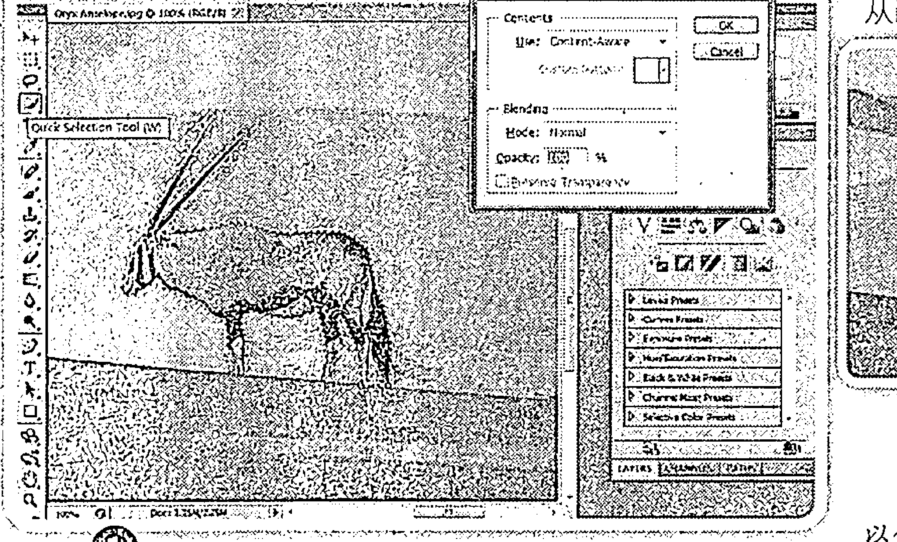

#### 实战 1：见证奇迹，动物凭空玩消失

许多人拍照时未能注意细节，等照片导入电脑打开看时，才发现画面中多出一些不必要的内容，比如一些陌生人或动物，甚至垃圾箱等。CS5可以轻松将它们移走，不留一丝痕迹。
启动Photoshop CS5（以下简称CS5，试用版下载：http://www.adobe.com/cn/downloads），打开需要处理的图片。如图1所示，假设我们要移走图中的羚羊，以表现沙漠的荒芜。首先使用快速选取工具（Quick Selection Tool，快捷键为W），在羚羊的身上连续点击，直到将整个羚羊选中。注意，这里我们不需要精确选择。
接下来，点击菜单“Edit→Fill”（编辑→填充，快捷键为Shift+F5），将填充使用内容设置为Content-Aware（智能填充）。见证奇迹的时刻到了——整个羚羊已从画面中不翼而飞（见图2）。


小提示：
★如果画面清除得不干净，可以使用椭圆选取工具选取遗留的痕迹，继续按Shift+F5键重复填充操作，直到完全清除为止。

#### 实战 2：静态图片狗任意换姿势

照片是静止的，但是CS5新的Puppet Warp（扭曲木偶）功能，却能让照片上静止的人或物变换任意的姿势。
首先确保要变形的人或物在一个独立的图层中，本例为闪电狗（见图3）。我们将让它抬起前爪。点击菜单“Edit→Puppet Warp”（编辑→扭曲木偶），这时闪电狗变成网状，在闪电狗前腿上点击增加三个节点（见图4），然后拖动节点，就可以任意移动它的前腿了，最后效果录图5所示，够酷吧。

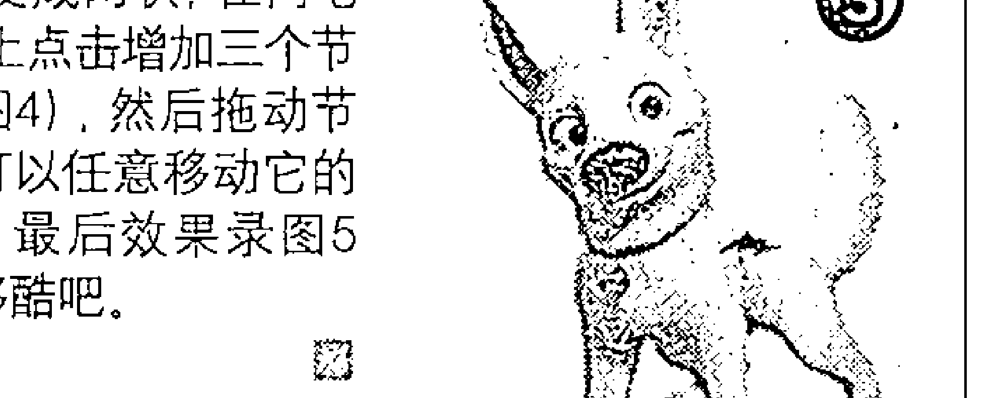

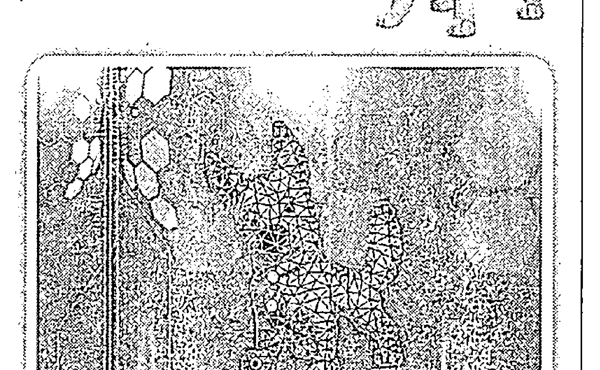


## 跟定你 微博更新早知道

微博已成为获取新闻的重要方式, 比如近期的“唐骏门”, 最先就是方舟子在微博中与人闲谈时爆出的。所以你可以不写微博, 但是一定要跟 (Follow) 微博, 不然就OUT啦。

#### 边聊 MSN 边监控

没有人愿意整天盯着某人的微博等更新, 那样太累。其实如果在用MSN, 完全可以通过它自动监控指定的新浪微博。
登录自己新浪微博后单击上方的“工具”, 在打开的页面中切换到“聊天机器人”标签中, 在MSN图标下方单击“点击绑定”, 根据提示输入自己的MSN账号并勾选下方相应的选项, 最后单击“确定”即可。这样就会有一个名为sina_t175@live.cn的新浪小助手要添加你为好友, 确认添加后, 在MSN中打开和sina_t175@live.cn对话窗口, 发送新浪微博提供的验证码完成验证。以后, 在使用MSN聊天时, 如果关注的微博有更新, sina_t175@live.cn就会及时向我们发送消息。
另外, 新浪微博同时提供Gtalk, UC机器人, QQ机器人也正在开发中。
腾讯微博的发展势头也越来越强, 它可以用最新版QQ2010直接查看: 点击QQ上方的“微博”按钮, 即可实时查看关注的微博更新情况。点击相应按钮能直接通过QQ发送、回复、转复微博, 非常方便。

#### 边看网页边监控

上网最常做的事是通过浏览器看网页, 如果微博有更新让浏览器自动通知, 那就省事多了。
使用Firefox的朋友, 可进入https://addons.mozilla.org/zh-cn/firefox/addon/142879/, 试试SinaFox插件。安装后重启Firefox, 右下角显示Sinafox按钮, 首先点击它, 用自己的新浪微博账号登录。以后, 再点击此图标, 就会自动更新显示你所关注的微博最新内容了。而且, 它还提供了发送、评论、私信等完整功能, 在此就能玩转微博, 而不用一次一次登录新浪微博网页。
> 小提示:
★新浪自身也有浏览器插件, 在上文添加MSN机器人的页面, 切换到“浏览器插件”即可安装添加, 不过它是以工具栏的方式提供的。其他浏览器, 如360浏览器, 可以从http://tinyurl.com/38yluu5下载安装相应插件, 重启后在工具条上就可以看到新增的“微博”按钮, 点击后按提示添加新浪微博账户并进行设置后, 一旦自己关注的微博有更新, 工具栏会弹出闪烁的更新提示。
(文/平淡)

## 走多少路耗多少油 一量就知道

不少有车一族在计划自驾游出远门时, 对到底需要花多少油费常常心里没底。其实只要你有了go-gas这个油耗测量仪, 这些疑问便会烟消云散。而对于尚未买车的朋友来说, 下面的方法也可供大家计算买车后的养车费用。

#### 使用油耗测量仪之前要做一些准备工作:

- 首先通过网络或者其他手段查获目标车型的油耗量。比如, 直接到新浪网的油耗搜索频道 (http://data.auto.sina.com.cn/oil_use) 搜索目标车型的油耗值。以查询“奥迪A6”为例, 可得到各种路况下网友提供的油耗数据, 结合厂家公布的标准油耗值, 取一个平均值即可, 或者根据即将行走的行驶路线的路况匹配选择一个油耗值。
- 再查询当前适合该车型使用的油价格, 可以到http://www.youjia114.com查询。

接下来就可以借助go-gas (http://go-gas.com) 来方便地查询从出发地到目的地的油耗值了, 网站还会根据油价直接换算成费用数。
比如, 现在想测一下从天安门到首都机场驾车要耗费多少油, 可如下进行操作:
先在地图左下角浮动窗口的“Right click on the map or type here.” (右击地图或在此输入) 框中输入“北京天安门”, 然后点击右侧的“+”号按钮, 将弹出地址确认提示框, 点击提示框即可在地图上自动定位到目的地; 再输入“首都机场”, 同样方法在地图上标注终点位置, 地图上会自动显示出起点到终点的最佳线路。接下来再将之前准备好的汽车油耗值、油价等数据输入到上面的“My car's fuel economy is” (我的车油耗) 及“Gas in my area costs” (当地油价) 两个文本框中, 再调整好后面的单位, 这样设置后就能看到实时计算出的总油耗量、钱数啦。
> 小提示:
★在选择地点时, 可以通过鼠标右击选择, 同时, 地图支持多点选择, 错选的地点也可以即时通过地点名称后的红色删除按钮将其删除。
(文/秋雨)

## 酷狗 立马让你的音乐品质上档次

现在从网上下载音乐很方便, 不过这些音乐“鱼龙混杂”, 音质有好有坏, 甚至很多是一些128Kbps码流的MP3歌曲, 听起来感觉声音比较小, 而且不清晰。有什么办法让电脑里的低音质MP3升级为高音质呢?
通过酷狗音乐2010的新功能, 就可以批量升级本地低音质MP3: 首先从http://www.kugou.com下载安装酷狗音乐2010, 软件运行后, 在主界面的右侧“我的应用”列表栏中, 单击“音质升级”, 在弹出的音质升级工具窗口的“扫描对象”中, 设置自己能够接受的音质最低码流, 如“256kbps”, 然后单击“扫描”, 稍等片刻, 就可以自动扫描出电脑中所有码流低于256kbps的MP3音乐了。可以单击“全选”选中全部歌曲, 或者只勾选想要升级的歌曲, 最后单击右下角“升级音质”, 电脑中原先的那些码流低于256kbps的MP3歌曲, 就被自动升级为高清音质文件了, 免去你一首首搜索下载新歌曲并替换的困扰, 是不是非常方便。
> 小提示:
★码流 (Data Rate) 是指视频或者音频文件在播放时单位时间内使用的数据流量, 也叫码率, 是视频控制画面质量、音频控制音质质量的最重要的参数, 如码流128Kbps是指该音频在播放时每秒内的数据流量是128kb。一般码流越大, 音质越高。
(文/阿荣)

## 5招！给QQ降压又减肥

大家知道肥胖的人容易患上高血压, QQ使用时间长了也会变得越来越“胖”从而让系统的血压升高 (造成CPU占用过高)。此外, QQ肥胖也不便于QQ数据备份。所以, 让我们对QQ进行降压减肥吧。

#### 降压篇——降低 QQ 的 CPU 占用

QQ造成的系统CPU占用过高, 主因是QQ的一些特性和启用组件过多导致, 因此降压主要从以下几方面入手。

#### 降压方法1:

每次启动QQ时, 都会读取本地聊天记录 (包括好友和群), 同时服务器同步好友和群成员的图像 (会员还有动态高清图像), 如果好友和群的数量过多, 就会花费大量系统资源。因此, 降压方法之一就是定期删除多余好友和群。

#### 降压方法2:

默认情况下, 好友和群聊天中的图片都保存在QQ个人文件夹下的“Image”子目录中, QQ在读取这些图片记录时, Windows会对这些图片进行检索 (如生成缩略图预览), 从而造成系统假死。因此, 降压方法之二就是定期删除该文件夹中的垃圾图片。

#### 降压方法3:

现在杀毒软件在启动QQ时都会对其进行读写扫描, 如果QQ本身组件和个人文件夹下接收的数据过多, 就会导致杀毒扫描耗费更多资源, 从而导致CPU占用高。因此, 降压方法之三就是卸载不必要的组件 (及删除垃圾文件)。
QQ默认启动很多组件, 如随Q启动的QQ宠物、显示拍拍事项等。只要进入QQ的系统设置, 关闭不必要启动设置即可, 比如可以在系统设置下取消“允许自动播放魔法表情”的勾选 (这样好友发送魔法表情后就不会自动播放以减低资源占用), 其他设置类似。
> 小提示:
★弹出的 QQ 广告也会占用系统资源, 非 QQ 会员可以将 QQ 安装到 NTFS 分区, 再利用权限限制使 QQ 广告组件无法运行或加载。

#### 减肥篇——删除垃圾数据

如上所述, 垃圾文件过多是造成QQ“高血压”的重要因素, 因此我们还要对QQ进行减肥。由于从QQ2009版开始, 腾讯就采用个人文件夹和主程序分离的设计, 因此减肥的重点就是删除个人文件夹中不需要的数据。

##### 1.批量删除多余聊天记录

聊天记录保存在QQ个人文件夹下“QQ账号\msg2.0.db”文件中。首先在QQ里新建一个名为“无效好友”的分组, 然后将需要删除记录的好友全部移动到该分组; 接着打开QQ消息管理器选中“无效好友”, 右击选择“删除记录”, 在弹出的窗口中选择“全部删除”, 该组中的全部聊天记录即可批量删除了。
QQ的接收文件夹 (FileRecv, 保存好友传送文件) 和图片文件夹 (Image, 用于保存好友以及群聊天中的图片) 会占用大量的空间。在退出QQ后, 打开上述的两个文件夹, 将其中有用文件提取出来, 然后删除这两个文件夹即可 (重启QQ后会自动重建这两个文件夹)。
> 小提示:
★在弹出的删除窗口中选择“只删除”可指定删除某个时间段内的记录, 如今天之前、一周之前, 甚至一年之前等。或者打开某个好友的记录, 按住 Ctrl 键选中多条记录, 这样可进行有选择删除。

##### 2.删除多余个人文件

> 小提示:
★群多的用户, 可在群设置中将一些无关紧要群消息接收设置为“完全阻止群内消息”或“屏蔽群内所有图片”, 尽量减少群消息垃圾和图片的产生。
(文/平淡)

高速下不停 迅雷批量离线下载

迅雷离线下载为我们提供了高速和稳定的下载体验，属于迅雷会员的“杀手级应用”。不过每次去迅雷中单击“离线下载”按钮实在是太麻烦，只要稍作变通，就可以在迅雷中享受到批量离线下载功能。

首先从http://dl.xunlei.com下载安装最新版本的迅雷5.9。启动迅雷后，单击左侧的“正在下载”，再在右侧窗格中配合Ctrl或Shift键选中多个资源，右击，选择“复制网址到剪贴板”命令，将这些资源的下载地址复制到剪贴板中。

接着打开http://lixian.xunlei.com，输入迅雷会员账号和密码登录。之后，单击上方的“新建”下拉按钮，选择“新建批量任务(beta)”，在打开的窗口中按下Ctrl+V键，将刚才复制的地址粘贴到相应的文本框中。由于采用了离线下载技术，速度很快，一会儿就可以看到已经下载完毕。

接下来就方便多了，只要选中这些资源，之后单击上方的“下载到本地”按钮即可看到熟悉的迅雷下载窗口。由于是从迅雷会员服务器上下载，因此速度也有了保证。

以上方法省去重复单击“离线下载”按钮的麻烦，却享受到了批量高速下载的乐趣，朋友们还不试试看。

(文/书虫)

玩酷 打造自己的QQ概念版

前段时间QQ推出了概念版，界面非常炫，可惜概念版很快就下线了。其实通过一些工具和技巧，我们自己就可以随心所欲定制QQ的界面，不一定非等到腾讯推出新版本。

登录窗口大变身

一成不变的QQ登录窗口是否已让你审美疲劳？想不想让它“如花似玉”？别着急，下面就一步一步教你如何实现。

首先，进入QQ安装目录找到Res.rdb文件，并将其复制出来。然后用“RDB文件打包/解包工具”（下载地址：http://work.newhua.com/cfan/201015/RDB.zip）将其解包，得到名为Res的文件夹。

接下来，用光影魔术手（或其他软件）打开准备替换的图片，并将它的像素值调整为335×221（注意：在调整像素尺寸时一定要把“维持原图片长宽比例”前的勾去掉）。然后把图片保存为bmp格式，并用它替换掉Res\LoginPanel下的MiniLoginPanel_WinBkg.bmp。

保持上一步调整的尺寸大小，再利用光影魔术手对图片进行剪裁，剪裁部位选择图片上方，像素值为335×66，剪裁得到的图片保存为bmp格式，并用其替换Res\LoginPanel下的MiniLoginPanel_DefaultBanner.bmp。接着撤销上一步操作恢复图片，再将图片的下面部分剪裁出来，像素值为335×34，同样保存为bmp格式，并分别替换Res\LoginPanel和Res\AppFramework\LoginPanel下的MiniLoginPanel_BtnBkg.bmp。

替换完毕，再次用“RDB打包/解包工具”对修改后的Res文件夹进行打包，完成后将打包所得文件复制回QQ的安装目录下即可。现在重新运行QQ，登录框是不是漂亮多啦。同样方法，我们可以对Res资源包中的其他图片进行修改替换，从而打造一个个性的QQ。

小提示：
★安全起见，QQ安装目录下的原Res.rdb文件一定要先备份好，如果修改的文件出现问题导致QQ异常，好恢复到原文件。
★不少安全软件会报“RDB打包解包工具”有病毒，所以安全起见，最好先运行Returnil之类的影子系统保护好系统，然后再使用RDB对Res.rdb进行解包打包操作，完成后重启系统即可。

QQ登录冒充假会员

在QQ2010安装目录的Misc\Loginpanel文件夹下有多个BMP格式的图片，这些就是QQ登录时调用的文件了。我们可以用相同格式的图片来替换，只要保持原图片的大小尺寸即可。

其中Logofile\2052文件夹下的图片是QQ登录的欢迎画面了，只要将其中的Logining_vip.gif改为Logining.gif，这样即使是普通的QQ，登录的欢迎界面也会变成QQ会员界面了。当然你也可以替换成其他的图片。

小提示：
★QQ2010安装目录的Misc\Loginpanel下还有一个Sound文件夹，其中是QQ提示的声音文件，格式为WAV，可以任意替换成自己喜欢的音效文件。

(文/欧富 李振)

神了！任意窗口 任意部分 任意置顶

上网、聊天、看电视，屏幕上的窗口有点拥挤不堪了。如果能让一些窗口仅显示出有用的一部分，其他部分隐藏，一定能节约不少屏幕空间。On Top Replica就是这样一款神奇的软件，它可以只显示程序窗口的任意一部分，而且是置顶显示。

实战：只显示QQ的聊天区域

因为工作忙，没时间在QQ群里说话，可是又想随时知道群里都在聊什么，下面我们就让群窗口中只显示聊天的区域。

首先从http://ontopreplica.codeplex.com下载On Top Replica，运行后桌面显示一个半透明窗口，右击它，选择“Select Windows→你要置顶的窗口”，On Top Replica窗口中即显示你所选择的窗口内容，而且此窗口可以随意移动位置。如果只想显示此窗口的一部分，可再次右击On Top Replica窗口，选择“Select region (选择区域)”，在出现的示意图中画出要显示的窗口部分，然后点击右侧“Done”按钮就可以啦。

小提示：
★拖动边框，可以调整 On Top Replica 的窗口大小。另外，此软件可以运行多个副本，所以你可以将多个程序窗口，以此方法在桌面置顶，非常方便。
★通过以上方法，还可以达到将网页视频提取出来，并置顶于桌面的效果。不过现在的浏览器大多为多标签的形式，切换标签的时候视频也就没有了，所以需要开一个单独的浏览器窗口看见视频才行。

(文/一页)

没绿钻也能用本地音乐装点QQ空间

我想用某首喜欢的最新歌曲作为QQ空间的背景音乐，可是网上怎么也找不到链接。虽然我机器上就有这首歌，但非绿钻QQ无法上传本机上的歌曲作为QQ空间背景音乐，难道仅为这一功能我就要每月花十块钱买绿钻？当然不用！下面就教大家一个小窍门。

首先登录自己的QQ邮箱，点击左下角“文件中转站”，然后切换到“收藏的文件”标签中。注意：不要直接用“中转站文件”上传，因为它的文件存储有一定的时限。接着点击“添加收藏→添加收藏”，选择上传本机上的歌曲即可。完成后，上传的歌曲将在你的收藏中显示出来。点击其下的“下载→直接下载”，“使用QQ旋风下载”（或其他下载工具），在新建任务窗口，可得到类似“http://2.dc.ftn.qq.com/ftn_handler/...wma?...a987f4b”的一个特长的链接。仅保留中间“？”之前的所有代码，即上传歌曲的真实网址了，然后在QQ空间中添加作为背景音乐就可以啦。好了，现在尽情享受伪绿钻者的音乐乐趣吧。

(文/装大象)

月黑风高！京东商城价格报警器

秉承物美价廉的购物原则，我喜欢在京东网淘做促销的产品。不过，经常也为此而付出不少心血，主要就是不辞辛劳地追踪自己想要的一款产品最近是否在做促销活动。不过，后来在一位高人的指点下，找来一位智能小助手，减轻了本人的负担。

第一步：运行“shopeasy”这款小工具（下载地址：http://work.newhua.com/cfan/201016/shop.rar），单击“监控商品”选项卡，将自己在京东上相中的商品的所在页面地址拷贝在下面的窗格中（每行只能输入一个产品地址），比如笔者最近想购买“苹果(APPLE)iPhone 3GS 手机16G”这款手机，就可以将其所在页面地址拷贝到上面的窗格中了。

第二步：单击“系统参数”选项卡，根据这款产品的价格水平以及心理价位设置价格提醒。例如，这部苹果手机的报价为5880元，而笔者的心理价位是5000元，那只要设置成“当价格低于5000元时提醒”（或者设置成价格低于最高价格的百分比），勾选“当商品有返现时提醒”及“当提醒时弹出价格提醒窗口”、“显示商品促销信息”三个选项，其他设置留其默认，最后单击“保存敲定”按钮保存设置。

经过上面两步设置后，再单击“监控商品”选项卡并单击“开始监控”按钮，小助手就会自动追踪这款产品的价格，只要符合我们设定的值后就会给出提醒了。假如需要购买多款产品，也可以按照同样的方法将它们加入追踪列表。

小提示：
如果双击软件不能运行提示错误，可能是由于系统中没有安装.net framework(下载地址：http://www.newhua.com/soft/38699.htm)平台环境，只要下载安装即可解决问题。

宽带浏览还这么慢？学会两招就好办！

“我买电脑配置要求不高，只要能上网就可以了……”这样的说法很普遍吧，可你知道吗，这里存在着不小的矛盾。今天的大型网站，如大的门户网站，网页游戏网站，由于访问量巨大，为了降低服务器的负载，一般都会采用“瘦服务器端”的做法，把大量的运算任务交给客户端，也就是用户的电脑。这样一来，本地电脑就需要运行大量数据，包括Flash在内的大量运算都需要本地电脑执行，CPU的任务一多，网页显示速度自然就慢了。

IE、Firefox、Chrome等等不同内核的浏览器都有不少用户，第三方的浏览器功能设计得都不错，都希望在方便用户使用上获得青睐。但是，大家研究来研究去，似乎忽略一个本质的需求，那就是页面显示速度。苹果最新的Safari在功能上并不突出，但它在速度方面表现很出色，对于电脑配置不是很有优势的用户来说，帮助很大。

优势1：DNS 预读取 提前访问新网页

“DNS预读”是Safari 5的一大亮点。当我们打开一个网页后，Safari 5会自动分析并查找网页上的链接地址，以便更快地载入这些页面。当你打开新浪首页的时候，头条新闻的数据其实已经在缓存中悄悄打开了。当你再打开头条的链接，新闻就会在瞬间完成了。同时，与此项功能相匹配的是，新版本优化了原来的页面高速缓存，如今浏览器能够向高速缓存中增加更多网页类型，而这样做的最直接结果便是加快了页面读取。

优势2：免搜索 地址栏告诉你一切

当你要在地址栏输入网址时，有时可能只能想起网址的一部分、网页标题的一部分，这样能找到真实网址吗？回答是可以。无论输入的是汉字还是字母，浏览器都会自动在历史记录与书签中进行查找，只要一个网页曾被打开，便已经进入它的“法眼”，一个关键词便能让它立刻显示出来。更好的是，它并不封闭，你甚至可以从IE的历史记录中搜索。

小提示：Safari的更多新增功能
支持GPU硬件加速（但评测显示效果不如IE9）；Safari 5执行JavaScript的速度比Safari 4快25%；增强的HTML5支持；标签设置和隐私浏览功能。

检测微博更新也要更简单

许多朋友已经开通了微博，但大部分微博需要打开浏览器输入账号、密码登录之后才能进行查看，非常麻烦。而有了一款名为“网络魔方”的软件后，即可直接检测多种微博的更新状态，无需时时刻刻的打开网页浏览啦。这里就以检测新浪微博更新为例演示。

第1步：首先从http://www.newhua.com/soft/80908.htm#down下载安装网络魔方，运行程序后，单击“添加”按钮打开添加网页窗口，选择“自定义网页”，这里请勾选“需要用户名及密码登录的页面，如开心网”复选框。
第2步：在浏览器中登录新浪微博，复制微博地址粘贴到网络魔方的“登录网址”中。单击“模拟登录”按钮，在随后弹出的对话框中正常输入账号、密码，登录成功后，单击页面右上角的“退出”，在询问是否已经登录成功时，单击“确定”关闭提示窗口和模拟登录窗口。
第3步：在随后的提示窗口中设置模拟登录的账户信息，例如“新浪微博”，这主要是为了以后的模拟登录更方便一些，当然还需要在窗口顶部输入所添加网页的标题和网址，这里的网址必须是登录成功之后的网址，确认之后关闭窗口。

完成上述设置，网络魔方会自动检测新浪微博上的更新信息（当然也可以手工检测），每当微博上有新的内容，即可在桌面上直接看到，够方便吧。同样方法，可以继续添加更多的模拟登录页面，例如开心网、网易微博等，当然也可以添加最新的新闻，例如新浪新闻。如果需要在字幕中（滚动新闻模式）显示更新内容，建议勾选“优先关注”复选框，有兴趣的朋友试试吧。

(江苏/王临)

做一键转发 让别人替你宣传去吧

细心的朋友可能已发现，许多博客下面显示一排按钮，简单点击后可以快速转发到Facebook、Delicious、新浪、人人、开心网等上面。这个其实很容易实现。

打开分享家中国网站 (http://addthis.org.cn/)，单击左侧“收藏&分享 马上获取按钮”，在接下来的界面中选择你希望能快速分享的网站，建议大家根据自己博客的内容性质，选择五、六个即可，选择过多反而会影响到访客的浏览体验。

接下来设置按钮样多，有四种风格可选，还可以设置浮窗样式并调整色彩等。设置完毕，点击下方“复制代码”按钮，成功后，将代码粘贴到博客页面代码中就可以了。当别人再访问你的博客时即会看到这些分享按钮，一键点击即会完成转发，相当方便（当然，想要转发的访客，自己需要有相应的分享网站的账号才行）。

笔者在编辑本文的过程中做了个测试，实际效果见：http://blog.sina.com.cn/u/1576944621。

(文/阎皓的皓)

找回最有用的QQ右键

在浏览网页的时候，鼠标右键菜单中有不少功能选项，有些确实鸡肋（比如一些不常用的下载软件的链接），但是对于QQ用户来说，“添加到QQ表情”是一个实用的选项，在网上看到一个不错的图片，想用来做QQ表情，直接在图片上右击选择就行了。但是，最近，不知是QQ自身故障，还是流氓软件破坏的原因，发现很多用户电脑中的这个选项丢失了，如何才能找回呢？

先新建一个文本文件，将以下文字复制到文本文件里：

```
Windows Registry Editor Version 5.00

[HKEY_CURRENT_USER\Software\Microsoft\Internet Explorer\MenuExt\添加到QQ表情]
@="D:\Program Files\Tencent\qq\AddEmotion.htm"
"contexts"=dword:00000002
```

另存为扩展名为.reg的注册表文件，如QQ.reg，然后双击它，在跳出的对话框中按“确定”，大功告成。注意，其中QQ文件目录需要根据你电脑中实际情况设置。

“破局”电信ADSL猫

警告：下面的方法有一定的风险，对ADSL猫的操作不熟悉者，请勿尝试。

电信维护账号telecomadmin非常强大，它比电信猫背后的账号有更多权限，可以修改更多设置。如果输入此账号无法登录，则可能是当地的电信运营商已经修改了此账号密码，可通过恢复猫的出厂设置来复原密码。

首先输入电信猫背后的账号登录，然后点击“管理→设备管理”。注意，建议在做此操作时，可打开迅雷等非常占带宽的软件进行下载，以使网络有所延迟。在刷新过程中会有1秒不到的时间在“请选择USB设备分区”下方显示“启用USB自动恢复配置文件”项，默认未被选中，你需要在很短的时间内把它勾选上（我使用的Chrome浏览器）。

我用的电信猫为华为HG522，从http://work.newhua.com/cfan/201017/e8_Config_backup.rar下载相应的配置文件，将解压所得的ctce8_HG522.cfg文件放到优盘中，注意优盘里只装这个配置文件。

接下来关闭电信猫，右边有开关，把优盘插上，再打开猫，等1秒左右（过程是指示灯全熄灭，USB灯不断闪烁，闪完后，恢复正常，然后LAN1亮），即“破解”完成，将路由器恢复至出厂状态了，再如前文所述设置即可。

网站被挂马？在线专家帮你查！

无论我们如何防范，网站总有可能被挂马，积极进行监测，可以及时发现挂马并采取措施，将损失减到最少。

国内主流安全公司大多提供免费的网站监测。这里以360安全中心为例，打开360网站监测中心网页（http://jc.360.cn），在上方文本框中输入你的网站网址，点击“开始搜索”，很快会给出网页是否被挂马的报告。如果嫌手工监控麻烦，可根据它下面的提示，注册申请，提交需要监控的网站相关信息，通过认证后，一旦发现你的网站被挂马，就会即时通过邮件通知你。

同样，瑞星也提供网站监测服务，可访问瑞星云安全网站联盟（http://union.rising.com.cn/index/index.aspx），进行在线检测或申请自动通知的服务。

另外，谷歌也提供了安全浏览诊断工具，其实就是Google的一个网页链接，只要我们把要检查的网站域名写在链接最后即可：http://www.google.com/safebrowsing/diagnostic?site=域名。

上面的方法，不只是对站长有用，对我们这些普通的用户也非常有益，在访问未知网站前通过以上工具先检测一下，无疑更加安全。

(河南/赵建超)

快试试！Web邮件的几个新玩法

对于很多人来说，邮件的使用频率可能比QQ还高，在如今Web邮箱功能越来越丰富的当口，你也有必要掌握一些流行的玩法，别Out了！

Gmail让Foxmail下岗

Foxmail平时的职责就是收邮件、发邮件，在这个角度Gmail完全可以替代之。
收取其他邮箱邮件功能大家都用过，只要在Gmail设置中将其他POP3邮箱账户绑定进来，就可以使用Gmail统一收取这些邮件邮件了。而使用Gmail发送邮件也很简单：
从http://a.md/1Ce下载安装“Affixa”，并将本程序作为默认邮件工具，运行后单击“AFFIXA→Options”，在“Accounts”标签中将Gmail账号添加进去。
发送文件时，只要右击该文件并选择“发送到→邮件收件人”，系统会自动启动“Affixa”工具，选择使用自己的Gmail账号后即可将这个文件作为邮件附件发送到Gmail的草稿箱。最后只要打开Gmail草稿箱并将邮件发送给目标收件人即可。

★大补贴:
Gmail可以作为“mailto”的默认发件程序，设置方法参见：http://a.md/1Cfo。
在Gmail设置中的“离线版”中开启离线功能，在邮件下载完毕后可以离线状态下浏览邮件。
Gmail也提供了快捷键功能，只要在设置中的“常规→键盘快捷键”中开启后，就可以使用各种快捷键来操作邮件。
Firefox用户，使用“Better Gmail”插件实现对Gmail的界面各种定制功能，Chrome用户也可以通过“Squad”为Gmail提速。

网易邮箱新邮件0秒感知

即便是在Web邮箱中，新邮件到来，还得刷新邮箱或是点击“收件箱”方可，更别说Foxmail这类工具（都是设置指定查询时间）了。而用上“网易邮箱助手”，新邮件几乎是0秒即现，这就是传说中的“Push Mail”（邮件推送）功能。
安装上“网易邮箱助手”（下载地址：http://mailease.163.com/），再将自己的网易邮箱账号（支持163.com/126.com/yeah.net）添加到助手中，成功登录后便会看到列表中。
如果自己有多个网易邮箱；也可以一一将它们通过“+”按钮添加到助手管理列表中进行统一管理。

发1GB的附件，你会么？

邮箱都会有邮件附件大小限制，例如一些邮箱只提供30MB附件的发送功能。而现在，通过网易邮箱可以发送大到1GB的邮件附件：
打开网易邮箱后点击“写信”，在写信页面中点击“超大附件”链接，如果之前没有开通，则会看到激活提示，只要按照向导激活自己的网易手机邮功能即可，激活后还可以通过“手机号@163.com”（或126.com/yeah.net）来访问自己的邮箱。之后，只要在写信页面中再次点击“超大附件”链接就会打开附件发送页面来上传大附件了。
小提示:
超大附件单个文件上限为1GB，总附件大小为2GB，上传后保留15天，对方收到后可以直接通过邮件中的下载链接进行下载。通过https://wetransfer.com/也可以发送超大附件的邮件。

电子杂志业 只是一个伪命题？

电子杂志竟然一度兴起为一个行业，这一直让笔者有点莫名其妙。即使在电子杂志最风生水起风风火火的时候，笔者也从未看好过它，没落只是迟早的事情。

事件：汪东风出走ZCOM

2003年，电子杂志兴起；2006~2007年，电子杂志空前发展，据业内人士估算，整个行业吸收了约1亿美元的风险投资；2008年至今，电子杂志的发展每况愈下；2010年，电子杂志业的没落更是一发不可收拾，ZCOM可算是电子杂志业一个标志性的企业了，而就在前段时间，其创始人汪东风却悄然离开，低调加入一家游戏公司。其他电子杂志公司也是关闭的关闭，裁员的裁员，处于风雨飘摇之际。

名词解释：电子杂志

维基百科上是这么定义电子杂志的：可以呈现出丰富的多媒体影音互动效果，是传统平面杂志功能增强与数字化的替代品，使用者可以通过网页浏览器，进行线上阅读或是下载观看。
注意关键词“平面杂志功能增强”，电子杂志的得与失皆在于此。现在的电子杂志普遍利用Flash制作，大家印象最深刻的，莫过于它模仿传统实体杂志的翻页效果了。读者启动电子杂志后，可以鼠标代替手拖拉页面，就像用手翻书一样进行阅读。另外，电子杂志还会设计一些实用的功能按钮，包括翻页、放大镜、搜索、音乐控制等，这些则是传统杂志所无法具备的。

伪命题：一个Flash小技巧支撑起的行业

别小看这一卷起的翻页效果，几乎已成电子杂志的象征。但是你知道吗？实现这一翻页效果，在Flash中只是一个小技巧，要不了区区50行的代码。展示了这一翻页效果的原理及核心函数代码，对此实现方法有兴趣的朋友，可进一步参阅http://flashhacks.atw.hu/flashhks-chp-3-sect-13.html（英文）。

未来：电子杂志何去何从

汪东风在微博上感慨说：“iPad对于传统杂志业来说，无疑是增加了一个绝佳的发行渠道。但传统杂志必须从内容的编辑源头去改革，过去介质是纸，现在是电子设备。发行渠道也要改革，过去是邮局或报刊亭，现在要增加互联网发行渠道……”
出走的汪东风从iPad上看到了电子杂志的发展趋势，确实，电子杂志业一直以来，过于倚重于对传统纸质杂志的模仿了，成于此也败与此。要清楚，网媒与纸媒是有着很本质上的差别的，网媒需要有它自己独特方式，所以简单模仿形成的产业只是一个“伪命题”。iPad不一定是电子杂志的趋势，但是它上面发展起来的一些东西，值得电子杂志业反思，比如Flipboard。

神秘任务！快乐岛上的华丽冒险

看过《射雕英雄传》的同学们，一定对“桃花影落飞神剑，碧海潮生按玉箫”的黄蓉老家桃花岛非常迷恋吧。想不想自己也拥有这样一个岛屿？人人网快乐岛主，即可圆你这一梦想。在人人网（www.renren.com）注册账号后，登录自己的主页，点击左侧“添加应用”，然后在右侧经营类中点击“快乐岛主”，再按提示点击“进入应用”，蔚蓝大海中间的一块岛屿现在就属于你了。以后再登录，即可直接从左侧应用列表中点击“快乐岛主”进入。

做一个自由的快乐岛主

游戏中，通过在岛屿上辛勤地工作，打造最漂亮、最高级的设施，吸引更多的游客。当赚取到更多的金币、宝石以及个人经验值后，进而升级岛屿的设施来扩展经营的规模，吸引更多游客到岛屿游玩。同时还可以抢夺好友的金币以及防御好友来袭，如此往复……虽然夏季已过，凉爽的秋季更能让人静心经营属于自己的岛屿！
每一位刚开通岛屿的岛主，如果不知道如何玩，可以直接通过“新手引导”完成任务列表中的任务，例如收钱、接船、进行岛屿装饰、使用加速卡加速船只。相当于是一个向导，一个流程做完后，基本上就了解了如何当一位合格的岛主了。

快速成为精明岛主秘笈

玩游戏，知道一些游戏秘笈对升级很有帮助，在本游戏中，当一位精明的能快速升级的岛主也是有一些秘笈的，掌握了就会比别人升级快。

★秘笈之设施建设篇
每次升级时都会长宝石（2个宝石/次），建议各位攒着宝石先建立高级的宝石建筑而不要建立低级宝石建筑，因为更高级的建筑能够更快速地赚取金币，攒更多的钱可以购买更多的建筑设施，对升级有好处。

★秘笈之任务篇
完成任务可以获取高额经验和金币以及在游戏中的称号。每日任务必须做，而这些任务完成后赚取的经验、金币相当于是白拿的。选择设施建造时与建设任务同步走，这样可以获取更多的经验，能够加速升级。随着任务的完成，成就值也会增加，成就可以促进称号的获取，获取称号后每天可以白拿相应的经验值和金币。
打开每日任务的方法：点击“任务”按钮，在打开的任务列表中便可以看到新任务，直接点击“领取”即可将该任务对应的金币、经验值领取为已有了。

★秘笈之港湾船位篇
小岛需要有游客才能赚钱，游客都是乘坐各类船只前来，不断地扩展自己船坞的船位，升级高级的船只，能有效增加前来岛屿的游客数量，增加岛屿收入数。这个过程中的秘笈：
船位建议14级以前保留4~5个为宜，有能力当然越多越好，不过，14Lv用户级别满岛人数为69，船位多了反而成了资源闲置。
船的到达时间可以和道具卡的加速卡联合使用，这样可以大大提高效率。例如，原本要等20分钟才能到的，使用加速卡后即可缩短到10分钟。

★秘笈之道具卡篇
道具卡的使用秘笈：10个道具卡可完成每日任务，使用抢夺卡需算账，别使用半天得不了俩钱还得罪好友，遭其报复。防御卡及1级加速卡可以直接使用金币购买，防御卡建议保持使用，可以防御不利道具卡8小时。加速卡可以大大提高赚钱的速度，使用方法是对将要到的船只加速，这样本来1小时只能接待3批游客（木筏系列），通过使用加速卡1小时可以接待6批游客，这样可以多赚一倍金币。20金币可买10分钟的加速卡，使用10张后还可完成日常任务而得到300金币的奖励，很划算。

(文/裴姗姗)# 众乐乐 谷歌阅读分享到人人

很多朋友都在使用Google Reader订阅各种新闻，当看到有趣的新闻时当然要和其他好友共享。利用时下火热的SNS网站共享是个不错的方法，现在只要稍加动手，我们即可把谷歌订阅的新闻快速分享到SNS网站。下面以分享到“人人网”为例。

**第1步：** 登录自己的谷歌账户，然后打开http://www.google.com/reader进入自己的谷歌订阅，单击下方的“管理订阅”，打开订阅设置窗口。切换到“发送到”，单击网页下方的“创建自定义链接”。名称输入“人人网”，网址框输入“http://share.renren.com/share/buttonshare.do?link=${url}&title=转发自Google Reader：《${title}》&content=utf-8”，图标网址输入人人网的LOGO网址，创建完成后单击“保存”并勾选这个链接。

# 如何获取其他网站的转发网址

要创建自定义链接，关键是要获取分享发送到网站的链接地址。链接地址的获得可以到任意支持转发的网站获得，比如在优酷网打开任意一个视频，然后单击下方的“转帖到”图标，在打开的页面即可获得各大SNS网站的链接地址（只要在打开的页面提取“=”前的网址即可，需要先使用自己的SNS账号登录）。比如转到新浪微博是“http://v.t.sina.com.cn/share/share.php?url=”、开心网是“http://www.kaixin001.com/repaste/share.php?url=”。最后在“=”后加上固定的“${url}&title=转发自Google Reader：《${title}》&content=utf-8”格式，把这个作为创建自定义链接的网址即可，名称和图标可以任意设置。

**第2步：** 单击“返回谷歌阅读”，现在如果要把自己订阅的资讯发送到人人网，可在谷歌阅读器中打开订阅列表中需要发送的文章，然后单击页面最下方的“发送到→人人网”。

**第3步：** 此时会自动打开人人网登录界面，按提示使用自己的人人账号登录。接着将打开人人网的分享界面，单击“分享”即可发送到人人网了。

以后在人人网登录后只要展开“分享→我的分享”就可以看到我们从谷歌阅读器发送过来的链接文章了。

**小提示：**
- 为了免去每次手动登录人人网，可以在登录界面勾选“下次自动登录”，这样以后在谷歌阅读器中单击“发送到”后就会自动打开上述分享页面。

(文/俞木发)

# 真的？不装软件照样发飞信

你是否遇到过这种情况：临时使用别人的电脑，但是在网上查到一些信息（如地址、乘车路线等），如何发到自己手机上呢？飞信可以做这事，但电脑上没有安装飞信客户端，别人电脑随意安装软件也不合适，怎么办呢？这时可采用网页发送飞信的方式。这里介绍的是“Web回信”，打开http://orzstudio.cn/orzsms_web，只需要输入本机号码、飞信密码、对方号码和短信内容。比如自己的手机号码是“138xxxxxxxx”，飞信密码是“yyyyyy”，分别在对应的字段填写，对方号码，这里就填写自己的手机号就可以啦（如果要群发，可以用英文逗号“,”分隔多个号码，最后把需要发送的信息粘贴到“发送讯息”框中，再点击“发送短信”就OK啦。

如果担心飞信密码会被网站记录（这个谁也说不好），那么建议你在偶尔因为迫不得已的情况下用过网页版后，回到自己的电脑上时即时修改飞信密码就安全多了。

**小提示：**
- 飞信PC客户端，可从http://www.fetion.com.cn下载安装。登录后绑定手机，再在地图网站复制查询好的信息，然后单击“菜单→工具→给自己发送短信”，将复制的信息粘贴后，点击“发送”即可。

(文/卞伟)

# 小心！你的网站被人挂马啦

如今不少人都有自己的个人网站，但因为资金、技术等条件所限，网络安全性差，很容易被无聊的黑客们挂个木马什么的。如果你有此困扰，那就加入瑞星的云安全网站联盟吧，它能在第一时间为你拉起警报。

打开http://union.rising.com.cn/index/index.aspx，点击“立即注册”，按照要求填写用户名、昵称、密码等，最后点击“接受协议并提交”注册成本联盟会员。返回首页后使用注册的账户登录进入后台，修改完善个人信息，建议填写正确的邮箱或手机等，方便联盟在发现网站挂马后第一时间通知你。

接下来注册网站信息，进入域名管理页，填写网站域名、网站IP地址等有关信息，完成后点击“提交”，域名将会保存在下方列表中，在后面的操作栏中选“生成代码”，会弹出生成检测代码页面，左侧是生成代码的样式，可自行选择一款，然后复制生成的代码。

接下来就简单了，在编辑软件中打开你自己的网页，将刚才复制的代码放置在<body>和</body>标志之间，然后上传网页至服务器空间。返回到联盟后台，点击“脚本验证”按钮，如果显示“脚本验证成功”就大功告成啦。以后，一旦网站被发现挂马，就会第一时间通知你，赶紧登录清理就可以啦。

(山东/殷强)

# 下载浏览两不误 从下载软件中抢速度

为了分摊网费，许多网友会买台路由器在家或学校宿舍与他人共享上网。不过当大家同时上网，特别是有人P2P下载或是看网络视频，由于对方占用了太多带宽，就很容易拖慢你的网速。搜狗浏览器网速保护专版2.1Beta，解决了这一令人头疼的问题。

从http://download.ie.sogou.com/sogou_explorer_2.1beta.exe下载安装搜狗浏览器网速保护专版后，第一次启动时设置向导会询问是否“开启网速保护功能”，选择开启，也可以在启动浏览器后单击右下角锁状图标，再点击“开启”。

开启网速保护后就可以放心的高速下载或观看网络视频了，不用担心网速被拖慢。当你浏览网页时，搜狗浏览器会智能降低下载或视频软件的带宽，确保网页正常打开，然后再恢复其他软件的带宽。从而让我们下载、浏览两不误。

不过以上只是本机的保护，如果在局域网环境中，怎么办？新版网速保护增加了“局域网模式”，同样单击右下角锁状图标，弹出的气泡框，点击“开启局域网模式”即可。当你每次需要访问网页时，搜狗浏览器会通知局域网内其他电脑暂时释放一些网速，以便你流畅打开网页。

**小编有话说：** 网速保护的“局域网模式”，需要同一局域网内其他电脑也同时安装了搜狗浏览器并开启了网速保护功能，所以这一功能在单位局域网内很难控制。不过对家庭局域网来说，可行性非常大，毕竟家里的网络你说了算。

(武汉/王勇)

# 告别Dropbox 数据银行随时随地共享

Dropbox不能用了，但是在享受了网盘同步的好处之后，你是否再也无法割舍这一功能？没关系，数据银行可以完全替代它。首先登录http://login.dbank.com/accounts/newAccount注册用户，然后再下载本地客户端软件，就可以轻松使用数据银行了。

# 实战1：非会员，QQ聊天记录免费漫游

QQ会员有一项功能，可以漫游聊天记录，实际上就是在线保存记录，这样即使用其他电脑上网，同样能看到完整的聊天记录。利用数据银行的同步功能，可以模拟实现此功能。

申请并安装数据银行的的客户端后，在本机就会默认生成“C:\Documents and Settings\Administrator\My Documents\我的Dbank”文件夹，这个文件夹对应网盘中的“我的PC文件夹”（两个文件夹会自动同步文档）。这样我们只要在公司和家中的电脑上都安装数据银行客户端，并将QQ安装到上述的同步文件夹中，即可达到QQ聊天记录漫游的目的了。其他如MSN、旺旺等，也可以一试。

**小提示：**
- 如果在QQ、MSN等里面经常聊一些很隐私的内容，建议你千万不要这么做，毕竟数据存在网上还是有很大安全风险的。另外，上面所介绍的数据银行同步功能，常用在工作上，比如在公司时，直接将工作文档保存在上述目录。下班后在家中，电脑直接打开上述文件夹即可读取在公司保存的文档，这样再也不用带着U盘跑来跑去了。

# 实战2：大型文件，快递传送

在发送邮件的时候，我们经常要上传一些大的附件。常规的方法是等待附件慢慢地上传，现在我们只要在空闲的时候将需要传送的附件拖入“我的Dbank”文件夹，然后就可以自动同步到数据银行的网盘。

以后如果要发送附件给朋友，登录自己的网盘后切换到“文件快递”，然后单击“发送文件”，在打开的页面输入好友的邮箱地址，单击下方的“网盘附件”，选择“我的PC文件夹”下附件发送即可。这样朋友就会收到一封“数据银行”发送的邮件，点击其中的链接即可进入网盘下载。

**小提示：**
- 实际上数据银行的“文件快递”使用的是类似QQ“文件中转站”服务，不同的是用户收到邮件后点击链接就自动成为数据银行的注册用户（同时自动分配登录密码）。文件实际上只是从我们的网盘传输到好友的网盘，所以速度很快，非常方便好友之间用于大文件的共享。

# 实战3：旅游照片轻松变在线相册

除了上述功能，对于网盘内的照片文件，数据银行可以在线使用Flash相册模式播放，我们只要将数码相机中的照片导到电脑“我的Dbank”文件夹中，并设置为共享，其他好友就可以轻松浏览我们的照片了。共享的文件还支持文件外链接，方便我们在论坛和博客中贴图。

(文/平淡)

# 网名个性又另类 两招立刻实现

在网上混的，大多数见不着真人，所以取一个好的网名很重要。什么是好网名无法评定，就看各自的要求了。现在许多人都喜欢张扬个性，所以另类、酷的网名受到许多人追捧。今天，我们就来看看这些网名是怎么炼出来的。

# QQ个性网名设计

小标题很口语化，它实际就是一款软件的名字。可从http://www.onlinedown.net/soft/99267.htm下载。软件运行后，先在上方文本框中输入自己的网名，然后单击“自动设计”，即会产生近20个个性化网名来，而且还提供了火星文版本。连续点击此按钮，会获取更多版本的网名。
如果点击“手动设计”，则会打开相应的网页，在线手工添加各种特殊符号以组合成个性化网名（如：├aPpy），然后复制下来，粘贴应用到QQ、MSN、论坛、博客等上面，很酷吧。

# 非主流，输入法助偏旁组字

不少人玩非主流网名，明明有现存的字不用，非要用两个字组合。比如“呵呵”打成“口可口可”等。还有就是把一个字拆成单独的偏旁和单字。比如“偏偏爱上你”，打成“亻扁亻扁爱上尔”。这种单个的偏旁是怎么输入的呢？
如果用的是五笔输入法，每个偏旁都有一个输入码。像上面的单人旁，五笔输入码为：wth。更多五笔偏旁输入码，可参考：http://blog.cfan.com.cn/index.php/11702/viewspace-2146953。
其实使用系统自带的全拼输入法，也可以轻松输入偏旁。切换到全拼状态后，输入“pianpang”（不含外侧引号），选择自己需要的偏旁即可。单击右上角的箭头按钮，还可以向下翻页呢。

（文/半页）

# ADSL自拨号 WiFi手机随时上网

我家用的是电信“我的E家”套餐，但是想用WiFi手机通过ADSL无线上网时，虽然能建立本地连接，却无法上互联网。原来ADSL需要拨号，而我的手机上没有虚拟拨号软件，怎么办呢？后来通过设置ADSL自动拨号，解决了这个问题。
第一步：确保电信猫已经和电脑建立连接，在浏览器中打开http://192.168.1.1，以电信维护账号“telecomadmin”登录（不含外侧引号，账号密码为nE7A%5m）。
第二步：进入“网络→宽带设置”，最后在下方输入电信提供的ISP账号和密码。确定后，自动拨号即设置完成，这样就开启了猫的路由功能了。
第三步：为了避免电信通过远程修改维护账号和设置，还需要禁用ITMS服务器。进入“网络→远程管理”页面，禁用“TR069开关”和“周期通知”，确定即可。经过以上操作后，以后开机就自动上网，不用再手工拨号连接了。而在不开机的情况下，只要打开了电信猫，手机也同样能通过WiFi上网，方便吧。

（四川/徐鑫雨）

# 邮件撤回 给你个机会吃后悔药

不少朋友有过这样的体验，因为一时愤怒或者疏忽，发出一封言词不当的邮件，等后悔时已无法挽回。而最近网易邮箱正式推出的“邮件撤回”功能，则让我们有机会吃后悔药了。
首先登录自己的163邮箱，点击上方“实验室”后再切换到“正式上线功能”，找到“邮件撤回”，点击“去设置中开通此功能”链接，选择“开启”后单击“确定”即可。一旦开启此功能，凡发往网易支持的163、126、Yeah.net邮箱，甚至188和139邮箱，只要是在15天以后，并且对方没有打开邮箱以及未使用Outlook或Foxmail等邮件客户端收取过，都有可能撤回。

具体操作方法很简单：重新登录网易邮箱，发送邮件后如果想撤回，可点击左侧“已发送”，再打开发送的邮件，上方会多出“撤回邮件”按钮，点击即可。撤回成功会有提示，并且对方也会知道你撤回过邮件，但他（她）不会知道邮件的具体内容。
现在网上另一邮箱大户非QQ邮箱莫属了，它也提供了一个特别的撤回邮件功能。登录自己的QQ邮箱后，点击左侧“已发送”，打开已发送的邮件，即可在上方看到“撤回”按钮，点击即可。不过这里同样有几点限制：1.必须双方都是使用的QQ邮箱；2.必须对方还没来得及打开邮件并且没有用Outlook等收取过。

**小提示：**
- 以前，CFan上介绍过Gmail的邮件撤回功能，如今这一功能又得到了加强。在Gmail实验室中启用“邮件撤回”后，继续点击Gmail右上角的“设置”，新版“撤消发送”增加了多个时间选项，最长为30秒。设置完毕，点击“保存更改”。以后通过Gmail发送邮件后，在你设置的时间内，Gmail窗口上方会一直显示“撤销”链接，点击即可撤回邮件。旧版“撤消发送”只有5秒钟的延迟时间，想要撤回邮件必须眼明手快，而新版中将近半分钟的时间，够我们后悔一小会儿了。

（北京/半页）

# QQ在线3.0 没有骚扰的沟通

所谓QQ在线，就是在自己的网站或博客中，加入QQ图标，访问者点击这个图标，即使不是你的好友，也同样能和你在线聊天，方便我们与访客交流（尤其适用于商务网站）。近来，QQ在线推出了3.0版，在隐私安全上有了大大的增强。

# 亮点1:保护隐私 别想知道我的QQ号!

QQ在线的原理非常简单，通过事先生成的一段代码，放到网站上面，别人点击网站上的图标，来进行聊天。但这样一来，自己的QQ号就泄漏在网站上，有些广告收集程序通过代码就能获知你的QQ号码，然后不断地进行骚扰，发一些垃圾信息。那么如何隐藏自己的QQ号呢？打开http://wp.qq.com/index.html，在第一步的选择代码类型中，设置为“安全加密”，这样生成的代码就会将QQ号隐藏起来。

**小提示：**
- 注意：以上方法只能不在网站上面显示自己的QQ号，不会让广告收集程序来找到QQ号码。但在聊天时，QQ号依然会显示出来。

# 亮点2:打开黑名单 减少陌生人骚扰!

最近不知道什么原因，自己的QQ老是有陌生人聊天。仔细查看，原来不知道谁那么无聊，把我的QQ聊天代码放到别的网站上面。几乎每个小时都会收到其他网站的陌生人发来莫名的消息，大大影响了我的正常工作，怎么办？还好在QQ在线3.0中提供了黑名单功能，可将那些奇怪的网站网址全部屏蔽。
首先进入QQ在线状态设置界面，然后在权限管理中选择“黑白名单设置”，点击添加黑名单按钮，输入网址，一次可以添加多个网址。进入黑名单的网址就算放上QQ在线代码，也无法跟自己进行聊天。什么？对方还会换个网站骚扰我？没关系，那就启动白名单，这样只有在白名单的网站才能进行聊天，白名单之外的网站一律都无法生效。

# 亮点3:文字不够聊? 语音、视频也能上!

QQ临时对话一般情况下只能进行文字聊天，如果有些东西文字阐述不清楚，就比较麻烦。在QQ在线3.0中，可以在临时对话的情况下启用语音和视频，可以在最短的时间内把事情说清楚。
打开QQ在线状态设置，在会话能力设置中勾选可发送文件、可使用语音沟通和可使用视频沟通，最后点击“保存”返回。这样，别人在跟你进行临时会话时，还可以进行语音和视频。当不需要这些功能的时候，可再进入设置界面，将相应选项取消就可以啦。

**小提示：**
- QQ在线3.0除了可以对网址进行过滤，还可以屏蔽QQ联系人。将对方的QQ号进行屏蔽，无论在什么网站，Ta也无法骚扰你了。

（沈阳/阎皓的皓）

# 不花钱 装扮起酷飞信秀

漂亮的QQ秀许多人都知道，可以展示你不一样的个性，不过那是需要花钱（Q币）购买才可以的。但如果你使用的是移动飞信的话，却可以免费享用超酷的飞信秀。下面就请跟我一起来装扮你的飞信吧。
在飞信主界面中点击头像右下角的下拉按钮，从弹出菜单中选择“我的飞信秀”，将会在浏览器中打开“秀乐园”页面。切换到“推荐形象”选项卡，即可看到许多漂亮的飞信秀。选择自己喜欢的某个飞信秀，单击其下的“试穿”很快就可以预览效果。最后单击“保存”，再按照提示点击“加入秀友”，就可以免费使用飞信秀啦。
现在我们再打开与任意好友的飞信聊天窗口，即可看到自己刚刚精心挑选的飞信秀图片了。当然，除了使用飞信推荐的那些飞信秀图片以外，在页面中切换到“形象秀”选项卡，大家也可以免费DIY充满个性的飞信秀图片来使用，操作很简单，感兴趣的朋友不妨一试。

**小提示：**
- 使用非移动手机号码注册的飞信账户，比如通过邮箱账户注册的，暂且还无法使用飞信秀。

（山东/小文龙）# 找人何须“寻人启事” 网上找人3分钟搞定

少时好友，由于搬家而失去联系已有好多年；初中、高中同学由于当时没有配手机，也没有互留QQ号码，现在无从联系上；一个明星，想与TA聊天……这类找人需求可能每个朋友都有或是将来会遇到，掌握网络找人秘笈是很有必要的，借助网络找个想要找的人，也就是几分钟的事。

# 秘笈一 腾讯微博顺藤摸瓜揪出名人QQ

现在很多名人争相开微博，而腾讯微博、新浪微博等是TA们青睐的微博平台。特别是腾讯微博，由于微博本身140个字符的限制，如果TA们想发表大文章，往往是在QQ空间中发表，然后再在微博中引入。这样，就给我们提供了顺藤摸瓜找TA的QQ号的机会了。举例来说，假如现在想找著名作家“刘墉”，就可以使出这招顺藤摸瓜术。

先登录腾讯微博，通过“找人”功能搜索“刘墉”，在搜索结果列表中通过腾讯微博的名人认证来确定作家“刘墉”，打开他的微博页面，按Ctrl+F键打开浏览器查找窗口并查找“http”（不含外侧引号，下同），快速查找他在微博中留有QQ空间地址的微博，若找到QQ空间页面链接，他的QQ号自然就找到了。

-   ★按类似的方法，借助微博的名人认证功能，可以通过微博博主自己添加的网站或是博客引入，能方便地找到TA的博客，避免直接搜索有可能找到的是“假冒者”。
-   ★要想与自己的偶像近距离接触，可以在微博、SNS网站（例如人人网、开心网、QQ校友等）中直接以明星姓名进行搜索，在结果列表中通过认证即可找到他们。而若在微博中找到自己的偶像，甚至可以通过发私密消息、小纸条与他们说话，或者使用“@+偶像姓名+分隔符号+内容”的方式与TA交谈。
-   ★国内还有哪些微博较知名？可以参考：http://a.md/1Uh 中的“中国的微博网站”部分内容。

# 秘笈二 SNS 网站寻找失散老友

现在几乎是全民SNS交友，如果想找一位失散多年的老友，不妨试试SNS网站中的找人功能。针对不同的对象，应该选择不同的SNS网站。

-   1. 对方上过大学：推荐先试试人人网 (http://www.renren.com)，由于人人网主要服务于大学生，而且站内的大学都是网站指定而不像早期的校友录是由用户自己申请注册，因此更可靠。找起来很简单：打开并登录人人网，在导航栏的搜索框中先不输入关键字，直接点击放大镜按钮打开搜索好友页面，再输入姓名进行查找即可。比如一位同学叫“范兴福”，直接以其名搜索即可，通常在搜索结果中会有很多同名、同姓网友，接下来便是筛选工作。只要对方在人人网注册有账号，通常都能如愿以偿。

    -   ★筛选要找的人可按下面步骤进行：限定参数从少到多逐一添加限制，例如先根据自己了解到的相关信息（例如对方后来在哪所大学上学），使用大学、家乡、年龄段、性别、省份等限定词逐一筛选，缩小范围后再配合头像进行辨识即可。
    -   ★除了人人网外，开心网 (http://www.kaixin001.com/)、QQ 校友 (http://xiaoyou.qq.com/)、相应大学的论坛也可以试试，广撒网式找人，更容易成功。 此外，开心网中融入了机构名人功能，可以借此找到一些知名的企业、机构（例如李连杰的“壹基金”）。

-   2. 对方未上过大学：这种情况就不适合使用人人网来找TA了，推荐使用中国人校友录 (http://www.chinaren.com)、中国校友录 (http://www.5460.net)。校友录中从小学、中学、高中、大学、研究生、博士均提供了建班级的服务，服务的客户群范围广，而且它们是老牌社区类网站，更适合找到多年不见的老友。找到后，再借助入学年份、省份、学校名称等筛选参数进行筛选，往往可以方便地找到目标人物。

    -   ★在校友录中，很多班级可能设置了限制陌生人浏览，如果出现找到目标人物所在班级，但因无法进入而无法获取TA的联系方式，不妨直接申请加入该班级，再将意图说明清楚，管理员帮你个忙只是举手之劳，通常都能如愿以偿。

# 秘笈三 遇难题网上找“高人”

三人行必有我师，在浩瀚的网海中，能给自己排忧解难的“高人”比比皆是，但需要你具有找到他们的技能。比如，在工作上遇到了困难，学习上碰到专业难题，身边的同事、同学都无法帮助自己解决，这时，就可以将视线转移到网络，求助“高人”。

-   1. 百度知道：只要将要求助的问题用文字描述清楚，必要时再配上相关图片，然后到百度知道 (http://zhidao.baidu.com/)，点击“我要提问”按钮并将问题提交出去，接下来就静候佳音吧。建议注册百度账号，在登录状态下求助，还可以在设置中的“我的设置->常规”中绑定自己的邮箱或是手机号码，这样，当有“高手”帮助你解决问题时，就会第一时间知晓了。

    -   ★重要且紧急问题，在提问时可以通过勾选“财富悬赏”并设置悬赏值来吸引“高手”快速出现并帮助解决问题，财富（也就是积分）可以通过解答别人的提问或是参加相关活动获取，具体获取渠道可参见 http://a.md/1Uo 中的“如何获得积分”。
    -   ★提问的问题有效期为14天，过期将会自动失效，如果问题已经解答但你未及时进行处理，会扣除积分，因此提问后应该经常跟踪问题解答状况，解决后要修改问题状态。
    -   ★现在百度知道已经保存了大量各类问题及答案，在提问之前，不妨先使用搜索功能碰碰巧。
    -   ★除了百度知道外，搜搜问问 (http://wenwen.soso.com/)、雅虎知识堂 (http://ks.cn.yahoo.com/)、新浪爱问知识人 (http://iask.sina.com.cn/) 也提供了类似的服务。

-   2. 论坛求助更专业：对于专业问题，还是在专业的论坛中更容易找到方法；如果论坛人气旺，问题解决的速度也相当快。找论坛也不难，只要直接在百度等搜索引擎中输入求助问题的类别+论坛二字即可进行搜索了。比如，最近在学C语言编程，那以“C语言论坛”就可以搜到一大批论坛了。不过，在搜索到论坛后，也不是每个论坛人气都旺，而且很多有名的专业的论坛都限制了注册，这种情况下，可以借助百度知道这样的平台，求助拥有论坛账号的网友帮忙在论坛中发帖求助。如果内容写得诚恳，态度虚心，这种“隔靴搔痒”的方法有时也能奏效。

    -   ★国内著名的天涯社区 (http://www.tianya.cn/)、猫扑 (http://www.mop.com/)、百度贴吧 (http://tieba.baidu.com/) 等大社区中也是卧虎藏龙不乏“高人”，遇到问题时别忘了尝试发帖求助。

(文/秋雨)

# 让客户端下岗吧 网页邮箱更方便

以前我们收发邮件都是通过Foxmail、Outlook等邮件客户端软件进行，不过随着网络带宽越来越快，现在很多朋友已习惯了在线网页邮箱的使用，这样不仅可以在任何电脑上收发邮件，而且可以随意在线对邮件进行处理（比如有选择地下载和查看附件）。正是基于越来越多在线用户的需求，现在网页邮箱也推出各种特色服务，使得网页邮箱用起来有时比邮件客户端还方便。

# 附件发送？一拖就成

Foxmail之类的邮件客户端，有一个非常方便的功能，直接将文件拖放到邮件撰写窗口，就可以将它作为附件发送，非常方便。而现在的网页邮箱，只要安装相应的插件，同样也能实现这个功能了。

比如网易邮箱，登录后单击“写信”，然后单击“添加附件”后的向下箭头，按提示安装网易邮件助手。成功安装后，以后如果要将某个文件作为邮件附件，只要打开资源管理器，然后将文件拖到图示的附件区域即可自动上传作为附件，非常方便。

-   ★QQ的网页邮箱同样有此功能，在写信界面，点击“添加附件”右侧的向箭头，即可打开附件文件拖拽区域。QQ邮箱此功能需要Java支持，如果系统中没有安装，系统会提示安装。
-   Gmail同样也能支持附件拖拽上传功能。而新近，Gmail更推出一项新功能，收到带附件的邮件，还可以直接将附件拖放保存到本地，当然这一新功能目前仅在Chrome中可用。相信其他各大邮箱很快就会模仿的。

# 选择下载？收哪个附件我做主

邮件客户端软件，收取邮件时连同附件一并收取，是无法选择的，只能将附件下载到本地后才能查看。这方面，网页邮箱就灵活多了，登录邮箱后，我们可以查看附件详情，然后再决定是否下载到本地。现在主流的网易、QQ、Gmail网页邮箱均支持常见格式（如Office、RAR文档）的在线预览文档内容，对于压缩文档，还可以在线解压预览，看清内容后再决定是否下载附件。

-   ★QQ网页邮箱如果开通“随身盘”，还可以在附件下载时选择保存到“随身盘”，这样在手机上也可以轻松打开附件。
-   ★网易、QQ等邮箱均有特大附件发送功能，借助集成的网盘功能，我们可以轻松发送超大附件。

# 邮件发送？无需打开网页

一般网页邮箱界面上会有些广告，为了加快邮件发送速度，我们可以在不打开网页的情况下直接右键发送文件到网页邮箱。

-   网易邮箱：登录 http://tools.mail.163.com/yjy 下载“网易右键邮”，启动后按提示添加邮件账号，以后如果要发送邮件，只要在本地选中任意一个文件右键选择“通过网易邮箱发送”，在打开的窗口输入相关的信息点击“发送”即可。
-   Gmail邮箱：登录 http://www.affixa.com/Affixa-Setup.exe 下载“Affixa”，启动后设置其为自己邮件默认客户端，在程序界面单击“ADD”添加自己的Gmail邮箱，这样以后只要右击本地任意文件选择“发送到->邮件接收者”，就会自动启动“Affixa”并将文件作为附件发送到你的Gmail邮箱的“草稿箱”，以后随时登录Gmail邮箱将邮件发送出去即可。

-   ★如果确实需要登录网页邮箱发信，为了加快登录速度，还可以使用很多邮箱专为移动设备提供的页面登录，比如QQ邮箱可以使用 http://m.mail.qq.com 登录，速度会更快。

# 网页邮箱更多特色

-   ★替身邮：比如雅虎的替身邮、163的克隆邮、Gmail的多名称邮件地址，使用替身账户名达到隐藏真正账户的目的，有效避免垃圾邮件骚扰。
-   ★定时发送：现在主流的网页邮箱都支持定时发送邮件，这样对于生日祝福这类对时间要求比较强的邮件，就可以实现定时发送。

(文/俞木发)

# 置顶显示 特别人物特别关注

生活中的各种事情总有轻重缓急，工作中的来往邮件更是如此。每天要收到大量邮件，最重要的邮件反而被淹没，非常耽误事情。对于重要的邮件，我们必须给予特别的关注。

Gmail邮箱新近推出‘优先收件箱’功能，它通过特殊算法，智能识别出对你来说可能很重要的电子邮件，并自动移到‘优先收件箱’中，从而帮助你轻松处理重要邮件。

登录自己的Gmail邮箱后，点击右上角红色的‘新功能!优先收件箱’链接，将弹出教程窗口介绍如何操作。直接点击‘立即试用’进入设置窗口，下方罗列有‘重要’和‘不重要’两栏，分别会显示出一些邮件，点击右侧‘+’号表示为重要邮件，点击‘-’号则表示为不重要邮件。这些设置是为了协助Gmail识别你邮件的重要性。最后点击右下方‘看上去不错，开始使用优先收件箱’按钮。

Gmail邮箱将自动重新登录，这时会发现多出‘优先收件箱’标签，以后你所收到的所有邮件，Gmail都会自动筛选出重要邮件并显示在‘优先收件箱’中。而那些被你加过星标的邮件也会一并显示在其下的‘已加星标’中，这样就不怕重要邮件被淹没了。

-   小提示: ★如果你不习惯‘优先收件箱’模式，可进入Gmail的设置界面，点击上方‘优先收件箱’选项卡，再在下方找到‘显示优先收件箱’一栏，选中‘不显示优先收件箱’，单击‘保存更改’返回后，就可以恢复到旧版Gmail界面了。

目前其他邮箱还没有提供类似功能，不过基本上都可以将重要邮件置顶，达到特别消息特别关注的目的。在网易163邮箱中，勾选重要邮件，然后点击‘标记为→置顶邮件’即可，这里同样提供了取消置顶的选项。

> 小编有话说: 信息爆炸的时代，获取信息不再重要，如何将重要信息提取出来才是真正重要的事情。这里小编提供一个题外的技巧：最近腾讯微博提供了一项新功能，可以从众多的关注对象中挑选出几个特别需要关注的，以免他们的消息被无聊的话唠们淹没：登录腾讯微博进入‘我收听的人’，会发现你关注的朋友头像上多出耳机图标，点击耳机图标即可将他（她）加入特别关注的行列，不会再错过他们的发言了。

(武汉/王勇)

# 谷歌推波助澜 HTML5电影来势汹汹

某个神秘的下午，正在网上闲逛的你，一不小心误闯入一片丛林（http://www.thewildernessdowntown.com），惊起飞鸟一片。蓦然，一块路牌横在你的面前，上面显示一行稍显陌生的英语：Enter the address of the home where you grew up（路人，请告诉我你生长于何处）?当你按要求输入自己的出生地并按下SEARCH（搜索）按钮后，一扇神秘之门便为你打开了。然而，在你还未得及惊叹的时候，急促的音乐响起，危险的信号尾随而至，你下意识地向前狂奔而去（视频演示：http://v.youku.com/v_show/id_XMjAyNTQ0NjA0.html）。跑着跑着，周边的景象越来越熟悉，记忆变得清晰，这里，不正是生你养你的故乡之地么……

-   小提示: ★输入的出生地，必须是一个有效的谷歌街景（Street View）地图位置，可以在 http://tinyurl.com/ntfnzy 中搜索获取。

以上，就是谷歌最近与Arcade Fire联合推出的一部HTML5互动电影。这部影片的互动性主要体现在两个地方：一、影片的结尾，你总是回归到你的出生地，不同的人选择不同的出生地，结尾的情景也会不相同；二、影片中间，还会让你给小时候的自己寄一张明信片，这里所使用的交互绘图工具，有着很奇妙的效果，每一笔划都会像树枝一样生长。

不识HTML5将成网络文盲 上面介绍的互动电影，使用了大量HTML5技术。HTML5是近来Web开发标准的巨大飞跃，毫不夸张地说，不识HTML5，将在未来的网站开发上全面落伍。

和之前的版本不同，HTML5不再只是用来表示Web内容，而是将视频、音频、图象、动画，以及与电脑的交互都标准化，成为一个网络应用平台。举个最简单的例子，类似Flash的动画，不再需要安装第三方插件，即可直接在浏览器中观看。

HTML5新增许多元素，在结构、多媒体、交互性上有了很大增强。比如上例的电影中就应用了Video（视频）、Audio（音频）、Canvas（画布）等新标签。

花絮一 Arcade Fire（拱廊之火）HTML5互动电影，是谷歌为宣传自己的浏览器Chrome而量身定制。但是非常反讽的是，飞叔在测试那部影片时，Chrome在44%处卡了壳，等了N久也没有动静，反而是在遨游3.0下顺利打开，Opera10.62、Firefox3.6等下面显示效果也很不错，令人汗颜。

花絮二 Arcade Fire是一支来自于加拿大蒙特利尔的独立摇滚乐队，赢得过诸多奖项，并曾获得格莱美音乐奖的最佳另类音乐专辑奖提名。2010年发行的新专辑《The Suburbs》（郊区），更是好评如潮。

# 我的QQ中心 做QQ上不能直接做的事

还在为管理几百个QQ好友而苦恼么？还在一次次的机械操作中抓狂么？是改变的时候了，来试试QQ新功能——我的QQ中心吧！怎么进？在新版QQ2010主面板中单击头像旁的在线状态，选择弹出菜单最底部“我的QQ中心”，或者直接从浏览器中访问 http://id.qq.com/friends，即可进入“我的QQ中心”页面了。目前QQ中心仅开放了“好友”页面（其他功能会陆续开放），不过其中的新功能已足以让我们眼前一亮。

# 实战1：纠出偷菜的陌生人

玩QQ农/牧场的朋友，如果删除好友时没有拖进黑名单，那么在农场的好友列表里你没有他但他的好友列表中却有你，并且可以单方面偷你的菜。以前除了恢复好友（http://huifu.qq.com）再全部拖黑之外没有别的方法解决，现在新推出的QQ中心中，有一个“单向好友”列表，这里面就是被你删除又没删除你的好友，只需要勾选他们（每次最多可以选择50个）并且单击上方“添加到”下拉框，选择合适的分组即可批量恢复被删除的好友，并且对方不会有任何提示。恢复完成后再把不需要的拖黑就行了。相对于使用QQ的恢复好友服务，这里灵活性更大，不会把已经拖黑的好友一同恢复，在最右侧还提供了形成原因，方便查阅。

# 实战2：批量拖黑好友

在2010版的QQ中，无法使用鼠标拖动选择多个好友进行操作，当需要大量拖黑好友时可是个体力活。在“我的QQ中心”中虽然没有提供“移入黑名单”的功能，不过只要将需要拖黑的好友全部勾选，再单击上方“删除好友”按钮，在弹出页面中勾选“将我从对方好友列表中删除”后确定，这就相当于变相完成了移入黑名单的功能了。

# 实战3：批量删除长时间不在线的好友

如果你的好友喜欢隐身，那你根本不知道他们到底是不是真的登录过。QQ软件提供的删除长时间不在线好友的功能很死板，只能批量删除不说，还不能自定时间。而在“我的QQ中心”中，选择“全部好友”的分组模式，再单击两次列表上方的“最近上线”，最后一次上线时间离现在越久的好友就会显示得越靠前，选择要删除的好友，使用上面的方法双向删除即可。

# 实战4：智能恢复被删除好友

不少朋友误删QQ好友后，一般会通过 http://huifu.qq.com 来恢复好友。这种方法的缺点是，它会不问青红皂白将指定的一段时间内删除的好友全部恢复。而在“我的QQ中心”中，点击左侧“好友恢复”，再在右侧“点击查看详情”，对于需要恢复的好友，只需要单击他（她）右侧的“+”号按钮就可以了。

(文/雾雪霏云)

# 冲高QQ空间人气不来人

80后90后们许多人都爱玩QQ空间，有事没事的就写篇日志来“迎风落泪对月伤怀”。可是人气不够，访问量只有可怜的两位数，很容易遭人鄙视。怎么办？难道只能自己狂点鼠标不停刷？有了Reloadevery，你就不用这么辛苦了。

首先运行Firefox浏览器，打开 https://addons.mozilla.org/zh-CN/firefox/addon/115 进入 Reloadevery插件主页，点击“继续下载→现在下载”安装该插件。重启Firefox，点击工具栏“重新载入”右侧下拉按钮，可看到多出的自动刷新选项，按需要选择一个刷新频率就可以了。

如果预置的刷新频率不符合自己的需要，可单击“自定义”自行设置，最快可达到1秒1次，确定即可。

接下来，点击QQ主界面上的五角星图标，自动登录到自己的QQ空间。找到你想要刷流量的日志，点击上方“复制网址”，即可得到该篇日记的真实网址。

现在返回Firefox，将获取的网址粘贴到地址栏中并按回车键打开日志网页。最后，再次点击“重新载入”下拉按钮，选择“启用”就可以了。开始挂着电脑，享受一分钟60次的访问量吧！注意：刷自己空间日志时，一定要关闭当前QQ，否则系统将识别出是你自己在登录，就不会统计进阅读数了。

-   小提示: ★如果想同时刷多篇日志，怎么办呢？只需开启多个标签分别打开待刷的日志，再如上操作就可以啦（不过别太贪心，小心系统受不了）。当然，除了QQ空间日志，其实其他任意的网页，也可以通过这一方法来刷流量。 ★Opera 内置有 ReloadEvery 功能，而谷歌 Chrome 也有类似的刷新插件：https://chrome.google.com/extensions/detail/midkinmplflbibfboepnahkboeonkam。

(文/Harrord)

## 不怕网址失效 资料打包收藏

在网上搜索到某篇重要的文章资料时，总想把它保存到自己可控制的范围内（比如自己的邮箱），通过Toread网站 (http://toread.cc) ，即可轻松实现。
在Toread网站简单注册后，打开页面，右击第一个[toread]链接，选择“添加到收藏夹”，将此链接保存到“收藏夹栏”中。如果使用的是火狐或谷歌浏览器，可以直接将此链接拖拽到上方的收藏夹栏中。
接下来打开任意需要收藏的网页，点击收藏夹栏的“toread”按钮，当前网页内容即会自动发送到你的邮箱中保存啦。

> 小提示：
★通过 Instapaper 网站 (http://www.instapaper.com) 可以在线快速收藏：注册后将网站的 “Read Later” 链接添加到收藏夹栏中，以后遇到需要收藏的网页时点击 Read Later 按钮即可。随时登录 Instapaper 网站可查看收藏的文章，点击文章标题旁的 Text 按钮，还可以查看没有广告的纯享版呢。

(沈阳/阖皓的皓)

## 购物小助手 轻松帮你货比价

货比多家不吃亏。如果你经常网购的话，那么“购物助手”可以来帮你“货比两家”。当你在淘宝、京东等购物网站搜索商品时，它会自动帮你在亚马逊商城里进行搜索，搜索到的商品图片以滑动窗口的方式显示在页面下方，点击图片可以显示详细的商品信息。

购物助手是一款谷歌浏览器（Chrome）插件，首先在谷歌浏览器中打开页面http://tinyurl.com/364oofd，点击其上的“安装”按钮，按提示安装成功后，会要求你选择国家或地区，这里自然选择“中国”了，以后可以随时点击滑动窗口左上角的扳手图标来切换。

接下来，假如我们在淘宝 (http://www.taobao.com) 中搜索某个商品，当显示出搜索结果时，在页面下方就可以看见插件搜索到的外站上的商品，点击图片还可以打开该商品的详细页面，这样我们就可以轻松地进行货比货了，是不是很方便啊。

目前该插件在中国支持淘宝、京东、当当、新蛋等购物网站，豆瓣、太平洋电脑网等评论网站；在美国则支持沃尔玛、新蛋、百思买等几乎所有主流购物和特价信息网站。

(文/云端漫步)

## 淘宝同店购 多商品同时搜索

在淘宝买过东西的朋友可能有过这样的经历：想在同一家店铺同时买两件东西以节省运费，但是你只能在淘宝搜索一件商品，然后再一件一件寻找看这家店铺是否还有其他自己需要的东西。
有些第三方软件有同时搜索多件商品的功能，但搜索结果并不完整。现在淘宝官方终于推出这项功能了，还是N个商品同时搜索（N>1），比如我现在想在一家店铺里买一块诺基亚BL-5J电池和手机CA-101数据线，该如何利用淘宝搜索呢？先打开淘宝首页，在宝贝栏输入“BL-5J”（不含引号），单击“搜索”，等搜索结果出来后，再单击搜索按钮下的“同店购”，就会出现多个商品的输入框了。
随即在空白栏里填写“CA-101”，点击“搜索”后淘宝就能搜索出有哪些店铺同时卖这两件商品，并且计算出多个商品价格之和。如果还想搜索更多的商品就继续填吧，空白框会自动增加的。使用此方法可方便在同一家购买不同商品，节省运费不说，还有了讲价的条件，一举两得。

(四川/张江楠)

## 不用开网页 “人人”消息比你早知道

玩人人网，你还是像两年前那样：看看某个好友是否给自己留言了，登录一回人人网；看看有啥新鲜事，再登录一回人人网；盯上了朋友农场中还有三个小时就要成熟的甘蔗，还要登录一回人人网……累不累啊？你怎么不用人人桌面？就像使用QQ那样简单，助你在人人网中玩得更High！

> 小提示：人人桌面有啥本事？
★人人网中绝大部分应用的整合及增强辅助功能（例如新鲜事、好友动态、游戏及游戏定时提醒等），用户无需再上人人网直接在桌面就可以玩。
★像QQ那样直接与好友面对面在线文字聊天。
★在线记事本，功能类似于QQ的“网络备忘录”，让你不用花钱定制提醒任务，重要事情能提前提醒。

#### 跟踪好友及新鲜事，犹如蜻蜓点水

人人桌面可以从http://im.renren.com下载安装，运行后使用自己的人人网账号及密码登录即可。打开人人桌面后，单击主窗口底端的“新鲜事”按钮，在展开的面板中就可以方便地查看所有好友的最新动态，而且这些信息都是按时间由近及远的规则显示的，很方便查看。

#### 用聊 QQ 的习惯与人人网好友聊天

在人人网中通过留言、悄悄话等方式与好友联系总感觉不爽，而在人人桌面中则能很方便地以QQ文字聊天的方式与其沟通了。直接在好友列表中右击好友头像并选择“发送消息”项即可打开聊天窗口了。
当然，在此也可以群聊，只要单击聊天窗口中的“邀请更多好友加入”按钮，然后选择其他好友即可。如果需要向对方发送文件，也可以通过聊天窗口中的“发送文件”按钮来实现，或者直接将文件拖放到聊天窗口中即可，不过不支持对方离线或隐身状态下的文件发送。

#### 方便、实用的免费“备忘录”

QQ中的“网络备忘录”很好用，但要想漫游（即可以在任意能上网的电脑上查看记录）还需要交钱的。而人人桌面提供了类似功能，并且还是全免费。我们可以将一些重要事件加入其中，这样在任何地方打开登录人人桌面，就都能看到提醒内容了，很是方便。

添加提醒的方法很简单：单击主窗口中的“在线记事本”，单击“新建笔记”按钮，直接书写内容即可。

除了在线记事本功能外，在游戏方面，人人桌面也提供了不少实用的辅助功能。譬如单击“应用”，在列表中便能看到启用的游戏，直接单击游戏即可打开游戏页面，如果像农场这样的游戏，还可以通过后面的“定时”功能来达到提醒的目的，非常方便。

> 小技巧：
★若好友数目过多，有一些好友的新鲜事太多而且无聊，就可以通过右击该好友头像并选择“屏蔽好友新鲜事”。不用担心，需要时以后还可以取消屏蔽。
★若想关注某位特定好友的新鲜事，只要在“全部”列表中选中该好友的任何一件新鲜事，之后会在右侧显示该好友列表的标签，单击即可单独查看该好友的新鲜事了。
★若某好友分享了视频、照片，只要在软件中直接单击该视频或图片即可打开独立播放窗口了。
★新鲜事其实进行了分类，在软件中可以通过单击“我参与的新鲜事”、“新留言及回复”、“我的收藏”来分类查看特定新鲜事。

(文/裴姗姗)

## IE9王者归来 难掩英雄迟暮

2009年3月份，微软刚刚推出IE8时，有关IE9的各种“绯闻”便开始甚嚣尘上。时光如箭，现在我们已经能从微软官方网址大大方方地下载试用IE9了(http://tinyurl.com/24ge5qr)，不过它依然是一个Beta版。
要说IE是浏览器王者这一点也不为过，在它发展的最高峰时，市场份额一度在9成以上（含以IE为核心的第三方浏览器）。但是到了2009年，它的市场份额已滑落到66%左右。虽然它依然是浏览器界的霸主，不过地位已岌岌可危四面楚歌了。在这样的环境下，微软一把手鲍尔默对IE9的期望可想而知。
IE9也确实展现了一种决心，带来了不少令人惊喜的改变。比如，更简洁美观的界面、全新的JavaScript引擎、HTML5支持等。尤其是它支持GPU硬件加速，可以从根本上提高浏览器速度，在网页上看高清视频更加流畅。
不过飞叔以为，IE大势已去，难再辉煌。为什么？因为IE称霸的两大条件已经式微，第一个是免费策略，这是它当年挤走网景的最大法宝，但而今，几乎所有的浏览器都是免费的，IE的优势也就不再了。第二，IE这么多年独霸浏览器市场，其实很大一个原因是懒惰的网站开发者给惯出来的，比如一些网银网站，只提供IE版本的插件，为了安全，大家也只好忍受越来越不好用的IE了。但现在的情况是，浏览器纷纷多核化，其他浏览器通过“兼容”吞噬着IE的市场，即使IE是“系统绑定”也难挡住逝去的用户流。王者归来，却难掩英雄迟暮。唏嘘之余，对我们是否也有一些警示呢。

> ★号外：
微软IE平台架构师克里斯·威尔逊日前加盟谷歌，出任开发大使(Developer Advocate)一职。微软刚发布IE9 Beta，威尔逊却选择此时离职，加盟谷歌后，他将继续致力于为用户开发更好的Web平台。至少在未来一年内，即与微软合约期满前，其不会负责谷歌Chrome浏览器项目。

## 柳言飞语：大家点，竞拍网站 2.0

前段时间国内团购网站风起云涌，引发“百团大战”。如今，国内又兴起一种“点购”网站，它实际上是一种新型的B2C模式网站，是竞拍网站的一种升级版。这种模式的雏形源自德国一家名叫 Swoopo 的网站，主要是通过极低的价位（比如几十块钱的iPhone4之类）来吸引大家付费（购买拍点）以竞拍商品。

在这类网站上的竞拍是充满挑战和风险的，并且具有一定的“娱乐性”，在竞拍者之间需要斗智斗勇。不过一旦竞拍失败，你付费购买的拍点也将付之东流。国内网站引进这一模式时，一般会做一些改善以更适合中国国情，比如“大家点”（http://www.dajadian.com）网站，竞拍没有成功后，可以将拍点加上差价的形式购买该款商品，避免拍点浪费（具体规则请以官方网站说明为准）。

(河北省廊坊市/解延淮)

## 对症下药 巧治内网互访障碍病

相信有不少朋友遇到过同一局域网中的两台电脑不能互相访问的故障，非常影响工作。如果能找到问题的根源，那么解决起来也就轻松自如了。

#### 局域网遇“癫痫病”，服啥药？

**症状：** A电脑安装Windows 7系统，刚开机时网络正常，电脑空闲一段时间后其他电脑无法访问A，无法Ping通。

**病因：** 原来，在Windows 7系统中增强了电源管理智能化，默认设置情况下当系统检测到空闲指定时间后会自动给网卡断电以节约电能。

**解决：** 禁止系统关闭网卡即可解决问题。在“开始”菜单的搜索框输入“设备管理器”按回车键打开设备管理器，展开网络设备，右击网卡并选择“属性→电源管理”，取消选择“允许计算机关闭此设备以节约电源”，确定即可。

+   **小提示：**
★若想使用Windows 7的“离开模式”，也必须关闭网卡自动断电选项。

#### 网络突发“心脏病”，共享文件夹无法访问

**症状：** 之前可以正常访问共享文件夹，现在再访问时突然出现“Network Location Cannot Be Reached”而不能访问的故障，Windows 7系统环境。

**病因：** 很多整合WWAN卡的笔记本电脑，每次关闭并开启一次WWAN卡就会在设备管理器中生成一个“6to4 Adapter”设备，最多可能会达到200个。台式电脑若运行“ipconfig”命令也会导致类似故障出现。

**解决：** 在“设备管理器”中先单击菜单“查看→显示隐藏的设备”，在网卡列表中找到所有“6to4 Adapter”项并将其删除即可。

#### 权限惹来断网之祸

**症状：** 两台电脑互访时出现无权限操作之类的提示，无法打开共享文件夹。

**病因：** 这一般是系统设置方面不正确所致，例如文件访问权限设置不当，系统防火墙拦截等。

**解决：** 系统环境多，故障表象复杂，但解决方法大同小异。下面给出不同场合下的建议配置，以期达到以不变应万变之效。

##### Windows 7 系统环境

**第1步：** 打开控制面板，选择“所有控制面板项→网络和共享中心→高级共享设置”，将“家庭或工作”及“公用”均设置为“启用网络发现”、“启用文件和打印机共享”，再将“文件共享连接”设置为“为使用40或56位加密的设备启用文件共享”。

+   ★可解决故障类型：能访问到共享文件夹，但不允许拷贝、剪切操作。

**第2步：** 检查共享文件夹的NTFS权限，将“Everyone”加入：右击共享文件夹，选择“属性→共享→高级共享→权限”，依次单击“添加→高级→立即查找”，选择“Everyone”及“Guest”并赋予所有权，确认即可。

+   ★可解决故障类型：能看到共享文件，但不能打开共享文件夹，提示权限不够；Windows 7系统能访问Windows XP，但逆向访问失败。

**第3步：** 检查系统防火墙设置：在“开始”菜单的搜索框中输入“Windows防火墙”并回车，单击“高级设置”，分别将“入站规则”和“出站规则”中的所有“文件和打印机共享”选项，并将它们设置为“允许连接”。

+   ★可解决故障类型：关闭系统防火墙，网络故障消失，开启防火墙使无法正常访问；部分提示无访问权限故障。

##### Windows XP 系统环境

+   **小提示：**
1. 若安装其他防火墙软件，请先通过暂且关闭法来检测是否为防火墙引起，再排查病因。
2. Windows Vista中的设置可以参考Windows 7。

最典型的就是Guest账户方面的问题，只要做到以下三点即可解决：1.启用Guest账号（在控制面板的系统账户中开启）；2.修改安全策略并允许Guest从网络访问（运行“gpedit.msc”打开组策略，在“计算机配置→Windows设置→安全设置→本地策略→用户权利指派→从网络访问此计算机”中将Guest加入即可）；3.给Guest加个密码。

+   ★可解决故障类型：能在网上邻居中发现Windows XP系统机器但无权访问，或是显示登录框，访问账户为Guest，但输入任何密码均无效的症状。

其他电脑访问时的登录对话框中的用户名是Guest且灰色不可更改，解决方法：组策略中定位到“计算机配置→Windows设置→安全设置→本地策略→安全选项→网络访问：本地账户的共享和安全模式”设置为经典模式，不仅能解决这个问题，还能在Guest不开启的情况下直接让其他电脑通过本机系统账户直接访问。

+   **小提示：**
★如果无线路由器、交换机等设备工作温度过高，也会导致网络间歇性无法互访故障，要解决降温问题。
★水晶头、网卡使用时间过久，金属触头氧化亦会导致网络故障，可使用替换法排除。
★系统中毒（例如ARP攻击类病毒）也会导致网络不通，这类故障突发性、偶然性较强，正常使用的情况下突然出现，首先该考虑本原因。

#### 躲开“劫持”直访被黑的网站

2009年百度被黑事件，想必大家还有点印象，其实那一次并非百度本身的服务器被攻击，只是解析的地址被黑客改掉而已，所以需等百度公司将域名解析改正后才能正常访问。但互联网的根域名服务器在美国，一级级更新要等较长时间，难道我们就只能守株待兔？

##### 一个人的简单解决方法

这个故障完全是域名解析（DNS）错误而造成的，绕开域名解析服务器即可。解决方法是在系统的HOSTS文件（一般在C:\WINDOWS\SYSTEM32\DRIVERS\ETC目录下）的末尾，添加一行格式为“需访问的网站域名 该网站IP地址”的记录即可。形如：

```
www.baidu.com 202.108.22.5
```

这里是以百度网站为例，它的IP地址可从网上搜得，修改保存后，一般即能正常访问百度了。如果还是不行，可在命令提示符下执行“ping www.baidu.com”（不含外侧引号，下同）命令，查看当前IP地址与你刚刚搜得的IP地址是否一致，如果不一样则说明有DNS缓存，需要清空一下，在命令提示符下执行“ipconfig /flushdns”即可。

##### 整个公司的网管快捷通道

如果你是公司网管，一台一台修改HOSTS文件岂不累死。其实网管掌握着公司整个网络的上网通道——公司防火墙和路由器，只要在它们上面做一个小修改，即可免去一台一台更新之苦了。

我们只需在公司的防火墙里添加类似于“www.baidu.com 202.108.22.5”的DNS转向记录，即可将单位内网机器发出的所有www.baidu.com域名解析请求，在防火墙一级解析到正确的IP地址了。

##### 小知识：DNS解析顺序

+   ★Windows系统中，当浏览器要解析 www.baidu.com 时，首先会查HOSTS文件中有没有 www.baidu.com 的记录，如果有则取回它所对应的IP地址直接使用；如果没有，则去找网卡上设置的DNS服务器地址（一般为当地电信的DNS服务器地址），找到后即会发送数据包，此数据包的目标地址显然为网卡设置的DNS服务器；此时，如果公司防火墙开启了强制DNS代理功能，它就会拦截此数据包，并修改数据包目标地址为自身内设的那个DNS服务器地址，然后再转发。这也就是，为何在防火墙上修改了DNS转向记录后，内网所有此域名请求全都链接到它所指定的那个IP地址的原因。

了解防火墙的DNS强制代理与DNS内网转向功能后，开动脑筋就能发现这个功能还能干如下这些事情：

+   **技巧1：** 如果你希望内网电脑不能访问某个网址，则在防火墙上在DNS内网转向里加入此网址，再指向到错误的IP即可。
**技巧2：** 现在网站备案工作日益繁琐，如果你公司的网站已经做好，但由于备案还未完成域名暂时被封，而内网用户又希望尽快能访问公司网站，这时可在公司防火墙的内网DNS转向里将公司网站域名解析到正确的网站所在服务器的直接IP地址即可。

## 非腾讯在线服务也挺进WebQQ2.0

腾讯的WebQQ2.0上线了，与WebQQ1.0相比简直是天壤之别。现在你可以说它就是一个在线操作系统，它不仅实现了QQ客户端的绝大部分功能，另外还集成了游戏、音乐、邮箱、微博、股票、地图等四十多项丰富的腾讯应用。下方的任务栏中，也模拟实现了音量调节、输入法等系统应用。如果你嫌内置的这些功能不够用，还可以将其他厂商的在线服务集成进来。下面就以添加谷歌音乐在线播放器为例，跟大家介绍一下如何在WebQQ2.0中添加应用。

打开WebQQ2.0首页（http://web2.qq.com），用自己的QQ号登录。然后点击窗口上方应用框内的“浏览网页”图标，启用WebQQ2.0内置浏览器。接着将谷歌音乐在线播放器的真实链接地址复制粘贴到地址栏中（注意：谷歌音乐在线播放器的真实链接地址为http://g.top100.cn/16667639/html/player.html#loaded，请不要和谷歌音乐主页地址混淆），按回车键打开谷歌音乐在线播放器页面，阅读并同意该播放器本身的服务条款后，即可进入谷歌音乐的主界面了。此时，点击WebQQ浏览器地址栏左侧的“一键另存为应用”图标按钮。

在随后弹出的对话框中，输入相应的“应用名称”和“应用描述”，选择“应用类别”，如果想将自己添加的这个应用共享给其他网友使用，还可以把“共享到应用市场”项选中，最后点击“确定”完成。

以后，不管什么时候登录自己的WebQQ2.0，展开上方的应用框，就可以看到自己添加的谷歌音乐在线播放器了，点击即可启用。其他类似的在线服务，可同样方法添加，非常方便。

## 老爸老妈要上网——老年人上网速成班

爸爸妈妈退休在家，难免有些无聊，让他们上网解闷，可是他们又不太会操作，怎么办？不就是上网吗，这怎么能难倒我等网络达人？一起来看看适合老年人上网的速成培训课程吧。

由于老年人特点是对电脑操作不熟悉，记性和视力不好、动手能力偏弱，因此对于电脑操作主要是定位在自动、快捷和易用这三方面。

#### 第一课：告别记忆，能自动就自动

对于上网的很多操作，比如拨号、登录论坛、QQ农场等都可以设置自动操作，这样可以有效地解决老年人记性不好的难题。

##### 1.上网自动拨号

上网首先当然得拨号，对于ADSL上网方式，默认情况下都要拨号才能联网。拨号不仅需要记住账户、密码，且还要鼠标点击才能完成，可别难为老爸老妈了，我们只要设置一个批处理自动拨号即可。对于Windows XP用户，启动记事本输入下列的代码，然后保存为“bohao.bat”，放置在“C:\Documents and Settings\[用户名]\[开始]\菜单\[程序]\启动”即可：
rasdial adsl 124356@fzadsl 123456
命令中的adsl是我们在网络连接中建立的宽带连接的名称，后面的代码则是ISP提供的账号和密码。对于Windows 7用户则放置在“c:\Users\[用户名]\AppData\Roaming\Microsoft\Windows\Start Menu\Programs\Startup”下([用户名]为当前登录账户)。

## 小提示：

+   ★对于使用路由器用户，可以在路由器中设置自动拨号，比如Tplink WR541G/542G路由器，输入192.168.1.1，进入路由设置界面后展开“网络参数→WAN口设置”，然后在右侧窗格选择“自动连接，在开机或断线后自动重拨”选项即可。

##### 2.论坛、邮箱、SNS游戏自动登录

老爸老妈们爱到自己喜欢的论坛去灌灌水或者登录QQ农场偷偷菜，有的父母还会使用WEB邮箱发发邮件和子女们联系。现在借助“无忧登陆”可以让他们不要再记住繁多的用户名和密码。到http://www.onlinedown.net/soft/1232.htm下载并启动“无忧登陆”后，单击程序界面的“显示工具栏→添加登录账户→提醒保存登录账户→常用登录账户”，选择老爸常用的登录项目即可。比如，单击“开心网”，输入开心网的账户和密码，以后只要在程序列表双击开心网即可自动登录。

#### 第二课：急速访问，网络遨游玩提速

做好了常见操作的自动操作设置，接下来我们就要为老爸老妈们的日常上网操作提速，将常见操作尽量整合在一起，方便他们的使用。

##### 1.看图访问，使用傲游缩略图访问网站

对于视力不好的老爸，使用缩略图替代文字访问是个好方法。现在只要安装傲游3作为默认浏览器，这样每次启动时它会自动将经常访问的网址以缩略图的形式显示，老爸只要看图点击即可访问自己喜欢的网站，还可以自行对缩略图网址进行设置。

## 小提示：

+   ★对于使用大屏幕显示器用户，还可以启用傲游的缩放比例（比如设置成150%显示）以方便老爸们的浏览。

##### 2.网址导航，建个上网根据地

老爸们访问的大多数常见的几类网站，为了方便他们的访问可以使用“百度老年搜索”网址导航服务。在浏览器中将http://123.baidu.com/设置为主页后，以后老爸只要打开浏览器就可以方便访问常用的网址了。

## 小提示：

如果需要自定义导航网址，还可以使用“入口网”提供的个性化服务。登录http://www.lookou.com/后注册为用户，然后单击“添加内容/添加网址收藏夹”，在新添的组件上单击“设置”，添加老爸经常访问的网址即可。

#### 第三课：玩的就是简单，网络操作简化大全

老爸们操作能力不强，因此能够简化的操作最好都能简化，尽量减少他们的操作难度。

##### 1.一键打开浏览器

在桌面右击浏览器快捷方式选择属性，然后在打开的窗口为它设置一个快捷键如F5，这样老爸以后只要设置按这个键即可运行浏览器。对于IE7还可以设置多个主页，这样一键即可运行浏览器并打开多个网页。

##### 2.用鼠标写字——手写输入

老爸们可记不住五笔字根和各种拼音字母，他们的网络输入也大多只是输入少数几个字符，比如搜索关键字。如果使用的是百度搜索，打开百度主页后单击其后的输入法，选择“手写输入”，在打开的窗口即可使用鼠标输入搜索关键字。对于其他网站，我们则可以使用搜狗输入法的手写输入，单击任务托盘搜狗图标的设置按钮，选择“扩展功能→扩展功能管理→手写输入→使用”，打开手写输入后就可以使用鼠标输入字符了。

##### 3.系统维护，远程协助

在平时的使用过程中如果碰到系统故障怎么办？使用远程桌面来进行远程操作即可，不过开启远程桌面不安全。我们可以将下载的批处理放置在桌面上，老爸如果碰到问题只要运行这个批处理即可开启远程桌面，远程操作完毕可以讲讲远程桌面关闭。

> 附：批处理代码(保存为a.bat “即可”)：
echo Windows Registry Editor Version 5.00>3389.reg
echo [HKEY_LOCAL_MACHINE\SYSTEM\CurrentControlSet\Control\Terminal Server]>>3389.reg
echo "fDenyTSConnections"=dword:00000000>>3389.reg
echo [HKEY_LOCAL_MACHINE\SYSTEM\CurrentControlSet\Control\Terminal Server\Wds\rdpwd\Tds\tcp]>>3389.reg
echo "PortNumber"=dword:00000d3d>>3389.reg
echo [HKEY_LOCAL_MACHINE\SYSTEM\CurrentControlSet\Control\Terminal Server\WinStations\RDP-Tcp]>>3389.reg
echo "PortNumber"=dword:00000d3d>>3389.reg
regedit /s 3389.reg
del 3389.reg

> (文/俞木发)

## MSN博客曲终人散 腾讯再挖墙角

曾几何时，玩MSN博客的白领们何曾将腾讯的QQ空间放在眼里？非主流、不入流，几乎成了QQ空间的标签。又有谁知，十年河东十年河西，微软今年9月28日宣布即将关闭MSN Live Spaces空间服务，并留出6个月的时间让博主们搬家至WordPress.com或其他博客平台，至此曲终人散，令人唏嘘不已。再看看当初不被人看好的QQ空间，现在却如日中天。更加讽刺的是，趁MSN博主们被“逼迁”之时，腾讯及时伸出了橄榄枝，推出了MSN Live Spaces博客搬家工具，全力支持Live Spaces的中国用户搬迁至QQ空间平台。

#### Live Spaces 搬家三部曲

# 第一步：

打开http://qzs.qq.com/qzone/msn.html，单击“立即开始搬家”，然后输入要搬家的MSN账号和密码，勾选“我接受 搬家服务条款”，单击“下一步”，然后是MSN账户验证，可能需要几秒或几分钟时间，请耐心等待。

# 第二步：

验证完成，选择你要搬入的QQ账号及密码，点击“登录”。还可以选择“使用我要搬家的MSN账号一键创建新QQ”，顺便获取一个新QQ号。这里选择已有QQ账号登录，点击“下一步”。

##### 第三步：

最后是设置搬家后的空间访问权限，这里我选择“完全公开”，这样MSN博客的日志、相册等搬家到QQ空间后，QQ好友们都能看得到。当然你也可以选择“仅自己可见”了。确定后单击“确认开始搬家”，将在3个小时之内帮你搬家完成。如果你选择的是同时创建新QQ账号，将会收到通知邮件，其中会包含你以后登录QQ的账号和密码，以及你的QQ空间访问地址，请妥善保存。

#### 搬家后的效果

再次登录自己的QQ空间，可以很方便地找到从MSN博客中搬来的日志和相册，名称前加注“MSN-”。你可以根据需要，对某些私密日志/相册单独设置浏览权限，同时在MSN博客上收到的历史评论，也会随原日志/相册一同转入。

#### 要分一杯羹，其他博客齐上阵

除了QQ空间提供了微软Live space博客搬家工具外，习惯使用其他博客空间的用户，也有相应的搬家工具。
搜狐博客搬家工具：
http://act.blog.sohu.com/transfer/apply.jsp
新浪博客搬家工具：
http://move.blog.sina.com.cn/

#### 火狐聊QQ 聊天浏览两不误

我们公司禁止上班时聊天，连QQ软件都不让安装。不过这可难不倒我，通过网页版WebQQ照样能聊得不亦乐乎。但是有一点，WebQQ也是网页，用它聊天时就无法同时浏览其他网页了，或者在看其他网页时又无法用WebQQ。其实，通过火狐浏览器(Firefox)的书签功能，可以完美解决这一问题。

首先在火狐中登录WebQQ迷你版(http://w.qq.com)，打开网页后点击地址栏右侧的五角星图标，弹出编辑书签面板，在“文件夹”选项下选择“书签工具栏”，然后点击“完成”。

以后，只要在书签中点击“WebQQ mini登录”，浏览器就会自动从侧边栏来打开它，接着输入QQ账号和密码登录即可，而在右侧可以任意浏览其他网页。除了可以单独和QQ好友聊天，还可以在QQ群里聊呢。唯一有点遗憾的是，不能发送QQ表情和图片，不过在非常时期这一效果已算不错了。

> (文/漫步云端)## 两家上网一家花钱 图解无线路由互联

## 引子

八十岁的老爸强烈要求上网，我不禁有些犹豫，老爸家开通上网，使用效率不高，可一年要多向电信运营商交纳六张大钞，有点不划算。好在老爸与我住在同一个小区，相距不到200米，于是我灵机一动，从淘宝网上花500元购买了两台TP-LINK_WR941N无线路由器。这种路由器十分符合无线发烧友的需要，它既具有无线功能，把家中带有无线网卡的电脑组成局域网，更方便的是它还有四个LAN有线口，也可以将家中没有无线网卡的电脑组成局域网。不过朋友们在购买TP-LINK无线路由前一定要认清包装盒上是否有“WDS无线桥接功能”的字样，这是架设两台路由互通的关键。

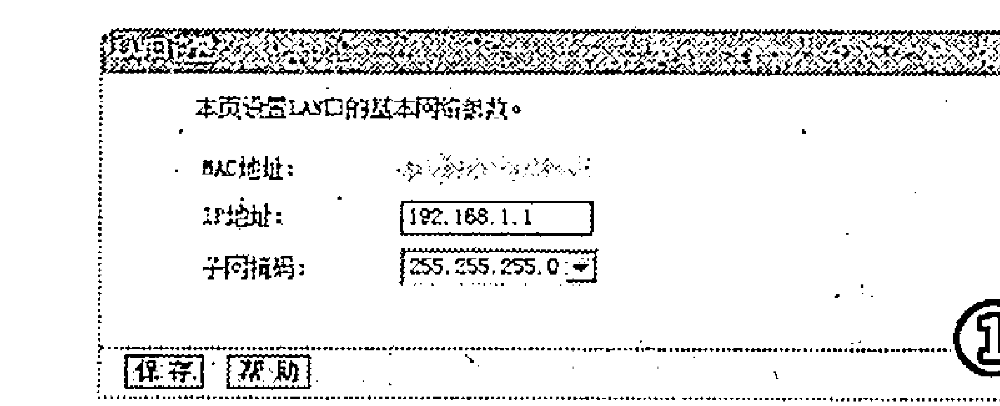

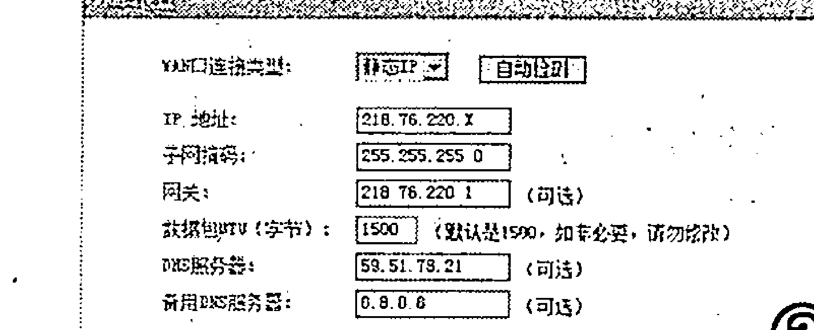

## 准备好软硬件整装待发

硬件条件：两台 TP-LINK_WR941N 或者其他 TP-LINK 带“WDS 无线桥接功能”的路由器。设我家发射路由器为路由器-1，老爸家接收的路由器为路由器-2。
网络环境：某电信运营商入户光纤，固定 IP 为 218.76.220.X，子网掩码为 255.255.255.192，网关为 218.76.220.1，DNS 为 59.51.78.210。
系统环境：Windows XP。

## 配置发射路由器-1

首先用网线将操作电脑与路由器连接起来，将操作电脑的“网上邻居→属性”中的IP地址设置为192.168.1.X，子网掩码设置为255.255.255.0，网关设置为192.168.1.1，在浏览器地址栏中输入192.168.1.1，回车，在弹出的对话框中输入用户名admin和密码admin（注意，一定要及时修改路由器密码），在打开的路由器设置界面左侧可以看到一列菜单。
- 点击“运行状态”，右侧将显示还没有设置好的一些参数状况，暂且不用去理会。
- 点击“设置向导”，打开设置向导窗口，单击“下一步”进入上网方式设置界面，点选“静态IP”。
  单击“下一步”设置静态IP，默认的各栏目是空白，将电信运行商提供的IP地址、子网掩码、网关、DNS服务器参数输入（另外需要说明的是：如果你使用的不是电信商提供的独立IP上网，而是局域网，你可以在这里输入局域网的有关参数；如果你是ADSL或者以太网宽带上网，你就应该选择PPPoE或者动态IP上网）。
  单击“下一步”进入无线设置界面，信道、模式、频段带宽、最大发送速率四个栏目，你可以根据自己的需要随意设置，暂时点选“不开启无线安全”（这个留着下一步再设置），设置好后，点击“下一步→完成”，然后继续下面的操作。
- “QSS安全设置”，暂且不用去动它。
- “网络参数”下的LAN口设置如图1所示。WAN口设置如图2所示。MAC地址克隆暂且不用去管它。
- “无线设置”下，上半部分已经在基本设置中设置好了。这里主要勾选“开启WDS”；然后，在“（桥接的）SSID”一栏中填写路由器-2的名称，在“（桥接的）BSSID”一栏中填写路由器-2的MAC地址；密钥类型选择WPA-PSK/WPA2-PSK，密码假设为abcde12345（你可以自行设置8～63个英文、数字字符）。完成设置后点击“保存”，再点击“重启”路由器即可。
- “DHCP服务器”下的DHCP服务设置，要点选“启用”，地址池开始和结束地址可以根据你的需要任意填写，然后填写上网网关和DNS。完成设置后点击“保存”，再点击“重启”路由器即可。DHCP服务器下的客户端列表和静态地址分配暂且不用去动它。
- 其他如转发规则、安全功能、家长控制、上网控制、路由功能、IP带宽控制、IP与MAC绑定、动态DNS、系统工具等，我们暂且不用去动它们。

小提示：
★无线设置下的安全设置如图3所示，点选“WPA-PSK/WPA2-PSK”，加密算法选择“AES”，PSK密码同样设置为“abcde12345”，保存即可。
★无线设置下的无线MAC地址过滤设置如图4所示，添加路由器-2的MAC地址。
★无线设置下的高级设置和主机状态，暂且不用去管它。

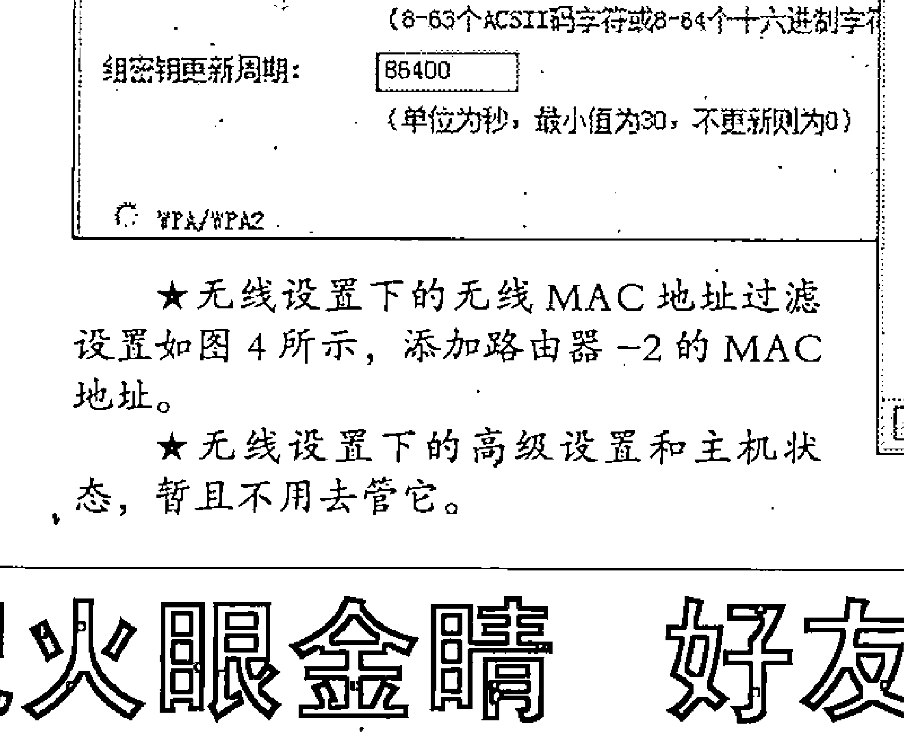

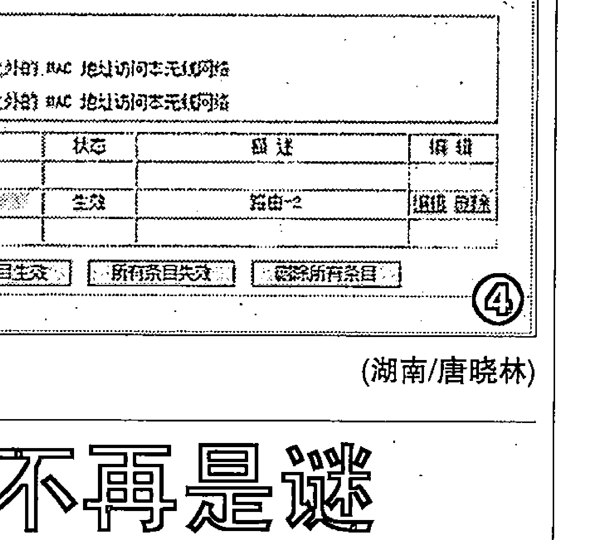

## 配置接收路由器-2

路由器-2的设置很简单。将老爸家的操作电脑与路由器-2连接，同样，在浏览器中访问192.168.1.1进入路由器管理界面。这里，“运行状态”、“设置向导”和“QSS安全设置”，暂且不用去管它。其他的设置则与路由器-1略有不同。
- “网络参数”下LAN口的IP地址设置成“192.168.1.2”，设置好后，点击“保存”并重启路由。WAN网口和MAC地址克隆暂且不用去动它。
- “无线设置”下的SSID号不要去动它，信道、模式、频段带宽、最大发送速率等设置与路由器-1一样选择；开启WDS功能，在“（桥接的）SSID”和“（桥接的）BSSID”两栏中输入路由器-1的SSID和BSSID；密钥类型、WEP密钥序号、认证类型、密钥设置与路由器-1相同。
- “无线设置”下的无线MAC地址过滤设置，因为老爸家用的是台式电脑，接根网线到路由-2就可以了，无需设置。不过我偶尔带着笔记本到老爸家显摆一下，所以我把笔记本的MAC地址添加进去，并将过滤规则选择为除列表中MAC地址之外的访问全部“禁止”项，这样蹭网者就无法盗取路由器-2发出的无线信号了。
  无线设置下的安全设置同路由器-1，点选“WPA-PSK/WPA2-PSK”，PSK密码自行设定8～63个英文、数字字符保存即可。其他如无线高级设置、主机状态等暂且不要去动它们。
- 路由器-2的“DHCP服务器”，设置成“不启用”，网关设置为192.168.1.2，设置完成后点击“保存”，并重启路由即可。

## 万事俱备，桥接路由器-1和路由器-2

好了，关键时刻到了。回到路由器-1的“无线设置”下的基本设置，选择密钥类型为“WPA-PSK/WPA2-PSK”，密钥设置与前面的两次设置相同即可。至此，两台路由器设置完成。
将相关电脑与路由器连接，就可以上网了。我调试成功后将住在本小区相隔不到200米的老爸家中开通了无线上网，于是老爸每天用液晶电视在网上看电影，十分地流畅。

## 360为你配火眼金睛 好友位置不再是谜

QQ上的某个MM告诉你她正在某某地，你相信她吗？如果你有怀疑，可通过查询IP地址大致获悉她真正的地理位置。虽然有一些第三方的QQ插件可以做这件事，不过安全起见，我建议大家还是试试360安全卫士提供的小工具。

第一步：安装最新的360安全卫士（http://www.360.cn）或是更新到最新版，我测试的是7.3beta版，它之后的新版本也都可以使用（360软件主界面左上角可以查看到版本号）。接着切换到“高级工具”选项卡，单击运行其中的“进程管理器”，将占用网络的一些无关进程关闭掉，如浏览器、邮件程序、网络游戏等。这一步操作虽然不是必要的，但是会方便后面的查找。

第二步：继续在360的“高级工具”选项卡中，单击“网络连接查看器”，将会发现当前系统中正在联网的程序都显示出来。
第三步：点击360网络连接查看器中的“进程”栏，让所有项目按照进程名排序。查看你的QQ进程，如果“目标IP”栏中有其他的IP，建议你关掉QQ再重新打开，让QQ的进程目标IP全部初始化为0了，这方便后面查看变化。
第四步：注意，只有下面几种方式可以查出好友的IP：与好友视频聊天或语音聊天，或者给你的QQ好友发送一个非QQ默认的表情。现在再返回360网络连接查看器，就会看到连接的QQ好友的IP及具体地理位置已经显示在那里了。

小编有话说：
★通过IP查询出的地理位置有时并不精确，甚至可能是错误的，所以仅作为参考吧。360的网络连接查看器，当然不是为了查QQ好友位置而开发的，这只是它的一个另类应用罢了。它的主要目的，其实还是辅助我们来识别系统中可能存在的木马等恶意程序。
★如果你升级到360的最新版本后依然没找到“网络连接查看器”，不是我在骗你，而是因为这款工具还没有64位版本，可能你正在用的是64的Windows吧。
★360安全卫士的高级工具中，除了上面提到的进程管理、网络连接查看之外，还有其他如流量监控器、文件粉碎机、网络诊断等实用工具，有需要的时候可以试用。

## 4招赶走IE9的‘拦路虎’

为了与Firefox 4， Opera 10及Chrome 7等新一代浏览器相抗衡，微软在IE9这个产品上倾注了极大的心血。不过由于种种原因，你在使用新推出的IE9 Beta (以下简称为IE9) 版时，可能会遇到一些‘拦路虎’影响我们的浏览体验。

## 拦路虎1：莫名其妙的崩溃

有些朋友在使用IE9打开某些页面时，浏览器频繁崩溃。由于默认设置下IE9‘启用自动崩溃恢复’的机制在发生作用，因此出现崩溃之后，IE9将自动重新打开这个页面，崩溃也就不断涌现……

解决方案：如果系统中安装了迅雷7，则故障可能因它而起，因为迅雷7与IE9存在一些兼容性问题。我们或者从迅雷官方网站获取最新的修复版本，或者干脆打开‘管理加载项’对话框禁用迅雷加载项。如果还有问题，可以进入‘Internet选项→高级’窗口，单击‘重置’按钮，将IE重置为默认设置。

## 拦路虎2：无法访问QQ相册

有些朋友在IE9中打开QQ空间相册时，一直停留在‘正在获取相册列表’这一环节，无法打开。

解决方案：如果你急着看相册，可依次选择‘最新照片→幻灯片播放’，通过幻灯的形式查看所有相册的照片。不过这一方法相当麻烦。其实此问题主要是因为你现有的Flash版本不适合IE9，可打开Adobe的http://labs.adobe.com/downloads/flashplayer10.html网页，按照提示下载并安装最新的Flash插件即可解决。

## 拦路虎3：下载文件不知归处

使用IE9自带的下载功能下载，时间一久，往往记不起以前下载的文件被保存于何处了，很是麻烦。

解决方案：在IE9中，按下Ctrl+J组合键可以打开它的下载管理器窗口，在这里可以查看和跟踪下载资源。单击管理器上方的‘选项’链接，还可以重新指定‘下载’的存储文件夹位置。

## 拦路虎4：回帖后无法自动跳转

很多朋友都是论坛一族，发帖、回复自然是家常便饭，但如果是在IE9中回复Disucuz论坛的帖子，却不会自动跳转，按下Ctrl+回车键也没有反应。

解决方案：很遗憾，目前尚无很好的解决方法。现在只能直接返回列表，手工刷新之后，自己的回复就会正常显示了。

(江苏/王志军)

## 天涯若比邻——Windows Live Mesh玩三方同步

长假期间老同学们组织一起去旅游，各人相机中都留下了许多精彩瞬间。可是旅游归来各奔东西，大家如何将自己相机中的照片快速分享？微软Windows Live Essentials 2011套件中包含的Windows Live Mesh可以帮我们轻松实现，它能在任意两台电脑及网络存贮之间实现三方同步，这样无论你身处何方，随时都可以查看那些甜蜜的回忆。

## 未雨绸缪做准备

要想享受这一服务，需要有MSN账户（即Windows live ID），没有的话可以从http://www.live.com注册获取，并登录，然后将光标移向‘Windows Live’链连，再点击弹出菜单中的‘Download’，按提示下载Windows Live Essentials 2011安装程序，选择安装其中的‘Windows Live Mesh’（以下简称为WLM）即可。注意：WLM只能在Vista和Win7电脑上运行，另外WLM程序要同时安装在需要异地同步的两台电脑上，并使用同一个MSN账户登录。

## 三方同步，两人不必同时在线

如果因为条件所限，两个人不能同时在线，可将照片先同步到服务器上（其实就是微软的网盘SkyDrive），其他人在任何时间任何位置上网，都可以即时收取到照片。

第1步：告诉远方的朋友，在其电脑上启动WLM后，单击‘同步一个文件夹’，选择保存照片的文件夹（如‘C：\Users\cfan\Pictures’），这样WLM会自动将该文件夹内的所有文件同步到Windows Skydrive网络硬盘中（免费5GB容量），同步成功后在WLM界面显示绿色标记。

小提示：为了照片安全，可以单击WLM界面的‘转至Windows live设备’，在打开页面单击‘SkyDrive同步存储’，并将同步照片共享者设置为‘只有我’。

第2步：现在在其他电脑上，同上单击‘同步一个文件夹’，选择一个需要下载照片的文件夹，单击‘同步’，WLM会自动将Windows Skydrive网络硬盘中的照片全部同步到本电脑上，这样就可以在本地轻松查看那些共享的照片了。其他想看照片的朋友，同样步骤操作即可。

## 无需绕弯，直接远程登录对方电脑

如果两个人能同时在线，那么还可以绕开服务器，直接进行互传。和系统自带的远程桌面不同，我们无需知道对方电脑IP地址，只要用户名和密码即可登录。

在我们的电脑上单击WLM界面的‘远程’，然后在‘连接到另一台计算机’选项下选择需要连接的计算机，单击‘连接到此计算机’。

成功连接并获得对方的许可后，此时在我们的屏幕上就会出现对方电脑Win7登录界面，按提示输入对方给我们的账号和密码登录，现在就可以远程操作对方的电脑了（对方屏幕则会黑屏并自动注销），按提示把对方电脑上的照片复制，然后粘贴到本地电脑即可。除了复制文件，还可以做一些其他操作，比如帮助对方修复电脑故障等，够方便的吧。

小提示：利用WLM同步和远程桌面功能，双方可以共同协作完成很多任务。比如MM的论文写了一半无法完成，MM可以将论文保存在同步文件夹，这样GG就可以自己电脑上编辑MM的论文，编辑完成同样会自动同步到MM电脑上。

(文/俞木发)

## 迅雷无助 快车帮忙 快车下载迅雷离线文件

一般来说，家里的网络带宽肯定没有公司的带宽大，而公司夜间的网络大多是闲置的，如果能充分利用这段时间内公司的网络高速下载自己想要的文件，不是一举两得么。不过，我们下班时还有同事留在单位，而早晨又有比我们勤奋的同事先到公司，如果这些时候全速下载无疑会影响到别人使用网络。大家知道，迅雷的下载速度快，但是它的计划任务不是很全面，无法自由定时，而FlashGet 1.x (快车) 的计划任务定制则要完善得多，要是将两者结合起来，那就完美了。

#### 使用迅雷离线下载

## 网文任意评 人人都有话语权

我们在网上浏览一些文章时，对文中的观点或者赞成或者反对，有时总想要评上几句，但是许多网站并不支持评论功能，这让人很郁闷。其实借助Layers.com，可以在任意网页上添加评论，并且别人还能对你的评论再评论，如同论坛上的“盖楼”一样。当然，要想获得这一功能，还需要一些简单操作，这里我们以火狐浏览器(Firefox)为例进行介绍。

运行火狐浏览器打开网页http://layers.com，点击首页上“Join”(加入)链接，在显示的面板里输入你的电子邮箱，并勾选后面的“Accept TOS”项，然后点击“Join”按钮，这时网站就会把账户和密码发送到你的邮箱中。建议使用Gmail等国外邮箱，我在测试时使用QQ和163邮箱，都没收到账户和密码。

注册账户，主要是方便对你的评论进行管理。重新回到Layers.com主页，点击“Login”(登录)，用上面获取的账号及密码登录，然后点击页面右侧的安装插件图片，按提示安装插件，成功后重启火狐浏览器就可以使用了。

在登录Layers.com的状态下，我们打开任意网站，在页面的左侧都会看见一个“Layers”(层)的小面板，点击它会显示一个“New layers”(新层)的链接，可以来输入评论内容，完成后点击“Share”(共享)按钮就行了。

还可以把评论内容发给其他的朋友，让他们一起来参与评论，只要点击小面板上的邮箱图标，在弹出的OE新邮件窗口里就会看见一个网址，将此网址发送给其他朋友，他们只要在浏览器中打开此网址，不需要注册账号，直接点击“Reply”(回复)按钮，就可以回复你的评论啦，是不是很方便。

(文/漫步云端)

## 不用记地址 直接访问路由器设置

对于使用路由器共享上网的用户，有时需要进入路由器界面进行各种设置。不过，在长时间不用之后，我们可能会忘记路由器的访问地址，于是还得上网搜索对应型号路由器的IP，很是繁琐。如果曾经自行更改过路由器IP地址，那就更麻烦了。

其实只要你的电脑已经通过路由器上网，系统就已保存了路由器地址。Windows XP用户，单击“开始→连接到→显示所有连接”，然后右击“本地连接”选择“属性”，在打开的属性窗口切换到“支持”标签，其中的默认网关就是路由器的IP地址，在浏览器中输入此IP并按回车，即可打开路由器登录界面了。

对于Windows 7用户来说，可单击任务托盘中联网图标选择“打开网络和共享中心”，再单击其中的“本地连接”，接着在打开的本地连接属性窗口单击“详细信息”，其中的IPv4默认网关就是路由器的IP地址。

小提示：路由器登录需要用户名和密码（一般默认都为“admin”），如果自行设置过用户名和密码但忘记了，我们还可以使用牙签等细小针状的物体按路由器的“reset”孔，重新对路由器进行初始化设置，这样即可使用默认设置登录路由器了。

(文/俞木发)

## 一专多能 好压软件‘兼职’

许多软件爱好者都知道好压软件是一款出色的国产解压缩软件，其实好压软件还有很多实用的‘兼职’功能，下面我就给大家略举两例。

#### 特技1：图片查看及格式转换

好压软件内置的图片查看器是一个可以浏览任意压缩包内与包外图片的工具，支持jpg、bmp、gif、tif、png等主流格式图片的查看。操作也非常简单，只需右击待查看的文件，选择“内部查看器打开”即可查看。它的界面与微软自带的图片查看器有些像，常用按钮也差不多，操作起来非常方便。除了看图，图片转换功能也是好压软件的特色之一，它提供多种图片的压缩裁剪转换功能，目前支持图片转换的格式有：bmp、jpg、gif、png、cur、tif、tga、pcx、wbmp、wmf、jp2、jpc、pgx、raw、ska等等。点击好压软件图片查看器下方右侧第二个按钮即可转换图片。如果是批量转换则在“工具”菜单里打开“转换图片格式”即可。

#### 特技2：MD5校验功能

为了防止人为篡改文件，一般网上供网民下载的文件都公布了其MD5校验值，下载到本机后通过比较MD5校验值是否发生变化来判断文件是否被篡改。先选中文件，再点击好压软件“工具”菜单里的“MD5校验工具”就可查看到该文件的相关校验，可以对任意文件进行版本、文件时间、MD5值、SHA1值和CRC32值进行校验。

(文/陈晓军)

## 有容乃大 3Q大战的神秘大礼？

3Q大战，网民应该是无人不知、无人不晓。感慨的有之，愤懑的有之，不管怎样，日子终究要继续过下去。360也好，QQ也好，其实就算是离了互联网也是一样的过。况360、QQ乎？不过好在，互联网并没有因为3Q大战离我们而去，反而给我们带来了另外的一些惊喜，除了金山网络旗下全线产品免费外，今天想和大家说说另一个大款飞信的小变革。

## 有容乃大，开放才是王道

在3Q大战正激烈的时候，中国移动旗下的即时通讯软件飞信发布了2010正式版SP2，除了加强安全外，还推出了一些新的功能。而在众多的新功能当中，个人觉得比较值得称赞的是向所有用户开放，而不再是像以前那样只有移动用户才可以注册使用。安装了最新版的飞信后，在“注册新用户”窗口中可以看到，除了使用移动手机号码注册外，还可以使用电子邮箱地址注册（见图1）。开放邮件地址注册使任何人只要拥有一个电子邮箱地址就可以使用飞信，完全不用受“移动用户”这个条件的限制。由“移动用户”独享变成所有网民都可使用，从另一种意义上来说，也算是一种开放和互联互通吧。表面上看，这种开放是移动的一种妥协，将自己的IM软件也开放给电信、联通的用户使用。但从另一种角度看，移动这一招最大的受益者还是移动自己。因为电信天翼Live的宣传攻势越来越大，而最近又有消息透露，联通也将重新运作即时通信软件，可谓前有狙，后有追兵。此番“开放”，一是可以稳固现有用户，另一方面还可以扩大用户群，对提升用户数有很大帮助，并且也更容易通过已有的移动用户“策反”竞争对手用户转投移动的怀抱。抛开手机业务不谈，如果移动能将飞信发扬壮大，不断完善服务，提升用户粘性，那么在未来的互联网时代，又将增加一个重量级的竞争砝码。现在的移动宣传语是“移动通信专家”，也许以后就成了“移动互联网专家”。所以此次移动的“妥协”，可以说是面子有了，实惠也自己得了。

## 飞信的进步与创新

虽然一直以来，我对飞信有很多不满，认为其有很多地方都做得不够好，但随着这次新版的发布，让我再次重新认识了飞信，并且对飞信的好感明显增多了。这里说两点，一是飞信新增了文件夹发送功能，也就是以后给好友传送文件时，再也不用先打包再发送了，可以直接将一个文件夹发送给好友。另一个应该说是飞信的首创（至少我自己是在飞信上第一次看到的）——短信密码。新版飞信在登录时可以使用短信密码，也就是说在一些公共场合，你再也不用担心那些盗号者了。套用一句流行的话，用你的短信密码，让盗号者哭去吧。回顾飞信的发展历史，抛开其企业性质不谈，飞信的进步还是不小的，特别是这次趁“战乱”作出了非常大的努力。

后记：作为用户的我们来说，希望今后的“战乱”少点，各厂商真正为用户考虑的多点。希望今后我们的桌面不再成为厂商的战场，飞信的这种进步能够继续保持。

(文/李云峰)

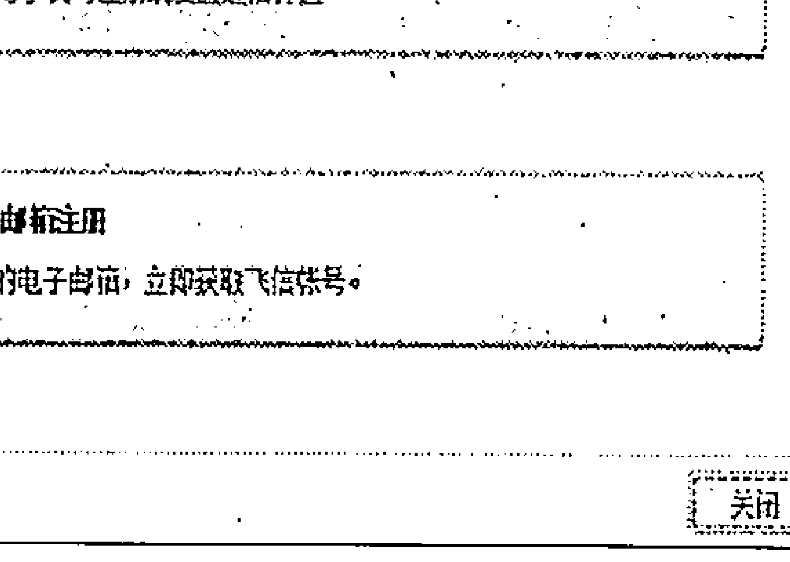

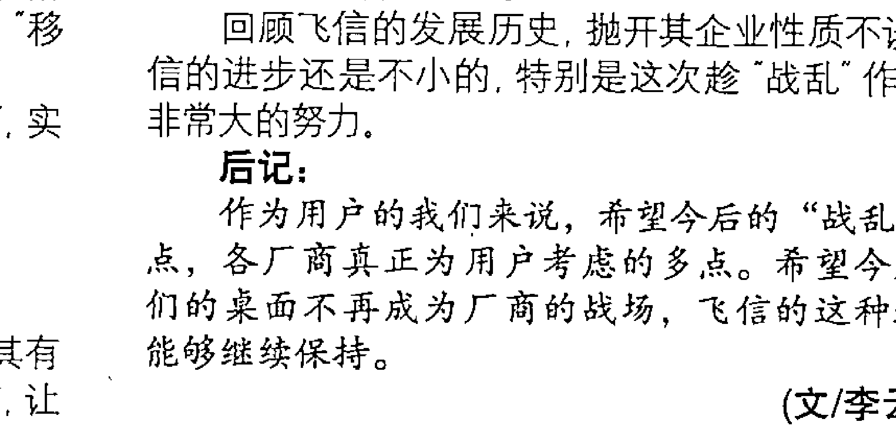

# 有图有真相——网络诽谤的截图维权

引言：近日笔者接到一封读者求助邮件，该读者是一个淘宝的卖家，前几天有人买了她的化妆品，但是买家不识货，在多个知名论坛上发帖诽谤她卖的是假货。这个买家已经给她造成很恶劣的影响，但是她不知道该怎么维权，请编辑们为她支招。

现在越来越多的人在网上通过各种工具发布信息，这其中也有许多不怀好意的人在恶意发布各种诽谤信息，这些不实的信息给很多网友带来了伤害。在遭到网络诽谤的时候，我们该怎么维权？截图保留诽谤证据是保护自己的有益措施之一，有图有真相。下面笔者就根据自己的经验，针对不同网页状况为大家介绍如何截图保留证据。

## 诽谤页面及时截图——微博消息截图

如果诽谤者是在他的微博上发布诽谤消息，由于微博消息页面一般都比较简短，使用傲游浏览器的用户，用其自带的截图功能保存即可。启动傲游后单击“工具→网页截图→截图选项”，设置截图的格式（一般JPG即可）和保存位置。这样在用傲游打开诽谤页面的微博后（如果有多条微博消息则打开多个标签页），单击“工具→网页截图→当前页面截图”，当前页面截图就会自动保存下来。

## 众多罪证一网打尽——论坛超长帖子截图

论坛已经成为很多网友发布消息的主渠道，一些诽谤帖子由于跟帖者众多，可能帖子非常得长，要快速截取超长帖子的截图，可以使用“火狐浏览器+自动翻页插件+Snagit”一次性截图保存。

第1步：在火狐浏览器中登录 http://www.oschina.net/p/autopager 下载并安装AutoPager插件。然后在火狐中打开需要截图的帖子页面，此时在火狐左侧的窗格会弹出自动翻页配置窗口，单击“启用”。

第2步：在火狐中滚动帖子页面，将所有页面全部加载。接下来启动Snagit，单击“方案设置”下的“统一捕捉”后的下拉箭头，选择“滚动窗口”，然后单击“捕捉”按钮，切换到论坛帖子页面，选择“捕捉垂直页面”，即可将超长帖子一次性截图保存了。

## 找回毁灭的罪证——历史网页截图

有些诽谤者心虚，可能在某网页发布诽谤消息后又删除了该消息。对于这些消失的网页怎么截图？

1.  尝试截取搜索引擎快照页面。百度、谷歌等搜索引擎都有快照页面，如果通过搜索引擎可以找到当时网页快照（以该帖的网址为关键字搜索，在搜索结果中点击“网页快照”），则使用上述介绍的方法截图保存即可。
2.  可以尝试到保存网页历史记录的网站查找。比如，中国Web信息博物馆（http://www.infomall.cn）里面共存有自2001年以来30亿个的网页数据，并以平均每月一千万网页的速度扩大规模。登录上述网址后，在历史网页回放中输入原来诽谤信息的网址，单击GO，在打开的页面按照日期顺序进行查找并截图即可。

小提示：
如果当前诽谤页面还存在，为了防止诽谤者删除，可以使用 http://www.backupurl.com 在线保存网页服务。登录上述网址后输入诽谤网页地址，单击“back up”，保存成功后就会获得一个在线保存页面的短网址，记下这个网址备用即可（注册为网站用户可以随时查看保存记录）。

## 网络维权小贴士

-   如果只是轻微的侵害，截图保存后，请在第一时间联系论坛版主或者网站管理员，提供自己截图证据后请求管理员删除诽谤信息。
-   如果诽谤信息严重侵害自己权益，受害者应第一时间联系公证处，保存涉及诽谤内容的网页截图，保存好证据之后，然后可以报警（网络违法犯罪举报网站：http://www.cyberpolice.cn/infoCategoryListAction.do?act=init），等待公安机关根据帖子的IP地址找到发贴人进行处理。值得注意的是，受害人自己保存的截图是不能作为有效证据上法庭的，必须是由公证处保存的才有效。
-   维权法律依据：依据《民法通则》第一百二十条第一款的规定：“公民的姓名权、肖像权、名誉权、荣誉权受到侵害的，有权要求停止侵害，恢复名誉，消除影响，赔礼道歉，并可以要求赔偿损失。”依据最高人民法院《关于确定民事侵权精神损害赔偿责任若干问题的解释》的有关规定，向人民法院起诉，要求停止侵害，恢复名誉，消除影响，赔礼道歉，并赔偿精神损害，依法维护自己的合法权益。

（文/俞木发）

## VS加速器让在线视频快马加鞭

由于受服务器带宽限制，有些在线视频看起来很不流畅，甚至无法正常观看。这时，可以试试“VS加速器”为这些视频播放加速。

首先到 http://www.videospeedy.com 下载安装软件，启动程序后它会自动加速，支持常见的Youtube，土豆网，56.com，六间房，新浪播客，优酷等视频网站。比如，我们在优酷打开一个视频开始播放，此时“VS加速器”会自动弹出加速提示，同时在程序界面的“正在加速”中可以看到软件已经为我们加速视频（开始加速后即可在浏览器中关闭原来的播放网页），加速完毕，单击“播放”按钮即可播放欣赏了。

“VS加速器”还有一个独特功能，它可以将在线视频直接保存到本地：切换到“加速完成”，然后选择需要下载的视频，右击导出，将视频导出为FLV保存在本地即可。

小提示：
通过安装视频转换插件，“VS加速器”还可以将下载的视频转换为手机或者MP4支持的媒体格式。

实战测试：
为了测试加速效果，我在优酷中打开播放视频，然后单击“暂停”，测算加载完成整部视频所需的时间；接着再打开“VS加速器”加速视频。经实际测试，晚上22点铁通 2M ADSL 线路，在播放优酷同一视频时，可以提高的速度约为加速前的3倍。

（文/俞木发）

## 妙用插件清除迅雷失效任务

在用新版迅雷7下载资源时，由于下载的文件已经被移动或者删除，所以打开迅雷后可以看到很多“灰色的任务”，不仅影响美观，也不利于资源的查找。

有幸的是，迅雷7有一款非常实用的“批量删除灰色任务GrayAddin”插件，可以解决这个问题。从 http://tinyurl.com/3a6bsh2 下载“批量删除灰色任务GrayAddin”插件，解压后双击其中的Plugin.exe文件安装，之后按提示重启迅雷使其生效。现在，我们右击左侧“已完成”按钮，选择“删除灰色任务”命令，在如图2所示窗口中，选择移至垃圾箱或彻底删除，完成后再看“已完成”，是不是干净、舒心多了。

（文/江北书生）

## 农场牧场被封 照偷不误

唉呀，噩梦来了，开小挂的QQ农场终于被腾讯怪叔叔封了，顺带着连咱的牧场也就挂了。别说这几天除草、浇花的经验没了，就连手痒都没地方使。

网上那些进入被封农牧场的方法，现在基本上没有能用的了。不过道高一尺魔高一丈，现在又有了新的方法，不仅能够进入农牧场还能够种菜、收菜、偷菜、添加牧草、收获动物：首先从电脑上登录WAP网站，这里我用的是3G世界网（http://www.ggg.cn），打开后在左侧的3G浏览器（WAP模拟器）地址栏中输入 http://3g.qq.com（手机腾讯网），点击“QQ空间”并登录到自己的QQ，然后点击个人中心上面的“应用”，选择“QQ农场”或者“QQ牧场”，就可以根据提示操作了。注意：目前农场已经对所有用户开放，不过牧场只对超级QQ用户开放。

此外，上面的方法还可以用来玩腾讯手机版的抢车位、精武堂、手机宠物等。不过安全起见，等自己的农牧场正常后不需要再通过这种方式登录时，最好重新换一下QQ密码。

（福建/林家境）

## 实用网址

#### 专用下载地址转换

快车有自己的专用下载链接，其他下载软件往往无法逾越，同样迅雷也有，还有一些网盘也需要使用专用的下载客户端才行（例如fs2you）。通过本网站就可以直接在迅雷、快车、fs2you、旋风专用链接之间进行转换，实现只要一个浏览器就能下载所有的专用链接资源。
网址： http://www.iplaysoft.com/tools/url-converter

#### 让自己被全球定位

假如你想让自己始终暴露在TA的眼皮底下，例如现在在什么地方逛街，最近去哪些地方旅游等信息，借助本网站就可以达到目的，直接通过“签到”的形式告诉TA。如果自己使用了带GPS功能的移动设备，便可直接让系统记录下当前自己的位置，而若使用手机上网，则直接“签到”即可。
网址： http://jlepang.com

## 架设ESET服务器 不在线也升级NOD32病毒库

网吧或电子教室的环境中，经常面临病毒、木马泛滥的困扰，虽然有网吧管理软件、影子系统（如PowerShadow、Shadow Defender、Returnil Virtual）甚至还原卡，但是如果没有杀毒软件这些都无济于事。多人使用电脑的环境，病毒感染的可能会翻倍，QQ号、网游账号随时面临被盗危险，杀毒软件的管理必不可少。

面对多台电脑（如单位环境）的安全维护、病毒库升级等，一台一台的操作显然费时费力，这时可选择ESET NOD32服务器版，统一升级及进行状态监控，将大大提高工作效率。尤其是有些电子教室没有互联网接入时，病毒库升级服务器的搭建就显得尤为重要。亲手搭建ESET病毒库升级服务器并不需要太多技术含量，照着我们提供的步骤，一步步操作很容易完成。

#### 准备工作

作为服务器需要安装IIS以提供文件升级访问的服务，所以Windows的Server版本且已经预装了IIS服务的系统是最方便的选择；再有的必备软件，就是ESET Remote Administrator Server（远程管理服务端）及ESET Remote Administrator Console（远程管理控制台），可从 http://www.ESET.com.cn/download 下载，也可以在Verycd等网站寻找相关资源；最后需要ESET安全套装或者ESET NOD32防病毒软件作为最终守护安全的壁垒。

#### 获得 ESET 病毒库

在拥有互联网环境的电脑中，我们先利用ESET NOD32的升级镜像功能，将病毒库升级文件转移到指定的目录当中，这样做的目的是可以自动获取病毒库升级文件，避免每次手动定期在官网下载病毒库离线升级文件的麻烦。

-   第1步：在安装了ESET NOD32的电脑上，用鼠标双击系统托盘中的ESET图标，在弹出的主界面中点击左下角“显示：标准模式”旁的“更改”按钮，将ESET的设置模式变为高级模式（见图1）。
-   第2步：在刚出现的主菜单中，选择“设置→高级设置→更新→高级更新设置”。
-   第3步：在“高级设置”窗口中勾选“创建更新镜像”并点击“文件夹”按钮指定镜像文件保存的位置（保存的位置需要和下一步创建升级服务器所使用的目录配合）。
-   第4步：点击“确定”保存设置。

#### IIS WEB 服务器设置

接下来还需要进行IIS的设置。

-   第1步：进入IIS管理界面，在“默认网站”上点击鼠标右键，选择“属性”。
-   第2步：选择“网站”栏，设置IP地址，注意这里的IP地址应为本机地址，点击下拉列表即可选择。如果你的服务器在内网，网站如192.168.0.1，那么你的升级服务器地址就为：http://192.168.0.1。
-   第3步：设定TCP端口，一般设定为80端口，如果有其他需要可以设定为其他端口（见图3）。如果提供外网使用，为了安全起见，建议不要用80端口，而且需要在路由等设备中设置端口映射。
-   第4步：选择“目录安全性”栏，点击“身份验证和访问控制”中的“编辑”。选择启用“匿名访问”（如图4）。

如果升级时希望对方输入ID和密码，可以在下方“用户访问需经身份验证”设置选项里进行相应的设置，初次建立服务器，建议先不设置（见图4）。

-   第5步：选择“主目录→本地路径”，此处设置的路径必须与ESET升级镜像设置中设置的目录名一致，否则无法升级，这点必须要注意。
-   第6步：选择“HTTP头”栏，在“MIME映射”中点击“文件类型”按钮，在弹出的窗口中选择“新类型”，在输入框中分别输入：扩展名: ver MIME类型: application/octet-stream; 扩展名: nup MIME类型: application/octet-stream。之后点击“确定”退出（见图5）。

设置完成以上操作之后即架设好了ESET NOD32升级服务器。

如果本机开启了防火墙，需在“控制面板”中找到“Windows防火墙”，在设置界面中，选择“例外”栏，点击“添加端口”，在弹出的输入框中输入“端口名称”和“端口号”。注意此处设置的端口号必须与第3步设置相同，并选择端口为TCP。

最后就需要在每台安装了ESET NOD32的客户端电脑上设置刚才架设的服务器了。这些电脑如果都没有互联网接入，那么上述的情况中，IIS WEB服务器提供的升级服务和第一步镜像获取的病毒库不在同一台电脑上，这时你可以通过笔记本接入局域网或U盘等同步上述两个目录的内容来为局域网内的电脑提供升级的病毒库。客户端电脑上的ESET NOD32仿照前面获取病毒库中的操作，到第2步的时候，在主菜单中，选择“设置→高级设置→更新”界面中，选择“更新服务器”右侧的“编辑”按钮，在“更新服务器列表”中将之前搭建的服务器IP地址“添加”，就大功告成啦。

（文/东东）

## 实时更新微博变身邮件签名

通过腾讯微博提供的“微博签名档”服务，我们可以将腾讯微博的更新信息添加到QQ邮件的签名位置。对方在阅读邮件时，还可以同步获知你的微博更新，而且是实时信息哦。

第1步：访问腾讯微博应用频道（http://open.t.qq.com），登录之后切换到“应用”标签页，找到“微博签名档”应用，这里可以即时预览微博签名的效果。如果你觉得不满意，可以更改默认的颜色与主题。请选择“博客或网站”，接下来单击左下角的“复制代码”按钮，将相关代码复制到剪贴板中。

-   如果选择默认的“ubb签名”，会导致创建签名之后无法显示图片效果。

第2步：接下来登录QQ邮箱，进入邮箱设置页面，切换到“常规”选项卡，找到“个性签名”小节，默认是不使用签名的，请单击右侧的“添加个性签名”按钮，此时会打开“新建个性签名”对话框。首先请对准备创建的个性签名进行命名，例如“腾讯微博”。单击工具栏最右侧的“<HTML>”按钮，删除文本框中的原有内容，粘贴刚才复制的微博签名档代码。

保存之后返回设置页面，我们立即就可以看到信息。以后撰写邮件时，都会在邮件末尾显示你的特有签名。对方接收到邮件时，会同步获得你的腾讯微博更新信息。很酷吧。

其实，除了在QQ邮箱的签名位置显示腾讯微博的更新信息之外，我们也可以将这一代码放到博客、论坛签名或其他可以引用网络图片链接的位置。如果准备放置到论坛签名，请选择“ubb签名”，感兴趣的朋友可以一试。

#### 文章扩展：腾讯微博做Foxmail邮件签名

许多朋友还是习惯在本地通过客户端收发邮件，比如常用的Foxmail，能否将腾讯微博放到Foxmail的签名中呢？当然也可以。

打开新邮件窗口，单击工具栏中的“插入图片→插入网络图片”，打开“选择网络图片”窗口，在“来源”文本框中粘贴刚才复制的“博客或网站”代码，确认之后即可看到签名内容。

更进一步，我们还可以将腾讯微博签名添加到邮件模板中，打开信纸管理窗口，选择“HTML信纸”，按照同样的方法进行操作，以后每封邮件中就会附带包括腾讯微博的签名。很神奇吧。

（江苏/大江东去）

## 更好记 手机号转邮箱账号

许多人记不住QQ号但是肯定能记住手机号，如果能将手机号作为邮箱账号，就会大大方便想给你发邮件的朋友了。腾讯最近就推出了手机号绑定QQ邮箱的功能，并且还提供免费的邮件短信提醒功能呢。

登录自己的QQ邮箱，点击“设置→帐户→注册手机号邮箱账号”（见图1）。按提示发送短信到指定号码（见图2，请以网站官方说明为准），收到手机号邮箱验证成功的提示短信后，回到QQ邮箱中继续操作，完成注册。

-   如果以前QQ已经绑定了手机，此处则直接询问你是否注册某某手机号@qq.com邮箱，同意的话点击“是”即可。

点击“下一步”，如果以手机号邮箱为默认发信账号，可勾选“手机号邮箱作为默认发信账号”，另外还可以勾选“对方回信时，免费短信提醒我”，这样在有回信时就会免费短信提醒你（见图3）。点击“下一步”，选择一些QQ好友，然后点击“发送”，即可自动给选中的好友发出邮件通知，告知他们你的手机号邮箱了（当然你也可以点击“跳过这一步”跳过）。

## 小编有话说：

注册手机号邮箱后，你原有的QQ邮箱地址依然有效，只不过多了一个手机号邮箱而已。如果你后悔将手机号账号设置为默认发信账号，还可以在QQ邮箱的“设置→帐户→默认发信账号”中修改。好了，现在你就可以双号在手，难逢敌手了……

（重庆/陈佳）

## 酷网千寻

**没有Office也能看DOC、PPT、XLS**
假如系统中没有安装Office软件，又想临时查看DOC、PPT、XLS等文档，甚至想从中复制出一些内容，这时可试试网易文档。除了Office文档，它还能查看PDF，不过文档大小不能超过10MB。
地址： http://doc.163.com/viewer

**象棋爱好者的乐园**
具有一定基础的棋友都喜欢研究一些名局、残局，从而增长棋艺。残局天下收录了大量的名局、残局，每局旁边还带有棋谱解释，配有口诀，是象棋爱好者不可多得的乐园。
地址： http://www.icanju.cn

**在线发送视频邮件**
只要有一个摄像头，就可以通过VoxLite在线录制视频并发送给好友：注册后直接输入朋友的邮箱地址、邮件标题，然后在“webcam capture”标签中进行视频录制，最后点击“send”发送即可。
地址： http://www.voxlite.com

**音标发音不准？赶快来纠正**
学英语最基本的就是音标的正确发音，本网站以真人结合动画（可以模拟口腔内舌头的动作）的形式，以及真实的发音来帮你学习音标的正确读法（见图）。
地址： http://tinyurl.com/2l828

**20年后会老成什么模样**
20年之后你会老成什么样？本网站就可以给你一个直观的答案，只要上传自己的照片，设置好性别、年龄即可得到20年后自己的大概相貌了。
地址： http://in20years.com

**网址也能加把锁**
thinfi网站提供了将长网址转换成短网址的功能。打开网站主页后，输入要缩短的网址，另外还可设置一个密码（此项可选），按回车键即可完成。打开这样的网址需要正确输入密码才能进入，所以在网上与好友共享时就不怕其他人看到了。
网址： http://thinfi.com

**自制“文件损坏门”**
File Destructor是个非常有意思的网站，它可以制作一个损坏的文件（DOC、ZIP、JPG等常见文件均可制作）。这有什么用处？当MM责问你为何没有按时帮她写好论文时，就可以在打开文件时显示“文件已损坏”为由搪塞了。
网址： http://www.xnet.se/fd

**制作幻灯片并不非得用PowerPoint**
没装PowerPoint也没关系，本网站提供在线制作幻灯片的服务（也可将本地幻灯片文件上传保存），这样随时随地都能制作或打开已有幻灯片了。
网址： http://280slides.com/Editor

**不会再打不开文件了**
有时因文件是未知类型而无法打开，有时因系统中没有安装相应软件而无法打开。现在好了，将此文件上传到DocsPal网站，它可以在线帮你打开多种文件，还能在不同格式之间转换。
网址： http://www.docspal.com

**借助网页也能互传大文件**
通过iSendr网站，不用装软件即可给远方好友传文件：打开网站后点击Send a File（发送文件），找到要发送的文件，即可生成一个链接，将此链接通过邮件、短信等方式告诉对方，TA便能直接下载了。如有必要，还可以选择添加密码。
网址： http://isendr.com

**个性图标在线找现成的**
想设置个性化的QQ或博客头像图标，自己设计又有难度，那不妨去Findicons网站，不用花一分钱，也无须掌握任何设计知识，就能找到称心如意的图标了。
网址： http://findicons.com

**你的博客得没得病**
自己明明能正常打开，但其他好友非说你的博客无法访问。哪个环节出问题了？打开本网站，输入你的博客地址，点击Check（检测），检测一下你博客网站的各种状态吧。
网址： http://ismyblogworking.com

**在线调整歌曲的音量**
下载的不同歌曲音量或高或低，频繁调整播放器是不是很麻烦？无需安装软件，vloud网站可以在线帮你快速调匀音量，定义好音量等级，再上传mp3或wav文件（需小于10MB）就可以啦。
网址： http://www.vloud.com

**不是戏王也能大换脸**
中国传统的“变脸”，头一回就能换一张脸型，非常神奇。其实你无需羡慕那些演员，通过youwild网站你可以玩更高超的变脸，将人物的脸与动物的脸进行合成，制作成有趣的变脸动画。
网址： http://youwild.org

**买辆车到底要花多少钱？**
到车商那看到的“明码标价”并不是你购买这辆车的最终花费的钱，还需要交购置税、上牌费、保险费……很多“汽车菜鸟”还真不容易弄清楚。那么你就可以试试本网站提供的计算器，只要心中有“车”，就能算出到底要花多少钱才能开着自家车上路。
网址： http://www.autohome.com.cn/buycar.html# 为兼容而生？双核QQ浏览器尝鲜

QQ浏览器5出来了，主打口号是“双浏览模式”“双核心”。这两年的浏览器市场是个硝烟四起之地，在单核已经不足以让用户满意之后，双核成为必备武器！所谓双核就是具备两种浏览器内核，最早采用双核的浏览器出现在傲游身上，点击“文件”后你会看到“采用Checo核心”的选项。Chrome出来之后，其第三方浏览器大多采用双核模式，那么QQ浏览器5作为IE第三方，它的双核表现如何呢？

NO1.Trident：传说中的“IE内核”，浏览器老大IE的御用内核。IE第三方如傲游、世界之窗等也一直以Trident为主。
NO2.Gecko：也称Firefox内核。特点是代码完全公开。
NO3.Presto：“欧洲之王”Opera采用的内核。
NO4.Webkit：苹果公司研发，Safari使用，Google的Chrome也在用。

最大化等操作。

#### 小知识：浏览器腹地一日游

浏览器最重要的部分是Rendering Engine(解释引擎)，俗称“浏览器内核”。负责对网页语法的解释(如HTML、JavaScript)并渲染(显示)网页。浏览器内核很多，大约10款以上甚至更多，但常见的只有四种。

## 与Windows 7完美融合

有读者问了，小编你NC(脑残)了吧？腾讯的浏览器名字叫做“TT浏览器”，没错，以前是这个名儿，但他们为了美观和得瑟，将所有的产品统一为“QQ+名称”，进入http://browser.qq.com即可打开QQ浏览器5的页面，下载安装后打开，你会看到看起来和Chrome有七分像？呵呵，这很正常，腾讯的专长在于模仿，集合众家之长。
除了简洁清爽的界面，在Vista和Windows 7下还可以实现Aero半透明效果，这点要比傲游强，后者的界面至今还是不透明状，影响美观，Aero Peak等特效同样支持，来回地拖拽即可实现窗口最大化、半开

## 双核之选

使用极速(Webkit)和普通(IE)双浏览模式，默认的是极速(Webkit)模式，在这种模式下，打开网页速度确实要快一点，但并没有官方宣称的那么神速。点击右下角的按钮，就会出现普通模式，也就是IE模式，小编建议在以下情况中使用该模式：

-   遇到显示出现问题的网页，如字体诡异、字迹重叠、图片不显示等。
-   声明只支持IE的网站、网页游戏等。

经测试，在打开淘宝(包括淘宝商城)、知名B2C商城(京东商城、卓越亚马逊、当当网、红孩子商城、苏宁易购、新蛋中国、世纪电器网等)、各大银行网站、在线支付网站(“快钱”除外)，都会自动切换为“普通模式”。

(体验者/哟西哈拉少)

## 跟我比懒？偷视频火狐秒杀搞定

看到CFan上很多讨论IE浏览器中视频下载的文章，但是火狐很少涉及，其实火狐的下载要比IE快很多，更加适合懒人使用！使用IE的同学，不妨试试火狐，IE下需要用软件搞定的视频下载，对他来说只不过是小菜一碟。

重启火狐，在Firegestures-选项中，选择“映射→添加脚本”，进行脚本的编辑。输入下载文档中的代码，下载地址：http://work.newhua.com/cfan/2012/hhjs.rar。
其次，“动作”栏中填入自定义动作，如输入“D”(向下)，点击“确定”即可。在视频页面空白处按住鼠标右键，轻轻向下一划，即可对当前页面进行解析。

#### Video：鼠标一拉，地址即现

此操作利用flvcd.com的视频解析功能，flvcd是目前国内支持网站最多的在线地址解析服务。
首先，安装Firegestures扩展：点击“工具→附加组件”搜索Firegestures，安装完成后点“立即安装”。

#### Music：试听天生带下载

以“豆瓣音乐人”为例，其中多数音乐只提供试听按钮，却不提供下载按钮，可以在网页上执行JavaScript脚本的方式为页面中的音乐添加下载按钮。
安装Greasemonkey扩展，安装脚本Down Dou's Music，下载地址：http://userscripts.org/scripts/show/55676。
确保Greasemonkey处于开启状态，单击页面上方的Install(安装)，Greasemonkey即可自动抓取脚本并安装，待安装完成后，刷新豆瓣音乐人页面即可看到音乐试听旁出现了一个下载按钮，怎么样，够方便吧？！

(xiaohui)

## 抵制后遗症 做掉Word和Excel的超链接

在Word或Excel中，可以直接将网页上的文字粘贴进来，但是粘贴后容易造成“后遗症”，那就是网页中的超链接被粘贴进来，虽然不影响使用，但看上去总是怪怪的，特别是将鼠标移至上面时还会出现如何打开的提示，如果误点击链接还会启动浏览器。假如这些超级链接真的没有用途，批量将它们删除是很方便实现的。

#### Word中批量删除超链接

只要选中含有超链接的内容，再直接按Ctrl+Shift+F9即可直接将所有的超链接变成非超链接了。

#### 删除Excel表格中的超链接

如果只是删除单个单元格中的超链接，只要在该单元格上右击，点击“取消超链接”即可。但若有很多超链接，如何取消呢？不要急：
Ctrl+A全选表格或者用鼠标拖选的方式选择需要取消超链接的内容，单击“插入→超链接”，在打开的对话框中的“地址栏”中输入任意内容，单击“确定”按钮，接下来再重复按上述方法打开插入超链接对话框，这时请单击右侧的“删除链接”按钮，就会将所选单元格中的超链接清除了。

#### 小知识：什么是超链接？

是指从一个网页指向一个目标的链接关系，可以是另一个网页，也可以是相同网页上的不同位置，还可以是图片、Email地址、文件、应用程序。当浏览者单击已经链接的文字或图片后，链接目标将显示在浏览器上。

(文/呆瓜)

## 裁军！硬盘军团拒绝双胞胎！

在平时有意、无意的操作过程中，可能会在硬盘中保存了某个文件的两个副本(双胞胎文件)，如果不是故意备份的话，那其中一个就是垃圾。一个两个这样的重复文件直接手工删除即可，而若有很多重复文件，那就该使用Duplicate Cleaner (下载地址：http://www.onlinedown.net/softdown/901_2.htm)来批量清理了，例如平时使用数码相机拍的照片可能在硬盘中保存了多份，现在想统一清理，这样操作即可：

#### 掘出来很简单

运行该软件后直接在“查找设定”选项卡中指定要清理重复文件的位置，选择“查找普通文件”，单击“选择→Images/Pictures(图片文件)→限定条件”，勾选“相同内容”及“相同文件名”，单击“开始”按钮即可开始搜索指定位置的所有重复文件了。
在搜索结果列表中(“重复文件”选项卡)细心地选中重复文件中的一个(这个将被删除)，直接单击“删除选定”按钮即可。

#### 看仔细有些难

如果文件不太重要，不担心误选中被删除而导致损失，那就可以通过“选择助手”来进行智能选中，单击“选择助手”按钮后，在打开的窗口中即可根据各项既定参数来选定要删除的文件了，例如很多图片可能有相应的小尺寸的版本，现在只要删除小尺寸的版本而保留原始尺寸的文件，那只要在窗口中选择“选择每组中最小的文件”项即可。

## 小提示：

本软件针对重复音乐的清除有独到的一面，它可以针对相同艺术家、相同标题、相同专辑的音乐文件来搜索、清除。

(文/dream)

## 让酷我音乐盒歌词背景跟我“姓”

“酷我音乐盒”是很多朋友用来听在线音乐的工具，不过，整天看着歌词窗口那一成不变的背景图片会产生视觉疲劳的。
只要单击歌词窗口右上角的“歌词背景”后面的下拉按钮，在列表中选择软件自带的任意一款背景，就可以直接完成背景的更换了。

如果想将自己刚从网上猎来的一幅好图片作为歌词背景，方法也不难：右击播放窗口标题栏并选择“选项设置→歌词显示→图片背景”项，再单击“浏览”按钮选择之前准备好的一幅图片，单击“确定”按钮后便可换成自己喜欢的图片背景了。

(文/呆瓜)

# 你准备好720P了吗？

“《三国》又更新了！”
“高清吗？”
“不是，网上随便下的。”
“那不看了！”
哪怕前段时间的《三国》再是火热，当人们一听说不是高清时，宁可不看，也不愿委屈着去看低清……清晰的画质是种享受，微小的细节也不会错过。不过真正意义上的高清大都是720P，平均4GB多的体积。但某“砖家”说：高清是烧钱的玩意儿！其实你被忽悠了，烂电脑、小水管网速也一样可以享受高清，向720P进发！

## PART 1：高清疑问 Q&A

#### A.什么是高清？

只要看上去画面比较清晰的视频，往往都被称为高清。其实真正意义上的高清，是指1080P、1080i、720P这三种数字电视扫描方式，1080等数字是指垂直方向有该数量条水平扫描线，P是 Progressive（逐行依次扫描），i即Interlace（隔行扫描，先扫描单数，再扫描双数）。

720P与1080i的带宽是一样的，在清晰度方面1080i高一些，在动态画面表现得更流畅的是720P，1080P同时兼顾了清晰度与动态性能，这也是众所周知的全高清——Full HD，但它也是对码率、存储空间要求最高的格式！

#### B.全高清呢？

只要能够支持1080P格式，宽高比是16:9，拥有1920×1080的分辨率……这样的显示器都可以贴上“全高清”的标签！对于显卡，同时支持HD Video、HDCP、HDMI、Dolby这四项指标，也可称为Full HD显卡。

#### C.又是编码格式，又是视频格式……我被搅糊涂了

视频画质取决于编码方式（VC-1、H.264、MPEG2等）和码率，我们常说的AVI、RMVB等视频格式只是一些封装方式，它们仅仅是一个壳，跟视频的清晰度无直接关系。所谓封装格式，就是将已经编码压缩好的“视频轨”和“音频轨”按照约定的顺序放到一个文件中，如果你愿意，将这些封装方式看成是一个“特别的文件夹”也未尝不可。

#### D.为啥720P的RMVB大都2GB左右，这是高清吗？

同样的一部影片，同样是720P……可为什么RMVB格式只有2GB，而AVI格式却4GB？因算法关系，RMVB格式在1500kps码率上支持不良，该码率以上的RMVB意义不大。4GB、720P的RMVB码率已远超1500kps，在画质改善不大的前提下，体积却成倍增长，得不偿失！因此，在下载720P的RMVB影片时，2GB足矣。

#### 小知识：闲话AVI

AVI 是微软于1992 年推出用于对抗苹果 QuickTime 的技术，在结构上，分为头部、主体和索引三部分。没有RMVB那样的码率瓶颈，但它的索引信息放在文件尾部，故AVI格式无法实现人们常说的“边下边看”。由于Windows的通用性，使AVI这个处于淘汰边缘的格式依然使用广泛。

## PART 2：高清解码，软硬兼施

#### 机器够强悍，解码就“硬干”

正常开启“硬解”，显卡、驱动程序、播放器三者的支持缺一不可！目前的视频种类繁多，常见的编码就有四大类N小类，封装格式更是难以统计，几乎没有一种设置可以兼顾所有类型，必须对症下药才能真正发挥硬件解码的功效。这里以“完美解码”为例，助众CFan解开高清硬解的设置之惑！

-   自动模式：“自动模式”默认就是开启的，完美解码将根据片源自动选择合适的方案；除自动模式以外，点击“推荐”按钮打开“渲染器推荐设置”对话框，根据提示选择相应参数，确定之后，也能正常解析大多数高清影片。另外，在KMPlayer、射手、POT等解码器中也有类似于“自动模式”的选项。这样设置起来虽然方便，但带来的视觉效果比较折中，要追求更完美的效果，还要在此基础上对部分选项进行微调。
-   解码模式：相对于其他解码软件复杂的设置界面，完美解码内置了多种方案，在“解码模式”的下拉菜单中选择之后，分离器、解码器等设置会自动更改。A卡选择ATI UVD（暂不推荐V2，兼容性方面仍有不足），N卡选择nVidia PureVideo就可以了。
-   视频渲染器：在视频渲染器的下拉菜单中，首选“VMR9（修正黑位）”。VMR9能够支持VC-1和MPEG2硬解，但H.264和X264硬解就得改为“EVR 增强型渲染（C/A）”，C/A表示可以外挂字幕并合理分配资源占用。

#### 小知识：什么是“修正黑位”？

这还得从“黑位错误”说起：在一些高清电影中，色彩的动态范围为16～235，也就是说在电影中16为纯黑，235为纯白；而显示器中色彩的动态范围是0～255，0为纯黑，255为纯白。也就是说，在影片中纯黑这种颜色，它会让显示器以16这种颜色输出。而显示器中16这种颜色不是纯黑而是灰黑……播放影片时，黑位错误体现为画面暗淡，像蒙了一层灰。

-   视频解码器：视频解码器的选择，是能否开启硬件解码的关键。对于4种主流的编码格式，可参照下表进行设置：

| 常见编码格式 | 解码器选择 |
| :--- | :--- |
| MPEG2、H.264 | CyberLink (DXVA) |
| X264 | CyberLink (DXVA) For MKV |
| VC-1 | MPC-HC (DXVA) |
| DivX/XviD | FFDSHOW (此格式不支持硬解) |

还有不少视频采用古老的DivX编码，此格式尚不支持硬解（未来支持的可能性也不大），好在它对CPU的要求极低，选择FFDSHOW进行软解即可。

#### 我有烂电脑，软解也凑合

如果自己的电脑实在太老太烂，显卡型号又不幸地出现在表二中；难道就与高清无缘了？其实，软解720P或1080i对CPU的要求并不高（奔4时代的CPU也能勉强胜任720P的软解），只要合理设置，老机器一样玩新花样！

所谓软解，就是用CPU进行解码运算。软解不需要设置解码器，当GPU不能硬解时，解码器会自动调用CPU进行运算。而系统的正常运行、图形界面的显示，都少不了CPU，还要用它来解码720P，养成如下习惯：
结束无用进程，让CPU专心：
打开任务管理器，右击播放软件的进程，在“设置优先级”的菜单中将级别设置为最高；
看高清电影，笔者不推荐使用“暴风影音”，因为现在的暴风影音更像“在线电视”，播放器本身对系统的开销较大；
别看1080P，只有在超过46英寸的显示器上才能明显看出它和720P的区别，46英寸……都该叫液晶电视了！

#### 不支持硬件解码的显卡列表

| 显卡种类 | 具体型号 |
| :--- | :--- |
| A卡 | HD2900XTX 1000 Series及更早显卡 |
| N卡 | GeForce 8800、Ultra GeForce 8800 GTX、GeForce 8800 GTS、部分 GeForce 6/7 Series及更早显卡 |
| Intel芯片组 集成GPU | G965之前芯片组，只支持MPEG-2格式编码 |

## PART 3：老电脑+800元=HTPC

不超过1000元，将老电脑升级成HTPC（家庭影院电脑），并能完成各种高清影片的硬解……换一块有集成显卡的主板是最恰当的选择。不过，升级前要了解你的老电脑是否有升级的空间，CPU、内存等不能太老，否则与新主板的接口不吻合，这可是最大的麻烦。

#### AMD篇：

目前AMD平台的主板几乎都能支持AM2等较老的CPU插槽，在了解清楚你原有CPU是AM2或AM2+封装后，可以考虑用“华硕M4A785-M”或“技嘉GA-MA785GM-US2H”对主板进行替换。
就在去年10月，这两款主板可是“开4核”的明星，不用怀疑板载HD4200的硬解能力，再配上一根2GB的DDR2内存，老电脑升级HTPC……完成！
PS：笔者机器的主板就是“技嘉GA-MA785GM-US2H”，在观看“TS封装、MPEG2编码、1080P”的《变形金刚1》时，完全没问题！帧率可保持在22左右。

#### Intel篇：

Intel平台的主板中，LGA 775是目前尚能支持的最老CPU插槽了，Pentium E、Celeron 4XX就使用这种插槽。对于这些CPU，“技嘉G41M-ES2L”是你最好的选择。
这块主板不足400元，在解码器设置恰当的前提下，板载的Intel GMA X4500足以应付1080P的硬件解码，性价比相当高，即你的CPU不是LGA 775封装，新买一个“奔腾E5300（双核）”与之相配，总价也就800元左右。
看来，如今搭建一个HTPC所花的价钱，还不到两年前的一半！

（四川/李户林）

# 从搜到刻 APE最流畅之路

要听就听最好的，这是爱乐一族听歌的目标，没有任何损失的APE格式自然是乐迷们的首选，不过APE格式的音乐到哪下载？下载后又该怎么欣赏？或许你有很多自己的方式，不过这里有一条最顺的路。

## 第一步：先尝后下

很多时候我们记得歌词而不记得歌名，没关系，打开酷狗音乐2010（http://www.kugou.com/，新版支持无损音质试听），选中“歌词”，输入你记得的某句歌词，例如“我走在每天必须面对的分岔路”，单击“搜索”，我们知道这首歌是“天黑黑”，现在来下载它的APE版本。选中“无损音质”，单击“音乐搜索”，在搜索结果选择喜欢的歌曲。因为酷狗搜到很多资源，单击“试听”即可在酷狗播放APE音乐，——试听我们就知道哪个歌曲好了，遇到满意的，右键单击“下载”就可以了。
小提示：
如果你知道名字，可以去一些专业的 APE 网站下载。比如电驴的 APE 专区：http://www.verycd.com/sto/music/~ape/，APE 音乐网站：http://www.ape9.com/ape/、无损音乐论坛：http://www.danqu.net/、无损音乐网：http://www.apeflac.cn/。

## 第二步：不转即刻

APE下载回来用电脑听自不必说，如何把它放在家里的卡啦OK上，汽车里呢？刻盘，对，不过刻盘前需要转换的话就麻烦了。打开Burrrn（下载地址：http://www.burrrn.net/?page_id=6），将下载到的APE文件和同一目录下的cue文件直接拖到程序界面，激活刻录后选择艺术家、刻录速度等参数，单击“burrrn”刻录为CD即可。如果下载的是单曲APE（没有cue文件），则直接将下载的APE文件拖到程序界面开始刻录。

（文/俞木发）

# 免费杀毒欲成三国之势 且看“牛皇叔”坐稳“免费帝”

在经历了诸多传言后，可牛免费杀毒最终采用卡巴斯基杀毒引擎，于6月8日正式发布。据称，腾讯也已经开始招募杀毒方面的人才，升级后的QQ管家仿照当年360的思路，免费推送半年的免费防病毒软件，如此一来，三足鼎立之势很快形成。360杀毒由于早起发家，以力举免费的大旗而出名，犹如曾挟天子以令诸侯而独占鳌头的曹操。而可牛继续依托360抛弃的卡巴斯基杀毒后盾独立做杀毒，正是以大汉血统身份扶持大汉，在魏之后称帝的刘备。“牛皇叔”。而腾讯的富饶不亚于东吴孙权，称帝也只是随后的事。免费杀毒三国之局势！

## 可牛接管系统安全

目前，可牛免费杀毒更新到1.0 Beta2 (http://www.keniu.com/)，安装程序略大，有72.5MB，让人想到刘备败走襄阳，带着百姓行军的庞大队伍。安装的最后阶段软件会分析安全环境，看来诸葛亮带兵有方，这是首先分析电脑有无危险程序，稍后会提示系统存在的高危漏洞，单击“立即修复”，转到软件“修复漏洞”选项下，除高危漏洞补丁外，还有“可选”补丁，当然，这和微软升级网站上的补丁数是有出入的。单击“立即修复”才会真正进行下载，在“修复漏洞”下，可以查看“已安装、已忽略、已过期、已屏蔽”的补丁。修复完漏洞，回到“查杀病毒”下，开始“全盘扫描”检查系统安全情况。

小提示：如果你希望保留补丁浪费空间，单击“设置→漏洞修复”，单击“立即删除”删除已经下载的补丁，然后选择“不保存补丁安装源文件，在下次修复时删除补丁包”。如果你把补丁保存到一个目录下，下次重装系统就无需重新下载了，只需在“补丁下载设置”里指定补丁存在的目录即可，只有出现了你没保存的补丁，才会从微软官方下载。

## 开启可牛“最牛模式”

刘备一方在三国中的战斗能力不是最强的，因为刘备不善战，必须通过一些特殊设置激发它，让它爆发出最牛的能力。切换到“实时防护”，如果你只有可牛这一款杀毒软件，要选择“超强保护模式”，并单击右侧的“更改设置”，开启默认情况下未开启的“邮件防护、网页防护、主动防御”，并打开“开启文件实时保护”的详细设置，修改模式，防护所有文件，开启深度启发式扫描（如果发现占用资源太多可调为中度）。邮件防护：单击“防护范围”，在“接收范围”里将“检测修改操作系统内核的活动”也勾选上，“确定”后可牛就达到了“最牛模式”。

## 杀毒实测 PK360

三国鼎立，征战自然必不可少，我们来对比下曹刘两家的实力。从设置来看，可牛采用的杀毒引擎具备主动防御和启发式优势，而360在使用细节上更好，例如定时扫描，扫描后关机等。为了看最终的查杀能力，我们选取了三个病毒样本包，在同一台电脑分别用可牛免费杀毒、360杀毒进行测试，看看刘曹的战果吧！

小提示：可牛免费杀毒目前有弹窗出现，但都是安全类的新闻。

| 软件版本 | 快速扫描(时间) | 全盘扫描(时间) | 资源占用(CPU最高、内存) | 旧病毒包(11个) | 盗号木马包(8) | 新病毒包(45) |
| :--- | :--- | :--- | :--- | :--- | :--- | :--- |
| 可牛免费杀毒1.0 Beta2 (病毒库：2010.06.12.1255) | 4分钟 | 87分钟 | 56%、44MB | 查杀105个（剩余12个文件） | 查杀8个 | 查杀39个（剩余10个文件） |
| 360杀毒 (病毒库：2010.06.12) | 3分钟 | 123分钟 | 44%、85MB | 查杀105个（剩余9个文件） | 查杀7个 | 查杀24个（剩余7个文件） |

# 从热门影视到QQ动画表情

QQ群中常看到其他网友发送的影视动画表情，就是从流行影视中截选出的某个经典的或搞笑的片段，非常吸引众人的眼球。其实制作影视动画表情并不难，你也能轻松做到。首先是编辑视频，专业软件不容易学，其实用Windows系统的Movie Maker（影音制作）即可，这一工具包含在Windows Live套装中（安装程序：http://g.live.com/1rewlive3/zh-chs/wlsetup-web.exe）。安装时取消其他选项，仅选择“影音制作”安装即可（其中的Messenger即MSN，需要的同学可以选择安装）。

小提示：★最新版本的 Movie Maker 仅可用于 Windows Vista/7 中，XP 的用户，最好使用 Movie Maker 2.1 (http://tinyurl.com/3fpo4)。

从“开始→所有程序→Windows Movie Maker”运行影音制作，点击工具栏“导入媒体”导入需要编辑的视频（支持ASF、AVI、WMV、MPG等常见格式）。点击下方的“情节提要”切换到“时间线”状态，并将导入的视频拖放到时间线中。将绿色时间线拖放到所需视频片段的开始处，然后点击右侧“拆分”按钮，再点选被切分的前段视频，按Del键删除。再将时间线移到所需视频片段结尾处，同样方法，拆分后将后段不需要的视频删除。现在保留下的就是所需要的片段了。还可以为这段视频加上个性化的语句，比如“看什么看，没见过帅哥”之类的。可以这么做：点击左侧“编辑”下的“片头和片尾”，按向导提示，点击“在所选剪辑之上的片头”，输入要加的语句，设定好字体、大小、颜色，再点击“添加标题”就可以将文字加到视频中。编辑好之后，点击菜单“文件→发布电影”，选择“本计算机→视频”，进入电影设置界面时，选择“压缩为”项，并降低后面数字的大小，下面将能看到对应的“显示大小”（毕竟作为QQ表情图片最好不要太大），最后点击“发布”即可。当然，上面导出的AVI视频还不能直接为QQ所用，可通过“Bitssoft 123 AVI to GIF”之类的软件将视频转为GIF动画。甚至可以通过gifninja.com（http://www.gifninja.com/ConvertVideoToGif.aspx）之类的网站在线转换。然后就可以导入到QQ中向好友炫耀啦。

（江苏省沭阳县工商局/徐勤红）

# 日和标语LOGO自己造

一段时间来，《搞笑漫画日和》这部没有条理的无厘头漫画风行网络，有好事的网友，还将其中的一些四字短语制作成风格独特的图标，作为自己的QQ、微博、论坛等头像，显得非常酷。这些图标是如何制作出来的呢？其实非常简单，通过一个Flash就可以完成。在浏览器地址栏输入http://udagawafriday.ideal.jp/minantokag.swf，按回车键打开它后，如图1所示，删除原有的文字替换成自己想要的文字就可以了。拖动下面的三个滑钮，可以调节背景的颜色，旋转鼠标滚轮则可以旋转文字的角度。这里没有保存选项，其实直接按PrintScreen键截屏，或者借助QQ的截图工具截图保存就可以啦。上面的方法有不少缺点，比如不能换字体，不能调整字体大小，最麻烦的是不少文字还显示不出来。所以做图要想自由，还得请Photoshop出山。第一步：启动Photoshop（这里以CS3为例），根据自己需要的大小新建一个文件，本例为300×300像素。按Ctrl+Shift+N键新建一个图层，然后选择椭圆选择工具，按Shift键不放，在新图层上画一个正圆形选区。选区最好留点余地，不要太撑满画面。第二步：点击工具箱上的前景色图标设置为自己想要的背景色（这里选的是蓝色），然后通过填充工具填充选区，得到蓝色圆形。单击菜单“选择→修改→边界”，设置16个像素值，将得到一个环形选区。再执行“滤镜→模糊→高斯模糊”，设置适当的模糊值，一个虚化边缘的圆形背景就完成了。第三步：按下T键输入自己想要的文字，可以任意设置字体、大小、颜色。按Ctrl+T键选中文字后，还可以任意缩放字体大小和旋转角度呢。最后保存为PSD格式的文件即可。以后，可以随时替换其中的文字并进行调整，无需再重复上面的两个步骤了，方便吧（见图2）。

（文/无名）


# C盘满了 让“企鹅”帮你搬软件吧

你总是很小心，你总是记得把软件装在其他盘。但是C盘还是塞上了不少软件，删除？重新安装到其他盘？别OUT了，没听“企鹅”可以给软件搬家了吗？直接帮你转移到其他盘，正常使用。

所谓的“企鹅”是腾讯新推出的“QQ电脑管家”(http://labs.qq.com/labs/pcmgr.shtml)，运行后

单击“功能大全→软件搬家”，你看到的不是那些文件所占的空间大小，而是各个软件所占空间的大小。选中你想转移的软件，单击下面的“选择位置”，为软件指定新的“家”，单击“开始搬家”，QQ电脑管家就自动完成指定软件的“搬运”。

不用担心，单击右上角的“已搬移”，勾选要还原的软件，单击“还原”即可。

小提示：除了可以给软件搬家，软件还能帮你转移大文件，单击“该盘大文件”，可以分析出文件的空间占用，同样转移。

(四川/赵括)

# 定时提醒 我要3D的

好记性不如烂笔头，在如今的电脑时代，不再用笔记来提醒重要的事情了，换成更智能的定时提醒器了。不过，普通的定时提醒器我可不要哦，我要3D的！

只要从http://www.greendown.cn/soft/22926.html下载这款AeroTimer小提醒软件，运行后可以设置两种提醒方式，一种是倒计时方式，另一种则是指定具体的时间进行提醒的方式。

譬如，下午三点左右需要到总公司参加一个会议，那么提前小时来个提醒就基本上确保不会把这事给忘记了。这时，只要选择“直到”，再设置具体的提醒时间（14:30），接下来再设置提醒方式为“弹出窗口和播放声音”，设置好提醒的内容并指定一个提醒声音（例如可以指定一首MP3歌曲），保存设置即可。

到达指定时间，系统就会弹出一个提醒窗口并同时播放指定的音乐或是一段声音。

(文/麦田)

# 鲁大师帮你开关显示器 从此低碳下载高清

现在许多人都喜欢下载高清电影，但由于网速的限制，几个小时都不一定搞得定，而这时你都要开着电脑，岂不浪费？现在好了，鲁大师从V2.56版本开始，新增了“离开模式”功能，往后下载高清电影就省事多了。

首先用鼠标右键单击一下桌面右侧托盘中的“鲁大师”(http://www.ludashi.com/)工具图标，选择“进入离开模式”命令，这个时候会出现一个警告窗口，直接点击“确定”按钮就顺利完成了。这样一来，“鲁大师”会自动关闭你电脑的显示器并调整为静音模式。

但网络仍然会保持连接，你就安心去睡觉或是吃饭吧，让电脑在最省电的模式下替你来BT下载高清电影！

移动一下鼠标或按一下键盘，就能从“离开模式”转回到“正常模式”了，是不是既实用又容易呢？

(武汉/王勇)

# 精准助读 扫描版PDF也能点链接

我们从网上下载到的很多电子书，大多是上传者使用扫描仪将书籍扫成图片，然后制作为PDF格式的。由于目录页也是使用图片格式，无法直接点击目录跳转到相应的页面，给阅读带来不便。假如自己一一手动添加书签，未免太麻烦。下面就教大家如何智能添加书签目录。这里以从网上下载到的“Excel_word_ppt_使用技巧大全.pdf”为例，它的页面都是由扫描图片组成。

## FreePic2PDF 生成书签文档

首先到http://www.onlinedown.net/soft/70313.htm下载FreePic2PDF，它是用来制作PDF书签所需的FreePic2Pdf_bkmk.txt的，编辑该文件后导入PDF即可生成书签。启动FreePic2PDF后，单击程序界面右下角的“更改PDF”，然后在弹出的窗口切换到“从PDF取书签”，单击“浏览”选择下载的“Excel_word_ppt_使用技巧大全.pdf”（假设保存在桌面），然后单击“开始”，这样会自动在桌面生成一个和书籍同名的目录。

## 福昕 PDF 阅读器来助阵

从http://www.fuxinsoftware.com.cn/downloads/下载“福昕PDF阅读器”，使用它打开“Excel_word_ppt_使用技巧大全.pdf”，然后单击菜单栏的“工具→文本选择工具”，使用鼠标选中目录页，在选中的目录页右击选择“复制到剪贴板”。

> 注意：只有全部是文字的书籍目录页才可以使用上述“文本选择工具”选择内容并复制。如果是图文混排（或者使用非标准字体）的目录是无法选择的，此时可以使用“福昕PDF阅读器”的“快照工具”，选中目录页后将当前页面保存为图片，然后使用OCR软件识别，并将识别结果保存到“FreePic2Pdf_bkmk.txt”中再导入PDF中即可。

+   ★另外还有一个巧妙的办法获取目录文本。如果找不到目录页，很多书籍网站都提供文字目录，可以到这些网站复制目录到“FreePic2Pdf_bkmk.txt”中编辑导入。
华储网（计算机专业书籍）：http://www.huachu.com.cn
当当网（综合书籍）：http://www.dangdang.com
新华书店（综合）：http://www.xhsd.cn
百度文库：http://wenku.baidu.com
谷歌读书：http://books.google.com

上述复制的目录粘贴到此，删除多余的空行及字符等并保存。

由于FreePic2Pdf_bkmk.txt要用<TAB>表示书签的层次深度，一个<TAB>一个层次，目录的文字与最后的数字之间也是用一个<TAB>表示，因此还要使用“记事本”的“查找替换”工具，将目录中的“......”替换为TAB符号。

如果原来的PDF已经有书签项目，也可以用上述方法提取书签，然后打开导出的“FreePic2Pdf_bkmk.txt”文件按上面方法修改即可。

## 万事俱备制作目录文档

启动“记事本”打开上述建立的“C:\Documents and Settings\Administrator\桌面\Excel_word_ppt_使用技巧大全\FreePic2Pdf_bkmk.txt”文件，然后将

## 大功告成，书签目录绑定到PDF

重新启动FreePic2PDF，单击程序界面右下角的“更改PDF”，操作同上选择切换到“从PDF挂书签”，单击“开始”即可将书签添加到PDF书籍中。再次使用“福昕PDF阅读器”打开PDF书籍，单击菜单栏的“视图→书签”，现在就可以单击书签中的链接快速切换到指定页面了。如果书签跳转有偏差还可以在此修正（还可以在书签栏添加书签，或者添加下级书签）。比如其中的“返回首页”默认没有跳转，现在定位到目录页，右击书签中的“返回首页”选择“设置目的”，这样单击这个书签时就可以返回目录页，其他书签修正操作类似，只要定位到PDF中正确页面并设置目的即可。

(文/平淡)

# 逃离火星 谷歌拼音狂写菊花文

不知道什么是菊花文？那你可有点火星了！它是继火星文之后出现的一种新的另类字体，因其形状类似于菊花而得名。这种字体较早出现在微博上，并通过微博广泛传播。马化腾的博文中就曾出现过菊花文。

想要输入菊花文其实很简单，新版谷歌拼音输入法（下载地址：http://www.google.com/ime/pinyin/）就支持。下载安装后调出谷歌拼音的输入框，单击其上的菜单按钮，选择“候选项转换器→添加装饰效果”，然后输入的文字就会自动加上菊花图样的装饰了。菊花图案与文字的重合度，因环境的不同而不同，比如在EmEditor中输入，图案与文字完全分享，而在腾讯微博中测试时两者是重合在一起的。Windows Vista/7的效果则比Windows XP下的重合效果好。当不需要输入菊花文时，简单按Ctrl+Shift+C键就可以快速取消它。

```
ooooo
iiiii
|~~~~~~~~|
|*~~~~~*|
| \~~~~/ |
|  \**/  |
|   \/   |
|~~~~~~~~|
~~~~~~~~~~~~~~~~
```

i命令中，还有快速打印稿纸、计算器、输入当前日期时间、查询星座等功能。如果熟悉谷歌输入法API，还可以自定义模式功能呢。

+   ★谷歌拼音输入法中，还新增了汉字Unicode代码查询功能。点击“菜单→候选项转换器→查询Unicode编码”，输入文字时，谷歌拼音会显示它的Unicode码。
★当有些英文单词不会完全拼写时，可在使用谷歌拼音输入法打英文时，输入v再加单词的前几个字母，输入法将自动提示你可能要找的单词，就像一个英文词典。
★单击“菜单→显示统计表盘”，将显示两个表盘，实时显示你的输入准确率、输入速度等，非常形象。

(文/一页)

## 双剑合并 Win7下免费编铃声

MM想为自己的新手机制作不同的个性铃声，像开机音乐、接听音乐、短信音乐等。不过歌曲的前奏一般较长，常常还没到主旋律就中断了（谁会没事等一两分钟才接听呢）。我在Win7自带的程序里找了一遍，居然没有一个能编辑音频的。总不能仅为了简单的编辑功能就去装一个大型音频软件吧，况且这类软件大多为破解版，安全也是个问题。于是上网一找，很快找到一款免费好用的Free Audio Editor（以下简称FAE，下载地址：http://tinyurl.com/3afg7wh）。安装后运行，点击工具栏上Open（打开）按钮，选择打开要编辑的MP3歌曲（本例为王菲的《传奇》）。首先按空格键完整试听一遍歌曲，大致了解自己想要的部分，然后再按住鼠标左键拖动选择，将需要的这部分框选出来（选中部分变成蓝色高亮）。

接下来再按空格键播放，现在将只试听到选中的区域。如果觉得选多或选少了，可通过拖动下面的两个滑钮来重新精确定位所选区域，直到满意为止。接下来点击菜单“Edit→Crop（编辑→裁剪）”命令，选中部分将被保留，其余不需要的部分被删除。再按空格键试听一遍，没问题后，点击“File→Save→Save Files as（文件→保存→另存为）”保存铃声就可以啦（注意，千万别选Save File或按快捷键Ctrl+S，这会覆盖掉原来的文件）

直接从音乐CD、视频、Youtube中提取声音，还是很强大的。事情到此尚未结束，FAE免费版只能保存为WAV格式，体积太大，还要想办法转成MP3才行。这方面同样有一个很好用的免费软件Eufony Free WAV MP3 Converter（下载地址：http://tinyurl.com/2dwpazx）。安装后运行，它的界面类似资源管理器，找到并选中要转换的WAV文件，再点击工具栏上的转换按钮（左起第二个图标），在打开的对话框中设置好保存位置，最后点击“转换”就可以啦。赶紧把编辑好的音频导入MM的手机，设置为个性铃声吧。

+   **小提示：**
★ FAE当然不止以上的简单功能，它除了裁剪、删除、复制等基本功能外，还可以完成混音及渐变、变声、回声等多种特效。

## 美图秀秀 风景照片 “阴转晴”

入门级：普通照片大变身

首先运行美图秀秀（下载地址：http://xiuxiu.meitu.com/），打开需要处理的照片。如果弹出“您打开的图片偏大”提示框，点击“是”，这样美图秀秀自动将照片压缩为合适的大小，方便日后发布到网上。接着在打开照片的左侧，调整照片整体的亮度、对比度、饱和度和色彩，以便纠正拍摄时产生的色彩失真。满意后，可以在右侧点击添加一个特效，以便进一步加强照片效果。

| 风景类别 | 推荐特效 |
| :--- | :--- |
| 阳光充足的海报、街道等 | 对比强烈、歌特风 |
| 郁郁葱葱的森林和山谷 | 柔光、暖黄、冷绿 |
| 城市街景 | 复古、经典LOMO |

高手级：巧用变色笔，阴天变晴天

风景类照片，难免会拍到一些并不那么完美的内容，比如当天气不好时，拍下来的天空会阴沉沉的。对于这种情况，可以在“美化”界面点击照片左侧的“局部变色笔”工具，这个工具本来是为了给人像换头发颜色用的，用到天空的美化上也非常适合。在“局部变色笔→编辑框”中，单击“选择其他颜色”按钮，自定义一个淡蓝色的天空颜色，然后调整一下画笔大小，直接用鼠标在照片上涂抹开，天空就逐渐变得晴朗起来。单击“应用”按钮返回，继续给天空增加上几片云彩，以便让效果显得更好。点击切换到“饰品”界面，在“非主流印”中找到云彩的素材，通过鼠标调整好云彩的大小和位置后，稍微降低一点它的透明度，以便让云彩看上去更加自然。

美图快速发到 QQ 上

至此，照片的处理就差不多完成了。其实除了上面提到的方法，还可以举一反三利用美图秀秀的各种人像美化功能来继续美化风景照。最后单击照片上方的“预览”按钮，在弹出的“图片预览”窗口中单击“复制到QQ”按钮，即可将美化完成的照片快速发到QQ上让好友们欣赏了。

## 公用电脑动不得 画个禁区非请勿入

我常常需要将学校公用电脑的系统设置为禁止修改，老手可以通过修改注册表来实现，可对新手来说有诸多不便，不过有了“网管辅助工具”这个工具，就轻松了很多。运行软件（下载地址：http://work.newhua.com/cfan/201014/wgfzb.rar），所有的功能都列了出来，在“限制”一栏中，我们根据需要单击相应按钮来达到禁用功能的目的，可以快速禁用注册表、禁用控制面板、禁用CMD等选项，如果需要恢复禁用的选项时，在“恢复”一栏中单击对应的“恢复”或“允许”按钮即可。在“系统工具”中，可以直接单击相关的按钮来打开任务管理器、注册表编辑器、控制面板等系统工具。因为是绿色软件，我们完全可以将其拷贝到U盘中，以后插上U盘即可进行操作，这样安全性就大大提高，非常方便，有兴趣的朋友不妨一试。

## 视频作证：我真逛过世博会！

设置酷炫背景

打开iClone后，切换到Stage（场景），进入2D Background（平面背景），点击右侧Open按钮，选择一张世博会中国馆的图片作为动画的背景。然后单击Orbit/Roll按钮，将三维平面旋转到背景图片的地面上，这样后面添加的装饰物才不会高于背景图中的中国馆。小提示：★ iClone提供的背景有多种风格，比如还有3D Scene（三维场景）等。另外在此还可以给动画添加一些装饰，如：Image Layer中内置影像前景，Atmosphere中可以设置气候，Fog中可以添加雾气效果等。

世博会里养花种树

切换到Set（设置）菜单，单击Tree（树）按钮，这里有多种类型的树，拖动其中的AmericanElm A到场境中，单击Scale（比例）按钮可以对树进行缩放操作。单击Move（移动）按钮可以移动树木位置。单击Grass（草地）按钮，同上操作，可以在场馆的地面上种上各种花草。在Set菜单中，还可以轻松为动画添加烟花、雨点、水等装饰，操作方法大同小异。

请一个美女迎宾客

这一步特别有意思。切换到Actor（演员）菜单，单击Avatar（阿凡达），然后将Violet拖放到舞台中，在右侧的Adjust proportion（调整属性）中，将所有数值都设置为400，将Transform→Move的Z坐标数值设置为0，再选中人物单击Rotate按钮可以任意旋转人物角度。通过Hair、Upper Body、Lower Body、Gloves等等选项，我们可以随意设置人物的发型、上身、下身及手套、鞋子等饰物。小提示：★在Head选项中可以设置人物的头部，创建人物模型，还可以导入已有的图片（比如自己的照片），创建接近于真人效果的三维人物。

边走边说话的美女主持

接下来还要让上面的美女主持动起来。切换到Animation菜单，单击“Path→Create Path”，再在场景地面上画出人物行走的路径，右击结束路径创建，再右击人物选择“Move→Walk Forward”，人物就可以沿着路径运动了。接着选中三维人物，点击“Facial Animation→Smile”，给三维人物加上微笑效果。再单击右侧Type按钮，输入美女要说的话，如“欢迎光临上海世博会”，确定后，三维人物就会自动边走边说话了。单击下方的“播放”按钮观看效果，满意后就可以切换到Export（输出）菜单输出动画视频。发给好友或者上传到网络上，就可以与大家一起“佳片共享”啦。

买一赠一：自制家装模拟图

只要会简单的电脑操作，我们也可以自制精美的家装模拟三维效果图。这里推荐使用另一款三维制作软件Moviestorm。限于篇幅，具体操作，大家可浏览博客：http://fly2spring.blog.cfan.com.cn。欢迎光临。

# 看！这是批量打印最省时的方法

因工作需要，每个月末我都要打印很多统计文档，而且文档格式还不尽相同，有XLS、DOC甚至PDF等。开始每次打印需要运行Excel、Word等相关程序，非常麻烦。后来学到一个小技巧，通过Ctrl键加点击，选中多个要打印的文件后，右击，选择“打印”即可批量打印了。
不过新的问题又来了，许多文件在不同文件夹中，就无法全选右击了。尤其是在右击打印中，文档其实还是要打开的，虽然是系统自动操作，但是打印的文档多，闪来闪去眼睛很不舒服。于是我又找到了新帮手PrintConductor（下载地址：http://tinyurl.com/3c469h）。启动PrintConductor后，可以直接从资源管理器中将所有要打印的文档拖到程序窗口中（支持DOC、XLS、PPT、PDF等多种等众多格式），然后单击“下一步”，选择相应的打印机后单击“RUN”即可开始批量打印文档了。

如果整个文件夹中的文档都要打印，可以直接将文件夹拖到PrintConductor窗口中，它会自动扫描出所有可打印文档到列表中，然后批量打印，够方便吧。

> 小提示: 如果你的电脑中有多个打印机，则可以到http://www.softpedia.com/dyn-downloadbasket.php下载 Automatic Printer Switcher（软件需要NET 3.5支持），它可以为不同类文档预设打印机（比如Word用激光打印机、照片用彩色打印机，打发票用针式打印机等）。启动程序后单击“Add program”添加应用程序（如 Word），并为其预设打印机即可，这样以后打印 DOC 文档时就会自动选择预设好的打印机。
（文 / 俞木发）

# 技术突破 音乐闪盘DIY

闪盘里存上一些歌曲，在公共场所用电脑的时候，插上自己的闪盘，听着自己喜爱的歌曲，精彩！但是，公共场所的电脑不一定有播放软件，而软件安装在U盘中是无法在系统运行的。这也是一直以来很多人感到十分苦恼的地方。那位说，我到网上搜索软件手动安装。遇到需要安装大软件或程序时，就令人十分抓狂了！因此打破上面提到的这条铁律是许多人所向往的。随着U盘容量的越来越大，和一款叫做CodySafe（下载地址：www.onlinedown.net/soft/86789.htm）的国外软件诞生，实现这个梦不再是梦了！

第一步：先将软件程序文件拷贝到闪盘中（以千千静听为例）。下载上述软件到任意盘符下，解压之后直接点击CodySafe_Setup进行安装[注：在出现Select Installation drive（选择安装路径）时，选择闪盘所在盘符]，依次点击Next即可。安装完毕后，运行当中StartCodySafe.exe打开程序。
小提示： 如果想把英文界面改为中文界面，直接点击界面上的Options（选项）按钮，在弹出的窗口中点击Language Settings（语言设置），然后在语言栏中选择“简体中文”，完成后点击OK按钮。
第二步：点击界面上的“选项→程序管理员”，切换到“新增应用程序”标签。然后点击“浏览”按钮来选择闪盘千千静听程序文件，选好后其他参数会自动输入也可以手动修改，最后点击“套用→关闭”按钮就可以完成程序的添加了。重复上面的操作也可以把闪盘里面其他程序全部添加进来（见图）。
第三步：为了让软件启动更方便，我们可以在第二步设置好之后，切换到“自动启动管理员”标签，在左侧选中千千静听程序，接着点击中间向右箭头按钮，将千千静听程序移动到右侧的列表中，以后U盘连接电脑运行CodySafe时，千千静听就会随着一起启动了！
最后将你喜欢的歌曲放到闪盘的Musics目录下，打开千千静听，添加这个目录的所有歌曲。一个会到处唱歌讨你喜欢让人感动的闪盘，打造完成！

# 迅雷看看预览截图 启用可视化拖动

情况1：一部电影下载完毕后，不知道好不好看，很想弄清楚整部电影中有哪些精彩的场景片段，可苦于没有好的办法。
情况2：电影之前看过一大半，接着观赏时自己却忘记看到哪儿来了，频繁地拖动进度条，实在是麻烦。
如果你经常被以上两个问题所烦扰，迅雷看看从3.5.0.413版本出现了“截图浏览”功能，可助你一臂之力。千万别以为它就是一般播放器中的截图预览功能，其中可是有秘密武器的。

打开迅雷看看主界面，首先点击右下侧打开文件图标，从系统导入要观赏的电影文件。这个时候电影便自动开始播放。如果你想了解该电影的大概情节，这时直接单击键盘上的Tab按键，或者点击播放进度条最左侧的那个蓝色条条图标，此时整个影片的大量截图便会显示出来。选择从哪个场景开始看起，接下来的事情一切由你决定。

重要的是，与其他播放器相似功能的不同之处在于，你试着将鼠标指针移动到某个场景截图上，然后在场景图片中移动鼠标左右拖动，看见没有？在这个场景时间区内，能可视化拖动影片进度，这样能更方便用户快速找到上次观看到的剧情位置。
（湖北/Borrow）

# 回味经典 DOS游戏轻松玩

虽然现在的游戏五花八门、铺天盖地，但是很少有像DOS时代的《仙剑奇侠传》、《金庸群侠传》、《波斯王子》等经典之作了。虽然当时的技术所限，画面不及现在的华丽，但是可玩性却极高。只是微软从Windows 2000开始就彻底抛弃了对16位DOS程序的支持，如果要在Windows 2000以后的系统中运行DOS游戏，只能通过DOS模拟器来运行。
DOSBox就是较为有名的一款DOS模拟器中，不过它采用的是文本方式配置，参数众多，普通用户要为一个DOS游戏编写恰当配置不是一件容易的事。而借助D-Fend Reloader（DOSBox图形化前端工具）可以让我们轻松使用DOSBox运行DOS游戏。下面以运行《金庸群侠传》为例介绍具体操作。

首先到http://dfendreloaded.sourceforge.net/Download.html下载安装D-Fend Reloader，启动程序后单击“配置→添加向导”，然后按向导提示添加下载到的DOS游戏主程序（一般是BAT文件，或者COM、EXE文件），本例是“z.com”，剩下的操作按照默认的设置完成。

添加完毕返回程序窗口，在游戏列表右击选中游戏，选择“开始游戏”，此时会自动激活DOSBox并加载游戏，开始回味经典的DOS游戏吧。另外，我们还可以使用程序提供的工具，对游戏进行截图或者录制游戏视频、音频呢。当然，不只是游戏，经典的DOS程序同样也可以运行哦。
（文/俞木发）

# 移花接木 打造最强输入法词库

因为搜狗拼音和QQ拼音各有自己独特的优势，所以我哪一个也割舍不下，只好在同一台电脑中把它们都安装上。比如，工作文档的输入选择搜狗拼音可以提高输入效率，而在QQ聊天时则使用QQ拼音以获得额外的等级加速。
如果能将搜狗的丰富的词库导入到QQ拼音中，就能将两者的优势合而为一了。只是不同的输入法词库无法直接互相导入，这时就要请出“深蓝词库转换”来帮忙了。深蓝词库转换不仅支持多种流行输入法的词库互转，甚至包括了对手机输入法的支持。
第1步：启动搜狗拼音进入属性设置窗口，切换到“词库”，然后在“词库管理”下，词库操作选择“导出文本词库”，单击“执行该操作”，将当前词库导出为“sougou.txt”。

第2步：到http://tinyurl.com/34why72下载安装“深蓝词库转换1.1”（注意：软件需要net framework 2.0的支持）。软件运行后，单击“浏览”按钮选择上述导出的搜狗词库文件“sougou.txt”，选择从搜狗拼音转换到QQ拼音，最后单击“转换”将词库转为可以导入QQ拼音的字库文件“QQ.txt”。
第3步：启动QQ拼音，也进入属性设置窗口，切换到“词库管理”，单击“本地词库管理”下的“导入”按钮，导入上述转换好的“QQ.txt”词库，这样搜狗的词库就可以在QQ拼音中使用啦。

> 小编有话说: 搜狗拼音的最大特点就是拥有超强互联网细胞词库，通过自己平日积月累使用和专业的细胞词库，我们几乎可以快速输入各种字符。QQ拼音最大特点则是以在不改变QQ等级原有计算方式的情况下，在QQ聊天中使用QQ拼音的用户将获得QQ等级加速特权（可额外获得更多活跃天数，让QQ等级更快增长）。
（文/俞木发）

## 老电脑RP爆发 特殊优化不惧新游戏

笔者曾在2007年购入一台“游戏本”，双开网游曾是我炫耀的资本，当我几天前装上篮球游戏《NBA2K10》的时候，我才发现我的电脑已经很老了，全关特效依然很卡。难道为了玩游戏只能换电脑吗？幸好，我发现了让老电脑RP爆发的技巧，轻松玩转新游戏。

进行基本的系统加速，单击左下角的“Turbo Boost→开始加速”，在软件引导下关闭不需要的功能（看清楚每个选项，自己需要的则保留）和后台程序，单击“完成”你会看到释放的内存（如果需要开启关闭的功能，关闭Turbo Boost即可）。

你要整理的游戏的安装目录，单击“确定”后软件为你整理游戏目录下的碎片文件。再回到“主界面”，单击“配置”，关闭不需要的后台程序，再单击大大的“游戏模式”按钮，现在系统将进入游戏模式，将软件最小化(返回游戏模式时再运行它)，关闭打开的程序，运行《NBA2K10》，已经可以流畅玩了！省下了不少银子。

## 基本加速

谁来让电脑RP爆发呢？需要来自国外的Advanced Systemcare Free（下载地址：http://work.newhua.com/cfan/201015/yxbf.zip），安装完成，首先在向导指引下完成语言和皮肤的设置，之后一个维护中心，四个功能按钮的神器就出现了。首先

## 打造游戏模式

接下来开启电脑的游戏模式，先安装软件的附件组件Game Booster（下载地址：http://work.newhua.com/cfan/201015/gamebooster.zip），这样，单击主界面下的“实用工具”，在右侧单击“Game Booster”即可启动游戏加速组件。

首先切换到“游戏整理”，单击蓝色的链接选择

## 小提示：

软件安装过程中会提示你安装IE工具栏，不需要的话可以取消。另外，软件是免费版本，安装后会提示你升级到收费版，如果不想升级可以直接关闭这些提示。

（文/NBA斗士）

## 老电脑别闲置 摇身变成电影点播机

自从有了笔记本，家里的台式机几乎就没人用了，配置低懒得用，也不值得出手，它的后路曾让我想破了脑壳，终于我这个电影迷想到让老电脑变身电影服务器，随时下载电影，而我和老婆只需用笔记本点播就好了。

单击浏览按钮，将一个视频文件导入进来即可。为让点播前能对该视频有一个大致的了解，还可填入其他内容。要注意的是，添加的视频截图默认为92*142像素。

找到一个名为vodclient.exe的程序，请将其拷贝到笔记本上运行，单击“系统设置”并输入服务器的IP（本例为http://192.168.137.1）。今后，只要运行该程序也可进行点播。

## 准备阶段

首先，得在台式机上安装两块网卡，分别用于连接Internet（用于下载视频）和笔记本（用于配置局域网）。为连接台式机和笔记本的两块网卡设置IP地址，比如分别为192.168.137.1，192.168.137.2。再在台式机与笔记本之间设置局域网。

第3步：单击“系统设置”，从弹出的对话框中填入台式机的IP地址，比如192.168.137.1，服务端口号保持默认的6666不变，如果要用美萍客户端程序来点播，还必须勾选“启动时同时启动应用程序客户端服务”。

## 免费赠送点播技巧

默认地，按前面操作即可点播视频了，但在实际应用中会发现一些问题，比如：以IE方式点播时，不是播放而是下载，以客户端方式点播时无任何反应。请尝试以下措施进行解决。

#### 1加强客户的播放能力：

默认地，Win 7能支持的媒体格式并不多，但安装专用解码器Win7codecs后就几乎能“通吃”了。

#### 2在服务器上指定播放器：

在服务器上运行美萍，单击“系统设置→播放器选择”，选择一种媒体文件格式后，再选择客户机的播放器就行了。

#### 3看高清：

笔者在试用视频点播时，曾遇到过ts格式的高清视频，是这样解决的：在“新格式”后输入“ts”并单击“添加新格式”，这一格式会出现在“媒体文件的后缀名称”列表中，接着，从列表中选择“ts”，再选择“客户机使用MediaPlay来播放”。结果，在笔记本上可通过vodclient.exe来点播，以IE方式点播时失败了。

## 台式机变身服务器

上面的工作做完后，我们就来配置那台老电脑，虽然很枯燥，但好在这个事情只需做一次。

#### 第1步：安装“美萍VOD点播系统”

（下载地址：http://work.newhua.com/cfan/201014/mpdbxt.rar），再以管理员身份运行。显然，它已为我们创建了诸如电影大全、电视剧场等视频分类。

#### 第2步：单击“项目编辑”下的“新增类别”，

创建一个名为“高清”的分类。接着，选中刚才创建的“高清”，单击“项目编辑→项目添加”，在“节目路径”后

## 体验远程点播

#### 1.通过IE点播

只要在IE的地址栏里输入“服务器IP：服务端口号”（结合前面内容知，本例应输入http://192.168.137.1:6666）就能进行远程点播了。在此，还能观察到与视频相关的介绍信息，单击视频名称即可进行播放。

#### 2.通过客户端点播

在台式机“美萍VOD点播系统”的安装位置可

（四川/李学昌）

## 真不要钱 小说报纸免费送上门

现在在起点等网站上看小说，费用越来越高了。其实网上有很多免费的午餐（小说、报纸、漫画等），只是它们散在各个角落里，找起来不是很方便而已。不过你也别太着急，一些热心人已经帮你打点好了一切。

切换到时尚的电子书模式，点击其下“设置”按钮可改变字体大小、颜色、字号，以及选择书页的背景图片；单击“书签”按钮可添加标志，便于下次接着阅读；如果看累了，还可以单击“朗读”按钮，选择“语音”为中文（Chinese），设置阅读速度、音量，单击“开始朗读”按钮即可让电脑给你读书。

可查找自己喜爱的漫画；选择菜单“工具→设置”出现对话框，切换到“下载”选项，可设置漫画下载后的默认保存文件夹，在这个文件夹中所有下载的漫画都保存在相应文件夹中，每页漫画都是一张JPG格式的图片。

#### 书之城，小说下载阅读器

现在提供小说的网站非常多，不过在线看的话并不是很方便，毕竟我们不能时时挂在网上，因此许多人选择下载小说。小说下载阅读器（http://www.mybook66.com）正好急你所需，它专为小说而设，集搜索、下载、阅读于一身，非常方便。

运行小说下载阅读器后，左侧显示小说分类，中间显示本周排行榜，列举出最新的小说。比如想看本周排行中的“长生界”，则单击标题，此时阅读器会自动从各个小说网上搜索该小说并显示列表，选中小说后（按住Ctrl键不放可多选），单击“下载”即可自动下载小说了。

- 小说下载阅读器还可以将下载的小说制作成电子书，并提供了写作助手供网络写手们自创小说呢。另外还有老板键、限时设定等，功能非常全面贴心。

#### 小提示：先下后看8点报：

- 打开8点报阅读器（下载地址http://www.15525.com），在主界面上对报纸进行了分类（当地报纸、推荐报纸、今日报纸、全国报纸），单击报纸后面的日期可下载该期报纸，下载后会自动打开，这样就可以读报了。

下载结束，左侧列表中会显示相关的小说，单击显示小说目录，再点击相应目录即可阅读小说了。阅读过程中，可使用鼠标滚轮键自动翻页，使用小键盘上的方向键上下翻页。如果感觉文字大小，可选择菜单“工具→界面缩放→放大”，此时小说的字号将会变大。

#### 非常爽！海量漫画任我看

许多朋友喜欢看漫画，不过购买漫画书的话费用还是很可观的。这里给大家推荐一款名为“漫画架”的软件，它能让你尽情欣赏海量免费漫画。

从http://www.newhua.com/soft/94460.htm下载解压漫画架，双击其中的cs.exe运行软件，单击“漫画浏览器”，在左侧“漫画列表”中罗列出知名的漫画网站，双击某个网站，该站的漫画将会以首字汉语拼音排序，单击漫画名则会在右侧显示该书页面，双击页码即可打开漫画页，在观看过程中，单击画面可自动向下翻页。

#### 在线订报，随时随地可读报

还在等待邮局每天将报纸送上门？那太落后了，上网即可订阅各类免费报纸。

进入AB报（http://www.abbao.cn），注册账户并登录，单击“我的收藏”，可选择自己喜爱的报纸（有上百家报纸可选），然后单击“收藏选中的报纸”按钮，将这些报纸收藏到个人账户中。现在单击收藏的报纸即可开始阅读，在页面上方的读报工具栏中，可以选择版面，还可以单击“剪报”然后选取报纸中需要的部分，再单击“开始抓取”即可将选取的内容保存到个人账户的“我的剪报”中，是不是很方便。

## 小提示：

- 对于喜爱的漫画可右击选择“加入收藏夹”，以后可从“我的收藏”中查看；单击“漫画搜索”

## 小提示：

- 单击“全文书页式阅读→进入阅读”，将会

（江苏/周建峰）

## 导航网新下“两壶” 以视频网之名做播放器

当听到“土豆网电影播放器”这个名字的时候，你会想到射出网推出的开创自动搜索字幕模式的射手播放器吧。如果是这样，这能说你和我一样，想多了。“土豆网电影播放器”并没有这么大的惊喜，它来自于hao8668网站，这个网站同时它还推出了孪生兄弟“优酷视频播放器”，好用还是山寨，试试就知道。

## 怀旧启动 兼容PPLive看电视

首先随我瞧瞧“土豆网电影播放器”。安装中没有捆绑插件或修改主页，软件启动画面里可以看到软件的版权归属。软件主界面很简单，分为正在播放、电视直播、视频搜索、电影搜索四个选项。“电视直播”是PPLive（目前改名为PPTV）的界面，只提供了136个频道，不过保留了PPLive的“我的收藏，最近观看”两个功能。鼠标悬浮在某个频道上还能看到节目的预览画面，通过右键菜单可以对频道进行排序或其他操作。

## 精准搜索 无广告是个传说

既然是土豆网电影，那我们赶紧看看电影体验方面有什么特色。单击“电影搜索”，转到电影目录，点击左侧的电影分类可以查看该类型下的相关视频，在上面的搜索框中输入电影名，如：海派甜心，回车后1到23集都依次列了出来，双击即可开始播放。这里的“电影搜索”连接的是黑豆网视频（本身无广告），“视频搜索连接的是土豆网视频，播放窗口去掉了土豆网中左右两侧的网页广告，不过暂定播放时，还是会出现小窗口广告。另外，软件还会不时弹出弹窗广告，看来，“无广告”只是一个传说。

人好像是最善变的动物了，我们所在的社会的发展都是在依靠人类不断变化的需求与生产力之间的矛盾来促进的。2004年，我和同学们都在为寻找一个能支持最多格式的播放器而苦恼，2006年我们又将精力放在寻找功能最多的播放器上面，2009年，我们为了看高清而挑选合适的播放器，2010年，我们在期待什么？我想应该是附加更多的资源。射手网依托自己丰富的字幕资源，推出可以让播放器自动匹配字幕的播放器，成为播放器发展的一个里程碑，各家纷纷跟进，这就是自身资源的完美利用。如今，土豆网视频播放器实在让人提不起兴致，它并没有将自己的资源以一种合理的方式成为播放器的附加值。如果只是一个资源的转接，只是让我用客户端替代了IE，那么我为什么不选IE作为我的客户端呢？如果真能把无广告做好，那也算是一个特色，不过土豆网下海量的视频资源如何寻找英雄的用武之地呢？没有答案！我想这也是土豆网没有自己发布，而由一个导航网站推送该软件的原因吧。

## 腾讯下“狠手” 与QQ词典三大更新过招

词霸市场近期突然进入了“暑促”，有道词典出更新，QQ词典也没闲着，在降低资源占用的同时，打出三个重拳：迷你模式、错误纠正、词库转换。大有一种要在词霸市场大干一番的气势，真的稀饭就要敢于直面重拳，笔者带大家接一接腾讯的三拳。

#### 第一拳：查词更简洁

词典毕竟只是一个工具，占用太多的桌面必然是浪费。运行QQ词典（http://labs.qq.com/labs/qdict.shtml），点击QQ词典右上角的“切换到迷你窗口”按钮即可切换到迷你窗口，迷你模式下，软件只保留了输入框和“查词”按钮，可以拖动到屏幕的角落随时待命，鼠标浮动到窗口上，点击右上角的切换按钮即可切换回原来的主界面，迷你模式默认窗口的设置是“总是在前”，如果更改这一设置，可以在软件的“软件设置→常规→迷你模式”中进行修改。

- 小提示：安装后可以将安装目录下的所有文件拷贝到移动存储器中当绿色版使用。

#### 第二拳：输入自动纠错

对于国人来说，英文普遍不好，因此，很多时候我们并不能准确地拼出单词，这给查词翻译造成了很大麻烦，现在在输入框中输入要查询的词，QQ词典会给出词语建议，通过下面的解释和例句就会知道自己真正要查的是什么了，了解意思的同时，帮助我们再一次学习了该词语的拼法，一举两得。

那么要导入词典未免受格式困扰，不过QQ词典开放了这一个接口，下载并运行转换助手（下载地址：http://work.newhua.com/cfan/201016/zhzs.zip），单击“导入”添加收集到的TXT或者CSV词库，填入“名称”等内容，设置好保存路径，单击“转换”就可以了。转换完成词库就自动添加进QQ词库，当然，转到其他词典也是可以的，以后可以在软件的QQ词典管理中查看并管理这些词典。

- 小提示：对于不想安装软件或临时想要查询的用户，可以使用QQ词典的网页版（Http://dict.qq.com）。网页版QQ词典的查询结果与软件版的详细查询结果一样，两者最大差别在于网页版不支持屏幕取词功能。

#### 第三拳：词库随便转

学习英语最宝贵的是权威的词库，甚至是行业里的专业词库，如果你在某一个领域需要专门的词库。

（辽宁/蓝色海岸）

## 轻松识别数码照片是否为原装

目前网上有很多以假乱真的数码照片，不知道的朋友经常会上当，因此验证照片是否为原装就很重要，这在打官司时尤其重要！作为证据的照片，如果证实已被PS处理过，那就否定了该照片的证据效力。如何识别数码照片是否被编辑过呢？推荐一款小工具JPEGsnoop，图片有无被PS，用它一测便知！

运行JPEGsnoop (http://download.csdn.net/source/1893088)，点击工具栏上的“open”按钮，或者在“文件”菜单下点击“打开图像”，选择要检测的图片文件，接下来JPEGsnoop就开始自动检测该文件，检测完毕显示一个报告，告诉你当前照片是否被处理过。检测完毕，弹出检测信息显示框，移动最右侧的滚动条下翻到最底部，Searching Compression Signatures字段下面就是检测结果，检测结果分为Class 1- Class 4这4个等级。

假如造假者用文件编辑器删除了PS等添加的EXIF信息，JPEGsnoop是否就查不出照片被修过了呢？回答是否定的，因为JPEGsnoop不光是分析EXIF，它还分析图片中隐藏的其他编码信息，通过如此全面地分析图片，JPEGsnoop不会放过任何被改过的图片，全面分析图片方法是依次选择菜单“选项→部分扫描→图像解码”，给“图像解码”打勾，再勾选下面的“Full IDCT”启用全分辨率图片译码，然后再打开要检测的图片，这样做处理速度会慢一些，但对那些恢复了EXIF信息的假图片，JPEGsnoop还是能认得出的！

（文/酷软客）

## 蛇吞象正传 小扫描仪搞定4开大纸

暑假里儿子去学水粉画，4开纸画的，差不多是A4纸的4倍，家里的HP Deskjet F2288打印扫描一体机根本无法扫描，但这难不倒我。整张纸扫不了，一块一块总可以吧，最后完美合并！

第一步：特殊扫描。把扫描盖板拿掉，将水粉画按照顺序分四块进行扫描（黑色部分为重叠扫描部分），得到4张图片。若扫描仪盖板拿不掉的，可将纸换个方向扫描。

第二步：四块合体。运行Panorama Maker (http://5.xp510.com:801/02月/Panorama.Maker.rar)，选择刚才扫描好的4张图片，在“拼接成”选“平铺”，4张图片加载后点“拼接”后软件开始合成整张图画，效果非常好。

- 小提示：分块扫描时重叠部分是越多越好，即分块数量越多越容易合成，可2、2分，2、3分，3、3分等，这样合成的图片失真最少。

（浙江/王法根）

## 挑逗ShowGirl要有才 美图秀秀助你做漫画

ChinaJoy是为游戏而举办的，而观众却更多的是为ShowGirl而去的，不能亲临现场的也就只好看图片，过过瘾了，在一堆美女照片前你也会审美疲劳吧，如果给照片一点语言呢？例如借ShowGirl美女制作一幅四格漫画，那会相当过瘾吧！有这想法的就跟我一起来吧。

第一步：首先打开美图秀秀（http://xiuxiu.meitu.com/），选择“文字”这项，打开你喜欢的那张ShowGirl照片，如笔者选择了可爱版的周梦姬，在左侧选择“漫画文字”，这时右边会出来很多素材，针对照片的位置来选择相对应的素材。

第二步：素材选择好后，就可以发挥你男人的才华，为ShowGirl填写她要“说”的话，这时美图秀秀会根据你输入文字的多少来自动调整字体的大小，当然，你可以根据不同的照片改变字体、颜色、气泡旋转度数和气泡大小，都选择好后，点击“保存”按钮将图片进行保存。

第三步：用同样的方法，对其他三张照片也都加上漫画文字。然后切换到“场景”这项，在左侧的场景列表中选择“拼图场景”，在右侧选择拼图样式，这里自然选择四格了。这时候会看到所有的方格中都是同一图片，下面要做的是用鼠标双击图片进行相应的更换。图片更换好后，在左侧的场景调整中可以调整图片位置和大小，使图片更好地与场景结合。

第四步：调整结束，点击“应用”退出设置，最后点击“保存”按钮，一个四格漫画就完成了，美丽的ShowGirl在“逗”你乐哦！如果你感兴趣，可以利用手边的照片，制作出只属于你的四格漫画。

（辽宁/小新）

## 多浏览器一键换

浏览器之争有如战国七雄，有以速度见长的，有以安全见长的……难以割舍的情况下干脆安装多款浏览器。但问题也随之出现，比如从QQ面板直接进入QQ空间，打开后才发现并不是自己所希望的浏览器，而运行浏览器后再输入QQ空间地址就更麻烦。
能不能在打开QQ空间之前就设置好默认的浏览器？BrowserTraySwitch (下载地址：http://www.onlinedown.net/soft/88440.htm) 可以助你一键选择。初次运行，BrowserTraySwitch会检测当前默认浏览器，并弹出窗口要求保存该浏览器信息，单击“保存”后可看到托盘处变成了当前浏览器的图标。接下来运行另一款浏览器，一般会询问是否设置该浏览器为默认浏览器，选择“是”(如果未出现提示，请在浏览器选项中设置为默认)。完成后单击托盘中BrowserTraySwitch图标，同样会弹出窗口要求保存该浏览器信息，同样方法，加入其他浏览器。
至此，大功告成。随时单击托盘中BrowserTraySwitch图标，即可从菜单中选择任意一款浏览器，立即将其切换为默认浏览器，同时托盘中的软件图标也变成默认浏览器图标，一目了然。

（江苏/曹春华）

## 不想让人看的 QQ影像帮你挡“羞”

为了保护个人隐私，又或是眼不见心不烦，有时，希望将某些图片文件夹隐藏起来。新版QQ影像中的“隐藏或显示文件夹”功能可助你一臂之力。
打开QQ影像主界面，看见左侧“我的电脑”旁边的“隐藏或显示文件夹”图标没？首先单击该图标，这时下方系统中所有磁盘分区和分区里的各个文件夹都会标注上一个眼睛的图标。有眼睛图标的磁盘或文件夹说明是没有隐藏的，假如你想隐藏某个文件夹，将该文件夹左侧的眼睛图标取消，然后点击上方“应用”按钮即可。
那要是往后自己想在QQ影像中查看被隐藏的文件夹，又该怎么办呢？还是一样，只需单击“隐藏或显示文件夹”图标，此时下方无论是被隐藏的文件夹或是没被隐藏的文件夹，都会统统显示出来。

（武汉/王勇）

## 手撕小广告 不用排版自动撕

暑假到了，室友想找一份家教。由于极度不信任中介，便想自己打印一些广告在学校附近的小区张贴。看着大家惯用的小纸条模式他眼馋得很，用Word排版想想就麻烦，高明的我找到了专业工具——便撕广告纸打印程序 (http://www.onlinedown.net/soft/106434.htm)。
下载后不用安装，随意丢在优盘里就可以运行，界面共有三项：广告内容、地址、联系电话。按照自己的要求填好这三项，点击“打印”按钮，就会生成打印预览。你会发现，页面的下方，联系电话的一栏，被自动生成为竖排。打印后，将它剪开，就会形成一张方便大家撕的广告纸。

（江苏/陈健康）

## 服务到底 谷歌文档的三次华丽变身

过去虽然CFan对谷歌文档的介绍有一些，但基本都是Docs文档本身的应用。经过不断的进步，如今的谷歌文档已经很好地学习了雷锋精神，完成了三次华丽地变身，为人民服务到底！

#### 一变微博

微博的好处是随时都能记录你的想法，并与各位看客分享。但有些私密的东西，上传到微博就不大好了，Docs恰好是一个不错的私密空间。难道每次记录都要登录上去？No，用NoteSync，可以将你随时的想法记录下来，并同步到Google Docs。
根据网页的提示，需要先点击“安装Adobe Air”，这是NoteSync需要的插件支持。稍等一会，软件就会自动安装完毕，并弹出登录框，输入你的Docs账户密码即可登录上去。
点击“+”符号，即可添加新的文档，点击Start Sync(开始同步)即可开始同步。

#### 二变网盘

自从谷歌文档可以批量上传任意格式的文档后，通过Share to everyone(向所有人分享)功能，就可以把它当作网络硬盘用了。但是，如果你要下载的是一个非“MS Office/Open Office/PDF”格式文档时，比如RAR压缩包，就会提示无法下载，理由给出一堆，怎么办？
只要是通过Docs打开过的文件，都会自动保存在All items里面，选中需要下载的文档，鼠标右击，选择Export(输出)，则会出现一个Convert and Download(转换并下载)的对话框，然后点Download按钮打包。打包完成后，就会自动弹出下载对话框，点击“保存”就可以了！

- 小提示：NoteSync的同步是双向，也就是你在Google Docs里建立的文档，也可以同步到NoteSync里。

#### 三变文字识别器

当你上传PDF或图片文件到Google Docs之时，会发现新增了一个OCR文字识别的选项，这个功能在去年曾经实验性的发布过，不过当时只能通过外部程序来调用，现在则已经开放给所有用户直接使用！

- 小提示：目前大概有不到10%的错误率，识别出的文档无法保持原始文档的格式。

#### 网络大补贴：

微软的在线办公Office Web Apps，与Google Docs对比使用评测，孰优孰劣？请看 http://www.syncoo.com/office-web-apps-vs-google-docs-2244.htm。

（上海/李良）

## 借用超人透视眼 提前看透压缩文件

压缩文件本是为了节省空间，打包方便，但也客观上为文件加了一个外壳，打包后的图片不能直接查看，压缩包里的EXE不知道是否被捆绑了恶意软件，这时你需要一双超人的透视眼——好压 (http://www.haozip.com/index.htm)，用它处理压缩包，不解压就可以看到文件。

#### 防范文件捆绑

下载到一个压缩包，你是不是会担心文件被捆绑病毒了？稍安勿躁，打开好压，在右侧目录中找到你刚下载的压缩包并打开，单击你认为危险的文件，在右侧就显示出了它的详细信息和加密算法，如果有异常就要小心了。再单击“信息”，文件的MD5值也显示出来，检测下其他地方提供的MD5值，如有异常就是文件被动了手脚。

#### 提前开眼

同事发来一个压缩包，说是上次活动的照片，好想在解压前先开开眼。那就用好压打开压缩包，点击里面的图片，在左下角就会出现该图片的预览画面。如果你还不过瘾，单击图片上的“小眼睛”，好压就用自己的查看器打开图片了，而且，通过下面的按钮，你可以随意预览前面或后面的其他图片，都不用解压。

（山东/王峰）

## 耳边全“自然” 鸟语花香助你高效工作

网友A：打开它写博客、上网、看书，很是惬意！仿佛真的置身田园。
网友B：在外面多玩了一会儿，没办法跟老婆交代，打开它模仿下雨打雷声音，吼吼，过关！
读者朋友们一定会以为小编要介绍两款软件，用来模拟周围环境的声音，恩，没错，确实是介绍制造声音的软件，但只需要一款，它的名字叫做Aura (http://www.asfreeware.ru/AuraEng.htm)。

#### 听！大自然的美妙之声

打开后，它会出现在任务栏的右下角，并自动根据所处时间播放声音：假如是白天，则播放小溪、瀑布、各种鸟类、昆虫的声音，晚上的话则是野兽、篝火、风等。
右击系统任务栏的Aura图标，然后选择“控制面板”，可以对当前环境进行详细设置。假如现在是白天的工作环境下，想要放松心情，则可以降低“鸟的活跃度”，然后勾选“风”、“长笛”等选项，这样的效果更加悠扬，利于身心的放松和投入。

- 小提示：这个软件发出的一些声音在音频设备和驱动不同的情况下差别很大，笔者的声卡和音响都不咋样，安了SRS Audio Sandbox后，音效比不安时强多了，尤其是风声，不安的时候闷得很。另外还可以使用桌面工具Atmosphere Lite Plus (下载地址：http://work.newhua.com/cfan/201016/syw.zip)来模拟大自然声音。

#### 下雨！不回家吃饭啦！

有时候，在外面玩需要一些善意的谎言来应对，因为家里人总是放心不下，有了Aura这个好伙计，就一切“自然”了。比如，“外面正在下雨”。
右击Aura选择“下雨吧！”即可马上开始播放下雨的声音，此时调大音箱声音，趁着没几秒就会打雷的空隙，给家人拨个电话，怎么说这个善意的谎言，就看你的发挥了！

#### 网络大补贴：

大自然音效素材：http://tinyurl.com/2vgpyvx；http://tinyurl.com/3xrts6d。
黄河在咆哮音乐屏保：http://tinyurl.com/2v7mwdv。
推荐：《虫师原声音乐》APE：http://tinyurl.com/34txhnu。

（北京/二疯）## 雕刻时光 业余选手玩转3D造型

网络游戏逐步向3D版本过渡，好莱坞3D大片接连上映，今夏的世界杯在国外更是推出了3D版的信号，3D已经和我们的未来生活紧密相连。每一个3D人物的塑造，都像是雕刻一个泥人一样，需要在各个角度精雕细琢。对于业余爱好者来说，有没有办法也玩一玩3D建模呢？当然是有的！

说起3D建模，大家脑海中立马会浮现一个事物：一个至少几百兆的大软件。NO！Sculptris（下载地址：http://www.sculptris.com/download.html）仅有不到3MB的体积。打开软件，点击Material（材质）用以选择底板的材质，点击Update（升级）还可以通过升级获得更多的底板材质。我们选择墨绿色的材质。

按住鼠标左键在模型上划过，是凸起，按住鼠标右键则是凹进“划坑”，滚轮是放大缩小，Alt+按住滚轮是旋转场景，按住SHIFT调节滑轮是调节画笔的面积大小，CTRL+滑轮是调节画笔的强度和力度，越大的话则下笔越重，痕迹越明显，空格可以调出当前工具的设置。建模完成之后，点击右上角的PAINT按钮，软件会自动为模型上色和贴材质。可以说这是非常复杂的一步，但是软件已经为我们搞定了一切。稍等片刻，即可完成整个模型的着色和贴片工作。

（河北/张三峰）

## 处理网店图片 一分钟100张不是梦！

正所谓耳听为虚眼见为实，网店店主们都在为提高销量而精心准备宝贝照片。宝贝照片拍摄固然艰辛，可后期的美化及处理工作更加辛劳繁琐。难道就没有一款专门用来处理网店图片的软件吗？当然有了，使用美图淘淘（http://taotao.meitu.com/）你就可以轻松的办到，一分钟内搞定100张图片不是梦！

运行软件后，单击“批量导入图片”按钮，导入需要处理的宝贝图片（可以用快捷键批量导入，100张又如何？），然后根据实际用处，选择是作为宝贝描述小图还是作为宝贝图片等用途，并勾选“自动优化图片效果”，软件会自动根据你的需要量身改造。最后单击“确定导入”，图片进入了软件的处理环节。如果你是一位追求完美的高手，在这里你可以对图片进行微调。下面要做什么呢？辛苦处理的图片要加上自己网店的水印，既能防止复制也能推广小店。单击“水印→添加水印”（水印自己制作吧，用QQ将你的小店LOGO作个截图备选也好），将水印图片导入并拖动到照片上，调整合适的透明度、大小，单击“存为水印”，所有的图片都自动添加上这个水印了。最后单击“生成图片”保存到合适的目录下，直接上传到网店就可以了。

小提示：

使用该软件处理批量图片，需要保证计算机联网，该软件的素材库、字体以及边框只有在联网的情况下才可以使用。

（文/清风幕缘）

## 批量收集链接不用愁？

很多做宣传工作的MM，在网上发布了公司的宣传文章，需要收集这些文章的链接向领导汇报。这时候一个一个地去粘贴效率显然太低了。其实GreenBrowser中有一个链接列表的工具，利用它就可以节省很多的力气，链接批量收集起来，十分高效！

大家只要从http://down.5igb.com/GreenBrowserGBSetup.exe处下载并安装最新版本的GreenBrowser，接着用它来打开相应的网站，比如http://news.baidu.com（百度新闻），输入关键字，如“高清电视”，再选择类型为“新闻标题”，搜索后，找到相应新闻，可以看到后面有“xx条相同新闻”。单击此链接，选择“工具→链接列表”，打开窗口，在上方“名称”后面中输入关键字（如“高清”），再按下回车键，可以看到标题中有“高清”关键字的新闻。这时只要按下“全选”按钮，这些新闻已经被选中，再单击“复制地址”按钮，即可将这些地址复制到剪贴板中。回到Word中，按下Ctrl+V键即可轻松获得这些地址，向老板汇报了，呵呵。

小提示：

★此技巧不限于在百度新闻中使用，普通网页上同样可以，聪明的读者一定会举一反三。

（文/江北书生）

## 按摩穴位 我有帮手！

几乎所有的中医保健都与人体穴位息息相关，通过对穴位一定的刺激，使能量的流动顺畅，从而达到治病强身的目的。

穴位3D是一款免费实用的认知穴位小软件（下载地址：http://www.oao.xdowns.com/uploadFile/2009-10/3dsetup.rar），可以准确找到人体12经络中的全部309个穴位，采用3D立体模型立体化展示，非常逼真，用户可以在模型中实时交互。

方法1：支持用户自定义查询具体穴位，只需在软件界面左下角提供的查询位置输入欲查询的穴位的拼音全拼，然后单击回车键，即可查询该穴位。用户此时可以将鼠标移动到该穴位的红点处然后单击鼠标，查看弹出穴位的详细资料。

方法2：点击鼠标右键，还会有很多穴位可供选择。

（文/天天向上）

## 高清重要吗？

日前，暴风影音CEO冯鑫在个人微博中贴出暴风在线视频与优酷的截图对比图片，并指责某些网站所谓的高清影视片都是“伪高清”，由此引发了视频行业关于高清的口水仗。其实，追求高清没有错，不过对于中国视频厂商和用户来说，高清就那么重要吗？

#### 被利用的高清标准

冯鑫微博刚出，PPTV CEO陶闯、PPS CEO徐伟峰、风行CEO罗江春纷纷声援冯鑫，表达播放器“高清”能给用户带来的视觉“享受”，而视频网站在线观看却只是“忍受”。冯鑫甚至公开宣布：“暴风今天想针对优酷的高清收费服务，正式恳请优酷：1.把收费服务拿回去整顿清楚再推出；2.把自己提供的到底是高清还是标清描述清楚，尊重对用户的要约；3.要不干脆真的给大家提供真正的高清（720p以上）视频服务，以上任选一条即可，但在一个月内给予正式的说法。”

抛开到底什么才算高清这个标准不谈，无可争议的是，播放器厂商（例如暴风影音、PPTV）提供的影片清晰度确实高过视频网站（例如土豆、优酷）。而原因也很简单，播放器厂商利用安装在用户桌面上的客户端，通过P2P技术轻松解决了带宽问题，并且用户越多，下载速度越快；而视频网站则只能靠不断地增设服务器，增加带宽来应对用户增长的压力，所以在保障流畅度的同时，很难提高清晰度。因此，“高清”就成为播放器厂商打压对手的绝好理由。

#### 高清是个伪命题

不过，纠缠于清晰度似乎意义并不大。因为在中国视频行业，更迫切需要解决的问题似乎还有很多，例如版权、片源、盈利模式。在版权这个口越收越严的背景下，大量国外影视剧纷纷下线，正版影视剧网络版权也在激烈的竞争中飞速上涨。对烧钱已烧到手发软的视频行业来说，形势无疑越来越严峻。

而对于用户来说，清晰度也并不是对视频的唯一需求。并且在当前的网络条件下，大部分的网民根本无力享受真正的高清。CNNIC第26次互联网发展状况统计报告指出，根据Akamai公司的报告数据计算得出：实际上，我国目前的平均上网速度只有857Kbps，仅仅达到480p要求（1.5Mbps）的流畅播放的一半。可见，目前国内无论是在线视频网站还是播放器，即使企业提供了符合标准的720p内容，绝大多数的用户也无法实现流畅的在线播放。

业内人士指出：“对于用户的实际体验感来说，在现有的带宽（平均857Kbps）环境下，视频内容能够达到800Kbps的码率，就可以在不受限于用户带宽的前提下实现最大化的清晰度水平。”其实，对于时下从事视频内容运营的互联网企业来说，争执于高清、高清或者480P、720P都是一个“伪命题”，因为带宽决定现状。

而对于信息收集型的用户来说，高清更没有意义。他需要的是从视频中获取信息，而不是享受视频带来的影音体验。因此清晰度只要达到一定程度就能完全满足用户的需求，例如新闻视频、搞笑视频、培训视频。而这时候，视频网站的优势就显现出来，因为它通过互动的方式动员了大量的用户上传各式各样的视频，同时不需要安装任何软件，即能实时在线收看。

## 系统安装文件 迁移进U盘

“朋友让我去给他重装系统，把你安装光盘借我用下。”
“哎呀，小王也来要借呢？”
“没关系，我只借一会，把文件从光盘移植到我的U盘，就能用U盘安装系统了。”

- 第一步：先将标准的Windows安装光盘（非Ghost）文件复制到一个单独文件夹，然后运行Novicorp WinToFlash（下载地址：http://work.newhua.com/cfan/201018/gpzyj.zip）并接受协议。
- 第二步：在“任务”中选择Windows的类型，例如选择第一项“迁移Windows XP/2003（x86/x64）安装程序到闪存”，单击下方按钮，指定Windows安装文件和U盘目录，单击“运行”，文件转移工作就开始了。软件会自动格式化U盘并完成一些转换工作，最后你的U盘就可以成为U盘安装盘了。

（文/杨兴平）

## 迅雷7空降 四句话带你品尝新版本

话说迅雷一直在5.9徘徊，宁可采用长长的四级版本号，都不肯跨6时代一步。这个漫长的沉默终于在8月份有了爆发，迅雷直接发布了迅雷7，不仅换了软件LOGO，软件界面也进行了全新设计。近期软件的评测也五花八门，刨去浮华，我们从四个方面就可以完整把握迅雷7的新功能。

#### 脸蛋整容了

在迅雷网站 (http://vip.xunlei.com/active/xunlei7.html) 申请到新版体验资格后(目前只有会员可申请)，你会发现文件版本号还是6.1.0.1882，恰逢今年迅雷创立7周年，所以版本名直接采用迅雷7了。安装第一步你就会看到新LOGO，之后要注意的是，它会默认设置为开机自启动、安装百度工具栏、将迅雷看看设置为浏览器首页，别忘了根据你的需要自行修改设置。安装完，你会发现迅雷整容了，漂亮的新闻。

#### 皮肤自由换了

界面更加符合Windows 7的风格，目前也没有广告位。对比迅雷5中眼花缭乱的“我的应用”栏，新版左侧更加简洁，即使通过顶部的加号按钮添加选项卡，最多也只能添加“迅雷看看、狗狗搜索、个人中心、离线下载”四个快捷选项。单击右上角的“衣服”按钮，可以选择你喜欢的皮肤主题，单击“添加主题”可以选择你喜欢的照片作为迅雷的背景图片，炫美女有地方了哦！只需注意任务列表的透明度一定要小哦。

#### 功能变神秘了

单从界面看发现不了什么新内容，唯一值得研究的就是从正方形改成胶囊状的悬浮窗了，它里面有不少秘密。默认的悬浮窗只会显示进度条和下载速度，不过鼠标停留在悬浮窗上时它的扩展窗口就出来了，可以显示老版本的下载流量，还能进行下载模式的选择。单击右上角按钮，可以将这个扩展窗口固定显示。

> > 小提示: 再有一个神秘的地方就是右键单击某个正在下载的任务，在属性中可以选择下载后自动运行，使得下载完软件就自动弹出安装免得你去双击了，也可以在下载源上指定只从原始地址下载。

#### 技术换代了

迅雷7技术的更新首先是体现在软件启动更加快速。下载文件时会发现迅雷7对下载模式进行了重新规划，离线下载继续保留（与老版本同步增加暂停功能）。原来下载加速只有高速通道一种，现在将下载数据来源分为：原始地址、镜像服务器加速、迅雷P2P加速、高速通道加速。镜像服务器是迅雷对热门资源转存的镜像，高速通道是对会员专门开发的高速镜像下载通道，两者资源都来自迅雷服务器，以供原始地址数据不好时加速。而迅雷P2P加速也就是网友上传文件的P2P模式，如今迅雷会记录你的P2P上传积分，上传越多通过此模式获得的加速越多。测试发现，目前迅雷P2P加速成为加速的主力，其次是镜像加速，高速通道加速的利用率减小。看来以后要加速就要牺牲些上传带宽了。

> > 小提示: 迅雷7帮助中可以发现一个新增的“迅雷下载检测工具”，可以用来检测迅雷的几个功能是否开启，不过目前首发版本在某些网络环境下会出现“基本连接 无法连接”的错误提示，用迅雷7里的狗狗搜索也会发生链接无法访问，期待新版修复。

新旧版本下载用时对比表

| 下载文件 | 迅雷5.9 | 迅雷7 |
|----------|---------|-------|
| 有道词典 | 46秒 | 53秒 |
| ESET NOD32安装包 | 4分38秒 | 4分16秒 |

## 多管齐下修复FLV视频

数据嗅探软件从某网站下载的FLV文件，暴风影音可以播放，但原本4分钟的视频变成了8分钟，4分钟以后全部是黑屏。想上传到自己的土豆视频上，却总在转码一步失败。

#### 有问题先找专业软件

首先想到的软件是Extra.FLV (下载地址: http://down.tech.sina.com.cn/connt/39682.html)，软件虽小，却拥有剪辑、编辑、修复FLV文件的强大功能。运行软件后单击“进阶处理→修复功能”打开“Extra.FLV的整合形工作区”，单击“指定影片”后的浏览按钮，添加问题FLV文件后单击“执行修复功能”，选择保存位置后开始修复。以前遇到有问题的FLV，通过以上步骤基本就搞定了，但是今天，一个错误信息出现了。接着再换GetFLV (下载地址: http://www.onlinedown.net/soft/61366.htm) 试试，同样失败。

#### 转换加切割，轻松修复 FLV

会不会是FLV文件格式错误？如果将FLV转换为其他文件格式，也许能解决问题。于是找到专业的格式转换软件“格式工厂”(下载地址: http://www.onlinedown.net/soft/64717.htm)。安装运行后，将问题FLV文件拖到软件主界面上添加任务，在弹出的对话框中选择“所有 转到RMVB”后单击“确定”，返回主界面单击“开始”。漫长的转换完成后，打开得到的RMVB文件，播放正常，但是4分钟后仍然有黑屏。这个好办，因为编辑RMVB的软件比较多而且成熟，这里使用的是RealMedia Editor (下载地址: http://www.onlinedown.net/soft/23310.htm)，解压后运行rmedtgui.exe，单击“文件→打开Real媒体文件”，载入上一步得到的RMVB文件，然后在“终点”后的文本框中输入“4:00.000”(即以视频开始为起点，4分钟为终点切割视频)，确认无误后单击“文件→另存Real媒体文件为”将文件切割并保存即可。至此，问题FLV文件修复完成，本机播放不再有黑屏，也可以正常上传至土豆等视频网站了。

> 小编有话说: 本例中，专业修复软件虽然没能完成任务，但还是强烈建议大家，在遇到问题FLV时，先试试它们，实在不行再用下面转换加切割的方法。另外，不少影音播放软件自身带有视频录制功能，如KMPlayer，可通过它播放FLV再使用“捕获”将其转为AVI，不过成功率不是很高，常会出现只有声音没有画面的问题。
(文/雾雪霏云)

## 彻夜BT不怕下载软件偷懒

很多朋友喜欢开着BT软件彻夜下载，可是如果这些下载软件在半夜停止响应了怎么办？借助Restart On Crash这个小工具，就可以让它全天候监测指定软件的运行状态，并在软件假死后重启它。从http://cttjx.newhua.com/down/restart_on_crash.zip下载软件包，解压后双击其中的RestartOnCrash.exe运行程序，单击程序界面的Add(添加)按钮，然后在打开的窗口中单击Select a running application (选择运行的应用程序)，选择当前正在运行的需要监测的BT下载软件，即会自动搜索出该下载软件的程序文件位置。最后单击OK后返回Restart On Crash主界面。这样当我们离开计算机后，如果BT软件挂掉了停止响应，Restart On Crash就会自动监测并结束该进程(监测时间间隔默认为60秒，可以自行设置)，然后再重启该软件使其重新工作了。Restart On Crash可以同时监控多款软件，比如为了防止挂级的QQ停止响应，可以重复上面的步骤将QQ添加进监控列表。

> 小提示: ★注意，默认情况下，下载软件重新启动后可能不会自动重启下载任务，所以需要事先对BT下载软件进行相应设置，如勾选“启动程序后立即开始下载”之类的项目。另外，单击Restart On Crash界面的Show log (显示日志)可以查看监测记录。其他程序监控的设置，操作同上。
(文/平淡)

## 影视动态表情 QQ影音打造

记得CFan上曾经介绍过，通过微软视频制作软件Windows Movie Maker和视频转GIF软件组合，制作QQ影视动画表情。方法虽然可行，但是感觉有些繁琐，而且Windows Movie Maker只能支持一些常用的视频格式。现在有不少朋友在用QQ影音 (下载地址: http://player.qq.com) 看电影，其实通过它就可以快速制作QQ影视动画表情，而且支持几乎所有的视频格式。运行QQ影音后，播放需要转换的影视或动画。拖动播放进度条，定位到需要截取的视频开始位置，然后在播放界面上右击，选择“转码/截取/合并→动画(GIF)截取...”，此时将出现截取窗口，设置GIF动画的尺寸(有大图、中图、小图等三种选择)，再拖动下方的蓝色滑钮设置GIF动画的时间长度(最大为10秒，建议时间短一些，不然GIF文件会很大)，可以利用微调精确调节起始点和结束点，调整好后还可以通过“预览”按钮查看效果。设置完毕，保存，就可以了。最后，进入QQ的“表情管理”窗口，点击“添加”打开添加自定义表情对话框，单击“浏览”找到刚才截取的GIF动画，确定即可。现在，你就可以将截取的GIF动画表情，发给任意好友了。

> 小编有话说: QQ影音制作动态QQ表情的方法，也有一个小缺点，就是不能像Windows Movie Maker那样添加文字。不过，如果是QQ会员的话，可通过“涂鸦编辑”添加文字。非会员，可通过Ulead GIF Animator (下载地址: http://www.onlinedown.net/soft/579.htm) 之类的软件，对GIF动画进一步处理。
(文/镇江冷国华)

## 同步控的福音 金山快盘抢先尝

近日金山实验室发布了一款云存储服务，功能与dropbox类似，具备网络同步、备份和共享功能。只需下载金山快盘客户端软件 (http://k.wps.cn/)，它会在资源管理器 (我的电脑) 中生成一个虚拟盘符 (比如K盘)，把需要备份与同步的文件放在其中就可以了。一起来体验还处于测试阶段的快盘吧！

#### 初始庐山真面目

与其他软件不同，你要先申请一个免费账号，之后就可以使用了。金山快盘默认提供的使用空间是1GB，但你可以通过完成它提供的几项任务来提升空间，比如共享文件。金山快盘与众不同的是，它在我的电脑界面虚拟出一个盘符，任何放进这个盘的文件都能立即同步到网络。与其说是虚拟盘符，其实是在安装过程中设定的备份文件夹的快捷方式。

小提示：

另一个亮点是自动实时差异同步，无论你使用台式机或笔记本，只要绑定同一账号，快盘的文件就可以实时同步。如果你还在用 Email 或 U盘来同步文档，真的 OUT 了。

#### 你能买到后悔药

有时候由于粗心大意，或者出于某些需要，我们总会遇到还原文档到修改前版本的情况。在快盘里还需要备份吗？找到了文件时光机，它提供了“历史版本”功能，可以帮助找回文档的最后一个版本。在文件上点右键，选择“快盘→文件时光机”，选择需要的存储位置，即可将之前的版本恢复出来。需要注意的是，保存的只是上一次，也就是最近的一次修改，快盘并不会帮你保存所有的版本，所以在备份上最好还是多做些准备。

#### 大家一起写作文

用过谷歌文档的读者都知道，可以几个人协同做一件事情，比如一起填表完成一个EXCEL统计表，谷歌文档会自动在第一时间将所有修改保存在服务器端，让每个用户都能马上看到其他人的修改。而快盘也加入了这一功能，在文件同步到服务器之后，就可以向朋友共享这些文件了。

在文件上点击右键，选择“共享设置”菜单项，在弹出的对话框中填写好友的Email即可。如果需要允许朋友修改这些文件，将他的Email填写在“修改者”一栏中即可。已经共享的文件或者文件夹，图标会发生变化。由于还处在测试阶段，现在的快盘仅支持向目标用户共享，授权给予目标用户，共享协同并没有真正实现。

金山快盘不只是一个简单的同步软件，也是WPS在线办公战略里面重要的一环，这可以从版本还原、Office文件在线查看里面看出来。无可否认在同步的部分，他们做得已经算是不错，但是能不能有更进一步的整合？例如，开发与Microsoft Office整合的插件，不用安装快盘客户端也可以利用金山的网络存储，进而吸引他们使用快盘、使用WPS。

尽管在测试阶段需要改进之处很多，但是可用性不错，对文档资料安全性和同步功能有需求的朋友可以尝试一下。

## 球迷专属 看球要用球迷秀

世界杯的热闹喧嚣刚刚过去，但是对于球迷来说，其他的各种球类赛事也是不容错过。能有一款属于球迷自己的赛事观看软件将是多么惬意的事情，球迷秀 (http://www.qiumixiu.com) 绝对可以帮到你。除了像视频播放软件一样拥有直播和互动聊天功能外，它还有一些专属球迷的功能。

#### 球赛错过不用怕

对于球迷朋友来说最遗憾的事情就是错过某一场比赛了。现在有了球迷秀的双重搜索功能你就可以高枕无忧了。打开软件主界面，在搜索栏中输入搜索关键字“比如: 英超”，然后单击“搜索”按钮开始检索，搜索到的符合条件的视频将显示在下面的视频列表当中，单击选择视频缩略图即可进行播放。

#### 把球赛装进兜里

精彩的球赛存在手机或PSP里，出差时欣赏一下必然很惬意。单击软件工具栏上方的“下载盒”按钮，单击下载项后面的下载图标按钮，弹出网页后找到下载地址再用下载软件下载即可。如果找不到你要下载的资源，在下载盒主窗口上方的输入栏输入搜索关键词后 (如: 世界杯)，单击搜索按钮即可为你找到你所要下载的对象。

#### 比赛数据尽收眼底

对于球迷朋友来说，不仅赛事视频重要，各类赛事的详细数据同样值得关注。使用球迷秀不用打开体育类网站，你就可以找到详细的比赛数据。在软件主面板，单击“数据”按钮选择“积分榜”，你就可以找到最新一期比赛的各队积分情况。同样在比赛数据查询页面，我们还可以通过赛程、淘汰赛对阵、按时间查询等条件查询比赛数据。

小提示：

球迷秀为我们提供繁多的体育类资讯，在软件主面板，单击“资讯”按钮就可以进入丰富多彩的体育资讯世界。之外，球迷秀还为大家提供彩票中奖号码查看服务，单击主窗口上方的“彩票盒”按钮即可进入彩票开奖查询窗口。快来为体彩事业贡献你的一份力量，百万大奖的惊喜在等着你哦！

(文/清风慕缘)

## 世博归来分照片 哥俩照片自动分

大明和小明是亲兄弟，暑假里，他俩带着各自家人一起逛世博，好不自在。照片自然是拍了好多。回到家里，小明犯难了，这么多照片，如何把大哥家的挑出来给人家呢？挨个挑？有好方法吗？

当然有，这分拣的活交给Picasa (下载地址: http://dl.google.com/picasa/picasa36-setup.exe) 吧！运行软件，单击“导入”，在“导入来源”中选择照片“文件夹”，依次单击“打开→全部导入”，然后在“文件夹标题”中任意输入一个标题，比如输入“大明”，再单击右侧的“全部导入”。导入后单击“人物”按钮，就软件会自动识别出照片中出现的人物，并要求给这些人标上名字。在大明头像右侧输入“大明”并回车，在弹出的窗口中单击“新建联系人”，“确定”。经过筛选后，大明的照片即被归类到左侧“人物”标签下“大明”类别之下。选中全部照片并右击，选择“添加到相册→新建相册”，输入相册名称后“确定”。右击这个相册，选择“选择所有图片”，最后单击“文件→将图片导出到文件夹”即可。

小提示：

如果是要区分 Windows 7的一个目录下不同相机拍的照片，右键单击文件夹空白处，依次选择“分组依据→更多”，在“详细信息”中找到“相机型号”并勾选，“确定”后，在通过选择“分组依据→照相机型号”就可以自动完成分类。

(江苏/曹春华)

## 抠出Flash的声音

Flash动画相信大家都不陌生，一个设计制作优秀的 Flash 一般都包含一首优美的背景音乐，或者一段很有启发性的人物对话，而恰巧在这个时候你不知道该歌曲的名字，又不能去搜索引擎里寻找它！难道就白白的看着这些素材丢失吗？别急，我们可以试试SWF2SND (http://www.skycn.com/soft/52364.html)，把它从Flash 里“抠”出来。

运行软件后，在打开的软件主界面，单击“请选择所提取的声音文件的存盘路径”右侧的按钮，设置提取到的音频文件的存储路径。其次单击“选择SWF文件并提取其所含声音文件”按钮，选择需要提取的Flash文件。最后你就等着试听软件为你自动提取的声音文件吧！

小提示：

这款小软件还可以实现批量提取SWF文件内所含的音频，怎么实现这个功能呢？对了，在添加文件的时候我们只要把所有要提取的文件全选后单击“打开”即可实现批量提取功能。

(文/清风慕缘)

## 天气预扱 我能随时查

秋天来了，冬天还会远吗？在季节变化的日子里，稍一不注意，感冒发烧这种小病就会找上你。如果能及时地掌握天气信息，提前做好防冷措施，就免去了在风雨中体会人间凄凉的尴尬。有没有一款随身相伴的天气软件呢？答案当然是有。

进入http://www.crsky.com/soft/3278.html下载安装桌面天气秀 (XDeskWeather)V5.5，运行后，它会自动显示在托盘区。使用方法如下。

#### 第一步

右击托盘区程序图标并选择“城市”，如果在默认的城市列表中没有显示你所居住的城市，只要点击“输入城市名称”项，在打开的窗口中输入自己的所在城市名并设定为默认的城市，保存设置即可 (一般全国县级市都可以查到)。

#### 第二步

经过上面的设置，桌面就会直接显示当前城市的天气信息，包括温度、风向、天气等。如果显示不准或提示连接不到服务器，那我们可以换个服务器：右键单击程序图标，选择“插件”，在列表中根据需要选择“天气在线、中央气象台服务器、搜狐气象服务器”。

(文/预报员)

# 不用手工输入 图书资料导入到电脑

很多时候我们都要从图片或者手稿中提取资源。比如一些精彩书籍，为了防盗版出版商只提供书籍的图片资源；一些朋友在纸上随手记下的创意等。要保存和整理这些资源，最好的方法当然是将资源提取出来变成字符，这样方便保存和管理。今天我们就一起来学习如何从图片中“扣”字。

# 现成图片，轻松“变”字符

如果要收集的资源本身已经是现成的图片，我们可以通过“汉王PDF OCR”扫描软件将图片转化为文字即可。

启动“汉王PDF OCR”后单击“文件→打开图像”，导入准备好的图片资源。导入图片后，单击“识别→版面分析”，程序会自动识别图像的版面，如果识别得不准确，可拉动各个子版面红线手动进行调整即可，比如要识别的只是一段文本，则可以调整为一个版面。

完成版面调整后，单击“识别→开始识别”，此时软件会自动在图片的上方显示识别结果。当然，软件的识别效果并没有那么完美，我们还要手动进行调整。比如软件无法精确识别“变”，在识别结果中显示为红色，我们只要用鼠标选择“变”字即可正确识别了。对于无法正确识别的文字则要手工输入，完成所有识别操作后，单击“输出→到指定格式文件”，将输出结果保存为TXT文件就可以啦。

# 特色OCR软件

- 每种OCR软件几乎都支持常见图片格式导入，不过每种软件识别能力并不相同，大家可以参考下表的介绍加以选择。

| 软件名称 | 特色与介绍 |
| :--- | :--- |
| 紫光 | 中文识别率高，可以自动识别表格，但是英文识别不好，适用于中文书籍扫描。 |
| 尚书 | 自动版面分析，可以自动识别表格，但是文字识别率相对较低。 |
| 汉王 | 识别印刷字体多，中文识别率较高。但是图文混排图片识别效果不好。 |
| Abbyy OCR | 英文、数字识别率高，适合外文书籍扫描。 |

## 小提示：

- 如果需要提取的全部是字符的PDF资源，可以尝试使用“福昕阅读器”（下载地址：http://www.fuxinsoftware.com.cn/downloads）。使用软件打开PDF文档后，单击“工具→文本选择工具”，看看能否使用鼠标选中文本，如果可以则只要选中文本，然后复制粘贴到新建文档中即可。

# 实体资源，现场翻拍

有时候需要收集的资源可能只是实物，比如图书馆或者书店的书籍，此时我们就要借助摄像手机或者数码相机进行现场翻拍。由于是拍摄书籍，为了保证拍摄照片清晰以便后续的识别，拍摄之前要掌握一定的技巧。

- 技巧1: 保证拍摄书籍的平整，书籍摆放的方向和相机的镜头垂直，同时保证合适的光线。
- 技巧2: 尽量使用相机自带的微距功能拍摄。拍摄前调整拍摄模式为“微距”模式（如果是拨盘操作，一般为玫瑰花标志，如果是液晶屏菜单设置，则会直接以文字显示）。
- 技巧3: 最好关闭相机的闪光灯，尤其是一些铜版纸等纸质较好的图书、照片等，因为反光会使得拍摄的内容很不清晰。
- 技巧4: 拍摄时避免相机的抖动，条件许可的情况下，可以使用三脚架等固定相机拍摄。

完成资源的拍摄后，我们只要导入电脑，然后使用上述介绍的OCR软件进行扫描识别即可。为了提高识别率，扫描之前可以使用图片编辑软件对图片先期处理一下，这里也有一些小技巧。

# 技巧1: 转成“灰度”照片

灰度照片更便于OCR软件的识别，只要启动Photoshop（其他图像处理软件也可以）导入照片，先将无关的内容裁剪，然后单击“图像→模式→灰度”选项保存即可。

# 技巧2: 调整亮度和对比度

如果拍摄到的照片识别率不高，还可以对照片对比度进行调整。比如，查看拍摄到的图像存在黑点或黑斑，或文字线条很粗很黑，分不清笔画时，这说明图像的亮度太小。可以在Photoshop中，单击“图像→调整→亮度/对比度”，从弹出对话框中将相应滑钮向右方拖动提高其亮度和对比度即可。反之，如果观察图片文字线条凹凸不平，有断线甚至图像中汉字轮廓严重残缺时，则说明亮度值过大，此时可向左拖动相应滑钮，调整合适后再按前面的方法OCR识别就可以啦。

# 学习苹果的美丽 Win7也有Dock栏

苹果系统对多数普通用户来说极其不实用，为什么还那么招人喜欢？就是因为她的界面漂亮。喜欢美化系统的朋友，对Mac Dock这个美化效果肯定不陌生，StandaloneStack可以达到异曲同工的效果，最重要的是无须常驻内存！

# 第一步：

从http://www.xiazaiba.com/html/1444.html下载解压。打开解压文件夹，右击StandaloneStack.exe并选择“发送到→桌面快捷方式”，右击快捷方式选择“属性”，在“快捷方式→目标”栏的最后添加“空格+任意字符组成的名称”，最好设定特定文件目录的名称，例如work（工作目录）、game（游戏目录）等，这样做的好处就是可以建立多个目录的快捷方式。

# 第二步：

直接启动快捷方式，第一次运行时会自动打开设置窗口，直接指定特定的文件夹目录，再指定图标的显示方式（Fan扇状，Grid表格模式）即可。这样设定后，直接启动这个快捷方式就会看到Stack效果了（见图）。按照同样方法可设置更多快捷方式，还可以为快捷方式设置快捷键，一键打开常用文件夹。

# 傲游3 在双核和Chrome阴影下的挣扎

号称国内最早提出双核概念的浏览器，在对手纷纷亮出双核正式版后，她迟到了太久。
是大器晚成、陈酿精品，还是顾虑太多或技术问题？
一切都得看产品究竟如何，今天的第一时间，就和大家一起体验姗姗而来的傲游浏览器三代正式版。

# 炒烂了的双核

自从谷歌的Chrome进入用户的世界以后，一个崭新的天地被发掘：原来浏览器的加载可以如此之快，原来微软IE的效率是如此之低下。借助于WebKit内核，Chrome在浏览器领域掀起了一股速度之风。但在国内，这个内核虽然带来了浏览高速，却也同样面临着无法使用网银、支付宝等烦恼，于是，所谓的双核概念应运而生，即：Trident内核（IE内核）和WebKit内核共存于一个浏览器，用户根据使用需求自行切换。

# 小知识：WebKit内核

WebKit是苹果公司极力推崇打造的浏览器核心，是一个开源项目，是Safari浏览器的基础，WebKit受程序员欢迎的原因，除了其引擎的高效稳定，兼容性好外，其源码结构清晰，易于维护。目前苹果Safari、Midori、谷歌Chrome等采用这个内核。

从双核诞生的第一天起，几个国内的第三方浏览器就争斗起来。傲游说自己第一个推出了双核，搜狗称自己是最快的双核，多年的TT浏览器更名为QQ浏览器以示双核革命……其实都是把人家的技术攒在一起，从核心到外形都没有自己创造出来的东西，各自经营即可，没有必要拿这个比拼。要说第一个推出双核的浏览器，那得追溯到NetScape网景公司开发的浏览器，开创了双核心浏览器的先河。在几年前，火狐浏览器加载一个插件，便可实现所谓的双核。双核，并不是什么可用来炒作和炫耀的技术。

# 界面都是一个妈

打开傲游3的主界面，呦，你会有种似曾相识的感觉。假如曾经长期使用过Chrome、Opera这两款国外浏览器，你就会发现傲游3的标签栏是模仿Chrome，整体界面布局和Opera很相像。现在的浏览器多如牛毛，除了在技术相互借鉴，在外观上也是争相模仿Chrome。

# 人性化擦肩而过

在整体使用评测的过程中，傲游3的浏览速度、稳定性都得到了提升，按照“CFan研究院”过去测试浏览器的方法，加上变态测试，傲游3依然是第三方浏览器中的佼佼者。但是一些细节方面让人失望，比如：

- 1. 不知道是出于方便用户的考虑，还是没有用心去开发，目前傲游3的可自定义能力十分有限，很多功能和按钮都不能按照用户自己的习惯排列，这让一些用户觉得傲游3很难用。
- 2. 而诸如网页一键静音、禁止激活新窗口等一些人性化的快捷功能，在傲游3中再也找不到了。

# 小结：

IE份额在持续下滑，这不得不引发国产三方浏览器思考未来。假如浏览器应该看作是一座桥梁，这座桥梁搭建在网民与网站之间。既然是桥梁，就需要保证桥梁的通行率、稳定性、美观度等，所以浏览器的速度、稳定性、人性化设置都变得十分重要。
单一的浏览器企业前途似乎并不光明，因为肩负着赚钱养家的目的，抱有这种目的的企业自然会为浏览器找到部分盈利模式，比如，界面上的广告位、弹出窗口、向用户邮箱中发送广告邮件等等。除了间歇性的需要VC风投，再有可能，就是等待着被收购，完成自己的宿命。

# 淘宝店老板的免费美图师

淘宝网店上展示宝贝的主要方式是图片，所以处理大量图片成了店老板们非常辛苦的工作之一。要命的是，还有许多店老板对图片处理一窍不通，就更手足无措了。现在我就帮大家找一个专职“美图师”，而且还是免费的哦。

# 一键调整多图尺寸大小

首先准备好自己的宝贝图片，可以是自己拍摄的，或者是网上淘来的图片。这里以时装照片为例。接着运行美图淘淘（下载地址：http://taotao.meitu.com），点击“批量导入图片”按钮，选择导入准备的图片，将会显示向导。淘宝店不同位置的图片，对大小有一定的要求，可在向导中根据实际情况选择是用于“宝贝描述”还是“宝贝图片”。下面的图片预览中，可以对图片进行旋转和删除等简单操作（光标指向图片再点击显示的相应按钮即可），最后勾选“自动优化图片效果”，单击“确定导入”，此时进入软件主界面，所有图片已自动调整为所希望的大小了，直接点击右下角“生成图片”，导出保存就可以用于淘宝店啦。

# 快速添加打折标志

打折往往是最好的促销手段，打折商品如何让访客知晓？最好的办法就是添加醒目的打折标志。自己制作一个打折图标是很费时间的，而美图淘淘中，只需要几秒钟。如上例所示，导入图片后，在上方切换到“素材”选项卡，再在右侧点选“折扣”，即可看到许多打折的图标，双击想要的某个风格图标即可将它加到图片中，可以调整图标的大小、位置以及透明度等，设置完毕，点击“生成图片”保存即可。

# 5秒钟为图片添加边框

不少宝贝图片，单独看起来有些单调，可通过添加边框的形式，让它变得生动起来。在美图淘淘中，这个操作非常简单，切换到“边框”选项卡，再在右侧挑选某款好看的边框，双击就可以添加啦。当然，美图淘淘还可以轻松添加文字、水印等，基本上已能满足淘宝店老板的需求了。不花钱的美图师，你还不抓紧请一个回来。（文/半页）

# 关机之前全搞定 健忘朋友的必备技巧

很多人都长了一副健忘的大脑，笔者也是这样。经常关机之后走人，回头才想起来闪盘忘记拔了，浏览的XX网站记录忘记删了……真是头疼！如何才能让程序跟随关机操作自动运行呢？使用HSLAB Shutdown Folder这款独特的软件，即可为Windows巧设关机文件夹，然后向关机文件夹里放置程序。首先，进入http://www.newhua.com/soft/88181.htm下载并安装，在“开始→程序”菜单中会自动创建Common Shutdown Folder和Shutdown Folder两个关机文件夹。将所需的程序、快捷方式、文件等对象放置到对应的关机文件夹中。下面就来解除两大烦恼！

# 烦恼1：总忘记拔闪盘

下载安装AutoHotKey（下载地址：http://www.newhua.com/soft/39219.htm），设计一段简单的程序，即可轻松实现上述功能。之后下载制作好的Autocheckupan.ahk文件（下载地址：http://work.newhua.com/cfan/201019/autocheck.rar），打开Shutdown Folder文件，将解压得到的Autocheckupan.exe文件复制到其中。当执行关机操作时，如果发现闪盘连接在电脑上，即可发出报警声和提示信息，提醒及时拔下闪盘。

# 烦恼2：浏览记录总忘记清理

下载地址http://www.fcleaner.com/downloads/fcleanerportable.zip，将Fcleaner解压到C:\Fcleaner文件夹中，执行其中的Fcleaner.exe程序，在“选项→安全删除”中选择“删除算法”。Fcleaner默认可以清理几乎所有类型的垃圾数据。打开Shutdown Folder文件夹，在其中创建名称为Autocleaner的记事本，输入“C:\Fcleaner\Fcleaner.exe -AutoCleanup”，保存为“bat”的批处理文件即可。其中的AutoCleanup参数可以自动清理垃圾数据而无需用户干预。这样当关机时，即可自动清理垃圾信息了。

# 屏幕玩美容？就靠3D屏保

爱美的同学有很多，不仅体现在自己的着装打扮上，还要体现在电脑上。看腻了一成不变的屏保，你是不是觉得很丑呢？那就自制属于自己的漂亮屏保！什么最漂亮？当然是3D的！首先，你需要下载安装Xara ScreenMaker 3D（http://www.skycn.com/soft/15748.html）。第一步：在类型中选择“图片立方体”，以制作3D图形屏保为例。在“图片立方体”下方的“数量”、“速度”、“尺寸”中输入数值，上方的预览窗口马上就会显示出实时效果。如果选上“透明”的话，就会有半透明效果。接下来，可以用同样的方法对“点缀物”的参数进行设置。注意，如果两者的数量太多的话，屏保在运行时可能会显得太花哨或较缓慢。第二步：立方体的六个面的图片是由我们设置的。分别点击“编辑图片”下方的6个打开按钮，逐个载入图片。例如，可以都挑选帅哥美女的图片，这样看上去非常有吸引力哦。第三步：在“样式”中挑一个自己喜欢的立方体的运动轨迹，满意的话，就可以点击“保存”了。如果我们想打造3D文字屏保的话，则是在类型中选择“3D文字”，之后的设置大同小异。屏保中的具体文字可以由我们任意输入。注意，品质并不是越高越好，要与显示器的分辨率和电脑配置相配合，才能取得最佳效果。怎么样，打造自己的个性3D屏保是不是很有成就感啊？相信打造专家级的超酷屏保也不是难事。

# 拯救丢失的照片

“啊，我的照片怎么读不出来了？”不少用户忽然发现自己DC中的SD卡插到读卡器中却发现自己拍摄的照片都没了，空空如也，这可怎么办？很多软件号称都有恢复功能，可最多是把文件类型恢复，文件却已经损坏，根本达不到“复原”的情况。其实这与恢复软件的机制密不可分。要想恢复照片，可以试试“超强照片恢复软件”，这是一款专门针对照片设计的恢复程序。首先下载超强照片恢复软件（下载地址：http://www.onlinedown.net/soft/105442.htm），安装好后运行程序。在程序主窗口中选中操作方式，如果遇到磁盘损坏或是文件夹为空的情况选择“全盘扫描”，如果是误删除就选择“反删除”，然后点击相应的盘符。在选择全盘扫描时，通常扫描整个盘符会很长时间（大容量SD卡时间也会很久），此时不要急着选择“开始扫描数据”，而是双击盘符可打开扫描范围设置窗口，在此设置只扫描某一段的数据，将拉杆拉倒前半段或是某个区域再行扫描。扫描完成后，在主窗口右侧选择扫描的图片即可对图片进行预览。超强照片恢复软件目前支持JPG扩展名的预览，恢复的照片也能完整显示，而不是残缺不全。

# 电驴下载完成也能自动关机

对于经常上网下载资源的朋友，电驴是最常用的工具。不过由于电驴讲究资源共享，所以在软件中并没有“下载完成后关机”的功能，可是对于很多朋友来说，这个功能却很实用。其实电驴下载完成后自动关机，只要使用电驴关机器（http://www.xdowns.com/soft/1/70/2009/Soft_52548.html）这款小软件就可以办到。启动软件时，电驴关机器会自动检测电驴安装目录。选择电驴安装目录后（一般是C:\Program Files\eMule\）可以刷新当前任务，就可以看到目前正在下载的任务。然后，选择一个或按住CTRL键选中多个任务作为监控目标（也就是说这些选中的下载完就关机），或者你也可以选择“当所有任务下载完后关机”，最后点击开始监控将程序最小化，你就可安心去睡觉了。小提示：在软件开始检测电驴安装目录的时候，如果检测不到将自动提示让你手工选择。这个时候千万要想起以前安装电驴的目录哦！否则你就不能成功使用该软件进行下载完成后自动关机了。（文/清风幕缘）

# 打败远古播放器

炎炎夏日，到网吧看看电影也是我等小民的快乐，网吧的专属电影相当诱人，想用大容量的移动设备搬回家吧。不过我碰上的却是另类的“远古WEBPLAYER2009”，不能像其他播放器那样点右键就可以打开影片播放的路径，要拷贝电影就需要大脑发挥作用了。首先我们打开一部片子欣赏下，在网页弹出webplayer2009播放器，看到标题栏有类似http://192.168.1.200/player.asp?t=1&progid=7480这段地址的时候，我们必须马上按下电脑的截屏按键，将截图保存并打开，用记事本记录下这个地址。然后请出下载工具，通过记录的地址把文件下载下来，等文件下载完成并打开，你会发现这个文件里隐藏着电影的真正播放地址，复制、粘贴，打开这个路径，网吧里的电影一览无余，想复制到硬盘搬回家就容易了，你懂的。（广西/李燕春）

# 网吧电影搬回家

# 1+1=2 软件实现宽带叠加

现在拥有一条以上宽带线路的朋友越来越多，比如购买3G上网本用户，家里又安装了宽带；或者笔记本用户，家里有了有线宽带，本本无线网卡还可以搜索到邻居家的宽带。对于这些用户，何不将多条宽带叠加起来提高自己的下载速度。

# 小知识：什么是宽带叠加？

- 严格来说宽带叠加应称之为多线路均衡负载，其实就是借助路由器实现多条宽带线路的负载，实现多线路的同时下载以提高下载速度。比如你有支持多WAN口设置的路由器，只要将多条宽带线路插到路由器的WAN端口即可。除了硬路由外，我们还可以借助软路由软件实现同样的效果，本文就主要介绍使用软路由软件实现宽带叠加。这样无需额外的投资即可享受到高速下载！

# 宽带叠加软、硬件准备

- 1. 本机具有双网卡。比如自带无线网卡的本本，台式机用户可以再购买一块USB无线网卡。本文测试的是RTL8169有线网卡+腾达W311U无线网卡。
- 2. 有两条（或以上）可以上网的宽带线路。本文测试的是电信2M的ADSL拨号+无线网卡连接的2M ADSL。
- 3. 海蜘蛛软路由软件（这里以版本号v6.1.5为例）。
- 4. 虚拟机软件VMWARE（用于打造软路由虚拟系统）。

确认你的电脑和网络符合上述条件并下载安装了所需的软件后，我们就可以开始进行宽带叠加的操作了。

- 第1步：要实现宽带的叠加，首先要将网卡绑定，绑定操作在VMWARE中完成。启动VMWARE后单击“编辑→虚拟网络设置”，打开设置窗口后切换到“Host Virtual network Mapping”选项卡，选中Vmnet0，然后在下拉列表选中RTL8169有线网卡将其绑定。操作同上，将Vmnet2绑定到腾达W311U无线网卡。
- 第2步：单击“文件→新建虚拟机”，按向导的提示建立一个Linux系统虚拟机（硬盘分配1GB空间、内存分配256MB，网卡使用“桥接方式”即可）。创建完成后在列表中选中上述虚拟机，单击“编辑虚拟机设置”，然后在硬件列表中单击“ADD”，按提示添加2块虚拟网卡，网络连接全部使用“桥接”方式。
- 第3步：启动上述虚拟机，并设置虚拟机的光驱加载ISO文件（即下载的海蜘蛛ISO文件）。此时会开始自动安装海蜘蛛路由软件，按屏幕提示完成软路由的安装即可。再次启动上述虚拟机开始加载海蜘蛛路由软件，虚拟系统屏幕出现登录界面时则表明海蜘蛛路由已经成功启动。
- 第4步：海蜘蛛默认开启WEB服务，接下来我们只要在Windows中登录路由器的设置界面进行宽带的叠加即可。由于这里的虚拟网卡使用桥接方式和宿主机连接，海蜘蛛默认登录地址是“http://192.168.0.1:880”，因此我们需要将本机网卡IP地址设置在“192.168.0.X”网段才能访问海蜘蛛。由于本文测试的电信2M的ADSL拨号+无线网卡连接的2M ADSL，前者使用拨号连接，我们只要打开“网络连接→本地连接”，然后右击属性打开“本地连接属性”设置，选择“此连接使用下列项目”的“Internet协议（TCP/IP）属性”，然后单击“属性”，接着在打开的窗口单选“使用下面的IP地址”，将有线网卡的IP设置为“192.168.0.2”。同上，也将无线网卡的IP也设置为“192.168.0.3”。
- 第5步：打开IE在地址栏输入“http://192.168.0.1:880”，用户名和密码均输入“admin”登录海蜘蛛管理界面，此时可以看到海蜘蛛上已经连接的2块虚拟网卡WAN1和WAN2。
小提示：
- 这里一定要将两块实体网卡设置在“192.168.0.X”网段才能访问海蜘蛛。对于都是使用拨号的ADSL线路，使用上述设置即可。但是对于使用路由DHCP的连接，经过上述的设置后就可能无法上网了。比如，原来实体的ADSL路由自动分配的地址是“192.168.1.2”，经过上述设置后就无法上网。解决的方法：
- 1. 更改实体路由的IP地址到“192.168.0.X”网段，比如TPLINK路由用户，可以在IE地址栏输入“192.168.1.1”进入路由器设置，然后切换到“网络参数”，将其IP地址更改为“192.168.0.10”并保存，这样网卡设置为自动分配地址即可。
- 2. 更改海蜘蛛的网络地址到当前路由器网段。比如小区光纤的用户，如果默认的IP地址为192.168.1.26，则先将当前网卡地址更改到“192.168.0.X”网段，同上进入海蜘蛛设置界面，切换到“网卡参数配置→局域网接口”，将其IP地址更改为“192.168.1.10”并保存。最后将当前实体网卡的地址改回原样，下次就需要使用“http://192.168.1.10:880”访问海蜘蛛。
- 第6步：在海蜘蛛路由界面切换到“网卡参数配置→局域网接口→广域网端口1”（也就是绑定有线网卡的虚拟网卡Vmnet0），IP获取方式选择“PPPoE拨号（ADSL）”，按提示输入拨号的用户名和密码，单击“保存设置”后再单击“连接”，看看是否能够成功连接。同上，再设置广域网端口2的IP获取方式为“DHCP（自动获取）”（因为线路2是使用无线网卡连接的宽带）。如果两条宽带都是通过路由器连接，则全部使用“DHCP（自动获取）”。
- 第7步：再切换到“接入设置→多线路负载均衡”，勾选“启用多线路均衡负载”和“使用基于数据包的均衡负载策略”，此时下方显示“多线路均衡负载中”，这表示宽带已经成功叠加。OK，现在就可以打开迅雷等软件享受宽带叠加带来的高速下载服务了。
小提示：
- 宽带的叠加只是在多线程下载中才会起作用，对于单任务的网页浏览等是无效的，但是使用海蜘蛛负载策略可以实现一网多线功能。比如WAN1接网通、WAN2接电信。这样通过路由器内置的智能策略库，使得内网访问网通的服务走网通线路，访问电信的服务走电信的线路，合理地解决了国内网通、电信等ISP存在互访瓶颈的问题，使您的网路畅通！

（文/平淡）

# 偷梁换柱 非QQ会员也玩好友克隆

申请了新的QQ号码，想把以前QQ中的好友一次性导入进来，QQ会员可以使用“好友克隆”功能。但是非QQ会员怎么办呢？总不能就为这一项应用而申请会员吧。别着急，下面就教你让好友克隆免费用的方法。

现在腾讯业务开通的方式越来越多，其中有一项是手机开通。我们用手机开通QQ业务后，一般不会立即扣费，移动会在24~72小时内。所以我们可以使用手机开通会员，抓紧时间使用好友克隆功能将好友拷贝到新号码上后，立即退订会员业务。具体操作：

- 打开QQ会员官方网页http://vip.qq.com，点击“用户登录”用新的QQ号码登录，然后再点击“开通会员”按钮，将显示多种开通方式。这里选择“移动手机”开通，按提示输入自己的手机号码，再根据提示发送短信给客服号码以开通QQ会员。开通成功后，在电脑上登录新QQ，单击“主菜单（左下角企鹅图标）→QQ会员→会员功能→好友克隆”，输入被克隆的旧QQ号码，按提示完成QQ好友克隆即可。全部完成后就可以打10086退订QQ会员这项业务了。

## 小编有话说：

- 注意，上面利用了腾讯的一些业务开通特点，但是依然存在风险：比如腾讯或移动改变了订阅或退订的规则，或者因种种原因未能按时正常退订等，都有可能造成付费。所以，大家应慎用，应先了解相应服务商的订阅/退订的规则详情再决定。本文仅是提供一个方法参考。

（福建/陈诚）

> **TASTE THE ATMOSPHERE**
之所以说陈奕迅这一次拼的是音乐，除了在风格上的大肆尝鲜之外，在词作方面他也大胆舍弃了一直在合作的黄伟文以及林夕，这一点恐怕是让不少冲着好词来的歌迷失望了。少了两个伟文（林夕原名梁伟文）的词作加盟，EP在歌词方面确实少了很多能打进人内心深处的东西，所幸音乐在营造气氛的部分做足了功夫，所以6首歌倒也显得制作精良，表现可圈可点。

**恋花**
知道洪敬尧这个名字已经是在看《超级星光大道》的时候了，想起来不免觉得有点太晚了。毕竟在听周杰伦的时候还小，也没有现在这种在听一首歌的时候必然要去了解制作团队的习惯。这张合辑旨在向洪敬尧的父亲“宝岛歌王”洪一峰致敬，云集了重量级的歌手联袂献声。这张《恋花》合辑内的每一首歌都带着浓郁的民族风情，因此首首听来都非常感动。

# 突破MSN限制 MSNLite实现记录文件漫游

# Windows Live Messenger（即MSN）有不少缺陷：聊天记录不加密、无法同步聊天记录，也不支持离线文件，而这些功能是我们最需要的。现在有了MSNLite，就可以突破MSN上述的限制了。

首先从http://www.msnlite.org下载安装最新版MSNLite，运行后界面与MSN几乎一样，非常熟悉吧。值得一提的是，它比MSN多出了“请勿打扰”和“隐身”两种状态，非常人性化。如果双方都使用MSNLite的话，聊天窗口右上角会显示一个紧闭的、绿色的锁，说明聊天记录是处于双向加密的安全状态。

# 聊天记录漫游 不再出现尴尬

现代人压力大，要接触的人多，时间一长，有的联系人都不认识了，这样聊天将非常尴尬。MSNLite的聊天记录漫游功能可以助我们一臂之力，这样我们无论在哪里，甚至出差，都可以随时保证聊天记录的同步。

首次使用MSNLite时会弹出相应的提示窗口，单击“设置”（如果没有此提示，可以点击左下角的“设置”按钮），打开设置窗口。这里可以设置同步的间隔时间（从5分钟到30分钟不等），一定要选中“开启自动备份”复选框，再单击“检查并备份”按钮，在打开的窗口中选中“开启自动备份”复选框，然后单击“立即备份”按钮，即可开始备份。

## 另类文件粉碎 偷得了电脑也偷不走的隐私

看了“CFan研究院”上关于文件粉碎工具的测评文章后，心情并不轻松。到网上搜索粉碎工具时发现，大厂出品的专业粉碎工具几乎没有，而很多人编辑的粉碎工具在EasyRecovery面前显得苍白无力。附加在杀毒软件中的文件粉碎工具，则更侧重于清除常规方法无法删除的恶意文件。另外，使用EasyRecovery不能恢复的，就绝对安全了吗？换用其他更高级的方法或工具后，那些隐私数据会不会原形毕露？所以，今天我们要剑走偏锋，让隐私文件更安全以及删除更加彻底和不可恢复。

## 免费系统工具，EFS加密防恢复

EFS是Windows系统针对NTFS分区的一种加密措施，Windows XP/Vista/7系统都适用，而且迄今为止尚无真正有用的破解方法。下面以保护报废电脑（Windows XP系统）中的文件为例进行说明。

新建一个管理员级别的系统账户，比如：USERX。接着，进入该账户，进入NTFS格式的非系统分区，按Ctrl+A键全选该分区下的所有文件及文件夹，右击，选择“属性→高级→加密内容以保护数据→应用→将更改应用于该文件夹、子文件夹和文件”，加密即可自动进行。

从EFS加密的原理上讲，只有实施加密的人、接受加密者授权的人、有加密证书的用户才能打开加密文件。为此，只要不导出加密证书，再启动到另一账户并删除USERX账号，加密后的文件就再也无法打开了。就算重新创建名为USERX的账户，它也无法打开。需要注意的是，无法对当前活动的系统分区实施EFS加密，为此，请不要将私密文件保存于此。

#### ★EFS加密只对NTFS分区有效，但默认情况下Windows XP却无法将优盘格式化为NTFS格式，要想将优盘格式化为NTFS格式，可右击优盘，选择“属性→硬件”，从打开的列表中选择要处理的优盘，单击“属性→策略”，再选择“为提高性能而优化”。以后，格式化优盘时就能选择NTFS了。

## WinHex，将磁盘磁道全部清0

WinHex (试用下载：http://www.onlinedown.net/softdown/1510_2.htm) 可以用00或FF来填充硬盘的磁道，以达到对文件进行全面覆盖的目的，这样，恢复软件就无法恢复出来原来的数据了。下面是具体操作方法。

- 第1步：安装WinHex后运行它，在主菜单栏单击“Help→Setup→Chinese,Please”该软件即可被汉化。接着，单击“工具→打开磁盘”从打开的对话框里选择要清除数据的分区，比如E盘。完成后，可在WinHex主窗口的上半部分观察到选定分区的文件及文件夹，下半部是一些十六进制符号。

- 第2步：单击“编辑→全选”。接着，单击“编辑→填充选块”，从弹出对话框的“填充十六进制数值”下输入00 (注意，是数字，而不是字母OO)。然后，单击“确定”，填充进程即可出现，完成后Winhex界面下半部的十六进制数据全部变化为00。

要注意的是，进入此时的E盘，还能观察到所有的文件及文件夹而且能正常打开。重新启动电脑后，进入E盘时会提示我们对其进行格式化，但无论格式化与否，都无法用EasyRecovery来恢复E盘原来的文件了。

本文介绍的两种方法从原理上讲有很大的不同。用EFS加密时，虽然无法打开处理后的文件但仍能观察到文件名，存在一定的安全隐患，但操作简单易行，建议初学者使用——至少在EFS出现真正的破解方法之前。而用WinHex进行处理显得非常专业，从原理上讲，它采用的是数据“重写法”，没给恢复软件任何可乘之机，效果很好，推荐给有一定基础的朋友使用，美中不足之处在于操作难度稍大，而且WinHex并非免费软件。

## 小编有话说：

无论删除还是格式化，其实都只破坏了文件列表，但文件却依然存在。如果将文件列表比喻成一个公司的职工名册，那么，恢复软件的作用就是通过本已存在的职工重建名册或直接找出职工本人。本文中，WinHex干的好事就是让原职工“人间蒸发”而且重新招工，当然，纵有通天本事也无法找回原职工了。

警告：本文的方法，针对的是彻底删除隐私文件的需要，具有不可恢复性，这一点请大家注意。
(四川/周利刚)

## 雨林木风一键还原 系统瞬间重生

晓峰是一家事业单位的兼职计算机管理员，整个单位十多个部门，上百台电脑。使用时间一长，由于各种原因系统的速度非常慢，有时甚至会出现系统故障，导致无法启动等现象……其实这对于Windows用户来说，是很正常的事情，系统一年装一次已经算是比较幸运的了。可安装系统后，驱动、各种软件还要一一安装，费时费力，特别是像晓峰这样的管理员，面对着上百台电脑，工作量就可想而知了。不过现在只要在重装系统后，使用雨林木风的“Windows一键还原”，出现系统崩溃后就可以瞬间重生。

## 未雨绸缪先安装

晓峰每次都是在系统运行良好的状态下，安装Windows一键还原并备份此时的系统。这里晓峰提醒大家：初装系统后，安装驱动程序、必备软件（如：Office、部门专用软件）等，就可以进行备份，像一些常用的工具软件由于更新得很快，就无需提前安装了，到时可使用“QQ电脑管家”等工具快速安装。

首先下载“Windows一键还原”（网址：http://www.yjhy.com/down.htm），解压后会得到一个名为WGho_Setup.exe的文件，直接双击它会自动安装到空间最大的非系统分区，等待时间为5秒。不过，如果想自选安装分区，可以对安装程序进行改名，比如：要将Windows一键还原安装到D盘，并且等待时间设置为3秒，那么就必须对安装程序进行改名，Windows XP中改名为D3，Windows 7中改名为D3.exe。大家可以根据需要修改文件名安装到指定分区，并要注意该分区的剩余空间要足够备份镜像文件。

## 系统备份傻瓜化

在一切准备就绪后，晓峰双击桌面上的“Windows一键还原”，单击主界面上的“一键备份”按钮，此时会提示重新启动电脑，单击“是”按钮会自动重启到DOS状态下，并对当前系统分区进行备份。此过程由电脑自动完成，所用时间有系统分区的大小决定，备份结束后会自动重启。默认情况下备份后的镜像文件是隐藏保护的，保存在一键还原所安装分区的某个文件夹中。

## 自定义系统备份

如果要将系统镜像备份到指定文件夹，单击“自定义操作”按钮出现对话框，选择一个已有的文件夹，输入文件名后单击“打开”按钮出现提示框，单击“是”按钮会快速备份，单击“否”按钮会采用高压缩备份，这样镜像文件会比较小，不过备份时间也稍长一些。

## 让系统瞬间重生

当系统出现故障或者系统分区垃圾过多时，打开一键还原后，单击主界面上的“一键还原”按钮，此时会重新启动并自动恢复系统。如果系统无法启动，在打开电源后会出现系统启动菜单，通过键盘上的方向键，选择“Windows一键还原”后按回车键（Enter），会出现还原提示，选择“还原”（或直接按键盘上的R键），就会自动还原系统。

警告：
使用一键还原时会自动覆盖系统分区中的所有数据，所以在还原前一定要备份好原系统分区中的重要文件，以免追悔莫及。另外，为防止一键还原误操作，电脑中特别重要的文件，最好预先备份好，以防万一。
(江苏/周建峰)

## 我的桌面一直在改变 从未被模仿

XP时代，人们都喜欢用各种软件将自己的系统变得与众不同，以免“撞机”。到了7时代，系统界面更加华丽，不过发烧友们似乎还不满足。现在，我们要让Windows像苹果界面一样酷。

#### 炫耀的“苹果皮” - Dock

苹果上的DOCK实在华丽，但那不是苹果的专利，我们也有，使用OBJECTDOCK，我们的桌面也有DOCK。现将软件下载回来，运行，桌面便会出现一个DOCK条，选择“设置→常规→语言选项→Sim_Chinese”，将语言改为中文。回到桌面你可以将要放到DOCK上的软件的快捷方式拖到DOCK上，现在你可以将桌面上那些乱七八糟的软件图标都删除了，用DOCK桌面一下就干净多了。如果用起来不习惯，还可以自己更改设置，比如要更改过滤效果，点击“设置→特效”，你可以选择多种效果，还可以设置效果量级。

#### 进化版侧边栏 - Rainmeter

如果你现在还在用侧边栏说明你已经Out好多年了，虽然说侧边栏已经进化到第二代了，但还是有些鸡肋（尤其是天气预报）。我们决定将其辞了，聘请Rainmeter。首先安装好RM，然后进入RM目录，找到skin文件夹，把你认为没用的插件删除，然后再下载我们需要的插件（插件可以到远景RM专区或RM中文论坛下载），比如HTC式时钟，将下载文件解压到skin文件夹后，右击任务栏RM图标，选择“configs-clock”，桌面便会出现一个HTC是时钟，你可以点住他然后将其拖到桌面任意位置，然后右击“RM-clock”取消“可拖动”前面的勾，这样就不会被移动了。其他插件如CPU,GPU温度监控器，RSS，备忘录，播放器等等都可以设置。

天气预报因为涉及到地区因素，所以得另外设置，将天气预报插件解压后打开文件夹，打开weather.ini文件，找到“code=”那段，然后将后面的代码改为自己城市的代码（城市代码可到www.weather.com.cn查找），保存后，再刷新就可以显示天气了。当上面这些你都玩转的很熟后，你还可以试着按照网站教程自己编写属于自己的插件。
经过OD和RM的简单改造后，你的桌面是不是焕然一新了，尤其是对MM来说，杀伤力可谓极其强。
(文/曹慧明)

## 多人共享安全加密 各管各的密码

重要文件进行加密处理，并且加密过的文件还需要与几个指定的人共享，这时麻烦就来了。一是在传输过程中，怕被其他人截获文件并破解了密码。另外就是一个一个告诉共享者密码即不方便也不安全。
那么，就请 WitchFile (http://www.witchfile.com) 来帮忙吧。和其他加密软件不同，WitchFile 提供了密钥文件和密码两种加密手段，即使知道密码，在没有密钥文件的情况下，同样打不开文件。

#### 获取独一无二的密钥

第一次运行 WitchFile 时，需要在登录窗口中点击 Obtaining a KeyFile for free Log-in (获取密钥) 链接，在打开的向导窗口中选择 Step1 (第一步) 项，下一步中，按提示用自己的 E-mail 作为 ID，并设置 WitchFile 账号密码。接下来，去邮箱收取 WitchFile 邮件，其中包括 Join Code (加入码) 及一个以你的注册邮箱为文件名扩展名为 ".wdk" 的文件 (如 ysofter@tom.com.wdk)，这就是你的专有密钥文件了。返回向导窗口，选择 Step2 (第二步) 项，按提示输入账号密码及加入码，即可完成注册。

#### 加密解密一键完成

以后，在 WitchFile 登录窗口中，输入自己的 Email ID、密码，并在 KeyFile (密钥) 一栏选择上一步中获取到的密钥文件，再点击 "Login" 即可进入 WitchFile 主控界面了。
WitchFile 有点像资源管理器，找到需要加密的文件 (或文件夹)，然后点击上方的 Encrypt (加密) 按钮就可以了。同样，选中已加密文件，再点击 Decrypt (解密) 即可快速解密。
注意： WitchFile 账户密码及密钥文件一定要保管好，否则连你自己也打不开加密的文件了。

#### 加密共享，各人管各人的密码

如何与别人安全地分享加密文件？方法很简单。登录 WitchFile 主界面后，右击需要加密的文件 (或文件夹)，选择 "WitchFile Encrypt"，在弹出的加密窗口中勾选 Share files (共享文件) 项，填写要共享人的 Email ID (对方也要注册使用 WitchFile，这里假设对方的 WitchFile 账号为 speed@163.com)，点击 Add (添加) 加到共享列表中。同样方法可加入多个共享者。点击 OK 确定后即可得到所需的加密文件 (后缀为 ".wxf")，同时原文件会被彻底删除。其他共享人，无需你的密钥及密码，只要用他们自己的 WitchFile 账号密码及密钥文件，即可登录 WitchFile 并解密文件啦。

> 小编有话说：
WitchFile 是一款共享软件，有使用时间限制；如果你没有软件注册码不能长期使用，也可以将它作为一个临时应急的加密工具来使用。
(文/郭建伟)

## 未雨绸缪 好压一键备份文件

对于很多人来说，正常情况下无法体会个人文件的重要性，而在误删或丢失重要文件后，才会懊悔不已。很多时候硬盘并不值钱，里面的文件可能价值千金。所以我们应该未雨绸缪，将重要文件定期及时备份，这样即使出现问题也不怕。无需专业软件，使用好压 (http://www.haozip.com) 就能轻松一键备份重要的文件。

- 第1步：进入保存重要文件的分区，右击需要备份的文件夹 (本例为 “R:\重要资料”) 选择 “添加到压缩文件”，此时会打开好压对话框，单击 “浏览” 按钮选择其他分区 (正常情况下不要将文件和备份文件保存在一个分区中，如果是双硬盘，最好是保存在不同硬盘中)，“压缩方式” 选择最快，“更新方式” 选择 “同步压缩文件内容”，一般我们是关机前备份文件，所以可以选择 “完成操作后关闭计算机电源” 选项，这样文件备份后自动关机，非常方便。另外在 “密码” 选项中，还可以给备份文件加上密码，这样其他人就不能随便打开备份文件了。

- 第2步：单击 “保存为默认” 旁的 “▲” 按钮出现菜单，选择 “保存当前管理配置”，在 “配置名称” 中输入新名称，选择 “保存压缩文件名” 和 “保存选定文件名”，在 “选项” 中选择 “立即执行” 和 “在桌面建立快捷方式”，最后单击 “确定” 按钮即可开始备份文件。

- 第3步：以后关闭电脑前，只需要双击该快捷方式就会自动进行备份，备份结束后会出现40秒关机倒计时窗口，单击 “关闭” 按钮可以立即关闭电脑。右击快捷方式选择 “属性”，切换到 “快捷方式” 选项，在 “快捷键” 后的输入框中单击，然后按 F4 键 (或其他键) 作为备份快捷键，最后单击 “确定” 按钮完成设置。这样以后只要按下相应的快捷键即可开始备份文件，非常方便。
(江苏/周建峰)

## 笔记本报警声与众不同

使用笔记本电脑的用户越来越多，但笔记本电池续航能力较低一直是个老大难问题。有时在外头移动办公，没注意电池电量已近不足，文档还没保存，电脑就自动待机或关机，搞得人火冒三丈。其实，笔者也设置了电池不足发出警报，但只怪这警报声太小，而且也不能自定义，所以时常耽误事。如果你想让电池不足时发出的警报声与众不同， Batterymon 能帮你解决问题 (下载地址：http://www.onlinedown.net/soft/32328.htm)。
打开 Batterymon 主界面，首先在菜单中依次单击 “编辑” -> “配置” 命令，这个时候会弹出 “Batterymon 设置” 对话框，接着将下方 “当电池低于下列设定时发出警报” 该项复选框勾中，并在 “级别” 空白框内设置一个数值。
例如笔者设置为 5%，这样当 Batterymon 监测到笔记本电池电量不足 5% 时，就会发生声音警报声。然后单击 “声音文件” 一侧的 “浏览” 按钮，从系统中导入一段能令自己非常醒目的声音，以上设置都完成之后，单击 “确定” 按钮退出即可。
(武汉/山一居士)

## 绕开陷阱 下载资源自动找

有不少资源网站总给网民提供 “伪下载” 甚至是 “被下载” 体验，下载地址被很多广告包围，想找到真正的下载地址比上蜀道还难，甚至还有可能会误下到木马，进而影响到系统的安全。有幸的是，迅雷引入迅雷侦探，可以帮助我们一步到位，快速找到下载资源。
要使用迅雷侦探功能，首先要用上最新版本的迅雷，可以从 http://dl.xunlei.com/xl5.html 下载并安装 (不要低于 5.9.25.1528 版)。
然后在 IE 浏览器 (目前仅支持 IE) 中打开一些网站 (主要是软件、游戏下载站点)，可以看到一个窗口，该窗口提示我们有要下载的资源，直接单击 “立即下载” 按钮即可下载，这样再也无需在众多的广告按钮中去辨认真正的下载按钮了。

> 小提示：
迅雷新推的 155 浏览器 (下载地址：http://tinyurl.com/3ahtwnf)，已经内嵌了下载助手，它同样具有下载资源侦探功能。在 155 浏览器中选择 “工具 → 155 浏览器选项 → 下载”，选中 “发现页面下载链接后提示” 复选框即可。
(文/书虫)

## 百度电脑管家发布 “闹剧” 愈演愈烈

360 和腾讯的混战还在继续，百度已然杀入，继腾讯推出 QQ 电脑管家和 360 短兵相接后，百度电脑管家也浮出水面，“闹剧” 愈演愈烈，用户则越来越迷惑，因为这场混战的战场在用户的桌面上。

#### 混乱提示，愈演愈烈的闹剧

近期，百度电脑管家终于露出水面，目前其功能还很有限，只有装机必备、软件升级、软件卸载等。不过，值得关注的是接下来市场上愈演愈烈的混战。360 安全卫士、QQ 电脑管家、百度电脑管家三款同类软件背后是三大互联网大佬，为了争夺用户桌面客户端，好戏将逐台上演。
9月27日，360 发布隐私保护器，专门曝光 QQ 在后台扫描用户电脑硬盘，窥视用户的私人文件的行为。其中有大量文件与 QQ 功能毫不相干。此外，360 还鼓励网民上传相应曝光图片。
接着，腾讯发布声明，强调 QQ 绝没有窥视用户隐私的行为，并指出所曝光的扫描用户电脑行为主要是 QQ 安全检查模块，而其目的在于保护用户 QQ，以预防木马盗号。巧合的是，腾讯发布声明不久，金山隐私保护器也发布了，不过与 360 隐私保护器截然相反的是，监测 QQ 的结果显示很安全。

紧接着，腾讯在其网站上推出专题 “360抹黑腾讯 QQ 追踪”，指责 360 频繁打压对手，360 则指腾讯发布虚假新闻。
混战愈演愈烈，受害的却是普通网民，因为战场就在用户的桌面上。前段时间，网友就反应，QQ 电脑管家提示安装的补丁，360 安全卫士却警告不能安装，这让用户一头雾水，不知道该信谁，而随着争斗的加深，各种混乱的提示将让用户更加无所适从。
一切都是利益在做鬼
其实只要看清这些混乱行为背后的利益关系，就不会被厂商牵着鼻子走。360 隐私保护器的根本目的是反击腾讯，因为腾讯在不久前推出了 QQ 安全管家，直接和 360 安全卫士抢夺市场。
而腾讯呢，QQ 电脑管家 “强装门” 也闹得沸沸扬扬，很多网友反映，打开 QQ 客户端后，在未经任何提示的情况下，QQ 管家被自动安装到本地硬盘中。
再看各家的电脑管家，QQ 电脑管家在软件管理界面下，排在推荐软件前面的几乎全是腾讯系软件，而百度电脑管家则主要是金山系软件 (百度和金山一直是合作伙伴)，360 安全卫士同样，排在前面的主要 是 360 系软件。
至此，一切都昭然若揭，对于用户来说，这一切不过是一场闹剧，看看热闹可以，完全不必杞人忧天。

《电脑爱好者》·合订本

## 词库 让输入更美好

输入法是我们使用电脑，上网冲浪必不可少的工具。较新版本的输入法程序都有自造词功能，随着你使用时间的加长，大量的自造词能让你输入更快速流畅。试想用惯了拥有几万条属于自己的记忆词库的输入法，突然换回智能ABC，很多人会抓狂的。所以我们要用好输入法的词库功能。当然，记忆输入法需要长期的使用及积累才能获得，而互联网上现有的词库就可以瞬间提供大量的词汇，同样可以提高输入效率。为了让打字变得更美好，我们有必要掌握关于词库的一些使用基本技巧。

就可以将你的词库上传到搜狗为你提供的词库空间里面，下次重装只要再次登录，就可以自动同步词库，不必再做导出导入的工作。

- 第1步：首先去搜狗细胞词库找到需要的内容，点击“立即下载”，将获得一个“.scel”扩展名结尾的细胞词库文件。
- 第2步：运行深蓝词库转换，点击“转换”左侧的按钮，按下文件名选择框右侧的“文本文件”按钮，改为“细胞词库”，再找到刚才下载的scel，选中后点击“打开”按钮载入。
- 第3步：在深蓝词库转换主界面的“-->”符号左侧选择“搜狗细胞词库scel”，右侧选择你正在使用的输入法，然后点击“转换”按钮，在弹出的“是否保存”窗口内点击“是”将转换好的文本文件保存在硬盘上。
- 第4步：用上面讲到的词库导入方法，将转换好的输入法词库导入你的输入法即可。

#### 备份恢复词库

一旦重装系统，长时间积累的词库瞬间灰飞烟灭，打字顺畅度又回到原始社会。下面我们以搜狗拼音输入法为例，看看如何备份和恢复词库。

#### 小技巧：

搜狗拼音输入法拥有自动造词的功能，在输入法设置界面的“高级”选项卡里，找到“动态词库”选项将其打开即可。

#### 小技巧：

除了下载细胞词库之外，将你电脑上正在使用的输入法词库导入并转换后，导入你的手机输入法词库，可以让你的输入习惯平顺过渡到手机。

- 第1步：在搜狗输入法面板上点击右键，选择“设置属性”。在弹出的“搜狗拼音输入法设置”界面左侧选择“词库”选项卡，在“用户词库管理”标签下选择“词库备份”，点击“执行该操作”按钮。
- 第2步：选择比较安全稳定的磁盘目录进行保存，最好能够定期备份。
恢复的时候，在同样的位置，选择“词库导入”或“导入文本词库”，“执行该操作”即可。

## 小提示：

搜狗输入法新版本的词库采用*.bin的格式，不太便于其他输入法导入，建议可以选择“导出文本词库”。

#### 瞬间提升输入法词库词汇量

为了输入得更快，你需要让自己的词库更丰富，下面我们来看看各种输入法如何增加词库。

#### 不论什么输入法 词库随便用

不过你如果用的不是这种大量提供词库的输入法，也有办法将搜狗或者QQ拼音输入法的词库转换到你自己的输入法上，不管是PC上的输入法还是手机上的输入法。尤其是最近很多输入法登陆各种新手机平台，词库的词汇量都比较匮乏。如果能将搜狗拼音输入法的细胞词库用在其上，那实在是太方便了。
深蓝词库转换1.2的作者就是困扰于自己使用的冷僻输入法，词汇太少而开发了这个工具（下载地址：http://files.cnblogs.com/studyzy/深蓝词库转换.zip）。

#### 小技巧：

百度收购点讯输入法之后推出了各种手机机型的输入法，不过词库的词汇资源还是比较少，我们可以利用深蓝词库转换为它提供更丰富的词汇。按照上面的转换操作，在第3步时将转换成功的文件改名为baiduciku.txt（百度手机输入法用户词库默认文件名），将其放置在存储卡内根目录下（如无TF卡放置在系统盘内），进入百度手机输入法的用户词组管理，选择从手机恢复用户词即可将词库导入到手机中。

如果你有搜狐信箱，登录搜狗输入法的通行证，

搜狗输入法是用细胞词库的方式来提高词库的词汇量，在输入法“词库”选项卡下的“细胞词库管理”标签下，选择自己感兴趣的词库，并将“启用细胞词库”和“启用细胞词库自动更新”选项开启。

## 桌面搜索 神速翻出沉底的文件

如今硬盘空间越来越大，存储的文件也越来越多，时间一长，一些文件如同“石沉大海”，想要的时候怎么也找不到。别着急，借助一些软件工具，可以快速翻出需要的文件。

接着选择“文件→更新数据库”，之后将会对我们选定分区上的文件进行索引，索引时间视机器的配置和硬盘大小，文件的多少而定。

效。

#### Locate32 快速搜索文件

#### 3.搜索文件

Locate32可以将我们硬盘上所有文件的文件名保存进一个数据库，从而方便我们快速找出需要的文件。或者也可以指定任意分区或文件夹，快速索引或查找。

打开Locate32，在搜索框中输入相应的关键字，单击“立即查找”按钮即可搜索到文件。双击可以打开，右击，选择“打开所在文件夹”命令可以打开其所在文件夹，很方便。

#### 3.搜索文档文件

回到百度硬盘首页，在搜索框中输入关键字即可搜索到相应的文件。同时，我们可以选择相应的文件类型，比如我们选中搜索“文档”单选按钮，则只会查找Word、Excel、PowerPoint、PDF、WPS、TXT、RTF、C、JSP等文件。而且，搜索到的文件可以看到其中的内容。单击搜索内容后面黄色的文件夹图标，可以打开包含该文件的文件夹。

#### 1.下载并设置软件

#### 用“百度硬盘”管理硬盘

首先从http://tinyurl.com/23qxbnx和http://tinyurl.com/2bhp4lh处下载软件和它的中文语言包，并将这2个文件中所有的文件解压到同一文件夹下。双击其中的locate32.exe运行软件，再选择“Tools→Settings”(工具→设置)，单击Languages(语言)标签，选择“简体中文”，确定后重新启动Locate32即可看到中文界面。

#### 4.智能搜索图片和影音文件

大家每天在用百度搜索网页，其实他所推出的桌面搜索工具百度硬盘也不错，可以方便地搜索管理本地文件。

现在数码相机相当普及，如果你出差在外，拍了很多照片，就可以用它来搜索，还能显示相机、日期等信息。

#### 1.安装百度硬盘

先从http://disk.baidu.com直接下载安装百度硬盘，之后双击任务栏上的百度硬盘图标即可打开相应窗口。在其中输入关键字，单击“硬盘搜索”即可搜索到相应的内容。

如果你搜索的是影音文件，还会显示出更多影音信息，通过“艺术家”、“专辑”、“流派”、“播放时间”等信息可以更快地找到相应文件。

#### 2.新建索引

#### 2.只索引特定类型文件和分区

Locate32的原理与一般搜索引擎差不多，在搜索前也要先建立索引。选择“工具→设置”，单击“数据库”标签，然后单击“新建”按钮，在打开窗口中设置好“名称”，再单击“文件”后的“浏览”按钮设置保存文件名，然后在下方选择“自定义”类型，并选择相应的索引分区（可以多选）。设置完成后，单击“确定”返回到主窗口。

## 小提示：

默认情况下，百度硬盘支持多类型和多分区的文件索引和搜索，这样非常费时，有时可能只想搜索指定的文件夹。这时可在百度硬盘首页单击下方的“设置”，单击设置页面上方的文件类型来限定搜索的文件类别，同时可以选择下方“只索引以下目录”单选按钮，再输入分区的盘符，每个分区盘符占1行（如J:\, F:\），完成后单击下方的“保存设置”按钮使之生效。

★单击主界面上的“高级搜索”，可以限制更多的搜索范围，比如搜索时间、搜索关键字、只在相应的文件夹中搜索等。

★个人电脑上往往会保存隐私或敏感文件，百度硬盘提供了密码保护功能。右击任务栏上百度硬盘图标，选择“使用密码→创建”，在打开的窗口设置密码和忘记密码时的提示问题，单击“创建密码”按钮即可设置完成。以后双击任务栏下方的百度硬盘图标时，将会提示我们输入密码。

(卢均如)

## 无忧重装 找回被遗忘的软件注册号

系统中安装有很多软件，其中有不少软件的注册序列号是好不容易才找到的，但时间一久竟然有很多已经忘记了。现在想要重装系统，这些软件怎么办，上哪里再找回这些注册号？别担心，SoftKey Revealer可以帮你忙。

## 音乐播放顺序自定制

老爸老妈平时爱听个戏剧、评书，买了个插卡音响，但是播放时，顺序总出问题，音乐也就算了，评书可必须一集一集来。研究一番后才知道，插卡音箱的播放排序一般是按拷贝进去的顺序来排列的，而不是根据文件排序，怪不得文件名前加上数字也不成。

这可如何是好，总不能一个一个拷贝进去吧，办法总是有的。“闪存式Mp3伴侣”（下载地址：http://www.skycn.com/soft/16297.html）软件可以轻松解决这些问题。插上卡，打开“闪存式Mp3伴侣”，主窗口会自动显示卡中.mp3和.wma音乐信息，选择相应的音乐，点击“插入”按钮，就会进入右边的“优先列表”中。如此就可以定制自己想要的顺序了，最后点击保存退出。这样，不管什么设备都会按照定制好的顺序来播放了。

另外，平时我们自己手机或者mp3设备上存放了大量音乐，但是，每次想找到自己喜欢的歌曲总是耗时耗力，在一个小屏幕上不断的翻动，对耐心可是项很大的考验。这时候，同样可以按照上述方法，把自己喜欢的歌曲放在前面。

## 任务栏缩略图不再忽隐忽现

实时任务栏缩略图预览是Windows 7非常炫酷和实用的功能，只要把光标移至任务栏上，就会有当前使用程序的预览缩略图出现，包括视频、图片、网页等，都能显示。不过你可能会发现，这么好用的功能时不时就不见了。尤其是在浏览器浏览网页时，把鼠标移到任务栏上，看到的不是缩略图，而是一行行的文字标题，这时可以用下面的方法进行恢复。

- 第1步：在开始菜单搜索框中输入“gpedit.msc”（不含外侧引号），按回车键打开本地组策略编辑器。
- 第2步：依次展开“用户配置→管理模板→开始菜单和任务栏”，在右边细节窗口，下拉滚动条，找到“关闭任务栏缩略图”项（见图）。
- 第3步：双击打开“关闭任务栏缩略图”项，将设置改为“未配置”或“已禁用”，按“确定”按钮后退出即可。

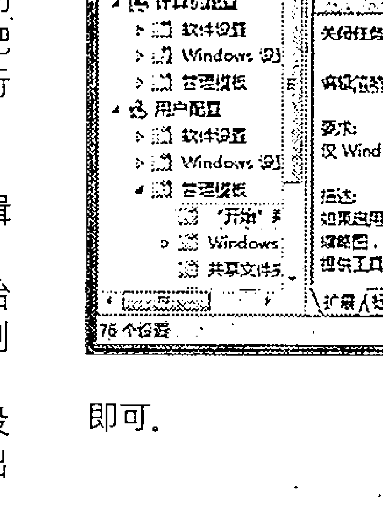

## 剪贴板也可以很强大

剪贴板（ClipBoard）是Windows内置的一个神奇且强大功能，它允许我们随时在多个程序之间共享信息。但可惜的是，Windows剪贴板中只能够保存一份数据，每次复制的新内容都会将原先内容覆盖掉。而实际操作中，有时候我们往往需要有几份复制数据同时使用，这时候我们可以使用“ClipCache Pro”。

从http://www.xrayz.co.uk/download/ccsetup.exe处下载并安装ClipCache Pro 3.4.4版。打开ClipCache Pro后，就可以随便复制多个信息，它都会自动帮我们保存起来。这时，只要双击系统托盘处的ClipCache Pro图标，在打开的窗口中会发现先前复制的内容记录下来了。

选中想粘贴的内容，再单击工具栏上“复制”按钮，最后到需要粘贴的地方按下Ctrl+V键，选中内容就已经被粘贴了。

#### 巧设热键 快捷粘贴多重剪贴内容

其实每次操作不必如此按部就班，通过设置热键，我们可以快速调用ClipCache Pro窗口，并随时粘贴我们先前复制到剪贴板中的内容。双击ClipCache Pro图标，打开它，再选择“工具→选项”，在“ClipCache 选项”窗口中，单击“热键”标签，选中“剪切菜单”项，按下一个热键，如Shift+V键，按下“确定”按钮后退出。

之后在编写文档、表格或PPT时，按下Shift+V，就会在当前界面弹出一个小窗口，其中是我们先前复制的内容，用光标或鼠标移动到相应项目上回车或单击即可将选中的内容粘贴到当前光标下。

小提示：

有时可能需要再次按下 Ctrl+V 才能够粘贴。

#### 更为强大 批量抓取屏幕图片

抓图软件一般来说抓取图片后都需要保存后才能够再抓取下一张。ClipCache Pro则可以实现批量抓取，之后再进行筛选。

找到需要的画面，尽管按下PrintScreen键将其复制到剪贴板中（按下Alt+PrintScreen则可以抓取当前活动窗口）。多次完成抓取后，打开主程序主窗口，此时可看到所有抓取的图片。如果满意，单击窗格中的“保存剪切”按钮，即可将其保存为bmp、gif、jpg、png或tiff图片文件。

#### 搜集资料 合并多条信息

写论文时，我们往往需要收集大量的资料，再进行整合加工。这时候通过ClipCache Pro，不断复制需要的段落或句子，最后在ClipCache Pro窗口中，配合Ctrl或Shift选中要合并的信息，右击，选择“合并文本剪辑”命令。在弹出的窗口中单击“向上移动”和“向下移动”按钮调整合并后的顺序，最后按下“合并”按钮即可把相应内容合并起来。最后，选中合并后的项目，再单击窗格中间的“保存剪切”按钮，即可合并后的资料保存起来。

#### 固定文本 随时复制

平时写稿子或邮件时，经常要输入一些固定的文本，如自己的电话、联系方式等。我们可以将这些信息做成一个固定的组，要使用时随时复制。

打开ClipCache Pro窗口，在左侧窗格选中“我的剪切”，右击，选择“新建文件夹”，并为其命名为“固定资料”。选中并右击“固定资料”文件夹，选择“设置活动捕获文件夹”命令，使其成为默认的捕获文件夹。接着，先把自己平时使用较多的句子输入到一个文本文件中，选中，按下Ctrl+C键把它复制到ClipCache Pro中的“固定资料”文件夹中。完毕，需要再将其他文件夹设置成默认捕获文件夹，步骤同上，这样以后复制的信息就不会再放入“固定资料”组中。

最后，我们只要按下“剪辑菜单”的热键Shift+V键（上面实例中已经设置），再把鼠标移到“固定资料”上，即可弹出其下常用语句，用鼠标选中后，即可把它复制到剪贴板中，按Ctrl+V键粘贴过来了。

## 让迅雷7支持更多专用链接下载

迅雷的下载速度很快，加之迅雷7又发布了正式版本，很多人都喜欢用它来下载，但是现在仍有一些网站使用诸如flashget://或qqdl://之类的协议，甚至有的还会用javascript脚本，碰到这种情况，迅雷就用不上了。要下载这些资源，必须安装相应客户端软件，这给大家带来极大的不便。现在有了迅雷7专用链通用补丁组件，可以免除这样的麻烦。

打开迅雷，从http://u.115.com/file/f859b9d637处下载“迅雷7专用链通用补丁”，得到“迅雷7专用链通用补丁.zip”文件，打开后将其中的“LinkSimulate.dll”和“注册快车旋风链接组件.bat”文件解压到迅雷7的安装目录下的BHO文件夹内（在笔者的电脑上是“J:\software\Thunder\Programs\Thunder7\BHO”），然后双击打开“注册快车旋风链接组件.bat”，会提示组件注册成功（如图1）。

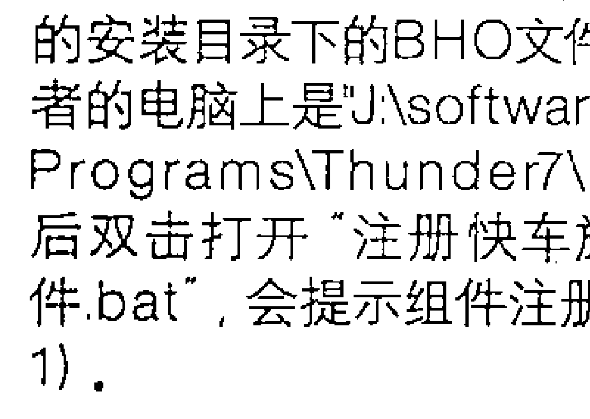

之后，我们再看到所有的快车专用链接和旋风专用链接的文件下载地址，直接单击就可以下载（如图2、3）。这样我们只要安装一个迅雷就可以下载所有资源了。

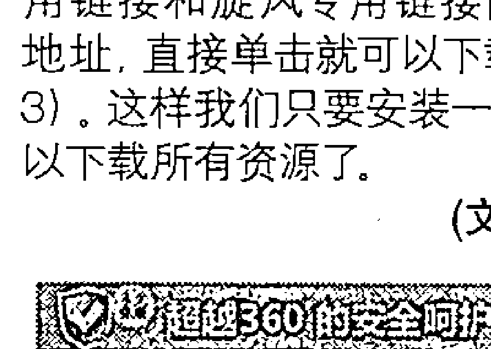


## 动动鼠标就能关机 注销

关机、重启、注销、关闭显示器、启动屏保、关闭屏保，这些系统最常规的操作，能不能更快点？啊，连这些都想找捷径，当然了，电脑达人只需让鼠标移动下就可以实现，连点击都不用，够酷吧，在MM面前炫耀一下，更有成就感，呵呵。

今天就为大家介绍一款软件Magic Screensaver Master（试用下载：http://www.onlinedown.net/soft/29490.htm），设置完后，把鼠标移动到电脑屏幕的四个角上，就会立刻执行相应的操作，连确认都不需要。你可以在上面设置鼠标移动到每个角上执行的相应动作，关机、重启、注销、关闭显示器、启动屏保、关闭屏保。同时，你也可以设置是否在角上停留一段时间后再启动相应的动作，以及停留多长时间。

小编有话说：

通过 Magic Screensaver Master 实现鼠标关机、重启、注销的动作时，不会像通常一样让您确认，而是立刻执行，所以请谨慎选用这几项。

## 另辟蹊径 大蜘蛛提升Foxmail反垃圾邮件能力

目前网络中的垃圾邮件真是无孔不入，当你打开邮箱看到一堆乱七八糟的垃圾邮件时，心情肯定很糟。为了摆脱这种现状，Foxmail等邮件客户端提供了反垃圾邮件功能，但是收效甚微，这时候我们可以借助大蜘蛛的强大反垃圾邮件功能。

#### 第一步：安装大蜘蛛并设置自动更新

从ftp://ftp.drweb.com/pub/drweb/windows/drweb-600-win-x86.exe处下载并安装大蜘蛛基础版本，它同样有防垃圾邮件的组件，在安装过程中一定要注意选中“安装时完成更新”和“启动任务计划服务”复选框，并保证网络的畅通，以便更新特征库。操作完成后，请重新启动系统。

> 如果不选中“启动任务计划服务”复选框，自动更新将无法完成，而且更新的速度很慢，甚至不能更新。

#### 第二步：设置自动监控模式

为了保证Foxmail与大蜘蛛的良好兼容性，可以右击SpidAgent图标，选择“Spidder Mail→设置”命令，然后单击“监控”标签，选中“自动监控模式”，这样，我们就不必再理解端口之类的复杂术语，而直接使用了。

#### 第三步：设置邮件规则 自动分类

- 建立“垃圾箱”
- 右击账户，选择“建立新邮箱”命令，把“新邮箱1”重命名为“垃圾箱”。
- 建立过滤器
- 右击“账户”，选择“过滤器”命令，打开“过滤器管理器”窗口。单击“新建”按钮新建一个动作，并把它重命名为“转移到垃圾箱”。

当来信的主题中包含“[SPAM]”（所有被大蜘蛛过滤的垃圾邮件，主题都会被加上[SPAM]）时，就自动转移到“垃圾箱”文件夹中。因此，在“应用于”中勾选“来信”和“手工”，在“条件”标签下选择“主题中包含”，再选择“包含以下任一词”，并输入[SPAM]。单击“添加”按钮进行添加。

> Foxmail的“过滤器”可帮助用户完成一系列的自动操作。单击“账户”→“过滤器”，会打开“过滤器管理器”，你可以根据需要，设置相应判断条件，和对应实施的动作。

> 单击“执行”标签，勾选“转移到”复选框，再单击旁边的“打开”按钮，然后选中“垃圾箱”即可。经过这样的设置后，所有被大蜘蛛识别出来的垃圾邮件将会被自动放置到“垃圾箱”中。

（文/江北书生）

## AltRun的一键操作革命

时间就是金钱的当口，高效率便是最强的赚钱方法。通过“AltRun”可以大幅提高电脑操作效率，一键打开常用文件夹、程序、系统功能（例如关机、休眠），搜索引擎……对比传统的“开始→所有程序”或“我的电脑→F盘→Soft→软件”操作方法，方便得不只是亿点点！

#### 一键打开任何程序

安装AltRun（http://code.google.com/p/altrun/downloads/list），你就可以拥有了TC的工具，它默认内嵌了常用的系统命令及相关程序、程序及其它系统命令需要手工添加。例如添加一个快速休眠系统的命令：先按“Alt+Run”打开主窗口，按“Alt+S”打开“快捷项管理”，单击“添加”按钮，在“命令行”中输入“rundll32 PowrProf.dll, SetSuspendState”，“快捷项”设置为“sleep”，“名称”设置为“休眠”。单击“确定”（见图）。日后要休眠系统时，只要先按“Alt+Run”，再输入“sleep”（或前面若干字符）并回车，即可迅速休眠系统。

> 软件的妙用在于可以与快捷键和第三方软件配合实现更多的功能。添加程序、文件、文件夹的方法类似，还可以添加常用网址、搜索引擎。在参数设置中设置调出主程序的快捷键为“~”，更适合单手操作。部分系统命令及功能可以参考：http://a.md/1Hq。

#### 一键直达常用文件夹

将常用文件夹添加到快捷列表后，只要先输入快捷名称，定位到目标后直接按“Ctrl+D”即可直达该文件夹了。这个功能类似Total Commander中的直达文件夹功能。将平时常用的文件夹一一添加到列表并设置易分区访问的快捷名称（例如“music”、“doc”、“pic”等），配合“Ctrl+D”会打开很快。若花点时间将自己常用的程序、文件、文件夹、系统命令、网址、搜索引擎等一一添加到快捷列表，再养成用键盘操作的习惯，用电脑的效率准会倍增。

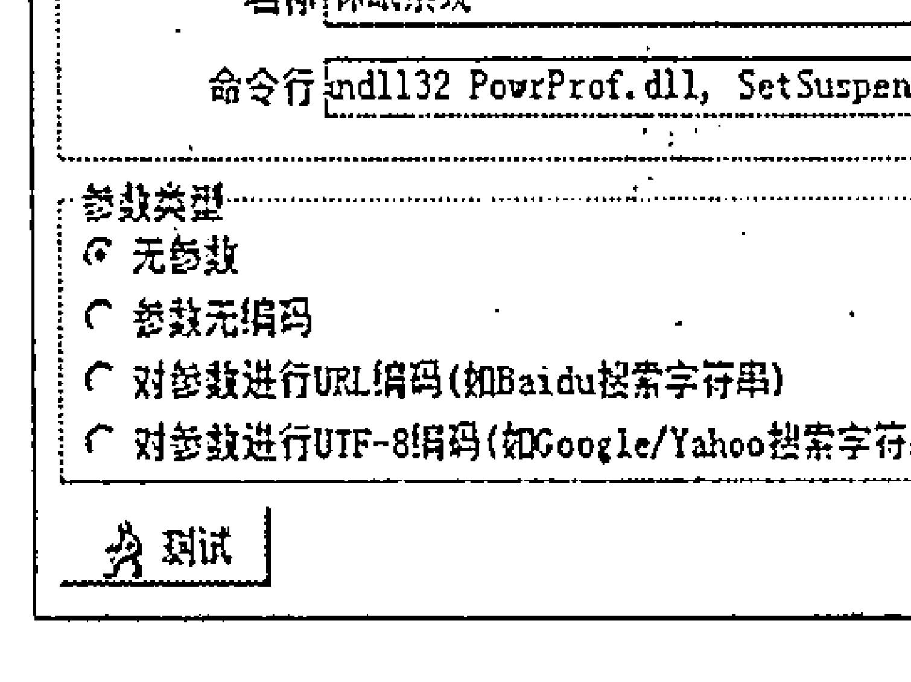

（文/呆瓜）

## 忙而不乱 让工作有条不紊

有些人的工作总是如鱼得水有条有理，而有些人却总觉得时间不够用，工作进程混乱不堪。为什么？我觉得主要还是因为不会合理安排计划所致。对于这些朋友，建议他们用一些管理软件来协助工作，比如GeeTeeDee。

#### 有的放矢，大项目拆成小任务

首先进入GeeTeeDee（http://codea-dev.com/gtd/）网站下载安装软件，运行GeeTeeDee后，可以看到左侧上方有一个“Inbox”（收件箱），这里是任务的存放地。在它下方空白处双击，在弹出的对话框中，选择图标（不同图标代表不同的任务类型，按需选择即可）并输入名称（支持输入中文），点击“OK”即可完成任务组创建（见图1）。

较大的工作项目往往需要分拆成多个子项目，假设公司有一个圣诞节产品促销策划方案，就有N多与之相关的待办动作，比如客户资料收集、消费心理分析、潜在客户分析、广告策划、方案会审等等。同上方法，为这些子项目创建组。

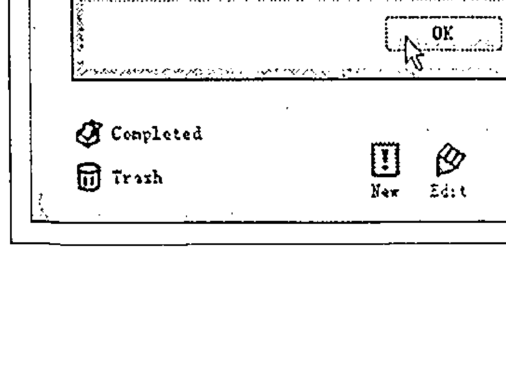

#### 依次推进，划掉已完成的工作

如果任务设定了截止日期，那么到期或过期的工作任务会用粉红色标明，即将到期的任务则会用黄色标明，工作的紧迫程度一目了然。顺利完成的任务，点击它前面的方块勾选，即可将其“划掉”。过一段时间后如果没有问题，点击下方的“Cleanup”清空它即可，实际则是将其归档到“Completed”（完成）文件夹中了。有时某些工作进度需要临时改变，或者某项工作要提前，只需要用鼠标拖拽任务调整即可。

> GeeTeeDee简单易用，很好上手，并且它还提供绿色免安装版，可以放在优盘中随身携带，便于随时查阅，很是方便。软件虽小，对工作安排却很有帮助。

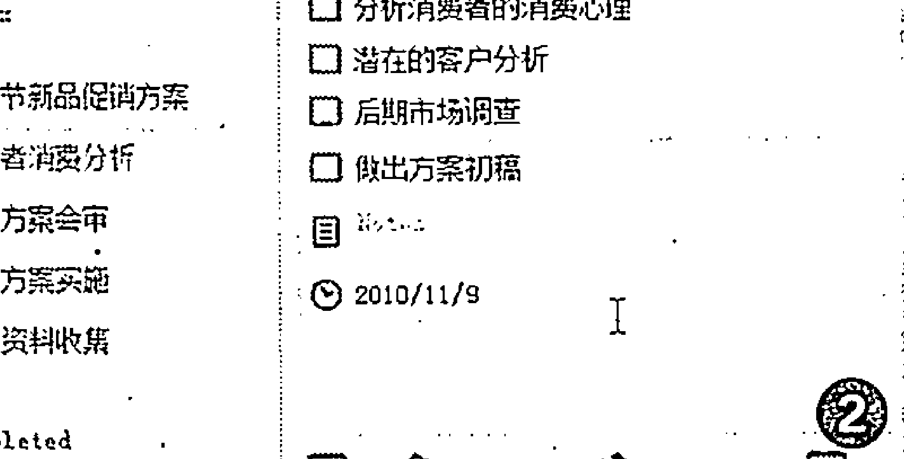

（重庆/罗勇）

## 诺基亚大裁员 Symbian系统前途堪忧

近期，诺基亚宣布将在全球范围内裁员1800人，主要涉及Symbian智能手机开发部门、诺基亚服务部门。在经历了多年的萎靡和下滑后，诺基亚开始痛下决心，从内部改革做起。9月，诺基亚任命了第一任非芬兰籍CEO——史蒂芬·埃洛普，并授权其推行改革，而此次裁员正是其改革举措的一部分。

为了应对竞争，诺基亚开始了Symbian的改革之路。2008年6月，为了成立Symbian基金会，诺基亚收购了Symbian公司余下的不属于诺基亚的股份，实现了全资控股。Symbian基金会是非营利性组织，面向所有组织开放，凭借此举，诺基亚希望聚拢更多的厂商继续支持Symbian OS。同时诺基亚还承诺将把Symbian OS免费对外开放。今年2月，Symbian公司又宣布将逐渐实现Symbian OS的“彻底开放”。

而据业内消息，此前，诺基亚就开始大力压缩和Symbian相关的各种投入和费用，导致与诺基亚Symbian业务相关的上下游企业以及外包公司收入逐年减少，一些实力雄厚的合作伙伴纷纷转型到iPhone OS或者Andriod等系统的开发以求自保；而Symbian产业生态中那些实力平平的小公司，则只能通过被其他公司并购合并才能求得生存。

#### 艰难的改革之路

Symbian公司是1987年由诺基亚联合摩托罗拉、西门子等几家大型移动通讯设备商共同组建，其使命是研发手机操作系统Symbian OS。诺基亚希望借此占据智能手机高地。Symbian OS无疑是成功的，它奠定了诺基亚智能手机市场老大的地位，不过在移动互联网时代，Symbian OS的封闭和笨拙开始暴露无遗。面对苹果和Google的快速创新，越来越多消费者开始投入iPhone和Android怀抱，尤其是Google推出全开放、免费的Android后，Symbian OS的处境更加艰难了。

#### 不可避免的衰落

不过这些迟来的改变，似乎并没有挽回Symbian的衰落，摩托罗拉、LG、三星、索尼爱立信都纷纷放弃Symbian平台。去年10月，Symbian基金会首席执行官李·威廉姆斯以个人原因宣布离职，这对日渐走下坡路的Symbian更是一个沉重的打击。而此次裁员更是集中在Symbian智能手机开发部门，资深IT专家曲晓东认为放弃Symbian已经是诺基亚心照不宣的事实。

面对无可挽回的失败，诺基亚似乎要另寻出路，2008年，诺基亚推出了Linux Maemo手机操作系统，计划重新开辟阵地。

不过今年，诺基亚又宣布放弃Maemo，并将该系统与英特尔的Moblin操作系统合二为一，推出一个名为MeeGo的单一开源操作系统。

不过，MeeGo的前景似乎并不乐观，今年10月MeeGo操作系统负责人阿里·贾克斯辞职，MeeGo手机也被不断推迟，诺基亚表示至少要等到2011年才推出。

## 不再“孤独” USB设备也玩网络共享

局域网的优势之一是资源共享。但Windows的共享机制非常有限，通常只能将文件、文件夹、打印机等设置为共享对象，而且一般只是完成文件互传。现在USB的设备越来越多，如U盘、扫描仪、打印机、摄像头、USB音箱、银行U盾、加密狗、手机等很多特别的USB设备Windows是无法共享的。借助USB Over Network则可以解决这些难题，两步就能完成。

- USB Over Network 下载地址：
  - USB Over Network Server版 http://www.usb-over-network.com/usb-over-network-server.msi
  - USB Over Network Client版 http://www.usb-over-network.com/usb-over-network-client.msi

- 第一步：选择一台电脑作为主机，安装USB Over Network Server版，全部“下一步”即可，完成后自动运行进入主界面。此时插入你需要共享的USB设备，在界面的“My Computer”下方会列出该设备，在其上点击鼠标右键选择“Share（共享）”。这时你的USB设备从本机消失（注意，请不要共享USB鼠标，以防止无法使用）。

> 小提示：
如果你的USB设备已经插在电脑上了，USB Over Network并不能马上识别，你需要先拔下后再插上它。已经加入USB Over Network的设备不能正常工作，可以考虑在设备名上点击鼠标右键选择“Properties（属性）→Troubleshooting（故障排除）”，将“Reset power”和“Reset device on share”两个选项选中。

- 第二步：在需要共享USB设备的电脑上安装USB Over Network Client版（如果本机也需要同时使用该设备也请安装），途中弹出需要安装设备驱动的提示选择“同意”。安装后运行，点击主菜单“USB Device（USB设备）→Add（添加）”或主菜单下的电脑图标，将安装了Server版本主机的IP地址或主机名输入在“Remote IP address or computer name”处（本机输入127.0.01即可），点击“OK”就能连接。这时USB Over Network Client版本的主界面中就会显示出Server版共享的设备，在设备名上点击鼠标右键选择“Connet”。好了，它已经成为了你这台电脑上的设备。

> 小提示：
如果你的主机接入互联网，你还可以通过花生壳等让你家中的USB设备共享到网上，这样你只要有网络，随时可以享用那些设备。

## 美图化妆秀 个性化妆变变变

现代社会女性每天都离不开化妆，甚至有些工作单位为了公司形象都要求女性工作者带淡妆上班。不过同样一个妆容化在别人脸上有点晴之妙，但是在自己脸上的效果到底如何？别急，先用美图化妆秀（http://hzx.meitu.com）试试效果，然后再选择实施。

#### 一键试妆好轻松

第一步：运行软件后，打开软件主界面，单击“打开一张图片”按钮，导入你的面部照片。该图片的具体拍摄规格可以参照示例照片。

第二步：导入图片后，我们单击左侧工具栏“自动上妆”按钮，接下来选择妆容系列，并在出现的妆容下拉列表里单击选择你中意的妆容即可在预览区观看到效果。

第三步：如果说你感到一个一个的选择妆容太麻烦，可以单击左侧工具栏“幸运妆容”按钮，之后在预览区就可以看到系统为你自动选择的妆容效果。

> 小提示：
对于同一个妆容的浓淡强度，我们还可以手动调节。当选择好合适的妆容并预览后，在预览界面的左下端找到“妆容总强度”，单击选择从1到5的数字即可，真正让你做到浓妆淡抹总相宜。

#### 整容效果轻松做

很多MM对自己的五官都有不满意的地方，但是身体发肤受之父母，我们岂能随便就去整容呢？但是使用美图化妆秀就可以很轻松的给自己（照片）的面部做个整容“手术”。导入图片并上好合适的妆后，在软件预览界面的右下端找到并单击“面部整形”按钮打开面部整形对话框。在这里你只要选择不满意的面部五官，拖动滑块即可实现整容效果，可以在左侧预览界面进行预览。如果说你对自己所做的整形不满意，可以单击“全部重置”按钮进行五官复位。

> 小提示：
古人道白璧微瑕，我们的面部肌肤多少都会有瑕疵。为了让皮肤显得光泽，MM们在上妆前需要先进行一次洁面的工作。而在美图化妆秀软件则是用“取点校色”来达到这一效果。导入图片后，在预览界面右下角找到并单击“取点校色”按钮。接下来通过“取点三步骤”选择要“洁面”的部位，最后使用“照片校正”帮助我们具体完成“洁面”工作。

## 想要多大 屏幕就有多大

屏幕上打开窗口较多时，相互交叉重叠的窗口就会凸显出屏幕的空间有限，这时想要找出其中的一个窗口可能要花费不少眼力，真想屏幕再大一点，这时候，软件“GiMeSpace Free Edition”（下载地址：http://www.newhua.com/softdown/101123_2.htm）就可满足你的要求，而且，想要多大，屏幕就能有多大！

软件安装运行后，图标最小化至托盘处，这时屏幕并没什么反应，当你把鼠标移至屏幕左侧（或右侧）边缘时，发现什么了？屏幕上的窗口在不停地向右侧（或左侧）移动，这些窗口可以移动到屏幕之外，再打开其他窗口，又可以通过上述方法将这些窗口移动到屏幕之外，需要显示其中的某个窗口时，把鼠标移至另一侧边缘向外侧移动，即可让其从屏幕之外逐渐移到屏幕当中。

就如同一个流动字幕，相当于扩大了你的屏幕，这样再多的窗口，再也不用害怕。

## 独立自主 寻找最适合自己的发型

每次去理发店都是心惊胆战，想换个发型吧，不知道是否适合自己，想染个颜色吧，又不知道效果如何，呵呵，现在可以用‘流行发型设计’软件事先判断一下，再到理发店直接拿出已选好的发型，即可‘开工’了。http://xiaozai.zol.com.cn/detail/39/382658.shtml 下载后，打开软件首先选择图片，在工具栏上点击‘打开图片’，打开一张自己的照片（建议使用正面大头像），然后在右边选择性别，接着就可以在软件提供的发型中选择自己喜欢的发型上点击，这时候，上传的照片头像大小一般与发型不匹配，可以分别对照片和发型两张图片进行拖动和缩放，可以通过拖动柄调整大小，也可以单击软件左下角的调整功能按钮进行调整，直到发型与脸型匹配为止。在这里还可以点击工具栏上的‘人像颜色’或者‘头发颜色’更改人像和头发的颜色，不妨多设计几种不同的发型，点击右下角的‘加入’按钮加入收藏栏中，然后点击‘播放’按钮对多种不同发型进行对比，一切满意后，可以点击‘保存图片’将自己的‘创意’保存下来，也可以直接点击‘打印’按钮打印出来，然后拿去理发店让理发师照‘开工’，这样再也不怕自己的发型见不得人了。

小提示： http://www.cnmeifa.com/ 网站提供类似的在线发型设计，提供了几百种新潮发型，支持上传照片，不过仅限于女性发型设计。

## 公司杂志自己做

如今电子杂志流行，这不，小王就赶上了风。小王是公司市场部的一名员工，最近他接到领导要求，把公司的一些资料和内刊整理成杂志的形式在网上传播。小王是学市场营销的，听说做电子杂志要学习FLASH编程，学习使用Indesign...很难很难？这可令非计算机专业的小王犯了愁。现在，我们请出Zmaker（http://zmaker.zcom.com）自己DIY一份电子杂志，

第一步：处理素材。Zmaker的素材都为图片，并且图片素材的大小有规定，一般处理成950×650像素大小。单击工具—图片处理小工具，进入图片处理。在这里把尺寸调整为950×650像素。

第二步：制作封面和封底图片。封面和封底可以自己制作，也可以使用模板，http://zmaker.zcom.com/down/有一些封面和封底的模板，大家可选用于公司来说，当然要自己加工自己的封面和封底，这样才能显示公司的实力。封面可以使用公司老总的照片（前提是美女总），封底这么好的地方，肯定要放公司的产品了。这些图片一定要使用PhotoShop进行加工，否则要是美女总脸上的痘痘在杂志上出来，呵呵，就等着跳槽吧。加工完成之后，可不要忘记进行像素大小转换呀。

第三步：制作目录。到了这一步，就要按照设计的计划，进行目录制作，这里建议直接使用模板，http://zmaker.zcom.com/2009/0119/88.html就是一个模板，下载之后添加到工程中。找到最后一个参数，单击修改，注意设计模式下的6个数字，它就对应着6个目录选项，如果想目录对应第6页，就把1的位置数字改为6，以此类推。然后在设计页面的中间部分调整lockroot，设置为false，这个选项必须设置，否则跳转是不能成功的，这样我们就完成了目录的制作。

第四步：杂志制作。单击添加图标，出现‘打开’界面，选取自己需要的素材，可以使用shift键进行多选。我们把所有的素材选中，可以看出，电子杂志可以分为封面、目录、正文和封底等组成。文件的顺序可以通过拖动的方式解决。 到这一步，单击预览，一本封面、目录、封底俱全图文并茂的杂志就出来了，让公司的同事先欣赏一下自己的成功，顺便看看有没有BUG，OK！大家一致赞成，那就出版吧。

第五步：修改杂志的相关设置，完成制作。单击设置，可以设置杂志的名称、版权信息，确定是否加密。然后单击生成杂志，就可以生成一个.exe的可执行文件，这就是最终的电子杂志。把这个杂志交给领导吧，这么一个图文并茂的杂志，领导肯定喜欢。 可是，领导还不满足，对杂志提出了改进意见：

- 1. 版式太死，能不能设计好点。要想设计好版式，需要使用Indesign，这可不是一时半会的事。好在Zmaker网站上有很多模板，可以解决这个问题。
- 2. 杂志有点单调，想增加点特效，http://zmaker.zcom.com/eff/有很多特效，这也是我表现的一个机会。
- 3. 最好添加一个老总的视频。这是最简单的，点击编辑页面，可以添加视频文件。

好了，到这里一本炫酷的杂志就诞生了。看看这样炫丽的电子杂志，等着老板加薪吧。

## 让秘密文件无影无踪

想必每个人电脑中都有一些私人文件不想让别人看到，在文件或文件夹的‘属性’标签下选择‘隐藏’，然后在‘文件夹选项’的‘查看’标签中选中‘不显示隐藏的文件和文件夹’是我们最常规的办法。不过这个办法现在已经成为了公认的，只能防君子不防‘小人’了，只需要在相同位置点成‘显示所有的文件和文件夹’，一切秘密都无从遁形。 如何让文件夹隐藏到别人都找不到呢？用‘宏杰便携加密’吧（软件下载地址http://www.newhua.com/soft/109891.html#down）。 解压缩后，将欲加密的文件或者文件夹与加密软件uhjjm.exe放在同一个目录下，双击uhjjm.exe，跳出‘加密’对话框，连续两次输入加密密码，点击‘加密’（在‘加密类型’下拉列表里可根据需要选择加密强度）。 经过如上的加密步骤后，与uhjjm.exe同一个目录下的所有文件及文件夹都消失无踪。如果要让他们重新现身，再双击uhjjm.exe，出现‘解密’对话框，输入‘解密密码’，点击‘解密’即可让文件们恢复出来。（大家请注意解密类型选择：映像解密：生成临时盘符，查看隐藏文件，临时解密：现身隐藏文件，关闭目录，恢复隐藏状态：完全解密：让隐藏文件彻底恢复现身） 综上所述，将欲隐藏的文件或者文件夹与uhjjm.exe放在一起即可隐藏它们。为了让隐藏更加保险，可以移开uhjjm.exe，制造根本没有文件的假象。当要恢复文件现身的时候，只需再移回uhjjm.exe，双击进行解密即可。

小提示：

- 1. 忘记密码怎么办？只需在‘加密’窗口里，点击‘设置邮箱’输入邮箱地址。当忘记密码时，在‘解密’窗口里点击‘忘记该密码’，即会自动发送重置密码到所设置的邮箱里。
- 2. 如果忘了隐藏的是哪个位置的文件怎么办，别担心，所有通过‘宏杰便携加密’隐藏的文件，其上级文件夹都会带上相应的标示。

（重庆/陈佳）

## 狂玩小游戏 就用4399游戏盒

对于大多数来说，游戏不过是调节日常生活的‘作料’，简单一点、好玩一点就可以了。单机游戏就成为这些人士的最爱。不过单机游戏的弊端就是时间一长就容易丧失兴趣，如何能找到更多更好玩的单机游戏呢，上网找呗，不过一个一个搜索费心费力不说，还要冒着中毒的风险。现在，4399游戏盒子帮你‘足不出门，一网打尽’（http://box.4399.com）。

单机游戏一软打尽 对于很多MM来说，玩玩泡泡龙就是最大的乐趣了，4399游戏盒子提供了500多种排列消除类游戏，各种各样场景和规则让你每天都能玩出新花样。例如‘碟露仙境’中的精灵、蝴蝶让你仿佛置身爱丽丝梦游记中的花园，‘疯狂瓶盖’则用各种瓶盖，以及开盖的声音和泡沫让你在炎炎夏日中感觉一丝清凉。 而对于喜欢闯关的人来说，4399游戏盒子中不仅有‘是男人就下100层’和‘拳皇’这种经典游戏，还有‘变态猫版超级玛丽’和‘田鸡阿托’这种特别有意思的新游戏。 使用4399游戏盒子时，你可以按照自己的喜好在相应的分类列表中找到自己喜欢的游戏，在右边的页面还可以参考网友的评分，当然也可以搜索自己想玩的游戏。

小游戏点击即玩 小游戏相信大家都不陌生，无论是在手机中，电脑中，或者是电子书中。它们的应用场合越来越多，小游戏可以实现你随时随地玩游戏的想法，方便快捷的小游戏俨然已经成为许多人都爱不释手的好帮手！ 4399游戏盒通过其在线小游戏网站网友玩笑游戏的热度为我们准备了权威的小游戏排名，通过它我们可以知道现在什么游戏最流行，从而不错过每一个精彩的小游戏。 在打开的软件主界面，单击上方工具栏‘小游戏’按钮，页面载入后我们可以通过详细的分类来查找我们喜爱的小游戏了。为了使一些精彩小游戏就算是在电脑没有连接网络的情况下也可以玩，我们还可以通过点击‘下载本游戏’按钮，把你喜欢的小游戏下载保存到本地。

## 声音能不能再大点？

现在市面上的手机几乎都支持MP3格式的音乐播放，但是很多时候就算我们把音量放到最大还是感觉太小。难道说没有一款软件可以调节MP3文件的音量吗？当然有的，这得请出‘MP3音量批量放大器’（http://www.newhua.com/softdown/106306_2.html）来帮忙了。 运行MP3音量批量放大器后，在软件主界面，单击主面板下方的‘添加’按钮导入需要放大音量的MP3文件。添加完成后，单击‘获取音量’按钮，获取MP3原来的音量大小数值，然后在MP3音量批量放大器主面板上方‘设置目标音量’输入栏输入MP3音量数值范围。（最小值75，最大值105），最后单击‘调节音量’按钮执行音量放大操作。

小提示： 使用该软件进行批量添加要放大音量的MP3文件的时候，可以在添加的过程中全选需要放大音量的文件，然后单击‘打开’按钮即可实现文件批量添加。遗憾的是该软件只支持MP3格式的音频文件，其他格式的可以用千千静听（下载地址：http://ttplayer.qianqian.com/）等转换为MP3格式后再进行音量放大操作。

## 手写输入 谁是老人的贴心伴侣？

对于上了年纪的人，为了与子女在网上交流，不得不学点电脑操作，而文字输入作为网络交流的一个基本技能，却成了挡在老年人面前无法绕开的“拦路虎”。老年朋友们没有学过拼音，更难以学会复杂的五笔，难道就没有办法让这只拦路虎让路吗？不！目前主流的拼音输入法——搜狗拼音和QQ拼音都已经支持手写输入了，更有先行一步的慧视小灵鼠手写输入工具等。那么，谁才是手写输入的王者呢？我在这里设一个小小的擂台，是骡子是马拉出来遛遛。

#### 选手一：QQ 拼音输入法

(以下简称“QQ”)
版本号: 3.4 (922)
发布日期: 2010年9月16日
大小: 20.6MB
官方网址: http://py.qq.com

#### 选手二：搜狗拼音输入法

(以下简称“搜狗”)
版本号: 5.1
发布日期: 2010年9月20日
大小: 17.37M
官方网址: http://pinyin.sogou.com

#### 选手三：慧视小灵鼠手写输入

(以下简称“慧视”)
版本号: 不详
发布日期: 2004年8月
官方网址: http://www.wintone.com.cn

#### 实测一：上屏方式

搜狗和QQ手写输入的上屏方式一样，都是双击鼠标左键为首选字上屏，非首选字则需要在候选栏中由用户自行选择。而在慧视小灵鼠中，默认认为首选字自动上屏，而如果要选择非首选字，则点选后，用点选的汉字代替首选字，显然要更加方便快捷一些。

#### 实测二：词语联想

虽然我们在用五笔、拼音等主流输入法输入文字时，很少甚至讨厌使用词语联想功能，但是在手写输入时，词语联想功能又确实能够提高输入速度。经测试，QQ手写输入和慧视小灵鼠都支持词语联想，但QQ手写输入只支持2字词语，而慧视小灵鼠则支持2字、3字词语和4字成语。搜狗手写输入法则不具备词语联想功能。

#### 实测三：标点符号

标点符号的输入是否便捷也是影响输入速度的一个重要因素。在搜狗手写输入中，每输入完一个汉字，其右侧的候选窗口都会变成常用标点符号列表，从中可以轻松找到常用的标点符号，点击一下就上屏了。而在QQ手写输入法和慧视小灵鼠的界面中，常用标点符号在常驻界面的底部，输入过程中可随时调用，较搜狗更加方便。

#### 实测四：繁体字输入

三款软件均支持繁体字输入，其中慧视小灵鼠需要设置一下，需要在“内码平台”中选择“GBK”，另外在“内码转换”项中有“不转换”、“写繁得简”和“写简得繁”3个选择，显得比较贴心。

#### 实测五：简笔字输入

在日常的手写输入中，有些人会使用一些简写字，如“事”写成图1所示的样子，“高”写成图2所示的样子等。在这方面，搜狗和QQ手写输入都有不俗的表现，而慧视小灵鼠则不能分辨。

#### 实测六：英文数字

QQ和慧视可以完美支持英文和数字的输入，慧视需要事先在软件中做相应设置。而搜狗则无法识别英文和数字，也许是觉得英文和数字还是用键盘输入来得更快些吧。

最后，让我们以表格的方式来个总盘点吧：

| 项目 | QQ | 搜狗 | 慧视 |
| :--- | :--- | :--- | :--- |
| 首字上屏方式 | 双击 | 双击 | 自动 |
| 词语联想 | 2字词语 | 无 | 2-4字词语 |
| 标点符号 | 支持 | 支持 | 支持 |
| 繁体字输入 | 支持 | 支持 | 支持转换 |
| 简笔字输入 | 支持 | 支持 | 不支持 |
| 英文数字 | 支持 | 不支持 | 支持 |
| 综合得分 | 9 | 8.5 | 9 |

根据上表数据，可以看出慧视的表现不俗，QQ手写也不错。不过实际情况则是，现在老年人与子女远程交流，使用QQ聊天的居多，显然它与QQ手写输入的结合程度要高于其他的输入法，调用、升级等也要比其他输入法方便，所以小编推荐给老人的是QQ手写输入，当然大家可以根据自己的情况做出选择。

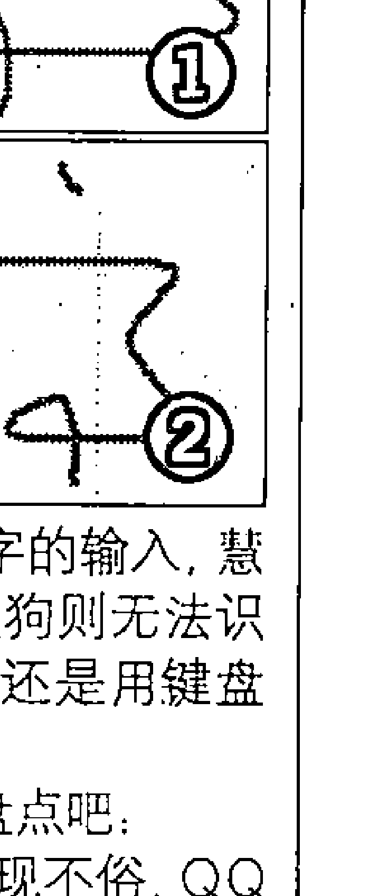

## 放飞智慧的翅膀——电脑辅助幼儿启蒙教育

还记得我们小时候学字时候的动画卡片吗？还有学数数时候的小纸棒吗？真是美好的回忆。什么，你也在用这种方式教自己的孩子，真是out了。赶快用幼儿启蒙软件吧，在有趣的游戏、动画、音乐中让孩子越学越快乐，效果也大大提升。 随着电脑的普及，数字化时代已经成为现代人面对的现实。无论在家里，还是在幼儿园，电脑已经成为除图书、玩具以外，孩子们第三个玩伴。电脑的显示器正逐步替代传统的传播手段，成为孩子们认识世界，掌握知识的窗口。然而，很多家长只会使用电脑给孩子播放动画片，而没有充分利用好电脑做好启蒙教育。其实，针对幼儿启蒙教育的各种软件应运而生，只要通过简单的鼠标操作，就可以实施生动的形象教学，其多彩的动画世界让孩子们的学习乐趣无穷，笔者推荐家长使用“佳佳儿童乐园2.56”（下载地址：http://www.jj61.com/file/jiajia.rar）。

#### 看动画陶情操

运行“佳佳儿童乐园2.56”后，点击“动画世界”，这里有小故事、成语故事、童话故事、中文儿歌、童谣等多个单元，既有充满神奇浪漫色彩的神话传说、民间故事；也有开拓心智的童话、寓言、幽默故事等，都是经过精心剪裁提炼的、世界故事宝库中最脍炙人口的名篇佳作，其中所表达的对真、善、美必胜的乐观信念，对假、恶、丑的嘲讽和无情鞭挞，对于开拓智力，陶冶性情，锻炼意志，完善精神，都会有很大的帮助。这些故事和儿歌是滋润小朋友心田的雨露和甘泉。

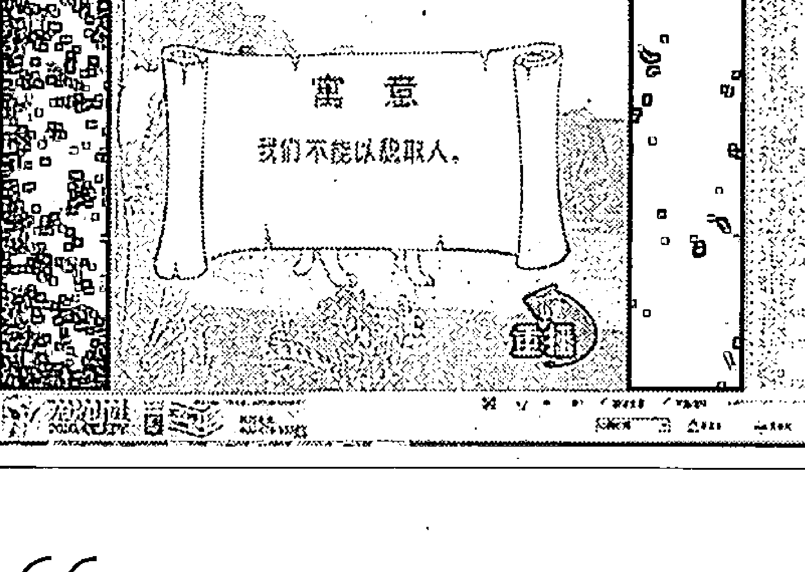

如我们选择“小故事”单元后，在右侧侧边栏中选择一个项目双击，即可开始播放。播放结束时会弹出故事的寓意，非常有教育意义（如图）。列表中的项目前带*符号的，表示该项目需要上网才能播放，双击以后开始下载，成功下载后下次不上网也可以播放了。

> 小提示：
如果不想在播放时才下载，可以直接下载完整版迅雷下载地址：thunder://QUFodHRwOi8vZC5qYXlLmNvbS9qaWFjaWFyaWFyaWxsb3Y=/

#### 拼音、识字、算术一个不能少

对于大一点的孩子，必要的知识训练那是必不可少的。包括了学古诗，学拼音，百科常识，语文游戏，数学游戏等。其中古诗单元，收录了中国几千年来脍炙人口的经典名篇；学拼音单元有韵母声母的学习，还有有趣的小恐龙学拼音，采用卡通动画的方式，由浅入深，图文并茂，纯正的发音，详细的讲解，结合听、说、读、写等训练，寓教于乐。儿童跟随卡通动画，在听故事、玩游戏中心不知不觉地就学会了拼音，达到自己能看拼音、读拼音的水平。

在棒棒英语单元，用明亮的色彩，美丽的画面和实用的句型让孩子轻松地学英语。学前期和小学低年级阶段是孩子语言发展的关键时期。对于学习英语而言，在这一阶段应当注重培养孩子的兴趣。“佳佳儿童乐园2.56”选择与孩子生活密切相关的事物，如形状、数字、颜色、天气、家庭成员、交通工具等等作为英语学习的内容，这些都是孩子在日常生活中能随时运用的事物，孩子学了就能用。这样的英语学习方式让孩子感到好玩，从而产生兴趣。学习英语不再枯燥。

#### 图音练习陶冶情操

雨果说：“音乐、文学、数学是开启人类智慧的三把钥匙。”可见良好的音乐教育在宝宝智力潜能开发中所起到的重要作用。音乐是听的艺术，对宝宝的音乐教育要从聆听开始。进入“佳佳儿童乐园2.56”的“音乐盒子”，提供有几十首好听的儿童歌曲、古典音乐、摇篮曲、世界名曲等，可以循环、连续播放，并有歌词显示，家长可以与宝贝一起边听边学，用自己的情绪带动他，用自己的快乐感染他。 绘画对孩子来讲是一种游戏、娱乐，也是表达自己思想情绪的一种方式。每一位孩子的头脑中都有许多美丽的图画，每一位孩子都有描绘美丽图画的潜能。绘画活动是一种需要孩子手、眼、脑并用，并需把自己的想象和从外界感受到的信息转化成自己的心理意象，再通过绘画媒介把它表现出来的操作活动。但对于孩子来说，过于复杂的绘画反而适得其反，“佳佳儿童乐园”的“涂色”，可以充分发挥孩子的想象力，通过手中的“画笔”，选择自己想要的色彩去构成心中理想的图案。

(文/坚如磐石)

## 轻松玩转照片抽奖

在婚礼、店庆、公司周年庆等一些喜庆的场合，为了活跃现场气氛，往往会设一个抽奖环节。不要以为这个抽奖活动很神秘，其实我们自己就可以组织。使用照片抽奖的方式其实很简单，只需要来参见庆典的各位朋友的一张照片、一款图片处理软件、一款抽奖软件即可实现抽奖。

首先我们要收集来参加该庆典的各位朋友的一张照片，因为这些照片并非都是我们需要的格式和尺寸，所以接下来就要处理一下这些照片。

下载运行格式工厂 (http://www.formatoz.com)，打开软件主窗口后，单击选择左侧工具栏“图片”按钮，在打开的图片转换窗口选择“所有转到JPG”按钮，然后在弹出的新窗口单击“添加文件”或者“添加文件夹”按钮，添加要转换的图片文件或文件夹。之后单击“输出配置”按钮自定义设置文件分辨率为同一大小（见图1），完成后确定即可。接下来设定好转换完成文件的输出路径后单击“确定”，最后单击主面板“开始”按钮进行格式转换。

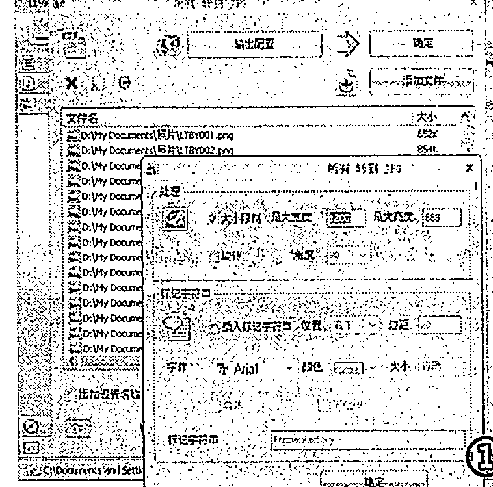

> 小提示：
格式工厂是一款不错的多格式转换工具，除了可以进行图片格式互转外，还支持视频、音频以及视频合并、音频合并的功能。在转换过程中可以修复某些损坏的视频文件以及对图片文件缩放、旋转、水印等功能。

接下来就该调试抽奖软件了，下载运行“幸运牛照片抽奖软件”(http://www.xdowns.com/soft/softdown.asp?softid=63353)。在打开的软件主界面，单击上方工具栏的“选项”按钮，这个时候在软件右侧会打开选项设置窗口，单击“更换照片目录”按钮，弹出添加照片文件夹对话框，选择刚才已经转换好的照片文件夹。在这里我们还可以设置每张照片的显示时间、更换背景图片（更换为新人结婚照或者公司logo）以及背景中奖音乐等。完成后单击上方工具栏“开始按钮”或者敲击键盘空格键开始调试（见图2）。

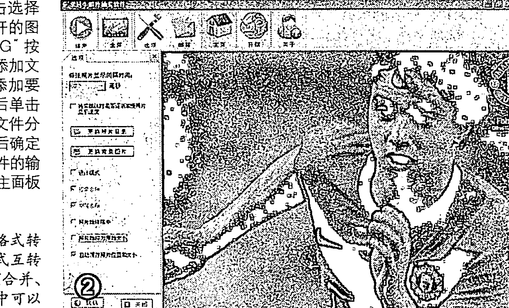

> 小提示：
用作于抽奖的照片必须要是JPG格式的图片文件，且文件是统一分辨率，否则就会发生错误，影响实际效果。在抽奖过程中可以单击鼠标右键开始抽奖，或者双击鼠标左键进行全屏显示照片。

> 大补贴：
除了利用照片抽奖外，我们还可以利用手机号码和其他代码（诸如员工编号、客户编号等）来进行抽奖。当然这种方法的前提也是把这些号码制作为图片的样式在软件中进行抽奖。大家可以发挥自己的聪明才智试一下哦。

## 无须任何播放器 视频文件双击即看

视频文件打不开，你是否碰到过这种情况，或者没有播放器，或者不支持相应视频格式。例如，演讲时发现配备的电脑打不开自己的视频，给父母发段自己的视频，结果他们打不开。

这时候有个最简便的办法就是把视频文件转换成可执行的exe文件即使没有播放器也可看视频。推荐软件MakelnstanePlayer (http://www.crsky.com/soft/13348.html)。运行软件后，在打开的软件主界面来源文件框选择要装换的视频文件，在输出文件选择设置转换完成的文件的保存路径。接下来勾选“压缩”设置项目，最后单击“生成”按钮，稍等一段时间即可完成文件的转换。

> 小提示：
经过笔者实际检测，转换一个429MB的视频文件，只需要40秒钟的时间。（笔者电脑为一般配置）需要注意的是准备转换的视频在设置视频属性项最好不要勾选“全屏”，否则将会耗费很多时间。另外，由于该软件把播放器集成到转换完成的视频中，所以转换成功的视频会比原视频大大概15MB。

## 让桌面也动起来

看惯了平时静态沉稳的桌面，想要让自己的桌面变得更加绚烂多彩，动态活泼吗？将动态的gif图片摆放在桌面上吧，让桌面多几分生气。也许有人觉得可以用设置桌面的方式将gif图片放在桌面上，但是太局限了，一来只能放一张，二来位置太单一，要么居中、要么拉伸，要么平铺。

我们今天要让gif动画图片来点缀桌面可就不止一张喽，最多可以达到六张。而且在桌面上的任意位置都可以呢！现在就请出“桌面动态图片”软件 (http://www.e666.cn/soft/down/soft_16311.html)

解压缩后，将您精心选择的欲点缀桌面的gif动画图片与解压缩出来的“Deep-桌面动态图片.exe”程序放在同一个目录下。

双击打开“Deep-桌面动态图片.exe”，在左侧双击选择想要放在桌面上的图片名称，它会出现在左下角的框内。想要让图片显示在桌面上的哪个位置呢？这就需要您输入准确的坐标了。可能大部分人都不懂得怎么输入准确的坐标位置，没关系，小软件设置了一个贴心的小功能，将鼠标移向您想要放置图片的桌面位置，可以看到软件界面里显示出x:和y:后的数字即是其横坐标及纵坐标。将这个数字填写到前面的“X”和“Y”框内，再点击“图1”按钮。看到桌面上发生什么变化没？动态的图片已经在桌面上在闪耀喽！如法炮制，依次可最多添加六张图片在桌面上任意位置，注意之后的图片就依次点击“图2”、“图3”、“图4”……“图6”按钮即可。（见图）点击“最小化”可将软件最小化，点击“隐藏”则可将软件界面隐藏起来，要它再现身，按下快捷键Alt+Ctrl+S即可。

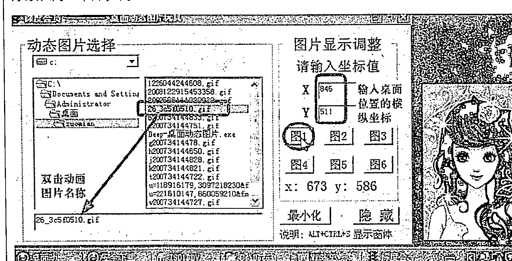

## Windows 7个人资料轻松转移

近段时间最火的操作系统要数Win7了，但是就算是这个系统也有崩溃的时候。在重做系统的时候，以前安装保存的个人资料也不能丢失哦，这该怎么办呢？其实我们只要使用Win7个人资料转移器 (http://www.ouyaoxiazai.com/download/y15060.html) 就可以轻松搞定。

运行软件后，首先选择需要转移的个人数据，如连接、我的文档等，并在这些项目前勾选。接下来设置转移到的目标路径，完成后单击“转移”按钮，稍等一会，软件就会自动为你转移你的所有个人资料。

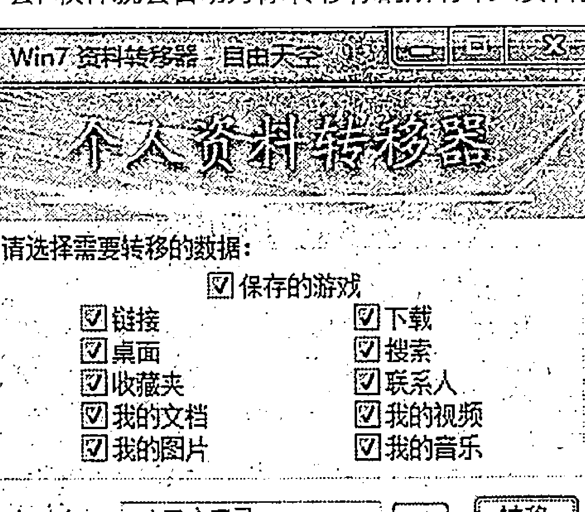

## 强悍清除打印队列

作为打印服务的机器，打印队列中总有一些“死硬派”，既清除不了也不能打印，很是烦恼。特别是USB口的打印机，有时候拔了插，手动清除等方法都不管用。总不至于为了清除队列而重启电脑吧。

要想方便解决此问题我们可以使用打印队列清除工具来对付它（下载地址：http://www.skycn.com/soft/54589.html#downUrlMap），打开软件，如图所示。


只要点“清除打印机队列”即可，不过有时候可能上网不便，但是手头又看到这篇文章怎么办呢？还是有一个好方法，那就用打开记事本，输入以下内容：

```
batch
net stop spooler
echo y|del %windir%\system32\spool\PRINTERS\*
net start spooler

```

然后另存到桌面，取名为“Clrpmt.bat”。这样一旦发生打印队列中有内容去不好好干活时，只要转到桌面，双击这个批处理即可搞定。

(浙江联众/徐怀平)

## 音随我动声随我定

除了界面更加漂亮，性能更强外，Windows 7在声音控制方面也更加人性化，允许你为应用程序定制音量。

#### 音随我动

Win7可以轻松设定每个应用程序的声音大小，比如一边工作、一边听音乐、一边聊QQ，你可以分别设定这些程序声音在不同的大小级别上，相比Windows XP时的一刀切要人性化多了。

右键单击系统托盘区的声音图标，在弹出的快捷菜单中选择“打开音量合成器”命令，在打开的窗口中可以轻松设定各个程序的声音级别。

#### 声随我定

用上Win7的朋友可能还会遇到这样一个问题，就是在听音乐或是看电影等其他事情的时候，如果这时QQ上有人发来信息，这时音乐或电影的声音会突然小很多，而QQ消息的声音则是正常大小。不要以为这是Win7的Bug，其实这正是人性化设计的一面，Win7是考虑到其他程序的声音不要覆盖了具有“通信”功能程序的声音，这样用户就不会错过任何消息了。

当然每个人的需求是不一样的，也许你并不想每次QQ来消息时而影响其他应用程序的声音大小。要想让Win7和以前一样，不去自动调节程序的声音大小也很简单。右键单击系统托盘中的声音图标，在弹出的窗口中选择“播放设备”，在打开的“声音”对话框中切换到“通信”标签，在“当Windows检测到通信活动时”下方选择“不执行任何操作”，然后单击确定按钮即可。

(文/李云峰)

## PPT演讲需要放大局部怎么办

当前，PPT作为演讲、展示的基本工具，已经融入到我们日常工作和生活的方方面面。虽然微软的PowerPoint已经很完善了，但是在局部放大上还是稍有遗憾。今天就给大家介绍一款小工具ZoomIt (http://www.onlinedown.net/soft/54654.htm)，帮你在放映PPT时快速放大局部，并进行批注。


下载后，直接解压缩就可以使用了。双击后，ZoomIt就开始在后台运行了。PPT播放时候，如果需要放大局部，同时按下Ctrl和1键，当前屏幕就自动放大，显示位置就随鼠标移动而移动，当确定好放大区域后，点击左键，屏幕就保持固定，不再随鼠标移动了。此时，如果需要划线标注，点击鼠标左键，就可以使用画笔，想怎么划就可以怎么划（放大状态下进行标注的效果见图1）。如果需要标注文字，按T键，就进入输入状态。而如果需要跳出当前的放大状态，恢复正常模式，直接按下ESC键就可以了。

> 约翰·瓦格纳对管理的定义：标，通过劳动力的合理配置，组织、指挥和控制组织行为的功能。管理是“让人把事情做好。”

中途休息的时候，同时按下Ctrl和3键，就调出倒计时的白屏幕，时刻提醒大家还有多长时间就要上课了。双击桌面右下角ZoomIt的图标，就可以进行相关的热键设置和倒计时时间设置（见图2）。

## 两步完成远程控制

许多时候需要远程控制，比如帮一个外地的网友解决电脑问题。对菜鸟来说，Windows远程桌面比较繁琐，即使是QQ的远程控制，也要来回来去地操作，并且连接的速度、质量都很差。借助CrossLoop可以轻松解决。

双方都到http://www.newhua.com/soft/61781.htm下载软件，启动CrossLoop后，在程序窗口切换到“共享”，此时可以看到当前计算机名字和访问代码。

现在叫对方复制其中的计算机名字和代码给自己，我们在自己的电脑上运行CrossLoop后，切换到“访问”，按提示输入获得的名字和访问代码，单击“连接”。连接成功并获得对方的同意后，对方只要单击程序界面的“共享控件”，就可以看到对方的桌面并可以使用键盘、鼠标操纵远方的电脑了。超简单吧。

(文/俞木发)

## 游戏百宝箱

#### 争做餐厅大佬


秘籍：开门做生意之前，先要确定自己的库存是不是够，餐厅营业过程中也不要忘记及时补够库存，否则慕名而来的客人跑去其他餐厅消费，你就等于给别人做了嫁衣了。进货时可以看到进货价和销售价，受欢迎程度高的菜品会获得更多金币，注意调整进货比例哦。充足备货后，你就可以看看餐厅是不是需要清洁一下了，如果出现了苍蝇就要立即消灭掉，地板脏了快去拖干净，保持餐厅整洁很重要哦。

#### 开心农场


- 这个农场的里里外外任何情况你都可以在屏幕右上角的‘农场助手’找到。
- 购买种子：你可以在农场中间的一块块耕地上种植你所喜欢的作物或者鲜花。至于你想种什么，都可以到‘商店’中购买到，‘商店’就在屏幕的右上角。
- 那有了种子该如何种植呢？点击屏幕下方的‘道具’按钮，选择你已经购买的种子，然后点击农场中的空地，就搞定了。
- 当一个好农民还需要一点学问哦！不同的作物有不同的成长周期，但是大部分都分为五个阶段：发芽、小叶子、大叶子、开花、结果。您的鼠标浮到上面就可以看到他们的成长状态。

#### 弹弹堂


- 弹友可以在交友中心进行注册登记介绍自己，登记费用10000金，并可选择是否公开自己的装备属性（其他弹友可以查看登记弹友，登记弹友显示的形象为游戏内形象）方便之间的交流。
- 点击未婚异性弹友弹出的菜单中会有求婚按钮，拥有求婚戒指并点击求婚就可以求婚了。（求婚戒指需要在商城购买，价格999点券）
- 求婚时需要附带一封深情动人的情书。
- 待对方确认后求婚方可成功。

## 我这样成为傲游网页设计师

我学的是电脑动画专业，于奥运之年毕业，到遨游之前，从事过网络维护和互动视觉设计工作。

## 简历，让作品说话

2009年底我在某设计站上看到傲游设计部招聘网页视觉设计师职位的消息，但已经过期很久了。幸运的是我的一个朋友与做设计部总监认识，问了一下这个职位还在继续招人，于是我就投了简历。设计类简历要言简意赅，无论多好的文字描述都比不上有说服力的作品。如果是刚毕业没有工作经历的新手，一定要写出对于设计的深层理解，让HR从中体会到这是一个懂设计并有潜力可挖的人，只是缺少一个好的机会。

## 三面，提前做功课

#### 初试：拿出精选作品见设计总监

在面谈过程中，我简要说出了对于设计的看法，并表达出够胜任这个工作的能力。面试前一定要整理好将要向总监展示的作品和资料，不求多，但一定要精（图为当时提交的作品之一）：

如果表达能力不是特别强，建议面试前找一些相关的理论性文章或书籍，学习一下设计专业的规范用语。如果设计能力得到认可，且表达到位，那么一周之内会收到复试通知。

#### 复试：和人力资源巧谈待遇

我复试的内容主要就是对于待遇的期望和HR对于公司文化和制度的陈述。不要太在意当前的待遇，应该看到这家公司和这个职位能否给自己今后带来更多的学习机会和升值空间，要把眼光放长远一些。如果没有把握自己要的待遇是否合理，可以试探性地问一下公司对于本职位的待遇范围，然后再比较自身的能力来谈待遇。

#### 三面：于CEO畅谈企业产品

接下来与CEO的会面，等于已经有一条腿迈进了公司的门槛，要有一个清晰的大脑表达出对公司文化的认同和对产品的了解。我提前查阅了大量的浏览器资料，了解了当下几款热门浏览器的共性和傲游浏览器自己独有的特性，并重新查看一些用户体验和交互模式的设计资料，临出发前又打印了一些资料在车上阅读，做到万无一失。幸运的是CEO确实问了我此类问题，例如“你如何看待傲游浏览器？”“你认为什么样的用户体验才是好的用户体验？”我很清晰地表达了看法。最后他问我为什么要离开原来的公司。我回答之前做互动加班太繁重，身体有点接受不了，而且随着做设计时间的加长，我越来越觉得做好设计不光的是做好一个图，应该围绕一个产品或者一个品牌去挖掘深层更有价值的东西，因为好的设计是以用户为中心的设计，是视觉与体验的集合，所以我选择了傲游。于是在CEO转身走出去几分钟后，HR过来通知我很荣幸地被傲游设计部录用。

> 取胜关键词：不放弃过期招聘启示、良好的人脉、认真准备功课、适当的沟通技巧，出色的设计技能和思想

> (齐齐哈尔大学/韩学伟)

## 边看边聊 电视球赛不错过

南非世界杯即将打响，作为一个超级学生球迷，宿舍没有电视，该怎样收看精彩的体育赛事呢？PPS、PPTV等网络电视软件会转播一些体育赛事，可太杂乱。平时几个哥们猫在宿舍里，为了看场比赛，一会儿打开这个这软件，一会儿打开那个软件，就是为了找一个直播比赛的网络电视台，真是麻烦。现在可好了，用“球迷秀”可以收看各种网络电视上的体育频道，还能下载各种精彩体育赛事，方便贴心，堪称球迷的最佳伴侣。

下载安装球迷秀（下载网址：http://www.qiumixiu.com），安装时注意选择所有组件，这样才能直接收看相应网络电视的节目。看体育赛事要提前获取赛事安排时间，打开球迷秀后，在首页中单击“直播单”获悉近5天的各种体育赛事，以及相应的直播信号源，非常齐全。注意细看软件介绍，里面包含了可能出现问题的解决方法，说不定对你有用哦。

要看当天直播的体育赛事，可单击“播放室”打开播放室，单击“直播”按钮，下方以时间为序列出各种体育赛事。单击赛事链接在下方会显示直播的网络信号源，双击相应的信号源即可播放，如果该信号源播放不流畅，可使用其他信号源，如果所有的信号源都不流畅，那就说明你的网速有问题了。观看赛事的同时，在右侧窗口中还可以与其他球迷交流。

错过了赛事直播或者要收藏经典的赛事，也可以使用“下载盒”下载收藏精彩节目。单击“下载盒”，这里将赛事进行了分类，单击赛事后面的“播放”按钮可启用迅雷看看播放节目，单击“下载”按钮可使用迅雷下载节目，非常方便。“博彩盒”中提供了大量体育博彩信息，如果你是个球迷兼彩迷的话，千万不要错过哦。

#### 小提示：让本本续航时间长一些

一般学生宿舍晚上会定时断电，此时看球赛只能靠笔记本了，因此尽量延长本本的使用时间非常重要。我们可以使用续航能力更强的电池，将电池电量充足了备用；看球赛前先进行碎片整理，这样保持电脑高效运行；根据实际降低屏幕的亮度，关闭系统界面特效，这样电池使用时间会明显变长；不要打开多余软件，尽量不用或少用硬件（光驱、鼠标等），降低本本工作温度（清理本本内部灰尘）。

> (江苏/许小★周建峰)

## IBM销售支持篇

果果：这个暑假，亲爱的同学们有哪些实习计划呢？在IT名企锻炼一番，毕业后有机会直接留用哟！本期这位大三的同学，叩响了多家IT名企大门，经验丰富，听听他的高见吧！

我的专业是软件工程，但感觉自己不太适合闷头研究，所以把职业定位在市场或销售上。最近我成功拿到了IBM销售类、广东移动市场类、飞亚达营销类等6个Offer。广东移动的实习待遇很诱人，一天100多元薪酬，包吃住，住四五星级宾馆，连工资卡都是金卡。不过我想到西安相比湛江，更适合我发展，所以权衡后选择了IBM。

#### 关于简历

要最能体现自己价值的东西用STAR (Situation, Task, Action, Result) 原则精简在简历上，并不断找人帮忙修改。有几个很有用的大学生招聘信息与经验分享地：http://bbs.hiall.com.cn, http://bbs.yingjiesheng.com, http://intern.dajie.com，人气超旺，密切关注其中的动态，有针对性地投递简历，迎接挑战吧！

#### 关于笔试

很自豪，目前我的笔试通过率是100%。笔试大致分为两类：行政职业能力测试和逻辑题——主要考察智商、语言表达、阅读、逻辑思维能力，比如腾讯和广东、江苏移动等；个性化考核——典型的有IBM，全英文，每项几分钟的答题时间，答错还扣分。

#### 关于面试

营销类职位对学术性的东西要求不多，对专业也没有限制，只要思维敏捷、逻辑清晰、乐观开朗、形象利索就差不多了。

## 广东移动

某些地方对研究生和好成绩似乎有偏爱。我报了中山和湛江分公司，因为广州和深圳会有太多研究生和我抢饭碗。面试形式都是1 on 1，大概两至三轮。面试中山分公司时，面试官看了我的成绩单就黑下脸来，难为的问了几个问题，把我赶走了。还好湛江分公司的人很nice，简单的简历问题+职业规划+营销情景模拟就搞定了。我觉得本科生的优势是年轻，更有朝气，显示出快速学习能力等，就有希望打败研究生。

## IBM

销售经理面我时，就一些简历问题问得特别细，我感觉很被动，但很开心的是我说话方式和他们一致，汉字中夹杂着英文，呵呵。笔试时有200人左右，最后只有4人胜出，我总结了一下胜出原因：我有工科背景，比较符合企业要求；英语不错，过了六级，而且比较敢说；曾在学校里代理过手机销售；丰富的社团经历，且都是外联方面的。

> (西安交通大学/翟彦祺)

## 打造属于自己的个性域名邮箱

在这个个性张扬的时代，个性邮箱让人眼前一亮，终生难忘。不过好的邮箱要么被系统保留，要么早就让别人抢了。无奈我们只好“自己动手，丰衣足食”了，借助QQ邮箱这位大哥帮忙吧。

#### 申请域名

要打造属于自己的个性域名邮箱，首先要自己的域名，获得并不难。这里推荐一个可以免费申请顶级域名的网站http://www.dot.tk，方法详见本刊第8期53页《为女友打造一个个性搜索引擎》中的“申请域名”部分。

#### 登录QQ邮箱

登录自己的QQ邮箱，在首页点击下方的“域名邮箱”，把你的域名填入，进行“下一步”，选择“其他提供商”，进入创建阶段（这个网页先不要关，第四步还会用到）。

#### 域名解析

打开https://www.dnspod.com，注册（网站地址写刚申请的域名），然后登录管理页面。

#### 设置记录

在刚才的管理页面上给你的域名设置一个CNAME记录（每个QQ邮箱都有属于各自唯一的值），把自己QQ邮箱中的值填上。然后将MX记录设置为mxdomain.qq.com，优先级为10。

#### 邮箱创建

点击QQ邮箱上的“设置完成并提交验证”，你的邮箱就可以用了，密码就是你的QQ邮箱密码。还可以对域名邮箱进行一系列的设置，创建100个类似“XXXX@你的域名”的邮箱。如果在域名设置页面中加入一条别名(CNAME)记录，就可以使用“mail.你的域名”这种形式来访问自己的登录页面了。

> (山东师范大学/马占国)

## 跟着美剧字幕练口语吧！

美剧的Subtitle（字幕）有什么用？它是练习Oral English的Best Tool。不信？雅思的口语达人、某高校国际交流协会主席以及精通多口音英语的牛人等等都是这么练出来的。秘诀就在于——Repeat and imitate many times（重复观看并模仿遍）！

The First Time: With Chinese Subtitle

挑一部百看不厌的美剧（否则练到吐没人负责），挂着中文字幕看第一遍。这可不是让你看消遣的，是找感觉，就是一边看一边能感觉到英文对白在脑子里回响。
IT词汇补贴：
Subtitle——以前的常用意思是新闻的“副标题”，但在这个美剧、日剧、韩剧横行的年代，“字幕”才是它最常见的中文翻译。
回响——reverberation，它还有一个意思是“混响”，在音频编辑软件Cool Edit或是Golden Wave的英文版里，你一定能见到这个词，因为没有音频的reverberation，就不会有流行音乐里那些空灵的歌声。

The Second Time: With English Subtitle

还是这部片儿，只是看第二遍时改挂英文字幕了。这次一边听一边看英文字幕是不是正确。听力和口语从来都是二位一体，密不可分的，听不懂还能说得清吗？如果你能挑出字幕的错误来，绝对能信心倍增、动力加倍。
IT词汇补贴：
一体——all in one，它也指十分高级的“一体机”，联想一体电脑也可以用这个通俗短语来表达；要想更专业，就用incorporate（一体化的）来表示，比如一体电脑是incorporate PC，一体影碟机是incorporate DVD。

The Third Time or The N-th Time: Without Subtitle and Imitate

第三遍是看裸片，惟妙惟肖地模仿对白。注意哦，不是跟读，模仿的意思是想象你就是剧中那个人物，用他（她）的语音、语调、语气、连读甚至磕巴来说话。要做好这一步，除了得有超好的耐性和坚强的神经外，还得有过硬的配套设备，要么得有硬盘(hard disk)强大和内存（memory）超大的电脑，要么就得有经得起一遍遍重播折磨的DVD机(Digital Versatile Disc)。
IT词汇补贴：
hard disk缩写为HD，现在流行portable hard disk（移动硬盘），这个短语中的portable是“便携”的意思，所以本本就是portable computer。

只要你能坚持学完一部剧的两季，就应该是达人了。准备好了？那就开始吧！
（南开大学/杨红）

## 软件助力 课程设计轻松搞定

期末临近，对于理工科的同学来说，做课程设计真是件麻烦事。虽然有长达两周的“充裕”时间，但做实验、图表分析、资料收集、论文撰写等过程常常把人忙得天昏地暗。不过，只要掌握适当的方法和工具，就能让你的课程设计做得又快又好。

#### 复杂公式，轻松输入

论文里引用公式是必须的，尤其是“面相”比较复杂的公式，除了能满足老师的要求外，还能让论文看起来更有深度。不过公式输入仅依靠Office是不够的，输入有点慢，一不小心还会出错。MathType（下载地址：http://work.newhua.com/cfan/201012/MathType.rar）可以输入各种复杂的数学符号和公式，并与微软Office文档完美结合。比Office自带的公式编辑器强大太多了。

#### 图表分析，轻松完成

做实验，少不了分析数据。以前我做课程设计时，常常发生因为一个或几个数计算错误而导致重做的“事故”，虽然从那以后开始用Excel来处理数据，但是由于图表太复杂，反而使得整体速度慢了下来。后来，我无意中发现了一款Excel的功能增强插件——ExcelBox（下载地址：http://work.newhua.com/cfan/201012/ExcelBox.rar），在Excel原有基础上增加了很多实用的功能，使得图表分析速度比以前快多了。插件共包含了40多项功能和20多个自定义函数，绝对能让图表分析事半功倍。

#### 误关窗口，轻松恢复

撰写论文，到网上收集资料是少不了的。开十个八个资料窗口是常事，但窗口多了就容易误操作，常把辛苦找寻来的资料窗口关闭了！现在GoneIn60s就是一款可以恢复误关窗口的小软件（下载地址：http://work.newhua.com/cfan/201012/GoneIn60s.rar）。在后台运行软件，当我们误关窗口后，在60秒内就可以用鼠标右键点击GoneIn60s托盘图标来恢复误关窗口。如果嫌60秒时间太短，也可在Time to wait选项中自定义时间，注意单位是“seconds（秒）”哦！
（山东农业大学/飞天小猪）

## 3D漂亮立体字 校园活动我出彩

我在学生会做幻灯片和VCR时，最发愁的就是如何把方方正正的汉字变得灵动华丽。自从有短小精悍的3D文字制作软件——Xara3D v6（下载地址：http://work.newhua.com/cfan/201013/xara3d.zip）加盟，文字的处理马上变得简单高效！比PowerPoint、Photoshop、Xara3D更为专业！下面我们就来做一个木纹效果的“电脑爱好者”。

#### 第一步：文字输入

打开Xara3D，通过Aa文字选项键入“电脑爱好者”，同时调整字体、文字尺寸和文字间距等。回到画布上，通过鼠标调整文字角度和文字厚度。

#### 第二步：材质选择

在“材质选项”下拉菜单中选择材质应用于文字或背景。此处选择“文字”，单击“载入材质”按钮，找到木纹图案，确定保存。


#### 第三步：边缘效果

现在字体显得比较呆板粗糙，我们通过“文字斜边选项”调整文字的边缘效果，选择“圆角边角2b”，效果看起来还不错（见图1）。

#### 第四步：灯光设置

灯光的应用是做出逼真立体效果的关键。在菜单栏下找到“灯泡”按钮，4个锥形箭头分别代表3个不同颜色的效果灯和阴影灯（见图2），在“颜色选项”里面可以调节3个灯光的颜色，在“阴影选项”里可以调节阴影的风格、透明度和模糊度，或者关闭阴影效果。调整4个灯泡的方向，可以使文字的3个可视面呈现不同亮度的颜色叠加效果。


#### 第五步：图案调整

图案选项有文本、按钮、平板、平半镂空和边框五种模式，它们能给文字加些图形效果，更具可视性。从“图案提取器”中选中矩形板材，确定应用，接着通过调节文字和灯光角度使整个铭牌效果达到最好（见图3）！


#### 第六步：导出文字

全世界人民都知道PNG是对透明效果支持最好的图片格式，点击“导出”按钮，选择PNG格式，再设置图片大小、是否透明和色深，此处设置色深“真色彩（24位）”可得到最好的效果。
（河北农业大学/韩政）

## 手机武装卡哇伊 俘获芳心甜蜜蜜

果果：《手机》电视剧正在热播，浪漫中的暧昧我不太喜欢，而在拇指一族聚集的青青校园中，手机玩出的，是真正的精彩和纯纯的爱。

那是一个草长莺飞，风和日丽的下午。小强（不是某种爬行生物）坐在返校的火车上，偷偷窥视着对面的美丽女生。虽知是校友，但小强还未找到和MM交谈的机会……

#### 邂逅从手机美化开始

MM正因找不到一款好听的手机铃声而发愁，小强深呼吸，摆出一个自信的笑容，在MM疑惑的眼神中，拿出手机，打开了“紫电音频魔方”(http://mobile.newhua.com/soft/9136.htm) 展示起来：“有听到一首好听的歌曲，想找自己喜欢的一段作为铃声不太容易，这款软件就能帮你截取歌曲。运行软件后，浏览歌曲所在文件夹，然后就可选择提取，按照开始、持续时间截取歌曲，而且还可用转换选项，进行6种音频格式的转换，帮你轻松打造自己的专属手机铃音^_^”这一招果然吸引了MM的侧目。小强为MM的铃声设置了这首歌“我听见你的声音，有种特别的感觉，让我不敢不断想，不敢再忘记你……”MM的声音，比铃声还动听呢！

“你手机的字体很另类啊，我怎么不会设置呢？”小强细心地介绍道：“这叫做华康少女字体，字体是可以下载的，不过下载完这种TTF后缀的字体文件并不能立即使用，还需要有字体驱动(http://mobile.newhua.com/soft/11515.htm)的配合。看，在C或E:\data\中新建一个fonts文件夹，将字体文件放进去就OK了，而且字体驱动还可以设置字体的大小、饱和度、行高等字体信息。”在MM的感谢声中，小强梦想的愉快交谈开始了……

#### 给聊天内容加上美味调料

回到学校，小强开始给MM发短信，也不知哪来的精神，包月套餐的条数都发完了，还在发个不停。MM被小强的幽默逗得挺开心，但急需搞笑或是抒情短信时，小强还是会感到“话到用时方恨少”，哪来那么多短信模板呢？他发现一款不错的软件“信春歌”(http://tinyurl.com/2af58qm)，冲这个名字就不应怀疑它的功力了吧？果然，可联网更新的数千款短信模板大大满足了个性化短信需求，一键发送操作也省去了很多麻烦哦。“信春歌”的短信分类十分详细，有搞笑、情人密语、方言、特色、节日等，展开后各有多个短信，能非常轻松地找到心怡的短信。左键选项可以进行参数设置，签名建议关闭，小强自定义了签名内容，给MM发的短信后都跟上签名“强宝宝”。

文字不能完全表达小强的心意，他又安装了“俏脸短信”(http://mobile.newhua.com/soft/11248.htm)，这个诺基亚的独有软件在短信中加入个性的卡通表情让人眼前一亮，免短信费更是具有诱惑力。“你这么多卡通表情是哪里来的？”MM忍不住问道。崇拜能否为爱加分呢？小强一边为MM安装，一边甜蜜地想。

在这个恋爱的季节，如何拉近距离、增进相互了解呢？过去是通过纸条、信件，现在Fashion地变成了短信与QQ啦！

为了更方便地陪MM说话，小强打算手机里挂2个QQ，因为他习惯了在普通朋友面前隐身，但又希望MM看见自己在线，要频繁地更换登录QQ吗？当然不必，只需同时下载2008与2009两版QQ，就可同时登录2个账号了，单独为MM亮起的QQ一直挂着，只可惜MM似乎最近“学习很忙”，出现的次数并不多，短信也少了。得想个办法主动出击！

#### “伪造”MM短信该当何罪

“你有时间想约我吃自助？随时愿意奉陪！”MM听到小强的话很困惑，自己发了邀请约会的短信？看到短信号码还真是自己的，只好答应，不过交换条件是小强招出这一骗术如何成功。目的达到，小强心满意足地开始炫耀：“短信 (http://www.duote.com/soft/17300.html) 不仅有看着仿iPhone的超炫短信界面，更有骗子短信、定时短信、闪信等多种功能，是居家旅行、骗吃骗喝的必备工具！在选项中选择工具、骗子短信，就可以自己设置短信时间，发信人号码、名称、短信内容……”小强的臭美终于换来MM的粉拳回应“去！”。为了道歉，小强很贴心地给MM装上“智能课表”(http://mobile.newhua.com/soft/8456.htm)，提醒功能和上课时间自动将手机变为无声模式，这样爱学习的MM上课时也不会因为收到小强的短信而受打扰了（希望她会偷偷看几眼手机）。

#### 让心爱的MM出现在手机主题中

精心准备的约会告白终于成功，小强想将两人约会的照片设为手机壁纸。可单纯的将图片设为壁纸，手机屏幕上会留出一部分空白，很影响美感。小强灵机一动，找出“GG主题”(http://tinyurl.com/26at5w4)，在编辑图片时将照片设为桌面背景制作了一个主题。虽然没用上一分钟，不过下次见面时又有惊喜了。当然，如果不是小强那种懒鬼，这种自己DIY主题的软件还可以改变图标、文字颜色，自定义背景图片等功能也是很有价值的。

一段甜蜜单纯的爱情，在小强的精心设计和手机的帮助下，在这个淡夏，悄然绽放、飘香……

(大连海洋大学/王禹衡)

## 转笔 指间的舞蹈

果果：你转过笔吗？上课时不小心啪地一声笔落桌面，被老师严厉的目光“加倍关怀”了吧？也许你没想到，转笔已经变成一种很酷的艺术，因为不受场地限制，不受年龄限制，道具简单，表演性极强，成为风靡世界的手上极限运动！本期我们请来“转笔者之家”(www.pserhome.com)的站长司徒同学来和大家扫扫盲。这位大三的同学五年前迷上了转笔，苦于国内没有中文资料，只好整天到国外网站去晃悠，于是他建立了网站，汇聚了大批转笔爱好者……

#### 酷招一箩筐

转笔（pen spinning）发展至今，已经从一两种转法发展到一百种多种的单式（trick），连续招式（combo）更是让人惊叹连连！为了和世界各地的转笔者沟通，一般转笔招式的名称都是用英文或者英文简写表示。下面就来几个基本单式吧。

- 1. ThumbAround Normal（简写TAN）：接触转笔的必学招式，学校里最普及的一招，笔绕过拇指后重新落到手指间。
- 2. Sonic：这招以速度快和动作华丽著称，笔从中指和无名指间迅速旋转上升到食指和中指间，足够在人前炫耀一番了！

单式还有Charge、Infinity、Tap等。最容易的招式几个小时内就学会，而比较复杂的则需时几个月。连续招式没有特定的步骤，随意发挥即可，有以Backaround为基本功的Reverse to Backaround, Continous Thumbaround等。

## 小提示：

转笔专用笔通过使用各种普通笔的材料（笔杆、笔帽、笔嘴、笔胶等）拼插起来的，按常规分为：平衡笔：一个笔杆两边套上笔帽，笔帽上有笔胶的笔，又名“棍子笔”，最适合初学者；原型笔：泛指改完后样子与未改过的原笔差别不大的笔；二合一笔：比较少见，指用两个笔杆用笔胶或其他方式拼合起来的笔。

#### 转笔世界杯

如同很多竞技活动一样，每年举行的转笔世界杯（World Tournament）是转笔界的重大事件，吸引了国际各大转笔组织的转笔高手参赛。大赛采取的是网络赛，参赛者只需要把自己的参赛视频提交到指定邮箱就行。近三年的冠军选手分别来自韩国（2007年）、日本（2008年）、泰国（2009年），2009年我国参赛Answer夺得季军。著名视频《中华之魂》（华魂）http://tinyurl.com/34x5fwt介绍了多种招式，曾在国际转笔界掀起中国旋风。挑战自我，不断创新，各种组合花式不断旋转舞动，一支笔就足够让身边的人发出阵阵惊呼，上课专心听讲，课后不懈练习，一定会成为转笔高人！

(北京理工大学珠海分校/司徒)

## 听英语在唱歌

学英语枯燥又乏味？都暑假了，去他的四六级练习题，让我们来听英文歌吧，徜徉在清凉的旋律中，感受流畅婉转的美妙英语，让英语能力随着音乐的律动节节攀升。听，那里的英语在唱歌呢！

#### 全能歌者

登录http://www.tingclass.com/music，流行、摇滚、影视甚至儿歌，喜欢什么歌它都能唱给你听。首页右下方的“每日一歌”版块能给你带来最新最潮的英文歌曲和歌者介绍，让你又学英语又Fashion。不光能听到，你还能看到，播放器下方有中英文对照歌词，还有歌曲演唱者的海报。双击英文歌词中任意一个单词，就能从弹出的窗口中获得它的详细解释和用法哦。

光听不过瘾，还可以在这里边听边唱。点击首页右下方的“K歌擂台”，点击“开始录音”，看着歌词，跟着旋律边听边唱，不光能提高听力，还能学习漂亮的英语连读，提高你的口语哦。可以点击“上传录音”，把完美歌声展示给网友，让他们来评分吧，成为英语K歌之王。

#### 专业倾听者

登录http://www.kekenet.com/song，进入首页左边的“歌词听写”，选择歌曲，就可进行“歌词听写训练”了，赶快“开始听写”把，在“听写窗口”键入你的答案，提交后可以看到歌词原文，“相关注释”中还有歌曲的背景知识介绍。

#### 贴心解读者

听英文歌能练听力和口语这不奇怪，告诉你哦，听英文歌还能学英语句型呢。在http://www.wwenglish.com/t/d/song/landl/中的每一首歌，除了有中英文歌词，还有歌词句型全解析，教你歌词里哪儿有省略，哪儿有俚语，还有例句来帮你熟悉句型用法，真是太贴心了。

#### 热心歌友

听音乐最重要的是感受，没人分享会很失落；学英语最重要的是交流，没人沟通会很闭塞。有了mp3、iciba.com，分享和沟通都不成问题，无论你喜欢的是流行、朋克、乡村、嘻哈还是爵士，在这个“爱音乐”社区都能找到知己。只需简单几步注册，你就能和歌友们分享音乐感受和英语学习心得。在标题带音符的帖子里，你还能试听和下载歌友们介绍的英文歌曲呢。

(重庆/猫猫)

## 别让电脑操纵健康（颈椎篇）

通宵一夜从浩方战场上退下的A君刚要伸个懒腰仰仰脖子，突然，脖子发紧头昏脑涨动弹不得：“哎呀，脖子又僵啦！”舍友见状道：“还不是电脑惹的祸？”

A君实在无法忍受经常被脖子如此折磨，打电话问CFan怎么办。在果果的帮助下，他找到了北京中医药大学社团理事会的热心同学。同学们觉得头晕眼花应该是长时间固定的姿势造成，颈椎的血管被压迫导致大脑供血不足，可以在床上平躺着休息一会，等大脑血液供应恢复正常症状就能缓解。

#### 电脑颈椎病不可怕

大家的讨论是否给A君指出了明路呢？他们请出了自己的老师——针灸推拿临床部主治医师薛卫国进行专业点评。

Q：请问“电脑颈椎病”是怎么引起的？
A：电脑族长时间处于一种固定的姿势，颈部肌肉劳损，逐渐导致关节不稳定，于是引发了诸如颈酸、肩背麻木、头晕头疼等问题，这就是“电脑颈椎病”。

Q：这和我们常说的“颈椎病”一样吗？
A：不完全一样。“电脑颈椎病”没有我们在临床上见到的颈椎病严重，它毕竟只是一种劳损，是颈椎病的前兆，多数还是因为肌肉的紧张压迫血管和神经才导致这一系列的问题，缓解症状还是比较简单的。但如果不及时采取措施，长此以往，肌肉和骨关节的过度劳损，就会发展成为真正的颈椎病。

#### 如何快速找到穴位？

- 风池穴：位于后颈部后头骨下，两条大筋外缘陷窝中，与耳垂齐平。
- 肩井穴：把右手大拇指贴在脖子左边，然后把手弯成弓形，中指的位置就是左肩井穴，也就是肩部最高处。

#### 小提示：按摩+锻炼+食疗高招

电脑族如何拥有健康的颈椎？薛卫国老师为大家提供了最简便有效的防治秘方。
首先要防患于未然，注意适当休息。在使用电脑期间多放松肩背颈部，点压一些放松肌肉的穴位，揉一揉颈部肌肉群。

- 1. 颈部按摩：一按揉颈椎两侧，做揉和推的动作；二放松肩部肌肉，手顺着肩胛骨往肩部边挪动边按摩；三点穴，主要有风池穴和肩井穴，适度用力按揉20秒即可。
- 2. 颈部锻炼：如果未能缓解，还可以做一下颈部活动度的锻炼，以减缓颈部劳损。颈部活动有四个主要动作：低头、仰头、侧弯和做环转运动。要缓慢、到位、做到极限，并停留五秒钟，以放松为度。此外还可以做伸懒腰的动作，也能很好地放松。
- 3. 食疗：还可以每次将10g葛根（在中药铺很容易买到）置于杯中，用热水冲泡，频频饮之，就可以起到缓解项背僵硬的效果。

## 校园黄金搭档 手机销售人气旺

果果：在我收到的稿件中，情节如此生动的校园来稿真不多。我好奇地问作者：“是你自己的故事吧？”他低调地说：“当然要源于生活，高于生活啦！”所以，我决定在这位手机达人身上挖一挖，果然发现了新大陆：他的手机应用不但征服了MM，而且在为同学们的服务中，赢得了很多人气！
用他的原话：“同学们借我的手机时，发现比他们的好用多了，就让我帮弄一下。来咨询的越来越多，都是同学我自然不会拒绝。后来我和班里卖手机的同学合作，一个当销售，一个当客服，以价廉物美和热心服务赢得信誉，一共卖了30多部手机！”
好了，关于校园手机销售，有什么独家秘技呢？请看……

#### 舍友小严初涉手机江湖

小严本来只打算在宿舍内销售手机，但在校外商业街的电脑商店印制宣传广告时，意外地发现老板竟然是自己的老乡。两人很热情地交谈了一番，大有相见恨晚之感，老板豪爽地答应免费借给这个小老乡一块柜台来代售手机。出于无功不受禄的心理，小严也答应帮老板作作宣传，拉拉生意。此后，老板与小严“一个做饭一个刷碗”的伙伴关系也就建立起来了。而小严的手机销售之路也变得正规起来，销售范围扩展到班级、学校。

机在大学生中的使用率远低于市场比例。至于苹果等高端系列，确实可以忽略不计了。对于大肆宣传的3G手机，大多数人选择了观望，而“心机”等活动购机倒是饱受青睐，很多同学都是左手拿着一部智能机，右手拿着一部交话费就免费送的小手机。经过调查过后，就可以适当进货了。

#### 金牌手机免费客服来啦

小强打算和小严优势互补进行合作。因为小强在手机软件应用方面的才能，正好弥补了小严的不足，所以两人商量了一下，一拍即合。
之前，小严只销售自己较为熟悉的三星手机。在小强的建议下，两人先做了市场调查，以自己所在学校为例，近半数的学生使用诺基亚手机，其中“街机”和中低端高性价比手机占了绝大多数，三星、索爱、摩托等口碑一向不错的老品牌紧随其后，而国产山寨

紧接着，他们又打出了免费帮同学解决一些基本手机问题、免费装机的广告，介绍多款软件及其功能，并帮助客户安装。并且，提供远低于周边手机店的贴膜、手机清理、内存卡出售等服务，而且这些服务对于在他们这购机的用户实行免费。其实这些服务费已经折算进手机售价中了，真是“无J不商”啊-_-！久而久之，小强已成为路人皆知的“手机大师”，而随着声望的增加，他们这个小手机店的知名度也越来越大，生意自然也跟着一路高升。而且，除了销售，他们甚至几乎垄断了学校内代交话费的服务。

## 文档自动编号不怕改

小林新到公司，辛辛苦苦起草的文档被领导改得面目全非，心理当然不爽，让人更加不爽的是文档中应用了大量的手工编号，特别是二级编号，是从头到尾连续编写的，领导增删的每一个条目都会对以后所有条目造成影响。真后悔当初没有用自动编号来制作文档。由于此次修改后还要向上一级领导送审，还是把所有手工编号都改成自动编号吧，以避免更多的麻烦。

这里以二级编号为例（其形式为“1.”，即阿拉伯数字后跟一顿号），按Ctrl+F快捷键，调出“查找”对话框，在“查找内容”对话框中输入“[0-9]{1,}.”（不含外侧双引号），勾选“突出显示所有在该范围找到的项目”，并在下面的选单中选择“主文档”，然后点击“高级”按钮，勾选“使用通配符”选项，点击“查找全部”按钮，然后点击“关闭”按钮退出查找对话框。
此时选中所有手工二级编号都呈选中状态，在“格式”工具条上点击“编号”右侧的下拉列表，从中选择合适的编号样式（如“1.”），如没有所需样式，也可以点击“其他”来自定义。

这样，所有需要自动编号的二级项目都应用了连续的自动编号了。只是原来的手工编号也跟在自动编号的后面，但仍处于“选中”状态，没说的，按下Delete把它们删除吧！
好了，现在二级编号已经全部转成自动编号了，小林长舒了一口气。如果大家还想把一级编号也改过来，应该知道应该怎么做了吧？

## S40的同学有福了 爱机也玩后台运行

诺基亚S60平台的手机已经非常普遍，仍有一大部分同学用的是S40平台手机，我就是其中的一员。很羡慕S60的手机可以后台运行，可以一边挂Q一边上UC。后来，我发现了一个方法，通过破解Java的读写权限和修改JAR文件，S40手机也能后台运行。
以我的诺基亚5300为例，需要的软件有凤凰刷机（下载地址http://work.newhua.com/cfan/201012/fenghuang.rar）、自己手机的诺基亚PC套件（http://www.nokia.com.cn），还有一个PPU文件（下载地址http://work.newhua.com/cfan/201012/PPU.rar）。
第一步：首先安装凤凰刷机软件，然后安装PC

套件。注意顺序不要颠倒，否则可能会出现安装失败。
第二步：点击“文件→搜索设备”，下面会出现“就绪”，然后点击“选项→PPU选项”，单击Browser，选择下载好的PPU文件。在接下来的界面中，单击Read，选择Java TCK Off，再选择Java TCK on，接下来单击Write，这时就破解成功了。
第三步：破解JAR程序。以QQ2010 Beta1、Build0124 Java为例。用WinRAR打开JAR文件包，找到META-INF文件，用记事本打开。在行末添加Nokia-MIDlet-no-exit: true，保存退出。在WinRAR中添加刚才修改的META-INF文件，选择“替换原文件”，用

PC套件把修改好的文件安装到手机就OK了。今后用手机上QQ按挂机键就不会提示是否退出了，再次打开QQ，就会发现仍然在上次按挂机键的地方。需要注意的是，以后开机会提示Test in RNDIS USB mode（测试RNDIS USB模式），选择“取消”就行了。
果果：本文是小牛同学参加高考前16天写好的，拿到本期杂志时高考已经结束咯！一手拿着理想的分数，一手拿着发表的文章，挺幸福吧？信CFan，拿高分！放暑假了，更有空闲了，各位有才的同学们不如写写稿子，把你在校园里的超级IT应用技巧发送到xiaoyxxr@cfan.com.cn吧！

## 暑假减肥季 开学呈现自己！

夏季到了，衣服越来越少，越来越薄，男生女生都很自然地拼起了身材！女生每天看着鸡腿啃黄瓜，就是为了秀一下小蛮腰；男生们一边节食一边练哑铃，为了在女生面前展示健美的身躯。这一切真的能减去赘肉，打造完美体形吗？让我们一同寻找最科学、快速、经济的减肥战术！

#### 一、自己真的需要减肥吗？

有人真胖，有人形如“豆芽菜”还嫌自己胖，先来速算自己是否真的超重吧。
公式：身高（厘米）-105=标准体重（公斤），超过标准体重10%为“超重”，超过20%为“肥胖”，看来自已真有点胖，那么属于哪种肥胖类型呢？
A.生理遗传型 B.代谢紊乱性型
C.情绪不良型 D.懒惰型 E.贪吃型
这五种类型的减肥难度依次递减，现如今大部分人的肥胖都属于后两种，懒得动又好吃。如果真打算行动，就来看看现在最流行的快速减肥法吧！

#### 二、流行减肥方法大甄别

- 1.单一食物法：每天只抱着黄瓜吃，憧憬美好的身材，但以黄瓜代替正餐减掉的不是可恶的脂肪，而是蛋白质和水分，会造成严重的营养不良。只喝酸奶很容易导致胃酸过多，影响胃黏膜及消化酶的分泌，破坏人体内的电解质平衡；只吃苹果导致摄入的蛋白质太少，造成人体肌肉损失（包括内脏的一些平滑肌），而肌肉正是人体消耗热量的主要器官，肌肉减少后热量更不易消耗，脂肪更容易堆积，所以苹果减肥法停下就马上反弹，以后减肥越来越难……
- 2.减少一餐法：不吃早餐会造成上午学习效率低下，中午食欲增加，导致胆结石、胃病、心血管病等多种疾病；午饭不吃下午会饿得受不了，导致晚上胃口大开；晚上少吃倒有减肥的功效，如果完全不吃，那么从中饭到第二天早餐有将近20小时，胃部会产生过饥现象，非常有害。
- 3.吃肉减肥：前一阵子美国流行“吃肉减肥法”，就是完全不吃米面之类的碳水化合物，每天只吃肉，外加一些蔬菜水果，馋肉的同学不必再纠结了！
到底有效吗？有人坚持少吃米面、淀粉类食物、糖分、脂肪，大胆吃瘦肉（油脂含量少）、鱼虾、水果蔬菜等食物，结果“卸掉了寄居在身上的一头猪”。
但是专家指出，完全吃肉而避免吃热量比较低的碳水化合物，时间长了有危险，过多的油脂能加重血管的负担，增加患心脑血管病的机会。吃肉减肥法的创建人Atkins博士本人就是死于动脉硬化引发的脑血管意外。
其实，吃肉与光吃馒头只是形式上的不同，目的都是要减少从食品中摄入热量。经计算，从“不饿”到“吃饱”，你会多吃进20%的饭。有人提倡饭前先喝一杯水，再吃一根黄瓜占胃里的空间，饭后还不饱就喝稀粥。看来还是有一定道理的！减少热量摄入+运动才是王道！
- 成功经验：如何成功减掉96斤 http://fitness.39.net/a/201064/1315620.html
这位MM体验了各种减肥法（爬山运动、针灸、食物减肥等），从196斤减到现在的100斤，总结方法如下：
①每天至少150g的米饭（含蛋白质的其他东西也可），保持体力；葡萄柚个子大，很容易饱，在西方早就是减肥食品了；黑咖啡，不加糖，不加奶，早上一杯，补充能量。以上都有助燃烧脂肪。柠檬水促进内循环，解除疲劳，补充吃饭少的维生素，苹果醋对内分泌有好处，酸奶、豆制品一定要吃，补充没有主食缺少的植物蛋白质。
②饿得有点晕的时候，就吃一块巧克力或者糖，因为低血糖了。
③保持足够的睡眠，睡眠不好会对内分泌有影响，体重不容易掉下来。
④运动要补充足够的水分。
⑤买衣服一定要买小一号的，这样给自己足够的动力，买大一号，就是放任自己。
还有一位在美国的中国MMConroe，坚持了700多天的瘦身日记，几乎成为减肥专家了，有自己制作的体重曲线，还有一个页面写明了自己的食物库和对应的热量（http://www.boohee.com/space/my_food/48936），从190斤减到了现在的98斤。也值得学习哦！

#### 三、高效减肥碎碎念

大家都在喊减肥，有的是整体胖，影响了学习和生活，有的是局部胖（腰腹、大腿等）需要针对性减肥，还有并不胖的人美体塑形，我们该如何对症下药呢？

- 1.整体减肥：迈开腿，管住嘴
不要否认，发胖的元凶就是吃得多，动得少。从一般摄取的能量上来考虑，一个人每天通过运动消耗掉300千卡的能量比较适宜。
跳绳15分钟，慢跑20分钟，步行40分钟，就能消耗100千卡的能量。想到没有，早上起来跳跳绳，平时远离电梯和自行车，多走路就能有效消耗掉多余的能量。
管住嘴，那我们吃什么？有人抱怨：“网上的食谱根本不符合学校的实际啊！”确实，食堂大厨很难和减肥餐达成共识，因此，我们退而求其次，找找减肥的食材：
黄瓜抑脂，韭菜吸脂，洋葱活血，豆制品消脂，胡萝卜降胆固醇，白萝卜促代谢，另外大蒜、绿豆芽、海带、冬瓜芹菜、甘蓝、青椒、山楂、鲜枣、柑橘以及紫菜、螺旋藻等均具有良好的降脂作用。可供选择的食材很多吧？以后打饭时要留意一下了！

## 小提示：

如何运动呢？有一种新颖的“原地跑步法”，每天晚上原地跑步1个小时（可以同时看电视）。在跑步中加入上肢组合运动，可以在加速脂肪燃烧的同时，有效地塑造减去肥胖者脸部、背部、上臂、腰部以及男性胸部赘肉。此法来自狂减120斤的男生赵奕然（博客：http://blog.sina.com.cn/zhaoyiran97）。

- 2.局部减肥：瘦这里，瘦那里
很多同学本身并不超重，只是某些部位胖，比如胖胖的娃娃脸、丰满的臀部、腿部和腰部，这些就不需要大动干戈的举措了。

##### ①我要瘦脸：
狂嚼口香糖和按摩瘦脸都是流传已久的错误方法，前者经常嚼口香糖会锻炼咬肌而使面部肌肉发达，整体感觉变大，更会给下巴加重负担，却减不到你的双下巴，可以说毫无用处；后者，原因为面部肥胖的主要由骨骼形状、面部肌肉和脂肪的肥厚程度决定的，而不论是瘦脸霜还是按摩手法都不可能改变骨骼形状，除非你准备采用下巴抽脂术或者使用抗皱紧致的化妆品。还是合理膳食瘦脸法比较靠谱。

##### ②我要瘦腰腹：
要瘦腰腹，公认的最好方法就是时刻保持收腹动作，并坚持做仰卧起坐！

##### ③我要瘦臀：
最有效的方法是做提臀操，另外爬楼梯也是很有效的减臀方法！

##### ④我要瘦腿：
两个最简单的方法，一个是跳绳，一个是快步走，坚持下去就能让你迷人一夏。

##### 小提示：跑步消耗能量巧记录
想知道每天走路消耗了多少能量了吗？只要你的手机有重力感应装置，就可以使用手机计步器软件记录每天走掉的能量！iPhone的Pacemeter计步器、魅族M8计步器、诺基亚NokiaStep_v0.25_计步器等都是不错的选择。还有一个很潮的Nike+iPod/iPhone/nano运动无线计步器，跑步时可以计算每天跑了多少公里，消耗了多少卡路里，每天进步了多少，当把自己的nano、touch、iPhone 3GS连上iTunes时，可以保存数据，还可以在耐克官网跟全世界的运动爱好者对比交流哟！

- 3.塑形美体：体重达标还要美体
骨瘦如柴绝不是好身材的标准，所以敬告各位女生，如果因为盲目的瘦身损伤了健康，那就得不偿失了！瘦身塑形的手段很多，如果瑜伽、健美操、舞蹈等形体训练，都可以获得好身材。如果你有充足的时间和较高的生活费，去健身俱乐部也是一种科学有效的减肥方式。
网上有很多健身视频，都是免费的私家教练哦！每天7分钟，7天塑造完美腹肌http://tinyurl.com/247w3gk。

##### 小提示：“写写‘减肥日记’吧！
写减肥日记？不错的方法，这里有个不错的小软件“减肥日记”（下载地址：http://www.onlinedown.net/soft/77670.htm）。
它不仅仅是个电子日记本，主要功能是计算你吃掉了多少能量，消耗了多少能量，依此显示你的减肥进度。
首先在个人信息那里注册一个用户，比如小胖，写下你的初始体重和目标体重等，然后录入，计算你每天需要消耗掉的卡路里。回到主界面，把你今天三餐吃了什么、进行了什么体育运动录入软件，保存，软件就会自动计算你今天实际热量平衡值，保持在负数是最好的！这里有1.6万条食物及其热量值的信息，是减肥的好伴侣哦。

#### 四、减肥失败反省教室

尝试了很多减肥方法都以失败告终，越减越胖的“杯具”被同学们当笑柄，这是为什么呢？

##### ①凑热闹减肥：
舍友减肥，一时兴趣，兴趣索然后，草草收场；

##### ②急于求成：
脑袋一热，搜罗各种偏方速效减肥，结果欲速则不达；

##### ③订立目标过高：
一个星期减十斤的目标和实际落差过大，挫败感让理想破灭；

##### ④遇到减肥瓶颈：
刚开始的一两个月效果明显，遇到瓶颈后退缩，恢复恶习；

##### ⑤缺乏决心恒心：
忙忙忙！三天打鱼两天晒网，寻找各种理由“饶恕”自己；

##### ⑥过度减肥后的恢复：
一顿折腾之后拿着贫血证明，无奈地又吃起那些让自己深恶痛绝的食物，减肥过犹不及。

#### 网络大补贴：

暑假减肥，我们不是一个人在战斗，结交网友互相鼓励，摆脱减肥中的孤独和挫折感！
39减肥频道 http://fitness.39.net
主要介绍各种健康时尚的减肥方法，讨肥胖的原因，预防与解决肥胖的科学方法等。
瘦身男女 http://www.ssn.net
初次见面可能误以为是美食网站，各种减肥食谱充斥屏幕，让我们吃出好身材！
薄荷瘦身网 http://www.boohee.com
女士瘦身网站，时尚、健康减肥之道。

制定计划，严格执行，合理膳食，科学减肥，开学呈现完美自己，没问题！
（河北农业大学/韩政）

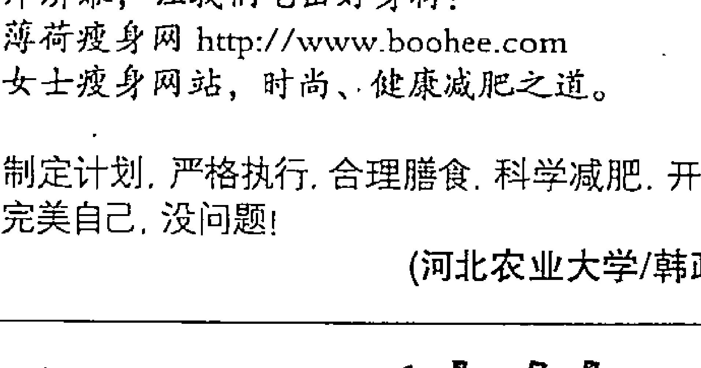

现在越来越多的文件是PDF格式，刚到公司实习的小郭接到一个任务，帮老板把一堆PDF文件资料全转成Word格式，不能让老板等太久，真是让人头大！他知道Word 2010可以把Word文档方便地另存为PDF格式，但是逆过程就麻烦了……幸好他最后找到了Solid Converter PDF，把自己很快解放了出来。
首先下载Solid Converter PDF（地址：http://www.onlinedown.net/soft/37438.htm），安装后启动软件，把要转的PDF文件拖进软件窗口中，点击“档案一转换成Word”按钮，转换完毕就会自动弹出提示，好了，PDF文件很快变成了Word文档资料！字体可能略有差别，但是段落格式都基本保持了原汁原味。
（dna1982a）## Excel复式记账 小编“负翁”变身“月光族”

CFan编辑部里的刷卡达人是谁？不就是……（咳咳，那位同学说要保护隐私）。好吧，这里就用小A来代替。小A是个时尚青年，穿着讲究个性与品位，是个美食大王，而且喜欢追逐最in的IT产品。刷卡时那叫一个潇洒，只是还不完的信用卡账单让他有点小郁闷。学会计的好哥们龙哥给他支了一招：“我给你一个Excel模板（下载地址：http://work.newhua.com/cfan/201013/comb.zip），借鉴企业复式账目的特点，保你轻松理财，每个月存下不少钱！”“真有这么神吗？”（尊重小A的意见，本文部分数据有修改，大家关注方法就好）

#### 小知识：

复式记账法，在企业中指以资产与权益平衡关系作为记账基础，对于每一项经济业务都要在两个或两个以上的账户中相互联系进行登记，系统地反映资金运动变化结果的一种记账方法。它可以了解每一项经济业务的来龙去脉，全面了解经济活动的过程和结果。在个人生活的记账中，就是用几张工作表进行相关联的记录、汇总等，让每笔钱的流向都非常清晰，对个人理财大有帮助。

#### 聪明理财表 项目有说道

编辑小A打开龙哥给他的“个人理财档案”模板文档，这个Excel工作簿里包含3种表格——分月明细表、财务状况汇总表、耐用品折旧表。

- 1. 分月明细表 (见图1)
“每月有一张分月明细表，有5列，你先根据内容提示，往里面填收支情况。”

- 2. 财务状况汇总表 (见图2)
“再看看第二张。”龙哥告诉小A，“财务状况汇总表是对你财务状况的总览，以后你每个月填的分月明细表，都会到财务状况汇总表来集合。”

小A发现，分月明细表中自己的零散记录（吃饭、看病、还信用卡、水电费等），到了财务状况汇总表中，被分成了几类——收支类（包括收入、支出、损益）和资产负债类（包括资产、负债、信用卡）。为什么会智能归类呢？龙哥说出了其中的奥秘，分月明细表中的C列是“科目”，已经分了这几类，到财务状况汇总表中，根据“科目”归类一下就行。实现起来很简单，比如C3单元格（1月的工资），公式为=SUMIF("1月明细表!C:C",A3,"1月明细表!D:D")，表示把“1月明细表”中的C列等于“工资”的D列求和。其他科目的公式也类似。

- 3. 耐用品折旧表
这个表格是耐用品（笔记本等）的汇总，并且采用一定的折旧方法把购买价格分摊到后面的每个月。

| 日期       | 摘要                       | 科目 | 金额 | 备注                                                 |
|------------|----------------------------|------|------|------------------------------------------------------|
| 2010/01/01 | 早餐                       | 现金 | -4   |                                                      |
| 2010/01/01 | 晚餐                       | 现金 | -10  |                                                      |
| 2010/01/02 | 上街买新衣服和卫生纸       | 现金 | -112 | 衣服：作为耐用品，以后逐月折旧<br>卫生纸：直接计入当月其他支出 |
| 2010/02/03 | 取款                       | 存款 | 200  |                                                      |
| ...        | ...                        | ...  | ...  | ...                                                  |

#### 小提示：会计专业名词让个人理财更轻松

- (1) 收入（负数）：包括工资、奖金和其他收入。
- (2) 支出（正数）：对于一次性消费，直接归入到当月，类似于企业中的费用化支出。对于大金额的耐用品（例如电脑、家电等），逐月归入支出中的“耐用品折旧”科目，类似于企业中的固定资产折旧摊销。
- (3) 损益（正数/负数）：最典型的损益是证券投资的盈利和亏损，由于事先不能确定是收入还是支出，单独归为“损益”类，盈利为负数，损失为正数。
- (4) 资产（正数）：自己占用的全部物质财富，可以根据需要细分为多个科目。
- (5) 负债（负数）：自己有待支付的全部账款，可以根据需要细分为多个科目。
- (6) 信用卡（正数/负数）：有存款为正数，已透支为负数，如果有多张信用卡，可以把每张信用卡设置为一个科目。

收入、支出、损益的总和就是自己在一定时期内的净收支，类似于企业的利润；资产、负债、信用卡的总和就是净资产，表示自己在某个时点拥有的财富的多少。当月净收支 = 月末净资产 - 月初净资产。

#### 复式记账 深度体验

小A痛下决心，一定要坚持记账！经过一段时间的坚持，还有龙哥的帮助，他渐渐摸透了这个理财表的用法，其实很简单哟！

#### 1. 建立表格与初始化盘点

在刚开始建立理财表的时候，需要对自己当前拥有的全部资产和负债做一个初始化盘点工作，填入表格。小A经过盘点统计，把自己目前的资产负债状况填入了“财务状况汇总表”的B列中，发现财务状况堪忧，信用卡欠款3000元，手头上又没有多少现金和存款……

#### 2. 日常记录

每天对当天发生的财务收支进行记录，既包括收入和支出，也包括不同资产之间的转换，例如：取款（存款转化为现金）、购买耐用品（现金转化为耐用品）等。对于经常发生的支出，例如饮食，可以把一天中的三餐合并到一起计算，以简化操作。

小A大手大脚的毛病暂时没改过来，买衣服、K歌……钱是照花不误，发完工资之后，赶紧把信用卡欠的3000元钱还了，否则就要收高额利息了。还钱之后，存款又所剩无几。一次逛街的时候，小A看到一款心仪已久的手机，可是囊中羞涩啊，怎么办呢？想起自己还有信用卡，一咬牙，买了下来。

#### 3. 月底结账和总结

月底要做一些结账和对账的工作。有些收支是连续性的，需要在月底统一记账，例如耐用品折旧、投资损益等。记完之后，要检查一下自己记录的各项资产和实际资产是否一致，如果发现不一致，就查找原因，看是否有漏记，如果找不到原因或者差异较小，可以计入“其他损益”，最后要确保实际金额与账面金额一致，校验单元格为0。

小A经过结账和对账之后，审视了一下自己月底的资产状况，发现尽管耐用品增加了，但是流动资金（包括现金、存款等）依然短缺，信用卡上依然是“债台高筑”，糟糕的财务状况尽收眼底。C19虽然有2269元月结余，但是原来B30就有3000元信用卡账目，这个月又刷卡花了2000元买手机，没计划，反省！

| 收支状况     | 年初  | 1月    |
|--------------|-------|--------|
| 收入         |       |        |
| 工资         | 5000  | 5000   |
| 奖金         |       | 500    |
| 其他收入     |       |        |
| 支出         |       |        |
| 饮食         | 114   | 200    |
| 交通         | 2     | 50     |
| 通讯         |       | 60     |
| 医疗         | 100   | 100    |
| 耐用品折旧   | 355   | 355    |
| 其他支出     | 10    | 100    |
| 损益         |       |        |
| 现金损益     |       |        |
| 投资损益     |       |        |
| 其他损益     |       | (2,269)|
| 收支总额     |       | (2,269)|
| 资产状况     |       |        |
| 资产         |       |        |
| 现金         | 200   | 24     |
| 存款         | 500   | 200    |
| 证券         |       | 200    |
| 应收账款     | 200   | 200    |
| 耐用品       | 5,000 | 6,745  |
| 负债         |       |        |
| 应付账款     | (400) | (400)  |
| 信用卡       | (3,000)| (2,000)|
| 净资产总额   | 2,500 | 4,769  |
| 校验         | 0     | 0      |

#### 4. 理财优化

后来，小A经常检查自己的财务状况，看看自己的流动资金和负债的比例是否在合理范围，哪些方面支出太多需要控制等等。几个月后，小A的财务状况有了明显的改观：“信用卡还清了，总资产稳步上升！”他心里踏实多了，甚至开始考虑投资理财，通过把存款转化为证券，优化自己的资产结构，达到长期保值增值的目的。“行啊，负翁到月光族，再到理财专家，哥们你得请客啊！”小A笑道：“要不我把这张卡刷爆了请你一顿大的？”

## 寻寻觅觅 昔日同窗在何方？

放假了，想起找老同学聚聚……中学、小学，甚至幼儿园同窗，你们还好吗？真想重温昔日单纯的美好，可怎样找到你们呢？

#### 秘招1：找个人网页

同学的名字一定记得，那么就首选人人网、开心网、新浪博客等地寻找。在人人网 (http://www.renren.com) 中，单击“搜索→查找你的同学”，可以检索不同时期的同学，单击“高级搜索”可以进行更为精细的搜索，找好友的好友，说不定能牵出一串老同学呢！

#### 秘招2：校友录大搜罗

搜狐校友录 (http://alumni.chinaren.com) 登录后可以搜索学校、班级或同学姓名，并且可以根据时间、地区进行精确检索，还有中国同学录 (http://www.5460.net)、网易同学录 (http://alumni.163.com)、QQ校友 (http://school.qq.com) 等也许会有老同学的蛛丝马迹。

#### 秘招3：发布有偿“通缉令”

到威客类网站 (http://www.witkeyskey.com、http://www.zcwok.cn等) 提供同学信息，发布有偿任务，请其他人帮忙寻找。“人肉搜索”很强大！

#### 秘招4：“一点”突破法

## 用游戏规划你30岁前的人生吧！

毕业后，我们的未来会怎么样？这是不少大学生好奇的问题。这个有趣的免费单机游戏——《毕业生之黄金岁月》（下载地址：http://www.lanlang.com/game），可以让你自己操纵毕业后的8年时光，提前预知人生。

- 第一步：下载解压软件，双击其中的“毕业生之黄金岁月”打开软件，单击“开始游戏”即可进入游戏，无需安装。单击“同意”后选择自己的“性别”。此时就进入了人生的第一个重要选择：找工作、自己创业、考研、考公务员、出国。这里先选择“找工作”，接下来选择性格背景等资料，不同的选择会给不同方面增加经验数值。

- 第二步：进入“每月计划安排”后，我们可以根据设想进行选择，延长工作时间可多获得工资；对于空闲时间进行支配，可以学习、休息、游玩等等，不同的选择会改变健康、金钱、能力、快乐等数值。另外可以去股票中心买股票，到人才市场应聘其他工作，甚至到彩票中心去碰运气。

- 第三步：每个月的空闲时间分配结束后，可以在右侧的“基本状态”中看到各项数值。一定要注意均衡，单击“下个月”再进行安排。上个月健康值太差就要多参加体育健身运动，快乐值可以参加逛街购物等，以免英年早逝哦。这样完成96个月的安排，还会出现不少偶发事件，让我们抉择。进入“游戏→保存”将当前游戏进度保存起来，再次打开后选择“游戏→读档”便可以后接着玩。游戏结束后，软件会对你8年的工作进行评价。

30岁的你，即将达到什么成就？希望在游戏中，你会懂得如何更好地安排时间，如何更智慧地度过自己的黄金岁月。

- 网络大补贴：
1. 模拟人生小游戏集合：http://games.sina.com.cn/littlegame/zt/thelittlesims
2. 模拟人生2：大学生活：http://youxi.zol.com.cn/pc/index3789.html
3. 校园小游戏集合：http://yx007.com/Dress/campus

（江苏/洋小★季慧燕）

## 为革命保护视力

蹲坐在电脑前看了一个通宵韩剧的A姐，正想洗脸补个觉，突然发现眼前一片朦胧，穿鞋踩在了插线板上，抓洗面奶却拿起了牙膏，眼睛干涩酸胀，这是怎么了？

“眼干眼涩眼疲劳，快用XX滴眼液！……”除了眼药水，我们还有什么好的办法？让我们来听听北京中医药大学林殷老师和薛卫国老师是怎么说。（T: 同学 L：林殷教授 X：薛卫国教授）

#### 电脑眼病不可怕

T：“电脑眼病”是怎么引起的？

L：这是由于我们平时全神贯注看电脑屏幕时，眨眼次数减少，眼泪分泌也相应减少，长时间的屏幕光线和辐射的刺激，同时加上眼周的肌肉紧张而引起的。它能引起眼干、眼涩、眼酸胀，视物模糊甚至视力下降。中医经典《素问》有云：“久视伤血”。

T：长期下去又没有有效的缓解，会导致怎样的后果呢？

X：使用电脑时间越长，视力伤害越严重。原先使用者只是感到眼睛疲劳、视线模糊、眼干燥，如果不注意缓解症状会发展成眼球充血、畏光、酸胀、眼压升高、头痛甚至丧失眼睛的聚光能力。严重时还可以出现恶心、呕吐等。

T：什么是保护眼睛最好的方法？

L：饮食和保健对于眼睛保护都有一定的作用，但最保护眼睛最有效的方法还是注意用眼与休息，合理用眼。

#### 按摩+锻炼+食疗高招

电脑族如何拥有健康的眼睛呢？来看看教授给大家总结出来的小秘籍吧。

- 1. 眼保健操：陪伴了我们几代人的眼保健操是一套很有效中医眼部保健法，相信那四节操一定让你熟悉不过，一揉天应穴、二挤按睛明穴、三按揉四白穴、四轮刮眼眶。OK，伴着“为革命保护视力……”的伴奏让我们重温一下眼保健操吧，GO!

- 2. 补充眼部气血：闭目，顺逆时针交替运转眼球，恢复眼部气血。动作规范：保持正视体位，眼睛微睁，眼球缓慢做顺时针旋转，令视野可以看到周围的最大范围，转三圈后眼球回归正视位再做逆时针旋转，方式同顺时针旋转，反复3到5次。

- 3. 食疗：每次将5g菊花和10g枸杞置于杯中，菊花，清肝明目，疏风散热；枸杞，滋补肝肾，阴精明目。用热水冲泡，频频饮之，就可以起到缓解眼疲劳的效果。

（北京中医药大学/李嘉健 张龙剑锋 邵一轩）

## 同学生日送温暖 Excel显神通

生活委员小华负责管理系里各班级同学的联谊工作，比如组织同月生日的同学去喝茶、烧烤或者K歌。而且在寿星们生日的那周还得及时派发蛋糕券。现在来看看小华是如何高效准确地完成工作的吧（本文以Excel 2007版本为例，Excel 2010中操作类似）。本文样表下载地址http://work.newhua.com/cfan/201014/shengri.zip。

#### 本周生日的同学一次搞定

为了给本周过生日的同学发放蛋糕券，可以新增一列，用于存放相应同学今年的生日（见图2）。首先使用函数“=DATE(TEXT(TODAY(),"yyyy"),TEXT(B3,"mm"),TEXT(B3,"dd"))”把第一个人的生日转换到今年的生日上来（见图2中1处），然后移动光标到图中2处，变在小黑十字光标时双击，就可以填充到每一行。这个公式它还有一定的智能效果，比如闰年2月29号，在非闰年的年份，会自动转换成3月1号的，不会让那些2月29号出生的人真的4年才过一次生日。这样要找出本周过生日的就很简单了，和过滤同一个月份生日的同学相类似，只要在“本年生日”列进行“日期筛选”，选择“本周”即可（见图3），要想查看下周、上周也很方便。

#### 同一月份生日的同学轻松查找

存档到Excel文档中的花名册，为了便于管理，是按班级进行分类存放的。因此查看本月过生日的同学很重要。在Excel 2007中点“数据”下面的“筛选”功能，再选择“日期筛选”中“期间的所有日期”后指定需要的月份就可以了（见图1）。

#### 指定几个月生日一起提取

到了寒暑假附近，就会把两个月或者更多月份生日的同学聚集起来搞一次户外活动，这时就会要求同时过滤多个月份生日的同学。这个也不难，小华只要把同学生日的月份提取出来就可以了，在“生日月份”的列上利用函数Text和Int定制公式“=INT(TEXT(B3,"mm"))”（见图4），和“本年生日”一样填充到底，再利用筛选功能（见图4中2处）“数字筛选”中的“自定义筛选”，设定符合的条件就非常方便了。

（浙江/徐怀平）

## 一起参加暑期社会实践去

这个暑假，你是如何度过的？睡懒觉？玩网游？煲电话粥？学校布置了暑期社会实践任务，不少人估计在琢磨：不知道怎么开展才好，随便糊弄一下把这部分素质学分混到就行了。这可太没劲了吧！咱们有理想有抱负的新青年，当然要想办法让活动出彩，好好锻炼自己，然后弄个高级的总结，说不定还能被评为先进哦！今后的简历上就就多了一笔亮色！还等什么，带上IT助手，出发！

#### 策划申报，Word 方案脱颖而出

第一步是社会实践内容的申报环节，最普遍的形式就是用Word提交方案。一般来说，学校会给出方案的结构和基本要求。如何让自己的方案在众多项目中脱颖而出呢？在 Word 2010里面，有很多新增的超美艺术哦！选中需要突出的文字，单击功能区的“开始”选项卡，在“字体”组中单击“文字效果”，选择一个好看的样式吧！

- 1. 群体博客很热闹
你是否想过为自己的社会实践活动开个博客呢？或者以小组、班级为单位设立集体博客，每个同学都可以晒出活动进展和收获。观众多了，做起活动来更有劲头！在Word 2010中进行图文混排、表格等操作，直接粘贴到博客中，一般都能保留原有格式，省略了网页格式设置的不便。

网络大补贴：
浙江高校联盟 http://tinyurl.com/2vddqk3
杭州电子科技大学机械工程学院暑期社会实践博客 http://blog.sina.com.cn/jxshijian
厦门大学化工系暑期社会实践日志 http://xmushuqishijian.blog.163.com

- 2. 网络直播攒人气
参加社会实践活动的地方，网络状况往往不太通畅，怎样及时把活动分享呢？很简单，通过QQ空间、人人阵地，在日志和相册里让大家在第一时间分享吧！

不少大学生用的是S60手机，使用手机QQ很方便。打开QQ空间页，单击左键，进入“我的日志”，在“插入图片”选择“拍照插入”方式就OK了。

人人网同样有上传照片的快捷工具，更精彩的是人人小拍支持连拍，能抓住精彩的瞬间。一键批量上传，让活动直播更加精彩简单。

“直播贴”的形式用于活动报道，吸引眼球的数目也是蹭蹭的上涨！比如，在直播贴的一楼，重点展现方案的形成过程、详细的方案内容，在下面的楼层里，每隔一定时间，放出一部分活动现场的照片作为跟帖，不时来点爆料，一定人气满满哟！

#### PPT 总结，汇报会上放光彩

除了提交Word格式的总结，不少学校会在开学组织PPT汇报评比，让同学们现场分享实践心得。让PPT 2010来出彩吧！

- 1. 摸出几个好模板
在百度首页盲目搜索效率不高，关键词“社会实践”有效结果不多，而输入“社会实践 PPT”，就有不少现成的参考PPT可下载了。或者直接在百度文库频道(http://wenku.baidu.com)选择PPT后搜索，有不少成品零积分就可下载(此法搜索Word格式的社会实践活动简报等也很方便)。不同的PPT模板是不同的，把PPT1中的2个页面复制到PPT2中时，自动变成和PPT2一样的模板了。如何让其保留原貌呢？其实很简单，在粘贴选项中，选择最左边的“保留源格式”即可。

- 2. PPT自带样本模板是个宝
除了“拿来主义”，PPT 2010本身就带了不少很棒的模板，藏在“新建→样本模板”中，相比常规模板，有图文布局、转场、特效等内容，更加完整有借鉴作用。

- 3. 项目符号有门道
标题后的目录能清楚地交代社会实践总结的整体架构，让听众和评委老师对演讲内容有更整体的把握。

我们可以通过项目符号来创建独特的目录，选择具有指示作用的项目符号指示出目录的每个内容。选中要制作的目录，单击鼠标右键，选择“项目符号”，在弹出的快捷菜单中选择需要的项目符号即可。在项目符号对话框的“项目符号和编号”，可以选择更多的样式，还可以导入电脑中自己实践过程中有纪念意义的图片或小图标。此外，SmarArt的流程图可是一个不错的东西，可以创建富有层次感的目录，表示项目目时间进度等逻辑关系。PPT 2010可以将以前静态的流程图做成动态的动画，当一项项的活动内容飞进我们的PPT里面的时候，我们的活动阶段流程就一目了然了。

- 4. 重点文字巧突出
从Word总结大段地复制内容到PPT中，效果一定让人反感。所以，要精简文字，提炼要点，通过加大字号、变色、加粗、反衬、改字体、加下划线、斜体、阴影、动画等方式对重点内容进行强调处理，多种设置组合强调效果更佳。

- 5. 图片处理是关键
社会实践活动会拍摄不少图片，如何美观滴呈现呢？摆放位置、多图对齐、图案效果、裁剪都要考虑。“图片工具”可以设计边框、版式、阴影等各种美观的效果。

图片主题不突出？没关系，将不需要的部分截掉，在PPT 2010中很容易实现。

选中图片，选择“图片工具”，单击“裁剪”按钮，在弹出的下拉列表中选择自己所需裁剪的部位，并进行相应的设置。如果设置不当，我们可以回到图片的原始状态重新裁剪。裁剪的图片还能设置成特殊形状，在“图片格式”选项下的“裁剪”按钮中选择“裁剪为形状”就OK了。比如来个放射的星形，绝对有震撼力。

几张活动的图不好对齐？没关系，进入“视图”选项卡，勾选“网格线”、“参考线”等，页面中会出现参考线，便于图片等元素的对齐。

#### 小提示：一份完整的社会实践报告包括哪些内容？

- 1. 报告题目：把实践活动的内容、特点概括出来，一般不宜超过 20 个字。开门见山地告诉别人你去了哪里，做了什么。封面上要注明来自哪个学院和团队，在封面的左下角可以添加学校的校徽和校训作为装饰。
- 2. 摘要：反映主要内容，概括基本观点、实践方法、取得的成果和结论等。
- 3. 正文：包括介绍实践活动的目的、背景、时间、地点、人员、调查手段、结论的详细叙述。
- 4. 结束语：收获和感悟，也可以包括实践过程中发现的问题，并提出相应的解决办法。
- 5. 附件：里面添加活动的照片、视频等多媒体资料、活动单位的证明、论坛活动帖的截图、博客宣传的备份，感谢信等所有材料。

看到大家赞许的目光了吗？听到热烈的掌声了吗？有了这么工具来帮忙，社会实践达人，应该就是杂志志你的了吧？

(沈阳工业大学/程冉)

## 世博会Robots & LED

上海世博会(world expo)正热火朝天地迎接八方来客，不知你与高科技(high-technology)亲密接触了吗？1904年圣路易斯世博会标志人类进入通信新时代，工厂流水线(production line)在1933年的芝加哥世博会上首次亮相，磁悬浮列车的处女秀在1986年温哥华世博会，1962年西雅图世博会标志太空时代的到来，2005年日本爱知世博会是机器人时代的开端……

#### 日本机器人

这次日本馆又展出了6款帮助人类生活的机器人，包括仿人机器人HRP-2、界面机器人ApriPoco和搬运机器人等。这些由USB摄像头、麦克风、红外线遥控器和各种传感器精密组合而成，ApriPoco能识别语音指令的小家伙，真的很可爱哦！

IT词汇补贴

界面——interface，虽然不太清楚为什么ApriPoco叫做“界面机器人”，但你我都知道电脑界面(computer interface)和手机界面(cell-phone interface)的意思吧。

USB摄像头——USB camera，其中USB是Universal Serial BUS (通用串行总线)的缩写，camera当然就是“摄像头”了，照相机、摄像机都可以用camera表示，实在要区分时，就用video camera来指摄像机。

红外线遥控器——remote controller with infrared ray，remote controller是“遥控器”，infrared ray才是“红外线”。

传感器——sensor或者transducer，单说“传感器”用sensor比较多，词组里一般就用transducer了，比如语音传感器是sound transducer，亮度传感器是luminance transducer。

#### 中国 LED 技术

北京奥运会后，中国的LED技术一直在不断精进。这次上海世博会上，LED的应用率更是达到了70%。比如世博中心外立面泛光照明系统中，LED灯具采用隐藏式结构，仿佛“见光不见灯”；系统中的LED白光色温和亮度可连续调节，能根据场合营造出不同的光色环境。

IT词汇补贴

- LED——Light Emitting Diode，发光二极管，一种能够将电能转化为可见光的固态半导体(semiconductor)器件；其次，LED = Large Electronic Display，指大型电子展示。
- LCD——液晶显示器，是Liquid Crystal Display的简称。Liquid和Crystal分别是“液体”和“水晶”的意思，加在一起就是“液晶”。
- CRT——使用阴极射线管(Cathode Ray Tube)的显示器，最早的显示器，主要由电子枪(Electron Gun)、偏转线圈(Deflection coils)、荫罩(Shadow mask)、荧光粉层(Phosphor)和玻璃外壳组成。
- 色温、亮度——color temperature和brightness，找不到PS汉化版的朋友们注意咯，另外render (渲染)、layer (图层)和masks (蒙板)等也是PS的常用词。

(天津/江城薇薇)# 老师 您还在为试卷而忙碌吗？

备课、上课、考试三部曲构成了园丁们最简单的生活，而考试无疑是评价学生学习效果最直接的方法。但提起一份试卷的出炉，老师们无不为之头痛，而课后的阅卷更是辛苦。今天我们就要将老师们从繁琐的试卷相关工作中解脱出来！

# QuizCreator 是何方神仙？

顾名思义，QuizCreator（以下简称QC）就是“试卷生成器”（下载地址：http://www.onlinedown.net/soft/73441.htm）。它的能耐有多大？二选一试题不在话下，多选题手到擒来，填空题小菜一碟，匹配连线那是咱的强项，排序题、涂色题同样厉害！

# 多媒体试题编写强

运行QC，在Quiz（测验）下选择True/False（真/假）完成二选一试题的输入。双击其图标，在Enter the question（输入问题）栏输入题目：比如输入18*3=（ ），在Enter the choices（选项栏）栏中给出备选答案，A的后边输入54，表明A答案正确，接下来完成另一个错误答案的输入，单击下一步。能不能给该题所占分数呀？单击Properties（试题属性），在Points（分值）后输入5，表示5分值，在Difficulty（难度）后选择Easy，表示这是一道比较容易的试题。Format（格式）栏轻松设置试题的格式，即字体、字号等。在Multiple Response（多项选择题）中用同样方法完成试题编写。重点说说匹配题，即Matching（匹配题）中输入问题后，在Choice（选项栏）分别输入要匹配的问题，旁边的Match（匹配项目）中输入被匹配的答案，点击OK。来到Sequence（排序题），只要按照序号从上至下输入排列对象即可。最后在Short Essay（作文题）中完成小论文的写作，在Enter the reference essay（参考范文）栏中可以输入参考范文。不觉已来到Click Map（涂色题），引入图像，在所给位置完成图形的设置。哈哈！选择Preview（预览）随时观赏你的多媒体试卷。

# 试卷输出很轻松

选择Publish（发布），如果要在本地计算机上考试，选择Publish On My Computer（本地考试），在Publish for（试卷输出类型）中选择输出EXE或Web、Microsoft office格式。如选择Publish on QMS（网络考试），则要注册一个账号，用该账号登陆QMS后，输入试卷的存放网址，比如www1.quiz-creator.com，以后可随时在互联网上考试。提醒大家的是非付费用户在线保存试卷的时间是30天。QC的强大之处很多，你还有什么更好的创意，欢迎与我交流！（甘肃庆阳市财政学校/段晓东）

# 国外大学生暑假都在忙什么？

**全方位体验信息化社会** 徐子坤（西安交通大学在校生） 出国标签：美国 迈阿密大学 本科交流学生 在美国，我感触最深的是文化方面的撞击。比如教我的美国历史老师不用课本，而是用自己的讲义和PPT，非常有个性。校园里无线网络随处都能覆盖，网速很快，所以在草地上有很多抱着本本上网，拿着touch看youtube的学生，非常惬意！老师布置作业、收作业、评分、复习资料发放、考试通知等，基本都通过网络进行。每个学生一个ID号，登录学校的学生自助管理系统。中国的交换学生因为努力，成绩总是名列前茅，让国外的同学刮目相看。假日里，我有时去购物，美国不少数码产品比中国便宜。同学们用iPhone、黑莓等手机较多，苹果本本非常流行。到沃尔玛超市买东西，见不到收银员别奇怪，自己把商品扫描缴费，全凭自觉。这里的pos机普及率特别高，身上只要有卡，带上100美元，一个月都花不完，这种自助式的“信息化生活”，还挺有趣的！

**淘超低价机票快乐出游** 周璐（同济大学毕业生） 出国标签：德国 欧洲商学院 工商管理专业 硕士研究生 作为交换生在德国，放假对于我来说是另一种忙碌的开始。有两件很重要的事情，一是选课，二是旅行。德国的选课是通过网上实现的，选课之前要做好功课，以便能做出适合自己的课程选择。但更需要做好功课的就是旅行。从即将放假开始，我就随时上网关注航空公司的网站，时时刷新航班信息，以便能淘到廉价机票。我从法兰克福到意大利罗马的机票，网站上报价是0.01欧，加上税也就10欧左右，当时相当于用人民币100元就可以搭乘飞机出德国旅行，多么划算！不过要付出的代价就是，必须过十分钟刷新一次，看中目标就赶紧出手，这样订购的机票一般都会比出发的日期早很多，必须做好时间上的规划和安排。当然了，每次出行，都会觉得在此之前做的一切努力都是值得的。在德国的穷游生活，让我感受到“读万卷书、行万里路”的人生真谛。

**中国文化吸引国外大学生** 董昱（北京联合大学毕业生） 出国标签：美国 克利夫兰州立大学 教育科技专业 硕士研究生 美国大学的暑假很长，不少大学生利用暑假修课以提早毕业，几乎不休息。但大多数人选择休息，或者劳逸结合。美国大学学费昂贵（特别是私立大学），而且家长不像中国这样，给学费又给生活费，所以很多大学生选择暑假打工。计算机相关的工作最受欢迎，例如网页制作、平面设计、电脑硬件检修等等。个人认为大家常看CFan，学得一技之长，在美国打个小工绰绰有余！此外不少同学会到社区做义工，帮助老人、参加慈善活动等。最近我们学校一批爱好中国文化的大学生来到中国的首都经济贸易大学，在北京游览名胜、学习中文课程，在公司里实习，度过了一个充实的暑假。

问学者 滑铁卢大学的计算机专业实力很强，所以学生有非常不错的机会到微软、Google等公司实习。我到学校不久，比尔·盖茨还到学校来演讲交流。为了解决经济问题，有部分同学会去打工，收入不错，而且一日三餐都解决了。我因为有国家奖学金，所以选择了到更多的地方感受不一样的世界。加拿大火车较少，航空运输业很发达，两三百元就能往返，很便宜哟。青年旅社十几加元一晚，很经济。这边的景点不像中国游客那么密集，感觉更加天然。7月1日国庆节、9月的感恩节都挺热闹的，当地的同学把火鸡刷上酱汁，放进烤箱烘烤，美味极了！

**名企实习 + 自由行两相宜** 龙翀（清华大学毕业生） 出国标签：加拿大 滑铁卢大学 访问学者

**到最美的地方 “公费旅游”** 唐舜（南京大学、中科院研究生院毕业生） 出国标签：法国巴黎第十一大学 数学专业 博士研究生 法国的学制与中国的相差不多，每年六月底学校里的课程就陆陆续续结束了，七八月份就是暑假，是一年中休闲度假的黄金时间。法国的学术界有一个约定俗成的规矩，八月份的时间自由支配，彻底放松，度假之时，非诚勿扰！我们系里就有好些教授八月份的时候踪影全无，电子邮件一概不回，到深山老林里钓小鱼、挖野菜去了；而七月份则是预留给学术交流的，各式各样的暑期学校和学术会议数量众多，异彩纷呈，通常都会安排在风景秀丽、气候宜人的旅游胜地举行，像瑞士的雪山湖泊啦，法国尼斯的蓝色海岸啦等等。我现在正在参加巴塞罗那大学举办的一个学术会议。到达巴塞罗那的当天正好是世界杯的决赛日，决赛过后我们走到大街上与庆祝人群一起尽情狂欢，亲身感受到了西班牙人民的热情与奔放！

# 大学志愿者带你游世博

果果：这位本刊热心读者今年暑假的主要任务就是做世博会的“蓝精灵”城市志愿者。在这个学生旅游黄金季，带上姚导的独家秘笈，向世博出发吧！

# 省钱省心学生“套餐”

买票：自然是享受100元的当日学生优惠票，要是能够组上超过15人的团，每人只需80元。预约：世博排队难，所以一定要利用预约！有全预约（凭预约券入场）、半预约（预约券或排队入场），以及园区的预约机外，部分场馆还有网上预约、短信预约和东西联动等。这些都需要在出发前就准备好，做好功课！住宿：园区附近的住宿特别贵，稍远些的地铁周边住宿便宜一些。上海的高校区离场馆较远，除非投奔老同学，否则不建议住宿。如果想参观名校，上海交大和复旦、同济大学是两个方向，时间紧的话可选择一个方向坐地铁前往。入园：建议中午或下午入园，避开团体入园高峰，一直参观到晚上（多数展馆在22点后禁止入馆）。17点后可买90元的夜票入园。报团最大优点是看中国国家馆会顺利很多，而看其他场馆团体和个人几乎机会均等。

# 最值得大学生看的场馆

A片区中，素有“东方之冠”的中国国家馆带领我们在“寻觅”中感悟城市发展中的中华智慧。百米墙面上惊现清明上河图。附近的香港馆、澳门馆、宝岛台湾馆都很好看。喜欢日本的文化、动漫、科技的同学还可以在浦西D片区参观日本产业馆，人气也很高。哈韩的同学不能忘记韩国馆，“屋顶种满树的”沙特阿拉伯馆不错。向西走是世博轴，商业服务、餐饮的聚集地。这里各地特色美食价格偏高，建议同学们自带干粮。再向西便来到了B片区，值得一观的有世界气象馆和澳大利亚馆。继续向西走，C片区是人流最大的一块。酷似冰壶的就是芬兰馆，喜欢诺基亚手机的同学可留步。旁边的丹麦馆里小美人鱼让人仿佛置身于安徒生的童话王国……（上海/姚晨龙）

# 我这样进入瑞星互联网攻防实验室

果果：“走进IT名企”系列很过瘾吧？联想、腾讯、搜狐、傲游……这些让人羡慕的大公司，其实招聘过程也并不神秘。大家在敲开IT名企大门时，也该自信满满才对！今天我们和杀毒软件企业——瑞星来个亲密接触，而且探秘的是人才需求量最大的研发部。

# 千万职位里我追寻着你

和很多人一样，我也是到门户网站去搜索招聘信息。看到瑞星招人，我登录瑞星官网，挑选感兴趣的职位，投递了精心准备的简历。我的专业是软件工程，从事网络安全、病毒分析已经有两三年的时间，因为感兴趣，大学里就开始自己做一些相关的分析和程序。后来幸运地应聘成功“网络安全信息研究员”职位，我认为第一是年轻，学习新东西的能力强；第二就是对于网络安全、加密脱壳熟练，对于应聘岗位比较熟悉，上手快。

> Q：脱壳等知识是自学的吗？学校的课程有哪些帮助？
A：在校期间学习的编程、Windows原理、汇编等都是基础，掌握熟练了才能通过不断实践自学更多东西，比如脱壳加密、反编译、漏洞发掘等这些实际工作中用到的知识。而且这些内容不断推陈出新，还要跟着公司的前辈们不断学习深造。

# 夯实基础不轻言放弃

大家一定对我的应聘过程很好奇，下面来说说我经历的三关——人力资源面试、研发部上机测试、部门经理面试。
在发出简历一周左右，我接到人力资源电话，面试主要是个人经历、兴趣爱好和一些简单的技术问题，估计是看看人品。
一周后进行了研发部上机测试，题量很大，时间紧。第一部分是算法题，一共5道题，当场编出程序，还好题目比较基础，但在1小时内完成要求很熟练；第二部分是反病毒题目，脱壳的实际操作，这是一个不太常见的壳，我费了很大劲，最终还是成功了，但考官不太满意，认为方法不对，而且时间太长。
上机测试后大约过了一个月，我差点以为没希望了，后来接到电话，由部门经理直接面试，问了些业务相关的技术问题。一切OK！
技术可以不门门精通，但要有一技之长，面试过程中一定要诚实，会就是会，不会就是不会，多多证明自己的优势就可以。

> Q：为什么过了一个月才获得录取通知？
A：当时一起考试的有20人左右，考官要根据成绩综合评定，最终按部门需求仔细考虑吧。其实很多大公司都有HR方面的人才储备，HR方面有很多流程，一个月能确定工作已经很不错了。
(北京理工大学/赵歆)

# 油耗计算其实很简单

家里买车啦！老爸对爱车的油耗非常关心，但是到底用了多少油，似乎很难统计。放假在家的小明除了学车外，还用电子表格做了一个油耗计算表（下载地址http://work.newhua.com/cfan/201015/yhjs.zip），并教老爸学会了使用哦！

在这个表中，列的名称有序号、日期、里程表数、里程数、加油量、单价、金额、百公里油耗、每公里价等。
数据第一行为初始数据，可从某次加油时的数据填入，里程数、百公里油耗、每公里价三栏就不填了。输入第二行注意：金额即加油量乘单价，G3=ROUND(E3*F3,0)，这里用ROUND函数取整数。
里程数即本次加油里程表数减去上次里程表数，D3=C3-C2，百公里油耗等于加油量除以里程数再乘100，H3=ROUND((E3/D3*100),2)，取2位小数。每公里价即本次金额除以本次里程数，I3=ROUND((G3/D3),2)，取2位小数，即计算到分。以下行按此类推，可用单元格子刷设定。累计栏用自动求和就行。

“够简单吧？老爸，我再送你一个软件工具——油耗计算工具绿色版（下载地址http://www.newhua.com/soft/105870.htm），简单明了，绿色不用安装，可以精确计算出油耗，数据结果可以导出、打印。”

“老爸，还有呢，你的N73手机上也可以计算油耗——HelloWorld汽车油耗计算器Oil版（通用版JAR，下载地址http://work.newhua.com/cfan/201015/oil.zip）安装后就可用了，是免费的，哪个工具好用你就自己选择吧。”

## 小提示：

iPhone一族用什么油耗计算工具好呢？有一款软件名叫road trip（下载地址 http://work.newhua.com/cfan/201015/roadtrip.zip），详细使用方法详见 http://tinyurl.com/29xovn9。
(浙江/王法根)

# 手机QQ空间不再是“鸡肋”

E时代的我们早已经是“机”不离身了，相信对于很多使用智能手机的同学们来说，手机QQ那是必装的软件之一。然而用它浏览好友空间的效果实在是不敢恭维，灰白的WAP界面加上形同虚设的相册功能，让人感觉非常“鸡肋”。近日，腾讯终于发布了手机QQ空间S60 V3版的客户端软件（下载地址：http://tinyurl.com/327rkhm），为了体验一下它的强大之处，我当然是第一时间下载安装啦。安装完毕之后运行程序，输入自己的QQ号和密码就可以登录空间啦。

# 好友近况随时掌握

进入空间之后，首先显示的是好友的最新动态，可以很方便地了解他们最近的状况。

我们关心的是最近有谁访问了自己的空间，用导航键向右移动之后进入个人中心，这时就可以很方便地看到了。

# 九宫格相册更亲密

最让人满意的是新手机QQ空间的相册功能。点击进入其中的一个相册，呈现在眼前的是一种采用九宫格设计的照片预览模式，点击其中一张还能放大浏览。

利用这项功能，还可以随时浏览好友们的相册哦！在“个人中心”的好友列表中选择其中一位，再进入他的空间即可，是不是很强大呢？

# 即拍即传分享快乐

现在手机上的摄像头像素都很高，虽然成像质量还不能跟普通的卡片机媲美，但是我们可以利用它来捕捉生活当中的点滴感动（试问谁会整天带着一部相机走来走去嘛）。这款软件也能支持“即拍即传”，按左键调出菜单，选择第二项就能够进行拍摄了。

不过，我个人感觉空间里的日志功能并没有做太多的改进；不支持信纸功能，也不能够调整字体格式。平时用它来当微博写写心情还是可以的。
(广东兴宁市叶塘中学/罗裕龙)

# 把班级照片装进华美幻灯片

# HR来电我不怕

果果：投出简历后，便期待HR的电话，对于这个又爱又怕的电话，该如何聪明得体地接听呢？本期我特别邀请了就职于世界500强企业之一的资深人力资源主管祝女士，为广大读者们送上贴心秘笈。

Q: HR通过电话会考核大学生哪方面的素质？
A: 主要考核逻辑思维（表述和简历是否一致），沟通能力，团队合作能力，态度（积极主动，学习能力强，面对困难不怕，勇于解决）。接电话时一定要思维清晰，表述清楚。

Q: 能透露一些HR常问的问题吗？
A: 大学生招聘主要有两种形式，一种是作为固定的人力资源渠道，先广泛综合筛选，初步确定可以录用后，然后再根据学生本人兴趣和公司情况进行分配；另一种是定向招聘，就是根据空缺职位的需求进行招聘，两种形式差异比较大。
前一种通常先了解学生在校期间参与过的各类活动，对其综合能力有个初步判断，然后需要经过一整套严格的筛选过程，确定录用，再进行内部分配，电话面试主要了解在校经历、个人就业期待等情况；后一种的定向招聘，一方面让学生陈述过往经历，根据其叙述，判断学生的表达能力、逻辑性等，再主要针对职位具体需求提问，例如岗位需要的技能，确定其是否有相关经验和能力。

Q: 如果不方便接电话，是否可以挂断后回拨？
A: 不方便接听时，先问到联系方式及合适的时间后，再找机会回拨，否则很可能拨不回去。因为HR如果联系不上你，会马上拨打其他面试者电话，电话将一直占线。还有可能你在来显中只能看到HR所在公司的总机号，而无法得知分机号。冒然拒接电话，很可能会错失一个宝贵的机会。

小提示：更多电话礼仪实战技巧
- 不要让对方久等，尽量在安静的场合接打电话，以免听不清引起焦躁情绪。
- 对自己投出的简历做到心中有数，以免接电话时张冠李戴。建议随身携带一份打印好的简历，因为电话里可能需要重新介绍自己，有简历的提示，介绍会更完整、更有条理。
- 以面试的心情接电话，随时用笔记下HR交代的进一步面谈时间、地点等信息。
- 不要在电话中直接询问薪水等问题。
- 回答得不完整的内容可用邮件补充。
- 主动拨打电话咨询，一定要把握好时间，避开早上刚上班、中午休息、下班等时段。

# The IT Crowd之狂人IT英语

你心目中的IT精英是什么样子？除了西装革履之外，最起码也得是格子衬衫加粗布牛仔裤吧？No, The IT Crowd (豆瓣网上影评竟然高达8.6分)告诉我们，IT精英也可以是穿T恤加短裤，深藏于公司地下室的人群……Moss和Roy是IT部成员，大Boss眼中的standard nerds (nerd专指那种智商超高，生活能力为零的人)，整天待在地下室等待“上层”人士要求处理IT事宜的来电，对电脑一窍不通的Jen来到两人中间，原来她是新来的IT部经理。无知天才加火辣美女的组合，由英式大舌头英语和绅士幽默来诠释，别有一番风味。

# 狂人 IT 英语之电脑维修万用法

说到修电脑的百试不爽之法，不就是重启加重装嘛。在Season 1的Chapter 1中，这词就出现了不下5次：
Hello I.T.? Have you tried turning it off and on again? （你好，IT部，你有试过关机重启吗？）
或者用Moss的说法：Hello, I.T.? Have you tried forcing an unexpected reboot? （……你有试过强制重启吗？）
要显得专业，当然用Moss的说法更好，毕竟reboot和forcing之类才是原汁原味的IT英语嘛。

# 狂人 IT 英语之模棱两可式

IT英语的最高境界是什么？无招胜有招，能把生活中的词汇自如运用到IT专业交谈中。

来看Roy是怎么达到“化境”的，不是在补衣服，原来是说启动电脑：
OK, well, the button on the side, is it glowing? 好的，就是旁边的那个按钮，它亮了吗？
Yeah, you need to turn it on! 是的，你得把它打开！
The button, turns it on?! 那个按钮，打开它！
You do know how a button works, don't you? 你知道按钮是怎么工作的吧？
No, not on clothes! 不，不是衣服上的纽扣！

下面Moss这段更绝，咋听还以为是在讲述一段关于货运司机的冒险经历呢：
See the driver hooks a function by patching the system call table. 你看，驱动程序通过修补系统调用表来挂上一个功能。
So it's not safe to unload it, unless another thread's about to jump in there and do its stuff. 所以这时候卸载不安全，除非另一个进程插进去替它做了自己的活儿。
And you don't want to end up in middle of invalid memory. 再说你也不想在无效内存中挂掉吧。
原来，他说的竟是如此专业的IT英语，当然结合语境是很重要的。

# QQ互动状态让你想聊就聊

如果将你的QQ在线状态发布在互联网上，不用加好友也可以聊天，那是什么感觉？如果你是一位在校网店店主，希望及时获得客户信息，互动状态绝对“胜任互动QQ”的任务！“互动状态”是腾讯提供的一种快速沟通服务，可以让你在不加好友的情况下和域中的朋友发起临时会话，很神奇吧？

# 第一步：选择在线状态风格

启动浏览器进入http://wp.qq.com/index.html，选择你心仪的显示在线状态风格。系统默认的是3种风格，单击按钮选择即可，如果不满意请点击“更多风格选择”，在剩下的7种风格中总可找到一种适合你的显示状态。接下来设置“图片留言”以及“会话权限”，其中权限分为3种：“可发送文件”、“可使用语音沟通”、“可使用视频沟通”，复选其中几项即可。

# 第二步：复制代码

# 第三步：粘贴代码到个人网页或博客、论坛、邮箱

这里以个人网易博客为例，说说如何显示自己的“在线状态”。
首先登录自己的博客首页，点击页面右上角的“页面设置”，然后选择“设置博客首页模板”，在其中“自定义内容模块”内选择“创建文本模块”，勾选“显示源代码”，并将生成的代码粘贴至代码框内。
最后保存自定义模板，并在“自定义内容模板”中勾选上刚刚设置的模板，“在线状态”即展示在自己的博客首页上了。
现在你的朋友圈子是不是无限扩大了呢？赶快成就你的梦想，让沟通无所不在！
(甘肃庆阳市财政学校/段晓东)

# 中医出手 鼠标手不愁

两眼盯着屏幕，不停地敲击键盘，按动鼠标，这个动作你每天可能重复上万次。如果你经常感觉腕部麻木，掌根隐隐刺痛……很可能在不知不觉中“鼠标手”已经找上了你。今天本刊再次请到北京中医药大学针灸推拿学院的王荣国老师，为大家解答电脑导致的手部疾患问题。

# 谁弄酸了我们的手

“鼠标手”其实是“腕管综合症”的通俗说法。腕管？这可不是独立器官，它特指在腕关节处由韧带和桡尺关节远端组成的一个近似管状的结构，有重要的血管神经通过。反复集中机械地活动一两个手指，这种单调的活动长期刺激，就会拉伤手腕的韧带，导致腕部活动受限。中医认为，由于人们长时间保持一个姿势或动作，再加上腕部长时间在硬物上压迫，致使腕部气血运行受阻甚至停滞不行，日久气血瘀阻，不通则痛。若是能让气血运行经络通畅，疼痛自然就会消失。

# 三招让手变轻松

## 1. 除病因，防患于未然

将手腕尽可能平放，打字时要正对着键盘，防止手腕过度紧绷。前臂和肘部应尽可能放松，确保使用鼠标时手腕伸直，手臂不要悬空，移动鼠标时尽量使用臂力，避免使用腕力。

## 2. 动动手，五指手腕保灵活

- 操作鼠标30分钟应该休息片刻，做一下手腕操吧，放松腕部肌肉和神经，令手腕保持灵活！
- 第一节：腕伸动作。伸出右手，掌心向外，手指向上。左手握着右手四指，然后向后施力。
- 第二节：腕屈动作。伸出右手，掌心向内，手指向下。右手按在左手掌背，然后向内施力。以上两个动作重复2至3次。
- 第三节：旋转动作。握着拳头，以手腕为中心，顺时针和逆时针旋转拳头，连续转动15至20秒。

## 3. 按加揉，疼痛跑光光

试试中医推拿的方法，自我按摩效果更佳。

第一捏揉腕关节，用拇指指腹按在不适的腕掌侧，其余四指放在背侧，适当捏揉腕关节1~2分钟。
第二将大拇指依次按压在按大陵穴、劳宫穴上，另外四指放手背侧，分别对两穴用力按揉1~2分钟（见图）。
第三捻牵手指，用拇、食指捏住另一只手的手指，从指根部捻动到指尖，每个手指依次进行，捻动后再适当用力牵拉手指。以上手法可每日做1~2次。
在治疗期间应避免手腕用力和受寒，疼痛较甚时应适当加大自我按摩的量并且可以做热敷。
(北京中医药大学/李嘉健)

# 我这样进入华硕品牌中心

这位执着的女孩，懂得用真诚和勤奋去把握一切机会。从校园活动中脱颖而出，然后又以品牌PR和推广活动为自己的工作，真是一个有意思、有价值的选择，你也可以。

刚走出校园时，每个人都在寻找自己的位置。我很庆幸，职场之路开启在华硕这个有着良好企业文化的大舞台。

# 从训练营到华硕学院

2007年7月的首届华硕英特尔精英训练营让我和华硕结下了不解之缘，为期一周的职业能力提升培训和素质拓展活动，让大二的我第一次近距离感受到。

# 破例进入品牌中心

我的专业是工商管理，从事marketing相关的工作一直是我的梦想。记得华硕学院最后一天与各部门主管双向交流时，来自品牌中心的一位漂亮姐姐说到今年除了几个区域市场扩招新人，北京的全国品牌中心部门不招人，可是我还是硬着头皮去跟她交谈，一直坚定地坐在她身边询问品牌方面的工作内容，也许是诚意打动了她，后来争取到了加试的机会，而且是由品牌中心总监亲自面试。这位和善的台湾主管面试了将近半个小时，询问了我的校园实践经历和兴趣爱好（担任学生会主席、辩论社社长、电台节目中心主编锻炼的组织和语言表达能力可能有帮助），还让我评论近期印象深刻的广告内容及原因、在最短的时间内例举15种校园推广活动等等，还让我3天内完成一份卖场调研报告、校园民意调查和校园活动策划方案。经过了半个月的耐心等待，我最终接到了录用通知。虽然之前我已拿到餐饮、服装、通信等其他外企的offer，但高薪并不是我最看重的部分。能走多远，在于与谁同行，跟对的人做对的事情。

从2009年1月入职至今，我参与了公司多个重大品牌活动的策划和执行，如今也开始独当一面运行项目，独自负责全国品牌活动，从活动策划到准备、组织、执行、统筹管理、总结等等，我得到了在其他公司要经历三年才能得到的锻炼和机会，学会了高效、坚强和成熟。华硕选拔人才看重“谦、诚、勤、敏、勇”，如果你具有这样的DNA，就自信地加入进来吧！

# 谁操纵了你的健康之腰部疾患

果果：进入E时代，不少长期面对电脑的青年人出现了早衰综合症的亚健康状态。最常见的如前几期本栏目说到的颈部和眼部疾患，本期我们将探讨腰部的疾患。懂得IT养生，才有‘革命’的本钱哟！

实习生小李同学所在的针灸推拿诊室最近迎来了一股腰痛潮。腰痛患者在18到40岁之间居多，年龄偏于低龄化。为何如今越来越多的年轻人都得了‘老年病’？他发现患者们拥有一个共同的病因——不良的电脑使用习惯！

# 腰痛有因

小李同学请教了北京中医药大学针灸推拿学院的王荣国老师。王老师提示，不少人由于使用电脑时间过长导致腰肌劳损、脊柱变形等。由于操作电脑时必须保持持久的坐姿，这就要求肌肉处于持续的收缩状态。肌肉长时间紧张（犹如橡皮筋拉久了失去弹性一样），血流量减少，氧气供应不足，代谢产物堆积，就产生了肌肉酸痛不适等症状。尤其是不正确的坐姿，不仅快速增加了腰部肌肉的紧张度，更增加了腰椎间盘的压力。这种不健康的状态如果没有及时得到改善，病情进展，就会发生肌肉僵硬和痉挛，同时还会诱发腿痛、麻木、无力等。

按中医的说法就是，长时间保持一个姿势，腰背部的气血运行变得缓慢或停滞不行，日久气血瘀阻，不通则痛。当腰痛明显时，大家才想着活动一下，气血再次运行活跃时，腰痛才能暂时减轻。

# 甩走疾患三步走

王老师献出简单易行的锦囊妙计：

-   1.  在症状出现的早期就采取预防措施：调整电脑桌椅的高度，使它适合自己的身材。千万不要弯腰驼背地去操作电脑。抽空起身扭扭腰，站起来走动一会，或在座位上伸伸懒腰，伸展背部。
-   2.  倘若已经有了腰痛症状，则可将手握拳背到背后，轻轻敲打腰部的疼痛处，或者用握拳后手背关节突出处左右往复推按背部肌肉，以轻微酸疼为度。此外还可以用拇指按摩治疗腰痛的特效穴——委中穴。
-   3.  配合倒走辅助疗法，穿平底鞋小步慢走，以腹部不感觉累为宜，可少量多次锻炼。减小骨盆前倾和腰椎前凸的同时，还能锻炼自身肌肉，使慢性腰痛得到有效缓解和治疗。此外，每天睡前做“小燕飞”锻炼腰背肌也很重要（见图）。

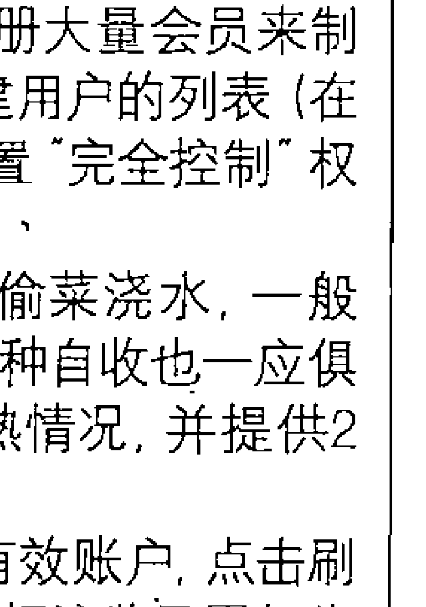

# 暑假 我要玩转人人

假期已过去大半了，趁着开学前的最后一段时光，人不在校，但必须活跃，在里面high翻天，高歌猛进，直接乐到开学！人人玩什么？当然是看最热的话题，最靓的相册，最搞怪的视频，顺便搞到下学期专业课的资料，带点脚偷偷菜收拾收拾餐厅。再有，对着同学新写的日志发表一下评论，恶搞几张照片传到网上也是不错的生活！

# 你的地盘我做主

1. 圈你没商量 暑假漫漫，不少同学开始大玩摄影，上传一张张面若桃花、甚至PS得看不出原样的靓照。面对此种自拍狂，我特意为他挑选几张个性照片，在照片上方的工具条处，找到“圈人”，调整照片上出现的取景框，揪出他的名字，给他来个地标式的标记！而这张照片里被圈的人都会在右侧显示出来。不一定非要真人圈，比如这个蛋蛋十分可爱，我就觉得他像某位很可爱的MM，圈一下图个乐呵！不过圈人是要通过被圈人同意的哦！

暑假里老同学聚会，珍贵的合影照片也可以圈一圈。

# 2. 无条件看你的相册

开着空调，端着冰镇可乐，看看美女是多惬意的事！人人网的口号不是“真实”嘛，可前提是，她是你的好友，亦或她对所有人可见，否则就只能看着一张张头像流口水了。

好在天无绝人之路，作为多年研究QQ加密相册的专家，我终于找到一款名叫“小林人人网非好友相册查看下载器”的软件（下载地址：http://www.onlinedown.net/soft/104998.htm），我从地址栏中找到了一个小明垂涎已久的美女，在软件下面的“人人网id”后面输入她的ID号，点击查找，被拒绝N次的我终于看到她的近照啦！小明开学后欠我一顿饭，哈哈！

# 玩转游戏好心情

暑假万般好，可惜想个人追乐乐，不是太远就是人家太忙，没关系，我自有办法吸引你们的注意。人人餐厅、泡泡鱼、疯狂足球、智慧树、兄弟篮球、家园城市等那么多游戏，如果够疯狂，把这些游戏的应用全部添加，在好友的更新板上，自己的动态就会达到刷屏级！

“人人游戏助手”官方游戏辅助软件（下载地址http://www.newhua.com/soft/93519.htm）来了！这个官方软件大大降低了游戏的升级难度，整合了所有线上游戏，提供了针对时间性游戏的定时器功能，加入了骨灰级玩家最希望看到的账号多开功能，为众多马甲小号正名，那人飙升得嗖嗖的！看着那群憋屈坏的孩子们，虽然天气炎热，可咱的心里爽啊！谁让你们半夜三点爬起来偷菜，白天不理我，哼！

# 攒人气偷菜两不误

想要人气高，偷菜快，免费的“Super Star 2010”（下载地址：http://www.superstarapp.com）显身手。使用人人账号登录，在界面的左下方双击列表中的名称，就可以开始升级之旅了！

互刷通过后台访问此刻刷人气的其他刷友主页，而你的主页也被别人光顾，人多力量大，但不能即时生效。

自刷有点像论坛管理员通过注册大量会员来制造火热气象的套路，需根据提示创建用户的列表（在Windows 7需对account.txt文件设置“完全控制”权限，否则无法创建修改）。

偷菜功效很强大！不仅可以偷菜浇水，一般“辅助软件”少有的巡视、施肥和自种自收也一应俱全，还可以详细显示好友作物的成熟情况，并提供2小时内成熟的作物。

保证右侧账号的表里多于21个有效账户，点击刷人气，等待片刻，访问量瞬间提升，可把这些马甲加为好友，不足的是略占网速。

# 情侣空间甜蜜上演

七夕到了，分隔两地的校园情侣们，玩玩最新的人人情侣空间，打造二人小世界吧。怎么开通呢？登录http://page.renren.com/love/loveReg，首先输入TA的人人账号，发送开通邀请，TA同意后，就会在你们主页的右上角出现情侣空间的进入通道，同时也可以设置情侣空间的背景、头像等等。在这个空间里，只有你们可以发表日志和留言，而你们好友的状态更新不会出现在这里，但他们可以给你们留言、评论或者加入关注！情侣空间特殊的成长体系是需要你们真心付出的哦！在情侣空间里用文字和图片洒满一片浪漫，让别人羡慕去吧！

# Lie to Me之仪器探秘

私人研究机构Lightman Group致力于研究人类的micro-expression (微表情)，帮助调查人员识破谎言，这就是片名Lie to Me (别对我撒谎) 的由来。集团的Boss Dr. Cal Lightman是个assumes you’re a liar if you’re a homo sapiens (只要你是现代人，就假设你是骗子) 的偏执狂，他的搭档Dr. Gillian Foster则是一位善解人意的心理学家。新成员Ria Torres因识谎天赋而飞速成长……剧中角色个个魅力十足，再加上悬念迭出的剧情，难怪这部由真实研究改编而成的美剧能红遍大江南北。

#### 测谎仪 (polygraph)

识谎专家当然有他们的专业骄傲，这首先表现在他们不信polygraph。一位运输安全管理局 (TSA) 官员向Lightman和Gillian介绍一台新型测谎仪：
See, the handheld measures cardio and galvanic skin response. It’s the only polygraph ever developed with this kind of portability. 瞧，手携测谎器能探测心率及皮肤流电反应。目前所有测谎设备中，只有它最为轻便。
但Gillian道出了自己不信任polygraph的原因: The problem with all polygraph tests is false positives. 所有测谎设备的缺陷在于它们都会谎报。

#### 微表情训练仪 (machine for micro-expression training)

这是一台训练识谎人员观察微表情能力的机器。在Lightman做了调整之后，它几乎成了一个挑战极限的游戏：
Well, I got it set at triple speed. You know, when you try and hide your emotions, they leak out at a fifth of a second? Well, this is testing me at a 15th of a second. 我把它设成3倍速度了。你知道，你努力掩饰表情，它们还是会闪现五分之一秒，而这一训练中表情只闪现十五分之一秒。

#### 重读音分析器 (voice stress analyzer)

使用它的专家Loker说It measures pitch and gauges anxiety (它用来测量音高，计算焦虑值)，它基于的原理是We find it’s less about what you say than how you say it. (我们觉得你如何表达比起你说的内容更重要)
在Season1的Chapter2中，voice stress analyzer首次登场。Loken通过对篮球运动员Taft的重读音分析展示了这台机器的工作过程: Typical vocal stress on a typical question. That’s Taft’s vocal stress baseline. It’s a high tolerance baseline. He’d have to be extremely anxious for his pitch to spike above it.
典型问题有典型的重读音。这是Taft的重读音基线，那是最高耐受基线。只有非常焦虑时，他的音调才会刺穿最高基线。
除了刚介绍的这些典型仪器外，识谎专家们还会用到projector (放映机) 和camera (摄像机) 等常用数码设备，至于其他如locked room (密室) 之类更高档的东东，就请你在观影过程中慢慢发现吧。
(南开大学/杨红)

# 宿舍共享文件我有妙招

宿舍电脑中的学习资料、音乐电影、大型游戏……这些大伙都喜欢的东东，该如何共享给宿舍中的哥们呢？很简单！宿舍共享文件，CFan为你支妙招。
由于Windows的版本太多，手动设置宿舍局域网内电脑的共享有些麻烦，第三方工具来帮忙，速度更快更方便哟！

#### 现代版“飞鸽传书”

在宿舍局域网中的电脑上安装“飞鸽传书”(http://www.newhua.com/soft/15453.htm)，就可以轻松共享文件，还能进行远程协助、语音视频等操作。
安装后注册用户并登录可以实现外网互通，类似于QQ。直接单击主界面上的“仅启动飞鸽传书”登录软件，此时只能进行内网文件共享。单击局域网中的工作组 (默认为WORKGROUP) 可查看局域网中的其他计算机，右击某个计算机，选择“发送文件”或“文件夹”，速度非常快，一分钟大概可传输600MB的文件。
选择“查看共享”，可打开客户端计算机上的共享文件夹。选择“群发信息 (文件)”，单击“文件”选择要共享的文件，在后面选择接受文件的用户 (可以是多个用户)，最后单击“发送”按钮即可，非常方便。

#### 飞秋，更胜一筹

飞秋和飞鸽是一款差不多的工具，不过使用更加方便，并且它能够兼容飞鸽传输，非常简单方便。
下载“飞秋” (http://www.newhua.com/soft/66046.htm)，解压后双击“飞秋FeiQ.exe”即可使用，此时会自动检测到局域网中启用飞秋和飞鸽传书的电脑，右击相应的电脑即可发送文件或文件夹等。如果局域网中的电脑较多，还可以“新建组”，将不同的电脑移动到不同的组中，可以给该组电脑群发文件，非常方便。对于大型的局域网，一般会有多个网段，可以右击选择“增加其它网段用户”，然后输入网段IP，单击“增加”，这样会自动检测其他网段中启用了飞秋或飞鸽传书的计算机，非常智能。
(江苏/浒湾小学★周建峰)

# 简历不能发附件？邮件正文完美呈现！

每人都是金子，不要被动地等着别人挖掘，自己努力露出地面吧！点开招聘启事，以下文字赫然入目：“请将个人简历直接粘贴到E-mail中并发送到zhaopin@****.com，标题请务必注明姓名、应聘职位【请勿加带附件】。”表格、文字、照片，我折腾了半天，格式还是看着很乱。救命啊！”你也和其他求职的同学一样，有这样的苦恼吗？别着急，针对不同的邮件使用习惯，这里有几招实用对策轻松解决！

#### 第一招：直接发文字

相比之下这是下策，除非你细心地把文字格式设置一下，比如加粗、空行、改变颜色来强调重点等。只是，还是感觉逻辑性不强，很难吸引HR注意……往下看吧。

#### 第二招：Word 粘贴到普通邮箱

一般来说，求职者手里都有一份Word版本的简历，打印也靠它。把简历中的表格、文字、照片一起选中，然后复制到邮件正文中。“搬家”效果还行，可能有细微变形，最关键的是，原来Word简历中的照片没了！怎么办？不能让右上角的照片栏空着啊。
这里以163邮箱为例。进入“写信”页面，从Word复制简历过来后，把鼠标定位在需要添加照片的地方，选择“添加图片”，可以从本地电脑或网络中引用照片。如果从本地上传100多KB的照片还很慢，可以从网易相册或其他网络地址引用照片，在输入框里填上要添加图片的地址即可。这个地址怎么找？右击网络照片，在属性中就能看到。QQ邮箱等把照片当图片插入也很方便。
因为各邮箱对于外部引用图片的规则有所差异，所以此法不一定通用。比如目前经测试，Gmail邮箱就接收不到网易相册、QQ相册等网页图片。最保险的办法是，先把简历发到与简历接收邮箱同系统的私人邮箱测试一下是否正常。如果对方是企业邮箱无法测试，建议用本地上传照片等方式更为保险。
如果你的照片实在难以上传，一定要记得把原来放照片的部分改为别的内容，空着会很难看。
还有一个类似的办法，就是把Word简历另存为“网页”格式，然后用记事本打开这个网页格式的简历文件，全选并复制上面的源代码，点击163邮箱的“全部功能”，选择“编辑源码”，把代码粘贴过来。再单击“编辑源码”按钮预览一下效果，如果哪里有不合适的地方，可以再进行调整。其他门户网站邮箱的使用方法类似。用预览检查邮件后，记得设置“已读回执”哟！自己的简历何时被打开也好心里有数。

#### 第三招：Word 粘贴到 Outlook

如果你常用Outlook，那么解决这个问题就容易多了。从Word里直接粘贴到Outlook中，所有图文格式几乎不会失真，直接发送就搞定了！照片乖乖地嵌入在与Word格式一致的地方，而且还自动变成了附件随邮件发送。为什么如此听话呢？因为Word和Outlook属于吉祥的Office一家嘛，兼容性当然更胜一筹。需要注意的是，在Outlook的发送邮件页面“设置文本格式”选项卡中，默认为“HTML”格式，不要更改。有人问，在Word文档中，进入“文件→共享→使用电子邮件发送”不行吗？这个功能挺实用的，可以把此简历以Word文档、PDF等格式通过附件发送，Outlook会自动启动。但是非邮件正文，所以暂时无用。

#### 第四招：随机应变

如果用人单位对于简历格式的要求并不严格，没有指定统一的简历模板，那么还有其他变通方法。
-   1.  在智联招聘等网站注册后，利用网站自带的简历系统生成个人简历，直接粘贴到邮件中。好处是版式较美观，颜色协调，但容易千人一面，缺乏个性。
-   2.  使用邮箱自带的简历相关模板。比如在163邮箱中，“写信模板”的“私务类”中就有“个人简历”，格式已排好，直接在其中填入自己的信息即可。
-   3.  把自己的简历存成原汁原味的图片，导入邮件正文。

小提示：发送求职邮件别忘了这些！
★ 照着招聘要求写简历。不要罗罗嗦嗦写了很多，对上用人单位胃口的却很少。HR 喜欢的不就是招聘广告上的那几点吗？
★ 千万别群发。多花几分钟，针对用人单位的特点进行有针对性的自我推销。就算有“群发单显”等功能，也要慎用。HR 如果看到收件人栏里有一堆地址，后果你应该清楚吧。
★ 注意邮件标题。较理想的格式是“*** 应聘 ** 职位 - 学校（如果你的学校很有名）、工作经验等其他优势”
★ 邮箱姓名设置。最好用真名。如果太前卫夸张，轻者HR会觉得你不够职业，重者HR会怀疑这邮件是否带病毒。
(广西/张立)

# 让你的校园电子杂志风靡全国！

果果：网络阅读时代来了！充满个性的电子杂志那是相当吸引眼球！《唯看大学生》电子杂志(http://online.zcom.com/c/916)诞生短短一年多的时间里，已经突破了 300 万读者，读者遍布全国各大高校。这份神奇的电子杂志所有编辑、技术团队，都是在校大学生。他们用什么招数让杂志拥有这么高的人气呢？其实，学了他们的秘技，你也可以如法炮制！

制作团队：以厦门软件学院的同学为主，逐渐加入很多志愿者，现在由 20 多个来自全国不同高校的大学生组成，分工明确 主要工具：PS、Fireworks、Flash、Zmaker等 制作流程：

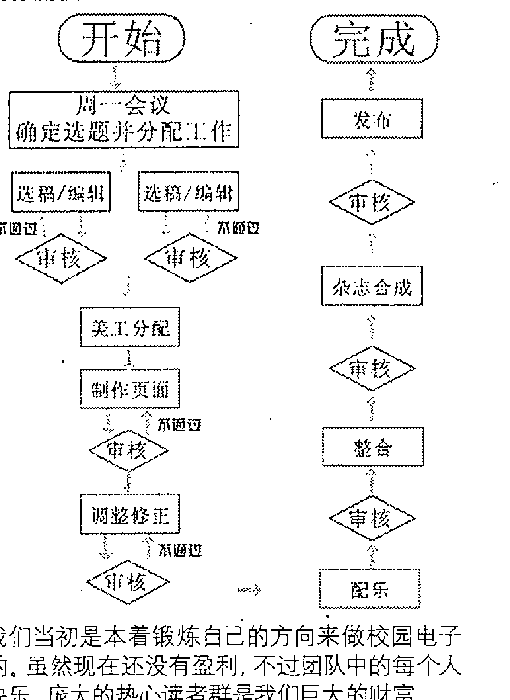

#### 1. 稿件收集

这是一个非常重要的部分，杂志能不能受到读者的好评，内容的选择非常关键。我们与厦门大学等不少高校社团都有合作。收到他们发来的质量不错的稿件后，编辑部结合本期的主题，从众多文章中择优选材。有时为了获得更深入、生动的新闻信息，编辑们手拿相机、头顶草帽，跑到大学生们感兴趣的地方做实地采访和拍摄，把最真实的内容展现给读者。
《唯看大学生》经过半年的精心策划才和读者见面。在厦门及周边城市的校园中做了大量的调查后，我们确定了几个大栏——情感收音机、时尚消费、流行数码、缘分对对碰、影音动漫。 “情感收音机”是提供一个大学生校园生活以及情感方面交流分享的频道；“时尚消费”内容包含街拍，我们定期到学生街等学生消费密集的地方拍摄收集一些流行服饰以及新奇玩偶，并加入一些近期网络流行的校园服饰；“流行数码”主要是解决学生在购买数码产品时经常遇到奸商的问题，我们给大家推荐实惠的数码产品，传授经验。同时我们在各大数码卖场与经营者签订诚信协议，给推荐商家发牌匾； “缘分对对碰”主要是为比较宅的同学提供一个健康的交友平台；“影音动漫”收集推荐最新流行专辑，带给同学们视觉、听觉上的享受。当然这些栏目也不是固定死的，我们建立了多个读者反馈渠道，认真分析读者意见，尽量满足大家的要求。

#### 2. 封面拍摄

好的封面会带来更多读者，所以我们在拍摄封面人物时非常细致。我们与摄影俱乐部合作，10台“高炮”同时工作，很快就能选出几张满意的照片。如果有外地同学想成为封面人物，我们会请他发个人写真给客服。

#### 3. 设计排版

稿件收集完毕后总编审阅，无误后直接送往技术部排版。技术部的同学都是精英哦，国际认证设计师就有5人呢，杂志的每个版面都要经过精心设计排版，再做动画。

##### PS编排版面

新建自己需要大小的画布，《唯看大学生》电子杂志的版面大小为950×650像素。然后做页面的美工（比如背景），再画出修饰用的卡通人物或其他装饰，接下来再添加稿件内容。每个小装饰图片都单独存储为PNG，因为PNG格式可以把导出来的东西保存成透明背景，方便做动画。

##### Flash添加动画

为了区别于纸质杂志，激发读者兴趣，让整体效果更有震撼力，我们在杂志里加入了动画。
第一步：新建一个为Flash（Action Script2.0）文档（默认画布大小为550×400）。在中间的“文档属性”中改为950×650，帧频改为25fps，也就是25帧为一秒。提醒大家可以先把这个文档保存下来，并且做一步保存一步。
第二步：找到刚刚存储出来的PNG格式图片路径，把图片导入到这个库。
第三步：开始做动画，把刚刚全部导进来的图片拉到画布中间，并与画布对齐。每个图片为一层（图层命名为刚刚图片存储下来的名字），目的是为了看到整体版面再来做效果，非常简单直观。如果你熟练的话，也可以用到某个元件时再拉大画布中，并新建一个图层。
第四步：完成简单的动画制作，主要用到遮罩动画和补帧动画。按下Ctrl+Enter键来测试动画效果！
第五步：找到刚刚保存Flash的目录，并找到测试影片生成的SWF文件（每个经过上面步骤的Flash文档都会生成一个SWF文件）。然后把所有的页面整理编号，如封面为01、目录为02等等，依次往下编。

#### 4. 合成杂志

选稿、封面、排版、动画都搞定了，接下来用Zmaker软件把一个个SWF文件合成EXE版或在线版杂志吧！
打开Zmaker软件，把刚刚做好的SWF文件拖到空白处。不同页面的编号已经按先后顺序排好了，很直观。加入背景音乐等元素可以让杂志变得更加生动。直接选择某个SWF文件，点击上面的音乐按钮即可。
合成时需要注意什么问题呢？我们把实践中的经验教训和大家分享一下。
(1) 合成杂志前，页面为SWF的文件一定不能用中文来命名，全部要改成数字或英文，不然生成WEB版，会出现错误。
(2) 栏中标有封面的那个文件一定要新建一个“新添加空白页”，然后点击右边空白上的“编辑页面”按钮，接下来点击“添加特效”，找到制作好的封面SWF文件。如果不会制作封面，可以从网上下载一个封面模板来修改。
(3) 如何让背景音乐贯穿整本杂志完整播放呢？选中全部页面，点击音乐按钮添加杂志，并在有按钮的lockrot那栏中，把ture设成false。这样杂志完成时按钮才能点击。如果背景音乐文件过大，会出现播放时翻转页面时会卡住等情况，也要注意。
最后设置一下杂志生成的路径、名称等参数，一本电子杂志就制作完成了！一步步做下来，并不复杂吧？

#### 5. 发布杂志

《唯看大学生》的发布平台可谓众多——腾讯、ZOOM、读客、淘宝杂志、新浪杂志、互联星空等国内数十家媒体平台，我们都要逐一发布。
以上是基本过程，记得为开发在线互动交流和杂志阅读统计功能，技术部花了大半个月时间，看了好多Flash书籍，做了不下百次的实验，终于攻克难关！
祝你的电子杂志也能广受欢迎！

# 秘笈偷偷报

果果：短短一年多时间里，你们就赢得了300万读者的关注，真是惊人的成绩。其中有什么奥秘？《唯看大学生》：只要细致、专注、持之以恒，就能成功！大概有以下几点经验吧。
-   1.  不要一切向钱看：如果开始就想着做一本电子杂志马上就能挣多少钱，建议你放弃。因为做网络产品的话都是有风险的，如果一心为了挣钱就很难去把握读者所需要的体验价值，从而失去很多读者。
-   2.  做自己擅长的事：《唯看大学生》团队最初是由几个对技术和大学生需求相对了解的大学生所创办。我们还是学生，我们知道学生想要什么。
-   3.  建立良好的口碑：一开始我们将杂志刻录成精美的光盘，在一些高校做传递活动，就这样建立起了一定的读者群。此外我们与腾讯等门户网站合作，将杂志推向全国。和知名门户合作很难吗？我们一直专注于杂志的阅读质量，慢慢的我们的口碑做好了，腾讯等门户自然而然地跟我们谈合作，帮我们做推广。
-   4.  及时取得反馈：读者的反馈是对我们最好的指导。之前有些读者遇到了阅读疲劳的问题，我们就针对这个问题招了新闻播音专业的同学加入团队，把杂志的内容通过语音形式播报出来，现在情感类文章的有声版成为杂志的一大亮点！为了更好地得到反馈信息，我们在杂志中建立反馈平台，设立QQ客服、开通400免费电话，这样就可以在第一时间与读者沟通。读者觉得自己被重视，自然而然地就喜欢上了《唯看大学生》。
-   5.  强大团队的建设：我们一直在壮大团队。由于杂志是非盈利性的，无法给团队成员报酬，但是我们的团队坚不可摧。每个成员可以充分发挥自己的价值，把成果展现给大家，同时又可以同一群志同道合的各地朋友共同交流技术，增进友谊。
-   6.  良性的收支模式：我们的人力成本为0，开销主要是封面拍摄（路费、吃饭等）、光盘制作（每期200张，1000元左右，还有寄光盘的费用），总花销一期在2500左右。开销如何负担呢？从父母身上拿的吗？不！我们几个主要负责人创立了“唯看传媒”工作室，利用空余时间帮企业做网站、广告设计来维持杂志。现在读者群这么大，我们相信，杂志商业化盈利的春天很快就会到来！
感谢同学们的支持，我们会更努力的！欢迎加入我们！
（厦门软件学院/唯看语文）

# 照片化身神秘马赛克拼图

还记得以前的可口可乐广告吗？还有奥运会上美丽的背景板？如何用很多张小图来构成大图呢？下面我们利用软件Foto-Mosaik v4.1.0（下载地址：http://www.newhua.com/soft/767.htm），让照片化身神秘马赛克拼图！
首先点击“建立数据库”，创建一个数据库，然后导入图片。图片分辨率越高图片越清晰，但整理起来速度也会越慢。整理完图片后回到起始页，点击“制作马赛克拼图”，选择主体图片和保存位置，选择所要使用的数据库，然后选择“马赛克拼图选项”（注意马赛克中的拼图数要少于数据库图数×最大使用次数）。
注意：不透明度在30-60之间比较合适（黑白为30-45，彩色为45-60），根据自己需要来决定就可以了，大功告成！很简单吧？
（北大附中云南实验学校/洪景业）

# 全国计算机等级考试考前官方秘训

果果：9月18日全国计算机等级考试就要开考了！在一个月的有限时间中，同学们如何抓住重点，高效复习呢？本刊特别邀请教育部考试中心负责人，对于热门科目的重点、难点进行点评，希望大家在冲刺阶段能实现分数的快速提升！

## 一级贵在熟能生巧

一级考试均为上机，题型相对固定。除了选择题的10分基础知识外，重点还是考察操作。把自己不擅长的题型多练习几遍，即便达不到一上来就能迅速作答的水平，也不至于在考试中因生疏而紧张。另外，考试是按知识点进行评分的，要把该得的分拿到。一级通过率在70%左右，未通过的考生多为长期未用电脑和Office软件的人。

## 二到四级灵活应对

笔试题目不会超过考试大纲。依据大纲先通读一遍教材，完成书后习题；通读第二遍后，精练历年真题，体味出题难度、重点，找出规律；针对做题时出现的错误通读第三遍，查缺补漏。要根据各章所占分值合理分配精力，重点要精，次重点要会，非重点要知。分值少的章节出的题一般都是基本概念和简单知识，多是书中原话，要全面复习，不留死角。

上机要分清层次，按知识点拿分。基本操作易得分，要一丝不苟；简单应用难度适中，得分几率高；如果二者完全答对，一定能及格。综合应用题知识点多、操作复杂，不要因为部分不会而放弃整道题目。考前务必参加考点免费提供的上机模拟考试，以熟悉上机考试环境，这点非常重要！

## 二级 Visual FoxPro

要掌握三大语句——查询语句、操作语句、定义语句。

查询语句是重点，在所有题型中都会考到，准确理解SQL SELECT的语句结构和关键词的作用非常重要。操作语句语法比较简单，但是在笔试中经常会与数据完整性结合起来进行测试，定义语句主要指CREATE TABLE语句，语法比较复杂，建议基本部分一定掌握。此外，上机考试中使用各种设计器和向导完成各种操作是基本，数据库基础知识在笔试中必考，程序设计基础中，简单的流程控制（条件语句、循环语句等）、变量及其作用域、数组等都应该掌握。

## 二级 Visual Basic

上机时答案要尽量使用“标准”形式，也就是常用的、正确的、不会产生歧义的形式，但不一定是最简单的形式。

特别要注意源代码的书写和保存：充分理解题意，按题目的要求设置属性；有些题目要求不得使用任何变量，直接显示字符串，或把通过输入对话框输入的信息放入文本框中，必须严格按照题意，不要定义任何变量，否则会影响得分；编写的窗体文件和工程文件一定要保存在考生自己的文件夹下，并按题目要求的文件名。特别注意不要把下划线写成减号；有些题目要求输入汉字，需要进入中文状态，而程序中的字符如逗号、冒号、分号等必须在英文状态下输入，应注意中英文切换。

## 二级 Access

上机题中，新建表、新建主键、为空表输入数据等基本操作，只要真正上机操作过Access的考生，基本上都能正确作答。细心一点，尽量不失分。

简单应用是在基本操作的基础上增加了部分复杂操作，然后完成一些功能性的整体操作。例如新建一个查询、按照要求增加或删除数据、设置报表的格式、对窗体进行简单设计、对宏操作进行简单设计、设置对象的属性等。综合应用题会考核多个知识点，将表、窗体、宏、模块等对象组合在一问中。按题目要求，只要做出基本界面，就可得分。

## 二级 C++

这是二级中最热门的科目之一，以下为大家提供教育部考试中心对于2010年上半年的部分真题点评，希望大家对重难点有更直观的认识，也检验一下自己的掌握水平。

有如下的函数定义：

```
int Xfun(int x) {
    int y=x;
    {int x=10; y+=x;}
    return x+y;
}
```

通过表达式Xfun(5)调用该函数，则得到的返回值为

【答案】20

【分析】本题有36.9%的考生答对。

本题考核变量的作用域与生存期。变量是程序中用于存储数据的单元，它对应特定的内存空间。变量分为全局变量和局部变量。全局变量是在所有函数定义、类定义和程序块之外声明的变量，在程序的任何一个函数、类或程序块之内均可以访问全局变量。局部变量只能在声明它的函数、类或程序块中被访问。本题中的变量都是局部变量，但作用域与生存期有所不同。通过函数调用“Xfun(5)”，使形参变量x获得初值5。在执行完第一行的语句“int y=x;”后，y的值也为5。第二行进入一个新的程序块“{int x=10; y+=x;}”，其中定义了新的初值为10的局部变量x，同时将此前那个初值为5的形参变量x屏蔽。在新的程序块中，利用新定义的x重新为y赋值为15。到此，新的程序块中所有语句执行完毕，程序退出该程序块，该程序块中所定义的初值为10的x即不复存在（在一个程序块中定义的局部变量，只在该程序块内有效），对初值为5的形参变量x的屏蔽即被解除。因此，语句“return x+y;”中的x还是那个初值为5的形参变量x，这样就能得到正确答案20。本题不应算是难题，但得分率不高，表明考生在学习时对基础知识重视不够，希望今后考生在学习要注意这一点。

默认值的掌握。本题中，构造函数定义中冒号之后花括号之前的部分就是初始化列表，用于初始化类中的3个数据成员：year，month和day。首先应该判断出，初始化列表的3个变量y，m，d就是构造函数的形参变量，用于对3个数据成员进行显示初始化；其次，通过语句“Date FirstDay;”可知，定义Date对象时可以不给出实参，因此构造函数的形参变量y，m，d都有默认值。而且依据题目的说明，默认值分别为2010，1，1。对于此类需要填写程序代码的题，普遍得分不高，考生在学习时要注意基本概念的掌握。

请将下面的类Date的定义补充完整，使得由语句

Date FirstDay;

定义的对象FirstDay的值为2010年1月1日。

```
class Date {
public:
    Date(_______): year(y), month(m), day(d) { }
private:
    int year, month, day; // 依次表示年、月、日
};
```

【答案】int y=2010, int m=1, int d=1 (三个变量定义可以任意排列)

【分析】本题有30%的考生答对。

本题考核考生对构造函数的初始化列表和参数默认值的掌握。本题中，构造函数定义中冒号之后花括号之前的部分就是初始化列表，用于初始化类中的3个数据成员：year，month和day。首先应该判断出，初始化列表的3个变量y，m，d就是构造函数的形参变量，用于对3个数据成员进行显示初始化；其次，通过语句“Date FirstDay;”可知，定义Date对象时可以不给出实参，因此构造函数的形参变量y，m，d都有默认值。而且依据题目的说明，默认值分别为2010，1，1。对于此类需要填写程序代码的题，普遍得分不高，考生在学习时要注意基本概念的掌握。

打开文件时可单独或组合用下列文件打开模式

-   (1) ios_base::app (2) ios_base::binary
-   (3) ios_base::in (4) ios_base::out

若要以二进制读方式打开一个文件，需使用的文件打开模式为

-   A) (1) (3) B) (1) (4)
-   C) (2) (3) D) (2) (4)

【答案】C

【分析】本题有30.9%的考生答对，选择A、B、D的考生分别是25.7%，28.5%，14.9%。本题考核文件流的用法。文件流以磁盘文件以及其他可按文件方式进行管理的外部设备作为输入输出对象。

ios_base::app 为添加数据而打开，从文件尾部开始写

ios_base::binary 作为二进制文件打开

ios_base::in 为输入而打开

ios_base::out 为输出而打开

知晓上述语句功能，就不难作答。作为二进制输入文件打开的语句组合就是ios_base::in | ios_base::binary。考生在学习时要注意，C++流操作是在实际编程中常用到的，掌握其基本用法也是必备素质之一。

## 三级网络技术

本科目在三级中报考人数最多。

技能类选择题以考核考生在实际环境应用网络技术基础知识解决问题的能力为主，试题形式主要有IP地址计算、路由器（交换机、Hub等交换设备）路由选择、网络设备（交换机、路由器等）最大带宽计算等。必考的新技术命题思路是在试题描述中，将该技术的概念提供给考生，由考生根据已掌握的知识采用排除法去选择正确的答案。由于考核的概念超过教材范围，所以命题老师已尽可能地降低了试题的难度，考生只要能够对网络技术中的各种概念熟记于胸，答对类试题并不难。填空题主要考核考生对网络基本知识理解和记忆，其出题范围集中在教材的前四章网络基本概念和第六章网络安全技术基本概念。牢固掌握和灵活应用网络中的主要概念，答对就没问题。

笔试和上机考核必须全部通过才能拿到证书，否则没通过的那科就得补考了，而且只有一次补考机会。祝大家抓住重点，加强实践，以高分顺利通过！

# 学弟学妹们好 知心哥来了！

又到一年入学时，想必刚经历完高考的同学们都已被心仪的学校录取，正好奇地寻找与学校相关的信息，到百度上搜索？一头雾水呀。作为学长的我们是不是该做些什么？有人崇拜的感觉很好哦！说不定还有一段美丽的邂逅呢，本文的建议对新生也有帮助。

## 贴吧多了个新生地盘

相信很多新生最先想到的就是到贴吧“找组织”。高校贴吧都是按班级分的，不好加入，不过最近贴心的百度在很多高校的贴吧首页都加了一段话，进去看看，新生们都在里面哟！该问的问，该答的答，大家都不要客气哈！

## 学校论坛新生版发热帖

大多数高校的论坛都会开辟新生版块，入学指南等经验帖相当实用！在这里发帖绝对能吸引新生的眼球（一般大二以上同学有发帖权限）。只要内容实用、独家、符合客观事实，都会被管理员加亮置顶，一旦发帖，就会有人跟帖补充或进行相关的询问，你就当一会儿人气颇高的“知心哥”吧！如何提高自己的魅力值呢？可以写写自己的励志故事，或者把校园趣事变成打油诗等，新生一定会被你的幽默和才华吸引。如果你的社团主管、学生会干部或高分选手，给自己贴上相关标签也可以有效吸引人气哟。

## 建立新生QQ群

很多学弟学妹希望得到一对一的回答，不妨建立一个新生群提供更周到的解答。可以针对全校新生，可以是本院新生，可以是同乡会。如何让这个群人气更高？最好在醒目并且有说服力的地方发帖，比如百度贴吧置顶帖、学校论坛的新生板块（经验分享后附上自己的群号，防止管理员当广告帖删掉）。相信很快就会有新生把这个群加满。如果你是会员或拥有太阳，可以创建高级群容纳更多新生。开学时接新生，带着他们熟悉学校、聚餐、到周边游玩，保持密切的联系，当大哥的感觉不错吧。

（合肥工业大学/林业钦）

# 超酷软件扮靓社团宣传片 很带感嘛！

开学了,社团招新的攻势即将展开,谁不想有一帮优秀的学弟学妹加入?发传单、画展板、放广播……都什么年代了,还是这老三样!学校对外宣传可以制作视频宣传片,社团招新为什么不能?在小广场放一段创意十足的社团宣传片,绝对比满学校发宣传单效果好得多。或者在招新现场摆上几台笔记本循环播放,除了展现社团实力,认真的作风还会吸引更多的人气。在QQ新生群中高悬着一个宣传视频地址或者在食堂电视上循环播放,也能为你的社团抢占先机！

## 元素一：从宇宙空降学校

一个蓝色的星球静静地旋转着,突然镜头快速旋转下降,视角如同飞机坠落般“摔”到地面,然后缓缓拉起,学校的俯视图跃然荧屏。

怎么样,从宇宙空降学校的效果不错吧?CCTV上对全球要闻回顾时,常常使用卫星俯视图的巡视,我们不妨借鉴一下,也来段广播级的开篇,哈!制作方法极为简单,只需要Google Earth配合“屏幕录像专家V7.5”来实现这个超炫的卫星定位特效!

打开“屏幕录像专家V7.5”(下载地址http://www.onlinedown.net/soft/3442.htm),Windows 7下根据程序提示启动软件,进入主界面,根据电脑配置的不同,录制帧数可能略有差别,我们这里手动设置15帧/秒。同时可以设置是不是同时录制鼠标和声音,输出格式是什么样的。由于录的是高清清晰度视频,我们不录鼠标,采用WMV格式录制。

接下来,打开Google Earth,搜索我的学校“河北农业大学西校区”,发现初始界面乱七八糟,各种地标充斥屏幕,太山寨了吧?别着急,在侧栏最底下,把图层里所有的选择全部取消,再设置“视图→显示导航→不显示”,把地图右上角的导航图表去掉,取消视图栏里侧栏、工具栏的选择,这样,除了右下角Google的版权和中央底部图像版权水印外,整个界面就干净了。

既然是宣传片,就不能出现雷人的软件界面(我们可不当免费广告)。回到屏幕录像专家,在“录制目标”里选择“范围”,此时在屏幕上会出现1个绿色直角圈起来的框,回到Google Earth调整录像框,只录制地图范围。最后,无论是双击地标快速拉近,还是+ -的缓缓拉伸,亦或右键旋转降落,随你意愿了!在真正录制前,最好关闭一些无关的软件,多次尝试拉伸,把地图缓冲进软件后再按F2录制,后期的时候配上震撼的音乐,就可以打造一段绚丽的目标空降!

## 元素二：电影混编随手来

《人在囧途》中牛耿过飞机安检时,赌气一口气喝完一桶牛奶后,李成功感叹:“人才啊!”如果你在轮滑社,可以录制一小段高超的轮滑技巧,用会声会影X3把牛耿喝奶的画面减掉,换上轮滑秀,最后把“人才啊”加上,招新时播放出去时那种感觉绝对不一样。

电影截取介绍的很多,我最常用的是Ultra Video Splitter V5.4 (下载地址http://www.newhua.com/soft/36901.htm),界面简单,输出格式众多。比如前文所说的牛耿喝奶的那段,拉动飞梭条,到7分点击进度条右下角的“标记起始点”,再拖动到9分,点击“标记结束点”。随后,选择输出目录、格式和质量。鉴于会声会影X3对MEPG和AVI格式支持较好,我选High质量的MEPG2 Format (*.mpg)分割,由此这段群众目瞪口呆观看牛耿喝奶的片段就裁剪完毕。拖到会声会影里简单拼接吧!

有人说,网上好多视频的恶搞配音要是用到宣传片里,冒充大腕明星该多帅!没错,要是刚刚进霍格沃茨的哈利波特带上分院帽后,分院帽不说你去格兰芬多,而是说:“嗯,已经决定了吗?那你就去X大魔术协会吧。”那该多妙!

要想不损失背景音乐,又要把原始对白去掉,我们就会使用会声会影X3的“分割音频”和Cool Edit的人声消除了。首先用刚才的Ultra Video Splitter把电影剪出来,放入会声会影的视频轨,经过初步剪裁,在视频上点击右键“分割音频”,到标题栏选择“3-分享”,“创建声音文件”保存为WAV格式。接着打开Cool Edit Pro 2.1 (下载地址:http://www.newhua.com/soft/6416.htm),导入音频,进入“效果→波形振幅→声道重混缩”选择Vocal Cut,确定,即可消除人声,保存重新导入会声会影。很多伴奏音乐的制作方法也是如此。接下来可以利用会声会影的画外音录制,也可以使用Cool Edit Pro 2.1来录制你想要的对白。假如你截取的视频没有背景音乐或者背景音乐的原声很容易找到,就可以省去人声去除这一步骤,只需使视频静音。

## 元素三：创意信手拈来

无论是卫星的俯视还是大片的恶搞,都是一种创意的表现,同样的软件,同样的照片和录像,有一个好的创意来串联,效果绝对与众不同。

不少电视节目加速播放后很有喜感。我们可以从校门口拿着相机、DV骑着单车一路录到社团的办公室,把视频放到会声会影里,用“回放速度”快速调节,把10分钟压缩到一分钟的飞驰。这个功能可以配合背景音乐,比如林俊杰的《不潮不用花钱》开头节奏感十足,可以把视频剪成几段调节不同速度配合音乐,这样跳帧的效果完全搭调。利用“翻转视频”倒放也是不错的想法。

记得周杰伦“无与伦比”音乐会上,有一段视频,把《不能说的秘密》上的人物从照片变成了油画,其实会声会影X3也可以达到。在滤镜里找到“彩笔画”,拖拽到照片上,调整时间播放一下!同样的涂鸦效果,比如在社团合影上,使用“自动草绘”滤镜,几笔勾勒出照片的轮廓渐变成原图,用在结尾有种自由轻松之情。

社团文化一直强调团结,喜欢使用喜极而泣的照片表现这些,如果仅对照片通过“遮罩帧”和滤镜的处理没有视觉冲击力,但假设照片可以从在一个相框里从左到右漂移过去,或者船舷老电影的雪花,亦或晃动着好像DV跟拍,那样的效果就让大家没有了相册的苍白之感,如果再配上煽情旁白,那就必杀了……

元素聚齐,最后一步就要输出视频了,DVD格式下的NTSC DVD (4:3)渲染速度较快,投影显示清晰。如果不满意,也可以自定义输出,点击自定义,在弹出对话框中点击“选项”,在压缩选项卡的“速度→质量”中,调节滑块到合适位置。如果准备上传视频网站,直接输出FLV是比较好的选择。

吸引人的开头(新生报名社团除了看知名度外很大程度取决于第一印象)+丰富多彩的活动(可宣传举办过的活动、相册展示等+能从社团获得什么(收获友谊、荣誉等),片不长,重在吸引!祝你的社团人才滚滚来!

(河北农业大学/韩政)

# Word目录巧调教

目录是论文、策划书等的重要部分,如何用Word进行目录的自动生成和维护呢?下面我来教大家制作一个目录。

## 几级目录摆放好

本文以2007版本为例,2010版本方法相似。如果文章没有页码,先插入页码,选择“插入→页码→页面底端”,选择相应格式的页码即可。

第一步:选中“目录1”,将其格式修改成样式列表中的“标题1”,这是系统默认的格式。右击“样式列表”中的“标题1”,选择“修改”,即可修改样式。单击“格式”,可以选择修改段落、制表符等格式。

第二步:选中“目录1”,使用Word工具栏中的多级列表对其进行编号,我们可以选择已有的列表形式,也可以选择自己定义新的列表样式或者定义新的多级列表。定义新的多级列表即在当前多级列表的格式上进行修改。

其余的第一级目录按照以上步骤操作即可。注意,两个步骤必须按照顺序操作,不能调换。定义二级目录、三级目录的方法和一级目录的方法是一样的,只是在第一步选择样式时,分别选择对应的“标题2”、“标题3”等。定义列表形式时,有时会出现编号错误,要修改的话可以选中编号,右击选择“继续编号”。

## 自动快速生成目录

首先将光标移至需要放置目录的地方,选择菜单栏中的“引用→目录→插入目录”,设置目录的格式,单击“修改”可修改各级目录的格式,再勾选“显示页码”和“页码右对齐”,显示级别设置为3级(可根据需要修改),确定,目录就自动生成好了。

## 小提示：

有很多人很疑惑,在学术期刊中看到目录中的带点虚线是怎么打出来的?难道是打很多个省略号吗?不用这么麻烦。请注意,在“制表符前导符”中,有好几个样式可以选择——有不显示横线、小圆点横线、大圆点横线、短横线集合、长横线等。此外下方的“格式”还可以选择古典、优雅、流行、现代、正式等几个模式,根据自己的喜好选择即可。

## 有封面的目录对策

在编排长文档时经常会有封面,用以上方法做成的目录中页码是包括封面和目录页数的。怎么才能在正文开始时才开始计算页码呢?这就要用到分节符了。

首先将光标定位在正文开头或目录末尾,选择“页面布局→分隔符→分节符→下一页”。然后将光标定位在目录开头或封面末尾重复一遍,再选择“插入→页脚→编辑页脚,勾选“首页不同”。接下来选择“插入→页码→设置页码格式”,在“页码编号”中选择起始页码设置为1。最后选中已经生成好的目录,右击,选择“更新域→更新整个目录”,确定,大功告成!

(武汉大学/洪毅虹)

# 给挂机键一个卖花点穴手

相信很多同学在用Nokia智能手机玩游戏时都遇到过这样的情况:不小心按了红色的挂机键而致使手机回到待机界面。如果是SISX或SIS格式的还好,能返回接着玩。但有很多游戏是JAR格式的,回到待机界面就不能接着玩了。辛辛苦苦了几个小时的游戏成绩就付之东流了吗?把某些特殊的键屏蔽掉就好了!让MagicKey这个小软件大显身手吧。

下载并安装好MagicKey (下载地址http://work.newhua.com/cfan/201017/MagicKey.zip),打开程序,按右方向键进入方案列表,按左选择键添加方案,取名“屏蔽挂机键”,确定,按键盘中键添加映射,在原按键处按绿色拨号键,数字键变为999,按挂机键,数字变为197,映射处不输入数字,确定完成。返回程序列表,退出。这样,手机上的挂机键就没作用,可以放心玩游戏啦!

如果这个方法设置完后不起作用,原因可能是:没有选择启用的方案。打开软件,方向键向右,进入方案列表,把上面的“默认方案”删除,只留一个“屏蔽挂机键”方案,然后方向键向左,进入程序列表,按左键,“选择方案OK”即可。取消屏蔽的话,在程序列表中按左选择键,选择关闭后台便可。

(湖南郴州市二中/张邈昶)# 玩酷PPT 做最潮大学生

作者简介：张志（秋叶），武汉工程大学机电学院讲师，知名PPT专家、培训师，畅销书《说服力：让你的PPT会说话》作者，在独立博客http://www.70man.com上分享了很多关于制作PPT的超酷技巧。

我经常会收到一些大学生朋友的来信，向我请教如何做好一个PPT，时代真是进步了，我读大学那会你要问我PPT，我会以为是“泡泡堂”。 大学生朋友请教我做的PPT类型非常丰富，有介绍校园歌手的，有介绍社会实践的，有参加创新大赛的，有毕业答辩的，有面试简历的，不同类型的PPT需要用到不同的技巧，今天我就结合一些常用场合的PPT，给大家介绍一些实用的PPT制作技巧。

## 选手形象更醒目：妙用任意多边形实现PS抠图效果

在大学生晚会上经常需要介绍出场的校园歌手，可歌手同学们提供的照片往往像下面的左图，背景很杂，很难填充说明介绍的文字，要是能像右边图片那样就好了。

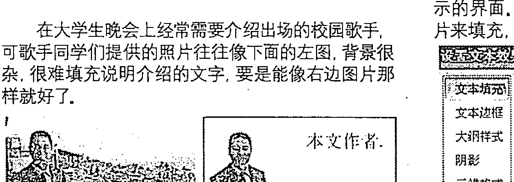

用PPT实现类PS的快速抠图效果，你只需在PPT2010中选择形状菜单下的“任意多边形”按钮，然后沿着图片上的人体轮廓一步步点下去，在得到如图2所示的抠图轨迹图一样首尾相连的封闭任意多边形后，将得到的这个多边形轮廓和填充色设置为白色，叠加在原来的图片上。好了，现在照片中除了人物都是纯色背景，非常清爽，想加什么说明文字没问题了。

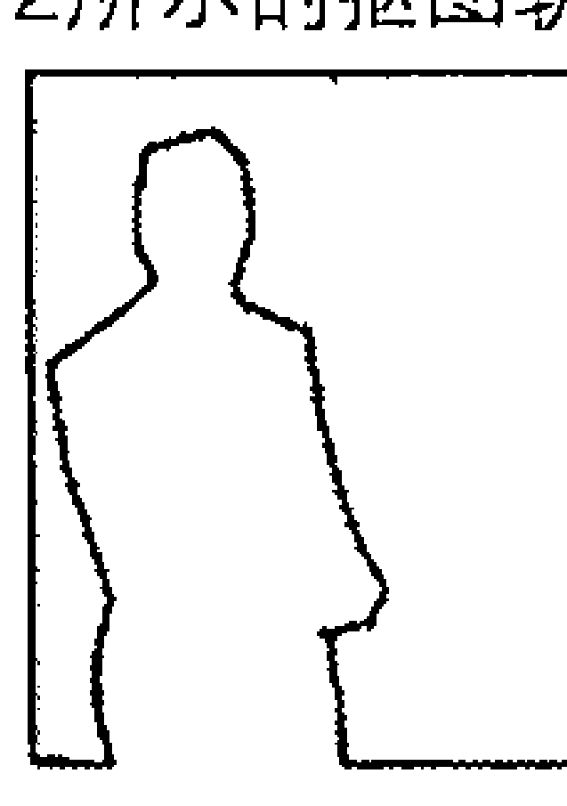

## 竞赛更有冲击力：编辑顶点制造手撕标签纸效果

很多大学生朋友写各种竞赛项目方案的时候，喜欢给PPT放上一张富有视觉冲击力的大图，然后配上说明文字。看惯了规规矩矩的方格字，想不想来点不一样的效果？ 图3的右边是手撕标签纸效果，看上去比左边活泼多了，把手撕标签纸旋转一个角度和图片搭配，会在静态的图片中制造出动态的效果。手撕标签纸怎样做出来的呢？有PPT 2010很方便。


首先选中对象，在“格式”菜单中把矩形转换成任意多边形（见图4），右击转换后的对象，就会出现“编辑顶点”菜单，进入后为要编辑的边添加若干顶点（见图5）。用鼠标选中黑色顶点，拖动顶点往不同的方向移动，就可以获得撕纸效果，非常快捷吧？

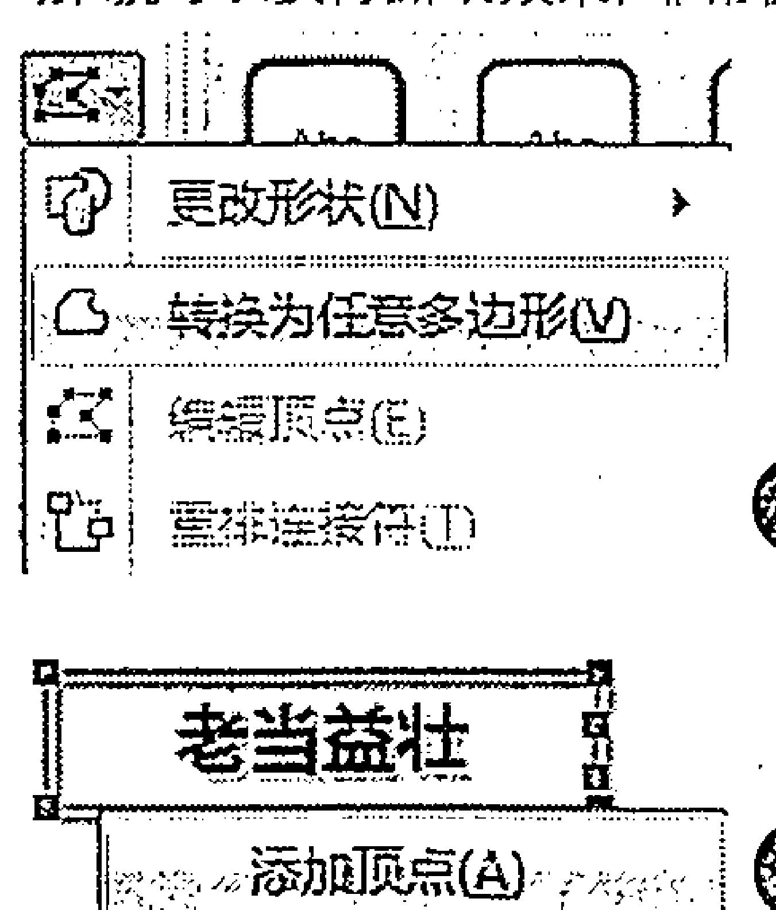

## 晚会主题更有味：文字填充制图藏文字中

大学校园晚会用PPT页面做背景，比如晚会名称，除了设置艺术字外，能不能让这几个大字更加与众不同呢？很简单，让文字填充和文字关联的图片，文字会变得别有味道。 比如给“秋叶”老师配上秋天的树叶图片，似乎别有风味（见图6），在PPT 2010里有个“设置文字效果”格式按钮，右击进入菜单后会看到如图7所示的界面，在“文本填充”菜单里选择自己喜欢的图片来填充，文字就会变得鲜活起来！


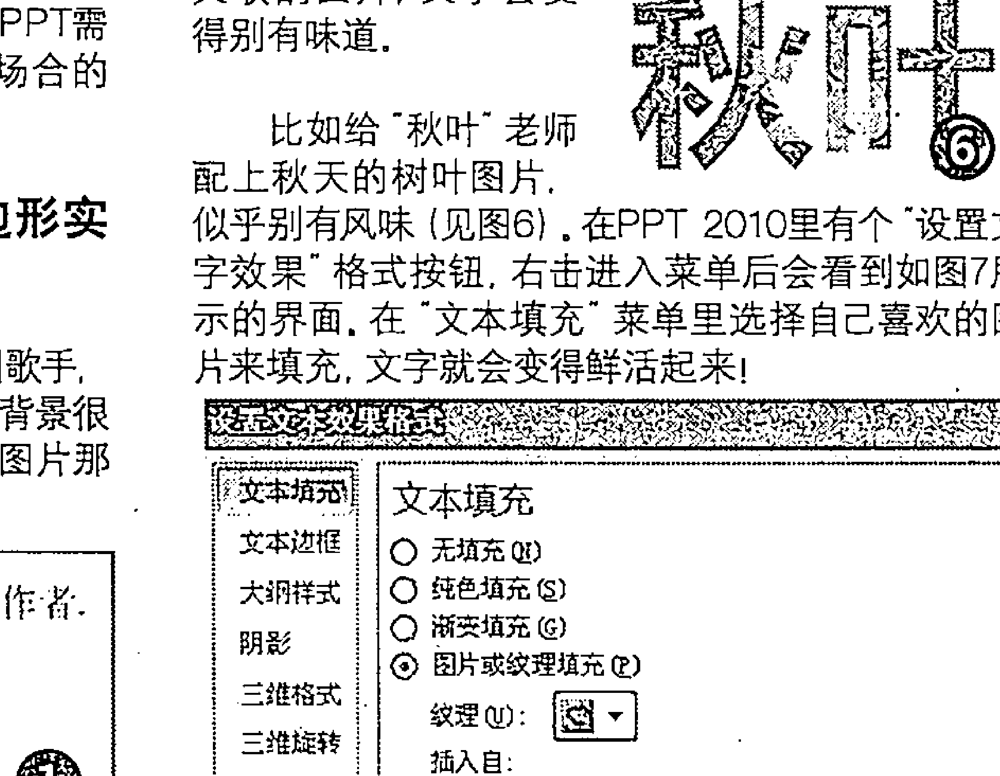

## 抓住流行吸引90后：用活排版制造惊喜

刚学PPT的大学生朋友特别喜欢学一些新奇的技巧，不过我要提醒各位，做PPT永远是：技巧是为形式服务的，形式是为内容服务的，内容是为主题服务的，主题是为听众服务的。如果过度关注各种技巧，忽略了整体PPT设计的逻辑构思和排版设计，就领会不到做PPT的真正优势了。下面我介绍的这张PPT就是靠排版取胜。 图8是我在做《大学新生入学教育》PPT里的一张作品，我认为现在的大学生都很反感教条式的沟通，所以我想在一开始就建立和90后大学生对演讲者的认同感。出于这个目的，我想到最近很潮的凡客体，用凡客体反映大学生积极的一面，也反映他们矛盾的一面，应该是一个不错的构思。

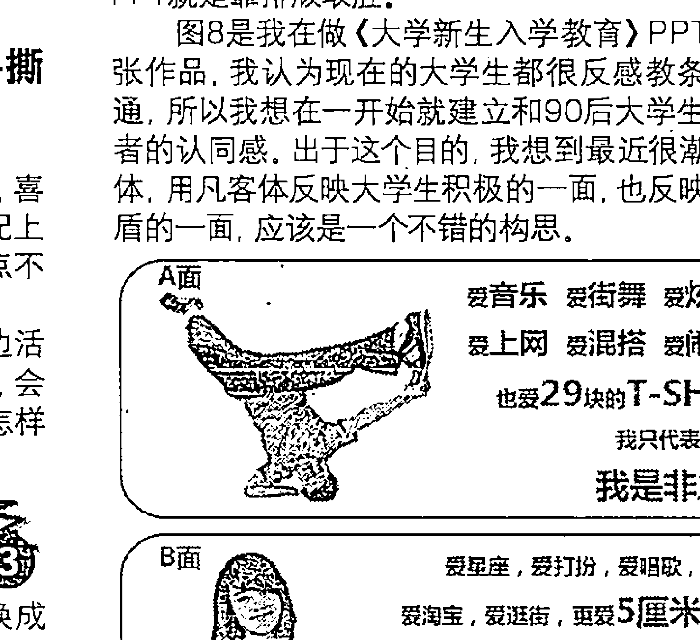

这张PPT主要是通过文字大小和颜色的变化，模仿韩寒的凡客代言广告特点，当然得写出合适的文案和找到有感染力的图片。非主流配街舞，乖乖女就一定要配淑女照了。这里要提醒各位，找到的图片未必能直接就用，我的习惯是先裁剪（见图9），再去设置透明色。 在PPT 2010里支持区域裁剪，就是设定裁剪面积，然后在图形上移动裁剪框到指定的位置然后裁剪，大大方便了我们随心选择需要的图片部分。 至于设置透明色的目的是防止图片挡住底下的文字或其他内容，一定要注意的是，只有背景色相对单一的图片处理起来效果才好。

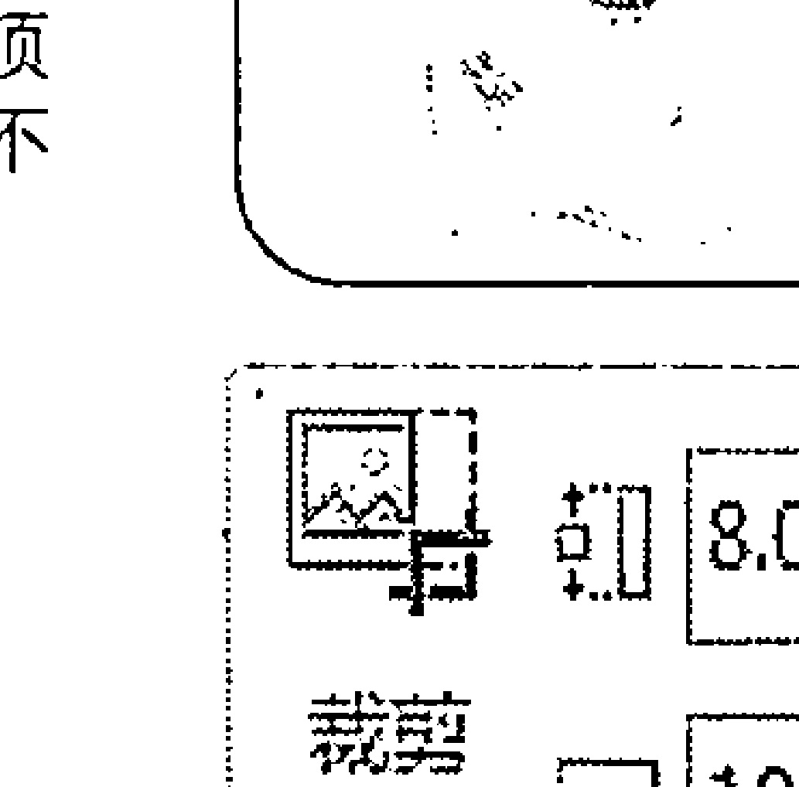

## 体味大学生心理：小图片也做大文章

最后分享一个最近我帮助修改的PPT案例，大学生沉湎于网络游戏的情况很多，这样当然不好，可是如果选择图10这样的PPT去教育他们，我很难相信有什么效果。

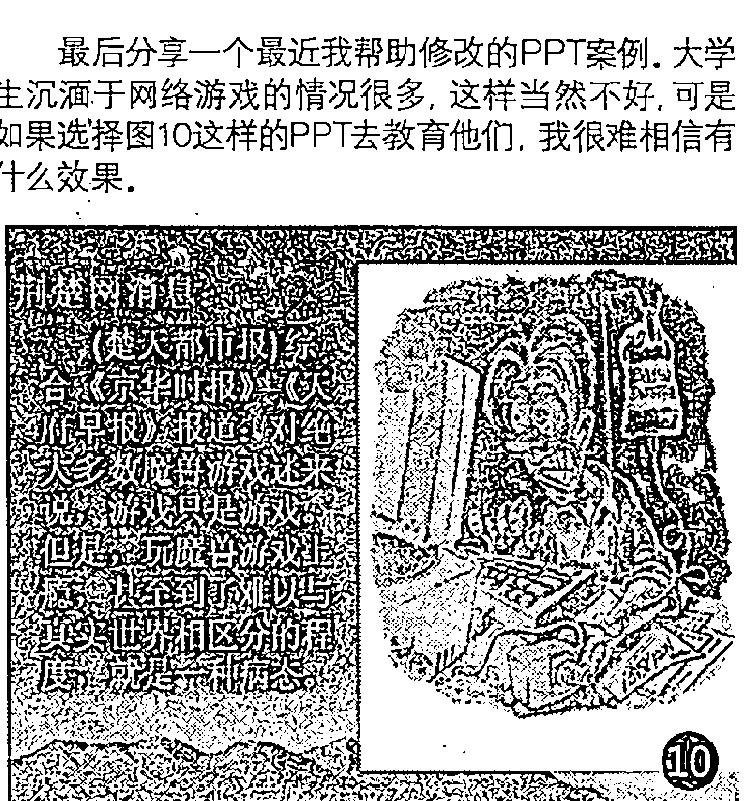

我认为给大学生做的PPT应该能让大学生阅读后觉得自己的情绪和想法被深刻理解，并感受到这些材料和他们的生活很接近。所以与其大段引用报纸大谈网游上瘾的弊端时，还不如不替大学生考虑一下：当你选择了网游，你会失去什么？ 这样我就可以选择一组小图片，对应大学生容易忽略的另外种种生活，其实这样图文并茂的字体在QQ聊天中也不鲜见，这样的PPT对于劝说大学生克服游戏瘾，应该更有成效一点吧。 这张作品修改完成后虽然和其他页面风格不太一样，但我很喜欢，把它放到我的作品《大学新生入学教育》PPT里面了。关于这个作品，大家如果有兴趣可以去http://www.70man.com/?p=3867访问。

好了，这次就和大家分享几个制作的小技巧和构思，希望对大家有所启发。

> 果果：与张志老师的相识源于一个有趣的作品《大学新生入学教育》，通俗生动，非常赞！于是我联系到他，发现他就是我之前购买的《说服力》一书的作者“秋叶”，而且还是一位在大学教授机械制图课程的老师。面对这位非常乐于通过网络分享经验的PPT专家、与大学生最亲近的人，有什么理由不约稿呢？于是，本文在双方沟通后半小时内诞生了！我遇到的写稿最快的人！神奇！ 如果同学们有兴趣，我还可以请张老师分享更多的PPT独家秘笈，很新、很实用的那种哟！

最后，再欣赏一下张老师曾经为大学生做的其他主题PPT作品吧，相信你会获得有益的启示。比如在图11中，你打算走哪条路呢？


（张志（秋叶））

## 垃圾回收机器人出没

每一个看过《机器人总动员》（WALL.E）的人恐怕都对这个可爱的垃圾回收机器人爱到不行，尤其是那双无辜的大眼睛更是令人过目难忘。告诉你一个好消息，现在真有一款和WALL.E功能相似的机器人，它叫做DustCart，跟WALL.E一样勤恳和善解人意。 DustCart could lead to smarter and more efficient trash and recycling collection, as well as pollution-monitoring. Recently DustCart rolled around Peccioli, a tiny town in Italy. Where trash trucks can get stuck in the narrow 8th Century streets, DustCart turns the corners with ease. The robot is programmed to respond to residents who call and tell it what they’re tossing—organic waste, recyclables. It shows up at the door, opens its belly, and then drops everything off at a waste-collection facility, all while sensors monitor pollutants in the air. Anyone who has been awoken by dump trucks in the middle of the night will appreciate that it runs quietly on lithium ion batteries. DustCart带来了一种更灵活有效的垃圾清理方式和污染监控方式。最近DustCart在意大利一个名叫Peccioli的小镇上投入了使用。大型垃圾车在那些8世纪的小街道中会被卡住，而DustCart却能来去自如。这个机器人为居民们提供有机垃圾循环回收服务。它会出现在居民家门前，打开它的“肚皮”回收垃圾，并将所有垃圾都倒入回收站中。同时，它的传感器还监控着空气质量。每个曾在半夜被垃圾车吵醒的人都应该庆幸，DustCart是消耗锂电的，它能十分安静地运行。 现在垃圾处理大多由人工操纵，不过当中的高科技也足以令人叹为观止：Nowadays it is relatively easy to separate the metal you want from the junk you don’t using recycling technologies. Eddy current magnets, for example, can deflect aluminum and other non-ferrous metals from a flowing stream of waste. Plastic, too, is becoming easier to pick out. Rather than the more expensive process of doing it by hand, some plastic sorting plants are now using spectroscopic scanners, which sort different types based on the spectrum of light they absorb. And since rising prices are making oil seem like an expensive raw material to produce plastics, recycling existing plastic from landfill seems sensible. 如今的回收技术使你想要的金属与你不想要的垃圾分离开的工作变得相对简单。比如，涡流磁体可以把你想要的铝及其他非铁金属从垃圾流中导出，塑料也能方便地被挑出。一些塑料分拣厂已抛弃了昂贵的手工分拣方法，转而使用分光扫描仪，根据不同的塑料吸收光谱不同的原理将垃圾分类。（南开大学/杨红）

## 文档在线分享之实战秘笈

半年前我在《电脑爱好者》看到一篇文章，讲的是豆丁网在线分享平台上几位大虾赚钱的经历。看完之后，我心潮澎湃了好长时间，原来网赚也不全是骗人的。于是，我开始了在豆丁的征程。现在我的实践也有些时日了，总结了一些经验，希望对大家有所帮助。

适的价格。如果你想自己优化，方法得当的话，收益会有所增加。比如上传时先把价格设为0.1元，看看一段时间后再依据下载量去调整下载价格。一般的好文档下载价格在几元到十几元之间。当然，如果你的文档专业性较强，有独家优势，可以适当加收费用，即使上百元也不过分。

不错的素材来源。还可以用手里一些资料或专业性较强的网站、论坛上的文章做成文档，收到意想不到的效果。

#### 获得收益的方法

第一种是通过别人浏览你的文档来获得收益，收益较少，每次只有0.001元。有人要小聪明，以为找朋友N次浏览不就行了嘛！其实不然，因为同一IP地址浏览一个文档无论多少次，收益都只有0.001元。还好浏览不收费，所以好文档的收益不容小视。第二种方法是通过下载收益分成，自己得到一半，就是说别人花5元下载文档你可以得到2.5元，这种方法收益多些。豆丁每天晚上会计算你的文档质量评分，同时依据文档的受欢迎程度进行综合测算，调整为更加合

#### 如何获得丰厚收益

要注意在上传文档时分好类，有益于别人找到，一个醒目的标题和简介是获得浏览收益的关键因素。还要做好宣传工作，比如将一个有关电脑软件文档的超链接放到某电脑软件论坛上，还可以加一些专业性强的QQ群宣传文档。此外还可以加广豆丁好友，给他们发一些有价值的文档地址，或加入豆丁小组推荐相关文档。我的宣传工作做足后，相关文章收益增加了1.5倍~3倍。想赚得多可不是一两个文档就行，光靠自己做文档就只能饿死。百度文库有很多文档可供下载，是

#### 成功与否的关键问题

-   1. 豆丁上的文档不能重复，谁先上传收益就是谁的，同一文档后上传的会被删除。注意别自忙活了。
-   2. 切忌文档五花八门，杂乱无章，最好一个豆丁账号只有一类或两到三类文档。
-   3. 数量为王。文档数量越多浏览收益就越多，有的人文档高达数万个，想没收益都不行。当然文档质量是关键，够专业够前沿才能够吸引眼球！
-   4. 迎合大众口味，如借鉴网上的《植物大战僵尸》资料做游戏教程。美女喜欢芦荟美容，可做芦荟美容法的文档。这类文档一般只赚取浏览收益，下载较少。
-   5. 时事新闻类文档费时费力，而且容易过时，不建议一般人涉及。（河北涿州中学/徐文刚）

## 电子作业提交哪个方法好？

现在不少学科的老师都要求在平时提交电子作业，如何提交电子作业可有一定学问。使用U盘吧，容易感染病毒；使用电子邮件吧，作业不方便管理。到底使用什么呢？如果提交不方便的话，老师和同学都不满意，如果被随随便便删除了作业，同学不满意；另外还有抄作业的问题。作为班级的一员，协助老师做好这项工作，方便大家不说，让老师满意了，印象分一定很高，哈哈！

#### 方法1：使用电子邮件

电子邮件是一种最常见的作业上交方法，可是有两个很大的缺点：第一是作业很难管理，第二是邮箱容量有限。如果要使用邮箱，建议用QQ邮箱，因为无需借助其他程序，QQ邮箱可以打开各种常见格式的文件，最方便老师查看。这个办法有点初级和古老，老师面对好几个班上百名的同学，会很郁闷的……

#### 方法2：利用电子教室提交

不少老师在机房上课，通常都需要安装“电子教室”来广播自己的屏幕。常用的电子教室很多，作业的收取就是一大优势功能。这里以联想传奇电子教室为例，教师机启动主程序，单击收取作业即可收取。在对话框中输入相应的目录，即可自动搜索学生机上对应的目录，并将目录下所有的内容传输到教师机上，是不是非常方便？大家可到http://www.legendclass.com/index.php下载体验版。如果你想

#### 方法3：建立FTP服务器

使用全免费的电子教室，推荐使用insight电子教室，这下方便了不少，只是它只能在特定的电子教室收取作业，有一定局限性。如果在机房讲课，何不建议老师安装一套这样的系统？文件的上传和下载，使用FTP当然非常方便，但文件体积不受限制，还可随时提交自己的作业。但不少人提起架设FTP服务器都非常头疼，因为多数FTP软件需要复杂的设置。这里推荐ftpserver（下载地址http://d.download.csdn.net/down/609862/share4318），这款软件号称最小的ftp服务端软件，使用非常简单，无需任何设置和安装，直接启动即可使用。这里一定要注意，只保留上传选项即可，否则作业很容易被别人抄袭和删除。

#### 方法4：专门的作业管理软件

俗话说，术业有专攻。还有专门管理作业的软件？当然！E作业管理（下载地址：http://www.newhua.com/soft/94813.htm）就可以很容易地对作业进行管理。这个共享软件，没有注册的用户不能上传大于5MB的文件，还好不太影响使用。使用这个软件，教师可以方便地在局域网内任何一台电脑上收发自己所教授科目的作业，还可以把自己的课程资料共享给学生，学生可以在局域网内任意

#### 方法5：专门的作业上交网站

收取作业最方便的方法是使用网络教学平台进行，部分经济实力雄厚的学校已经购买了这样的教学平台，其中就包括作业上交网站。对应一般的学校来说，只有同学帮助老师实现作业上交网站。这可是展示实力的时候，弄好了老师会对你印象特别好。建立作业上交网站首先要找一个支持动态网站的虚拟主机，学校一般能够提供这样的方便。如果不提供，网上也有很多免费的资源，如主机屋就提供即时申请生效的永久免费1GB全能虚拟主机空间，支持动态网站。然后可以从http://download.csdn.net/source/2667837下载一个简单的ASP.NET学生上交作业网站，把它部署到服务器上即可运行。这种方法较为复杂，需要一定的计算机知识才能做成功。告诉你一个秘密，有的同学就靠这个，本门课程（计算机类）得了高分哟。（河南工业职业技术学院/赵建超 郝倩）

## 0.1折买Windows 7 我们学生有特权

坐车刷打二折的公交卡，旅游买半价的学生票，因为我是学生！什么？0.1折的Windows 7专业版？Office 2010专业版狂打0.3折？没错，这就是我们学生的特权！自今年7月19日微软在中国开展“微软校园先锋计划”起，在校大学生（含专科、本科、硕士）均可参与该计划并以199元和149元的优惠价格购买到正版Windows 7专业版和Office 2010校园版（功能和专业版相同）。跟我来支持一次正版吧，以后再也不用怕盗版的黑屏和验证啦。

-   ### 第一步：账户认证
登录微软校园先锋计划主页http://flluei.apilunion.shop.edu.cn，点击“注册”按钮创建账户。为便于顺利通过身份验证，建议使用EDU后缀的邮箱。注册邮箱会收到一封确认邮件，账户激活后，点击“现在就去完成身份验证”。输入自己的真实信息，学生身份信息验证通过后，网站会跳转到产品购买页面，认证是较为严格的，并且每个账号只能认证一次。
-   ### 第二步：选择购买
将自己希望购买的产品加入购物车，然后点击“确定购买→去结算”，核对购买信息正确无误后点击“结算”，接下来就进入支付环节，网站支持“网银在线”和“支付宝”两种支付方式，支付成功后网页会有提示，与此同时一封包含你购买产品密钥的邮件就发送到注册的邮箱中了。
-   ### 第三步：下载光盘
再次以邮箱和密码登录网站，进入“会员中心”页面，可以看到成功的订单。点击“查看详情”，在“下载列表”中选择并下载需要的系统或软件安装光盘。如果注册邮箱中未收到密钥邮件，点击“重新发送密钥邮件”。
-   ### 第四步：安装
将下载的ISO或者IMG文件加载到Daemon Tools等虚拟光驱软件中，也可以将其刻录成DVD光盘，运行光盘，借助邮件里的密钥安装系统或软件。学生购买的微软校园软件产品与市售盒装产品享有一样的服务，包括无使用期限、正版增值计划、微软服务热线长达90天的免费技术支持。这下大家放心了吧！

支付成功，不少同学右键点击“用迅雷下载”一了之，醒来安装却提示“密钥错误”，仔细一看明明是专业版Windows 7却“升级”成了旗舰版！对此问题，官方给出的解释是：“使用迅雷等采用P2SP技术的软件进行下载时，大家有很大的概率会下载到和我们提供的专业版文件大小一样但其实是旗舰版的Windows 7镜像。”也就是说，迅雷、快车为提速，把别人下的旗舰版拼进了专业版，导致MD5码错误，官方给出的方案是“使用Utorrent等纯BT的下载工具下载”。其实Utorrent的速度也挺快。如果你的镜像悲剧了旗舰版，就重新下一遍吧。

> （北京工业大学/姜琪）

## 录专辑 我也可以做明星

我是一个来自宁夏，在山西上学的女孩，很喜欢《电脑爱好者》，第一次有胆量投稿，希望大家能喜欢！每个人都有一副好嗓音，但世上伯乐并不多。如何圆自己的明星梦呢？别急，先录个歌，听听从耳机里传出自己的声音，卡拉蜂（下载地址http://www.595.com/colorok/colorok.jsp）集结了练歌、录音、在线翻唱功能，还可以和网友分享作品呢！

-   ### 第一步：找伴奏
将卡拉蜂下载安装后，注册，登录到界面中，点击左上方，即可搜索属于你的伴奏，找到需要的歌曲后，就会根据提示进入到录歌棚里，开始一展歌喉吧！
-   ### 第二步：录音
首先确保你的耳麦戴好，在页面的右下方调节声音，点击“开始”按钮，录下自己的第一首歌，真棒。
-   ### 第三步：试听
录好后，就可以在这里试听了，单击下一步写上你的资料，你的翻录歌曲就做好了哦！
-   ### 第四步：自制个性MV
完美歌唱作品，怎能没有MV？网上有很多人都在摄像头下录制了自己的翻唱作品，很有个性，点击率很高！卡拉蜂自带了专属的MV录制渠道，打造一个不一样的幻灯片形式的MV吧！是不是很好玩？此外，你还可以DIY彩铃，或者打造自己的唱片专辑（视频和MP3等格式的转换可用“格式工厂”软件）。说不定下一个网络红人就是你！现在很流行校园演唱组合，和舍友们来创作一下吧。

> （中北大学/张瑞）

## 美国大学的计算机类专业探秘

果果，同在地球村，你知道美国大学里的计算机类专业是如何设置的吗？甚至，你是否想过去那边深造呢？听听本刊特派记者董旻的新鲜报道吧。又是一个新学期来临，昨天QQ上，在美国的同学和我讲，今年又有很多新生从中国来到美国求学，哈哈，我们的队伍越发壮大了！是不是也想赴美留学？至少来看看这个美丽自由的国度？别流口水，今天我就给大家简单介绍一下美国的计算机学科基本情况。美国是一个极为重视人才的国家，特别是像CFan们这样的人才^_^。我这么说绝对不是故意讨好读者，因为从美国人的角度来看，兴趣是学好一门知识最重要、最难得的必要条件。我相信CFan读者们都有一份对计算机事业的热忱，所以大家已经一脚踏入神圣的校园了！

#### 热门专业

计算机科学（Computer Science）和计算机工程（Computer Engineering）已经成为了赴美留学的热门专业之一。原因有很多，其中一个是IT高科技尖端人才在全世界都大受追捧，而美国的计算机学科，可以真正让你学习到最先进的IT技能。美国允许学生根据自己的兴趣选择具体专业方向，比如有的人喜欢理论研究，有的人喜欢做些实用的项目。

-   ### IT专业排名
| 排名 | 学校名称 |
| :--- | :--- |
| 1 | Massachusetts Institute of Technology麻省理工学院，理工界的地球牛校，数据流计算机、人工智能方面有突出的成就。 |
| 2 | Carnegie Mellon University卡纳基梅隆大学的计算机科学不是一个系，而是一个学院，其规模之大、师资力量之雄厚可见一斑。 |
| 3 | Stanford University斯坦福大学，位于信息世界的硅谷，申请到的同学，图灵奖得主（Edward A. Feigenbaum, John McCarthy）很可能就是你的老师，该校在各个计算机领域的实力都非常强劲。 |
| 4 | University of Illinois--Urbana-Champaign伊利诺伊大学香槟校区，在计算机工程方面实力很强，超级计算机研究开发中心：美国国家超级计算及应用中心在此。 |
| 5 | University of California--Berkeley加州大学伯克利分校，也在硅谷，16个诺贝尔奖得主，总数近200人的科学院院士！ |
| 6 | Georgia Institute of Technology乔治亚理工学院 |
| 7 | University of Texas--Austin德克萨斯大学奥斯丁校区 |
| 8 | University of Michigan--Ann Arbor密歇根大学安娜堡校区 |
| 9 | California Institute of Technology加利福尼亚理工学院 |
| 10 | Cornell University康奈尔大学 |

最近出了一点不光彩的事情，前微软中国区高管唐骏同学文凭涉嫌造假。下面我就告诉大家几招识别野鸡学校：正规学校的网址基本都是.edu结尾，学费少且学费不高，都有六大教育机构认证（网址 http://www.msache.org、http://www.ncasc.org、http://www.nwccu.org、http://www.ncahigherlearningcommission.org、http://www.wascweb.org、http://www.sacscoc.org），而野鸡学校太多采取远程授课，而且校名很气派。

> （美国/董晏）

## 大学生PPT课堂之：别用图片说错了话

作者简介：张志（秋叶），武汉工程大学机电学院讲师，知名PPT专家、培训师，畅销书《说服力——让你的PPT会说话》作者，在独立博客 http://www.70man.com 上分享了很多关于制作PPT的实用技巧。

现在大学非常流行 Presentation（宣讲、陈述），很多同学都希望做出好的 PPT 让自己的 Presentation 更精彩。不少人都想到一招——用图说话，问题也随之而来……

#### 图文貌合神离

新手配图容易犯的错误是乱配关联度不高的图片，图1中左边的幻灯片用了很多图片，但是好看吗？

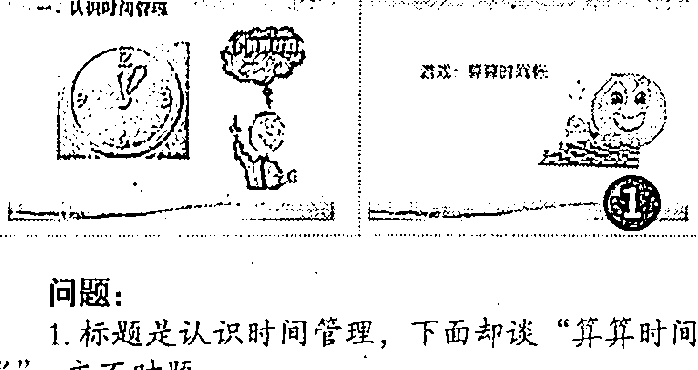

**问题：**
1. 标题是认识时间管理，下面却谈“算算时间账”，文不对题。
2. “算算时间账”几个字和背景色接近，看不清楚。
3. 图片过于简陋，旋转时钟也不容易和算时间账的概念构成联想。

**巧改：**
同学们喜欢用图我不反对，不如换个图试试。既然是做游戏，图片选择当然可以轻松一些，我选择了一张下棋的卡通画。因为下棋让人联想到读秒，这可是要算时间的，和游戏内容有呼应。另外我把标题和图片靠近，便于大家理解这张图的含义。提醒大家注意的是，我选择的是矢量图（WMF或AI格式），图像拉大后也不会变得模糊不清，而且白色背景图片能很自然地融入 PPT 的背景中。

再看一个小例子，这张 PPT 用图问题也是典型的图片和内容脱节（见图2）。握手代表结束，虽然最后一句文字是结束语，但用握手衬托没有什么意义吧？我在微软剪贴画里搜索到一张金色小人的图片，正好切题。如果能给语录配上名人手写签名就更好了。

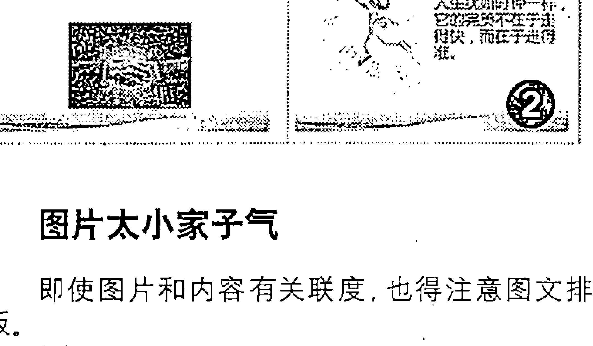

#### 图片太小家子气

即使图片和内容有关联度，也得注意图文排版。

**问题：**
左边这张 PPT 配图和主题谈“目标”关联得上，但图太小，文字太简单，整张 PPT 显得内容单薄，缺少重心（见图3）。

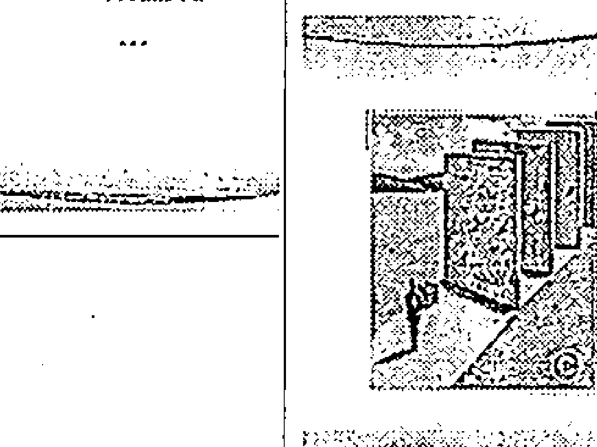

**巧改：**
不妨考虑拉大图片，占据左边，文字放在右边，构成左右对称的排版。文字不是一味简短就好，有时候简短等于过于简单，比如“可视化”让别人能够联想什么内容？既抽象也发散，不如改成口语化的句子。右边的排版还注意到使句子长短一致，而且宽度和图片空间基本对称，保持版面平衡。最后简单排版突出标题，对齐文字和图片，调整文字行距。对了，请大家以后记得不要用这种奇怪的项目编号了。

经验总结：
1. PPT中配图必须对理解沟通内容有帮助，不能仅因为觉得图好看而选用。
2. 仅起修饰作用的图片不要放在突出位置，避免分散对其他内容的关注度。
3. 图文混排时要考虑突出文字还是突出图片，选择合适的排版强调对应内容。

#### 图表打扮太土气

图片是图，用各种框图表达结构化信息也是图，这种图要画出来就需要一定的抽象归纳和逻辑思维。这方面恰恰是大学生朋友比较缺乏的，来看一个表格的例子（见图4）。

**问题：**
左边的 PPT 问题很明显，这个表格没有用表格来做，希望通过排版做出更好看的效果，当然没有达到目的。而且文字颜色和背景色不配，排版很乱。

**巧改：**
1. 对齐！对齐！对齐！上下居中对齐，左对齐，每列文字都要对齐。
2. 文字色和背景色一定要用对比，不能用近似色，除非你有意让别人看不清。
3. 增加横向背景色块，引导浏览视线，在 Office 2010 中可利用阴影效果给背景色块增加层次感。
4. 右侧的文字太小，如果是讲课用，后排同学一定看不见，12号字体太小，换至少18号字体，顺便进一步增大左侧字体，这样保持重点内容更突出一些。
5. 字体一加大，空间就不够，这就得提炼文字，删除一切可以删除的废话。
6. 最后把横向每一排形状要素组合，保持同样的间距。空间不够，让箭头只露出一个三角尖，表达递进也不错。

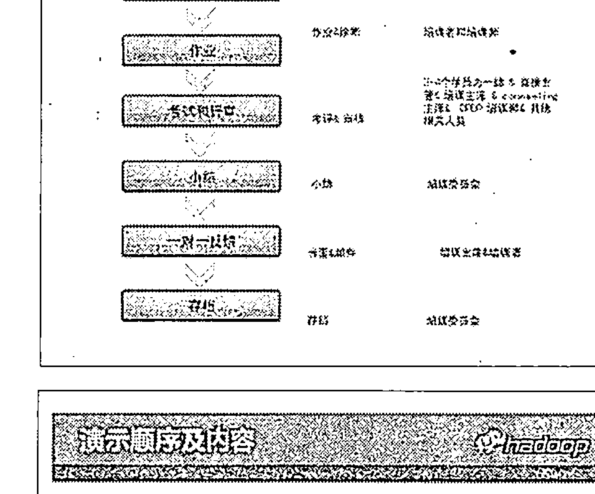

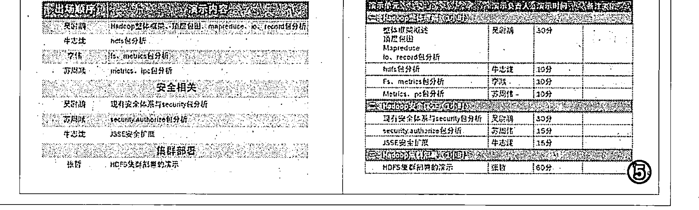

修改完毕，虽然不是美女，但从村姑到少妇了，毕竟可以出得厅堂。

#### 抱着“专业”模板不放

学生做 PPT 最大的一个问题是不够专业。有同学问：“专业”这个东西，不是模板吗？我想说的是，不是用了罗兰贝格、麦肯锡的咨询模板就合适。

还是举一个简单的例子（见图5），现在的学生把表格做到左边 PPT 这个程度，是我当年读研究生时做不出来的，但仍有需要改进的地方。

**问题：**
1. 缺乏细节信息。一般而言，一个演讲安排至少包括演示总时间、每个演讲单元时间分配，具体到每个人出场顺序和时间，如果下一个人不清楚前一个人和后一个人的时间安排，万一前一位时间压缩或延长了，自己的演讲就不好根据实际情况机动调整。这一点和选择什么模板没有关系，和学生做计划缺乏专业训练有关系，所以这个 PPT 最大的问题是缺乏足够的信息，需要补充完整。
2. 颜色指引不当。PPT 用深浅颜色划分阅读视线的思路没错，但中间的演示单元背景色和具体出场顺序背景色都是一样的，这就不太妥当，应该用不同颜色代表不同信息，让观众阅读时明白那些行是一个级别的内容，这样才好。

**巧改：**
首先我重新组织了表格的栏目，从“出场顺序-演示内容”两列改成“演示单元-演示负责人-演示时间-备注”四列，“演示内容”是关键信息，要放在最引人注目的地方。然后我尽量借用模板底色的近似色作为表格不同阅读区域的底色，通过不同的颜色就把演示单元区分开来，而且整个 PPT 颜色不至于太多显得乱。

改后是不是显得更专业一点？这种表格排版在论文答辩的 PPT 中经常可以借鉴，大家可以自己去练习练习。

很多人 PPT 做得不好，总是抱怨模板不行，技巧不够。其实技巧层面差不多的人很多，PPT 高手就是比阅历和知识面。我反复强调，思路、结构、排版、配色等，都比模板和技巧更重要，这些都需要不断实践才能积累出经验。祝大家早日成为 PPT 高手！

## 隐真示假 打造完美页眉标题

最近因工作需要，我编辑了一本“资料汇编”，收录了许多领袖著作。为了美观，需要在很多页的页眉上添加“理论学习文件汇编”，再用 StyleRef 域在每一奇数页的页眉提取所在页的“标题1”，即文档的主标题。最后在整篇文档的开始插入总目录，而且目录单独编号，正文编号再从1开始。似乎很麻烦吧？其实，这个要求对 Word 2007/2010 来说很简单。

#### 偶数页眉加标题

1. 第一步：进入“页面设置→版式”选项卡中，在“页眉和页脚”中勾选“奇偶页不同”并确定。
2. 第二步：把每一篇文章的文档主标题文字都设置为“标题1”样式，这样便于提取页眉和目录。
3. 第三步：将光标置于文档的开始，进入“引用→目录→插入目录”，将“显示级别”设置为“1”，其他保持默认选项不变，确定，文档的开头就自动插入了一个目录。把光标定位于目录与正文之间，在“页面布局→页面设置”中点击“分隔符”按钮，并在下拉选项中选择“分节符→下一页”。
4. 第四步：进入“插入→页眉→编辑页眉”，把光标定位在正文所在节，此时工具栏上会多出“页眉和页脚工具”，在其下点一下“链接到前一条页眉”按钮，以断开目录所在节与正文所在节的链接。这样，两个节就可以分别设置不同的页眉了。

在奇数页的页眉中键入“理论学习资料汇编”几个字，并设置好字体字号。再定位到偶数页的页眉，在“插入”工具组“文本”工具框中点击“文档部件→域”。接下来在“类别”中选择“链接和引用”，然后点击下面的 StyleRef，并在右侧的“域属性”中选择“标题1”，其他选项保持默认，确定后就会发现所有偶数页的页眉上都自动提取了所在文章的标题。

#### 不该出现的部分藏起来

许多文档都要加脚注，比如毛泽东同志的《为人民服务》，就要在页面下方加一条脚注“这是毛泽东在中央警备团追悼张思德的会上的讲演。”脚注好加，但问题是加脚注是要在标题右侧添加一个星号（*），这样，我们在页眉上用 StyleRef 域提取的文字中就包含了这个星号，但是我们希望这个星号不显示在页眉上。

由于页眉是利用域自动提取的，所以不可能手工删除页眉中的星号，而如果在正文标题中删除星号，则会将脚注一同删除；颇有些“把孩子同洗澡水一起倒掉”的意味。我研究了半天，终于想出一个隐真示假的办法。

我的方法是，把每个“标题1”的文字复制一份到原标题的下面一行，把下面一行中的脚注符号删除，并把行距和字号设置成最小（如5磅），字体颜色设置为白色。换句话说，就是尽量让它看不到。设置好了之后，在右键菜单中选择“将所选内容保存为新快速样式”。点击“修改”按钮，将“名称”定义为“隐形标题”，“样式类型”设置为“正文”（为避免提取目录时把“隐形标题”也提取到，造成每篇文章都重复生成目录），其他选项保持默认状态，确定生效。样式设置完成后，将每一个标题都复制一份到原标题的下一行，并将其样式设置为“隐形标题”。再重新定位到奇数页页眉，选项页眉上的文字，按快捷键 Shift+F9，切换到域代码状态，将域代码中的“标题 1”改为“隐形标题”，其他代码不变，再次按下 Shift+F9 切换回正常模式，原来的小星号终于消失了！

> (云南/侯和林)

## Iron Man——梦想照进现实

说到 Iron Man，你最先想到的是什么？肌肉型男 Robert Downey Jr.，还是性感甜心 Scarlett Johansson？No，作为一名铁杆 CFan，我们最先想到的应该是 Iron Man 中华丽丽的高科技。首先，Iron Man Tony Stark 的“高科技”简历足以令现实中任何一位 IT 人士汗颜：

Tony Stark. Visionary. Genius. American patriot.
Even from an early age the son of legendary weapons developer Howard Stark quickly stole the spotlight with his brilliant and unique mind.
At age four, he built his first circuit board.
At age six, his first engine.
And at seventeen, he graduated Summa Cum Laude from MIT.
Until at age 21, the prodigal son returns and is anointed the new CEO of Stark Industries.
With the keys to the kingdom, Tony ushers in a new era for his father's legacy, creating smarter weapons, advanced robotics, satellite targeting.

Tony Stark，梦想家，天才，爱国者。从少年时代起，这位传奇武器研发者 Howard Stark 的儿子便因聪明才智而备受瞩目。他4岁会做电路板，6岁会造引擎，17岁成为了麻省理工的优秀毕业生，21岁时浪子回头，继任 Stark 工业的首席执行官，接过父辈旗帜。Tony 开辟了新的天地，创造智能武器、高级机器人和卫星定位系统。

除此之外，Iron Man 1 中的 robot chamberlain (机器人管家) Jarvis，引发故事的 missile (导弹) Jericho 和维系 Iron Man 生命的 Arc Reactor (电弧发射器) 等高科技都是观众甘愿为之掏腰包的看点。

俗话说，外行看热闹，内行看门道。这不，Iron Man 2 中 Stark 在家自制粒子加速器 (Particle Accelerator) 的桥段竟然引发了科学家的兴趣。Iron Man 余热犹存之时，科学家讨论了 Home-Made Particle Accelerator 的可能性，结果竟然是 possible (可能)，不过遇到的问题也不少：

Firstly, the basic building blocks are a beam tube with a large vacuum, charged particles, magnets to bend the beam, and radio frequency oscillators, or RF cavities, to accelerate the particles. Based solely on what's depicted on screen, Tony Stark seems to be missing RF cavities (although they could be off-screen), and his magnets don't appear to be large enough for maximum steerage.

首先，建造加速器的材料包括了一个较大的真空粒子束管、带电粒子、能弯曲粒子束的磁铁以及能加速粒子的射频振荡器或射频腔。根据电影屏幕上的画面，Stark 的加速器似乎缺少了射频腔（当然它有可能位于画面之外），同时他所用的磁铁也不够大。

There's also the question of where he's getting the juice to run his homemade accelerator: on the order of 10 to 15 megawatts, enough to run over 10,000 homes. For Stark to run his accelerator, he's gotta make a deal with his power company or he's gotta have some sort of serious power plant in his backyard.

另一个问题是自制加速器的能源。以美国布鲁克黑文超导对撞机为例，其一万亿兆瓦的功率相当于10000或者15000个家庭的用电。对于 Stark 而言，如果他想运行他的加速器，必须要和电力公司打好招呼，或者家里有强大的发电设备。

> (南开大学/杨红)

## 完美“网申” 攻占名企第一步

开学了，大四的同学们找寻着自己的未来，而其他年级的同学对名企的实习机会也无比向往。如何才能获得宝贵的机会呢？网申吧！

顾名思义，网申就是“网络在线申请”（apply online），目前很多“大牛”公司都是通过这种方式来收集简历和初步筛选应聘者的！把简历随便扔进 HR 的信箱里，已经不是唯一的和最有效的方法了！到名企官网或指定地点直接网申才是正道。

#### 如何对付网申中的开放题

1. 关于职业生涯规划的问题：请谈谈你3年～5年的规划。
2. 你认为大学时代最成功（失败）的一件事是什么？为什么？

解读：“我想3年成为主管，5年成为经理。”这个回答不明智。HR 希望挖掘你应聘的深层动机，看你是否具有稳定性。在不清楚对方职级和晋升条件的情况下，建议回答不要过于具体。

解读：HR 要从回答中来判断出你的价值观。可遵循 STAR 原则（S=Situation, T=Target, A=Action, R=Result）回答。在怎样的背景下，具有怎样的资源，面临怎样的问题、事情或决定，你是如何行动的（利用资源、克服困难、解决突发状况等等），最终结果是什么。如果是失败的事例，那么你需要分析失败的原因和教训。

此外，“为什么选择某公司，为什么申请某职位”，要看清自己，清晰定位；“举例说明你如何说服一个难以说服的人”，考察沟通和影响力。要尽量利用所给的字数限制，既不要超出也不要大大节省。需要注意的是，网申前通过公司官网对企业文化、核心业务、中国分公司发展等情况仔细了解，有助于答题时更好地契合企业要求。另外，网站的风格、用词、对职位的描述等能提供一些线索，如关于职位基本素质、对方惯用的专业语言等。

#### 网申细节决定成败

不就是打开网页，一项项填写吗？以下细节，如果你做到了就成功了一半。

- 拼写、语法等低级错误绝不能出现，个性夸张的风格往往也不易被接受。填写较大篇幅的问题时，尽量在 Word 环境下填写好，然后再粘贴到网页上去。Word 还可以显示错误，提醒你改正。看看这句说明应聘美的集团的原因：“……企业有着良好的激励机制，海信集团有着良好的公众形象……”印象分已经为0。
- 保证自己的网速够快，为防止在线申请人多出现死机或联不上企业服务器的情况，建议挑选午饭、凌晨等时段。
- 填写完一页就及时保存所填写的内容，免得做无用功。很多公司的网申提供在线修改的服务，不必等到所有的问题都答完才保存。只要在结束期限之前，都可以上去更新简历和思考更好的答案。中英文简历要对应起来。
- 不少 HR 设置电脑自动按照关键字检索，如果你的申请资料上没有相关关键字，很有可能就被筛选掉了。因此尽量覆盖这些重要的关键字，如院校层次、学历、专业、英语水平等。
- 资料填写要和你所申请职位的匹配。多选职位的话要确定自己的能力都匹配，否则只会给人“乱投医”的感觉。
- 关注网申私密和招聘流程，做到心中有数，不要浪费别人的经验，细致填写，不要中途放弃，祝福大家收到满意的 Offer！

> (河北武邑中学/鲁伟)

## Excel 行多别怕 批量填充空白单元格

课余时间，打工去！阿涛觉得不能老向父母伸手要钱，出去锻炼一下，还能增长社会经验呢。一家连锁食品店成了他的第一站。

“唉，这个 K3（金碟软件）真讨厌，导到 Excel 中的数据都空开的（见图），怎么做统计呀？”统计员翰哥发着牢骚。

|   | A        | B          | C    | D   |
|---|----------|------------|------|-----|
| 1 | 日期     | 老总       | 商品代码 | 数量 |
| 2 | 2010-8-28 | 广州燕雀店 | 5150 | 810 |
| 3 |          |            | 5148 | 810 |
| 4 |          |            | 5143 | 810 |
| 5 |          |            | 5142 | 810 |
| 6 | 2010-8-27 | 珠海环佳店 | 8117 | 11  |

#### 批量填充一分钟

首先，选中 A1 到 B5106 单元格，在菜单栏中点击“编辑→定位”，点击“定位条件”（或按下快捷键 Ctrl+G），选择“空值”，确定。这时，电脑自动选择了 A1:B5016 单元格区域内的所有空白单元格。这时不用鼠标作任何操作，直接在键盘上键入 = 和 ↑，按下快捷键 Ctrl+Enter，所有的空白单元格就都被填充好了！

#### 保险起见巧复制

“很神奇，不用函数还这么快，大学生就是厉害！下面我可以按商品编号排序了吧？”翰哥问。“慢！现在如果你要排序，一定会混乱。以 A3 为例，它表面上与 A2 内容一致，都是“2010-8-28”，其实它是一个公式“=A2”，如果不把公式转换成数值，相关操作可能会变乱。所以现在为了保险起见，还要多一个步骤。”选中 A、B 两列，右击鼠标，“复制→选择性粘贴→数值”，大功告成！

(广东/沈慧)

## 校园精彩生活 一幅打尽

毕业了，是否还想起曾经共同生活过的同学？是否还想起曾经的精彩校园生活？如果现在能在一幅图中将所有的校园风采全部展示出来，那多让人激动！下面就跟我用同学的校园精彩瞬间，来生成一幅毕业照吧！

1. 第一步：将 Thumbnails 文件夹中的图片换成校园生活的精彩瞬间图片。
2. 第二步：启动 PhotoMosaigue.exe 后，单击工具栏中的按钮，打开班级的毕业照片。
3. 第三步：单击工具栏中的按钮，打开 Image size 对话框，可设置图片的显示效果。其中选项 Antialias 为是否消除锯齿，Preserve aspect ratio 为是否等比例缩放。
4. 第四步：单击工具栏中的下拉按钮，选择要制作的分辨率，有 10pixels（若图片宽高都小于800像素，图片会被放大到高/宽其中一边等于800像素）、15pixels（对应1200像素）、20pixels（对应1600像素）、40pixels（对应3200像素）四种可选。也就是说如果图片小于所选的分辨率，图片会被放大到所选的大小，若大于所选的分辨率，则图片大小不变。
5. 第五步：设置结束后，单击工具栏中的按钮或直接回车，即可进行马赛克处理，完成后会立即显示。
6. 第六步：最后可将生成的图片保存或打印，一张蕴藏着全班同学笑脸的大图就完成了！图里藏图，有意思吧？

(江苏/张正)

## 轻松玩转个性 T 恤

国庆长假归来，宿舍八妹和 BF 买了情侣 T 恤，那甜蜜实在让人眼红。临渊羡鱼，不如退而结网，我要 DIY 自己的 T 恤，让它更个性、更诱人。

#### 个性图案巧制作

说实在话，我是个没啥艺术细胞的人，于是只好向“光影魔术手”求助，传说它有丰富的素材库，可以给我点灵感吧。到 http://www.onlinedown.net/soft/51436.htm 下载光影魔术手，安装成功后运行它，选择“帮助→检查素材更新”，就可以获取服务器上最新的素材。光影魔术手提供的素材有边框（轻松边框、花样边框、撕边边框和多图边框等）、日历、涂鸦、大头贴等类别，内容丰富，使用简单。以多图边框为例，打开一幅图片，然后依次选择菜单栏中的“工具→多图边框”，在最右边的素材选择栏里面选择自己中意的多图边框，立刻就可以在中间的预览区看到效果。选定边框后，就可以对图像进行调整了。首先根据需要添加合适数量的图片，并调整好它们的顺序，选中某一张图片，还可以通过左上角的选择框选择需要显示的区域，不过需要注意的是，图片的操作不能实时预览，需要自己手动单击下方的“预览”按钮。设置好后，单击“确定”按钮，个性图案就差不多完成了。我的图片中有人物照片，所以就使用了“人像美容”功能，让人像看起来更加艳丽。

#### T 恤转印要仔细

把准备好的白色 T 恤放在木桌上，并在 T 恤内层对应需要熨烫的地方垫一张白纸，防止颜色渗透。注意，不要使用家用的熨衣板，因为它不能保证图案能够完全贴在 T 恤上面。加热熨斗，直到熨斗完全没有蒸汽。将制作好的转印纸有图案的一面朝下，放在 T 恤衫适当的位置，将加热好的熨斗在图案上匀速移动，使转印纸均匀受热，当图案全部粘在 T 恤衫上以后，撕去转印纸，个性 T 恤大功告成。如果制作过程中出现了颜色渗透，请在冷水中反复清洗，直到不再有残留墨水为止。为了确保图案保持光泽，请尽量使用带有护色功能的清洁剂，洗衣服时尽量让 T 恤里朝外，洗净后应立即把衣服挂在通风处晾干。

#### 选转印纸有讲究

这一步最关键的不在于打印，而在于选材。墨水方面，有颜料墨水和染料墨水之分，由于染料墨水不像颜料墨水一样表面有一层聚合物的保护，所以在恶劣环境下，染料墨水容易出现分子扩散，产生掉色的现象，因此建议使用颜料墨水。不过通常现在的 T 恤都是纯棉的，所以一般不用过于担心衣服会掉色的问题。转印纸也有深色和浅色之分，大的原则是深色衣服用深色转印纸，浅色衣服用浅色转印纸。图案制作完成后，接下来就是把它打印到转印纸上去。需要准备的材料除了转印纸以外，还有彩色打印机和剪刀，最好使用带有转印纸打印功能的打印机，千万不要使用激光打印机打印，因为其发热部件会使转印纸熔化。用常规方法把图案打印到转印纸上即可。然后用剪刀沿着图案的边进行裁剪，四周留出大约 1CM 的空白。

#### 足不出户送礼物

以上是彻头彻尾的 DIY，但由于设备所限，经验不足，很难做出专业水准的个性 T 恤来。如果想 DIY 一件漂亮、个性又实用的 T 恤送人怎么办？完全可以自己设计图案后把后续工作交给承印商来处理。启动光影魔术手，在打开向导窗口中单击“礼物中心”标签，再单击“个性 T 恤”图标即可链接到光影魔术手个性礼物网站。将制作好的图案上传到服务器，单击“保存”按钮。接下来就是填写邮寄地址和支付费用了，一切不在话下。

(四川/龚小江)

## 借道文本框 横向表格立起来

在制作一些文件时，我们经常会遇到一些需要横向放置的表格，但是由于整个文件的页面是纵向的，对于这些横向表格的排版就显示比较麻烦。以前我们都是在表格的前后插入分节符，单独设置表格所在页面为“横向”，但是，遇到文件有页眉和页脚时，就会顾此失彼，难以协调了。现在好了，用 Word 2010，就可以轻松解决这一难题。首先，新建一个横向文档，单击“插入”选项卡的“文本框”按钮，在其中插入一个文本框，调整文本框的大小使之与页面版芯一样大，然后在文档框中插入表格，并输入相关内容。复制整个文本框，粘贴到原文档的适当位置。把鼠标置于文本框顶部中央位置的绿色圆点上，会出现可旋转的提示，按下鼠标左键，同时按下 Shift 键，移动鼠标使之向左旋转 90 度，即完成了表格的旋转。放开鼠标，文本框尚未放到适当位置，单击文本框，文本框处于编辑状态后又恢复了横向状态，没有关系，文本框的边框处按下鼠标左键，拖动鼠标，文本框又变成纵向状态，并随鼠标移动，此时可以把它放到合适的位置了，此时，表格方向变成横向了，但页眉和页脚却并没有随之旋转，而是与其他页面保持一致。最后，把文本框的边框设置为“无”即可大功告成。

生产计划表
| 生产计划（表） | 生产能力合计（件/小时） |
|----------------|--------------------------|
| 产品系列       | 品种数量                 |
| 生产计划       | 生产能力合计（件/小时） |

(云南/侯和林)

谷歌帮你玩转人人

大学生们每天上网最离不开的恐怕除了QQ就剩下人人网了！作为中国最大的真实社交网站，先不说人人网分享的内容营养成分有多大，至少在休闲层面，人人网的的确确在空虚里解决了我们的问题。想不想把人人网玩得更高一点呢？今天让我来为大家介绍人人好帮手——谷歌浏览器！它一向以速度优势示人，其实它的可玩性才是亮点。

把改造器请出来

进入谷歌浏览器，打开右上角小扳手，进入“Tools→扩展程序”，点击“获得更多扩展程序”，在新打开的网页里搜索一下“人人”会出现几个关于人人的扩展工具。“人人改造器”就比较全面实用。下面我们就见识一下它的实力吧！

改造人人看我的

和其他的扩展程序不同，人人改造器不会出现扩展程序图标，那我们该如何改造呢？软件为了倡导低碳生活忽略了图标的位置，毕竟改造器与其他扩展程序不同，不需要经常运行嘛。只要在我们最需要的时候出现就好了。可以看到VIP的左边多了两个字“改造”，这就是我们改造器的入口啦！

新鲜事速度来报道

人人里的新鲜事虽然是重点关注的，但是不乏枯燥无味、低营养的栏目扰乱视线。保持联系，就像是提醒我们该删除谁了一样，等级提升，一点意义都没有的东西出现就是碍眼，让我们逐一屏蔽。这些还不能满足我们的高品质需求，这里特别设置了标题过滤功能，只要我们在“隐藏标题中含以下内容的新鲜事”加入关键字，用竖线分隔就能屏蔽任何我们不想看到的内容，并且还可以设置新鲜事的自动更新时间等，做完相关设置，我们的人人首页就会变得清爽实用多了！

有用的东西大团圆

我们追求的还不止这些，要改造就不能只屏蔽自己不想要的，平时方便使用的也要加上才行。“改造主题模版”、“音乐播放器”、“漂浮物”、“信纸”等，本来人家就是花了好多钱才弄来的美化，自己感觉去掉怪可惜的。但是一些部件的清理还是蛮必要的，什么“赞助商广告”啊、“人人调查”啊，弄了又不给奖励，还要在那里碍事，搞不好点上就要弹出网页，最讨厌了！清理！

“处理请求”也是个好东东，应用请求、热点动态、各种通知统统隐藏。这样还不够，新草就要除根，讨厌的橡皮套要选上“自动拒绝”才安心！

个性玩酷看我的

表情不够丰富？“辅助功能”增加了额外表情项，可以把人人网上状态栏支持的所有表情都显示出来，让自己的状态里表情比谁都丰富！选择“将评论加上楼层计数”就可以像是论坛一样的聊天了。还有比较有实用的就是“允许下载相册图片”，以及“鼠标经过时显示大图”，这样不开网页就可以看大图了，但是可能会留下访问记录，所以选上保护模式才是上上之选！其实我们也可以不开这个来增加别人的回访哦！而对于“阻止点击跟踪”、“访问统计”，以及Google Analytics’就要看个人的个性了。人人网现在的升级越来越快，各种功能不断推陈出新，我们的改造器也在不断改善，因此打开自动更新非常必要！怎么样？有了人人改造器，玩起人人是不是更方便有趣了？谷歌浏览器里还有很多各式各样的扩展程序，同学们无聊的时候，也可以多挖掘一下宝藏哦！（大连理工大学城市学院/陈佳明）

IT养生之电脑族的皮肤问题

暑假过去了，小宝一照镜子发现自己脸色蜡黄，干燥无比，再看照片里自己水嫩嫩的脸蛋，无比郁闷，开学见到男朋友小贝就发起了无名火，“你别着急，我有一哥们雷人（活雷锋的简称）是学中医美容的，咱们赶紧去请教一下。”

电磁辐射惹的祸

> 雷人：你整天对着电脑吧？
> 小宝：恩，我白天看韩剧，晚上熬夜玩游戏，然后倒头大睡。
> 雷人：你的皮肤损伤啊，是电磁波辐射和静电荷干的。你同一个姿势对着电脑，电脑发出的电磁波辐射对你的脸部缓慢积累，量变成了质变。此外，静电荷是电脑运行的副产品，灰尘等脏东西随之而来，时间长了就堵塞了毛孔。
> 小宝：我该怎么办呢？
> 雷人：注意选用通过TCO认证的显示器，可以把电脑摆得离自己远一点，有效降低静电荷的粘附率。用电脑前，最好在脸上涂一层隔离霜或BB霜，休息时用保湿喷雾给脸部补水，然后用洁净的手轻拍吸收，再涂上锁水乳液，小喷壶灌上矿泉水（农夫山泉等）随身带着，感觉脸上油或干时就喷几下，晚上睡前边喷边拍坚持一周就会有明显改善。

痘痘比房价增长快

> 小贝：兄弟，我顺便请教一下痘痘，太“青春”了不是什么好事。
> 雷人：防治痤疮，每次上完网都要洗脸，你记得用男士洗面奶清洁哦。湿润面部后，手上挤适量的洗面奶轻轻揉开，再按照从下到上、从里到外的打圈方式按摩几分钟，要注意清洗鼻头等容易藏污垢的地方。水温最好控制在37℃～60℃之间，因为太高的温度会刺激油脂分泌，太低的温度则无法洗净油脂。曼秀雷敦泡沫洗面奶、春娟黄芪霜、复方红滴霜等对痘痘效果不错，严重的痘痘肌还可服用硫磺皂。洗完还可以拍一些爽肤水。

电脑是皮肤的大敌，一天几毛钱，清洁和补水，为肌肤撑起保护伞，电脑一族们，别再犯懒了！（更多详细养生方法请登录guoguo.blog.cfan.com.cn）（福建中医药大学/雷人）

用活微软剪贴画 为PPT找美图

做Presentation（宣讲、陈述）离不开PPT，每次Presentation背后都有一个折磨死人的PPT。更折磨老师的是现在大学生做PPT中了全图型PPT的毒，一做PPT就是大图配文字，走煽情的路线。题图是全图型PPT代表，似乎除了这种PPT以外，其他风格的就不是PPT了……不过既然全图型PPT这么流行，今天我们就谈谈如何为你的PPT找到漂亮的图片。关于找图，首先是去哪里找，然后是怎样找的问题，我今天介绍的一大利器是微软的“剪贴画”。用好了，你的PPT就能闪闪发光！

小提示：矫正认识误区

- 剪贴画并非大量简陋的卡通画，也包括很多精美的图片。
- 剪贴画并非大量像素小的图片，也包括很多大像素图片，比如在PPT的“剪贴画”菜单下选“Office网上剪辑”，就可以进入微软官网的剪贴画板块，我们搜索出的这张图片，像素就高达1024×1024。

查找相似图片

微软的剪贴画除了分类搜索之外，还提供了强大的查找相似图片功能。点击红色方框所在的“查找相似图像”，就可以进入微软剪贴画的相似图片功能（第一次使用此功能可能需要按在线提示安装Silverlight.exe程序）。进入相似图片后你就能看到图片墙，我非常喜欢微软剪贴画的图片墙功能，拖动红色箭头所指顶部按钮左右滑动还可以看到更多相关图片。

关键词很关键

微软还提供了关键词搜索图片功能，集成了bing搜索引擎。比如在微软官网剪贴画中用“金色”搜索，可以查找到不少关于金色小人的图片。建议大家在左边“媒体类型”和“图像大小”中选择需要的选项，比如是插图还是照片，是可调的矢量图还是普通的位图等。另外还可选择“下载”次数作为排序选项，大众喜欢下载的图片一般都不错。微软为每张剪贴画都设置了大量的关键词，当你打开一张图片后，会发现图片页面底部有一个关键词，点击任一关键词，就可以找到包含这个关键词的全部图片。微软一直在扩充图片库，现在的剪贴画已经超过16万张图片了。

用样式找同类

最后分享一个小技巧，使用样式属性找到同类剪贴画。如果整套PPT使用的剪贴画风格一致，对PPT质量会很有帮助。假如你找到的微软剪贴画含样式属性，请点击这个属性，那么你会立即得到和这个样式同样风格的全部剪贴画矢量图，比如这张样式1443的结果，很酷吧！下次一定要记得把好的样式编号记下来，直接输入关键词“样式 样式编号”搜索就好了！

小提示：谷歌图片来助阵

除了微软的剪贴画，我还喜欢用谷歌图片功能来找好图片。这个工具大家都会用，关键是你要知道用什么关键词搜索，比如“3D小人”，结果就很妙吧！我推荐的谷歌图片找图方法分四步：

第一步：确定要表达的主题，比如“目标”，直接用“目标”搜索效果并不好。

第二步：进行情景联想，什么情景可以表达“目标”？登山、胡萝卜、飞镖游戏、爬台阶、射门等是否可以？

第三步：把情景用关键词描述，比如搜索和“目标”有关的图片时，可以换成“登山、飞镖、胡萝卜、台阶、射门”等。

第四步：如果对搜索结果不满意，别灰心，将关键词翻译成英文或英文同义词看看。不信你先用谷歌图片搜索“问号”，然后再用“question”搜索看看！这就是秘密所在：用英文关键词搜索，图片质量也许要高20倍！关于搜图方面，建议大家看看我汇总的一篇文章：http://www.70man.com/?p=4056，相信各位会有更多收获。（秋叶）

超酷！我用真人QQ表情秀

这年头，用图说话已成为一种潮流，有时比文字更有想象力。君不见聊天时，QQ里经常会弹出铺天盖地的图片，不过这些图片实在有些滥，作为校园里的潮人，咱要的就是个性，用真人表情秀，才够潮，够酷！

人，不过都是用现成的QQ表情，不带劲，如果能把某人的照片，做成恶搞的QQ表情，无疑“攻击力”会更强。不过恶搞要有度，掂量一下彼此的关系，友谊第一别忘哦。

QQ表情报平安

求学在外，父母为了能够经常看到我，学会了上网，学会了用QQ，真的让我感动。如果能经常在QQ上，给父母发些自己的真人秀QQ表情，无疑既向父母报了平安，又能逗乐他们。

打开美图拍拍（下载网址: http://paipai.meitu.com），切换到“做QQ表情”，单击左侧“动态边框”按钮，在右侧选择一个搞笑的边框，然后点击下方的“拍照”按钮，做好拍照准备，等待3秒后，将会自动连拍4个镜头合成QQ表情，此时你就尽情对着摄像头表演吧。完成会自动生成QQ表情，单击“复制到QQ”按钮，再打开聊天窗口按Ctrl+V就可以粘贴表情发送给父母，非常简单。

> 小提示：
> 将表情粘贴到QQ聊天窗口后，可以右击选择“添加到表情”，将其添加到QQ表情库中；选择“涂鸦编辑”，可以给表情加上文字，非常方便。

恶搞！我也行

QQ同学群里，经常会有一些同学发图片“攻击”我们，不过都是用现成的QQ表情，不带劲，如果能把某人的照片，做成恶搞的QQ表情，无疑“攻击力”会更强。不过恶搞要有度，掂量一下彼此的关系，友谊第一别忘哦。

打开美图秀秀（下载网址: http://xiuxiu.meitu.com），单击“打开一张图片”按钮，打开同学的照片，切换到“闪图”选项，默认所有帧都显示同学的照片，在右侧选择闪图效果，然后单击第2、4帧下的“替换”按钮，选择动物的图片，这样照片和动物就会替换闪动，最后单击“复制到QQ”，粘贴到QQ中即可发送。

切换到“娃娃”选项，单击“开始抠图”，选择图片中同学的头像部分，然后单击“完成抠图”，此时再在右侧选择相应的恶搞效果，即可生成非常搞笑的QQ表情。由于美图秀秀中的内置效果每天都在更新，所以我们可以制作出各种各样的流行搞笑表情。

（浒澪小学/周建峰）

PSP变身游戏手柄

周日下午，宿舍老三、老四照惯例切磋实况足球，激战正酣的时候，老三传来一声惨叫，原来由于他的游戏手柄有个按键失灵，导致自己丢球了。俗话说“巧妇难为无米之炊”，作为兄弟，我还是要给老三扎起：“老三，别担心，三分钟给你弄个更高级的手柄出来。”

说罢，我拿出自己的PSP和USB连接线，一看他们的表情，我就知道他们又懵了。其实他们没猜错，我就是要用PSP打造一款免费手柄。PSP的手感自然不必说，更重要的是它还可以连接PS3，作为PS3的游戏手柄来使用，这让电脑玩家艳羡不已。那么，电脑玩家是不是就与“PSP牌手柄”无缘了呢？答案是否定的。借助一款叫做FuSaGamePAD的软件（下载地址http://foosa.do.am/load/0-0-0-33-20），我们就能轻松把PSP打造成一款适合电脑玩家的免费手柄。目前这款软件的最新版本为V0.3。

这款软件兼容性不错，支持绝大部分自制系统，下面就以我使用的自制系统5.50 GEN-03（PSP2000）为例对这款软件的使用作简单的介绍。

第一步：用USB连接线将PSP与电脑连接，将下载下来的软件包解压，找到目录FusaGamePad（路径通常为\psp\game\FusaGamePad），将其拷贝到PSP的\PSP\GAME目录下。

第二步：按X键断开连接，但继续保持PSP与电脑的物理连接，不要拔USB连接线。打开PSP游戏菜单，选择FusaGamePad，在熟悉的sony图标闪过过后PSP会有短暂的黑屏，之后屏幕中间会出现“>CONNECTING<”提示，表示系统正在连接电脑。

第三步：大约3秒之后，PSP会完全黑屏，这时PSP已经成功和电脑对接上了。现在把目光转到电脑一端，进入控制面板，依次选择“设备和打印机→设置USB游戏控制器”，在弹出的窗口中你可以看到一个名为FuSa GamePad的控制器，没错，它就是PSP变身的手柄，如果状态显示“确定”，就表示PSP已正常运行。

第四步：单击“属性”按钮，弹出“Fu Sa GamePad属性”对话框，按PSP上的各按键测试按键设置是否正确，X轴/Y轴的偏转是否正常等。这和普通手柄测试是完全一样的。测试正常后，就可尽情享受DIY的PSP牌游戏手柄了。

等等，废寝忘食地游戏前，还是要想想游戏结束怎么退出。其实很简单，直接拔掉USB线，然后按下PSP上的HOME键，PSP就会列出一系列菜单。按照提示操作即可，其中X键表示退出软件，O键表示取消操作，并进入等待连接状态。

话说回来，刚才的菜单是不是很眼熟呢？这就是游戏手柄常见的按键映射表，但是如果你不喜欢这样的设定怎么办呢？简单，在FusaGamePad的安装目录（\psp\game\FusaGamePad）下找到一个config.ini的文件，用记事本打开它就可以看见刚才的按键映射，现在根据自己的使用习惯，放肆地修改它吧。注意修改之前备份下这个文件，以备不时之需。

看完我声色并茂的表演，老三和老四已经迫不及待，一把推开我，继续鏖战。PSP虽好，游戏可要适度啊。

（四川/马文金）

Word 2010下划线怪问题巧解决

我最近遇到一个问题，在编辑Word文档时某些地方要加下划线，别的都正常，就是有一处在加横线时会有虚线一同出现，不论怎么设置，“日”字前面的虚线删除后，下划线也同时删除，且没办法添加（见图）。我研究了半天，终于找到了解决办法。

临时措施：软回车

我首先将文档内容全部选中，看到在“月”字后面的文档边框外有空格存在，然后将光标定位在“月”字后面，并在键盘中按下Shift键的同时，再按下回车键进行软回车换行，将隐藏在页面边框外的部分手动换到下一行，最后将带虚线的下划线部分删除即可。

终极方案：将尾部空格移入下行

虽说上述方案解决了下划线的输入问题，可毕竟治标不治本，如何才能做到标本兼治一劳永逸呢？

我们都知道在Word中默认的是行尾空格不会自动换行，所以造成在文档中删除虚线后下划线又消失的问题关键，就是前面行尾有空格存在，从而造成无法自动换行所致。解决办法如下：

在Word中进入“文件→选项→高级”，在右侧的“兼容性”组中单击“版式选项”，之后勾选“将尾部空格移入下行”，确定即可。好了，今后编辑文档时，如果在行尾输入空格时，就会自动转到下一行了！

其次，还可以利用“制表键（Tab）”来实现。就是输入“月”字后，先在“开始”选项卡下的“字体”组中，单击“下划线”按钮，然后在键盘中按下“制表键（Tab）”，输入的下划线就会自动换行了。

例如：
场地期限为____年____月____日至____年____月____日止
场地保管费为每月每平方米_4.00元，乙方按季度提前交付甲方，每季度付费用为________元（大写：__________________元整）。

（广西田阳县教育局/刘长德）

视频学习机何必步步高 打造自制视频学习机指南

9月开学女儿就上六年级了，进入了发奋图强的关键时期，如何提高女儿的学习质量成了我经常思考的一个问题。近期，各种视频学习机的广告在不同媒体相当火爆，“让黄冈中学教师当家教”的口号确实让人心动，但近两千元的售价确实让身为工薪阶层的我心有不甘。那么，何不发扬一下DIY精神，自己制作一款视频学习机呢？

学习内容免费找

学习，学习，内容为王，学习机的重点全在授课视频上。步步高有黄冈中学的授课视频，虽然所有视频都可以在步步高官方网站上下载，但加了密，只能在步步高视频学习机上使用，况且女儿还在上小学，看中学的内容还早了一点，想要适合女儿学习的内容，只能求助于网络了。

以优酷网的教育专题为例（网址: http://u.youku.com/视频教育网），打开视频页面后，会发现视频右下方有一个“下载”按钮。单击此按钮，会提示下载安装优酷客户端软件“i酷”，安装后重启浏览器，再单击“下载”按钮就会将当前播放的视频下载到电脑硬盘上了。

当该专辑中所有视频都下载完毕后，可以到“我的文档\My Videos\Youku\download”中找到它们。客户端已经将它们的文件名设置为与网站上的标题相一致，很容易识别，文件格式为flv，我的MP4就可以播放这种格式的视频文件。

MP4硬件准备好

我买的MP4不仅配备了4GB的存储卡、4.3英寸显示屏、有着720P的高清解析能力，更重要的是，能够支持多种视频格式，在学习之余，还可以用它来看电影、听音乐、看电子书、浏览照片等，并且能够将视频输出到电视机上观看。