# 电脑爱好者2010合订本（下二）

IT科普领域的四库全书

电脑爱好者2010年下年12期杂志全版集成

硬件、软件、网络全景教学

应用专题、工作指南、学习参考 娱乐生活、购物导览、评测推荐 无所不有


## 随处 随地 随心 作乐起动


配备高能效可充电锂电池的音频发射器，拥有无可匹敌迷你身材，通用的3.5mm音频接口更让您的手机、笔记本或者其他音频设备都能适用这款便携无线耳机。

## H3010全数字2.4G无线高保真耳机

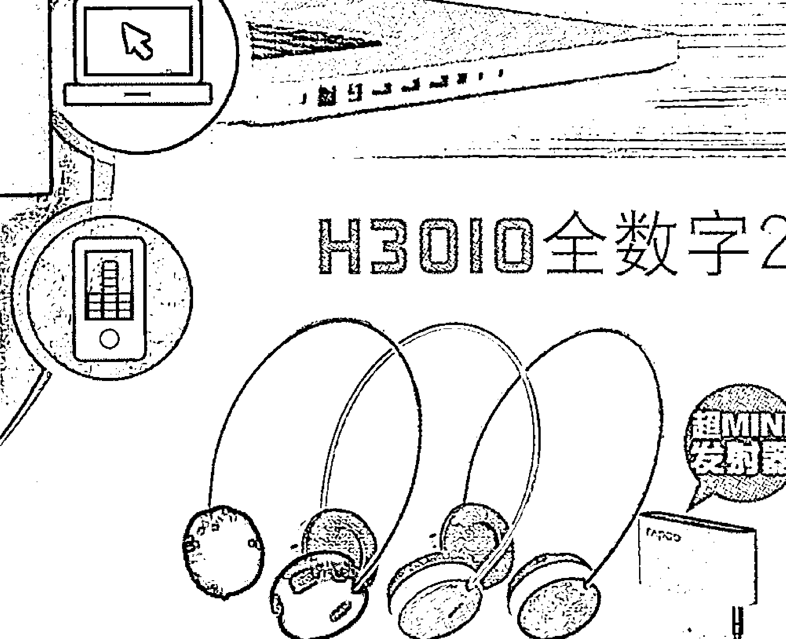


雷柏精巧打造的H3010，配备超轻金属弹性头戴，令您感受无拘无束的轻盈舒适。同时配备超小音频发射器，继续输出Hi-FI级保真信号，让您轻松享受无线音乐。无轻巧，不音乐 - 雷柏H3010无线耳机。

## 学术牛人是如何炼成的？

大学里讲究培养学术性人才，那么大学生如何才能成为本专业的学术牛人呢？除了啃教科书，泡图书馆外，认真阅读本专业知名学者的论文也是必须的。论文往往是针对某一个问题点发力，进行详细阐释，比书本要精深一些，且论文的内容时效性更强。问题来了，我们怎么找到自己最该看的那些论文呢？这里就以我曾经的一位老师来举例吧。

### 捕捉信息，准确定位学习目标

记得当时课上有一位教授说：“作为一名历史教师，首都师范大学叶小兵教授的文章还是应该认真看看的。” 在一百多分钟的课程中，这句话也许很不起眼，但这就是给同学们指明了进一步阅读的方向，能不能成为牛人就看自己是否注意听老师的话了。

听到一位学者的名字，不知道其名字的正确拼写怎么办？没关系，输入 yexiaobing，百度就会自动推荐最接近的汉字结果，第一个搜索结果就是“叶小兵_百度百科”，这样叶小兵教授的名字就能确定了，还能顺便了解一下他的生平、研究方向和主要的著述等。此外，去首都师范大学历史学院的网站上也能找到相关的教师信息。

### 免费第一，登录期刊论文数据库

这位学者的书籍我们可以去校图书馆、区图书馆、首都图书馆或国家图书馆借阅，但是他的论文怎么办？
打算到过刊阅览室里摸索半天吗？不，其实只需几秒钟就能查阅到他的大多数论文和期刊文章。很多大学购买了网上期刊论文数据库，一般都会对本校学生免费开放使用，这是让自己成为学术牛人或者让自己笔下的论文成为范文的利器，要好好利用哟！
一般来说，学校官网主页下的校图书馆网站中都会提供本校购买的网上期刊论文数据库的目录、简介和入口地址。这里直接进入“清华同方中国知网检索平台”页面。有的学校进入时可能要求用户登录，这时要注意看一下学校图书馆主页上的介绍；有的学校需要使用学校提供的用户名和密码才能登录期刊网；有的学校只需直接点击“ip登录”即可。如果是在校外，期刊网检索数据是免费的，但是下载数据是按照页数收费的。我的一位老师曾经在校外一个下午就消耗了几百元人民币，所以在校内时还是多多享用学校给我们的免费午餐吧。

### 缩小范围，有价值的信息快出来

我现在进入“知网”主页，点击“学术文献总库”链接进入检索画面。在左边的“请逐级选择您调研的学科领域”中，可以把不需要的领域去掉，以缩小结果的范围，准确寻找需要的论文和期刊文章。
因为叶小兵教授是历史教育学教授，所以这里只选择“社会科学II辑”，也就是范围限制在“高等教育”和“教育理论与教育管理”领域里面。一般来说，检索类型选择“标准检索”就行了。

在这些众多的检索条件里，根据需要选择即可。因为想看看叶小兵教授的所有论文和期刊文章，所以在“1. 输入检索范围控制条件”中选择“作者”，然后在后面输入“叶小兵”三个字。所谓的“模糊”与“精确”是告诉检索系统是否依据给出的检索词进行联想。

如果只找叶小兵教授的某一篇文章，可以把“2. 输入目标文献内容特征”中的“主题”下拉列表框改选成“题名”，然后在后面键入具体的论文名称。在弹出的搜索结果页面稍等片刻；便会列出所有符合我们要求的论文。

### 细嚼慢咽，论文精读有讲究

点开一篇论文，便会看到关于这篇论文的详细资料，其中“引证文献”、“同被引文献”、“二级引证文献”和“读者推荐文章”需要特别关注。这些列出的论文是进一步阅读相关主题的路径指引，可对论文涉及的问题有更加深刻和广泛的了解。而且，多注意一下作者刊发论文的期刊等级，就能够大概看出作者的学术地位和学术能力了。

那么如何看到论文的全文呢？期刊网提供论文的下载服务，有CAJ、PDF两种格式。CAJ是期刊网自己的论文文件格式，需要使用CAJViewer来查看，完整版包括了对论文内容的OCR识别功能，可以把扫描的论文内容摘抄出来，方便在文章中编辑修改；PDF是国际通用电子出版物格式，Adobe Reader、Foxit Reader等软件可以阅读，在大多数电子书阅读器和linux系统下也可阅读和批注。

（北京吉利大学/常志伟）

## 简历巧改造 眼前一亮没问题！

金秋季节对毕业生而言，是紧张而激烈的，因为和近700万毕业生抢工作的赛跑开始了。虽然说找到一份好工作要靠四年大学的积累，不过临阵磨枪还是必要的。比方说你得准备一份好简历，最大程度体现出你的优点，突出你的特点，弥补你在一些方面的不足。所以很多同学花费大量力气准备简历，想好好包装自己。

### 你包装过度了吗

前几年学生简历追求过度包装，简历封面花样百出，一份简历搞得像一份方案一样，我们这些职场老鸟都叹为观止，没有内涵的人就越想通过简历的厚度来证明自己有能力。
这样的简历可能花费不菲，但实际效果是把企业的人资经理搞得审美疲劳了，在他们看来学生以为的美的简历不过是充满颜色和图片而已，反而导致无法快速客观了解一个人的实际情况。所以现在又提倡一页纸简历，道理很简单：再美的包装也是包装，不是每个场合都看外表的，内涵还是比外表更重要。

大学生朋友们为什么要做厚简历呢？不就是觉得一页纸简历信息量太少，而且格式太单调，把自己的个性淹没在单元网格里怎么办？其实一页纸也可以吸引眼球。现在用人单位看到学生的一页纸的简历往往是这样的（见图1），怎么可能吸引人？越是一页纸，越要拼内涵！

### 传统简历点石成金

下面我结合自己制作PPT的经验，提炼观点，突出重点，再进行排版强化做了一点改造，文字不做大的删减，信息不遗漏（见图2），看看修改后的简历是不是能够让用人单位一眼看到你的精彩点？
这个简历排版最大的突破是跳出了传统的表格框限制，自由设计了表格的内容，改造有几个要点：

-   为表格每个单元内容增加标题
-   充分利用对齐的排版思路，区分表格的空间
-   通过调整段落间距提升文字可读性
-   利用对比制造关键词的标签效果
-   重复，统一排版风格

作为一名人力资源经理，每天面对大量的表格，是否会耐心看简历的内容，我很怀疑。所以我想用醒目的标题抓住HR的眼球，通过颜色对比和字体大小变化强调关键信息，3次实践经历、3种职场能力等标题的提炼，是我最得意的一笔。

在每个表格区，我删除传统的网格，用统一对齐的项目编号线划分表格的左右区域，这样就可以多出文字排版的空间，做到文字不换行，大大提升文字的可读性。

表格空间很小，假如文字段落还是密密麻麻，阅读起来就非常不舒服，所以我想为表格中段落调整间距，让视线阅读受到一定的牵引，便于有效阅读。

我把一些关键词加粗显示，是希望有些重点词对上HR的思路，人看文章往往是被关键词吸引的，所以我想这些关键词也是让别人快速了解你的一个方法。

当我确定排版的大致思路后，整个表格下半部分我全部是用一种风格排版，这样让表格看起来似乎多了一种节奏，显得更加专业一些。其实这个Word排版大部分同学看到样例就可以模仿排出来，甚至排得更好！我这个案例只能说是抛砖引玉，帮助大家打开思路，希望对各位即将找工作的大学生们有启发。

假如你有做得非常精彩的简历，或者希望张老师帮你评点下简历，可以发邮件到 zhangzhihfs@gmail.com，我将选择三位同学的简历在博客上做一个修改尝试，看看能否做出更多的有趣分享，欢迎你参与！

### 小提示：近期IT名企校园招聘信息汇总

-   诺基亚 (11.17网申截止) http://campus.ciicjob.com/nokia2010/index.htm
-   中国电信 (11.30网申截止) http://www.yingjiesheng.com/job-000-906-462.html
-   惠普 http://www.yingjiesheng.com/job-000-918-282.html#
-   开心网 http://zhaopin.kaixin001.com
-   中国联通 http://www.yingjiesheng.com/job-000-914-627.html#
-   汉王 http://www.yingjiesheng.com/job-000-908-789.html
-   金山 http://kingsoft.zhaopin.com
-   神州数码 http://vip.yingjiesheng.com/2011/digitalchina
-   联发科技 http://www.yingjiesheng.com/job-000-907-034.html#
-   支付宝 http://www.yingjiesheng.com/job-000-906-793.html

（武汉工程大学/李志(秋叶))

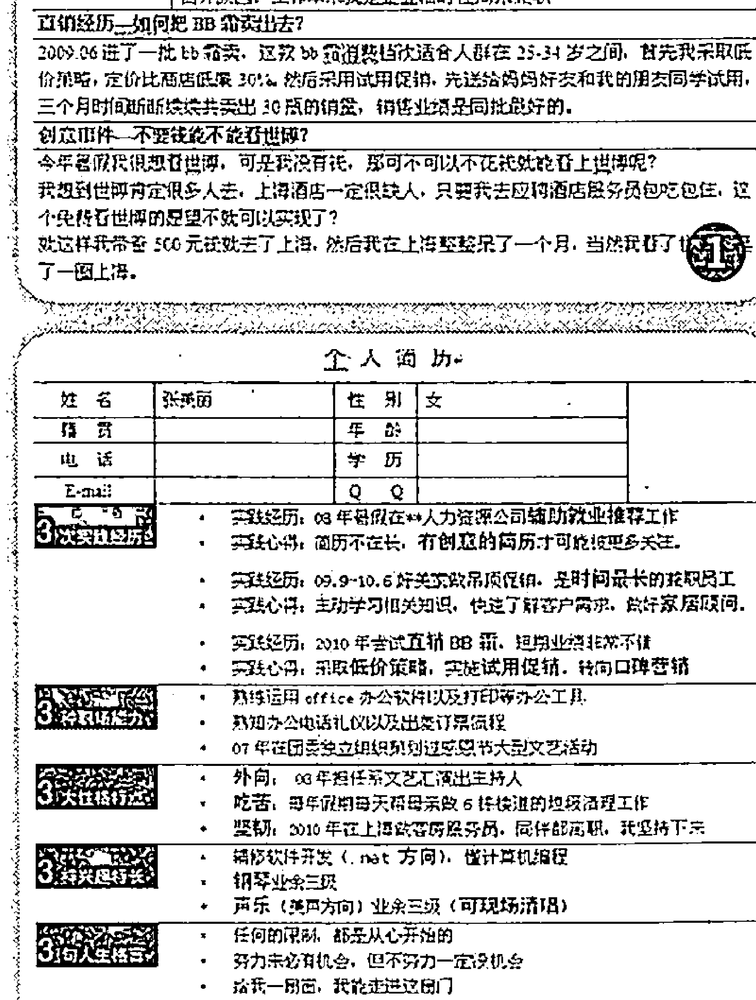

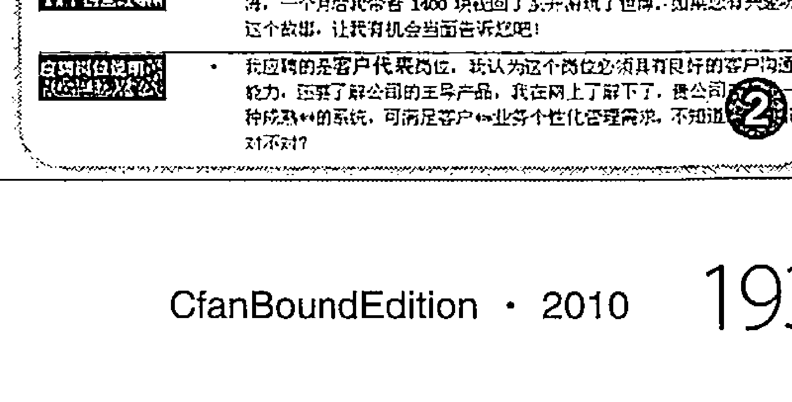

## 信手拈来 创意宿舍视频拍拍拍

“我愿变成童话里，你爱的那个天使……”两个大男孩在宿舍里，对着摄像头做着表情夸张、口型极其到位的“假唱”，没错，这就是红极一时的“后舍男生”。
不管你是男生女生，在你的宿舍里肯定有过爆笑的桥段，有过宿舍一家亲的温馨感人，有过平凡却令人敬佩的“草根艺人”，面对网络上铺天盖地的宿舍秀，经过CFan多年熏陶的你，是不是也想信手拈来一段广播级的宿舍串烧视频？来吧，我的宿舍，我骄傲！

### 工欲善其事必先利其器

一份众乐乐的视频不需要高超的视频剪辑技术，创意和瞬间足矣！宿舍中看似平淡如水，但绝对是各种爆料的发源地。你有没有用手机偷拍过舍友酣睡的囧态？有没有偷偷录下陶醉高歌的哥们？有没有来一段群魔乱舞自娱自乐？
宿舍里最常见得就是各种囧事，比如舍友秀街舞却摔得七荤八素，如果要在视频中突出展示这一点，在其摔倒瞬间定格画面，加注各种标注文字，再把摔倒的几秒回放，倒放N次，以表达惊叹之情。实现这个效果在会声会影X3中仅需几步：
**第一步**，找到摔倒瞬间，在视频属性选项卡里找到“抓拍快照”，把摔倒瞬间保存为图片备用；
**第二步**，把摔倒的几秒钟视频剪出，拖拽到视频库里备用，命名为“A瞬间”；

**第三步**，在截取的视频断口后重复加入“A瞬间”，其中还可以利用视频属性选项卡里的“反转视频”倒放视频，做一个反复强调的效果；
**第四步**，找到截取快照的那一秒（原始视频），剪开，把保存的快照插入，调节时间可根据添加的文字和效果图片来确定，文字要够炫目，时间要尽量短。
除了“杯具”瞬间的恶搞外，你是不是很想拍宿舍一天生活的剪辑？早起混乱的洗漱、中午凌乱的睡姿、下午衣装靓丽的约会准备、晚上疯狂的通宵DOTA……时间的变化、光线的变化、拍摄设备的差别使视频画质都不好，没关系。
利用会声会影的滤镜把场景变得朦胧、梦幻或者画面抖动并带着白线的老胶片效果，就如同PS的蒙版+模糊工具。
通过对进行视频“色彩校正”，比如诺基亚手机中心色调偏红，我们就向橙色和蓝色调整补偿画质，调整白平衡的光源效果也是不错之选。

宿舍气氛要的是活跃，比如舍长强悍无比，配一个猛男的卡通身子比用一堆文字绝对形象直观。
**场景无敌：**宿舍文化节和宿舍的评选需要交一份宿舍的视频简介，如果在视频里，你们宿舍合影登报，在户外露天广告牌上大晒牙齿，一定比一个人傻乎乎的随着镜头说好得多。美图秀秀中的场景功能，提前实现你的名人效果！

### 得道多助失道寡助

会声会影不错，但创意滚滚来，有更多的工具锦上添花吗？
**助力一：美图秀秀。**号称比PS简单一百倍的“美图秀秀”做一些照片效果，可以提升视频质量。
**抠图无敌：**无论是照片中全身的抠出还是做大头“娃娃”效果，美图秀秀中的抠图绝对是简单方便。

**助力二：酷我K歌。**KTV虽然最便宜不少，但在宿舍一秀歌喉，把宿舍合唱的《朋友》加入视频的结尾才是我们的目的，如果模仿后舍的“假唱”也没问题，打开酷我K歌满足MV畅想。只需一个话筒，一个摄像头，点击录制，每个舍员练习好，跟着MV唱，就会自动录制一段和MV时间等长的视频，这样将MV和宿舍录制的《朋友》放到会声会影里发挥想象力去拼接，效果无敌。

### 助力三：素材网

音效：会声会影里的声音效果不少，但一般娱乐节目中那些稀奇古怪的声音（尖叫声、惊呼声、雷击声、偷笑声等）不好找。没关系，推荐一个不错的音效素材下载网，各种音效挑战你的耳朵。
http://www.smzy.com/yinpin数码资源网下的音频专页，一定有你要的夸张音效。还有透明Flash饰件，比如娱乐节目中的效果黑线、尴尬汗珠、悲惨的乌鸦飞过、漂亮的加载进度条、飘动的红旗、节日气氛等等，发挥你的创意吧。http://www.3lian.com/down/flash三联素材，也有不错的透明Flash素材下载。
(河北农业大学/韩政)

## 校园分享型PPT 精彩看你的！

开学不久，学生会的老生们忙着招新，免不了要通过PPT介绍学校和组织，而老生从全国各地回来，又过了国庆长假，课堂上又流行起做假期分享，估计不少同学会利用PPT来介绍自己的假期旅游故事，比如和朋友去世博的经历等等。今天这篇文章就想谈谈这两类PPT的制作，第一类是主题分享类PPT（比如班会、学生会招新会等等），第二类是旅游分享类的PPT。

### 主题分享类 PPT

这一类的PPT在制作技巧上有两个点特别值得重视：
第一，需要设计一个引人注意的封面；
第二，需要学会利用照片说话。
先谈谈封面的问题，很多同学只会简单地去找一个封面模板，甚至就是微软的标准模板，简单套用，改几个字，就成为自己PPT的封面，这样的封面是无法吸引听众的，更谈不上活跃会议的气氛。
比如图1的职业梦想分享会PPT，主题很好，但这样的封面让人一看就失去了梦想。

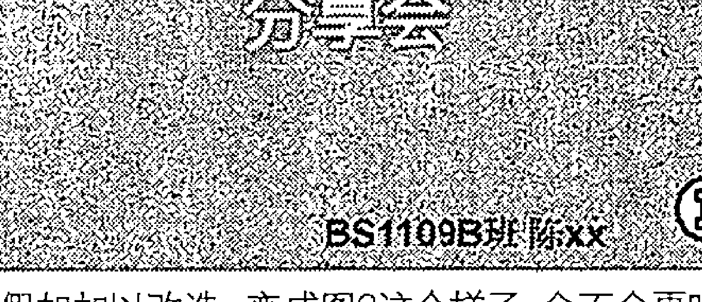

假如加以改造，变成图2这个样子，会不会更吸引人？


其实这个封面制作技巧很简单：
1. 制作中英文混合的标题，中英文直接可以用线条区分一下视线。这样的标题可以立即提升PPT封面的档次，又便于用母语快速沟通分享主题；
2. 选择合适的字体和颜色，我们中文字体选择是微软雅黑字体，蓝色，英文字体是Eras Bold ITCc字体，橙黄色；
3. 假如你在文本框输入文字后，设置字的对齐用“分散对齐”（在2010版本中查找这个按钮），那么你只要拉宽或者缩窄文本框即可实现调整字间距，这样就可以使得标题文本框的文字间宽度随需要调整，达到更美观的效果；
4. 最后为标题配上背景色明亮和简洁的模板。我这里选择的是一张3D小人的图片，这种图片搜索技巧也很简单，用百度或谷歌图片搜索“3D小人”这个关键字就可以找到大量的可用图片。不过要注意有些图片很美很震撼，但你要用的图要选择和主题有关的，或者能够产生联想意义的。
假如你有一定的PS或设计能力，还可以发挥这方面的特长，做出更有内涵的封面图片，比如我在网上看到武汉大学记者团分享制作的这张PPT封面就非常有创意（见图3），和记者团的文化内涵非常贴切，是一张能吸引新生有兴趣继续了解后面内容的封面。

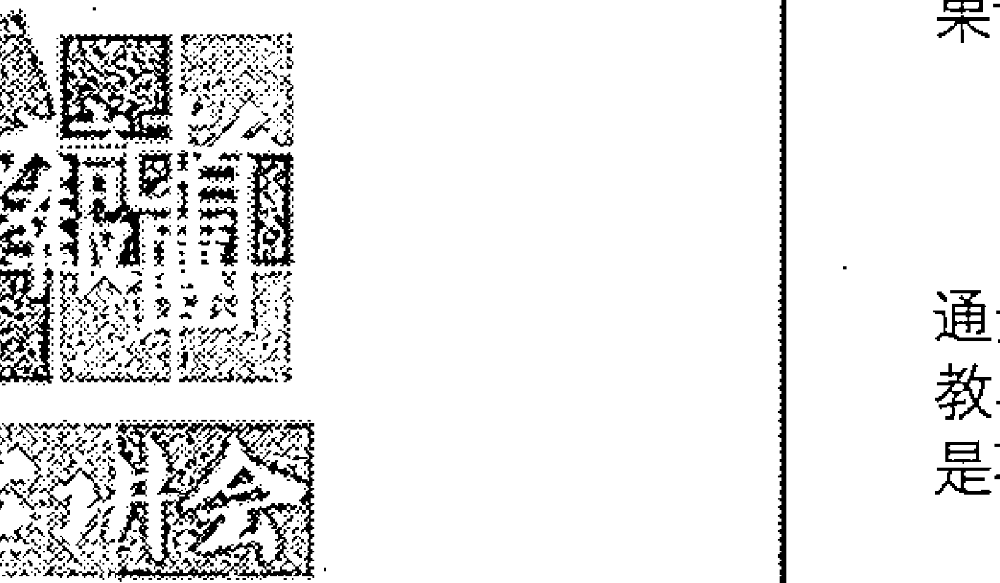

### 旅游分享类 PPT

下面谈谈第二点，在主题分享PPT中往往大量用到现场或旅途照片，但很多人放照片显得非常呆板单调，要么是一张大图居中放置，随意配上几个字，要么是两张小图左右简单对对齐，做出来的效果非常难看，这里先随便列举一个例子：
图4这张PPT只是为了展示一下学校的大门，但几个字光秃秃悬挂在天空没有美感，怎么办呢？我们做多了幻灯片，往往是被传统的横置标题思维束缚住了，其实我们完全可以让文字转个弯，利用斜置文本框制造标签纸式图文混排。

### 这种标签纸制造方法很简单：

1. 在文本框中写入文字，可以用艺术字体加以美化；
2. 然后为文本框设置纯色填充，调整纯色填充的透明度，这样可以使文本框不完全挡住背后的图形；
3. 旋转文本框，对好位置即可。
利用类似的方法，也可以制造三角标签，填充一角，不过这个时候往往选择纯色背景盖住一角。
有的时候需要在一张PPT上放很多小图片，但是把几张小图塞到PPT中似乎怎样排都难看，这是因为普通人不太理解排版中对齐的原则。
现在我们试试为现在这张PPT调整下版面。这个调整方案很简单：
1. 所有的图片大小要设置成长宽一致。一致的图片才好排版，假如图片大小比例不统一的，就需要利用裁剪功能设置成比例一致，然后再缩放成大小一致的图片。
2. 所有的图片可以利用2010版本提供的发光效果设置边缘，为图片配上镜框效果。
3. 所有图片前后、左右、上下对齐，将标题居中。
现在看看，排版效果是不是好很多？
如果你觉得小图片缺乏文字说明，其实也很容易通过排版腾出空间。可以把图片归为两大类，一类是教学楼，一类是图书馆，然后再分别对齐排版看看，是不是让图片也变得一目了然、清晰可读呢？

### 这个排版技巧在于：

1. 为本页幻灯片设置一个深色背景色；
2. 给所有图片形状轮廓填充和深色颜色相对的浅色，并设置比较宽的线型宽度；
3. 把照片分类对齐成列组合，然后为每列组合图片配上列标签文本框，文本框也要填充深色背景色和选择浅色轮廓色，保持和图片风格一致；
4. 最后为图片配上说明小字。
好了，今天的分享型PPT布局技巧讲到这里，希望对同学们有启发。
(武汉工程大学/张志(秋叶))

## 校园浪漫 自己营造更甜蜜

浪漫的方式有很多种——烛光晚餐、情人节的玫瑰……可这些方式往往都需要大量的金钱支持，对于预算就不多的学生来说并不适合。让我们要自己动手，DIY甜蜜爱情。

### 电话里感受爱的氛围

每天晚上煲电话粥似乎已经成了情侣们的必修课，但有的GG或是MM不善言辞，即使对着最爱的人也不能侃侃而谈，这样就很容易让通话冷场。聪明的朋友抓紧为手机装上“自由酷话”吧，这是一款为通话添加背景音乐的软件。在“音乐列表”里添加上MM喜欢的歌，然后设置成“接通后自动播放”，等到下次通话时就可以边听歌边享受甜蜜的爱情了。

### 早请示晚汇报 甜蜜不能少

早晨一条短信轻轻把你唤醒，晚上一条短信催你入眠。这样的事情热恋期的GG应该没少做过，但有时候时间拿捏得不准岂不误事？所以还是让小秘书“FlashSMS Schedule”来做吧！进入软件，新建短信，输入接收手机号和短信内容，设置重复类型为“每天”，发送时间分别为早晚合适的时间，这样手机就可以定时发送短信了。当然，前提是手机要保持开机状态，并且一定记得要设置早晚各一条哦！

### 精确记录浪漫细节

“今天是我们相识第118天，相恋第95天，一起吃饭第106天……”忘记是哪部电影上的台词了，但当它活生生地出现在MM嘴里时，GG们是不是也会像我一样纠结？赶紧在手机上安装“桌面计时”软件，可实时在桌面上提示设定的任务过去了多少天，最多可以显示4行，足够我们写上所有的纪念日了吧。

### 温馨浪漫 嵌入丝丝回忆

倾心的交谈、温馨的话语，无一不让热恋中的GGMM陶醉。但随着时光流逝，记忆中的浪漫也在逝去。有心的GG会细心把MM的声音录制下来，而煲电话粥时无疑是录制的最佳时机。为手机装上“智能录音”软件，激活程序并后台运行，就可把通话内容录制下来，而且和“通话背景”一起使用时效果更佳哦！试想一下，当岁月流逝，年华老去的时候再听一段热恋时的缠缠绵绵，该是多么幸福的一件事啊！

(山东农业大学/飞天小猪)

## 校园智能手机网络生活百宝汇

新的一学年开始了，身边不少同学淘汰了曾经流行的山寨机，武装了功能齐全的智能机。瞧瞧自己的身边，诺基亚的5230手机都成了街机。周末，带着女朋友逛大学所在城市景点，手机可以帮你指路、分享自己的照片，一路可以享受免费音乐、视频。带上本本的话，还可应急上网查更多内容。手机不只是通话，还可以变成娱乐百宝箱……

准备工作：诺基亚数据线、能联网的电脑、手机GPRS流量建议大家进行包月。

### 免费的导航

周末带朋友上街玩玩，有一个能导航的手机绝对不错。可是大多数导航软件需要收费，诺基亚最近宣布Ovi导航免费，这可给我们使用5230的朋友提供了极大的方便。但是有一点大家注意，导航本身免费，但是导航需要用到地图、定位、搜索目的地，这三项可以离线使用，也可以根据需要联网使用。当你联网的时候，可能产生流量，这个流量费是运营商收取的，并不免费。

第一步：要想使用免费的导航，首先要安装诺基亚的Ovi套件 (http://www.nokia.com.cn/get-support-and-software/software/Ovi-suite)。诺基亚 Ovi 套件是将要替代诺基亚 PC 套件的下一代计算机软件，可以同步手机中的内容、共享照片和视频、传送音乐、下载免费地图等等。诺基亚智能机一般都支持Ovi套件。

第二步：下载诺基亚地图软件 (http://www.nokia.com.cn/services-and-apps/Ovi-maps/downloads)。请注意，不少朋友使用手机上自带的Ovi商店下载地图，由于流量很大，没有包月可花费不少，我就在这里被扣了50多元钱。在这里选择相应的手机型号，单击可下载一个扩展名为sis的文件，把这个文件传送到手机上，即可以安装成功地图软件。值得注意的是，这个文件是地图的执行软件，不是地图本身，如果想使用地图，还需要通过Ovi组件下载和安装地图本身。

第三步：安装与升级地图。首选将手机和电脑相连接，然后启动Ovi组件。在主菜单中单击视图图标，转至地图，此时可以根据需要，下载自己需要的地图。在这里需要注意，地图文件很大，请根据存储卡的空间下载，多多益善。如果自己这时没有下载某地的地图，导航时会通过网络自己进行下载，这可是需要钱的呀，为了避免不必要的支出，建议大家导航时只使用GPS，而关闭其他辅助功能。下载完成之后，不要忘记下载语音。

至此大家就可以使用导航服务了。Ovi地图支持驾车的步行导航两种模式，题图是步行导航模式。我认为Ovi的步行导航非常不错，值得大家使用。Ovi地图没有谷歌地图标识详尽，大家可配合使用。

### 正版的娱乐中心

今年4月，诺基亚正式在中国大陆地区发布“乐随享”服务。诺基亚将为5230等8款手机用户提供为期一年的不限量、不限次的免费音乐下载。只要是购买了诺基亚“乐随享”手机的消费者都可以从Ovi音乐商店中下载任意的歌曲或专辑，不用支出任何版权费用。最近使用“乐随享”，还能抽奖呢！“乐随享”需要激活才能使用，激活可以使用手机或者电脑进行激活，这里推荐使用手机激活。单击手机中的Ovi音乐可进行激活。建议大家顺便建立Ovi的账号，以便电脑中下载音乐使用。要知道，使用手机下载音乐费用很高呀，一首歌曲都好几兆呢。

### 共享照片

在朋友的聚会上，带着个人电脑会大煞风景，但手机却可以始终相伴。利用手机上的照相机，配合手机网络，可以通过电子邮件随时随地传送照片，与朋友共分享。5230支持包括新浪、QQ、搜狐、网易邮箱等在内的主流邮箱服务。5230内置了电子邮件服务，设置非常简单。打开电子邮件服务，输入用户名和密码，即可进行使用。

(河南工业职业技术学院/赵建超)

## 学生记账 用专属账本

作为学生，一般都是用父母的钱，或是做家教等赚些零用钱，因此勤俭节约，合理用钱，将钱花在刀刃上，非常有益。记账无疑是开源节流、学好理财的基本方法。如果现在你还把账日记在本子上，那就太OUT了，平时的开销，可以记在电脑里、网络上、手机中……

### 为学生量身定做的账本

学生的收入和支出有着自己的特点，现在有了大学生专用账本——学生记账软件 (http://www.newhua.com/soft/95728.htm)。这是一款免费绿色软件，下载后无须安装即可使用，快来试试吧！

第一步：打开学生记账软件，默认密码为888888，登录后单击“我的账户”，切换到“现金”项，先将身边的现金进行记录，比如：钱包里有多少钱就可以记录进来；切换到“银行”选项，将银行存款添加到里面，比如：开学时，家里将本学期的生活费都存在卡里面，此时就可以记录进来；如果有外债就在应收款或应付款中记录；在“投资理财”中也可以根据自己的实际情况进行记录。

第二步：单击“记账”选项，这里就是我们日常记账的“主阵地”，比如：收到稿费或兼职工资可记录到“收入”中，现金的“结算账户”选择“钱包”，支出项目在支出中记录；某些收支是定期的，如：每天买1注彩票（2元）献爱心，可在“定期收支”中记录，这样每天都会自动支出2元；每月固定支出或收入可在“定期收支”中记录；身边的现金超过800元时，多余部分最好存到银行中，在“存取转账”中记录；如果要做小生意要预算支出和收入，在“预算管理”中记录；“借贷”或“投资”在相应的项目中记录即可。

第三步：单击“查询统计”选项，在这里可以对账户余额进行查询，以及多种方式统计收支情况，让我们对账目一目了然；单击“基础资料”，还可以手动增加收支科目、商品名称、重设账本密码。另外在“电子表格”中还内置了不少实用小工具，供我们使用，非常贴心。

小提示：同类软件推荐学生简单电子记账簿1.0绿色版：http://www.onlinedown.net/soft/97759.htm

### 记账摆脱时空限制

用工具软件记账可以使用更多的便捷功能，可最明显的缺点就是不能随时随地记账，比如：逛街时买了一瓶饮料，到校后可能就忘了。有了女朋友，两人同时记账更便捷！下面就为各位学生朋友推荐网络时代的记账新工具——网上账本，可以用电脑或手机上网记账，账本保存在网络上，不管在哪里，只要登录就能记录收支情况，非常方便。

第一步：打开“网上账本” (http://www.zhangben.com)，用电子信箱注册免费账户，注册后给账本取个名字，并选择自己所在的城市，即可进入自己的账本。单击“个人设置”，在“行业”中选择“学生”，单击“成员设置”，在“成员”中输入名称（如：男友、女友），增加两个成员，这样便于以后分别统计两个人的收支情况。

第二步：单击“记账”按钮直接进入“记录消费”选项，在消费项目、消费金额输入相应的内容，并选择消费类型、消费成员等信息，然后单击“提交”按钮记录开支；如果有了收入，单击“记录收入”按钮，根据实际填写收入的来源、金额和类型。

第三步：账目记录一段时间后，单击“收入分析”或“收支统计”按钮对收支情况进行全面的了解；如果需要将账目清单保存到本机，可以单击左侧最下方的“账目导出”按钮，输入账本登录密码后，单击“导出”按钮会生成一个账本文件链接，单击下载该文件，这是一个Excel文档，打开后可看到详细的收支情况。

如果是两人共用账本，记得把账户和密码告诉对方，另外记账时不要忘了将“家庭账本”的记账成员切换为“男友”或“女友”，使用网络记账，只要可以上网都能进行实时记账，非常方便。

(河北东亭一中/李丽)

## 拒绝千篇一律 三招让Word 2010更有个性

Word 2010是学生经常使用的办公软件，但是其默认设置并不一定能够保证我们用得很舒服，比如字号较小、页面设置不够合理，文档首行不会自动缩进、保存格式默认不是doc等。本着“自力更生”的原则，我们可以自行修改，使它更有个性，更易于使用。

### 设置个性字体 让默认字号更舒服

校园数码时尚达人很多，尤其是在显卡和显示器能力越来越强、宽屏盛行的今天，1024×768像素以上的高屏幕分辨率随处可见。但Word 2010默认使用的字体格式大小为“五号”，看起来不仅费劲，时间长了还容易引起眼睛疲劳。
我们可以打开Word 2010后，随便打几个字，选中它，右击，选择“字体”，之后在“字体”标签页中设置当前文字使用的“字形”、“字号”等字体格式，它还有“字间行距”和“字体效果”等格式设置。单击下方的“设为默认值”按钮，弹出提示框选择“所有基于Normal.dotm模板的文档”，确定即可。这样就把你选择的字体格式设置成当前模板默认的字体格式了，以后再打开Word程序就会发现默认的“五号”字体已经更换为自己喜欢的字体大小了。

### 一切我说了算 自定义页面大小

用Word 2010建立的文件默认页面是A4大小，即宽210毫米，高297毫米，但在校园里打印东西，纸张并不是那样标准。这样每次都必须打开“页面设置”对话框进行设置，较为麻烦。
现在我们只要单击“页面布局”标签，然后再单击其下的“页面设置”按钮。可以将页面大小及上下左右边距设置自己所需的值，再单击下方的“设为默认值”按钮，弹出提示框点击“是”按钮即可。

### 符合中文习惯 让段落自动空2格

语文老师早就教过我们，每一段落前要空2格（即2个字符）。但可惜的是，Word 2010是“舶来品”，并没有能够这样。每次都手工地调整这些缩进，会显得非常麻烦。打开Word 2010后，随便打几个字，选中它，右击，选择“段落”，之后在“段落”标签中单击“特殊格式”下拉框，选择“首行缩进”，默认会设置为自动缩进两格（即2字符），这样就完全中文习惯。最后，同样再单击下方的“设为默认值”按钮，弹出提示框选择“所有基于Normal.dotm模板的文档”，再单击“确定”按钮即可。

> (河北武邑中学/鲁伟)

## 比《盗梦空间》更精彩的《致命魔术》

不久前Inception《盗梦空间》大热，这让导演Christopher Nolan八年前的旧账都被翻了出来，从前由他执导的Batman《蝙蝠侠》、Memento《记忆碎片》等影片网络人气飙升，其中The Prestige《致命魔术》得到了“比盗梦空间更精彩”的好评，这部于2006年公映的影片集结了“Batman” Christian Bale、“Wolverine” Hugh Jackman等火热至今的超级大牌，讲述了两个魔术师之间的恩怨，叙事结构缜密精巧，故事结局震撼力十足。虽然影片主要讲魔术，却为摇滚乐迷和科技粉丝们准备了超大surprise——为主角制作高科技魔术道具的科学家Nikola Tesla，Tesla的扮演者竟是20世纪摇滚传奇人物David Bowie，而历史上的Tesla则是能与Edison一争高下的交流电(alternating current)之父。
Yet it's thanks to Tesla, not Edison, that we have electricity coming out of plugs, and that we even have power stations able to generate serious amounts of energy. He won "the war of the currents" with Edison. Direct current (DC) invented by Edison could only be transmitted for a couple of miles before the resistance of the lines reduced it to nothing, alternating current (AC) can be transmitted at high voltages for many times that distance.
我们理应感谢Tesla而非Edison，是Tesla让我们拥有了无需插座的电源和能够生产巨大能量的发电站，他赢得了与Edison的“电流之争”，Edison发明的直流电经过几公里的传输后就被传输线电阻消耗殆尽了，但交流电却能在同样距离内多次提升电压以保存电量。
Among his discoveries are the fluorescent light, laser beam, wireless communications, wireless transmission of electrical energy, remote control, robotics, Tesla's turbines and vertical take off aircraft. Tesla is the father of the radio and the modern electrical transmissions systems. He registered over 700 patents worldwide. His vision included exploration of solar energy and the power of the sea. He foresaw interplanetary communications and satellites.
他的发明还包括荧光灯、激光光束、无线通讯、无线电能传输、远程控制、机器人技术和涡轮垂直驱动飞行器等等。Tesla是无线电和现代电能传输系统之父，他在世界范围内注册了超过700项专利，他的视野触及到了太阳能和海洋能源，他还预示了人造卫星和卫星通信。

> (南开大学/杨红)

## 我这样拿到4家IT名企Offer

现状：刚上大四，已拿到金山、迅雷、淘宝、腾讯的Offer，其中金山、迅雷职位为产品经理，淘宝、腾讯职位为Web前端开发工程师。拿到这么多名企Offer我自己都觉得不可思议，因为我始终都把求职当作一场战争，而现在，这场战争结束得如此顺利。

### 就业——把握好远方

我的专业是“信息与计算科学”，主干课程是数学，辅以少量计算机相关的课程。通过大一年的了解，我在大二时确定要放弃大部分专业课程，为自己另谋出路，因为这个专业本科生毕业后对口就业是几乎不可能的事情。
从大二到大三，很长一段时间里我都在思考，我到底要怎样的出路，就业要去哪里工作？考研要读什么专业？问了很多人的意见，浏览了很多招聘信息，终于发现我适合做Web前端开发，而这项工作的技能在读研时根本学不到。于是我确定要就业，去互联网公司做Web前端开发。之后我一直在学习Web前端的相关知识，最终厚积薄发。
我看到很多大学生信仰“既然选择了远方，就只顾风雨兼程”，但是到了大四，找工作依然非常困难。关键问题是，他们在努力之前认真地选择过“远方”吗？我大二到大三，用了很长的时间认真地选择我的方向，这个过程远比想象中的要艰辛，最终，我选择了适合自己的方向。如果一味按着学校的培养要求走，到头来可就真的很难把自己“卖”出去了，因为最后要检验你的是企业的标准而不是学校的标准，更何况学校的培养深度实在是非常浅。

### 方向——真正了解自己

关于产品经理的Offer，很有意思。当时我看到网上招前端工程师，于是投递了简历，但是后来发现在武汉的校招团队不招前端工程师，于是报了产品经理，一路过关斩将直到最后拿到Offer。其实在面试之前我都不了解产品经理这个职位，在经历了人生第一次无领导小组讨论之后我发现产品经理是个很有意思的职位，然后才开始慢慢了解它。
这段经历告诉我的是，不要给自己设限，很有可能你有极大的潜能，只是自己不知道。我看到很多同学只投和自己专业对口的职位，这样连面试的机会都不多。其实完全可以多投一些相关甚至不相关的职位，潜能一旦被激发出来，会让你自己都觉得惊讶。

### 简历——实用就好

我的简历没有华丽的封面，没有精致的排版，甚至没有表格，没有照片，有的只是整整齐齐的文字。后来迅雷的面试官说，这份简历很有分量。真正好的简历是不用过分装饰的，只要看着舒服就好。

### 笔试——功在平时

不管是技术类的笔试还是非技术类的，都很考个人的积累。这个过程能展示出来的只有基本功。
淘宝和腾讯的笔试风格很不一样：淘宝侧重一些实例的考察，而腾讯侧重知识的掌握。淘宝的笔试，题量较大，只有60分钟，后来从面试官那了解到是有意加大了题量，看看掌握的熟练程度。金山和迅雷都是产品经理的笔试，考的大都是对互联网产品的理解和构想，这些东西临场发挥也是很难的，平时多关注资讯多思考，才有可能在短时间内拿出非常精彩和成熟的想法。

### 面试——坦然面对

我没有看过任何面试技巧，也没有去背5分钟的个人简介再加一个英文版。所有的面试，我只是很真实地回答面试官的问题，和面试官坦然地交流，就像和朋友一样。
在淘宝的一面中，我和面试官聊了一个多小时，什么都聊，包括名字的来历、对感情的看法、星座什么的，非常愉快；在迅雷的面试中，同样聊了一个多小时，天南地北海阔天空什么都谈，同样的愉快。其实面试官大部分是老手，在他们面前装实在是没有必要。他们要获得的是一个真实的面试者的形象，而不是张口就是八股文的人，因此坦然率真一些会让他们更深刻地感到自己的思想和活力。

果果：本文的诞生纯属偶然。一天易郑超问我“IT名企”栏目是写什么的，我问他快毕业找工作了吧，他很低调地拿到了4个 Offer。于是，本期超篇幅的求职经验分享诞生了（以前一般是半页）。本文虽然没有传统的第几步、点击哪里，但是给人启示很大：埋怨专业不热门？埋怨学校教育不入流？埋怨自己的辛苦换来一场空？在本文里，你都可以找到反思的答案。后来我让易郑超把简历传给我看，果然充满“干货”（以下为精华节选，技术部分都标注了展示地址、开发时间、亮点等内容），不知大家看完是否顿悟了呢？

- 作品 - 网站：抒寒居（个人网站，内有作品展示 http://www.shuhan.tk ）
- 作品 - 桌面程序：音乐会专用播放器、手机远程控制电脑工具
- 作品 - 其他：JavaScript 版俄罗斯方块、JavaScript 版贪食蛇、网页版五子棋
- 作品 - 策划：CMSNS=CMS+SNS、“云网站”系统
- 其他经历：校 IT 俱乐部主席、校艺术教育基地民族乐团副团长、“新生代”网络工作室技术部部长

> (中国地质大学/易郑超)

## 校花的秘密藏在这里——Excel多行数据单行化

学校在选课系统中为新生输入了学籍信息，趁学妹们还没有将密码修改，马上把宝贵的数据进行窃取。但是每个人的学籍信息都是一个多行矩阵表格（见图1），堆在一起没法筛选，也不方便查看。原理很简单，将表格转换为ANSI编码的txt文件，使用16进制编辑器对包含回车符的数据进行合理替换，再导入Excel。

### 填补空白单元格

由于学籍信息中有不少空白单元格，为防止它们造成错乱，要用空格填补。

| A | B | C | D | E | F |
|---|---|---|---|---|---|
| 1 | 1 |  | 学号 | 101110101 | 姓名 |
| 2 | 2 |  | 姓名拼音 | zmz | 性别 |
| 3 | 3 |  | 出生日期 | 19910104. | 民族 |
| 4 | 4 |  | 籍贯 |  | 政治面貌 |
| 5 | 5 |  | 入学日期 | 20100901 | 学生类别 |
| 6 | 6 |  | 系所 | 软件学院 | 班级 |
| 7 | 7 |  | 专业 | 软件工程 | 外语语种 |
| 8 | 8 |  | 考区 | 山东 | 毕业中学 |
| 9 | 9 |  | 学位 |  | 高考总分 |
| 10 | 10 |  | 国别地区 |  | 培养方式 |
| 11 | 11 |  | 二学位系 | 二学位专业 | 二学位班 |
| 12 | 12 |  | 学籍异动 | 宿舍地址 | 毕业日期 |
| 13 | 13 |  | 英文姓名 | ZHU Mingzhu | 身份证号 |
| 14 | 14 |  | 校区 | 威海 | 备注 |
| 15 | 15 |  | 入学考试语种 |  |  |
| 16 | 16 |  | 其他学籍信息 |  |  |
| 17 | 17 |  | 通信地址 | 邮政编码 | 家长信息 |

### 多行数据单行化

首先在表格第一列前插入一列，并填充序号。接下来选择所有数据区域，右击，点击“设置单元格格式”，进入“对齐”选项卡，取消“合并单元格”。再对每列分别进行排序，这时空白单元格会在最后，打入空格并填充。最后对第一列进行排序，以恢复原始顺序。

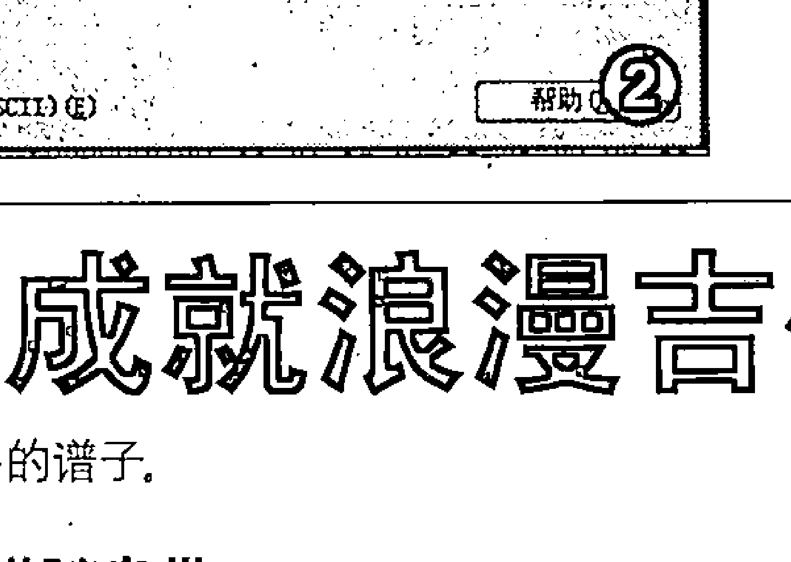

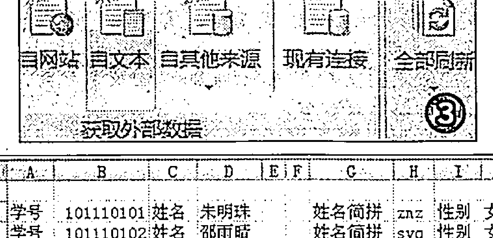

首先选择所有数据区域，复制，在记事本中粘贴，保存为ANSI编码的txt文件。接下来使用UltraEdit打开txt文件，点击“切换十六进制编辑模式”，然后将所有的“0D 0A”替换为“09”（即将回车符替换为TAB符，见图2）。由于所需的起始数据为“学号”，因此将“D1 A7 BA C5”替换为“0D 0A D1 A7 BA C5”（即在“学号”前加入回车符）。最后一步，在Excel的新工作表中点击“数据”选项卡中的“自文本”（见图3），导入上述txt文件即可（见图4）。

| A | B | C | D | E | F | G | H | I | J | K | L |
|---|---|---|---|---|---|---|---|---|---|---|---|
| 学号 | 101110101 | 姓名 | 朱明妹 | 姓名拼音 | zmz | 性别 | 女 |  |  |  |  |
| 学号 | 101110102 | 姓名 | 郝雨晴 | 姓名拼音 | syq | 性别 | 女 |  |  |  |  |
| 学号 | 101110103 | 姓名 | 夏晓欣 | 姓名拼音 | xzx | 性别 | 女 |  |  |  |  |
| 学号 | 101110104 | 姓名 | 于嘉鑫 | 姓名拼音 | yjx | 性别 | 女 |  |  |  |  |
| 学号 | 101110105 | 姓名 | 张琪 | 姓名拼音 | zq | 性别 | 女 |  |  |  |  |
| 学号 | 101110201 | 姓名 | 曹庆兰 | 姓名拼音 | cql | 性别 | 女 |  |  |  |  |
| 学号 | 101110202 | 姓名 | 党芸琦 | 姓名拼音 | dyq | 性别 | 女 |  |  |  |  |
| 学号 | 101110203 | 姓名 | 李琳 | 姓名拼音 | ll | 性别 | 女 |  |  |  |  |

将换行问题通过回车符的ANSI编码进行处理，的确是十分巧妙的格式化手段。Excel多行数据单行化还是有很多用途的，比如处理班级成绩表的混乱内容等等，大家灵活运用吧！

## 软件当老师 成就浪漫吉他达人

不知为什么学校的同学最近开始流行起吉他，我当然也不能out了！但学习一个新的东西毕竟没有那么简单，我和同学学习了一些基本的操作后便开始自学了起来，但是没有老师，还是挺麻烦的，怎么办呢？

### 软件老师很全能

有一次查谱时，我发现了吉他谱搜搜这个软件（下载地址：http://www.skycn.com/soft/58244.html，见右图）。它可以自动播放琴谱，这样我就不用在弹琴的时候翻谱了。而且它还可自动保存浏览过的谱，这样到学校没有网络的电脑也可以看谱了。吉他谱搜搜还带有节拍器、调音器、弦速查、后台节拍等功能，还有一个简单的模拟架子鼓。软件采用多网站巡航扫描，一个站点失效后，自动切换到另一个资源站点，以搜到更多的谱子。

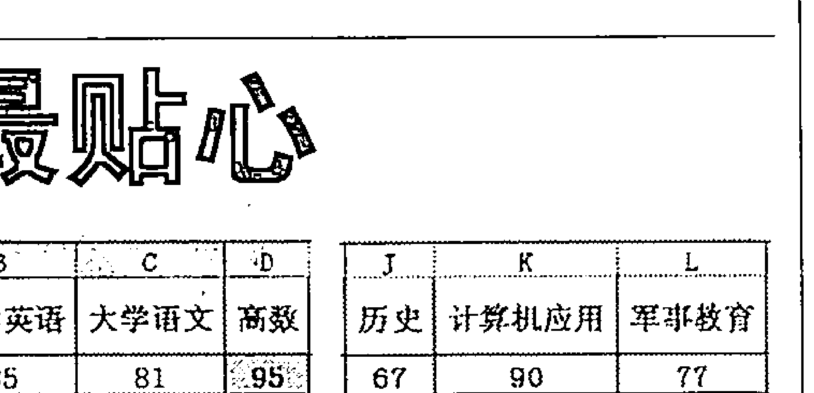

网络吉他谱随身带
像一些初学者或不太爱记谱的人一样，我也常常会遇到出门在外时忘记谱的情况，其实这也很好解决：用手机登录pu.jitashu.com便可以直接用手机看吉他谱了。注意哟，最好查看txt格式的，因为这样速度会快一些。

虽然科技的发展使我们的生活日益多元化，学吉他都可以通过网络自学，但如果不努力练习也是学不好的啊！多多练习，都来当浪漫的吉他潮人吧！

果果点评：
吉他，似乎和“浪漫”紧紧联系在一起。高晓松在清华草地上弹唱的场面你我没遇到过，不过校园里潇洒男生抱着吉他在女生宿舍下弹唱的故事，或许亲眼见过或间接听到过吧？对了，再小小爆料一下，我听到任一首歌就能知道曲调，在键盘上简单弹出来，没有老师教哦，要感谢谁呢？嘿嘿。但是我不大会配和弦，哪位读者是行家，愿意教我的请举手，先谢谢啦！
（北大附中云南实验学校/洪景业）

## Excel分类处理 条件格式最贴心

快熄灯了，苏苏还在书桌前为一张成绩表愁眉不展……

### 不同颜色区分清

苏苏：今天在路上不幸遇到辅导员，给了我一份张成绩表。全年级200多人的成绩要按规则标出不同颜色：60分以下的标一种颜色，90分以上的标另一种颜色。唉，这密密麻麻的数字，看得我头晕眼花！
小思：求助于神奇的“条件格式”吧。“条件格式”，顾名思义，就是根据你开出的条件，自动赋予符合条件的单元格不同的格式，让它们突出显示；让我们这些尊贵的用户，能够在茫茫的单元格海洋中，快速准确地找到自己要的信息。


首先选中B2到L211单元格区域，然后点击“格式→条件格式”，在左边的“条件1(1)”下方选择“公式”，在右边录入“=B2<60”，点击“格式”，选择“图案”，然后选中红色，点击“确定”，回到“条件格式”界面，如果再次点击“确定”，就完成设置了。
苏苏：那大于90分的呢？
小思：别急。现在因为要设置第二个条件格式，所以在刚才的界面中先不点击“确定”，而改为点击“添加”（见图1）。后面的操作与设置第一个条件格式时基本一样：在左边“条件2(2)”下方选择“公式”，右边录入“=B2>90”，点击“格式”，选择“图案”，选中绿色，点确定，回到“条件格式”界面，再次点确定就完成了。看！不及格的都显示为红色，90多分的都显示为绿色（见图2）。

|  | A | B | C | D | I | K | L |
|---|---|---|---|---|---|---|---|
|  | 科目 | 大学英语 | 大学语文 | 高数 | 历史 | 计算机应用 | 军事教育 |
| 1 | 姓名 |  |  |  |  |  |  |
| 2 | 张小玉 | 85 | 81 | 95 | 67 | 90 | 77 |
| 3 | 许小杰 | 76 | 79 | 56 | 86 | 84 | 89 |
| 4 | 周小发 | 84 | 73 | 84 | 88 | 82 | 58 |
| 5 | 朱小玲 | 68 | 95 | 87 | 79 | 73 | 68 |
| 6 | 林小霞 | 78 | 69 | 55 | 68 | 93 | 65 |
| 7 | 刘小华 | 88 | 85 | 84 | 87 | 86 | 89 |
| 211 | 孟小寒 |  | 88 | 96 | 86 | 79 | 75 |
| 211 | 孟小吃 | 79 | 84 | 67 | 85 | 81 | 86 |

小思：问得好。你刚才有没有注意，选中B2到L211区域时，B2单元格高亮显示，而编辑栏显示的也是B2。但如果从L211开始选到B2单元格，编辑栏里显示的则是“L211”，那么在“条件格式”对话框里，公式就必须相应地改用L211。这涉及“活动单元格”、“公式的相对引用和绝对引用”、“公式的自动填充”的知识。绝对引用前面有个“$”的标志（如$B$2），而刚才的“B2”是没有这个标志的。所以为了保证数据的正确性，你就记住，当选择一个单元格区域后，编辑栏显示哪个单元格，“条件格式”的公式中就用哪个单元格即可。
（广东/沈慧）

### 公式引用表达清

苏苏：太迅速了！不过我有个疑问，刚才选的是整个区域，为什么公式用的是“B2”呢？

## 校花的秘密藏在这里(2)：多表合一

果果: 在上期里, 本系列上篇文章介绍了通过学校选修课系统后台, 获取大一新生MM的详细信息表格, 多行数据单行化得到有效数据的巧办法. 有同学发来邮件说看得很过瘾. 看来王东晓同学没写过瘾, 不久后又投来第二个攻略, 这次的妙处在呢?

情景: 现获得一心仪女生的通话详单, 并准备了较完整的电话簿表格, 打算生成一张带有姓名的通话详单, 用以分析该女生. 多表合一的情况时有发生, 如有两张成绩单, 需要获得每个学生的名次变化。

原理解析: 利用 Access 2007 的关系和查询功能, 将多张表格组合。

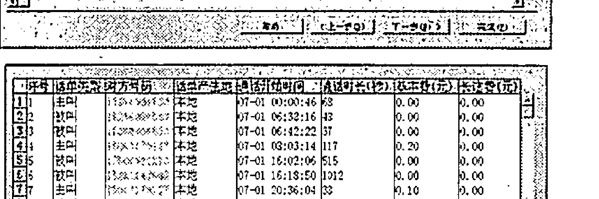

### 第一步: 导入表格

打开Access, 新建空白数据库. 然后点击“外部数据→Excel”, 可根据实际情况勾选“第一行包含列标题”, 分别导入两张表格(见图1, 2). 通话详单前几行为表格标题, 需删除: 我的手机M8就可导出xml格式的电话簿, 使用UltraEdit整理后可直接点击“xml文件”导入.

### 第二步: 整理

电话簿、详单中部分电话存在区号、+86、17951等前缀, 先把它们去掉. 选中电话号码一列, 分别将前缀替换为空, “匹配”选项为“字段开头”(见图3), 保存即可.

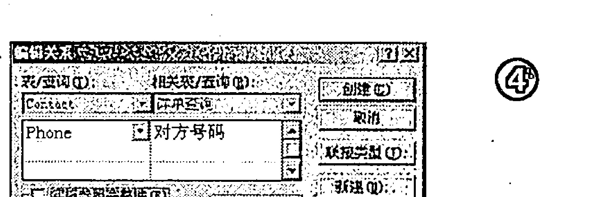

### 第三步: 创建关系

首先点击“数据库工具→关系”, 选中两张表格, 选择“添加”(见图4). 接下来将电话簿表格中的“phone”列名拖到通话详单的“对方号码”列名上(见图5), 创建关系, 保存.

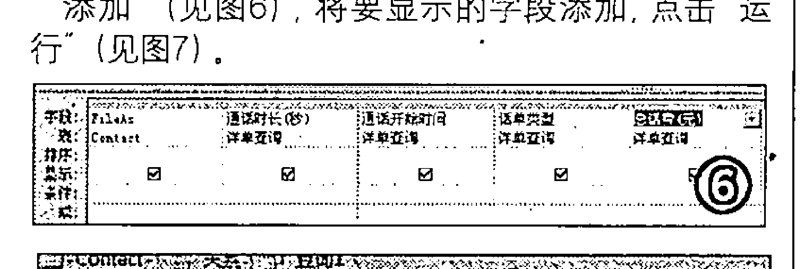

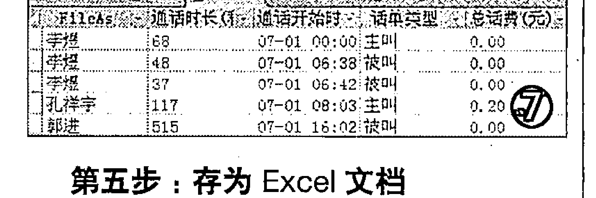

### 第四步: 查询

点击“创建→查询设计”, 选中两张表格, 选择“添加”(见图6), 将要显示的字段添加, 点击“运行”(见图7).

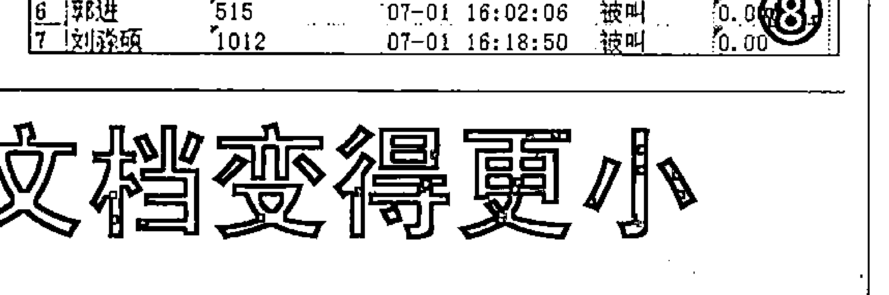

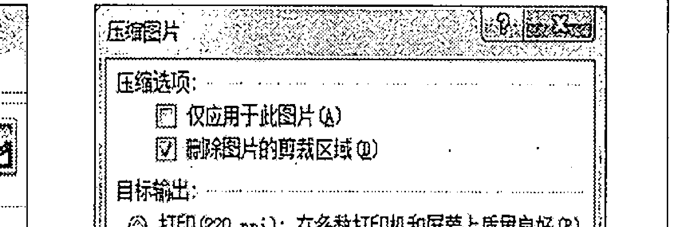

### 第五步: 存为 Excel 文档

右击“查询1→保存”, 在“所有表”中右击“查询1→导出→Excel”, 就大功告成了(见图8).


(哈尔滨工业大学(威海)软件学院/王东晓)

## 妙用内置选项 让Office 2010文档变得更小

Office 2010中创建的文档、表格或PPT少不了要插入图片, 这就使得它变得比较大. 在带宽费用很高的今天, 最好能够尽可能减小体积, 不仅便于携带, 更利于传输.

我们要做的只是在Word、Excel或PowerPoint中选中一图片, 再单击上方的“图片工具→格式”标签, 然后再单击“压缩图片”按钮(见图1), 打开压缩图片对话框(见图2). 如果想压缩演示文稿中所有图片, 可取消“仅应用于此图片”复选框, 之后在下方“目标输出”处来选择相应的分辨率. 如果您还想进一步为它“减肥”可选中“删除图片的剪裁区域”复选框, 完成后单击下方的“确定”按钮退出“压缩图片”对话框, 然后再选择“文件→另存为”将其重新保存为一新的文件, 你将会发现它已经苗条了很多.

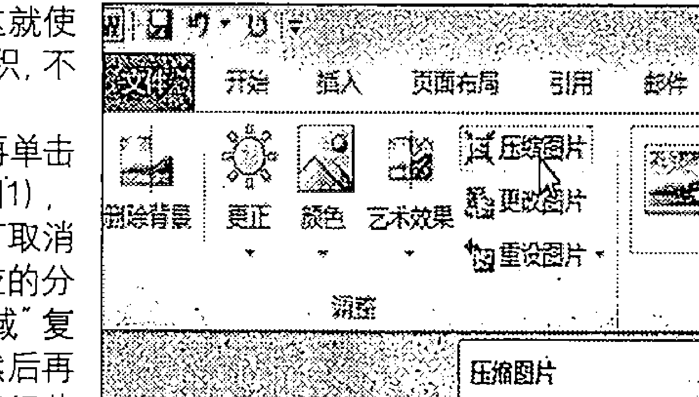

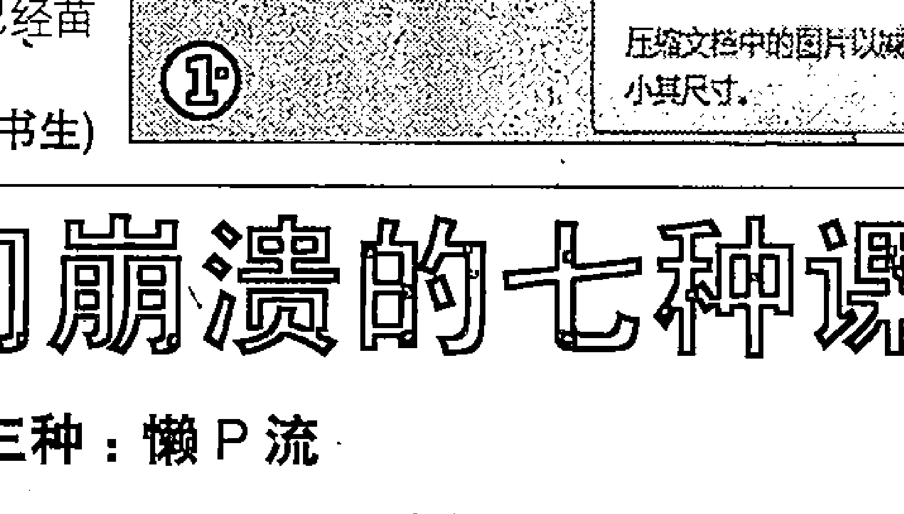

(江北书生)

## 让大学生们崩溃的七种课堂PPT

PPT课堂继续开课! 作为大学老师, 秋叶老师要先调侃一下让大学生们崩溃的课堂PPT. 你的老师是哪种? 欢迎广大读者参与讨论, 请发邮件到 xiaoyxxr@cfan.com.cn. 如果你胆子够大, 可以把本页打开, 悄悄放在老师的讲台上……

- 第一种: 无P流
  学生最愤怒, 为什么连个PPT也不准备就可以当大学教授?
  果果: 其实, 有的大神级教授不用PPT也可以让听课的学生挤满教室且无人瞌睡: 如果又神又有多媒体辅助岂不更妙? 呵呵!

- 第二种: 神P流
  学生最崩溃, 一上午就一页PPT, 你强, 哥先睡了。
  果果: 总比一页没有强, 至少有个背景吧. 既然啥内容, 还是低碳一点, 关了投影仪算了。

- 第三种: 懒P流
  学生最折腾, 上课就是让学生做PPT, 上台做Presetation。
  果果: 适当的锻炼是有必要的. 只是别全让学生代劳就行。

- 第四种: 读P流
  学生最郁闷, 为什么要到教室听你念一遍?
  果果: 哎, 老师念惯了教案, 现在进行电子备课了, 习惯一时还不好改……

- 第五种: 全P流
  学生最辛苦, 上课老师都用PPT, 全是字, 姐用笔记都来不及了!
  果果: 此老师一定是学术型的, 恨不得和学生分享更多的“料”. 首先呢, 老师要人性化一点, 把字设置大一些; 其次, 学生下课最好积极从老师那里拷贝一份, 也省得抄了。

- 第六种: 全英流
  学生最紧张, 全英文的PPT真是要命死人, 扛不住了!
  果果: 四六级的阴影还未消散, 看来英文不好不行啦. 试问今后毕业去国际名企, 英文不行如何拿高薪?

- 第七种: 封P流
  学生最鄙视, 上课就靠PPT, 还只能抄不许拷的, 老师你也太小气了!
  果果: 虽说知识分享是无私的, 但知识产权也是客观存在的. 其实, 在大课堂里悄悄拍照也是个好办法哦, 自用为主啊! 老外也写了一个PPT, 题目是“让PPT杀死学生”, 大家不妨在线一看http://www.70man.com/?p=4383.

(武汉工程大学/秋叶)

## 校园大型晚会现场直播无缝切换

大学校园里的活动是丰富多彩的，对于一些较大型的晚会，有时会采用现场直播，有时在直播的同时需要插播PPT解说或者在解说的过程中需要马上播放视频。这时就需要进行无缝切换，才能保证直播的顺利进行。常见的晚会流程中有节目表演、领导发言、颁奖等，期间可能会进行一些互动，比如晚会开始前的倒计时，电脑抽奖，播放视频等。这里我以常见的晚会流程为例，来向大家介绍一下具体的实现方法。

### 所需设备及其连接

实现直播所需要的设备有摄影机、视频切换器、投影仪、笔记本电脑（2台）、音响控制台。
1.笔记本电脑A（主要负责节目表演的配乐）与音响控制台连接；
2.笔记本电脑B（负责播放解说、视频、抽奖等活动）与视频切换器连接，并通过音频线与音响控制台连接；
3.视频切换器与投影仪、摄影机连接。

**小提示：**
如果现场晚会的场地较大，那么连接摄影机的信号线需要增加一个信号放大器（线超过200米），防止信号衰减而影响直播质量。

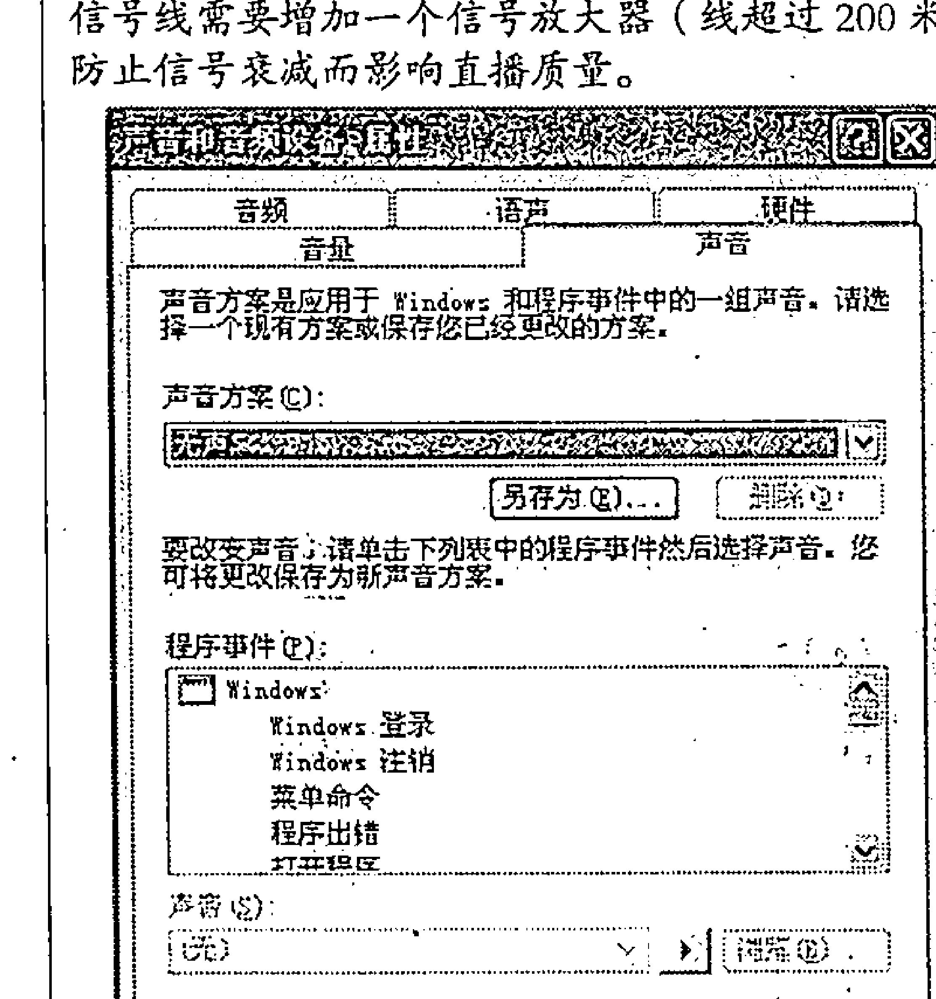

### 前期准备

**第一步：**依次进入“开始→控制面板→声音、语音和音频设备”，打开“声音和音频设备”后切换到“声音”选项卡，声音方案设置为“无声”（见图1），另外将杀毒软件等晚会没有用到的软件关闭，防止直播过程中出现不必要的声音或者突然弹出窗口提示等。
**第二步：**安装好视频播放软件，这里以Kmplayer为例。打开Kmplayer，右键单击播放窗口，依次选择“屏幕控制→在开始播放时的屏幕尺寸→全屏幕”（见图2），然后再依次选择“播放→如何打开文件→仅打开选择文件”即可。
**第三步：**安装好虚拟桌面软件（虚拟桌面专家）、抽奖软件（EasyLottory）等晚会需要用到的软件。
**第四步：**将晚会上所需要播放的视频、PPT等拷入电脑存放好，分别右键单击每个视频文件，选择“发送到→桌面快捷方式”，然后进入该快捷方式的属性，为之设置快捷键，注意设置快捷键时应该不能与系统常用的快捷键等冲突，最后用纸将快捷键及对应的视频记录，以防忘记。

### 控制方法

通过虚拟桌面专家可以虚拟出4个桌面，并有相应的快捷键可以进行快速切换。不同的桌面分配不同的任务。
**桌面1（快捷键 Ctrl+F1）：**主要负责PPT解说及相关视频播放。首先打开Kmplayer，按“Esc”键让其自动最小化到托盘，然后打开PPT，按“F5”键进入播放状态。在使用PPT进行解说时需要播放视频时，只需按下相应的视频快捷键即可，在播放完后迅速按下“Esc”键即可回到解说。
**桌面2（快捷键 Ctrl+F2）：**负责电脑抽奖环节。首先将抽奖软件打开并配置好，进行此环节时，通过快捷键立刻切换到此桌面即可。
**桌面3（快捷键 Ctrl+F3）：**备用桌面。为防止播放过程中突然出现一些软件故障等，可以迅速切换到此桌面。首先进入该桌面，右键单击桌面，选择属性，切换到桌面选项卡，将桌面的背景设置为晚会的宣传海报等。然后再次右键单击桌面，选择“排列图标”，将“显示桌面图标”前的勾去掉。接着右键单击任务栏，选择属性，将“自动隐藏”任务栏前面的复选框勾上即可。注意使用该桌面应该在屏幕切换到现场时迅速将出现的问题解决。

在大型晚会开始之前，一定要把前期准备完美，由于控制过程中使用的快捷键比较多，注意避免因紧张而按错快捷键，建议在晚会开始之前多做几次模拟练习，还有最好将笔记本上的触摸板功能关闭，防止误碰。祝你顺利完成晚会直播，让大家都为你竖起大拇指！

> **文中涉及的软件及下载地址：**
Kmplayer：http://d2.kmplayer.cn/kmplayer2010.exe
虚拟桌面专家：http://www.greendown.cn/soft/10622.html
抽奖软件Easylottery（需要.net2.0支持）：http://www.onlinedown.net/soft/98522.htm
全屏幕秒表倒计时软件：http://www.greendown.cn/soft/16073.html

(湖南中医药大学/黄高展)

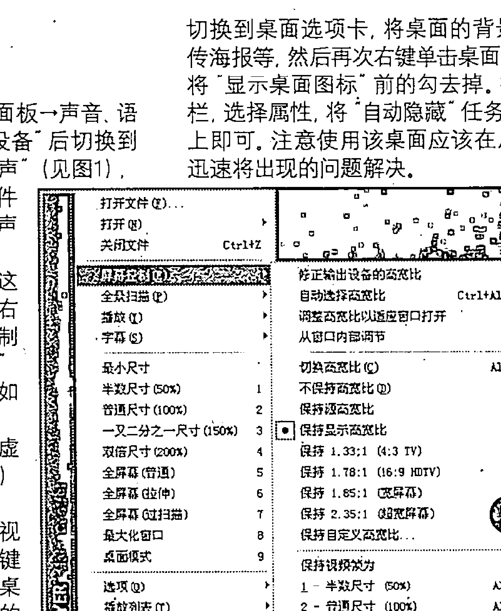

## 你写过九宫格日记吗？

最近在网络上看到很流行九宫格日记体，我一时兴起就用PPT做了一个模板（见图1），是不是感觉别有风味呢？
这个PPT制作需要一点小技巧，就是页面设置要自行调整为正方形。PPT的页面设置和Word一样，可以自行定义，这点功能很少朋友注意到并加以利用。
设置好页面后，用8个同样大小的正方形文本框填充底色，边框线型白色，设置为4磅，对齐横向和纵向分布，立即可得。
填写这个日记关键是创意，创意可以通过变换字体大小、字体格式、字体颜色、背景格颜色等，配不同图片表达不同的心情，当然最大的创意是你的文案，毕竟是日记嘛。

这是一种有意思的结构化图形日记，对这个PPT模板有兴趣的朋友，可以去这里下载：http://dl.dbank.com/c0gs5ty47d。

**网络大补贴：**
在线九宫格日记网站 http://grid.sinaapp.com
采用传统经典的九宫格方式（见图2），有9个方方正正的豆腐块，可以随意选择日记的背景颜色，然后开始写日记。九宫格的主要内容有：开心的事、为他人做的事、计划/工作/备忘、比起昨天的进步、心情/感悟/灵感、关注/八卦/新闻、健康/饮食/体重、昨日梦境，九宫格的正中央那格是天气。格子内限写9个字，九宫格日记以其简单便捷获得不少网友的青睐。
豆瓣九宫格活动小组 http://zeta.douban.com/online/10603182

(武汉工程大学/秋叶)

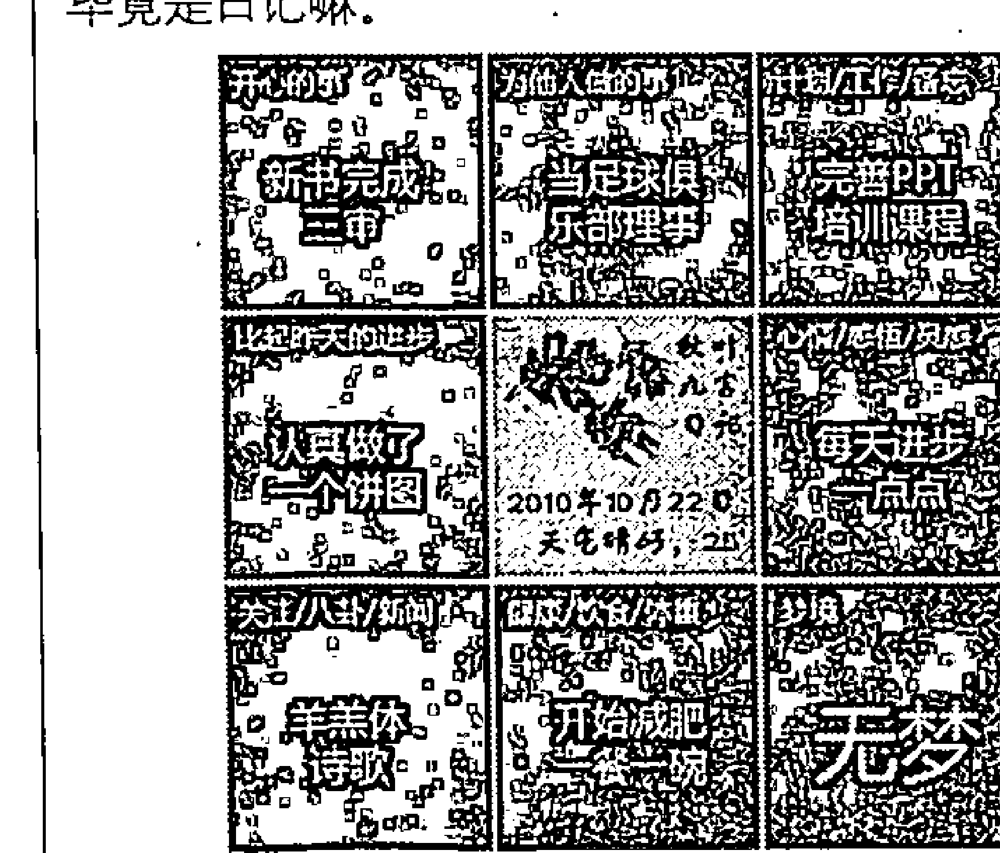

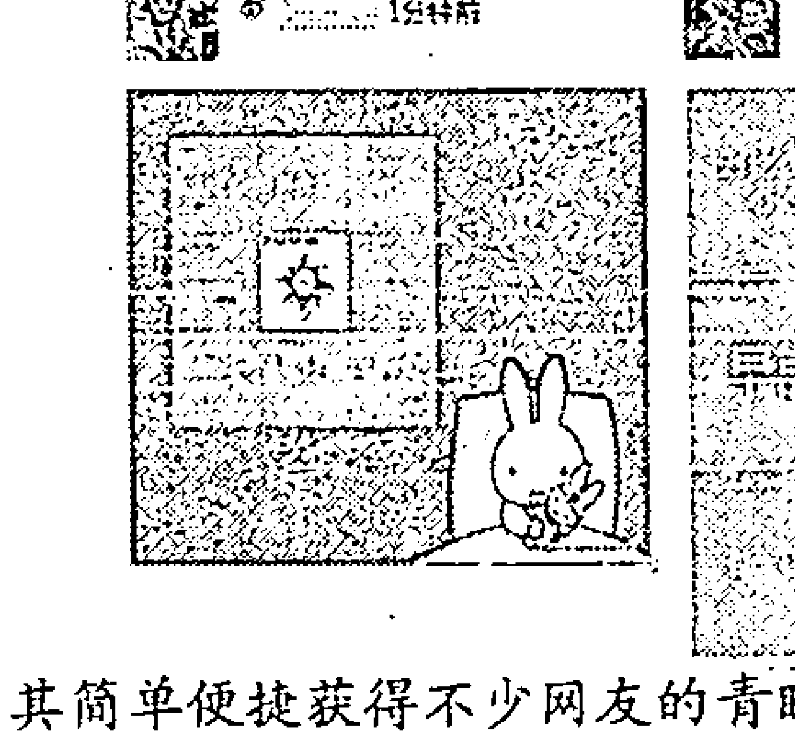

## 不登录人人 新鲜事也知晓

人人网是大学生朋友们关注度很高的网站，庞大的同学网络让交流互动异常简便，不过，我们并不是时刻都保持在线状态，而同学更新的状态、精彩的分享却是不定时的，怎么不用登录网站就可以知道好友是否更新了呢？这就要用到人人网的“邮件订阅”功能了！
登录人人网，选择“设置”项里的“邮件订阅”，打开邮件订阅窗口，系统默认会推荐订阅你的特别好友和关注的公共主页，如果感兴趣可以直接点击“订阅TA”，确定订阅。如果还要关注其他好友的页面更新情况，可以点击下面的“添加订阅”，然后系统会列出你的好友名单头像，支持单选、多选或全选好友，确定退出设置，然后返回订阅邮件窗口，系统默认每天早上7点发送图文版更新情况到你的人人网注册邮箱，不过如果对这个时间或形式不满意也可以点击“设置订阅”，更改设置发送频率、发送时间和发送样式。当到达设定时间后，被关注好友的新鲜事情况就会以“图文直播”的形式发送到你的邮箱里了。有了这么贴心的功能，以后再也不会错过有趣的新鲜事了！

(飞天小猪)

## 电脑族：小雪节气话养生

11月底，小雪节气已经如约而至。在这个气候变化的季节里面，我们该如何保养好自己的身体呢？且听我细细道来。

次后，如果所推过的皮肤发红，这证明阳经已然受邪，病毒已经入体，不过没有爆发而已。要注意多休息，喝姜汤或者感冒冲剂帮助身体杀灭感冒细菌。

### 享受阳光，享受生活

小雪节气前后，天气时常是阴冷晦暗的，人们的心情也会受其影响。有时间多晒太阳（尤其在中午），让人体的阳气与天地之阳气相通，有助于改善体质与心情。

### 享受空气，预防感冒

由于气温骤降，人们习惯把门窗关得紧紧的，避免外面的冷空气进入。局部空气不流通，造成室内二氧化碳、灰尘、计算机辐射、人的呼吸道和消化道排泄物不断积累，造成学习和工作效率下降。因此每天至少中午、傍晚开窗各一次，时间超过5分钟，以保证室内空气清新。

在宿舍、教室、办公室中，感冒病毒是最容易传染的。判断是否感冒这里有个简单的办法：用中指指腹从印堂向上用力直推，推到头发边际为止，反复5

### 活动双手，享受温暖

在计算机前学习和工作，因为双手暴露在冰冷的空气中（这里同情一下南方无暖气的同学）时间久了手会变得僵硬。活动起来吧！

1. 摩手通经
双手合掌，互相用力摩擦至发热，先是手心，然后是手背。
2. 揉压手穴
一手握住另外一手手腕，来回转动多次至发热，这样手腕周围的太渊、大陵、神门、阳溪、阳池、阳谷等穴位都会被揉压到（见题图）。双手交替，接着用右手拇指指腹按压左手拇指指尖，同时右手另外四指靠在左手拇指后部以作为支撑，这样便于施力，十指都来一次。最后按压合谷。合谷位于虎口，当拇指、食指合拢后，虎口的肌肉会隆起，隆起最高点便是合谷的位置。按压合谷可以有效促进肠道蠕动，对于长期久坐的电脑一族有很好的效果。

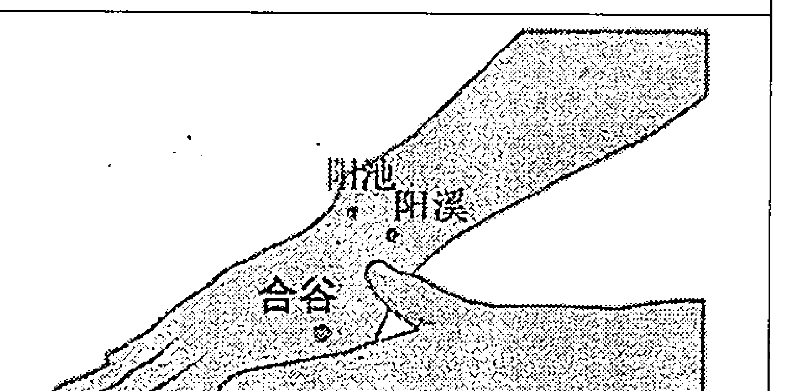

3. 舒缓关节
右手握住左手拇指，使劲向右边拔，左手不动，坚持三秒，然后右手以360度牵拉左手拇指，让关节松动不紧张，从而达到舒缓关节的效果。
4. 孔雀开屏
双手放置于胸前，自拇指开始呈扇面状逐指依次用力伸展、屈曲，各做三遍后五手同时施展，到最大程度后用力握拳三次，然后松指，旋转摇动手腕。

小提示：如果你用手指做指压的时觉得力道不够，可以找到圆珠笔、铅笔（施压面积大，刺激缓和，别用笔尖那头）或者钥匙（施压面积小，刺激大）来增加效果哟。

> (福建中医药大学/黄德涵)

## 巧用VBS+批处理 礼貌回绝 “霸机者”

玩电脑的人，最痛苦的事是自己没有电脑，最最痛苦的事是自己明明有电脑而被别人霸占，最最痛苦的事是不好当面拒绝。我是一所职业学校的计算机老师，由于刚毕业，平时为人较亲和，跟这些职高生很合得来。学生也知道我的计算机的登录密码，一下课或一放学就来到办公室，几个人围坐到我电脑前偷菜、玩游戏，违反了学校的规定。怎么想个简单有效的方法礼貌回绝那些霸机者呢？成了我一直思考的问题。

首先，我想到了《电脑爱好者》上以前提到的一个方法：用手机蓝牙控制计算机输入密码。当启用Bluelock软件时，如果监测到指定的蓝牙设备离开自己的计算机，就让Windows自动锁定。但是这个方法有几个弊端：1.我现在的电脑没有蓝牙适配器，需要另购一个；2.万一哪天我在上班过程中，自己设置的那部手机没电了，就发现防人其实是防住了自己；3.这个软件启动后可以人为在任务栏关闭，方法随之失效，实用性大打折扣。如何能不花一分钱，就能实现这个功能呢？我终于想出一个VBS+批处理的好办法。

### 第一步：shutdown 命令

我们都知道能用shutdown-T命令来实现定时关闭计算机的功能，用shutdown-A命令来实现取消关闭计算机的功能。所以只用新建一个VBS脚本语言执行关机命令，在输入正确的密码后执行shutdown-A命令就可以了。

代码如下：

```
on error resume next
dim WSHshellA
set WSHshellA = wscript.createobject("wscript.shell")
WSHshellA.run "cmd.exe /c shutdown -r -t 120 -c ""请输入密码，不输入或输入密码错误计算机将在两分钟后关机！""",0,true
dim a
do while(a <> "password")
a = inputbox ("请输入密码："密码"" 说不说","不知道",8000,7000)
msgbox chr(13) + chr(13) + chr(13) + ("你输入的密码不正确，请重新输入"),0,"MsgBox"
loop
dim WSHshell
set WSHshell = wscript.createobject("wscript.shell")
WSHshell.run "cmd.exe /c shutdown -a",0,true
```
msgbox chr(13) + chr(13) + chr(13) + "你可以正常使用电脑15分钟"

保存为shutdown.VBS

其中代码行第四行中：WSHshellA.run "cmd.exe /c shutdown -r -t 120 -c ""请输入密码，不输入或输入密码错误计算机将在两分钟后关机！""",0,true中shutdown -r -t 120表示倒计时120秒关机，我们可以根据实际情况做修改。

第七行代码：do while(a <> "password")，其中引号中的字符：password为密码，可以做自定义修改。

我们都知道用shutdown命令可以实现关机，但是每次只执行一次，我们现在如何让它隔断时间定时运行呢？

### 第二步：VBS+BAT 文件轻松实现电脑定时输入密码

```
@echo off
:s
ping -n 900 127.1>nul
start "" "D:\test\shutdown.vbs"
goto s
```
保存为ping900.bat文件

此段代码实现的是：每隔一定时间，自动执行shutdown命令。

代码行中：ping -n 900 127.1>nul中的900表示900秒，即15分钟。我们可以做自定义修改。start "" "D:\test\shutdown.vbs"中的D:\test\shutdown.vbs表示第一步新建文件的保存路径。

但是执行这个命令会显示一个命令提示符窗口，如果关闭了这个窗口的话，关机命令就无法再间隔900秒后自动执行了，我们得想一个办法让它不显示命令提示符窗口。

### 第三步：隐藏命令提示符窗口

```
set ws=wscript.createobject("wscript.shell")
ws.run "D:\test\ping900.bat /start",0
```
保存为mima.vbs脚本语言

完成后，在电脑D盘根目录下新建一个名为test的文件夹，把第一步新建的shutdown.VBS、第二步新建的ping900.bat、第三步新建的mima.vbs都放入到test目录下（为保密起见，可以把它属性设置为隐藏）。以后离开时只用双击执行mima.vbs就可以了。执行后电脑每隔15分钟要求输入一次密码，如不正确，会自动注销或关机。当然，你也可以将mima.vbs加入到计算机的启动项内去，让它开机自动运行。现在，对于那些霸机者来说，当他不知道你的密码的时候，只有望机兴叹了！这个方法，在Windows XP、win7均测试有效。

> (四川资阳科学技术学校/肖进)

## 作业雷同轻松认定

这学期我申请上了计算机导论的助教，主要任务就是给100多份作业打分（除错别字外，完全相同），最困难的就是雷同认定。虽然有了技巧，但工作量还是很庞大的。

所需软件：Beyond Compare
原理：使用Beyond Compare查出最有特征的词语或短语，使用windows文件内容查找功能查找。

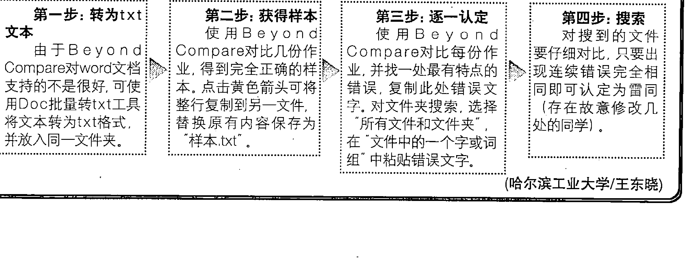

> (哈尔滨工业大学/王东晓)## 寻找最佳的下歌方式

原题重现：怎么去找歌？
下歌嘛，如果要找的歌曲很热门那自然就简单，但是如果是几年前的老歌，或者比较小众一些的，就比较麻烦了。这里我就来分享一下我的经验。

- 1.百度贴吧是个好东西
只要找的歌不是特别的冷门，一般都能找到有关的百度贴吧，特别是现在百度贴吧改版后，右侧多出了“精品区”，在里面找类似“资源”、“音乐”的标签，单击就可以快速找到需要的资源了。例如我要找2008年动画“幸运星”角色CD的原声带，如果直接搜索会很难找到，进入贴吧后在右侧“精品区”中单击“资源”，就有我要的专辑了，马上进去下载。一般专业贴吧里的音乐都是高品质的，可以放心下载。另外，在“资源”标签中，还会有很多意想不到的好东西，除了音乐，其他任何和主题有关的，都可能会找到哦！

- 2.善用资源搜索，没有你搜不到的
这里说的“资源搜索”，指的是下载软件自家的搜索引擎，专业程度自不用说，而且就搜索能力来说，也比普通的搜索引擎好一大截。主要推荐两个，一个是迅雷的“狗狗”，另外一个是VeryCD。这两个搜索引擎的能力十分强大，配合使用的话基本没有搜不到的资源。

- 3.关于宏代码的运行
如果说以上方式还搜索不到，就要上专业的音乐网站了。“分贝网”关闭后，一时没有什么知名网站出来接班，这里推荐“6621音乐空间”(http://www.6621.cn/)。它支持多种搜索方式，最重要的是，里面的音乐相当全，甚至一些很冷门的电视剧主题曲都能在里面找到，而且提供外链地址，可以自由链接到BLOG、QQ空间等地方，速度也很快，如果喜欢转载音乐，这绝对是个不可不收藏的好网站。

小编点评：
方法都不错，给我们开阔了眼界，毕竟从贴吧下歌还是很另类的方法。

## 动漫音乐常见词汇

| OP | 片头曲 |
|---|---|
| ED | 片尾曲 |
| Booklet | 可以理解成CD封面 |
| OST | 原始声音轨道 |

(挑战者：广西/雾雪霏云)

## 边走边读：用手机看书

原题重现：如何处理手机看书的问题？
最近我发现了一款软件：“小说下载阅读器”（下载地址：http://www.mybook66.com/），这款软件很适合一些喜欢看电子书的同学，只要知道小说的名字就能够用这款软件把各章节的内容下载到本地观看。这个软件的设置很人性化，阅读时可以设定背景颜色和字体以迎合个人的习惯。最有用的功能是这软件能把下载来的整本小说打包成CHM和TXT格式的电子书，方便放在手机和MP3、MP4中阅读。
有的童鞋想把下载到的整本小说按章节分割成一个个独立的文件，这当然没问题，用“章节分割器”（下载地址：http://download.pchome.net/utility/file/editor/detail-83079.html）就可以完成。它会根据传统的章节符号（如：“第一章”、“第一回：”）分割开来之后按下工具栏上的第4个按钮 就可以保存了。这个软件也可以自定义章节符号：在软件中，点击“操作→选项”，就可以设置自定义的章节符号，不过在之前要懂得一些正则表达式的知识。

用手机看电子书我们可以颠覆一个观念：就是用手机来阅读TXT文件，你可以把电子书制作成一个手机软件在手机上阅读。用“JBOOK手机JAVA电子书制作系统”（下载地址：http://www.onlinedown.net/soft/47600.htm）就可以完成。这个软件可以使你的手机象电子书一样方便的设置书签、自动翻页，除此之外软件还支持制作电子书封面、打开密码、背景图片、颜色、文字字体，同时也可以按字数分割电子书。

小编点评：
比较简单的题，但一直没有比较完美的答案，这次“抛个砖”，希望引个玉出来。
(挑战者：广东/MARS.)

## 我的QQ中心超级好友管理器

原题重现：批量删QQ中的指定好友
批量删除QQ好友，可以试用QQ即将推出的“我的QQ中心”服务（http://id.qq.com/friends）。不过此服务尚处于内测阶段，但应该会在近期“转正”。
登录到我的QQ中心，切换到“我的好友”选项卡，里面包含有“好友管理”选项。在好友列表中，显示了好友的昵称、隐身设置、分组、备注、性别、生日、地域、最近上线情况等。如果只删除男性好友的话，批量勾选男性好友，然后点击“删除”按钮即可。当然，你也可以按其他条件批量勾选好友进行删除操作。

小编点评：
Web QQ 里的好友管理功能没有了，原来是移动到了这里，唯一遗憾的是在截稿时，这个功能还在内测……
(挑战者：飞天小猪)

## 掀出QQ群里的话痨

原题重现：QQ群大家都会接触到，不过，你知道谁是你们群里说话最多的吗？谁是群里说话最频繁的吗？
看到这个题目，我觉得应该到了把大话痨“示众”的时候了。其实，解决这个问题有两个思路，直接获取QQ服务器上的数据，只是笔者水平不高，只好放弃。于是，采用第二条思路：从QQ聊天记录上做些文章。
首先我们要得到指定QQ群的聊天记录。点击QQ主面板左下角的主菜单图标，在弹出的菜单中选择“工具”子菜单中的“消息管理器”选项，然后选中要统计的QQ群，再单击“导入和导出”的小三角，弹出下拉菜单，选择“导出消息记录”。接着会弹出保存窗口，此时需要将保存类型选为“文本文件”以便我们稍后处理。

得到了消息记录，这时就要祭出我们的神器—QQ群用户管理工具 6.0.0 广告版（下载地址：http://www.skycn.com/soft/45152.html）。解压后直接运行主程序，在这里无需注册，直接点击左上方的“导入QQ消息记录”按钮，导入刚才得到的消息记录文件，再点击程序窗口上方的计算器形状按钮进行计算，最后双击“发言次数”进行排序，到此为止，谁是QQ群中的大话痨不就一目了然了吗？

小编点评：
当小编可利用这个工具统计出来的结果一发到群里，立刻将经常打扰大家的大话痨揪出。我们还想知道谁说的话的字数是最多的呀！
(挑战者：河南/吕晨曦)

## 骚扰不再有 屏蔽某地区的电话

原题重现：按地区进行垃圾电话屏蔽
登录360手机卫士官网（http://shouji.360.cn/），根据你的手机型号，下载相应版本安装。启动软件，在“黑白名单”中执行“通讯录黑名单”，从菜单打开“添加号码→按地区选择”，选中你要的地区即可。

小编点评：
除了屏蔽电话外，360手机卫士还有礼貌拒接模式，比如设置返回忙音等等。
(挑战者：江西/陈小华)

## 找回那时的好友

原题重现：误删了某位好友，应该如何找回TA呢？你有什么办法吗？
其实这个问题很简单，进入消息管理器，在“临时会话”中就能找到有过临时会话的好友，包括误删除的好友也可以再这儿看见。

小编点评：
简单而且容易忽略的技巧。
(挑战者：咖啡找伴侣)

## QQ聊天记录你会合并吗？

原题重现：从QQ 2008升级到QQ 2009或QQ 2010版后，大多数人第一个要面对的就是聊天记录的问题，你是怎么处理的呢？
在笔者用两个QQ进行了N次上下线之后，该题的解决方案终于浮出了水面。这里以我试用的QQ 2008正式版和QQ 2010 Beta2两个版本QQ聊天记录合并为出发点。首先我说明一下为什么题目中提出的办法无法合并记录中的图片。在对QQ版本进行升级的时候，我们都有一个“好”习惯—覆盖旧版本的QQ安装目录，相信很多人这么做的目的就是只用现在最新版本的QQ版本了，覆盖掉旧版本QQ可以省去卸载软件的麻烦。而恰恰这个看似“好”的习惯直接导致了从旧版本QQ导入自定义表情到新版本的失败。很多人在提取QQ聊天记录的时候都是只是导出QQ聊天记录或是账户下的MsgEx.db文件，但这样做过之后我们在打开消息管理器进行导入消息时会出现“导入自定义表情失败，无法找到相关数据”的提示。因此我认为其实在旧版本中有些程序文件涉及到了QQ聊天记录中的自定义表情的具体状态和位置，在用新版本QQ覆盖之后，这些程序很有可能被新程序替换，从而导致上诉提示信息并导入自定义表情失败。
因此我在试验中将新版本QQ安装到另外一个路径下面，再打开“消息管理器→导入和导出→导入消息记录”，在出现“请选择要导入的内容”时，勾选自定义表情并单击下一步，在要选择导入消息的方式时，为了快速导入消息内容我们这里选择“自动搜索导入”（也省去了从旧版本QQ导入导出消息的麻烦），最后单击导入即可，当然你是不用担心聊天记录的时间排序问题。
同样如果从A电脑记录合并到B电脑的记录，可以使用闪盘的工具对A电脑的安装QQ目录文件拷贝到B电脑，按上述办法也可以成功导入自定义表情。

小编点评：
当期出了点小问题，QQ手机聊天记录的导出并没有出现7期杂志上，这点也是小编的失误。
(挑战者：舒云飞)

## 轻便快捷 迷你下载工具谁最“迷你”？

什么是迷你下载工具？其实就是普通下载工具的精简版，一般在安装文件大小、系统资源占用等方面进行了很多优化，适合于配置较低的电脑。尤其在上网本风行的年代，迷你下载来得正是时候。不过软件迷你但是功能不能迷你，浓缩的一定是精华。下面就让我们来看看，众多的迷你下载工具中，谁最强？谁更适合网民的需要？

## 毋庸置疑的测试平台

本次测试采用对比测试，所有测试项目均在同一硬件及网络环境下进行，配置单如下：CPU：AMD双核龙5000+；内存：2GB；主板：技嘉GA-MA78G-DS3H；硬盘：希捷ST3640323AS（650GB）；显卡：ATI Radeon HD 3200；操作系统：Windows XP专业版（32位）；网络：中国电信512K。

## 客观公正的评测队伍

本次评测更加注重了参与性和互动性，评测由《电脑爱好者》软件编辑和多名热心读者共同完成，测试实例都在同一硬件环境下进行，保证了测试结果的公正。

## 实用为主的评测理念

秉承“实用至上”的准则，我们通过实例测试，确保评测的数据对大家有实际的参考意义。

## 我们的测试对象

除了常用的几款下载工具迷你版外，我们还加入了常用浏览器自带的下载工具，都尽可能选取软件当前最新的版本（截止2010年6月1日）。

- ★迷你迅雷
  http://dl.xunlei.com/mini.html
- ★迷你快车
  http://mini.flashget.com/
- ★迷你电驴
  http://download.verycd.com/miniMule-Beta-Setup.exe
- ★QQ旋风
  http://dl.qq.com
- ★傲游3
  http://www.maxthon.cn/mx3/index.html
- ★Opera
  http://www.opera.com
- ★谷歌浏览器（Chrome）
  http://www.google.com/chrome

#### 才艺展示

迷你迅雷保持着迅雷下载快的特点，界面简约精致，体积小巧，设置选项也比较丰富。它能在保持高速下载的同时，也能流畅上网。并且，将网页搜索与资源搜索结合在一起，搜网页找资源一并进行。

迷你快车FlashGet本身就以简洁易用，占用资源较少而著称，快车的迷你版更是将这些优势发挥到了极致。快车迷你版也有着非常酷炫的界面，支持换肤。

| 软件名称 | 安装文件大小(KB) | 安装后大小(MB) | 内存使用(KB) | 下载时(5分钟/10分钟) |
|---|---|---|---|---|
| 迷你电驴 | 3216 | 8.97 | 1384 | 18136/18148 |
| 迷你快车 | 3499 | 6.76 | 5200 | 33460/41320 |
| Chrome(谷歌浏览器) | 16860 | 11.3 | 28408 | 48872/49072 |
| Opera | 12715 | 28.1 | 52560 | 60324/60456 |
| 傲游浏览器 | 12680 | 35.8 | 13972 | 49716/69324 |
| QQ旋风 | 8156 | 35.9 | 24608 | 68232/76204 |
| 迷你迅雷 | 6274 | 16.7 | 12952(mini)+16624(Service) | 14364+56420/14364+65752 |

#### 功能大比拼

比一比，谁的“身材”好，不仅仅指文件的大小，而且还包括了空闲和下载时占用的系统资源等多方面的测试，看看谁最优化。因为，既然是迷你版，软件的“身材”（文件大小）和使用的“灵活轻便”（系统资源占用）当然是必测的项目了。
本例及以下各例，我们下载的文件分别为：
HTTP下载：http://www.microsoft.com/visualstudio/en-us/download (Visual Studio 2010 Professional Trial, 本例下载的是分卷压缩的第一部分)
BT下载：http://releases.ubuntu.com/10.04/ubuntu-10.04-desktop-i386.iso.torrent (Ubuntu 10.04 LTS)
电驴下载：http://www.verycd.com/topics/2797728/ (《迷失》第六季)
如表一所示，初始化值并非程序运行后的第一时间值，而是程序打开稳定运行一段时间后所显示的数据。从上表的数据中不难看出，迷你电驴最为小巧，迷你快车紧随其后，迷你迅雷则最耗费内存，而且它还是双进程占用。
“下载时”一栏中的数据，测试的是各软件持续运行过程中的内存变化，基本上都是呈不断上涨的趋势。每个软件分别检测的是5分钟和10分钟两个时间点，数据差越小表示软件的内存优化越好。
浏览器的下载组件嵌入在整个程序之内，不易剥离出来独立检测，所以就以整个程序的状态为准了。

| 软件名称 | HTTP | FTP | BT | 快车协议 | 迅雷协议 | 旋风协议 | 电驴协议 |
|---|---|---|---|---|---|---|---|
| 迷你迅雷 | √ | √ | √ | × | √ | × | √ |
| 迷你快车 | √ | √ | √ | √ | × | × | × |
| QQ旋风 | √ | √ | √ | × | × | √ | √ |
| 傲游浏览器 | √ | √ | × | × | × | × | × |
| Opera | √ | √ | × | × | × | × | × |
| Chrome(谷歌浏览器) | √ | √ | × | × | × | × | × |

自带下载工具，下载功能相对简单，可设置的选项也少，右键中一般也只有默认的“目标另存为”或“链接另存为”之类的选项。
尤其值得一提的是迷你快车，它不仅提供了类似完整版的浮动按钮，另外它的双窗口设计，能快速收起或展开任务信息窗口，也很方便。

## 瞧一瞧，谁的肚量最大

现在网上的资源五花八门，下载方式也各式各样，BT、电驴、迅雷等，需要安装不同的软件，很是烦人。如果有一个软件能把所有的活儿都干了，那该多好。
从表二中不难看出，浏览器自带的下载功能只能进行普通下载，独立下载工具除了迷你电驴支持的协议较少外，其他的独立下载工具都支持BT下载。所有的下载工具中，迷你快车和迷你迅雷所支持的协议最多，两者在伯仲之间。

| 软件名称 | 下载速率(秒,平均值) | HTTP | BT | 电驴 | 搜索资源数 |
|---|---|---|---|---|---|
| 迷你迅雷 | | 75/80 | 58/61 | 69/75 | BT(1446) |
| 迷你快车 | | 70/85 | 65/68 | 未知 | BT(28990) |
| QQ旋风 | | 69/82 | 60/75 | 67/98 | HTTP(3) |
| 迷你电驴 | | 72/158 | 未知 | 73/116 | 未知 |
| 傲游浏览器 | | 70/75 | × | × | 支持断点续传 |
| Opera | | 45/48 | × | × | 支持断点续传 |
| Chrome | | 35/39 | × | × | 不支持断点续传 |

在表三中“/”前面是平均下载速度，后面是最高峰值数。后面的搜索资源数，括号中表示软件显示所找到的连接数或连接健康状态，有些软件则无资源数显示。
第三方浏览器下载的断点续传功能，都必须要比IE强很多。只是Chrome在测试的过程中发现，只有在浏览器不关闭的情况下它才支持“断点续传”，一旦浏览器程序中断，下载也就不可续了。
小编在测试的过程中，突然想到，要是将四款专业下载工具全开，会是什么样的情景呢？如下图所示，只有迷你快车保持平稳的下载速度，而迅雷则是忽高忽低，QQ旋风和迷你电驴，干脆一点也跑不动了。看来看来是迷你快车霸道。

##### 研究院测试报告

在下载小文件时，我们建议直接使用浏览器自带的下载工具，方便快捷。但如果要下载大文件，则最好选用迷你迅雷、快车、电驴或旋风等专业工具。本期编辑推荐奖授予迷你快车，因为：
1. 通过评测数据可知，快车的优化工作做得很好，不会太影响系统的正常使用。
2. 快车的操作界面和配置选项较全面，非常好用。
3. 许多单位封杀迅雷、电驴等，这时则更非快车不可了。

## 事实说话 iPad硬指标到底有多强

2200亿美元！苹果市值居然猛超微软成全美第二大公司，有本事立足第二，离不开苹果华丽丽的必杀技iPad。从各大媒体疯狂式密集报道，到iPad行水两路卖断货价格飙升，在百度搜索iPad，居然找到相关网页约22500000篇！在它备受关注的光环背后，你难道不想了解了解它到底有多强？

1GHz的A4处理器就是iPad的核心，想必各位都看过iPad常规拆解，却不曾一窥A4的内部。国外极客iFixit与Chipworks通过X光扫描、截面、研磨封装分析了A4处理器。总共分为三层，两层三星的RAM，一层微处理器。单核ARM Cortex A8。之前在iPhone的处理器上可以看到三星的产品编号，在A4上就没有，苹果很可能已经掌握了大部分半导体设计、封装技术。在A4的内部有着和iPhone 3Gs、iTouch 3代相同的PowerVR SGX 535显示核心，这也是大家心中最大的疑团所在。

| GPU | 芯片 | 代表机型 | 百万三角形 /s | 百万像素/s |
| :--- | :--- | :--- | :--- | :--- |
| PowerVR MBX-Lite | | iPhone 3G | 1 | 100 |
| | S3C6410 | 智器Q5；m8 | 4 | 125.6 |
| ATI Imageon | 高通MSM72xx | G1，G2，G3 | 4 | 133 |
| PowerVR SGX 530 | OMAP3430 | Milestone | 14 | ~300 |
| ARM Mali 200 | TCC8902 | 智器V5 | 16 | 275 |
| ATI Imageon 7430 | 高通Snapdragon | Nexus One | 22 | 133 |
| PowerVR SGX 535 | | iPhone 3GS | 28 | 600 |
| | | Sony PSP | 33 | 664 |
| Nvidia GPU | Tegra APX2500 | Zune HD | 40 | 600 |

## 身世之谜

PowerVR曾是3D显卡刚兴起时Voodoo卡的主要竞争对手。在与nVIDIA、ATI的竞争中失利后转战嵌入式市场。我们身边的移动设备处理器中很多集成的都是PowerVR。甚至Intel的MID、上网本中的GMA 500显示核心也是穿马甲的PowerVR SGX 535。在可以查到的技术资料中显示，535的三角形生成率是28MPolys/s即每秒2800万个。为何要说三角形生成率？

在3D画面中，最终画面则是由数量繁多的三角形构成的。在资料中声称可以接近GeForce2 GTS的性能。它可是当年nVIDIA打天下的开国元帅之一，只不过是活在10年前的2000年末，是现在N卡老大费米GTX 480它太爷的太爷。GeForce2 GTS的三角形生成率是25MPolys/s，GTX 480则是1600MPolys/s。

单就数据上看，535用在手机方面，iPhone 3Gs的性能要比最近小火的Nexus One采用的ATI Z430强，至于谷歌G1、G2之流已经被甩下两条街了。刚才说过，535是与上网本GMA500一样的，在iPad的系统上没有办法跑分测试，可以用上网本装Windows来跑，在3Dmark03下得分365 (http://tinyurl.com/25l6qd)。现在台式机的中低端显卡，比如GT240，很容易就跑到两万左右，笔记本的独立显卡跑到一万也很正常。不考虑操作系统架构、CPU性能等因素，单就数据上说作为嵌入式设备的显示核心535与目前低端电脑显卡的差距很明显。

## 数据论不能决定一切

在这只是简单类比的说下iPad的显示性能，如果非要争论个一二三四就没意思了。从iPad版《极品飞车13》画质和特效来看，基本上等于当年P3 667MHzCPU搭配TNT2一代显卡跑PC版《极品飞车3》。但是TNT2系列显卡非常依赖CPU的浮点性能，直到GeForce系列首先支持硬件T&L，有了GPU概念，使得GPU从复杂的3D运算中解放出来。535也支持硬件T&L，但是出于硬件架构、操作系统差异等因素，不要指望能达到GeForce 2 GTS档次，差不多是PSP的画质。顺便说下，PSP2将采用PowerVR SGX 545，配合其强劲浮点性能CPU，显示性能将是iPad望尘莫及的。

感叹的是当年散热片和风扇都有点烫手的GeForce 2 GTS如今集成到手机芯片那么小，而且功耗超低。科技一直在进步，把复杂的台式机整合在一个小芯片的时代还有多远呢？
(文/果粉)

## 组图挑战：为了隐私，抹杀浏览器中某网站的一切

原题重现: 我不想让别人知道我已经登录了一个网站，包括历史记录，包括COOKIE，同时又不影响系统中其他网站的浏览记录。

### 团队一：第三方软件团

要完成这次挑战，只需要借助IEHistoryX (下载地址: http://www.onlinedown.net/soft/60341.html)，经过我的测试，它完全达到了挑战题目的要求 (经小编测试它是真没达到要求)。

这里以电脑爱好者网为例，先启动IEHistoryX程序，在软件主窗口中切换到“网页历史”选项卡，查找cfan，勾选相关记录并单击“删除”按钮即可(见图)。至于Cookies的清理，只要到Cookies选项卡，重复步骤即可。

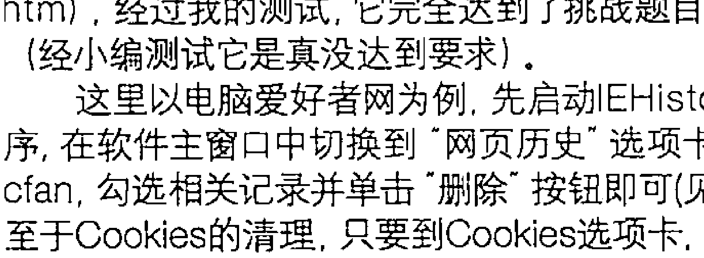

小提示:
★“批量清理”给用户提供了3种不同的清理方式，分别为“完全清除”、“清除今天的项目”、“删除全部的旧项目”。可根据自己的需要勾选相应的功能复选框，最后单击“现在清除”按钮即可完成清理工作。
★对于小编提到的“能不能实现清除某一论坛，或是博客类网站的登录痕迹的功能？”答案是肯定的。只需在软件主界面中切换到“自动完成信息”选项卡，然后根据自己的需要勾选想要删除的自动完成信息，单击“删除”即可。

> 小编点评:
小编在测试软件时，软件出现了错误提示，另外软件需要注册，且只有清除的功能，没有恢复到登录之前的功能。
(挑战者：广东/郑伟龙)

使用Index.dat Analyzer (下载地址: http://www.onlinedown.net/soft/89127.html) 以抹杀http://www.163.com为例，在“筛选文字中包含”框输入163，“筛选”后，删除。

> 小编点评:
功能还不如 IEHistoryX 来得清楚，而且一股脑儿的全部删除，好在软件本身免费。
(挑战者：江苏/李承国)

### 团队二：软件自带功能团

想抹杀掉某网站的浏览记录，而又不影响其他网站的历史记录，一些浏览器自带的功能即可满足要求。

- 1. IE8: 使用InPrivate，开启方式是点击“工具→InPrivate浏览”菜单项，之后，会弹出一个新的浏览器窗口，会以InPrivate标示出来，在此窗口里浏览的网页是不会泄密的，非常安全。关闭InPrivate浏览器窗口，InPrivate功能也就被关闭了。
- 2. FireFox: 在“工具→进入隐私浏览模式”菜单项，即可开启，快捷键为Ctrl+Shift+P。
- 3. Chrome: 点击浏览器右上角的按钮，选择“新建隐身窗口”(快捷键Ctrl+Shift+N)。
- 4. 360浏览器: 当我们需要“隐身上网”的时候，只需要勾选工具栏上的“无痕浏览”即可。
- 5. Maxthon: 右击工具栏，点击“添加或删除按钮→隐身模式”，即可把“隐身模式”按钮添加到工具栏上，以便使用。
- 6. 世界之窗: 点击“工具”按钮，选择“新建隐私浏览窗口”即可。
- 7. 搜狗浏览器: 点击右下方偏中间的隐私模式(像眼睛睁开一样的图标)即可。

> 小编点评:
同样是一股脑的删除方法，难道就没有人可以实现不留痕迹吗?

## 3招让隐身好友显形

要想看隐身，我总结了几种方法
1. 发几句话过去，如果回复那是隐身，不回复那不是在线or隐身，成功率50%。
2. QQ保存信息的服务器与我们在聊天时传输信息的服务器是不同的，所以可以通过看IP的方法查看好友是否隐身。

在这里要用到Open Ports Scanner (下载地址: http://www.newhua.com.cn/soft/59026.htm)。运行软件，打开QQ的设置窗口，设置登录服务器类型为UDP类型。记住当前登录的服务器地址。现在给想查是否隐身的好友发个消息，然后在Open Ports Scanner中看看有没有刚才记下的IP，如果有，则是隐身的，没则不是(记住只看进程名字是QQ.exe的IP，并且是UDP连接的类型)。

3. 这个成功率很高，就是用邀请好友的方法。首先开个群，然后改个你好友感兴趣的名字，然后邀请他，通常你好友都会去接受或者拒绝的，这样就可以知道是否隐身了，成功率80%。

> 小编点评:
第三种方法很好很强大。
(挑战者：广东/罗启燊)

- 挑战者: 上海/王高峰
- 挑战者: 广东/熊欣
- 挑战者: 慕菲
- 挑战者: 魔剑的守护
- 参与者: 海客、蓝色熊猫、zhaiyi、张鹏飞

## 打开自动静音

原题重现: 在看网络视频时总是要先关闭千千静听，觉得很不方便。不知道有没有什么方法可以实现在看网络视频 (比如优酷) 时, 千千静听自动暂停或静音?

我使用了自编的程序来解决, 下载地址: http://work.newhua.com/cfan/201013/qqtr.rar, 程序使用方法:
①进入千千静听 "选项" 中的 "快捷键", 勾选 "启用全局快捷键"。
②运行程序后, 如果千千静听的TTPlayer.exe进程不存在, 程序自动结束; 如果存在, 等待你看网络视频时, 千千静音就会自动暂停或静音了。
软件的设置是通过解压缩后的 "配置文件.txt" 来完成的。其中pause=1代表用户选择的是暂停, 如果非1比如设为0, 则代表用户选择的是静音。个人感觉暂停符合使用习惯, 所以作为默认。pause-key=Ctrl+Alt+F5代表暂停全局快捷键, mute-key=Ctrl+Alt+S代表静音全局快捷键。"网络视频列表" 代表用户需要在看什么网络视频的时候暂停或静音千千静听, 文件已列出几种常见的, 你可以继续添加符合自己需要的。注意一行只能添加一个。添加的关键字可以参考程序已列出的, 如果无法确定可以打开你的网络视频, 在窗口的标题栏选择合适的关键词即可。

小编点评: 小编开始在测试时一直没有成功, 后来才发现, 这个小程序不支持小编所用的世界之窗浏览器。换用IE则没有任何问题。原因是它采用的方式是当前窗口标题栏关键字的判断方法, 所以只要你切换到其他窗口歌曲就会自动恢复。可以说很方便的方案。另外, 读者周浩来信询问他在打CS-Only等网游时, 喜欢关闭游戏本身的背景音, 打开音乐播放器听音乐。有没有方法可以将指定软件规定在何时关闭或打开声音音量。其实只要在播放器里设置全局热键就能解决问题。
(挑战者: 江苏/李承国)

## 屏蔽QQ上的无聊新闻①

原题重现: 怎样能够屏蔽QQ的弹出新闻。
20期上已有其他同学给出了解决方法, 不过我觉得还有一些方法也值得大家参考。

- 方法1: 如果仅为了在游戏时间QQ弹窗不来打扰, 除了设置QQ “请勿打扰” 的方法外, 还可以利用QQ锁定功能暂时屏蔽QQ弹出新闻。操作方法很简单: 右击系统任务栏托盘中的QQ图标, 选择 “锁定QQ” 即可, 或者直接按Ctrl+Alt+L键。首次使用会提示你设置锁定QQ的密码, 以后不再要求。这样, QQ锁定期间新闻就不会弹出影响你游戏或其他的操作了。
- 方法2: 通过QQ外挂屏蔽弹出新闻, 比如不少人在用的赛博QQ。单击 “开始→程序→赛博QQ→设置” 打开赛博百宝箱, 切换到设置选项下的 “功能定制” 选项。在右侧 “定制广告” 中勾选 “禁用右下角新闻卡片”, 单击 “确定” 即可。
- 方法3: 利用弹出窗口屏蔽软件屏蔽QQ弹出新闻。例如 “超级兔子反弹天使”, 在出现QQ弹出新闻窗口时, 启动它, 单击 “新增规则” 按钮, 再将 “导弹” 拖到要拦截的QQ弹窗上, 它就会自动匹配软件名称和执行程序。单击 “下一步”, 在操作方式的下拉菜单中选择 “关闭窗口” 即可。
- 方法4: 使用 “弹窗吸尘器” 拦截, 运行后会在它的建议拦截中看到QQ消息窗口已经拦截了。弹窗吸尘器默认在设置中还勾选了全屏时免打扰模式, 这样进行游戏时就不会担心弹出窗口了。

小编点评: 原来拦截QQ弹窗的方法有这么多, 看来它真是犯了 “众怒” 了。不过说实话, 飞叔我倒是挺喜欢QQ的这一功能, 可以及时了解一些新闻。所以我觉得, 20期舒云飞的 “请勿打扰” 和上面的QQ锁定功能, 最为实际有效, 在游戏时暂时屏蔽一下QQ弹窗就已经足够了。至于赛博QQ、反弹天使、弹窗吸尘器等外挂或工具, 如果仅仅是能屏蔽QQ弹窗我想也就没什么意义了 (谁会为了一件简单的事而安装一款软件呢), 它们之所以还有一定的市场, 是因为更多的附加功能吧。不过我个人并不建议使用这些第三方的工具。
(挑战者: 降魔剑 (xmsword))

## 屏蔽QQ上的无聊新闻②

原题重现: QQ上的广告咱可以无视, 山寨游戏、软件可以不用, 但经常弹出的 “无聊新闻” 就有点烦了, 能不能把这个东西取消掉呢?

可能很多人看到这道挑战题的第一时间是去寻找第三方软件。但是这些插件很多也已经是明日黄花, 有几个也会送给你木马之类的 “礼物”, 笔者就不幸中招了好几次。但是在得之解决方案的时候真是有种 “踏破铁鞋无密处, 得不全来费工夫” 的感觉——原来QQ本身就为这种情况准备好了药剂。
方法很简单, 只要你在玩游戏或者任何不想让QQ右下角新闻出现的时候, 将QQ状态切换到 “请勿打扰” 状态即可屏蔽这烦人的广告了! 方法虽然很简单, 但是相信这是最不会有木马也是绿色的解决方案之一了。

小编点评:
为了不收到广告改个聊天状态, 你狠!
(挑战者: 舒云飞)

为做此题我从QQ官网下载了最新的QQ版本QQ 2010SP1, 按照默认安装登录QQ, 不一会儿弹出QQ的 “今日要闻”, 打开任务管理器, 发现TXOPShow.exe进程占内存30MB多, 关闭QQ。运行gpedit.msc, 打开组策略, 当然你可以用其他的软件禁止。
TXOPShow.exe程序运行, 组策略是系统自带的显得方便一些, 依次展开 “计算机配置→Windows设置→安全设置→软件限制策略”, 如果没有设置过需要右击 “软件限制策略”, 选择 “创建新的策略” 菜单, 右击 “其他规则” 选择 “新路径规则” 菜单, 可以复制TXOPShow.exe的绝对路径, 也可以点 “浏览” 一步步选择, 默认安装TXOPShow.exe的绝对路径是C:\Program Files\Tencent\QQ\Bin\TXOPShow.exe, 安全级别默认为 “不允许”。点 “开始→运行”, 输入gpupdate /force强制更新策略, 然后重新登录QQ, 任务管理器没有TXOPShow.exe进程, 从此以后再没有QQ上的无聊新闻。
总结: 如果以后QQ版本升级这个方法失效, 有可能QQ换了别的弹出新闻的程序, 可以尝试用同样的方法禁止随QQ一起启动的程序看看有没有效果。
小编点评:
这个方法有点意思……
(挑战者: 江苏/李承国)

## 在线视频网站的断点续播

原题重现: 请问如何在打开优酷网、土豆网上的视频时断点续播呢?
目前已知优酷 (http://www.youku.com) 和奇艺 (http://www.iqiyi.com) 原生支持断点续播。

小编点评:
啥也不说了, 给奖金, 就是还有些网站没实现, 继续努力。
(挑战者: 浙江/沈喆奇)

我们只需要个小软件就可以实现断点续播, 它就是 “波波虎” (下载地址: http://www.bobohu.com/)。

这款是一款功能强大的搜索播放软件, 汇聚了上百家高清电影网站的十几万部高清电影、电视剧, 全部DVD画质音效, 几乎全部视频网站上的视频波波虎上都有, 操作非常的简单, 在右上角的搜索框中输入想看的视频, 如火影忍者, 再单击想看的视频就可以观看啦。如果突然关机, 下次再打开波波虎, 切换到 “下载列表”, 点击上次看的视频就可以继续了。
小编点评:
要的是网站断点续播, 你整了个软件……
(挑战者: fz901210)

## 超简单 浏览器整合任务栏

原题重现: 将任务栏整合到浏览器中, 要求通过浏览器看到哪些程序正在运行, 比如可以在浏览器工具栏目上看到QQ的状态, 管理文件等等
一看到此题, 我就想为Windows叫冤, 我只能以他的名义说: “其实你并不懂我的心”。
如果我告诉小编, 我有一个方法, 可以不用下载软件, 通用于所有浏览器的 “将任务栏整合到浏览器中方案” 并且可以很方便地看到哪些程序正在运行 (当然, QQ的运行状态也可以看见), 和管理文件等

等, 还有QQ仿的自动隐藏功能, 你是否会心动? 只要你看看图, 立刻就知道怎么操作了。
小编点评:
对于高手来说, 有图就有真相了, 其实就是把任务栏移到上面, 然后再做一下简单的设置, 实在是有点取巧的办法。具体步骤就不详细说了, 毕竟关注挑战栏目人的这点水平还是应该具备的。
(挑战者: 彭家进)

## 快速找出文档修改前后的不同

原题重现: 现在有修改前和修改后两篇文档, 现在需要你用任意方法快速找到修改过的字符。
我使用TextDiff (下载地址: http://www.onlinedown.net/soft/32899.htm), 运行后, 直接将文件拖曳到TextDiff窗口中, 按F9就能比较。默认情况下黑色字符表示相同的行, 绿色加亮表示不同的行, 红色加亮表示删除的行, 蓝色加亮表示添加的行, 按下Ctrl+N或Ctrl+P组合键可以快速切换到下一个或上一个不同的文本块。

TextDiff只能比较TXT文件, 对于Office文件, 直接使用软件自带的功能即可, 比如使用Word 2010里的 “审阅→比较”。
小编点评:
其实使用Office也同样能比较TXT文件, 也是在不安装其他软件的情况下最简单的方法了。
(挑战者: 江苏/李承国)

## 揪出QQ隐身好友①

原题重现: 如何知道QQ好友是隐身, 还是真的不在线?
有一个方法, 可以看好友是否用手机登录隐身……

暑假一天很无聊的下午, 鼠标一滑, 无意看到一个同学的好友印象 (此时显示对方不在线)。但在最后一个印象那里省略了, 于是果断打开其资料, 欲看个究竟。但在打开好友资料的 “好友印象” 面板的时候, 上面显示 “对方使用的QQ版本不支持此功能”, 如果不在## 谁是黑客的对手？五款账号保护软件实战考验

病毒已经失去原来炫耀技术的本意，几乎都围绕着金钱而生存。盗取账号信息也就成为病毒的主要目的之一。面对盗号病毒的围攻，谁能为我们保驾护航呢？账号保护软件将这面大旗扛起来，不过你相信它们吗？它们值得你去相信吗？见真情，本期我们用残酷的实战模拟盗号，对时下流行的五款账号保护软件进行了真实考验。

## 毋庸置疑的测试平台

本次评测采用对比测试，所有测试项目均在同一软硬件环境下进行。本期我们选用了优秀的硬件平台，配置如下：CPU：Intel Core i5-430M；内存：DDR3 2GB；主板芯片组：Intel HM55；硬盘类型：SATA 5400；操作系统：Windows XP SP3。

## 客观公正的评测队伍

本次评测更加注重了参与性和互动性，评测由《电脑爱好者》全体软件编辑和一名热心读者共同完成，测试实例都在同一软、硬件环境下进行，保证了测试结果的公正。

## 实用为主的评测理念

秉承“实用至上”的准则，我们打破固有的功能对比，把最平常的应用：运行QQ，网络购物，玩网络游戏作为评测的项目，同时总结盗号木马的技术类型，模拟五类技术进行账号信息盗取试验，从而全面地考验账号保护软件的实力。

## 我们的测试对象

- ★金山密保3.2 beta（简称金山密保）
  http://www.duba.net/mibao/
- ★江民密保2010（简称江民密保）
  http://dl.jiangmin.com/download/mib.htm
- ★360保险箱v3.3Beta版（简称360保险箱）
  http://www.360.cn/down/soft_down9.html
- ★巨盾2010 V0609（简称巨盾）
  http://www.ggsafe.com/
- ★超级巡警保险箱
  http://www.sucop.com/lab.html

#### 才艺展示

##### 金山密保

启动快速的防护软件，安装后自动添加，保护软件在启动时看不到扫描程序，无延迟，支持手动、拖动添加（需刷新页面才能看到）。软件提供了“安全桌面”功能，可以提供沙盒运行模式。提供了“木马速杀”功能，清除常见木马。支持查杀时间频率设置，具备隔离区功能。在“网游专防”中推荐了不少游戏。

##### 江民密保

目前为数不多的收费软件，提供网络游戏、聊天工具、网络银行、股票证券四个类别。支持自动识别，手动添加，不支持拖动添加。提供密码保存功能。提供规则自定义，可以指定监控、扫描的模块。支持黑白名单。提供了特殊的“密码安全输入功能”（但测试中已失效）。

##### 360保险箱

易用性好，支持软件多的保护工具，提供新手指南网页和向导添加模式。提供安装桌面选项，方便修改、添加保护对象。通过“正在保护，保护历史”查看软件防护效果，通过“安全指数”了解保护软件状况。“网游宝库，游戏大厅”提供游戏的推荐。提供云查杀引擎，可以调整安全级别，具有“硬盘还原保护器”，可以原样还原软件。能随时查看保护的进程，支持提交无法识别的游戏，默认添加360手机支付。

##### 巨盾

功能丰富的防盗号软件，提供体检、查杀、密码保护、安全桌面、监控五大功能。体检类似于360安全卫士的体检功能。默认密码保护里面只添加了几款网页游戏，支持拖动添加，可以对保护对象设定单独的保护策略，但不支持自动添加保护对象。软件还提供了密保卡功能，并在“选项”里附加文件粉碎、进程管理、一键清理、文件修复四个工具。

##### 超级巡警保险箱

本次测试中唯一的绿色软件，可通过“自动搜索”添加要保护的软件，不过支持自动搜索的软件较少，人人桌面、阿里旺旺都不支持。支持拖动添加，界面简洁，可查看状态，设定防护级别以及交互模式，支持黑白名单。

## 实例测试一 聊QQ

### 任务：在先装有QQ的情况下安装密保软件，开启保护。之后删除QQ，重装QQ并运行。

金山密保：安装软件后会自动将QQ添加为保护对象，双击后4秒扫描完成，默认每天只查杀一次（可更改），进入“设置”选项，在查杀设置中可以选择每天，每次或每周运行时查杀一次。卸载QQ后，自动删除。重装后第一次运行QQ，软件就会自动识别并运行扫描。
江民密保：安装软件后自动保护QQ，每次运行QQ，会有弹窗提示“已被江民密保”保护。卸载QQ时，江民密保会自动检测到，并提示重启江民密保。重新安装QQ后，自动添加进保护名单。
360保险箱：软件安装完成即会自动搜索，将QQ加入到360保险箱的保护中。双击QQ，软件先行扫描，6秒后扫描完成。默认每次启动QQ都会检测（可更改），如果不想每天都检测，在设置里勾选“仅从保险箱启动时才保护”，可以实现平时不保护，个别时候保护。删除QQ后，软件下次启动才会更新保护对象。
巨盾：软件无法自动添加保护对象，拖动QQ图标进行添加。默认情况下，需要手动开启“防止键盘记录，重名DLL模块加载”功能，选中QQ后，单击“设置保护”进行添加。QQ运行后2秒完成启动扫描，卸载QQ后软件不能自动去掉保护图标。
超级巡警保险箱：运行软件单击“自动搜索”，软件会将QQ自动添加为保护对象，运行QQ，桌面右下角会提示QQ在保护下运行。删除QQ，软件在下次启动后自动删除QQ图标。重装后第一次运行即会开启保护。

## 实例测试二 淘宝购物

### 任务：通过密码保护软件登录淘宝网购物。

金山密保：默认情况下，在“保护列表”中没有淘宝网，在“网上银行”中找到它并启动，运行扫描并打开网页，并自动添加到软件的“保护列表”（也可右键单击选择添加），挑选商品付款，使用IE直接登录无防护。
江民密保：只在“网络银行”中提供了“招商银行专业版”的支持，不支持添加淘宝。
360保险箱：切换到“银行”一栏下，单击“添加”找到淘宝网，完成添加。以后需要通过360保险箱的安全桌面启动淘宝网，在扫描后，通过360安全浏览器登录淘宝，使用IE直接登录无防护。
巨盾：默认没有淘宝页面，需要通过“添加软件→添加其他软件”进行添加，可以在备选中增加支付宝保护，使用IE直接登录无防护。
超级巡警保险箱：默认没有淘宝页面，需要通过“添加被保护软件”来添加，使用IE直接登录无防护。

## 实例测试三 运行游戏

### 任务：安装QQ游戏大厅，联众大厅看其是否能自动添加，运行以前安装的剑侠情缘3游戏，是否能自动归类。

金山密保：QQ游戏大厅，联众大厅安装后初次运行即开始扫描，自动添加到“保护列表”，迅雷游戏大厅不支持，需要手动添加。删除QQ游戏后，下次运行金山密保才会自动删除。运行剑侠情缘3不支持自动添加，需要手动添加保护。
江民密保：安装QQ游戏大厅，联众大厅后软件不能自动识别，需要手动添加到保护目标，运行剑侠情缘3也是无法自动添加，需手动添加目标。
360保险箱：安装QQ游戏大厅，联众大厅后，利用360保险箱智能搜索添加进保护，迅雷游戏大厅不支持，需要手动添加。运行剑侠情缘3，随即出现添加保护的窗口。拖动剑侠情缘3运行程序，会自动归为其他，右键单击图标，修改为游戏分类。
巨盾：三款游戏都只能手动添加保护。
超级巡警保险箱：三款游戏都只能手动添加保护。

| 软件 | CPU | 内存 |
|---|---|---|
| 金山密保 | 5% | 36MB |
| 江民密保 | 2% | 21MB |
| 360保险箱 | 1% | 9MB |
| 巨盾 | 0% | 9MB |
| 超级巡警保险箱 | 4% | 9MB |

| 软件 | 金山密保 | 江民密保 | 360保险箱 | 巨盾 | 超级巡警保险箱 |
|---|---|---|---|---|---|
| 费用 | 免费 | 收费 | 免费 | 免费 | 免费 |
| 系统支持 | Windows XP/Vista/7 | Windows XP/Vista | Windows XP/Vista/7 | Windows XP/Vista | Windows XP/Vista |
| 插件捆绑 | 无 | 无 | 捆绑安装360浏览器 | 无 | 无 |
| 广告 | × | × | × | × | × |
| 帮助文档 | × | √ | √ | × | √ |
| 拖动添加 | √ | × | √ | √ | √ |
| 自动添加 | √ | √ | √ | × | √ |
| 首次运行保护 | √ | √ | √ | × | √ |
| 热键启动 | × | × | √ | √ | √ |
| 查杀频率设置 | √ | × | × | × | × |
| 安全级别可调或规则自定义 | × | √ | √ | √ | √ |
| 木马查杀 | √ | × | √ | √ | √ |
| 免打扰模式 | √ | × | √ | √ | √ |
| 安全桌面 | √ | × | × | √ | √ |
| 保险报告 | × | × | √ | √ | × |
| 白名单 | √ | √ | √ | √ | √ |
| 黑名单 | √ | √ | √ | × | √ |
| 拦截记录查看 | √ | √ | √ | √ | √ |
| 保护记录查看 | × | × | √ | √ | √ |
| 硬盘还原 | × | × | √ | × | × |
| 自我修复 | × | × | √ | × | × |

| 盗号技术类型 | 技术说明 |
|---|---|
| 利用消息钩子 | 通过发送 WM_GETTEXT 消息获取账号信息，常用于盗取 QQ 游戏大厅等未加密的编辑框内的密码。 |
| 模拟登录窗口 | 模拟登录窗口，诱骗账号信息，普遍用于 QQ 密码的盗取。 |
| 读取网页对象 | 通过读取网页对象 value 属性获取账号信息，常用于盗取网页邮箱或是论坛账号。 |
| 键盘数据捕获 | 通过捕获键盘消息记录用户按键，之后对其进行分析获取账号信息，广泛用于各类木马。 |
| 内存数据截取 | 通过读取程序存储在内存里面的数据获取账号信息，多用在网游木马中。 |

## 拦截效果对比

| 软件 | 利用消息钩子 | 模拟登录窗口 | 读取网页对象 | 键盘数据捕获 | 内存数据截取 |
|---|---|---|---|---|---|
| 金山密保 | 失败 | 失败 | 失败 | 成功 | 失败 |
| 江民密保 | 成功 | 成功 | 成功 | 成功 | 成功 |
| 360保险箱 | 成功 | 失败 (有提示，点禁止后数据仍然被盗取) | 失败 | 失败 | 成功 |
| 巨盾 | 成功 | 失败 | 成功 | 成功 | 成功 |
| 超级巡警保险箱 | 成功 | 失败 | 失败 | 成功 | 失败 |

## 实例测试四 病毒盗号

前面我们对软件易用性和功能有了全面的认识，下面我们来对比下软件在面对盗号病毒的时候能否经得起考验。我们将常见的盗号病毒盗号方式分为五类：利用消息钩子、模拟登录窗口、读取网页对象、键盘数据捕获、内存数据截取，我们分别通过软件工具模拟这五类技术尝试获取正在登录中的账户信息，检测五款软件能否成功拦截，测试结果如下 (本实验为盗号模拟实验，个别情况下拦截效果与实际盗号木马有差别)。

##### 研究院测试报告

在CFAN研究院的评测下，五款流行软件有了真实的对比。从易用性来看，金山密保和360保险箱非常成功，人性化设计，但对盗号病毒的防御能力却非常弱。江民密保作为收费软件，在病毒防御上独领风骚，完全防御了五种类型的盗号模拟实验，算是物有所值。不过它在保护对象的自动添加上的表现让人有点敬而远之的味道。相比之下，巨盾2010算是一个折中的选择，获得本期“编辑选择奖”。

## 年龄计算器如何算出20年后的你？

近来，有一个名为年龄计算器的网站在网友中流传，它能预测一个人20年后的相貌。打开http://in20years.com，点击Upload Your Photo (上传照片)按钮上传你 (或朋友) 的脸部照片，就可以看到20年后的模样了。

看起来有些神奇，它究竟是基于什么样的原理来计算的呢?其实随着人的年龄增长，一些生理体征就会产生变化，比如，毛孔变得粗大，出现眼袋，法令纹变得明显，肤色变黑等等。而所谓的年龄计算器，就是首先在人物照片的脸部找出相应位置，然后添加上对应的生理特征。比如添加法令纹，程序首先找出鼻翼两侧和嘴角的位置，再在这两点之间勾画出沟状灰线即可。

首先要解决的是定位问题，这通过人脸识别技术即可办到。它的原理说起来相当简单，主要是通过颜色的相似程度来判断，比如黑色的眼睛、红色的嘴唇，很容易被识别出来。大家知道，图片的每个像素是由RGB三色混合而成，通过对像素的颜色值进行计算就能判断出是什么色彩 (比如#ffff00和#fff100都是近似黄色)。

程序中的人脸识别，涉及到计算机图形学中一些非常复杂的计算，不过程序员们倒不用太担心，开源程序库OpenCV (Open Computer Vision， http://sourceforge.net/projects/opencvlibrary) 提供了很多功能，调用即可。

通过人脸识别确定位置之后就好办了，对脸部特定区域的像素进行处理，比如将脸部皮肤变黑，眼睛下面添加眼袋，鼻翼两侧和嘴角之间添加法令纹等。其实除了程序自动运算，我们手工也能达成这样的效果。我在Photoshop中，仿照in20years网站的效果，手工制作的：通过加深工具 (快捷键为O)，将皮肤变黑，再勾画出眼袋、法令纹等，是不是一下子老了20岁?只不过这个工作，在in20years网站中是由程序自动完成罢了。

#### 小知识：

★为什么有些人看起来要比实际的年龄大很多? 其实正是这些生理体征捣的鬼。你不妨对照下表计算一下，是哪些体征让你显老。

| 生理体征 | 年龄增减 (岁) |
|---|---|
| 毛孔粗大 | +3 |
| 法令纹下垂 | +7 |
| 鱼尾纹 | +5 |
| 眼袋 | +3 |
| 牙龈萎缩 | +10 |
| 指甲厚黄 | +5 |
| 手背青筋暴露 | +7 |

### 网络大补贴：

具体的程序实现原理，不是一两篇文章能讲清的。想进一步了解的朋友，可以参看更多的相关文献。下面推荐一部分。

- ★ 利用 OpenCV 实现人脸检测：
  网址：http://tinyurl.com/2cg36cp
- ★ 基于 OpenCV 的人脸检测算法研究：
  网址：http://tinyurl.com/29kr2b5
- ★ VC 编程实现数字图像的边缘检测
  网址：http://www.docin.com/p-32588863.html
- ★ 肤色模型的面部肤色区域提取
  网址：http://tinyurl.com/26qqecm

## 小趣闻：另类的秃头计算器

秃头计算器，可以预测男士变成秃头的具体年龄 (或者确定他们到老仍会头发浓密)。这个德国科学家首创的，据称能准确预测男性会否脱发的计算机程序，使得全球各国的男士趋之若鹜。
打开http://www.alpecin.com/en/balding-calculator/index.php，点击Start (开始)，然后根据向导提示回答使用者的年龄、每天掉发情况、现时发线位置、职业、心理压力等10个问题，最后计算出你秃头的时间。当然，诚如该软件作者所说：秃头计算器的主要目的，还是为了提醒男同胞对秃头问题引起注意。

(文/流言)

## 批量替换Excel中的艺术字

### 原题重现：Excel如何批量替换艺术字内容

根据挑战题的要求，笔者觉得使用VBA是解决这个问题的不二之选。刚开始时我在不同的Office组件 (Word、Excel、PowerPoint) 下编写了相应的宏代码。但能不能把所有宏代码合为一体呢? 事实证明这个是没问题的。

打开目标Excel文档 (Word、PowerPoint文档也行)，按下组合键Alt+F11，打开Visual Basic编辑器，接着执行菜单栏的“插入→模块”，然后输入以下代码 (代码及例表下载：http://work.newhua.com/cfan/201019/sc.rar)：

```
Sub tiaozhan()
On Error Resume Next
Select Case Application.Name
Case "Microsoft Excel" '打开文件为Excel文档
    Dim IntSheet As Integer
    IntSheet = Sheets.Count '表格总数
    For i = 1 To IntSheet
        For j = 1 To Sheets(i).Shapes.Count
            If Trim(CStr(Sheets(i).Shapes(j).TextEffect.Text)) = "电脑爱好者" Then
                Sheets(i).Shapes(j).TextEffect.Text = "CFan"
            End If
        Next j
    Next i
'-----------------
Case "Microsoft Word" '打开文件为word文档
    For i = 1 To ActiveDocument.InlineShapes.Count
        If Trim(CStr(ActiveDocument.InlineShapes(i).TextEffect.Text)) = "电脑爱好者" Then
            ActiveDocument.InlineShapes(i).TextEffect.Text = "CFan"
        End If
    Next i
'-----------------
Case "Microsoft PowerPoint" '打开文件为PowerPoint文档
    Dim IntSlides As Integer
    IntSlides = ActivePresentation.Slides.Count 'ppt总页数
    For i = 1 To IntSlides
        For Each s In ActivePresentation.Slides(i).Shapes
            If Trim(CStr(s.TextEffect.Text)) = "电脑爱好者" Then
                s.TextEffect.Text = "CFan"
            End If
        Next
    Next i
'-----------------
End Select
End Sub
```

代码输入完毕后，关闭Visual Basic编辑器。

### 关于宏代码的运行

回到Excel文档窗口，按下组合键Alt+F8打开“宏”对话框，在“宏”对话框中选中tiaozhan，单击“执行”按钮即可。

怎么样? 是不是很简单呢? 如果想将艺术字替换成别的内容，只需在代码中修改相应的值就可以了。

### 小编点评：

对于熟悉 Office 宏的人来说，这题目基本没有任何难度。

(挑战者：广东/郑伟龙)

## 时势造英雄 AMOLED与LCD的故事

#### 小知识：

LED（Light Emitting Diode）发光二极管，是一种固态的半导体器件，它可以直接把电转化为光。LCD（Liquid Crystal Display）是液晶显示屏的全称，它包括了TFT，IPS，TN等类型的液晶显示屏。LED与LCD不能混为一谈，如果细分下去，它们两个膝下儿女还是不少的。

### LED 家的那点事

LED自发光结构简单，面板可以做到极为轻薄甚至透明、弯曲。LED背光显示器偷换概念称为LED显示器，这千万千里的差距在哪儿呢？让消费者混淆的还有技术非常先进的OLED、AMOLED。LED显示器是由阵列式发光二极管发出红、绿、蓝三色的光线，进而形成图像。而LED背光显示器就是将LCD面板背后的灯管换成了LED二极管。

### AMOLED 为何嚣张叫板 iPhone 4

当然AMOLED也不是没有进步的，三星刚刚发布的Super AMOLED就非常强势，没错，就是那个和iPhone 4无比强大的Retina（视网膜）屏幕的那家。

### AMOLED 成主流只是时间问题

当精细度超过超过人眼识别能力时，当画面色彩无法主观评价时，继续追求显示效果意义不大，更加轻薄节能的AMOLED是否会成为今后显示设备的首选呢？（文/王丹）

## 蔓延到浏览器的“双核”之争

当时光之刃回溯到2007年时，IT界流传着一个词，叫做‘真假双核’，当年AMD手持‘真双核’大旗，打击竞争对手的‘假双核’。本属于硬件领域的‘双核’，却在2010年的夏天衍生到软件领域。今天的浏览器也已经进入‘双核’时代，腾讯、傲游、搜狗、世界之窗等几家主流浏览器，纷纷推出了‘双核’版本。

- 腾讯 QQ 浏览器 5
- 傲游 3 beta
- 搜狗浏览器 2.0
- 世界之窗（具有 IE 和 chrome 两个版本）

### 一个浏览器为何要两核？

什么是‘双核’呢？大家知道，CPU是电脑的心脏，多颗‘心脏’自然是为了能分担更多的工作。浏览器也有‘心脏’，当今浏览器内核主要有以下几种类型：Trident、Gecko、Webkit和Presto。我们所使用的浏览器差不多都是基于这些内核开发的：IE的内核是Trident，Firefox的内核是Gecko（Firefox其实就是上世纪90年代落败的Netscape，它又在以新的形式继续着和IE的战斗），Webkit内核是耀眼的新星，Google Chrome、苹果的Safari浏览器用的都是它。它以速度快而著称。既然互不兼容，为什么要‘双核’呢？难道也能像CPU一样分担工作吗？很遗憾，不能。‘双核’实际上是指一款浏览器中同时采用了IE和Webkit内核。简单说，所谓‘双核’就是实现了两个内核的有机整合、共存、共融，既能体现IE的兼容优势，又能发挥WebKit速度快的优势。

### 应用“真双核”瞬间提高网速

既然有两个内核，就必须做到自动切换，因为用户有时并不知道哪种网站应该用哪种内核更方便。

场景1：手动切换内核真的很烦人
探秘：对于很多中文网站来说，它们只能在IE内核下才能正常浏览，因为多数网站制作时都要考虑最多的用户，也就是IE用户。这时如果软件不够智能，无法帮助用户判断究竟该调用哪种内核，就会给用户带来不少麻烦。比如访问淘宝首页（http://www.taobao.com），搜狗浏览器可以自动切换到兼容模式，这样网页中的众多元素就可以比较正常地显示。

场景2：换内核就要重新登录
双内核的浏览器虽然好用，但是如果在论坛的使用过程中带来麻烦就不好了。有些浏览器虽然是双核，但是在登录论坛后一切换内核，登录信息就丢失了，需要重新登录，这带来的麻烦可不小。这可以被称为‘假双核’，在‘假双核’中，两个内核是放到一个程序中分别调用，一旦切换内核，很可能造成数据调用出问题，丢失登录信息就不足为怪了。打个比方，‘假双核’相当于将一个MP3和一台手机揣在兜里，用哪个需要掏出哪个，而‘真双核’就是一台‘音乐手机’，功能集成到一起了。

场景3：双核能不能‘防假死’？
傲游浏览器一直有一个被用户诟病的毛病，容易‘假死’，所以也希望通过多核来解决这个问题。WebKit内核确实不太容易假死，但是，新内核需要另起炉灶进行开发，WebKit内核的一些毛病可能还没有显现出来。

场景4：为何感觉不出WebKit所称的快速？
WebKit的优势就是渲染速度快，这没错，但优势显然还不够明显，要真正实现‘健步如飞’，还需要对WebKit挖掘潜力，让它‘快马加鞭’。虽然各家都拥有WebKit内核，但各家的手段各不相同。比如世界之窗浏览器用多线程浏览来加快速度，搜狗浏览器重点推荐‘全网加速’功能，能够智能优化电信、网通、教育网等各个网络速度，而傲游的特点是广告过滤功能强大，这个优点希望可以在WebKit上保留。

通过上述分析，可见简单的内核叠加是无法发挥双核优势的，不是所有双核都是‘真双核’。WebKit内核缺乏‘二次研发’的积累，就像盖房子，它还是新打的地基，要发挥它的优势还需要大量积累，不可能一蹴而就。WebKit和IE的融合并不简单。傲游在宣布3.0双核版之后，耗费了很长时间闭门打造，至今没有正式版本，可见其中存在大量需要开发者解决的问题。

小提示：为什么双核浏览器功能很简单？
由于技术限制，无法将大量发展了多年的成熟功能直接挂上双核版本，所以一切只能从头开始，所以大家会看到目前的双核浏览器功能都相对简陋，一些功能无法在IE和WebKit下同时实现。

## 办公超人有秘技
原题重现:现在有N多人发的邮件,需要同时回复它们,如何实现呢?注意要用暗送的方式,不能让收件人看到其他发件人的邮箱。
其实要完成这个挑战的方法很简单,这里根据挑战的要求分别提供3种方法。

### 1. Web 邮箱
以163邮箱为例,登录后,开始“写信”,点击“使用群发单显”,这时,“收件人”就变成“群发单显”了。在“群发单显”右侧的输入框中输入群发的邮箱地址(以分号隔开)并填写该邮件的主题和内容。“发送”即可。QQ邮箱的“分别发送”也可以完成实现,方法相似。

### 2. Foxmail 客户端
在Foxmail中,“撰写”邮件,在“收件人”一栏中输入想要群发的邮箱地址(以分号隔开),最后单击“发送”右侧的下拉按钮并选择“独立发送”就可以了。

### 3.Outlook 客户端
从http://work.newhua.com/cfan/201014/20100902.rar下载VBS代码,然后根据代码说明中的修改内容,双击VBS文件可以实现“群发单显”了。
小编点评:有数个挑战者都参与了本题的挑战,郑伟龙的方法最全,但大家在参与时,都有一个问题一需要手动输入或是选择收件人,要知道原题的需求是“回复”,而非发送。目前的解决方案中都没有解决这个问题。
小提示:
如果想更改发件人,而在Outlook中又添加了多个帐户,我们可以点击菜单栏的“工具→帐户”,在打开的“Internet帐户”窗口后切换到“邮件”选项卡,然后选中指定帐户,最后单击“设为默认值”按钮即可。
(挑战者:广东/郑伟龙)

## 揪出QQ隐身好友 ②
原题重现:如何知道QQ好友是隐身,还是真的不在线?
要想知道好友是否隐身,我相信你一定会说:用外挂吧。但今天我要告诉你:No!显隐身只要两步!
在我的摸索中,终于在无意中发现了这个方法:
第1步:准备一个危险网址,如:http://bk.75free.cn(这是危险网址,千万不要打开),然后发给要显隐身的好友(最好写上提示,以免对方误点)。
第2步:要是出现了QQ安全中心的提示,说明好友在线,要是没有提示,就说明好友不在线。这样就能知道好友隐没隐身了。
小编点评:这个方法很巧妙,但貌似CFan上介绍过,绝对不是绝对挑战里介绍的。好在,篇幅不大,就重温一下吧。
(挑战者:管云超)

## 终极挑战：系统维护闪盘mini版 ①
原题重现:通常这些闪盘上的空间都处于浪费状态,所以我们发起“完全利用”计划。
我在论坛上的原帖为http://bbs.cfan.com.cn/thread-1141421-1-1.html,使用的软件和工具都可以在该贴获得,本测试环境为Windows7 32位旗舰版。

### 1. 我的目的
我之所以想升级和修改晨枫内部的工具有两个原因。第一个原因就是,晨枫U盘维护工具V2.0是一个“过了时”的工具集,自从2008年年底后,晨枫工作室已经很久都没有更新该工具集了。很多东西都已经更新了2至3代,为了获得更好的工具维护性能,因此我想到了升级。第二个原因是通过升级工具集可以以获得很多宝贵的知识和了解工具工作原理。

### 2. 使用说明及注意事项
晨枫闪盘工具集默认将工具集放到了IMGS文件夹下,升级工具可以在这里提取原IMG格式镜像,然后使用ULTRAISO及WINIMAGE进行编辑修改。当然随着软件的不断升级,各个版本的工具运行原理可能会不同,造成升级或添加失败(本人修改工具整整花了半个月时间,但感觉受益匪浅)。修改工具前首先应该备份好工具,以便在发生错误时能补救。另外,制作可启动闪盘也得备份好里面所有的数据及文件,在制作时会提示删除所有数据及文件。当然你也可以以另取途径制作可启动闪盘,方法可根据实际情况而定。

### 3. 充分利用闪盘空间
通过升级软件的办法,扩大闪盘的利用空间是有限的。我的闪盘拥有4GB的容量,通过一系列操作,最多也只是占据了闪盘327MB的空间。其中的OPWIM的PE外置程序占据了近243MB的空间。因此我们完全可以通过添加新的外置工具或者新的工具集来利用闪盘的剩余空间。当然添加外置工具比工具集简单很多,你可以使用WIMTOOL直接打开OPWIM,添加自己所需要的绿色精简软件。另外晨枫很久都没有发表过新的版本,里面的很多杀毒软件版本也已经很旧,可以根据需要更新一下。
小编点评:舒云飞的目的,其实就是挑战的目的,让更多的TX在挑战同时,学到更多知识。
(挑战者:舒云飞)

## 2009年“被遗忘”的无解挑战大放送（上）
CFan论坛中有许多热情的读者,让飞叔非常感动,比如houtian09同学,他在某个久违的双休日里,放弃休息,不辞辛劳地重新统计了一下2009年CFan上“一些被遗忘”的无解挑战,辛苦辛苦了。这里,飞叔从中稍作挑选,以便那些有意思的挑战题能“重见天日”。
原贴网址: http://bbs.cfan.com.cn/thread-1191152-1-1.html

### 2009年第4期未解的挑战题
找回忘掉密码的在线相册
自从陈老师出了照片事件之后,不管是什么样的相册,很多人在上传照片时,都会给相册加上一个密码,不过时间久了,连自己都忘了密码。那么怎么找回来呢?网上虽然有五花八门的方法,但大部分就是三个字——不能用!那么你有什么办法进入这些忘掉密码的相册吗?
题目编号:20090402
积分赏金:50元

### 2009年第6期未解的挑战题
柳絮飞的难题:
无限制下载论坛附件
柳絮飞最近很烦,网上流传着无限制下载论坛附件的软件,即不用登录,而且不需要金币就能无限制下载论坛附件。不过经过测试,这款软件并不具有这样的功能。那么有没有什么软件或是方法可以无限制实现上面的功能呢?
题目编号:20090602
积分赏金:50元

### 2009年第8期未解的挑战题
抱歉,你搞错了,我不是“肉鸡”
自从央视的3·15晚会推出了关于网上个人隐私的泄露问题,这个话题就受到了大家的关注,很多人都已经开始恐慌自己的电脑是不是安全,是不是有问题,甚至怀疑自己的电脑就是传说中的“肉鸡”。那么高手们,你是怎么判断自己的电脑是不是肉鸡的呢?
这题目有简单的方法,当然也有复杂但更准确的方案,我们当然是选择方法最全的挑战者题目。
题目编号:20090802
积分赏金:50元

### 2009年第15期未解的挑战题
智能路由器
估计不少人家里都有路由器,不过会设置的人可不多(网通、电信的人员通常来说又不会给你设置这东东),于是小编我居然兼职成了网管,真希望老天爷赐我一种可以智能调节路由器的方法!
题目编号:20091502
积分赏金:60元

### 2009年第16期未解的挑战题
不让优化软件的卸载功能自作多情……
使用优化大师或超级兔子卸载软件时,经常报什么在C盘根目录下文件与系统关联紧密禁止删除或是
软件注册了系统关联为了稳定禁止卸载。试想,咱们既然想卸载软件,就一定有自己的理由,哪用得上它们这些破软件自作多情地去阻止,还美其名曰:“为了安全、稳定”。他们要真为使用者着想,出个警告也就算了,动不动就罢工,谁还去用它们?再说,像广告、自动升级之类关系到作者切身利益的东西就不管安全、稳定,一个劲儿地往外蹦,毫不在乎用户的感受。
鉴于此软件的劣迹斑斑,我在此发挑战贴:如何不让优化软件的卸载功能自作多情?即完全放开软件卸载的各种限制……
(S.Z.)
题目编号:20091602
积分赏金:30元
论坛链接:http://bbs.cfan.com.cn/thread-952482-1-1.html

## 操作自如 遥控万里远程桌面谁称王？
### 表一：测试平台参数
| 名称 | 控制端 | 客户端 |
| :--- | :--- | :--- |
| CPU | 酷睿2四核Q8400@2.66GHz | AMD Athlon(tm) 64 X2 Dual |
| 内存 | 2GB×2（三星DDR3 1333 MHz） | 2GB（金士顿800MHZ） |
| 显卡 | Nvidia GeForce G210（512 MB） | NVIDIA GeForce 7200GS（128MB） |
| 硬盘 | 希捷ST3750528AS（750 GB） | 希捷160GB |
| 操作系统 | Windows7旗舰版（64位） | Windows XP专业版SP3（32位） |
| 网络 | 中国电信2M | |

远程桌面（协助）软件，能让我们在任意位置访问某台特定的电脑。这样，我们坐在办公室里足不出户，就可以帮朋友或客户解决电脑问题。那么众多的远程桌面软件，哪款操作最简单、速度最快捷、功能最强大呢？今天，CFan对国内外七款远程桌面软件进行应用测试，希望能帮你做出适当的选择。

### 我们的测试对象
- ★网络人
http://netman123.cn/download.asp
- ★51MyPC
http://download.51mypc.com
- ★LoginAny
http://www.loginany.com
- ★LogMeIn:
https://secure.logmein.com/CN
- ★TeamViewer
http://www.teamviewer.com
- ★Windows远程桌面
Windows系统自带的远程桌面工具
- ★QQ远程协助
QQ2010自带的远程桌面功能

### 体验热身
在开始评测之前，先让我们简单体验一下远程桌面的妙处。这里以较为普遍的QQ远程协助为例演示：MM的电脑出现了一点小故障，只需修改一个注册表键值即可搞定。无奈MM是个菜鸟，啥也不敢碰，而我又在单位回不去，看来得借用QQ的远程协助了。
第一步：打开与MM的聊天窗口，让她点击工具栏最右侧的“应用”按钮，选择“远程协助”。这时我收到对方请求远程协助的消息，点击“接受”。
第二步：MM那边又会出现确认的信息，她确定之后，我这边的QQ窗口将分隔成两个窗格，左侧是聊天窗口，右侧是对方的桌面（即虚拟桌面）。
第三步：一边在聊天窗口与MM聊天，一边可在右侧虚拟桌面中直接操作MM的电脑，就如同在本机操作一样，如运行注册表程序并进行修改等。点击上方“全屏”可将虚拟桌面最大化，用起来会更方便。完成后，MM只要点击“断开”即可中止远程协助了。

#### 才艺展示
- ★网络人
国产远程控制工具，无需端口映射便可穿透内网、防火墙，轻松连接两台不在同一个局域网甚至不在同一个城市、国家的计算机。
- ★51MyPC远程办公
操作简单，在客户端安装软件，控制端通过网页即可进行操作，远程协助、文件拷贝、远程打印等都可以轻松实现。

### 表六：软件功能一览表
| 软件名称 | 开机自动运行 | 连接优化 | 文件传输 | 文字聊天 | 锁定键盘 | 锁定鼠标 | 屏幕录制 | 屏幕拍照 | 窗口自动适应 | 开启摄像头 | 开启语音 | 显示质量调节 | 远程重启 | 电子白板 |
| :--- | :---: | :---: | :---: | :---: | :---: | :---: | :---: | :---: | :---: | :---: | :---: | :---: | :---: | :---: |
| 网络人 | √ | √ | √ | √ | √ | √ | √ | √ | √ | √ | √ | √ | √ | × |
| LoginAny | √ | √ | √ | × | × | × | √ | √ | √ | √ | √ | √ | √ | × |
| LogMeIn | √ | √ | √ | √ | √ | × | × | √ | √ | √ | × | √ | √ | √ |
| TeamViewer | × | √ | √ | √ | √ | × | √ | × | × | × | × | √ | √ | × |
| QQ远程协助 | × | √ | √ | √ | × | × | × | × | × | × | × | √ | √ | × |
| 51Mypc | × | × | √ | × | × | √ | × | × | √ | × | × | × | √ | × |
| Windows远程桌面 | × | √ | × | × | × | × | × | × | × | × | × | √ | × | × |

- ★LoginAny
可自由穿透各种路由设备及防火墙设备的远程控制软件，远程桌面、文件传输、进程管理等功能一应俱全。

- ★LogMeIn
类似主从式的远端遥控工具，被控端登入主控端的账号，然后浏览器安装LogMeIn的ActiveX后即可实现控制。

- ★TeamViewer
软件第一次启动会在两台计算机上自动生成伙伴ID，只需要输入客户端的ID到TeamViewer，就会立即建立起连接。

- ★Windows远程桌面
系统自带工具，可以直接在网络上控制另一端的电脑，安装软件、运行程序等。

- ★QQ远程协助
QQ自带工具，使用简单。一方发出请求，另一方接受即可控制对方电脑，不过速度比较慢，功能相对也较为简单。

#### 功能大比拼

#### 软件使用谁最易？
对初学者来说，远程桌面给人很遥远的感觉，以为操作会很麻烦。其实不然，如今的远程操作软件都比较人性化。

### 表二：软件易用性
| 软件名称 | 易用度 |
| :--- | :--- |
| QQ远程协助 | ★★★★★ |
| 网络人 | ★★★★☆ |
| TeamViewer | ★★★★☆ |
| 51Mypc | ★★★☆☆ |
| LoginAny | ★★★☆☆ |
| LogMeIn | ★★★☆☆ |
| Windows远程桌面 | ★★☆☆☆ |

点评：经过实际操作，网络人给我的感觉是稳定，操作上符合国人的习惯。QQ远程协助最为简单，只要会用QQ就能远程协助。Windows远程桌面在局域网中使用非常简单，但是外网使用非常麻烦，初学者很难操控。另外，所有参测软件在64位Windows 7旗舰版中正常运行，兼容性都还不错。只要是Windows XP以上版本，都能正常使用。

#### 连接效果谁最好？
这一部分，我们主要进行了三项测试：控制端连接客户端的响应时间；连接后的画面质量；以及从控制端向客户端传送文件（122MB），这三项数值也是大多数人比较关心的。

### 表三：连接效果
| 软件名称 | 响应速度 | 画面质量 | 文件传输速度 |
| :--- | :---: | :---: | :---: |
| 51Mypc | ★★★★☆ | ★★★☆☆ | ★★★★★ |
| 网络人 | ★★★★★ | ★★★★☆ | ★★★★★ |
| LoginAny | ★★★☆☆ | ★★★★☆ | ★★★★☆ |
| LogMeIn | ★★☆☆☆ | ★★★★☆ | ★★★★☆ |
| TeamViewer | ★★☆☆☆ | ★★★★☆ | ★★★☆☆ |
| QQ远程协助 | ★★☆☆☆ | ★★☆☆☆ | ★★☆☆☆ |
| Windows远程桌面 | ★★★☆☆ | ★★★★☆ | —— |

点评：实测中我们发现，网络人的连接响应速度最快，传输过来的客户端界面画质也非常好，唯一的瑕疵就是两端之间传输文件的速度稍慢。51Mypc最大的不足就是连接不稳定，经常会出现连接假死现象，画面质量较差，但是文件传输速度非常快。QQ远程协助只是QQ的一个附件功能，所以响应速度、画质都不理想，在连接时可设置画质，但这样响应速度会更慢。LoginAny、LogMeIn、TeamViewer三款软件表现得中规中矩，没有太差，也没有最好。

#### 安全系数谁最高？
远程连接还有一个比较核心的问题，就是安全。如果在连接过程中导致数据泄密，无疑是得不偿失。
点评：连接的安全性，涉及到软件的核心，精确评定有一定的难度。所以在本次的测试中，我们仅提取了一些可量化的项目来进行衡量，供大家参考。

### 表四：安全系数
| 软件名称 | 登录密码 | 控制密码 | 是否需要客户端用户名和密码 | 客户端是否注销 |
| :--- | :---: | :---: | :---: | :---: |
| LogMeIn | √ | √ | √ | × |
| 网络人 | √ | √ | × | × |
| windows远程桌面 | × | × | √ | √ |
| 51Mypc | × | × | √ | × |
| LoginAny | × | × | √ | × |
| TeamViewer | × | × | × | × |
| QQ远程协助 | × | × | × | × |

#### 资源耗费谁最少？
远程桌面连接耗费最大的应该是内存，在控制端远程连接客户端后，我们对控制端软件的内存使用情况进行了统计，如下表所示。

### 表五：内存占用
| 软件名称 | 远程连接时控制端内存耗费情况 | 客户端是否安装工具 | 控制端是否安装软件 |
| :--- | :---: | :---: | :---: |
| 网络人 | 26M | √ | √ |
| TeamViewer | 40M | √ | √ |
| QQ远程协助 | 113M | √ | √ |
| LoginAny | 22M | √ | √ |
| 51Mypc | 44M | √ | × |
| LogMeIn | 70M | √ | × |
| Windows远程桌面 | 70M | × | √ |

点评：从上面的表格不难看出，除了QQ，其他软件的内存占用都不是太高，51Mypc和LogMeIn的控制端采用网页形式进行远程操作，必须启用浏览器，所以内存占用稍大一些也可以理解。远程控制软件的附加功能也非常重要，这些与用户有着直接的关系，给用户最贴心的体验，无疑是获取用户的最佳法宝（详见表六）。

##### 研究院测试报告
基于本次的测试，国产远程控制软件网络人在各个方面都表现出色，特别是连接速度很快，功能也很全面。LoginAny和LogMeIn在国内外都有服务器，比较适合跨国的远程连接，特别是LogMeIn提供了电子白板功能，远程讲解演示蛮不错。TeamViewer和QQ远程协助操作非常简单，QQ在国内使用非常普及，不足之处是客户端和控制端必须有人值守才能实现连接，比较适合QQ好友之间的互助。Windows远程桌面适合在局域网中使用，如果客户端和控制端都是Windows 7，那么相互之间可以直接复制粘贴文件，如同在一个系统中。综合多个方面的考虑，本轮编辑选择奖，决定授予网络人软件。

## 无线路由信号太弱 软硬兼施改之
无线路由的信号传输范围是一个重要的指标，尽管市面上无线路由一般都能达到室内100米的距离，但仍有搜索不到信号的状况。再比如你经常和邻居之间共享文件，但信号穿透墙壁之后，衰减非常严重，往往文件传输到一半的时候就断网了。

### 硬改之天线完全体
信号不好可以在天线上做文章，天线一般分为焊接与SMA口，前者不易拆卸，只能通过改造增强信号。SMA接口的全称为SMA反极性公头，市场上70%的可换天线路由采用这种接口。
对于要换天线的路由来说，还要考虑到增益的问题，可以把“增益”简单的理解为天线辐射信号的能力。发射功率恒定，所采用天线的增益越大，信号强度就越强，增益的单位是dB。家居环境一般可以选择的天线最高增益为9dB。市场上的无线路由自带的天线增益多为2dB。另外，频率也是要注意的，路由的工作频率一般有两个，2.4GHz和5.8GHz。如果路由的发射频率和天线频率不匹配就会使发射出去的信号受到衰减。因此，在购买天线时必须匹配频率。

### 软改之WDS增倍信号覆盖
仅仅在天线上做文章还不够，如果有两个以上路由，完全可以利用WDS实现上下楼甚至同小区等复杂环境下的网络共享。
曾帮一个朋友解决他无比烦恼的信号死角问题。房间是复式，信号最多穿透4堵墙壁，不能兼顾两层楼。信号不好的位置下载速度只有20KB/s左右，在路由附近可达到180KB/s。帮他入了一台同型号路由组建WDS，一层一台。现在无论在哪下载速度最低也有150KB/s。
WDS (Wireless Distribution System, 无线分布式系统)，它是有线网络和无线网络的中介，通过它可将信号传送到另外一个无线网络环境，或者是另外一个有线网络。WDS可以做到一网对多网，需要最少要有两台支持WDS的路由组成，实际上，WDS又可区分成无线桥接 (Bridge) 与无线中继 (Repeater)。桥接的目的是为了连接两个不同的局域网络，比如两栋楼相隔很远，但要实现每个楼内都有同一个网络的无线信号，那么这时的桥接是指两台路由之间的有线连接。而中继则是为了扩大同一个无线局域网络的覆盖范围，用两台甚至多台路由组成阵列，加强信号强度和范围，消除室内死角。
不怕你菜，只要有两台支持WDS的路由，16页的图文教程帮你轻松掌握。下载地址：http://work.newhua.com/cfan/201014/wds.rar

### 实践中继时要注意两点
- 1.所有的节点，包括电脑、笔记本，都要在同一个网段内，一般大家都用192.168.1.X。比如楼下是192.168.1.1，楼上为192.168.1.2。所有的电脑、网关都指向连ADSL的192.168.1.1，DNS和平时上网一样。
- 2.两个无线路由的SSID、WEP加密、信道、频段都必须一致。两边设置的MAC地址是无线地址，不是路由的局域网MAC地址。

MIMO技术：信号的强弱主要看路由的发射功率和天线的增益值，跟天线的根数没有多大关系。一根天线就够家庭用户使用了。当然，如果路由支持MIMO技术（“多路进，多路出”，可以提高无线覆盖范围和数据交换量），那么必须是双天线、三天线才能支持。有些厂商故意设计两根天线，其实内部有一根根本就没有连接。
(文/TDK)

## 网络视频加字幕 国外大片何需再下载？
### 原题重现：给网络视频添加字幕
说实话，看到这期的挑战题目个人感觉无从下手，犹豫了很久，后来采取“曲线救国”的方式勉强完成任务，以优酷网为例。
第一步：在http://www.splayer.org下载最新的射手影音播放器并安装，然后打开播放器点击右上角的按钮，将播放器置于屏幕最前方，主要是方便后面操作。
第二步：打开优酷网http://v.youku.com/v_show/id_XMTg1NTA5ODc2.html（记得复制网址，下面有用），这个是比较热门的《叶问2》，在网页中正常播放时是没有字幕的。
第三步：打开网址http://www.flvxz.com，在框中粘贴《叶问2》的网址，然后点“获取地址”，稍等片刻会在下方出现几个关于影片的链接，此时鼠标移至这些链接上，将其拖至射手播放器窗口。
现在看到的就是有字幕的《叶问2》了。
### 小编点评：
小编测试数次全是失败，难道是RPWT？关键是官方视频还已经加了字幕……本文基本解题思路还算合理，公布出来供大家参考。
(挑战者：后天)

## 重回2008 QQ好友指定删
### 原题重现：批量删QQ中的指定好友
刚看到这个题目觉得好像一点都不难，Web QQ里面就有很强大的好友管理功能，结果郁闷的发现Web QQ批量删除好友的功能“好友管理”没有了。而现在的QQ 2010版也没有了原来的“好友管理器”。想来想去只有用“时光倒流复古还原大法”了。
第一步：下载QQ 2008版，由于很多网站提供的会带有病毒木马，所以推荐到腾讯QQ官方网站下载，http://download.tech.qq.com/soft/17/21/42698/。
第二步：运行并登录后，依次点击“系统菜单→好友与资料→消息管理器”。其中“消息管理器”和“好友管理器”完全一样，随便打开哪个都行。
第三步：在打开的“信息管理器”中依次点击“视图→排序→性别”。
第四步：在“信息管理器”中左侧所有分组下，点第一个分组，右侧会出现此组下的按男女排列好的所有好友，此时用Shift键就能选择所有男性好友了，然后“删除好友”即可。
至于小编点评里面说到的“指定其他条件删除”，此方法还可以按“年龄”进行删除，如果你的好友都有备注名，而且备注名都有规律的话，也可以按“昵称”进行删除。
### 小编点评：
又是数名挑战者采用了同样方法，“后天”的文章虽然不是第一个投到的，但注意了细节内容，所以被采用，细节决定成败！(挑战者：江苏/后天)

## 破除浏览器密码 星号工具就能搞定
### 原题重现：IE、遨游、世界之窗等浏览器都带有自动填表功能，那么如何提取这些表单中保存着的密码呢？
此题的难度在于有些浏览器（如搜狗浏览器）无法在其安装目录下找到自动填表信息内容的保存文件，即使拥有该文件也是经过加密的（见图1），就算知道加密原理也很难破解那些带有字母的复杂密码。
因为要照顾到所有拥有自动填表功能的浏览器，这里就推荐使用星号密码破解工具来解决问题。一来比破解密码方便，只要找得到星号密码位置就行；二来不管密码是纯数字、字母还是数字、字母混合都可以轻松破解。不过网上流传很多的星号密码破解工具都是带有木马或病毒的，这里推荐Peek Password（下载地址：http://www.onlinedown.net/soft/37946.htm）。
运行Peek Password，以搜狗浏览器为例，单击浏览器“工具→智能填表→智能填表设置”菜单项，双击打开需要破解密码的表单，将软件窗口与编辑表单窗口调整好，然后将鼠标指针移到星号密码处，即可获得该表单的明密码了（见图2）。
### 小编点评：
舒云飞先尝试了“晨风星号密码查看器”，但发现不适用部分用黑点掩饰密码的浏览器，例如：世界之窗，最后换用了Peek Password。（挑战者：舒云飞）

```
[tvcommon_0]
tv_form_url=res://C:\Program%20Files\TheWorld%202.4\TheWorld.exe/TWFORM.HTM
tv_formName=电脑爱好者论坛
tvform_username=kSrTXZIwMoxAtL7GK0puqVm08hGcS5aH
tvform_question=hNadp/XF/AM=
tvform_password_twpass=+pcqeCVU1FJZjvIRnEuwjA==
tvform_email=TsRSv5kiyU8q8I9oXobapJV82ncRlAbxwWY7yFZXLLow=
tvform_lastname=G9DMiPsEUgI=
tvform_firstname=hxbU8ToB9ho=
tvform_gender=4RxIhlrCe20=
tvform_year=1Y+wOGNwJuY=
tvform_month=zT02gG1mXov=
tvform_day=r1duZalepLa=
[tvcommon_1]
tv_formName=我的通用表单
```

“伪命题”研究 IE工具栏就是“恶意软件”

如果现在有人给出一个命题：IE工具栏就是“恶意软件”，相信很多IT人士都会赞成这个说法，因为IE工具栏早就被归为恶意插件了；我们也同时相信会有更多的电脑用户提出质疑，因为IE工具栏本身是一个很有用的工具软件。这个命题的真伪你能说清楚吗？我们不花口舌争辩，用事实说话，用实验对比。

毋庸置疑的测试平台

CFAN研究院的横向评测均采用对比测试，所有测试项目均在同一软硬件环境下进行。硬件配置单如下：CPU：Intel Core T7400 @ 2.16GHz；内存：DDR2 667 2GB；主板芯片：Intel 945GM；显卡：GeForce 7400；硬盘类型：SATA 7400 RPM；操作系统：Windows XP pro SP3，IE浏览器：8.0.6001.18702。

客观公正的评测队伍

本次评测更加注重了参与性和互动性，评测由《电脑爱好者》全体软件编辑和热心读者共同完成，关键性问题在CFAN官网论坛(http://tinyurl.com/86dshvx)、开心网(http://tinyurl.com/32zmeng)同步展开调查，保证评测结果的客观、公正、公开。

实用为主的评测理念

秉承“实用至上”的准则，我们首先针对IE工具栏是不是恶意软件展开评比，然后再将其作为普通软件来进行评测，让大家更容易正确看待软件的实际价值。在评测中，我们针对IE工具栏的常见功能：广告拦截、网页检索、资料同步等功能选择实际的操作环境进行对比，让评测更加实用。

一、诚信评定

Google工具栏：在下载前进行选项设置，可以勾选“启用PageRank”（发送你的网络访问记录给google，以便于为你提供更多信息），安装过程无提示，直接完成安装。安装快速，在开始菜单的程序组没有该软件，需要进入控制面板卸载。卸载快速，但有残留（注册表垃圾）。
恶意指数：1

百度工具栏：安装中默认修改浏览器的默认搜索引擎为百度，安装完成后提示将百度设置为主页（可取消勾选）后完成。在开始菜单的程序组中可以找到卸载选择，卸载有残留（注册表垃圾）。但在广告拦截中，软件默认允许hao123、baifubao等6个网站的广告。
恶意指数：3

QQ工具栏：无任何关联性设置捆绑，安装速度一般，安装后自动关联了目前已登录的QQ。在开始菜单的程序组没有该软件，需要进入控制面板卸载，卸载前可以选择保留用户设置，卸载有残留（注册表垃圾）。
恶意指数：1

有道工具栏：安装中有是否“启用网页评分功能”的设置，以及是否修改有道为默认搜索引擎的设置。在最后打开介绍页面后，还有一个小窗口陷阱，设置有道为默认搜索引擎。在开始菜单的程序组中可以方便卸载，卸载需要重启，无残留。
恶意指数：0.5

Bing工具栏：安装前有主页、默认搜索引擎的设置选项，可取消。安装速度有点慢，安装完成后IE中启用还需要两秒的配置，才能使用。在开始菜单的程序组没有该软件，需要进入控制面板卸载，安装和卸载都相对较慢，卸载无残留。
恶意指数：0

点评：五款软件有三款软件无法卸载干净，好在可以用360安全卫士等工具清理，本环节表现最不好的就是百度工具栏，包括一个强制修改和6个网站的广告例外。Bing工具栏最为厚道。

二、功能实测

实例1：搜索文章
模拟任务：搜索“主流笔记本显卡参数”，然后保存。在异地登录后重新获得该资料。
软件表现：

| 软件 | 表现 | 排名 |
| :--- | :--- | :---: |
| Google工具栏 | 通过搜索框搜索，找到相应内容后，单击“书签”按钮完成网页收藏，通过Google账号登录，即可获得以前的书签。 | 4 |
| 百度工具栏 | 通过搜索框或者地址栏，可以在百度中检索“主流笔记本显卡参数”相关内容，登录百度账号后，单击“搜藏→添加新搜藏”，将认为有用的搜索页面添加进去，异地登录后可以在“搜藏”中查看记录。 | 3 |
| QQ工具栏 | 通过搜索框或地址栏搜索，找到相应内容后，单击“书签”按钮完成网页收藏，也可以将图片或文字转到自己的QQ空间或者展开侧边栏，将文字复制进记事本并保存，通过QQ账号登录即可获得书签、记事本。 | 1 |
| 有道工具栏 | 通过搜索框搜索，找到相应内容后，单击“书签”按钮完成网页收藏，也可以将网页截图保存或发送到自己的邮箱，通过网易账号登录即可获得书签。 | 2 |
| Bing工具栏 | 通过搜索框搜索，找到相应内容后，可以将网页发送到邮箱，无书签功能，只能通过收藏夹收藏。 | 5 |

实例2：拦截广告
模拟任务：访问新浪网站，检测自动拦截广告能力。
软件表现：

| 软件 | 新浪 | 搜狐 | 俺要下载 | 排名 |
| :--- | :--- | :--- | :--- | :---: |
| Google工具栏 | 剩余一个头部Flash，一个弹出播放广告，页面广告均不拦截 | 头部一个，左右各一个，页面广告不拦截 | 一个右侧广告，页面无拦截 | 2 |
| 百度工具栏 | 剩余0，右下角有一个白色框 | 剩余0 | 剩余0，头部三白框 | 1 |
| QQ工具栏 | 剩余一个头部Flash，一个弹出播放广告，一个边栏广告，页面广告均不拦截 | 剩余中间大Flash，左右共3个边栏广告，页面广告无拦截 | 一个右侧广告，页面无拦截 | 4 |
| 有道工具栏 | 剩余一个弹出播放广告，一个边栏广告，页面广告均不拦截 | 左右共4个边栏广告，页面广告无拦截 | 一个右侧广告，页面无拦截 | 3 |
| Bing工具栏 | 剩余一个弹出播放广告，一个边栏广告，页面广告均不拦截 | 左右共4个边栏广告，页面广告无拦截 | 一个右侧广告，页面无拦截 | 3 |

三、特色展示

Google工具栏：整合google账号，网页评估，具备现实当前位置、拼写检查、自动填表，具备预先提取功能加快网页访问速度。
按钮库：非常丰富

百度工具栏：依托百度搜索，增加了包括词典、歌词、地图、视频、博客等特殊搜索，可以添加包括其他搜索引擎在内的搜索选项。可以自定义百度首页、起始页，并为用户提供了很多方便的搜索按钮，例如IP地址搜索、火车票搜狐、豆瓣搜索，还能将配置导出方便共享。
按钮库：非常丰富

QQ工具栏：能够自动识别已登录的QQ账号，关联QQ账号的邮箱、空间。具有侧边栏功能，可以搜索、记事、查看股票行情、收藏视频。软件还提供了两种环境来为IE分配不同的安全策略，支持QQ音乐、新闻以及游戏按钮。
按钮库：丰富

有道工具栏：整合网易通行证下的邮箱、相册和博客资源，搜索方面有独特的网页评分功能。书签功能支持从IE或从文件导入，可以把当前网页发送到邮箱，支持网易邮箱的邮件主题预览。
按钮库：较少

Bing工具栏：整合了Windows live Messener的资源，支持Hotmail邮箱预览和把当前网页作为邮件发送，支持隐私保密，支持工具栏颜色更改和仿冒网站检测。
按钮库：较少

实例3：资源消耗
模拟任务：分别记录启用工具栏和禁用工具栏时IE打开Google主页时的内存占用情况。

研究院测试报告

通过客观的对比，我们可以看到IE工具栏有它本身存在的价值，它是当之无愧的一类软件，在平时的搜索、快速访问、收集资料等方面都能帮助我们。只是它的诞生曾是搜索引擎公司为了推广自己的服务，因此这里工具往往捆绑在其他软件的安装里，造成我们的反感。排除这种行为，单就软件本身，我们可以看到它的价值。在评测的五款软件中，有道和Bing相对功能弱些，其他三款都有自身的服务进行了整合。三者之间，因为百度有两个恶意行为我们不做推荐，Google工具栏依托丰富的功能和自定义按钮赢得“编辑选择奖”。当然，如果你是QQ的粉丝，功能最多的QQ工具栏也能让你方便不少。

| 软件 | 安装是否需重启 | 强制更改默认搜索引擎 | 高亮搜索词 | 网页搜索词查找 | 鼠标手势 | 异地同步 | 天气预报 | 截图 | 书签 | 清理上网痕迹 | 右键菜单搜索 | 侧边栏 | 搜索风向标 | 分享网页 | 地址栏搜索 | 拖拽搜索 | 翻译 | 调节按钮顺序 | 记事本 | 老板键 | 广告拦截 | 恶意网址拦截 | RSS订阅 | 流媒体监控 | 恢复误关闭网页 |
| :--- | :---: | :---: | :---: | :---: | :---: | :---: | :---: | :---: | :---: | :---: | :---: | :---: | :---: | :---: | :---: | :---: | :---: | :---: | :---: | :---: | :---: | :---: | :---: | :---: | :---: |
| Google工具栏 | × | × | √ | √ | × | √ | × | × | √ | × | √ | × | × | √ | × | × | √ | √ | × | × | √ | × | × | × | × |
| 百度工具栏 | × | √ | √ | √ | × | √ | √ | × | √ | × | √ | × | √ | × | √ | √ | × | √ | × | × | √ | × | × | √ | √ |
| QQ工具栏 | √ | × | × | × | √ | √ | √ | √ | √ | √ | √ | √ | √ | √ | √ | √ | √ | √ | √ | × | √ | × | √ | √ | 仅支持IE6、7 |
| 有道工具栏 | × | × | × | √ | × | × | × | √ | √ | × | √ | × | × | √ | √ | × | √ | √ | × | √ | √ | × | √ | × | × |
| Bing工具栏 | √ | × | × | × | × | × | × | × | √ | √ | × | × | × | √ | × | × | √ | × | × | × | √ | × | × | × | × |

一次解决文件管理五大难题

原题重现：根据指定条件提取文档中的特定内容，或是根据关键词列出指定的文件。

我使用VBS程序来解决这个问题，从http://work.newhua.com/cfan/201015/201003VBS.rar下载解决五个问题的代码。
（挑战者：秦皇岛/郑伟龙）

我通过自编程序来解决问题，从http://work.newhua.com/cfan/201015/20101003wd.rar下载程序。注意，最好不要在WinRAR里直接运行，否则生成的结果文件也在当前用户的Temp文件夹里。

运行软件后，输入要管理文件的路径，由于搜索的文件需要支持TXT、DOC、DOCX、XLS、XLSX文件，所以运行时占CPU和内存资源较多，请不要选择很大的文件夹，否则会很卡但不会死机，整理结束弹出对话框，并且生成结果文件。

在“关键词配置文件.txt”文件中，可以修改、添加搜索关键词，注意每行只能添加一个关键词。在一行的字符可当成一个关键词。文件夹下能支持的文件读取内容都要和关键词比较一次，所以在需要整理的文件数不变的情况下，关键词越多则比较的次数越多，程序运行的时间越多，搜索的文件如果分散在N个文件夹中，只要给出这N个文件夹的总文件夹，程序会遍历该文件夹（包括子文件夹）下的每一个文件，而且程序不修改原始文档，只是把整理的结果文件保存到程序所在文件夹。

（挑战者：江苏/李承国）

> 小编点评：
郑伟龙的方法没有考虑到非TXT格式，李承国的方法虽然不错，但小编仍然是坚持——可以使用编程，但不鼓励，况且程序本身也没有对算法进行优化。毕竟每个挑战题都用一个特定的程序来解决问题，那么对不会编程的人来很不公平。

已阅链接巧识别 随你所欲设置浏览链接字体

原题重现：不少门户网站都会将已经浏览过的链接变为另外一种颜色，不过总是对着那种样子难觅出现厌倦，那么你有办法将这些已经浏览过的链接换个颜色和字体吗？

```
a:visited{
COLOR:#000000;
FONT-FAMILY:"STLITI";
}
```

第一步：下载字体。我试过系统自带的字体效果不是很明显，所以用了华文隶书，当然华文的其他字体也可以。把下载的字体文件复制，粘贴到“控制面板”的“字体”中。

第二步：编写用户样式表。新建文本文件，修改扩展为CSS，比如“自定义已浏览链接字体.CSS”，文件内容如下：
@charset "utf-8";

小提示：
a:visited 表示定义已浏览的链接，COLOR:#000000表示定义已浏览链接用十六进制值的颜色黑色，FONT-FAMILY:"STLITI"表示定义已浏览链接字体为华文隶书。

第三步：打开“Internet属性”，在“常规”项下点“辅助功能”，选择自己制作的样式表即可。
总结：打开百度，搜索关键词QQ，点击链接，点击过的链接的颜色和字体发生变化，未点击链接的颜色和字体不变，当然也可以改变字体的尺寸，比如FONT-SIZE:22pt，表示定义已浏览链接的字号为22pt，如果看不到效果，勾选“不使用网页中指定的字体大小”。
本文所用字体及CSS文件可以在http://work.newhua.com/cfan/201015/20101104ztb.rar下载到。

> 小编点评：
使用CSS文件，完美解决问题。
（挑战者：江苏/李承国）

妙用QQ自由人 聊天记录合并不求人

原题重现：QQ 2008升级到QQ 2009/2010版后，大多数人第一个要面对的就是保留聊天记录的问题，你是怎么处理的呢？

看了舒云飞同学的方法（本刊第12期“绝对挑战”栏目），心中很不爽。要是不方便升级，要在异地使用QQ怎么办？这个时候只能干瞪眼吗？当然不会了，笔者早就用过一款软件成功在异地也能有聊天记录——QQ自由人（下载地址：http://www.onlinedown.net/soft/4772.htm）。

这款软件是绿色软件，但是由于程序代码要使用QQ内部的文件，所以管好你的杀毒软件。打开QQ自由人，选择“备份我的QQ资料”，输入邮箱后就能将备份的资料发送到邮箱暂时保存。接着，选择QQ所在的目录，再选中所用的QQ号，便可以选择备份方式，还能加上密码。回复和备份方式基本相同。
经笔者测试，这款软件对QQ 2010的支持不太好，但QQ自由人可以备份QQ表情和设置，还是略胜一筹。

> 小编点评：QQ 三天两头在不停的调整，前一个版本的功能，升个级就消失了。这年头，腾迅的产品想方设法赚钱累，腾迅的程序员开发着累，用户用着也累，真难为我们大家了……
（挑战者：四川/tyrobot）

终极挑战：系统维护闪盘mini版②

原题重现：通常闪盘上的空间都处于浪费状态，所以我们发起“完全利用”计划。

现在很多杀毒软件都提供了DOS引导杀毒的功能，如金山毒霸、瑞星等。所以完全可以用手里闲置的闪盘来制作一个DOS引导杀毒盘以备不时之需。
首先在http://go.rising.com.cn/help/linuxboothcs.htm下载制作Linux引导盘杀毒工具包。

下载完成后，将压缩包里的文件夹解压缩到C:\Program Files\Rising\Rav，该路径需要根据情况进行更改。由于瑞星的自我保护功能是开启状态，不可以对瑞星的安装文件进行各种操作，所以需要先关闭瑞星的自我保护功能。在瑞星主界面中选择“防御”选项卡，点击“自我保护”项右侧的“关闭”按钮，接着输入验证码即可。

接着会弹出“瑞星Linux引导杀毒盘制作工具”对话框，选择闪盘后点击“开始制作”按钮。很快，杀毒闪盘就做好了。

现在插上闪盘，选择瑞星软件的“工具”选项卡，点击“Linux引导杀毒盘制作工具”右侧的“运行”按钮。

当我们需要杀毒的时候只要把主板设置为“USB-ZIP”启动，插上闪盘即可。

> （挑战者：广东/熊欣）

释放资源 下载之后就退出

原题重现：迅雷下载完毕自动退出
在挑战编号为20091904的题目为《迅雷下载完毕自动退出》一文中要求迅雷下载完成后自动退出。该题已经分别在2009年24期与2010年3期中由两位挑战者挑战成功了。不过我个人认为虽然这两位挑战者的方法可以达到要求，但是不仅要用到多个第三方软件，而且涉及到了编程。而下面方法是用几句简单的DOS命令，不需要第三方软件即可达到要求。经过测试，在Vista操作系统中没有任何问题。

迅雷下载文件的时候会在目录中生成两个扩展名分别为TD和CFG的文件，只有文件下载完成之后才会生成原文件。利用这个特点，用DOS命令中的if exist命令来查找指定的文件名，如果指定文件不存在，则继续循环，如果存在，用Taskkill命令来结束迅雷的进程。

首先在硬盘的任意位置新建一个名为list.txt的文本文档。并把所需要指定的文件名路径输入到里面，一个文件名占一行，如下：
d:\bt3final_usb.iso
d:\DNM201004_07.rar

以上内容需要根据自己的实际情况进行更改，保存该文件。接着在同一目录中新建一个文本文档，输入以下内容：

```
@echo off
:h
set n=0
for /F "delims=" %%a in (name.txt) do if not exist "%%a" set n=1
if "%n%"=="0" (taskkill /f /im thunder.exe) else (ping -n 60 127.1>nul&goto h)
将它命名为taskkillxunlei.bat。
```

以上内容首先设置一个变量n来表示文件是否下载完毕，接着使用for循环来读取list.txt中的一行，并用if not exist命令来查找是否存在该文件，如果存在则继续读取下一行，同样用if not exist命令来查找是否存在该文件，如果任意一行中的文件不存在，则将变量n的值设为1，接着用if命令来判断变量n的值，如果n的值为1则一分钟之后再重新检查，如果值为0则表示所有文件均存在，也就意味着迅雷已经将所有指定文件下载完，那么就结束迅雷的进程。
我们使用迅雷下载文件的时候运行该批处理文件，当d:\bt3final_usb.iso与d:\DNM201004_07.rar两个文件下载完毕之后，迅雷就会自动退出。

> 小编点评：多一种方法多条路……
（挑战者：熊欣）

电话玩省钱 越简单越好

原题再现：移动用户在打电话时，在对方手机号码前加拨12593，显得比较划算。但这种小技巧常被人遗忘，如何使手机在拨号时，自动加拨12593？注意，要考虑到各种系统和非智能机。

大家都知道，移动用户在拨打长途时加拨12593（有的地区是17951）可以节省话费，但是有时候我们总是忘记加拨12593，或者并不知道所要拨的号码是否是长途号。下面我给大家介绍一款手机软件——360手机卫士，它可以很方便地为你解决这些烦恼。

首先下载360手机卫士，手机用户打开您的手机浏览器，输入m.360.cn进入360手机卫士的WAP页面，点击“下载360手机卫士最新版”。进入下载页面，选择手机品牌和型号，即可立即下载并安装。下载和使用的过程中，360不会收取任何费用，GPRS流量费用由运营商收取。

电脑用户登录http://shouji.360.cn/download.html页面，选择手机品牌和型号进行下载。360手机卫士支持的手机型号非常多，支持S60v2/3/5、Android1.5/1.6/2.01/2.1，iPhone 3G/3GS/4、SmartPhone 5.0/6.0、Windows Mobile 5.0/6.0、摩托罗拉、索爱爱立信UIQv2/3等众多手机操作系统和机型。

以笔者的S60v3系统为例，下载安装之后，在安装文件夹中打开360手机卫士，在主界面中选择设置选项，然后在设置页面中切换到IP拨号设置，有四个选项可供设置，在这里我们可以自定义IP号码、本号地区、自动IP拨号的条件，以方便不同省份的用户。设置好之后，在拨打长途号码的时候就可以看到360手机卫士的提示，这样下来，我们在不知不觉中就节省了不少话费呢。

小编点评：360无处不在……（挑战者：重庆/吕展曦）

来吧 请连接我 搞定Windows 7 “远程桌面”连接

“远程桌面”的前世今生

“远程桌面”早在Windows Server 2000时就诞生了，但由于它的性格过于刚烈，不但要正确配置防火墙，而且在安全方面也存在重大隐患。时至Windows 7，远程桌面的开启和使用并没有想象的那么复杂。服务器端只要“系统服务”中的Remote Desktop Services处于“已启动”状态，再设置一下“我的电脑”中“属性”项就可以开启开启了。Windows 7客户端的远程桌面开启更容易，在运行中输入mstsc，再输入连电脑的IP地址就能工作了。远没有Windows XP那样，须额外配置防火墙或关掉防火墙。

“远程桌面”安全不安全，这是个问题

系统被入侵了！罪魁“远程桌面”正是被贴上“不安全”标签的远程桌面……告诉你，这不是“远程桌面”的错，而是设置问题！第一步：极尽的安全——通信过程加密“数据包加密”一词，屡见于IT文章之中，给人一种很深的感觉……把这高深的技术用到远程桌面护航非IPsec出马不可！在运行中输入mmc打开“Windows控制台管理器”。点击“文件→添加/删除管理单元”，选择“IP安全策略管理”后点击添加。这里弹出“选择计算机或域”的窗口保持默认即可，然后确定。此时，右击新建的管理单元，选择“创建IP安全策略”，为它取一个名字后，其他保持默认，一路下一步即可（PS：创建的过程中，不要勾选“激活默认响应规则”）。创建完成后，在弹出的属性窗口中点击“添加”，为你的IP安全策略添加规则。此处的添加规则是IPsec策略的重点！任何一条规则都需要详细配置它的三要素：筛选器、加密、身份验证。筛选器：在IP筛选器列表中点击添加，出现窗口。点击该窗口中的添加，我们将在此定义筛选的协议和端口。源地址处选择“任何IP地址”，目标地址选“我的IP地址”；协议即TCP协议，端口则设置“从任意端口到此端口（3389）”。加密：切换到“筛选器操作”标签，去除“使用添加向导”，并点击“添加”。在“属性”窗口中，直接点“添加”，在“安全方法”选项里选择“完整性和加密”即可，对加密的设置就完成了。另外，在这步的常规选项卡中，可以为你的加密操作取一个名字。身份验证：完成筛选器和加密的配置之后，就是对“身份验证方法”方法的配置，切换到该标签，其中已经默认了Kerberos这种验证方式，不过，该方式只能用在域环境里，如果连接两端有一边没有加入域，这个方式就无效。因此，选取Kerberos后点击“编辑”，将身份验证方法改成“预共享密钥”这种更通用的方式，并在下方的对话框中输入密码（PS：预共享密钥的字符串不能全为数字，最好是字母加符号，如cfan%）。完成了以上三要素的设置之后，勾选上刚配置的安全规则前的复选框，将其启用。这时又回到了控制台，在控制台的主窗口中右击新建的安全策略，选择“分配”。这时再来用远程桌面连接来试一下，连不上？哈哈，这是一个喜讯，说明刚刚配置的IPsec起作用了！依葫芦画瓢，按上面的方法对客户端机器也进行IPsec设置：选择和被连接一样的加密方式、身份验证方式、密码……把它启用就OK了。不过在筛选客户端的IP地址时，要注意变通一下。经过诸多折腾，远程桌面真的变得安全了吗……抓一些数据包看看，让人心烦的乱码此刻显得格外美丽。第二步：简单的操作——修改默认端口用IPsec调教出来的远程桌面固然安全，但配置起来又过于麻烦。如果把远程桌面连接的默认端口改了……谁又会知道呢？不也一样安全吗！修改注册表[HKEY_LOCAL_MACHINE\SYSTEM\CurrentControlSet\Control\Terminal Server\WinStations\RDP-Tcp]及[HKEY_LOCAL_MACHINE\SYSTEM\CurrentControlSet\Control\Terminal Server\WinStations\RDP-Tcp]，将这两处PortNumber的数值数据都显示成十进制，然后将其改成任意一个未占用的端口号，比如将原来的3389改成2010即可。

永远只有更好的“远程桌面”

最难满足的是人的欲望，也正是这种贪婪，才推动着技术的发展。现在的远程桌面是安全了……1.让“远程桌面”支持多用户众所周知，使用远程桌面时，当前用户是要踢出来的。要剔掉这颗小刺，就要用到“Windows 7远程桌面多用户补丁”了（下载地址：http://Work.newhua.com/cfan/201016/Win7hyr.rar）。其实这个“补丁”是民间DIY出来的……将system32目录下的termsrv.dll替换为双用户可同时连接的动态连接库。以管理员身份运行其中的install.cmd，你的Windows 7也能像服务器那样——多用户可同时使用了！2.内网怎么玩“远程桌面”以常见的TP-Link路由器为例，讲解如何对家用路由器做端口映射（其他品牌方法相似）：在被连接电脑上查看当前IP，打开路由器的配置页面，在“转发规则→虚拟服务器”右边的窗口中点击“添加新条目”，在“服务端口号”后面输入3389，“IP地址”中输入第一步中查看到的IP地址，“协议”处选择下拉菜单中的TCP，其余保持默认即可。3.把“远程桌面”请进虚拟机虚拟机的好处就不用笔者在这里赘述了，搭建在宿主机上的VMware，同样也是处在内网环境，想要把远程桌面请到这个特殊的环境里……做个端口映射是少不了的，这种方式在今年第9期上《三招让你的虚拟机水平与众不同》中介绍过。但省事的莫过于生成的——Remote Display。在VMware工具栏中，选择“VM→Setting→Options→Remote Display”，勾选右侧的复选框，虚拟机的远程桌面就开启了，端口默认5900。因为VMware中没有提供连接工具，需要用VNC Viewer进行连接（下载地址：http://Work.newhua.com/cfan/201016/VNC.rar）。当安装VNC到选择安装组件时，可以取消掉VNC Server前的勾，只安装VNC Viewer即可。在VNC Viewer中按“服务器IP：5900”的格式输入，其他设置保持默认，确定后就能连接上了。小提示：除了系统自带的“远程桌面”，Radmin和VNC是有名的两种远程控制工具，也是黑客们最常用的远程控制工具。只要它们的默认连接端口修改了，再设置上复杂的密码，它们就不那么可怕了。如果再通过路由器来上网，恐怕黑客界的大神都不敢拍着胸膛说个一定……（四川/李卢林）

知QQ邮箱 则知QQ号

原题再现：知道某人的QQ邮箱，却不知道QQ号，能不能通过QQ邮箱查到QQ号呢？首先打开你的QQ邮箱，点击左上角“联系人”选项，点击“常用联系人”下方的“新建”选项，打开联系人添加界面。然后只需填写“姓名”（随便填写）和“对方的邮箱账号”两项。保存后，会自动跳转页面，之后再次点击左上角“联系人”选项，接着点击右上角的“所有联系人”找到刚添加的那个联系人，然后将鼠标停留在上面出现画面，接着点击画面中的图案（对方QQ头像）或者你所填写的对方名。打开窗口，最后“查看源文件”，打开之后找到“curfeetlink：http://rssshare.mail.qq.com/1540****”，字样中的“1540****”就是QQ号码了。

小编点评：高人太多！看着如潮水般涌来的解题方案，小编非常欣慰；了解题的方法——真是“英雄所见略同”，连错误都这么一致，下面是两个有代表性的：①知道了邮箱，添加对方为好友就知QQ号了。或者保存为邮箱联系人，就会自动显示其QQ号等类似方案。（挑战者：舒云飞）错误点：首先如果好友没有使用邮箱做为主显账号，是不能搜索到的。其次这些方法对于非好友来说都没用。②先发送一封邮件给TA（TA发的也可），鼠标放在“收件人”（发件人）处，在弹出的悬浮窗口中，点击邮箱名，进入邮箱“广播”可以看到发件人名称，就是QQ昵称，把鼠标放在这里，然后看地址栏，尾数的数字就是QQ号码了。（提供方法挑战者：后天、梁振琛、mars、王子轩、郑伟龙）错误点：经测试，非好友的情况，此功能无法使用。和正确答案就差一步，其实只要利用查看源文件的方法就能查到了……再赞下舒云飞TX，在进行本题挑战过程中，经过了N多次测试，试用了M种方法，发了Y次邮件，虽然遇到了方法失效的问题，但又连夜找到了新方法，这是多么强大的共享精神呀！100元奖金，必须的！（提供方法挑战者：如XinShaw）

## 另类笔记本导购 谁家附赠软件最有用

选择笔记本电脑已经不是单纯地选一套电子元器件那么简单了，使用体验也至关重要，例如自带的一键还原是否好用，电源管理是否方便等，这就是各大品牌电脑所附赠的专供自己品牌电脑使用的一体化软件。好的随机软件能提升对品牌电脑的认可度，甚至会吸引别人去安装这个软件。今天，我们就来对各大品牌笔记本电脑里的预装软件做一个横评，也能作为我们选购电脑的一个参考。

## 毋庸置疑的测试平台

CFAN研究院的横向评测均采用对比测试，所有测试项目均在同一软硬件环境下进行。硬件配置单如下：CPU: Intel Core T7400 @ 2.16GHz; 内存: DDR2 667 2GB; 主板芯片: Intel 945GM; 显卡: GeForce 7400; 硬盘类型: SATA 7400 RPM; 操作系统: Windows 7。

## 客观公正的评测队伍

本次评测更加注重了公开性和公正性，评测由《电脑爱好者》全体软件编辑共同完成，并参考了各大品牌电脑论坛中网友对随机附赠软件的评论。保证评测结果的客观、公正、公开。

## 实用为主的评测理念

秉承“实用至上”的准则，我们首先针对大家关心的预装软件的功能覆盖、设计进行对比，然后再根据大家最为关注的几个重点功能进行实例对比，同时横评它们的易用性，最后综合评比，并加入各项参数的权重，让评测更加实用。

## 参评软件

-   **戴尔:** Dell QuickSet
    http://work.newhua.com/cfan/201017/dlrl.rar
-   **惠普:** Total Care Advisor
    http://work.newhua.com/cfan/201017/hprj.rar
-   **联想:** 联想服务通
    http://work.newhua.com/cfan/201017/lxrj.rar

#### 才艺展示

### Dell QuickSet

以简单实用著称，主界面分为位置配置程序、电源向导、热键面板亮度和系统信息。节能方案为软件的特色，可以根据不同环境选择电池方案，具备内部网卡电源管理功能。配合戴尔的环境光感应器，液晶面板会根据环境进行调节亮度。网卡管理在无线和有线的切换中也很方便。

### Total Care Advisor

界面美观、功能丰富，提供三种显示模式，分别是标准、简洁和系统托盘模式。主要功能包括：保修状况、网络管理、电池管理、系统备份、打印机管理、磁盘空间管理、系统健康查看、防护更新等多项管理工具，带有体验中心。提供了多个软件的使用教材及详细资料，还能够听音乐、看视频、下载软件等。另外，软件启动后会在其他所有应用程序上显示一个顾问窗口，可以通过该软件更新所有惠普官方网站上的程序及软件。

### 联想服务通

首先通过记录机器编号，将服务实现具体匹配。然后就可查看机器的保修信息、硬件信息、软件状态统一管理随机附带的软件、驱动方面可以监控具体硬件设备和驱动程序更新状态。四大块功能之外，包含“全面体检、网上报修、维修和销售网点信息”，并提供“联想机器人”智能解答疑问。只是界面设计在美观上稍差，不够时尚。

## 实例对比

### 实例一：网络管理

**任务**：通过软件进行网络管理

**软件表现：**

**Dell QuickSet**
安装“内部网卡电源管理”后，仅使用电池供电并拔掉网线时，软件会禁用以太网卡。当再接上网线时发现网卡找不到，这个时候以太网卡才会被重新启用。如果发现新机器设备管理器中找不到网卡，首先到quickset主界面，点击“内部网卡电源管理”中选择“使用电池供电时总是激活”。或者直接点击任务栏QuickSet图标，找到“内部网卡”，选成“使用电池总是激活”。

**Total Care Advisor**
单击右上角的“Internet连接”进入网络管理模式，提供连接向导，功能比较单一，没有全自动的无线、有线切换功能。

**联想服务通**
需另外安装附加工具来管理网络，本身不含网络管理功能。

### 实例二：电脑体检

**任务**：启动软件，对电脑的安全性进行检测，对比检测全面性。

**软件表现：**

**Dell QuickSet**
没有提供电脑体检功能。

**Total Care Advisor**
在软件刚启动时就会给出电脑安全性信息，杀毒软件以及防火墙是否开启，配合电脑中已经安装好的安全软件进行提示，分为严重警报、推荐警报、发现三个级别。实时将潜在的安全威胁通知到用户。还提供系统备份功能，也归为安全一类。

**联想服务通**
单击左下角的“电脑体检”启动体检模式，主要为电脑硬件和驱动方面的维护信息，并不涉及真正的电脑安全。

### 实例三：资源占用

正常使用状态下，记录软件的综合占用情况，求平均值，对比软件资源占用情况（见图）。

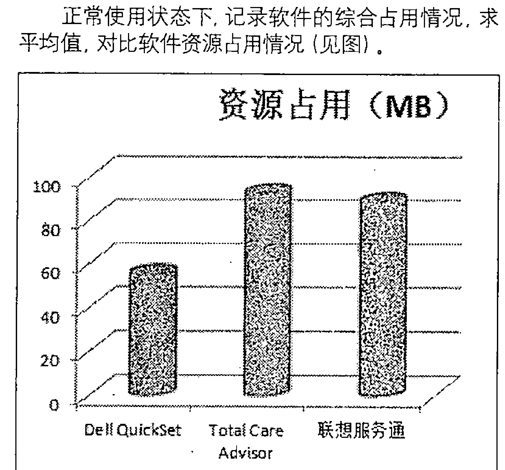

## 特色功能

**Dell QuickSet**
能够将电源管理和其他应用完美结合在一起，完成了对移动办公的独特设置，达到出差、旅行的用电节省，简单、实用。

**Total Care Advisor**
功能丰富，涵盖了系统优化、安全防护功能。另外，它的扩展能力出色，可以添加新的模块来加载到这个软件上，例如天气预报等功能。

**联想服务通**
比较符合电脑下乡的需求，适合初级电脑用户使用，将智能机器人植入到各个不同环节，以保证用户在不同的操作下都能获得足够的提示。

## 缺点 PK

**Dell QuickSet**: 界面过于古板，没有提供重要的体检功能。

**Total Care Advisor**: 占用资源稍微过多。

**联想服务通**: 界面不够美观，集成功能需要丰富。

##### 研究院测试报告

在本次评测中，我们没有加入其他的一些品牌，因为他们预装的软件都是自由组合，并没有形成一个统一的软件平台。例如到Thinkpad的软件非常丰富，单个评测都会获得不小的成绩，但都是自由添加。本次评测的三款软件中，Dell QuickSet的电源管理给我们留下了深刻印象，特别适合移动办公，联想服务通自带的智能机器人给使用者提供了很好的互动模式，而惠普的Total Care Advisor虽然资源占用相对大一些，但从界面到功能，再到易用性和实用性都获得很好的成绩，成为本期“编辑选题奖”得主。

## 搜索无忧 在指定文件夹下快速找到文件

**原题重现：如何在指定文件夹中快速找到所需文件？**
要解决这个问题，其实很简单，许多软件都可以做到，考虑到对中文字符的兼容性问题，推荐一款国产软件Findstr (下载地址：http://is.gd/dfQOp)。
由于此款软件不支持一次性在多个文件夹中查找关键字，但是支持搜索子文件夹，所以先新建临时文件夹，把要查找的文件夹复制到里面。根据题意，只需查找“实施细则”文件夹下的内容，所以为防干扰，此时要删除同目录下的其他文件夹，可以利用系统自带的多关键字搜索功能完成。
运行软件，在软件设置中勾选如图所示框中的选项，源文件下拉菜单中选择需要查找文件的文件类型，如果有多个，可以英文分号隔开填写。接着在软件相应位置填写要查找的字符串，为防止文件中有空格，需要将关键字按一字一行的格式进行填写。单击“开始”按钮即可。如果要输出或修改结果，可以单击“查看结果”按钮，在弹出的文本编辑程序中进行操作。
由于将操作文件夹和源文件夹不是同一个位置，所以结果中的路径不一样，可以利用记事本的替换功能，将这段路径不一样的路径给去掉。方法很简单，这里就不再赘述了。

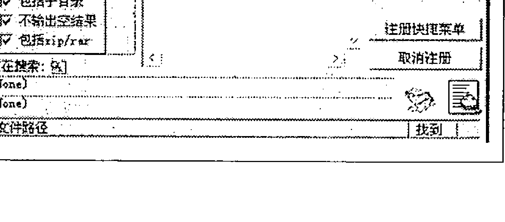

**小编点评**：软件不错，不过解决的问题方法有点麻烦……

(挑战者：浙江/邢宸斐)

## 洋话连篇 谁是最好的桌面“翻译官”？

这年头，英语的重要性不言而喻，只可惜当初没有用心学习，现在看到e文的资料就非常头痛。其实最关键的还是很多单词认识我，我却不认识它。不过还好，现在有了不少翻译软件可以帮忙。但是在众多的翻译软件中，我们该如何选择呢？本期我们就对六款桌面翻译工具的中英文翻译能力进行“考试”，看看谁的能力最强，谁最适合你？

#### 表一：测试平台配置

| 名称 | 控制端 |
| --- | --- |
| CPU | 酷睿2四核Q8400@2.66GHz |
| 内存 | 2GB×2 (三星DDR3 1333 MHz) |
| 显卡 | Nvidia GeForce G210 (512 MB) |
| 硬盘 | 希捷ST3750528AS (750 GB) |
| 操作系统 | Windows7旗舰版 (64位) |
| 网络 | 中国电信2M |

#### 测试对象

-   ★QQ词典 (增强版) http://labs.qq.com/labs/qqdict.shtml
-   ★有道词典 (增强版) http://cidian.youdao.com/zengqiang
-   ★灵格斯词霸 http://www.lingoes.cn
-   ★金山词霸2010 (增强版) http://g.iciba.com
-   ★海词典典 http://client.dict.cn
-   ★Babylon-pro中文版 http://www.newhua.com/soft/2626.htm

#### 才艺展示

### QQ词典

QQ词典是腾讯推出的产品，主打“清爽、小巧、快速”的特色，词汇量丰富，基础解释、网络解释等都非常多，特别是名词会有复数形式，动词会有各种时态的拼写。

### ★秘技：自己编词典

QQ词典配套推出了“QQ词典格式转换助手”（下载：http://tinyurl.com/29ktvn8），可以将TXT或CSV文件转换为QQ词典，这样我们自己就可以编制词典了。
下载解压后可得到两个文件，其中“说明文档.txt”介绍了词典文件格式，每个词条占一行，词条和释义之间用一个Tab空格隔开。比如我们要编制一个企业名称缩写的词典，可如下所示：
cfan 北京《电脑爱好者》杂志社
...
完成后保存为TXT文件，然后运行QQDictGen.exe，打开该TXT文件转换后可自动导入QQ词典中，这样当在QQ词典中输入cfan查询时，可以得到结果。

### 有道词典

有道词典是网易主推的桌面产品之一，实时收录了大量最新词汇，内置多部专业权威词典，支持中、英、日、韩、法等多语种查询，查词又快又准。软件还支持整句、整段、全文翻译。超强的屏幕取词，可以从多款浏览器、图片和PDF文档中轻松取词。

### ★秘技：OCR取词

网上有不少电子书，完全由扫描的图片组成，这时一般的词典软件是无法翻译的。此时，有道的OCR取词功能可以助你一臂之力。
打开有道词典主界面，点击右上角“程序菜单”按钮，选择“选项”，再切换到“取词划词”选项卡，勾选下面的“使用OCR技术取词”项，确定即可。这时将光标移到图片中的英文单词上，有道词典同样也能识别翻译了。

### 灵格斯词霸

灵格斯词霸，小巧精悍，简明易用，支持80多种语言的词典查询和全文翻译，提供真人语音朗读，以及海量词库免费下载等。专业词典、百科全书、例句搜索、网络释义、Google词典和维基百科一应俱全。新版本还增加了词组取词和迷你窗口功能，更加实用。

### 表二：软件操作对比

| 软件名称 | 界面美观 | 自动取词 | 迷你模式 | 自动运行 | 设置向导 | 换肤 | 手机版 | 置顶 | 软件大小 |
| --- | --- | --- | --- | --- | --- | --- | --- | --- | --- |
| 金山词霸2010 | ★★★★★ | √ | √ | √ | √ | √ | √ | √ | 18M |
| QQ词典 | ★★★★☆ | √ | √ | √ | √ | × | × | × | 53M |
| 有道词典 | ★★★★☆ | √ | × | √ | √ | √ | √ | √ | 29.4M |
| 海词典典 | ★★★★☆ | √ | × | √ | × | × | √ | √ | 0.77M |
| Babylon-pro | ★★★☆☆ | √ | × | √ | × | √ | × | √ | 4.96M |
| 灵格斯词霸 | ★★★☆☆ | √ | × | √ | × | × | × | × | 4.33M |

### 表三：单词翻译能力对比

| 软件名称 | 动词-各种时态 | 动词-同反义词 | 动词-单词百科 | 动词-基本例句 | 动词-网络例句 | 名词-名词复数 | 名词-单词百科 | 名词-基本例句 | 名词-网络例句 | 音标 | 语音朗读 | 基本解释 |
| --- | --- | --- | --- | --- | --- | --- | --- | --- | --- | --- | --- | --- |
| QQ词典 | √ | √ | √ | 5 | 7 | √ | √ | 3 | 7 | √ | √ | √ |
| 金山词霸2010 | √ | √ | × | 4 | 50 | √ | × | 4 | 50 | √ | √ | √ |
| 有道词典 | √ | × | √ | 3 | — | √ | √ | 3 | — | √ | √ | √ |
| 灵格斯词霸 | × | × | √ | 3 | 10 | × | √ | 3 | 16 | √ | √ | √ |
| 海词典典 | × | √ | × | 3 | — | × | × | 4 | — | √ | √ | √ |
| Babylon-Pro | √ | × | × | — | — | √ | × | — | — | × | √ | √ |

### 金山词霸2010

金山词霸算得上是一个老牌的词典翻译软件了，新版本延展出许多实用功能组件。比如写作助手，让你在写作过程中无缝调用金山词霸查词、翻译及拼写建议，海量真实场景例句，帮助你写作、翻译原汁原味。妙词推荐助你写作过程中妙笔生花，写出地道的英文句子。

### 海词典典

海词典典是海词(Dict.CN)在积累了数年线上词典经验的基础上精心推出的一款免费词典、翻译软件。它面向个人用户，页面简洁，操作方便，功能丰富，并延续了海词一贯的专业、实用特色。海词典典的悬浮窗设计，方便了用户在关闭主界面的最精简模式下进行单词查询，节省屏幕空间，非常贴心。

### Babylon-pro中文版

一款来自以色列的强大英文翻译软件，有别于一般的翻译软件，Babylon可以外加其他语言字典，让你翻译一次可同时得到其他语言的翻译。比如你的字典清单中有英英、英中、英德、英日、英韩的字典时，当查询一个英文单词时，它会同时给出中英德日韩的翻译。

#### 功能大比拼

### 软件操作谁贴心？

对于翻译软件，使用的门槛不能高，普通用户都应该能轻松上手才行。事实上也的确如此，参评的六款工具使用都比较简单，非常贴近用户。我们主要从软件界面、自动取词、迷你模式及是否自带设置向导等方面来测评的（见表二）。
点评：所有软件占用系统资源都很少，操作都非常简单，一般只要输入单词，按回车键即可查询。灵格斯和Babylon-pro主界面上广告成分比较多，其中有道词典、金山词霸、海词典典还提供了手机版，可以安装在手机中，这样使用会更加方便。

### 单词翻译谁最强？

中国人学英语，最大的难关就是单词关，在阅读英文资料时，遇到陌生的单词难免需要查询。因此单词的查询功能无疑是翻译软件中最重要的功能。下面我们以动词(Love)、名词(Baby)为例，考察五款软件的单词翻译能力（见表三）。
点评：六款软件中，金山词霸和QQ词典在单词翻译方面相对较为全面，QQ词典和金山词霸十分适合英语学习者使用，自带丰富的本地词典，即使不连接上网，也能正常使用。Babylon-Pro作为一款国外软件，本土化工作还需要再加强。

### 短语整句翻译比拼

下面我们将六款软件的短语、句子、段落、网页四项互译能力进行测试，测试内容如下：

**短语：**

日常用语：No way (不行)，专业短语：Fire extinguisher (灭火器)。

**整句翻译：**

日常用语：Are you sure (你肯定吗)？
英文谚语：A friend without faults will never be found (没有十全十美的朋友)。
专业语句：The Olympic flame is a symbol reminiscent of the ancient Olympic Games (奥运圣火是人们怀念古代奥运会的象征)。

**段落翻译：**

英文：Shelly doesn't like people who are unreliable. She especially doesn't like people who tell lies. On the other hand, she likes people who are humorous and honest. She really likes people that are easygoing and sincere. However, regardless of whom she likes or dislikes, she is nice to everyone.
中文：谢莉不喜欢不可靠的人。她特别不喜欢说谎的人。另一方面，她喜欢那些幽默又诚实的人。她实在喜欢随和又诚恳的人。然而，不论她喜欢谁或不喜欢谁，她对每个人都很好。

表四的测试结果，我们以星级来表示，星级含义：★★★★★表示完全正确；★★★★☆表示非常相近；★★★☆☆表示较为接近；★★☆☆☆表示有点接近；★☆☆☆☆表示基本错误但还能表达出一点意思；☆☆☆☆☆表示完全错误。——表示无法翻译。

点评：从上面的结果来看，有道词典的翻译功能较全面也很出色。QQ词典在单词短语方面的翻译能力很强，中英文互译都能显示多个解释或例句，但是整句和段落都不能正常翻译。灵格斯的整句、段落翻译功能其实使用的Google在线翻译；金山词霸对于长句的翻译能力不太在行；海词典典在专业短领域方面有需要加强。而Babylon-pro，则表现不佳。

### 表四：短语及全文翻译

| 软件名称 | 短语（英→中） | 短语（中→英） | 整句（英→中） | 整句（中→英） | 段落（英→中） | 段落（中→英） |
| :--- | :--- | :--- | :--- | :--- | :--- | :--- |
| | 日常用语 | 专业短语 | 日常用语 | 专业短语 | 日常用语 | 英语谚语 | 专业语句 | 日常用语 | 英语谚语 | 专业语句 | | |
| 有道词典 | ★★★★★ | ★★★★☆ | ★★★★★ | ★★★★☆ | ★★★★★ | ★★★★☆ | ★★★★☆ | ★★★★★ | ★★★★☆ | ★★★★☆ | ★★★★☆ | ★★★★☆ |
| 金山词霸 | ★★★★★ | ★★★★★ | ★★★★☆ | ★★★★★ | ★★★★★ | ★★★★☆ | ★★★★☆ | ★★★★★ | ★★★★★ | ★★★★★ | ★★★★☆ | ★★★★☆ |
| 灵格斯词霸 | ★★★★★ | ★★★★★ | ★★★★☆ | ★★★★★ | ★★★★★ | ★★★★☆ | ★★★★☆ | ★★★★★ | ★★★★☆ | ★★★★☆ | ★★★★☆ | ★★★★☆ |
| 海词典典 | ★★★★★ | ★★★★☆ | ★★★★☆ | ★★★★☆ | ★★★★★ | ★★★★☆ | ★★★★☆ | ★★★★★ | ★★★★☆ | ★★★★☆ | ★★★★☆ | ★★★★☆ |
| Babylon-pro | ★★★★☆ | ★★★★☆ | — | ★★★★★ | ★★★★☆ | ★★★★☆ | ★★★★☆ | ★★★★☆ | ★★★★☆ | ★★★★☆ | — | ★★★★☆ |
| QQ词典 | ★★★★★ | ★★★★★ | ★★★★★ | ★★★★★ | — | — | — | — | — | — | — | — |

##### 研究院测试报告

QQ词典在单词翻译方面的能力非常强。金山词霸在单词翻译方面的能力非常强。

## 键鼠锁定也能输入密码解锁

原题重现：系统、键鼠统统都锁定
KidKeylock (下载地址: http://work.newhua.com/cfan/201018/KidKeylock.7z) 是为本题量身定做的软件，双击运行程序，在系统托盘单击该程序图标，选择“设置”。在锁定鼠标栏，可根据自己要求勾选相关项目。在锁定键盘一栏，锁定有5档选择，我们使用最高级别全部锁定。在“打开设置程序的密码”事先设置好，如cfan，如果键鼠统统都锁定了，自己输入cfan就行，最后，去除“气球提示中不显示密码提醒”的勾选，确定即可锁定了。
小编点评：
小编测试了这款软件，锁定键鼠后再锁定电脑（明明已经锁定键盘了），然后居然可以正常输入密码……基本没有解决挑战题。

需要使用两款软件，分别为Pro-Key-Lock (下载地址: http://work.newhua.com/cfan/201018/PKL.zip) 及系统锁定专家 (下载地址: http://work.newhua.com/cfan/201018/SYSLOCK.rar)
运行Pro-Key-Lock，切换至Mouse Locks (鼠标锁定) 选项卡下，根据需要勾选具体的鼠标锁定项目，包括左键、中键、右键、双击、滚轮，注意不包括鼠标的移动。Lock mouse where? (锁定鼠标位置) 项下，选择All screen (全屏) 表示锁定鼠标操作的区域是整个屏幕，选择Inside Rectangle (矩形内区域)，同时点击Select rectangle using mouse (用鼠标选择矩形) 按钮，拖动鼠标在屏幕上画出需要锁定鼠标操作的矩形区域，选择Outside Rectangle (矩形外区域) 表示锁定鼠标操作的区域是矩形以外的区域。到Keyboard Locks (键盘锁定) 选项卡下，勾选对键盘的字符键、数字键、功能键等项目进行相应的锁定。Passwords (口令) 选项卡下，当Pro-Key-Lock运行时直接用键盘输入口令可以执行对应的操作，默认的口令pklsetup对应设置窗口，pklquit对应结束Pro-Key-Lock，pkloff对应是禁止锁定。Show Balloon window with password reminder表示输入口令时任务栏拖盘区会有冒泡提示，需要去除勾选，把默认的口令修改成自己的。Pro-Key-Lock可以解决题目要求的输入完指定字符序列口令，屏幕没有任何显示就完成了键鼠的解锁。
系统锁定专家，这是一个简单易用的系统锁定工具，第一次使用输入密码后锁定系统，以后使用沿用以前的密码，锁定的状态下只有输入正确的密码，按回车才解锁电脑，按Shift+R是清除旧密码下次运行可以重设密码，如果不想让别人看到屏幕内容，可以选中“保护屏幕信息”项，如果要在登录系统后立即锁定系统，可以选中“启动系统后锁定”选项。

两款软件都熟悉后，先为系统锁定专家的快捷方式设置快捷键，比如F6，Pro-Key-Lock的快捷方式设置快捷键，比如F7，不要和系统里已有的快捷键冲突。首先按F6调用系统锁定专家，此时系统锁定但键盘还可以响应，再按F7运行Pro-Key-Lock，此时键鼠才被真正锁定。解锁过程就是输入Pro-Key-Lock的密码结束Pro-Key-Lock或者禁止锁定，然后才能输入系统锁定专家的口令解锁。
小编点评：
Pro-Key-Lock的使用方法和KidKeylock略有相似，可以弥补王成添方案中的一些不足，但还是麻烦……

要解决这个问题，我制作了一款软件：电脑爱好者专用版屏幕键鼠锁定器（下载地址：http://work.newhua.com/cfan/201018/cfands.rar）。
运行程序，点击“是”就可以锁定系统了。系统、键盘和鼠标被锁定后，如果想再重新登录系统，只需输入软件默认密码ALT键+0键（小键盘）即可系统登录界面，最后键入登录密码并按回车按钮即可。
小编点评：
最接近答案的方案……

(挑战者：广东/王成添)
(挑战者：江苏/李承国)
(挑战者：东北/郑伟龙)

## 破解网页禁止另存为的麻烦

原题重现：用什么办法能保存一切网页？
要想实现题目的目的，可能很多人认为就要用很猥琐的办法：用Chrome下载无法保存的网页，然后用IE内核的浏览器打开，最后再保存网页，就完全可以实现题目中的四个条件了！问题真得有那么简单么？首先试试这个URL——http://tinyurl.com/2ugmdat，这个URL用Chrome可以正常下载并打开，但是打开的页面并不是与之前的网页内容相同的，也就是说前提条件“一切”已经不成立。那么有没有办法可以实现挑战题的要求呢？回答是当然是有，方法是只要使用CyberArticle这款软件就行了，只是唯一遗憾的是，Files文件被命名为_Files，具体操作如下：
首先到http://www.onlinedown.net/soft/1874.htm下载CyberArticle这款软件，解压并安装后运行其中的CyberArticleExpress运用程序，会出现界面。然后随便使用一个浏览器打开不能被另存为的网页，再点击左边的保存（完整保存）按钮，点击右上角“选项”按钮并勾选“包含图片Flash脚本”三项（其他按默认或者需要勾选），切换到“高级”勾选“保存副本到文件夹”并选择要保存的路径，单击保存按钮后会看到任务栏有个保存图标在进行页面保存了。保存完毕后，打开先前的网页保存路径就可以看到网页及元素保存文件了。

如果按照上述步骤去做的话，大部分不能通过IE另存为进行保存的网页完全可以保存。只是对于前面提到的这类在脚本上“下功夫”的网页需要一些特别的保存办法。你首先得不勾选“包含脚本”保存该网页（这样打开的页面就是原先浏览的页面了），然后再勾选“包含脚本”二次保存网页（当然这次保存的网页就与浏览的网页不同了），将二次保存网页元素文件夹下的所有文件拷贝到第一次保存网页元素文件夹下，这样就完成移花接木了。
小编点评：
换了方式，取了巧，不过方法不错。

(挑战者：舒云飞)

## 文档找不同

原题重现：现在有修改前和修改后两篇文档，现在需要用你任何方法快速找到修改过的字符。
Beyond Compare (下载地址: http://www.onlinedown.net/soft/23172.htm) 是一款功能很强大的文件比较工具，不仅能检测出文档格式及字符的变动，还能检测出应用程式的不同，并且软件操作方便快捷，比较结果清晰明了，实在是不可多得的一款文件比较利器。
以menu.lst文档为例，我的menu.lst在E盘根目录下，复制一个备份到桌面并修改备份文件的格式，这里我删除了一些空格并变更了一些字符。打开Beyond Compare，显示出简洁的界面，列出了Beyond Compare所能比较的对象。这里，我选择了文本比较，弹出了文本比较的窗口，在左右文件选项里，添加需要比较文件的路径:右边的文件是原menu.lst，左边文件是修改过的备份menu.lst。

这时，两个文件就在左右两边打开，并以颜色标注出两者的不同，默认的是全部显示，即相同部分和不同部分都会显示出来。窗口底部会标注出有几处不同和比较所用的时间，这就视所修改的文档大小及修改的多少了，这里仅仅修改了三处，耗时0.01秒，可谓瞬时之间，一目了然。当然，如果想仅仅显示出两者的不同之处的话，可以在“视图”菜单栏里，选择“显示差异”，这样两边显示的内容就是所修改的那部分，并以颜色标记出不同，避免了多余内容的干扰。
此外，Beyond Compare还可以对文件夹，文件版本及十六进制代码进行比较，也可以根据图片像素的不同进行图片比较，并可以比较MP3标签信息来区分MP3文件的不同，如此好用的工具，感兴趣的你赶快试用下吧！
小编点评：
发现高手都喜欢有挑战性的题目，对于简单容易的题目直接无视，这么容易的题目大家多多参与呀！

(挑战者：上海/王高峰)

### 梦幻快车收编QQ群邮件

原题重现： QQ群邮件目前只能通过登录网页邮箱来管理，能否直接在邮件客户端程序进行操作呢？

这个难题，其实“梦幻快车”（DreamMail）早就已经解决了。下面简单介绍一下。

首先从 http://www.dreammail.org/download.html 下载安装最新版的 DreamMail 邮件客户端程序，个人建议下载它的绿色版（RAR压缩包）。解压后，双击其中的 DM2005.exe 运行软件，会出现“配置用户信息”向导，按要求选择即可。接下来是“增加邮件账号向导”，在填过电邮账号和密码后，最好点击右侧“测试账号”按钮先测试一下，避免后面收邮件时出现错误（见图1）。

进入 DreamMail 主界面后，按下面步骤设置：
- 点击左侧 WebMail 按钮；
- 右击“网页邮件-WebMail”；
- 填写 QQ 邮件账号、密码及邮箱登录首页（见图2），确定即可。

至此便大功告成了，以后不必启动浏览器，直接在 DreamMail 中，点击 WebMail 网页邮件下面你的 QQ 邮箱账号，便会自动进入你的 QQ 邮箱，普通邮件及 QQ 群邮件都可以管理啦（见图3）。

> 小编点评： OMG， DreamMail 还真会投机取巧啊，看似它在直接管理 Web 邮件，实质上不过是它在邮件客户端中直接打开了网页而已。但是不得不承认，这也确实算一个“解决之道”，并且同样方法，可以添加其他所有的 Web 邮箱。有一个缺点，就是与邮件下载到本地不同，一旦不能上网，那这些 Web 邮箱，你就可望而不可及了。
（挑战者： 后天）

### Web邮箱中的批量回复

原题重现： 如何对收件箱中未读的邮件批量回复？

要解决这个问题，笔者有一个非常简单的办法，它就是163邮箱批量回复助手（下载地址： http://work.newhua.com/cfan/201019/163mpl.rar）。有了它，我们就不需要同时打开这些邮件（在不同的窗口），然后再一一回复。而且程序的使用方法也很简单，首先将下载好的压缩包解压并运行程序。注意，第一次运行软件时，需要点击“注册.bat”，软件注册成功之后方能正常使用。

输入163邮箱的用户名和密码，点击“获取未读邮件的邮箱”按钮，稍等片刻后，软件就会自动获取邮箱里未读邮件的邮箱地址，软件会自动删除未读邮件中重复的邮箱地址，很贴心吧。

最后只要根据自己的需要输入回复邮件的主题和正文内容，点击“发送”按钮即可快速一一回复未读邮件的发件人了。

该软件最多可获取未读邮件中前100个邮箱地址，设置方法如下：登录163邮箱，成功登录之后点击“收信”按钮，然后在右侧的收件箱窗格中点击“查看”按钮，最后在弹出的下拉菜单中选择“每页显示—每页100封”。

怎么样？很简单吧！有此需要的朋友赶快去试一试吧！

> 小编点评： 我勒个去，时隔一年居然还有人能解题，就是适用性太窄，也欢迎大家把“陈年旧题”给解决掉。
（挑战者： 广东/郑伟龙）

### 双网互联导致QQ语音不清不楚

原题重现： 联通和电信两个网络的用户进行QQ多人语音时声音不清晰，如何解决？

先下载“迅游”（下载地址： http://www.xunyou.com/）并注册帐号，在登录之后进入主界面随意设置一个QQ游戏，例如寻仙，然后在选择分区中选择一个网通（联通）区（或者点击“选择节点”选择一个网通节点）。点击“启动加速”即可（此方法是通过修改本机连入网络的IP得以实现，网通转电信方法类同），再打开QQ进行语音即可。

> 小编点评： 测试无效，难道是小编人品问题？等待更多的测试者……
（挑战者： 内蒙古/王子轩）

### 这个程序读取了谁？看我“三枪”定案

原题重现： 运行的程序调用了哪些文件，并且做了哪些修改？

题目要求是能有一款软件可以实现监视程序的一举一动，既要知道该程序到底读取了那些文件，又要知道其修改了哪些文件，有什么内容被修改并且要能显示出来，难度还是挺大的。我在这个国庆假期里的头五天都是在研究该挑战题目中度过的。说真的还真没有一款软件可以完美实现题目的所有要求，但是我们可以打组合拳，使用多个工具来共同实现—FileMon （下载地址： www.onlinedown.net/soft/8986.htm）， FileHamster （下载地址： www.onlinedown.net/soft/57283.htm）， Beyond Compare （下载地址： www.onlinedown.net/soft/23172.htm）。接下来我就逐一介绍一下它们怎么完成任务的吧。

#### 第一枪：巧用 FileMon 监视程序读取文件

网上这类软件其实不少，为什么偏偏选择 FileMon 呢？原因有三：第一，该软件在程序退出、运行、启动时都可以监视；第二，该软件具有导出列表功能，能具体知道程序究竟在读取、访问哪些文件；第三，软件相对于其他监视软件，名气、口碑都不错。

首先下载安装好软件，并建立一个文件夹“程序”。运行 FileMon，软件将以列表形式呈现当前运行的所有程序读取文件的情况。不过如此查看某一程序读取文件的情况很不方便，可以点击软件左上角的“文件\捕获”按钮，然后点击“保存”按钮将数据保存到本地。默认会生成一个叫 FileMon.LOG 的文本文件，在记事本中打开可以清楚查看程序具体运行情况了。记住这些被读取的文件，将这些文件发送快捷方式到“程序”这个文件夹。

#### 第二枪：FileHamster 侦查程序修改

如果说 FileMon 还有很多类似软件可以代替的话，那么 FileHamster 可以说比较罕见了，它在本挑战题中的主要任务是记住程序对文件做的具体修改，也是最核心的任务。

FileHamster 需要 Microsoft .NET FRAMEWORK 2.0 （或以上版本）的支持，且注意在安装过程中出现“Select library target”时选择好保存备份及修改文件的保存路径，例如：G:\绝对挑战。打开软件界面后，左键单击“My New Library→Add Directory watch...”并添加第一步中“程序”这个文件夹，此时你会发现在“My New Library”的树状结构图中有“程序”这个文件夹了。这样只要遇到文件被程序修改时，在桌面的右下角会出现提示，并会以备份的方式保存被修改的文件。你可以通过“My New Library”的树状结构图查看，也可以在“绝对挑战”文件夹下查看。

#### 第三枪：Beyond Compare 查看具体修改

这款软件以及操作步骤，大家可以参考第13期杂志王高峰同学的《文档找不同》一文，这里就不多说了！

通过以上一系列的操作之后就可以实现题目的要求了。

> 小编点评： 最近腾讯与360恶斗，360推出隐私保护器，专门侦查QQ都扫描了哪些文件，并附带上了腾讯TM、MSN、阿里旺旺等。不过它的侦查范围还是有限。本方案则针对任意程序，值得借鉴。
（挑战者： 舒云飞）

### 销毁文件 哪款文件粉碎机最放心？

硬盘、闪盘、MP3播放器、数码相机……只要能存储文件，都有可能因失窃、借出、二手出售、送修、报废等原因而导致文件落入他人之手。大部分人销毁数据，采用的是删除并清空回收站的方式，安全意识强一点的则采用格式化磁盘的方式。但如果遇到“有心人”，这些方法都将失效，多如牛毛的恢复工具会让这些数据显出原形。

#### 表一：测试平台配置

| 名称 | 控制端 |
| :--- | :--- |
| CPU | Mobile Intel Celeron 520 |
| 内存 | 2 GB DDR2-800 DDR2 SDRAM |
| 显卡 | Mobile Intel(R) 945 Express Chipset Family |
| 硬盘 | Hitachi HTS541680 (80 GB, 5400 RPM, SATA) |

#### 测试对象

- **★QQ文件粉碎工具** http://pc.qq.com/pc/softmgr/index.html
- **★金山文件粉碎工具** http://tinyurl.com/295gbnc
- **★瑞星卡卡文件粉碎工具** http://tinyurl.com/2fgwpxk
- **★特工机密文件销毁器** http://sccrc2.onlinedown.net:82/down/gswjfsq.zip
- **★360文件粉碎工具** http://down.360safe.com/inst.exe

说明：以上5款参测工具中，除“特工机密文件销毁器”外，其他文件粉碎工具都是以某一软件包中的组件出现的。另外，网上还流传不少网友个人制作的文件粉碎工具，要么操作不方便，要么效果很差，这里就不多介绍了。

#### 才艺展示

- **QQ文件粉碎工具**
QQ文件粉碎可帮助我们彻底删除不想要的文件，对某些不容易删除的程序，还可以自动解锁并彻底删除。
- **金山文件粉碎工具**
金山文件粉碎工具，号称符合美国国防部DoD5220.22-M标准，可以让粉碎的文件无法通过反删除工具恢复。
- **瑞星卡卡文件粉碎工具**
瑞星卡卡的文件粉碎工具，除了粉碎文件外，同样具有“解锁”功能，当遇到“文件正在运行，无法删除”的问题时，可通过它强制删除这一文件。
- **特工机密文件销毁器**
可粉碎销毁任意类型文件，并不可恢复，支持拖放文件，支持右键菜单操作，使用很方便。
- **360文件粉碎工具**
可以粉碎各种顽固型文件，只要将需粉碎的文件拖拽进文件粉碎机即可，操作简单。

#### 功能大比拼

下面，我们以QQ文件粉碎工具为例来展示要测试的项目，再对比其他粉碎工具并列表进行比较。要测试的项目包括以下4项，各项的比分分别是6、5、5、10分。运行“QQ软件管理”后，单击“高级功能→文件粉碎”即可进入粉碎管理界面。

##### 表二：导入待粉碎的文件是否方便（总分6）

| 工具名称 | 从粉碎工具界面导入 | 拖放导入 | 右键粉碎 | 该项总分 |
| :--- | :--- | :--- | :--- | :--- | :--- | :--- | :--- | :--- |
| | 文件夹 | 文件 | 文件夹 | 文件 | 文件夹 | 文件 | | |
| QQ文件粉碎工具 | 批量 | 批量 | 批量 | 批量 | 批量直接粉碎 | | ★★★★★ |
| 瑞星卡卡文件粉碎工具 | 不支持 | 单个 | 批量 | 批量 | 批量 | 批量 | ★★★★☆ |
| 金山文件粉碎工具 | 单个 | 单个 | 不支持 | 不支持 | 批量直接粉碎 | | ★★★☆☆ |
| 特工机密文件销毁器 | 不支持 | 单个 | 不支持 | 批量 | 不支持 | 批量 | ★★★☆☆ |
| 360文件粉碎工具 | 不支持 | 单个 | 单个 | 批量 | 不支持 | 不支持 | ★★☆☆☆ |

##### 导入文件顺不顺手

首先得明确哪些文件是要粉碎的。为此，导入是否方便成了我们测试的项目之一。一看粉碎工具界面是否提供了导入功能。二看能否将文件或文件夹拖到粉碎工具界面中。三看能否在右击选中的文件或文件夹后通过弹出的快捷方式来粉碎文件。

QQ粉碎工具提供了“添加文件”、“添加目录”等功能，再对比一下其他粉碎工具：
- **金山：** 可通过界面上的按钮添加单个文件或文件夹，不能批量添加。不能拖动添加，但批量选中文件或文件夹后右击，再选择“使用金山粉碎器彻底删除文件”，可不用进入粉碎器界面而直接粉碎，非常方便。
- **瑞星：** 通过界面添加时不是很方便，但能将文件或文件夹批量拖动到粉碎窗口，也能右键添加。
- **特工机密文件销毁器：** 只支持文件不支持文件夹添加，而且只有拖放和右键时才能批量添加。
- **360：** 粉碎工具对文件夹的支持不好，也不支持右键添加。

##### 表三：导入后的管理是否方便

| 工具名称 | 全选 | 单选 | 移除 | 该项总分 |
| :--- | :--- | :--- | :--- | :--- |
| 金山文件粉碎工具 | √ | √ | √ | ★★★★★ |
| QQ文件粉碎工具 | √ | √ | × | ★★★★☆ |
| 瑞星卡卡文件粉碎工具 | √ | √ | × | ★★★☆☆ |
| 360文件粉碎工具 | √ | √ | × | ★★★☆☆ |
| 特工机密文件销毁器 | × | × | × | ☆☆☆☆☆ |

##### 导入后管理方不方便

这部分主要测试是否提供了“全选/取消全选”功能，能否单个选择文件夹或文件，对已导入但又不想粉碎的文件或文件夹能否从列表中移除。从图1可以看出，QQ文件粉碎工具没提供清除列表功能。

另外几款参测对象，除金山文件粉碎工具提供了清除列表功能外，其他功能都与QQ粉碎工具相同。

##### 表四：粉碎速度及资源占用

| 工具名称 | CPU占用率(%) | 内存占用(KB) | 时间(分) | 该项总分 |
| :--- | :--- | :--- | :--- | :--- |
| QQ文件粉碎工具 | 10~30 | 17880 | 3 | ★★★★☆ |
| 金山文件粉碎工具 | 10~90 | 10920 | 5 | ★★★☆☆ |
| 瑞星卡卡文件粉碎工具 | 系统假死 | | 3 | ★★☆☆☆ |
| 特工机密文件销毁器 | 0~9 | 4840 | 60 | ★☆☆☆☆ |
| 360文件粉碎工具 | 10 | 5792 | 2 | ★★★★★ |

##### 粉碎速度及资源占用

我们是这样来保证测试公平度的。安装待测工具前都卸载了其他工具。前一工具测试完成后，用 WinHex （一款高级数据粉碎及恢复工具）将 E 盘磁道全部置0以期对 E 盘进行最大程度的清除，再将同样的文件拷贝到 E 盘。重新启动电脑后用待测工具对 E 盘上的文件进行粉碎，同时观察粉碎所花的时间及 CPU、内存占用情况。

进行这项测试时我们发现，从系统的任务管理器上看，瑞星卡卡文件粉碎工具运行时资源占用率并不高，但开始粉碎工作时几乎无法进行其他工作甚至机器出现假死现象。另外，机密文件销毁器耗时很长，多达几十分钟，如果用于对整个硬盘进行粉碎估计没几个人能忍受下去。

##### 表五：粉碎效果

| 工具名称 | 原文件 | 恢复 | 修复 | 该项总分 |
| :--- | :--- | :--- | :--- | :--- | :--- | :--- |
| | 文件夹 | 文件 | 文件夹 | 文件 | | |
| QQ文件粉碎工具 | × | × | × | × | × | ★★★★★★★★ |
| 金山文件粉碎工具 | × | × | √ | × | × | ★★★★★★☆ |
| 瑞星卡卡文件粉碎工具 | √ | √ | × | × | × | ★★★★★☆☆ |
| 特工机密文件销毁器 | √ | × | √ | × | × | ★★★★☆☆☆ |
| 360文件粉碎工具 | √ | × | √ | √ | √ | ★★★☆☆☆☆ |

##### 最重要的是看效果

这部分是最重要的测试环节。主要观察三个方面：
1. 看粉碎后能否在 E 盘观察到文件或文件夹。
2. 看能否用 EasyRecovery Pro （大名鼎鼎的文件恢复工具）对 E 盘进行恢复。本次测试中， E 盘被 QQ 粉碎工具处理后，无法恢复出文件：文件夹被命名为 EEE。文件被重命名为 EEEE.EEE，无法判断出原文件名，也无法通过扩展名来判断原文件的类型，但能观察到文件大小及日期。
3. 看能否被修复。EasyRecovery Pro 能对受损的 Word 等常用文件进行修复。比如我们在测试 QQ 粉碎工具的效果时还进行了这样的尝试：通过恢复后的文件大小及日期来推测原文件的扩展名，比如为 Doc，那就是 Word 文件。试着用 EasyRecovery Pro 进行修复，再用 Word 打开发现全是乱码。由此可见，QQ 粉碎工具是通过对原文件进行重写来达到粉碎目的的。

**再对比一下其他粉碎工具。**
- **360：** 粉碎后能在原文件位置观察到文件夹，粉碎后的文件能保持原文件名、原文件夹结构。这无疑为恢复软件找到可乘之机，安全性大打折扣。
- **卡卡：** 粉碎后居然可在原文件位置观察到文件夹仍然存在。能用 EasyRecovery Pro 恢复出文件夹和文件全名（意味着知道文件类型），尽管文件无法打开，但对别有用心的人来说，至少能偷窥出有哪些文件。
- **金山：** 粉碎后在原文件位置看不到任何东西。能恢复出文件夹，但所有文件都更名为 KKKK，因无扩展名而无法辨别文件类型，也无法修复。
- **特工机密文件销毁器：** 它提供了快速销毁和多重销毁两种粉碎方式。在多重销毁方式下，无法恢复出原文件名、文件大小等信息，从这个意义上讲，比金山和卡卡都强，要不是耗时太长，添加文件不方便，倒是一款不错的粉碎工具。

##### 研究院测试报告

对于机密文件，使用普通的删除方法显然是危险的。较为安全的做法，是采用专门的文件粉碎工具来销毁数据。本次测试方法为：在硬盘上新建一个容量为 5GB 的文件系统为 NTFS 的分区（本例为 E 盘），该分区中有众多文件夹和文件，总大小约 4.5GB。先用粉碎工具对分区进行粉碎，再用 EasyRecovery （专用的数据恢复工具）进行恢复以检验粉碎效果。本次测试时间，截止为 2010 年 9 月 4 日。

本次测试中， QQ 文件粉碎工具无论从操作方便性，粉碎的最终效果上都很不错，而且它是完全免费的。金山和瑞星表现也不错，但它们都包含在对应的软件包中，买关羽大刀就要搭刘备的草鞋，在推广程度上会受一些影响。特工机密文件销毁器是这次参测的唯一专业工具，效果好，美中不足在于耗时太长。360 粉碎工具在我们的实测下效果则不理想。所以，本次的编辑选择奖，颁发给 QQ 文件粉碎。

### 更贴心的爱护 家长控制软件选哪款？

在网络应用日趋广泛的今天，电脑已俨然扮演了“双刃剑”角色。显然，如何才能让自己的小孩在电脑使用过程中吸收精华、去除糟粕已是大家所关注的问题。那么，你需要在说服教育的同时选择什么样的家长控制软件呢？其实，成人有时也需要被“家长控制”一下。又该选择什么控制软件呢？CFan研究院特组织了这次测评，希望能为大家提供一些参考（测试截止日期2010年9月28日）。

- ★展翅鸟家长控制 http://www.tueagles.com/baba
- ★健康上网专家 http://www.feitengsoft.com
- ★卡巴斯基安全部队2011 http://www.kaspersky.com.cn
- ★诺顿在线家长控制 https://onlinefamily.nort.com
- ★Windows 7家长控制 Windows 7系统自带

说明：参测的对象中，展翅鸟和健康专家都是专业的家长控制软件。卡巴本是杀毒软件，只是其中附带了家长控制功能。诺顿在家长控制功能原理上很特殊，Windows 7家长控制是 Windows 7 系统自带的一个新功能，受众很广。为此，各参测对象都独具特色，有定的代表意义。

| 名称       | 控制端                     |
|------------|----------------------------|
| CPU        | Mobile Intel Celeron 520   |
| 内存       | 2 GB DDR2-800 DDR2 SDRAM   |
| 显卡       | Mobile Intel(R) 945 Express Chipset Family |
| 硬盘       | Hitachi HTS541680 (80 GB, 5400 RPM, SATA) |
| 操作系统   | Windows 7旗舰版            |

#### 功能大比拼

身为家长控制软件，我们得考虑它本身能否被受

| 工具       | 凭密码卸载 | 凭密码修改 | 凭密码停止运行 | 自动运行 | 隐蔽度 | 得分   | 适用对象       |
|------------|------------|------------|----------------|----------|--------|--------|----------------|
| 展翅鸟     | √          | √          | √              | √        | 良     | ★★★★★ | 大龄儿童       |
| 健康上网专家| √          | √          | √              | √        | 中     | ★★★★☆ | 小龄儿童       |
| 卡巴       | ×          | ×          | ×              | √        | 差     | ★★★★  | 更适用于自我约束 |
| 诺顿       | √          | √          | √              | √        | 差     | ★★★★  | 大龄儿童、少年 |
| Win7家长控制| 受控者只能为标准用户，无权修改、停止运行 | -          | -              | √        | 差     | ★★★★  | 成人           |

对网站进行过滤，一般方式有三种。其一，黑白名单，从控制的角度上看能一针见血，但难免挂一漏万。其二，关键词过滤，灵活性极强，比如设置过滤“爆头”，那么凡是包含这一字眼的带暴力性质的网页都不会显示出来。其三，网站分类，比如：色情、暴力、广告等，但在我国很多网站没按这些标准进行分类，为此，这一过滤方式在我国显得有些水土不服。

测试结果表明：五款参测软件中除 Win7 的家长控制不提供网页过滤、诺顿只有白名单无黑名单功能外，其余四款提供了这三种方式。从处理方法看，诺顿只能在拦截、警告、允许中单选其一，其他的都是拦截。从效果上看，除网页分类效果有些差强人意外，其他的效果都很好。

| 工具名     | 黑白名单 | 关键词 | 网页分类 | 社交网络限制 | 隐私数据 | 聊天工具限制 | 得分   |
|------------|----------|--------|----------|--------------|----------|--------------|--------|
| 展翅鸟     | √        | √      | ×        | ×            | ×        | √            | ★★★★  |
| 健康上网专家| √        | √      | ×        | √            | ×        | ×            | ★★★★  |
| 卡巴       | √        | √      | √        | ×            | √        | ×            | ★★★★  |
| 诺顿       | √        | √      | √        | ×            | ×        | ×            | ★★★★  |
| Win7家长控制| ×        | ×      | ×        | ×            | ×        | ×            | ★      |

实测表明：除健康上网专家能阻止登录这些网站外，另外的参测工具都无这一功能。要注意的是卡巴和诺顿，虽然界面上有与社交相关的设置，但它仅用于控制可以发送和接收消息的联系人（见表三）。

玩物丧志，为此，游戏控制也是衡量家长控制软件优劣的标准之一。
- 展翅鸟：对 Windows 7 自带的游戏，表面上看没在禁用列表中，但只要运行游戏，不但会被阻止，还会自动添加到列表中，如果要让小孩玩，可取消勾选。除此之外，还可手动添加已安装的其它游戏，或设置允许游戏运行的时间。要注意的是，由于展翅鸟无程序控制功能，也可将普通程序以游戏的身份添加进来。
- 卡巴、健康上网专家：无专门的游戏控制功能，但可进行程序限制。为此，只要将游戏以普通程序的身份添加进来即可。
- Windows 7家长控制：既可设置程序限制，又可设置游戏限制。限制游戏时，除能自动识别系统自带的小游戏外，还可按游戏分级及年龄来实现模糊控制，有一定的“先知先觉”效果。
- 诺顿：无程序和游戏限制功能。（见表四）

| 工具       | 游戏限制 | 程序限制 | 程序或游戏运行时间限制 | 得分   |
|------------|----------|----------|------------------------|--------|
| 展翅鸟     | ×        | √        | √                      | ★★     |
| 健康上网专家| √        | ×        | √                      | ★★     |
| 卡巴       | √        | ×        | ×                      | ★      |
| 诺顿       | ×        | ×        | ×                      | ★★     |
| Win7家长控制| √        | √        | ×                      | ★★     |

在时间限制上，参评的软件都有电脑使用时间限制功能，部分软件还提供了诸如上网时间、聊天时间、休息时间的控制。所谓的休息时间控制是指电脑使用一段时间后会自动锁定或注销。

受控者究竟用使用过什么程序、上过什么网、与谁聊过天及聊天内容如何，都是我们要关心的问题。另外，我们还可以通过这些记录来及时调整控制的力度，达到既不影响受控者工作又提高效率，保障安全的目的。测试表明，参评的软件中除 Windows 7 家长控制外，其他的都能以截图或文字方式记录受控者的行踪。特别值得一提的是，卡巴和诺顿还可记录下 MSN 聊天内容，遗憾的是都无法记录国人使用最多的 QQ 聊天内容。（见表五）

| 工具       | 电脑使用时间 | 上网时间 | 游戏时间 | 程序使用时间 | 休息时间 | 受控者行为查询 | 聊天记录查询 | 得分   |
|------------|--------------|----------|----------|--------------|----------|----------------|--------------|--------|
| 展翅鸟     | √            | √        | √        | ×            | √        | √              | ×            | ★★★★★ |
| 健康上网专家| √            | √        | √        | ×            | √        | √              | ×            | ★★★★★ |
| 卡巴       | √            | √        | ×        | √            | ×        | √              | √            | ★★★★  |
| 诺顿       | √            | ×        | ×        | ×            | ×        | √              | √            | ★★★★  |
| Win7家长控制| √            | ×        | ×        | ×            | ×        | ×              | ×            | ★      |

先看看诺顿的工作流程：管理员到诺顿网站(https://onlinefamily.norton.com/familysafety/loginStart.fs)注册账号，接着，指定受控用户的账号名（比如 LOW）及网络行为规则。在安装了诺顿家长控制的电脑上，只要以 LOW 身份登录 Windows 而且网络连接正常，它的种种与网络相关的行为都会自动记录到诺顿网站上。这样，管理员可随时登录诺顿网站（包括异地登录）查看或者重新设置规则，更适合于远程、异地控制。

它的另一优势在于很注重受控者与管理者的交流，受控者遇到已阻止的项目时可通过邮件（即管理者的账号）方式向管理员发出解除阻止请求。这一功能如果善加应用定会给我们带来很多方便，比如通过手机登录管理网站进行管理，用手机收取受控者的请求邮件（移动公司随手机号赠送的139邮箱可以短信的方式免费接收邮件）等，为用手机控制受控者提供了可能。所以，本次编辑选择奖颁发给诺顿在线家长控制。

- ★展翅鸟和健康上网专家
都是专业的，功能最全，更适合于对儿童进行控制。
- ★卡巴，控制自己的较好选择
卡巴本是杀毒出身，它所附带的家长控制功能也打上了明显的“安全”烙印。一方面，可通过适当的网络行为控制帮助我们抵制不良网站的诱惑。另一方面，还可通过隐私数据控制来保障银行账号密码或其它机密数据的安全。另外，本次参测的软件中，它是唯一提供了文件下载阻止的，能在一定程度拒绝流氓软件的悄然下载。
- ★可用于无 Internet 的 Windows 7 家长控制
Windows 7 家长控制的重点在于本机而非网络，在对本机的控制上无论是程序、游戏，还是使用时间都有较强的力度与灵活性。为此，推荐将其用于无 Internet 的环境。

### 准快全文件搜索谁称王？

随着存储技术的飞速发展，硬盘越来越大，可以存储的文件也越来越多，已经远远超出人脑管理的限度。在使用电脑时，经常会遗忘自己需要的文件放在哪个文件夹中。在这种情况下，如何能快速搜索到所需文件呢？一款快准狠三合一的搜索工具就显得尤为重要了。本期我们就对常用的文件搜索工具进行评测，为大家找到一款实用的桌面搜索工具，让所找文件无处遁形。

| 软件名称 | 关键字匹配 | 区分大小写 | 文件大小 | 文件时间 | 文件属性 | 中英文混合检索 | 使用通配符 | 全文检索 | 局域网搜索 | 设置搜索范围 | 搜索压缩包 |
| :--- | :---: | :---: | :---: | :---: | :---: | :---: | :---: | :---: | :---: | :---: | :---: |
| Windows7自带搜索 | √ | √ | √ | √ | √ | √ | √ | √ | √ | √ | √ |
| Total Commander内置搜索 | √ | √ | √ | √ | √ | √ | √ | √ | √ | √ | √ |
| 火速桌面搜索 | √ | √ | √ | √ | √ | √ | √ | √ | × | √ | × |
| Tomm闪电文件搜索 | √ | √ | √ | √ | √ | √ | √ | √ | √ | × | × |
| Google桌面搜索 | × | × | × | × | √ | √ | √ | × | × | × | × |
| Everything | √ | × | × | × | × | √ | × | × | × | × | × |

#### 表一：测试平台配置

| 名称 | 控制端 |
| :--- | :--- |
| CPU | 酷睿2四核Q8400@2.66GHz |
| 内存 | 2GB×2（三星DDR3 1333MHz） |
| 显卡 | Nvidia GeForce G210（512MB） |
| 硬盘 | 希捷750GB+500GB（NTFS格式） |
| 操作系统 | Windows7旗舰版（64位） |

#### 测试对象

- Windows 7自带搜索
- Total Commander内置搜索
  http://www.ghisler.com/download.htm
- Everything
  http://www.voidtools.com/download.php
- 火速桌面搜索
  http://www.onlinedown.net/soft/12073.htm
- Tomm闪电文件搜索
  http://dl.pconline.com.cn/download/69995.html
- Google桌面
  http://desktop.google.com

#### 才艺展示

##### Windows 7自带搜索

Windows 7采用了新的索引搜索模式，可以大大提升搜索速度，它包含于系统的各个方面。开始菜单、计算机、控制面板，几乎处处可用搜索。在Windows 7中可使用搜索为文件创建索引，这样搜索的效率更高，通过设置还可以搜索ZIP、CAB压缩包中的文件，总的来说，功能非常实用。

##### 实战：利用“库”快速寻找照片

Windows 7引入“库”的概念，使得本机文件搜索效率更高，巧妙运用还会有意想不到的效果。比如平时拍的照片非常多，都一股脑存放在同一个文件夹中，这时想找某一特定类型（比如某个特定时间段）的照片会有些麻烦，而Windows的库可以帮我们快速归类照片。首先右击照片存放的文件夹（如：D:\个人照片），选择“包含到库中→图片”，然后打开“库”，选择“图片→个人照片”，再选择排序方式为“月”，即可看到文件夹中的所有图片都按月份排列，想要找到某个时段的照片非常容易。

##### Total Commander内置搜索

Total Commander（以下简称为TC）是一款用来替代系统资源管理器的工具，但是它的搜索功能也很强大。它除了能够指定查找文件的大小、日期、属性外，还可以在压缩包中搜索。搜索设置还可以保存起来以便下次搜索时再次使用，为搜索加速。

##### 实战：TC也能全文检索

TC也具有全文检索功能，即从文本文件内部搜索关键字，使得搜索更全面。打开TC，点击“命令→搜索文件”（或按Alt+F7键），指定搜索文件名及要搜索的位置，点击“开始搜索即可”。如果要全文检索，可以勾选“查找文件”项再输入相应关键字即可。

| 软件名称 | 搜索操作便利性 | 搜索准确性 | 搜索时间（秒）周建峰 | 搜索时间（秒）周建峰.doc | 搜索文件数量周建峰 | 搜索文件数量周建峰.doc |
| :--- | :--- | :--- | :---: | :---: | :---: | :---: |
| Windows7自带搜索 | ★★★★☆ | ★★★★☆ | 22 | 16 | 4305 | 20 |
| Everything | ★★★★★ | ★★★★★ | 2 | 1 | 252 | 18 |
| TC内置搜索 | ★★★★☆ | ★★★★★ | 18 | 14 | 154 | 10 |
| Tomm闪电文件搜索 | ★★★★☆ | ★★★★★ | 7 | 5 | 81 | 5 |
| 火速桌面搜索 | ★★★★☆ | ★★★★☆ | 31 | 10 | 139 | 17 |
| Google桌面搜索 | ★★★★☆ | ★★★★☆ | 8 | 6 | 852 | 80 |

##### Everything

小巧精悍，Everything是NTFS文件系统下非常快的一款文件搜索工具。专业的文件搜索工具有不少，如Ava Find Pro、Locate32、File Seeker等，但要说搜索速度快，则非Everything莫属。现在使用Windows系统的计算机，分区大部分已是NTFS格式了，所以它的适用性还是很广的。

##### 火速桌面搜索

搜索界面友好，用户可以从资源管理器驱动器和文件夹右键菜单中启动桌面搜索，对搜索结果文件能够弹出资源管理器的系统右键菜单。火速桌面搜索提供了文件名查询和文件内容查询，同时支持按照文件大小、文件修改时间、文件类型来搜索，支持搜索结果文件记录的打开、复制、剪切、删除等处理，支持搜索结果翻页，提供完整的日志管理功能和系统设置功能等。

##### Tomm闪电文件搜索

该工具是Windows XP搜索功能的增强版，界面更加直观，全新设计搜索算法，搜索速度更快、更强。增加了搜索的匹配条件，比如大小、时间、属性等。

##### Google桌面

Google桌面内置了“搜索桌面”功能，可以帮我们快速找到硬盘上的MP3、文档、图片、电子邮件等信息，让我们轻松管理硬盘。它的使用方法与谷歌网页搜索一样简单，你只需要在搜索框内输入需要查询的内容，单击“搜索桌面”就可以快速得到符合条件的内容。

#### 功能大比拼

##### 文件搜索，准快全谁领先？

搜索有三个重要的评测指标：一是搜索结果要准，最好能准确列出匹配搜索要求的文件；二是搜索过程要快捷，不能浪费太多的时间，这样才能保证我们的工作效率；三是搜索结果要全，硬盘中相关的文件一个都不能成为“漏网之鱼”。这里我们在硬盘的各个位置预置了一些示例文件，然后以搜索关键字：周建峰、周建峰.doc，对本机两个硬盘中的所有文件进行搜索，看看六款软件的搜索能力（见表二）。

点评：Windows 7搜索结果中包含Windows live mail中的电子邮件，文件中包含关键字的文件也能被搜索出来，特别是Office文档，无一漏网，对于标记了关键字的图片也一并搜索，可以说是非常全面的，但是相应的准确度下降了不少；TC只搜索文件名包含关键字的文件，准度还是非常高的，可以选择让它支持全文检索，不过仅能支持TXT文本；Everything搜索速度非常快，几乎是眨眼之间即可完成，并将周建峰.docx也搜索出来；火速桌面搜索也主要是从文件名进行文件检索，文件名包含关键字的文件都会列出；Google桌面搜索文件，建立在对硬盘文件进行索引的基础上，只有在索引完成后，搜索文件才会全且快，它可以自动搜索包含关键字的所有文件，所以检索结果非常丰富，不过准确度比较低，即使确定扩展名也不能准确定位文件。

##### 搜索功能，谁最全面？

下面我们来测试六款软件的搜索功能全面性，功能越全面，搜索越准确，结果越全面（见表三）。

点评：Everything不能使用通配符进行搜索，它的优势在于直接输入关键字就能找到相关文件；火速桌面搜索、Tomm闪电文件搜索与Windows XP的搜索功能比较相似，只是功能更强一些；在搜索压缩包这项测试上，我们发现所有工具对压缩软件的搜索都不太理想，Windows 7和TC对压缩包的格式有限制，其他软件无法直接查找压缩包中的文件，这不能不说是一种遗憾。

##### 附加功能，谁最贴心？

接下来我们来看看搜索工具的附加功能，别小瞧这些功能，它可以让文件搜索更加便捷（见表四）。

| 软件名称 | 多个搜索条件 | 文件摘要 | 预览文件 | 集成右键菜单 | 直接进入文件位置 | 保存搜索结果 | 搜索结果排序 |
| :--- | :---: | :---: | :---: | :---: | :---: | :---: | :---: |
| Windows7自带搜索 | √ | × | √ | × | √ | √ | √ |
| Total Commander内置搜索 | √ | × | × | × | √ | √ | × |
| Everything | × | × | × | √ | √ | √ | √ |
| 火速桌面搜索 | × | × | × | √ | √ | × | √ |
| Tomm闪电文件搜索 | × | × | × | × | × | √ | √ |
| Google桌面搜索 | √ | √ | × | × | √ | × | √ |

点评：Windows 7内置搜索，在搜索出某些文件（注：如Office文档、视频、图片等）后可进行预览，非常方便；Google桌面搜索可以显示搜索结果的摘要，这是它的一个很大特色；Tomm闪电文件搜索不支持直接打开搜索文件所在文件夹，不太方便；Everything和火速桌面搜索将搜索功能集成到系统的右键菜单中，我们可以右击分区或文件夹启用需要的工具，对当前位置进行搜索，还是很方便的。

##### 研究院测试报告

这次的评测，缘起小编对文件搜索的需要，小编在审稿时需要检索一些文章以避免和以前介绍过的内容有冲突。Windows 7的内置搜索功能虽然不错，但是对局域网的搜索速度过慢（因为CFan往年稿件都存放在共享服务器中），于是想寻找一款替代品。不过在评测结果出来之后，小编还是有一点点失望，本次编辑推荐奖，不得不颁给Windows 7内置搜索。首先是方便性，开始菜单、计算机、控制面板，它几乎无处不在；其次从全文检索的角度出发，它支持的文件格式也非常多，而且都是流行格式。所以小编不得不推荐它。

不过对有特殊需要的朋友来说，其他桌面搜索工具也值得推荐。比如CFan的初稿都是TXT文本加图片的形式，所以TC对小编来说是更好的选择，尤其其它对局域网的支持非常好。而对于只需通过文件名搜索的朋友来说，Everything无疑是一款非常理想的工具，它的搜索速度太惊人了。桌面搜索，谷歌一度走在前列，尤其它的显示文件摘要的方式，非常方便选择，只是它用起来太不方便了，很久以来谷歌也未对其进行更大的优化，确实比较遗憾。而对于使用Windows XP的用户来说，火速桌面搜索、Tomm闪电文件搜索可弥补系统搜索的不足，也是不错的选择。

### 不许耍流氓 禁止QQ自动升级

原题重现：总有一些软件，以升级和补漏洞之名，把新版本硬塞给我们，而实际上老版本可能更好用。所以，我不想升级。

安装目录下的netrepair.exe这个程序，但是经过实验该办法没成功。估计企鹅帝国已经将监视升级是否完全程序捆绑到QQ.exe；二是使用管理员权限或者修改组策略、注册表来实现禁止auto.exe运行，但不知道是因为使用公共机房还是RP的原因，一直没有实现。

我的原则是：事情越没头绪你就必须不能用平常思路去解决问题，要不就干脆放弃。通过简单的研究发现可以通过一种“猥琐”的办法解决问题。方法很简单，首先定位到QQ安装目录下面，然后再打开记事本伪造一个auto.exe程序替换目录下的同名升级程序文件（2008版本则替换QQliveUpdate.exe），而且不需要其他修改或设置就可以实现QQ永不自动升级了！（替换前请先备份）从这个笨办法也可以看出，企鹅帝国的修复程序只是检查文件是否存在，而对文件的具体内容就一带而过了，此方法适用QQ2008及2009SP6版。

方法确实比较简单，不过只要有效就是好方法。

> 小编点评：
> （挑战者：舒云飞）

### 豆丁网资料免费下载

原题重现：虽然豆丁上的许多资料可以免费浏览，但是却不能免费下载，令人遗憾。

首先，非常感谢出题者给出了思路，结合我的经验，他的思路2实际是可行的。

第1步：找到你想免费下载的文档，全屏播放窗口，用键盘的PrintScreen键截屏（或其他截图软件），然后用画图或者Photoshop处理，去掉任务栏、播放器框架、合并图像等，保存为BMP24位位图格式，其他格式应该也行，但后面要再转一次格式，因而最好用BMP等无损格式。另外，“画图”的JPG格式对图片质量损失太大。

第2步：这时乱码依旧存在，不要着急。我记得CFan第8期11页上（编者注：记忆有误，按此没找到该文，不过不影响后续操作）介绍过“格式工厂”，其实它还有不少妙用：1.如果文件内外部格式不统一，它能使其统一；2.能把每一个像素重新编排，去除非图像代码（对于JPG图像病毒也可以用这一招）……这两项功能不正好可以完成对干扰码的清除吗？

第3步：图片处理完，接下来我推荐用汉王PDF OCR（http://tinyurl.com/26q9esg）来识别，不过它只支持PDF/JPG/BMP/TIF的转换，所以在用格式工厂转换格式时目标格式可要选对哦。本例转换好的图片用汉王PDF OCR识别，没有乱码，准确率也在80%以上。如果要追求更好的质量，可用PDF ToolsPortable（CFan推荐过，注意它在中文路径中无法识别中文）把图片转换为PDF格式，一切按默认设置转换，再放到汉王中进行操作，识别率那是相当的高。

> 小编点评：如果同学们记性好的话，应该记得CFan上介绍过豆丁网资料免费下载的软件工具，非常好用。不过随着豆丁的升级，现在PDF格式的已无法正常下载了，但是对上传的源文档为TXT的依然有效。
> （挑战者：浙江/沈喆奇）

### 寻找刚刚添加的联系人

原题重现：MSN中新加入的联系人很快淹没在茫茫“好友”中，如何快速找出他？

我挑战的是CFan今年第2期绝对挑战中的第2题：寻找刚刚添加的联系人。我所使用的测试环境是Windows XP SP3和Messenger_14.0.8117.0416（以下按习惯简称为MSN），具体操作如下。

#### 第一步：新建组

打开MSN主界面，右击任意一个组，再在弹出的右键菜单中选择“新建组”，按提示输入新组的名称，如“刚添加的联系人”，点击“保存”创建（见图1）。

#### 第二步：添加联系人

在添加联系人的时候，如图2所示，在“添加到组（选择一个组）”下拉列表中，当然是选择刚才新建的组“刚添加的联系人”了，点击“下一步→发送邀请→关闭”，如图3所示，要找出刚添加的联系人就易如反掌了。


这个版本的MSN，如果不在线的联系人不能显示出来，可以点击主界面右上方的“显示菜单”按钮，选择“工具→选项”打开选项窗口，切换到“布局”，如图4所示，勾选“显示脱机联系人”项即可。

> 小编点评：呃，这个解决方法与原题中本来的意思有些不一致了，原题的意思是：其它联系人组中已经有了很多好友（够赖的），而新添加的联系人一不小心加到了此组中，糟糕的是还忘了新添加联系人的昵称等信息，这时如何快速找到Ta。小提示中“按添加时间”的排序法才是原题所想要的，可惜无解。不过，这是因为原题问得不清楚，当然不能把责任推到挑战者身上了，况且挑战者确实给出了行之有效的方法。

小提示：添加联系人默认是在“其它联系人”中，如果该组中好友不多，新添加的好友还是很容易找到的。如果组里面联系人越来越多，默认的排序是先按状态后按名称的字母顺序，此时新添加一个联系人后就被排序到已有的联系人之中，导致不好寻找。所以，最根本的解决办法是微软增加一个“按添加时间”的排序方法，可惜目前没有，只能如上手工管理了。

### 在指定文件夹下搜索内容

原题重现：在指定的多个文件夹下，找出指定内容的指定格式的文件。

我用的是Windows 7，就以此为例吧。首先，打开存放文件的文件夹，在右上方搜索框输入“实施细则”，这样就找出了所有“实施细则”文件夹和其中的文件，然后点击上方的“保存搜索”保存。保存完毕，双击打开保存的搜索文件，再次输入搜索条件“软件工程”，在下面的结果中，就是放在“实施细则”文件夹中包含“软件工程”的文件了。

可以看到，里面有多种类型的文件，包括DOC、DOCX、XLS等类型。如果只要一种类型的文件，点击视图按钮，切换到详细信息显示，直接点击表头的“类型”，排序即可，这样即可选择需要的文件。同样，可以点击“大小”“修改日期”排序，快速找到所需。

> 小编点评：呃，怎么说呢，这个方法还不是很完美，就当是再普及一下Windows 7的搜索功能吧。用好Windows 7的搜索，确实会大大方便我们平时的工作。
> （挑战者：山东/徐新航）

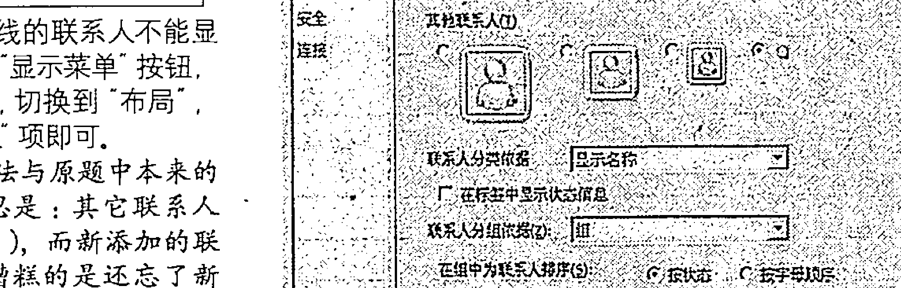

> （挑战者：江苏/李承国）

### “伴偶争艳” 谁能俘虏Windows 7的“心”？——八款Windows 7优化工具大比拼

#### 我们的评测对象

- Windows7优化大师
  简介：通过微软官方Windows7徽标认证的系统软件，支持64位、32位Windows 7操作系统，提供了优化、安全等数百项实用功能。
  http://www.win7china.com/Windows7master

- Windows 7总管
  简介：内置30多个不同功能，可以提高系统安全性以及使之更符合你的个性。
  http://www.yamicsoft.com.cn/windows7manager

- Windows优化大师
  简介：它能够有效帮助用户了解自己的计算机软硬件信息，简化操作系统设置步骤，提升计算机运行效率，修复系统故障及安全漏洞等。
  http://www.youhua.com

- 完美优化大师
  简介：知名软件‘完美卸载’的姐妹，专注于对系统进行优化，可以对CPU、内存、网络、硬盘、电源等进行有效优化。
  http://www.killsoft.cn/index_yhhds.html

- 鲁大师
  简介：它在硬件检测方面非常强悍，适合于各种品牌台式机、笔记本电脑、DIY兼容机、实时的关键性部件的监控预警。
  http://www.ludashi.com

- 魔方
  简介：提供丰富的系统优化功能，支持64位和32位的Windows全系列操作系统。
  http://www.tweakcube.com

- 魔豆精灵
  简介：一款功能强大的系统工具，包含多种功能的实用工具箱。软件采用美观大方的Aero和毛玻璃风格界面。
  http://www.igbean.com

- 超级兔子2011
  简介：老牌系统优化软件，提供多项实用的系统优化功能。
  http://www.pctutu.com

| 项目 | 配置 |
| :--- | :--- |
| CPU | 酷睿2四核Q8400@2.66GHz |
| 内存 | 2GB×2（三星DDR3 1333MHz） |
| 显卡 | nvidia GeForce G210（512 MB） |
| 硬盘 | 希捷ST3750528AS（750 GB） |
| 操作系统 | Windows7旗舰版（64位） |
| 网络 | 中国电信2M |

#### 检测功能，软硬件信息谁最细

| 软件名称 | 操作系统 | 硬件详细信息 | 驱动备份还原 |
| :--- | :---: | :---: | :---: |
| Windows7优化大师 | √ | √ | √ |
| Windows7总管 | √ | √ | √ |
| Windows优化大师 | √ | √ | × |
| 完美优化大师 | √ | √ | × |
| 鲁大师 | √ | √ | × |
| 魔方 | √ | × | √ |
| 魔豆精灵 | √ | √ | × |
| 超级兔子2011 | √ | √ | √ |

#### 提速比拼，谁的能力最强悍

| 测试项目 | 系统优化 | 内存整理 | 磁盘优化 | 文件系统优化 | 网络优化 | 系统服务优化 | 内存优化 | 游戏加速 | 系统还原 |
| :--- | :---: | :---: | :---: | :---: | :---: | :---: | :---: | :---: | :---: |
| Windows7优化大师 | √ | √ | √ | √ | √ | √ | √ | × | × |
| Windows7总管 | √ | √ | √ | × | √ | √ | √ | × | × |
| Windows优化大师 | √ | √ | √ | √ | √ | √ | √ | × | × |
| 完美优化大师 | √ | √ | √ | √ | √ | √ | √ | × | × |
| 鲁大师 | √ | × | √ | √ | √ | √ | √ | × | × |
| 魔方 | √ | √ | √ | √ | √ | √ | √ | × | × |
| 魔豆精灵 | √ | √ | √ | √ | √ | √ | √ | × | × |
| 超级兔子2011 | × | × | × | × | × | × | × | √ | √ |

| 测试项目 | 快速清理垃圾 | 注册表清理 | 系统垃圾清理 | 用户隐私清理 | 上网记录清理 | 卸载软件 | 系统瘦身 | 文件粉碎 |
| :--- | :---: | :---: | :---: | :---: | :---: | :---: | :---: | :---: |
| Windows7优化大师 | √ | √ | √ | √ | √ | √ | √ | √ |
| Windows7总管 | × | √ | √ | √ | √ | √ | × | × |
| Windows优化大师 | √ | √ | √ | √ | √ | √ | × | × |
| 完美优化大师 | √ | √ | √ | × | × | √ | × | × |
| 鲁大师 | √ | √ | √ | √ | √ | √ | × | × |
| 魔方 | √ | √ | √ | √ | √ | √ | √ | × |
| 魔豆精灵 | √ | √ | √ | √ | √ | √ | × | × |
| 超级兔子2011 | × | √ | √ | √ | √ | √ | × | × |

| 测试项目 | 系统备份还原 | 系统修复漏洞 | 系统修复设置 | 文件隐藏 | 其它功能 | 控制面板 | 浏览器 |
| :--- | :---: | :---: | :---: | :---: | :---: | :---: | :---: |
| Windows7优化大师 | √ | √ | √ | √ | √ | √ | √ |
| Windows7总管 | √ | √ | √ | √ | × | √ | √ |
| Windows优化大师 | √ | × | √ | × | × | √ | √ |
| 完美优化大师 | × | √ | √ | × | × | √ | × |
| 鲁大师 | × | × | √ | × | × | × | × |
| 魔方 | √ | √ | √ | √ | √ | √ | √ |
| 魔豆精灵 | × | × | √ | × | × | × | × |
| 超级兔子2011 | × | × | √ | × | × | √ | √ |

#### 安全防护，谁的保护最到位

> 【研究院报告】
> 通过上面的几项测试，相信大家对八款工具也有了较深的认识，谁优谁劣一目了然。对于使用Windows 7的本本用户，鲁大师或魔豆精灵比较合适，特别是鲁大师的节能设置可以延长本本续航能力；Windows优化大师和超级兔子2011都是曾经非常有名的优化工具，但现在看起来还要多多加油追赶了。综合各方面的表现，Windows 7优化大师无疑是Windows 7系统的最佳优化工具，对于使用非Windows 7的用户来说，可选择魔方作为优化工具。
> 所以，本期编辑选择奖，颁给Windows 7优化大师。

点评：Windows 7优化大师的自动优化其实就是优化向导，它的优化能力非常全面；完美优化大师专注于优化，除了表格中的优化项目，还可以进行CPU优化、显示优化等；对于游戏用户，单击‘附属工具’，可使用‘游戏加速器’将电脑优化成游戏专用机，双击‘高级优化工具’还可以使用更多的优化模式；鲁大师重在优化硬件，节能降温，延长硬件使用寿命，提供的一键优化功能包含了对系统性能、网络、安全等方面的优化；魔方的优化功能非常全面；魔豆精灵的各种优化选项主要包含在‘系统优化’中，优化速度非常快，单击后瞬间即可完成。昔日鼎鼎有名的超级兔子，在系统优化方面已经差强人意了。八款工具中，前六款可以进行优化还原，也就是说万一优化导致系统出故障，可以恢复到优化前的状态，这非常有必要。很多时候电脑启动速度越来越慢，主要是开机后自动加载的程序过多，除了魔豆精灵没有提供相关选项，其他七款工具都可以自定义启动项，比较周到。

点评：Windows 7优化大师的‘推荐资源’中包含了一些非常实用的工具，如：文件粉碎机、软件卸载大师、一键清理系统垃圾文件等，这些都是清理垃圾的利器。Windows7总管提供了‘查找重复文件’工具，便于我们清理系统的重复文件；Windows优化大师的清理功能也比较全面；完美优化大师的‘硬盘优化’中提供了‘垃圾一键清理’功能，单击可清理系统中的垃圾，删除系统中的流软件，在‘其它工具’中包含了文件粉碎器、顽固文件清理，特别是‘磁盘擦除器’可以彻底清理某个分区中的数据。后四款工具都具备基本的文件清理能力，总的来说还算方便。

### 傻博士信箱 系统

#### 任务栏图标模糊不清

**Q:** Windows XP系统，任务栏右侧托盘区中的图标模糊不清，重新启动也未好转。请问这该如何解决？

**A:** 如果排除因为显卡驱动程序没有正确安装而导致的问题，可按Win+R键打开运行对话框，输入"services.msc"（不含外侧引号）并按回车键执行，找到"Themes"服务项，如果该服务没有开启，将其设置成"自动"模式，再启动该服务。接下来右击桌面并选择"属性"，在打开窗口中的"主题"选项卡中更换一个桌面主题即可。

> **傻博士有话说：** Themes服务是专门负责系统桌面主题的，假如该服务停止，用户将无法更换桌面主题。很多朋友喜欢在网上下载不同的主题来美化系统，而有些主题文件可能有缺陷，更换后会导致显示方面的问题。这种情况下只要直接使用系统自带的桌面主题更换一下即可解决问题。有时可能会遇到无法更换的故障，这时就要查看Themes服务是否被禁用了。

#### 开始菜单搜索功能丢失

**Q:** 我安装的是Windows 7系统，"开始"菜单中的搜索框不知因何丢失了，很不方便。请问这该如何解决？

**A:** 这可能是系统中的搜索组件（Windows Search）损坏或是被误删除而导致的。只要重新安装一次该组件一般能解决问题：打开控制面板，依次找到"程序和功能"项，打开后再单击窗口左侧"打开或关闭Windows功能"，在列表中找到"Windows Search"项并将其选中，单击"确定"将其重新安装上即可。安装过程中可能需要原系统文件或光盘。

#### 桌面图标变成未知文件类型

**Q:** 今天打开电脑后发现桌面上的所有图标都变成了未知类型文件模样的图片，双击可以正常打开对应的文件、程序。请问这该如何解决？

**A:** 这可能是图标缓存损坏所致，只要使用"Windows优化大师"（下载地址：http://www.onlinedown.net/soft/3829.htm），运行后选择主窗口中的"系统优化→桌面菜单优化"，单击右侧的"重建图标"按钮，之后重新启动系统即可。

#### Windows 时间同步总是出错

**Q:** 我的Windows时间经常不准，使用自动同步总是出错，更换全部服务器也不能成功校时。请问这是什么原因？

**A:** 首先检查"Windows Time"服务是否开启了：按Win+R键打开运行对话框，输入"services.msc"并按回车键执行，在服务管理器的服务列表中找到"Windows Time"服务，直接将其开启即可。若"Windows Time"服务正常开启的情况下亦不能正常校准时间，建议使用第三方校时工具，例如"电脑时间校准器"就可以方便地对系统校时。

#### 安装 Ghost 系统时提示出错

**Q:** 安装Ghost系统时弹出一个提示框，提示A:\GHOSTERR.TXT错误，尝试多次均提示此错误。请问这是什么原因？

**A:** 这一般是由于Ghost系统文件损坏所致，例如存放Ghost系统文件的光盘划伤，或者下载的文件不完整（建议在下载完毕后进行MD5验证）所致。这时只能重新去找正确的文件了。另外，光驱读取数据不灵敏也会导致类似的故障，所以也可以换一个光驱试试。此外，如果Ghost系统文件放在硬盘中，也有可能是因为病毒感染破坏，硬盘中有坏道同样会导致数据损坏。

#### 突然停电后无法启动系统

**Q:** 某天在用电脑时，突然遇到停电，启动系统后总是提示“CPU HAS BEEN CHANGED”的提示。请问如何解决？

**A:** 只要将BIOS参数恢复为缺省值后即可解决问题。重新启动系统并按DEL键（有的电脑需要按F2键）进入BIOS设置界面，找到"Load Optimized Defaults"项直接恢复为缺省值，按F10键保存退出即可。

#### 找不到刻录机

**Q:** 我的刻录机在其他电脑中可以被正常识别，而换到自己的电脑中总是不能被识别，在驱动程序属性中看到的提示信息：由于其配置信息（注册表中的）不完整或已损坏，Windows无法启动这个硬件设备（代码19）。请问这该如何解决？

**A:** 这可能是系统中的设置不当所导致的。按Win+R键打开运行对话框，输入执行命令regedit打开注册表编辑器，定位到[4D36E965-E325-11C E-BFC1-08002BE10318]，删除该键下的"upperfilter"项和"loweverfilter"项，重启计算机即可解决问题。

#### 无法打开优盘

**Q:** 以前一直用得好好的闪盘，今天在插入电脑后总是提示“USB盘打不开，I/O设备错误”。请问这该如何解决？

**A:** 首先确保闪盘是直接插在主板的USB接口上，而不是机箱前置USB接口。由于前置USB接口是使用USB延长线连接的，这样可能会导致供电不足而出现类似故障，而主板上的USB接口则不会出现这样的情况。其次，按Win+R键调出运行对话框，输入执行devmgmt.msc命令打开设备管理器，选择"通用串行总线控制器"并右击该项，选择"扫描检测硬件改动"，如果是驱动程序损坏，这样即可解决问题。此外，如果闪盘本身损坏，也有可能会出现这样的提示，需要到专业的检测机构进行检测，或者尝试使用一些闪盘低格工具对其进行低级格式化处理。

#### 任务管理器看不到 CPU 使用率

**Q:** 电脑是几年前配的，运行Windows 7系统，每次遇到系统变慢时我都会打开任务管理器来看看是哪个进程占用CPU。不知道怎么回事，最近打开的任务管理器中看不到CPU占用率了。请问如何解决？

**A:** 打开任务管理器后单击菜单"查看→选择列"，在打开的列表中找到并选中"CPU使用率"，保存设置即可。

#### 无法运行 cmd 命令文件

**Q:** 从网上下载了仿Windows 7的皮肤，但在安装其中的cmd文件时却自动调用记事本打开。请问如何让其能够直接运行？

**A:** 这一般是由于cmd文件的关联出现问题所致。只要将cmd文件与系统的命令提示符相关联即可：右击cmd文件，选择"打开方式→选择默认程序"，然后选择打开程序为C:\WINDOWS\system32\CMD.exe（根据系统安装位置确定），同时勾选"始终使用选择的程序打开这种文件"选项，确定即可。或者直接将该文件的扩展名修改为bat，再双击运行就可以了。

#### Ghost 还原系统不能用

**Q:** 之前在一台电脑中安装了系统，又安装了一些应用软件（还没安装驱动程序），然后将系统Ghost备份；之后有另一台电脑需要安装系统，我直接将前面Ghost系统备份还原到这台电脑中，还原是成功了，但却无法使用。请问这是什么原因？

#### 开机出现 BIOS 错误

**Q:** 打开电脑时总是看到main bios checksum error的警告，过一会自己重启后又没事了，这是什么故障？

**A:** 现在一般主板上都提供了两颗BIOS，一个是主BIOS，一个是备份BIOS。当主BIOS出现问题时，备份的BIOS就会对其进行修复，进而会给出上述警告提示信息。如果能正常启动系统，就无须管它了。

#### 双显示器无法分别显示内容

**Q:** Windows 7系统，在笔记本中接了一个显示器，但两台显示器总是显示同样的内容。我想让它们各自显示独立的内容，总是无法实现。请问这是什么原因？

**A:** 你是想要设置分屏显示不同内容吧？这主要是因为设置不恰当所致：右击桌面空白处并选择"个性化→显示→更改显示器设置"，检测并识别后将"多显示器"设置为"扩展这些显示"，单击"应用"保存设置即可。

> **傻博士有话说：** 系统自带的多显示器管理功能比较单一，如果你想实现诸如不同显示器设置不同背景、不同的屏幕保护程序、不同的分辨率、刷新率等，系统自带的管理功能就不能满足了。这时，可借助UltraMon之类的系统辅助软件达成目的。不同的桌面背景、屏保等任意设定，管理起来更方便。

#### 安装 Windows 7 提示无法创建分区

**Q:** 我准备安装Windows 7系统，但是在选定分区进入下一步操作时，提示“安装程序无法创建新的系统分区”，安装无法继续。请问这该如何解决？

#### 系统提示缺少 hal.dll 文件

**Q:** 开机时提示我缺少Windows root\system32\hal.dll，我尝试从同版本系统中拷贝该文件放到上面的目录，还是无法解决问题。请问这该怎么办？

**A:** 这个错误的原因可能是boot.ini文件出错，导致引导不了机器从指定的路径启动，系统搜索其他的路径而其他路径上又没有hal.dll文件，所以提示这个错误。可尝试修改boot.ini文件来解决问题。例如，进入故障恢复控制台，运行fixboot命令进行修复；或者运行bootcfg /add命令来重建boot.ini。更直接的方法就是使用WinPE类光盘工具启动，然后手工修改系统盘根目录下的boot.ini文件，或者从其他同环境的系统中拷贝boot.ini文件覆盖损坏的文件，之后再根据系统实际安装位置来修改。

> **傻博士有话说：** Ghost备份时，将安装在系统盘中的所有数据均备份下来了，包括芯片组、CPU这类硬件设备信息。当将这个备份恢复到另外一台配置不一样的电脑中，由于硬件环境改变而导致系统无法运行。这主要是由于微软为了控制操作系统软件在多台电脑中通用，安装后就进行了限制，当更换超过2个主要硬件设备（CPU、主板）后就视为更换了电脑，系统即拒绝继续工作。

#### 修复回收站的确认删除对话框

**Q:** 在使用一款系统优化工具之后，系统回收站中删除文件时的确认删除对话框就不再显示了，给平时的操作带来麻烦。请问如何找回这个对话框？

**A:** 按Win+R键调出运行对话框，然后输入以下命令：

cmd /c reg delete "HKLM\SOFTWARE\Microsoft\Windows\CurrentVersion\policies\Explorer" /v "ConfirmFileDelete" /f&GPUpdate /Force

按回车键执行后，应该可以解决问题了。

#### 摄像头图像倒置

**Q:** 笔记本自带的摄像头，重新安装系统后发现摄像头显示的图像倒置180度了。请问这是什么原因？

**A:** 这一般都是由于摄像头驱动程序故障所导致的。可以在设备管理器中先将摄像头驱动程序卸载，然后再使用随摄像头附带的驱动光盘重新安装。此外，有些摄像头随机附带的软件可以直接旋转摄像头拍摄视频的角度，只要找到这个程序（有的在程序组中，有的则在控制面板中）进行设置即可。

#### 系统搜索功能丢失

**Q:** Windows XP系统，最近发现搜索功能丢失了，启动搜索时没有任何反应。请问这如何解决？

**A:** 首先看看系统搜索功能对应的文件是否损坏。它所导致的问题，可按以下方法来解决：在文件夹选项中设置显示隐藏文件、系统文件，再打开系统安装分区，在Windows\Inf目录下找到“srchasst.inf”，右击该文件并选择“安装”，这样可以排除搜索对应的文件损坏而导致的问题。

#### 找回 Windows 7 显示桌面按钮

**Q:** 使用的是Windows 7系统，不知道什么原因导致任务栏右侧的显示桌面按钮不见了，每次必须按Win+D键才能显示桌面。请问如何找回这个按钮？

**A:** 最便捷的方法就是直接从http://tinyurl.com/2dszuoy下载“Windows 7 Show Desktop Button Remover”，运行后只要单击“Add Show Desktop Button”按钮即可将该按钮找回了。也可以通过上面的按钮隐藏该按钮。

#### 鼠标放到 MKV 文件上 Explorer 就重启

**Q:** Windows 7系统，硬盘中有几个MKV文件，每次将鼠标移到这些文件上时就会导致资源管理器重启。请问这该如何解决？

**A:** 这主要是视频预览功能工作不正常而导致的问题，可以通过禁用视频预览功能来曲线解决问题：首先从http://work.newhua.com/cfan/20104/dispreview.rar下载文件，得到的“禁用视频预览.reg”，双击导入系统注册表中，即可将视频预览功能关闭了。

#### 系统无法启动

**Q:** 有A和B两块IDE硬盘，先在A上安装了Windows XP，插上B后又在B中安装了Windows XP，两块硬盘同在时，2个系统都可启动，而将A拿掉只留下B后，无法启动系统，提示“不能读取所选的引导盘，请检查引导路径和磁盘”。请问这该如何解决？

**A:** 这可能是由于安装系统时A硬盘在，而且A盘上的系统应该为双系统中的默认系统，系统引导文件boot.ini便在A盘的系统分区，当A盘拔除后相当于没有了引导文件，从而会出现这样的错误。可以将A盘中系统分区根目录下的boot.ini文件拷贝到B盘系统分区的根目录，再视情况修改该文件，指定引导分区等参数即可解决问题。

> **傻博士有话说：** 想让安装了系统的磁盘能够正常引导并进入系统，需要确保以下几点：硬盘在分区、格式化时已经激活了主分区；系统的引导文件不能丢失，特别是类似上述情况下的双启动、双硬盘等场合下的boot.ini文件的缺失；硬件环境有变化时，boot.ini相应的参数环境也要作相应改变等。
boot.ini文件中的参数及含义可参见：http://dreamzhao.blog.sohu.com/155705071.html。此外要注意的是，boot.ini文件是Windows XP及以前版本中的引导模式，从Windows Vista开始已经使用了新的引导管理模式。

#### 修复变黑的桌面图标

**Q:** Windows 7系统，桌面图标不知道什么原因突然变黑了，使用起来很不方便。请问如何解决？

**A:** 这一般是由于图标缓存出了问题所致，只要重新建立图标缓存即可解决问题。在记事本中输入以下代码：

```
rem 关闭explorer.exe
taskkill /f /im explorer.exe
attrib -h -i %userprofile%\AppData\Local\IconCache.db
del %userprofile%\AppData\Local\IconCache.db /a
rem 打开explorer
start explorer
```

将文件保存为“修复图标缓存.bat”，之后只要使用管理员权限运行该文件即可删除图标缓存进行修复了。此外，也可以使用“Windows 7优化大师”等软件提供的图标缓存重建功能来解决问题。

#### 找回丢失的音量图标

**Q:** 我使用SR Eng这款软件对Windows XP系统的启动项进行一番清理，之后便发现系统音量图标丢失了，平时不方便使用。请问，如何找回系统音量图标？

**A:** 首先，检查“控制面板→声音和音频设备→将音量图标放入任务栏”选项是否勾选；其次，检查系统目录下的system32目录下是否有“sndvol32.exe”文件，若没有请从其他电脑中搜索并拷贝到上面的目录。若上面两种方法均无效，请运行“regedit”打开注册表编辑器，定位到[HKEY_LOCAL_MACHINE\SOFTWARE\Microsoft\Windows\CurrentVersion\Run]，在右侧窗口中新

#### 系统无法启动并伴有嘀嘀声

**Q:** 今天打开电脑时听到嘀嘀嘀的声音，无法正常启动了，尝试多遍均无法启动。这该如何解决？

**A:** 出现这个问题一般是由于系统硬件没有插好或是电脑过旧，硬件的接触部分老化而导致接触不良。请小心地打开机箱，依次将内存条的金手指部分用橡皮擦擦拭一遍去除氧化层，再检查显卡、声卡、硬盘等设备的连接线是否插紧，或者直接进行一遍插拔操作来解决问题。

建字符串值“systray”，其值设置为“c:\windows\system32\Systray.exe”即可。

#### 删除收藏的一个网址总是出错

**Q:** 之前收藏了一个淘宝网店址，之后想将其从收藏夹中删除时，遇到“TheWorld.exe-损坏文件...淘宝网.url已损坏且无法读取。请运行Chkdsk工具。”这样的提示，无法删除。请问这该如何解决？

**A:** 提示已经很明显，是由于磁盘上出现错误而导致删除时出错，只要使用磁盘修复程序对磁盘分区修复一遍即可解决问题：右击收藏夹所在分区并选择“属性→工具→查错→开始检查”即可启动磁盘错误检测及修复程序，在打开的窗口中同时勾选两个复选框选项进行修复即可，也可以以管理员身份打开命令提示符窗口并输入“chkdsk /f”来进行检查并修复。

#### 更换映射盘的登录账号

**Q:** 单位的电脑安装的是Windows XP，映射公司服务器中的网络驱动器，第一个登录账号只有读取权限，另一个账号有可修改权限。由于使用第一个账号登录时勾选了保存密码，现在无法换成第二个账号登录。请问这该怎么办？

**A:** 这种情况下，只要按Win+R键并输入“control userpasswords2”（不含外侧引号）按回车键执行，在打开的账号管理窗口中选择“高级”选项卡，单击“管理密码”按钮，在打开的窗口列表中直接将第一个账号对应的密码项删除即可。

#### 无法安装系统

**Q:** 以前在C盘中安装了“雨过天晴”系统保护软件，现在将C盘格式化后重新安装系统，当复制完系统安装文件，并从硬盘启动时，系统还会弹出“雨过天晴”相关信息的界面，选择继续安装Windows后便出现蓝屏，无法安装系统。请问这该如何解决？

**A:** 这个问题只要修复一次硬盘主引导记录即可解决。如果手头有带Diskgen的WinPE光盘，启动后直接使用Diskgen对主引导记录进行修复即可，或者使用工具光盘启动到DOS模式，使用命令fdisk /mbr来修复引导记录。

> **傻博士有话说：** 硬盘主引导记录位于硬盘0柱面、0磁头、1扇区上，它由以下三个部分组成：①主引导程序（含出错提示信息），偏移地址为0H~1BDH；②分区表，偏移地址为1BEH~1FDH；③结束标志55 AA，偏移地址为1FEH~1FFH。现在有不少软件都动用了这部分存储空间并通过修改相关数据达到特定的目的，同时也有不少病毒是通过修改主引导记录来达到破坏的目的。幸好，主引导记录一般都会在其他扇区保存一份完整的备份，而像Diskgen（下载地址：http://www.onlinedown.net/soft/9570.htm）这类软件具有备份硬盘主引导记录的功能，这样可以将引导记录备份并放到其他地方（例如另一块硬盘、闪盘、邮箱等地方），遇到硬盘灾难时就可以进行恢复了。

来源：http://a.md/13M

#### Windows 7 没有“搜索”框

**Q:** 我看别人的Windows 7系统的“开始”菜单都显示一个搜索框，而我安装的Windows 7的“开始”菜单却没有这个项。请问这是什么原因？

**A:** 这个搜索框是需要安装Windows Search组件的，而该组件是Windows 7系统默认安装的，## 无法安装摄像头驱动程序

Q Windows XP SP3的精简版系统，在安装摄像头驱动程序时总是提示需要安装CD上的usbvideo.sys文件。请问这是什么原因？

A 这主要是缺少了USB接口设备驱动文件所致，直接将http://work.newhua.com/cfan/201016/USB.rar解压，重新安装并遇到错误提示窗口时直接定位到上述解压目录下相应的文件即可。

来源：http://a.md/11D

#### 无法修改文件夹选项

Q Windows XP系统可能是因为感染病毒所致，在文件夹选项设置窗口中无法选择“显示所有文件和文件夹”选项，导致无法查看系统中的隐藏文件。请问这该如何解决？

A 确保使用最新版杀毒软件对系统进行病毒清杀后，按Win+R，输入regedit，打开注册表编辑器，依次定位到[HKEY_LOCAL_MACHINE\SOFTWARE\Microsoft\Windows\CurrentVersion\Explorer\Advanced\Folder\Hidden\SHOWALL]，将下面的CheckedValue值设置为1即可。

来源：读者 秦彬 邮件提问

#### 系统关机总出现问题

Q 我安装的是Windows 7系统，关机时经常出现“MCI Command Handing 错误”，无法正常关机。请问这该如何解决？

A MCI Command是多媒体设备的程序接口，通过它可以打开一个多媒体文件，例如MP3、VCD、MP4格式的文件等等，并对它进行播放、暂停、关闭等操作。你遇到的这个问题是某个程序通过MCI拦截了系统的关机指令，或对关机指令不响应。排除方法：出现错误提示时不要单击“确定”或“取消”按钮，直接按Ctrl+Shift+Esc打开任务管理器，在“应用程序”中应该会看到报错的程序，右击该报错的程序并选择“转到进程”，直接将该进程关闭应该能正常关机。知道了是哪个程序出错的，可以直接将该程序卸载掉并重新安装，应该可以解决问题。

来源：http://a.md/13L

#### 系统无法运行 EXE 文件

Q 上次安装了一款名为Restorator的工具后，我的Windows 7系统中就无法运行任何EXE文件，没找到病毒，而更换一个系统账户后又能正常运行。请问这该如何解决？

A 找一个文本文件，右击之并选择“打开方式→选择默认程序”，在打开的窗口中单击“浏览”按钮找到Restorator程序，这样可以绕开打开EXE文件的限制，接下来在Restorator中单击菜单“工具→编辑文件关联”，先全部关联所有文件以及单击“全部上下文”按钮，接下来再单击“取消关联”按钮及“无上下文”按钮，单击“确定”保存退出即可。

来源：http://a.md/130

#### 系统无法休眠

Q 我安装的是Windows XP新系统，设置成休眠键直接休眠后在试图休眠时，也可以看到休眠进度条，但最后却会显示休眠不成功，再按休眠键时就会进入待机状态。请问这是什么原因？

A 这种情况十之八九是由于主板驱动程序没有安装所致，只要将主板驱动程序及相关设备的驱动程序安装完毕，这样的问题都能解决。如果自己不愿意手工查找、安装驱动程序，推荐使用

#### 管理工具变成英文

Q 我在Windows 7系统中打开控制面板中的“管理工具”，所有的工具名称都变成了英文，使用起来很不方便。请问如何调整成中文？

A 这可能是“管理工具”目录下的“desktop.ini”文件内容被修改所致，只要从其他同版本的正常操作系统中拷贝“管理工具”目录下的“desktop.ini”文件，覆盖当前文件即可解决问题。

还有些朋友的Windows 7系统中的“我的音乐”变成了“My Music”，原因与上面的类似，可能是误删除了该目录下的desktop.ini文件所致，同样方法，从同版本系统中的该文件夹下找到这个文件复制过来即可。

### 傻博士有话说：

正常情况下，desktop.ini是系统可识别的一个文件，作用是存储用户对文件夹的个性设置，例如文件夹图标、文件夹背景、标识特殊文件夹（例如回收站、我的电脑、我的文档等），也可以用来标识文件夹的特殊颜色、文件夹的所有者等。而现在有不少病毒也会在文件夹下创建desktop.ini文件，病毒所创建的文件内容依病毒的不同而异，可以是感染日期或其他字符串。所以当发现上述故障现象后，最好要通过Windows清理助手之类的软件检查一下系统。

#### 不能继续卸载程序

Q Windows 7系统，在卸载程序时，每次只能卸载一个程序，再试图卸载第二个程序时就会提示等待当前程序完成卸载或更改，而在任务栏又看不到卸载任务，只有注销或是重新启动系统才能继续删除。请问这是怎么回事？

A 这可能是卸载程序没有正常完成，导致当前运行的进程中仍残留卸载进程，系统误以为没有卸载完成而无法继续下一个卸载任务。这时可以按Ctrl+Shift+Esc打开任务管理器，找到类似“msiexec.exe”或是“dllhost.exe”的进程并结束它们，就可以直接卸载下一个程序了。

#### 系统启动时每次均要按 F1 键

Q 我安装的是Windows 7系统，最近每次启动系统时都要按F1键后方可继续启动，此外，成功启动后还会在“计算机”中多出两个磁盘，一个是A盘，一个是H盘。请问这是什么原因？

A 这主要是在BIOS中没有禁用软驱所致，如果是老电脑，请先更换一块CMOS电池，然后按下面步骤设置：开机提示按F1键时按Del键进BIOS，载入“Load Optimized Defaults”，然后进菜单“Standard CMOS...”设置项，将“Drive A”设置成“none”，最后按F10键保存退出即可。

#### 系统启动时总要按 F11 键并选择硬盘启动

Q 每次正常启动系统时都会出现黑色屏幕并伴随鼠标光标闪动，无法继续，只有按F11键后选择硬盘启动才能正常进入系统。请问这是什么原因？

A 这可能是你在BIOS的启动参数中设置硬盘为第二或是第三启动设备，而被设置成的第一个启动设备出现了问题所致，只要重新在BIOS的启动设备中将硬盘设置为第一启动项即可解决问题。此外，如果是双硬盘，设置不当也会出现类似问题，解决方法同上。

#### 无法安装安全更新 KB2286198

Q 我用的是Windows 7系统，在系统更新时，总是无法安装KB2286198这个安全更新，请问这是什么原因？

A 据不少读者朋友反映，这个补丁程序与Nod32杀毒软件有冲突，只要暂且将Nod32的安全防

#### 换 Windows 7 后摄像头不能用

Q 摄像头在Windows XP系统下可以正常使用，但换成Windows 7系统后就无法使用了，摄像头本身是无驱动产品，虽然不能用但在系统中却能找到设备。请问这是什么原因？

A 这主要是由于Windows 7系统提供的摄像头驱动程序不正常工作所致，可以这样来解决：用“Everset”来查看摄像头的驱动芯片型号，然后根据此型号来搜索公版驱动程序并安装，这样应该能解决问题。如果怕麻烦，不妨试试“驱动精灵”的自动找驱动程序功能。

#### 系统总是自动降低亮度

Q 刚买的笔记本电脑，预装的是Windows 7系统，在使用过程中总是自动降低亮度，而我已经在电源管理中设置不自动降低亮度。请问这是什么原因？

A 如果电源管理中已经设置成“高性能”或是将亮度参数设置成不自动降低仍出现这类问题，可能是笔记本自带的亮度调节功能所致，现在很多笔记本电脑自带亮度调节功能，可以打开笔记本电脑自带的管理工具，然后进行设置即可。

#### Windows 7 系统不能休眠

Q 新安装的Windows 7系统，已经开启了休眠功能，但不管是在键盘中按休眠按键还是通过“开始”菜单对系统休眠，总是无法成功。请问这该如何解决？

A 系统不能休眠一般与硬件设备、驱动程序及系统的电源管理设置等因素有关，解决思路如下：

- 升级当前所有硬件兼容Windows 7的驱动程序，特别是无线网卡、蓝牙设备的驱动。
- 关闭设备唤醒系统：右击“计算机→管理→设备管理器”，在网卡等设备上右击并选择“属性→将允许此设备唤醒计算机”前面的勾选去掉。
- 休眠文件出现问题，如果分配给休眠功能的磁盘空间较少，可以直接通过管理员权限运行命令提示符窗口，输入“Powercfg.exe /hibernate /size 100”命令，直接将休眠文件大小设置与物理内存一样大。

### 傻博士有话说：

笔记本电脑安装Windows 7系统的环境，不少用户均遇到休眠后无法唤醒的问题，或是重新启动系统时，屏幕黑屏。这一般是由于用户将电源按钮设置成休眠键，或是在唤醒时由于电源电力不够而重新自动进入休眠状态。微软最近发布了补丁程序，假如遇到类似问题，只要使用系统更新功能对系统进行升级即可自动安装此补丁程序，进而解决问题。

#### 无法去除托盘区的安全警告小红叉

Q 我安装的是Windows XP系统，也正常安装了杀毒软件，但是在系统托盘区中总是出现安全中心警告小图标，提示系统不安全。请问如何去除这个小图标？

A 首先，确定你的杀毒软件能够正常工作后，要想关闭这个提示，可以这样设置：从控制面板中打开“安全中心”，将“更改‘安全中心’通知我的方式”中的“防火墙”、“自动更新”及“病毒保护”三个选项取消，这样就可以关闭托盘区中的安全通知信息了。

#### 必须插入光盘才能启动系统

Q 有一台老电脑，安装的是Windows XP系统，每次启动系统时都需要将系统安装光盘插入，然后再选择从硬盘启动才行，否则总会提示：disk boot failure insert system disk and press enter。这是什么原因？

A 导致此故障有多种可能的原因：

- BIOS中设置了从光盘启动系统并禁用了硬盘启动，可以重启进入BIOS（按DEL或F2键），然后在启动顺序中将第一启动设备设置成硬盘即可。
- 系统引导文件损坏，用系统安装光盘，直接修复安装一遍即可解决问题。
- 硬盘的引导区出现问题而导致无法引导。可以在DOS工具下使用“fdisk /mbr”或在WinPE环境下使用“Diskgen”之类的磁盘修复软件对引导区进行修复来解决问题。

#### 资源管理器总是崩溃

Q 我用的是Windows 7系统，在使用过程中资源管理器总是频繁崩溃重启。请问这是什么原因？

A 导致系统资源管理器崩溃可能有以下几种原因：

- 系统生成图片缩略图时因为相关组件有问题而导致故障，只要关闭缩略图显示功能即可：在资源管理器中按Alt键，单击“工具→文件夹选项”，选择“查看”标签，选中“始终显示图标，从不显示缩略图”选项即可。
- 文件夹中存放了视频，在预览某些视频时由于系统中没有相应的插件而出现错误，这种原因导致的资源管理器崩溃，在安装完整版解码器或是像暴风影音、KMPlayer完整版播放器后即可解决问题。
- 与某个软件的不兼容而导致的，请检查最近安装了什么软件，尝试从最近安装的软件开始倒序卸载，检测是否因为某款软件不兼容而导致的故障。

#### 系统缺少文件无法登录

Q Windows 7系统环境，开机时提示“fwpkclnt.sys”文件损坏，不能正常启动系统。请问这该如何解决？

A 不少用户在安装了微软的8月份系统补丁后出现了该问题，解决方法也不难：使用WinPE光盘启动系统，然后将其他正常电脑中同版本系统中的“fwpkclnt.sys”文件拷贝覆盖故障系统“Windows\System32\drivers”目录下的同名文件即可。

#### 系统图标变成黑块

Q 先是资源管理器重新启动，之后发现所有的桌面图标、磁盘中的文件图标都变成了黑块。请问这该如何解决？

A 这是因为图标缓存损坏所致，只要重建一下图标缓存即可解决问题，如果安装了Windows优化大师之类的软件，可直接使用内置的图标缓存重建功能即可解决问题。或者也可以直接使用系统自带的命令来解决：先用管理员权限启动命令提示符窗口，再依次执行以下命令：

```
attrib -h -s "%userprofile%\AppData\Local\IconCache.db"
del "%userprofile%\AppData\Local\IconCache.db"
```

然后重新启动系统即可。

#### 无法保存下载文件

Q Windows 7系统，F盘剩余空间还有24GB。我在下载“侠盗猎车”游戏时，文件才12GB，但快下载完毕时总提示“磁盘空间不足，无法创建文件……”，此外，该磁盘分区中的文件也无法删除，而用Unlocker可以删除。请问这是什么原因？

A 据症状描述，问题在于当前用户权限不足所致，只要按下面的方法赋予当前系统账号以“完全控制”的权限即可：右击F盘并选择“属性”，选择“安全”，在列表中先选择自己当前使用的账号，单击“编辑”，再设置“完全控制”为“允许”即可。

### 傻博士有话说：

对于NTFS格式磁盘分区，在安全方面比FAT32增强很多，特别是在最新的Windows 7系统中表现得更是如此。如果使用的不是管理员账号，NTFS分区中的文件往往是不能直接操作的，只有为该系统账号赋予“完全控制”权限后方可使用。此外，在Windows 7系统中，很多软件也需要使用管理员权限运行（右击程序并选择“以管理员身份运行”），否则会出现无法使用或是部分功能不正常的情况。

#### 全新 Windows 7 优化后丢失输入法

Q 我新安装的Windows 7系统，使用优化工具优化了一遍系统，结果导致输入法丢失了，试了多种方法均无法调出输入法程序。请问这该如何解决？

A 首先尝试在控制面板中的“区域和语言选项→文本服务和输入语言→语言栏”中正确配置或是加载“ctfmon.exe”程序，如果均无法解决问题的话，请查看系统盘下的“Windows\System32\LogFiles\Scm”目录是否被删除，如果该目录不存在，就会出现输入法工具栏丢失的情况，只要手工新建该目录，重新启动系统后即可解决问题。

#### 系统缺失 Winlogon.exe 无法启动

Q 昨天在使用电脑过程中，小红伞检测到有威胁，提示Winlogon.exe文件有问题，当时也没太在意，重新启动系统时总是无法成功，不停地自动重启。请问这该如何解决？

A 这是小红伞对Winlogon.exe文件的误报并将其进行了隔离所致，知道原理后就方便解决了：使用WinPE光盘进入PE系统，然后将其他同版本系统的系统分区下Windows\System32下的Winlogon.exe文件拷贝到自己系统中的System32目录中即可解决问题。启动系统后，若小红伞再报毒，请取消任何操作，然后立即更新小红伞，新版病毒库已修正了这个问题。

#### 不能直接在远程桌面粘贴文件

Q 借助系统的远程桌面功能，记得可以直接将本地文件通过复制然后在远程桌面中粘贴来实现文件远程拷贝的，但现在却无法使用了。请问这是什么原因？

A 你之前肯定是在Windows XP SP2或是更低版本系统中使用的，而从Windows XP SP3开始便取消了这项功能。如果你想直接通过复制、粘贴的方法来操作文件，你可以通过映射网络驱动器的方法来实现：将远程电脑的共享盘映射为本地磁盘，然后操作文件时就如同在本地不同磁盘分区间的操作了。

#### 系统补丁无法安装

Q Windows XP系统，系统更新过程中有两个更新补丁总是无法安装上，一个是KB983583，另一个是KB951847，安装时总提示安装失败，而每次开机后又弹出来安装更新的提示。请问这该如何解决？

A 这两个更新是.NET Framework的升级补丁，出现这种问题后可以直接通过升级.NET Framework版本至V4.0来解决问题。.NET Framework 4.0版，可从微软网站搜索下载，或者也可以从http://www.newhua.com/soft/34491.htm下载安装。

#### 屏幕画面逆时针旋转 90 度

Q 使用的是笔记本电脑，安装的是Windows XP系统，今天打开系统后屏幕画面竟然逆时针旋转了90度，请问这该如何解决？

A 这一般都是显卡中的相关设置被修改了。从控制面板中找到显卡设置项（也可以尝试在系统托盘区中找到显卡设置项），在屏幕旋转相关设置中将屏幕顺时针旋转90度即可。例如nVidia的显卡在正确安装驱动程序后，直接通过“Ctrl+Alt+方向键”即可旋转屏幕了，或者右击桌面并选择“属性→设置→高级→显卡选项→显示方向”，然后指定旋转的角度即可。

#### 桌面图标总是很慢才能显示出来

Q 刚安装系统不久，打开系统进入桌面后，桌面上的图标总是很慢才显示出来，壁纸也是一点一点地显示。请问这是什么原因？

A 先排除是否因硬件配置较低而导致的，例如内存很小，启动系统时加上需要启动很多应用程序，就会出现桌面显示很慢的情况。其次，如果系统感染病毒也会导致桌面图标显示很慢的情况，一般之前显示正常，突然出现这样的故障，很有可能与病毒有关，建议杀毒。还有一种情况，就是启动系统时启动了大型软件（例如Photoshop类软件），导致硬件资源被大量占用，进而出现系统运行资源不够而导致桌面图标显示很慢的现象，建议不要将这类大型软件设置为随系统启动，特别是旧电脑环境。

#### 删除文件名含有非法字符的文件

Q Windows 7系统，文件名中含有特殊字符（也不知道是如何出现的），想删除时总是提示出错，无法删除，试了Unlocker亦无效。请问这样的文件如何才能删除？

A 出现这种情况一般有两种原因，一种是因非法关机或其他误操作导致系统磁盘出错，并进而导致出错位置的文件无法删除，这种情况下只要直接扫描一下磁盘分区并修复磁盘错误即可解决问题。第二种情况就是中了恶意病毒，这种情况只有先杀毒，清理流氓软件（例如使用Windows清理助手、金山网盾等流氓查杀软件），最后再删除这类文件。除了上面的情况外，假如这个文件名最后含有“.”而导致的无法删除，请使用管理员权限运行命令提示符窗口，再用“cd”命令切换到该文件所在目录，使用类似于“rd test..\”的命令将其删除（其中“test.”是这个无法删除的文件）即可。

### 傻博士有话说：

有些朋友想在硬盘中建立一个文件夹，用来保存一些重要文件而不想让别人随意删除，在管理员权限下运行命令提示符窗口后再使用类似于“md test..\”的命令建立一个名称为“test.”的特殊文件夹（带“.”的文件夹），这在Windows XP系统中将无法直接打开该目录，也无法删除它。而自己查看时只要在命令提示符窗口中使用“Strat 路径\test..\”即可打开了。不过，在Windows 7系统中可以直接对该文件夹进行打开、复制等操作，但也不能删除。

#### 所有 Win 组合键均失效

Q 我安装的是Windows XP系统，不知道什么原因，所有的Win键参与的组合键均失效了，而其他组合键（例如Ctrl+C）可以正常使用。请问这是什么原因？

A 这可能是系统中关闭了Win键而导致的，解决方法：单击“开始”，在“开始搜索”框中输入“gpedit.msc”（不含外侧引号）并按回车键打开组策略编辑器，定位到“本地计算机策略→用户配置→管理模板→Windows组件→Windows资源管理器”，禁用右侧的“关闭Windows+X热键”策略，保存设置即可。

#### 屏幕分辨率突然变低无法上调

Q Windows 7系统，使用的是19英寸的AOC 919SW+显示器，原来分辨率是1440×900，但是不知为什么现在分辨率突然变成1024×768，无法设置成之前的高分辨率了，这该如何解决？

A 这一般是显卡驱动程序出现了问题所致，先按Win+R键打开运行对话框，输入“devmgmt.msc”命令打开设备管理器，找到显卡并将其卸载，然后重新安装适合Windows 7系统使用的驱动程序，重新启动后应该能解决问题。如果驱动程序安装后亦不能解决问题，可以考虑使用“PowerStrip”（下载地址：http://www.newhua.com/soft/2760.htm）来调整，该软件可以提供更多的显示器参数设置，包括分辨率的强行调整。

#### 系统经常出现 “pinyinup.exe” 错误

Q Windows 7系统，在使用过程中经常出现“pinyinup.exe”错误。请问这是什么原因？

A 这个是搜狗输入法的升级文件，可以直接将其删除：在任务管理器中结束“pinyinup.exe”进程，再打开搜狗拼音的安装目录，将“pinyinup.exe”删除，然后再手工建立一个任意文件并修改名称为“pinyinup.exe”，接下来，在“开始”菜单中输入“任务计划”打开任务计划设置窗口，找到Sougou更新任务并将其删除即可解决问题了。

#### 系统日期总是停留在星期天

我安装的是Windows 7系统, 时间是正确的, 但是日期总是停留在星期天。请问这是什么原因?

查看系统中是否安装了时间之类的软件工具 (例如定时提醒, 定时锁定计算机等工具), 这类工具往往会影响到系统时间, 将它们禁用后观察故障是否解决。其次, 主板电池电量不足也有可能会导致这类故障的出现, 只要更换新电池即可。此外, 如果主板上的时间晶振元件损坏, 也会出现这种情况, 如果主板在保修期内, 不妨去电脑销售商那里更换新主板。

傻博士有话说: 很多家庭用户都喜欢让系统自动记忆密码以实现自动登录系统, 而有的朋友效仿这招, 直接不为系统账号设置密码。殊不知, 当黑客知道你的IP地址, 就可以通过黑客手段直接远程登录你的系统, 之后想怎么破坏就怎么破坏了, 如果你平时使用网上银行这类敏感应用, 那就十分危险了。此外, 还有很多朋友在安装系统时并未给Administrator管理员账号添加密码, 安装后又忘了设置密码, 结果是很危险的。

#### 一键恢复软件导致无法进入Windows 7

Sony笔记本, 默认有三个分区, 第一、二个分区都是隐藏分区, 第三个分区是系统分区。在系统分区安装了Windows 7系统, 之后安装了“小哨兵一键恢复”, 进行一键备份后重新启动系统没有反应, 再重新启动便一直停留在“小哨兵一键恢复”的DOS界面。请问如何解决?

只要手头有启动光盘 (例如WinPE, 系统安装光盘), 在BIOS中设置从光盘启动系统, 进入系统后再将“小哨兵一键恢复”卸载掉即可解决问题。卸载后若需要备份系统, 可以使用WinPE光盘中自带的Ghost工具手工备份 (部分WinPE光盘中也带有一键备份或是还原的Ghost强化版程序)。

来源: http://a.md/dmjd

#### 设置 了密码仍能自动登录

Windows XP系统, Administrator账号明明设置了密码, 但是开机时却仍能直接登录到系统中。请问这是什么原因?

这可能是之前设置成自动登录系统了, 例如在TweakUI中就可以这样设置。解决方法很简单, 只要将该账号重新设置一个密码, 再次登录时就需要你输入密码了。此外, 也可以在“开始→运行”框中输入“Rundll32 netplwiz.dll,UsersRunDll”, 在打开的窗口中勾选“要使用本机, 用户必须输入用户名和密码”项, 保存设置即可。

傻博士有话说: 很多家庭用户都喜欢让系统自动记忆密码以实现自动登录系统, 而有的朋友效仿这招, 直接不为系统账号设置密码。殊不知, 当黑客知道你的IP地址, 就可以通过黑客手段直接远程登录你的系统, 之后想怎么破坏就怎么破坏了, 如果你平时使用网上银行这类敏感应用, 那就十分危险了。此外, 还有很多朋友在安装系统时并未给Administrator管理员账号添加密码, 安装后又忘了设置密码, 结果是很危险的。

#### 解决 Runtime error 216 错误

最近不知道什么原因, 开机时或是正常使用过程中经常会跳出错误提示: Runtime error 216...。请问这该如何解决?

可以试试下面的方法 (注意, 以下涉及注册表修改, 所以操作之前, 安全起见, 请先备份注册表): 第一步: 按Win+R键打开运行对话框, 输入regedit并按回车键打开注册表编辑器, 定位到[HKEY_LOCAL_MACHINE SOFTWARE\Microsoft\Windows\CurrentVersion\Explorer\ShellExecuteHooks], 查看右侧除了“默认”项外是否有其他项, 若有全部将它们删除。 第二步: 在运行对话框中输入cmd并回车, 执行“for %1 in (%windir%\system32\*.dll) do regsvr32.exe /s %1” (不含外侧引号) 命令, 重新注册相关DLL文件后重新启动系统即可。

#### Shutdown 命令无法关机

Windows XP SP3系统, 以前可以使用诸如“at 22:00 Shutdown -s”之类的命令关机, 但是现在却不成功了。请问这是什么原因?

使用at命令需要保证系统中的“task scheduler”服务正常运行: 按Win+R键打开运行对话框, 输入“Services.msc” (不含引号) 并回车打开服务管理器, 找到上面的服务并确保其处于运行状态。其次, 在输入上面的命令时 (特别是时间) 一定要使用英文输入法, 否则就会出现语法错误而不能正常工作。

#### 启动项“dumpprep 0 -k”无法清除

Windows XP系统开机时总会出现“dumpprep 0 -k”, 我已经在系统实用配置程序中的启动项中将其去除了, 但是在下次启动时又会出现。请问这是什么原因?

这是系统自带的错误报告功能对应的程序, 可能是你的系统经常出现不正常关机所致。可以通过禁用系统错误报告功能来解决: 右击“我的电脑”, 选择“属性→高级→错误报告”, 选中“禁用错误报告”项。接下来按Win+R键打开运行对话框, 输入msconfig并回车打开系统配置窗口, 选择“常规”选项卡, 勾选“正常启动”项, 保存设置。最后再打开注册表编辑器, 定位到[HKEY_LOCAL_MACHINE\Software\Microsoft\Windows\CurrentVersion\Run]项, 找到[KernelFaultCheck] (值为“%systemroot%\system32\dumpprep 0 -k”) 项并将其删除即可。

#### 任务栏跑到右侧无法调整

Windows 7系统, 任务栏不知怎么从底部跑到右侧, 并且无法通过鼠标拖到底部。请问这该如何解决?

这肯定是被拖到右侧后又锁定了任务栏, 只要先右击任务栏空白处并取消选择“锁定任务栏”, 接下来再用鼠标将其拖放到底部即可。为了避免再有变动, 可再次右击任务栏并锁定任务栏即可。

#### 让系统防火墙阻止程序时显示通知

Windows 7系统, 之前不知道在哪动了系统设置, 在运行一个程序时系统防火墙会自动将其拦截而导致其不能连接网络, 但是记得以前是会给出通知, 我可以手工设置是否允许。请问如何找回这个通知项?

单击“开始→控制面板”, 打开“Windows防火墙设置”, 单击“更改通知设置”项, 在打开的窗口中选中“Windows 防火墙阻止新程序时通知我”项, 最后保存设置即可。

#### 复制文件出错

买了一块新硬盘, 安装好系统后准备将以前的旧硬盘中的相片文件拷贝到新硬盘中, 但在拷贝时总是出现“无法复制文件: 无法读取源文件或磁盘”的错误提示。请问这是什么原因?

出现这个情况要从以下两个方面考虑: 1) 旧硬盘分区中有错误, 导致拷贝文件出错, 可使用磁盘扫描程序, 并注意勾选修复错误选项, 扫描并修复一遍后应能解决问题。2) 文件权限设置问题, 在图片文件夹上右击并选择“属性→安全→高级→所有者→编辑”, 将当前系统用户添加到所有者列表中, 保存设置后即可正常拷贝了。

傻博士有话说: 在Windows Vista/7系统中配合NTFS磁盘格式对文件的权限控制较为严格, 如果出现无权限访问某个文件或是文件夹的情况时, 就需要将当前系统账户赋予访问权限, 之后才可正常访问或是复制、移动文件。此外, 如果之前使用另外一个系统账户对NTFS格式分区上的文件进行了EFS加密, 如果没有将之前账号备份的密钥导入当前系统, 也是无法复制文件的, 这种文件在资源管理器中一般都会以特定的颜色显示 (例如绿色), 出现无法拷贝时不妨留意一下。

#### 系统无法使用远程桌面

安装的是Windows 7系统, 即使关闭了防火墙也不能使用远程桌面, 而同网络中的其他同版本系统均能正常使用远程桌面。请问这是什么原因?

先在命令提示符窗口中使用Ping命令看能否Ping通网络及其远程电脑, 若不能Ping通但能上因特网, 请检查Windows 7的网络类型中是否选择了“工作网络”: 在控制面板中打开“网络和共享中心”, 直接选择即可。在使用远程桌面或是局域网时, 需要正确选择网络类型, 否则很多网络功能不能正常使用。

#### 无法显示硬盘分区

Windows 7系统, 硬盘中的一个分区无法正常显示, 而在磁盘管理中却可以看到分区存在。请问这是什么原因?

这一般是由于该分区没有分配一个正确的盘符, 或是与其他分区的盘符有冲突所致, 只要在磁盘管理中重新为该分区分配一个盘符即可解决问题: 右击“计算机”并选择“管理”, 选择“存储→磁盘管理”, 右击分区并选择“更改驱动器号和路径”项即可进行设置了。

#### 系统黑屏无法启动

电脑有一段时间未用, 现在开机时, 硬盘灯、主板灯、CPU风扇、电源风扇都会有规律地闪动一次, 而且闪动的间隔时间也是有规律的, 但就是无法启动。请问这是什么原因?

这一般都是由于长时间不用电脑CMOS电池电量不足而导致的, 请更换一块新CMOS电池, 然后再重新设置BIOS参数, 保存设置重启即可。此外, 类似的故障也有可能与显卡、内存条的金手指因长时间不用而氧化导致接触不良, 只要将它们拔下, 用橡皮擦除金手指上的氧化层, 再重新插回相应的插槽即可解决问题。

#### Convert 无法转换 F 盘

使用BT下载电影时总是提示下载的文件超出磁盘限制, 发现原来是因为F盘为FAT32格式而非NTFS, 之后使用Convert命令转换时却总提示权限错误。请问这是什么原因?

你可能是在Windows 7系统下使用该命令进行转换的, 而在Windows 7系统中应该先单击“开始”菜单, 选择“所有程序→附件”, 右击“命令提示符”并选择“以管理员身份运行”, 接下来再使用Convert命令进行转换即可。注意: 使用Convert转换磁盘格式可能会导致数据异常, 所以操作前一定要做好重要文件的备份工作。

#### 安装 DirectX 无法通过徽标测试

我在Windows 7系统中安装DirectX时系统总是无法通过徽标验证, 请问这该如何解决?

如果确定DirectX组件程序是从正规渠道下载 (例如官方网站), 那么问题可能出在系统本身, 而最常见的就是“Cryptographic Services”服务没有启动而导致的。按Win+R键打开“运行”对话框, 输入“services.msc”并回车, 在打开的服务管理器中找到“Cryptographic Services”服务并将其设置成“启动”即可。

来源: 读者 童军 邮件提问

#### 删除桌面上的“淘 - 宝 - 特 - 卖”

我系统中安装有McAfee软件, 但是近来桌面上出现“淘-宝-特-卖”及“西游仙剑”等图标, 无法删除, 疑似中毒, 但是用McAfee查杀无果。请问如何才能将这个图标清理掉?

直接从http://www.duba.net/jiu/index.shtml下载“金山急救箱”, 运行后单击“立即扫描”按钮, 对系统进行清理一遍即可。

傻博士有话说: 杀毒软件分国外、国内版, 像McAfee等属于国外软件。很多国外软件的病毒库中没有收集国内的一些病毒及流氓软件等, 因此无法对某些特定的恶意程序进行很好地查杀。所以, 如果你安装的是国外版的杀毒软件, 遇到此类问题时, 可以考虑配合一些专用的木马、恶意程序清理工具来使用, 比如上面方法中的金山急救箱, 以及瑞星卡卡安全助手。

#### 按 Shift 键就解锁 Caps Lock 状态

**Q:** Windows 7系统，有时需要按下Caps Lock键来输入大写字母，但是只要按一次Shift键竟然就会自动解锁Caps Lock键状态。请问这是什么原因？

**A:** 这可能是在高级文字服务中设置不当引起的。只要重新设置一下即可解决：右击输入法图标并选择“设置”，在打开的窗口中选择“高级键设置”选项卡，将“要关闭Caps Lock”设置为“按CAPS LOCK键”，保存设置即可。

#### 打开“我的文档”变搜索

**Q:** Windows XP系统，不知道什么原因，只要打开桌面上“我的文档”就会出现搜索窗口。请问如何解决？

**A:** 这一般是系统参数被修改所致，主要就是注册表相关项被修改了。只要直接从http://work.newhua.com/cfan/200623/srh.rar下载修复文件，解压后双击导入注册表即可解决问题（因为涉及注册表的修改，操作前请先备份注册表）。

#### Windows 7 无法使用读卡器

**Q:** 之前用得一直很正常，但最近不知道为何无法使用读卡器，设备管理器中显示读卡器图标上有黄色感叹号。请问这该如何解决？

**A:** 读卡器在Windows 7系统中通常都是无需驱动程序的，出现这种问题需要从以下两方面考虑：1.读卡器是否损坏，只要到其他电脑中测试即可得到答案；2.系统中是否安装了USB设备限制类软件（例如USB加密、防盗类工具），只要找到这类工具并将其关闭或是卸载即可解决问题，比如安装了“协乐防盗卫士”后并对USB设备进行保护，之后就会出现USB存储设备不能正常使用的情况。

#### 开启系统混合睡眠

**Q:** 我使用Windows 7系统，在高级电源选项中只有睡眠和休眠，而办公室电脑中同版本系统中却有混合睡眠选项。请问这是什么原因？

**A:** 这可能是你的主板不支持S3工作模式或是没有开启S3工作模式所致。可重新启动系统并按Del键（部分电脑需要按“F2”键）进入BIOS设置程序，在电源管理选项中找到“acpi suspend type”项并将其设置为“S3”即可。

#### 资源管理器无法进行搜索

**Q:** 我使用的是Windows XP系统，不知道什么原因导致按Ctrl+F键或是单击工具栏中的“搜索”按钮均无法启动搜索功能，而浏览器中的搜索功能使用正常。请问这是什么原因？

**A:** 这可能是组策略中禁用了搜索而导致的，请按下述步骤设置：按Win+R键调出运行对话框，输入“gpedit.msc”并回车，在打开的组策略编辑器窗口中选择“用户配置→管理模板→任务栏和开始菜单”，在右侧窗口中找到“开始菜单中删除‘搜索’菜单”项，直接将该策略禁用即可。

#### 恢复被旋转的系统桌面

**Q:** 不知何故，整个系统桌面被旋转了180度，无法使用，请问这该如何解决？

**A:** 这一般是显卡驱动设置不当或是驱动程序本身出现了故障所致。可以先尝试打开控制面板，查找是否有显卡设置选项，如果能找到显卡设置控制台，就可以直接通过相关选项进行调整了（部分显卡驱动支持“Ctrl+Alt+↑”或“Ctrl+Alt+↓”进行桌面角度调整）。如果找不到，则说明驱动程序可能有问题，按Win+R键调出运行对话框，输入“devmgmt.msc”并回车打开设备管理器，找到显卡项并将其卸载，重新启动系统后再重新安装显卡驱动程序即可。

#### 无法保存播放列表

**Q:** 我安装了影子系统，将系统分区(C:)放置于影子状态，但放在其他磁盘中的播放器（例如QQ影音、迅雷看看等）总是无法保存播放列表，请问这该如何解决？

**A:** 这是因为这些播放器的播放列表文件被放在了系统盘中，只要找到播放器并重新将播放列表保存到非系统分区中即可解决问题，或者在影子系统的设置中将保存播放列表的文件夹排除即可解决问题。

> **傻博士有话说：**
> 
> 软件放在其他盘中不代表软件中的所有数据都存放在非系统分区，例如QQ、Nero、千千静听、快车等多数常用软件的一些数据都保存在“%Appdata%”目录中，这里一般都是保存了程序的自定义设置，包括程序里可以个性化设置而不能影响其他用户的文件、临时文件夹、快速启动文件夹等。如果想将这个文件夹移至其他非系统分区避免其占用过多的磁盘空间或是避免数据丢失，可以参考http://tinyurl.com/2fx7b49。

来源：http://tinyurl.com/35p3yrx

#### Media Player 播放音乐突然没声音

**Q:** 平时使用Media Player播放音乐，但每当遇到QQ有消息来时就会听不到音乐了。请问这该如何解决？

**A:** 你使用的肯定是Windows 7系统，而Windows 7系统中添加了这样的功能，可以避免因为沉浸于音乐、电影而影响即时消息或是电话的接收。如果不想使用此功能，只要将其关闭即可：右击系统托盘上的喇叭图标，选择“声音”，打开“声音”窗口，切换到“通信”标签，将“当Windows检测到通信活动时”设置为“不执行任何操作”即可。

来源：https://bbs.et8.net/bbs/showthread.php?t=997387

#### Outlook 2010 总是提示错误

**Q:** 我直接从Outlook 2003升级到Outlook 2010，之后就经常提示错误：无法创建工作文件，请检查临时环境变量。请问这该如何解决啊？

**A:** 按Win+R，输入regedit打开注册表编辑器，依次展开到[HKEY_CURRENT_USER\Software\Microsoft\Windows\Current Version\Explorer\User Shell Folders]，检查其值不是下面的值，请手工将其修改成该值即可。

Windows Vista/7系统对应的值为:%USERPROFILE%\AppData\Local\Microsoft\Windows\Temporary Internet Files
Windows XP系统对应的值为: %USERPROFILE%\Local Settings\Temporary Internet Files

来源：http://www.outlook-tips.net/archives/2009/20091109.htm

#### 无法使用“金山密保”

**Q:** 我使用的是Windows 7系统，安装了“金山密保”后试图添加密保对象，但总是提示“添加失败”。请问这是什么原因？

**A:** 如果排除安装方面的错误，十之八九你使用的是64位操作系统，而目前“金山密保”并不支持64位操作系统，建议升级杀毒软件、开启系统防火墙提高系统安全级别。

来源：http://tinyurl.com/2bnl8b4

#### KMPlayer 无法播放 MKV 文件

**Q:** 以前可以正常地使用KMPlayer播放MKV格式的文件，但不知道什么原因，最近总是无法正常播放，总是没有声音，重新安装KMPlayer亦不能解决问题。请问这该如何解决？

**A:** 这个问题一般是由于解码器工作不正常所致，建议重新下载、安装最新版的KMPlayer，或者直接安装KMPlayer PLUS (下载地址：http://tinyurl.com/3xgq9qx)，集成了各种常用的解码器并且提供了统一设置接口，应该可以解决你的问题。

来源：http://tinyurl.com/35dyjta

#### 无法安装卡巴斯基 2010

**Q:** 之前卸载过卡巴斯基，而且是完全卸载，但现在在安装卡巴斯基2010时，总是在安装一半时就出现安装中断，无法继续安装。请问这是什么原因？

**A:** 如果确定进行了完全卸载，出现这种问题，只要先在文件夹选项中打开显示隐藏文件，再到C:\WINDOWS\inf目录下找到INFCACHE.1，删除这个文件，重启电脑后再安装即可。

来源：http://tinyurl.com/2bw9bgv

#### 无法正常安装 VMWare

**Q:** 以前我安装过VMWare软件，后来卸载了，今天在安装时总提示：已检测到该计算机安装了VMWare，请卸载后再安装。请问这该如何解决？

**A:** 从http://www.onlinedown.net/soft/27518.htm下载Windows Installer CleanUp Utility，使用该软件再次卸载一次即可，如果当初安装的是绿色版，只要找到随绿色版自带的“卸载.bat”即可解决问题。

**傻博士有话说：**

现在有很多朋友喜欢使用绿色版软件，而多数绿色版软件在第一次使用前也需要使用软件包中的“安装.bat”（或是类似功能的文件，有的也叫install.bat）进行安装，之后方可使用。这个安装文件所执行的功能就是向注册表中写入一些必要的参数以确保软件能正常运行，而在没有执行卸载操作后再次安装完整版，就会出现类似提示，只有先进行卸载，之后方可再次安装。

来源：http://tinyurl.com/2budcu6## KMPlayer 无法截图
Q：别人安装的KMPlayer可以正常截图，但我在截图时总是提示“不能在超级速度模式下工作，或没有KMPlayer转换滤镜”。请问这是什么原因？
A：只要将播放模式更改为正常速度模式即可。在播放器窗口右击鼠标并选择“视频→高级”，取消选中“超级速度模式”即可（或者直接按Alt+F开启或关闭）。
来源：http://bbs.crsky.com/read.php?tid=1911490&page=2

#### 双显示器下切换画面出现假死
Q：我使用的是“射手播放器”，显卡上接了两台显示器，而在两台显示器上切换播放画面时总会出现假死黑屏现象。请问这该如何解决？
A：打开“射手播放器”的设置选项，在“画质选项”中关闭“双显示器平滑切换”，保存设置应该能解决问题。
来源：读者 陈小毛 邮件提问

#### 如何找回被金山密保拦截的文件
Q：我有一个重要的加密文件夹被金山密保拦截了，里面存放了不少重要文件。请问如何找回？
A：打开金山密保，在主界面单击“设置→隔离区”，在列表中找到被隔离文件，单击“信任文件”按钮将其设为信任文件即可。
来源：http://tinyurl.com/2fwdp89

#### FlashFXP 复制 URL 总是乱码
Q：我想将FlashFXP下载列表中下载任务的URL复制出来使用其他下载工具下载，但是复制出来的路径、文件名都是乱码。请问如何解决？
A：你使用的是可能是英文版操作系统，确保在区域和语言设置中设置成了简体中文，之后只要在复制时打开一个中文输入法程序即可避免乱码的出现了。
来源：https://bbs.et8.net/bbs/showthread.php?t=997891

#### 联通用户无法更新小红伞
Q：单位的电脑可以正常升级小红伞病毒库，而家中的联通宽带总是无法升级小红伞。请问这该如何解决？
A：如果有代理服务器，直接在小红伞中设置代理服务器即可解决问题。更换DNS也能解决问题：
208.67.222.222
208.67.220.220
将这组DNS服务器设置到本地连接中即可。
来源：http://tinyurl.com/29lh896

#### 删除迅雷未下载完的文件
Q：迅雷未下载完的TD、CFG文件总是无法删除，使用迅雷下载又提示内存不足，而这个磁盘还剩下80多GB的空间。请问如何才能将这些未下载完的文件删除？
A：这可能是因为这些文件仍被系统调用，进而无法删除。先尝试重新启动系统并切换到安全模式下进行删除，如果仍不奏效，请到http://www.newhua.com/soft/39701.htm下载Unlocker软件来解决问题。
来源：http://tinyurl.com/2ceehdx

#### 记事本文件打开出现乱码
Q：有一份记事本文件格式的重要文件，打开时显示乱码，尝试更换其他编码亦不能解决问题。请问这种情况下该如何解决？
A：遇到这类问题只要使用Word打开这篇文档就可以正常显示内容了。如果仍需要使用记事本格式保存，只要再将其另存为文本文件时，在弹出的编码选择对话框中选择编码为“Windows（默认）”项即可。

### 傻博士有话说：
平时会经常遇到乱码问题，像文本文档遇到乱码问题，除了Word智能打开外，还可以尝试使用WPS、IE浏览器来打开（编码选择自动检测模式）的解决办法。而在使用一些国外软件或是繁体版软件时遇到界面乱码问题，可以尝试使用Microsoft Applocale（下载地址：http://www.onlinedown.net/soft/25010.htm），如果确定为中、日、韩三国语言而出现的乱码，还可以尝试使用“南极星全球通”（下载地址：http://tinyurl.com/2dov3nk）来解决问题。
来源：https://bbs.et8.net/bbs/showthread.php?t=999364

#### 图片预览与实际为何不一样
Q：保存在硬盘中的图片，直接在资源管理器中预览时显示的是风景图片，而打开后却是人物照片（前后不一致）。请问这是什么原因？
A：这个问题主要是由于图片缓存缩略图数据库出错所致，可以使用下面的命令将硬盘中的所有图片缓存数据库文件删除，之后系统会重新建立，进而能解决问题。将以下内容使用记事本编写，最后保存成“清空图片缓存.bat”，直接双击执行一次即可，命令：
@echo off
for %%i in (c d e f g h i j k l m n o p q r s t u v w x y z) do (
del /a /f /q /s "%%i:\thumbs.db" 2>nul
)
来源：https://bbs.et8.net/bbs/showthread.php?t=998644

```
@echo off
for %%i in (c d e f g h i j k l m n o p q r s t u v w x y z) do (
del /a /f /q /s "%%i:\thumbs.db" 2>nul
)
```

#### Potplayer播放声音很小
Q：在系统音量固定的情况下，MediaPlayer等播放器播放电影时的声音正常，而Potplayer播放的声音却很小。请问这是什么原因？
A：这一般是Potplayer播放器本身设置方面的原因，解决方法：右击播放器主窗口，选择“选项→音频→音量控制→使用多通道音量控制”，直接调整主音量，可以将音量在0%-500%之间调整，按需调整即可。
来源：读者 小逸 邮件提问

#### Everything 无法使用
Q：从今天开始，使用Everything时一直显示更新数据库，而且左键、右键都不起作用，而要退出只能通过任务管理器来终止进程。请问这该如何解决？
A：这一般是由于硬盘上出现错误所致，按Win+R并输入cmd，回车后使用chkdsk命令修复磁盘中的错误，如果检查结果说需要修复，再次运行“chkdsk 盘符 /f”进行修复一次即可解决问题。
来源：https://bbs.et8.net/bbs/showthread.php?t=998349

#### 粘贴选项按钮丢失
Q：以前使用Word粘贴网页内容后会在内容旁边显示粘贴选项按钮，可以选择保留成文本，但现在不知道什么原因而无法显示了。请问如何重新显示该按钮？
A：可能是在参数设置中取消显示了，单击Word左上角的Office按钮，选择“Word选项→高级”，将“显示粘贴选项按钮”选中，保存设置即可。
来源：读者 胡军 邮件提问

#### SD 卡中的相片能恢复但无法打开
Q：在系统中无法正常打开SD卡中的相片，之后使用R-Studio能成功恢复SD卡中的相片文件，但是这些恢复的相片无法打开。请问这该如何解决？
A：你可以试试其他恢复工具，例如PixRecovery、JPEG Recovery Pro、JPEG Enhancer。在数据恢复方面，不同的恢复工具算法不同，找回的数据完整性也可能不一样，往往这一款恢复工具无法找回或是找回的数据不完整，而换成另外一款恢复工具又能正常找回所有文件了。
来源：https://bbs.et8.net/bbs/showthread.php?t=993209

#### Everything 搜索不完整
Q：最近我刚换上了Everything作为硬盘搜索工具，但是有一个磁盘中的文件总是无法找到。请问这是怎么回事？
A：Everything是利用NTFS格式磁盘分区的独有特性完成快速索引的，而FAT32格式的磁盘分区则不支持。那块无法搜索到的分区应该使用的是FAT32格式，只有将其转换成NTFS格式后才能用Everything进行搜索。转换FAT32格式磁盘分区为NTFS格式，可以使用管理员身份运行命令提示符，然后输入“convert 盘符 /fs:ntfs”命令再按照文字提示即可进行转换了。

### 傻博士有话说：
现在专门针对于文件搜索的方案有很多，而像谷歌桌面搜索、百度硬盘搜索都是事先对硬盘中的文件进行索引并用数据库保存索引的信息，搜索时再先从索引数据库中定位目标内容，然后再直达目标内容而完成搜索。而Everything则是借助NTFS磁盘分区的USN日志（可以监视更改的文件和目录数量，记录下监视对象修改时间和修改内容），进而节省再次索引硬盘中的文件的时间，几十甚至几百G的硬盘文件的索引也仅须几秒钟的时间即可完成。而FAT32分区因为没有USN日志，所以不被Everything支持。
来源：http://a.md/yH

#### 无法复制光盘镜像文件
Q：从网上下载了一些幼教资源，都是光盘镜像格式的，使用UltraISO可以正常打开，但是提取时就会报错，无法复制。请问这是什么原因？
A：这与光盘镜像文件内容加密有关，而UltraISO无法正常读取这些加密内容而导致无法复制。你可以尝试使用isobuster（下载地址：http://www.onlinedown.net/soft/3629.htm）来抓取，往往可以成功。
来源：http://tinyurl.com/3xrgvfo

#### 玩 “极品飞车” 总是自动退出
Q：我在Windows 7系统中玩“极品飞车”，每当到过场动画时就会自动退出，有时还伴有提示：插入Need For Speed CD or DVD。请问这该如何解决？
A：这一般是由于显卡配置不高，或者安装的显卡驱动程序版本比较低而导致的。过场动画相当于高清电影，对硬件要求颇高，若是电脑硬件配置低就会出现类似的故障。此外，这款游戏没有对ATI系列显卡进行优化，这类问题一般多出现在ATI系列显卡的机器上，可以通过安装相应版本的免DVD补丁也能避免自动退出的问题。而最简洁的方法就是直接将过场动画删除即可。
来源：http://a.md/xt

#### McAfee 内网镜像升级失败
Q：系统是Windows 2003，安装的是McAfee 8.7i，将镜像升级文件放在D:\mcafeeupdate目录中，然后再设置FTP服务器并指向该目录，其他客户机使用ftp://服务器/mcafeeupdate目录进行升级，但是客户机在升级时显示找不到有效的存储库，无法更新。请问这是什么原因？
A：先让客户机直接使用IE来访问FTP服务器看是否工作正常，排除FTP服务器的故障后，接下来再查看McAfee的更新目录中是否包含了CATALOG.Z、SITESTAT.XML以及CURRENT目录下的所有产品，如果看不到这些文件，则说明升级文件本身镜像不完整，需要重新镜像操作才行。
来源：http://a.md/yl

#### 卡巴斯基报出 26 亿威胁
Q：今天在正常使用过程中，卡巴斯基报告发现一个病毒，之后在主窗口中显示有26亿个威胁。请问真的有这么多威胁么?
A：这是卡巴斯基的界面BUG，只要手工清零即可：
先退出卡巴斯基，直接在资源管理器中打开“C:\Documents and Settings\All Users\Application Data\Kaspersky Lab\AVP9\Report\07”（安装的位置不同或是卡巴斯基版本不同，此位置请做相应的改变），打开这个目录后直接清空其中的文件，再打开卡巴斯基即可。
来源：http://a.md/yL

#### 搜狗输入法皮肤为何无法安装
Q：我下载了搜狗输入法的皮肤，但是在安装时总是提示选择打开程序。请问这是什么原因?
A：这是因为系统没有将搜狗皮肤文件SSF与搜狗皮肤安装程序关联。可以在这个皮肤文件上右击鼠标并选择“属性→打开方式→选择默认程序→浏览”，在对话框里选择搜狗安装目录下的SkinReg.exe，单击“确认”按钮后双击该皮肤文件即可安装该皮肤了。此外，如果下载的皮肤文件是压缩文件格式（ZIP扩展名），应该先改为SSF才能正常地安装。
来源：读者 梅西 邮件提问

#### QQ 拼音输入法为何自动显示或隐藏
Q：我的电脑经常出现打开QQ聊天窗口时，QQ拼音输入法自动隐藏，显示为系统的输入法状态条，而最小化或是关闭聊天窗口时，QQ拼音输入法却又自动激活。请问这是什么原因?
A：这一般是由于你在别的应用程序（例如记事本、DOC文档等）中开启了QQ拼音输入法，而这些文件没有关闭，但在QQ聊天窗口中没有使用QQ拼音输入法。这样，当关闭QQ聊天窗口或是最小化后，其他应用程序窗口被激活时，QQ拼音输入法便自动激活了。

### 傻博士有话说：
有些软件自带了对输入法状态的控制功能，例如Office组件都有控制输入法的功能，可以设置成打开相应的文档后自动启动默认的输入法程序。比如在Word中，只要单击“Office按钮→Word选项→高级”，选择“输入法控制处于活动状态”，再单击“输入法设置”按钮指定默认输入法即可。而有时候这个功能也比较令人生厌，比如微软拼音输入法总是阴魂不散，就与此设置有关，只要取消选中上面的选项，在不卸载微软拼音输入法的情况下也能解决其自动启动的问题。
来源：http://a.md/14t

#### 无法删除江民杀毒软件
Q：我刚安装江民杀毒软件时，没有安装上，启动时也不见江民杀毒软件，进程列表中也没有相应的进程，服务管理器也找不到相关服务，但C:\Program Files下的JiangMin总是无法删除，江民杀毒软件也无法安装。请问如何才能将其删除掉?
A：像这类无法删除的情况，先试用诸如Unlocker（下载地址：http://www.onlinedown.net/soft/24732.htm）强制删除类工具进行删除，如果仍不能删除，可以考虑进入双系统中的另一个系统或是使用WinPE光盘进入PE系统进行删除，一般都能成功删除。不过，将文件删除后还要注意对注册表进行清理，清理的方法就是以jiangmin、kv相关注册表项，找到直接将其删除，重新启动系统后应该能够正常安装了。
来源：http://a.md/115

#### 无法安装卡巴斯基杀毒软件
Q：我电脑中毒了，360杀毒无法解决，于是就下载并准备安装卡巴斯基，但是在安装时总是提示Rising Antivirus 2007/Virus Killer而无法安装。请问这该如何解决?
A：直接从http://a.md/13f页面下端的链接下载瑞星卸载工具，运行后按文字提示将瑞星杀毒软件清理掉，重新启动系统后再重新安装卡巴斯基即可。
来源：http://a.md/13g

#### 系统无法安装软件
Q：我的系统突然出现无法安装下载的软件，有时候还伴有迅雷、QQ自动退出的故障。请问这该如何解决?
A：首先请考虑系统感染病毒的情况，很多类似症状都是因为感染了病毒而导致的，只要杀毒后一般可以解决问题（建议在WinPE环境下对系统进行病毒查杀）。其次再观察到底是哪些程序不能安装，如果只是部分程序不能安装（例如Office、Live Messenger等扩展名为MSI的软件），而一些小型的软件（例如WinRAR、Foxmail等）能正常安装，这可能是由于Windows Installer服务出现问题而导致的。先打开服务管理器（按Win+R，输入Services.msc），检查该服务是否被禁用，手工将其开启即可，如果问题比较严重可能还需要重新安装Windows Installer组件来解决问题。
来源：http://a.md/14s

#### 文件夹变成 EXE 后缀文件了
Q：一块移动硬盘中的所有文件夹现在变成扩展名为EXE的文件了，查看属性显示只有几十K大小，而这些文件夹原先都存放了很多重要的大文件的。请问这是什么原因?
A：据描述现象可大致判断为系统感染了文件夹病毒，只要使用“文件夹图标类病毒专杀工具”进行查杀一遍即可解决问题。
来源：http://a.md/14u

#### Easy CD-DA Extractor 分轨音乐文件出错
Q：我使用Easy CD-DA Extractor这款软件试图将一个APE文件（带CUE文件）中的音乐曲目分割开来，但是在加载CUE文件并进行分割时总是出现Format '%02i' invalid or incompatible with argument的提示。请问这是什么原因?
A：这个提示一般是给歌曲分配文件名时出现错误，你可以直接尝试勾选“重命名文件”，这样可以统一按照特定的规则（例如《编号》、《标题》）为分割后的单首歌曲命名，绕开潜在的命名问题了。

#### 千千静听无法取消关联文件夹
Q：在千千静听播放器中我想取消其对文件夹的关联及对CD播放器的关联，但在取消选中关联选项并保存设置，重新启动后发现选项又被选中，请问这是什么原因?
A：你肯定是在Windows 7系统下遇到的问题，在该版本操作系统下要想修改这些选项，必须以管理员身份运行它。右击千千静听播放器程序并选择“以管理员身份运行”，然后进行设置并保存即可。

### 傻博士有话说：
在Windows 7系统中由于系统安全性提高的原因，很多系统设置、软件的设置都需要在管理员身份运行的情况下才能进行。像系统设置中最典型的就是使用命令提示符窗口运行的各种系统命令，要想成功必须先以管理员身份运行命令提示符窗口，然后才能成功地运行这些命令来达到特定的目的。
来源：http://a.md/1CN

#### Word 总报错
Q：我使用的是旧版Office，每次关闭Word程序时都会弹出错误提示框：Word遇到问题需要关闭。请问这该如何解决?
A：只要Word还能正常运行，出现这类问题一般都是由于模板中出现错误所致，只要将模板文件（%appdata%\Microsoft\Templates目录下的“normal.dot”文件）删除，再次启动时系统会自动创建模板，同时故障也会消失。
来源：http://a.md/1Aj

#### 为何 Excel 不能自动计算了
Q：在Excel中将工具箱高亮显示后，Excel原有公式自动计算失效了，而不高亮显示Excel则恢复正常。请问这该如何解决?
A：如果是旧版Excel，单击“工具→选项”，选择“公式→自动计算”即可，如果使用Excel 2007以上版本，单击Office按钮，选择“Excel选项”，选择“公式→自动重算”即可。
来源：http://a.md/1B1

#### 卡巴斯基发现旧版 Office 漏洞
Q：最近卡巴斯基漏洞扫描发现有一个Office XP漏洞，而我安装的是Office 2010，我试图下载安装这个补丁，系统又提示不需要安装此补丁程序。请问这是什么原因?
A：这是由于你在卸载旧版Office时不彻底，在硬盘或是注册表中仍遗留了旧版Office相关信息而导致的。先检查硬盘中是否存在旧版Office相关文件夹，若有请直接将其删除，然后再搜索注册表，检查Office 10相关项，找到直接将它们清除即可。
来源：http://a.md/1CK

#### 被误报的软件如何在小红伞中忽略
Q：我安装的是中文版小红伞杀毒软件，有一些软件被误报有病毒，总是弹出提示，我已经设置成“总是忽略”却还会报。请问，如何将被误报的软件忽略?
A：这是瑞星杀毒软件的升级进程，检测到有新的升级文件后会自动下载，然后调用setup.exe进行安装，只要等其完成升级即可恢复正常，不用过多担心。假如每天出现这样的情况影响使用，可以通过调整瑞星的升级时间来错开与正常使用电脑时间的冲突，例如设置在中午12:00的吃饭时间，让其自动升级。
来源：http://a.md/1I0

#### 冰点还原为何失效
Q：我已经使用了冰点还原，但今天在桌面上多出了“淘宝购物”及“商务导航”两个图标，总是无法删除。请问冰点还原为何失效？
A：冰点还原一般都是设置成对系统盘进行保护，而非系统盘中出现了异常，它自然是无能为力。而你的桌面位置肯定被设置在非系统盘中，因此出现无法保护的情况。你可以使用360急救箱来清除桌面上的恶意图标。
来源：http://a.md/1I1

#### PDG文件为何无法打开
Q：我试了很多PDG软件，打开一个PDG文件时总是提示：不支持的文件格式！PDG格式67……请问这是什么原因？
A：PDG文件需要超星阅读器才能打开，PDG的格式从00到66、67…aa、ff很多，加密方式均不同。像66、67格式都是经过二次加密的，即用超星阅读器本地下载后，根据用户名在本地二次加密后存储的格式。PDG文件还会验证每台电脑网卡的MAC地址，假如你的文件是别人传给你或在其他电脑上下载的，而你的电脑没有使用同样超星用户名和密码的在线验证，文件也是无法打开的。只有在你的电脑上用下载时同样的超星用户名和密码，在线通过验证，之后方可打开。
来源：读者 赵允山 邮件提问

#### 为何玩“梦幻西游”很卡
Q：我的电脑是集成显卡的，玩“极品飞车”、“魔兽世界”、“穿越火线”等游戏都很顺畅，但最近在玩“梦幻西游”时却很卡。请问这是什么原因？
A：“梦幻西游”是2D版游戏，对显卡要求不高，这种出现卡的现象可能与网速有关。请在玩游戏时关闭其他会占用大量带宽的软件（例如下载工具、P2P类工具），此外还要注意在选择服务器时应选择与自己的网络ISP匹配的服务器，例如你接入的是电信网络，那就该选择电信服务器。
来源：http://a.md/1I5

#### “启明口语”无法正常使用
Q：我下载安装了“启明口语”软件，打开后，过了PartA的内容说明后就卡住了，没有声音也没有图像，而且程序还呈现假死症状，只有在任务管理器中终止相应的进程才能退出。请问这该如何解决？
A：“启明口语”这款软件类似于播放器，运行时需要解码器的支持，为了简便起见，可以直接安装“完美解码”（下载地址：http://jm.wmzhe.com/）来解决问题。

#### TeamViewer 总显示对方屏幕黑屏
Q：我在外网使用TeamViewer连接局域网内的一台电脑，桌面一直显示黑色的。请问这是什么原因？
A：这是TeamViewer的优化设置，主要是为了加快网络传输速度，可以通过设置来解决：单击主窗口中菜单“额外→选项”，选择“远程控制”，取消选择“移除远端桌面背景”，保存设置即可。

#### QQ总是不能运行
Q：打开QQ总是提示：D:\软件安装\qq\Bin\QQ.exe，由于应用程序配置不正确，应用程序未能启动。请问这是什么原因？
A：这个问题一般是缺少VC运行库而导致的，通常是非官方原版QQ程序因为缺少VC运行库所致，只要从http://a.md/1X2下载安装VC运行库即可解决问题。

### 傻博士有话说：
运行库是程序在运行时所需要的库文件，通常运行库是以DLL形式提供的，例如系统目录下有很多DLL文件，这些都是特定功能的库文件。库文件其实是对一段特定功能的代码进行的封装，当其他任何软件需要这段代码的功能支持，只要直接调用一下即可，进而可以避免各种重复代码，减少软件的体积。但当库文件丢失时，需要调用此库功能的软件就无法正常运行了。一般情况下，库文件丢失系统能够准确地给出提示（可以指名道姓某库文件），然后可以到同版本系统的电脑中搜索拷贝或是直接到http://a.md/1X4搜索下载。库文件一般放在系统盘Windows目录或是Windows\System32目录，有的库文件还需要在运行窗口中使用reg+库文件名进行注册后方可正常被调用。
来源：http://a.md/1X3

#### 千千静听播放音乐没声音
Q：我使用千千静听播放音乐时没有声音，而更换QQ音乐播放器又能正常播放出声音。请问这是什么原因？
A：这可能是千千静听播放器中的音频设备参数设置不正确所致。右击千千静听播放器主窗口并选择“千千选项”，选择“音频设备”，在打开的窗口中将“输出设备”设置成系统主音频设备程序。由于不同的硬件设备此处显示的选项不同，你可以在QQ能够正常语音聊天的前提下，打开设置中的音、视频设置，查看音频设备，再将千千静听的音频设备设置成与QQ一样即可。
来源：http://a.md/1Wq

#### 虚拟机不能拖拽文件
Q：我在VMWare中安装了Windows XP，但总是不能使用鼠标拖拽文件（无法将主机系统中的文件拖到虚拟机中），以前是可以这样使用的。请问如何才能实现对鼠标拖拽文件的支持？
A：要想让虚拟机支持鼠标拖拽文件，则需要安装VMWare Tools才行：单击主界面菜单“虚拟机→安装VMWare Tools”进行安装，对于部分汉化版本文件，还需要先将安装目录下名为“Windows.iso”文件加载到虚拟光驱中才能正常安装。
来源：http://a.md/1Wx

#### PPStream总是自动停止
Q：我给同事安装系统，在安装PPStream后每次看直播或是点播内容，都会先出现“正在查找解码器……”，然后就是下载过程，最后都会直接停止，重新启动亦如此。请问这该如何解决？
A：这个问题一般是由于系统中防火墙或是类似的安全工具拦截了PPStream访问网络而引起的。在下载解码器时不妨暂时停止防火墙或是杀毒软件的监控功能，等下载安装完毕后再重新开启安全类工具。
来源：http://a.md/1Wy

#### 射手播放器无法播放电影
Q：我使用射手播放器打开电影时，总是提示：Failed to query the needed interfaces for playback。请问这该如何解决？
A：这是由于DirectX系统组件损坏或是丢失而导致的，只要到http://a.md/1X9下载安装即可解决问题。如果安装时出错，请先从http://a.md/1XA下载“DirectX随意卸”将系统中DirectX残留的文件卸载掉再重新安装。
来源：读者 刘有发 邮件提问

#### 瑞星卡卡无法删除也无法安装
Q：我先前安装的瑞星卡卡现在不知道什么原因，既无法使用又无法删除。请问如何解决此问题？
A：重新启动系统进入安全模式，手工将卡卡安装目录删除，在“运行”对话框中输入regedit并回车打开注册表编辑器，将[HKEY_LOCAL_MACHINE\SOFTWARE\rising]下的KaKa项删除。再检查Windows\Temp目录下是否有卡卡相关文件，以及把%temp%目录中的RavTmp文件夹删除，重新启动系统并再次安装最新版的瑞星卡卡应该可以解决问题。
来源：http://a.md/1XB

#### 系统空间不足无法解压大文件
Q：我的系统分区现在剩余空间不多，但还可以继续使用，不想重新安装系统。但是WinRAR在压缩文件时总提示临时目录空间不足而无法解压大文件。请问，这该如何解决？
A：可以将WinRAR的临时文件夹修改到其他位置：单击菜单“选项→设置”，选择“路径”标签，直接将“临时文件解压的文件夹”设置到其他磁盘分区位置即可。
来源：读者 陈兰馨 邮件提问

#### 可牛影像不能使用场景
Q：我经常用可牛影像来处理照片，但最近在使用场景时总是提示未联网而不能使用。请问，这该如何解决？
A：如果你的电脑是处于联网状态，请检查系统中安装的防火墙是否将可牛影像拦截了，若被拦截，只要重新放行即可。其次，如果你的电脑确实没有联网而又想使用场景，不妨从别的可上网电脑中下载场景包（例如http://a.md/dawg就可以下载一些场景包），下载安装后只要打开可牛影像，在“场景→已下载”列表中找到相应的场景即可。

### 傻博士有话说：
很多软件正常运行需要有网络的支持，各种杀毒软件、防火墙更是典型的代表。在更新病毒库时就需要有网络的支持。如果电脑没有联网，可以试图在网上搜索下载离线版病毒库，安装后亦能正常使用。不过，有的离线病毒库提供了安装程序，双击直接安装即可，而有的杀毒软件的离线病毒库则需要手工安装。例如像卡巴斯基、ESET、小红伞等则需要在杀毒软件中设置成本地更新并设置好更新文件所在位置，之后才可更新。
来源：http://a.md/dawj

#### TC丢失“扩展名”项
Q：不知动了哪项设置，Total Commander中原先与文件名单独显示的“扩展名”栏消失了，原先独立显示的文件扩展名现在与文件名在一起。请问如何返回到原先的显示模式？
A：单击菜单，选择“配置→选项→对齐方式”，将“文件扩展名”设置成“按制表符位置对齐”并保存设置即可。
来源：http://a.md/dagm

#### UltraISO提示“无虚拟光驱”
Q：我使用UltraISO试图加载下载的光盘映像文件，准备加载虚拟光驱时总是提示“无虚拟光驱”。请问这是什么原因？
A：你使用的可能是精简版或是绿色版UltraISO文件，只有完整版程序才包含虚拟光驱功能，请从http://www.newhua.com/soft/614.htm下载完整版的程序使用，应该能够避免你出现的问题。
来源：http://a.md/wjp

#### KMPlayer播放电影画、音不同步
Q：我使用KMPlayer播放器播放1080P格式高清电影时，画面与音频总是不同步，声音总会先于画面，CPU占用也就在60%左右。请问这该如何解决？
A：使用KMPlayer播放高清电影时，需要开启硬件加速，方法有点复杂。不过，推荐你使用http://tinyurl.com/3xq9qx下载的Kmplayer Plus工具，其集成了所需要的解码器，提供统一设置界面，设置起来更省事，直接根据播放的电影使用的编码直接选择相应解码器列表中带“DXVA”的项目，保存设置即可开启硬件加速功能了。此外，也可以使用射手播放器，它会自动打开硬件加速，比较省心。

## 启用天网后其他电脑不能访问

Q 我安装的是天网防火墙个人版，只要启动防火墙后，局域网内其他电脑便不能访问我的电脑。这是什么原因？

A 如果在使用防火墙之前网络是畅通的，但是在使用防火墙之后有局域网内的通讯无法连接的情况（譬如说无法访问Windows的文件共享之类），那么就有可能是用户对防火墙的参数设置不当所致。先检查在防火墙的系统设置中是否已经将本机的局域网地址添加进去了，若未设置，请从“系统设置→刷新”进行设置。其次，检查防火墙的安全级别是否被设置成“高级”，若是请设置成“低”或“中”。如果上述操作仍不能解决问题，不妨先将防火墙的参数设置初始化，然后再按照实际需求重新设置一遍参数即可。
来源：读者 闻军 邮件提问

## Foobar2000 运行出错

Q 不知道什么原因，今天打开Foobar2000时总是出现错误提示：无法定位程序输入点GetVersionExA于动态链接库kernel32.dll上。请问这该如何解决？

A 这可能是重要的系统文件kernel32.dll丢失或是损坏而导致的问题，尝试从其他同版本系统中搜索找到该文件并将其拷贝到自己系统的“Windows\System32”目录中。如果无法覆盖，可以尝试使用WinPE光盘启动到系统中，将原先损坏的kernel32.dll文件删除，然后再将正常的文件拷贝到上述目录即可。
来源：读者 丘玉兰 邮件提问

## 如何去除非AlReader2中文章前的四个空格

Q 我使用AlReader2看书，不管更换哪本书，其行首总是出现四个空格，请问这该如何解决？

A 这可能是因为AlReader2默认设置为段首留空4个字符（2个汉字），而你看的书本身又默认在段首留空4个字符，这样就出现段首空4个空格的现象。只要单击“参数设置→文本格式”，将“段前空格”选项取消即可。
来源：http://a.md/djta

## 在线播放总提示没装Qvodplayer播放器

Q 我明明安装了Qvodplayer播放器，但在播放在线电影时，总得到提示说系统中没有安装该播放器。请问这是什么原因？

A 这可能是Qvodplayer播放器的插件没有正常被调用导致的。浏览器要想在线播放一些Qvodplayer专属在线资源，就需要调用该播放器安装到系统中的浏览器插件。你可以打开IE浏览器的参数设置窗口，选择“程序→管理加载项”，在打开的列表中找到Qvodplayer相关项并确保其启用状态即可，或者直接重新安装一次该播放器来修复此问题。

> 傻博士有话说：
很多与网络相关的程序（例如迅雷、快车、旺旺等），要想能够直接在浏览器中顺利地调用它们，就需要相应的插件能够被浏览器正常调用，像Firefox类非IE内核浏览器，则需要特定的插件（像迅雷在安装时就可以选择安装对Firefox的支持），而IE内核类浏览器就需要确保在IE浏览器的插件管理中相应的插件处于正常运行状态，否则就会出现无法调用的问题。此外，一些杀毒软件或是防火墙也会阻止部分程序的插件，因此还要考虑在这些安全软件中放行这些插件。
来源：http://a.md/jdpa

## 为何无法安装AlReader2

Q 我从华军软件园下载的AlReader2看书软件，但在安装时总提示：Could not start the setup。请问这是什么原因？

A 确保你下载的文件没有错误的前提下，请右击该安装程序并选择“以管理员身份运行”即可。
来源：读者 吴立群 邮件提问

## 搜狗拼音常用词为何丢失

Q Windows 7系统，安装了搜狗拼音输入法，但是经常莫名其妙地就出现常用输入词丢失的情况。请问这是什么原因？

A 首先，打开搜狗输入法的设置窗口，选择“词库”选项卡，勾选“动态词频”选项。如果不是这个参数没选上而导致的问题，十之八九是由于你使用垃圾清理类工具优化了系统，而这种用户输入的个性词语都是以临时文件的形式保存起来的，而优化类软件都会清理这种临时文件，进而导致常用输入词丢失的情况。不妨将一些自己常用的词加入自定义词库中，然后做好备份。
来源：读者 晟彬 邮件提问

## Word 无法启动转换器 mswrd632.wpc

Q 将误删除的一个Word文档找回后，在使用Word 2003打开时总提示Word无法启动转换器mswrd632.wpc，只有单击“确定”后方可打开，但在保存时又提示“包含与纯文本格式不兼容的功能”。请问这该如何解决？

A 这一般是文档受损后打开出现的问题，而你安装的又是精简版Office或是误删相关Office组件而导致的。如果只想不出现这个提示框，可以这样来解决：
首先，一直单击错误提示框下面的“确定”按钮，它会出现文本内容并直接另存一次，再打开就正常了，或者直接打开注册表编辑器，定位到【HKEY_LOCAL_MACHINE\SOFTWARE\Microsoft\Shared Tools\Text Converters\Import\MSWord6.wpc】并直接将该键删除即可。
来源：http://a.md/dpda

## 射手播放器播放蓝光电影时声画不同步

Q 我在使用“射手播放器”播放蓝光电影时总是出现声音、画质不同步的现象，而播放其他电影时一切正常。请问这是什么原因？

A 蓝光光盘电影是1080P级别的高清电影，而播放高清电影时对电脑硬件的要求较高，若电脑硬件配置较低的旧电影，在播放时就会出现很卡或是声、画不同步的现象。可以试试播放720P级的影片，如果能正常播放，就可以断定是硬件配置较低所致。此外，建议你再试试Kmplayer Plus（下载地址：http://a.md/1gR），使用简单的高清播放配置来尝试播放，如果不是硬件配置低而是设置方面的问题（例如未开硬件解码）就可以解决问题了。
来源：http://a.md/1gS

## 看电影时画面出现灰色条纹

Q 刚换的新电脑，安装了Kmplayer Plus2010，在看一些电影开始正常，但几秒钟后便出现屏幕上全是灰色条纹的现象，有的隐隐约约可以看到本身的画面，有的根本什么也看不到，只能听到声音。请问，这该如何解决？

A 这可能是解码器工作不正常所致。先试试安装“终极解码”（下载地址：http://tinyurl.com/29wugnw），很多因为解码器功能不全而无法正常播放的问题都可以通过手工安装独立版解码器来解决问题。
来源：http://tinyurl.com/2fxg7yl

## 无法更新MSE

Q 我安装了Microsoft Security Essentials，之前更新正常，但自从使用了360开机小助手后就无法更新了，更新时显示错误，错误代码：0x80070422。请问这是什么原因？

A 这是由于360开机小助手禁用了Windows Update服务导致的问题。只要按Win+R，输入“services.msc”并回车，在打开的服务管理器中找到“Windows Updates”服务（Windows XP系统对应于“Automatic Updates”服务）并将其开启即可解决问题。

> 傻博士有话说：
很多优化软件都提供了精简系统服务的功能，如果对相关服务不太了解，胡乱停止服务将会引发各种不可预测的问题。因此，在选择优化软件优化系统时要慎重，没必要的情况下尽量不要对系统服务、系统组件等进行优化。此外，还有些个人推出的优化软件还可能会乱删系统文件，因此，在必须要优化系统的情况下，可以使用微软自己推出的优化工具—TweakUI，操作起来相对安全一些。
来源：http://goo.gl/ilZl

## QQ拼音输入法总是闪屏

Q 我在玩游戏时，QQ拼音输入法总会出现闪屏的现象。请问这该如何解决？

A 这一般是由于使用了其他皮肤而导致的。只要右击QQ拼音输入法状态条并选择“设置皮肤→默认皮肤”即可解决问题。
来源：读者 柳铜阁 邮件提问

## 小红伞例外文件无效

Q 我使用的是免费版小红伞杀毒软件，明明将几个误报的文件放到例外文件列表中，但是小红伞在扫描时仍会报毒。请问这是什么原因？

A 这是小红伞本身的缺陷，如果这些文件被放在目录较深的文件夹中，或是被放在含有中文的目录中，就会出现例外列表失效的问题，只要重新将这些文件放到英文短目录中即可解决问题。
来源：http://goo.gl/tct8

## Foobar2000无法使用

Q 我正确安装了Foobar2000，但在完成安装后打开Foobar时出现无法写入的问题，接连又出现无法播放歌曲的问题，重新安装一遍问题依旧。请问这该如何解决？

A 这可能是因为权限设置不当而引起的，先尝试右击Foobar程序并选择“以管理员身份运行”，若故障不再显示，那只要使用优化软件（例如http://goo.gl/Au0h可下载的“Windows 7文件权限工具1.0”）将Foobar的安装文件夹设置成拥有管理员权限，以后就可以直接打开而不会出现权限问题了。
来源：http://goo.gl/EVTf

## 刻录总是出现 CRC 错误而坏盘

Q 我使用Nero将ISO格式的文件刻录成CD，在刻录时总是出现：出现DMA驱动程序错误，CRC错误，自动将光盘出仓，检查光盘损坏。请问这是什么原因？

A 建议打开Nero的详细日志查看错误报告，出现这种情况多数是由于刻录机久远而导致性能下降，刻录时写入速度设置过快而导致的。尝试将刻录速度设置为2X并进行刻录。此外，一些质量差的刻录盘在刻录时也会经常出现坏盘现象，选购刻录盘时建议选择质量好些的刻录盘，可以减少刻录失败率。
来源：http://goo.gl/FKJ3

## 同花顺总是无法删除叠加指标

Q 我一直使用同花顺软件，在K线图模式下叠加了一个指标，之后总是无法成功将其彻底删除。请问如何才能将叠加的指标删除掉？

A 只要在K线图模式下用鼠标点击选中叠加的指标，再右击鼠标并选择“删除某某”项（或在选中情况下按Ctrl+Del删除）即可将指标删除了，不过，重新启动同花顺软件后叠加的指标将会再现，要想彻底删除，只要按上述方法将叠加的指标删除后再按“Ctrl+S”保存指标即可。
来源：读者 张越洋 邮件提问

## Word 空格变成小黑点

Q： 我使用的是Word 2010，现在只要输入空格就会自动变成类似省略号的小黑点。请问这该如何解决？
A： 单击Word窗口左上角的Office按钮，选择“Word选项”，在“显示”设置项窗口中将“空格”项清除选中，保存设置即可。
来源：http://goo.gl/Drl2

## Foobar2000 无法播放 APE

Q： 我的电脑以前可以正常播放APE，自从重新安装系统并重新安装Foobar2000 1.1版之后便无法播放APE格式的音乐，而MP3格式音乐可以正常播放。请问这该如何解决？
A： 肯定是由于你安装的版本中没有APE插件而导致的。只要到http://tinyurl.com/yjm694n下载APE插件，将解压后得到的“foo_input_monkey.dll”文件拷贝到安装目录下的“components”目录，重新启动一次Foobar应该可以解决无法播放APE的问题。

> 傻博士有话说： 很多软件都开放了开发接口，第三方可通过这个开放的接口来开发其他功能组件（通常称为“插件”）。因此，当未安装相关插件后，软件就无法提供对应的功能。通常以播放器、聊天软件（例如Live Messenger）、图形图像处理（例如Photoshop）等工具居多，甚至还有些软件通常只提供一个最简单的“软件壳”，各种功能均以插件的形式提供，譬如Foobar2000、Total Commander、Firefox等就是典型的代表，官方网站也会提供很多插件，同时也可以从网上找到很多插件。

## Total Commander 为何不能重命名

Q： 我刚用Total Commander，在打开的文件夹窗口中，想通过F2给某个文件重命名，但在修改了名称后还是显示原来的名字，无法重命名。请问这是怎么回事？
A： 在Total Commander中给文件重命名后需要使用回车键进行确认，否则会自动恢复至重命名之前的状态。

## Excel 中两数相加值为何不正确

Q： 我使用的是Excel 2010，在单元格中输入两个数字进行求和，但得到的值总是不正确。请问这是什么原因？
A： 单元格格式中的文本属性肯定被设置成文本格式而非数值，重新设置一下即可解决问题：选中单元格并右击鼠标，选择“设置单元格格式”项，在打开的窗口中选择“数字”标签，在列表中选择“数值”项，保存设置即可（见图1）。

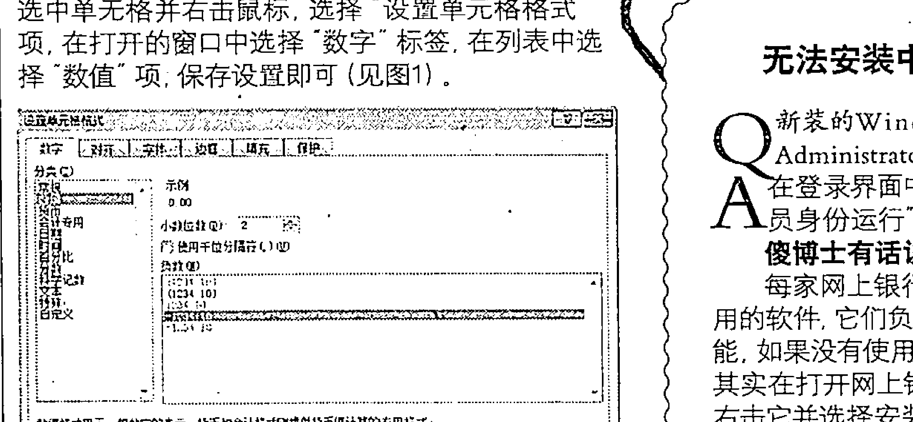

## 使用 uTorrent 为何导致内存占用率升高

Q： 只要打开uTorrent进行下载，在任务管理器的进程列表中就会发现内存占用率由原先的20%左右直线升至90%以上，导致整个系统速度变得极慢。请问这该如何解决？
A： 这可能是在uTorrent中没有设置缓存所致，只要按下面方法设置缓存即可缓解此问题：打开设置窗口，选择“高级→缓存”，选中“启用磁盘写入缓存”、“启用磁盘读取缓存”、“对磁盘写入禁用系统缓存”及“对磁盘读取禁用系统缓存”选项，保存设置即可（见图2）。

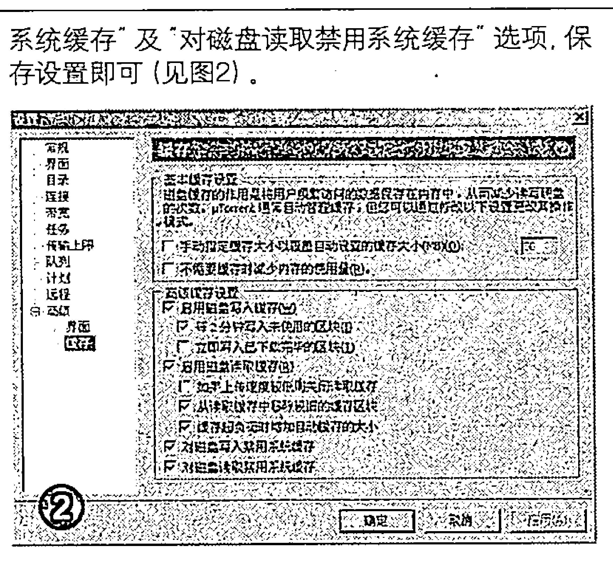

## Office 软件总提示环境变量问题

Q： 不管使用Outlook还是Word，只要打开就会提示“无法创建工作文件，请检查临时环境变量”的信息，无法继续操作，甚至还会出现崩溃的结果。请问这该如何解决？
A： 这一般是由于用户修改了系统临时环境变量而导致的（例如安装了Ramdisk类软件），只要重新设置一次即可：右击“我的电脑”，选择“属性→高级→环境变量→用户变量”（Windows 7则是“属性→高级系统设置→高级→环境变量”），直接将“TEMP”及“TMP”修改为“%USERPROFILE%\Local Settings\Temp”（Windows 7请设置为“%USERPROFILE%\AppData\Local\Temp”），最后在资源管理器中打开上述位置，若没有则手工建立相应的目录即可（见图3）。

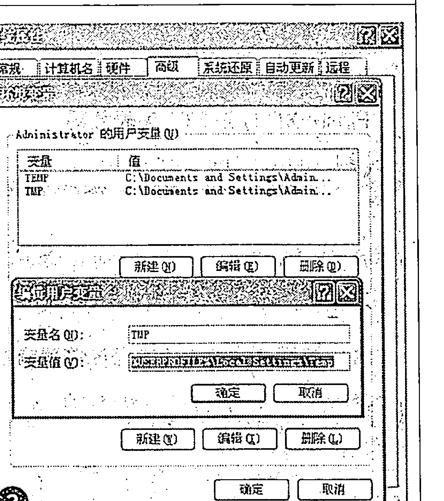

## 光影魔术手无法使用边框

Q： 原先我的光影魔术手安装在C盘，下载的多图边框放在E盘，重新安装系统及光影魔术手后，将多图边框复制到安装目录下的Frame目录中但却无法使用。请问这该如何解决？
A： 多图边框应该是MultiFrame，对应于安装目录下的“MultiFrame”文件夹，只要从http://fodder.neoimaging.cn/multiframe0下载你需要的多图边框，重新安装一遍即可解决问题。


## 无法安装中国银行网上银行插件

Q： 新装的Windows Vista操作系统，在准备安装中国银行的网上银行插件时系统总是提示要我在Administrator账户下安装，试了多次均不成功，无法使用网上银行功能。请问这该如何解决？
A： 在登录界面中手工将网上银行插件下载并存放到桌面，接下来右击该插件程序并选择“以管理员身份运行”，这样即可正常安装了。

> 傻博士有话说： 每家网上银行要想正常使用，第一次使用时均需要先安装插件程序，这些插件就相当于平时使用的软件，它们负责提供网上银行的各种应用功能。而从Windows XP SP2开始，系统增强了安全性能，如果没有使用管理员身份的系统账号登录系统，则无法安装软件（包括网上银行的插件程序）。其实在打开网上银行等需要安装客户端插件的网站时，通常都会在浏览器工具栏下显示安装提示，右击它并选择安装相关插件即可。如果没有看到提示，则可能是浏览器或安全软件拦截了，按上面的方法下载后再右击安装即可。

## 傲游浏览器无法播放声音

Q： 使用傲游浏览器播放优酷网之类的视频时总是无法播放声音，而换用IE浏览器打开却能正常播放。请问这是什么原因？
A： 这可能是你误点击而启动了傲游状态栏中的声音按钮导致声音关闭了。如果状态栏中的小喇叭上有一个红色静音图标，只要单击一次开通声音即可。

## 无法向收藏夹添加网址

Q： 我用的Windows 7系统，在试图向收藏夹中添加网址时总是提示：由于该计算机收到限制，本次操作已被取消。请问这是什么原因？
A： 请按Win+R键打开运行对话框，输入“regedit”（不含外侧引号）并按回车键，在打开的注册表编辑器中定位到[HKEY_CURRENT_USER\Software\Policies\Microsoft\Internet Explorer]，将“Security”、“Restrictions”等相关的子项或键值删除，或者直接将[HKEY_CURRENT_USER\Software\Policies\Microsoft]项下的“Internet Explorer”子项删除，按F5键刷新注册表或重启系统即可。

## FlashFXP 打开 FTP 列表乱码

Q 我使用FlashFXP连上FTP服务器后，看到服务器列表中的所有文件名都成了乱码。请问这是什么原因？

A 这可能是FlashFXP中的编码格式设置不正确所致，只要按F4键打开站点管理器，单击“高级”选项卡，在“字符编码”列表中选择“UTF-8”，保存设置即可。

## 金山网盾每次都弹出选择浏览器窗口

Q 每打开一个网页，金山网盾都会弹出一个窗口提示“您想用哪个浏览器打开网页？”，显示IE及火狐两个选项。请问这是什么原因？

A 这主要是系统中安装了多款浏览器，但又没有设置系统默认浏览器而引起的，只要重新指定系统默认浏览器即可，例如指定IE浏览器为默认浏览器：单击菜单“工具→Internet选项”，选择“程序”选项卡，单击“设为默认值”按钮，最后单击“确定”按钮即可。若指定Firefox浏览器为默认浏览器，只要单击菜单“工具→选项”，在打开的窗口中选择“高级”，选择“常规”选项卡，单击“立即检查”按钮，然后按照向导提示将Firefox指定为默认浏览器即可。

## uTorrent 没有剩余时间显示项

Q 我使用uTorrent下载PT资源，以前可以正常查看剩余时间，但现在不知为何找不到这个项目了。请问这该如何解决？

A 可能是被你隐藏了，只要右击显示“上传速度”、“下载速度”这个提示栏，在打开的快捷菜单中找到并选中“剩余时间”项即可。

## IE 窗口无法自动最大化

Q Windows XP中使用IE浏览器遇到这样的问题：打开的第一个IE窗口会自动最大化打开，第二个窗口打开时总是无法最大化。请问这该如何解决？

A 按Win+R键打开运行对话框，执行“regedit”命令调出注册表编辑器，依次找到[HKEY_CURRENT_USER\Software\Microsoft\Internet Explorer\Main]项，将右侧的“window_placement”删除，再展开到[HKEY_CURRENT_USER\Software\Microsoft\Internet Explorer\Desktop]，删除右侧的“old workarearects”。重启系统后打开IE浏览器，按这个顺序：最大化→最小化→最大化对打开的IE浏览器窗口操作一次即可。

## 上传导致下载速度很慢

Q 我开着uTorrent上传文件时，使用迅雷或是其他软件下载速度只有40KB/s，而将uTorrent关闭后下载速度瞬间能达到200KB/s。请问，如何设置才能让上传不影响下载速度？

A 只要在uTorrent中将上传速度限制低一些，例如当前的上传速度为50KB/s，直接将其限速为30KB/s或是更低，这样就可以确保下载速度能够接近正常的下载水平。uTorrent中的设置方法：单击“选项→设置”，选择“带宽”，在右侧窗口中直接将上传速度限定为具体值即可。

> 傻博士有话说：在网络传输过程中，TCP/IP标准规定，每一个封包，都需要有acknowledge(确认)讯息的回传，也就是说，传输的资料，需要有一个收到资料的讯息回复，才能决定后面的传输速度，并决定是否重新传输遗失的资料。上行的带宽一部分就是用来传输这些acknowledge资料的，当上行负载过大的时候，就会影响acknowledge资料的传送速度，并进而影响到下载速度。这对非对称数字环路也就是ADSL这种上行带宽远小于下载带宽的连接来说影响尤为明显。试验证明，当上传满载时，下载速度将会变为理想速度的40%，因此，在进行BT下载时，适当地限制上传速度能够提高下载速度。

## 播放画面全屏后就静止

Q 在线看视频（例如看优酷网视频），只要将播放画面全屏后画面就会静止不动，但声音还正常。请问这是什么原因？

A 这一般与显卡驱动程序未安装好或者损坏有关，只要按Win+R键打开运行对话框，输入“devmgmt.msc”（不含外侧引号）并按回车键，在打开的设备管理器中找到显卡项，将驱动程序卸载并重新安装一遍，然后重新启动系统应该能解决问题。此外，若未开启硬件加速、未安装DirectX，或者Flash播放插件版本过低，也会导致类似的情况发生，在显卡驱动正常的情况下，可以考虑以上几种可能的原因并逐项排除。

## 拨号连接无法保存用户名及密码

Q 最近我的拨号连接总是无法保存我的用户名和密码，在登录对话框下面的“为下面用户保存用户名和密码”区域的选项全部为灰色不可用。请问如何解决？

A 可以按Win+R键调出运行对话框，输入“regedit”（不含外侧引号，下同）并按回车键打开注册表编辑器，然后依次展开到[HKEY_LOCAL_MACHINE\SYSTEM\ControlSet001\Services\RasMan\Parameters]，将右侧的“DisableSavePassword”项值修改为“0”或是直接删除“DisableSavePassword”项，按F5键刷新注册表或重新启动系统应该能解决问题。

## 傲游下载模块损坏

Q 我在注册表中清理了一下迅雷的相关项，结果导致傲游浏览器的下载模块损坏，重新安装亦不能解决。请问如何修复此故障？

A 请按Win+R键调出运行对话框，并输入执行“regsvr32 c:\windows\system32\ati.dll”（不含外侧引号）命令，一般即可解决问题。

## Foxmail 中总是无法设置 Gmail

Q Foxmail是最新版的，设置其他邮箱一切正常，但在试图设置Gmail时在“查找接收邮件服务器（POP3）”这步无法通过。请问这是什么原因？

A 要想在邮件客户端程序中收、发Gmail邮箱中的邮件，需要在Gmail中设置开启POP功能（当然也可以启用IMAP协议）：在Gmail中点击“设置”，选择“转发和POP/IMAP”，选中“针对所有邮件启用POP（包括已经下载的邮件）”，点击“保存更改”保存设置即可。

## QQ空间下载播放插件出问题

Q 打开QQ农场，总是出现提示“请下载最新的Flash插件”，但下载后却又提示不是最新版本，下次打开时还会提示下载。请问这该如何解决？

A 遇到这种情况，请手工下载安装，打开 http://www.adobe.com/go/getflashplayer，点击“Agree and install now”（同意协议并立即安装）即可。需要注意的是，在点击安装之前先检查一下它有没有附加其他的插件，比如我在Firefox中打开上述链接准备安装时，发现还附加了McAfee安全扫描增强插件，如果你不希望同时安装此增强插件，取消对Free McAfee项的勾选之后，再点击下面的按钮安装。安装完毕重启浏览器，再打开QQ农场，该症状应该得到解决。

## 百度贴吧无法发帖

Q 在百度贴吧中，不管是发帖还是回复，都会出现错误提示：某些文件可能损坏您的计算机，如果下面的文件信息可疑，或者您不完全相信此文件的来源，请不要打开或保存此文件。请问这是什么原因？

A 这可能是百度贴吧在系统缓存中的相关文件损坏所致，一般只要清空一遍IE的临时文件夹即可解决问题：单击菜单“工具→Internet选项”，选择“常规→删除”，选择“Internet临时文件”（其他选项取消选择），最后单击“删除”按钮即可。

> 傻博士有话说：浏览网页，在线看视频等网络操作，浏览器会将页面上的相关对象缓存到硬盘的临时文件夹中，当在很短的时间间隔内重新浏览访问过的网站时，系统不再从网站服务器中读取数据，而是直接从本地读取缓存对象取而代之。所以，如果之前缓存时就出现了一些错误，那么第二次、第三次浏览时同样会出现错误。此外，如果浏览器的缓存文件夹文件数目多，分配的磁盘空间不够，也会导致各种各样的网络问题，一般可通过清理缓存来解决。

## 无法打开 QQ 空间中的加密相册

Q QQ空间中有几张照片进行了加密，在试图打开时，系统总是提示登录QQ空间，但无论选择什么方式登录都无法打开相册。请问这该如何解决？

A 这一般是由于你在系统中登录了多个QQ账号所致，只要退出所有的QQ，然后使用该QQ号登录，再打开QQ空间就可以正常查看相册了。

## “爱布谷”无法安装插件

Q 想在“爱布谷”（CNTV）看在线直播视频，但总是无法播放，插件也不能正常安装。我使用的是傲游浏览器，请问这该如何解决？

A 请将傲游浏览器的广告猎手设置成“启用弹出窗口过滤”，“启用内容过滤”中将“爱布谷”的网站地址设置成免过滤，之后再重新安装“爱布谷”插件应该可以解决问题。

## NOD32 导致 IE 浏览器无法使用

Q 一直使用NOD32，某天突然提示：网络配置已改变并且IMON已成功更新了必要的设置，要使其生效，请重启计算机。这时，不管是IE还是傲游等以IE为内核的浏览器，只要打开就会自动关闭。我该怎么办？

A 这可能是由于NOD32导致WinSock运行出错所致，解决方法很简单：首先按Win+R键打开运行对话框，输入命令“netsh winsock reset”（不含外侧引号），按回车键执行修复，应该能够解决问题。

## uTorrent 下载时出现红种现象

Q 在使用uTorrent下载PT站中的电影时，因有事出门，执行了暂停任务，再关闭电脑。后来再重新开机启动下载时，任务前面显示红色箭头，查看“伺候”的状态为“找不到服务器”。请问这是什么原因？

A 红色箭头即我们常说的红种，网络或客户端或系统设置等原因都有可能导致红种。你先在浏览器中打开这个PT站，如果不能访问，那是由于Tracker服务器出现了问题所致，只能耐心等待服务器恢复正常后才能解决问题。如果网站能正常打开，那可能是本地的原因（例如断开网络连接后重新连接时没有刷新），这时只要在“伺候”列表中右击相应的Tracker服务器项并选择“更新Tracker”即可。

## Foxmail 频繁弹出输入凭证窗口

Q 最近只要打开Foxmail后，它就会频繁地弹出“Windows安全”窗口，要求输入用户名和密码，窗口中还有“位于Welcome to mail2feed的服务器要求用户名和密码”的提示信息。请问这是什么原因？

A 这一般是由于Foxmail中的邮箱账户设置不正确，特别是密码错误或邮箱服务器设置变更所致。请检查Foxmail中该邮箱账户的用户名、密码以及POP3/SMTP服务器设置是否正确。如果是Gmail等邮箱，还需确保已在邮箱网页设置中开启了POP/IMAP访问权限。

## 《电脑爱好者》·合订本

这可能是你之前使用过mail2feed这个将任何页面转换成RSS订阅链接服务，而该服务需要账号、密码才能正常工作，可以到http://www.mail2feed.org注册账号及密码，然后直接在弹出的窗口中输入即可。或者在RSS订阅列表中找到使用该服务的RSS项并右击选择“停止收取”即可。

尝试搜索*.pst文件，将搜索到的*.pst文件备份起来，待重新安装Office后，再将该文件导入即可。如果找不到pst文件，还可以尝试使用Data Recovery等数据恢复软件对硬盘中删除的文件进行搜索，之后再尝试在删除的文件中筛选出*.pst文件并做好备份。

## uTorrent 开启后占用内存量过多

我的内存本身就少，最近发现每当开启uTorrent后原本占用20%左右的内存瞬间飙到97%以上，导致系统很慢。请问这该如何解决？

这问题一般出现在64位系统中，64位操作系统的缓存可以占用所有的内存资源，而32位系统的缓存最多只会占用500兆左右。出现这种情况可以通过修改uTorrent的内存参数来解决问题：单击菜单“选项→设置”，在打开的窗口中选择“高级→缓存”，在打开的设置窗口中进行设置，保存设置即可。

## 修复系统域名解析功能

系统感染病毒后使用杀毒软件进行了一次清理，之后发现打开网页出现问题，只有输入网站的IP地址才能打开网页，输入网址则无法打开。请问这是什么原因？

这可能是你在杀毒清理时损坏了系统中的Winsock组件，可以通过下面的命令尝试修复：使用系统管理员身份运行命令提示符窗口，输入“netsh winsock reset”（不含外侧引号）并按回车键执行，修复后再重新启动系统应该能够解决上述问题。

> 傻博士有话说：不少朋友遇到过QQ等聊天软件可以正常使用，但是网页却打不开的故障，很可能就是Winsock损坏所致；或者网络连接正常，但是网页、网络软件均无法上网，也有可能是Winsock损坏所致。这时可先试着通过上面的方法修复Winsock。除此之外，还有一些专门的Winsock修复工具，例如WinSock XP Fix，360安全卫士中的Winsock LSP修复功能等。

## IE 无法下载文件

Windows 7系统，以前使用系统自带的IE浏览器可以直接下载文件，但现在只要启动下载就会弹出提示：当前安全设置不允许下载该文件。而使用迅雷或是其他下载工具可以正常下载。请问这是什么原因？

这可能是IE浏览器中禁用了下载功能，只要手工将其开启即可解决问题：单击菜单“工具→Internet选项”，选择“安全→自定义级别”，在打开的列表中找到并将“文件下载”设置为“启用”即可。

## 网址无法打开

我的电脑可以正常打开其他网址，但是有一个网站却怎么也打不开，而此网站在其他电脑上又能正常打开。请问这是什么原因？

先检查是否是本地浏览器将该网址添加到了限制列表中，例如在IE中这样检查：单击菜单“工具→Internet选项”，选择“安全”选项卡，点选“受限站点”后再单击“站点”按钮，在列表中查看是否有相应的网址，若有直接将其从列表中删除即可。此外，还应该检查一下hosts表文件中是否对这个网址进行了屏蔽：用记事本程序打开系统盘下位于Windows\system32\drivers\etc目录中的hosts表文件，若有这个网址，请直接将对应的一行删除并保存该文件即可。

## 找回 Outlook 中的邮件

卸载Office 2003后才想起其中还有很多重要邮件没有备份，在这种情况下能否找回那些邮件？

发生这类事故后，应该停止一切数据读写操作。如果卸载时有选择保留数据库文件，可以尝试搜索*.pst文件，将搜索到的*.pst文件备份起来，待重新安装Office后，再将该文件导入即可。如果找不到pst文件，还可以尝试使用Data Recovery等数据恢复软件对硬盘中删除的文件进行搜索，之后再尝试在删除的文件中筛选出*.pst文件并做好备份。

## 网上邻居无法保存密码

每次访问网上邻居中的某台电脑都需要密码，即使设置成让系统保存密码仍就无效。请问如何才能保存网上邻居的访问密码？

按Win+R键，输入“services.msc”（不含外侧引号）并按回车键，在打开的服务管理器中找到“protected storage”这个服务并确保其处于开启状态，接下来在控制面板中打开“管理工具→本地安全策略→本地策略→安全选项”，找到“网络访问: 不允许为网络身份验证存储凭据或.NET Passports”项并将该项禁用，重启系统应该能够解决问题。此外，一些朋友使用Ghost版系统，由于这类系统被修改过，可能会导致类似问题。

## 总是无法开启无线猫的路由功能

我使用的是UTstarcom的WA3002-S无线路由Modem拨号上网，最近添加了一台笔记本电脑，想在无线Modem中开启路由功能，按照说明书设置了半天最终是无功而返。请问，如何才能开通这款设备的路由功能？

首先，你要查询所在地ISP服务商的VPI及VCI值（可以通过拨打ISP的客服电话咨询，也可以尝试到百度上按城市名+VPI VCI为关键字进行搜索），这两个参数值非常重要，是能否开启路由功能的关键所在。接下来再按照http://a.md/12o中的方法进行设置即可。如果需要让无线Modem自动拨号，还需要将宽带账号、密码输入到相应的位置，最后别忘记提交修改并保存到Modem设备的闪存中。

> 傻博士有话说：现在很多ISP服务商关闭了路由器的路由功能，即使你在路由器中正确设置了参数开启了路由功能也无法多机同时上网。假如当地的ISP服务商并没有关闭路由功能，在设置时还要注意两个不同地区值不同的参数VPI及VCI值，设置不正确便无法达到目的。这两个值有多种组合，取其中一组进行设置，若不成功，可尝试其他值：0/32、0/33、0/35、8/35、8/36、0/100、8/81。

来源: 读者 赵得柱 邮件提问

## 无法安装 Windows Live Essentials Wave4

我在试图安装Windows Live Essentials Wave4时，系统总是提示错误：0x80004005，无法成功安装。请问这该如何解决？

这是使用了中文用户名，导致系统环境变量目录中含有了中文字符，而目前该程序对中文支持不完美而引起的。解决方法有两种：其一就是直接切换到系统管理员Administrator账号下进行安装，或者手工将系统环境变量设置到非中文目录中即可。设置系统环境变量方法：右击“计算机→属性”，选择“高级系统设置→高级→环境变量”，在打开的窗口进行设置。

来源: 读者 周涛 邮件提问

## QQ 邮箱不能收邮件

最近添加到Foxmail中的QQ邮箱不能收邮件，单击收取邮件按钮后总是出现“警告”窗口，提示内容为：密码或账号名错误，或者POP服务未开通。请问这是什么原因？

如果确保邮箱账号密码正确的情况下，可能是误将邮箱的POP功能关闭了，只要手工重新开启一下即可：在浏览器中登录QQ邮箱，点击“设置→帐户”，在打开的页面中勾选“开启POP3/SMTP”选项，保存设置即可。

来源: 读者 张婷婷 邮件提问

## 突破 QQ 中转站的文件下载次数

将一个重要的文件放在QQ中转站，然后将其共享，开始可以正常下载，但过一段时间后就无法下载了。这是什么原因？

这是由于QQ中转站中的文件下载次数有200次限制，如果下载次数已经达到200，后面的用户便无法下载了。你先将其转发到自己的邮箱，然后再保存到自己的中转站，这样就可以突破这个限制而正常下载了。

来源：http://a.md/13Z

## FireFox 频繁提示无法初始化应用程序安全组件

我使用FireFox浏览器，每隔一段时间后就会出现对话框：无法初始化应用程序安全组件，很有可能您的程序个人目录中的文件出现问题。请问这是什么原因？

你使用的可能是Windows 7系统，而在Windows 7中默认情况下没有对Program Files目录赋予写入权限，如果Firefox的profile文件夹放在上述目录下面就会出现这个问题，请将该配置文件移到其他位置，然后再稍加设置即可。操作方法：进入%AppData%\Mozilla\Firefox目录，用记事本打开profiles.ini，修改成下面的格式（最后一行的Path的值，改成配置文件所在位置）：

```
[General]
StartWithLastProfile=1
[Profile0]
Name=default
Default=1
IsRelative=0
Path=E:\Programs\Mozilla\profile
```
保存文件即可。

来源：http://a.md/13c

## 为何无下载速度却有上传速度

我使用迅雷下载电驴资源，在下载到60%时，下载速度变成0，而上传速度却一直保持在20KB/s，请问这是什么原因？

这主要是由于你下载的资源没有人做源或是做源的用户当前下载的数据量与你的相当，而剩下的40%的数据就没有办法下载了，只有等有下载完成的用户提供源才能下载剩下的40%的数据。你也可以换用其他方式下载，比如BT资源，如果有PT站账号的话，也可以到PT站中搜索看是否能找到相应的资源。

来源：http://a.md/11C

## 无法登录部分论坛

最近不知道什么原因，部分论坛总是无法登录，而有些则可以登录。已经清空了浏览器临时文件夹、系统缓存，仍不见效。请问这是什么原因？

首先检查一下在浏览器的受限站点中，是否阻止了这些论坛的访问（IE: 工具→Internet选项→安全→受限站点→站点）。如果不是，可再尝试在命令提示符窗口中Ping一下论坛地址（如：ping bbs.cfan.com.cn），如果能Ping通而无法登录，十之八九是系统日期时间设置不正确，只要将系统日期时间更改正确，问题应该能得到解决。

> 傻博士有话说：很多论坛、网站都会检测用户的系统时间，这些论坛多数是使用https加密技术的，由于这类加密网站需要客户端安装相应的数字证书，而数字证书一般都设置了有效期，若系统时间设置成证书的有效期之外，自然就无法访问网站了。当浏览https类型的论坛时IE提示安装数字证书，可单击地址栏右侧的锁状按钮，选择“查看证书”就能查看该网站的数字证书情况了。如果你能确认此论坛没有问题，可按提示手工“安装证书”，即可确保日后浏览时更顺畅、更安全。

## 拨号成功后等很久才能上网

我的电脑安装的是Windows XP系统，使用的是系统自带的拨号程序拨号上网，每次拨号时需要1分钟的时间才能连上，连接成功后还需要等待几分钟才能打开网页或是下载。请问这是什么原因？

ADSL猫需要一个启动时间，如果猫质量不好，可能需要1分钟甚至更长的时间才能完成启动。此外，如果本机没有设置固定IP地址，也会影响网络的连接时间，最好为本机的本地连接设置一个IP地址，可以提高网络连接速度。最后，如果随机启动并且需要联网的软件过多也会导致浏览网页慢的情况。按照上面的几大因素逐一排查应该能解决问题。

## 双机共享文件速度不一致

家里两台电脑，一台安装的是Windows XP，另一台安装的是Windows 7，Windows XP访问Windows 7时复制文件超慢，而后者访问前者复制文件很快。请问这是什么原因？

这可能是由于你的Windows XP系统中的网卡没有开启全速所致。在控制面板中打开网络连接，右击“本地连接”并选择“属性”，选择“常规”选项卡，单击“配置”按钮，选择“高级”，在列表中将“Link Speed/Duplex Mode”设置为最大传输速度模式即可。

## 百度图片搜索显示为红叉叉

使用百度图片搜索功能，在搜索到图片后打开大图时就会显示红叉，换Chrome浏览器故障依旧。请问这是什么原因？

首先看看其他页面中的图片是否能够正常显示，如果也不能正常显示，则说明是浏览器中禁用了图片显示功能。在IE浏览器的参数设置中，在“高级”选项卡中的“多媒体”区中选择“显示图片”，保存设置即可。如果只是百度图片搜索页面中的图片显示有问题，请检查是否在IE浏览器中对百度网站进行了过滤，在IE设置窗口中的“安全”选项卡中，双击打开“受限站点”按钮，将百度网站地址从列表中删除即可。

## Outlook 遭遇 Ricked20.dll 错误

我安装的是Office 2003自带的Outlook，如今突然无法打开，错误提示为 “OL2000：Ricked20.dll 错误消息的原因 Outlook 无法正常工作”。请问这该如何解决？

直接通过系统搜索功能搜索“Ricked20.dll”文件，找到后直接将该文件重命名成其他名称（例如“Ricked20.dll.old”）。接下来，在控制面板的添加或删除程序中找到Office安装项，单击“添加/删除”，然后选择“修复”并按照向导提示进行修复，即可解决问题。此外，这个故障在Foxmail中也有可能出现，也可按类似的解决方法来排除。

## 傲游设置为何无法保存

我在Windows 7系统中使用傲游浏览器，不管进行何种设置（快捷访问、标签栏设置等），总是无法保存这些设置参数。请问这是什么原因？

这可能是由于你没有使用管理员权限运行傲游浏览器所致，尝试在启动傲游浏览器时右击程序并选择“以管理员身份运行”，然后再进行设置，最后别忘记点击设置页面上侧的“应用”保存设置。

## 无法打开 QQ 空间

无论是点击QQ主窗口中的空间按钮，或是直接在浏览器中输入空间地址，都无法登录QQ空间，提示：您的Javascript为不可运行状态，QQ空间需要运行Javascript才可以正常浏览。请问这是怎么回事？

这可能是你在浏览器中禁用了Javascript功能而引起的，可如下进行设置：在IE中单击菜单“工具→Internet选项”，在“安全”选项卡中选择“Internet”项，再单击“自定义级别”，直接将安全级别设置为“中”即可，或者直接在上面的列表中将“脚本→活动脚本”设置为“启用”即可。

> > 傻博士有话说：
> 现在的网站除了普通的文字、图片外，一般还会内嵌有各种高级页面元素，例如Flash、脚本程序、ActiveX控件（例如在线杀毒、网上银行、购物支付类网站），甚至有些网站需要.Net Framework的支持，如果在浏览器中禁用了相应的功能，之后就可能会导致网页不能正常打开或是完全显示，只有重新开启这些设置方可解决问题。对于IE内核的浏览器（例如傲游、世界之窗、TT等），直接在IE中设置即可，而其他非IE内核浏览器（例如Firefox、Opera等）则需要在浏览器自身的选项中设置。

## 支付宝登录出现内存错误

我在登录支付宝账户时系统提示：指令 0x0abf0068内存，该内存不能为written。总是无法登录。请问这是什么原因？

这肯定是登录页面的安全控件没有安装好或是出现了损坏所致，只要在控制面板的“添加和删除程序”中找到“Alipay security control”控件，直接将其卸载，然后再次打开支付宝登录页面，按照提示重新下载安装登录安全控件应该能够解决问题。

## 无法正常浏览论坛网页

我在浏览一些论坛网页时，总是会出现一个提示框：信息监控系统检测到不允许的词：X X。之后总是无法进入。请问这该如何解决？

这是因为论坛服务器中安装了信息监控系统，对一些指定的词进行过滤所致。这种情况下，可暂时禁用浏览器的脚本程序。比如在IE中可这么进行设置：单击菜单“工具→Internet选项”，在打开的选项窗口中，切换到“安全”选项卡，依次点击“自定义级别→脚本→活动脚本→禁用”，确定后即可绕开监控进行浏览了。浏览完毕，可重新开启脚本功能。

## IE 运行出错

使用的是Windows XP系统，下载安装了SP3的最新补丁包。在使用IE浏览器时总是弹出一个错误提示：“出现了运行时间错误。是否要进行调试？”请问这该如何解决？

出现这种问题后，请先查看IE的插件，将不需要的插件程序全部禁用（IE菜单“工具→Internet选项→程序→管理加载项”，直接选择插件并禁用即可）。接下来再考虑将IE的参数恢复至默认值：选项窗口中选择“高级”，单击“重置”按钮即可。如果仍不能解决，可尝试使用360安全卫士类修复工具对IE进行修复，或者重新安装一次IE浏览器。

## 无法删除桌面上的“淘宝网”图标

不知道什么原因，在桌面上多出一个“淘宝网”和“网站导航”图标，无法删除。请问如何才能将它们删除掉？

打开360安全卫士，单击“系统修复”按钮，等修复完毕后重新启动系统即可将这些图标删除了。此外，开启360安全卫士的木马防火墙实时防护，能够起到预防这些图标自动安装。

## QQ 每次登录都需要 3、4 分钟时间

我使用的是QQ2010正式版，现在每次登录QQ时都需要3~4分钟的时间。请问这是什么原因？

先看看其他网络软件是否正常工作，如果其他网络软件能够正常使用（例如下载软件的下载速度达到平常的水平），那问题可能出现在QQ本身。例如QQ的聊天记录内容过多，表情图片过多，就会影响登录速度，建议清理一些无用的聊天记录（特别是群聊天记录）及表情图片。其次，如果之前在QQ中设置了代理服务器，由于代理服务器一般都比较慢，也有可能会导致登录慢的情况。在网络正常的情况下，取消代理服务器设置而直接登录即可缓解登录慢的问题。

## 无法使用邮政储蓄银行

打开邮政储蓄银行时，总是提示“安全输入控件没有足够的权限加载键盘保护模块，控件将禁用键盘输入”，之后便无法直接使用键盘输入登录密码，只能使用页面中的软键盘。请问这该如何解决？

这是由于邮政储蓄银行的插件没有获取系统管理员权限所致。解决方法：先确保正确安装了插件程序（点击后面的“下载密码安全控件”链接下载安装），之后使用管理员权限启动IE浏览器打开邮政储蓄银行页面即可使用键盘直接输入密码了。不过，还是建议使用软键盘输入，可以防止本机中可能存在的木马对密码的监控。

## 酷狗一直读取硬盘

我已经将播放列表清空，没有播放任何歌曲，同时还取消了“播放时预告缓存下一首歌曲”选项，但是酷狗只要在运行，硬盘灯就会不停地闪亮，处于读盘状态。请问这是什么原因？

酷狗本身就是一款P2P软件，即使没有下载，在需要的时候，它也会在后台上传已经下载到硬盘中数据，因此会频繁地读盘而导致硬盘灯闪亮。在酷狗的参数设置中可以将上传速度进行限制，设置成最低30KB/s，这样可以缓解其对硬盘读盘的频率。而在不使用酷狗时，建议将其彻底关闭。

> > 傻博士有话说：
> 现在很多网络软件都引入了P2P概念，P2P是一种点到点数据传输的技术，在下载的同时还需要向其他P2P节点提供数据（也就是上传），例如下载工具中的迅雷、快车、电驴等，在线影音播放类软件酷狗、PPStream、PPLive等。由于需要上传数据，因此就会出现未执行下载任务时也会频繁读、写硬盘。除了像在PT站中下载文件必须保证分享率外，建议在不使用时不要长时间开启这类软件。

## 傲游查找框变成了 IE 的查找框

以前按Ctrl+F键后会自动在工具栏下显示查找框，很好使用，但最近按Ctrl+F键后打开的却是IE浏览器的查找对话框了。请问这是什么原因？

这是动了傲游浏览器的设置所致。解决方法：单击菜单“工具→傲游设置中心”，在打开的设置页面中选择“高级选项”，勾选“使用增强的页面内查找对话框”，保存设置即可。

## QQ 提示在另一个地方登录

我使用的是最新版QQ，最近开通了微博，在QQ客户端中查看微博时，经常会出现QQ离线的情况，同时还提示我的QQ在另一个地点登录了。请问这是什么原因？

你可能在QQ中看微博时选择登录“腾讯微博”，QQ中集成的微博相当于提供了浏览器功能，如果你点击“腾讯微博”后，会直接使用你的QQ号登录微博，从而出现你所遇到的症状。只要避免在QQ聊天软件中的看微博功能区域登录“腾讯微博”就可以避免这样的问题出现。

## 网页只显示上半部分

今天在使用IE8浏览器打开路由器的设置页面时，发现只能显示上半部分，而下面部分总是无法显示，也无法拖动页面窗口的上下滚动条。请问这该如何解决？

问题可能在于路由器设置页面本身与IE8浏览器不兼容所致，只要在IE8中使用“兼容模式”打开（地址栏右侧显示为一张撕成上、下两半纸状图标），这样便能解决网站与浏览器不兼容而导致无法正确浏览的各类问题。

## 桌面总会出现 SpeedDial.ini 文件

Q 不知道什么原因，最近总会在桌面上自动生成“Thumbnails”文件夹，里面是空的，另一个是“SpeedDial.ini”文件，打开内容类似于：

[1]
url=
title=
picture_name=
state=1

删除后，重新启动系统又会出现这两个文件。请问这是什么原因？

A 出现这个问题，肯定是你将Opera、傲游或者其他浏览器安装到了桌面，“Thumbnails”存放快速拨号网站缩略图的，“speeddial.ini”则存放相应的快速拨号网站的路径。只要重新将相应的浏览器安装到其他位置即可解决问题。

## 无法打开 QQ 迷你页面中的链接

Q 不管是QQ空间、迅雷迷你网页，都无法直接打开链接，点击后打开的浏览器地址栏为空白，而浏览其他网页一切正常。请问这是什么原因？

A 这种故障一般都是系统中默认浏览器设置出现了问题，有两个浏览器的情况下，先将第三方浏览器设置为系统默认浏览器，然后再启动IE浏览器并将其设置成默认浏览器，这个问题一般都能解决。

## 无法进入路由器设置页面

Q 我使用的是路由器连接两台电脑共享上网，最近想进入路由器的设置界面对参数进行调整，但输入192.168.1.1总是无法打开路由器设置页面。请问这是什么原因？

A 排除网线方面的故障外，很有可能是你没有将本地连接的IP地址设置在192.168.1.X段，只有将本地连接的IP地址设置与路由器同一个网段才能正常打开路由器页面。对于一些带路由功能的ADSL猫也是如此。

## uTorrent 经常无反应

Q 我安装的是Windows 7旗舰版系统，而在使用uTorrent时总是频繁地无响应，而在笔记本电脑中就能正常运行，同一个版本的系统，也是同一个版本的uTorrent。请问这是什么原因？

A 无响应可由多种原因导致，例如软件冲突、uPNP设置不当、防火墙的监控或拦截等，可依次排查。此外，还有可能是网络连接中开启的QoS功能导致的，关闭方法简单：打开控制面板中的“网络和共享中心”，打开“本地连接”的属性，在列表中取消选择“QoS数据包计划程序”即可。

## 无法打开百度网站

Q 不管使用IE浏览器还是使用傲游浏览器，都无法打开百度网站，而其他网站可以正常打开。请问这该如何解决？

A 试试直接在浏览器中访问 http://202.108.22.5，如果能正常打开百度网站，则问题可能出在本地Hosts表文件上，使用文本编辑器打开系统分区下Windows\System32\drivers\etc目录下的Hosts文件，将与“www.baidu.com”相关的记录删除，保存该文件并重新启动浏览器应该可以解决问题。

### 傻博士有话说：

Hosts文件相当于是一个本地DNS服务器，系统在访问某个网站时，首先会检测在该文件中是否有域名与IP地址的映射记录，有的话则直接使用该文件中记录的网址对应的IP地址来打开。很多恶意程序或是病毒，会擅自修改Hosts文件中的域名与IP的映射记录，譬如将www.baidu.com映射到一个无效的IP地址上，你就无法打开百度网站了。现在，像360安全卫士、Windows清理助手、金山网盾等工具自带的IE修复功能都可以解决这类问题。

## 安装 IE9 失败

Q 我下载了中文版IE9浏览器安装程序，但是在安装时却报错，提示“Internet Explorer未能完成安装”。请问这是什么原因？

A 安装IE9有一些条件必须满足：
- 操作系统版本不能低于Windows Vista及Windows 2008 SP2，在Windows XP中无法正常安装。
- Windows 7要安装KB2028551、KB2028560、KB2120976、KB2259539这几个更新，Windows Vista SP2和Windows Server 2008要安装KB971512、KB2117917更新。
- 下载的IE9版本不正确，请重新从http://a.md/dmdw根据自己的实际环境下载安装。此外还有一些细节问题，具体可以参考http://a.md/dmdt。

## QQ 空间和邮箱均成空白页面

Q 我在360中清理插件，将建议保留的几个插件一并清理了，之后打开QQ空间、QQ邮箱均成了空白页面。请问如何修复这个问题？

A 首先从http://get.adobe.com/cn/flashplayer下载并安装新版Flash Player播放器，接下来按Win+R键打开运行对话框，分别执行“regsvr32 jscript.dll”（不含外侧引号，下同）及“regsvr32 shdocvw.dll”命令对这两个文件重新进行注册，一般即可解决问题。

```
regsvr32 jscript.dll
```

```
regsvr32 shdocvw.dll
```

## QQ 好友莫名其妙消失

Q 我从没有删除、拉黑过某好友，我的QQ号也没有被盗过，在打开QQ官方网站试图恢复好友时，也提示最近三月没有删除过好友。但是QQ中的一个好友不知道怎么消失了。请问这是什么原因？

A 这可能是对方将你拉入黑名单或是使用新版QQ将你删除并同时将他自己从你的好友列表中删除，这样就会导致你的好友列表中该好友自动消失，甚至在QQ官方网站也查不出来。因此，如果QQ好友中的联系人很重要，为了防止双方的误操作，建议将重要联系人的账号做好备份，一旦发现好友丢失，可以先尝试到http://id.qq.com/friends页面进行好友恢复操作，若未找回，再通过备份号码重新添加。若是QQ会员，可以通过好友克隆功能将所有好友克隆到新号码中，以备不测。

## 关闭 Foxmail 为何不是最小化

Q 以前不管是单击Foxmail关闭按钮还是最小化按钮，都会将Foxmail主窗口最小化到系统托盘中，而现在只要单击关闭按钮就会导致Foxmail直接退出。请问这是什么原因？

A 这是在Foxmail中的设置参数被更改所致，可按以下方法设置即可恢复之前的使用环境：先单击菜单“工具→系统设置”，在“常规”选项卡中勾选“关闭主窗口出现提示”并保存设置。接下来直接关闭Foxmail，在弹出的询问框中选择“最小化到托盘区，不退出”即可。

## 合并旺旺聊天窗口

Q 之前安装的旺旺可以将多个聊天窗口合并在一个窗口内，而自从我重新安装系统及旺旺后，打开聊天窗口总是独立窗口显示，找了半天也没找到相关设置。请问如何重新让旺旺聊天窗口合并在一个窗口内？

A 先将你的旺旺升级到最新版，然后单击主窗口中的“主菜单→系统设置→聊天设置”，选中“多个聊天窗口合并到一起”选项，保存设置即可。

## 系统频繁提示 IP 地址冲突

Q 我们局域网内一共四台电脑，使用的是固定IP地址，每台电脑的IP地址都不一样。但是最近有两台电脑在使用过程中均提示IP地址冲突的提示。请问这是什么原因？

A 如果确定四台电脑的IP地址设置均不一样，十之八九是由于某台电脑中了ARP类病毒所致，排除方法也不难：每次拔掉一台电脑的网线，看是否有IP冲突提示，筛选出目标电脑，然后对其进行ARP病毒查杀工作，病毒清除完毕后应该可以解决问题。

### 傻博士有话说：

正常情况下系统的IP地址冲突提示是由于网络内两台电脑设置成同一个局域网IP地址所致，只要修改其中一台电脑的IP地址为其他值即可。不过，不少朋友家中只有一台电脑也出现IP地址冲突的现象，除了病毒外还应该检查本机的IP地址是否设置成与路由器或是ADSL猫的IP地址值了（通常是192.168.1.1），请改成其他值即可解决问题。

## 工商银行网上银行无法使用

Q 最近刚开通了工商银行的网上银行，在笔记本中打开网银时得到提示：此网站的某个加载项运行失败，请检查“Internet选项”中的安全设置是否存在潜在冲突。我将“Internet选项”中的安全设置恢复了默认，但还是不行。请问这该如何解决？

A 这主要是工商银行网银的客户端插件没有正确安装所致，请从该网银官方网站下载相应的插件程序，使用管理员权限将其安装到系统中，重新打开IE浏览器应该可以正常使用其网上银行功能了。如果还不行，可以参考工商银行的帮助页面中的相关设置：http://www.icbc.com.cn/icbc/网银系统/alert_1.htm。

## QQ 邮箱无法成功添加联系人

Q 在QQ邮箱中打开联系人列表，准备将一个朋友的邮箱地址加入，但成功保存后总是在列表中看不到这个朋友的邮箱。请问这是什么原因？

A 这可能是QQ邮箱的一个小Bug，在添加好友邮箱后，只要再向该邮件发送一封任意邮件，再打开“联系人”列表便能看到添加的邮箱信息了。

## IE 内核浏览器均无法显示网页

Q Windows 7旗舰版系统，不知什么原因导致IE、傲游、360浏览器打开网页后，页面内容空白什么也不显示，而换用Firefox浏览器却一切正常。请问这该如何解决？

A 这可能是IE浏览器相关组件损坏所致，使用Windows清理助手（下载地址：http://www.arswp.com）工具，在主窗口中单击“故障修复”，在右侧窗口中先选中“重新注册IE系统组件”项并“执行修复”，若修复完毕并重新启动系统后也不能解决问题，再将上面的所有修复选项选中并进行修复，应该能够解决你的问题。

## 安装 IE9 后傲游功能失常

Q 我下载安装了IE9浏览器后，重新启动系统打开傲游浏览器时发现很多功能失常，例如刷新、登录网站时总出现错误，但其实成功登录了。请问这该如何解决？

A 这是IE9在安装时可能出现一些小错误而导致的，你可以这样来借助系统自带的网络修复功能来解决问题：单击“开始→所有程序→维护→远程协助”，按向导提示启动一次远程协助功能，系统会自动检测相关故障并进行修复，修复后即可解决你遇到的这些问题了，如果仍有部分功能不好用，不妨再重新安装一次傲游浏览器即可。

## 无法删除迅雷浏览器插件

Q 已经将迅雷卸载了，但是在浏览器中右击鼠标时仍会看到迅雷相关信息。请问如何才能将其彻底清除掉？

A 单击IE浏览器菜单“工具→Internet选项→程序→管理加载项”，在加载项列表中找到迅雷的插件项（对应“迅雷下载支持”）并将其删除即可。此外，也可以通过SRENG（下载地址：http://tinyurl.com/y8cu4lk）来进行清理，在“系统修复→浏览器加载项”中找到“迅雷下载支持”项后单击“删除所...

## 总是无法打开部分网页

Q 使用Linksys wrt54g宽带路由器拨号上网，现在由电信换成联通，顺便我对路由器进行了一番设置让多台电脑可同时上网，结果就出现问题：部分网站可以正常打开，网络软件（例如迅雷、QQ）也能正常使用，但像新浪、搜狐、腾讯、支付宝这些网站无法打开。请问这是什么原因？

A 这可能是你的路由器的MTU参数值设置过大而导致的，只要将其重新调整至1300-1492之间的数值应该能解决问题。

> 傻博士有话说：MTU，即Maximum Transmission Unit(最大传输单元)。此值设定TCP/IP协议传输数据报时的最大传输单元。设置合适的MTU值可以解决“部分网站打不开”、“上网速度慢”等问题，并且可以适当提升上网速度。而若其值设置不当，就会导致网络使用不正常，只有重新设置。如果之前是在路由器等网络设备中调整了MTU值，请按设置说明书重新调整，而若在系统中调整，可以参考：http://a.md/jdjm。

## QQ邮箱发邮件无法同步到“已发送”

Q 以前使用QQ邮箱发邮件时，这封邮件会自动同步到“已发送”邮件列表中，但现在却不行了。请问如何解决？

A 可能是你误修改了某处设置所致。登录QQ邮箱，点击“设置→常规”，在“发信”设置区中勾选“邮件自动保存到‘已发送’”选项，保存设置即可。

## 无法打开HTTPS网站

Q 浏览器打开其他网站一切正常，而以HTTPS开头的网站却无法打开，像支付宝、网上银行等均无法打开。请问这该如何解决？

A 首先，打开IE浏览器并单击“工具→Internet选项”，选择“高级”选项卡，找到并选中“使用SSL2.0”和“使用SSL3.0”两项。再切换到“安全”选项卡，单击“自定义级别”按钮，将“显示混合内容”设置为“启用”或“提示”。接下来再按Win+R键打开“运行”对话框，输入“services.msc”并回车，打开服务管理器，找到“HTTPSLL”项将其启用即可。若上面两步仍不能解决问题，请在防火墙中检查443端口是否被禁用，若禁用请开启，HTTPS链接需要通过此端口才能正常工作。

## QQ截图功能失效

Q 不知道什么原因，只要开启卡巴斯基杀毒软件，QQ的截屏功能就失效，关闭卡巴斯基后，一切恢复正常。请问这是什么原因？

A 这可能是卡巴斯基中设置禁用了QQ的截屏功能，解决方法：打开应用程序规则设置，找到QQ并打开设置窗口，选择“规则”，将“截屏”设置为“允许”状态即可。

## 无法显示PNG图片

Q 安装iTunes后，使用IE浏览器打开任何页面，只要是PNG格式的图片均无法显示，其他图片显示正常。请问这该如何解决？

A 这可能是PNG图片显示组件出现了问题，通常只要按下述方法修复一次即可解决：按Win+R键打开“运行”对话框，输入“regsvr32 pngfilt.dll”并回车，如果提示找不到文件，则从http://goo.gl/eIAA下载该DLL文件并将其放到系统盘中的Windows\System32目录中，再次运行上述命令注册该DLL文件即可。

## uTorrent为何会自动限速

Q 我使用同学电脑中uTorrent下载文件，发现它好像会根据时间自动限制下载速度，即使将下载任务设置成不限速下载，但到指定的时间又会慢下来。请问这是什么原因？

A 这可能是uTorrent被设置成启用计划任务限速了，只要单击菜单“选项→设置”，选择“计划”，在右侧窗口中取消选择“启用计划任务”选项，保存设置即可。

来源：读者 柳一军 邮件提问

## IE临时文件夹为何经常满

Q 我一直使用Windows 7自带的IE浏览器，每隔一段时间IE浏览器的临时文件夹就满了，需要手动清理一遍，否则无法打开网页。请问这是什么原因？

A 这可能是IE的参数设置被修改，IE自动清理临时文件夹功能被禁用所致。解决方法：单击菜单“工具→Internet选项”，选择“高级”选项卡，在列表中找到并选中“关闭浏览器时清空‘Internet临时文件’文件夹”项，保存设置即可。如果未出现无法打开网页的故障现象，不建议启用此项。

来源：读者 陈思智 邮件提问

## 突破IE9常用网站的数量限制

Q 我安装了IE9测试版后，发现新建选项卡后列出的常用网站只有十个，但随着访问过的网站越来越多，这十个位置完全不够用，请问有什么方法能够给IE9新建选项卡的常用网站扩容？

A 我们可以通过修改注册表的方式来给IE9的常用网站扩容。点击“开始”按钮，在搜索框内输入“Regedit”（不含外侧引号）并按回车键打开注册表编辑器，定位至[HKEY_CURRENT_USER\Software\Microsoft\InternetExplorer\TabbedBrowsing\NewTabPage]，在右侧窗格处将名为“NumRows”的DWORD(32位)值修改为4或5，表示从默认的2行变成4或5行。然后重新打开IE9，新建选项卡就可显示出比以前更多的常用网址了。

> 傻博士有话说：修改IE9新建选项卡的常用网站合理行数，可根据自己的显示分辨率来估算。在处于最大化窗口状态时，每个常用网站为150×150像素的方格，如21.6英寸主流显示器的显示分辨率为1920×1080，4~5行的设置恰好可以整页显示。

## 无法删除桌面IE图标

Q Windows 7系统，在桌面无故出现了一个无法删除的IE图标，使用360安全卫士也未查出病毒。请问如何才能将这个IE图标删除呢？

A 如上方法打开注册表编辑器，定位到[HKEY_LOCAL_MACHINE\SOFTWARE\Microsoft\Windows\CurrentVersion\Explorer\Desktop\NameSpace]，先将该键备份，接下来逐一删除下面的各个，删除后即时在桌面按F5键，若那个多余的IE图标消失，请记住该项。接下来只要将之前备份的注册表项重新合并到注册表中，然后再将那个导致桌面多出IE图标的项删除即可。

## 找不到证书无线网络无法使用

Q 我使用的是无线网卡连接无线路由器上网，操作系统是Windows XP。最近总是无法使用，连接时提示“Windows找不到证书来让您登录网络”的错误信息。请问这该如何解决？

A 这可能是在无线网卡的网络连接属性中启用了IEEE 802.1x验证所致，只要将该验证取消即可：在控制面板中找到“网络连接”，打开后找到无线网络连接项并右击选择“属性”，在打开的窗口中选择“验证”，直接取消选择“启用此网络的IEEE 802.1x验证”，保存设置即可。

## QQ显示两次登录IP不一致

Q 每天早晨登录QQ时都会提示上次在外地登录过，显示上次登录位置为“四川省德阳市”，而本次登录的是“湖北武汉市”。请问这是什么原因？

A 首先排除是否在手机中登录过QQ，其次再确定上次登录系统有没有使用代理服务器。排除上面两点，接下来请对系统进行查毒，如果有盗号类木马获取了你的账号、密码信息就会出现类似的情况，请加强账号安全性，例如修改密码，开启密码保护功能，或者直接开通手机令牌确保安全等。

## 找回宽带账号及密码

Q 我使用的是笔记本电脑，误将系统中的拨号连接删除，现在新建连接不知道拨号账号及密码了。请问有没有办法将拨号连接的账号及密码找回？

A 最简单的方法就是凭宽带账号申请人的身份证号码及姓名信息，去找ISP服务商索取账号及密码。此外，也可以通过一些账号找回软件，在系统未重新安装的前提下，可以使用诸如“Dialuppass”（下载地址：http://www.onlinedown.net/soft/36509.htm）之类的软件找回账号和密码。

## 重装后绿色版QQ无法使用

Q 重新安装Windows 7系统后，先前下载的绿色版QQ无法使用，打开时提示：应用程序无法启动，因为应用程序的并行配置不正确。请问这是什么原因？

A 这一般都是由于VC运行库丢失而导致的，如果非得使用绿色版QQ，请尝试从http://tinyurl.com/qfksnx下载安装VC运行库，一般即可解决此问题。此外，如果你嫌原版QQ功能太杂，不妨试试TM，用起来更清爽。

## IE无法保存密码

Q 我使用的是Windows 7系统自带的IE浏览器，想让其自动保存网站的账号及密码，却总是不能成功。请问这是怎么回事？

A 先单击IE菜单“工具→Internet选项”，选择“内容”选项卡，单击“自动完成”框中的“设置”按钮，在打开的窗口中选择“表单”、“表单上的用户名和密码”及下面的子选项，保存设置。

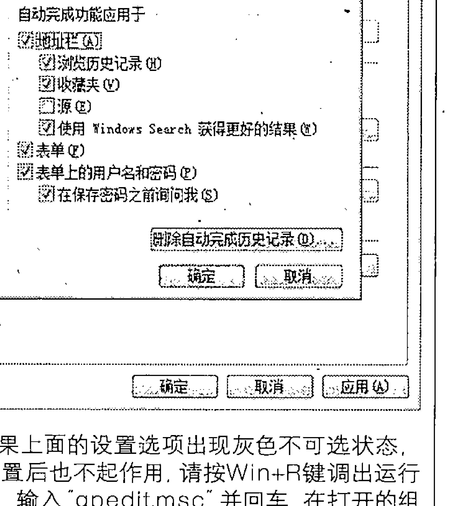

如果上面的设置选项出现灰色不可选状态，或是设置后也不起作用，请按Win+R键调出运行对话框，输入“gpedit.msc”并回车，在打开的组策略编辑器中，依次定位到“用户配置→管理模板→Windows组件→Internet Explorer”，找到策略“禁止自动完成功能保存密码”并禁用该策略即可。

## 傻博士信箱/硬件

### 笔记本电脑电池无法充满

一台明基Joybook S43笔记本电脑，升级为Windows 7操作系统后，为笔记本电脑电池充电经常只能充到80%，而待机时间也从过去的三个小时降到现在的两小时，请问这是什么问题造成的？

首先建议右键单击计算机进入属性窗口，单击‘设备管理器’，查找其中是否有一个‘ACPI’电源管理组件，如果存在这个未知设备，那么该问题应该是由于你没有安装电池管理程序造成的，建议你在随机的系统光盘中找到Green Charger程序，将其安装后重新启动计算机就可以正常为电池充电。

傻博士有话说： 相信很多朋友都遇到过，笔记本电脑电池使用一段时间后，充电无法达到100%，电池始终显示无法满电，造成笔记本电池续航能力下降的问题。而出现这类问题的原因，有时是某些管理程序未安装造成的，而有时是因笔记本电脑电池充放电次数过多造成的。解决该问题的方法是为笔记本电池深度放电。以戴尔笔记本为例，需要进入主板BIOS，然后进入‘Power’（电源）设置页面，找到‘Power Switch Mode’（电源开关模式）选项，将其设置为‘Off’，保存退出主板BIOS设置，重新启动计算机后，按下‘PAUSE’键，停留在开机画面，直到电量耗尽而关机，如此进行三次操作，就可以达到为电池充放电的目的。其他品牌如果没有此选项，只需进入BIOS后不操作直指电量耗尽即算一次放电过程。

来源：http://tinyurl.com/3ygm9ne

### 电脑突然黑屏，重启不认硬盘

电脑使用中突然黑屏，重启后不认硬盘，要晃硬盘和主板的插口，之后重启才可以用，很影响使用，把整个硬盘格式化之后重新分区还是不行，请问如何解决？

首先要检查是不是电源通道问题，您可以先更换一下硬盘电源线，用另一组输出，有条件的话可以换个电源试试（温度高的电源器件老化）。另一种可能就是硬盘温度的问题，用手摸一下南桥散热片是否温度高（用手擦干防静电）。再有就是SATA接口接触的问题，这类问题在一些二线主板上经常遇到，换个主板插口试试。

来源：http://tinyurl.com/365vt77

### 诺基亚手机如何把C盘的短信移到E盘

一款诺基亚N97手机，短信默认全部保存在C盘，但是一旦手机出现问题恢复系统都会造成短信的丢失。请问有什么办法可以将C盘的短信移到E盘呢？

首先安装诺基亚PC端套件备份手机中的短信，然后按下功能键，依次进入‘信息→选项→设置→其他→使用的存储’，就可以将短信保存在E盘了，接下来可以用套件再恢复之前备份的短信即可，以上方法适用于诺基亚塞班S60 V3和V5版系统的手机。需要注意的是，当手机通过闪盘模式和电脑相连时，存储卡会因为无法保存短信，短信设置会重新恢复到手机作为存储源。

来源：http://tinyurl.com/37b36dd

### USB风扇在不同的电脑上转速不一样

我有一个部装饰用的USB小风扇，插在家里的两部电脑上的转速却各不相同。插在奔三电脑的USB接口上风扇转的很快，风也很大，但是一插在AMD的电脑上转速就一般了，请问这是怎么回事？

这个问题是USB供电不同引起的，USB供电是5V左右，但是经过层层‘剥削’会出现供电不足的现象。比如电脑主板上的USB接口就要比机箱前置的USB接口供电稳定，而通过USB扩展坞衍生出来的接口供电稳定性还会略逊一些。建议将USB设备都连接在机箱背部主板上的USB接口上。

来源：http://tinyurl.com/35wzbb8

### 无法识别三星硬盘

一台计算机使用华硕M4A89GTD PRO/USB3主板，一直使用一块希捷硬盘，最近添加一块三星HD103SJ硬盘，Windows 7无法识别该硬盘，请问这是什么问题造成的？

建议你安装三星硬盘的补丁程序，下载地址：http://tinyurl.com/29kd3pg，看问题是否可以解决。如果问题没有解决，建议你更新主板BIOS到1301或以上版本，更新后启动计算机，按‘DEL’键，进入主板BIOS设置，找到‘OnChip SATA Speed’（集成SATA速度）选项，将其设置为‘SATA 3.0Gb/s’，一般问题可以解决。

### 笔记本显卡开机温度太高

一款联想F31笔记本，购买一年半左右，现在开机时显卡温度就达到了65度，运行一会后就会突破70度大关，此时笔记本还是工作在节能状态，请问该如何解决？

笔记本温度异常，绝大多数情况都是散热通风口的散热片和CPU风扇扇叶中堆积了灰尘所致。建议您登录http://support1.lenovo.com.cn/lenovo/wsi/wsbx/lenovo保修，联想笔记本在保修期内维修中心都可以进行免费除尘，处理器散热模块的保修时间和主板一致，其中像F31一类的采用NVIDIA 8000M系列显卡的一批机器主板保修时间为三年，其他型号在1~2年。对于经常使用笔记本办公娱乐的用户，建议每隔半年对风扇进行一次除尘操作。

### 换显卡的疑问

一块9600GT显卡，游戏中途经常出现花屏的问题，请问现在有哪些可以代替9600GT显卡的新品，价格600元左右，对电源的需求又有哪些？

9600GT花屏大多都是温度过高的缘故，也许你的显卡散热器不是太好，花屏属于质量问题，如果在保应该回去更换。600元价位可以选择GT240或HD4830，这两款显卡都可以满足多数游戏流畅运行的要求。GT240功耗仅70W，对电源没什么需求。HD4830功耗稍高达110W，不过估计你原有的电源也够用，无需更换。

来源：http://zhidao.baidu.com/question/151747758.html

### 硬盘补充程序造成计算机整体性能下降

一台计算机使用AMD羿龙II X6 1055T处理器，金士顿2GB DDR3 1333×2的内存，技嘉GA-880G-UD3H的主板，西部数据WD 1TB 5400转32MB硬盘，发现无法同时进行多项操作。例如在听音乐时，打开Word文档需要15分钟左右，用Super PI测试软件检测CPU，没有发现任何问题，请问这是什么问题造成的？

首先，建议你更换CPU、主板、显卡的散热风扇，看问题是否可以解决。如果问题仍然存在，则排除该故障不是由于电脑部件散热不良造成的，建议你使用HD Tune检测你的硬盘性能，下载地址：http://www.newhua.com/soft/36138.htm，如果检测到你的硬盘最小传输速度在40MB/s以下，那么说明该问题应该是由于硬盘传输速度不够造成的。而造成硬盘最小传输速度不够的原因，很可能是由于你的硬盘没有安装西部数据的WD Align补丁程序造成的，下载地址：http://support.wdc.com/product/downloadsw.asp?sid=124，安装该程序后，一般问题可以解决。

傻博士有话说： 目前市面上销售的西部数据绿盘，部分采用高级格式化技术，必须在运行WD Align的基础上才能发挥最佳性能。而这类西部数据绿盘一般会在硬盘表面标注相应的WD Align补丁程序安装提示信息，建议使用该系列硬盘的朋友，在安装硬盘之前，注意仔细观察硬盘盘体上的标签上的安装注释。

来源：http://tinyurl.com/25406ed

### 开机为何无法进入主板BIOS

一台笔记本电脑，以前可以开机按F2正常进入主板BIOS设置，最近朋友帮我设置了一下主板BIOS，现在开机按F2发现无法进入主板BIOS设置，请问这是什么问题造成的？

这应该是由于你在主板BIOS设置了快速引导系统造成的，在该模式下启动计算机，计算机会加快引导系统从而无法正常进入主板BIOS程序。建议你在开机前按住F2键，然后启动计算机，这样就可以进入主板BIOS设置界面，找到Boot Speed（快速启动）选项，将其设置为Normal（正常），按F10保存退出主板BIOS设置，一般问题可以解决。

来源：http://tinyurl.com/2ejx5fd

### 无线路由器无法登录管理界面

一直使用ADSL MODEM和TP-LINK TL-WR541G+无线路由器正常上网，最近更换了一台ADSL MODEM，无法登录无线路由器管理界面，请问这是什么问题造成的？

该问题可能是由于你新购买的ADSL MODEM开启了路由功能，且网关地址与无线路由器的网关地址相同造成的。目前市场上销售ADSL MODEM把网关设置为192.168.1.1，而许多无线路由器同样也把这一地址设置为默认网关，一旦两个设备连接使用就会引发环路故障。建议你断开无线路由器与ADSL MODEM，关闭无线路由器电源，按住reset按钮，然后打开电源，约过3秒钟，System指示灯灭后亮，将无线路由器恢复到出厂设置，将无线路由器与计算机连接，通过浏览器登录192.168.1.1，默认用户名/密码：admin/admin，然后单击‘Lan’界面，将无线路由器网关改为192.168.1.2，一般问题可以解决。

来源：http://tinyurl.com/2g59ao2

### 英特尔酷睿 i5 750 主频过高

Q 一台计算机使用英特尔酷睿i5 750处理器，技嘉GA-P55A-UD3R的主板，启动计算机，POST画面显示的主频比CPU额定的2.66GHz主频高，请问这是什么问题造成的？
A 英特尔酷睿i5和i7处理器支持睿频加速技术，允许处理器在一个安全的幅度内自动超频，你的问题就是该技术造成的。如果不需要，建议你启动计算机，按DEL键进入主板BIOS设置，选择MB Intelligent Tweaker(M.I.T.)→Advanced Frequency Settings→Advanced CPU Core Features (频率/电压控制→高级频率设置→CPU核心参数高级设置)，找到Intel Turbo Boost Tech (英特尔睿频加速技术)，将其设置为Disable (关闭)，按F10键，保存退出主板BIOS设置，一般问题可以解决。

### 500GB 和 1TB 硬盘怎么选

Q 最近打算DIY电脑，不知道500GB和1TB硬盘如何选择，二者的价格似乎很接近，还有在购买时应该注意些什么？
A 现在台式机硬盘很便宜，500GB的价格多在350~400元，而1TB容量的则在500~550元左右，150元的价差可以换来2倍的容量，如何衡量关键还是看你的预算。除了价格以外我们还应该注意硬盘碟片的数量，一般来说，碟片越少发热量、故障率和功耗相对越低，但是寻道时间会更出色，也就是性能更好。因此如果您选择1TB硬盘的话，尽量选择2~3碟装的产品。

### 新酷睿笔记本无法双显卡切换

Q 新买的i3笔记本，显卡是NVIDIA G310M。据说i3处理器已经集成了GMA HD显卡，但为什么我无法对笔记本进行双显卡切换呢？
A 虽然新酷睿处理器集成显卡，但仍然需要HM55/HM57/QM57/QS57芯片组的配合才能启用，PM55芯片组是无法开启GMA HD显卡的。需要注意的是，即使笔记本选用了HM55一类的芯片组，也不意味可以调用集成显卡功能，其中很大程度上是出自笔记本自身的定位，双显卡切换功能至今仍是不少品牌凸显产品设计实力的卖点，因此大家在选购笔记本前一定要确认好此功能。

### 超频过高导致安装 Windows 7 报错

Q 前不久为了用电脑玩PS2模拟器对电脑进行了超频，最近系统出现故障，在安装Windows 7操作系统中途频繁报错无法正常安装，请问这是怎么回事？
A 首先请检查Windows 7安装光盘和光驱本身有没有问题，如果可以排除上述问题，则可能是因您对电脑进行了超频引起的。开机进入主板BIOS，恢复处理器和内存的默认频率后，一般问题就可解决。

傻博士有话说：

通常对电脑处理器和内存进行超频后，可能会超过主板供电能力的极限，从而导致系统出现问题，遇到这种情况，可以选购更大功率的电源。在上面的问题中，应该是超频时因没有锁定PCI频率而造成的光驱工作不稳定，从而导致无法正确读取光盘中的数据。总之，如果需要对电脑进行超频，一定要在系统安装后进行，而且超频通常不适合装克隆版本的系统。

### 新配主机选开核 X2 555 还是 X4 635

Q 最近要配一部4500元左右的电脑，主要用来玩游戏、看电影，请问选能开核的AMD Phenom II X2 555还是直接选择四核心的Athlon II X4 635呢？
A 两款处理器的价位相似，X2 555的主频为3.2GHz，X4 635的主频为2.9GHz，前者较后者贵50元左右。由于现在对多核优化的程序软件越来越多，在某些应用中X4 635的表现会略占优势，但是，X2 555拥有三级缓存，高主频对游戏的性能提升更有帮助。如果有能保稳定开核的X2 555显然更值得选择，需要注意的是开核或多或少会影响处理器的寿命和稳定性，在处理器性能相对过剩的今天，稳定还是第一位的。

来源: http://tinyurl.com/2ecg7qv

### 华硕主板自带 WiFi 无线上网问题

Q 电脑使用华硕主板，内建WiFi无线网卡，与电信送的无线MODEM连接拨号上网，搜寻出来的信号名称不是无线MODEM的名称，修改电信无线宽带设置也搜不到网络，请问该如何解决？
A 使用内建WiFi无线网卡的主板，尽量要选择随机附赠的无线设置软件。以华硕主板为例，运行桌面华硕WiFi图标的程序，先把软件里面的网络名称改成电信宽带MODEM背面的网络发现名称，网段选择AUTO自动，加密方式选择WEP，输入MODEM后面的密钥，一般问题即可解决。

来源: http://tinyurl.com/242qz9f

### 三星 i8000 手机运行速度慢

Q 一台三星i8000手机，使用一段时间后，发现运行越来越慢，有时甚至出现死机现象，只有通过重新启动手机才能够解决问题，请问该如何解决？
A 这是由于你的三星i8000手机缓存文件太多造成的。首先建议你将Windows的HiddenStore里面的Task文件夹的所有缓存文件删除，可以提高Windows Mobile操作系统的运行速度；其次可以删除相机的缓存文件，在Windows文件夹下的“__MEMMAP__”的文件，再次，可以取消三星小插件和三星拨号面板，使用Windows Mobile自带拨号面板，从而提高系统的运行速度。

来源: http://tinyurl.com/2fwsts6

### 为何无法使用 CPU Level Up 功能

Q 一台计算机使用Intel 酷睿 i7 930处理器，华硕Rampage II Gene主板，无法使用主板附带的CPU Level Up功能，请问这是什么问题造成的？
A 该问题是由于你的华硕Rampage II Gene主板的BIOS版本过低造成的，建议你将该主板的BIOS升级至1307版本，一般问题可以解决。下载地址: http://tinyurl.com/24knuhc。

来源: http://tinyurl.com/28wv3fz

### 3G 上网经常“被流量”

Q 最近给电脑配了一个外接的联通3G上网卡，用过一段时间后发现流量实在太大了，不知不觉就超过了套餐的流量，请问这是怎么回事？
A Flash广告和背景音乐，通常是一个网页上占用流量最高的资源，而这些资源并不是我们需要的，所以在上网的时候经常“被流量”。3G上网大都是按照流量付费，因此就有必要屏蔽这些非需要的资源。进入“控制面板→Internet属性→高级”，找到并取消“在网页中播放动画”和“在网页中播放声音”前的勾选即可。

来源: http://tinyurl.com/27s4z5c

### 如何关闭触控板多点触摸功能

Q 我的笔记本触控板支持多点触摸功能，但是很多时候发现此功能不好用，而且经常出现误操作。请问如何设置才能关闭此功能？
A 安装Synaptics驱动程序，以Windows 7系统为例，在任务栏右下角双击进入触控板图标设置，点击“装置设定值”选项卡中的“设定值”按钮，在弹出的界面中展开“捏合缩放”，将窗口右侧“启动捏合缩放”前的勾选去掉即可。Synaptics驱动下载地址: http://tinyurl.com/2bsnmf7

### ThinkPad 指纹识别技术禁止使用

Q 一台ThinkPad T400笔记本电脑，以前一直使用正常，最近重新安装了Windows 7操作系统，想使用Lenovo指纹软件重新设置指纹识别，但是系统提示：“所连接的传感器不是由本程序初始化，禁止使用”，请问这是什么问题造成的？
A 启动笔记本时按F1键进入主板BIOS设置，选择Security→Fingerprint→Erase Internal Fingerprint Data (安全→指纹识别→删除存储的指纹数据)，按下回车键，在弹出的快捷菜单中选择YES，保存退出主板BIOS设置，重新进入Windows 7操作系统进行设置看问题是否解决，如果问题仍然存在，建议卸载Lenovo指纹软件，然后重新安装，一般问题可以解决。

傻博士有话说：

指纹识别技术是ThinkPad笔记本电脑的一大特色，但是许多ThinkPad用户在重新安装操作系统后都会出现上述问题，这是由于以前的指纹信息被记录在主板BIOS中，而重新安装的操作系统却没有相关的指纹信息造成的。只要进入主板BIOS清空指纹记录，一般问题就可以解决。需要注意的是，部分ThinkPad笔记本在清空主板BIOS数据后，还需要拔下电源适配器和电池再重新安装，主板BIOS设置才能启用。

### 新硬盘为何运行很慢

Q 一台计算机使用WD 1TB 5400转64MB (串口WD10EARS-00Y5B1/Caviar Green)硬盘，安装Windows XP操作系统后系统运行速度很慢，有时甚至出现死机问题，请问这是什么问题造成的？
A 你的硬盘应该属于西部数据的WD EARS系列硬盘，该系列硬盘采用西部数据最新的Advance format (高级格式化)技术，该技术目前只能稳定支持Windows 7操作系统，如果使用Windows XP操作系统后就会出现上述问题。建议你首先到西部数据官网下载WD Align软件，下载地址: http://tinyurl.com/2uwl85w，安装后看问题是否可以解决。如果问题仍然存在，建议你关闭计算机，打开计算机主机箱，将硬盘跳线设为7~8位置，一般问题可以解决。

来源: http://tinyurl.com/3y56zna

### 更换显卡注意调节 PCI-E 插槽电压

Q 一台计算机使用P35主板，HD2600 PRO显卡，一直使用正常。最近更换为HD4850显卡，无法启动计算机，将该显卡插入其他计算机则可正常使用，将老显卡插入这台计算机也可正常使用。这时清空主板BIOS，然后关机插入HD4850显卡，可以正常使用，但是关机后再次启动计算机问题依旧，请问这是什么问题造成的？
A 这是由于你的P35主板仅能支持PCI-E 1.1标准，而你的HD4850显卡支持PCI-E 2.0标准，从而造成兼容性问题。建议你提高主板PCI-E插槽电压。启动计算机，按DEL键进入主板BIOS设置，找到PCI-E OverVoltage Control (PCI-E设备电压设置)，将电压从Normal调节到+0.3V，按F10键保存退出主板BIOS设置，一般问题可以解决。

来源: http://tinyurl.com/2ulwx25

### RC Bluetooth 驱动为何过期

Q 一台计算机使用华硕Maximus III Extreme主板，最近提示“RC Bluetooth驱动程序过期”信息，请问该如何解决？
A 该问题是由于你的计算机蓝牙驱动程序存在Bug造成的，建议你更新驱动程序，一般问题可以解决，下载地址: http://tinyurl.com/37yx7hv。

### 乐 Phone 手机为何不能国际漫游

Q 一台联想乐Phone手机，在本地可以正常接打电话，前段时间去南非旅游却无法正常接打电话，请问这是什么问题造成的？
A 该问题应该是你的乐Phone设置了呼叫限制造成的。建议你进入乐Phone操作菜单，选择“系统设置→通话设置→呼叫限制”，输入你手机SIM卡的运营商提供给你的呼叫限制服务密码，单击“确定”，一般问题可以解决。

来源: http://tinyurl.com/2vl6lxh

### 戴尔 XPS 730X 笔记本电脑无故重启

Q 一台戴尔XPS 730X笔记本电脑，有时会出现无故重启的问题，更新主板BIOS后问题依旧，请问这是什么问题造成的？

### CPU电压为何上下浮动

Q: 一台计算机使用华硕M4A89GTD PRO/USB3主板，安装完Windows 7操作系统和相关驱动程序后，在关闭主板BIOS中的CnQ（凉又静技术）、Turbo core（动态超频技术）和C1E（增强型空闲电源管理状态转换技术）功能后，CPU的倍频和电压还是会上下浮动，请问这是什么问题造成的？

A: 该问题可能是由于你主板BIOS的AMD AGESA code 3.7.0.0版本存在BUG造成的，更新主板BIOS版本到1456版本，一般问题可以解决，下载地址：http://tinyurl.com/37dqfrn。

问题来源：http://tinyurl.com/38xjb9x

该问题可能是由于你的戴尔XPS 730X笔记本电脑的主板BIOS开启C-state功能造成的，C-State是一种智能加速技术，通过让部分闲置的处理器内核处于C-State节电状态，并把省下来的电力供工作的内核提升频率用。

建议启动计算机，在屏幕上出现DELL的LOGO时按“F2键”，进入主板BIOS设置，选择Advanced→CPU Configuration（高级→处理器配置），按下Enter键，选择C-state，将其设置为Disabled，保存并退出BIOS设置，一般问题可以解决。

来源：http://tinyurl.com/36yelgv

成网卡并换上普通PCI网卡，如果问题得到解决，很可能就是长期超频导致了集成网卡的故障。

### 傻博士有话说：

不要小看长期超频对硬件的影响，在一次引发驱动损坏的操作后（如上面的网卡故障或非法关机），就有可能连带造成Explorer.EXE占用了所有的CPU资源情况。不合理的超频不仅可能会对网卡产生影响，有时还会对其它配件造成伤害，比如板载声卡或者显卡等等。大家在遇到类似的情况时，不妨先排除超频对电脑的影响。

来源：http://tinyurl.com/253pb39

### 索爱 U1 和 X10 哪款更好？

Q: 个人比较看重拍照效果和触控屏幕，现在比较看好索爱的U1和X10，请问他们之间的区别在哪里，哪一款更值得购买？

A: 两款手机都是索爱高端的旗舰机型，不过U1更倾向于拍照，1200万像素摄像头基本可以取代入门级的卡片机。塞班S60 V5系统也有不错的可玩性。索爱X10功能更全面，首先就是1GHz的处理器，保证了运行速度，Android系统的应用程序要比塞班丰富且好用，但是外放音量、拍照效果相对一般。总的来说，如果你不喜欢折腾，U1足够了；如果你喜欢在手机上实现各种各样新奇功能，显然X10才更合适。

来源：http://tinyurl.com/2bqpns3

### 笔记本无法开启蓝牙功能

Q: 一台惠普笔记本电脑，以前一直使用Windows XP操作系统，蓝牙一直使用正常。最近更换为惠普OEM正版Windows 7操作系统，发现蓝牙功能无法正常开启，蓝牙设备在“设备管理器”中显示为unknown device（不知名设备），请问这是什么问题造成的？

A: 建议你单击开始菜单，在搜索程序和文件输入框中输入services.msc，按下回车键，打开服务窗口。右键单击Bluetooth Support Service（蓝牙支持服务）项，在常规选项卡中将启动类型设置为“自动”，确定后重新安装Broadcom Wireless LAN Driver for Microsoft Windows 7驱动程序，看问题是否可以解决。如果问题仍然存在，建议你重新启动计算机，进入主板BIOS设置，将主板BIOS恢复到出厂初始设置，再次进入Windows 7操作系统，在“程序和功能”内将HP integrated Module with Bluetooth wireless technology卸载，找到C:\program file\Widcomm文件夹，将其删除，一般问题可以解决。

问题来源：http://tinyurl.com/37j6oe9

### GT425M 笔记本显卡怎么样？

Q: 现在有很多新品都选用了NVIDIA Geforce GT425M显卡，不知道这个新型号和以前的GT330M一类的显卡有什么区别？值得选择吗？

A: GT425M是NVIDIA尚未发布的下一代笔记本显卡中的中端型号，支持全新的DX11，采用了40nm制程工艺设计，拥有96个流处理器和128bit的显存位宽。需要注意的是，GT425M的性能表现和GT240M、GT325M是同一档次的，在i3 350M处理器和1366×768分辨率下，3D Mark2006的成绩在6800左右，和GT335以及HD5650尚存差距。有关GT425M更详细的资料，还得等到NVIDIA正式发布G400M系列显卡之后才能得知。

来源：http://tinyurl.com/24ocrps

### Windows 7 桌面特效造成显卡花屏

Q: 一台计算机使用NVIDIA GeForce GTX 260显卡和Windows 7操作系统，使用中经常出现花屏问题，有时在启动计算机时，屏幕上出现小点或花纹，请问这是什么问题造成的？

A: 该问题应该是由于Windows 7操作系统利用GPU来加速图形界面造成的，右击“计算机”，在弹出的快捷菜单中选择“系统属性”，单击“Windows体验指数”中的“调整视觉效果”，在弹出的“性能选项”窗口中选择“自定义”，在下方选项去除“启用桌面组合”的勾选，确定即可。

### 傻博士有话说：

Windows 7操作系统是利用显卡进行桌面特效的加速，而这样会造成显卡频繁在2D/3D之间切换，有些显卡甚至会自动切换电压以及显卡风扇转速，从而造成显卡花屏等问题。通过上面设置，让GPU不再参与加速桌面特效，始终保持以2D频率运行，避免频率反复变化造成显卡的损坏。

### 如何避免诺基亚触屏手机解锁键损坏

Q: 一部诺基亚N97手机，侧面的解锁键使用一段时间后失灵，前不久在客服中心修理后如今再次出现异常。身边很多朋友的N97、5800XM一类的手机都存在类似现象，请问该如何解决？

A: 诺基亚触摸屏幕的智能手机使用侧滑键来实现加解锁功能，时间长了很容易出现问题。建议安装适合S60 V5版系统的解锁软件，可以将解锁功能映射到其它的物理按键，实现双击解锁甚至类似iPhone滑动屏幕解锁的功能。目前类似软件很丰富，比如SlideUnlock, mykeylock和nunlock，网上直接搜索软件名称就可下载。

来源：http://tinyurl.com/2c9d4pp

### 麦克风录音为何有噪音

Q: 笔记本电脑使用Windows 7操作系统，使用内置麦克风录音时夹杂噪音，有时候用QQ语音聊天时也会出现类似问题，请问这是由于什么原因造成的？

A: 建议你右击任务栏上的小喇叭图标，在弹出的快捷菜单中选择“录音设备”，选择“麦克风”，单击“属性”按钮，单击“高级”选项卡，选择“2通道，16位，48000Hz（DVD品质）”即可。

问题来源：http://tinyurl.com/35jfhbc

### 鼠标长时间闲置后失灵

Q: 一台计算机平时使用正常，但是如果进入待机超过5分钟，再次使用计算机鼠标就会没有反应，必须重新插拔一下鼠标USB接口才能正常使用，请问这是什么问题造成的？

A: 该问题应该是由于你连接鼠标的USB接口电源管理设置不当造成的。右击“我的电脑”，选择“属性”，进入“硬件”选项卡的“设备管理器”，双击“通用串行总线控制器”，右键单击“USB Root Hub”选择“属性”，单击“电源管理”选项卡，将“允许计算机关闭这个设备以节约电源”的选项去掉，一般问题可以解决。

问题来源：http://tinyurl.com/3xq4wm

### 摩托罗拉 XT701 和 XT702 的区别

Q: 最近打算购买一部Android手机，非常喜欢摩托罗拉里程碑这款机器，但是现在市场上有XT701和XT702两个版本，请问它们之间有什么区别？

A: XT702才是真正的“里程碑”，而XT701则是摩托罗拉针对国内市场推出的简化版里程碑。与XT702相比，XT701取消了全键盘设计，因此机身厚度轻薄不少。硬件配置方面两款产品完全一致，性能没有区别，XT701选用氙气闪光灯，因此拍照效果更好。需要注意的是，XT702的用户群很大，因此系统版本非常丰富，现在甚至可以升级到稳定的Android2.2版本，XT701在这方面就逊色很多了，目前连成熟的Android2.1系统都不多见，不太适合喜欢玩机的用户选择。

### 电脑显示闪盘容量缩水

Q: 一个2GB容量的闪盘，插上电脑资源管理器显示只有1.03GB，里面什么文件都没有却丢失了900MB左右的空间，请问这是怎么回事？

A: 请检查闪盘内有没有隐藏文件或者感染病毒。如果是Windows7系统，可以进入“我的电脑”，在“工具→文件夹选项→查看”中将“隐藏受保护的操作系统文件”勾选去掉，再将“显示所有文件和文件夹”选中即可查看隐藏文件。如果闪盘内没有隐藏文件，建议将其格式化，一般问题都能解决。

来源：http://tinyurl.com/2b9mz7l

### 主板 BIOS 找不到闪盘启动项

Q: 一台计算机使用微星G41M主板，准备使用闪盘启动计算机，但进入BIOS设置后没有找到有关USB的启动项，只有软盘、光驱、硬盘等项目，请问该如何解决？

A: 有些主板BIOS虽然支持USB设备启动，但启动项中却没有列出相关选项，而是将闪存之类的设备归类为硬盘，所以你可以将启动项设置为硬盘，然后在硬盘设备列表中将闪存设置为第一项（即闪存启动），一般问题可以解决；此外还有更简单的方法，重新启动计算机，按F11键进入启动设备菜单，临时选择从闪盘启动计算机，问题同样可以解决。

问题来源：http://tinyurl.com/3y6dxrw

### 超频导致网卡故障

Q: 一台计算机采用了奔腾4处理器，为了玩最新的游戏，前不久对处理器进行了超频。最近出现经常掉线的现象，后来又出现开机后系统变得缓慢、网页链接不能打开需要在IE地址栏中输入地址才可以浏览等现象，请问这是什么问题造成的？

A: 首先安装杀毒软件并升级至最新的病毒库，在安全模式下对电脑进行杀毒，排除病毒引起的故障。接下来可以尝试卸载网卡驱动，再安装最新版本（可以利用驱动精灵实现）试试。如果问题依旧，请将处理器恢复到默认的频率，看问题能不能得以解决。倘若仍出现掉线的问题，可以屏蔽掉集成网卡并换上普通PCI网卡，如果问题得到解决，很可能就是长期超频导致了集成网卡的故障。

### 技嘉主板不能识别出四块硬盘

Q: 我的电脑采用了技嘉主板，四个GSATA接口都插有硬盘，但是在操作系统下只看到两块硬盘，请问这是什么问题造成的？

A: 由于GSATA接口提供了Smart Backup（快速备份）功能，硬盘可两两一组备份数据。如果你需要同时使用四颗硬盘，可以重启计算机进入主板BIOS设置，进入Integrated Peripherals（集成设备设定），将Smart Backup Config（快速备份设置）设置为Normal Port Multiplier（正常端口增加器），保存退出进入操作系统，再安装GIGABYTE SATA2 RAID Driver即可解决问题。

来源：http://tinyurl.com/256hh38

### 一体电脑内置 MIC 不能混音

Q: 一台联想A600一体电脑，安装的是Vista操作系统。当使用摄像头旁集成的MIC时无法实现混音，但当使用外接的MIC却可以实现混音，请问这是什么问题造成的？

A: 右键点桌面右下角的小喇叭图标，然后选择“播放设备”，选择主板集成的声卡对应的扬声器，单击“属性”按钮，在“级别”选项卡中，将“麦克风”音量滑块调高，并确保其下方的“静音”选项未被勾选，然后切换到“录制”选项卡，将“麦克风”设置为默认设备，并调高其音量，一般问题可以解决。

### 东芝笔记本电脑 LED 灯长亮

Q: 一台东芝笔记本电脑，启动计算机后一切使用正常，键盘后面的LED灯始终开启无法关闭，晚上非常亮，请问这是什么问题造成的？

A: 东芝笔记本的LED灯默认是打开状态的，如果想关闭该功能，建议你启动计算机，按F2键进入主板BIOS设置，选择Advanced→Illumination LED（高级→LED照明）将其设置为Disabled（关闭），按F10键保存退出主板BIOS设置，一般问题可以解决。

来源: http://tinyurl.com/24quo22

### USB 接口耳麦插入后无法使用

Q: 最近购买了一部USB接口耳机，连接到计算机后总是需要很长时间才能被识别出来，而且有时计算机可以识别出耳麦，而声音却是从音箱传出来的，请问这是什么问题造成的？

A: 这是由于计算机的操作系统识别USB耳机内置声卡速度过慢造成的。建议你单击开始菜单，选择控制面板，找到声音和音频设备选项，单击音频选项卡，找到“声音播放和录音设备”设置成为你耳麦的USB声卡，保存退出后一般问题可以解决。

来源: http://tinyurl.com/26wtl9n

> 傻博士有话说：
目前市面上销售的耳麦，一般会内置声卡芯片，接入计算机后需要一段时间才能被识别出来，因为操作系统需要识别、安装声卡的一个过程。至于识别出耳麦后仍然通过音箱播放，是因为你是在音乐播放后才插入耳机，系统会默认使用计算机主板自带的声卡造成的，只要通过将默认声卡设置为耳麦的声卡，一般就可以将问题解决了。

### AMD 速龙 II X4 630 死机问题

Q: 一台计算机使用AMD速龙II X4 630处理器，微星785-E45主板，玩一些游戏时经常出现死机现象，请问这是什么问题造成的？

A: 该问题可能是由于在给CPU超频的情况下，开启了CPU的L3 Cache和3、4核心造成的CPU运行不稳定，建议启动计算机进入主板BIOS设置，找到Advanced Clock Calibration（高级时钟校准功能）选项，将其设置为Disabled（关闭），按F10键保存退出主板BIOS设置，一般问题可以解决。

来源: http://tinyurl.com/2ch3koc

### DVD 刻录机电源校验错误

Q: 一台计算机使用DVD刻录机，以前一直使用正常，但最近刻录DVD光盘时却提示“电源校验错误”，使用多个品牌刻录光盘，问题依旧，更换一个大功率电源同样没有解决，请问这是什么问题造成的？

A: 使用DVD刻录机出现“电源校验错误”的提示，不一定就是电源问题。首先，该问题可能是由于DVD刻录机使用时间较长，造成激光头老化或变脏，从而造成刻录初始化时无法准确读取信息，从而出现上述错误提示。建议你使用DVD清洁光盘，清洁DVD刻录机光头，看问题是否可以解决；如果问题仍然存在，建议关闭计算机，打开机箱，更换DVD刻录机的数据线和供电接口；如果这样仍然无法解决，可以试着找专业人员修改DVD刻录机的激光头功率，一般问题就可以解决。

来源: http://tinyurl.com/2d6q7kg

### 添加内存能否提升集成显卡显存位宽

Q: 一台计算机使用AMD 880G芯片组的主板，标配一条金士顿2GB DDR3内存。最近增加了一条内存，请问是否可以提升集成显卡显存位宽？

A: 集成显卡显存位宽的大小是由主板上的控制芯片决定的，即使组成双通道或是增加内存的容量都不会对显存位宽造成影响。不过双通道和大容量内存是会为整体系统以及集成显卡带来一定性能提升的。

来源: http://tinyurl.com/2bjz56t

### 待机唤醒后光驱无法使用

Q: 一台ACER AS5810TZG-412G50Mne笔记本电脑，安装Windows XP操作系统，开机后使用计算机一切正常，但是待机唤醒计算机后光驱无法弹出，请问这是什么问题造成的？

A: 这是由于笔记本使用的是存在问题的HLDS光驱造成的，建议你安装相应补丁程序，一般问题可以解决。下载地址：http://tinyurl.com/2673fwp。

来源: http://tinyurl.com/2dhyhnh

### 升级 4GB 内存后无法录音

Q: 在主板上安装4GB内存后，当使用系统自带的录音机软件录制WAV格式文件时，会出现以下错误信息：“内存不足无法完成此操作。请退出一个或多个应用程序以增加可用内存，再试”，请问如何解决此问题？

A: 这个问题是Windows XP或更早系统自身的Bug，在内存超过2GB的电脑上使用录音机记录WAV格式录音文件时便会提示如上信息。解决问题的方法很简单，一方面可以将系统升级到Vista或者Windows 7，或者使用第三方的录音软件来录制WAV格式文件，无论是功能还是效果都要比系统自带的录音器强很多。专业录音软件推荐Adobe Audition或CoolEdit，普通用户建议使用K8录音软件（下载地址：http://www.onlinedown.net/soft/51846.htm）。

来源: http://tinyurl.com/2bjkkl

### 诺基亚 E71 呼吸灯闪烁

Q: 我的手机是诺基亚E71，晚上键盘的方向键总是闪烁，非常烦人，请问这是什么问题造成的？

A: 包括E71在内，诺基亚很多S60版手机都有“呼吸灯”功能，不想被它打扰只需关闭即可。进入手机设置菜单，依次选择“工具→情景模式→（任一模式）选项→个性化选择→键盘光效”，关闭该功能即可。

来源: http://tinyurl.com/2c74f8a

### 耳麦插入后无法使用

Q: 一台计算机一直使用USB接口的WiFi无线网卡上网，没有任何问题，最近使用移动硬盘重新安装了Windows Vista操作系统，但是重新安装操作系统后，重新启动计算机时只能停留在自检画面，不能正常启动。而拔下无线网卡，问题可以解决，请问这是什么问题造成的？

A: 从你描述的现象，首先判断你的无线网卡应该是带有内置闪存存储插槽的，你在使用移动硬盘重新安装Windows Vista操作系统时，肯定会先将主板BIOS设置为USB移动设备引导系统，此时如果不拔下无线网卡重新启动计算机，主板BIOS将会把无线网卡内置的闪存认定为USB HDD来引导系统，而无线网卡内置的闪存除了无线驱动程序，并没有启动文件，从而造成了停留在自检画面不能启动的问题。建议你重新启动计算机进入主板BIOS设置，选择“Advanced Bios Features”（高级BIOS设置）选项，找到“Hard Disk Boot Priority”（硬盘引导优先级），设置为本地硬盘引导，然后按F10键保存退出主板BIOS设置，一般问题可以解决。

> 傻博士有话说：
随着3G网络与WiFi的普及，目前使用USB接口的无线上网卡或无线网卡的朋友越来越多，而这些设备一般都内置闪存卡插槽，如果在主板BIOS中设置的是USB设备引导系统就会经常出现上述问题，特别提醒使用USB无线接收设备的朋友，将主板BIOS设置中的系统引导设置为硬盘引导，避免类似问题的发生。

### 诺基亚 N97 刷机后要硬格式化

Q: 一台诺基亚N97手机，通过官方刷机软件将手机固件升级到V32.001，恢复到原厂设置后，以前安装的软件还在，请问这是什么问题造成的？

A: 在拨号模式下输入“*#7370#”恢复原厂设置，这种模式叫做软格式化。这种模式格式化后，除了时间和接入点被重置，其他内容是不会被修改的。出于稳定的考虑，建议诺基亚手机升级后进行硬格式化，而不能采用软格式化。建议首先关闭诺基亚N97手机，在重新开机的时候，同时按下“拨号键”、“*”键和“3”键，直到开机完成才能松开所有按键，几秒钟手机屏幕上会出现“Formatting……/”字样，表示硬格式化完成，然后再输入“*#7370#”进行软格式化，一般问题就可以解决。

来源: http://tinyurl.com/3xtmb5g

### 如何确定已经超频 Vcore 电压

Q: 一台计算机使用华硕EAH5850显卡，使用华硕Smart Doctor软件超频显卡的Vcore电压，但是使用AMD AOD侦测显卡电压时，显示的值与Smart Doctor中设置的电压值不符，请问如何才能确认超频显卡Vcore电压成功？

A: 首先需要明确一点，使用华硕Smart Doctor软件超频显卡的Vcore电压，只有在显卡的显示核心在运行3D模式下才会生效，而目前的一些显卡侦测软件是无法识别Vcore电压值的。如果你要确定是否已经成功超频显卡Vcore电压，请留意Smart Doctor下设置显卡Vcore的电压值，如果设置的值与顶端出现的值相同，则表示Vcore设置生效。

来源: http://tinyurl.com/32ec28d

### 数码相机摔后屏幕白屏

Q: 一台卡片机，最近不小心摔了一次，开机后显示屏出现白屏现象，但是对着不同地方拍了几张照片，接入电脑上可以正常显示。我的相机已经出了保修期，请问我的相机是屏损坏了，还是其他元器件损坏了呢？

A: 从你描述的现象来看，镜头应该没有损坏，问题应该是撞击后造成连接屏幕与其他设备的排线松动，或者排线附近的元器件脱落。建议你先拆开数码相机的外壳，检查这两点，看问题是否可以解决，如果问题仍然存在，那么就是相机的显示屏损坏，建议你到专业的维修点进行更换。

来源: http://tinyurl.com/38fx46z

### 显卡风扇为何噪音过大

Q: 一台计算机使用微星N250GTS-2D显卡，但是每次开机后散热风扇都会发出很大的噪音，请问该如何解决？

A: 这是由于你的微星N250GTS-2D显卡使用了普通的散热风扇，而非PWM（Pulse Width Modulation脉宽限制）风扇造成的，其实你的显卡是预留着PWM风扇接口的，建议你购买一个PWM风扇，然后安装到你的显卡上，这样在浏览网页等操作时风扇就会低速运转，降低运行噪音，待运行大型3D游戏，风扇就会高速运行，从而有效的降低显示芯片温度。

来源: http://tinyurl.com/2v3xama

### 游戏与声卡驱动冲突造成蓝屏

Q: 一台计算机运行《魔兽争霸3》时经常出现蓝屏现象，并提示错误信息“RtkHD Aud.sys-Address AB2E7BEE……”，请问这是什么问题造成的？

A: 这是由于你的声卡驱动与游戏产生冲突造成的。你可以尝试卸载当前声卡驱动，并安装声卡驱动的最新版本。如果问题仍然存在，可以尝试安装声卡驱动的旧版本，例如Windows XP系统下的驱动，看问题是否能够解决。另外，也可以尝试在BIOS中关闭声卡的“Front Panel Jack Detection”（前面板插孔检测）功能，有时也能解决此类冲突问题。

问题来源：http://tinyurl.com/3p5lq0j# ATI 显卡浏览网页花屏

Q 最近将电脑显卡升级为Radeon HD5770，运行游戏正常，但是在浏览网页等正常操作时频繁出现花屏现象，必须重新启动计算机才能正常使用，但是没过多久问题再次出现，请问这是什么问题造成的？

A 该问题应该是由于你的显卡2D频率设置过低造成的。建议你下载ATi Tray Tools (下载地址: http://www.newhua.com/soft/30116.htm)，将显卡的2D频率设置为200MHz/500MHz，看问题是否可以解决。如果问题仍然存在，建议你将3D频率一直设置在最高，一般问题可以解决。

傻博士有话说：新显卡花屏问题，首先需要更新显卡驱动。在升级显卡驱动程序时，建议先完全卸载旧版本驱动程序，然后再安装最新版本驱动程序，看问题是否可以解决。如果问题仍然存在，可以尝试通过软件调高2D频率，或者通过刷新显卡BIOS的方式提高2D频率；如果问题无法解决，则可能是显卡硬件造成的问题，如显示核心或显卡散热存在问题。

来源：http://tinyurl.com/2j436h

### 每次关机为何都需手动

Q 一台计算机每次关机后都会出现“您现在可以安全关机了”的信息，但是必须手动关机，请问这是什么问题造成的？

A 首先建议你打开“控制面板→电源选项→休眠→启用休眠支持”，在高级能源管理上选中启用高级能源管理，看问题是否可以解决；如果问题仍然存在，重新启动计算机，按“DEL”键进入主板BIOS设置，找到“Power Management Setup→ACPI Function”（电源管理→高级电源管理功能）选项，将其设置为“Enabled”，按F10键保存退出主板BIOS设置，一般问题可以解决。

来源：http://tinyurl.com/24tpbh6

### AMD 890GX 芯片组主板玩游戏声音卡

Q 一台计算机使用昂达魔剑A890GX主板，安装Windows XP操作系统，运行一些游戏时经常出现声音停顿现象，请问这是什么问题造成的？

A 你的昂达魔剑A890GX使用的是AMD 890GX主板，目前使用该芯片组主板的计算机安装了AMD Processor Drive (CNQ)驱动程序，都会出现运行游戏出现声音卡等现象。建议你卸载该驱动程序，安装主板光盘自带的AMD 890GX芯片组驱动程序，一般问题可以解决。

来源：http://tinyurl.com/2bb37s3

### 诺基亚手机听音乐时收短信死机

Q 一台诺基亚C5手机，在听音乐时如果有短信发过来经常会出现死机的现象，请问这是什么问题造成的？

A 首先，建议你把情景模式里的铃音类型设为蜂鸣，短信铃声设为无；其次，选择“设置→常规→增强型配件”，将单听式耳机设为默认。再次，选择“信息→选项→设置→其他→使用的存储”，将内存卡改成手机存储，一般问题可以解决。

来源：http://tinyurl.com/23dktwr

### 笔记本读卡器无法使用

Q 一台笔记本电脑，使用SD卡插进笔记本读卡器，电脑无法识别读卡器，请问这是什么问题造成的？

A 首先，建议你右键单击“我的电脑”，选择“属性→硬件→设备管理器”，找到“未知设备”，右键单击该设备，选择“属性”，单击“驱动程序”选项卡，安装读卡器驱动程序，看问题是否可以解决；如果在“设备管理器”中没有找到未知设备，那么该问题应该是由于你的主板BIOS屏蔽了读卡器造成的，建议你进入主板BIOS设置，开启读卡器选项，一般问题可以解决。

来源：http://tinyurl.com/295f37l

### 手机升级 Android 2.2 为什么更耗电

Q 一部Moto里程碑手机，升级到第三方Android 2.2系统后耗电量骤增，问过身边的很多朋友，似乎所有升级到2.2版本后都会遇到这个问题，请问这是怎么回事？

A 这是Android 2.2全新内存规则造成的。2.1以前的版本，虽然各种应用会在开机时进驻后台，但可通过各种task killer工具把进程杀掉。在2.2版本里，Google更新了内存规则，不但开机直接进驻后台，即使用工具杀掉进程，也会不定时地自动打开，而且无视任何触发动作。当内存低于某个值后，再根据优先级杀掉系统认为不重要的进程，如此反复。即便你把手机放在那里什么都不做，电量也会比2.1系统损耗多得多。建议升级2.2系统的用户，要经常查杀后台的进程。

来源：http://tinyurl.com/2af8vm6

### 立式机箱站立就重启

Q 一台计算机使用几个小时后，操作变得迟缓且出现重启现象，打开机箱发现CPU散热风扇运转正常。我的机箱是“立式机箱”，将机箱放倒使用就不会出现重启现象，请问这是什么问题造成的？

A 根据你描述的现象，“立式机箱”放倒可以正常使用，所以该问题应该是由于CPU散热风扇安装不稳定，导致“立式机箱”竖放使用时CPU散热风扇与CPU贴合不完全从而造成散热不良，导致CPU温度过高，使CPU降频使用，这就解释了为什么计算机使用几小时后操作变得迟缓。而当CPU工作温度再度升高就造成计算机重启。解决该问题的具体方法：打开机箱盖，将CPU散热风扇正确安装，一般问题可以解决。

傻博士有话说：CPU、显卡等设备散热不良，造成计算机使用中出现重启、死机、自动关机现象是常见的电脑故障之一，而造成这类故障的主要原因就是相关设备的散热风扇工作不正常。尤其在冬季，由于空气相对干燥，造成灰尘增加，更容易使散热风扇出现工作异常，这里提醒大家秋季一定要注意电脑防尘。

来源：http://tinyurl.com/26s9x3h

### PCI 串行通讯控制器出现问号

Q 一台东芝Satellite L600笔记本电脑，使用i3 350M处理器，HM55芯片组。最近安装Windows XP操作系统后，在设备管理器中的“PCI串行通讯控制器”项出现红色问号，请问这是什么问题造成的？

A 该问题应该是由于你的计算机没有安装Intel Management Engine Interface（英特尔管理引擎）驱动程序造成的，该驱动程序对Intel芯片组周边的电源内容进行了扩展管理。下载地址：http://tinyurl.com/24ryz58。

来源：http://tinyurl.com/2cm3ou4

### 索爱 X10i Mediascape 文件混乱

Q 最近入手了一台索爱X10i手机，但是在我的Mediascape中有许多不需要显示的内容（总会将无效的音效和图片文件扫描进去），请问如何才能清除？

A 建议你在计算机上建立一个文本文档，将其命名为“.nomedia.”，并去掉扩展名，出现提示对话框，单击确定；将索爱X10i用数据线与电脑连接，将刚才制作的文件复制到gameloft文件夹下，然后断开数据线连接，启动Mediascape，一般问题可以解决。

来源：http://tinyurl.com/29pzmnu

### 笔记本数字小键盘无法使用

Q 一台戴尔笔记本电脑，按“Numlk”键后数字小键盘无法直接使用，请问这是什么问题造成的？

A 建议你启动计算机根据提示进入主板BIOS设置，找到“Post behavior→Keypad (Embedded)”（POST 行为→小键盘 [嵌入式]）你会看到原始设置为“By Fn Only”（仅Fn键）值，将其值改为“By Numlk”（通过数码锁定），按F10键保存退出主板BIOS设置，一般问题就可以解决。

来源：http://tinyurl.com/23re4uh

### 插上电源计算机自动启动

Q 一台计算机最近出现插入电源插座，无需按下机箱上的Power键计算机就会自动启动的现象。用最近版本的卡巴斯基进行查杀，没有发现任何问题，请问这是什么原因造成的？

A 首先建议你检查机箱上的Power键和Reset键是否存在无法弹启等老化现象；其次建议你打开计算机主机箱，用万用表检测电源按钮是否有短路问题；再次检查你的主板BIOS中是否开启“PWRON After PWR-Fail”（电源回复后的电源失败选择，通常位于电源管理窗口中INTEGRATED PERIPHERALS SETUP[主板集成设备设置]）选项下，当开启该选项时，当计算机拔下电源插头后再接上电源插头就会自动启动。此功能对服务器比较实用，对于一般用户意义不大，建议将该选项设置关闭状态，一般问题可以解决。

来源：http://tinyurl.com/22oy9de

### 苹果 Macbook 触控板 BUG

Q 一台苹果Macbook笔记本电脑，在使用触控板时经常出现几秒无响应问题，请问该如何解决？

A 这是由于苹果Macbook存在BUG造成的。建议升级苹果Macbook触控板固件程序。下载地址：http://support.apple.com/downloads/MacBook_MacBook_P。下载完成，拔下笔记本电脑上所有的USB设备，运行该固件升级程序进行固件升级，一般问题可以解决。

来源：http://tinyurl.com/2ep7egj

### 显卡显存为何变大了

Q 最近购买了一块NVIDIA GT220显卡，安装到计算机后，在NVIDIA控制面板中发现显存为1GB，可是我查阅了该显卡官方网站，显存应该是512MB，虽然显存扩大是好事，但我还是怀疑显卡是否买到了假货？

A 显卡规格应该以包装和说明书上的参数为准。之所以你的显卡显存从512MB变成了1GB，原因是由于显卡核心支持Turbo Cache技术，该技术可以在显存相对较小的情况下调用内存来扩展显存，如果内存比较小的话，Turbo Cache技术则会减少对内存的占用。所以你在NVIDIA控制面板查看显存为1GB是正常的。

来源：http://tinyurl.com/2d9zoxv

### 刷 BIOS 失败如何修复

Q 一台惠普CQ40-506AX笔记本电脑，刷新主板BIOS时断电，启动计算机后，可以听到CPU风扇工作的声音，电源指示灯、工作指示灯亮，屏幕却黑屏，请问该如何解决？

A 建议你找一台能够正常上网使用的计算机，下载惠普CQ40-506AX笔记本电脑的BIOS程序。下载地址：http://tinyurl.com/2f3boqo。将BIOS升级程序包里的文件解压，找到“30FBF52.FD”文件，将该文件的扩展名改成“bin”，准备一个U盘，插入可以正常使用的计算机，将其格式化为FAT格式，将30FBF52.bin文件复制到U盘根目录下。将该U盘插入到CQ40-506AX笔记本的USB接口，将该笔记本电脑的电池取出，连接好电源适配器。同时按下键盘的“Windows键”和“B键”，启动计算机，待电源指示灯亮的3秒后，同时放开Windows键和B键，你会看到U盘指示灯开始闪烁，说明计算机正在读取U盘上的“30FBF52.bin”文件，待1分钟左右U盘指示灯熄灭，笔记本电脑会自动关机，重新启动后就可以正常使用该计算机。

傻博士有话说:
刷新升级高版本的主板BIOS程序，是解决部件兼容问题，提高电脑性能的重要途径之一。不过由于误操作，造成主板BIOS刷新失败的案例也是非常常见的。以前的台式机遇到此类问题时，一般需要带电热插拔主板CMOS芯片解决，而这种操作造成CMOS芯片烧毁的可能是非常大的。不过近年来生产的笔记本电脑，许多产品都加入了“BIOS盲刷”技术，从而实现在黑屏状态下修复主板BIOS，方便用户使用。

来源: http://tinyurl.com/26a7ltu

### SATA 硬盘与 Pqmagic 不兼容

Q 一台计算机购买时只有两个分区，最近想多划分几个分区，所以用Pqmagic进行了无损分区，但是运行时出现“无法识别分区驱动器的字母”提示信息，请问该如何解决？

A 该问题是由于Pqmagic分区软件与SATA硬盘存在兼容问题造成的。你需要将SATA硬盘设置IDE兼容模式运行。建议你进入主板BIOS设置界面，选择“Configuration”（设置）选项，找到“SATA Controller working mode”（SATA控制器工作模式）将其设置为“Compatible”，按“F10”键，保存退出主板BIOS设置，运行Pqmagic分区软件就可正常使用。

来源: http://tinyurl.com/24c4ene

### Optimus 笔记本玩魔兽争霸 3 卡

Q 我家的笔记本支持Optimus显卡切换技术，在玩魔兽争霸3时总卡，很多网友也反映支持Optimus技术的笔记本都有类似的问题，请问该如何解决？

A 建议先到笔记本品牌官网下载安装最新的显卡驱动程序。如果问题依旧，请选中魔兽争霸3游戏快捷方式图标，右键选择属性，进入快捷方式选项卡，在“目标”对话框的地址后面加上“-opengl”。接下来再点击兼容性选项卡，勾选“禁用桌面元素”。点击确定按钮后再次运行应该就会解决卡顿的问题了。

来源: http://tinyurl.com/2ds6gx8

### MP3 播放器为什么很容易“饱”

Q 我有一台1GB的MP3播放器，一直使用正常，平时装歌曲也就300MB左右。最近想多装些歌曲放进去，但是发现才使用了一半的容量，计算机就出现无法复制的警告，请问这是什么问题造成的？

A 该问题应该是由于一些相对较老型号的MP3播放器，对一个文件夹存放的文件数量有限制，比如限制一个文件夹下的歌曲文件不能超过128个或255个，如果拷贝的数量超出这个限制数字计算机就会报错，无法继续向MP3播放器复制文件。建议你多建立几个文件夹，然后再拷贝文件，看问题是否能够解决。如果问题仍然存在，有可能是MP3闪存芯片存在问题，建议你到专业的维修站去检测一下。

来源: http://tinyurl.com/25yn7m

### 因内存造成“注册表损坏”提示

Q 一台计算机使用Windows XP操作系统，在使用过程中有时会碰到“注册表损坏”的提示，请问这是什么问题造成的？

A 建议你重新启动计算机，按F8键，选择进入安全模式，单击开始选择“运行”，输入“MSCONFIG”命令，将启动项中“ScanRegistry”前面的对钩去掉，重新启动计算机。如果问题依然存在，建议你关闭计算机，打开计算机主机箱，将内存从主板内存插槽上拔下，用橡皮擦拭内存金手指，然后重新插入内存看问题是否可以解决。如果问题仍然存在，建议你更换内存，一般问题可以解决。

### AMD 三核变双核

Q 一台计算机使用AMD羿龙X3 8450的处理器，映泰TA770 A2+主板，进入Windows XP操作系统发现“设备管理器”的“处理器”选项显示为双核，请问这是什么原因造成的？

A 该问题应该是由于你的映泰TA770 A2+主板BIOS存在问题造成的，建议刷新主板BIOS，下载地址：http://www.biostar.cn/app/en-us-t-series/bios.php?S_ID=310。

来源: http://tinyurl.com/27qn834

### 诺基亚 E72 速度不如 E71

Q 新买的诺基亚E72手机，在测试软件中显示CPU频率只有192MHz而非600MHz，而且运行速度比同学的E71还要慢，请问这是什么原因造成的？

A 包括E72在内，大多数智能手机的CPU主频都支持自动降频来节省电力，您所看到的192MHz应该是降频后的参数，这个是正常的。至于运行速度不如E71，应该是E72渐变的主题动画功能造成的，建议你依次进入手机设置→主题模式→选项→主题效果，选择关闭就可以了。

来源: http://tinyurl.com/2478gr9

### 如何开启节能技术

Q 一台计算机的基本配置为Intel酷睿i3 530处理器、斯巴达克黑潮BI-710主板，XP系统，请问我的计算机如何开启Intel的C1E和EIST技术？

A C1E和EIST是Intel处理器的两项节能技术，具体开启方法如下：启动计算机，按DEL键进入主板BIOS设置，选择“Advanced BIOS Features→CPU Feature”（高级BIOS设置→CPU设置），找到“C1E Function”项，将其设置为“Enabled”，开启C1E功能；将“Enhanced Intel Speedstep Technology”设置为“Enabled”，开启EIST技术。按F10键保存退出主板BIOS设置，重新启动计算机，进入Windows XP操作系统，打开“控制面板→电源选项”，在“电源使用方案”选项卡下将“电源使用方案”设置为“最少电源管理”就可以打开EIST功能了。

傻博士有话说:
C1E和EIST全是Intel的节能技术，其中C1E全称为C1 Enhanced Halt State（增强型深度休眠技术），是由C1 halt state进化而来的省电功能。C1 halt state是指当处理器处于低负载状态时，操作系统发出HLT(停机)命令，然后触发处理器进入到低功耗的挂起状态(halt state)，但CPU的倍频与工作电压并不降低。C1E halt state则比C1 halt state更进一步，也是由系统发出HLT命令触发，但是通过调节倍频来逐级的降低处理器的主频，同时还可以降低电压。显然，C1E比原来的C1具有更强的省电能力。EIST全称为“Enhanced Intel SpeedStep Technology”（增强型英特尔SpeedStep技术），是一项移植于移动平台的处理器节能技术。EIST能够根据不同的系统工作量自动调节处理器的电压和频率，以减少耗电量和发热量。虽然EIST与C1E都是节能技术，都依赖主板BIOS设置，但EIST需要在ACPI(高级电源管理)中设置才能生效，而C1E不需要。

来源: http://tinyurl.com/3782n9h

### 电源为何发出“嗡嗡”噪音

Q 一计算机一直使用正常，最近每次启动计算机，电源总会发出“嗡嗡”的声音，重复冷启动计算机若干次后可以恢复正常，请问该如何解决？

A 首先，可能是由于电源散热风扇沉积了太多灰尘，导致风扇转动不灵，清洗风扇叶片和轴承中所积的灰尘，问题一般可以解决。其次，电源风扇轴承中使用劣质的润滑油，而在冬季室内温度降低后，风扇中的劣质润滑油会在较低的环境温度下凝结，大大增加了电机的转动阻力，造成电机转动不灵，发出“嗡嗡”的声音。而在多次冷启动后，因发热使润滑油溶化，电机转动阻力减小，便能正常工作了。如果是这种情况，需要打开电源，拆下电源散热风扇，更换较好的润滑油，一般问题可以解决。再次，电机轴承润滑不好，造成阻力增大发出声音，这时只要在电机轴承处滴入少量润滑油即可解决。

来源: http://tinyurl.com/32lyhst

### CPU 风扇检测要插准

Q 一台新组装的计算机启动提示“CPU FAN Error, Press F1 to Resume”（处理器风扇错误，请按F1重启），BIOS中找到HardWare Monitor（硬件监控器），发现“CPU FAN Speed”（处理器风扇速度）的值为“N/A”，打开机箱，发现CPU风扇正常运转，请问这是怎么回事？

A 主板BIOS中“HardWare Monitor”的值为“N/A”，说明BIOS没有监测到CPU风扇转速，而实际你的CPU风扇正常运转，说明该问题可能是由于你将CPU电源接口插错位置造成的。建议你打开计算机主机箱，仔细观察主板，找到有“CPU_FAN”或“JCPU_FAN”（见图1）字样的接口将其插入，一般问题可以解决。

来源: http://tinyurl.com/2u5zzyr

### 诺基亚 E66 出现证书错误提示

Q 一台诺基亚E66手机，在下载和安装主题时，出现“证书错误提示信息，请与供应商联系”的提示，请问该如何解决？

A 出现证书错误提示一向是NOKIA的Symbian系统的一个小问题，而出现该类问题的原因，一般是因为没有软件签名造成的。此外，如果你安装的是JAR程序的话，其自带证书与已经存在手机的证书出现冲突，也会出现错误提示。建议你首先进入“手机工具→设置→应用程序→程序管理→软件安装”，关闭“在线证书检测”，再安装主题，一般问题可以解决；如果问题仍然存在，建议你可以尝试将手机时间设置为出厂默认时间。

来源: http://tinyurl.com/3a4y8s2

### 麦克不能正常使用

Q 最近买了一个耳麦，在商家处麦克可以正常使用，在我的笔记本电脑上使用，用QQ语音聊天，对方听不到我说话，请问该如何解决？

A 建议单击桌面右下角任务栏的小喇叭图标，弹出“音量控制”窗口，单击“选项→属性”，将“混音器”右边的下拉菜单选择“Realtek HD Audio Input”（瑞昱音频输出设置），将其下的录音选择“麦克风音量”（见图2），单击确定，将“麦克风音量”勾选，并将音量调节按钮拉到最高，一般问题可以解决。

来源: http://tinyurl.com/2vqvx56## XP 混响调节器

大家都喜欢在网上K歌，不过受条件所限，一般家里的麦克风是出不来好效果的，于是就需要软件加以辅助。这款软件就能帮你的“歌力”大幅提升。下载地址：http://work.newhua.com/cfan/201012/XPhtjq.rar

## Snagit 10

新版Snagit推出了，做为老牌截图软件，这次更新最大的变化就是增加了“统一捕捉”功能，同时在捕捉多个区域时，背景由原来的白色变为了透明，并对Windows 7做了支持，建议大家更新到新版。下载地址：http://work.newhua.com/cfan/201012/Snagit.rar

## ASAP Utilities

自从有了它，让人感觉Excel从未如此强大！从其豪华程度上就能看出，它绝对不是个人制作出来的软件，也许你在这里找不到很多财务上使用的快捷按钮，不过它的适用性更广（比如多Sheet的同时打印），快速制作出极为华丽的表格（就像本例的截图），提供极为便利的操作（比如单元格区域的选择）。下载地址：http://work.newhua.com/cfan/201012/ASAP.rar

## 秋秋网页下载

非常强大的网页下载工具，可以下载整个网页，批量下载多个网页，可以下载网页中指定元素，下载指定大小的文件，对于经常下载网页的人来说，是一款非常不错的小工具。下载地址：http://www.newhua.com/soft/100110.htm

## Network Switcher

杂牌电脑通常是很少有随机软件的，而Windows又一向比较“傻”，当你使用有线网络，拔掉网线时，电脑会自动切换至无线，但再插上网线后，它还会默认继续使用无线网络。这款软件是帮你自动完成切换的小工具。下载地址：http://work.newhua.com/cfan/201012/networkswitcher.zip

## 百度空间漫游蜘蛛

百度空间的互踩工具，不收费，不破解，无暗桩（只是每次运行软件都会打开软件作者的博客）。下载地址：http://work.newhua.com/cfan/201012/bdkjzz.rar

## MD5 批量破解工具

用来批量破解MD5码，速度极快。下载地址：http://work.newhua.com/cfan/201012/MD5.rar

## 植物大战僵尸户外挂

植物大战僵尸的作弊工具，对于那些坚信“我要玩游戏，抵制游戏玩我”的人来说，这工具只能用“相当实用”来形容。下载地址：http://work.newhua.com/cfan/201012/zwdzjswg.rar

## 嘟嘟小游戏

集了多款小游戏，最大的特色就是将玩过的游戏自动下载，下次断网也可以继续玩。同时还有存档上传功能，这样在家里玩到一半的游戏，保存进度后，到公司可以继续玩。下载地址：http://www.duduyouxi.com/

## Tux Paint

给小孩用的免费绘画软件（大人也可用它来涂鸦），除了传统的各种画笔外，还有雪花、彩虹、波浪等滤镜特效。下载地址：http://www.onlinedown.net/soft/42905.htm

## 咔咕图语

这是一款很有意思的小工具，它能实现“图语聊天”，就是将文字转为图片，你需要做的就是把要说的话输入，然后软件就会自动为你搜索图片，小编测试了一些，基本能够表达意思。比较特别的是，同一内容，每次得到的图片结果是不同的。下载地址：http://www.kaakoo.cn/?id=010

## IconRestorer

桌面图标最能反映一个人的个性，有些人为了保证最佳的壁纸欣赏效果，会将桌面图标最少化，同时放在特别的位置；而也有一部分人会将工作中用到的所有图标都放在桌面上，而且保证每个图标都有其固定的位置，以方便寻找。这一些都有个前提，就是桌面图标要能记住自己的位置，这款软件正是为此而生。当然，也许很多人还需要一款可以自动方便的排列桌面图标的工具，这样的工具有不少，比如“桌面图标任我排”（下载地址：http://www.onlinedown.net/soft/16239.htm），桌面图标排列助手（下载地址：http://www.onlinedown.net/soft/30365.htm），它们都可以轻松的将桌面图标排列为各种形状，比如圆形、心形等等。下载地址：http://www.newhua.com/soft/75142.htm

## 超级兔子浏览器

在几乎已经饱和的浏览器市场里，超级兔子又插了一腿，与其他第三方浏览器以大而全的功能相比目前超级兔子浏览器在功能少还很少，几乎只能算是IE的替代器，但极快的浏览速度以及类似最大化网页显示范围的Chrome界面风格，还是可以让它得到不少加分。下载地址：http://www.pctutu.com/

## UNetbootin

经常听某人要求学习Linux，如果只是简单的学习使用，其实到没必要安装了，使用这款软件，就可以将Linux系统装进闪盘里。插入闪盘后运行软件，然后选择光盘镜像，并设置好闪盘盘符就可以了。之后在使用闪盘引导系统时，就可以进入到Linux了。下载地址：http://work.newhua.com/cfan/201013/unetbootin.rar

## 美图看看

做为一款看图软件，它本身就能浏览多达43种格式的图标，速度极快，并且占用系统资源很低，体积更是只有2.16MB，更具有简单的批量操作功能，同时在新版中增加了PDF浏览功能。下载地址：http://kankan.meitu.com/

## 网秦手机卫士

电脑上有各种安全卫士保证安全，但随着手机上网的普及，越来越多的有害程序趁机转移到手机上了，这时手机的安全就成了大问题，如果你想安心不妨试试这款软件，不仅可以保证你的安全，而且新版本还增加了上网流量管理功能，让你的流量费不会超支。下载地址：http://www.netqin.com/products/mobileguard/

## Sports Sounds Pro

一到夏天朋友之间的各种比赛就会出现了，而如何记录比分就成了问题，使用传统的笔记、手算方法当然“很低档”，这款软件则不仅提供了体育比赛音响控制功能，还能为多种比赛进行记分。下载地址：http://work.newhua.com/cfan/201013/SSP.rar

## AI+CDR+FH+PSD+PDF+EPS 缩略图补丁

为系统增加显示AI、CDR、FH、PSD、PDF、EPS文件缩略图功能，支持Windows XP/7，做设计工作的建议安装。下载地址：http://work.newhua.com/cfan/201013/Aicdr.rar

## MP3 芯片识别工具 Chip Genius

一款经典老工具，升级版本自然是增加了对更多芯片的支持。下载地址：http://www.newhua.com/soft/67367.htm

## 星空收藏夹

一台电脑只要用得久了，浏览器收藏夹里就有一堆链接，其中有很多已经失效，想批量删除时又感觉很麻烦，像傲游浏览器就提供了“检查链接”，但其他浏览器可就少了这个功能，这款软件则可以帮你解决这个烦恼问题。下载地址：http://work.newhua.com/cfan/201013/xksc.rar

## 推图

最近，世界第一大网盘Rapidshare修改了积分规则，目的就是减少因版权问题而引起的各种官司，但这也让众多网民不满，其实多数用户的要求并不高，比如在图片分享这个问题上，现在免费的图片分享网站少之又少，除了淘宝卖家要求较高外，多数人仅仅是需要一个可以外链的图片链接，好在有“推图”这类的软件或一些网站还在提供这些功能。下载地址：http://twitu.org/

## Watch 4 Folder

监视某软件对某文件夹下文件所做的操作，比如拷贝、删除、编辑等，监控服务器上文件的变化，以便随时作出反应……并且，还可以设置监视的操作，减少误报。下载地址：http://work.newhua.com/cfan/201014/W4F2.zip

## nrLaunch

日本名气很大的快速启动软件，这类软件最重要的指标就是系统资源占用要小，启动及运行速度要快，nrLaunch在这两方面都有很强的优势，2MB的内存使用，极快的启动速度，功能丰富的设置选项都让你不能拒绝它。下载地址：http://work.newhua.com/cfan/201014/nrl2014r2.rar

## 千千静听

最新版本增加了歌曲下载管理面板，支持多任务下载，在线听歌更流畅。下载地址：http://ttplayer.qianqian.com/index.php

## 飞度网络收音机

功能很简单的小工具，内置了家电台的广播，小编测试后感觉，速度还是非常不错的，虽然和老牌的同类软件还有差距，但已经足够强大了，而且也没有广告骚扰。下载地址：http://www.onlinedown.net/soft/69326.htm

## 网卡驱动王

这款软件集成了多数常用网卡的驱动，下次帮别人安装电脑的时候只要带着这个8MB软件包即可。下载地址：http://work.newhua.com/cfan/201014/wkqdw.rar

## 可牛杀毒“疑难问题工具箱”

现在木马已经不仅仅是简单的盗号了，它们通常还会引起系统故障，而这款软件就是用来解决此类烦恼的。只是目前只提供了“任务栏还原”及“恢复我的电脑”两个功能。下载地址：http://www.onlinedown.net/soft/105079.htm

## 得心应手 escape 加密解密器

用来加密汉字的小工具，像WinRAR之类的工具都支持汉字密码，但汉字密码容易破解。使用这款工具加密后安全系数就会增加，同时还提供了加密/解密后的字符复制到剪贴板的功能，使用起来更方便。下载地址：http://www.onlinedown.net/soft/105782.htm

## 木瓜局域网 QQ 捕捉大师

号称通过软件可以捕捉局域网中所有QQ号，先不说能否使用（由于QQ越来越重视安全问题，所以一般情况这类软件都无法捕捉成功），安装程序运行后杀毒软件就报警，同时无法完成安装。下载地址：http://www.skycn.com/soft/55462.html

## 快乐无极系列软件

由于很多官方软件加带广告，或是常驻内存程序，所以不少人喜欢使用第三方的修改版程序，其中“快乐无极”就推出过酷狗、迅雷等软件的修改版，经多家网站验证这些软件都内置了后门程序，建议大家还是使用从官方网站下载的“正版”软件。

## 无忧绿化

鼓捣系统，让系统永远干净，制作绿色软件，这些都是软件极客的“日常工作”，以前这几件事要花费很长时间才能搞定，使用了“无忧绿化”，一切就简单化了，只需三步完成绿色软件的制作，再配合上软件推荐的“无忧还原”，系统就能长时间保持干净了。下载地址：http://www.5u51.net/product_green.html

## Windows 7 Start Button Changer

定制Windows 7“开始”按钮的工具，仅需两步就能完成替换，先点击按钮，再选择图片即可。为了让大家能够快速使用，压缩包W7an.rar中还提供了足够多的模板，随心选择。下载地址：http://work.newhua.com/cfan/201015/W7an.rar

## 时间专家

一款时间类软件，除了时钟、日历外，还有日程管理、计划任务等功能，软件设计得非常漂亮，可定制性也很强，包括了N多的时钟皮肤。下载地址：http://www.onlinedown.net/soft/87067.htm

## Z小窗口

专门为在上班时间在线看电视剧的人制作出来的超级偷懒工具，它可以将16：9在线视频中上下两条黑边完全隐藏，既让视频窗口最小化了，还不影响看字幕。下载地址：http://www.onlinedown.net/soft/106297.htm

## PS 在线图片编辑器

不到300KB的在线图片处理软件客户端，中文界面，使用简单，更可以编辑来自网络的图片。如果觉得客户端麻烦，可直接登录图艺网 (http://www.tuyitu.com/)。下载地址：http://work.newhua.com/cfan/201015/ps.rar

## Repair RealMedia Files

2006年就推出的视频修改软件，支持RMVB、RM、RAM等主流视频格式，可对视频重建索引块、检查错误等等。下载地址：http://work.newhua.com/cfan/201015/RMsrc.zip

## PPSave

新版本的PPStream号称支持边看边下，但其中有些电影就是拒绝这个新功能，不能下载到本地，所以就有了这款使用及原理都很简单的软件——通过提取PPStream缓存文件Ppsds.pgf，来完成下载。下载地址：http://work.newhua.com/cfan/201015/PPSave.rar

## 优体地址修改自动拨号软件

具有一键自动拨号功能的软件，可以自动切换MAC地址。下载地址：http://work.newhua.com/cfan/201015/ud.rar

## 爱书阅读器

集搜索、下载、阅读于一体的工具，需要注意软件是通过BT方式下载最流行图书的电子版。下载地址：http://www.ilovebook.cn/article/download.html

## 中行说 GIF 分离器

快速将GIF动画分离为BMP文件的免费小工具。下载地址：http://gwbqed.onlinedown.net/soft/106169.htm

## Game Protector

系统都会安装聊天软件、游戏以及各种程序，假如有其他人需要临时用一下自己的电脑，卸载这些程序吧，相当麻烦，留下这些程序在系统中，又怕聊天或游戏软件的“自动登录”，导致泄露个人隐私。两难场合下不如直接使用本软件将相应的程序直接锁定，只有知道密码才能打开，最大限度地保护了个人隐私。下载地址：http://www.gameprotector.com/

## Easy Poster Printer

当遇到像海报、大画面图片这类大幅打印任务时，很多朋友便犯难了，有些高手会使用Excel来切割打印，但是边线往往处理不好，拼接后看上去很不协调。而本软件提供的大幅打印功能很强大，使用起来却很方便——设置好纸张的尺寸，打开要打印的图片，再设置好要打印的尺寸，它就会自动根据纸张的尺寸来布局打印，彻底杜绝边缘不整齐的现象。下载地址：http://work.newhua.com/cfan/201016/epp.rar

## Win7StyleBuilder

在网上下载的各种风格的系统主题总是感觉美轮美奂，大家都会将其归功于“高手”，其实，使用本软件，花点时间，你也可以制作出漂亮的系统主题来。当然，你也可以对一套“半成品”系统主题进行修改、定制，打造更富个性的主题。下载地址：http://work.newhua.com/cfan/201016/W7SB.rar

## Paragon Go Virtual

多数朋友都在使用虚拟机软件，例如VirtualPC、VMware，而正常的使用过程是安装好这类虚拟机软件，然后再向虚拟机软件中安装操作系统，这个过程很费时间。而本软件可以直接将当前系统搬到虚拟机软件中，免去安装的烦恼，还能将当前系统环境复制一份在虚拟机中运行。不管是对于软件测试还是病毒分析，虚拟机中的测试环境与当前主系统一模一样，很方便。下载地址：http://www.onlinedown.net/Soft/104686.htm

## 尚美粥谱查询助手

喝粥可以养胃、养颜，据称，常喝粥大有好处。本软件收集了420种不同粥的做法，还支持查询功能。下载地址：http://work.newhua.com/cfan/201016/zp.rar

## 尚美百家姓查询助手

这款软件有关于姓氏起源等有趣的资料，有历史故事等资料，还能查询到一些“奇姓”，是款挺有意思的小软件。下载地址：http://work.newhua.com/cfan/201016/xm.rar

## QQ 表情精灵

软件搜集了大量适合在QQ中发送的表情图片，使用起来也很简单，直接选中要作为表情发送的图片，接下来只要在QQ聊天窗口中直接粘贴即可发送了。下载地址：http://work.newhua.com/cfan/201016/QQbq.rar

## BIOS 对照图

EXE格式的电子书，将BIOS的每个项进行翻译、解释。下载地址：http://work.newhua.com/cfan/201016/BIOSzy.rar

## Magic Date Picker

很多测试版、共享版软件都是根据系统日期来做限制的，如果因为系统时间过期而无法使用某款软件，可以直接通过本软件将系统时间修改成指定的值，让共享软件继续使用。下载地址：http://work.newhua.com/cfan/201016/msrq.rar

## Size Matters

能同时以字节(Bytes)、千字节 (KB)、兆字节(MB)、千兆字节 (GB) 四种方式显示目标文件的大小，这样可以避免“菜鸟”因为不熟悉这几个单位位之间的换算，而搞出的笑话，像0.1GB的文件比10MB的文件小。

下载地址：http://work.newhua.com/cfan/201016/SizeMatters.zip

## 《电脑爱好者》合订本

下载地址：http://work.newhua.com/cfan/201016/SizeMatters.zip

## Windows 机器人

只需经过简单脚本程序编辑就能达到各种特定目的的小工具，例如让系统在指定的时间关机、重启、注销、休眠等，或是在某个时间打开一个程序、执行某个命令。如果之前用过类似按键精灵或是Automate的自动化程序，本软件就不难上手了。可以直接根据需要编写脚本程序，以后只要运行此脚本程序即可达到相应的目的了。

下载地址：http://cttnb.onlinedown.net/soft/106166.htm

## WinMount

平时用电脑过程中，都会在系统中安装一款压缩工具（常用WinRAR），还会安装一款虚拟光驱软件（例如DaemonTools），其实，只要安装WinMount就可以替代它们，而且它的压缩包虚拟文件夹功能特别好用。例如，有一个压缩包中有一千个子文件，如果现在只需要其中的一个文件，借助WinMount将该压缩包虚拟成文件夹后，就能像使用资源管理器拷贝文件那样轻松的从压缩包中提取需要的文件了。

下载地址：http://cn.winmount.com/usage.html

## 百度贴吧相册下载工具

喜欢在百度贴吧混迹的朋友可能时常会遇到一些网友的精彩相册，想“一锅端”下这些精美的图片，但苦于没有一个智能的批量下载方法。而本工具就提供了批量下载目标贴吧相册所有图片的功能，无须其他过多的信息，只要知道贴吧名称即可，运行后，软件会自动分析，完成后只要双击上面的窗口即可批量下载了。

下载地址：http://work.newhua.com/cfan/201017/bdtbxcxzgj.rar

## 漫画下载器

即便已经是孩子他爹（妈）了，还是无法割舍漫画情缘，有着漫画爱好的朋友为数不少，特别是很多学生朋友。而本软件绝对是一个漫画爱好者必备的利器，它可以自动下载想要的漫画。只要输入漫画名称或是直接从推荐列表中选择漫画，搜索到后直接选择要下载的集数或是全部下载，单击“开始下载”按钮即可将其下载到默认文件夹（此目录可以自定义），打开即可看到下载完成的漫画资源了。

下载地址：http://work.newhua.com/cfan/201017/mhxzq.zip

## 新超级解霸

十年前，“超级解霸”几乎是电脑上看电影的必备软件，新版“超级解霸”不仅“功能强大”，而且没有广告的骚扰，是有“洁癖”的菜鸟首选播放器之一。

下载地址：http://www.haojie.cn/

## 游戏修改器制作软件

精明的游戏爱好者喜欢在网上找来一些游戏补丁，从而可以走些“捷径”。这些游戏补丁的制作需要会编程才行的，而本软件则能绕开编程直接制作游戏的补丁。

下载地址：http://work.newhua.com/cfan/201017/VisualGCC11.rar

## 网络连接自动修复工具

很多不能连接网络的故障都是由于网络连接出现了问题，有时可以通过“修复网络连接”的功能来解决问题。而本软件可以直接进行网络连接修复，无须手工去操作，而且它还提供定时修复网络连接的功能，适合网络不稳定的环境下使用。

下载地址：http://work.newhua.com/cfan/201017/NetRepair.rar

## 几何画板

新版本增加了不少功能，例如与PowerPoint的无缝配合（直接将画板文件导入PowerPoint），整合了3D几何画板工具集，增加了400多个几何画板课件，软件本身的教程也进行了增强。

下载地址：http://download.it168.com/283/284/111693/

## KillQQAd

本插件能够实现去除腾讯QQ的界面广告功能，并给其增加了老板键、一键锁定等实用功能。能够实现向好友发送文件或截图时，获取该好友的IP及其IP归属地信息。工具适用于“腾讯QQ 2010正式版 SP1(1760)”。

下载地址：http://work.newhua.com/cfan/201017/KillQQAd.rar

## Songtaste 音乐下载助手

Songtaste音乐站 (网址: http://songtaste.com/) 提供了大量音乐，有很多朋友早已将其收藏起来了。不过，要想下载该网站中的音乐，总是颇费力气。通过本软件就可以方便地将相应频道的歌曲文件批量下载至本地硬盘。

下载地址：http://duanmu.org/log/songtaste/

## EdgeSwap

如果嫌Alt+Tab组合键（或在Windows 7系统开启Aero特效下的Win+Tab窗口切换组合键）切换不同窗口时不太方便，那就使用本软件。它可以替代Alt+Tab，从此不用再按键盘，只要将鼠标移至屏幕左侧边缘或是左上角，当前打开的多个程序的窗口就会自动来回切换（类似于按下Alt+Tab键）。需要打开某个窗口时，只要移动鼠标中该窗口图标，将鼠标从屏幕左侧移开即可打开该窗口，省事又方便。

下载地址：http://www.aviassin.com/edgeswap

## Windows 任务栏缩略图自定义

使用Windows Vista/7操作系统的朋友，在开启Aero特效后，当打开多个程序窗口时，就可以将鼠标移至相应的程序组图标上，即时显示缩略图，还可以通过鼠标来选择目标窗口。通过本软件可以对任务栏缩略图的大小、鼠标悬停显示延迟时间，或是开启关闭缩略图特效、开启或关闭动画特效等，无须通过设置注册表来实现，很方便。

下载地址：http://work.newhua.com/cfan/201018/TBC.rar

## PE 内置软件添加工具

由于WinPE用来维护系统非常方便，很多朋友早就准备了一套好用的WinPE系统光盘。不过，WinPE中一般都只是添加了那老几样的工具，假如自己想用的工具不在其中，怎么办？通过本软件就可以对WinPE中IS_为扩展名的镜像文件进行修改，添加自己的工具。使用也不难：打开WinPE系统中的IS_镜像文件（需要设置显示隐藏、系统文件），再选择需要加入的小工具的可执行文件，设置好名称即可进行添加了。

下载地址：http://work.newhua.com/cfan/201018/PENZ.rar

## 搞笑证件制作软件

在网上仍旧很流行的各种“证件”经常被用来作为聊天图标，这款软件就能方便地按自己的个性定制各种“证件”，超级帅哥证、超级美眉证、光棍证、浆糊证、忽悠证、色狼证……证证齐全！

下载地址：http://www.onlinedown.net/softdown/101172_2.htm

## 通用 PE 工具箱

不错的WinPE工具箱，可以方便地移植到USB设备（例如闪盘）、SCSI磁盘，支持IDE及AHCI模式，对SATA硬盘支持很好。是系统维护不可多得的好工具。

下载地址：http://dl.pconline.com.cn/download/54944.html

## Windows7 主题包

提供了多款超酷Windows 7主题、壁纸等，可以瞬间让你的系统变得美轮美奂。此外，该主题包也集成了一些Windows XP经典主题，适合怀旧人士选用。

下载地址：http://work.newhua.com/cfan/201018/win7Themes.rar

## 解决 Word 启动错误报告工具

经常遇到过打开Word程序时提示出错，很多类似错误可以通过手工清除Normal.dot模板文件来解决。现在，通过本软件就能一步到位，无须再去找模板文件的位置，很方便。

下载地址：http://work.newhua.com/cfan/201018/wordbg.rar

## Restamper

如果想拿五个月前拍摄的一张图片充当刚拍的，就要想办法将文件的创建日期修改过来。本软件就提供了修改文件创建日期、修改日期、最后打开日期。设置好想要的日期，通过Stamp→Files，打开目标文件即可。

下载地址：http://work.newhua.com/cfan/201018/restamper.zip

## DirSnap

如果你有几块备份硬盘、光盘，通过本软件将这些备份盘中的目录做个快照，日后想找某个文件时，先从快照中确定在哪块磁盘中的哪个目录，找起来就方便了。

下载地址：http://work.newhua.com/cfan/201018/DirSnap.zip

## 百度风云榜

通过搜索引擎提供的最新关键词榜单，往往可以方便地捕捉到网络最流行元素。本软件就能直接在屏幕底端提供百度的搜索风云榜，无须打开浏览器，就能时时刻刻关注最新网络元素。而若使用手机上网，另一款软件又是很好的选择，软件名称为“百度快搜”（下载地址：http://a.md/1Xp），让你使用百度搜索目标内容更方便，而且还能比直接打开百度的手机站更节省流量，值得一试。

下载地址：http://www.newhua.com/soft/107480.htm

## TimeComX

很多下载工具已经提供了自动关机、休眠等功能，但更多场合下我们也需要自动关机、休眠或是重启、待机等。而本软件就可以根据用户之前指定的时间、倒计时、CPU使用率、网络带宽变成某个值后自动对系统执行这类操作。譬如，拷贝一个大文件，由于需要耗时很长时间，这时，就可以通过本软件监控CPU的使用率变化至某个指定值后自动休眠电脑，进而节省系统资源。类似功能的还有Shutdowntimer (下载地址: http://www.newhua.com/soft/14383.htm) 这款工具。

下载地址：http://www.newhua.com/soft/72787.htm

## DocFetcher

功能与Google Desktop、百度硬盘搜索。Windows Search等磁盘搜索工具类似，可以借助索引数据库技术提供瞬间直达目标文件的功能。不过，与前面几款桌面搜索工具相比，DocFetcher更有独到之处，例如可以手工指定索引位置及索引文件类型。其次，索引速度很快，380多个文件的文件夹只需10秒左右的时间即可完成索引。由于可以指定位置索引，直接对某个磁盘分区进行索引而达到快速找到该分区中某个文件的目的。不过该软件运行时需要JAVA环境，安装向导在检测到系统未安装JAVA时会自动下载、安装。下载地址：http://www.onlinedown.net/soft/75026.htm

## QQ2D桌球辅助器

喜欢玩QQ2D桌球朋友的一个好帮手，不管你是新手还是老手，借助它可以精确制导让你百发百中，让对手对你刮目相看，输分给你还佩服你。下载地址：http://www.onlinedown.net/soft/94656.htm

## Free Hide IP

一款可以隐藏用户电脑IP地址的小工具。只要选择需要伪装成的IP地址对应的国家（例如美国IP地址），之后启动隐藏服务，软件就会将用户的真实IP地址隐藏起来，替而代之的就是目标国家的IP地址，而且还能设置每隔多长时间自动更换IP地址。假如正被QQ网友追踪地理位置或是某个被限制的论坛不能访问，就可以借其解决问题了。下载地址：http://www.newhua.com/soft/104203.htm

## Avira UnErase Personal

这是小红伞杀毒软件公司推出的一款数据恢复工具，让你可以从硬盘中找回丢失的各种数据文件，功能媲美FinalData、Data Recovery这类工具，也许它将成为你重要数据误删后的救命稻草。下载地址：http://tinyurl.com/cfjpx6

## silenteye

可以将需要加密的内容隐藏到一张图片中，表面上看去这张含有加密内容的图片与普通图片并无二样，但使用本软件解密后便能看到之前加密进去的内容了。假如你想“图片”传情，无疑是一个最好的方法。下载地址：http://tinyurl.com/295ubxt

## HugFlash

本软件可以将一个含有图片、音效、背景音乐等素材的Flash分解开来，最后就可以直接得到Flash里素材的单个文件了。下载地址：http://work.newhua.com/cfan/201019/hugflash.zip

## 微软箱

提供了各种实用功能的一款集合型软件，从单位换算到写日记工具，从世界时间到农历查询，几乎涵盖了日常需求的各个方面，很强大、很实用。Windows XP系统环境需要手工安装.Net Framework。下载地址：http://www.onlinedown.net/softdown/43915_2.htm

## PPSave

不少人喜欢用PPStream在线看电影，如果遇到一部好电影想保存时，PPStream自身却不提供保存功能。其实PPStream播放时已将视频缓存了，PPSave正是将PPStream在线电影从缓存中“下载”到指定硬盘位置的小工具，这样，就可以实现在线播放+下载双重功效了。下载地址：http://work.newhua.com/cfan/201020/PPSave.zip

## Virtual Router

一个将在电脑中搭建WiFi网络简化到几步操作即可实现的工具，之前不少朋友也接触过一些WiFi热点搭建类的文章，但整个步骤都相当繁杂而且支持的无线网卡型号也较少。而使用此软件，配合Windows 7系统就可以快速搭建一个无线热点，进而为支持WiFi网络的设备提供网络服务。此外，借此也可以实现多机共享上网，绕开部分ISP限制多台机器同时上网的窘境。下载地址：http://tinyurl.com/2dkypdn

## Luxand Blink

如果你早就厌烦每次开机输入密码的陈规，那不妨使用本软件并配合摄像头实现一个人脸智能识别的登录系统的新手段。只要之前在软件中将自己的脸部拍摄成模板（相当于让软件练习识别自己），在摄像头参数设置正常的情况下，日后登录系统时，只要面对摄像头就能轻松登录系统，不管你的登录密码是如何复杂，现在全部简化成“照镜子”动作了。下载地址：http://tinyurl.com/yg59fvg

## 163相册下载

网上已有不少163相册下载工具，但有的已经失效，有的则是无法下载部分相册中的图片，让人烦恼不已。而本软件几乎可以搜索下载所有163相册中的图片，支持批量下载、预览，让你下载163相册中的图片变得轻松而快速。不过，本软件需要.Net Framework 3.5版平台的支持，若之前还没有安装，请从http://a.md/1y4下载安装，之后再运行此工具下载图片（方法很简单，只要输入相册地址后进行搜索即可）。下载地址：http://work.newhua.com/cfan/201020/163.zip

## KeyTweak

这款软件可以为你的键盘按键重新赋予新的功能（映射为别的按键），这样便可让某个按键损坏的键盘起死回生，也可以为功能单一的键盘增添新功能（例如将普通键盘具备多媒体控制功能）。下载地址：http://work.newhua.com/cfan/201020/KeyTweak.zip

## 虚拟乐器（VMI）

这款软件可以直接将键盘虚拟成架子鼓、吉他、钢琴，直接通过键盘相应按钮来实现演奏，只要之前设置成某个乐器，之后再按照演奏窗口中的说明就可以演奏，甚至还带有诸如吉他滑音这样的专业演奏特效。下载地址：http://work.newhua.com/cfan/201020/VMI.zip

## 任务栏图标修复工具

许多朋友遇到过任务栏图标显示不正常（例如输入法图标丢失、音量图标丢失、USB设备图标不见了等）的情况，本软件就可以直接对这类故障进行修复，帮你解决可能困扰已久的问题。下载地址：http://work.newhua.com/cfan/201020/ioonfix.zip

## FotoMorph

该软件功能比较奇特，可以将静态照片添加动态效果，例如让蒙娜丽莎微笑，或是将一个美女照片渐变成另外一个美女，而且还可以将最终动画特效文件导出为SWF/AVI/GIF动画文件。下载地址：http://www.newhua.com/soft/72277.htm

## 优蛋

115.com网盘现在渐成主流网盘，既是方便的文件存储好地方，又是下载好文件的去处。而“优蛋”就是专门为115.com网盘配套使用的客户端下载工具，支持断点续传、批量上传等多种功能，而且对网盘中的文件进行管理也非常方便。下载地址：http://u.115.com/download.html

## 大白菜超级U盘启动盘制作工具

简介：想用优盘启动系统，除了量产的方法就是使用第三方工具制作。本软件就是一款使用简单功能强大的启动优盘制作工具。它内置的系统登录密码破解功能在忘记登录密码时也能应急。推荐理由：由于对PE系统的改进，对硬盘的支持较好，不会出现因为没有SATA驱动而无法识别硬盘的情况。下载地址：http://www.winbaicai.com/index2.htm

## 91坛子

简介：很多朋友都喜欢逛论坛，特别像天涯、西祠胡同、百度贴吧等这样的大论坛。不过，在浏览器中打开这些论坛看帖子相当费劲，但当你用此软件后，这些论坛的频道、帖子浏览起来就如同在RSS阅读器中看新闻那样方便，直接在左侧窗口中找到并展开相应的子论坛及帖子即可在右侧页面中直接浏览了。推荐理由：可以快速地在多个知名论坛中浏览，并且免去广告等杂乱信息的干扰，非常方便。下载地址：http://rj.91.com/tanzi

## Q-Dir

简介：一款独特的类似资源管理器的工具，支持多个窗格显示，假如平时需要频繁地在多个文件夹间来回拷贝或是移动数据，借助本软件将这几个文件夹设置为默认位置，操作起来可以达到事半功倍的效果。推荐理由：默认有四个窗格分别显示不同的目录，比TC还多出两个窗格，并且支持用户自定义格局。下载地址：http://www.softwareok.com/?Download=Q-Dir

## FotoMix

简介：很多朋友喜欢搞图片合成，例如将自己的头像合成到某个明星的照片上，而且旁边还有另一位明星相伴。本软件就提供了这样的功能，直接在软件中将多张图片打开进行合成，不管是明星合成还是拼贴画、壁纸，操作方法都是相当的简单。推荐理由：图片合成的效果非常酷，而且操作非常简单，很容易上手。下载地址：http://www.onlinedown.net/soft/86551.htm

## QQ文件接收秘书

有些上班族平时都是借助QQ来接收远方朋友发来的文件，通过这款小工具，即使每天需要接收一千份文件，也无须自己动手，它会自动在后台代劳。而且用户自己还可以事先指定接收文件的存储位置、为文件存放文件夹统一命名而方便查找。下载地址：http://www.zyqjz.com

## HideInfoPanelAddin

专门用来隐藏迅雷7主窗口右侧的广告栏，将HideInfoPanelAddin.zip下载后，解压其中的HideInfoPanelAddin文件夹到任意位置，执行其中的Plugin.exe按照提示操作即可完成安装，之后只要将鼠标移至右侧栏边框上，单击左键就可以手动隐藏、显示右侧栏了。下载地址：http://work.newhua.com/cfan/201021/hpa.zip

## Win7系统IPX安装器

为Windows 7系统安装IPX协议，进而可以在局域网中玩局域网游戏，而在Windows 7系统中安装IPX协议比较麻烦，本软件可以一键完成安装。下载地址：http://www.onlinedown.net/soft/106608.htm

《电脑爱好者》·合订本，装IPX协议原本是件相当麻烦的事情。使用管理员权限运行并安装后再按照帮助中的方法稍加设置即可。下载地址：http://work.newhua.com/cfan/201021/lpx.zip

## Logon Screen

本软件可以方便地更换Windows 7的登录桌面背景图片。方法特简单，使用管理员权限运行后只要单击“Browse”按钮后选择符合要求的图片即可。下载地址：http://hn.onlinedown.net/soft/23012.htm

## 极品公交时刻表 PC 版

推荐理由：方便日常乘公交出行时准确查询线路、车次，甚至在无法上网的笔记本中也可方便查询。简介：平时出行，经常会遇到“车不对路”的尴尬场景，借助本软件并从http://goo.gl/o2zG下载全国各大城市公交数据库（解压后放到程序目录下的“JpbDll”文件夹中），就可以查询各大城市的公交及线路数据了（包括公交行程时间、停靠站数、首、末班时间）。注意，在查询时尽量使用相应的站名拼音查询，切换城市也需要输入拼音才能进行查询。下载地址：http://www.jpskb.com/JpBus.htm

## 一堆微博客

推荐理由：方便同时更新多个微博。简介：现在许多人都开通了多个微博，如新浪、腾讯、豆瓣、Follow5等，甚至还有开通Twitter等国外知名微博的。这么多微博要想同时进行更新的确是个体力活。而本工具正是将多个微博集成在一起，绑定相应的微博账号后，只要写好微博内容并选中需要更新的微博，即可一次搞定多个微博的更新。注意：如果是Windows XP环境，还需要加装Net Framework 3.5（或更高版本）的环境。下载地址：http://code.google.com/p/pile-mblogs/downloads/list

## 魔影工厂

推荐理由：视频格式转换非常快，提供了流行数码设备的转换模板，操作方便。简介：从网上下载的一些电影视频，而自己的数码设备（手机、MP4等）却不支持这个格式，或是存储卡不够大，需要对视频进行缩减，这时就用得上本软件了。它是从较著名的WinAVI升级而来，内置多个流行数码设备，选择相应设备，软件便能提供最佳的转换参数，无须我们自己设置，即使不太熟悉参数也问题不大。下载地址：http://moying.cn

## All in One Runtimes

推荐理由：各种软件所需要的运行环境，统一安装、配置，无需再手工搜索、下载。简介：在安装软件或是使用一些工具时，经常会遇到系统中没有必备的环境而无法继续安装或是使用软件，例如常见的因为没有安装Net Framework或是VC库导致软件不能安装或运行，如果手工去下载安装，绝对是个费劲的事。仅Net Framework就有N个版本，而本软件提供了电脑常见环境的统一下载、安装服务，相当于是一软在手，万事无忧了。下载地址：http://tinyurl.com/28ajh5s

## 艾码谷歌翻译助手

直接将Google的翻译工具本地化，无须再打开浏览器，借助本软件就可以在各种语言之间进行互译。下载地址：http://work.newhua.com/cfan/201022/am.zip

## MiPony

一款支持多个网盘资源下载的小工具，支持国内、外多达80个网盘，例如115网盘、RayFile、xun6、Megaupload、Rapidshare、Hotfile等，实现一软在手搞定一切的效果。下载地址：http://www.mipony.net

## Fast Windows Hider

可以快速隐藏当前系统中运行的某个程序。运行软件后会自动检测当前运行的程序，在设置窗口中将需要隐藏的文件添加到隐藏列表中，之后便可通过默认的隐藏及取消隐藏快捷键“Shift+F12”来进行隐藏或显示了。下载地址：http://hidetools.com/download.html

## 素描制作工具

可以快速将一张图片变成素描风格，操作极其简单，只需要上传图片、选择素描笔型即可进行转换了，对于喜欢绘画的朋友绝对是个好工具。下载地址：http://work.newhua.com/cfan/201022/smzz.zip

## WinRAR 打包任务助手

配合WinRAR程序，可以定制一个自动打包文件的批处理程序，从而实现自动打包指定的文件。下载地址：http://quickrar.appspot.com

## Capture

一款集成了多款小工具的软件，例如常用的日历、月历、月相、便笺、截图、关闭显示器、备份文件等，很多需求无须再另寻其他软件了。软件运行时需要.Net Framework 2.0（或以上版本）环境支持。下载地址：http://fishcodelib.com/Capture.htm

## 魔爪

一款网络小说工具，支持近百个小说、漫画网站资源的下载，是在线找小说、漫画的好工具。内置了阅读器可以在线阅读，甚至还提供了小说文件格式转换的功能。下载地址：http://www.mozhua.net/download

## 网络标准头像采集工具

推荐理由：一步到位完成符合目标格式的转换。简介：平时在设置论坛头像、软件头像，或是在诸如淘宝网上传宝贝图片时，网站通常都会对上传的图片作大小、格式等方面的限制，这种情况下不得不想办法进行格式转换或是对图片进行裁剪。而本软件专门提供了各种网络应用场合下图片的一键到位式处理功能，只要打开图片，按要求设置好图片的大小、格式，即可将其转换成符合要求的图片。甚至其内置的拍照功能还可以即时调用摄像头进行拍照，在做头像时很方便。此外，本软件还提供了证照类照片的简单处理，这样就可以通过普通照片来制作证件照，省得花更多的钱去照相馆拍照了。下载地址：http://www.newhua.com/soft/94488.htm

## System Silencer

推荐理由：让电脑在空闲时间不“空转”。简介：当电脑处于空闲时，系统可以设置成自动关机、运行屏幕保护程序，但更多的应用，例如启动迅雷下载、自动关闭浏览器或是让系统静音等却不好实现。本软件则专门提供了设置电脑空闲时间段执行各种特定操作的功能，包括杀死进程、关闭程序，或是运行某个指定的程序（譬如设置成运行迅雷便可实现空闲时下载的任务），对系统进行相关设置（例如静音、关闭显示器、锁定系统）等，非常实用。下载地址：http://apps.nozavi.com/downloads/

## 中铁时刻表

推荐理由：可以离线查询火车时刻表，出差在外无法上网时也能查。简介：说到查询列车时刻表，多数朋友都会想到查询网站，但当你在旅途无法上网，或是没有无线网络信号时，怎么办？本软件是铁道部推出的一款列车时刻查询工具，只要下载最新版本的程序放入硬盘中，不管电脑能否上网，都可以方便地查询列车时刻，包括站站查询、车次查询、车站查询，在查询时也可以直接使用地名拼音缩写，在查询列表中双击某趟列车还能看到整个线路停靠站点及相关信息，而结果中红色车次则是查询起始站为始发站。下载地址：http://www.newhua.com/soft/65425.htm

## 特殊符号输入器

推荐理由：平时编辑文档或是聊天时，经常要输入特殊字符，调用输入法中的特殊字符总是不太方便。简介：该软件直接提供了各种特殊字符的一键获取，只要在面板中找到目标字符，单击鼠标即可将其复制到剪贴板中，在其他文档或是需要特殊字符的位置直接执行粘贴操作即可。软件分门别类地将多类特殊符号整合在一起，甚至还提供了日文片假名、聊天时的表情符号、字符贴图，以及一些常规输入法无法输入的网络流行特殊字等，比从输入法中调用来得更方便。下载地址：http://work.newhua.com/cfan/201023/tsfsrq.zip

## MP3/MP4/MP5维修工具集

- 内置了市面上流行的各种MP3/MP4/MP5设备的刷机工具，无需我们再去东奔西跑地去寻找了。此外，它还内置了一些升级小工具，固件修改小工具，当这些设备出现毛病时，不妨试试。
下载地址：http://work.newhua.com/cfan/201023/mp345.zip

## 宽带卫士

中国电信推出的一款针对电信用户的安全工具，集毒霸、McAfee、卡巴斯基三款杀毒软件核心于一体，杀毒更强劲。此外，软件还提供远程协助服务，一些电脑新手可以借此功能向电信专业人员寻求帮助解决电脑故障。下载地址：http://www.ctsafe.cn

## MouseEnhancer

可以让你的鼠标更加智能化，例如它可以让你的鼠标滚轮随着鼠标位置而自动为当前所在窗口进行滚动操作，为各个窗口添加鼠标手势功能，直接控制系统音量等，实用度和操作便捷性皆不错。下载地址：http://work.newhua.com/cfan/201023/me.zip

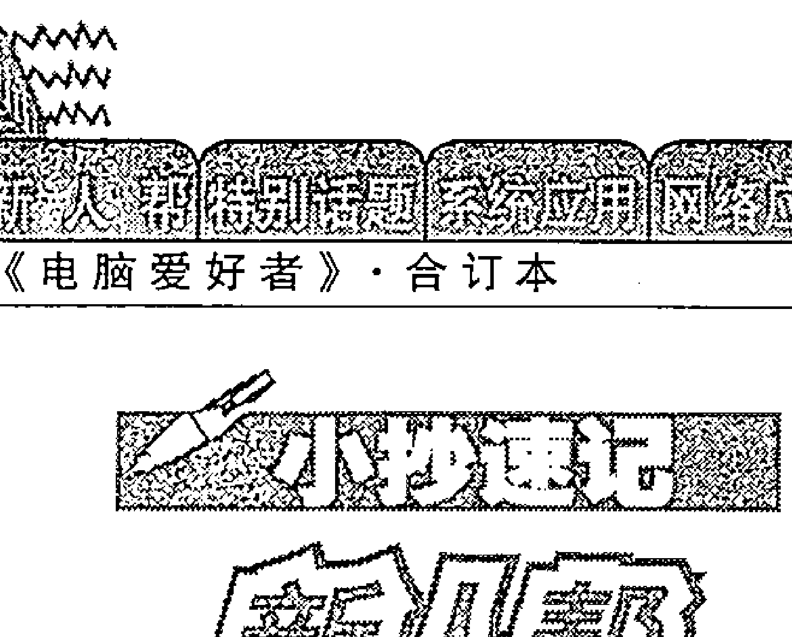

### 自己新建了个QQ群，怎么快速邀请志同道合的网友加入我的群？

答：可以使用腾讯提供的加群帮手，登录http://qun.qq.com/air/#embedcode，选择自己建立的群，然后将生成的代码贴到自己博客或者作为自己的论坛签名，这样只要访客点击这个代码链接即可快速打开加群页面。

### 在网上看到一些精彩文章时，经常想对其点评一番，怎么对在线文章进行留言？

答：可以使用谷歌的“Google sidewiki”服务（支持Chrome浏览器）。在Chrome中打开https://chrome.google.com/extensions/detail/fldmeagmkblgoeodhdihdejhhngdihi，单击“Install”安装插件。以后在浏览器中单击“Google sidewiki”按钮，使用谷歌账户登录后在弹出的窗口中即可输入对在线文章的点评，在这里也可以看到其他谷歌用户留言。

### 公司禁止安装QQ，可是我使用了很多QQ服务，有没有QQ所有服务的统一网页入口？

答：可以使用QQ最近推出的http://web2.qq.com/服务，以自己的QQ账号登录后，可以看到该网站集成了所有QQ常见服务，我们只要简单地点击即可访问。

### 淘宝上很多店铺会不定时推出促销店铺的积分、现金券、抽奖机会等优惠，怎么快速收集这些优惠？

答：可以使用“疯狂淘宝”，以自己的淘宝账号登录后打开http://app.taobao.com/app/detail.htm?platform_id=81&target_id=20249&type=87，然后单击“免费试用”。成功订购该服务后只要打开http://app.taobao.com/myapp/index.htm，单击“立即使用”，在打开的应用页面中就可以查看并搜索到各种店铺的优惠信息了。

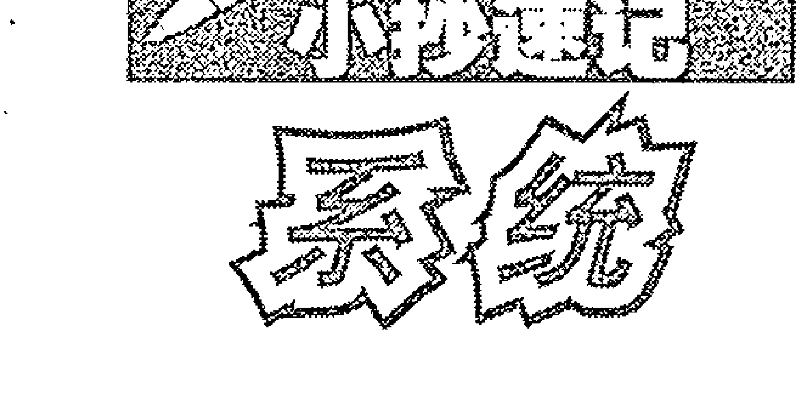

### 如何知道系统中哪个软件占用的网络带宽最多？

答：使用XP或Vista的读者，可以使用QQ医生的网络监控选项查看，使用Win7的读者可以依次选择“启动任务管理器→性能→资源管理器→网络”，在“网络活动的进程”中就可以对进程的带宽占用情况进行排序。

### 我现在用上了64位的操作系统，如何分辨安装好的软件是32位还是64位？

答：打开任务管理器，切换到“进程”，然后找到该进程，如果该进程后面有*32的字样就说明该程序运行是32位的，如果没有就说明它本身是64位的。

### 电脑上有些文件，不想让别人修改，怎么设置？

答：如果是Windows系统，把文件设置成只读就可以了。选中文件，右键单击，选择“属性→常规”，勾选“只读”，或者在安全选项卡里设置。Linux的话，用“chmod a-w”加文件名就可以了。

### 我的C盘分区空间不够了，能增加空间吗？

答：这时可以采取两种方式，一个是清理C盘，将系统的虚拟内存设置到其他分区，禁用系统还原，并用“魔方”等工具清理C盘垃圾文件。再就是可以用PartitionMagic这类软件调整分区容量，将D盘的一些空间划到C盘里。

### 我如何和我的朋友使用同样的ESET NOD32参数配置？

答：如果你想让你的朋友使用你的参数配置，可以在ESET NOD32主界面下依次选择“设置→导出导出设置→导出设置”，就可以将参数配置导出为一个XML文件，在其他电脑上用类似的步骤，选择导入设置就可以使用你的参数配置了。

### 如何方便地调整Win7的分区大小？

答：用Win7自带的功能就可以了。在开始菜单右键单击“计算机”，选择“管理→磁盘管理”，选择要调整大小的分区，选择“压缩卷”，然后输入保留分区的大小，设置好后就会空余出一个分区。

### 电脑自带的是英文版系统，如何更改系统的显示语言？

答：旗舰版支持更换语言，进入控制面板后，选择更改语言→安装语言，如果没有中文包，可以按提示进行系统更新，下载中文语言包，进行安装就好了。如果是其他版本，可以先下载相应的语言包，然后通过Vistalizator进行更换。

### 以前安装的软件，如何快速找到它？

答：如果你现在使用的是Win7，那么直接在开始菜单的搜索框中输入程序的关键字来寻找。XP系统下，我们可以借助360软件管家之类的软件，利用软件卸载选项找到你安装的软件，然后右键单击可以查看到它们的安装目录，这样就可以调用了。

### QQ2010中拖动头像改变好友分组已经没有提示了，如何准确改变好友的分组？

答：直接移动容易出现错误，可以在要移动的好友头像上右键单击，选择“移动联系人至”，选择合适的分组就好了。

### 如何修改双系统的默认启动系统？

答：如果都是Windows的就好办，在系统中，右键单击“我的电脑”，选择“属性→高级”（Win7要选择“高级系统设置”），依次选择“启动和故障恢复→设置”按钮，单击“启动和故障恢复”中的“系统启动”项，里面有一个“默认操作系统”的下拉菜单，选择一个需要的系统，单击“确定”即可。

### 自己电脑上没有安装Office2007，有时却需要查看docx文档，有没有在线转换文档的方法？

答：可以使用http://docx-converter.com在线文档转换。登录上述网站后，单击“浏览”选择要转换的docx文档，输出格式选择doc，然后填入你的邮箱，单击“CONVERT IT!”，网站就会将转换好的文档发送到你的邮箱。

### 平时工作中经常要对一些网站进行截图保存，有什么方法可以截取？

答：虽然QQ等提供截图工具，不过使用傲游的网页截图更方便。在傲游中打开网页后，单击“工具→屏幕截图→当前网页截图”，即可将当前网页保存为图片。截图格式和默认保存位置可以在“截图选项”中设置。

### 由于使用宽屏显示器，在访问网页时字体总是很小，有什么方法可以更改网页大小？

答：可以使用IE的缩放功能来实现。单击IE窗口右下方的“缩放”，选择一个合适的缩放比例，比如150%，这样每个打开的网页就会自动放大为150%，而且下次启动IE仍然使用这个缩放率。

### 我们公司主要做外贸，如何测试国外客户打开自己企业网站的速度？

答：可以使用http://host-tracker.com提供的在线测试服务，它可以检测全球40个主要城市测试（主要是外贸网站特别需要的美国、加拿大、英国、俄罗斯和其他欧洲国家城市）。登录上述网站后输入自己企业网站的地址，单击“Check”即可在下方看到国外各个城市打开网站的速度了。

### 有时不小心将QQ好友或群删除了，可以找回这些被删除的数据吧？

答：使用腾讯提供的好友恢复服务（http://huifu.qq.com），可以找回被删除的好友（普通会员可以恢复3个月内误删的好友，会员可以恢复6个月内的）。其实在这里，我建议大家以后使用WebQQ（http://web.qq.com/）来删除好友，它提供“回收站”的功能，误删后可以快速在回收站中找回。

### 酷狗音乐2010每次启动都会播“Hello 酷狗”启动音，如何让它无声启动？

答：进入酷狗音乐2010安装目录，例如，D:\Program Files\KuGou\KuGou2010，删除一个名为login的WAV音乐文件就可以了（王勇）。

### 想卸载几个占用磁盘空间大的软件，如何知道哪款软件占用的空间最多？

答：可以安装一个金山卫士，依次进入“软件管理→软件卸载→全部软件”，然后单击上面的“占磁盘空间从多到少”，在列表中位置越靠上，软件占用的磁盘空间就最多（r001）。

### 能否在系统里像看图片一样查看Flash文件的缩略图？

答：默认情况下是不可以的，不过你可以安装SWF Live Preview (http://www.onlinedown.net/soft/70744.htm) 这个工具，它可以在文件夹下显示swf文件的缩略图（殷强）。

### 能否建立一个快速删除移动设备的方式？

答：当然可以，在桌面新建一个快捷方式，在“请键入项目的位置”中输入“rundll32.exe shell32.dll,Control_RunDLL hotplug.dll”，然后点击“下一步”，在“键入该快捷方式的名称”中输入合适的名字，点击“完成”就可以了，以后双击这个快捷方式就可以删除移动设备了（我是ss）。

### 能不能在桌面建立一个休眠的快捷方式？

答：当然，右键单击桌面，选择“新建→快捷方式”，在打开窗口中输入“rundll32.exe powrprof.dll,SetSuspendState Hibernate”，将其命名为“休眠”就可以了，如果你喜欢，还可以像普通快捷方式一样，在属性里为其设置快捷键（李雨）。

### 如何快速将文件夹添加到Win7的库？

答：打开开始菜单，右键单击图片、音乐、文档等你需要更改的类型，选择属性，这时，单击“包含文件夹”可以将文件夹添加进库，也可以通过“删除”按钮删除已经添加好的库（绿水行舟）。

### 我的ESET NOD32到期了，如何换用新序列号激活？

答：可以在程序组里找到“ESET Smart Security”，单击激活ESET NOD32安全套装的红色图标来启动激活程序，也可以下载专门的ESET NOD32安全套装的激活工具进行激活（http://down1.eset.com.cn/faetools/esetact.exe）(cor)。

### 如果转换F4V格式的视频？

答：用格式工厂就可以。在“视频”一栏选择“所有转到FLV”，在“视频设置”根据自己设备屏幕大小的进行设置，单击“添加文件”，在“文件类型”里选择“All Files”，找到F4V视频进行转换就好了（何松阳）。

### 如何关闭视频预览功能，让视频文件显示默认文件图标？

答：打开资源管理器，依次选择“工具→文件夹选项→查看”，勾选“始终显示图标，从不显示缩略图”，确定后就可以了（破破）。

### 驾校给的机动车驾驶考试练习光盘怎样复制到电脑上用？

答: 通过WinISO (http://www.onlinedown.net/soft/3548.htm) 把光盘做成ISO镜像然后保存到电脑上，再重新加载这个ISO镜像，就可以使用了。

### 任务栏通知区域的图标能自己排序吗？

答: 如果是Windows XP的话只能控制图标的显示与隐藏，在Windows 7是可以的，直接通过相应的图标到想放的位置即可。

### 如何让QQ游戏无法在我的电脑启动？

答: 最简单的方法，通过天易成网管 (http://www.onlinedown.net/soft/9570.htm) ，在软件的游戏限制功能里面，勾选“QQ游戏平台”就行了。

### 如何让电脑能够搜索隐藏文件？

答: 打开“注册表编辑器”并定位到[HKEY_CURRENT_USER\Software\Microsoft\Windows\CurrentVersion\Explorer\]分支，在右边的窗口中找到DWORD值“SearchHidden”，并将其值设为“1”即可。

### 如何让别人在“网上邻居”中看不到自己的电脑？

答: 右键单击“网上邻居”图标，选择“属性”，在打开的“网络连接”窗口中右键单击“本地连接”图标，选择“属性”。接着我们在“本地连接属性”窗口中将“Microsoft网络的文件和打印机共享”选项前面的钩取消，点击“确定”。最后重启一下系统就可以了。

### 怎样删除莫名其妙生成的顽固文件？

答: 一般的顽固文件都很畸形，在删除的时候会提示“无法删除文件：无法读源文件或磁盘”。新建一个记事本，复制下面的内容进去：

```
DEL /F /A /Q \?\%1
RD /S /Q \?\%1
```

然后保存内容，并将记事本的后缀名更改为BAT，生成一个批处理文件。将需要删除的畸形文件拖到这个bat文件的图标上就可以删除掉了。也可以用第三方软件来删除，比如Unlocker、冰刃等。

### 如何修改QVOD的接收文件位置？

答: 在QVOD软件打开的情况下，按Alt+O打开设置窗口，选择“网络”，在右侧窗口中直接单击“浏览”按钮即可修改接收文件的位置。此外，假如看完的电影不需要时，可以直接从接收文件夹中将它们删除。

### 如何转移我的文档中的资料到其他分区？

答: 可以进入http://www.7xiazai.com/soft/html/68.html，下载“个人资料转移向导”，除了可以帮助你备份或还原计算机上的个人资料文件，这个小工具的主要作用是可将个人资料目录进行移动。下载后，直接打开NTback.exe，然后选择第三项“移动个人目录及文件”，点击“更改”并选择需要移动到的目录，然后点击“确定”，稍等片刻，即可完成整个个人资料的转移。

### 怎样知道我这个XP系统的安装日期？

答: 点击“开始→运行”输入cmd回车打开“命令提示符”，输入systeminfo命令，出来很多信息，其中就包括XP的“生日”了(指XP初安装日期)。用Ghost重装系统的话，还是会以这个时间为准。

### 总是设置系统自动登录，我都忘记系统账户的密码了，怎么进行密码重置？

答: 以管理员身份进入系统后，右击桌面“我的电脑”(Windows 7为“计算机”)，选择“管理”，然后依次展开“系统工具→本地用户和组→用户”，在右侧窗格选中需要更改密码的账户右击选择“设置密码”即可。需要注意的是，这种方法前提是你没有使用过NTFS加密属性加密文件。

### 每次使用Windows 7安装光盘在新电脑上安装系统时都会创建一个100MB隐藏分区，怎么在安装时取消这个分区？

答: 只要在“您想将Windows 7安装到何处”这步时，单击“新建”，然后建立一个2GB大小分区，接着选中创建的分区单击“扩展”，将其扩展为自己所需容量的分区，Windows 7安装在这个分区后就不会创建隐藏分区了。

### Windows 7中很多程序都要以管理员身份运行，怎么快速以管理员身份启动程序？

答: 只要在桌面建立指定程序的快捷方式比如注册表编辑器“regedit.exe”，然后右击该程序选择“属性”，在打开窗口的“快捷方式”栏下，单击“高级”，选择“用管理员身份运行”，点击“确定”。这样下次通过此快捷方式运行注册表编辑器时就是管理员身份了。

### 有时需要临时离开一下电脑，而打开的QQ程序及聊天窗口中的聊天记录不想让人看。请问，有没有办法临时锁定一下QQ？

答: QQ本身就提供了锁定功能，默认快捷键为“Ctrl+Alt+L”(也可以在设置中选择“常规设置→热键”进行更改)，按下即可锁定，只有输入正确的QQ密码后方可打开。此外，你也可以直接通过锁定操作系统(Win+L)来达到同样的目的。

### 不小心在傲游浏览器中删除了在线收藏夹中的网址，有几个网址很重要，又没有备份。请问，能否找回这些被误删除的地址？

答: 傲游在线收藏夹提供了本地备份功能，只要你没有重新安装系统，可以直接从备份中找回最近一次保存的记录：单击菜单“收藏→更多操作→恢复收藏”，在列表中选择最近日期的地址即可。

### 使用迅雷下载文件，下载后还得手工到保存目录中打开。请问，能否让其下载后自动打开下载的文件？

答: 只要在迅雷中开启“下载完毕后打开”即可。单击菜单“工具→配置”，选择“任务默认属性”，勾选“下载完成后自动运行”选项即可。

### 需要换一台电脑，现在想将飞信的短信历史记录备份出来，然后在新电脑中再导入。请问，有办法可行么？

答: 先在旧电脑中打开飞信，单击“菜单→工具→历史管理器”，直接通过“导出”按钮将其导出为数据库文件，然后再到新电脑中按同样的步骤将消息导入即可。

### 上次遇到一个淘宝骗子，他给的钓鱼网站竟然挂了木马，后来查资料得知该木马可以直接将支付宝账户中的钱汇出去。请问有没有什么方法可以加以防范？

答: 现在支付宝推出了很多安全措施，例如最基本的数字证书功能必须安装，此外，直接开通手机动态支付密码功能并设置200元的最低额度提醒，这样，在支付宝交易时就会添加手机动态密码验证，没有此密码自然就无法交易了，确保了资金的安全。

### 我怀疑有其他人曾登录过我的Gmail邮箱，这方面是否有记录可查？

答: 可以通过查看登录Gmail的IP地址判断，进入Gmail邮箱后单击网页下方“详细信息”，在打开的窗口中就可以看到详细历史登录信息了。根据登录IP地址信息一般可判断是否有他人进入过自己的邮箱。

### 在和Q友聊天时，常收到一些莫名其妙的网络热词，怎么快速查询？

答: 我们只要在QQ聊天框中用鼠标选中需要查询的词语，将会浮现出提示框，单击其上的“搜一下”，即可快速打开腾讯搜搜进行搜索了。

### 我用的是火狐浏览器，为了安全怎么在下线时删除一些重要网站的cookies？

答: 火狐可以有选择地删除Cookies，单击菜单“工具→选项”，在选项对话框中点击“隐私”，然后单击下方的“删除私人cookies”，在显示的内容中选中要删除的Cookie即可。这样既不影响平时使用，又可以有效保护自己的隐私。

### 作为淘宝卖家，很多买家经常会问到商品的同一问题，有没有快速回复的方法？

答: 可以利用旺旺的短语设置快捷回复。启动旺旺后进入“系统设置→聊天设置→自动回复、快捷短语”，切换到“快捷短语”，然后单击“新增”，输入常用回复，以后在聊天窗口单击“短语”图标即可快速选择增加的短语进行回复了。

### 公司的一些文件目录需要设置成共享，可是我不想让局域网每个用户都看到共享目录，怎么隐藏？

答: 在设置目录共享时，只要在共享名后添加“$”符号，类似“CFAN$”，这样局域网用户就无法看到这个共享了。如果访问共享目录，只要直接在地址栏输入目录绝对路径即可，类似\China-94a990b1e\cfan$的形式。

### 听说一些笔记本的无线网卡在Windows 7下，可以变成无线热点供其他设备共享上网，怎么判断自己网卡是否也有这个功能？

答: 对于Windows 7用户，只要以管理员身份启动命令提示符，然后输入“netsh wlan show drivers”，回车后就可以详细显示无线网卡的信息。如果“支持的无线承载网络”显示为“是”则具备上述功能。

### 测试同一网页在不同分辨率下的效果，有没有简单的测试方法？

答: 可以使用http://testsize.com提供的免费服务。进入网站后输入要测试的网址，然后选择不同的分辨率，接着点击“Open Popup”按钮，就会在新窗口中打开所选择分辨率的显示效果了。

### 我有多个QQ号在玩农场，怎么实现同时登录多个农场收菜？

答: 可以试试火狐浏览器解决问题。先在火狐浏览器中创建几个配置文件，再启动火狐后依次选择不同配置登录QQ农场，这样就可以在火狐浏览器中登录不同的农场收菜了。

### 我在QQ聊天的过程，有时急需某种特殊的QQ表情来表达感情，在QQ群中向其他Q友索要，往往半天也没有结果。如何才能快速找到自己想要的表情呢？

答: QQ2010正式版的表情搜索功能，可以快速达成你的愿望。打开任意好友或QQ群的聊天窗口，点击“选择表情”按钮（笑脸图标），即可在表情管理窗口右上角直接输入关键字查找特定表情了（如搜索“愤怒”）。新版本还添加了“热门”表情，点击后，它会自动分门别类列出当前QQ上流行的表情供你选择。

### 有时候在访问别人的空间时，经常会出现“系统维护，暂时无法访问”或者是“无法查看非好友空间”的提示，此时怎么访问这些空间？

答: 此时只要在浏览器的地址栏中输入“http://b.cnc.qzone.qq.com/cgi-bin/blognew/simpleqzone_blog_title?hostuin=QQ号”，回车后就可以打开需要访问的QQ空间了。

### 迅雷会自动弹出下载设置，可有时我们在网站上下载非常小的资源不需要它，怎么在指定网站上禁用迅雷的下载功能？

答: 迅雷的下载功能是通过浏览器的右键菜单和监视功能实现的，只要在迅雷的配置中，把“监视浏览器”和“修复浏览器错误”两项的勾选去掉，然后确定即可。如果你只想在某些网站上禁用迅雷，可以单击“配置→监视设置”，然后单击“不限制列表”下的“添加”按钮，输入网站地址即可。

### 如何屏蔽迅雷弹出？

答：打开迅雷单击“工具→配置”，然后切换到“监视设置”，单击“设置不监视网站”，输入类似“*.mail.qq.com”的网址（网址仅为示例），这样在QQ邮箱网页下载资源时就不会弹出迅雷下载提示了。

### 由于上班，我经常错过好友农场果实成熟时间，有什么好的提醒方法？

答：可以使用QQ网络备忘服务。单击QQ“菜单→工具→网络备忘”，新建一个好友农场果实成熟时间的备忘，勾选“定时提醒”并保存。这样到了指定时间，QQ就会以弹窗的形式通知你好友果实成熟。

### 有时由于网络繁忙经常无法登录QQ邮箱，有其他登录的方法吗？

答：可以尝试使用英文版QQ邮箱，因为它使用的是其他单独的服务器，只要在浏览器地址栏输入“m98.mail.qq.com”登录即可。

### 最近开心网钓鱼组件速度很慢，怎么加快速度？

答：开心网的游戏组件实际上都是使用Flash组件，默认显示的是高品质的画面，如果加载缓慢可以在钓鱼窗口右击选择“品质→低”，这样可以加快游戏运行速度而又不会对游戏结果产生影响（仅仅影响游戏画面）。

### 在网上看到一些精彩文章时经常想及时做些批注，怎么在网页上添加批注？

答：利用http://sharedcopy.com提供的在线批注功能即可。在IE中打开上述网站并注册，登录后打开http://sharedcopy.com/public/install，右击其中的“sharedcopy”选择“添加到收藏夹”，将其添加到收藏夹的“链接”位置。以后需要添加网页批注时，单击收藏夹的“sharedcopy”，此时在网页的右上角就会出现一个添加批注的工具栏，在此添加批注即可。

### 我使用的是QQ在线邮箱，近日由于网络繁忙经常无法打开邮箱页面，有什么其他访问方法？

答：可以使用腾讯专为移动设备准备的网址http://w.mail.qq.com，打开上述网址后也可以快速登录自己的QQ邮箱，虽然页面简陋些，但是邮件收发功能都具备。

### 很多事情都是通过QQ群公告来告知群成员，能不能对白底黑字的QQ群公告进行改变以提醒群友注意？

答：打开群切换到“群公告”，然后单击QQ群公告中的“装饰公告”，在弹出的新窗口页面中就可以进行自定义修改了，比如可以修改群公告的字体、字号或者插入表情，最后单击“修改公告”即可。

### 虽然已将火狐设置为默认浏览器，可是在QQ、MSN中打开链接仍然是用IE打开，怎么设置为从火狐打开？

答：打开“我的电脑→工具→文件夹选项→文件类型”，找到“URL:超文本传输协议”、“URL:带私人验证的超文本传输协议”、“URL:文件传输协议”、“HTML Document”，单击“高级→编辑→浏览”，选择火狐程序即可。

### 经常使用PPS看连续剧，看到精彩电影想和好友共享，可是好友家里网络不好无法流畅使用PPS，怎么办？

答：只要在PPS中选中需要共享的影片，然后右击选择“边下边放”（不过PPS更新不久的电影无法下载），这样在观看的同时影片也下载好了。把下载的影片放到移动硬盘等里面，与好友共享即可。

### 我经常在群里使用短网址和好友共享网址，有时一些网址不想让所有群友都能访问，怎么设置？

答：可以使用http://reduc.in的服务，它不仅提供短网址服务，而且还可以设置打开短网址的密码，这样只有知道密码的好友才能访问网页。打开上述网址后输入原来长网址和访问密码，单击“reduce”即可生成加密短网址。

### 我在QQ上已经将一些不受欢迎的好友删除了，可是我仍然是对方好友，怎么在其好友列表也删除我呢？

答：可以利用腾讯WebQQ的“好友管理”功能实现。打开http://web2.qq.com/并用自己的QQ账号登录，然后单击QQ界面的“管理”，在打开的窗口中切换到“单向好友”，这样在左边列出的就全部是你已删除的好友了，只要选中单向好友后单击“删除”即可让自己移出对方的好友名单（对方不会收到任何提示）。

### 经常要在Rapidshare网盘中下载资料，可是很多链接都是失效的，怎么在下载之前检测链接是否有效？

答：对于火狐用户可以通过特定的插件实现链接的有效性检查，首先到https://addons.mozilla.org/zh-CN/firefox/addon/748下载Greasemonkey扩展，然后再到http://userscripts.org/scripts/show/946下载Rapidshare链接检测插件。这样以后使用火狐下载Rapidshare资源时，链接检测脚本就会自动检测连接（有效将显示为绿色；无效则显示为红叉）。

### 我发现很多音乐论坛高品质的MP3都制作成BT下载，不过这些文件很大，能不能在下载前试听其中的歌曲？

答：可以借助http://www.bitlet.org/music提供的播放服务达到此目的。找到下载种子文件的地址后复制，然后打开上述网页输入BT种子地址，这样网站会自动列出种子文件中的ogg或mp3文件，并会在网页下方载入和显示歌曲列表，单击其中自己感兴趣的歌曲即可试听，试听满意后还可以在该页面下载BT文件。

### 经常需要将一些大文件传送给客户，可是有的客户并没有安装类似QQ的即时通讯软件，怎么快速互相传送文件？

答：可以使用网页版的P2P文件传输服务，打开http://xfiles.technhelp.net/后先允许Flash启动，然后点击“Share Files”来加入需要传送的文件，此时在网页下方会出现一个链接，复制该链接并告诉接收者。这样接收方打开进入该链接后，点击“Claim File”，稍待片刻就会开始传输文件，传输完成后，按下“Save File”来储存文件即可。这样在双方不安装任何软件的情况下即可实现文件的互传。

### 平时都是使用MSN，怎么在线保存MSN聊天记录？

答：可以到http://www.msnlite.org/download/msnlite-Beta2-setup.exe下载MSNLite。安装这个插件后，它可以自动将MSN聊天记录保存在MSN空间，这样不管在哪里登录MSN都可以将聊天记录同步到本地，随时查阅历史聊天记录。

### 我的火狐由于安装很多实用插件而启动缓慢，有什么方法可以提高Firefox运行速度呢？

答：可以到http://www.onlinedown.net/soft/44189.htm下载“Firefox Preloader”插件，它可以将Firefox一些常用的组件预先装入内存中，这样火狐启动速度就可以大大加快了。

### 我有很多QQ群，可是只要群成员动态消息一有变化就会提示，怎么关闭这些提示？

答：如果你是群管理员，只要打开需要设置的群对话窗口单击“群社区”图标，进入群社区页面后单击“设置”，在打开的页面切换到“消息提醒”选项，然后去除不需要出现的提示前的勾选即可。

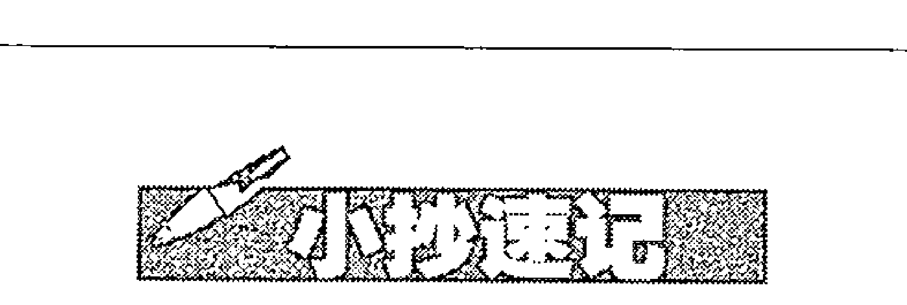

### 我使用FastCopy复制大文件，请问如何让其完成复制操作后自动休眠电脑？

答：只要在主窗口中单击“设置→后处理(关机)→休眠”即可。

### 在Foobar 2000中，当前曲目的高亮显示总是无法随着播放音轨下移而下移。请问如何让高亮显示能随着音轨的下移而自动下移？

答：只要在Foobar 2000中进行设置即可。按Ctrl+P打开参数设置窗口，选择“播放”项，在右侧窗口中将“光标跟随播放”项选中，保存设置即可。

### Windows 7系统中使用FlashFXP下载时，经常出现下载中途自动进入待机状态。请问如何取消自动进入待机状态？

答：直接修改系统电源方案应该能解决问题：在“开始”菜单的搜索框中输入“电源选项”并打开，在打开的窗口中单击当前电源计划右侧的“更改计划设置”链接，在打开的窗口中设置系统不进入睡眠状态即可。

### 使用uTorrent下载文件，Windows 7系统每次关机重新启动后，uTorrent都要重新检验一下文件的完整性，很浪费时间。请问，如何解决这个问题？

答：最简便的方法就是使用系统的休眠功能，下次启动系统也快，除此之外，在关闭之前只要手工停止所有的下载任务，重新启动后也不需要检验文件的完整性了。

### 每次使用WinRAR在解压网上下载的大文件时，在最后总会显示“正在移动”相关信息。请问这是什么原因？

答：WinRAR在解压大文件时，先将文件解压到系统临时文件夹，解压完毕后再将临时文件夹中解压好的文件移动到目标位置。如果解压的是小文件，因为速度快往往无法察觉到细节，而解压大文件时就会看到“正在移动”的信息了。

### 如何设置某个软件的快捷键，可快速启动或隐藏（不弹出该软件窗口界面）？

答：启动的话可以用快捷键来搞定：右击这个软件的快捷方式（必须是桌面快捷方式），点击“属性→快捷方式→快捷键”，点击方框，按下需要设置的快捷键比如F6（也可以是组合键），点击“应用”。如果想快速隐藏，就需要第三方软件了，到http://www.onlinedown.net/soft/28418.htm下载“老板键”小程序，它就能及时隐藏你所有不想让别人看到的窗口，而且还能显示预先准备的窗口。危险过后，再点鼠标即可恢复！

### 用Word时如何删除文字间的空格？

答：使用QQ传递的文字，复制到Word里面，很容易在文字中间出现空格的情况，一大段文字不可能一个一个地来更改，所以这时需要用到替换功能的操作方法是：先选择需要替换的文字范围，然后按下Ctrl+H组合键，打开“查找与替换”对话框，在查找内容中输入“^w”，替换中不输入任何字符，点击“替换”，空格顷刻消失！

### 如何禁止CCTV Box自动创建桌面快捷方式？

答：即使删除之后，再重新启动该软件，依然会自动创建快捷方式。索性我们就将安装版的CCTV Box卸载掉，然后从http://www.jfsky.com/SoftView/SoftView_44039.html下载绿色版，这样一劳永逸，每次打开都不会在桌面上自动创建程序快捷方式图标，省时省力。

### 打算用浏览器自带的下载，如何取消迅雷的下载关联？

答：迅雷、快车和旋风下载软件，安装完成之后都会默认关联多种类型的文件，并作为默认下载器。在迅雷界面中点击“工具→配置”，在弹出的设置窗口中选择“监视设置”，去除“启动迅雷时监视剪贴板”、“未启动迅雷时监视剪贴板”、“监视浏览器”、“监视下载类型-传统下载”，点击“确定”。
也可以右击悬浮窗，选择“高级”并通过左键点击去除“监视浏览器”和“监视剪贴板”的勾选。

### 如何在QQ游戏大厅时禁止Flash广告弹出？

答：首先进入QQ游戏大厅所在的文件夹，进入腾讯游戏QQGameResAD这个目录，一般情况下这个目录中会有1个文件夹和2个文件，现在删除其中的2个文件，然后打开文件夹选项，去除“隐藏已知文件扩展名”前面的钩，然后新建2个文本文件，分别命名为adfiles.ini和gamemsg.xml，在重命名的时候会提示文件不可使用，不管提示继续操作，然后右键点击这2个文件，把属性都设置为“只读”。再登录QQ游戏大厅看看，退出的时候就应该没有弹出的广告了。

### 怎样放大KMPlayer播放MKV影音文件时的字幕？

答：在KMPlayer播放电影时，可以直接通过快捷键Alt+/来调整字幕的大小，如果使用的是ASS或SSA字幕，只要取消选择“使用外部组件处理字幕”项即可。按F2打开设置窗口，选择“字幕处理→组合字幕|其他”，选择“外部组件|其他”，将“使用外部组件处理字幕”下面的几个选项全部取消选择，保存设置即可。

### 我很喜欢酷我音乐盒中的MV音乐，怎么下载其中的MV？

答：在酷我播放MV后，这个视频文件默认保存在“C:\Program Files\KWMUSIC\temp\music\”下，我们只要在酷我中完整播放完一首MV后，再打开上述目录复制其中的WMV(普通视频)或MKV(高清视频)文件到其他位置保存即可。

### 有什么方法可以截取Windows登录界面图片？

答：可以使用虚拟机截取，比如免费的VMWare Player (下载地址：http://p2s.newhua.com/down/VMware-player-3.0.1-227600.exe)，运行后新建一个Windows虚拟机，启动其中的系统后就可以截取Windows的登录界面了。

### 在网上下载了很多视频，有什么软件可以将它们转换为手机支持播放的格式？

答：可以使用“格式工厂”（支持常见视频文件），运行程序后选择“所有转到3GP”（大部分手机都支持的视频格式），然后根据自己手机分辨率进行转换设置，接着导入需要转化的视频文件，开始转换即可。

### 经常遇到一些加密视频教程，怎么把这些视频录制下来？

答：视频只要可以播放，我们就能借助屏幕录制软件将其录制下来，比如可以使用“屏幕录像专家”。首先启动加密视频的播放，运行“屏幕录像专家”后选择录制的范围为加密视频即可，可以录制为AVI视频，也可以直接录制为可执行文件。

### 为了安全我将保存重要文件的分区的盘符删除了，什么软件可以快速访问无盘符的分区？

答：可以试试Showdrive，它可以临时为无盘符分区添加盘符，非常方便我们对无盘符分区文件的操作。只要运行一下Showdrive，打开资源管理器即可看到分区了，重启系统分区盘符又会自动消失。另外，删除盘符隐藏文件的方法比较危险，不建议使用。

### 我用的是搜狗输入法，怎么输入一些不认识的生字？

答：可以使用搜狗输入法的“手写输入”，首先进入输入法的“设置→扩展功能→扩展功能管理”，然后按提示安装手写输入。启用手写输入后，我们就可以使用鼠标直接“写”上生字了。如果没有安装搜狗输入法，可打开百度首页，单击搜索框后的“输入法→手写”，也可以启用手写输入生字。

### 我使用的是微软免费杀毒软件Microsoft Security Essentials，可是常常出现无法更新的问题，怎么解决？

答：只要进入系统服务管理组件，将“自动更新”Automatic Updates(wuauserv)、“Background Intelligent Transfer Service”(BITS)和“DCOM服务进程启动器”(DcomLaunch)，启动类型设为“自动”并重启即可。

### 升级PPStream后频道列表无法显示了，怎么找回丢失的频道列表？

答：启动PPStream后，单击“工具→选项→其他设置”操作，随后勾选其中的“通过HTTP方式读取列表”，接着确认并重新启动PPStream即可。反之，如果原来已经勾选了上述选项，可取消该选项的勾选后重启PPStream试试。

### 一些重要文件我都是使用WinRAR加密压缩保存，怎么设置强健的压缩密码？

答：可以使用汉字作为密码，启动WinRAR压缩文件后，切换到“高级→设置密码”，在密码设置窗口勾选“显示密码”，将输入法切换到中文输入，然后输入中文作为密码。以后解压文件时，只要打开记事本输入上述中文密码，复制中文密码后粘贴到WinRAR的密码输入框中进行解压即可。
（需要注意的是：中文密码有可能会出现密码错误的问题）

### 原来使用一键还原精灵做过系统备份，怎么在PE中使用Ghost32还原这个软件制作的备份？

答：一键还原精灵备份默认保存在分区的“g.”文件夹下，由于Windows下无法打开该目录，我们可以在PE中先将其备份复制出来，在PE命令提示符下输入“copy d:\g.\win.gho e:\”（假设备份保存在D盘），将备份复制到E盘后就可以使用Ghost32恢复系统了。

### 平时都是使用KMPlayer播放视频，可是很多格式的视频需要在KMPlayer中进行优化设置后才能很好得播放，怎么为不同格式的视频保存设置？

答：可以在KMPlayer中通过建立不同配置实现，在KMPlayer中新建一个配置，然后以特定格式的视频格式命名，比如“RMVB”。接着勾选“当配置被选用时再打开视频”，在“文件名称”中勾选，且在其右边的方框内写入RMVB，最后在新建配置中对RMVB播放进行优化，这样下次当我们使用KMPlayer播放RMVB文件时就会自动调用该设置并开始播放。其他格式，同理进行设置即可。

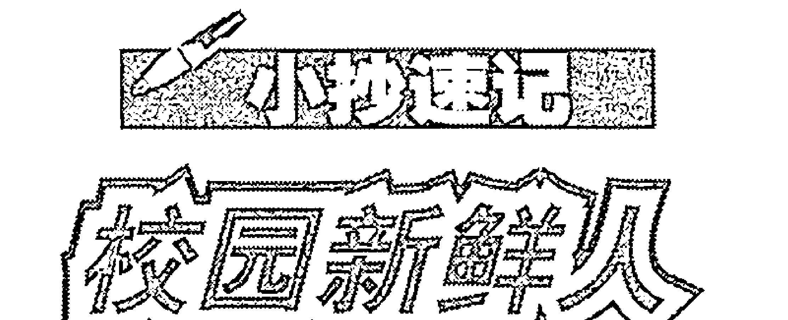

### 我使用校园网时，常常碰到上不了网、网速慢、频繁掉线或无法连接到服务器等情况，如何解决呀？

答：由于校园网内主机多，网点分散，容易产生ARP欺骗，要注意防范。
一般在学校里上网都需要通过智能客户端进行认证，当智能客户端正常连接到服务器时会提示自己电脑所获得的IP地址等信息。若发现IP地址与平时的不一样或者提示无法连接到服务器，很可能是受到局域网内ARP欺骗，可以依次通过单击“开始→所有程序→附件”打开“命令提示符”，输入“arp -d”（不含外引号，下同）清除计算机内的ARP缓存表，然后再运行客户端进行重新认证即可。获取到正常的IP地址后，可以打开“命令提示符”，输入“arp -s IP地址 MAC地址”，将自己的IP地址与MAC地址进行绑定(见图)，以避免再次受到ARP的欺骗攻击。另外还可以安装ARP防火墙，比如金山贝壳ARP防火墙、AntiARP或在360安全卫士中将ARP防火墙打开即可。
Windows Vista、Windows 7需要使用管理员身份运行命令提示符之后，上述的一些命令才能执行。

```
C:\Windows\system32>arp -s 10.12.15.168 00-26-9E-B2-FA-2F
C:\Windows\system32>ipconfig /all
Windows IP 配置
主机名 .......................... : (ni-PC
主 DNS 后缀 ..................... :
节点类型 ........................ : 混合
IP 路由已启用 ................... : 否
WINS 代理已启用 ................ : 否

以太网适配器 本地连接:

连接特定的 DNS 后缀 ............ :
描述 ....................... : Realtek RTL8168D/8111D 系列 PCI-E 千兆以太网 NIC (NDIS 6.20)
物理地址 .................. : 00-26-9E-B2-FA-2F
DHCP 已启用 ................ : 否
自动配置已启用 .............. : 是
IPv4 地址 ................ : 10.12.15.168<首选>
子网掩码 ................ : 255.255.255.0
默认网关 ................ : 10.12.15.254
DNS 服务器 ............... : 10.10.10.22
TCP/IP 上的 NetBIOS ......... : 已启用
```

### 在学校进行局域网连机游戏时常常因游戏不能正常获得IP地址而无法建立，有时不得不使用对战平台进行游戏。网速好时游戏可以流畅进行，而网速差的时候则会造成游戏卡死或者直接掉线。有什么好办法？

答：只要手动对IP地址进行绑定即可。首先运行命令提示符，输入“ipconfig /all”即可得到本机的IP地址、子网掩码、默认网关、DNS及MAC地址等信息。将以上信息记录后，依次进入“开始→控制面板→网络连接”，打开本地连接的属性，在常规选项卡中双击“Internet协议（TCP/IP）”，将“使用下面IP地址”选中后，根据得到的信息依次填入即可。可顺利进行游戏连机的建立，还可防止因输入后IP地址出错而导致不能上网。
如果使用无线网络，则在进行网络连接后，打开无线网络连接的属性，再将IP地址进行绑定，方法与上述相同。

### PSP3000对视频输出功能支持清单

| 视频线 | 普通画面 | MP4 | 游戏 | 自制程序 | 画质 |
| :--- | :--- | :--- | :--- | :--- | :--- |
| 分量线 | 支持 | 支持 | 支持 | 支持 | 最好 |
| D端子线 | 支持 | 支持 | 支持 | 支持 | 最好 |
| S线 | 支持 | 支持 | 支持 | 支持 | 较好 |
| AV线 | 支持 | 支持 | 支持 | 支持 | 普通 |

**Output这个选项？**
答：设备管理器中“声音和音频设备”应该有 ATI HDMI Audio 和 Realtek High Definition Audio 两个设备，如果缺少一个，那就是驱动没有正确安装或者是在 BIOS 没打开 HDMI 连接。进入主板 BIOS，在 Advanced Bios Features（高级 BIOS 选项）中有一项 OnBoard VGA output connect（板载 VGA 输出），默认值是 D-SUB/DVI，将其改为 D-SUB/HDMI 即可。

答：毫无疑问，将 PSP 输出到电视机或是显示器上需要一根视频输出线。目前 PSP 支持的视频线有四种：分量线（色差线）、D端子线、S端子线以及 AV 线。在这四种线中，以分量线（色差线）以及 D端子线最好。不过 D端子线是一种应用范围很少的接口，目前基本上只在日本使用，对非日本地区的玩家没有使用价值，所以在购买时推荐玩家购买分量线。其次是 S端子线，最低端的是 AV 线。以上是几种线对 PSP 内容输出的区别。

**CPU温度总显示85度～90度，用手摸散热器并不烫手，检查主板右下角有一个标识FS4的器件已烧黑，电脑目前一切正常，请问是不是快坏掉了？**
答：既然用手摸散热器并不烫手，电脑也能正常运行，首先检查散热器是否和CPU接触良好，硅脂是不是干了。如果正常那可能就是温度检测软件的误报了。主板上FS4是一个保险电阻，这款主板已经使用几年后，保险电阻变黑是正常现象，如果不放心可以去找个修主板的商家更换一个保险电阻，不会对电脑有什么影响。

**将笔记本屏幕闭合再开启后，屏幕没有任何显示，但机器是在运行，指示灯都正常，请问怎样才能让屏幕闭合后屏幕也能显示正常呢？**
答：这是笔记本电源设置造成的，初衷是当笔记本闭合屏幕后进入休眠或者睡眠状态以节省电力。您可以在桌面任务栏的右下角，进入电源管理的界面，点击“选择关闭盖子的功能”选项卡，在这个窗口就可以对笔记本闭合屏幕时的操作进行定义了。如果不是特别在意本本的续航时间，建议选择“不采取任何操作”或者“休眠”，这样在每次打开笔记本屏盖子的时候可以快速恢复系统。

**新入手的诺基亚5230很费电，由于是大触摸屏，上网不到一天就要充电，想从节电设置入手，可是关于S60v5的设置少之又少。**
答：毕竟性能和功耗是成正比，性能和续航能力是鱼翅和熊掌不可兼得，有些需要的设置可以自由掌握。
功能表→设置→个人模式→主题模式→标准→点左下选项→主题模式效果→关，字符预览→关。
…个人模式→情景模式→标准→个性化选择→振动提示→关。
…个人模式→情景模式→标准→个性化选择→触摸屏震动→关。
功能表→设置→手机→屏幕显示→亮度→40%。
…手机→屏幕显示→背光延续时间→30秒。
…手机→声控命令→选项→设置→合成器→关。
…手机→感应设置→感应→关。
功能表→设置→连接功能→网络→网络模式→GSM。
…连接功能→网络→运营商选择。
…连接功能→视频共享→视频共享→在注册网络中打开→关。
…连接功能→管理设置→分组数据→分组数据连接→当需要时。

**清理CPU的风扇的时候，把处理器也一起拔了下来。并且主板上的CPU插座也弄掉了一块，不知道能不能修？**
答：插座的作用就是固定处理器的针脚，如果插座上面只是少了一小块塑料件，处理器仍然能放上去并且锁紧，那么即便不进行修理也能正常使用。如果插座损坏比较严重，里面的针脚都暴露出来了，无法安装上处理器，那么插座必须整体更换。卖场里具备主板维修能力的店铺一般都能更换插座。

**新买的联想Y460A笔记本，在使用中发现屏幕会有规律的闪烁，在看电影和玩游戏的时候非常影响视觉感受，请问有什么解决方法吗？**
答：Y460A屏幕支持智能感光，而且这个功能默认状态也是开启的，它会根据环境来调节显示器的亮度，您遇到的情况应该是该功能造成的。关闭方法很简单，在桌面右下角找到联想电源管理软件，点击“电池模式”菜单，在“智能控制”选项卡中就可以关闭“智能亮度控制”功能了。

**每当下雨过后，第二天电脑肯定就会不停重启，进不了系统，已经确定电源没有问题，那是什么原因呢？**
答：首先，确定室内电压是否存在波动，使用宽幅电源看看能否解决问题；其次，检查插座、插线板触点是否氧化（氧化后潮湿就会造成电流不稳定）；最后检查机箱按键连线是否老化。如果还未解决问题，更换主板，可能是供电模块的问题。

**新买了一台笔记本，用以前在台式机上制作的Ghost系统镜像恢复到笔记本上却出现很多问题，经常蓝屏死机，请问这是怎么回事呢？**
答：这是因为Ghost系统镜像中包含的台式机驱动和笔记本不兼容造成的。我们可以从网上下载没有任何驱动的纯净系统镜像文件，然后再利用Ghost工具恢复到笔记本的硬盘上，最后再安装笔记本随机附带的驱动程序即可。

**主板参数只能用65W以下的AM2+ CPU，如果上超过65W的CPU比如羿龙II一类的CPU会出现什么问题呢？**
答：这样会使主板的供电模块超负荷运作，第一个出现的问题是发热量超标，必须要解决好散热问题；第二个就是很可能由于电流过大击穿某些元件。所以不建议使用超过支持功率的CPU，如果一定要升级，可以考虑低电压版CPU。

**极品飞车13只有在宽屏分辨率下才有全屏模式，但我的笔记本显卡一般，高分辨率下跑不动。如果调整到1024×768像素却只能在窗口模式玩，请问如何设置才能让这款游戏在低分辨率下全屏游戏呢？**
答：先将笔记本屏幕的分辨率调整为1024×768像素，运行游戏，在视频设置中将游戏分辨率同样设置为1024×768，此时可以将“全屏幕”设置为“开”。退出游戏，将屏幕分辨率还原，再度运行游戏，极品飞车13就会以全屏的模式进行游戏了。

### 视频输出线缆如何不上机判断好坏呢？

答：选购时可以用手揉一下线材，看看其软硬程度。一般硬度较高的线材内部的线缆和屏蔽层会粗一些，性能相对较好。正规的 HDMI 线材内部应该使用铜芯，但有的 HDMI 线材却使用铁芯，这样线材硬度较高，给人的感觉似乎质量更好，但其实性能反而更低。不过几乎所有的 HDMI 线材屏蔽层都采用铁质编织网。因此购买时可以带一块磁铁试试，如果感觉吸力比较强的，那么内部线缆肯定也是铁芯，这种 HDMI 线最好不买。接着观察接口内部的弹片，需要注意的是，无论接头外部采用什么材质、什么颜色，内部的弹片一定要是经过镀金处理，呈现金色的。此外从弹片的色泽也可看出镀金的厚度，色泽越浓厚的，镀金层越厚，接头传输信号时的稳定性也就越高。

**购入诺基亚E66后发现有个三维铃声，开启之后声音忽大忽小，是我不会用么？**
答：三维效果是S60第三版新加入的功能，可以让来电铃声模仿立体声，不同于普通铃声，设置好后效果出色。进入选项后开启三维铃声效果，选择自己喜欢的来电铃，再选择声音轨迹（循环式/飞越式/之字形/蜿蜒形/随机），看图就明白了，轨迹是立体声运动的路线，不同轨迹的声音差异很大。而后面的轨迹速度就是两个喇叭间的变化速度，回声开启后效果更明显。典型设置：“声音轨迹飞跃式；速度为默认中间；回声开启”。

**女友的数码相机用的是干电池，之前认为不用充电，使用方便，慢慢地发现有的电池很耐用，有的拍几十张就没电。同样是电池，差别这么大？**
答：干电池有两类，碱性电池的电量是碳性电池的数倍。以5号干电池为例，碱性电池的电量普遍在1500毫安时以上，而碳性电池仅有200到300毫安时。如果用在数码相机这样对放电要求较高的设备上，尽量选用碱性电池。除了挑选名牌（南孚、劲量、双鹿）外，对于小牌子电池的选购一般来说重量越足，电量越足。

### 为何医用酒精清洁显卡金手指后，出现氧化物？

答：医用酒精与无水酒精酒精含量不同，医药酒精为75%，无水酒精一般95%或者更多。医用酒精虽然可以暂时清除金手指上的氧化物，但是里面含有水分，与空气中的氧气一起作用会加速金属的氧化过程，故很快再次出现。

**暑假翻出小时候的胶片相机留下的底片，用数码相机如何把它拍成照片呢？**
答：把底片拍摄成照片叫底片翻拍，一般都是用专业设备，便宜的200多元。DIY的话也行，关键是要有合适的背光源与固定底片的方法。最简单的是将底片放在能发光的平台上，比如台灯、显示器，并让底片与光源保持一定距离，因为贴着台面时候难免有灰尘纹理影响画质。在台面上垫一层纸可以柔化平均光源，底片压平摆放好后用相机垂直拍摄。后期需要用PS在图像菜单中使用调整功能下的“反相”、“色彩平衡”等进行处理。

**一直想把PSP的屏幕画面输出到电视，玩游戏时比较过瘾，只是苦于不了解几种线材的差异。**

### PSP2000对视频输出功能支持清单

| 视频线 | 普通画面 | MP4 | 游戏 | 自制程序 | 画质 |
| :--- | :--- | :--- | :--- | :--- | :--- |
| 分量线 | 支持 | 支持 | 支持 | 支持 | 最好 |
| D端子线 | 支持 | 支持 | 支持 | 支持 | 最好 |
| S线 | 支持 | 支持 | 不支持 | 需要自制程序支持 | 较好 |
| AV线 | 支持 | 支持 | 不支持 | 需要自制程序支持 | 普通 |

### HD3650显卡的流处理单元用软件检查有时候是120个流处理单元，有时候会突然变成80个流处理单元？

答：应当是用户使用的软件有问题，建议不要使用 Everest 查看显卡的流处理单元数量，不够准确是很正常的事情。最好直接使用 GPU-Z 新版 本查看（下载地址：http://www.onlinedown.net/soft/61779.htm），应当可以正确识别HD3650显卡流处理单元的数量。

**台式机有没有办法实现笔记本的那种一键静音的功能？**
答：如果你的键盘带有静音的多媒体快捷键，只要安装了相应的驱动按下去就可以实现一键静音功能。

### 为何790GX主板的HDMI Audio已经开启，驱动也装了，但是默认设备选项里面没有HDMI

答：检查一下设备管理器中“声音和音频设备”应该有 ATI HDMI Audio 和 Realtek High Definition Audio 两个设备，如果缺少一个，那就是驱动没有正确安装或者是在 BIOS 没打开 HDMI 连接。进入主板 BIOS，在 Advanced Bios Features（高级 BIOS 选项）中有一项 OnBoard VGA output connect（板载 VGA 输出），默认值是 D-SUB/DVI，将其改为 D-SUB/HDMI 即可。

## 《电脑爱好者》·合订本

答：如果硬件上不允许，还可以通过类似“一键静音精灵”的软件来实现此功能，运行软件后可以利用不常用的F9、F10、F11实现增加、减小和静音的功能，非常方便。软件下载地址：http://www.onlinedown.net/soft/48946.htm

最近打算选购一块硬盘，发现有绿盘、蓝盘、黑盘之分，请问他们之间互有什么区别呢？

答：绿盘、蓝盘、黑盘是西部数据用于划分产品定位的称号。其中黑盘性能最强，适合类似企业的吞吐量大的服务器使用；蓝盘属于家用，整体性能均衡；而绿盘则是主打环保的产品线，静音、省电、发热低，转速在5400~7200转间自动调整，适合用于下载盘。

| | 绿盘 | 蓝盘 | 黑盘 |
|---|---|---|---|
| PCMark Vantage 磁盘得分 | 3449 | 4764 | 5279 |
| HD Tach 读/写性能 越高越好 | 89.5/56.1 MB/s | 113.5/89.1 MB/s | 109.4/94.8 MB/s |
| HD Tune Pro读/写性能 越高越好 | 85.6/82.5 MB/s | 106.3/103 MB/s | 106.6/102.7 MB/s |
| 随机存取时间 越小越好 | 15.4毫秒 | 13毫秒 | 12.7毫秒 |

现在处理器核心越来越多，很多时候都用不到这么强的性能，有没有什么办法可以屏蔽处理器内多余的核心呢？

答：在开始菜单运行msconfig命令，在弹出的窗口中依次点击“引导→高级选项”，勾选“处理器数”后就可以自定义CPU的核心数量了，节能效果还是很明显的。如果需要恢复核心数量，只要取消处理器数前的勾选即可。

如果不希望别人用闪盘从电脑中拷走数据，有什么好的设置方法吗？

答：首先可以在BIOS中禁用USB接口并给BIOS设置密码，但如此一来所有设备都无法使用。建议进入C:\Windows\inf目录，找到Usbstor.PNF和usbstor.INF文件，右键点击文件选择“属性”，然后切换到“安全”标签页，在“组或用户名称”框中选中要禁止的用户组，接着在用户组的权限框中，选中“完全控制”后面的“拒绝”复选框，最后点击“确定”按钮。完成了以上设置后，该组中的用户就无法安装USB设备驱动程序了，这样就达到禁用的目的。

有没有好的关屏软件？

答：下载CloseLCD（下载地址：http://work.newhua.com/cfan/201017/CloseLCD.rar），运行程序即为关屏，敲击任意键屏幕即可启动。

请问ATI HD5145和HD5430谁的性能更好一些呢？

答：虽然HD5145和HD5430都被冠以HD5000系列显卡的称号，但HD5145实际上只是上一代HD4570显卡的马甲版，采用55nm制程工艺设计，并不支持DirectX11技术。而HD5430则采用40nm，支持DX11，从规格上来看显然是HD5430更好一些。但是在性能上，同样选用GDDR3显存的情况下，HD5145要比HD5430高一些。在选购此类笔记本时，优先关注的应该还是整体的配置，以及显卡选用的是DDR2还是DDR3的显存。

家里有三台笔记本，但是只有一根网线，有什么好的方法可以让这些电脑共享网络呢？

答：建议安装Connectify软件，安装后只需花几秒钟设置一下无线网络的名称、密码以及本本当前的联网方式就可以让笔记本变成“无线路由器”。在笔记本WiFi信号覆盖范围内，可以让其他支持WiFi的手机或者笔记本共享上网，较Windows自带的共享WiFi上网设置要容易很多。Connectify软件下载地址：http://connectify.me/upgrade/index.html

新买的联想Y460笔记本，无法识别出ESATA硬盘，但这个硬盘在别的笔记本上使用正常，请问这是怎么回事呢？

答：联想Y460标配的ESATA接口设计上存在缺陷，部分ESATA设备的接口无法完全插入，因此无法被系统正常识别。遇到这种情况，可以用小刀把设备的ESATA接口一端削掉5mm把线插到底就可以了。除了Y460，还有少数笔记本也存在这种现象，大家遇到后可以参考上面的解决办法。

我的笔记本光驱弹出按键坏了，无法往里面安装光盘，请问我该如何修理？

答：如果笔记本还在质保期内，可以联系笔记本客服中心。类似光驱这种外设的保修时间都在一年左右。如果已经过保又不想支付额外的修理费用，在Windows系统中可以选中光驱的盘符，右键选择“弹出”，光驱就会自动弹出来而不需要按下光驱上的物理按键。如果笔记本没有安装操作系统或系统损坏，可以利用光驱面板上的小孔，用小铁丝抠出来。

很多新本都用了P6100处理器，和i3相比谁更好？

答：P6100隶属于奔腾双核系列，是P6000的升级版，主频从1.86GHz提升到了2.0GHz，性能有一定的提升。简单来说，奔腾双核是酷睿i3的简化版，屏蔽了i3集成的显卡，频率低而且不支持SSE4.2以及虚拟化指令集，因此即使今后英特尔推出了P6X00处理器，也别指望它能强过最低端的i3 330M，惟一的优势就是价格便宜。

| 参数 | 英特尔奔腾双核P6000 | 英特尔奔腾双核P6100 | 英特尔酷睿双核i3-330M |
|---|---|---|---|
| 主频 | 1.87GHz | 2.0GHz | 2.13GHz |
| 架构 | Nehalem | Nehalem | Nehalem |
| 制程 | 32nm | 32nm | 32nm |
| L3缓存 | 3MB | 3MB | 3MB |
| 集成显卡 | 无 | 无 | 有 |

笔记本采用了i3 370M处理器，运行多个软件检测都显示只有934MHz，怎么和标称的2.4GHz差这么多？

答：英特尔酷睿i3处理器在闲置时会进入节能状态，934MHz就是闲置后的主频。如果你想让处理器工作在高主频状态，可以连接电源适配器，在桌面右下角进入电源管理菜单，选择平衡或高性能状态。需要注意的是，如果选择了高性能模式，处理器会一直工作在最高主频状态，在使用电池供电时会影响使用时间。

现在很多笔记本有配有品牌扬声器，值得选吗？

答：为了提升声音表现，不少笔记本会选用奥特蓝星、JBL、harman/kardon和B&O等等，而且都支持所谓的杜比或者SRS环绕音效认证。凭心而论，这类笔记本在声音表现上确实比普通喇叭好一些，但是效果提升有限，毕竟笔记本的体积限制其不可能选择高功率和大容积音盆的喇叭，特别是在低音的表现上。在选择笔记本时，如果目标产品配备了品牌扬声器只能算是锦上添花，没有必要因品牌扬声器去选择某款产品，不如花100元买个外置2.1音箱来得实在。

前阵子优化笔记本的系统启动进程和服务项后，出现无法在集成显卡和ATI独立显卡间切换的问题，请问这是什么问题造成的？

答：我们在优化系统启动项和进程时一定要注意关键的系统服务，AMD双显卡切换就会用到“AMD External Events Utility”这个服务的支持，而类似快捷键和电源管理也都需要相应的启动项配合。Windows 7用户可以在开始菜单的搜索框输入“服务”，在展开的服务项列表中找到“AMD External Events Utility”，将其设置为启动状态就可以了，此方法对于所有采用英特尔集成显卡和ATI独立显卡的笔记本都适用。

为什么显卡无法工作在PCIE 2.0模式下，在GPU-Z中显示“此图形卡目前工作在：PCI-EXPRESS X16 V1.1？”

答：这是NVIDIA显卡驱动加入的“节能管理模式”的新特性。使用“自动模式”，将会在GPU负载较低时自动将PCIE模式设置为V1.1；在某个显卡性能要求较高的程序运行时自动转入V2.0。倘若将模式设置为“性能模式”，显卡将一直工作在PCIE 2.0速率。以GTX480为例，在“自动模式”下待机温度大约是57度，但在“性能模式”下待机就是82度。

现在支持开核的AMD处理器都有哪些？哪款最值得购买呢？

答：AMD往往会屏蔽高端CPU的不良核心，以低端产品的身份出售。所谓开核就是重新开启被屏蔽的核心，从速龙5000到速龙II X2 220，开核已经成为了AMD处理器的另一个卖点而广受DIY玩家的关注。需要注意的是，开核后会影响CPU的稳定性，某款产品上市越久，成功开核的几率就越低。目前为止支持开核的AMD处理器如下：

| 处理器型号 | 开核变化 | 开核后的身份 | 推荐度 |
|---|---|---|---|
| 速龙II X3 400e | 三核变四核 | 速龙II X4 600系列 | ★★★ |
| 速龙II X3 440 | 三核变四核 | 速龙II X4 640 | ★★★ |
| 奔龙II X2 555 | 双核变四核 | 奔龙II X4 955 | ★★★★ |
| 奔龙II X2 550 | 双核变四核 | 奔龙II X4 945 | ★★★★ |
| 速龙 X2 5000 | 双核变四核 | 奔龙II X4 900系列 | ★★★★ |
| 速龙II X2 220 | 双核变四核 | 奔龙II X4 925 | ★★★★★ |

AMD 880G主板的内存控制器有两种工作模式，一种是Unganged模式，另一种是Ganged模式，请问两种模式有什么不同？

答：在BIOS找到Memory Configuration（内存管理）→DCT Unganged Mode（双通道内存模式），设定为Auto代表Ganged（单通道），设定为Always则代表Unganged（双通道）。Ganged模式是将两个64bit内存控制器视为一体进行数据交换实现128bit，Unganged模式是两个64bit内存控制器互补增益进行数据交换达到64bit+64bit，就性能来看后者更好一些。

显卡中所谓的“原厂卡”、“公版卡”、“非公版卡”、“缩水卡”、“阉割卡”有什么区别？

答：原厂卡是NVIDIA或者AMD官方设计的标准卡，稳定耐用，缺点是超频能力一般；公版卡是显卡制造商在原厂卡PCB设计方案和布局的基础上升级散热器或电子元件用料规格的版本；非公版卡是厂商出于成本考虑，自己设计、布局的PCB，通常具备较强的超频性能；缩水卡和阉割卡则是在用料和显存位宽上简化严重。形象比喻的话，原厂卡

### 笔记本光驱读盘不灵了，如何清洁光驱磁头才算安全呢？

答：在开机状态下打开光驱，关机（不缩回光驱）。用脱脂棉签轻轻擦拭磁头，光驱磁头是可以移动的，不要将其弄偏了。需要注意的是，大多数光驱的激光头物镜部分会使用一种类似于有机玻璃的物质，或者有一层用以调节折射系数的薄膜，使用酒精会使其受损，所以脱脂棉签要在干净的状态下使用。此外，现在还有专用的光驱清理盘，只是效果不明显而且不便宜，动手能力强的朋友还是用上面的方法吧。

### ThinkPad随机预装的备份软件如何只备份C盘？

答：ThinkPad虽有一键恢复功能，但只能恢复到出厂设置，对于用户而言还是仅对系统区进行备份最为实用。在开始菜单中运行ThinkVantage Tools软件，进入Rescue Recovery功能下的“备份硬盘驱动器”界面，点击左下角的“首选项”，在弹出的窗口右侧就可以自定义备份的分区了，以后恢复时可以只恢复C盘，其他盘不会受到影响。需要注意的是，备份文件是隐藏的，如果想删除备份文件，就用恢复软件的删除功能即可。

### 现在很多笔记本都有7200rpm硬盘的配置，但在卖场很多JS却拿5400rpm硬盘的版本冒充，请问买笔记本时如何快速检验硬盘转速？

答：笔记本型号的后缀是有玄机的，不同的后缀代表着不同的处理器、内存和硬盘，买本前做好型号方面的功课可以避免出现这类问题。如果想快速检测硬盘转速，推荐使用HD Tune Pro软件（下载地址：http://www.onlinedown.net/soft/98042.htm），在磁盘信息选项卡的右下角会显示硬盘的转速参数。

### 现在很多笔记本都配备了双显卡，为什么很多ATI独显加Intel集显的笔记本在使用HDMI输出时都没有声音？

答：很多采用ATI与Intel双显卡设计的笔记本在使用HDMI输出多媒体视频资料时都会出现仅有图像但无声音的问题，因为ATI显卡的HDMI声音输出机制不同于NVIDIA与Intel显卡，并不依赖于声卡的SPDIF端口进行声音输出而是采用显卡原生音频输出。所以当这类笔记本工作在Intel显卡模式下，由于ATI显卡被关闭所以HDMI的声音通道同时也被关闭，自然会造成只有图像而没有声音的问题。此时只需将显卡切换到ATI显卡后问题即可排除。如果已经是在ATI显卡模式但HDMI仍无法输出音频，可尝试先切换为Intel显卡然后再切换回ATI显卡。

### MP4播放器看电影时总显示加载字幕错误，还容易造成加载非对应电影的字幕，如何处理好字幕呢？

答：不同的MP4读取字幕文件的方式决定识别正确率，影片名要与字幕文件一致，再尽量简化它。有的电影文件名包含的信息量过大，压制组、发布论坛都要写在里面，甚至还有各种不易识别的特殊符号，会导致MP4识别错误，从而出现字幕加载混乱的现象，所以命名越简单越好，如“恋爱通告.avi”。另外，及时更新固件，你会发现MP4可以支持更多格式的字幕。

### 博客分享照片时看不到照片的“EXIF信息”，所以别人也不能知道我的照片是PS的还是真实拍摄，不过瘾啊。

答：EXIF信息是记录相机拍摄时的光圈、快门等信息的数值，方便借鉴别人的优秀摄影作品。但很多时候照片太大、颜色偏差需要修片后才能上传，在后期处理不当，不知不觉就被删掉了。比如使用光影魔术手调整完照片后，保存时不要勾选“EXIF选项→删除EXIF”选项。而使用Photoshop调整完照片后，保存时选择“存储为”，即可保留EXIF信息。

### 复制到MP4中的酷狗MP3丢失歌词？

答：歌词与MP3本身是两个分开的文件，而krc是酷狗专用的歌词格式，是为了更好的制作卡拉OK歌词设计的一种格式，一般的播放器是不能识别和打开的。在复制时，酷狗会自动把它转化成lrc格式的歌词文件的，这样一般MP3和MP4就能显示歌词了。把MP4中的歌曲删了，重新复制，确保复制前勾上了复制歌词。

### 现在很多一线NVIDIA GT240和9800GT显卡都降到了500以内，选择哪款更为超值？

答：GT240其实只是9600GT的升级强化版，虽然采用了40nm制程工艺，但较低的流处理器和仅仅128bit的显存位宽制约了其性能发挥，即使搭配高频率的GDDR5显存，理论性能和9800GT依旧相差一个档次。只是500元以内的9800GT用料缩水严重，和配备GDDR5显存的高频版GT240相比就有些逊色了。如果可以再增加一些预算，建议选择一线品牌的9800GT，

| | GT240 | 9800GT |
|---|---|---|
| 核心 | GT215 | G92 |
| 制程 | 40nm | 55nm |
| 流处理器 | 96 | 112 |
| 显存版本 | GDDR3/GDDR5 | GDDR3 |
| 显存位宽 | 128bit | 256bit |

如果选择GT240一定要注意显存版本，GDDR3显存虽然便宜一些但性能表现不尽人意。

### 都说AMD显卡的画质要比NVIDIA显卡出色，但为何在星际争霸2游戏中，我的HD5830还不如朋友的GT220？

答：在ATI控制面板“3D”选项卡的“全部”界面下可以对显卡的各向异性过滤等参数进行调节，找到其中的“Catalyst A.I.”并将其禁用（见图1），再度进入游戏你就会发现星际争霸2在细节方面展现的内容会更丰富，不逊于NVIDIA显卡。需要注意的是，禁用“Catalyst A.I.”功能后有些游戏速度会有些许下降，如果你安装的是beta版驱动，可能会出现无法禁用Catalyst A.I.的选项，下载安装正式版即可解决。

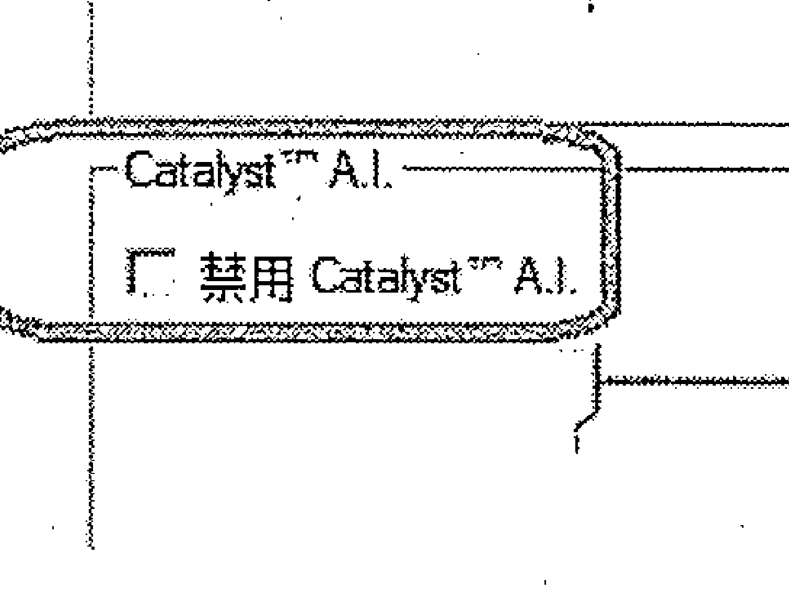

### 最近新配了AMD双核平台电脑，显卡没有升级，为何玩《魔兽世界》时游戏速度还不如以前的奔腾4 3.2E？

答：运行《魔兽世界》后按CTRL+ALT+DEL进入任务管理器，在进程选项中找到“Wow.exe”，右键单击该选项，在弹出的菜单中选择“设置相关性”，将新窗口中列出的处理器选项全部打上勾（见图2）以实现对多核的优化。《魔兽世界》在默认状态下该选项是关闭的，需手动设置才能在真正意义的多核心状态下游戏。此外，在硬件一定时网速对游戏速度的影响更为明显，建议选择网络顺畅的服务器进行游戏。

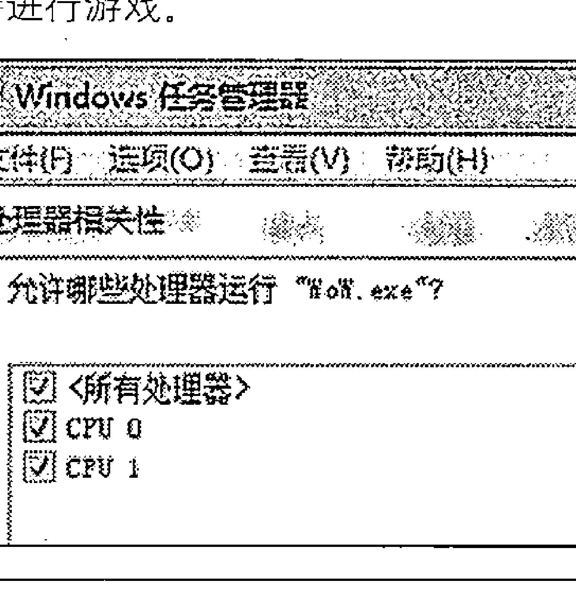

### 我的AMD X3 720处理器在790芯片组下成功开核，但是开启屏蔽的4核心后会出现爆音问题，重装系统或换驱动都没用，请问这是什么原因造成的？

答：AMD 790芯片组都提供了C1E功能，我们在开核时肯定会打开ACC（高级时钟校准技术）选项，开启或关闭CNQ（冷又静）选项，唯独会忽略对C1E的设置。当AMD处理器开核并出现爆音时，关闭C1E后即可解决问题，至于C1E在菜单中的位置请查阅主板说明书。

### H55主板搭配酷睿i3处理器，在安装Intel集显驱动后，为何在设备管理器中依旧提示“该设备找不到足够资源可以使用”？

答：这个问题通常是因未安装“Intel管理引擎（Intel Management Engine）”引起的，该程序主要用于对Intel芯片周边的电源一类的东西进行扩展管理。右键单击计算机，依次选择属性→设备管理器，在其他设备中的“PCI简易通讯控制器”前面有黄色叹号（见图3），在配套主板驱动光盘中找到该程序安装即可解决i3集成显卡的问题。

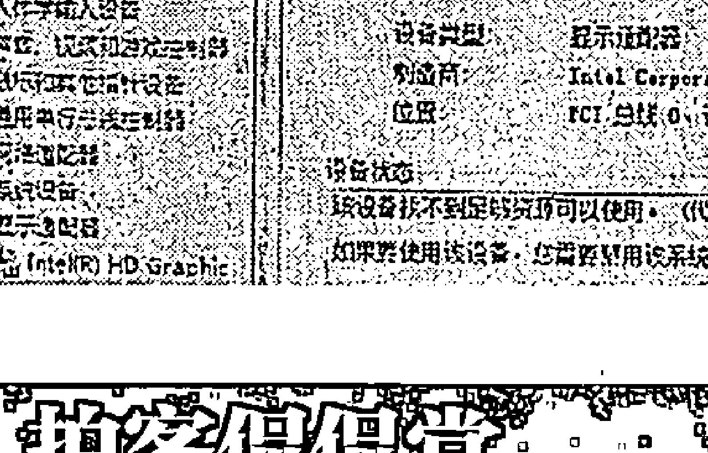

### 索尼高管证实PSP手机传言 将进军平板电脑领域

索尼在最近的分析师电话会议上对PSP手机传言予以证实。索尼CFO Masaru Kato和投资者关系高级总经理Gen Tsuchikawa还向投资者透露了索尼进军智能手机市场的一些细节，以及移动游戏领域的一些新的发展方向。除此之外，该公司还讨论了与iPad竞争的平板电脑计划。索尼表示，作为一个移动战略，该产品显然占据重要地位。一方面有PC，另一方面还与爱立信建立了合资公司开发智能手机。

> 我来拍：如果索尼这个决定提早2年，我看还有很大市场，现在也不能说没有，但是小了很多很多。

### 诺基亚砸钱用N8拍电影 邀多明星参与

诺基亚为推广N8已经想尽了各种办法，除了制作全球最大的电影屏幕来展示N8的高清电影输出能力之外，他们近日又制作了一部由明星参演的短片，卖点就是N8的720P高清视频拍摄。这部名为《上班族》的短片邀请了曾出演《贫民窟的百万富翁》的Dev Patel担任主演，女星Pam Anderson客串部分镜头。整个短片长约7分钟左右，讲述了一个上班族男孩在等公交车的时候灵魂出窍，将自己沉浸到电影环节中，被多个杀手追杀，最后的关键时刻被公交车司机叫醒。

> 我来拍：不要指望自己拿个N8也能拍出类似的效果，电影制作团队肯定使用了一些昂贵的专业器材，比如油压头、稳定器等，至少需要一个三脚架。所以不要被诺基亚迷惑了，我们仅仅是看视频而已。

### Flash奇境漫游记系列 三维引擎牵手Flash 玩的就是立体

张炜昱的个人主页：http://www.crazydream.net, MSN: crazydream2008@gmail.com, QQ: 545387308。

果果：上期我们用BOX2D物理引擎做了一个小小的尝试，二维的还不够过瘾？别着急，今天我们来试试三维引擎！

不管是二维物理引擎，还是三维引擎，都是为了让大家开发互动程序时更方便。

没有三维引擎：如果想在电脑屏幕上呈现三维的物体和场景，就需要电脑图形学和复杂的数学知识。要把三维空间中的点转化到二维屏幕上，并用线连接那些点组成面，通过复杂的算法在软件中实时渲染三维物体，真是一个复杂的过程！

有了三维引擎：一些厉害的程序员已经帮我们做好了这些事情，把这个转化和控制的过程写好成一个类库。我们需要做的不是去学习图像学和数学，仅仅学习如何使用那个类就可以了。

#### 三维程序在 Flash 中的超酷表现

- 先来直观感受一下吧！
- 360度可爱立体网站 http://www.ecodazoo.com
  全三维！可以拖着鼠标360°旋转，看到其他的角度，第一次看到这个站时，很容易被震撼到。
- 地狱里的13天 http://www.bubblebox.com/play/action/852.htm
  场景是三维的，可以左右或者上下看，很像一款古老的DOS上的游戏，不过这个是Flash的。
- 3D平衡球 http://www.mochigames.com/game/tilt_v3
  移动鼠标，改变桌面角度，使小球进入蓝色光球的区域。
- 多人打坦克游戏 http://tankionline.com
  一个Flash的多人在线打坦克游戏，非常强大，全三维的环境哦！

#### 主流三维引擎秀

三维引擎是AS程序员的必备知识之一，会使用它们，找工作可以起到加分作用！目前流行的三维引擎（类）主要有：

- Papervision 3D (PV3D) http://www.papervision3d.org
  算是最老牌最流行的3D引擎了，AS2时代就有，性能不错，支持ASE和DAE格式的3D模型，其中DAE格式的贴图支持得非常不错。支持的材质方式十分之多，几乎我们所能想到的方式基本都有。
- Away3D http://www.away3d.com
  这是一个功能很强大的3D引擎，支持多种（ASE、DAE、KMZ、3DS、Md2、Obj）模型格式，支持3D动画，支持动态灯光等。
- 这两类用的人比较多，相关的教程和讨论文章也很多，可以很容易找到。此外还有Sandy 3D Engine (http://www.flashsandy.org), Alternativa 3D (http://www.alternativaplatform.com), FIVe3D (http://www.mathieu-badimon.com), Roxik Sharikura 3D Library (http://temp.roxik.com) 等三维引擎。

#### 试一试

好了，下面进入动手的部分，我们来做一个三维牛奶盒，用鼠标拖动它可以改变角度！

首先登录http://papervision3d.googlecode.com下载最新的PV3D类库，放在FLA相同的目录中。因为是三维引擎，所以还需要一个三维的模型。

打开3DMax, 建模, 贴图。3DMax是设计师的必备工具之一，大家可能不精通，但是起码建模和渲染应该可以做吧。

在3DMax中建好模型还不行，我们还要输出一个Flash看得懂的格式。

导出COLLADA的格式（全称是COLLABorative Design Activity），可以用来建立3D互动程序的一种档案交换格式—DAE（全称是digital asset exchange）。

COLLADA主要定义一个开放式的XML标准。在3D软件中建立好的模型，只要通过COLLADA的外挂插件ColladaMax（目前支持3DMax7、8、9版本）就可以输出成DAE的文档，这个文档包含的内容以XML文字资料形式来描述。

如果安装ColladaMax后，在3DMax“文件→导出”中找不到DAE的格式输出，请打开Windows的注册表，找到这个键值：[HKEY_LOCAL_MACHINE\SOFTWARE\Autodesk\3dsmax\9.0\MAX-1:804]，把804改成408，重新安装ColladaMax插件即可。

输出DAE文件后，打开Flash，新建一个文件。PV3D的类库、DAE文件、模型的贴图、FLA可以放在同一个目录中，这样不会出现路径的问题，看着也比较直观。

建立文档类，内容如下：

```
actionscript
package {
    //Flash的类
    import flash.display.MovieClip;
    import flash.text.TextField;
    import flash.events.MouseEvent;
    import flash.events.Event;
    import flash.net.URLRequest;
    import flash.net.navigateToURL;
    //自定义组件
    import com.crazydream.loadingBar.loadingBar;
    import com.crazydream.loadingBar.loadingBarEvent;
    //TweenMax的类
    import gs.TweenMax;
    import gs.events.TweenEvent;
    import gs.easing.*;
    //使用PV3D需要导入的类
    import org.papervision3d.scenes.Scene3D; //3D场景
    import org.papervision3d.render.BasicRenderEngine; //渲染器
    import org.papervision3d.view.Viewport3D; //视窗
    import org.papervision3d.cameras.Camera3D; //摄像机
    import org.papervision3d.objects.parsers.DAE; //用来处理DAE文件
    import org.papervision3d.objects.DisplayObject3D;
    import org.papervision3d.lights.PointLight3D;
    import org.papervision3d.events.FileLoadEvent; //用来加载文件
    public class main extends MovieClip {
        private var mouseDown:Boolean;
        public var cameraPitch:Number = 90;
        public var cameraYaw:Number = 270;
        private var cameraTarget:DisplayObject3D = DisplayObject3D.ZERO;
        private var previousMouseX:Number;
        private var previousMouseY:Number;
        private var light:PointLight3D;
        private var daeFile:DAE;
        private var viewport3D:Viewport3D;
        private var scene:Scene3D;
        private var camera:Camera3D;
        private var render:BasicRenderEngine;
        private var showed:Boolean = false;
    }
}

```

```
actionscript
public function main() {
}

//图形的渲染从这个方法开始，你可以做一个按钮，点击后调用这个方法，开始显示牛奶盒子。
public function buildMap() {
    //建立地图
    viewport3D = new Viewport3D(450, 400);
    addChild(viewport3D);
    scene = new Scene3D();
    render = new BasicRenderEngine();
    camera = new Camera3D();
    camera.z = -120;
    //camera.y = 25
    //
    daeFile = new DAE();
    daeFile.load("milkbox.dae");
    daeFile.addEventListener(FileLoadEvent.LOAD_COMPLETE, _daeLoadComplete);
    stage.addEventListener(MouseEvent.MOUSE_DOWN, _mouseDown);
    stage.addEventListener(MouseEvent.MOUSE_UP, _mouseUp);
    stage.addEventListener(MouseEvent.MOUSE_MOVE, _mouseMove);
    showed = true
}

```

（本实例涉及的文件较多，请登录http://www.crazydream.net/article下载完整源文件）

好了，现在可以按Ctrl+Enter测试了。在屏幕中看到一个三维的牛奶盒，用鼠标拖动可以改变角度，很神奇吧？

Flash奇境漫游记系列连载到本期为止画上了圆满的句号。下期，我们将进入新的“天生我才”旅程，敬请期待吧！

#### 果果点酱

穿越！我们生活在几维空间？
上期是二维物理引擎，这期是三维引擎，X、Y、Z轴都用上了，那么还有四维、五维吗？先来赞一下制作引擎的热心人，给全世界的Flash爱好者们插上翅膀。既然插上翅膀，就来个漫游幻想吧，我们生活的世界，到底有几维呢？
一维是线，二维是面，三维是立体，四维是时间。郭敬明很喜欢写时光、青春的作品，所以网名叫“第四维”，我们熟悉的“小四”就是这么来的。
现在流行一个词——穿越，什么东西整上这个词，似乎就会变得更潮。《多拉A梦》的时光机就不说了，《月光宝盒》玩了穿越，今年又出了《越光宝盒》的新版本，无数名角在里面打酱油，逗大家哈哈一乐，导演也很明朗地把“穿越”装进了标题里。
考考你，“穿越”大概发生在第几维呢？我觉得应该是第四维，也就是时间。
伟大的爱因斯坦在相对论中说，我们生活中所面对的三维空间加上时间构成所谓四维空间。由于我们在地球上感觉到的时间很慢，所以不会明显感觉到四维空间的存在，但一旦登上宇宙飞船或到达宇宙之中，使本身所在参照系的速度开始变快或开始接近光速时，我们就能对比找到时间的变化。如果在时速接近光速的飞船里航行，生命会比在地球上的人要长很多哦！
科学是百家争鸣的，有人提出了五维概念，把“黑洞”拉进来玩了一把，认为五维代表能量无界限。通过特殊的时间机器能从一个黑洞向另一个黑洞打通路程，突然出现在我们预先规定的将来，或是出现在我们预先规定的过去，并通过相反途径返回到我们的空间中来。读者们的思绪是不是已经进入了外太空？那么就化身奥特曼吧，出发！穿越！
(北京/张炜昱)

### 红花还需绿叶衬 SNS插件开发 (6)

你可能不知道SNS为何物, 但应该玩过Facebook、人人网或开心网吧, 这几家当前正火的网站, 正是SNS (Social Network Site, 社交网站) 的典型代表。沉迷于SNS网站, 大都是因为里面千奇百怪的应用, 如偷菜、砸蛋、开餐厅等等。这些应用实际就是SNS插件, 不少是第三方厂商开发的, 由此也带来了巨大的经济利益。

#### 人物专访

今天我们请来的, 是人人网上人气非常旺的“怪蛋工场”的作者之一, 网名“邂逅”, 他将和我们聊聊SNS网站应用开发的相关话题。邂逅于2007年来到北京, 当时尚未毕业, 学校联系了北京方面的培训机构, 然后就和同学一起踏上了北漂之路, 到如今已是事业有成。

CFan: 为什么会选择SNS平台开发?

邂逅: 大约在2008年校内网开放应用程序接口, 掀起国内SNS热潮, 开心农场的火爆也证明了这种商业模式的可行。于是我们公司也开始转型SNS Flash游戏, 并取得了成功。现在我们正尝试着把Socket技术融合在SNS游戏中, 打破常规SNS游戏时间上不实时定律, 在SNS上也能和好友实时互动玩游戏。

CFan: 对于即将毕业的同学们有何忠告?

邂逅: 曾经有一位公司老总对我说:“知道我为什么喜欢招刚毕业的大学生吗? 因为你们就像一张白纸, 可塑性很强。” 我的理解就是: 不怕不会, 就怕不学!

像我们这类型的工作, 技术上遇到难题并不算什么, 百度、谷歌及各大技术论坛, 可以找到想知道的一切。当然最快的途径是向身边的同事、那些久经沙场的老将学习。所以真正的问题, 是我们的心理素质和对问题的处理能力、分析能力, 这个谁也帮不了你。

### 【芝麻开门】

做SNS开发之前需要掌握哪些知识? 首先要掌握前端和后端两种开发语言。前端主要用Javascript和HTML、Flash知识。就目前的主流开发来说, 前端主要掌握Flash AS3语言, 它的优点是可以把游戏表现得更加完美。

后端基本都是用PHP语言开发, PHP非常简洁, 开发快, 维护起来容易上手。数据库一般都是用MySQL, 需要经常用到的游戏数据就可以用Memcache缓存(例如好友列表), 这样可以很大程度上提高游戏的效率。还有服务器方面用Centos系统就可以, 配上Nginx解析PHP效率也是比较快的。

### 火速链接

想要了解 Flash 开发相关知识的朋友, 可参阅本刊今年第 7 期开始的《Flash 奇境漫游记系列》。

#### ★SNS插件开发前景

SNS网站目前正在走一条平台化、开放化和协议化的路子。从腾讯的Q-zone, 新浪、网易、百度等的空间转型, 可以清楚地看出国内几大网络巨头对SNS未来发展趋势的态度。

SNS本身有别于传统站点的单站登录, 它最大的意义就是流量的聚合。SNS插件便是这其中不可缺少的重要一环, 因为SNS插件可以放置在各个不同站点中, 以用户为媒介通过多站聚合方式达到前所未有的巨大流量, 这是SNS站点所看重以及需要的价值。然后, 在巨大的流量中, 各种软广告市场将会逐步出现, 这一点开心网表现得已经淋漓尽致了。而这便是基于真正Web2.0站点思想的一个潜力巨大的市场。

#### 【任务实战】

如图所示, 是进入人人网“怪蛋工场”应用后的初始界面。这个游戏的故事背景是:

在太阳系金、木、水、火、土五大行星里生活着很多精灵, 它们为了争夺资源互相敌视, 而传说中只有当所有星系的精灵团结一致时才会有新的希望。于是, 五大行星族长提议举行怪兽争霸赛来提高行星间的合作与交流, 争霸赛马上就要开始了, 各星系都选出他们的代表精灵来参加……

限于篇幅我们无法详细介绍整个项目, 这里简单聊聊PHP和Flash在本地是如何正常运行起来的。PHP需要为Flash提供本地接口, 在各个平台上做初期调试。这就需要在Flash文件里有一个配置文件, 最好是从外部调用的XML文件, 里边主要是Flash文件的一些加载配置和调用接口的地址, 方便以后正式环境切换。这样, 若本地PHP接口对Flash传来的参数经过校验是正确的, 就能直接返回与正式环境一样的数据, 当参数错误时, 便会返回错误信息, 就不需要执行其他操作了。

#### 实战: 从SNS网站获取用户数据

上边是对基本开发语言以及服务器配置的一些要求, 还有一点很重要的, 是对各个平台的接口要非常清楚, 要了解具体接口的作用, 方便以后从接口取数据。下面的实例, 即是从校内网站获取用户基本数据, 首先建立一个类:

```
class XNapp {
  public $secret; //app分配的密钥
  public $session_key; //app返回的加密校对key

  public $api_key; //app分配的key
  public $v; //版本号
  public $server_addr; //请求地址
  public $method; //发送请求方法

  //构造函数, 自动执行
  public function __construct($api_key,$secret,$v='1.0')
  {
    $this->secret = $secret;
    $this->api_key = $api_key;
    $this->v=$v;
    $this->session_key=$_REQUEST['xn_sig_session_key'];
    $this->server_addr='http://api.xiaonei.com/restserver.do?';
  }

  public function auth($method)
  {
    //函数代码略 ...
  }

  public function users($method,$array=array(), $format='JSON')
  {
    //函数代码略 ...
  }
}
```

上面的users()函数, 主要是为取得对应用户个人数据, 采用的是JSON方式。PHP和Flash之间的数据传输可以用JSON和AMF两种方式, 前者开发起来相对容易, 尤其是调试的时候非常明显。后者的优点是传送的数据不是明文, 相对来说更为安全, 传送速度也快, 只是很调试很麻烦。创建类之后, 可通过下面的方法调用:

```
$xn = new XNapp($api_key,$secret); //实例化
```
开始使用
//获得个人信息
$params = array (
  "uids" => array($xiaonei_uid),
  "fields"=> array('name','sex','birthday','tinyurl','headurl','mainurl')
);
$result_array = $xn->users('getInfo',$params);//app返回用户信息

#### 【高手支招】

每个平台都有自己的接口, 只要按照SNS平台事先规范的接口调用即可, 其实主要用的也就是调用玩家SNS的个人基本信息和好友的信息, 用于游戏互动, 其他还是自己网站的数据。

对于新手来说, 搭建PHP开发环境是件比较头痛的事情, 往往不知道哪里配置错误, 就会导致PHP程序不被解析, 数据扩展安装失败等种种问题。其实对初学者来说, 搭建一个本地环境, 在Windows环境下, 找一个Apache+MySQL+PHP套装安装就完全可以了。比如PHPnow (下载地址: http://phpnow.org/download.php)。

下载解压后, 双击Setup.cmd安装, 按提示选择推荐的Apache 2.0 (输入20后按回车键), 接着再按提示选择MySQL 5.0 (输入50后按回车键), 安装完毕询问是否初始化, 按y键后回车, 初始化过程中, 遇到系统防火墙提示时, 选择“解除阻止”即可, 最后按提示设置数据库root用户密码, 完成后即会自动打开PHP测试页, 即表示安装成功。现在就可以在本机无障碍体验PHP程序开发和调试了。

#### 【结束语】

这个插件开发的系列, 到本期就暂告一段落了。这一系列中, 我们接触了Office、网络、应用软件等多种类型的插件开发, 虽然各有不同, 但也不乏共同点: 比如开发工具有许多就是相同的, 开发的方法也能举一反三互相借鉴。最后小编想说的是: 瞄准插件开发市场, 首先要调查宿主软件的市场大不大, 如果是一个非常偏门的应用软件, 它的插件市场一般也会有限; 另外, 在确定要为某软件开发插件后, 一定要想方设法多搜集一些此软件的相关资料, 包括软件本身的使用、软件开放API的详细资料等。

(文/邂逅)

### 挖出不一样的秘密数据分析师

什么是数据分析师？说白了，就是根据一定的目的收集数据并进行分析，最终形成报告提供给客户做决策参考的人员。相信大家平时接触过五花八门的调查问卷吧？那就是数据分析师们在收集数据呢。不过我们今天主要聊的，则是数据收集之后如何去分析，以提取有用的信息。

#### 【芝麻开门】数据从哪里来？

在进行数据分析之前，首先要有数据，这些数据又是从哪里来的？一般数据主要通过调查统计、实验、文献研究、实地研究等几种方法取得。调查统计是比较常用的方法，问卷调查则是其收集资料的主要工具，相信大家平时也接触过各式各样的问卷。

调查问卷一般由封面信（调查介绍）、导语（问卷填答方法及注意事项）、问题及答案等三部分组成。其中问题及答案是主体内容，它一般分开放式问题（只提问题，由被调查者自由填答）和封闭式问题（提出问题的同时给出限定的几个答案供选择）两种。比如某软件公司在调查软件用户的文化水平时，可以设计如下问题：

您的文化程度？
(1)小学以下 (2)初中 (3)高中或中专 (4)大专大学或以上

这就是一个封闭式问题，封闭式的问题容易对答案进行编码，上例中的答案可以抽象成数字1234，这样便于在计算机中进行统计分析了。

### 网络大补贴：

分发和回收问卷的方法有多种，比如人工散发、邮寄等。随着网络的普及，在线问卷调查成为越来越重要的工具。下面介绍几个不错的在线调查问卷网站。

- ★调查派：http://www.diaochapai.com
- ★问卷星：http://www.sojump.com
- ★问道：http://www.askform.cn
- ★知己知彼：http://www.zhijizhibi.com

#### 人物专访

得州（化名），2004年获社会学博士学位，精通SPSS应用，现为某IT公司的数据分析师。

**CFan：数据分析师主要工作是什么？发展前景如何？**

**得州：** 随着我国市场经济的深入发展，催生了市场研究这一新兴的行业，也产生了不少调查、咨询公司，这就需要许多专业的数据分析人才。现在许多公司内部也设置市场部，同样对数据分析师有很大需求，发展前景还是不错的。

一般来说，数据分析师的主要工作包括：设计调查方案，搜集相关数据（如问卷、访问、实验等）以及对搜集到的数据进行各种定量、定性分析，撰写调查分析报告帮助客户做出正确的决策。比如国外公司要进入中国，必然要对中国市场的消费结构、消费习惯、消费特征等进行分析研究。

#### 【任务实战】

预测，就是对未来可能发生的事做出猜测，精确预测几乎是每个人的梦想。试想要是在十年前预测到现在的房市，当时多买几套房子，现在千万富翁也不愁了。数据统计分析就提供了预测未来的一种方法。一说起数据分析，许多人立即想到各种复杂的数学公式，令人望而生畏。而借助PASW（即原来的SPSS，试用版下载：http://www.spss.com/statistics），即使是新手也能在瞬间建立起预测分析模型。

#### 调查1：北京某公司招聘广告

**职责描述：** 数据分析师
1. 负责销售数据整理、分析。
2. 通过行业分析为公司提供战略提示和建议，撰写研究报告。

**职位要求：**
1. 社会学、心理学或管理学相关专业，本科以上学历。
2. 具备良好逻辑分析能力。
3. 精通SPSS、Excel、PowerPoint等软件使用。
4. 其他。

#### 调查2：广州数据分析师工资水平

**实战：明天你能卖出几个烧饼**
卖烧饼的也要用到SPSS数据分析？笑话！看官莫急，卖烧饼只是一个形象的比喻，让大家更容易理解。其实下面的例子，你可以套用到预测蒙牛每天要出多少瓶酸奶，肯德基每天应准备多少只鸡翅原料等，对产品销售来说都是有益的参考，自然也包括烧饼店的小老板们。

#### 准备好你的数据

本例首先要建立时间序列，也就是在间隔相同的一系列时间点上（频率）发生的变化值。比如一周之内每一天卖出的烧饼数，就构成了一个时间序列。既然一些现象在过去一段时间内有规律地出现，那么就可以预测它在未来一段时间内还会出现。

**表一：一个月内每天烧饼售出时间序列**

| 时间 | 周 | 日     | 出货量 |
|------|----|--------|--------|
| t1   | 1  | 星期一 | 365    |
| t2   | 1  | 星期二 | 320    |
| t3   | 1  | 星期三 | 329    |
| t4   | 1  | 星期四 | 332    |
| t5   | 1  | 星期五 | 328    |
| t6   | 1  | 星期六 | 280    |
| t7   | 1  | 星期日 | 286    |
| t8   | 2  | 星期一 | 362    |
| ...  | ...| ...    | ...    |
| t30  | 5  | 星期二 | 322    |

#### 在PASW中定义变量和输入

现在启动PASW，点击“取消”关闭向导窗口，进入程序主界面。单击左下角“变量视图”，然后在“名称”列中依次输入“时间”、“周”、“日”、“出货量”（双击单元格即可输入）。将时间和日的类型由默认的数值型改为字符串型，其他设置不用修改。单击左下角“数据视图”返回（见图2），输入数据即可，这方面的操作与Excel相似，不再细述。单击菜单“文件→保存”保存文件，扩展名默认为SAV（以后就可以随时按Ctrl+S键快速保存了）。

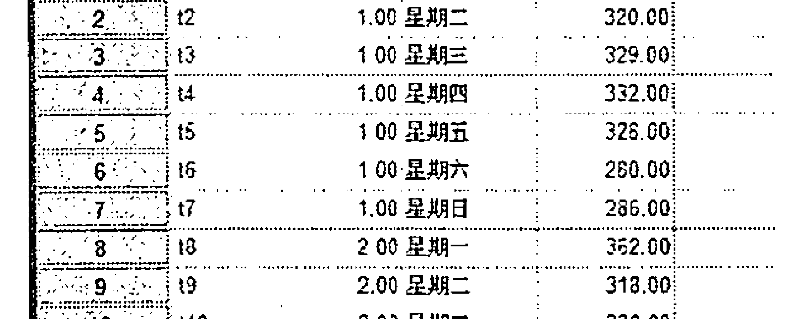

#### 预测报告

接下来单击菜单“分析→预测→序列图”，在打开的对话框中选中“出货量”并点击上方箭头将它加到变量框中，选中“时间”将它加到时间轴标签中（见图3）。单击“确定”后自动打开输出文档查看器，如图4所示，烧饼出售量正好触及第一轮谷底，也就是说明天可以稍稍增加产品量了。单击此窗口菜单“文件→保存”保存报告（扩展名为.spv）。另外单击“文件→导出”，将报告导出为Word、PowerPoint、HTML等其他文件格式，方便在其他地方引用。

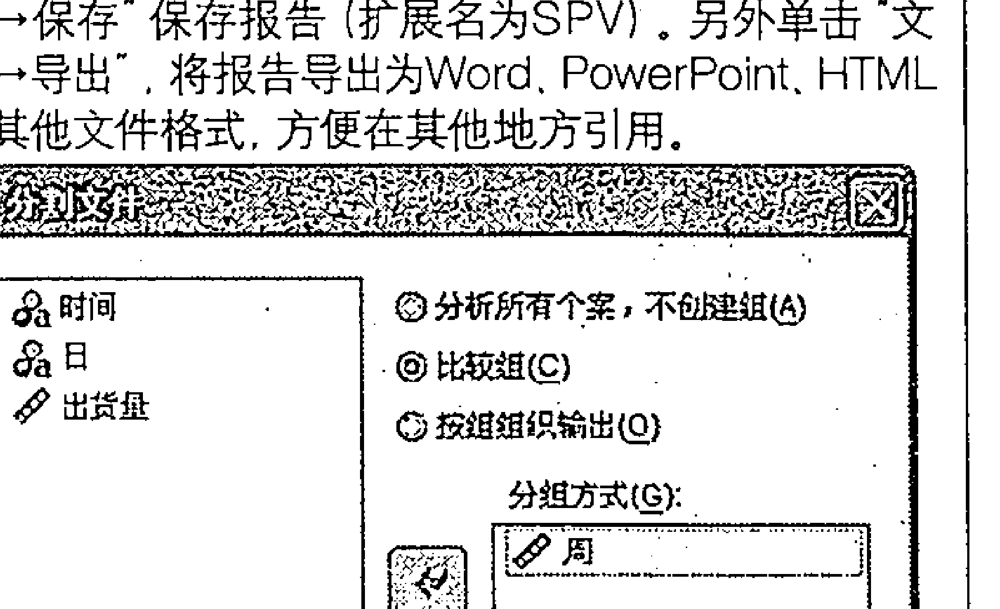

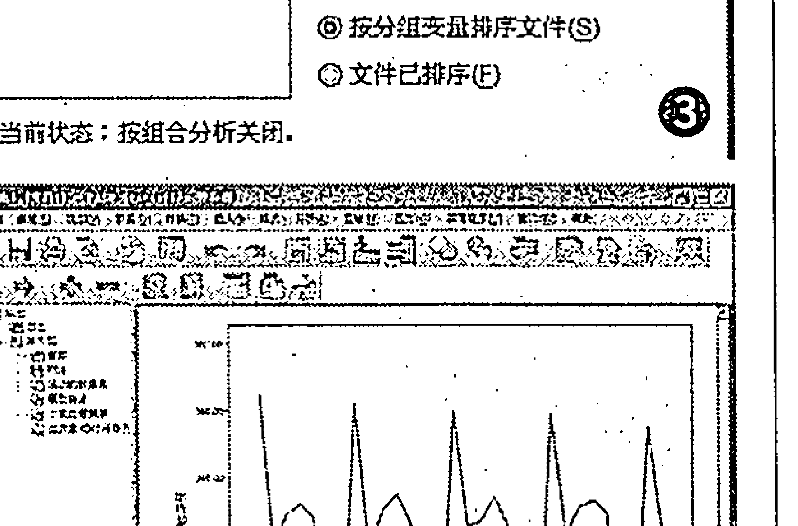

#### 还没结束：更精确的预测

上面是以月为单位进行分析预测的，还不是非常精确。明显以每一周为周期，更能真实反应影响烧饼销售的变量。怎么才能以“周”为单位对整个数据切分呢？好办！

单击菜单“数据→拆分文件”，在打开的窗口中，选中“比较组”项，再选中左侧“周”变量单击箭头按钮将它加到分组方式框中。虽然看起来数据表没什么变化，不过再重新做一次上述的预测序列图，会发现每一周都会拆分开来，单独精确显示了。本例可以看出，周一是售出量高峰（可能是刚开始上班吧），周六周日是最低谷（不用上班，大部分人自己在家就对付了）。注意：拆分处理完毕，要记得取消拆分，免得影响其他操作。

当然，所有的预测仅仅是作为参考的。另外上面也只是简单应用，实际情况可能更复杂，比如随着气候冷暖、日夜时长等因素影响，一年中每个季度甚至每个月的销售趋势也会各不相同等等。这就需要更详实的数据，更精细的预测模型了。

#### 【高手论道】

Excel是大家耳熟能详的电子表格软件，不过它的主要功能是表格处理、数据管理及图表处理，而不是专业分析的软件。对于专业的数据分析软件PASW（即著名的SPSS）来说，Excel基本上起的是数据导入的功能，两者并非势不两立而是互补的关系。打开PASW后就可以发现，它提供了非常多的数据分析工具，这些则是Excel所不具备的。

#### 结束语

据网上资料显示，目前的调查分析职业，刚毕业的大学生年薪在5万元左右，有一定工作经验后年薪可达10万元甚至更多。外企比较重视市场调查分析人才，薪资水准也更诱人，年收入能突破10万元。
本期所介绍的数据分析师，更倾向于市场调查行业。市场调查在国外已是比较成熟的行业，在我国起步稍晚，但随着全球一体化和市场经济的不断完善，调查分析越来越受到社会关注，这方面的人才需求呈上升趋势。相应的，国家统计局、教育部（全国考委）推出了调查分析师认证考试，有兴趣的话可以查阅更多资料。

### 锦囊相赠 护淘宝小店扬帆远航

淘宝卖家宝典系列做到今天，大家都从中获得了不少启示吧？本期作为完结篇，送出六个锦囊，希望大家的生意更兴旺。

#### 锦囊一 遵守规则，诚实经营

淘宝不是为你一个人开的，有这样那样的约束和规则。要维护好这个大家庭的稳定与秩序，每个人都应该自觉地去学习品读规章制度（淘宝官网有详细说明），细心地去吸取前辈们的经验教训（淘宝论坛有各种真实案例帖）。别刷信誉（别迷信什么捷径或联盟），别搞各种小动作，就好像在考试时悄悄作弊，你以为老师没看见吗？一旦被取消资格，之前的努力不就白费了吗？

#### 锦囊二 手不释卷，不断充实大脑

多看论坛精华帖，学习无数卖家毫无保留的经验分享，关注产品的最新动态，了解时政新闻和社会大事……多多充电，充实灵活的大脑+丰富的积累才能保证小店生意兴旺。某些衣服的爆款，不少都是电视电影中出现的同款或类似的款式，你觉察到了吗？生意清淡只知道抱怨是没用的，有问题就要赶紧寻找方法来解决。在竞争中脱颖而出要有自己的特色，产品没有特色就要在服务上跟上，用长处来弥补不足，学会忍耐寂寞；学会销售技巧，学会有效推广，惊喜总会降临。

#### 锦囊三 旁征博引，利用免费资源

本刊制作的淘宝卖家宝典系列中介绍过不少不错的应用工具，多是免费的。其他拥有自动上下架、宝贝轮推、批量宝贝管理和自动评价功能的各种工具也可以多尝试。当然如果有预算，搭乘淘宝直通车等收费内容也可以尝试。此外，网店装修如果不请专业设计师，自己结合宝贝照片在免费资源堆里找出色调一致、简单精美的图片和模板，用PS等工具做自己的LOGO和版面主图，力求美观专业，也可以不断进步，说不定还能兼职帮别人做装修，增加收益呢。

#### 锦囊四 与时俱进，抢滩搜索引擎

谁都希望自己销售的宝贝能够排名靠前，在不花银子的情况下如何做到呢？“偷心宝宝61181”用“店铺装修”这个词进行搜索，发现前20页都是在2小时7分钟内即将结束的宝贝（“耳钉”前20页的最后一个搜索结果显示剩余3小时20分钟下架，不同关键词不同，太生僻的关键字无需关注）。
同时她又发现，网店一天中流量最多的时段一般是上午9：00~11：30，中午1：00~2：00，下午3：30~5：00，晚上8：00~10：30。按在这些时段每6分钟都有一件宝贝下架来算，一小时需要10件宝贝，一天需要55件宝贝。于是，她找到了一个好用的自动上架软件(http://bbs.taobao.com/catalog/thread/154503-18340304.htm)，进入“工具→批量定时上架”，根据提示一步步操作，在监视时间设定宝贝每天上午9点以后上架，每6分钟上架一个宝贝，点击“保存设置”。这样上午9点后，宝贝就很容易进入靠前的搜索结果了。

#### 锦囊五 近水楼台，留意淘宝大学课程

淘宝在全国设立了很多淘宝大学培训机构，专门给淘宝掌柜面授各种技巧，内容涉及：店铺后台操作、交易安全、PS图片技巧、推广活动方案与解析等，更有系列培训课程助你成为网店专才。各位掌柜可以在淘宝门户帮派下的“淘大聚义堂”查询全国开课预告，如果恰好在自己城市或者周边，不妨抽时间去听一听，每节课2.5小时，培训费用因内容而异。

#### 锦囊六 以诚相待，真诚留住回头客

礼貌的用语、至始至终的热情、对宝贝满意度的回访、充分的尊重以及专业角度的意见都可以给买家真实购物的感觉，从经济学角度看，你用语言与态度零成本增加了买家消费同价格物品所获得的满足感，使买家觉得这笔钱花得超值，下回还会想到你，而回头客带来的效益就不言而喻了。多为回头客开展一些优惠活动，比如发货时神秘的小礼物，礼轻情意重，为他们再次光临奠定了基础。好好利用聊天记录，把握住老顾客、回头客，分析买家的购买意图，为其精准地推荐宝贝，让买家感到掌柜很善解人意，生意自然好做。买家喜欢砍价，要是用“不议价”打发就太草率了，能有略微优惠就优惠，或者温柔地说明“已经是最低价了哦”，何必那么直截了当呢？必须考虑到对方的心情，还需要回头客！会员制度有好处，对卖家和买家都有约束，对于价格更好把控。
对于难缠的买家千万不要拒之门外，要毫不厌烦地耐心对待，听了他的意见后再一项一项地改，这样你的网店才会日益完美，超越他人！
(河北/韩政)

### 开好店先要装门面 网店装修师

网店装修，月入过万，你眼馋吗？选择网上购物的人越来越多，网店也随之火爆，这就催生了一个新兴的行业——网店装修。你付出的可能仅是时间和智慧，不需要投入多少物质资金就可以赚钱，真正的无本经营，风险非常小。不过越容易的事竞争也就越激烈，这个行业的状况如何？如何成为网店装修高手？大家一起来聊聊吧。

### 【芝麻开门】

巧妇难为无米之炊，做网店设计的，最好自己有家网店，如同卖房的样板间一样，让客户看看效果，同时也能更好地理解客户的需求。
这里以淘宝店为例。首先打开http://www.taobao.com，点击首页“免费注册”按提示注册淘宝账号。另外还要进行支付宝账户认证，点击“我的淘宝→实名认证→申请支付宝个人实名认证→立即申请”，然后按提示输入自己的身份证号码和真实姓名，提交即可。
万事俱备，只等开店了。登录自己的淘宝网账号后，点击左侧“我要卖”，确定出售方式（如“一口价”），选择商品类型，最后填写商品信息发布即可。同样方法发布10件不同的商品后，将会显示可以“免费开店”的提示，点击后按提示设置店铺的基本信息，确定后，即可得到一个专属于你的网址，记住了，这就是你的淘宝网店啦。

#### 【任务实战】

刚刚创建的淘宝网店，试问这样的店铺，谁会有兴趣在上面浏览购物呢？莫急，网店装修师会为你挂上招牌、贴上壁纸、铺上地砖，让店面变得富丽堂皇。
首先分析一下淘宝店的大结构。淘宝店有普通店与旺铺之分，普通店可装修的地方，一般有店标、店铺公告、店铺分类、宝贝列表、友情链接等几处。旺铺使用需要付费，但是它装修的自由度也大了很多，如通栏店标、店铺招牌、左侧分类区、右侧促销区等。

#### 实战：普通店装修流程攻略

刚刚试水淘宝网店的朋友，可能还找不着东南西北，所以先拿免费的普通店试水比较合适。

#### 店标设计

店标是一个店铺的形象标志，最好既能体现店铺特色又个性鲜明能给访客留下深刻印象。本例为设计类型的网店，所以店标最好有点设计因素。
启动Photoshop（你可以选用任意自己喜欢的图形编辑软件），新建一个300×300像素（dpi为72）大小的文件。然后选中画笔工具（快捷键为B），按F5键调出画笔面板，在“画笔预设”中将主直径设置为18px，再切换到“画笔笔尖形状”中，将硬度设置为100%，间距设置成150%。
使用定制的新笔刷，分别用红绿蓝三色画三条水平虚点直线。接着再执行“滤镜→扭曲→旋转扭曲”，将得到一个漩涡状图案，稍作修改，再加上文字，一个店标就新鲜出炉啦。因为淘宝普通店店标的大小尺寸为80×80像素，所以上面的图还要通过“图像→图像大小”命令修改一下尺寸，最后保存为GIF、JPG或PNG即可。
换店标就很简单了：进入“我的淘宝”，点击左侧“店铺管理→店铺基本设置”，再单击“上传店标”将刚才制作的图片上传，保存设置即可。
小提示：
★店标不一定都要自己设计，根据情况，可以从网上搜索一些合适的图片来用。比如一些服装店，就可以选一张非常漂亮的时装图片作为店标等。要注意图片与店铺的主旨吻合，卖茶叶的放上一个手机的图片，访客肯定茫然不知所从了。

#### 店铺公告

店铺公告，是网店宣传促销的黄金地段，自然不能小视。在“我的淘宝”中点击“店铺管理→店铺装修”，单击店铺公告右侧“编辑”，输入自己的公告内容并通过最右侧按钮插入图片即可，图片最好别超过340像素。

懂HTML的，可以单击左侧源代码按钮，直接编辑网页源代码，比如在公告中插入一个带链接的图片，代码如下所示：

```
<A href="要链接的网址" target=_blank></A>
```

小提示：
★淘宝可能是为了圈钱，对普通店的公告限制很多，难有作为，只能插入滚动的文字和图片。经测试，网上为普通店公告设置背景图片及挂件等的方法，几乎都已失效了。

#### 更多的个性化

上面两个，是普通店装修的重头戏。另外还有宝贝分类、商品描述、店铺介绍等。基本上是文字的设置，就不多介绍了。至此，你的网店已经小有规模了。暂且歇一歇，下期让我们向淘宝旺铺进发。

#### 【高手支招】

★淘宝普通店免费升级旺铺
登录自己的淘宝店之后，点击“管理店铺”可以进入店铺后台。如果是第一次进，系统将提示免费升级到旺铺的提示，单击“升级到旺铺”即可。如果没注意到这个提示而关闭了对话框，也没关系，进入“我的淘宝”之后，点击“我是卖家→店铺管理→店铺装修→升级到旺铺”就可以啦（以网站官方说明为准）。

★将淘宝店绑定到个性域名
为了让自己的淘宝店看起来更专业，可以申请一个顶级域名，再把自己的淘宝店与之绑定在一起。在“我的淘宝”中，进入“店铺管理→域名设置”，在右侧切换到“顶级域名”，将自己的域名与店铺绑定就可以了。不过绑定顶级域名后，需要进行备案才能通过它访问。
(文/小豆)

### 开好店先要装门面 淘宝旺铺的装修

上一期，我们介绍了如何在淘宝上开网店，以及淘宝普通店的简单装修流程。不过普通店的限制实在太大了，可以改造的地方不多，而淘宝旺铺开放了多个自定义区域，可令我们大展手脚。网店装修的业务需求，大多数也来自旺铺店主。所以，今天我们就来聊聊旺铺装修。

#### 人物专访

王珊、Carol，两位来自衣冠情秀的漂亮MM，主要负责店铺的设计装修。她们于美丽中带着些许的俏皮，喜欢看漂亮的东西积累灵感，闲来无事偶尔也会PS恶搞一下同事。当看到一个普普通通如初生婴儿赤裸裸的网店，经过精心设计摇身一变成为令人赏心悦目的花样少女般的个性网店时，总有一种成就感油然而生。

**CFan：淘宝店铺有哪些元素构成，旺铺可装修的是哪些部分？**
**衣冠情秀：** 淘宝店铺页面主要由店铺招牌、掌柜档案、自定义内容区、搜索店内宝贝、掌柜推荐宝贝、宝贝分类、新品上架、宝贝排行榜、热卖宝贝、友情链接以及店铺交流区11个部分构成。
店铺招牌、自定义内容区和宝贝分类是装修的主要阵地。比如我们，会根据阶段性、季节性、节日性等特质来装修这三个部分，以浪漫、柔美温馨的格调让浏览店铺的顾客品尝到有爱情的甜蜜味道。

**CFan：网店装修，需要哪些工具？**
**衣冠情秀：** 网店装修的必备软件工具，几乎已被Adobe CS套件所涵盖，常用的有：Photoshop、Dreamweaver、Flash、ImageReady。
Photoshop主要是对素材图片进行处理，包括抠图、做艺术字、更换背景图、制作店铺的水印以及切片等等。而ImageReady主要是对静态图片进行动态的处理。Dreamweaver则是将处理好的图片进行布局，在放上网店前进行测试，在淘宝装修中最常用到的就是表格布局，所以我们会使用表格的嵌套进行图片的布局。Flash主要是制作动态的广告条。另外也有人使用Illustrator或CorelDRAW，这类矢量绘图软件，用来制作LOGO图标非常合适。

### 【芝麻开门】

对于一般玩家来说，不一定要用专业工具，许多时候，美图秀秀、光影魔术手之类的工具就可以完成基本任务。这里以美图秀秀为例，介绍一下如何完成店主最常用的抠图任务。

#### 美图秀秀自动抠图

启动美图秀秀并打开需要处理的图片，然后单击右上方“抠图”按钮打开独立的抠图窗口。点选左侧“方法1：自动抠图”，然后在需要抠取的图像上划线，美图秀秀即可自动选取。没有被选取到的部分，可以继续划线直到全部选中为止。接下来点击左侧“启用删除背景笔”，在多选出来的区域划线，可以删除多选的图像。最后点击下方“保存抠好图片”，设置存储路径保存就可以了。

#### 【任务实战】

淘宝店铺右侧的自定义内容区，即店主们常说的促销区，这里相当于店铺的门面，自然是装修的重点。

#### 实战：旺铺促销海报先行

促销区大多以漂亮的图片装饰，如同电影的宣传海报。促销区的标准宽度为750像素，高度则没有太多限制，不过最好控制在600像素以内，否则访客需要向下拖滚动条才能看全，会很不方便。

#### 借他人模板装自己门面

许多朋友不懂设计，看着别人漂亮的促销海报未免眼热，下面就教你一招免费“借”别人海报为己所用的方法。这里以Banner maker (http://banner.alimama.com) 为例，打开它的主页后，点击上方“选择模板”，然后切换到“图文”选项卡，挑选自己喜欢的一款模板后点击进入编辑界面。分别点选模板上的各处文字，在右侧“标题”框中修改，尽可能都改成自己需要的内容。

修改完毕，可通过SnagIT，甚至是QQ的截图工具将模板截取保存下来。Banner maker提供的模板大小与淘宝店相当吻合，所以微调一下截图造成的误差即可。在Photoshop中打开模板图，点击菜单“图像→图像大小”，将宽度设置为750像素，高度设置为600像素，确定即可。
最后就是替换图片。将你自己准备的图片也在Photoshop中打开，并使用移动工具（快捷键为V）将其拖放到模板图上，然后按Ctrl+T键，拖过来的图片四周即会显示8个锚点，拖拉这些锚点可自由调整图片大小，使其与模板上的图片大小吻合即可。图片修改完毕，保存为JPG或PNG格式文件。

#### 为海报增加热点链接

启动网页编辑软件Dreamweaver CS3，新建一个HTML格式的空白文件，默认进入的是“设计”视图。点击菜单“插入记录→图像”，选择上面设计的海报图，连续点击“确定”导入网页中。
单击一下图片，然后点选属性框中的矩形热点工具，在要增加链接的照片上画出一个半透明的蓝色方框（此方框即热点区域），然后在下方属性的“链接”框中，删去原有的“#”，输入对应宝贝的页面链接（如：http://item.taobao.com/item.htm?id=6129240725），其他项忽略。同样方法，为所有的宝贝添加上热点链接。

#### 应用到淘宝促销区

接下来，先将海报图片上传到店铺空间：登录“我的淘宝”，在“我是卖家”中单击店铺管理下的“图片空间”，按提示将上面制作的图片上传到淘宝空间，并点击图片下“复制本图地址”复制它的网址。
回到Dreamweaver中，单击上方“代码”进入代码视图，将标志中的src值，替换成海报图片的网址，然后将<body>与</body>之间的所有代码复制下来。
现在回到淘宝店铺，进入装修页面，单击自定义区域右侧“编辑”，在编辑框中再单击“编辑HTML源码”按钮，将刚才复制的代码粘贴到文本框，然后单击“保存”。先点击一下右上方“预览”看看效果，满意的话再单击“发布”，一个有着超酷海报的店铺就完成啦。

#### 【高手支招】

★为促销区海报添加多个链接，网上另一个较流行的做法是：在Photoshop中制作好整体效果图，再通过切片工具切分图片，然后为每部分的图片添加链接。这种方法有一定的灵活性，不过较为繁琐，而且对初学者来说，也很容易出错，不如上例的方法来得简便。
★如果用Flash来装点旺铺的自定义区域，效果会更酷，不过这是需要付费的，所以一定要自己事先权衡好利弊。进入“我的淘宝→我是卖家→（软件产品/服务）我要订购”，找到“旺铺装修模板”，购买成功后挑选一款喜欢的模板，进入在线编辑状态，将其中的内容修改为自己的信息，应用即可。
不过一定要慎用Flash，花钱只是一个方面，另外，浏览器有时会拦截Flash，有些人的电脑中没有安装Flash播放插件，装载速度慢，这些都可能影响到访客的体验。
★不少店铺的促销海报中，每个宝贝的图片都加上了好看的边框效果，显得很酷。这其实很容易做到，以美图秀秀为例，打开宝贝图片后，点击上方“边框”选项卡，然后为图片应用一种边框即可。每个宝贝图片都可以这样单独处理，最后再在Photoshop中合成即可。

(文/衣冠情秀)

### 淘宝皇冠店客户沟通宝典

果果：淘宝开店系列连载一段时间了，从迅速搭建店铺，到宝贝拍摄、美化，再到宣传推广，有读者高兴地告诉我，已经赚钱啦！今天，我们请来一名可爱的淘宝大学讲师一胖可爱 (http://pangkeai.taobao.com)，谈谈她最拿手的顾客沟通技巧。嘘……静一静，有问题请举手。

大家都说，人和人之间的沟通是最难的，在电子商务时代，我们需要和见不到面的人去交流，可以说难上加难了。如何在素未谋面的情况下拉近和顾客之间的距离呢？只要我们学会分析顾客的心理，利用好在线交流工具，就可以事半功倍，提高交流效率，获得皇冠并不是难事！

#### 顾客特点逐一应对

首先，我们要通过买家的言语来分析其个性、需求等特点，然后针对各种人的特点采取不同的交流方式。网络购物的人群通常可以分为三类：
- 小白型：这类人通常对所购买的商品并不了解，只是出于好奇想买回去试试看，不懂的地方非常多，依赖性也很强，每一步都需要卖家去耐心引导。商品最基本的一些知识，我们认为没有多讲的必要，可是对于菜鸟客户来说都是第一次听说，而他们又确实有购买的需要和诚意。所以我们就要细心解答，全程辅导。
- 一知半解型：这样的客户相对来说比较难对付，要说他不懂吧他又略知一二，要说他很懂吧他还存在许多知识上面的误区。如果直接去纠正他，可能还会认为有什么其他目的，容易造成他言语中有冲动的言辞或者过于主观的判断，这时卖家就需要保持良好的心态，控制好自己的情绪，有礼貌地对待客户的责问，回答要有理有节不卑不亢，尽可能耐心地打消他们的疑虑，销售工作就取得初步成功了。
- 专家型：这样的客户接触网购时间比较久，熟悉网购全过程，不少人经历过购物挫折，防卫心理比较强。他们知识面广，对要购买的商品比较了解，而且购买意向也相对确定，要的只是卖家的配合和最后的疑惑解释。在交流中，卖家要给予对方足够的认可，充分展示店铺的专业性，在买家做购物决策的时候推他们一把，顺利下单付款。

#### 巧用网络交流工具

淘宝的交易，旺旺是最主要的工具。聊天记录是有力的凭据，而QQ聊天记录在发生纠纷申诉时，效力就打些折扣了。这里就说些用旺旺与买家交流的好方法吧。

1. 好友备注记特征：买家永远都希望在卖家这里获得特殊关注，所以卖家可以通过“好友备注”功能随时记录顾客的一些特点，包括体型特点、肤质特点、购买特性、偏好的价格区间、喜欢的品牌等等产品相关的内容，甚至还可以记录一些顾客的小趣事等等，这样交流时顾客会觉得被关注，拉近掌柜和顾客之间的距离。
2. 聊天表情巧传情：无法看到买家的表情，很容易造成不必要的误会，没关系，卖家可以多用旺旺提供的表情，让顾客倍感亲切。还有一点需要注意，若发送非默认表情，买家的电脑显示可能非常慢，造成其不耐烦，要慎用。
3. 自动回复仔细设置：自动回复的意义并不是告诉顾客我不在，而是要告诉顾客，我现在不在，大概什么时间回来，我不在时您可以有很多选择，而且也可以顺利完成功购物流程。
4. 好友分组有奥妙：可以按照不同顾客的购物需求和特点，做好顾客分组，既方便查找顾客，又可以在使用群发功能时做到有的放矢。比如我的店卖大码女装，回头客比较多。在完成一单交易时，我会问顾客是否愿意接受新品通知，然后分组归类。这样今后操作时，既给有需要的顾客发去了有价值的信息，又不会给其他顾客带来收到广告消息的困扰。

## 大三学生玩软件 上百万利润如何成就

有读者来信说，上期的大学生创业文章看得不够过瘾，希望多讲故事，多多支招，这样有助于大家的智商和情商提高。呵呵，还有这功效吗？那么我就展开一张人物榜吧，每期一个代表，一个话题，经验包教包会，希望在创业奋斗的道路上，大家都成为新“四有”新人：有闯劲、有勇气、有技术、有智慧！

### 创业资金“滚雪球”档案

大一：与师兄合作创立依颂电子商务工作室，办公地点就在寝室，设备就是自己的电脑。北京金驰传媒以25万元的价格购买了他们开发的电子商务平台软件，除去父母借款和日常成本外，每人分到利润5万元。

大二：牵头创立蓝山工作室，与学校机房谈合作，为学校免费提供网站设计、维护等服务，同时学校免费提供办公地点和设备，期间完成了不少项目，积累了一定的声誉与客户资源。

大三：创立七腾公司，有员工20多人（目前以本校学生为主），完成“数字网络显微互动系统”、“信贷保在线借贷系统”、“畅银在线”、“企业办公系统”等多个项目，涉足金融业、零售业、传统制造业、政府与公众事业等诸多行业，利润上百万元。

### 账是这样算的

当其他同学还在为几百元奖学金狂喜时，朱冬思考的是上百万元的资金如何支配，看看这个20出头的年轻人是怎么“管钱”的吧！先来看一张“机密”的资金流向表，低调的朱冬同学开始不好意思透露具体数据，后来终于贡献出“家底”账单，精神可嘉！

#### 从大肆挥霍到战略存储

在创业资金飞速增长的过程中，朱冬在资金的积累、管理方面，教训与经验同在。

最开始获得一些资金的时候，朱冬和伙伴们都拿来庆祝，大肆挥霍，资金很快流光。因为项目是长期性的，因此会出现一段时间没有资金的情况，这时大家就会很消极，不再动力十足。后来，朱冬想到资金控制的必要性，开始合理控制资金流向，禁止铺张浪费等等。他把每个项目的收益中提取一半作为战略储存，剩余的作为日常开销。战略储备是什么？举个例子，每隔一段时间，朱冬和员工有一些新设想，比如运营一个关于农民工的网站，第一期预算是15万元，包括硬件设备、宣传、平台开发成本等等，当策划和预算确定后，就需要把钱从战略储备库里划过去。而日常开销的范围并不复杂，包括员工的报酬、开发元件购买、房租、日常办公耗费，还有请客户吃饭、送礼等市场行为。

| （已完成）项目名称 | 项目收入（元） | 项目工期 |
| :--- | :--- | :--- |
| “信贷宝”系统 | 3.5万 | 35天 |
| “软文”广告交易平台 | 3万 | 30天 |
| “畅银在线” | 2万 | 45天 |
| “星星套装门生产执行系统” | 80万 | 4个月 |
| 肯斯教育“3D虚拟教室” | 7万 | 45天 |
| 肯斯教育“数字运维平台” | 15万 | 3个月 |
| “欧拉咨询”系列项目 | 30万 | — |
| “信科集团”系列项目 | 30万 | — |
| “重庆邮电大学”系列项目 | 40万 | — |
| 各种外包项目 | 40万 | — |
| 产品销售 | 10万 | — |
| 总计 | 240余万 | — |

| 支出款项 | 支出款额（元） |
| :--- | :--- |
| 员工工资（月） | >6万 |
| 集体活动（月） | >0.5万 |
| 公关费用（总） | >10万 |
| 宣传运营等（月） | >0.3万 |
| 日常办公杂项（月） | >0.8万 |
| 总计（12月） | 101.2万 |

#### 创业起步融资高招

看到这里，是否不少读者也跃跃欲试想创业了呢？

对于没有创业经验的大学生等年轻人，朱冬在融资和发展初期的资产管理方面给出了这样的建议：起步资金的多少决定创业的起步层次。其实每个人的身边很多人都有融资的潜力，关键就是看能不能说服他们，对你进行投资。资金到位后，要合理规划，可做一个分析图表，各种资金消耗行为要能向目标前进。”大一时朱冬和伙伴挖到了创业生涯的第一桶金，每人和父母借了一万元做启动资金。随着团队的做强做大，资金有了一定的积累，朱冬提醒大家注意，一定要做好团队成员的心理工作，最关键的是沟通，很多矛盾都源于误会。稳住了团队成员的心，整个团队才有凝聚力，才能共同前进。”

朱冬说：“乐观是维持激情的根本，也是创业的动力。遇到各种困难，甚至会觉得自己已经走到了尽头，坚持下去，不要到收获来敲门时，人却已经逃离。”今天我们分享了他滚雪球的智慧，希望大家成功的雪球也能越滚越大！

（本刊记者/张文）

## 大学生创业四连环超级变变变！

你的理想职业道路是什么？有的同学对于未来没有清晰的规划，有的或许只想捧上“铁饭碗”，而厦门软件学院的林海涛从小就认定：自己不喜欢一成不变的生活，今后一定要自己当老板！尤其是高三毕业的那个暑假，在一个急转弯处遇到严重车祸死里逃生后，他顿悟：要珍惜来之不易的生命，从现在起有所作为！

### 大一：休闲吧俘获师生芳心

大一似乎是充满新鲜感的观望期。到了大二，他和几个兄弟商量，在学院角落的一间屋子里开一个休闲吧！离教室这么近，太大胆了吧？林海涛说服了负责老师把房子租给他，然后大家自己动手装修，很快一个充满设计感的休闲吧就开张了！这里有音乐、有饮料、杂志，还借来了学院的投影仪放电影。一度这里成为“逃课圣地”（足以看出生意的火爆），差点遭遇院长的关闭令。但是林海涛保证了休闲吧积极向上的经营方针，院长觉得这样可以帮助院方深入了解学生生活，同时也鼓励学生创业，就表示了认可。随后，休闲吧在周末租给同学们开生日Party，很受欢迎。后来这个屋子被学院收回变成教师休息室，还保留着当年的装修风格。

亮点：大胆创新，结合同学休闲需求小本创业，积极与领导沟通获得支持

## 人人都是项目经理（上）

在公司众多的职位中，大家对PM的头衔应该不会陌生。PM是Project Manager的简写，即项目经理（或称项目管理），他是项目的管理者，核心人物，是项目成功的关键。随着项目管理应用的迅速普及，职业项目经理人日渐兴起。我们将以两期的篇幅，为大家介绍项目经理的工作特质，以及掌握一些主流的项目管理工具和方法等。

#### 人物专访

李昂达，2000年考入清华大学基础科学班，研究生就读于中科院研究生院。曾于埃森哲咨询公司从事ERP系统的实施工作，之后辞职创业，创立了北京直立人科技有限公司，担任总经理。

**CFan：如何学习项目管理，它的核心是什么？**

**李昂达：** 学习项目管理的途径之一是参加一些正规培训。我个人，获得过国际项目管理（IPMP）的D级证书，后来又选修了清华强茂山老师的“项目管理概论”，这门课让我知道了在PMP之外还有PMP的存在。

项目管理比较强调计划和规范。比如我在埃森哲公司工作时，就切身感受到，公司所有项目的管理，都是严格按照PMP的规范进行的，可以获得比较好的工作效率。

**CFan：如何成为一个优秀的项目经理？**

**李昂达：** 如何平衡与干预与项目相关的各类人的需求，最终达到大家都相对满意的结果，需要项目经理具备很强的沟通能力等综合素质，一般称之为软技能（soft skills），而项目往往是在资源非常有限的情况下进行的（如时间紧、人手不够等），如何有效管理控制，为项目争取更多的资源，这些则更侧重于项目经理的硬实力。

项目每个阶段需要实现的目标，进行监控的关键点，相关的组织行为学的知识，财务预测知识甚至合同法相关的知识等，作为一个优秀的项目经理，都需要了解熟悉并能自如地运用到项目管理中。

51job对各类企业项目经理的基本年薪所作的一个调查，可以看出薪酬的等级差别很大。其实项目经理人的薪酬是比较动态的，一般分为两部分：基本工资与绩效奖金。项目完成顺利，成本节约，通常会有不错的奖金。另外，地区、企业性质的不同，也会影响到项目经理的薪酬，比如沿海城市要高于内地，北京、上海、深圳等大城市要高于一般中小城市等。

目前最常用的项目管理软件仍然是Microsoft Project系列（2000/2003/2007/2010），各个版本就常用的项目管理功能来说，基本没有变化。下文是以Project 2007为例。

### 实战：亲自动手执行真实项目管理

下面的案例改编自一个真实的公司网站开发项目，通过它可以了解到一个项目的发展顺序，以及涉及到的主要项目管理技术。

#### 项目背景

这里假设就由读者你来担任项目经理。你所在公司的营销部打算制作一个网站来宣传公司与产品，公司老板将这个任务交给了开发部，具体由你担任项目经理来负责。营销部同时提供了一份网站的功能需求，你本来的职位是IT部的副经理。

| 项目组成员 |  |
| :--- | :--- |
| 项目经理（PM） | 1人 |
| 美工（AD） | 1人 |
| 程序（P1与P2） | 2人 |

#### 化整为零，大项目分成小任务

当一个项目确定后，项目经理要做的第一件事就是按照项目范围说明书完成工作分解结构（Work Breakdown Structure，WBS）。制作WBS的目的是将整个项目工作分解成若干个子任务，这个分解结构是一个树形的多层结构，其中最小的颗粒称之为工作包（Work Package），也可以称之为任务（Task）。工作包是进行项目管理的最小单位，也是计算工作量、分配人力资源、估计项目周期、计算项目成本的依据。

工作分解一般从大到小进行，本例先将项目分解为三大阶段：设计阶段、开发与测试阶段、上线与维护阶段（这里省去了需求阶段）。然后再按网站开发的特点将设计阶段细分为网站架构设计、功能页面设计等。

启动Project，点选相应单元格输入数据，操作方法与Excel相似。输入任务名称后，工期、开始和完成时间会自动填充，根据项目的真实情况，点击修改即可。

#### 高手支招：

★ 工作坊应当具备以下特点：工作包是一个独立的明确的可以形成交付品的最小工作单元；工作包的周期应当越短越好，一般不应当出现超过5天的工作包，网站开发项目的话应当尽量分解到日；任何两个工作包中包含的工作内容不应当存在重复。

#### 量体裁衣，分配任务和资源

在项目管理中，一般估计工作量是按人天来进行估计，更精确的办法是按工作小时来估计，比如40小时的工作量，就是一个人一周的工作量。当工作包分解完成后，就是按每个工作包的工作性质与工作量来分配人力资源，最后得到工作包的工期。

任务都分配到人后，可以在Project中点击菜单“视图→资源图表”查看每人每日的工作情况。

#### 胸有成竹，精确估算工期

所有工作分解完成后，核定每个工作包的工作量，向工作包分配资源，进而得到每个工作包的工作时间。这些时间与这些工作包之间的逻辑关系汇总起来，就是项目的总工期。

#### 随时更新，监控项目

项目成功的关键就在于项目安排是否得到了严格的执行，时间上是否符合了进度，每一个任务的交付是否达到了规定的要求。在Project中只需要把每个工作包的完成情况如实地记录下来，整个项目的进度情况就会得到更新。

#### 项目经理的锦囊妙计：跟踪“出走”的组员

项目组中的一些成员，有时会因公司需要出差在外，项目经理就需要时刻掌握外出组员的信息，免得影响项目进程。

**第1步：** 启动常用办公软件Outlook，点击菜单“文件→选项”打开选项窗口，选择左侧列表中的“便签和日记”选项，点击右侧列表中的“日记选项”按钮。

**第2步：** 在接下来打开的“日记选项”窗口中，首先选中“自动记录”列表中的“电子邮件”，在“记录文件”列表中选择一种记录的方式，可以是Word、Excel、Access等，最后在“联系人”列表中选择需要消息跟踪的联系人，如外出组员的姓名“何帅”并点击“确定”按钮即可。

**第3步：** 以后，在Outlook窗口中，选择“日记”选项打开日记视图，只要收到了何帅（特定联系人）的电子邮件，就能够看到通知，双击相应通知即可打开收到的邮件进行查看了。

（文/李昂达）

## 网店推广 淘宝小店的不传秘籍

市场细分完毕！宝贝入仓完毕！照片拍摄完毕！装修布置完毕！接下来我们该开始大力推广小店，小本经营的我们要吃免费午餐，暴增人气！

### 淘宝论坛边学习边推广

新手开店，一穷二白，面对各种刷信誉的骗子措手不及，不如去淘宝大学和淘宝论坛看看热心卖家的经验分享帖。不管收获如何，一定要认真回复，并带上小店的推广签名，如果运气好正赶上排行，小店流量肯定暴涨，又赚经验又涨人气，何乐不为？

### 巧用淘宝箱免费工具

有没有想过，让宝贝链接广告出现在别人的产品介绍中？39宝贝联盟的淘宝箱应用工具（http://app.taobao.com），让我们自己的宝贝展示在他人宝贝页面里，当用户浏览他人店铺时，同样也看到了我们的宝贝，展示率提高了，自然宝贝流量上去了！同时，“淘宝箱”中推出了很多工具都非常适合新起步的卖家，其中涉及宝贝促销包装、自动上架、橱窗推荐、自动评价、数据分析等强大功能，可以尝试一下。

### 来了不想走，抽奖留过境客

抽奖作为淘宝官方新推出的店铺付费装修促销工具（10元/月），与商场满额抽奖促销不同，属于消费前黏滞。人们总是喜欢占便宜，逛店铺时看到抽奖大转盘，随便一点，就得到一次“六折”购物机会或者任购一件宝贝就送超值礼品或者白得一件礼品只需支付运费，能不动心吗？

进入小店的后台管理，装修页面中自定义内容区，添加模块，选择“淘大奖”模块，保存修改后，进入模块的管理，一步步添加奖品、中奖概率、赠送标准和装饰等，最后保存发布即可！为了黏住顾客，10元/月的费用新卖家可以考虑一下。

“雨荷宝贝”掌柜的旺铺（主营保健品 http://yhbb.taobao.com）就靠抽奖从两冠到三冠，深有体会 http://bbs.taobao.com/catalog/thread/154503-10418728.htm。

### 宝贝上下架时间有道道

很多旺铺店主都很在意宝贝的上下架时间，因为淘宝的搜索引擎都是把即将下架的宝贝放在前面，而根据淘宝买家活跃时间显示，所以可以尽量在上午10：00-12：00，下午20：00-22：00之间每隔20分钟发布几个宝贝，因为这两个时间段是买家最活跃的时间！赚的不是上架时间，而是利用淘宝搜索中，临下架物品优先显示规则来把宝贝靠前显示！“27站旗舰店”掌柜 dwgzscn（主营男装 http://dwgzs.taobao.com）正是利用试用版的量子统计工具分析客户群，并利用这个时间差，在橱窗优先展示邻近下架的宝贝，利用淘宝规则增加点击量 http://bbs.taobao.com/catalog/thread/154503-6659870.htm。

### 关键词设置赚足眼球

众所周知，大部分淘宝买家是通过关键词搜索产品的；要想被搜到，就要对宝贝名字的组成好好研究，如果我们是买家，会搜索哪些词语呢？

“衣衣布舍旗舰店”掌柜亲亲宝贝201010（主营女装 http://yybs168.taobao.com）举了个例子：“2010夏装新款女装专柜正品2090韩版帅气格子衬衣”告诉了买家衣服的属性名称款式和特点，“2010、夏装、新款、韩版、女装”5个词都是销量排行榜前10的，这样命名被搜到的几率就大得多。

有些大店卖家会利用付费软件“数据魔方”（标准版90元/季）获取关键词排行，有点贵吗？那么刚起步的卖家，除了从论坛获取一些排行数据外，利用淘宝箱里的“热词秀”免费工具，统计自己店铺的关键词效果也不错 http://bbs.taobao.com/catalog/thread/154503-11294352.htm。

以上的网店推广技巧是否让人耳目一新？传统推广已经out了！这些才是最有效的！其实，最关键的是勤劳，保证宝贝的更新速度，对客人百倍耐心，相信倾注了心血的小店很快就能大赚特赚！

## 人人都是项目经理（下）

上一期，我们介绍了项目管理的一些基本知识。其实在一个组织内部，每个人都在某种程度上从事着项目管理工作。哪怕是一个刚刚入职的项目新人，也有他承担负责的一部分项目工作。为了把工作做好，就应该按照项目管理的知识体系去管理自己的工作。所以在一定程度上，我们可以说：“人人都是项目经理”。

1910年开发的，它通过条状图来显示项目、进度等情况。其中，横轴表示时间，纵轴表示活动（项目）。线条表示整个期间计划和实际活动完成的情况。管理者可以非常便利地弄清每一项任务（项目）还剩下哪些工作要做，并可评估工作是提前、滞后还是正常进行。

#### 人物专访

**CFan:** 项目管理工作有哪些特点？

**李昂达:** 项目管理的特点与项目特点分不开，个人认为有三点：

+ 每一个项目的过程与之前的项目都不会完全相同，不同的外部环境（例如为不同的客户做项目），不同的内部资源条件（不同的项目组人员构成）等。
+ 项目有确定的目标，要完成一个可检验的交付品。
+ 项目有约束性，有范围（如功能和质量要求），期限和成本等的限制。

**CFan:** 项目经理跟产品经理有没有区别？

**林林:** 项目是一次性的，项目经理需要努力调配资源，集中所有力量来完成项目，而下一个项目他可能会去负责另一个不干的产品。而产品经理，需要对产品从设计到生产、营销这样整个进程负责。

**高阳:** 国内很多公司实际分工很混乱。现在产品经理做什么的都有，有做产品设计的、有做运营的、有做项目管理的、还有做老板助理的。

**艺珊:** 所有分工和权责是根据整个规划来定的，每个公司的行政架构不同，机制不同，所以定义也不同。不要去求同，适合，发挥，才是最重要的。

**kay:** 大公司精细化，做好自己的一块；小公司一个人当N个人用，全能型人才。

#### 任务实战

上一期中，我们介绍了专业项目管理工具Project，但正版Project软件价格不菲，要实现理想的项目组之间进度实施共享，不仅需要每个人安装Project软件，还需要安装Office Project Server等服务器端的软件，这一成本中小企业难以承受。另外，Project界面复杂，功能繁多，有许多功能一般都用不到，徒费学习成本。所以对中小型项目来说，可采用低成本或免费的项目管理工具与方法。

#### 实战1：Excel也能制作甘特图

很多朋友使用Project的目的就是用它来画出甘特图，其实这一任务用Excel完全能胜任，如图1所示就是Excel制作的甘特图，作为项目进度的示意已经足够了。

##### 小知识：什么是甘特图？

★ 甘特图（Gantt Chart）是由亨利·甘特于

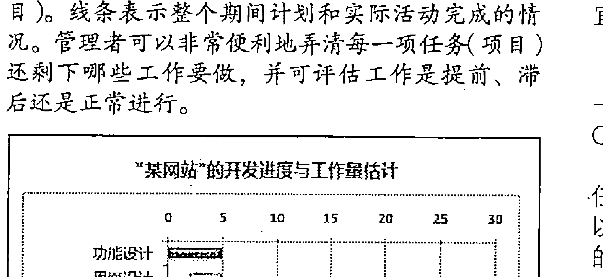

**第1步:** 启动Excel（这里以2007版为例），输入相应的数据，本例数据如图2所示。

|  | A | B | C |
| :--- | :--- | :--- | :--- |
| 1 | 工作内容 | 开始时间 | 持续时间 |
| 2 | 功能设计 | 0 | 5 |
| 3 | 界面设计 | 2 | 3 |
| 4 | 程序开发与α测试 | 5 | 15 |
| 5 | 前后台界面开发 | 5 | 5 |
| 6 | 硬件选型与购买 | 5 | 10 |
| 7 | 程序安装与调试 | 20 | 3 |
| 8 | β测试与修改 | 23 | 7 |

+ **第2步:** 选择A1:C8的所有数据，然后点击菜单“插入→条形图→二维条形图→堆积条形图”，即可得到效果图。如果想要立体效果，可先点选条形图，然后再点击“设计”菜单，从图表样式中选择一个立体样式即可。

**第3步:** 接下来选择条形图中要隐藏的数据部分，然后切换到“格式”菜单（在选中条形图时才会显示），再单击左上角“设置所选内容格式”，在弹出的格式设置对话框中，切换到“填充”项并选择“无填充”即可。

**第4步:** 现在纵轴的顺序与我们输入数据的顺序是颠倒的，可右击纵轴，选择“设置坐标轴格式”，勾选其中的“逆序类别”，确定后即可重调顺序了。最后点击每个色条调整颜色、删除图例，如本例开始所示的甘特图效果就完成啦。

#### 实战2：突发事件从容应付

现实工作环境中，经常会出现一些临时性的工作安排，比如你正在集中精力撰写工作总结，总经理秘书却临时通知你下午15:00到总经理办公室去一趟。为了不使自己的工作思路被打断，可以利用Office OneNote提供的系统托盘功能来处理一些突发性的工作。

+ **第1步:** 打开OneNote便笺窗口，输入临时任务的描述信息，例如“今天下午15:00到总经理办公室去一趟，总经理找，探讨有关采购计划调整的相关事宜”。

+ **第2步:** 接着在OneNote便笺窗口中右击，选择“Outlook任务→今天”命令，这时信息的左侧会出现一个图标，它代表这条信息已被作为当天任务添加到Outlook的待办事项列表中了。

+ **第3步:** 右击该图标，选择“在Outlook中打开任务”命令，在打开的Outlook新建任务窗口中，就可以发现新任务的基本信息已经填写就绪，下面要做的只是选中“提醒”复选框，并将提醒的时间设置为“14:55”（比会谈时间下午15:00提前5分钟，以避免迟到）。

+ **第4步:** 最后，点击“保存并关闭”按钮，结束临时任务的建立。现在，你就可以马上回到手头的工作上专心致志写报告了，当时间到达14:55时，Outlook会自动提醒你到总经理办公室的。

#### 实战3：巧妙收集网上资料

对项目经理来说，OneNote绝对是一个非常得力的助手。除了上面介绍的任务提醒功能，OneNote还可以帮助我们随时采集网上资料。在通过因特网查找资料时，有时可能还需要将重要的资料以网页的形式保存，或者将其粘贴到Word文档中保存起来。而使用OneNote来管理这些资料，可以直接将所需的网上信息添加到OneNote笔记本中。

+ **第1步:** 在浏览网页信息过程中，当发现自己需要的内容时，只需将其选中，然后单击IE浏览器工具栏中的“发送至OneNote”按钮即可（安装OneNote后它会自动添加此按钮）。这时，系统不仅会将内容添加到OneNote笔记本中，而且还会在内容下方显示该网站的链接地址，以方便通过此链接查看与此内容相关的详细信息。

+ **第2步:** 如果没有在网页中选择需要导入的内容，单击“发送至OneNote”按钮，系统会将整个网页导入到OneNote笔记本中。

+ **第3步:** 在查找资料的过程中，如果发现一些有用的资料，但该网站不允许复制其中的内容，造成资料无法收集，这时不用担心，利用OneNote的屏幕剪辑功能，可以方便地将网页“拍”下来，并将“照片”保存在笔记中。笔记下方同样会给出网站链接地址，方便再次访问网站内容。创建屏幕剪辑的方法非常简单，只需按组合键“Windows徽标键”+“S”，待屏幕反白显示时，拖动鼠标选取所需的内容，这时，会弹出一个要求选择存放位置的对话框，选择一下图片保存的位置即可将网页作为图片导入到OneNote笔记本中了。

这两期的文章，其实都在传达这样一个理念：每个人日常的工作与生活，都是由大大小小的项目构成的，如果能应用项目管理的理念去做这些事情，都可以做得更好，获得更好的结果。人人都是项目经理，时时刻刻项目管理，生活从此会不同！

（文/李昂达）

## 毕业一年当老板积累人脉“设计”未来

从比尔·盖茨到李想、戴志康，大学生IT创业早已从美国蔓延到了中国。别以为这些哥都是传说，你身边也许就有胸怀创业梦想的未来IT公司CEO。当然，你，也有可能。

### 本期主人公：

李曦杰，成都东软信息技术学院软件技术专业2008年毕业生，2009年5月成立成都创能设计公司，任设计总监。公司主要业务包括UI设计、产品包装、网站互动、媒体广告等，现有包括中国移动、中国电信、联想、国税总局、成都市政府等多家客户。

### 【芝麻开门】

#### 创业团队：梦开始的地方

2005年，刚进入大学的李曦杰制作了第一个个人网站，因为制作精湛，被学校创业中心下属的世佳创业团队相中。2006年该团队参加网易世界杯官方网站设计大赛，李曦杰作为项目负责人带领团队日夜奋战，最终获得全国第4名。从此，他开始全面负责团队各项事务，包括技术、市场、管理等：“协调能力、合理配置人力资源、各种行业规范都是在创业团队学到的，这对后来创业起到了关键作用。”

#### 打工：化蝶前养精蓄锐

2008年6月，李曦杰大学毕业，他决定先找工作，熟悉环境，积累经验，等到时机成熟时再开始自己创业。

抱着这样的信念，李曦杰一年内转战了两家公司，在担任设计师的过程中，他十分注重人脉积累。当时的一个项目合作者成为现在公司的资金合伙人，曾经的一位部门领导，在创业经验方面给了他无私的帮助，帮他实现了“质的飞跃”。经验的积累、人脉的扩张只是创业的“软件”，李曦杰还在默默地为将来的公司打造“硬件”，他一边上班，一边创立了自己的工作室。

#### 开公司：积累人脉破茧成蝶

工作室走上了正轨，并通过技术入股获得了创业的启动资金，最终在2009年底搬进了成都创业园区的办公室。不到一年时间，公司员工从3人扩展到8人，而且拥有不少远程设计师，承接的项目也从最初几百元的网站设计，发展到现在上万元的软件设计。

运营进入正轨后，公司遇到客户拖欠付款而导致的资金链断裂问题。幸而李曦杰和合伙人在圈内人缘好，还能筹到资金争得项目。他总结出辨别客户诚信的经验：“业务洽谈时，有诚意合作的会主动留下真实联系方式，提供项目需求文档以及计划安排，说明合作方式；如果没有诚意，会找各种理由不告知联系方式，只是简单的网络沟通，说你先做吧，做好了再谈。”

“对于创业阶段的公司来说，人是唯一的资产。”所以公司除了一些基本业务员是招聘而来，其他核心职务比如设计总监之类都是由志同道合的朋友或曾经的合作伙伴担任。“要让大家有盼头。”李曦杰说。

### 买家摇身变卖家 淘宝开店我最大

想必不少朋友都有过在淘宝购物的经历，海量商品无奇不有，网购真的会上瘾！那么，你是否想过摇身一变做个淘宝大卖家？不管是兼职还是全职，看着信誉和利润蹭蹭地上涨，当老板的感觉一定比拍到心仪的商品更美妙！开店很麻烦吗？不，从零起步开网店，你累计花费的时间最快连一个小时都不到，如果加上审核的因素，最短3天网店即可开张！

#### 拥有好记的淘宝账号

如果你还是一个淘宝小白，连账号都没有，别着急，注册超级简单。
打开淘宝网 http://www.taobao.com，点击左上角的“免费注册”，可以选择“手机注册”或“邮箱注册”，输入电子邮箱、会员名和登录密码，验证码，提交即可，随后用邮箱激活（手机注册则是等用手机收到的校验码进行激活），搞定！

刚才在提交时，验证码下有一行小字“用该邮箱创建支付宝账户”，这个选项默认是打钩的，建议不要更改，它轻松地把淘宝和支付宝的账号关联起来。也就是说，支付宝的会员名就是刚才激活淘宝账户的邮箱（或手机号），而两者的登录密码一致。注意啦，淘宝会员名一定要仔细斟酌，好听好记，避免一长串无意义的数字和英文，因为今后开店也是用这个名字，一旦注册就无法改变了。

如果你的支付宝处于未激活状态，那么可以进入“我的淘宝→账号管理→支付宝账户管理”，点击“点此激活”填写信息，保存并立即启用支付宝账户。如果你是淘宝买家，已经有了相互关联的淘宝和支付宝账号，就直接从下面的内容开始看起吧。Ready？Go！

#### 实名认证待审核

网上交易时大家都不了解对方，如何保证诚信经营呢？淘宝规定，申请开店的会员必须提交身份证图片，补全认证信息之后才能在淘宝开店。

这个好办，输入会员名和密码，登录淘宝后进入“账号管理”选项卡，点击“申请实名认证”，根据提示上传自己的身份证正反面照片，提供相关信息即可，认证过程在界面上有一个模拟演示，非常直观易懂。

#### 上传商品开门大吉

审核通过后，进入“我是卖家”选项卡，发布10件不同的宝贝（保持出售中的状态）就可以免费开店了！好激动！

卖家发布宝贝需要具备的条件：卖家已通过身份认证，按照发布环节中的要求填写符合条件的发布信息，卖家必须支持支付宝交易，所发布的商品必须遵守商品发布管理规则（http://service.taobao.com/support/12898.htm 要看仔细哟）。

选择“一口价”（还有“拍卖”形式，但不常用），接下来选择一个类目（可搜索），就开始发布商品吧，这个界面太人性化、傻瓜化了！根据提示直接填写商品信息，包括类型、属性、标题、价格等，上传图片、宝贝描述、物流信息、售后信息等一应俱全，上传完10件商品，好有成就感！进入“我的淘宝→管理我的店铺→查看我的店铺”，屏幕最左下角的状态栏即可看到网店地址。如何修改商品价格呢？宝贝卖出前：进入“我的淘宝→售出中的宝贝→编辑”进行修改；买家拍下商品时：进入“我的淘宝→已卖出的宝贝”更改邮费和价格即可。

幸运总会眷顾每个有准备的人！叮咚，买家来光顾了，下单、发货、评价，交易完成，崭新的开始！敬请关注本刊“淘宝开店传奇”系列文章，成为网店大赢家不是梦想！

#### 小提示：商品发布关键词中的秘密

- 选择类目：如果上传商品时候属性没有选对（比如拖鞋选择成了衣服类），淘宝会责令下架，算你违规。商品违规发布累计扣12分将把店铺屏蔽12天。
- 宝贝图片：建议申请网络相册，如雅虎、MSN 的个人空间相册等。
- 宝贝标题：限定在30个汉字以内，吸引人的标题是增加宝贝点击率的关键。
- 宝贝有效期：到期会自动下架，选择7天（还有14天）可使宝贝在短期内得到不断推荐。快下架的商品容易排在搜索结果前列。
- 系统自动重发：系统会在宝贝有效期结束后帮你重发一次，已售完宝贝不再重发。
- 运费模板：根据到达地区及运送方式设置不同运费。使买家购买前更准确了解运费情况，并免除了成天后卖家修改运费的工作。
- 运费设置：买家搜索时，运费直接显示在商品旁边，如果运费便宜就有很大优势。
- 橱窗推荐：淘宝免费提供给卖家在店铺中展示重点宝贝的位置之一，根据信用级别和销售情况不同有差异。可以到“我的淘宝→管理我的店铺→推荐宝贝”设置，合理利用将大大提高宝贝点击率。

(文/北京 猴猴在线)

### 淘宝开店不求人系列 后期处理巧扮靓 宝贝图片更秀人

果果：在本系列前两期的文章里，我们为大家介绍了迅速拥有店铺和商品宝贝的拍摄技巧。拍摄好的美图直接上传吗？稍等！只要稍微“化妆”，平凡的图片就能瞬间绽放光彩，让人过目难忘，大大促进销量哟！下面有请淘宝大学的资深讲师小胡豆儿（卡拉宝贝亲子服饰店掌柜 http://mamibaobei.taobao.com）来展示一下她的图片处理秘笈吧！

很多淘友登录完10个商品就着急地把所有商品全部上架，这样的做法是不可取的。我们可以通过低廉的价格和其他促销手段将顾客引进门，但是客人进门之后如何能够停留的时间更久？如何能点击你的商品呢？宝贝图片是吸引客人的关键！

#### 小知识：何谓专业宝贝图？

有人说，宝贝图就是在淘宝店铺中用来展示销售商品的图片呗。没错，但有一点很重要，宝贝图片体现的是商品的内在价值，而不仅仅是产品相关的信息。专业元素包括——更真实的色彩、清晰度、装饰边框、水印、像素符合网络浏览要求等。

#### 创业秘籍零距离

- Q：如何利用人脉拓展业务、获得发展？
- A：我觉得业务来源主要是项目挖掘和主动参与。比如这个项目客户是一个大客户，手头上还会有很多其他项目来源，那么我们会做好这个项目，并以一个较低的价格交付给客户，把关系建立好，为长期合作打下基础；主动参与就是一些朋友还有认识的客户介绍，主动和他们进行沟通交流，先把人际关系打好，后期有需要了就可以主动联系。
- Q：对内的人际交往方面，雇佣比自己年龄大的员工，如何树立年轻老板的威信？
- A：面试时，我会根据面谈来了解应聘者的心理状态以及性格特点，体现出我的专业，表示出我对他的尊重。威信并不是靠自己如何树立，而是得到对方的认可。创业团队最初的管理大多是建立在感情上的，随着不断的发展，慢慢将感情转换为无形的权力。
- Q：能给创业大学生一些有价值的建议吗？
- A：想好为什么要创业，不要因为没有合适的工作就去选择创业，这是不理智的；不要轻易因为外力而改变；需要坚持但不能固执，需要改变的时候要果断改变，不能墨守成规；积累人脉资源远比积累金钱重要。梦想不会欺骗执着，将创业的信念放于心中，努力，便能成功。

(特约记者/杨红)

#### 浓妆淡抹总相宜

一想到Photoshop有些人就头大，那么今天就来个简单又有效的工具——光影魔术手（下载地址：http://www.onlinedown.net/soft/51436.htm）。它可以轻松做出专业胶片摄影的色彩效果，除了可以调整图片的画质和效果以外，还能快速加上水印和精美边框。由于操作简便，对于刚入门的新手来说提供了更实实在在的应用。下面我们让卖家戏称的“烂图”起死回生，重放光彩。

#### 1.图片更靓丽

先来个最简单的快速化妆三部曲，对于偏暗的照片有特效！先后点击相邻的“反转片”（选择“真实色彩”）、“曝光”、“补光”就完成了！那么如何精细调整呢？

调整色彩和亮度：解决拍摄时颜色曝光不足、曝光过度、偏色问题。通过菜单“白平衡一指键”、“曲线”功能来进行色彩校正和亮度调整。

调整清晰度：解决拍摄时模糊不清晰问题。进入“效果→模糊与锐化→精致锐化”进行调整。

调节图像大小：解决构图不完美及像素过大问题。进入“图像→裁剪/抠图”，通过“自由裁切”裁切成为正方形，适应淘宝上传商品图片要求。

#### 2.图片更苗条

淘宝对商品图的要求是：像素500×500，大小在120KB内。但是相机拍出的图片一般都超过1MB，无法上传。快给图片减减肥吧！进入“图像→缩放”，选择“维持原图片长宽比例”，宽度输入500像素，高度数据会同时变为500像素。

#### 小提示：什么样的图片适合批处理？

照片本身的质量较高，并选用统一的背景，且图片亮度较平均，不需要做太起伏的调节，例如在摄影棚内照出的图片；对单张图片处理要求不高的，只需改变图片大小或加上水印；已经在PS里调整好图片亮度以及背景，只需要加上统一的水印或图框的情况下，也适合采用批处理方式进行图片处理。小胡豆儿强调，买家最喜欢背景简洁干净、主体物突出清晰的图片，大家在修图时千万别忘了这个原则！

#### 打上自己的烙印

现在，宝贝图片已经变成色彩正常、亮度适中、正方形构图，500×500像素的标准商品宝贝图片，可以直接上传到网店使用了。接下来还可以再添加一个图框，使图片显得更漂亮，再加上文字水印，以免宝贝图片被别人不声不响地“无偿借用”。

边框：进入“工具→花样边框”，或选择“轻松边框”、“撕边边框”、“多图边框”，选择适合的边框就OK了。

水印：进入“工具→自由文字与图层”，输入文字，选择好字体、字号、字体颜色和背景色，确定保存，文字水印就做好了，位置根据构图灵活决定，不遮盖主体就行。

批处理：宝贝图真不少，让“批处理”把我们从重复劳动中解放出来吧。进入“文件→批处理”，即可进行尺寸、反转片、锐化、水印等的批量处理，非常方便。

七分拍，三分修，经过这一系列的操作，就能化腐朽为神奇，使刚才那张偏色、灰暗的图片变成完美的专业宝贝图，增加我们的商品被潜在顾客发现的概率，并且影响买家购买决策，提高自己在同类商品卖家中的竞争力！

### 老照片翻新 修复残缺的岁月

老照片翻新之所以能够成为一项赚钱的业务，这完全拜传统的胶卷相机所赐。传统胶卷照片的底片容易丢失，而时间一长照片本身也会有损毁，有些甚至被油渍水渍侵蚀得无法辨认，这时就要想办法扫描下来并通过专业软件来修复了，否则珍贵的资料或回忆将化为虚无。有需求就有市场，今天我们就来聊聊照片翻新的相关话题。

#### 人物专访

FF, 美眉, PS (即Photoshop) 高手, 2006年辞职下海，开设了自己的数码照片店，主要给周边的居民冲印数码照片，以及承接各种修图业务。

CFan: 照片修复前景如何？赚钱吗？

FF: 数码相机的普及实际并不很久，而胶卷相机已有百多年的历史，留下的照片数量是非常庞大的。从这方面来看，照片修复业务维持五、六年的发展肯定没问题。
照片修复主要是技术活，需要的是技术和时间，硬成本反而很低，所以纯利润很高。在淘宝上搜索“照片修复”或“照片翻新”，可以找到许多提供这类服务的网店，有些做得不错的网店，平均每天能接到两三单业务，这样下来每月差不多有3000多的收入，还是不错的。我自己这边，主要客户是周边的居民，每月差不多也有2000左右的收入，再加上数码冲印等其他业务，肯定要比普通上班挣得多。

| 服务类型 | 工作量 | 价格(元) |
|----------|--------|----------|
| 老照片扫描 | 50张以内 | 5 |
|          | 50~100张 | 3 |
|          | 100张以上 | 2 |
| 老照片修复 | 损坏度10% | 10 |
|          | 损坏度20% | 20 |
|          | 损坏度30% | 30 |
|          | 损坏度40% | 50 |
|          | 损坏度50% | 100以上 |

注：以上价格仅仅作为参考，实际情况则要复杂得多，因为照片修复是很难标准化的。比如，同样是损坏度20%的照片，如果损坏部位在头发上就相对好修复，而如果是位于脸部，那么修复工作将非常繁杂，这样的照片，在时就会要价在百元以上。所以许多情况下是参考某种标准报价再加上议价。

#### 任务实战

下面就一些照片修复的典型业务，分别给出一个实战例子。以下实例都是在Photoshop CS5下完成（不过大部分方法同样适用之前的版本）。Photoshop是从事专业照片修复的必备工具（当然Painter也可胜任），其他轻量级图片处理工具就不必去考虑了。

#### 实战前的准备

老照片修复的第一步，是将它转成数字化照片。有些人喜欢用数码相机翻拍，其实在条件许可的情况下，还是用扫描仪扫描效果较好。扫描分辨率适当设置高一些，一般设置600dpi比较合适。

扫描照片之前可适当处理，比如用软毛刷之类的工具轻轻刷去浮尘，揉皱的照片，在不造成二次损伤的前提下尽量展开。别小看这些前期处理，会大大方便后期的处理。

#### 高手怪招

- ★对一些皱褶得很厉害的照片，不容易展平，这样扫描下来的图片为后期处理带来更大难度。有网友曾出过一个怪招：将这类照片用水泡一下，然后再摊平晾干扫描。这一方法本人还没试过，仅供给要尝试的朋友，之前一定要对原照片做好充分的备份（如用不同的分辨率扫描一份）。如果是非常珍贵的照片，千万勿试。
- ★由于扫描仪中的玻璃平板以及反光镜片、镜头对灰尘和杂质都非常敏感，这些杂质会直接导致扫描仪的反射光鲜变弱，从而影响扫描图片的成像质量。所以用户在使用时尽量在灰尘较少的环境下，而且保证扫描仪的工作平台平整，从而达到最佳的扫描效果。

#### 实战1：折痕照片巧修复

老照片修复中，很大一部分是因为年代久远或保管不慎，照片上有很多折痕。本例的原始照片及修复后的效果见图1。

将待修复的照片拖放到Photoshop主界面中，可直接打开它。也可以循着正规途径，点击“File→Open”（文件→打开）打开。如果扫描的照片有些倾斜，可以在裁剪的时候一并旋转修正：点选裁剪工具（快捷键为C），用它画出一个方框大致圈住照片，拖动方框四周的小方块（锚点）可以随意调整裁剪框大小；接着将光标移出裁剪框，光标将变成弯曲的箭头状，此时拖动可旋转裁剪框角度；当裁剪框与照片差不多吻合的时候，在框内双击，即可裁剪并同时调正照片角度了。

打开图层浮动窗（按F7键），拖动背景层到下方的Create a new layer（创建新层）图标上快速复制一个新图层，接下来我们将在新复制的图层中工作。大家一定要养成这个习惯，修图前先复制图像以作为备份。

点选放大镜工具（快捷键为Z），将需要修复折痕的部分放大，然后再选择克隆图章工具（快捷键为S），接着按下Alt键不放，在折痕周边相似色彩的部分点击作为取样点，接下来在折痕处涂抹就可以了。

**小技巧：**

- ★操作过程中，可随时通过 Ctrl++（或-）号，放大或缩小图片显示，方便操作。图片放大后，不管当前是什么工具，只要按下空格键，就会临时变成手状工具，此时可任意拖动调整图片的显示位置，释放空格键后，工具会还原。
- ★橡皮图章及其他的编辑类工具，操作过程中，都可以通过按“[”或“]”号，放大或缩小笔触，以方便精细操作。
- ★双击手状工具，可快速按原比例大小显示照片；双击放大镜工具，会以当前工作区为准尽可能放大显示照片的全貌。

一般的折痕照片，通过橡皮图章工具就可以搞定了。至于照片中的污点，使用Photoshop的Spot Healing Brush Tool（污点修复笔工具，快捷键为J，见图2），点击一下即可消除，非常方便。最后裁剪掉不必要的图像边缘，擦掉无法修复的背景，即可得到图1中右侧的照片效果了。

#### 实战2：黑白照片快速上色

前面所列的照片修复类型实际还不全面，比如老照片翻新（黑白上色、换背景、照片合并等）也会包含在业务范围之内。老照片以黑白照片居多，有些客户可能还希望将黑白照片变成彩色的。这里介绍一个简单点的操作方法。

人物照变彩色，主要有三个地方：衣服、皮肤（主要是脸部）、头发。这里就以上例中修复完成的照片为例，首先试着将衣服变成彩色。

首先全选衣服，方法有很多：比如用魔棒工具再配合Shift键（在原有选区基础上再增加选区）及Alt键（在原有选区基础上再减少选区）将衣服部分完全选中；或者用钢笔工具将衣服全部描下来，然后再转为选区；还或者通过菜单“Select→Color Range”（选择→颜色区域）来进行，如图3所示，打开该对话框后，在照片人物的衣服上点击取色，即可选中大部分衣服（白色高亮显示），再拖动上面的滑钮，可进一步精确扩大或缩小选择的范围，最后点击OK即可。

当然，选取图像的技巧还有很多，这里不一一介绍了。现在来为衣服上色，点击“Image→Adjustment→Hue/Saturation”（图像→调整→色相/饱和度），打开图4所示对话框，勾选Colorize（变彩色），然后通过上面的滑钮调色，为衣服着色即可，可以边调边看到效果。当然还有更复杂的技巧，可以为衣服加上花色和纹理，就更加真实了。

同样方法，分别为头发、脸部着上相应的色彩，黑白变彩照就完成啦。

#### 高手论坛

上面的实例，主要从软件技术的角度出发，换句话说，谁都可以做到。但是对一些损毁严重的照片，仅靠软件修复是不可能完成任务的，这时就需要我们具有一定的绘画功底，手工修复。如图5所示，是国外网友的一个示例，照片损毁严重，仅考原照片取材进行复制是很难修复的，这是即可通过手绘方法补充。

手绘修复，最好配备手写板。当然这类技术含量较高的，要价也会更高。所以，如果想在修图领域有所成就，不但要随时跟进软件新技术，也要提高一下自己的美术水平。今天的话题就聊到这里了，祝朋友们好运。

### 新新掌柜 来给宝贝拍美图吧！

新店终于在淘宝上开张啦，宝贝要吸引眼球，赚到第一桶金，发布美图可少不了。奇怪了，同样的商品，别人店铺里的照片怎么就比自己拍的好看那么多？盗图的事情似乎不允许，真是纠结……白手起家荷包空空，在有限的条件下怎么倒腾能出专业效果呢？别着急，跟着几位卖家达人动动手，你就能梦想成真了！

#### 一、DIY 设备省钱又高效

##### 1.迷你影棚，小商品拍摄更完美

淘宝上卖的商品可谓五花八门，比如手机、钱包等等，物品虽小，利润不小，如何拍摄呢？

掌柜：lirguang伤寒（主营产品：化妆品等）
展示工具：迷你独立摄影棚一空间独立不受环境影响，拍摄方便
制作成本：50元以下
制作时间：2小时左右

迷你摄影棚制作步骤：
第一步：用双面胶带粘连包装纸箱的可折合处，将纸箱各面折起，成型后撕开双面胶粘牢固。
第二步：在成型后的摄影棚内部粘满挂历纸，然后在顶部和左右两侧打孔，铁丝穿过小孔固定三盏照明灯并接入电线。
第三步：接插头，剪掉旧电源线的插头，用电工胶布将其与摄影棚照明灯电路相连。
第四步：最后用剩下的一个包装箱纸和背景布垫底，再摆上小配饰，一个方便的独立Mini摄影棚就大功告成了。

这是迷你摄影棚的1.0版，虽然它已经帮宝贝赚到了不少眼球，但并非完美无缺。“现在的图片光线太硬了，需要想光柔顺一些。”伤寒说这个摄影棚还需要慢慢改进。

说到让光线柔顺，当然就得说到柔光灯啦，不过一套专业柔光灯挺贵的，新新掌柜们可不一定承受得起，CFan为你找到了巧手牛人，小花费就能做出专业效果的柔光灯。

考考你：什么样的宝贝图才能有效吸引眼球？
最佳答案：真实性是第一重要的，所以拍摄清晰、能把商品信息最大化的图片最能促进销售。清晰的图片可以更好的展示商品细节：要构图合理，一张好的宝贝图片要在完整展示商品的同时，还留有相应空间摆设适当的配饰或添加文字等等；拍摄的图片一定要有感觉，就是把商品能带给消费者的意境表现在图片中，也是卖家自身品味、店铺内涵的体现。

一组完整的商品展示照片一般需要由2+4来完成描述，即2张主图和4张细节图。比较推荐的拍摄方式是正面一张、背面一张作为主图，细节部分从45度拍摄一张，然后从中截取细节，这样细节图的角度能够统一，整体感更强。

##### 2.柔光灯，大商品展示更专业

有的读者打算卖的宝贝个头较大，比如电脑桌、时尚T恤等等，要塞进一个小影棚拍很费劲，怎么办？自制一个柔光灯吧。

掌柜：米唐（主营产品：时装）展示工具：自制柔光灯一成本低廉效果佳，适合各种大小的宝贝拍摄
制作成本：30元以下
制作时间：2小时左右
材料：包装纸箱、封箱胶带、锡纸、白布、电线、大头灯座（较大的灯座方便固定且散热更好）、灯泡（最好选择115W 5500K三基色摄影灯以达到更自然的光线效果）

柔光灯制作步骤：
第一步：剪一块正方形纸箱皮并在中央打一个洞，再剪4块长方形纸箱皮，沿线剪掉两边的三角，并在剩余梯形短边上画线留出粘连部分，同法制作其余3个梯形。
第二步：沿画线部分折起纸箱皮，在折起部分粘上双面胶，将4个梯形与正方形的四边粘接，然后用封箱胶粘接四面梯形，多粘几次并打横贴加固。
第三步：用锡纸贴满灯箱内部后，将灯泡接头从灯箱底部圆孔穿过与灯座拧合固定。注意锡纸在洞口部分要剪掉，否则露出部分会与灯和灯座结合，通电后锡纸导电容易造成危险。
第四步：连接电线与灯座，用电线缠绕固定灯箱，并用白布蒙住灯箱口，一个自制柔光灯就完成了。

“柔光灯是用于平铺拍摄的，拍时相机要与宝贝平行，不然就会出现变形的情况！”米唐说起他的拍摄经验头头是道，“还有打柔光灯的角度，只要光能照满整个宝贝就可以了。一定要两灯相对，这样才不会阴影过重。此外由于灯泡度数较高，热量大，因此拍摄一小时左右便需休息降温。”

#### 二、资金充足，购买设备有一套

淘宝小店开了一段时间，收入不错，资金已不是问题，那就来购进一套专业设备进一步提升宝贝图的品质吧。

| 设备名称 | 价格区间 | 选购要点 |
| ---- | ---- | ---- |
| 单反/卡片机 | 100 至10000 元 | 要满足500万像素，最好支持M/A/S/P/AV 等模式，还要有微距和防抖功能，能支持白平衡调整更好。 |
| 单反机 | 3000元以上 | 镜头、机身、三脚架等，相机都具备1400 万到1600万，要具备光学取景和对焦功能，大光圈对焦也不错。 |
| 三脚架 | 300元以上 | 不用特别昂贵，不过一定要稳固，最好选择有快装板的，这样换装更方便。 |
| 柔光灯（灯架、灯头、柔光布） | 100元以上，总1000元左右 | 灯架选择高度不低于1.8米的；灯头一定要选专业摄影灯，柔光灯的尺寸由拍摄物品大小决定，比如拍挂历40公分左右，衣服等60公分至1米即可，可同时搭配多种颜色的柔光布来满足不同需求。 |
| 反光布 | 15至300元 | 能够提供补光和柔化光线的反光布是必需品。 |
| 背景板 | 几十到数百不等 | 一般小商品卖家选择纯色或渐变背景即可，若条件允许也可以购买手绘背景板。 |
| 吸光板 | 10至50元 | 吸光板能够吸收光线，用来拍摄反光物品使用。 |
| 闪光灯 | 40至50元 | 在室内光线不足时使用，闪光灯的功率由相机型号决定。 |

#### 三、秘笈拍出极致美图

现在万事具备，只欠东风啦，怎么充分利用专业设备拍出最完美的宝贝图呢？淘宝小眼睛掌柜和小鱼掌柜很乐意和大家分享“玩了几年相机”的经验：

1. 清晰度：影响单张照片清晰度的原因主要是手持不稳和镜头跑焦，三脚架和快门线可防快门瞬间的相机抖动；跑焦的问题可选“手动对焦”中的“中央对焦”（不是自动对焦）保证处于图片中心位置的宝贝不模糊。
2. 打光：使用自然光源的话，保持光照在45度角左右即可；人造布光请牢记2个常识：光源有主副之分，此外光源越远越均匀也越柔弱，光越近越集中也越强硬。
3. 重视前期：前期省力1分钟，后期多数都要付出10分钟的努力才能弥补回来。其实单反和卡片机各有各的优点，单反的容错性大，利于后期弥补；而卡片机内部已经后期处理过程，能相对简单地拍出效果较佳的照片。

### 第三方利器助力淘宝小店经营

淘宝开店系列的连载看得过瘾吗？小店初具规模，顾客也逐渐增多？那么恭喜啦！本期推荐两款助力软件，智能化管理，让小店如虎添翼！

### 拒绝收费统计，免费流量实时看

淘宝虽然是免费的网络交易平台，可数据魔方、小艾分析、好店铺和量子统计都是要银子的。网店的数据统计直接反应推广效果，不可缺少，小本经营前期请不起这些“大神”怎么办？

这里有一款免费的统计店铺流量的计数器——淘宝吧网店统计（http://count.2f8.cn），它和网站的站长统计差不多，只要把它作为一张图片放在店铺界面的角落即可。

首先进入网站，注册一个账户，进入管理，在“统计设置”下拉栏里单击“参数修改”，勾选是否公开显示，其他默认即可。其次在“统计设置”下拉栏里单击“图片修改”，找一个搭配店铺风格的图片模板，一般使用系统自带的比较方便稳定，最后在左侧的“获取店铺统计代码”中找到“店铺分类专用统计代码”复制下来，回到淘宝网，找到“我的淘宝”下“我是卖家”里“店铺管理—宝贝分类管理”，添加新分类，添加图片，在图片地址里复制获取的代码，然后预览看看吧！

### 网店助理，感受企业级管理

无论是拉取数据还是蹲守交流，都是为了更好地经营小店。即使获取了最详尽的信息、最有利的市场信号，如果人手不够，再好的机会也会错过，再强悍的人也支撑不住，所以，这里推荐第二大强力助力——旺店宝（http://fuwu.taobao.com/service/service.htm?service_id=242）。

“旺店宝”可实现自动上架、多计划自动均匀调整优化、自动橱窗推荐、自动评价、创新可视化商品推荐专家、宝贝医生、批量修改等等强大功能，可以免费使用一月，销量翻倍工作量减倍，非常适合刚开店资金不多而宝贝样式众多的掌柜。

输入网址，找到“旺店宝”点击使用，出现的界面左边，自动上架、自动推荐、自动评价很有大店的管理风格，里面大部分功能是默认关闭的，需要自己了解后手动开启，避免了手忙脚乱。这里选取其中几个功能着重介绍：

#### 1.解放双手全自动

很多掌柜都是兼职卖东西，平时比较忙，可以利用“旺店宝”实现店铺自动上架、自动推荐、自动评价。

开启自动上架：进入自动上架“开关自动上架”界面，在界面右下方启动“开关监控仓库自动上架”，设置上架间隔等，就可以使仓库里的宝贝有序上架。

开启自动推荐：进入自动推荐“开关自动推荐”界面，开启后，默认按出售中最快速结束下架宝贝橱窗推荐。

开启自动评价：虽然自动评价很方便，作为买家还是希望掌柜能认真的回评一下，选择“开关自动评价”即可。

#### 2.宝贝医生诊细节

进入“宝贝管理”下的“宝贝医生”（与瑞星监控一样的绿伞），设置诊断对象和诊断条目后进入检测，可以发现重名、显示异常、主图丢失和属性不全的宝贝，便于掌柜在第一时间修正异常的宝贝介绍，给顾客以一种认真负责的态度。

旺店宝还有其他不错的功能，掌柜们可以自己去摸索，用好软件，你的小店管理就相当于配备了专业管理人员，媲美企业级卖家！

(河北/韩政)# TN终现疲态 王位谁来继承

LCD在2000年开始慢慢进入我们的视线，2003年打碎奢侈品价格界限逐步蚕食CRT市场，直到2007年战胜CRT真正成为市场主流。七年来LCD技术的改进不能说不大。从60ms的拖影冠军到4ms灰阶的绝无延迟，从16bit (操作系统色彩数量) 都到不了的低色彩到24bit真彩色，一直到如今30bit、36bit的专业显示器。

如果说市场占有率最大的TN屏 (廉价液晶面板的一种，占有90%以上的份额) 是显示器的帝王，种种缺陷在它日暮西山的今天也开始慢慢显露出来。加之薄利甚至是赔本的现状也让厂商们积极地寻找着接班人……

这样的口水战很快就让元老会不欢而散，但说实话人民心里很清楚，无论是元老的支持度、血统的正统还是沉着的性格大王子广视角无疑是正统继承者……

估算至少应为广视角液晶的1.5倍~2倍。
E-ink：开发成本高昂，虽然电子书使得其摊薄了许多开发成本，但开发成本还是占比较大的比重。制造成本大致是广视角液晶的2倍~3倍。

## 王位之争，谁是正统？

## 历数发展，逐个分析

## 显示质量决定生死

TN皇帝有三个皇子，老大叫做广视角 (小名IPS、MVA、PVA等等)，老二叫做AMOLED，老三叫做E-ink。这三个皇子都有自己的看家本领，也深受大家的宠爱。如今TN老了，谁能继位就成了至关重要的问题。正好元老会召开，主要解决这个问题，我们也去听听吧。

王位的故事告一段落，但其实目前TN的继承者之争正在进入白热化阶段。究竟谁最适合成为继承人，我们剖析技术、成本来看一看。

如果说成本是能否普及的最大要素，那么显示质量就是决定生死存亡的关键。理由很简单——成本控制是可以随着产量的增加、技术的成熟变低的，但面板本身的技术素质是根本，很难进行大幅度的改良。

从表格上可以看出在综合素质上AMOLED是最好的，而广视角液晶其次，E-ink除了具有纸质反射率的特点和超低的功耗，剩下的无可取之处。

## 成本是第一大问题

## 三分天下，交集处撩出火花

撇开显示质量不谈，谁能取代传统TN面板，成本是第一大问题。即使显示效果再优秀，如果一块面板售价高达几千上万元也是曲高和寡的。成本上来讲，主要分为两个部分，一是开发成本 (可通过出货量摊薄)；二是生产成本 (随着技术的成熟和工艺的改进会逐渐降低)。

分析后我们可见，在特性上广视角液晶与AMOLED比较接近，而E-ink相对较为另类。但成本上广视角液晶占有绝对优势。就目前来看大尺寸的AMOLED的价格还不是一般人可以接受的。

那么就出现了三分天下的局面，广视角液晶接替传统PC市场，AMOLED接替移动设备市场，而E-ink为自己开创了一个电子阅读器的市场。说到这里，可能有人就会认为这是一个大团圆结局，那你就错了！大家都知道一山难容二虎，那一山怎能容三虎？

这种情况在三个市场产生交集的时候尤为明显。比如iPad这种既可以说是平板电脑，又是移动设备，还可以是取代电子阅读器的设备。它正是交集中的典型情况。而采用广视角液晶的电子阅读器，采用E-ink的手机，采用AMOLED的显示器则是另一种交集的情况。

总结来看各个技术的优缺点，我们便能发现一个规律：在技术相似甚至略显落后的时候，市场选择的往往是成本低廉、技术成熟的产品。而广视角液晶正是如此，它一面与AMOLED在移动设备市场分庭抗礼，一面与AMOLED联手慢慢蚕食E-ink的电子阅读器市场。就目前来看，短时间内不会再次出现像TN一样一统天下的皇帝，在AMOLED足够成熟前，广视角液晶必然占领者版图上大多数的土地……

## 广视角液晶：几乎无开发成本，技术非常成熟

广视角派系：私生子都走开，广视角王子必须是王位继承人。它的血统是正宗的王室，都是液晶分子旋转排列的原理。二王子有些年轻，虽然天赋异禀，需要再培养培养才能委以重任。

AMOLED：随着AMOLED屏幕的手机大量出货，开发成本被渐渐摊薄，制造成本目前来讲不低。

## 广视角派系元老：三星、日立、LGD、友达光电、奇美、夏普等

## AMOLED派系元老：三星、友达光电、LGD

AMOLED派系：谁说我们是私生子了，我们是在TN的父亲老皇帝在的时候就已经确定了地位。虽然大王子沉稳大气，但二王子是几百年也不会出现的奇才。论才能大王子要靠边站。

| 面板比较 | 广视角液晶 | AMOLED | E-ink |
| :--- | :--- | :--- | :--- |
| 发光方式 | 被动发光 | 主动发光 | 被动发光 |
| 响应时间 | 较长 | 短 | 非常长 |
| 可视角度 | 相对较大 | 大 | 大 |
| 屏幕分辨率 | 高 | 高 | 一般 |
| 功耗值 | 相对较低 | 低 | 非常低 |
| 对比度 | 一般 | 非常大 | 一般 |
| 色彩 | 好 | 很好 | N/A |
| 亮度 | 高亮度 | 高亮度 | N/A |
| 抗震能力 | 弱 | 好 | 好 |
| 弯曲程度 | 不可弯曲 | 可弯曲 | 可弯曲 |
| 产品厚度 | 轻薄 | 非常轻薄 | 非常轻薄 |

## E-ink派系元老：元太科技

E-ink派系：我们……我们……我们有自己的能力，虽然不足以当皇帝，但是会开创自己的一片新天地。比起你们，三王子年龄虽小但是更热爱环保。

## 硬盘托架让本本变身双硬盘

最近小强一直在纠结于一个问题：手上闲置的一块笔记本硬盘要如何处理？作为一个高清达人，小强的本本硬盘容量一直处于紧缺的状态。此时宿友小明给他出了个点子：不如让光驱下岗，让硬盘上位吧！

可能有不少同学认为直接给硬盘配一个移动硬盘盒不就得了？实际上同一块硬盘通过光驱接口和移动硬盘USB接口与笔记本相连时的传输速度有着天壤之别。不信？那咱们就用数据说话！

### 本本光驱如何拆？

大多数笔记本背部都有单独固定光驱的1～2颗螺丝，只需拧下这些螺丝，就可以从侧面将笔记本光驱抽出来。

### 新老硬盘要分主次

很多笔记本BIOS中默认是光驱为优先启动设备。在安装硬盘托架后要记得在BIOS中将装有操作系统的主硬盘作为第一启动设备，否则本本会无法启动哦。

### IDE 和 SATA

### 避免硬盘睡死

在选购硬盘托架之前，首先要确定笔记本光驱接口以及需要扩容硬盘的接口类型，目前来看基本分为两种即IDE和SATA。如果笔记本光驱接口和硬盘接口不同也不用担心，现在的硬盘托架都可以起到转接桥的作用，通过内部的转换器可以让SATA和IDE相互兼容。只是这类产品的价格会稍贵一些。

如果将操作系统安装在了光驱接口的硬盘中，由于不是原厂方案因此有时候会出现硬盘睡死的情况。Win7用户可以通过任务栏右下角进入“更多电源选项”，点击“更改计划设置”中的“电源选项的高级设置”，展开“硬盘”给“在此时间后关闭硬盘”设定为“0”，即让硬盘一直处于工作状态。

| HD Tune测试 | 外置硬盘盒 | 硬盘托架 |
| :--- | :--- | :--- |
| 最小值 | 19.4 MB/s | 28.4 MB/s |
| 最大值 | 20.8 MB/s | 63.6 MB/s |
| 平均值 | 20.1 MB/s | 48.6 MB/s |
| 数据存取时间 | 18.4ms | 17.8ms |
| 突发数据传输率 | 20.1 MB/s | 67.2 MB/s |
| CPU使用率 | 23.2% | 5.8% |
| 价格 | 30~100元 | 50~100元 |

### 小提示

硬盘装在托架上的另一个好处就是可以引导系统，比如主盘上装 XP，托架上装 Windows 7，开机选择启动哪个盘上的系统，非常方便。只是对于没有光驱的上网本类产品就无法享用硬盘托架了。

### 9.5mm 和 12.7mm

### 如何购买？

硬盘托架的截面尺寸跟笔记本光驱必须是一致的。如今笔记本光驱基本选用了12.7mm和9.5mm两种高度的光驱。而通用型硬盘托架也以这两种标准为主。在购买硬盘托架前，一定要先确定自己的本本光驱属于哪一类标准。实在查不到，可以用尺子量一下。

如果您的笔记本不是ThinkPad T系列等特别机型，可以在淘宝搜索“品牌/通用 硬盘托架”，根据自己光驱的型号还可加上12.7mm/9.5mm和SATA/IDE的关键字 (注意关键字间要有空格)。预算有限的朋友建议选择Fenvi品牌的通用型号，品质和价格都是可以接受的。

在闪盘大行其道的今天，笔记本光驱的实用性已经大不如前。对于需要额外硬盘给笔记本扩容的同学来说，光驱位硬盘托架刚好可以利用原本光驱占用的空间，从而让本本实现“双硬盘”。只是在选购硬盘托架时需要注意几个问题：

### “遮羞布”不可少

### 小结

部分硬盘托架没有配备挡板 (类似光驱挡板)，安装后笔记本侧面会空出一块影响美观。遇到这种情况，我们可以选择自己把原光驱的挡板拆下来。觉得麻烦的同学也可以选择花5元左右直接购买一个硬盘托架挡板。

并不是所有笔记本都可以使用通用型的硬盘托架，比如ThinkPad和惠普的部分商务机型的光驱结构就很特殊。此类用户也不用着急，淘宝上同样有特殊机型的硬盘托架出售。

## 懂E生活 奋达世博音箱高调出世

1851年，第一届世界博览会在英国伦敦成功举办。1个中国人，1个蚕丝手工作坊，12包“荣记湖丝”，便是160年前中国亮相世博的全部记忆。160年之后，世博首次在中国举办，奋达作为音箱行业唯一代表成功入驻，成为世博会生命阳光馆爱心合作伙伴。

在世博会“城市让生活更美好”总主题下，生命阳光馆以“消除歧视，摆脱贫穷，关爱生命，共享阳光”为主题表达残疾人追求平等、对美好生活的向往以及人类相互融合、共创美好未来的愿景。

从奋达赈灾捐款到持续关注慈善事业，多年来身体力行推广公益活动。此次的联姻之举，似乎是意料之中的事。作为国内多媒体音箱行业极具影响力的品牌之一，以身作则支持世博会，在世博盛世之际推出最新力作，世博音箱。

### 懂E生活，低碳环保先行

自从2009年底哥本哈根世界气候峰会进入大众的视野，2010年全国“两会”再次强化了全民的环保意识。“低碳”作为一种全新的经济社会发展方向，经过官方和各种社会组织团体的宣传渲染，已经进入到广大公众的视野。而上海世博会的召开，使得低碳城市和低碳生活的理念更加深入人心。

全球使用的多媒体音箱90%以上在中国生产，中国可以说百分之百地承受着这个行业的“碳足迹”。因此，中国音箱行业的绿色革命，不仅仅是中国的问题，更是世界性的问题。解决了中国的问题，是为全球的问题做贡献。“Easy life 懂E生活”的设计理念就是具备低能耗、高能量转换率、简洁方便等特点。从设计到生产制造，再到最终的销售，甚至是成品的参数表现，都要遵循低碳环保的理念，突出绿色二字，世博音箱通过IC控制，节电效果更明显。

### IC控制如此神奇？

IC控制使得传统音箱摆脱了对变压器的依赖，在节省其转换过程中能量损耗同时，有效降低了高耗能重金属含量，例如铜材、硅钢片等。普通电压器能量转换率最高只能达到80%，而在半载和轻载的情况下，只能达到65%，而IC变压能量转换率可以达到93%甚至更高。这样相比之下，可以节约30%的用电量。

世博E系列音箱，除了节能环保外，还有Sound Bar结构的使用很是耀眼。四款新音箱中，有三款都使用了Sound Bar结构的音箱。条形外观能够很好地与液晶屏融合，包含了音箱家具化的特质，音质与时尚融合得十分到位。

### Sound Bar + 低碳，电脑音频大晋级

很多的液晶显示器和液晶电视都自带扬声器，但其音质普遍很糟糕，所以就有购买外接音箱的需求。这将是一个非常大的市场。传统音箱的外观、繁琐的连线都与外观简洁的液晶屏显得格格不入。Sound Bar在结构上有着独特的优势，扬声器被整合在一个箱体中，音质得到了保证，不仅如此，它还省去了繁琐的连接线。而更为重要的是，随着世博音箱的发布，整个多媒体音箱行业将转向低碳环保方向进行转换，唯有环保才有长足发展。

#### 小知识：

Sound Bar被大家亲切的称为“条形音箱”，被用于称呼那些多个扬声器分布于一个长条状箱体内的音箱。最早起源于家电领域，由于其长条的外形，可以方便的吊挂于显示设备下沿或者置于显示设备下的桌面，有效的利用空间。

(本刊记者/柴涛)

## 钢铁侠来袭 IT产品也要金刚不坏之身

没错，托尼·斯塔克带着他的钢铁战衣再度归来！从古至今，金属一直代表着强大的力量来源，阳刚、冷峻、锋芒毕露，让人不敢轻易接近却又难舍难离。那么，想不想知道钢铁侠的金属装备都有哪些呢？走，趁着托尼不注意，快来看看他电脑桌上都有什么东东吧！

### 钢铁侠的手机

钢铁侠的手机必须集坚固的合金和强大功能于一身。与塑料相比金属手机不仅外观漂亮而且手感极佳，掉在地上也能很好的保护手机内部。不过，金属手机的分量普遍不轻，这也算是含金量太高的副作用吧。

就目前来看，最受关注的“合金手机”应该就是苹果蓄势待发的第四代iPhone和联想旗舰新机乐Phone。从曝光的资料来看，前者采用了金属和陶瓷工艺的机身，坚固毋庸置疑，而后者同样以金属打造，深度定制的Android系统保证了其拥有强大的软件扩展性。

### 钢铁侠的笔记本

钢铁侠经常从事危险工作，所用的笔记本自然也需要金属机身来防护才对。对笔记本来讲，金属外壳不仅可以让其更坚固，看起来更显档次，其本身就如同一个超大散热片，时时刻刻散发着热量保证笔记本的稳定运行。

#### ACER 4820TG

这款产品外壳和掌托部分都选用了拉丝工艺处理过的金属外壳，配备高端的HD5650显卡，游戏性能绝对一流。

#### 苹果MacBook Pro

一体成型设计的铝合金外壳让它成为了历史上最坚固的笔记本之一，精湛的做工绝对可以让你眼前一亮。

### 小提示：

笔记本金属材质主要以镁铝合金为主，具备质量相对较轻、密度低、散热性较好、抗压性较强等特点。需要注意的是，部分所谓的镁铝合金笔记本仅仅是在ABS工程塑料上加一块镁铝合金面板，强度会有较为明显的缩水。此外，并不是说金属笔记本就不用考虑散热了，如果笔记本内部温度过高，良好的导热性反而会让整个本本都变得温温的，因此说金属笔记本会更加考验厂商的设计实力。

### 钢铁侠的外设

键盘和鼠标垫是与我们接触最多的外设，金属材质的引入可以让我们更进一步体验冷峻的科技魅力，冰凉的质感更能让我们在游戏中时刻保持清醒。

#### 雷柏N2800

作为钢铁侠的键盘不仅要有金属点缀，最重要的是在危险时刻还能充当武器打败强大的敌人。雷柏N2800键盘就可以满足上述的要求，上下两边均采用金属拉丝工艺，质感冰凉手感出众，犹如刀锋一般纤薄的身材，足以让任何敌人“不寒而栗”。

#### 地狱火银煞鼠标垫

地狱火银煞鼠标垫售价不到百元，低开销也能让钢铁侠放心。需要注意的是，虽然金属鼠标垫硬度非常强，但是手汗还有容易磨损的问题始终是此类产品的缺点。

#### 希捷新Agent Go金属移动硬盘

存储钢铁侠秘密的移动硬盘同样需要金刚不坏之身，简单来说就是可以最大限度避免跌落和磕碰对其的伤害。现在金属材质的移动硬盘很多，比如希捷新Agent Go系列，外观绝对够“爷们”。此外，如果您有闲置的笔记本硬盘，也可以购买一套金属的移动硬盘盒，相对来说成本会更低一些。

## 服从新标准！老内存超频更强大

随着Windows 7系统的普及，越来越多的笔记本用户都选择了内存升级。对于不少囊中羞涩的朋友来说，预算只能购买一根高频率的内存。与低频率的老内存一起工作，系统会自动将其降频从而造成资源浪费。其实，我们可以利用内存超频软件SPDtool让老内存工作在新内存的频率上，这样一来问题不就全都解决了吗？

以管理员身份运行该软件，依次进入“文件→读取”，选择老内存所在的插槽位置，在“分析”下面的窗口中就可以对该内存的各项参数进行手动调节了。以将DDR2 667MHz超频到800MHz频率为例，需要对以下参数进行修改：

通过测试，我们不难发现将老内存从667MHz超频到800MHz之后内存性能有了明显的提升。需要注意的是，对笔记本内存超频有一定的危险性，而且不同体质的内存超频幅度差异较大。如果您“不差钱”，建议直接升级至两条或单根高频率的内存。

### 小提示：

在调节参数项之前，一定要备份默认的参数数据（选择“文件”→“保存”），在超频失败或者出现不稳定的情况后还可以随时调整回来。

网络大补贴：SPDtool 内存超频教程 http://bbs.cfan.com.cn/thread-1127116-1-1.html

### 火速链接：

如果您想对笔记本进行升级，更详细的方法请参考上一期菜鸟集训营《廉颇未老！老本内存升级计划》这篇文章。

SPDtool 下载地址：http://tools.mydrivers.com/soft/372.htm#download

| 调整项目 | 调整数据 |
| :--- | :--- |
| SDRAM Cycle time at Maximum Supported CAS… | 2.50ns |
| Minimum Clock Cycle at CLX-1 | 3ns |
| Minimum Clock Cycle at CLX-2 | 3.75ns |
| Minimum Row Precharge Time(tRP) | 12.50ns |
| Minimum RAS to CAS delay (tRCD) | 12.50ns |

| EVEREST测试（超频前/超频后） | Read (MB/s) | Write (MB/s) | Copy (MB/s) | Latency (ns越小越好) |
| :--- | :--- | :--- | :--- | :--- |
| Memory | 5499/5565 | 3568/3626 | 3943/4029 | 83.3/78.8 |
| L1 Cache | 34423/34769 | 34247/34643 | 69006/68943 | 1.5/1.5 |
| L2 Cache | 3066/16095 | 7572/10905 | 15005/16488 | 4.1/4.1 |

## CPU频率波动惹祸了？让系笔记本远离爆音

很多网友反映，i5和i7新本在听音乐或是打开某个程序时都会遇到扬声器短暂异常的爆音，如果您不幸“中招”，不妨尝试下面的两个解决方法：

### 方法一：关闭睿频加速

开机进入BIOS设置，在configuration（配置）设置页中选择Intel(R) Turbo Mode Tech（英特尔睿频技术），将Enable（打开）改为Disabled（关闭），保存退出即可。

### 方法二：通过电源选项

“电源选项”手动设置处理器工作频率区间，依次进入“更改计划设置→更改高级电源设置”，在弹出的窗口选择“处理器电源管理”，将“最小处理器状态”调整到55%以上。

> > 小提示
> 睿频加速技术是i5和i7处理器的招牌，关闭之后会让英雄无用武之地。因此建议大家可以尝试第二种方法，当处理器工作在55% ~ 100%时同样可以避免爆音现象的出现，而且仍可以实现一定的节能要求。如果其他品牌同配置产品也出现类似的问题时，也可以尝试一下上面的方法。

## 笔记本用好你的“蓝色牙齿”！

上班或上课时间不让用手机？没关系，只要你身边有蓝牙笔记本，利用Windows 7丰富的新功能，手机再也不用摆到明面儿上来了！

### 手机笔记本联姻

Windows 7的蓝牙图标在任务栏的右下角，不如XP系统在我的电脑中那么明显。和蓝牙手机配对时只需右键蓝牙图标选择“添加设备”，搜索到手机双击即可配对。需要注意的是，在和手机配对时要让本机处于联网状态，这样Update可以自动搜索并安装相关的驱动程序，否则很多功能会无法实现。完成配对后，点击“显示Bluetooth设备”，双击弹出窗口的手机图标。

### 享用四大功能

利用“电话功能”的第一行功能，可以让笔记本通过手机蓝牙上网，只是速度不太理想。在第二行“呼叫此号码”对话框中输入电话号码，可以跳过手机，利用笔记本进行拨号。后面两行可以实现用笔记本的扬声器代替手机的喇叭，在手机上播放音乐或者打电话都可以通过笔记本的扬声器发出声音，无论是音量还是音效都不是手机可以媲美的哦。

只需几步操作，让本本和手机蓝牙联姻后，利用笔记本也可以浏览播放手机中的数据和音乐，打电话时手机也可以安心隐藏在包包中。

> > 小提示：
> 根据手机品牌和型号的不同，在Windows 7中蓝牙手机可以实现的功能也有少许差别，比如魅族M8和笔记本配对后就没有前两种功能。

## 冲击波T30 入门价格体验翻倍

花一个音箱的钱体验两个音箱的享受，有这样的便宜谁不占？今年冲击波推出的天逸系列十分成功，在目前同质化的市场中还算别具一格。由于之前天逸T50、T60的都在网站、读者的反馈信息中口碑不错，借势推出入门级天逸T30，其188元的售价对3000元装机价位冲击很大。

### 为什么适合入门级？

试想一下自己在玩游戏的时候，使用耳机插入线控享受游戏音乐，家人用MP3信号接入线控用音箱来享受喜欢的曲子，相互不影响，达到一箱两用的妙处。另外，从输出功率上分析，15W的标称值相对于中端20W~30W是有一定差距，但要考虑到T30是4英寸设计，功率还算匹配，如果是5英寸单元就有点说不过去了。卫星音箱3英寸的单元也要大气一些，没有因为成本的问题选择2英寸单元，在这一点上还算让人欣慰。毕竟2英寸单元在看电影的气场上要逊色些，至少对人声的还原要差些。

视听方面，选择Hit FM2009年度百首金曲，曲目格式为320kbps的MP3，因为是流行音乐，曲目编配丰富，乐器、人声比较丰富，层次分明。整体来说，T30音箱的实际表现和预期相符，虽然只有15W的输出功率，低频量感方面也不能说拳拳到肉，但也绝非干瘪无力。中频方面，人声衔接不错，高频细节方面稍稍欠缺，这也是3英寸单元的不足。这样4+3的设计对初级用户来说已经足够了，少花钱多办事，3000元装机价位预算本来就有限，着重显卡、显示器的投资比较重要。

千里“音”源一线牵，这里说的就是天逸系列的标志线控，没有想到的是在入门级T30上也见到了它的影子。比较般配整个箱体的效果，内敛、沉稳这是第一印象，品味、时尚这是第二印象。线控器外观与主机红圈设计呼应，光滑通透，调节旋钮阻尼适中操控顺畅。这个线控的最大特色在于两路通设计，集成有音频输入与音频输出接口，用来接驳耳机、MP3等设备。

#### 主要参数

| 参数项 | 规格 |
| :--- | :--- |
| 输出功率 | 10W+2.5W×2 |
| 频响范围 | 50Hz~20kHz |
| 信噪比 | >75分贝 |
| 扬声器单元 | 低音4英寸+高音3英寸×2（防磁） |

## 同质化阴云笼罩 一体电脑如何前行

### 地震毁硬盘？ 防震笔记本笑而不语

好吧，我承认本文有些标题党的感觉，但是在日常应用中，笔记本真的难免会受到颠簸之苦。任何小小的震动都有机会成为运行中硬盘的“破坏性地震”，面对消失的珍贵数据，只能让我们欲哭无泪了。

实际上，很多笔记本均已经配备了硬盘防震技术，在一定程度上可以避免震动对本本硬盘的伤害。

从技术层面讲，各种硬盘防震技术的原理相近，震动时将磁头从盘片上移开保护数据。需要注意的是，以上这些技术需要硬件和软件的结合，大家在购买了此类产品时要检查是否完整安装了相关的驱动或软件，不要让这些先进的技术成为“摆设”哦。以惠普笔记本为例，必须要让硬盘工作在ACHI(SATA)模式下，安装HP 3D DriveGuard软件才能开启此功能。

#### 笔记本常见硬盘防震技术表

| 技术 | 原理 | 代表厂商和产品 |
| :--- | :--- | :--- |
| APS硬盘保护技术 | 根据内置的加速度感应器来判断硬盘状态，当出现移动时可发出指令让硬盘暂停工作 | 联想ThinkPad T410 |
| 三维硬盘保护技术 | | 东芝Satellite M515 |
| 3D DriveGuard技术 | | 惠普Pavilion dv3 |

**网络大补帖：**
各品牌硬盘防震技术具体区别对比 http://bbs.cfan.com.cn/thread-1125866-1-1.html

如今很多硬盘本身便已经配备了防震技术，比如西部数据的ShockGuard技术，希捷部分产品也增添了自由降落传感器。此外，绝大多数笔记本都采用了坚硬的金属支架来固定硬盘，外部利用橡胶来减震，较好地保证了硬盘的安全。

**小提示：**
如果厂商没有为我们考虑给本本配备防震技术，咱们自己也可以动手帮本本缓解震动伤害。拆开本本背后的硬盘挡板，拧下固定硬盘的螺丝，在硬盘四周塞一层厚度适当的海绵垫，同样可以为本本减轻“压力”哦。

### 我为环保出份力！ 请点高线下片装备

很多同学都会利用Windows 7的“离开模式”通宵下载网上资源为环保出力，但即使笔记本工作在离开模式，硬盘和处理器等耗电大户依旧在运行状态，实际上节省的电力并不明显。如果您真的是一位环保的下载狂人，不如选择支持脱机下载的无线路由器或者高清播放器来为我们静静地工作吧。

### 无线路由也疯狂

如果您喜欢无线上网，又是一位下载狂人，不妨选择支持脱机下载的无线路由。这类产品都配备USB接口，可以和移动硬盘等存储设备相连，只要在配置页面上进行简单操作找到资源即可进行下载。

**推荐产品：银河风云WR1014-G+V1**
**参考价格：499元**
用户点评：因为担心BT封杀后没有资源可用，所以当初选择这款无线路由就是看中了BT和电驴两种脱机下载的方式。他的控制界面简洁直观，可以对下载速度进行精准控制，可完全停止服务，让网络通畅无极限。就功能而言的确很强悍，几乎囊括了无线路由器的所有功能。

### 全能的高清播放机

如果平时喜欢连接电视观看下载的高清视频，支持脱机下载的高清播放机显然更适合您。这类产品除了支持脱机下载以外，还可以直接解码从网上下载的各种格式的视频。接上网线和电视，显然就成为了一部视频点播机了。

**推荐产品：爱国者佳佳看P8116高清播放机**
**参考价格：799元**
用户点评：全金属的外观真的很酷，而且还加入了FLASH文件播放的功能，配备光纤、HDMI等各种网络接口。标配的遥控器手感还是蛮不错的，就功能来看非常满意。不过这个机器虽然可以内置硬盘，但是缺少辅助散热的设计，下了一宿电影温度很高，799元的价格还是有点高。

**小提示：**
对于内置硬盘的高清播放机来说，我们要更注重他的散热性能，硬盘长时间工作时的发热量不可小觑，配有主动散热功能的产品显然才更贴心。

### 诺基亚大换血 四大花旦当家

天地初开，一片混沌之际，诺基亚一统天下，最先用4位数字来给自己的产品命名。后来，摩托罗拉和索尼爱立信风生水起，诺基亚放出了中坚力量N系列与E系列，打破一直以来的4位数字命名规则。不过，新的格局从2010年开始，伴随Android、iPhone、Windows Phone 7等操作系统的崛起，以S60为代表作的诺基亚再也坐不住了。

新产品在命名上将完全舍弃4位数字命名法则，并且将产品归类为四大系列：N、E、C、X。换句话说，未来的诺基亚手机将不会出现诸如6300S、5330C等等类似的型号，而是会完全归类到以上四大系列产品中去。除了系列号外，诺基亚采用了“系列号”+“X-XX”（X代表数字）的方式详细标识产品，X越大则产品越新，例如X6-00等。

**N：新科技的旗舰代表。** 拥有更高的配置，更新的操作系统。新品代表作为N9-00，搭载MeeGo系统，内置64GB超大机身内存，并可能装配超过4英寸的WVGA分辨率AMOLED触屏，至于摄像头则维持在500万像素不变。

**E：个人与商务的结合。** 速度与操作感受并重。新品代表作为E5，S60系统，具备蓝牙功能，而且支持GSM/WCDMA网络，支持WLAN无线局域网功能。在E72和E63之后，现在这款E5或许会对细节做到更加的无微不至。

**C：亲友社交间的互动。** 注重对社交网站和即时聊天服务的支持，主要面对中低端入门级年轻用户群体。新品代表作为C3，QWERTY键盘，S40平台，支持Wi-Fi无线，配备2.4英寸屏幕以及8GB的内存。

**X：年轻与活力的体现。** 强调时尚和音乐功能。新品代表作为X2，延续了X3的设计风格，铝质背盖来提升手机的质感，双扬声器配置也再次体现了该机主攻音乐手机市场的特色。S40平台，500万像素摄像头。

除了诺基亚，其他品牌手机的命名也很有特色。MOTO采用的也是字母代表系列，数字代表小型号的命名方式。例如A系列代表领先潮流、技术领先的款式，即技术领先性，类似于诺基亚的N系列；E系列注重影音娱乐，面向年轻群体，类似于诺基亚的X系列等。

而HTC所谓的G1到G7是经销商给HTC手机的俗名，G表示此系列手机是用Google的Android系统。其实1到7每个都有本身的名字，G1（Dream），G2（Magic），G3（Hero），G4（Tattoo），G5（Legend），G6（Nexus one），G7（Desire）。

（文/夜歌）

### 双卡双待 手机1×2

双卡双待，双网双待、双模双待，分不清？
**双卡双待：** 它是一个总称呼，一般是指两张GSM网的SIM卡插在同一手机里实现单网双卡双待，另外一种就是双卡双网双待，就是下面说的双网双待。

**双网双待：** 可以分为GSM/CDMA双网双待、GSM/小灵通双网双待、CDMA/小灵通双网双待，两张SIM卡可以同时与两个网络连接。
**双模双待：** 这个概念与双网双待是一样的，只是叫法不同。

联通还出过一种叫“双模卡”，没有实用价值，把SIM卡放到GSM手机就是GSM网的号码，放到CDMA手机就是CDMA网的号码，跟这种卡配套的手机就是最早的双模手机，同一时间只能连接一种网络，十分鸡肋。

双卡双待手机既可以减少通话费用，又可以将生活和工作的号码分开，对于经常出差的商务人士是非常好的选择。

**三星B5722C**
**淘宝参考价格：1800元**
直板式触控机身，2.8英寸镜面屏幕，屏幕画质清晰，手感好，外型美观、大气，电池可供正常使用一周左右。但由于不是智能机，并且系统偶有问题，因此在购买之前需要和商家商讨清楚。综合来看适合中低端商务人士使用。

**联想 i60**
**淘宝参考价格：800元**
虽说双卡双待主要是商务人士使用，但也不排除时尚的年轻一族，i60除了双卡双待外，还是一款注重多媒体的时尚手机，拥有独立音视频解码芯片，不过不支持MP4格式，拍照方面有所欠缺，电池盖难打开，且外壳容易划伤等缺点也是有的。综合来看适合年轻时尚一族。

**飞利浦X806**
**淘宝参考价格：1800元**
X806最大的优势就是3英寸显示屏，分辨率达到了240×400，金属机身把握感很好。不必担心大屏幕的耗电问题，1530毫安时的电池足够使用四天，反应速度还算快。此外手电筒、重力感应等功能十分贴心，只是播放音乐偶尔出现破音现象。综合看来适合时尚型商务人士。

（文/夜歌）

### 别逗了 玩什么Flash

关注iPhone、iPad等产品的人都知道，苹果和Adobe之间有着理不清的恩怨纠结，在苹果系统上使用Flash成了不可能的任务。不过凡事总会有第三方的救世主出现，Cloud Browse浏览器可以让iPhone浏览Flash网页，看视频，虽然效果并不尽人意。每个人都想学着做救世主，于是UCweb站了出来。但是这个动作有点猛，以至于闪到了腰。

#### 悲与喜是一对冤家

新鲜劲还没过去，仅仅出生几天后，负面声音不绝于耳。在塞班系统下，新功能显然有点水土不服。“S60 V5，卡到不能用，只能看，至于偷菜，卡死你不偿命，完全就是摆设”，“经亲测上一次农场、牧场大约三分钟，得花流量400KB~500KB。”抱着对读者负责的态度，小编也用S60亲测一把。

加载过程有点郁闷，尝试5次，有3次直接加载失败，1次看到游戏画面后死机。还好没有全军覆没，把玩了几分钟。感觉就一个字“卡”，卡到手机时间都停止，截图软件无响应。游戏中画面也存在较大的延迟，何况我的还是S60 V3，屏幕分辨率比V5小很多。

顿时没有继续使用的念头，还是怀念文字版快捷方便。

关键画面因为太卡没有截图成功，只有借图一用，可以看到画面中存在两个鼠标。实际箭头是UC的鼠标，手是游戏的鼠标，在实际操作中移动UC鼠标后有较大的延迟，游戏鼠标才会跟随移动。不免让人联想到中转播放的技术，类似Cloud Browse。通俗点说，很可能是UC通过自己的服务器连接游戏的服务器，把游戏的实时画面中转压缩后，发送到手机端播放。

且不说其他手机系统，用户群最大的塞班都没做好，怎么对得起多年来大家对UC的厚爱。出现问题不能怪用户端，你的手机太慢，你的网络不是3G等，这都是借口。既然庞大的用户群摆在那，不去好好对待，那大家只好等待另一个救世主出现，然后，夹道欢迎。

### 看一看数码潮人的家Hello 世界杯

我们网罗一切好玩的、新奇的数码产品，这些宝贝在淘宝上都可以找到，并且十分物美价廉。

你好，世界杯，苦等了你四年，终于回来了。本届八强将依次为法国VS英格兰、荷兰VS巴西、阿根廷VS德国、意大利VS西班牙。即使不了解足球的人也应该懂得，这将是一个多么梦幻的八强对阵。我们有理由小投资一把，让这个盛会过得更加丰富多彩。

**★搜索关键字：USB显卡**

无论是笔记本还是台式机，都有额外的显示输出端口连接第二台显示器，但是再多怎么连接？三台显示器，看球、聊天、工作全不误。USB显卡有VGA和DVI接口两种类型，一般都能达到1680×1050的分辨率，价格都在200元左右，选购时要记得询问驱动支持何种操作系统，部分只能在XP下使用。

**★搜索关键字：电脑遥控器**

熬夜奋战看球赛，最佳场地必须是沙发或者睡床，这样一来需要无线键盘鼠标之类的，操作远距离桌子上的电脑。或者几十元购入一个遥控器，操作简化不少，在朋友面前还能装一把。可以考虑爱雅（IRCtrl），功能完善，对各类音视频软件、上网操作支持的比较好。基本的播放操作都是免驱的，某些软件的按钮映射关系需要驱动中设置。

**★搜索关键字：移动电视**

出门在外看球，手机看视频是必备利器。此外还有CMMB小电视，可以理解成内置CMMB电视模块的MP4。500元以内的产品性价比最合适，如果预算充裕可以购入800元左右的山寨手机，能打电话还能看CMMB电视。信号不是问题，现在CMMB的覆盖率要比前两年好很多，一般都是含3年的资费，这点要问清楚。

(文/CT)

### 大屏手机 网购到手软

自从蜜桃同学逃出山寨手机阵营，加入智能机一族后，酷爱网购的她变本加厉，手机中QQ与淘宝旺旺铃声不绝于耳。

想成为和她一样的网购达人？在电脑上简单的购物过程，换成手机操作并没有增加多少难度。首先，你需要手机版旺旺（http://tinyurl.com/295o4ft），问货、杀价谈货运少不了，主要说下后面选货支付的过程。

手机登录淘宝网，注意是www.taobao.com，而不是直接登录m.taobao.com。之后可以看到选择手机版或者电脑版，区别不小。

手机与电脑版对比效果，可以发现手机版在首页布局上更为简洁，但是信息不够丰富，同样信息量过大后上网流量会陡增。手机版调入首页不足10KB，电脑版需要尽30KB。在浏览器内改小字体后浏览效果更佳，以UCweb为例，设置中选“系统设置”，字体大小在12到16均可。

在浏览页面，搜索同一商品，单页显示的数量手机版要比电脑版多，商品图也较大。

选好商品后在购买环节出现问题，原因是用手机的浏览器上电脑版淘宝网，不支持安全控件，故不能登录淘宝账号。好在手机版针对手机做了优化，没有出现问题。

支付商品时也遇到了小问题，选择银行支付时需要链接到银行的网站，部分银行不能用手机登录。而且支付宝也不能在手机浏览器中使用，还好支付宝有手机版客户端（http://mobile.alipay.com/download.htm）。

手机支付宝功能不算丰富，主要功能就是交易。提前给支付宝充值再手机网购会方便很多。从“我要付款”进入，在选项中找到“查看未付款”，里面果然有之前要买的索泰显卡，付款确认，购买成功！

手机网购简单说是分为三步，通过手机旺旺联系卖家；UCweb挑选商品；手机支付宝付款确认。三天后，心爱的宝贝就到手啦。

(文/蜜桃)

### 伪移轴VS移轴 DC乐拍小人国

看惯了人人网、开心网上那些LOMO风格的照片，还敢再有点带新意么？

本文照片在CFan论坛有彩色版：http://bbs.cfan.com.cn/thread-1130049-1-1.html

这是什么？为何有小人国的效果？居然是如此强烈的视觉冲击画面……

其实这种摄影模式并非最近才出现的，这种成像方式最早是基于一种特殊的镜头—移轴镜头，它可以将钢筋水泥的坚固城市、森林、人物拍出如沙盘模型一般的神奇效果。

然而，卡片机怎么用移轴镜头？就算有单反，大部分朋友也消费不起动辄万元的镜头，比如口碑极好的佳能TS-E 17mm f/4L镜头报价为14900元，便宜的型号也要9000元。效果是靠钱堆出来的，对于普通消费者有没有少花钱甚至不花钱的办法呢？

#### 小知识：

移轴镜头虽然不常见，但若有机会把玩时不会耍，该有多后悔。它与我们平时所见的常规镜头相比，除了对焦环可转，还能利用旋钮与按键随意操控镜头偏移或倾斜的角度。

感兴趣还可以看看这个视频，利用了三万五千张连续照片的拼接视频，完成了令人叹服的延时移轴摄影，宛如上帝般的视角去观察这繁杂的世界。

http://v.youku.com/v_show/id_XMTYzMzQ4MTUy.html

不难发现，移轴照片的特点是照片有一部分是清晰合焦的，而其他位置则表露出焦外的模糊虚像，利用人眼的视觉习惯，从而造成微距照片的错觉，从而感受成微缩模型的效果。理解这个之后就容易多了，再送给各位三招秘籍。

+   **如果你打算购入新的卡片机，可以考虑自带微缩景观效果的新机型，比如：**
- 理光CX3报价2200元，1000万像素，10倍光学变焦，强项是微距，不足是品相不好看。
- 佳能目前有三款产品增加了微缩景观模式，分别是IXUS系列的IXUS 130和IXUS 210，其中高性价比的IXUS 210报价2150元，1410万像素，5倍光学变焦，创意拍摄部分的场景模式很丰富，适合爱玩的朋友。

**如果你已有卡片机，只是需要对照片处理，那就看看这个网站吧，方法很简单。**

http://tiltshiftmaker.com

+   1.  上传照片，点浏览选择本地需要处理的照片，然后点击“Upload picture”上传至网站。也可以复制网址点击“Use this photo”选择网上的图片。调节选顶默认就可以，点击“Preview”预览效果，满意的话点击“Get full size”下载。
    2.  此时照片只完成了虚化，要想效果更逼真，还需要PhotoShop进一步优化，在图像中选择调整，找到色相/饱和度。饱和度在30以内就可以，颜色更丰富，效果趋近于模型的风格。色相和明度可以随意调节，风格百变由你决定。

**如果你是iPhone用户，那么你会比其他朋友幸运的多，目前其他系统还没有合适的软件，唯有iPhone能用TiltShift Generator，不需要电脑也能做出移轴照片的效果。**

http://m.91.com/Soft/iPhone/tiltshiftgen-1.30.html

(文/一点点)

### 用品位与时尚锻造 漫步者M20强势登陆

苹果所生产设计的电子产品，在工业设计上一直都有很高的评价，简洁、超薄、功能前卫、可回收、节能环保等特点似乎都已成为苹果产品的DNA。从最初的小白本到风靡全球的iPad，在苹果的大旗下，电子产品对工业设计已越来越讲究，音箱也不例外。
M系列最初定位是漫步者的移动产品，随着时间的推移，近两年M系列的产品以有所不同，不难发现，M系列成为漫步者的试验田，不论上至两三千元的高端音响M500和M360，还是下至几十元的可换彩壳耳机M350，各种家具、时尚元素融入其中，设计理念不乏前卫与理性，加上有着近似苹果般的工业设计水平，M系列在竞争激烈的市场上逐渐建立了一条坚不可摧的战线。

2006年，漫步者就推出了“眼镜盒”式音箱M11，新颖的设计让人眼前大亮。
2007年的桌面微型音箱M2，桌面音箱还停留在大体积的时代，一对靓丽的袖珍M2成为MM桌面的最爱。
2008年笔记本音箱M3，2.1的设计加强低音效果，极大地改善了笔记本听音效果。
2009可以说是划时代的一年，M500这颗重磅炸弹的出现，样子古怪却让人忍俊不禁的去喜欢，一体化2.1的设计前所未有，圆润的线条、精良的做工、超然的音质，忍不住把它从卧室书房中请到客厅来。
2010年6月，漫步者也再次发力，M家族再添新成员；M20笔记本音响，棱角分明、富于个性的设计，而且整体设计较为简洁、小仰角设计，能够为用户提供了更佳的近声场聆听效果，最特殊的设计在于集成了USB HUB功能，在其主箱体的后方还提供了4个USB接口，弥补了部分笔记本USB接口不足或设计过于紧凑无法充分利用的弊端，非常实用。

### 手机用户注意啦！备份联系人要用Outlook

换新手机，是件值得高兴的事，但是不能备份原来手机中的电话本，那就“杯具”了。直接复制到SIM卡，不就行了？
把手机中的电话本直接复制到SIM卡，太不专业了，只有名字、电话两项可以保存，要是想保存个地址、备注说明，就会显得力不从心。

是不是所有手机电话本中的联系人都已经历历在目了。
电话本已经顺利的转移到Outlook中了，下面就是原原本本的把它们转移到我们的新手机里。Android的同步软件HTC Sync不能少，手机连接PC端后，同步软件会自动运行，没有的话就手动启动一下，进入同步软件界面选择同步管理器，选择好同步类别，点击确定后，软件会弹出未指定位置对话框，填好所在国家/地区，以及区号后，确定即开始同步联系人至手机，稍候片刻，同步完成。

Android就是HTC Sync，但是这个功能兼容性不好，测试中Android导入iPhone成功，Windows Mobile导入iPhone，Android均失败，S60也只兼容第三版的机型。

### 拜托，专业点！

要备份手机通讯录，其实我们有一个很好用的法宝，几乎每台电脑都会安装Office，那么自然会有Outlook，我们可以用它来做我们的中转站，因为几乎所有的手机系统都可以通过Outlook同步。这么说吧，我们可以在电脑端建立一个通用的电话本数据库，不论面对多么变态的手机系统，都可以进行相互转移、备份！

其实这种导入导出并不难，主要是用到的机会少，所以大家有机会还是要多探索，大力发扬DIY精神，其他系统像Windows Mobile，MTK等系统都可以通过同步软件将手机中的联系人同步到Outlook中，举一反三，这个导入再导出的过程，Outlook只不过是一个中介。

既然是非主流方法，适合手气壮又比较懒的朋友，比如Android导入iPhone，需要下载目标机的iPhone助手，在系统维护中选择“一键转机”，接下来点击手动选择，找到“从Android导入资料到iPhone”，之后的选项卡勾选“联系人”。

### 3分钟就上手！

具体应该如何操作呢？以主流的Symbian 60和Android系统为例，PC端安装运行诺基亚PC套件和Outlook，在PC套件主界面中点击同步图标，“选择手机”选好电话本所在的手机，接着点“设置”把所需要同步的内容全部勾选，现在点击立即同步图标，同步完成。打开你电脑中的Outlook，看看里边的联系人

### 非主流玩法

91助手最开始是为了iPhone而生的，慢慢的有了Windows Mobile，Android，魅族M8共四版助手。有的朋友说91助手对于菜鸟来说是神器，对老鸟就是玩具，不可否认，它还有很多不完善的地方。在这里只说下它的“一键转机”功能，同样类似中介原理，转机时需要下载原机的驱动，比如S60就是下载PC套件，

### 软件资源汇总

+   ★2010年最畅销书：微软独家授权《凭她高飞—Office 2010升职记》，电脑爱好者倾情打造，几分钟掌握实战技巧，升职加薪指日可待！
    ★购买《电脑爱好者 合订本》2009年（下）免费赠送中文正版Office 2010 beta软件！
    ★诺基亚PC套件：http://tinyurl.com/2cfo8gb
    ★HTC Sync：http://tinyurl.com/2c47vyv
    ★Windows Mobile：http://tinyurl.com/2cusxnp
    ★MTK手机：http://tinyurl.com/2fmucat
    ★91手机助手：http://soft.sj.91.com/91helper
联系人解决了，短信怎么解决呢？留意后面几期CFan，你会找到答案的。
(文/taChe)

### 选主板785G还是880G

2009年的整合芯片组市场，谁的产品最值得我们回味？相信很多人都会脱口而出的说AMD，从AMD 690G横空出世，到AMD 780G、AMD 790GX芯片组，随着AM3的发布，众人对AMD的新平台可谓是翘首企盼。但是当风传了许久的AMD 880G以785G的命名出现在大家眼前时，欣喜的同时也伴随着失望。欣喜的是性能上785G改进不小，失望的是功能上却几乎无差别。
正是因为如此，AMD才撤回了880G的正统命名，而给了785G一个更像780G改进版的名字。如果说当年的785G可以叫做AMD 880G Ver 1.0的话，那么如今我们在看到的880G便是AMD 880G Ver 2.0 Final，SB800系列南桥的出炉使得880G在功能、性能上得到了同步升级。

候，只比SB810成本贵不了多少的SB850自然就成为了主板厂商的最佳人选。

#### SB810还是SB850？南桥选择有说法

从AMD制定的策略来看，880G北桥所搭配的南桥理应是SB810才对，但目前我们看到的880G主板当中，绝大多数产品都是用了只在890GX才使用的SB850南桥，其实这就是SB810和SB850之间的最大区别—原生SATA 6Gb/s有关。
华硕M4A88TD-V EVO/USB3就是一款标准880G+SB850的搭配，在提供SATA 6Gb/s的同时还提供了USB 3.0的支持，让接口速率一步到位。
由于与880G配对的南桥是SB810，而SB810是不支持SATA 6Gbps的，所以如果想要自己的880G主板支持SATA 6Gbps的话，主板厂商只能选择桥接Marvell的芯片，但这样就意味着成本的增加，这个时

#### 7系列、8系列超频能力有差别

由于785G被定义为升级版的原因，多数785G板型与780G相似甚至完全相同，没有作为换代产品去挖掘潜力，增强供电、优化走线，导致785G与880G超频能力相去甚远，新产品自然有新技术，不但被AMD扼杀的开核在880G中顽强的存活了下来，智能超频也成为了部分产品的一大法宝。
Turbo Unlocker自动加速是一项近似于AMD Turbo Core的技术，支持在羿龙II系列CPU上使用。通过它能按需动态调整CPU倍频以实现安全自动超频。通过安装附件光盘中的华硕TurboV EVO软件启用，支持从单核到多核各种应用状态，适用范围比Turbo Core更广，能提高CPU处理能力而不用担心造成CPU损坏。

#### Turbo Unlocker 为你省钱又省力

测试中我们选用了AMD 羿龙 II X2 550进行开核超频，这颗售价仅650元的CPU在华硕M4A88TD-V EVO/USB3的压榨下究竟能价值几何呢？我们慢慢来看。

#### 第一步：开核

一键开核后，羿龙 II X2 550成为了3.1GHz的羿龙 II X4处理器，超过羿龙 II X4 945 100MHz，羿龙 II X4 945价格990元，增值52%。

#### 第二步：超频

使用TubroV软件进行超频，风冷下不加电压得到稳定频率为3.8GHz，超过还未上市的羿龙 II X4 975，而羿龙 II X4 975的定价为1700元左右（200欧元以上），增值162%。

#### SATA 6Gb/s有必要吗？

我们都知道采用SATA 6Gb/s技术后，并不能明显提升传统机械硬盘的性能，如为主流低容量硬盘加入SATA 6Gb/s主控芯片只会令成本提高，从而降低主流硬盘的竞争能力，但固态硬盘的发展远远超出了我们的预料，在2009年的早些时候，固态硬盘还停留在100MBps的传输速率，而现在千元级固态硬盘已经突破了200MBps直指300MBps的SATA 2.0最大速度。

#### 总结：

虽然说相比785G，其实880G也不算是什么新产品。此前我们也说过，如果785G搭配SB850南桥，那么和880G便几乎没有什么区别，但现在看起来，情况并非如此。各大主板厂商开始在880G上倾注技术，以求得新平台的大丰收。而对待785G的态度依然过于冷淡，应该很快就会让3785G淡出市场。而在价格上看785G也没有太大的优势，880G上市之初定价就非常合理，更是进一步缩小了785G的生存空间，所以结果很明了，880G是目前AMD平台性价比最优的选择，别犹豫了，赶紧拨打电话吧。

## 寻找电源真正的代工厂

话说如今市场上的电源品牌真是五花八门，有大牌货、有山寨货、有工包货，甚至很多小品牌自己没有工厂都能卖出电源。OEM、贴牌、代工满天飞。大品牌代工很固定，就说前些日子刚买的工包DELL电源吧，它的父母是谁恐怕随便抓一个人都能说得出，肯定是台达。但一些二线品牌电源就不好说了，可能前三个月是一家大厂，后三个月是一个小厂，转眼半年后自己买了个工厂生产。

判别电源的产地有什么用？

就目前的市场格局来看，最主要的代工厂依然以台湾居多。其中全汉（FSP）、海韵（Sea Sonic）、舒康（Acbel）更是堪称质量上佳的电源OEM厂商。选择由它们代工的电源品质会较为有保障。

UL认证找到电源亲生父母

UL公司是世界上最古老的认证公司，也许也是全世界最有钱的认证机构。UL是民间公司，成立于1894年。UL实际上操纵了美国产品安全认证的行业标准。通常代工厂都会将自己的UL编码印刷在电源铭牌上。而我们所要做的就是通过登录查询网站 (http://database.ul.com/cgi-bin/XYV/template/LISEXT/1FRAME/index.htm)，然后在SPECIFIC SEARCHES (具体的搜索) 下拉列表中选择UL File Number (UL认证编码) 选项，输入需要查询这个UL编码，就可以看到这款产品的所属者。如此，我们便可以找到电源的真正父母，找到父母也可以很好的判断电源品质了。

常见品牌的代工厂

| 代工厂 | 贴牌品牌 |
|---|---|
| 台达 | 安钛克、华硕 |
| 光宝 | DELL、HP品牌机用电源等 |
| 舒康 | 酷冷至尊、华硕 |
| 全汉 | OCZ |
| 侨威 | tt、海盗船、技嘉 |
| 海韵 | 安钛克、海盗船 |

## 10元自制手机休息袋

无论是什么牌子的手机，很多人都需要一个功能：来电防火墙。有时候没有合理的借口又想不接电话，这是不少人的烦恼。但是，来电防火墙其实并不好用，很多时候指向的号码不过是个空号或是自己回拨，而且这些方法过不了多久就无法再用。首先，你必须有个手机袋，然后上网购买锡箔纸——我们主要就是依靠锡箔纸来“阻挡”手机信号，这样别人在呼叫自己的手机时，听到的将会是“您拨打的号码暂时无法接通”。锡箔纸的使用方法非常简单，将其叠成双层或多层，然后依照手机袋的形状放置进去即可。不过，这样的代价是手机会因为搜索不到信号而不断尝试，耗电也会因此增加。

## 新酷睿笔记本 还我双显卡切换功能

随着最新酷睿i系列笔记本的普及，双显卡切换技术已经成为了“街机功能”。不过，很多朋友在重新安装操作系统后经常出现显卡切换快捷键无法使用的问题。下面，我们就以最近非常火的游戏“街机”ACER 4745G为例，看看如何找回丢失的显卡切换功能。
ACER 4745G键盘右上角的P键就是双显卡切换键，并不是很多朋友认为的自定义键。首先我们需要到ACER官网下载ATI显卡的驱动程序和“ePower Management应用程序”，再到英特尔官网下载集成显卡驱动。按照先装独立显卡驱动，再装集成显卡驱动，最后安装ePower程序的顺序就可以正常使用双显卡切换功能了。
ACER笔记本驱动下载地址：http://tinyurl.com/ycc8kmo

小提示：

无论哪款笔记本，想找回双显卡切换功能的思路都是完整安装独立显卡和Intel集成显卡的驱动程序，再安装相关快捷键或电源管理软件，其中独立显卡驱动尽量安装官方提供的版本。

## 三网融合助力网络新生活

三网融合，常常也被叫做“三网合一”，即互联网（数据通信网）、电信网（语音通信网）、广电网（广播电视网）合一。

晚饭后，如果我们想看一场今天凌晨已经结束的世界杯比赛，只需打开电视机，接通互联网，选择好比赛的场次，惬意地欣赏。这时，忽然一个电话打了进来，电视屏幕上立刻显示出来电话号码，于是，我们随手拿起身边的遥控器，接通了电话。三网融合后互联网应用绝对是最大的热点，我们就把目光集中到它的身上吧。

## 热点一 电信网、互联网联姻，联通与腾讯合作

中移动作为电信网最有实力的主角，在互联网应用方面已有飞信、139说客、139邮箱，并一直在打造互联网手机概念。然而联通突然与腾讯合作，依靠QQ的互联网用户群与移动抗衡，在营销、支付渠道上努力。目前在QQ客户端的小钱包上可以看到新增联通“网上营业厅”模块，具有交费充值、购买充值卡、购买3G号卡和购买3G手机四大功能。现在跨网支付都需要手续费，举个简单的例子，通过淘宝购买联通的充值卡，20元面值自动发货标价20元，而“网上营业厅”是9.85折，节省的这部分就是跨网交易的手续费。虽然现在这部分手续费不会明说，但确确实实附加在消费者身上。融合后所带来的实惠是能看得到的，比如三大网的主要业务有线电视费、ADSL上网费、手机充值等等，这些只是开始。

## 热点二 互联网、广电网联姻，加速互联网电视

根据电信运营商的计划，到2010年底全国70%以上城镇用户将实现12MB/s接入能力，这恰好是传输高清电视的基本要求。此前已经有不少电视厂商力推具备网络功能的电视，康佳、TCL等国产彩电厂商宣布停产部分非互联网电视，将互联网功能定为电视的标准配置。这些产品普遍具备视频点播、在线影音，未来还将包含Wi-Fi无线上网、视频通话等功能。之前互联网的视频提供商，不知道如何去向电视媒体发展，现在有出路了，互联网电视给了他们机会。迅雷看看是大部分网民使用最多的在线观影方式，如果我是迅雷的老总，三网融合这块大肥肉绝对不会放过。这绝对是一个向拥有庞大用户群的广电网推送廉价正版高清电影的机会。而优酷、土豆、酷6这些视频分享网站也势必大力投入，毕竟互联网电视是双向的，具备交互性，符合视频分享的理念。可以想象，用户看完电视的点播视频后，发一些影评、观点进行互动。至少可以在看不惯《非诚勿扰》之后，能直接把不满发送到江苏卫视，这样看电视的方式要比现在有趣的太多了。

## 热点三 互联网、广电网联姻，造世界杯之热

2006年德国世界杯期间，国际足联只授权网络媒体4分钟的播出权。到了2010年，CNTV却拿到了全程直播权，这说明新媒体的影响力正被逐渐认可。包括酷6网、优酷网在内有不少于五家的网站获得了CNTV世界杯的授权。作为传统广电网老大的CCTV，不仅在网络电视CNTV上下功夫，也投入了巨大的资源“试水”基于手机平台的无线互联网，将网络电视植入3G手机和数字电视机等终端。在2010年，广电网在互联网移动终端这块投入不少，中移动的手机视频现在几乎成为装机必备，免流量费绝对是必杀技。世界杯搞火了网络、移动视频，也让大家认识到当无线网络慢慢发展起来后，3G趋于成熟之际，它还是靠谱的，还是能让我们在手机上看到效果不错的世界杯。这个热度正好给了互联网电视、手机视频初现锋芒的机会。

(文/CT)

## 震惊！麦博新梵高FC3616折仅需376元即可获得！

在第一代、第二代梵高FC361成功热销的光环下，新梵高FC361以其高品质大口径单元与优秀的外观设计将梵高系列再次发扬光大。
如此诱人的让利幅度仅限CFan读者，只要你能回答出5道问题，并以最快的速度把正确答案发给CT（chaitao@cfan.com.cn），速度最快并且答对问题的前10名读者，将会获得仅需6折的麦博新梵高FC361音箱。两百多元的大便宜，各位速度行动吧。

Q1：独立功放的设计理念被麦博最先提出来，好处有哪些？列举三条。（2010年08期）
Q2：新梵高FC361相比老FC361有哪些提升？列举三点。（2010年10期）
Q3：新梵高FC361的额定功率以及扬声器单元型号是？（2010年10期）
Q4：新梵高FC361主箱体是真皮还是PVC贴纹？（2010年10期）
Q5：曾在杂志上讲述麦博故事的美女设计师她是谁？（2010年11期）

规格
音箱类型：独立功放 2.1
扬声器单元：6.5英寸+2.5英寸×2
功率：24W+15W×2
信噪比：≥75分贝
频率响应：35Hz～20kHz

## 是什么决定了Loading的长短？

由于SSD (固态硬盘) 的逐渐普及以及性能的进一步提升, SSD越来越受到各玩家们关注。强大的传输速率很好地解决了计算机整机的性能瓶颈, 也是各大游戏玩家梦寐以求的武器。不容争辩, 在理论性测试中SSD远远超越传统机械硬盘。但是硬盘速度真的影响游戏性能吗？

### 帧数，游戏性能的重中之重

看过我们以往评测的读者应该知道, 在游戏测试环节, 我们给出的测试成绩都是不同分辨率、抗锯齿下的游戏帧数。谁也不想在游戏中享受幻灯片一样的效果, 流畅进行游戏是硬件性能最重要的测试。硬盘作为整机性能的瓶颈, 它的性能提高对于帧数有多大影响, 可能大多数人只是人云亦云, 说不出个所以然, 那么我们就来实测一下吧……测试中我们可以看到, 除了3DMark Vantage成绩略有提高之外 (因为包含硬盘理论测试), 其他游戏均未有任何性能上的明显提升。这是为什么呢？

### Loading (加载) 速度的快慢，才是硬盘性能的体现

既然硬盘性能的提高对于游戏帧数没有任何帮助, 高低速硬盘的差别究竟在哪里？答案是Loading速度。曾几何时, 在War3 (魔兽争霸3) 风靡的那个年代, 宿舍里几个人每次对战在无聊的Loading时间都比较着谁的电脑快, 谁的电脑拖大家的后腿……

#### Loading究竟在加载什么东西？

要说Loading时电脑究竟在干什么？这个说起来就复杂了, 不同种的游戏有不一样的加载策略和加载方法, 但也有规律可循。我们以游戏结构最规整的暴雪系列游戏之一——魔兽世界为例。想知道游戏Loading时在干什么首先要知道游戏目录中有什么, 为什么说暴雪的游戏结构规整在这里就能看出来。我们看到游戏的大部分数据文件是在Data目录中以MPQ封装而成的, 文件命名及大小上可以很简单的分辨它的作用。

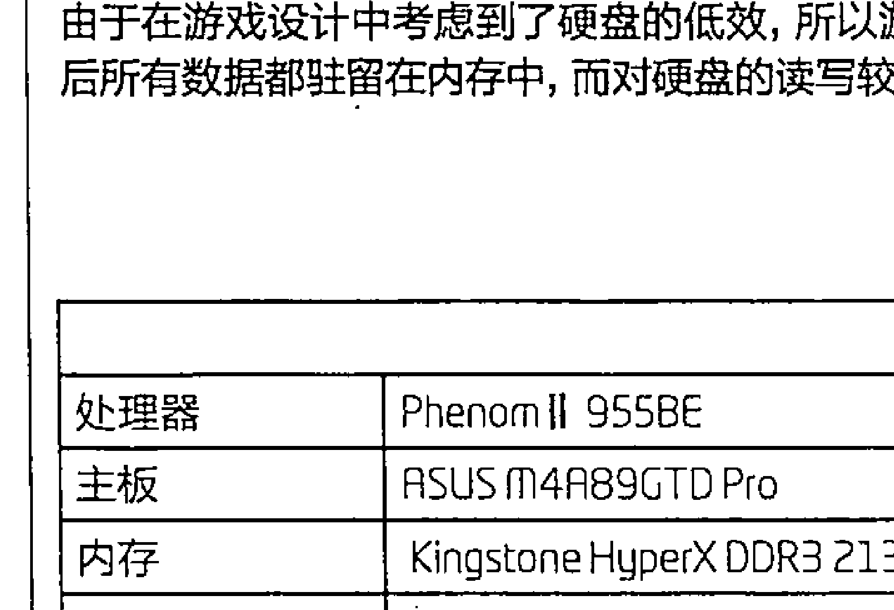

由于在游戏设计中考虑到了硬盘的低效, 所以游戏加载后所有数据都驻留在内存中, 而对硬盘的读写较少。

| 测试项目 | 参数 | WD黑盘 | WD黑盘RAID 0 | 金士顿SSD |
|---|---|---|---|---|
| HDTune Pro | N/A | 119MBps (8.7ms) | 232MBps (8.9ms) | 220MBps (0.1ms) |
| World of Warcraft (魔兽世界) | 1920×1080 | 15s | 9s | 7s |
| DiRT2 (尘埃2) | 1920×1080 | 25s | 13s | 11s |
| StarCraft2 (星际争霸2) BETA | 1920×1080 | 22s | 15s | 11s |

| 测试项目 | 参数 | 2GB内存 | 4GB内存 | 8GB内存 |
|---|---|---|---|---|
| World of Warcraft (魔兽世界) | 1920×1080 | 17s | 15s | 15s |
| DiRT2 (尘埃2) | 1920×1080 | 25s | 25s | 25s |
| StarCraft2 (星际争霸2) BETA | 1920×1080 | 29s | 22s | 22s |

| 测试项目 | 参数 | PhenomII955BE@2GHz | PhenomII955BE@3GHz | PhenomII955BE@4GHz |
|---|---|---|---|---|
| World of Warcraft (魔兽世界) | 1920×1080 | 19s | 15s | 14s |
| DiRT2 (尘埃2) | 1920×1080 | 27s | 25s | 22s |
| StarCraft2 (星际争霸2) BETA | 1920×1080 | 23s | 22s | 22s |

既然是MPQ文件, 我们就可以通过MPQ Editor (下载地址: http://www.zezula.net/en/mpq/download.html) 进行解压, 来看看里面究竟有什么东西。

### 这里我们得出游戏Loading的第一步——解压。

参照游戏开启, 游戏进入游戏界面, 游戏Loading结束的内存占用, 我们能看到其实近20GB的数据文件并未全部加载到内存中来 (当然全加载进来我们测试平台中4GB的小内存也不够用啊, 笑), 所以我们推论游戏Loading第二步, 分析人物位置进行预加载准备, 简单讲就是分析哪些数据应该加载, 哪些不需要加载。拆解MPQ后, 可以看到其中包含的大多数为blp、tag结尾的贴图文件与m2结尾的模型文件。参考由于第三方资料 (魔兽世界的数据库结构分析) 我们推出结论, 游戏Loading的第三步便是进行模型贴图和框架的加载。一次性大量加载后可以保证在走入新地图时不再进行二次加载, 也就是说不会再进入Loading界面。最后, 游戏会加载魔兽世界的特色功能——插件 (众多有用的辅助工具, 采用官方接口, 官方承认语言编程, 与外挂不同)。

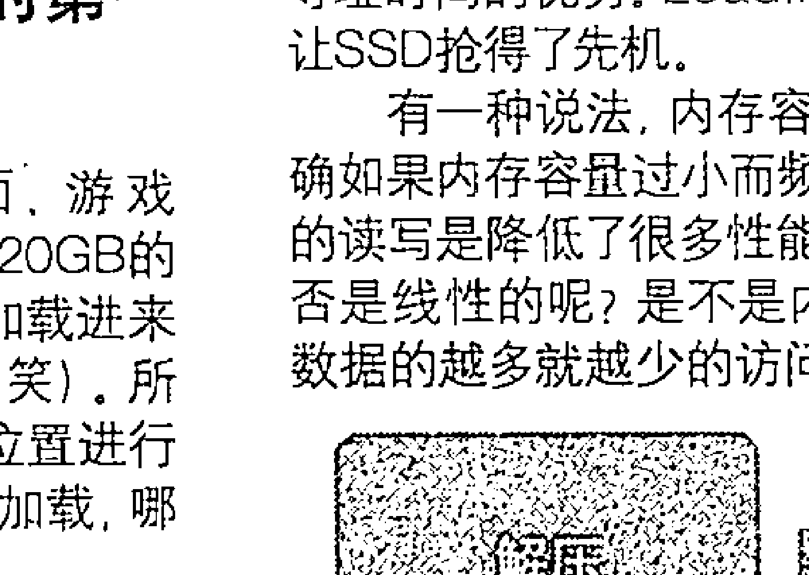

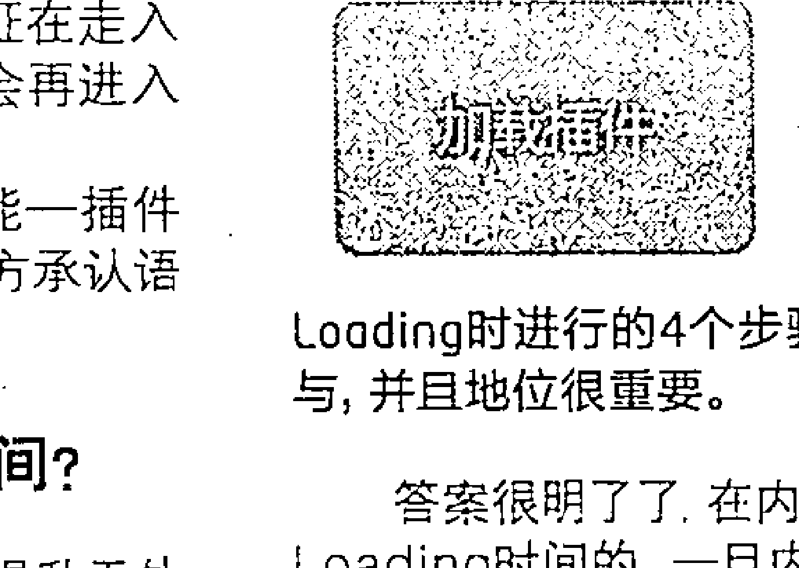

Loading时进行的4个步骤硬盘在其中3个步骤都有参与, 并且地位很重要。

### 哪些硬件可以缩短Loading时间？

说了那么多终于书归正传, 硬盘性能的提升无外乎两种。一种是进行RAID 0, 另一种是采用SSD。虽然他们都不能为帧数带来提高, 那可以为Loading时间的缩短作出多大贡献呢？(见表一) 虽然在传输速率上SSD没有任何优势, 甚至低于黑盘RAID 0, 但是在游戏Loading中SSD体现出了低寻址时间的优势。Loading时大量碎而小的贴图文件让SSD抢得了先机。有一种说法, 内存容量大可以提升游戏性能, 的确如果内存容量过小而频繁地进行虚拟内存 (硬盘) 的读写是降低了很多性能, 但是大内存带来的提升是否是线性的呢？是不是内存越大游戏加载在内存中数据的越少的访问硬盘呢？(见表二)

答案很明了了。在内存不足的情况下也是会影响Loading时间的, 一旦内存充足, 游戏并不会为大内存进行优化去加载更多数据。所以说, 大内存好性能的说法不攻自破。从Loading步骤我们能看出, 其中有CPU的参与, 那么CPU的提升会不会有助于Loading时间的缩短呢？(见表三) 没错CPU的性能提升确实能让Loading时间有所缩短, 但效果不是非常明显 (CPU奔泪道: 为什么帧数是显卡说了算, Loading是硬盘说了算, 我我我……)。虽然Loading对我们的游戏体验没有帧数那么明显, 但谁也不想换一张地图或者换一个场景就要等几十秒, 就像是Windows一般每天启动一次而已, 但还是有人很关注启动时间。在上述测试中我们看到, 其实SSD的优势不单单在于夸张的传输速率, 寻址时间才是它能掐死传统硬盘的必杀技, 相比GBps级别的内存传输速率其实硬盘从Bps级别已经在越追越近了, 但是相比ns级别的寻址时间, 传统硬盘确实望尘莫及, 而SSD接过传统硬盘的接力棒正在试图消灭电脑中最后的瓶颈……

| 测试平台 |
|---|
| 处理器 | Phenom II 955BE |
| 主板 | ASUS M4A89GTD Pro |
| 内存 | Kingston HyperX DDR3 2133 2GB×2 |
| 硬盘 | WD黑盘 2TB 7200/64MB、Kingston SNV425-S2 128GB |
| 显卡 | ASUS ENGTX285/HTDP/1GD3 |
| 电源 | Huntkey X7 900W |

| 测试项目 | 参数 | WD黑盘 | 金士顿SSD |
|---|---|---|---|
| 3DMark Vantage | Performance | 14678 | 15101 |
| Crysis Warhead (孤岛危机：弹头) | 1920×1080 | 56 | 56 |
| FarCry2 (孤岛惊魂2) | 1920×1080 | 41 | 41 |
| DiRT2 (尘埃2) | 1920×1080 | 51 | 51 |
| Street Fighter4 (街霸4) | 1920×1080 | 85 | 85 |
| StarCraft2 (星际争霸2) BETA | 1920×1080 | 53 | 53 |

## 品美食品的是口味还是用料

地三鲜这道知名的东北家常菜用料很简单，土豆、茄子、辣椒。相比北京烤鸭、东坡肘子、烤全羊等等特色菜的用料显然是一个天上一个地下，不过这不能阻止它出现在大家的厨房中，反而正是由于它的口感好、菜料低廉、制作简单而成为多数人常吃并爱吃的一道菜。

到这里可能有人会疑问了，为何一本IT媒体讲起了特色菜，是不是要转型搞餐饮了？当然不是，我们只是用地三鲜讲出一个道理，买产品就像是品美食，重用料（参数）而轻口味（体验）那么你尝到的很可能是让你失望的菜品。

## 正史：乔布斯与它的水果经

话说果农乔布斯今年的新水果采摘的季节又到了，为了更好的推销自己的产品每年一度的发布会必不可少。谈谈今天蔬果市场的变化，谈谈新科技为水果带来的改变。这不正要开始吗？我们也凑热闹去看看！

乔布斯：话说今天的早些时候，我们卖出的西瓜已经达到了200万，要知道这可是两个月的销量而已。

农副产品杂志社记者：你们家的西瓜和苹果长得一样，吃起来也没多大区别啊？

乔布斯：不不不，事实情况并非如此，由于这两种水果尺寸的改变带来了食用方式的改变。苹果你只能用牙啃，而西瓜却可以用勺子挖来吃。更大的尺寸带来了更出色的食用感受，这就是西瓜和苹果的区别。

乔布斯：闲话不多说，让我们看看今年的主打水果——苹果转基因嫁接4代（以下简称苹果4）。苹果4突出的优势是：首先适于长时间存放运输而保持新鲜；其次更亮丽的外表虽然让它有些鸭梨的风格但是也让审美疲劳的大众看到另一种美感；再次全新的口感，如果说苹果3咬下去的声音是“咔嚓”，那么苹果4就是“卡”。别看少了这一个字，这不仅是两倍以上的提升，更让用户感受到苹果的清脆感，更接近牙齿的感觉极限。

虽然我们笑谈着乔布斯WWDC 2010的iPhone 4发布，但是从乔布斯宣传中我们可以发现一个特点——他只字未提iPhone 4的性能提升，而是把更接近人眼视觉极限、更大的商机、更长久的续航时间、更有趣的游戏放在了介绍中，只字未提处理器频率、理论性能、内存大小等等常规数据。

## 外传：英特尔口号的改变与未来的出路

1991年，那是安迪·格鲁夫执政岁月的中后期。那一年，为了把自己的处理器与来自对手的模仿品区分开来，英特尔启动了“Intel Inside”计划，后来随着“奔腾”芯片（Pentium）的成功而大行其道。“Intel Inside”的意义则在于：它证明了微处理器厂商可以拥有独立的品牌，并直接影响它的消费者，然后让消费者凭借对CPU的需求来拉动PC的销售。而“Intel Inside”的另一层含义便是配置有强大性能的英特尔芯片。

15年后的2006年1月4日，一个名为“Intel Leap ahead”（超越未来）的标识浮出水面。很容易从这个新标语中嗅出混杂的气息：变革与预言。“我们更换新的标识，是因为它背后有新的东西。”欧德宁说。这家过去37年纯粹提供CPU的公司已经在“自我否定”中，开启面向移动计算、数字家庭、数字企业等更大平台服务的新篇章。在这次变革中，英特尔一个显著的特点是，更加强调贴近市场的应用，更加符合用户的使用习惯才会带给英特尔辉煌的未来。

## 点评：苹果与英特尔，同一条发展之路

粗看起来英特尔与苹果并无相同之处，但其实不然。从乔布斯的大谈体验而忽略参数到英特尔的口号改变，都验证着一个趋势，用户体验是产品品质的根本。

所谓用户体验，说白了就是用户已经积累下来的“认知”和“习惯”，这些认知和习惯也许有用户在使用类似产品时的习惯，但更多应该是来源于生活，或者那些生与俱来的“认知”。一个体验好的产品，并非要追求第一眼看到就惊喜，而是拿到手上你可以很快知道如何去用，使用过程简单顺畅，而且没有学习障碍。以帮助用户解决问题为出发点，用最简单最符合用户习惯的方式来做设计和取舍。

性能、硬件参数则是为了保障用户体验的基础而已。从英特尔的例子中我们可以发现，当性能不足以保证用户体验的时候，高性能的宣传起到了极大的作用。而今性能足以满足甚至超出需求的时候，忽视用户体验，一味地宣传理论性能会让人们产生性能过剩的错觉。当我们纠结于某款游戏10fps~20fps的性能提升时，都忘记了游戏还在用键盘和鼠标这两种生硬的操作方式。当我们叹息下载速度的时候，却不去想为何软件非要下载并安装在本机才能运行。

摩尔定律促使着硬件以18个月为周期不断提升性能，但与此同时用户体验却只是缓慢的更新、改进。当iPhone4、Web 2.0席卷世界的时候，我们该反思，性能是我们所欲吗？就像文章一开头说的一样，买产品就像是品美食，用料（性能）不是重要的，最终的口感、味道（用户体验）才是一道美食真正吸引人的地方。

## 上网本不在沉默中爆发就在沉默中死亡

钱钟书先生的《围城》有这么一句话：“城中的人想出去，城外的人想冲进来”，上网本市场何尝不是如此呢？无数上网本厂商都希望另辟蹊径转战其他领域，而以iPad为代表的新形态产品则以“城外人”的身份意在瓜分上网本市场的蛋糕，看着上网本身后那些虎视眈眈的新秀，让我们不免为上网本的未来捏一把汗。

上网本销量下滑已经成为了不争的事实，然而横空出世的iPad并不是主因，英特尔和AMD的高层均对此观点“达成一致”：英特尔首席执行官保罗·欧德宁表示，以苹果iPad为代表的平板电脑仍然是“非主流”的产品，并不是所有的人都一定要拥有一台平板机，但是绝大多数的人都会需要一台PC。而AMD高级副总裁兼首席营销官Nigel Dessau认为，平板电脑和上网本的发展前景是不相同的，用户的需求不同，就会选择不同的产品。

真正让上网本陷入如此尴尬境地的，应该是消费者对其的审美疲劳。清一色的10英寸屏幕、同质化的硬件配置，产品之间似乎只剩下品牌和价格的差异了。上网本若想重振雄风，自然需要重新点燃消费者购买激情的“杀手锏”。个性化的外观，吸引更多感性用户的关注；为产品武装触控屏幕，从操作上拉近与用户之间的距离；和Android等系统联手，打造简单易用的互联网应用环境，这些都是上网本当前可以选择的突破之路。

“基于网络应用的平板设备更易于进行云数据储存，而上网本用户则更喜欢把应用和数据存在设备上，可见二者服务的是不同市场。”华硕CEO沈振来表示“iPad用于云计算要好一些，而上网本则更适合个人计算。”由此可见，未来一段时间上网本和平板电脑都将是一个独立的存在，相互补充。之所以平板电脑能受到如此礼遇，一方面是大家通过他们找回了久违的新奇感觉，另一方面则是苹果iPad的光辉过于刺眼，想不关注都难。

未来的上网本市场必将以差异化为主导，NVIDIA新一代的翼扬平台，英特尔新发布的超低功耗Atom处理器和蓄势待发的MeeGo操作系统，这些新技术和新应用都将成为上网本转型的利器，如果上网本依旧沉溺在当前的同质化和价格战之中，必死无疑。上网本，不在沉默中爆发，就在沉默中死亡。

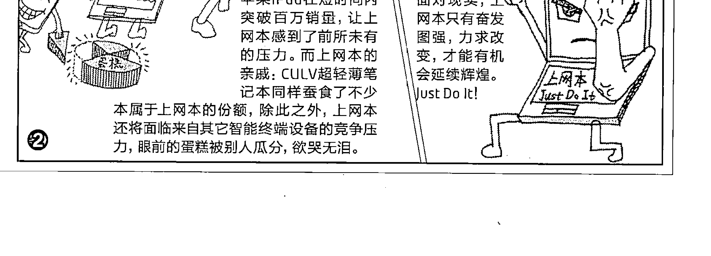

《电脑爱好者》·合订本

### 主板厂商预言笔记本危险！

日前，记者在台北国际计算机展上搜罗相关的资讯，偶然间在采访技嘉主板事业群副总经理高瀚宇先生时，高瀚宇的一番言论让我惊讶不已：“笔记本当前销售固然很火，但未来几年，这（笔记本行业）可能是最危险的一个行业了”。这究竟是怎么回事？主板厂商缘何预言笔记本电脑危险？

### 密访卖场得真相

这个疑问一直随记者回到了北京，在暗访卖场后，似乎这个问题得到了答案。老周是卖场老油条了，十余年的卖场打拼让他对这个行业有深刻的体会：DIY将死的呼声总是不绝于耳，其实不是真的。我们从商场的布局结构就能略知一二。比如走入普通的商场，90%的商场第一层都会是化妆品、珠宝，因为这类消费可有可无，你必须抓住购买者的眼球才行。走到电脑卖场呢？无一例外的第一层全都是笔记本、台式机、一体机，第二层85%的卖场都是数码类电子产品，继续向上才会来到DIY卖场。同时你会发现，大多数卖场DIY柜台都不止一层，少则两层，多则三层。这无疑是给那些一直疾呼“DIY将死”的人一记响亮的耳光——不错，笔记本确实吸引人，但DIY的需求空间同样十分旺盛，人们不怕多爬两层楼，消费者依然需要DIY。

### 真话还是假话？

回想技嘉主板事业群副总经理高瀚宇先生的话，再结合自己的暗访结果，条理似乎越来越清晰。高瀚宇先生认为，目前全球力推3G网络，例如iPhone之类的智能手机和智能手持设备将会发展起来。在中国未来3年~5年，笔记本电脑就会比较危险，因为这些智能手机以及智能手持设备会取代笔记本电脑的作用。当人们出差在外的时候，只需要用智能手机或是平板电脑就好，完全不需要使用笔记本电脑，而回到办公室或者家里，就会使用台式机，因为既然有台式机，谁又会去使用小屏幕的笔记本电脑呢？
高瀚宇先生就表示，自己在这半年的时间里，打开笔记本电脑不超过10次。虽然笔记本也有17英寸的型号，但是那样牺牲了移动性的笔记本电脑还不如直接买台式机，价格还更便宜。

## 品质是 DIY 的生命

面对着汹涌的数码狂潮，各种移动设备、各种信息，都从电脑中向外流出。但是，人们回到家，依然需要的是一个强劲的电脑，作为全部数字内容的中枢，去处理、去应用。我想这就是为什么高瀚宇先生会语出惊人，大胆预言笔记本危险的原因所在。
当然，我们也面临着一个非常现实的问题，笔记本、台式机的品质通常要好于DIY产品——单就质量而言，一台笔记本至少拥有五年以上的全寿命。

对此，我们也采访了技嘉科技中国事业处总经理刘文忠先生对这一情况的看法，刘文忠先生认为：“有人说主板用三年刚刚好，所以不需要用太奢侈的用料，其实这是一个错误的观点。谁能够精确的说出一款主板的使用寿命，谁能保证一块主板用三年刚刚坏掉。没有人能保证主板过了三年在之后的第一天坏掉。通常在讲这种话的人也在做偷工减料的工作。
主板上这么多零件，它们整体的故障率是相乘的概念，而不是相加，这是几率的问题。如果说每个零件都有百分之几的故障率的话，那么零件数目乘起来是非常恐怖的。所以零件不是用差不多就好，而是每个零件要做到最佳化，这样才能让产品做到最高稳定性。”
同时，刘文忠先生还透露，目前诸多品牌主板所谓的售后服务根本无法达到全面覆盖，只卖不修的情况固然少见，但偏远地区少则20个工作日，多则以月计算的返修时间，根本不能满足用户的需求。经过记者了解，技嘉在这方面就非常用心，全国多达48个芯片级维修中心完全可以覆盖全国绝大部分地区，显然这是非常了不起的。
显然，以品质为重、性能强大、配置又十分灵活的DIY并不是穷途末路。DIY的发展空间及前景，依然十分广阔。市场的生杀大权，其实是在用户手中，笔记本会火更像是短期需求，长期来看，DIY依然是非常理想的选择。

## Computex Taipei2010台北国际电脑展

有什么比早于他人看到即将上市的IT设备更令人兴奋的？6月1日，本刊记者有幸亲自采访了2010台北国际电脑展。有人说，CeBIT是卖思路，Computex是卖现货，这就是当前世界上最大的两个电脑展的区别，事实也是如此，台北国际电脑展更多的是即将上市的产品，你能了解到当前的产品趋势，厂商对新技术应用的成果展示。本届展会，除了Wimax离我们相去甚远外，最吸引眼球的莫过于USB 3.0、3D显示技术和各种平板电脑了。

## USB 3.0 年内开始普及

自技嘉首推USB 3.0主板后，USB 3.0接口似乎总是有方式无设备的窘境。在本届台北国际电脑展上，记者发现USB 3.0大行其道，包括金士顿、宇瞻、威刚、创建、PNY等等多家存储厂商都推出了USB 3.0设备，并且诸多厂商负责人都表示，产品会很快上市。为此，我们也特意在会展现场找到了USB 3.0设备控制器设计企业群联电子。群联电子的负责人表示今年将是USB 3.0设备的普及开端，预计第三季度开始，大量的USB 3.0设备就能够上市了。
尽管有Intel相关人士在会场表示，年内不会推出支持USB 3.0规格的芯片组产品，但大势显然不可阻挡，依靠独立的USB 3.0芯片（如NEC USB 3.0控制器），诸多主板厂商都推出了大量USB 3.0规格主板。这无疑将最大限度解决目前外接存储设备的读写性能低下问题（容量成倍增长，但受到USB 2.0接口传输速度限制，无法发挥全部性能）。

## 3D 显示技术吸眼球

显示技术因为它的高可见性，必然会吸引不少人的眼球，毕竟还是“看起来”很容易。在NVIDIA展馆（NVIDIA在会场外单独搭建了一个展馆）展示的3D Vision Surround非常吸引眼球。大屏、游戏，这两个因素加在一起，任谁都不会忘记。而在华硕展区，同样亦展示了3D显示技术，同时还推出了其首款3D笔记本电脑ROG G53，正式将立体3D技术引入笔记本。不过，以记者一贯的态度来看，3D技术未必就是仙丹妙药，3D领域实在是太过缺乏技术发展亮点了吗？当然不是，实际发展空间还是相当大的，但是，厂商选择了当前的3D显示技术。在此我们预言，当前的3D显示技术终究是过眼云烟，2011年3D技术的光环将不再耀眼。从另一个角度——AMD推出的AMD Eyefinity（多屏技术）也因为庞大的预算开支，让普通玩家难以接受。

## 类 iPad 大行其道

2010年，如果你叫Pad，至少你的曝光率会增加几个百分点。在台北国际电脑展上，iPad效应几近无限放大。如我们熟知的品牌华硕Eee Pad EP101TC、EP121，汉王科技的TouchPad B10，长城Gbook T3，LG UX10，万利达 PC-A1001；还有像CZC P10T，Wistron W1-tablet，FIC TVB00，Gemsta GIGA9，ciio PC，FIC tycoon，Viliv，iView ueicuOS等等。这些产品有个共同点，他们都采用X86构架的Intel平台产品，并多配备Windows 7系统。显然，这与苹果iPad采用嵌入式构架+嵌入式系统的思路有很大区别。

实际上，在与诸多同行的媒体同行之间看法也颇为相近：X86构架+Windows 7对于用户而言使用体验依然更加接近PC，这其实并不是件好事，用户无法再移动中进行精确操作，这让这些平板电脑的操控成了大麻烦。想要分一杯Pad羹？难！
期间我们也采访过几家厂商的负责人，从言谈中我们不难发现，分一杯羹的想法确实存在，但是对于自己产品的信心并不是很足。毕竟根据目前掌握的资料，iPad已经销售超过200万台，而此次参展的产品已经开始销售的少之又少（销量也非常有限），大规模上市还要等到今年第三季度。即便抛开技术层面、使用体验层面不谈，仅已经铺向市场半年（以今年4月销售iPad开始计算）的iPad来说已经晚了不少。
实际上，多达1715个参展商带来的各种新产品、新技术绝不是这么一点儿。比如说电子书，尽管各种Pad大行其道，电子书依然还是一个热点。如华硕、明基、Acer等等诸多企业都在本届展会上展示了自己的电子书产品。总体来说，硬件厂商推出的产品可谓“精锐尽出、高规格示人”。此外，本届展会透露出的另一大信息就是移动互联网时代的深入发展。从网络服务到硬件产品，从系统设计到软件服务，无不剑指网络。微博等SNS互动新方式让网络的移动性进一步加强，各种设备、服务也应运而生。
总体而言，台北电脑展可以用“热闹非凡”来形容，但正所谓“外行看热闹，内行看门道”，6天的时间我们固然无法将所有展馆厂商的每一样产品细细研读，但趋势我们已经牢牢把握。年内，台北国际电脑展上大部分产品将从展会走向市场，让我们拭目以待吧！
（本刊记者：西浩铭 台北报道）

## 智能机为何深陷信号门

iPhone 4信号不好已经成为公认，握住手机天线部分打电话会掉线、无法上网。当苹果再也招架不住愤怒的机友与煽风点火的媒体之后，为了证明iPhone 4的“清白”，接连曝光各大手机巨头旗下明星产品信号问题，“光明正大”地证明了：智能手机都有信号问题。
在7月份的发布会上，老乔首先曝光了三星 OmniaII、黑莓9700和HTC Droid Eris等机型。然而苹果觉得这样似乎不过瘾，又把诺基亚N97 mini、摩托罗拉新款旗舰机DroidX拉下水。至此，全球智能手机巨头已经几乎被悉数涵盖。

老乔给出的解决方案似乎效果不大，要么对iPhone4进行升级iOS4.0.1系统，据说这个只是增大了天线UI图标的高度。要么免费得到一个手机套。现在的智能手机的GPS导航、Wi-Fi、蓝牙、手机信号等功能都集中在一个小小的地方，信号太多是导致“打架”或是信号不好的根本原因。相信老乔比谁都明白，为何仍然一副不屑的样子，摆出“你能拿我怎么办”的姿态。软件升级、手机配套在内行人眼中都只是忽悠人，没有硬件的改善，无法真正根治信号问题。

## 想赚钱，请脚踏实地

智能机集体深陷信号门，而且暴露问题的多是旗舰高端机，真的是因为功能太过丰富才导致的么？技术难点固然有，但除此之外想必还有一些不负责任的心态吧。神坛之上，光环之大，是否iPhone的疯狂成长让苹果忘了本，忘了用血汗钱爱它的人？
（文/一串蚂蚁）

CfanBoundEdition·2010 277

## 平田真志刷平勇看IT

cucn201是由中国传媒大学南广学院201宿舍的四个男生组成的配音组合。代表作日和系列动漫，创作了诸如：“我勒个去”（我去），“加勒个油”（加油），“不给力啊”（“不带劲啊！太没劲了！”，形容和自己预想的目标相差甚远）等令人捧腹的口头禅式短语，网友们纷纷评论道看到了中国动漫界配音的希望，其中以《平田的世界》颇为经典。
http://baike.baidu.com/view/3626440.htm?fr=ala0_1_1

### 故事1：我勒个去！这货不是QQ，这货不是QQ。

作为塞班家族的主力触屏系统，出生一年多以来，S60v5没有一个像样的sisx格式手机QQ成为了最大的悲剧，直到最近腾讯官网发布“手机QQ1.0（S60v5）Beta1”。
第一次尝试登录就让我感觉特别悲剧，声音管理还像最早期版本的手机QQ一样，声音提醒不细分，系统设置选项仅有三个：开启声音，震动，清除聊天记录。要消息提醒的话，必须把好友上线之类的提醒一并带上。由于没有整合QQ浏览器，资讯，游戏等模块，只能实现最简单的聊天功能，最失望的莫过于添加好友只能按QQ号码添加。想想早些发布的Android版手机QQ，评价要比这个好不少。S60v5版不给力啊，差距怎么就这么大呢？无视Beta版，坐等正式版。

### 故事2：我勒个去！这货不是平板电脑，这货不是平板电脑。

就目前来说平板电脑的市场前景是比较乐观的，一是业界共识，继苹果之后，汉王、华硕、微星、联想、惠普等老牌PC厂商纷纷跟进。二是软硬巨头支持，英特尔、NVIDIA及AMD等芯片厂商相继推出平板电脑的专用芯片。汉王TouchPad的宣传自始至终都是针对iPad，硬指标上没得说，当然还有高达5999元的售价。汉王自己的说法，iPad就是是个玩具，卖四五千元显然不合理；而TouchPad则是面向高端商务人士的利器，卖七八千元都很正常。想想刚才提到的乐观前景，也只是针对价格在3000元以下的产品。定位在代替MP4作为笔记本的二房，配置不是第一位，价格才是首先考虑。

## DDR3内存年内普及！

### DDR2 内存会降价吗？

显然这种问题很受消费者关注，不管怎样，前两年内存的低价还是让不少用户感到遗憾，似乎再也买不到便宜内存了，但是还有不少用户的机器内存尚需升级。
近一个月，内存的价格似乎有所松动，尤其是进入夏季以来，DDR2内存最低价格已经处于300元以内了。对此，金士顿大中国区内存业务总监冯若昊先生认为首先闪存的价格与市场需求永远是矛盾的，市场需求增加，价格就会上涨；而一旦供过于求，价格就会下跌。鉴于DDR2内存今后将逐渐被DDR3所取代，价格也会慢慢趋于稳定，随着软硬件技术的发展，用户需求也越来越旺盛，必然会导致内存价格上涨，但价格上涨又会反过来制约消费需求。
当然，对于很多还在使用 DDR2内存的用户，我们还是建议尽早选择升级，毕竟面对来势凶猛的DDR3内存普及之风，DDR2的退市脚步已经越来越大，甚至是短期内就有可能退出市场，所以，抓紧今年的暑促时机，在价格合适的时候入手，无疑是明智之举。

### DDR3 内存什么时候普及？

冯若昊先生对于 DDR3内存的普及问题，显得颇有把握，他提到：“内存不停升级换代是必然的，从早期的 FPRAM到技术进步和消费需求共同促进的结果。“同时，冯若昊先生认为 DDR3也不是终点，以后肯定会有更先进的内存技术来取代它。但就目前而言，DDR3全面取代 DDR2还需要半年到一年的时间，一方面是 DDR3的成本随着制程工艺的转换还会进一步下降，拉动消费需求；另一方面则是Intel和AMD也已经将主流平台全面过渡到 DDR3内存上来了。

内存的相关产品，几乎全面转向了 DDR3内存平台的主板，这就意味着，DDR3内存的普及已属必然。经过市场自然的消化，包括库存产品、芯片组规格升级等等因素，DDR3内存的需求也必然进一步提升。冯若昊先生还透露，目前内存的生产比例 DDR3内存已经十分接近 DDR2内存，未来这个比例的切换速度还将加快。

### 内存选择不单靠价格

仔细观察金士顿的内存产品，自 DDR3内存开始，金士顿已经细分成 LoVo产品线，这又是为了什么呢？
其实很多玩家对于内存的需求不仅仅在于容量，同时还有频率、性能等诸多因素，只不过价格长期以来就是人们关注的焦点而淡化了其他的指标。金士顿此次将内存细分为三个系列，无疑是将内存市场进行了细分。
冯若昊先生认为个人市场今后将会分为三个层次，入门级用户要求比较低，对价格比较敏感，可能会选择入门级的品牌机或上网本，也可能选择入门级配置的 DIY产品。中间层的主流消费者会以品牌机和笔记本电脑为主，这类电脑出于成本的考虑，预装的内存可能并不够用，或是一段时间后需要升级，而金士顿则能够为他们提供具有出色兼容性，极佳品质和终身保固的 ValueRAM和系统指定内存。最上层的一部分高端硬件玩家不满足于品牌机的性能或固定配置，他们会自己动手选择最合适的配件，一些新推出的产品也会是这个群体最先尝试使用。比如骇客神条这种性能出色、个性化且有丰富附加价值的产品。

## 换个方式看电子书

### 阅读面更广阔

移动把手机阅读业务定位为“打造全新的图书出版发行渠道”，以手机和能上网的电子书为主要终端。在书店、书城看到的出版图书，在手机阅读中都能找到，不单单局限于以前网络小说的范畴。

### 办理方式

电脑登录www.bj.chinamobile.com/index/products/info/64281/或手机访问wap.cmread.com。和移动其他服务不同的是，手机阅读的订阅是即时生效。业务信息费分点播信息费和包月信息费两种，上网流量费在信息费中打包收取，不再单独计价。
点播：单本图书点播有按章收费和按本收费两种方式，按章收费标准约0.04~0.16元/章，按本收费标准约1~10元/本。
重点是包月：分为3元优惠包和5元精品包。3元优惠包以传统经典图书为主，优惠包外单本书8折优惠。5元精品包内提供50本畅销图书，逐月更新，优惠包外单本书8折优惠。

需要说的是，必须用CMWAP接入点才能访问。以手机为例，登录wap.cmread.com，里面免费图书有一部分，不过瘾的话可以办理包月。打开首页的“三元|五元包月书包”即可进入相关的套餐包，找到你订阅的的套餐，直接打开就可以看到本月新书列表了。

### 阅读方式

可以线上阅读，也可以下载后离线阅读。线上阅读与浏览网页、贴吧无异，可以查看到阅读过此书的用户对于该书籍的评论，也可以自己写书评。多数朋友都会选择下载阅读，更为方便。离线阅读就必须使用客户端，在页面底部“客户端”可下载。
·目前除iPhone不支持以外，其他系统均有客户端。以S60v3客户端为例，安装包大小约900kB。主页面图标风格很漂亮，至少比91熊猫看书好很多。
电子书最重要的一点就是看书体验，在这方面手机阅读客户端还不够完善，设置选项内仅有两大项，其中字体只有三种模式，主题色调也仅有两个。遗憾的是不支持自定义按键，在体验感受上相比91熊猫看书还有较大差距。

**移动手机阅读下载：wap.cmread.com（手机登录）**
**91熊猫看书下载地址：http://soft.sj.91.com/pandareader**

同为手机阅读客户端，模式差异很明显，在91熊猫看书与百阅上找不到收费阅读，两家号称全免费，其收费部分也是外链到起点，价格按起点的方式计算。这两位侧重线下阅读（电脑下载后传至手机阅读）及网络小说转载免费阅读。而手机阅读更看重出版类图书，当然也包括网络小说。只能说移动与出版商这块联系的很紧密，出版图书渠道很扎实。
做出版类图书的网站不只一家，比较有实力的还有起点中文网，以《丫头我们恋爱吧》为例，当当网14.6元，手机阅读2元购买，而起点中文网依旧是按章节收费，每章0.15元。还好章节不多，需要2.75元。能做到最便宜，对正版线上阅读及纸质图书冲击很大，不过缺点也很明显，客户端响应速度慢，不支持Wi-Fi，网络小说搜索不够强大。目前来说，喜欢免费网络小说选91熊猫看书与百阅没错，想看廉价正版图书首推手机阅读。

（文/小哨哨）

## 用丝袜给电脑机箱做“防尘手术”

前些年健圣曾去海南游玩，那边的环境真的很美丽，也很干净，一件衣服穿了5天都不脏（旁人：那汗臭呢？好恶心）。凯旋回家后发现电脑怎么也打不开了，拆开机箱，Oh my God，映入眼帘尽是灰尘，折腾半小时除灰后开机正常，看来北方的环境真是硬件杀手啊。如果你也和健圣一样曾为机箱灰尘困扰，不妨来学学网友“卖女人的老火柴”的方法吧，只需2元就能让机箱远离灰尘！

这位同学的工具再简单不过，2元钱分别买了一双性感的丝袜和胶带，大家不要想歪了，丝袜不是用来穿的，而是给机箱做“防尘手术”的材料哦。一般来说机箱侧面和背面的散热孔都是灰尘的最爱，这次手术的对象就是这些家伙。
手术很简单，用剪子把丝袜剪成一块一块的，比散热孔稍大一点即可，然后拆开机箱，将丝袜块覆盖在散热孔上，四边再用胶带粘住。当给所有的散热孔都“穿上”丝袜后手术就完成了，合上机箱吧，从此你的机箱就可以最大限度地避免灰尘的入侵了，每隔一段时间换一次丝袜块就好了。
需要注意的是，电源风扇的散热孔不要堵上哦。

丝袜要选择透气的那种，我们的目的是防止灰尘而不是阻止空气的流通。这个方法适合非游戏玩家，如果你对电脑的处理器和显卡进行了超频而发热量大增就不要尝试了。

### 小提示：

截稿之时海南正遭受特大暴雨的侵袭，希望灾区的朋友可以尽快渡过难关，恢复海南岛往日美丽的景象。

## 长焦广角称霸 毕业照不再有遗憾

每年七月份都是伤感的季节，《睡在我上铺的兄弟》是男生的最爱，而女生则喜欢听《栀子花开》，不外乎因为这是一个毕业的日子。

逆光角度，正面用闪光灯补光，取脸部点测光，曝光量加三分之一档，快门时间最好高些，免得被太阳直射伤害CMOS/CCD。

选广角 DC》，手机全景照片下载地址: http://work.newhua.com/cfan/201007/panoman.rar

## 小范围集体照

为了防止拍到闭眼的照片，切记每张照片至少拍两次，无论是卡片机还是单反，可以考虑使用运动档连拍。顺光最好，侧光容易产生互相之间的阴影，逆光如果按面部曝光，背景和边缘会过曝严重。20~30人的合影宜用F5.6~8光圈；在60~70人合影时宜用F8~11光圈，快门速度最好不低于1/30秒，这样可避免个别人在拍摄中突然晃动。

## 下雨怎么办？

搜索关键词：“相机 防水”，赶上下雨天有一台防水相机绝对会比其他人拍的舒心，更何况以后去海边玩还能用到。防水袋有两类，分别适合伸缩镜头和固定镜头卡片机。

## 逆光糖水片儿

此种效果最能突显妹妹可爱的气质，具体做法：逆光拍摄，注意必须是光线在头发和衣服上产生光晕角度，正面用闪光灯补光，取脸部点测光，曝光量加三分之一档，快门时间最好高些，免得被太阳直射伤害CMOS/CCD。

## 近端人像怎么拍？

拍人像尤其是女生，小景深即背景虚化的效果很受欢迎，在心仪的妹妹面前留个好印象？记住三个要素：1大光圈，2长焦距，3近物距。大部分卡片机仅有五倍变焦，所以仅仅通过卡片的焦距改变来改变景深是不够明显的。大光圈有虚化景深的作用，所以建议将光圈调最大，就是F值越小光圈越大。如果不行再试试微距拍摄，就是相机上拍花草的微距档。

## 手机也能 360 度拍摄？

火速链接：手机也能拍全景照片？普通相机拍全景照片后期怎么合成？请看 2010 年 07 期《拍大照片就选广角 DC》。


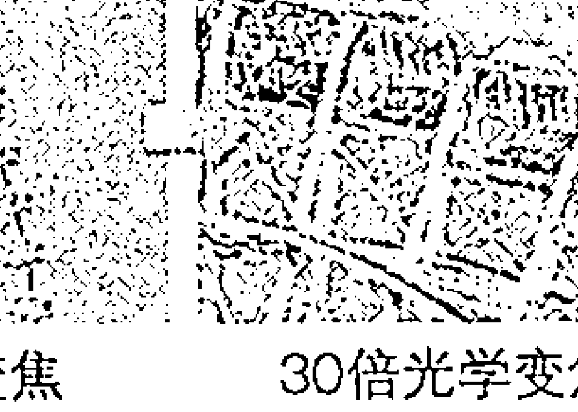

## 全能型数码相机推荐

要想锁定人群中的某个妹妹，没有长焦镜头是没希望的，同样拍下学校的大场面没有广角镜头也是做不到的。有没有兼备两者同时又能录像的数码相机呢？

+   ●富士HS11 淘宝价：2790元
24mm~720mm 30倍的长焦镜头，覆盖24mm超广角，感光元件采用1/2.3英寸1000万有效像素的背照式CMOS，最大可拍摄1920×1080/30FPS全高清视频短片，小单反外型比较受男生欢迎。

+   ●索尼HX5C 淘宝价：2280元
25mm~250mm 10倍的长焦镜头，感光元件采用1/2.4英寸1020万有效像素的背照式CMOS，最大可拍摄1920×1080/50FPS全高清视频短片，特点是机身轻薄，适合女生使用。

## 写在最后

就是离别，也将它看成是为了重逢时加倍的欢乐。珍惜人生中每一次相识，天地间每一份温暖，朋友间每一个知心的默契。

(文/许楠)

## 自制草根版玻璃鼠标垫

自迷上穿越火线之后，对电脑的要求变高了，最近又琢磨起鼠标垫来。普通布的、塑料的和橡胶的鼠标垫摩擦力大，而且很不均匀，直接影响到鼠标的快速移动。

看到一些游戏高手使用的鼠标垫是铝质或是玻璃的，感觉不错，平整度高，定位准确。当然价格上也“非常强大”，所以只好背着老婆DIY一块玻璃鼠标垫。

主意打定，跑到街上的玻璃店，以口水+2个硬币从玻璃店学徒工清扫的垃圾玻璃堆里买到一块废玻璃。

玻璃大小不限，根据个人爱好，建议至少25×35cm。切割嘛，有玻璃刀的不用教，没有的花5元钱贿赂玻璃店老板。

接下来要对玻璃面进行打磨处理，因为这时的磨砂面太粗，有可能造成鼠标移动不灵活，二是对鼠标的垫脚磨损非常厉害。

### 主要准备材料及工具：砂纸，磨石

### 打磨的方法如下：

+   1 将两张砂纸割成四张，每张刚好和巴掌大小差不多；

+   2 加水开始打磨，正确的打磨方法是以巴掌平平按住砂纸，以最大的面积来磨，而且这样用力才比较均匀；

+   3 打磨方向是每一张砂纸磨一个方面，比如两张砂纸磨对角线，两张砂纸磨纵横，而且是均匀地磨到整块玻璃，不要象你洗脸那样光搞中央；

+   4 打磨的程度是以每张砂纸都磨到它的砂差不多磨光为止，四张砂纸磨完，磨砂面的打磨也就合适了。

接下来打磨边角，这时就要用到磨刀用的磨石了，要加工的总共是两面四边，共八条棱。最后把磨好的玻璃板和纸板粘在一起，这里说下粘上纸板的原因：玻璃易碎，粘个纸板上去，可以起到一点防震的效果。

再就是贴纸了，其实也可以不帖纸，如果用喷漆效果可能会更好，可以喷一个漂亮的图案。淘宝有很多自动喷漆，汽车漆或模型漆都可以，一层底漆搭配一层清漆更耐磨。至于图案么，找一家有刻字机的打印店，刻一张镂空即时贴很容易。

最后，给鼠标垫做了4个防滑垫，材料取自车胎，没花钱。从车胎上剪下来的一小块，表面纹路很大，做防滑垫正好合适。

(文/csl)

## 二手手机选谁最超值？

既然准备入手二手机，就要明白它的定位，手头不足但是经常换手机；把二手机当做3G上网的备用机。

那么，我们的目标是千元左右二手改版机，为何定位改版机？不仅考虑到行货去掉的功能影响使用（大部分机型会去掉Wi-Fi，FM发射，3G），还要知道二手机多半过了行货唯一值得炫耀的保修期，什么样的二手机值得买？

### 赛班族

诺基亚E71
E71是诺基亚最成功的全键盘手机，以全键盘+S60快捷的反应速度，发短信、聊QQ的速度绝对第一。水货支持Wi-Fi以及WCDMA 3G网络，适合当做3G备用机或是想初尝全键盘的朋友。

### 选购要点：

首选亚太改版机，原装键盘挂机键字符有凹凸感，而键盘中央部分鼓出来的绝对是拆过的。此外，E71的金属后背十分耐磨，如果已经磨得不像样子，输入*#92702689#查看总通话时间也能判断出手机使用时间。

| HTC 版 | 沃达丰版 | 多普达版 | T-MOBILE |
|---|---|---|---|
| 3G（WCDMA） 支持 | 支持 | 不支持 | 支持 |
| 颜色 黑色、白色 | 白色 | 白色 | 黑色、白色酒红色 |
| 运行内存RAM 288MB | 192MB | 288MB | 192MB |

### 谷歌族

HTC G2
想玩Android，首选G2，比G1快，3.2英寸（320×480）屏幕也很细腻，触摸效果仅次于iPhone。缺点就是外壳有点脆弱，很容易脏或者刮碰，还好看起来容易脏的轨迹球十分耐用。

### 选购要点：

辨别内存大小可进入超级终端输入su，回车，再输入free，回车，显示可运行RAM为197144则是HTC版的G2，显示RAM为98708则是沃达丰版G2。

### WM 族

HTC 钻石（S900）
背面采用钻石切割的设计就是“钻石”的得名原因，经典的2.8英寸VGA（640×480像素）液晶屏幕是推荐钻石的主要原因，520MHz的CPU对付这个大屏幕还是有点吃力，没用过WM系统的朋友会抱怨手机的反应速度。

| | E71 | G2小内存/大内存 | 钻石 |
|---|---|---|---|
| 全新 | 1600元 | 1700元/2100元 | 无 |
| 9成新（无拆无修无进水，标配） | 1300元 | 1500元/1700元 | 900元 |
| 8.5成新（侧按键不灵，键盘、屏幕轻微磨损） | 1100元 | 1400元/1550元 | 800元 |
| 8成新（外壳磨损较重，拆过机） | 900元 | 1300元/1500元 | 700元 |

### 选购要点：

钻石机器较老，难免遇到翻新机，只要键盘按键正常，屏幕无坏块就能接受。原电可能性很小，唯一要注意是否拆机，市场上存在不少二手换壳机，如果只换外壳则影响不大，多数朋友买回来自己也是要换外壳的，毕竟钻石的成色很难有满意的。

### 去哪儿买

见面交易，淘宝交易，论坛内中间人委托都是比较安全的方式。
TOMPDA数码交易平台http://shop.tompda.com/mall/
58同城搜索http://bj.58.com/shouji/
塞班论坛交易版http://bbs.dospy.com/forum-141-1.html

(文/Tank)

## 老总走卖场——摩天手篇

以往的老总走卖场Alpha和老总们总是以暗访的形式去考验(也可以认为是捉弄、笑)销售人员。但是仔细想想这样确实有些不厚道，可怜的销售人员给老总丢了人，回去肯定少不了遭到惩罚。偷偷摸摸的多没意思，这次我们要调换角色，这不请来了摩天手北京总代理的老总，让他客串一次销售人员。

### 尴尬的中关村交通

提起中关村，不仅很容易联想到IT和高科技，但熟悉北京的人恐怕还能很自然地把它与“堵车”联系起来。说到这里Alpha的脑袋又开始疼起来了，每次从村里回公司的时候都要忍受着一个半小时的打车时间与高达20kph的平均行车速度。要说中关村堵车可以与多年前的西单商圈有的一拼，短短几公里长的路段集中了十余家IT卖场，据不完全统计每天客流量高达十几万人次。本以为地铁4号线的开通可以缓解部分压力，现在看來貌似还不够。

### 书归正传，老总销售记

北京万宏大科贸有限公司
销售经理 闻珍燕 (代理商)
偷拍人员: Alpha
路人甲

下午2：30分，这会儿应该是非节假日中关村人流量最大的时候。闻经理已经严阵待发地站在了柜台前，保持微笑是一个销售人员应该做到的基本之一。
路人甲：哟，这儿鼠标多啊，来看看先。

闻经理：您看鼠标啊，来这边请(Alpha：怎么听着像是黑店)。为您介绍下我这边的鼠标，不知道你看好那一款了呢？
路人甲：还真不知道哪一款适合我用，你给推荐下吧。
闻经理：你看这里有罗技、雷蛇、微软、雷柏、摩天手。玩游戏肯定是罗技、雷蛇，办公微软更大牌一些。如果追求性价比国产品牌更优秀。

Alpha低头嘀咕道：汤总还真是实在，不推荐自家产品，硬是先把罗技、微软、雷蛇扔了出去。他就不怕客户信以为真放弃摩天手的产品？
也不知道是Alpha说话声音大还是闻经理得需要解释下，趁着顾客看产品的时候闻经理小声对Alpha说：喜欢这些大厂的用户都有自己的品牌观念，我说破了嘴皮子他们也不会有所动容，定位好自己的用户群才是最重要的。

路人甲：那个……老板！还是选个国产品牌吧，我还是喜欢国货(Alpha低声笑道：应该是这些产品太贵，你舍不得吧)。
闻经理：既然您追求性价比，那我推荐选用摩天手产品(Alpha：狐狸尾巴露出来啦！)。它有什么优势呢，且听我细细道来。

优势一：超小接收器虽然常见，但从返修数据上，我们的接收器损坏率极低，克服了同类产品易损坏的缺点。
优势二：蓝光引擎，可以使鼠标跑在各种不同的介质上，并且成本控制优秀，绝不会出现狮子大开口的价格，保持与红光相近价格。
优势三：独特微动，声音大并不是缺点，带来的清脆点击感是很让人喜欢的。

路人甲：(晕头转向中)…那价格是不是也很让人惊喜呢？

闻经理露出成功的目光(Alpha猜测心理活动：上钩了！上钩了！)，低声说道：你真是问到点上了，摩天手鼠标的价格定位完全符合国人的消费水平，本着薄利多销的态度来卖产品，真正让好产品落到用户手中。价格范围在50元～150元之间，真正做到让2.4GHz鼠标平民化。

路人甲：听起来还不错，但是万一出了问题，换新不？
闻经理：摩天手鼠标保证正常情况下3个月内换新，12个月保修。你就拿回去尽情的点吧，我们的大音量清脆微动绝对经得住考验。

看着路人甲拿看鼠标走后的身影，汤总擦了擦汗：销售人员还真辛苦，为了卖一款产品简直比开一次客户会还累。

Alpha：是啊，混口饭吃不容易啊，不过虽然是混饭，但是做好自己的本职工作才能混一口好饭吃。我看你蛮有销售的潜力，不如……

闻经理：你可饶了我吧，我就不站在舞台上了，幕后工作比较适合我(继续擦汗)。

后记：说实话，键鼠市场的推销方式无非几种，攒机赠送、虚夸外形、低价销售、大品牌效应等等，其中对自己的产品有很深的了解，能把与其他品牌的异同娓娓道来是一件很不容易的事。这样更易使消费者从理性角度认知鼠标的优劣势、差异化，使消费者对品牌和技术有更深的印象。俗话说得好“台上一分钟，台下十年功”，在下面做足功课，更是一个优秀的销售人员成功之道。

## 显示器VS液晶电视？你的电脑应该嫁给谁

对于很多租房或居住空间紧张的同学来说，液晶电视和液晶显示器谁更适合和电脑主机联姻呢？前者可以看电视，而且分辨率、价格和后者很接近(24英寸以下的产品)，显而易见液晶电视的卖点更突出嘛！然而事实果真如此吗？

成问题。

### 比效果，液晶电视笑了

一般来讲，液晶电视的面板要比液晶显示器的面板好很多，色彩表现更真实，而且可视角更大。液晶电视可视角度通常可达178度，而液晶显示器则多为170/160 (CR>10)。从多人分享的角度来看，液晶电视的优势更大一些。此外，液晶电视通常都配有效果还不错的扬声器，用于一般的音乐欣赏和电视收看不成问题。

### 眼睛对液晶电视说 NO

亮度是被很多同学忽视的关键参数，一般来说液晶显示器的亮度多在250~300cd/m2，而液晶电视的亮度则可达800~1000cd/m2，是前者的3倍左右，而高亮度自然也意味着高功耗。所以说这类产品离远了当电视看还好，如果在桌前充当电脑的“门面”，刺眼强光下很快你就该“泪流满面”了。当然，现在也有了选用LED背光屏幕、支持亮度自动调节的液晶电视，只是此类产品价格多在2000元以上，性价比远不如液晶显示器。

### 机顶盒 液晶电视的杀手？

以北京为例，想收看全部的卫星电视都需要机顶盒的支持，而距离高清数字机顶盒普及的脚步也越来越近，这些机顶盒本身都已经提供了VGA甚至HDMI视频输出接口，可以直接和笔记本或液晶显示器相连。也就是说今后想收看数字电视，“电视”似乎不是必需的了。价格方面，支持1920×1080物理分辨率的液晶电视价格要高于同尺寸的液晶显示器。如果你的电脑主要用来看电影、玩游戏，那么选择液晶电视也无妨。但如果需要长时间用电脑处理文字、浏览网页，液晶电视的高亮度会让你的眼睛抓狂，而且随着机顶盒和网络高清电视的兴起，液晶显示器实际已经足以取代液晶电视的地位。

## 数字游戏 教你认清英特尔驱动版本号

英特尔显卡驱动通常都有一组对应的版本号，比如8.15.10.2104，看似复杂的数字串其实是有规律可循的。如果将这些数字分解为A.B.C.D，那么A对应操作系统，B代表DirectX，CD代表内部版本号。
由此可见，8.15.10.2104这个版本对应的是支持DirectX 10的Windows 7系统驱动。看到这里，你今后就可以无视复杂的驱动介绍文字，直接透过驱动的版本号来辨别下载了。

| A标识 | 系统版本 | B标识 | DirectX版本 |
|---|---|---|---|
| 8 | Windows 7 | 15 | 10.X版 |
| 7 | Windows Vista | 14 | 9.X版 |
| 6 | Windows 2000/XP | 13 | 8.X版 |
| 5 | Windows 2000 | 12 | 7.X版 |
| 4 | 95/98/ME/NT 4.0 | 11 | 6.X版 |

于 Windows 7* 和 Windows Vista* 英特尔® 显卡驱动程序 (zip)
英特尔® 集成显卡安装信息驱动程序
-17.3.2104- (8.15.10.2104) 预览
作系统: Windows 7 Enterprise, B 版本*, Windows 7 Home Basic, 专业

## 新机老系统也能自动启动蓝牙

现在很多同学都不给微软“面子”，即使新买的笔记本预装了Windows 7，但仍会卸载重装XP，然而很多厂商对新品在XP系统下的驱动或软件兼容不太好。下面我们就来看看ACER笔记本如何在XP系统实现开机自动启动蓝牙的功能。

在ACER官网下载并安装Launch Manager软件，打开注册表编辑器定位到[HKEY_LOCAL_MACHINE\SOFTWARE\QuantaLManager\Settings\Bluetooth]项，修改该项下的Bluetooth Enabled键值为1。接着定位到[HKEY_CURRENT_USER\Software\QuantaLManager\Settings\你的用户名\Bluetooth]项下，修改Bluetooth Enabled键值为1。打开笔记本的蓝牙开关并重启系统就可以实现开机自动启动蓝牙的功能了。

```
HKEY_LOCAL_MACHINE\SOFTWARE\QuantaLManager\Settings\Bluetooth
HKEY_CURRENT_USER\Software\QuantaLManager\Settings\你的用户名\Bluetooth
```

小提示：
其实用第三方软件也可实现此功能，但是本文的方法更简单一些，如果不需要自动启动，只要把上述两个键值改为0后重启即可。
(北京/李硕)

## 开核不仅是CPU的专利 显卡也行

众所周知，AMD早已完善了整个DX11产品线，Radeon HD5000系列遍布高中低市场，而NVIDIA方面则仅靠两款GTX400系列产品支撑局面，在主流市场显得较为被动。

在GTX480/470上市两个月后，我们终于迎来了NVIDIA的第三款GF100核心产品—GeForce GTX465，相对前两款产品GTX465在规格方面的精简是在所难免的，但在定位上则无疑是向主流市场迈进了一大步。

GTX465核心同样采用了台积电40nm工艺的Fermi核心，该核心拥有352个流处理器，相比GTX470减少了96个，核心支持新一代DX11图形API以及NVIDIA所独有的CUDA通用计算技术，Physx物理加速技术以及3Dvision立体视觉技术。显存部分的规格为1024M 256bit，其中位宽相比GTX470减少了64bit，因此显存颗粒相应的减少到8颗。

### 所有 GTX465 都能破解？

GTX465由于市场定位原因，在硬件规格上相比GTX470缩减比较明显。不过稍微细心的用户可能会发现一些GTX465公版产品和GTX470几乎相同，并且一部分厂商的产品也并未将“多余”的两颗显存缩减掉。下面一组图中举出了常见的几种GTX465板型，其中第三张便是带有“10颗”显存的公版板型产品，这样板型的GTX465就是本文中主角一可“开核”的GTX465。

### 实战开核超简单

+   第一步：下载并解压NVFlash软件（下载地址：http://www.onlinedown.net/soft/41399.htm）；
第二步：使用命令行方式（开始→运行，键入cmd）备份显卡BIOS，命令为，F:\NVFlash\nvflash -b old.rom（F:\NVFlash为软件路径，old.rom为自定的老BIOS名称）；
第三步：清空BIOS，命令为，F:\NVFlash\nvflash -9；
第四步：刷新BIOS，命令为，F:\NVFlash\nvflash -4 -5 -6 F:\NVFlash\GTX470.rom。（GTX470.rom为新BIOS名称）。

这里可能有人会问到，GTX470的BIOS哪里来的呢？一般我们刷新公版BIOS即可，但是由于公版BIOS未提供下载，并且考虑到显卡专用软件的兼容性原因，最好下载你手中显卡品牌的GTX470 BIOS（比如我们使用了索泰GTX465开核，就要下载索泰GTX470公版显卡的BIOS）。

至此，我们就完成了GTX465的变身大作战，不过一定记得使用Everest、GPU-Z等软件看一看流处理器是不是448个哦，这样才能确定“开核”成功哦。

## WE战队代言 技嘉助我成功

对职业电子竞技玩家来说，运行稳定的电脑是必不可少的。不久前，著名的WE战队签约代言技嘉金牌主板，WE战队的成员King和SKY对此表达了自己的看法。

### WE 战队简介

WE战队全称Team World Elite，在世界职业战队联赛“WC3L”及“NGL”中战绩骄人，这两项联赛的双冠王使得Team World Elite迅速成为青年一代关注的焦点。俱乐部队员之一的李晓峰（WE.Sky）更是创记录的代表中国蝉联两届有电子竞技奥运会之称的World Cyber Games（WCG）全球总冠军。

其实WE战队这样的职业竞技团体，代言并非是第一次。所不同的是，以往代言的都是键鼠等等在电子竞技时触手可及的设备。代言主板可谓是WE战队头一遭。毕竟主板是在机箱内的系统级配件，看不见摸不着的，对于队员来说，他们能够了解到多少呢？

对此King认为职业电子竞技玩家要长时间在电脑前练习，其实对电脑的稳定性要求是颇为苛刻的。King谈到：“我们训练所使用的电脑都使用技嘉主板，因为我们平时的训练都是高强度的，经常一开机就是8小时~10小时，甚至更多个小时，所以对于电脑的稳定性要求是很高的，所以我们使用技嘉主板时，最大的感受就是它非常稳定，在长时间高强度训练时，也能够保证稳定如一。因此，和几家合作对于队员来说也是一个非常有意义的事情，毕竟作为使用者切身感受到了技嘉产品的优势，能够通过我们传递给消费者。”

SKY对此有着更深层次的理解。作为团队中成绩最为优秀的队员，在平日的练习中，付出的汗水是无法计算的。陪伴他时间最久的，自然也是他的电脑。“我们跟普通用户相比使用电脑的时间会长上很多，而且经常就是一开就是10几个小时。对于使用技嘉主板的印象，因为大家都知道，要说电子竞技装备跟硬件最相关的可能就是鼠标键盘这类输入设备了，但是可能主板并不会那么直接的表现出来。但是我们使用技嘉主板的最深的印象就是，它给我们的感受很稳定，有时候我们要开着QQ、VS平台、浩方、UT还有其它一些软件，要随时进行切换，所以用电脑很费，但是技嘉主板的稳定性非常好，我们很少碰到死机或蓝屏的现象。另外，我最长一次使用电脑可能是10几个小时吧。”

不仅如此，WE战队的成员对于技嘉主板产品的功能也非常喜爱。King就提到自己新购买的iPad，其充电电流比普通USB接口所能提供的额定值要高出不少，充电就变得非常麻烦，连接电脑的时候根本不能充电。例如包括此次参推出的880G-UD3H（新包装已上市）、870A-UD3（新包装已上市）、H55M-D2H（新包装即将上市）、P55-USB3L（新包装即将上市）在内等等多个型号的产品都具备3倍力技术，完全可以实现主板为iPad供电。即便是普通手机，因为3倍力技术的USB接口电流更大，充电速度也比普通主板的USB接口快不少，King表示自己对这个功能十分喜爱。

## 用好DisplayPort接口 电脑电视功放大串联

和HDMI一样，DisplayPort除了能够传输视频信号外还能够传输高品质的音频信号，而且没有授权费用，因而受到了很多厂商的支持。问题来了，配备DisplayPort接口的笔记本或电脑，如何和只有HDMI的液晶电视相连呢？

### 让转接头帮你忙

就好像以前DVI转VGA一样，HDMI和DisplayPort之间同样可以利用转接线（头）实现互连。目前淘宝上此类产品价格多在50元~150元之间。

### 有图像无声怎么办

集成英特尔显卡的笔记本，如果在声音设备里没有出现液晶电视喇叭图标，可以在声音设置中右键“禁用”默认的扬声器，关机再开机后（注意是关机后重新开机，不是直接重启）这里就会出现“英特尔显示器音频”的图标，声音就可以从电视的喇叭中传出来了！

以采用NVIDIA独立显卡的笔记本为例，和电视接好后一般声音设置中会自动出现NVIDIA High Definition Audio图标，右键选择“设置为默认设备”就可以使用电视自身的喇叭了。

### 不要冷落功放设备

如果你家里的功放也有HDMI接口，可以先利用DisplayPort转HDMI的连接线将笔记本和功放相连，让功放负责解码音频部分，然后再把功放通过HDMI线连接到电视来传输视频部分。初次连接时应该只有主音箱有声音，需要点击“配置”设置扬声器为X.1环绕，中置、环绕、低音炮就会全部正常工作了。

## 金士顿索尼闪盘 黑片黑心黑数据

前不久小赵买了个闪盘，因为只要100多元，不禁沾沾自喜。结果等真正拿给我们一看，天呐，明显的假货。在打开购物时的链接，我晕，金士顿什么时候还出索尼闪盘了？仿的就仿的吧，结果闪盘在用的时候还经常出现读写错误！

想也是，100多元最多也就买个16GB闪盘，怎么就能让小赵捞到一个32GB的呢？再加上频繁写错误，显然是黑片闪盘了。要说起黑片闪存，就要从闪存颗粒厂商说起。简单说，闪存其实和CPU一样也是沙子，在制造过程中，不可能做到100%的零故障率。而且鉴于制造成本的高昂程度，通常闪存颗粒都是按照容量百分比划分等级的。比如有99%容量、97%容量、93%容量等等，这些被标做A级、B级等等。

在颗粒厂商为闪盘生产制造商供货的时候，尤其是世界前几大闪盘制造商都会挑选等级最高的产品。那些B品颗粒不可能销售出去，那些没能销售出去的颗粒，基本不会打上原厂的标示，但是也不能白白扔掉，一些规模较小的闪盘制造商很可能就是这些B级品的销售对象。别急，实际上这些规模较小的闪盘制造商也会从中挑选出品质相对更好的颗粒。然后那些最差的颗粒，通过这些闪盘制造商再向下销售，比如纯粹的加工厂、山寨厂等等就是最终的“用户”了。

倒不是这些加工厂不愿意购买品质好的颗粒，而是他们没有能力购买。第一，好品质的颗粒几乎就被几个大厂“包圆儿”了；第二，由于采购量很小，颗粒厂商也不会给他们提供更好的价格，总不能成品闪盘最后比名牌大厂的还贵吧？这就是问题所在了。

这类闪盘的特点就是价格低廉，但不存在扩容、虚标容量等问题，只是，在日后的读写中，那些坏块会很容易导致用户的数据丢失，出现读写错误。

要想买到实惠便宜的闪盘，单纯追求低价格并不正确，如果真要图便宜，可以从多家大厂的闪盘价格平均值入手。在此基础上减掉约10%，这样的价格就相对合理多了，切记，所谓的超低价格绝对是有陷阱的一天上掉馅饼的事情很难哦！

### 先进格式化是否“先进”

早在去年年底，WD（西部数据）提出了“先进格式化”的概念，将扇区从古老的512Byte扩大到4KB，从而合并扇区间的同步/分隔、ECC校验来提高可用容量（WD声称为7%-10%）。

### 先进格式化，先进之一：可用容量提升？

我们请来本文的主角西部数据WD10EARS 1TB绿盘（以下简称EARS），让他来配合我们做本次的测试。首先是容量测试，EARS实际格式化的容量为931GB，而平时我们采用的1TB硬盘格式化以后也是931GB，所以从格式化后容量对比中发现采用4KB扇区的硬盘并无优势可言。

1TB硬盘的常规容量是如何计算的？由于硬盘容量计算为10进制，例如1KB=1000Byte。我们可以很容易计算出10^9/1024^2×1000=931.32GB。这个时候我们疑惑了，技术上讲先进格式化确实提高了可用容量啊，那么丢失的容量到哪去了？我们常见的单碟500GB，320GB其实可用容量要高于标称值，由于在制造中的良率以及冗余问题，屏蔽了一些扇区才变成了单碟500GB、320GB。想必大家还记得888GB的绿盘吧，它就是用1TB硬盘屏蔽坏道而成。这个和先进格式化有什么关系呢？简单讲，先进格式化提高了硬盘的良率，比如以前生产出的碟片合格扇区容量只有920GB，那么它只能屏蔽成888GB的硬盘，由于先进格式化的引入使得920GB的容量可以格式化为1TB（增容7%-10%），于是它便成为了我们手中的WD10EARS 1TB绿盘。当然为了保持统一，不论优劣容量肯定都是931GB了（再次大喊：JS啊）。

### 先进格式化，先进之二：新产品自然有新速度？

如果从单碟容量、缓存容量上讲，新一代的绿盘有了极大的提升，单碟容量由320GB提升至500GB，缓存由32MB提升至64MB。如果不出意外，那么性能上也应该有一个较大的提升。

对比新旧黑盘的测试数据（提升15%左右），我们可以看到采用了高级格式化的EARS与上一代的FDAS相比差距十分不明显。这是为什么呢？这是因为为了兼容性，西部数据采用将一个4KB扇区模拟为8个512Byte小扇区的方式，一旦把不同扇区的数据认为是同一扇区的（即扇区校准错误），数据就会发生错误，导致ECC校验频繁的纠错。这就是绿盘为何理论性能如此美好，支持如此多的先进技术、大缓存和那么大的单碟容量，而实际性能表现如此不佳的罪魁祸首。

说了这么多不好的，可是瑕不掩瑜，4KB的先进格式化在理论上是一个非常优秀的技术。但是由于考虑到兼容性使得西部数据设计上采用保守态度，加之提高自身良率而不让用户受益的做法使其几乎一无是处。当然这些都是可以改进的地方（固件更新），但暂时我们只能说绿盘系列产品的EARS表现不佳，而先进格式化更可以说只是一个“噱头”。

## GPS的真假

搜索“E路航”，你能发现居然有香港华锋、香港鼎锋、深圳华创、深圳华福、强盛国际等等数个牌子。这其中真真假假平常人很难看清，恶意刷销量，低价诱惑让不少朋友上当。实际上没有几家是自己生产，贴牌才是王道。没有一个说自己的是假货，而且都能100%查到真伪，都有400和800电话查询。防伪码当然是到他们自己建设网站去查，肯定100%能查到是真品。

E路航这个名字最早是橡果电视购物喊出来的，但这个名字为什么大家都可以用呢？原因就是橡果把它做的很火，却没有把E路航这个商标在工商总局注册。现在存在太多争议，所以很多人都没有注册下来。在这里又不得不提一下香港华锋公司，2008年香港华锋实业有限公司在香港注册了E路航商标，并授权给深圳市华利通汽车电子技术有限公司使用，实际上就算有牌子也不见得产品有多好。在深圳都知道在GPS上打一个E路航的Logo只要一块钱一个，就这样变一下便使哪一个人都可以做这个是E路航的GPS，再去专卖店那种假E路航包装买一套包装，各种E路航就上市了。

地图是GPS的命根，凯立德的3D实景地图不是只有E路航才有，其他GPS也可以装。山寨GPS后续地图升级完全靠自己，华锋授权码可以免费升级，这一点无论买哪个E路航都需提前向卖家询问。指望贴牌的山寨还不如在购买时选择旗舰店或淘宝商城，相对靠谱些，能获得1年的保修期。

有很多人现在说香港华锋出品的E路航，不是自己生产的，是让很多工厂加工做的，像这样的产品就是假的。现在没有规定哪一个品牌一定是要自己工厂做的才是真品，是让别人OEM的就假的，很多工厂只做加工不做自己的品牌，例如富士康就是世界的OEM加工厂。所以说，E路航现在并不是水很深，如果非要买也未尝不可，而像其他品牌买起来会更省心，比如任我游、纽曼、Garmin、昂达。

## 4000出头爽游戏！处理器显卡不必门当户对

你还别不信，如今四千多块钱就能选择游戏性能出众的笔记本，只是此价位产品的处理器和显卡规格实在大繁杂，想挑选“相对最强”游戏性能的产品，还真得恶补一下呢。

随着英特尔、AMD和NVIDIA三大巨头的较劲，笔记本在游戏方面的表现已经比过去一年有了明显的提升。即使是4000元价位的笔记本，只要配备了最新入门级的G310M一类的显卡，也足以在中画质下流畅运行《星际争霸2》和《魔兽世界》一类的3D大作。而我们所需要做的，就是从中找到最合理的处理器和显卡组合方案，让钱真正花在刀刃上。

| 处理器性能排名 | 显卡性能排名 | 显卡3D mark 06参考成绩 |
| --- | --- | --- |
| 酷睿i3 330M | ATI HD5650 | 6500以上 |
| 酷睿i3双核P7450 | nV GT330M | 6000以上 |
| 酷睿i3双核T6600/T6670 | nV GT320M | 5000以上 |
| 三核羿龙II N830 | nV GT220M | 4500以上 |
| 奔腾双核P6000 | ATI HD5400系列 | 3600～4600左右 |
| 奔腾双核T4200～T4500 | ATI HD4500系列 | 3500～4500左右 |
| 双核速龙II M320 | nV G310M | 3600～4200左右 |
| 双核速龙II M320 | nV G210M/G105M | 2000左右 |

### 处理器：家族混战

这个价位笔记本的处理器好似“春秋战国”时代，英特尔奔腾双核、酷睿2和i3三大家族都在虎视这个市场，其中奔腾双核旗下包含早期45nm的T4200～T4500和最新32nm的P6000，酷睿2旗下也有T6600/T6670和P7350/P7450这几员猛将，i3在这个价位多为入门级的i3 330M。AMD在此价位也有Tigris（底格里斯河）和Danube（多瑙河）两个平台助阵，主要包括双核速龙II M320/P320以及三核羿龙II N830。

### 显卡：百家争鸣

此价位常见的显卡比处理器还要繁杂，而且根据显存版本（DDR2或者GDDR3）和频率设置，同一款显卡在不同笔记本身上可能会存在不小的性能差异。但所谓“瘦死的骆驼比马大”，同样的价钱，更高规格的显卡芯片肯定还是最值得选购的。

### 玩游戏：优先考虑显卡

很少有厂商会“厚道”地在此价位提供

### 低价游戏强本推荐

笔者已经为大家挑选了一些4000元价位拥有极高规格的笔记本，游戏性能并不逊于很多高价位产品，预算有限的同学不妨关注一下：

- ACER AS4551G-P322G32Mn: P320/2G/320G/HD5650/3799元
- ACER 4741G-332G32Mn: i3 330M/2G/320G/GT330M/4199元
- 华硕 X88E44VF-SL: T4400/4G/500G/GT220M/4199元
- 华硕 K40E667ID-SL: T6670/1G/320G/GT320M/4199元

小提示：选购4000元左右低价本本时，需要注意产品有没有预装操作系统，官方网站或者随机有没有提供驱动下载（部分厂商的产品对XP驱动支持不佳），锁定某款产品时，尽量去一些专业论坛逛逛，学习一下前辈们的使用经验。

## 小改注册表 启用AHCI Windows 7也有后悔权

装完Windows 7才想起BIOS中的硬盘模式为IDE，此时再将SATA硬盘控制器修改为AHCI模式进入系统则会蓝屏死机。别着急，只需小改一下注册表就能“杯具”变“洗具”，让硬盘在Windows 7下享受AHCI特权。

为了节省成本，部分笔记本出厂时并没有预装系统，咱们买来后通常会直接装上Windows 7操作系统。“杯具”的是，大多笔记本BIOS默认的硬盘模式为IDE，如果忽视了这个细节你的笔记本就只能在IDE模式下混饭吃了。值得庆幸的是，Windows 7系统中已经自带AHCI驱动，只是在IDE模式下蓝屏因此无法将其加载到注册表，而我们所要做的就是利用注册表加载此项驱动。

进入注册表编辑器，在此窗口左侧标题栏定位至[HKEY_LOCAL_MACHINE\SYSTEM\CurrentControlSet\services\msahci]（如果注册表没有此项，请自建），将右侧窗口中Start的数值数据修改为0，退出注册表编辑器，重启电脑。修改后就可以进入主板BIOS设置，将硬盘模式修改为AHCI而安心进入系统了。

## 散热哥玩散热

危险！勿学

在有空调的房间使用电脑并无隐患，要命的是出风口近距离吹向电脑极容易造成冷凝。回想一下各位看过的超频大赛，传统的CPU散热器都被一个一个像杯子一样的空心“铜炮”代替，目的就是为了向里面加入约零下196度的液氮，如此低的温度会在散热器周围产生大量的冷凝水珠，也就是为什么总能看到铜炮要裹着卫生纸的原因。对啊，水滴到主板上自然会短路烧硬件，空调亦如此，只不过冷凝速度稍慢，如果满载CPU温度达到60多度，正好满足温差大的条件，更容易因冷凝烧毁硬件。

非主流散热

抛开固守陈规，散热今年有什么新玩法？冰砂坐垫本来是当坐垫用的，给笔记本散热也没问题。一般分为水凝胶和冰砂两种，前者手感好，形变范围大，后者降温效果出色。推荐沃泰冰垫，高于30度吸热液化，低于30度散热结晶。此外，用它裹住电源适配器也能有不错的效果。

这种小型散热片可以粘在内存颗粒、路由器CPU、电源适配器等各个地方，能够针对某个部位加强散热，纯铜材质效果对付单颗芯片没问题。

对于手心爱出汗的朋友，这种内置风扇的鼠标简直是福音，当然对DPI、扫描率不能有什么奢求，有一定动手能力的朋友还可以改装自己的鼠标加入风扇，有线鼠标容易改造，但无线鼠标内部需要安装电池，空间很小，大家谁有完美的解决办法别忘记发邮件告诉CT。

chaitao@cfan.com.cn

小提示：

补一下初中物理知识，冷凝是气体或液体遇冷而凝结，如水蒸气遇冷变成水，水遇冷变成冰。温度越低，冷凝速度越快。

(文/yepp)

## 笔记本键盘膜到底用不用

好不容易把心爱的本本抱回家，但是却又担心这数千元的“宝贝”受到伤害，因此很多朋友就像爱护手机一般，给笔记本也配备了键盘膜，防止键盘磨损和灰尘。但是，键盘膜是“鸡肋”的声音却不绝于耳，那么我们究竟该不该选购笔记本键盘膜呢？

键盘膜：网友怎么看你？

从上面开心网的投票结果可见，大家对笔记本键盘膜还是爱恨参半的，防磨、防尘、防泼溅的优点不容置疑，但是影响键盘的敲击手感却成为了众矢之的。

影响手感？可能吧！

键盘膜种类很多，过薄过厚都会影响手感（过薄键盘膜容易走位，过厚则严重影响敲击手感），一般来说最佳的厚度为0.2mm左右。高品质的专用键盘膜不会明显影响手感，初次打字的时候可能会感觉到键程变短，但是2-3天后就能完全适应。另外使用键盘膜后，打字还能彻底解决打字时“噼里啪啦”的敲击声，防止深夜影响室友休息，优点绝对远大于缺点。

键盘膜的兄弟姐妹们

- 平面通用膜（适合所有笔记本键盘）
- 专用键盘膜（针对具体品牌某一型号的专用键盘膜）
- 硅胶键盘膜（10元以内的键盘膜多为此材质，透明度较低，容易吸附灰尘）
- TPU键盘膜（强度高、韧性好、手感较好，不易变形，价格较高）

散热差？冤枉我了！

调查中很多网友都关心键盘膜是否会影响本本的散热，实事求是的说会有一点点。不过笔记本的散热从键盘部分散出的热量不会超过总量的5%，较键盘膜的优点而言，这点影响可以忽略不计（温度提升在1～2度）。大家可以想想电脑城那些用保鲜膜裹着展示机，要是会影响散热那不是早挂了。

小提示：

类似苹果、索尼等笔记本都有对应的高端键盘保护膜品牌，比如iskin ProTouch，价格多在150元以上。此类产品无论是外观还是手感都非常出众，如果您不在乎开销可以考虑入手。此外，TPU较硅胶出色也只是相对而言，一些高价的硅胶键盘膜的质量和手感可能更为出色。

键盘膜：如何娶我过门？

如果您喜欢在笔记本前喝饮料吃零食，希望本本永远保持一个干净的状态，此时键盘膜应该可以帮你解决上述困扰。如果您经常用笔记本打字玩游戏，那么通用型劣质的键盘膜多半会让你抓狂。在选购键盘膜时，建议大家不要过于吝啬，尽量选择键位对应的专用键盘膜。此外，键盘膜不必过于追求色彩的艳丽，透明度很重要，除非你已经到了盲打达人的地步。

键盘膜：我也需要经常洗澡！

键盘膜沾的都是手上的脏东西，因此我们可以用肥皂、洗手液来清洗。笔者的经验是先将肥皂打到手上，再用手去洗键盘膜。需要注意的是，清洗完毕后要用吸水的布擦拭干净并风干，防止水滴入键盘缝造成硬件故障。如果你不想麻烦，还可以考虑笔记本键盘贴纸，同样可以点缀键盘的视觉效果而且不会影响散热。

小提示：

如果在淘宝找不到和自己笔记本对应的键盘膜，则可以选择同品牌键位一致的型号代替，同品牌笔记本大都会选用键位结构一样的键盘。如果觉得键盘保护膜不够固定的话，可以使用随产品赠送的专用双面胶固定住键盘保护膜的边缘。

(文/北京 李硕 紫气来袭（淘宝卖家）)

## 一寸之差 游戏本选14还是选15？

但凡热卖的游戏笔记本，几乎都有自己不同尺寸的“姊妹机”，比如联想Y460身后站着15.6英寸的Y560，Acer 4745G有着老大哥5745G来撑腰，诸如此类的产品数不胜数，我们不禁要问了：买本时到底是选哥哥还是弟弟？

弟弟：我很轻薄我怕谁？

14英寸应该是最受亚洲用户欢迎的机型，原因很简单：屏幕大小合适，机身重量适中。现在大多数14英寸产品的重量都被控制在了2.1千克～2.4千克，短途携带不是问题，当性能足够强大时，用户自然不会去考虑其他尺寸的产品。

哥哥：强壮且冷静

反观15英寸的笔记本，大尺寸屏幕看起来更为震撼，宽裕的机身空间内有利加强散热模块的结构，提升散热效果。有了散热的保证，厂商可以安心为其武装更高阶的显卡或处理器，配备低音炮单元强化音效，在宽大掌托上安排数字小键盘。当然，这些换来的则是更臃肿的身材和成本，但是和优点相比，只要你不经常背着本本外出都可忽略不计。

宅男用哥哥 常规使弟弟

所谓鱼和熊掌不能两全，15英寸笔记本先天的大身材，在散热和使用舒适度方面表现出色，但通常2.6千克以上的重量并不适合“野外作战”，非常适合宅男当作家里的娱乐中心取代台式机的地位；而14英寸笔记本算是较为均衡的，便携性说得过去，而且通常也都具备不错的性能，更适合普通的用户选择。

优质“兄弟本”推荐

- 15英寸：Acer 5820TG (HD5650)，5745G (GT330M)；三星R580 (GT330M)；联想Y560A (HD5730)
- 14英寸：Acer 4820TG (HD5650)，4745G (HD5650)；三星R480 (GT330M)；联想Y460A (HD5650)

曾经，15英寸笔记本的定位一度低于14英寸的产品，在性能同样不济的情况下，更轻薄的产品自然备受青睐。如今，随着笔记本技术的不断革新，大尺寸笔记本更容易武装更高阶的装备，进而获得更强劲的游戏动力，逐渐树立成影音游戏的高端形象。

小提示：

所谓15英寸笔记本只是一个泛称，实际上如今笔记本屏幕尺寸多为13.1/13.3、14/14.1、15.4/15.6，目前市售的15英寸笔记本通常都选用了16：9显示比例的15.6英寸液晶面板。

## 它们都在这里！从索尼笔记本隐藏分区中提取驱动

索尼笔记本的驱动程序和特色软件非常多，而且不是很容易全部下载到，其实我们可以利用笔记本硬盘内用于恢复系统的隐藏分区，提取出需要的各种驱动和程序。

隐藏分区现身

在Windows系统下运行“VAIO恢复中心”程序，选择“重新安装驱动和应用程序”，点击开始后程序就会自动把相关文件复制到C:\windows\temp\文件夹内，在这里你能找到MOD（特色娱乐程序）、APP（驱动控制软件）、SNY（Windows镜像）三种类型的文件。

小提示：

如果“VAIO恢复中心”无法使用，可以利用Vista或Windows 7内核的PE2.0或PE3.0版本的PE系统重启计算机，在资源管理器中就可以看到名为“Recovery”的隐藏分区了。

将驱动和程序解压缩

对于扩展名APP文件，只需将APP改为WIM，利用Wintool软件即可解压成功。至于MOD文件，需要用“MOD榨汁机”软件来解压缩出可以运行的安装程序。

Wintool和MOD榨汁机下载地址：http://work.newhua.com/cfan/201015/wimtool.zip

## 界面究极进化 诺基亚不惧iPhone

羡慕iPhone的菜单样式？羡慕Android的待机界面？想让诺基亚S60的表现变得更强？
诺基亚S60的优势毋庸置疑，虽然UI老旧和扩展能力不强直接导致体验感受下降，但的的确确是最省电，最易用，最适合做电话来用的智能系统。所以，只要改善UI便能给S60带来质的飞跃。

手机心脏类似Windows美化大师，为S60提供多种美化方案，看那足足有15MB的安装包就知道它有多么厉害了。正式版已经快等了小半年，至今还没有放出。据说开发已经进入到最好的测试阶段。正式版支持模块化和横屏手机，减少运存，提高效率、稳定性、多种心脏个性化新应用，目前只有1.60内测版最稳定。

1.60版除了四个老桌面，又多了一个新成员：隐形桌面。因为直接利用的是系统桌面，内存和耗电量均会有所下降。其中魔幻图层功能是一个可以自由定义显示内容的面板。可以修改这个面板的外观、透明度。在上面摆放你需要的东西（心脏桌面组件、装饰物等）。

月夜桌面：动态桌面。无论是菜单还是待机桌面都是动态的，说实话真的很好看，但是很耗电的说。

**诺基亚经典桌面：** 华丽实用。配合心脏的飞信，智能拨号，快捷切换等辅助功能，要比原始桌面强不少。

**DIY桌面：** 无限DIY。没有设计能力的朋友可以忽略，喜欢DIY的友友有福了。

**iPhone桌面：** 时尚拉风。有了这个桌面我不知道功能表还有什么用，不得不说他很拉风，拟真度很高，代价是失去待机桌面。

飞信是心脏的另一大功能，和Android的聊天形式短信界面类似，发送成功率还很高（几十条也就2条~3条需重发，每条大约7KB~8KB流量），唯一遗憾的是没有发送成功的声音提示。

心脏的占用运存情况依旧是很吃机器的，不使用任何组件：9MB；每开启一个心脏模块：1.3MB（增加）；桌面WIDGETS放满：1MB（增加）；所有功能全开：22MB。至于耗电程度上来说，月夜桌面>DIY桌面>iPhone桌面>隐形桌面>经典桌面，不过差异也是微乎其微。

(文/飞天猫)

## 摄像头管屏幕 亮度也能动态调

如今绝大多数智能手机都配有感光元件，可以根据环境的光线强弱来调节屏幕亮度。就在笔记本用户对手机的这个功能流口水时，笔记本摄像头笑了：
“有我在，一切皆有可能！”
Smart Brightness Controller就是一款可以利用摄像头来调节屏幕亮度的软件。在Choose methods中可以选择亮度调节的方式：Webcam Sensor Brightness Control可以启动摄像头来调节亮度，而Screen Sensor Brightness Control则可以根据屏幕显示的内容来调整亮度和对比度。

在“Choose Webcam device”中可以选择摄像头设备，台式机用户也可以用外置摄像头来改变显示器的亮度。在Configure Brightness Controller和Configure Refresh Conditions，前者可以设置屏幕亮度可调节的最高最低值以及灵敏度，后者则可以实现用Win+Q和Win+W键来手动调节屏幕的亮度。
一切设置就绪后，点击窗口下方的Real-Time Scan按钮就可以激活上面的设置，通过窗口右侧的动态柱状图可以监视当前外界亮度、屏幕亮度调节值和屏幕亮度值。

软件下载地址：http://work.newhua.com/cfan/201014/SBC_v1.2.zip (压缩包程序360可能会提示病毒，请放心使用)

**小提示：**
此款软件会自动调整屏幕的对比度，有时候会造成色彩偏白。以NVIDIA显卡为例，进入显卡控制面板，勾选“调整桌面颜色设置”窗口中的“使用NVIDIA设置”即可恢复。

## 打造最强集成显卡

抛去了为了超频而超频的骨灰级玩家，玩家对显卡超频的原因只有一个：在某个游戏中，这片卡跑的“慢”，可调低分辨率、降低游戏效果，又失去了游戏的精髓。于是，在无法购买更高一级显卡的条件下，玩家只能通过内部挖潜，对显卡进行超频，进而提高其整体性能。

对显卡而言，超频超的主要是GPU（显示核心）和显存。而集成显卡作为显卡家族一个最大的分支却总是与超频无缘，就算是有些许超频能力也不过是5%、10%的提升。但880G芯片组的上市改写了这一历史，默认频率的过于保守和整体优秀架构的搭配为其提供了巨大的性能提升空间。而华硕880G系列主板智能加速技术中的GPU Boost（显卡加速）就很好地利用了这点。接下来我们看看利用GPU Boost，我们究竟能让集成显卡有多强。

第一步：下载并安装华硕主板TurboV EVO超频工具（下载地址：http://drivers.mydrivers.com/drivers/310-124102-ASUS-TurboV-EVO-1.01.05-For-WinXP-XP-64-/）；
第二步：选择上方的Manual（手动）选项卡之后即可对GPU频率和电压进行改动，如果选择Easy Mode，电压则不能被改变，Easy Mode相对比较安全，但是没有了电压的支持，无法发挥出最大潜力；
第三步：先保守地把GPU频率提高到800MHz，电压提高到1.35v，按下“应用”后，会出现超频警告，确认后无需重启便可生效；
第四步：多次尝试使频率稳定在1GHz左右，电压1.45v左右（电压的增高会使北桥发热量增大，盛夏季节请做好防暑降温工作）。

如此，频率超过1GHz的集成显卡便打造完毕了。什么？有人问性能提高明显吗？来看测试吧。

### 显卡超频前后性能对比
| | 700MHz 默认频率 | 超频至 1GHz |
|---|---|---|
| 孤岛惊魂2 | 28.1 | 35.3 |
| 生化危机5 | 14.8 | 19.1 |
| 鹰击长空 | 54.1 | 67.8 |
| 3DMark Vantage (GPU得分) | 2401 | 2852 |

## 光芒背后 AMD新VISION险象仍存

前不久AMD推出了新一代VISION技术和笔记本平台，就连索尼这类英特尔铁杆Fans都“倒戈”加入了AMD阵营，支持者队伍空前强大。表面的繁荣背后，有没有隐藏着的潜在问题呢？

- 小知识：AMD笔记本平台回顾
传统笔记本平台:Puma（美洲狮）→ Tigris（底格里斯河）→ Danube（多瑙河）
超轻薄笔记本平台：Yukon（育空河）→ Congo（刚果河）→ Nile（尼罗河）

网络大补帖：
AMD 新 VISION 解析 http://vision.amd.com.cn/

- 网友观点大碰撞
Cfan 网友 ViVi：去年我花 4XXX 买了一部Puma平台本本回宿舍，宿友的第一句话就是“彪马也出笔记本了？”于是我狂倒！可见 AMD 在笔记本领域知名度是多么的不到位。
小飞侠：虽然包括ThinkPad在内的不少品牌都加入了 AMD 阵营，实际上更多的是一种平衡采购成本的策略，进一步压低英特尔采购价格，真心推广 AMD 技术的厂商又能有多少。

非常本色：AMD 给厂商提供了一个很好的平台，但是如何发挥还得看他们了。如果可以借AMD平台成本优势加强显卡性能肯定是最好的，但就怕厂商一味追求性价比选用低端显卡。本来 AMD 处理器性能现在就稍逊于英特尔的，如果游戏性能再不强点真的就没有优势了，毕竟价格已经不是消费者唯一关注的指标了。

### AMD 前的“三座大山”

通过网友的精辟点评，挡在AMD前面的“三座大山”也渐渐浮出了水面。即使是多瑙河和尼罗河也难以逾越。

### 默认分级 不准！

AMD将VISION分级，刻意弱化了机器单独配件的作用，用户只需在基础版、豪华版、至尊版、黑盒版四种电脑中选择适合自己的一种即可。看似使用户的购机变得简单，而实际上VISION等级划分机制还是以处理器为主，比如采用Phenom II X4或X3就是至尊版，双核Phenom或Turion就是豪华版，对笔记本显卡限制相对宽松。如果厂商出于成本考虑选用X4处理器和中低端显卡的组合却仍打着至尊版大旗，当VISION“至尊版”都不敌中低端英特尔平台笔记本时，用户自然会怀疑AMD的技术，至尊版的“招牌”可就砸了。

### 广告宣传 太弱！

“英特尔，蹦！蹦！蹦！蹦！”，这是大家都很熟悉的英特尔广告最后的节奏音，比“英特尔，给电脑一颗奔腾的心”更加深入人心。这年头新技术新产品，不在电视上露个脸儿何谈知名度？至今AMD留给人们的印象还是DIY领域和英特尔对掐的家伙，缺少广告宣传的他，更多还是靠着长期积攒的人气和口口相传，玩家认识AMD，但又有多少用户了解你呢？

### 品牌形象 太低！

在DIY领域，AMD一直就是性价比的代名词，这个优势同时也在笔记本领域被发扬光大，即使是刚上市的VISION平台新品，售价也鲜有超过5000元，定位始终偏低。其实以性价比为卖点并没有错，只是长此以往会让用户将其潜移默化地与低档联系起来，一旦这个观念形成就很难改变，缺少高端形象和拳头产品的支持，很容易会被用户遗忘在茫茫的机海之中。

**编者按：**
对于咱们消费者而言，应该庆幸于英特尔与AMD的博弈之中，毕竟我们才是上游厂商竞争的获利者。就AMD新VISION技术而言，我们看中的不是厂商而是产品！100家支持厂商不如10款特色精品，希望AMD此次的簇拥者能弄明白，VISION并不是拼价格的屠刀，而是借采购成本优势打造精品的利器。

(本刊记者/王健)

## “我为什么不买国产品牌机”

经销商小王的同学让他帮忙买个台式机，提出的要求是要品牌机，最好售后服务有保障，质量要过硬，最好能漂亮点。小王左思右想，最后给他在电脑卖场中买了一台国外品牌的台式机。

### 消费者的精明账

数来数去，国产品牌的台式机产品真是少之又少。联想已经开始国际化运作，称得上是国产品牌的老大哥，然而除了联想还有谁呢？神舟、清华同方、海尔、TCL、七喜、长城，当然，还有方正。那么，这些厂商究竟在主推什么样的产品呢？不妨来对比一下。

### 卖点≠噱头 别再忽悠消费者了！

仔细搜索国产品牌的电脑，多集中在这么几个宣传点：第一，生活方式。如果拿来一台电脑就说“XX方式，时尚XX”任谁都会感觉是扯淡；第二，高配置性价比。无论品牌电脑企业的采购成本多低，总有营销宣传等不可回避的成本压力。比价格，DIY依然占据优势；第三，拼外观。确实，不少消费者对外观非常在意，不过经常能看到某品牌推出“中国元素”电脑，听着还不错，但真看到产品会发现，不就是在机箱上印了点油漆颜色和线条吗？这叫哪门子“中国元素”？

### 里子面子都看重

记者联系了一个在网上发帖求助购机的用户何先生，何先生在发帖时明确表示希望买一台国外品牌的产品，问其缘由，何先生传给我的两张图说明了一切。随便逛逛网络上的各大论坛，偶然间发现这样一个评价：联想远嫁国际了，清华同方眯着了，清华紫光不知道哪去了，神舟还在和DIY拼着性价比，还有个方正给Acer做了嫁衣——对于他们的本职，谁还在乎呢？做好产品是第一步，这样像何先生、小王的同学才能给自己一个购买国货的理由，做不好产品，还要让大家支持国产品牌，从何谈起？ （本刊记者/西浩铭）

## 华硕CS5120外拍侧记 当科技之美遇见九寨沟梦幻之水

### 九寨之恋

在离天很近的地方，总有一双眼睛在守望，她有着森林绚丽的梦想，她有着大海碧波的光芒……这就是神奇的九寨。这个盛夏，我们穿越九寨天堂，寻找一段美丽的邂逅。上百个晶莹的海子如宝石般镶嵌在山谷幽林之中，传说是女神不慎打碎的宝镜。温柔的清风，吹动绿树，吹动花儿，吹动溪流，拂过一位特别的行者——华硕CS5120迷你型电脑。她是性感的，前面板隐藏式接口巧妙设计，摆任何pose都能很好地融入美景之中；她是聪慧的，英特尔奔腾双核E5400处理器，ATI Radeon HD4570独立显卡，无线网卡带我们在虚拟世界中纵情畅游；她是有内涵的，2GB DDR2内存，500GB大容量SATAII硬盘，DVD刻录光驱满足更多存储需求……行至《西游记》中唐僧师徒走过的外景地——珍珠滩瀑布，飞瀑如练，缭缭乱扑行人面，机身侧面恰似一面明镜，倒映着银帘般倾泻直下的飞瀑，分外迷人。

### 温暖之忆

这次外拍，如果说华硕CS5120是绝对的主角，那么多家主流IT媒体的编辑，记者们，就是不可或缺的配角。我们一起陶醉于这片神奇的土地，享受简单的快乐。在九寨，我们为CS5120精心选择一个个“舞台”，长枪短炮齐上阵，赚足了路人的眼球。不同媒体的“摄影师”还客串起产品模特，走起了个性路线。路过《英雄》的外景地——箭竹海，我们恨不得搭建水中亭台，演绎一段动人的武侠奇缘。在珍珠滩瀑布前，可爱的路人MM成功当起了小模特，她怀中的CS5120犹如一本亲和精致的大书，和谐融入背景那美妙的飞瀑画卷。在高海拔的黄龙，爬山的速度减缓，呼吸开始急促，“加油！我们有坚如磐石的意志！”众人会心一笑，旅途如人生，路遇独行背相机创作的老人，还有朝气蓬勃自己攀爬的孩童，不禁让人感悟生命的力量，而藏家兄弟豪放的舞姿和歌喉，更让我们被热爱生活的激情深深感动。珠峰、南极都曾留下华硕的身影，这次梦幻之水和科技之美交相辉映，结成奇彩，这里，我们会再来。

小提示：小机器包揽三项设计大奖的秘密 首先，设计师挑战高难度的双料射出成型，采用高光感黑水晶质地材料，镜面抛光，以呈现宛如黑水晶般水亮清透的质地。为克服变形，材质试验超过了十种组合！精湛工艺藏在细节的完善里，比如为避免灰尘积累、不宜擦拭，变更初始设计。此外底座设计大胆运用了白色透明塑料材质，在灯光的辉映下机箱仿佛悬浮一般，科技感十足，难怪博得了评委青睐。（本刊记者/张文）

## #06#只是入门 手机绝密技巧！

很多人一去验机，不少高手都是在手机上先按*#06#，然后获得IMEI串码，再核对包装和手机电池仓内的串号，以防止翻新、返修品。其实，这不过是GSM代码的冰山一角，利用GSM代码，可以实现的功能其实还有很多哦！

设置呼叫转移所有来电
查询状态：*#21#
设置转移：**21*转移到的电话号码#
取消转移：##21#
遇忙时的来电
查询状态：*#67#
设置转移：**67*转移到的电话号码#
取消转移：##67#
无应答的来电
查询状态：*#61#
设置转移：**61*转移到的电话号码#秒数（最小5秒，最多30秒）（例如：**61*13809812345*11*30#）
取消转移：##61#
关机或无信号时的来电
查询状态：*#62#
设置转移：**62*转移到的电话号码#
取消转移：##62#
设置短信中心号码
查询状态：*#5005*7672#
设置号码：*5005*7672*短信中心号码#
删除号码：##5005*7672#
呼叫等待设置
查询状态：*#43#
启用等待：*43#
取消等待：#43

注意：这些代码设置并不像*#06#那样按一下就可以，除了输入以上字符外，还需要按下拨号键，连接通信网络才可以。此外，像诺基亚手机著名的软格式化操作*#7370#，属于手机自己的特殊设置功能，和这些GSM代码并不相同。

小提示： 取消呼叫转移可以用##002# 或者 ##004# 实现

## 不必拆机 笔记本散热孔灰尘清光光

屋外骄阳似火，室内的本本有没有给你添麻烦呢？特别是一岁以后的笔记本，掌托、散热孔的温度有没有让你抓狂呢？虽然我们知道本本温度发飙都是由散热孔堆积的灰尘引起，但是真正有能力拆机清灰的用户又有多少？给笔记本散热模块清灰，需要极强的动手能力。对于过保的本本来说，请客服人员清灰可能还需承担额外费用。如果你不会拆、不想拆或者不敢拆，下面的这个不用拆机清灰的方法相信你一定感兴趣！

清灰工具：较细且长度硬度适中的铁丝、钳子、台灯、风扇

## DIY “铁钩船长”

首先我们需要将铁丝打造成“铁钩船长”，用钳子把铁线的一端整出铁钩造型，大小以可以插进散热通风孔的缝隙为标准，注意要保证铁丝主体不要有弯曲。接下来就是小心翼翼地将铁钩顺着散热通风孔中金属鳍片缝隙，将内部的灰尘（准确说应该是裹着灰尘的“小毛团”）给挑出来，这是个体力活，绝对考验你的耐性。

## 台灯风扇：我不是打酱油的

可能有同学会问了，台灯和风扇是干啥的，难道是来“打酱油”的？当然不是，用台灯侧对散热孔，可以清楚发现哪里堆积了灰尘，而用风扇对准散热孔，可以防止在清理过程中灰尘回落入本本内部，同时也可以迅速带走台灯发出的热量。

虽然本文的方法看似繁琐，但操作起来要比拆机安全得多，对于不敢拆机的菜鸟同学来说可以尝试一下。总之就是在细节之处要多多用心，比如铁丝硬度的选择、钩灰尘时的手劲儿等等。如果你的笔记本还在保修期内一般客服中心都是可以免费清理灰尘的。

> “铁钩船长”在干活时一定要小心，避免钩到散热片、风扇或者卡在笔记本内部，如果不小心被什么东西卡住了，不要用蛮力揪出来，顺着被钩住的方向慢慢撤力，避免伤到本本内部的设备，同时要注意铁丝的柔韧度，不要用那种易折的，铁钩同学要是折在本本内部，容易造成短路哦。

(作者/楚平)

## 自己动手更换MP4电池

MP4使用一两年后，播放时间会明显缩短。显然是电池有点力不从心了。几乎所有的杂牌机因不用售后服务，为了降低成本，在装机时里面用的是B品电池（工厂里的不良品，次品），使用三个月后电池性能就可能直线下降，寿命更短。屏越大越耗电，电池也较大。1.5英寸~1.8英寸屏的MP4的锂电池的容量一般在300mAh~1000mAh，2.5英寸屏MP4的电池容量在1500mAh左右。杂牌机的B品电池要比A品低20%左右。既然是换电池，那必须是越大越好。

### 如何知道机子的电池型号？

1.  拆机。胆大心细，一般就是外壳粘合或有暗扣合，用小刀沿缝划一周后即可拨开或翘开，按键部分需小心。打开后会看到电池，如果电池是银色的，则说明是聚合物锂电池，外面是铝塑膜封装。如果是其他颜色的则是钢壳或铝壳锂电池，外皮是PVC塑料，蓝色较多，也有黑色。
2.  看型号。一般电池上都喷有型号（其实就是表示的电池尺寸），比如电池型号是383458，就是厚3.8mm，宽34mm，长58mm。

### 如何购买到所需要的电池？

新电池与旧电池的高、宽、长相匹配即可，在淘宝搜索很容易找到。如果配不到可以用相近的型号，如果是小一点的，用一块厚纸片垫起来装进去，以防在机内晃动。如机子有空间，甚至可以用刀片、砂纸削薄打磨后盖，用大一点的电池。

没有保护板的电池千万不能用，充放电没有保障，烧坏MP4事小，整个火灾就事大了。用手机电池也可以，1500mAh足够了，高过这个值的手机电池也是虚标，选择飞毛腿、弘毅、羽博都可以。电池的红线是正极，黑线是负极，把原来的电池焊下，新电池按原来的正负极位置焊上就可以了。自己搞不了，在外面只要有电烙铁的地方找师傅帮点小忙。

### 外挂电池盒在哪买？

手头富裕可以入手外挂电池盒，能方便的给其他数码设备充电。品牌类容量大都在2000mAh~4000mAh，建议在淘宝搜索“powerbox移动电源”，而DIY高手制作的电池盒则不同，容量多在10000mAh以上，采用专业的充电、升压电路。在iMP3论坛就能找到，价格相对要便宜些。http://bbs.imp3.net/forum-172-1.html

(文/水之谷)

## 编译Android也能玩转Market

现在采用Google Android操作系统的手机、MID设备可着实不少。但是像Ophone这样经过编译的变种Android操作系统中缺失了不少软件，而且各家定制的软件市场都不能互联互通，这就让很多程序不能安装到设备内。唯一的解决办法，还是要从PC端入手，破除软件市场的隔阂其实不难哦！

首先，下载APK安装器（下载地址：http://down.android123.com/apkInstaller.exe），同时要确保手机、MID的USB驱动程序已经正确安装。APK安装器为绿色版本，在确认安装好设备USB驱动程序后，运行程序，在界面中点击“选择文件”，这样再选择“开始安装”就可以了。这样，像Ophone用户或是类似乐Phone一类的编译版Android系统也可以使用通用版本Market，程序选择就更多了。

## HTPC电源凭啥这么贵？

HTPC小巧节能，是目前不少用户的首选。但是对于想兼顾性能的用户来说，还需要配备一些高功率的配件，比如高端处理器或者显卡，此时很多HTPC标配电源的功率相形见绌了，这个时候如果选择单独购买高功率HTPC电源时，不禁要问为啥这种电源这么贵？

### 凭啥这么贵？

HTPC终归是小众产品，为了节省资源，厂家在出货时都是按照套装的形式，很少单独对电源进行备用补充生产，因此一旦电源损坏或者需要另配更大功率的电源，会很难找到与机箱相匹配的型号，而秉承“物以稀为贵”的原则，HTPC电源的价格自然也不会亲民了。

### HTPC 电源有几种？

目前HTPC的电源主要分为两类：DC-ATX和普通的ATX。DC-ATX能将电源体积缩小并置于机箱外部，无噪音，对散热没特殊要求。此类产品多为机箱或者HTPC专用主板自带，缺点是功率不高。用于日常办公上网绝无问题，但游戏应用就不是这类机箱的专利了（电源带不动独立显卡）。HTPC机箱如果没有特殊说明则可支持标准ATX电源，而需特殊规格的电源一般都会自带。这种电源发热小，功率转换率高，比较适合HTPC使用。

### 我需要多大功率的电源？

**主流配置**：多核处理器+集成显卡+大容量储存设备，额定功率150W的电源即可。
**玩家配置**：有超频需求+中高端显卡+多功能主板+硬盘阵列，选择额定250W，最高400W的电源方为足够。各位同学在选购HTPC之初，一定要考虑到日后的升级和应用需求，不要“以貌取人”，如果你喜欢玩游戏，建议一步到位，直接选择配备大功率电源的HTPC机箱或主板，以免日后升级的麻烦。

> **小提示：** DC-ATX不适合配有独显的机器，因为处理器、显卡、CPU和硬盘都是12V供电较为重要的地方，如果适配器不能提供足够高的功率的话，硬盘很容易出现问题。

## 迟到的M9快出现吧

M9的新闻天天都有，仿佛离我们很近。然而，从敲定计划到现在，一些细节也在老总J.Wong的口中反复改动。其上市时间，将从原计划的10月份推迟到11月甚至12月。

### 魅族就是国产智能机的希望

从2006年3月开发计划的首次曝光，到2008年11月底公测版的问世，魅族M8在历经网友质疑、CeBIT展台被封、苹果粉丝嘲讽以及押宝式赌博等重重磨难之后，终于在两年后让这个国字号品牌成为了手机领域家喻户晓的明星。M9作为接替M8的产品，之所以推迟上市，魅族也有自己的苦衷，谁都想把最好的产品拿出来。

要说改动最大的，就是分辨率，要从原定的720×480增加到960×640（和iPhone 4一样）。说实话，分辨率的提升对机器要求很高，一位专业网友甚至发帖要求J.Wong三思。M9原分辨率720×480，24位色，按30帧算，则每秒的数据传输量=720×480×24×30/8=30MB/s。再看M9，每秒传输量为960×640×24×30/8=52.7MB/s。数据量比原设计大将近一倍。这之中，对软件、系统优化、硬件设计都有要求，难度可想而知。许许多多的魅族用户一直在等待着M9出现，遗憾的是魅族又让我们苦等了两年。两年，看似很短的时间，但却足以影响一名用户的品牌忠诚度，改变一个人对移动终端的需求，假如M9在12月份还没有出现，它就真配不上国产智能机新一代“神器”的称号。

(文/CT)

## 最廉价的下载机UC迅雷VS手机迅雷

挂BT下电影，游戏你在用什么设备？耗电的电脑还是额外数百元添置的下载机？有没有想过把这些任务交给手机呢？今天就告诉你答案。

UC迅雷逐渐升温的时候，迅雷眼睛都绿了，赶忙开发手机迅雷客户端，到底哪个更适合手机下载使用呢？目前仅支持S60平台，购入Android、WM换下来的S60手机正好发挥余热当做下载机。

#### 手机迅雷 1.0.6 (1.05MB)
电脑版的迅雷大家都不陌生，手机版支持包括电驴、BT、迅雷在内的所有资源下载。而且在新版本中增加了音乐播放的功能。
http://mobile.xunlei.com/load_all.html

#### UC 迅雷 1.2.1.1 (445KB)
UC迅雷是优视科技专门为手机打造的下载软件，可与UC浏览器相互调用，也是并列于UC浏览器、UC桌面的超实用软件。
http://www.uc.cn/product/product_choose_ucthunder.shtml

火速链接：有一部带WiFi的手机却不会连接路由器？2010年05期《省钱最大化！WiFi路由器+手机GPRS上网》手把手教你。下载时桌面的图标如何隐藏？试试这个补丁吧。
http://work.newhua.com/cfan/201015/yc.rar

#### 主要功能简介

#### 手机迅雷
-   覆盖移动2G、联通2G/3G、无线WiFi等多种网络接入方式
-   内置狗狗搜索，支持市面上所有文件格式下载及WAP、Web所有资源下载
-   直接播放下载的音频文件，下载、音乐两不误
-   无法下载超过1GB文件

#### UC迅雷
-   支持移动2G、联通2G/3G、无线WiFi、蓝牙BT接入点下载
-   支持除电驴外所有资源下载并与UC浏览器关联
-   提供了软件、影视、音乐、游戏、主题等推荐下载、搜索内容
-   文件下载大小限制已升级至1GB

#### 主观界面
手机迅雷主页较简单，除搜索外就是分类推荐。可以在主界面、正在下载、已下载、音乐播放之间切换。UC迅雷分类归纳较多，由于支持UC浏览器链接打开关联查找资源要方便些。

#### 设置选项
手机迅雷设置项比较常规，接入点选择、下载路径、任务数等。其中速度限制十分实用，而UC迅雷居然没有该功能。UC迅雷界面与UC浏览器很相似，除了常规设置外，支持自定义按键是一大亮点。

#### 资源搜索
手机迅雷按“#”快速搜索资源，可以选择“搜音乐”、“搜软件”等项目。使用狗狗搜索，结果还比较满意。UC迅雷按“9”即可搜索资源，排列顺序简单明了，资源丰富程度也不输于手机迅雷。

#### 下载实测
两者都可以搜索资源下载，也可输入网址、读取种子自行下载。而手机迅雷支持电驴下载是强项。值得一提的是电池消耗很快，后盖也很热，WiFi模块本身就很耗电，高速数据也让CPU满载。使用时建议放在通风处，接上充电器下载。

|          | WiFi (ADSL 4MB)                         | GPRS (移动CMNET)          |
| :------- | :-------------------------------------- | :------------------------ |
| 手机迅雷 | 下载很快，就是卡顿感相对明显，速度在300KB/S左右 | 速度一般，10KB/S ~ 20KB/S之间 |
| UC迅雷   | 下载速度逐步提升，最高飙到了400多KB/S，一般稳定在300KB/S | 峰值达到40KB/S，稳定在20KB/S左右 |

## 你的网络管家 Google通讯录

还在使用SIM卡保存联系人？刷机或换卡之后因忘记备份而丢失全部联系人，除了后悔，谁也帮不了你。一部Android或者塞班手机轻松组建网络通讯录。

进入联系人，点menu，选择“导入/导出”。导出的是VCF格式，一个文件包含所有的联系人，然后在SD卡的根目录找到此文件，复制到电脑上。

进入Gmail邮箱 (http://mail.google.com)，点击右侧“通讯录”，点击左上角的“导入”，选择刚才复制到电脑上的VCF文件。导入成功之后，就看到导入的联系人，此时即便在手机上删除所有的联系人，再进行Google帐号同步，这些联系人又全都回到手机中了。

如果Gmail邮箱里已经保存了多个SIM卡的联系人，为避免全都同步到手机上可以给联系人分组。只有Android手机才可以使用Gmail邮箱邮箱备份么？塞班也能，只要通过PC套件，导入CSV格式的联系人文件即可，Gmail同样支持上传。

(文/SK)

## 手机工包测试我不要

前不久编辑部小特和CT偶然发现某论坛有HTC Hero工包测试样机，价格也不到千元，还9成新，着实让他俩激动了一把，不过……

### 测试机究竟是个啥？
测试机实际上是在大规模生产前的试制品，存在各种不同的功能缺陷，道理同工程版CPU一样。工包的测试版手机问题其实很多，比如功能性不完整，就拿小特和CT看到的HTC HERO来说，分为三键版和五键版，意思是按键的数量都不相同，正式版的HTC Hero其实是七个按键。同时，由于是测试样品，手机的核心系统可能会面临无法升级的窘境，这是由于现在手机的操作系统其实也需要硬件驱动，而每个核心部件的驱动都是特别定制的，因此无法实现升级。再次，测试手机甚至连硬件设计都与成品不相同，可能会出现送修都无法修复的情况。总之，测试版手机甚至不如二手货来得好。

### 45元买96元3G号
身为硬件编辑，自己却不曾拥有3G手机号，一直是比较惭愧的事情。直到偶然机会购入一“二奶机”：大屏Android WCDMA手机，用来读电子书、上网看新闻再合适不过了。于是值此机会，火速踏入联通营业厅，购入一张崭新的186 SIM卡。

联通可以在网上营业厅选号 (http://shop.10010.com/number/searchNumber.action)，预定好了既可以让联通快递到手中，也可以去营业厅自取。在网上选号比较郁闷，预存款的价格区间只有0元号与1200元以上两个区段。很明显，0元号都是至少带一个“4”的号码。

那么，接下来，CT就要告诉大家一个小秘密了：花45元去营业厅购买！坐在柜台前，柜员MM会给你看一整屏幕的号码，大概不到60个。仔细辨别你会发现，其中居然有个别不带4的号码。原来，在联通放号之初，还有一档96元的号码，后来取消后就归入到0元区。但是这一部分在网上是无法查到的，只有在营业厅才行。如果运气好，还可以说服柜员MM按Ctrl+F在页面中查找。这样带“4”的号码就被标记出来，剩下的96元号不就随便挑了？毕竟营业厅买号要花45元，有机会干嘛不选96元号，0元号还是留给冤大头吧。

针对大家选择比较多的66元套餐还要补充下A、B套餐的差别，一个上网流量多，一个主叫电话多，酌情选择。

### 火眼金睛辨真假
那么，如何能够正确分辨手机是否是测试样机呢？
首先看电池仓内的型号及PN码、CE编号或者FCC ID部分，如果印有XXXXX字样，而没有正确的编号，那么可能就是测试机产品。
在开机时，注意启动画面中是否有“Not For Sale（不允许销售）”字样，不少品牌手机的测试样机都是用这种方式加以区别。
开机后，在手机上输入*#92702689#并按下拨号键（注：DIY的改版ROM大多无此功能），在Serial no一项上，如果看到全部都是0，那么这部手机很可能是翻新机或是测试样机。
极端情况下，以上这些都没有问题，或者手机是最终样品（类似于Windows系统的最终预览版），那么还可以通过另一个方法验证手机是否是测试产品。在手机拨号键盘上输入*#06#读取IMEI串号，IMEI串号的数字规则是AA-BBBBBB-CCCCCC-D的方式（最后可能多加两位）。这个串号是有一定规则的，在前8位数字中最开头的两位数，是验证手机是否为测试机的有效手段，35开头即表明为最终零售版，而如果是00开头的（也有部分是取前四位0044），就必然是测试样机（注：苹果手机不适用该规则）。

### 无线耳机DIY只需几十元！
不知道从何时起我对无线无束缚的东西产生了极大兴趣。不过看看无线耳机的价格，真不敢恭维，动辄百余元的价格，不就是把“尾巴剪掉”了吗？有什么了不起。我自己DIY一个！

我的想法是这样的，车载MP3播放器连接电脑，然后利用手机或是MP3中的收音机功能（或者其他能够收音的设备）接收声音信号，以此实现无线耳机的功能。上网搜索，买了个20元最普通的车载MP3播放器，然后开工。

供电从车载MP3的USB接口接入，线缆也是网络购买的，两头都是公头USB的线缆，价格5元而已。
音频输入从电脑音频输出接口接到MP3音频输入口就行了。
当然还需要一条3.5mm延长线及3.5mm的对联线。
这样将设备连接在一起插入电脑的音频输入，然后找台收音机，按照车载MP3的播放频率调对接收频率就可以了。另外，如果想在看电视的时候也使用这台自制的无线耳机就得加上外接的USB供电即可。

(请本文作者速与本刊联系)

## 龙的对决！四核选速龙还是羿龙？

AMD在四核领域拥有羿龙和速龙两大家族，他们之间的主要区别在于速龙取消了三级缓存，因而售价更低。那么，面对市场呼声最高的AMD四核产品：Athlon II X4 635和Phenom II X4 945，谁才是最值得选择的“四核龙”？

但不要忘了，AMD Phenom II X4 945的主频本来就比Athlon II X4 635高100MHz，而且售价方面也要比后者高350元左右。不要小看这点开销，350元足以再另购一根2GB DDR3 1600内存，或者将显卡从GT240/HD5670提升到GTS250/HD5770级别，如此换来的性能提升可以用质的飞跃来形容。对于普通用户来说，Athlon II X4 635更适合打造高性价比的游戏电脑，用更高端的显卡来弥补速龙无三级缓存的遗憾；在预算充裕的情况下，选择Phenom II X4 945可以带来锦上添花的性能提升。

### 比性能 羿龙强压速龙

通过测试我们不难发现，AMD Phenom II X4 945的性能较Athlon II X4 635有着一定的优势，特别是在文件压缩和游戏测试中的差距较为明显，缓存上的差异在此得到充分体现。由此可见，如果你买电脑是以玩游戏为主，同样的配置四核羿龙2代可以换来更出色的表现。

小提示：
随着越来越多的游戏或软件对多核处理器优化的不断深入，核心的数量对PC整体性能的影响也会越加明显。面对这一趋势，我们建议大家在预算足够的情况下尽量选择多核心的处理器，避免日后的二次升级。

### 性价比 速龙笑而不语

| | AMD Athlon II X4 635 | AMD Phenom II X4 945 |
| :--- | :--- | :--- |
| **CPU成绩** | **9656** | **10230** |
| **3DMark Vantage** | | |
| **多线程测试** | **11244** | **12936** |
| **CineBench R10** | | |
| **国际象棋测试软件** | **6949KN/s** | **7341 KN/s** |
| **Fritz Chess Benchmark** | | |
| **图形基准测试** | **2648.8** | **2737.7** |
| **POV-Ray** | | |
| **（越小越好）** | **53s** | **44s** |
| **WINRAR文件压缩测试** | | |
| **（越小越好）** | **196s** | **191s** |
| **TMPGEnc视频压缩评测** | | |
| **游戏测试** | | |
| **孤岛危机** | **57** | **67** |
| **使命召唤6** | **118** | **136** |
| **虐杀原形** | **59** | **75** |
| **求生之路2** | **112** | **136** |

## 拷贝1GB电影只需18秒 赶快升级极速USB3.0

经常分享游戏、电影的人都知道，拷贝一大堆内容的时候，少则半小时，多则几小时，USB 2.0至多26MB/s~28MB/s的传输速度大大限制了硬盘真实性能。USB3.0则让你抛弃辅助电源。

### eSATA 都不如 USB 3.0

那USB 3.0能快到什么程度？不用比较USB 2.0，直接拿eSATA说事好了。理论性能上USB 3.0为5Gbps，eSATA是3Gpbs，而USB 2.0的480Mbps根本不值得一提。

| | 3.5英寸希捷7200.12 1TB硬盘 | 2.5英寸西部数据 500GB硬盘 |
| :--- | :--- | :--- |
| **HDTune USB 2.0** | 30.3MB/S读 26.3MB/S写 | 29.5MB/S读 25.6MB/S写 |
| **HDTune USB 3.0** | 117.1MB/S读 109.9MB/S写 | 63.5MB/S读 56.3MB/S写 |
| **9.8GBMKV文件拷贝 USB 2.0** | 26.1MB/S 耗时293秒 | 24.7MB/S 耗时319秒 |
| **9.8GBMKV文件拷贝 USB 3.0** | 103.8MB/S 耗时97秒 | 55.4MB/S 耗时176秒 |

无论是3.5英寸硬盘还是2.5英寸硬盘，硬盘自身传输速度有多快，“变身”USB3.0移动硬盘后依然如故，不会像USB 2.0那样限制速度。比如我们测试拷贝了大约100GB的电影，有RMVB格式也有MKV的高清格式，用USB 2.0的移动硬盘盒用时1小时17分钟，同样的硬盘换到USB 3.0移动硬盘盒之后，用时仅31分钟！

### 充电省时三分之一

很多人都会觉得自己用USB接口充电时速度要比用充电器慢很多，这是因为USB 2.0接口的供电电流只有500mA所致。USB 3.0要高出不少，电流为900mA，更大的电流让充电变得更为迅速，实际测试省时1/3，甚至你可以抛弃手机本身的充电器了。此外，像用电大户，比如3.5英寸硬盘甚至可以通过双USB 3.0接口取电直接抛弃电源使用，当然，如果像技嘉那样采用3倍USB电源动力（大电流设计）的主板，甚至单USB 3.0接口就可以了。

### 芯片目前只一款

在USB 3.0设备上，目前为止只有一款NEC的控制芯片，USB 1.0、USB 2.0普及开始阶段，也是从NEC芯片一统天下开始的。如果你的主板是在2009年之前买的，一块PCI-E x1规格的USB 3.0扩展卡必不可少，价格大约在100元以内。此外，笔记本电脑也有相应的升级扩展卡，价格略贵一些。

### 硬盘盒还是底座？

价格上，不得不说USB 3.0开始时真的很贵，但现在已经相当合理了，一个硬盘盒价格在80元~150元，硬盘底座的价格在180元左右，相比同等质量、品牌的USB 2.0产品大约贵了30元~70元，但绝对让你感到物超所值。

目前市场上山寨USB 3.0产品还比较少见（因为采购不到控制芯片），所以整体质量还都不错，只需要注意外壳的做工即可。在移动硬盘盒和底座之间，最终要看如何使用。硬盘底座的优点是3.5英寸硬盘也可以使用，朋友来拷贝电影时直接带上普通硬盘就好；移动硬盘则是随身携带比较方便，当然了，论速度，使用3.5英寸硬盘无疑会更快一些。

### USB 3.0 线缆留心看

USB线缆接口全部更换为蓝色，明显区别于USB 2.0的白色。同时，USB 3.0线缆内共有9个触点，并能够向下兼容。目前单独购买线缆大约需要20元左右，不过一般对应的USB 3.0产品都附带一条线缆。

## 暑假装机首选平民法拉利 金士顿ValueRAM DDR3内存

“放假咯！”，在经过了3年漫长的艰苦学习后，笔者终于通过高考这道坎，接下来2个月的暑假肯定要好好放松放松。不过家里的电脑是多年前购买的，所以只能考虑购买新电脑。而在研究了一下现在的硬件行情后，基本确定了处理器、显卡等配件，唯独内存难以取舍。

一般人都认为除了容量大小外，内存对于电脑整体性能的影响并不大。其实在实际情况中，内存的频率、带宽以及是否双通道等因素，都对电脑性能有不小的影响，特别是在玩游戏或者运行大型软件的时候尤为明显。

金士顿作为全球存储领袖，产品的口碑和品质都毋庸置疑，让用户完全不用担心不稳定和不兼容的情况出现。在金士顿DDR3产品线中，分为高端的骇客神条（HyperX）和大众型的ValueRam两种。其中ValueRam系列内存，最大特色就是高性价比，适合像笔者这样预算不多的普通用户。它虽然外观并不华丽，但性能和稳定性仍然值得肯定。所以笔者决定购买金士顿ValueRam DDR3 1333内存。

此外，金士顿目前正在推广的“2+1”的组合方案，既是使用2GB+1GB组成3GB容量，不仅性能和4GB相差无几，而且性价比更高。金士顿ValueRAM内存，虽然定位为大众型产品，外观并不华丽，但性价比非常突出，绝对可以说是“平民法拉利”，暑假装机的朋友不妨考虑一下哦！

## BIOS已死 群雄逐鹿将起

“电脑从你按下开机键到进入系统之间那段黑色的东西，就是我们在做的。”借用一句Phoenix中国区负责人的话当开场白。“那段黑色的东西”表面看似空洞，其中却包含着整个计算机中最重要的工作，这就是BIOS，为计算机提供最底层、最直接的硬件设置与控制支持。也正因为有人一直在默默无闻地做着这段“黑色的东西”，才有我们系统的稳定。

### 三年内，BIOS灭亡

在一切讲求人性化的今天，BIOS的弊端也不断显现。首先，刷新BIOS的方法太过繁琐，虽然许多主板厂商都推出了在Windows下刷新BIOS的工具，但也仅仅是完成简单的刷新。对比起其他设备的飞速发展，BIOS却裹足不前，也日渐满足不了现代科技的需要。其次，BIOS使用低级的机器语言，编程相当复杂且困难，BIOS更新时间往往很漫长。且不提性能怎样，易用性上的落后、功能的孱弱、安全上的不足都严重制约着它的进一步发展。在未来PC架构逐步成型的今天，古老的BIOS也将走下统治十几年的神坛。

在接受第三方媒体采访时，微星负责人提到，BIOS将开始有重大变革，今年我们会看到新的UEFI系统，最主要的原因是英特尔Sandy Bridge芯片中有这样的产品项目。随着这个芯片在年底至明年初的到来，会逐渐普及。预计在三年后，BIOS差不多消失，几乎都是UEFI的天下了。

### 小知识 BIOS的起源

BIOS技术源于1983年第一台由康柏公司研制生产的“克隆”PC。它为了简化启动的设置，引入了固化程序的概念，在启动时负责将PC初始化，然后再将控制权交给磁盘上的操作系统。而今天，“康柏”这个品牌已经消失，而BIOS却作为无心插柳柳成荫之作，延续至今。

自1983年BIOS面世以来，BIOS已经经过了无数次的改进，其中2000年的英特尔发明了可扩展固件接口（Extensible Firmware Interface），使得BIOS扩展有了正式规范。

### UEFI\EFI，正统继承者诞生

自从第一套BIOS源程序，BIOS就以16位汇编代码，寄存器参数调用方式，静态链接，以及1MB以下内存固定编址的形式存在了十几年，虽然由于各大BIOS厂商近年来来的努力，有许多新元素添加到产品中，如PnP BIOS，ACPI，传统USB设备支持等等，但BIOS的本质没有得到任何改变。这迫使英特尔在开发更新处理器时，都必须考虑加进使性能大大降低的兼容模式。有人曾打了一个比喻：这就像保时捷新一代的全自动档跑车被人生套上去一个蹩脚的挂档器。

然而，安腾处理器并没有这样的顾虑。它是一个新生的处理器架构，系统固件和操作系统之间的接口都可以完全重新定义。并且这一次，英特尔将其定义为一个可扩展的，标准化的固件接口规范—EFI，不同于传统BIOS的固定的、缺乏文档的、完全基于经验和传统约定的一个标准。

通常我们看到的EFI最革命之处，是颠覆了BIOS的界面概念，让操作界面和Windows一样，支持键盘鼠标，活脱脱的一个小型操作系统。但其实最为神奇的是，EFI驱动还能绕过操作系统，直接安装在EFI环境中。这种方式的优点是不需要进入操作系统，只需要进入EFI界面，更新驱动程序就可以完成，而且不需要对每一个操作系统进行驱动升级，只要EFI界面中升级一次，所有上层的操作系统都可以直接调用新的EFI接口。

### HyperSpace，HP的大手笔买卖

2010年6月，惠普公司宣布将斥资1200万美元收购知名BIOS程序厂商Phoenix公司的HyperCore和HyperSpace平台技术。提到Hyperspace就不得不提起BIOS界的大哥级人物—Phoenix公司，细心的朋友可能会发现，最近一两年间，AMI的BIOS几乎成了各品牌主板的标配，在市场上已经很难见到Award/Phoenix的身影了，并且在去年年底，也传出Phoenix准备彻底停产Award/Phoenix BIOS的消息。Phoenix的转型再次向我们证明着BIOS的没落。

由于EFI/UEFI采用强大的C语言编程，OEM厂商可以在它的基础上构建更多高级功能，比如说数据备份，系统恢复，远程救援等等。作为EFI的关键开发者，Phoenix对于EFI的扩展开发具有先天优势，HyperSpace并非普通的功能扩展，而是一套构建于EFI/UEFI之上的嵌入Linux系统。

### 群雄并起，割地为王

事实上，在BIOS将死的这段日子里，我们看到的新规范、新技术并不仅仅是正统的UEFI\EFI，更加强化的HyperSpace，还有早在UEFI\EFI之前准备接替BIOS地位的LinuxBIOS，OpenBIOS，以及形形色色的BIOS\EFI微型操作系统的组合（事实上只是相当于把一个精简的操作系统安装到主板板载的闪存盘上）。

不仅如此，各类技术被不同厂商所采用，比如华硕的EFI微型操作系统、惠普的HyperSpace、苹果的UEFI\EFI。就像是宽带的圈地运动一样，选择品牌的同时也将选择对应的技术。

但英特尔无疑是推广EFI的积极因素，近年来由于业界对其认识的不断深入，更多的厂商正投入这方面的研究。另外，各大BIOS提供商如Phoenix，AMI等，原先被认为是EFI发展的阻碍力量，现在也不断推出各自的解决方案。然而，随着EFI在PC系统上的成功运用，以及英特尔新一代芯片组的推出，这一部分市场份额将会不出意料的在英特尔的掌控之中。

从现在看起来，无论市场上的技术多么花样繁多，最终都会被巨头英特尔收拢，就像是曾在民用级市场昙花一现的OpenBIOS，最终也免不了悄然离去，使数万用户无人理睬的窘境。

### 后记

据消息称，华硕有意选择HyperSpace方案，而ExpressGate技术可能会面临着被淘汰……

(本刊记者/张磊)

## 凌动牵“羊” 赛扬Atom谁给谁面子？

7月，业内传出赛扬即将退出历史舞台的消息，随后英特尔紧急辟谣，称赛扬还将会继续为低端市场效力，稍后会以32nm工艺和新微架构的姿态呈现在我们面前。但当价格差不多、性能更强的奔腾和更节能的Atom摆在面前时，你还需要赛扬吗？

### 网友口水战

参与讨论：http://bbs.cfan.com.cn/thread-1161982-1-1.html

### 保羊派

### 赛扬Atom定位不同

谁说赛扬会被Atom取代？不要忘记，用户在哪都能买到单颗的赛扬处理器，而Atom呢？只能和主板搭配来卖（不零售），从这一点上就能看出二者定位有本质的区隔。

### 市场仍有需求

只要AMD不放弃低端市场，赛扬就不可能消失。即使是最新的双核Atom处理器和赛扬的性能差距也是非常明显的。Atom、赛扬、奔腾、酷睿仍将共存。

### 英特尔不舍得

作为历经十余年不败的赛扬品牌，英特尔怎么会轻易放弃呢。虽然在笔记本市场，Atom的声势大于赛扬，但是台式机呢？赛扬依旧承载着低价的梦想。

### 弃羊派

### OEM最后的安乐窝

从英特尔的宣传中可以明显感觉到台式机的定位被拉高了，低端的赛扬生存土壤越来越少。赛扬最有可能的出路是OEM市场，只为有特殊需求的客户提供，普通消费者恐难再见。

### 无对手无意义

AMD已经用速龙双核来代替闪龙了，赛扬的对手自然也就不在了。赛扬闪龙一路走好吧。感谢你们在低端市场十余年来的纷争，为消费者带来的实惠。

### Atom 赛扬终结者

在移动市场英特尔已经削弱了赛扬品牌而加大了Atom的推广力度，这也就是为何我们如此迅速迎来双核Atom的原因。台式机迟早也会走上这条路。

### 业内人士的观点：

### 杨先生 (北京科贸商城某笔记本代理商)

现在消费者精明得很，他们知道如何选择最具性价比的产品或者技术。现在卖场中很少有商家会摆出赛扬的展示机，原因就是缺乏卖点，消费者根本不买账。赛扬今后的出路很可能是随着家电下乡走进四五级市场。

### 王小姐 (某品牌电脑产品部媒介)

赛扬在我们产品线中的比重和出货量极低，何况低端的奔腾和赛扬处理器之间的价差占整体成本比重很小，而二者在宣传中的区别就大了。今后低端市场很可能会出现上网本和平板电脑共存的格局，缺乏节能优势的赛扬肯定是干不过Atom的。

### 低价格难获利润

曾经赛扬是英特尔薄利多销的来源，但随着奔腾步入低端，留给赛扬的利润已经不多。目前赛扬占英特尔处理器销量的比重已然有限，酷睿i，酷睿2，奔腾甚至是凌动才是英特尔最重要的利润蛋糕，孰轻孰重人家心里有数。

### 尴尬的定位

长期以来，赛扬一直作为奔腾的简化版存在，为了不和落魄的奔腾老大哥抢饭碗，英特尔自然会限制赛扬性能提升的幅度。而伴随双核Atom处理器越加强大，二者之间的差距随之缩短。不要忘记，Atom有着先天节能的优势，近年来在上网本市场大出风头，品牌效益远非今日的赛扬可比。

### 强大的竞争对手

AMD旗下的闪龙Sempron（更早则是毒龙Duron）系列一直是赛扬的死敌，如今AMD正在慢慢部署速龙接管闪龙的市场，大幅强化在低端入门市场的性能优势。作为英特尔“阉割”最为严重的赛扬处理器，拿什么加以应对呢？便宜？人家双核速龙都卖这个价格了！

### 英雄落幕

曾几何时，赛扬300A以轻松挑战450MHz而被玩家封为神器，图拉丁核心赛扬的锋芒甚至超越了奔腾4。桃花依旧，人面已非。在全新酷睿家族的带领下，英特尔重新部署了低中高产品线的布局，新技术纵然可以延续赛扬的寿命，但是赛扬再难找到合适的定位。

### 小编观点

综合来看，大家把矛盾的源头都指向了新兴的Atom。作为英特尔未来发展战略的重头戏，Atom不仅承担上网本、一体机等传统领域的重任，还承载着英特尔打造“MeeGo生态圈”的梦想（详见2010年09期P72页）。而赛扬呢？在Atom和奔腾的夹缝中，实在是没有更多突围的动力了。

## 电脑销售场地争宠 完善服务是根本

点击谷歌搜索，输入“买电脑 投诉”，可以搜索到约502000条结果，可见，如何购买电脑这样的问题已经成了老大难。现在购物有句话叫做，想买什么先学什么，原因很简单，不懂就会被“忽悠”，甚至是自己“忽悠”自己。

### 国外电脑哪里买？

在国外，网络预订购买是一个非常普及的消费方式，消费者进行订购登记，以信用卡结算即可（如亚马逊网站等）。另外一种方式则是通过大型超市销售，选购电脑如同买日用品，相当方便。用户可以凭借购物小票进行售后保修，卖场也承担一定的售后服务（如代收故障电脑登记维修）。
当然，我们的实际消费习惯还与国外有很大差异。电脑卖场十几年根深蒂固的专项销售渠道是很多人第一首选。网络订购和家电卖场只不过是这两年才逐渐兴起的方式。

### 家电卖场电脑卖啥最好？

不同于家电卖场，电脑城、网购更容易满足用户的个性化需求，比如特殊架构的电脑，超级游戏PC等等。家电卖场更适合销售那些老百姓日常需要使用，能够满足需求的普及型电脑，这是最大的区别。电脑城的未来发展更多集中在类似极客（疯狂的科技爱好者）、DIY玩家的需求方面，个性化电脑的诞生地。网购扮演的角色则更像是当前电脑城一般。

### 购物选择因人而异

根据记者调查，目前国人主要的消费方式还是集中在电脑城，尤其是在一二线城市，电脑城依旧是不二首选；在三四线城市，因为电脑消费能力不够支撑电脑城，所以家电卖场就成为最好的选择；新新人类则更喜欢选择网络购买方式。

### 消费者购物的隐忧

隐忧，用这两个字形容购买电脑无疑是最恰当的词汇，前怕狼后怕虎的购物经历数不胜数，以至于网贴中大量购物技巧被网站管理员标为“精”、“火”等醒目形式。

- **电脑城**
优势：直观消费，选择余地大
隐忧：消费欺诈，强买强卖

- **家电卖场**
优势：环境更好，选购更放心
隐忧：机型不全，购物指导力度不足

- **网上购物**
优势：方便快捷，价格也略有优惠
隐忧：不能体验实物，物流存在缺陷

如果从价格及便利性考虑，网购无疑是最理想的，但面临的潜在风险也比较大，如退换货麻烦。从实体消费来看，无疑对懂一些电脑知识的人来说电脑城最好，挑选余地大很多。单就消费安全系数来衡量，家电卖场是最理想的。

### 价格哪个地方更划算？

举例来说，配置为Intel Core i3处理器、1GB显存GT330M显卡、320GB硬盘、2GB内存的联想IdeaPad Y460笔记本电脑，目前在电脑城售价大约是5400元，苏宁电器销售价格为5606元，而在淘宝旗舰店上，一款配置更高（硬盘容量为500GB，家电卖场中的型号为320GB）的Y460价格仅为5199元。显然，价格上无疑网络最具有优势，而在服务方面，显然是苏宁电器这样的家电卖场最理想，从售前、售中到售后服务（电脑城仅仅可以完成前两项服务）。

### 做好服务消费者才会埋单

其实国外市场家电卖场及网络是目前最能被消费者接受的选购电脑方式。此外，国外很少有专业的电脑城。当然，这也和实际国情差异有些关系。
可以说，未来家电卖场和网购将是重要的发展方向，电脑城经历了十几年的辉煌，进一步发展已无可能。恰逢近期苏宁电器举办2010年中国PC行业发展高峰论坛，我们发现家电卖场巨头苏宁对于电脑的销售就非常重视。苏宁电器相关负责人透露，在一、二级城市家电卖场销售电脑的占有率达到35%以上，成为PC零售市场的主渠道，这是当下极为受欢迎的网购方式都不可比拟的。
其实，如何能让消费者接受家电卖场买PC是苏宁电器这一类的3C家电卖场最应该关心的，关键问题是如何为消费者在选购前、选购时、购买后提供相应服务。根据苏宁方面介绍，预计在三年内在全国主要旗舰店和精品店开设100家3C服务中心，同时苏宁的阳光包和IT帮客（两项针对客户的服务品牌）的服务将在硬件维修和软件维护上解除顾客的后顾之忧。
什么时候，消费者不再抱怨购物难度，网贴中没有购物经历技巧贴，无论是哪一种购物方式，我们都会打上一百分。而现在，无论是家电卖场、网上购物还是电脑城，要做的事情实在太多了，让消费者省点心吧，这将是家电卖场的成功密钥。

## 选购Core i系列繁乱型号先理清

2010年初，英特尔发布了32纳米制程的酷睿i系列处理器，首度加入了显卡芯片，并集成内存控制器，在提升性能的同时，有效地控制了功耗。
i3、i5、i7三款处理器根据其不同的定位，在主频和功能等方面的设计也有所不同，其共同之处则在于一个“智”字。但是由于Core系列接口、制程、细分型号繁杂不堪也让选择它们的消费者更需要一个“智”字。

### 两类接口、三类芯片组

一般来讲一类CPU对应一类芯片组和一类接口，但是到了Core i系列就完全不是这种情况了。在i3发布之前我们曾说过Core i系列乃是史上最强大也是最混乱的一个系列。

### 两类接口

LGA 1156平台目前是面向中高端的平台，拥有着先进的架构和高效的执行效率，并且其部分处理器还是用了业界最先进的32nm工艺制造，在功耗和发热方面控制较好。CPU集成内存控制器的设计，也大大提高了CPU内存性能，并且还有部分处理器集成了显示核心，3D性能表现也比较强。
而支持LGA 1366接口的主板芯片组，目前只有一款，那就是X58芯片组。X58芯片组因为发布较早，因此还是使用了南北桥芯片组的设计，一般搭配ICH10R南桥，在规格上也是很高的，并且X58芯片组也是唯一一款支持3通道内存的主板芯片组，但芯片组本身的规格并不是X58平台最大的优势，高端Core i7系列CPU都将仅支持LGA 1366接口。

### 三类芯片组

除去支持高端X58外，为何LGA 1156还有两类芯片组让人无法理解。虽然说H55、H57定位看起来就像是曾经的G41、G43，但是让人头疼的是集成显卡并不是在主板上，也就出现了P55+Core i3，H55+i5这类搭配让人觉得驴唇不对马嘴。

### 三类型号、五种CPU

看到这里可能有人会说，不是i3、i5、i7三种CPU吗，为何有五种呢？确实在常人的理解中三类型号就是三种CPU，但是在Core i系列中远远不是这样。用集成显卡来区分包括i3（集成显卡），i5（集成显卡），i5（不集成显卡），i7（不集成显卡）四类；用制程来区分包括i3（32nm）、i5（32nm）、i5（45nm）、i7（45nm）、i7（32nm）五种；用接口来区分才是看起来的三种。可能很多人这个时候已经晕头转向了，先看看表复习一下我们再接着给你讲。

### 表：Core i系列详细参数

| 型号 | 制程 | 集成显卡 | 接口 | 核心/线程 | 频率(GHz) | 睿频 | L3 Cache | TDP(W) |
|---|---|---|---|---|---|---|---|---|
| Core i7-980x | 32nm | 无 | 1366 | 6/12 | 3.33 | 3.6 | 12 | 130 |
| Core i7-975 | 45nm | 无 | 1366 | 4/8 | 3.33 | 3.6 | 8 | 130 |
| Core i7-950 | 45nm | 无 | 1366 | 4/8 | 3.06 | 3.46 | 8 | 130 |
| Core i7-920 | 45nm | 无 | 1366 | 4/8 | 2.66 | 2.93 | 8 | 130 |
| Core i7-870 | 45nm | 无 | 1156 | 4/8 | 2.93 | 3.6 | 8 | 95 |
| Core i7-860 | 45nm | 无 | 1156 | 4/8 | 2.8 | 3.46 | 8 | 95 |
| Core i7-860 | 45nm | 无 | 1156 | 4/8 | 2.8 | 3.46 | 8 | 82 |
| Core i5-750 | 45nm | 无 | 1156 | 4/4 | 2.66 | 3.2 | 8 | 95 |
| Core i5-750s | 45nm | 无 | 1156 | 4/4 | 2.66 | 3.2 | 8 | 82 |
| Core i5-670 | 32nm | 有 | 1156 | 2/4 | 3.46 | 3.73 | 4 | 73 |
| Core i5-661 | 32nm | 有 | 1156 | 2/4 | 3.33 | 3.6 | 4 | 73 |
| Core i5-660 | 32nm | 有 | 1156 | 2/4 | 3.33 | 3.6 | 4 | 73 |
| Core i5-650 | 32nm | 有 | 1156 | 2/4 | 3.2 | 3.4 | 4 | 73 |
| Core i3-540 | 32nm | 有 | 1156 | 2/4 | 3.06 | 无 | 4 | 73 |
| Core i3-530 | 32nm | 有 | 1156 | 2/4 | 2.93 | 无 | 4 | 73 |
| Pentium G9650 | 32nm | 有 | 1156 | 2/2 | 2.8 | 无 | 3 | 73 |

### 繁花渐欲迷人眼，哪个更适合我？

从上面我们可以看出，除了i7-980x外，其它的32nm CPU都是双核心处理器，并且配备有集成显卡，而从i7-900系列都为LGA 1366插槽，那么你知道哪个更适合你吗？
家用媒体型：i3-530/540+H55是您的最佳搭配，虽然不需要太高的3D性能，但多媒体和Flash等大量需要运算的东西还是配备一款不错的CPU才可以。
商用办公型：i5-650/661+H55比较适合商用办公，Core i系列独有的睿频技术能极大地提高办公软件的执行效率。
家用游戏型：i5-750+P55性价比最为出色，配合独立显卡并不输高端i7太多，但是价格又仅为不足1/2。
玩家发烧型：i7-980x+X58，没什么可说的，虽然6核心、12线程在大多数游戏中用不上，但是32nm的新制程无论是发热量还是超频性都极佳，就是价格也同样让人发烧。

## 尼罗河来袭！轻薄本又有新选择

为了和英特尔ULV抢占超轻薄笔记本市场，AMD自去年起先后迎来了Yukon（育空河）和Congo（刚果河）两股河流，给市场注入了新鲜血液。如今AMD再度携Nile（尼罗河）杀到，那么这条河与之前的两条河又有什么区别呢？

### AMD 移动处理器发展史

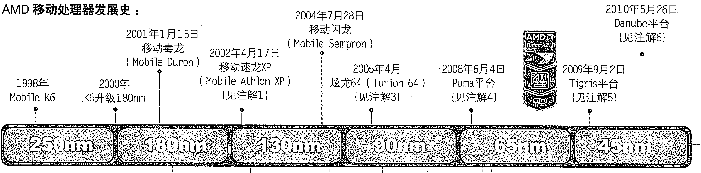

### AMD 超轻薄笔记本平台简史

- 2009年3月2日：Yukon平台[AMD第一代超轻薄笔记本平台，由Sempron和Athlon Neo两种单核心处理器构成]
- 2009年11月：Congo平台[引入双核心速龙和炫龙处理器]
- 2010年5月26日：Nile平台[全面升级45nm工艺，炫龙更名锐龙，和速龙一同升级到II代，大幅度强化图形性能]

以上为第三代Nile（尼罗河）平台处理器，与M880G芯片组搭配，整合Mobility Radeon HD 4200图形核心。

以上为第二代Congo（刚果河）平台处理器，与M780G芯片组搭配，整合Mobility Radeon HD 3200图形核心。

| 型号 | 主频 | TDP | 二级缓存 | 制程工艺 |
|---|---|---|---|---|
| 双核锐龙II Neo K665 | 1.7GHz | 15W | 2MB | 45nm |
| 双核锐龙II Neo K625 | 1.5GHz | 15W | 2MB | 45nm |
| 双核速龙II Neo K325 | 1.3GHz | 12W | 2MB | 45nm |
| 速龙II Neo K125 | 1.7GHz | 12W | 512KB | 45nm |
| V105 | 1.2GHz | 9W | 512KB | 45nm |
| 双核炫龙Neo L625 | 1.6GHz | 18W | 1MB | 65nm |
| 双核速龙Neo L335 | 1.6GHz | 18W | 1MB | 65nm |
| 双核速龙Neo L325 | 1.5GHz | 18W | 1MB | 65nm |
| 双核速龙Neo L310 | 1.2GHz | 18W | 1MB | 65nm |
| 速龙Neo MV-40 | 1.6GHz | 15W | 512KB | 65nm |
| 闪龙210U | 1.5GHz | 15W | 256KB | 65nm |

| CINEBENCH R10测试 | R10单核渲染 | R10多核渲染 | 3DMarkVantage成绩 |
|---|---|---|---|
| 双核速龙Neo L625 (1.6GHz) | 1308 | 2545 | 1100左右 |
| 双核锐龙II Neo K625 (1.5GHz) | 1204 | 2574 | 1400左右 |

### 全体变“2” 炫龙改锐龙

首先就是Nile平台处理器全面升级到“2”代，从名字上就彰显升级版身份。值得关注的是，Turion品牌的名称从“炫龙”改为了“锐龙”，充当Nile平台最高端的“形象代言人”。

### 新制程 功耗性能双齐飞

可能有同学会问了，新处理器凭啥称“2”呢？原来AMD成功地将45nm制程工艺引入了移动市场，凭借更先进的工艺，使这些新处理器的功耗大幅下降，性能也得以提升。同时，AMD舍弃了缺乏卖点的闪龙品牌，引入了全新的V系列处理器，9W的TDP更适合上网本一类的更轻薄产品采用。

通过前面的测试可见，虽然K625的主频较L625低了整整100MHz，但在CINEBENCH R10的测试中性能表现却基本持平。而且Nile平台还集成了更新的Mobility Radeon HD 4200显卡，游戏性能较上一代HD3200也有了一定的提升。如果你喜欢轻薄实惠的笔记本，同时又有一定的娱乐需求，相信Nile平台产品会非常适合你。

## 双核U线程不是摆设 i3+H55平台如何选？

1500元是不少DIY用户留给处理器和主板的预算，此价位Core i3处理器和H55主板无疑是英特尔平台首选。如果你近期就想搭建一套i3+H55的系统，不妨再来细品一下这对黄金搭档吧。

实现，如今在i3处理器上回归效果同样非凡，双核四线程模式较双核二线程模式有了明显的提升，如果你没有开启此项技术可就太不给英特尔面子了。

### 开启超线程 速度使劲翻

增加逻辑电路实现CPU多线程从奔腾4时代就已。

```
PCI Express* 技术 2.0 接口：借助 6 个 PCI Express 2.0 x1 端口（可根据主板设计配置为 x2 和 x4），可以针对外设和网络提供高达 2.5GT/秒的访问速度。
```

## 选 H55 主板不必追求完美

如今多数一线品牌的H55主板价格已经降到了700元以内，性价比十分出色。需要注意的是，HDMI并不是所有H55主板的标配，如果你喜欢外接显示器欣赏高清电影可以考虑选择标配此接口的型号，如果你有另配独立显卡的打算就没有必要为此开销了。此外，部分H55主板以USB3.0和SATA3为卖点，如果你预算有限同样可以无视，毕竟距离采用新技术的外设普及还有一段时间呢。

## H55 只能给显卡 4× 带宽？纯属扯淡！

由于H55的PCI-E通道数只有6个，很多网友认为留给独立显卡的PCI-E 16×接口最多就只有4×带宽，使用中高端显卡时性能会严重缩水，进而让H55与高端显卡绝缘。不要忘记，搭配H55的i3、i5处理器核心均整合有PCI-E控制器，拥有16条PCI-E Lane，实际上主板上的PCI-E ×16接口是由CPU内部的PCI-E控制器提供的，上述观点的4×带宽不过是南桥额外提供的而已。这也是为什么部分高端H55主板同样可以组建双显卡，因为这些主板通过南桥额外提供的6条PCI-E Lane为H55搭建了CF通道，从而使处理器的16条PCI-E Lane与南桥的4条PCI-E组成×16、×4的交火方案。

(河南/马甲)

## 火眼金睛 真假蓝光盘 看看便知

### 一、盘片颜色显真容

首先看盘面颜色，蓝光光盘的颜色是酱紫色（接近黑色），而DVD压制光盘为银色，刻录盘片则多为紫色，尤其是用来制作假冒蓝光光盘的DVD9盘片，无一例外都是紫色，很容易区分。

### 二、容量也能辨真假

把光盘放进电脑，右键单击光盘盘符并点击属性，如果是大于8.5GB，就一定是蓝光光盘。反之，如果显示是8.5GB光盘以内的容量，则必然是所谓BD+ 1080P电影光盘，这类光盘多用在PS3播放器或电脑上播放。其采用大码率压缩，并删除大量音轨（只保留一条音轨），全部导演剪辑、花絮等等，实际容量在7.3GB左右，但由于这种光盘使用的封装格式M2TS也消耗容量（占600MB左右），这样算下来刚好是8.XGB左右。

**小知识：真假蓝光**

- **BD9**：所谓的BD9实际是采用H.264格式压缩的蓝光电影文件存放在DVD9光盘中，缺少系统菜单，码率大为降低。
- **RBD**：带有交互菜单的BD9影片，因为加入更多内容，画面码率进一步降低。
- **RBD-P**：RBD的升级版，用户可以选择传统菜单还是交互菜单，功能又变化而已。BRD、BRD-9两种光盘几近绝迹，因为能够兼容二者的播放设备几乎没有了。
- **BD+**：带有自制菜单的BD9，可以在普通DVD碟机上播放，带有DTS 5.1音轨、分辨率只比480P略高，效果很一般。

### 三、真假蓝光区别在哪？

如果从高清电影的角度而言，只要分辨率达到720P或者1080P（电影全部为1080P）就算高清了。不过，决定高清电影品质的因素还有一个重要的指标：码率。REMUX（蓝光电影无压缩直接提取）的1080P高清电影普遍码率在60Mbps甚至更高，而经过压缩后的DVD9 1080P光盘，分辨率保持不变的情况下就是降低了码率，一般也就是6Mbps~8Mbps。分辨起来也容易，浏览到电影中人物影像时暂停，看看人体的毛孔以及脸庞边缘，高码率电影会非常清晰，而码率较低的电影边缘就开始模糊了。

**BD-R**：刻录版蓝光电影，容量25GB，目前市价约25元左右，属于翻版拷贝，部分BD50电影会直接删减导演剪辑、花絮等内容。

**网络大补贴**：

制作PS3专用AVCHD最新简易教程讲解 http://games.qq.com/a/20080321/000157.htm

## 给你3000元 买投影还是电视？

不少人想买个平板电视，3000元是个很平民的价格区间，尺寸大多是32英寸。尺寸大就是受欢迎，这可一点儿也没错，不过你有没有考虑过3000余元的投影机呢？动辄80英寸以上的投影尺寸，那看起来该有多震撼呀！别急，CFan帮你分析分析，看看究竟是投影机值还是电视值。

### 亮度电视投影谁更好？

投影尺寸与亮度息息相关，比如投射50英寸的时候屏幕亮度就会很低，但同等距离、室内光线一致的情况下投射100英寸，亮度就会大幅度降低，这也是为什么投影时要尽量保持室内无光线的原因所在。如果你想开着灯看投影播放的电影，电视节目，50英寸是一个绝佳的尺寸，亮度足够高，尺寸也绝对不小。再来看看电视，LED背光电视普遍都有300 cd/m²以上，LCD背光电视则在250 cd/m²左右，等离子甚至达到450 cd/m²，投影显然无法与之比拟，即便标称达到了2000流明（相当于在投射100英寸屏幕尺寸时亮度达到230 cd/m²），在银幕被白光一照，画面就看不清楚了，而平板电视基本不反光，所以外界光线根本不会影响。

### 工作噪音我不要

电视有工作噪音吗？不少电视中确实存在散热装置，但几乎没什么噪音。投影机就不同了，无论是LED背光式、LCD式还是DLP技术的投影机，在使用时都必须使用风扇进行主动散热，而且噪音委实很大——贴近测试可以达到55db（DIY投影机工作噪音更大），而且投影都是要放置在头顶或是身边，这样的噪音你是否忍受得了呢？

### 带不带音箱也是个问题

投影机本身不附带音箱，但电视不同，电视有不少是X.1结构的音箱——当然了，如果真正是电影发烧友，必然也是选择独立音响系统，而不是用电视上总计10W多的音箱回放大片音源。如果是只从看电视的需求出发，电视无疑更方便，但看电影时，还是建议用户都配备单独的音箱比较好。

### DIY投影机可买吗？

3000余元可以购买的投影机大概有二三十款，除了这一类产品外，还有不少DIY的投影机可供选择。购买时多是一些配件，到货后需要一定动手能力自行组装。价格当然非常便宜，1000元~2000元就可以购入了。不过这其中还有不少需要注意的细节，如果自认动手能力强，高品质的DIY投影机也不是不可以哦！

DIY投影机目前全部都是LCD规格的，从尺寸上讲多为4英寸或5英寸的LCD屏幕（国外二手屏幕），部分产品为7英寸规格，屏幕分辨率为800×480或1024×768，特点是价格便宜，套件（包括屏幕+驱动板+灯泡+镜片等）总价也不过1000元左右，亮度也较低，开灯时几乎看不清显示内容。还有一类DIY投影机套件，采用12.1英寸屏幕，分辨率也达到了1280×720的高清规格，套件中的驱动板甚至带有电影播放功能（RMVB解码等），加上灯泡、箱体等，总价在2000余元，效果甚至不输7000元的720P投影机，但是对动手能力有较高要求，感兴趣的玩家不妨搜索学习一下（关键字：投影+套件）。

## 烽烟再起 无线音频技术谁最强

无线音频产品今年呈井喷式增长，而一批99元无线耳麦的出现，更是让这块市场变得越发激烈，没有杀手锏很难立足其中。漫步者Ramble红外功放当年的极富创新式成功令人称奇。与键鼠产品不同的是，无线音频产品发展较晚，市场的认知度仅仅停留在“没有尾巴”的程度上，到底消费级无线音频产品包含了哪些技术呢？

### 六大高手对决

首先有5种技术已遭淘汰，分别是：AM、DAB、UWB、WiHD和WHDI，AM适用面有限，DAB数字广播，国内流行度不高；UWB、WiHD、WHDI三种研发成本高，不适合大众。那么接下来只有FM、RF、2.4G、Kleer，红外这六种技术比较受欢迎，它们之间差别也是非常大。

FM成本低廉，技术又成熟，门槛还低，至今还有低端无线耳麦使用，而大部分车载MP3也是利用FM信号发射原理。不过，FM调制模式较为费电，且极易受干扰。音质差是它的诟病，其非点对点连接的特点，别人也可以轻松接收，私密性不强。

RF射频无线技术，在无线音频产品上目前还不是很普及，本质上和FM类似，无线鼠标最早采用的就是RF技术。在信号保密度、数据带宽方面也无法满足今天清晰听音的需求，市场上RF产品并不多。

蓝牙普及率较高，技术成熟度很高，传输距离也不弱（10m之内）。蓝牙1.1、1.2以及2.0理论带宽虽然有1Mbps以及3Mbps，但实际仅支持单声道的音频传输，而且存在同频段设备间干扰与零点几秒的延迟，这对于想要听音乐的人来说也是无法接受的。

2.4G最常见的应用就是无线键鼠，目前最大可以达到100米的传输范围，具备2Mbps最大数据带宽，延迟问题也不大，在发现频段被占用后，会自动跳到一个无人使用的频段。2.4G无线技术很有潜力，也是市场上使用最多的无线音频解决方案。

Kleer可以看做是2.4G的升级版，可以满足无损音频传输，使得无线音频产品达到了CD级音质表现。不过，目前采用Kleer技术的无线产品价格普遍在千元以上，这个是阻挡它普及的最大门槛。

### Ramble 开启漫步者无线之路

红外的基础是FM调频，通过红外光载波发送出去，接收端接收到红外光再解调出信号。最典型的就是各种电器的遥控器，其实很早就应用在音频方面。由于它是直线传输，距离短，一直不受人重视。不过，漫步者在2008年发布的Ramble红外功放彻底改写了红外的历史。克服了单一指向性等毛病，其优点在于带宽高达4Mbps，传输CD级音频信号（1.4Mbps）绰绰有余，它还具备极强的抗干扰能力，因为只有强光才能影响到它。

Ramble圆柱形的造型很独特，银、黑二色的搭配显得简约。接收器与发射器分开放置，无论是桌面还是墙壁，都不会影响使用，由于红外本身的先天不足，穿透力不强，Ramble一般情况下只在一个房间内传输，不过相信以漫步者的能力，研究出更为出色的无线技术只是时间问题。

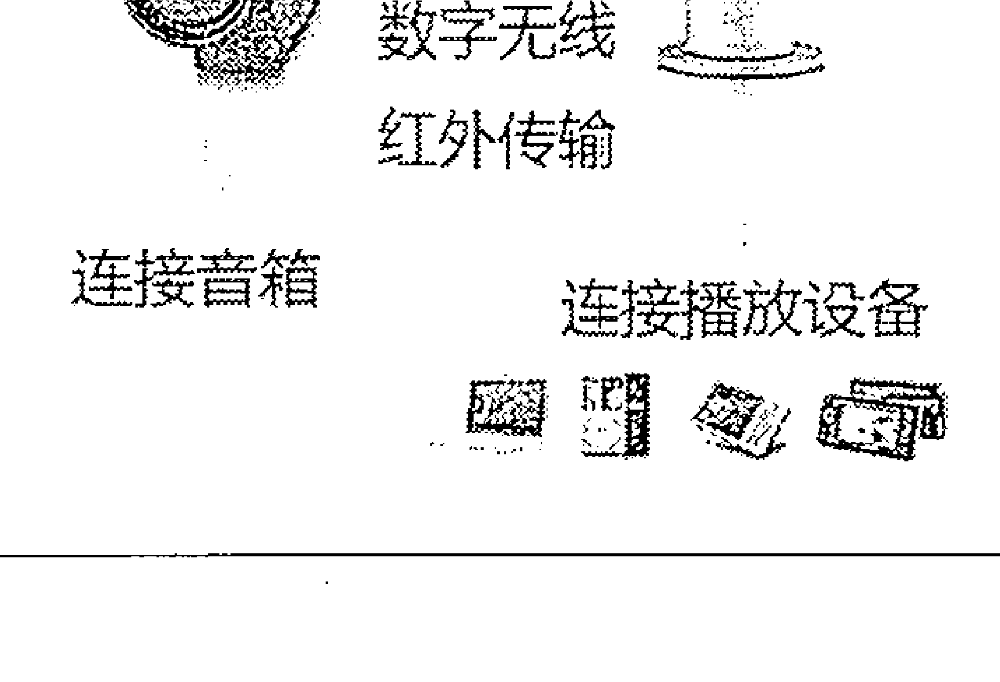

## 上网本升级DDR3内存 新Atom值不值得选？

最近，采用英特尔新一代Atom N455/475处理器的上网本已经批量上市，引入了对DDR3内存的支持。您先别忙着高兴，因为新品的价格同样会让你感到“惊”喜。我们很高兴DDR3内存正式加盟上网本，但是新品的价格无疑如一盆冷水。采用新Atom上网本的价格普遍要比上一代产品价格高出300元~500元。现阶段采用老版本Atom处理器的上网本，因为正处于厂商新旧交替的清仓期，所以价格非常低廉，性价比要大大高于采用DDR3的新Atom上网本，正是购买的好时机。

话又说回来与Atom N455和N475相比，真正值得我们期待的应该是双核心版本的N550系列，8.5W的功耗不算太高，而性能较单核Atom会有明显的飞跃。

总的来说，这次的Atom的升级没有什么性能的提升，但价格却小幅上升，我们还是建议购买采用老款Atom的上网本，如果不着急可以等待N550系列双核Atom上网本。

### 新品尝鲜

N455代表：华硕Eee PC 1015PE
N475代表：联想(Lenovo) S10-3s(H)

| 属性 | N450 | N455 | N470 | N475 |
|------|------|------|------|------|
| 主频 | 1.66GHz | 1.66GHz | 1.83GHz | 1.83GHz |
| 内存 | DDR2 | DDR3 | DDR2 | DDR3 |
| TDP | 5.5W | 6.5W | 6.5W | 6.5W |
| Windows 7 CPU评分 | 2.4 | 2.4 | 2.5 | 2.5 |
| 3D mark 06 CPU成绩 | 486 | 507 | 536 | 571 |
| PC mark 05 CPU成绩 | 1426 | 1491 | 1596 | 1639 |
| PC mark 05 内存成绩 | 2510 | 2546 | 2695 | 2719 |
| 一线产品价格 | 2099元起 | 2588元起 | 2588元起 | 2899元起 |

> 小提示：为了配合新 Atom 产品的上市，部分品牌给新品还增加了类似 USB 3.0 一类的新技术作为卖点以提升新品的竞争力，如果你喜欢新技术，建议选择此类拥有新特性的产品。

## 仅需300元 网速翻6倍！

很多人家里都已经不止一台电脑，相互拷贝文件也是家常便饭，不过看着那最高10MB/s的传输速度，尤其是拷贝那些动辄几十GB的高清电影时实在是令人起急冒火——这玩意儿就不能再快点儿吗？！当然可以，现在的主板早已集成了千兆网卡，我们只需很少的花费就能让硬盘读写追不上网速！

### 千兆网究竟有多快？

千兆当然就是1000Mbps(或1Gbps)，理论带宽是百兆网的10倍，但实际传输速度受到网卡、交换机以及网线等因素的影响，基本上很难达到100MB/s，比较常见的在50MB/s~70MB/s左右，即便如此，也已经超越了很多硬盘的读写速度——因为硬盘越到后面的空间速度就越慢。

另一点与百兆网络不同的是，千兆网更容易受到外界影响，其中网线长短是一个重要因素，比如两台具有千兆网卡的电脑互连，用20cm的普通超五类双绞线很容易达到70MB/s以上的高速度，但双绞线如果增长到10m或20m(比如某一个房间到另一个房间)，则速度会骤降到30MB/s左右，这种情况在百兆网中很少出现。

### 网线很重要

线缆的品质直接影响到数据传输的速度和稳定性，对于千兆网来说，一般都选择超五类或六类线，至于五类线和三类线则最好不要使用，说起来千兆网络应当选择对应的六类双绞线，不过六类线的线芯比较粗，做水晶头时难度相对大，而且为了增强线缆强度以适应长距离传输，有些六类线内部还增加了十字或一字的龙骨，导致不能大角度弯曲，再加上需要六类线对应的水晶头，实在是麻烦多多，反正家里用用要求不高，还是超五类线既省事又物美价廉。

购买线缆时注意不要追求高档买带有屏蔽的线缆(外皮带有STP字样)，因为屏蔽线要求整个网络都有足够的屏蔽措施并正确接地，对施工安装的要求很高，达不到要求的话反而会影响数据传输。非屏蔽双绞线的外皮上带有“UTP”字样，一般买到的都是这种，至于双绞线的选购，篇幅所限这里就不多说了，只要是品牌线缆，而且是正品的话(最好到京东易迅之类地方购买)，一般家用都完全没问题。

### 千兆投入只要300元

绝大多数家里的局域网都是通过路由器或交换机来连接到一起，既然现在网卡和网线都是千兆的了，在这个核心交换设备上自然也不能省钱，一般来说有多台电脑的话，往往需要路由器来共享上网，而现在具有千兆网口的路由器虽然已经不是稀罕物，不过价格相对来说要高一点，值得推荐的有D-Link DIR-655，是一款具有三根天线的300M无线路由器，其中四个LAN口都是千兆的，价格在600元左右(淘宝上可以找到很多工包产品，只需300多元即可买到)。

如果不希望将路由器换掉，也可以在现有路由器的某个LAN口上加配一个千兆交换机，价格只需100多元，可说便宜多了，比如迅捷(FAST) FSG105M 5口全千兆以太网交换机就是个不错的选择。

### 双绞线的外皮标识

通过双绞线外皮上的标记可以很简单地判断这是哪一类的线缆：三类线，CAT3；五类线，CAT5；超五类线，CAT5E；六类线，CAT6。

### 千兆网线的线序怎么排

如果是接交换机或路由器，那么千兆网线的线序与常用的百兆线一样，还是白橙、橙、白绿、蓝、白蓝、绿、白棕、棕，有个很简单的口诀：橙绿蓝棕，蓝绿跳线，意思是8根线先按照白橙、橙、白绿、绿、蓝、白蓝、棕、白棕的方式排列好，然后将纯蓝和纯绿两根线的位置互换一下就可以了。

## 同主频高外频 VS 高倍频究竟选哪个？

最近英特尔推出了不锁倍频的i5和i7处理器，这下可乐坏了小景同学：根据他的理论，相同的主频，在不同的外频和倍频组合下效果绝对不同！事实果真如此吗？我们不妨测试一下：

测试平台：i7 920+X58+DDR3 1333，将CPU的主频设置在3GHz(因为在这个频率下，其他的条件可以最大限度的保持一致)

| 设置 | 外频 | 倍频 | 睿频 | QPI倍率 | nB倍率 | 内存分频 | QPI电压 |
|------|------|------|------|---------|--------|----------|---------|
| 设置A | 150 | 20 | 关闭 | X48 (150X48=7200MHz) | X20 | X8 (150X8=1200MHz) | 1.315V |
| 设置B | 200 | 15 | 关闭 | X36 (200X36=7200MHz) | X15 | X6 (200X6=1200MHz) | 1.315V |

稳定电压和温度方面又会有怎样表现呢？是否仍然直接与主频相关而无明显的区别呢？

### 性能我只认主频！

| 外频×倍频 | A (150×20) | B (200×15) |
|-----------|------------|------------|
| Fritz Chess Benchmark | 10796.89 | 10789.89 |
| WinRAR | 3161KB/s | 3147KB/s |
| 3D Mark 2006 (CPU) | 5286.89 | 5289.44 |
| 3DMark Vantage (CPU) | 18615.44 | 18671.11 |
| CineBench R10 (32bit)多线程 | 14345 | 14387.56 |

通过测试可见，处理器性能和主频有直接的关系，并不取决于外频和倍频的关系。那么两种设置在稳定电压和温度方面又会有怎样表现呢？是否仍然直接与主频相关而无明显的区别呢？

### 节能还需高倍频

| 外频×倍频 | A (150×20) | B (200×15) |
|-----------|------------|------------|
| 稳定电压 | 0.912V | 0.976V |
| 表面/核心满载温度 | 43/52度~53度 | 45/56度~57度 |
| 待机/满载功耗 | 140W/190W | 145W/200W~220W |

在主频相同的情况下，设置A由于采取高倍频、低外频的运行方式，结果获得了较低的稳定电压和较低的温度，在二者性能几乎无差别的前提下，这样的“低压”、“低温”显然更有优势，我们可以算一笔账，假设平均每天用电脑5小时，看看这两种设置一年的耗电量相差多少：

两种设置在待机时相差5W，于是：(5÷1000)×5×365=9.125(度)；
两种设置在满载时，最多相差30W，于是：(30÷1000)×5×365=54.75(度)；

可能你会觉得一年多这么几十度，甚至只有几度的电费不算什么，但问题是在性能几乎完全相同的情况下，谁愿意为多出来的电费埋单呢？因此，对于英特尔的系列CPU来说，同频下采用高倍频低外频的设置更“划算”。

> 小提示：英特尔不如AMD厚道，不锁倍频的平民处理器至今也只有E6500K、i5 655K和i7-875K，但相信不锁倍频将成为未来处理器新卖点而被广泛采用，现阶段只要你的预算足够，还是建议直接选择这类产品。
(南京/茶小乖)## 只要1分钟 3G网络大家分享

随着数据套餐越来越便宜，很多人都选择购入3G无线网卡，速度甚至比有线宽带还快，只不过一直自己使用却不能分享。其实，用3G无线路由器就可以解决这个问题了。

1分钟搞定设置

以Edimax 3G无线路由器3G-6200n为例，连接好无线路由器后（同时USB 3G无线网卡插到路由器上），输入Web页面地址进入路由器设置，主流的路由器包括TP-Link、D-Link或者是Netgear等等诸多品牌的路由器，请首先找到PPPoE设置界面（部分路由器也可以用光盘的设置精灵想到操作，原理同设置ADSL拨号相似），选中“PPPoE”拨号设置，以中国移动3G网络为例，在拨号号码处填入“*99***1#”，用户名及密码处空白，注意，在APN处填写“cmnet”，然后保存设置并重启路由即可，设置极为简单。

带USB接口的无线路由器：
http://digi.tech.qq.com/a/20080722/000036.htm
http://nb.intoogc.com/173/173427.html

| 中国电信3G设置： | 中国联通3G设置： |
| :--- | :--- |
| 拨号号码：#777 | 拨号号码：*99# |
| 用户名：card | 用户名：uninet |
| 密码：card | 密码：空 |
| APN：空 | APN：3gnet |

小提示：
其实，不仅是现在标榜具有“3G路由”功能的路由器可以使用3G无线网卡，很多带有USB接口的无线路由器都可以实现这个功能，而且它们的设置方法大致相同哦！

没有3G路由怎么办？
以Windows 7为例，接入USB 3G网卡后，找到“控制面板→所有控制面板项→网络和共享中心”，点选“设置新的连接或网络→设置无线临时（计算机到计算机）网络”，自行定义个网络名称和密码，并最终选择“启用Internet连接共享”就可以了，这时笔记本不仅可以自己用3G网卡上网，还能将带宽共享给其他具有无线功能的设备，比如手机、其他笔记本等等。

## 我的5740DG 我的PS2游戏机

虽然现在PS3都快成“街机”了，但小弟连PS2都未拥有过，因而错过了很多经典的游戏大作。还好新买的ACER 5740DG笔记本圆了我“年轻时”的梦想，在闲暇之余充当了“PS2游戏机”的角色。

| 基本配置 | i5 430M + 4GB内存 + 500GB硬盘 + HD5650显卡 |
| :--- | :--- |
| 入手时间 | 2010年6月 |
| 入手价格 | 6850元 |
| 小提示 | 别忘了管JS要3D眼镜哦 |

现在比较稳定的PS2模拟器推荐PCSX 0.9.7 R3004汉化版（下载地址：http://www.onlinedown.net/soft/104870.htm），用从网上下载的ISO或者电脑城买的PS2游戏光盘都可运行游戏，在视频设置下玩《最终幻想10》的游戏速度都在45帧以上，非常流畅，终于自己也能体会尤娜MM的温柔了：）

我感觉5740DG的配置很均衡，虽然没有同价位联想Y560的显卡好，但是多了一个3D屏幕，宝石的外观感觉比现在ACER的新系列好看。提到5740DG的3D屏幕，至少现在我觉得还不太实用，从网上下载的3D影片和随机带的几段3D视频效果差远了，没有好片源的支持3D电影就是一个噱头。反而是很多游戏可以通过TriDef 3D来加载，比如使命召唤4、极品13都有3D效果，只是3D加载玩的话会很卡，需要调低些游戏效果。

5740DG性能没得说，散热效果就比较一般了，玩游戏的时候处理器和显卡的温度都会超过80度，正在考虑自己做一个爱好者介绍的“DIY笔记本抽风机”，看看有没有传说中的那么神奇。

> 小编点评：
看来陈浩还是一个很怀旧的同学呢，不知道现在有没有条件入手PS3了呢？如果还想以后用本本体验PS3上的《最终幻想XX》，估计只有2012年以后PC配置可以胜任了。至于这位同学最后提到的“DIY笔记本抽风机”，大家可以在2010年14期《DIY笔记本的“抽油烟机”》中尝鲜。
（北京/陈浩）

## 不花钱也有高待遇！4.1音箱组建大法

喜欢震撼音效？口袋却空空如也？没关系，谁家里没有淘汰下来的一两套音箱呢，它既卖不了多少钱，扔了又可惜，还不如利用起来组个4.1音箱，以达成家庭影院之梦想。4.1系统需要部件如下：2.1音箱一套（卫星箱负责前置声道，低音炮则担负整个4.1系统的低音输出），2.0音箱一对（负责后置左右声道），安装板载声卡最新的管理器软件。

板载REALTEK声卡
REALTEK应该是目前普及度最高的板载声卡芯片，一般都能支持到5.1声道。将2.1音箱插入Line-OUT（左中），将2.0音箱插入RS-OUT（右上）。两套机箱插好后，进入控制面板找到REALTEK高清晰音频管理器，“喇叭组态”选择“四声道”，记得一定要把“扬声器填充”这个选项选上，否则在观看电影时后置喇叭不出声！

板载AC97声卡
如果你的主板很老，只拥有3个音频接口，板载的是AC97声卡也不用担心。还是把2.1音箱插入中间的孔，2.0音箱插入最右边的。进入AC97音频管理器设定，点击“喇叭组态”，选择“循环声道（4喇叭）”。

这里提醒一下，需要将插孔切换中选中后喇叭输出，否则2.0音箱不会出声，最后点击HRTF展示测试一下吧，是不是环绕成功了呢？

> 小提示：
4.1音箱和5.1音箱唯一缺少的就是中置音箱，而想组成5.1音箱需要3套音箱（2个2.0和1个2.1），一般用户实现起来并不容易，所以还是4.1音箱更有实际意义和可操作性。再有就是连接好音箱后还需要在游戏中设置，比如《使命召唤6》可以选择4声道，快来感受枪林弹雨子弹从四面八方飞过的快感吧！
（北京/付迪）

## 主板机箱都要迷你的 电脑“最小化”攻略

最近小张买了一部小巧时尚的品牌一体机，同学小李看后羡慕不已，于是决定自己DIY一部类似的迷你PC，但真到出手时可就犯难了，选择什么样的主板和机箱搭配，才能让电脑“最小化”呢？

Mini-ITX超紧凑主板无疑是打造迷你电脑的核心部件，我们已经将常见的ITX主板列出。其中NVIDIA ION平台主要以搭配Atom平台为主，整体成本较低，而ION2集成的GT218显卡性能非常抢眼，只是处理器性能相对低下。890GX平台性能较强，AMD桌面处理器的性价比也是有目共睹，有利于打造出最均衡的配置。英特尔H55可以和i3/i5等新酷睿处理器组合，可惜就是处理器和主板都不便宜，整体成本太高。至于945G系列，除了价格便宜以外性能一塌糊涂，只能提供和上网本相似的性能。

| 常见ITX主板类型显卡芯片 | 性能等级 | 整体成本 | 推荐产品 |
| :--- | :--- | :--- | :--- |
| NVIDIA ION2系列 | GT218 | ★★★★☆ | ★★☆ | 翔升D510-HTPC |
| AMD 890GX系列 | HD4290 | ★★★★☆ | ★★☆ | 杰微890GX-USB3 |
| NVIDIA ION1系列 | Geforce 9400 | ★★★☆ | ★★★☆ | 索泰迷酷ION-A WiFi |
| Intel H55系列 | GMA HD | ★★☆ | ★★☆ | 技嘉GA-H55N-USB3 |
| Intel 945G系列 | GMA950 | ★☆ | ★★★★☆ | 华硕ITX-220（已集成赛扬CPU） |

选购此类主板时要注意扩展性，很多ITX主板都会附赠Mini-PCIE接口的无线网卡，只是部分产品该插槽位于主板背部，有设备就赶紧插上，主板固定在机箱后再想使用可就费劲儿了。

机箱搭配学问多
相对于ITX主板，与ITX主板搭配的机箱挑选起来就麻烦多了。如果想打造最小巧PC平台，首先要考虑的就是机箱的容积、散热和电源问题。如果你选用了Atom处理器平台，由于处理器发热和功耗较低，3L左右的机箱就足以收纳了。但如果你注重性能，选用H55或者890GX平台，要给处理器留出高效散热模块的空间，建议选择8L以上的机箱。此外，如果你还想给H55或者890GX平台配备独立显卡，更要注意机箱可用的电源功率，额定低于240W就不要考虑了（火速链接：《HTPC电源凭啥这么贵？》详见2010年15期）。

如果你觉得DIY 1.8L电脑有难度，采购比较麻烦，不妨考虑一下品牌货。这类产品已经帮我们攒出了合理的配置，拥有量身定做的机箱，更不必担心电源带不动，而且此类产品的外观通常很漂亮，DIY是很难达到这种效果的。

> 小提示：如何拆键帽
虽然不少迷你机箱声称支持全高显卡，但一些显卡散热器的高度很可能会高于显卡自身而导致安装失败。笔者认为ITX不适合游戏平台，如果非要选配独立显卡，一定要当场安装并加以调试，选择更高功率的电源。
推荐产品：
索泰迷酷MAG HD-ND01迷你电脑
Acer AspireRevo系列


## 天桥贴膜靠边站 实战手机全包膜

手机的外形现在是越来越时尚了，与此同时如何保护自己的爱机免受刮蹭，也成了令机友们头疼的难题。常见的皮套清水套虽然有效，但多臃肿笨重，掩盖了爱机的“美貌”。现在介绍给大家一种两全其美的方法——包膜。这里推荐大家使用冷裱膜。冷裱膜是用透明PVC经背胶加工而成，常用作保护照片字画等，它不仅粘贴牢固，而且撕下时无残胶，也不会损坏物体表面，用作手机包膜十分适合。冷裱膜分为光膜和磨砂膜等种类，大家可以根据自己的需要选取。前者包膜后视觉效果好，不易发现。后者触感效果出色，不易残留指纹。冷裱膜价格便宜，获取方便，可以从照相冲印店里买到，也可以从网上购买。

准备工具：
- 小号美工刀或者手术刀一把（裁剪利器）
- 电吹风或者打火机（热源）
- 银行卡一张（刮平气泡）
- 牙签或针（挑破气泡）

### 放心动手胆大心细

1. 冷裱膜的大小要注意，宁大勿小。裁取约手机两倍大小尺寸的冷裱膜，因为后面要用手来拉伸，留有一定形变空间，所以一定要有余地。小心捏住膜的边缘，从手机表面较为平坦部分的一边贴起。
2. 一只手拉住膜，另一只手用手指或者银行卡沿Z字路线慢慢推进挤压出气泡，使冷裱膜与手机紧密贴合。如果出现较多气泡，可将膜揭开重新贴。在膜与外壳之间稍微喷些水，效果会更好。
3. 手机边缘圆弧的地方，用力拉伸，在这里我们前面准备的吹风机就派上用场了，在拉伸之前用吹风机将冷裱膜加热，可使其延展性和可塑性更好，防止褶皱的出现。如果使用打火机来加热的话要十分小心，可将打火机来回迅速移动。
4. 用美工刀或者手术刀沿手机的缝隙裁剪掉多余的膜，小心走线不要歪掉，不然很可能会划到手机。最好用尺子比着再划刀。至于给听筒话筒摄像头、USB接口、按键等小地方开孔，这也是十分考验技术和耐心的地方，要多练习。

### 细小之处见功力

- 如果出现有较大的气泡，可用针或者牙签刺破，挤出其中的空气并压实。一些微型的气泡可用坚硬的物体比如指甲用力挤压使其消失。
- 有些边角圆弧拉伸的地方可能会一段时间后出现反弹，可以继续加热使其固定。
朋友们很多可能是第一次自己动手包膜，难免会出现一些不完美的情况，比如气泡过多、边角出现褶皱等。其实这些完全不用担心，因为冷裱膜揭下来后不会对你的爱机造成任何损害，可以反复贴膜直到自己满意。

### 自己设计小完美？

看到别人的手机顶着厚重的保护套，而自己的爱机轻装上阵，不要太得意啊。当然我想你肯定不会满足于此的，如果能自己设计手机的外壳就更好了。这里给大家推荐个地址 http://www.shoujidiy.com/Design.php，可以随意在外壳上DIY图案、文字，交给网站制作，做好的外壳就能快递到家。制作的工艺是热压烤漆，比较耐磨，图案细腻度也有保证。
（文/牛牛）

## 新老Fermi对决 千元搅局者诞生

DirectX 11随着Windows 7渐渐已普及了起来，AMD早在一年前就抛出了新的DirectX 11 GPU——HD5000系列。反观NVIDIA，一次又一次的跳票，让整个业界对于NVIDIA的Fermi（以下采取译音：费米）捏了一把冷汗。而说到NVIDIA新显卡又不得不提到，虽然新GPU经常因为种种问题“难产”，但当GPU上市后NVIDIA并没有只在那儿坐等收获，而是进一步对架构进行调整和完善，提高良率和性价比，再推出更适合市场需求的衍生型号。曾经G80至G92的转变令人记忆犹新，尽管当时前者的王位不可撼动，但最后备受用户追捧的却是后者。核心代号GF100的Geforce GTX480/GTX470由于采用了全新的图形架构，是近五年来GPU架构改进最大的一次，NVIDIA为此大幅加强了对GPU并行计算和DirectX 11图形计算的优化支持，用NVIDIA的话说这是迄今为止最完美的GPU。半年后，NVIDIA进一步优化架构，新Fermi——核心代号GF104的GTX460应运而生。

### 新老有别，却一脉相传

如果说新费米（GF104）是踩在巨人肩膀上的小天才，那么老费米（GF100）正是进入巅峰期的成年人。由于新费米是优化架构的改进版，那么它们便有着众多的相同和不同点。GTX460的特殊性在规格对比表中一览无余。它的流处理器数量仅比GTX465少了十几个，但核心/Shader/显存频率却高了68MHz/135MHz/400MHz，且纹理单元数量也大大超过后者。这些参数综合起来说明，GTX460 1GB显存版的性能可能凌驾于GTX465之上。不过有趣的是它人民币售价仅1499元，比GTX465还便宜，而192bit版的价格更低至1299元。通过先前GTX480发布时对GF100芯片架构的分析，我们得知在这一代芯片内，SP单元、纹理单元、显存位宽等等功能组件都是相互关联的，开启或关闭一项势必会影响到其它。显然GF104的功能单元组成跟先前比发生了变化，这代表它一定是重新设计的原生核心。从两张架构图对比来看，GF104看似就是GF100的打对折后的作品。不过细心的人肯定会发现，两颗核心架构图中SM（Streaming Multiprocessors，流处理器群组）中含有CUDA Core（CUDA核心，就是我们常说的流处理器）数量不同，更多的功能单元模块数量比也有很大差异，这也就意味着GF104核心的并非GF100简单缩减50%而来，同时由于微架构功能单元模块比例的调整，64bit的显存控制器从6个变成4个这些削减致使GF104的晶体管数量只有19.5亿个，比GF100减少了三分之一。不仅如此，同GF100相比，NVIDIA将GF104每个SM中的流处理器数量从32个提高到48个，纹理单元数量增加一倍，指令分派单元（Dispatch Unit）的数量也增加了一倍。这样的调整使GF104的每一个SM都比GF100有高得多的效率，所以尽管SM总数削减了一半，但GF104的性能依旧不可小视。另外，主控DirectX 11中曲面细分工作的Polymorph（多边形）引擎仍然是每个SM配备一个，这样GF104的Polymorph减少为8个，可以在原本GF100的架构中，16个Polymorph引擎可能性能过剩，游戏中对曲面细分的要求毕竟是有限的，提升SP与Polymorph的比例可以提高核心资源的利用率，又减少了不必要的晶体管。小知识：新老费米其实都保存了实力。完整的GF104核心拥有4个64bit显存控制器，8个SM，每个SM中又有48个SP单元、8个纹理单元。这样GF104总共有384个SP单元和64个纹理单元。不过跟GTX480一样，GTX460所使用的也不是功能完整的GF104，就如同前者一样，其中一组SM被关闭了。GTX480的GF100芯片关闭一组SM的目的可能是为了控制功耗和发热，同时提高良率，高达30亿的晶体管数目已经逼近40nm制程的极限。可完整的GF104不过才19.5亿的晶体管，384个SP，所以GTX460关闭的那组SM似乎是准备留给以后出更高的型号时再开启的。

### 新老费米，大小有别

过去很多发烧友都觉得显卡越大越好，大代表用料充足，PCB走线宽松，工作更稳定，可人们往往忽略了PCB层数对制造工艺的反应，以及受机箱小型化趋势影响产生的兼容性问题。时至今日，相信越来越多的人日常使用的PC都由笔记本电脑取代，而坚持走台式机路线的DIY用户也希望主机箱不要太占地方，可是这不代表他们不需要强劲的3D性能。为此NVIDIA从GTX400系列开始重视这个问题。先是定位旗舰的GTX480体积没有突破原来的上限，作为次高端的GTX470长度缩短了2cm，现在的GTX460长度竟然在后者的基础上又缩短了3cm，完全可以用短小精干来形容，且256bit和192bit两种GTX460的外观、板型一模一样。这种对显卡体型的控制在以前的GT200系列中是看不到的，从GTX260到GTX295，公版的长度都相同。

| 显卡名称 | GTX 480 | GTX 470 | GTX 465 | GTX 460 |
| :--- | :--- | :--- | :--- | :--- |
| 核心代号 | GF100 | GF100 | GF100 | GF104 |
| 制造工艺 | 40nm | 40nm | 40nm | 40nm |
| 晶体管数量 | 32亿 | 32亿 | 32亿 | 19.5亿 |
| 流处理器 | 480 | 448 | 352 | 336 |
| 光栅单元 | 48 | 40 | 32 | 32 |
| 核心频率 | 701MHz | 608MHz | 608MHz | 675MHz |
| Shader频率 | 1401MHz | 1215MHz | 1215MHz | 1350MHz |
| 显存频率 | 3696MHz | 3348MHz | 3208MHz | 3600MHz |
| 显存容量 | 1536MB | 1280MB | 1024MB | 1024/768MB |
| 显存位宽 | 384bit | 320bit | 256bit | 256/192-bit |
| 显存带宽 | 177.4GB/s | 133.9GB/s | 102.7GB/s | 115.2GB/s/86.4GB/s |
| 显存类型 | GDDR5 | GDDR5 | GDDR5 | GDDR5 |
| 纹理填充率 | 42GTexel/s | 34GTexel/s | 26.7GTexel/s | 37.8 GTexel/s |
| 热设计功耗 | 250W | 215W | 200W | 150W |
| 推荐电源要求 | 600W | 550W | 550W | 450W |
| DX版本 | DirectX 11 | DirectX 11 | DirectX 11 | DirectX 11 |

### 价格贵一倍 GTX470 对决 GTX460

说一千道一万，GTX460到底是什么级别的显卡，千元级的价位是否能让我们真正的享受到DirectX 11的快感。今天我们请来两款重量级的显卡，老费米的代表是华硕ENGTX470/2DI/1280MD5，新费米的代表是索泰GTX460-1GD5极速版。

老总走卖场金河田篇

各位“观众”大家好，又到了老总走卖场的时间。今天我们请来的是机电领域的著名品牌金河田实业有限公司北京办的负责人王经理。

品牌简介：

东莞市金河田实业有限公司是“中国优秀民营科技企业”，成立于1993年，主要产品有电脑机箱、开关电源、多媒体有源音箱、键盘、鼠标、耳麦、摄像头等，是国内主要的“电脑周边设备专业制造商”之一。

机箱、电源论斤卖

闲来无事，路上我们一路聊着天。说起了卖场买机箱的怪事……

Alpha：这年头去卖场挑机箱、电源，从光鲜靓丽的外表上，你根本分辨不出来机箱的优劣。广大人民群众只好与买菜一样掂重量，只选重的、不选对的，强烈建议你们的店面配备电子秤。

王经理：一般来说好的机箱分量比较重，比较分量虽然是一个比较笨拙的办法，但是却屡试不爽，直到现在依然有着相当的功效。但是也不能忽略了观察机箱的内部空间，整体结构的刚性及EMI（防辐射）等重要的部分。

机箱电源，价格扑朔迷离

说起机箱、电源的价格，恐怕没有几个人能像三大件一样了解。一般觉得看起来不错，价格很合理就买了。我们今天也不再考量销售人员的各顶素质，而是转为对价格开火。货比三家看看机箱、电源的价格是否如传说一样不透明……

店面1（非金河田专营店）

王经理：你们这有金河田机箱吗？给我来一款便宜又实在的，外观不重要。

店员甲：您看看这个8519，绝对超值，给您配一个电源加起来大概299怎样？

王经理：能便宜点吗，我觉得有点贵……

店员甲拿出了计算器，小心翼翼的说道：您看这个是我们的进货价（计算器上显示240元）您给加10块钱……

Alpha转身捂住嘴大笑，这240元加10元不就是250吗……

走出这家店后王经理告诉Alpha，那款机箱是配有电源的，官方报价为199元。看到店员甲诚恳的表情，而不知道报价的人很容易就落入陷阱了。

金河田 赤豹8519BR/V(带电源) 市场平均价格：199元 店面报价：250元

店面2（非金河田专营店）

Alpha：老板，给我来个机箱，最好金河田的高端一些的，咱不差钱！

店员乙：金河田6025，看看这外形这钢板厚度，这高端的外形，原价1300元，我自砍100元怎样？

Alpha：这是老产品了，还这么贵？

店员乙：虽然不是新型号了，但是定位在这摆着。报价绝对是1300元……

继续去下一家店的路上，王经理告诉Alpha这款产品型号比较老了，虽然是高端产品，目前市面上的价格也在千元左右。

金河田 战地枭龙6025 市场平均价格：1000元 店面报价：1200元

店面3（金河田专营店）

Alpha：你这里6025、8519都是什么价格，我一样来一个。

店员丙：6025产品型号较老，我们没有货，有的话大约是1000元左右，8519官方报价是199元。

Alpha：可不可以优惠点啊，我一次要两个呢！

店员丙：为了维持市场价格，这个我们是不可以打折的，当然可以赠送您一些小礼品。比如跳线、束线带、小贴标或者是购物袋……

看到专营店的表现，王经理紧张的神情终于放松了下来。对Alpha说到：专营店的作用一是宣传品牌形象；另一个就是维持混乱的市场价格了。像机箱、电源这类产品的价格，平时很少被大家所关注，购买时不但要货比三家，最重要的是最好在专营店咨询或购买。

淘宝缘何向iPhone大抛绣球？

3G生活，手机网购要比传统网购方便不少，或许将成为90后的最爱。可以预见，手机网购将会比传统网购更具有针对性，因为使用手机客户端浏览淘宝的朋友，要比用电脑上网去淘宝乱看的朋友，有更直接的消费倾向。

淘宝选择苹果，推出淘宝网手机版客户端并不是偶然。既然选择苹果，看重的不仅是iPhone风头日上的市场前景，更多的是客户本身，也就是一群消费能力相对较强的群体。虽然现在很多人是打肿脸充胖子，但至少说明这样的人很具有消费冲动。iPhone的用户群潜在消费力都在其他手机用户的平均线以上。客户端的好处是集成淘宝网购诸多功能，简单易用，本来iPhone大屏幕的上网体验感就很好，加上WCDMA的高速网络，有效解决了以前手机网购的浏览困难以及支付瓶颈。

客户端很可能是通过与手机运营商合作OEM捆绑，更精确地瞄准目标群体。联通手握iPhone和iPad，已经不知道让多少人眼红了。下一步淘宝尝到甜头之后，Android、诺基亚也势必会推出客户端，给客户端换壳研发很容易。这真是本小利大，稳赚不赔的买卖，淘宝，我看行你哦。

制造业布局高端产品塑造品牌价值投资未来出路

不知不觉中“中国制造”的标签随处可见，无论是Nike的球鞋，还是手中的iPhone，而另一些十分具体的数据：2007年，中国向全球出口鞋类产品80亿双，地球村里平均每个人就要穿1.6双中国鞋……见缝插针的渗透能力为“中国制造”拿回了一张大红的成绩单：2007年中国出口额12180亿美元，增长25.7%，实现贸易顺差2622亿美元，比上年增加847亿美元。

但是，盛景与繁华并不能掩盖中国制造的隐痛与痉挛——产品低端、利润微薄，在全球价值链分工中处于劣势地位。

国货 = 低端 = 凑合的性能？

我国的自主品牌，不仅在国外人眼里它们是性价比的代言，是中低端产品，甚至在国人眼里亦是如此。但事实是这样吗？举个例子来说，体育用品业属于劳动密集型产业，在我国具有一定的制造优势，虽然起步较晚，但速度还是较快的，有些国产产品在市场上已经处在遥遥领先位置。许多世界知名的体育用品都是在中国生产的。现在，中国已成为体育用品制造大国，生产量已占世界市场的65%。据调查，在家庭健身器械上，不少学校使用的产品都是国产的，家用的国产货也占80%以上。国外一些体育用品公司的生产设备，其实与国内的没有什么两样，但他们在技术开发上却比我们有优势，开发出来的产品往往出乎人们意料。其实他们的技术几乎都是公开的，因此与其说国外企业在卖产品，不如说在卖品牌、卖内涵。

低价 = 低利润 = 低品牌价值！

经济人杜伦特 (B Durrant) 发表的一篇文章中算了这样一笔账：以每个蜘蛛侠玩具售价10英镑计算，其中一半左右的钱进了英国零售、分销商的腰包；另外20%流入美国玩具公司“孩之宝”(Hasbro)，这笔钱主要用于广告、促销等；另外10%需要付给拥有蜘蛛侠电影版权的索尼电影公司；附加版税归属Marvel漫画玩具出版公司；向英国国库交纳的增值税是1.49英镑；此外，还需要支付运输、保险等开销。

有人可能说了，这是OEM而已，那么具有自主品牌的产品又是什么情况呢？奇瑞在2005年的单车销售利润只有500元，这一数字仅为广州本田的1/40。更令人感到震惊的是，2005年，中国汽车业中整车企业的利润一共不到130亿元，其中上海通用是50亿元，广州本田是46亿元，两家企业的利润加起来就占了总数的7成多。

加强品质 + 塑造品牌 + 打入高端市场 = 良性发展之路

2010年7月4号，国内著名机电厂商金河田在上海世博园区发布了全新的机电品牌Aresze（阿尔萨斯）。该品牌主打高端游戏型机箱、电源产品，在后DIY时代即将来临之际，金河田发布如此一个高端品牌，显然意义深远。这证明了IT制造业开始投资中高端市场，而在这背后的不是简单的利润率，而是更加长远的品牌投资。

按照“只有民族的才是世界的”那句老话的逻辑，当“中国元素”已经日益成为全球市场上的一种时尚和潮流，应该是中国企业走向国际化开拓民族知名品牌的良机。金河田市场总监朱小平先生指出：“发布阿尔萨斯这个品牌主要有三个理由，一是后DIY时代的来临，有越来越多的游戏玩家、发烧友对高端机箱、电源的需求；二是用新品牌阿尔萨斯进一步打开国际高端DIY市场；三是借此将国内品牌引入高端市场的竞争，借此改变机箱电源行业的发展格局，引来更加良好的竞争势态，远离山寨产品、远离低附加值的企业恶性竞争。”

虽然目前国内的中高端市场还是处于小众，但是不可否认随着DIY的发展和人民生活水平的提高，它将会成为DIY的最终形态之一。近些年间，很多制造业厂商已经意识到了这个问题，并在积极努力的去向这个目标发展，但真正响亮的喊出口号，做出成绩的却寥寥无几。确实，推出一条新的产品线不但需要魄力，更是需要几年的市场调研以及产品的规划。金河田市场经理陈云柏先生谈到阿尔萨斯这个品牌说道：“大概是不到3年前，当你们看到战地枭龙这款产品的时候我们就已经在策划这个品牌了，这款产品实际上与阿尔萨斯本身就有莫大的关联，或者说也可以视作阿尔萨斯机箱的前身。”

也许，日本品牌与“日本制造”的互动历史可以给我们以有益的启示。在上个世纪60年代前后，“日本制造”也曾是“便宜但是质量差”的代名词。“日本制造”在消费者中的形象的改变，SONY以及PANASONIC，SHARP等日本知名品牌立下了汗马功劳。现在，这些日本品牌已成为国际知名品牌，无论以那个国家的明星作为代言人，或者使用什么样的文化元素做广告，谁也不会怀疑这些听起来像英文的品牌就是日本品牌。作为中国消费者，我们希望国际市场上中国制造业的先行者们不仅以优秀的产品质量为“中国制造”重塑形象，还要以深厚的文化底蕴和自信堂堂正正地打出中国自己的品牌，让这些知名品牌去改变别人对“中国制造”的偏见和看法。

闷豆好久不买东西了，最近自己的佳能A80出现了故障，于是打算买个新的。可到了卖场，不曾想遇到了位“京城票友”，搭台唱了出京剧名段“狸猫换太子”，实实在在忽悠了闷豆一把。

考虑到使用习惯，所以闷豆初步锁定了操控基本一致的佳能G11，大致打听了多家价格，了解了当前的市场均价，然后深入探访。

行货带票2580元。

“保正品行货？我问很多家都是带票2650元最低啊。”

“给你开发票了，肯定能保修。”

闷豆不放心，又去了另一个商家的店铺，商家告诉闷豆：“开发票不等于行货，发票都是各商家自行填写，水货给你张真发票有什么用，他们通常卖的是水货套码机，真到了客服那里根本不认。”

闷豆觉得很不靠谱，让商家留下了联系方式就回家了。到家仔细搜索各大论坛网友的经验帖，才发现买DC的猫腻花样又翻新了。除了开真发票卖假行货，还有一些不法商贩把DC附赠的正品SD卡偷换成假货，更有一些商家以赠送DC包为诱饵，价值XX元云云，交了钱拿到手才知，10元的包包也能忽悠人。

小提示：

在维修中心数据库中行货DC都有存档，所谓水货套码机是指在保修填写单据上，将水货产品的产品序列号（唯一）更改为行货序列号，以达到欺骗消费者的目的。但是，DC本身的序列号依旧是水货的，所以在送修时这些套码机并不能获得相保修服务。

闷豆日记：DC购买三大要素

- 1. 商家混淆概念开发票就是行货，一定要机身上码，实在不行直接电话验真伪
- 2. 配件偷换的闪存卡宁肯不要，降价才是真道理
- 3. 赠品DC包不可上当，10元售价瞬间值50元

三种手段一种方式，“狸猫换太子”伎俩害人不浅！

为什么现在大家都在迷信独立显卡？只要是本，加上独显两个字似乎就成了香饽饽，用户都奔着独显而去，但是你付出的代价是否值得呢？

五十步笑百步

低端独显性能不足以让游戏流畅运行，ATI当前的纯低端暂且不提，所谓的HD5400系列显卡代表产品Radeon HD5430举例，在游戏《街头霸王4》测试程序中以低画质测试，平均为28FPS，《星际争霸2》中等设置情况下仅为31FPS，《魔兽世界 巫妖王之怒》中游戏运行速度也不过27FPS——对于需要30FPS才能称得上流畅的游戏来说（Intel GMA显卡测试成绩与之相比平均低30%），这二者究竟有多大区别呢？

独显的代价

独显是笔记本功耗大户，独立显卡的代价是什么？首先其价格，平均独显机型比集显机型贵10%左右，为了换取这食之无味，又无可抛弃的独显实在不值得。

更要命的其实还不是价格，君不见现在笔记本的散热已经成了一大症结，如果不配备散热垫、散热底座，诸多型号的笔记本底部发热量都非常大，独显意味着额外的芯片，额外的功耗，对比集成显卡工作温度低的特性，显然还是后者更好些。当然了，更大功耗的独显还会影响系统的待机续航时间，这一点也要考虑清楚。

集显也够用

高清也是集显拿手好戏。集显其实完全够日常使用了，播放高清电影GMA HD集成显卡一样可以，这已经不是独显的独门功夫。像桌面游戏《祖玛》、《植物大战僵尸》等等，对显卡性能的需求少之又少，任何型号的显卡都可以应对自如，即便是一些基础的3D游戏，如《穿越火线》等集显也可以担当大任。所以，如果你日常的使用仅仅是学习、日常家庭应用，而非游戏玩家，建议还是选择集显机型为好。

联发科与Android平台牵手，可以说在不久的未来，Android将会在山寨机中大量应用。几乎与此同时，有消息称被称为“一直在模仿，从未有超越”的腾讯已经组建了一支团队，专门开发MTK平台的手机软件。看来，这个嗅觉灵敏的腾讯，目标早已锁定了山寨机。

面对强势的智能机，山寨机苦于没有适合自己的智能手机方案，目前的联发科MTK平台对互联网的应用和功能都比较弱，山寨机虽然遍地开花，但山寨智能机却成了心头的痛。还好，被誉为“山寨之父”的MTK，即将联合Android推出智能机一体化芯片平台，补足了此前的短板，可谓一解山寨机的燃眉之急。

有的地方就有江湖，有江湖的地方就难以避免山寨，就看人们如何去定义“山寨”的含义。规模小、不正规、无品牌，甚至假冒伪劣，都可以算是“山寨”概念的外延。但老实说，“山寨”本身并不能算一种错误，存在有其内在的合理性。国内强大的手机市场需求，给了山寨机们广阔的生存空间。百度、腾讯软件商早就看中Android的商机，如今大力开发MTK平台软件，适时出击宛如“雪中送炭”，催化着山寨智能机遍地开花。

实际上，不要忽视“山寨”的力量，很多公司其实也就是从不起眼的“山寨”中成长发展起来的。当年的谷歌也就是从一间小的公司开始起家的。不要以为是“山寨”就不重视，往往是这种微不足道的小公司在若干年之后大有斩获，当年的谷歌已经发展成为一家世界性的大公司，成长的过程，也可以说是从“山寨”转入“正道”的过程。

联发科与MTK牵手，我举双手赞同，智能手机迟早称霸天下。如今，“山寨”模式给了它足够的生长空间，大家所关心的是人人都能用得起的智能机以及正规的销售、不要再有乱扣费的软件。如此“山寨”，有何不好，相信不少消费者还是乐意接受的。

很多还在使用PM4、GM45芯片组主板的本本用户看着人家i3、i5眼馋？想升级CPU却发现功耗成了拦路虎，怎么办？不如考虑一下低电压处理器吧！

目前网上不少店家都有出售一种编号为SL9400的CPU，价格大约在300元-580元之间，这种SL编号开头的处理器实际上是低功耗处理器的一种，平均功耗在17W左右，性能却着实了得，而且待机续航时间也将大为增加。

根据测试，SL9400的性能甚至超过P8600，还在使用T4400 CPU的本本玩家可要注意喽。不过，在购买时要注意，这种CPU实际都是拆机加脚版产品，CPU基板要高出约0.5mm，在更换安装时CPU散热器会略微垫高一些，可以通过填充散热垫的方式（网上有卖，不超过5元）解决。此外，建议用户尽量购买ES（注：ES为工程测试版）正显版本，这种CPU更接近正式版产品。

一千元的Android MP4，两千元的WM、Android手机，三千元的iPad，四千元的iPhone，如果非要在他们身上找出共同点，也许就是屏幕吧。电容触摸屏手感比电阻触摸屏好很多，多点触摸乐趣也不少，但是，对于一些朋友来说，电容屏虽好却不方便，手指太粗，点击操作经常误触。

电容笔区别于普通触摸笔的地方是大都没有尖笔尖，因为它的原理是将人体的静电经由导电橡胶汇聚笔尖，只要形成通路即可，不需要电阻屏那样产生物理形变。淘宝上多是金属伸缩笔杆+导电橡胶笔尖，价格在15到30元，性能都一样，差在做工上。

如果不太在乎外形，可以考虑DIY一根电容笔，当然手法给力的话拿出来还能让人侧目。方法有很多，只要能满足两点：有一定硬度并且导电（电容感应电流的原理可以允许导电体和屏幕之间有一定厚度）即可。

- 用过的袜子套在铅笔上
- 淘宝一块导电海绵，笔杆自选
- 巧克力，烟盒锡纸裹在笔杆上
- 如果不拍屏幕刮花，直接毛衣针代替
- 最简单的就是纸巾揉成棒状沾湿

入手电容笔之后，你也许还有疑问：为何有的贴膜手感顺滑，有的就会发涩？亮光膜手感优于亚光膜，高硬度膜优于低硬度膜。另外，高于20元的贴膜真的很没必要选购。

我们网罗一切好玩的、新奇的数码产品，这些宝贝在淘宝上都可以找到，并且十分物美价廉。

★搜索关键字：定时 功率 插座

起床就能吃到自动烤好的面包和豆浆，这看似智能化的生活体验，不一定需要靠电脑控制家电，定时插座堪称最廉价的解决方案。它分为电子式和机械式，前者可以通过显示屏显示当前时间，更重要的是可以显示当前连接电器用电功率，做到节电心中有数。后者类似电风扇的定时器，价格便宜但不能实现电子式的多个时段定时设置。有了它可以实现家电定时、定量使用，既好玩又实用。

★搜索关键字：wowpen人体工程学鼠标

与其他立式人体工程学鼠标不同的是，它多了一个拇指把握的位置，类似飞行舵，整个鼠标的把持感相当好。800DPI玩小游戏和日常办公是没问题的，4个按键一个滚轮。立式的最大好处就是手可以保持最自然、最放松的状态，长时间使用也不会觉得酸痛。当然使用它还需要一个适应过程，重心与传统鼠标的重心不同，手腕的施力方式也有区别。

★搜索关键字：香薰 U盘

每天面对电脑的时间越来越长，很多人喜欢用精油香薰化解疲劳、舒缓情绪。这个USB香薰器就是因为出现的，与普通U盘一样大小，可以随身携带随时使用。只要插在USB接口上，滴一滴精油，立刻能让你变得神清气爽、精神百倍。不过它不能存储资料，只是借助USB口供电加热使精油挥发。配套搭售的精油效果一般，不建议购买。类似的还有“USB 氧吧”，“U盘式负离子净化器”。

“创新”的人最美 本土外设企业的笔记本之路

2010年7月，美国，一个中国人走进了某电脑市场二楼的索尼体验店，这里门可罗雀，店员的数量甚至超过了顾客的数量，略有凄凉之感。转身迈入一层的苹果体验店，与楼上的画面呈现出“冰火两重天”的鲜明对比，好一番热闹的景象。想在苹果专卖店购买iPad吧，店员却随时提出了几道难题：一张身份证或护照只能买一部，一张信用卡只能刷一次，买东西还给“上帝”（消费者）定规矩，这种情形着实少见。史蒂夫·乔布斯，一个执着于创新的狂人，从他手上诞生的iPod、Touch、iPhone和iPad，无一例外被竞争对手当作该领域的标杆而被模仿、超越。事实上，当竞争者在刚推出“接近”苹果性能的产品而窃喜时，苹果的下一代升级产品却再度降临在难以逾越的顶峰，超越的梦想总是被无情的打破。从iPod到今天的iPad和iPhone 4，苹果为什么可以取得如此骄人业绩？可以说，“创新基因”成就了苹果公司的辉煌，任何拘泥于形式、固守传统的企业都是无法长久的。对于国内的本土企业而言，现在最缺乏的就是品牌影响力，而品牌影响力则来自可持续的、极具竞争力的产品。在这些成功的产品背后，则隐藏着创新的锋芒。本文开篇提到的那个中国人就是多彩科技总裁夏炜，在美国的这次经历，让他深感创新的影响力。一年前，多彩科技以集团之力毅然进入笔记本红海，借助亚洲影后周迅的影响力，将蕴含中国风的青花瓷系列上网本投向市场并广受好评。一年后，多彩再度联手周迅，携更多的新品在笔记本市场掀起了一场个性时尚的多彩风暴。作为外设领域的知名品牌，在多彩科技进军笔记本市场的背后也显露出了传统DIY市场的辛酸和无奈。俗话说“五穷六绝七翻身”，在前不久英特尔的一次区域DIY代理商大会中，很多人都感觉很艰难，七月

CPU升级接口更替 用户请勿埋单

DIY玩家最烦什么事情？升级，很多人为这个问题苦恼。CPU接口更替，各种零件的升级换代，用户总是想追上那一步，可这一步怎么也追不上。这不，在LGA 1156接口的Core i系列处理器刚刚普及之时，即将在2011年到来的下一代Core i处理器将更换为LGA 1155接口了，面对这样无法回避的事实，消费者的消费计划就显得尤为重要。

很多时候，我们总在说某某CPU厂商更换接口了，但是可以向下兼容。实际问题是，兼容的成本究竟有多高？比如新款主板可能会根据CPU的情况搭配新的内存，这个升级成本无论如何是省不了的，何况CPU接口都更换了，主板厂商能不跟进推出新产品吗？老产品所能获得的技术支持少之又少。同时，接口的更替粗略计算一下就可以看出，1年~2年就要更新一次，无论Intel还是AMD皆是如此。因此，从根本上讲，没有哪个接口规格可以长久不衰。

| 时间 | 接口更换 |
|------|----------|
| 2000年10月 | 由Slot 1更换至Socket 423 |
| 2001年7月 | 由Socket 423更换至Socket 478 |
| 2004年6月 | 由Socket 478更换至LGA 775 |
| 2009年9月 | 由LGA 775更换至LGA 1156 |
| 2011年初 | 由LGA 1156更换至LGA 1155 |

| 时间 | 接口更换 |
|------|----------|
| 2000年6月 | 由Slot A更换至Socket A（Socket 462） |
| 2004年7月 | 由Socket A更换至Socket 754/939 |
| 2006年6月 | 由Socket 754/939更换至Socket AM2 |
| 2007年7月 | 由Socket AM2更换至Socket AM2+ |
| 2009年2月 | 由Socket AM2+更换至Socket AM3 |

某个厂商的技术人员私下跟记者谈天说地时说了这么一句：其实CPU很多针脚（触点）定义都是高低电平，除了重大升级之外（如彻底更换构架，类似Pentium 4/D到Core 2 Duo），针脚的定义弹性很大，这样做无非是区隔产品，推进用户升级消费。同时这位技术人员也提示注意一点，其实CPU在小幅升级时，尽管在理论上CPU针脚一致，向下兼容，但出于商业利益，实际真正能够做到这一点的产品非常少。

李刚的电脑是在2007年购置的，大体配置是AMD Athlon 64 X2 4200，主板是AM2接口的690G芯片组产品，2GB DDR2内存。近期想要升级，却发现一个严重的问题：升级几乎意味着彻底更换，AMD Athlon2 X4 620不能在690G芯片组主板上工作，如果升级为AMD 880芯片组主板，内存也必须升级成DDR3内存，这样换来换去，CPU、主板、内存几乎要换个遍，这让李刚苦恼不已。显然，所谓的向下兼容几乎没有什么意义，只是在两种接口交替出现时才有

升还是不升？DIY玩家心中最难以权衡的问题，面对新技术的诱惑，尤其是男生，即便囊中羞涩也难以克制自己的欲望。记者在卖场中采访一位电脑配件经销商时，他深有感触：“我在这里做了快10年了，碰到这些人真的要升级，绝对心急火燎，不过，我要说真是瞎耽误工夫。为什么？你看，这几年来也就是Windows 7推出后升级才有点意义，何况Windows 7对电脑的硬件要求其实也不高，从2006年至今，电脑升级的意义真的很小，上开心、泡淘宝、QQ聊天的时间几乎占据了所有的电脑使用时间。为了一时冲动几千元就交给我们，你说值吗？”CPU接口升级固然是为了带来更好的性能，但这并不意味着所有人都要冲动消费，理性选择、认真分析自己的使用需求是根本所在。盲目、冲动，永远是自己最大的敌人，奉劝那些还在拼命紧跟升级步伐的盲目消费者一句，管好自己的钱包吧。

小龙虾惹祸 相信高科技不如信自己

前不久，某论坛网友所在公司遭遇推销“高科技”产品，一款名为电脑辐射消除器的东东横空出世，380元的售价让人怦然心动；高价格貌视等同于高功效，事实果真如此吗？从外观来看就是普通的电源线中间多了一节嘛，就这玩意儿插在电脑和电源之间就能消除辐射？到底我不明白还是科技变化快，还是拆开来看看吧。看看下面的照片（图1~3），这个高科技的核心部分竟然只是一块电路板，加上二极管和星星点点的电容电阻，什么“电脑辐射消除器”，纯属扯淡！这个“IT假药”最牛的地方就是超高的售价，如果只卖十来块谁都会怀疑它的功效，而380元的高价反而会打消不少用户的顾虑，特别是对于某些“不差钱”的朋友来说，吃亏上当的几率反而更大。

自己动手 打造健康电脑

既然所谓的高价“高科技”玩意都是假的，看来还是自己动手打造健康电脑最靠谱。就拿夏天的“杀蚊电脑”来说，就是某论坛高手用雷达电蚊香和电脑结合（图4~5），将蚊香片固定在显卡散热片上，利用电脑自身的热量充当电蚊香器底座从而消灭蚊子，娱乐除蚊两不误。

前不久南京小龙虾事件将这种美味小吃打入冷宫，类似“电脑辐射消除器”这种虚假的高科技IT产品危害同样不小，不知道何时我们才能吃上放心菜，用上放心IT产品。在这之前，多发挥你的想象力，健康有时候是需要亲自动手的，“杀蚊电脑”不就是最简单的实践吗？

## 见证6.5英寸音箱传奇 低价大功率 大尺寸时代

### 大者称王，用实力说话

用户对于曾经的中低端2.1音箱并不满意，奋达A系列用入门级的价格解决了中端产品的难题，让每个用户都能享受低价大功率、大尺寸的2.1音箱的畅快感觉，A系列从年初到现在，已经推出不少经典之作，要说最受人喜爱的，还是A310和A510，之前的暑促不少商家都推出降价优惠，如今让利依旧，仍是入手的好时机。

### 奋达A310

A310块头十足的全木质6.5英寸低音炮箱体外形还是中规中矩，箱体外表黑色磨砂贴皮工艺，既高档典雅，又带有强烈的质感。涟漪型的金属遮罩非常有视觉冲击力，主音量调节以及低音音量调节手感好，而且还标示了刻度。卫星箱的造型充满个性，椭圆的造型，圆润可爱，并且卫星箱前脸处设计了一圈高光工艺处理的装饰边框，看起来稳重硬朗同时又豪华高档。

> “A310的音质非常干净，各个频段衔接的很好，声场比较宽厚”；“十多平米的房间表现相当可以，看电影楼下都能听见”；“表现的男声更醇厚一些，温和略带刚性比较到位”；“低音中带有一定的爆发力，对于鼓声、大提琴还原尚可”；

| 音箱系统 | 2.1音箱 |
|----------|---------|
| 额定功率 | 36.5W |
| 扬声器单元 | 低音6.5英寸 卫星箱3英寸 |
| 频率响应 | 30-20KHz |

### 奋达A510

A510为A系列的中端产品，给人的首要感觉就是够大，够重，够实在。涟漪型的金属遮罩不仅在低音炮上出现，卫星箱也是如此，整体造型浑然一体。为了与A310区别，A510在低音炮的设计上加入了酷酷的外圈，更显霸气十足。从外形设计上A510可以看到A310的影子，但是经过全面优化的它，在功率达到45W后，低音表现更为出色，定位人群相对高端。

> “在家中都不敢开太大声音，因为怕吵到邻里”；““兜兜里羞涩的朋友可以考虑，物有所值”；“高中低音层次比较分明，没有出现想象中‘糊’的感觉”；“外观要威武不少，相对A310的乖巧，A510就显得生猛一些。”

| 音箱系统 | 2.1音箱 |
|----------|---------|
| 额定功率 | 45W |
| 扬声器单元 | 低音6.5英寸 卫星箱4英寸 |
| 频率响应 | 20-20KHz |

### 低碳节能

功率为45W的音箱采用传统功放电路，待机功耗都在7-8W之间，采用最新的功放IC之后待机功耗为4W，其电能转化效率也高达93%，大大减少电源的浪费，更符合低碳理念。

### 自由遥控

在原有的大功率、大尺寸的基础上外加了“万能线控器”，兼有耳机输出，音源输入等实用功能。线控器用云彩点缀，黑色忍者帽子外形，美观大方。

## 设置只要30秒 本本也做媒体中心

一些带有HDMI接口的本本不仅会被当做学习、工作、娱乐的工具，更是全家的多媒体中心。通过HDMI接口可以将其与大屏电视连接，不过这里面还有一些技巧需要注意，玩家可要注意了哦。

首先建议用户关机操作安装HDMI线缆，插好线缆后开机，登陆Windows后进入显卡的控制面板（非Windows的显示属性），双击灰色已经通过HDMI连接的设备，在弹出对话框中选择“是”，并根据提示操作。

在调节显示设置的时候，注意将显示模式更改为“水平伸展桌面”，选中显示器2调节分辨率为1920×1080（或1366×768，根据电视的实际分辨率为准）即可实现外接设备完美点对点显示。注意，在刷新率处尽量设置为30Hz，如果你的平板电视支持更高水平的刷新速率则可以调整为60Hz，否则会提示超出显示范围（盲操作按下ESC键可恢复）。

注意，有些显卡在分辨率选项中不能提供1366×768，这就需要去设置自定义分辨率了。ATI显卡可以下载一个小工具（下载地址：http://work.newhua.com/cfan/201017/1366.rar），修改，解压后首先运行get.bat获取显卡索引（AdapterIndex）和显示器索引（DisplayIndex）值，然后打开1366.txt将刚刚记录下的显卡索引、显示器索引值填写上去，保存退出后，运行override.bat文件即可（Vista及Windows 7用户要以管理员身份运行）。NVIDIA显卡则可在驱动程序的控制面板中设置，相对操作也简单许多。此外，如果两种方法都不好用，还可以考虑使用PowerStrip进行分辨率自定义设置。

需要注意的是，在Windows XP下需要切换为显卡的HD Audio输出，Windows 7下可以实现自动切换。

最后在看电影的时候，还要注意播放器设置，不少电视采用的是2.1甚至5.1声道输出，记得要在解码设置中更改哦。

这样一来，本本立刻就能变身成为一个电影媒体中心，全家人都可以分享本本上的电影了。

网络大补贴：
巧用PowerStrip 自定义屏幕分辨率
http://zhongshijia897.blog.163.com/blog/static/114392520076260648320/

## 心随乐动 主流手机播放器体验

| 手机 | Nokia N73 |
|------|-----------|
| 系统 | S60第3版 |
| 耳机 | 森海塞尔MX760; 森海塞尔PX100 |
| 播放器 | 360听; 酷狗叮咚; QQ音乐2010; 天天动听 |

### 第一轮 界面操作

- ●360听，皮肤随心更换，更有炫丽震撼的可视化效果，科技感十足。界面简洁，操作更加人性化，带来手机听歌的全新体验。
- ●酷狗叮咚没有主题功能，仅能变更菜单颜色，而且菜单采用半透明框架，支持自动下载歌手图像作为全屏背景，界面清新。
- ●QQ音乐播放器，软件提供3款自动主题，界面设计中规中矩，但是由于播放器内置多项联网的功能，如音乐排行、下载音乐等，需要经常连接网络。
- ●天天动听，支持主题背景，使用效果不错；支持专辑封面背景，但必须是歌曲内置的，需在电脑上添加，支持频谱外观，效果十分炫目。
- 对于外观，属于仁者见仁智者见智的事情，优劣各有不同，这里不评判高低。

### 第二轮 启动速度

| 360听 | 酷狗叮咚 | QQ音乐播放器 | 天天动听 |
|-------|----------|--------------|----------|
| 5.8秒 | 10.4秒 | 4.5秒 | 5.6秒 |
| 702KB | 913KB | 433KB | 515KB |

### 第三轮 主观音质

MX760和PX100属于中端耳塞及便携耳机，具有一定代表性。360听、酷狗叮咚、QQ音乐播放器均有音效设置，可以供使用者依据不同风格调整均衡器，这四款音乐播放器中感觉360听的音质最佳，音质甚至比自带的播放器更好，同时可实现立体声扩展和低音增强功能，能感受到音质明显提升。另外三款音质相当，略逊于自带播放器，相比之下，酷狗叮咚较好，天天动听调节效果比较差，QQ音乐感觉没效果，有点白开水的味道。当然如果你喜欢原汁原味，不加味精的感觉，还是建议关闭均衡器，并且更换较好的耳机，音质会有质的飞跃。

### 第四轮 特色功能

天天动听快捷键较多，并且可以让用户自定义，支持A-B复读，设计较为贴心。360听操作简洁，还有赏心悦目的动态按钮，非常炫目。酷狗叮咚操控与天天动听差不多，中规中矩，但是酷狗叮咚音乐播放器内置铃声设置功能，可以在欣赏美妙音乐的同时，直接将音乐设置成来电，短信，闹铃铃声，非常体贴。QQ音乐的菜单及动画效果响应迟缓，影响用户体验。4款音乐播放器均具备音乐排行榜，及热门音乐下载功能，可以随时随地下载喜爱的音乐，但是QQ音乐播放器中内置的联网功能过多，作为单纯的播放器而言，就觉得过于繁琐，需要经常连接网络，仍需完善。

四款手机播放器中360听及天天动听，各项功能较为完善，音质较好，值得推荐，QQ音乐及酷狗叮咚仍然存在着一些不足，仍需改进。

本文软件下载地址：http://work.newhua.com/cfan/201017/yy.rar
(北京/马靖晖)

## 数码潮人的家②

我们网罗一切好玩的, 新奇的数码产品, 这些宝贝在淘宝上都可以找到, 并且十分物美价廉.

### ★搜索关键字：苹果皮

把iPod Touch轻松变成iPhone, 打电话发短信全都实现真的可以? 苹果皮是专门为iPod Touch量身定做的功能外套, 其通讯功能是靠一个背扣式通信模块来实现的, 模块上有SIM卡插槽, 电池及相关部件. 苹果皮体积为121×65×12.5mm, 内置了一块800mAh电池, 能够支持120小时的待机时间以及4.5小时的连续通话时间. 目前淘宝已经可以预定, 正式售价约300~500元.

### ★搜索关键字：手指按摩器

游戏玩久了, 左手手指僵硬无比, 尤其是需要大量W, A, S, D按键操作的游戏. 手指按摩器分为夹子型与USB型, 前者装有两个滑轮, 夹住手指后滑动按摩, 力度很合适, 对神经末梢有较好的刺激作用, 利于血液循环. 后者用USB供电, 它可以为手指之外的地方服务, 电机敲击力度不大, 两类按摩器都是10元以内, 相当享受.

### ★搜索关键字：易写手写屏

纸质便签固然方便, 但不环保, 电脑上的电子便签使用又不够方便. 有没有适合老人和小孩用的便签呢? 这个手写屏虽然声称是电子书, 其实就是低功耗的液晶屏, 宣称一节纽扣电池可使用5年, 支持一键擦除, 无需碎纸, 缺点是不能将便签内容导出. 屏幕约A5纸张大小, 120克的重量方便携带. 记事、留言、画图、给孩子听写单词都可胜任.

(文/CT)

## 多核战争

### 显卡做不成, 改成CPU好啦

就在最近Intel突然低调地发布了"Knights Ferry"服务器处理器. 处理器使用了Intel当前最先进的32nm工艺技术, 拥有数量庞大的32颗核心, 每核心有4个线程, 主频也已经达到了较高的1.2GHz. 更为夸张的是, 这款32核心服务器专用处理器采用了与独立显卡一样的封装设计, 并不是像普通处理器那样使用LGA或者Socket接口, 而是选用了显卡通用的PCI-E插槽.

要说这个东西是处理器, 打死我也不信, X86结构, 128个线程, 2GB GDDR5内存, PCI-E接口, 不由得让人想起了已死的Larrabee……

不过看来Intel是给Larrabee找到了新的出路, 与Tesla(采用NVIDIA显示核心的运算处理器)走一条路线, 先摊薄研发成本, 桌面版就不急着推出来了. 从来都是NVIDIA, ATI之流的换名马甲战术满天飞. 这回Intel老大哥算是给他们上了一课, 咱直接把GPU马甲成CPU, 你们比起大哥来还是太年轻.

## 完美定义 漫步者M20高调亮相

M2曾是漫步者微型音箱的音质代表作, 其经典程度不亚于跑车中的法拉利. 今年漫步者的表现可谓是厚积薄发, 在推出M35后一直沉淀着新品, 如今它终于揭开面纱, 它就是可以取代经典M2的M20.

### 一如既往的优质工业设计

M20造型偏男性风格, 线条硬朗、帅气. 这种线条感不仅来源于箱体的外部造型, 周边的边角结合部, 就连其箱体前面板的下部也是如此, 棱角分明, “内凹”的设计十分有型. 再配上简单的黑、白配色, 绝对是够酷的简约之风. 铝合金的网罩, 不但可以很好地保护单元不受损坏, 整体风格更显帅气. 它外观的工业设计很不错, 音质也能让人满意, 还带有3个USB HUB, 最重要的一点是, 漫步者为它打造了一枚全新的单元.

### 新单元新体验

全新的2英寸全频单元, 配合小仰角的设计让声音有更好的指向性. M2就采用了2英寸全频带扬声器, 奠定了漫步者在微型音箱领域的地位. 时隔5年会有哪些进步和惊喜呢? 虽然这颗单元外表看起来相当的普通, 但实际上其中大有乾坤, 漫步者采用德国先进的KLIPPEL扬声器分析系统, 对声压、频响、失真度等关键数据都进行了调教.

### USB HUB 拉风亮点

与箱体的设计类似, M20的操控也十分简约. 主音箱的上方提供了音量调节的一体化按键, 实现待机、音量调节功能. 在功能方面M20也做到了极致, 引入USB HUB功能绝对是史无前例. 位于主音箱背后的四个USB接口中有三路负责输出, 并且带有扩流功能. 现在笔记本USB接口严重短缺, 键盘、鼠标、散热器、U盘等等还真不够用. M20的USB HUB功能如此贴心, 绝对是用心之作.

### 音质是实力的见证

M20的低频表现, 因为单元尺寸与大箱体的优势, 已然超过具有被动辐射盆的产品, 印象深刻. 低频力道比较足, 能量集中, 下潜方面较M2提升不少. 但是在量感上, 仍有欠缺, 毕竟没有低音单元无法获得满意的量感. 中频方面, 个人比较喜欢, 声音扎实、饱满, 开足音量甚至不输于3英寸单元. 高频部分, M20具有一丝高频单元的特性, 明亮清脆, 延伸欠缺, 细节尚可. M20的确不负众望; 担负着承上启下的作用. 除了本身扎实的音质, 人性化贴心的USB HUB功能更值得称赞. 简约的外形, 优秀的做工, 可以肯定它会在市场上获得极大的认可. 便携音箱的历史正在改写, 毕竟在风华过后, 追源溯本, 回归音质才是完美之作.

## 给您提个醒 联通186明白入手

手机换3G号的目的就是为了速度快, 电信和移动只能靠边站. 联通WCDMA作为最快的3G网络, 今年成长十分迅速. 之前饱受诟病的信号和服务问题也大有改善.

### 以 S60 为例, 其他手机可以借鉴

网络模式: “工具→设置→手机→网络→网络模式”, 选择“UMTS”, 当主界面出现3G网络信号标志时表示设置成功.
APN接入点: “工具→设置→链接→接入点→新增接入点”, 需要注意的有两点, 连接名称: 3GWAP; 代理服务器地址: 10.0.0.172, 端口号80, 用户名和密码为空.

### 3GNET 和 3GWAP 之分, 有何区别?

前者连接电脑使用或浏览传统网页速度快, 后者手机使用方便, 对于186号来说一般都是3GWAP接入点. 它们的资费都是一样的, 都包含在套餐内, 注意活动赠送的额外流量只适应于3GWAP接入点. 换成3GNET接入点很简单, 只要改用户名就可以了, 其他都不要设置.

### 数据卡、电话卡之分

近期联通新推出了50元600MB的包月上网套餐, 这个看似要比之前66元300MB和36元150MB超值很多. 别着急入手, 联通3G卡分为上网卡和电话卡, 前者只能实现数据业务, 包含上网、收发短信, 不能打电话, 因为缺少电话卡的语音业务.

### 流量实测

连接电脑上网
测试1：挂3个QQ和飞信(不聊天), 只是看空间, 浏览图片新闻, 两小时50MB.
测试2：梦幻西游1小时900KB, 穿越火线1小时13MB, 三国杀一小时1.1MB.
手机上网
测试3：挂1个QQ(聊天), 用UCWEB浏览图片新闻, 一小时5MB.
上网卡的速度要平均在200KB/s, 峰值能到600KB/s, 而手机上网相对慢些, 峰值200KB/s出头, 最低60KB/s. 3G肯定是要比2G费电费流量, 但也有节省流量的小窍门, 下期咱们接着说费用和实用功能的问题.

(文/yepp)

## 便宜不等于随便！小小鼠标怎么选？

如今越来越多的用户开始关注CPU、显卡这一类的核心硬件, 往往却忽略了与我们接触最为密切的鼠标. 别看现在鼠标越来越花哨, 个性外观、高DPI、自定义功能键……卖点不少, 但你真的用得上吗? 别以为鼠标便宜就能随便哦.

### 适合自己的才是最好的

选鼠标不是逛街买衣服, 好看只能让眼睛舒服了, 如果鼠标大小或鼠身弧线不适合你, 最终受害的可是你自己的手腕. 别人的使用评价固然重要, 但再好的口碑也不如自己亲身体验来得真切, 适合自己的才是最好的.

### 卖点多？不一定都适合你

可换彩壳、超高DPI、N多快捷键, 诸如此类的卖点频频出现在产品广告中, 世上没有免费的蛋糕, 每一项卖点都给了厂商一种加价的筹码. 然而可换的彩壳从何而来(花钱另配, 而且松垮的可拆解结构势必也会影响到鼠标寿命)? 你有足够快的反映来驾驭高DPI吗(一般应用800~1200DPI足以)? 你常用的软件有多少能支持鼠标上那额外的快捷键呢(还有误碰的几率哦)?

### 拒绝山寨假冒鼠

看看中关村有多少卖键鼠的柜台吧, 为了利润很多JS都采用了真假掺卖或出售所谓的“工包”产品. 前者需要消费者有一定的防伪经验, 后者则基本都是山寨或翻新货, 对于外行和小白想要从中选出一款质量不错的产品, 几率几乎为零. 当你锁定某品牌产品时, 尽量挑选官方指定的经销商, 不必过分追求低价.

总之, 我们要根据自己实际的需求选择鼠标, 没有必要为不需要的卖点和功能埋单. 长期用电脑工作的用户应该关注鼠标的人体工程学设计, 谨慎选择外观另类的产品, 握感舒服最重要; 经常出差的笔记本用户则要选择相对小巧、具备节能设计的无线鼠标; 而性能肯定是游戏玩家最应关注的元素.

## 70块钱也能买到好键盘

攒机的时候不少人都把自己的配置单键盘一项随便填上个数字了事，至于买什么，完全要到了卖场最后才决定。当然，也有些人是因为预算紧张，不得已而为之。其实，无论原因是什么样的，低价完全可以买到好键盘。

### 挑选键盘的四个要素

注意，小编在这里所说的四大要素仅仅针对低价键盘，尤其是70元以内的键盘产品。

- 1. 手感为重
键盘无论多么花哨，最起码要敲击舒适才对。目前不少键盘已经改用类似笔记本键盘一样的半高式键帽，这个高度其实并不影响敲击手感。只要键程（按下键帽到底的行程长度）感觉舒适，键帽不会有生硬感（很多纯平面的巧克力按键键盘会有这个问题）。
- 2. 质量为重
区分键盘质量好坏最简单的方法是，双手握住键盘两个对角，双手轻轻扭动，看键盘整体是否随之发生扭曲，如果没有就说明键盘质量过关（键盘内的薄膜质量差异基本可以忽略）。此外，晃晃键盘，看键帽的松弛程度，劣质键盘甚至连键帽都会有松动的痕迹，这是不应该的。
- 3. 轻视功能
像“N个功能按钮，如何如何方便”对于低价键盘毫无意义，中低价位的键盘如果增加过多的功能，那这个键盘的利润从何而来？必然是偷工减料才能达到目的。所以，不要盲目地追求功能，这是十分必要的。
- 4. 轻视技术
有一些低价键盘标榜无线，有的标榜N键不冲突。对于中低价位的键盘来说，采用2.4G无线技术方案的产品多是低端解决方案，可能会出现反应延迟等毛病，平常使用起来很不踏实。而标榜有N键不冲突的键盘其实已经不是什么新鲜事儿了，如果一个劲儿拿这个技术说事，忽略了键盘的质量、手感，感觉多少有些得不偿失。

### 工包键盘真假要明辨

很多DIY玩家并不喜欢品牌键盘，反而去追求一些工包产品。这些所谓的工包产品大多是品牌电脑的拆机配件或是备件。早先这类键盘拥有极佳的性价比，确实不错。但后来这个情况发生了改变，一部分高知名度的键盘如戴尔的产品，仿冒品很多。同时，由于需求巨大，厂商在生产时可能会根据情况更换代工制造厂，举例来说戴尔的SK-8115就分为旭丽代工和NMB代工两种，虽然外观一致，价格也同为65元，但手感明显是旭丽更好一些。

戴尔SK-8115键盘NMB版在背部铭牌处标有L100字样，旭丽产则没有，可以用作区分。同时，假冒键盘与真品键盘的区别一方面是价格，低于65元绝无可能是真货，并且在第一次连接电脑时，正品键盘会显示成功安装的USB设备为DELL USB Keyboard，仿冒品则只能识别成普通键盘，无戴尔字样。

此外，一些厂商的授权品牌键鼠产品也值得关注，举例来说，某国际大厂的键鼠其实并不是自己制造生产，甚至不是自己电脑整机中的配套键鼠，而是通过授权形式由其他厂商设计制造，根据不少网友反应，其操控感并不理想。所以说，也不要过分迷信品牌电脑的工包键盘。

### 品牌键盘也低价

其实，键盘的生产成本并没有多高，因此，即便是70元以内的键盘，也有不少产品非常耐用、好用。比如富勒L422就不错，手感柔和并且坚固耐用，价格也十分便宜，只需要55元。此外雷柏N1800也拥有不错的手感，只是这款键盘采用窄边框设计，没有掌托，使用时需要习惯一会儿，不过它的价格十分便宜，只需要55元就能拥有键盘+鼠标了。

### 键盘黑白配“宝马”任你开

谁说键盘是最平白无奇的东东？只要你愿意，键盘同样可以彰显出你的个性，送给他/她一个超实惠、独一无二的宝马（BMW）定制版键盘也不是梦想！

### 准备条件

两套结构一样键盘，最好是纯黑纯白两色，这样效果最好。此外还需要你有足够的耐心，和较强的动手能力。

### DIY你的宝马键盘

别被标题吓到，这里的DIY其实非常容易，简单来说就是根据键盘键帽的布局，设计出宝马logo每个字母的走向，将涉及到的键帽用另一个颜色键盘的键帽替换。

### 小提示：如何拆键帽

对于一般的键盘，拆键帽最简单的方法就是顺着键帽上下一侧向上翘起，注意不要使用蛮力，机械键盘要注意套在键帽两边的两个扣里的金属丝。其实最安全拆键帽的方法是先把键盘底部螺丝拧下，卸下键盘背部电路板，从键帽的背部将其抽出，只是这种方法稍显麻烦。

### 适合做“黑白配”的键盘

**富勒**
- 有线：L400有线键盘系列
- 无线：U50无线激光多媒体键盘鼠标套装
**雷柏**
- 有线：N2800多媒体有线键盘
- 无线：8800激光无线键鼠套装

## 机械大战固态半路杀出混合硬盘

在过去十余年间，CPU、内存、显卡等PC配件一直在高速发展，性能早已翻了几倍甚至几十倍。但硬盘是例外的，除了容量的大幅度提升外，传输速度没有质的飞跃，无论接口怎么变，从当初ATA 66/100/133，到SATA 1.5Gb/s还是目前最新的SATA 6.0Gb/s，硬盘都早已成为PC系统的性能瓶颈。当然，硬盘发展缓慢的原因与客观因素有关，目前大多数硬盘还是采用机械结构，转速是影响硬盘速度的重要因素，由于成本限制，目前只有服务器上使用15000rpm的硬盘，民用级的还是10年前推出的7200rpm，这样注定硬盘速度不能有革命性的提升。因此，放弃机械结构，采用新的结构才是硬盘提速的根本途径。于是便有了固态硬盘（Solid State Disk，简称SSD）的概念。

### 历数两类硬盘优缺点

- **防震抗摔（固态硬盘胜）**
传统硬盘（ATA或SATA）都是磁碟型的，数据储存在磁碟扇区里。而固态硬盘使用闪存颗粒制作而成，所以SSD固态硬盘内部不存在任何机械部件，这样即使在高速移动甚至伴随翻转倾斜的情况下也不会影响到正常使用，而且在笔记本电脑发生意外掉落或与硬物碰撞时能够将数据丢失的可能性降到最小。
- **数据存取速度（固态硬盘胜）**
由于固态硬盘没有普通硬盘的机械结构，也不存在机械硬盘的寻道问题，因此系统能够在低于1ms的时间内对任意位置存储单元完成输入/输出操作。
- **功耗（固态硬盘胜）**
同样是因为少了很多机械部件，所以固态硬盘的功耗上也要优于传统硬盘。
- **噪音（固态硬盘胜）**
由于固态硬盘属于无机械部件的储存设备，所以具有发热量小、散热快等特点，而且没有机械马达和机械磁头，工作噪音值为0分贝，相比之下传统硬盘就要逊色很多。
- **价格（机械硬盘胜）**
常见的金士顿SNV125-S2 30GB的价格是600元，而这个价格可以买到1.3块希捷7200.12 1TB硬盘，差距巨大！
- **容量（机械硬盘胜）**
固态硬盘目前最大容量仅为512GB左右，和传统硬盘按TB的单位级别相比差距很大。而且机械硬盘在SSD巨大冲击下，容量增长速度更加迅猛。

### 迅盘，混合硬盘的前世今生

2007年5月英特尔携Santa Rosa，正式的发布了这款革命性的新一代迅驰平台。但这次与以往不同的是，在CPU、芯片组、无线模块三位一体的迅驰平台上又有了一个新增加的技术亮点，代号为FRMT（Robson）的Intel Turbo Memory技术，中文名称为“迅盘”。
迅盘是一块PCI-E接口的扩展卡，在系统的支持下，可提供ReadyBoost和ReadyDrive功能，这些功能将直接对系统在启动、休眠、安装程序、拷贝文件、载入游戏等有关磁盘操作的任务上进行大幅度的性能提升。官方资料表明，迅盘可以使软件启动和运行速度提高1倍，开机速度加快20%，同时减少硬盘转数以节省功耗。
讲到这里大家可能会恍然大悟，哦……原来除了固态硬盘、机械硬盘外，还有这种折中方案。没错，此种方案解决了固态硬盘容量和价格问题，以及机械硬盘的性能和功耗问题，可谓是兼具鱼与熊掌的产品。但是迅盘毕竟是笔记本上的技术，台式机怎么办？
答案是，混合硬盘，它就是迅盘的接任者。混合硬盘将一部分闪存颗粒安装在自身在PCB，就像是每一块混合硬盘都“背着”一块迅盘。

### 三类硬盘大混战

如今希捷终于正式对外发布2.5英寸的Momentus XT系列混合硬盘产品，该系列硬盘目前可以选择250GB、320GB以及500GB三种不同的容量配置，当然不容忽略的是此系列硬盘同时还板载了4GB容量的SLC单层单元高速NAND闪存芯片。这款硬盘产品支持一项希捷称其为Adaptive Memory（自适应记忆）的新技术，该技术可以自动地将频繁访问的数据移动至闪存存储区，从而令Momentus XT系列产品实现超过标准HDD硬盘的性能。
小提示:什么是ReadyBoost、ReadyDrive?
简单说来ReadyBoost就是利用USB接口的闪存盘，为Vista系统建立一个类似虚拟内存的缓冲区，将部分经常读写的数据通过ReadyBoost转移到闪存盘中运行。由于闪存盘的存取速度远胜于硬盘，因此用来处理经常读写的数据时更显优势。ReadyDrive与ReadyBoost基本原理相同，不同的是前者用于闪存盘，后者用于配备闪存的混合型硬盘。

## 游戏推动硬件发展的原动力

电脑发展到今日，已经不再是单纯的科学计算工具，而是向着多媒体的方向发展，也成为了我们享受游戏的平台之一。随着游戏的3D化，和玩家对游戏华丽程度的执著，一直激励着电脑硬件的发展。游戏与电脑的关系，已经不再像286时代那么简单。

## 投向平静湖面的一颗巨石

1998年，Blizzard（暴雪）公司推出了一款名为《星际争霸》的RTS（即时战略）游戏。这款游戏以其各具风格的兵种，丰富的战略战术，无与伦比的平衡性，征服了全世界的RTS玩家。所有星际玩家可以自由而免费地与世界各地的玩家进行对战。这让《星际争霸》开始了长达10多年的辉煌，铸造了一代经典！许多人就是通过星际开始了解电脑游戏，也是星际争霸让世界电子竞技变得家喻户晓！12年后，全新打造的《星际争霸II》终于揭开了神秘的面纱，让全世界的玩家为之心动！

在游戏发售前一段日子，官方PC配置需求的流出也让很多人心里多多少少郁闷了一下。一时间各大论坛、各大媒体充斥着星际争霸II的攒机配置。理由很简单，PC Game长时间没有大作的刺激，让很多人的电脑性能维持在相对较低的水平。更新换代的时候来了……

## 英特尔的老谋深算

“别让那些烂配置委屈了这款游戏”英特尔市场推广经理李海滨的这句话给我们留下了深刻印象。这句话来自在英特尔星际争霸II媒体PK赛中的一段演讲（好吧，Alpha承认半决赛中被淘汰了）。

作为赛事的主办方，英特尔在游戏开发期间便与暴雪进行了深入合作，《星际争霸II》作为“暴雪出品，必属精品”的铁律的延续没有变，但它在暴雪的游戏研发历程中，的确表现得最为另类。英特尔市场推广经理李海滨先生表示：“从未有一款游戏像《星际争霸II》一样依赖CPU来提升画面效果。在这款游戏中，反射特效、效果品质、物理特效和影片品质4大显示效果的好坏均取决于CPU的运算性能，而不是人们想象中的取决于显卡。要想玩好《星际争霸II》，好显卡当然重要，但拥有一颗酷睿i5或以上级别的CPU才是重中之重。”

## 小知识 电视游戏与PC游戏有何不同

家用主机和个人电脑的实质实际上是一样的，都是属于微型电脑的范畴，它们之间的区别在于首先家用主机是专门用来玩游戏的，其他功能是它的附属功能。个人电脑不同，游戏功能只是它其中的一个功能而已。其次，游戏机和个人电脑的设计上有一定区别，游戏机是一种基本封闭的整合式系统，所有的软硬件的设计都是有一套完善的规划设计，而个人电脑不同，它是一种具有开放性、可兼容性的系统。这两种系统各有利弊，游戏机在游戏方面有很大的优势，由于是专为游戏设计的硬件，所以开发商能够最大限度的使用硬件的资源，开发也相对简单。

## MP4要千元？全新Android智能体验

说到Android，大多数朋友认为它就是手机的操作系统，自从Pad火了之后，不少厂商转向平板、MP4的市场，大都是Android系统的产品。随着MTK平台与Android携手之后，相信会有更多的廉价智能MP4出现。

### Android到底好在哪？

强大易用，如果说传统MP4是黑白屏手机，那么Android MP4则是iPhone 4。传统MP4功能提升只能依靠厂商出新固件，只能实现看书、看电影、听音乐这些基本功能。而Android不同，有智能系统为基础，数万个软件平台，扩展能力几乎没有限制，想上网用UC，想看电影挂载字幕装RockPlayer，还有多到让人眼花的游戏，使用起来几乎与电脑一样。

### 主控方案很重要

- ①威盛VIA8505，最早使用已面临着淘汰，搭配Android 1.6系统，CPU频率300MHz。由于VIA方案限制，不支持RMVB、高清播放。
- ②瑞芯微RK2808，当前市场中销量最大、方案最成熟，Android 1.5系统，CPU频率600MHz，可外挂3G上网卡，外接USB鼠标键盘、闪盘。
- ③瑞芯微RK2816，目前最新的廉价Android方案，相比RK2808去除了WiFi上网功能，CPU频率600MHz。这种方案的机型价格便宜面向中低端MP4市场。
- ④Telechips8902，方案成熟，可支持Android 2.1系统，CPU频率600~720MHz，带3D加速引擎，效果最好，但价格贵。

### Android软件哪里找？

强烈推荐Android市场，类似软件商店，里面的软件可以免费下载，方便实用。上网方便还可以去网站转转，关注更多新奇好玩的软件。
- ①Android中文网（http://android.tgbus.com/special/soft/）不需注册可直接下载。
- ②安卓网（http://www.hiapk.com/bbs/thread-253904-1-1.html）软件集合帖，全面详尽。

（北京/答答熊）

## 谁说音箱不能有创新？

周末潜水于QQ，群消息中蹦出了团购音箱的消息。不禁觉得好笑起来，热衷于团购吃喝可以理解，但音箱就有点新鲜了。难道有什么比好吃的更有吸引力？粗聊几句发现竟然是朗琴X3，难言如此，当初CT在写X3的评测时也曾被它吸引过。

- 2009年10月 单键飞梭：朗琴T5面世，其全球首创的“单键飞梭”设计，大大简化了传统的操作模式。
- 2010年3月 时尚化：百元以内全能王X3的魅力让不少热心网友为它设计了DIY外壳。
- 2010年6月 自动省电技术：拥有超强续航能力的X5华丽登场，续航时间长达10小时以上。
- 2010年8月 无损播放：新推出的T6支持FLAC、APE无损音乐播放，还可更换诺基亚标准BL-5C锂电池。

（本刊记者/CT）

## 不怕秋老虎 笔记本也能“刮痧”降温

虽说已经入秋，但是秋老虎的威力仍然不可小觑，如果你经常用本本玩游戏的话，不妨给本本来一次“刮痧”降温。

### 工具

- 螺丝刀、剪刀、各种尺寸的砂纸、抛光剂（可以用洗面奶代替，比牙膏好使，更加细腻）、矿泉水和导热硅脂

很多厂商不够厚道，为了节省成本，覆盖本本处理器显卡的散热片并不平整，影响了导热能力。此次给本本“刮痧”的部位自然就是这些不够平整的散热片了。不同型号笔记本拆卸散热片的难度不同，笔者的本本还是比较简单的，整个散热模块有单独的挡板，拧下螺丝便一览无余。想取下散热片，通常需要将固定散热风扇和散热片的螺丝也拧下并撬起来，这个过程不要用蛮力哦。

笔者挑选了400、600和1200Cw三号砂纸进行打磨，用洁面乳加水代替了抛光剂。为了让处理器表面更加平整，建议先用600Cw砂纸进行90度角的L型打磨，深深的凹痕会形成十字交叉将粗糙的表面抚平。接着换上更细的800Cw砂纸来消除之前的600Cw砂纸打磨后留在表面的划痕。最后换上最细的1200Cw砂纸进行最后一步的抛光处理，需要注意的是在打磨的过程中要不时加点抛光剂。整个过程耗时约半个小时，直到散热片像镜子表面一样光滑，安装回去时记得要把散热片擦干，涂抹上新的硅胶。开机测试，一切顺利，用鲁大师监控温度，刮痧前CPU待机温度为43度，刮痧后降到了39度，效果很好嘛！

### CT有话说

给本本“刮痧”需要很强的动手能力，建议机器已经过保的同学尝试。编辑部的CT同学提供了一个更简单的方法，就是将笔记本底部覆盖处理器风扇部分的挡板取下，让笔记本局部“裸奔”，据说温度也能有4~5度的降低呢！

（文/开膛手杰克）

## 蟑螂还没走 惠普再陷“返修门”

前不久，惠普经销商高鸿恒昌前员工爆料，将惠普返修机充当新机销售已成惯例，上千元利润让很多经销商对其趋之若鹜。“返修门”事件的爆发，将惠普再度推向舆论的风口浪尖，在经历“蟑螂门”和“召回门”之后再度进宫，我们不禁要问：惠普到底怎么了？

这对经销商和厂商都是心知肚明的事情，只是相关的利益链牵扯极深，试问谁会和财路过不去呢？如今东窗事发，某些人又以行业潜规则来搪塞，全球第一大电脑品牌默认潜规则而不作为，不觉得丢人吗？

此次返修门事件充分暴露出惠普对返修机最终流向的管控不力，在暴利的驱使下经销商可以堂而皇之地将其以新机的身份销售。有关买到惠普翻新机的投诉在315消费电子投诉网中屡见不鲜，惠普官方不可能没有耳闻，如果没有内部人员“大义灭亲”，不知道又会有多少消费者吃亏上当，惠普返修门的爆发绝非偶然，而这一切都是惠普不作为的必然结果。虽然官方无法给出返修机的具体数量和流向，但中国惠普副总裁杨伟奇表示目前已经对全国经销商进行普查，待事件查清后再恢复销售。问题的关键是今后返修机如何销售，还是经销商的灰色渠道吗？在利益的驱使下，再严厉的政策也是徒劳的。与其给经销商钻空子蒙蔽老百姓，不如将返修机信息通过有效渠道予以公布。苹果在官网开辟了翻新机的购买通道，所有翻新产品均更换了新外壳，置换新电池等耗损部件，享有一年保修。魅族翻新手机和包装都会注明RE，并在指定经销商明码出售。同样的翻新机，当信息和价格完全透明后，那扇不光彩的“门”自然会关上，再听不到门后的喧嚣，对于全球第一的电脑品牌来说，做到这种程度应该不会太困难吧？就返修事件，惠普不是第一家，也绝不会是最后一家。目前国内并没有明确的返修机销售渠道，在空白的法律面前，就返修机的态度无疑正拷问着厂商和相关经销商的诚信。

### 返修门补习班

### 什么是返修机？

返修机来源主要有开箱即损机、展示样机、评测样机以及故障机，通过官方的维修渠道解决硬件故障替换耗损元件。

### 返修机去了哪里？

无论如何，返修机都是曾经存在瑕疵的产品，但凡知名厂商都会谨慎对之。一般来说，返修机会被厂商内部消化，用于抵消公关和媒体的广告费用、作为代理商红利进入经销商渠道，此次惠普遭遇的返修门就是经销商的杰作。

### 返修机有多暴利？

据前高鸿恒昌员工揭露，官方返修后基本不存在质量问题，如果拿返修机当全新机卖，利润最多可以达到2500元以上，在“暴利”的诱惑下，经过翻新的返修机就被不知底细的消费者埋单。

## 硬件四剑客拍砖时间

### 健圣

惠普品牌诚信雪上加霜。返修机至少有上千元利润让经销商们对其趋之若鹜，这也难怪厂商加渠道商钓上这块肥肉，但是，这最直接的效果就是导致惠普的忠实客户尤其是大学生倒吸一口凉气，坑爹呢这是！这就再给惠普的诚信和品牌上又扔了一个臭鸡蛋。

### West

成为世界第一看起来并不很难，惠普在短时间内做到了，并保持至今，但惠普近两年的各种门事件接踵而至，显然这并不是孤立事件。如果只是这样不断进行危机公关，每次风波之后依旧，那么不会有根本意义上的改观。品牌价值的积累沉淀是最困难的，尤其在中国市场，惠普8.2%的最新市占率已经跌至第三，上还是下？做好产品、做好服务才有资格讨论自己的名次吧。

### Alpha

返修门实际上挺简单，在国外返修机、翻新机都有法律法规来约束的。降低库存成本，合理售卖返修机是一件好事，官方维修只要质检严格就与新机器无二。错就错在消费者没有得到知情权，并且毕竟是返修、翻新产品，降价是必要的，也是必须的。身为果粉的Alpha不得不提及Apple的翻新机政策，便宜、好用享受官方质保，这样做百利而无一害，何乐而不为呢？

## 天下手机本一家 携号转网好处多

手机号码可携带转网最快10月试商用，地点仅限制在天津、深圳和海南三地进行。有人欢喜有人忧，从目前公布的方案看，大家的观点认为这一非对称管制最终难以达到推动3G发展、促进市场良性竞争目的。真的是这样吗？携号转网，也称号码可携带、移机不改号，就是一家运营商的用户，无需改变自己的手机号码，就能转而成为另一家运营商的用户，可以在移动、电信、联通之间互转，并享受其提供的各种服务。

### 为什么要搞携号转网？

从最近工信部发布的一项调查结果来看，50%的客户愿意转网中移动，24%的客户愿意转网中电信，11%的客户愿意转网联通，还有15%的客户表示没有考虑清楚。携号转网目的是平衡运营商竞争格局，如此一来，服务质量改善了，用户体验增强了，看起来就是叫座又叫好的事情。过去的十几年中携号转网在国外开始大范围实施，目前已有40多个国家和地区实施了携号转网。再看回来，试点选址的确具有代表性，天津作为最小的直辖市，为政府管理单位选择试点所青睐；海南更为如此，燃油税的率先实施地也在海南，它为试点工作提供了肥沃的“土壤”，至于深圳，作为改革之都，经济与人口都具备一定规模。

### 携号转网不是说来就来

可以说这是一个中长期的计划，分为三年的三个阶段来进行。第一阶段为非对称的单向转网，并不能实现所有网络的互相转移。第二年，是对称2G携号转网，三大运营商的2G用户可以实现互转。第三阶段，三大运营商的3G用户可相互携号转网。问题来了，你可以转号，但不是想转就转，很有可能转网后无法转回，或是不了解则被忽悠转网。“我们只是执行者，但规定本身有不合理之处。”一位运营商朋友表示，言语之中透露着无奈，单向转网就是干预商业竞争，双向自由转网才真的是良性竞争。三年时间是给运营商一些缓冲，但在个人看来，时间仍有些过长。其实，以目前联通和电信的状态而言，就是强制把移动的客户划拔给他们，我看也未必守得住。举例一点来说，联通和电信的人工客服电话接通率相比移动，还有不小差距。好吧，坐席忙，我等10分钟，但你能等么？

### 携号转网为谁好？

不考虑三大运营商的利益竞争，单从普通百姓来说，能落得什么好处？一位报亭摊主这样说道：“以后卖卡号不用刻意推荐该用哪家运营商，想用高速3G网络就投靠联通，要求信号覆盖率就找移动，换号还不用通知朋友，也不必买两张卡双网双待的担心辐射。”大局已定，有人指路，有人出谋划策，有人跑腿卖力。我等普通人还是坐享其成吧。截止发稿前夕，手机实名制9月1日正式出台，询问移动客服人员得知：“新入网的号码必须要去营业厅登记身份，报亭的号码亦需手续”。放下电话，把消息发布到微博上，立刻有朋友跟帖，特意收录下面三条，或许这正是普通人最先想到的疑问，面对有益的事物，未雨绸缪总归是好的。“那些不法分子做案时手机卡没以前那么好买了，那会不会把来源盯在普通民众身上，从而造成更多盗抢案件”；“取消异地漫游概念，手机实名制后每个人最多拥有18个号码，出差、上学现有号码不想换或者只在过渡时间用的怎么办”；“个人信息都交给报亭，再经过层层上交，最怕的就是大量隐私流向社渠道”。手机实名制本身是好事，但实际上，离不开其它配套方案更多的完善。（本刊记者/柴涛）

## 装机买风扇 三点秘诀教你辨

Intel原包风扇真好用吗？自从新版Core i3、i5上市以来，Intel盒装CPU风扇已经“腰斩”，矮了一半儿，散热效果其实并不理想，而AMD为了降低成本，即便是盒装CPU都不提供风扇了。不少用户根本不了解当前风扇散热器的好坏之分，大多是买个样子夸张的了事。只要关注风扇散热器的三点特性就能立辨高下了。

### 好风扇不一定个头大

风扇个头越大会让人认为风量就足够大，其实不然，真正决定风扇风量的还是叶片的角度、电机转速（RPM）等，角度越大风量就越大，散热效果也会更好。举例来说，超频三红海豪华版HP-9310的叶片角度更大（相对于风扇的平行面），其标称风量达到了45.6CFM，而九州风神贝塔40的风扇虽然尺寸一致，但因为叶片角度较小，风量只有40.9CFM。注意，前者风扇转速为900RPM~2000RPM（16dB），而后者则为2200RPM（25dB）。也就是说，静音风扇通常叶片的角度都较大，加大风量同时又不提高运行噪音。

### 散热片越多越好

散热器这两年是一个赛着一个比个头，谁大谁就散热效果好，其实最重要的还是有效散热面积，这和空调室外机内的散热片一个道理：散热片数量越多，实际散热面积越大。但同时，合理预留的空间十分必要，否则如此众多的散热片拥挤在一起，风扇再不给力，这热量就堆积在一起，那不是更热了吗？

### 铜底散热效果出奇？

现在不少风扇散热器采用铜+铝的方式，通过热管进行传导，这样由热管作为“中介”，将铜、铝的散热能力结合在一起，散热效果才会更加优秀。这从测试中就可以看出，酷冷至尊暴风S200采用铜热管+铝底+铝散热片方式，九州风神冰凌400黑玉则是铜热管+铜底+铝散热片。为了保证公平，将风扇去掉，完全被动式散热。电脑满载运行十分钟后，前者的CPU温度为69°，后者则为63°。再对比Intel原厂散热器（铝制散热片+铜底，无热管）同样状态下将近73°的高温，优劣自分高下。

## 省钱有道 畅聊网络电话

目前VoIP手机客户端软件有很多，他们除了可以实现文字聊天外，更可以让手机通过3G或Wi-Fi网络，与PC甚至是电话进行通话。3G网络如此普及，是该换种方式打便宜电话了。

**测试平台：** iPhone iOS 3.1.3; Nokia N73
**网络平台：** 北京联通WCDMA网络; 联通ADSL + WiFi
**测试软件：** Skype iPhone版; imiChat S60第三版

Skype支持视频、文件、语音、电话、聊天等多种功能，它包含的资费卡不少，价格低至5分钱/分钟。但是经过测试发现，使用手机客户端拨号会出现未充值提示。如何用3G及Wi-Fi打电话？手机登录Skype后，选择拨号功能。对话框中已经有默认带有+86，此刻如果直接拨打电话，会提示我们没有点数。没关系，现在将86删除掉。在“+”后输入99008668080，然后再输入电话号码即可，需要注意的是，拨打座机号码需要加拨区号，如拨打北京的10086中国移动客服号码，那就是+990086680801010086。如果拨打手机号码则需要加拨“0”。

Skype资费是国内通话为0.05~0.12/分钟，一次充值越多越便宜。官方的50元面值卡，淘宝上卖30~35元。推荐使用WiFi和3G网络连接，语音效果出色，WiFi比3G延迟略明显，和QQ语音差不多。2G网络下比较明显，声音有断续，效果类似网络不好时的UT。

imiChat艾米有强大的手机双向视频通话功能，此软件类似QQ的聊天工具，可以随时随地用手机与朋友视频、语音聊天，无需通话费和漫游费，软件消耗流量较少。

需要注意的是必须双方均安装软件才能使用。

按下拨号键进行录音，抬起自动发送，声音清晰流畅。软件支持CMWAP连接方式，包月用户选择接入点时需要小心操作。测试发现，首次登录软件自动发送注册短信，按正常短信费收取，有兴趣的朋友可以试用一下。

本文软件下载地址（含Skype S60、WM、imiChat S60、PC）
http://work.newhua.com/cfan/201017/dh.rar

| 功能 | 视频聊天 | 语音聊天 | 文字聊天 |
| --- | --- | --- | --- |
| 流量 | 95KB/分钟 | 21KB/分钟 | 5KB/分钟 |

**小知识：**
VoIP（Voice over Internet Protocol）简而言之就是将模拟声音信号（Voice）数字化，以数据封包的形式在网络上做实时传递。
（北京/马靖晖）

## 演绎都市 白领生活 “双面”三星 Q430笔记本

现代都市生活忙碌而紧张，面对来自生活与工作的双重压力，大部分都市白领依然保持高效与快节奏的效率积极应对一切，如同得力助手的笔记本电脑也成为白领们在工作与日常生活中不可或缺的一部分。而主打“双面”主题的三星 Q430将通过其高性能与超轻薄完美结合的特点完全满足白领一族对笔记本的各种需求。

清晨，都市白领行色匆匆的穿梭于城市的高档写字楼之间，作为必备品的笔记本电脑自然随身携带，由于较强的移动性，在购机时笔记本的轻便程度也成为了重要的衡量标准。三星 Q430拥有 26.4mm的超薄机身而重量仅为 2.13千克，这对于一款 14英寸的笔记本来说算是控制得相当到位，从而有效减少笔记本在包里占用的空间，降低了负重同时又方便携带。该型号采用全黑色铝镁合金拉丝外壳，这一独特的设计在提高笔记本档次的同时，还能有效防止硬物刮蹭，让您携带的更加随心所欲。

对于白领来说，出色的完成工作才是一天的首要任务。三星 Q430笔记本采用了最新上市的 i5-450M处理器，超高的性能保证用户在工作中处理各项任务都得心应手。除了文字及图片处理外，就算运行超大型的三维软件也丝毫没有问题。而且 Q430还标配了目前主流的 2GB DDR3内存和超大的500GB硬盘，不但为您电脑运算提速，又轻松随意的海量存储各种大型程序及文件。

更值得一提的是，在外观上这款具有轻薄特性的 Q430，还内置了 Super-Multi刻录机，不但免除外接刻录机的麻烦，让刻制光盘也变得轻松自如。在传输方面则使用了最新技术的蓝牙 3.0模块，速率是蓝牙 2.1的8倍，让信息传送更加快速及时。接口方面，人性化的提供了三个 USB 2.0接口，以便满足对接口需求量高的用户，让不得不佩服三星笔记本电脑在产品一贯的人性化设计。

在一天忙碌的工作结束之余，需要全身心放松，约上三五好友，选择一家格调优雅的餐厅，就餐之余聊聊各自最近的近况，不想加入谈话就打开笔记本浏览网页，当您在网上看到有趣的新闻或视频即可与朋友共同分享。而拥有 802.11bgn无线网卡的三星 Q430可使您上网更加轻松自如，内部配备 6芯长效电池可让笔记本续航得到保障，免除电量不足的顾虑。

作为现在都市白领，晚睡已经成为大部分人普遍的生活习惯。每每这样的夜晚，有些人选择热闹的度过，有些人则喜欢安静的呆在家中，不论是看一部自己喜爱的经典电影，还是玩一下近期最热的网络游戏，都能通过三星 Q430完美呈现，其搭载了强大的 nVIDIA GeForce GT 330M独立显卡， 1GB DDR3大容量高速显存，使得 Q430足以应付高清电影以及大型网络游戏对硬件配置的苛刻考验。

三星笔记本自 2001年成功进入中国市场以来，一直坚持创新研发，始终坚持着品质与设计的不断提升。作为主打“双面”主题的三星 Q系列产品中的佼佼者，三星 Q430以其时尚便携的外观与超性能完美结合的特点，将成为您日常办公与休闲时光的最佳 IT伙伴。

## 32nm VS 45nm新老奔腾如何选择?

如今，32nm奔腾G6950处理器（散装）出现了大幅降价，在搭配H55主板时和上一代45nm奔腾E5400和G41主板的价差已经缩减至150元左右，那么新老奔腾的组合谁更值得选择呢？新架构的优势可以抵消150元的成本吗?

### 并不明显的性能差异

在其他配置一样的情况下，A和B两套平台的性能表现十分接近，A的提升幅度着实有限。不要忘记，G6950的主频本身还要比E5400要高100MHz，新架构的优势体现并不明显。

| | A: G6950+H55 | B: E5400+G41 |
| --- | --- | --- |
| Super Pi 1M | 16.224s | 20.623s |
| Cinebench R11.5 | 3769 | 3736 |
| 多线程测试 | 3769 | 3736 |
| WinRAR解压缩测试 | 1067KB/s | 1000KB/s |
| 3DMark Vantage总分 | P5518 | P5400 |

### 低价DIY成本为王

可能有同学觉得两套配置的价差只有150元算个啥？实际上对于低端入门机而言，每50元都值得斤斤计较，2999和3099元的差别可大了。何况平台A较平台B的提升似乎不值150元吧？如果把这钱投资在显卡上面，获得的性能提升更为直观。需要注意的是，如果你钟情于原装的盒装CPU，G6950（京东报价: 689元）和E5400（京东报价: 449元）的差距会更为明显。

### 不可忽视的日后升级潜质

升级是DIY的核心优势，如果选择了H55主板，日后可以升级到更高端的酷睿i系列处理器，而“老迈”的G41最多只能驾驭酷睿2处理器。如果你想为将来升级打下基础，H55要比G41更具优势。

很遗憾，32nm工艺和更新的架构，并没有为G6950带来实质性的性能飞跃，有限的性能提升还不能让我们接受150元价差的地步。显然还是老平台更适合预算紧缺的用户。只是如果你今后想体验酷睿处理器专用的睿频加速技术而且预算不是特别紧张，选择新平台会让升级之路更为顺畅。

## 极速体验 游戏玩家超频首选 金士顿HyperX DDR3内存

如今，硬件更新的速度非常快，普通用户根本跟不上节奏，所以现在购买电脑并不是选择越高档的就越好，而是要根据自己的需求，选择最适合自己的配置。而Intel最新的i5处理器对比i7处理器，不但价格便宜，超频潜力更是巨大如果搭配高速内存的话，就会有超到4GHz，甚至更高频率的可能，并且性能接近于顶级的i7 975 Extreme处理器。

不过众所周知，影响处理器超频因素很多，不仅是处理器本身，也离不开主板和内存的共同协作。

其中，内存作为电脑中主要的存储器，不仅关系到整台电脑的性能发挥，而且也是影响超频成功的重要因素之一。另外，熟悉超频的朋友应该都知道，如果使用Intel处理器超频的话，选择品质好的内存也是超频的关键。所以在选定处理器后，还是要仔细考虑一下内存的选择。金士顿骇客神条（HyperX），专为高端玩家以及游戏用户度身定做的产品，采用高档颗粒，品质出色，稳定性一流。而且它还搭载豪华内存散热片，既能保证内存的稳定工作，也提供更大的超频潜力，从而提高系统的运行速度。此外，它的DDR3版本还支持Intel X.M.P内存自动超频功能，针对i5/i7处理器优化，提供更高的性能和体验。

此外，虽然i5处理器，相比i7来说，并不支持三通道技术，仅为双通道。但是在超频后，借助内存带宽与QPI带宽的大大提升，使得i5在双通道模式下，性能仍然可以与三通道的i7处理器媲美。绝对可以说是为游戏玩家打造，近期购机的朋友不妨考虑一下哦！

## 13英寸就是黄金尺寸？此言差矣！

曾几何时，13英寸笔记本横空出世，在“黄金尺寸”光环冠名的背后，又究竟隐藏着哪些秘密呢？

### 为啥厂商用户情系 13 英寸

13英寸笔记本，拥有不次于14英寸的显示面积，同时还保证了产品的便携性，这是此类产品留给用户的第一印象。对于厂商而言，13英寸液晶面板的切割成本最低，在单价一定的基础上可以获取更多利润。有了两大“股东”的支持，13英寸笔记本自然会卖火了。

| 超重选手 | 重量 | 推荐产品 | 重量 | 备注 |
|---|---|---|---|---|
| 惠普CQ32 | 2.3kg | 联想（Lenovo）V360A-IFI | 1.67kg | 无光驱 |
| 惠普DV3 | 2.24kg | 宏碁Timeline 3820TG | 1.8kg | HD5650显卡 |
| 东芝L630 | 2.2kg | 索尼（SONY）VPCZ115 | 1.42kg | 无光驱 |

### 理想现实仍存差距

理想和现实总是存在差距的，理论上屏幕变小了，笔记本的重量肯定也会降低吧？实际上并非如此，很多13英寸笔记本的重量甚至较14英寸产品还要夸张！比如惠普的CQ32和DV3系列，整机重量都在2.2kg以上，完全失去了13英寸笔记本应有的便携优势。牺牲了体积的13英寸本本基本也成为了高端显卡的绝缘体，搭载的独立显卡也多为入门级别，即使是一线大厂也难以解决性能和散热之间的矛盾。

为了提升13英寸笔记本的竞争力，更多的产品选用了ULV这类的超便携笔记本平台，舍弃了不常用的内光驱设计，但随之而来的则是相对薄弱的性能和扩展性。本来就不轻便的13英寸本本，很多厂商还给其准备了体型硕大的电源适配器，这些额外的负担也只能由用户的肩膀承担了。

13英寸笔记本与我们所想象的完美尚存差距（当然也有相对完美的，比如索尼Z系列，只是价格普遍较高）。如果你是为了追求大屏和便携性，现阶段建议选择没有光驱、采用了ULV平台+独立显卡的13英寸机型，这类产品的性能基本够用，而且重量也多在1.8kg以内。反之，如果你的笔记本就是摆在家或者办公室的电脑桌上，同价位可以选择配置更出色的大尺寸笔记本；如果你需要经常背着本本飞来飞去，12英寸或者更轻巧的11.6英寸ULV笔记本显然更适合你；如果你喜欢玩游戏，笔记本起步的尺寸也要达到14英寸。

## 索尼EA28体验 我的小E 我的时尚生活

| 基本配置 | i5 450M + 2GB内存 + 500GB硬盘 + HD5650显卡 |
|---|---|
| 入手时间 | 2010年7月 |
| 入手价格 | 6480元 |
| 小提示 | 不要原装包和鼠标还可以再便宜 |

和大家一样，我也在ACER、联想小Y、华硕N82等明星机型中犹豫过，不过最后还是选择了索尼的EA28（同配置ACER 4741G价格最低），小E虽然显卡频率比它们低，但是散热控制相对会更好，而且对游戏性能影响也不明显。

小E最大的优势就是外表漂亮，看起来很舒服，不像一些国产品牌彩色版那么艳，索尼的优势还体现在软件造诣上，预装的多媒体软件界面炫、功能强，但是比较耗费系统资源，所以有很多“童鞋”都感觉小E速度不如联想小Y，其实如果把这些软件从启动项关闭，小E的速度也是飞快的。

可能是为了显示“高端定位”，这款EA28预装了64位的Windows 7系统（明明是2GB内存，有必要吗？），有一些游戏和软件运行会有兼容性问题，所以小弟第一时间就重新安装了32位的Windows 7系统，注意安装过程不要碰隐藏分区哦，不然一键恢复功能就残废了。

很多“童鞋”都觉得索尼驱动不好找，下面将EA系列通用驱动列出：

- EA_win7_32位所有驱动下载地址：http://u.115.com/file/f3f7d76d89
- EA_win7_32位_索尼FN键恢复下载地址：http://u.115.com/file/f393c601e8
- EA_win7_32位索尼软件与恢复中心下载地址：http://u.115.com/file/f360a78bf6

作为笔记本，性能方面小E表现还是不错的，魔兽世界在最高画质下的主城里会有卡的感觉，视频效果调低点后速度就没问题了，长时间游戏后处理器显卡温度在65度-75度之间，还算不错吧，总之，小E是一款比较全能的机型，只是千万不要选择EA28以下的型号（EA27的显卡就不成了，是低端的HD5470）。

### 小编点评

“董浩叔叔”的眼光还是不错的，EA28可是索尼时下的明星产品，配置过硬价格实惠（相对），最重要的是索尼品牌还是很有说服力的。需要注意的是，大家在购买索尼笔记本时一定要索取发票，否则无法享受官方保修哦。

我本精彩，一个属于读者的舞台。在这里你可以和CFan读者一起分享你与爱本的故事，和大家分享爱本的使用技巧、特色功能，当然也可以曝光缺点和不足。每期只有一个机会哦，人气和稿费在向你招手，还在犹豫什么！

“要求：字数400字~600字，一定要配上爱本的照片哦，文章形式你说了算！投稿信箱：wangjian@cfan.com.cn

（天津/董浩）

“各位朋友，上周我买了一台E72，玩机时用软件测了一下，结果大吃一惊。CPU的主频显示为192MHz，明明标着600MHz的主频，可事实怎么成为了192MHz呢？”

对LS这位小白表示无语，S60系统的CPU主频并不是固定不变，因为移动设备的电源容量有限，所以必须实行节能，而对于CPU而言，最好的，也是最有效的节能办法就是降频。所以，在空闲时降到192MHz，普通软件不可能实现全负荷运行测试。

## 勇做节能哥 谁爽谁知道

### 节能有道

既然如此，有没有强制CPU运行在较低的频率，节能的同时又不影响速度的办法？S60可以自动调节CPU频率达到省电的目的，WM和Android也不能落后啊，节能哥要一视同仁。

- nueDynamic Clock：支持WM6/WM6.5系统，原理是通过降低手机在系统空闲、关闭屏幕、休眠待机三种状态下的处理器主频，从而达到节电的目的。通过“开始→设置→系统→Processer”选择一个配置文件（Profile），默认软件并没有开启节能状态，方案都选用power savings就好了。

- SetCPU：Android不同固件的电源管理能力区别很大，还好有SetCPU帮你管理，可以自动检测CPU频率，对频率进行微调，默认使用ondemand（按需模式）方案，频率随功耗变化，只需手动定义频率的上下限即可。经过测试，400MHz的速度已经足够日常流畅使用，并且非常省电。

经过软件设置，手机的正常使用时间至少提升30%，如此一来告别一天一充，两天一充节能环保更保养电池，也不会被塞班用户笑话待机时间短了。

本文软件下载地址：http://work.newhua.com/cfan/201018/cp.rar

### 小知识

用什么软件测才准确？X-plore管理器并不准确，推荐PhoNetInfo，除了检测CPU频率，它还可以准确地获取手机和网络的详细信息。

（文/节能哥）

## 优化山寨固态硬盘 让其也有好性能

山寨固态硬盘以其价格低廉的特性从一定程度上改善了固态硬盘最大的缺点——价格。但是无缓存、读写不稳定、随机写入惨不忍睹等缺点也让人头痛不已。

### 底层格式化，彻底改变山寨特性

第一步：对固态硬盘中的数据进行备份，在开始→运行中敲入“compmgmt.msc”，打开磁盘管理，选中将固态硬盘上的分区全部删除；

第二步：下载并安装MFT Flash SSD Acceleration（下载地址：http://work.newhua.com/cfan/201014/mft.rar），然后，接着打开软件，点击“Driver Layout”，然后点击界面右方的“Create”，建立MFT优化盘。

第三步：接着软件会要求用户选择文件系统，在右边有“NTFS、FAT32”等常见格式供选择，还需要填入格式化的区块大小，这里可以使用软件推荐的默认值；

第四步：点击下方的“OK”，软件会自动执行操作，按照界面上的提示，这个过程大概会持续15秒，此时不要做任何操作。

第五步：在最后的提示中按“Y键”，确认盘符、格式等结果。

到此，我们的山寨固态硬盘就被改造完毕，需要注意的是这块硬盘使用MFT方式优化后，不支持XP系统的启动，所以千万不要在上面安装系统，可以把硬盘的临时文件、程序（Program Files文件夹）等转移到固态硬盘上。

### 是骡子是马，测试才知道

我们使用Crystal DiskMark软件进行测试，使用MFT软件优化过的固态硬盘在小文件读写方面得到了比较大的提升，其中4KB随机写入更是达到了30倍以上的提升，不过说实话，无缓存、主控性能差使用软件优化只能改善，治标可以治本就很难了。

## 解读显示器的厚古薄今

对于一个电脑的使用者或者即将购置电脑的人来说，他们也许对CPU、主板、内存、显卡等主宰电脑性能的硬件更为熟悉或留意，却往往忽略了占据整机成本的大件——显示器。其实，这些年间显示器的发展也随着整机性能的提高而不断更新。

化的背光源有三种，分别是CCFL（冷阴极荧光管）、LED（发光二极管）、HCFL（热阴极荧光管）。其中HCFL技术不够成熟，市面上仅仅索尼推出过一款产品，退市后就再无产品面世。

源，CCFL所采用的荧光灯管，是竖直或者水平排列在液晶面板的后方，而LED背光原理则是将点状LED光源排列在面板的后方或者四周。

其中，CCFL背光源简单理解就是缩小版的日光灯，由于先天的不足，存在色域狭小、光源利用率低、功耗高、寿命短的缺点。CCFL与LED两种光源系统最大的不同，那就是CCFL是线光源，而LED是点光源。

所谓“LED显示器”确切的说应该叫LED背光液晶显示器，它与常见的液晶显示器最大区别在于把背光灯管（CCFL）换成了一组组小的发光二极管（LED），由此提高了寿命、显示质量，降低了功耗和厚度。

### 纤薄化不仅仅是技术的进步

想必很多人还记得厚重的CRT显示器，它虽然经历了长时间的发展显示质量越来越好，但显像管要求电子枪发出的电子束从一侧偏向另一侧的角度不能大于90度，对于具有更大可视面积的显示器来说，就意味着更厚的机身和更大的体积。虽然在CRT的末期，更成熟的改进版—短管的出现稍稍缓解了桌面空间的困扰，怎奈CRT已经日暮西山，更先进更纤薄的LCD取代了它的位置。而今LED背光技术也同样是对传统LCD进行了改进。我们可以看到，厚度的降低是技术的进步，也是潮流的驱使。

### 解读纤薄的秘密——LED背光

液晶显示设备采用的是被动发光的技术原理，这就决定了它要靠背光系统来提供光源，包括液晶显示器和液晶电视都是如此，液晶电视真正用于商品

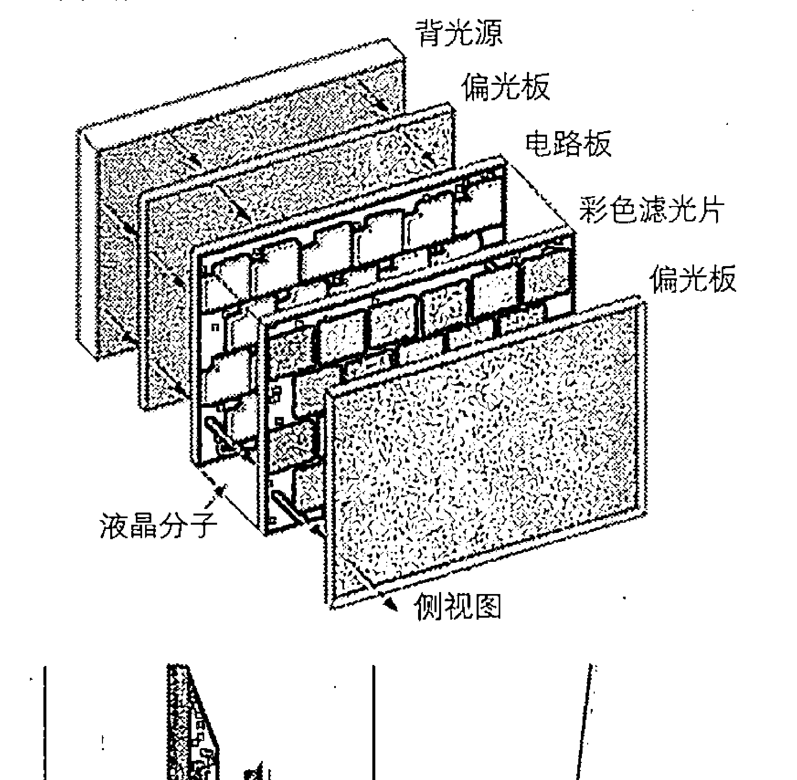

AOC e2343F性能方面采用23英寸16：9比例液晶面板，LED背光，十分节能环保。其拥有50000000:1的超高动态对比度，250nits的亮度和5ms的黑白响应时间，并拥有1920×1080的高清分辨率，轻松带来FullHD带来高清画质。

### AOC e2343F 液晶显示器，告诉你最薄到底能多薄

AOC最新“刀锋系列”显示器在外观方面非常前卫时尚，最大的特点就是机身厚度仅为12.9mm，堪称目前世界上最薄的LED背光显示器，边框为黑色，背部和底座皆为纯白色，整体感觉非常时尚。再加上接口安置在底座的设计，别出心裁。放在家中，它不仅是一个显示器，更是一道风景，尽显高雅气质。

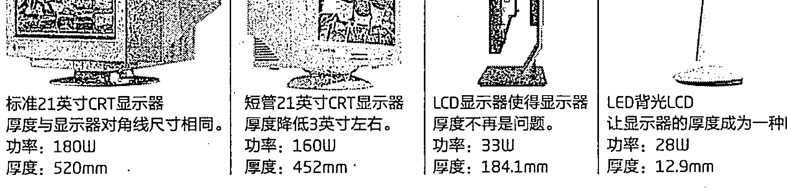

- 规格：尺寸：23英寸
- 面板类型：TN
- 背光类型：LED
- 接口：VGA、DVI-D
- 分辨率：1920×1080
- 对比度：50000000:1（动态）
- 可视角度(水平/垂直)：170/160°
- 响应时间：5ms
- 新品
- 800-858-1777
- http://www.aocmonitor.com.cn

## 平台化战略独立显卡是否会消亡

9月13日，英特尔秋季IDF在旧金山正式拉开帷幕，下一代处理器Sandy Bridge无疑是主角之一。Sandy Bridge处于Tick-Tock步调的Tock上，也就是说它是一款全新架构的处理器。我们且不谈他的架构、制程等等技术细节，让人震惊的是作为旗舰型的Sandy Bridge内置GPU，这从一个侧面表明了，业界巨头Intel终于开始走向PC平台化之路。

Intel：我们认为在一般应用中，GPU的作用是次要的，比如Clarkdale就基本可以满足大多数需求。

NVIDIA：实际上，我们的GPU运算能力要超越CPU很多，以后不如把CPU集成在主板上好了。

VIA：吵什么吵，你看看我们家的Nano平台，做一个板子把GPU、CPU焊上面打包一卖，多好。

战略迫在眉睫。当CPU+GPU+主板的平台公式变为CPU+主板时，那么本着性能最大化的原则，用户选择的必然是Intel而非其他性价比高的品牌。

### DIY，谁是下一个消失的硬件

说起Sandy Bridge我们不得不说说Clarkdale（32nm工艺制程的i3、i5），同样是内置GPU，但它们却与Sandy Bridge有所不同，如果说Clarkdale是京酱肉丝的话，那么Sandy Bridge就是软炸里脊。为什么这么说呢？因为Clarkdale只是把CPU和GPU装在了一个PCB基板上，而Sandy Bridge是在核心中包含了GPU。但不管怎么说，Intel首先在旗舰CPU中集成显卡显示出了抢夺独立显卡市场的勃勃野心。

曾几何时，我们攒机时细数着处理器、主板、显卡、硬盘、内存……等等等十多种硬件。而如今，其中的声卡、网卡渐渐淡出了人们的视线，它们哪去了？主板集成为了他们最终的归宿。下一个消失的硬件会是什么？

### 平台化背后的利益纠葛

可能在平台化上，不声不响的VIA做得是最成功的，从没有人关心Nano平台的CPU、GPU，只知道这东西性能凑合，功耗较小。这么做也让VIA的Nano避开了众强纷争的PC市场上，而开辟了一片蓝海—家电、工控领域。

其实在此之前，Intel早已把平台化深入人心，迅驰就是一个很好的例子，而如今Intel更是变本加厉的在DIY领域推行了起来，与笔记本平台不同，这次Intel是真真正正的把显卡吃进了肚子里，直接将CPU+GPU+主板的平台公式简化为CPU+主板，这其中与AMD的“融聚”战略密不可分。英特尔公司高级副总裁兼数字企业事业部总经理帕特·基辛格，透露了英特尔未来视觉计算的部分细节。基辛格在接受采访时指出：“视觉计算是一场革命，它将颠覆持续了几十年的显卡产业。视觉计算虽然不会马上替代显卡，但是在三、四年之后，随着我们相关技术、产品的成熟上市，显卡产业将消亡。”

为什么Intel如此执着地一次次试图冲击独立显卡的市场呢？我们用通常的攒机方案来看，如果电脑想玩游戏，那么必定要有一块独立显卡，并且是越快越好。而CPU在整个攒机中便成为了第二优先级，当整机价格超标时，首先降级的便是CPU和主板，降级还好，最可能的情况是换一个性价比较高的品牌。长久以往下去，个人PC将以GPU为中心去进行选择，而不再是CPU。这怎么能让Intel坐视不理，所以平台化

### 1+1 是否大于 2

虽然说平台化战略妄图打破市场格局，但是如果性能不济，消费者不买单将会使CPU的销售都受到影响。所以说1+1（CPU+GPU）的策略是不是能拥有足够本事便成为重中之重。

Sandy Bridge将图形部分作为处理器微架构的一部分来设计，并以制造处理器的工艺来制造，这样内建的显卡在性能和稳定性上有了很大区别。在Sandy Bridge中，集成显卡将成为CPU架构的一个组成单元，可以和CPU内核一样使用高速缓存（Cache），这边是1+1的优势之一。而单独的总线更好的资源调用，更低的延迟更是让GPU的数据存取速度提高一个甚至几个档次。但是有优点就会有缺点，由于GPU的晶体管数量庞大，已经赶上甚至超越CPU的规模也让CPU设计难度大大提升，以至于CPU内的GPU模块不具备与旗舰级独立显卡竞争的能力。

著名市场调研机构Jon Peddie Research今天就发布报告预测也称，虽然独立显卡受到冲击，但是在很长的一段时间里将会存在，但是份额将越来越小。

随着GPU图形核心或者说集成显卡回归处理器内部，主板集显的生存空间也将日益狭窄。而同时独立显卡的份额也继续受到它们的冲击。Intel大举进攻下独立显卡的日子越来越不好过，可能5年，甚至10年后，显卡也会像声卡、网卡一样淡出我们的视线，成为CPU的一个功能模块……

| 年份 | HPU | EPG | IGP | 独立显卡 | 交叉区域 |
| :--- | :--- | :--- | :--- | :--- | :--- |
| 2008 | 0.0% | 0.0% | 67.3% | 32.7% | 0.0% |
| 2009 | 0.0% | 0.0% | 71.2% | 28.8% | 0.0% |
| 2010 | 0.1% | 22.8% | 46.7% | 30.3% | 0.0% |
| 2011 | 2.6% | 42.9% | 25.3% | 28.5% | 0.7% |
| 2012 | 9.2% | 54.0% | 10.2% | 22.7% | 3.8% |
| 2013 | 16.9% | 56.6% | 1.9% | 17.6% | 7.0% |
| 2014 | 21.3% | 55.5% | 0.3% | 14.1% | 8.8% |
| 2015 | 24.7% | 53.9% | 0.0% | 10.0% | 11.4% |

Jon Peddie Research预测报告，其中“EPG”指的是双芯片封装的Intel Clarkdale，“HPU”则是异构处理器单元的，Intel Sandy Bridge，“IGP”是主板板载显卡。

## 一分钱一分货 难掩攒机价格底线

“铃铃铃……”正埋头在QQ上与West讨论夏普与MTK究竟有没有本质区别的Alpha接起了桌子上的电话。

读者A：“请问是《电脑爱好者》编辑部吗？”

Alpha：“您好，是的，请问有什么可以帮助你的？”

读者A：“我想装一台电脑，咨询下配置建议。”

Alpha：“我需要您提供用途、要求、价格范围。”

读者A：“主要玩玩大型3D游戏，做做图，看看高清大片，听听歌，不是说电脑现在便宜了吗？价格控制在3000元以内吧。”

Alpha抓耳挠腮：“这个要求，这个价格……”

#### 理清“主要”需求，“万能”PC价格很贵

很显然从电话中我们可以看到这个读者要的是“万能”PC。何为“万能”PC呢？就是说这台电脑做什么都很合适，性能都满足需求。这样的PC也不是没有，但是由于需求较多，那么各个硬件配置也要求很高，价格自然很贵。

#### 让日志告诉你，你在用电脑做什么？

在升级、购买前需要考虑，自己使用电脑的需求到底是什么。你说你不知道？那如何是好呢？记录自己使用软件、游戏、上网等时间是一个比较好的办法。用纸笔记录？拜托……好麻烦！用软件最方便了。

- 第一步：下载并安装WinLog Assist软件（下载地址：http://nj.onlinedown.net/SOFT/94387.htm）；
- 第二步：打开WinLog Assist，在上方的选项中点击Settings（设置）→Autorun（开机自动运行），这样WinLog Assist就会伴随开机启动，时时刻刻记录你在干什么；
- 第三步：经过一个礼拜甚至更多的时间，等待WinLog Assist记录了足够的数据，我们就可以在主界面下方查看每天的应用比例。选择左上方的日期可以查看当天日志，但这还不够，我们需要的是积累总量的分布；
- 第四步：在上方的选项中选择Report（报告）→Excel（输出到Excel），然后在开启的Excel窗口中我们就可以看到这些天来积累的数据，由此判定你使用电脑的需求，对号入座吧。

#### 使用需求决定整机预算

理清需求后，我们该分析下，我们的需求花费到底是怎样一个情况，相比主流PC是较贵还是较便宜呢？

##### 需求与各硬件间的价格关系

| 需求 | 处理器 | 显卡 | 内存 | 硬盘 | 显示器及外设 | 整机 |
|------|--------|------|------|------|--------------|------|
| 游戏 | 高 | 高 | 高 | 中 | 中 | 高 |
| 图形图像处理 | 高 | 中 | 高 | 高 | 高 | 高 |
| 多媒体 | 中 | 中 | 中 | 高 | 高 | 中 |
| 办公上网 | 中 | 低 | 中 | 低 | 低 | 低 |

##### 需求度与整机价格间的关系

| 需求 | 简单用用 | 经常使用 | 要求较高 | 极致应用 |
|------|----------|----------|----------|----------|
| 游戏 | 中 | 中 | 高 | 很高 |
| 图形图像处理 | 低 | 高 | 很高 | 天价 |
| 多媒体 | 低 | 中 | 高 | 天价 |
| 办公上网 | 低 | 低 | 高 | 高 |

#### 实测 PC 价格底线，低于此价卖了别后悔

上一个部分讲述了需求选择和需求价格。接下来我们该说说本次的重点：价格底线。何为价格底线。说起来很简单，测试起来很复杂。简单讲就是在满足经常使用的需求情况下选择市场上品质不错但尚未停产的硬件来攒机，求得最便宜的价格底线。

测试方法：由于测试存在主观因素，所以选取3~5个用户来进行答卷，分为较差、尚可、满意、非常满意4个档次，这里我们列举出临界点（处于尚可和较差间）的配置。

##### 游戏平台

| 配件 | 型号 | 价格 |
|------|------|------|
| CPU | Intel 酷睿2双核 E5400(散)+散热器 | 385元+50元 |
| 主板 | 捷波 XBLUE-P43 | 399元 |
| 内存 | 金士顿 2GB DDR2 800 | 258元 |
| 硬盘 | 日立 P7K500 500GB 7200转 16MB | 275元 |
| 显卡 | 索泰 GTS250-512D3 F1 | 799元 |
| 显示器 | 明基 G2220HD | 990元 |
| 机箱 | 多彩 MT814(带电源) | 320元 |
| 总价 | | 3476元 |

##### 用户答卷

| | 1# | 2# | 3# | 4# | 5# | 平均值 |
|------|------|------|------|------|------|--------|
| 满意度 | 尚可 | 尚可 | 尚可 | 较差 | 尚可 | 尚可 |

##### 图形图像处理平台

| 配件 | 型号 | 价格 |
|------|------|------|
| CPU | Intel 酷睿2双核 E5400(散)+散热器 | 385元+50元 |
| 主板 | 捷波 XBLUE-P43 | 399元 |
| 内存 | 金士顿 2GB DDR2 800×2 | 516元 |
| 硬盘 | 希捷 1TB SATA2 32M 7200.12/ST310005 | 450元 |
| 显卡 | 索泰 GT240-512D5 毁灭者 | 599元 |
| 显示器 | AOC iF23 | 1260元 |
| 机箱 | 航嘉 暗夜H507 | 178元 |
| 电源 | 航嘉 冷静王钻石2.3版本 | 228元 |
| 总价 | | 4099元 |

##### 用户答卷

| | 1# | 2# | 3# | 4# | 5# | 平均值 |
|------|------|------|------|------|------|--------|
| 满意度 | 尚可 | 尚可 | 尚可 | 较差 | 尚可 | 尚可 |

##### 多媒体平台

| 配件 | 型号 | 价格 |
|------|------|------|
| CPU | AMD 速龙II X2 245（盒） | 390元 |
| 主板 | 微星 785GTM-E45 | 499元 |
| 内存 | 金士顿 2GB DDR2 800 | 258元 |
| 硬盘 | 希捷 1TB SATA2 32M 7200.12/ST310005 | 450元 |
| 显示器 | 长城 M2431 | 1190元 |
| 机箱 | 百盛 W601 | 90元 |
| 电源 | 航嘉 冷静王加强2.3版 | 178元 |
| 总价 | | 3055元 |

##### 用户答卷

| | 1# | 2# | 3# | 4# | 5# | 平均值 |
|------|------|------|------|------|------|--------|
| 满意度 | 满意 | 尚可 | 满意 | 尚可 | 较差 | 尚可 |

##### 办公/上网平台

| 配件 | 型号 | 价格 |
|------|------|------|
| CPU | Intel 赛扬双核 E3300（散） | 270元 |
| 主板 | 技嘉 GA-G41M-ES2L(rev. 1.0) | 449元 |
| 内存 | 金士顿 2GB DDR2 800 | 258元 |
| 硬盘 | 希捷 250GB 7200.12 8M | 260元 |
| 显示器 | 长城 M930 | 699元 |
| 机箱 | 金河田 网神大帅2503B（带电源） | 243元 |
| 总价 | | 2179元 |

##### 用户答卷

| | 1# | 2# | 3# | 4# | 5# | 平均值 |
|------|------|------|------|------|------|--------|
| 满意度 | 满意 | 满意 | 满意 | 满意 | 尚可 | 满意 |

#### 总结

一分钱一分货在一定范围内是有道理的。范围就是这个价格底线内，如果说超过这个底线，性价比就无从谈起。最后希望大家理性攒机，买到一台够用、好用的机器……

## 低价CPU新旧之选莫盲目

500元以内的CPU都有什么？最具代表性的分别是Intel Pentium双核E5300、AMD Athlon II X3 435以及Intel Pentium双核E6500K、AMD Athlon II X2 255。其实，这个价位下可供选择的CPU并不是很多，那么，在价格近似的情况下，该如何去选购呢？

### Intel Pentium 双核 E5300

- 核心数量：2
- 制程工艺：45nm
- 二级缓存：2MB
- 功耗设计：65W
- 频率：2.6GHz
- 优势：具备良好的性价比，价格相对便宜，可满足一般应用需求，发热量也不高。
- 平台推荐：日常家用PC，搭配组合以G41/G43芯片组主板，推荐昂达G43C+。

### Intel Pentium 双核 E6500K

- 核心数量：2
- 制程工艺：45nm
- 二级缓存：2MB
- 功耗设计：65W
- 频率：2.93GHz
- 优势：不锁频设计，超频潜力巨大，可以满足追求极致性价比的玩家使用。
- 平台推荐：学生用PC，性价比用户，搭配组合以P45芯片组主板，推荐华硕P5Q SE Plus。

### AMD Athlon II X2 255

- 核心数量：2
- 制程工艺：45nm
- 二级缓存：2MB
- 功耗设计：65W
- 频率：3.1GHz
- 优势：功耗较低，性能不俗，是HTPC的理想选择。
- 平台推荐：HTPC媒体中心，搭配组合以880G芯片组主板，推荐技嘉GA-880G-UD3H。

### AMD Athlon II X3 435

- 核心数量：3
- 制程工艺：45nm
- 二级缓存：1.5MB
- 功耗设计：95W
- 频率：2.9GHz
- 优势：性能强劲，是中低价平台上性能为先的代表产品，适合游戏玩家。
- 平台推荐：游戏型PC，搭配组合以890GX芯片组主板，推荐精英IC890GXM-A。

## Android 未来掌上终端统治者？

你有没有发现，身边的手机、新兴的类iPad平板电脑、电子书、MP4、车载系统……越来越多的掌上终端设备都被一个绿色的小机器人所统治？短短两年时间，它就在手机领域打退了Windows Mobile和塞班，在平板电脑领域逼得Windows让位。没错，这就是Android。

ACER、三星、联想……大部分一线PC厂商的Android平板电脑争先出炉，而包括摩托罗拉、优派、爱可视、蓝魔等在内的手机和数码厂商的Android平板产品也蓄势待发。除了这些正规军以外，所有的山寨iPad几乎也都被Android“感染”，从深圳华强北到东京的秋叶原再到阿姆斯特丹的货柜码头，绿色的小机器人无处不在……

### 跨界的小生态圈

濒死状态的摩托罗拉都能重获新生，谁也不能否认Android在手机上的成功。随着联发科的介入，预示着Android“山寨化”时代即将来临。当Android手机用户达到一定量时，操作体验相似的Android平板电脑自然就成了更好的选择，毕竟它们可以共享一样的apk程序。就好像用惯了iPhone的用户还会选择iPad一样，Android手机和Android平板电脑也将是一对好搭档，随时在口袋和包包中待命。

对此淘宝掌柜老刘深有感触：最近进来的Android平板机每天出货都有20台左右，多数买家都是Android手机的使用者，购买原因就是想选一款iPad的廉价替代品。只不过这些买家会更关注产品的配置和系统版本，非常理性，千元级产品的销量往往是最好的。

### 盈利模式的优越性

iPhone闭关锁国，只限于乔布斯的产品帝国中。微软的Windows Phone7和英特尔倡导的MeeGo最早也得年底才有终端上市。目前Android拥有不逊于iPhone的App开发者队伍，免费开源和跨界的产品线联盟，别的平台想挑战Android已经不再是技术领先性的差别了。正如机锋网CEO谈毅所说，如果MeeGo平台能够早出三年，那么现在的市场情况就不会是像现在这个样子了。面对羽翼丰满的Android，新平台突围的难度不小。

微软桌面Windows系统能成功，是凭借着十余年打下的市场基础和软件厂商不得不跟进的兼容性。虽然Windows Phone 7确实有进步，但缺乏市场基础和兼容性优势，最“悲剧”的是还要收费。Windows 7对硬件的高要求限制了其在平板领域的发展，英特尔MeeGo现在八字还没一撇，而Android针对平板设备优化的3.0/3.5已经蓄势待发。

Android是靠推广谷歌的服务赚钱，谷歌可以把大笔资金投入到系统的完善和优化上，Android越好用户也就越多，相应的服务和广告收入就越高，随之而来的则是更充裕的研发资金，可以说Android未来市场份额的高占有率是可以预见的。而Windows、塞班等或是靠卖系统或是靠卖自己独有的硬件赚钱，盈利模式的差异决定了其它系统都不可能完全开放，系统的研发成本大都会转嫁到终端产品上来，由此流失的用户势必会造成研发资金变得更少，进入恶性循环之中。

### 不可忽视的问题

某软件开发小组成员NiNi表示，现在太多Android用户已经习惯使用盗版程序来节省购买费用的开支，应用商店的健康状况不容乐观，更多的收入还是来源于热心用户的捐助。此外，Android版本更新频繁，从1.5到2.2，从3.0再到3.5，版本频繁升级同样让不少开发者头痛。而厂商只会把新版本系统用于新一代的高端新品上，老用户想尝鲜新系统的魅力，就得看厂商的实力和诚意了。让开发者享有健康的开发销售环境，让系统升级不再困难，这些都成为当下谷歌需要考虑的问题。

虽然存在些许缺陷，但Android无疑是最成功的开源平台，逐渐成熟的跨界的生态圈，很容易让用户因习惯一种产品而购买其它Android平台的产品。免费，开源，足够多的开发者，无疑是未来掌上终端统治者的重要资质。

## 换壳之物？ Android 互联网电视推广难

三星正考虑生产使用Android操作系统的电视，准确地说是互联网电视，以此来迎战苹果与索尼的新电视时代攻势。如此说来，假如Android操作系统能登陆三星电视，对于Google而言这将是一大胜利。因为三星在美国是第一大电视厂商，市场份额足足有19.7%，其次才是Vizio的18.9%。

三星动作不算快，早在6月份，国产品牌TCL就有推出Android电视的计划。中国电子视像行业协会副秘书长郝亚斌认为，“智能电视促进三网融合，使电视机行业摆脱原先的硬件制造商角色，逐步向服务性企业转变。消费者通过该技术，可自行安装所需的应用程序，满足差异化需求，实现人机互动，从看电视到玩电视进行角色跨越。”CT早在前几期就和大家聊过三网融合，发展比较弱的广播电视网主要还是依靠互联网电视，可以说这是它手中的王牌之一。

互联网电视能不能做好，还好看够不够人性化。读者陈同学表示：“年轻人爱看电视的少了，都是留给老人用，而老人用不好的电视大部分家庭不会去买。”所以说，只要能搞好交互界面，简单两步就能让老人从网上找到爱看的戏剧、社会新闻。比收音机简单，还能看图看人影，估计这电视得预订着才能买到。推行Android电视，不仅要有比手机芯片强大的硬件平台，更要有与之相配合的软件。目前多是MID与手机软件。更重要的是厂商二次开发、维护软件的能力。不要高兴太早，硬件OK，软件等着吧。

(文/CT)

## 暴力测试！ SSD 传统硬盘生命力大比拼

SSD (solid state disk)，俗称固态硬盘，具有速度、抗震、节能、稳定、无噪音等先天优势。今天我们就来开开眼界，看看某论坛达人是如何用纯暴力的手法，在实践中验证SSD硬盘的优点。将两种硬盘通电并插上数据线，暴力测试开始！

酷热考验：将两种硬盘放到电热锅中进行耐热测试，100度左右工作均正常，最终机械硬盘在134度时候牺牲，SSD硬盘在137度时残废。(SSD硬盘胜)

炎之地獄：将两种硬盘在燃气灶的火焰中烧烤，结果二者都是被火一烧就不能用了，不过SSD在358度时就开始燃烧起来，而机械硬盘在370度时才开始融化，看来还是机械硬盘的燃点高一些。(机械硬盘胜)

水下漫游：将两种硬盘浸入水中，均瞬间报废，此局平手。(平手)

跳楼比赛：机械硬盘在5米高度处落下，数据读取不能；SSD硬盘在11米高出落下，数据还可正常读取，完胜。(SSD硬盘胜)

看来在生命力的测试中，SSD硬盘的确较机械硬盘出众。可惜了那几块报废的硬盘啊……

## 4000元 “爱妻她妹” 娶回家

别误会，“爱妻”指的是英特尔酷睿i7，而她的妹妹自然就是性能同样出色的i3了。面对众多不足4000元的“爱妻她妹”，我们又应该如何下手呢？虽然不支持睿频技术，三级缓存较小，但i3的性能绝对够用。可能有同学会认为i3主频低，看高清时“压力”太大。实际上，i3集成的GMA HD显卡已经完美支持高清硬解码，就不要说渐成主流的独立显卡了。真正值得我们重视的，应该是主要硬件的合理搭配问题。

### 基础型代表：

- 富士通LH530B i3 330M/1G/320G/集显
- 戴尔Inspiron 14V i3 350M/2GB/320GB/集显

此价位i3笔记本的标准配置大都选用了集成显卡、2GB内存和320GB硬盘的组合，根据品牌影响力的不同，在个别配件上会略作调整。在价位一致的情况下，优先考虑大内存的产品，因为i3 330M和350M处理器的差别非常有限。

选购要点： 内存>处理器>硬盘

### 增值型代表：

- 三星R429 i3 350M/2GB/320GB/G310M显卡
- 宏碁AS4740G i3 330M/2GB/320GB/G310M显卡

不要以为独立显卡是多么高端的东东，现在不少低价产品都将其划为了标配。只是现阶段主流的NVIDIA G300M系列显卡较AMD HD5000更值得选择，前者独有的CUDA技术对很多软件都有优化，后者所支持的DX11没有什么实际意义（因为此价位低端显卡性能太低，玩DX11游戏只是一个传说）。

选购要点： NVIDIA显卡>AMD显卡

### 高配型代表：

- 海尔T6 i5 430M/2GB/320GB/G310M显卡

国际品牌i3笔记本都跌破4000元了，对处理器或显卡等敏感硬件进行局部的升级就成为了各品牌吸引眼球的必杀技了。不过就性能提升幅度来看，显然还是显卡的升级来得明显实在，将处理器从i3升级到i5，不如把显卡从G310M升级到GT320M级别。

选购要点： 显卡>处理器>内存

## 接近完美 新小黑体验

| 具体型号 | ThinkPad T410i (2516-76C) |
|---|---|
| 基本配置 | P6000 + 2GB内存 + 320GB硬盘 + NVS3100M显卡 |
| 入手时间 | 2010年8月 |
| 入手价格 | 6999元 |

很高兴成为“黑社会”(ThinkPad用户的昵称)的成员，T410i最吸引我的就是手感超赞的键盘(唯一不足的就是没有背光键盘，个人感觉要比屏幕上面的键盘灯实用)，出众的质量和雾面屏和磨砂边框，可能有同学喜欢时尚的镜面屏，但看电影时映射出自己的影子肯定是不爽的。除了这些ThinkPad固有的优点外，T410i还借鉴了T400s的键盘，布局很合理，而且USB接口足够多，强化的屏轴和带指示灯的指纹识别器都是以前T系列所没有的。

很多朋友都鄙视我选择了P6000奔腾双核处理器的版本，其实个人感觉这个CPU足够强大了，看电影玩游戏办公应用都没问题，同样配置的i3处理器版本价格整整贵出1000元，我可不愿意为用不上的性能开销，何况高端处理器和低端的NVS3100M显卡也碰撞不出来更亮的火花，节省出来的钱还等着买四代iTouch呢。

要说缺点T410i还是有一些的，首先就是光驱读盘时震动还是蛮明显的，再有就是使用USB音箱听歌时会有杂音，个人感觉是USB供电电压偏低的缘故(在别的机器上就没问题)。总之瑕不掩瑜，7000元就能买到行货版本的T系列机器以前是不敢想像的，而且T410i在同价位机型上，做工和软件优化上的造诣无疑是一流的，惟一可惜的就是游戏性能，什么时候ThinkPad也能为游戏玩家考虑考虑呢，毕竟现在越来越多的年轻商务人士都是游戏迷了。

小提示：
同价可以买到i3 330M处理器的水货，但不推荐，毕竟行货有保修

小编点评：
作为商务笔记本的代表，ThinkPad最大的优势其实是高品质和高稳定，如果像小孟同学所言，给小黑配上高端显卡，徒增的发热量必然会影响到系统的稳定。不过随着双显卡技术的成熟，和商务人士对游戏需求声势的增强，也不排除未来的小黑也是专业游戏机的可能性。

我本精彩，一个属于读者的舞台。在这里你可以和CFan读者一起分享你与爱本的故事，和大家分享爱本的使用技巧、特色功能，当然也可以曝光缺点和不足，每期只有一个机会哦，人气和稿费在向你招手，还在犹豫什么！

要求：字数400字~600字，一定要配上爱本的照片哦，文章形式你说了算！投稿信箱：wangjian@cfan.com.cn

(北京/孟浩然)

## 不怕厂商不厚道 笔记本C盘分区攻略

相信各位同学都明白操作系统和重要数据不能放在同一个系统分区内的道理，但偏偏很多笔记本出厂时就只有一个C盘。用PowerQuest PartitionMagic或者Acronis Disk Director Suite划分C盘剩余空间容易出问题，重新分区安装系统还得找驱动和随机软件又非常麻烦。还好我们还有更简单的方法，快来学习吧！

另类的一键恢复
找一张Windows 7安装盘引导系统，在选择安装路径时，删除系统盘(千万不要对RECOVERY进行任何操作，这个是系统还原的隐藏分区)。之后单击未分配空间，点击新建按钮，重新对硬盘容量进行划分，如果安装Windows 7，建议给C盘预留出50GB的空间，剩下的空间可以划分出D、E、F盘等等。

分区后退出安装界面重新启动，然后再使用笔记本的一键恢复功能。以华硕笔记本一键恢复功能为例，开机时按F9键进入系统恢复界面，用户可以选择三种恢复模式。通常所有品牌笔记本的一键恢复系统都支持类似第一种，即把系统恢复的镜像文件直接恢复到C盘中，驱动和随机软件会一气呵成无需人工参与。

小提示：
对于购买新机的用户还可尝试下面的方法：右键单击计算机，依次选择管理→存储→磁盘管理，右键单击C盘选择压缩卷，输入压缩空间量的数值就代表着你所希望划分出的空间(如果你想给C盘留30GB，那这个值就是硬盘总容量减30GB)。建议新本在使用此方法分区前不要安装任何软件，否则压缩卷时最多只能自由分配一半的硬盘容量。

品牌本一键恢复方法
- 华硕(开机后按F9)
- 东芝(按住数字键0再按开机按钮)
- 索尼(开机后按F10)
- ThinkPad(开机后按ThinkVantage)
- 惠普(开机后按F10或F11)
- 联想(按Novo键开机)
- ACER(开机后按ALT+F10)
- 三星(开机后按F4)

## 脱下马甲 NVIDIA G400M系列显卡杀到

从Geforce 100M开始，NVIDIA改变了移动显卡的命名方式，但接下来出现的200M和300M均被扣上了“马甲”的帽子，换汤不换药的核心架构让玩家嗤之以鼻。如今，NVIDIA终于让马甲下岗，推出了真正意义上的新品。

### 七剑下天山 细节需谨慎

NVIDIA此次推出的G400M家族共有七名成员，除了GT 420M和GT 415M之外，其余显卡均支持3D VISION (支持3D显示器)和PhysX (物理计算)技术。此外还需留意的就是GT445M，拥有192/128bit两种显存位宽的版本，当各位同学看到配备这款显卡笔记本时，一定要仔细核对显存的版本，二者之间性能至少存在15%的差距。
需要注意的是，AMD也即将在年底推出全新的Mobile Radeon HD6000系列显卡，希望AMD的第二代DX11显卡在性能上能给我们更多惊喜。

| 3D Mark 2006 | 3D Mark Vantage |
|---|---|
| GT445M (GDDR5/128bit) | 11000左右 | E14000左右 |
| GT335M | 8000左右 | E11000 |

### 健圣观点：值得选择

随着G400M系列显卡的上市，NVIDIA终于和AMD一并站在了DX11的跑道上，就性能而言新一代显卡非常值得期待，以面向中高端市场的GT445M来说，3D Mark2006成绩较上一代同级别的GT335M高出28%，只是新品刚上市肯定会有一段价格虚高期，待新品和同规格老产品价差在300元以内时就是最佳的入手时机。

### 我不是马甲 我很强大

没错，新同学NVIDIA G400M改用了40nm，支持DX11的全新Fermi架构，和马甲前辈彻底断绝了关系。除了架构更新外，G400M还大幅提升硬件规格，以最低端的GT415M为例，流处理器数量从上一代G310M的16条提升到48条，理论性能可以和上一代较高端的GT325M比肩，意味着今后低端笔记本也能在中高画质下流畅玩星际2了。

| 型号 | 核心代号 | 流处理器 | 核心频率 | 流处理器频率 | 显存频率 | 显存位宽 | 显存类型 |
|---|---|---|---|---|---|---|---|
| GTX 470M | GF104 | 288 | 535MHz | 1100MHz | 2500MHz | 192bit | GDDR5 |
| GTX 460M | GF106 | 192 | 675MHz | 1350MHz | 2500MHz | 192bit | GDDR5 |
| GT 445M | GF106 | 144 | 590MHz | 1180MHz | 2500/1600MHz | 192/128bit | GDDR5/DDR3 |
| GT 435M | GF106 | 96 | 650MHz | 1300MHz | 1600MHz | 128bit | DDR3 |
| GT 425M | GF106 | 96 | 560MHz | 1120MHz | 1600MHz | 128bit | DDR3 |
| GT 420M | GF106 | 96 | 500MHz | 1000MHz | 1600MHz | 128bit | DDR3 |
| GT 415M | GF106 | 48 | 500MHz | 1000MHz | 1600MHz | 128bit | DDR3 |

## 诺基亚总裁易主 新皇帝玩转型

诺基亚董事会宣布，自9月21日起，斯蒂芬·埃洛普(曾担任过微软商务部门的总裁)将担任诺基亚公司的总裁和首席执行官，现任CEO康培凯在董事会压力下终将黯然退出诺基亚，诺基亚表示，将从手机硬件制造商转型为软件和解决方案提供商。

产品的冲击，曾经占据智能手机市场份额60%以上的Symbian智能手机，如今已不到45%，诺基亚市值已经缩水600亿欧元。此时的诺基亚已经到了重蹈摩托罗拉覆辙的边缘，易主情理之中。仔细想来，诺基亚现在所面临的困境，主要是把握局势失误导致。3G时代，手机从通信工具成为网络时代的数据、服务终端。

分，运营商需求和市场认识不足，忽视CDMA、TD市场是第二个错误；商业模式不够灵活是第三个错误，发展了三年的Ovi商店刚刚商用，早已失去最佳时机。一位网友的评论十分犀利：“Meego、塞班3不成功便成仁，失败了，诺基亚就真的玩完了。当然还可以生产Android机子，只是那时候也就和摩托、三星等等厂商一样，把命运挂在刀口上过日子”。

### 康培凯为何“下课”

康培凯加入诺基亚已经整整30年，可以说他经历过诺基亚巅峰时期的欢喜，也品尝过如今低谷窘境的难以释怀。面对iPhone、GPhone、黑莓等手机

就中国来说，诺基亚过分崇拜Symbian平台是康培凯犯下的第一个错误，有钱的学生、爱玩手机的朋友不在少数，华丽的苹果，Android诱惑实在太大，而塞班3，MeeGo效果让人失望，本地化工作不够充

IT出身的埃洛普称王诺基亚，对于转型有相当大的优势。从理念和行动上，会给诺基亚带来一个新气象。至于结果，目前无法预计，我们只能拭目以待。

(文/CT)

## 手机美化跟我来

我们几乎每天都要使用手机，不过大多数手机和安装程序默认的界面并不美观。何不自己动手对手机进行美化？

### 经典美化——S60 变身苹果界面

- 适用平台: S60
- 美化方法: 使用苹果主题文件

苹果手机界面惊艳是公认的，我们可以下载美化主题给S60系统换苹果装，让手机看上去像iPhone。我们只要到网上下载对应自己手机的主题安装包，然后应用安装的主题即可。

- 网络大补贴:
- Android + iPhone 主题，支持 S60V5 : http://tinyurl.com/2ewohto
- 绝对拉风，S60V3 iPhone 风格主题下载 : http://tinyurl.com/2e79pxl

### 老将发威——界面完美增强

- 适用平台: S60、WM
- 美化方法: SPB桌面

S60的机能并不弱，像Android样一键调节背光亮度、实时天气桌面效果并不难，就算跑跑3D桌面也没问题。SPB桌面最早是WM平台，整合了诸多实用方便的小插件，再推出S60版本后，界面进一步美化，强烈推荐。

- 网络大补贴:
- WM版，支持WM6.1、6.5 : http://tinyurl.com/2c2tq6y
- S60版 : http://tinyurl.com/2c9ddk9

### 短信界面变身——iPhone对话式短信模式

- 适用平台: S60、Android、JAVA
- 美化方法: 火种通讯录、ET短信

短信是很多手机用户常用的交流方式，默认的短信界面平凡，阅读起来也不方便。火种通讯录和ET短信都可以管理短信、飞信，并且是免费的，让你的手机像查看QQ聊天记录那样看短信记录。区别是前者可以和网络同步通讯录，它还有一个类似人人网的SNS论坛。担心隐私则可以用ET短信，1.0版速度快、稳定，也可尝试1.5内测版，界面更华丽。

- 火种通讯录: http://tinyurl.com/3x3kmr3
- ET短信: http://tinyurl.com/3yrecrq

### 手机界面变身——名字“刻”到手机上

- 适用平台: 诺基亚所有手机
- 美化方法: 更改情景模式名称

经常将手机落在办公室、宿舍，如此马虎何不将自己名字“刻”在手机界面？新建一个情景模式，然后将情景模式名称重命名为你的名字如“张三手机”。如果要将名字固化在手机界面，我们还可以使用“画图”程序编辑手机桌面壁纸，通过更改运营商LOGO的名称为自己名字的方法也能替换。

- 网络大补贴:
- S60三版手机修改移动、联通LOGO图解: http://tinyurl.com/3yxdklk
- WM修改移动、联通LOGO名称的方法: http://tinyurl.com/346r6wx

### 其他软件美化

对于手机上常用的UC浏览器、QQ、飞信等软件，大家可以根据自己手机选择合适的美化版本下载使用，这些美化软件不仅界面美观，而且功能也极为丰富。

- 网络大补贴:
- UC改背景色为浅黄、益眼绿: http://tinyurl.com/22v9pre
- 飞信3.0美化版，支持JAVA手机: http://tinyurl.com/2aurjjo
- QQ2010美化版，支持JAVA手机: http://tinyurl.com/274rqmm

## 街拍达人说 定焦镜头赞

说到定焦镜头，就不得不说到出色的焦外成像（背景虚化效果），它是很多爱拍照的女生的最爱，出色的虚化效果让照片看起来像写真照，不仅传神还能突出主体。

人物在景深范围内，而背景和前景在范围外。光圈越大，入射光越多，则景深范围越小，背景虚化（焦外虚化）的效果越好。

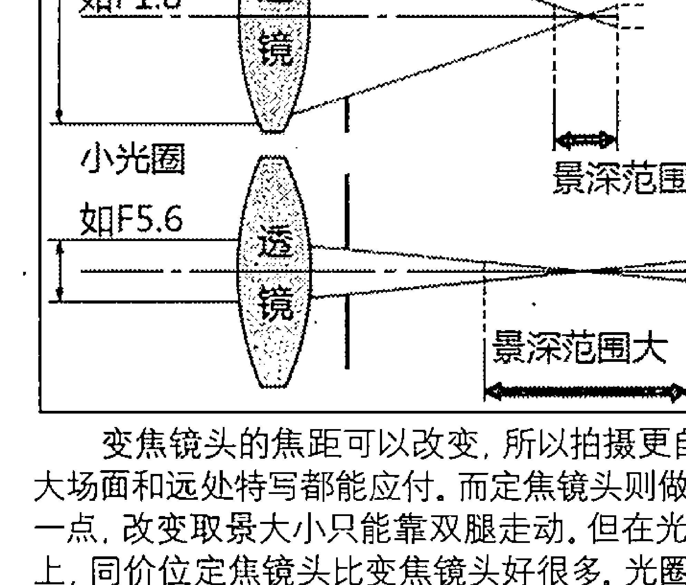

变焦镜头的焦距可以改变，所以拍摄更自由，拍大场面和远处特写都能应付。而定焦镜头则做不到这一点，改变取景大小只能靠双腿走动，但在光学素质上，同价位定焦镜头比变焦镜头好很多，光圈对人物拍影响很大（见左图），变焦镜头光圈做到F2.0就已经非常了不起，但是定焦镜头可以轻松做到F1.8甚至是F1.2。此外，大光圈在光线较暗的环境下，不开闪光灯就能拍摄也是优势。

同是定焦镜头，焦距有35mm、50mm、85mm等之分，如何选？与普通单反18-55mm套机镜头一样，焦距小，拍摄范围大，而50mm是与人眼视觉最为接近的焦段，也就是说相机取景器中看到的物体与人眼直接观看的比例别无二样。

在大街上经常能遇到“扫街”拍时尚MM的娱记，大光圈、高图像质量、最接近人眼视觉，这三点成就了50mm定焦镜头“街拍利器”的称号。不过出门游玩并不合适，焦段决定了它拍下的风景范围小，出不来大场面的气势。所以对于初学者，50mm定焦镜头专门拍人像，18-55mm套机镜头拍风景，搭配使用互补长短，好风景、漂亮MM照单全收。

| 入门50mm定焦镜头 | 价格 | 点评 |
|------------------|------|------|
| 佳能EF 50mm f/1.8 II | 730元 | 平民的宝马，马达噪音稍大 |
| 尼康AF 50mm f/1.8D | 680元 | 买了就不后悔，偶有对焦不准现象 |
| 索尼DT 50mm f/1.8 SAM | 1150元 | 占有量少，索尼单反必备 |

(北京 / 马靖晖)

## iPhone合约计划我看行

联通iPhone 3GS 8GB版在8月9号顺利出生，裸机价4999元，有意思的是当天北京的苹果专卖店仅售3999元，而且一上午就被抢空。后来联通还发表声明，说是人家标错价了，真有面子。

CT也在联通官网体验了一回合约计划购买流程，虽然在最后一步忍住没有付款，只能说是过了把干瘾。

可能有的朋友不明白了，从最低的预存2000元话费月消费96元到预存4999元月消费226元，这有什么区别？存2000和4999反正都是存进去了，话费迟早要花出去，如何选？以96档为例，预存2000元+购机价2999=4999元，每月返还83×24月=1992元，为了满足最低套餐96元消费，每个月还需要多补交的话费（96-83）×24=312元，总价5311元。

226元（0元换购最低一档）则是208×24=4992元，（226-208）×24=432元，总价5431。所以两者相差仅为120元，而后者可以享受每月208元的话费，还是很超值的可以享受到850MB包月流量，比前者多出整整510MB，主叫时间也多了460分钟。CT也了解到目前部分朋友购买4999元合约计划后将手机与话费分开出售，手机卖到至少9折，话费则是近千元出手，从中捞取暴利。淘宝上也有此类话费出售，对于手头紧张的朋友，可以考虑购入。

## 极致媒体中心 麦博M-700U给你好看

如今不少多媒体音箱想尽办法脱离电脑而独立发展，做到有区别与传统，然而革新换面并不容易。各大厂商都有自己的办法，要么依靠音源的变化和相对独立化的设计令产品能够摆脱电脑的束缚；要么努力提升音质和回放能力，令产品不仅能够适应电脑桌面，更要在客厅、卧室等其他场合有立足之地。

将多功能2.1音箱作为推广宣传的重点，麦博作为第二大多媒体音箱生产商，会有计划地推出数款带有数码播放的2.1音箱，兼备功能与音质。M-700U只是刚开始，在它出来之前已有很多音箱品牌推出了带有数码播放功能的2.1音箱，市场反映良好，这样的设计也逐渐成为趋势，麦博的多功能2.1音箱会有何不同呢？

镜面质感在近几年的数码产品上很多见，由于多媒体音箱的发展速度远不如数码产品的发展速度那么快，所以目前市面上造型古朴保守的产品还是很多见的。麦博在M-700U的主箱体上大胆地使用了全副的镜面透光材料，不但可以获得镜面效果，而且还能透过它看到机身内的显示屏。

麦博M-700U的主箱体前面板集成了数码功能的输入和控制部分，输入部分为一个USB接口和SD卡插槽，在插入这两种设备后，M-700U的内置音频解码芯片会直接读取设备中的MP3/WMA文件，并形成播放列表，然后通过控制部分来操控音乐的播放。这种应用对于大部分人来说是有用的，并且是实用的。

卫星箱的整体外观风格和低音炮保持一致，细节上更为丰富。卫星箱边框为茶色半透明塑料材质，底部的一条红线装饰非常到位。使用2.5英寸单元，箱体采用了小倾角的设计，既美观又可以让听者获得更准确的声场。

一款能够作为家居音响使用的产品当然少不了遥控器，M-700U的遥控器体积较大，握感较好，遥控器将音箱的全部功能操控按键都集中起来，包括箱体上无法实现的高音、低音调节以及定时关机等功能。

功放输入输出接口方面，音箱具备两路音源输入，分别支持3.5立体声插头及RCA插头。多数2.1音箱都采用了电子分频，M-700U也不例外。

听感方面，由于配置及内部功放方面，M-700U与M-200十周年纪念版都很相似，因此两者的区别并不大。人声表现是其长项，听感温暖，有一定的厚度。而高频方面则略显暗淡，在表现女声时，耐听度还令人满意，但是延伸及质感则与高端的三分频2.1还有一些差距。低频也有不错的表现，虽然不是很暴力很具力度的低频，但在依然保持着麦博的低音强项特点，结实且具备不错的密度感。

## 实惠是第一位 电源功率之我见

现在电源的价格仔细算算并不便宜，几百元一个，虽然使用的时间可以很久，但是，你真用得到那么大功率的电源吗？动辄就是400W、450W，其实，对于如我一般的普通消费者，一点儿用都没有，不信？一算便知。

### 平台耗电最高不过 100W

AMD平台也好，Intel平台也罢，主板+CPU的耗电能有多大？以AMD来说，处理器大部分为45nm制程工艺，功耗普遍在65W~95W之间，注意，这还是最大的功耗设计。AMD 880G芯片组的功耗则在十几W左右的水平。再配以一个500GB硬盘(8W)，2GB DDR3内存，空载情况下仅为65W左右，满载时功耗也就是89W左右。Intel平台的组合为Core i3 530大约是在95W左右，H55芯片组也同样为十几W，其余硬盘、内存配置相同时，空载功耗也就是60W出头，满载则为120W左右。

显然，整合平台实际上根本就不需要超大号的电源，一个250W的电源就足以应对了。当然，考虑到配置的延伸性，比如升级独立显卡(耗电大户)以及扩展内存、硬盘等等需要，普通电脑的电源配置，300W~350W绝对够用了。实际上，在这个H55芯片组+Core i3 530的组合配置上，我还尝试加了一块借来的GTX 285显卡，结果是我的350W电源应对绰绰有余。根据电量插座的显示，实际功耗甚至刚刚超过200W。

因此建议配置在5000元以内的机型，如果没有特殊需求，300W电源已经足够。一般来说，300W电源的均价在200元~300元之间，350W电源就要300元~400元之间了，差距可以达到100元哦，千万别忽视。

## 500元玩高清这不是玩笑！

高清播放器只要500元了？别以为这是玩笑，千真万确，随着高清片源的广泛普及(集中在网络)，高清播放盒这类产品也开始降价了，算下来绝对比买个HTPC便宜多了，尤其是不会设置的普通用户，像操控DVD一样的使用方式也绝对是爸爸、妈妈、爷爷、奶奶的最爱。

### 爱国者佳佳看 P8116

- 价格：399元
- 特点：接口齐全，照片、音乐、电影皆可播放，功能全面，使用也很简单，比较有特色的是可以内置3.5英寸硬盘，支持APE无损压缩音乐格式。

### 忆捷 X5

- 价格：270元
- 特点：格式兼容性高，而且竟然以300元价格就提供全面硬件高清解码的功能，实在是太超值了。而且，这款产品还支持RMVB格式，使用也很方便。

### 海信 MP501H

- 价格：450元
- 特点：外观十分漂亮，不愧是家电厂商，产品外观设计更贴近生活。有趣的是这款产品还支持WiFi网络，甚至是下载播放功能也具备，比较超值。

## 退市DC 不买就没啦！

都要退市的DC了，还有什么可买的？如果你要这么想就大错特错了。目前DC发展固然迅猛，但新老交替之间功能差异并没有质的改变，即将退市的DC其实也是一个非常不错的选择——价格便宜，量又足。

### 富士 F200EXR

- 退市价：1580元
- 优势：1/1.6英寸1200万有效像素的Super CCD EXR成像效果出众，5倍光学变焦能力，并具备非常实用的脸部优先技术，一代神机不可错过。

### 理光 R10

- 退市价：1400元
- 优势：高达7倍光学变焦镜头，拍摄风景照最合适不过了。而且更令人惊讶的还在于它具备1cm微距拍摄能力，是一款非常经典的产品。

### 松下 LX3

- 退市价：3199元
- 优势：别看即将退市，价格依然坚挺(水货价格在2800元左右)。这款LX3被很多人喻为卡片机最超值的产品，成像效果出众，并具备F2.0的超大光圈(消费级数码相机中最大的)。

### 索尼 TX7C

- 退市价：2199元
- 优势：索尼推崇的智能扫描全景模式是TX7C上最具实用价值的功能，别看即将退市，功能一点儿都不弱。甚至它可以拍摄1080P的全高清数码短片哦！

说了这几款即将退市DC的优点，当然面对新一代DC它们也不可避免的少了些功能、参数指标这种硬件决定的特性我们无法弥补了，但是一些特效功能我们还是有办法“补充”的，比如说现在大红大紫的HDR模式。

## 手机配件价值几多？

买了新手机，总要零零散散的添置些东西，一样几十元、十几元……算下来，买了手机之后还至少要花费100元~300元！不信？咱们算算看。

### 贴膜：

- 10元~15元
- 省钱小贴士：不客气的说，10元~15元的贴膜都是三无产品，因此建议自学贴膜方法(其实很容易哦)，然后在网络上搜索，2元~5元的贴膜就足够用了(和店家卖10元的膜基本一样)。邮费很贵？拜托卖家发平邮乃至平信就好啦。

### 存储卡：

- 8GB 100元
- 省钱小贴士：不少品牌手机都附赠有1GB容量的存储卡。当然，这肯定是不够用的，但是8GB就真的适合你吗？算算自己有多少歌曲，多少程序？使用8GB存储卡的用户有70%存储内容不到4GB。所以，45元左右就能买到所需容量，为何要花100元呢？

### 手机套(壳)：

- 80元~200元
- 省钱小贴士：今天买了一个硅胶壳，用了些日子又换成皮夹，好不麻烦……其实，你有没有考虑过，手机的磨损是正常不可避免的，前前后后几个套子的开销算下来，已经足够用来为手机进行一次翻新了。这个钱，实在没有花的必要。

网络大补贴：手机贴膜技巧
http://hi.baidu.com/a304917134/blog/item/c730151826222158618bfcf.html

## 你要舒适还是面子？低价液晶显示器如何选

在液晶面板产能激增的今天，各大一线品牌的20英寸液晶显示器终于逐步跌入800元以内阵营，和18.5英寸以及19英寸两位兄弟一起蚕食原属于CRT的低端市场。问题来了：价格都差不多，谁更适合你呢？

### 三国争霸 互有所长

18.5英寸虽然面子最小，但屏幕点距最大，价格最低，适合家里有老人或者儿童的家庭选择；20英寸可以在同一屏幕内显示更多的内容，电影游戏效果更爽，适合娱乐应用；相对来说19英寸显示器点距适中，最适合浏览网页、日常办公、处理文档，长时间观看也不会造成过于明显的疲劳感，价格和18.5英寸产品相差无几，最适合普通的家庭用户。

### 接口外观 细节莫忽视

由于定位低端，这类产品基本都选用了TN面板，显示效果不会有明显的差异，因此在选购时应该着重考察产品外观是否时尚，做工是否精细，接口是否合理。对于20英寸以下的产品，没有必要追求HDMI接口(用不上而且价格还贵)，如果有DVI接口，注意随机是否提供DVI连接线。

### 节能智能 新技术值得埋单

如果你的预算不是很紧张，不妨考虑一下采用LED背光技术(较普通显示器贵百元左右)，支持智能感光功能的显示器，前者的功耗不足20W，较普通显示器90W的功耗更为节能；后者则可以像手机一样，根据环境的光线自动调节亮度，对视力的保护更好。

| 屏幕尺寸 | 点距 | 分辨率 |
|---|---|---|
| 18.5英寸 (16:9) | 0.300mm | 1366×768 |
| 19英寸 (16:10) | 0.2835mm | 1440×900 |
| 20英寸 (16:10) | 0.258mm | 1680×1050 |
| 20英寸 (16:9) | 0.277mm | 1600×900 |

## 全能选手 低价液晶电视参战

现在很多19英寸液晶电视的价格也只有900元上下，虽然这些产品的分辨率只有1366×768像素，但是电视功能对于“蜗居”的同学来说还是很实用的。需要注意的是，液晶电视亮度普遍偏高，使用时要保持和眼睛的距离。

## 随身电源大小不一怎么挑？

MP3、MP4、电子词典、手机……不管是男生还是女生，学生还是上班族，翻翻自己的口袋、包包，谁敢说自己没有个三五样数码便携产品，但问题是现在的数码产品都不禁用，动不动就没电了，想买个随身电源（充电宝）吧，大大小小又有很多种，我该怎么选呢？

### 留意电量虚标

现在市场上有大量的随身电源，种类不下20种，但在挑选的时候，不能只看重个头大小，还要注意电量虚标、电芯种类的问题。
首先是电量问题，不少写着10000mAh或者更吓人的指标统统是假货！无论是使用铅酸还是磷酸铁锂，都不可能在较小的体积下容纳这么多电能。通常来说，大屏手机大小的随身电源，容量最大也不过是6000mAh以内。有些商家非常无耻，非要说自己的是锂聚合物技术的，所以个头小电量大——请务必牢记一点，锂聚合物电池的制造成本远远超过锂离子电池，这也是为什么至今大部分手机都还在使用锂离子电池而非锂聚合物电池的重要原因。所以不要期望一个售价200多元的随身电源能给你配备什么锂聚合物电池。

品胜易充4400mAh
输出：5V 0.5A
容量：4400mAh
材质：锂离子
重量：115克
充满时间：约7小时

Mii移动电源
输出：5V 1A
容量：2000mAh
材质：锂离子
重量：49.5克
充满时间：约4.5小时

### 电流电压谨慎选择

另外一个要特别留意的是输出电流。这个重要的技术参数指标非常重要，略小于被充电设备的充电电流输出是最理想的情况。举例来说，iPhone充电电流标准为5V 1A，那么随身电源的充电电压、电流就至少不能超过5V 1A，理想的状态是5V 0.8A~0.9A，这样充电时间不会延长太多（十来分钟），同时又能充分保护电池（尤其超过标称值1A会对电池造成永久性伤害）。当然，电流输出如果太低了也不好，充电时间会成倍延长。这个指标可以在充电设备的背部铭牌上清晰标注。如果你看到的随身电源连这个指标都没写，那还是不要买为好。

### 好电源排排坐

目前移动电源比较出色的有三款，分别是品胜易充（4400mAh）、Mii移动电源和iWalk U20移动电源，这三款产品的通用性较强，而且电量相对较大，可以满足包括PSP在内多种数码设备至少一次以上的充电需求，最重要的是这三款产品价格都比较便宜，产品质量还算可靠。此外，多种接头随意更换也可以满足不同设备充电需求，使用也方便些。

iWalk U20移动电源
输出：8.4V 0.8A/5.3V 0.8A自动判断
容量：5400mAh
材质：锂离子
重量：148克
充满时间：约4.5小时

## 我不是CT 我是暴力拆解哥

拆你平时不敢拆的酷玩，看你平时看不到的秘密。

固态电容很好分辨，顶部有“K”或“+”防爆槽。市场上XLL系列是仿真度较高，没有防爆槽的假固态电容。

### 今日特辑：爱打架的电容

电容是电路中很常见的元件，在板卡、音箱等产品宣传广告中经常出现。电解电容容易爆，是相对固态电容而言，实际远没有宣传的那样可怕。电解电容容量大、耐压值高，在功放、电源、音箱之中是无可代替的。固态电容寿命长、热稳定性好，适合于高频的工作，多在主板、MP4、显卡中常见。
电解电容的原材料是腐蚀化过的铝箔片，两条铝箔隔着电解纸卷绕在一起，颜色深粗糙的是正箔，颜色浅光滑的是负箔。铝箔之间的电解液是有毒的。
固态电容拆开后是渣，而大家常说内部有液体的假

### CT 教学堂

进口电容拆开电解液味道比较香，主要成分都是乙二醇。电解电容顶上防爆槽处不能有遮挡物，如抹胶水或贴外壳，防爆口炸不开，整体炸了，更惨烈。
电解电容爆炸机制主要原因就是发热，发热量超过散热量，内部的电解液就会蒸发成气体进而爆浆。这个过程比较慢，所以一般都是鼓起裂个小口。体积越大的电容炸的越慢而且越安全，可怕的是那些6MM以下的小体积电容。

## 那些扩展卡

主板用了两三年，性能不够可能还是小事，但很多设备都不能使用了，这才是件麻烦事。换主板？不仅要升级CPU，甚至内存也要由DDR2升级到DDR3了。其实，想要扩展功能，未必非要升级主板，各种规格的扩展卡可以让你的老主板焕发第二春。
大约三四年前的主板开始，多数都配备有PCI-1×插槽，别小看短短的一个小插槽，通过它能够扩展实现的功能可不少呢！

### 千兆网卡只要120元

现在100Mbps网卡拷贝高清大片十分吃力，动辄几小时的拷贝时间让人不甚烦恼。其实只要120元左右，选购一款千兆PCI-E 1×网卡就好了，其数据吞吐能力远超PCI网卡，性能十分了得。推荐大家选择3Com或是Intel的二手原装产品，虽然不是全新的，但性能、稳定性都很出色，远非杂牌产品可以媲美。

### 最低75元升级USB 3.0

如果你还想像技嘉333系列主板那样，拥有USB3.0接口的话，最低75元就能升级到USB 3.0接口了，传输速度达到了5Gb/s，远远超越了USB 2.0接口。值得注意的是，目前USB 3.0芯片转接卡主要是NEC芯片和FRESCO LOGIC FL1000芯片两种，推荐购买NEC芯片的（成熟、稳定），价格在120元左右的比较合理，太贵了就不值得了。

### 声卡混音也很便宜

对主板的音效能力不满意？如果你想拥有更高品质的音频输出能力，或是视频达人，对自己电脑声卡无法混音而感到烦恼的话，升级声卡吧，只要不到200元，品质功能样样齐全。目前PCI-E 1×声卡从100余元到1000元比比皆是，这里推荐买拆机库存的创新Xtreme Audio 7.1声卡，价格普遍不到200元，兼容性也不错，非常划算哦！

### 小知识：什么是PCI-E 1×？

PCI-E是PCI Express的简称，是用来代替PCI、AGP接口规范的一种新标准，由PCI或AGP的并行数据传输变为串行数据传输，PCI-E标准如同AGP标准一样，也有1×、2×、4×、8×、16×等等的速度分类，PCI-E 1×的速度为250MB/s，已经超过老式PCI插槽133MB/s的传输速度了。

## 小音箱大用途 声丽H5极限身材

微型音箱究竟能做到多小？在保证一定音量、音质的前提下，相信市场上除了声丽H5就没有再小的了。H5的尺寸只有80×80×36mm，可以说是超微型便携式音箱，此款音箱除了体积小嗓门大之外，在音质表现上非常值得称道，要优于目前市面上多数同类型的产品。

声丽H5的高光注塑UV面板，高光泽且耐磨，抗氧化不掉色，内置单元的辐射传导声学设计，音域更宽广，圆润甜美。H5此次一共发布了玛瑙红、兰博基尼黄、香橙红、梦幻蓝、高贵白5个色系，每一款的配色都别具匠心。也许你会奇怪在声丽H5的身上找不到喇叭开口，这都是密闭式腔体设计的功劳，运用了辐射传导技术的喇叭单元具备更深的低频下潜和音效解析力，而内置的500毫安高性能锂电池，可让它连续工作2小时~7小时。功能方面，声丽H5支持超大容量SD卡，超强FM收音功能，节目锁定力强，吊挂式、可放口袋式，更易便携。

位，三频表现均衡，可以满足一般用户的日常听音需要。另外，该款音箱的供电和音频传输都只需一根USB连接线即可完成，省去了线材缠绕带来的困扰。

### 为何体积有极限？

音箱的体积不是想做多小都可以，要想具备一定音量、音质，首先单元尺寸不能小，选择2英寸全频单元十分合适，在功率、声场与尺寸上有一个不错的平衡点。这也是市场上大多数微型音箱选用2英寸单元的原因。当然，不乏1.5英寸甚至1英寸的产品。H5难得的是外壳尺寸仅仅比2英寸单元大了一圈，要在这么小的空间内做出声音辐射震动部分以及电路设计，不是不可以，关键是这样做的结果如何，也就是音箱的本质：音质如何。事实上，3W的输出功率对于它这个小身材来说足够强悍，密闭式腔体设计也让中音得到出色的发挥，在卫星音箱的低音弱项上，H5的表现也略强于同者。而这一切的优势都是建立在极限身材上，便携能力更是无人能敌，综合来说，值得考虑。

## 看看你的本本 功耗究竟有多少？

想知道自己本本的功耗有多少吗？升级内存会不会导致功耗增加？玩游戏的时候为什么本本那么热？一个小软件就能让你了解一切。
下载Joulemeter（下载地址：http://work.newhua.com/cfan/201017/SetupJoulemeter.rar）并安装，程序启动后，便能详细了解到笔记本的功耗情况。

笔记本主要的耗电大户其实依然是显示屏，平均功耗都在10W左右。但当系统满负荷运行后，CPU的功耗会陡然增高，由闲置状态切换到满载，功耗达到了13W甚至更高，这一切，都逃不过这个小软件的监控，如果平日仅仅是下载，建议将屏幕关闭，系统整体功耗可以大幅度降低哦！

### 小提示：

如果你使用的是集成主板，但发现想要扩展两个PCI-E 1×设备发现插槽不够怎么办？其实全长的PCI-E 16×插槽的最左端完全向下兼容PCI-E 1×哦，安装上去试试吧，一样可以用！

## 风云14载 从代工到设计 三诺 智能家居领先者

在9月8日的“设计领航，创意生活”三诺品牌推广会上，诸多新品放出，其中涉及智能家居的产品绝对是亮点，记忆极深刻的是两款不久后推出市场的产品，其一是遥控型顶灯音箱，早上起床伴随音乐，灯光打开，看似细小甚微，但你能不说真的很惬意吗？另外一款大屏幕联网音箱更有些互联网电视的影子，让人不得不佩服三诺自有的一流设计公司（麦锡设计）。跨界而出，在如今音箱市场迷失方向的时候，三诺用行动给自己找了一条明路。在三网融合的大口号下，智能家居是普通百姓追求的终极目标，相信越来越多的模仿者会向三诺看齐。

音频产业开始，随着上市以后我们又规划了视频产业、计算机外设、新材料、新能源、个人电脑及笔记本产业、LED节能产业和汽车电子。这是我们为消费者描绘的一个生活蓝图。

一代iFi-725还可以上网，真正做到了跨界和科技的融合。

三诺这次盛开，意义在于告诉世人：三诺不仅仅是做电脑音箱，在互联网家电、智能家居等各个领域也有非凡的成就。从放出音乐才子杰珂创作的三诺企业歌曲到第七届“三诺杯”中国工业设计精英赛启动，都预示着此次盛会的非凡之处，14年来三诺每一个动作都影响着音箱界，创造机遇，迎接挑战，三诺准备十足。

三诺iFi-725II音箱配置十分强悍，60W超大功率，6.5英寸超大低音单元，3.0英寸中音单元，1英寸高音单元配置。而且能在2.0/2.1声道之间切换，能分别满足听音乐、看电影的需求，SRS虚拟环绕立体声音效让人身临其境。毫无疑问，iFi-725II已经不再是简单的音箱，它更是一款面向家庭的独立影音中心的多媒体音响系统。

### 智能家居终到来

### 第Ⅱ代独立功放音箱

作为最接近普通消费者的《电脑爱好者》来说，向来关心三诺能带来什么好的产品。三诺产品部总监张谦表示：智能家居存在了十几二十年，最早是从美国洛杉矶的富人圈里出来，以前的智能家居就是个遥控器，而现在是移动互联网的时代，三诺赋予了它更多的东西。目前，我们还处于探索阶段，我们的规划，都是别人学不来的，我们有信心要做到最好。我们从

### 三诺iFi-725II

大家最为关心的无疑是三诺这次发布的最新独立音箱iFi-725II，不仅为电脑、家电、通讯提供共用的音频使用平台，更打破多媒体的界限，融合IT、AV、CE理念，将设计创意极致表现。它是第一款应用SRS虚拟环绕立体声技术的多媒体音箱，也是第一款应用软件升级技术，可定制屏保的多媒体音箱，未来新的

SD卡、U盘、DVD、电脑、FM音源轻松选择，配合麦克风输入、耳机输出，可对歌曲进行编程、定制播放，想怎么听就怎么听。
可定制屏保可，FM自动搜台存储，5种EQ音乐风格，集多元应用于一身，无论在功能还是扩展上，三诺iFi-725II已经做到一个极致。

三诺集团经过14年快速发展，现已成为全球第一大音频产品的整体解决方案提供商，全球第二大的机箱电源产品提供商，并服务于全球多个500强企业，成为从单一音频产品提供商转变为个人家庭娱乐产品及新能源新材料开发产业集团。
(本刊记者/柴涛)

## 漫步者M20 她是谁的最佳伴侣

漫步者是桌面微型音箱和笔记本音箱领域的先行者，早在2006年，漫步者就推出了“眼镜盒”式音箱M11，2007年又推出了广受推崇的桌面微型音箱M2，2008年发布了设计独特的M3桌面2.1音箱，这几款产品均获得了市场高度好评并成为业内厂家竞相模仿的对象。三年后，在微型音箱产品上沉寂了一段时间的漫步者，此次携M20有备而来，不鸣则已，一鸣必然惊人。

M20区别于以往漫步者产品系列设计，打破了此前漫步者笔记本音箱给人的沉静内敛的观感，它采用了棱角分明，富于个性的设计，而且整体设计较为简洁，黑白配色，配合精致的箱体，现代感十足。箱体虽然采用塑料材质，但内部结构拥有加强筋设计，能够有效消除音箱的共振，确保声音效果。
采用了全新开发的2英寸全频带扬声器单元，虽然单元尺寸和经典的M2单元一样，但在材质、工艺和

设计上都有新的变化，新单元的磁体硕大，为良好的驱动力和控制力打下了基础，单元的折环也比较粗，冲程范围较大，可以在有限的口径内拓展频宽。新材料的应用是漫步者M20声音提高的根本，大量使用新的复合材料，在单元切割上更是使用了德国工艺，让单元做工得到了保障，同时提高了产品的稳定性。

## 四核变双核 i5减核超频性能更强

英特尔酷睿i5 750处理器有个很尴尬的地方，针对四核优化软件不多，原生四核优势很难发挥，默认主频较低，睿频加速后也只有3.2GHz，还是不够理想，如果将处理器主频超到4GHz又会面临发热和功耗的飙升，如何才能让性能和功耗得以两全呢？
此时我们不妨借助睿频的经验，对处理器进行手动的“关闭核心+超频”，以i5 750和华硕主板为例，进入BIOS的Ai Tweaker菜单，将BCLK Frequency（外频）设置为200，DRAM Frequency（内存频率）设置为1600（如果对内存超频没有信心，选择默认也可以）。此时对应的QPI Frequency（总线频率）为6400MHz。需要注意的是，CPU Ratio Setting（CPU

倍频）必须调整为20，如果是AUTO会无法进入系统。接下来进入Advanced菜单，将Active Processor Cores（开启核心）设置为2（All为4核心），如果设置为1同样无法进入系统。
保存重启电脑，进入系统后你会发现i5 750已经工作在双核4GHz的状态，在闲置和满载时CPU功耗分别只有33.75W和73.18W（由于是超频状态，闲置时无法降频节能，所以闲置功耗较高，但是在全速工作时功耗下降明显），内存读取速度达到了19713MB/s，整体性能较四核心睿频加速时还强大，在对处理器性能要求较高的星际争霸2中，减核超频后游戏速度提升了7帧，效果显著。需要注意的是，如

此设置后睿频技术就失效了，如果还想开启只要还原默认设置就可以随时恢复。

| | 默认设置 | 双核4GHz状态 |
|---|---|---|
| QPI总线频率 | 4.8GHz | 6.4GHz |
| 待机CPU功耗 | 4W | 34W |
| 满载CPU功耗 | 95W | 73W |
| 内存读取速度 | 14.8GB/s | 19.7GB/s |
| 星际争霸2速度 | 45帧 | 52帧 |

(江苏/蔡一斌)

## 显示器 买广角还是LED？

显示器最近涨价啦！尤其是LED背光显示器，大多都有50元～100元的涨幅。同时，广视角显示器的价格却保持平稳甚至略有小降。自然，在更好看（颜色还原更真实）还是更省电（亮度也更高）之间，消费者怎样选择的老话题又有了新的争论……

### LED背光派

### 广视角派

### 全能派

三星BX2250	1550元
尺寸: 21.5英寸
分辨率: 1920×1080
LG W2486L	2133元
尺寸: 24英寸
分辨率: 1920×1080
优势: 亮度更高，而且耗电极低，甚至只有普通LCD背光产品的60%左右，尤其是适合FPS游戏玩家
不足: 价格略高，且可视角度有限
小编建议: 21.5英寸的三星BX2250更适合“眼尖”的玩家使用，因为其点距实在有点小，老人和孩子还是建议选择尺寸更大的LG W2486L更好些。注意，LED背光显示器建议在光线充足的室内亮度不要高于60%，光线昏暗的环境更是要控制在30%～40%左右，否则使用一段时间后眼睛会倍感疲劳。

AOC iF23	1299元
尺寸: 23英寸
分辨率: 1920×1080
长城M2431	1099元
尺寸: 23.6英寸
分辨率: 1920×1080
优势: 左中右三种角度随意观察屏幕，色彩表现力也十足，尤其是电影粉丝、PS一族最适合使用广视角屏幕产品
不足: 亮度不高，且广视角屏幕普遍耗电较高，超过一般LCD背光显示器
小编建议: 广视角产品也不是完美无缺的，这要因人而异，如果在意功耗、漏光问题，广视角屏幕并不是你的理想选择。反之，如果是考虑到色彩还原能力（摄影玩家，经常接触PS，电影达人之类），广视角屏幕无疑是非常理想的选择。

明基VW2420H	2199元
尺寸: 24英寸
分辨率: 1920×1080
优势: 广视角+LED有点融为一体，并克服各自的缺点
不足: 响应时间较慢
小编建议: 除了这两大类产品外，以明基为代表的新一代产品更是融合了这二者各自的优势，包括更好的可视角度、更高的亮度表现力（3000:1），更低的功耗。当然了，它的缺点也比较明显，响应时间略慢，需要适应一会儿才行。这种LED+广视角的显示器产品也是未来显示器产品的流行趋势，可别落伍哦！
网络大补贴:
广视角面板优缺点详解：
http://bbs.pchome.net/bbs/thread-453265-1-1.html## 盒装原封不一样 原装散热器的一二事

在电脑城攒机时，经常可以看到如此报价：“XX CPU盒装600元，原封630元”。一样的CPU，都有散热器，都质保3年，为什么有盒装和原封区别？原封为什么贵呢？下面咱们就以AMD CPU为例，看看其中的猫腻吧。

部分处理器压根就没有原封散热器，都是经过二次封装进行销售，所采用的散热器自然不是原封，虽然散热器品质较差，但是经销商同样给予3年质保。也就是说无论散热器真假，只要是盒装就能质保3年，装机时JS通常称其为“盒装”。如果是真盒，则会对买家宣称“原封”，后者价格要贵一些。

## 真假散热器对比

原封散热器四面导风，散热片齿状鳞片为27个，用料厚实，可以照顾到CPU供电部分散热、北桥散热、内存散热，并将一部分热量直接导向电源方向排出。在实际运行中，风扇噪音低，转速低。

二次封装的散热器给人的感觉就是铝合金，而且超薄，重量很轻，并且只有两面导风，无法照顾到主板周边散热，比起原封散热器的四面导风还是有差距的，而且用久了噪音大。

### 不要盲目迷信“盒装”

在不要散热器的情况下，JS通常可以让利10元，买家可以保留盒装，因为需要CPU和包装盒上面的条码，就享有3年质保，但是需要另外购买散热器。如果想要良好的散热并且静音，原封CPU是不错的选择。如果该系列CPU普遍没有原封，或者原封价格太高，不妨退掉假散热器另外选购，毕竟没有人喜欢噪音巨大的电脑。

（河南/冯甲）

## 超值工包机箱 买的要比卖的精

很多人买机箱，多多少少都会有点遗憾，价格便宜的功能不好，功能好的不漂亮，漂亮功能又不错的太贵……算来算去，自己的预算就是那么多，怎么才能两全其美呢？还有一种方式可以满足这种要求：工包机箱。

#### 一、外观选择多样化

联想（包含Lenovo及Think两大品牌）、戴尔、Acer（包括Gateway等）、惠普，以及少量的苹果机箱（Mac）是目前最主流的品牌机拆机机箱。这一类工包机箱还不同于很多没有包装的OEM产品，品牌机箱多是拆机或是备件，价格便宜是一方面，更重要的是在做工，及外观上都非常出众，同档次的机箱与零售产品相比要低上几百元之多。

单就其外观而言，家电外观，商务外观、游戏PC，只要你现在想得到都可以买到。诸如超炫的惠普HDX黑幻机箱，完全就是一台顶级游戏发烧产品；联想天骄IdeaCentre机箱看起来更像一个时尚家电；戴尔一贯的沉稳气质可以让DIY电脑像商用机一样，简约大方。总之，在网购网站上用“品牌+机箱”这样的关键字搜索，就会看到各式各样的品牌机机箱。DIY一台“品牌机”一点儿都不难哦。

#### 二、机箱规格差异多

ATX、BTX、Micro ATX以及ITX，这是目前工包机箱市场上的几种类型。其中，以ATX规格机箱最多，当然，这种规格也可以向下兼容Micro ATX。与规格对应的就是其外形，机箱外形的大小也决定了机箱的外形。如ATX规格机箱多是游戏型PC，Micro ATX规格机箱多是商用外观或是家用产品，ITX则是家庭媒体中心类的。此外要特别提到BTX机箱，这类品牌机机箱都是定制产品，BTX与ATX规格差异很大，不可通用，多是搭配其二手主板（品牌机拆机或备件）销售，可千万要留意了哦（注：联想及戴尔部分产品采用BTX规格较多）！

#### 三、价格对比更超值

价格方面，像惠普黑幻HDX类的高端游戏型PC机箱价格在500元~700元左右，钢板厚度达到1mm（注：市售大多数机箱目前为0.6mm~0.8mm），坚固耐用，而且个头比较大。这就有一个问题，通常这类机箱的邮费会在100元左右，所以在做购机预算时要特别留意。普通ATX规格如Acer旗下Gateway机箱的价格大约在180元~280元左右，邮费成本在30元~45元，钢板厚度为0.8mm，超值之处在于外观漂亮且功能繁多（带有读卡器等功能）。再如联想QA系列机箱，价格在300元上下，钢板厚度为0.8mm，Micro ATX规格，外观十分漂亮，特点是带有电动舱门，同时具备遥控开机、内置红外、蓝牙，邮费大约在45元左右。

无论是哪一种类型的品牌机拆机机箱，商家大多不保证100%全新，因为运输、备件储存的残次品（有划痕），大多这类产品都是8.5成新~9.5成新，不可太挑剔哦！

#### 四、配件电源不可忽略

品牌机拆机机箱固然有诸多优势，但也不是完美无缺的，比如电源问题以及配件问题，这会给很多玩家、消费者带来困扰。首先是不少规格特殊的产品，比如Micro ATX规格机箱，品牌机厂商自然是选择定制电源，比普通电源的个头要小不少，学名叫Flex电源。而且，各种连接线缆的长度也严格按照定制主板的插针位置设计，所以长度都有严格限制（方便线缆捆绑、保持箱体内的整洁）。所以，购买前一定要仔细研究。不少商家也为此准备了很多能够与之搭配的电源、线缆等附件，非常值得考虑（免去自己寻找选购的麻烦）。

#### 五、接线改造要留意

此外，品牌机的电源接线也是个需要特别关注的问题。因为大规模生产定制产品，所有规格都是与箱体内配套主板匹配而生的，所以在接线的线序上肯定有所调整，甚至会因为独特设计而改变插针。

如果遇到这种类似的问题，可以通过自行调整线序来适应自己购买的主板。方法是用镊子（或其他尖锐物），将插针中槽中的线缆挑出，然后根据自己主板的线序方式排列安装，这样就可以解决问题了。

## 高效稳定是怎样炼成的

如何将硬件的性能发挥到极致，如何更简单地使用电脑？一直都是用户最为头疼的问题。高举AI为主题思路的ASUS，在旗下产品上一直都提供丰富的软件功能，辅助用户使用更好的使用产品。比如GPU NOS功能就是一个这样的一个软件。还记得785G时代，GPU NOS提供的超频能力，已让我们见识到了它的强大之处。作为世界上第一款为整合主板提供GPU自动超频的软件，我们在880G的产品上依旧可以看到。今天我们来看看华硕M4A88TD-M的高效稳定是怎样炼成的。

## 性能是怎样压榨的

华硕在其产品线上提供了四大超频利器，有了这四大超频利器，不仅可以快速的智能开核，还可以通过TurboV进行CPU的性能“压榨”。在一键超频的快速性能提升上面，我们还拥有了GPU NOS的GPU自动超频软件。华硕在主板北桥芯片附近设计了一颗感应芯片，配合GPU NOS软件，能够侦测系统3D负载，当我们开启GPU NOS软件的自动模式时，侦测芯片将让GPU核心频率自动提升，以此来提升超频性能。

### CPU，超频简单化

华硕是较早把超频软件引入主板的厂商之一，早期的Turbo V实时超频和Turbo Key一键超频可以让超频更加方便，不过华硕并没有满足，在推出其新产品时一并推出了Turbo V进阶版——TurboV EVO。在Turbo V的基础上特意加入了比较夸张的超频控制装置，简单操作即可实现大幅超频目的。

### GPU，超频自动化

GPU NOS软件界面非常简单，它可以设置默认、自定义和GPU自动超频三个模式，当设定为手动模式时，右侧可以通过滑块调节GPU核心频率、板载显存频率、GPU核心电压、板载显存电压，看似简单的界面提供了相当丰富的调节选项，能够帮助用户有效提升3D性能。在改动默认设置后点击“应用”之前，GPU NOS软件会提示这样可能会导致系统不稳定，点击确定，设置才能生效。

### 稳定与否谁说了算

既然说到了超频，那么就不得不谈一谈稳定。如何判断超频后是否稳定呢？这就要用到烤机软件了。

#### 小知识 什么是烤机？

烤机就是为了检测硬件是否有问题，长时间运行一些大型程序或软件，让电脑满负荷运行较长的一段时间，用来检测电脑的稳定性。

我们一般使用OCCT进行烤机。OCCT具备了类似Furmark超强压榨GPU的能力，并支持生成结果图、表、生成CSV数据文件以及外部监控程序数据导入。

正是由于此款软件的自动出图功能才赢得了众多用户的喜爱与信赖。

### 烤机烤的是什么

有人认为，烤机一段时间后，运行没有出现什么问题就行了。但并非如此，检测整个机器的温度均衡，尤其是主板及其主板上硬件的温度均衡是最重要的。否则很容易为日后添加隐患。

而华硕的StackCool3+的增强电路板层技术可以为主板提供更好的散热效果，并为数据传输提供一个更加稳定的平台。这一系列的产品通过大幅度提高散热性能，将为用户提供了更出色的可靠性。这种创新的散热技术是建立在华硕多年经验积累之上的，它改变了主板的设计方式。此外，为了能够让主板能够更稳定的发挥，选用了迄今为止能够买到的最好的固态电容，具有超长的寿命，是普通固态电容的十倍。在105度高温下可工作5000小时，而在85度工作环境下，则可以工作长达5年之久。

### 结语：

“一道好菜不仅需要上好的原材料，厨师的厨艺更是菜品品质的决定性因素。”华硕主板从来不光只是从用料方面来考虑主板的品质，更看中的是将好材料结合在一起的设计技术。华硕M4A88TD-M主板就像是立等可取的美味佳肴，并且价格也非常公道实惠，你还等什么？

## 行货与水货 夹缝中的进口产品

“水货”一词的由来，是因为早期走私者为逃避关税等原因，将国外船运过来的商品用塑料袋等密封好后投入约定的浅海中，再从陆上坐小船到该地点将货物取走。所以“水货”一般作为走私物品及非正常渠道销售产品的统称。

### 水货泛滥谁之过？

在电子产品市场，销售水货已是“人尽皆知的秘密”，甚至在一些大型正规商场都能看到水货的身影。不少人认为，水货市场的存在基础在于消费者偏好，比如水货品种比行货齐全、上市速度较快，而价格又比行货便宜。与消费者对应的，是销售水货的经销商，利用同样产品在不同地区产品的差价优势赚取利润。

west：我国在电子产品方面的自主研发和生产能力与发达国家有差距，因此不少生产企业会通过价格政策从中国市场获取最大利润，导致许多电子产品在中国市场价格明显高于其他国家或地区。

### 所有产品 - 行货≠水货

前面我们讲到水货手机充斥着整个市场，虽然这样做是一种违规甚至违法的行为，但是无利不起早是商人的本性，造成现在这种情况也是无可厚非的一件事情。但其实并非所有非行货产品都可以称之为“水货”。

在划分分类之前，首先我们需要对该分类的特点做一个总结。水货有两大特点：

- ☆第一、非正规渠道，违规甚至违法
水货最早期的概念指水路运输的走私货，曾经也泛指对外贸易中通过非正常途径和不正当手段销售的货物。它们的最大特点便是虚报数量乃至逃税漏税。
- ☆第二、无法提供质保服务
行货的代理商为了生存，会采取打击水货的手段，例如不为水货提供保修和售后服务就是最常见的一招。

举个例子来看，某日west同学亲赴香港在苹果店购买了iPhone4且索取了发票，入关后正常报关并交纳税费。那他这台手机算是水货？还是行货？还是JS口中的港行？其实JS说的是最接近的，更准确的说他这台手机算是进口产品。

Alpha：说到进口产品我们可能久远的记忆力还有印象，早在90年代进口产品是老百姓眼中的高端货。谁谁家买了进口汽车、进口彩电、进口冰箱甚至进口菜刀都要羡慕一番。不过那时候大家就知道进口货虽然故障率低，但是维修起来很贵。

如今也是同样的问题，west同学这台iPhone能否得到质保变成为了划分其分类的重要依据。为此我们拨打了苹果的400专线400-627-2273进行调查，对方明确表示，国内的苹果客服只能提供联通iPhone的保修服务，消费者在大陆以外国家和地区购买的任何一款iPhone手机，都无法在国内享受保修。

到这里我们是不是就该把west同学的iPhone4称之为水货呢？这个还不好说，因为west同学同样在香港的苹果店购买了Macbook Pro，与之前一样索取了发票并正常交纳了税费。拨打苹果400专线我们得知此款产品是可以全球联保的。

于是出现了一个问题，为何同时购买的两种商品只是因为厂商的质保政策不同便被划分为两种分类。这便说明水货这种称呼（或这种划分）的不合理之处。如果按照法律法规分类，产品应该分为三类：一为走私商品、二为进口商品、三为国产商品，这才是更加正确的分类，否则我们购买到有联保的走私商品，或无联保的进口商品如何算呢？所以以下，我们将水货的范围缩小至走私商品。

### 税率，并非是催生水货的唯一原因

如果说进口的税率是催生走私的原因之一，那么是有一定道理的，毕竟电子产品（比如手机、笔记本电脑）在大批量进口时需缴纳17%的增值税，很多人为了这份逃避税费进行走私。可是这并非是唯一的原因，地区间差价其实是更重要的原因。

我们继续举例子，就说说褒贬不一的ThinkPad吧，ThinkPad T510 4349AH1行货报价17599元人民币（市场售价1.3万元左右），同样配置的ThinkPad T510在美国官网报价1069美元，我们计算美国消费税最高为7.5%，进口增值税税率17%，同样一款产品正常进口到国内不过是9000元，这便赤裸裸的表现地区差价的因素。

### 出路，简单的又是艰难的

近两年随着网购的出现，水货越发泛滥，究其原因，监察难度更大以及购买渠道的直线化是症结所在。我们今天可以宣称国内iPhone水货的占有量是80%，接下来呢，行货卖不出去，正规渠道的产品撤出市场，撤销维修网点，我们只能求助于JS、代购以及外出旅游时的购买，出现问题无处问询、无处维修，敢问这是一个良性的市场吗？

其实出路很简单，只要统一上市时间、上市价格，将地区间差价缩小到10%以内（美国消费税为7.5%，而进口到中国时无需消费税，所以体现到零售产品上，中美之间的税率差价其实不足10%），这样既保证了国家的税收不易流失，又保证了消费者得到价廉物美的商品，当然像west同学购买的“进口产品”也不会出现了。

出路是简单的也是艰难的，毕竟一个地区的人力成本、政策法规都左右着产品的价格，但希望是美好的，谁不想第一时间用便宜的价格买到心仪的产品，谁不想在某产品全世界同步发售时在专卖店门口排队购买，中国市场是任何企业都不能忽视的市场，但别忘记中国的消费者才是这个市场的根本所在。

## 原厂卡 重蹈覆辙还是披荆斩棘

NVIDIA准备自己卖显卡了，这是10月份投向市场的最大一颗炸弹，NVIDIA自己卖显卡，那华硕、索泰盈通等等显卡厂商怎么办？既要当裁判，又要当队员，核心GPU和实体卡都要卖，这是什么玩法？

原厂卡——简单地讲就是核心制造厂商推出的实体卡，比如NVIDIA，AMD制造的显卡，Intel制造的主板等。原厂卡最初是为了给下游AIC，AIB制造出的样品卡，显卡厂商由原厂卡进行二次开发而推出自主品牌的显卡。

#### 小知识 什么是AIC、AIB

AIC是Add In Card，Add In Card具体指的是NVIDIA通过生产显示芯片，并分给自己的合作伙伴，让他们为自己抢占市场份额。而这些合作伙伴也并非没有标准的，能够作为NVIDIA的AIC合作伙伴的，通常都是具有研发和制造能力的厂商。

AMD方面，其生产和销售渠道也类似，只不过在AMD阵营称作AIB。通过AIB认证，AMD同样拥有自己的亲密合作伙伴，通过ATI提供显示芯片，共同赢得市场份额。

文章的最初我们解释了原厂卡的定义和作用。但其实，原厂卡也曾经在市面上进行过销售，比如备受推崇的ATI原厂卡（还未被AMD收购之前），3DFx自主品牌的显卡，Intel自家的主板等等都算是原厂卡，那为何在市面上这些原厂卡都很少见呢？

### 为何如今没有人卖原厂卡？

不是没有厂商人卖原厂卡，曾有的两家厂商都摆脱不了被收购的现实，原厂卡就像是一个诅咒一样笼罩在这些厂商的头顶。

曾几何时ATI的原厂卡是顶级做工、顶级品质的代名词，但在AMD收购之后便消失殆尽，一方面AMD认为原厂卡对于市场会产生一定的负面影响，直接影响到自己的或者伙伴，不利于市场的发展。另外原厂卡虽然可以为AMD打下良好的形象，但是作为上游的芯片供应商AMD认为应该更加专注去开发产品而不是去跟自己的合作伙伴去抢地盘。AMD总结了自己的经验，也看到3DFx推出原厂卡最后的结果，所以最后选择了停止这样的推广。

追溯到更远的时间，3DFx神话破灭的原因便是收购STB强硬的推出自主品牌的原厂卡，而停止对其它厂商的授权，使出货量大减、持续亏损，进而被NVIDIA收购。虽然原厂卡听起来像是个诅咒，但其中不乏现实上的原因，如何与下游显卡制造商协调关系就是一个不可回避的问题，3DFx就是一个血淋淋的例子，从一代帝王沦为收购对象，便是众叛亲离（被当年的帝盟、创新等大厂集体抵制）的结果。

### 避开AIC渠道，独辟蹊径的网络销售

NVIDIA自己生产芯片在委托代工厂去生产显卡之后直接销售，利润要比卖芯片给AIC高不少。在销售渠道方面现在NVIDIA在美国是通过网上销售，因为网络销售的模式可以大大方便了NVIDIA的铺货，而且通过网上购买也相当方便，而且价格方面可能会有一定的优势。

同样前车之鉴也并非没有，Google的Nexus One同样采用了网络直销的方式，但销售、物流以及触怒合作伙伴的烦恼让Google Nexus One在销售6个月后停止了销售，由此可见看似美好的网上销售也有一定的弊端，不过与Google不同，NVIDIA如果将网上销售委托给已经成型的网上商城去销售，那么结果可能是另一个样子。

国内的京东、亚马逊、新蛋等的网上商城应该NVIDIA首选的合作伙伴，这些网上商城在国内已经形成一定的影响力，NVIDIA通过这些网上商城铺货应该也会相当顺利，网上商城可以得到NVIDIA的支持和NVIDIA合作是一件无比光荣的事，另外NVIDIA也可以借助网上商城销售渠道去铺货，形成一个双赢的局面。

### CFan大辩论，NV此举是对是错

不单单是业界对NVIDIA推出原厂卡褒贬不一，CFan编辑部里也是如此，深沉技术派的west，闷骚90后的CT，阳光二道贩子健圣以及外向数据流的Alpha已经开始了讨论……

west：NV做这个动作是迟早的事，但是如果在国内这会引起品牌商（AIC）很大反应的，国外本来就没几个供应商和品牌了，在国内这样做，NV的生意只会掉得更快。NV的优势在于人员精简，现在的人员多是从事服务性工作，如果要转销售难度很高呀，便宜的版本一出来，原厂卡都卖不掉。

CT：只要NV不限制非公版就不错，关键看产品价格，比其他品牌产品贵100，应该可以卖得出去。网络直销的方式非常适合现在的年轻人，并且喜欢原厂卡的可能都是中高端用户，定位找得不错。

健圣：厂商现在也有公版卡，非公版就更不用说了，要性能有性能，要价钱又价钱的。NV品牌影响力再大，渠道建设是需要花费大力的人力物力，也不是一天两天建起来的。我觉得NV此举对AIC影响不大，关键是会不会让它成为自己的一块鸡肋。

Alpha：实际销售可能并不一定好，但是对用户和AIC影响应该不小吧。短时间里，由于NV的品牌效应可能会卖得不错。但是长久看来，对非公版卡有不小的影响，缩水卡是不可避免的，这样与原厂卡直接的对比，很快就能体现出设计、做工的缺失，这等于给AIC套了个框子，你卖得太贵与原厂卡没太大差别不行，你卖得便宜比原厂卡做工差太多也不行，直接压缩了整个显卡行业的空间。

小编们说得头头是道，作为读者的你怎么想？请发送你的想法到yingpqz@cfan.com.cn与我们一起讨论吧。

## 出师未捷身先死 反思智能本困局

2010年1月，“智能本”(Smartbook) 横空出世。这种被高通定义为全天候在线、随身便携的智能终端设备，曾被业内看作是ARM和Intel在移动互联网市场正面交锋的新势力，在刚刚经历半年有余的萌芽期就陷入生与死的困局。

高通CEO Paul Jacobs日前表示，智能本长电池寿命、不间断在线和便携的特性已被iPad和众多平板产品完美呈现，智能本最初规划的卖点再无意义。智能本采用了ARM处理器，无法兼容Windows，与之搭配的Linux系统始终没有完善，产品稀缺和功能单一，造成了智能本出师未捷身先死的尴尬现状。

环顾一圈智能本的支持者们，除了夏普的Netwalker之外，市场上几乎见不到其余品牌的智能本产品，CES2010联想高调发布的Skylight智能本计划也已经搁置，微星科技董事长徐祥更是一语道破：智能本的用武之处在哪里？这一点始终没有得到明确解答。

消费者真正需要的是什么？轻便、长效、便宜、简单易用、性能够用。上网本之所以经历过成功，是因为为其填补了笔记本和智能手机之间的市场空白，提供了一种基础的生活方式，而笔记本和台式机则可以提供基本的工作方式，二者没有交叉所以造就了上网本的流行。

既然是生活方式，用户才不管你叫什么智能本还是上网本，实用方便才是硬道理。苹果iPhone和iPad的成功已经证明，移动设备的最大问题在于用户体验，而不是大佬们提出的美好的概念。

## PS达人：32位Windows 7还是3GB内存最靠谱

如今的笔记本大都仅标配1GB或2GB的内存，当你想升级内存时，有没有必要“一步到位”升级至4GB容量呢？我们不妨来听听Photoshop平面设计达人萝莉同学的经验。

除了上网本以外，笔记本基本都提供了两组内存插槽，就拿笔者的本本来说，标配单根2GB内存，在Photoshop高精度设计下感觉“鸭梨”很大。通过精心考虑和测试后，我终于给本本娶了另外一根1GB内存做“二房”。可能有同学会认为我脑袋烧了，为啥不直接跳到4GB？我可不烧，很多需要经常使用的Photoshop插件只能在32位系统下才能使用，想完全识别4GB内存则需要64位系统的支持。既然32位系统只能用到3GB，而64位系统又会耽误工作，我自然不会浪费银子购买用不上的内存容量(1GB和2GB内存价差100元左右)。

通过测试可见，在32位系统中由于无法识别出完整的4GB内存容量，性能基本等同于3GB。可能有同学会说32位系统可以破解出4GB内存，但这种方法只是一种数字上的变化，性能表现和3GB没有实质性差别。既然没差别，你还愿意多支出100大元吗？

| 内存规格 | 放大图像耗时（越小越好） | 内存复制测试 | 内存读取测试 | 内存写入测试 |
| :--- | :--- | :--- | :--- | :--- |
| 单条2GB | 31s | 6368 | 6653 | 5158 |
| 1GB+2GB | 24s | 6429 | 7010 | 5173 |
| 2GB+2GB | 22s | 6341 | 7119 | 5132 |

健圣提示：如果大家的预算充裕选择4GB内存也是可以的，利用RamDisk这类软件可以让在32位系统中无法识别出来的1GB内存发挥余热。RamDisk可以将那1GB内存虚拟为一块硬盘，将其设置为系统临时文件目录，会让电脑运行速度有一定的提升，而且还不会产生垃圾文件。在09年第3期《电脑爱好者》杂志中有介绍RamDisk详细使用方法，详见《拒绝伪技巧 Windows加速跑》这篇文章。
（文/20世纪最后一个萝莉）

| 笔记本内存配置 | 升级建议 |
| :--- | :--- |
| 单根1GB | 另购同品牌同规格2GB内存 |
| 单根2GB | 另购同品牌同规格1GB内存 |
| 两根1GB | 卖掉一根，另购一条2GB内存 |

## 要性能不要妥协 联想小Y征服催化剂10.8

最近AMD每次发布的催化剂驱动都会带来一定的性能提升，然而很多小Y（联想Y460用户的昵称）在安装最新10.8版催化剂时都遭遇了蓝屏现象，那么如何才能让小Y享用AMD的免费大餐呢？

联想Y460采用了Intel和AMD双显卡的设计，在独立显卡和集成显卡共存的情况下安装催化剂驱动会造成内存地址冲突而引发蓝屏。因此只有在屏蔽了集成显卡，在真正的独显状态安装催化剂才可以避免蓝屏的发生。下面笔者就简单介绍一下小Y正确安装Intel最新8.15.10.2189集成显卡和AMD 10.8催化剂驱动的方法。


首先拨动小Y机身前端的显卡切换开关进入独显状态，进入控制面板的程序菜单，卸载原来的催化剂驱动，完成后不要重启。右键计算机，选择属性→设备管理器→显示适配器，双击Intel集成显卡图标，点击驱动程序选项卡中的卸载按钮，卸载完成后右键扫描检测硬件改动，待驱动安装完毕后再重新启动。

以管理员的身份先后安装Y460A最新显卡驱动包中SG文件夹下的Setup和10.8版本催化剂，全部安装完毕后再重启。此时笔记本会出现蓝屏现象，不要着急，按下电源键再次重启，进入系统前按F8键进入安全模式。

按照上面的方法在安全模式中进入设备管理器，卸载掉AMD独立显卡的驱动，完成后右键扫描检测硬件改动，再双击Intel集成显卡图标，点击驱动程序选项卡中的禁用按钮，重启计算机。开机后再次以管理员身份运行安装10.8版本催化剂，重启计算机后进入设备管理器重新启用Intel集成显卡，进行最后一次重启吧，双显卡切换正式安装完毕！

安装时一定要注意驱动安装的顺序，在该重启的步骤再重启，虽然有些繁琐，重启的次数较多，但却是最安全有效的方法。

小提示：如今联想Y460家族又有了采用NVIDIA显卡的Y460N版本，本文所介绍的方法仅适用于采用AMD HD5650显卡的Y460A系列。本文截稿时AMD刚刚发布了最新的10.9版本催化剂，理论安装方法应该和本文一致。

相关驱动下载：
10.8催化剂下载地址：http://tinyurl.com/28j73up（32位）；http://tinyurl.com/2dbnfty（64位）
Y460A 最新显卡驱动包：http://u.115.com/file/f99cc53413（包含32/64位驱动，SG文件夹为集显驱动）

## WLK来袭！啥配置才能平息巫妖王的怒火？

盼星星盼月亮，巫妖王终于发怒了，你还没召集魔兽世界中的好友迎接挑战吗？在此之前，有没有同学想知道平息巫妖王怒火所需要的电脑配置吗？

细心的玩家应该发现了，巫妖王之怒的画面比燃烧远征更炫，相应的对电脑配置的要求也就提升了一点点。抛开暴雪官方推荐配置不谈，我们还是在游戏中检验一下巫妖王的怒气。首先带来的是极限测试，测试画面设定1920×1080（24bit×8X抗锯齿，包括阴影在内的特效全部最高），视野距离设定为最大，地点选择北极，FPS最低仅有41FPS。在北极尚且如此，那么达拉然和攻城、副本等等需求会更高，特效中阴影太吃资源。

测试平台：AMD X2 220（开四核超频至4.05GHz）+4GB DDR3 1666内存+GTX460显卡

上述平台相信足以秒杀不少同学家中的电脑了吧？正如某网友所说：“WOW不在晚8点去达拉然北银行测试帧数毫无意义，去了之后你就会发现，啊，原来我的电脑还差的远！（配置：i7 980X OC 4GHz+3路GTX480，特效全开，8AA，五级阴影，帧数不过30到40）”。既然连现在最高端平台都有困难，就不要对咱家的电脑太过苛刻了。在预算有限的情况下，选择多核芯高频处理器往往能给你更多惊喜，不信？那咱们就在诺森德，灰熊丘陵，同一地点更改CPU不同频率、不同核心数量，看看CPU核心以及频率的重要性（见表1）。

表1：
| 处理器规格 | 游戏速度 | 阴影特效 |
| :--- | :--- | :--- |
| 2核心4.05GHz | 28 | 最高 |
| 3核心4.05GHz | 44 | 最高 |
| 4核心4.05GHz | 48 | 最高 |
| 3核心3.5GHz | 41 | 最高 |
| 2核心2.8GHz | 24 | 最高 |
| 2核心2.8GHz | 34 | 阴影特效4 |
| 4核心2.8GHz | 33 | 最高 |
| 4核心2.8GHz | 43 | 阴影特效4 |

通过上面的测试，不难发现CPU核心数量要胜过频率，4核心2.8GHz的效能甚至超过2核心4.05GHz，适当降低阴影特效等级对游戏速度的影响也比较明显。综合考虑的话应把资金重点投入在CPU上面，显卡选择GTX460级别就绝对够用了。最后给大家推荐一套配置组合，总成本在3500元以内，足以平息巫妖王的怒火（见表2）。

表2：
| 推荐攒机单 | |
| :--- | :--- |
| 处理器 | AMD X3 440（3.0GHz） |
| 芯片组 | AMD 880G |
| 内存 | 2GB DDR3 1333 |
| 硬盘 | 希捷1TB |
| 显卡 | GTX460 1GB/256bit |
| 电源 | 额定300W以上电源 |

（文/马甲）

## 多核奔龙降临 AMD Intel多核CPU谁更强？

AMD借助新平台‘多瑙河’将多核心的Phenom II (弈龙II) 引入了笔记本市场，主流笔记本用上三核甚至四核不再是神话。那么，AMD多核处理器性能到底咋样，和Intel酷睿系列相比谁更好呢？

现在最常见的AMD三核和四核处理器就是Phenom II N830和Phenom II P920了，和Intel酷睿i3 330M相比，它们能占到便宜吗？在对比性能之前，咱们还是先来了解一下AMD最新的移动处理器吧。

AMD笔记本平台已经历经三代，依次是Puma (美洲狮) →Tigris (底格里斯河) →Danube (多瑙河)。最新的多瑙河平台处理器可以分为弈龙、锐龙和速龙三大家族。弈龙家族拥有Phenom II 900 (四核)、Phenom II 800 (三核)和Phenom II 600 (双核)三大系列；Turion II 500和Athlon II 300则分别隶属于锐龙和速龙家族，主要面向主流市场，至于老哥一个的AMD V120以单核心垫底，面向入门级市场(见表一)。

表一：
| 处理器型号 | 核心数 | 主频 | TDP | 二级缓存 | 浮点运算单元 |
| :--- | :--- | :--- | :--- | :--- | :--- |
| Phenom II X920(黑盒) | 4 | 2.3GHz | 45W | 2MB | 128b |
| Phenom II X620(黑盒) | 2 | 3.1GHz | 45W | 2MB | 128b |
| Phenom II N930 | 4 | 2.0GHz | 35W | 2MB | 128b |
| Phenom II P920 | 4 | 1.6GHz | 25W | 2MB | 128b |
| Phenom II N830 | 3 | 2.1GHz | 35W | 1.5MB | 128b |
| Phenom II P820 | 3 | 1.8GHz | 25W | 1.5MB | 128b |
| Phenom II N620 | 2 | 2.8GHz | 35W | 2MB | 128b |
| Turion II N530 | 2 | 2.5GHz | 35W | 2MB | 128b |
| Turion II P520 | 2 | 2.3GHz | 25W | 2MB | 128b |
| Athlon II N330 | 2 | 2.3GHz | 35W | 1MB | 64b |
| Athlon II P320 | 2 | 2.1GHz | 25W | 1MB | 64b |
| AMD V120 | 1 | 2.2GHz | 25W | 512KB | 64b |

处理器主频普遍要比双核低)，这也就是高端的四核Phenom II P920为了实现25W低功耗，只能设置为1.6GHz主频的原因。

### CPU‘核战’数字不是惟一

CPU从单核到双核的跨越的确曾展示了性能的质变，但这并不代表核心数量和性能处于绝对正比的关系。如果把多核处理器看作一项工作，表面上看工人(核心)多了效率自然会上去，但现在的问题就出现在工作性质(针对多核优化的软件不多)和协调调度上(多核心执行效率偏低)，无法充分发挥所有人(核心)的力量，而且在成本一定的情况下，只有给工人减薪才能保证总成本不变(为了控制功耗，多核处理器主频普遍要比双核低)。

### 唯‘芯’主义不可取

AMD新移动处理器的出现，大幅降低了多核笔记本的门槛，让我们在主流价位就能享受到三核甚至四核大餐。凭心而论，“多瑙河”的确比以前的“底格里斯河”水势猛，但和Intel酷睿系列相比还是存在一定的差距，无论是高频的N830还是四核的P920，综合性能和Intel最低端的i3 330M仅在伯仲之间。究其原因就是AMD N830和P920的浮点运算能力与多核心效率偏低，而四核的P920频率又太低，如果可以把P920的主频提升到2GHz以上，超越i3肯定是没问题的(见表二)。

目前采用三核奔龙N830的笔记本价位在4500元~6500元之间，四核奔龙P920的产品基本都在7000元以上，价格偏高。按性能价格比来看，N830的合理价位区间应该是4000元~5000元，P920不应该超过6500元。如果你想在笔记本上完成多核梦想，不妨静等降价，多核的优势迟早会展现出来的。

小提示：虽然64位系统的兼容性并不完美，但在测试中AMD的多核处理器却可获得更突出的性能。如果你今后还打算升级到4GB内存，对一些不支持64位系统的老软件和游戏不感冒，64位的Windows 7才是多核处理器的最佳搭档。

乍看下AMD新处理器很多，其实从命名上还是有规律可循的：
+ 1. 型号首字母代表TDP功耗，X/N/P分别对应45/35/25W，X代表黑盒，意味着可以超频
+ 2. 型号数字字母代表核心数，9对应四核，8对应三核，其余为双核，数字越大代表级别越高

表二：
| 测试项目 | i3 330M (32bit) | i3 330M (64bit) | N830 (32bit) | N830 (64bit) | P920 (32bit) | P920 (64bit) |
| :--- | :--- | :--- | :--- | :--- | :--- | :--- |
| Windows 7 CPU检索 | 6.0 | 6.2 | 6.1 | 6.2 | 5.9 | 6.2 |
| 3D Mark2006 (CPU) | 2255 | 2238 | 2403 | 2374 | 2290 | 2290 |
| PC Mark2005 (CPU) | 5650 | 5702 | 5619 | 5625 | 4814 | 4831 |
| Wprime 32M运算 | 23.478s | 23.5s | 26.818s | 25.458s | 25.302s | 24.398s |
| CineBench R11.5 | 1.33pts | 1.7pts | 1.66pts | 1.80pts | 1.69pts | 1.83pts |
| 3DMark Vantage (CPU) | 6249 | 6083 | 5252 | 5179 | 5387 | 5393 |
| CineBench R10 | 2341/5439 | 2865/6683 | 1810/4805 | 2231/6001 | 1402/5097 | 1761/6240 |

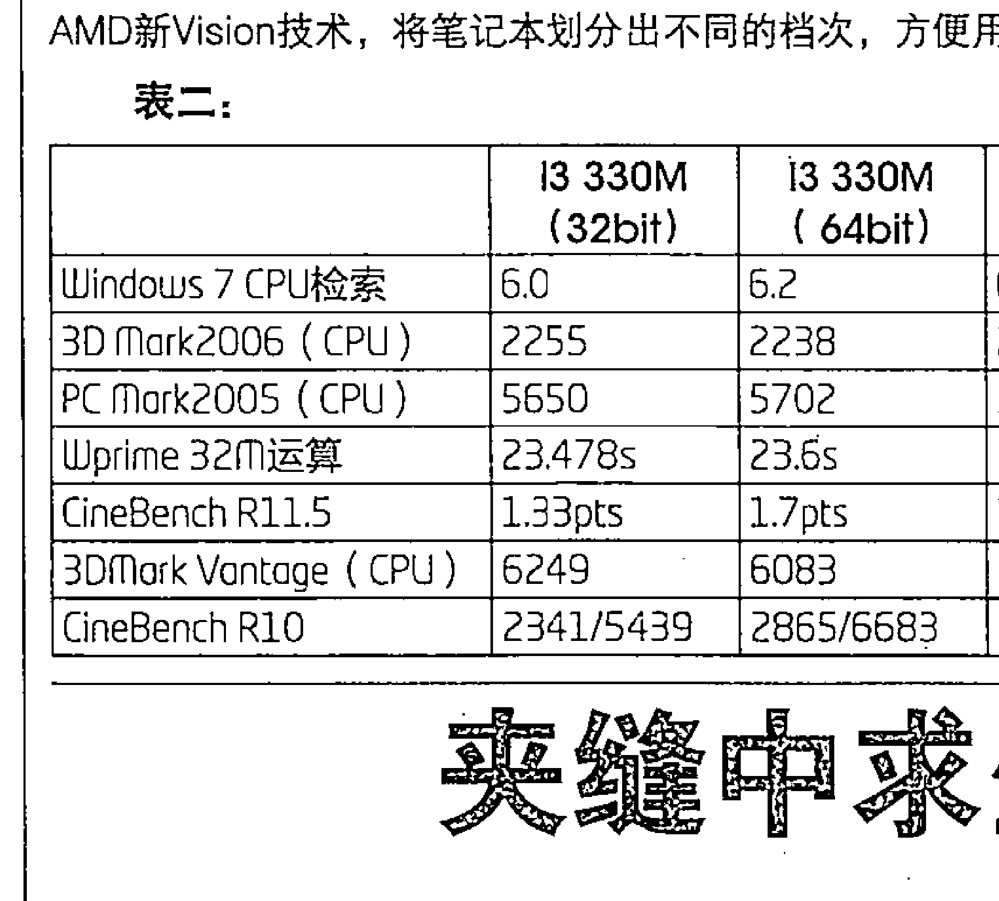

## 夹缝中求生存 电子书出路在何方？

2010年9月，亚马逊推出了全新的Kindle 3，更轻巧、翻页更快、价格仅有140美元（要知道Kindle 1的售价曾高达399美元）。Kindle的成功曾在国内外引发了一阵电子书热潮，然而在iPad一类平板设备和智能手机的夹击下又迅速降温，那么新一代的Kindle能否再次点燃电子书市场呢？

虽然打造类似Kindle 3性能的产品并非难事，但在智能手机和平板电脑的围追堵截下，很难让厂商保持对电子书的专注。对用户而言，平板电脑和智能手机都可以安装阅读软件，同样可以借助网络不间断阅读新篇章，又有什么理由选择功能相对单一、黑白屏幕无法欣赏视频的电子书呢？于是现在越来越多的电子书都开始改用传统的彩色屏，预装类似Android的系统，企图弥补与平板电脑之间在功能上的距离。

不要忘了，电子书之所以可以引发关注就在于看书不伤眼的特性，更适合长时间深度的阅读，超级省电不惧太阳光，与智能手机和平板电脑之间有着本质的诉求差异，在彩色电子纸技术成熟前，为其添加更多的多媒体元素颇有画蛇添足之嫌。

与其不断丰富电子书的功能，不如将精力放在纯粹的电子“书”上，它的出路自然在于专业级的阅读体验上。只有不断加强内容维护和建设，完善更符合用户需求与潮流的阅读操控方式才能在充斥着全能级对手的舞台上立足，毕竟专注于阅读的用户数量还是很可观的。

| | 电子书 | 平板电脑 | 智能手机 |
| :--- | :--- | :--- | :--- |
| 屏幕 | 黑白电子墨水技术 | 彩色触控屏 | 彩色触控屏 |
| 系统 | 非智能，最多增加音乐播放等简单的多媒体功能 | Android或WM或Windows | Android或WM或塞班 |
| 续航时间 | ★★★★★ | ★★★ | ★★ |
| 便携性 | ★★★ | ★★★ | ★★★★★ |
| 阅读的舒适度 | ★★★★★ | ★★★ | ★★ |

## 从独立声卡 集成声卡到是否需要声卡

从1984年第一张声卡的诞生到现在，声卡已经诞生25周年，这25年变化太大。由简单发声，到支持192kHz/24bit，从硬件波表合成，到多声道实时音效合成，每一步都精彩万分。声卡的出现，同样改变了我们的生活，数字录音变为主流，音乐欣赏习惯变了，越来越多的消费者不喜欢用碟机放音乐了；通讯方式也变了，现在可以和朋友语音聊天也无需担心高额的花费了；教学方式也在悄悄转变，多媒体教室也越来越普及……人们的生活因此改变，变得更加多姿多彩。

对于音质有更多讲究的玩家来说，应该会注意到集成声卡标称的高规格并无法确实反应在音效表现上。从我们的测试数据来看，不论是信噪比、各类失真或是频率响应曲线，都仍比不上主流声卡，而且这些反应在听感上效果格外明显。

总结起来，集成声卡与独立声卡是两条道路，一个是方便便宜拿来就用（还基本够用），一个是音质为先，其他次之。

口不同的是108AH支持2进2出，102-A+/102S+支持1进1出。

对比最常见的HD Audio集成声卡，我们可以看到无论是7.1声道的输出数量，还是44.1k/48k/96k/192kHz 24-bit的输出能力，这些集成在音箱中的USB模块实在是“不够看”。所以说，USB音箱还不如老老实实在用笔记本集成声卡。当然，如果电脑比较老旧，音箱中集成的USB模块还是比AC97声卡好一点点的。

### 集成声卡如此不堪?

虽然说声卡改变了我们的生活，并且它是个曾经辉煌过的配件，不过最近几年这一领域已经相当冷清，板载人人有，功能足够丰富。攒机时想要有块独立卡，不是没地方插，就是选择范围窄到个位数。从必选配件到可选配件，其间既有计算机系统整体飞速发展，集成度大幅提高的因素，同时，和声卡相关厂商无所作为不无关系。虽然众人仍然相信独立声卡的优异之处（比如编辑部的CT同学），但是说实话HD Audio足以满足大半人群的需求。在讲到本文主题前，我们先来探究一下独立与集成（由于HD Audio非常普及，以下集成声卡默认为HD Audio）各自的优劣势。

### 便利性

打开机箱插上声卡并不是什么困难的事情，我们说的便利性并不是指安装上的便利性，而是日常使用中的便利性。在这个方面集成声卡若说自己是第二，恐怕没有人敢说自己是第一了。

+ 其一，小螃蟹（Realtek）的一家独大让其相对简单的驱动更新速率非常快，导致集成声卡兼容性较好，BUG也较少；而独立声卡相对来说就比较苦闷了，微软的不支持加上驱动的复杂性让多数老旧的独立声卡找不到靠谱的驱动程序。
+ 其二，HD Audio有一个非常人性化的设计，HD Audio支持设备感知和接口定义功能，即所有输入输出接口可以自动感应设备接入并给出提示，而且每个接口的功能可以随意设定。该功能不仅能自行判断哪个端口有设备插入，还能为接口定义功能。例如用户将MIC插入音频输出接口，HD Audio便能探测到该接口有设备连接，并且能自动侦测设备类型，将该接口定义为MIC输入接口，改变原接口属性。由此看来，用户连接音箱、耳机和MIC就像连接USB设备一样简单，在控制面板上点几下鼠标即可完成接口的切换。即便是复杂的多声道音箱，小白级用户也能做到“即插即用”。

### 音质

### USB 接口也发声

USB接口能发声不是新的新闻，早在几年前就有很多外置声卡的推出。连声卡老大哥Creative也在外置声卡上下了不少本钱。但我们要说的不仅仅是USB声卡，还有USB音箱和耳机。

### USB声卡与独立声卡区别不大

我们常见的中高端外置原理和结构和普通独立声卡很类似，但外置的特点使得它具有了后者所远不能比拟的优势，由于外置没有了电路体积的限制，所以使得它可以设计更为复杂的模拟电路并采用更好的屏蔽设计，从而大幅度地提升音质，就算是像那个“闪盘声卡”一样不作任何加强设计，脱离了机箱内部的高电磁干扰环境以及使用USB的独立供电，这本身对于声卡音质的提升就是巨大的。

但是，USB声卡也有其不可忽略的严重不足。这种不足来自于USB总线本身。现在的USB声卡大都使用了USB 2.0接口，速度问题是解决了，但是另一个问题却难以解决——USB总线的优先级远不如PCI总线，这就使得在系统忙的状态下，USB总线往往得不到足够的CPU时间，对于大多数USB设备这没有什么问题，但对于实时数据需求量很大的USB声卡来说，就会出现断断续续的现象。

### USB音箱，集成声卡放在音箱里

如果说USB外置声卡像是把独立声卡放在了外置的小盒子里，那么USB音箱就像是把集成声卡放在了音箱里。它虽然具有USB声卡的优劣外，最重要的缺点是预算成本非常低。

以我们日常评测中的拆解来看，目前USB音箱中最常见的方案就是C-media CM102-A+/102S+（USB音箱方案）与C-media CM108AH（USB音箱与廉价USB声卡方案）。由于成本的低下，导致它们基本不能与外置声卡和独立声卡相比较，但宣传中的笔记本专用究竟比本本中集成HD Audio哪个更好一点呢？

从前面的一些官方文档可以看出这两款方案的一些参数来，E文太多看不懂没关系，我们只需要知道它们都是48KHz/44.1KHz 16-bit输出、USB2.0接。

### 不仅是本本专用，USB 外置声卡面面观

由于PCI-E声卡较少，而PCI声卡又颇为老旧，并且很多厂商对USB外置声卡颇为专注。所以导致USB外置声卡种类繁多，选择空间很大，如果对电脑音频有较大需求的用户考虑USB外置声卡也不为过，USB外置声卡也并非是本本专用。

### 乐之邦Monitor 01 US
市场报价：400元

主观评测：素质很不错，而温暖、柔和的声音更使其人声部分得到大大加强，讨人喜欢。不过，它并不适合用来听摇滚以及较高的高频，会感觉不够劲儿或者不够到位。此外此款产品是一款纯输出卡，简单讲就是没有录音和麦克风接口。

### 创新0490
市场报价：350元

主观评测：创新的老产品，采用USB1.1接口，总体保持了创新的一贯素质（缺点不多，优点也不多）。创新的声音风格一直都是有着明显的风格，这种风格并不讨好，高频明亮而尖锐，整体偏冷偏薄偏硬，玩家笑称为“水晶般的音质”。

### 节奏坦克Expert Etude练习曲
市场报价：300元

主观评测：Audimax是一块AC97架构的USB声卡，只能输出48khz采样率的模拟/数字信号。其它方面则表现得很好，特别中低频的厚度和力度感，完全没有USB设备的影子。另外值得一提的就是它内建了语音麦克风和回音消除芯片，这样一来您就不需要再外接麦克风就可与他人尽情的畅谈。

虽然说声卡越来越少的出现在我们的视野中，但其实无论是集成声卡、独立声卡还是外置声卡都在不断的创新、改进、完善，享受音乐用的是心灵而不是设备，但反过来讲心灵再纯净没有好设备也无法尽情的享受音乐不是……

## 漫步者M15 全新便携体验感受

十一长假结束了，相信有很多朋友为了方便出游购买了便携音箱，体会到了便携音箱的好处。但是相信还有不少朋友对便携音箱不够了解，那么本文就以漫步者M15为例通过五大关键字帮助大家了解便携音箱。

不需单独充电，得益于优秀的电源管理系统，在充满电的情况下M15的350mAh电池播放时间可以达到6~8个小时，就算出去玩一整天，相信M15也能轻松应对。

成，颜色表里如一，耐磨性极佳。另外M15与以往产品不同的是改用后盖支撑立起，如果不小心碰到了M15也不用担心后盖会因此折断，因为独特的设计会使后盖自动收起。

### 关键词一：200克

从名字可以看出，便携音箱最大的卖点自然就是便携了。小巧的体积和非常轻的重量非常方便携带，让你不管到哪儿都可以享受到音乐。漫步者M15采用了眼镜盒的造型设计，机身扁平，精致小巧，重量也仅为200克，非常的轻便，不要说放在背包里，就是用挂绳挂在手上甚至是腰带上或者是放在口袋里都不会让你感到负担。

### 关键词二：锂电池

作为一款便携音箱，如果和普通音箱一样需要有线的电源支持那就失去意义了。漫步者M15采用miniUSB供电接口与内置锂电池的双供电模式，在使用USB供电的时候就可以同时自动为锂电池充电。

### 关键词三：SD卡播放

既然是音箱，大家一定就认为它是为MP3、MP4、音乐手机、笔记本电脑等各种其他音源提供辅助外放的，这当然没错，但是在没有携带其他电子产品的情况下我们是不是就又只能望“箱”生叹了呢？当然不会，漫步者M15具备了SD卡直读功能，无需连接音源，只要插入SD卡，就可以直接进行播放，M15支持大部分常见的媒体格式，这使得M15不再受到音源的限制，随时随地享受音乐。

### 关键词四：够漂亮

作为一款小巧的音箱，外形美观自然也十分重要，漫步者M15造型简洁精致，前面板较平直，后面板为圆弧形，犹如一只乳白色的小船，令人爱不释手。与M1等产品一样，M15采用高光材质一次性注塑完。

### 关键词五：够好听

对于音箱来说最关键的部分就是单元，好的单元才保证了好的音效。M15采用了漫步者全新开发的1.5英寸钕铁硼磁路系统的铝振膜扬声器，音质纯澈甜美，同时配备了高效率D类数字功率放大器，提供充足的功率输出，保证了音质。此外，作为衡量音质的重要指标之一，M15的失真度要小于0.5%（实测低至0.25%），这对于一款便携音箱来说是非常出色的。

虽然便携音箱重点在“便携”二字，但是这不意味着它仅仅在外出时才有用武之地，还可以摆在床头在孩子睡觉前播放童话故事，伴他安然入眠。或者是学生朋友将外语素材拷入SD卡练习口语听力。老人们也可以用它听听评书，或者作为晨练的音乐伴奏，不受电台广告的困扰。相信漫步者M15出色的表现一定可以满足不同口味的需求。

## 榨干系统潜能 内存时序如何超？

和CPU一样，内存同样影响着整机性能，牵一发而动全身。想充分榨干内存潜力，除了提升内存频率以外，降低内存时序也不失为一种有效的手段。但对于普通用户来说，调整内存时序的效果到底如何呢？真的值得尝试吗？

### 什么是内存时序

内存时序是描述内存条性能的一种参数，在大部分主板的BIOS中可以手动调整。目前最常见的DDR3内存时序是“9-9-9-24”，这4个数字序列分别对应的内存时序参数是“CL-tRCD-tRP-tRAS”，它们的含义（见表1）。如果说对内存频率进行超频是提高工作速度，那么降低内存时序就是缩短工作前的准备流程，同样可以提升工作效率。

### 降低内存时序的时机

为了确保稳定，内存默认时序通常比稳定时序高一点。同一内存工作频率越低，可降的时序也就越低。比如频率为1600MHz的内存，当工作频率降到1333MHz时就能获得更低的稳定时序。因此，降内存时序的最好时机是：

- 一般玩家：当内存因为CPU或主板限制只能工作在比默认频率低的情况下，比如i5 750默认只支持最高1333MHz的内存，如果你错买了1600MHz内存，这时就可以降低内存时序来提高内存性能。
- 超频玩家：在超CPU外频的同时内存频率也会跟着超上去，有时为了能让CPU外频超到更高的频率需要降低内存的频率来配合CPU。当内存频率被我们降低到默认甚至比默认频率还低的时候就是降内存时序的好时机。

#### 小提示：CPU-Z看大忙

运行CPU-Z后，在“内存/Memory”选项卡中可以查看当前工作时序，切换到SPD选项卡后则可看到内存出厂时预设的时序参数。当调整时序失败后可以根据这组数据恢复到默认值。

#### 小提示：降时序莫贪心

在多数的情况下时序的第二项是比较难降低的，一般要把它设置到高出第一和第三项1到2格。降内存时序要一格一格的下调，比如8-8-8-20的可以先改为7-7-7-18，然后再6-7-6-16。如果这时候机子启动不了，就应该把时序恢复为6-7-6-18，慢慢找出你内存的最低稳定工作时序。

### 效果？用数据说话！

同一平台下，我们测试了5-6-5-16和9-9-9-24两种内存时序下的性能（见表2、3）。对内存依赖性较大的软件在降低时序所带来的性能提升还是很明显的，比如文件压缩软件Winrar的速度提升有7.37%。而在游戏速度和大部分测试项目中差距却不大，其他的测试主要看中的还是CPU和显卡的频率。

#### 测试平台：AMD 羿龙II X6 1055T（OC3.5G）+4GB内存+微星Lighting 5870+SSD 32G系统盘+希捷250G硬盘+Windows 7 64位

可见，降低内存时序所获得的性能提升有限，除非你是极致的DIY玩家，否则尽量还是不要降低时序，因为降低时序容易造成内存不稳定，容易引发蓝屏、黑屏和死机等现象。如果你想通过超频提升整机性能，优先的顺序应该是先超CPU频率，接下来是超内存频率，最后的手段才是降低内存时序。

#### 小提示：常见内存时序

- DDR2 666 4-4-4-16
- DDR2 800 5-5-5-18
- DDR3 1066 7-7-7-18/8-8-8-20
- DDR3 1333 8-8-8-20/9-9-9-24
- DDR3 1600 9-9-9-24/10-10-10-27

具体的默认时序请参考CPU-Z里的SPD选项，或者查看贴在内存条上的属性贴纸。

（文/罗家俊）

| 英文缩写 | 英文全称 | 中文含义 | 性能判定 |
| --- | --- | --- | --- |
| CL | CAS Latency Control | 内存读写操作前地址控制器的潜伏时间 | 越小越好 |
| tRCD | RAS to CAS Delay | 行寻址到列寻址延迟时间 | 越小越好 |
| tRP | Row Precharge Timing | 内存行地址控制器预充电时间 | 越小越好 |
| tRAS | Min RAS Active Time | 内存行有效至预充电的最短周期 | 不一定，通常为CL + tRCD + 5个时钟周期 |

| 游戏性能测试表 | 5-6-5-16 | 9-9-9-24 | 差距（%） |
| --- | --- | --- | --- |
| 鬼泣4 | 191.62 | 191.03 | 0.31 |
| Heaven | 27.4 | 27.5 | -0.36 |
| 生化危机5 | 106.2 | 106 | 0.19 |
| 孤岛危机 | 30.06 | 30.07 | -0.03 |

| CPU和内存性能测试表 | 5-6-5-16 | 9-9-9-24 | 差距（%） |
| --- | --- | --- | --- |
| 3DMark-06 | 20373 | 20334 | 0.19 |
| 3DMark-Vantage | 17935 | 17748 | 1.05 |
| Uprime | 7.72 | 8.059 | -4.33 |
| Winrar | 3191 | 2972 | 7.37 |
| PI | 19.781 | 19.843 | -0.31 |
| 国际象棋 | 12225 | 12145 | 0.66 |
| R11.5 渲染 | 6.24 | 6.19 | 0.81 |
| Everest内存读取 | 8970 | 8377 | 7.08 |
| Everest内存写入 | 6914 | 6885 | 0.42 |
| Everest内存复制 | 11220 | 10791 | 3.98 |
| Everest内存延迟 | 46.1 | 51.9 | -11.18 |

## VW2420H酷玩酷看 我的明基显示器

http://diy.pconline.com.cn/display/study_screen/0711/1159109.html

说起来，我的上一台显示器G900WA就是明基的，前不久看见明基新推出的显示器VW2420H，想想自己也该换了，决定入手。偶然的机会能够让我先到明基VW2420H显示器，正好可以体验一下，经过这十来天的使用，发现自己已经不能割舍这台VW2420H了。

### 《星际2》绝配游戏乐翻天

不得不说这款VW2420H非常适合游戏玩家使用，真实的静态对比度达到了3000:1，特意查了一下，这个规格是当前显示器最强之一了。不要看那种几百万比一的数据，动态对比度和对比度实际是有差别的。其实，由于动态场景分析背光调节的应用面比较窄，基本上只针对欣赏电影类节目有帮助，要是在看电影亮度时而变化，使用者看久会疲劳，因此各家显示器都把动态背光设置独立选项或者只有在影视模式中才可以开启。如果非要比拼动态对比度，VW2420H“也就是”2000000:1吧，试问哪款显示器能比得上VW2420H呢？

### 《钢铁侠2》让我大呼过瘾

既然是24英寸显示器，没有理由不看电影，尤其是16:9的比例，又是全高清面板（1920×1080），正好前一阵子《钢铁侠2》的高清片源有下载了，电影院看过一次总觉得不过瘾，立刻下载。在没有黑边的屏幕上看《钢铁侠2》，太过瘾了！颜色表现非常鲜艳，色彩极为绚丽，VA广色域面板果然名不虚传，再加上LED背光的高亮度特性，绝对是电影利器，而不得不说的是，这个显示器的亮度实在让我“难以接受”——太亮了。大多数情况下，我都是开启节能模式使用，否则感觉亮度太高了，这和我室内光线不是很有关系。特意搬到另一个屋子试了试，在阳光直射的情况下调节显示器亮度达到50%就能非常清晰的看到屏幕内容了，我的老显示器非要开到90%才可以，LED背光果然不是盖的。

玩游戏的时候，《星际2》中很多细节都可以极其细腻的展现出来，让游戏乐趣也大大提升，而且响应时间也完全没问题，灰阶8ms绝对够用了。

且，由于VW2420H是广视角面板，我和朋友能够一起欣赏，无论是正对电脑还是侧坐在电脑前，画面都能保持高度一致的色彩还原，连朋友都赞不绝口——他家的显示器根本就不能从侧面看，颜色会偏差很多，甚至是看不清显示内容。

### 外观超靓 难以言表的愉悦

除了显示效果出众外不得不说的就是外观，家人看我新买的显示器都说好看，VW2420H像极了家电产品的背部实在是太美了。而且边框很窄，比起老款显示器来说要多了点时尚气息，而且浑然一体的底座更是让显示器完美融入我的居室，想想以前电脑总是那么突兀的摆在屋子里，实在是太不协调了。

明基一直是我非常信赖的显示器品牌，从CRT显示器到LCD显示器我一直都是明基的忠实用户，不是说其他品牌不好，而是在我看来明基显示器的优点实在太突出，每一次换新显示器都能给人耳目一新的感觉。这款LED背光又具备广视角面板的明基VW2420H正是我最想拥有的。

（北京/赵辉）

## 只要99元 唯美系 学生最爱现代F-220音箱

99元能买到名牌2.1音箱，听起来如此不可思议，但它确确实实摆在眼前，而它又出自现代这样的知名大厂，99元的价格吸引力十足。

现代F-220音箱虽然是定位于入门级装机用户，但在设计上与其它入门级产品不同，“双色注塑印花”工艺使得箱体纯白素雅而不失时尚，十分迎合年轻人的口味，简单、干净。主箱体立式低音炮设计，采用高密度中纤板，正面搭载高档ABS工程塑料，经过特殊工艺打磨，光鲜艳丽，卫星箱风格和主箱一致，但是更出色的是单元上一圈黄色的点缀，显得更加生动，有点“大眼睛”的韵味。2.75英寸全频带单元下方则标注着现代金色的LOGO，配上小巧的底部支架。

F-220音箱输出功率为10W，虽然功率不是很猛，但在宿舍、小面积空间使用还算可以。F-220音箱在低频的表现方面可圈可点，虽然下潜不够，但整体声效能够接受。高频解析就比较一般，细节部分展示不够，考虑到它仅有99元的身价，这些不足完全可以接受。同时，现在购买此款音箱还赠送多功能读卡器一个，十分超值。

## 多显卡 主板的鸡肋还是大餐？

无论是AMD的785G、770、880G、890GX、890FX，还是英特尔的P43、P45、H55、P55、X58，这些芯片组大都可以通过破解或原生支持多显卡技术。对于普通消费者，咱们有必要为主板上那额外的显卡插槽埋单吗？

多了一个显卡插槽，意味着厂商要投入更多的物料成本，而只有单卡的主板，在用料成本得到更好控制下可以选用更小的版型，从而拥有了更低的售价。然而，在主板规格同质化的今天，为了凸显自己的技术实力或增加卖点，越来越多的主板都将双显卡视作了标准配置，而很多用户总感觉多显卡技术有了总比没有强，何况价格也差不了多少嘛！

为了验证1+1是否大于2，我们选用了HD5670（400个流处理器，850MHz/4000MHz/128bit）和HD5770（800个流处理器，850MHz/4800MHz/128bit）作为参考对象。HD5670在双卡状态流处理器和HD5770相同，那么实际情况会是如何呢？

三年前，高频单核CPU依旧全能，如今只有多核处理器才能笑傲江湖。显卡领域同样如此，攒机时只购买了单卡，日后当你想购买相同显卡组建SLI或交火时也未必是主流单卡的对手，而且还将换来更高的功耗。

在价格相似，主板支持双显卡只能算是锦上添花卖点，适合一开始或者短期内就打算组建双显卡的玩家。如果你一年后才有升级双卡的打算，不妨选择性价比更好的新单卡，再将老显卡二手处理掉，总之存在即是有其价值，如何选择要根据实际情况来。

（文/马甲）

| 测试平台/项目 | HD5670交火 | HD5770单卡 | 胜负情况 |
| --- | --- | --- | --- |
| 3DmarkVantage | P10792 | P9484 | HD5670交火胜出 |
| Heaven Benchmark V2.1 | 13.2 FPS | 19.5 FPS | HD5770单卡胜出 |
| 生化危机5 | 57.6 FPS | 47.7 FPS | HD5670交火胜出 |
| 街头霸王4 | 93.21 FPS | 71.53 FPS | HD5670交火胜出 |
| 功耗测试 | 218W | 206W | HD5770单卡胜出 |
| 平台: AMD X2 220开核超频3.5GHz，870芯片组，测试分辨率1920×1080，打开全部特效 | | | |

## 超频会引来“电老虎”

都说超频会增加功耗，相信各位同学的耳朵里都磨出茧子了。那么超频究竟有多费电？我们不妨来看看某论坛网友kissflow的测试，相信结果一定会让你大吃一惊的。

测试平台是目前蛮主流的高端配置：Athlon II X3 435处理器和NVIDIA GTX460显卡。只不过kissflow将X3 435开核并超频到了3.2GHz（核心电压1.27V），显卡选择的是256bit 1GB GDDR5的版本，核心频率800MHz（小心买到阉割的768MB 192Bit版本），用这两只电老虎来验证它们与超频的暧昧关系。

处理器锁定在3.2GHz，仅仅是让显卡的核心频率提升100MHz，待机时功耗就会增加40W，游戏时功耗会增加30W，还是比较惊人的吧？还有更吃惊的呢，显卡超频后单张显卡的满载烧机就突破了360W大关，要是再开启CPU满载呢？真难想象，电老虎！

| CPU+GPU频率/测试项目 | 3.2GHz+800MHz | 3.2GHz+900MHz |
| --- | --- | --- |
| 待机功耗 | 119.3W | 160.8W |
| 游戏功耗 | 260.4W | 289.1W |
| 显卡烤机测试 | 318.3W | 362.2W |

目前主流平台在不超频的情况下满载功率一般不会超过300W（请参考上一期P86页《实惠是第一位 电源功率之我见》这篇文章）。一旦你有超频需求，建议还是一步到位，选择额定功率在400W以上的电源。需要注意的是，GTX460显卡需要双6PIN供电，很多电源只有一条6PIN供电，需要留意显卡是否附赠转接线。

## 大肚能容还看硬盘笼

下载狂人、SOHO一族最心烦的事情是什么？数据的拷贝与整理，以及硬盘容量的饥饿感。这些人都有一个共同的特征，都需要用到移动硬盘。普通的2.5英寸移动硬盘的容量太小且价格太高满足不了需求，一般的3.5英寸硬盘加一个3.5英寸移动硬盘的盒子，组装在一起确实是满足了廉价、大容量的要求，但是臃肿的体积是任何人都不能够忍受的，尤其是还需要外接电源。如何能够快速安装拆卸硬盘，方便拷贝整理呢？几千元一个的家庭存储中心？那也太贵了。现在我给你介绍个新玩物，最贵几百元就解决所有问题了，这就是硬盘笼。

的空间而言，无疑5.25英寸的光驱位置是最空闲的。标准ATX规格的机箱至少拥有3个～4个5.25英寸空位，安装硬盘笼十分方便。更为关键的是，这种设备的价格十分便宜，单盘的硬盘笼价格在100元左右，即便是3盘位的硬盘笼价格也不会超过400元，很合理。

高清电影片源720P至少要4GB容量空间，1080P格式的片源最低也要8GB以上，游戏多半也是将近7GB左右，要使用USB接口拷贝，可有你等的喽！

### 硬盘笼性能“杠杠的”

不同于USB外接设备繁琐，更重要的是硬盘笼依旧采用原生的SATA接口，并支持SATA2规范，标准传输速率达到300MB/s，目前所有的单体机械硬盘都没有超过这个界限，因此不存在性能瓶颈一说，拷贝整理资料内容的时候，无疑硬盘笼非常快捷。

#### 小提示：硬盘笼的SATA2接口经过特别设计，不存在多次插拔后出现虚接的问题。

### 价格便宜很“给力”

硬盘笼占用的位置是5.25英寸位置，对于机箱内

### 单盘位整理最容易

推荐产品：WINGSONIC MRA201 价格：95元
单盘位是基础的产品，它最适合像HTPC类用户，数据拷贝时方便易用，而且这样转移数据也不需要网络，看电影的时候很方便。如果购买的是能够支持硬盘更换的高清电影播放机只需要购买一个就足够了，如果是HTPC电脑，建议买上两个硬盘笼，一个放在日常使用的电脑上，另一个安装到HTPC上，这样使用起来最方便。

### 双盘位拷贝真方便

推荐产品：ORICO 228SS 价格：115元
双盘位硬盘笼非常适合经常需要和朋友互相分享电影、游戏资源的朋友，或者你本身就是个下载爱好者。这样双硬盘复制资料内容，快速便捷。要知道，

### 多盘位达人最爱

推荐产品：WINGSONIC MRA401 价格：355元
其实不仅是推荐的3盘位硬盘笼，最多的是5盘位硬盘笼，这种产品非常适合电脑极客使用，超多的硬盘，超多的资料，没有什么比使用硬盘笼最经济实惠，同时又方便的了。不过要注意，对于要安装多盘位硬盘笼的用户，一定要注意自己的电源是否够用，普遍3.5英寸硬盘的功耗在8W～10W之间，但是在加载时的瞬间启动电流很大，电源最好不要小于350W（实标，非峰值功率）。

### 必买附件：硬盘保护盒

推荐产品：ORICO AC35-B 价格：10元
硬盘保护盒说白了就是一个塑料壳子，但是它可以防潮、防碰撞，硬盘凭空放置很容易遭到腐蚀（金属生锈等），所以一个保护盒十分必要，而且装上这种保护盒，还可以携带出门，不再需要防静电袋包裹起来了。挑选的时候，不管什么品牌，注意不要太硬的，这种塑料外壳时间久了容易断裂。一般来 说，10元左右的保护盒就足够了，不需要买太贵的，也不划算。

## 质疑还是肯定 三诺N-20G传承版 200元的2.0书架音箱

早在一个月前的三诺新品发布会上，主持人就风趣地表示，199元的4英寸三诺N-20G传承版已经获得了大量的订单，绝对会给市场带来不小震动。如今，终于见到了N-20G传承版的真面目。

2.0书架音箱是追求音乐欣赏享受的必备利器，但一款较好的书架音箱价格难以让人接受。中端市场上有三诺N-35G摩机冠军版、惠威M100等，价格普遍500元以上。而在普通人能消费得起的主流市场一直缺乏拳头产品。它的高音单元是高性能钕铁硼磁体，低音单元采用复合纸盆的设计。我们看看如何在有限的成本限制下，将音质、性价比做到极致。N-20G传承版在外型上继承了N-20G系列古朴大方的设计风格，整体造型以四方为主，在前面板的一边装配了标志性的黑色高光装饰条。整体采用纯黑的色调，相比前几款显得更加沉稳。内部菱形切角、低损耗的密纹透明网罩，即使盖上网罩也很容易看到菱形的轮廓和高低音单元全貌。外表面采用的是带有凹凸压纹的黑色木纹贴皮，做工精细。

N-20G传承版依然采用的是1英寸高音+4英寸低音的经典组合。采用两路TDA2030A功放输出，最大功率18W，在低音瞬间功率、瞬间电流方面的表现比较不错。音质上较前代也有很大的改善：高音明亮了不少，器乐的细节和层次明显。低频质感虽然不强，但至少很有弹性。整体来说，不到200元的身价，足以让它在入门级书架箱中傲视群雄。

## 管理好账单 话费节省最大化

话说移动、联通、电信谁的花费最贵？当然是速度最快的联通了！66元300MB流量很快就用光，要是能分析出自己每个月的花费都花在哪，做出合理预算，也不会沦落到过着月底没钱交话费吃包子的生活。

等情况，若不放心可手动下载。

在移动的网上营业厅可以使用“月账单查询”功能，系统会自动生成近六个月的消费分析，让你看明白到底是短信发超了还是电话打多了。联通有没有这样贴心的功能呢？

**第二步：导入详单。** 用软件直接打开刚才下载的EXCEL文件，出现数据库错误或格式不正确需重启软件。

### 小提示：

感谢网友firefly，提供了一个十分强悍的小软件，可以加载详单，分析并以图表显示。下载地址：http://www.test3g.com/thread-72922-1-1.html

电信手机详单可以按照联通详单的EXCEL文件逐条替换，即可正常导入。

**第三步：数据分析。**

**第一步：下载话费详单。** 这里有两个办法，注册联通网上营业厅，找到“详单查询”，把下面的四个分类详单都下载，在详单列表底部点击“导出”即可。第二个办法，用软件自动下载，这里需要提供手机号码和客服密码，至于隐私问题，目前没有网友反映盗用

这个小软件能实现“通话费”、“短信彩信”、“上网流量”三个类别的详细查看，精确到几点几分、目标号码、流量计算。除了查看，还能分析出当月剩余套餐和近几个月话费，使用习惯走势。

以小见大，从小处节省话费。有了图表、走势图，这个话费小账本十分完美。不仅要从使用习惯上节省话费，日常应用时，上网、聊天，如何省钱呢？咱们下期接着说。

(文/熊猫潘)

## 网购本本硬盘未必真划算

不少人都已经开始习惯于在网络上购买配件了，尤其像硬盘啊什么的，反正大家都一样，哪里便宜，哪里方便就去哪里买。

票，还送货上门。那么我们来计算一下，345元零售价，税款是5%即17.25元，再加上同城快递10元，一共需要花费372.25元，算下来还是卖场便宜。显然，网购网站上那个所谓的“市场价”根本就不靠谱。

在网购刚开始兴起的时候，行货正品的价格甚至和卖场水货价格保持一致，更有送货上门服务，自然网购划算。久而久之，当用户习惯了这种购买方式之后……你会发现，网购其实不便宜！

### 看准时机最重要

### 本本硬盘普遍贵百元

其实，不管形式是怎样的，网购也好卖场也罢，终究是个商家销售的方式而已，不可过分迷信。当然，网购也不是说就绝对不值得，这种方式在挑选时还是比较方便的，并且也较为省时。

硬盘的价格按理应该很透明，但是很多人并不了解市场行情，“网购一定便宜”的思维定式就成了用户脑中的唯一想法。举例来说，希捷5400.6 500GB 2.5英寸笔记本硬盘在某网购站点上的价格是“市场价”449元、“XX价”399元，但实际市场价格是多少呢？

此外，网购网站在特价时绝对要低于市场价格，这个时候非常值得入手。因为这种抢购环节多是为了提升人气的促销手段，并不是完全按照产品的实际价值销售。

答案是345元。也许有人会说，人家有正规发票，还送货上门。那么我们来计算一下，345元零售价，税款是5%即17.25元，再加上同城快递10元，一共需要花费372.25元，算下来还是卖场便宜。显然，网购网站上那个所谓的“市场价”根本就不靠谱。

## 你的键盘是真防水么？

别看“防浸水”和“防溅水”仅一字之差，可无论是从防水能力还是价格，都因为这一字之差产生了很大差别。

### 防浸水键盘

有特别的键帽设计。除此之外，优良的防溅水键盘还有以下几个特点：倒流孔众多，并且重要区域多孔位排水（最好有方形孔加速排水）；次要区域最低点排水；防溅水键盘的键盘支架一般会比键盘基板高出不少，这一设计可有效保护键盘薄膜电路不会受到伤害。

防浸水键盘又称全防水键盘，此类键盘一般具有以下几个特点：具备许多导流孔；内部电路经过了特殊设计，不会因进水而导致电路短路或烧毁，而且薄膜电路板采用了塑封处理，水流进入键盘内部后，塑封薄膜电路可保证键盘在短时间内不受影响；包装盒或键盘表面一般会明确标注出是否可冲洗、可浸泡，有些键盘还会标出浸泡时间。

防浸水键盘和防溅水键盘防水的区别还有防水量，前者能够将整个键盘完全浸入水中而安然无恙，而后者当水洒到键盘上应该立刻将键盘一端抬起让水沿着导流孔流出。

推荐几款在淘宝和卖场比较畅销的防水键盘：双飞燕K4-2010FS火力王光电套装（190元）、多彩潜龙手键盘（118元）、力胜KB-90优品防水键盘光学套装（60元）、达尔优KB-080（50元）。

### 防溅水键盘

(文/夜歌)

防溅水键盘与防浸水键盘最大的区别就是前者最怕水进入键盘内部，因此它除了拥有众多导流孔还

## 三星R478 我的廉价游戏杀手

| 具体型号 | 三星R478-DT01 |
| --- | --- |
| 基本配置 | i3 330M + 2GB内存 + 500GB硬盘 + GT330M显卡 |
| 入手时间 | 2010年7月 |
| 入手价格 | 5499元 |

小R的定位和联想小Y类似，都是高配低价，而且外观更“性感”，个人感觉做工还是非常不错的。我选择的小R是i3处理器版本的，买时价格不到5500元（现在价格在5300元左右），很超值。小R选用的GT330M显卡在笔记本中属于较高的水准，玩《巫妖王之怒》绰绰有余。可惜的是小R没有预装系统，还是商家帮我装的旗舰版Windows 7，速度杠杠的。

接下来说说缺点，首先就是硬盘读写声比较大，夜里安静时比较明显；扬声器的质量很一般，确实没有同学小Y的效果好。如果三星可以再大方一点，换上好的喇叭，硬盘换成静音的或者强化隔音层（换成7200rpm硬盘更好），那就算比较完美了。

不要小看小R的GT330M，简单超频可以获得超越GT335M甚至HD5730的性能。建议大家尝试微星Afterburner超频工具（下载地址：http://tinyurl.com/2965f9g），拖拽滚动条即可超频，超频后小R在3DMark06中可得8233分，比联想Y560还牛！

### 小提示：

小R没有预装操作系统，菜鸟同学还是让JS帮忙装下吧

### 小编点评：

给笔记本显卡超频不是什么技术问题，关键在于频率和性能上去了，对本本散热的考验会更高。如果你的笔记本平时就是热老虎，最好放弃超频的念头；如果平时玩游戏时热量不高，适当的超频还是可以考虑的，只是超频幅度绝对不可贪心，核心频率超频幅度不要超过 100MHz。

(洛阳/岚子)

## 数码潮人的家③

我们网罗一切好玩的、新奇的数码产品，这些宝贝在淘宝上都可以找到，并且十分物美价廉。

- ★搜索关键字：食品加热包
天气转凉，外出时能吃上热热的便当是多么惬意的一件事。有了食品加热包，不论是驾车出游，还是徒步旅行，甚至在学校、单位也能随时吃到热饭菜。通过小小的USB加热技术，半个小时即可加热包内的饭菜，而一度电足足可以使用30天。在车上用只需一个点烟器转换USB的接头，出门使用也不怕，之前介绍的USB外置电源可是个好帮手。不通电的时候还可以保存冰镇饮料，一包多用。
- ★搜索关键字：USB 暖手宝
用USB作为电源的周边产品还真不少，加热坐垫、脚垫、暖手宝一类的小玩意即实用又贴心。这个小东西发热很快，10分钟内温度可以达到45摄氏度以上，因为是5V低电压，所以很安全。手套型建议选择有腕部专利设计的护腕垫，防止腕部长期用力后过度劳累造成鼠标手。坐垫类、脚垫类产品要注意发热片位置，尽量选择面积大的产品。另外，与电热毯类似，长期使用皮肤感觉较干燥，要多补水。
- ★搜索关键字：USB 加热片
看到各式各样以USB加热片为热源的衍生产品是否很心动？买来加热片自己DIY岂不是花样更多？热水杯垫、护膝、暖水袋等等，都可以尝试。加热片一般有12V、5V等规格，功率从2W到15W不等，从圆形到方形购买起来很方便。尽量选择环保材质，避免重金属污染，升温快、安全则是重点，要向店主咨询清楚具体参数。买回来无论是连接USB接头还是外接电源，都要注意安全。

## 酷软我最大

好玩的、免费的、破解的，在这里帮你寻找。

手机QQ几乎是每一部手机必装软件，没有之一。随着新版2010的发布，共存版也以最快的速度出现。去除用于检测旧版的组件；可选3合1共存或2合1共存；整合修改图标风格、提示音补丁；修改浏览器缓存到C:\Tencent文件夹。

### 特别行动：

我分享我快乐，你可以DIY主流人气潮机的软件集合包、游戏集合包，塞班、Android、WM、Java统统可以。过关之后刊发在杂志上，同时还会得到一份小礼品以及签名杂志。记住我们的口号：好玩！免费！破解！邮箱：chaitao@cfan.com.cn

- ★QQ2010多窗口共存版
版本：Bulid0708 支持机型：S60 3rd
- ★Armageddon Squadron
支持机型：S60 5rd
飞行射击游戏，置身二战之中，3D图形界面，运行速度还算流畅。目标很简单，轰炸敌军，保护地面部队。画面贴图在同类型游戏中领先，飞机、坦克、房屋等都做得比较真实，爆炸的光影效果也很出色。

下载地址：http://work.newhua.com/cfan/201012/sjkr.rar

(文/CT)

## 《硬件厂商：我们都是软件公司》

乔布斯：好莱坞大片多出于我的Pixar动画。
NVIDIA：NVIDIA是一家软件公司。
甲骨文：Sun只是承载公司软件的工具而已。
Intel：我们拥有顶级的安全防护软件。
明明是硬件厂商为什么总是在软件上做文章呢？这是新的利润增长点，是业界的新风潮还是这些厂商的独立行为？

## 30年软硬结合之路

1986年，《星球大战》导演卢卡斯公司的电脑动画部(Pixar)吸引了乔布斯。于是乔布斯一拍脑袋，买下了Pixar公司，他想让Pixar生产一流的硬件，同时匹配一流的软件，以占领电影动画这一细分市场。

2008年8月，NVIDIA发布了CUDA技术，在打响GPU计算能力大战的同时，也让人们看到了其软件开发的潜力。

2009年4月，甲骨文以74亿美元的价格收购了Sun，弥补了自己在硬件方面的缺失。

2010年8月，Intel以76.8亿美元的价格收购全球最大专业安全技术厂商McAfee公司，虽说是意在安全领域的拓展，但其实Intel也意识到了自己在软件领域的欠缺。

### 无法发挥出的硬件性能

以上事件都发生在近30年间，我们从中能看出一个现状，硬件公司拼命在软件上发力，以求最大程度发挥硬件性能。而软件公司不停地收购硬件公司，好让自家的软件有一个良好的发展空间。其中最有意思的就是去年NVIDIA总裁黄仁勋被采访时说到的那句：“NVIDIA是一家软件公司。”这也说明了NVIDIA的意图，我希望你们花钱买到的是我们展现出的图形技术，享受到的是它所带来的便利性而不是空洞的计算能力。

说到计算能力，我们就会想起一个常见的名词——理论性能。在很多测试和官方新闻中我们常常能看到某款处理器理论性能为几何。其中最著名的就是多年前在PS3发售时，索尼称PS3使用了跨时代的处理器Cell，其理论性能超越Pentium 4 100倍。但接下来第三方测试中（为PS3安装了Linux系统）Cell却仅仅略胜Pentium 4，这其中索尼说大话的一部分因素，但其实也有软件制约的原因。

而Cell讲究的是并行，初期许多程序用PPE来跑通用运算（计算数字），把SPE当SIMD用来跑矢量计算（简化公式），是因为在传统处理器上留下的习惯。这么用的结果就是PPE性能不够用，而SPE多得不知道怎么用得上。而Cell的实际设计思路是PPE作为一个控制者存在，而实际工作是交给SPE去执行的。正是由于软件开发的传统思路使得Cell能力无法发挥，当然也有一部分原因是PS3中的Cell其实是阉割版。作为游戏机这种封闭的主机尚且如此，拥有众多硬件组合、硬件型号的PC更是由于软件对于硬件的利用率低以及考虑兼容性而拖累至今。

不得不说的是此时众多的硬件厂商还没有发现这个问题，在自己的宣传中、产品说明中还一次次的标注着新架构、高性能等等名词。殊不知没有好的软件支持，硬件性能无异于纸上谈兵。

#### 软硬结合让产品富有竞争力

什么样的产品激起用户的购买欲？如今流行一个词叫做用户体验。何为用户体验，它是一种纯主观在用户使用产品过程中建立起来的感受。它分为几个方面“有用、易用、友好、视觉设计、品牌”，其中有用、易用、视觉设计都与硬件息息相关。

##### 有用

一款硬件产品从设计到成品要经历几个月甚至几年的时间，而在这之前就应该知道它究竟能用来做什么，或者说它的强大性能可以为那些领域带来变化。举个例子来讲，NVIDIA的CUDA就是一个充分利用GPU闲置资源的技术，当游戏无法用尽显卡资源的时候，这个时候过于高端的显卡就显得没有必要。于是NVIDIA让显卡去计算，鼓励并资助了一大批CUDA软件，其中视频编解码、图像优化等方向成为了最引人瞩目的地方。

##### 易用

易用最简单的讲就是说产品要让用户一看就知道怎么去用，而不要去读说明书。当然把功能简化成一项、按钮简单成一个勉强也算得上是易用。而我们这里说的易用是将繁杂的功能和众多的操作进行简化，将硬件性能体现在反应时间、等待时间上的减少。多点触摸取代鼠标就是这样一个趋势，但你若将其安装在486上，硬件性能上的制约也无法称之为易用。

##### 视觉设计

可能有用和易用是仁者见仁智者见智，但视觉设计应该是大家最容易理解的东西，漂亮是最容易激起购买欲（尤其是女性用户的购买欲）的东西。而硬件产品的漂亮不是体现在外观上，而是软件的界面、游戏的画面上。为什么说日本游戏可以用很烂的主机性能达到很好的视觉效果呢，原因就是其美工的精工细作。但同样这是有一个下限的，你若让其在486上设计游戏，他们也是无可奈何的。

总而言之，把这些做好，那么用户体验就会贯通上升到品牌。硬件与软件相结合而构成的优秀用户体验足以激起购买欲，这些都值得硬件厂商去深思，去考虑未来的发展和前途。

#### 纯粹的硬件厂商将会消失

由于硬件与软件的密不可分，将使得硬件厂商的发展有两条路可走。一条是纯代工之路，像富士康、台积电、台联电一样。你设计好了，我给你制造，是否能发挥硬件性能，是否能有好的用户体验与我无关；而另一条就是没有工厂，设计硬件+开发软件。我卖的是打包方案，硬件设计好去找代工厂，安装上我写好的软件和为第三方软件提供的接口，以达到最佳的用户体验及性能发挥。纯粹地卖硬件将会变得无所适从，注定会消失在市场的大潮中……

## 随心所欲 笔记本显卡也能一键调频

想让笔记本显卡随心调频吗？玩游戏时让频率超出默认值加速，闲暇时把频率降到默认值以下，让电力更持久。最关键的是，一键就可以实现不同频率间的切换，不用怀疑，只需一款软件就能让这个梦想成真！

| 用途场景 | 核心频率 | Shader频率 | 显存频率 |
| :--- | :--- | :--- | :--- |
| 玩大型游戏 | 700MHz | 1750MHz | 900MHz |
| 玩主流游戏 | 650MHz | 1625MHz | 850MHz |
| 默认状态 | 600MHz | 1500MHz | 800MHz |
| PS和电影模式 | 500MHz | 1250MHz | 650MHz |
| 上网模式 | 450MHz | 1125MHz | 600MHz |

## 简洁界面调频便捷

NVIDIA和AMD显卡官方驱动的控制面板虽然可以调整频率但都无法实现一键调频，在这里向大家推荐一款微星推出的MSI Afterburner软件，可以很方便地实现超频和降频的操作。

MSI Afterburner软件界面很简洁，窗口左边是频率调节窗口，右边是状态监控窗口，只需拉拉标杆，点击Apply按钮就能实现频率的调整。

## 一键切换随心所欲

MSI Afterburner可以保存五种配置信息，调整好频率后点击Apply按钮确定，再点击Save按钮，旁边的五个序号为1~5的按钮会变成绿色，点击其中的一个按钮后该按钮会变成白色，表示已保存当前的频率设置。根据需求改变频率，重复上述设置可保存更多方案。

以笔者的GT130M显卡为例，根据五种应用模式设置了不同的频率组合，每次切换时只需选择对应的方案保存序号，然后点击Apply键就OK了，你说简单不简单？

小提示：
调整核心频率部分有一个标有“∞”的菱形灰色按钮，可以让核心频率与Shader频率互动，建议使用默认状态；风扇转速也建议不要修改，让风扇随显卡温度自动控制。

## 谁说低价等于低性能？ACER 4551G告诉你OUT了！

作为“月光族”的代表，小弟的口袋实在羞涩，虽然希望拥有性能出众的“游戏本”，无奈用于购本的预算还是被卡在了4000元大关。在网上参考了多款产品后，最终选择了ACER Aspire 4551G这款产品，AMD双核平台，售价不到3900元，综合配置很好很强大。虽然4551G也有三核处理器的版本，但在性价比上就不如Intel平台的4741G系列了。

4551G的显卡很给力，HD5650可以在高画质下流畅玩WOW，最高特效跑生化危机5也没有低于30帧的情况，游戏性能很满意。CPU虽然弱一点，但不会构成瓶颈。超强的显卡和较大的硬盘，在同价位的机型中绝无仅有。用4551G上网时很凉快，基本感觉不到热，只是跑大型游戏时出风口有点烫手，不过掌托还好。

4551G的优点多多，但缺点也是显而易见的。首先就是没有安装系统，选择网购的同学要先做好安装系统的功课；机器喇叭效果一般，音量也不大；光驱读盘时噪音很大，而且和机身接合的不严实，从D面可以看到比较大的空隙。不过就不到4000元的价格和超强性能来看，这些缺点还是可以接受的，不是吗？

具体型号：ACER Aspire 4551G
基本配置：AMD P320+2GB内存+500GB硬盘+HD5650显卡
入手时间：2010年9月
入手价格：3850元

小提示：
4551G随机光盘中包含XP和Win7驱动，安装XP系统记得提前在BIOS中，将Main项下的SATA Mode菜单改成IDE模式，否则会蓝屏哦。

健圣点评
从欧巴桑的使用感受来看，4551G的确证明了低价笔记本同样拥有不俗的实力，虽然AMD平台在测试数据上可能和Intel平台存在一定的差距，但实际体验上的确很难察觉，何况HD5650显卡足以弥补P320的性能缺陷，较同价位i3和G310M之流的产品性能更为强劲。
(北京/欧巴桑)

## 固态硬盘大餐何时享？

2008年，固态硬盘(SSD)开始出现在人们的视野中，这种产品采用闪存作为存储介质，没有机械零件让它具备了很好的抗震性，同时在寻道时间上（由机械硬盘的磁头寻道变成电信号擦写）达到了前所未有的速度。但是，两年过去了，固态硬盘似乎依旧是DIY发烧友的“专利”，这道大餐，普通用户何时才能享用呢？

### 观望还是行动？

其实，这2年来固态硬盘的发展不可谓不迅猛。我们简单列举一下不同厂商的各种态度便可知一二。

-   芯片级厂商：Intel: 倡导SSD的主导企业，从技术到产品一应俱全
-   传统硬盘厂商：希捷：从完全否定（希捷总裁语：欢迎把硬盘厂都卖给我们，机械硬盘生命力很旺盛）到推出混合式硬盘只用了2年时间；西部数据：从不置可否推出企业级固态硬盘；三星：努力提升机械硬盘市场份额的同时大力发展闪存业务
-   存储器厂商：PNY：试水SSD；OCZ：积极布局SSD业务，产品丰富多样，更新迅速；PQI：试水SSD市场，推出了几款相关产品，观望心态严重；A-DATA：推出SSD产品，布局市场；金士顿：推出SSD产品时机并不急切，但决心坚定

### 山寨厂商

在调查中记者发现，金士顿的SSD产品如入门级30GB规格售价折算下来1GB不足20元，相比2009年高达近50元每GB的价格要低了一半还多，降价幅度非常大。而且根据了解，金士顿目前的30GB SSD产品出货量的80%多，发展也十分迅速。

显然，无论是哪一个厂商，在SSD产品的先期布局上其实都明白一个道理：SSD成为主流产品是必然的结果，时间是唯一的悬念。在近期的采访中，金士顿亚太业务行销副总裁陈思珂就认为，SSD在性能方面的优势非常明显，绝非机械硬盘可以媲美。至于普及流行，陈思珂非常坦诚，他表示这和先有鸡还是先有蛋的道理一样：“用户需求扩大了，厂商的生产积极性会提高，产能扩大会带动产品价格的下降，因此购买门槛就会降低。”

### 山寨大军不靠谱

IT业界近两年有一个有趣的现象，山寨做什么就说明什么产品“火”。2009年各种山寨SSD产品纷纷推出，粗略计算一下有近15个品牌之多，充分证明了SSD产品在用户心中被接受的程度有多高。但是在2010年下半年开始，山寨产品快速撤出，难道是这个产品“虚火太旺”？

陈思珂也谈到了这个问题：“其实这是正常的市场淘汰机制，从根本上讲，山寨品牌在这个特殊的领域不容易站稳，尤其是SSD产品最重要的存储芯片目前主要由三星和东芝生产，在货源的供应量上，自然优先保证金士顿等重要品牌，产品品质也有保障。而山寨厂商的货源供应不够稳定，再加上近两年来像金士顿大力推广SSD产品，价格也滑落到与山寨品牌几近相同的地步。无论从哪个方面看山寨品牌都没有太好的竞争优势，退出也是很正常的。”

不仅如此，陈思珂还提示记者留意，在品质上，无论是哪一个企业，哪种技术、用什么方式生产（人工、机械化全自动），都存在良品率的问题，尽管这个几率非常非常低。而山寨企业的良品率几率就会因为技术实力的差距呈几何式增长。同时，有实力的企业可以为用户提供完善的售后服务，如果你不幸“中奖”，企业会非常负责的为你进行更换。但山寨产品可能会做了几天就没有这个品牌了，售后服务根本无从谈起。

### 现在享用还是等待为主？

不过也有很多用户认为，即便是现在，价格依然是重点，尤其是机械硬盘的价格一降再降，固态硬盘看起来并不便宜。陈思珂打趣到：“首先是性能上的差距，SSD的性能机械硬盘无可媲美，先用先享受的道理其实大家都懂，很多人买手机是为了功能、外观，因此很少有人会买2年前的手机。SSD也是如此，也许两年后这个小容量的SSD价格会非常低，但是你还会买吗？”

## 平板挑战iPad：输在起跑线上的竞赛

毫无疑问，苹果iPad让早已死寂的平板电脑市场再度沸腾。与此同时，无论是数码厂商还是传统电脑企业都开始虎视这块香喷喷的蛋糕。那么，二者之间谁能胜出？

### 数码厂商：积极备战

在iPad撬开平板世界大门之后，最早跟风的就是以手机、MP4为代表的数码厂商。纵观时下可以买到的平板电脑，大都是MP4领域熟悉的面孔，而以摩托罗拉、HTC等为代表的手机领域大佬们也即将全面投入到平板电脑战场。在淘宝搜索一下，更多千元级的山寨类iPad会将你的屏幕撑爆！

### PC厂商：困难重重

和众多数码厂商积极备战平板电脑相比，传统PC厂商的反应有些迟钝了。以联想为例，年初联想某高层还表示用户不喜欢没物理键盘的平板电脑，待iPad热卖后如今也宣布年底将会以“乐Pad”迎战，态度的转变历经半年时间，由此可见传统PC厂商在平板电脑领域的“迟钝”反映。

PC厂商态度的不明朗也是有苦衷的。和数码厂商不同，平板电脑算是智能手机市场之外的扩展，也是下一代MP4发展的方向，和原产品线只有互补的关系。而PC厂商则不同，既要面对苹果iPad耀眼的光环（价格高于iPad，人家为啥选你啊），还得担心平板电脑对旗下上网本和主流笔记本的冲击，毕竟这些才是自己的核心业务。平板电脑技术门槛相对较低，在山寨企业和跨行业品牌激烈的价格竞赛中利润几何？

用户喜欢iPad，喜欢超薄的身材、超长的待机时间和那流畅的多点触控体验。微软高级产品经理Greg Sullivan在Windows Phone 7发布会上曾表示Windows Phone 7现阶段并不适合平板电脑，至于桌面版的Windows 7就更甭提了（需要高配置支持，意味着产品会更厚更耗电）。如今最有实力媲美iPad体验的系统就只剩下Android，实际上现在已经推出或即将上市的平板电脑大都是Android阵营成员。最关键的是，数码厂商特别是手机厂商已经有了驾驭Android系统的经验（比如摩托罗拉和HTC），而传统PC厂商则一直在微软的圈子里交流，鲜有涉足Android领域的经验，在最核心的系统研发上已经慢了半拍。

### 起跑线上已见输赢

近日英特尔CEO保罗·欧德宁公开赞扬了苹果iPad，肯定了平板电脑将会有快速发展，同时承认平板电脑会影响PC销量。但这些并不会阻碍英特尔正视平板电脑市场的决心。因为人家卖的是平板电脑的硬件平台（Atom芯片Oak Trail），推广的是MeeGo系统（可用于平板电脑），都是能给自己带来利润的产品，少卖出的笔记本芯片的损失可以通过这些新产品补齐。

但PC厂商呢？每卖出一款平板电脑就可能会损失一个潜在的笔记本客户，这是谁都无法回避的问题。根据分析机构iSuppli的预测，2012年苹果iPad仍占据61.7%平板电脑的市场份额，留给PC厂商仅有四成的空间，还得跟善打价格战的山寨、擅长规则的数码企业竞争。

未来的平板电脑将是一场耐久的拉力赛，贵在坚持。传统PC厂商顾虑重重，在起跑的时候很难占到便宜；而数码厂商则会高歌猛进，在一片蓝海中寻求突破。

## 骨灰级玩家的神器 我家的“外星人”M15x

不得不承认，我在选购爱本上是头脑发热，花了15000块大洋配备了戴尔“外星人”M15x。老实说，我还有点怀疑M15x的性能，究竟值不值15000元，当我第一次使用后就留下了深刻的印象：没挑，我选对了！M15x是一款超酷的旗舰级产品，机身造型简洁，轮廓硬朗，顶盖上的金属外星人的眼睛在开机后会投射出夺目的红光，外形的确在开始就征服了我的心。不过，我其实最看重的还是配置，GTX 260M绝对是笔记本玩家心中的神器，只是标配的硬盘太小，只有320GB（还好是7200rpm），这个价位怎么也得提供固态硬盘吧？

本人最喜欢的就是体验最新的游戏大作，不过就那些欧美大佬开发的游戏都是低配杀手，我买这个游戏杀器就是专门治服大佬的游戏的。嘿嘿，我在1080P中开全部特效竟都能流畅运行《生化危机5》等大型3D游戏，绝对震撼，可以说在此领域鲜有对手。

不过如此高的配置问题也就来了，首先说重量，M15x的重量一度达到了4.286kg，究其原因就是夸张的散热系统，所以看重便携性的用户就不要考虑了（便携性评分可以考虑给0分），M15x的电池寿命很凄惨，玩游戏的话一般也就一个多小时，热量更是高于普通主流笔记本，建议大家买个笔记本散热垫。

最后说一点，如果你想网购，就比如说我，最好是在戴尔官方网站或戴尔在淘宝的官方旗舰店购买，这样品质和售后都有保证，而且淘宝官方网店还会随机送一点笔记本的配件，我就得了一个散热垫，很好吧！

| 具体型号 | 戴尔Alienware m15x |
| :--- | :--- |
| 基本配置 | i7-7400M+4GB内存+320GB硬盘+GTX 260M显卡 |
| 入手时间 | 2010年8月 |
| 入手价格 | 14999元 |

### 小编点评：

M15x的确是经典的游戏本，只是高昂的价格会让不少同学望而却步。对于大多数喜欢游戏的玩家，只要选择配备NV GT425M或AMD HD5650级别显卡的笔记本就足够了，省下的钱不如多买几期《电脑爱好者》杂志吧！

## Intel还是AMD？ 谁是低价上网本的最佳搭档

如今一线品牌10英寸上网本的价格大都降到了2500元以内，入手时机已经成熟。小明怀揣现金到卖场走了一遭，却发现上网本也在上演着Intel和AMD之间的龙争虎斗，那么两大平台谁更值得选呢？

此价位Intel上网本平台主要以Atom N450和N455为主，均集成GMA 3150显卡，后者支持DDR3内存，价格相似的话可优先考虑后者。AMD平台则以Athlon II Neo K125和V105为主，其中K125的竞争对手本来是比上网本更高端的超轻薄ULV笔记本平台（以11.6英寸产品为主），因此性能要比Atom整体高出不少，它们之间的性能差异请参考下表。

### AMD：更善于影音娱乐

从测试成绩来看，AMD平台性能更强，除了CPU本身架构的优势以外，ATI Radeon HD4200集成显卡也是功不可没。与Intel上网本现役的GMA 3150相比，除了具备更出色的图形性能外，还支持完美的高清解码（Intel上网本最多可以流畅播放720P影片，打开HD4200显卡硬加速，欣赏1080P影片时CPU占有率只有30%左右）。

### Intel：更节能 人缘好

虽然在性能上不占优势，但Intel Atom N400系列已经将CPU和显卡合二为一，有利于厂商设计出更薄的机器。同时耗电量也有所降低。最重要的是，Intel上网本平台得到了几乎所有厂商的支持，而AMD上网本阵营则只有联想和ACER苦苦支撑，用户的选择余地较小。

| | K125 | V105 | N450 |
| :--- | :--- | :--- | :--- |
| 主频 | 1.7GHz | 1.2GHz | 1.66GHz |
| TDP | 12W | 9W | 5.5W |
| 芯片组 | RS880M+SB820M | | NM10 |
| 集成显卡 | ATI Radeon HD4200 | | GMA 3150 |
| SuperPi 1M | 46s | 67s | 89s |
| CineBench 10 | 1455 | 1051 | 899 |
| PCMark2005 (总分) | 2248 | —— | 1594 |
| PCMark2005 (CPU) | 2737 | 1940 | 1426 |
| PCMark Vantage | 1827 | 1426 | 1258 |
| 3D Mark2006 (总分) | 1481 | 1402 | 158 |
| 3D Mark2006 (CPU) | 732 | 523 | 486 |
| 4400mAh电池时间 | 4小时以上 | 5小时以上 | 5.5小时以上 |

### 如何选还得看需求

Intel平台上上网本型号繁多，品牌和样式的选择余地更大，2100元左右就能买到配备N450处理器的产品，如果你喜欢个性的外观和性价比，现阶段Intel平台上网本更值得选择。不过，如果你想在上网本上随时体验《魔兽争霸3》一类早期的3D游戏，拥有更强图形性能的AMD平台上上网本也是不错的选择。

## 以质取胜 金河田E01

作为机箱、电源行业的领头厂商，金河田能在音箱市场立足，质量当然没的说，以质取胜是最好的“广告”。从负离子音箱到环保的3G系列音箱，金河田做得有声有色。E01就是金河田在今年力推的几款音箱中的一员悍将。

### 高质量、高性价比

金河田E01音箱的黑色整体色调，突出了金河田一向的专业气质。主箱体中间放置的低音炮倒相孔，搭配金属质感强烈的音量旋钮，整体风格颇为硬朗。而倒相孔四周设计的红色边缘点缀，补充了一定的时尚元素。前置倒相孔的好处就是在使用大尺寸单元的同时，不增加低音炮体积，而且工作时产生更大的低音推动力和更深的低频下潜。

E01的主箱体要比同类4英寸产品略矮，但是搭配四只足足有3厘米的垫脚，显得它更稳更扎实，从主观上讨好人。在后面的听音感受中，也证实了这一点，高垫脚、厚重箱体的设计对低音的增益有一定影响。卫星箱整体风格与低音炮相得益彰，纯黑色的外观搭配白色扬声器，造型很经典。而具有点睛作用的红色弧线装饰的恰到好处。

### 对笔记本键盘指示灯说拜拜

小李的笔记本没有大写切换 (Caps Lock)、数字小键盘 (Num Lock) 和卷动锁定键 (Scroll Lock) 指示灯，每次切换录入时只能尝试性地按下Fn+切换组合键，工作效率大受影响。如果你也经常被上述问题所困扰，不放尝试下面这个软件哦。

Keyboard LEDs这款免费软件 (http://work.newhua.com/cfan/201023/led.zip) 可以将上述指示灯显示在系统右下角或者屏幕上。下载并安装后直接运行，在 “Tray Icon” 标签下可以将灯号以Windows系统托盘图标来显示，你可以设定三个键盘指示灯要显示的位置及颜色。在 “On Screen Display” 标签下可以用文字来显示键盘的灯号，只要将要显示的键盘锁定键打勾，并设定背景色、文字颜色及透明度，就可以在屏幕右下角显示了。

对于Win7系统，可以将软件图标从隐藏的程序组中拖放到任务栏上释放，如此一来在录入文字时再也不需要找键盘上的指示灯了，通过屏幕显示就能轻松掌握目前的键盘状态。

(文/罗勇)

### 读卡、USB 播放样样不少

如今支持读卡、USB播放的音箱不在少数，中低端产品中也较为常见。金河田E01的主要调节旋钮均位于倒相孔的一侧，银色的调节旋钮不但美观大方，更是方便了用户的操作。低音炮前面板的左下方，设计黑色面板的SD卡和U盘输入接口，拓展能力不错。不开电脑听音乐，这样的方式更便捷同时也更为环保。播放功能比较直观，三个按钮、一个指示灯使用户在使用时一目了然。

### 低音量足、高音通透

25W的额定功率，对付E01的单元尺寸还有余量。得益于大功率和合理设计的前置倒相孔，无论在低音的量感上，还是下潜深度都值得评价。整体音质表现可圈可点，中音坚实有力，解析人声准确，高音的乐器表现虽然没有想象的好，也能满足一般人使用。金河田有机箱和电源为基础，E01的用料和做工都比较有保证，针对入门装机市场的定位也比较准确。低音足、中音准确、高音中等偏上，典型的电影音箱，推荐爱看电影的朋友使用。

## 导航仪 “X99元” 的选择

导航仪为什么那么贵？如果是放在去年，这个问题的答案，或者说理由有很多个：外壳模具贵、正版地图软件贵、生产升本高……当然，还有利润高。动辄千余元的GPS甚至可以称得上便宜货，要知道不少中高档汽车上使用的GPS导航系统大多是5000元~1万余元。但是现在，随着不少品牌杀进800元、甚至500元一线时，厂商再拿种种理由解释就不那么厚道了。

### 谎言一：地图成本太高

无疑，导航地图的采购成本是最贵的，无论是凯立德、高德还是城际通等等导航地图软件供应商，他们每年投入研发的成本接近亿元。但是，随着GPS产品授权费用的不断降低（批量授权给厂商预装），这个成本完全可以在承受范围之内。别忘记，通常GPS导航仪厂商提供的都是有限度的升级服务，一年～三年而已。

### 谎言二：模具外壳太贵

一个漂亮的外壳是吸引消费者目光的重要方式，这个外壳的成本说白了：越漂亮就越贵。但是究竟有多贵呢？一般来说，最普通的外壳开模费用在20万元左右，如果是特殊设计的外壳，费用最高可能达到百万级别。但是，由于现在的GPS导航仪需求量非常高，所以这个成本可以很容易被稀释掉。此外，就目前来看绝大部分GPS导航仪产品都是采用公模设计（开模费用非常非常低）。

### 谎言三：配件采购成本高

如果时间倒退回2008年~2009年，这个情况确实存在，基板+各种处理器、DSP芯片等等，造价显然不便宜。但是自2009年下半年开始，不少芯片厂商提供了完整的解决方案——一套成熟的设计直接供应给GPS导航仪厂商，这些厂商要做的无非是组装、生产和包装和行销。甚至连GPS系统软件设置都不用太费精力，一旦功能单一的各种芯片组合变成完整的解决方案，对于厂商来说，生产制造的成本、难度、时间都会少很多。

2010年的GPS导航仪产品已经数不胜数，大大小小的厂商都想进入这个领域分一杯羹，在功能近似的情况下，杀价其实是厂商屡试不爽的方法。所谓的三种理由，在今天看来都已经是100%的谎言了，高价GPS也许会多出几个特点，但真的为了某几项功能的突出表现付出成倍的资金吗？

## 充电电池的那些事儿

### 镍氢还是锂电？

电池与我们的生活息息相关，几乎所有的设备都需要电池的支持，比如游戏手柄、遥控器等等。但是，大多数情况我们都把目光集中在手机、MP3等设备的专用锂电池上，反而忽略了我们身边这么多年一直在使用的AAA、AA电池了。

### 充电技巧有五招

1.  镍氢充电电池出厂时都会带有少量的电，使用时应先将电池中的余电耗完再充电，这样反复3~4次，可以有效激活电池，使电池达到最佳状态，延长使用寿命。
2.  镍氢充电电池有诸多容量，比如1500mAh、2000mAh、2500mAh等，不要将其混在一起使用或者充电。不同型号、不同厂家品牌之间也是如此，即便容量规格相同也不行，新旧电池混搭也不行，因为充电电池的容量和体积之间存在差异，就像三洋的eneloop电池具备自放电抑电功能，并且可以在低温下正常工作，倘若与其它混用，可能导致电池放电不完全或者过放，造成电池特性丧失不说，还有可能损坏电池。混充则容易过充，造成电池漏液。

小知识：电池根据能够重复利用分为一次电池和二次电池，其中二次电池也就是平时说的充电电池。常见的碱性电池就是一次电池，而充电电池主要有镍镉、镍氢、锂离子三种。

## 无线耳机 无限享受

2010年将会是国内音频市场的无线之年，而技术最成熟、连接最稳定、音质最出色的2.4GHz数字无线技术，将注定要在这一波无线音频大潮中扮演“技术支持”角色。因此，新年伊始，国内众多耳机厂商，就立即纷纷推出了自己的无线产品。

在传统意义上认为，应用于民用产品近距离传输的无线技术上还存在着不少弊端，FM容易受到干扰，蓝牙传输数据量小，2.4G有延迟，WiFi功耗较大，Kleer目前还不成熟等等。由于这些物理特性上的局限性客观存在，导致人们对于无线产品都有“音质好不？有延时？”的惯性认定。但是事实上，同一种规范，采用不同的芯片方案、不同的设计思路、不同的制造工艺，最终所诞生的无线产品也有可能大相径庭。

而无线大厂雷柏在掌握2.4G无线核心技术的前提下，推出的一系列无线产品都颇受关注。当然除了要求有较好的性价比之外，还存在着其它的多种要求，例如多种颜色、轻便……所以，想要真正满足这些用户，尤其是一些女性用户的口味，雷柏仅靠之前的几款产品是不够的，雷柏H3000就是这样一款重外观而不轻品质的产品。

### 靓丽可人的外形

雷柏H3000无线耳机整体风格轻盈灵动，造型简单清晰，超纤细的头梁，让人在第一时间就想起了铁三角的时尚名器ON3。作为一款2.4G无线产品，雷柏H3000无线耳机官方报价也为199元，简洁风格在优化产品造型的同时，也确实降低了产品制造成本，从而使得产品价廉物美。

耳机采用的是可翻转耳罩设计，左右耳罩可以向内侧翻转、放置在同一个水平面上。耳罩与头梁结合部位看上去非常简单，但牢靠程度不可置疑。在耳罩可翻转设计之外，耳机头梁还支持长度调节，从而能够轻松适应用户头部轮廓，增强佩戴舒适度。

耳机耳罩内侧还有一层皮革包裹着的泡沫耳垫，耳垫触感很柔软，细腻质感宛如触摸在动物的皮毛上一般。耳机耳罩比较小，在佩戴中是压在用户耳朵上的，轻柔的触感，轻盈的机身，能够大大增强这种“轻量级”耳机的佩戴舒适度。

小知识：Kleer的无损数字传输是一种基于2.4GHz频段的技术，它和蓝牙、2.4G无线射频一样采用数字方式传输。但是因为在传输协议上并不相同，它在2.4GHz频率上可以传输无损的CD质量数字立体声音频。但其缺点也非常明显，成本高（实体产品在4000元以上）、无法使用麦克风使其在近几年内无法普及。

## 找出节能模式下速度变慢的“杀手”

阿龙是一个环保主义者，无论接通电源还是使用电池都习惯将笔记本的电源模式设置为“节能状态”。然而新购入一款笔记本后，如此设置却出现了CPU占有率经常达到100%的现象，连上网都变得一卡一卡的。对于一些散热性能不佳的笔记本而言，出现这种情况大都可以通过电源管理设置解决。

当笔记本电源模式在节能状态时，虽然CPU和显卡频率会降下来，但散热风扇也会变成默认的“被动”（温度达到临界值才工作）模式，如果笔记本散热效果不佳，当CPU温度积累到一定程度就会引起CPU占有率100%的情况。解决方法很简单，右键单击桌面右下角的电源图标，选择“电源选项”，点击节能模式右侧的“更改计划设置”，依次进入更改高级电源设置→处理器电源管理→系统散热方式，将其从“被动”改为“主动”。

不过总体来说，雷柏H3000是一款特色十分显著的个性产品，它给用户带来的第一视觉效果也非常清新浪漫，前卫时尚的产品形象塑造得很成功。而且在轻盈的身形下，耳机功能也很完整，造型设计、按键布局能够解决用户的实际使用需求，显得简单又易用。加之不错的音质，是一款非常不错的产品。

## 信号不好？无线耳机增强有妙招

无线耳机的概念虽然推出了很久，但是似乎一直没能成为人们的主流选择。除了不可忽视价格因素之外，往往不能达到厂家标称的工作距离似乎让用户有了无形的束缚。是耳机质量不合格造成的吗？还是使用方法有问题？本文就以宾果B600无线耳机为例，教大家怎么让无线耳机的工作范围达到最大。

作为最便宜的无线耳机，宾果B600目前的价格与有线耳机的价格十分接近，118元的身价极具吸引力。B600采用目前主流的无线2.4G传输方式，工作范围为30米，做工及细节方面也和中高端产品不相上下。以大家都能买得起的无线耳机为例，聊聊无线耳机的增强之术。B600标称传输距离为30米，但是在实际使用过程中可能会出现达不到30米的情况，这并不是耳机本身的质量问题，而是使用方式的问题。

### 多方面入手根治无线不灵

和有线产品一样，无线产品的整个工作过程分为接收和发送两个部分。最简单有效的方式就是配备高性能的专业天线。由于耳机天线是内置的，并且宾果B600市面上没有配套的更高等级的天线产品出现（对于绝大多数无线耳机都是如此），所以更换天线是不可行的。而拉近与发射端距离更是违背了我们的初衷。

无线耳机的发射器是通过用USB接口取电的，由此不能通过增大电流的方式提高其发射功率；如果一味的提高发射功率，不仅对使用者有一定的影响，在没有匹配的发射天线驻波的情况下会造成发射机的烧毁。那么我们就需要把USB接口通过一根USB延长线延长，由此可以将耳机的发射器摆放在较高的位置，避免了本来周边障碍物的屏蔽，以此大幅改善发射效果。

最后要注意的是环境，对于无线耳机通讯范围影响最为明显的就是屏蔽和电磁干扰。当然这一般在办公环境是不会出现问题的，但是在家庭中由于家具电器很多，屏蔽就会比较明显。例如无线耳机在穿墙使用的时候就会明显感觉音质的下降和断续。使用环境中的无线路由器、电磁炉、无线2.4G鼠标等都会对无线耳机的通讯范围造成影响，这在无线耳机的使用过程要多加注意，尽量使无线耳机的使用范围内保持空旷。

通过以上方法，我们发现宾果B600的通讯距离可以轻松突破厂商标称的30米，已经完全可以满足普通家庭用户的使用需求。

## 为中小企业减负 联想云端服务

继成功支持北京奥运会之后，上海世博会中，联想再次担当了重任，总运营顾问咨询、集成信息化实体、提供计算机设备及运营服务三个重要角色。从一个PC制造商向服务商的转变，也许将是联想的跨越发展之路。联想近期在“2010联想商用技术发展论坛”上，正式宣布了其商用技术的新策略，从中不难看出，联想已经从一个PC制造商变成了信息解决方案供应商。从“贸工技”一步步走来，联想的转变几乎就是中国IT行业的发展历程“简史”。

在论坛上，联想展示了商用一体台式机、基于移动云计算的乐Phone商用解决方案、集装箱数据中心方案、世博信息化方案等明星产品和解决方案。

### 大企业要为小公司服务

联想集团副总裁、中国区总经理陈旭东表示：“商用客户当前所面临的环境纷繁复杂，挑战与机遇并存，联想希望帮助商用客户透过简易的窗口，以灵活、精简的方式，来驾驭日益复杂的环境。为此，联想秉承商用技术的CEMS理念，关注成本（C：Cost）、效率（E：Efficiency）、管理（M：Management）和安全（S：Security）这四个最重要的客户需求，致力于研发性能强大的IT基础架构，整合业界优质资源，为客户构筑基于互联网的、端到端的整合应用方案，并通过创新、丰富的终端产品，帮助客户简化IT，提升业务的灵活性，在复杂环境中把握增长的机遇。”

联想将在IT基础架构设施、软硬件解决方案和终端产品三个层面发展商用技术。第一，联想为客户提供包括桌面级云计算产品、后台企业级数据中心、大规模公共计算在内的IT基础架构设施，为企业构筑全价值链的信息系统基石。第二，联想通过自主研发和协同创新的方式，实现端到端的技术资源整合，为客户提供种类丰富、部署灵活的软硬件解决方案。第三，在终端产品上，联想将为客户着力打造整合了行业应用的移动互联终端产品，外形简约、性能强大的一体台式机，以及行业定制化产品。

联想这个占据全球10%以上PC市场的IT巨头，正在以前所未有的精力着眼于小公司的发展。

### 乐 Phone 更是信息终端

可能大家注意到，在这一整套商用解决方案中，乐Phone竟然成了非常重要的一个环节。手机也是商用服务重要手段吗？在联想看来，无缝衔接的重要手段之一，就是乐Phone这样的智能移动终端设备最佳用武之地。

联想认为，它能帮助企业将原本部署于企业内网的OA、ERP、CRM等应用，无缝扩展至乐Phone等移动互联终端，为企业构建高安全、高效率的移动办公方案，带来最佳应用体验。基于联想乐Phone SDK（软件开发包），企业可以顺利实现移动OA、移动ERP、移动CRM等应用。联想信息推送平台，一方面可以帮助客户将企业后台的数据、信息（如公文、报表、会议通知）按需推送到乐Phone等移动互联网终端，实现信息的实时到达，且占用流量少，节约终端电能。另一方面，基于信息推送平台，联想为商用客户定制了乐Phone的企业邮件推送（PushMail）方案，能够支持多种邮件系统，与企业级邮件服务器进行办公协同。其采用了安全部署架构，邮件不经第三方服务器直接到达手机端，信息安全可控。

### 一体机承载中小企业之需

在简约办公环境成为趋势的今天，个人电脑的简约设计被用户所关注。作为一体台式机市场的领导者，联想目前占据着该细分市场超过80%份额。本届论坛，联想推出了以ThinkCentre M9000z、启天A7000、扬天S系列为代表的商用一体台式机，全面覆盖大型企业、中小企业及个人用户的需求，这标志着联想正引领行业开启桌面计算的“一体台式机时代”。联想商用一体台式机，具有节约空间、超值整合、简约无线、节能环保等优势，广泛适用于各类商业应用环境。其中，在联想的扬天系列一体机中，还特别加入了云服务。这个云端服务内容涵盖了在线顾问、在线服务、在线培训、我的助理等几个方面。这“小而强劲”的IT解决方案，投资小、体量小、功能及服务完备、应变能力强。是扬天在积累了十余年对中小企业用户深入研究后推出的全新应用，贴心实用且简便快捷，满足了企业的IT使用、应用和管理需求，帮助中小企业全方位驾驭信息。

## 左有iPhone 右有Android Windows Phone 7

微软于2010年10月11日在纽约举行的发布仪式上推出Windows Phone 7（以下简称WP7）手机操作系统软件。这是微软继Windows Mobile之后的一款全新的移动设备操作系统，被微软给予厚望，希望能够抢回被蚕食掉的市场份额。WP7会成为像Windows XP一样的传奇还是又一个像Windows Vista那样一个悲剧呢？

### WP7 为我们带来了什么？

相比于老迈的Windows Mobile，WP7将会带来全新的用户界面体验，但这还是不够的。下面来看看WP7究竟带来了哪些吸引人的新东西。

1.  启动屏幕。WP7支持自定义开机屏幕，用户主界面可以显示最新的网络内容、照片、联系人信息等。好吧，这个UC桌面就能实现。
2.  联系人。可在联系人菜单中查看好友的社交网络更新内容与照片。此处还向用户提供Facebook与Windows Live个人页面更新功能。可惜不支持人人、开心网。
3.  游戏站。这不仅仅是一个游戏的文件夹，它能访问游戏、寻找新游戏和连接朋友一起娱乐。体现出Xbox LIVE社交游戏的交互式强项。正版游戏人人都玩得起么？
4.  音乐与视频。WP7想把手机打造成媒体播放中心，本地音乐、流媒体、广播以及视频无所不包。Zune市场也是这个体验的一部分。国内流行版权成难题。

### 成功需要面对什么挑战？

一个手机的成功离不开手机运营商、手机硬件生产商的支持。如何拉拢他们成为微软在手机操作系统领域东山再起的首要挑战。从目前的局面看，未来的走势尚不明朗。虽然三星、LG和HTC、AT&T将成为首家销售微软新系统的制造商和运营商，但三星、LG和HTC此前都已推出Android手机，AT&T则是iPhone的独家运营商。显然，这些合作伙伴在WP7并没有押上太大的赌注。

应用程序的滞后，则是微软面临的另一大难题。据一家英国运营商透露，目前约有2000个应用程序。事实上，业界对微软新系统的出笼也持怀疑态度，有美国网站甚至列出了WP7将失败的五大理由：1.等待时间过长，早已失去最佳时机；2.5亿美元的推广预算会不会赴Vista推广失败的后尘；3.只面向AT&T一家运营商推广，用户没得选；4.不支持共享上网（共享上网指的是其他设备通过手机连接到3G互联网），iPhone、Android都已经支持，因此这将成为WP7的一大劣势；5.应用环境不佳，条件不够吸引人，后期软件很难出彩。

### 另辟蹊径，WP7 成功的捷径

自iPhone横空出世之后，手机游戏不知不觉已经成为App Store中最能吸引消费者的应用。看过游戏神作《The Harvest》在WP7的完美运行，相信很多人都感受到不同于其他手机操作平台的3D效果以及色彩的细腻。得益于强大的硬件支持，WP7能摆脱多种游戏设计上的限制，例如强大的CPU和图形芯片都能为华丽的3D提供帮助。目前已有60余款游戏分别来自MGS、Gameloft、Konami Bandai、PopCap以及THQ这些知名游戏开发商。借助XNA框架开发的游戏将可以在WP7、Xbox和PC运行，这就意味着WP7内置的游戏中心能提供一个极好的游戏联网平台。

WP7能否成功，还是市场和消费者说了算。无论如何，多元化的竞争格局是每一个消费者愿意看到的局面。

截止发稿前，WP7爆出了一个新BUG，拔掉闪存卡就会死机。对此，微软的解释是：不能取出手机中的SD卡或者更换新的SD卡，因为WP7把SD卡变成了系统存储的一部分。这将会让多少已经习惯使用SD卡作为移动存储的载体，在手机和电脑之间转移数据的用户感到无语。

（文/林锐）

## 谁是全能卡片机？长焦广角通吃

一台小小的卡片机既能实现长焦拍摄，又具备广角拍摄，听起来有些不可思议。长焦意味着体积庞大的镜头，广角则是考验变焦、成像控制能力，而它们又要装进一个薄薄的卡片机。

长焦的优势是好比望远镜，可把远处的物体清晰的展现到眼前。然而卡片机的身材娇小，大部分变焦能力都在5倍左右，显然不能满足爱拍、爱玩的朋友。之前介绍过10倍变焦卡片机，难道就没有更厉害的了？

不必抱怨从相机的取景框看到的画面太窄，不能将被摄的人物、景物‘尽收眼底’。卡片机的广角端焦距一般为24mm~28mm，28mm的视角达到了75°，24mm视角更是达到84°，能拍摄到更为震撼的较大面积景物。所以，28mm是及格线，24mm才够优秀，别小看区区4mm，拍摄照片的空间感相差很多。

选好卡片机，还要考虑它的成像元件，CCD/CMOS的尺寸很大程度上决定了画质的优劣，自然是越大，画质相对越好。市面上主流的CCD尺寸比较：1/1.7英寸>1/2.3英寸>1/2.5英寸。另外，防抖功能必不可少。在15×变焦拍摄时，心脏的跳动都会引起画面抖动，防抖功能可以在没有三角架时也能轻松拍摄。

### 佳能 SX210 IS
京东报价: 2399元 http://www.360buy.com/product/204927.html
1/2.3英寸的CCD传感器，有效像素1410万，14倍的光学变焦镜头焦距相当于35mm的28mm~392mm，16:9的3.0英寸屏幕色彩、精细度比较好。SX210 IS较前代加入了更多丰富的趣味拍摄模式，同时也对人像做了大量优化，夜景、运动拍摄能力有较大提升。

### 富士 F305
京东报价: 2049元 http://www.360buy.com/product/272788.html
1/2英寸的CCD传感器，有效像素1200万，15倍的光学变焦镜头焦距相当于35mm的24mm~360mm，46万像素3.0英寸屏幕十分细腻。

### 已有卡片机如何改进？

想给快退休的老机器二次生命？广角镜和增距镜（增距镜）是最佳选择，分为专用和通用型，比如索尼W系列有专用的镜头，而大多数卡片机只能使用通用镜头，价格一般在100元~200元，有不同口径大小，接口一般是螺纹口或磁吸口，方便连接不同卡片机。广角镜一般有0.6倍、0.45倍等型号，倍率越低，广角效果越明显，但成像质量与画面变形会相对严重。增距镜最多的就是2倍，原来5倍变焦的卡片机连接后相当于10倍。

广角镜和增距镜也有缺陷，镜片决定成像，画面不清楚、变形都有可能发生，这与不同型号卡片机使用有很大关系，倍数过低的广角镜容易造成画面四周有暗角，选购时最好与卖家谈好，不能用或效果不理想可以退款，毕竟这只是个增强卡片机拍摄能力的折中办法。

(文/Tache)

## 只要四步全键盘手机打字速度飞升

### 屏蔽不用的输入法

刚输入完中文，又要输入英文，来回切换要按好几次键？搜狗输入法提供“屏蔽输入法”（输入法设置—高级设置）的功能，屏蔽掉不常用的“智能英文”、“大写英文”，这样只在中文、数字、小写英文之间切换，可以节省两次按键过程。

小提示：
不仅搜狗、QQ、百度、A4输入法也有类似功能。如何在输入中文时快速切换成英文？和电脑输入法一样，只要按下“V”键再继续输入字母即可。

### 模糊音如何设置最好用？

大部分朋友都是使用拼音输入方式，说话有口音也会影响输入正确率。开启模糊音可以大大增强输入法的容错能力。分析了几个不同人使用的键盘，从按键磨损程度上来看：ch与c、sh与s、n与l、h与f、ing与in使用率比较高，设置这几个效果比较好。

### 自定义词库手机也能用

平时在电脑上使用输入法都建立了自己的词库，个性词、自造短句如果能正确识别的话，手机输入时能快不少。手机与电脑的个性词库是一样的，可以直接登录搜狐账户与电脑同步，也可手动编辑词库再同步，后者更方便。

在电脑端打开输入法设置选项，在词库下选择“导出文本词库”，这是TXT文档，可以对自己的个性词进行添加、修改编辑，编辑的过程十分简单，只要按照固定格式替换就好，然后再把编辑好的词库导入，进行第二次导出，此时应选择“词库备份”，得到的是BIN文件，以S60为例，手机搜狗的个性词库位置在C:\data\sogou或者C:\sougou下，名为“sgim_usr.bin”，将之前的BIN文件更名替换之，手机端操作使用X-plore管理器即可（X-plore管理器安装使用教程：http://tinyurl.com/32bq7g8）。

### 多练指法，全键盘也盲打

九宫格键盘的好处就是单手盲打很轻松，换成全键盘后需要两只手共同操作。按键过多，盲打似乎成了不可能的事。实际上，平时多用它聊QQ、发短息，熟能生巧。关于指法，也有一点小窍门。两个大拇指按键，像把握游戏手柄一样，左手拇指按G键，一般G键上有个小点，盲打时很容易分辨。左手负责的按键和操作频率要比右手高不少，所以左手着重于输入区输入，右手着重于方向键选字，这样分工比较合理。

### 全键盘不足

直板全键盘不能单手使用，坐公交车或是走路很不方便，而且手指粗大的朋友很难按准，触摸全键盘和滑盖全键盘则要容易些，但这些在全键盘恐怖的速度面前都不是问题。因为全键盘的强项是速度，如果你是追求手机美观、极致身材，或平时聊天不多的话，选择全键盘意义不大。但总有一天，你会认识到聊天、挂QQ，唯有全键盘最爽。

小提示：
记得点一下输入法词库选项中的“导入通讯录”选项，手机电话本内的姓名全都会导入到个性词库内。
想实现百度、QQ、谷歌等输入法之间词库共享么？一个小软件即可实现搜狗细胞词库为其他输入法所用（http://tinyurl.com/24nuhr2）。

小提示：
如何快速输入一整句话？取句子中每个字的第一个字母，第一次也许拼不对，但输入法会记录下来归入到个性词库内。这样整句的输入正确率很高，也大大提高输入速度。

(文/阿花)

## 600元 要1TB容量还是要200MBps速度

毫无疑问，价格是固态硬盘普及面临的最大阻碍。一块主流的百GB固态硬盘可以买到机械硬盘2TB的容量甚至更多。但在容量之外我们还应该看到固态硬盘的速度是机械硬盘远不能及的。且不谈Intel系列那夸张的几百MBps传输速率，即使是廉价固态硬盘也能达到200MBps的速度和0.Xms的寻址时间，而机械硬盘只能止步在100MBps、1Xms的寻址时间。所以如果你对性能有很高的要求，比如游戏玩家或者是图形图像处理，那么一块固态硬盘是你不二的选择。

### 远离误区，寿命不是问题

有很多人这样问：“固态硬盘到底能用多长时间，一些Flash芯片标明读写只有10~100万次的读写，如果我应用到数据库之类的，或许读写比较频繁的数据，不是很快就坏了吗，那我们买一块固态硬盘不是很不划算”？

由于Flash具有擦除次数有限、先擦后写的特点，会带来使用寿命有限的缺陷。为延长其预期使用寿命，普遍采用磨损均衡算法对各存储单元进行管理，均衡算法的核心在每次写操作时将新数据写入到最少被使用的物理块中，来达到整个固态硬盘存储介质的均衡。

随着Flash芯片的擦写次数不断提高，寿命也不断的在提高，根据目前一些应用情况来看，一般一块盘的寿命可以达到6年以上，而且控制器的算法也在不断的完善，寿命也从另一个方面变相提高，相信未来寿命还会有很大的提升。

### 主控，固态硬盘性能的重中之重

主控制器是固态硬盘的关键所在，一款好的主控作用甚至要比选用的闪存颗粒性能更为明显。其实山寨SSD之所以问题多多，瓶颈就是卡在主控上面，其控制芯片的数据处理能力有限，BUG不少，对于存储碎片的优化不利，导致了众多不可预知的问题出现。

目前常见的SSD主控生产厂家包括：Indilinx、Intel、Jmicron、Marvell、三星、SandForce、东芝等等。

*   Jmicron：性能、寿命都和其价格一样的低。
*   Indilinx：性能不错、BUG较多，常需刷固件。
*   三星：稳定性好，但性能中庸。
*   Intel：无敌级性能，价格也非常无敌。
*   SandForce：唯一能在SSD技术上与Intel抗衡的主控，性能、稳定性极佳。
*   Marvell：企业级产品性能强大，但价格非常人所能承受。
*   东芝：性能尚可无太大优缺点，但性价比还算不错。

### 600元价位，固态硬盘我该选谁

| 产品 | 价格 | 容量 | 缓存 | 主控方案 |
| :--- | :--- | :--- | :--- | :--- |
| OCZ Onyx (32GB/OCZSSD2-1ONX32G) | 599元 | 32GB | 64MB | Indilinx |
| 金士顿V系列 SNV125-S2 (30GB) | 600元 | 30GB | 64MB | 东芝 |

## 色彩原来区别这么大！体验明基VW2420H有感

前不久新购入了一款显示器，明基VW2420H。经过近一个月的试用，才真正发现我的眼睛其实被上一台显示器骗了好久，红色原来是这样的。

先来说说我的上一台显示器，是一款索尼17英寸的LCD显示器，年代久远了。那个时候就觉得索尼牌子好，也不太懂什么参数，总之看起来效果不错就入手了。这次新显示器一到家，两个并排一摆，才发现颜色偏差竟然是这样大。

### TN 怎能与 VA 面板媲美！

TN面板其实是一种制造相对更加廉价的液晶显示器面板，索尼那款17英寸的产品就用TN面板，他的特性说白了就是便宜。在成像上，经过查阅资料才发现，即便是目前市场上大量的显示器还在使用的TN面板不过是一种改良产品罢了，为什么这样说呢？

其实TN面板只能显示红/绿/蓝各64色，最大实际色彩仅有262,144种，通过“抖动”技术可以使其获得超过1600万种色彩的表现能力，只能够显示0到252灰阶的三原色，所以最后得到的色彩显示数信息是16.2 M色。虽然经过技术创新，让TN面板也实现了16.7M色显示，但实际对比之下，差距与明基VW2420H采用的VA面板有巨大差异。

这种VA面板是现在高端液晶应用较多的面板类型，属于广视角面板。和TN面板相比，8bit的面板可以提供16.7M色彩和大可视角度是该类面板定位高端的资本。不仅如此，VA类面板对比度非常高，锐利的文本是它的杀手锏。这也是为什么明基敢于标出真实对比度为3000:1，如果要按照大多数显示器产品流行的参数标称方法，使用动态对比度的话，这款VW2420H是20000000:1，查了半天，还真没有哪款产品比得过它。

### 魔术菜单显奇效

在使用这款明基VW2420H的过程中，我还发现一些很特别的设置，如在菜单模式切换（菜单第二项）中就有一个AMA设置。这个AMA设置就是为了弥补人眼视觉的“生理缺陷”，AMA插黑技术简单说就是在相邻两帧或者数帧之内插入一帧全黑帧，用以达到增加总帧数的效果，让原本有拖影的画面变得清晰起来。这样一来，就完全不会感觉到电影或是游戏会有拖尾效果，即便是8ms响应时间也足以应对。

有个小插曲，其实刚拿到显示器的时候，总觉得颜色有些怪怪的，但也说不上哪里不对，以至于误会了明基这款VW2420H显示器成像效果不佳。后来在调整优化显示器的时候才发现，色温被设置成了“标准”，改用“用户设置”后色彩就正常多了，再也没有那种雾蒙蒙的感觉。所以，如果你买到了显示器回家发现色彩很怪，不妨找找色温设置吧，说不定问题就出在这里了。

除此之外，在显示器设置菜单的最后一项中，还找到了一个“电源自动关闭”选项，我将其设置为10分钟。结果关机后10分钟，显示器自动断电关机了，非常方便。看来这款显示器真如宣传中所言，不仅仅是主打色彩表现能力，在使用更加节电的LED背光技术后，还特别设计了电源自动关闭功能，十分体贴。

### 网络大补贴：什么是LCD插黑技术？

http://www.lcdrea.com/showinfo.php?id=968

明基 VW2420H的诸多优点我无法一一道来，但对比起市场上大多数产品，无疑这款具备广视角、超高的真实对比度，并且拥有LED背光节能设计的超薄显示器是我最需要的，这让我更加信赖明基这个显示器巨人的品牌实力，再买显示器，非明基莫属！

## 升级还是要看性价比 金士顿 “2+1” 方案推荐

一般2GB内存老电脑在装上Windows7之后，相比Windows XP运行速度明显慢了不少，而且在游戏里的速度也同样大打折扣。这是因为瓶颈在内存上，2GB内存虽然曾经是不少电脑的标配，但如今它也能难满足很多主流软件的要求了，更何况是Windows7，只要升级内存的话，相比全面升级简单得多，而且相对节省不少成本。

首先考虑的是直接增加一条2GB内存，组成双通道模式。但其实还有另外一种方案，就是只增加一条1GB内存，也就是组成2G+1G的升级方案。现在Intel和AMD两大平台也已经支持“非对称双通道”技术，就算是不同容量、不同规格的内存也能组建双通道，所以现在2GB+1GB内存的组合，也能打开双通道技术，性能的提升也和2条2GB相差无几，所以 “2+1”方案既不会有浪费的情况，而且相对节省成本，性价比更为突出。

在品牌选择上，金士顿的品质一直让人放心，而且金士顿内存也是目前市面上最常见的，例如骇客神条（HyperX）和ValueRam两大系列，其中骇客神条（HyperX）针对高端游戏用户或者是超频玩家，而ValueRam则适合普通大众用户选择，性价比突出。

在一些专业测试软件的考验下，升级到3GB内存的老电脑表现得稳定、出色，发挥出不俗的性能。而且经过MaxxMEM测试软件测试后，我们可以看到3G和4G之间的差距非常小，几乎可以忽略不计。而最为让人关心的游戏表现，也同样有了巨大的改观，特别是在大型3D游戏中，虽然仅增加了1GB内存，但流畅了许多。最重要的是3GB内存，在32位操作系统中，不会有丝毫浪费，全部容量都能被利用。所以在此，我们还是要向各位需要升级的用户推荐金士顿的 “2+1”方案，肯定会给您带来更具性价比升级体验。

### 小知识 如何鉴别真假金士顿内存

在购买的时候，利用金士顿官方提供的4种正品验证办法维护自己的权利。4种方法分别是“一分钟辨真伪”网站、短信查询、博客“火眼金睛”验证真伪板块以及免费维权热线。对了，还有一个最安全、彻底的方法，就是直接到金士顿放心店购买。具体信息可见：http://www.kingston.com/china/support/zhengpin/zhengpin.htm。

## 塞班联盟瓦解 诺基亚将何去何从？

诺基亚CEO康培凯离职的风波还未淡去，三星和索爱又先后放弃塞班系统，塞班基金会名存实亡。在iOS、Android和WP7的围追堵截下，诺基亚将如何应对塞班危机呢？

### 背景

2008年诺基亚收购了塞班（Symbian）公司100%股权并成立了新的基金会，旨在通过开放源代码的方式吸引更多合作伙伴。如今作为塞班基金会“铁三角”的三星和索爱先后宣布退出，塞班阵营土崩瓦解。欧盟在塞班基金会濒临倒闭的时候提供了持续性的注资确保其不会消失，而诺基亚也将于2011年3月收回塞班系统的控制权，而塞班基金会以后只负责塞班系统的授权工作。

### 是谁坑了塞班？

成也萧何败也萧何。塞班成就了诺基亚，但却让这位王者一直沉寂在天朝美梦中难以自拔。当S60第三版推出后，很多玩家都将诺基亚“科技以人为本”的口号恶搞为“科技以换壳为本”，创新DNA的流失导致了塞班的衰败。此外，塞班拥有过分臃肿和无法清晰分割的代码，每次更新都需要比别人付出更多的资源成本，每次小小的改动都会牵一发而而动全身，这对一个系统而言可谓是致命之伤。在苹果iPhone改写了智能手机体验规则之后，更多的合作伙伴则转投Android的怀抱，毕竟后者免费、开源，还有井喷的应用，操作体验也远非固守常规的塞班可比。

### 欠火候的塞班3

以N8为代表的塞班3手机已经发售一段时间了，虽然相比S60 V5改进了触控操作体验，增加了类似多分屏元素，但某诺基亚论坛版主还是一针见血地指出：“塞班3在响应速度和操作体验上还是没有摆脱塞班固有模式，界面和操作方式亲切有余，但却缺乏让人眼前一亮的创新。”此外，更多的用户则对塞班3手机的配置提出了质疑：在1GHz处理器和800×480像素屏幕满天飞的今天，作为机皇的N8却只有680MHz的处理器和640×360规格的屏幕，整整落后了一个时代。

### 塞班优势论

塞班虽然廉颇老矣，但也有其难以复制的优势。诺基亚全球副总裁、中国公司副董事长邓元鋆曾表示，诺基亚现在还有“最大的用户规模和最具价值的用户质量”优势。回想一下，正是S60的销量和浏览器的缺陷成就了UCWeb的崛起。网友小何也表示，很多开车的用户还是需要带有键盘的直板智能机，但如今除了塞班之外，还有哪个支持从QWERTY到触屏、从普通手机到智能手机的智能系统呢？12年来塞班为诺基亚积累了亿万用户，庞大的用户基数则是诺基亚手中最大的王牌，而随着备受瞩目的MeeGo系统在明年正式登陆手机领域后，则会将软件开发者和塞班系统更紧密地捆绑在一起。

在诺基亚的规划中，未来的高端产品将会搭载和英特尔联手打造的MeeGo系统，而塞班则继续统领主流市场。为了实现旗下两大主力平台的资源共享，诺基亚推出了QT作为塞班和MeeGo的唯一应用开发框架，开发者可以轻松地调整UI界面让其同时兼容塞班和MeeGo系统，确保诺基亚所有的用户都可在第一时间体验到最新的应用。

### 诺基亚开窍了

QT将塞班和MeeGo软件捆绑，既保证了MeeGo诞生初期有足够的软件可用，也打消了用户怕诺基亚主打MeeGo而冷落塞班的顾虑。虽然以N8为代表的塞班3手机配置稍显落后，但对从骨子里就很亲民的塞班系统来说，规格够用就好。至于用户对塞班3系统的偏见也早在诺基亚的预料之中，根据塞班基金会早先公布的路线图，初期塞班3主要优化的是底层代码，而随后的版本才会进行大幅度修改完善。

好消息是，诺基亚此次终于“开窍了”，取消了计划于明年单独发布“塞班4”计划，而是将“塞班4”的新功能和优化拆分，分批次提供给现役的塞班3手机更新使用。在竞争对手大肆攻城略地的今天，用户根本没有耐心等到功能更强的塞班4出现，也难以接受“更新换代”过快的系统。此次诺基亚通过细水长流的方式在塞班3设备上逐步实现“塞班4”的功能，既可以安抚用户，同时也能逐步缩短与其它系统之间的差距。

盟友“叛逃”也许并非坏事，重获塞班系统控制权的诺基亚可以摆脱基金会的束缚，对塞班进行大刀阔斧的改革。此次诺基亚破天荒地对老用户许下承诺，塞班3设备可以通过软件升级的方式逐步过渡到“塞班4”，这就是塞班突围的全新方式。至于最终结果如何，还需时间来证明。

## 打造桌面无线世界

最烦恼的事情是什么？看看自己的桌面，一堆线缆，电源线、数据线、键盘/鼠标线、网线……七七八八算下来，这个桌面可真乱。怎样才能让桌面更清洁呢？不妨，我们开始为自己的桌面打造一个无线的世界吧！

### 无线键盘：相功能

现在主流的无线键盘都是2.4G的，传输效果明显好于早先另一种27MHz的无线技术。当然，还有一种不太流行的蓝牙无线键盘，不过价格通常都很贵，这里就不多说了。键盘的“尾巴”被去掉后，什么才是最重要的？不同于鼠标，鼠标时时刻刻都要求精准度，键盘实现无线化之后，最重要的一点就是功能性是否强大。这样，无线键盘才可以真正被当做一个全能型的控制中枢。如果可能的话，无线键盘带有鼠标功能是一个非常不错的选择，这可以让你在沙发中完全操控电脑。

#### 小知识：什么是2.4G无线技术？

2.4G是工作在ISM频段的一个频段。ISM频段是工业，科学和医用频段。一般来说世界各国均保留了一些无线频段，以用于工业，科学研究，和微波医疗方面的应用。应用这些频段无需许可证，只需要遵守一定的发射功率（一般低于1W），并且不要对其它频段造成干扰即可。2.4G无线射频技术由于采用了专用的数据通道，并且搭载有跳频技术和数据加密。所以，出现相似频段的可能性大大降低，从而减少了信号之间的干扰，保证了传输的稳定性。这一点和蓝牙、FM调频等方式相比更具优势。

对有线键盘来说，多媒体按钮多半都是食之无味弃之可惜的累赘物，但对于无线键盘来说就不是这样了。多媒体按键一下成了“香饽饽”，毕竟使用方式和环境有了很大变化。这些快捷按键就显得尤为重要了。所以，在选用无线键盘的时候，推荐尽量选择带有多媒体按键的键盘，这样使用起来会更方便。

推荐产品：
- 雷柏 8300 2.4G HTPC超级多媒体键鼠套装 160元
- 富勒U79键鼠套装 79元

### 无线鼠标：多点触控是新出路

无线鼠标最终的因素其实不是无线，而是性能。即便是2.4G技术，其实也不能完全弥补有线变成无线后的一些问题—比如延迟。当然，这只是针对技术本身以及部分超级游戏发烧友的忠告。对于普通用户而言，2.4G无线鼠标已经完全可以替代有线鼠标产品了。值得注意的是，在选用无线鼠标的时候，鼠标是否带有DPI切换功能非常重要。可以切换的鼠标适合不同分辨率的显示设备。如在笔记本上DPI 800-1000就可以，太快了反而操作失准。如果换到使用大屏显示器的台式机上使用，DPI就要切换到1500左右才可以了，否则移动迟缓，鼠标实际运行轨迹距离会加长，操作不便。

同时，无线鼠标最好选用激光产品，有些低价位的无线鼠标采用光学定位技术，尤其在一些特殊材料上定位效果很差。激光定位鼠标则会好很多，不太受材质影响。要分辨是否为激光鼠标也很简单，一般光学鼠标都是底部为红光（部分蓝光），而激光鼠标底部没有任何定位用光线，并且多标有“laser”字样。

推荐产品：
- 雷柏 T1多点触控无线鼠 170元
- 双飞燕 天遥G7630 85元

网络大补贴：
- 内置式开关机接收器安装：http://www.irctrl.com/bbs/topic.asp?bbsid=9&topicid=602
- 自己动手 遥控开机：http://www.cbfamily.com/hard/harddim/2008-04-28/1209372049d13174.html

### 遥控器：能开机最好

自Vista之后，Windows操作系统都具备MCE（媒体中心）功能，而且不少人也确实开始把PC当做一个全能的客厅娱乐装备了。不过每次都需要跑过去按下开关电钮开机，是不是很麻烦？其实，利用USB接口或是干脆利用主板带有的红外线接口，就能实现开关机功能，超级好用。

要确定自己的主板上是否带有红外线接口，如果没有，就要考虑购买带有USB接口的外置式红外线接收器产品了。

推荐产品：
- YAOCOO 媒体中心遥控器 85元
- W-King电脑遥控器W6 128元

网络大补贴：MIMO 技术详解：http://baike.baidu.com/view/50652.htm

### Wi-Fi 无线：11n必不可少

注意，在更换成无线之前要特别留意一点，如果你是下载狂人最好还是用有线。尤其是经常使用诸如迅雷等多线程下载工具长时间下载时，路由器无线模块无法承受过多的并发线程，导致连接失败。更换无线的好处自然是为了让桌面更加清洁。但是，建议用户在选择的时候一定要使用802.11n规范的无线设备，这种传输速度至少达到108Mbps的无线技术可以让用户一定程度上彻底摆脱百兆网络线缆。

此外，部分802.11n路由器还都是可以支持MIMO技术，通常可以实现300Mbps的连接能力，性能甚至可以超过百兆有线网络哦！

推荐产品：
- D-Link DIR-615无线路由器 170元
- NETGEAR WNA1100无线网卡 110元

### 现有线缆如何整理？

有的用户也觉得没必要为这个花钱，那么在不花钱或是少花钱的情况下，有没有办法让桌面变得更加整洁呢？当然是有的。

先来说说花钱的方法，第一，对于线缆本身可以用束线器将他们整理顺直。但对于摆放在桌面之上的，比如USB延长线啊手机数据线什么的，就可以用理线器将他们并排摆放在桌面之上，变得整齐许多不说，使用也更加方便。如果想一分钱都不花，也有办法，找到你家已经用完的保鲜膜，将中心的套筒取出，将线缆套在套筒内壁即可。

### 富士通演示无线充电技术 如何点亮两个灯泡

现在看看桌面，仅仅剩下电源线那条“小尾巴”还在了。不久的将来，这条“小尾巴”也一样可以去掉，真正实现完全无线桌面环境。就在9月19日，富士通公司展示了一种无线充电技术，利用磁铁立即为一个以上的设备充电并且完全不借助电线。这项技术允许设备在距离充电器最远可达几米远的地方进行无线充电，这种无线充电技术利用磁共振在充电器与设备之间的空气中传输电荷，线圈和电容器则在充电器与设备之间形成共振，从而实现无线电源供应。

## 水冷还那么高不可攀吗？

液冷俗称水冷，它作为一种成熟的散热技术，一直以来都被广泛应用于工业途径，如汽车，飞机引擎的散热。将液冷散热技术应用于PC领域其实与之前的风冷散热相比有明显的优势，由于液体的比热远远大于空气，因此液冷散热器往往具备不错的散热效果，同时在噪音方面也能得到很好的控制。

### 一体化水冷，劣势变优势

通常认为水冷将导电性极强的水引入电子设备密布的机箱，是一个令人有些担心的问题。而且，虽然水冷散热器可塑性更强，但同时它的安装也比较复杂，对动手能力有一定的要求。所以，选购水冷散热器需要一定的动手能力。

但是一体化水冷的出现解决了这样的问题，那就是其水冷头与水泵的一体化专利设计。相比起传统水冷散热器独立的水冷头、水泵、水箱和散热排的结构，在安装一体化水冷的时候只需要将水冷头和散热排固定好就大功告成了，易用性显得非常高。另外，由于免去了安装水管这一过程，因此传统水冷最容易出现的漏液现象在—绝对不会出现，可靠性方面也就有了长足的进步。

### 一体化水冷效果不如高端风冷？

其实不只是新手，很多有经验的用户也常常会问为什么要用到水冷系统。从很多第三方评测也能看出来，其实同价位的水冷其效果并非超出风冷很多。

一般用户选用水冷系统的关键，并非是它的冷却效率出众。更重要的是一般水冷的冷排都可以外置，这就使得机箱内少了一个热源，这样就使得机箱无需太多风扇即可保证温度不会超标，加之水冷的高效低噪音，可以迅速地让吵闹、燥热的台式机变得宁静和清凉。另外对每隔一段时间，就会固定升级电脑的一般用户来说，使用水冷系统也有好处。毕竟不是每次升级CPU就得换新的散热设备，因此水冷系统提供了某种程度的“保值性”。

#### 一体化水冷大推荐

| 品牌型号 | 市场价 | 冷排尺寸 | 支持CPU | 冷头材质 |
| :--- | :--- | :--- | :--- | :--- |
| AVC海力士 | 280元 | 12cm | Intel 775/1366, AMD AM2/AM3 | 铝镀铜 |
| 海盗船 H50 | 450元 | 12cm | Intel 775/1366, AMD AM2/AM3 | 铜 |

## CUE出错 无损音乐白忙活？

电驴、挪零都是下载音乐的好地方。喜欢听音乐的朋友对于APE、FLAC格式无损音乐再熟悉不过。不仅音质堪比CD，文件体积也不算大，还不用花钱。辛苦下载来的整张CD无法播放怎么办？要知道一张CD镜像少说也有400MB。

APE、FLAC文件通常会附带一个体积只有几KB的cue文件，它就是整个音乐文件的菜单，没有cue文件导航，就找不到每首歌曲的开始和结束位置。导入cue文件出错？右键点击cue文件，用记事本打开，找到File "xxx.wav" wave的字样，改成File "xxx.APE" wave，或是xxx.FLAC，xxx就是下载的歌曲文件名。cue本身文件的内容也容易出错。但它有标准格式，照此修改即可。

```
+   PERFORMER "周杰伦"---------歌手名
+   TITLE "八度空间"---------专辑名
+   FILE "捌零精品呈现 八度空间.APE" WAVE---------关联的APE文件
+   TRACK 01 AUDIO---------音轨序号，这是第一首
+   TITLE "半兽人"---------这首歌的歌名
+   PERFORMER "周杰伦"---------这首歌的演唱者
+   INDEX 01 00:00:00---------开始的时间
```

注意点：要使用英文标点；引号内的文字根据当前歌曲修改，也可自由发挥；一首歌在整个APE、FLAC文件中开始的时间，比如第一首的开始时间总是0分0秒，必须按照格式才能生效，00(分):00(秒):00(百分秒)。

（文/桃子）

## 外置显卡 笔记本的“鸡肋”大餐

NVIDIA最近决定研发外置显卡的消息让不少笔记本用户“泪流满面”，这意味着游戏爱好者可以通过外置显卡让笔记本获得不逊于台式机的游戏性能。然而理想和现实的差距总是很明显的，至少摆在外置显卡面前的路很残酷，稍不留神就会成为弃之可惜的“鸡肋”。

笔记本不像《三国》：分久必合，合久必分，融合才是它的发展趋势，Intel和AMD忙着把CPU和GPU塞到一起就是最好的印证。虽然显卡是笔记本当前最大的性能瓶颈，但谁会喜欢外接一个昂贵的硕大的“砖头”来改善性能呢？现在笔记本内置的显卡技术已经足够满足主流的3D游戏需求，何况想让笔记本爽翻大型3D游戏，已经不仅仅是外接一个显卡那么简单。

游戏玩家会嫌笔记本屏幕小？外接显示器；手感不咋地？外接键盘鼠标；音箱不够震撼？外接5.1音箱；性能不够强？再来个外接显卡……如果哪一天再推出外置的CPU，那此时的笔记本和台式机又有什么差别呢？笔记本的最大特色就是轻薄便携，牺牲这个特性来提高性能，无疑是本末倒置。回顾笔记本的历史，外置声卡、外置网卡、外置读卡器、外置摄像头……这些外置的设备都被整合在了笔记本内部，除了键盘鼠标和外置硬盘这种存储设备外，你见过哪种外置设备成功过？

那些曾经在外置市场火爆的硬件大都已经“牺牲”了，外置显卡这“后生”就能避免前辈的后尘？我们不妨先来看看CFan论坛网友是怎么评价的：

- 天蓝：NVIDIA缺乏通用CPU技术，Intel和AMD将显卡和处理器整合势必影响其未来的核心利益，外置显卡也算是一种折中之举，至少对喜爱游戏的笔记本用户算是好消息。
- Newking：外置显卡说易行难，关键还是连接带宽。笔电提供的ExpressCard 2.0只有PCIE 2.0 X1的带宽，根本无法让外置显卡发挥出其应有的速度，至于USB就更没戏了。
- 非常本色：现在的问题不是外置显卡有多强，和笔记本用啥接口相连，关键是笔记本讲究的是便携性。现在倒好，除了电源鼠标等还要多带个显卡……你不觉得很累赘吗？
- 卡卡西：低端显卡没有必要外置，高端显卡即使解决了传输瓶颈的问题也肯定是大块头，还得外接电源供电。既然不能带出家门，在家里游戏肯定还是台式机更合适吧？

让笔记本通过外置显卡来提升游戏性能，这是一个很好的思路，然而现实情况却是任重而道远。外置显卡想要成功，光靠NVIDIA一家的影响力肯定是不够的，至少需要联合Intel和AMD制定通用的标准，提供芯片组级的支持，控制外置显卡的成本、支持用户升级等等。

可惜Intel和AMD都在忙着将显卡塞进处理器，又能抽出多少精力来搞外置显卡呢？此外，外置显卡只有通过板载或CPU集成显卡对外置显卡处理的数据进行输出才有意义，如果外置显卡还需外接显示器，这多出来的成本又会有多少用户愿意埋单呢？

### 小知识

华硕在去年曾推出过 XG Station 外置显卡（8600GT），操作非常复杂：需要在笔记本中插入一块特制的 Express Card 连接到外部的 XG Station，再通过外置显卡的输出接口连接一台显示器。Express Card 带宽会影响性能，用户还必须另配显示器，条件太苛刻导致 XG Station 至今已无下文。

## APU不一样的路

### 异构时代

在今年初的2月份，AMD高级副总裁兼技术事业部总经理Chekib Akrout先生在媒体技术培训交流会上，将CPU发展划分为三个时代：单核时代、多核时代和正在开始的异构时代。对于前两者就不再赘述，最后一点异构时代才是点睛之笔。

简单来说，CPU+GPU组是APU的基本构成单元“模块”，这不同于只是把两颗芯片放在一个芯片基板上，芯片功能、设计相对独立，所谓的“Fusion”就是要融合二者的结构，让模块合二为一。在2010年10月22日，AMD公司举办的“融聚未来”创新技术大会上，记者也从AMD全球副总裁、大中华区总经理王正福处了解到，AMD能够同时提供处理器、芯片组和图形处理器的全平台解决方案。而明年，AMD将把原本是三大部分的“3A”平台融聚在一片小小的Fusion芯片上，Fusion芯片将在外观、性能、功耗方面都有大幅度的提升。

### AMD 的野心

从目前来看，市场上2核心CPU甚至已经成为低端“配置”，中高端产品甚至已经开始普及4核心、6核心产品。如果按照常理判断，未来8核心、16核心的普及也不是遥不可及的事情。

但是在AMD看来，自己提出的APU才是比较好的发展方向，对于APU，AMD计划是一个混合的多核的形态，其中包括针对通用计算的核心以及针对特殊处理的单元，而Fusion则是它的一个最初的应用，它将集成图形核心，而未来可以通过不同的设计来提供不同的功能，诸如增加强大的协处理器去应对科学计算应用；增加强大的浮点运算芯片来提供浮点运算等等。因此APU是一种灵活的、可定制的综合的解决方式。简言之，这颗芯片将会根据不同需求增加各种计算“模块”，用以增强功能、性能。

### 市场选择 AMD 还是反之而为？

不管AMD如何去阐述自己的观点，在我们看来，AMD此举更容易提升显示核心的市场占有率——目前AMD的显卡市场占有率一直在20%多的水平（包含独立显卡与整合显卡），Fusion推出之时，无疑将有助于AMD的显卡市场占有率，而且正如AMD所言，这种合二为一的产品也将帮助用户减少投资支出，使用时也更为便利。

对用户而言，其实无论集成显卡是在主板上还是在CPU上，都不重要，总要花出这一份开支的。不过在性能上，因为独特的内存控制器架构（CPU、GPU无需I/O接口直接调用），必然会较之目前的集成显卡大幅提升。更让人垂涎欲滴的是，AMD的APU将实现前所未有的低功耗。

| 定位 | 低端/入门级 | 主流/性能级 | 高端/性能级 | 桌面级 |
|------|------------|------------|------------|--------|
| 平台 | Socket FT1 | Socket FP1 | Socket FS1 | Socket FM1 |
| 代号 | Brazos | Sabine | Sabine | Lynx |
| 制程 | 40nm-Bulk | 32nm-SOI | 32nm-SOI | 32nm-SOI |
| CPU | Ontario | Llano | Llano | Llano |
| 内存 | DDR3-1333<br>DDR3-1866 | DDR3-1866 | DDR3-1866 | DDR3L-1333 |
| TDP | 20 W - 双核<br>18 W - 单核/双核<br>9 W - 单核/双核<br>5 W - 单核 | 30 W - 四核<br>26/20 W - 双核<br>30 W - 双核 | 45/35 W - 四核<br>33 W - 三核 | <= 100W - 四核/三核<br><= 75W - 四核/三核 |

## 新“新酷睿”就要来了 你分得清吗？

新酷睿刚刚站上舞台一年时间，新“新酷睿”就已经迫不及待要出现了。面对这一次大规模的产品更新，型号更是多达19款，这么多型号，你是否分得清呢？

新的新酷睿将一次性推出多达19款处理器，其中13款是桌面处理器，6款移动处理器。其中，12款产品将是4核心产品，另外7款是双核心产品。注意哦，这次更新的处理器将全面搭配6系列芯片组（包括P67/H67/HM65/HM67），接口也由现在的LGA 1156变为LGA 1155，规格产生了较大变化。不过像32nm制程工艺、超线程、Turbo Boost睿频动态加速技术等等技术还是和现在的处理器保持一致的。

其中，桌面版本的处理器共有i3、i5、i7三种不同的产品，而且还有编号区别，简单归纳下来，这三大系列有5种不同的规格级别：

### 桌面平台

- K：开放倍频、核心电压，允许自由超频或降频
- 无：标准版，热设计功耗四核心95W、双核心65W
- S：四核心的节能版，热设计功耗65W
- T：超低功耗版，四核心45W、双核心35W，频率也更低

### 移动平台

- XM：四核心至尊版，不锁倍频
- QM：四核心标准版
- M：双核心标准版

| 型号 | 核心 | 线程 | Turbo | 三级缓存 |
|------|------|------|-------|----------|
| Core i3 21XX | 2核心 | 4线程 | 没有Turbo | 3MB三级缓存 |
| Core i5 23XX | 2核心 | 4线程 | 支持Turbo | 3MB三级缓存 |
| Core i5 24XX | 4核心 | 4线程 | 支持Turbo | 6MB三级缓存 |
| Core i5 25XX | 4核心 | 4线程 | 支持Turbo | 6MB三级缓存 |
| Core i7 26XX | 4核心 | 8线程 | 支持Turbo | 6MB三级缓存 |
| Core i5 25xxM | 2核心 | 4线程 | 支持Turbo | 3MB三级缓存 |
| Core i7 26xxM | 2核心 | 4线程 | 支持Turbo | 4MB三级缓存 |
| Core i7 27xxQM | 4核心 | 8线程 | 支持Turbo | 6MB三级缓存 |
| Core i7 28xxQM | 4核心 | 8线程 | 支持Turbo | 8MB三级缓存 |
| Core i7 29xxXM | 4核心 | 8线程 | 支持Turbo | 8MB三级缓存 (至尊版) |

## 闹剧后的反思 苹果专利大棒下的魅族M8

10月初，魅族CEO黄章（J.Wong）在论坛爆出消息：苹果对魅族痛下杀手，苹果公司与广东省知识产权部门要求魅族M8于10月底停止生产，进而演变为停止销售。意味着价值9000万元人民币的5万台的M8库存无法消化。“如果苹果联合省知识产权局再进一步，得寸进尺，我只能跟他们拼了”，在黄章的言语中充满了愤怒和无奈。

### 苹果的算盘

随便去一家手机卖场，映入眼帘的尽是和iPhone相似的手机，为何苹果会选择魅族作为猎物呢？对此很多网友纷纷发帖声援，比如chipisa2网友就称：“看看三星的i9000，还有MOTO的ME600，都比M8更像苹果iPhone，苹果只敢找软柿子魅族这种小公司来捏，因为大公司捏起来费时费钱又费力，还不一定能赢。关于M8抄袭iPhone的这单官司就算放在美国去打，魅族至少有七八成的机会不会输……”但魅族是小公司，根本拖不起，很多小公司都是被官司拖死的……“之所以选择了中国魅族，从侧面不难发现苹果开始越加重视起国内市场，选择最容易引起争议的产品杀一儆百。

### 魅族没有放弃M8

就在苹果专利大棒击在魅族头顶的敏感时刻，一款全新的0.9.9.23官方固件被魅族释放出来，我们不难从中嗅出一些端倪：魅族并没有放弃M8，更不会放弃老用户。作为魅族首款也是唯一一款在售手机，M8的成功离不开用户的鼎力支持，缺乏广泛广告攻势的产品能取得今日的广泛关注，全部依托于口口相传的口碑，老用户对魅族的价值绝不仅仅是“消费者”那么简单，他们承担起了民间“销售”的角色。待M9上市后，公测版M8仍可加钱换购，魅族老用户的“福利”足以让其它任何品牌手机用户羡慕。即使真的停产停售，我们也不用担心M8在服务上的缺失。何况，停产是真，停售？还真不见得。

### 魅族的“苦肉计”？

针对黄章的“一面之词”，除了网友的同情与声援外还有一股质疑的声音。消费电子行业专家王斌就曾撰文质疑魅族：M8已经获得了手机生产许可与入网许可，被迫停产一说没有依据。魅族今后的核心都是围绕M9展开，M8停产一早就是计划之中的事情，在正式退市前通过舆论事件进行炒作，既可以制造短缺实现自己清理库存的目的，还能为M9上市造势，实乃一举两得。

### 口水战背后的反思

魅族是苹果痛下杀手的第一家，更不会是最后一家，魅族所遭遇的专利危机只是国内众多数码企业的缩影。以手机为例，山寨机在满足用户“面子”的虚荣后又增添了不少局部创新的小功能和创意，她的崛起归功于“拿来主义”的极致演绎。但局部创新并不是真正意义上的创新，模仿成风的现状很容易成为专利大棒下的肉鸡，只有任人宰割的份儿。拿来主义不应该只是简单的模仿和跟风，而是学习对方的精髓，提升自己的创新造血能力。（文/斧王）

## 本本升级CPU 谁最划算

新的酷睿i3、i5处理器经过一年时间已经全面占领了用户的选购意向。对于很多已经拥有笔记本的人来说，更换笔记本的成本确实有些高了。尤其是那些去年购买的性价比机型用户而言，性能略低，但是完全更换又显得不划算。其实，通过升级CPU也能达到大幅度提升性能的目的。

### 芯片组决定升级空间

适合升级的上代笔记本芯片组中，GM45、PM45无疑是最容易的，二者的规格上只是是否带有独立显卡（后者无集成显卡），同样都支持1066MHz前端总线的45nm Penryn处理器。比较麻烦的其实是后期Intel推出的改良、精简版芯片组，如GL40、GS45。GS45整合图形核心“GMA X4500MHD”，核心频率320/333MHz，其他规格与GM45完全相同。GS45支持1066MHz前端总线和双通道 DDR2-800/DDR3-1066内存，因此在升级处理器的时候也比较方便。GL40则在很多规格上做了精简，比如仅支持667MHz前端总线，DDR2、DDR3最高频率667MHz，最大容量4GB。显然，采用GL40芯片组的本本，在升级的选择余地上就会小很多。

如果不知道自己本本究竟是哪款芯片组，可以利用 CPU-Z 查看主板芯片组信息，下载地址是 http://www.onlinedown.net/soft/2775.html。

### 选对升级 CPU性能最少+20%

在表格中，我们列举了常见的45nm Penryn核心处理器。注意，这个列表中并没有T4300等等中低端产品，毕竟是要升级，性能太低就失去了升级的意义。

### ES、BGA留意选择

一般来说，升级CPU的成本在500元-1000元。其中，ES处理器的价格应该是最便宜的。所谓ES就是工程样品的意思，并不是正式版产品。当然这也有特殊情况，例如有的ES处理器步进号已经和正式版产品一致，这种处理器还是很值得购买的。一般所谓“不显（笔记本开机无法识别）”的ES处理器多为A2、B1等等早期的工程样品，步进值到了CX就没问题了。此外，还有一部分处理器特别标注了什么“BGA封装”——其实这不过是一些地下加工厂进行二次加工，为处理器加装针脚的产品。所谓加脚处理器多是笔记本厂商焊死在笔记本主板上的二次加工品，在功能上没有任何区别。这种情况多出现在SL9000系列处理器上，要特别留意哦！

| CPU类别 | 型号 | 频率(GHz) | 二级缓存 | 前端总线 | 制造工艺 | 功耗 | 核心 |
| --- | --- | --- | --- | --- | --- | --- | --- |
| Core 2 Extreme | QX9300 | 2.53 | 6MB | 1066MHz | 45nm | 45W | Penryn |
| | X9100 | 3.06 | 6MB | 1066MHz | 45nm | 45W | Penryn |
| | T9600 | 2.8 | 6MB | 1066MHz | 45nm | 35W | Penryn |
| Core 2 Duo | T9400 | 2.53 | 6MB | 1066MHz | 45nm | 35W | Penryn |
| | P9500 | 2.53 | 6MB | 1066MHz | 45nm | 25W | Penryn |
| | P8800 | 2.66 | 6MB | 1066MHz | 45nm | 25W | Penryn |
| | P8700 | 2.53 | 3MB | 1066MHz | 45nm | 25W | Penryn |
| | P8600 | 2.4 | 3MB | 1066MHz | 45nm | 25W | Penryn |
| | P8400 | 2.26 | 3MB | 1066MHz | 45nm | 25W | Penryn |
| | P7350 | 2 | 3MB | 1066MHz | 45nm | 25W | Penryn |
| Core 2 Duo LV | SL9400 | 1.86 | 6MB | 1066MHz | 45nm | 17W | Penryn |
| | SL9300 | 1.6 | 6MB | 1066MHz | 45nm | 17W | Penryn |

## 电视上！看牛人如何打造另类“一体电脑”

现在一体电脑很火，但对于家里已经有超大尺寸电视的同学来说再“引进”一个大屏幕的家伙就有点浪费了。既然现在电视都有HDMI或VGA接口，何不把电视打造成一体电脑呢？如果你也有这种想法，不妨来看看网友sukai的创意吧！放心，这种方法难度很低，不需额外的电脑机箱，更不需要拆开电视，一切设备都隐藏在了电视机的背部。此次DIY的一体电脑核心硬件只有插着内存的主板（集成度越高越好，散热模块越简单越好），硬盘和电源，鼠标键盘尽量选择无线版本。一般来说电视机的背部会布满散热孔，可以在淘宝买一些束线带，利用这些散热孔的缝隙，将上述硬件固定在电视的背部。这里有一些技巧：对于硬盘这类扁平状的外设，可以先用束线带将其绑成一圈，再用另外一组束线带从圈中穿过，绑在散热孔的栏杆上固定即可。对于主板这种大家伙，要充分利用主板上的螺丝孔和电视后面的散热栏将其固定。一切就绪后，独一无二的一体电脑就完成了，是不是很简单呢？虽然从背面看比较杂乱不够整洁，但贵在简单、实惠，利用废旧的平台或单独买一套Atom平台主板就可以了。

上面这种DIY的“一体电脑”虽然操作简单，但也存在防尘和辐射一类的缺陷，但贵在成本低，如果你家里也有闲置的低功耗平台（适合Atom平台，高功耗CPU需要硕大的散热器，电视壳可受不了它的重量）也可以尝试一下。

## 哪些“可以省”？笔记本“低价”的秘密

超值的东东谁都喜欢，但当一台笔记本的价格只有3000元出头时，你有没有因为价格太低而含糊过呢？有没有出现过“低价本能用吗”这种想法呢？下面，咱们就来剖析低价笔记本到底把钱省在了哪里，哪些是可以省的？如果你能接受这些省钱的地点，低价不就意味着性价比吗？

### 特色功能的缺失

关注指数：★☆（无所谓，可以省）
低价本缺乏特色功能，中高端笔记本在掌托上往往会贴着包括杜比认证、名牌扬声器等在内的认证标签。这些所谓的卖点噱头的成分反而会更多，笔记本内部空间就那么一点，能放多大功率的喇叭？现在2.1音箱才多少钱？部分中高端产品还会拿指纹识别和硬盘防震技术说事，实际上前者实用性不高，可以用很多第三方软件代替；而后者可以通过改善使用习惯来避免硬盘受损。对于选择低价本的用户，日常使用中要将本本放在平稳的桌面上，开机时尽量不要移动本本。动手能力较强的同学可以拆开笔记本背部硬盘扩展仓，在硬盘和外壳间垫一层弹性良好的海绵垫。

### 平庸的综合配置

关注指数：★★☆（问题不大，可以省）

| 型号 | 配置 | 价格 |
|------|------|------|
| 海尔超越T6 | i3-330M+2GB+250G+GMA HD集显 | 3399元 |
| 联想G455A | M320+1GB+250GB+HD4550 | 3399元 |
| 华硕F83E33VD-SL | T3300+1GB+320GB+GT320M | 3499元 |
| ACER AS4741ZG | P6100+2GB+320GB+G310M | 3499元 |
| 三星R428 | T4500+2GB+320G+G310M | 3599元 |
| ThinkPad SL410k | T4500+2GB+320G+GMA 4500集显 | 3699元 |
| 戴尔Inspiron 14V | P6000+2GB+320GB+HD530v | 3799元 |
| 惠普4416s | M340+2GB+320GB+HD4330 | 3799元 |

酷睿i3/i5/i7处理器、高端游戏显卡，这些硬件成本很高，属于中高端笔记本的专利，而以“价格为王”宗旨生存的低价本自然不愿接纳。好消息是，即使是不到3000元的超低价产品也会选用Intel奔腾双核或AMD M系列双核处理器，价格稍高一些的还会配备独立显卡，虽然跑大型3D游戏够呛，但是看高清电影、中低画质下玩玩WOW还是不成问题的。需要注意的是，一些低价本仅有一个内存插槽，日后升级会比较麻烦。

> 小提示：
低价本还可能存在外观设计不时尚（可用笔记本个性皮肤贴装饰）、没有预装系统（对CFan读者来说自己装系统不是问题吧？）等问题，但这些小缺陷也是可以通过其他手段弥补的，关键就是你有没有想到了。

### 隐藏猫腻的散热模块

关注指数：★★★☆（值得关注，尽量别省）
A君笔记本的配置和我一模一样，为啥他的本本温度就不高呢？散热模块往往也是低价本简化成本的所在。一般笔记本的散热模块都是一体化设计，CPU显卡和芯片组上会覆盖一层金属散热片，然后经过导热管与散热孔处的散热鳍片相连，最终由散热风扇将热量排出。而厂商往往会从芯片上的散热片和散热鳍片身上下手，将铜换成铝，批量生产时成本自然会下来不少。识别散热模块方法也很简单，无需拆机，只要透过笔记本侧面散热孔查看散热鳍片就能看出散热模块的优劣。映入眼帘的如果是金黄色（铜），说明厂商还是比较重视散热模块的用料，如果是银色（铝）的，散热效果就会大打折扣。

一般低价本大都不会配备太高端的显卡，即使是铝制散热片也不成问题。如果出现发热明显的情况，在不玩游戏时可以将电源模式调整为“节能”，玩游戏时可以用几本书将笔记本“屁股”垫起来，或者购买一个散热底座。

### 做工用料绝对不能省

关注指数：★★★★（非常重要，不要省）
无论笔记本价格几何，都是需要拿来“用”的，咱们不怕低价本在功能和性能上的缩水，关键是质量要过硬。绝大多数低价本的做工还是不错的，但如果碰到轻碰外壳A面屏幕就出现明显水波纹，或者按压掌托就咯咯直响，感觉不到内部的支撑感，对于这类产品还是尽量避开为妙。此外，低价本很可能采购的是廉价的LCD面板，坏点率普遍偏高，尽管部分厂商承诺包几个坏点，但是相信谁也不希望自己在自己笔记本的屏幕上发现一个碍眼的坏点。
为了避免屏幕中招，建议大家在选购低价本时可以到实体店购买（交款前和商家协商好，如果屏幕有缺陷出现坏点可以更换），随身可以带着鲁大师一类的软件来检测坏点。以鲁大师为例，点击性能测试选项卡中的显示器测试，里面有检测坏点的功能，很实用（建议将鲁大师先安装在另一台PC上，然后将整个安装目录复制在U盘中变成“绿色版”，方便验机）。

### 低价本中也有精英

总的来说，我们对低价笔记本的态度不能一刀切，即使是3000元左右的价位区间也不乏值得选购的超值产品。只要你能接受上文提到的些许缺陷，不刻意追求完美，低价本完全符合时下的应用需求。如今笔记本更新换代速度也很快，不如省下预算，过两年再换新机呢。

## 桌面局促不是问题 小尺寸键盘帮你忙

对于喜欢玩游戏的读者可能经常会碰到桌面空间太小的困扰，后悔买的电脑桌太小。其实这个问题很常见，因为最常见的电脑桌宽度一般为55cm～60cm左右，如果将键盘放在桌上，那么留给鼠标的空间就会非常狭小，再加之玩很多游戏鼠标移动幅度较大，所以就会出现空间不够的状况。

### 换电脑桌不是解决方法，小尺寸键盘解决难题

谈到这里可能有人就会说：“换个桌子就好了！”当然这也是方法，但是房间空间、家具摆放等等又是个头痛的问题。如何是好，换个小一些的键盘，鼠标移动的空间自然就会变大。而事实上，由标准键盘逐渐缩小，势必会减少按键数量，而这按键的减少，该怎样配置，才是最佳化的想法，这点在各厂商眼中，似乎看法都有所不同。目前最为流行的区分方法是采用60%、80%、85%等等称呼来界定大、小尺寸键盘的差别。

### 游戏键盘，标准键盘之外的另一种选择

看过了标准键盘及衍生小尺寸键盘的规格后，可能大家就会根据自己的习惯有了购买意向。且慢，如果你是游戏玩家，还有一种选择，占用空间更小，并且还能让你更好的游戏，这就是专用游戏键盘。这种键盘不但可以贴合游戏达到更好的手感，还适合随身携带。当然缺点也同样明显，一旦需要聊天打字，便不是它们能胜任的工作了。

| 键盘类型 | 描述 |
|----------|------|
| 标准键盘（100%） | 具备打字区、编辑键区、数字键区，完整的三个区块 |
| 80%键盘 | 具备打字区、编辑键区，但无数字键区 |
| 60%键盘 | 具备打字区，没有编辑键区（通常会以另外加数个按键或是用复合键处理）、数字键区 |
| 85%键盘 | 具备打字区、数字键区，但编辑键区被取消或是打散，称为85%键盘 |
| 20%键盘 | 数字键盘 |

### 小尺寸键盘、游戏键盘，哪个适合你？

多彩T9游戏键盘
价格：138元
键盘标准：游戏小型键盘
接口类型：USB

多彩左右随缘键盘
价格：118元
键盘标准：80%+20%分体键盘
接口类型：USB×2

## 告别“单身” 双核上网本到底咋样？

为了让上网本更轻薄更省电，英特尔Atom处理器已经“单身”（单核）好多年。如今，Atom上网本家族首款双核产品N550已经被很多新品所采纳，那么这个新的CPU到底值不值得选择呢？

> 小知识：N550是个啥？
N550是N450的升级版，是英特尔针对上网本推出的首款双核Atom处理器。N550采用45nm制程工艺制造，CPU内部还集成GMA3150显卡，拥有1.5GHz主频，额定功耗为8.5W，支持超线程技术，它的最佳搭档还是NM10南桥芯片

### N550带来了什么？

即使N550让上网本告别了单身，但限于屏幕尺寸、键盘手感和显示核心的制约，上网本在包括1080P影片播放和主流3D游戏面前依旧力不从心。但是有了双核的加持，上网本在软件运行速度上获得了实实在在的提升，让上网本在“上网”之外的其它应用中有了更多的底气。

### N550上网本贵不贵？

上网本利润越来越低，在能带来质变的技术出现前，更多的厂商都选择“换汤不换药”，N550和N450接口兼容，老产品直接换上CPU就能推向市场，省去了开发模具的资金和物料成本。理论上N550上网本很容易做到亲民的价格。以抢先上市的联想S10-3s为例，京东商城的售价只有2699元，比同配置N450处理器的版本贵300元左右，性价比还是不错的。

双核带来的性能变化显而易见，远比升级内存来得实在。如果你想在上网本上体验上网之外的应用，双核是必须的。在平板电脑的冲击下，上网本今后的主旋律肯定是降价，N550的出现并不会拔高上网本的整体售价，而是为其增添更多的卖点。也许当您读到本篇文章时，双核上网本的价格已经降到2500元以内呢。

## 浏览网页 你的CPU吃得消吗？

“上网本”是2009年英特尔在台湾Computex展会上创造的名词，在此之前它并没有中文名字，大家都叫它“Netbook”。看起来很美的上网本，其实在日常上网的过程中，用户体验很差，无法达到“流畅”上网就是一个最大的缺点。更不要提什么在线高清观看等等了。究其原因，互联网也是一个考验CPU的地方。

## 缘何三年前的老电脑如今上网都“卡”

Alpha以前用来写稿子的电脑是一台非常老的P4D，并且还非常“潮”地装了Windows 7。这台几年前的老机器平常的时候看看片子，敲敲字，写写方案，打打CS、WAR3还真没有太大问题。但是确有一个最大的缺点，不敢上网……

有人问了，这个“不敢”上网是什么情况呢？别的不说，日常的时候我们总会查询报价，看看新闻，查找图片，这个时候只开一个页面根本无法满足需求，5个~7个页面再正常不过了，当你开着QQ打开人人、新浪、163等等页面的时候，疯狂地假死便开始出现了。一会儿QQ没反应了，一会儿浏览器崩溃了。三年前这可是主流配置，为什么当年上网的时候没有出现这样的问题呢？

理由很简单，互联网也在不断地与时俱进。当宽带出现的时候，网站设计师便再不去优化网页大小，当高达3GHz主频、双核甚至四核出现的时候，CPU负担也成为网站设计师们所关心的问题。网页中包含越来越多的Flash、脚本程序都会大量占用CPU资源，同时打开多个网页让你的CPU达到100%占用率是非常简单的事情。

这里我们可以做一个小测试，开启多个传说中的天涯镇山帖（地址：http://www.tianya.cn/publicforum/content/filmtv/1/13009.shtml）查看你的处理器占用率峰值使之达到100%。如果CPU是双核，那么1个~2个就能让你感觉到“卡”了。四核、六核用户请自行尝试开启数量。什么，假死了？你还敢说你的电脑可以“流畅”上网吗？

## 不同浏览器资源消耗不同？

上面我们说到了网页中包含越来越多的Flash、脚本程序都会大量占用CPU资源，可能有人会说传说中的Chrome、FireFox等等浏览器就不是这样的情景了，它们流畅的多。但在我们测试中发现，对于多开网页处理器占用率来讲，各个浏览器的CPU占用率差距不大，在这方面IE表现不算差。测试中我们采用多开中关村在线（http://www.zol.com.cn）网站，记录CPU平均占用率的方式。至于为什么选用中关村在线网站，理由很简单，内容较多并且Flash、GIF和脚本优化相对较差，可以比较好的反映出日常浏览国内网站的情况。

测试中我们可以看到，不同浏览器占用率大致相同（Chrome较高），分析成因我们发现测试中选用的网页结构中Flash、脚本等是占用率过高的成因，这部分不同浏览器解析起来方式基本相同，所以我们可以得出结论，CPU占用率与浏览器关系不大。

## 你的CPU能流畅上网吗？

我们既然测试了不同浏览器的CPU占用率基本相同，那么接下来该看一看什么样的CPU可以满足流畅上网的需求。我们以腾讯、新浪、网页、淘宝、和讯这五个网页为一组，分别测试不同型号的CPU开几组才能使平均占用率超过90%以上。我们认为，可以打开一组网页的测试CPU基本满足了日常上网的需求，而满足流畅上网的需求至少要开两组以上方可，因为这些网站都是比较大的网站，页面优化以及广告数量控制得都较为合理。

从测试中我们可以看出，单核处理器和双核不足2GHz的处理器，不在流畅上网的行列里，而凭借睿频加速技术i5系列得以遥遥领先于AMD系列处理器。所以说如果想达到流畅上网的标准，那么选择一款双核2GHz以上的处理器是必要并且必须的。

## 优化浏览器，老机器顺畅起来

虽然我们测试出什么样的CPU可以流畅上网，但是手中的老机器怎么办？其实，造成上网时CPU占用率过高的一个主要原因就是广告，广告不但用了较多的图片、FLASH并且经常会用到落后的框架结构嵌套进网页中，所以屏蔽广告以及不必要的图片足以让老机器顺畅起来。当然这么做也有很多不方便的地方，比如无法进行网银支付，浏览淘宝不能屏蔽广告等等。但聊胜于无，发挥老机器的余热是最重要的。

很多浏览器如FireFox、Maxthon、世界之窗等等已经内置广告过滤插件，这里就不再介绍，我们主要介绍下如何用IE 8.0（Windows 7内置、Vista可自动升级）的功能来过滤广告。

第一步：选择右上方的安全→InPrivate筛选设置，开启自动阻止并点击确定。

第二步：添加一个设置InPrivate筛选默认开启的注册表项，这样你以后不必每次都重新再设置。在记事本中创建以下内容：

Windows Registry Editor Version 5.00
[HKEY_CURRENT_USER\Software\Microsoft\Internet Explorer\Safety\PrivacIE]
"StartMode"=dword:00000001
取名并以“reg”格式保存文件，或者直接下载我们提供的reg文件，然后双击即可。

第三步：在IE8中，选择工具，管理加载项，然后点击InPrivate筛选器，点击导入按钮，找到刚才下载的XML文件。

(reg及xml文件下载地址：http://works.newhua.com/cfan/201022/Adblock.rar) 并单击打开，IE8将花费几分钟来处理该列表。最后，点击关闭。现在，你可以访问充斥着广告的网站并感受到免受广告侵扰的上网体验。

老机发挥余热，新机流畅上网，这才是我们需要的互联网生活，切莫被JS口中的上网本、下载机等词汇所迷惑，在考虑经济承受能力的同时，易用、好用的电脑才是最重要的。

## 测试平台

| 配件 | 型号 |
| :--- | :--- |
| CPU | AMD Phenom II X4 955@4GHz |
| 主板 | 华硕 Crosshair IV Extreme |
| 内存 | 金士顿 HyperX DDR3 2100 2GB×2 |
| 硬盘 | 西部数据 2TB黑盘 |
| 显卡 | 华硕 ENGTX470/2DI/1280MD5 |
| 操作系统 | Windows 7 Ultimate |

## 不同浏览器CPU占用率测试

| 浏览器 | 双开占用率 | 4开占用率 | 6开占用率 |
| :--- | :--- | :--- | :--- |
| IE 8.0 (32bit) | 10% | 23% | 38% |
| FireFox | 11% | 25% | 35% |
| Chrome | 15% | 47% | 56% |
| Safari | 10% | 22% | 39% |
| Opera | 9% | 20% | 37% |

## 测试平台

| 配件 | 型号 |
| :--- | :--- |
| CPU | AMD Sempron 140 |
| CPU | AMD Athlon II X2 245 |
| CPU | AMD Athlon II X4 640 |
| CPU | AMD Phenom II X4 955BE |
| CPU | Intel Celeron E1200 |
| CPU | Intel Pentium E5300 |
| CPU | Intel Core i3 530 |
| CPU | Intel Core i5 760 |
| 主板 | 华硕 Crosshair IV Extreme |
| 主板 | GA-P55A-UD4 |
| 内存 | 金士顿 HyperX DDR3 2100 4GB×2 |
| 硬盘 | 西部数据 2TB黑盘 |
| 显卡 | 华硕 ENGTX470/2DI/1280MD5 |
| 操作系统 | Windows 7 Ultimate |

## 表 不同CPU多开网页测试

| CPU型号 | 1组占用率 | 2组占用率 | 3组占用率 | 4组占用率 |
| :--- | :--- | :--- | :--- | :--- |
| AMD Sempron 140 | 100% | 100% | 100% | 100% |
| AMD Athlon II X2 245 | 23% | 51% | 79% | 100% |
| AMD Athlon II X4 640 | 15% | 33% | 50% | 71% |
| AMD Phenom II X4 955BE | 12% | 29% | 44% | 67% |
| Intel Celeron E1200 | 57% | 100% | 100% | 100% |
| Intel Pentium E5300 | 25% | 55% | 82% | 100% |
| Intel Core i3 530 | 20% | 43% | 66% | 85% |
| Intel Core i5 760 | 9% | 23% | 40% | 59% |

## 嫌机箱风扇太吵？不花钱让你战胜噪音

为了提升散热效果，很多机箱都可以配备额外的散热风扇，可惜这类机箱风扇通常使用电源的大4PIN供电，因此无法像CPU、显卡和电源风扇自动调速，夜深人静时的噪音绝对算是一种“杯具”。

如果你嫌机箱风扇太吵会怎么办？买调速器或是减速电阻？这些都是需要成本的，下面笔者就教大家一种让无调速风扇实现手动调速的免费方法，只要剪刀和绝缘胶带这类工具就足以。（见图）

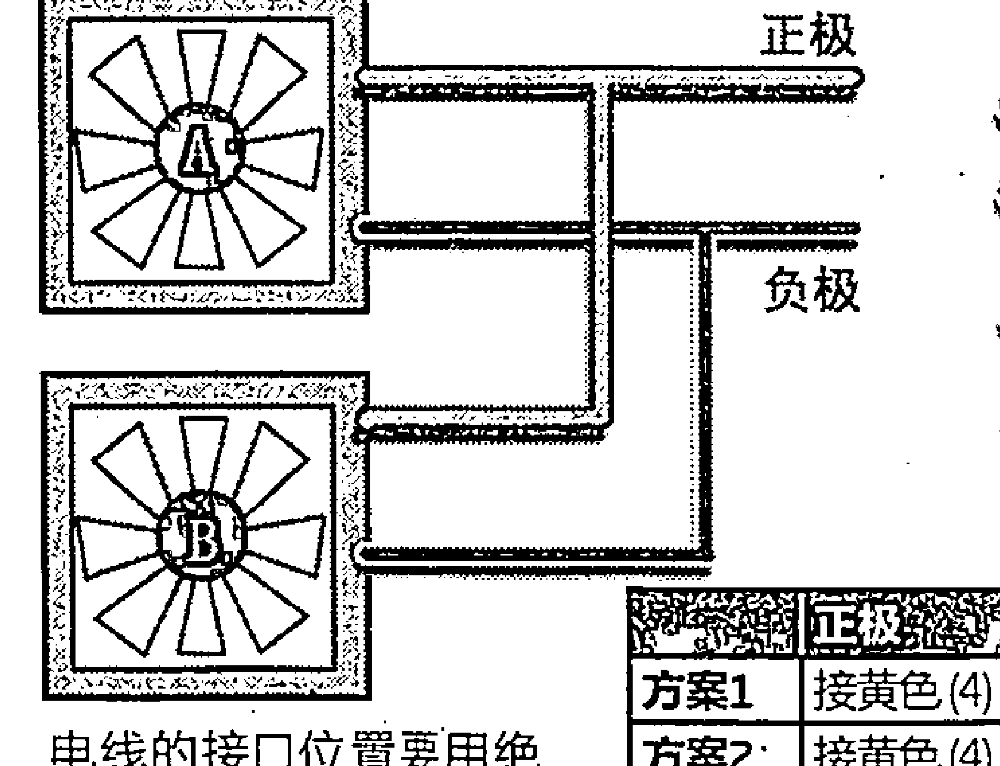

将需要调速的机箱风扇的大4PIN电源接头剪掉，按照正极接正极，负极接负极（按照同颜色）并联起来，剪掉的大4PIN不要丢，通常这个插头会有四根电源线，分别为黄色（12V）一根，红色（5V）一根，黑色（0V）两根。手动调速的原理就是把风扇的两根电源线利用上述四接头不同的连接方法，改变并联风扇的电压实现调速目的。

| 方案 | 正极接线 | 负极接线 | 供电电压 | 效果 |
| :--- | :--- | :--- | :--- | :--- |
| 方案1 | 接黄色(4) | 接黑色(2) | 12V | 100%转速 |
| 方案2 | 接黄色(4) | 接红色(1) | 12V-5V=7V | 70%转速 |
| 方案3 | 接红色(1) | 接黑色(3) | 5V | 40%转速 |

搞清了原理，接下来就是动手操作了。如果你原来的风扇转速是1500转每分钟，当你使用了方案2，把风扇的负极电源线接到4PIN接口的红色线上，这时风扇的供电就只有7V，转速也会下降到1000转左右。这种方法省钱又省时间，别说看完了你还不会弄，你会被鄙视的，就算不会也要说会，知道吗:) (文/罗家俊)

## 双显卡玩游戏 不要迷信PCI-E通道速度

苗苗是个“准”游戏发烧友，最近在攒机时却卡在了主板选购的环节上。要组建一套双显卡游戏平台，虽然X58贵了一些但支持双X16的PCI-E通道，而P55则只能在可怜的双X8模式下运行。那么，双X16和双X8的PCI-E通道到底有多少差别？普通游戏玩家需要为高速埋单吗？

想组建支持SLI的英特尔平台，目前可选的只有P55和X58。P55和X58两套平台都已经上市一年有余，都是成熟稳定的游戏解决方案，它们之间最大的差别无非只有4个：

- 1. P55平台比较便宜，相对于X58省出来的钱可以买更高端的显卡；
- 2. X58支持双X16的PCI-E通道，P55双显卡则只能工作在X8的通道上；
- 3. X58平台拥有3通道内存，P55只有双通道；
- 4. X58仅支持高端i7(9系)，P55则支持i5和i7(8系)。

据笔者在各大攒机论坛的了解，绝大多数人的意见都是：要组双显卡就配X58平台，只用单显卡就配P55。原因无他，就是因为多数人都认为在P55平台上双显卡只能工作在双X8速度的PCI-E通道上，从而引起游戏性能的下降。然而，事实果真如此吗？

**小提示：**
P55 和 X58 接口不同，分别为 LGA1156 和 LGA1366，为了提升 P55 的竞争力，部分品牌还推出了升级版的 P55A，甚至支持 A 卡和 N 卡进行互联，进一步缩近了和 X58 之间的距离。

### SLI 双 X8 速度已足够

别看理论数值差距很大，但在实际使用中带宽的影响其实不太明显，特别是对于中高端显卡（或以下级别）来说工作在X16或者X8模式性能都是差不多的。NVIDIA Geforce GTX460算是比较高端的显卡了吧？在3D Mark Vantage测试中，X16仅领先X8模式1.25%，在《生化危机5》和《晴空》等游戏中甚至不如X8模式。可见，大家不必刻意迷信所谓的高带宽优势论。

为什么看似两倍差距的双X16和X8通道体现在实际应用中的差异很小呢？原因只能是X8模式的传输带宽已经足以满足中高端显卡的需要，而多余的X8有浪费资源之嫌。至于天价的顶级显卡，X16所表现出来的性能会稍微明显一点，但对于买得起顶级显卡的发烧友来说，还会在乎X58和P55平台之间的那一点点价差吗？

总的来说，双X16的PCI-E通道对于中端显卡有推波助澜的作用，但没有必要刻意追求这种极致的参数指标，对于绝大多数用户而言，P55甚至是相对低端支持双卡的H55就足够了。

(文/家骏)

## 看书新体验 400元的电子书谁合适？

手机屏幕小，MP4操作不方便，平板电脑价格贵。选来选去，一直没有找到适合自己的看书工具？

### MP4 的心 电子书的梦想

电子书市场，除了E-ink墨水屏的电纸书，还有以传统彩屏为卖点的电子书。你可以说这类产品就是换壳的MP4，但它妙就妙在换壳，相比传统MP4，它的按键布局、手型更加适合阅读，而且价格也很实惠，大都在400元左右。另外，由于是彩色屏幕设计，在阅读漫画和电子杂志等书籍时，更具优势。

### 看书够不够专业？

除了按键、手感，还要考虑MP4的固件是否适合看书。只有大厂才会花心思对固件进行二次开发，比如能否更换字体、调整字号；是否支持自定义背景；搜索、跳页、书签功能够不够方便；支持的电子书格式多不多；PDF阅读卡不卡等等。这些才是电子书的灵魂，另外还要考虑厂商的固件升级能力，这关系到支持的格式、功能、速度等方面，没有能力的山寨、小厂还是不要考虑的好。

### 400 元有哪些选择？

| 歌美GM5000 | 现代C500 | 纽曼C51 |
| :--- | :--- | :--- |
| 淘宝价：380元<br>4.7英寸的屏幕不大不小，看书正合适，屏幕分辨率为480×272，略有颗粒感。界面和阅读器经过软件二次开发，更适合看书。续航能力8小时，容量为4GB，赠送皮套。 | 淘宝价：430元<br>屏幕是强项，5英寸480×800高分辨率屏幕，看PDF十分细腻。界面和软件不错，与歌美有些类似，但按键布局设计更接近电子书。续航能力10小时，容量为4GB，赠送皮套。 | 淘宝价：450元<br>标准4.8英寸480×272分辨率屏幕，色彩稍好，界面和软件是纽曼自己开发的，功能不算丰富，勉强够用。续航能力6小时，容量为4GB，赠送皮套。 |

(文/fish)

## 游戏键鼠 新的利益增长点

“同质化”和“差异化”在键鼠行业是热门的关键词，各键鼠品牌都在努力摆脱同质化，走向差异化。有些正准备抬脚走路，而有些品牌已经留下几个坚定的脚印，为之后的来者留下基础。如何让自己品牌能在市场上立足，是推出各种新产品，还是将原有产品降价，亦或是加大研发力度，但无论是哪种做法，都存在着风险和机遇。

### 键鼠的差异化在哪里？

众所周知出货量最大的百元左右主流市场上，这类键鼠是做不到差异化的。为什么？答案很简单，成本不允许、消费者也不接受。有人可能会说，那卖贵一些就是了。但事实却并非如此。大家应该还记得曾经多彩颠覆性的垂直鼠标，它相较于多彩的其他鼠标确实做到了差异化，但是价格足以购买同品牌的3~5个鼠标，价格上丝毫不输当时的罗技、微软，但是出货量却少得可怜。价格、差异化、品质一个不缺为什么叫好不叫座？理由很简单，没有抓准受众人群。能接受差异化风格，并付得起差异化价格的人群主要分为两种，一种是商务人士，而另一种便是游戏玩家（当然还有时尚人士和果粉，这部分人群较小）。

### 商务差异化，品牌的积累、细节的设计缺一不可

先来看看商务键鼠的差异化，我们以一款成功的商务键鼠——罗技MX 5500 Revolution键鼠套装为例子，来看看它的成功之处在哪里。
先不提它的外观、功能等等，购买商务键鼠的人最注重品牌，就像是Thinkpad是各大外企的标配一样，品牌往往是一个商务人士身份的象征。其次，商务化的外观也同样是商务人士所青睐的一点，就拿罗技MX 5500 Revolution键鼠套装为例，低调、细致但不缺少质感的外观是设计师们多年积累出的经验结晶。再次，才是常人所关注的手感，与其说手感不如说人性化的功能更合适，比如罗技MX 5500 Revolution键鼠套装中的MicroGear精准滚轮，可以提示邮件的信息显示屏等等。
但无论是品牌还是外形，都是需要长时间的沉淀而提炼出的口碑和独特风格，所以说走商务化的路线目前看起来，难度很高。

### 游戏差异化，不仅仅是手感决定一切

反观游戏键鼠，相较于商务键鼠成功的因素就要简单许多。Razer（镭蛇）从一个不知名的小作坊发展到如今的电子竞技标配，凭借的就是高人一等的手感。而PLUM键盘从不为人知一跃成为低价机械之王也是凭借着机械键盘远超薄膜键盘的手感。但在这之外，还有一个不为人知的成功者SteelSeries（赛锐），它凭借与游戏比赛、游戏厂商的深度合作也占据了高端键鼠中的一席之地，从SK战队专用的SteelSeries Ikari Optical到魔兽世界玩家流口水的MMO Gaming Mouse，每一个都笼罩着成功的光环。
如果说一款键鼠的手感需要慢慢研发，需要时间的磨练，但是一款为游戏深度定制的键鼠相较于手感来讲便简单的多。再对比商务键鼠中的品牌、外形，游戏定制、游戏捆绑可以说是键鼠差异化中独辟蹊径的一条成功之路。

### 捆绑游戏不是新思路

如果与游戏打包式这种销售方式是种新思路，那么做电视游戏主机的任天堂、索尼、微软就都笑了。当年的SFC、PS、XBOX哪一个不是大作发行时推出限量捆绑主机，又有哪一个不是热卖到掩面偷笑。游戏主机不过是换换外壳、改改喷漆就能热卖以至于被发烧友珍藏。而键鼠定制化的外形多样化、按键灵活化相比来讲是一个更深度的捆绑销售。

### 小众市场利润可观

可能有人会说，玩游戏还是玩某一款游戏的人如此小众，定制一款键鼠有什么利润可言。这种想法可能有一定的道理，但是我们还是看看电视游戏主机吧，电视游戏的玩家要远远小于PC，但这些游戏玩家为了一款游戏，可以花费动辄几千元的价格去购买主机，这群小众是具有购买力的小众，但他们的消费能力是不容忽视的。并且电视游戏主机一般只能拥有一台，而键鼠相较来讲低廉的价格很容易促使游戏玩家对不同游戏进行重复购买，所以是小众但是并不意味着低出货量。

### 金字塔效应，小众带动大众的免费宣传

不仅仅是利润问题，游戏玩家，尤其是具有高消费能力的游戏玩家，往往是处于游戏爱好者这座金字塔的顶端。由他们建立的口碑能促使处于金字塔底端的消费人群对品牌有着新的认知，消费者往往不会相信JS们嘴里的一线大厂等等说辞，但会相信游戏玩家对一款键鼠的评价，这等于直接提高了品牌价值，最重要的这种宣传是免费的。
稀稀落落说了很多，简而言之就是捆绑游戏、深度定制是键鼠差异化的一条独特的方式。从电视游戏主机上我们可以看到成功的经验，从消费心理上分析我们也可以看出这样的做法在一定意义上提高了自己的品牌价值。可能不久的将来，我们会看到富勒键鼠使命召唤版、多彩键鼠英雄联盟版、雷柏键鼠星际争霸版等等，到那个时候我们只需要根据自己常玩的游戏去选择一款适合的键鼠，而不是像现在一样在茫茫同质化的海洋中寻找适合自己的键鼠……## 把机箱缩小为4升 主板是关键

看惯了满大街傻乎乎的“大个头”台式机，你是否羡慕笔记本小巧可人的身材，但其实台式机也可以“微型化”。何为“微型化”，用机箱容积来界定是最简单的方法，我们最常见的主流机箱的容积一般在40L左右，1/10的容积4L绝对是一个感官上明显的变化。

#### 4L 主板，主板选择看三点

对于4L主机来说，主板的选择十分重要，这直接涉及到机箱电源、CPU等该如何选择，并且直接决定扩展能力及功能是否够丰富。总结来讲，一共分为几点：

#### 第一点：输入/输出接口

这么小的机器多是HTPC之用，那么DVI+HDMI是缺一不可，另外USB 3.0的支持才会使得移动硬盘等外置存储设备的读取更高效。

#### 第二点：供电相数

虽然说4L机箱中一般不会选用太过于高端的CPU，但是中低端桌面处理器的功耗也很可观，所以说三相供电是最基本的保障。

#### 第三点：无线网卡

这个是可选项，由于Mini ITX的PCI-E插槽限制，我们只能选用USB网卡，但是USB接口的数量又不多，所以板载无线网卡是一个极佳的选择。

#### 华硕 M4A88T-I Deluxe 4L 主机的最佳选择

华硕 M4A88T-I Deluxe主板采用AMD 880G + SB710芯片组设计，ITX规格，蓝色基调搭配黑色PCB，采用全固态电容，附带高清视频接口，USB3.0, WIFI, 蓝牙等接口，集成HD4250显示核心，有厂家的一键超频，一键开核等特色技术，是一款适合家庭影音的Mini ITX主板。

虽然此版体积非常小，但华硕在用料上却接近奢华，诸如全固态电容，铁素体密封电感，超低阻抗MOSFET等高品质主板上才会选择的用料都被拿来安装在华硕M4A88T-I Deluxe主板上。在I/O接口方面，M4A88T-I Deluxe主板提供了一个传统的PS/2键鼠两用接口以及4个USB2.0接口，千兆网卡接口。HDMI和DVI接口可以满足主板用做高清主机的需求，音频部分采用了5.1声道HD接口。另外主板还提供了eSATA和蓝牙连接接口。

## 谁说 Mini ITX 不能玩超频？

与华硕的大板相同，此款主板也同样配备了TPU芯片。结合华硕自带的驱动，能够实现CPU的多种智能超频方式。使用TPU对比以往手动超频的好处是：能够在自动寻找系统速度与稳定的平衡的同时，不占用CPU性能，从而达到更好的性能效果。

在接下来的测试中，我们成功的将AMD PhenomⅡ X3 720破解为四核，并超频至3.2G保持稳定，由于散热的限制未再做极限超频测试。但我们可以看到此款主板虽然身材小巧，但几乎保持了华硕大板的全部特色，无论是性能还是超频都表现得格外的强悍，实为4L小主机的最佳选择。

## NBA开赛了 准备好你的CMMB电视吧！

11月，NBA（美国职业男子篮球联赛）新赛季开打了！究竟是齐聚热火的三巨头厉害，还是新生代雷霆更加勇猛？姚明回归火箭会有什么变化？易建联在奇才和新科状元能擦出怎样的火花？不过，你打算用什么来看？不妨来看看这些带有三年资费的CMMB电视吧！

### 小知识：什么是CMMB电视？

CMMB是国内自主研发的第一套面向手机、PDA、MP3、MP4、数码相机、笔记本电脑多种移动终端的系统，利用S波段信号实现“天地”一体覆盖、全国漫游，支持25套电视节目和30套广播节目。

### 电视棒还是电视？

目前，采用CMMB格式的设备主要分成两种。第一种是USB接口的CMMB电视棒，优点是价格出奇便宜——通常200余元就能买到。而CMMB电视，则在500元以内就可以买到，虽然贵了一些，但是带有屏幕，可以随身携带，使用起来很方便。此外还有就是GPS+CMMB的设备，一般是700元~2000元的价格，有车一族可以考虑一下。

### 200元到500元随便挑

先推荐几款USB的电视棒，暗彩中国-通是朗视推出的一款CMMB电视产品，价格在网络上最低仅需230元，并含有3年的资费，非常划算。其次是佳的美UTV102（275元/3年资费），爱诺CMMB电视棒（275元/3年资费）。

而CMMB电视价格要略贵一些，如比较不错的有昂达VT10，价格是465元左右，并且带有3年资费。此外像神行者T10S+（480元/3年资费）也值得考虑哦。

除此之外，我们强烈推荐有车一族选购昂达VP70，GPS+CMMB电视二合一，总价才699元，相当超值。

### 小提示：CMMB正常的收费标准如下

| 时长 | 标准资费 | 优惠套餐（一次性交费） |
| :--- | :--- | :--- |
| 单月 | 12元 | |
| 半年 | 72元 | |
| 一年 | 144元 | 120元 |
| 三年 | 432元 | 300元 |

## USB3.0 主板和机箱不是一家人！

USB3.0拥有10倍于USB2.0的速度，可惜DIY“江湖”险恶，如果咱们不掌握如何识别USB3.0的方法，很容易被JS忽悠。何况，USB3.0主板不等于USB3.0机箱，很多朋友在选购时都忽略了一点：机箱前面的USB接口给力不？

现在很多厂商都拿USB3.0当做噱头，但所谓的USB3.0主板并不代表所有接口都能达到3.0的速度，而想让机箱前面的扩展面板也实现USB3.0的速度更是没那么简单。不信？那咱们就来瞧瞧。

### 巧识 USB3.0 接口

看颜色：USB3.0接口的规范颜色为蓝色；
数针脚：USB3.0接口共有9个针脚，上5下4；
找芯片：USB3.0大都是通过NEC方案实现

根据USB 3.0促进者社团规定，USB3.0接口应该选用蓝色为标准色，考虑到eSATA和部分品牌USB2.0接口也采用了蓝色，后面两种识别方法更为准确。USB3.0拥有上5下4共9针脚设计，其中下面的4个针脚和USB2.0兼容，而上面的5个针脚则是完成高速接收和发送数据的关键。此外，Intel和AMD当前都没有原生支持USB3.0的芯片组，而90%以上支持USB3.0的主板都会板载NEC的解决方案，只要能在主板上找到这枚芯片，USB3.0功能绝对跑不了。

### USB3.0 机箱需特别关照

由于USB3.0接口有变，意味着老机箱前置面板的USB接口无法兼容，即使你的主板支持USB3.0也无缘享用机箱前置USB接口的高速便利，只能向下兼容USB2.0的速度。想让机箱前面的扩展接口也支持USB3.0，除了机箱厂商在前置面板提供USB3.0专用接口和数据传输线外，还需要主板厂商“破费”，再配一枚NEC USB3.0控制芯片（NEC此方案每枚芯片只支持两组USB3.0，想让机箱前后都有USB3.0出现，现阶段两枚NEC USB3.0控制芯片是必不可少的）。

### 小提示：数码设备充电好帮手

USB3.0除了速度快，同时还提升了电源负载，意味着给手机等数码产品充电的速度更快，此外USB3.0的最小工作电压只有4伏特（USB2.0为4.4伏特），更为省电。

### 网络大补贴：

支持 USB3.0 的 机 箱 推 荐 http://tinyurl.com/39t2ztb

## 击碎涨价谣言 硬盘2TB最低660元

最近一个月硬盘的价格可谓大起大落，这让很多准备装机的用户踌躇不决，究竟是一步到位买个1.5TB的硬盘还是节省开支先买个500GB用着？

### 硬盘疯涨之谜

前一阵子，硬盘突然之间疯狂涨价，以1TB硬盘为例，价格竟然在短短一周时间内暴涨80元！而且越是缺货，硬盘越是卖得紧俏，甚至一度出现部分缺货的情况。小编为了一探究竞特意找了相熟的商家求解。商家告诉我，这一次普遍价格暴涨不仅仅一个地区的，很多城市都出现了这个情况。原因据说是因为某个代理突然收紧货源，并有传闻硬盘因为税赋问题将要提价。这样，价格突然波动后造成很多代理不肯放货给店铺商家，店铺商家也借此开始涨价，而且由于货源供应吃紧，看起来会让人觉得很紧俏，不买还要涨。

### 惊讶！ 2TB 660 元

经过一轮暴涨，传言很快被打破，价格也开始迅速回落，而且不仅如此，价格更是进一步走低。近日，市场曝出的超低价格更是让人惊讶，2TB容量硬盘最低只要660元！也许有的用户在这个时候就会想，还会降，再降点我才买。这和涨价时追涨的盲目性其实一样，除了“追涨”还有“杀跌”，两个极端都不可取。如果你对存储容量有需求，尤其是在带宽速度越来越快的今天，下载大片、游戏，大硬盘可是不够用的哦！

在这里，小编要提醒大家，切莫“追涨杀跌”，价格达到自己的心理接受度就可以出手，没有必要形成恐慌性的购买决策，这样非常不明智。这不，一个月的时间，这股暴涨之风就烟消云散了。

## M20与iPhone的故事——漫步者试用体验

很高兴我可以顺利的成为漫步者M20的试用体验者。对于这款M20而言，从外观上来看它似乎有别于以往漫步者音箱的设计，没有了M2那种呆板的四方体造型，多了一些符合西方审美观念的棱面设计，这或许是漫步者在近两年的产品设计中寻求的一个风格转变，像E20、E3350、M500 Plus等版本都体现出了极为优越的工业设计感。

之前，漫步者推出一款产品M2，我就非常感兴趣，不过400余元的价格实在是让人望而却步。但是，对于音箱最重要的一点却是结像。如果，音箱不能结像，就好像相机不能对焦，你有再强大的感光器，再强大的处理器，也拍不出好照片。很多音箱的分频结构导致其高低音单元容易产生相位差，而使声音的结像变差。但是采用全频单元的微型音箱却没有这种问题，所以说一般来说采用全频单元的微型箱的结像是很好的，有的甚至可以媲美一些高端音箱的结像力。书归正传，我们还是来谈谈M20与iPhone的故事吧。

### M20 搭 iPhone，相得益彰

漫步者M20的外形相当简洁时尚，我收到的这款为白色造型，塑质外壳设计，整体外形简洁明快，显得非常醒目，斜线风格的外观显得非常Man，搭配iPhone 3GS柔和的外观可以说他与她的搭配十分的协调。连接iPhone听音乐，声音比较清澈，中高频的感觉比较清晰，人声、音乐定位非常准确，细节几乎媲美耳机。当然人无完人，说实话M20不大适合用来听摇滚乐，低音明显不给力，仅仅是能听到有低音的存在，澎湃感更是无从谈起。

### 简便地操作，不是苹果是漫步者

整个音箱的控制全靠主箱体上面的一个开关键，它是一个软性橡胶材质，三键合一，能够实现电源开关、音量减小和音量增加，轻按圆形标志区的那个凹陷处就可以打开或者关闭音箱，开启时凹陷处会发出绿色光芒，而关闭时则显示为红色。

### 听歌、充电，他是 iPhone 的媒体中心

作为一个笔记本用户一定都有这样的经历，满桌子不同种类的连线，鼠标、读卡器、充电线、数据线啥的都乱成一团，尤其是配上USB集线器更乱了，漫步者M20不仅设计了USB声卡，更是在主音箱上配备了一个USB集线器，可能是因为音箱有专门的电源输入，所以USB数据传输比较稳定，除了能够支持鼠标、键盘一类的小部件，给我的iPhone充电更不是问题。

说了这么多好处，也要说说“他”的不足，只有前面的两个垫脚容易磨损，本来是小音箱但线缆太过繁杂，经常扭再在一起不便于移动，建议学学Monster耳机的“面条”线缆。

当然，瑕不掩瑜，很棒的音质（小音箱就不苛求低音了），超Man的外观以及方便的USB HUB加上漫步者的金字招牌，话说我已经怂恿了几个朋友入手了。因此，我们也有理由相信：M20也会成就漫步者新一代Mini音箱的经典之作……

### 比一比官方漫步者网店谁最实惠

如今，去电脑卖场转一天简直就是炼狱一般的磨难，不仅要挤车挤人还要谨防奸商拉客，更要与卖家进行激烈的讨价还价。用一个字形容就是“累”，那么网购呢？淘宝、京东、卓越、新蛋等都是不错的购物网站，而且前三家更有漫步者官方认证的“官方旗舰店”，购物过程绝对安心、方便。同为“官方旗舰店”，去哪家更好些呢？货比三家来看看。

#### 比产品，看谁既新又全

京东商城和淘宝商城相对于卓越来说，商品数量多，新品上的也很及时。三家产品数量都在百款以上，涵盖几年前的经典型号以及近期热卖产品。但卓越商品分类过于简单，挑选不够方便，不像前两个把细分产品线罗列出来，故推荐京东商城和淘宝商城。

#### 比价格

官方店的好处就是发票和免运费，有些个人网店的商品标价是不含发票的，运费也要另付，价格反而更高，这一轮列举两个产品，一个是市场热卖，另一个是上市新品，来对比下价格。

|        | 京东商城 | 淘宝商城 | 卓越 |
|--------|----------|----------|------|
| R201 T08 | 179元    | 200元    | 168元|
| M20    | 无       | 298元    | 295元|

#### 比服务

这里说的是发货速度与承运方式以及营业时间，京东商城与卓越有自己的货运团队，而且京东的发货速度绝对是最快，大城市一般上午订单，下午送到。而卓越承诺的是大城市2天内，全国1~4天。至于淘宝商城，只能依托第三方快递，所以选择何种快递决定服务水平的好坏，顺丰最好，第二天到货，但需支付额外的运费。如果买家没有提出使用何种快递，淘宝商城的默认快递一般在3天内到货。

至于营业时间，淘宝官方店很不灵活，基本上与实体店一样。而京东与卓越则是24小时可以下单，准备发货。

#### 比活动

选择官方店的另一好处是促销活动繁多，赶上特价促销时，让利、送礼物可是实打实的。京东的活动方式是系列打折，单品优惠幅度不大。卓越是单品促销，价格十分厚道。至于淘宝官方店，活动很少，一般很难碰到。

比较这么多，总结下来还是一句话：看重速度选京东；看重价格选卓越；看重放心选淘宝。

## 投影机的中国梦

10年时间，10%市场占有率，国内投影机市场第一名。明基从一个投影机领域名不见经传的“小品牌”逐步变成了一个让任何对手都不能小觑的对手。在这个大部分核心技术都垄断在外国企业手中的行业中占据一席之地，明基付出了艰辛，也获得了丰硕的回报。

### 投影机行业困境

长久以来，民用投影机的核心技术被外国企业垄断，松下、爱普生、佳能、索尼等在LCD投影机的核心技术优势让他们赚得盆满钵满。自3LCD投影机于1988年推出至今，20余年的时间里得到了长足发展。但是，近五年来LCD技术投影机驻足不前，反倒是后期之秀——由德州仪器主导的DLP技术飞速发展，至今已经成为与LCD技术分庭抗礼的投影机技术阵营了。

### 网络大补贴：

- LCD投影机
  http://baike.baidu.com/view/1301505.html
- DLP投影机
  http://baike.baidu.com/view/355592.html

实际上，由于欧美企业更多把焦点放在高端设备上，民用设备，无论是家用、还是商用产品，市场几乎是日系企业“说了算”。而且投影机的生产环节也全部留在日本本土，不愿意进行国产化。毕竟投影机属于高利润产品，而且核心技术也处于垄断地位，这样精明的账日系企业自然清楚得很。然而，日本本土制造生产、运送中国销售，这样就造成了超长的产业链结构，再加上企业利润——这就是为什么投影机价格居高不下的根本原因。尽管现在有不少品牌都推出了低价投影机，但仔细看看他们的参数指标，早在2003年就已经达到的800×600投影分辨率技术，今天依旧要卖到3000元左右。

总之，企业策略上的不同以及日本企业独有的封闭文化，造就了投影机市场一直波澜不惊的状况。

### 10 年磨练终见曙光

明基在2000年的时候正式决定进入投影机领域，面临的困难可想而知。当时正处于市场绝对封闭的状态，作为一种光机电高度一体化的产品，投影机核心技术完全掌握在以爱普生为代表的品牌手中，如果想取得突破必须选择另一条出路。当时明基的选择今天看来非常具有前瞻性，与德州仪器的深度合作不仅成功避开了LCD核心技术的垄断，而且随着DLP技术的快速发展，明基投影机事业也迅速发展。而且，由于LCD技术的固步自封，除了高端产品依旧属于这些日系企业之外，中端、入门级产品，甚至是部分高端产品，明基等新兴品牌均有所突破。从2006年明基开启大众娱乐市场，以MP510为代表的普及型机种，帮助家庭用户实现客厅影院梦想，到2007年BenQ率先推出采用鱼眼镜头的短焦产品MP771，把短焦投影搭配电子白板的新型解决方案引入教育领域，从而解决小空间实现大画面的难题……说直白一点，之所以今天投影机的功能越来越多，价格也更为合理，与明基采取“本土制造、缩短产业链，与核心技术厂商德州仪器深度合作”等等策略有着密不可分的关系。

### 十字路口 明基新选择

“形而上者谓之道，形而下者谓之器”，投影机领域也有一句类似的“道理”：一流做品牌，二流做功能，三流做产品。不可否认，明基已经在产品端取得了成功，尤其是2010年以来明基以10%的市场占有率成为国内投影机第一，这都是最好的证明。但是，做得再好也只是产品不错而已。所谓求变求新，明基自然不会固步自封，如何自我提升成了明基非常重要的课题。

诚如明基全球技术产品中心总经理陈其宏所言，展望下一个10年，明基投影机不仅仅是要追求第一名，更要向“唯一”进军。这个唯一，是指明基要凭借独特的技术、坚强的团队与差异化经营模式，在各个细分市场上都能够成为具有特色与独特竞争力的领导品牌。

## 运营商没魄力 走马观花看2010通信展

2010年的通信展回归到老国展，场地小了许多，大体转了一圈，遗憾与欣喜并存。

### 三大看点

- 今年的通信展除了3G，还有4G。不过，3G是给产业链展出，给消费者体验应用。4G是给业界看，为展会提升档次。所以，中国电信收获的是应用，中国联通收获的是终端（iPhone 4 走秀的最佳机会），中移动和TD联盟仍然收获的是眼球。
- 关于物联网、云计算还有三网融合，这是爱立信、中兴、华为、上海贝尔以及大唐电信等企业展示自己的舞台。尤其是爱立信提出的到2020年，全球将有500亿互联，现在已经成为通信业界的共识。
- 今年的通信展上Android的产品相当多，可是个试用的好机会。所以，手机展示每年都是人气爆满，当然，很多一部分人是冲着美女来的，2010年通信展，三星、酷派、联想、汉王果然是美女如云，山人海。

### 三大遗憾

- 诺基亚、摩托罗拉等巨头依然缺席，这可能成了传统了，不知道是何原因。无法近距离与手机巨头们进行互动，恐怕会让粉丝们感到一丝遗憾。
- 运营商没魄力。在TD联盟展台看到很多面孔，联想、海尔、天语、华为等，还都是一些老面孔。一个桌子大的小展台，显示了致力于中国移动互联网老大的魄力。三大运营商在进门的广告上估计花了不少钱，右侧是中移动的MM，中间是中国电信天翼，左侧是联通沃，这个广告位的拼杀肯定很激烈，但是看得出中移动的差异化竞争，它在谈应用，而电信和联通还在谈3G本身。
- 通讯展、游戏展……各种展览最终都是美女展，秀来秀去，已经让产品本身失去了吸引力，来着究竟是看美女还是看产品、看技术？这个问题值得商榷。

### 三大欣喜

- 三星S-girl热情洋溢。三星现在贵为全球手机业务榜眼，成为本届通信展商最大牌的手机厂商，其展台布置也是别出心裁，其展示有Bada、Windows Mobile以及Android的产品，貌似Symbian已经不见踪迹。三星的S-girl啦，身材高挑，裙子很短，最关键的是她们还热心地给你介绍产品和你交流。在规模以及整体素质上，三星的模特也是最高的。
- BYD比亚迪等厂商高调参展。以IT起家的BYD，成名却是汽车。在本届通信展上，BYD展示了笔记本电脑、手机等OEM/ODM，以及工业设计配套能力，电源、机柜等产品。
- 其他国家重视中国通信产业。在1号馆，有很多国家的展台，包括澳大利亚、美国等国家的机构和组织的展台。这可以显示出一个信号，其他国家的相关机构对于中国市场的重视程度越来越高。

## Android来了！千元级平板电脑怎么选？

“有钱买不到”足以印证iPad的火爆，引得无数厂商借助Android系统挤进了千元级平板电脑战场。这里面既有熟悉的数码厂商面孔，而更多的则是以价格取胜的山寨军团。在选择这类低价平板电脑时，我们又应该重点考虑哪些因素呢？

目前Android平板电脑覆盖了400~4000元的价格区间，除了品牌因素外更多的价差则体现在配置功能以及服务上。下面，笔者就简单介绍一下Android平板电脑的选购误区。

### 屏幕规格并非越高越好

很多平板电脑都采用了和上网本一样的屏幕规格：10英寸1024×600像素分辨率，乍看下和iPad规格很接近，屏幕够大，显示细腻，但却忽略了Android软件显示的兼容性。Android毕竟是谷歌针对手机量身定制，软件开发者测试环境大多为手机常用的480×320和800×480两种分辨率，一旦显示比例出现变化，很容易出现无法全屏显示或者显示异常等问题，严重影响游戏类软件的体验感受。所以说，现阶段最适合Android系统的分辨率就是7英寸左右800×480的屏幕，对软件显示兼容性和触控操作的支持最佳。

| 体检项目 | 选购建议 | 重要等级 |
| --- | --- | --- |
| 系统版本 | 版本越高兼容性越高，建议选择2.1以上系统的产品 | ★★★★★ |
| 处理器 | 频率越高越好，自带图形核心更好 | ★★★★★ |
| 重力感应 | 很多软件和游戏都是利用重力感应操作的 | ★★★★☆ |
| RAM内存 | 对2.1以上系统版本，建议选择256MB以上的容量 | ★★★★☆ |
| WiFi或3G | WiFi是必须的，3G虽方便但有较高的后期使用成本 | ★★★★☆ |
| 触控技术 | 电容较电阻屏有更完美的使用体验，可优先考虑 | ★★★☆☆ |

### 系统和功能同样重要

现在绝大多数低价Android平板电脑都采用了瑞芯微RK2808/RK2818方案，后者采用了ARM9内核的660Hz处理器足够流畅运行2.1版系统。除了处理器，我们还应该关注RAM内存（不是ROM）大小，一般来说256MB算是底线，Android很多程序都需要重力感应和网络的支持，如果屏幕支持多点触控会让你获得更好的体验。

选择Android平板电脑不要一味追求低价，在上述核心功能没有缺失的情况下，还是应该把注意力放在系统版本和可升级性方面。既然是平板“电脑”，必然需要与时俱进的软件和游戏支持，现在很多低价产品还在使用1.5/1.6系统版本，类似《愤怒的小鸟》这类热门游戏都无法运行。山寨Android平板电脑清一色都是瑞芯微方案，所以在功能和性能的表现上差别不大。与山寨兵团相比，品牌Android平板电脑的优势就在于可靠的后续服务，想升级到最新的2.2版系统，对厂商技术研发团队的实力要求就更高了。所以说，买Android平板，价格、功能和服务都很关键。

Android系统每次更新对硬件的要求就更苛刻，下表是目前常见的Android平板电脑解决方案，其中采用威盛VM8505方案的产品可以把价格做到500元以内，但最高仅支持1.6版系统，且无法播放高解码率的视频；瑞芯微方案应用最多，RK2818和RK2808相比就是支持256MB内存，主频提升的同时还加入了GPU加速技术，可以流畅播放720P影片，就硬件规格而言足以满足2.2版系统，是千元级平板电脑的最佳选择。至于ARM Cortex A8和NVIDIA Tegra 2则是高端产品惯用的方案，售价通常在2000元以上。

### 小提示：主流方案

| 方案 | 特色 | 最高系统版本 |
| --- | --- | --- |
| 威盛VM8505 | 成本极低 | 1.6 |
| 瑞芯微RK2808 | 性价比高 | 2.1 |
| 瑞芯微RK2818 | 支持GPU加速 | 2.2 |
| ARM Cortex A8 | 稳定成熟 | 2.2~2.3* |
| NVIDIA Tegra 2 | 双核高性能 | 2.3 |
\* Cortex A8 拥有多种型号，1GHz 以上频率可支持Android2.3

## 开启无损播放之门 朗琴天梭T6音箱

用电脑播放APE、FLAC无损音乐很容易实现，脱离电脑的微型音箱也能播放就有点夸张了吧？

### 前辈T5

在T5刚推出时，给市场带来不少亮点。以前只在鼠标上才能看到的“单键飞梭”，引用到便携音箱上，效果出奇的好。除了实用之外，出色的质感和漂亮的外形一下子博得了不少朋友的喜爱，T5轻松大卖。

### T6有哪些创新之举呢？

在T5音箱在设计的基础上，T6在外观上与之相差无几，在原有的基础上，增加APE、FLAC、WAV高清无损音频格式，增加闹钟、时间功能，增加USB接口，OTG功能，并且内置了USB声卡。

### APE、FLAC无损播放

T6支持APE和FLAC格式的音频文件，这在一般的数字音响产品中几乎没有。是否你总抱怨MP3文件没有CD的音质好，细节缺失，高低两频失真？无损音乐恰好可以弥补这一缺憾。T6在微型音箱里率先加入了对无损音乐的支持。这样一来，T6能支持APE、FLAC、WAV、MP3和WMA等五种格式的音乐，而且还支持断点续播这一实用功能。每次开机进入SD播放模式，将从上次关机的位置精确载入，实现记忆式重新播放。

### 好音质之液晶屏、“单键飞梭”

朗琴为天梭T6配备的LCD显示屏幕，可以实现可视化操控。T6的屏幕可显示：输入模式，音量大小，FM频率，闹钟时钟，电池电量等等信息，还是颇为明显和实用的。“单键飞梭”功能得以保留，滚轮部分的操作手感更好，精确度也得到提升。开机之后短按“M”键，可以在AUX、FM、U盘播放和SD卡播放模式下进行循环切换，其中FM收音机功能还分为手动搜台和自动搜台两种模式。

### 好音质之USB、SD卡直读

T6还支持USB和SD卡直接读取，也就是说在插入SD卡的情况下一样可以对内部的歌曲进行删减。

### 好音质之内置声卡

内置有USB声卡无疑大大方便了使用，通过数据线将音箱与PC相连不仅能够实现充电，还可以通过USB声卡实现PC端的声音输出，USB声卡模式下，朗琴天梭T6音箱音质表现与SD卡读取播放音质相差无几。

### 好音质之锂电池

T6一改T5通过4节AAA电池进行供电的繁琐方式，采用了BL-5C锂电池供电设计，在用户体验上有巨大的改善。同时这一型号的锂电池可以与朗琴旗下其他产品通用，很是方便，背部接口方面，设计了3.5mm规格的AUX输入接口、耳机接口，还包括一个迷你USB接口，扩展能力十分出色。

## 新苹果很好吃 MacBook Pro新鲜体验

整块铝合金的机身超酷，看不到任何接缝，别的品牌真得和苹果好好学学。以前一直用Windows，雪豹系统虽然绚丽但用不习惯，参考网上的教程很容易安装上了双系统，除了一些快捷键无法使用外一切OK。需要注意的是，苹果屏蔽了正常的BIOS功能，启动时会先载入BOOT CAMP界面，然后由BOOT CAMP决定是载入MAC OS还是Windows。另外，这款机器不能运行GPU-Z软件，Windows不能修改MAC的分区，MAC也不能修改Windows的分区，但可以把Windows分区删除，这样也能避免病毒带来的危害。MacBook Pro运行速度很快，而且音效效果也不错，磁力吸入式的电源非常酷，可惜USB接口只有两个根本不够用，而且离得较近，除此之外在外观设计上还真挑不出毛病。此外，玩游戏不再是15英寸“大白”的专利，现在13英寸的MacBook Pro全部配备了NVIDIA GeForce 320M显卡，比老版本9400M有了质的提升，在中高画质下玩WOW再也不会卡了，星际争霸2、鬼泣4也是非常流畅，可以玩转现在主流的大型3D游戏。不过，全速运行时整个机身都会有温热的感觉，夏天会有点别扭，但马上就冬天了，用来温手的感觉还是不错的。再来谈谈缺点，首先就是9000元才配250GB硬盘，太小了点；再有15和17英寸的MacBook Pro都已经升级到了i5或i7处理器，而13英寸的版本还是酷睿2，看着别的品牌四五千元的机器都上i5了，心里还真有点不是滋味。没辙，谁让咱是果粉呢？希望苹果别太抠门，真正做到物超所值吧！

| 具体型号 | MacBook Pro 13(MC374CH/A) |
| --- | --- |
| 基本配置 | P8600 + 4GB内存 + 250GB硬盘 + NV 320M显卡 |
| 入手时间 | 2010年10月 |
| 入手价格 | 8999元 |

> 健圣点评：
和尚也爱“吃”苹果？苹果的魅力真是无敌啊！
整体“铝砖”设计的MacBook Pro做工方面绝对可以秒杀其它品牌的高端产品，但正如和尚所说，苹果总在一些配置的细节方面显得有点小气。如果各位的腰包不够丰满，还可以考虑新版13寸的MacBook，只是外壳换成了塑料，内存变成了2GB，但性能没什么缩水，而且价格只有7000出头。
（文/和尚）

## 赔钱了！香港买iPad还要上税？

最近A君到香港旅游顺手买了一部iPad，在返回深圳检查时，却被海关告知需要缴纳1000元行邮税；同行的B君带着已买数月的iPad，同样被告知需要缴税，曾经香港是“自用”手机、笔记本一类数码产品的“购物天堂”，如今，在香港买iPad回来时还要上税，这让很多去香港淘货的用户感到莫名其妙，我们不禁要问：这到底咋地啦？

### 都是“港行”惹的祸

曾几何时，港行已经成为最值得购买的改版机（水货）来源，就拿iPad来说，16GB WiFi版香港售价3888港币（约合人民币3550元），和国内行货版3999元人民币的价差导致了水货、黄牛炒货和代购的泛滥，将iPad纳入电脑类并征收千元的税费，海关总署公告2010年第54号（http://tinyurl.com/2b7l7oh）反映了政府对市场管制的决心。

### 侥幸心理要不得！

此次新政执行得非常严格，几乎达到了“上有政策，下无对策”的程度。入境时拆开包装，提前在iPad里面存储个人信息证明是自用物品无效；境外邮寄iPad的方式也被纳入征税范畴；将iPad藏在大包小包试图逃过入境检查无效（基本是逢包必检）；甚至将损坏的iPad寄回香港维修，也需持该数码产品的发票、维修合同等有关材料并与当地海关联系。总之，在新政之下建议大家不要存在侥幸心理，当加上1000元的税费后，港行的价格优势荡然无存，还不如直接选择国内行货版呢。

### 出境千万勿忘申报

如果你想带着iPad出境游玩，一定不要怕麻烦记得填写《旅客行李物品申报单》，加盖海关印鉴。


海关对出境时未申报的“应申报物品”一律被认定为出境后购买，因此都会按规定征税。举个极端的例子：即使你的iPad已经很旧，甚至带上了国内购机时的发票，如果出境未申报，回头入境时也难逃被征税的厄运。因此无论是自用的iPad、手机（以iphone4为例每部需缴税150元）还是随身的笔记本，凡是在20种不予免税名单中的商品，提前申报是必须的。

### 小提示：20种实行全额征税验放商品

电视机、摄像机、录像机、放像机、音响设备、空调器、电冰箱（电冰柜）、洗衣机、照相机、复印机、程控电话交换机、微型计算机及外设、电话机、无线寻呼系统、传真机、电子计数器、打字机及文字处理机、家具、灯具和餐料。详细查询：http://www.customs.gov.cn/

### 特殊时期行货才是王道

如今iPhone 4、iPad在国内都有正规的销售途径，官方标称3999元的iPad最低成交价甚至不足3800元，如果加上保修等因素性价比不逊港行。唯一可惜的是目前国内还没有3G版的iPad行货出售。总之，iPad海关风波算是给我们提了个醒儿，重视起境外购物所面临的手续和问题。

## 擦亮眼睛 看清市售平板方案

要说下半年哪个数码产品最火？平板电脑当之无愧夺得第一的位置。这其中，最热的苹果iPad由于价格高，并不是大家都用得起的产品。而山寨厂看准这块肥肉，争相推出各种XPad。这些种类繁多的平板，屏幕尺寸从5英寸到11英寸，CPU速度从300MHz到1GHz，价格从400到1500元，百花齐放却又殊途同归，绝大多数山寨平板都使用Android操作系统。它们之间有什么区别呢？让我们一一解读这些奥秘。

### ◎模具

市面上的各种平板大部分都是在仿iPad，这款公模是最受欢迎、产量最大，也是最好卖的。此外，名字也都近似于iPad，以前模仿iPhone时有Hiphone、Ciphone，现在有APad、AiPad、HiPad……
这种仿iPad模具最大的缺点，莫过于“按键”了。Android系统中常用到的返回键，菜单键，搜索键都缺少实体按键，整个面板上只有一颗Home键，所以在使用过程中，非常不方便。

### ◎屏幕

低端的是5英寸，LCD材质，电阻式触摸屏，分辨率为800×480，这种屏幕的用料，跟普通 MP4 播放器和 GPS 导航仪一样。而7英寸是最流行的屏幕尺寸，同样是LCD电阻屏，分辨多为800×480，除了能完成基本的触摸功能外，在可视角度，敏感度和耐磨度上几乎没有优点。再大一号的是10英寸屏幕，在山寨产品中算是“高档货”了，分辨率可以达到1024×600，电阻屏操作Android十分别扭，效果比电容屏差很多。

### ◎方案

要知道，平板好不好，关键看方案。山寨平板的CPU多采用ARM核心芯片，极少数采用英特尔Atom芯片。ARM+Android的组合对硬件性能要求较高，低端机型跑流畅很难实现。在这些方案中，低端采用ARM7核心，中端采用ARM9核心，高端采用ARM Cortex-A8核心。Android要想跑流畅，并且有不错的兼容性，建议700MHz以上的CPU以及至少256MB内存。

### 主流的方案有：

#### 400元~600元

威盛VIA WM8505方案，ARM核心，频率300MHz。WM8505+是超频到400MHz的方案，也有厂商虚标到533MHz。搭配256MB内存。这是最廉价、最老旧的Android方案之一，只有在最低端的MP4身上才能看到它的影子，性能指标和使用效果十分差劲。

#### 550元~800元

瑞芯微RK2808方案，ARM核心，频率600MHz，有独立DSP硬解码，播放视频效果还好，大部分主流MP4使用的方案。搭配128MB内存，它的特点是能够硬解H.264等编码格式，播放720P视频比较流畅。还有RK2818方案，是2808的升级版，效果更好，可以支持android 2.2。

#### 700元~1000元

Telechips TCC8902方案，ARM核心，频率650MHz~800MHz，搭配256MB内存。可以说是现阶段比较优秀的方案之一，甚至可以解码1080P视频。

#### 1000元以上

ZT-180A方案，ARM核心，频率1GHz，从频率可以看出是Cortex-A8核心。搭配256MB内存。可以支持到10英寸屏幕，价格也是最贵的。

### ◎系统

山寨平板所搭载的系统版本跟它的硬件方案有直接关系，有1.5、1.6、2.1，甚至2.2，山寨厂也很难提供固件升级。

- 方案名称 | 1.5 | 1.6 | 2.1 | 2.2
--- | --- | --- | --- | ---
威盛VIA WM8505 | ● | ● | | 
瑞芯微RK2808 | ● | ● | ● | 
瑞芯微RK2818 | | | | ○
Telechips TCC8902 | | | ○ | ○
ZT-180A | | | | ○

（文/ifanr）

## 无解的后遗症！破解4GB内存需小心

随着DDR3内存价格逐渐走低，4GB内存越来越流行。毕竟2GB内存跑Win7总感觉不够流畅。然而，升级到4GB内存，对于32位系统的WinXP和Win7来说，大都只能识别到2.5GB到3.25GB，剩下的内存因为32位系统寻址能力有限，只能望“存”兴叹，不能使用。

大多数朋友会说，破解4GB内存不就OK了？使用Readyfor 4GB就能实现。然而没有完美的事情，破解4GB内存的方法也有后遗症。

- ○在32位WinXP下破解后看到的4GB内存是假象，而在32位Win7/Vista下破解才能真正实现4GB内存全部用到。
○屏幕右下角出现测试版的水印，需要对系统进行二次破解，获得管理员权限。

- ●某些不支持PAE的硬件驱动会无法正常工作。比如Intel集成显卡（因为显存是共享系统内存的，破解后容易出现寻址错误，切换显卡或者使用集显会黑屏）、创新声卡驱动等等，破解后出现蓝屏、死机的几率很大，表现为开机后固定时间内蓝屏。要想找出是哪个硬件不支持PAE，最好装好系统后什么驱动都不装，先破解看能否成功，然后逐一实验。
●开程序过多后或者运行大游戏时出现死机，这主要是破解后系统寻址错误，内存数据溢出造成的，十分考验内存的兼容性。两条相同芯片颗粒及相同周期生产的内存，也难免会出问题。

要想完美体验4GB内存，破解条件非常苛刻：32位Win7/Vista系统、全部支持PAE的硬件、十二分完美的硬件兼容性等等，做到这些，远不如直接换用64位系统来的容易。64位系统并没有大家想象的那样高深莫测，日常应用、游戏都可以完美的支持。最重要的是，能完美体验4GB甚至8GB内存带来的畅快淋漓的快感。

### 什么是PAE？

Page Address Extension（PAE）技术最初是为了弥补32位地址在PC服务器应用上的不足而推出的，PAE技术将地址扩展到了36位，实现支持最大64GB内存。

（文/大刘）

## 频繁断网？Modem也需解暑降温！

周末和好友一起玩DOTA，关键时刻突然断网，由此引发的“杯具”溢于言表。电脑没问题啊？隔壁上网正常肯定不是网络的事。摸摸ADSL Modem，好家伙，真烫手！稍等片刻Modem冷静之后拨号正常，难道是Modem过热引发的断网故障？

在我们关注核心配件散热时，往往会忽略其他外设还处于“水深火热”之中，特别是Modem这种设备，为了美观经常“憋屈”地被隐藏在某些不通风的角落。当温度上来后就会以断网掉线的形式给你好看！如果你也碰到过此类问题，不妨学学网友“卖女人的老火柴”的妙招吧：给Modem穿上“风扇外套”。

原理很简单，就是在Modem底部散热孔处安置一个风扇，将Modem内部的温度及时排出。用到的材料也很廉价：螺丝刀、剪刀、淘汰闲置的CPU风扇、手机USB口充电器、橡皮筋和5cm长的螺丝4枚及8个配套帽等。动手操作难度也不高，将USB充电器线剪断和CPU风扇的电线相连（注意正负极），再用橡皮筋将风扇和Modem捆绑在一起。

需要注意的是风扇和桌面间要有确保空气流通的空间，先给螺丝钉拧上一个螺帽，插进风扇的螺丝孔，另一头拧上螺丝固定，注意四组螺丝的高度要一致平稳即可。经过如此一番折腾后，Modem温度明显下降，再也没有出现因过热而引起的断网现象。

出现问题并不可怕，只要找出原因，发挥想象力再动动手，还有什么困难是Cfan读者不能克服的呢？


## 传统&固态硬盘 SATA3.0到底是谁的嫁妆？

小陈最近去村中攒机，很多JS都向他推荐支持SATA3.0的主板和硬盘，但也有不少路过的玩家称这个技术根本没用，为其买单纯属浪费。所谓存在即有理，拥有6Gbps传输速度的新技术到底是鸡肋还是大餐？对于普通用户而言值不值得入手呢？

### 机械硬盘无福享受

首先是因为机械硬盘很难突破物理转速的瓶颈，顶级桌面硬盘的平均读取传输率最高也就是120MB/s，远不如SATA2.0的理论速度（300MB/s）。其次SATA3.0标准刚确立不久，主控芯片还不能完全发挥其真正实力。总之，现阶段最强的机械硬盘的最大性能尚不能填饱SATA2.0的胃口，根本没有必要投奔SATA3.0的门下（除非你不在乎“加盟”费，SATA3.0主控芯片是要钱的）。

### 固态硬盘的大餐

万年不变的内部结构让机械硬盘无福消受SATA3.0的“美味”，但对于纯电子存储芯片阵列制成的SSD固态硬盘来说，SATA3.0却成为了其性能瓶颈的突破口。笔者使用MLC版镁光C300固态硬盘分别在SATA2.0和SATA3.0接口的主板上进行了测试，HD Tune Pro软件的基准测试中，在SATA2.0主板上平均传输率只有230.2MB/s，在SATA3.0主板上则可以轻松突破SATA2.0接口300MB/s的限制，达到了308.1MB/s，可见只有SSD固态硬盘才有机会发挥出SATA3.0的高传输速率的优势。可惜SSD硬盘的成本依旧昂贵，就拿评测的镁光C300来说，2400元才能买到128GB的容量，意味着SATA3.0在未来一两年内对于普通用户来说都会处于英雄无用武之地的窘境。

### 不需要，不买单

以西部数据为例，1TB容量SATA2.0/3.0的硬盘价差在200元左右，所换来的性能提升却极为有限。笔者的建议是，对传统机械硬盘来说SATA2.0足以，SATA3.0接口实际上是为SSD固态硬盘准备的，普通用户没必要为无法发挥出来的性能买单。在选择主板时，如果你今后没有升级到SSD硬盘的打算，也没必要刻意追求主板必须配有SATA3.0接口，非要选择带SATA3.0接口的主板，建议选择原生SATA3.0功能的芯片组。

### 小知识

SATA3.0 又称 SATA 6Gbps，传输速度达到6Gbps，可以兼容SATA2.0（又称SATA 3Gbps）的接口和数据线，改善了外置接口耐用性（插拔次数）、更长数据线下的稳定性和扩展性等问题。目前只有采用SB850南桥的AMD 8系主板才能原生支持SATA3.0（Intel即将推出的P67芯片组也原生支持SATA3.0接口），其它主板大都选用了Marvell 9123的SATA3.0主控芯片，但出于驱动不完善等原因性能逊于前者。

（文/大象）

## 速龙变羿龙 新一代“开核帝”来了

还记得速龙X2 5000吗？开核的特质引无数英雄竞折腰。如今速龙II X2 220已经取代了前者“开核帝”的称号，成为了时下最热的AMD低端处理器。如果你追求极致性价比，不妨将目光投向这个新兵吧！

速龙II X2 220售价低廉，拥有高达2.8GHz的默认主频，默认电压可以轻松超至3.5GHz，开核后可以破解出被屏蔽的另外2颗核心和6M三级缓存，属于一本万利的投资。最关键的是，X2 220支持所有AM2+、AM3主板，3相供电即可满足其供电需求，组建平台门槛更低，无论开核与否都是一款超值的CPU。在星际争霸2这类对CPU较为敏感的游戏中，开核前游戏速度只有57帧左右，开核后游戏速度可以猛超84帧，速度提升了将近33%！

### 好马还需配好鞍

为了迎合用户的口味，主板厂商都将支持开核视作了一大卖点。比如华硕M4A88TD-M就支持一键开核，微星880GM也可利用ACC功能帮X2 220“越狱”。如果你决定选择开核帝，在主板的选择上不要太过吝啬，毕竟主板是整个电脑的基石，稳定胜过一切。

### 商家：开核要交手续费！

JS比咱们更关注这个最新的“开核帝”，在中关村能开核的速龙II X2 220已经被炒到了450元以上（不包开核300元左右），而且货源也不太稳定。遇到这种情况，大家可以尝试在淘宝上网购，选择范围和余地较实体店提升不少。对于普通用户，建议直接选择包开核的版本（100多元就当作是商家的筛选手续费吧），避免选择开核后不稳定的产品。

### 开核帝适合谁？

X2 220的出现打破了AM3平台无低价开核产品的历史，破解变身羿龙II X4 920的潜质非常适合即将添置电脑的DIY玩家。如果你觉得X2 220的价格已经被JS炒到超出预算，还可以考虑速龙II X2 210和速龙X2 5200，前者可以开核变成Phenom II X4 910（缺点是没有L3缓存），后者可以变身Phenom FX-5200（缺点是主频低），价格方面较X2 220实惠很多。

对于已经使用上FX-5000的用户来说，开核后的X2 220带来的性能提升有限，而且老芯片组也不能充分发挥新处理器的潜力，如果更换整个平台就有得不偿失之嫌了。

## 小手一抖 NVIDIA显卡一键切换达成

上期我们介绍了利用微星MSI Afterburner实现笔记本一键调频的方法，虽然方便但在频率的调整上有限制，在节能方面无法达到最优。杂志出版后，来自北京的木清风同学又给我们带来了更好的方法，利用NVIDIA官方系统工具实现N卡无限制的调频功能。

首先需要下载安装NVIDIA System Tools (下载地址：http://tinyurl.com/2cuq9pt)，安装时有三个可选组件，其中第一个的“nTune系统性能”是必装，余下两个分别为可选的状态监控和自动升级组件。

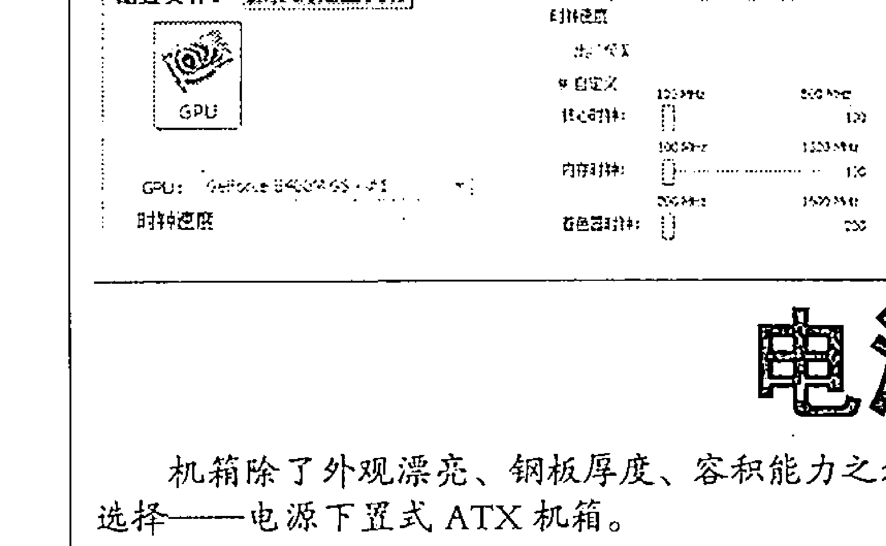

桌面右键进入NVIDIA控制面板，在左侧列表中新增了“性能”一栏（见图1），首次运行会提示协议信息，选择确定即可。展开性能项选择“设备设置”，点击右侧窗口当前设置选项卡中的“保存到配置文件”（见图2），接下来就可以在“存储的配置文件”选项卡中自定义不同配置文件的频率参数了（见图3），调整到满意的频率点击保存按钮。

笔者就设置了多种配置文件信息，在开始菜单中运行NVIDIA nvProfile会弹出配置文件切换窗口（见图4），里面列出所有存储的频率配置信息，根据需求选择后确定，NVIDIA显卡官方的一键调频功能就此完成！

最让人高兴的是NVIDIA系统工具会“变通”，比如当显卡工作在自定义的“超级节能模式”下时玩游戏，显卡会自动切换到高一等级的“平衡模式”，游戏结束后自动还原，不会傻呆呆维持低频率导致游戏出现卡顿的现象。因此，如果你懒得进行手动切换，而且希望笔记本尽可能省电，可以一直将显卡工作模式设置在最低等级。

> 小提示：NVIDIA控制面板可以将核心显存频率降至最低100MHz，这是第三方调频软件无法做到的，此状态下最节能，待机时显卡温度可以降到35度（电源管理设置节能时在45度左右）；如果有超频的需求，建议频率不要一下调整过高，安全第一。（北京/木清风）


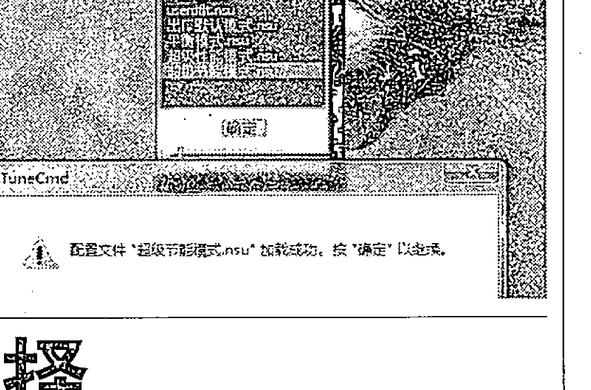

## 电源下置 机箱的新选择

机箱除了外观漂亮、钢板厚度、容积能力之外，还有什么选购时要注意的事情吗？在标准的ATX、Micro-ATX、ITX及不常见的BTX机箱之外，还有一种选择——电源下置式ATX机箱。

### 电源下置好处多

电源下置式机箱已经出现好几年了，不过价格一直居高不下，多是千元级别以上的高端机箱才拥有的设计。这种设计方法基于ATX构架，但是电源由上置改为底部下置。经过几年时间的发展，现在有不少机箱都采用这种设计。与传统的ATX机箱相比，电源下置式机箱在结构上基本与前者保持一致，只是将电源仓位由原先的后上角移动到了后下角。电源下置机箱在散热方面的优势得到越来越多的用户认可。这种电源下置式机箱有个巨大的优势，当顶部设有垂直排气风扇时，机箱底部再添加进气风扇开孔无疑会事半功倍，同时拥有底部和顶部的风扇时便可以完全取消传统的前后风扇，形成一个纯粹的垂直风道体系。

### 电源风扇 朝上还是朝下？

电源下置后，风扇应该朝向哪一边？电源下置后，有一个非常现实的问题就需要解决了——尤其是那种采用12cm规格散热风扇的电源，究竟是朝上放置，还是朝下安装呢？实际上，按照风道的设计以及对流要求，下置电源的风扇应该朝下。当然，顶端的风扇应该是向内吹风（自上而下），这样才可以形成垂直的风道系统，加强散热。

### 下置电源 线缆要留意

因为结构发生变化，电源的安装位置从上端移到下端，这就会产生一个小麻烦，部分电源供电线长度略短，会造成部分设备无法使用电源的情况。举个例子来说，有些电源的D型电源口线缆长度较短，在下置式机箱最顶端安装的光驱可能就无法连接电源。所以，如果是全新购买电源+机箱，那么一定要仔细斟酌一下电源线长度。如果是升级，已有电源的情况，那么可以考虑购买电源延长线来弥补这个问题。除此之外，有些用户可能会考虑线缆对散热影响的问题，主板供电线缆（24Pin接口及8Pin辅助电源接口）会考虑采用背板走线方式，这种情况下主板供电（24PIN接头）线缆和CPU辅助供电（4PIN/8PIN接头）线缆一定要越长越好，建议尽量选择线缆长度超过50cm的延长线。

### 垫脚切莫忽略

无论是放在桌子上还是桌面之下，机箱的底部空间实际上都非常有限，垫脚就至关重要。如果你买到的机箱垫脚过低，尽量将它垫高一点，这样才能保障底部的空气流通，否则下置的电源散热效果会大打折扣。同时，定期清理灰尘是非常必要的一项工作，尤其是放在桌子之下的机箱更需要定期清理。只有这样才能最大限度发挥电源下置机箱的独特散热优势。

### 同样配置差10度

究竟电源下置式机箱能比普通机箱散热效果好多少呢？我们找到了两款机箱，结构上几乎一致，包括风扇数量都一样，唯一的差别就是电源的安装位置。然后使用同一套系统分别安装到两个不同的机箱内进行测试。测试的方法也很简单——运行《使命召唤7》2小时后查看系统温度。先是普通机箱，系统温度为37°C；CPU温度为59°C；GPU更是高达67°C。之后是电源下置式机箱，系统温度降低到36°C；CPU温度也降低到了51°C；GPU更是由于机箱风道结构的改变，温度仅为55°C，效果十分明显。

## 15元还是70元？读卡器帮你辨

读卡器的价格千差万别，从15元的产品到70元什么价格都有，除了兼容更多的存储卡外，在性能上有没有差别？究竟买哪个更值得？所谓的品牌散装读卡器是真的吗？

### N合一没必要

读卡器动辄几十合一，你动心吗？可是仔细想想，其实我们主要就用到三种规格的卡：第一种是CF卡，这主要是单反用户最需要的；第二种是SD卡/TF卡，当然，TF卡需要转接器才可以“变形”成SD卡，数码相机、MP4、电子书、GPS、手机等都是用这种规格的存储卡；第三种就是索尼的Memory Stick了，当然还分“长棒”、“短棒”（通过转接器可以转换成“长棒”），其他规格真的是可有可无。对读卡器而言，能够支持这几种规格就已经足够了，完全没必要买一款N合一为主打招牌的读卡器。

### 速度怎么只差这么点？

我们用一张16GB的SDHC卡（Class6）测试读写性能，在ATTO Disk Bench32程序下，最便宜的Hi-speed高速多合一读卡器读取性能是18.8MB/s，最贵的ATP ProMax多合一读卡器读取性能为21.3MB/s，而且在这些读卡器之间的读取性能差距都很小，基本可以忽略。难道价格贵的读卡器真是骗人的吗？当然不是，在写入速度上读卡器立分高下，Hi-speed高速多合一读卡器写入速度只有13.6MB/s，而宇瞻AM250读卡器高达19.9MB/s，ATP也达到了20.1MB/s——写入速度才是衡量读卡器性能的关键所在。此外，在连续读卡之后，价格低廉的Hi-speed高速多合一读卡器甚至出现了盘符丢失的情况。

### 多卡同读不忽略

读卡器还有一个比较重要的特性，但又是最容易被忽略的一点：多卡通读。简单说，当你插入一个CF存储卡时，如果想读SD卡，很多读卡器都只能是先拔下CF卡再插上SD卡，非常麻烦。尤其是低价读卡器，基本都不具备这种功能。举例来说，飚王SCRM025在同时安装多个闪存卡时，只能认出最先插入的那一个；15元的Hi-speed高速多合一读卡器在插入两个闪存卡时会是什么结果呢？一个都认不出来；换上宇瞻AM250，在插入CF卡和SD卡时，两个都可以认出来，并正常读写；至于最贵的ATP ProMax，SD卡、TF卡、CF卡同时插入、同时识别、同时读写毫无问题。所谓一分钱一分货不是说说而已的，在一些关键功能上，价格贵的产品自然是有其独到之处。

### 品牌散装多是假货

有些用户为了图便宜，会去购买一些所谓的品牌散装读卡器，这类产品的价格通常都很低，25元以内绝对可以买到，在测试成绩上也表现的比较理想。但事实上这些所谓从礼包中拆机的读卡器绝大部分都是假货，甚至是厂商根本没有生产过类似型号的产品，商家不过是为了图个“品牌效应”盗用名牌大厂的品牌而已。在这里，还是奉劝大家，尽量购买正规读卡器品牌产品为宜，这样才能让自己用到好用、耐用的读卡器，否则三天两头读卡器出问题，多不划算？

## 就要最便宜的！

最近很多读者发到《CFan帮你攒》栏目的求助信，不少都是要求提供2000元~2500元左右配置的推荐单。小编固然在攒机栏目中提供了几个配置，但众口难调，这一两个配置不能满足所有提出需求的读者。其实，攒机最核心的部分莫过于主板+CPU，确定了平台、CPU的价格，大致DIY攒机的价格范围就有了。在这里，我们精心挑选了几个组合方式，来帮助很多还没有被照顾到的读者。

### 配置一

**AMD 速龙 II X2 245+精英 A880GM-M7 (V2.0)**
**价格：** 350元+499元=849元
**配置亮点：** 以2000元计算，这套配置的特点是运行稳定，适合办公、教学使用，预算相当宽裕。而且，对一般高清大片都可以实现流畅播放，性价比十分突出。

**推荐用户：** 老人/中、小学生

### 配置二

**Intel 奔腾双核 E5400+技嘉 GA-G41MT-D3 (rev. 1.3)**
**价格：** 425元+449元=874元
**配置亮点：** CPU较为省电，适合家里老人炒股、日常上网使用，而且预算相对充裕。如果是以2500元的预算标准计算，2TB硬盘都可以纳入采购清单了。

**推荐用户：** 办公人员、家庭日常使用

### 配置三

**AMD 速龙 II X4 620+昂达 A88GT/128M魔固版**
**价格：** 580元+599元=1179元
**配置亮点：** 2500元的价格，可以实现你的HTPC梦想，这样的开销还不够划算吗？机箱部分可以选择价格较贵的标准HTPC机箱，接到电视上不仅可以欣赏大片，甚至还能兼顾很多游戏，128MB硬显存可不是白给的哦！

**推荐用户：** 游戏用户、HTPC媒体中心

### 配置四

**Intel 奔腾 G6950+华硕 P7H55-M LX**
**价格：** 590元+649元=1239元
**配置亮点：** 相对来说，这个组合的成本最高，但是技术规格十分先进，在需要时可以立刻更换处理器、显卡，将中端机型立刻升级成高端游戏PC。更何况，以现有配置来说，一般使用绝对不是问题，Intel 奔腾G6950的性能十分强劲。

**推荐用户：** 日常使用、大学生

## 玩去！手机恶意软件我不怕

满心欢喜装上一款新软件，却不知它是扣费的，气愤之余竟然删除不掉！

### 恶意软件怎么算？

恶因软件或多或少都有些非法目的，乱扣费、打广告无恶不作，不过它们都有一些共同点，安装过程没有任何提示，后台偷偷发短信、联网进行扣费；提示不明显，容易迷惑新手用户；不经同意偷偷地收集用户个人资料；安装时很容易，删除难。
好在有众位热心网友总结出“恶意软件”排行榜，算是跟大家提个醒吧。
商务管家、手机无贼、网秦通讯管家、美通无线音乐播放器、拇指精灵、在线音乐播放器靡靡之音、INCEST短信保密、SFTLPVR高级录音、老虎地图、酷乐在线、Pingco免费短信、旅行通等等。你是否看花眼了？恶意软件太多，真实防不胜防啊。

### 给手机装上金钟罩

- 安装软件之前先检测
塞班网 (http://cha.dospy.com) 和手机之家 (http://isafe.imobile.com.cn) 都提供线上检测服务，只要上传安装文件，就能扫描出安装包内有无恶意插件、病毒。不方便上网的朋友可以下载离线检测工具 (http://bbs.dospy.com/thread-5825635-1-1.html)。
- 360在手机上同样好用
这里主要依靠360手机卫士 (http://shouji.360.cn/index.shtml) 的联网云查杀技术，可以选择安装程序或日常定期扫描。除了防护手机，360的其他功能也不错，如“短信、电话拦截”、“响一声来电提醒”、“手机体检、清理文件”都值得尝试。

(文/tache)

## 我不是CT 我是暴力拆解哥

拆你平时不敢拆的酷玩，看你平时看不到的秘密。

### 今日特辑：娇气的电池

- 由于笔记本电池属于一种易耗品，换句话说电池迟早是要坏的，只是看什么时候坏。一般一个电池开始电量减少的时间是使用6个月~9个月左右，充放电次数是300次~500次，之后电池开始容量慢慢地降低了，出现发热、鼓包等现象时不建议继续使用。
- 电池在出厂时一次封装成型，所以你想拆解的话需要暴力一点，因为整个电池不会有一颗螺丝，一般内部都是使用电芯组合在一起，如4芯、6芯、9芯等组合在一起。
- 电池内部一般都有一个电池保护芯片，这个智能芯片甚至还能记录充电的次数。当然，还能支持某些智能操作，比如ThinkPad系列可以设置充电阈值，减少频繁充电造成的损耗。
- 手机、MP4的电池虽然不像笔记本那样有复杂的外壳，但同样有电路保护板，起到限制充电电压和控制充电时间、电流的作用。

### CT 教学堂

- 许多山寨手机的电池和原厂出品的兼容电池，并没有电路保护板，在平时使用时有很大隐患。
- 电池离开了外壳之后非常娇贵，甚至有可能弯曲就会造成短路、发热、冒烟甚至出现明火，在平时使用时尽量避免磕碰。
- 电池老化后需要更换，笔记本电池可以更换电芯，这样成本很低，但一定要在专业的地方更换，不仅能保证电芯是全新的，也不会留下电路隐患。

## 给电子书穿上衣服

下载的电子书没有封面，看起来不够炫。不少电子阅读器都支持电子书架功能，比如易万卷，这么好的功能不利用起来也太浪费了。
首先在网上去找对应书名的封面，比如书籍名称《超级教师》，书籍格式：txt，要注意保存的图片分辨率不要超过800×600，将保存位置改为书籍所在文件夹，图片的文件名要与书名完全一致，后缀名改为“超级教师.txtmreadercover”，根据书籍格式不同后缀名应向相应发生变化。如pdf文件，后缀名应为“超级教师.pdfmreadercover”。最终图片的文件名是“超级教师.txtmreadercover.jpg”将更改后的图片文件和书籍粘贴到电子阅读器存储目录下，这样就大功告成了。
- 除了书籍封皮，电子阅读器本身的书皮怎么DIY？
淘宝上出售的书皮、书套最便宜的，样子看得过去的也要30元。为何不自己做呢？从文具店买一个上好的笔记本也就15元，把里面的纸拆出来。剩下的外皮拿到修鞋处，让修鞋师傅用皮革做四个包角，3元搞定。

(文/笨笨视听)

## 没钱买名牌 山寨可用否？

淘宝上山寨数码产品的质量可谓是参差不齐，其中不乏做工不错、品相出众、性价比突出的高仿名牌产品，尤其以MP3、MP4常见。
我们从淘宝上找出三款销售量最高的产品分别点评，看看它们能否满足你的需求。选择高仿名牌，不外乎是就是囊中羞涩，但又十分喜欢一线大厂的做工和工业设计。所以，质量和品相都不能太差，同时出售的店家还应具备售后维修能力。在购买之出就应与卖家商谈合适，并保存聊天记录供以后出现问题向淘宝申诉。当然，有的朋友说，用假名牌很丢人（大量使用高仿诺基亚旗舰机N97、N8的朋友表示毫无压力）。其实，花少钱买到相对物有所值的东西，反正也是自己用，不必考虑太多别人的看法。

**米奇 4 代 2GB 49元**
模仿iriver Mplayer Eyes这款经典的MP3，她可爱的造型以及低廉的价格吸引不少朋友购买。其低廉的价格仅售2GB/49元，比一个U盘贵不了多少。内置锂电池，最长播放时间8小时。耳朵部分分别是音量大小和曲目的调节按键，有些买家反应耳朵操作不够灵敏。

**5代苹果 Shuffle 2GB 50元**
完全模仿Shuffle，并且有10种颜色可供选择。外壳金属磨砂手感不错，附送的数据线、耳机也是苹果外形。大小仅为45.2mm×17mm×7.8mm，十分小巧。操作也很简单，就是买家反应可能会死机，使用时间很短，颜色也有些偏差。

**SONY M9000 MP4（无卡）189元**
4.3英寸屏幕，分辨率为800×480，可以播放720P影片，码流在5M左右。有的网友表示看时间长会画面会卡，使用时间一般，4个小时左右。机身比较轻薄125×75×10mm，与一般MP4功能差不多，可以听广播，支持录音功能。

### 配件要把关

- 山寨产品的配件最容易出问题，比如耳机、充电器、线控什么的。因为都是小物件，老板发货时一般都懒得试机，所以发货时一定要提醒试机，并在聊天记录内明确注明。
- 音质、画质好否？仿品的廉价芯片、屏幕当然比不过正品，所以不要苛求音质、画面，只要耳机没有沙沙声的噪音，屏幕没有色坏等影响使用的问题就好。
- 山寨产品再好也是山寨，使用过程中多少回出现不可预知的毛病，预算够的话，买正品行货才是第一选择。

(文/GDP)

## 与新赛季同步 NBA2K11手柄选哪个？

湖人在这个赛季的开始阶段，已经颇有当年公牛王朝巅峰时的状态，72胜10负的记录是否会被打破？三巨头的热火依然处于磨合阶段，起伏不定的表现无法证明他们的夺冠实力……2010-2011赛季NBA比赛让人发出一连串的惊叹，从开赛至今，已经给了我们太多的惊喜。你想加入其中吗？快拿起手柄亲身体验NBA的激情吧！

### 雷柏 V10 无线手柄

价格：99元

特性：雷柏V10无线游戏手柄最大的特点就是采用2.4G无线方案，解决了线缆的束缚。在耗电方面，手柄具备电源开关功能，闲置时可以关闭节省电力，两节AA电池更换起来也非常方便，并且，V10提供了12个动作按键，并且支持自定义按键。

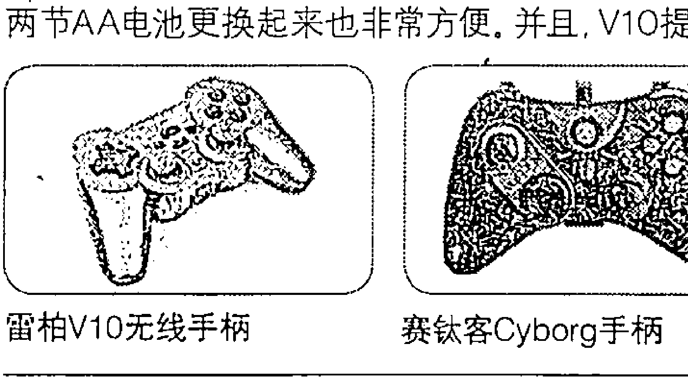

### 赛钛客 Cyborg 手柄

价格：265元

特性：赛钛客Cyborg手柄具备100%兼容特性，在PC端很多标有Game for Windows的游戏无需设置即可使用，方便至极。Cyborg手柄还能够实现SST编程功能，根据游戏随时调用不同的按键配置文件，使用更加方便。

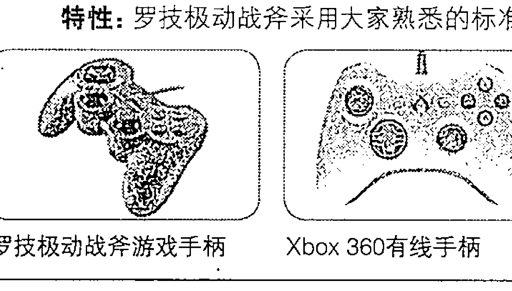

### 罗技极动战斧游戏手柄

价格：125元

特性：罗技极动战斧采用大家熟悉的标准布局方式。右侧为4个标准按键，中间有两个扎实的摇杆，左侧则有一个凸入伏的方向柄。方向盘的前端，还有还有4个附键。整体类似于PS2的标准手柄。

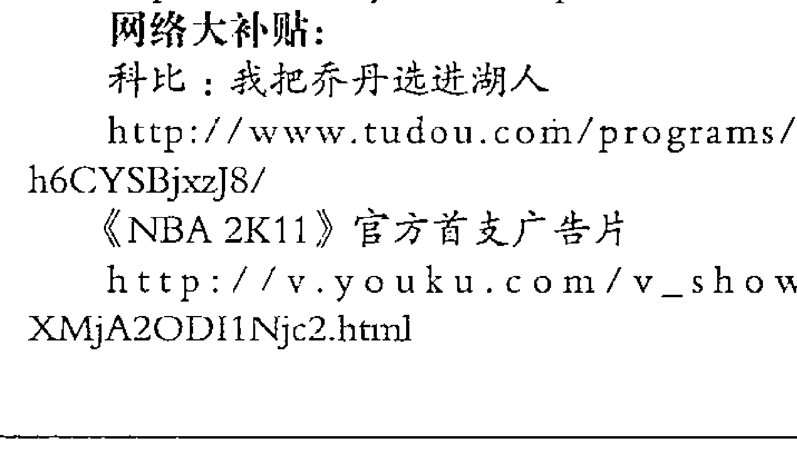

### Xbox 360 有线手柄

价格：120元

特性：没有什么比Xbox 360有线手柄更适合使用在PC上了，微软将标准化做得淋漓尽致。在NBA2K11中，很多特殊的呼叫配合都需要特定的操作方式，Xbox 360有线手柄在PC上使用时，与在Xbox 360上使用别无二致，操控起来就更容易了。


## 还在用手发短信？动动嘴就可以了

每次看到老爸发短信的样子，都替他着急，戴上老花镜，一个一个按键、选字，二十几个字五六分钟才能搞定，不过这也算厉害了，要知道好多老人还不会发短信呢。小键盘、小屏幕、拼音这都是横在老人们前面的几座大山，要是能够说说话就发出短信，那真是再方便不过了。

不过，有人会说，既然这样，干脆直接打个电话不就完了。恩，貌似有道理，不过，如果这样，你手机里怎么会有这么多短信呢？呵呵，短信有短信的应用场景，这是电话取代不了的，例如有些话不方便直接说，用短信最合适了，或者有些事很简单，也不着急，发个短信就够了。

今天就给大家介绍一款软件“讯飞语音输入法”，安装好后，发短信的时候，直接说话，它就能将语音识别成文字显示出来。不过，当前只支持Android系统的手机，同时，必须连上互联网，因为它首先要将你的声音编码压缩后传输到远程服务器，在服务器端实现语音识别，再将识别后的文字消息传回用户手机。

下载“讯飞语音输入法”(http://www.voicecloud.cn/download_center.php?v=1)，在手机上安装好后，进入设置中的“语言和键盘”界面，勾选“讯飞输入法”（见图1），接下来在短信或文字录入界面，调出输入法，选择讯飞输入法（见图2）。再点击虚拟键盘界面左下角的麦克风图标，软件会提示你“语音已开启，请说话”，这时候就可以说话了，说完稍等片刻，就会显示“正在等待识别结果，请稍后”，稍等片刻，文字就会显示出来了。识别结果（见图3），准确率还是相当高的。

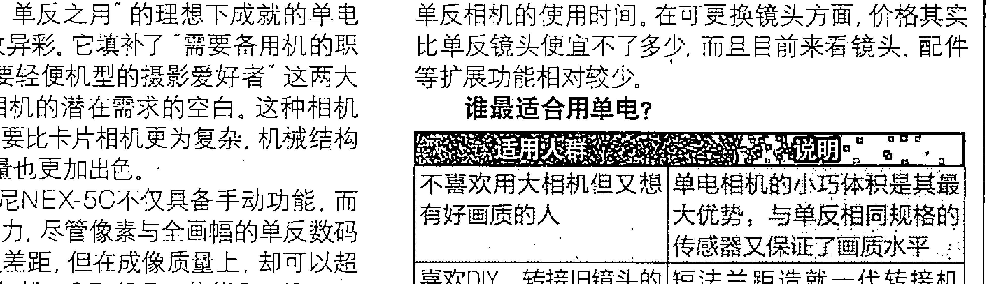

除了老人，对于任何一个懒得手动输入短信的人或者不方便手动输入短信的场景，都很方便，例如

家庭主妇正在做饭的时候收到个短信，说两句就回复过去了，真是一发短信，做饭两不误。

## 单电相机值得买吗？

### 什么是单电相机

### 口袋机大小专业机性能

### 谁最适合用单电？

现在一出去玩，要么就是去繁从简用手机拍照，要么就是扛着个“大炮”单反，显得倍儿专业。但是，很多人对这些“大炮”单反还是抱怨挺多的，固然成像质量好，不过携带起来非常麻烦。数码相机的发展总是能够给我们提供更好的东西，比如说单电相机，其兼顾单反相机的专业功能，同时具备不错的成像质量，并且携带起来和卡片机没什么区别……

单电相机全称单镜头电子取景数码相机，它通过高素质镜头群以及组件的支持，实现了比准专业数码相机更出色的画质，同时兼具数码相机强大的功能可拓展性，比如艺术滤镜、高清视频等功能。其实单电相机这样的称呼并不严谨，更科学的称谓是“可更换镜头数码相机”。只不过目前单电相机的称呼方式已经被广泛认可了。

现如见大部分单电相机多采用4/3系统或是Micro 4/3系统。尤其是后者，现在越来越多的单电相机采用这种规格，所谓的Micro 4/3系统，舍弃了4/3系统的镜箱（及延伸而来的五棱镜、光学观景窗）结构，而是采用了电子取景窗或相机屏幕取景的方式——简言之，你也可以将其理解为可更换镜头的卡片机。此外，像索尼等非Micro 4/3系统标准的企业，也采用了自己独有的技术规范来设计制造单电相机。

以“卡片之薄，单反之用”的理想下成就的单电相机在市场上大放异彩。它填补了“需要备用机的职业摄影师”和“需要轻便机型的摄影爱好者”这两大用户群体对数码相机的潜在需求的空白。这种相机在功能设置上明显要比卡片相机更为复杂，机械结构也更多，而成像质量也更加出色。

举例来说，索尼NEX-5C不仅具备手动功能，而且具备镜头更换能力，尽管像素与全画幅的单反数码相机相比要有较大差距，但在成像质量上，却可以超越很多卡片机。如松下GF1/GF2、佳能G11/G12、奥林巴斯E-PL1/E-PL2、三星NX10、尼康P7000和理光GXR尽管在技术上各有不同，但在功效上确实是大同小异。

不仅如此，在体积上单电相机也具备单反相机无可媲美的纤薄身躯。在镜头部分，“长枪大炮”固然没有了，但同样参数指标的可更换镜头依然存在，不过体积也进一步缩小，比如奥林巴斯，其单电专用的套机镜头14mm-42mm，由于采用了特殊的收缩方式，在非工作状态时镜头长度仅43.5mm，这岂是单反相机镜头可以媲美的？

当然了，单电相机毕竟不是单反相机，在一些方面依旧有不小的差距。单电相机由于完全没有光学取景器，完全依靠电子取景，相对应的自动对焦方式只剩下“对比侦测”一种。因此在对焦能力上，单电相机要差不少。另一方面，单电相机因为只能采用屏幕取景方式，所以耗电基本和卡片相机一致，远远落后于单反相机的使用时间。在可更换镜头方面，价格其实比单反镜头便宜不了多少，而且目前来看镜头、配件等扩展功能相对较少。

- 小提示：
与以前的4/3系统标准相比，Micro 4/3系统标准的最大不同特性在于：
1. 镜像距离缩短了近50%。
2. 镜头外圆直径减小了6mm。
3. 镜头中的电子触点增加了9到11个。

| 适用人群 | 优势说明 |
| --- | --- |
| 不喜欢用大相机但又想有好画质的人 | 单电相机的小巧体积是其最大优势，与单反相同规格的传感器又保证了画质水平 |
| 喜欢DIY、转接旧镜头的玩家 | 短法兰距造就一代转接机王，乐趣无穷 |
| 入门级用户，预计自己不会多花时间钻研摄影 | 单电相机简单、易用、花哨功能相对较少 |

可以说，单电相机是介于单反相机和卡片相机之间的一种机型。它并不是所有人都需要的，在考虑选购之前，应该先考虑自己究竟有什么样的需求，再根据自己的需求选择不同类型的数码相机，这样才最合理。

## 通吃所有格式 高清播放器热辣点评

格式差别大

现在高清播放器真是五花八门，将近五百款各种型号、新旧不同、价格天差地别的真叫人难以选择。很多人对高清播放器不感冒的原因也和这有关系，同时，格式兼容、字幕兼容问题一直也是让很多用户望而却步的重要原因。今天，小编在这里为大家精心挑选了几款能够通吃所有格式的高清播放器，价格从400余元到800余元任您选择哦！

目前市场上虽然多达数百款高清播放器，但主要的播放器解决方案——核心芯片有四种，分别是RTD1055、RTD1283、RTD1073和SMP 8635，在功能上，无疑是前三个更具优势。具体他们之间的差别可以从网络大补贴中找到答案，这里就不浪费篇幅。其实，高清播放器的价格之所以差别这么大，看看芯片解决方案就能知道一二了。RTD1055方案产品价格大概处于300元~500元价位；RTD1073方案的高清播放器价格目前多在400元~600元左右，这之间的价格差异主要体现在功能、扩展性上；600元~1000元的有不少采用RTD1283方案；1000元~3000元的多采用SMP 8635方案。不过，SMP 8635方案并不支持RMVB格式，虽然在回放效果上非常出色，音频支持规格也很优异，但毕竟我们要的还是通吃所有格式，所以SMP 8635方案的产品就被排除在外了。

网络大补贴：
高清RTD1283/RTD1073和SMP 8635解码芯片区别
http://bbs.htpc1.com/thread-67323-1-2.html

### 忆捷M850 价格：399元

399元也能全格式兼容？忆捷M850就做到了。这款产品采用RTD1055方案，这个方案实际源自RTD1073，属于后者的简化版本，而且RTD1055改进了RTD1073方案的高发热量问题，主要简化的不过是网络功能而已。忆捷M850支持H.264、MPEG1/2/4、DIVX、XVID、VC1、RMVB等高清格式解码，100%硬件解码，并采用CPU+DSP架构解码，兼容性非常出色。同时，这款产品能够支持Dolby TrueHD 7.1次世代音频输出，DTS-HD输出5.1立体环绕音效，在这方面甚至RTD1073都比不上。同时忆捷M850支持蓝光原盘BD-ISO格式，蓝光原盘目录播放及外挂DVD光驱功能，内嵌PGS字幕，支持多段TS、M2TS文件播放及断点无续播功能。

> 小编点评：
如果你不在乎网络功能，同时又对发热问题有所顾忌，价格便宜的忆捷M850是非常理想的选择。

### 海美迪HD300A高清播放机 价格：435元

海美迪HD300A采用Realtek 1073方案。比较有意思的是其采用2.5英寸规格硬盘，空间占用比较小，在这里，建议大家在PC端配备一个2.5英寸抽取盒或者USB接口的硬盘底座（推荐前者），价格在80元~120元，这样拷贝电影会方便许多。如果你不想使用内置的硬盘位，或者觉得单独为海美迪HD300A配备一个2.5英寸硬盘太费钱，也可以利用现有的USB移动硬盘直接连接到机器上播放。更让人惊讶的是这款高清播放器还可以通过SATA接口外接普通DVD光驱及蓝光光驱，可以播放RBD、MiniBD、VCD、CD光盘，使用蓝光光驱时可以直接支持播放BD25、BD50的电影盘片播放哦！

在功能上，HD300A支持多段TS、M2TS的无缝播放。TS多段文件、BD-ISO多段文件将会连续无缝播放。打开相关设置即可自动识别蓝光24Hz电影模式。而且它还支持矢量字幕，提供了丰富的字幕调整功能，并可实时显示调整后的效果。播放控制方面，除快进、快退、播放、暂定等常用功能外，还提供了单步播放、慢放模式以及搜索播放模式，支持用户输入时间来精准定位。此外，书签及断点续播更方便用户快速找到未看完的电影片段。

> 小编点评：
435元，这个价格对比这个功能……啧啧，值！

### 开博尔M1073 价格：449元

开博尔M1073采用RTD1073方案，体积小巧是这款产品的主要特点。开博尔M1073能够通吃1080P和720P的H.264、VC-1和MPEG编码视频，对于网络目前流行的主流格式也能做到完美兼容。接口方面，开博尔M1073支持AV、色差与HDMI视频端子，新老电视设备都能很好的兼容。在音频方面，开博尔M1073支持DTS、LPCM、FLAC、LC-AAC、HE、AAC、MP3、OGG、WAV、WMAD等诸多音频格式，并且支持DTS-HD MA等高清音轨的降解输出，无需购置价格高昂的高清功放也能享受到5.1声道的出众音效。

> 小编点评：
体积小巧、功能强大是开博尔M1073的重要特性，目前网络上非常火爆的一款产品。

### 忆捷M8 价格：799元

忆捷M8采用Realtek顶级RTD1283高清方案，支持电视定时录像功能，支持后续扩展DTV模块，获得地面数字电视接收功能，国内首款抽拉式装置设计方式，装卸3.5英寸硬盘方便快捷。支持mkv、ts、m2ts、mts、tp、wmv、lfo、iso、vob、mpg、mp4、mov、divx、xvid、RM/RMVB、flv等格式。忆捷M8支持网络下载、在线播放、WIFI、NAS等网络功能，支持DTS、DOLBY杜比数字环绕音频技术，全高清解码分辨率720P、1080i、1080P，支持码率高达104Mbps，支持蓝光原盘BD-ISO格式，支持1080P全格式解码及外挂DVD光驱功能，支持H.264、MPEG1,2/4、DIVX、XVID、VC1等高清格式解码。DVD、蓝光片源播放目录识别功能，增加DVD导航功能。背部接口从左到右接口及布局分别是风扇、ANT IN/AT OUT、色差输出接口、AV IN/AV OUT、同轴/光纤、电源开关、HDMI接口、网络/USB HOST接口、USB DEVICE接口、DC-IN接口。简言之，RTD1283方案的忆捷M8无论是在功能上还是格式兼容性上，都是目前最强的高清播放器之一，尤为突出的是，这款产品的价格仅为799元，不少采用此方案的高清播放器都是1000元级的售价。

> 小编点评：
如果你对高清比较发烧，追求效果，同时价格上也比较在意，那么忆捷M8就是你最好的选择了。

## 300元无线、路由、ADSL三合一

ADSL Modem、路由器、无线，现在产品的集成度越来越高，功能也越来越方便了。这种超高集成度的网络设备带给用户最直观的好处就是电源少了，线缆少了，设置起来也更加方便了（统一页面设置），价格上随着产品技术逐渐成熟也便宜了不少。

### 腾达W548D

功能简述：
腾达W548D包含ADSL、ADSL2、ADSL2+标准，并具备无线连接能力。最大的特点在于这款产品拥有一张向导光盘，根据光盘提示内容操作就能够完成所有设置，非常方便。需要注意的是，这款产品是单天线产品，信号的强度可能会略逊一筹。

价格：315元

### TP-LINK TD-W8900G

功能简述：
TP-LINK TD-W8900G支持ADSL、ADSL2、ADSL2+标准，最高下行速率可达24Mbps，最高上行速率1Mbps。在无线部分支持IEEE 802.11g规格，有线部分为4口100Mbps网络。比较有特点的地方在于全中文的管理设置界面，操作设置更加方便。

价格：280元

### 华为HG520s

功能简述：
华为HG520s外观很漂亮，与众不同的是这款产品带有USB接口和WPS按钮，可以安装U盘或者是移动硬盘，经过设置后甚至可以进行脱机FTP下载！

价格：299元

当然，这里只是简单的列举了一小部分产品，还有很多一体式的设备可供选择。但要留意，不少网上销售的所谓裸板ADSL一体Modem其实都是国外的翻修品，或多或少存在问题，虽然贪到了几十元的便宜，但在使用时很可能会发生不稳定、重启等等莫名其妙的故障，这可不是刷个固件就能解决的哦！

## 极速SDHC Class 10 SD闪存卡 均价150元！

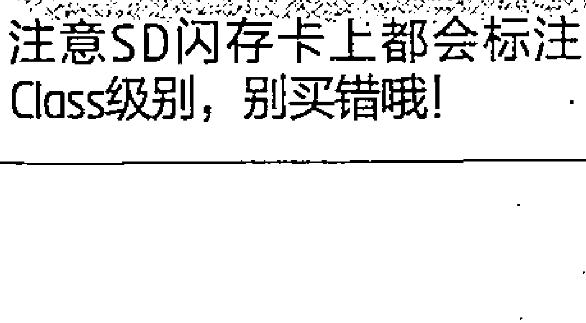

为什么DC连拍那么慢呢？除了DC本身的“处理器”性能不足外，制约连拍、存储速度的其实就是存储卡了。尤其采用SD闪存卡的卡片DC，甚至还有部分使用SD闪存卡的单反用户都是只看容量，不看速度。同单反常用的CF卡一样，SD卡其实也有性能高低之分。

SDHC标准中，先前分别有Class 2、Class 4、Class 6三个速度级别的规格差异，后来又追加了Class 10这一标准。SDHC Class 10标准要求最低10MB/秒的写入速度，用以确保高速连拍与Full HD录像流畅不间断、不掉帧，这个标准也主要是针对当前高像素DC在连拍时遇到的问题。

SDHC Class 10

读写性能十分出色
目前SDHC Class 10的SD闪存卡容量多为8GB和16GB，价格上高于同容量的Class 6 SD闪存卡，但物有所值，高速SD闪存卡的读写能力可以有效改善连拍速度缓慢的窘境。

金士顿 SDHC Class 10 8GB/16GB/32GB
价格：158元/288元/508元

PNY SDHC Class 10 16GB
价格：199元

威刚 SDHC Class10 8GB
价格：115元

东芝 SDHC Class10 8GB
价格：195元

创见 SDHC Class10 8GB
价格：130元

SanDisk Extreme SDHC Class10 8GB
价格：280元

## 把银行装入口袋

银行排队难问题，已经堪比世博沙特馆。越来越多的银行还开始在柜台“拒办”一些缴费业务，更让越来越多的人选择了网络银行。随着手机网络的发展，再加上小青年立刻行动的风格，手机银行现在也悄然兴起。

其实，老爸老妈们“爱好”排队，不外乎就是对网络的陌生以及安全问题。那么，至少你应该让他们来看看这篇文章，无他，让他们了解手机银行其实很容易，很安全。

## 一分钟小测试

- 1. 刷信用卡消费，喜欢“花明天的钱”的时尚月光族
    A. 是 (+2)
    B. 否 (+0)
- 2. 你经常工作忙到四脚朝天，想到的事情就要马上处理，不然很快就会忘掉？
    A. 是 (+5)
    B. 否 (+0)
- 3. 需要经常外出或上班时没有网络可用。
    A. 是 (+5)
    B. 否 (+0)
- 4. 你是大老板，或虽然不是大老板，但要随时关注银行账号的情况。
    A. 是 (+8)
    B. 否 (+0)
- 5. 除了工作之外，还会利用炒股、债券、基金赚点小钱。
    A. 是 (+2)
    B. 否 (+0)

0分~4分
恭喜你，继续保持现在的生活状态吧，没必要去劳什子考虑什么手机银行了。

5分~7分
根据需要选择是否开通手机银行，考虑到现在很多银行柜台已经不再办理小额代收费业务，劝你至少办个网上银行。

8分以上
“手机银行”完全就是为你而生的，而本文更是为你量身打造的。

|        | 柜台排队 | 电话银行 | 网络银行 | 手机银行 |
|--------|----------|----------|----------|----------|
| 优势   | 简单，安全，性强，无额外花费 | 速度快、省事 | 功能强，安全，速度快 | 任何时间，任何地点，安全，简单 |
| 劣势   | 需要排队，时间成本高 | 功能少，安全性较低 | 需要电脑和网络 | 需要网络流量费及月功能费 |
| 适用人群 | 退休的老爸老妈 | 人人都可使用 | 会上网的人 | 无法上网的人 |

## 手机银行你需要知道的两件事

### ★安全问题

很多人担心手机银行出现安全问题，但其实手机银行在服务器交换数据时，都进行了加密，破解的可能性很小。加上多数银行都会将手机号与账号绑定，并加入转账限制，所以使用手机银行非常安全。

### ★资费问题

手机银行的收费方式，每个银行有所不同，提供的服务不同，收费也不同。

- 常用手机银行WAP版网址
    工商银行 wap.icbc.com.cn
    招商银行 mobile.cmbchina.com
    建设银行 wap.ccb.com
    交通银行 www.95559.com.cn/wap
    中国民生银行 wap.cmbc.com.cn
    兴业银行 wap.cib.com.cn
    光大银行 wap.cebbank.com

## 招商银行手机银行大体验

招商银行一向以服务取胜，这次手机银行也没有落下，不仅免费，而且无需办理就可以直接使用了。
用手机登录mobile.cmbchina.com，这时会根据你手机的情况登录WAP版或是网页版，这里以WAP版为例。

### 1. 用手机银行来缴个手机费吧！

输入一卡通卡号及密码后登录，然后你可以进行“账户查询”、修改密码等操作。按下键，进入到“自助缴费”。
如果是第一次使用“自助缴费”，先选择“功能申请”，选择要交费的项目，然后就可以回到上级菜单，进行“缴费”了。

### 2. 手机银行助手

“助手”功能是招商银行特有的功能之一，它最大的特色就是日程及基金净值提醒功能。点击“助手”，然后分别添加提醒内容即可。

### 3. 适合触摸屏的“网页版”

如果你的手机足够好，还是建议你使用网页版，使用起来更方便，而且更直观，更接近电脑的使用感受，并且更适合触摸屏。还有一点好处是你可以使用WiFi登录，这样可以节省下浏览费。小编分别用S60v3手机以及iPod touch分别进行了测试，前者在使用网页版时，需要用方向键控制“虚拟鼠标”进行选择，后者则可以直接采用触摸方式了。
其他网络银行的使用方法和招商银行相似，只是需要一个开通的过程，这里不再赘述。

### 小提示：“手机银行”与“手机钱包”的区别

“手机银行”就不多说了，“手机钱包”其实是一种小额支付手段，也就是说不用现金或银行卡，直接从手机话费中付款，适用于不超过30元的支付。

### 火速链接

如果你平常使用手机仅仅是购买商品，或是缴费，完全可以使用手机支付宝，具体的使用方法可以参考第12期的《大屏手机 网购到手软》一文。
(文/ABC)

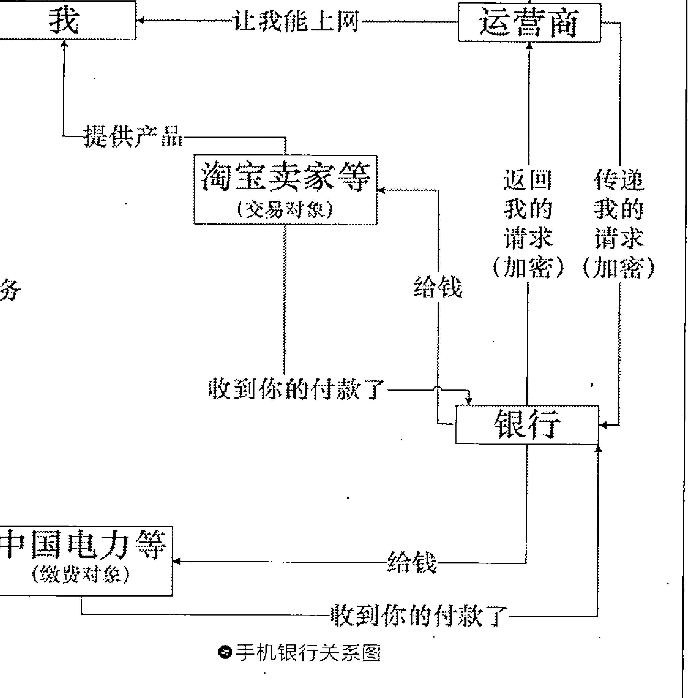

|          | 短信版                         | WAP版                                   | 网页版/客户端版 | 备注                                                                                           |
|----------|--------------------------------|-----------------------------------------|-----------------|------------------------------------------------------------------------------------------------|
| 工商银行 | 25元，100条<br>45元，200条<br>100元，500条 | 60元/年/用户<br>(目前，暂不收费)      |                 | 短信版特别适合老年人，只要用发短信的方式就可以完成缴费                                         |
| 招商银行 |                                | 免费                                    | 免费            | 独特的网页版针对iPhone等高端智能手机                                                           |
| 建设银行 |                                | 不同运营商收费不同，1元/月、3元/月、6元/月、10元/月 |                 | 3G版与普通版区别不大，除了界面漂亮外，功能基本相同                                             |
| 交通银行 |                                | 6元/月/用户<br>(推广期内免收月服务费)     | 6元/月/用户<br>(推广期内免收月服务费) | 独特的无卡手机取“现”功能非常实用                                                               |
|          | 适用于任何手机，对于不熟悉手机上网操作，只会短信的老年人 | 能上网就能使用，山寨机或不具备Java功能的手机都可使用，但需要使用人熟悉银行业务 | 智能手机用户，对银行业务不熟悉的人也使用，安全性高 |                                                                                                |

注：除短信版外，其他几种网上银行除了服务费外，还要向运营商交一份网络流量费。

# # 假期的终极骑行之路

记得在刚踏进自行车论坛时，看到很多协会、爱好者组织的同学出游都是骑着千元以上的单车，全副装备时，心里一下没底。学生族如何分享他们的快乐？

# ## 数码化骑行装备，超越传统骑行

全副装备不一定是最适合自己的，学生族有年轻人自己的玩法，我们要做的就是打造数码化骑行装备。骑行离不开GPS，而GPS功能不仅局限于告诉你，你现在处在什么位置，更重要的是GPS会记下你走过的每段路线，这种记录的形式是可交换的“文件”，你可以分享给朋友，告诉他们你去过哪，线路上穿插的照片也会让旅行看起来更有意思。试想，你沿着朋友用手机发送过来的路线，追随他的足迹旅行，甚至下载网上驴友们的路线追寻大自然。没错，在数码时代，骑行是极具交互性的健康运动。

# ## 制作属于自己的穿梭秘籍

- 1. 第一步: 添加时间信息
首先请查看你的照片是否有准确的EXIF拍摄时间信息（右键照片查看属性中详细信息）。数码相机和绝大部分智能手机是没问题的，某些手机的照相功能可能不写入EXIF信息。对付这样的照片要通过ACDSEE将时间手动写入EXIF，方法是在浏览界面给照片打勾，选择“工具”中的“批量设置信息”，一般照片的文件名就是拍摄时间，填写完成后点击“执行设置信息”。
- 2. 第二步: 位置与照片合成
接下来要用PixGPS来写入GPS信息，设置好照片目录与GPS轨迹文件位置之后，依次点击“Load Date files”、“Calculate coordinates”一切正常的话拍摄时间和经纬度会自动对应的填上去。最后点击“Update Photo Files”就可以了。这样一来图片的EXIF信息里就会包含着位置信息，以后用别的软件查看起来也就非常方便。
- 3. 第三步: 照片与轨迹合成
最后需要用到GPicSync生成含有图片和路径信息的Google Earth文件。注填写正确的时区信息，设置完成后点“Synchronise”完毕后再“Quit and save Settings”退出，在图片目录下面会生成一个“doc.kml”文件，点击就可以看到带有轨迹和照片的Google Earth路径了。

# ## 出发吧，壮士

如果以上一切你都OK了，准备出发吧！无比让人羡慕的学生族，你们有一整个暑假去享受骑行的乐趣。

**头盔**

50元以下还是能够买到一个头盔的，质量一般般，入门是够用的。适合一般不高速，时间跨度不长的长途骑行。

**骑行手套**

保护手腕必不可少，25元左右拿下，劳保手套、足球手套也能将就着用。

**防风墨镜**

少说100元左右，在阳光猛烈、风沙大、下雨的时候还是很管用的。

**骑行衣裤**

如果强度不大、速度不高，这都是可有可无的，便宜的百元左右。

**码表**

> > 搜索关键词: 顺东 自行车码表
> 价格20元
> 码表分为显示与测量两部分，全防水设计，能检测车速、距离、温度。码表原理很简单，感应探头固定在车架上，会监测固定在车条上的感应磁铁，轮胎转一周切割一次磁感线，再根据输入的车胎周长计算出速度，轮胎周长即为直径的3.14倍。

> > 搜索关键词: 西门子 N100 码表
> 价格280元
> GPS码表的强大之处在于精准，假设磁铁码表每圈误差1%，骑行10km误差就会达到100米。而GPS定位误差要小很多，此外还具备2.8英寸240×320的彩色TFT触摸屏，而WINCE 5.0系统可支持凯立德等地图。

> > 搜索关键词: GPSport 245 轨迹记录仪
> 价格520元
> 想来点专业范儿？那必须是轨迹记录仪才能担当，依靠GPS功能支持时速、高度、距离显示，还包含轨迹记录，可以结合Google Earth导出骑行路线。
> 自行车速度10公里/小时为较慢，15公里/小时为中速，20公里/小时为快速，25公里/小时为很快。你也许会大声嚷嚷：我一定可以骑到最高级别！可是且慢，如果是长途旅行，你的速度在15~20公里之间更为妥当。

> > 搜索关键词: 行车记录仪
> 价格290元
> 记录轨迹不仅限于GPS，视频记录也是绝佳的方式。这个宝贝本来是用于汽车监视行驶状况，好在它使用诺基亚标准手机电池也可工作6小时，支持140度广角夜视拍摄，SD卡存储视频，30万像素与平时聊天用的摄像头效果相当。

# ## 骑行先从车座开始

> > 搜索关键词: 捷安特 镂空车座
> 价格37元

> > 搜索关键词: 无鼻车座
> 价格70元
> 镂空设计的座椅好处就是空气流动性极佳，而且更加符合人体工程学。相对休闲些的骑行，可以考虑宽大的座椅，足足有250×200mm的车座是多么的舒服。

**GPS、码表固定**
用一根DC那种腕绳，将GPS套在车把上，腕绳与底座双重保护，GPS绝对不会从车把上跳出。如果觉得腕绳破坏简洁的美感，可以选择钓鱼用的透明线代替。

# ## 音乐

> > 搜索关键词: 车首包
> 价格40元
> 你可以带CMMB电视，但大多骑行的目的地是郊区甚至是山区，完全没有CMMB信号。用MP3、手机听听音乐还是推荐的，骑行的时候把它们放在腰包或车首包里比较安全，不容易丢失，骑行中接听拿取很方便。
> 骑行时切忌听不到环境声音，即便是听音乐，也仅限于用一只耳朵。在车速较快时，耳机的线缆会有不小的风噪，如果线缆贴身从衣服内走线会好很多。至于听什么？因人而异，男生大多是许巍系列吧，夏日与单车、清风与汗水。个人推荐PT80，没有找不到的音乐。http://www.pt80.com

> > 搜索关键词: 自行车 气嘴灯
> 价格6元
> 想象在车轮上显示闪闪发光的“I love you”，在夜晚骑行是多么的拉风。这种拧在气嘴上的车轮灯，由开关控制显示5种不同颜色。

本文涉及软件下载地址：http://work.newhua.com/cfan/201013/qx.rar

（文/老湿很给力）

# # 小胖战术大讲堂①

今天我给大家分享一些UD对抗NE恶魔猎手首发的经验吧，地图以TR为例。
现在不论职业还是业余都以狗转蜘蛛速科技的战术为主，所以在这和大家分享我一些对于这个战术的经验和思路吧。
对于狗转蜘蛛的核心思路就是以牵制达到首要目的，牵制对方为第一，以此来换取自己科技的优势，再以科技优势去压制对方慢科技的打法。以这个中心思想为主，我自己的开局是祭坛、通灵塔、兵营3个建筑一起放，这样的目的有两个，第一是能快速出狗和英雄，第二则是可以省掉第6个农民的钱改为狗探路，而狗在前期探到对方的时候有时还能抢抢怪的经验。前期我个人觉得用狗转蜘蛛的战术不推荐RUSH或者压制对手，因为难免遇到厉害的暗夜选手时候会出现RUSH狗红血数量过多的情况，而且对手损失不大的话中期就会失去牵制力。简单概括一下就是：

RUSH或者压制对手，因为难免遇到厉害的暗夜选手时候会出现RUSH狗红血数量过多的情况，而且对手损失不大的话中期就会失去牵制力。简单概括一下就是：
(1) 前期RUSH压制暗夜井水。
(2) 中期天鬼第一时间出来以后带骷髅打AC或者拆建筑，NE没有井水的支持会很被动哦。
(3) 三本的时候不断的打击暗夜采木头的精灵，以达到让暗夜3本时缺木造不出小鹿，而到3本的同时再带上狗买好群补一波拿下对手。
前期如果顺利的话，一般情况死亡骑士是2级，而恶魔猎手也是2级，对方的BR应该走到家门外准备练744的大海龟，如果遇到对方2英雄买的是熊猫，则

UD第一时间可以买出娜迦带上3~4条狗进行牵制，在暗夜小鹿没有出来以前死亡骑士+娜迦和3~4条狗可以完全压制住对面的熊猫还有恶魔猎手。
这个战术流程是非常紧密的，中间有一环做不好的话就会被对手反牵制，而狗转蜘蛛最大的好处就是战术流程比较慢，不会紧凑到忘记做哪一步。

- 专有名词解释:
    UD: 鬼族 NE: 暗夜精灵 TR: 魔兽地图
    RUSH: 在中前期使用一种比较极端，比较凶狠的强行进攻的战术
    AC: 弓箭手 BR: 战争古树

（文/曾卓）

## 《波斯王子》，玩家必看的游戏电影

当奥特曼得知《魔兽世界》电影因为导演萨姆·雷米突然表示对指环王前传《霍比特人》感兴趣，而很可能把手头拍的《魔兽世界》电影扔在一边时，那种失望的心情就像等待4年搞定老板、老婆和儿子，与哥们一起准备看世界杯却在开球前停电一样。好在奥特曼不是钻牛角尖的人，用“2015年我们一起打TBC，看盗版魔兽世界电影”安慰自己效果还是不错的。哦，对了，这期我们要说的是《波斯王子》，魔兽电影看不到，看看波斯王子电影也是不错的，从老婆一直看完没有中间离场也没有睡着来看，这部电影奥特曼给9分——对游戏改编的电影来说，这分数那是相当的高，以奥特曼玩遍《波斯王子》系列的骨灰玩家来看，这部电影可以给8分，值得一看。

### 电影就是电影

想要电影忠实于原著，那导演、编剧就可以回家了，所以观众一般都不会太和电影剧情较真。
第一眼看到帅气的王子（杰克·吉伦哈尔饰，断背山的经历令他不帅也很难……），奥特曼立即猜到剧情可能是游戏的一代为主，王子帅气、阳光、幽默迷人，声音轻松自信，是的，这是一代王子才会有一切（游戏一代配音和形象塑造都令年轻的王子显得风流倜傥、卓尔不群），随着父亲的逝世、王国的覆灭、爱人的离去、饱经沧桑的王子在后几部中已经变成满脸络腮胡子，眼神阴郁、眉头紧锁的壮汉，那种艺术气质已经消失不见了。第一眼看到和善的塔米娜公主（杰玛·阿特登饰，玩家对她的攻击是最多的……），奥特曼感觉一代法拉公主又回来了，是的，这个被论坛水友评为最丑最差女主角的公主其实长相和一代公主相当一致，有点胖，有点内向，她带给玩家的感觉绝对比那些没有玩过游戏的观众们深得多。是的，只要你是《波斯王子》Fans，那么从第一眼你就会认可这就是王子，这就是公主。电影为游戏玩家做出了很多，也很尊重大家的感受，但电影就是电影，它和游戏剧情的差别极大。
从剧情上看，电影中邪恶的王叔其实和莎翁的《王子复仇记》如出一辙，学院派编剧思维的僵化可见一斑。当王子站在城市中心最高点俯瞰下去那个全景镜头划过时，它和奥特曼正在苦战的《刺客信条》主角阿泰尔形象完全重合，是的，导演大人一定也是《刺客信条》的忠实Fans，当然两者都是育碧门下的大腕，客串下没有问题，《波斯王子5》里王子也会有刺客皮肤的。电影追求了一种游戏没有的圆满，无论是王子兄弟情，为国奋斗的桥段，还是与美女穿越时光的爱恋，都是游戏所忽略或一笔带过的。观众重视的是剧情完美，而玩家则更在意游戏过程。
电影就是电影，奥特曼一向认为，游戏改编的电影，哪怕其中只有1%的游戏元素，那也足以吸引玩家们趋之若鹜了。像《波斯王子》这样至少保留50%+游戏剧情的电影，在商业包装下，既有冒险，又有打斗，既有大场景渲染，又有细节刻画，男主角风流帅气、女主角温柔体贴，带着女友去影院一观相当划算。另外，本片虽然从头打到尾，但导演很克制，没有渲染血腥场景，小朋友看了也没什么负面影响……

### 王子的绝技

许多玩家都认为，王子的绝技应该是那把时之刃，能让时光倒流的作弊器。但奥特曼觉得，王子灵活的身手才是他最大的绝技，这一点我们在电影中也能看到不少陆地飞腾的手段，与国内武打片中飞来飞去的大侠们不同，王子的绝技还是遵守一般的物理学定律的，借力才能做出动作，不会凭空御气飞行。
许多人都会说《暴力街区》中超级酷的达米埃和雷伊托是跑酷运动（Parkour）的鼻祖，而《波斯王子》的骨灰们绝对不会这样认为，早在王子一代的时候，他就能做出无数现今跑酷运动视为经典的动物：弹跳、侧滚、翻墙、空翻、猫跳跃、单杠、跑步过墙等。凡是操作过王子的玩家都不会忘记苦练基本功的日子，单杠回转、墙上快跑、抱着柱子跳跃、抓墙边缘的侧移、踏墙借力的后跃，平地上的练习还算简单，但是当王子在城市的残垣断壁之间，在机关陷阱之间，在高楼大厦之间做出这些动作时，奥特曼一直会紧张得满手是汗。许多关卡，都要反复多次才能通过。这种王子特有的绝技形成了一种干练、洒脱、来去如风、飘忽不定的行动风格，荡绳子、爬柱子、触机关、解谜题，只有想不到，没有做不到——这是《波斯王子》系列游戏特有的标志。
就像跑酷运动所宣扬的那样，协调、平衡、力量、弹跳都是必要条件，但如果没有了勇气，什么都是不可能的。当你在游戏或电影中看到王子飞檐走壁时，你就会明白只有勇气才能战胜心魔，战胜恐惧，平地能跨越两米是能力，在高楼间腾空跨越两米则是胆量（危险动作，切勿模仿）。

### 王子的悲剧人生

波斯王子是个苦命的孩子，想当年（1993年），王子绝对称得上是冒险动作类游戏的鼻祖，但可惜的是随后的3D浪潮中模仿借鉴王子的《古墓丽影》占了头筹，劳拉踩着王子的肩膀上位。直到10年后，飞檐走壁的王子终于学会了3D技术，推出了《时之沙》才彻底翻盘。古色古香的乌德琴，通巴克鼓，波斯传统的独特“塔赫里尔”女声唱腔加上王子超炫的动作，令本作一举成名，今年公映的同名电影就是源自波斯王子第一代。但王子是悲剧的，在一代使用时之沙击败邪恶的宰相本来是大快人心的事，但在二代中，时间守护者DAHAKA却诅咒了王子，他的挚友惨死，爱情也离他而去，阴霾、嗜杀是王子的新形象（其实是育碧当时打算用二代王子形象走成人路线）。好不容易熬到三代，王子眼看着家园被毁、爱人被杀、人格分裂成两个……王子没有在第四作中出现，他一定是在无人的地方，用时间抚平自己受伤的心灵。在将要推出的第五作中，王子成为了一名战士，为了哥哥的王国而战。就像劳拉总是在黑黢黢的古迹坟墓中只身游走一样，波斯王子则总离不开叛乱、战争、离别和杀戮，虽然生命中还有许多美好的人和事，但显然，不如意事十之八九（如意了，自然也就没有故事了）。第一部中阳光、幽默、轻松的王子一去不复返了，迪斯尼拍摄第一部波斯王子显然是符合其公司定位的，但后续作品中的血腥和杀戮该如何体现呢？奥特曼个人最期望看以《波斯王子3：王者无双》为剧情的电影，双重人格的王子一定能带给观众更多的感触，剧情的发展上也会有更多的余地和变数，当然打斗场面也会更加精彩。

### 结语

电影《波斯王子：时之沙》是一部集武术、自由搏击、跑酷、蹦极、滑板、攀岩、爱情和月光宝盒于一身，穿插了《古墓丽影》、《印第安纳琼斯》、《刺客信条》、《加勒比海盗》和《王子复仇记》的大杂烩式的游戏电影。鉴于游戏已经出到了第五部，电影版出到第三部那是绝对没有问题的。虽说目前本片离票房毒药仅有一步之遥，但奥特曼相信波斯王子的潜质，游戏电影一向都是慢热的。最后提一句，玩波斯王子5不需要复习前四作剧情，只需看看这部电影就够了。

### 波斯王子语录

> 问：谁是世界最早发明跑酷运动并且是最杰出的跑酷选手？
> 答：波斯王子

要情节有情节，要特技有特技，要打斗有打斗。很不错的，刚上映我就去看了。
——从未玩过同名游戏的观众甲

1代的匕首，2代的服装，3代的黑王子……这根本不是一代之沙，而是大杂烩。
——认死理的观众乙

你不能改变你的命运。
——二代中神秘老人对王子的断言

让我们两国结成比友谊更可靠的关系——婚姻。
——电影搞笑语

这部片子最血腥的地方就是刨开了一条蛇，无色情，无暴力，无血腥
——遗憾的观众丙

我将推荐所有人去看这部罕见的商业片：有这么难看的女主角，还能吸引我一直心潮澎湃地看下去。
——没有遗憾的观众丁
(文/奥特曼)

## DIY笔记本的“抽油烟机”

前辈们说得好：“自己动手，丰衣足食”，面对炎炎夏日，你做好帮笔记本从“水生火热”的生活中解救出来的准备了吗？还没有？没关系，看看下面的达人们是如何用“抽油烟机”拯救笔记本的，相信你也会从中学到不少呢！

### “抽油烟机”的原理

相信同学们都有过厨房炒菜的经历，扑向面门的热浪和油烟在夏天绝对是噩梦，此时如果打开了抽油烟机是不是会舒服很多呢？笔记本也是一样，如果可以利用“抽油烟机”，对准散热通风孔，将内部的热浪抽出来，增强笔记本底部气流的循环过程，降温效果同样明显。

### “抽油烟机”的材料

- 12V风扇一个；复合板或者硬纸板；12V的电源适配器一个；电源线若干；剪刀胶带若干；电烙工具。

小提示：
此设备关键在于风扇的选择，不要选择5V的那种USB风扇（基本没效果），12V的电源适配器，电流1A左右就足够了，低于1A的功率不够效果不好。

### “抽油烟机”制作方法

首先将硬纸板裁剪成抽油烟机形状，一侧的大口刚好可以塞进风扇，另一侧的小口以笔记本散热孔为标准，此时要注意风扇的方向不要装反哦。
接下来利用电烙工具和电源线，将风扇和电源适配器焊接好，此时要注意风扇的正负极，接反了风扇是不转的。最后将风扇塞进“抽油烟机”里，用胶带固定好，至此硬件工作准备完成。

### “抽油烟机”使用方法

将“抽油烟机”对准笔记本散热孔并固定好，接通电源，用鲁大师一类的检测软件检查一下，本本的温度是不是下降了很多？

小提示：
DIY“抽油烟机”的风扇要选择大风量寿命长的产品，尽量保证整体的气密性（可以用胶条把缝隙堵上），如果在笔记本底部再DIY一个向上吹的散热风扇，一进一出形成流动的气流效果更佳。

## 充电器？少一件是一件

电影中，人高马大的老美特工总在耳朵里塞着蓝牙耳机，时刻准备着接受上头的命令来“维护正义”，可能有同学会说了，俺也有蓝牙耳机啊，这算啥稀奇的？殊不知，人家用的耳机绝对是经过特殊设计的，别的不说，就其中内置的锂电池，蕴藏的能量可不是咱们用的民用级产品可以比拟的。
没错，相信使用过蓝牙耳机的同学都会遇到如下困扰：耳朵同学不允许耳机同学一直住在他家（耳机总不能一直塞在耳朵里吧？），外出时还真不便于携带；蓝牙耳机越小，电量越差，电话中途会经常“罢工”。来自Aligh的一款蓝牙耳机，就为解决上述困惑提供了很好的思路，在手机的背部单独预留了耳机凹槽，平时不用的时候把耳机插进去，既不用担心丢也能随时给耳机充电。有没有算过你家中所有数码产品充电器加在一起的占地面积？很惊人吧，以后还是少一件是一件吧。

### ESWC2010中国总决赛铸就电竞高峰究竟有多高？

曾几何时，以魔兽争霸为头牌的电子竞技，热遍大江南北，大牌战队群雄并立，热门比赛挥金如土。而今，经济危机寒流侵袭，电子竞技概念退烧，一个大大的泡沫被人们争相吹起，又纷纷唾弃……苦叹，三十年河东，三十年河西，谁来拯救危机中的电子竞技？2010年，代表世界范围内电子竞技最高水平的ESWC（Electronic Sport World Cup，电子竞技世界杯）中国总决赛即将开始，玩家们终于又开始兴奋，起码我们有了新比赛可以看，这个寒冬里的“一把火”是否能带来点光明和希望呢？这就好像是电竞界的世界杯一样，大家满心期待着，到最后自己喜欢的偶像如没拿到名次，我们除了空欢喜一场其实也无可奈何。毕竟每一年选手都在推陈出新的换换换，除了换得让人眼花缭乱之外，真正的经典永恒始终太少……ESWC2010中国总决赛包括《魔兽争霸III：冰封王座》、《反恐精英》、《Defense of the Ancients》、《极品飞车13》以及《FIFA2010》等电竞项目，今年FIFA能借助世界杯大火一把了，但是对于观众期待的选手来说，我们的人王SKY却没有出现，这不得不说是一份无可奈何的遗憾。就在此时，不太受瞩目的YUMIKO居然出线了，各路媒体都说YUMIKO是神明相助，大势所趋，但咪西觉得这跟在之前的WCG比赛上YUMIKO16进8的时候输掉了比赛有着很大关系，当时很多人都落井下石，对他实力产生了很大质疑，论坛上骂者非常多，有道是“天将降大任于斯人也，必先苦其心志……”。YUMIKO经过了这一段后，本人更是痛苦了很久，所以厚积薄发于今朝，为自己战队EHOME扬眉吐气了一番。

不过说到底，如今的电子竞技，几乎已经成了濒临灭绝的稀有动物。它很珍贵，它很稀有，它是一朵奇葩，还是一颗苦菜花？其实它更像一头在动物园里被人观赏、等待喂食的懒散犀牛……ESWC此次中国总决赛，是否能够把犀牛变成一瓶“红牛”，让所有观众和厂商都兴奋起来呢？物种的强大不在于它的珍贵，而在于数量的庞大和种群的延续。所以我们宁可不要犀牛，而要会产奶、会繁衍的奶牛——自给自足，必须是电子竞技大赛的唯一出路！但不管怎么说，作为一项电子竞技的盛会，ESWC是提高我国电子竞技整体水平、实现电子竞技行业化与产业化的必然要求。本次ESWC中国总决赛，也是广大电竞选手的共同需要，更是电竞人的共同梦想。我们期待ESWC在不远的将来，能够开创电子竞技的新局面。（文/眯西）

| 项目 | 选手/队伍 |
|------|------------|
| 《魔兽争霸III》 | EHOMEGIGABYTE |
| 《反恐精英》 | RYZIL |
| 《Defense of the Ancients》 | LGD_elegant |
| 《极品飞车13》 | CBLAST |
| 《FIFA2010》 | WEPEPSI |
| 《穿越火线》 | 国选赛 |
| Dota AllStars | LGDSGYYCH NIRVANAIG EHOME(国选赛) |
| 反恐精英 | TyLoo TyLoo.RAu |

### 走近游戏大王SKY李晓峰

Sky，本名李晓峰，这个看似普普通通的大男孩在游戏界中可是鼎鼎大名的人物。他曾在2005年和2006年连续两次在电子竞技世界锦标赛（WCG）上夺得《魔兽争霸III》单项冠军，成为我国第一个电子竞技的个人冠军。同时，由于他在电子竞技领域中的成功，Sky也多次出现在电视节目和媒体报道上，成为国内千千万万游戏玩家的偶像，被媒体称呼为“游戏大王”。

### 游戏大王的职业生活

电子竞技这个概念在中国一直以来都比较陌生，很多人都好奇那些以游戏为职业的玩家们究竟是怎样的一个群体呢？下面，我们不妨去探访一下Sky所在的WE战队，一起来看看职业玩家们的现实生活。WE战队是中国一支著名的电子竞技战队，战队地处上海，目前共有十名以上的全职玩家。Sky介绍说，他和他的队友们训练和住宿都是在这个训练基地里，基地是一个公寓式的套房，平时会有领队负责队员们的起居和训练。一般每天的训练时间都是事先安排好的，除基本训练外，也会安排体育锻炼、课外娱乐等活动。

Sky口中的“训练”，也就是玩家非常熟悉的“打游戏”。Sky是一名魔兽争霸选手，因此他每天的训练就是一盘接一盘的魔兽比赛。Sky说训练其实是一件很辛苦和枯燥的事情，不仅仅大脑每时每刻都要保持高度集中，甚至手指在长时间高强度的操作下也会觉得体力不支。像Sky这样的选手每天训练大概要达到8小时左右，如果遇上大赛备战，那么训练强度还会提高，“竞争太激烈了，你如果不保持训练很可能就被对手甩下来。”Sky如是说。当然，WE中的生活也并非只有训练，Sky现在几乎每天都要打篮球，这是他最喜欢的运动之一。不过Sky在游戏中虽然是天王级别的人物，但是在篮球场上却显得不那么风光，遇上队友中的那些肌肉男，Sky纵然号称战术大师，无奈也挤不进篮下的一亩三分地，长此以往被迫练就了一手投篮绝活。去年4月1日愚人节的时候，国内某电竞媒体就曾拍到了Sky独自练球的照片，并以此为恶搞，发布新闻“Sky即将转战NBA”，一时间成为大众笑料。对此Sky表示非常惊讶，从此不敢独自练球。常在河边走，哪能不湿鞋。有着称霸篮下决心的Sky也经常受伤，最严重的一次甚至眼睛好几天都不能睁开，而且还是在大赛期间。不过最后的结果是Sky顶着独眼坚持完成了比赛，成绩居然还不错。看来天王尽管在篮球场上功力不深，但只要一坐在电脑前，那便是王者归来，独霸江湖，想战胜他可不是那么容易的事情。

### Sky的校园行

从WE成立之日起，Sky就一直是镇队之宝，也因此经常随队伍参加各类的校园活动。WE的校园活动在这几年来几乎走遍了全中国绝大多数大中型城市，给许多大学生都留下了美好的回忆。同时，校园行活动也是Sky除了训练和比赛之外最主要的生活之一。2009年的时候，Sky来到了北大和清华，在这两所以学术氛围闻名的中国最高学府之中，Sky的到来引起了很大的反响。Sky回忆说，本来对北大和清华的印象就是学子们在这里发奋努力的学习，没想到他们对电子竞技竟然也如此热衷。据了解在北大的那次活动中，因为前来观看的观众太多，不仅场内爆满，场外还有大批进不去的观众久久不愿散去，而一露面便引来无数闪光灯的Sky无奈之下只好转到一个偏僻的后门才得以进场。那次的比赛中有一个北大学生挑战Sky的环节，可怜的Sky被限定了单手、不准用键盘，自己的血量只有50%的条件接受挑战。Sky尽管一生击败对手无数，但如此条件限定下如同内功全废，空有招式也全无杀伤力，最后败下阵来。Sky最后被请到台上发表失败感言，他笑呵呵地说：“能输给一个北大的女子选手我感觉很荣幸。”结果话音未落，台下所有女生纷纷举手表示要再来一次。当然，作为一个职业玩家来说，平时最重要的事情自然就是参加职业比赛了。Sky是中国成绩最出色的职业玩家，因此常常有机会代表国家出战，赛事密集的时候也是名副其实的空中飞人，足迹行遍世界。现在，一年一度的世界最高电竞大赛WCG也即将拉开战幕了，Sky是这项赛事成绩最好的中国选手，也是最有可能成就三冠王记录的世界第一人。今年的WCG也恰好迎来自己十周年的纪念，让我们为Sky一起加油吧！（文/特约电竞杂志专访栏目记者：冯寅）

## 危险的“毁容咖啡”

各位同学千万不要误会，咖啡当然不含毁容的成分，但当满足特殊条件进行冲泡时，咖啡真的可能成为毁容杀手呢，不信？咱们就从下面的小故事谈起：A君是咖啡爱好者，某天用一个干净的杯子接了一杯饮水机里的水，塞到微波炉里加热几分钟后拿出来时发现水面没有任何动静，于是就打算先把速溶咖啡倒进去再重新加热，怪事发生了，水杯的水开始迅速沸腾，原本风平浪静的水面一下子“喷射”出来，要不是A君反应快，说不定真的就毁容了呢。那么，差点让A君毁容的幕后黑手是谁呢？显然不是咖啡，真正的“杀手”竟然是那杯看似平静的水。不过，此时的水已经不再是普通的水，而是“过热液体”，也就是温度明明已经超过了沸点却不沸腾的液体。水烧开时的特征是什么？咕嘟咕嘟地冒泡！想在纯净水中产生气泡并不容易，因为纯净水可产生气泡大概只有纳米级别，这个气泡在水中会形成一个非常小的球形凹液面，因为凹液面的曲率半径太小，所产生的超低蒸汽压无法抵抗曲面的附加压力，只能“杯具”地被挤扁。因为无法产生引发沸腾的小气泡，所以纯净水就只好在逐渐升高的温度中默默等待小气泡同学的诞生，一杯“过热液体”就这样出现了。

“过热液体”非常不老实，一看到小气泡同学他就会激动，然后迅速的沸腾，达到“爆沸”的状态。前面故事里A君的速溶咖啡引来了小气泡同学，小气泡看这里的温度不错又找来了无数的大气泡，由于此时液体的温度在沸点之上，给了爆沸可乘之机。

了解了咖啡毁容的内幕，同学们也不必过分紧张，因为“过热液体”的产生需要两个条件：纯净液体和洁净、表面光滑的容器，如果我们使用自来水，由于其内部含有少量的杂质颗粒，在加热过程中可以比较容易的产生较大的气泡，因此不必担心爆沸。如果一定要像A君一样在洁净的杯子里加热纯净水，也有办法可以防止爆沸，只需要在杯里放上一把勺子，让气泡可以附着在勺子上形成比较大的气泡就可以了。

### 小知识：蒸汽压

指在液体（或固体）表面产生的蒸汽对液面（固体表面）的压力。在某一温度下，如果液体的蒸汽压超过了液面上气压，那么液体就能够在这个温度下沸腾，而这个温度就被称为液体的沸点。

### 小知识：弯曲液面

A君的杯子是圆柱体，因而使内部的液面弯曲。液面的弯曲使得液面的表面积增大，使得弯曲的表面上多了一个附加压力。弯曲的凸液面附加压力指向液体内部，而对于弯曲的凹液面这个附加压力则指向空气。这个压力的大小与曲面的曲率半径的绝对值有关，绝对值越小，这个附加压力就越大。

## iPhone助你睡眠

“我们有10万个应用程序，甚至可以调整一个歪斜的画框”——联通某广告

iPhone作为一款不仅仅在国内国外流行，其中很多人（可能超过一半）是因为iPhone艺术的美感（说白了就是好看）。但是，苹果设计它的目的并不仅止如此，潜藏在它后面的软件宝库可以说是应有尽有。无论是作为一款掌上游戏机、带有音乐功能的手机还是一款互联网终端iPhone都可以做得让大家足够满意。如何能把iPhone用得更好，如何能让自己手中的iPhone与众不同，奇数期你们就会看到果粉Alpha为大家带来的iPhone的新鲜应用（偶数期是由West带来的Android应用）。

3月21日是“世界睡眠日”，世界卫生组织将“睡得香”定为衡量人体健康的标准之一。然而，在现实生活中，不仅是许多中老年人失眠，连青少年也常说睡不好。据流行病学资料表明，全世界患有失眠症者约27%，其中66%为女性，34%为男性。长期失眠会打乱机体的生理节奏，削弱机体免疫力，引发或加重胃肠道疾病，甚至诱发心血管疾病而危害健康。

### 你睡得香吗？

判断睡眠的好坏，时间不是唯一标准，关键的因素是睡眠质量。失眠是指持续长时间对睡眠的质量和量不满意的状况。对失眠症的定义，国际疾病分类认为诊断失眠症应符合以下几点：一是入睡困难，或是难以维持睡眠，或是睡眠质量差；二是睡眠紊乱每周至少发生3次并持续1个月以上；三是日夜专注于失眠，过分担心失眠的后果；四是睡眠量或质的不满意引起了明显的苦恼或影响了社会及职业功能。

- 第一步：下载并安装SleepCycle软件（下载地址：http://work.newhua.com/cfan/201013/sleepcycle.ipa），当然安装方式，你知道的……
- 第二步：睡前将iPhone（iPod Touch也可以）插好电源，放置在床边（不要用东西覆盖，iPhone充电时会发热），并选择测试，找到最佳位置，使之可以感应到你翻身时的震动。
- 第三步：选择铃声，并设定起床时间，开始运行。
- 第四步：第二天早晨你就可以在统计资料中看到你的翻身数量、强度等等曲线，大量时间处于Dreaming（做梦）附近说明是做梦或者浅度睡眠，这样的睡眠便是不香的！

### 睡不香，谁能帮忙？

失眠的原因多种多样，主要有心理、疾病、环境等因素导致。其中焦虑症是导致失眠的重要心理因素。越怕失眠脑细胞就越兴奋，就越难入睡，形成恶性循环并深陷其中无法自拔，这是很多人都常有的“失眠期待性焦虑”。其实偶尔睡得不太好，对身体的伤害并不是很严重，精神上要放松，不要刻意地去想，顺其自然倒可能睡着了。

小知识：偶尔失眠会对体力有影响吗？
“我昨天晚上没睡好，今天没劲儿”这其实是不正确的认知造成的心理暗示。事实上，睡眠不足更多的是给精神方面造成损害，而不是体力方面。睡眠剥夺实验表明，3天不睡觉，出现的都是精神问题，而不是体力不行。

那么我们利用iPhone使用一下传说中的声音疗法好了……

- 第一步：下载并安装SleepUP软件（下载地址：http://work.newhua.com/cfan/201013/sleepup.ipa）；
- 第二步：在iPhone的时间中设定关闭音乐时间；
- 第三步：打开SleepUP软件，选择播放，躺在床上就行了数羊就行了。

说实话，这种宣传αβγ什么什么波的软件Alpha是一点兴趣都没有，但是据称反响还不错，至少枯燥的嗓音可以让你无聊的很快睡觉就是了（笑），当然心理作用占主导因素。

睡眠是占据我们生命中大部分时间的一个组成部分，睡得香才会有好精神、好身体，保持良好的心态、调节生活规律、规律三餐、适量运动、营造舒适的睡眠环境、保持合适的睡眠姿势都是提高睡眠质量的方法。希望大家会睡觉睡到自然醒，数钱数到手抽筋……

（文/milk）

## 工欲善其事 必先利其器 游戏达人选“柄”计划

和同学疯狂Happy了数天，转眼间到了8月，这可是暑假里最悠闲的“宅时段”—吃着小冰棍，吹着小空调，打着小游戏，小神仙也不过如此嘛！小日子过得哈皮，别让游戏控制器拖后腿。工欲善其事，必先利其器，有游戏手柄才能算是真玩家！

### 我勒个去，这“柄”真的不适合你！

- ①按键太硬，手感太差，玩半个小时，手指皮就会擦破。
- ②方向键不灵敏，在玩对战类游戏时不能轻松出招。
- ③低价手柄，偷工减料，不够“皮实”，第一个月用着和高价手柄一样，正在偷笑之时，突然出现按键不灵的问题。
- ④与你手型不相符的手柄，小手儿拿大手柄，大手儿用小手柄都不可取。
- ⑤漂亮花哨的手柄，据内部人爆料，其高价的原因是由于良品率较低，只要有一点颜色不对，就算不合格，这部分成本就平摊到合格的手柄上，因此要追求性价比的话，还是普通手柄最好。

### 好马配好鞍，优“柄”似“板砖”

“板砖”打架之神器，称手，实用，耐用，随手可得，几乎无成本可言，这些也恰好是一款优秀的手柄所应具备的。手柄是一种因人而异的外设，就“通感”来说，只要用着舒服，就是最适合你的。

### XBOX 360手柄

200元价位最强、最好的手柄，所有在封面标有Games for Windows，并且支持手柄的游戏，PC版XBOX 360手柄都能完美支持，不用设置，即插即用。手感巨好，带震动，很“带感”，动作类游戏玩家神器。

#### 缺点：

小手儿玩家绕路，200元有点小贵，对老游戏支持较差。

#### 购买建议：

“成色控”选择购买全新盒装产品，收货时务必认准塑封包装无破损，对于玩家来说，花100多元收成色较新的二手货也不错。

### SS（土星）手柄

价格飘忽不定的世嘉土星手柄，是性价比最佳的格斗游戏手柄，也是模拟器玩家的首选手柄。手感及按键位置都是最舒服的设计，毕竟日本人设计的手柄比老美鼓捣出来的XBOX 360手柄更适合中国人手型。无需驱动直接使用。

#### 缺点：

无类比摇杆，功能简单，除去动作游戏、模拟器，它就是个“废柴”。

#### 购买建议：

“复刻”、“组装”、“散货”、“高仿”、“原装”、“全新”充斥淘宝，价格混乱。由于世嘉土星是90年代的老机型，所以奸商用翻新、二手、山寨货代替“原装”手柄几乎是半公开的，只要买到的手柄手感好，价格不太离谱都是可以接受的。

### 罗技疾风战斧

“玩再长时间，也不出汗”，绝对是“汗手男”的第一选择！
手感不错，独特的吹风系统非常贴心，简直就是为暑假游戏专门定制的，适合几乎所有类型的游戏。除了盒装版外，还有剪线版、工包版本、二手版（在淘宝上要点击“二手”标签），价格不到盒装版的三分之一。

#### 缺点：

没有震动，两个类比摇杆键程较短，有人觉得巨爽，有人觉得超难用。原装盒装版毫无性价比可言。

#### 购买建议：

除汗手勇，以及赶上成色、价格都不错的二手外，还是购买XBOX 360手柄吧。

### 北通战戟

灵敏度高，大小适中，耐用性强，算是国产品牌中不错的产品。除此之外，表现平平，这个价位靠着北通的品牌，算是卖得很火的一款手柄。

#### 缺点：

按键偏硬，方向键不舒服。

#### 购买建议：

正品行货

### 微软手柄的“与众不同”

XBOX 360手柄与其他手柄的驱动是不同的，像北通、罗技这些品牌的手柄都是基于Dinput技术的驱动，而XBOX 360手柄是基于Xinput的。于是，大部分Game for Windows的游戏厂商在收了微软的“黑钱”后，把震动模式改为了Xinput，直接导致了市面上除了赛车游戏外（谁让多数方向盘使用的是Dinput，就算微软的黑手也没办法完全控制），支持Dinput震动的游戏基本消失（少部分游戏支持双震动模式），更过份的游戏干脆不去识别Dinput的老手柄。

好在喜欢开放环境的高手还是很多的，通过修改注册、替换DLL文件等方式，就可以将普通手柄模拟为XBOX 360手柄的，手柄模拟程序下载地址：http://work.newhua.com/cfan/201015/360.rar。不过毕竟是“寨货”，再怎么模拟，很多新游戏还是会出现问题。

### 键盘、手柄傻傻分不清楚

用无线手柄充当遥控器，躺在床上就能控制电影播放，不错！让不支持手柄的游戏，也能用手柄玩，爽！

- 第一步：从http://work.newhua.com/cfan/201015/joytokey.rar下载JoyToKey，这是一款手柄模拟键、鼠的小工具，新版虽然变为共享软件，但不注册也没有功能及时间限制。
- 第二步：软件会自动检测到手柄，懒人就用“简易设置向导”一次性搞定吧。

像街霸4这么高档的游戏居然不支持双键盘游戏，实在可恶。于是虚拟手柄登场……

- 第一步：从http://work.newhua.com/cfan/201015/PPJoy.rar下载软件。
- 第二步：安装后，运行Configure Joysticks，点击两次Add（添加），添加硬件虚拟手柄硬件驱动。
- 第三步：在主界面选择新添加项，点击“Mapping（映射）→下一步”按钮，在弹出窗口中设置4Axes，12Buttons，1POV hats。
- 第四步：连续点击两次“下一步”后，修改POV hats，按顺序依次为12，15，14，13，完成设置。
- 第五步：关闭设置程序，运行PPJoyKey，进行按键设置，想偷懒的直接从http://work.newhua.com/cfan/201015/save.rar下载，使用load.ini按钮加载即可。

★玩模拟器的时候，用模拟器模拟的游戏机专用手柄效果最好，比如玩Wii模拟器，用Wii手柄最佳。
★在某些摄像头游戏中，手拿白布或是穿上白背心（视背景而定，可换为黑色），会有意想不到的“游戏”效果……
★想知道用嘴怎么控制游戏吗？第3期的《达人之路，口手并用》给你揭秘。

（文/ABC）

看书也要与众不同！

各种Pad铺天盖地的进行着宣传，公交车上也有N多人拿着手机、MP4看电子书的小青年，恍惚间有种“全民阅读时代”的感觉。做为新人类，当然和一般人不能一样，我们需要酷的、漂亮的，哪怕是装装样子，要与众不同的！

我的格式最专业

管你是Kindle， 还是Sony Reader， 乔布斯一出，立刻一统江湖。不过毕竟电子书的硬件有几百种，支持的格式也非常复杂，比如Kindle专业的AZW， Windows Mobile和Palm手机上见到的MOBI格式，还有最常见的PDF、 TXT格式等等。其中最强大的就是EPUB格式了，除了Kindle外，几乎通吃。

你经常会听说的电子书格式

| 格式 | 描述 | 支持设备 |
|------|------|----------|
| AZW | Amazon.com提供了n多的英文电子书，市场占有率高，在Kindle上可实现语音功能 | 只有Kindle和Kindle DX能用，没有中文字 |
| MOBI, PRC | 支持的设备多 | 不能精确排版 |
| EPUB | 几乎现在新出的设备都会支持 | 不能精确排版 |
| LRF (BBEB) | 文件小，翻页快 | 就Sony Reader支持 |
| PDF | 通用性强，可以精确排版 | 文件体积大，翻页慢 |
| TXT | 通用性最强，几乎所有设备都支持 | 几乎不具备排版功能，只能承载文字 |

自制全球最流行的 EPUB 电子书

自打iPad的iBook软件一出现，EPUB立刻由“默默无闻”的“通用”格式升级为iPad指定格式，其实EPUB格式的电子书，也可以在电脑上、iPad/iPhone、 Sony Reader中看。

小提示：EPUB是用XML和CSS整出来的电子书，和MSN/QQ聊天记录、Office 2010文档都算是“近亲”，你甚至可以说它和我们浏览的网页一样。

来点实际的：制作 EPUB 电子书

制作EPUB电子书并不复杂，你需要准备的工具有：

-   1. epubBuilder: http://www.cnepub.com/soft/ 或Calibre: http://www.onlinedown.net/soft/93300.htm
-   2. 需要制作为电子书的素材: TXT或漫画均可
-   3. 制作EPUB可以使用epubBuilder或Calibre两款软件。在小编的试用中，感觉前者更适合制作通用型电子书，而后者则可以针对不同设备进行优化。
-   4. 首先是epubBuilder的三步制作电子书：
    -   第一步：和其他软件用法相同，一上来，就要点击“新建”，然后填入相关信息。
    -   第二步：“确定”后，就会让你导入文本。
    -   如果你想制作的电子书是漫画，epubBuilder则为你提供了很方便的功能，它可以自动对导入的ZIP文件中的漫画进行分割、修改图片大小、极为方便，最后的效果也非常不错。
    -   第三步：生成EPUB，然后导入到手机或其他设备里慢慢欣赏吧！
-   5. 再来是Calibre，安装后，会非常和谐地要求你选择阅读设备，根据需要大胆选择吧，反正最后输出的时候还可以再换……
    -   第一步：进入软件后，把要添加的TXT或ZIP文件，直接拖拽到主窗口中，然后就可以开始编辑了。
    -   第二步：右击添加的漫画文件，通过“编辑元数据”，添加好标题、封面之类的“无聊信息”。
    -   第三步：这时就要转换了，点击工具栏上的“转换电子书一分别转换”。
    -   第四步：保存退出，准备用你的设备观看吧！
-   6. 小提示：
    -   ★在最后的转换过程中，如果进度卡在47%，应该是文件体积太大，可以分割成若干的小文件后再转换。
    -   ★如果转换后，同步到iTunes中出错退出，可以先将电子书拖拽到资料库里，然后再拖到设备中。
    -   ★如果遇到你用的设备不能打开的EPUB格式，可按照第三步的方法，用Calibre转换一次即可。

我看书的时候最爱“羊皮纸”

几乎所有的阅读软件、MP4中，都有个经典的“羊皮纸（牛皮纸）”背景。如果没有，说明你的软件/MP4太Out了，赶紧在网上用“羊皮纸”搜索一下搞张下来或是升级软件。

根据维基百科所讲“羊皮纸是制作书本或提供书写的一种材料，用小羊皮或小牛制作”，这种“纸”之所以被电子化，其实就是源于它对眼睛刺激不大，阅读时间再长也不怕……

小编挑书秘籍

修真、玄幻、都市、机甲……编辑部里还真有那么几个喜欢看网络小说的，来看看小编都看什么小说。

★口碑决定一切

小编：小特
除了听别人推荐外，还会注意起点中文的“好评指数”，而且只看完整版小说，防止出现“太监”的情况。

②同在排行榜上的推荐小说，尽管分值较高，但还要注意评价的人数。

★大嘴吃八方，来者就不拒

小编：Alpha
别人推荐就看，起点中文 (http://www.qidian.com/) 能进排行榜的一个不落。

★参考实体书评价

老编：FLP
此为FLP选书不传秘籍，由于很多热门的网络小说都会出实体书，所以你可以在豆瓣 (http://www.douban.com) 上搜到书评和正规简介(很多好看网络小说的简介就是个“渣”)，当当和卓越也有一些。

保护视力，整整亮度

“被窝男”们要特别注意了，在私密的被窝里看书时，一定要把阅读模式调为“夜间”(如“熊猫看书”等软件)。这时候我等“穷人”就要嫉妒像iPhone、iPod Touch这类带自动亮度调节功能的设备……当然在较明亮的阳光下，要保证亮度足够高，不然你就等着“内牛满面”吧。

带宽翻倍 谣言与神器的较量！

如果我说有方法可以让你家的带宽翻倍，那你肯定会喜忧参半，因为这方法可有真有假哦！有人说，通过两个路由器实现ADSL双拨号可以让带宽免费翻倍；也有人说，使用迅雷的“瞬间加速”功能就可以让带宽翻倍……你都晕了吗？真真假假，我来给你一个答案。

流言一：双拨号让带宽翻倍

为了让自己拥有更快的网速，相信你学着做了不少优化，身边曾有一位称为“路由器帝”的哥将ADSL和路由器的每个小设置都烂熟于心，整日研究提速方案。后来，网上流传一篇《ADSL带宽1M变4M—宽带优化的最强武器》的文章，让他兴奋不已，但经过多次研究发现文章中提到的优化软件CFosSpeed确有效果，但提速很少。“路由器帝”很郁闷。最近他又发现了路由器双拨号的新玩法。简单来说，就是将ADSL的网线接入路由器的局域网中，然后再从路由器中引出两条网线，分别接入另一台路由器的WAN口（该路由器需为双WAN口），然后电脑连接最后这台路由器，用这两条网线分别设置ADSL拨号，如果网络运营商支持双拨号，那么两条连接WAN口的网线将获得独立的IP地址，电脑即可获得双倍带宽（详见http://www.0597pc.cn/edu/diy/06162252010.html）。

> CFan鉴定：从理论上来说是完全可行的，因为在运营商那里，用户的上下行带宽与ADSL帐号有个对应表，当用户连接第一次时运营商给他分配一个IP，同时给予ADSL帐号所属的上下行带宽。然后第二次连接时，运营商不但不会将之前连接的那个取消，反而又分配了一个IP，并且再给予所属的上下行带宽。这样，经过交换机的转换，计算机就获得了双倍的带宽。不过技巧有点像痴人说梦，因为网络运营商是无情的，这两次连接能否成功，就取决于运营商的规则是否允许（据了解，北京地区联通不支持双拨号，电信只有“我的e家”套餐用户支持双拨号）。如果不允许双拨号，要么第二次连接会失败，要么第一次连接会断开，带宽不会增加。

流言二：“瞬间加速”实现带宽翻倍

如果你是一个喜爱下载的人，那么即使你对迅雷有诸多不满，它在下载方面的造诣还是会让你不得不选择它。那你会听说过迅雷从5.9.12版本开始多了一个“瞬间加速”的应用，据说它会让带宽翻倍，信吗？

有图有真相，我来带你测试。启动迅雷，在界面左侧的“我的应用”区域中“添加”“瞬间加速”应用，点击“开始应用”按钮，进入瞬间加速页面并登录，点击“马上买豆”获取加速豆，然后在“瞬间加速”中选择扩容的“带宽”，点击“瞬间加速”开始加速，这时你会发现下载速度真的翻倍了！这时，拧下自己，如果不是做梦，那你的带宽真的是翻倍了。

怎么真的翻倍了呢？哥曾说过：“任何软件都运行在硬件基础上，所以软件性能依赖于硬件性能，再多的优化也逃不出网络运营商给你带宽限制。”没错，我们只能让网络运营商提速，但这简直就是另一句疯话，不过事实就是迅雷让运营商给你提速了。

> CFan鉴定：据迅雷内部人士证实，“瞬间加速”是迅雷联合“网络运营商”共同研发的一个“带宽”加速功能，当你开启瞬间加速时，迅雷客户端将用户的IP地址发送给网络运营商，同时发起“加速请求”，运营商收到请求后，先核实对方账号属性，若符合加速条件，则立即调整用户的带宽。当关闭瞬间加速时，迅雷客户端再给电信运营商发“降速请求”，电信运营商再根据用户之前的带宽记录降低带宽。

简单来说，也就是在你需要的时候，临时为你修改带宽套餐，临时提速。这其实就是迅雷说动了古板的网络运营商，让他们可以随时为你变更带宽。当然，你要为此支付一定的费用，不过你可以仅仅为这几分钟的提速支付一点费用。目前，迅雷正在公测这个功能（目前仅支持部分地区），如果你是会员，就可以免费获得加速豆，体验瞬间加速。

DC不光只照相 高清电影也能拍

想过自己拍电影吗？拍一些情景短剧和搞笑短片分享给朋友，如果作品出色还能被各大网站转载，该是件多过瘾的事。

还不过瘾的话，“互动视频”绝对是个新玩法，这个概念最近才被炒热，源起激动网的趣客互动剧场 (http://joke.joy.cn/hdjl/)。它们是由数十个具备逻辑关系的视频短片串接而成的短剧，每一段视频的结尾都可以手动选择接下来的剧情，包含恋爱养成、悬疑推理等类型，其中以《搞笑宅男最后的120小时》(http://joke.joy.cn/interact/1544573.htm#cmit_top，播放3981764次) 颇为经典。

用手机拍视频真的只能算娱乐，怎么也要上升到720P甚至1080P的水平才有资格称之为“拍电影”。但是今天说的并不是摄像机，为何抛弃摄像机？两千元左右能拍1920×1080高清短片的卡片机不在少数，如果说它们的画质不能和五六千元甚至万余元的高清数码摄像机相比，那么同价位的单反画质完全超越摄像机，况且花一样的钱还能具备极强悍拍摄照片的能力。正因为低端摄像机难高清，才给了我们更多的玩法。

目前，可以看到很多朋友拍摄出不少的优秀作品，包括摄影相关专业的学生和专业电影人。好莱坞已经正式采用佳能的5Dmark2为拍摄职业篮球赛的指定“摄像机”了，单反的图像曲线平滑，更类似于胶片的画质。只要你有一部支持高清短片拍摄的数码相机，无论是卡片机还是单反，都可以玩。

虽然卡片机能拍高清短片，但个人推荐单反更加适合，不仅是决定画质的CMOS尺寸大，可更换镜头在拍摄时也能花样更丰富。

玩乐小电影并不高端

用相机拍电影的职业人都有数枚镜头应对不同拍摄环境，对于以玩为目的的朋友来说，使用18-55mm套机镜头即可，有预算再购入50mm定焦头拍人像不错，最便宜的f/1.8 II仅需700元。

下面18-55mm镜头可以通吃，但是近景和特写用50mm定焦头效果更佳。
特写、近景、中景、远景、全景

镜头的运用很重要，《大师镜头》这本书讲的都是经典电影中镜头的运用，可以看看。此外http://tinyurl.com/5zsljo集合了老外拍摄的广告和电影，画质和手法都值得参考。推荐看A Three Act Play、Voyage、Reverie。

拍摄过程中变焦怎么办？

卡片机具备拍摄短片同时还能变焦的机型不多，所以拍摄时多采用分镜头的方法，拍一段暂停改变距离继续拍。而单反则不同，以550D来说，在拍摄视频时，AF自动对焦虽然速度不快，拍摄移动的画面在跟焦的同时需要半按快门辅助对焦。当然，多多练习后可以拨动到MF档，使用镜头的手动对焦更方便。至于跟焦器，可以模拟专业摄像机一般的操作，但普遍很贵，新手练习不必考虑。

莫把后期当儿戏

相机导出的视频文件格式多是MOV，由于存储卡是FAT32的缘故，单个文件最大4GB。

拍出来的片子后期处理极为重要，强烈推荐非线编专业电影后期软件视频教学 (http://tinyurl.com/38s9qt5)，包含大量专业剪辑、制作等教程。

火速链接：
哪个视频编辑软件最好用？2010年10期《自拍自编，谁是百姓家的“好导演”？》告诉你答案。
编辑完成后如何上传最方便？2010年9期《我的视频，最爱“被分享”》教你一步一步做。

拍小电影并不难，乐趣就是在于找到好友一起做从未做过的事，把快乐分享给更多的朋友。

玩剧本的乐趣远大于实际意义

剧本区别于任何一种文体形式，它有自己的格式。另外，文学剧本只整体故事概述，分镜头剧本才是指导拍摄的范本，前者大部分朋友都会写，后者除了剧情，对白、环境还需要考虑相机与角色间的关系，比如《小鸡快跑》中的一段：

-   镜头1：全景，月亮在天空，（镜头下摇，忽然）出现铁丝网。
-   镜头2：全景，俯拍，全部的鸡舍的鸟瞰，（镜头下摇到地面，停）画面右面，有看守打扮的人牵着狗迎面走来。
-   镜头3：近景，在前进的狗，它露着凶光。（运动用画右到画左）
-   镜头4：特写，一个锁在手电筒的光照射下，看守的手去握握，人出画。
-   镜头5：特写，脚走过的画面。（镜头变焦，变成全景）

中国剧本网 (http://www.juben.cn/)，这里有很多优秀的范例，写剧本不同于写作文，要求由大见小，由小及大，需要多多练习。

三脚架

拍摄运动的画面，要想拍的匀、稳，有阻尼和没阻尼大不一样，不带阻尼，摇画面总是一顿一顿，而且角架那种摇动时的咯吱咯吱的响声也被录了进去。阻尼装置主要有液压和阻尼脂两类，前者一般都是千元左右，后者价格很实惠。阻尼脂类似润滑油，在淘宝可以单独买，涂抹在没有阻尼的三脚架云台上，也能临时用用。

云腾 880 三脚架 165 元

摄像三脚架要比相机三脚架贵些，880的价格很厚道，液压阻尼云台，承重5公斤，用相机拍视频有无遥控手柄不重要。

麦克风

无论是单反还是卡片，内置的麦克风效果比15元耳麦强不了多少，破音、底噪很明显，更要命的是拍摄时相机端声音大，被拍目标声音小，而且会收录机身操作时的杂音。推荐采访用的电容麦克风，灵敏度高，这类麦克风适合人物对白多的场景，对于环境音复杂的场景应使用全向性麦克风。如果只是小试身手亦可通用，当然后期配音也可代劳，需要注意防喷罩也很重要，用衣服架和丝袜DIY一个即可，挡住录入声时的喷音气流，没有破音更显专业。

SG108电容麦克风 175元

双音频线路，具有立体声拾音效果，指向性好。

存储卡

以单反相机为例，高速高容量存储卡必不可少，1920×1080/30fps全高清视频的平均码率高达47000kbps (高于卡片机)，换算起来每秒视频达到5.8MB，存储卡稍慢，视频拍摄便会中断。

SD卡的容量大都在2GB以下，几乎被淘汰。SDHC的容量在4GB~32GB，速度比SD快。SDXC的速度最快，适合拍1080P的视频，但只有较新的机器支持。说到这还得提下它们的速度标准，即Class 2、4、6、10等级，分别对应读写速度达到2MB/s以上、4MB/s以上、6MB/s、10MB/s以上。从高清拍摄的码率来看，只有符合Class 6或以上标准的存储卡才能达标。

| 清晰度 | 分辨率 | 文件尺寸 |
| :--- | :--- | :--- |
| 全高清 | 1920×1080 (30帧/秒) | 约330MB/分钟 |
| 高清 | 1280×720 (30帧/秒) | 约222MB/分钟 |
| 标清 | 640×480 (30帧/秒) | 约165MB/分钟 |

SanDisk Ultra II Class 4 (8GB) SD卡 165元
SanDisk的Class 4速度媲美其他厂家Class 6卡，平均写入速度接近10MB/s。

电影场记板 12元

如果需要拍摄很多分镜头会起很大作用，再搞个片尾花絮有了它可称得上专业了，用粉笔写了场次、镜次、导演、片名、影片公司等资料，主要作用是作为拍摄每一段文件的标记，便于后期剪辑时识别。另外在拍摄时将敲击声与场记镜头同时拍摄下来，这个声音就成为后期录音的同步记号。

永诺LED摄影灯 130元

夜拍或白天人像拍摄补光离不开摄影灯，5500K色温64颗LED灯，有效照射距离5米，使用四节5号电池可以使用三小时。

(文/小野妹子)

大明星的“小保姆”  史上最帅领队KING

“看那些战绩显赫活跃在聚光灯下的一线电竞明星们，褪去华丽的明星外衣，其实和平常百姓没啥区别，吃喝拉撒同样需要，同样谈恋爱同样交朋友。”KING如是说。

大明星们每天忙于比赛，忙于应付记者参加节目，忙于宣传，忙于隐藏自己的私生活，忙碌的同时，他们的衣食住行谁来照料？他们的节目行程谁来安排？这些微乎其微的细小工作一直都交给一个大男人来做，合适吗？

带你走近一个“帅妈”的职业领队生活。

见到KING的第一眼，帅！第二眼，瘦，如此之瘦，难道是为战队奔波忙碌的吗？“我是想胖，怎么都胖不了，估计天生的吧，我饮食上也没有任何节制，队友吃什么我吃什么，跟大家吃的都一样。”看来KING的“傲人”身材是大自然赋予的，想变都变不了，幸亏电竞战队里都是男孩子，这要有女子兵还不羡慕嫉妒死才怪。作为电竞明星的领队，KING的年薪差不多10—15万，对于普通人来说这已是高薪，但在电竞圈里，对于KING本人来说，领这样的薪水，当之无愧。“我每天的具体工作就是安排选手的日常训练和生活，包括各种比赛、商业活动，还要跟赛事厂商经常接触谈合作，也要协调各路媒体配合宣传，杂事比较多，这份工作我已经做了差不多十年，带领战队经历的比赛无数，国内国际各个赛事都会由我打头阵，”

对于我的队友们来说，我更像他们的妈，为他们打理着内外一切。”KING这个妈当的是相当称职，作为战队的大家长，所有事情都是他一手操办，那些叱咤游戏界的天王SKY，SUHO，TED在他面前都变成了滴滴亲的“孩子”。

电竞明星隐私大揭秘

八卦一：SKY跟他女朋友柚柚感情好吗？
KING：这个我接触的少，不是很了解，不好评价。确实不太清楚，要是知道早就告诉你了。（其实你肯定知道小样的）队里现在几乎没有单身的了，SUHO还单着，暂时没有合适的吧。

仙剑5 是悲是喜 是福是祸？

遥想2007年，奥特曼以忠实玩家身份参加仙剑四的发售活动。在京郊偏远的山沟中做着扩展训练，喂着蚊子，被大雨浇透，但一群仙剑死忠和一群未必知道仙剑的媒体记者玩得不亦乐乎。大家的话题都是：仙剑四要发售了！时隔三年，物是人非，但仙剑五越来越多的消息仍然牵动着无数玩家的心。奥特曼知道，这些玩家有一代的死忠，也有三代、四代的FANS，有过四张的大老爷们，也有新晋仙剑迷们。大家都因仙剑这一主题而形成特殊的游戏圈子。15载时光改变了许多人和事，但埋在心底的仙剑情结，与每位玩家当年的人生紧紧地纠缠在一起，永远无法分开。没有谁能说清，现在去回味仙剑前作，或是体验新作，是为了游戏的乐趣，还是为了找回当年的感动？在这个越来越物质的，越来越现实的世界中，仙剑带来的那种清新，那种纯真，那种难以忘怀的感情才是所有玩家最为珍贵的情感财富。

浮世寻幽，期待《仙剑奇侠传 5》

奥特曼不会在此详细介绍何为仙剑奇侠传，每一代的剧情是什么，这有欺诈稿费之嫌。你只要知道《仙剑奇侠传》是一款以我国神话为背景的，以感情戏吸引人，以迷宫搞蒙人的最为著名国产（我国台湾）单机角色扮演（RPG）游戏大作即可。

拜金的漩涡

说仙剑先说仙剑OL，一方面这款网游是正在运营的仙剑作品，而另一方面其“不成功”对仙剑五也是一种负担，让人担心仙剑五的命运……从有付费道具开始，打着免费旗号的网络游戏就开始彻底改变网游的模式，改写游戏的历史。奥特曼不会否认这种运营模式的先进性，它无疑改变了游戏开发运营商的资金回笼速度，从而极快地提升了国内游戏企业的实力。但其对玩家来说，确是不折不扣地饮鸩止渴，无数游戏从风光现世到黯然收场的时间间隔越来越短，玩家越来越质疑到底是在玩游戏还是在被游戏玩。奥特曼区别游戏好坏的标准是：能让玩家至少有那么一段时间忘记现实，完全投入到游戏中，体验游戏内容的是好游戏，比如魔兽世界，比如仙剑奇侠传一代；总是用充满铜臭的标签把玩家从游戏世界拉回现实的是坏游戏，比如仙剑奇侠传OL。是的，虽然顶着仙剑的光环，但仙剑OL无疑不是一款在大陆成功的作品。仙剑之父姚壮宪在2009年有言：“到目前为止，还没有看到哪款单机游戏的网游化是非常成功的……”说的就是仙剑OL的杯具状态，运营商卖了CDKEY却又推出免费模式的做法彻底伤了玩家的心。游戏中“衣食住行”全都要花钱：传送5角、包袱每格5.6元、原地复活2元、死不掉装备48元、合装备的材料2元、修一件装备1角、写信5分……试问，如此明码标价的仙剑世界和现实又有何区别？玩家如何在其中寻找往日的回忆，寻找自己的青葱岁月呢？

美好的回忆

仙剑一是款神作，这不但是来自于连续多年单机游戏排行榜的第一名宝座，更是来自于仙剑后续单机作品的不断成功（系列二算失败），来自于让姚壮宪、张毅君、谢崇辉等开发人员成为玩家心目中的明星—这在国内，只有仙剑能做到。

在国产单机游戏刚刚起步的时候，在玩家只能选择日文的RPG游戏时，仙剑奇侠传无疑是DOS平台的福音，无数玩家夜以继日地沉浸在仙剑的世界中，琢磨着繁复的迷宫乐此不疲，回味着主人公之间的感情赞叹向往。太多时间的浸淫让所有仙剑玩家在游戏中的代入感过强以至于将游戏与自身交融在一起，仙剑就是玩家在虚拟世界刻骨铭心的情感经历，没有谁能够忘记。

> 既不回头，何必不忘；既然无缘，何需誓言。今日种种，似水无痕。明夕何夕，君已陌路。—张毅君有云：“重要的是游戏乃人性所驱，不懂得经营，把握和坚持，便是等着他国文化洗脑，年轻一代将不复记取何为传统文化，岂不为国人悲哀？”

仙剑一、仙剑三、仙剑四，这三作虽然跨越了十多年，表现的形式虽有不同，但其内在的仙剑文化却一脉传承，缕缕不绝，现在接力棒传到了系列第五作肩上。

新的希望

离开狂徒工作室几位骨干的仙剑是没有其神韵的，这在仙剑二的失利，仙剑OL的溃败中已经得到了印证。历经坎坷的软星能否给我们带来一款神作，这已经是游戏行业的故事了，玩家未必关注。大家期待的只是一款能回归一代精髓的，带给自己感动的国产单机RPG！

从这一点上看，奥特曼并不看好仙剑五，理由很多，游戏圈的大势所趋，网游的天下几乎难有单机作品立锥之地；盗版之于仙剑虽然不甚恶劣，但减低商业所得也是预料之中；软星与母公司大宇之间的龃龉，上软的解散，老创作人员的离去都给仙剑五蒙上了阴影；最重要的是玩家的心态已经发生了变化，即使仙剑一在现在也吃不开，更别说仙剑五了，羊羔虽美，众口难调啊。但是奥特曼心中仍然把仙剑五当作国产单机的希望，唯一的希望。“半生流光寻剑意，双界梦影续仙缘”，这算是具有仙剑情结FANS的一种坚持吧。从已经披露的剧情来看，冷艳孤高的毒影的故事性应该极强，冰霜下的执着与烈火或许能让玩家心动；漂亮的羽裳娇柔羞怯，我见犹怜，但应该是悲剧人物，虽然她会无怨无悔，是感动玩家的角色；盲目的青石善于洞悉人性的本质，但他的故事应该较少，不会太出彩。主角还未出场，游戏的主题还未揭露，但仙剑五人设带来浓浓的仙剑氛围已经让FANS激动不已。

仙剑大众期待值

我是单机版仙剑迷，也一直期待新仙剑的到来。可是我看当前的仙剑5图片，一点没找到感觉，只是觉得画面有点粗糙，还是不够精致，但是画工还不错，男人都很帅，女人也都很靓。在我心中，单机版仙剑，永远的仙剑！

> ——单机版仙剑玩家甲

仙剑奇侠传总共出版过5个版本，Windows 95版本啦，98柔情版啦，新仙剑啦……不能不说这是某敏感词再一次敛财成功的把戏，不过是变变画面和音效以及一些片段的处理而已，游戏蓝本并没有实际出入。我们做出的新游戏力求出新，而不只是在这儿敛财，所以仙剑5出台要么是强心剂，要么是臭狗屎。唉！老湿，不给力啊！

> ——游戏公司运营人员乙

想必80后对老版仙剑游戏都情有独钟，要知道角色扮演游戏最大的乐趣就在于过程和剧情。升级打怪不断的跟随剧情发展，一步一步朝最终的目标前进会给人莫大的成就感。可是玩过仙剑4后，我基本不怎么期待5了，还是别践踏我纯真的回忆了。

> ——柔情怀旧玩家丙

如果想考验一个游戏的实际实力一定要拿他的软实力来测试，仙剑的背景音乐至今都是上上之作，无论是战斗中的紧张激烈还是感情戏的温柔清爽都叫每一个玩家感受到仙剑带来的快乐，这是其他游戏无法超越的。剧情是仙剑的最大亮点，执着、真爱、牺牲、放弃、责任、成熟、友谊等等这些表现了所有青年人们为理想奋斗积极向上的主题，无论是从天朝角度还是他国角度都是光明的。仙剑所讲述的故事不仅是一个传统俗套的武侠传奇，更是一个讲述年轻人应该如何明白成长过程中要面对的快乐与悲伤，所以我期待仙剑5。

> ——思想深刻的玩家丁

八卦二：人前亮闪闪，人后是何真面目？

KING：他们各自的性格都不同，让我总结的话，SKY非常坚持，做任何事都永不放弃；TED精打细算，在游戏里非常会计算，而且算得很快；INF1灵活自如，年纪轻但是资质特别好；SUHO是刘备，大家都这么喊他，至于为什么我也不知道，应该是长得像吧。

八卦三：如果你根据每个人的性格给他们一种职业的话，各是什么呢？游戏职业除外。

KING：SKY是医生，TED适合做厨师，SUHO苏总是科学家，XIAOT魔术师，FLY战士，INF1商人，商人总是很累的，需要身体和脑子并用，INF1那么瘦非常符合。

对于电竞的未来，我依然绝对相信和看好！在KING的思维模式里，他相信执着于一件事情并且坚持做到底，就一定会成功。就像他从学校毕业后就开始做电竞经理人一样，他坚信用心，有责任心，有热情就一定会做好，他用行动坚持了自己的梦想并获得了成功。“我觉得电竞是个新兴产业，目前还没有发展起来，同时它也是年轻人喜欢的游戏项目，随着电脑的普及跟互联网的逐渐发展，电子竞技的未来将是一片光明。”马上WCG中国区总决赛就要开始了，在赛场上又会见到KING忙碌的身影了，“只要战队好，只要队友好，我宁愿当陪衬的绿叶”。

电竞圈未曝光的小秘密

16岁“他们都是从16岁进来就我带的，感情都很好。平时大家除了各自训练外，队里也经常组织团队活动，一起健身、打篮球、玩一些别的休闲类群体游戏什么的。”KING这个家长每天照顾着他的“孩子们”，同时也跟这些“孩子们”共同分享成长中的点滴。目前KING所带领的WE战队里顶级选手非常多，他们在国内和国际上均享有很高的声望。

80万 SKY到底赚多少钱？这是很多人一直想八卦的问题。我们电竞的人王，打过的比赛无数，得过的奖金也无数。他们的工资是高过常人难以想象吗？还是马马虎虎强度日呢？KING：选手都有固定工资，还有奖金，个人跟个人也不一样。一年打的好的话，年薪在40—80万之间。

10年 十年，人生有几个十年。十年之前，你不认识我，我不属于你，但KING却属于电竞圈快十年。“我大学开始就做电竞战队的经理人了，一直到现在已婚了也未换过任何岗位，看我多专一”KING打趣道，“俗语不是说吗，三十年河东，三十年河西。我想再过个三十年，我心中的电竞情结依然改变不了，骨子里就认定了，真的，无怨无悔地认定了。”

(文/映西)

## 凤姐参选2010 WCG GIRL 电竞如此选美为哪般？

WCG2010中国区预选赛目前已经进行了15站的比赛，WCG官方也宣布了今年中国区总决赛的举办时间为7月23-25日。这其实对于电竞迷们来说是一件好事，夏天除了有世界杯陪伴我们，同时还有电竞赛事可以大过眼瘾。可就在前几天，一条让所有电竞迷差点没吐血，选手差点没窒息的新闻横空出世：凤姐参加2010 WCG GIRL阳光女孩评选，并以超高的人气票数领先排行。

爱凤姐得无耻，信凤姐得自信。

回想起前阵凤姐在上海达人秀选拔赛上被某男子砸蛋的情景，此人还喧哗：请无耻的凤姐滚出达人秀！而对于这样的事件，罗玉凤又可以自信的坦然面对，说是由于男子被她拒绝而做出如此的举动。由此可以想象下：那是不是只要不支持凤姐的男生，都是被凤姐拒绝过的呢？为了不被凤姐拒绝过的人，无论是支持的人，还是不支持的人，都要迫于凤姐的“自信”而为她投上无奈的一票……凤姐的举动总是那么的“雷”！

网友A看凤姐：

知道凤姐为什么这么出名成功吗？就是因为大众爱去关注她，凤姐能有今天无非就是用无耻抓住了大众的心理——愤怒、好奇、搞笑，这种巨大的关注无意中也成了一个庞大的市场，媒体和商家怎么会错过呢，凤姐自然也能在媒体商家的利用下捞得一杯残羹。这也是市场经济弊端带来的社会现象，凤姐并没有疯，而是更懂得用这种无耻的方法来赚取丰厚的利益，这才是凤姐所谓的“自信”。

### WCG你缺少凤姐吗？

2010WCG（WORLD CYBER GAMES，世界电子竞技大赛），什么比赛只要附上了“世界”两字，就有了一种气势一种责任存在。比如“世界杯”、“男篮世界锦标赛”，带有世界级别的比赛会吸引所有人的目光，因为它拥有一级的选手，代表一流的档次。本届WCG将于9月29日在美国洛杉矶展开世界总决赛的角逐，而WCG GIRL也将作为形象代言人亲赴美国参加世界总决赛。凤姐或许为了炒作，也许想去美国，这都无可厚非，那咱WCG为凤姐打开了大门是为了啥呢？难道凤姐可以作为形象代言人去美国参加总决赛吗？她可以作为中国美丽游戏女孩的代表吗？

我们来看看主办中国区WCG的官方人员怎么看：（二人皆有顾虑，此处省略姓名）S：我们对此事喷也不是，不喷也不是，所以我们不做回应。L：WCG这边不拒绝任何人参加评选活动，也不会给任何人特殊待遇的。由此看来，官方的立场比较中立。不过话说回来，凤姐参选了又能怎样，只要最后没有夺冠，中间的炒作过程或许可以达到一个双赢的结局。怎样才能知名？怎样才算火爆？如今的社会，恐怕不靠什么送给你鲜花和掌声了，口中照样红，一堆口水不是用来淹死你的，而是为你造就一片功成名就的“成功海”，相信甲乙双方也都各自明白这个道理。所以鉴于此，观众也都不会跟凤姐较这个真儿了，就且看你怎么耍吧。

### 2010WCG GIRL 评选经典语录

问：WCG GIRL 谁风头最劲？

答：参赛的MM都还行，也有像母其弥雅这样的名模来参加，可是对于MM们的优秀表现，风头依然抢不过凤姐的袒胸露乳的透视装！神才！如此阳光，尽使无数英雄无奈垂泪，伟哉！——凤姐粉丝A

真想揍死她，踩在狗屎上都没她恶心，中国没有美女了吗……为啥整个残疾上来。——愤怒的观众B

每个人都有自己的活法，请别吃不到葡萄就说葡萄酸。凤姐的勇气不值得学习吗？凤姐的理智也是难能可贵的。她知道自己要啥，她在为心中的目标付出。这一切不是每个人都能做到的。过程并不重要，结果很重要，只要不违法，不涉及公共道德就行。——支持凤姐勇气的观众C

最后的一块圣地被这个怪物攻陷了。凤姐，劳资只想对你说一句话，你能有多远给我滚多远吗？——不接受现实的观众D

## 当电子竞技搭上传统体育的外衣

今年8月初，深圳市举办了一次全国电子竞技公开赛，这项赛事在电子竞技行业中并不算一个传统的赛事，但是在国家、地方政府和企业的支持下，本次比赛相对于其他电子竞技赛事还是有些特点的。

#### 一场“受重视”的体育赛会

很多电竞人对于电子竞技的理解，恐怕都集中在“体育”二字上，这是一个重要的属性。但是纵观近年来的电子竞技大赛，无论从比赛场地、比赛流程等因素来看，都很难看到传统体育的影子。从这一点来说，深圳这次全国电子竞技公开赛算是近年来贴近“传统体育”特色的比赛了。它的比赛场地设在深圳市体育馆，值得一提的是，在本次赛事的开幕式上，国家体育总局副局长蔡振华，体育信息中心主任赵黎、深圳市副市长吴以环等领导都出席了活动，这在电子竞技赛事的历史上毫无疑问是规格最高的一次，政府对电竞难道开始“青睐”了？

#### 电竞、体育一家亲

本次开幕式还有一位嘉宾也非常引人关注，她就是冬奥会首位冠军，现任国际奥委会委员的杨扬（在运动员生涯中一般被称作“大杨扬”）。杨扬在开幕式领导都散去后，一人再次返回赛场观看了SKY和FLY的揭幕战，在赛后的采访中，杨扬也表示对电子竞技是头次接触，所以学到了很多东西，对于电子竞技项目的发展也非常支持。此番种种是否代表电竞的“春天”已经来临。

#### 和草根选手同台竞技

本次比赛特色之一就是参赛的选手非常多，数量超过了200人。这些选手中绝大多数都不是职业选手，有很多是半职业的高手，也有很多是在校学生，但无一例外都是电子竞技的爱好者，有别于一般大型的电子竞技赛事都采取邀请制或者是名额非常少的选拔制，这就意味着非职业选手几乎很难参与到正规的线下比赛中。而深圳这次全国电竞公开赛的大量报名名额也给了他们体验电竞大赛的机会。不过，在真正的比赛中，职业选手和业余选手的差距依旧非常明显。以魔兽争霸为例，SKY、INFI、TH000在比赛中对业余选手的优势几乎是压倒性质的，凡是职业和业余对阵的时候，职业选手都是毫无悬念地拿下，业余选手“打酱油”的现象恐怕比起其他传统体育有过之而无不及。在比赛渐渐进入到4强时，我们也逐渐看到了以往邀请赛出现的明星对决，最终魔兽项目的冠军被最近状态神勇的TH000拿下，而DOTA项目的冠军则被中国DOTA的冠军专业户EHOME再次夺得。

#### 电竞走体育还是娱乐？

深圳全国电子竞技公开赛结束了，本人最大的思考就是电竞未来的走向。在这次公开赛中，我看到了几乎很多年没有看到的体育馆的电竞赛事，这种传统体育模式的电竞的优点是明显的，那就是和体育贴近，能直接得到政府支持。但是，体育馆类的电竞赛事弊端也是明显的，那就是在一定程度上扼杀了电竞赛事原本的活力，并很难给现场观众一个美好的体验。

电竞比赛不同于足球赛，它是很多项目的接连出现，在时间上可能要覆盖全天，那么全天坐着不动去观看比赛，这对于观众来说并不是一个好消息。在本次深圳公开赛上，我就注意到现场观众数量一直不够理想，进进出出非常频繁，而且缺乏激情。而对比刚刚结束的WCG中国区，在比赛场馆由体育馆改到会展中心后，现场观众的互动一下子活跃了很多。或许就电子竞技的属性而言，传统体育的模式真的有一定的弊端，如果能在此基础上进行一定的创新，或许未来我们的电竞赛事会取得更好的效果。

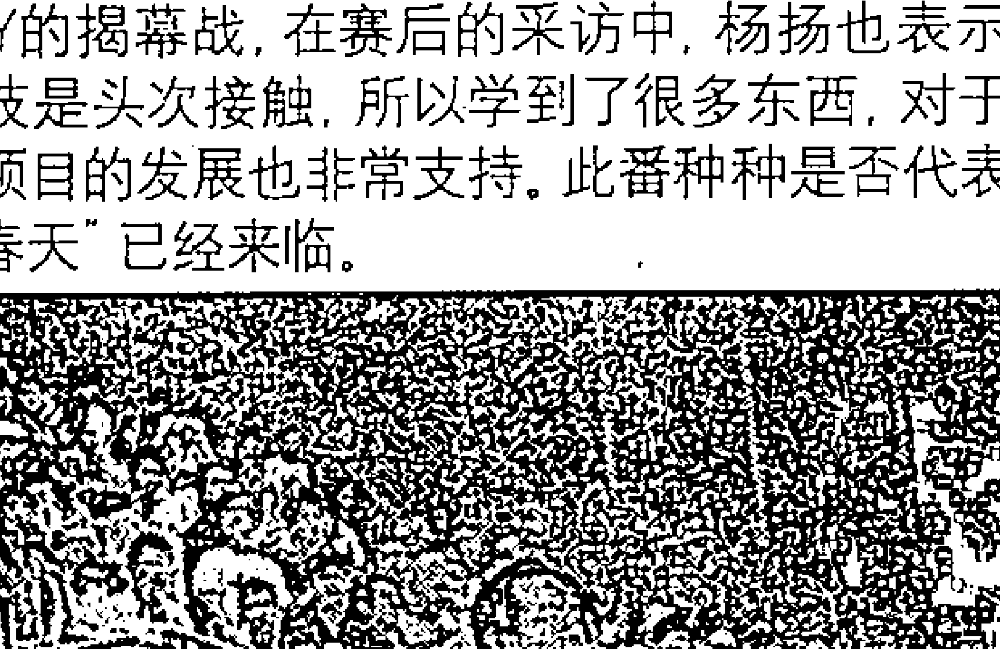


(文/眯西)

## 定位搜索很强悍 手机帮你指路、找朋友

“喂，我现在在XXX，现在怎么走？”
“喂，我到了XXX，你在哪里？”
“喂，我看见你了，怎么过去？”
……
跟朋友在外相约见面，经常会发生这样的情况，找路麻烦得很。如果你们都使用Android手机，那可有福了。通过谷歌地图+GPS设备8米内的精确定位，找朋友只是几百KB数据，再也不用打这么多电话了，手机就能将你精确带到朋友身边。

准备出发前，打开“地图”。注意如乐Phone预置软件中没有谷歌地图，但可以本地下载进行安装，下载地址：http://download.pchome.net/mobile/map/digitalmap/detail-177509.html。运行谷歌地图后，按下menu键，选择“加入谷歌纵横”。
加入成功后，便可以看到同样使用纵横功能的朋友了，选中待会要见面的挚友，界面中会提示他目前的位置，选中“获取路线”。
如果怕路上堵车，可以再次按下menu键选择“图层”，然后选中“实时路况”，这样还能够根据地图提示的拥堵情况选择路线，红色是拥堵、黄色是缓慢、绿色是畅通，怎么样，这下方便多了吧？

朋友见面了，想去电影院又不知道路？问路边的行人指路总是不够精准，怎么办？拿出手机，我们的最佳向导就在它里面。首先获得Places Directory，你可以从Market市场中直接搜索获得，或者下载APK程序在本地进行安装（下载地址：http://mydown.yesky.com/sjsoft/Android/ADCX/452/469952.shtml）。
在确保手机的数据和GPS都开启的情况下运行程序，稍等片刻让手机实现定位（户外为GPS定位，室内为网络IP定位），然后在程序主菜单中，选择自己要查找的目的地类别，比如加油站、餐饮、电影等。
例如我选择了电影，找到距离自己最近的影院（名称列中不仅有箭头方向指引，同时还有距离标识）选择进入，不仅提供了距离方向，同时还有具体地址，甚至是电话及评论。注意哦，你可以按下“拨打电话”直接呼叫目的地，也可以通过地图查询具体的路线位置，问地址问电影场次都没问题。

小提示：找回你的方向感
“你向南走，然后向东拐，很快就到了。”这样的话可能对很多人来说很难理解，这种方向我怎么判断？举起你手中的手表，将当前时间除以2，再在表盘上找出相应点位，然后将这个数字对准太阳，表盘上“12”点所指的方向就是北方。如上午10点，除以2后将表盘上的“5”对准太阳，“12”的方向即为北方。北方一旦确定，其他方向就一目了然了。

酷软推荐：
RunStar：http://www.android123.com/Androidruanjian/shenghuo/1900.html
软件小贴士：自动启动GPS系统，记录跑步的里程和路线等信息，减肥者的自我监督利器
Android指南针：http://android.tgbus.com/download/other/200812/171606.shtml
软件小贴士：利用Android手机的电子罗盘功能定位判断方向
凯立德地图导航：http://bbs.imp3.net/thread-690896-1-1.html
软件小贴士：有车族可以用传统地图导航哦，驾车很方便

### 测试你的路痴程度

很多人天生路感不佳，很容易成为“路痴”，不如做个小测试来看看，光说可没用哦！
家里养过狗的主人总是对它又爱又恨，爱的是它的忠心，它的可爱，恨的是他怎样也改不了的坏习惯。面对狗狗的坏习惯，底下哪一样会是你最讨厌的呢？

- A. 半夜里狂叫不停
- B. 常常会乱咬东西或是乱吃东西
- C. 出外喜欢到处乱跑，管都管不动
- D. 喜欢随地大小便
- E. 有时候会攻击陌生人

选择A的人【路痴指数：★】
选择B的人【路痴指数：★★★】
选择C的人【路痴指数：★★★★】
选择D的人【路痴指数：★★★】
选择E的人【路痴指数：★★】

## 小胖战术大讲堂②

大家好！本期战术讲堂和大家分享的是海龟岛上亡灵族如何双兵营暴狗来速推暗夜精灵。本战术成功率是相当高的，我们的主体思路是以初期兵多优势和兵种相克优势去进攻他。游戏前期暗夜很可能只有弓箭手，而亡灵有大量小狗，小狗是非常克制弓箭手的，如果我们能在游戏初期就去和暗夜精灵打决战的话是非常有优势的。初期的这些优势我们要把它利用起来转化为胜势。
首先开局：祭坛、地穴、通灵塔、商店。英雄出来后可以先练级，如果能把英雄练到2级的话效果会更好。记住骷髅棒和显隐之尘是必须买的。另外需要把回程卖掉再造一个地穴哦，这样狗的数量会快速增加，去进攻的时候狗的数量应该大于7条。

介绍一下速推的时候有哪些要注意的小操作：
因为我方全是近战部队，对方是远程部队，所以我们要冲破阵型，把全部兵力挤到对方旁边，然后果断分散攻击，小狗便能瞬间歼灭所有弓箭手。
必杀技
去进攻时控制1—2条小狗去咬对方伐木的小精灵，会达到很好的效果，对方英雄位置不好的时候可以选择围杀对方的英雄。
注意：
骷髅棒召唤骷髅时要快速将2个召唤出来的骷髅分散开来，防止被其他小精灵集掉所有的骷髅。
最后需要提醒的是，不能让精灵族高级科技兵种成型，我们需要把战场一直停留在暗夜精灵的家中，不让他造出成型的建筑。很短时间内我们就会有多的狗在敌人家肆虐了。这时候对方已经全然无力抵抗，我们很快就会胜利了。

游戏技巧投稿邮箱：lixi@cfan.com.cn，欢迎戏迷们踊跃投稿哦。
（文/AFENG）

## “黑幕”下的电子竞技朝阳产业即将胎死腹中？

这些日子，有着“中国第一职业经理人”、“打工皇帝”等称号的唐骏陷入了学历造假风波中，诚信问题再次成为社会大众关注和争议的焦点。而在同样是非常一代非常熟悉的电子竞技行业当中，诚信问题似乎也同样备受质疑。

#### 诚信危机，黑吗？极黑！

6月初刚刚结束的ESWC再次伴随着丑闻谢幕。这个号称“电子竞技世界杯”的全球知名赛事在最近这些年中一直都备受指责，2009年，因为欠薪丑闻和运营不当，ESWC一度停办。到2010年，尽管ESWC在新赞助商的支持下卷土重来，但是诚信问题依然未能从根本上解决。从2010赛事宣布之后，ESWC中国区的不报销路费、剥夺参赛资格、波兰预选赛让选手乘火车过去打比赛，赛前的视频制作大赛最后却不了了之等等都是难得一见的“奇闻”。此外，ESWC主办方曾对赞助商肆无忌惮的夸下海口，声称8万现场观众的承诺实际上也仅有3000人……最后致使多家赞助商愤怒退出，而此前一直备受关注的奖金问题也极有可能伴随着赞助商的离去而再次出现拖欠现象。

#### 选手也被“潜规则”

事实上，电子竞技中的诚信问题并不仅是ESWC一家独有，甚至可以说是不公开的秘密。赛前排名搞特殊、突然改变规则、奖金成空头支票，这一切都曾多次在电子竞技赛事中上演。此次ESWC世界总决赛，中国两大电竞高手Sky和Fly都选择了放弃，或许正是对赛事诚信这一现象做出了无声的回应。引用袁木涕的话说就是：“选手都不去了，你还搞……搞毛啊……”

#### 黑幕缘何屡禁不止

电子竞技的黑幕，从根本上说是缺乏有效的管理和监督机制。
首先，电子竞技虽然到如今诞生已经有10个年头，但是始终没有对应的官方管理部门存在，类似电子竞技协会这种组织很少，这使得电子竞技的比赛大多数都是一个相对私人的商业行为，因此缺乏必要的体育行业规范。韩国电子竞技之所以专业，这跟他们本国的电竞联盟KESPA的努力是分不开的。

#### 电子竞技黑幕“七宗罪”十大焦点案件

- 1. CCTV 票选风波 SKY 受害
- 2. WCG07 韩国队复活丑闻
- 3. WCG 中国 YIYUN 复活流
- 4. ESWC 线下作弊之 FAMAS 王子
- 5. CEG 南京 LATE.R 线下作弊事件分析
- 6. 比赛是我办的 我说谁第一就谁第一
- 7. 人族皇帝 BOXER 3 连冠被操控阻止
- 8. MBC 电视台修改地图导致天才退出魔兽
- 9. WARDEN 用钱贿赂 COL 交易黑幕
- 10. 著名兽族选手 ZACARD 代打遭禁赛

其次，电子竞技的从业者们在赛事运营上缺乏长期性的眼光，他们大多追求短期利益，不择手段的例子比比皆是。电子竞技在发展初期，很多赛事在寻求赞助商时利用赞助商尝试的心理，不切实际并且胡乱承诺着，太多使用着先把钱要到手再说的小人伎俩，甚至有甚者拿钱不办事，只做一锤子买卖，然后改头换面后继续“行骗”。虽然个人得益，却把整个行业的环境弄得乌烟瘴气。
第三，媒体的监督力度太小。电子竞技的媒体工作者大多数都是半路出家的电竞人，对圈子里的朋友重视，对媒体责任的观念淡薄，凡事遵循“和气生财”的法则，只报喜不报忧，实则滋生了“黑幕”的频频诞生，也给整个电子竞技的环境带来了恶性循环。

#### 朝阳产业未来几何

此次出征ESWC的中国选手虽然喜忧参半，但是在签证的时候却得到了国家有关部门的大力支持，这从一个侧面也反映了国家对于电子竞技的前景还是看好的。今年年中的时候，国家体育总局也开展了一次内部的选拔赛，为下届亚洲室内运动会做备战，甚至2014年亚运会也将有可能出现电子竞技项目。可以说，电子竞技无论是作为一个体育项目，还是一个全民娱乐项目，都是有很大的潜力的。如果我们能够从运营、管理、监督三个方面去规范和完善它，这个产业的未来依然可以期待。中国很多体育产业的失败（比如中国足球），这其中既有体制化的原因，也掺杂了复杂的社会因素。电子竞技虽然还未来走上大路，但同样的荆棘似乎密布于前方，如再不把蛀虫除去，再伟岸的松柏也会有凋零的一天。
（文/晓西）

## 网游上演“低俗门” 情何以堪？

近日，当日本AV女星、网络低俗代言人在某游戏发布会上同台搔首弄姿之时，就有业内人士在博客上写出“网游产业亟待整顿”和“网游行业自我整顿”的字样。7月6日，文化部印发了《文化部文化市场司关于加强网络游戏市场推广管理——制止低俗营销行为》的函，要求各级文化行政部门和文化市场综合执法机构进一步加强网络游戏市场管理。是的，早该狠狠地管一管了，歪风邪气一定要刹一刹，但这次真的能约束厂商行为、整顿行业秩序、净化网游天空吗？

#### 所谓的震慑似蜻蜓点水？

网络游戏玩家中很多是尚未成年的青少年群体，他们的思想价值观念尚未形成，因此对于不良现象也更容易受到影响。低俗网游代言、低俗网游反映的恰恰是社会病态和责任的缺失，如果放任不管必然对这一群玩家群体造成更大的影响。但是，由于目前文化部对于“低俗”并没有明确的界定，具体操作起来或许会成为一个难题，而且有关“不雅照女星”是否没有代言权利这一说法也还存有争议。但不管怎样，文化部此举对当前的不良风气毫无疑问有一定的震慑作用。

#### 网游低俗三法

辞海中对“低俗”的定义是：低级且庸俗，低俗内容主要是指低级趣味、庸俗、使人萎靡颓废的内容。其实“低俗”这个词本身就很难被界定，度有多低？尺度多大？可谓众说纷纭，公说公有理婆说婆有理，一百个人有一百种说法，但小编认为，网游所走的低俗路线主要有“三法”：

#### 1. 用色情和恶俗吸引眼球

自“人间胸器”越南妞代言《蜀门》以来，中国网游行业中似乎开始流行起了“低俗营销”的理念。游戏上市不重视质量和传统营销渠道，反而大量使用炒作、恶俗、色情擦边球等方式另类宣传，不惜一切代价吸引眼球。越南妞之后，新上市的网络游戏《勇士》甚至直接邀请了日本AV女优苍井空和两大“网络妖怪”芙蓉姐姐和凤姐共同代言，这种为打响产品知名度而不惜颠覆基本价值观和社会道德引导的做法已经愈演愈烈。其对整个行业风气的破坏和对社会环境的影响也是不言而喻的。

#### 2. 以丑闻为卖点

最近这段时间，部分网络游戏企业借用当前因不雅照片或视频被网络传播而受到网友极大关注的当事女主角为代言人或参加相关活动，扩大游戏知名度。《西游记OL》和《昆仑OL》分别采用了兽兽和闫凤娇两位爆出过“艳照门”的女主角代言游戏，以丑闻为卖点，只求打响知名度，无视公众道德底线。这种做法不仅仅败坏社会风气，对于众多网游青少年玩家来说，这种“越丑闻越红”的病态现象也会对其价值观带来极坏的负面影响。

#### 3. 宣扬拜金思想

除去代言人之外，很多国内网游产品上市之初纷纷打着免费的旗号，暗地里实则进行各种收费，以投入金钱的数量来决定游戏中的地位，不注重完善游戏体验，教唆玩家金钱至上、拉帮结派，甚至恃强凌弱。中国网游史上著名网游《传奇》、《征途》都是此类代表，而新款《中华英雄》、《地下城与勇士》等游戏也未能摆脱这种模式。

#### 网游缘何低俗不断？

从根本上来说，网游产业本身的“赚钱至上”导致了这个行业缺乏责任和创新。民族网游企业在最近几年发展迅速，去年更是创下了超过150亿元的惊人产值，在这个大环境下，“抢蛋糕”成为了主要课题。一款游戏的上市，唯一的目的就是赚钱，游戏的开发和玩家的体验反而被摆在了其次。在这样急功近利的心态下，像暴雪那样几年开发一款游戏、反复修改的情况也不可能出现。而类似低俗营销的现象却层出不穷，想彻底解决这个问题，恐怕还是要从根源找起。 （北京/冯寅）

## 二手移动上网设备放心淘

#### 去哪淘？淘什么成色？

无论是买手机、MP4、掌机、游戏机、相机甚至笔记本，必须有合适的交易平台才能放心购入。避免去58同城、赶集之类的非专业网站查找，总之JS远多于真正的卖家。

#### 确定交易对象是否安全

把选定对象的QQ、手机号、用户名ID等一系列信息都放到百度、Google、论坛内搜索一下。查找其之前的交易记录，号码所在地区等信息，近期频繁交易，同时又在多个论坛发布信息的很可能是二手贩子。通过对方论坛空间看回帖，是不是每个帖子留的联系方式都相同。往往冠以“自用”、“朋友”等用机情况，其中一部分人不留除手机之外的其他联系方式，强调短信不回等也要提高警惕。

#### 看帖要具备两要素

- 1. 机器准确客观的说明文字和图片（无PS），包括价格、使用近况，有无维修进水、成色瑕疵、生产年代、瑕疵部位局部照片、是否自用或者一手购买的等等详细信息。
- 2. 看好机器直接打电话询问显得更有诚意，粗略谈好再加QQ发详细照片（主要是易磨损位置和电池仓清晰大图）。另外，遇到合适的机器，双开QQ号与对方聊天也能增加成功率，红白脸嘛，你懂的。

#### 写给成色控

入二手机的目的是少花钱还不影响使用，摆正心态，实用第一。成色控想要淘到好机，必须要花更多的时间与精力。不仅要做到早、中、晚集中时间刷论坛，还要在周末、节假日等密集时间加大搜索力度。最好的办法就是同时打开几个论坛的IE窗口，每隔10分钟一刷新，热门机型一般10多分钟就会被人秒价买走。Ctrl+F可以打开IE的搜索，输入想要找的机型便会在当前页面做出黄色标记，能最快找到有价值的帖子。

淘二手机一般有三类，第一类是刚买新机，用着不爽转而出售，机器一般都在95甚至98新，这类可遇不可求，价格与全新拉不开，往往忍一顿饭钱便能买全新机，让人纠结于买与不买之间。

第二类是玩机的朋友，隔几个月便会出掉老机加点钱换新，这也是最常遇到的一类，一定要严把成色关，多向卖家要细节图。毕竟有些常换机的朋友使用不爱惜。

第三类为普通使用，自然淘汰，甚至是二手贩子乔装个人出手，成色多是8新，这就需要注意是否三无（无拆、无修、无进水，建议针对某种机型搜索拆机、翻新辨认帖），满足这点再追求细节成色，难免按键掉漆，屏幕和背面刮花以及小的磕碰，没有内伤即可。

#### 如何交易最安全？

面交最考验人的环节，不仅要提前在网上查找要购买机型的资料，如：怎么检查机器型号？判断固件？区分行水货？还要多看拆机图等关键信息。还要时刻保持警惕，避免技术之外的骗术。尽量不要单独一人，对方两三人低价强买强卖甚至碰上明抢可吃不消。有的机器有“暗伤”、“慢性病”，当那么面验机几小时不发作，回去几天就玩完。不方便验证的充电器、充电接口也容易被忽略，面交切忌被喜悦冲昏头脑，把要检查的事项一一写在纸上，在人多的地方交易（如KFC）。如果卖家故意选在人少（居民楼）的地方很有嫌疑，找个“拿上去让家人看看”、“家里不方便进入，外面等等”这些借口，从楼顶溜之的也不是没有。

淘宝则是最合适的方式，可以提供充裕的时间去检查、去纠结以及反悔。在大论坛中，卖家一般会给买家提供收货后24小时或多大几天的验机时间（要多争取时间），等确定完全没问题再完成交易。当然淘宝也不是绝对安全，分辨假淘宝并不难。

大家可以去围观 (http://bbs.weiphone.com/read-htm-tid-683363-page-1.html)，卖家用假淘宝逼迫买家交易，这类骗子的共性就是“极力躲避面交”、“强调淘宝绝对安全，货不行自己也拿不到钱”等信息，想尽办法让你钻入假链接。

从图中也可分辨，autoin.com才是这个假淘宝的真实域名，而不是taobao.com。不仅域名上能作假，还有把taobao用tacbao/taoboo等字眼来替换的障眼法。先前分辨网址是第一步，在链接到银行卡付款之前，还有一招底牌。拍下宝贝后关掉所有IE网页，输入正牌淘宝www.taobao.com，登录后查看“已买到的宝贝”，如果里面没有刚才拍的宝贝，那100%是骗人的。

其他交易方式一概不推荐，先款先货或者是同时邮，99.99%的朋友几乎都是这样被骗的。不要相信对方说“要不咱同时邮吧，或者你先发给我”之类的话，并且很认真的找各种理由说“脱不开身”、“离不开学校”、“没有支付宝”，还给你看学生证、身份证什么的，明显是骗子。这样的人，只要说你能排除万难找他面交，立马上线下消失。

#### 哪种物流最省心？

快递优选顺丰

选择顺丰、宅急送、EMS，贵重物品千万记得保价，顺丰5元1000，宅急送3元1000，EMS10元1000。尽量选择“到付”，这个很重要！一是可以确保快递必须送达至买家手中以免快递员偷懒给你送到门卫、保安等第三方手中，避免被代签的烦恼。另外让卖家把机器序列号、电池序列号写在快递单上，收到后当快递员面拆包核对串号，防止对方掉包死不认账。

#### 我有作证我不怕

卖家反咬一口是买家自己掉的包或者是买家弄坏的，这确实很让人窝火。而选择快件自取可以避免这样的麻烦，给快递提前打电话并带上身份证自取。这关系到作证的问题，因为快递公司规定必须到站点当场检验才可以作证，所以不是自取的话不具备证据效力。要知道骗子和快递员相互勾结做伪证很容易。打开包裹后直接核对序列号是否与快递单上相吻合，然后就按照顺序检查功能之类是否正常等等。在此过程中发现问题就让快递站点出一份证明加盖印章即可。如果不顺利，拒签让卖家换快递重发也是一个对策。

做到耐心、细心、缜密，在花上一些时间和一点点运气，好宝贝自然到手。 （北京/春树）

| 寒班论坛交易版 | http://bbs.dospy.com/forum-141-1.html | 大而全，各种手机、掌机信息量极大 |
| TOMOPO数字交易平台 | http://shop.tompda.com/mall/ | 型号较多，老牌数码装备交易区 |
| 安卓网出售区 | http://www.hiapk.com/bbs/forum-187-1.html | 主要是Android手机 |
| 威锋网二手数码市场 | http://bbs.weiphone.com/thread-htm-fid-29.html | 主要是苹果产品 |
| iMP3 | http://bbs.imp3.net/?op=classics | MP4、MID较多 |
| 太平洋二手交易论坛 | http://itbbs.pconline.com.cn/es/ | 电脑、相机、手机 |

## 丢掉数据线iPhone不用PC传东西

不同于Windows Mobile，Symbian，使用iOS（Unix架构）的iPhone对于权限控制非常严格。想轻松的像闪存盘一样把内容丢进去，然后打开资源管理器安装是不可能的事情。没带数据线，没装客户端（iTunes）想传东西只有一个方法App Store……当然App Store，iTunes上很多东东不但要花“美刀”的，还需要信用卡，那可如何是好呢？

### 初阶篇：不用 PC 传音乐

用iPhone内置的iPod播放器听音乐，要么使用“美元+信用卡”的组合，要么用iTunes传输进iPhone中。所以想脱离PC，首先需要更换的就是iPhone内置的iPod播放器。

- 第一步：下载并安装“摸手音乐”（下载地址：http://www.mobgo.cn/project_site_media/downloads/musicgo.ipa）；
- 第二步：连接WiFi网络（3G网也是可以的，但是流量消耗可是很大的呦），并打开摸手音乐；
- 第三步：在“在线音乐”中搜索所需歌曲，下载或在线播放即可。

不仅如此，由于摸手音乐中大部分音乐来自百度MP3，所以我们可以看到TOP100排行榜等等，很是方便。但是需要注意，摸手音乐下载的音乐仅限在自身软件中播放。

### 进阶篇：不用 PC 装软件

无软件不iPhone，这是常人都知道的道理（把iPhone当时尚装饰的除外）。与音乐一样，iPhone的软件也可以不通过PC使用App store（程序商店）直接下载，但同样不但要花钱并且对于国人来说不是很方便。使用第三方商店才是王道啊！

#### 安装补丁，打开iOS的大门

而基于Unix的iOS权限控制非常严格，并且安装第三方商店是不被允许的。所以我们先对系统动动刀子才能把第三方商店安装进去。

- 第一步：在主屏幕上找到Cydia程序，点击进入（什么？你没有，这个……先越狱吧）；
- 第二步：按屏幕右下角search搜索afc2add，找到进行安装；
- 第三步：下载iFunbox（下载地址：http://www.i-funbox.com/download/ifunbox_sc.zip）并解压；
到这里我们就算是打开了iOS的大门，通过iFunbox就可以用资源管理器的方式查看iPhone里面的文件了。

#### 安装installous，打造免费商店

有了iFunbox也就可以安装以DEB为扩展名的系统类程序了。

- 第一步：下载installous及其依赖补丁（下载地址：http://work.newhua.com/cfan/201015/installous.rar）；
- 第二步：打开iFunbox将下载的文件解压至/var/root/Media/Cydia/AutoInstall/目录中；
- 第三步：重启iPhone后，就可以看到桌面上的installous图标了。搜索，下载后会自动安装，非常智能。

从此，我们拿着iPhone逛论坛，碰到有兴趣的软件便只需要打开installous按照文件名搜索，下载即可。

#### 一些有趣的DEB软件：

- bitesms
  增强型短信软件，可以在游戏中接收、回复短信而不中断游戏进程。下载地址：http://work.newhua.com/cfan/201015/bitesms.rar
- callme
  在桌面设置快速联系人，就像safari在桌面建立书签图标。下载地址：http://work.newhua.com/cfan/201015/callme.rar
- sbsettings
  快捷开关，具有方便的开关WiFi、清理内存、关闭程序等等功能。下载地址：http://work.newhua.com/cfan/201015/sbsettings.rar

## 谷歌拯救微软！WM手机登上Android舞台

微软Windows Phone 7对手机硬件提出了苛刻的要求，即使是昔日的“Windows Mobile（后文简称WM）机皇”也难以驾驭，引起了很多老用户的不满。虽然微软不再学习“WM6.X教材”的同学了，谷歌Android系统的橄榄枝却伸了过来。

XDAndroid是国外XDA高手专门为Windows Mobile机型定制的Android，兼容Diamond、Diamond2、HD、Touch Pro/Pro2手机，随着版本的不断升级，兼容性和稳定性都在逐渐提升。目前最新的XDAndroid_2.1_(rel_2.5a)版本已经解决了GPRS和WIFI通信问题。

### Android“入主中原”

XDAndroid可以安装在存储卡上，以虚拟机的形式运行，因此我们不用担心手机变“砖头”。将下载的CAB格式的XDAndroid文件复制到存储卡的根目录，运行安装在Storage Card上（建议剩余空间在512MB以上）。

安装完成后，系统会提示你选择自己的机型，完成初始化配置后，进入存储卡目录找到并运行“haret.exe”，稍后手机会进入类似DOS的命令行界面，稍等几分钟就会出现“田”字形提示的屏幕校准界面，用触摸笔按顺序依次点击“田”正中位置即可。按提示操作会很顺利的进入Android系统的配置界面，选择中文语言，输入谷歌帐号，Android就会成功入主你的手机！

### 小提示：

XDAndroid安装中可能会出现缺少NETCFV35文件的提示，不用理会按提示继续操作，如果安装后无法运行，可以将存储卡在手机上格式化，或者在PC端格式化成FAT32格式即可。

### 小提示：

使用GSM手机卡进入Android系统后没有信号，可以在存储卡根目录运行startup.txt文件，找到force_XXX=X字符，如果是CDMA=1就将1改成0；如果是GSM=0就将0改为1。长按挂机键选择关机可回到WM系统，安装第三方程序需要先到设置选择应用程序，勾选未知来源。

### “革命”尚未成功

谁说WM手机可玩性不高？双系统就这样被实现了，而且还是现在最热的Android系统。电话短信，WiFi上网都没有问题，APK应用程序也可以正常安装。类似刺客信条和Asphalt的游戏都可正常运行，速度还是很不错的，用于体验Android系统的特色和魅力已经足够。

由于是第三方开发，XDAndroid在一些硬件的驱动和兼容性方面还有待提高，比如笔者的Touch Pro2目前无法使用扬声器（听不到铃声），电量显示不准确，识别不出摄像头，发热较高等等。但是已经足够当作“手机”使用了。

### 作者感悟

虽说WM如今已有日落西山的感觉，但相对于其它系统来说WM手机的生命力其实十分“顽强”，即使是多年前的830，也有不少朋友从WM2003SE一路更新到现在的WM 6.X，就凭这一点，足以让诺基亚塞班手机汗颜了吧？只要你能发挥一点极客精神，WM手机的可玩性和扩展性足以让你惊讶。相信用不了多久，Android就将被WM手机所征服！

- XDAndroid_2.1_(rel_2.5a)下载地址：http://u.115.com/file/f395438422
- 绿色版：http://mobile.91.com/Soft/WM/xdandroid-7.7.html

## 用手机玩电脑 懒人的专属特权

用手机的红外功能学习遥控器信号控制家电，或是用手机端映射软件遥控电脑操作都是比较初级的控制方式。想象一下，把电脑画面显示在手机上，用手机屏幕上的“鼠标”控制电脑播放电影、音乐，如此惬意。

### 开启传输通道

Windows XP和Windows 7是一样的，都需要打开远程协助与远程连接。注意“选择远程用户”这里一般为空，需要手动添加。无论是默认的Administrator管理员账户还是自己建立的账户，都需要建立密码，方便手机连接。控制面板“用户账户→创建密码”。除了用户名，还需要本机的IP地址。“开始→运行→输入cmd→在命令程序键入ipconfig。

### 开始传输

Android推荐Remote Desktop，Windows Mobile推荐网灵一号，S60则是TsMobiles。以Remote Desktop为例，按menu键→“添加服务器”。

填写除上面三个数据外别忘记设置相同的分辨率，其他两个操作大同小异。网灵一号需要在PC安装受控端，绕过远程控制，功能更强大。

- 添加用户名时选择“高级→立即查找”，注意只有所在文件夹为计算机全名即“CT-PC”下的名称才有效。
- 连接方式分为手机信号与WiFi，一分钟约5MB数据量，这样的速度也只有3G网络和WiFi才能满足。WiFi更实用，在家中连接无线路由即可控制电脑，无WiFi信号时控制电脑只能用3G网络，需要电脑有公网IP地址才能连接。
- 由于是WiFi连接，控制的流畅程度取决于手机的处理性能，使用低分辨率（1024×768为宜，是否宽屏分辨率在手机屏幕上不重要）和低色彩效果（8位）很明显。
- 并不是所有画面都可以在手机上显示，比如Windows 7的AERO特效、3D游戏、视频。这与手机性能无关，手机只是播放远程控制传送的一帧一帧画面，只能说远程控制本身有诸多限制。好在浏览网页、控制播放器、部分2D游戏是可以实现的。

玩的不够爽？那就把手机变成鼠标吧！只要你有一部触摸屏的S60 V5手机就能实现。在手机端安装BluetoothSerialPort，开启蓝牙。电脑端安装BlueSoleil（http://www.skycn.com/soft/43675.html）蓝牙驱动管理，“搜索服务”后与手机连接，之后查看该连接的端口号（如COM8），断开后用58Mouse从新连接这个端口即可控制鼠标。

连接后的视频效果：http://v.youku.com/v_show/id_XMTI5NjI4Mzky.html
手机变身鼠标视频效果：http://www.tudou.com/programs/view/j5O2nrwIwo8/
本文软件下载地址：http://work.newhua.com/cfan/201016/yks.rar
(文/CT)

## 暑假宅男必备技 30天抱着吉他唱“狮子座”

### 奋斗目标

学会弹《狮子座》

### 配套教材

- 《吉他自学三月通》
- 《民谣吉他经典教程》

### 知识学习路线

#### Day 1 - 了解吉他
这方面翻看教材开头就好了，我们要学的指法最简单的民谣吉他 (http://tinyurl.com/27j7jwc)。

#### Day 1 - 吉他选购
《民谣吉他经典教程》第16页，《吉他自学三月通》第13页 (http://tinyurl.com/2ce8s6s)。

#### Day 1 - 抱琴姿势
《民谣吉他经典教程》第25页，《吉他自学三月通》第17页。

#### Day 2 - 调弦
《民谣吉他经典教程》第27页 (http://tinyurl.com/2bl638f)。

#### Day 3~10 - 拨弦指法
《吉他自学三月通》第22~26页 (http://tinyurl.com/2enabkz、http://tinyurl.com/259vqru)。

#### Day 11~18 - 节奏、节拍
节拍：《吉他自学三月通》第57~60页

#### Day 19~23 - 六线谱
《吉他自学三月通》第29页~43页学习 (http://tinyurl.com/282fotz、http://tinyurl.com/2dibdq4)

#### Day 24~30 - 学习和弦
《民谣吉他经典教程》第39~50页，《吉他自学三月通》第48~57页 (http://tinyurl.com/22ndr7o)。

暑假到了，有电脑的你在干什么?如果我猜得没错，肯定是10点以后起床，早饭午饭一起吃，然后在电视剧和电脑游戏的接替陪伴下度过凌晨……大家都是这么过来的嘛，所以我就不红着脸劝你学习了，你懂的。咱们利用这个暑假干点远可逸志、近可讨MM欢心的事情，学吉他！当然，是让电脑帮你一起学哦！一个30天的吉他学习计划，让你开学就会弹“曾哥”的《狮子座》。

### 准备动作 第1天：抱把吉他回家

从今天开始，笔者将与大家一起共度30天的民谣吉他学习时光。如果你觉得看书太枯燥，那么用一个吉他通 (下载地址：http://work.newhua.com/cfan/201015/xxjt01.rar) 就可以帮你先认识一下吉他了，“原声吉他”里的“钢弦吉他”就是民谣吉他。

现在去哪买琴呢?在淘宝上搜索你当地的实体店最保险了，如果是直接去吉他店，那告诉店员要买一把好点的练习琴就好了。买完吉他，就一个任务，抱着吉他认真看书吧，学会抱吉他就OK了，千万不要多学哦!

### 第2天：让吉他“字正腔圆”

你或许已经急不可待地拨动琴弦了，随便一拨，声音就很好听吧。不过先要看看它的发音准不准，那就需要调整它的发音了。先去看看书，熟悉操作后，就可以在AP Guitar Tuner (下载地址：http://work.newhua.com/cfan/201015/xxjt02.rar) 的帮助下调弦了。

第一步：运行软件，将麦克风与电脑连接，麦克风指向吉他音孔附近。
第二步：软件左上角的常规定音区从左至右将吉他的6—1弦排列出来，用鼠标点击相应的琴弦即可听到MIDI播放的正确音高，在常规音调节的时候要确保“预设特殊调弦区”的预设音效在“Standard E”上。
第三步：吉他常规的定音方式1—6弦分别为E、B、G、D、A、E。若要调整第4弦的D音。首先要看这个粗体字母，如果弹响琴弦后此处显现的音名比D高我们就要把弦钮拧松，使其音高降低，反之就要使其升高，直至这里显示为D。至此我们完成了4弦的粗调。下一步我们要进行声音的微调，让这个D音更加精确，这时就要看指针了。当弹响琴弦时，指针偏左表示声音低了，偏右则高。我们需要放松或拧紧弦钮，使指针接近或停在正中央0的位置，0这个位置表示这个音是最准的。

### 热身运动 第3~10天：拨动琴弦吧

你肯定想学到正宗的吉他演奏方法，你肯定也看过武侠片里练蹲马步的少年，不错，首先要保证基本功的扎实。现在我们要学习用哪根手指拨动琴弦。民谣吉他的演奏手法是左手按弦右手弹弦，大约需要练习3天后可以进行左右手综合指法练习了。

> 小提示：
当我们在理论方面熟悉之后，我们必须为练习制定自学计划。练习是每天必不可少的，开始每天的练习时间可以定在半小时到一个小时之间，以后根据自身的情况逐步增加时间。

### 第11~18天：第一次弹《狮子座》

现在我们正进入一个全新的阶段，我要教你谈风靡全国的《狮子座》了。当然，听我说，先从它的节奏学起。《狮子座》这首歌就用到53231323这样的节奏，所以我们要反复练习，达到不看弦、不碰到其他弦也能准确地弹奏的效果。

练习节奏，渐快、渐慢或忽快忽慢的毛病时有发生，这个时候我们就需要一个节拍器！你可以去乐器店里购买一个节拍器，当然，我们也可以免费获得一个节拍器 (下载地址：http://work.newhua.com/cfan/201015/xxjt03.rar)。软件的节拍类型分为三种，即无变化节拍、节拍类型、自定义。要想设置《狮子座》的节拍，我们就用到了该软件的自定义节拍类型。方法是：打开软件点选“自定义”输入53231323节拍，设置好后，单击“开始”按钮节拍器就开始工作，我们就可以随着节拍弹奏了。

> 小提示：
自定义节拍中，软件可以自定义设置含有不同音效的节拍类型。列表中1到9，每1个都可以更换使用的音效类型，每个数字表示1拍，数字表示使用下面的第几种音效；如果某个拍子上需要停止，则使用0即可；使用这种方法可以组合各种节拍类型。除此之外，该软件还支持自定义音效的音量、闪烁效果的调整、节拍速度的调整以及保存自定义节拍类型等。

### 正式开始 第19~23天：真正弹奏《狮子座》

前面你已经会弹《狮子座》的节奏了，继续战斗吧！先去看看书，看懂六线谱，然后开始弹奏真正的《狮子座》。我知道你还不会读谱，那么Guitar pro (下载地址：http://work.newhua.com/cfan/201015/xxjt04.rar) 就派上用场了，单击“文件→开启新文件”，打开你下载到的《狮子座》吉他谱 (http://tinyurl.com/28n6kcr)。选择“音乐→播放”就可以听到该谱子的示范演奏。

> 小提示：
如果你想练习其他歌曲，可以利用吉他谱搜搜 (http://www.jitashu.com/jitapusoso/) 来搜索相应的乐谱。使用Guitar pro可以搜索吉他谱，打印曲谱、查看和弦。

### 第24~30天：跟曾轶可比《狮子座》

在马上就胜利的时候，你要冷静。因为你还差一步，再学最后一个知识：和弦。我们学习弹奏的《狮子座》这首歌要用到F、Dm、G、C、Am、E这几个基本和弦，大家在掌握方法之后要多加练习达到熟悉。吉他的和弦组合很多，要熟练掌握一些基本的和弦。一些不常用的和弦我为你找了吉他和弦助手 (下载地址：http://work.newhua.com/cfan/201015/xxjt05.rar) 来帮你补习。

第一步：安装时要记住安装目录，将解压包内的“GtChrdHlpr.exe”和“readme.chm”覆盖安装目录中的文件，双击“GtChrdHlpr.exe”运行程序。
第二步：单击右下角选择要查询的和弦，选择好后软件最上方即出现该和弦的详细信息。单击“播放”，软件中间显示区域即模拟吉他弹奏界面并发出该和弦的声音。不用显示该和弦，只要单击和弦选择文本框右边的手型图标就可以清空该和弦。

> 小提示：
在练习《狮子座》的和弦的时候，各个和弦必须熟练掌握。在练习和弦的过程中左右手综合指法练习不能间断。在这段时间里，我们除了每天勤奋练习以外，还要学习掌握一些知识技巧。比如扫弦（《狮子座扫弦》http://tinyurl.com/2e9z8ql）、和弦分解 (http://tinyurl.com/26w5klc)、横按 (http://tinyurl.com/2cbm4on) 等。
坚持到现在，我不得不佩服你！因为你已经完成了我们的专项训练，相信你现在已经爱上吉他了。通过我们的这次训练你已经算是入门了，要真正掌握它还需要继续的练习哦！如果你成为一个吉他大师，记得给我留签名哦！

### 游戏也练吉他

- ○ 在练习累的时候，我们不妨玩玩吉他类音乐游戏。比较著名的吉他游戏有 Guitar Hero 、Rock Band、劲乐团等，还有一个网页版的吉他游戏 (https://www.jamlegend.com)。而在PSP上你还可以玩到《吉他天堂》，PS3上可以玩《吉他英雄》了。

### 手机也玩吉他

- ○ “iPhone女”玩的手机吉他软件是 Guitar : Play and Share，另外还有五大iPhone平台下的吉他软件：http://tinyurl.com/la6q7b
- ○ “Android女”玩的手机吉他软件是 Solo (下载地址：http://work.newhua.com/cfan/201015/solo.rar)，Android下还有一个互动学习吉他的软件 splashplay，http://www.softkoo.cn/soft/html/15.html)，能自动播放吉他琴弦的波动图片。

### 网络也帮忙

- ○ 老狼学习吉他趣闻：http://tinyurl.com/264e59q。
- ○ 全世界最牛逼的吉他弹唱视频 (http://tinyurl.com/2bo7d54)。
- ○ 一些适合吉他初学者弹奏练习的吉他谱：http://tinyurl.com/2aovdyh)。

(河南/清风暮缘)## 淘宝eBay比淘宝更便宜

早就听说在美国eBay上买电子产品要便宜很多，一直对数码相机、手机、化妆品、衣服什么的这些东西不感冒，直到iPhone 4换机狂潮让eBay一下子多出成千上万部iPhone 3GS，这正是入手二手iPhone的好机会，传说中的eBay终于让我提起了兴趣，准备尝试一番。

#### 搜宝

注册eBay账户这部分对于稍微有点英文基础的朋友基本无视，或者直接通过Google网页翻译(http://tinyurl.com/28fwdcg)。在eBay支付需要用PayPal (https://www.paypal.com)，类似支付宝，只不过要双币信用卡 (VISA或者MasterCard) 进行支付，而且PayPal是需要认证关联信用卡，这大概需要2天~3天时间。此时，你已经具备购买资格了。

如果你没有双币信用卡，那么也可以通过淘宝代充给PayPal账户充值或代付，PayPal在eBay的打款方式是即时到账，在7天内没收到货可以申请追回，过期遇到问题再跨国申诉追款比较困难。而收货过程很漫长，存在很大风险。在eBay上挑选机器、联系卖家、转寄等等，这些都是有一定难度的。如果没有在美国的朋友、亲戚或者使用转寄服务，不推荐自己付款购买。

搜索‘iPhone 3GS’选择价格在260美元~330美元 (16GB) 之间比较靠谱，记下商品号，这样可以直接在搜索栏找到宝贝。老外对商品的描述一般很简练，也极少上多图，所以还要通过邮件确认详细信息。这样再将确定好的宝贝发给给代购 (商品号)。

#### 入手

从美国寄送有以下几种途径：
- 直接从国外寄到国内
美国邮政最大的缺点是很多eBay上的卖家为了规避关税风险，根本不寄送本国之外。
- 转寄
转寄公司给你提供了一个美国地址，他们在美国帮助收包裹并寄回国内到客户手中。推荐GELS、华人快递 (全一)。
- 快递
USPS最便宜的是大约30多点美元，到货时间一般是7到14天，关税和清关费用另算 (手机大概是100元~150元)。

鉴于eBay的种种风险，通过代购入手风险要小很多，更适合多数人。哪里找代购？淘宝搜索‘eBay代购iPhone’，观察信誉的方法就是潜水在代购商家提供的QQ群里，向一些已经拿到手的朋友询问。

一般的流程是，自己在eBay选机子，把链接或商品号发给代购商家，通过淘宝支付宝预付500元~700元定金，商家帮忙拍下，根据汇率、运费、通关税，以及商家的利润，计算出来价钱，买家支付余款，然后就坐等收货验货确认付款。如果不满意，可以申请退货，自己承担运费、手续费，也有的商家是直接在eBay拍下几个看好的机子，再挂在淘宝店铺出售。

代购的费用：(机子本身的钱+美国运费+10) × 汇率×1.1+国内顺丰快递。要说是通关费，100到150不等，电子商品过海关检查时很容易被查出来，据说几率是10%，查出来就需要交通关费。

寻找代购最重要的是信誉！之前有网友反映200美元拍到的机器，最后2200元成交价，只因代购不讲信用，转手加钱以2600元卖给了别人。

最后再提醒一句：便宜风险大，入手需谨慎，多查多问多潜水。

#### 补充帖

eBay搜宝流程
http://forum.xitek.com/printthread.php?threadid=137657
攻略补充，小工具
http://www.yeegou.com.cn/bbs/viewthread.php?tid=13450
(文/沈万丰)

## 从模型开“开”飞机

很多人看过年初的美国灾难大片《2012》后感慨：当地球快要毁灭的时候，你不仅要学会开车，还要学会开飞机……当然，这是雷人影评，不过要是想成为二把刀飞行员，倒是可以考虑本文的方法。

### 没钱也能开车去兜风：遥控汽车 + 无线摄像头

故事发生在一个学生宿舍中，楼道里，一辆大脚车模型正在向女生宿舍疾驰，车头还顶着个摄像头，寝室里是兄弟几个挤在电脑前，流着口水，看着从车上传回来的视频……

这叫FPV (First Person View, 第一人称视角)：通过装在车身上的无线影音传输设备，比如无线摄像头，把传回的视频在电脑或其他设备的屏幕上显示出来，用遥控器遥控模型，那感觉就像坐在车里面，这就是最简单的FPV。

### 小知识：无线影音传输无处不在

我们其实就生活在无线影音传输“玩具”的监视之下：十字路口的违章摄像机、银行等重要位置的监控探头、医院重症监护室的摄像头，还有很多高档小区里面保安使用的监控摄像设备，大都采用无线影音传输技术。

### 网络大补贴:

精彩视频——遥控车 FPV 跟踪中老年妇女：
http://v.youku.com/v_show/id_XODczODQ4NTI=.html

### 300元就能搞定的FPV驾驶

像上面提到的一套FPV设备，成本并不昂贵。摄像头我们不陌生，不过一般电脑上的USB摄像头不能用，要找具有AV输出的“监控摄像头”，在电子市场上现在也有很多，最常见的就是2.4G无线传输设备，价格从二百元到几千元都有，主要的区别就是发射功率，原则上说发射功率越大，无线传输的距离就越远。

再来就是FPV用的“监视器”，有很多选择，如果你有一台笔记本电脑，那就是最好的监视器了。不过笔记本太笨重，建议在网上淘一个具有AV IN功能的MP4，可以随身携带，更加方便。

### 把“自己”变小坐进模型飞机

如果想玩得更酷，可以购买视频眼镜，让影像充满整个视野，看上去像个未来战士。如果你爱玩模型飞机，现在就可以进入“座舱”爽一把了。首先把你的FPV摄像头安装在模型飞机的前端类似真飞机驾驶员的位置，如果想让视野可以左右上下移动，可以把摄像头安装在云台上，然后将摄像头的音频、视频输出接口连接到2.4G无线传输设备的发射端，连接好摄像头和无线传输设备的电源 (通常使用轻便的锂电池)。好了，拿好你手中的遥控器，打开无线传输装置的电源，并将音频、视频输出连接到你的“监视器”上，你就可以看着屏幕控制，“坐在”座舱里开飞机了！

### 其实，你开的是战斗机！

在电脑上玩过飞行模拟游戏的人都知道，战斗机的座舱里面有个东西叫做HUD (平视显示器)，它是一块类似半透明玻璃的屏幕，把飞机的高度、速度、航向以及雷达信息等各种参数以图像、字符的形式投射在上面，而飞行员也能透过这块玻璃，看到前面的景象。HUD模型飞机也可以有！FPV系统不是让你坐进了飞机吗，再加一套FPV专用的OSD系统，就可以在传回的图像中像战斗机座舱一样拥有HUD平视显示器啦！

航模FPV OSD模块就是一套能够在视频中叠加信息显示的小设备，模型飞机的坐标位置、高度、速度、航向等信息都可以通过GPS模块获得，实时显示在视频图像中。现在很多OSD还可以搭配红外平衡仪模块，实时显示模型飞机的俯仰角度，并能通过设定起飞点的坐标位置，实现自动返航，是不是很高档？

云台是安装、固定摄像头的可活动支架，可以通过遥控云台，实现摄像头的俯仰和摆动，从而改变摄像头的视角。

黑蝙蝠中队，集合完毕，准备起飞……

### 网络大补贴：

不是玩飞行游戏，体验驾驶战机的感觉
http://v.youku.com/v_show/id_XMzQ3ODc5NDQ=.html
(文/傻鱼)

## 小胖战术大讲堂③

在海龟这张地图上，暗夜精灵 (简称: NE) 遇到人族 (简称: HUM) 造塔快速攻击 (简称: TR)，是非常难以抵御的，许多玩家会感到束手无策。今天我就和大家分享此类战斗的一些经验，相信可以让各位玩家在下次遇到此种情况时能泰然以对。

### 战术简析:

因为HUM前期有大量的步兵和民兵，而NE初期没什么东西防御，所以此种情况的主要策略是：不断拖延战斗时间，消耗对方兵力优势，这样到了晚上NE的井水在不断上涨，而HUM前期却没有什么恢复能力。

### 战况简介:

首先确定我们的主要策略——如果探路发现是近点，恶魔猎手 (简称: DH) 千万不能练级，要直接去HUM家里阻止他出变招。如果看到他直接冲过来的话就可以确定对方是来TR了，等他接近家里时，派出小精灵埋伏在转角处突然袭击，爆掉水元素和大法师的魔法。接下来是在家里交战，切记靠着自己的兵营和基地打，看到对方修塔不要着急出去杀兵，我们要坚决执行拖延战术，等对方塔在快要升级完但是还没有升级完的时候，不要吝啬我们的弓箭手 (简称: AC)，冲上去把它们秒杀！其他的时间可以用来在基地中和对方消耗，直到对方补给线跟不上，便可以立即开始实行反扑了。

在整个战斗过程中千万不要看着HUM兵多就慌张，需做到以下四点，我们便可胜券在握：
DH升级闪避技能，千万不要升级抽魔，因为月亮井不可以控制补血还是补魔，抽对方的同时也就相当于在抽自己的井水。

DH和AC点HUM步兵，能点死最好，点不死千万不要追出去。
要不断的补充小精灵，因为不论造兵营、修理、爆魔法，小精灵都是必不可少的。
一定要保持有一个兵营在不停建造AC，这样才能快速拥有成型的“秒塔部队”。
最后，当我们把邪恶的敌人打回家的时候，不要急于升级基地，可以选择AC+小鹿+兵营的组合“还施彼身”，相信看着自己的大树在对方家里肆虐，一定会让你想起魔戒中树人大军哦。
(文/AFENG)

## 又酷又炫制作又Easy的HDR照片

考虑到黑白杂志天生的缺陷，大家可以先移步到http://www.hdrwalls.com/，下几张可以做为壁纸的HDR照片！

HDR照片是什么照片？摄影玩家也许知道，HDR是“高动态范围”的意思（是英文High-Dynamic Range的缩写）。对于胶片和感光元件来说，动态范围表示图像中所包含的从“最暗”至“最亮”的范围。对于数码相机来说，动态范围越大，它能同时记录的暗部细节和亮部细节越丰富。照片的动态范围，主要取决于相机的感光元件，数码相机的感光元件是由数以百万个像素组成的，这些像素在像素曝光的过程中吸收光子，转化成数字信号，然后成像，因此，采用大尺寸感光元件的数码单反相机会拥有更大的动态范围，也是玩家的最爱。

不过，即使是摄影高手，也不是完全靠“烧器材”来拍出HDR照片来的。简单来说，HDR照片就是让亮的地方非常亮，暗的地方更加暗，但是亮的地方不至于曝光过度，暗的地方也能够显出细节。为了做到这一点，摄影高手通常是采用拍摄三张不同曝光的照片：正常、欠曝、过曝，然后通过图像软件后期合成的方式来实现。现在明白了吧，令人垂涎HDR照片不都是拍出来的，而是P出来的。

### “做”出HDR效果照片也有学问

正统的方法制作HDR照片，需要两个步骤，首先当然是拍照。因为需要拍摄多张不同曝光效果的照片，几张照片除了曝光以外要完全一样，其他要完全相同，否则几张照片里不同的区域就会出现难看的灰色重影，所以拍摄时一定要使用三脚架，因为被摄体不能移动，主题也就局限在了风光、静物等，一般不能拍人。现在绝大多数相机具有包围曝光功能，可以设置一个±EV值，按下快门，即可连续拍摄出3张不同曝光效果的照片，对于制作HDR照片来说很有帮助。

获得了多张不同曝光的照片后，就需要用软件将这些照片合成一张。正统的方法还是使用PhotoShop啦。PhotoShop CS2开始引进了HDR功能，点击“文件→自动→合并到HDR”菜单项，再选择2张或2张以上的不同曝光的照片，另外，使用“尝试自动对齐源图像”的功能，可以将多张图片中的重合部分自动对齐，对于“拍照基本全抖”的“烧友”帮助极大，就是处理速度会慢点。

### 一张图片照做HDR图

除了使用Photoshop外，还可以用很多专门制作HDR照片的图片处理软件，甚至不用多张不同曝光的照片，只用一张照片就可以做出绚丽的HDR照片。比如专业的HDR制作软件Photomatix Pro（下载地址：http://www.hdrsoft.com/download.html），HDR Shop（下载地址：http://work.newhua.com/cfan/201016/HDRShop.rar），HDR Darkroom（下载地址：http://www.onlinedown.net/soft/103849.htm），DynamicPhoto（下载地址：http://work.newhua.com/cfan/201016/DPHRD.zip），甚至是光影魔术手等等，操作起来也很简单，基本原理与在PhotoShop中使用HDR功能一样。

### 网络大补贴：

用DynamicPhoto 制作 HDR 效果照片 http://itbbs.pconline.com.cn/dc/10024197.html。

### 小提示：

其实这年头手机拍完的照片就可以马上制作出HDR效果了，比如iPhone上的HDR Camera，Android 的Camera360等等。

(北京春晓)

## 我叫MT——走近MT真人奶茶超人

“奶茶超人”这个名字，相信熟悉魔兽世界的玩家都不会陌生。他就是近期持续火热异常的国产原创WOW动画片《我叫MT》的主创和主角MT的配音者。《我叫MT》自2009年上映以来，一夜之间爆红网络，成为当今最炙手可热的原创动画片之一。此哀木涕（简称：MT）不仅在玩家中大受欢迎，在非游戏玩家中也有大量的忠实FANS，究其原因，人物设计用心以及大量搞笑对白功不可没，主角“MT”的可爱形象更是深入人心。

### 《我叫MT》十大经典台词对白：

- ○ “嘿，孙zeal……”（嘲讽）
○ “小软，我来了！”
○ “你你你搞毛啊你！”
○ “怕毛啊，死一下又不会怀孕！”
○ “杀镇长？嘿嘿！谁都知道，人类的村镇级干部，最有钱了！”
○ “看在钱的面子上，我再听你一回！”
○ “妹子，怎么啦？”
○ “我是出来打酱油的。”
○ “你从哪里来到哪里去呀？”
○ “原谅那个小骷髅吧人家千里迢迢从提瑞斯法偷渡到奥格瑞玛也不容易，路上经历千辛万苦不说还要忍受种族歧视，不但不说自己辛苦还要风餐露宿自给自足小小年纪就没吃过除了面包以外的东西，看看人家瘦的除了几根骨头就剩下几根头发了，好不容易拿到绿色武器还要被你冷嘲热讽，你应该体谅一下他嘛作为一个亡灵却有一个未亡的心，还有那真挚的眼神……”

### 奶茶超人是 WHO？

奶茶曾经是腾讯QQ电台的节目主持人，随后担任过游戏运营策划，现在在178游戏网担任运营经理，同时还是中国最大魔兽世界论坛NGA视频区版主，无论在现实还是在虚拟网络中，奶茶都跟游戏有着千丝万缕的联系。当然，在大多数情况下，他是个行事很低调的人。

### MT 成功超乎想象

据奶茶介绍，《我叫MT》的诞生其实算是一个很偶然的事情。核桃（《我叫MT》创始人、总导演）当时的想法是，会做这个动画片纯粹是“想到就做了”，也完全没有想到会产生这么大的影响力。当问到如何把MT配得搞笑异常时，奶茶诡异一笑道，“因为我这人吧平时也比较诡异闷骚，所以就把MT当成自己来恶搞，就出现这样的效果了。”

### 和 MT 一起成长

《我叫MT》自开播之日影响力便超过了了许多正规动画片工厂制作出的商业动画，成为了国产动画的佼佼者。2009年底，更是接连获得了一系列动画片国家级奖项，这在国产原创游戏动画片题材上是史无前例的。奶茶等一部分人也正式转入七彩映画制作室中，成为全职的动画制作团体。

在谈到《我叫MT》的未来时，奶茶自信满满的表示：MT的故事会越来越精彩，MT在成长，制作人也在成长。随着剧情的发展，MT会加入更多时下流行的元素，也会在编剧上更下功夫，让整个动画片的原创性更强。在近期国服魔兽新版本《巫妖王之怒》即将上线之时，他们又要开展一番新的策划了。

### 奶茶和 MT 独家小档案

三年 奶茶从2007年接触《魔兽世界》至今已三年，在当时还是一个不折不扣的新人玩家，他的游戏账号多喜欢以“超人”命名，“奶茶超人”“超人无用”都是此位大侠最初的账号。在奶茶大红大紫之后，游戏中的ID也被越来越多的人所熟知，甚至小号也不例外，每次上线的时候，都会受到各种玩家无限“骚扰”，也颇有些明星的感觉。

5小时 奶茶每天泡在WOW的时间平均为五小时，游戏的同时体会着不同角色的感情和想法，在给哀木涕配音的时候便更加得心应手。

12人 整个MT配音团队为12人，有很多人经常一人分饰多重角色，比如劣人和呆贼的配音都由CBI完成，法丝和美女都是由夏一可配出来的。每个人的声音可塑性非常强，当然大家都是出身游戏世家的。

14种 MT剧本截止到目前总共设计了哀木涕、傻馒、劣人、呆贼、法丝、小的、木尸、美屡、大小姐、方砖法师、暗夜男、圣光棍骑士团、三颜、五火男脸、甲菌煮这14种人物角色，在新的一季里，奶茶透露会增加一个神秘人物，但是具体是谁还要吊足所有观众的胃口。
(文/咪西)

## 电子竞技：游博天下

### FROM EHOME经理71微博：

回忆起西班牙在世界杯的优异表现，离不开巴萨的中场双发动机，哈维和因内斯塔，尤其是因内斯塔伤愈复出后状态神勇，决赛加时绝杀荷兰。EHOME在DOTA和WAR3已经有了很多优秀的职业选手，也不乏FLY和820这样的发动机。在REMIND正式签约后，EHOME将进入涡轮增压时代！

### 小编点评：

EHOME抛出橄榄枝，REMIND要是成为FLY队友的话，那这只队伍可谓如虎添翼了，在现阶段国内最强的战队 WE都已陆续有人离开了，EHOME此番是不是想趁乱收强，一跃成为NO.1呢？个人觉得很有可能如此，因为不想当将军的士兵从来不是好厨师。

### FROM NEOTV.周宁博客：

四五年前的WCG总决赛选手差不多是150人，这两年却增加了100多人，穿越火线和DNF这两个项目占了不少，08年做WCG的时候，这两个项目有专门负责网游的同事来做，当时也并没有刻意的去排斥他们，就很本能的觉得电竞归电竞，网游归网游。三年下来了，那个项目组已经不复存在，而这两个比赛项目却真正的融合到了WCG之中，这应该也是一种与时俱进的表现。电竞网游概念之争那么多年了，个人一直觉得这种争辩有些无聊。所有的电脑电子游戏都可以是电子竞技，只要有个公平的规则就可以，魔兽世界网游的不能再网游了，但它也可以有竞技场，魔兽争霸电竞的不能再电竞了，我也可以做一个RPG地图来练级，星际2这个没有局域网的游戏，它算网游还是电竞？

### 小编点评：

其实所有游戏都是以娱乐大众为起点的，你要真分那么清楚那还真是个麻烦事儿。星际2没局域网，那是因为其制作公司不停修改不停完善，打造完美了就卯足了劲儿“上网”，反观国内的游戏，则是先挤破了头放网上，质量不质量的都随后再说吧。如此“垃圾满天飞”的情况，厂商也超级响应郭德纲所说的话：要想富、先脱裤，网游大佬找来众多可脱可露的女星代言，至于游戏好不好玩，呵呵，打针的一般不会问你疼不疼，打进去了就行了。

## 体总谈电竞：坚冰会破 未来更好

今年以来，有关电子竞技行业的利好消息层出不穷，这到底是一种炒作还是代表电竞春天真的要来了？在年初的全国电子竞技工作会议上，国家体育总局副局长亲自出席会议并发表重要讲话，对电子竞技表示了明确支持的态度。在随后的“两会”上，政协委员邓亚萍也提出了发展电子竞技的提案，一时间引起了行业极大关注。

除了这些官方声音之外，已经有一些企业和政府牵头举办了各类电子竞技大赛，如ECL全国电子竞技联赛和即将开赛的深圳电子竞技公开赛。从实质上推动了电子竞技行业的发展，源于此本刊特意采访了国家体育总局信息中心杨英副主任，我们也可以通过杨副主任了解到电子竞技的国家主管部门对于这项运动究竟是一个怎样的态度。

### 电子竞技的体育属性得到认可

杨英副主任表示，电子竞技运动作为现代化IT技术和通信技术结合的一项新兴运动，其本质是一项发展潜力巨大的体育运动。中国是世界上第一个将电子竞技纳入国家正式开展的体育项目的国家，这个决定也体现了体总对于电子竞技的基本态度。同时，电子竞技也能带动高新技术产业的发展，从经济发展的角度来说同样极具推广价值。

此外，目前电子竞技已经是亚洲室内运动会的正式比赛项目，将来还有可能成为更多综合性赛事的比赛项目，因此做好充分的准备、发展赛事、加强国际交流、建立运动员培养和管理机制都是未来重要的规划。我们的目标是把中国电子竞技超级联赛打造成电子竞技的“中超”联赛。从另一个角度来说，中国电子竞技超级联赛突破了传统的联赛制度，而不仅仅只是延续。

### 广电解封令是迟早的事

竞技玩家最关心的话题，恐怕就是有关广电总局对电子竞技节目的封杀。早在2003年之际，包括CCTV在内的多家电视节目都曾经对电子竞技比赛有过转播或报道。但是在2004年广电总局的一纸封杀令下全都销声匿迹。在电视媒体上再也看不到任何关于电竞的报道和比赛。因此，解封电竞，重新在主流媒体上看到电竞的消息也是广电电竞玩家的心愿。对于这个问题，杨英副主任表示，相信解禁只是一个时间问题。此前央视一套、五套、新闻频道都曾报道了中国电子竞技超级联赛的情况。这就是一个很好的开始，只要电子竞技能树立健康向上的良好形象，社会消除误解，那么电竞必然会重返主流媒体，就是个时间早晚的问题。

### 发展困难重重，但前景依旧看好

在专访的过程中，杨英副主任表示由于竞技项目开展时间短，认识不足，缺乏经验，还存在不少问题：一是社会上对电子竞技运动与不良网络游戏至今概念不清，存有偏见，急需正名；二是没有建立起成体系的协会管理机制，存在缺位管理，急需建立和完善；三是开展的赛事不多，还没有形成规模，影响范围较小，有影响的品牌赛事还没形成，影响了大家办赛和参赛的热情，急需改进；四是我国电子竞技产业发展滞后，没有形成规模和产业链条，急需推动。

这些问题都是项目初期发展阶段中的问题，只能通过不断发展逐步解决。

“中国电子竞技有非常广泛的群众基础和发展空间，目前我们也在积极申请成立中国电子竞技运动协会，实现未来电子竞技的国家统一监督和管理。总体上来讲，电子竞技的发展已经被国家所重视和初步规划，这个行业一定会有非常好的前景。”杨副主任最后如是说。
(文/冯寅)

## 试试看 你在说谎吗？

与我们密切相关，但又“看不见、摸不着”的除了光线就是声音了。人类创造了音乐，制造出了雷达……其实，你还不知道的事情是，我们平常所说的“B超”其实就是根据内脏反射的超声波进行造影，帮助医生分析体内病变的。

### 我知道你说谎了！

想知道谁说谎吗？下载TruthOrLie（下载地址：http://tools.joyes.com/soft_5008056.html）并安装到手机中，运行程序，测试一下身边的人究竟有没有说谎吧！

人在撒谎的时候会引起血压或者心跳加速，进而影响语音音调的变化。这些现象人眼无法观察，所以采用测谎仪这种仪器来识别。

另外，进一步的测谎仪技术通过大脑脑电波的不规则和规则的变化来作为是否撒谎的依据。因为人在创造思维的时候大脑电波会有一个明显的波动。而撒谎同样是一种创造行为。这个时候，按在屏幕上手指会传导身体自然反应。同时Android手机的麦克风将记录下回答者的声调变化。但是，这个测试必须在相对安静的环境下进行，如果噪音太大，准确度将大打折扣。

### 噪音大小我知道

想要知道自己身边环境的噪音大小其实也很容易，Android手机中也有类似的程序可以帮助你。下载Decibel（下载地址：http://work.newhua.com/cfan/201016/decibel.rar），运行程序，你就可以了解到周围噪音的情况了。

### 我们日常的生活环境究竟有多嘈杂呢？

- 机械键盘敲击时：81dB
薄膜键盘敲击时：61dB
电脑主机运行噪音：55.8dB
夜间环境：35dB
公路日间过往车辆：70dB~91dB
火车经过山洞：95dB~110dB
飞机起飞时：122dB
一般情况下，超过60dB的噪音将给人类带来听力损伤，80dB、90dB以上的噪音就会使听力受损，而长时间呆在100dB~120dB的空间内（如无意外，一分钟就会暂时性失聪致聋（所以，你经常可以看到穿越居民区的高架桥梁会安装消声装置，机场周边要预留大片空间），比如戴耳塞听歌，尤其是入耳式耳塞、全封闭的特性会让耳膜承受更多，时间久了伤害很大。

普通隔音耳塞可以降噪20dB，比如考生就非常需要这个东东，但要注意，这种耳塞不可以长时间佩戴，不需要的时候就摘下来。

### 声音还能灭火？

声音的作用远不止这些，信不信声音还能灭火？先从硬纸上剪下一张边长为20cm的正方形，把它卷成一个直径约5cm的圆筒，用胶水把纸筒的接合处粘牢，再从硬纸上剪下两个直径约6cm的圆形，在其中一个圆形中心处剪一个直径约1.5cm的小圆洞，然后把两个圆粘到纸筒两端把纸筒的两端堵住，使它形成一个圆柱形的纸盒。

现在，把一支点燃的蜡烛固定在桌子上，然后用握住圆纸盒，把它拿到离蜡烛60cm左右的地方，并且使盒盖上的洞对准蜡烛火焰。此时，用另一只手的食指不停弹圆纸盒的盒底。圆纸盒发出了“扑扑”的声音，不一会儿就会发现蜡烛的火焰被熄灭了。其实，这就是利用了声波压力的作用。怎么样，神奇吧？

### GPS轨迹帮你向MM表白

手机GPS除了定位还能做什么？Jeremy Wood这位朋友用17天时间步行238英里，走遍校园的每个角落绘制出一幅1:1比例的创意地图。

没错，用手机GPS记录行走轨迹，在地图上抒写别样风情。需要两个步骤，第一步，在手机端安装轨迹记录软件。S60推荐GPSCAM，Windows Mobile推荐GPS TUNER，Android推荐MYTRACK。轨迹记录软件需要和地图同时使用，记录文件一般是GPX和KML。注意把手机和软件的“节能”关掉并后台开启。第二步的导出需要把存在手机上的记录文件导入到电脑版Google Earth。

CT在奥林匹克水上公园走了半天才勉强画出“CT”和“CFAN”，前者一次走完，是一个记录文件，效果不好。而后者是四个记录文件组合而成，其中踏过不少草坪，没少被保安赶出来。你可以事前设计好路线，尤其是“折回”和“转弯”的地方，走出来的文字、图案更美观。当然向MM表白也是一个好办法，通过六只脚网站（http://www.fooouuot.com/），注册后上传轨迹文件，把分享网址发给她，配上坐标照片，建议根据路线做一个表情连拍，效果绝对赞！

本文软件下载地址：http://work.newhua.com/cfan/201016/gps.rar；火速连接：2010年13期《假期的终极骑行之路》，轨迹记录、添加照片详细版。
(文/CT)

## 寻找涂鸦感觉 触摸屏笔记本新玩法

大家有没有看过在沙子上画画的视频？随着手指随意的摇摆，超个性的“沙画”就出现了。只要你有一部支持触摸的笔记本，同样可以学大师一样，体验一把画沙的感觉，而且还可以把大作记录在电脑上保存起来呢。今后你也能对别的同学说：哥画的不是画，是寂寞！

### 前期准备

支持触摸的笔记本，保鲜膜，面粉，小刷子；将笔记本倒置，屏幕平放在桌面上并用保鲜膜包裹好，将面粉均匀撒在屏幕上，小心面粉钻进屏幕和键盘缝隙。打开电脑中的画图软件，一切准备就绪，开始涂鸦吧（涂鸦完成不要忘记将大作保存哦）！

如果让你直接在屏幕上作画可能不知如何下笔（手），但若让你有一种“画沙”的感觉，说不定创意的火花就迸出来了呢！看看这位同学的大作吧，非常卡哇伊，简单的才是最好的！

绿色环保：不开电脑，照下大片

低碳、环保的大帽子就不扣了，下面就是给大家说说最近流行的不开电脑下载的方式，有下载机，还有离线下载，还有流行的高清机。为啥要折腾这东东呢？

-   ①省电，连电脑都不用开，自然是超级省电。
-   ②省事，只要连着网，种子放好，完全不需人工干预，你就等着收获吧。
-   ③省钱，在封掉BT、eMule的公司正常下载，能充分利用公司的高速网速。

远在2009年第2期的《超省钱! 不开电脑狂BT——300元下载机贺岁奉献》已经为大家成功介绍了下载机的使用，一年半之后，这现在有更多的方法可以实现这个目的了……

软、硬结合是王道?

现在不开机下载的方式有很多，那么该如何选择呢?如果你是VIP6的QQ会员，免费的QQ离线下载功能是必须要使用的 (申请地址: http://act.vip.qq.com/2010/xf/) ;如果你主要用来下电影，用电视看电影，那么几百块钱带下载功能的高清机肯定是你的必选;家里有多台电脑，主要用来存放各种程序文件，或是要在不同电脑上播放电影，最好的选择是完全可以充当文件存储服务器的下载机;若是要为客厅电视再配一台电脑，不妨选择ModT (Mobile on DeskTop，桌面计算机使用移动平台)。

我本人由于是QQ会员申请了离线下载，同时又购入了下载机，遇到新电影基本都用家里的下载机搞定，由于公司封锁了BT，eMule遇到想在公司听的专辑，小视频之类的，就用QQ离线下载，现在高清电影动不动就是几GB，QQ离线下载那点空间根本添加不了几部片子，而且最后下载到本地时还是要占用时间，并不比BT能节省更多的时间，纯自己家用完全没有必要。

巧用离线下载，突破电信、联通下载传输速率

QQ旋风的离线下载功能就不用多介绍了，不过一次偶然的经历，让我发现它还能打破联通与电信间的隔阂，使联通与电信之间天堑变通途。

在泡论坛中发现了资源帖，资源都在联通的FTP服务器上，电信网络速度很慢。对于超过100小时的时间和不足10KB的龟速十分愤慨，于是想到QQ旋风的离线下载虽然只支持HTTP协议和eMule协议，能否尝试下FTP (现在已经支持FTP、BT下载了)。在资源上右击，复制URL，这样就成功的复制下了资源的URL。

然后打开QQ旋风，单击“新建”，很惊人的结果，从不足10KB的速度提升到了NO KB，不可置信啊，速度最慢时也会稳定在100KB/s左右，比直接下载的速度强太多了。之后，就可以单击存到本地，速度可是相当快的，能达到家庭宽带速度上限的下载速度。

没拿到旋风的离线下载体验资格，还有一招哦，那就是迅雷了，迅雷是最先提供离线下载功能服务的，不过要10元/月，所以推荐你们用一下迅雷的体验服务 (http://special.lixian.vip.xunlei.com/)。另外，由于QQ会保存离线下载的文件在服务器上，所以热门的资源可以实现瞬间离线下载完成，立刻就可以开始下载到本地。

下载存储播放三位一体，高清机下载也疯狂

目前市面上的高清播放机有些已经内置了BT下载工具 (这类高清播放机大都采用Realtek1073或1283芯片方案) ，一般是集成了迅雷下载功能，使用狗狗搜索引擎搜索网络上的影视资源，并具有下载排行、影视分类等，也具有按照名称搜索的功能。只要选择自己想要的影视资源名称，并选择不同格式、不同大小 (一般体积越大，画质越好) 的资源，按下遥控器就可以开始下载了。

还有一些高清播放机，虽然也具备BT下载功能，但并不提供下载资源排行或列表，而是需要自己寻找各种资源的种子或链接。这些高清机中内置了一些Linux系统下的下载工具，比如可以下载BT、PT资源的Transmission等。虽然没有资源列表可以直接选择下载的资源，但是可以通过高清机的Web管理界面，自由的添加各种BT、PT种子，或者eMule链接，甚至是FTP或HTTP链接，想下载啥下载啥!

不过，并不是市面上所有高清播放机都具有下载功能，那些不具备下载功能的高清机是不是就不能下载了呢?其实，高清播放机就是一台可以播放高清影音的Linux系统小电脑，因此只要将Linux系统下的BT下载软件安装到高清播放机内，就可以实现下载功能了。网上有很多高手已经针对不同芯片方案的高清播放机开发出了集成BT下载、FTP服务的第三方固件，只要找到合适的第三方固件更新到你的高清播放机中，就可以将它改造成具备BT下载、网络存储、高清播放“三位一体”的家庭多媒体中心!

网络大补贴:

Sigma方案高清机著名的NMT固件“大本营”: http://www.networkedmediatank.com

Realtek方案高清机大多可以采用onlytest版“增强固件”: http://www.mjoyes.info/

QQ、迅雷离线下载，我们可以通过在电脑上进行下载管理，那使用高清播放机下载，如何进行管理呢。很简单，只要将“种子”放到高清机里面，你就等着收获吧。注意，使用集成迅雷下载的高清播放机不能进行以下操作。

以使用Transmission下载工具的高清播放机为例，首先确认高清播放机打开了Transmission下载功能，安装了内置硬盘，并且正确配置了网络连接。在局域网中的一台电脑上，通过浏览器地址栏输入http://高清播放机的IP地址:9091，就可以进入Transmission下载界面了。在左上角点击Open (打开) 按钮，即可添加种子文件或URL链接。在左下角有一个齿轮状的按钮，可以在这里设置下载上传速度等。

小提示:

高清播放机的第三方固件大多具有DDNS动态域名功能，这样一来，你可以申请一个动态域名，即使是在办公室，也可以访问家中的高清播放机，向里面“插种子”了!

不同高清机下载方案比较

| 优势 | 不足 | 高清机使用的芯片方案 | 代表产品 |
| --- | --- | --- | --- |
| 资源列表、操作方便 | 下载资源被限定 | Realtek1073、1283等 | 杰科HD220 |
| 可自行添加资源BT、PT种子，可远程管理 | 网络配置较繁琐 | Sigma Design8635等 | 开博尔K100+ |
| 可自行添加各种下载资源，可远程管理 | 网络配置较繁琐 | Sigma方案、Realtek方案均可 | 海美迪HD300A |

(文/飞高 折纸的风筝 北京/傻鱼)

国服！我来了 巫妖王千呼万唤始出来

最近的这段时间，游戏圈最爆炸性的话题莫过于魔兽世界资料片《巫妖王之怒》的即将正式上线。谁也没有想到，这款在国内有超过500万忠实用户并堪称当今世界最流行的网游大作，和中国玩家的见面竟是如此漫长而复杂的远征，甚至引得大家惊呼:“哇塞，让我们等了100年了花都谢了又开了。”

玩家：一个漫长的等待

2008年11月，魔兽世界《巫妖王之怒》版本在全球正式上市，在这段时间里，几百万玩家历经了无尽的等待、猜测和盼望，甚至一点点风吹草动都会被大肆讨论，直到最后幻想破灭。玩家对于《巫妖王之怒》的热情始终是高涨的，但是现实却异常残酷。

在网易取代九城成为新的代理商时，无论在业内还是玩家中都引发了一次巨大讨论，调查中绝大多数玩家对于网易的期待是高于九城的。然而，网易纵然是中国互联网的开创企业，也敌不过“有关部门”的神秘，无尽的审批成为了中国游戏历史以来最艰辛的工作，甚至有些玩家悲观地认为巫妖王永远不会上线了。直到2010年7月，国家新闻出版总署和文化部才“突然”宣布《巫妖王之怒》通过审批，尘封多年的激情再次被点燃。当然，也有一些玩家不堪忍受每次更新万里长征似的审批，已经决意定居外服。台服著名公会会长星辰公会会长表示:“不打算回国服冲进度，以后主要的经历还是会放在台服上。”

巫妖王数字档案:

-   两年 2008年11月，魔兽世界《巫妖王之怒》版本在全球正式上市，截止今日整整过去了将近两年的时间。
-   60% 在官方网友调查中，明确表示《巫妖王之怒》回归的玩家有60%以上，这表明了时隔两年，这个资料片在国内依然有强大的号召力。
-   60亿 在刚刚出炉的第二季度财报中，网易的在线游戏服务达12亿人民币，远远高出同期的7.82亿。
-   5000 在上海最繁华的万达广场，《巫妖王之怒》的专题线下活动连续三天每天都吸引了超过5000现场观众的参与，火爆程度丝毫不逊当年。

网易：魔兽仍是重心

在网易接手《魔兽世界》之后，无尽的审批看似让网易接手了一块烫手山芋，实际上，老版本的《魔兽世界》依然有大量忠实的付费用户，网易的业绩也因为《魔兽世界》的到来而出现了明显的提升。这其中，《魔兽世界》的贡献功不可没。《巫妖王之怒》正式上线确定之后，众多分析师纷纷看好网易，预计网易的股价将在《巫妖王之怒》的带动下继续攀升。

在正式确定巫妖王上线的消息后，网易高调开展了一系列推广活动。在上海的各大影院中，有关《巫妖王之怒》的专题广告频频出现，甚至在《巫妖王之怒》开放的当天，网易官方透露将联合暴雪总裁Mike Morhaime开展声势浩大的直播活动，这一系列规格极高的推广也证明了网易对于魔兽的器重程度。CEO丁磊表示:“网易正在为《巫妖王之怒》上线做最后的准备，届时一定会给玩家带来最好的体验。我认为魔兽应该实施更多向二、三线城市进军的战略方针，力求打开更广阔的市场。”以网易的实力和态度来看，这绝对是几百万魔兽玩家的利好消息。

行业：魔兽时代还未结束

普天之下的游戏圈里有一个永恒千古不变的话题，谁能终结《魔兽世界》?早先的《柯南时代》、《EVE》包括最近刚刚推出的《激战2》都曾在上市之初发出过终结魔兽的口号，但最终的结果都基本沦为笑柄。巫妖王上线之后，网易时代的《魔兽世界》才从真正意义上开始。对于中国网游事业来说，巫妖王的入侵必然又带来一轮新的军备竞赛。

(文/映西)

给你一双千里眼 万里星空近在眼前

星空，它曾给我们多少启发、成就和遐想。每个人小的时候对星空都会怀有无限的神秘，慢慢地随着知识与年龄的增长，儿时触摸星空的梦想似乎并没有那么遥不可及。

追星一族

天体是在不断运动的，初次接触天文观察的朋友总觉得一头雾水，持久的耐心和极大的信心固然是前提，良好的学习方法更是捷径。先给自己储备一定基础知识，你会发现星空远比自己想象的深奥、有趣的多。

-   - [中国天文科普网](http://www.astro.ac.cn/index.php)，天文快讯，星象预报，知识普及。  
- [牧夫天文论坛](http://www.astronomy.com.cn)，老牌天文论坛，拥有最活跃的用户群。  
- [北京天文馆](http://www.bjp.org.cn/misc/node_4537.htm)，免费天文讲座（可到当地天文馆查询）。

除了传统的看文字、图片学习，还有其他方法么？

-   - [识星座、辨方位](http://www.newhua.com/soft/51388.htm)  
- [NASA看行星](http://www.onlinedown.net/soft/48557.htm)  
- [看天气Google Earth帮你忙](http://www.newhua.com/soft/57899.htm)

查道路大家都很熟悉，这里说到的是图层的应用。大到全球，小到区县都可以精准的查询天气、云层。

移动着来才够方便

-   - [Google Sky Map](http://download.pcpop.com/Down/319814.html)  
- [家族星空](http://psp.duowan.com/0812/9465900334.html)

配合重力感应在屏幕上显示能够看到的行星、恒星、星座，画面会随着手机的移动而实时变化，好像是透过屏幕观看真实的天空一样，出门在外配合望远镜寻星缺少了这个好帮手。

它是PSP星空浏览的游戏，玩家可以自由的指定过去或者未来的时间、地点，随时观看那些日食、月食、星座、星云等天体现象。

晋升，拍星一族

有一台天文望远镜是观星、拍星的最佳武器，如何选？

口径才是硬道理，粗判断一台天文望远镜的好坏，先从参数入手，对于新手，需要注意几个直观的参数。举例：一台很普通的望远镜：焦距600mm，物镜50mm，增倍镜3×，目镜25mm，6mm。知道了这些，就可以计算出放大倍率。倍率=物镜焦距/目镜焦距×增倍镜倍率。使用4mm目镜时，倍率为600/25×3=72倍；600/6=100倍，最大倍数则为搭配三倍增倍镜100×3=300倍。

不过仅仅知道放大倍数是不行的，如果换个2mm的目镜岂不变成900倍？那还需要注意什么呢？物镜口径！口径才是硬道理，因为口径决定观看画面的分辨率，一般眼睛可接受的最清晰放大倍数最多是物镜口径毫米数的两倍，50mm的就是最多100倍，所以对于口径来说，50mm是基础，80mm是及格，120mm是优秀。


F30070凤凰天文望远镜 100元 焦距300mm，口径70mm，可组15倍、50倍、45倍、150倍 适合尝鲜、体验的朋友，这也是目前市场上最便宜销量最多的一个，成像效果一般，放大倍数不高，观测木星约米粒大小，不过月球的环形山还够清楚。


星特朗PowerSeeker80EQ 660元 焦距900mm，口径80mm，可组45倍、225倍、135倍、675倍 长焦距的好处就是成像足够清晰，900mm焦距搭配80mm口径，80EQ绝对是初学者首选，最佳成像在225倍。

实际上一些放大倍率达到15×、20×的长焦相机，再加上后期放大照片看月亮效果也不差，而卡片机变焦能力弱，可以与普通望远镜的组合，只要接口合适，效果虽然差点，但总归是省钱的方法。

1.  首先得有一个大倍率的望远镜，望远镜要先用双眼目测对好焦。  
2.  相机用长焦端对焦，再选用微距模式，然后将卡片机的镜头伸进望远镜观景筒。

浩瀚的星空只看不过瘾，给它拍张照片并不难，相机可单拍也可与望远镜组合，前者是宏观，后者是特写。

冷空气过境以后，即雨雪、大风天气过后，城市中脏空气被吹走。白天天气晴朗，能见度20km以上，夜间的星星较多适宜拍摄。当然能远离城市的地方最好，海拔越高清晰度越高。

日落后两个半小时为天文日落，在天文日落之后，天空的星星才是最多最明亮的。

由于一般拍摄星空都是长时间曝光，尤其是拍摄星轨，四周不能有强光，强光会使曝光产生困难，产生眩光，影响色温和清晰度。

拍摄秘籍，仅此一份

-   - 拍星空卡片机凑合用，建议入门级单反。三角架，高ISO感光，大光圈，长时间曝光缺一不可。拍星空必须手动操作，所有光圈优先、快门优先统统无效。包括对焦，暗弱的星星也无法自动对焦，只能手动对焦到无穷远。如果有月亮，就以月亮自动对焦，然后再拨到手动档。  
- 如果想拍繁星满天，那么曝光时间不要超过1分钟，一般10秒以上，时间长了由于地球自转，星星会拉线。当然，追求拉线这种特别炫的效果，需要10分钟的曝光才能凑合看，对着北极星方向还可以拍出同心圆的效果。ISO设定越高，拍出的星星越多，但相应的噪点也多，不要用机身内部自带的降噪功能，远不如后期PS内降噪效果来得好。其次是白平衡，尽量存为RAW文件，方便后期调节。  
- 在天空微亮时拍摄，天空的色彩一定要够蓝才漂亮，把相机的白平衡设置为灯泡和灯棍比较常用。

转接环单反相机必备 40元+

相机连接望远镜需要转接环才能实现，一般都是为单反相机设计的，将镜头取下，用转接环连接机身和望远镜的卡口即可。

万能支架大小相机通吃 70元+

卡片机与望远镜连接的办法要么上万能支架，要么用胶带直接固定绑在望远镜上，显然前者效果更好更方便。

星星亮度之说

肉眼看到的星星按照亮度分为6个等级，也称为星等，非常亮的星为1等星，肉眼刚好看得见的为6等星。每差1个星等，亮度就相差约2.5倍。那么比1等星还亮的就是0等星，更亮的用负数来表示，太阳-26.8，月亮-12.7，土星-0.4。

天文望远镜如何看地面？ 100元+

天文望远镜只能看天上吗？当然不是，不过由于光学系统的原因，天文望远镜成像都是倒影，要想看到正像，需要加一个正像镜，一般会附送。而且天文望远镜设计的最近对焦距离都比较远，焦距越大，对焦距离越远。加上本身倍数很高，视野也就相对很小，除非观测目标特别远，否则连对面楼的半个窗户都看不全。要尽量用低倍看，就是口径大的目镜，这样视野才能开阔，效果远不是普通望远镜能比拟的，200米外树叶的叶脉，书本上的字体很容易分辨。

太阳危险不能直视 20元

数码相机直接对着太阳拍摄会造成感光元件的损坏，人眼虽然可以短时间观看，但在望远镜下，光线汇聚后容易烧伤眼睛。观测太阳必须配备太阳滤光片，一般是装在目镜端，而标准目镜的尺寸是1.25英寸。

多层相片底片也可以充当廉价滤光片，直接遮挡在目镜外即可，不要用酒瓶之类的玻璃，想想放大镜下点火柴的场景吧。

望远镜变身摄像头 100元+

搭配电子目镜，即可连接电脑拍摄画面，它就是一个装在目镜中的USB接口摄像头，价格不菲但很方便。只要口径适合，普通摄像头也可代替。

(文/熊猫潘)

没钱你就动动手 DIY厕所液晶电视

当我们要给自己添置家当的时候，不要总拿‘钱不够’一类冠冕堂皇的理由来搪塞，看看下面的网友吧，人家买不起厕所里（在WC看电视，这种嗜好……强）的液晶电视，只用200元就自己DIY了一台，正所谓‘自己动手丰衣足食’！

不到200元的原材料

花50大元在收破烂的大爷处购得的液晶屏幕完好的笔记本一台，淘宝130元购入的液晶电视驱动板一块，同学闲置的喇叭一对，学校实验设备淘汰的玻璃纤维板一大块，废旧电脑主板处拆得自制的数据线，电视信号线，各型号螺丝和螺母。DIY过程中还会用到钢丝钳、尖嘴钳、螺丝刀、钻台、电烙铁、焊锡丝、热熔胶枪、打火机、热缩管、工具刀、卡尺等等一系列常用工具。

Let's go！

首先要做的就是考虑如何把这些配件合理的拼装在一起，其中的关键就是将玻璃纤维板切割成大小匹配的A和B两部分，先按照笔记本液晶屏的面积将A面板中间钻孔、掏空、磨平并放入液晶屏固定。

要想把电视做的薄一点，打孔位置，喇叭、液晶电视驱动板的摆放位置要计算好，在B面板上打孔，将电路板和喇叭固定好，一般随液晶电视驱动板会附赠功能键小板，要在B面板的侧面给它留出空间，以便日后通过这些按键来调整电视的设置，要想让喇叭音质更好，最好可以用热熔胶枪密封。

在最终拼装前要对电视功能进行测试，关键在于确定液晶屏幕数据线接口的定义。笔者一开始就没找到它的接口定义，测试了一个星期也没搞出来。后来终于在网上找到了相关资料，最终把它接好能正常显示了。将AB面板用螺丝固定好，接上电视信号线和电源线，摆在WC中远离水源的位置（此电视没有进行过多的防水处理，洗澡时很危险），蹲在马桶上就可以用遥控器对其下达命令了，可惜的是世界杯已经结束了，否则在WC看球多爽啊:)

(文/zhliang2468)

## CHINAJoy: 镜头下的美女嘉年华

作为一个参加了很多届CHINAJOY的老记者，每年CHINAJOY归来不免都有一种“年年岁岁花相似，岁岁年年人相同”的感慨。靓丽的SHOWGIRL、层出不穷的炒作话题和越来越薄弱的游戏内容成为了嘉年华的主题，今年的CHINAJOY也有种换汤不换药的感觉。

### 九城行为艺术震撼全场

对比往昔，今年的CHINAJOY在舞台布置上和往年大同小异。

#### 其中非常诡异的两点是：

在以往都是在1号展台露面的网易这次选择了在3号馆低调亮相，当然因为近期《巫妖王之怒》的缘故，网易想低调也是没门了，每天还是被不停地“咔嚓”。
往届热闹非常的第九城市本次玩起了“空城计”，1号馆偌大一个展区，只有一张桌子，一台电脑（还是苹果的，难道有赞助？），四周站着非常酷的黑衣人保镖，其他都是空空如也。九城一直到闭馆都保持着行为艺术的姿态，也算是开创了CHINAJOY历史上的先河，极其诡异。

### 迟来的巫妖王

游戏方面依然不是CHINAJOY的亮点，如果说去年还有《剑侠情缘3》这样的国产大作撑撑场面的话，今年的国产游戏只能用大同小异来概括，看介绍都是什么“年度巨献”，很多出了展会名字都记不住，估计以后也没什么机会能记住，用快客来形容一点都不为过。动静比较大的一个是盛大的《龙之谷》，在展会门口甚至有一个5米的雕像，但是从论坛上各种反应来看，《龙之谷》还不具备一统天下的实力；另一个被玩家关注的焦点……没错，依然是《巫妖王之怒》！一个在国内迟迟不能开放，只能望梅止渴的游戏，连续两年成为CHINAJOY的万众期待，这是一种什么精神？远道的和尚会念经啊。

### 不给力的美女阵容

这是一个流行说“给力”的年代，今年CHINAJOY的美女阵容只能说完全不给力。去年被誉为“最美SHOWGIRL”的吕瑶今年又成了盛大的头牌，不仅带领好几队美女艳压全场，还被盛大特派的豪华跑车高调接送，人气依旧火爆；麒麟的朱弘，在现场因身体原因晕倒后坚持工作，也被网友称为本届最敬业的SHOWGIRL；完美时空打出了“美腿牌”，同时又推出了9岁的小萝莉COSPLAYER，用各种风格谋杀胶卷……此外，其他厂商精心策划的如“小林志玲”、“小梁咏琪”、“举牌姐”、“踢馆女”、“暖床妹”等等也都是各自的杀手锏，看得现场观众眼花缭乱，大呼过瘾。最后，天游展台此次现身了史上最强“SHOWGIRL”—凤姐，以清纯学生装低调亮相的凤姐，果然对现场观众是秒杀一般的威力，周围闪光灯立刻火力全开，凤姐也是丝毫不乱，尽显青蛙嘴的巨星风范。

### 网游产业的下一个路口

在本届CHINAJOY开会之前，各大游戏企业高管、相关政府领导都曾参与了网游行业的高峰论坛。在本次高峰论坛上，很多企业老总都提出了这样一个观点，那就是中国的网游行业在经历了近几年的快速发展之后，整体增长速度已经开始下降。来自统计局的数据表明，第二季度网游市场规模73.4亿元，虽然同比增长8.8%，但是环比下降了1.8%，为近年来首次出现的环比下降。
可以说，这个“首次下降”的现象对于中国网游行业来说是非常有意义的一个数据。尽管在CHINAJOY上，我们依然能看到各种各样的火爆镜头，但中国网游行业面临着下一个挑战和机遇也是不争的事实。网易CEO丁磊表示，中国网游唯有创新才有自己的发展图强之路。相信在各大厂商赚足了自己的第一桶金之后，对未来市场的规划一定会有一番新的看法。

(文/冯寅)

## 魅族M8+300能买里程碑？极品“倒爷”说没问题！

只要你喜欢玩机，一定听说过“里程碑”的大名。作为摩托罗拉的翻身之作，这款手机被很多喜欢Android系统的用户视为“神器”，但本期嘉宾仙水同学却以很小的成本就从魅族M8换到了里程碑，他是怎么做到的呢？
为了满足玩机的欲望，小弟近来入手的全是成色较好的二手机，在玩腻之后出手也不会亏损太多。在Android大热的今天，口碑颇佳的里程碑成为了我下一个目标。在将手上的魅族M8以1100元出手后，用于购机的预算总算达到了1500元。为了尽早达成梦想，“倒机”的想法油然而生。在二手论坛长期潜水后，终于碰到有人1500出售HTC Touch Pro2的消息（二手均价在1800元左右），第一时间和卖家联系，通过经验判断此人并非骗子后，当天中午就将此机秒杀入手。
开始开展第二步计划：换机。没想到事情发展得出奇的顺利，没过几天就有网友联系我同意用诺基亚N97“平换”，二话不说，约时间地点置换。N97的确很好用，但里程碑一直在召唤我，继续在论坛发布用N97加钱换里程碑的消息。结果当天就有网友爽快地提出2000元的交易价格，还用考虑啥？晚上就将N97易手，同时开始在各大交易论坛扫描价格合适的里程碑，几天后终于碰到了1900元出售里程碑的帖子，立刻秒杀！
通过对购机表格的分析，不难发现其中的关键就是以1500元的低价“秒杀”了一部HTC Touch Pro2，接下来又平换了一部价值2000元的N97。最终购入里程碑的成本为魅族M8+300元，如此低价很难想象吧？
没想到我的这番折腾换来了同事嘴上“大神”的称号，实在是愧不敢当。回顾整个过程，我只不过是借用了不同的交易平台。总之，当你锁定了某款心仪的手机后，在预算不足的情况下可以学习一下古人“围魏救赵”的策略，找一些具备“升值空间”的设备中转一下，一边用一边寻求下一个买家，有钱人炒房，咱们就来个炒手机吧。

#### 对二手平台的个人感悟：

赶集网：新手较多，在这里卖东西定价可以稍高一些，但偶尔也能碰到不少不在乎钱的卖家（我就赶上了，1500元的Pro2可遇不可求）
塞班、Tompda：成熟的交易论坛，如果卖家定价高了，自有人会因价格虚高而向卖家“拍砖”，在这里淘二手产品相对会更划算。

### 小提示：

二手交易和风险共存，在这里仙水教大家一个方法：将交易方的QQ或者手机号“百度一下”，掌握一下对方在网络中的行为记录，很多交易论坛都有类似999元卖N97的帖子，面对这种夸张的低价一定要避而远之，这类卖家要么卖的是山寨货，要么就是需要你先付款的骗子，切莫贪便宜上当

(文/仙水)

## iPhone 4算个啥？本本也能DIY多点触控屏

苹果iPhone让多点触控（MultiTouch）成为了时下最炫最潮的操作方式，可惜iPhone在国内价格太高，相信不少同学也只有看着流口水的份儿。没关系，只要你有USB摄像头和一台PC，你也可以实现不逊于iPhone多点触控的超炫效果。

### DIY 所需工具

台式机或笔记本（软件占用资源大，上网本这类性能不济的电脑容易死机）；外置USB摄像头（30万象素杂牌即可）；不透光的硬纸板盒子一个（有木板最好，也可DIY一个木箱，坚固定位更准确）；有机玻璃；普通白纸，或者透光性良好的透明或者半透明的材料；剪刀、胶带、锤子和钉子等工具；MTmini Software Package和Java runtime 1.6软件。

### 硬件准备：DIY 木箱

找到合适的木屑板，切割成30cm×30cm的木板4块，30cm×32cm的木板1块
板上钉钉，将五块木板打造成正方形的箱子
把摄像头放在箱子内部正中间并固定好，盖上切割好的有机玻璃

在有机玻璃上再覆盖上一张A4纸，用胶带固定

### 软件设置：耐心调试

笔记本用户需要禁用自带摄像头
MTmini Software Package下载地址: http://work.newhua.com/cfan/201018/MTmini.zip
Java runtime 1.6下载地址: http://java.com/en/download/

**第一步：配置Touchlib**，运行MTmini文件夹中的Configuration.bat，会出现一个CMD控制台和图形界面，按默认设置即可，分辨率不用调得太高。确定之后会出现一系列的窗口，每个窗口里面都有一个滑块可以调节，把你的手指按在刚刚做好的盒子上面，你会看到窗口里面会出现手的大概模样，调整滑块以改变灰度、粗糙程度等属性，直到名为Rectify6的窗口里面只出现平滑的与你的手相对应的白点，调整好后按ESC退出。

**第二步：Windows示例程序**，运行Demos/C++ Demos里面的Smoke_Demo.bat，移动你的手指，看看具体效果。如果烟雾的效果不是很明显，重复刚才步骤；如果有大于手指数量的烟雾点，按B键进行背景重捕捉，满意的话按Q键退出。

**第三步：**运行Demos/C++ Demos里面的Windows_Mousedriver.bat，弹出CMD控制台，直到出现“Recap”字样时，就可以用多点触摸的方式来代替鼠标操作了。关闭命令提示符窗口之后，“鼠标”功能自动停止，如果需要重启之后自动运行Windows_Mousedriver.bat，可以将它添加到开始菜单的启动项目中。

**第四步：**然后运行Gateway.bat，弹出CMD控制台和名为“FLOSC 2.0”的窗口，点击该窗口内的Start（开始），CMD控制台应该会显示“Server Started”（服务启动），如果没有的话，可能是没有安装Java runtime 1.6以上的版本的缘故。
大功告成，接着就可以运行Demos/Flash文件夹里面的Flash示例程序了，快来感受比iPhone还炫的操控效果吧！

### 小提示：

笔者曾用纸箱DIY了这个多点触控装置，但发现效果不是很好，可能是纸箱太软还有太浅的缘故，此次用木板DIY同样的装置，效果就达到了较为完美的程度，输入下面地址查看实际操作视频：http://www.tudou.com/programs/view/KVBey3jlIno/

(文/深圳LILI)

## 三道屏障保证iPhone被盗无忧

随着手机类型的多样化，它已不仅仅是通讯工具，还具有娱乐设备、品位象征等等功能，但同时它也成为了一种消耗品。可能有人会问到如何消耗品之说，除了电子产品更新速度过快的原因，“小偷地‘帮忙’也促进了手机更新的速率。体积小、价值高是手机近些年来备受小偷关注的最重要原因。当然美貌与智慧并重，英雄与美女的最爱——iPhone更是不能例外。

### 我的 iPhone 你别碰

所谓亡羊补牢为时未晚，自然是有道理。殊不知防患于未然才是“正途”，防止iPhone脱离自己地控制甚至丢失、被盗应该是我们最关心的。给自己的iPhone安装“防盗器”就可以在它没有离开身边的时候发出警报来通知你。

第一步：下载并安装ThiefBuster软件（下载地址：http://work.newhua.com/cfan/201017/thiefbuster.rar）；

第二步：运行ThiefBuster软件，设定初始密码，此密码的设定方法很特别，三位密码分别用1根~5根手指触摸屏幕来设置，比如想设定密码123，就需要分别用1根手指、2根手指、3根手指点击屏幕，并确认上方数字。有了这个密码iPhone报警时你才能关闭警报。

第三步：点击软件上三个图标，可以分别进行触摸报警（当别人触摸你的iPhone屏幕时，会高声报警）、光感报警（当有人把你的手机从你的兜里拿出来时，会见光报警）、重力感应报警（当有人把手机从你包中拿出来，晃动即可触发报警）；

这样就可以让iPhone时刻处于主动的防御状态（当然会有些许费电，笑），谁敢动我的iPhone，警报响给你看。

### 我的 iPhone 认主人

小偷比较聪明，破解了我们的主动防御怎么办（其实ThiefBuster的最大缺点是只要按Home键，它就会退出，警报就会停止）？我们还有办法，让iPhone为自己的主人通风报信。

第一步：安装wehelp软件（下载地址：http://work.newhua.com/cfan/201017/wehelp.rar）；

第二步：运行WeHelp软件设定紧急号码，这个紧急号码是用于手机丢失之后接收短信通知用的，建议设定为同事或者家人的手机号码。

小偷使用你的手机，只要更换电话卡，用你的iPhone兴高采烈的与别人电话里炫耀时，WeHelp就已经自动在15分钟之内将他的电话号码重复3次以短信形式发送到你事先指定了号码的手机上，这样就为重新使你的爱机回归创造了有利条件。

### 我的 iPhone 是间谍

单单有短信回报还不够，我们总不能不停的电话骚扰吧。随时随地跟踪自己的iPhone不但可以让自己知道iPhone丢在哪里，还能起到恐吓小偷的作用（不过类似相关软件都要花$$$哦）。

第一步：注册Mobile Me（注册地址：http://www.me.com/），需要提供VISA、Master Card信用卡，免费期60天，过期自动续费；

第二步：在iPhone上的App Store搜索下载Find My iPhone程序；

第三步：在Find My iPhone上登录Mobile Me账号，并启用Find My iPhone服务（会有些费电）。

最后我们就可以用登录Mobile Me网站来监测自己的iPhone位置了（请不要用这个功能监视自己的另一半哦，到时候被发现……自己看着办吧，笑）。

### 其他同类软件

**Security System**
用户可以自定义密码，经设置后，当有人移动你的手机或者手机感应到周围有特定分贝的音量时，就会立即响起警报，输入密码后即可解除。

**iLocalis（7天免费试用）**
与Find My iPhone具有异曲同工的作用，也是用来监测iPhone位置的软件，并且可以遥控发送短信、屏幕弹出提示信息等功能，需要在Cydia中安装。

### 小胖战术大讲堂④

今天给大家分享一下Echolsles地图上人族初期速开矿的一些技巧。人族前期有大里的步兵和民兵，和其他种族比较优势非常大，如果能利用好就能把初期优势继续扩大。我们开矿的主体思想有两点：

- 开矿速度一定要快，不然等到对方科技起来了也就没有意义了。
- 以最少的损失把矿开出来，损失太多的单位容易被对方速推。

确定好主体思想后我们来看一下此兵法大致的过程：
首先常规开局，英雄出来之后，把家里旁边的小绿点打掉，然后在家敲出6个民兵直接去练雇佣兵营地，这里跟大家分享一下练雇佣兵营地的一些技巧：

- 让英雄在最前面，英雄护甲非常高，穿刺攻击打英雄护甲只有50%的伤害，在雇佣兵营地买个会加血的兵（这里简称黄皮），可以帮英雄加血。
- 控制6个民兵第一时间走进去把里面的5级大法师围杀。
- 控制英雄和步兵手动把3级远程的怪点掉，它会减你攻击速度和移动速度，会降低练级的效率。

练好雇佣兵营地之后在旁边造个房子可以方便招雇佣兵，把你的6个农民拉回家继续变民兵，这时候兵力应该是4个步兵、1个黄皮、5个民兵最为合适，同时你可以强行把分矿练掉。

#### 小技巧：

- 先打5级的蓝胖子，他会嗜血术，能让自己或友方单位攻击速度加快。
- 把怪清掉之后同时造魔塔和基地，还可以把旁边的鱼人勾引到分矿练掉，三级的鱼人有几率掉经验书。

按照以上几点来做，基本开分矿会很稳妥，而且英雄等级也会比对方高一点点。还可以建造2-3根箭塔防止骚扰，等双矿成型之后有了强大的经济，便可以很轻松的就能把对方歼灭了。
（文/AFENG）

## 没有巨星光环闪耀的WCG2010

2010年是WCG十周年的重要日子，在过去的十年中，这个被誉为“电子竞技世界杯”的全球知名竞技赛事取得了辉煌的成绩，在一定程度上已经成为世界电子竞技的风向标。BOXER、GRUBBY、SKY等世界电子竞技的超级明星很多都是在WCG上横空出世，并成为一刹那永恒的经典。而在WCG即将到来的第十个年头，我们却惊奇地发现，以往群星闪耀的WCG世界总决赛如今却星光黯淡，甚至是“寸草不生”了。

### 没有巨星的 WCG2010

作为一个世界级的赛事，但如果要告诉你今年的WCG世界总决赛将没有SKY、MOON、FNATIC的参赛，你还会认为这是一届经典的赛事吗？就像世界杯所有的足球明星都缺席，球迷的你会是一个什么样的感受呢？这简直就是开玩笑，对吧？

在魔兽项目中，一直以来被认为“魔兽三巨头”的三大天王今年将有两人不能现身洛杉矶。SKY在中国只拿到了第四，而MOON则在8强就宣告失利。纵观WCG世界总决赛魔兽比赛的历史，“三巨头”几乎包揽了半数荣誉，每年都是夺冠的热门，他们不能参赛将是WCG非常大的损失。SKY在中国区被淘汰后接受本刊记者采访时表示：“失利的原因主要还是自身的发挥不够出色，但是最近这些年国内WAR3选手的整体竞争非常激烈，没有谁敢说自己能一定出线。”SKY的领队KING则补充说：“我们一直都希望WCG能增加中国和韩国的名额或者分配一些邀请名额，你能想象只给欧洲3个名额的世界杯是一副怎样的情景吗？”

> “我们一直都希望WCG能增加中国和韩国的名额或者分配一些邀请名额，你能想象只给欧洲3个名额的世界杯是一副怎样的情景吗？”

再来看看另一位魔兽巨头，GRUBBY，很幸运他几乎不可能在分赛区就被淘汰，因为欧洲已经没有太多继续魔兽的选手了。前些日子GRUBBY发表了自己明年转型星际2的决定，这绝对是让所有魔兽迷黯然神伤的日子。PPG（G的妻子）在博客中写道：“GRUBBY所有的朋友都开始转型（星际2），在欧洲他已经不可能找到练习对象了。当欧洲最后一位魔兽争霸职业选手消失的时候，这个项目的辉煌也许真的走到了尽头。魔兽争霸走到尽头之时，WCG的风采少了WAR3和巨星的光环，就好像夜晚的月亮没有太阳的照耀一样，还会发光吗？”

> “GRUBBY所有的朋友都开始转型（星际2），在欧洲他已经不可能找到练习对象了。当欧洲最后一位魔兽争霸职业选手消失的时候，这个项目的辉煌也许真的走到了尽头。魔兽争霸走到尽头之时，WCG的风采少了WAR3和巨星的光环，就好像夜晚的月亮没有太阳的照耀一样，还会发光吗？”

### WCG 的十年之困

同样让人遗憾的事情还在发生。FNATIC，这支目前世界CS排名第一、拥有最多世界级CS明星的战队宣布放弃WCG2010的比赛，这恐怕又是一个让人震惊的消息。
很明显，FNATIC放弃WCG和实力没有关系，按照WCG北欧组委会规定，瑞典、芬兰、挪威三个国家预选赛前两名队伍将再次参加一回“北欧预选赛”，本次比赛的第一名才可以获得组委会报销的机票。FNATIC的队长DSN表示：“我们非常看重WCG的荣誉，但我们已经决定放弃比赛。北欧是世界上CS最发达的地区，但是我们只有一个报销名额并且要再打一次凭空举办的赛事，这使我们感到非常不合理。”

这所有的一切让职业选手感到莫名其妙，在WCG十年之中，似乎已经把过多的精力都放在了商业和世界推广方面，而忽视了最基本的选手和媒体的利益。WCG向来有不报销选手和媒体基本费用的习惯，使得很多出线的选手因为机票问题选择了放弃；同时每年WCG又绝对维护三星的利益，这又使得很多职业战队甚至无法穿着自己的队服出战。FNATIC的经理曾直言不讳的表示：“赞助商就是我们战队的生命，如果队员们的比赛无法体现赞助商，那么赞助商的意义何在？WCG真的懂得什么是职业电子竞技吗？”
很显然，WCG的梦想是世界电子竞技的奥运会。但在那之前，他们是不是很有必要重新审视一下自己独断专行的作风呢？

### 电子竞技行业的窘境

电竞的能量在过去十年中得到了充分的爆发，但目前很遗憾的说，它还没有找到下一桶燃料。过去的时间里，SC、WAR3、CS造就了无数电子竞技的传奇瞬间，但是这3个项目如今已经快走到尽头，老一代明星的退役，新生代选手的无力以及其他项目的籍籍无名，让无数竞技粉丝迎来了自己的无梦年代。假如革命性的变革没有出现，以后所有这些路，也不过是生存之下的苦苦坚守吧……
（文/冯寅）

## 我晕！这玩意就是3D？

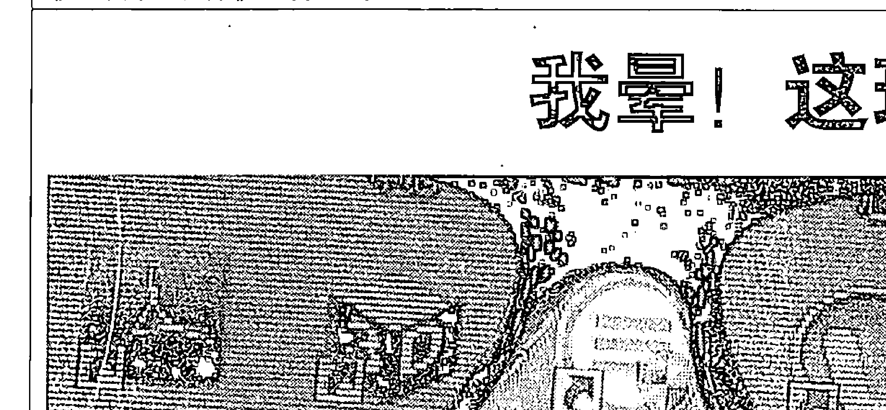

带着3D眼镜看2D画面，操作电脑、进行工作显然是件不靠谱的事，先不说亮度降低的问题，单就基本的文字都没办法保持清晰。

## 3D，门道太多……

裸眼、3D眼镜、主动式、被动式、偏振……N多的选择，如果不是直接买全套，那您最好问清楚再下手。
最简单的是几乎只有快递成本的红蓝眼镜（可DIY，淘宝购买，最便宜的只要几毛钱），是“玩具级”3D产品，还衍生出红青、红棕之类的“小众眼镜”。
这种3D体验，很容易产生偏红、重影的问题，而且由于“天生的缺陷”，即使那些100多元的红蓝眼镜其实和几毛钱的相比改善也不太明显，佩戴倒是舒适不少。
不用换显示器，不需要升级硬件，只要下了电影，带着眼镜用任意播放器就能搞定，入门级3D体验，红蓝效果的碰球游戏：[http://work.newhua.com/cfan/201018/3dball.rar](http://work.newhua.com/cfan/201018/3dball.rar)
用红蓝眼镜玩游戏可以无视电脑所用的显卡，但最佳搭配是NVIDIA显卡，只要使用了9500GT以上的显卡，搭配186.18或者更高版本的显卡驱动，就能体验到3D VISION DISCOVER（点击“开始→NVIDIA Corporation→3D Vision”，点击“启用3D立体幻镜Discover”），这样设置之后，游戏就能变为红蓝3D效果。
NVIDIA这么强，ATI显卡用户表示“鸭梨挺大”，不过使用IZ3D，就能解决这个问题，它不限制使用的显卡就算是ATI也一样可以玩红蓝3D。
先下载IZ3D的驱动，[http://www.iz3d.com.tw/support.php](http://www.iz3d.com.tw/support.php)，安装后重启电脑，之后进入程序，选择Enable Stereo by hotkey（通过快捷键开启立体模式），Stereo Output（立体输出模式）选择Anaglyph和Red/Cyan（红青模式），Apply（应用）即可，软件的使用很容易，进入游戏后按小键盘*键开启或关闭立体模式，再按/键自动调节景深，之后可以通过小键盘+、-键增加或减少立体强度，按Shift加小键盘+、-增加或减少景深（红蓝重影的距离）。
小提示：
★关于3D效果偏色的问题，可以通过增加游戏本身的亮度、显示器的亮度，进行改善。
★打开3D效果后，显卡的负担会增加30%~50%，必要时需要降低画质才能保证游戏的正常运行。

NVIDIA 3D VISION是目前高端人士玩的3D的首选，毕竟有NVIDIA支持着，更新着，原厂的东西质量也不错，效果还好，针对游戏优化的也最好，就是这套3D眼镜全拿下的话要1000多元。
为了省钱，就有高手想出了解决方案：先是用采用相同技术的红网眼镜来代替原厂眼镜，但如果驱动程序找不到3D VISION硬件，就不能启用，于是出现了售价不足百元闪盘样式的“3D VISION模拟器”。这样一鼓捣，只要花上几百元，再把古老的支持120Hz的CRT显示器搬出来，就能玩3D了!
3D VISION模拟器，看着很像山寨货，但谁让人家有技术呢?
3D VISION原厂产品，使用时需要一个红外发射器发射，一个发射器可以带多幅眼镜。注意，游戏时，建议将亮度和gamma值调高，另外，由于多了一维（二维变三维），游戏设置中的反锯齿特效开不开就无所谓了。
红网3D眼镜其实是很早就出现的技术，只是当时没火起来，眼镜分有线及无线两种，第一次购买一定选择套装，之后只要单独眼镜就能扩展。

偏振式3D，是目前越来越多的笔记本开始采用的方案，联想、微星、ACER、LG都有相关的型号，不限显卡，成本低，3D效果好，被动式等优点都让它有可能成为未来的主流产品。不过这玩意有个很大的问题——在处理实时画面时（游戏或视频），观看角度非常重要，就算你设置完全正确，只要角度不对，不仅重影，而且没有3D效果。此外，降低分辨率也是这种方案的一大问题（所以才没办法看清楚文字，不能带着眼镜干活）。
笔记本厂商会给你推荐一站式解决方案，但比相同配置下，比一般笔记本要贵上一两千。

来吧，3D！
就算3D让人晕，但人的猎奇心理总还是有的，“头可断，血可流，有人来看，那3D效果坚决不关！”
要说最傻瓜式，未来主流的3D体验那就是偏振式，其中大部分厂商都采用的是TriDef 3D方案，特点就是轻松易用，比如联想IdeaPad Y560D就随机赠送的TriDef 3D了，只要一打开软件，就四个选项看电影、看光盘、看照片、玩游戏，不管是什么，只要是娱乐，这软件都能把画面变3D的。
连老爸老妈都能独自欣赏3D电影，只是软件自带的视频和照片效果都挺好，但是用2D的电影（或图片）模拟3D，效果就差了一个档次。
有人问过小编：“为啥我玩的3D游戏，人物都在屏幕里面呢？”注意这里的影深、减小前景百分比之类的选项就是用来调节最终效果的，只是该工具要求游戏必须支持DirectX 9才可以。
StereoScopic Player（下载地址：[http://tinyurl.com/37utkttx](http://tinyurl.com/37utkttx)）是另一款被介绍得几乎“臭大街”3D视频播放软件，它的功能的确强大，使用难点基本上就是由于3D片源基本上是上下或左右格式，如果你是从“野路子”下载回来的，没有说明，那就得忙了一一你需要判断片源输入的格式，同时需要调整显示器的角度，弄不好，还要不停的尝试“查看→设置观看方式”下面的选项，反正当初我就经历过这么几次。
3D电影分为红蓝、上下、左右等多种格式，分别适用于不同的技术，除红蓝格式外，都需要用专门的3D播放器播放。

## “穷有钱”怎么玩3D？

虽然玩3D是贵，但也挡不住玩家的热情，就算没钱，也咬牙也要整……
买120Hz的显示器几乎没有必要，性价比不高，看电影也不爽，所以现在玩3D的人把目光更多的投向了投影。
ACER H5360可以算是最廉价的3D高清（720P）投影解决方案了，连一副DLP眼镜在内需要6500元左右，基本上不管是电脑、游戏机、DVD都可以使用了（DLP 3D目前还不能玩电脑3D游戏）。虽然亮度会下降40%左右，但120寸的大屏下，还是可以的，如果觉得比较不爽，可以使用金属幕布解决，只是成本……
购买两台二手投影，实现双机3D那效果可比一台强多了，只是要求你电脑最起码能接双显示器。
裸眼3D立体光透镜视板，不到500元，不用换显示器，安装简单，就是有观看角度、距离限制……

## 我知道你很烦我扯淡

3D原来是这样实现的
3D其实分为两个类型更科学：分色立体和全色立体。分色立体包括红蓝，黄蓝这一类以牺牲色彩的观看方式，而全色立体包括了偏振、分时，以及更高科技的光谱技术。全色立体并非仅有偏振，其实分时立体也是全色立体的重要组成部分，而且全色立体里面的最新技术是光谱技术。全色立体并不都是偏振的天下，分时技术其实更适合家用，最典型的家用分时设备是红网或NVIDIA眼镜。

3D眼镜分主、被动
现在使用的3D眼镜主要有主动式和被动式，主动式立体眼一般就是快门眼镜，用于上面提到的分时技术，一般眼镜都需要电池或电源供电；被动式除了常见的红蓝眼镜外，还有偏振等。主动式的眼镜价格昂贵，维护不便，关键是和发射器中间不能有干扰，光损比较严重，所以需要更高的亮度。当然后面两个问题被动式眼镜也同样存在。

DLP 3D是什么？
DLP 3D是最近才开始“热起来”的投影机实现3D方案，其实它和3D液晶显示器一样，只不过是支持了120Hz而已，早期的一些教育用投影机具有DLP 3D功能，如果能淘到二手货还是很值的。

3D视频、游戏不相同
由于视频和游戏的解决方案不同，前者仅需要播放器支持即可，后者则需要驱动支持，所以每种3D解决方案对它们的支持也不同，比如DLP 3D播放电影没问题，但就算是用IZ3D驱动，也没办法出现120Hz的选项。

网络大补帖：
超火的3D论坛，资源很多：[http://www.china3-d.com](http://www.china3-d.com)；NVIDIA 3D VISION支持的3D游戏：[http://www.nvidia.cn/object/3d-vision-3d-games-cn.html](http://www.nvidia.cn/object/3d-vision-3d-games-cn.html)
(文/北京 D3)

## 供未来火星移民研究的光盘

曾经，我们的电脑中有一对存放数据的欢喜冤家：光驱和硬盘。当时由于硬盘同学的房子不大，因此光驱同学一直帮他分担着收藏数据的工作。如今，硬盘同学已经住进了别墅，足够帮我们塞满数据，光驱同学的“杯具”由此开始。至今，很多玩家已经不再需要光驱，并将他的家从电脑中“强拆”了出去。
还好，很多科学家并没有忘记他。这不，来自罗马尼亚的科学家Eugen Pavel就给光驱找了一片硕大的“庄园”，研发了一种可以在CD大小盘片上存储1PB（1,000,000 GB）数据的玻璃陶瓷复合技术，而且可以保存数据5000年仍历久弥新。
也许千年以后，移民火星的居民都会用旧货市场淘来的光驱和此种盘片来研究我们的这段历史呢。

新人辅导 | 系统应用 | 网络应用 | 软件应用 | 校园新人 | 迷人合辑 | 便捷生活 | 数码物语 | 小贴士 | 天生我才 | 玩转圈圈 | 天才我最大 | 校区新生派

## 《电脑爱好者》·合订本

开学后，发现新校园社团还真不少，居然还有魔方社团，这小玩意有这么好玩么？别看魔方只有26个小方块，变化可真是不少。

```
8×3×12×21 / 3×2×2 = 43,252,003,274,489,856,000
```

## 想成高手，先学三阶魔方

玩魔方最重要的是口诀和玩法，初阶玩法好学，但速度慢。高阶难懂但学成之后足以傲视群雄。这就好比武侠小说中的习练武功一样，不断迈向更高层次。初级玩家推荐魔方小站（[http://www.rubik.com](http://www.rubik.com)）

### 用电脑玩魔方

心动入手之后却不能马上玩到，只恨快递太慢。没关系，电脑、手机照样玩。⊗ PC：三维智力魔方，在“游戏设置与操作”中选择魔方的打乱次数，次数越多，游戏难度就越高。

## 纸糊相机骗妹妹呢？

玩过卡片机，耍过单反，就是没碰过这纸糊的相机，什么传感器、自动对焦啦、镜头、光圈、焦距啦全都玩去。不用镜头，扎个眼儿就能拍，这也太给力了吧，真的假的？

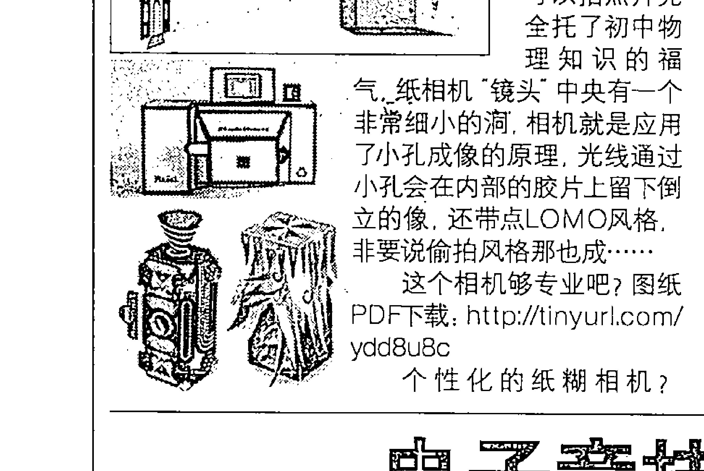

### 扎个眼儿就能拍

有图有真相，纸糊相机可以拍照片完全托了初中物理知识的福气，纸相机“镜头”中央有一个非常细小的洞，相机就是应用了小孔成像的原理，光线通过小孔会在内部的胶片上留下倒立的像，还带点LOMO风格，非要说我风格那也成…… 这个相机够专业吧？图纸PDF下载：[http://tinyurl.com/ydd8u8c](http://tinyurl.com/ydd8u8c) 个性化的纸糊相机？

OK，这些图纸满足你：[http://tinyurl.com/3w5w6q](http://tinyurl.com/3w5w6q) 纸糊相机离不开胶卷，由于纸糊相机曝光控制有难度，初期拍废片很正常，便宜好用的柯达100度胶卷最合适，8元左右。 解剖胶卷，目的是拍出来的相片要卷到另一个胶卷，避免再次曝光。准备一个空的胶卷盒粘上双面胶，把新胶片卷进去。接下来就是外壳的制作，下载模板，按尺寸打印之后，纸张越厚越好，裁切粘合即可制成。 一般来说，纸糊相机的针孔直径最好为0.4mm左右，太大图像就发虚，太小通光量也小，孔洞越圆越好。另外，使用金属薄片制作相机的针孔部分，可有效避免纸张扎孔出现常见的毛刺。

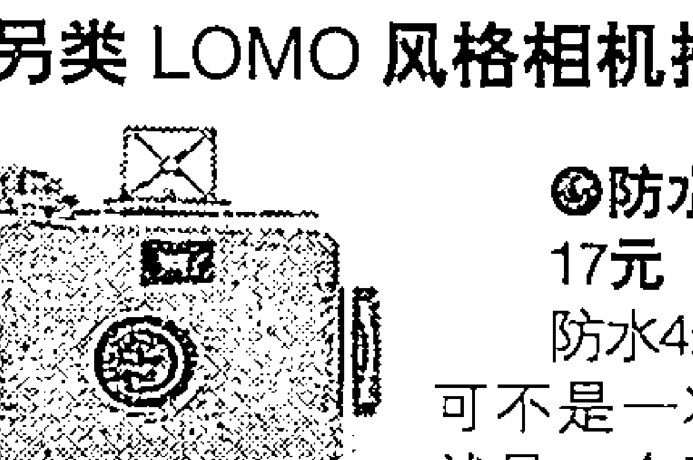

### 另类 LOMO 风格相机推荐

⊗ 防水LOOMO相机 17元 防水4米，有胶卷就能拍，可不是一次性相机哦。其实就是一个玩具相机+防水水晶壳。 ⊗ 双镜头 LOMO相机 90元 双镜头相机的风格绝对让你眼前一亮，暗角，锐利，梦幻的视觉冲击，同样使用胶卷拍摄。

## 电子竞技：要做一个有价值的产业

今夏的7月，作为全球电子竞技领域的重要赛事，为期3天的三星电子杯WCG(世界电子竞技大赛)2010中国总决赛在上海落下帷幕；8月8日，2010年全国电子竞技公开赛在深圳开幕，距离WCG落幕不过十来天……这个夏季，国内电子竞技业因为一系列重大赛事的相继举办而更为火热。然而，电竞爱好者们的热情能否彻底融化横亘在中国电子竞技行业发展前的诸多“坚冰”呢？这却还是个很大疑问。

### 朝阳产业，“出身”并不好

在业内，2000年被视作中国电子竞技起步的原点。当时，美国暴雪娱乐公司出品的《星际争霸》流行于中国游戏玩家之中，让玩家们第一次感受到了电子竞技的乐趣。电子竞技俱乐部的雏形也从那时开始悄然诞生。一些兴趣相投的玩家组建星际战队，每天相约到网吧中进行“战斗”，一些战队也由此逐步走向了职业化的道路。 可就在职业化进程之中，争议出现了，其关键就在于电子竞技的“出身”上。尽管电子竞技当时已被正式纳入了体育项目，有了国际级别的比赛，尽管如李晓峰SKY这样的中国选手不断在国际比赛中取得冠军，可大多数中国人对于电子竞技的认同度依然不高，尤其是对于普通游戏玩家来说，要“将游戏变成一种职业”，这很难被大众所包容，传统认知中被认为是“玩物丧志”的电子竞技，让它不可避免地在急速发展之中遭遇到了来自社会舆论的“坚冰”。

### 无人喝彩的“独角戏”

据WCG全球CEO金亨锡介绍，2009年WCG全球有超过100万人参赛，在四川成都举办的总决赛期间，4天内现场观众近9万名，全球收看人数达到5400万。 表面上看，电子竞技在中国已有一定的普及度。中国国内有近30家国家体育总局认可的电子竞技俱乐部，他们大多分布在一些大中城市。一些以特定的电竞项目为主攻方向的民间电竞俱乐部也开始形成星火燎原之势。但资金短缺，人才匮乏已经成为电子竞技在我国发展的致命伤。在发展初期这一问题一直没有暴露，可当发端于2008年底的全球性金融危机粉墨登场之后，电子竞技便开始了自己的“独角戏”。 很快，一批电子竞技俱乐部和电竞选手们纷纷退出了这项运动。拥有李晓峰SKY等国内顶级电竞选手的WE电子竞技俱乐部经理乐乐告诉笔者：“从2009年开始，中国很多战队受到了很大的影响，甚至裁员，解散。WE电子竞技俱乐部也受到了一些影响，尽管还有一些厂商仍然在继续赞助我们。”

### 电子竞技职业化摆脱“被误读”

归根结底，电子竞技不受待见依然还是传统观念作祟。要改变，唯有消除其“被误读”的阴影，让电子竞技选手享受一个常规职业的“待遇”，把人才问题解决了，用优异的成绩来赢得更多的人关注。 事实上，近两年来，对电子竞技动辄以“玩物丧志”批驳的观念已在悄然改变。但待遇问题的解决将是最终破解电子竞技兴而不盛的尴尬局面，毕竟仅仅依靠兴趣，不足以支撑整个电子竞技事业的发展。据了解，三星公司赞助世界电子竞技大赛已经有10年的时间，在金亨锡看来，按照目前的发展状况，中国已经是全球第三大电子竞技市场，诸如李晓峰SKY这样的职业电子竞技运动员的成功，无疑为中国职业电子竞技选手提供了一个正面的样板。 而更多的业内人士也有同样的共识，都认为电子竞技在全球的发展也不过10多年历程，中国的市场潜力势必让全球的广告主投之以青睐的目光，举办的比赛将越来越多，奖金也将越来越高，使电子竞技和单纯的玩游戏逐步划清界限，慢慢从“被误读”的状态中走出来，提升中国电竞选手的收入水平，荣誉感和归属感，并让他们最终从半职业化走向职业化，让电子竞技在中国真正成为一个运动项目，有尊严、有价值地发展起来。

### 电子竞技就是个Mr.Children

#### 电竞行业孩子气的一面

国庆长假就这样过去了。在我小的时候，这个节日既让人兴奋又让人有些无奈。最大的印象就是当天会举办各种各样的活动，更惨的是全校一起“庆祝”：领导讲话、歌舞表演一样都不少，一套形式走下来人累得可不轻。然后在结束还要写一个“今天过得真开心”之类的作文。如今开始工作了，虽然少了些直接的束缚，但是孝顺家长、送礼等等又是一道无形的枷锁。原本以为长大就可以肆无忌惮享受的自由，似乎也并非就是如此美好。
有时在一个行业久了，很容易看出这个行业孩子气的一面。十年前或许一次电竞WCG的新闻就能够让这个行业讨论许久，而现在我们不得不压榨为数不多的新题材，并且不一定能保证，这不会成为读者眼中的笑柄。这就好比，从前的孩子只要一根皮筋、一个沙包就能够痛痛快快地玩上好大一会儿，而现在的孩子可能更爱去网络中寻求更多的刺激。对于孩子们来说，以往简单的游戏方式已经不能满足他们的体验需求，他们似乎越来越聪明，不是吗？

#### 电竞有经济学收益吗？

所以我也很好奇未来的电子竞技会变成什么样子。70后和80后的孩子生长在街机和家用机的环境中，一些在今天看来简单得不能再简单的游戏竟然是他们那时最大的乐趣，而80末和90后的孩子，则毫无疑问被电脑游戏的魅力所吸引。类似电子竞技这样的游戏项目竟然可以成为像体育比赛一样的高额奖金比赛，这在我们父辈那一代是很难想象的。当然，电子竞技的发展也催生了游戏高手的不断超越。以《星际争霸》为例，每分钟300次的鼠标点击量，最多4个以上的区域战斗记忆，十分之几秒的极限反应速度……这些并不能给人类社会作出什么贡献，可我还是认为这是一种很不错的智力开发方式。如果电子竞技在未来可以变成一种全民热衷的智力运动，我是第一个不会感到奇怪的。可是电子竞技也正像那些至今还充满幻想的儿童，它的成长之路还有很长。前些天在和同事聊天的时候，我们谈到了电影的成本问题。在我以前看来，电影不过是一种虚构的娱乐性质的产物，为了实现这种虚构而耗费数亿乃至数十亿美元的固有资源，从人类资源角度来看这无疑是一种浪费。但这些日子我对这个问题也有新的看法，抛开电影本身的经济学收益不谈，我认为电影对于社会意识形态的影响也是非常可观的，精神层面的前进也是社会前进的重要动力，这种前进往往也是需要成本和代价。同理，以电子竞技为代表的新时代网络娱乐方式，也必然会承载更多的精神寄托和文化价值。未来的一部电子竞技大作，也许会像现在的电影一样耗资几亿美元成为一个奢华至极的虚拟娱乐体验。

#### 电子竞技=Mr.Children？

如果拿古代的孩子和今天的孩子相比较，我们理所当然会发现我们孩子简直聪明太多了。这个聪明也许不是智商层面的，而是我们孩子接触的信息量和社会意识相对比较成熟，他们直接跳过了一些迂腐和曲折的论证过程而得到了较为准确的答案。很多孩子越来越早熟，他们都是有着儿童的身体但却有独立思维的Mr.Children。电影、漫画、文学、游戏都深刻促成了他们观念的塑造。在这所有的因素中，电子竞技也会在以后很长的一段时间中扮演重要的角色。

(文/STAR)

## OSL！决战在东方明珠之巅

夏末秋初，凉意未至。国内电子竞技于秋初迎来了本年度最火爆的一夜。

### 电子竞技登上东方明珠，宣传期居然一票难求

8月末，当OSL宣布9月11日在上海东方明珠电视塔举办本年度第二赛季决赛时，中国星际FANS几乎彻夜未眠。OSL是当今世界上最负盛名的电子竞技联赛，而东方明珠是上海乃至国内最具标志性的建筑，两者的完美结合造就成今年电子竞技最值得纪念的一幕，因此比赛还未开始就已经引发了极大的轰动。
让人遗憾的是，主办方似乎并没有做好充分的准备。赛前传出比赛场地只有300座位，门票不公开销售的消息之后，几乎所有星际论坛都开始了一片责难之声，大部分网友都在声讨“3万座位都未必够坐，别说300了”，以此来表达对场地设置的不满。当然更多网友都在无奈地发帖求票，最高的票价甚至报到1000元，却依然一票难求。
作为中国历史上最大牌的电子竞技赛事，场地如此稀少实在是再明显不过的败笔。对此，相关人士无奈的表示，“上海世博会期间，东方明珠又是标志性地标，因此审批起来相当困难。”这个理由能让人理解，但却依然令人失望。

### 最年轻的金鼠标得主，打败对手刷新纪录

本次决赛对阵的两位选手，李永浩（FLASH）和李济东（JAEDONG），都是韩国电子竞技中的超级明星，甚至放在整个韩国电子竞技历史上，两位选手也都堪称始祖级人物，并且不断地在刷新记录。
比赛当晚，东方明珠电视塔之外聚集了大量观众，FLASH和JAEDONG最终从两辆黑色的商务车走出来，闪光灯顿时闪成一片。谁能想到这是电子竞技选手出现的场景？300座位早在比赛开始之前就座无虚席，这还不包括场外站着的那些可怜的围观者。记者旁边一位30多岁的大叔从下午两点就站在外面等候，在人群中挤得是满头大汗。
这个夜晚让很多人都难以平静。FLASH最终3比1战胜了对手，成就了OSL历史上最年轻的“金属标”获得者，这之前记录保持者正是JAEDONG。同时，FLASH在今年几乎以摧枯拉朽之势拿下了4个年度冠军，平了BOXER史无前例的记录。
“我不是一个统治者，我还有很多路要走。”赛后新闻发布会上，只有18岁的FLASH平静地说道。

### 疯狂的韩国职业电竞，我们被落下不止十年

OSL究竟有多大影响？这个堪称电子竞技NBA一样的赛事，到底为韩国电竞产业带来了什么呢？其实韩国的电子竞技很大程度上都得益于OSL的发展壮大，这个星际争霸顶级联赛在十年的运作中也诞生了BOXER、NADA等数不清的电竞天王巨星。2009年在成都WCG世界总决赛上，OSL冠军JAEDONG曾引发了最大的轰动效应，现场的记者和工作人员也都纷纷追星，让人不得不感叹韩国电竞明星的魅力。
据WCG总裁金亨锡先生介绍，韩国星际职业选手的年薪在2000万韩元~2亿韩元，折合人民币11.5万~115万，而JAEDONG在接受采访时也透露，自己一年的收入能达到2亿韩元左右。在刚刚结束的OSL上，冠军FLASH夺得4000万韩元的奖金，约合人民币23万，这些数字对于中国的电竞“职业选手”来说无疑都是遥不可及的天文数字……
当然，高收入并不代表全部。在本次只能容纳几百人观众的小型场地上，OSL主办方再次显示了他们非常专业的工作流程。赛前选手的专访、选手专车到达场地营造的气氛、精细的场地布置和现场环节、滴水不漏的直播、夺冠后的气氛制造，每一个细节都显得井井有条。对比中国电竞赛事现场和直播，韩国职业电竞在幕后运营工作的专业性不得不让我们敬畏。
OSL结束了，很多电竞迷在度过了疯狂追星的一夜之后，再次回归到平静的现实生活。韩国电子竞技经过10年艰苦的挖掘，走出了一条自己独有的职业模式，而中国电子竞技的未来，却还在这种羡慕和仰望中徘徊不前。

(文/STAR)

## 《封神榜3》乾坤幻境初体验

中国神话战争网游《封神榜3》开放性测试11月12日开启，全新版本的游戏已经将人设和场景重新设计，并推出神秘职业、仙禽异兽坐骑和仙府迷阵副本等内容。这个开放性测试的抢先体验资格被笔者拿到了，现在就将对乾坤幻境副本的体验呈现给各位。
乾坤幻境源于《封神演义》题材，据说是女娲娘娘的山河社稷图惊现凡间，化为一片迷雾重重的乾坤幻境。这乾坤幻境，比起人间更是险象环生，通过乾坤幻境获得山河社稷图，想必绝非易事，需得经历深海之渊、冰火轮回、云海之巅三处。但是为取得乾坤稀世珍宝，已经有无数英雄前往挑战。

### 深海之渊介绍：

深海之渊乃是深海一处极其危险之地，中有灵兽九尾蛇镇守。九尾蛇四周环以漩涡，常人难以逾越。东南西北盘踞显仁兽、昭明兽、正恒兽和崇礼兽，进入乾坤幻境之中，需得先降服东南西北四兽，打破漩涡结界，方才能与九尾蛇一决高低。
这里要说的是，九尾蛇的领地四周有漩涡结界保护，玩家无法进入。所以必须先前往场景的四角，消灭那里镇守深海之渊漩涡结界的四只幻兽，这样漩涡结界就会不攻自破，最后就可以直接面对九尾蛇了。传闻快速击杀四只幻兽可能会有额外的奖励哦，而九头蛇会利用洪流把玩家冲出副本后来直接击毁堵路的洪流。

### 冰火轮回介绍：

当征服九尾蛇后，第二个幻境冰火轮回就会开启，这里有两个小鬼“寒空鬼”和“烈宇雀”，他们的周围有结界阻挡。玩家只有击败镇守冰山地狱和火山地狱的寒空鬼和烈宇雀才能够入口处唤醒主管冰火轮回的秦广大王和初江大王。Boss，乃是火山地狱与冰山地狱中的秦广大王与初江大王，二者分别善于长蛇吐焰和火羁寒冰。
所以想要闯过冰火轮回，就必须先前往冰山地狱和火山地狱的末端，采集开启寒空鬼和烈宇雀周围有结界阻挡的草药。对结界使用草药后“阻挡”就会破坏，击败寒空鬼和烈宇雀后，主管冰火轮回的秦广大王和初江大王将被唤醒，消灭他们则可以完成冰火轮回的挑战，接下来便可以开启第三个副本云海之巅了。

### 云海之巅介绍：

经过深海与冰火地狱的锻炼，终于可以踏上云端，等待在前方的是西王母座骑一九色斑龙，此龙威力无穷，且行动如电，需一路追随才能在云海之巅的尽头将其降服。三层幻境分别征服，女娲娘娘将现真身嘉奖勇士，原来三层幻境皆能征服之人，本就是凌云夺取天下之士！
这里要注意的是，玩家需要不断地追杀九色斑龙，并沿途消灭它召唤出的幻兽。直到追到云海的尽头，那里九色斑龙会召唤雷电持续攻击周围的敌人，而区域的范围也会随时间的推移减少。击败九色斑龙就可以完成整个乾坤幻境的考验，所以秘籍就是要尽快解决九色斑龙。另外看似没有路的地方其实是能够走的，据说这条路的尽头有天大的秘密……玩家们可以自行开发哦。

(文/FLY)

## 永恒之塔新版本呼之欲出 撒花还是拍砖？

由韩国网游巨头NCSOFT打磨制作的奇幻MMORPG《永恒之塔》全新版本曝光。新玩法对玩家来说具有很强的新鲜感，主打新地图龙界再次掀起三个种族之间的血雨腥风。新RVR要塞战加入了很多感官上的刺激元素，但新东西出来后是好是坏就不好说了，是超越还是败笔，撒花还是拍砖，这就需要我们的玩家自己来评判了。

而对于升级，此次新地图倒是调低了一些组队任务的难度，把个人得到道具的任务调整为团队得到，同时还提高了任务道具的掉落概率以及完成任务所得得到的经验值与奖励。这个改动在某些方面倒是能屏蔽掉“一己之心”，该改的应该算很值。另外，新版的组队练级速度也有所提高。本次改动也根据队员间级别的差异做了调整，高级别差异中也可以得到经验值，并且追加了在自身的种族地区被对方种族攻击可以得到保护的功能。

例如：开启古代龙神殿之古代龙的祝福：可以让团队增加物理攻击力20，魔法增幅力增加35，每个要塞都会有不同的BUFF效果，进攻方要赢取胜利就会变得更加困难。

### 角色上限提升至55级

据介绍，每个版本都会造就服务器第一公会。在此次新版本中角色等级上限将调至到55级，这对玩家来说无疑会造就一个全新的格局，大家可以在同一起跑线上重新争夺殊荣。第一公会将要竭尽全力保留住自己的地位才行。随着等级的提升，除了可以学习更高级的现有技能之外，每个职业相应也增加了不少新技能。同时为了加强游戏的平衡性，对每个职业也做出了相应的调整，例如杀星背后强击I—III技能的回避效果范围从500M变为800M，治愈星镇定I—III技能冷却时间变为1分30秒。如此改动促使游戏防御性能确实增强了，但进攻的难度也同样加大了。凡事虽说有一利必有一弊，但是整体均衡性在游戏中占着非常重要的比重，绝对不可小觑。

### 争夺四座龙界要塞

个人认为，在新版本中加入的龙界要塞战将会上演有史以来最激烈的种族战争！龙界要塞战沿袭了欧比斯要塞战的特点，但胜利条件非常困难，以前普通要塞战可以飞行并直接消灭守护神将，但在龙界要塞战如此续用这个方法已经行不通了，玩家需要面对的是龙族精英怪和城门。在承受龙族的攻击同时击破城门才可以进入到要塞当中，并且这个过程要经过3次。在进入城门之后，还需要先把结界膜发动石一一击破。如果直接去碰守护神将的话将会被秒杀。但对于防守方的玩家来说，可以通过开启要塞内部和周围增加的实体来得到BUFF。

### 八大副本齐聚亮相

《永恒之塔》自问世以来，每次版本更新之后地域设置上都会做很大的改动。在2.0版本中，追加了一块以“查托拉德雷得奇安补给舰”为首的大型地区。在这片大型地区中，八大全新副本将闪亮登场。其中在“卡斯巴鲁内部”地城中，玩家首先需要寻找到维持秩序的强大能源，同时为负伤的勇士采摘治疗草进行治疗，并且内部暴动时还要及时制压混乱的局面，一边保护队友一边更要防止怪物的袭击。地城的难度可想而知。而另一个新地城“噩梦”的游戏场景会让你联想到KONAMI恶魔城，昏暗的城堡暗藏杀机，幽静的花园充满一片诡异。在这里将会揭晓女妖克罗梅迪所不为人知的一面，如此故事性极强的改动，估计新版本将会是对副本控玩家的一大挑战。

> (文/一粒沙)

## 拍砖人像之妙用反光板

好风景不仅要用心享受，更要随时拍摄记录下来。尤其是面对MM更需要把水平发挥出来，此时你也许会有几个疑问。

-   拍摄时光线太复杂，MM背对光源，脸部缺少光线，造成“大黑脸”
-   想试试如传说一样存在的唯美系逆光糖水片儿，却总把MM拍成“皮影”
-   光线很好，但是MM本身和背景光区别不大，不能有效突出人物

遇到这样的问题，聪明的同学已经想到答案，打开相机的强制闪光灯，正面补光！这个答案可以得到及格60分，起码能有效果。给闪光灯加上一个柔光罩，柔化光线后效果提高一点点，70分。

### 我有一个85分优秀的答案：反光板

反光板作为拍摄中的辅助补光设备，常见程度不亚于闪光灯，可以让平淡的画面变得更加饱满，体现出良好的影像光感、质感。简而言之，给需要光的地方开小灶，局部变亮突出主体。

常见的是金银双面可折叠的反光板，携带方便。同时反光材料的反光率比较高，光线强度大。常见有圆形与椭圆形，直径从20CM~120CM不等，拍摄人像至少要50CM大小，再小的适合拍摄花花草草等静物。至于颜色，银色或纯白色反出来的光不改变色调，色彩偏亮，也是使用最多的颜色。金色能让人物脸色更暖、红润，日出傍晚时效果更加。故推荐金银双面两用的反光板。

淘宝可以淘到很便宜的反光板，80CM仅有30元，要注意选择适合自己使用的尺寸，大固然好，但是移动不方便，反光板可以折叠，初次使用的朋友会被如何折叠难倒，需要8字形手法，和拧麻花一样。推荐一段视频（http://www.tudou.com/programs/view/72-LHTO91Qo/）。

### 30元还贵？教你只要10元的方法

材料选择要点：具备漫反射能力，本身反射光能力强。

锡箔纸（5元，5米×30cm）与保温棉（管道外层常见，略厚，3元/平方米）既便宜又好用。揉皱后贴在PVC或木板上，揉搓目的是让材料的漫反射效果更好，反射光柔和。最后用双面胶（5元/卷）粘合牢固。

### 反光板怎么用？当然拿在手上了！

首先反光板肯定不能背对光源，不管光源在哪个方向，反光板应该布置在相机周围。高度也需要注意，位置高的话，光线从上往下照，鼻尖、额头会形成高光，下巴、眼窝自然会有阴影。从下往上又显得丑化人物，所以需要随着人物面部的朝向不断调整。

### 常用的手法是

-   太阳光强时人脸有阴影，反光板打上去消除或削弱阴影
-   阳光太强，色温较高，用金色反光板补光，增加点暖色调

### 不花钱有戏么？

### 没问题，万能的PS帮你忙

-   1. 使用PS的色阶调节（图像→调整→色阶），将滑块向左调会变亮，阴影中人物变亮，此时不必考虑背景因素。
-   2. 打开历史记录窗口，可以看到两步操作，分别是打开和色阶。点击色阶记录前面的方框，就能出现历史记录画笔的图标。此时点击打开，记录返回第一步。
-   3. 在工具箱中选择历史记录画笔，使用大小适当的柔角笔，然后在照片中人物上描绘，照片中的人物也慢慢地亮起来了，背景却未曾改变。

> (文/北京潘大熊)

## Wii手柄成功入侵让你的Android手机变掌机

Android无疑是时下最热的智能平台，繁多的模拟器程序给了我们重温GB、MD、SFC甚至PS经典游戏的机会，可惜的是大都Android手机都没有物理键盘（比如G3 Hero），游戏操作实在太差，没关系，只要你的手机有蓝牙，能找来Wii游戏机的蓝牙手柄，一切问题就都解决了！无论是手机还是平板电脑，只要是Android系统，都可以使用下面的方法爽翻游戏世界，再也不用担心触摸屏那蹩脚的操作了。

### 前期准备

Android手机（有蓝牙是必须的），模拟器软件（Gensoid/SNesoid/Nesoid/GameBoid均可），Wiimote Controller（下文简称WMC）软件，Wiimote手柄（俗称“双截棍”）。
WMC下载地址：http://mobile.91.com/Soft/Android/wiimotecontroller-0.20.html
Android模拟器：http://mobile.91.com/soft/Android/list/41_1_5

### 软件设置

Wii无线手柄是用蓝牙传输的（地球人都知道），利用WMC软件可以在Android系统上安装虚拟驱动，让系统能识别到手柄，同时将手柄发出来的蓝牙按键信号转化为手机能识别的键值，然后通过一个虚拟输入法，达到输入目的。

-   第一步：首次运行WMC软件会弹出Important提示框，示意将在手机上安装新的虚拟输入法，点击Yes按钮会自动跳转到键盘设置菜单，勾选WiimoteControllerIME输入法。
-   第二步：开启手机蓝牙功能，切记不要搜索任何设备，也不需要打开可被识别的功能。回到软件界面，选择Init and Connect，同时按下Wii手柄的AB键，大约3秒后手机就会连接到手柄。然后选择Select WiiControllerIME（将系统当前输入法换成WiiControllerIME输入法），至此软件设置结束。现在可以退出软件，无需挂在后台，软件已经有服务进程在后台了。
-   第三步：运行模拟器软件（以PS模拟器PSX为例），按Menu键进入模拟器的菜单选项，将使用外部输入设备项选中，之后在按键设置界面中就可以将虚拟按键映射到手柄物理按键上了。退出设置，运行游戏吧！

除了游戏方面的功能之外，利用WMC软件还可以替换映射列表、修改服务线程优先级（可提高低配置手机的响应速度），甚至还可以用手柄来遥控音频软件的播放/快进/暂停等控制。

### 小提示：

目前Wii原装“双截棍”市场价在200元左右，组装100元上下，二者都可以完美识别。但如果你想将经典手柄插入Wiimote的话，非原装经典手柄可能会无法识别，为了确保兼容性建议使用Wii原装配件。对于PS等按键较多的模拟器，可以利用Wiimote下方的连接口上插入任天堂的经典手柄，这样按键就足够了。

> (文/云云爱睡)

## 只要三千元 家庭实用型高清影院

近两年投影机凭借大画面的优势开始进入家庭，虽然价格一降再降，但支持高清的投影机依然很贵，不如自己DIY一个！只要三千元就能打造出100英寸大屏幕高清家庭影院么？

### 核心配件：投影机

投影机的结构其实并不复杂，甚至可以开玩笑地说，找一块拆机或全新液晶面板，网上淘个驱动板，五金店里买个灯泡，再加上一些小配件，花上几天的时间制作机箱就大功告成了。其实它主要结构有屏幕、驱动板、镜头、光源、电源及外壳。了解这些，接下来就是按需寻找DIY的材料。

### DIY 投影机也有套餐

现在什么都讲究服务，要是自己搜集整个投影机的配件，不先学习个十天半个月那是肯定做不出来的。好在淘宝上有很多小店提供投影机套件，有了它，组装大为简化。不就是个高级积木嘛，卖家会附送装机图纸，有的还提供教学视频，所以详细的装机步骤不再累述。这里说下选购、组装要注意的地方。以下配件多涵盖在淘宝出售的套件内，有的套件不包含屏幕。

-   ◎高清不高清，关键看屏幕
    LCD屏幕是投影机成象的关键部分，直接决定投影质量。而起到决定性作用的参数是分辨率，LCD屏幕大部分是由笔记本的LCD显示屏改装而成，尽量选择高分辨率屏幕，比如传统15.4英寸屏幕分辨率为1680×1050，不能完美实现1080P，而高分屏在相同尺寸下轻松实现。

| 720P高清 12.1英寸 | 1080P高清 15.4英寸 |
| :--- | :--- |
| LTD121EX9D | LP154WU1 |
| 物理分辨率 1280×768 | 物理分辨率 1920×1200 |
| 480元 | 550元 |

需要注意的是那些屏幕尺寸很小（如5寸）的屏幕往往是采用800×600的分辨率，高清效果不好，选择意义不大。此外，还应关注透光率（透光率越高，用相同瓦数的灯泡穿过的光线就越强）和是否存在亮点、坏点，要向店主问清是否保点。

-   ◎功能多不多，关键看驱动板
    驱动板关乎到功能、色彩等方面。选择驱动板时要先看接口，比如HDMI、DVI、色差分量、TV同轴电缆等是否齐全。部分驱动板上还提供USB接口，可以直接播放移动硬盘中的视频、图片文件。尽量选择配有遥控器的型号。

### 镜头系统决定成像质量

要想画面没有畸变，透光率高，离不开好的镜头系统。镜头系统主要分为投影镜头和菲镜。投影镜头具有调焦功能，选择镜头时应该考虑镜头到幕布间的距离，合理选择镜头的视角。菲镜是一种同心圆螺纹透镜，分别安放于LCD屏幕的前后，起到提高边缘亮度和梯形校正的作用。

### 没有光源是白扯

光源的核心是灯泡，最重要的两项指标是亮度和寿命。现在市面上主要是卤灯，功率一般在150~300瓦。一般功率越大，亮度也就越高。另一个需要注意的部件是反光碗，在反射可见光的同时使红外光透射，大大降低LCD屏幕的温度，延长使用寿命。

-   ◎电源唯一需要注意的是功率，只需比灯泡功率稍大即可。其他的部件还有聚光镜、灯架、灯罩等，这些部件一般都是配套的。

机箱：外壳看似简单，实际上却是非常有技术含量，并且需要大量工具。很多淘宝店家提供制作好的机箱，价格一百元以上，如果想自己动手，可以索取机箱的图纸。关于机箱的制作，可以参考这个教程帖 (http://tinyurl.com/33mgvr)。

> 小提示：
> 驱动板安装的位置不要和灯泡距离过近，灯泡附近的线路要做套管处理，防止高温破坏绝缘。风扇最好选用大直径、低转速的静音型风扇。不同型号的套件组装方法有小区别，但大体结构是一样的，先看两遍视频教程，做到心中有数（http://tinyurl.com/2g36ma6）。

### 推荐套件

15.4英寸这款不含屏幕，需单独购买。250W灯泡。由于屏幕体积很大，所以用小床头柜当作机箱很适合它，而且稍加改造即可。12.1英寸这款包含屏幕，250W灯泡，体积相对小很多，与14英寸笔记本大小相当。

### DIY 投影机的优势

市场上有不少廉价的投影机，2000多元的价格并不比DIY投影机的成本高很多，但这些廉价投影机的效果与DIY投影机是无法相提并论的。廉价投影机的标准分辨率多为800×600，亮度也很差，实际效果仅仅是480P的水平。一个好的DIY投影机，其真正价值不输三倍于自己价格的品牌投影机。

### 组建家庭影院还差什么？

### 幕布

投影机有了，“影”投在什么地方呢？为了获得最好的视觉效果，用墙做幕布就有些过于寒酸了。而且专业幕布的表面不像墙体那样光滑，需要细小玻璃珠来漫反射，不像墙体看起来对比度不足。便宜的100英寸16:9电动幕布也要近500元，如何DIY？没错，刷墙太麻烦，用墙纸就好。要注意选择材质厚实，表面最好有能反光的小颗粒。便宜的墙纸30~50元/卷，也就是每平5~8元。其他材料还有玻璃、床单等等。至于效果，可以参考下这个小实验 (http://tinyurl.com/29kwu9r)。

除了材质还有角度，幕布就像LCD显示屏一样有可视角度，在一定范围之外亮度就明显下降了。在一定的角度内，幕布可以起到光线强度增益的效果。

### 幕布尺寸与幕布长宽之间的换算关系

4:3 屏幕尺寸（英寸）＝【 屏幕宽度（米）×5/4 】× 100/2.54
16:9 屏幕尺寸（英寸）＝【 屏幕宽度（米）×18.257/16 】× 100/2.54

降低环境光线强度也可以提高视觉上的投影亮度和对比度，这时候窗帘就会发挥重要的作用。较厚的布艺窗帘一般就可以起到较好的隔光效果。选择正面黑色，背面银色反光材质的窗帘效果最佳。另外，幕布是白色，那么背景墙最好是黑色，这样能增大视觉反差。

厚窗帘还具有一定的吸音效果，布艺沙发、地毯等棉质柔软的材质家具也能起到吸音效果。至于如何隔音，不会吵到邻居休息，门窗也要小改造，加入密封条即可。“没声音，再好的戏也出不来。”一句耳熟能详的广告语点出了家庭影院中音频设备的重要性。音箱摆位是个学问，具体注意事项可以参考 (http://baike.baidu.com/view/591989.htm)。家庭影院自然是音箱功率越大越好，性价比不错的有奋达A310，200元左右的45W的2.1音箱。

至于播放设备，DVD机或者电脑都可以，和连接显示器一样。现在一般台式机的主板都集成了5.1声道声卡，音效也完全可以达到DVD机的水平。将所有的设备都组装调试好之后就可以享受自己DIY的高清家庭影院了。

(文/北京 林锐)

## 魔方Team给你不一样的Social Game

继《开心农场》、《QQ农场》等SocialGame（社交游戏，是一种通过互动娱乐方式增强人与人之间交流的互动行为）大获成功之后，市场上涌现出了许多种SocialGame产品。《Q宠大乐斗》公测之后，保持了良好的上升势头；新产品《QQ宝贝》也于8月12日公测。到底制作这些可爱版本游戏的人是谁呢？他们的创意又来自哪里？两款新品游戏是如何诞生的？带着这些好奇，让我们一起走进“Q类游戏”的制作团队：魔方SocialGame组。

### 魔方 SocialGame 组介绍

SocialGame组是魔方工作室旗下负责社交游戏产品相关内容的其中一个小组，有研发人员二十余人，目前已研发出了“Q宠大乐斗”、“QQ宝贝”等QQ空间超人气游戏，致力于开发精品的社交游戏。

### Q 版游戏最看重互动和画面

魔方团队的人员给我们介绍说，《Q宠大乐斗》是QQ空间里的第一款轻度PK题材的社交游戏，而《QQ宝贝》则是QQ空间里的第一款宠物养成社交游戏。对于用户来说，它们从画面表现到玩法体验都是新鲜有意思的，带来了相比QQ农牧场完全不同的全新Social Game体验。从用户调查的反馈来看，“用户最喜欢这两款游戏的主要原因是可以跟好友进行饶有趣味的互动，以及游戏本身精美可爱的画面风格都是吸引玩家的条件。《QQ宝贝》属于装扮养成类型的社交游戏，与同类型的游戏类似，它们都拥有可爱多变的宠物造型以及让玩家DIY的房间，加上SNS好友交互的应用。但相比来说，《QQ宝贝》在宠物造型、宠物动作、家具摆设和各种UI展现上要更为精致和生动活泼。这主要有赖于在此前《QQ企鹅》、《小熊梦工厂》等产品的宠物形象设计中积累的经验，所以Q版游戏是非常注重画面效果以及与玩家互动的。

### 搞笑与武侠结合 创意来源于生活

据魔方团队的工作人员介绍说，《Q宠大乐斗》的最大亮点在于它将大家很熟悉的QQ企鹅形象与搞笑的中国武侠美术风格相结合，在角色的动作和形象设计上都呈现幽默可爱的风格。《Q宠大乐斗》操作极其简单，玩家只需点击鼠标即可完成每日的游戏内容。游戏中的技能武器名字和描述也相对于传统大型网游来说更通俗易懂，复杂的概念和系统比较少。另外在交互设计上，《Q宠大乐斗》对比其他游戏在关系链设计上下了较多功夫，通过师徒、家族等内容一步一步加深用户的社交体验。

说到《Q宠大乐斗》的创意还有一个花絮，它的原型是腾讯游戏在2009年底出演公司圣诞晚会的舞台剧《企鹅大侠》。当时这部舞台剧的魅力影响了台下数千观众，也深深打动了魔方的策划团队。魔方SocialGame组一致认为企鹅可爱的形态搭配传统的中国武侠风是一个非常不错的概念，于是便有了《Q宠大乐斗》的诞生。

### Social Game 市场新分化未来看重新产品

对于市场概况和未来的发展，魔方团队表示：国内Social Game行业目前处于百家争鸣的情况，有很多新兴的网页游戏公司纷纷加入，一些大型的公司也开始构建各自的社交平台。另外，国内的Social Game开发团队已开始将产品输送至国外，而国外的开发商则开始关注庞大的中国市场。对于Social Game的未来趋势，首先应是游戏题材的逐步细分，比如目前主流的农牧副渔题材，新型的PK类、运动养成类、模拟经营和建筑类、宠物养成类、教育题材类、女性题材类和休闲对战类等。Social Game相比传统的大型网游而言，将会呈现更加细分的状态。另一方面，由于Social Game的门槛较低，未来一定会有许多很好创意的产品不断涌现，在越来越激烈的竞争下，Social Game需要更多的创意和完善的细节体验，产品的品质一定会逐步提高。

目前魔方SocialGame组已经在着手构思和开发新的产品，预计在明年会有两款左右的Social Game新品上线，从题材到玩法上都会有大的突破，各位玩家敬请期待吧。

(文/阿甘)

## 声音破解小Case 电话外放音正在暴露隐私

看过15期杂志《软件发布缺乏监控 助力犯罪不输“管制刀具”》一文的读者会了解到，犯罪分子利用音频分析软件就可以从电话按键声音判断具体按键。对此，很多软件迷开始研究了，这个声音真的可以破解出来吗？有文章称，专业人士只需10分钟就能破解这种声音。甚至有人提出，电影里女特工可以用声音代替电话拨号……关于电话按键音的流言是越来越神秘。

选题会上，Cornel自信地说：“这个很简单，让我训练下，不用软件我就能听出你按了什么键”。半个月后，多拉和小白对Cornel进行了测试，小白按了两个4，Cornel通过声音判断按了两个1，Cornel以缺乏训练为由暂时承认了测试的失败。看来电话的按键音并非这么容易破解。

### 流言一 10分钟可破解

为了方便通话，很多电话机都设置了外放功能，电话的拨号声音也是蛮动听的。仔细听，每个按键的声音都是不一样的。但是，所有电话机的外放音都是一种模式吗？为了验证这个问题，笔者在办公室找了两台不同的电话机，开启外放后，分别拨号并进行录音。然后在QQ上找到了“电话拨号录音解码软件”的作者，将两个录音文件发给对方后，分别经过5分钟、3分钟后对方发来了结果，虽然都有两个多余的按键，但我们可以看出这种软件的确可以通过声音判断出是按了哪些键。

难道按键音真的很特殊吗？我们用Audition分别打开刚才的一个录音文件（拨号为：82512272#0579#），从波形窗口中看出声音确实是有规律的，但通过波形判断出具体数字还是比较难的。单击“查看→光谱显示窗”，让音频文件显示为光谱模式，我们发现声音集中在2000HZ以下，对光谱分别进行水平放大和垂直放大，声音的特征变得非常明显，截取了5122的波段，即使不懂任何知识，单凭图像就能分辨出数字的差别。如果事先存一份各个按键声音的录音文件，通过图形对比样本，就很容易辨别出之前的按键。但是现在又有一个问题你该想到，每个人的声音都各有特色，你家的电话机和别人家的电话机发出的声音是一样吗？

### CFan鉴定：电话机都是一个喉咙

事实是残酷的，几乎所有电话机的按键声音都是一套系统，我们家里用的都是程控电话机。电话机的作用就是将按键命令转为电信号供系统识别，然后将声音翻译成电信号，然后再经过系统传输，到另一端还原为普通信号。那么这个翻译就需要统一的语法，也就是编码标准，这样才能实现不同电话的通话，也就造成了电话机传播的信号编码方式是统一的。而电话外放音，就是一个电信号传到扬声器的过程，为了设计简单，这个按键音用的电信号就是电话机向电话系统传输的信号，也就是要符合统一编码要求的。所以按键的发音就源自一套统一的音频编码了。如果要改变也很容易，从键盘按键到电话机外放的扬声器之间加一个编码系统，建立另一套音频编码也就可以了。但因为之前没有出现过经常诈骗案件，所以大家普遍认为没有必要，也就省去了这个设计，节省了成本，导致所有电话机的按键音都是一套系统，很容易破解。

常明显，截取了5122的波段，即使不懂任何知识，单凭图像就能分辨出数字的差别。如果事先存一份各个按键声音的录音文件，通过图形对比样本，就很容易辨别出之前的按键。但是现在又有一个问题你该想到，每个人的声音都各有特色，你家的电话机和别人家的电话机发出的声音是一样吗？

### 流言二 舌头也能给电话拨号

既然都是一套音频编码，那么只要让电话线里产生符合这个编码方案的电信号就可以了。在电影《保持通话》里面，女电器设计家就采用短路电话线的方式实现了通话。想得再远一点，我们能用嘴发音产生特殊音频代替按键吗？名侦探柯南2008，战栗的乐谱里面有这样一个场景，柯南用嘴发出拨号音的频率让电话拨了110，这个真的可以实现吗？

#### CFan鉴定：
要解答这个问题，我们需要知道电话机的拨号类型。我们使用的程控电话机一般支持两种拨号方式，脉冲和双音频。脉冲就是一次连续发几个脉冲作为编码方式，电话号码中的数字1用1个脉冲代表，拨号时可在听筒中听到一个“嗒”声拨号音，数字5就5个脉冲，0用10个脉冲。这种方式有点类似电报的长短音编码，用电话线短接来模拟脉冲信号理论上是可以实现的。

但是现在的电话机一般采用双音频拨号编码，一个数字由两个合成频率代表。例如数字1用697HZ和1209HZ代表，各按键对应的频率表（频率单位是HZ）如右表。仔细观察会发现，这是由两组频率进行交叉组合，组成的12个按键频率。回到文章前面部分，不用事先录制样本，通过音频分析软件分析录音，直接通过所表现的两个音频的具体值就可以判断出按键。明白了这个道理，柯南的疑问也就解决了，面对双音频编码的话机，谁能用声带一次发两个准确的音频呢？所以柯南的电影只能是科幻，现实中无法做到。

难道就没有办法避免被监听了吗？让我们跳出惯性思维，既然不法分子利用电话按键的不同声音作案，那么我们为何不能购买按键发声相同的电话呢？这类电话在市场中已有销售，感兴趣的朋友可以关注一下。

| 按键 | 频率 | 按键 | 频率 |
|---|---|---|---|
| 1 | 697+1209 | 2 | 697+1336 |
| 3 | 697+1477 | 4 | 770+1209 |
| 5 | 770+1336 | 6 | 770+1477 |
| 7 | 852+1209 | 8 | 852+1336 |
| 9 | 852+1477 | * | 941+1209 |
| 0 | 941+1336 | # | 941+1477 |

## 独一无二 笔记本也玩“夜光彩绘”

彩壳、贴纸，笔记本拥有这些元素就算个性吗？这些从流水线批量生产出来的东东谁都可以享用。如果你想打造属于自己那独一无二的个性，不妨来看看小蓝同学的创意：自己动手，给本本外壳来个“夜光彩绘”！

现在笔记本外观越来越炫，钢琴漆、金属、磨砂外壳各有各的优点，遗憾的是缺乏个性。看着身边同学用的都是和自己相同外观的本本，自封“超（潮）人”的小弟是无法容忍的。没关系，省下两顿午饭钱，用上半天的时间，一起来打造绝无仅有的“夜光彩绘”笔记本吧，绝对可以让你身边的同学哗哗地流口水！

### 准备工具：
- CorelDRAW 9设计好的图案（CDR格式）、夜光粉、胶水、笔刷、剪刀和小刀
- 成本明细：打印图纸（10元）、胶水（1.6元）、夜光粉（25元）、笔刷（3元），合计39.6元

### DIY 不干胶贴纸
在街头找到可以打印不干胶的刻字印章店铺。

将准备好的图片素材打印成不干胶贴纸。需要注意的是这种刻字机只能识别CDR格式的点阵图，需要用CorelDRAW 9这类的软件（这类店铺的电脑应该都有）。进入软件后输入素材图片，点击右键描绘点阵图选项，此时会弹出一个新窗口，点选外框→应用，关闭此窗口。回到CorelDRAW 9后点击鼠标右键选择把图像打散，依次点击检视→单纯框架，选择刻字机就可以打印了（很多小作坊员工都是老年人，这些步骤可能需要咱们自己操作）。不到十分钟，不干胶贴纸就出来了。

### 小提示：
之所以要打印成不干胶贴纸，是为了方便等下上夜光胶水时能遮盖住图案之外的其它地方，避免胶水渗出到其它部位。用A4纸直接打印出图案的话，复杂的图案不方便裁剪镂空，普通的纸张遇到胶水就渗透变软了，有可能烂了。

### 调配夜光原料
接下来再去化工店买夜光粉（大概5毫克25元），文具店买胶水和笔刷。把夜光粉和胶水按1：2的比例配好，最好放在不通风的地方（防止胶水干得太快不方便均匀涂抹）。

### 彩绘 Go Go Go
把不干胶贴纸贴在本本上，把要上色的地方撕开，用刷子涂抹“夜光胶水”。涂抹完要马上撕开贴纸，不然等干了之后不好撕开。用普通胶水的好处是当看腻图案后，只需沾点温水把图案打湿，然后沿着边缘就可以撕下来。如果有同学想让图案永远和本本外壳黏在一起，可以去买一种叫水晶胶的胶水，大概一小瓶十元，主要是用于贴手表上的夜光指针刻度的。

全部搞完，夜光个性Logo成型，本本“夜光彩绘”大功告成。此彩绘的夜光效果取决于夜光粉的比例以及完工后的光照时间。如果你也想让自己的本本与众不同，不妨来试试本文的方法吧！

(文/色蓝)

## 耳机线不再打结 牛人教你做

用MP3、手机听歌谁都爱，但说起耳机线那是谁都烦恼并头痛的事。放在兜里一不小心就乱成一团，它怎么就那么爱缠绕呢？

### 耳机线缠绕之谜
1998年，在美国某科学幽默杂志举办的一个“滑稽诺贝尔奖”上，有几位牛人把这一现象称为“绳索搅乱时的自发打结过程”。他们搓了3415次绳子，并观测到120种不同的绳结形成，最终得到结论：绳子打结与绳子长度呈现一定的关系，当超过一定长度后，绳子打结的可能性不会增加。换种理解方法，耳机线为包裹着热塑弹性材料的金属丝，而且长宽比例极度失调，导致了它极易被弯曲。而且，跟笔记本电源线不一样，耳机线还很容易发生围绕中轴（金属丝）的扭转。太过高深，有兴趣的同学可以看看科学松鼠会的资料 (http://tinyurl.com/2dwgmaa)。

那么，怎么解决它呢？等等，还有几位牛人。

- 用剪子、信用卡制作绕线器，过程十分简单，信用卡剪成长条，做出两个豁口，把耳机线绕上去即可，一分钱不用花。(http://tinyurl.com/27ayoaj)
- 淘宝绕线器，淘宝上搜索“绕线器”，一搜一大把，选什么样的好呢？抛开各式各样的漂亮的外观不谈，材质应尽量够软，放在裤兜里不会磨皮肤。豁口尽量多，固定线更牢固。此外，这些小玩意最贵不过5块，可别上2元饰品店、路边摊给黑了。
- 绕线器太麻烦？用彩色透明胶条在耳机线上缠绕几圈，既增加耳机线的硬度，不易弯曲，又可以做个性化装饰。最方便的是厚度决定硬度，可以自由掌握。
- 这位老兄最牛，把耳机线放入猫猫食盆，等猫猫边吃边解开，看看就好，别学哦 (http://tinyurl.com/24qo7y2)。

当然，还有其他小方法，避免耳机线缠绕，比如选择扁平的耳机线材，由于自身形状很难缠绕。在使用完耳机后缠绕在MP3等设备上，养成良好习惯。根据个人经验，最易缠绕的耳机线是那种弹性好，冬天冷时也不易变硬，但是材质表面发粘。反之，表面比较光滑不发粘的耳机线相对不爱缠绕。

(文/凉风)

## 国产008 打造“军工级”笔记本电脑

笔记本现在白菜价，谁都可以拥有，再也没有显摆的感觉。这次色蓝同学又给我们带来了他的作品：DIY笔记本，普通的理发师箱子和配件在他的手上如同变魔术一般组成了外表超酷的“笔记本”，绝对可以重新找回显摆的感觉！

最近有朋友愿意出资打造笔记本型的一体机，材料加工费全包，热衷于DIY的小弟哪能错过此次机会？正好算是干柴遇上烈火，婊婆遇上脂粉客，陆陆续续收到他寄过来的配件后开始动工！

此次DIY的核心是铝合金外框+密度板面板的理发师箱子，箱体小高度高，改造起来对硬件的兼容性高，方便加工。出于省钱的目的电源方面就是普通电源拆开外壳装进箱子（安全性一般，普通玩家可选长条形的特殊电源）。主板方面选用了mATX板型的H55主板，硬盘为2.5英寸笔记本硬盘，花300大元还买了一个二手的15寸普屏液晶LCD面板，拆开外壳后刚好和箱子一样大，不需要再怎么加工。

### 统筹结构 搭好“骨架”
先将上述设备摆进箱体，用铅笔勾勒出大概的位置，再用游标尺测量好高度和尺寸，方便开孔和切割固定。开孔时最好先开窄一点，存在误差再用小刀和锉子加工开大，若存在缝隙可用玻璃胶或者硅橡胶来涂抹加固。为了给笔记本配上独立的电源和重启开关，我花了90多元配了两颗全铝制开关，以此为例，介绍下基本的打孔安装步骤：

- 注确定安装位置
- 用手磨开孔，再用斜口钳剪开
- 用圆形砂轮修边
- 镶嵌并用刷子除屑
- 全铝制开关内部效果
- 和主板对应的跳线相连
- 硬盘、主板和电源都可用纯铜通心螺丝固定，中间可用软塑料螺丝锁住加强缓冲防震

小提示：
DIY有时会遇到电线不够长的问题，可以选择粗细一样的电线延长，事先要做好标记，避免接错正负极烧坏硬件。建议用束线带将箱体内各种线缆打理一下，看着清爽也可以避免干扰。

### 不可忽略的散热风道
由于箱体是密不透风的设计，所以需要人工打造合理的散热风道，整体的散热思路是在箱体正面和C面开两个进风口，在背面的主板PCI插槽位置上配合一个涡轮风扇出风，用一小块废旧电源的网状铁片封上，加装涡轮散热风扇时，可以在亚克力板和涡轮之间加上一片减震海绵，再用弹簧螺丝固定，以减少振动和噪音。

### 勿忘给C面“美容”
每次翻开笔记本就看到了主板和繁杂的线路肯定会影响心情，所以需要在C面加装亚克力板，一方面可以改善视觉效果，同时还能避免灰尘进入箱内。在这里教大家一个小技巧：可以先切割出十几个亚克力小方块，用硅橡胶或者玻璃胶粘在箱子的边缘上，等胶水干了再覆盖上C面板，如果觉得透明的亚克力板能看到箱体内部不美观，还可以在上面贴上一层海绵胶片，还可以掩盖边缘的缝隙，防尘性能再上一层台阶。

由于我使用的是外接键盘（箱子太高，长期两手悬空使用C面的键盘很不舒服），如果你想在C面加上键盘，只要在上下盖预留出足够容纳键盘高度的空间即可，推荐使用柔软的硅胶小键盘。

### “面子”不能少
由于LCD面板的VGA和电源接口很紧凑，而箱体上盖空间有限，如果不改装只能在A面开孔。为了美观只好对LCD面板的电路板部分进行改造了。首先要拆下电路板，用热风枪将原来VGA和电源接口吹下来，将它们换成朝下的方向再找个地方焊接上去。在VGA接口对准箱体的部分开个孔，用中间割开X型缝隙的海绵贴纸盖上，这个X孔可以用来收纳VGA接线，平时要用的时候就拉出来，不用的时候可以藏进去。

LCD是很脆弱的，可以在B面加装一层亚克力板，前后锁上广告板螺丝固定。为了加固，索螺丝的时候中间再垫上一片金属垫片，能更有效的承重和防压变形。

小提示：
电源线能不外露的地方尽量不要外露，通电的地方最好贴上电工胶布，一是美观考虑，二是怕误触导致人员或者硬件损伤。由于箱体是密度板，没有接地存在静电隐患，需要DIY一条地线连接主板和电源。

### 绝无仅有的个性笔记本
这年头不支持无线的笔记本会让人鄙视的，刚好这款H55有MINI PCI-E接口，于是找了一块MINI PCI-E网卡安装，为了增强信号，可以将天线连接上盖的铝制框架。

一切就绪，心中那叫一个激动，按下电源开关顺利开机，利用U盘安装系统，半小时后终于看到熟悉的Windows 7界面，此次DIY笔记本成功！唯一可惜的就是重量惊人，将近7.5kg的体重绝对算是笔记本中的“巨无霸”，外观也像极了“军工级”产品，如果带去公共场所，回头率绝对杠杠的！

(文/色蓝)

## MOD鼠标也能赚钱 模型级MOD心得

一个售价150元的鼠标，经过玩家手中一番把玩MOD之后，身价翻了一倍仍然奇货可居。

小知识：
MOD为何意？与DIY不同的是前者是创造，后者是改造，如今MOD行业十分巨大，有着相当多的爱好者。

### MOD 鼠标灵感来源
模型达人小沈：从高中开始我就是一名反恐精英的忠实玩家，有自己专用的装备，经典的微软IE3.0复刻版。但随着时间的推移，鼠标掉漆一大片，加上看了个钢铁侠的续集，看着钢铁侠酷酷的外壳，瞬间来了灵感，何不将IE3.0外壳喷漆重做成钢铁侠特别版吧。加上本身有些模型功底，打造并不难。下面谈谈制作过程中的一些注意点。

高清大图效果展示
http://tinyurl.com/2vfw56e

### 砂纸有讲究
首先要选好制作材料，主要材料分别是砂纸、喷漆和水贴纸。别看砂纸不贵，打磨过程却是最重要的一部分，所以砂纸的选择很重要，砂纸号数从小到大就是砂纸颗粒的由粗到细，预磨阶段使用300号左右，精磨600~2000，2500以上是超精磨砂纸。为什么要1000如此高号数的砂纸开始打磨？因为鼠标是小件物品，并且是由工程塑料制成，任何太粗的砂纸都有可能对鼠标脆弱的外壳造成不可修复的伤害。而1200号是用来去掉打磨划痕的，而且不是做抛光处理，所以前期1000号足够。打磨必须拆开鼠标来做，喷漆也是一样。打磨没什么技术含量，只需要时间和耐心。

小提示：
如果想要MOD自己的手机和笔记本什么的，最好先研究一下如何拆除产品的外壳，用吹风机加热一下就可以很容易的撕开原装贴脚并且不造成损坏。

### 喷漆要选好
打磨完成再谈谈喷漆的选择，追求效果肯定是用制作模型用的田宫TS罐喷漆系列，很多模型爱好者看到罐喷估计会认为我不够专业，没错，模型喷枪对非专业模型玩家来说不易上手，罐装喷漆要好很多。最好选择水性的喷漆，漆质柔韧性好，不容易掉漆，而且比较薄。这里用到的有8罐，TS-21金色，TS-85法拉利红色和TS-13光泽透明保护漆，模型喷漆颗粒细腻，所以如果用在手机，笔记本上效果也是很不错的。

小提示：
每一种漆都有属于自己的颜色代号，在淘宝店铺里会有比较详细的颜色对照图。

如何做出最完美的漆面？喷漆手法讲究的是技术，在用1000号砂纸打磨后，用水冲洗干净，晾干后鼠标上已有一道道的打磨痕，不必担心，喷上一层薄薄的底漆（注意一定要薄，没有人希望最后拿在手上的是一罐干了的油漆，影响质感）。在通风的地方将喷漆和鼠标距离大约20~25cm，这样喷漆颗粒会附着得比较均匀并且不会浪费掉太多，喷漆的最大敌人是灰尘，所以喷漆作业时最好是在干净的阴凉室内进行。喷漆全程避免触碰到表面，建议将外壳架到卷纸的纸皮芯上架空进行。

晾干后肉眼还可以看到一道道的打磨痕，这个时候1200号的砂纸就发挥作用了，要把鼠标当作艺术品一样轻轻打磨，冲洗干净后重复进行一样的薄喷漆，这时可以发现打磨痕不见了。

### 锦上添花，水贴纸帮忙
纯色看起来总觉得少了些什么，加点图案点缀一下单调的颜色搭配吧！水贴纸是模型上常用的，我们当然也可以借鉴一下，有的店铺甚至接受自定义图案的水贴纸定做。

- 轻压贴纸内水分的时候一定不要用太大力，水贴纸是很薄的，很容易损坏。
- 一定要使用水贴纸软化剂进行软化，否则贴纸和物体的表面光泽就会不一致。
- 在水贴纸没有完全干透的情况下不要去触碰水贴纸。

### 保护漆驻颜有方
灰尘是喷漆的大敌，保持干净的工作环境是完美喷漆的必要条件。所有的工序完成后，要整体喷上一层亮光保护漆，要不使用一段时间就会出现指纹、掉色等毛病。

砂纸的价格2元一张，模型漆比较贵，每罐价格在20~30元。整体成本不低，但一次购入可以MOD多个数码装备，100ML的喷漆足可以使用1.5平米的面积，物有所值。

### 拓展训练
笔记本腕托、手机后盖不耐磨，可以MOD一个漂亮的漆面保护它，甚至MP4的按，制作个性化键盘都可以使用以上的方法。欢迎各位同学投稿展示自己的大作。

(文/冼黎君)

## 别样风情 红外摄像不是只能拍透视

前不久又曝出某体育明星的门事件，说的就是“红外透视”。这到底是什么玩意？除了偷拍还能干别的么？

子里第一个反应就是索尼的F707，它所搭载的索尼独特的NightShot模式能够拍摄下物体的红外影像，冲着这个透视功能，一时间F707适用的58mm口径红外滤镜从无人问津一跃而到了洛阳纸贵的地步。那时候，只要看到手拿F707的记者，模特们都会上前阻挡拍摄。

滤镜必不可少，选购时需注意选择与相机镜头相对应的口径，针对卡片机镜头设计的滤镜也相当多，不必担心买不到。但光注意口径还不行，红外滤镜有波长之分，一般有720nm、850nm等型号，不同波长拍摄效果、使用环境都需要注意。没有红外功能的相机，可以用720nm及760nm的镜片；单反相机建议用680nm、720nm、760nm这三种波长的镜片（对照表http://tinyurl.com/292bnvn）。

### 红外技术就在你身边
红外线是波长在750nm至1mm之间的电磁波，它的频率高于微波而低于可见光，是一种人的眼睛看不到的光线。大多数人最早接触的红外就是遥控器，后来被应用到手机上作为通讯方式，目前已然被淘汰。不要以为与电脑相关的红外技术没有了，比如摄像头，低端摄像头在镜头周围会安装几颗白光LED，而监控类摄像头上面的LED都是具备红外发射能力的，可以夜拍。除了这些，红外线还有热辐射的作用，加热物体，比如暖脚盆、电暖炉等常见电器。没错，我们就聊聊这里面最有意思的红外拍摄技术。

### 红外照片如何成像？

### 拍摄技巧多尝试
等等，上面说的红外滤镜是个什么东西？红外成像与一般光学照相的原理是一样的，无非普通照相利用的是波长在400nm到700nm间的可见光成像，而红外用的则是大于700nm的红外光成像。除了波长不一样，两者没有任何区别。数码相机配备的CCD/CMOS传感器一般都对“近红外线”光谱相当敏感，它们可以捕捉到人眼看不到的红外线，如果将一个滤镜安装在镜头前方，阻挡可见光射入，那么相机记录下来的就是红外成像。

红外摄影与传统摄影手法还是有区别的，加了滤镜之后，透光率降低，所以高ISO值（一般为200，环境光弱时使用400），减曝光量来增加照片的对比度，还需要酌情配合使用大光圈、慢快门，比如在室外阳光较好时，使用波长760nm滤镜，快门时间约1秒，ISO400，曝光量减一档，可得高反差对比较纯正红外照片。

### 红外照片不一般

### 小知识：红外偷拍为何能透视？

### 红外灯补光效果更好
红外摄影作品，这些照片与黑白、负片照片有明显区别，叶子呈现出半透明的质感，还发出淡淡的光亮，人的皮肤色泽柔和而有光泽，蓝天会变暗，水面则是深色的……整个画面有一种很通透的感觉。在夜晚通过数码相机来准确的捕捉影像变成了一件轻而易举的事情，如果在红外线强度较大的环境中，甚至可以实现透视的神奇效果（百闻不如一见http://tinyurl.com/2eq77zr）。

化纤材料的衣服可以吸收一些人体的热量（实质是吸收红外线），所以能有一定的成像效果，但如果是棉制材料的衣服，红外线就无能为力了。

### 价格：80~200元
环境光线弱，是不是可以通过主动照明来增加红外线的反射呢？没错，但必须是红外灯才有效果，这种灯需要配置便携电源，如果嫌麻烦还可以把手电筒改造成红外灯，用红外LED替换掉原来的白光LED即可（http://tinyurl.com/2cxhqwc）。

说起红外摄影，可能玩相机稍微早几年的朋友脑子里第一个反应就是索尼的F707，它所搭载的索尼独特的NightShot模式能够拍摄下物体的红外影像，冲着这个透视功能，一时间F707适用的58mm口径红外滤镜从无人问津一跃而到了洛阳纸贵的地步。那时候，只要看到手拿F707的记者，模特们都会上前阻挡拍摄。

### 普通相机如何玩？
这里有一篇很好的文章，深入浅出的讲解了红外摄影，从原理到改造再到样片，都是十分不错的入门教程。且不说能不能实现透视拍摄，单就红外镜头下独特的风景就已经很让人着迷了，至于透视，或许是个善意的玩笑吧（http://tinyurl.com/25xg6fp）。

红外拍摄真正迷人的地方是风景照片，那么普通相机有没有可能拍摄出红外照片呢？

### ○滤镜必不可少

（文/火车轮子）

### 价格：40~100元

## iPhone帮你躺在床上逛淘宝

近几年，互联网电子商务的发展，使越来越多的人选择了网上购物，大到家电、音响、电脑，小到日用生活品，都可以通过网上的B2C、C2C商城在线购买。想必很多人最头痛的就是逛街，劳心伤财不说，买不到中意的东西更是叫人郁闷。虽然网上购物解决了以上烦恼，但是俗话说的好，没有最懒只有更懒，要是能躺在床上用手机买东西岂不是一件更美妙的事情。

额支付（需预先在PC上充值），完成交易。

两个程序并安装；

### 小知识 支付宝卡通是什么？

### 第二步：打开支付宝，在右下角的更多中选择账户充值→网上银行充值；
“支付宝卡通”是支付宝与工、建、招等超过50家银行联合推出的一项网上支付服务，开通“支付宝卡通”就可直接在网上付款，不再需要开通网上银行，同时还享受支付宝提供的“先验货，再付款”的担保服务。

### 第三步：填写需要充值的金额，并在接下来的跳转界面中输入手机收到的验证码（手机号必须为招商银行卡绑定的号码），这样便充值成功了；
使用浏览器逛淘宝确实很方便，但是有很大的缺点，就是需要预先在PC上充值，如何才算是真正的在iPhone上逛淘宝呢？各位看官不要着急，接着看下去就知道了。

### 第四步：接下来我们打开淘宝（在Appstore中下载的程序），搜索需要的商品；

### 自带浏览器，功能限制反应慢

### 招行 + 支付宝 + 淘宝 = 躺在床上绝不用PC

### 第五步：使用程序自带的淘宝旺旺与店家交流，商定运费等细节；
在支持移动设备这一点上，淘宝做得不错，并不需要太多的缩放操作，但唯一的缺点是反应速度有些慢，并且造成浏览器偶尔假死（话说，PC浏览淘宝时也是如此）。

脱离PC实现在淘宝上买东西是懒人的终极奥义，什么PC充值、什么PC网银之类统统不要。当然实现这个目标也有一定的条件就是你的银行卡必须是招商银行，否则的话……只能在PC上充值或者绑定支付宝卡通啦！

### 第六步：使用支付余额进行付款。
第一步：使用iPhone自带浏览器Safari访问http://m.taobao.com选择“体验触屏版”（iPhone/Android）；

第一步：在Appstore中搜索“淘宝”、“支付宝”

至此，我们就成功的用iPhone完成了淘宝的一次交易。有人可能说了，我没有招商银行卡怎么办？当然充值的种类还有另外一种叫做手机充值，简单讲就是扣你话费进行支付宝充值。在购买小件商品的时候可以使用，当然购买冰箱彩电一类的东西恐怕你的手机话费是不够的。使用专用程序的好处多多，比如我们可以在手机上看到物流详情，可以用淘宝旺旺，可以启用交易安全码等等。在公交车上、地铁里（有信号的情况下）、会议室中逛淘宝、买东西将会是多惬意的一件事啊……

第二步：在搜索框中输入需要购买的商品名称，搜索并购买；

第三步：支付手段选择支付宝卡通或支付宝余额支付（需预先在PC上充值），完成交易。

## 享受CPU待遇 打造显卡专用“垂直风道”

现在流行的38度机箱都给CPU配备了御用的导风筒，然而如今显卡的发热量不逊于CPU，为啥却享受不到同等的待遇呢？如果你想让显卡在游戏中“更冷静”，不妨尝试DIY一个专属的“垂直风道”吧，让显卡远离散热引起的死机和花屏的困扰！

打开机箱侧面板，一般显卡的风扇都是冲着机箱底部的，对准风扇的位置在机箱底部画上大小合适的图形，先用打孔器在机箱底部的铁皮钻出窟窿，然后再用铁剪子沿之前画上的路径剪出个大孔（铁皮边缘很锋利，注意不要划伤手）。

机箱站的更稳。

显卡散热模块的工作原理是利用风扇往里吸入冷风，降低芯片表面温度，最后将热气流从散热片四周的鳍片内排出显卡散热模块。此次DIY“垂直风道”的目标就是在显卡和机箱面板之间创建一个导风筒，让显卡风扇可以直接吸入机箱外部的“冷气流”，从而实现更佳的散热效果。

根据显卡风扇和机箱底部的距离，剪出类似抽油烟机排气管的圆桶，将其放在风扇和刚刚打出的窟窿之间，用胶带固定好，最后不要忘记罩上防尘网哦。

一切就绪，重新开机，接下来就是体验最终的效果了。长时间运行3D游戏时，显卡表面的温度只有41.5度，在“手术”前游戏时温度通常会达到55度以上，效果非常明显！

DIY显卡垂直风道需要对机箱进行一次“小手术”，需要的材料有铁剪子、打孔器（尖头锥子也可）、硬壳纸、胶带、防尘罩（纱帘即可）和四个饮料瓶盖等。

### 小提示：
曾有朋友问我为啥不在机箱导风筒底部也加上一个风扇？我曾经尝试过，效果适得其反，而且显卡风扇和吸进的凉风也已经足够。至于灰尘问题也可以忽略，我曾经把防尘网拿下过一个月，结果灰尘比想象的要少的多，当然这也和电脑使用环境有关，建议养成定期清理防尘网的习惯。

有条件的同学还可以利用硬纸板，将显卡和处理器隔开，这样散热效果会更棒

由于显卡风扇是吸风的设计，如果机箱底部和桌面或地面的高度不够会大大影响导风筒引入的气流量，所以我们还需要给机箱底部加上四个“脚垫”，用饮料瓶盖即可，省钱好找，建议用螺丝打孔固定，让

机箱显卡“垂直风道”手术就此告一段落，有兴趣的同学可以尝试一下。如果你有更好的创意和方法，欢迎给我们投稿哦！投稿信箱：wangjian@cfan.com.cn

(陕西/wgcwjr)# 好玩实用LED手电筒不简单

玩过骑行、烧过摄影、耍过魔方、拍过相机，再来聊手电筒，单单一个照明工具，看似简单却极有可玩性。

实用是手电筒的根本，有些朋友上下班走夜路离不开它，用来当做自行车车灯也更帅。而户外运动、出游、露营、夜钓等等没有它是不可想象的。从几块钱的玩具式多头LED，到一两百元的Q5（250流明的LED），以至到几千元的HID（氙气灯），实在让人眼花缭乱。对于普通人，什么样的手电筒才合适？

## 关键词：LED

LED是现在手电筒的主流，除了省电、寿命长、便宜等优点外，微秒毫秒数量级的点亮时间，对于有“暴闪”SOS呼救模式的手电筒来说，可以把人眼晃得什么都看不见，防身利器。而抗震耐用的特性更适合出游使用。

但它也是有缺点的，寿命衰减比较明显，不要以为LED是冷光源不会发热，温度超过60度寿命会大大缩短。LED需要电路板驱动，要消耗一部分电量。显色性是LED最致命的缺点，是看起来刺眼的白光，照东西却是一塌糊涂，因为LED的发光光谱是不连续的。现在也出现低色温暖色调的LED，效果要好不少。知道了优点，再解决缺点，就能找到比较完美的LED手电筒。

## 关键词：散热、恒流、电池、变焦

好手电筒讲究做工，散热，所以金属壳很常见。要选择具备恒流的电路板，即使电池耗尽也不会衰减亮度。做到这样电池是关键，普通干电池难以支持续航，低端产品都为干电池或不可更换锂电。而中高端则是用通用的标准18650锂电，就像7号干电池，通用性强。不要迷信功率，十几元的3W/5W手电筒不仅寿命没保证，亮度也有很大折扣，向卖家问清具体流明（见后面课后作业），对于装不懂的卖家可以绕行。

变焦比较重要，能散射能直射，近处照物看路，远处搜物探路必不可少。散射也叫光学泛光，光斑均匀，无任何光点。直射也称光学聚焦，无任何泛光。

### LED手电筒的大致分类

低端（超市、地摊）
价格区间：X元~30元

- ◎小型的可以放在钥匙链上使用，晚上回家开门照明用很方便。单节干电池+单颗LED，价格十多元。
- ◎多LED灯头，家用应急照明不错，功能有限，不能变焦，不能换电池，亮度偏低。

中端（淘宝、论坛）
价格区间：30元~300元

淘宝搜一下，总看到Q5字样，这是什么意思？Q5是CREE公司LED产品的等级标识，Q5在350mA工作电流时亮度107流明，最大1000mA，亮度可达220~250流明左右，最为常见，属于冷色调LED。Q5本身在二十到三十元，所以手电筒的整体价格不会太便宜。

- ◎国产UltraFire效果不错，而Surefire则是简迷心中的神器。

高端（论坛）
300元以上的身价对大部分朋友来说是浮云，看看就好。如果不是爱好者，追求意义不大。

### 课余作业

- ◎光效，发光效率，电能转化为光能的能力。国产1W白光LED光效为80~110流明/W，白炽灯一般在15流明/W，荧光灯是60流明/W。补充学习：http://tinyurl.com/25etcwg
- ◎流明，光通量单位，发光亮度。一个40W的白炽灯，光效15流明/W，因此可发出600流明的光。液晶显示器的亮度多为250~350流明。补充学习：http://tinyurl.com/2ejd4vr
- ◎用LED手电筒点烟够酷吧，200mW的激光笔就能点火柴、点烟，那么LED手电筒能么？只要电流达到1.4A以上时，加个小透镜，很轻松就能实现。有兴趣的同学搜索“1.4A R5”。

### LED推荐品

- ◎LED夜读灯
利用亚克力/玻璃材质的散射特性，让一侧的LED光源均匀的辐射到整个面板，放在书页上方便夜间阅读，十元左右。
- ◎LED节能灯
功率一般只有个位数，这个38颗LED的灯头功率仅为1.6W，相当于普通节能灯7W的亮度，价格十元左右。

## 游戏漫画达人白素素 不做美女要做女美人

你可能不知道白素素，但你一定在网上看过她画的一系列CS、CF漫画，一个打了二十多年游戏、喜欢War Game，爱各种仿真枪的小女子，看过她的每一幅漫画后，都会让人不禁联想这到底出自怎样的作者之手呢？幽默诙谐、亦静亦动、调皮搞怪、细腻但又很硬朗，还是个小女人？

### “最爱CS、CF, but 我是个女孩儿！”

白素素：“接受你的采访我很紧张，别人知道的你知道，别人不知道的你也知道，你什么都知道。”
小编：“对啊，我是什么都知道，但不一定会说出来啊。”
白素素：“感激不尽……”
小编：“那我也不一定不写出来啊。”
白素素：“……好吧，我玩的游戏比较少，基本上都是主视角射击游戏，最喜欢的游戏肯定是CS！现在在跟一群朋友在玩CF穿越火线。”

如果不是爱看素素的漫画并偶然成了彼此投缘的朋友，恐怕真的很难相信眼前这个年纪轻轻、温文尔雅的女孩游戏年龄却已近二十年，漫画画龄也超过十年。然后还能这么年轻并且活蹦乱跳地存活在世上。目前素素的职业是在珠宝公司担任行政人事，这是一种人生的神马组合啊？神马神马，组合都是浮云。

“我不觉得怪异啊，一面是爱好一面是生活，就像理想和现实一定是并行存在的一样。不过我这人确实挺矛盾的，潜意识里我总希望画些唯美的少女风格的漫画，但是画出来的却都是搞笑4格……比较纠结吧。你看我爱玩男孩的游戏，喜欢在游戏里拼枪拼刀，但我确实是个女孩儿啦。”我说亲爱的素素，这点俺们都没有要否定你……

### “花儿不为谁开，也可以为自己开”

“其实我觉得如今在游戏世界里的生活，足以证明男女平等，女人不比男人差，男人能玩的女人一样能玩，尤其是竞技游戏。我画漫画纯粹只是兴趣爱好，不过一画就是10多年，10多年怎么也能画出个样子了吧。勤能补拙，我一直这样认为。”
坦率、真诚、努力作为一个标签，让素素在创作游戏漫画上有了更多的灵感和动力。不过，一旦交谈起来，素素自信和随和的一面便显露无疑了。这个时候，清晰的思路和跳跃的思维，使得她给人的印象很快被另一个词取代“女美人”。女人的美，其实不在貌，长久来看，在于她的性情、才华、品性。素素说自己并不漂亮，但在我眼里，她真的很美。美在气质，美在才华，美在性格。你会觉得，跟这样一个她谈起话来很舒服，聊起天来很随意，天然雕饰，没有任何矫揉造作。

### “因为爱过，所以懂得”

这是素素很爱的一句话，说的让人有点伤感，但却不为爱情而专为游戏。“我不是以漫画为生，我是真正热爱过游戏的，也曾经全身心投入过。在这个圈子里，我看到很多也接触了很多，最终却都离我远去了。不为别的，只为我曾经热爱过的游戏吧，还有很多我认识的和不认识的游戏人。也许属于我们的时代已经过去了，不过游戏产业会发展的越来越好！将来我还会创作更多的游戏漫画作品，因为我喜欢游戏，喜欢画画，把这些最美好的记忆画下来，对我来说，是上天赐给我最大的幸福了。”

看着对面的素素浅浅的笑，心里充满着温暖。每个人在不同的人生路口都有她的选择，素素选择了游戏，选择了坚持梦想，选择了自己。那也同样祝福执着着的她，在通往梦想的路上，能一直这样坚持和努力着。

## 爱书有道 巧选读书灯

玩电纸书的朋友越来越多，完美的纸质印刷效果让人爱不释手。可是它与传统印刷书都有一个致命的缺点，环境光线暗时无法阅读，不像手机、MP4、平板电脑这些设备，都是液晶屏，能自己发光，有需求就有市场，读书灯也就应运而生。

### 什么样的才是好读书灯

与传统台灯不同的是，读书灯大都可以夹在电子设备上，便携性、续航能力都很好。路上挤车、晚上卧床读书都离不开它。读书灯大都是LED光源搭配干电池的组合，至关重要的就是LED亮度，优质的LED发光单元本身的价格就要几元钱，所以对于那些10元以下的读书灯，不能盲目相信商家吹嘘的亮度有多好。至于续航能力，就要由电池决定了，两颗AAA级干电池能使用50个小时以上。

### 市场上有哪些便宜、好用的读书灯呢？

- ◎Huglight抱抱灯（15~30元）多功能型
它的妙处就是能随意弯曲，所以挂在脖子上，出门遛狗、散步也十分方便。两颗AAA电池供电，四颗LED光源，具备聚光、散射模式，看书用散射照亮均匀，走路用聚光，亮度合适。
- ◎kindle读书灯（20~40元）实用型
此灯重点推荐，虽然价格最贵，但物超所值。它是专为电纸书设计的，所以夹子部分有软胶，不会划伤外壳。并且LED发光单元是Super LED，强项在高亮度（是普通LED的8倍）与高均匀度。两档亮度调节，没有光斑反射，看书时比较舒服。有单杆与双杆之分，双杆照明范围更大。使用3颗7号电池，缺点也很明显，体积过大，坐车时看书显然不够方便。
- ◎子弹头读书灯（3~8元）便携型
体积较折叠灯稍大，但它是3灯头LED设计，使用3节纽扣电池，亮度提高不少。夹子部分比较合适，但实际效果聚光有点过，光斑之外亮度衰减明显，看书体验不够完美。
- ◎全自动折叠读书灯（3~8元）极限便携型
一按按钮自动弹出点亮，收起后自动熄灭。而且折叠后体积相当小，需要三颗纽扣电池，但是由于它是单LED灯头，亮度一般，而且固定的架子过长，不适合窄边框的电纸书，传统书则无碍。
- ◎以上产品，淘宝均有售。

## 何去何从？ 电竞发展中‘七宗罪’

电子竞技的基础是什么，其实并不是游戏。游戏只是工具，最终还是玩家和选手。在当前社会娱乐领域，眼球经济占主打地位，有大众的关注度在，不愁没有广告赞助和行业的发展。问题核心在于相关的职能部门不作为，不去从组织结构上引导，思想还停留在‘远古时代’。即使这样，电子竞技也还是能逆流前进，就说明本身就有群众基础。但凡有生命力的新生的娱乐方式在刚出的时候都是这样，和足球运动刚开始的时候一样，但就其发展前景来看是否漏洞百出呢？

### 游戏项目的尴尬

电子竞技的基础是什么，是竞技所需要的的游戏。而在这些游戏当中，没有一项是国产游戏，这就是先天不足。且看现在流行的游戏项目，在这些游戏项目中，哪一个是国产游戏？没有国产游戏，意味着最基本的规则和盈利都掌握在国外厂商手里。像最近的暴雪与韩国游戏协会之争，电子竞技打的越多，越好，也会更快地促进这些海外游戏在国内的发展。但国内会出这些单机版游戏吗？根本不可能。国产单机游戏想都不用想了。且不说游戏设计与开发，就是国内的盗版游戏环境，只能靠网络游戏来赚钱运营。只怕是开发出来了，也会被盔版国外游戏给打败的。现在还有国产单机游戏吗？早就没有了！以后还会有吗？希望吧！

> 好消息：现在电子竞技，也在逐渐向网游项目靠近，星际争霸2都已经靠着网游方向一样做了，而对比国内网游业要形势好的多，但是浮躁依旧。

### 游戏选手的尴尬

那么多的比赛，让电子竞技看起来很好看，感觉成为一个电子竞技选手也是件挺不错的事。但仔细一看，这个行业就没有那么好看了。想想每次全国级大赛的奖金，头奖几乎也没有超过2万的。虽然一次头奖有几万元看起来很多，但每次的得主能有几个呢？成为一个选手，除了现在已有的几个到顶级的冠军，其它的能靠这个职业吃饭吗？或者这个能做为一种职业做吗？对比其它行业的明星，像二流歌手的年收入，只怕就能超过所有游戏选手年收入的总和，更不用说是足球明星和影视明星了。大家都是娱乐业，差别咋就这么大呢？

电子竞技，既然这是一个竞技的行业，那么也会有一些竞技的特点，即竞技选手成功的总是少的。不管是在体育竞技领域，还是影视领域，都需要三样东西，天赋，努力和运气。把玩游戏的分为三类，一类为普通玩家，用户最多，没有资格限制，谁都可以。二类为比赛选手，此类选手靠打比赛获得一些额外的收入，但需要有其它的正职工作和收入，比赛收入只是额外收入而已。第三类，职业玩家，纯粹以此为生，靠打比赛，做节目发展以此为生。第三类当然是最少的，只有极少数人可以达到这个地步，就像踢足球的一样，会踢能踢的成千上万，能成职业球队的却少的可怜。在此领域中，也会产生专业的经纪公司和运作公司，像签歌手一样去运作。

> 好消息：随着电子竞技活动的发展，会有专业的经纪公司出现，游戏选手的尴尬会越来越少，电竞会出现一批热潮。对于玩家来说，如果没有天赋和足够的努力，趁早放弃比较好，不要头脑发热一起进来，结果就是大家一起玩完。

### 游戏厂商的尴尬

游戏厂商是电子竞技的直接获利者，因为这将促进游戏产品本身的销售，更会带来其它相关衍生产品的销售。在该项领域中的暴雪娱乐就获利很大，并且也举办了暴雪嘉年华等一系列关于暴雪游戏的电子竞技赛事。但在国内，这是最直接的尴尬。由于国内没有单机游戏，所以无法对此组织起有效的电子竞技比赛。而你期望其它游戏厂商来赞助电子竞技，他们也没兴趣，各家总不至于出钱赞助竞争对手的比赛吧。这对电子竞技的组织者来说，缺少了一项直接的资金来源，而对于电子竞技选手而言，那是缺少了直接的收入。

> 好消息：国内的一些网游厂商，开始举办类似的活动。

### 硬件制造商的尴尬

硬件制造商，是电子竞技的又一大赞助商来源，游戏是硬件产业的主要推动力。玩游戏，特别是网络的、3D的、高清的游戏，才需要更高的电脑配置。全球最大的WCG电子竞技大赛，也是和三星电子的强大支持密不可分的。而三星产品，同样随着WCG的比赛走向全球各个国家，不仅提升了销量，更是提升了美誉度。但国内的硬件厂商有几个？代工厂倒是很多。

> 好消息：对于游戏选手，现在硬件厂商也开始赞助电子竞技赛事了。

### 媒体和社会管制的尴尬

虽然电子竞技和电子游戏产业已经成为社会的一部分，但社会和媒体的形象仍然欠佳。WCG之所以能够成长，之所以能够成功，这是和韩国电视台的支持密不可分的。他们最先有一整套电子游戏频道培养大众，更由此给电子竞技产业带来了第一笔收入，这样产业链才完整起来。学习韩国模式，只怕这一条首先就做不到。在国内，相关的和电子游戏产业有关的电视节目相继关闭，周边的杂志也只有几本。游戏项目和选手是电子竞技产业的地，那么电视台和媒体就是电子竞技的天，没有这一片天，如何能够成为一个产业呢？没有媒体的支持，就没有广大的受众，没有广大的受众，就没有足够的赞助收入，没有足够的赞助收入，就没有足够的动力去支持电子竞技的比赛，没有足够多的比赛，那大家该干嘛就去干嘛吧。

### 对外交流的尴尬

电子竞技项目在全球火热发展，所以与国际优秀选手交流对于中国电子竞技的发展是非常关键的。但是这方面存在两点尴尬：
① 网络的尴尬，使得各种线上比赛，尤其是几个主流的线上联赛，中国战队经常面临频频掉线的局面。
② 签证的尴尬，参加国外的线下比赛经常因为签证没有办下来而面临缺兵少将的境地。高水平的选手必须在高水平的赛事中才能锻炼出来。这种经常‘出师未捷身先死’的局面，相信大家都难受。

> 好消息：由于国内电子竞技的市场巨大，很多赛事都愿意在国内举办，而且国内的赛事举办者有足够的奖金吸引国外优秀选手参加，这多少缓和了在对外交流方面的尴尬。

### 国内电子竞技联赛的尴尬

最初的中国国内赛事，是以各种全明星邀请赛为主，这种模式在最初相当火爆，武汉就曾多次承办各种顶级邀请赛并且现场气氛相当热烈。但是这种‘全明星’赛事毕竟不能每天一场，而且大家看多了也会产生视觉疲劳。可以这么说，如果中国没有专业的电子竞技联赛的话，中国的电子竞技必将没落。

> 好消息：由于有消息传出可能会把电子竞技项目纳入亚运会，国家开始对电子竞技项目越来越重视，相信不久的将来电竞联赛会一个一个相继启动。

## 网博会‘最闻’报道

### 最恼人 其他不用比，先于声势压过你！

如果让我本届网博会最、最、最、最大的看点是什么，那么我的第一意识回答肯定是噪音。的确，在各大游戏厂商不再使用其它手段吸引玩家眼球的时候，噪音就成了其最注重的手段。行走在网博会的现场，听着音响里传来的各种超大分贝的音乐以及主持人和玩家一浪高过一浪的呐喊，许多参观者已经迷失在这噪音当中了。这究竟是哪门子事，敢情这各大厂商是来网博会展示自己的音响实力来了。

### 最明星？ 小静秋是占了谁的光？

网博会的特点，放眼望去，依然是美女和大腿连成一片。似乎Showgirl是展会永远的主题，各厂商为了给自己展台吸引人气，更是使出了浑身解数，搜罗各式各样美女站位摆Pose无所不用其极。美丽的展姐在对着观众和镜头边微笑边摆姿势的同时，到底是为现场观众展示出了啥呢？今年网博会头炮走红的showgirl，百游反串美女张雨乔算是一个。其甜美的笑容和敬业的态度，受到了媒体和玩家的肯定，更因羞涩、清纯的外表而一炮走红。官方宣传把她称为‘小静秋’（《山楂树之恋》中的女主角），不过看她真人更像韩雪。但是这些Model画吧画吧感觉也同一个样，每年的每次展会套路也都一个样，捧红一个美女对厂商来说也算是个宣传了，双赢双赢，大家何乐而不为呢？

### 最恶搞 开展‘兔营销’推出流氓征途女

在网博会现场，巨人《征途2》海报墙惊现‘兔女郎’，每人手捧一冠冕堂皇的大兔子，美其名曰‘征途兔’……这俩有什么关系吗？着实叫人想不通。明年恰逢兔年，《征途2》邀请数十名亮丽的‘兔女郎’登台造势，背景图案增添了‘刻章、办证、发票’的恶搞元素。估计兔年巨人的‘兔’营销要持续一阵子了。这是个讲求Idea的年代，‘流氓兔’式营销算是好的Idea吗？玩家会捧场才怪吧。

### 最雷人 俺们没大腿 俺们有汉堡！

九城的与其说是展台还不如说是影院，进入这里的同胞可以躺在橘黄色的大垫子上看游戏宣传视频。不过偌大一个屏幕却被分成三块而且画面都一样是为神马呢？九城自从丢失了《魔兽世界》后，就像是受了刺激一样，所有展会大会小会，一概低调低调再低调，比民工还低调。Chinajoy上玩空城计，偌大的展台架子空空如也，好像刚被打劫过一样，旁边却站了很多魁梧的墨镜保镖，各个一副‘你别动我，我爸是李刚’的架势杵那里若干天，啥都不干啥也不说。本次网博会，九城更是故弄玄虚到底，拼美女是吧？哥没有，哥这没大腿没乳沟，只有汉堡，走过路过那个千万不要错过，来者不拒，人人有份，路过者都可领到一份汉堡包。九城同学，你发的不是汉堡，不是寂寞，是救济粮吧……

### 最深思 游戏展会换汤不换药到何时？

游戏展会大型一点儿的每年基本都会有两三个，可纵观我们的展会，除了美女、大腿、雷人囧事等可以炒作外，还剩下些什么？好的产品少之又少，新作问世后毫无特点。如果不是靠着Showgirl来烘托，恐怕依旧无人问津。2010网博会已经过去，在一片宁静和谐的噪声中走过，没有引起我们关注的游戏，也没有引起我们争论的话题，更没有一个亮丽出彩的showgirl。可这些本身看似乏味的东西或许就是本届网博会的最大亮点吧，悲哀乎……

## 玩转配件 晋升极限数码装备达人

身为一个数码装备达人，MP4、手机、笔记本、相机一个都不能少。不过，那些繁多的数码配件你也能玩得转么？让我们一一解读这些配件之中的奥秘，助你晋升极限数码装备达人。

### 保护套

保护套想必是入手数码装备后第一个考虑的配件，市场上有很多类型保护套，硅胶套、绒面、PU皮面、布面、金属外壳谁最好？排除样式、外观因素，来考虑优缺点，我们可以看到。

综合来说，贴身保护手机最佳的是硅胶套，但不建议使用那种薄薄一层，几元钱那种软软的硅胶套，价格十多元的清水套最为合适，其次，推荐PU皮面保护套。

推荐品牌：莫凡、卡登仕、贝尔金、iMark等。

### 相机包

对于卡片机，大部分朋友选择的方式和手机差不多，防摔抗变形的塑料外壳或PU皮面、真皮保护套均可。至于单反相机，则需要考虑的相对较多。是否防水？不具备防水功能则要提供防水罩。是否抗变形？单反相机不仅要装机身，还有镜头、电池等附件。所以必须抗拉伸、变形能力强，并且在底部、四周有加厚的海绵防护层。内部空间是否合理？有些相机包内部的隔断是粘贴式的，可以改变位置，使用很方便。

推荐品牌：佳能高仿、乐摄宝、漂流木、吉尼佛等。

### 屏幕贴膜

几乎所有有液晶屏的数码设备都离不开屏幕贴膜，防刮防划，那么，是什么影响贴膜的效果？有的贴膜油乎乎，还有彩色光圈，十分影响视觉。贴膜之所以出现上面的状况，是因为牛顿环在捣乱，叫它彩虹纹、油膜都可以。就是一圈一圈像油污一样彩色的纹路。贴膜的基材在进行硬化处理的时候需要过一次高温，而在高温处理中，基材表面分子结构不均匀产生散射情况。越高强度的硬化处理，牛顿环越难控制。盲目追求硬度其实也是一个误区，在不影响视觉效果的前提下，达到最佳的硬化处理效果一般只会到3.5H~3.8H之间。超过这个值，要么是虚报硬度，要么是牛顿环突出。

另外，如果不是静电吸附膜就不要选了，有胶成分的贴膜在撕下时很难处理残留黏胶，不要追崇拜价格过高的贴膜，效果相差不大，10元钱足以。

推荐品牌：Benks、卡登仕、品胜等。

### 第三方电池、座充

电池、座充选择比较简单，手机的备点一般就是YOOBAO或MOMAX，选择对应的手机型号，再购买充电套装即可，最好选择能双路输出的座充，一边充电池，一边接出数据线给手机充电。至于相机，一般推荐使用品胜，便宜好用。关于原电，真正的原电都很贵，至少不会低过百元。高仿就算了，连安全认证都没有敢用么，至于万能充之类的，一直不推荐使用，用一次就会对电池造成一次难以修复的损伤。

推荐品牌：YOOBAO、MOMAX、品胜等。

### 清洁套装有用否？

买本时赠送的清洁礼包有用否？其实可以不要，还能把整机价格拉低一些，现在的数码设备原没有那么娇贵，屏幕本身就贴膜了，还要用清洁剂去擦，多此一举，不如清水、干净软布来得方便。省下的钱，不如购入个USB吸尘器，没事清洁下键盘底部的各种“垃圾”更实惠。

不过要说的是，相机的镜头清洁套装还是很有必要的，尤其是气吹子清除镜片上的灰尘效果要比擦镜纸更好。而且镜头上的指纹处理不好容易擦伤屏幕，清洁套装显然更合适。

推荐品牌：品胜、咔布、EIRMA等。

### 优质数据线、读卡器

原配的数据线真的很好，如果不慎丢失，需要购买。选择高仿即可，毕竟USB数据线是传输数字信号，线材本身的质量不会影响数字信号的传输。要考虑的就是端口焊接是否牢固，大小USB口是否插拔正常。那些带有磁环的数据线，价格相差不大可以考虑，毕竟改善很有限。

要知道廉价的店家搭售货礼包赠送的单卡读卡器只有三五元钱，性能不敢恭维。花20元投资一个多合一读卡器很有必要，最好能直接读取TF卡，能省很多事。

推荐品牌：SSK、川宇、品胜等。

### 廉价优质蓝牙耳机

诺基亚BH-320一直是性价比最高的蓝牙耳机，仅需20元即可实现无线通话。选购蓝牙耳机时应考虑是否抗风噪，骑车时风吹麦克风噪音很大，直接影响通话。还有续航能力，少说也要一天以上，抗风噪出色的有震动耳机，直接通过喉咙的震动传导声波，但价格较贵。

极限配件达人要掌握的小技巧还不止这些，请关注后续秘籍。其实在日常生活中多用多总结、多学多问，稍微花点心思，你也能自学成达人！

(文/ungeiliabie)

| 类型 | 耐磨程度 | 保护效果 | 点评 |
|------|-----------|-----------|------|
| 硅胶套 | ★★★ | ★★★ | 手感好，可做贴身保护，但是不吸油，使用久了容易老化发黄、变硬，材质厚些的硅胶套效果最好，比如清水套。 |
| 绒面 | ★★ | ★ | 一般作为手机袋，不易划伤手机，但只能避免划伤，对磕碰没有免疫力，并且植绒差的绒面爱掉毛，容易进入屏幕内。 |
| PU皮面 | ★ | ★★ | PU皮面质感接近皮肤，做花色图案效果也是最好的，但使用久了出现难免裂纹，而且耐磨度差，磨损的位置容易变黑。 |
| 布面 | ★★ | ★ | 布面成本低，价格便宜，但是不耐磨，手感一般，布面材质差的几天就会起球、掉毛，效果不佳。 |
| 金属外壳 | ★★★★ | ★★★★ | 品质没的说，但是磕碰后会留下难以修复的痕迹，工艺差的会掉色。而且适用金属外壳的机型只有少数高端手机，比如iPhone4，属于可遇不可求的宝贝。 |

## 只要“经典”相伴 “淘客”是如何炼成的

笔者和大家一样，都是老百姓，只是在周围朋友的影响下走上了“淘客”一族。注意，我们淘的不是衣服，而是一些经得起历史检验的二手高端DIY配件，能将众多经典DIY在一起并随意掌控，油然而生的成就感你是知道的。

### 选工包不如淘二手

可能有同学会问了，为啥不买工包？二手是别人用过的，多恶心啊？二手比工包更可靠，已经成为了我们版主间的共识。要问原因，一是厂商不会让自己家行货和工包竞争，工包出处多来自主营OEM的厂家，货源不稳定；二是翻新、山寨和高仿货横行，造假手段也在不断进步，老鸟也无奈啊。就拿自命不凡的笔者来说，几次吃亏上当后再也不敢轻视工包这潭“深水”了。

### 与朋友 PK

考虑到系统的稳定性，只有主板选择了口碑较好的全新货，其余全部是在群或者二手论坛中淘到的。PhenomII X2 555处理器保开核，可轻松超频至3.7GHz，对我而言够用了。值得一提的就是ACER Aspire G7700原配机箱和电源，999大元从一个“杯具”的群友处购得（他的G7700主板坏了，其它配件让他单卖了），个人感觉还是比较超值的，外形超酷的机箱很难买到，而且这个机箱还有效果很好的水冷系统，足够镇住X2 555的。EVGA显卡可能大家没听过，这个品牌在美国很牛X，500元能买来NVIDIA昔日的旗舰，冲着EVGA的做工和稳定性，值了。

可能有同学又会问了，为啥你的硬盘很一般？没有音箱？个人感觉现在硬盘没有值得出手的，在128GB SSD硬盘降入千元以内前，我是不打算换硬盘了。我没有黄金耳，所以从来没有打算烧包买高端X.1声道音箱，而且音箱太猛了会影响到邻居的：)

就拿笔者和朋友的配置来说，可能他只需半天就能从中关村攒完并体验上，而我的众多配件都是几个月时间中慢慢置换的，用朋友的话就是“瞎折腾”。但对我来说，虽然费时费力，而且真正值得入手的高端二手产品奇货可居，但是我的配置不仅省钱，在感官和操作体验上绝对不是朋友配置可以比拟的，绝大多数配件都是经典中的经典，能够同时驾驭这些经典，心中的满足感自不必说。

### 实惠和风险共存

“淘客”生涯虽然给我带来了实惠和满足，但同样存在很多看不到的风险，让旧显卡、旧机箱、旧内存等二手设备共处一室，难免会碰到兼容性或产品存在暗病和瑕疵的问题。如果大家也想网淘硬件，一定要事先做好功课，把产品的参数、功能、检测方法搞明白再下手。对于核心配件，尽量选择本地交易，有条件的最好可以去卖家处亲自测试（真心的卖家是不会嫌麻烦的），不要相信网上那些所谓的“全新库存”，好产品哪有那么多库存啊？

(文/网淘硬件)

| 朋友的 | 价格 | 我的 | 新品价格 | 入手价格 |
|--------|------|------|----------|----------|
| 处理器 | 酷睿i5 750 | 1400元 | PhenomII X2 555 | 已停产 | 390元 |
| 主板 | 华硕P7P55D | 1199元 | 华硕M4A89GTD PRO/USB3 | 这个是全新的 | 1299元 |
| 内存 | 金士顿 2GB DDR3 1600 | 720元 | 金士顿HyperX DDR3 1600 4G | 799元 | 600元 |
| 硬盘 | WD 1TB | 660元 | 希捷500GB | 399元 | 200元 |
| 光驱 | 先锋 DVR-218CHV | 165元 | 三星蓝光康宝 | 299元 | 160元 |
| 显卡 | 华硕EAH5750 | 1099元 | EVGA 8800GTX | 买不到 | 500元 |
| 显示器 | AOC iF23 | 1250元 | LG W2486L | 2199元 | 1600元 |
| 机箱 | 酷冷至尊 开拓者P100 | 399元 | ACER Aspire G7700原配 | 买不到 | 999元 |
| 电源 | 航嘉 冷静王至尊版 | 459元 | ACER Aspire G7700原配 | 同上 | —— |
| 键盘 | 雷柏 N7800键鼠套装 | 168元 | 罗技 G15键盘 | 640元 | 240元 |
| 鼠标 | 同上 | —— | 罗技G9X | 650元 | 380元 |
| 音箱 | 漫步者 R201T08 | 260元 | 无 | —— | —— |
| 总价 | —— | 7779元 | —— | —— | 6368元 |

## 星际2之崭新的人族

自从星际争霸2（以下简称星际2）重磅公布以后，便引来无数玩家追捧和赞扬。这款开拓新篇章的游戏会不会像星际1一样成为一个划时代的开始？本人是星际的忠诚职业玩家，是一个好人，最爱的也是人族。下面我来谈谈星际2中有关人族的整合。

星际2中人族的机械化部队机动性得到了很好的延伸。多兵种配合使得人族在遇到其他种族时有了变通的能力。即便是内战，多兵种配合作战也成为了人族的强大进攻手段。人族的基础工程采集单位SCV，即空间建设机器人。不同于1代的采矿数量，变为每次采集4点水晶矿（原来8点）。暴雪的新设计提高了采矿效率问题，使得SCV能更有效地采集资源。

同时人族新增采集单位矿骡，此单位为基地升级轨道指挥部以后附加的采集单位，每次采集量是SCV的3倍。

新增单位掠夺者。重型步兵单位本身拥有厚重装甲，对重型装甲有10点伤害加成。这个地方要提一下星际争霸2里面延续魔兽争霸3的攻击及防御相克理论，个别攻击单位会对个别防御单位有伤害加成及减半。掠夺者拥有的附加研究是兴奋剂及震撼弹。震撼弹可以起到对小型单位减速的功能。

新增兵种收割者。台湾版本称之为死神，这些背着喷射器的家伙可以跨越高低地形进行机动作战，还可以用D-8炸弹攻击建筑物，对轻甲有伤害加成。升级附属能力是硝化背包提高收割者的移动速度。收割者的骚扰流会对任何一族的采集单位造成恐怖的打击，拆建筑物的速度也是非常可观的。

幽灵。强大的幽灵，延续星际1代的成长成为对抗神族的利器。现在的战网TVP的战术基本都是机枪兵+医疗艇+幽灵(MMG)。这要感谢暴雪的一次大胆合并。幽灵拥有了1代科学船的技能EMP，电磁脉冲弹，不过新技能狙击弹更加使得微操成为幽灵的看点。对有机生命体造成忽略护甲的45点伤害，可以一枪秒一个没有升级护盾的机枪兵。

步兵结束后我们开始了重工之旅。

雷车甩尾，那是过去式了。我们的秃鹫摩托车因为喷火兵的一个烟头爆炸了，取而代之的是新版火车恶棍。一个集合雷车机动性及喷火兵伤害方式的新型机械单位。机动性6颗星（满分5颗），伤害0颗星（满分100颗）。之所以这么说是因为恶棍在前期压制上不尽如人意，不过要承认的是恶棍前期骚扰是一种比较好的炮灰。

雷神。新增重型攻击单位，对空对地全面攻击单位，被很多玩家爱的死去活来的主力单位。当然个人技术上参差不齐，不过当雷神出现在攻击部队中，确实有种安全踏实的感觉。附加攻击技能是250mm重型火炮，对建筑物以及单位目标攻击时会击晕对方造成500点伤害，全身用新型合金装甲，除了速度慢以外没有任何弱点存在。

下面说说飞行单位。

医疗兵现在学会的新技能是开飞机，当然这些当了空姐的MM们拥有运输舰及医疗的能力，成为人类空降作战的主力。一边运送一边治疗，没血就捞起来再放下，这样的配合使得星际2中人族机动性优越于其他两族。

维京战机是新增单位，飞行形态对空；突击形态对地。这样的一只部队可以配合陆地作战同时保证对空的绝对控制力，数量是维京的弱点，同时也是优势。

女妖。新增空对地作战单位，被广大玩家亲切的称为“阿凡达”。因为他的外貌太像阿凡达电影中人类的攻击飞船。制造费用之高令人一直不敢大批量制造，损失1架就是150水晶100气啊。女妖战机的制造延续了幽灵战机的隐形能力，所以在数架女妖战机的攻击下，对方可能都不会发现其踪影。

新增科学船渡鸦。没有主动攻击技能，但是拥有辅助攻击武器，自动炮台可以对地攻击，攻速快的特点使其成为拆基地和压制大量部队的利刃。

以上兵种介绍还只是停留在一个大家共同摸索的状态，更多的战斗单位将会因为游戏不断的更新而改变。玩家将在未来看到星际2中这些单位在自己手中再一次成为英雄，同样我们也拭目以待着！

专有名词标注：SCV：太空建造车

(文/冰河)

## 魔兽世界小号情缘

即将跨越两个时代的TBC依然陪伴着国服的玩家们，在这个没完没了的版本下，WOWER们开始转移了对RAID的热情，除了部分工会继续着例行公事般的副本活动，更多的则是重新感受WOW仅有的内涵和乐趣。

当然这个环境下我们可以面对的还有成就系统、稀有坐骑、无穷无尽的G团等等，重新燃起战斗的激情总是需要勇气的，我们的小号在英勇无畏的大号带领下犹如黑暗之门门前的恶魔一般呈几何倍数增长起来。小号为什么会如此吸引人呢？其实练小号的玩家基本可以概括成三种状态。第一种是职业玩家状态，这类“高玩”们对所有的职业都充满着莫名的激情，各种职业全齐不说甚至还包含了各个天赋下的同一职业。第二种玩家的表现则偏重娱乐性，本着以工会活动或者是副本需求而去专门玩个小号。第三种是“小资享受”状态的玩家，这类玩家对WOW充满知性和温情，不会把自己的大多数时间放在游戏上，也不会把游戏的情绪带入到生活里。我比较喜欢这样状态下的玩家，因为他们用行动告诉一些人，我们没有被游戏所掌控，而是享受着和娱乐着，当然在这种心态下玩小号的感觉要大大深刻于前两种状态的玩家。

说起玩小号，这里面门道儿可多了，什么小号最厉害？做任务快？收益性强？

我们可以看到综合以上三种状态的玩家，他们最爱选的三种小号职业分别是圣骑士、猎人和战士。

下面我们就介绍一下这三个职业小号。

### 霸气战神一战士

战士这个职业非常适合第一种“高玩”类玩家，用小号玩战士更是一种对责任的体现。曾经有个战士玩家说过，想伤害我的队友？从我的尸体上跨过去吧。战士是一种信仰，在WOW里好的法师很多，好的猎人很多，但是好的战士却凤毛麟角。战士拥有强大的近身战斗能力，同时能够掌握一切武器，在团队副本中一个合格并且优秀的防御战士能成为一个公会乃至一个服务器最令人崇拜的人物。战士的快乐更多的是拥有一份保护队友的责任心，这也让其成为了这三个小号中最具内涵的职业。

### 风筝流始祖一猎人

猎人的职业很适合第二种“娱乐类”玩家，巨魔可能是最能将猎人能力发挥到极致的，种族天赋狂暴提高攻击速度，在DPS争夺中，同装备可能只有兽王猎人可以和他比拼一下。

玩猎人如果是小号的话，抓宝宝将会是一个特别令人快乐的事。宠物成为了你战斗的一部分，你可以为他起名字和他一起战斗，当一个人无聊做任务的时候你身边有个很好的伙伴，这是其他职业不能比的，如果你是一个享受WOW为你提供乐趣的人，猎人将是你的不二选择。

### “圣斗士”的崛起一圣骑士

圣骑士很适合第三种“小资”玩家，联盟方可选择圣骑士的有人类、矮人和德莱尼人，由于骑士职业现在选择三修的玩家比较多，从低级练起必然会选惩戒天赋为主防御或神圣为辅，任务方面德莱尼人在出生地能顺利的练到25+的级别（如果任务全做的话）。人类和矮人则更繁琐一点，因为地图跨越性比较大，好在暴风城和铁炉堡之间有地铁，做烦了可以换个地方感受一下异域风光。

部落方面我们只有TBC新增种族血精灵，种族天赋奥术洪流，此乃PVP利器。关于部落方面如果玩骑士小号基本上可以在血精灵出生地练级到25+，最后一个贯穿任务也有不错的物品奖励，整个过程非常小资非常享受。在生活压力不断提升的现代社会，我们往往需要很多慰给品，WOW对于中国近乎1000万的玩家来说就是精神食粮。享受游戏的时候我们挖掘着魔兽世界中的隐秘与传奇，而练小号则是一种心境的陶冶，也是一种快乐的源泉。我们之所以玩小号，除了对新职业的探索和追求外，我们还要多一份耐心在里面，不是所有人都可以坚持玩完小号的，所谓玩小号，大部分人把它当作消遣和娱乐，这没有什么不对，可是我们还要知道执着和挑战是我们面对WOW时最大的动力，也是我们面对生活的最大信心！

(文/凯文)

## 常被破解与永不要破解

iPhone4上市有一段时间了，但它带来的热潮远远还没有褪去。作为智能手机，它的销量可能远远没有诺基亚的某款街机高，但是利润率却要高很多。诺基亚的N97算是很火吧，但也从没有加价出售的时候。而现在的iPhone 4呢，很多人愿意多花1000块，购买3周以后才能拿到的iPhone4。与此同时，苹果还限制每张香港信用卡最多只能购买两台iPhone，为此取消了大量的订单。在苹果的世界里，似乎从来就没有经济危机，只有来自破解的威胁。

据说，在Dev-Team公布解锁方案仅仅一天后，全球一共有27万的iPhone 4用户解锁了他们自己手中的手机，而这些手机更是来自于全球的213个国家和地区。请注意一个前提，目前iPhone 4真正发售的地区只有不到30个。稍微注解一下，解锁的作用只是用于解除手机硬件上对运营商的限制，让你的iPhone可以用任何运营商（例如中国移动、中国联通）。另一方面，“越狱”也是必须的，帮助你逃脱App Store的限制，让你的iPhone可以自由地装App Store以外的软件。原始的iPhone只能上App Store买软件，你只能被关在App Store的监狱里。

这个世界秘密很多，被破解的也有不少。但凡是被破解的，往往是有价值的，优秀的东西。那么多人希望拥有它，可它却往往设计了“监狱”，而打开牢门的钥匙又那么贵（至少对于中国的多数手机用户来讲），因此必然会有“越狱”的出现。回顾一下苹果出的产品，发现多年来其实一直是走的封闭之路，一直有着各种各样的“牢笼”。当年比尔·盖茨击败苹果，不就是靠着开放接口的操作系统吗？今天，虽然iPhone的App任何人都可以开发，但它的操作系统依然是封闭的。

与此相对应，Google显然是另一条路。免费的搜索、邮件、地图，以至于免费的操作系统，每一项同样是优秀的，在拥有众多用户之后，通过Adsense赚钱。这显然与苹果的精英路线不符。

作为国内的软件厂商，哪条路是适合自己的呢？苹果的设计能力无人能及，似乎短时间内无人能追上。从目前来看，似乎都愿意标榜精英路线，去看看现在国产的纯免费软件还有多少？当年叱咤风云的Foxmail、网络蚂蚁，已经被Outlook、迅雷取代，如今国产软件领域，还有哪家肯踏踏实实做免费软件？也就360安全卫士闯出了名堂，安装量巨大。

先免费吧，踏踏实实研究用户习惯，设计出符合网民习惯的好产品，不怕没人用。等有一天产品加上100把锁，还有人要去破，那就是产品成功的那一天。

(文/Cornel)

## 童话Q版传奇的网游 你玩过吗？

儿童节刚过，小朋友们由父母陪伴过了个开心的节日，大朋友们也都各自以自己的方式庆祝回味了一把童年，更有甚者买了大把棒棒糖来追忆逝去的童年时光。但在现实社会里，如果你以为成年人不需要童话，那就大错特错了。童话不仅是孩子的专利，一个天马行空、充满幻想和梦想的世界，也是人们长大后所深深向往的。所以具有童话可爱特点的网游，也是好多大朋友们乐此不疲的玩伴。

### 呈现童话原版派

目前市面的网游里，最具有童话色彩的要属《梦幻迪士尼》。近期《梦幻迪士尼》还携手国内超人气偶像李宇春，以首创的成人童话为概念，个性化、真实的呈现方式，让玩家在童话世界里展示真我个性。渴望童话世界的朋友看来可以在这款游戏里大做美梦了。在游戏中你可以营造一个凝聚着梦幻与盎然春意的浪漫国度，还可以用独特新颖的童话视角重塑一个又一个永无止境的神秘梦想。喜爱迪士尼的玩家们，将在这里随时遇见属于自己的迪士尼情结。肯定有人会问，难道可以在这里找到唐老鸭和米老鼠吗？如果是这样的话，那还真是件很有趣的事情呢。一边玩游戏，一边在四处充斥着浓郁迪士尼风情的建筑与景致中跟爱人携手舞蹈，在幽静怡然的山林中重温那些耳熟能详的童话乐章。我想无论是大朋友小朋友，此情此景都会给你一个童年的美梦吧。
◎《梦幻迪士尼》官方网站 http://dsn.91.com/

### 新奇可爱益智派

《冒险岛Online》是盛大网络继引进泡泡堂后又一款超人气的家庭休闲网游。采用了与其他Q版2D游戏不同的横向卷轴的移动方式。游戏中加入了风靡已久的纸娃娃变装系统，使玩家装扮角色的自由度大大增加，可以随心所欲的装扮玩家自己想象中的角色人物。还可以通过美容美发或商城等专业的技术手段，彻底改变角色的外貌，让每个玩家成为游戏中独一无二的主角。
整个游戏界面充满童真童趣，配上清新动听的音乐，色彩鲜明柔和搭配，给人一种超越现实，实现梦想的全新感受。并且基本上每个地图的音乐都与地形密切配合。在游戏中角色可以自由的跳跃、攀爬藤蔓、梯子、绳索，玩这个游戏的过程里，其实就跟在看动画片一样，与众不同的是由玩家自己来控制角色撰写剧本。
◎《冒险岛 Online》官方网站 http://mxd.sdo.com/

### 增加技术趣味派

如何在Q版游戏里增加更多的趣味性，这点也是很多游戏厂家绞尽脑汁去冥思苦想的问题，不过《跑跑卡丁车》就把技术很好的揉在了游戏里面。跑跑卡丁车是韩国NEXON公司出品的一款休闲类赛车竞速游戏。与其他竞速游戏不同，跑跑卡丁车首次在游戏中添加了漂移键。游戏以“全民漂移”为宣传词，在比赛中要千万注意第一圈不要冲在最前面，要埋伏在车队中伺机而动；第二圈一定要跟上车队，不能落后否则拿不到第一；第三圈则要尽力向前冲，手上预留加速或进攻的道具。如果你想在卡丁车大赛里夺魁的话，这三条就是必须要牢记的葵花宝典和制胜秘籍了。在角色上此款游戏大量使用了泡泡堂中的人物，玩家可以驾驶卡丁车在沙漠、城镇、森林、冰河、矿山、墓地等多种主题的赛道上进行游戏，既满足了自己童真童趣的游戏体验，又过了一把赛车的瘾，何乐而不为呢？
◎《跑跑卡丁车》官方网站 http://popkart.tiancity.com/homepage/

### 动感活力年轻派

一款Q版网游怎样集动感与活力于一体？《劲舞团》当属做的最好的了。其实一款游戏好不好玩，还要看其会不会出新，有没有独特的新玩法。《劲舞团》这款游戏在年轻人群体当中非常受欢迎，尤其受90后的喜爱。人物角色不仅很Q很可爱，还把各种时尚的元素融入到游戏本身，比如HipHop舞蹈、动感音乐、超炫的舞服，甚至头发、眼睛都会让玩家自己随意装饰选择，超过百万种个性组合搭配，满足玩家不同时刻的表现需求。
◎《劲舞团》官方网站 http://au.9you.com/web_v5/index.html

这么多超可爱的Q版网络游戏是不是让你觉得眼花缭乱了呢？其实时下很多70后80后们也开始选择回归纯真，所以当你想放松心情彻底回味童年的时候，不必非要去游乐场偷偷地坐一回云霄飞车了，这些Q版的网游即可以充当你不二的选择。
（文/眯西）

## 永做快乐的UDer 专访TED

初见TED是在China Fight比赛现场，胖乎乎的小脸上驾着一副小黑框眼镜，整体感觉特别斯文可爱。作为WE站队的小小顶梁柱，TED在各项比赛中表现的都非常出色，生活里秉承“快乐游戏、快乐做人”理念的他，究竟有何法宝让身边的队友、朋友甚至粉丝如此喜爱呢？

### TED简介：
- 2005年川渝魔兽对抗赛总冠军
- 2006年WGT重庆冠军
- 2007年G联赛第一赛季团体冠军
- 2008年WCG上海赛区冠军
- 2009年IEF上海赛区冠军
- 2010年NGF2010冠军

### 电竞明星初露锋芒

很难想象这些殊荣是属于一个年仅22岁的男孩子。5年前TED才17岁，大多数17岁的孩子都在读书准备高考，而TED当时已经获得川渝魔兽对抗赛总冠军，他用事实证明了除了努力学习以外任何人都可以在年少时在喜欢的领域有所突破。2005年TED接触魔兽争霸这款游戏后，便一直使用UD不死族，因为他喜欢蜘蛛流，当时在业余线上的比赛中TED发挥出色，陆续在重庆本地获得了WCG和WGT冠军。电竞联赛突然出现这么一颗小明星，自然引起了网络星探们的关注。也就在此时，陆续有站队向他抛出橄榄枝，于是TED走向了职业选手的道路。

### 宝剑锋从磨砺出 梅花香自苦寒来

机会总是留给那些有准备的人，刻苦和努力的结果终得回报，伴随着一场又一场线上线下的比赛，进而到国际性的大赛，TED的足迹遍布了祖国大江南北，而后又受邀去了韩国、德国、美国。一场比赛的背后，是每天几乎12个小时的练习，针对鬼族打其他三个种族制定各种策略，早上睁开眼睛后，马上就去队里报道，然后开始一天的练习，一盘又一盘的跟队友切磋，记录每一盘各种族的优势、劣势以及自己的发挥。由于一直要盯着电脑屏幕，一天下来眼睛累的酸疼，睡前眼睛总是处在“冒金星”的状态；而手部由于要12个小时不停控制鼠标和按键，所以练习结束的“放松操”也必不可少。日复一日、年复一年，属于自己的时间非常的少，每天的生活不是在练习战术就是在参赛的路上，TED笑称：“自己简直是为游戏来到这个世界上的。”

### 难忘与月神切磋 2010年拔得头筹

与TED交流的过程里他说最难忘的比赛是今年和MOON的NGF最后一场，当时他带领3个1级英雄犹如天神下凡一般朝MOON基地里冲，大家都知道不死3英雄拥有秒杀对方英雄的超强连续技，同时熟练的配合兵种会给对方带来巨大的杀伤，在发挥正常同时操作到位的情况下TED最终赢得了与月神的对战，在赛后看REP的时候TED谦虚的评价自己太热血了有运气成分在里面，当然我们知道运气是决定不了最终结局的，努力才是实力。而本次夺魁也为他赢得了2010年的第一个个人赛冠军。

### 如何立于不败 独门绝技最实用

怎样在一个高手林立、后生可畏并且淘汰速度非常快的游戏圈长期立于不败之地呢？TED有他自己的一套独特战略。最近在网上有很多玩家都开始在EI上模仿LICH首发冰甲一本TR兽族的战术，效果非常不错，但TED自己评论说：“其实这个战术很偷，如果对方用BM，一来就往UD家里跑并且商店造的很早那种也不容易TR，在LICH出来到ORC家的时候会被BM牵制很久的时间，有时刚到ORC家的时候会发现LICH只有半血，或者蜘蛛和农民一定快死了的情况出现，而面对FS开局的来说更难TR，原因就是FS是前期ORC远程输出单位，可以无视冰甲的减速，不断的扔电球打UD，因为LICH一本TR没有有效的恢复手段，这样对于FS持续的攻击很难TR成功。这个战术一来练333，练完以后去练商店或者是分矿，LICH TR主要就是注意拉蜘蛛，第一时间打BM，因为BM的攻击输出最高，限制他就等于赢了一半。”
对抗其他种族，TED总结说：“打HUM人族的时候，以整场压制为主；打NE暗夜的时候，以整场牵制为主；打ORC兽族的时候，则是防守反击为主。”
除了游戏，我也有我的YOUNG：
游戏玩的这么棒，生活中的TED呢？双子座性格的他亦静亦动，最喜欢听周杰伦的歌，喜欢吃重庆火锅，喜欢跟身边的朋友们在一起，最崇拜的是SKY，最欣赏他的坚忍不拔。闲暇的时候喜欢陪着女朋友逛街，是个很称职的小男友。我们在这里也预祝TED在魔兽比赛成功之路上节节高升，做一个永远快乐的UDer！

### 专有名词标注：
- WCG: WCG, 全称World Cyber Games (世界电子竞技大赛)，每年举办一次
- WGT: 华硕电子竞技大赛
- MOON: 韩国著名魔兽职业选手
- EI: 魔兽地图名
- LICH: 巫妖
- TR: 魔兽战术名
- BM: 剑圣
- FS: 先知
- ORC: 兽族
- HUM: 人族
- NE: 暗夜精灵
- UD: 鬼族

（文/眯西）

> 最近听到很多恶性竞争的故事，除了公开媒体上的相互诋毁，几乎任何一家即将上市的公司都会遇到竞争对手桌子底下的恶意投诉，并且投诉水平越来越高，所以我前几天在微博中说：“我们有必要探讨一下到底什么是令人尊敬的竞争和自由市场精神了，是强大自己还是陷害和诋毁对手，是用产品和服务说话还是用公关公司和五毛党说话，是就事论事还是搞人身攻击，是尊重用户还是蒙骗用户，是以善制恶还是以恶制恶，是致力于推动市场规则的建立还是把自己当警察...”对中国的企业来说，如果是市场占有率重要，利润重要，你死我活重要，那么我们尽可以这样像泼妇一样相互口水和扭打下去。但是如果拥有尊严也很重要，受人尊敬也很重要，那么我们就必须改变我们的世界观和竞争观，不要把本质上更接近高尔夫的一件事办成了拳王争霸赛。
——王冉的Blog《英雄要问出处》节选

## 最后的杀手锏——超级网银

被称为“超级网银”的央行第二代支付系统于2010年8月30日正式上线，将开通实时跨行转账以及跨行账户查询等功能，14家银行接受了央行的验收。

传统网银也称第一代网银，处于银行间“各自为政”的状态。第二代网银（超级网银）通过一个操作界面便可查询多家商业银行的账户情况，还可直接向各银行发送交易指令。20秒搞定跨行转账、实时跨行转账和账户查询、在线签约……

### 支付宝杀手？

超级网银很容易让人想到之前的支付宝。虽然支付宝不是一个金融机构，但由于淘宝网等的普及，支付宝早已成为一个聚拢大量资金的机构。目前，包括支付宝这样的非金融支付机构的运行模式是：在多家合作银行分别开立结算账户，代不同银行的客户完成跨行支付。“超级网银”形成之后，优势自然很明显，支付宝似乎危了。

其实不然，作为央行来讲，并不需要专门针对第三方支付来开通一个“超级网银”，它的作用更倾向于提升商业银行系统效率，解决各银行网银的内耗问题。所以，对于喜欢淘宝、爱用支付宝的用户来说，肯定不会受到什么影响的。

第三方支付目前面临最大的生死存亡的威胁并非超级网银，而是牌照申请。根据《非金融机构支付服务管理办法》，支付企业在明年9月1日前要取得《支付业务许可证》方可继续运营。目前我国有至少300多家非金融支付机构活跃在电子支付领域，民资占据绝大多数。对于这些支付公司而言，牌照发放成为它们目前面临最大问题。假如不希望谁存在，只需要不发牌照就行了，哪还需要那么麻烦建一个“超人”呢？

### “超级”背后的隐忧

“超级”自然好处多多，多家银行只有一个账号也很方便，但是安全隐患也随之显现：使用第二代支付系统之后，黑客只要攻破其中一家，便将盗取用户所有账户上的资金。此外，对于“超级网银”的收费，此前有媒体报道在前期推广阶段很可能免费，但未来如何并不知道。在各家银行充分竞争的环境下，用户频频反映跨行取款收费过高的问题，会不会在“超级网银”出现之后迎刃而解呢？

当我们已经习惯了经常被银行以名目繁多的理由扣取费用之后，突然出现一个“超人”，他会不会是不求回报的救世主？会不会“超级网银”的收费也是“超级”的呢？Cornel在此表示压力很大。

（文/Cornel）

## 微软的出路

10年前写这个会被人骂脑子有问题，今天不会了。这标题写出来不是吓人的，但出来也不是有什么本事敢给微软找出路，只是最近微软的两条新闻，事关他的未来。一个是Windows Phone 7（以下简称WP7）的发布，另一个就是据说要150亿美元收购Adobe的传闻。前者已然发布，后者只是传言。

短短一个小时的WP7的发布会堪称低调，必须承认，这与他目前在业界的地位有关，在移动互联网，移动设备领域，微软早就没有了PC领域的霸气，这与气势如虹的Win 7发布会的盛况相比，差距明显。不仅是场面上，就产品本身而言，想靠WP7翻身，看来微软这次可能性又不大了。为什么这样说？

- 1.应用软件。在PC领域绝对霸主的微软，在移动平台上大大落后于谷歌和苹果。包括鲍尔默也承认，微软的Windows Mobile整整落后市场一代。iPhone和Android凭借流畅的触摸屏操作和一系列新应用大幅占领市场，而Windows Mobile则几乎难以应对。这点毋庸置疑，先不说程序的质量和体验，仅就数量，区区2000款的应用，与Google Android的10万和苹果App Store的25万，如何比肩？

- 2.使用体验。Windows Phone 7的原型手机显示，新操作系统比微软上一代手机操作系统有巨大的提升。Windows Phone 7手机拥有触摸屏显示，并借鉴了Zune播放器的界面，但新系统似乎并没有包含竞争对手缺乏的重大新功能。当性能和应用雷同的时候，谁会倒戈转向微软的手机系统？用户的习惯是需要培养的，无论是苹果还是谷歌显然都已经经历过这个过程，微软为此还能等多久？用户愿意做出改变吗？这些都是巨大的障碍。

- 3.合作的厂商。虽然这之中也有HTC和三星重量级的厂商，且它们在Google Android市场中的表现也非常出色，但不知为何到了微软的Windows Phone7的阵营中，总感觉不是那么的积极和有信心。在目前的竞争形势下，依靠合作伙伴的微软，恰恰需要几个强势的智能手机厂商的某款产品来为自己“树立榜样”。不要小看拳头产品的作用，想当初凭借着Google的Android，摩托罗拉的Milestone和HTC的Droid Eris取得了巨大的成功。这方面，微软做好准备了吗？

- 4.盈利模式。谷歌的广告模式，苹果的App store模式大家都已很明确，效果也很好。微软的呢？这很重要，重要性甚至超过了WP7产品本身。很遗憾的是，微软并未说明。如果微软还是寄希望于沿用PC领域的软件Copy模式作为主要的盈利方式，那么“未来之路”也就快看到头了。

另一条消息是传说微软将要收购Adobe，还标出了收购价格，150亿至170亿美元。且不说Adobe是不是值这么多钱，就微软被反垄断诉讼的经历来看，收购成功的可能性也比较小。不过，这条路却不失为一种选择。苹果所有新产品都不支持Flash，无疑让Adobe大为光火，因为iPhone和iPad都是指向未来的重要平台。而微软在自己与苹果存在竞争的领域也遭遇到了类似的问题。微软的Windows操作系统目前在企业市场还占有垄断性优势，而在此之外的其他地方，苹果都在一点点地蚕食着微软的地盘。微软唯一将手伸向苹果后院的机会就是为苹果机推出的Office。“敌人的敌人就是我的朋友”，不管选谁，希望微软可以选对。

（文/Cornel）

## 中国互联网还有没有“掘金”空间？

CFan编辑部最有钱，却最“铁公鸡”的柳絮飞开始网络购物了！消息传开，举世哗然，阿里巴巴股价瞬间涨停……Cornel顺手查阅了一下2010年6月CNNIC的中国互联网发展统计报告，发现半年来网络应用行为中涨幅最大的就是网络购物和支付，涨幅超过36%。果然，柳絮飞也为36%做出了应有的贡献。

与此同时，国外一家网站评出了全球最值钱的100家网站，前20名中就有淘宝网和土豆网，土豆网的排名居然还领先于著名的Hulu网。但是，在看排名的时候，很快就发现一种情况，虽然中国互联网一派欣欣向荣，但类型似乎比较单一：门户、搜索、B2C、社交、视频，除了这几大类之外，鲜有一些具有特色的网站。

反观国外的网站，可谓类型非常丰富，关键是都具有很高的商业价值。据我来看，国内网站至少缺少以下几类，可以值得尝试。

- 1.社交游戏开发商
比较具有代表性国际公司是Zynga和PopCap。前者专门为Facebook和MySpace开发组件，Facebook游戏中前十位中，Zynga占据了6席。目前已经融资超过5.1亿美元，公司估值为50亿美元，排名仅次于Facebook。PopCap这名字大家可能不熟悉，但是说到“钻石迷情”和“植物大战僵尸”，恐怕就无人不知了，他们都出自PopCap之手。PopCap为首的国外网游开发商已经正式宣布进军中国市场。近来国内大型网游市场增幅放缓，但社交网游走势却十分令人欣喜，被看作为继网页游戏后网游行业下一个爆发点。

- 2.手机分类信息提供商
分类信息广告，在国内并不新鲜，多年前就有的酷讯、口碑网，但是形态似乎一直在漂移。Craigslist是美国一家小公司，到2007年也只有20多人，分类信息包括了求职招聘、房屋租赁买卖、二手产品交易、家政服务等等，据说2007年收入就已经超过了1亿美元。凭什么，就凭手机用户的在线时间，Craigslist是美国手机用户浏览时间最长的网站，甚至超过了eBay。手机用户的使用特征是往往在室外使用，阅读量不大，追求效率、目的性强，因此如果能抓住这部分用户，商业价值非常大。

- 3.百科全书类网站
维基百科 (Wikipedia) 就是这种类型。虽然是非盈利网站，但是是作为资产，该网站具有极高的价值。预计维基百科当前每月的流量达到100亿至140亿。保守估计，维基百科全年的流量也会超过1000亿。如果每千流量产生5美元的保守收入，那么维基百科的潜在营收将达到5亿多美元。中国互联网缺少这样的标志性网站，希望百度百科能够做到。
就像中国经济一样，中国互联网已经进入了一个全新的时代，一味地跟风、短视的行为只能迎合过去，执着与创新都很重要。

（文/Cornel）

## 软件没有盗梦空间

最近最受关注的电影是《盗梦空间》，梦第一次成为了电影的真正主角，人们再次对盗取别人的想法、植入想法产生了联想。控制人的思维，植入他人的想法，这种万恶的做法果然是资本主义国家才干得出来。这年头，似乎一切都能被偷盗，偷钱、偷车，现在可以“偷心”了，思想都可以被盗走，那么老生常谈的软件盗版，自然也就不在话下了。我家楼下街边的台阶上，十年来有两个人每天必然出现：一位卖盗版书的大爷；一位卖盗版影碟的体型丰满的大嫂，十年风雨无阻，却从未发现工商城管来干预，或许是因为没有影响市容，还繁荣了人民的文化生活吧。

现在的正版软件市场，和10年前也大不一样了。那时购买软件、电脑游戏，经销商都要提供相关的软件的载体（磁盘、光盘或者U盘），拿回家自己去安装吧，反正它归你了。为了防止盗版，顶多是在光盘说明书里加一个注册号，增加你的盗版难度。

今天的软件销售思路已经改了，当我们购买一款软件，厂家卖给我们的是对软件使用许可权以及相关的服务，而不是表面上所看到的载体：光盘或者它的包装套件。当年的连邦软件今天不知是否还开着，但已经很少有人去关注软件包装盒了。看看大家愿意购买的软件吧：398元Office软件，30元至50元的杀毒软件，几百元的操作系统（这个购买数量还很少）。随着互联网的发展，很多软件你可以网络上下载并按照试用许可在一定的时间内去试用，如果你在试用期后想继续使用，这时你通过付费而取得软件完整的商业使用授权，这种形式会越来越普遍。软件销售的主要渠道将是网络，而安装盒会逐渐的淡出。

也就是说，街边大妈卖盗版光盘的行为在“互联网软件”时代其实已经不存在了，软件本身并不值钱，哪里都可以下载到，而享受服务则需要付钱。iPhone和iPad的流行，使软件销售有了新的平台，通过iTunes从AppStore下载收费软件，这些软件的许可也不尽相同，有的只能在iPhone上使用，有的是可以在两者都使用，有的软件规定你只能在一台机器上使用，有的是可以在5台机器上安装，更多默认的是3台机器上使用。如果达到这个许可数量的限制，那后续的安装与使用就是盗版行为。

软件盗版商的噩梦就要来了，提供盗版软件的小网站虽然可以获得流量，获取一些广告收入，但大势不能逆转，软件业的“盗梦空间”已经越来越小了。

（文/Cornel）

## 电脑爱好者合订本
2010年（下）关键词检索

| 关键字 | 文章名 | 页码 |
|--------|--------|------|
| 163邮箱 | 一键登录163邮箱可以更简单 | 46 |
| 360防火墙 | 360防火墙: 小区局域网免费防黑保安全 | 31 |
| 3D | 最酷的3D方式 展示最漂亮的照片 | 35 |
| 3D屏保 | 屏幕玩美容? 就靠3D屏保 | 157 |
| 3D造型 | 雕刻时光 业余选手玩转3D造型 | 153 |
| 3G入门方案 | 让你十二分满意的学生族廉价3G入门方案 | 83 |
| 3Q大战 | 有容乃大 3Q大战的神秘大礼? | 140 |
| 4399游戏盒 | 狂玩小游戏 就用4399游戏盒 | 165 |
| AlReader2 | 如何去除AlReader2中文章前的四个空格 | 232 |
| AlReader2 | 为何无法安装AlReader2 | 232 |
| AltRun | AltRun的一键操作革命 | 163 |
| AMOLED | 时势造英雄 AMOLED与LCD的故事 | 207 |
| APE | 从搜到刻 APE最流畅之路 | 145 |
| APE | Foobar2000无法播放APE | 233 |
| Autorun | 不是病毒的病毒——Autorun文件 | 95 |
| AV终结者 | AV终结者木马新变种拉多款杀软下马 | 101 |
| BIOS错误 | 开机出现BIOS错误 | 223 |
| BT下载 | 彻夜BT不怕下载软件偷懒 | 154 |
| Caps Lock | 按Shift键就解锁Caps Lock状态 | 228 |
| Ceedo | 闪盘工具Ceedo有你不知的秘密 | 21 |
| cmd命令 | 无法运行cmd命令文件 | 223 |
| Convert | Convert无法转换F盘 | 227 |
| CPU节能 | 跟我来 一起给CPU节能减排 | 25 |
| CPU使用率 | 任务管理器看不到CPU使用率 | 223 |
| CRC错误 | 刻录总是出现CRC错误而坏盘 | 232 |
| DirectX | 安装DirectX无法通过徽标测试 | 227 |
| DirectX 11 | 代号Barts 中端DirectX 11的新篇章 | 92 |
| Dock栏 | 学习苹果的美丽 温机也有Dock栏 | 156 |
| DOS游戏 | 回味经典 DOS游戏轻松玩 | 149 |
| eD2K | Bye eD2K, VeryCD电驴为何自断后路? | 124 |
| EditPlus | EditPlus中的文字旋转90度 | 230 |
| ESET服务器 | 架设ESET服务器 不在线也升级NOD32病毒库 | 142 |
| Everything | Everything无法使用 | 229 |
| Everything | Everything搜索不完整 | 229 |
| Excel | 同学生日送温暖 Excel显神通 | 175 |
| Excel | Excel中两数相加值为何不正确 | 233 |
| EXE文件 | 系统无法运行EXE文件 | 225 |
| F11键 | 系统启动时总要按F11键并选择硬盘启动 | 225 |
| F1键 | 系统启动时每次均要按F1键 | 225 |
| FireFox | FireFox频繁提示无法初始化应用程序安全组件 | 235 |
| FlashFXP | FlashFXP打开FTP列表乱码 | 234 |
| Flash播放 | 找回浏览器的Flash播放功能 | 100 |
| Flash声音 | 拯出Flash的声音 | 155 |
| FLV视频 | 多管齐下修复FLV视频 | 154 |
| Foobar2000 | Foobar2000运行出错 | 232 |
| Foobar2000 | Foobar无法使用 | 232 |
| Foxmail | 巧用Foxmail 让重复操作“见鬼”去 | 48 |
| Foxmail | Foxmail频繁弹出输入凭证窗口 | 234 |
| Foxmail | 关闭Foxmail为何不是最小化 | 237 |
| Freeze Frame | Freeze Frame 谷歌缘何突然变脸? | 123 |
| Ghost系统 | 安装Ghost系统时提示出错 | 223 |
| Gho镜像 | 小资MM自曝生活语录 Gho镜像借此大放异彩 | 97 |
| Gmail | Foxmail中总是无法设置Gmail | 234 |
| hal.dll文件 | 系统提示缺少hal.dll文件 | 224 |
| HTML5 | 谷歌推波助澜 HTML5电影来势汹汹 | 134 |
| IBM | IBM销售支持篇 | 169 |
| IE8 | 找回文件类型绑定 IE8用来更省心 | 115 |
| IE9 | IE9王者归来 难掩英雄迟暮 | 135 |
| IE9 | 4招赶走IE9的“拦路虎” | 139 |
| IE9 | 安装IE9失败 | 237 |
| IE工具栏 | “伪命题”研究·IE工具栏就是“恶意软件” | 211 |
| iPad | PC巨服 做iPad的“发电机” | 114 |
| iPad | 事实说话 iPad硬指标到底有多强 | 203 |
| IP地址 | 系统频繁提示IP地址冲突 | 237 |
| Iron Man | Iron Man——梦想照进现实 | 189 |
| iTunes | 跟iTunes备份说再见 | 117 |
| IT名称 | 名不正 何来言得顺? ——了解IT名称的真实故事 | 23 |
| IT养生 | IT养生之电脑族的皮肤问题 | 191 |
| IT英语 | The IT Crowd之狂人IT英语 | 179 |
| i贴吧 | 谁说百度跟不上潮流 人家有贴吧 | 19 |
| KMPlayer | KMPlayer无法截图 | 229 |
| KMPlayer | KMPlayer播放电影画、音不同步 | 231 |
| KV2010 | 上网控制 KV2010为网络安全保驾护航 | 115 |
| Lie to Me | Lie to Me之仪器探秘 | 181 |
| Lnk漏洞 | 桌面图标惹是非 危害不只“Lnk漏洞” | 101 |
| Logo | 自己动手做Logo | 52 |
| LOGO | 日和标语LOGO自己造 | 146 |
| McAfee | McAfee内网镜像升级失败 | 229 |
| Meego | 英特尔也出操作系统 普通电脑体验Meego | 95 |
| MKV文件 | 鼠标放到MKV文件上Explorer就重启 | 224 |
| MKV文件 | KMPlayer无法播放MKV文件 | 228 |
| MSE | 无法更新MSE | 232 |
| MSLite | 突破MSN限制 MSLite实现记录文件漫游 | 158 |
| MSN博客 | MSN博客曲终人散 腾讯再挖墙角 | 137 |
| mswrd632.wpc | Word无法启动转换器mswrd632.wpc | 232 |
| NOD32 | NOD32导致IE浏览器无法使用 | 234 |
| N卡 | 释放N卡潜能! 教你品味NVIDIA免费大餐 | 41 |
| OCR | OCR不用外求 Office为你解忧 | 46 |
| Offer | 我这样拿到4家IT名企Offer | 196 |
| Office | 击碎三大“谣传” 从Office新人到文案高手 | 67 |
| Office 2010 | 备份&恢复Office 2010激活信息 | 25 |
| Office达人 | 做Office达人 随心所欲改文档 | 49 |
| Office漏洞 | 卡巴斯基发现旧版Office漏洞 | 230 |
| OneNote | OneNote获取图片文本更轻松 | 46 |
| Opera | Opera“超级通道”两剑客 | 125 |
| Outlook | 找回Outlook中的邮件 | 235 |
| Outlook 2010 | Outlook 2010总是提示错误 | 228 |
| PDF | PDF也能修来改去 | 52 |
| PDF链接 | 精准助读 扫描版PDF也能点链接 | 147 |
| PDF转Word | PDF飞速转Word看我的 | 173 |
| PDG文件 | PDG文件为何无法打开 | 231 |
| Photoshop CS5 | 图片玩魔术 Photoshop CS5华丽出击 | 126 |
| pinyinup.exe | 系统经常出现“pinyinup.exe”错误 | 226 |
| PPStream | PPStream总是自动停止 | 231 |
| PPT | PPT演讲需要放大局部怎么办 | 168 |
| PPT | 玩酷PPT 做最潮大学生 | 185 |
| PPT课堂 | 大学生PPT课堂之: 别用图片说错了话 | 188 |
| PSP | PSP变身游戏手柄 | 192 |
| QQ | 5招!给QQ降压又减肥 | 127 |
| QQ | QQ总是不能运行 | 231 |
| QQ360 | QQ360度全方位保护 | 41 |
| QQ表情 | QQ表情 现拍现秀 | 113 |
| QQ词典 | 腾讯下“狠手” 与QQ词典三大更新过招 | 151 |
| QQ登录 | QQ提示在另一个地方登录 | 236 |
| QQ动画表情 | 从热门影视到QQ动画表情 | 146 |
| QQ概念版 | 玩酷 打造自己的QQ概念版 | 128 |
| QQ好友 | 只要登录过 您的QQ好友我知道! | 123 |
| QQ好友 | 重回2008 QQ好友指定删 | 210 |
| QQ好友 | QQ好友莫名其妙消失 | 237 |

## 《电脑爱好者》·合订本

| 关键字 | 文章名 | 页码 |
|---|---|---|
| QQ互动状态 | QQ互动状态让你想聊就聊 | 179 |
| QQ空间 | 没绿钻照用本地音乐装点QQ空间 | 128 |
| QQ空间 | 冲高QQ空间人气不求人 | 134 |
| QQ空间 | QQ空间下载播放插件出问题 | 234 |
| QQ空间 | 无法打开QQ空间中的加密相册 | 234 |
| QQ空间 | 无法打开QQ空间 | 236 |
| QQ空间 | QQ空间和邮箱均成空白页面 | 237 |
| QQ聊天 | QQ聊天记录你会合并吗？ | 201 |
| QQ迷你页面 | 无法打开QQ迷你页面中的链接 | 237 |
| QQ拼音输入法 | QQ拼音输入法为何自动显示或隐藏 | 230 |
| QQ拼音输入法 | QQ拼音输入法总是闪屏 | 232 |
| QQ群 | 掀出QQ群里的话痨 | 201 |
| QQ信纸 | 不是黄钻 照用QQ信纸 | 34 |
| QQ影像 | 做自己的影像管家——QQ影像1.0功能完全试用 | 45 |
| QQ影像 | 不想让人看的 QQ影像帮你挡“羞” | 152 |
| QQ影音 | 影视动态表情 QQ影音打造 | 154 |
| QQ邮箱 | QQ邮箱邮件异常怎么办？ | 21 |
| QQ邮箱 | QQ邮箱玩百变字体 | 123 |
| QQ邮箱 | 知QQ邮箱 则知QQ号 | 213 |
| QQ邮箱 | QQ邮箱不能收邮件 | 235 |
| QQ邮箱 | 像聊天一样看QQ邮件 | 123 |
| QQ邮箱 | 找回最有用的QQ邮箱 | 129 |
| QQ云输入法 | 在QQ邮箱中体验QQ云输入法 | 25 |
| QQ在线 | QQ在线3.0 没有骚扰的沟通 | 132 |
| QQ中心 | 我的QQ中心 做QQ上不能直接做的事 | 134 |
| QQ中心 | 我的QQ中心超级好友管理器 | 201 |
| QQ中转站 | 突破QQ中转站的文件下载次数 | 235 |
| QQ自由人 | 妙用QQ自由人 聊天记录合并不求人 | 212 |
| QvodPlayer | 在线播放总提示没装QvodPlayer播放器 | 232 |
| RAID | RAID飞进寻常百姓家 白菜价让硬盘性能媲美SSD | 39 |
| Rricked20.dll | Outlook遭遇Rricked20.dll错误 | 236 |
| S40 | S40后台玩QQ 看准再刷 | 37 |
| S40 | S40的同学有福了 爱机也玩后台运行 | 172 |
| Shutdown | Shutdown命令无法关机 | 227 |
| SpeedDial.ini | 桌面总会出现SpeedDial.ini文件 | 237 |
| Symbian | 诺基亚大裁员 Symbian系统前途堪忧 | 164 |
| TC | 扔掉资源管理器换用TC的16种理由 | 70 |
| TC | TC丢失“扩展名”项 | 231 |
| TeamViewer | TeamViewer总显示对方屏幕黑屏 | 231 |
| Total Commander | Total Commander为何不能重命名 | 233 |
| Ubuntu | 告别繁琐——U盘安装Ubuntu只需3步 | 102 |
| UltraISO | UltraISO提示“无虚拟光驱” | 231 |
| USB设备 | 不再“孤独” USB设备也玩网络共享 | 164 |
| uTorrent | 使用uTorrent为何导致内存占用率升高 | 233 |
| uTorrent | uTorrent没有剩余时间显示项 | 234 |
| uTorrent | uTorrent下载时出现红种现象 | 234 |
| uTorrent | uTorrent开启后占用内存量过多 | 235 |
| uTorrent | uTorrent经常无反应 | 237 |
| Veket | 上网本、U盘专用 Veket 5.192一天试用 | 101 |
| VMware | 无法正常安装VMware | 228 |
| VS加速器 | VS加速器让在线视频快马加鞭 | 141 |
| WebQQ2.0 | 非腾讯在线服务也挺进WebQQ2.0 | 136 |
| Web邮件 | 快试试！Web邮件的几个新玩法 | 130 |
| WiFi路由 | 有了手机WiFi路由 上网不愁 | 25 |
| Windows 7 SP1 | 请出去 Windows 7 SP1 | 113 |
| Windows 7 SP1 | 我要拿什么来爱你？Windows 7 SP1 7601 | 119 |
| Windows 7 SP1 | 0.1折买Windows 7 我们学生有特权 | 187 |
| Windows 8 | 尝试Windows 8新专利 电脑只能用Word | 105 |
| Windows Live | Windows Live新版试用 一套软件八大应用 | 99 |
| Windows Live Mesh | 天涯若比邻——Windows Live Mesh玩三方同步 | 139 |
| Windows XP | Windows XP真的要寿终正寝了吗？ | 108 |
| Winlogon.exe | 系统缺失Winlogon.exe无法启动 | 226 |
| Win组合键 | 所有Win组合键均失效 | 226 |
| Word | Word总报错 | 230 |
| Word 2010 | 拒绝千篇一律 3招让Word 2010更有个性 | 196 |
| Word目录 | Word目录巧调教 | 184 |
| **A** | | |
| 安全更新 | 无法安装安全更新KB2286198 | 225 |
| 安全警示 | 无法去除托盘区的安全警告小红叉 | 225 |
| 安装软件 | 系统无法安装软件 | 230 |
| 安装系统 | 无法安装系统 | 224 |
| 傲游 | 傲游设置为何无法保存 | 236 |
| 傲游 | 傲游查找框变成了IE的查找框 | 236 |
| 傲游3 | 傲游3 在双核和Chrome阴影下的挣扎 | 156 |
| 傲游浏览器 | 傲游浏览器无法播放声音 | 233 |
| **B** | | |
| 百度电脑管家 | 百度电脑管家发布“闹剧”愈演愈烈 | 160 |
| 百度贴吧 | 百度贴吧无法发帖 | 234 |
| 百度图片 | 百度图片搜索显示为红叉叉 | 236 |
| 百度网站 | 无法打开百度网站 | 237 |
| 办公娱乐 | 电脑“一心可二用” 办公娱乐两不误 | 50 |
| 保护主页 | 杀软忙吵架 保护主页还是靠自己吧 | 97 |
| 保留分区 | 向官方靠拢——自己打造Win7保留分区 | 96 |
| 报警声 | 笔记本报警声可以与众不同 | 160 |
| 爆机 | 365+24全年运转不休 伺候电脑不爆机的3大战略 | 109 |
| 备份 | Win 7享有自救术 抛弃Ghost照样玩备份 | 104 |
| 笔记本 | 打响12年轮回战役《星际争霸2》笔记本挑战赛 | 59 |
| 冰点还原 | 冰点还原为何失效 | 231 |
| 病毒感染 | 病毒感染系统文件 暗地为恶意网站刷流量 | 110 |
| 病毒入侵 | 三步一哨五步一岗 病毒入侵我知道 | 94 |
| 拨号 | 拨号成功后等很久才能上网 | 236 |
| 拨号连接 | 拨号连接无法保存用户名及密码 | 234 |
| 播放 | 播放画面全屏后就静止 | 234 |
| 播放列表 | 无法保存播放列表 | 228 |
| 播放器 | 导航网新下“两蛋” 以视频网之名做播放器 | 151 |
| 播放顺序 | 音乐播放顺序自定制 | 162 |
| 博客空间 | 博客空间闹独立 菜鸟也行 | 31 |
| 博客装修 | LOGO控博客装修大起底 | 29 |
| 布线 | 家装布线 你该补课啦 | 55 |
| **C** | | |
| 菜鸟 | 菜鸟的小问题 | 21 |
| 插件 | 小插件解决大问题 迅雷计划任务全面增强 | 54 |
| 插件 | 妙用插件清除迅雷7失效任务 | 141 |
| 插件 | “爱布谷”无法安装插件 | 234 |
| 超大文件 | 距离远 网爱断 超大文件怎么办？ | 26 |
| 超链接 | 抵制后遗症 做掉Word和Excel的超链接 | 144 |
| 充电 | 买来就要充三次12小时的说法到底有没有 | 24 |
| 出书 | 串起碎碎念 圆你出书梦 | 122 |
| 创建分区 | 安装Windows 7提示无法创建分区 | 223 |
| 创建时间 | 激活潜能 文档搜索从创建时间找起 | 116 |
| 词库 | 词库 让输入更美好 | 161 |
| 磁盘配额 | 公用电脑管理好 磁盘配额显神威 | 47 |
| **D** | | |
| 打包 | 不怕网址失效 资料打包收藏 | 135 |
| 打印 | 打印 节省才是硬道理 | 40 |
| 打印队列 | 强悍清除打印队列 | 168 |
| 打字 | 48小时速成打字员 | 25 |
| 大附件 | 提速！下载QQ邮箱大附件必胜绝招 | 31 |
| 袋鼠族 | 我要“跳”得更高——袋鼠族五大必备技能 | 43 |
| 盗号木马 | 假冒《植物大战僵尸2》游戏捆绑盗号木马 | 103 |
| 登录论坛 | 无法登录部分论坛 | 235 |
| 登录时间 | QQ每次登录都需要3、4分钟时间 | 236 |
| 点播机 | 老电脑别闲置 摇身变成电影点播机 | 150 |
| 点对点 | HDMI连接液晶电视“点对点”输出才算靓 | 54 |
| 电脑减负 | 清凉简装电脑减负非诚勿扰 | 61 |
| 电脑图标 | 拒绝“百膏药” 电脑图标大变身 | 30 |
| 电影 | 打败远古播放器 网吧电影搬回家 | 157 |
| 电影播放 | 播放电影时画面总显示邮票大小 | 230 |
| 电子词典 | 电子词典里的秘密 | 35 |
| 电子书 | “本草纲目”完结本之电子书疑难杂症全解 | 68 |
| 电子杂志 | 电子杂志业 只是一个伪命题？ | 130 |
| 电子作业 | 电子作业提交哪个方法好？ | 186 |
| 钓鱼网站 | 网络赌球遭遇“世界杯木马”足彩软件捆绑钓鱼网站 | 98 |
| 钓鱼网站 | 钓鱼网站“买”“卖”通吃 瑞星提醒用户中秋购物需谨慎 | 110 |
| 钓鱼网站 | “假苹果”“假赌博”钓鱼网站肆虐 | 120 |
| 定时提醒 | 定时提醒 我要3D的 | 147 |
| 豆丁网 | 豆丁网资料免费下载 | 221 |
| 读卡器 | Windows 7无法使用读卡器 | 228 |
| 读取 | 这个程序读取了谁？看我“三枪”定案 | 217 |
| 断点续播 | Windows Media Player巧加断点续播 | 98 |
| 断点续播 | 在线视频网站的断点续播 | 204 |
| 对话框 | 修复回收站的确认删除对话框 | 224 |
| 多表合一 | 校花的秘密藏在这里(2)：多表合一 | 198 |
| 多浏览器 | 多浏览器一键换 | 152 |
| 多行数据 | 校花的秘密藏在这里——Excel多行数据单行化 | 197 |
| 发型 | 独立自主 寻找最适合自己的发型 | 165 |
| 反垃圾邮件 | 另辟蹊径 大蜘蛛提升Foxmail反垃圾邮件能力 | 163 |
| 防火墙 | 让系统防火墙阻止程序时显示通知 | 227 |
| 防骗 | 网购菜鸟防骗记 | 36 |
| 飞信 | 新版飞信 新的省钱之道 | 38 |
| 飞信 | 真的？不装软件照样发飞信 | 131 |
| 飞信秀 | 不花钱 装扮超酷飞信秀 | 132 |
| 非法字符 | 删除文件名含有非法字符的文件 | 226 |
| 分辨率 | 屏幕分辨率突然变低无法上调 | 226 |
| 分享型PPT | 校园分享型PPT 精彩看你的！ | 194 |
| 粉碎 | 把不可告人的秘密全部粉碎在硬盘中 | 32 |
| 风扇 | 都是风扇座惹的祸 | 99 |
| 封装 | 不用重新封装 自己动手集成Win7补丁 | 102 |
| 附件 | 简历不能发附件？邮件正文完美呈现！ | 181 |
| 附赠软件 | 另类笔记本导购 谁家附赠软件最有用 | 214 |
| 复式记账 | Excel复式记账 小编“负翁”变身“月光族” | 174 |
| 复制大文档 | 系统隐密命令 超速复制大文档 | 107 |
| 复制文件 | 复制文件出错 | 227 |
| 改名 | 好压不仅压缩好 改名也是个行家 | 107 |
| 高品质音乐 | 给耳朵来场“盛宴” 享受高品质音乐 | 47 |
| 高清 | 直接点播随心所欲 外接大屏彩电看高清 | 43 |
| 高清 | 你准备好720P了吗？烂电脑小水管也玩高清 | 145 |
| 高清 | 高清重要吗？ | 153 |
| 高清播放机 | 玩的就是跨界 高清播放机变“大杀器”全攻略 | 78 |
| 高效 | 耳边全“自然” 鸟语花香助你高效工作 | 152 |
| 歌词背景 | 酷我音乐盒歌词背景随“我”所欲 | 37 |
| 个人资料 | Windows 7个人资料轻松转移 | 167 |
| 个性QQ | QQ超个性 昵称加“靓”号码颠覆 | 126 |
| 个性T恤 | 轻松玩转个性T恤 | 190 |
| 个性网名 | 网名个性又另类 两招立刻实现 | 132 |
| 个性域名邮箱 | 打造属于自己的个性域名邮箱 | 169 |
| 工间操 | 强制断网 一起来做工间操 | 125 |
| 工行网银 | 工商银行网上银行无法使用 | 237 |
| 攻防 | 我这样进入瑞星互联网攻防实验室 | 178 |
| 共享密码 | 多人共享安全加密 各管各的密码 | 160 |
| 共享文件 | 宿舍共享文件我有妙招 | 181 |
| 购物小助手 | 购物小助手 轻松帮你货比货 | 135 |
| 谷歌 | 谷歌帮你玩转人人 | 191 |
| 谷歌文档 | 服务到底 谷歌文档的三次华丽变身 | 152 |
| 谷歌阅读 | 众乐乐 谷歌阅读分享到人人 | 131 |
| 故障 | 常见故障要抓“根” 解决起来超简单 | 22 |
| 好友位置 | 360为你配火眼金睛 好友位置不再是谜 | 138 |
| 耗油 | 走多少路耗多少油 一量就知道 | 127 |
| 耗油计算 | 油耗计算其实很简单 | 178 |
| 黑屏 | 系统黑屏无法启动 | 227 |
| 互访权限 | 抽丝剥茧 谁说局域网互访“没有权限”？ | 45 |
| 护目镜 | 网友必备 网页浏览护目镜 | 125 |
| 华硕 | 我这样进入华硕品牌中心 | 180 |
| 画面旋转 | 屏幕画面逆时针旋转90度 | 226 |
| 环境变量 | Office软件总提示环境变量问题 | 233 |
| 缓存文件 | 查找视频缓存文件快人一步 | 37 |
| 幻灯片 | 把班级照片装进华美幻灯片 | 178 |
| 灰色条纹 | 看电影时画面出现灰色条纹 | 232 |
| 回收站 | “回收站” 后悔之后的好帮手 | 41 |
| 回收站 | 我的回收站是仓库 | 94 |
| 会声会影 | 自拍影像有瑕疵 会声会影来修复 | 42 |
| 混合睡眠 | 开启系统混合睡眠 | 228 |
| 火狐 | 火狐聊QQ 聊天浏览两不误 | 137 |
| 火狐 | 跟我比懒？偷视频火狐秒杀搞定 | 144 |
| 机器狗 | 新型机器狗重出江湖 40种杀毒软件被斩落马下 | 98 |
| 吉他 | 软件当老师 成就浪漫吉他达人 | 197 |
| 极品飞车 | 玩“极品飞车”总是自动退出 | 229 |
| 计算机等级考试 | 全国计算机等级考试考前官方秘训 | 183 |
| 计算机专业 | 美国大学的计算机类专业探秘 | 187 |
| 记事本 | 记事本文件打开出现乱码 | 229 |
| 记账 | 学生记账 用专属账本 | 195 |
| 加速 | 对战鼠标不济 免费来加速 | 114 |
| 家长控制软件 | 更贴心的爱护 家长控制软件选哪款？ | 219 |
| 价格报警器 | 月黑风高！京东商城价格报警器 | 128 |
| 监控 | QQ不安分 找个侦探来监控 | 113 |
| 减肥 | 暑假减肥季 开学呈现完美自己！ | 173 |
| 剪贴板 | 剪贴板也可以很强大 | 162 |
| 剪贴画 | 用活微软剪贴画 为PPT找美图 | 191 |
| 简历 | 简历巧改造 眼前一亮没问题！ | 193 |
| 健康 | 别让电脑操纵健康（颈椎篇） | 172 |
| 健康 | 谁操纵了你的健康之腰部疾患 | 180 |
| 键鼠 | 键鼠你会挑吗？ | 56 |
| 江民杀毒 | 江民杀毒帮你预防“交叉感染” | 111 |
| 江民杀毒软件 | 无法删除江民杀毒软件 | 230 |
| 劫持 | 躲开“劫持” 直访被黑的网站 | 136 |
| 解锁 | 键鼠锁定也能输入密码解锁 | 216 |
| 解压 | 系统空间不足无法解压大文件 | 231 |
| 解压缩 | 还在解压缩？你OUT啦！ | 49 |
| 金山快盘 | 同步控的福音 金山快盘抢先尝 | 155 |
| 金山密保 | 无法使用“金山密保” | 228 |
| 金山网盾 | 金山网盾每次都弹出选择浏览器窗口 | 234 |
| 禁区 | 公用电脑动不得 画个禁区非请勿入 | 148 |
| 静音 | 打开自动静音 | 204 |
| 九宫格日记 | 你写过九宫格日记吗？ | 199 |
| 菊花文 | 逃离火星 谷歌拼音狂写菊花文 | 147 |
| 卡巴Mac版 | 为“果粉”保驾 卡巴Mac版产品初体验 | 106 |
| 宽带叠加 | 1+1=2 软件实现宽带叠加 | 158 |
| 屏蔽 | 屏蔽QQ上的无聊新闻① | 204 |
| 屏蔽 | 屏蔽QQ上的无聊新闻② | 204 |
| 屏蔽广告 | 妙用360 屏蔽网站广告省带宽 | 44 |
| 屏幕 | 想要多大 屏幕就有多大 | 164 |
| 破解 | “破解”电信ADSL猫 | 129 |
| 破解 | 破解网页禁止另存为的麻烦 | 216 |
| 启动 | 突然停电后无法启动系统 | 223 |
| 启动 | 系统无法启动 | 224 |
| 启动 | 系统无法启动并伴有嘀嘀声 | 224 |
| 启动U盘 | 启动U盘学隐蔽 不怕你来借 | 102 |
| 启动加速 | 巧藏字体 Windows启动再加速 | 107 |
| 启动系统 | 必须插入光盘才能启动系统 | 225 |
| 启动项 | 启动项 “dumprep 0 -k” 无法清除 | 227 |
| 启明口语 | “启明口语”无法正常使用 | 231 |
| 千千静听 | 千千静听无法取消关联文件夹 | 230 |
| 千千静听 | 千千静听播放音乐没声音 | 231 |
| 球迷秀 | 球迷专属 看球要用球迷秀 | 155 |
| 球赛 | 边看边聊 没电视球赛不错过 | 169 |
| 全屏门 | 还我全屏 妙手巧解Win 7 “全屏门” | 106 |
| 全屏游戏 | 老树换新颜 经典游戏Win7照样全屏 | 110 |
| 人人 | 不用开网页 “人人”消息比你早知道 | 135 |
| 人人 | 暑假 我要玩转人人 | 180 |
| 人人 | 不登录人人 新鲜事也知晓 | 199 |
| 任务 | 忙而不乱 让工作有条不紊 | 163 |
| 任务栏 | 任务栏跑到右侧无法调整 | 227 |
| 任务栏图标 | 任务栏图标模糊不清 | 223 |
| 软件RAID | 速度提升250%! 软件RAID 0让你的硬盘飙起来! | 50 |
| 软件安装 | 软件安装 一步到位 | 48 |
| 软件搬家 | 软件搬家 文件迁徙 QQ教你如何乾坤大挪移! | 29 |
| 软件搬家 | C盘满了 让“企鹅”帮你搬软件吧 | 147 |
| 瑞星2011 | 软件更智能 瑞星2011开启完整安全解决方案 | 120 |
| 瑞星卡卡 | 瑞星卡卡无法删除也无法安装 | 231 |
| 扫描仪 | 蛇吞象正传 小扫描仪搞定4开大纸 | 151 |
| 色彩优化 | 我本“精彩” 显示器色彩优化攻略 | 20 |
| 杀毒 | 好人要有“技术” 帮人杀毒莫让自己中毒 | 100 |
| 杀毒闪盘 | 无忧无虑 打造无毒的杀毒闪盘 | 110 |
| 删除 | 删除闪盘 移动硬盘 真的很简单 | 34 |
| 删除 | 删除桌面上的“淘-宝-特-卖” | 227 |
| 删除网址 | 删除收藏的一个网址总是出错 | 224 |
| 商品搜索 | 淘宝同店购 多商品同时搜索 | 135 |
| 上传速度 | 为何无下载速度却有上传速度 | 235 |
| 上网保护 | “坏银”? “好银”? 我这样保护孩子上网 | 95 |
| 上网时间 | 上网时间全掌握 系统帮忙来记录 | 34 |
| 社会实践 | 走 一起参加暑期社会实践去 | 176 |
| 射手播放器 | 射手播放器无法播放电影 | 231 |
| 射手播放器 | 射手播放器播放蓝光电影时声画不同步 | 232 |
| 摄像头 | 摄像头丢失之谜 | 103 |
| 摄像头 | 摄像头图像倒置 | 224 |
| 摄像头 | 换Windows 7后摄像头不能用 | 225 |
| 摄像头驱动 | 无法安装摄像头驱动程序 | 225 |
| 生活 | 14招让你生活得更惬意 | 91 |
| 生僻字 | 不会读没关系 生僻字照样打出来 | 49 |
| 声音 | 声音能不能再大点? | 165 |
| 声音 | 音随我动声随我定 | 168 |
| 声音 | Media Player播放音乐突然没声音 | 228 |
| 声音 | Potplayer播放声音很小 | 229 |
| 省钱 | 电话玩省钱 越简单越好 | 213 |
| 省钱采购 | 亲! 你要买点啥? 30个淘宝省钱采购秘籍 | 74 |
| 时间同步 | Windows时间同步总是出错 | 223 |
| 实时搜索 | 实时搜索摘掉“火星”标志 | 121 |
| 世博 | 大学志愿者带你游世博 | 177 |
| 世博会 | 视频作证: 我真逛过世博会! | 148 |
| 世博会 | 世博会Robots & LED | 176 |
| 视力 | 为革命保护视力 | 175 |
| 视频播放 | 无须任何播放器 视频文件双击即看 | 167 |
| 视频聊天 | 视频聊天 不走寻常路 | 33 |
| 视频网站 | 揭露视频网站“黑幕” 它们的电影来自哪儿? | 27 |
| 麦克风 | 麦克风不能正常使用 | 244 |
| 漫画 | 我勒个去 就用这货看漫画 | 22 |
| 漫画 | 漫画迷的终极观看方案 | 42 |
| 冒险 | 神秘任务! 快乐岛上的华丽冒险 | 130 |
| 美图化妆秀 | 美图化妆秀 个性化妆变变变 | 164 |
| 美图师 | 淘宝老板的免费美图师 | 157 |
| 美图秀秀 | 美图秀秀 风景照片“阴转晴” | 148 |
| 美图秀秀 | 挑逗ShowGirl要有才 美图秀秀助你做漫画 | 151 |
| 梦幻快车 | 梦幻快车收编QQ群邮件 | 217 |
| 梦幻西游 | 为何玩“梦幻西游”很卡 | 231 |
| 迷你下载 | 轻便快捷 迷你下载工具谁最“迷你”？ | 202 |
| 秘密文件 | 让秘密文件无影无踪 | 165 |
| 密码 | 密码 还是随身带着放心 | 113 |
| 密码 | 密码随身带 要方便也要安全 | 117 |
| 免费读报 | 真不要钱 小说 报纸免费送上门 | 150 |
| 免费杀毒 | 只说免费 盘点我们能获得的免费杀毒软件 | 96 |
| 免费杀毒 | 免费杀毒欲成三国之势 且看“牛皇叔”坐稳“免费帝” | 146 |
| 免费游戏 | 换个短信中心号 免费游戏爽翻天 | 31 |
| 名校课程 | 不花一分钱 世界名校课程任你听 | 26 |
| 命令 | 火眼金睛 一条命令找出染毒的U盘 | 118 |
| 木马 | 木马变身“安全卫士” 巧妙伪装危害大 | 96 |
| 木马 | 大量盗取QQ密码 木马为网站带来灰色流量 | 120 |
| 内网互访 | 对症下药 巧治内网互访障碍病 | 136 |
| 内置选项 | 妙用内置选项 让Office 2010文档变得更小 | 198 |
| 年龄计算器 | 年龄计算器如何算出20年后的你？ | 206 |
| 农场 | 农场牧场被封 照偷不误 | 141 |
| 诺顿安全特警 | 诺顿网络安全特警2011——打造快速安全的网络生活 | 117 |
| 批处理 | 巧用VBS+批处理 礼貌回绝“霸机者” | 200 |
| 批量打印 | 看! 这是批量打印最省时的方法 | 149 |
| 批量回复 | Web邮箱中的批量回复 | 217 |
| 批量收集 | 批量收集链接不用愁? | 153 |
| 批量替换 | 批量替换Excel中的艺术字 | 206 |
| 批量填充 | Excel行多别怕 批量填充空白单元格 | 190 |
| 拼图 | 自制拼图 将记忆凝聚 | 47 |
| 拼图 | 照片化身神秘马赛克拼图 | 182 |
| 品牌机 | 挖出品牌机潜能 解开正版Windows 7的那些事 | 112 |
| 苹果 | 苹果装XP之惑 | 100 |
| 屏蔽 | 骚扰不再有 屏蔽某地区的电话 | 201 || 关键词 | 文章名 | 页码 | 关键词 | 文章名 | 页码 |
|---|---|---|---|---|---|
| 视频下载 | 有保护也不怕 精彩视频任我下 | 24 | 网络密码 | 保管网络密码 好脑子不如好小秘 | 28 |
| 视频学习机 | 视频学习机何必步步高 打造自制视频学习机指南 | 192 | 网络视频 | 一人得道 鸡犬升天 Media Center新增网络视频 | 94 |
| 试卷 | 老师 您还在为试卷而忙碌吗？ | 177 | 网络赚钱 | 不开店 无成本 网络赚钱不是梦 | 33 |
| 试用 | 动点小手脚 让Office2010无限试用 | 115 | 网络赚钱 | 网络赚钱还有更多路 | 39 |
| 释放资源 | 释放资源 下载之后就退出 | 212 | 网络桌面游 | 如何成为网络桌游霸主NO.1？ | 24 |
| 收藏夹 | 善用收藏夹 效率刷刷刷 | 44 | 网盘 | MSN 就像QQ一样用网盘 | 121 |
| 收藏夹 | 善用收藏夹不可缺这两招 | 51 | 网上缴费 | 网上缴费 不排队！ | 20 |
| 手机看书 | 边走边读：用手机看书 | 201 | 网上邻居 | 网上邻居无法保存密码 | 235 |
| 手机空间 | 手机QQ空间不再是“鸡肋” | 178 | 网上寻人 | 找人何须“寻人启事” 网上找人3分钟搞定 | 133 |
| 手机上网 | ADSL自拨号 WiFi手机随时上网 | 132 | 网申 | 完美“网申” 敲开名企第一步 | 189 |
| 手机销售 | 校园黄金搭档 手机销售人气旺 | 172 | 网文 | 网文任意评 人人都有话语权 | 140 |
| 手机邮箱 | 手机配邮箱 新闻早知道 | 121 | 网文浏览器 | 最佳网文浏览器选出来了！ | 123 |
| 手机广告 | 手机广告 Word也能轻松搞定 | 50 | 网页 | 网页只显示上半部分 | 236 |
| 手机广告 | 手机小广告 不用排版自动敲 | 152 | 网页设计师 | 我这样成为遨游网页设计师 | 169 |
| 手写输入 | 手写输入 谁是老人的贴心伴侣？ | 166 | 网页邮箱 | 让客户端下岗吧 网页邮箱更方便 | 133 |
| 首页木马 | 鸽子首页木马本周毒王 瑞星2011全力查杀 | 107 | 网站图片 | 一锅端下所有网站图片 | 38 |
| 书法帖 | 自制书法帖 练好钢笔字 | 37 | 网址 | 网址随身带 上网不迷路 | 44 |
| 书法帖 | 自制书法帖 何必如此麻烦？ | 48 | 网址 | 搜狗也让网址随身带 | 48 |
| 书签 | 书签随身带 四大浏览器收藏共享 | 122 | 网址 | 无法向收藏夹添加网址 | 233 |
| 输入法 | 谋杀短信狂人时间的输入法——首届CFan小编短信大赛开锣 | 19 | 网址 | 网址无法打开 | 235 |
| 输入法 | 全新Windows 7优化后丢失输入法 | 226 | 网址合并 | 一键合并重复的网址收藏 | 125 |
| 输入法词库 | 移花接木 打造最强输入法词库 | 149 | 旺旺聊天 | 合并旺旺聊天窗口 | 237 |
| 输入法皮肤 | 搜狗输入法皮肤为何无法安装 | 230 | 微博 | 三招齐发 更新微博我不怕 | 48 |
| 暑促 | 暑促先别急下手 CFan帮你摸门道 | 65 | 微博 | 跟定你 微博更新早知道 | 127 |
| 暑假 | 国外大学生暑假都在忙什么？ | 177 | 微博更新 | 检测微博更新也要更简单 | 129 |
| 鼠标手 | 中医出手 鼠标手不愁 | 179 | 围脖 | 今夏你没“围脖”你就OUT啦！ | 30 |
| 数据恢复 | 数据恢复不求人 Windows自有恢复术 | 119 | 文本框 | 借道文本框 横向表格立起来 | 190 |
| 数据银行 | 告别Dropbox 数据银行随时随地共享 | 131 | 文档 | 文档找不同 | 216 |
| 刷机 | 快来！Windows Mobile刷机补习班 | 35 | 文档修改 | 快速找出文档修改前后的不同 | 204 |
| 双核 | 蔓延到浏览器的“双核”之争 | 207 | 文件打印 | Excel文件打印 你真的玩得转吗？ | 53 |
| 双核QQ浏览器 | 为兼容而生？双核QQ浏览器尝鲜 | 144 | 文件粉碎 | 另类文件粉碎 偷得了电脑也偷不走的隐私 | 159 |
| 双机共享 | 双机共享文件速度不一致 | 236 | 文件粉碎机 | 销毁文件 哪款文件粉碎机能放心？ | 218 |
| 双网打印 | 巧用路由器 双网打印不再掐架 | 121 | 文件管理 | 一次解决文件管理五大难题 | 212 |
| 双网互联 | 双网互联导致QQ语音不清不楚 | 217 | 文件管理权限 | 利用NTFS文件管理权限打造安全U盘 | 106 |
| 双显示器 | 双显示器无法分别显示内容 | 223 | 文件夹 | 文件夹变成EXE后缀文件了 | 230 |
| 双显示器 | 双显示器下切换画面出现假死 | 229 | 文件夹选项 | 无法修改文件夹选项 | 225 |
| 搜狗拼音 | 搜狗拼音输入法的新发现 | 21 | 文件名 | 阅后即焚？小心文件名！ | 34 |
| 搜狗拼音 | 输入也玩混合交火？搜狗拼音新版尝鲜 | 108 | 文件搜索 | 准、快、全！文件搜索谁称王？ | 220 |
| 搜狗拼音 | 搜狗拼音常用词为何丢失 | 232 | 我的文档 | 打开“我的文档”变搜索 | 228 |
| 搜索 | 谁说海底难捞针 网上找图片、音乐、电影的15招 | 81 | 无线管理 | 超酷！电脑无线管理手机文件——电脑和手机的无线联姻 | 32 |
| 搜索 | 在指定文件夹下搜索内容 | 221 | 无线路由 | 手机变热点 无线路由随身带 | 124 |
| 搜索 | 开始菜单搜索功能丢失 | 223 | 无线路由 | 两家上网一家花钱 图解无线路由互联 | 138 |
| 搜索 | 系统搜索功能丢失 | 224 | 无线路由 | 无线路由信号太弱软硬兼施改之 | 210 |
| 搜索 | 资源管理器无法进行搜索 | 228 | 误报 | 被误报的软件如何在小红伞中忽略 | 230 |
| 搜索框 | Windows 7没有“搜索”框 | 224 | 系统 | 傻博士说：不能进系统的电脑，那是坏电脑！ | 21 |
| 宿舍视频 | 信手拈来 创意宿舍视频拍拍拍 | 194 | 系统安装 | 12种场合 教你搞定系统安装难题 | 85 |
| 缩略图 | 任务栏缩略图不再忽隐忽现 | 162 | 系统补丁 | 系统补丁无法安装 | 226 |
| 淘宝网 | 无法删除桌面上的“淘宝网”图标 | 236 | 系统更新 | 3步 Windows更新不用再重启 | 113 |
| 特殊优化 | 老电脑RP爆发 特殊优化不惧新游戏 | 150 | 系统还原 | 双系统有新问题 诊治系统还原失忆症 | 104 |
| 提速 | 老机Windows 7大提速 给我点内存就发飙 | 111 | 系统还原 | Ghost还原系统不能用 | 223 |
| 提速 | 国外网站访问大提速 | 124 | 系统假死 | 瑞星为何导致系统假死 | 230 |
| 天气预报 | 天气预报 我能随时查 | 155 | 系统迁移 | 良禽择木而栖 系统安装文件迁移进U盘 | 153 |
| 天数计算 | 算算自己活了多少天？ | 48 | 系统缺少文件 | 系统缺少文件无法登录 | 226 |
| 天网 | 启用天网后其他电脑不能访问 | 232 | 系统日期 | 系统日期总是停留在星期天 | 227 |
| 挑战 | 2009年“被遗忘”的无解挑战大放送（上） | 208 | 系统升级 | 目标：更稳定更强大 塞班手机系统升级攻略 | 36 |
| 条件格式 | Excel分类处理 条件格式最贴心 | 197 | 系统瘦身 | 删除多余“赘肉” 还Windows 7苗条身材 | 99 |
| 听读 | 解放双眼！文字从此只要“听” | 45 | 系统图标 | 系统图标变成黑块 | 226 |
| 听新闻 | 没有MP4不要紧 新闻我们只需听 | 51 | 系统维护 | NOD 32搬家 住进系统维护U盘 | 103 |
| 同步 | 和数据线说拜拜——手机电脑用WiFi也能同步 | 46 | 系统维护 | 终极挑战：系统维护闪盘mini版① | 208 |
| 同窗 | 寻寻觅觅 昔日同窗在何方？ | 174 | 系统维护 | 终极挑战：系统维护闪盘mini版② | 212 |
| 同花顺 | 同花顺总是无法删除叠加指标 | 232 | 系统休息 | 系统“休息”有学问 CFan为你解惑 | 53 |
| 图标 | 干净的电脑才得力 “牛皮癣”图标换个揭 | 105 | 系统诊断 | 巧用江民“系统诊断” 对付顽固的系统蛀虫 | 110 |
| 图片 | 哪管图片是否消失 “红叉叉”照看 | 29 | 系统桌面 | 恢复被旋转的系统桌面 | 228 |
| 图片上传 | 格式无障碍 好压助你上传PP照片 | 100 | 下划线 | Word 2010下划线怪问题巧解决 | 192 |
| 网店图片 | 处理网店图片 一分钟100张不是梦！ | 153 | 下载 | 轻松下载，何必绕圈？ | 20 |
| 网盾 | 巧用网盾 轻松搞掉流氓快捷方式 | 40 | 下载 | 下载 浏览两不误 从下载软件中抢速度 | 131 |
| 网监 | 360安全卫士变身“网监员” | 32 | 下载 | 绕开陷阱 下载资源自动找 | 160 |
| 网络诽谤 | 有图有真相——网络诽谤的截图维权 | 141 | 下载 | 上传导致下载速度很慢 | 234 |
| | | | 下载 | IE无法下载文件 | 235 |
| 下载歌曲 | 寻找最佳的下载方式 | 201 | 下载模块 | 微游下载模块损坏 | 234 |
| 下载文件 | 无法保存下载文件 | 226 | 显示器 | 显示器要你好看！ | 90 |
| 显示问题 | 显示问题 一站直通车 | 51 | 现场直播 | 校园大型晚会现场直播无缝切换 | 199 |
| 相片恢复 | SD卡中的相片能恢复但无法打开 | 229 | 小红伞 | 联通用户无法更新小红伞 | 229 |
| 小红伞 | 小红伞例外文件无效 | 232 | 小主板 | 17厘米诠释小主板的大智慧 | 79 |
| 校园 | 校园浪漫 自己营造更甜蜜 | 195 | 校园电子杂志 | 让你的校园电子杂志风靡全国！ | 182 |
| 校园生活 | 校园精彩生活一幅打尽 | 190 | 写入 | 禁止写入 自家与外家的U盘生意经 | 98 |
| 卸载程序 | 不能继续卸载程序 | 225 | 新酷睿时代 | 做好准备 迎接新酷睿时代的来临 | 72 |
| 信息管理 | 12招让你当个甩手掌柜 信息管理不求人 | 88 | 休眠 | 系统无法休眠 | 225 |
| 休眠 | Windows 7系统不能休眠 | 225 | 修复菜单 | 不用等F8 修复菜单直接显示 | 113 |
| 修改Windows 7 | 修改Windows 7 一个软件一锅端 | 36 | 虚拟机 | 给虚拟机盖上保鲜膜 天天是初始状态 | 107 |
| 虚拟机 | 为速度而战 虚拟机内外兼修 | 108 | 虚拟机 | 虚拟机不能拖拽文件 | 231 |
| 宣传片 | 超酷软件扮靓社团宣传片 很带感嘛！ | 184 | 穴位 | 按摩穴位 我有帮手！ | 153 |
| 学术牛人 | 学术牛人是如何炼成的？ | 193 | 迅雷 | 菜鸟所不知的迅雷技巧 | 34 |
| 迅雷 | 别扰民 让迅雷夜间独享单位网络 | 126 | 迅雷 | 删除迅雷未下载完的文件 | 229 |
| 迅雷7 | 迅雷 7空降 四句话带你品尝新版本 | 154 | 压缩文件 | 借用超人透视眼 提前看透压缩文件 | 152 |
| 养生 | 专家不会告诉你的14个“养生”绝招 | 63 | 养生 | 电脑族：小雪节气话养生 | 200 |
| 遥控器 | 建立“月球基地” 让电脑成遥控器 | 58 | 页眉标题 | 隐真示假 打造完美页眉标题 | 189 |
| 一键还原 | 要稳定还要漂亮 一键还原VS双启动菜单 | 103 | 一键还原 | 雨林木风一键还原 系统瞬间重生 | 159 |
| 一键恢复 | 一键恢复软件导致无法进入Windows 7 | 227 | 一键转发 | 做一键转发 让别人替你宣传去吧 | 129 |
| 一体电脑 | 和凌乱的桌面说拜拜！触控式一体电脑诱惑来袭！ | 86 | 音乐分轨 | Easy CD-DA Extractor分轨音乐文件出错 | 230 |
| 音乐闪盘 | 技术突破 音乐闪盘DIY | 149 | 音量图标 | 找回丢失的音量图标 | 224 |
| 银行插件 | 无法安装中国银行网上银行插件 | 233 | 隐藏邮箱 | 更改邮箱SMTP服务器 隐藏真实发信邮箱 | 40 |
| 隐身 | 木马进行隐身为恶意网站带来巨大流量 | 101 | 隐身 | 3招让隐身好友显形 | 203 |
| 隐身 | 揪出QQ隐身好友② | 208 | 隐身好友 | 揪出QQ隐身好友① | 204 |
| 隐私 | 拒骚扰 护隐私 我的手机最安全 | 46 | 隐私 | 组团挑战：为了隐私，抹杀浏览器中某网站的一切 | 203 |
| 应急预案 | 打造应急预案 细调Win7私家“医生” | 115 | 英语 | 听 英语在唱歌 | 171 |
| 影音转换 | 一剑在手 影音转换随意行 | 40 | 映射盘 | 更换映射盘的登录账号 | 224 |
| 硬盘 | 塞满硬盘 拒绝Win7红灯亮！ | 102 | 硬盘分区 | 无法显示硬盘分区 | 227 |
| 硬盘军团 | 裁军！硬盘军团拒绝双胞胎！ | 144 | 硬盘性能 | 小改AAM APM 彻底释放笔记本硬盘最佳性能 | 23 |
| 优化工具 | “伴侣争艳” 谁能俘虏Windows 7的“心”？ | 222 | 优盘 | 无法打开优盘 | 223 |
| 优盘杀毒 | 杀毒遇“三急” 优盘来解决 | 116 | 邮件 | 办公超人有秘技 N多邮件同时回 | 208 |
| 邮件达人 | 游戏玩出的“邮件达人” | 125 | 邮件签名 | 实时更新微博变身邮件签名 | 143 |
| 邮箱账号 | 更好记 手机号转邮箱账号 | 143 | 邮政储蓄 | 无法使用邮政储蓄银行 | 236 |
| 游戏 | 用游戏规划你30岁前的人生吧！ | 175 | 游戏乐园 | 想玩就玩 游戏乐园任我行 | 50 |
| 右键背景 | 让右键背景漂亮起来 | 31 | 右键背景 | 右键弹“美女”轻松又给力 | 40 |
| 右键背景 | 点击就出来 右键也能弹“美女” | 94 | 右键撤回 | 邮件撤回 给你个机会吃后悔药 | 132 |
| 幼儿启蒙 | 放飞智慧的翅膀——电脑辅助幼儿启蒙教育 | 166 | 预览 | 图片预览与实际为何不一样 | 229 |
| 预览截图 | 迅雷看看预览截图 咱用可视化拖动 | 149 | 域名解析 | 修复系统域名解析功能 | 235 |
| 远程控制 | 互联互通 开启IE暗藏的远程控制 | 109 | 远程控制 | 两步完成远程控制 | 168 |
| 远程同步 | 借你远程同步 便我隔空取物 | 37 | 远程桌面 | 操作自如 遥控万里远程桌面谁称王？ | 209 |
| 远程桌面 | 不能直接在远程桌面粘贴文件 | 226 | 远程桌面 | 系统无法使用远程桌面 | 227 |
| 云端 | 文件放云端 空手走天涯 | 111 | 运行 | 用昵称调用程序 “运行”好强大 | 100 |
| 运行出错 | IE运行出错 | 236 | 杂志 | 公司杂志自己做 | 165 |
| 在线倒计时 | 自由定制在线倒计时 | 121 | 在线分享 | 文档在线分享之实战秘笈 | 186 |
| 粘贴 | 粘贴选项按钮丢失 | 229 | 账号保护软件 | 谁是黑客的对手？五款账号保护软件实战考验 | 205 |
| 照片 | 世博归来分照片 哥俩照片自动分 | 155 | 照片抽奖 | 轻松玩转照片抽奖 | 167 |
| 照片恢复 | 拯救丢失的照片 | 157 | 照片识别 | 轻松识别数码照片是否为原装 | 151 |
| 真人QQ表情秀 | 超酷！我用真人QQ表情秀 | 192 | 整合主板 | DDR2还是DDR3？谁是整合主板的绝配？ | 27 |
| 整合主板 | 超简单 浏览器整合任务栏 | 204 | 证书错误 | 诺基亚E66出现证书错误提示 | 244 |
| 支付宝 | 支付宝登录出现内存错误 | 236 | 知识达人 | 信息大爆炸 3招让你成为知识达人 | 28 |
| 知心哥 | 学弟学妹们好 知心哥来了！ | 183 | 致命魔术 | 比《盗梦空间》更精彩的《致命魔术》 | 196 |
| 智能手机 | 校园智能手机网络生活百宝汇 | 195 | 智能显卡 | 笔记本也有“自动档” 教你玩转NVIDIA智能显卡切换 | 40 |
| 置顶 | 神了！任意窗口 任意部分 任意置顶 | 128 | 置顶显示 | 置顶显示 特别人物特别关注 | 134 |
| 主动防御 | 主动防御分三级 KV2010带你逐步深化 | 106 | 专辑 | 录专辑 我也可以做明星 | 187 |
| 专用链接 | 让迅雷7支持更多专用链接下载 | 162 | 专属电台 | 专属电台 你可以有 | 113 |
| 转笔 | 转笔 指间的舞蹈 | 171 | 桌面 | 不做邋遢Cfan 桌面从此不再乱糟糟 | 39 |
| 桌面 | 武装桌面 Windows用得更顺手 | 118 | 桌面 | 我的桌面一直在改变 从未被模仿 | 159 |
| 桌面 | 让桌面也动起来 | 167 | 桌面按钮 | 找回Windows 7显示桌面按钮 | 224 |
| 桌面翻译 | 洋话连篇 谁是最好的桌面“翻译官”？ | 215 | 桌面搜索 | 桌面搜索 神速翻出沉底的文件 | 161 |
| 桌面图标 | 摆脱“张飞眼” 桌面图标管理自有一套 | 98 | 桌面图标 | 拒绝混乱 让Windows桌面图标守规矩 | 116 |
| 桌面图标 | 桌面图标变成未知文件类型 | 223 | 桌面图标 | 修复变黑的桌面图标 | 224 |
| 桌面图标 | 桌面图标总是很慢才能显示出来 | 226 | 资料导入 | 不用手工输入 图书资料导入到电脑 | 156 |
| 资源管理器 | 资源管理器总是崩溃 | 226 | 字幕 | 跟着美剧字幕练口语吧！ | 170 |
| 字幕 | 网络视频加字幕 国外大片何需再下载？ | 210 | 字幕转换 | 字幕转换有难度 PubSob帮搞定 | 33 |
| 自动编号 | 文档自动编号不怕改 | 172 | 自动登录 | 设置了密码仍能自动登录 | 227 |
| 自动关机 | 电驴下载完成也能自动关机 | 157 | 自动计算 | 为何Excel不能自动计算了 | 230 |
| 自动升级 | 不许耍流氓 禁止QQ自动升级 | 221 | 最大化 | IE窗口无法自动最大化 | 234 |

### 期刊收录软件列表 (2010.12~2010.23)

| 期刊页码 | 软件名称 | 软件说明 |
|----------|----------|----------|
| 12-14 | MagicTune | 三星显示器调节软件 |
| 12-14 | 鲁大师 | 系统检测优化软件 |
| 12-27 | ResHacker | 修改库文件 |
| 12-32 | Ghost镜像浏览器 | 查看编辑Ghost镜像 |
| 12-36 | Webzip | 整站下载工具 |
| 12-36 | 排版助手 | 文字自动排版、编辑工具 |
| 12-40 | JoikuSpot Light | S60系统网络共享软件 |
| 12-42 | QQ浏览器 | 腾讯推出的多窗口浏览器 |
| 12-45 | Duplicate Cleaner | 查找重复文件 |
| 12-50 | 球迷秀 | 网络看球资源宝盒 |
| 12-51 | ExcelBox | Excel功能增强插件 |
| 12-52 | 俏脸短信 | 在短信中加入个性卡通表情 |
| 12-83 | SPDtool | 内存超频软件 |
| 12-96 | MPQ Editor | MPQ文件解压软件 |
| 13-15 | CrystalDiskInfo | 硬盘管理软件 |
| 13-15 | HD Tune Pro | 硬盘测试软件 |
| 13-27 | 光驱启动设置工具 | 系统下修改光驱启动 |
| 13-28 | U盘写保护 | 禁止U盘写入 |
| 13-30 | 金山U盘专杀 | U盘病毒查杀 |
| 13-33 | 彗星DNS优化器 | DNS检测、设置工具 |
| 13-33 | namebench | 谷歌DNS设置工具 |
| 13-38 | QQ电脑管家 | 软件搬家工具 |
| 13-38 | Burrrn | APE刻录工具 |
| 13-40 | FreePic2PDF | PDF书签生成工具 |
| 13-41 | Free Audio Editor | 免费音频编辑软件 |
| 13-41 | WAV MP3 Converter | WAV转MP3工具 |
| 13-86 | TurboV EVO | 华硕主板超频工具 |
| 13-114 | SleepCycle | 睡眠监测软件 |
| 13-114 | SleepUP | 改善睡眠软件 |
| 14-51 | Windows Live软件包 | 网络应用套装 |
| 14-54 | Sector Editor | 备份硬盘启动扇区 |
| 14-61 | 土豆网电影播放器 | 视频播放器 |
| 14-63 | PrintConductor | 批量打印软件 |
| 14-64 | CodySafe | 装在闪盘上的操作系统 |
| 14-65 | iClone EX | 三维制作软件 |
| 14-88 | NVFlash | NV显卡BIOS刷新软件 |
| 15-20 | AMD Cool'N'Quiet XP补丁 | 如何用好CPU节能技术 |
| 15-36 | On Top Replica | 窗口置顶显示工具 |
| 15-40 | 小说下载阅读器 | 小说搜索下载阅读工具 |
| 15-71 | Smart Brightness Controller | 摄像头控制屏幕背光软件 |
| 15-72 | Wimtool | 隐藏分区提取驱动软件 |
| 15-113 | XDAndroid_2.1 | WM手机装Android |
| 16-19 | NSS | 诺基亚手机CODE刷机工具 |
| 16-28 | QQ侦探 | QQ行为监控 |
| 16-34 | Windows 7 Shortcuts | 快捷键增强 |
| 16-40 | QQ词典 | 英语翻译软件 |
| 16-43 | JPEGsnoop | 鉴别图片是否被修改 |
| 16-44 | Panorama Maker | 合并图片工具 |
| 16-45 | Sculptris | 3D模型制作工具 |
| 16-46 | 便撕广告纸打印程序 | 打印便撕广告纸 |
| 16-47 | 人人游戏助手 | 人人网游戏辅助软件 |
| 16-50 | Zmaker | 电子杂志制作软件 |
| 17-19 | ActiveSync 4.5 | WM手机同步软件Win XP |
| 17-19 | Windows Mobile设备中心 | WM手机同步软件Vista/Win7 |
| 17-19 | RUU | HTC手机刷机程序 |
| 17-27 | System Restore Manager | 系统还原管理软件 |
| 17-28 | 江民杀毒软件桌面流氓图标清理 | 清理流氓图标 |
| 17-28 | PS Tray Factory | 状态栏图标管理软件 |
| 17-30 | 凌云屏幕分辨率设置 | 特殊分辨率设置 |
| 17-39 | 迅雷7 | 新版迅雷 |
| 17-41 | 美图淘淘 | 网店图片快速处理 |
| 17-42 | RealMedia Editor | RMVB编辑软件 |
| 17-52 | Dell QuickSet | 戴尔随机软件 |
| 17-106 | Stellarium | 模拟天空识星座、辨方位 |
| 17-116 | ThiefBuster | iPhone防盗器 |
| 18-28 | Magic Screensaver Master | 鼠标动作控制 |
| 18-29 | FontFrezy | 字体管理软件 |
| 18-38 | 金山快盘 | 文件同步工具 |
| 18-40 | 球迷秀 | 球赛视频直播 |
| 18-42 | 美图淘淘 | 针对淘宝网店的图片处理工具 |
| 18-86 | WinLog Assist | 电脑日志记录软件 |
| 18-87 | MFT Flash SSD Acceleration | 固态硬盘优化软件 |
| 18-116 | MTmini Software Package | 多点触摸模拟软件 |
| 19-42 | StandaloneStack | 修改Windows的任务栏 |
| 19-44 | 海蜘蛛软件 | 模拟路由工具 |
| 19-47 | PhotoMosaïque V1.6 | 多图生成神秘大幅图中图 |
| 19-51 | E作业管理 | 师生可方便地提交、收取作业 |
| 19-79 | ET短信 | 管理短信、飞信，界面华丽 |
| 19-116 | Wiimote Controller | Wii手柄识别软件 |
| 19-116 | Android模拟器 | 模拟器软件 |
| 20-29 | GMailStore | 网盘邮箱 |
| 20-29 | MailMagic | 网盘邮箱 |
| 20-29 | Serv-U FTP Server | FTP软件 |
| 20-29 | 优蛋 | 下载软件 |
| 20-29 | 花生壳动态域名 | 动态域名 |
| 20-33 | 可牛拍照 | 拍照 |
| 20-34 | 信安易手机安全软件 | 密码管理 |
| 20-34 | 超级U盘加密器 | 密码管理 |
| 20-35 | 瑞星全功能安全软件2010 | 防毒杀毒 |
| 20-35 | 卡卡上网安全助手6.2 | 防毒杀毒 |
| 20-36 | IE9 | 网络浏览 |
| 20-46 | WitchFile | 文件加密 |
| 20-46 | 好压 | 好压软件 |
| 20-47 | WinHex | 文件安全删除 |
| 20-51 | FuSaGAMEPAD | 让PSP变身游戏手柄 |
| 20-78 | 10.8催化剂 | AMD笔记本显卡驱动 |
| 21-11 | word2010 | 办公软件 |
| 21-12 | Foobar2000 | 音乐播放器 |
| 21-12 | 奥特歌词 | 音乐播放器 |
| 21-14 | aFile | Android手机无线管理软件 |
| 21-14 | Connectify | Win7无线设置软件 |
| 21-42 | GiMeSpace Free Edition | 桌面扩展 |
| 21-46 | Batterymon | 电池管理 |
| 22-13 | QQ影音 | 多媒体播放软件 |
| 22-13 | Foxmail | 邮件客户端 |
| 22-14 | 数据银行 | PC客户端 |
| 22-19 | WinMount | 镜像虚拟软件 |
| 22-19 | 搜狗高速浏览器 | 浏览器软件 |
| 22-27 | Robocopy GUI | Robocopy命令的图形界面 |
| 22-28 | Gmail Notifier | 邮件到达通知工具 |
| 22-28 | RK Launcher | Windows模仿苹果Dock栏的工具 |
| 22-34 | Windows Live Mesh | 微软网盘服务客户端软件 |
| 22-43 | USB Over Network | USB设备共享工具 |
| 22-44 | 流行发型设计 | 发型设计软件 |
| 22-44 | 美图化妆秀 | 图像修改 |
| 22-45 | Zmaker | 电子杂志制作工具 |
| 22-46 | 宏杰便携加密 | 加密工具 |
| 22-46 | 4399游戏盒 | 游戏下载平台 |
| 22-47 | SWF2SND | 提取FLASH声音文件 |
| 22-47 | 电驴关机器 | 下载程序辅助工具 |
| 22-47 | MP3音量批量放大器 | 调整MP3文件音量 |
| 22-76 | MSI Afterburner | 笔记本显卡调频软件 |
| 23-12 | 楚信一键关闭显示器 | 显示器关闭工具 |
| 23-12 | Acer GridVista | 窗口分割工具 |
| 23-14 | PDFCreator | PDF修改工具 |
| 23-14 | PDF-XChange Viewer | PDF修改工具 |
| 23-18 | Media Player Classic | 多媒体播放工具 |
| 23-18 | Home Cinema | 多媒体播放工具 |
| 23-27 | FileTypesMan | 定制不同类型文件在IE8中的打开方式 |
| 23-29 | KeePass | 密码管理软件 |
| 23-35 | GrayAddin | 清除迅雷7灰色任务的插件 |
| 23-35 | VS加速器 | 在线视频播放加速工具 |
| 23-36 | ESET Remote Administrator Server/Console | ESET远程管理服务器及客户端 |
| 23-42 | GeeTeeDee | 时间管理软件 |
| 23-45 | 幸运牛照片抽奖软件 | 抽奖控制工具 |
| 23-68 | ATIFlash | AMD显卡刷新工具 |
| 23-68 | HD6850ShaderMaskCleaner | HD6850开核工具 |
| 23-75 | NVIDIA System Tools | NVIDIA显卡系统工具 |
| 23-76 | Keyboard LEDs | 键盘功能监控软件 |