# 电脑爱好者2012合订本（上）第一部分

定价 39.8元 邮发代号 82-528


# 电脑爱好者
合订本·2012上半年

电脑爱好者杂志社

# 《电脑爱好者合订本》2012年(上)

- 主管单位：中国科学院
- 主办单位：北京《电脑爱好者》杂志社
  中国计算机世界出版服务公司

- 顾问：郭传杰
- 社长：葛程远
- 出版人/总编：杨富强
- 副总编辑：齐书阳  西浩铭
- 出版部：聂静（主任）

- 办公地址：北京市海淀区翠微中里14号楼4层
- 通信地址：北京123信箱（《电脑爱好者》杂志社）
- 邮编：100036
- 网址：http://www.cfan.com.cn
- 总机：010-68130909
- 发行总代理：北京爱好者文化传媒有限公司
- 读者服务部：手机短信：13801293315 电话：010-68258784
- (发行)：联系方式（周一至周四，9:30~11:30, 13:30~17:00）
- 零售：全国各地邮局（所）
- 国内发行：北京报刊发行局
- 邮发代号：82-528
- 刊号：ISSN1005-0043；CN11-3248/TP
- 印刷：北京汇林印务有限公司
- 广告许可证：京海工商广字第0055号
- 法律顾问：北京周涛律师事务所（网站：www.zt148.cn）；电话:010-63141013  13366185341

本书如有印刷或装订质量问题，我们负责调换。E-mail: publish@cfan.com.cn
图文版权所有，未经同意不得转载、翻印
全套合订本（正文+配套1DVD）  定价：39.8元

## CONTENTS 目录
电脑爱好者2012（上半年）合订本

# 今年过年不送礼
送礼就送照片书

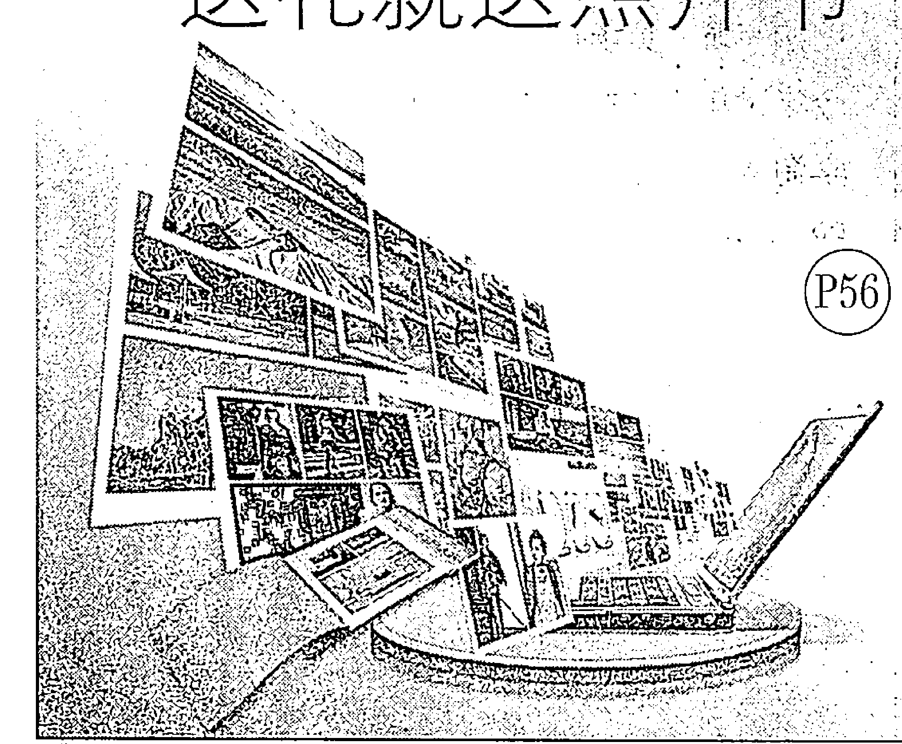

# 学海无涯
低开销玩转天下手机


# PPT出彩
尽在图文间

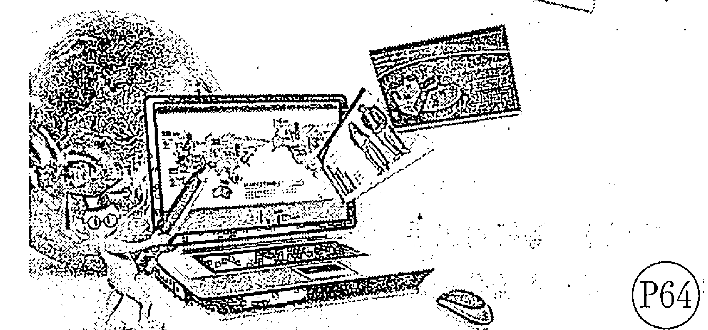

# 玩转
婚恋网站

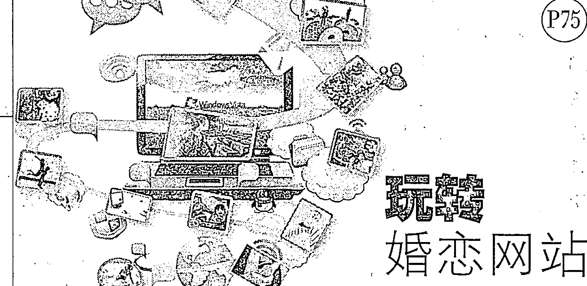

# 蜜月“水”时刻
水货手机你敢买吗


# 高清播放机
客厅首选

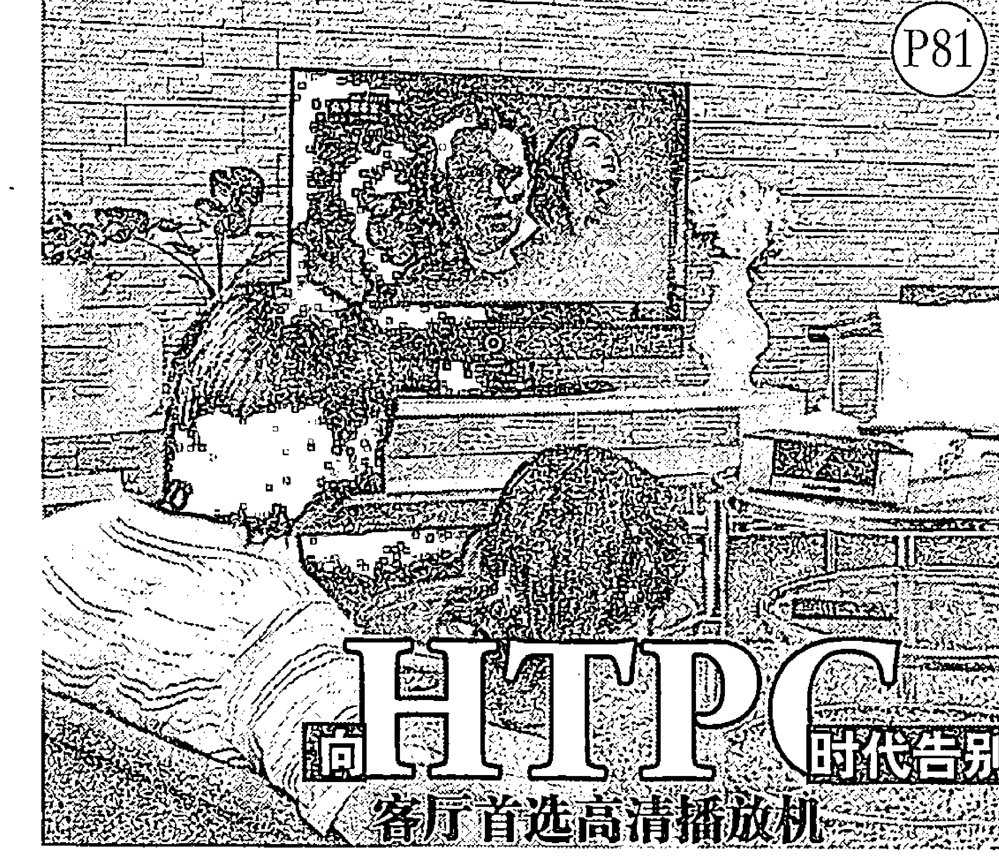

# 据说Office
不可以赏心悦目

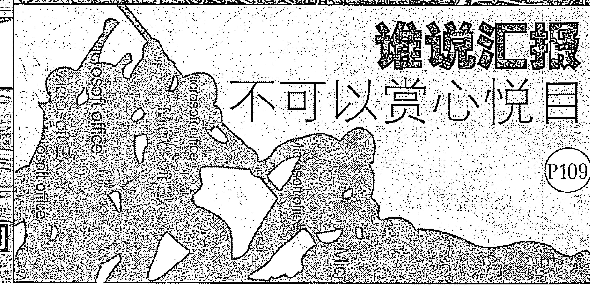

# 新视界

- 17 2011岁末大盘点
- 19 宽带大提速 实惠还是噱头
- 21 乔布斯：从玩游戏到种苹果
- 22 从光合作用的倒掉说起
- 23 今天你LOGO了吗
- 24 阿里巴巴启动私有化
- 24 网络投票背后的玄机
- 25 下一“战”：电视
- 26 微信凶猛
- 27 超级马里奥的“三级跳”
- 28 开心网将从“玩”转向“用”
- 28 中国微博面孔
- 29 密码泄露没你想的那么简单
- 29 云存储押注者
- 30 没有终点的俄罗斯方块
- 31 无音箱的声学——净听技术
- 32 笔记本硬盘维修的两难选择
- 33 互联网鄙视食物链大全
- 34 团购酒店过春节
- 34 实名制变形记
- 35 网景后传
- 36 无线上网需提防钓鱼Wi-Fi
- 36 科技想要什么
- 36 联想网站停止销售上网本
- 37 中国为何难出Facebook
- 38 你介意Q+接管你的桌面吗
- 39 牛鼻子老道求伯君
- 40 抢食苹果
- 41 成功者的诅咒
- 41 铁道部：“最牛电商”候选人
- 42 视频黑马的野蛮生长
- 42 网络作家的生存实录
- 43 邮寄快递或将实名制
- 43 龚海燕：创业无关性别
- 44 1946，世上第一台电脑诞生
- 45 Win8会是微软的又一力作吗
- 46 上网本的“冬天”
- 48 内存前传

49 揭开网络营销师的神秘面纱

## 特别话题

- 50 网购有坑 卖场存诈——消费骗局揭秘
- 56 今年过年不送礼 送礼就送照片书
- 60 学淘客 低开销玩转天下手机
- 64 PPT出彩 尽在图文间
- 71 定制快乐“e”春节
- 75 玩转婚恋网站
- 81 向HTPC时代告别 客厅首选高清播放机
- 84 人人可用的项目管理Office秘笈
- 90 为“老友”续命 新春笔记本升级攻略
- 94 去伪存真 电脑伪技巧大揭底
- 99 《暗黑破坏神3》应该这么玩
- 102 别让银行卡成为你的负债
- 106 野外迷失 小玩意大作用
- 109 谁说汇报不可以赏心悦目
- 113 Android 4.0驾到 千元平板选玩攻略
- 118 Win8来袭 你Hold住了吗
- 124 覆“水”难收！水货手机你敢买吗
- 127 宝宝 看镜头！——自拍影楼范儿宝宝照
- 131 Ivy Bridge携手开普勒 2012选本必读
- 136 网购代下单 省钱新主张
- 140 超极本 等等再出手
- 144 那些正在主流化的非主流音箱

## 生活E点通

- 147 自制绿色软件 我有专用工具
- 147 一次完成工资普调更新
- 148 Word 2007发送到PPT命令原来在这里
- 148 拯救暗淡的视频
- 148 让IE也能实现独立窗口看视频
- 149 操作考核自动评分记录成绩
- 149 20分钟 百篇博文炮制电子书
- 150 Word转PDF 巧防修改和篡改
- 150 局域网高速共享 既简单又快捷
- 151 在Word 2007中也能发布博客
- 151 批量完成相片PS 轻松制作校牌
- 152 查找查看不散乱 高效合并PDF文档
- 152 这样共享文件更便捷
- 152 为不同程序设置所需分辨率
- 153 只需两步 挽救网盘中误删除文件
- 153 用MP3听郭德纲的视频段子
- 153 课件用视频 PPT插入FLV很方便
- 154 大道至简 做到就是养生（三）——营养均衡
- 155 PPT也能轻松演示简谱
- 156 解决文件夹图标病毒更轻松
- 156 附件文件多 自动列表好看清
- 156 开着QQ聊天 顺带收发网易邮件
- 156 跳过游戏盒界面 让游戏启动更快速
- 157 文档变图片 低版本Office有帮手
- 157 掳获芳心秘籍 MM照片GIF转代码动画
- 157 从总课程表制作教师分课表
- 158 扔掉系统安装盘 U盘安装更给力
- 158 用星号替代数据我有简便方法
- 158 简简单单 让打印机为你省钱
- 159 前期没倒影 后期快速补充
- 159 巧招批量导入电话号码
- 160 生成短链接 通话多人视频
- 160 批量拍照 一步实现信息对接
- 161 打开TXT 一点就上网
- 161 离线下载 空间不足为哪般
- 161 QQ中转站附件资源巧下载
- 162 用摄像头智能录制活动画面
- 162 巧解Office 2010无法预览文档
- 162 清理工具U盘随身带
- 162 让有线路由与无线路由和平共处
- 163 让Windows 7资源管理器也显示目录树
- 163 压缩包内找文件 WinRAR与好压自己行
- 163 用Word快速制作千份校牌
- 164 组合拳 实现孩子绿色上网
- 165 共用PC 我的地盘我做主
- 166 丢掉数据线 同步照片
- 166 没装聊天软件 网站中也能打开聊天
- 166 用PowerPoint制作填空题更方便
- 166 妙用百度 批量下载视频
- 167 邮箱忘密码 月影帮找回
- 167 自建多版本实用软件库
- 167 和重复视频说Bye Bye
- 168 锁定USB设备也要有的放矢
- 168 表格计算无结果 数据分列解烦忧
- 168 网盘专用资源一软就搞定
- 168 把快捷方式放到最方便的地方
- 169 公式输入不用烦 数学输入面板帮你忙
- 169 邮件加密解密 Foxmail直接完成
- 169 妙用Site搜索 开启论坛帖子之门
- 169 非IE浏览器图片添加QQ表情
- 170 向积分下载说NO
- 170 本周谁过生日直接筛选最简单
- 171 批量下载邮件附件很轻松
- 171 WPS帮你精确计算个人所得税
- 171 不用参照物 照样准确量实物
- 172 听遍全球 找个全能收音机
- 172 本地也能批量管理网盘
- 172 妙招强制删除“顽固”文件
- 173 iPad同步QQ邮箱记事
- 173 不用插件 IE也能拦截广告
- 173 一键修复Flash Player
- 173 虚拟快捷键盘 助你高效工作
- 174 控制影像劫持 添加删除一体
- 174 电子教鞭在手 屏幕指点不愁
- 174 图片插入文档不走弯路新解
- 174 用连字符加书名号更直观
- 175 屏幕张贴课表 只需再添壁纸
- 175 省墨 网页先“删”后“打”
- 175 证件照片快速出来
- 176 只需一键 同步多处文件
- 176 我的秘密 只与你分享
- 177 轻松清除Win7登录密码
- 177 解剖epub·只需7-zip
- 177 没接USB设备却显示U盘图标的去除
- 178 网络视频云端播放更方便
- 178 电脑闹毛病 WinPE来裁定
- 178 鼠标一动 管控窗口提效
- 179 快速转换电子书格式
- 179 我有内窥镜 查看文件更方便
- 179 巧用“飞猫” 共赏美图
- 180 表格多页打印 页页有标题
- 180 QQ截图也能轻松截取右键菜单
- 180 一步删除单元格中文本的前导符
- 180 寄送浪漫喜帖 传递真诚邀请
- 180 节约用纸 Excel表格也能分栏打印
- 181 轻装上阵 把电脑装进手机
- 181 文档上传太臃肿 图片瘦身有妙方
- 181 一步到位 扫描直接变PDF
- 182 让工资出彩 条件格式更方便
- 182 不用自动更正 更改大小写更简单
- 182 歌曲变伴奏 就这么简单
- 183 宣传小报Word也能搞定
- 183 密码玩自动 防止“被支付”
- 184 Excel水印图打印就差这一步
- 184 为程序窗口添把“锁”
- 185 手机软件 你也能制作
- 185 小心邮件“双保险”陷阱
- 186 邮件提醒你用了吗
- 186 双行工资条 新手也能搞定
- 187 课件插入视频 别忘关键步骤
- 187 简单设置让WPS网文整理迅捷如风
- 187 不扰民 不同时间用不同音量
- 187 光盘配封面 好找又好看
- 188 网易邮箱附件批量巧提取
- 188 鉴定U盘的真实大小
- 188 用WinRAR摘取Word 2010文档
- 188 网页中的表格原样导入到Excel中
- 189 鉴别无损音乐何必如此麻烦
- 189 压缩MP3文件 音质不丢失
- 189 课表添加到桌面有更简法
- 189 别让使用痕迹泄隐私
- 190 三步 噪点相片换新颜
- 190 无论你在哪里 打印就在身边
- 190 VUZ电子书转PDF有妙法
- 191 MP3自由组合 个性铃声做出来
- 191 批量下载图片 用搜狗
- 192 搜索升级 压缩内容也能搜
- 192 问卷不用纸 在线更简便
- 192 鼠标指针也显电量
- 193 我有时光机 误存文件也不怕
- 193 连接故障自动修 上网更轻松
- 193 iPhone拍照电脑看 购物也时尚
- 194 调整笔记本显示屏亮度适应环境
- 194 学新歌 找个助手帮忙
- 194 文字变图片 网上露脸儿很容易
- 194 附件夹帮你轻松整理邮件附件
- 195 课文录音与文字同步
- 195 已发邮件清空键原来在这里
- 195 提取音乐文件这样更轻松
- 195 批量选文件不必小题大做
- 196 简单三步 空间日志音乐也玩DIY
- 196 VBA宏模块不能保存之谜
- 196 让老硬盘焕发青春
- 197 两招完成复杂数据筛选
- 197 歌曲变伴奏 这样更简单
- 198 巧用XP内录功能下载音乐
- 198 日期快捷输入自己定
- 198 命令行上做做功 备份很轻松
- 199 出门旅游 做好计划一路轻松
- 199 学好英语不难 轻轻点读而已
- 199 看手机如何变身“扫描仪”
- 200 多级子目录 成批重命名
- 200 用IF函数自动生成成绩等第
- 201 隔空对唱 与邓丽君同台表演
- 201 一个函数找出未下载剧集列表
- 202 选最佳线路提升登录邮箱速度
- 202 批量统计字数 不必打开文档
- 202 收到照片轻松与朋友分享
- 202 修改表格错误 精准定位单元格
- 202 用移动设备远程管理QQ登录
- 203 信息录入所见即所得
- 203 三步提取PPT中的SWF文件
- 204 未知文件预览先行
- 204 几十元打造单位考勤机
- 205 解除限制 分享EXE电子书
- 205 iPad下片看 选最快路径
- 205 利用网络广播播放幻灯片
- 206 简单技巧 让存储卡更贴心
- 206 省时省力 批量移植安装程序
- 207 QQ空间也可“克隆”
- 207 足不出户 在家就可献爱心
- 207 表格冻结不仅是首行首列
- 207 比双击填充柄更周到快捷
- 208 盘符修改我用修改器
- 208 PDF也能躺着听书
- 208 把倾斜的照片正过来
- 208 无需设置 网文整理也如风
- 209 邮件也玩“语音搜索”
- 209 让QQ尾巴彰显个性
- 209 给Acrobat Reader加书签
- 210 身份证校验真轻松
- 210 网上开店 识图协助
- 211 双剑合璧 汉字识别接近完美
- 211 比较两列数据就这么简单
- 211 多邮箱管理不麻烦
- 212 会议录音 缺席也能及时听
- 212 轻松制作PDF书签不求人
- 212 巧设密码“保质期”
- 213 为健忘症巧开“醒脑药方”
- 213 琴谱一次下载完
- 214 音量控制 随“鼠”而动
- 214 还我苗条身材 自己给QQ减肥
- 214 看跨页大图和正常阅读两相宜
- 214 批量下图片 软件就行
- 215 出门在外 把资源下载到邮箱
- 215 下载百度文库无需工具
- 215 复制网页就能轻松获取专辑目录
- 215 打印水印效果另类方法
- 216 邮件附件列表 一键轻松获取
- 216 本周谁过生日直接筛选的补充
- 216 为PPT2010加速
- 217 轻松下载在线音乐
- 217 传文件新方法 文件隐藏图片中
- 217 用WPS生成加密PDF以保护文档
- 217 小数点对不齐 占位符帮你补
- 218 数学概念用动画展示
- 218 剪贴板一键清空
- 218 一键制作多行报名条
- 218 不用注册登录 免费下载百度文库原版文档
- 219 小小软件 保护信息安全
- 219 用Excel也能玩微博
- 219 为自己的音频添加“水印”
- 220 飞信跨网也能发短信
- 220 移动文档字体“变形”阻击战
- 220 新浪爱问文件免积分下载
- 221 温馨记忆 永久保存
- 221 时间标签不删自去
- 221 我的图片有秘密
- 222 一键拖拽创建打包附件
- 222 扫描速度“飞”起来
- 222 图片中的英文字体也能识别
- 223 巧用奇艺 连续剧随意看
- 223 无间断延长XP内录时间
- 223 表内大段文字巧输入
- 224 系统防膨胀 软件一键装
- 224 在线也能玩摘抄
- 224 分享屏幕 一键搞定
- 224 给多音汉字正确加拼音
- 225 视频聊天变花样
- 225 浏览缓存放内存 垃圾不再生
- 225 免小数点快速输入小数
- 225 表格冻结不需点拆分

## 酷网千寻

- 226 搞怪视频自己做
- 226 圆你一个作家梦
- 226 模仿汤姆猫 在线语音变调
- 226 一周热点尽在风云榜
- 226 Memetales 图画书免费读
- 226 传递书籍 延续知识
- 226 美家达人帮你在线设计
- 226 家庭装修设计方案网上找
- 226 贷款买房试用按揭计算器
- 226 测试你适合哪种装修风格
- 226 网上看家庭装修效果图
- 226 不超支 装修费用提前预算
- 226 装修材料及家具网上购
- 227 动物萌照“集中营”
- 227 图虫 摄友交流好去处
- 227 在线生成二维码
- 227 RifScan网站信息查询工具
- 227 消声魔术师 免费制伴奏
- 227 Lookmash帮你挑选衣服
- 227 给邮箱找个“替身”
- 227 看看同名人的学术水平
- 227 视频学PowerPoint 2010
- 227 扑奔PPT 专业的PPT网站
- 227 模板尽在PPT资源之家
- 227 做好幻灯片 交流很重要
- 227 配色是一门艺术

## 目录

- 228 海量素材看过来
- 228 学习专家的PPT设计理念
- 228 最专业的网盘资源搜索
- 228 逢年过节吃出营养和健康
- 228 女性杂志大放送
- 228 理科老师好帮手
- 228 HTML5动画平台
- 228 专为Chrome爱好者准备的资源站
- 228 倒计时并不都需要安装软件
- 228 不点击鼠标也能上网
- 228 到海底逗鱼取乐
- 229 互动视频更有意思
- 229 做个拼图 让朋友去拼
- 229 网上找人拼车更划算
- 229 支付宝易转让帮你出售闲置品
- 229 “也去旅行” 借鉴别人怎么玩
- 229 在线3D Google图书馆免费看书
- 229 以图搜衣紧跟时尚
- 229 新浪微博兼职“家庭医生”
- 229 我的秘密只有你能解
- 229 网上购鞋好帮手
- 229 在线生成书法字体
- 229 一站网尽LOGO矢量图
- 230 20年后我是啥样
- 230 经典科幻小说全收录
- 230 用名字生成头像
- 230 几点睡觉最合适
- 230 免费网站分析工具
- 230 将图片变成文本字符
- 230 在线打印多种优惠券
- 230 学做电影中的美食
- 230 DIY丑八怪表情图
- 230 在线玩“割绳子”游戏
- 230 玩游戏学物理
- 230 聆听来自全世界的好玩梦话
- 231 童趣奇幻盒子世界
- 231 在线屏幕分享
- 231 今天我们一起下厨房
- 231 在线照片快速美容
- 231 夜莺教你唱英文单词
- 231 在线补习大学课
- 231 看我照片七十二变
- 231 在线导演情景动画短片
- 231 免费素材集中营
- 231 以“色”搜图
- 231 鞋带的一百种系法
- 231 一网打尽穿帮镜头
- 232 改变 从心理开始
- 232 微动力 趣味测试在微博
- 232 用键盘“弹”钢琴
- 232 寻找日租、短租房
- 232 一分钟制作个人卡通图
- 232 GoodSync 文件同步利器
- 232 个性化好友印象
- 232 我的时间用在哪
- 232 让复制文件更有趣
- 232 家用导演 珍藏动态记忆
- 232 酷炫相册自己做
- 233 制作书本式相册
- 233 多种格式相册统一制作平台
- 233 Flash相册的最简制作方案
- 233 专业制作光盘版相册
- 233 要酷就制作3D相册
- 233 百度在线音乐时时听
- 233 找回遗忘的路由器密码
- 233 抢先试Windows 8 Metro
- 233 享用Windows 8的主题
- 233 创造纯净的写作环境
- 233 儿童的知识乐园
- 233 给对话框增加文件夹
- 233 轻松制作蒙太奇图片
- 233 轻松下载网络文档
- 234 “老黄历”进驻状态栏
- 234 励志壁纸助力工作生活
- 234 彻头彻尾改造Windows 7
- 234 职场宝典笑傲“江湖”
- 234 网盘本地管家专家
- 234 图片批量快速“减肥”
- 234 另类方法创建文件夹
- 234 电脑上玩新版愤怒的小鸟
- 234 超酷幻灯片切换
- 234 将PPT转换成Flash
- 234 演示文稿损坏能修复

## 新软物语

## 目录
《电脑爱好者》合订本

- 234 给幻灯片配上专业解说
- 235 无PowerPoint也能播放幻灯片
- 235 数码时代必装USB管家
- 235 U盘版安装系统制作很简单
- 235 变网盘为本地硬盘
- 235 隐藏进程不只为多开游戏
- 235 本本变成Wi-Fi热点
- 235 通吃Windows 8开始屏幕
- 235 将电脑虚拟成手机去上网
- 235 来自德国的系统优化利器
- 235 苹果风格的影音娱乐盒子
- 235 预测检测U盘的寿命
- 236 英文歌曲搜索下载好帮手
- 236 让常用文件夹更醒目
- 236 轻松制作素描照片
- 236 轻松提取影像的音频
- 236 快速将复制的内容发送到程序
- 236 人人都能成为书法家
- 236 让摄像头内洒满“花瓣雨”
- 236 DIY漂亮的光盘封面
- 236 让QQ自动接受文件
- 236 男声变成女高音
- 236 信息收集加工的好帮手
- 237 键盘也能控制鼠标
- 237 让桌面下起小雪
- 237 透明软件界面
- 237 “云端”软件应有尽有
- 237 全面监控网络状况
- 237 一键制作Windows 8安装U盘
- 237 无干扰享受漫画的世界
- 237 整合7种在线翻译的工具
- 237 轻松加密文件或文件夹
- 237 Instagram美图一网打尽
- 237 Flash动画特效轻松制作
- 238 记事本也玩Metro时尚
- 238 多标签资源管理器
- 238 给文件贴个标签
- 238 免费多媒体工具宝库
- 238 手机视频转换成高清影像
- 238 每天自动更新桌面
- 238 低分辨率图片转高清图片
- 238 轻松搞定分辨率设置

## E达人

- 239 位置颠倒 快速更名有妙招
- 239 软件安装过程也可复制粘贴
- 240 全面升级 用CoolEdit制作高清音乐
- 240 为Windows 7资源管理器添加远程搜索功能
- 240 一键搞定系统DLL错误修复
- 241 让远程互控来得更方便
- 242 借力记事本 导出VFP数据表
- 242 火眼金睛教你快速揪出电脑中的重复文件
- 242 查找相同项 其实很简单
- 243 淘宝返利达人的赚钱秘技
- 243 文件堆积如山 快用高速分类
- 244 深入隐藏分区 打造一键恢复
- 245 “超极本”到底超极在哪
- 246 好汉三个帮 迅雷更强壮
- 247 月底文件快速备份有妙招
- 248 十秒钟 网页变身简洁电子书
- 249 便捷备份同步我能行
- 250 Win8 让你从此移动起来
- 251 简约风格的海报也可以抢眼
- 252 打开方式吃上“聪明药”
- 252 用WMP创建图片播放列表
- 252 不让hybrid boot影响双系统
- 252 Win7也能搜索PDF文档
- 253 Kylin的端口入侵记(一)
- 253 Kylin的端口入侵记(二)
- 254 IPS 硬的不仅仅是表面
- 255 毕业生网投 抓住HR1.5秒
- 256 音频压缩包起死回生有术
- 256 重新调整网络服务的优先顺序
- 257 海纳百川 光盘整合我有招
- 258 通过易购网返利的心得
- 258 将声音主题应用到其他主题
- 258 桌面文件大挪移 不再害怕系统出问题
- 259 真人照片轻松转手绘卡通
- 260 保护原始档案 锁定压缩文件
- 261 唤醒“沉睡”的数字小键盘
- 261 IP地址修改 不快怎么行
- 262 我的115网盘我做主
- 262 三步 彻底卸载旧驱动
- 263 非Win8专利 系统重置自己造
- 264 快捷方式变身文件的“虚拟替身”
- 264 修改设置让你轻松复制网页文字或图片
- 265 再谈简历 工作经验有玄机
- 266 转账汇款也要精打细算（网银篇）
- 266 让快捷方式学会“自动追踪术”
- 267 转账汇款也要精打细算（手机银行篇）
- 267 能否运行Win8 先查电脑配置
- 268 拒绝泄密 密码管理我有招
- 269 Linux杀毒系统 杀毒更彻底
- 270 裸眼3D知多少
- 271 无盘启动系统 网络维护更轻松
- 272 旁敲侧击 巧破EFS加密防线
- 273 一盘在手 启动无忧
- 274 键盘失灵 不一定是硬件故障
- 274 解决动态磁盘的恢复难题
- 275 改造李开复的PPT
- 276 身份鉴别 只看你脸色
- 276 将复杂命令操作集成到右键菜单
- 277 用Gmail做远程控制达人
- 278 巧用妙招 自动定期更新邮件
- 278 轻松搞定多对多账户映射
- 279 不只是存储 深挖优盘潜力
- 280 保护文件夹 加密出奇招
- 280 提高效率 用光速搜索
- 281 好的工作总结不依赖模板
- 282 时尚买手带你网淘奢侈品
- 283 自己打造“隐身系统”
- 284 建立链接表 文档搜索易
- 285 “三系统”上马 兼容又防“崩”
- 286 以3D视角巧看2D视频
- 286 超酷！屏保做桌面
- 286 一键休眠真给力
- 287 以软制硬 电脑硬件巧加锁
- 288 用好Windows安全模式
- 288 让Windows 7变身为卡拉OK
- 289 打造“不简单”的剪切板
- 290 二维码技术与生活渐行渐近
- 291 “地道”的英文简历看过来
- 292 视频消人声 音乐要保留
- 293 旅游达人巧用机票游遍全球
- 293 让历史硬件设备马上现形
- 293 让指定文件夹窗口在单独的进程中打开
- 294 技巧联合 比较剧集列表
- 295 代码过滤 轻松获取专辑目录
- 295 以命令提示符的名义管理硬件设备
- 296 优盘资料 即插即共享
- 296 建立快捷方式让电脑快速休眠
- 296 取消Win7系统关机补丁提醒
- 297 下载 想说爱你不容易
- 298 从平面照片到“3D大片”
- 299 Win7的Desktop.ini探秘
- 300 实现Win7一键还原
- 300 显示隐藏设备也要一步到位
- 301 看摄影狂人如何拍纪念照
- 302 搭建内网“0时间”搜索环境
- 303 通过淘宝网获取最大返利
- 303 仅需一分钟 为你选个最快的DNS服务器
- 303 给系统密码添上一把“限制锁”
- 304 特价机票这样淘
- 305 从窗口到进程 坚决清除“顽固派”
- 305 Windows 8“借用”Windows 7的显卡驱动
- 306 因地制宜 双机共享有道
- 307 为桌面巧加“隐形”元素
- 308 好汉三个帮 Win7添智力
- 309 “番茄”让工作效率翻几倍
- 310 Win8图片密码背后的秘密
- 311 主持人大赛海报也可“内外兼修”
- 312 让XP也拥有“库”
- 313 黄金周照样畅游东南亚
- 314 为你的整轨音乐打造CUE
- 314 杜绝IE自动下载的安全隐患
- 315 低价成拍的秘诀
- 316 玩转主题包 美化不走寻常路
- 317 智斗安卓软件中流量窃贼
- 318 突破常规 让远控服务更具活力
- 318 利用搜索筛选器筛选特定文件
- 319 Win8极速启动的秘密
- 320 Win8预览版热辣体验报告
- 321 创意简历 从形式到内涵
- 323 走近低价竞拍网站
- 324 加密不必完全靠密码
- 325 打造动感火烧效果电子相册
- 326 相同内容重复巧输入
- 326 官方工具自由诊断系统内存
- 327 为文件夹巧加“自动锁”
- 327 利用性能监视器检查内存泄漏
- 328 被清除软件遗漏的秘密
- 329 独辟蹊径 修复“瘫痪”的Win7
- 330 在线书籍自动转PDF电子书
- 331 妙手巧改 让Win8更好用
- 332 证书是这样保障网购安全的
- 333 高转发PPT微博炼成记
- 334 坐在家里赚钱的淘宝客心得
- 335 Excel 2010重要表格不留空
- 336 巧设置 自动生成分页小计
- 337 远程重装系统手记
- 338 快速医治Win7的“疑难杂症”
- 339 网盘海选 寻找贴心“保险箱”
- 340 挖掘任务管理器的“潜能”
- 341 你了解三星魔焕炫屏吗
- 342 让常用文件夹触手可得
- 343 公共Wi-Fi上网会被黑吗
- 344 寻美党代会海报
- 345 察“颜”观色 保电脑平安
- 346 QQ赚钱也疯狂
- 347 一网搞定各类生活账单
- 348 走近微博刷粉师
- 349 卡巴斯基的另类应用
- 350 记事本 我的文件管理专家
- 351 视网膜显示技术剖析
- 352 静态图文变身3D动画大片
- 353 不加密 照样防蹭网

## 办公

- 354 开心职场 被迫加班有快乐高招
- 354 保隐私 隐藏加密程序窗口
- 355 选取数百文件 只需三步操作
- 355 多图组合 快速选择有技巧
- 356 文本选取 高手自有快招
- 356 中文粘贴 随身空格自动删
- 356 英文单词 排版断行自解决
- 357 幻灯图片 缘何出彩
- 358 借助特殊标记 多表快速定位
- 359 作文试题 局部稿纸轻松设置
- 359 PDF优化后装入平板
- 360 制作任选项目的查询系统
- 361 大型报告的分工合作之道
- 362 小点缀 一样很精彩
- 363 也谈PPT制作变形动画
- 363 Excel快速生成设备鉴定表
- 364 书籍装帧 立体效果轻松设
- 364 PPT也做图片跑马灯
- 365 用PPT设计个性化名片
- 366 过年送礼你送对了吗
- 366 虚拟打印机 打印准考证
- 367 用Excel制作另类“邮件合并”
- 368 微博运营专员长成时
- 369 2小时完成课表编排
- 370 录入项目多 Access来帮忙
- 371 补考清单 快速提取生成
- 371 Excel双面“软”打印
- 372 录入身份证号有错提醒
- 373 文字探照灯 PPT也能做
- 373 卷轴特效课件轻松做
- 374 按需自制课件中的音频
- 375 PPT实现点小图看大图效果
- 375 剔除表中表就用Excel
- 376 三招两式做剪影
- 377 用PPT制作下拉菜单
- 378 打造学校工作总结影视专题片
- 379 PPT也能制作苹果形标注
- 380 阅卷从此更轻松
- 381 竞赛评分 自动统计巧设计
- 382 数字代替汉字 信息录入飞快
- 382 手动剿灭Word宏病毒
- 383 不用裁剪 巧制会议桌签
- 383 超级链接去除分别对待
- 384 拿来主义 快速制作写字动画
- 384 华为没你想的那么夸张
- 385 八卦格字帖咱自己制作
- 385 用WPS轻松转换日期格式
- 386 课件打印 省钱有道
- 386 用PPT制作识字动画
- 387 一位物流管理师的经验分享
- 388 巧用临时隐藏表保护数据安全
- 388 考场座位 我有我的编法
- 389 大字打印 何需另装软件
- 389 下载资料 巧“跳”校园网
- 390 贯穿前后的过渡页设计
- 391 制作智能化的Excel成绩录入模板

## 办公技巧板

- 391 快速实现中英互译
- 391 双击填充柄填充更快速
- 391 Word也能自动填充表格序列
- 391 快速查看幻灯片动画效果
- 391 巧用名称框实现区域选择
- 392 PPT编辑 空格跟着英文走
- 392 巧用文档内超级链接整合资源
- 392 快速到达Excel特定单元格
- 392 如何消除文档打印麻点
- 392 获知Word文档版权信息
- 392 快速获得Word文档图片
- 392 幻灯片自动更新日期与时间
- 392 快速输入 使用“选择列表”
- 392 让文档实现自动预览
- 393 文章落款快速插入
- 393 PPT存盘“保险系数”自己调整
- 393 在迷茫中快速定位
- 393 让打开文档少走弯路
- 393 使用快捷键完全删除单元格
- 393 备份文档不要等到最后
- 393 Excel 别把分数当日期
- 393 自动编号不见得就给你方便
- 393 用智能标记代替选择性粘贴
- 394 跨越编辑界面直接播放PPT
- 394 不动鼠标的连续输入技巧
- 394 用剪贴板的图表等进行替换
- 394 在打开文件的同时建立副本
- 394 打开Word 工作自动接着干
- 394 选定整个单元格的快捷键
- 394 设置展台用幻灯片
- 394 一次打开多个工作簿
- 395 鼠标故障时应急启动Office组件
- 395 让Word文档字数统计更方便
- 395 快速清除Excel单元格内容
- 395 巧借“自动更正”快速输入专业术语
- 395 PPT幻灯片纵横向页面并存
- 395 在两个工作簿中互相倒腾工作表
- 395 快速修改单元格次序
- 396 一次性关闭所有文件更简单
- 396 评估一下你的幻灯片字体大小
- 396 照顾色盲 幻灯片慎用绿色
- 396 PPT以窗口播放或小屏幕播放
- 396 波浪线的输入
- 396 单虚线的输入
- 396 快速输入大写中文数字
- 396 双直线的输入
- 396 细实线的输入
- 396 双细线夹粗线的输入
- 396 快速输入常用网络表情

## 视像

- 397 去除照片中的雾气
- 397 如何把雪拍白
- 397 拍出动静结合的照片
- 398 你也可以制作巧妙的三维立体画
- 399 巧用气泡 让美女照更吸引人
- 399 平凡木屋突变恐怖鬼屋
- 400 全家福这样拍才更生动
- 400 史上最贵的照片
- 401 打造《男人帮》趣味漫画
- 402 DIY可以打印的照片年历
- 402 通过借景方式让主题更突出
- 403 别错过飞机上的美景
- 403 给寒春的绿叶来颗春露吧
- 404 龙年画龙
- 404 用双色照片打造怀旧感觉
- 405 给卡通人物拍张X光片
- 406 让水饺像水晶般绚丽
- 406 创意情侣照为情人节加温
- 407 记录月全食最美的变脸
- 408 挑战视觉的错位摄影
- 408 让茶壶的嘴里冒点水汽吧
- 409 自制个性龙年邮票
- 409 将生活照改为火影雷切造型
- 410 龙年做个龙纹玉佩
- 411 让节日视频变身专业小电影
- 413 自制《变形金刚3》个性海报
- 414 普通剪纸打造创意动画
- 415 鼠标涂鸦仿毛笔字效果
- 416 你也能留住舞台上的精彩
- 416 拍出萌动你心的宠物照
- 417 用DC记录校运会精彩的瞬间
- 418 巧用图层蒙版合成水果娃娃
- 419 把出游视频拍成电影短片
- 420 做一个印章效果的个性签名
- 421 你也可以变身光剑战将
- 422 这样拍你会更高更瘦
- 423 用HDR变身酷酷女杀手
- 424 用卡片机记录春天的大自然
- 424 拍出神秘的幻影照片
- 425 完美抠取发丝不再难
- 426 3月古建筑摄影赛小结
- 427 给母亲的脸来针“肉毒杆菌”
- 428 打造随面部移动的马赛克
- 429 让你的车展照脱颖而出
- 429 手机拍人像告别模糊

## 移动新天地

- 430 安卓智能机 让老人生活更精彩
- 431 天气变换 打开手机知冷暖
- 431 天气预报内容对比
- 431 桌面工具对比
- 432 回家 经典游戏伴你行
- 433 手机装地图 出行更靠谱
- 434 情人节 手机哄哄远方的她
- 435 手机帮你“玩转”新学期
- 436 手机在身边 读书很简单
- 437 “春劫”后 手机帮你省钱
- 438 省钱防骗 安卓手机上网记
- 439 零开销 免费享受正版软件
- 440 油价飞涨 看我省钱绝招
- 441 毕业找工作 手机来帮忙
- 442 和Wii说Bye 手机玩体感
- 442 远离碰瓷 手机行车记录仪
- 443 智能开锁屏 解放电源键
- 444 GPS手机在手 出差不再愁
- 445 暑期自助游 手机来搞定
- 446 手机截图软件大比拼
- 447 手机通灵性 模式巧切换

## 移动串串烧

- 447 让手机快速“恢复青春”
- 447 无用软件清光光
- 447 图片隐私不怕泄露
- 447 让手机教你签名
- 448 司机必备的随身秘书
- 448 PDF软件不仅在于看哦
- 448 摇摇手机换心情
- 448 不用手机也能发短信
- 448 漫画迷必备
- 448 拍照不再怕抖
- 448 功能无限的离线百科全书
- 449 手机截图带壳抓
- 449 五音不全 歌曲也能搜出来
- 449 灵活多选的手机地图
- 449 音质更好的网络收音机
- 449 你的掌上娱乐集装箱
- 449 快速启动栏 手机也能拥有
- 449 注意身体 生病了该怎么吃
- 449 提高睡眠质量 软件可帮忙
- 450 保护自己或保护你的她
- 450 剧情雷人 有图有真相
- 450 手机也能让你变身文艺青年
- 450 不起床 发微博 求羞辱
- 450 安卓用户不再羡慕嫉妒恨
- 450 拍拍照 鞋买到
- 450 手机摄像头变身监控探头
- 450 停车也有小帮手
- 450 用手机向黄页说拜拜
- 451 完美妆容从这里开始
- 451 智慧和见解也能分享
- 451 要想吃得好 食神不能少
- 451 空气质量如何我知道
- 451 小秘在身边 打车不再难
- 451 集成搜索在手机上实现
- 451 做时尚潮人 从鞋开始
- 451 手机变透明 大胆往前行
- 451 小助手大闹钟
- 452 两秒钟的小电影
- 452 手机也能测量高度
- 452 不出门 便知天下菜价
- 452 看好病得找好大夫
- 452 “黑掉”黑中介 找到好房子
- 452 原来豆浆也有这么多种做法
- 452 扫描图标也能下载
- 452 畅享优质网络生活
- 452 都市生活必备客户端
- 453 动动手 让浏览变简单
- 453 玩手机的同时能赚钱
- 453 我就是不一样 我是嗨客
- 453 手机功能不再简简单单
- 453 开奖信息随时掌握
- 453 轻轻一碰 信息共享
- 453 品牌打折我先知
- 453 生活窍门一点通
- 453 轻松记录宝宝成长瞬间
- 454 手机变身“晕车药”
- 454 汽车消费记账也能很专业
- 454 每天便宜多一点
- 454 拼车出游 快乐搭车
- 454 让团购省钱又省脑
- 454 同城活动我先知
- 454 水果不能想吃就吃
- 455 要想瘦得快你得吃对菜
- 455 减肥食物也有库
- 455 瘦身你得有方法
- 455 减肥也要瘦得健康
- 455 随处尊贵 随时优惠
- 455 即时比分 彩迷最爱
- 455 的哥拉活有秘招
- 455 歌曲百科 不懂就问
- 455 不知穿什么 就问它
- 456 QQ音乐声音自动变小
- 456 同花顺显示K线非常小
- 456 无法安装Office
- 456 KMPlayer播放视频时画面与声音不同步
- 456 微软输入法无法卸载
- 456 双核CPU却显示成单核
- 456 如何躲避别人对P2P下载限制
- 456 无法安装ATI显卡驱动
- 456 无法打开Excel表格文件
- 457 网页视频、音频均无声音
- 457 无法通过优盘启动系统
- 457 无法登录支付宝
- 457 无法删除带点号文件名的文件
- 457 中银网银登录无法输入密码
- 457 QQ影音播放器声音变得很小
- 457 电脑插耳机无反应
- 457 360总是提示Au_.exe不安全
- 457 Outlook的DBX文件无法打开
- 458 邮箱为何无法上传附件
- 458 电脑总是自动开机
- 458 关闭USB关机状态下的供电
- 458 Windows 7经常无法进入桌面
- 458 网络连接图标出现很慢
- 458 支付宝交易中找不到“评价”
- 458 如何修改360云盘的本地位置
- 459 无线鼠标无法使用
- 459 Windows 7无法远程连接
- 459 IE打开网页非常慢
- 459 主页被修改成“http://about/”
- 459 无法安装IE9
- 459 如何解决电信劫持问题
- 459 GreenBrowser经常假死
- 459 QQ无法在64位Windows 7系统中运行
- 460 傲游无法调用迅雷组件下载
- 460 64位系统为何也只识别3.37GB内存

## 目录

- 460 无法安装系统更新
- 460 插入移动硬盘无法开机
- 460 系统总是死机
- 460 休眠后总是自动开机
- 460 为何同时有多个Explorer进程
- 460 如何删除多余的启动列表
- 460 Word中宋体无法显示
- 461 系统停留在“请稍候”界面
- 461 显卡如何实现一拖二
- 461 D盘无法创建和删除文件
- 461 系统无法打开自动更新
- 461 网页打开时提示更新IE版本
- 461 网络无法连接
- 461 文件夹恢复不正常
- 462 宽带拨号出现651错误
- 462 液晶显示器总是黑屏
- 462 计算机无法正常关机
- 462 笔记本电脑外屏显示为何需要切换
- 462 笔记本电脑摄像头无法识别
- 462 为何提示找不到系统
- 462 DVD刻录光驱无法识别
- 462 为何升级独立显卡硬盘发出响声
- 462 QQ远程控制无法操作
- 463 UltraISO无法使用虚拟光驱功能
- 463 Excel中无法直接打开超级链接
- 463 插上优盘系统无法启动
- 463 如何找回回收站图标
- 463 文件夹加密后无法显示
- 463 总是出现“脚本加载”提示窗
- 463 12306订票网账号被抢注
- 464 文本拷贝后出现问号
- 464 淘宝无法自动登录
- 464 无法调整分辨率
- 464 PPTV启动后一直提示缓冲
- 464 微博通为何无法同步新浪微博
- 464 电脑播放720P突然变得很卡
- 464 无法删除WGHWGH..文件夹
- 464 QQ影音无法启动
- 464 12GB内存只能使用4GB
- 465 iTunes X64无法启动
- 465 Vobsub使用不正常
- 465 Live Mesh数据同步错误
- 465 网络总是不稳定
- 465 傲游不能一次打开多网址
- 465 IE自带下载功能导致文件丢失
- 465 短网址无法在手机中打开
- 465 解压游戏提示内存不足
- 466 QQ无法给对方播放视频文件
- 466 QQ为何无法传文件
- 466 系统还原无法打开
- 466 Skydrive Simple Viewer工作不正常
- 466 小红伞为何总是显示“过期”
- 466 驱动更新不正常
- 466 让老电脑支持USB3.0接口
- 466 USB猫在其他接口无法使用
- 467 登录论坛总是提示验证码出错
- 467 蓝牙耳机无法使用
- 467 百度文库文档无法下载
- 467 无法修改QQ默认浏览器
- 467 无法单独关注特定人的微博
- 467 FlashFXP显示乱码
- 467 无法查看摄像头监控
- 467 USB接口键盘启动时无法使用
- 468 飞信无法给某个好友群发短信
- 468 UUCALL有余额但不能使用
- 468 虚拟机无法联网
- 468 选择标签就导致关闭
- 468 Potplayer无法截图
- 468 安装网卡驱动后提示错误
- 468 磁盘分区莫名丢失
- 468 文件夹图标显示缓慢
- 469 CPU遇到无效指令
- 469 无线信号良好但网络不畅
- 469 无法打开新浪微博转发功能
- 469 电信积分商城无法登录
- 469 QQ无法接收任何文件
- 469 挂载的第二块硬盘无法识别
- 469 Win8无法使用农行网银
- 469 文件属性变成英文
- 469 某些网站显示不正常
- 470 无法安装Windows 7
- 470 IE下载总需点击2次
- 470 部分字体Fireworks无法识别
- 470 电脑网址同步到平板的UC端
- 470 无法显示“添加/删除Windows组件”
- 470 会声会影无法打开MPEG编码器
- 470 在线视频变成全绿色背景
- 470 安装Acrobat 8出现假死
- 470 笔记本无法分屏
- 470 IE总是自动设置代理
- 471 Windows 7常遇Tcpip.sys蓝屏
- 471 桌面右侧成空白
- 471 蓝牙耳机无法使用
- 471 SD卡提示未格式化故障
- 471 无法安装第三块硬盘
- 471 提示延缓写入失败
- 471 傲游下载论坛附件总是job.php
- 472 QQ窗口无法合并
- 472 程序缺少MFC80U.dll
- 472 总提示连接路由器
- 472 VLC播放器内嵌字幕乱码
- 472 如何删除2345.com启动页
- 472 无线路由器严重丢包
- 472 虚拟机物理机共享问题
- 472 无法安装网络打印机
- 473 QQ语音提示设置麦克风
- 473 Nod32提示无法清除的病毒
- 473 傲游收藏栏无法按要求排序
- 473 Google账号无法自动登录
- 473 设备管理器多出黄色感叹号
- 473 新浪微博无法取消关注
- 473 无法删除远程桌面的记录

## 硬件

- 474 一寸小一寸巧 5英寸“平板”同样给力
- 475 平板电脑 双核普及进行时
- 476 低价笔记本 留心你的系统
- 476 超极本之外的轻薄笔记本
- 477 好玩不贵 触控一体电脑怎么选
- 478 Ivy Bridge君临前如何选本
- 479 新Atom能否帮上网本重振雄风
- 480 小心变形屏 低价平板怎么选
- 481 神舟官网惊现“古董”
- 482 超低价笔记本选购攻略
- 483 期待超极本之外的“轻薄集显本”
- 484 省钱至上 二手笔记本怎么选
- 485 二手笔记本分析案例
- 486 iPad逼宫 高端双核平板怎么选
- 488 eSATA 悲情的高速接口
- 489 低价也能尝鲜3G平板电脑
- 490 硬盘防震 商务笔记本的必修课
- 491 “E”鸣惊人 Sandy Bridge-E预备称王
- 492 切勿大意 中端电源不好选
- 492 USB3.0主板 高速未必高价
- 493 突破极限 玩转微星OCgenie技术
- 493 新版GTX460被迫入市
- 494 投诉无门 新蛋店大欺客
- 495 花屏竟然是主板问题
- 495 侧吹型热管散热更合理
- 496 光存储进入“蓝色”低价时代
- 496 只选SSD 混合硬盘是噱头
- 497 多屏显卡超值导购
- 497 双6pin显卡如何连接电源
- 498 移动硬盘无线化 金士顿Wi-Drive体验
- 498 自制USB3.0前置接口机箱
- 499 “常春藤桥”驾到——Intel Ivy Bridge国内首评
- 500 MOD机箱 以“召唤”之名
- 501 海外代购电子书手记
- 502 手机四核 趋势大于意义
- 503 动中求静 降噪耳机显神威
- 504 两千元内双模双待 我选谁
- 505 4英寸Android手机我选谁
- 506 为手指控择“偶” 二手全键盘手机淘宝

## 关键词检索

### 2012年（上）关键词检索

## 2011岁末大看点

2011年就要过去了，回顾2011年的IT圈，可谓热闹非凡、精彩纷呈。无论各大IT企业的聚散离合，还是IT人物喜怒哀伤的各种表情，以及让人大跌眼镜的IT产品，都让人回味无穷。值此岁末，就请随CFan小编一起回顾一下这精彩的一年。

## 2011 IT企业“最”分合

所谓分久必合，合久必分。有人的地方就有江湖，有江湖的地方就有分合。2011年IT界上演着一幕幕的分分合合，无奈也罢，得意也好，从中也可看出全球IT业三大趋势—合并、分拆和倒闭。

### 最无奈的合作 诺基亚结盟微软

北京时间2011年2月11日，诺基亚宣布与微软达成战略合作关系。诺基亚手机将采用Windows Phone系统，并将参与该系统的开发。两家公司将建设新的“移动生态圈”，达成广泛的战略合作关系，结合各自优势，建立一个全新的全球手机生态系统。

> 点评 曾经的王者终于低下了高傲的头。诺基亚不再固守自有的操作系统，转投微软的怀抱。诺基亚、微软两个看似永远没有交叉点的伟大公司，在移动互联网的风起云涌下，却迷失了大方向，不得不像两个被迫害的小弟，只能依靠相互拥抱才能得以勉强站立起来，是否能挨到云开见月明，却依然是个未知数，而且这两个难兄难弟估计还各自心怀鬼胎，使未来的路更加不明朗。虽然诺基亚终于发布了WP7手机，但是由于产能、地域以及游戏和应用的数量都远远落后于安卓和“爱疯”市场，2012年将是这对兄弟能否走出阴霾、生死攸关的一年，让我们拭目以待吧！

### 最奢华的收购 谷歌收购摩托

2011年8月15日，一条重磅新闻震撼了华尔街的神经：谷歌公司(Google)宣布将以约125亿美元的天价收购摩托罗拉移动公司(Moto)。此次交易完成后，摩托罗拉移动将作为谷歌Android专用的合作伙伴，同时，摩托罗拉移动将作为谷歌的独立业务继续运营，Android仍保持开放。

这则消息可以说震惊了整个手机行业。两家公司一个是“手机”的缔造者，拥有全球最为悠久的通信领域积淀，一个是互联网时代的“奇迹”，拥有全球最庞大的互联网用户。

> 点评 这桩125亿美元的收购案，堪称年度最奢华的收购。消息传出后众说纷纭。唱衰派认为，谷歌拖不动一个走下坡路的大骆驼，想要苹果的成功，很难！看好派认为通过这次收购，谷歌可以很好地在专利之争中保护自己，同时具备了更多攻击对手的武器与能力，还会给苹果以及诺基亚与微软联盟带来极大的竞争压力。

### 最精明的分拆 淘宝一分为三

2011年6月16日，阿里巴巴集团正式宣布将淘宝网分拆为三个独立的公司，分别为沿袭原C2C业务的淘宝网(www.taobao.com)、专注B2C业务的淘宝商城(www.tmall.com)以及购物搜索引擎一淘网(www.etao.com)。

这是刚刚过完八周年庆的淘宝网发生的最大规模的自发式变革。在发给员工的一封内部邮件中，阿里巴巴集团董事局主席马云说：“网上消费购物在淘宝的引导和努力下已经从生活的补充变成了生活的必需，我们要为消费者提供更专业和个性化的服务。我们必须从以淘宝网为主的消费者平台升级为‘无处不在’的供需双赢的消费平台。”

> 点评 在支付宝风波未平之时，淘宝的拆分适时地转移了人们的注意力。虽然淘宝方口口声声拆分只是出于业务考虑，是从消费者角度出发提供更多的服务。但明眼人都看出这次将淘宝商城独立，一方面是迫于百度乐酷天、京东商城等竞争对手的压力，另一方面是为淘宝商城单独上市做准备。

淘宝网的主体是没法上市的，只要登陆海外资本市场，就会面临一堆的诉讼，比如假货、欺诈等问题。拆分有利于加快淘宝网IPO的步伐。马云给员工的内部信中也证实了这点：“淘宝分拆，也不排除未来集团整体上市的可能……”淘宝此番“明修栈道，暗渡陈仓”的举动，可谓精明！

### 最轻率的出售 惠普断腕PC业务

当人们还没从Google收购摩托罗拉的重磅消息中回过神来，惠普又甩出了大手笔。在GGMM大婚一周后，惠普突然宣布三个重要决定：剥离PC业务、关闭WebOS的硬件业务、102亿美元并购英国第二大软件厂商Autonomy公司。甚至不排除出售PC业，放弃平板与智能手机。一个多月后，9月26日惠普又突然宣布更换CEO，李艾科被炒鱿鱼，惠普新任CEO惠特曼说将尽快决定是否分拆PC。两天后，惠普董事长兰恩表示，公司不会出售旗下PC部门。

> 点评 从来没见过哪家IT巨头像惠普这样在重大决策的表态上如此儿戏。惠普董事会当然可以玩一下文字游戏。比如它可以说，“分拆”、“剥离”与“出售”有差异，它从没声明过要放弃PC。

同一家公司，短短时间内冒出如此不同的声音，折射出对未来的发展缺乏有效的规划，流露出巨头内心的焦灼，以及战略转型的茫然。面对IT服务路径上的IBM们，以及另一岔道上的苹果们，它少了战略抉择的勇气。

就在惠普的反复无常中，它已遭遇巨大的品牌损失，不仅股价受挫，也让投资人、消费者失去了信心。

### 最惨烈的倒闭 团购网站迎“倒闭潮”

从热火朝天的“百团大战”到“千团大战”，团购网站过去1年多以令人咋舌的速度在中国蔓延开来，迅速催生出5000多家网站，规模跃升至世界之首。然而，近日独立团购导航网站团800发布的数据显示：全国团购网站总数首次出现负增长，10月份仅新增16家团购网站，因页面无法访问、停止更新产品、业务转型等原因被视为停运的团购网站共计1017家，总数跌至4057家。

> 点评 全国一片“大干快上”的团购网站大跃进运动终于画上了句号。团购刚出来的时候，李开复曾经发过一条微博：一年之内，99%的团购网站都要死。现在局势的发展似乎被不幸言中。

团购网的经营模式最先起源于美国，但进入中国的速度异乎寻常地快，也就意味着其中大量的网站必然是盲目跟风进入。再加上不少商家经营上的随心所欲，将市场带入了一个无序竞争的状态。最终，潮水退去，裸泳者现身。

## 2011 IT人物“最”表情

表情是人内心的表现：经历痛苦的人，他是愁眉不展的；恋爱中的人，他是神采奕奕的；中了彩票的人，他是兴高采烈的。2011年，IT圈里大风大雨，这样一些失意的、痛苦的、开心的、不甘心的表情出现了。

### 马云：最伤心

事件回放：2011年10月10日，淘宝商城在毫无征兆的情况下发布新规，提高技术服务费和商铺违约保证金，涨幅最高达到150%。此举随即引发了部分自称淘宝商城中小商家的强烈反对，对淘宝大商家发起一系列恶意攻击。

事件最初，马云通过微博回应：“相信自己的决定”。随后，在不到一天的时间里，马云再度回应：“亲，淘宝人！”“真累、真想放弃”。最后，手写五个“忍”字的马云回到国内，闪电出台5项新措施，投入18亿元资金，对新规进行了让步调整。“淘宝伤城”事件以马云的让步而暂告结束。


长时间以来，马云一度在一些中小企业主那里充当“创业教主”，这一切随着“暴动”事件的开始轰然倒塌。也许马云看到的不仅是“暴动”现场，而是自己苦心经营的淘宝帝国在今天有诸多的人对他“倒戈”，他被迫“走下神坛”。

### 李学凌：最开心

事件回放：如果说“淘宝伤城”事件，伤透了马云的心，那么有一个人无疑是开心的，他就是YY语音的创始人李学凌。在此之前，YY语音一直处于业界知道、大众不知的状态，当媒体不断地报道出“淘宝小卖家通过YY语音进行联络”时，YY语音真正走入大众视线。

几年前，YY语音只是网游行业的一个应用，依托游戏魔兽世界，现在它的注册用户号称过亿。


淘宝事件中，YY语音出尽风头，一夜之间，没有花费一分广告费迅速扩大了知名度。在它成立的六年里，几乎是一个没有投入任何广告费的“零费用”公司。

如今的YY语音除了拥有一定数量的用户群、获得多轮融资外，启动上市也在计划之中。正如李学凌说：“我们是幸运的。”

### 刘迎建：最囧

事件回放：2010年，汉王科技的董事长刘迎建应该是喜悦的，上半年汉王电纸书的出货量达到5.5亿。然而，2011年，刘迎建的处境有些尴尬。

这一年，中国电纸书市场情况忽然急转直下，一方面是降价潮涌现，另一方面Pad、Kindle加速抢占。曾经是中国第一电纸书的汉王出现了决策失误，在对电纸书降价没有充分预测的情况下，花巨额资金采购了大量的电纸显示屏，形成了高额库存。最近的消息显示，汉王已经连续5个季度亏损。2011年半年的出货量还达不到1.2亿。


或许，汉王亏损远没有决策失误那么简单。在电纸书领域的发展上，常常存在着优先做内容还是先做硬件的争论。做内容的代表是盛大文学和他们的锦书产品，而汉王的答案是做硬件。但事实上，内容才是电纸书领域发展的关键。

### 巴茨：最失意

事件回放：北京时间2011年9月7日早晨，雅虎CEO卡罗尔·巴茨向雅虎全体员工发送电子邮件，称已被雅虎董事长罗伊·博斯托克在电话中通知解雇。

卡罗尔·巴茨在邮件中写道，“我很不幸地告诉你们，雅虎董事长已经在电话中通知我被解雇。我很荣幸与你们一同工作，希望你们未来一切顺利。”

离职传闻一出，雅虎股价旋即讽刺性大涨将近7%。


巴茨是全球商界的风云女性人物，于2009年1月正式出任雅虎CEO。自从上任以来，巴茨没能为雅虎找到一条明确的出路。过去3年间雅虎股价下跌逾30%，2011年以来跌幅超过10%，引起股东不满。对于希望雅虎重新崛起的股东们来说，对巴茨的耐心早就用完了，2010年11月雅虎的月访问人数被Facebook超过，排名从第二位滑落到第三位。而2010年雅虎的收入仅增长2%。

2011年，巴茨已经进入62岁高龄，身体状况不佳和管理不力，或让巴茨对雅虎的未来“力不从心”。

### 乔布斯：最平静

事件回放：美国时间2011年10月5日，苹果董事会主席、联合创始人史蒂夫·乔布斯逝世，享年56岁。也许意识到自己将不久于人世，这一天距离他提交辞呈不到两个月，他被有“癌中之王”之称的胰腺癌夺去了生命，这一病痛折磨了他达8年之久。

医学常识告诉我们，胰腺癌如果确诊，通常的寿命不超过一年，能活到5年的概率不会超过20%，而这位“乔帮主”支撑了八年！

在乔布斯重掌苹果帅印期间，苹果成长为全球最具创新力和最有价值的科技公司，在过去5年里，苹果的股价翻了近7倍。


乔布斯的家人发表一份声明说，乔布斯在家人陪伴下“平静辞世”。如果说从辞职到辞世只有两个月的时间，那么从知道自己患病到辞世，却足有八年！一个平常人在等待死亡的时候会充满各种内心的恐惧，如果乔布斯能够在这八年里平静对待死亡，那么只能说明他的内心足够强大。

### 李善友：最不甘心

事件回放：2011年3月13日，酷6宣布其创始人李善友辞职。酷6的解释是，李善友基于个人原因离职，这个理由不能让人信服。

显然，作为当事人的李善友前几天已经知道自己的去留，他在给员工的告别词中写到：

“我应该去度度假，早上爬爬山，白天喝喝茶、看看书，晚上打打牌。走到今天，我用尽了我全部的力气，我已经是熬干的药渣……”很多人都认为，他想借此表达出自己的豁达和恬淡，但一种欲言又止之意分明跃然纸上。

2006年4月，李善友辞去搜狐高级副总裁兼总编辑的职位，创办了视频分享网站酷6。对于酷6未来的发展，李善友和收购方陈天桥发生了分歧：李善友想做影视剧，陈天桥却想做成本较低自己一直情有独钟的视频新闻。李善友事后曝出自己“在一年内被骂三次”。李善友离开酷6，跟这个分歧有莫大的关系。


李善友的离去是资本较量的结果，尽管作为创始人，对待自己的项目“像孩子一样”付出心血，然而最终“孩子”还是被人抢去了。现在的李善友，应该有诸多的不甘吧。

## 2011 IT “最” 大跌眼镜产品

成功的人偶尔也会出现智力问题，成功的品牌难保不阴沟里翻船，不管你们信不信，反正我们信了。

### 黑莓PlayBook——超级自信的失败者

应该说黑莓PlayBook本来可以成为今年平板电脑阵营中的“英雄”，它比iPad一代多了前置和后置摄像头，可用于拍摄高清视频和进行视频通话，配备了7英寸触摸屏，相比iPad一代更小、更轻。显然，苹果的成功很大程度刺激了RIM。

然而昔日的成功并不代表常胜，今年5月RIM突然通知经销商召回大约900台存在缺陷的平板电脑，据用户反映，问题主要出自屏幕和散热设计。正当黑莓玩家对PlayBook逐渐失去信心的时候，iPad 2迅速占领平板市场，再次证明苹果的魔力无法匹敌，而PlayBook何去何从，谁还关心呢？

当年一部美剧《越狱》风靡国内，剧中人物不断更换的黑莓手机成为手机玩家竞相追逐的装备，而“黑莓族”也不断壮大起来。平心而论，黑莓手机通话质量和按键手感均属上乘，因此用户对PlayBook的质量和性能没有过多怀疑，然而现实总是残酷的，在平板电脑的竞争中，RIM想与苹果竞争已近乎于痴人说梦了。

### 壮士断腕——惠普TouchPad99美元发卖

TouchPad上市后市场反响不佳，因此发布仅仅两个月后就宣布停产。随后惠普大幅降价促销TouchPad，但是降价一般有个尺度，惠普将其价格从400多美元下调至99美元，真可谓“吐血清仓”！这一降价措施之狠确实令人大跌眼镜。此时在消费者眼里，TouchPad之前的不良体验因素好像“刷”地不翼而飞，开始疯狂抢购！很快，TouchPad的销售便变得异常火爆，以致供不应求。这也使得惠普TouchPad一下子成为历史上第二畅销的平板电脑。

虽说TouchPad不是个成功的作品，但是惠普宁肯赔本也要赚吆喝的壮举确实令人瞠目，这也昭告其他平板厂商不要贸然与苹果正面冲突，代价很惨重！

### 阿里“云山雾罩”手机

这款手机号称优势很多，但多数都非常无厘头，例如在“云”的宣传上号称通讯录轻松备份云端，恢复非常迅速，比目前智能手机需要一条条录入要方便很多。看到这里，大多数手机用户会很愤怒，这和“云”关系大吗？！备份个通讯录不就完了！类似“优势”不胜枚举。另外，整个手机平台变成了阿里巴巴的广告展示区，各种内置信息令人厌烦，手机操作体验度也很差。

马云的演讲确实富有感染力，他激励了很多大学生和创业者，然而对于阿里云手机的宣传只能算巧舌如簧、云山雾罩。应该说这款手机和普通的智能手机区别不大，“云”不过是噱头罢了。

### 小米手机——有钱你也买不到

1999元能买什么手机？手机市场着实被雷军的小米手机“雷”了一下，1.5GHz双核、1GB内存、4英寸屏幕——几乎顶级的硬件配置！于是魅族M9降价了，JW（魅族老大）也找不着当初喊着“M9停产也不降价”的信心了；很多黄牛开始转战小米论坛了；各大二手论坛中嚷嚷着“出旧机换小米”的同学突然变多了……所谓希望越高，失望越大，当大家都磨拳霍霍抢小米的时候，才发现根本买不到！

除了iPhone，小米应该是少有的能玩起“饥饿营销”的手机，让包括编辑部健圣在内的很多用户体验到了干着急白瞪眼的感觉，有钱你也买不到！初期每天千余部的发货量着实让排名靠后的预定用户“肝颤”。要知道性价比是有时效性的，可能在10月份时其它品牌的双核手机还无出其右者，但等到小米正式开放销售时可就不好说了。

### iPhone 4——不小心成街机

回想一下，在诺基亚称王的年代，你何时见过大家手上都拿着数千元的高档手机？每天能看到几个使用机皇级别手机（如N95、N97）的同学就不错了。时间飞逝，再看看身边，无处不见价格高昂的iPhone 4。在火爆的全民iPhone时代中，诺基亚囧了，有钱人也囧了（大家用的都一样），没钱人也囧了（勒紧裤腰带就为买iPhone）。

苹果自2007年杀入手机市场，有谁能想到这个“新手”能在短短几年间改写智能手机的历史呢？触控屏幕、应用程序，这些都不是iPhone自创，但苹果却通过电容触控技术改变了大家对触控操作的认识，而App商店也激活了应用开发的产业链，不知不觉中就成为了大家争相追赶的标志性产品。经历四代的磨合后，iPhone 4终成正果，打破了只有高性价比手机才能成为街机的惯例。

(文 | Justdo)

## 宽带大提速 实惠还是噱头

近日，“提速”、“免费”、“降价”成了全国宽带用户听到最多的词，是什么促成了这股宽带提速风？消费者得到真正的实惠了吗？还是电信部门的“噱头”？

### 真假免费

最近几天，北京的白领小杨家里装上了8M的宽带，网速的提升让他体会最深，下载速度到了1M！优惠套餐中，电信部门免费送了3G电话卡和预存了一年的话费。对于小杨来说，1888元的年费得到的服务算是性价比比较高的了。

在北京，还有更加让宽带用户们兴奋的消息。

2011年12月初，来自北京联通的消息显示，北京联通计划年底前对所有的联通宽带用户进行免费的带宽升级，光纤入户的小区带宽将达到10M，铜缆宽带用户的网速也会相应提高。

但具体的实施时间和细节尚未确定。

一个不容忽视的事实是，目前，北京市光纤宽带网络规模国内第一。此外，光纤宽带的建设也写进了北京市信息化“十二五”规划。根据规划，五年内，北京将实现100%的居民家庭光纤入户，居民家庭的带宽达到100M。

尽管北京有着不错的宽带基础，然而，此次宽带免费升级却是从上海开始的。
2011年11月中旬，上海电信针对已完成光纤入户的“城市光网”客户实施免费升级计划，比如，原使用2兆套餐的客户今后可享受每月10兆带宽，费用不变。杭州紧跟上海之后，2011年11月30日，杭州电信宣布，已完成“光纤入户”改造的小区用户办理宽带包年，享受免费升级到光宽带、免费提速、视讯体验等三重优惠。

针对这些看起来幅度较大的优惠，电信“吐利返民”了？运营商自己也不是慈善机构，为什么要免费？

“其实不然，光纤的带宽可以认为无限大，只要前期投入到位，光纤铺进楼后，电信就不需要为2兆至10兆甚至更多的提速追加成本。”飞象网CEO项立刚说道。

“这个提速应该不是免费的。用户要用宽带都有一定的套餐绑定，指定一个月要消费多少费用。就电信而言，它并不介意增加带宽，因为，这不需要提高成本，它重视的是如何保证数量庞大的用户每月150元甚至更多的支出。”

我国的电信专家阚凯力认为，“免费提速是非常聪明的做法。”他说：“首先，这是电信部门最好的宣传；其次，培养了用户的使用习惯；再次，可以摸清用户对于高带宽的需求，研究后期的定价策略”。

### 迟到的加速

有意思的，电信部门宣布的这次免费升级发生在央视对于电信部门的垄断报道之后。

2011年12月初，就在争论接近尾声之时，中国电信和中国网通几乎同时向外宣布：2012年将全面加快宽带升级，将进一步下调宽带升级的费用，中电信甚至承诺5年内公众上网的带宽资费下调35%。

那么，电信资费在用户心目中究竟高不高？

在记者进行的一些调查中，对于目前宽带包月价格较高有所抱怨的用户也不是少数。但与此同时，有不少消费者也承认和过去相比，近几年来宽带资费的降幅明显。

“我最近刚刚装了电信的宽带，只要办理189元天翼3G套餐，就可以免费安装4M的宽带，虽然月租费不是很便宜，但这是手机和宽带打包的价格，还是有不少优惠的。”广州网民吴先生这样告诉记者。而参加了电信宽带团购的陈先生也告诉记者，和10年前2M宽带就要200元的月租相比，现在同样是200多元的月租，但宽带的速度却可以达到12M，性价比其实也有着很大的提升。

此外，用户对于电信之外的ISP接入商的服务有所诟病，比如长城宽带、宽带通等，几位接受采访的用户均表示，有很大的倾向选择电信部门的服务。

而坊间传闻最多的是，光纤宽带技术早已成熟，但电信运营商为了获取更多的利益，放缓了宽带升级。

对于此种看法，我国的电信专家樊志青表示，技术上无非就是光纤技术，并不是什么障碍，主要还是网络的基础建设影响到升级速度。

“真正的难点是在接入这一块儿。比如运营商要进小区布线，就必须通过小区物管，改造线路则更复杂，要经过一系列手续。毕竟改造网络不是一个运营商就能独自决定的，有很多因素在里面，不可能今天技术出来了，明天大家全部都用上新技术了。”

项立刚也表示，不是说技术可以就能马上升级，也有一过程。

### 最后一公里的困惑

专家们的评说其实也有事实的支持。

表面看，央视的报道是电信部门免费升级宽带的动因，但站在我们国家“光进铜退”的战略上，这算是整个过程中的一步。

时间回到2009年，当时，全球多个国家都在启动国家宽带计划，以光网络为核心成为这一轮宽带计划的焦点。从那时起，我国许多城市也加快了光纤入户的进程，直到最终被写入到“十二五规划”中。

上海率先进行“光网城市”的运作。2009年中旬，上海开始实施以“光纤到户”为目标的“光网城市”工程。自2009年起，新开盘的楼宇，均采用“光纤到户”的宽带模式，同时，又对旧的小区进行“光进铜退”的逐步改造。

此后，温州、天津、北京、南京、杭州等城市也出台了类似的计划。

在《电脑爱好者》杂志的调查中，还发现电信部门的光纤入户中，存在着物业部门的阻扰。

王建华是上海某运营商莘闵局莘建分局的负责人，谈起正在迅速推进光纤宽带网络建设，他坦言其中的过程并不是一帆风顺，“有些小区的物业会设置障碍，有些小区物业需要收取进场费，不给钱就不让进”。

在某运营商上海平顺分局负责人丁峰看来，在个别小区物业的眼中，光纤宽带网络改造已经成了“唐僧肉”，物业公司漫天要价，谁都想咬一口。有些规模很小的小区，物业开口就要五六千元，甚至上万元，而且有些小区物业收费后没有任何发票或者收据之类的凭证。

更令他们觉得难以接受的是，有的小区物业居然提出在光纤网络改造并运营后进行业务分成，每年小区用户缴纳的宽带费用他们要拿走一部分。“这种条件我们根本不可能答应，所以有的小区光纤网络改造一直无法开展。”

一些用户在面对光纤入户问题上也有顾虑，比如杭州电信的宽带热线经常收到这样的问题：“我们家的房子是两年前装修的，家里的有线电视、宽带、电线走的都是暗线，光纤到户会不会破坏原来的装修格局？”

电信部门介绍，即使在装修之前没有布设光纤线路，问题也不大。一方面，光纤线路非常细，电信会按施工标准进行布放。另一方面，杭州电信要求上门安装人员尽量满足用户美观的需求，在用户有暗管入户的条件下鼓励安装时尽量利用原有的暗管来穿入光纤。

另据杭州电信光纤宽带施工人员介绍，有一些对于装潢特别讲究的家庭一开始对于光纤入户有些顾虑，不过等到小区其他居民改造完毕以后，就不再疑虑，因为他们发现，光纤的存在几乎可以忽略不计。

杭州电信表示，随着技术的提升和人们接受程度的提高，现在推进光纤入户越来越顺利了，绝大部分居民都能理解和接受。

(文|沧海)

## 乔布斯：从玩游戏到种苹果

苹果CEO乔布斯最初的工作历程就是来自一家名叫雅达利的游戏公司。正是这段经历，让乔布斯和苹果公司的产品设计理念是以游戏用户为主导！

“一个非常奇怪的家伙来到公司，他说他不会走，除非我们雇用他。我看，我们或者把他交给警察，或者只能雇用他了。”

雅达利公司的人事主管这样向公司技术主管奥尔康汇报。

这位当时穿一身旧衣服、嬉皮士打扮的人是日后大名鼎鼎的史蒂夫·乔布斯。

### 加盟雅达利

1972年12月，乔布斯仅在里德学院上了一学期的课，便正式退学。随后，回到家中的乔布斯想出去旅游，但缺钱。

这一天，乔布斯翻看报纸，看到了雅达利(Atari)公司的一份招聘启事，上面写着“拥有快乐和金钱”，于是乔布斯上门求职。

创办于1971年的雅达利公司，当时因为一款电子乒乓球游戏而获得了市场上的成功，它的创办者布什内尔喜欢游乐，因此雅达利的管理也透着一种散漫。

据记载，雅达利公司聚会时，除了有大量的啤酒外，还有大麻。布什内尔的管理理念是“大家都是兄弟”。每一个新员工到来时，他都要使劲和对方握手，并咧着嘴大笑。

当布什内尔握着乔布斯当年有些偏瘦的手时，乔布斯成为这家公司的第40名员工。布什内尔的管理风格对年轻的乔布斯影响可能很大，乔布斯后来的第一段苹果职业生涯似乎还“回顾”着雅达利风格。

“也许，当初在人们眼中，乔布斯是一个骄狂怪癖的家伙，并不讨人喜欢。但我认为，他是一个天才。”布什内尔曾这样回忆。

进入雅达利的乔布斯做技术，每小时挣5美元。年轻的乔布斯傲慢自大，很不合群。他的技术主管奥尔康却很赏识他，不想因他影响团队的工作氛围，于是调整了他的工作，让他只在晚上工作。

乔布斯的好友沃兹尼亚克此时在惠普公司计算器部门工作，年轻的沃兹尼亚克非常爱玩游戏，乔布斯上夜班时，就让沃兹尼亚克偷偷地溜进来，免费地玩雅达利的游戏。作为对朋友的回报，技术高手沃兹尼亚克会帮助乔布斯解决一些技术上的难题。

### 突出重围

一天，乔布斯接下了公司一件活儿，设计一款名叫“突出重围”的硬件游戏机。乔布斯找沃兹尼亚克来帮助设计。

这是一个工程师要花费数月完成的项目，不知道是乔布斯以前耽误了进度，还是雅达利公司散漫的工期安排导致，乔布斯告诉跃跃欲试的沃兹尼亚克：“必须在4天内完成。”

沃兹尼亚克觉得这很疯狂，但还是应承下来。乔布斯还告诉他说，老板布什内尔希望这款游戏机所用芯片越少越好，如果少于50个芯片，老板将支付700美元；如果所用芯片少于40个，就支付1000美元。无论如何，两人将平分这笔酬金。

沃兹尼亚克画出草图，进行主体工作，乔布斯在旁边打下手。他们花了四天四夜完成任务，中间基本没睡觉，游戏机共用零件45个。

产品完成时，两人都患上单核白血球增多症。在产品设计过程中，乔布斯曾在无意间告诉沃兹尼亚克，雅达利计划将微处理器运用于游戏。

沃兹尼亚克后来回忆说，这对他后来构思PC的理念产生了一定的影响。

乔布斯把完成后的游戏机呈现在老板布什内尔面前，得到了老板的赏识。不过这部作品是如此精致，和雅达利原来产品的设计理念迥异，雅达利的工程师费了好大劲才将它理解透。

乔布斯的老板布什内尔如约拨付酬金，乔布斯分给沃兹尼亚克350美元，然后用余款买了位于俄勒冈州波特兰西南40英里的一块农场，看来当时乔布斯想当农场主。

### 创办苹果

1976年3月1日，身在惠普的沃兹尼亚克完成了自己的计算机基本设计方案，这就是Apple I号雏形。

沃兹尼亚克向自己的雇主惠普公司展示了这台产品，惠普公司很认真地召集各部门负责人讨论了这个产品，所有人都说不感兴趣，并说“惠普公司不想进入这样的市场”。

沃兹尼亚克找到乔布斯，希望他向雅达利老板布什内尔举荐一下。

多年以后，布什内尔回忆这个可能改变历史的时刻——“那一天，乔布斯跑来对我说，他有一种能创造1000万美元利润的产品要推荐给我，我当时回答他：‘噢，那我就成了亿万富翁，哪有这种便宜事？’现在想起来，雅达利公司的确放弃了大大超过1000万美元的买卖。然而在1976年，谁能料到PC会成就今天这种大气候呢？”

当时，雅达利正推出首款Home Pong游戏，这游戏很庞大，公司忙不过来，所以没有精力来关注Apple I。

沃兹尼亚克回忆说：“乔布斯没有设计一个电路、方案或编写一段代码。但是他从来不曾放弃销售计算机的念头。”

离开雅达利的乔布斯说服沃兹尼亚克从惠普辞职，为了筹集资金，乔布斯以1500美元的价格卖了他的红白色大众汽车，而沃兹尼亚克则以250美元的价格卖了自己心爱的惠普65可编程计算器。

随后，1976年的愚人节，苹果公司诞生在一家车库里。

### 在PC市场重新来过

“如果苹果公司在Mac OS推出时就给他人，今天就不会有Windows存在了。”分析师罗伯逊·斯蒂芬曾这样说。

乔布斯的苹果电脑一开始就跟他本人一样“别扭”，一直坚持图形操作界面，这大概与他在游戏公司的工作经历有关，即使是后来，iPod、iPad、iPhone的推出，也能在第一代苹果机上找到相同的“基因”——图形界面。

苹果公司在创业初期就取得了辉煌的“战绩”，但是到了上世纪80年代，被IBM走兼容机路线所赶超，这时的乔布斯仍不肯将自己技术领先的Macintosh硬件和操作系统给其他的厂商。

后来，比尔·盖茨推出图形界面的Windows系统，与IBM的电脑联手，很快就占据了桌面系统的大部分市场。

乔布斯此后的经历已被大家耳熟能详，离开苹果，重新创业，最后被苹果公司请回去重掌帅印。他东山再起后，乐此不疲地站在媒体聚光灯下，用iPod、iPad、iPhone改变和影响着这个世界，直到2011年10月离开人世。

岁月如歌，物是人非，昔日辉煌的雅达利的沃兹尼亚克已不再处于舆论的焦点中，他致力于儿童的计算机教育事业。

今天，他对自己参与开创的PC产业持批评态度—“现在计算机是一个巨大的商业。我时常问自己：‘我是计算机的主人吗？’现在我想自己更像是它的奴隶。我们不得不跟着它跑，这不是我们当初追求的目标。”

2009年3月，雅达利创始人布什内尔称互联网上的多人大型网络游戏“呆板而无趣”，他认为最好的游戏方式是大家当着面一起玩游戏，“现在网游里推崇的所谓社交其实只不过是小儿科而已，穿着小裤裤窝在小黑屋里和其他人网上交流当然也可以称为社交，但这一点也不酷。”

(文|姜洪军)

## 从光合作用的倒掉说起

席殊书屋、第三级书局走了，风入松、纸老虎世纪城店关了，我没太在意。2011年10月底，有着36家连锁店的光合作用竟然也宣告倒闭了！我终于淡定不起来了。

**清华大学出版社零售产品经理王川** （简称川）
**清华大学出版社 图书编辑 刘青** （简称刘）
**记者Justdo** （简称J）

### 新华书店+网购是必然趋势

- J: 光合作用倒闭了，你们惊讶吗？
- 刘: 其实我挺惊讶，因为我常去，特别是五道口那家店，从刚开业起就经常去逛。
- 川: 我倒不意外，不过是大势所趋，也算是行业的一次洗牌吧。
- 刘: 这不仅仅是行业的问题，是全民阅读习惯在改变，社会变浮躁了，没几个人愿意静下心来去读书。
- 川: 那倒不见得。逛书店和逛网店是两种不同的感觉，我觉得不过是消费习惯的转变。我身边很多人都不逛书店了，直接从网上买，连我自己都是去当当或者卓越买。这也就是对传统的信息或者知识的传播方式带来很大冲击。现在纯做零售的实体书店，尤其是民营渠道，基本倒闭得差不多了。
- J: 那民营书店是不是只有死路一条？
- 川: 仅作零售的民营书店基本上是，以后图书零售行业就是新华书店+网购了。像北京，现在的西单、中关村、王府井三大实体书店，都属于新华书店系统。

是暴利行业啊。

川：谁心中的暴利行业？跟什么衣服、化妆品比起来，那真是一个天上、一个地下！

### 图书不算是暴利行业

- J: 实体书店最大的问题是什么？需求少了？还是成本高了？甚至有人说房地产逼死了书店。
- 川: 有几个方面，第一就是前面说到的消费者的购买习惯由实体店转向了网店。另外，读者群体的减少也是主要原因，很多人通过百度或Google就能搞定很多事情。这两条算外因。
- J: 根本原因是什么呢？
- 川: 渠道自身的问题！简单点说吧，图书是相对独立的零售产品，实体书店的销售较难与其他商品关联起来，这就体现出网购关联销售的优势了。
- 刘: 关联销售是指可以同时选购很多其他商品吗？
- 川: 差不多是这意思。其实说白了，民营书店倒闭的最主要原因就是由外因造成的经营不善，从而资金链断裂。也就是图书零售行业不景气→销售持续下滑→给出出版商回款困难→出版商停货→没有新书→客流大幅减少→销售继续下滑→无法支持日常开销→倒闭！
- J: 你刚才说到经营不善，这是人为的吗？其实我一直觉得光合作用小资，受众太少。
- 川: 这是其中一个人为因素，现在这种小资的地方基本都是餐饮、酒吧的专利了。书商利润太薄，餐饮、酒吧那可是暴利啊。
- J: 书商利润薄？在我们眼里，图书可

### 不是不爱读书 是烂书太多

- J: 图书的利润薄是什么原因造成的？
- 川: 这就与房地产有些关系了。出版商就给经销商那几十个甚至十几个点，经销商还得付房租、开工资等成本，能保本就不错了。
- 刘: 每天都在组书、编书，其实我觉得现在好书越来越少也是个问题。越出越多，自然越来越烂，销量下滑是必然的，这也是造成人们不爱读书的主要原因。有收藏价值的书真是少见了。
- J: 为什么就不能多出些好书呢？
- 刘: 国内就这样的氛围，试问现在还有多少书是原创的？
- 川: 其实好书没少，只不过难找。20年前，假设市场上有1000种图书，大家公认的好书有500种，现在市场上有10万种，好书有1000种，自然不好找了。
- J: 准确说是烂书多了，所以显得好书少了。
- 刘: 结果就是鱼目混珠，读者无从选择。
- 川: 你们不要总看阴暗面啊。只是世界发展太快了，不好的东西多了，就开始觉得以前好了。但要是真把你放回到以前试试，待不了一礼拜就得想往回跑。

(文|Justdo)

## 今天你LOCO了吗

你能想到吗？在中关村西区3家不起眼的咖啡馆里，聚集了大批IT创业者、业界大佬、精英，这里成了他们最重要的交流、合作及办公平台，LOCO族应运而生。

随着电子商务和移动互联网的飞速发展，一批批互联网精英人士纷纷选择离职创业，互联网圈出身的投资人也越来越多。“我不在咖啡馆，就是在去咖啡馆的路上。” LOCO族（也就是出现在咖啡馆的创业者）每天都会带上电脑，来到咖啡馆准时“上下班打卡”。点一杯咖啡，一天的工作就开始了。和所有咖啡店一样，这里提供咖啡、茶水、饮食等，环境优雅，有轻音乐相伴。而与其他咖啡店不同的是，这里还可以共享台式电脑、iPhone、iPad、投影仪、桌面触屏等设备，提供各种交流信息和活动，因为来这里的人基本都是创业者和投资者。

### 小咖啡 大视野

3家咖啡馆的地理位置都绝佳，坐落在中国互联网行业最敏感的地带—中关村西区，那里有微软亚太研发集团总部、腾讯、创新工场、新浪、中国普天、优酷以及爱国者等众多高科技企业。这些咖啡馆也被称为全球CEO最多的咖啡馆。

3W咖啡馆小巧而雅致，洒满阳光的二层小楼让人感到温馨，稍加改动，这里就能成为最便捷的会议室、工作间。

3W提供免费的8兆WiFi、投影仪、打印机，iPad除了点餐时用，其余时间都可供客人使用。二层的整面白墙和可随意调配位置的沙发可形成各种形态的会议现场，推拉式的隔音门让开会环境可封闭可开放。

当然，吸引人的不只是舒适便捷的交流平台，这里有非常多的讲座、沙龙、推介会以及各种活动。不久前的3W微博系列沙龙，将酒红冰蓝、丁军、徐扬、杜子建这样的微博大户请来研讨。也许，你还会在这里不期而遇张朝阳、潘石屹等大佬。

3W开设了公共邮箱，接受各类互联网相关方案投稿，之后会由执委会进行筛选，这6位执委会成员都是互联网专业人士。筛选出的方案设计者，会被邀请参加每周四下午的投资人下午茶，由互联网公司的明星投资人与广大创业者面对面交流，共同研讨方案，决定投资与否。每周的幸运儿大概有6~7人。

车库咖啡的位置稍嫌隐蔽，在海淀图书城一家小宾馆的二层，对不熟悉的人不太好找，对很多创业者来说却是轻车熟路。

车库咖啡是3个咖啡馆中面积最大的，人气也是最旺的。15元点一杯咖啡，就可以在这里坐上一天，做着百万美元的创业梦，把这里当办公室甚至过夜。在进门的两侧，“招聘墙”上是一张张需求投资和技术合作的帖子，不少的团队就这样组建起来了。

咖啡馆每周有一半的时间会举行各种交流活动，很多创业者在这里找到了同道中人。创新工场董事长兼首席执行官李开复表示，来公司面谈的许多创业小团队，此前都在贝塔咖啡或车库咖啡见过。

贝塔咖啡是3家咖啡馆中最低调的，令人联想到曾经的法国左岸起源，人不多，很安静，很多公司中层会在这里商谈要事。也许在某个幽静的下午，你的不起眼的邻桌正在密谋同行中的互掐也说不定。

### IT大佬的投资群英会

不到20元就能泡一天的咖啡店很难赚钱，3W咖啡店长透露，他们一天的租金就高达4000元！事实上，三家咖啡馆都无一盈利。他们的主人是什么来头呢？

虽然店主讳莫如深，但强大的股东背景在圈内也算是“公开的秘密”了。投资人均具有高科技行业背景，咖啡馆定位非常明确，即方便互联网企业商务人士洽谈合作和创业。这些资深股东也吸引了不少全国各地慕名而来的创业者。

据悉，3W咖啡背后有多达120位的股东，几乎覆盖了国内主要互联网公司的中高层。前期股东包括腾讯创始人兼前COO曾李青、盛大无线CTO朱敬、蓝港在线CEO王峰等，后来又增加了10多位股东，包括去哪儿总裁庄辰超、清科集团董事长倪正东等。目前3W还在招募股东，前提是必须满足3个条件：上市公司副总裁或部门总经理以上、拿到300万美金以上的创业者、VC合伙人。

车库咖啡目前的股东包括艾瑞创始人杨伟庆、联众创始人鲍岳桥、58等多个项目早期投资人林先珍、我爱我家等天使投资人安盟等。其联合创始人之一的苏菂当初就是个创业者，所以非常能体会创业者最初的艰辛。苏菂指出，国外很多伟大的公司均诞生在车库，这也是车库咖啡诞生的缘由，车库咖啡希望缔造一个更早期的民营资本小型孵化器。

车库咖啡也的确是聚集草根创业者最多的咖啡馆。苏菂几乎每天都守在咖啡馆，与广大创业者一同“上下班”，除关注同行信息之外，他会和来到咖啡馆里的人聊天，了解每个人的创业情况，为他们提供实用信息。这种信息对于创业者来说，远比每月省下来的几千块房租更令人心动。

在贝塔咖啡的经理看来，3W咖啡比较专业、高端，而车库更适合初级创业者，贝塔咖啡则适合中层人士。贝塔咖啡最早来自于支付宝首席用户体验规划师白鸦，此前他在杭州阿里巴巴附近开办了一个类似的咖啡屋。白鸦在北京复制了这一模式，目前贝塔咖啡的投资者包括数十个人。

有人戏称贝塔为“淘宝系”，3W是“腾讯系”，而车库则是“草根系”。

### 寻找机会的创业者

小冀是车库咖啡客人中第一位寻找到融资的创业者。车库咖啡开张的第一天，他就拎着笔记本电脑来办公。车库咖啡刚开业的前15天免费提供柠檬水，他就只点柠檬水，团队资金不够租办公室，在这里也是勉强能撑三个月。经过苏菂牵线，58同城网早期投资人林欣禾与小冀在咖啡馆见面，很快就达成了合作，投资圈内知名的天使投资人蔡文胜还为小冀提供了一个域名，单是这个域名就不止20万元。

一位来自西安的年轻人袁铮禄，大三时休学创办了一家网络订餐服务平台—飞饭网。年前专程来北京，为了和一个投资人洽谈，同时慕名到车库咖啡看看。在这里他与许多创业者及投资人进行了沟通，发现“车库”里“牛人”云集，技术天才多，天使投资人与广大创业者面对面交流，共同研讨方案，决定投资与否。每周的幸运儿大概有6~7人。

人也多，便拟了招聘公告，寻找机会。

除了首次创业者，记者在这里还见到了一些多次创业的“成功人士”。林兴陆就是其中一位，虽然只是80后，创业史却有10多年了。从17岁加盟瀛海威、2000年发起IT写作社区DoNews.com到在265.com做CTO以及创办P.cn，小林是典型的成功人士了。移动互联网的这一波浪潮又让小林动起了创业的心思，并在这里找到了志同道合的人，用他们的话说“我们都是一类人！”

看着咖啡馆中一个个踌躇满志的年轻人，谁能断定他们不会是下一个盖茨、丁磊呢？或许下一个谷歌、百度就在这些地方诞生。
（文/Justdo）

## 阿里巴巴启动私有化

阿里巴巴终于印证了此前外界的猜测，正式开启了私有化大幕：2月21日晚间，阿里巴巴集团向阿里B2B公司董事会提出私有化要约，希望以每股13.5港元的私有化价格，回购其尚未持有的26.5%的股份。由于提出了相对较高的溢价价格，因此私有化的推进被认为阻力不大。

尽管公告中表示，此举与回购雅虎无关，但业内普遍认为马云是在下一盘大棋，去年的转移支付宝、分拆淘宝以及现在的私有化阿里巴巴B2B都是在落子布局。虽然阿里巴巴方面频频否认私有化与雅虎有关，但据公司内部人士透露：计划是在3年内整体上市。

13.5港元的价格正是阿里巴巴2007年11月6日登陆香港联交所时的发行价，以发行价进行私有化回购，这也让外界戏称：上市4年多来，马云等于是从股民手里拿了20多亿美元的免息贷款。

## 网络投票背后的玄机

“你想在网络投票中击败对方吗？几十块钱就能帮你搞定！”随着各类投票评选活动的增多，各种网络投票代理公司广告也层出不穷，它们背后有怎样的玄机呢？

人工正常投票，而不是使用危险的软件投票作弊工具。相当于发动全体员工和好友使用自己的电脑每人投上一票，所以不会被主办方发现。

购买数量都在几百张以上。

那么有没有办法来识别或者限制虚假的网络投票呢？

这个投票公司具体是如何操作的呢？就是在全国范围内雇用很多兼职会员（也就是水军）来进行投票，所有会员的IP各不相同。

### 区区百元可获上万张投票

据中科院科技政策与管理科学研究所助理研究员、博士后李强研究，目前“水军”的操作方式有两种，一种是人工操作，一种是使用程序。使用程序的方式目前大多可以加以限制，但对于人工方式，单从技术的角度防范比较难，因为它本身就是人在投票，没有办法区别哪些是网络代理投票公司找人刷的票。

在百度搜索“网络投票”，首页即出现一连串公司，在这些代理投票公司的广告页面上，几乎能找到各种正在进行或将要进行的投票评选活动，从十大杰出青年到十大楼盘，选人的、选景的、选事儿的几乎都涵盖。“只要找到我们，无论是网络投票还是短信投票、电话投票、WAP投票，要多少票就有多少票。”一位投票公司宣称。

水军们接到投票任务后，即可根据用户需要进行投票。用户可根据活动的进行程度，自行把握投票进度。比如活动刚开始时，可选择慢速平稳投票；活动进行到一定阶段后，可快速增加大量的票数。

而从法律角度，工商部门表示，目前这种网络刷票行为并不在工商的监管范围之内，因为工商法律法规都没有这方面的规定。

投票作弊要花很多钱吗？不需要！投票公司根据投票网站的难易程度、选手的竞争激烈程度、投票的剩余时间而定。像“包名次”、“包票数”等不同的方式以及不同的活动和参与人数，收费都会有所不同。以全国性的博客大赛为例，一万张投票只需要区区200块，如果是包名次，则保证进入前两名只需5000块，小的投票活动二三十元就可以搞定。

包名次比包票数的收费略贵，由投票公司全权负责投票速度和进度。用户只要说出自己希望排在第几名，全权交给投票公司打理即可。

一位业内人士称，如果对方的点击率和投票率相差很多，或是一些网络投票在中短期内突然大量增加，可以怀疑有刷票的嫌疑。这种情况下，刷票的结果可能被默认为正常投票结果，如果遇到负责任的投票主办方，可能会抱着“宁可错杀，绝不放过”的原则进行处理，但是这样对那些真正人气很旺的参选者也不公平，这是很无奈的现实。

### 以正常方式进行的非法行为

记者质疑，如果竞争对手也找投票公司包名次买票怎么办呢？该投票公司表示，“包名次后，其余的就是我们来想办法了。如果大家都要，就要考验操作技巧和操作能力了。”因此，越有著名网站投票案例的公司，也就越容易招揽到顾客。当然，其中也不乏很多骗子刷票公司。

虽然网络投票公司的所为让人汗颜，但众多购买网络投票的行为更让人不解。网络投票本是建立在公正公开基础上、鼓励更多人参与的一种投票方式。不知这些用钱买票然后走上颁奖台的人们心里到底是何种滋味。
（文/Justdo）

记者联系了一家网络投票公司，他们打出的王牌就是有一支ADSL点击团队，保证每个IP独立真实，不会被清票！因为使用的是

### 网络刷票能否控制

让记者意外的是，这些网络投票公司的生意相当的火爆。在淘宝的一家普通店铺里，居然有一长串的购买选票用户，人均

## 下一场“战”电视

移动互联网的热度未减，谁将是下一个热点？一家国外的权威机构预测，电视产业被视为继移动互联网之后的下一座“金矿”。

在未来，客厅里的电视将会加上更多的IT元素。电视上预装了植物大战僵尸、愤怒的小鸟；手拿遥控器可以点击上网；你还可以将电视机当成电脑显示屏，手拿无线键盘跟人聊天……总之，电视的IT化使人与电视的关系已经从过去的“看”转变为“用”，电视与电脑的界限也在变得模糊。

本期，《电脑爱好者》杂志侃侃三人谈栏目将对未来电视做一个探讨。

**刘步尘先生：** 家电产业资深观察家

**梁振鹏先生：** IT业界观察家、资深媒体人

**小K：** 云电视使用者

**《电脑爱好者》杂志（以下简称“CFan”）**

**CFan：** 非常欢迎大家参与我们的话题讨论。我们先从小K开始吧，小K家刚买了部某品牌的云电视，用得怎么样？

**小K：** 从画质上来说，没得说，但是智能方面还是有诸多需要完善的地方。商场导购介绍了许多功能，游戏、在线K歌、电影、上网、聊天等，我个人觉得除了电影的片源比较丰富外，其他功能都是些“鸡肋”。

**CFan：** 能具体谈下吗？

**小K：** 比如聊天，配置个无线键盘，对着40几英寸的电视显示屏，还是觉得挺滑稽的，现在家家都有电脑、笔记本、Pad之类的，拿到客厅来就是了，没必要。游戏功能也同样，之前说可以在智能电视上玩愤怒的小鸟、植物大战僵尸，面对那么大的屏幕，然后通过触屏操作，个人觉得很伤眼睛。个人觉得，针对这种大屏幕的游戏应该是些像任天堂那样的虚拟打网球啊、跳舞啊之类的。

**CFan：** 从刚才小K的描述中，我们感觉到，这摆在客厅里的电视已经实现了诸多电脑的功能，其实现在也有个趋势，IT界也对电视跃跃欲试，微软、谷歌已经推出了相应的电视产品，而有预测也认为，2012年，最值得期待的苹果TV会成为电视界的转折点，一如苹果改变MP3和笔记本领域一样。

这里有个问题，这些昔日的IT大佬们为什么会热衷于电视？

**刘步尘：** 3C融合越来越成为人们的共识，但是在2010年之前，与电脑、手机产业相比，电视产业是IT化程度最低的产业，这就意味着，电视产业在3C融合的道路上，比电脑和手机更具有潜力，换言之，这是一个巨大的金矿，尚未很好地发掘，所以IT巨头们纷纷投身其中，希望从中掘金。

**梁振鹏：** 彩电行业正在逐渐IT化，之前PC和智能手机上的操作系统正在被移植到彩电产业中，智能电视随之崛起。所以，在IT软硬件行业拥有强大技术、资源积累的不少IT企业就开始进军彩电产业。

**CFan：** 电视产业里频繁出现的IT企业的身影，但从电视产业自身来讲，这两年提出了很多概念，互联网电视、3D电视、智能电视、云电视，概念频繁更替的背后说明了什么问题？

**小K：** 我当时买这部电视的时候也特别迷糊，宣传太多了，搞的人头大。

**梁振鹏：** 这些新词的涌现，证明了彩电行业概念恶性炒作的频繁度。其实，目前的智能电视仍然与两三年前出现的互联网电视没有本质的区别，智能电视真正能够吸引消费者的应用，主要是集中在在线影视音乐点播上。

智能电视的发展前景固然很大，但是，目前智能电视的操作繁琐性使得消费者望而却步。就如上面小K所说的，当消费者使用传统的遥控器去操作智能电视的复杂界面时，恐怕很多人都有将遥控器扔出窗外的想法。如果用键盘和鼠标去操作智能电视界面，那消费者恐怕只会认为智能电视不过是一台奇怪的电脑。智能电视操作上的不便利，明显地打击了消费者的购买欲望。

还有一点，目前智能电视还没有出现一种行之有效的商业运营模式。也就是说，厂家生产了内置操作系统、应用软件的智能电视之后，在成本增加的同时如何获得收益尚不清晰。

而“云电视”的概念则更加莫名其妙，目前国产品牌云电视的核心功能仍是上互联网浏览新闻、打打字、异地通话、音视频点播等，其实就是智能电视的一种。事实上，主推概念模糊、定位不清的“云电视”的彩电品牌正在遭遇消费者冷眼，从终端卖场萎靡不振的云电视销售数据中就能够看出。

**刘步尘：** 我认为家电领域概念频繁更换的背后说明两个问题：第一，大家都认为智能电视，或者说3C融合是发展方向，都想迎合这个大趋势；第二，概念的频繁更换绝对不是技术进步的结果，而是中国彩电企业在浮躁心态支配下的躁动行为。直白地讲，就是概念炒作，幻想在缺乏技术支持的时候，通过不断推出新概念来掩盖技术不足，折射出中国彩电企业在智能电视技术面前的苍白无力。

**CFan：** 为什么这两大产业都在殊途同归地把焦点对准了电视产业？

**梁振鹏：** IT产品进入客厅，彩电产品泛IT化，这是3C（计算机、消费电子、通信）融合的一个大趋势。

**CFan：** IT企业切入电视产业有什么优势？又有什么不足？家电企业对于电视产业的智能化提升有什么优势和不足？

**刘步尘：** 很多人没有注意到，智能电视是IT巨头如谷歌、微软发明的，而不是传统电视企业如索尼、三星发明的，这说明一个问题：智能电视更具有IT特征，而不是电视特征。

换言之，消费者更倾向把智能电视视为IT产品，而不是电视产品。这意味着什么呢？意味着消费者在买智能电视的时候，他们会倾向选择IT企业推出的产品，而不是彩电企业推出的产品。某报纸进行的专项调查结果恰恰证明了这一点，消费者普遍不太看好彩电企业目前推出的智能电视、云电视产品，反而对苹果即将推出的电视抱有强烈期待。

**梁振鹏：** IT企业切入智能电视产业的优势在于其对操作系统、芯片、内存、硬盘等IT软硬件有强大的整合能力，所以在其推出的智能电视产品的应用平台功能上有一定优势。

劣势在于，IT行业的渠道、技术、消费者需求等等，与传统彩电业存在很大不同。彩电和PC在生产、研发、设计、原材料采购、渠道、推广思路和消费者定位等方面，具有很大差异。所以，IT企业进入彩电行业，铩羽而归的可能性很大。之前的惠普、戴尔、优派、宏碁、冠捷、清华同方等IT巨头进军彩电业，没有一个成功的。

**CFan：** 智能电视、云电视这些将对电视产业产生什么样的影响？

**刘步尘：** 首先，不应把智能电视和云电视并列，这两个概念是父子关系，不是兄弟关系，前者是父，后者是子。

可以确定的是，智能电视将成为未来电视的基本形态，未来你很难想象一台电视如果不能上网将会被消费者怎么看待。但是，智能电视的发展，到底是电视企业的福还是祸，现在还不好讲。

2011年上半年，中国彩电企业猛刮智能风，但是到下半年推广智能电视的热情大减，为什么？因为市场不接受，销量上不去。为什么市场不接受？原因很简单，就是那些具有影响力的国际品牌没有参与其中，而它们对产业发展的影响显而易见。

好在这种情况正在发生改变，三星已经推出智能电视产品，但是其智能电视是3D智能电视，3D成为三星电视的第一特征，智能只是第二特征。

**梁振鹏：** 智能电视将彩电产业从传统的“硬件”产品带入了“软硬件相结合”的泛IT化产品，这对于彩电产业来说，的确是一场大变革。
（文|沧海）

## 微信又强大了

腾讯微信推出的短短一年时间里，没有依靠任何推广活动，已经快速聚集了5000万用户。微信究竟有何魅力，微信的未来又会如何发展？

本期面对面栏目的嘉宾是腾讯联席首席技术官熊明华和微信项目总监刘乐军

### Q：微信对于腾讯有怎样的战略意义？

熊明华：移动互联网是未来发展的趋势，基于智能移动终端的产品，马化腾和公司一定会给予重视。腾讯希望通过微信的创新带给用户更好、更为便利的体验，同时满足用户在信息碎片时代的所有需求，打通从QQ、邮箱到微博等各个环节，构成跨平台的信息枢纽，并且兼具社交属性，为无线互联网找到比较好的信息解决方案。未来，微信的功能将更为丰富。

### Q：目前市场上的微信产品有几十种之多，比较有名的像移动飞聊、联通沃友、电信翼聊以及米聊就有十几种，腾讯微信和它们相比优势在哪里？

刘乐军：我们看一个产品并不能单单只看产品表面。微信产品的开发完全从人性化的角度考虑，参考了佛教中的“贪嗔痴”三毒。比如说摇一摇，这个功能推出以来我们的用户呈现爆发性增长，很多用户都非常上瘾，欲罢不能，这对应着“贪”，而摇了半天，如果没有摇到异性，又会激发用户的“嗔”。

熊明华：最终产品的比拼，其实就是对人性的理解，只有把人性搞清楚了，才能真正把握用户的需求，而不是表面的什么功能。从功能体验上来说，我们把想象空间交给用户。例如LBS功能，它并不会指定固定的场景，完全是用户自己在做选择。

### Q：微信目前的发展状况如何？

刘乐军：微信经历了三个重要的发展过程：第一阶段是平台化，打通QQ、邮箱、手机通讯录等；第二阶段是社交多维化，LBS、摇一摇、漂流瓶等社交手段的出现，让用户获得更多的沟通与交流方式；第三是创新生活方式，在用户心中，微信不仅仅是一款聊天工具，而代表着一种生活方式。

### Q：互联网市场更新换代很快，团购、微博等都是各领风骚一两年，微信到底能火多久？

熊明华：2010年被称为微博年，2011年可以说是微信年。3年以后不好说，但在未来两三年，至少在2012年，微信一定会更加火爆。

### Q：微信会取代短信和彩信吗？

熊明华：微信应该说是大势所趋。大家都知道互联网的重心正在向移动互联网转移，可以看到，移动运营商本身也都推出了自己的微信产品，就连苹果也正式发布了新的通信服务iMessage。微信代表了未来的方向。

### Q：微信凭什么威胁我们使用了多年的手机短信呢？

熊明华：一款产品是否有生命力，关键看用户是否有需求。对手机用户来说，微信满足了他们移动社交的新需求，有望推动弹性社交文化的快速普及。

刘乐军：最基本的，微信用户仅花费少量流量费就可以进行语音、视频、图片等各种交流。微信还有三个关键的功能，即语音对讲、查看附近的人和摇一摇。最新版本的微信将引入二维码身份识别、动感表情、小游戏等功能，微信丰富的社交属性是短信所不具备的。

此外，微信还有很多好玩、实用的功能。比如，我第二天要去开会，传统上我会将讲话提纲写在手机里，这很麻烦。现在，我会通过微信的语音记事功能记录下来，在会场可随时收听。

### Q：很多用户关心微信的安全性，腾讯如何保障用户的信息安全？

熊明华：从微信2.4 for Android开始，支持将手机通信录安全备份到云端，用户可以快速从云端下载通信录。备份全程采用国际化标准的加密存储与传输方式，全面保护用户的通讯录隐私与安全。
（文|Justdo）

## 超级马里奥的“三级跳”

时至今日，《超级马里奥兄弟》还是20到35岁人心中的经典。孩提时代的他们，揉着被父母打肿的屁股，捧着好不容易讨要来的FC游戏机，沉迷在马里奥的世界里。

“像记号一般让人一目了然的外貌，容易表现动作的配色”。记住这句话，它创造了之后三十年游戏人物设定的不变真理：

台，任天堂赚得盆满钵满，4千多万FC游戏机拥有者几乎人手一套《超级马里奥》，可移动卷轴背景的动作游戏至少拥有千万级的游戏市场，无数怀揣着梦想的青年在超级马里奥的教育下，投身到游戏产业中。游戏世界的一切因为马里奥的一跳而质变了。

### 一级跳 “不要脸”男一号

马里奥第一次登台就是个龙套，龙套到连名字都没有。

他就是一个小胖墩，一个喜欢跳跃的小胖墩，一个穿着工装裤跳跃着采蘑菇的小胖墩。他最喜欢上演的剧目是救公主，尽管他最初只是一个龙套，但却比《喜剧之王》中的周星驰幸运，以最快的速度成为男一号，并在游戏舞台上连演30年场场爆满，他就是马里奥（Mario）。

1981年任天堂推出了一款街机游戏《大金刚》，游戏很简单，为了对抗邪恶的大金刚，解救女友保琳，一个用红蓝色块组成的人形物体需要不断地跳跃，以躲过金刚丢来的滚筒，像一个袋鼠一样一步一步地逼近金刚……

这个人形物体无名无姓，只是单纯地设定为一个意大利人角色，可出人意料的是，没名字的竟比有名字的大金刚更受玩家喜爱，一些好事者还主动“恩赐”了几个外号来表达自己的喜爱，如“Mr.电子游戏”、“跳跃人”。成为明星的第一步走得很好，这使得任天堂开始考虑，是不是给这个人形物体更多的戏份。很快，《大金刚2》上市后，这个人形物体的戏码多起来了，只不过这一次他成为了绑架大金刚，对抗大金刚宝宝这个不太卡哇伊形象的主角的反派男一号。

随着游戏的热销，给这个大形物体起名字就成为了推动玩家深度痴迷的通关任务。据说当游戏《大金刚》被拿到美国任天堂分部的时候，公司员工发现有一个在仓库中工作的工人Mario，相貌和动作酷似游戏中的“跳跃人”，于是马里奥也就成了这个角色的正式名字，并直接印在了游戏海报上。

这一次，人形物体因为技术的进步，模样开始清晰了，乍一看，分明就是一个在便利店打工的中年大叔，大胡子、大鼻子、工装裤、红帽子，按照马里奥之父、任天堂当时的小美工宫本茂的理念就是：“像记号一般让人一目了然的外貌，容易表现动作的配色”。记住这句话，它创造了之后三十年游戏人物设定的不变真理：

### 二级跳 革游戏命的马里奥

1983年，马里奥担纲主角的《马里奥兄弟》登陆任天堂的 Famicom 家用游戏机（也就是80后熟悉的红白机，简称FC游戏机），但登场的头一炮没唱响，宫本茂也有点郁闷了。

要么赢得整个玩家世界的喝彩，要么输掉整个任天堂公司，让宫本茂放手一搏，让马里奥高高跳起，这一跳，开启了FC和任天堂的黄金12年，也开启了马里奥游戏天皇巨星的坦荡星途（国内译名《超级玛丽》太过女性化，一度让宅男以为被营救的公主才是玛丽）。

这一代马里奥有了新变化，宫本茂为了让动作英雄更威猛，融合了当年捧红了施瓦辛格并在全球热映的《野蛮人柯南》中的动作元素，给马里奥增加了一个极为强悍的功能，即可在特定条件下身体变大和发射火炮，这一点不仅让马里奥动作巨星的地位牢不可破，更成为了之后游戏争相山寨的必然游戏设定，即玩家俗称的必杀技。

但这并不是马里奥改写游戏史的全部，真正最为关键的是，宫本茂做出了一个重大决定，改变游戏的结构。“创造一个游戏，通常要花个一两年的时间。不过，在此之前，有些点子早已经在你的脑子里酝酿了三四年甚至五宫本茂的这句名言说明了他为这次游戏革命做了多么充分的准备。

革命，宫本茂做出了决定，革命必然有风险，《超级马里奥》压上了宫本茂、山内溥和任天堂的命运。以前的游戏都是单一场景的室内情景剧，可在《超级马里奥》中，画面开始流动起来，就如同逛街一样进入可移动的卷轴背景中。一瞬间，马里奥的天地变宽阔了，地面、天空、城堡、水上，每一次通关之后都可以进入完全不同的世界中，所有能够想得到的场景都可以应用到游戏世界之中，组合在一起，让游戏不再单调，让玩家不再容易审美疲劳。电子游戏的结构变了，美丽新世界被马里奥的一跳给撞开了。

《超级马里奥》这一个单款游戏就卖出了4千多万套，而FC游戏机也卖出了4千多万台，任天堂赚得盆满钵满，4千多万FC游戏机拥有者几乎人手一套《超级马里奥》，可移动卷轴背景的动作游戏至少拥有千万级的游戏市场，无数怀揣着梦想的青年在超级马里奥的教育下，投身到游戏产业中。游戏世界的一切因为马里奥的一跳而质变了。

### 第三跳 永无生平事迹的马里奥

随后，《超级马里奥》的续作2代和3代相继登陆FC游戏机，持续热销，同时马里奥也不再安生于他水管工这个大有前途的职业，开始当起了《马里奥医生》，玩起了《马里奥高尔夫》，开起了《马里奥赛车》，甚至北京奥运会前，《马里奥与索尼克在北京奥运会》上还游戏了一把。

几乎每年，在每一代任天堂家用游戏机、掌上游戏机上都会有几款最新的马里奥游戏登场，总数约有150款，不仅超过了游戏史上的任何系列游戏，更涵盖了所有游戏种类，让马里奥成为游戏人物名人堂中当之无愧的全能冠军。

也许是马里奥一直没有忘记自己当龙套的往事，时不时他还会忆苦思甜地去客串一把，同时，马里奥的家族也在扩大，从最初只有一个弟弟路易基做最佳拍档去解救碧琪公主，到逐步拥有亦敌亦友的瓦里奥、瘦如麻杆的瓦路易基、小蘑菇伙伴奇诺比奥等等，解救的对象也随之丰富起来了。

当然，敌人也越来越多，只不过走向了两个极端，要么丑恶唬人如性别一直比较混乱的凯萨琳，要么坏坏中带点可爱如库巴小子七人组……不过有一点不知道还有人记得吗？当年马里奥在《大金刚》中拯救的女友保琳，再没有出现在马里奥的其他游戏中，到底是马里奥富贵之后忘本还是超级英雄也有失恋问题，那就不得而知了。

这些人物设定尽管没有马里奥那样深入人心，但依然三十年如一日地践行着宫本茂“记号一般让人一目了然”的设计理念。马里奥三十年屹立不倒，越发长青，让宫本茂笑得很灿烂。“他发明了平台游戏，发明了横向卷轴游戏，为3D平台游戏制定了标准，他是唯一懂得什么是真正的乐趣的人。”这句业内公认的评价让宫本茂就算死也可以瞑目了。
（文 张书乐）

## 开心网将从“玩”转向“用”

过去的一年，曾经让诸多网民为之疯狂偷菜的开心网面临了大量用户的流失，因此有人说开心网开心不起来，果真如此吗？
本期面对面栏目的嘉宾是开心网的创始人、现任CEO程炳皓先生。

### Q: 能说下开心网名字的由来和涵义吗?

程炳皓: 开心网这个名字我在2007年就想好了。我曾经看过成龙讲过的一句话，他说在这个世界上有两件事儿: 一个是事业，一个是爱情，这两件事儿让我们大家都疲于奔命，只有友谊才是每一个俗世凡人在每天奔忙当中的一粒灵丹妙药。
我觉得他这句话讲得很对，因为事业和爱情，都是每个人要努力追求的，而且事业的追求本身是没有尽头的，爱情据说通常都是非常短暂的，而且我觉得对大部分人来说，都很难体会到事业大成功的机会，但每一个普通的人都可以体会到友谊。每一个人不管他是多么著名的人，还是很普通的人，不管是事业成功的人，还是事业正在打拼的人，他都可以有很多朋友，每个人都有朋友，每个人都能体会到友谊带给他的快乐。
我觉得友谊能带给人最重要的快乐，所以把打算做的这个网站叫开心网，有两层涵义: 一是自己和朋友开心，二是要打开心扉。

### Q: 开心网在最初的用户发展速度很快，近来用户流失不少。面对这种情况，开心网有没有想过是什么原因呢?

程炳皓: 其实所有最伟大的互联网公司，刚开始的时候都是以产品取胜的，比如搜索、社区。产品是第一步，可以满足用户的一种需求，然后再通过满足用户更多的需求，达到用户对整个网站的依赖。产品和网站是不可分的。
同样，任何一种应用，用户都会有疲倦期，国内用户的特点是兴趣来得快，去得也快，这在很多应用上都表现得很明显。特别是那些以“玩”来吸引用户的应用，这点我们已经意识到了。所以我们转向了“用”。我们的产品策略采取了开放平台的一种组合方式，通过产品与服务的更新，不同的产品、不同的版本，提供更多满足用户需求的应用。

### Q: 有人说，SNS是舶来品，不太适合中国国情，你怎么看待这个问题? 在中国有真正的SNS网站吗?

程炳皓: 过去十年是互联网娱乐化的十年，从2011年开始的未来十年将是实用化的十年。总的来看，在经历了爆发期和成长期后，SNS将进入到一个新的发展阶段，即深度挖掘期。
在过去，大家一直讨论如何把传统企业互联网化，我们认为未来三五年应该是所有互联网企业都SNS化，可能在未来，大家都不会称我们是一家SNS公司，因为每一个互联网企业都已经SNS化，社交关系应该会使每一个互联网产品形态都产生很大的改变。
我们要用更长远的眼光去看SNS。在未来的5年之内，SNS仍是全球互联网市场上最大、最好的机会之一。无论是开心、人人还是新浪、腾讯，虽然都经历了用户快速增长、市场突然爆发的阶段，但目前还没有一个优势明显的市场领导者。未来SNS将成为互联网企业的标配，就像搜索和电子商务一样，巨大的市场空间也将成长出伟大的公司。

### Q: 之前听说，程总是个内向的人，内向对于创业有没有影响? 会因为内向而失去很多机会吗?

程炳皓: 我以前是那种典型的性格很内向的人，跟人不太接触，并且是个完美主义者。一个完美主义者在做决定时会不停地问你，希望尽量地搞清楚一切条件才做决定。我就是这个样子。但是在现实中你不能这样，现实生活的问题有很多不确定性。比如说，你要找个人结婚，你完全了解这个人了吗? 你在不可能完全了解的情况下，还是要做决定。
应该说，自从离开新浪做开心网后，我的性格就慢慢有很大的变化，我的工作也需要我有很大的变化。这几年我也经历了很多，比如说，我要跟一些人接触，谈一些以前根本没有接触过的事，我不擅长，只好硬着头皮做了，做多了就熟悉了。但是总体而言我觉得是愉快的。

（文沧海）

## 中国微博面孔

对于我们中间的很多人来说，微博已经成为生活的一部分，一种距离内心最为接近的表达方式。尽管很多人抱怨网络扭曲或者放大了现实中的很多东西，不过，我们依然相信，微博正是这个变革年代的真实投影，你当然可以觉得这一切都不那么靠谱，但是想想看，现实世界是不是远比微博更为光怪和离奇，只不过你从来没有机会近距离观察。
微博之内，我们活在一个“最坏的时代”，失望和愤怒的情绪冲击着你的眼睛和大脑。从官场到民间，从富人到穷人，社会在不断拉大已经存在的裂痕，很多人丢掉了对时代的最后一点希望，他们为中国社会不能保留仅存的道德底线悲哀，精英和学者被耻笑和谩骂，他们在一夜间蜕变出雷人雷语的代名词；而升斗小民们，总是被打上被凌辱和被损害的印记。
微博以外，我们身处一个“最好的时代”，我们距离梦想中的完美世界从未有过的接近：中国财政收入超过了10万亿，80%的民众被宣告跃入小康生活，这个国家有世界上覆盖人群最广的医保制度，增长最快的经济，跑得最快的高铁。在电视上，人们以唱红歌释放自己对幸福生活的体验，甚至代表中国文化的孔子学院，也已经在全世界开花。
有时候，连我们自己都不太相信，这个国家所有宏大的愿景，最终总要回到地面上，清晰成每一个具体的公民意志。只有这些小小心愿生根发芽，才能撑起一片理想的天空。

推荐理由: 微博发展到现在，其对社会生活的影响力超出了所有人的预想，它彻底打破了政府和机构对于信息的发布权，每一个个体都能向大众传播信息。于是，人们发现，世界原来和以前看到的不一样，更好，或者更糟。不管怎么样，我们都要感谢这个媒介，它让我们第一次如此近地接触到真实，尽管有些真实会很丑陋，尽管其中还会有谣言。
来源：经济观察报微博 作者：文钊

## 密码泄露没你想的那么简单

近期，史上最大规模的用户数据泄露事件终于暂时告一段落，但此次事件仍然给我们留下了诸多疑问：到底是谁在公布和盗取数据？为何会大规模集中曝光？

杨正权先生：南京易安联网络技术有限公司总经理
王文文先生：51CTO.com安全频道主编《电脑爱好者》杂志（以下简称CFan）

### 后果到底多严重

CFan：最近发生的密码泄漏事件你们受到影响了吗？
杨正权：我本人的账号和邮箱密码就遭到了泄漏，看到自己的数据被暴露真是很恼火！之后垃圾邮件开始猛增，所幸的是没有关联银行、手机等信息。
王文文：我的账号也遭到了暴露，不过因为之前就有安全方面的朋友提醒过我，所以事情发生时我的心里已经很坚强了！
CFan：这些暴露的信息到底多危险，会有什么严重的后果？
杨正权：最大的危害应该是像我这样的，也就是邮箱密码和各网站的账号密码是一样的。如果使用机器人程序，用获得的密码去一个一个试我的邮箱账号，很容易打开邮箱。
王文文：只是单纯的盗取论坛账号倒好，因为很多人注册时是随便填的。麻烦的是一些盗取资金账号的人会来破解你的电商网站、QQ、游戏网站等账号，从而造成资金损失，或是把你的信息卖给保险公司、广告代理公司。当然最严重的后果不止这些，可能有些人会利用你的信息对你周围的亲人朋友进行各种各样的诈骗。

### 偶然事件还是人为操纵

CFan：你们认为此次泄漏事件因何而起？
杨正权：我想中国应该是存在着地下黑客产业，通过攻击、渗透或者其他行为来获取利益。而国内很多网站包括知名网站在安全方面的设计、投入等做得还是非常少，这就给了黑客可乘之机。
CFan：用户数据泄漏以前就有了，为什么会在这个时间集中曝光呢？
杨正权：我认为这次数据公布出来有一定的偶然性，之前很早就有知名社交游戏的数据库被拖的传闻，但后面的大规模泄露很大一部分是人为操纵。
王文文：据我了解，此次流出来的很久以前的数据，早已在私底下有人传了。这些库应该在黑客手里换过很长时间，可能都卖得不值钱了。
CFan：那到底是谁在操纵此次事件呢？
杨正权：从事件的源头分析，我没有查到最权威的信息，但我想肯定是有人故意炒作。
王文文：我认为此次事件倒不一定需要多么有组织的策划，可能一个黑客手上就掌握着很多用户的数据库，他完全可以自己操作整个事件。
CFan：这个事件的最终目的是什么呢？
杨正权：你想炒作之后谁受益呢？一般来讲就是安全产品的公司。有一个信息，大家应该注意到，就是这次泄露数据从迅雷上来的，是某安全公司的人传上去的，至少跟他相关。
当然这都是猜测，源头谁也没找着，或者说我国没有实际的法律来处理此问题。到目前也没听说谁被调查、谁被起诉，这个现象很糟糕！
王文文：目前圈内比较认可的一个说法是向实名制抗议。韩国互联网在2007年7月实施实名制后，网民个人信息在网络上被大批量偷窃或泄露。因此韩国政府近表示将分阶段废除网络实名制以保护个人信息的安全。因此很多人以为，这次事件是某些网民抗议实名制的一种方式。

### 用户在安全方面非常被动

CFan：我们普通用户目前有什么措施可以加强信息的安全吗？
杨正权：我觉得在安全方面，用户其实是很被动的，主要还要靠广大网站来重视并加强安全措施。用户所能做的也就是保证自己电脑的安全，考虑密码的复杂度和易记性。但如果整个网站被“拖库”了，做什么都是没用的。
王文文：没错，我相信只要黑客愿意，他随时可以拿到最新的数据。这方面我们得向欧美国家学习。在美国，如果用户保存在网站的信息遭到泄漏，是可以起诉的。在欧洲，对网站的安全性有很高的要求。
（文/申博）

## 云存储者赖霖枫

越来越多的业界巨头嗅出了云存储的诱人商机。IBM、惠普、亚马逊、华为、新浪一个个大佬纷至沓来，加入了跑马圈地的较量。然而，一家不过百多人的草根企业也力挑各位大佬，而且一不小心，以个人用户量2500万的规模飙居国内首位。
这家公司董事长兼CEO赖霖枫誓要做云存储“世界第一”，他的底气来源于刚刚获得亿元A轮投资，但是，他仅仅是一个高中辍学的草根创业者。从外表看，他更像一个另类的时尚青年：小臂纹着眼花缭乱的刺青，左耳常戴一枚镶嵌黑色缟玛瑙的BVLGARI BVLGARI白金耳钉，喜欢员工叫他“枫哥”。
翻开他的履历表，一个与高中辍学者看似毫不相干的创业历程或许能印证他的这种能力。2002年，接触互联网，倒卖QQ号赚取生活费；2005年，与好友在老家——广东梅州兴宁市创办雨林木风公司，以售卖DIY电脑、操作系统和玩论坛起家；2008年迁址到东莞市松山湖高新区，前后相继推出114啦网址导航、Ylmf操作系统、115网盘、116搜索、769东莞门户网站等等颇具影响力的产品与服务；2009年起，将兴趣锁定在了115网盘。两年过去，115网盘用户数达2500万，在全球仅次于云存储领先企业Dropbox，网站进入Alexa全球排行榜的前500名。

推荐理由：与当前互联网创业者出身“显贵”不同（多半是知名企业的原高管），赖霖枫草根味十足，一个典型的有野心又有技术能力的网民，在网络上摸爬滚打多年，对网民和网络有着更加深刻的理解力。
来源：中国经济和信息化 作者：崔婷婷

## 没有终点的俄罗斯方块

也许再过27年，人们将不会记得今日热卖的众多游戏产品，但却一定会记得《俄罗斯方块》，因为我们还没有真正意义上的通关。
天上掉下来的是什么？是鸟？是飞机？不，是《俄罗斯方块》（Tetris）。时光飞逝，俄罗斯方块已经连续掉落了27年了，这27年，《俄罗斯方块》砸中了全世界所有玩家的头，唯独俄罗斯程序员阿列克谢·帕基特诺夫（Alex Pajitnov）的头没有被砸中，《俄罗斯方块》让他幸福了27年，也让他郁闷了27年。

### 头脑发热的产物

开发《俄罗斯方块》不过是阿列克谢·帕基特诺夫一时头脑发热的产物。
1984年，这位俄罗斯大胡子偶然读到一本美国数学家撰写的智力测验读物，其中有一种拼图测验，要求读者从不规则的图块中挑选出若干拼凑成正方形，以此考验被测试者的几何思维能力。
几何图形的排列何止成千上万种，帕基特诺夫认为最好由电脑来帮助实现。但应该怎么办？大胡子当时没想好，也就丢在一边了，反正这也不是他的工作。
有一天，他在玩过一个拼图游戏之后受到启发，随手制作了一个以Electronica 60（一种计算机）为平台的小游戏，用来打发上班的无聊时间，这便是俄罗斯方块的雏形。
俄罗斯人事后回忆，俄罗斯方块诞生两周之后，整个莫斯科都陷入俄罗斯方块的狂热中：人们四处谈论的是它，工作时分心玩的是它，晚上打发时间的还是它。只是尽管很流行，在当时的苏联，没有厂商愿意购买《俄罗斯方块》的版权。
当年29岁的大胡子帕基特诺夫或许也没有赚钱的意识，只是觉得这小玩意就在朋友之间共享一下就好了，于是乎随手就把《俄罗斯方块》授权给他所在的苏联科学院计算机科学中心，使之成为国家财产，当然是免费授权。
但换个平台就不一样了。时隔4年，1988年，《俄罗斯方块》被任天堂移植到掌上游戏机Game Boy上之后立刻大卖，仅日本一地当年的销量就达200万份。1989年又被移植到NSE游戏机之上后，《俄罗斯方块》在美国的销量创纪录地突破300万份，其收益则数以亿万计。时至今日，这款游戏的升级版和变异衍生版还受到无数游戏爱好者的喜爱。

### 仅赚了台“286”

不过说句题外话，帕基特诺夫本人几乎没有从《俄罗斯方块》上赚到一分钱。
游戏公司本来打算给他《俄罗斯方块》的销售权，但是不知何故取消了这笔交易。而已经使用了这款游戏的任天堂公司在赚到巨额利润后，立刻支付给苏联科学院一大笔版权费，有消息称仅定金就高达300~500万美金，而帕基特诺夫却没份。
不过帕基特诺夫仍然为自己能够制作出这么一个世界闻名的优秀游戏而欣慰。作为奖励，他从科学院得到了一台286电脑，当时在前苏联，这可是了不起的东西，而且分到了比同事们更宽敞明亮的房子。
当然，对比几百万美金，这就算不了什么了，如果真按西方的版税分账，换算成伏特加，他几辈子也喝不完。不过帕基特诺夫还是挺知足常乐的。
别看《俄罗斯方块》只为设计师砸出来一台电脑，但却为整个游戏世界和游戏玩家们砸出了一个拼图式的大未来。

### 成为“小游戏之父”

这位历史上最具影响力的游戏设计师也不是一无所获，至少当苏联解体之时，他凭借这款游戏顺利移民美国，避免了很多前苏联科学家最终潦倒街头的命运，并凭借一笔“迟到”的版权费用成立一家名为蓝色行星的软件公司，独家代理《俄罗斯方块》版权的授权业务，或许这也算是迟到的爱吧。
当然，帕基特诺夫并不是像人们所误以为的那样，一辈子都停留在《俄罗斯方块》上啃老，他继续尝试设计更多更好玩的游戏。尽管当时整个游戏产业的设计趋势已经从一个人就可以编程的简陋小游戏升级到了需要众人合力花上数年时间方可完工的大型游戏，帕基特诺夫却始终坚信小游戏一样可以改变世界，就像俄罗斯方块做的那样。
抱着这个信念，1996年，阿列克谢·帕基特诺夫作为游戏设计者加入美国微软公司工作，曾经开发过《微软娱乐包：益智游戏合集》（Microsoft Entertainment Pack: The Puzzle Collection）、《宝石拼图》（Hexic Deluxe）等之类的游戏，并作为微软Zone开发组的成员，设计一些MSN上的游戏。
到了2005年，他离开微软，加盟前微软员工创立的WildSnake软件公司，继续为微软开发Windows和MSN自带的小游戏。
尽管帕基特诺夫在美国主持开发或参与开发的诸多小游戏再没有创造出如《俄罗斯方块》一样的盛名，但却作为主流平台的标准配备，一样流入全世界的千家万户之中。
正因为他在小游戏领域的突出贡献，游戏开发者大会（GDC）在2007年授予帕基特诺夫2007年“第一金企鹅奖”，相当于电影界里奥斯卡的终身成就奖，以表彰其在小游戏领域的杰出贡献。
2009年吉尼斯世界纪录首开史上最好的游戏排行榜，《俄罗斯方块》击败了众多拥有华丽画面、震撼音效和丰富剧情的大型游戏，赫然位居第二，仅次于比它大型许多倍的《超级玛丽》。更重要的是，《超级玛丽》在20多年中不断进化，衍生出来的游戏之多居系列游戏之冠，而《俄罗斯方块》却27年如一日，还是老样子，老得让人依旧爱不释手。从某种意义上来说，《俄罗斯方块》是胜利者。

### 很沉迷+很益智

当然，帕基特诺夫所开启的游戏之路并非只是一个“小”字所能涵盖的，否则，他也无法成为小游戏之父。
从《俄罗斯方块》开始，帕基特诺夫用游戏实例给他眼中的小游戏下了一个定义——很沉迷、很益智、很休闲。
很沉迷这一点自然不用说，游戏如果不能够让人迷上，其实就很失败。有一个传闻是这么描述人们对《俄罗斯方块》的沉迷程度的：“《俄罗斯方块》的影响深远到……它成为了第一个在办公室内禁止出现的软件，因为太多人为了堆叠那些方块而浪费上班时间。”而另一个真实的事件则再次证明了这个游戏的强大魅力。2002年，一名英国玩家不听机组人员的劝阻，执意在飞机上用手机玩《俄罗斯方块》，结果被判刑入狱4个月。
如果是在中国，这种沉迷程度应该又会成为反网瘾、反沉迷的经典解剖案例，可如果沉迷加上益智休闲会如何呢？
美国科学家在上世纪90年代的报告中称，长期玩“俄罗斯方块”能使大脑的运作效率提高。牛津大学的科学家也发现，“俄罗斯方块”游戏有助于减少创伤后应激障碍患者的痛苦记忆闪回，被视为一种积极的治疗手段。
甚至由它引申出一个科学名词，用来形容玩家结束游戏后，很长一段时间内仍然在大脑中思考方块翻动的现象，即“俄罗斯方块效应”。
尽管在帕基特诺夫的设计初衷里并没有设想到还会有专用名词出现，但益智这一条却实实在在地被他延续到了其设计的众多小游戏中，而且《俄罗斯方块》这种“时限解谜”的益智游戏方式，也成为了小游戏设计者的设计蓝本。诸如《祖玛》、《连连看》、《找茬》等众多益智小游戏，其实背后都闪烁着《俄罗斯方块》的光芒，因为它们流淌着同样的血脉，即永远无法真正通关，玩家必须不断地挑战极限，挑战自我，没有终点……
（文 张书乐）

## 无音箱的声学——净听技术

音响系统作为PC和家电界不可或缺的组成部分普及率极为广泛，但十余年来技术上没有本质创新。国内知名音频厂商麦博发布了创新概念的净听技术（HC²D）。到底什么是净听技术，我们有幸采访到了该技术的灵魂人物，麦博公司的总工程师——曾德钧。
在一个相对封闭且宁静的场所，室内只有一张桌子，桌上有一对镶嵌在纸板上的“喇叭”和一套传统2.0音箱。喇叭和音箱外接专业声卡有一个开关装置可以进行即时切换播放，以供对比。那个所谓的喇叭所发出的声音效果完全不亚于传统2.0音箱。更特别的是，其低音的听感是一种与传统音箱低音截然不同的“蓬蓬声”。这种“蓬蓬声”是一种收放自如、干净利落、松软并富有弹性的低音，是听起来非常令人舒适的一种自然的感觉。我有点不敢相信自己的耳朵，仅凭一个喇叭，能有这样的效果，这时看着麦博研发部总工程师的曾总（曾德钧）脸上露出微笑，小编我怀着一堆疑问对曾德钧老师进行了采访。

**CFan硬件组编辑周璟：** 曾老师您好，我是《电脑爱好者》的周璟，很高兴见到您。
**曾德钧：** 小周你好，很高兴见到你，《电脑爱好者》我经常看。
**周璟：** 谢谢您，刚才我试听了一下，简单的一个喇叭能很好地发出低音效果甚至超越传统的音箱所达到的音质是吗？这究竟是个什么技术，太不可思议了。
**曾德钧：** 这是我们潜心开发十年之久的“净听技术（HC²D）”，它所达到的效果就是让音箱没有箱体，仅有一个喇叭的情况下还能发出低音，而且音质达到甚至超越传统意义拥有厚重箱体音箱的效果。
**周璟：** 这个有点挑战我们的常识，以前从没有听说过，它是怎么实现的？
**曾德钧：** 这个要说起来有点复杂，小周你知道传统音箱三频中哪种频段最难发出吗？
**周璟：** 这个？难道就是今天要讲的低频声波吗？
**曾德钧：** 你很聪明，就是这个低频。说起来扬声器的发明大约是在1877年，经过前人的研究和实验，人们发明了多种扬声器，但是总是不能得到很好的低音效果。原因有二，第一是本身的原理造成得不到很好的低音表现；其次，也是最主要的原因是，扬声器都是双面发声，而且反相，如果只是简单将扬声器安装在一块面板上，在低频段的声音相互抵消了，所以我们听不到很好的低音效果。后来人们发明了音箱，就是将扬声器装在一个箱子内，让扬声器两面发出的声音完全隔离开，这样就避免了在低频段的声音相互抵消了，从而得到了比较理想的低音效果，以后人们就沿着这个思路将音箱的研究进行到了较高的水平，目前市场上在卖的和一些场所用的都是这类有箱体的音箱。
但是，音箱本身存在与生俱来的缺点，就是箱染和对箱体内多次反射声对扬声器的二次声调制问题。在扬声器上加装了音箱，我们得到了较好的低音效果，同时音箱对扬声器的发声也无法避免的产生了负面影响。
目前的多媒体音箱基本都是由传统Hi-Fi音箱或专业监听音箱变形而来。即把音箱的体积减小、扬声器口径尺寸缩小、功放功率降低和聆听距离缩短。应该说这些多媒体音箱只是对传统的音箱做了一些物理上的变化而去应付多媒体电脑这种使用形式上的变化，而并没有考虑到多媒体电脑在这些变化之后，聆听的声学环境发生了哪些变化，声场特性发生了哪些质变，以及箱体发声机理对近距离聆听产生了哪些影响。
**周璟：** 那么对于这个百年来困扰我们的箱染问题，净听技术就能够解决吗？
**曾德钧：** “净听技术”的音箱，是采用无箱体的声学结构，即在原来音箱的基础上，只保留前面板部分用于安装扬声器（相当于扬声器的固定支架），取消后面的箱体，没有任何腔体。所以理论上就没有箱染，也没有箱体内多次反射声对扬声器的反复“声调制”（即箱声与谐振），从而保证声音的自然、清晰。
**周璟：** 这就奇怪了，没有了腔体的音箱不就还原到了一百多年前的状态？到底“净听技术”的优势何在呢？
**曾德钧：** 采用“净听技术”的音箱，其扬声器也需要特别的设计。扬声器需要设计成长冲程低失真的。因此扬声器的磁路、软件都与传统喇叭有所区别。让采用该技术的音箱具有纯正的音色，需要选用特殊成分的纸盆制作。采用特别的割刀与粘……## 笔记本硬盘维修的两难选择

在质保期内，消费者的笔记本硬盘维修正处于一种尴尬境地：免费换硬盘，却丢掉盘中的数据；开盘取数据，却不能享受免费换硬盘。这其中的问题出在哪里？

在笔记本的诸多配件中，硬盘损坏的几率不是特别高，一旦损坏，质保期内的消费者会从相关的售后服务部获得免费维修甚至换新盘的服务。

这本来是件好事，然而近日，上海的王先生却只有被迫放弃这样的服务，原因是，他想恢复坏盘内的数据，就得打开硬盘，但是售后服务却告诉他一旦硬盘打开，将不再享受免费保修服务，因为“购买笔记本时有条款规定”。

王先生告诉记者：“只记得当时签了个字笔记本就是自己的了，哪里知道这其中有这样的规定。”

相关人士认为：“消费者即使仔细阅读过条款，也没有能力要求商家重新做份量身定制的合同，因为几乎所有的电子产品的售后合同都是以事先定制的形式出现，所以问题的关键还是出在合同条款的设计上。”

王先生笔记本硬盘内的数据实在是太重要了，最终他只有舍免费服务而保数据。

可是，这样的免费服务到底该不该舍弃？购买笔记本时的合同条款是否涉嫌“霸王条款”？消费者在笔记本硬盘售后维修过程中该不该免费获得自己盘中的数据？

## 数据PK免费服务

王先生经过这件事后，对笔记本硬盘维修状况做了个普遍的了解，他发现，自己遇到的问题并非个案，而已成为行业通病，涉及的品牌包括一些本土品牌、合资品牌，也有很多国际大牌。

2月23日，记者去中关村某售后服务中心采访时遇到一位做媒体的同仁，暂且称他为黄小记。

约一周前，黄小记正在使用笔记本，忽然听见笔记本发出刺耳的滋滋声，随后死机，第二天，他将本本送到这里，经诊断为“硬盘损坏”。

因为事发突然，黄小记硬盘里的数据还没来得及备份，他想先取出数据再来享受免费服务，却被售后的张小姐明确告知，开盘肯定不能再享受免费维修。张小姐说，笔记本硬盘因为产品属性不同于普通商品，在售后服务的保修卡上就有明确的规定：电子产品具有不稳定性，消费者应该养成随时备份数据的习惯。

那么，笔记本厂商最终回收的这些硬盘对他们来说也是废盘，为什么就不允许消费者开盘维修呢？

张小姐说，售后服务中心和笔记本厂商是外包关系，按照规定，这些定损的硬盘先统一回收，然后集中销毁。因为厂商那边会涉及到确认的环节，如果开盘了就不好认定是硬盘本身的问题，还是人为破坏的了，这两种情况却是区分消费者是否获得免费的前提，人为破坏当然不在免费维修范围内。

“消费者其实也可以享受开盘维修，只是在购买笔记本时，需要在当初购买笔记本时，多购买一份增值服务，类似于买份保险。”张小姐这样说。

黄小记对售后的解释并不认同，他说，

### 自掏腰包的代价

本刊记者在采访中发现，面对笔记本厂商笔记本硬盘相关的‘售后服务条例’，多数人宁愿选择自愿放弃免费服务而选择保留数据，他们一般会将受损的硬盘带到数据恢复中心，这又是一笔不小的花费。

记者致电飞客数据恢复中心的一位工程师，他告诉记者，开盘就是打开硬盘外壳，用专用工具直接读取硬盘的盘片，‘整个过程比较复杂，需要专业人员在特定的隔离房间完成，这样可以恢复由于机械故障导致无法工作的硬盘数据，其成功率很高，能达到80%，但不是所有的笔记本硬盘损坏都需要开盘。’

飞客数据恢复中心的统计显示：‘需要开盘恢复数据的笔记本硬盘占总比例的40%，一般是硬盘的磁盘老化、出现电机故障引起的数据破损才会涉及到开盘处理。’

开盘维修虽然恢复率高，但是费用不菲。

数据恢复中心在恢复数据时按照硬盘的数据单位GB来收费，1GB的收费10元~20元不等，一块120GB的硬盘恢复数据就得花上千元。

现在一个笔记本硬盘的容量在320GB、500GB是普遍现象，所以，一旦选择自掏腰包恢复数据，等于消费者自己要花费500到1000元左右的钱。

飞客数据恢复中心的工程师告诉记者，因为硬盘在开盘后需要无尘的环境，打造一个数据恢复中心的无尘实验室在上千万元，所以造成了数据恢复需要高昂的价格。

但是资深IT分析师于斌却不同意这种看法，他认为，建造一个数据恢复中心的成本高昂，这在无形中就形成了维修垄断，其实是数据中心掌控了定价权，他们实现了利益最大化，却给消费者造成了经济负担。

现在问题的关键是，一台普通笔记本的售价不会超过4500元；如果消费者放弃笔记本硬盘的免费售后服务，又自掏腰包恢复数据的话，增加了500到1000元的花费。

这还没算完，消费者如果还想继续使用笔记本的话，还要花钱买个硬盘，然而硬盘的价格却差距甚大。相关媒体报道，一块640GB、2.5英寸的西部数据蓝盘，在中关村卖场售价只有480元人民币，而从笔记本官方售后购买一块同样型号的硬盘却需要花费高达1500元人民币，为什么存在高达三倍的差价呢？

该媒体分析指出：‘众所周知，官方售后维修中心是第三方公司承包并接受厂商监督管理，而第三方公司所采取的定价模式，却是根据厂商意识与库存物流和第三方软件厂商的利益权衡得出。如此说来硬盘价格翻三番，称作‘暴利售后’应该一点都不为过。’

### 现行条例显老化

放弃售后免费服务而选择自掏腰包的消费者的花费不小，而让他们无奈做出选择的是笔记本厂家相关的售后服务条例，那么，这些条例是依据什么制定的？是否体现了法律的公平公正的精神？

记者为此咨询石景山法院的法律人士刘静女士，她告诉记者，现在很多笔记本厂商制定的售后服务条例，其依据是我国的《微型计算机商品修理更换退货责任规定》（即常说的‘三包规定’），明确规定主机的保修期是一年，而硬盘和主要配件的保修期是两年，‘因为这个法律1992年开始实施，虽然屡次修改，但是硬盘数据恢复的情况还没有考虑进去。’

至记者截稿为止，有些笔记本厂商对于笔记本硬盘的售后服务做了些调整：只要用户在开盘之前与售后服务中心沟通，并且出示专业数据恢复服务商的开盘证明，完全可以在开机之后继续得到质保。

我们为这些厂商的举动欢呼鼓掌，同时也呼吁更多的厂商参与其中，将售后服务做到最好，毕竟开盘与质保在本质上并不矛盾。

(文/沧海)

## 互联网鄙视食物链大全

在鄙视链已经变得公然、无畏、无所顾忌的当下，似乎不鄙视无以证明自己的优秀、高端与成功。

微博鄙视链：twitter>饭否>新浪微博>腾讯微博>搜狐微博等其他微博。新浪微博那种大张旗鼓宣扬明星用户的行径被新浪微博红人八爷形容太过于世俗，使用推特则显得与国际同步，而饭否用户的自信则来自观点明确而且够小众。当然，现在更加流行的是放弃微博，‘微博信息太碎片化，还是读书更好。’

邮件鄙视链：gmail>163>QQ。36岁的文艺中年郭豪是一位‘gmail死忠小组’的成员，他还是一位人力资源经理人，据说邮箱类型也是他参考标准之一：‘如果你拿着印有163邮箱的简历给我时，暴露了你网龄不短，但是不思进取，还使用化石邮箱；要是印的是QQ邮箱，我会把你定义为长不大的90后，都工作的人了，就放QQ一马吧！’

论坛鄙视链：豆瓣>天涯>猫扑>贴吧。有人总结：豆瓣装逼，天涯猥琐，猫扑淫荡，贴吧脑残。玩豆瓣网的绝对是鲜脆无敌的小清新，那里总是做些和实际赚钱无关又挑战人类无聊底线的事情。关注芬兰欧非拉美智利小众电影等。

猫扑不能回避的是，自己圈子里确实聚集了大批意淫狂和黄段子狂人。至于贴吧，则被无穷无尽的商业推手、网络水军、闲散穷人和各种粉包围。

推荐理由：中国人热衷于比较，通过比较来寻找生活的意义，而鄙视也是一种生存法则，通过鄙视来获得一种心理优势。

(来源南方都市报)

## 团购酒店过春节

临近春节，家住北京的小陈还没放假，对于她来说，回家过年已经来不及了。何不把父母从老家接过来过年？

但是自己的“蜗居”又怎么解决父母的住宿呢？小陈一想到外面价格不菲的酒店就觉得压力很大，这时，她的同事给她推荐了团购酒店。

小陈还真看中了一家酒店，挂牌价288元的套房价格仅要99元，还离她住的地方不远，她高兴地下了订单。她唯一不放心的是酒店必须先行付款，而且要入住得提前打电话预约，不能退房。

幸运的是，小陈的父母提前来到北京，入驻了这家酒店。一切正常，没有遇到什么消费陷阱。

### 酒店 春节热衷于团购

记者来到小陈父母入驻的酒店，这是一家经济型酒店，前些年一直靠着自建网站吸引更多的客源，2011年9月开始在相关团购网站上推出团购产品。

相关负责人告诉记者，除了在京东上推出团购酒店的项目外，它还在糯米网、拉手网等网站组团。他说，酒店参加团购开始是为了赚人气，要长久发展的客户关系是不能通过团购手段实现的。“酒店的公共场所，如餐厅地毯和大堂地面等的维护费用都非常高。团购是一种低价营销的手段，其实赚不了多少钱。”赚人气和赚知名度是他们搞酒店团购的原因。

此外，在春节期间酒店比较热衷于搞团购。该酒店负责人告诉记者，春节是酒店的客房淡季，这时有充足的房源来搞团购。

自2011年以来，团购轰轰烈烈地来到消费者身边，尽管它的表现乱象丛生，但依然不能阻止酒店作为一个新产品开始被许多人接受的事实。

在京东商城、大众点评网、糯米团等网站上，记者看到一些酒店团购产品的参团人数达到2000多次，有些酒店产品的折扣达到2折，仍然无人问津，其中某些酒店的原价在2980元左右，而团购价在300元左右。

提供团购产品的酒店也是各种档次都有，一些是不知名的宾馆，一些是经济型酒店，如飘Home、莫泰、青年旅馆等，也有一些档次较高的大酒店。

### 热衷于团购的背后

既然团购酒店不能给企业带来实惠，为什么酒店热衷于团购呢？分析人士认为，

团购酒店的模式缓解了多年来酒店营销渠道上的压力。

“中国的酒店业与国外的不同，它存在着诸多的中国特色。在欧美，80%的酒店为连锁，广告铺设范围广，市场也相对好做。”

然而，在中国大多数酒店都是单体酒店，一般都是由携程网和艺龙网、号码百事通、12580等等成规模的酒店渠道商分销。

渠道商实力的壮大推动了酒店的客房销售，以酒店和机票佣金为主要盈利模式的渠道商也压缩着酒店的利润空间。渠道商“挟顾客”削弱酒店议价能力，导致了“中国酒店怪圈”也是目前酒店销售的现状。

在采访中，小陈父母入驻的酒店的负责人告诉记者，团购行业的逐步发展与壮大，为酒店业带来了新的营销渠道，同时，也促进了酒店行业对其经营模式的反思。

“过去，酒店业过份地依赖于渠道商，酒店直销渠道建设滞后，而渠道商因发展迅速而逐渐强势，从而受制于人。”

“团购的出现便可对酒店市场进行细分，在不同的时间点，卖不同的房间，以不同的价格卖给不同的人，充分利用酒店的现有资源与经营能力，从而追求收益最大化。”

（文|沧海）

## 实名制变形记

关于微博实名制的另一只靴子落下了。2012年2月7日，北京市网管办负责人在一个关于微博管理的座谈会上透露，自3月16日起，新浪等四大门户网站的微博，将全部采取前台自愿、后台实名注册，未实名用户将被强制拦截，禁止发言。

这只是关于实名制的最新一次行动。事实上在春节前后，北京“菜刀实名制”的消息就已传得沸沸扬扬，引发媒体对“实名制”的又一波议论热潮。

“实名制”作为一种公共管理手段，新世纪以来，在中国以各种理由广泛推行，并影响到生活的方方面面。个别地区连购买猪肉、避孕药也要“实名制”。

每个管理部门在推出实名制时，都有着合理的逻辑和美好的初衷，从最初的维护社会诚信，到现在成为各部门“维稳”的良药。但实名制的推行多数并未达到令人满意的效果。事实上，回望近年来曾引起关注的种种实名制中，真正效果良好、实现了政策制定者初衷的并不多。大部分实名制在热闹过后不了了之，有的名存实亡，有的进退两难。

中国的网络实名制，重要的学习对象是韩国的实名制。不过2011年12月，韩国广播通信委员会提出，从2012年起逐步废除已经实施了4年多的互联网实名制。作为世界上第一个也是唯一一个实行互联网实名制的国家，韩国已开始走回头路，但这些都没改变中国的网络管理部门用实名制管理网络的决心。

推荐理由：实名制不是万能药，但是管理者往往有一种冲动，一有混乱，就祭出实名制这个法宝。

中国社科院社会政策研究中心秘书长唐钧说，只有那些涉及个人信用以及国家安全的领域才可以实行实名制，其他的领域则是给老百姓的自由越多越好。不能什么事情觉得不好管就用实名制，这实际是行政权力的滥用，他担心这种滥用会进一步扩大。

（来源|南方周末 作者|钱昊平 沈颖）

## 网景后传

当年，与IE一决天下的网景浏览器 (Netscape) 随风飘散，它的悲剧有两个制造者：前者是微软，后者是美国在线。

“要彻底摆脱诅咒，最终的解决方案只能是微软收购美国在线(AOL)，同时获得网景浏览器的代码和所有相关的‘黑魔法’。这听起来确实有些怪异，可是，要解释网景面世以来微软所遭受的种种厄运，似乎也唯有用这种毛骨悚然的叙述。(收购AOL后)微软可以了却自己的心病，彻底埋葬AOL这个名字，杀死网景浏览器，将其代码抛在风中。”

2010年6 月，分析师John C. Dvorak略带夸张地调侃了当时风传的微软企图收购美国在线的计划，并提及了10年前微软与网景的一起公案。

### 整编前的怀柔策略

“马克像一位摇滚明星，他的第一张专辑非常畅销，但接下来的作品再也无法重现当初的辉煌。”

1998年11月24日，美国在线以42亿美元收购了因微软挤压而处于困境的网景，时任美国在线CEO的史蒂夫·凯斯(Steve Case)后来这样评价网景的创始人马克·安德森(Marc Andreessen)。

1999年初，美国在线宣布安德森担任公司首席技术官。当时在许多人的心目中，安德森可能比网景公司本身更具商业价值，他是互联网时代最重要的人物之一。

美国在线公司也许不这样认为。安德森在美国在线公司做了一年多的战略企划工作，但没负责任何直接事务，于是辞职离去。他向媒体表示：“我希望当我在五年或者十年之后回顾时，我能够发现自己创造了一些伟大的东西。”显然，美国在线不符合他的理想。

虽然合并之初，美国在线向网景渲染这是一种平等的合作，但毫无疑问，在后来的事实中，美国在线起主导作用。在并购后的两三年时间内，美国在线公司曾数度裁员，但拥有上千员工的网景似乎不受影响，公司仍是喷泉、白玫瑰环绕，员工仍可以在公司走道旁下棋，可带宠物狗上班，公司也继续为员工提供质优价廉的自助餐。

网景的核心产品是浏览器，但美国在线并不看重这个，因为在并购网景之前，美国在线已和微软达成了五年的协议，美国在线把微软的IE设为主浏览器。并购完成后，美国在线CEO史蒂夫·凯斯在接受美国有线新闻网CNN专访时说：“我们会继续把微软IE和美国在线结合在一起，因为我们想要让美国在线和Windows结合在一起。”

“养兵千日，用兵一时。”美国在线的目标就是让这些网景旧部为其打造一个内容帝国尽力。美国在线希望利用网景的技术开发新的网络服务。

可是美国在线与网景文化的差异很大，凯斯曾对媒体说：“IT高手对我们没什么好感。他们觉得科技越多越好，但美国在线的终极目标却是要简化。硅谷的毛病在于，他们的想法和消费者的需求脱节。”美国在线关注的是营销，但网景骨子里是追求科技的炫酷。

此后，网景的命运没有随着美国在线与时代华纳的合并而改变。

2000年1月10日，这桩价值1090亿美元的合并被当时的人们认为，这桩合并将催生电影、杂志、电视和网络方面的巨型航母。

来自美国在线的高管Jim Bankoff给网景军团带来了新的命令：让网景与时代华纳搭上线，把网景网站改造成为吸引网友流向时代华纳旗下资源的内容网站。

Bankoff经常问他的部下：“网景怎样能帮时代华纳卖更多的电影门票和杂志呢？”网景开始替华纳兄弟的影片做宣传，并帮其做更多经常性展示的橱窗，但Bankoff觉得这样还不够，他说“现在做的不过是表面工夫而已”。

### 飞鸟尽 良弓藏

人们还记得当年微软被美国司法部门一分为二的例子，但是这桩案子的起诉人正是网景。

微软虽然竭尽全力挤垮了网景，取得了互联网战役的第一场胜利，但代价巨大，面临被拆分的厄运。

但到了2001年6月，这个案子有了翻案的苗头，联邦高等法院推翻要把微软一分为二的裁定，下令重新进行审理。

在这种背景下，2002年1月，美国在线时代华纳公司代表网景起诉微软，称“微软非法夺取了网景拥有的Web浏览器市场份额”，在声明中支持不愿和解的九个州所主张的“要求销售不捆绑IE的Windows”。

看起来是美国在线时代华纳公司为网景出头，但在这一诉讼中，美国在线时代华纳公司首先要求的不是夺回浏览器市场份额，而是考虑损害赔偿金的问题。美国在线与时代华纳在2000年1月宣布合并的同时，也正是IT泡沫开始破灭之时。该公司当年的亏损额达44亿美元，到2001年情况继续恶化，亏损49亿美元。而美国在线时代华纳向股东等做出承诺，在2002年年底之前将负债额从当时的253亿美元减至200亿美元，为此他们不得不筹集资金。

急于摆脱反垄断指控的微软决定“花钱消灾”，微软与美国在线时代华纳公司达成和解，微软同意向美国在线时代华纳支付7.5亿美元。

微软在大方地向美国在线时代华纳提供这一切的同时，提出一个让网景军团齿冷的条件：解散网景。微软对网景残部的追杀似乎不遗余力。让网景军团更为寒心的是，把网景当作筹码利用的美国在线时代华纳同意了。

2003年7月15日，美国在线时代华纳全面解散网景，解雇原网景大部分程序员，还把网景的标志从建筑物上移除，这一幕深深地烙在网景支持者的心头，并成为他们厌恶美国在线的重要理由。

从美国在线经营战略上来讲，消化掉的网景成了其长足发展的重要养分。可能是为了安抚原有的网景支持者，美国在线向网景浏览器衣钵的重要继承者Mozilla基金会提供了200万美元初始性捐款。

### 残部再战

网景的故事似乎结束了，而Mozilla基金会旗下的浏览器能否扮演复仇者的角色呢？

## Mozilla基金会旗下的浏览器起初名字为Firebird，后来改为Firefox（火狐）。

2004年7月，一个网民提出募集钱款在《纽约时报》上替火狐打广告。这个提议随后在“传播火狐”和众多博客上传播，在10月的10天时间内，上万人捐款，平均每人捐款25美元。12月16日，记录所有捐款者名单的火狐广告在《纽约时报》上刊出，火狐浏览器下载风行一时，美国大量博物馆、软件企业甚至五角大楼都开始用上火狐。

起初，微软没将火狐放在心上，在挤垮网景后，比尔·盖茨甚至一度宣称要“停止IE的更新，因为它已经足够好用了”，所以微软的浏览器2006年以前更新很慢。

但不久，微软的浏览器市场份额明显受到火狐冲击。

2006年3月，比尔·盖茨表示：“我们将尽快、频繁地推出更新版浏览器，以免夜长梦多，被其他竞争对手分走更多市场份额。”

盖茨在退休前曾表示，浏览器依然是该公司的一块基石，但与微软下一代Web应用平台战略相比，浏览器地位已不再那么突出。在盖茨退休后，微软越发感受到新一代互联网技术应用浪潮的冲击，而其中有两个新锐代表：Twitter和Facebook。这两个公司有什么共同点呢？

它们的CEO拥有共同的导师，这个人是马克·安德森，网景的创始人！

(文|姜洪军)

## 无线上网需提防钓鱼WiFi

一名黑客用钓鱼WiFi窃取UC手机浏览器用户信息和密码的帖子，近日引发了社会关注。UC优视公司起初称竞争对手刻意抹黑，但如果登录钓鱼WiFi的确有泄露密码的风险。最近又承认iPhone平台有一个漏洞，提醒用户及时升级。

“初级黑客两个小时就能掌握窃取UC手机浏览器用户个人信息和密码，熟练后仅需15分钟。”在《有图有真相 你还敢用UC上网吗？》的帖子里，网友“妖妃娘娘”详细介绍了设置钓鱼WiFi的流程。

帖子中称，在星巴克、麦当劳等有无线WiFi的地方，通过Win7电脑、无线网络和Wireshark软件，就可以设置出钓鱼的WiFi。黑客将WiFi的名字起为“Starbucks 2”，并且不设置密码，当用户进入星巴克后，会同时搜索到星巴克的官方WiFi和带有欺骗性质的“Starbucks 2”热点。

此时，因为“Starbucks 2”不需要密码，很多用户会首先连接该热点。这样一来，当某用户访问Live或者Gmail等https网站时，提交的用户名和密码会被Wireshark软件截取到。

该网友表示，如此容易的原因在于，使用UC浏览器登录的用户名和密码均使用明文密码。所谓“明文密码”，就是指网站保存密码或网络传送密码的时候，用的是可以看得懂的明文字符，而不是经过加密后的密文。

天下没有免费的午餐，对于免费的WiFi，尤其是名字奇怪的WiFi网络，要保持足够的警惕。


## 科技想要什么

与凯文·凯利的上一本《失控》比起来，他的最新著作《科技想要什么》在国内引起的反响显然要小一些。作为《连线》杂志的联合创始人，凯文·凯利一直走在互联网文化与创新的思想前沿，但无论是《失控》还是《科技想要什么》，严格意义上都很难定义为一本互联网业的著作，更像是一本关于科技和哲学的未来学著作。

他观察到，诸多发明创造是必然产生的。与其说我们在发明和证明，不如说我们在发现或者说等它出现。

人类几乎所有的发明创造都不是只有单独一人发现和完成的。第一次观察到太阳黑子的，是四名独立的观测者，包括伽利略，时间都在1611年。甚至即使是神奇的相对论与E=mC2，如果没有爱因斯坦，也最多晚上十年左右的光景出现，因为亨德克·洛伦兹在1905年提出了一种关于时空的数学结构，正是爱因斯坦发表相对论的同一年。

但是凯文·凯利也发现，发明有一个倒金字塔，随着时间的流逝，每层涉及的人数在减少。思考一个发明可能性的人有1000~10000人，考虑如何实现的可能有1000人，而研究具体细节的人只剩下100人，开发解决方案的变成10个人，最终功成名就的可能就是那1个人。

推荐理由：此段摘要对于《科技想要什么》这本书来说，只能说是管中窥豹，在科学被顶礼膜拜的今天，从哲学层面上来思考科学现象会让我们看待问题的角度焕然一新，建议有兴趣的读者读一读这本书，不过它相当晦涩难懂。

(来源|财经国家周刊 作者|高飞)

## 联想网站停止销售上网本

2月27日，联想已经停止在其网站上销售上网本，将来是否重新开售还是个未知数。

业内人士称，联想此举再次表明，消费者已经放弃上网本，转向平板电脑和低价笔记本。此前，戴尔已经停止销售上网本，惠普和宏碁也削减了上网本型号。

去年第四季度，全球上网本出货量为630万部，同比下滑29%。在去年第四季度的PC出货量中，上网本仅占到了6.8%。

作为一个与笔记本重合度很高的产品，上网本注定是一个有限的市场，而在平板的冲击下，其没落甚至消失也不值得惊讶。


## 中国为何难出Facebook

全球最大的社交网站Facebook日前在美国递交IPO申请，50亿融资额创全球互联网公司上市融资纪录。反观国内的SNS网站，却一直不温不火，不上不下。

近几年，Facebook等国外社交网站掀起的狂澜已经波及到国内社交网站，随之而来的是无数SNS网站的出现：包括超过200家的交友网站，以校园生活为主的有校内网、占座网、同学网，以娱乐为主的有人人网、开心网，还有向SNS领域扩张的腾讯、百度、雅虎等互联网大户。

同样是SNS网站，Facebook在国外大红大紫，会员数量超过5亿，流量堪比Google，估值超过500亿美元。而国内SNS网站虽拥有两亿多用户，又没有Facebook在本土的竞争，但除了“偷菜”等游戏引起过一阵喧嚣外，在国内一直不上不下，至今没有一家能和Facebook相匹敌！开心网CEO程炳皓也坦言，从中长期看，中国的社交网站在收入结构、业务模式和发展定位等方面，与Facebook还是存在较大差异的。

《站长》杂志副主编张小湖认为，中国出不了Facebook，是由国内互联网环境、中西文化差异，以及国情、网民使用习惯等诸多复杂原因决定的。

### 机械地模仿

凡在国外被证明是成功的互联网模式，国内都有相对应的形式存在，从门户时代开始这个规律就从未被打破，到社交网络还是如此。在看到Facebook在国外取得巨大成功之后，国内的SNS网站也纷纷转向Facebook模式发展。特别在Facebook开放平台程序代码之后，很多SNS网站更是照搬了Facebook的设计和架构，使得国内的SNS大都长着一副Facebook的面孔。

对于Facebook成功的秘诀，大家也是“仁者见仁，智者见智”。有人认为Facebook的成功秘诀是发展大学生用户市场，有人认为是去中心化的社区形态，还有人认为是上面的Web小游戏以及开放平台，于是国内各种形式的SNS纷纷涌现。

JavaEye创办者、CSDN产品总监Robbin认为，不是这些国内的SNS找错了秘诀，而是Facebook的成功不止一个秘诀。Facebook在每个发展阶段都有导致成功的原因：在Facebook发展的第一个阶段，面向校园市场和实名注册是成功的原因；在Facebook发展的第二个阶段，采用去中心化的封闭式设计，能够很好地隔离不同类型的用户；在Facebook发展的第三个阶段，开放平台推动了腾飞，Web小游戏使用户群迅速扩大。

业内专家指出，中国的社交网站只是抓住了Facebook一些表面的、局部的东西，那些实质的、核心的、平台级的东西并没有做出来。由于用户需求情况千差万别，这种“机械的模式复制”很难成功，对于社交网站这类用户因素非常重要的网站类型来说尤其如此。

### 教育制度是根源

SNS的精髓应是社会关系网络。天极网CEO林廷翰指出，Facebook最大的优势是大家看不到的东西，比如用户体验、技术等。Copy外在很简单，但很多东西是模仿不来的。Facebook主要的努力和真正的价值是整个后端的平台建设和生态体系，而非我们看到的前台简单的网站，所以Facebook的成长模式在中国要复制好并不容易。

天极网CEO林廷翰认为，说到模式复制，其实就是缺乏创新。如果国内的SNS能够像Facebook一样不断创新，那么是大有可能为的，也有可能成为中国的Facebook。

但中国很难出Facebook，这跟创新文化相关。缺乏创新，教育制度是根源。美国的教育制度鼓励年轻人创新，对年轻人的创新非常认可。而中国的教育系统很难培养出创新型的人。

在美国，除了教育制度以外，还有一种鼓励人们改变世界的大环境。特别是年轻人，只要能够想像得到的就可以去尝试。所以在几千个人里就有一个马克·扎克伯格出来，他不但年轻，而且有想法、有能力、有霸气，可以把心中所想的东西做出来！

扎克伯格不是一个普通的创业者，他有过几次赚钱的机会，雅虎和微软都曾出高价购买Facebook，都被拒绝了。扎克伯格有做好企业、做好服务的雄心壮志，否则早就把Facebook卖了，拿钱去享受了。这次上市，扎克伯格仿照了谷歌当时上市的架构，让他可以在股权上面享有控制权、话语权。因为他希望Facebook可以继续提供更多更好的服务、更好的用户体验，而不是为了短期内创造最多的收入和盈利。他知道如果太过于注重创造盈利的话，用户体验就会受到影响。

因此，中国要想出现一个Facebook，需要先从教育机制上改变。

### 中西方社交大不同

如果说缺乏创新是本土SNS无法成功的外因，那么中西方文化的不同、对社交关系的不同理解可以说是内因。

SNS作为一种帮助人们建立社会性网络的互联网应用服务，源于六度分隔理论。简单地说，你和任何一个陌生人之间所间隔的人不会超过六个，也就是说，最多通过六个人就能够认识任何一个陌生人。国内很多社交网站最初都抱着六度理论来说明自己，诸如“最多通过6个人，你就可以认识世界上的任何陌生人”、“通过自己的朋友，认识更多的朋友”等口号充斥着大家的社交神经。

有多年海外求学、生活经验的占座网CEO张帆认为，欧美人与中国人在人际关系组织上、社交方式上都有很大的差异。通过SNS交友，在国外特别是美国行得通。因为美国是发达国家，有很大的活动需求，酒会、舞会是生活的必需，他们需要交互的SNS来提供平台。而在中国，很多人还在为生存奔波忙碌，用于活动的时间有限。而且中国人比西方人性格内向，并不是那么喜欢分享自己的事情。

更主要的是，在中国，人际关系更为重要，人脉价值影响着一个人的工作、生活乃至前程。试问谁会轻易把生活中的好友介绍给一个在网络上建立关系的陌生人？出于对朋友的保护，多半不会。谁希望看到一个朋友，通过自己的关系，跳过自己的关系，很容易地与另一个圈子的朋友建立关系，完成利益互补？相信很少有人会这么大度。

中国人虽然需要社交网络来扩大人际交往圈子，加深与朋友的联系，但仅限于熟人社交，虚拟的互联网世界总给人一种不安全感。由于SNS网站中好友间的链接是弱链接状态，虽然互为好友，但相互间并不了解，这种链接在现实中难以形成有效的沟通、互动，可以说几乎没有任何价值。

正如一位SNS用户所说，联系人名单对我来说没有任何价值。我不能拿来卖钱，你拿去也没有用，有用的是我和联系人的关系，这个你拿不走。虽然你可以直接去联系，但是如果你想通过我，最后还得来找我，那就看我和你的现实关系了。

盛拓传媒集团CEO秦致指出，中国企业要想创造Facebook式的神话，必须真正去了解中国用户的需求，进行符合中国人文化的大胆产品改造，做出符合国情的本土SNS。在门户时代、搜索时代，国人可以拿来主义，但对于社交网络，几乎行不通。中国的SNS网站无疑还需要大量的实践和摸索。

### 新闻链接

### Facebook发展大事记

- 2004年，网站成立，定位为哈佛校友的联系平台。
- 2005年5月，获得AccelPartners的一千两百七十万美元风险投资。同年9月推出了Facebook高中版，随后扩展到小学、学院和大学。
- 2006年，Facebook对所有互联网用户开放，并增加了更多提高收入机会的功能。
- 2007年5月10日，Facebook宣布一个提供免费分类广告的计划，直接和其他分类广告站点竞争，并完成了第一次对其他公司的收购。
- 2008年，全球独立访问用户首次超过了竞争对手Myspace。
- 2009年，Facebook的用户人数已经覆盖全球各大洲。
- 2010年，超越Yahoo成为美国第二大网站，估值达430亿美元。
- 2011年，估值达千亿美元，成为全美最大的网络广告商。
- 2012年，正式递交IPO申请，计划融资50亿美元。

## 你介意Q+接管你的桌面吗

自去年年中推出以来，Q+一直罩着神秘的面纱。Q+到底是个什么样的开放平台？它能为用户和第三方开发者带来什么？

新春伊始，腾讯Q+团队宣布推出Q+3.0版，并演示了新版本的诸多功能。说起Q+，去年那句“开放的互联网，你准备好了吗？”让人记忆犹新，但Q+到底是什么恐怕很多用户还是一头雾水。它是一个桌面应用还是一个互联网操作系统？Q+和360桌面有什么不同？

### Q+就是第四代QQ

按照腾讯联席CTO熊明华的解释，Q+就是QQ第四代。简单地说，Q+是一个开放的服务平台，也可以看做是一个小型OS系统，各大软件厂商都可以在Q+上推出自己的特色产品。用户可在Q+上使用各种应用，就像在Windows平台上使用软件一样方便！

对于大多数人，想必早已习惯了有些凌乱的Windows桌面，而Q+希望能够给用户带来一键式的体验。启动Q+以后，能自动帮用户整理桌面，让用户的桌面更简洁、清爽，用户使用时可以快速找到所需的东西，如APP、文件夹、文件等，甚至QQ联系人也会直接显示在桌面上，作为一个独立的格子存在。

总的来说，除了原有的娱乐和通信功能外，Q+ 3.0最大的优势就是整合了互联网各个领域的优势资源。通过Q+，用户几乎可以将互联网的所有应用“一网打尽”！

对于第三方开发者而言，Q+不仅将用户与第三方应用商联通，还可实现第三方应用商之间的互联互通。腾讯即时通信线负责人殷宇指出，现在主流的开放平台是Shopping Mall模式，就像一个商场。如果在这商场里做生意，至少要有三样东西：有店、有水，有信用卡支付系统。你可以到Shopping Mall里来做生意，可以开一个柜台，使用该平台提供的三样服务。

目前大部分平台甚至Facebook都是这样的。如果有一个开发者想跑到外面来自己搭一个很大的网站，自己做一些事情，这时候就很难享受到一些服务了，因为水和电没有了，开发者只能在别人的圈子里进行创新。

但Q+则让开发者在家中的车库里也能完成创新。Q+要做的是开发者的“水和电”，不是必须到Q+的网站里才可以享受到服务，实际上Q+是没有网站的。开发者可以到任何角落，在自家的车库里搭自己的服务器，把创新启动起来。同时还可以用到互联网的基础服务，包括最主要的水和电及账号服务、关系链服务、分享服务、支付服务等。

### 全面接管用户PC端

和其他几个平台相比，腾讯可以说是来势最凶猛、野心最大的平台，对用户的控制力也最强！Q+尽管目前是一个基于Windows系统的开放式应用平台，但可以看到，当用户一键切换到Q+后，Windows系统那些诸如“开始”的按钮全不见了，Q+会完全接管原有的Windows桌面。Q+不仅要从桌面这个入口转换用户习惯，最终“接管”用户桌面，还要“占领”用户PC端的所有应用。

可以看到，腾讯做出了非常大的举措，Q+上的应用不允许出现广告，也不允许有弹窗，一切开发者的盈利损失由腾讯通过其他方式来补偿。腾讯还调整了开放平台分成策略，加大了对中小开发者的扶植力度，比如月收入10万元以下，腾讯不参与分成。

虽然Q+能否真的接管用户的桌面还面临很多不确定因素，包括用户的使用习惯、用户的认可程度、开发者支持力度、APP的质量等，但Q+确实在很大程度上方便了一般的电脑用户，也为创业者提供了低成本的平台。腾讯的开放承诺也表现出了一种企业态度。我们所期待的就是，今后Q+上能涌现出更多更加贴近用户真正需求的应用。

(文|Justdo)

## 牛鼻子老道求伯君

在没有微软Word的年代，WPS对中国人来说就是PC的代名词，批发价2200元，年销售3万套，当年不到30岁的求伯君住进了别墅，开上了丰田佳美。

在程序员眼中，他是IT英雄；在IT业内眼中，他是民族软件的先知；在游戏Fans眼中，他是剑侠情缘系列的Boss。诸多光环笼罩之下的他，其实只是一个道士，一个2005年挂牌上岗的武当三丰派门下俗家弟子。

### 姓氏罕见的程序员

对于1998年以前接触过PC的人来说，求伯君是一个传奇，理由很简单，每一个人都用过WPS，在那黑黑的屏幕上，在DOS环境下，WPS1.0的启动界面里，“求伯君”三个字变得不可回避。

那个时代，一个程序员便可以创造一个经典程序，王永民的王码、王江民的KV杀毒、鲍岳桥的UCDOS，而在程序这本秘笈上印上自己的大名，让自己成为万民敬仰的英雄这样的武侠桥段，是那个时代让程序员们振奋和有望实现的壮举。求伯君无疑是其中最出名的，甚至被誉为“中国第一程序员”。

他脱颖而出的第一元素是什么？一个做程序员的朋友的总结很独到：绝不是从1988年至今都在使用的WPS系列，也不是他作为金山软件前董事长的身份，而是他有一个如同大侠般豪放的名字—求伯君。

“求”，通常我们只会在武侠小说中看到的世外高人才有的姓氏；“伯君”，通常我们只会在武侠小说中看到的盖世豪侠的专属名。或许求伯君日后拜入武当派也有此“宿命”。

不管你们信不信，反正我信了。

### 名气和WPS捆绑销售

尽管有一个很大侠的姓名，但求伯君“创造”WPS决不是坊间传说的那样，一夜之间练就的绝世武功。

恰恰相反，从1988年5月开始，求伯君为了这个WPS，将自己锁在宾馆，和方便面“结婚”，引爆肝炎三次，每次住院一两个月，在医生的告诫中，他却将电脑放在病床前继续一个人战斗，就这样反复折腾，1989年9月的某天，国内第一款中文文字处理软件WPS1.0终于问世，与之相伴的还有西山4.03，这成了1988年创立的金山公司的主打产品。
求老道的修真之旅一开始就伴随着苦难辉煌。
没有鲜花、没有发布会，WPS就这样开始入侵电脑；没有铺天盖地的广告，完全靠口口相传，在那个电脑还属奢侈品的年代，竟然积累了2000万用户，这在时下PC普及的今天，依然是一个天文数字般的用户量。
当年只有25岁的求伯君一夜之间成为了数字英雄，站在中国IT行业的前台。
和求伯君大名一起捆绑销售的还有WPS，这段10万字的代码，这个在386上用汇编语言写就的程序，也在之后的10年，成为中国人使用电脑必须做的第一次亲密接触，“我学电脑就是从WPS开始的；我的毕业论文就是用WPS打的；我的老婆就是我在培训WPS的过程中认识的……”类似这样的用户段子，比比皆是。
在没有微软Word的年代，WPS对中国人来说就是PC的代名词，批发价2200元，年销售3万套，不到30岁的求伯君住进了别墅，开上了丰田佳美。求伯君的信心空前高涨。
一路高唱凯歌的WPS，在1993年，遇到了Word的挑战。求伯君主动迎战，做了一个类似于Office套件的产品，叫作盘古组件，里面有WPS、电子表和字典。所有的财力、人力都投入到“盘古”开天地中，这比求伯君做WPS1.0的时代实力雄厚了百倍。1995年4月，基于Windows的盘古组件正式发布，可却只卖出了2000套，金山和微软的遭遇战中，金山一夜溃败。

在溃败中，昔日的对手微软抛来了橄榄枝，年薪70万人民币邀请“中国程序员第一人”求伯君加盟，可求伯君还是想搞他的WPS，即使苦闷到一天之内给BBS上的站友们写300封信来发泄，他依然没有放弃自己的理想。

> > 用求伯君的话来说：“能够让我安心写软件，就是最幸福的事情”。

### 捞偏门实现崛起

200万卖掉了别墅，拉着想辞职并已休息了6个月的副手雷军一道，求伯君再次踏上修真之旅……

跌跌撞撞走向新世纪的金山，再次遭遇瓶颈，这一次不是来自外部企业，也不是自身因素，而是国内软件市场的不正之风—盗版。WPS这类的通用软件尽管拥有一定的用户量，却卖不起价。

怎么办？面对恶劣的市场，尽管不情愿，但求伯君还是默许了诸如《金山影霸》、《金山快译》、《金山游侠》等小工具软件的生产，而当年苦闷到想离职的雷军则给这些相对WPS来说是小儿科的东西标上了“红色正版风暴”的名头。28元买正版，在1999年还是不可想象的，但金山做到了。

“金山影霸成功后，金山很难垮掉了！”雷军如是说，而结果也如此，其他和求伯君同时代的一流程序员携带着他们赖以成名的通用软件一个一个倒在了盗版的枪口下，民族软件哀鸿遍野之时，靠这些小儿科，年销售110万套让金山顽强地活了下来。

尝到了捞偏门的甜头，金山一发不可收拾，进入新世纪后，金山也走向多元化，尤其是游戏，在喜欢玩游戏的求伯君的带领下，从没赚到什么钱的《中关村启示录》、《中国民航》、《剑侠情缘》等单机游戏，到赚钱赚到让金山在香港联交所上市的系列原创网游《剑侠情缘网络版》、《封神榜》、《春秋Q传》等。

求伯君依靠网游，找到了武侠的感觉，金山靠网游这个曾经让通用软件公司不耻的小零碎，找到了真正的财富金山，更让许多新世纪才接触电脑的人误以为金山软件是一家游戏公司。

### 一个道士 一个导师

时至今日，WPS个人版已经免费化，WPS专业版在政府采购中多次击败微软，但实际在大多数电脑里依然难觅芳踪，成为一个“不赚钱”的形象品牌之时，求伯君的身上依然罩着“中国第一代程序员”的光环。

# 抢食苹果

乔布斯一手打造的iPhone，让中国三大电信运营商们纷纷拜倒在它的石榴裙下。随着iPhone 4S的推出，这一竞争越发白热化。

**磐石之心：**消费电子行业专家

**杨昌龙先生：**贝叶思咨询分析师

**《电脑爱好者》杂志(以下简称CFan)**

最近有国内用户表示，自己购买的行货版iPhone 4S在使用移动SIM卡时存在打不出去电话等情况，这被戏称为iPhone 4S的“频点门”。“频点门”事件引发了人们对三大运营商背后竞争的种种猜测。

> **CFan：**近期的iPhone 4S的频点门折射出什么问题？是简单的屏蔽信号的问题还是另有他因？

> **磐石之心：**从日前出问题的iPhone 4S来看，均为大陆行货版iPhone 4S，而目前行货产品无论是合约机还是裸机，均为联通销售，出现该问题很可能是联通屏蔽了移动885~890MHz的EGSM频点。

> **杨昌龙：**我倒觉得屏蔽频点可能性很小。实际上，这早已不是苹果第一次出问题，从天线门、电池问题到如今的“频点门”，几乎每款机型都出过问题。别的品牌的手机也都会有或多或少的问题，但只因为出问题的是苹果，才会引发如此大的关注。

至于有些网友猜测，联通的手机屏蔽了电信或移动的网络波段，我觉得不太可能。要知道，iPhone是全球统一发布的手机，有统一的标准，虽然和联通合作，但不太可能为了单单一家运营商来改变手机的设置，也不会同意联通单方面更改手机设置，这样的行为对于一个国际大品牌来说是不可思议的！因此，我认为“频点门”只是个偶然现象，可能当初iPhone 4S设计时有一些缺陷，比如没有考虑到国内外基站的区别等。

> **CFan：**多年来，为了引进iPhone，中国三大运营商的高管奔走在中美之间。特别是进入3G时代后，三大运营商的争夺越发白热化。苹果作为一款终端，并不足以左右运营商的格局，巨头们艰苦卓绝的努力，最终目的何在？

> **磐石之心：**主要是为了获取高端用户，起到3G品牌的推广作用。通过高端用户的使用以及高端用户对3G的口碑，带动其他3G用户增长，这要比投广告收益更高。

> **杨昌龙：**主要还是为了赚人气、抢用户，借助苹果迅速打开3G市场。大家一直在讨论移动互联网的杀手锏是什么，其实就是终端。准确地说是终端所带来的体验、服务和应用。

> **CFan：**三巨头对iPhone的高度依赖，显示出什么问题？

> **磐石之心：**不仅是中国三大运营商，全球运营商都希望借助iPhone获得更多用户，提升ARPU值。这充分证明了苹果iPhone的创新、时尚和品牌的成功。苹果无疑是目前最优秀的3G终端。

> **杨昌龙：**这在一定程度上反映出国内缺乏优秀的终端，像中兴、华为等手机的用户体验比起苹果还差得很远。遇到苹果这样难得的优秀终端，三大巨头自然不能错过。

> **CFan：**事实上，苹果赚得盆满钵满，运营商却很难从它身上得到更多好处。比如联通，虽然赢得了大量高端用户，但巨额的终端补贴已经成了沉重负担。在这场苹果的争夺战中，运营商们是否得不偿失？

> **磐石之心：**应该说联通与苹果的合作是值得的，虽然没有赚到钱，但是却让“沃”品牌和联通3G家喻户晓，而移动3G品牌却乏人问津。

> **杨昌龙：**我觉得这种合作是双赢，大家各取所需。盈利其实不是最重要的，可以看到，联通以前的品牌影响力远比不过移动，借助iPhone，联通赚了大量的人气，赢得了高端用户，这对于联通是很重要的。

> **CFan：**未来三大运营商谁将胜出？谁是这场苹果争夺战中的最终赢家？

> **磐石之心：**最大赢家仍然是联通和电信，iPhone 5是否会支持移动TD-LTE仍是未知数，毕竟目前全球TD-LTE网络建设不完善，芯片不成熟。

> **杨昌龙：**我觉得联通的优势较大，联通有国内唯一一张WCDMA网络牌照、两年宣传销售苹果iPhone产品的市场经验、完善的渠道建设等，这些都是争夺苹果的资本。

（文|Justdo）

# 成功者的诅咒

那些曾经占据产业制高点的企业为什么会在此时遭遇重大挑战？那些曾经开创产业未来的成功企业如今为何对自己的未来感到扑朔迷离？

诺基亚一度占据全球手机市场一半的份额，如今却在苹果和Android阵营的合围中苦苦探索突破之道；惠普现如今仍然是全球营业额最大的IT企业，但是在云计算和IT服务领域，它显然没有做好转型的充分准备；思科一度是世界上市值最大的公司，高达5400亿美元，现在来自亚洲企业的挑战日益强烈；英特尔曾经主导整个PC产业的发展，但是在移动互联网时代，“英特尔穿着正装而来，却发现参加的是一个化妆舞会。”

这就是所谓的“成功者的诅咒”。可以这么说，那些曾经让这些企业走向成功的基因最终可能成为面临困境的决定性因素。诺基亚提出智能手机概念机比iPhone早了10年，触控技术比后者早3年，Ovi比苹果App Store早了1年。诺基亚创新部门前主管Juhani Risku曾说，诺基亚研究院有5000名专业人士，其中有500人极为出色，有着“杀手级的灵感”！不幸的是，他们研究出来的创新方案，最终出现在了对手的手机上。

台湾大学副校长汤明哲就曾撰文指出，诺基亚是个追求高效率的公司，成本控制做得很好，但这种“高效率的成本控制思维，杀死了诺基亚该有的创新”。

推荐理由：日中则昃，月满则亏，这是自然界的运行规律，谁也无法逃离。我们常常感慨如此辉煌、如此优秀的公司为什么会这么快衰落，却没有看到大有大的难处，好有好的隐忧，积重难返、创新乏力、内部斗争加剧、短期利益驱动等等都是大企业的通病。此外，对于企业生存来说，失败是必然的，成功才是偶然的，谁也不可能永远成功。

> （来源 | IT经理世界）

# 铁道部：“最牛电商”候选人

火车票网购方便了回家过春节的大伙儿，同时，也使铁道部“变身”为“最牛电商”的获选人。

> 于斌先生：资深IT观察家

> Bjblues：电子商务专家

> 《电脑爱好者》杂志（以下简称CFan）

今年春运，火车票网购成了铁道部的又一大改革举措。有媒体评价：“面对庞大的购票需求，铁道部的购票网站12306.cn网站迅速成为‘寒冷电商界的一朵奇葩’。”此话虽有调侃的意味，但是铁道部做电子商务的确有很多得天独厚的条件。

CFan：今年春运，铁道部开通了网络售票，这是继购票实名制之后的又一改革举措，但是网络购票的体验并不好。

于斌：在每年的春运回家难和2011年“7.23”温州重大铁路交通事故的背景下，铁道部面临前所未有的压力，从而加快了其改变服务质量、提高服务效率的改革步伐。

从加大打击票贩子到实名制售票，再到后来的电话售票、网络售票，可以讲，从来没有这样大规模、高效率的改革举措。不管未来效果如何，至少表明了铁道部勇于改革的决心。从这个角度来讲，我们有必要为其大胆的改革叫好。因此，我对铁道部的这次转型，持积极乐观的态度。从发展的轨迹来看，网络订票必然会形成潮流。

Bjblues：值得肯定的是铁道部在今年春运中的改革方向是正确的。在某报社进行的一个调查显示：有60%的人支持网络订购火车票；大多数人认为网上购票消除了特权票，是相对公平的购票方式。

可能是第一次上线在线购票网站吧，铁道部的网络购票网站也有诸多问题。有媒体报道，一些网友在不断地刷屏达到500次之后才能买到火车票，而一位网友则用微博描述：它界面丑陋，它UI粗糙，它服务器不稳定，它用户体验更是烂到极点……

CFan：面对如此糟糕的用户体验，依然无法阻挡铁道部成为继京东后的又一大电商的步伐。Alexa日前的一项统计表明，12306.cn单日访问量已飙升至全球106位，逼近了京东商城的第93位，这个现象有些矛盾。

于斌：“铁老大”做电子商务肯定没有经验可言，但是面对春运票务需求的“刚需”，使得铁道部一涉足电子商务便会拥有巨大的用户市场，这是成功电子商务重要的一步。

其实，我们仔细分析一下，铁路订票系统其本身的定位非常清晰，火车票的在线预订搜集了用户的实名信息、身份证、手机号码等联系方式——铁道部的数据库里集中了大量真实的有质量的用户数据。

在可以预见的未来，机票预订、旅游信息、宾馆预订、新闻资讯以及其他相关应用其实都可以在这个平台上得到延伸，因为从其他互联网企业的发展过程中，就可以发现，只要拥有庞大的用户群，那么一切都不是问题，腾讯就是一个最好的例证。

Bjblues：铁道部的电子商务还免去了配送环节，这在传统电商中可是比较重要的一步。为了达到更好的用户体验，京东还自建配送团队，才把送货速度提高上来。网购火车票基本上把配送省去，购票的人只要在现场实现“提取”即可。

CFan：其他电子商务网站也有大规模访问的情况，铁道部该怎样向他们“取经”？

Bjblues：有媒体报道，庞大的购票需求使12306.cn成为“寒冷电商界的一朵奇葩”，铁道部部长盛光祖曾笑称这是一个让人“哭笑不得”的荣耀。

铁道部对于大规模的用户访问显然在之前没有充分的准备，最起码他们没有进行过这方面的演练，直到用户频频曝出访问速度过慢之后，才花钱改善服务器就是个很好的证明。这点也很好地说明了铁道部对运作电子商务缺乏经验。

其实，京东、淘宝这些网站的日访问量也不小，这些网站怎么就做到了访问顺畅，这是值得铁道部学习的地方。

于斌：目前，铁道部只有把网站架构和服务器负载这两方面的问题解决了，那离他“变身”网络巨鳄就不远了。

> （文 | 沧海）

# 视频黑马的野蛮生长

2011年视频行业，谁是最大的黑马？
答案不是优酷土豆，也不是PPTV和迅雷（微博），而是一家叫做快播的公司。这家做播放器起家的公司，2011年的用户数量迅猛增长，就用户规模而言已跻身视频业第一梯队。
按照快播自己公布的数据，到2011年年底，其周活跃用户数高达两亿——与国内视频网站的头羊优酷旗鼓相当。

不过，快播的迅速成长，也让业内对其颇有微词，众多视频网站的高层在接受本报采访时均认为，快播有帮助盗版的嫌疑，并认为这是其快速发展的最大原因。

但快播CEO朱达欣对这些质疑坚决否认。“快播不做任何内容，不采购任何内容，我们只是一个纯技术提供方。”

快播从技术上实现了将BT种子直接转换成在线观看视频的浏览方式，因而大大激活了民间散落的BT影视资源，且参与下载的人数越多，下载的速度就越快。
和快播播放器紧密相关的是快播发布的一整套建站方案，这让民间开发者建站的成本大大降低。朱达欣表示，目前有2万多家网站采用快播技术建设这种可以在线观看视频的网站。这种建站方案让快播上可以播放的影片内容立马快速丰富起来，原本日渐衰落的BT种子迅速找到了新的出口。
而对于广大网民来说，快播播放器之所以大受欢迎还有一个很重要的因素就是，通过它能够看到大量其它地方看不到的内容。例如张艺谋的新片《金陵十三钗》已经可以在一些采用快播技术的网站中流畅观看。

推荐理由：快播找到了一个模式，自己做播放器但不提供内容，同时，它发布了视频网站建站方案，从而巧妙地把盗版的风险转嫁到第三方，同时，利用BT技术，又把内容下载源转移到用户那里。不能不说太巧妙了，但是，再巧妙，也逃脱不了帮助传播盗版内容的嫌疑，所以，尽快洗白，是快播亟待解决的问题。

# 网络作家的生存实录

自痞子蔡之后，安妮宝贝、宁财神等网络作家掀起了全民写网文的网络文学热潮。而近期的韩寒“代笔门”再一次提起了人们对网络作家的注意。

本期嘉宾雪在烧
新浪读书专职作者，2008年开始写作，著有《新驻京办主任》等三部小说。

CFan：最近的方韩大战你怎么看？

雪在烧：各说各理吧，方舟子说的不一定成立，但我也不欣赏韩寒那种骂街式的辩论。韩寒作为一个公众知识分子，应该要求更严格一些，有失风度！

CFan：你觉得韩寒的文字是代笔的吗？

雪在烧：很难说，文学这东西不是可以量化的，方舟子那种推断看似科学，但实际上不能在文学上适用。我估计方寒大战最后也是说不清的，法院也没法判断。

CFan：这里面是不是也揭露出一个巨大的产业链——网络代笔呢？

雪在烧：代笔现象早就有了，存在就是合理的。网络这个世界里你情我愿，代不代笔也没什么，作品好就有人看，代笔写得不好也没人买账啊。

CFan：都是些什么样的写手在做代笔？

雪在烧：可以说都是些不知名的写手，要么为利，要么为名。现在不少网络写手的功利性较强。

CFan：你当初写作时有没有明确的目标，比如成名成家等？

雪在烧：没有，我算是文学爱好者，写第一本书时只希望有人看就好了。

CFan：现在是兼职写作吗？

雪在烧：开始是兼职，收入稳定后开始专职写作，毕竟上班收入少，约束也多。

CFan：这一行收入怎么样？据《盗墓笔记》的作者南派三叔透露，年收入过百万很普通，有些网络作家甚至已经过千万了。像《鬼吹灯》、《明朝那些事儿》的作者光版税已经是过亿了！

雪在烧：我目前的状况是比上班族好一些，自由一点。其实这个行业是很残酷的，能维持温饱的人并不多，如果你码的字没人看，就只能零收入，当然也有年收入过百万的。

CFan：写作收入一般是如何计算的？

雪在烧：协议分成是最普遍的方式，现在基本是千字三分起步，还有种计算方式是买断，一般是千字五十到一百。买断的收入比较稳定，不过对于前一种计算方式，购买者越多收入越高，如果有一万人看你的书，那就是千字三百，版权属于你，出版了的话还能拿到版税。

CFan：所以最关键还是要畅销？

雪在烧：但畅销是很难把握的，作为网络写手最起码的是要有一点受众，能保证基本生活，如果根本没人喜欢你的文章，那就是老天爷不让你吃这一碗饭，不如放弃。在这行大火需要运气，你也不知道下一本书会不会畅销，不温不火是常态。期望值不要太高，这样就不会太失望。

CFan：平时觉得写作压力大吗？一年要码多少字？

雪在烧：网络小说看着容易，其实写起来蛮辛苦的。如果只是制造垃圾文字很容易，但要写出自己真正满意的作品却很难。我一般一年一百多万字。有时感觉很累，因为码字是不好停下来的，没灵感的时候又很痛苦。

CFan：成为网络作家后，生活上的变化大吗？听说很多写手特别是兼职写手，熬夜是家常便饭。

雪在烧：透支身体搏命的人不少，但我觉得没必要。写作嘛，喜欢就好了，习惯了就像每天上班或写作业一样。我每天码字的时间很固定，基本下午开始，完成五千字就结束，一般七八点就完成了，这其中也不都在码字，也会查资料、玩一下。

CFan：听上去还不错，每天工作4小时，码5000字就能年入几十万。

雪在烧：所以网上每天有无数人怀着憧憬涌进来，也有无数人黯然离去。

（来源|曾航）

（文|Justdo）

# 邮寄快递或将实行实名制

备受关注的《快递服务》系列国家标准将从2012年5月1日起正式实施。其中，快递实名制成为社会关注的焦点。

快递实名制是指客户在寄每一个快件之前，必须先出示身份证，快递员会将寄件人的身份证号码和手机号通过电脑录入到由公安部门安装的特殊软件中。随后，客户才能填快递单，办理交寄手续。同时，用户应将快件内件的种类和性质告知收派员。对用户交寄的信件，必要时快递服务组织可要求用户开拆，进行验视，但不应检查信件内容。对用户交寄的包裹和印刷品，快递服务组织收寄时应当场验视内件，用户拒绝验视的，可不予收寄。

据了解，公安部已经在浙江省绍兴的快递行业进行了一年多的寄快件实名制试点。

2月28日，国家邮政局下发了《关于进一步加强快递企业收寄验视工作的通知》，要求各省（区、市）邮政管理局采取有效措施加强快递企业收寄验视工作，对用户交寄的物品，必须全部检查，用户拒绝开拆、拒绝验视的，不予收寄。

又是实名制。近段时间，从火车票实名制、菜刀实名制、微博实名制，又到快递实名制，实名制的浪潮是一波又一波。快递实名制最大的理由是杜绝递送危险物品，不过真正的犯罪分子会傻到用真实身份证来快递吗？而当前的快递行业又缺乏对于身份证真伪检验的有效手段。何况对于人员水平参差不齐、缺乏有效隐私管理手段的快递行业，个人的身份证信息又如何保障不被泄露呢？

# 龚海燕：创业无关性别

世纪佳缘的CEO龚海燕是个传奇女子，高中辍学打工，而后回家参加高考，考上北大，研究生在复旦念，读研期间创办了世纪佳缘……

## 本期嘉宾：世纪佳缘CEO龚海燕

CFan：近期，互联网实名制之风掀起，许多婚恋网站也有回应，世纪佳缘却认为完全实名制尚不现实，能具体谈谈是为什么吗？

龚海燕：相比于一般的交友网站，婚恋网站关系到个人的终身幸福，理应更加注重安全防范措施。我们始终鼓励和提倡用户进行各种方式的认证，如身份认证、手机认证。但是鉴于对个人隐私的考虑，或对网络安全的顾虑，仍有大量用户不愿意提交自己的身份证明。但世纪佳缘的调查表明，97%的用户愿意在第一次见面时，主动向对方出示身份证，可见用户与用户之间是愿意坦诚相见的，只是他可能不见得愿意把身份证信息上传到网站而已。将来，某一天大家对自己的身份信息不像现在这么敏感和在意，那时将会是更成熟的时机。

CFan：有评论认为，婚恋交友网的黏性不强，每个人在这里找到另一半以后就离开，用户的流失量大，随之会影响网站的赢利，面对这个问题，世纪佳缘怎么看？

龚海燕：婚恋是刚性需求，只要人类还有婚恋的欲望，这个产业就有存在和发展的空间。再加上中国的人口基数大，每个时段步入适婚年龄的人数是相当大的，从这点上看，婚恋交友网的用户“前仆后继”，旧人走了新人又来。

五千封信，你也并不需要付一万块钱看信，你只需要买一个248块钱包年看信的服务，就全部看到了。甚至你收到了五千封信你也不用花钱，其中有三千封已经贴了邮票，你挑着看就行了，这样有很好的效果，你也没有花一分钱。

一个人即使不愿意花一分钱，他在世纪佳缘上也可以使用我们的服务，他可以脸皮厚一点、勇敢一点，主动给别人发信，让对方花钱看他的信，他再免费看回信。而即使你和一个人写了五百封信，我们也只收第一封信的两块钱，由发信方或者收信方支付即可。

作为一个企业，如果想要持续发展，就必须能够保证正常的运营，只有在正常运营的前提下，才能更好地服务社会，创造更多的社会价值。

CFan：您是个传奇的女子，作为一位女性创业者，她的优势和劣势在什么地方？您对女性创业者有什么建议？

龚海燕：其实创业者没有性别之分。要走得远，任何人都需要勤奋踏实，有些想法，敢于坚持。真要在性别上做个区分，大概就是女性多了一些细腻的心思和丰富的感情吧，这也决定了我们可能更适合从事婚姻恋爱方面的创业吧。当然，女性在生理和心理上还是和男性有一定差别，会更考虑到家庭，但我觉得这不会影响太多。

（文 | 沧海）

# 1946，世上第一台电脑诞生

今日家喻户晓的电脑竟诞生于战争的需要，最初的计算机在科学家的眼中是一个能够进行“333次乘法运算的超级精灵”。

提及世界上第一台电脑，人们总与数学家冯·诺依曼（Von Neumann）相联系。

1945年，他在发表的那篇关于计算机结构的著名文章中提出：数字计算机的数制采用二进制；计算机应该按照程序顺序执行……

人们把冯·诺依曼的这些理论称为冯·诺依曼体系结构。时至今日，尽管计算机软硬件技术飞速发展，但计算机本身的体系结构并没有明显的突破，当今的计算机仍属于冯·诺依曼架构。

然而，当我们追溯世界上第一台电脑的诞生时发现，冯·诺依曼只是在中途参与了世界上第一台电脑的设计，而有个叫小约翰·亚当·布雷斯伯·埃克特（Presper Eckert）的年轻人浮出水面。

## 邂逅阿伯丁站台

冯·诺依曼是个传奇人物。从小就表现出罕见的数学天才，11岁上中学后，老师对他卓异的数学禀赋惊叹不已，便向他父亲建议，让小诺依曼退学回家，聘请大学教授来当他的家庭教师。

冯·诺依曼的确才华横溢。19岁，他就发表很有影响的数学论文。后来游学著名的柏林大学、洪堡大学和普林斯顿大学，成为德国大数学家大卫·希尔伯特的得意门生。1933年被美国普林斯顿大学高等研究院聘为终身教授。

二战爆发后，他参与美国的“曼哈顿计划”，这是一个制造原子弹的计划，非一般人能入围。

1944年夏天，美国东部马里兰州。在阿伯丁火车站的站台上，冯·诺依曼正在候车，一位军官模样的人跟他打招呼。这名军官名叫赫尔曼·哥尔斯廷（Herman H. Goldstine），是美军军械部弹道实验室的上尉，他负责沟通军方和摩尔电机学校——世界上第一台计算机正在这里研制。

在站台上，他俩的谈话开始还轻松自在。后来，哥尔斯廷告诉冯·诺依曼，说他目前正在从事一项科研任务，即制造一台每秒钟能进行333次乘法运算的机器。听到这里，教授的神情顿时严肃起来，并连连刨根究底地追问，使刚才轻松交谈的气氛一扫而空。

哥尔斯廷被问得满头大汗。“我当时的脑子紧张得很”，1972年哥尔斯廷出版的《计算机：从帕斯卡到冯·诺依曼》一书中，他回忆了与冯·诺依曼的那次邂逅：“简直是……答辩。”

火车进站了，两人匆匆地分手了……

然而，谁也不曾想到，正是这次邂逅，才掀开人类历史第一台电脑——爱尼亚克（ENIAC）的神秘面纱。

## “爱尼亚克”的由来

同年夏，宾夕法尼亚州。

早晨，天空无一丝云彩，强烈的阳光洒进摩尔电机学院的校园内，使周围的树林、灌木丛、各种花朵显得格外葱郁，一派生机。冯·诺依曼在学院当局的陪同下来到实验中心。

原来，自从与哥尔斯廷在阿伯丁火车站分手后，冯·诺依曼就迫不及待地赶往宾夕法尼亚大学摩尔电机学院，去看看哥尔斯廷上尉说的“那台机器”。

这时，“那台机器”刚好建到一半，其中两个加法器正在安装。

冯·诺依曼教授打量了一下周围的环境。

眼前是一幢很大的房子，外墙下到处放置着数不胜数的运算单元器，房间里矗立着一大堆机器和架子，还有数不清的电线、插头和真空管。这哪里像一台机器，简直是个生产机器的大车间。冯·诺依曼感到纳闷：哥尔斯廷上尉在火车站给他介绍的那个能进行333次乘法运算的超级精灵在哪儿呢？

这要从第一次世界大战起说。战争中，枪炮的弹道计算和火力表的测试已日趋重要。杀伤性武器的射程与精度密切相关，但真正做起来又谈何容易，因为每个弹道参数都需用几个不同的微分方程来计算，而一张正规的火力表则需要3000个不同弹道参数。

从单个参数来说，飞行时间为60秒的弹道，如果用台式计算器来计算，就需要20个小时，这样会把一个人累得病倒。即使采用新式的微分分析仪来算，也得要20分钟。

美国陆军军械部因此大伤脑筋。他们每天要向前线提供六张火力表，为此雇佣了200多名计算快手还是不够用。眼下解决他们燃眉之急的是需要开发一种新的计算机器，把计算弹道参数的时间提到以秒计。

真可谓无巧不成书。

在费城，有一个小伙子叫小约翰·亚当·布雷斯伯·埃克特（Presper Eckert），伙伴们都喜欢叫他“布雷斯”。他是当地一个地产商的儿子，1919年出生，他一生中最重要的时光都在宾夕法尼亚度过。

虽然埃克特从小就喜欢自己动手设计和制作特别的东西，但他的父亲却希望他进入商学院。在小埃克特已被500公里外麻省理工学院录取的情况下，老埃克特竟然用假装付不起学费的办法，把他送进了家门口的宾夕法尼亚大学沃顿商学院。他后来想转系，但物理系人数已满，只好转到摩尔电机工程学院。勉强熬过第一学年之后，小埃克特仿佛觉醒了一般，很快进入创造力爆发的状态。

1941年他大学毕业，打算继续读研究生。在那年暑假，他参加了一个为军方服务的电子工程培训班，并且遇到了他命中注定的那个人——约翰·莫齐利（John Mauchly）博士。

莫齐利比埃克特大12岁，是乌尔辛纳斯学院物理系主任，平时他非常留心电子计算技术的进展。眼下他也是这个培训班的学员，与埃克特很快成了朋友，并发现制造一台全自动调整计算的电子计算机器是他俩的共同兴趣。

暑假结束后，莫齐利就到摩尔学院申请了一份教职。

1942年8月他俩商议后写了一份建议书，建议军方支持并投资他们设计制造一台电子计算设备。他们提出用电子技术代替目前通行的机电技术的计算，如果采用这## 爱尼亚克的诞生

这种技术，弹道计算时间可由15~30分钟加快到100秒。这正中弹道实验室下怀。这份只有五页的建议书在作了几次修改后就得到批准，巧合的是，1943年4月，摩尔电机工程学院与弹道实验室达成协议，由摩尔学院开发研制一种新的电子计算设备，军方投资预算开始为15万美元，由埃克特担任总工程师。

这种电子计算设备，原名叫“电子数字积分计算器”（Electronic Numerical Integrator），后来军方负责人建议，要加上“计算机”一词，这就成了“电子数字积分计算机”（Electronic Numerical Integrator and Computer），英文简称ENIAC，通称为“爱尼亚克”。

5月31日，莫齐利提出总体设计方案，埃克特负责电路的研制，汇集一群高级工程师和有关技术人员负责建造，称为“PX计划”。

哥尔斯廷上尉作为军方代表，担任弹道实验室与摩尔电机学院之间的联络和协调。

埃克特和莫齐利接受任务后，即全心全意投入工作。

在参考了爱荷华州立大学约翰·阿塔纳索夫的一些设计后，他们经过两年的努力，1945年春，“爱尼亚克”果然不负众望，在试运行中每秒能运行5000次加法运算。用它来计算弹道参数时，更是得到满堂喝彩：60秒钟射程的弹道计算时间由原来的20分钟一下子缩短到30秒。

“爱尼亚克”的名声不胫而走。

包括摩尔电机工程学院的教授在内，各地科学家都相继赶来观摩。冯·诺依曼更是兴奋不已。他曾参与原子弹的研制，其中遇到了更为复杂的原子核裂变过程的模拟运算。

“爱尼亚克”实验室雇用了100多名女计算员，从早到晚忙得不可开交，但还是跟不上进度，现在总算有了救星了。

在冯·诺依曼的介绍下，有两位从事原子弹研制的科学家N·梅特波利斯和S·佛兰克尔也慕名而来，在埃克特、莫齐利和几位女程序员的协助下，在“爱尼亚克”上进行有关原子核裂变的能量计算。“爱尼亚克”还真的为世界上第一颗原子弹的早日问世出了大力。

这里还有一个小插曲。

在制造“爱尼亚克”的过程中，埃克特、莫齐利和冯·诺依曼曾一起讨论如何改进设计。

但是，在冯·诺依曼1945年发表的那篇关于计算机结构的著名文章上，却没有埃克特和莫齐利的名字。

这篇文章让埃克特与冯·诺依曼的关系变得很糟。埃克特认为，冯·诺依曼剽窃了他关于程序存储的想法。是孰非依然有争论，不过无论如何，今天的计算机还是被叫做“冯·诺依曼机”。

（文/谢昭光）

## Win8会是微软的又一力作吗

在2012 MWC世界移动通讯大会上，微软正式发布了Windows 8消费者预览版，引起了广泛的热议。Windows 8会像微软的历次操作系统一样，获得巨大的成功吗？

自1985年首个微软操作系统Windows 1.0面世以来，每次新一代Windows操作系统的到来，都会成为全球关注的焦点，微软也总是保持了自己在PC世界中的核心地位。而Windows 8（简称Win8）与它的前辈们截然不同，不仅能够支持传统PC，也可适用于平板电脑及其他多种设备，从界面到操作方式、接口等都做出了巨大改变。

但正如Windows XP、Windows Vista、Windows 7的上市一样，人们给予的评价褒贬不一，有支持者，有质疑者。

### 全新的Metro操作界面

Metro界面可以说是Win8中变化最大，也是最具争议的一个方面。它完全颠覆了以往我们对Windows操作系统的印象，激进程度比当年的Vista有过之而无不及，比如取消了从Win95时代就“雷打不动”的开始按钮，资源管理器引入Ribbon等。在第一次面对Win8时，很多人甚至无从下手。当然在Win8开发者预览版中，我们仍可以将界面切换到经典模式。

#### 质疑方

> PC用户Michael: 如果你有幸在触摸式的硬件平台上运行预览，Windows 8将会提供比以往任何操作系统更好的体验，虽然Metro和经典界面的切换还不够完善，但它仍然比Windows 7及Vista好得多。但如果你使用的是带有键盘和鼠标的传统PC，问题就来了。

虽然Win8在技术上支持旧的台式电脑及笔记本电脑，但实际上Win8的重点在于移动市场。没有触摸屏的传统PC的用户用Win8会很不方便。你当然可以选择使用经典桌面，但为什么不干脆直接使用Windows XP或Windows 7呢？

#### 支持方

> www.51nb.com超级版主song_1118: 说Win8对传统桌面用户支持不够的批评是不全面的。Win8相对于Win7，增加了对移动设备、触摸设备及大型平板等更多更全的支持，但并没有由此对传统PC做出很多牺牲。

> 广州游爱网络公司乐样: 根据现有的资料，Win8消费者预览版将在移动端和PC端齐头并进。虽然Win8的外观和行为方式已经进行了许多有趣的重塑，但仍然谨慎地保留了Windows几十年来的核心功能。熟悉的Windows桌面仍将伴随用户左右，我们所熟悉的一切依然存在。

此外，Windows用户不像苹果用户那样有付费习惯，这也是需要克服的一个困难。

### Windows应用商店

去年的Win8开发者预览版中尚未出现的Windows应用商店（Windows APP Store），这次在消费者预览版中终于亮相，而且被设置在Metro界面的第一个图标。纵观几大阵营，苹果、谷歌、RIM、英特尔都有自己的应用商店，而微软过去在应用商店领域并未获得巨大成功。对于Windows的应用商店，可以说既有优势也有劣势。

### 在移动领域能否力挽狂澜

#### 正方

eWeek分析师：我认为Win8将能够取得圆满成功。一旦企业用户和消费者适应了这种新的操作系统，使用Win8的良好体验将会带动人们购买搭载Win8系统的平板电脑。我们知道，虽然Win8界面设计完全不同，但内核并没有太大变化。全世界数以百万计的人目前都在使用Windows，这一点非常重要，他们不适应其他操作系统。如果他们决定购买平板电脑，Win8当然是首选。最近的研究表明，在2012年，平板电脑市场将大爆发，也许微软来得正是时候。

移动设备是一个蓬勃发展的市场，到目前为止有苹果和谷歌两大巨头的把持。智能手机领域是Android和iPhone的“二人转”，平板电脑则是苹果的“独角戏”。Android和iOS系统都已成熟，拥有庞大的开发者社区。微软在这个时候杀入，胜算几何？

#### 支持方

外媒观点：微软的优势有两点。一是有吸引力的收入分成模式。如果一款应用销售达到25000美元，那么开发者可拿到80%。在用户体验方面，Windows商店不仅有漂亮的用户界面，动态和平滑的应用查找方式也的确很有吸引力，而且下载的应用能无缝集成到Metro界面中。另外，Windows商店允许开发者将应用自动转换为试用，无须额外编写代码，并且可在IE 10浏览器提供展示机会。

#### 反方

业内人士：我对Win8的未来不乐观。

微软直接从传统的PC跳向平板与PC都兼顾，微软原有的风格就是庞大、完全，而平板注重于实用，注意于节约，要求用最小的代价得到最大的作用，这根本就不是微软的风格。从微软的Win8兼顾PC加平板的设计方针上来看，它在平板上必然是失败！它既打不过高效的安卓，在稳定与用户体验上也拼不过定位高端与不差钱的苹果！

人人公司副总裁吴疆：我们觉得没有什么问题，我们相信微软一般都很足。Win8是一个非常创新的平台，基本上横跨了PC和平板，这也预示着微软在移动通信行业的布局。而且Win8对Windows Phone也会有一个很好的效果。

#### 质疑方

广州游爱网络公司乐祥：Win8上应用的丰富程度将直接影响OS市场的覆盖度。一个应用商店成功与否取决于应用的质量和数量，目前微软在线软件应用商店的内容还比较贫乏。微软需要号召开发者的积极参与，给予开发者更多的帮助，并借此吸引消费者。

#### 中立方

Macworld主编贾森斯内尔：微软不应该把他们下一代操作系统和界面建立在基于现有的Windows上。以Mac和iPad版的iWork为例，iPad版本不是“触摸友好”的Mac版，它从头重写，完全为触摸屏设计，完全使用iOS界面和API，没有文件系统，可以随时关闭，不会在后台消耗任何处理能力。iPad的与众不同说明了一件事：“将同一个系统运用在PC和平板上是完全不可能的。”你不可能把一个轻便的UI加在一个沉重的、25年没变的 Windows上。

51nb超级版主song_1118：苹果和谷歌无疑走在了微软前面，但这既是压力也是动力。微软的优势在于Windows系统的用户占有率和历史积累，目前Windows系统之下已有的软件应用，丰富程度远超过Android和iOS。我想未来应该是三分天下，会是个很有意思的局面。如果微软不出现决策上的动摇，不出现执行上的不到位，我看好微软。但这需要时间，我认为2015年可见分晓。

（文|Justdo）

## 上网本的“冬天”

简单地说，上网本就是个低性能的笔记本电脑，只是被厂商换了个概念，它从诞生那日起，就有诸多衰退的基因。

本期《电脑爱好者》杂志侃侃三人谈栏目将对此进行探讨。

发出信号：将不再销售上网本。对于曾经红极一时的上网本，各位怎么看待它今天的衰退？

几年前，一篇名叫《上网本的“春天”》的文章道尽了横空出世的上网本欣欣向荣之相，时至今日，这个曾经红极一时的IT终端却遭到了诸多厂商的抛弃，上网本兴衰的背后有什么因素在驱动？在变化莫测的IT圈里，有没有一种恒久定律以使产品不遭淘汰？

嘉宾：中国移动互联网产业联盟常务副理事长兼秘书长 李易
资深IT观察家 王易见
资深IT评论人 张书乐

王易见：上网本的兴衰大致经历了这样一个过程，最初上网本诞生时，主要以轻薄吸引人，相比传统笔记本优势突出，而且价格不贵。

主持：《电脑爱好者》杂志（简称CFan）
CFan：近日，联想抛出停止在网上售卖上网本的消息，而上网本的颓相自去年就有显示，国际上许多涉足这个领域的厂家都

后来，随着互联网应用的不断拓展，加上笔记本硬件配置的提升以及价格的进一步降低，原本性能平平的上网本的优势就变得比较“鸡肋”，再加上智能手机和平板电脑的冲击，上网本的优势不复存在。

张书乐：我也有台上网本，总体来说，那就是个“鸡肋”，屏幕和平板一样大，性能距离笔记本有段距离，做文字处理还行，其他的事情做不了。

上网本之所以走到今天，是因为没有找到它的落脚点，平板尽管也很垃圾，但它可以玩游戏，有替代PSP之类的小优势。但上网本呢，你把它当电脑看，玩游戏它跑不动，看视频又带不动，待机时间也不长。简单地说，上网本就是个低性能的笔记本电脑，只是被厂商换了个概念。

CFan: 其实上网本有点“四不像”，李易怎么看待这个问题？

李易: 如果用一句歌词来形容，那就是“你，来得太迟，又走得太早。”

CFan: 李易是国内最早经手导入上网本概念的人，时间应该是2007年，当时出于什么考虑要把上网本引入国内？

李易: 毫不夸张地讲，这是近年来我经手导入国内的众多概念中最成功的一个，也是我曾经最看好的一块细分市场，比MP3/MP4要成功得多。

上网本，其实是对“摩尔定律”的颠覆，摩尔定律强调的是电脑硬件的更新速度，讲究的是更快更好更强。而上网本推行的恰恰是“够用就好”，倡导消费者不需要跟随摩尔定律。

事实上，在后PC时代，消费者对于硬件指标无止境的追逐正在弱化，将来买电脑应该跟现在买电视机一样，在意的不是何种型号的CPU、多大的内存，而是看屏幕尺寸及规格、外观时尚度以及价格。

当然，很可惜，这么一个行业细分产品被后来的搅局者英特尔活活搞死。

CFan: 这个应该怎么说？

李易: 其实，上网本概念最初是由台湾威盛（VIA）推动起来的。在主流CPU市场，英特尔多年盘踞老大的位置，其他竞争者显然难以超越。

于是，威盛开发出一种低功耗、价格低廉的CPU，然后基于此核心推出了一个名为“上网本”的超低端笔记本解决方案，由此衍生出了一个细分市场。

随着上网本的风靡，英特尔忍不住进场了，虽然带动了更多的PC制造商加入，但是格局从此发生骤变。

由于英特尔提供的芯片太强大，PC厂商不满足于6英寸屏、7英寸屏，甚至用在了10英寸、12英寸屏上，各种指标逐渐向笔记本电脑看齐。

对消费者而言，上网本的界定也从“第二台笔记本”变成了“第一台笔记本”，如此一来，英特尔本想多卖一个笔记本CPU的愿望自然落空，并且毛利还被拉低。所以，英特尔决定急刹车，搭车上路的业者自然也就被无情地甩了出去。一定程度上，英特尔成功地狙击了威盛等竞争对手，这个产业也因此失去了驱动力。

张书乐: 我觉得将上网本的颓势归因于英特尔的搅局不是太客观，英特尔只是给了配件，关键还是组装者们如何优化设备，让它真正有用。可组装者买的是概念，而没考虑长远的升级换代，把责任推给芯片是不负责的。

如果说最初的英特尔灵动芯片不成熟，那么AMD后续推出了不少好的移动芯片，但也没有挽救上网本的命运，其实很能说明问题，主要来说，就是没有找到自己的功能性。

PSP的功能性是游戏，平板的功能性是移动，上网本的功能性是什么？没有一个功能是强大的功能，就注定短命。

CFan: 有好多IT产品都是短命的，像小灵通啊，BP机啊什么的，它们都曾红极一时，然后就消亡了，什么样的IT产品具有“长寿”的特征？

李易: 理论上讲，长寿的产品必须要建立在一个相对稳定的生态系统基础之上，通俗地讲，就是如何让更多的参与者从中获益。上网本之所以如此短寿，在于它首先破坏了英特尔微软携手创造的PC利益联盟，其次，威盛的实力也实在难以支撑起一片崭新的蓝天。

王易见: 现在产品的更新确实很快，所以，以后任何一款产品的生命周期，可能都会越来越短，主要原因在于消费者需求的不断提升，以及新应用、新功能的推出。

如果要说定位的话，我觉得寿命长的产品可能主要有以下几个特征：

- 做工精良，外观时尚，对于赶时髦的消费者很有杀伤力；
- 性能和配置更新快，能跟随消费者的需求做变化，也能根据行业的变化做自我调整，避免落后与过时。

张书乐: 在功能上有不断拓展的IT产品才会长命。

CFan: 怎么理解这个“不断拓展”？

张书乐: 也就是可以添加足够的应用。PSP1000用了十年都还能用，这就是强有力的适应力；在设计之初，就要考虑到十年间的变化。

虽然无法完全预期，但起码要做到自己能够支持，就好像iPad，iPad1到iPad3确实有很多变化和升级，但iPad1也足够强大，能够适应现在的众多应用。

其实关键还是定位，谁都不会指望平板干PC的活，也不会指望PC能替代视频游戏机，因为术业有专攻，消费者购买的时候就有了清醒的认识。

### 上网本并不孤单 它们曾辉煌过

#### 1.商务通

也许你还记得那句出名的广告词“呼机、手机、商务通，一个都不能少”。这是一个因为产品名称而成功的经典案例。从1998年底产品上市，到1999年5月，短短半年，商务通迅速拿下60%以上的市场份额，成为当时销量最大的掌上电脑，市场占有率一度超过70%。

然而，商务通迅速被淹没在激烈的同质竞争中。

#### 2.从随身听到MP3

2010年，SONY的Walkman停产了，那时，正赶上苹果iPod9周年庆，有点伤感的巧合。但是，这并不妨碍Walkman成为20世纪最伟大的工业设计艺术品之一。

它的理想淳朴却又难以超越，“让消费者能随时随地享受音乐”，30年前，这个想法是那么大胆，30年后，无论是MP3们还是苹果，在某种意义上，都是这个信仰的模仿者。

#### 3.BP机和小灵通

在最鼎盛的1998年，中国的BP机用户6546万，名列世界第一。当时，不会有人想到，虽然在全国已经有了两千多个寻呼台、上亿用户，但在手机迅速流行起来之后，这个产业会这么不堪一击。

拥有相似情节的还有小灵通，诞生10年，累计投资近千亿元，如今却只能垂死挣扎。

(文沦海)

## 内存前传

你知道吗？在世上第一台电脑中，居然没有内存这个部件，而实现内存功能的竟是6000余根多芯导线！

上期本刊刊载了世上第一台电脑的诞生，然而，这台名叫“爱尼亚克”的电脑因为没有内存这个“零件”而被迫成为一位健忘的“神童”，代替内存功能的是6000多根多芯导线。每次运算，科学家们都要将这6000余根多芯导线拔出，而下次运算时，又重新装上，极其麻烦。

能否有一种更为简便的方式代替这6000多根多芯导线呢？内存诞生了。

### “爱尼亚克”水土不服

1946年12月，大雪纷飞，摩尔电机工程学院内却热气腾腾，许多工程师正忙碌着拆卸和分装“爱尼亚克”，直到1947年8月这些物件被运往阿伯丁军械试验场弹道实验室进行组装，从此便开始了它的计算生涯。

在实验室里，除常规弹道计算外，“爱尼亚克”还涉及对宇宙线研究、原子核能、热能点火、风洞试验设计、天气预报等领域的计算。

饶有趣味的是1949年，在经过三个昼夜的运算后，它把圆周率π精确地计算到小数点之后2037位。这是人类第一次用自己的发明创造计算出的最精密的值。

然而，正当人们为“爱尼亚克”一片叫好之际，却发现它经常发“高烧”——不是真空管烧坏就是工作状态不佳，专家们因此感到纳闷：这个被称为“电子脑袋”的机器，在摩尔学院试运行了一年近状况都是好好的，为什么一到阿伯丁就不行了呢？

其实并不难理解。

在摩尔学院时，参与“爱尼亚克”研制的埃克特、莫齐利、哥尔斯廷和博克斯是一直让这台机器连轴转的，而在阿伯丁实验室则白天开机、夜里关机。因为这个庞然大物的耗电实在太厉害了，150千瓦，每逢开机，周围一带就得拉闸停电，以确保它正常的能耗。如此昼开夜停，“爱尼亚克”不出状况才怪。

造成“爱尼亚克”工作耗电量大的最根本的原因是这台机器还没有后来的内存。

内存是“内部存储器”的简称。其作用有如人脑的记忆，试想一下，一个人如果没有了记忆那会是什么样子？由于内存极小或者几乎没有，机器上所有的程序和指令就只能通过外设来完成。这些外设，就是机器之外那些用于连接插口且让人看得眼花缭乱的多芯导线，总共有6000多根。

可想而知，每当机器上所有真空管都正常工作时，一批工程师就得忙上忙下，把那6000多根导线分别插进各个接口，然后启动机器进行运算。运算结束后，即要把那些导线一根根地拔下，若再进行另一项运算，就必须把那些导线又一根根地插上去。

“爱尼亚克”几乎没有内部的存储记忆，犹如一个患了健忘症的神童，虽然脑瓜子转得比谁都快，可它就是记不住任何东西，只能快速处理当下的数据，而以前做过的同类运算却早已销声匿迹。

如此往复循环、周而复始，所以它的每次运算都要从头做起，抑或每一次运算都是新的。这个问题一直困扰着“爱尼亚克”的工程师和设计师团队，他们都在苦苦地追寻良方妙药……

### 内存的雏形

很快，一种叫做“水银延迟线存储器”的部件被用来解决这个问题，成了“爱尼亚克”的内存，也成了世上最早的内存。

说起来也很有趣，水银延迟线存储器早期是用在雷达上的。早在30年代中期，英国、美国和法国几乎同时发明了雷达，但是，那时的雷达设计存在诸多缺陷。

所有的物体都会反射电磁波，无论一架敌机还是一株树木，要快速分辨出它都不太容易，雷达要捕捉到真实有效的信息，必须想方设法把那些固定物体的回波消除掉才行。

这就需要有一种存储装置，水银延迟线（Mercury Delay Line）应运而生，它的设计者正是后来参与“爱尼亚克”设计的埃克特。

1939年，埃克特在摩尔学院上学，他设计出了“水银延迟线”。摩尔学院与美国陆军军械部有着不同寻常的关系，承担着阿伯丁试验基地弹道实验室培养人才和计算弹道的任务。所以，埃克特的设计很快引起军方的注意，并成为二战期间军用雷达新开发的一种存储装置—水银延迟线存储器。

1947年，“水银延迟线存储器”被用来当成“爱尼亚克”的存储器，它有多么笨重，可以想像。

所谓“水银延迟线”，其实是一根直径10毫米、长1500毫米的管子，管内充满水银。

系统中有很多充满水银的管道，使每个水银管重量超过一吨，所以“水银延迟线存储器”可算是史上最笨重的主存储器。其两端各有一个转换器，分别进行“电—声转换”和“声—电转换”。

不过要实现存储功能，还需要一些额外的电路设计：经调制的脉冲信号从管子的一端进入，960毫秒后从管子的另一端输出，由变换器接收后，经检测、放大、整形和再生，重新反馈到发送端。

一个延迟线电路被称作一个通道，每个通道可存储十个91位的字，差不多1000个脉冲，早期电脑中有的设有100个这样的通道。为了让存储系统稳定工作，水银的温度需要保持在40℃左右，因此要将水银管置于一个类似混凝土搅拌机的容器中，而容器中则必须设有用来加热水银管的加热器。

最早的内存竟是这样工作的。

### 冯·诺依曼机器

1944年，年轻的埃克特继水银延迟线之后又提出“磁力运算机器”的设想，他认为有两种存储指令的方式：一是当程序仅为临时使用时把指令存储在磁化的特殊合金盘上；二是当程序要反复使用时就把指令存储于永久性的盘里。

这是有关电脑存储程序最早的设想。

在具体实践中，埃克特认为，用导线接到插线板上固定外存程序的方式太呆## 揭开网络营销师的神秘面纱

随着越来越多的企业进军互联网，网络营销已成为企业最主要的营销手段，网络营销师也名列未来十年高薪职业的榜首！今天就让我们一起走近网络营销师。

本期嘉宾：
岳浩（推一把学院网络营销总监）
从事网络营销五年有余，现为网络营销培训师。

CFan: 当初是怎么开始网络营销的？
岳浩: 我做网络营销5年多了。大学学的电子商务专业，毕业之后就在上海的一家传统企业做网络营销，对这个行业很感兴趣。

CFan: 网络营销师对于很多人来说还有些神秘，能说说他们的日常工作吗？
岳浩: 网络营销其实是一个很宽泛的概念，具体操作起来分工也很细。比如负责百度推广的人员，每天就是进行百度推广账户的维护和优化；负责新闻营销的人员，每天主要是撰写新闻稿件，并且联系发稿媒体；负责合作推广的人员，需要和众多的相关网站谈合作，诸如换流量、换广告，联合举办网络活动等。

CFan: 做网络营销需要哪些基本技能？
岳浩: 主要是两方面。一是互联网工具的使用技巧，一是营销方面的思维。比如利用百度来做搜索引擎营销，需要掌握竞价账户建设的技术、网站排名优化的技术，这些都属于互联网工具的使用技巧。但是通过搜索引擎来展现的广告信息，就需要用营销的思维去设计，看看什么样的内容更能吸引用户的点击和访问。

CFan: 你工作中常用到哪些营销方法？
岳浩: 在众多的方法中，见效最快的、直接带来精准客户的是搜索引擎营销（SEM），包括百度竞价、SEO。还有一些方法较适合做品牌，需要长期做以积累品牌效应，比如新闻营销、问答营销、微博营销、软文营销。

CFan: 说说你最成功的营销案例。
岳浩: 那是我在上海担任网络营销部经理的时候，那家公司是一家新公司，员工不到10人，一没有资金，二没有销售渠道。当时就是通过百度竞价（搜索引擎带用户）、B2B网站推广（阿里巴巴之类的企业电商平台）、行业论坛推广等，在一年之内使企业在北京、上海、湖南等8个区域建立了代理商渠道，实现了年销售额300万！

CFan: 平常工作中常遇到哪些苦恼？
岳浩: 主要是采用了一些网络营销方法却没有获得好的效果。很可能是方法虽然选对了，但由于技术上不够专业、执行不到位，却没有效果。

CFan: 网络营销师作为一种新兴职业，和普通的白领职业有什么不同？
岳浩: 一些比较成熟的职业，无论待遇的提高还是职位的晋升，相对来说是比较困难的。但对于网络营销来说，很多人仅仅工作了一年，收入上就得到了大幅度的提升。因为这方面的人才很少，企业的需求量很大，只要有一定经验往往就能获得一份不错的收入。而且这个职业的成长空间很大，和传统行业的结合点很多，不存在职业天花板。

CFan: 这一行目前收入怎么样？
岳浩: 我之前在上海公司的提成是产品销售额的15%。网络营销实际上也是销售，产品只要销售出去就会有相应的提成。现在做网络营销的相关职位，如果处于执行层，底薪大概是3000~5000元，如果是处于管理层，底薪大概是6000~10000元，至于具体的提成，就要看销售业绩了。

CFan: 听说这个行业的门槛很低？
岳浩: 做执行岗位的门槛的确很低，比如SEO外链专员，稍微培训一下就能胜任。文笔好的可以做软文撰稿或文案策划。喜欢泡论坛的可以做论坛推广。

但如果要做到管理岗位，就需要熟知各种网络营销方法，能够根据行业特点和公司资源选择合理的方法，游刃有余地整合使用各种方法，使得推广效果最大化，这样的能力需要长期的实践才能积累出来。

而且这个行业特别需要创新能力和探索能力。因为变化很快，很多去年积累的经验和方法，到今年可能就不适用了。
（文Justdo）

## 网购有坑 卖场有诈——消费骗局揭秘

随着电子商务的兴起，曾经繁荣的电子卖场正在经历着一场前所未有的危机，在“压力山大”的境况下，有的商家抛弃了以诚信为本的贸易信条，取而代之的是以透支诚信为代价的欺诈经营。而当诚信这个贸易根基动摇的时候，依存互联网的电子商务也受到波及，网络欺诈和诈骗层出不穷，花样和手段更是不断翻新。本期特别话题就让我们带您走进骗局现场，揭开层层迷雾，揭秘骗局真相。

## 卖场篇

### 卖场黑导购 骗你没商量

黑导购的存在，在IT电子卖场已成常态，见怪不怪。为何会出现这种情况，下面就让我们一起拨开IT卖场黑导购的迷雾，窥探那些隐藏在背后的骗局根源。

#### 骗局重现

小刘开车去电子卖场买笔记本，刚把车停在地下车库，就有身着正装、手持对讲机的“工作人员”迎上来询问。得知小刘想买的笔记本型号后，这位员工给出了一个低于市场价1000元的诱惑报价，小刘看他的衣着和装备，以为是电脑城的官方员工，便很信任地和他来到楼上的一个大型笔记本门店。还别说，这个门店什么牌子的笔记本都有，从外表来看就是一个极具实力的大型代理商，而此时接待小刘的又换成了一个漂亮热情的小姑娘，并将小刘让进了一间单独的会客室。

“我们家的机器低于市场价很多，提货需要老板签字才可以”，小姑娘给小刘拿过一杯水，继续说：“所以，您要是想验机就得先交全款。”小刘心想这么大的公司肯定不会骗人，就放心地付了全款。在等待提货的过程中小姑娘也没闲着，一直向小刘推荐着其他品牌的笔记本，并暗示小刘要买的机器有不少缺陷。还好，小刘的定力很强，一定坚持要自己的机器，并表示既然钱都付了，绝不换机。

这时一个自称技术人员的人拎着笔记本走来，“喏，这是您想买的笔记本”，技术人员取出小刘想买的笔记本说：“不过这个型号有很多缺陷，发热量太高，玩游戏老死机……”随后从技术层面说出了一大串形容此款笔记本缺点的话，小刘一下子就含糊了：“不会这么不好吧？我看网上的评测说没问题啊，要不你给我试一下吧。”技术人员也没反对，当着小刘的面拆开包装，安装游戏，结果没一会就蓝屏死机了。“这回您信了吧？”技术人员贴近小刘的耳边低声说：“这款机器的确有问题，我建议您换成别的牌子，您也别听刚才那个小姑娘推荐的机器，那些都很贵，我建议您换成XX牌子的机器，就比您的机器贵500元，但性能强得一塌糊涂……您可别说是告诉你的啊，我们公司的销售就知道推销贵机器，其实根本用不上，不值……”从技术人员的言语中，小刘找到了老朋友的感觉，看到他自爆“内幕”便相信了，于是找回刚才的小姑娘，换成了技术人员推荐的笔记本，补钱、验机、走人。

回到家，小刘在网上查了一下报价，发现自己买的笔记本竟然比网上的价格贵了1800元！第二天重新来这家公司理论，结果对方却以白纸黑字的协议书和票据认定这是“一个愿打，一个愿挨”，找出种种理由搪塞，最后又出来了几个彪形大汉，小刘无奈只能自认倒霉了。

#### 骗局揭秘

在2005年以前，类似黑导购的现象还很少，因为那时随便一台笔记本利润就有500元以上，大家也没有必要搞一些小伎俩来败坏名誉。但近几年卖场租金不断看涨，而产品的报价也越来越透明，每台机器的利润有时都不足50元。

为了保证利润，很多公司便开始招聘黑导购，也正是因为他们的搅局IT卖场也变得更加混乱。此现象的存在，最终受伤的将是消费者、正规公司以及卖场整体的形象。就目前最常见骗术来看，消费者从初临卖场再到上当受骗，离不开以下几类人员的“组合拳”。

#### NO1.导购人员

一些有黑背景的公司往往会租下百平米以上的营业区，并大规模招聘数十人的导购团队（也就是我们所说的“黑导购”），他们会统一发型和着装，任务就是在卖场周边四处转悠，将有购买笔记本意向的消费者骗到营业区。通常每拉一位顾客黑导购就会有5元的提成，如果一天内没有完成任务量（通常是30人次）可能还会受到体罚。为了完成任务量，黑导购往往会直接报出远低于成本的诱惑价格，根本不会考虑这个价格靠不靠谱，反正把人骗到营业区就能拿到提成了。

#### NO2.销售人员

将顾客骗到营业区，黑导购的任务完成，登记后就去寻摸下一个目标，而迎接消费者的则是销售人员（下文简称“黑销售”）。“黑销售”的任务就是稳住顾客，并以各种理由影响顾客的购买意向，并推荐顾客所不了解的其他品牌的机器。如果顾客定力不够好，直接就会上当，以远高于市场价格购买一台自己根本不了解的机器；如果顾客仍然坚持自己的选择，黑销售也有应对之招。没问题，不过需要先交定金或全款才能提货。一旦你付了款，这笔钱基本就算打水漂了，接下来你将面临几种情况：

- 1. 提货时间很长，让你等到不耐烦，被迫选择其它型号。
- 2. 等待一段时间后说产品没货了，退款又没戏，但可改为其它型号。
- 3. 如果顾客经得起这番折腾，将与“黑技术”过招。

#### NO3.技术人员

“黑销售”无法改变你的意向，便会请来所谓的技术人员（下文简称“黑技术”）。“黑技术”往往会携带你想购买的笔记本出场，并当着你的面拆包装、开机验机。不要以为交易即将完成，“黑技术”可是最有技术含量的骗子。在调试笔记本时，黑技术会偷偷做一些手脚，比如故意安装木马病毒，总之就是让笔记本当着你的面出现各种“蛋疼”的问题，让你对这款机器失去信心。

同时，黑技术又是“唱红脸”的角色，他会以朋友的角度，教你如何验机，告诉你需要注意什么，并向你透露一下所谓的“内幕”和你套磁，从而争取改变你的购买意向。到这个时候，绝大多数消费者只有吃亏上当的份儿了。

#### NO4.打手

和上述三种人员的较量，完全就是心理战，他们最终的目的就是改变你的购买意向，并选择他们向你推荐的产品。为了避免疏漏，在推荐产品时不会告知你具体的型号。比如ThinkPad T420 (4180-J4C)，括号里面是T420系列的具体子型号，但在介绍产品时黑销售往往只说是"T420"，在开出的发票或收据上也仅表明简单的产品系列，而不注明具体子型号和配置。一旦消费者发现上当，在信息极度不全的票据面前也没辙了。碰到软磨硬泡都不怕的顾客，或者上门算账的上当者，就轮到黑导购的兼职职业：打手出现了。面对几个彪形大汉，最终结果可想而知。

#### CFan支招

总之，所有上当受骗的消费者都有一个共性：贪图便宜。电子卖场的黑导购不管三七二十一，肯定会给你一个极低的报价，而这个"超低价"就烙印在了你的潜意识里。当你到正规商家询价时，报价肯定明显高于此前的"超低价"，此时绝大多数消费者反而会以为正规商家在坑你，最终还是会找黑导购去拿"超低价"的机器。

因此，选笔记本一定要到电子卖场一层的品牌直营店或有信誉的经销商处购买，不要轻信走廊过道中"热心导购"的话语。从选购、验机到结账的整个过程都要在专卖店里面完成，一旦遇到有需要让你到楼上"公司总部"试机或验机的情况千万别去，这些99%都是骗子公司。无论你的身份如何，一旦你只身进了楼上公司的这扇门，没被"扒一层皮"就甭想出来。

### 卖场新骗局 门店能'变脸'

卖场骗局的案例或许你早有耳闻，也许你曾是受害者之一，不过那些卖场骗局在下面所要介绍的新骗局下都是"小儿科"——黑导购利用门店"变脸"坑害消费者。

#### 骗局重现

佳佳对现在人气正旺的白色iPhone 4是情有独钟，在经历了长期的思想斗争后终于决定自己也买一部。于是他在网上找到了以正品和低价为保证、口碑信誉也不错的"**手机网"。该网站的办公地点位于某电子城商务楼里，网站支持上门提货并可当场验机，所以在某个周末的上午，佳佳就来到了该商务楼。而他刚进楼门口，就被一位黑导购拉住询问。黑导购在了解了佳佳要去的地方以及所买机型后，好心地领着他到达了所谓的"**手机网"办公室。现场一位"工作人员"先拿出iPhone 4真机供他体验，在提出购买之后该"工作人员"又要求先交钱再看货，无奈之下佳佳只好将钱交给了工作人员。

可当他满心欢喜地回到家，向朋友炫耀的时候却发现，无论是机器本身还是收据方面都存在着不少疑点。相比于真机而言，这款"iPhone 4"首先拿在手中给人感觉并不如真机有质感，也印证着它的材质和真机大不同。而背后的摄像头方面也可以看出端倪，尤其是LED闪光灯相比于真机而言设计明显粗糙。在打开界面之后，其屏幕显示效果完全没有真机的出众分辨率，给人感觉似乎有一层雾蒙蒙的东西存在，同时实际的操控过程中滑动效果明显迟钝，不如真机流畅。此外收据上面也仅仅是写上了"苹果手机"的字样，并没有清清楚楚地写明"白色苹果iPhone 4"。很明显，佳佳被网站骗了。

#### 骗局揭秘

你一定觉得蹊跷，既然口碑声誉不错，而且是当场交易，该网站怎么敢用假货当真机出售呢？难道他们不怕消费者上门维权吗？其实，佳佳被导购领去的根本不是真正的手机网站，而是"山寨网站"。可能有不少读者疑惑，难道这佳佳跟着黑导购上去之后就没有发现门店不对或者是地址不符吗？怎么还会继续走进不良商家的骗局之中？而这也正是此次骗局让人意想不到的地方。

原来，正规的"**手机网"位于电子城15层A区，而黑导购则把佳佳带到了该电子城的15层B区，B区原本是由仓库改装而成，同样是15层但是位置却完全不同，对不熟悉的朋友来说这让他们心里的第一道防线开始松懈。

一个临时整改的仓库怎么摇身一变成为了所谓的"**手机网"了呢？这正是黑导购的"高明"之处。大家应该还记得佳佳被黑导购拦下后询问他要去的地方和所买机型的事情吧，而黑导购在了解之后就及时打电话给位于15层的"帮凶"，然后上面的人再把写有"**手机网"的贴纸以及门牌号码粘贴在大门上。这样当佳佳在跟随黑导购到达店面看到"**手机网"的字样之后，心里的第二道防线也开始坍塌。因此自以为进入正规门店的佳佳，对后面发生的任何事情不再抱有警惕性。

事实上经常能够看到网友购机被骗的经历，而中关村黑心商家设计的骗局也是屡见不鲜，但是还是有不少人"前仆后继"地上当。在此我们有必要再次向大家重申，购买手机或者是其他产品时一定要谨记下面的几大"千万"注意事项。

1. 千万不要听信跟随黑导购

去过卖场的人都会知道这个现象，前脚刚跨进卖场的门口，就会有一堆堆的导购亲切地对你叫喊询问。我们不能说所有这样的人都是黑导购，但可以肯定的是一些黑导购就藏在其中，你要做的是毫不理会他们并且向你确定的目的地行走即可。如果此次佳佳一开始就不听信黑导购的话，那么后来受骗的几率也就相应会减小很多。

2. 千万要看清店面门牌号码

为什么要看清店面门牌号码？这不仅仅是为了让你在购买之前判定商家店面是否正确，也更是为了在出现问题之后能够及时有效地掌握证据。像这次佳佳从一开始进入店面到最后的投诉，整个过程中始终都不能说清楚商家的店面地址和门牌号码，当然这和最初购机之前网友功课做得不足也有很大关系。

3. 千万不要先交钱后看机

这是多数用户购机时会遇到的问题，一些商家也正是看中了大家的购机心理，以不交钱就不能看真机来作为威胁。所以大家一定一定要注意，千万不能先给钱后看机，如果商家货源没问题何必怕你挑选？再说交完钱之后他给你的机器是什么样就是什么样，想再把钱要回来就不太可能了。

4. 千万要看清并督促商家填写收据

很多人以为买到了手机后就万事大吉了，其实在收据方面一些不良商家也会做手脚。就像这次佳佳的收据上写的一样，机型含糊不清商家信息模糊，一些基本的手机型号、数量、IMEI串号以及保修措施都不清不楚，和其他正规商家所开据的票据根本不一致，更别说那枚不知道真假的印章了。所以告诫大家，在确认手机无误之后商家填写收据时，一定要仔细看清并督促商家写清楚必需的信息。

5. 千万注意手里的机器是否被掉包

还有一种现象是你确认手机没有问题之后，在商家填写收据或者你转身离开的时候，一些不良商家会趁你不注意将你刚才验看的真机掉包，换给你一台问题机或者翻新机。所以，即使确认手机无误，也要在整个交易过程中紧盯你的手机，最好是在付款之后立刻将手机拿到手里，不给不良商家任何掉包的机会。

6. 千万要在购机之前做足功课

在不了解的情况下购买手机是非常不可取的做法。一些网站和论坛有各种网友受骗实例曝光、揭露黑心商家等等，大把大把的文章都可以让你知晓购买手机究竟该如何尽可能地避免上当。奉劝大家在购机之前，一定要掌握好相关的信息，记住当天手机的最新报价以及正规商家的地址，不要再被不良商家云里雾里地欺骗。如果你及时掌握了相关的信息，不管你是外地人还是本地人都能够很好地认清那些骗局。

#### CFan支招

此次网友上当受骗事件并非是第一次出现，我们同样相信这也不会是最后一次发生。传统的骗局被揭露之后，一些不良商家总会再设计其他的新骗局，在此我们无意再次去探讨和谴责卖场所遭遇的信誉危机，只是希望那些想要购买手机的用户，一定要“武装”好自己的认知，擦亮自己的双眼，在购机前后都要小心小心再小心，这样才能尽可能地远离骗局，避免上当。

### 故障随意定 维修不靠谱

黑心商家和黑导购的事，也许让早已是通过B2C等网站来购买的用户暗暗庆幸，但是不要高兴得太早，因为你仍然躲不开要与卖场商家打交道，为什么这么说呢？因为卖场还有另一个重要组成部分——“维修商户”，而且维修里面的水也很深呐！

#### 骗局重现

小徐的笔记本最近出现了黑屏的现象，由于机器已经过保，所以不得不将笔记本拿到电脑城里的一家个体维修店维修。负责接待的人员在听了小徐机器的故障描述后，就给他开了一张检测单，而做这项检测并不免费，而是需要缴纳200元的检测费。小徐心想，既然已经来了那干脆就将问题查个清楚吧。检测开始后，检测人员告诉他笔记本屏幕的排线坏了，换一下排线要收300元。小徐说：那就换吧，能修好就行。可是检测人员却告诉小徐，排线虽然能修好，不过你的笔记本屏幕灯管寿命快到了，换个灯管600元，这时小徐犹豫了。还没等他决定，检测人员又告诉小徐笔记本的主板也有问题……当检测人员将笔记本所有“病症”罗列出来后，小徐发现，他的笔记本已经没有一处是没有问题的了。那笔记本到底是修还是不修呢？不修，检测费就要交200，什么问题都没解决。修，全部配件换下来已经跟买一台新笔记本的价格差不多了。

其实，小徐的笔记本根本没有那么多的问题，维修人员无非是想多“黑”一点钱罢了。由于笔记本维修专业性太强，小徐很难了解自己的笔记本到底出了什么问题，这就给维修带来了“忽悠”的机会。笔记本出现黑屏到底是屏幕灯管的问题、排线的问题还是主板芯片的问题，绝大多数消费者根本不了解，因此一些黑心的维修点可以“信口雌黄”，上当受骗的永远是“小白”。除了上面讲到的笔记本故障可以随意乱定外，在维修过程中还存在着“漫天要价”、“以旧换新”、“以次充好”、“设置隐患”等陷阱。

#### 骗局揭秘

就拿小徐的案例来说，其实他的笔记本就是液晶屏到主机部分的数据线出了问题，以至于不能正常显示，维修一下费用也就在200~300元之间。而检测人员最后却说是笔记本的屏幕或者主板坏了，然后开口向小徐索要高额的维修费用，其实换一根数据线的成本还不到十块钱。主板上的一个电容坏了，最多几十元钱的小手术，却硬要劝小徐换一块主板。此外，在笔记本维修行业还有许多“潜规则”，比如：换风扇和键盘要把坏的留下；不修零件只换配件；电源接口坏了也要换主板；液晶屏出现‘坏点’就得换整个液晶屏；键盘上的某个按键接触不良，就得换整个键盘等等。

另外，“以旧换新”是比较常见的维修黑幕：比如将笔记本新的内存拆下换成旧的内存，或是将DDR2-800MHz的内存换成DDR2-667MHz的内存；还有“以次充好”的情况，比如：ThinkPad等笔记本的原装内存价格较高，维修站会用普通的内存将其掉包，再将原装内存以高价出售；更有黑心维修商家会将笔记本主板包括CPU、内存、显卡整块换掉。

此外，“设置隐患”也可以算是维修业的潜规则。维修人员会故意把一些焊接之类的简单工作做得不那么理想，这样用一段时间以后该故障点还可能旧病复发，这时你就需要再花一次钱；还有一些维修人员在笔记本主板电路上略动手脚，就算消费者再找其他维修工程师也很难找到问题，不得不回到原来的维修点高价维修。说到高价维修就不得不提一下维修配件的价格，就像小徐的笔记本主板，换一块主板多少钱，这完全是维修点说了算，因为消费者很难在市场上购买到一款与自己笔记本型号相同的主板。也正是因为配件的暴利，所以才造成了维修业的垄断。

#### CFan支招

相信不少人看过小徐的经历后都会很惊讶，原来维修也有这么多我们不知道的手段。其实，不光笔记本有维修欺诈，手机、相机，甚至空调等电子产品都存在各种维修黑幕。当然不是所有的维修店都是黑心的，毕竟这年头诚信还是很重要的，但存在即合理，作为普通消费者，我们只能在最大程度上避免“被忽悠”。

#### 对于普通消费者来说维修该怎么办

- 1. 找个懂行人同去（不懂易受骗）。
- 2. 多询价（多询价的好处是知道修这个到底需要多少钱）。
- 3. 一定强调一次修好维修的价格（防止二次维修，说明只付修好的价格）。

#### 维修要找怎样的商家

- 1. 自身拥有实力雄厚的技术力量和硬件设施，不但能够为消费者解决一些立等可取的小修小补，更要能够拥有提供芯片级、主板级别的“大手术”的技术实力。
- 2. 有一套规范可靠的服务流程，有受过良好培训的接待、服务人员能够及时指点消费者解决一些“软故障”或者能在较短的时间内为消费者提供准确的维修报价。
- 3. 有透明、公开、细致的维修服务与维修配件的价格表，让消费者能够对照价格表清楚自己究竟要为修复爱机花费多少银子。
- 4. 有可靠稳定、资金雄厚的企业背景，消费者不用担心维修点存在的时间长短问题，也不用担心一旦发生了什么纠纷却投诉无门、上告不成的境地。

## 网购篇

### 支付宝连环骗 防不胜防

随着网络经济时代的到来和电子商务的悄然兴起，作为电子商务重要组成部分的电子支付也渐渐被人熟知和接受。网络骗子也将黑手伸向了这块机制和体系尚不完全的区域。在支付宝骗局中更是出现了骗局高超的连环计，让很多刚接触支付宝不久的朋友感到步步惊心。

#### 骗局重现

小茜作为一名淘宝店主已经混迹于互联网有十年的时间了，也知晓网络上很多骗子的手段，自信“抗骗指数”不低。但让她胆战心惊的一幕还是发生了，她完全落入了骗子编织的圈套中。

事发当天下午，小茜在去办事的路上手机收到一条短信，号码是106575257***，与淘宝平台平时发验证信息的号码几乎一样（但实际不是）。信息的内容大致是她的支付宝账户存在被盗风险已被安全中心监管，需要到支付宝注册邮箱查收安全信件进行安全升级。当时她觉得特别奇怪，就给她店铺的客服MM打电话询问是否有错误操作，但回答是没发现异常。

正在小茜不解的时候，骗子再出招，分别用两个旺旺号在小茜店铺里拍了两双男鞋，而后两个旺旺号分别与店铺客服联系，询问为什么不能正常付款，而且还截屏给店铺客服看，说他们的账户被监管了！

此时，客服MM结合短信提醒，第一意识就是认为他们的账户真的出现了问题！而小茜也在这个时候赶了回来，马上到邮箱查看邮件，果然收到一封邮件！

由于“客户”在旺旺上催得很急，小茜怕到手的生意流失，匆忙之中就点了邮件中的链接，进入了“支付宝”网站，并输入了支付宝名称和登录密码。接下来又按照提示输入了支付宝的支付密码，在完成第三步点击发送手机验证码后，验证码却迟迟没有发到手机上。在等待了很久也没收到短信的情况下，小茜打算重新登录一下支付宝页面再操作一次，可当她进入支付宝页面，却看到“密码登录操作已超过五次，请重新找回密码或3小时后再登录”的提示！可她一次都没有操作过啊！小茜此时只是觉得怎么祸不单行呢！

为了赶快升级账户，她马上进行了密码找回操作，而这次是用身份证找回密码的方式。登录支付宝后，她的手机还是一直收不到验证码，就给支付宝客服打电话，但支付宝客服说她的账户并没有问题，后台也没有发送验证信息的记录！正在她疑惑时，经验丰富的客服MM询问了小茜发件的邮箱后缀地址是什么，仔细一看，后缀竟是foxmail.com的，这时她才反应过来，这个邮箱是有问题的，根本不是支付宝的官方信箱！再一联想到她们打开的“支付宝”网站也是从邮箱里链接过去的，立即意识到，她已经中招了！当她再打开支付宝查看余额，看到的账户余额为0元！

#### 骗局揭秘

通过这个骗局，我们不难发现骗子行骗的几个关键点：

- 1. 仿造淘宝的手机号码发送提示短信！淘宝的发信息号码是1065752581890，骗子的号码是10657525开头，前8位的号码是一模一样的，足以以假乱真！
- 2. 骗子已经获取了卖家真实姓名和支付宝邮箱信息，在短信里直呼卖家姓名，并显示出卖家的邮箱！仿造的短信对卖家进行了第一次心理攻击，也为下一步打下了基础。
- 3. 短信发完后，立即用1个或2个账户购买卖家的产品，收货信息填写的也很真实。然后用旺旺询问为什么支付不了，这是第二次攻击，诱导卖家登录钓鱼网站。
- 4. 邮箱发件人地址和官方的alipay邮箱地址很像。
- 5. 邮件信息内容和支付宝官方信息的格式、语调都一模一样，诱导卖家点击“升级链接”进入骗子的钓鱼网站。
- 6. 骗子的钓鱼网站页面和支付宝网站做得一模一样！卖家只要输入了支付宝用户名和密码，骗子就能立即获取。
- 7. 在卖家还在等手机验证码时，骗子就是利用这段时间差，已经把你的支付宝余额转移。

另一方面，身为被骗的卖家（或买家）要注意的几个关键点：

- 1. 分辨清楚信息源，尤其是邮箱和网站地址，淘宝网邮箱后缀为：@smtp.mail.taobao.com，支付宝邮箱后缀为：@mail.alipay.com，如果不是以上后缀的邮箱所发的淘宝通知，请不要相信！
- 2. 骗子喜欢建立二级域名混淆用户，例如taobao.com.cxzaiqi.info，这个网址的主域名是cxzaiqi.info，跟淘宝网没有任何关系！
- 3. 不管遇到了什么紧急情况，不能慌，尤其是涉及支付宝等账户问题，要先给客服打电话。
- 4. 支付宝中的余额要定期提现，这样即使大意被骗，也不至于太惨重！
- 5. 卖家账号有没有问题，买家是不会知道的，即使账号存在问题，系统会第一时间通过旺旺系统消息提醒和短信提醒。
- 6. 账号安全升级是在支付宝“我的账户”中自动升级，而不是在邮件中，在无法确定链接安全性时不要轻易输入自己的账号密码！

#### CFan支招

注意平时养成良好的上网习惯

- 1. 不浏览不明网页，不使用不明软件，不在聊天时透露个人、单位和账户信息。
- 2. 购物过程中请不要通过旺旺、QQ等聊天工具接收任何文件，以免被骗子迷惑从而导致电脑中木马造成严重损失。
- 3. 请及时升级浏览器和操作系统，及时下载安装相应补丁程序。
- 4. 请安装正版的杀毒软件、防火墙。尤其重要的是，还要安装“防木马软件”。现在很多用户只装杀毒软件，对于木马的防范意识不够，其实“木马”非常可怕。
- 5. 要及时更新杀毒软件、防火墙、防木马软件，并定期查杀。
- 6. 如果是在公共场所使用计算机上网，在离开时要清除使用过的记录。

### 淘宝变“洗宝” 闻所未闻

支付宝骗局主要的实施对象多为淘宝卖家，而很多常在网上购物的人，也喜欢在支付宝内充入一定数额的钱，这样在网上买东西时会方便快捷。不少犯罪分子也看准了这个“商机”，进行诈骗、盗窃活动。

#### 骗局重现

梁明和女朋友平时都很喜欢网上购物。一天，女朋友在淘宝网上看中了一件衣服，让梁明帮她下定单买下。可就在交易过程中，淘宝卖家提出不要通过淘宝旺旺聊天，邀请梁明用QQ沟通相关信息，而梁明也没多想，就直接在QQ上跟对方商量好了宝贝的发货、付款等相关情况。沟通过程中，卖家发过来一个链接，说是服装细节图的网站，梁明点击这个链接后，认为衣服还是不错的，于是交易就这样成交了。几天后，梁明手机接到短信验证码，提示说他的支付宝发生了交易。正纳闷着，他就接到了一个从杭州打来的电话，对方自称是支付宝客服，问他是否在支付宝上发生了一笔交易，梁明说没有。而客服说：“可能你的支付宝密码被盗了，你现在需要提供给我们刚才短信里的验证码，我们来帮您锁定支付宝账户。”梁明当时没多想，将验证码说了出来。等他再登录支付宝时，才发现支付宝账号竟然买了不少游戏点卡、手机充值卡。而支付宝里的钱多次被盗，直到几乎被偷光了，他自己都还不知道是怎么回事。

其实，梁明遇到的并不是普通骗子，而是有技术、有组织的职业骗子。他们通过懂黑客技术的人先盗取买家的支付宝账号，随后，有专人冒充支付宝客服拨通买家电话套取交易验证码，成功盗窃了该支付宝账号内的钱，再用这些钱买游戏点卡、充值卡等，最后交由专人销赃，而整个过程更是被称作“洗宝”。

#### 骗局揭秘

##### “洗宝”过程全揭秘

参与“洗宝”的人主要有三种分工，被称为“发宝”、“洗宝”、“收卡”。而各环节层层相扣，各种角色分工的人都是在QQ群里讨论，最终合作完成整个盗窃支付宝内钱财的过程。

##### 1. 发宝

发宝者一般都懂得黑客技术，专门制造木马病毒，以此盗取网友的支付宝账号信息。其实，梁明在交易时点开卖家通过QQ发来的链接时，是中了对方发来的木马病毒，电脑中毒后，他的支付宝账号、密码、手机号、姓名等个人信息已经完全被对方掌握了。所谓的卖家店铺其实只是伪装，这个卖家并没有实物与买家交易，不过是“投石问路”。而随后，梁明的信息就被发到了“洗宝”QQ群。

##### 2. 洗宝

“洗宝”通常两个人合作，主要以欺骗的方式盗窃支付宝账号里的钱，随后用这些钱买游戏点卡、手机充值卡等虚拟商品。实际上，梁明支付宝账号里的钱正是被“洗宝”的人“洗”走了。“洗宝”的人并非单兵作战，他们都是两人一组。两人拿到支付宝账号和密码后，会去网吧上网。上网第一步，要在电脑上安装特殊的浏览器和一种电话软件。这种特殊浏览器可以支持一个支付宝账号在多台电脑上登录，从而不至于被买家发现异常，而电话软件则可以让买家手机上显示支付宝的客服电话。

准备工作完成后，使用特殊浏览器查看账号的相关信息，包括姓名、手机号码、收货地点、账户金额等，在下载支付宝证书时，网站会将验证码发到支付宝用户本人的手机上，这也就是梁明所收到的短信。而另一个人，则开始用能改变来电号码的软件，冒充支付宝客服给梁明拨打电话，以此获取验证码。得手之后，二人就用该支付宝中的钱，购买游戏点卡或电话充值卡。

##### 3. 收卡

收卡人负责销赃，把上一个环节中“洗”来的游戏点卡、电话充值卡等卖出去变现，最后分成。

梁明的钱被“洗走”买了游戏点卡、手机充值卡等虚拟货币后，两位“洗宝”的人也并不是自己来卖掉，他们还是会回到QQ群内，在群里找专门“收卡”的人帮忙销赃。如此一番过程后，梁明的支付宝就被“洗宝”了。

#### CFan支招

针对越来越频发的网络诈骗案件，支付宝发布了网络防欺诈安全提醒：

受骗类型一：接收陌生文件导致电脑中毒、账户被盗。有买家在淘宝网购物，明明付了钱，页面却仍显示“等待买家付款”。查看网银记录，钱却已汇出。支付宝工作人员调查发现，此类消费者都是在与卖家沟通时点击了卖家发来的“宝贝放大图”文件，而这文件其实是木马病毒。

受骗类型二：搜索到虚假支付宝网站，被“客服”索要密码。有消费者在修改支付宝付钱的额度时，随手在网上搜索“支付宝客服”，结果页面显示“正在升级”，并提供了相应的“客服电话”。消费者按照接线员的提示修改额度并提供账号、密码，随后发现账户内款项被盗。

支付宝提醒，消费者在网上进行金融交易应当找准官方网站。与正规银行客服一样，网络电子支付服务提供商不会向客户索要密码。

受骗类型三：贪图便宜，掉进骗子设置的虚假支付页面。一些低价售卖游戏点卡的淘宝卖家要求用QQ联系才有优惠。消费者点击卖家通过QQ发来的链接支付，支付页面却显示“支付失败”。而此类链接是骗子事先做好的虚假页面，支付操作进行时，密码信息就被骗子掌握。

### 团购优惠 是馅饼还是陷阱

您参加过团购吗？您又对团购了解多少呢？随着团购网站和团购人群数量的日益壮大，团购这种新生活也开始出现不和谐声音，今天我们就对团购进行一次有深度的“垂直打击”，带您去探秘一些鲜为人知的团购秘密。

#### 骗局重现

“仅售99元，耐克冬季爆款头层牛皮气垫情侣运动鞋，两双包邮”。2011年10月20晚上，小伍在一团购导航网站上看到了这则信息，购物欲顿时被勾了起来。打开链接，页面上显示已有四百多人团购了这双鞋。“有这么多人买，肯定不会是骗人的”，小伍心里一边想着一边下单订购了两双，用网银支付了198元。然而，一个星期过去了，货却迟迟没有发过来。小伍查看交易记录，上面显示：邮政快递，已经发货。25日，她给团购网站的QQ客服留言，一直没人答复。接着，她换用老公的QQ号给客服留言，这次，对方不仅马上回复，而且还很热情地询问能提供什么帮助。之后，小伍又用自己的QQ号找了客服好几次，对方表示明天给她快递单号。谁料几天之后，QQ客服始终处于离线状态，而团购网站再也打不开了。

小伍觉得事有蹊跷，就在网上搜索“耐克99元”，谁料搜索出来的是另外一个团购网站。打开链接，小伍发现里面的网页设计、商品，都跟之前的团购网站一模一样。小伍试着输入以前网站的注册用户名和密码，竟然还可以登录进去，而在另一个网站上的交易记录也能显示出来。又过了几天，输入网址查询，这两个网站均显示“找不到网页”。小伍之前团购的那两双鞋，更是不见踪影。

而支付时的大意，更是让小伍后悔不已。“因为没有经验，以为团购就跟在淘宝上买东西是一样的，货到后再确认付款。”事后小伍又回头看了一下网站，发现在支付页面后面有一行小字，显示“直接付款给卖家”。

#### 团购网站抽奖陷阱

“1元抽奖……”、“0.01元抽奖……”、“0元抽奖……”、“-1元抽奖……”，奖品从iPad、iPhone4到钻石、汽车、房子无所不有。获奖方式往往像是传销：拉来的新用户越多，获得的抽奖资格越多。这种抽奖方式，乍看起来很公平。然而事实果真如此吗？

在看似公平的抽奖活动背后，其实隐藏着众多“暗箱操作”。例如，有的团购网站表面上采用彩票号码等看似随机的方式，但暗地里却将参与抽奖的数量扩大十倍，中奖的数量就相应地稀释到原来的十分之一。作弊方式花样百出，真可谓是“猫腻最多的抽奖”。

##### 高朋抽奖门事件始末

2011年5月4日，高朋在其腾讯的官方微博宣布，将举行“微博有奖转发”活动。活动规定，凡是收听高朋官方微博并转发此消息的网友，都有希望得白色iPhone4的奖励，获奖用户为两名。由于奖品诱人，所以高朋网的这条微博出来后，在很短的时间内即得到11万人次的转发。

5月10日下午3时，高朋官方网站公布了此次获奖者的账号。很多网友发现，高朋网公布的这两个账号，和在新浪、腾讯两个微博网站中抽取的获奖账号居然是一样的。这引起了网友的极大怀疑。随后，有网友对这两个获奖账号展开了人肉搜索，半小时后，这两个账号的主人浮出水面，都是高朋网自己的员工，由此，高朋网抽奖门事件正式拉开了序幕。

对于做假一事，高朋网官方曾一度否认，其团购官方微博也因此而关闭，直到10日晚才恢复正常，但之前与此次活动相关的消息已被彻底删除。

用一位行内人士的话说：一切都从策划开始，奖品有没有是无所谓的。中奖方要么是员工，要么是企业官方马甲，总之一句话，奖项绝不可能砸到公司之外的用户头上。看来，网络抽奖只是“逗你玩”而已。如果我们当真了，说明我们傻，如果我们非常当真且热衷于此，说明我们已经非常傻而且有点不可救药了。

团购网站之所以会对网络抽奖这么感兴趣，成为其百用不厌的老招，说白了，就是想以最低成本达到最佳宣传效果。由于一般用户都很难抵挡天上掉馅饼的诱惑，所以推广活动效果很容易就能超过预期。

因此，用户参与此类活动需要谨慎。

#### 骗局揭秘

##### 团购网站还有什么是假的

除了赤裸裸的以抽奖的形式来吸引用户外，团购网站目前还存在不少虚假的东西以达到其捞取利润的目的。比如：出售假冒伪劣商品、虚假提高网站销售数据等，都是其常用伎俩。

2011年10月19日，小李发现一款在专柜要卖3000元左右的天梭经典运动腕表PRC200，在高朋团购网上仅需690元即可购买，另外一款天梭库图系列6针石英男表也只卖888元。冲着高朋的名气，小李毫不犹豫地买下来一块，付款收货后，却发现跟正品有很大差距。为此，小李特意来到专柜与团购来的表进行对比。通过对比发现，团购的手表外包装上印刷图案模糊不清，说明书上还有漏字现象，而且做工很差，甚至质保卡上连销售商的章都没有。

小李咨询了天梭表专卖店，售货员说“天梭的每款手表质保卡上都必须有授权经销商的名字，如果没有此章，手表肯定不是天梭生产销售的”。为了再次验证，小李来到另一家天梭表专卖店，称想要维修手表。当他打开手表包装时，售货员的眉头一皱，当他把自己的手表和质保卡展示给售货员时，售货员立即回绝了修表的要求，并表示这不是他们天梭的手表，他们不负责。

无奈的小李只好要求高朋团购网的客服申请退表，但是网站客服却不承认自己的表是假的。还声称如果想要退货，必须出示相关的鉴定结果，证明手表确为假货，才能申请退款。可是假表专卖店根本就不给鉴定。与此同时，他在网上发现，还有其他人在发帖述说相同遭遇。

#### CFan支招

##### 团购达人支招五大“锦囊”

锦囊一：选择规模比较大、信誉较好、有退款保证的大团购网站以保证团购质量，规避风险。

锦囊二：要根据需要选择，切勿冲动消费，因不少商家要求提前预约，应做好消费计划。

锦囊三：实物团购货比三家，有时团购的东西甚至还不如淘宝网的价格便宜，发货却因人数过多而太慢，有的甚至要等团购召集期结束才发货，所以实物团购需谨慎。

锦囊四：注意支付安全，选择有口碑的支付方式如支付宝、财付通等，这类账户中不要充值太多，以小额支付为主。若以网银支付最好能选择U盾等密钥方式，防止卡号密码被盗。

锦囊五：用信用卡支付时，最好将卡号、有效期、防伪码跳着输入，比如输几位卡号就去输有效期，再回头输卡号，以防木马程序盗取账户信息。

#### 写在最后

通过以上讲述的几个最新骗局我们不难发现，无论是卖场还是网络，诈骗手段花样不断翻新，并有愈演愈烈之势。除此之外，一些比较常见的骗局，如：电子邮箱诈骗、网上订机票诈骗、网上中奖诈骗、网上QQ好友诈骗等等，也需要我们多加防范。

本期杂志上市之时，正值年末，也是网购的高峰时期。而这段时间，也是诈骗集团的活跃期。他们通常会假冒网上购物、在线支付网站页面等手段，欺骗网民直接将钱打入黑客账户。恶意团购网站或购物网站也可能假借“限时抢购”、“秒杀”等噱头，骗取用户个人信息和银行账号。

归根到底，网购安全最重要的是防患于未然。对于消费者来说，当看到异常便宜的东西一定要警惕；购物要到正规网站、核对网址；不接受不明来历的链接和文件；购物支付时一定要使用第三方支付平台。目前第三方支付平台也采取了多项措施力保网购安全。为防范网络诈骗，有的第三方支付平台推出了“防钓鱼系统”，当防钓鱼系统侦察到可疑交易时，将向用户提示“防骗警示”的相关页面，并提醒网络买家存在的风险。

应该说，打击网络诈骗并不是单靠一方的力量，而需要多方联合作战通力合作，尤其是相关法律法规的完善。在国家和权威部门对于“钓鱼网站”还没有明确的定义，行业内也没有对钓鱼网站提供特别明确的辨别办法的时候，消费者要想远离网络诈骗还需提高自身的防范意识。

策划 | 《电脑爱好者》编辑部
监制 | 洛博
撰稿 | 刘卓

## 今年过年不送礼 送礼就送照片书

新年来到了，在过去的一年中，爱拍照的你是不是又增加了很多的照片？用什么保存、欣赏和分享你这一年来的珍贵记忆呢？冲印成照片，凌乱、繁多且占用空间；放在电脑里，哪能带来在手中翻阅的乐趣，并且也不方便与人分享。做成照片书，把一切能给你带来美好回忆的事件做成一本可以随时翻阅的个性杂志，作为新年礼物送自己、送家人、送朋友，像大明星一样成为杂志中的主角，这才是正解！

说起照片书，接触过它的童鞋可能早已被它深深吸引并严重上瘾，不了解的童鞋可能一头雾水。别着急，下面就带大家领略一下照片书的魅力。

照片书又叫杂志册、写真书，最早在欧美流行，2008年初进入中国，一直深受人们的喜爱。顾名思义，照片书就是将电脑中零散的数码照片，按一定的规律和要求整理、排版后，用专业数码影像设备印刷出来，然后根据不同需求装帧成书、成册，方便翻阅和收藏，它的风格类似我们平时看到的画册或杂志。

简言之，照片书可以让你印一本真正属于自己的书，这本书能做什么呢？

自主设计，把自己精美的艺术照或最心爱的照片，按照自己的想法制作成一本堪比专业影楼质量的写真集！

把孩子从小到大的照片整理印刷成一本成长日记。

把日常在家中拍摄的生活点滴印刷成一本生活记录。

将出去旅游的精彩照片印刷成一本旅游日志。

女朋友的生日，不要再老土地送玫瑰花啦。把两人的照片印刷成一本纪念册送她，当作惊奇的生日礼物。

在外地的游子或者出嫁的女儿，把平常快乐一家的幸福画面印刷成一本书，寄给远在老家的父母，让他们在思念孩子的时候能够看到你们，也能分享你们的快乐！

把退休同事数年的工作照集结成册，作为有纪念意义的公司礼物。

### 序篇 照片书的魅力

照片书何以风靡海内外？主要是因为它拥有诸多优点。

首先是节省空间。照片书既不会像传统照片那样，插在相册内挤占我们原本就不宽裕的生活空间，也不会抢占我们有限的电脑空间。而且方便携带，可随时欣赏，还可以和书一起放在书架中。因为照片书大都按照一定的主题进行连续化、故事化，查找起来很方便。

其次，照片书的设计时尚、收藏价值高。在制作照片书的过程中，可以配上文字和背景，不管你喜欢什么流行的版式，都可以实现。照片书可以在各种高质量的纸上印刷，印刷品质超过了传统印刷，也更易于收藏和保管。

最最重要的一点是，自制照片书经济实惠。虽说现在冲印照片的价格便宜了不少，但按照张数计算价格，数量多的话价格比照片书还是要贵不少。至于印刷一本书成本更高，要设计费、制版费、印刷费等。而照片书不一样，采用数码印刷，一本就可以印，每一页可以插入多张照片，节省了很多费用。

俗话说，人无完人。说了这么多照片书的优点，照片书也不是没有缺点的，那就是价格太贵！以北京为例，无论是专业影楼、相片冲印馆，目前20页左右的照片书的价格高达数百元！而且请别人做出来的效果也未必合你的心意。为什么不亲自动手，打造专属于自己的照片书呢？做一本专业范的照片书，你也可以。

### 设计篇 照片书的设计之旅

怎么才能让自己的照片书看起来与众不同，更让人爱不释手呢？制作照片书之前的设计工作非常重要。一个优秀的摄影师，编辑和排序照片所花费的时间可能要远超过拍照的时间，有时需要几个月甚至几年的努力，就像编辑一部电影大片。

在做照片书之前，要先构思一个方案出来：里面大概会用到多少照片，照片上会出现哪些人物，需要怎么添加文字，它们合起来要表达什么，会构成一个什么样的故事等。设计过程对于一本精美的照片书来说是至关重要的。

- 1. 确定主题
请记住：你的照片并不是简单地、孤立地堆积在一起，而应该有一个明确的主题，如果照片内容跨度太大，照片书制作出来就没有统一风格。如果可能的话，在拍摄前就可定下整体的风格基调。比如将自己去某个旅游景点的照片按照游览顺序组织起来，将宝宝的生活照按照时间顺序做成一本成长日记，将老人的照片按照一定的故事情节编织起来，甚至可以DIY个人写真。

- 2. 照片数量
照片书的页数不宜过多，否则照片书太厚，携带不方便。一般以15~20页为宜。对于老人的照片书和个人写真，每页不宜放过多照片，两张就好，对于宝宝的成长记录和旅游、风景照片，可以多放一些。
以20页的照片书（假设是标准的11″×8.5″大小的书）为例，平均每页1~5张照片，准备80~100张照片就可以提供一个很好的选择。

- 3. 挑选照片
然后就是准备原材料，挑选高质量的照片。要想输出高质量的照片，没有一幅好的原图显然是不行的！选择照片嘛，以简洁大方为主，成像清晰、色彩还原好是必需的！照片要围绕一个明确的主题进行。挑出来后把它们按时间或者按故事情节的发展做一个小小的排序。还可以准备一些文字，给每张照片加上一些小故事，也可以把自己博客或者微博中的文字添加上去。

挑选好照片有以下几个原则：

#### 原图的分辨率要达到300dpi

要知道我们在显示器上看到的图像只要72dpi（每英寸的点数）就已经足够了，而在打印时则要300dpi左右才行。与在屏幕上展示的照片相比，印刷尤其是大幅印刷对像素的要求高许多。所以一定要选择成像清晰锐利、对焦准确的照片。一旦输出过大幅的画册，你就会明白对于照片的品质再怎么强调都不嫌过分！

#### 照片的色彩平衡

好照片需要恰当地再现景物的色彩。彩色照片要在自然光或接近日光色温的标准光源下观察。如果照片上白色或浅灰色、黑色等消色部分没有其他颜色干扰，说明照片的色彩比较准确。以人物为主的照片应主要以人物面部的颜色为标准看色彩是否准确。

#### 色彩饱和度

色彩浓度足，感觉清新、通透、不混浊、不憋闷，就是饱和。如果照片的色彩得到了准确的还原，照片就不会发闷。

#### 照片的反差是否适宜

只有反差适中，照片才有过渡的色彩层次，色彩变化会比较多。照片才会有深度和立体感，不至于显得单调。判断方法就是看高光处和阴影区的细节能否得到清晰的表现。

#### 注重多元化和互补性

避免挑选同场景、相同服饰、感觉雷同的照片。建议选一些近景、远景搭配，内景、外景搭配以及不同角度拍摄的照片。当然，这些原则只是参考，后期我们还可以通过软件对照片进行适当的改善和修复。

#### 网络大补贴——色系搭配图谱

http://wenku.baidu.com/view/925dd8fa941ea76e58fa04a3.html

### 版式篇 一学就会的排版技巧

照片书的设计方案确定后，就可以开始排版设计了，这是至关重要的一步，决定了照片书最终的呈现效果。说到排版设计，可能听上去觉得过于专业，门外汉哪能轻易学会。其实只要掌握笔者为你总结的10个小诀窍，相信大家都能做出星味十足的作品来。

#### 1.留白

很多人在做杂志册时，都想放入尽可能多的内容，觉得把照片、文字撑满整个画面就好。其实不然，就像中国画一样，留白能够产生一种虚实相生、有无相成的意境，留下空白能给人带来更多的想象空间。制作杂志册也一样，千万不能贪多贪满。大面积的留白可让整个版面中有一定的透气感，但留白也不可过大，否则版面容易显得零碎。

#### 2.跨页

如果想尽量大地展示照片，可以让它占据一个对页。跨页的形式很适合展现人物浪漫、奔放的气质。跨页设计时要特别注意文字的位置及字体、颜色的和谐，避免对照片造成干扰，简单去除部分杂乱的背景即可，尽量保证版面的整体性。

排版时注意人物在版面中的位置，避免不当裁切。不要让人脸居于对页的中缝处，否则装订成册时人脸会被分割变形，影响效果。如果人脸居于画面中央，那排版时应让照片居于对页的某一侧。

#### 3.构图

竖构图和横构图的搭配很常见。以一张竖构图的照片作为设计重点时，对页的设计要形成呼应。比如将几张较小的照片以集中排列方式进行组合，结合文字来设计，从而与主体照片形成大小对比，以达到整体的协调。

#### 4.加入一些素材

无论你有多么英俊帅气或是漂亮迷人，如果整本杂志册都是你的身影，未免令人乏味。可以适当将一些特写照片或是风光加入版面，比如人物身体的特写、手中的食物、小道具、周边景色等，这些照片能对杂志册的版面起到很好的调剂作用，而且会增强故事感。需要注意的是照片的选择一定要符合画面的整体气氛。

#### 5.人物脸部的朝向

如果同一页有多张人物的侧脸照，摆放时要注意人物脸部的朝向。如果画面背景较空，人物比较大，那么面部尽量都朝向中缝。如果背景丰富，人像又不是很大，人脸都朝向中缝版面会显得局促、拥挤，这时尽量使人物的面部朝向书页外侧，看上去更有开放感。

#### 6.同一景色的雷同照片

相信大家都会这样，在几张类似照片中犹豫不决，难以取舍。但若在杂志册中连续放上几张类似照片，人物再美，也会让看的人审美疲劳。所以选照片时一定要果断，雷同的照片要毅然舍弃。

#### 7.视线变化、远景近景搭配

想象一下，在你和别人谈话时，如果对方一直紧盯着你的眼睛不放，你是不是会觉得紧张、不自在？如果在杂志册中连续放上数张正视前方的近照也会有类似的效果，让读者怎么翻都觉得有一双眼睛在注视着自己，很别扭，不能放松心情欣赏整本杂志册。所以排版时要注意视线变化和远景、近景的搭配。

#### 8.色彩基调

要根据拍摄风格来为整本杂志册的色彩定位，尽量采用同一色系作为基调。采用邻近色设计可以避免色彩杂乱，易于达到和谐。而对比色可以突出重点，能产生强烈的视觉效果。

为了色彩的统一，可以一种颜色为主色调，在配色时通过同类色或同种色的搭配，运用色彩的渐变，调和出不同的明暗效果，同时用对比色作为点缀。对色彩不熟的朋友请尽量采用浅色系。

#### 9.字体设计

文字的排列要起到画龙点睛的作用，图文绕排的方式是杂志册最常用的设计手法。在本册的整组设计中，标题字可选用华文琥珀、幼圆体，看上去比较时尚，内文的设计要简单，文字要小，字体可选择像宋体、黑体等较正式的字体。

内文的可读性要强，可以采用描写心情的文字，或是优美的散文诗，也可以把拍摄过程中的一些感想以日记的形式加入画面中，围绕照片展开故事主线，注意一定要贴合主题。

#### 10.素材添加

可以加入一些底纹或Logo作为点缀素材，贯穿整本画册，这样既点缀了版面构成，又能够形成很好的统一性。

现在，可以在草稿纸上画出你期望的排版方式和文字，便于以后的制作。

### 小提示

有一种例外情况，就是宝宝写真的制作。为了表现宝宝连续的动作，可以放一组同一背景下的不同表情、动作的照片。另外，同一场景的不同画面可以以小图的形式展现，但这种版不宜太多。

### 制作篇 实际动手制作照片书

看到这里，相信你已摩拳擦掌、跃跃欲试了！还等什么，带着你的照片，一起来制作吧！照片书的制作有3种方式，在线制作、使用排版软件，或是使用Photoshop。先从最简单的开始。下面以个人生活照为主题的杂志册进行说明。个人生活照嘛，自然没有影楼写真那么专业，我们设计时就以清新大方为主，排版力求干净整洁。

#### 1. 通过网店在线制作

现在很多网络冲印店都可以在线制作写真集，并提供打印和配送服务！只需动动手指，写真集就送到家喽！在线冲印的优点就在简单易用，价格也比影楼便宜很多。

咔嚓鱼 http://www.kachayu.com/

咔嚓鱼是惠普旗下的网络冲印店。在咔嚓鱼首页点击“照片画册”便可进入照片书的制作页面。相册尺寸有8寸、11寸、12寸三种选择。选好尺寸后，可以通过系统自动进行排版，系统会标注像素不够的照片。版式选择上，咔嚓鱼有近百种背景、模版可供选择。排版过程中，可以用系统自带的软件对照片进行提亮、美化等操作。

看这里 http://www.karzheli.cn

看这里是富士旗下的网上冲印店，点击首页左侧工具栏的“照片书”即可开始相册定制。有多种型号和主题可以选择，且大部分相册采用富士相纸印刷。价格嘛，也有小贵，从38元到350元不等。设计相册前可选择是否接受自动颜色校正。设计方案也有两种选择：主题照片书和空白照片书。空白照片书不使用模板，完全自主发挥。

我的相册网 http://www.wodexiangce.cn

我的相册网总部目前设在北京海淀高科技园区。照片书的制作有两个选择—照片纸书和印刷书。这两个选择区别主要在用纸上，照片纸书采用专业相纸，而印刷书采用铜版纸印刷，前者比后者价格稍贵些，大家可根据自己的喜好进行选择。点击首页左侧工具栏的“照片纸书”或“印刷书”即可开始制作。封面和内页都可以编辑照片和文字，多种风格模板以及各种可爱装饰图案可供选择。此外，每种型号的画册都可以在原基础上加页，最多可加至60页。

有福网 http://yofus.com

有福网成立于2008年，目前已拥有近50万注册用户。网站可以制作影楼画册和照片书，前者用相纸打印，后者用铜版纸打印。制作相册时要先下载制作软件“有福艺术家”。这款软件不仅可以制作相册，还可以制作台历海报、个性T恤、杯子、创意产品等。点击首页左侧“照片书”菜单进入制作页面后，先选择尺寸，每种尺寸对应的模板种类也不尽相同。模板选定后就可以导入照片进行制作了。

此外，还有一些数码照片拼贴工具，如Photo Collage等，可以快速将照片拼贴在一起，使用非常简单，缺点是无法对照片进行编辑。

#### 2. 通过照片书软件制作

在线制作照片书自然方便，不过凡事有利就有弊。在线制作受网速的影响，有时速度非常慢，而且照片的处理功能毕竟比不上照片书制作软件和图像处理软件，如Photocap、有福软件、印易得、Adobe Pagemaker、光影魔术手、可牛影像、美图秀秀等。这里以简单易用的Photocap为例，说明照片书的制作过程。

##### 照片书软件制作实例

Photocap相当于初级的Photoshop，因此Photoshop大部分的基本功能都有，可以说是功能完善又简单好用。而且Photocap为绿色软件，无需安装，点击http://dl.pconline.com.cn/html_2/1/111/id=6662&pn=0.html可下载。

打开Photocap，点击上方工具栏的“写真书”。弹出选择模板的窗口。可以选择系统自带的A4模板，也可以不选择模板，进入新的编辑页面。

这里，我们选择“我的画报”模板，包含封面、封底共42页，需要198张照片（也可以减少页数和照片数量，也可以稍后删除页数），点击OK按钮进入下一步。

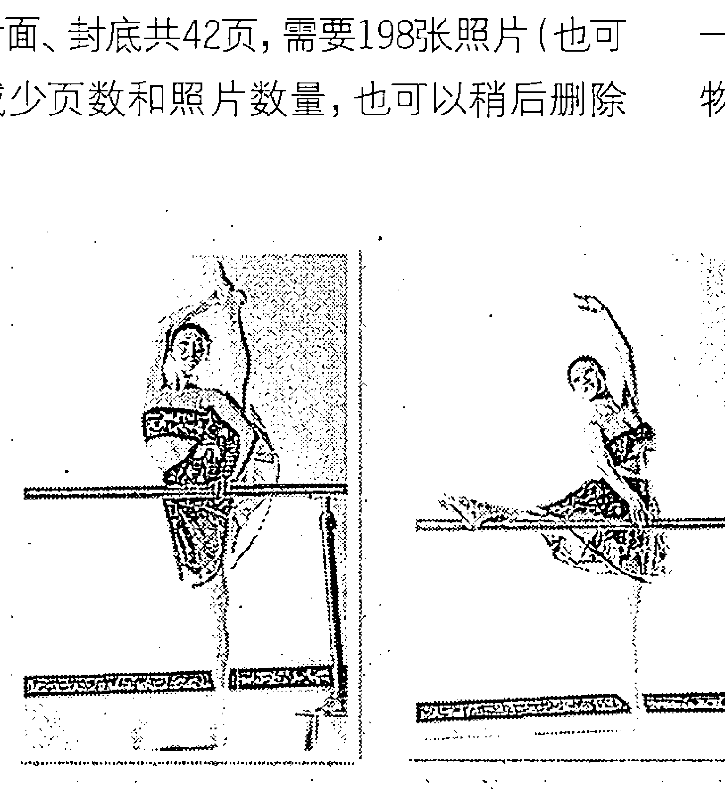

进入后窗口左边显示所有的页次，右侧显示左侧选中的页次。接下来我们要载入照片，选择左侧工具栏的“载入照片”，从文件夹中选择所需的照片，选择“加入照片”按钮，也可直接双击，还可选择“加入所有的照片”，将文件夹中的照片批量加入。若你发现照片内容是横的，可按下旋转按钮将其转正。

点击OK按钮，回到主画面，可以看到所有照片都已载入。

如果照片的大小不合适，可在右边的小窗口选择相应的“照片物件”，在右上方的显示窗口进行调节。如果要替换照片，可直接从下方的文件列表中拖动相应的照片覆盖到被替换的照片上。模板中有不同的拼接照片数量，如果需要调整，要先右击右侧窗口中的照片物件，进行解锁，然后设置相应的尺寸。

如果想产生留白效果，即删除页面某个照片以留下空白，同样需要先解锁后再进行删除。需要注意的是移除后照片的空白处是不能再放照片的，尽量不要使用这个操作。

接下来可以自由发挥创意，为每一个页次添加文字/小图案，或是将该照片加上外框，甚至做出跨页的效果。右击相应的“照片物件”，弹出“照片物件属性对话框”，可对照片的边框形状、阴影等进行设置。

具体的操作细节，需要慢慢摸索实践，这里就不一一赘述了。

下面重点说说Photocap的输出。

在输出写真书之前，强烈建议你预览一遍，检查看看，除了照片外，是否有任何物件或页码在出血范围内。在检查每一页都OK后，就可以安心地输出这本写真书了，按下“输出写真书”按钮，会弹出一个输出的视窗，用预设的设定即可。

设定好后，按下“开始输出”按钮，会在默认的c:\photos文件夹里找到所有的jpg文件，将这些文件给冲印店即可输出你的写真书了。

#### 3. 用PS打造最专业的照片书

其实各大影楼及照相馆大都使用Photoshop或Photoshop Elements来制作照片书，毕竟它强大的功能专业性无人能比，几乎可以说无所不能。没使用过PS的同学不用担心，按照下面的步骤，你一定可以轻松完成照片书的制作。跟着我们一起向专业级的制作晋升吧！

##### PS制作照片书实例

1.  首先打开Photoshop，对照片进行润色、调整，比如对比度、色彩饱和、亮度等，还可以删除一些不必要的元素。总之你希望照片变成什么样都可以在PS中实现，这里就不详述了。
2.  单击“文件→新建”，在弹出的对话框中选择你想要的照片书大小，比如B5，命名为P1，将分辨率设为300。
3.  单击“文件→打开”，在弹出的对话框中选择第一张图片，单击“选择→全部”选定照片，然后单击“编辑→拷贝”，选中P1页面，单击“编辑→粘帖”，将照片拷贝到第一个文件中。依次添加别的照片，直到所需的照片都被添加到这个页面中。
4.  选中每张照片对应的图层，通过工具栏中的“移动工具”可以移动照片的位置。
5.  如果想改变照片的大小，可以单击“编辑→变换→缩放”，自由改变照片尺寸，还可以对照片进行旋转。
6.  单击工具栏的文字工具，添加你想要的文字。页面全部编辑完成后，右击右侧对话框中的图层，选择“合并图层”，完成P1的编辑。
7.  接下来就是制作第二个照片页，重复第2~6步，直到创建所有你需要的页面和照片。
8.  最后就是保存输出，可以存储为JPG格式的文件，也可以单击“文件→自动→PDF演示文稿”输出为PDF格式。然后就可以找地方输出你的照片书了！

### 输出篇 打印输出照片书

一切准备就绪，就进入最后的环节也是最激动人心的步骤——将我们的成果打印输出！

#### 1. 在哪打印

既可以选择家庭打印机输出，也可以通过专业冲印馆以及网店进行打印输出。专业照相馆冲印比较贵，以柯达为例，大致在一百元左右。通过网上冲印店或淘宝网店比较便宜，对输出纸要求不高的话，20元就可以冲印一本照片书。要注意的是有些冲洗照片书的网店只能使用他们提供的模板，如果想自行设计的话，要选择提供空白模板的网店，这是专门为已经用PS做好图的朋友们准备的。

#### 2. 尺寸设置

一般软件所提供的尺寸外面的冲印店都支持，需要注意的是冲印店一般都是双页打印，需要设置好封面、封底的页码，封面和封底、正文的左右两页要拼接在一起。另一个就是出血设置，四周（包括页眉、页脚及中缝）都要留出出血线，大概3mm左右。如果没留的话，在制作的时候可能把图片的边缘裁掉，这是一定要注意的。至于要什么样的装帧可以咨询具体的店家，明确工艺、尺寸。
以B5大小的杂志册为例：竖版的尺寸为176mm宽、250mm高（横版的把宽和高调换就行了），分辨率最少要300dpi。

#### 3. 颜色偏差

需要注意由于每台显示器的颜色不可能完全一样，可能会存在色差问题。而且电脑上显示的色彩、相机显示屏的色彩、不同看图软件中显示的色彩和实际打印输出的色彩也会有一定偏差。此外，打印机的设置也会影响色彩的打印方式和打印效果。
如果可能的话，设计时尽量使用台式机，色彩还原好，色差会少些。
电脑和相机一般是sRGB模式，PS是RGB模式，而打印输出是CMYK模式。
RGB模式的色彩要比CMYK模式丰富很多，在RGB模式下的一些颜色在CMYK模式中是表现不出来的。如果自己用打印机输出，建议用RGB模式。如果在外面输出，由于一般印刷输出支持的色彩模式仍然是CMYK色彩模式，所以需要将你的作品模式转换成CMYK模式来分色。
在制作过程中，将作品模式转成CMYK模式可以在如下几个不同的阶段来完成：
在建立新的Photoshop文件时就选择CMYK四色印刷模式。
也可以在制作过程中一直使用RGB三原色模式，并把它置入排版软件中，而让冲印店按照版面编排或分色的公用程式来分色。
还可以在制作过程中，随时通过“图像→模式→CMYK颜色”转换为CMYK四色印刷模式。

注意：在转换为CMYK后，就无法再还原为原来的RGB色彩了。因此，在将RGB模式转换成CMYK模式之前，最好先存储一个RGB模式的备份。

#### 4. 打印机的设置

如果使用的是喷墨打印机，可以使用图像编辑软件将图像分辨率加大，并使图像本身的分辨率和打印设置的分辨率匹配。打印纸的设置也很重要，要保证在驱动程序中设置的介质类型同放置在打印机送纸器中的打印纸类型一致。为提高打印质量，可以通过改变色调梯度，从半色调到高质量的误差扩散，来增加照片或其它类型图像的细节部分。
如果使用激光打印机打印，可以使用图像编辑软件将图像分辨率加大并使图像本身的分辨率和打印设置的分辨率匹配。对于激光打印机的驱动程序来说，屏幕线数要设为梯度优先或分辨率优先。如果分辨率优先，细线和较细腻的细节可以精确地再现。反之，如果梯度优先，那么细线和细腻的细节会随机地错误再现，但色调将很平滑地表达。可根据要打印的图像类型来设置。

看到这里，是不是跃跃欲试了？趁着新年，快将这一年来的照片整理一下，做成一本照片书，送给你的家人、朋友吧！相信当他们看到自己的照片变成了与高档出版物无异的画册时，一定会认为这是最好的新年礼物！

#### 附：照片注意事项

进行设计前，应将所用的全部照片复制到一个专门的目录之中，方便导入和管理。
照片使用JPEG格式即能满足印刷需要，也可以使用TIF格式的照片，不过在进行作品上传时，某些软件会自动对照片进行压缩。
为进行高品质印刷，最好将照片的分辨率设为300像素/英寸。
通过在线调整照片有时不是特别便利，最好事先按图片框的大小和长宽比将照片裁切好。为此，可以先通过标尺估算图片框的大小与比例。

策划《电脑爱好者》编辑部
监制 Justdo
撰稿 掌门人 李锋民

## 淘客低开销玩转天价手机

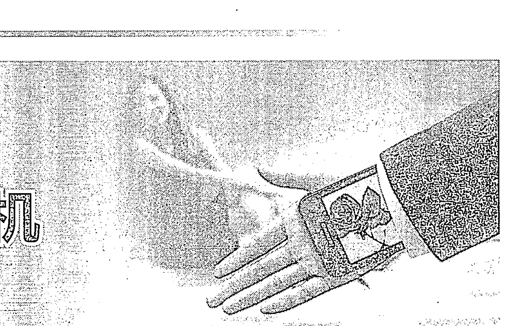

“赶集啦！”, “58同城, 一个神奇的网站!”姚晨和杨幂两位当红女星代言的广告不断回绕在地铁、公车、客厅等所有带屏幕的场所。如果说以前的二手交易是小众人群的独舞, 随着这两大网站轮番上演的广告攻势, 二手生活大有向全民推广的趋势。在工资涨幅跑不过CPI的今天, “二手淘客”却已经抢先进入了低开销高品质的生活。他们是怎么做到的？

还记得“BP机, 手机, 商务通, 一个都不能少”的广告吗? 随着智能手机的不断演进, 如今已经是“手机在手万事不愁”的时代。面对不断问世的酷炫手机新品, 想逐一体验? 没有强大的经济实力基本没戏。再来摸摸越来越瘪的钱袋子, 只能暗自叹息吗? 当然不, 至少对“淘客”来说, 低开销玩转更多手机已不是问题。今天, 我们就请来了几位“淘客”, 接下来就让他们为我们指点迷津吧。

### hiker

手机爱好者, 偶尔利用网络买卖二手手机, 深知淘客省钱的精髓。

### 梁子

某手机论坛版主, 二手交易的官方中介, 经常收到各种交易投诉。

### 萧然

小白领, 工作不忙, 偶尔撰稿, 经常给健圣推荐超值的二手手机。

### 戴妃

混迹于各大二手论坛, 俗称倒爷, 过着靠玩手机赚小钱的精致生活。

### 何谓“淘客”

请注意, 这里的“淘客”可不是简单在淘宝和各大代购网站买东西的人, 而是专门“捣腾”二手手机的一类人群。你今天刚买了一款3000元的全新手机, 淘客们明天就能花2000元淘到一款和新机无异的相同型号, 虽然名曰二手, 但省下来的1000元可是真金白银。更有甚者, 第三天还能以2500元将这款二手机器再捣腾出去, 轻松赚取500元的差价。一方面你买手机面临的是贬值, 而另一方面淘客却过上了免费体验还能赚钱的生活。如果你也想过上淘客的惬意生活, 后面的精彩内容不容错过。

### 缘起：淘客为啥选二手

所谓“二手”, 就是别人用过的机器。在人们的潜意识中, “二手”可能多少存在一些贬义之感。但时代在变, 我们的观念也是到了该转变的时刻了。如今手机更新换代速度越来越快, 如果你买了新手机, 以前的手机是让它静静躺在抽屉里呢, 还是趁着它还值点钱赶紧卖了呢? 如果你倾向于后者, 恭喜你, 你有着成为淘客的潜质。

#### hiker：二手也挺新

身边很多朋友都在“鄙视”我, 说用二手手机太脏了。诚然, 很多旧手机的键盘缝隙中都是泥污, 很难清理, 不卫生。但现在的手机几乎都会采用超大的触控屏幕, 机身表面几乎没有缝隙。换张屏幕贴膜, 给手机带上一个新的清水套, 和新机又有什么差别? 一张膜和一个套30元搞定, 而新旧手机的价差至少是这个价钱的数十倍吧？

#### 梁子：行货买不起 水货有翻新

很多网店和实体店都在销售所谓的“库存机”, 比如曾经的流行机王：HTC Desire(G7)、三星Galaxy(i9000)等等, 价格多在2000元以内。实际上, 这些“过气”的昔日机皇老早就停产了, 所谓的全新机绝大部分都是翻新货。除了停产的, 凡是上市超过半年的机器几乎都存在或多或少的翻新版。反正我没把握100%区分翻新机, 为了避免以新机的价格买到一款翻新的机器, 倒不如直接买二手机, 对不对？

#### 萧然：买新机也有风险

去年底摩托罗拉推出了三防手机Defy(ME525), 还好我忍住了没有在第一时间出手, 而是决定观望一阵子淘个二手机。没想到这个主意太正确了, 前几个批次的Defy存在“听筒门”缺陷, 经常插拔耳机容易造成喇叭损坏。我身边很多提前购买此机的朋友都遭遇了这个问题, 因为是水货售后无门, 只能自掏腰包解决。等到今年5月份, 我在网上成功以1500元淘到了一款港版的二手Defy, 通过手机串码查询是4月初生产, “听筒门”等隐患早就解决了。早买早享受? 看着朋友们花2800元买的问题新机吧, 有时候还是迟些出手才是正确选择。

#### 戴妃：买二手还能赚钱

除了iPhone, 其它品牌的手机根本不保值。年前花4000元买的机皇, 年底可能就值2000元, 如此高台跳水我是“伤不起”的。我选择二手手机的另一个理由就是赚钱, 您还别不信, 后面我们就和大家分享一下通过二手手机赚钱的经验。

### 健圣小结

像手机这类数码产品贬值速度是很快的, 再加上翻新机的搅局, 想让买手机的钱“花得值”几乎是不可能的, 反正新机买了就亏了, 只是捞了个“全新”的感官体验。在物价飞涨的今天, 二手手机的确可以帮我们省下不少银子, 而且别人用过的机器不见得不好, 好歹人家还帮你试了试机器有没有问题呢。

#### 小心：无处不在的骗子

二手手机能让你省钱, 同时也能让骗子赚钱。利用买家贪便宜的心理, 无数骗子都在二手圈子隐身, 随时准备猎取目标。想成为淘客? 首先就要学会在人海中识别骗子。

## 特别话题

### hiker: 无视不靠谱的价格

诺基亚N8才卖999元，苹果iPhone 4 1999元，你信吗？在各大二手网站，经常能看到如此叫卖手机的内容。只要你秉承“天上不会掉馅饼”的原则，不要理会这类低得令人难以置信的价格，基本就不会被骗。再来看看这类骗子留下的QQ号，至少10位，明显就是刚注册的小号，基本上是卖个手机就换个QQ号。

### 梁子: 宁买贵的不信贱的

现在更多的骗子已经聪明了，至少在价格上已经慢慢靠谱了。2600元85成新的带锁版iPhone 4，是不是有点靠谱了？至少我是有点心动的，但联系后才发现还是骗子，只支持淘宝交易，而且还给我发了一个假的淘宝地址，明摆着就是钓鱼网站。现在我都是只和报价偏高的卖家联系，再看看能不能把价格砍到我能接受的范围。总之，当你看到有人卖的机器明显低于二手均价时，一定要谨慎小心，在没有把握的时候要做到“宁买贵的，不信贱的”。

### 萧然: 善用交易网站的功能

想识别骗子其实也是有方法的。以“赶集网”的北京二手专版为例，如果显示的卖家IP地址为外地，那100%就可断定是骗子无疑；如果IP地址没问题，再点击“该用户发帖记录”，看此人近期是否经常出售价格特别低的机器，如果是，那还是骗子；当你无法确认卖家真假时，还可以将他的QQ号和手机号码在百度搜一下，如果有相关的举报记录，一定不要联系。

### 戴妃: 区分玩家和骗子

并不是经常在网上卖二手手机的就一定是商家或骗子，因为还有“玩家”（比如我）存在。玩家们通常都是数码爱好者，像我这种口袋缺米的玩家，只能在网上淘个便宜的二手机，等玩腻之后再将其卖掉，换一部更新的二手机。在百度上搜我的QQ号，前两页几乎都是我卖机器的记录，但我可不是骗子啊，我卖机器的价格也是很公道的，如果不小心买到了有问题的机器，我宁可自己吃亏也不会再转手给别人的。

### 健圣小结

交易二手手机时，尽量只与个人或类似戴妃这类的玩家交易，因为商家这边的水太深。此外，尽量与提供详细产品描述以及实物照片或者联系QQ等级很高的卖家联系，不要轻易接收卖家给你传来的实物图片，小心木马病毒。

### 筛选：价格谁说了算

决定买哪款手机了？好的，接下来就是看谁卖的便宜了。二手机和新机最大的不同就是没有标准的统一售价，便宜的和贵的可能会相差上千元。面对无数的报价，谁的价格才是靠谱的？

#### hiker: 没有固定的公式

我觉得现在并没有衡量二手机器价值的绝对公式。比新机便宜是肯定的，但能便宜多少，还得看当前的行情情况。通常来讲，二手机器的价格大概是在新机报价的基础上打个8折，比如HTC Incredible S（G11）全新港行报价2400元，其二手的价格在2000元左右还是比较合适的。此外，产品是行货还是水货？不同的成色、配件和保修情况也会影响二手机器的价值。

#### 梁子: 关键得看供求关系

理论上正如hiker所说，但实际情况是，我们要通过供求关系衡量二手机的价格。比如现在火热的小米手机，全新机1999元，但由于官方供货量不足，二手的价格甚至能卖过新机，在11月中旬那段时间二手的小米手机也能卖到2400元左右。同一款手机，如果卖家少买家多，通常不会很便宜。

#### 萧然: 搜索获取二手均价

不多说，直接分享我的经验。我一般都是先上塞班、机锋等论坛的二手版块，然后利用搜索功能查看最近一段时间全国各地有关该产品的成交价格。以水货版三星i9100手机为例，搜索最近一周在二手板块的发帖记录，你会发现平均价格基本都在2650元~2900元，而且白色机器比黑色机器贵。当你碰到卖i9100手机的卖家时，就能按照最低的2650元先砍价试试，只要最高别超过2900元就算可以了。

#### 戴妃: 自己喜好也很重要

我非常注重产品成色，同样一款二手手机，如果A款85成新卖1600元，B款99成新卖1800元，我会毫不犹豫地选择B款。我觉得有时不必刻意追求低价格，一分钱一分货，稍贵的总有它的道理，而太过便宜的往往可能就隐藏着猫腻了。

### 健圣小结

和我们买衣服一样，买二手手机时同样不能任凭卖家漫天要价，反正健圣就经常看到二手机卖得比全新机还贵的情况。所以当你看到感兴趣的机器后，不妨就利用萧然的方法，看看这款产品当前的二手均价，再根据这个价格衡量卖家的机器是否值得选购，也给你之后的砍价树立一个标准。

### 小提示

包括塞班论坛在内，很多网站只对一定级别的会员才提供搜索功能，所以建议大家多在网站上发帖赚积分，因为利用搜索真的可以帮你快速锁定心仪的产品。

### 议价：砍价好似心理战

了解了机器当前的市值，接下来就该进入到具体的谈判环节了。作为买家，我们自然希望可以花最少的钱买到心仪的产品，而砍价的过程其实也是与卖家展开的一场“心理战”。既然砍价已经上升到“战争”的高度，自然需要合理的“战术”才能制敌取胜，让你花钱更少得大实惠。

#### hiker: 以礼服人

在与卖家联系时，尽量多用“您”、“请”之类的客气语句，多和卖家套近乎，要用“软刀子”磨人。不要小看这些细节，至少当我卖手机时就非常厌恶说话不客气的人，比如碰到说“新机才XX元，你的机器不降价就卖不出去了！”的买家，我宁可扔了也不会卖这类人。但如果换个口吻，“最近新的机器好像降了不少，您能再便宜一些吗？”说不定我就便宜卖了。

#### 梁子: 抢占先机

以前经常碰到特别便宜的机器，但当我联系卖家时，人家的机器早就卖出去了。从此，当我看到超值的二手机后，为了避免被别人占了便宜，我通常会第一时间回帖：“已联系楼主，交易中，楼下止步！”接下来再和卖家联系，商讨最终交易的价格、地点和其它事项。当别人看到这则出售消息时，发现已经被人捷足先登，通常也就不会再联系卖家了，这就给了我进一步讨价还价的空间。

#### 萧然: 主动出击

卖手机通常是因为缺钱，或者是有“新欢”才出“旧爱”，总之都会希望可以快速完成交易收拢资金。在与卖家沟通时，要强调“只要价格合适，我马上就能自取”，只要你的报价在卖家的心理承受范围内，交易基本就成功了一半。然后可以夸大与卖家之间的距离，比如明明只隔5公里，你就说成：“我在怀柔，还得坐好几个小时城铁才能过来”，总之就是让卖家感到你的真诚和不容易，在砍价过程中也能加分不少。

#### 戴妃: 人云亦云

碰到不着急出手的卖家，我建议采用“人云亦云”的战术。我除了常用的QQ以外，还有3个备用的QQ小号。当我相中某款机器时，我会先用常用QQ与卖家联系，并给我所能接受的最低价格。如果卖家不肯降价，接下来就轮到QQ小号的“狂轰乱炸”了。很简单，就是分别用其它的QQ号，在不同的时间段与卖家联系，把交易的价格砍得更低，向卖家灌输“这机器就值这么多钱，你看着办吧”的心理暗示。

等你感觉快攻破卖家心理防线时，再拿常用QQ与卖家商量，通常就能以理想的价格入手了。当然，这个战术的使用要适度，因为真正超值的机器不止你一个人惦记着呢。

### 健圣小结

议价时的心理战，关键就看谁先妥协，大家所提的战术可以帮你拖垮卖家的心理防线。不过，根据健圣的经验，真正低价格的二手手机不是砍(砍价)出来的，而是碰(碰运气)出来的。每个人的心理承受能力不同，同一款机器，A君亏800元也能卖，但B君亏300元就有些受不了了。所以我们在挑选二手手机时也不要过于着急，没事就看看二手论坛的最新消息，争取在第一时间找到A君，防止别人捷足先登，在第一时间就与A君完成交易。

### 交易: 面交还是网交

当你和卖家谈好价钱后，下一步就是商量在哪里交易了。如果两个人都在一个城市内，可以选择“一手交钱一手交货”的面交形式，如果相隔较远或时间有限，如今发达的网络支付和快递行业也能满足你“先验货后交钱”的需要。那么，从安全性的角度来看，两种交易形式哪种更适合我们呢？

#### hiker: 本地交易至上

我从始至终都坚持本地见面交易的原则，只有把产品真实地捧在手上才踏实。一方面可能是我玩的手机多了，对硬件和系统都有一定的了解，问题机一般是逃不出我的眼睛。另一方面是现在异地交易不太安全，因为交易周期太长，期间谁知道会出现什么岔子。如果你对手机了解不多，不妨约几个比较懂行的朋友与你一起交易。

#### 梁子: 异地找中介

我并不反对异地交易，因为同一款二手手机，南方的价格普遍要比北方的便宜。但在交易中我一般不会选择淘宝，更不会傻到先款后货，而是找论坛中的元老做中介，选择中介交易的形式，并要求卖家给我足够的验机时间，因为很多手机的功能缺陷，不可能在24小时之内就试出来。

#### 萧然: 不给骗子可乘之机

现在骗子的手段都是非常高超的，只要黏上了你，他们会利用淘宝、支付宝上的一系列漏洞从你身上骗取钱财的。所以最简单的防骗手段就是不要相信“这世界上存在”价格过低的二手产品，远离可能是骗子的潜在人群。据我的观察，绝大多数骗子都会选择网上交易的形式，所以我就反其道而行之，只选择见面交易。

#### 戴妃: 淘宝受骗记

我在2010年曾被淘宝的一个买家骗过。当时我刚买了一部二手的里程碑，就在网上发帖打算把闲置下来的N97卖掉。很快就有个姓邓的骗子直接加我QQ说淘宝交易，叫做了个链接然后马上拍下。晚上又用QQ给了我一个地址和姓名（和淘宝上留下的不一样），我当时也没有注意，第二天早上就按头天晚上QQ记录中的地址发货给骗子了。2天后，骗子开始申请退款，说他的地址是温州（淘宝收货地址），但我却发往了深圳（QQ上的地址），说我发给别人了！向淘宝投诉，人家却只认旺旺的聊天记录，一部价值2000元的二手手机就这么打水漂了。从此我就得了淘宝恐惧症，无论买卖二手机都会选择本地面交的形式了。

### 健圣小结

我也倾向于本地见面交易，当面测试所有功能，并和卖家再套套近乎，说不定还能再给个优惠呢。只是面交过程要注意安全，尽量在公共场所验机交易。如果必须通过淘宝交易，购买前无论在什么情况下，都不要将钱放到支付宝账户里！应该先拍下，然后到交易管理或者旺旺的“买到的宝贝”里看有没有拍下的宝贝。如果30秒内没有发现刚刚拍下的宝贝，那么你的支付宝密码就可能已经被盗，请马上去更改！此外，淘宝交易过程中的任何链接、图片、讨价还价的话语等信息一定都要通过旺旺发送过来，QQ或MSN等其它即时通讯软件会发送钓鱼链接给你，而且一旦出现纠纷，淘宝客服也是不予承认的！

#### 戴妃分享: 面交也要绷紧安全神经

2011年6月份的时候，我打算把手上的Defy出手，刚在赶集网发帖就有一个网友（下文简称C君）加QQ联系我，说打算用iPhone 4换，并强调他的手机是打球时捡的，我只要适当加钱就可以互换。我心想ME525也就能卖1700元，而二手iPhone 4当时的价格怎么也得3200元左右，于是试探性提出加300元互换，没想到对方爽快答应。

## 交易：验机环节不可少

本地见面交易的好处就是可以与卖家面对面，除了可以检查手机以外，还能通过交流掌握关于这款手机的更详细资料：比如在当前的系统下电池能用多久？有没有一些使用上的技巧？当面的指导远比咱们自己在网上搜索技巧更省时省力。

验机时，即使卖家有耐心，估计你也没时间拿出1个小时来测试手机吧？而现在智能手机的功能又这么多，稍不留神可能就会遗漏某个功能的检查，万一刚好是有缺陷的部件可就“杯具”了。如果你没有太多检测手机的经验，建议提前准备好检测手机硬件的第三方软件（可以提前拷贝到TF卡里，然后安装在卖家的手机上），以防出现遗漏。

### hiker：着重检查“通病”

我在交易手机之前，通常会在网上搜索“XX手机 缺陷 缺点 通病”一类的关键 字，了解这款手机可能存在的通病。比如HTC HD2和早期的HTC G7存在CPU“虚焊门”的隐患，机器一过热就会花屏死机，反复重启。早期的三星i9000存在“电流门”，通话时听筒会传出电流声。针对HD2或G7，你可以用卖家的机器持续玩10分钟3D游戏，或者用摄像头持续拍摄20分钟，总之就是长时间运行一切可以让CPU全速工作的应用程序，测试CPU过热时的稳定情况。而i9000则可以找个安静的角落拨打10086，看看有没有电流声。

### 梁子：描述和实物要统一

我在每次交易前都会事前和卖家确认机器的详细情况，比如成色、配件和是否是“三无机”（无拆、无修、无进水），等见面验机时我就优先根据卖家的描述来检测手机。如果卖家说机器9成新，但实际只有8成新，或者配件缺斤少两，当出现这类实物与描述不符的情况时我会断然拒绝交易，这种连最基本诚信都做不到的卖家根本就不能相信。

### 萧然：从细节发现问题

防人之心不可无，我曾经就被一个小姑娘给骗过。现在我在验机时都会拆开手机后盖，仔细检查螺丝是否有拧动过的痕迹，或者质保和防水标签是否有破损，配件是否原装。

### 戴妃：“自用机”最靠谱

我的经验是，如果卖家在和你见面交易的前一刻还在用着即将卖掉的机器，而且里面还保存着近期的通话记录、拍的照片和一些可以证明是“自用机”（一直自己用的手机）的信息，我的心也就踏实一半了，如果手机有问题卖家早就换别的机器了。

### 健圣小结

只要你联系的不是黑心商家，而是真正的个人用户，只要他的手机没有摔过或进水并且一直自用，通常是不会存在硬件隐患的。按照前面的几种思路检测一番，基本就可放心购买了。

## 惊喜：二手赚钱不是梦

不要将自己锁死在“买家”这一固化的角色里，也不要抱着二手手机“越卖越不值钱”的保守思路，只要你有耐心和决心，在二手交易这条大道上谁都可以赚钱！只是你想要稳赚不赔，还得从买二手手机开始……

### hiker：二手轻松赚钱

自从大二开始，我就再没买过新手机，原因很简单，新机买了就赔了，二手可能还赚钱。举个例子，当我想玩某款手机时，都会先在机锋、塞班等专业论坛的二手版块寻找价格合适的二手机，和卖家谈拢、交易，等玩了一段时间后，再在赶集、58同城等网站卖出，只是价格比我买的时候高了那么一点点，赚取一定的差价。如此反复，既可以不断体验最新的产品，每次换机的过程还能小赚一笔银子。当然，能赚多少，就看你买入时的议价本领了。

### 萧然：稳赚不赔有难度

手机在二手市场都有一个由高走低的波动周期，刚上市时因为供小于求，所以议价权在卖家的手上。总有一个时期，出同样型号手机的卖家会变多，到了供大于求的阶段，议价权就在买家手上了。所以，二手手机最佳的买入时机在供大于求的阶段，而最佳出手时机则在供小于求的阶段，关键就看你能否抓住时机了。希望大家也能理性看待二手手机的买与卖。买新机一定是亏，但买二手的话则有三种可能：赚了、平了、亏得少了。

## 赚钱：转换角色做卖家

当你成为卖家时，就该轮到你与形形色色的买家打交道了。之前我们讨论了很多买家淘二手的经验和技巧，当你的角色转变之后，同样需要转变思路，与苛刻的买家和危险的商家周旋到底！

### hiker：自取原则不能变

和我买二手手机一样，当我变成卖家时，同样只接受自取交易，只是取机器的人换成了别人。一来防止对方“放鸽子”（就是以各种理由取消交易），二来也能防止遭遇专业骗子（专业骗子可是很忙的，很少为一款机器大老远跑一趟）。一般来说，凡是能不辞辛苦来找你看机器的，都是有心想买的。

### 梁子：“伤不起”的商家

前不久我有一个朋友在58同城卖摩托罗拉MB860，标价2200元。没想到没一会就收到了“我是木樨园的商家，我确定要您的手机，您能把手机送到我店里来吗？”的短信。朋友很高兴，屁颠屁颠就拿着手机找到了那个商家。商家笑脸相迎，并以检查手机是否有过维修为由拆机检测。等手机拆开之后，商家却说机器有问题，就值500元！朋友欲哭无泪……最后在网上以1500元的价格卖出，因为拆过的机器就不值钱了。

### 萧然：珍爱手机 远离商家

你朋友还算幸运，有的商家在拆机时还会动手脚，装回去就开不了机了，逼得你只能“就范”。我的建议是，“珍爱手机，远离商家”，普通消费者真的斗不过这些人的。中关村、六里桥、木樨园、公主坟……这些都是手机商家最常出没的区域，如果想买你手机的人恰好位于以上区域就需要小心了。

### 戴妃：小心谨慎 风险可控

二手手机商家并非全部黑心，只是踏踏实实做生意的着实不多了，因此还是与准备买二手手机自用的人交易最靠谱。我每次卖手机时，也会在百度上搜索一下买家的手机号码，看看网上有没有他“收购手机”的记录，如果有我通常会取消交易。相对来说，你卖手机的时候要比你买手机的时候所承担的风险小一些，只要坚持对方自取的原则（卖手机尽量就别淘宝了），不接触商家，在有ATM的地方交易（买家当面取钱，避免假钞），基本就不存在问题。

### 健圣小结

当你成为卖家后，不妨借助以前当买家的经验，保证自己的最大利润。当然，虽然我们是以卖二手手机为例（当别人再买就成“三手货”了），但如果你手上有闲置的旧机器，不妨也趁着还能卖几个钱的时候，为主人多做些贡献吧。

### 小提示

想让二手手机更值钱，一定要保证手机的成色，保留包装和购买票据。总之，二手手机的成色越好，配件越全，越容易卖上高价。

## 淘生活，从今天开始

看到这里，相信你对二手“淘客”已经有了初步认识。面对层出不穷的新品手机，你有没有动心过？想款款体验的代价实在太大，但“淘客”精神则可以让你在节省开销的前提下，轻松把玩更多的酷炫手机，而且还有机会小赚一笔银子呢。“淘客”没门槛，只要你愿意，人人都可以尽享“淘客”生活。怎么样，你准备好了吗？

### 小提示: 比较有名的二手交易网站或论坛

| 网站名称 | 地址 | 特色 |
| :--- | :--- | :--- |
| 机锋网 | http://bbs.gfan.com/forum-23-1.html | 人气较高，可以根据地域分类，便于检索 |
| 安卓网 | http://bbs.hiapk.com/forum-187-1.html | 和机锋网类似，只是检索相对麻烦一些 |
| 塞班论坛 | http://bbs.dospy.com/forum-141-1.html | 人气非常高，所有品牌手机的汇聚地 |
| TomPda | http://shop.tomppda.com/mall/index.asp | 老牌二手交易论坛，产品丰富，价格靠谱 |
| 威锋网 | http://bbs.weiphone.com/thread-htm-fid-29.html | 想买二手苹果产品，这里应该是首选 |
| 赶集网 | http://ganji.com/ | 交易量和浏览量很大，但骗子较多 |
| 58同城 | http://58.com/ | 同赶集网 |

前5个为专业成熟的交易论坛，如果卖家定价高了，自有人会因价格虚高而向卖家“拍砖”，在这里淘二手产品相对会更划算和安全。通过二手手机赚钱的基本思路就是从A二手网站低价买入（需要碰运气，还需要你有足够的砍价功底），再在其他二手网站适当提价售出，至于能赚多少，就看你的产品描述是否吸引人和能否有愿意出高价的买家了。

## PPT出彩 尽在图文间

PPT已经脱离职场白领的基本需求，成为广大群众喜闻乐见的一种演示手段，几乎没有什么会议、演示、演讲上看不PPT的身影了。这里面一个非常重要的原因是PPT的表现力很强，可以通过文字、图片，乃至动画来充分展现演讲者的思想。

然而，对于一个好的PPT而言，美观精致的排版尤为重要，尤其是在你有了一堆文字和一堆图片之后，怎样选择合适的呈现方式是PPT成败的关键。这一期专题，就是要让你学到如何玩转PPT的图文混排，让你打通图文二脉，出彩尽在图文间！

### 全图型的图文混排

所谓全图型图文混排，是指图文中图形占据页面的主体部分，而文字是辅助部分。图片覆盖了整张页面的范围，通常图片相对于页面是四边出血处理，这样文字就## 风格1: 胶布粘贴纸条样式

文字只能置于图片之上。对于全图型的图文混排，最容易出现的问题包括：(1) 图片色彩十分艳丽，文字被完全掩盖在图片之中，辨识度大大降低，妨碍阅读；(2) 文字位置添加不适当，不能与图片内容协调一致，使得图片的美感因为添加的文字而有所损失；(3) 图片与文字内容没什么关系，此时图片往往没有起到突出主题的作用，甚至还会混淆观众的理解。当然对于最后一点，最简单的办法就是直接删除图片，误导观众比表现力不够更糟糕！

图文混排强调图片表现与文字阐释的相互融合。如果图片意思表达已经十分明确，那么没有必要再额外添加文字。对于全图型的页面，文字多是辅助地位，因此要注意减少文字数量，突出核心。如果文字过多，会大大削减图片的表现力，会使人觉得还不如将文字去掉。要避免前面提到的问题，指导方针就是：删繁就简、增强融合、构造层次。实用的操作目标多是实现图文分离，也即将图片和文字置于不同的层次之上，借助层次之间的关系来避免图文的冲突。下面通过几种常用的风格来看如何实现上述十二字的指导方针及操作目标。

这种样式是由著名演讲家 Garr 广泛应用和推广而为众人所喜爱，是一种典型的图文分离样式。具体实现方法为将文字写在某空白纸条图片上，然后再制作半透明胶布图片将其“粘贴”在大幅图片上，构成上下分层样式。这样，一方面能够让观众在其脑海中自动复原图片全景，从而在一定程度上保持图片完整性；另一方面，又能够有效地凸显文字部分。同时粘贴样式的灵动做法可以保证页面的美观性，保持观众的兴趣。

不妨从 Garr 的演示 PPT 中随便撷取一个例子（图1）。在这个例子中，文字相当于写在白纸图片上，而页面构成是由背景图片与前景纸条图片组成的，半透明胶布图片为辅助元素。图片中的撕纸图片是直接搜索的图片，如果没有这种图片，也可以通过 SPX 截图软件在一个空白区域截出一个撕纸效果图。更简单的做法是，利用 PPT 中绘图功能部分的“任意多边形”绘制一个不规则图形，这里就绘制了一个长条式的五边形，然后对该不规则图形添加阴影，也可实现另一种风格的纸条样式（图2）。

构造这种图片时，注意几个小方面：一是前置纸条图片摆放位置在整个页面上可以十分随意，并不局限于某个位置，但一般都放置在图片中主要元素较少的位置，这样可以尽可能保留图片的主要内容；二是纸条上的文字尽可能减少，在全图型页面中图片是表达主题的媒介，文字主要起到画龙点睛的作用；三是通过给前置纸条图片设置阴影来增强页面的层次感。

## 风格2: 半透明蒙版风格

与前述风格的不同点在于，本透明蒙版并不借助于观众的想像力来维持页面的完整性，而是直接保留了图片的全部细节，仅是在部分区域添加半透明的一层背影，用以突出文字。其制作思想即构造层次将文字与图片分离，这种处理技巧简单有效，在 PPT 制作中十分常用。操作方法为利用 PPT 自带图形直接在图片上方添加矩形或三角形等几何图形，并调整其填充透明度至合适（笔者一般设为 40%），图形填充颜色宜选择白色、黑色或与背景图片主体颜色相似的颜色。在此例的原图中，人物着衣及页面主色为天蓝色（图3），笔者对所添加的半透明明蒙板选择了色值相近的浅蓝色。而在另一例中则选择了白色（图4）。

添加半透明蒙版的优势是页面设计简洁大方，图片的完整性得到了最大程度的保留，并且对半透明蒙版的范围任意调整都不会对图片造成削弱，从而添加文字的内容量也更为随意。

## 风格3: 渐变蒙版样式

如果页面上图片内容可适当削弱，也可以通过在一侧添加渐变蒙版的方法。渐变蒙版风格可以将文字与图片安排在两个独立的空间内，从而实现文字与图片各居其位，这种风格可以非常好地配合主题发挥。

一种非常适用的情况就是用以表达隐隐约约感觉的主题，例如爱情等（图5就是一例）。其制作方法为在页面一侧添加矩形，设置填充颜色为从页边到图片的线性渐变填充，其中页边侧透明度为 0%，图片侧透明度为 100%，然后再于其上添加文字。以图5为例，此处是将文字置于页面的右侧，添加的矩形框左侧边实际位于画面中人物的耳朵位置，但由于此处的透明度为 100%，实际不存在明显的界限，页面美观度较高。

这种方法的优势在于：首先，文字区到图片区的过渡更为自然，不存在生硬的分界线，呈现出独特的融合效果，处理思想本质是实现图文分离，但呈现效果是图文结合成为一张新的图片，因此视觉效果很好；其次，文字范围（也即矩形大小）可以根据

## 风格4: 直接采用不透明前景遮挡

添加半透明蒙版或渐变蒙版都是为了减少图片的信息损失，在图片信息允许有限度损失时，直接添加不透明的图形形成分层效果也是不错的选择。此例直接设置文字框的填充色为白色或在其下层添加矩形框（图6）。为了避免页面过于呆板，可以对文字与矩形框的组合图形在页面上适度旋转，以增强灵动性。另一方面，这种方式对单个页面应用可能不如前述方法那样美观，但在连续多个相似页面中重复使用时，就会成为一种独特的风格，表现力也并不逊色。

可以进一步增强表现力的技巧有：给白色矩形添加阴影，阴影幅度适当调大，可充分体现分离感；在白色矩形添加回形针、胶布、凤尾夹、图钉等图案，调节页面的趣味性；将白色矩形靠近页面一侧出血放置，例如置于页面下边缘拉伸至两侧形成类似于字幕样式等。这些技巧及它们的组合使用都可以使得蒙版更有质感。

## 风格5: 图片上直接添加文字

前面的方法都是针对图片上没有合适的区域添加文字，因而基于图文分离的想法进行设计。而对某些图片而言，也可以直接在图片上添加文字，这种情况一般是背景图片存在大块颜色一致的区域。此例页面上方灰色区域较大，因此适合直接添加文字（图7）。不需要额外的分层设置也丝毫不影响页面与文字的融合性。

在添加文字时，也要考虑到文字与图片自身内容的协调性与一致性，因此需要注意以下几点：一是动势一致，若图中存在明显的直线图形（例如图片主体为一支铅笔），则文字方向可考虑与直线方向保持一致；二是颜色一致，文字颜色不宜随意设置，而多选用图片中出现的颜色与相近颜色，以保持整个页面颜色的协调性以及元素之间内部关联；三是形成关联，如果图片中出现人物，则多将文字置于人物手势之处或眼神所望之处等；四是避免遮挡，要避免文字覆盖重点展示的物象等。所有这些处理都是为了使得文字与图片能够形成互应，增强页面的整体性。

有些时候想直接在图片上添加文字，又感觉图片不够合适时怎么处理呢？两个简单的处理办法。其一是把图片中的主题部分抠出来，为页面背景添加颜色，然后在色块部分添加文字。因为色块区域会扩大大家对图像范围的认识，可以起到扩张图片范围的作用。这种处理技巧也适用于把一张中型图片转为全图型形式呈现。当主体内容与其余部分色值相差较大时，在 PPT2010 中就可以较好地实现图像提取，否则需要借助专门的图片处理软件。另一种办法是将页面除了要重点突出的内容之外的其余部分进行模糊化处理。

## 风格6: 图即是字

当然，如果你选用的图片中本身已经含有合适的文字或字符，那效果自然非同一般，不过这样的图片一般来说很少，要特别在平常注意收集相关的图片，遇到合适的素材及时归类收藏，这样才可以在需要时不至于无下锅之米。

这类图片一般有两类。一类是特定字符的无背景图片，例如 End、Network、Business 等，都有大量的字符图片（图8）。不过这一类图片一般以英文居多，中文的不是很多，在中文报告中偶有所用也主要是为了增加一点趣味性。另一类图片是真实拍摄的图片，而图片中恰有所需要的内容。相对而言，这类图片就更加稀少。在制作时间与成本允许的情况下，可以自己设计一些相应的内容并进行拍摄，或者通过第三方图片处理工具进行制作。

## 风格7: 图文换页实现

对于 PPT 而言，一个需要时刻记住的要点就是，页数从来不是限制你发挥的理由，一页上实在不易实现的内容完全可以分到两页甚至更多页。对于全图型的图文混排，思维再发散一点，其实也不妨把图片与文字间隔呈现，形成“夹叙夹议”的样式。具体实现就是一页全图型的图片，接下来一页没有图片，就有简单的与前一页图片互应的文字，然后再一页图片，再一页文字。下面给出四页 PPT 的示例，其中序号为顺序标记，在原 PPT 中并不存在（图9）。在此例中，展示 PPT 时，总是先出现一幅充满画面的图片，引起观众想了解信息的兴趣，而所要表述的内容则在翻过之后的下一页中，如此继续。在自我介绍、旅途讲解等相似的故事性报告中，会别有一番出彩的感觉！

## 半图型的图文混排

所谓半图型的图文混排，是指图片占据页面的范围大约只有版面的一半左右，因此文字区域也占据约一半左右的空间。半图型的图文混排在 PPT 中是十分常见的布局模式，主要是因为页面内容呈现可能需要较多的文字，图文地位处于并重的地位。再者在由于搜集图片时，获得高清大图并不是特别容易，而将其进行拉伸往往会使得图片模糊不清，反而降低了图片的表现力，因此也经常需要借助尺寸稍小的图片进行页面布局。对于半图型的图文混排，不出色的页面往往具有这样的特点：(1) 图片的呈现方式只是简单的置于一侧，页面显得呆板；(2) 图片与文字之间的关联关系不明确，两者“各自为战”。下面先看下如何增强图片的呈现力，再谈下图文之间的关联技巧。

### 要点1：图片的出血处理

对于全图型页面而言，其表现力很强的一个重要原因是大幅高清图片对观众视觉的刺激，因此在处理中往往是将图片充满整个页面。在半图型页面中，这一点仍可以沿用，也即对图片在页面上做三边出血处理，可以增强页面的饱和度。所谓三边出血处理，是指图片的三条边与页面的三边重合，而剩下的一边与文字接界（图10）。

这样处理后图片看起来不是页面上一个孤立的元素，而是作为背景页面的一部分存在，因此图片与文字的对立性就得以消除。两者在呈现上可以相得益彰，互为补充。一般而言，当将图片作三边出血处理后，无论图片放置在页面上下左右四个位置中的哪个位置，都不会产生失衡感。而失衡是很多人在 PPT 排版时容易出现的缺陷之一。实际上，出血处理是页面排版的一个基本技巧，例如在杂志等纸质印刷品中，为了取得较好的视觉效果，经常会对图片排版有意识地进行出血处理。

### 要点2：少即是多

“少即是多”是建筑大师密斯·凡·德·罗提出的设计理念。这种理念旨在强调对每个部分都做到尽量精简，使结构本身升华为一种建筑艺术。这种理念影响了众多领域的设计；例如在 PPT 中，也有这一思想的直接体现。在 PPT 中“少即是多”意味着尽量去除或减少不必要的干扰元素，使得页面焦点突出，例如 PPT 中被许多专家强调的留白艺术本身就是对“少即是多”这一理念的运用。

半图型相较于全图型而言，在全图型中图片是页面内容的呈现主体，文字更多的是出于服务的地位，而半图型中图文出于同等的地位，更强调图与文之间的互为补充，因此无论是图还是文，都要把握好一个度。换言之，无论是图过于突出还是文过于突出，都容易流于极端，各自削减一点，留给观众足够的想象空间，反而能实现“少即是多”的效果。

这个页面上选用了一张堆满古钱币的大图来做配图（图11），因此为了突出文字只好添加半透明的蒙版，可容纳的文字量有限。显然，图片已经占据了页面的主体，给观众的想象空间也被压缩了。

基于“少即是多”的理念，笔者将图片推向页面的一侧，仅露出少量钱币（图12）。一方面，从这一角仍不难想像到钱堆的样式，也即图片所要传达的信息在观众的想象空间中并未损失。另一方面，页面上预留的空间一下子大了许多，整个页面相较图11看起来更加清爽简洁。而且更重要的是，给文字预留了足够的空间，无论文字多少都能够恰到好处地进行安排。不难看出，文字少时，图12就可以用于 PPT 的封面设计，而文字多时，图12也是很好的内页布局方式。以文字较少情况为例，将文字移到页面的右下角放置，既可以平衡页面，与图片遥相呼应，又在图片与文字之间制作了留白区域，仍符合“少即是多”的理念。

很多时候为了在页面上能够添加较多文字，我们往往需要将一张全图型页面修改为半图型页面。从少即是多的角度来看，这种修改并不意味着页面表现的内容减少了，而往往是页面主题更集中了，并且文字量也可以增加，可以承载的内容自然也就多了。

### 要点3：色块扩张图片的表现力

如果觉得半图型的 PPT 页面表现力不够，又希望能留有较多空间用于文字排版，可以通过对页面背景色设置来增强表现力。在图片中存在颜色一致的大面积区域时，可以直接将页面背景色设置为该颜色，这样页面看起来就仿佛一张全图型页面，但文字区域仍旧得以保留。实际上，就是通过添加色块的方式将半图型图文混排转变为类似全图型图文混排的样式。从下例可以看到左侧有较为一致的颜色（图13），使用颜色查看工具，找出相应位置的颜色值，并将页面背景设置为此色，则可以顺利实现页面的扩展。

不过注意到，在这种方式中要求页面中存在一个大块单色区域，并且该颜色在衔接区域色值一致，这样才能实现“无缝”扩展。但更多时候图片中的主体颜色值可能在小范围内波动或者图片边缘细节较为丰富，将背景色设置为任何值都不能使得图片与页面“无缝”融合。不过，通过添加色块的办法来增强表现力仍旧可行，因为相近的颜色仍能够实现视觉效果上的张力增加。操作方法是从图片中选定其主要颜色，也即在图片中占据了最多部分的颜色，然后将页面背景填充为该颜色（图14）。这里选取主要颜色，其实是为了实现两者之间的关联，避免背景颜色的突兀感。

那么，对于图14而言，很容易看出，图片与文字区域之间存在明显的分界线。如何将这个边界处理得更有趣味性呢？看下面这个要点。

### 要点4: 更加灵活的边界处理

通过添加色块来增加冲击力时，不难看出色块与图片很难完美融合，但可以通过一些小技巧来减少图片与色块之间生硬的边界。例如下面这些简单的操作技巧。

- 既然边界不可避免，不如索性将其凸显出来，也即在图片与色块之间增加一条较粗的白色线条，形成栅格感。进而还可以围绕这条线条充分发挥你的想像力，做成熟悉的样式（图15），就是基于穿孔笔记本做的样式。
- 将色块做成一个矩形框，略压过图片，然后将边界处做成渐变模式，其方法本质与全图型图文混排中的添加渐变式蒙版是一个原理。
- 给图片在衔接一侧设置较重的阴影，给背景添加颜色，形成图片压在页面上的样式。方法原理与全图型中的添加不透明蒙版类似，只不过是图片在上而已。当然也可以处理成图片在下、文字区域在上的样式。
- 图片略缩小，并非出血处理，然后添加白色边框及阴影，做成照片的样式。
- 边界也不一定要是直线样式，完全可以处理成类似这种样式（图16），相应的变化方式自然就多了起来，还可以与上面的技巧结合运用。

要实现图16的效果很简单，只不过你要改变一个观念，也就是你的设计范围并非局限于幻灯片的范围。实现过程如图17所示，虚线部分所对应的范围是幻灯片页面的范围，而曲线的边界则是通过绘图中的“曲线”功能绘制了一个光滑的环形区域，此区域落于幻灯片范围内的部分就构成了图16的样式。

### 要点5: 用于打破常规

在常规安排下，图片都是矩形样式，只有 PNG 格式的图片插入页面时才是不规则的图像。因此在很多半图型的图文混排中，图片都是矩形样式，前述给出了一种化直线边界为曲线边界的办法。当用到一些比较有特色的图片时，比如图中有一个棋子相对其余要更高一些，要裁剪部分图片添加文字时总会有些未尽之意（图18）。自上而下裁剪可能会损失部分棋子图形，自左而右裁剪又会减少棋子数目。有没有什么办法可以做得比较有特色呢？

这个图是不是挺有意思？最高的棋子部分仍旧保留了所有细节，但上方其余部分全部都裁剪掉了，就省出了足够的空间来安排文字了（图19）。

要实现这样的效果，一般都可以通过第三方图片处理软件来完成。在 PPT2010 中，可以通过如下方法实现。首先将图18在页面复制为两份，然后将顶层图片除了最高棋子之外的其他部分全部通过“删除背景”功能删去。然后将底层的图片自上而下裁剪至合适位置，即可实现部分突出的效果。图19的效果中又添加了一个灰色矩形框置于两层图片之间。

这一技巧可以使得你快速有效地突出页面各元素中希望强调的那一个，而又能在保留其余元素的情况下留出足够大的文字区域。

不过，这一技巧需要你要保留的内容与图片中的其他部分在边缘上色差较大，这样才能够快速地借助“删除背景”功能进行设计。否则，若色差较小，则往往需要借助专门的图片处理软件才可以。实际上，类似的技巧还可以用于突出你团队中的某个人，例如一个小团队中的几个人在一起时，如果要突出其中的某个人，那么就可以运用类似的技巧，先将这个人抠出来，适当放大后再置回原图。这样就既可以体现团队精神，又可以使得某个人凸显出来，并且灵活。

类似的技巧还可以用于突出你团队中的某个人，例如一个小团队中的几个人在一起时，如果要突出其中的某个人，那么就可以运用类似的技巧，先将这个人抠出来，适当放大后再置回原图。这样就既可以体现团队精神，又可以使得某个人凸显出来，并且灵活。

## 多文本页面的图文混排

所谓多文本页面的图文混排，是指当页面上文字较多，留给图片的空间很少或几乎没有。这一情形在很多工作型的 PPT 中应用十分普遍，例如教学课件、工作汇报、政府报告等，很多时候都需要将大部分的空间安排给文本展示，图片更多的是起点缀及辅助表达的作用。恰当的图片运用，可以提高页面的图版率，增强页面的灵动性与趣味性，一定程度上降低纯文字页面的呆板性。对于多文本页面的图文混排，指导思想是：突出文字内容，专注文字排版；适当增加小图，起到页面点缀；可通过添加色块，增强页面融合。

### 要点1：似断似连的处理技巧

页面上文本较多时，一般都涵盖多个部分内容，因此基于文本会将整个页面划分为多个小部分。此时插入较大的图片时，通常会同时覆盖多个部分，若还想保持各部分之间明显的区分，则可以将图片遮住很小的一部分（图21）。此页面中实际只插入了一幅图片，但在各部分的分界线处添加了狭长的矩形框，使得图片看起来仿佛被划分为三个部分，分别与三个文本相关联，而这被分割的图片似断似连，在读者的脑海中仍然能够快速还原为一幅图片。

再者是图文互动。在一个页面上，图片与文字是相辅相成、互为补充的，因此在页面设计时要注意到图文的和谐搭配。这里的和谐搭配是多方面的：图片的风格要与文字的风格相匹配，例如图片风格是宁静型的，文字就不宜选用过于活泼的字体；图片中存在一个主色调时，文字如果要选用黑、白、灰之外的其他颜色时，要注意不与图片主色调相抵触，一般选用与图片主色调的相近色等；图片中的人物存在动势时，可以将文字的安排与图片中的动势保持一致。

| 网上家长学校 | 生活中教德育 | 德育由虚变实 |
| --- | --- | --- |
| 引导家长正确认识和参与德育教育中的德育体验 | 德育的终极目标是使德育工作落到实处，使德育有活力，让学生爱德育 | 立足于青少年活动中心，德育要实实在在的活动，才能真正有德育实效 |

再如此例右侧部分在文本之间插入了两幅小图，而这幅小图实际是从一幅图中分别裁剪的两个部分（图22）。虽然整幅图片没法安排进这个页面，但这两幅图片因为来自于同一幅图片，它们之间存在很强的关联性。正是这种关联性能够使得观众脑海还原该图，从而页面的右边虽然划分为多个小部分，但对于观众而言实际是呈栅格状的两个部分，也即前端文本将后端图片遮挡为栅格样式。

| 开放时间 | 公园门票 | 交通指南 |
| --- | --- | --- |
| 8:00 - 18:00 | 成人票：10元；学生票：5元；团体票：8元 | 公交：乘坐XX路、XX路到XX站；自驾：XX路转XX路 |

### 要点2：文字与图片的有机关联

在多文字页面中，图片作为文本的辅助展示，在选择小图时要注意与文字有机关联，也即选择合适的小图。例如下例分别针对网上家长学校、生活中教德育、德育由虚变实选择三幅内容相近的图片进行点缀（图23）。

| 网上家长学校 | 生活中教德育 | 德育由虚变实 |
| --- | --- | --- |
| 引导家长正确认识和参与德育教育中的德育体验 | 德育的终极目标是使德育工作落到实处，使德育有活力，让学生爱德育 | 立足于青少年活动中心，德育要实实在在的活动，才能真正有德育实效 |

相对而言，全图型页面中图片是传达主题的主体，因此要与页面主题高度贴近，并且尽量减少歧义性；而多文本页面中的图片则注意用于增强页面的趣味性及辅助表达，因此注意图片内容与文本内容相关即可，并不强调高度相关，因为后一类页面的排版重点要集中于文本。

### 要点3：文本的优化技巧

尽管对于多文本的页面可以放置较多的文字，但仍然要注意页面的美观性。满页密密麻麻的文字，不管内容多么精彩绝伦，都不能引起大家仔细阅读的兴趣。事实上，对文本内容也存在一些实用的优化技巧。

一是整页标题要充分利用。一般而言标题不要表述为一个词，而要表述为一个观点，也即观众通过阅读该标题即可明白本页的主旨内容及作者的态度立场。这样可以减少页面正文用来表述观点的文字，而全部留给论据阐述。

二是对每个文段提炼关键词。从所表述内容中提炼的关键词可以用作分层处理。将关键词突出显示（放大字号、加粗、变色等），基于关键词形成页面内容逻辑框架。此时即便详细文本没有完整阅读，整个## 特别话题

## 《电脑爱好者》合订本

页面上的内容也已经基本了解。

三是善用图表。对含有较多数据的文段，换作图表展现既可以节省较大的空间，又可以更为清晰地表述相关内容及其之间的关系。在侧重展现数据的页面可以采用这一方式来进行文本压缩。

### 要点4: 增强小图的呈现魅力

多文本页面中，图片虽然小且少，但这对图片的处理提出更高的要求。具体而言，主要有两个方面要注意，一是注意图片的趣味性与美观性，二是图片风格一致。前者指选用图片时要仔细考虑，选择小图更要注意对页面的调节作用，与全图型中对图片的最高要求是主题高度匹配略有不同。后者是指选用的小图风格要一致，这样可以通过多个小图的一致性形成关联，从而创造足够的视觉冲击力。这是笔者从一个淘宝店铺页面截取的图片（图24）。可以看到，第一行的图片全部选用黑白剪贴画，第二行图片则全部选用PNG格式图片，并添加灰色圆形外轮廓以进一步统一图片的风格。

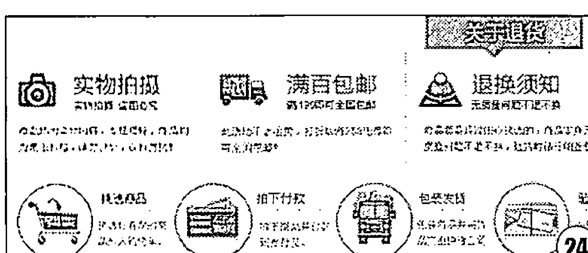

将多幅小图片风格统一的小技巧包括：添加一致的外围轮廓，如圆形、方形等；选用同样的图片样式，如圆角矩形、剪裁对角线等；处理为同样的色调，如全部处理为饱和度为0的图片也即灰度图片等；选用特色图片系，如PNG格式图标、简笔画图片等。

### 要点5: 通过色块实现区域再划分

多文本的页面可以充分利用色块来进一步实行页面的区域划分，这样能够使得每个部分之间的关系更加明显，且页面视觉冲击力更强。图25是对图23的进一步改造。容易看出，只是对文字部分添加了底部色块，去除了各部分之间的分割线，整个页面的视觉图版率就有了一定的上升效果。在选择色块颜色时，仍注意与图片的搭配，也即多选择图片中出现的颜色或其主色调的相近色。

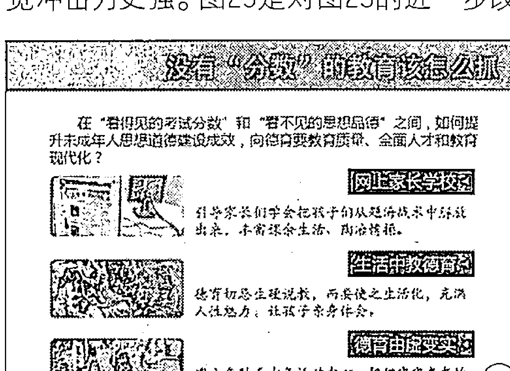

## 作品点评及附注说明

以国内某手机厂商宣传的PPT为例，图26~图34是其中部分PPT页面。由于是宣传型作品，因此页面设计中全图型与半图型的图文混排应用居多，而多文本的图文混排页面则相对较少。

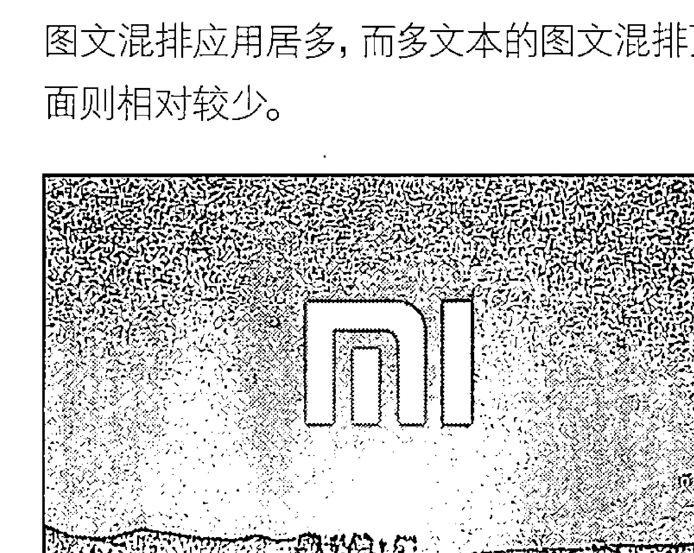

在示例中，图26~图29为全图型的图文混排。其中图26的背景图中本身存在大面积颜色较为一致的区域，因此可以直接将文字置于其上。图27、图28中的背景画面都比较纷杂，因此在添加文字时都使用了不透明的蒙版办法实现文字与图片的层次区分，并且在图28中作者还进一步对背景画面添加了半透明的黑色蒙版以突出前端文字，大幅降低了彩色背景对前端文字的冲击。

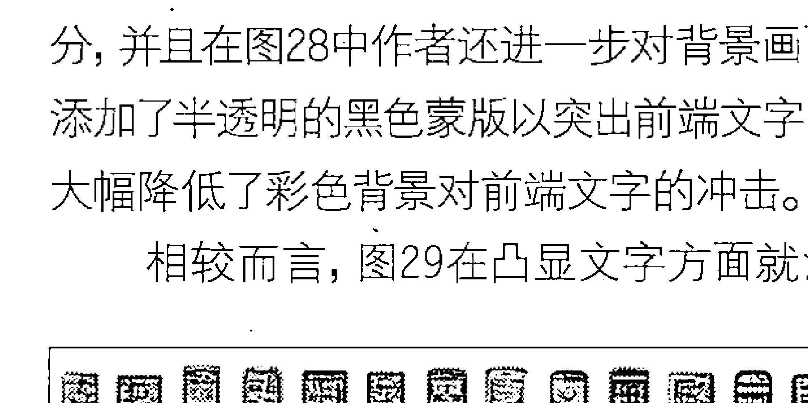

相较而言，图29在凸显文字方面就没有注意到这一点，其右上角的“射频测试”文字在页面中很难被快速发现，因为文字与图片色彩很相近，很容易被淹没在图片中。


图30~图32为半图型的图文混排。其中图30中，图片所占区域占据了页面三分之二的篇幅，因此视觉冲击力要更强一些。页面排版上直接将图片置于顶端做三边出血处理，下面文字区域则添加了橙色的背景色块。这个色块一方面与整个PPT贯穿前后的橙色区域形成一致性，另一方面也有效地保持了页面的平衡，否则若文字背景为白色区域则很容易让观众感觉头重脚轻。

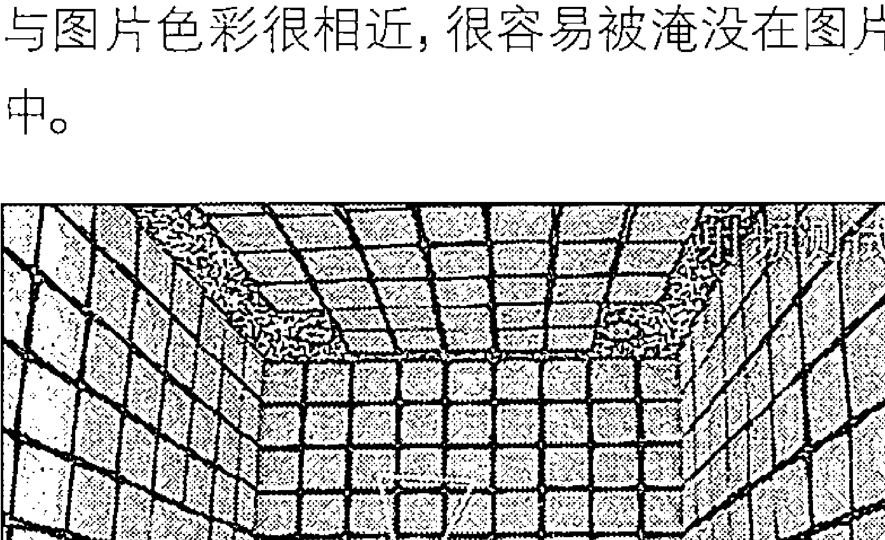

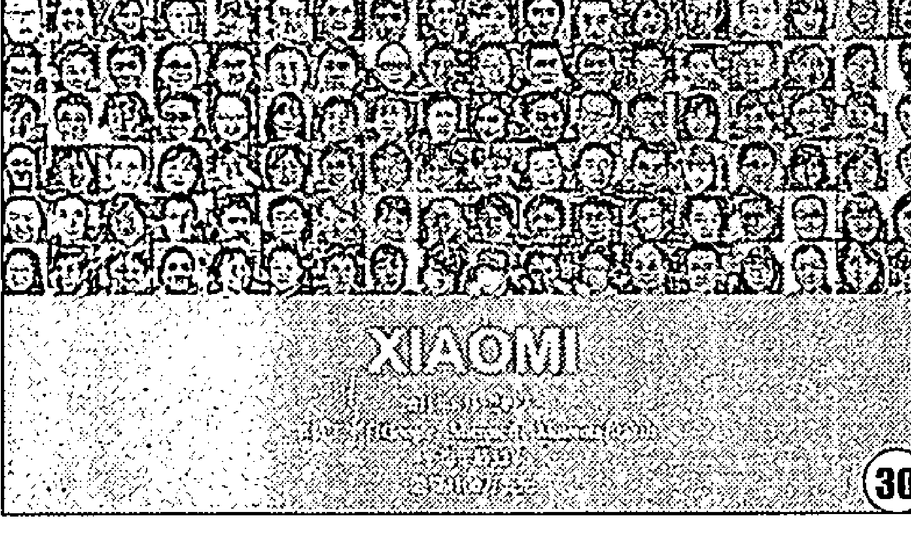

类似地，图31将图片置于左侧三边出血处理，页面平衡性和视觉冲击力都得到很好的保证。图32在选择图片时则选择了边界自由的PNG格式图片，美观性就有了大幅提高。

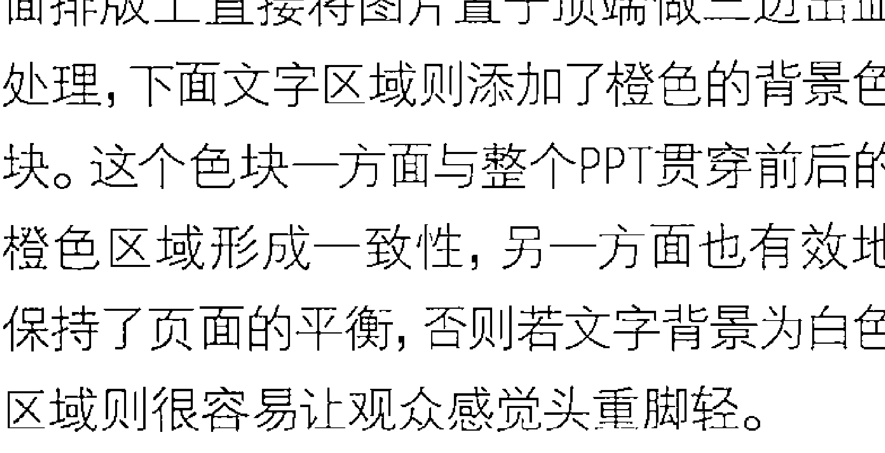

图33与图34为多文本的图文混排，这类图文混排页面在此PPT中运用较少。这种情形下图片更多的是起到点缀烘托的作用，例如图33中用图标型图片同时起到美化页面、烘托文本、兼表条目的作用。而在图34中图片的灰度效果更有利于文本成为页面中的主角，但因图片置于页面的右上方，而主要文本区域在页面左下方，因此页面的视觉冲击力有所降低，而图文混排中图片和文字的关系也直接影响到页面所要展现的主体。从一个完整的PPT作品角度而言，还需要特别注意前后页面应该保持一致性，以免整个PPT看起来仿佛拼凑之作。否则，即便每个页面都十分精美，就整体而言仍不能算上乘之作。那么，这就涉及到图文混排的一致与变化应该如何把握的问题。所谓图文混排的一致，是指不同页面上的内容安排风格相同。第一个层面是全部页面选择一种图文混排方式，例如全部是全图型图文混排模式或全部是半图型图文混排模式，选择何种模式很大程度上依赖于PPT主题的需要。第二个层面是图片与文字的风格保持一致，例如正文文字全部采用微软雅黑，插入图片全部选用圆角矩形样式等。第三个层面是细节上的一致，例如文本对齐方式、图标选用、图片色调等。所谓图文混排的变化，是指不同页面上的呈现方式虽相似，但也不宜一成不变。页面上保持变化才能充分调动观众的好奇心，但变化不宜是颠覆式的不同，一般都是位置上的变动，以免建立起来的认知模式被打破，使观众不能快速抓住要点。例如全图型图文混排时，文字的位置可以在页面范围内变动，半图型图文混排时，图文之间的相对位置可以不断变动。在此基础上，还可以按照不同层次的内容分别选用不同的混排模式。

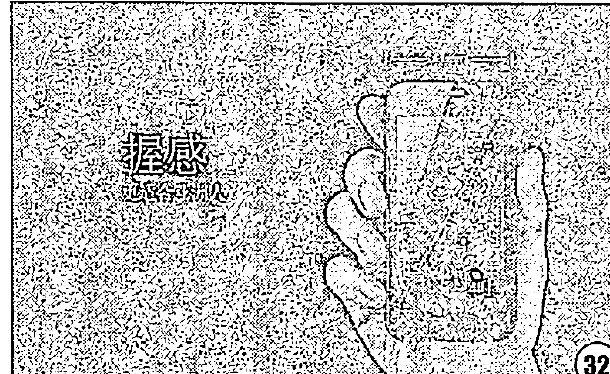

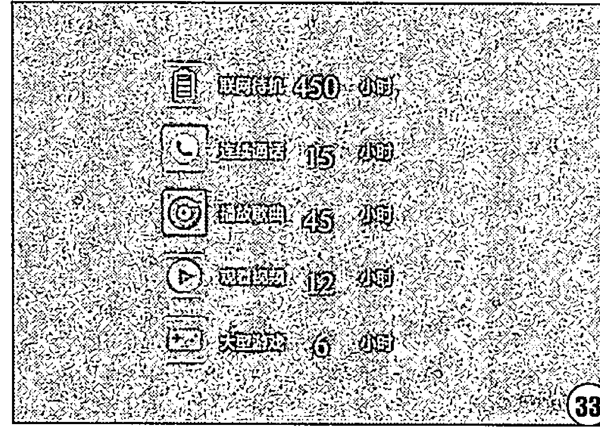

## 定制快乐 “e” 春节

相信我们都能感觉到，寄托着传统和文化的春节“味道”变得越来越清淡，那种烟花炮竹、年货新衣的兴奋感觉正在迅速消退，过年似乎成为了例行公事。并且IT科技对传统的冲击有目共睹，互联网与电子设备令沟通成本降低，祝福和拜年已经简略成了键盘上几个简单的符号。虽然“年味”正在消退，然而过节成本却与日俱增，春节对于很多人来讲就是“烧钱”。难道传统佳节的快乐仅仅是建立在物质的基础上吗？答案当然是否定的。钱多钱少都能快乐，关键在于怎么消费。

### 本地过年方案

- **关键词:** 性价比 升级 别犹豫不决

本地过年的群体大体分为两类人群。其中一类就是那些打算把全部预算都投入到IT设备的人群，预算通常比较充足，同时对娱乐应用还有着比较苛刻的需求；另外一类则是将一部分的预算投入到IT设备中，他们在选购时应该以够用为准则。尤其是在DIY领域，2012年22nm处理器很快就要问世了，显卡也将推出新品。所以千万别投入太多预算，也不要买太贵的硬件，否则花大价钱升级的电脑很快就会过时，绝对是一件得不偿失的事情。此外，由于春节期间很多实体商家都选择提前回家，所以要想用年终奖或者压岁钱购买IT设备，恐怕就只能通过B2C网购平台了。好在主流网购平台，例如京东（www.360buy.com）、新蛋（www.newegg.com.cn）、亚马逊（http://www.amazon.cn/）等等都支持货到付款，因此即便无法玩转支付宝和信用卡，也同样可以轻松体验到足不出户、送货上门的网购快感。另外，消费者在春节促销期间尽量不要左顾右看、犹豫不决，确定自己的需求，尽快下手，性价比才是硬道理。

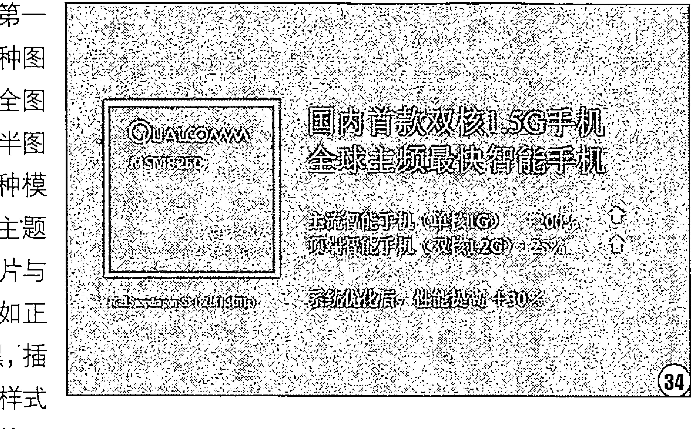

设计中有一条共识是，任何规则都是可以打破的。只要打破得巧妙，就是一种创新。例如我们前面提到前后一致中要注意图片色调保持一致，例如都处理成灰度图片，但有时色彩斑斓也是一种风格，每一页都换用一种主题颜色，在整体上而言，不存在统一的主色调。看了这么多，不知道你有什么更好的想法，不如拿起鼠标做一下，与笔者分享吧。

策划《电脑爱好者》编辑部
监制 书童
撰稿 沈栋 陈腊梅


## 整机定制方案

### 预算充足消费群体

目前，笔记本已经不再是台式机的附属品，很多电脑用户购买笔记本实际上就是为了替代台式机来满足日常应用的。有鉴于此，这类群体在选购笔记本时应该特别注重显卡。目前来看，GT550M显卡可以说是性价比最好的游戏笔记本配置。相比GT540M显卡来说，不但流处理器数量从96个提升至144个，而且显存容量也从1GB提升至2GB。

至于处理器方面，则应该考虑i3和i5这两种主流处理器。由于除了二级缓存容量翻倍之外，i5处理器在特殊技术方面也更有优势。以Core i3 2330M和Core i5 2410M这两款最主流的双核处理器为例。前者具备了3MB三级缓存和2.2GHz主频，但却并不支持睿频加速技术。后者则具备了6MB三级缓存和2.4GHz主频，并可睿频加速至3.0GHz。因此在多任务和高负载环境下，i5处理器拥有了十分明显的性能优势。综上所述，我们建议最好购买i5机型。在这里，京东报价仅为5399元的联想Y470N-IFI其实就是很好的选择。作为经典“小Y”的第三代代表之作，联想Y470N-IFI采用了性能更强大的GT550M显卡和酷睿i5-2430M，显存容量也从1GB提升至2GB，内存和硬盘的容量则达到了4GB和750GB。并且由于采用了仿跑车的流线型设计，因此外观绝对够酷够炫，同时还配备了比拟桌面音响的JBL音箱。

### 预算有限消费群体

无独有偶，这类群体在购买笔记本的时候也是为了替代台式机来满足日常应用的，但是并不以玩大型3D游戏为目标，因此我们推荐一些性价比超高的机型。当然，也要将普通游戏性能考虑在内，所以要选择配备AMD显示卡的笔记本，毕竟配备NVIDIA显卡的机型都偏贵。

应该说HD6630M显卡是目前大多数笔记本的标配，游戏性能不错，应付一般游戏绰绰有余。这其中比较优秀的机型是戴尔Inspiron 14R，目前京东销售的黑色版本由于只剩400台，因此近期特价只有3799元，红色和蓝色则仍旧保持3999元的售价不变。为了降低成本，这款笔记本还采用了酷睿i3-2310M、2GB内存以及500GB硬盘，因此售价可以顺利控制在4000元以内。

## 游戏定制方案（DIY）

### 预算充足消费群体（显卡）

游戏无疑是度过长假的最好工具，而能否快乐惬意往往取决于一块好显卡。并且在整个DIY定制方案中，我们只建议升级，而不建议重新攒机。由于目前SandyBridge-F处理器价格未定，X79主板价格高居不下，并且2012年22纳米的Ivy Bridge处理器蓄势待发，一切局势还不明朗，春节前后绝非重新攒机的好时段。如果主板和CPU暂不作考虑，那么显卡和内存无疑成为决定游戏品质的两个关键，接下来我们给您一一道来。

目前来看，衡量显卡性能最重要的参数就是流处理器数量的多寡。也正是因为如此，挑选显卡时，往往还会在意每一个流处理器单价究竟是多少。虽然这种计算方式并不是很严谨，因为还有其它参数决定了显卡的性能表现。不过话又说回来，这仍然是一种比较科学的性价比计算方式。

另外需要特别注意的是，考虑到刚刚推出的《战地3》和《极品飞车16》这两款游戏大作都采用了“寒霜2”游戏引擎，并且都针对NVIDIA显卡进行了优化，所以在选购显卡时，还是应该考虑NVIDIA显卡。在目前NVIDIA显卡当中，采用了GF114核心的新版GTX460显卡。由于其流处理器数量高达336个，但售价却只有950元左右，因此其流处理器单价只有2.82738元/个，性价比不但明显超过了同门的GT550Ti和GTX560，而且还超越了A卡阵营相同价位的HD6790显卡。

在这里，自然要推荐影驰GTX460虎将版，京东报价只有939元。这是目前市场上最廉价的新版GTX460显卡，采用了全新的GF114核心，相比GTX550Ti也只是贵了200元而已。出厂频率高达778MHz/4008MHz，显存规格则为1GB/192bit。唯一的遗憾是，这款显卡只采用了常规散热器，并没有采用热管散热器。对于喜欢长时间运行游戏的玩家来说，不能不说是一种遗憾。如果喜欢热管散热器的话，则可考虑映众旗下的新版GTX460显卡，不过售价则要略贵一些，售价达到了988元。

### 预算有限消费群体（显卡）

对预算不多的消费群体来说，A卡才是最佳的超值之选。根据简单计算可以得知，市场上最不超值的低端AMD显示卡竟然是入门的HD6450，其流处理器数量只有160个，而售价高达300元左右，因此流处理器高达1.875元/个。而相对来说，最超值的则是平均售价只有550元的HD6750显卡，流处理器单价只有0.6944元/个，性价比优势非常明显。

### 预算充足消费群体（显卡）

在这里，盈通R6750-HM1024GD5 T1极速版这款显卡其实就是最好的选择。目前京东报价仅为499元，采用了大尺寸的温控调速风扇，因此静音和散热都可以得到保证。再加上所采用的GDDR5高速显存以及不到500元的售价，所以十分适合于注重性价比的游戏玩家购买。更为重要的是，这款显卡的显存频率也从公版的4000MHz提升至4600MHz，因此游戏性能进一步获得提升。

除此之外，如果追求一线板卡厂商的话，也可考虑微星旗下的HD6750显卡，最新报价也不过是569元而已，售价也仅比二线厂商贵了不到百元。

### 预算充足消费群体（内存）

春节前后选择给电脑升级内存，4GB的DDR3内存无疑是最佳选择，因为这款内存降价降得有些离谱了。其总容量上与双条2GB内存相当，但是由于省去了一个PCB板的成本，所以降价更为猛烈。所以说即便选择双通道8GB（4GB×2）也并不算奢侈，没准儿日后内存价格反弹时，还可依靠多买的一条内存投资获益呢！尤其是在频率选择时，一定要是DDR3 1600才行，而且还必须附带金属散热片。

芝奇RipjawsX 4GB DDR3 1600双条套装，其实就是相当超值的选择。本周的京东报价仅为279元，折合下来的单条4GB售价还不到140元。虽然不是零售渠道的知名品牌，但芝奇却在网购平台以性价比而著称。红色插齿型散热片外观靓丽，散热也比裸条更有保障。内存时序也达到了9-9-9-24，超频性能更为优秀。

### 预算有限消费群体（内存）

单条4GB DDR3 1333内存就已经够用了，并且由于内存的频率不高，所以发热量也不大，因此也无需苛求金属散热片。不过话又说回来，虽然预算不是很多，但品质却一定要保证。作为名牌大厂的内存产品，金士顿ValueRAM 4GB DDR3 1333单条本周的售价为129元，仅比二三线厂商贵了10元。再加上兼容性有口皆碑，因此购买价值相当不错。况且还是终身保质的售后承诺，所以购买之后还是相当放心的。

## 影音定制方案 (DIY)

这里我们介绍的并不是HTPC机箱或者显示卡、CPU之类的配件，而是硬盘和显示器。可能各位有些奇怪，要说显示器还说的过去，而硬盘和影音似乎扯不上关系。其实不然，硬盘从来都是影音方案中最重要的环节，只不过经常被人忽略。我们上面推荐的无论是整机还是DIY攒机方案，都能够轻松搞定1080P视频，试问如果没有一个庞大的存储空间，如何容纳如此海量的影音文件呢？

### 预算充足消费群体（显示器）

与许多IT设备2012年才推出新技术有所不同的是，显示器领域在2011年下半年就推出了全新的IPS+LED技术组合。从目前来看，IPS+LED这两种技术已经开始逐渐地融为一体，各大厂商都在陆续推出同时具备了两种技术的显示器产品。这样一来，普通的家用显示器也开始具备广视角(178度)、真色彩(16.7M)以及低碳环保(不含Hg的背光技术)。再加面板厂商的降价努力，两种技术所实现的“黄金组合”，实际上已经走入寻常百姓家，十分适合于本地过年的群体在升级时购买。

目前来看，IPS+LED显示器主要有23英寸和21.5英寸这两种。我们认为23英寸的显示器自然就是最佳选择。不但“面子”上足够大，而且还可以经常多人共同观看，标准分辨率下也不会出现小尺寸显示器所带来的“蚂蚁字体”问题。

在这里，推荐华硕ML239H-C这款显示器。虽然不是同类产品的最低价，但却采用了数码相框般的精美设计。再配合华硕卓越的品质保证和新一代HDMI高清接口，使其拥有了独树一帜的产品卖点。而其售价也在近期跌破1200元关口，京东报价仅为1199元，十分适合于追求外观的消费者购买。

### 预算有限消费群体（显示器）

对于这个群体来说，而是21.5英寸的IPS+LED显示器更为适合。不但售价已经普遍低于1000元，而且“面子”上只是略小一些，但是售价却要比23英寸便宜了很多。

在这里，推荐飞利浦227E3QPHSU这款显示器。虽然不是同类产品的市场最低价，相比AOC的同类产品贵了10元，京东最新报价仅为979元，但却提供了HDMI高清接口。除此之外，半透明的蓝色边框再加上黑色光泽表面，也给人以唯美时尚的视觉感受。

### 预算充足消费群体（硬盘）

由于前段时间泰国发水灾，所以硬盘报价飙升。西部数据泰国的厂房恢复到洪水来临之前的水平大概需要一年。凭借这一消息，1TB硬盘价格飙升。所以应该避开涨价最猛的1TB硬盘“重灾区”，最好选择2TB硬盘。

这里推荐西数绿盘WD20EARX，容量高达2TB，本周的新蛋报价仅为939元，相比大多数1TB硬盘只是贵了100多元。而且还采用了6Gbps的最新数据接口，因此性价比还算不错。

### 预算有限消费群体（硬盘）

目前来说，对于预算有限的消费群体我们有两种建议：

- 1. 先买一块小容量硬盘，例如希捷ST500DM002，500GB容量，本周的京东报价为529元。虽然容量不大，但却采用了6Gbps的最新数据接口，因此性能上绝不含糊。
- 2. 如果对全高清视频有执着追求且预算有限的用户，目前最好的选择是不买，春节以后再做选择。

以上我们的方案是专门为本地过春节群体定制的，尤其为留守本地的外乡人在春节期间打造一套自娱自乐的方案。后者由于种种原因不能回家过年，本地的朋友大多与亲戚团聚，异乡新春佳节平添的那种孤寂不是本地“土著”所能理解的。游戏影音或者DIY升级无疑是节目中排解寂寞的最佳途径，无需花费太多预算，简单选购以及合理配置，再加上一点点细心，就能够让春节长假充实快乐起来。

## 春运回家方案

关键词：三个游子 两种心态 一份快乐

“春运”被誉为人类历史上规模最大的、周期性的人类大迁徙。在40天左右的时间里，将有20多亿人次的人口流动，占世界人口的1/3。与其无目的的采访，不如找身边熟悉的人面谈，本刊编辑选择了三位熟悉的朋友和同学，他们都要在春节回家过年，面对近似恐怖的“春运”，他们是如何快乐回家的呢？

刘红育
男
33岁
北京某五星级酒店前厅部经理
月收入：5200元
家住云南一个城市，每年春节对于他来说都是一个煎熬，不但票难买，而且舟车劳顿，痛苦不堪。尤其前两年在北京成家买房，对于回乡更提不起兴趣，如果不是父母故土难离，他甚至希望五年或时间更长回一次较好。

每逢春节，他的口头禅就是“飞机太贵，火车太累”。而今年回家又提上了日程，他倒是很主动地和本刊编辑咨询数码产品，也没有了往年那种愁眉苦脸的表情。今年他成为了不折不扣的Android“粉丝”，无论是手机还是平板电脑，只要安装了这个系统，他都能够把玩很长时间。但是由于年底奖金要给父母一些，且还要置办些年货，所以购买数码产品的预算仅仅为1000元以内。并且他还希望屏幕大一些，影音解码要给力，需求非常主流。

其实符合刘红育要求的数码产品在市场上并不少见，但是如果考虑到售后服务水准和春节促销等因素，那么就凤毛麟角了。应该说昂达7英寸A10平板V10豪华版比较适合，相对于售价1000元的联想A1平板电脑(2GB)，这款产品目前价格仅为599元(8GB)。能够播放2160P超全高清视频，续航能力超强(音乐播放35小时左右，视频播放8小时左右，上网6小时左右，游戏5小时左右)。

之所以为刘红育推荐这款产品，最主要原因是其需求很理性，他买平板电脑是作为智能手机的“替补队员”。两款移动设备配合，足以让他沉浸在游戏和影音之中，不知不觉到达目的地。

刘蕊欣
女
26岁
某公关公司媒介总监
月收入：11000元
和刘红育一样，刘蕊欣的家在武汉，对于回家的心态都是一样的，可以说一提到春节回家她就焦躁。她家住在汉口的郊区，从北京坐飞机倒是方便，然而从机场坐出租车还要过江，错过了时间只能坐船，非常不方便。所以只能选择火车，到汉口站打车回家就相对方便多了。

## 春节消费指南

车回家。两地路程不远，选择动车朝发夕至，但是枯坐到家也是一种煎熬。由于新交了男友，她开始逐渐注意到智能手机的重要性，除了电话功能，还可以随时随地和男友通过微信语音通话和QQ联络感情。

她希望在自己回武汉之前购置一部智能手机，价格无所谓，关键是续航能力强、好玩并且时尚。刘大小姐的要求本刊编辑自然不敢怠慢，所推荐的手机是HTC G18，一部4.3英寸的智能手机。或许很多人觉得对于女孩子来说，此手机有点偏大，其实不然。我们不能仅仅考虑到在火车上的这段时间，而且还要考虑到今后她在工作中的应用，对于电子名片收录、联系人查找、头像设置等等，大屏幕更加清楚且直观。

另外这款手机的摄像头拥有800万像素，可以在旅途中将心情好的笑脸拍下来发给男友，或者将各地旅客回家过年的各种表情上传到微博上，何乐而不为呢？

客观来说，HTC G18应该归类为娱乐手机，预装了Android 2.3，配备了高通MSM8260双核1.5GHz处理器，并且电池容量达到了惊人的1730mAh，影音娱乐一应俱全，简直是居家旅行、工作偷懒的必备利器。其售价3199元对于刘蕊欣这个收入阶层来说，显然压力不大。

狂热的嘻哈音乐发烧友，喜欢Jay-Z和亚瑟小子，每天都要聆听几段。王少宾老家在邯郸，此次回家的路程并不远，只不过由于工作原因，可能随时会有客户来电咨询事务和随时发邮件，因为手机要保证一定电力。习惯于用手机听音乐的他希望买一款价格不贵的MP3，能够长时间播放音乐，且音质适中。另外，他还有一个打算，就是这次回去不再俗套地给那些小侄子、小外甥压岁钱，而是送一些设计精美的数码产品，现在孩子对这些东西尤为喜好。

这种需求选苹果的iPod shuffle再好不过了，不但产品本身小巧玲珑（29 毫米×31.6 毫米×8.7 毫米），而且设计精美，还有5种颜色可选。这款MP3能够连续播放15小时音乐，对于少宗路上听音乐来说绰绰有余。其2GB的容量能够容纳上百首高品质MP3音乐文件，满足大多数音乐爱好者的需求。更为重要的是，iPod shuffle出自苹果，其品牌魅力和外观设计都令人无法抗拒，用它作为佳节馈赠礼品绝对是上策。以王少宗的收入，多买几个售价368元的iPod shuffle绝对不是问题。

应该说春节“味道”淡了，并不代表亲情和友谊淡了，而是我们的生活方式变了，传统形式已经不再适合如今快节奏的生活。但是应该肯定一点，合家团圆、共聚天伦、守岁串门依然是我们中国人过春节的精髓。只不过现在融入了各种IT科技产品，它们的作用永远是锦上添花，而绝不可能替代我们传统的风俗习惯。节日中如何选购IT产品成为了每年必谈的话题，然而每年都有人为此怄气、后悔，看来正确的消费并不容易。

## 优惠不易 “陷阱” 长存

正所谓“年年岁岁花常在，岁岁年年人不同”，有的时候连我们都有些纳闷，为什么并不高明的骗术，却每年都能够坑害无数消费者呢？原因不外乎是贪便宜，虽然这么说有些生硬，但却是实话。春节前夕，手机中最常见的短信就是“某某站新年狂促，满XX百元送某某礼”，不否认有些正规网络商城做这些促销活动，但是多数是一些不知名网站，由于优惠和礼品价值的诱惑，很多消费者纷纷在春节前夕“中招”。

这类骗术简单的近乎于弱智，骗子们自己弄个购物网站，物品标价比实体店便宜很多，但也在合理范畴之内，不像昔日那种动辄就优惠一半的招数，这点不得不说骗子们也在不断更新理念，将骗局做得更加逼真。一旦付款，网站就以春节期间快递会延误等理由，拖延发货时间，当资金累计到一定程度，将网址更换，修改各种联系方式，轻松达到行骗目的。

应该说这类手段再逼真，破绽也是明显的，例如一款3699元的苹果iPad，如果购物网站标价只有2999元，且数量很多，显然是不合理的。权且不说苹果公司从来没有这种优惠，就算一款其他品牌的平板电脑，也不可能在没有任何附加条件的情况下骤降700元。因为每个品牌都有不同价位的产品主打一片市场，如果其中一款产品降价幅度如此之大，就很可能冲击其另外一款低价市场产品，这种自己打自己的局面是厂商绝对不允许出现的，只要是正规经销商就不会如此莽撞地降价，这意味着和厂商合作关系破裂。

另外，一些消费者非常希望年底得到些实惠，轻易相信骗子们给予的优惠承诺，但是有些优惠和礼品过于虚假了，如果网站馈赠的礼品价值与消费者购买商品的价值相差无几，这能是真的吗？所以我们建议消费者一定要在正规购物网站上消费，即使出现缺货和预定的情况，也希望能够耐心等待，不要在不知名的购物网站轻易下单。其实快乐与不快乐就取决于您的一念之间。

### 团购需谨慎 实货慢付款

众所周知，2011年是团购网集体“悲剧”的一年，烧钱与回报不成比例，还没有几个团购网敢于公开表示自己盈利的。而众多中小型团购网站倒闭或“卷包”的现象在2011年层出不穷，根据以往经验；大型节假日是中小型团购网站要伎俩的多发期。与上面说到的行骗网站不同的是，很多小型团购网站都还属于正规范畴，只不过到后期因为资金链断裂，不得不走一步下下策。消费者团购了数码产品或者其他服务型产品，没等兑现，团购网倒闭，追款无门，徒增烦恼。

春节期间我们建议团购需谨慎，最好不要参加不知名团购网站的活动，即使之前有过团购成功经历，也不要再年底轻率参与和付款。

相对于网络，IT实体卖场中更容易出现令人堵心的事情。本刊编辑的一位好友许先生在去年春节前夕吃了一次亏，他一次性在中关村电子市场一个熟人的柜台定了7台高清播放机，用于送亲戚朋友，合计付款1万元左右。但他没有想到在取货的时候那个熟人早就人去楼空，报警后才得知，这个所谓的熟人不但把他的钱骗走，同时还预拿了很多柜台的货没付钱，算起来他的损失还是最小的。

对于这类事，警方也表示无奈。一般情况下是柜台经销商由于经营不善，早就萌生去意，提前做好了一些准备，并且同时以搭配出货等手段从周围熟悉的经销商手中提一些贵重配件；并且对平日经常购物的老客户的需求也不拒绝，唯一要求就是以春节不压货为由，令老客户提前付全款或者一部分款项，万事俱备，一走了之。许先生属于后者，因为这类商家平日信誉和为人都还不错，所以才轻信付款。

对此，我们建议有类似许先生需求的消费者一定要注意，春节前是这类事情的多发期。由于目前网购普及，中关村这类实体卖场生意日渐清淡，二三线经销商转型的转型，离去的离去，不少人心有不甘，有点歪心眼也不稀奇。选择春节购买IT产品送礼的消费者最好是在卖场钱货当面交易，如果对方提出预支一部分货款或者全部付清订货，应该谨慎对待，货没看到，荷包一定锁紧。

### 摆正心态 勿要草木皆兵

虽然不管是网购还是实体店消费都难免遇到“陷阱”，然而消费者也不用草木皆兵。消费的偏差源自心态，而非他人所致。就如同上面所描述的事例，无外乎是消费者被牵着鼻子走，卖家抓住了某一种消费心理加以利用，导致其最终上当受骗。

我们当然是建议理性消费，这不仅仅是一个词汇，而是一种正确的需求。举个简单的例子，如果手里1000元的预算，心中却有苹果iPad的需求，最终消费能成功吗？或者勉强买到的产品能给自己带来快乐吗？

春节期间各大厂商寒促和酬宾基本已经展开，而且各大著名团购网站和厂商官方淘宝店均已展开活动，在这类网站上消费最靠谱，且出现纠纷也能及时得到解决。并且我们推荐消费者尽量在春节期间网购，因为春节前夕IT卖场实体店经销商也都纷纷回家过年，可选择余地不大。当然，在众多正规网购平台和厂商官方淘宝店上也不乏“掺水”的促销内容，不过相对于那些不知名或杂牌网站的购物活动，其保险系数要远远高出预期。

### 快乐春节与金钱无关

说到这里，本期的专题已经到了尾声。其实IT产品对于消费者来说年年都一样，无非是升级了配置，融入了新技术，我们想表达的仅仅是消费理念和一个观点。还是那句话，无论是实体卖场还是网络购物，错不在产品，而是我们消费理念有偏差。无论是买到不合适的IT产品还是遭遇骗局，我们自身也要负一定责任，这个观点在以往可能不会这么鲜明，然而在这个专题中想强调一下。我们并不想去讨论骗子伎俩多狡猾、行径如何龌龊，而是要检讨自身的原因。

在专题中出现的选购案例和需求从不同方面验证了花钱多少其实与快乐无关，只要能够准确把握自己对IT产品的需求，几百元也能过一个很惬意的春节。春节消费很正常，但是要理性选择够用和性价比产品。寒假和春节促销战已经打响，各位朋友们，还等什么呢？

今天，越来越多的人选择在网上找对象，这种方式免去了传统相亲过程中见面的尴尬，有海量的信息可选，从一定意义上说提高了效率。难怪很多人都把这种方式称作“淘”爱情，甚至说成是从网上下载个丈夫（妻子）。

## 玩转婚恋网站

然而，令人苦闷的是，周边有很多朋友在注册了婚恋交友网后依然没能找到另一半，原因有很多，但是从我们开始要在网上征婚时每一步都有讲究，比如如何写征婚帖、如何挑选相片、如何发邮件、如何做见面前的准备……本期特别话题将带你走近这场爱情马拉松的互联网起点。

### 前提篇

从27岁起，小鱼儿就打算告别单身，不幸的是到了今天，她成了名副其实的“剩女”。

这几年，家人朋友同事频繁帮她介绍对象，可就是没有合适的。小鱼儿还是个宅女，平时除了上班、下班，几乎没有什么交际圈子。

她听说通过婚恋交友网找对象挺流行的，就动了这心思。于是，到了网上搜索，没想到尽看到骗钱、骗色、骗感情的负面报道，心里先打了退堂鼓。父母知道了实情后，给她找了个在某婚恋交友网站工作的“红娘”，她的网名叫躲猫猫。

就这样，在某个周末，小鱼儿去拜访躲猫猫，对于婚恋交友网站她有太多的疑问，凑巧的是，有位叫大圣的网友也在躲猫猫那儿，不过，与小鱼儿相比，大圣可是在婚恋交友网上注册了两年多了，他仍然没有找到对象。他们的对话开始了。

#### 网络征婚安全吗

小鱼儿：前两天我想了解婚恋交友网站的情况，用搜索引擎一搜，看到的那些骗局让人震惊，对于我现在的情况而言，又没有别的途径扩大交往面，对婚恋网站是信还是不信？

躲猫猫：网络征婚其实是个新生事物，尤其是这几年很火爆，有些人也利用这个平台开始诈骗，但毕竟不是主流。当初电话刚出现的时候，方便了欧洲贵族的偷情，就有人建议废除电话，幸好没有废除，要不然今天大家的联络多不方便啊。

大圣：婚恋交友网站还是有不少优点的，比如成本低，信息量大，可以不断地重复，即使失败了也不会在朋友面前留下不好的印象。

躲猫猫：网络相亲还改变了交友的整个流程，首先在网上进行挑选，然后进行电子邮件来往，想进一步了解就加上QQ、MSN聊天，合适了再从虚拟进入到现实。传统的方式可得制造些机会才能认识，进而才有进一步交往的可能，从了解阶段开始就离不开现实场景。

小鱼儿：其实一上来就跟一陌生人见面还是挺尴尬的，好多话又不太好意思敞开了说，但又必须了解，唉……

躲猫猫：所以从一定程度上来说，网络征婚可以先从网络聊天阶段进行初步了解，了解对方的喜好，见面了可以很快地找到共同点。当然不是每次见面都成功，传统的方式如果你总是失败，还挺没面子的，在互联网上就不存在这问题了，不成功没有多少负担。

小鱼儿：那老师的意思是网络相亲还是比较安全的？

躲猫猫：也不尽然。网络相亲的渠道很多，有论坛、婚恋交友网站、社区等形式，如果要增加安全感，建议你去一些正规的婚恋交友网，像世纪佳缘、珍爱、百合等等……但是这些网站毕竟是商业机构，如果你要提高成功率，就要从普通会员上升为钻石会员，也就是交费才能够得到更好的服务。

大圣：一旦选择婚恋交友网站寻找对象，更多的时间就放在筛选对象、发邮件上面，而且还要向对方不厌其烦地解释你是什么样的人，你有什么择偶条件。

### 入门篇

#### 注册资料越详细越好

小鱼儿：打开这些网站，都是需要注册的，注册的时候应该注意什么问题？

躲猫猫：现在的婚恋交友网站都要一些个人信息，如实填写比较好，而且越详细越好，根据你的资料，网站会自动匹配人选，以便你进一步了解。

小鱼儿：一些婚恋网站除了要求填写身高、学历、月薪和婚姻状况外，还有体重、所在公司类型、兴趣爱好等，这些都需要填写清楚吗？

躲猫猫：当然了，如果填写的资料很详细的话，对方很容易就找到谈话的话题，还能够清楚地了解你，这样，网站在做自动匹配的时候，几率也就更高。另外，有些婚恋网站上还要求你开通博客，这也是个很不错的展现自己的机会。

小鱼儿：婚恋网站上开通的博客和普通博客有什么不同吗？

躲猫猫：有很大的不同，普通博客你可以随意写作，但在婚恋交友网上开通的博客的功能是为了展现自己的另一面，而且应当以突出自身优点为主，比如你对感情的态度、对爱情的期盼，生活中你喜爱做点美食、做点瑜伽什么的都可以往上面写，这样别人看了你的博客后，会觉得你是个对生活积极乐观的人。

大圣：我注册的网站还有性格测试。

躲猫猫：是的，性格测试可以给对方了解你的性格提供一个科学依据。还有些网站要求实名认证，建议都去认证下，可提高自身资料的真实性，也表明你征婚的诚意。

大圣：嗯，这样信息会更精确，缩小筛选的范围，其实在网络给你带来海量信息的同时，你会发现，选择也是件痛苦的事情。

躲猫猫：要相信这点：真正中意你的人无论你怎么限制条件都不是问题。

大圣：现在有些女孩特别看中男方的经济条件，我们在填写这方面的资料时，是如实地写自己只有几千元的收入、无车无房好呢，还是夸张些？

躲猫猫：我的建议是基本资料要保证绝对真实，比如婚姻状况、有无房子、身高等，这些最好不要作假，否则真的会浪费自己和别人的时间。

大圣：那收入可以夸张些吗？

躲猫猫：这是一个可以适度夸张的方面，例如你的收入在8000元，填写资料时，你可以选择8000~10000元，但绝不能选择20000元以上；体型有些偏胖，可以稍微填得小些……

小鱼儿：原来是这样，那在描述自己需要的另一半时，该怎么样写呢？

躲猫猫：当然是越清楚越好，现在的婚恋网站都提供一些“填空式”的描述，比如我心中的TA是个什么样的人，如果你对此还觉得不够，就在自我介绍里另起一段进行描述，详细到你希望的对象是什么样的性格，有什么样的家庭背景……

躲猫猫：对于择偶对象的描述还有个问题需要注意，有些人一上来对自己想找什么样的人心里也不明确，过了一段时间后才知道，哦，原来我想要的是这样的人。这时，表述上就会越来越清楚和明确，所以，对于择偶对象的描述，要不断地完善。

#### 好照片提高成功率

大圣：在注册的过程中还需要提交个人照片，我当时提交的时候还是挺纠结的，一方面觉得没有隐私，另一方面不太适应这种方式。

躲猫猫：提交照片是非常有必要的。美国有个心理学家进行过一个调查，在婚恋交友网站上，有90%以上的男性期望看到对方的照片，而女性想看到男性照片的比例也达到70%以上。

小鱼儿：那看来我也要准备好一张漂亮的照片了。

躲猫猫：是啊，在网络相亲中，照片是最重要的因素，错误的照片将会剥夺你结识好男人的一切机会！你需要提供那种能够突出个人优点的照片。

（接上文）不清你到底长什么样子。要么就是太正式，正式到做作的程度，比如有人会放一张在影楼里的写真，一是不真实，照片处理后会比本人好看；二是给人做作的感觉，就算是选择在影楼拍照片，也一定要请摄影师拍摄到最自然的效果。

小鱼儿：那该选择什么样的照片啊？

躲猫猫：自然最好，你拍照片时得特别注意，一般我建议刚注册资料的朋友们去拍照片时应该注意这两点：

1.  挺胸别驼背。收缩小腹可能会使人不自觉地弯腰驼背，这样拍出来的照片很没精神，要特别注意。
2.  不要用手挤压脸部。手放在脸部，可以起到修饰脸部先天不足的作用，但手不要挤压到脸部，以免造成脸部变形。

#### 个人介绍突出个人兴趣

小鱼儿：哦，原来照片有这么多讲究啊。刚才你也讲了，提交个人信息要尽量详细，是不是各个方面都要说到？

躲猫猫：你的个人资料应该反映出你的爱好和兴趣，同时最好表达出你对一些事物的观点和感受。避免谈论宗教、政治和性。

你可以描述一些最近发生的对你很有意义的一些活动，或是新近上映的让你产生某种感想的影片。语言要自然、亲切、真诚，要有幽默感。

千万不要从网上拷贝一首诗放在那里，那些追求网恋的人早已发觉网络自身的虚拟性往往会让白忙碌一场。

所以，你必须要通过翔实、生动的个人资料自我推荐，表现出你和他们有某种共同的价值观和兴趣。

大圣：现在的婚恋交友网站也有一些自动生成的个人介绍，比如第一个选项就是业余时间的兴趣爱好，第二个选项是期望的生活，等等。等你提交完成以后，网站会自动生成一篇个人介绍。

躲猫猫：如果有时间，还是自己写觉得真诚些，而且写得比较有特色也能吸引更多的人点击。

#### 个人介绍案例

##### 男人版：

1.  独立经营企业，每年约1000万营业额，已购住房，有车。踏实稳重，并不失青春气息。爱好旅游和摄影。目前在资助贫困失学儿童5名。希望明年合适的时间能在西部某省建一所希望小学，期待能在这里和你相遇。
    点评：如果实在不知道怎么写，就写些突出自己优点的大实话，虽然不够婉转，但是好歹以最快的速度突出自己有经济实力、成熟稳重的优点，毕竟征婚不是写作文，征婚好比打仗，你有优点就要说出来。

2.  做事积极主动，为人恬淡随和，信奉“君子惠而不费，劳而无怨，欲而不贪，泰而不骄，威而不猛”。对待感情同样如此，既真诚坚定，又相信缘分。虽有“愿得一人心，白首不相离”的期待，但也相信“有缘千里来相会，无缘对面手难牵”。

    个人情况：孑身一人漂泊北京10余年，转眼已过而立，现任某报社主编，孤身在外这么多年，经历过生活的艰辛，承受过事业的挫折。抱怨过、迷茫过、心浮气躁过、失落过，不过现在依然乐观向上，积极豁达，依然一颗真心示人，没有心眼，不喜算计，相信好人有好报，傻人有傻福。
    花花世界熏染多年，心态反而越来越平和；喜欢平平淡淡，简简单单，却也梦想有朝一日轰轰烈烈，建功立业。“达，则兼济天下；穷，则独善其身”聊以自慰。

    点评：这则介绍写得不是面面俱到，却也把自身的优点突出了，尤其是作为男士，将自己丰富的个人经历写出来，会显得成熟稳重。
    此外，这则介绍虽写出了磨难，却也表现出了对生活的乐观态度。每个人都希望自己的另一半有活力、有斗志、有闯劲，不要在帖中表现出郁闷、生活压力、多愁善感等。

##### 女人版：

1.  白驹过隙，负了倾城，葬了年华，当感慨时间流逝时，也突然从内心感觉到了一种孤独，漂得久了，想停下来找到一份归属，希望在这里对的时间里找到对的人。我是个普普通通的女孩，也只是希望有个普普通通的你，一起相扶到老，不离不弃。

    点评：这个帖子写得很有文采，在网络这个平台上，大家都是平等的。你有权利在你的贴子上写出你的要求、你的期望。

2.  生长在江南水乡，改不了南方人的温柔与包容。在北京从事医疗行业，医生。
    选择了医学，就是选择了长时间的念书。医学生学习任务重，工作压力也大，平时无暇顾及自己的终身大事。很多人都错过了，很多事情都耽误了。现在想来，这么多年来在校园里面和医院里面，勤勤恳恳，学习上收获很多，却错过了青春，错过了青春的懵懂与羞涩。突然间发现自己已然快进入剩女行列了，后悔莫及！
    现在工作单位地处偏僻，工作较忙，更是无法在生活中解决。希望网络能带给我好运，我也相信我的一切付出终会有回报。
    我现在从事的工作，在医学里面也算是朝阳产业了，以后收入不低，会高于其他科室。
    对于未来，希望我的另一半能陪我在中国的大城市生活，不一定非得在北京生活，当然在北京生活是好事（朋友圈在这儿）。
    父母在老家做生意，弟弟从事建筑设计，家庭无负担。家庭生活非常幸福，父母对于我的最大希望，就是尽快找到我的幸福。

    点评：这个自我介绍写得很详细，有时，写征婚帖就好比投简历找工作，获得的奖项越多，越有可能吸引考官的注意。征婚写得详细更加便于人家了解你，也显得你有诚意。当然，自我介绍水分不宜过多，最好控制在10%以内。只要让人家能有兴趣联系你，那就成功了一半。

## 特别话题

#### 知己知彼——利用网站的特性

躲猫猫：假如你是个女子，千万不能这样写：
择偶标准：工资比我低的不要来，身高不够180的不要来，没房没车的不要来……
你这样写，就算达到要求的男人也会因为反感而不和你联系的。

小鱼儿：嗯，这个应该婉转些吧，太直白了大家都无法接受。

躲猫猫：是的，在婚恋交友网站上写个人介绍还可以利用互联网这种开放的特性。比如你心仪某类人，你可以变换到对方的角度，以你的条件为搜索条件，这时，你会看到对方能够搜索出来的结果。
这时就很有趣了，如果你意外发现，某个女人（男人）的照片或资料十分醒目，最吸引你的注意力，那就在你的个人信息中套用TA的基本资料的叙述风格。
你也可以检索其他寻找爱情的人的信息，这样就会更清楚地意识到哪些信息有价值，哪些没有价值。
基本上在注册时，抓住这三点：个人资料填写详细些、上传照片有技巧和写好个人介绍就可以了。

### 小提示

在网上征婚，要注意平时的言行。
也许你已经博取了某位异性的好感，已经聊得不错，对方已经开始注意你的行动。你在和人家交谈的时候给人家留下很好的印象，但是万一人家搜索你以前的帖子，有人就喜欢干这事情……不是BT……看到你前后语言相差这么大，肯定会多留一个心眼，影响大局。

### 进阶篇

#### 发邮件男女有别

##### 男子：主动出击

大圣：注册完成后就到了选择阶段了，刚刚看到那些网友的资料时，有很多是有想进一步了解的冲动的，这时候网站上提供了发邮件的功能，在给自己心仪的对象发邮件时该怎么写才合适？
躲猫猫：这一点有点男女有别。我们认为，在婚恋这件事情上，女性矜持些为好，即使看到心动的人要主动出击，也要注意技巧方法，但是男性就应该主动些。

#### 个人介绍写作小技巧

1.  突出自己的优点，不是面面俱到……
2.  写上自己的个人经历，尤其是男士，会显得经历丰富、成熟稳重。如果能写得煽情点，就更有吸引力。
3.  描述自己的性格特征，除了娴静、活泼这种概括性的词语外，最好写得具体些，例如描述自己喜欢做什么，不喜欢做什么，因为性格特征是一个人最大的魅力，也是择偶的重要因素。有的人喜欢安静的，有的人喜欢活泼的，有的人喜欢稳重的，描述得越清晰，就越容易找到适合的另一半。
4.  切记不要在征婚帖中怀念以前的男（女）朋友，不要提上一次分手。对于大多数求爱的人来说，看到那些文字，很容易让人感觉到TA还没从上一次的伤心中走出来，多少给人以“替代品”的感觉。

发邮件时，男性的基本原则是诚恳、有针对性，切不可写一个模板然后粘贴复制给数个女生。你可以用那种特别关心的语气说：
工作之余，请稍事休息，方便的话浏览下我的资料，也许我就是你要找的那个人，方便的话留个你的联系方式。
也可以展现你将你的详细介绍下：
你好！很高兴认识你！希望这是我们一个好的开始！在我小的时候父母就离婚了，母亲把我带大不容易，虽然这个对我影响很大，我也遇到过挫折，想到过放弃。来这里的目的只有一个，就是希望找到一个我喜欢的女孩子，相貌年龄不重要，关键是孝顺、贤惠就好。我们两个人彼此约定一起到向往的地方去旅行，一起享受旅途中的快乐！好想做了一桌子的菜有人能够和我一起品尝，还能给个小鼓励，以便再接再厉。你觉得可以跟我交朋友的话，如果不介意的话，能继续接触的话，方便留个联系方式好吗？

这个邮件写得以情动人，女性都是很有同情心的，他先把自己的这段经历写出来，是很能打动对方的。

大圣：怪不得我的成功率不高呢，我的邮件写得太简单了。

躲猫猫：在婚恋交友网上征婚，每一步都要为自己积极争取，切不可随意，本来婚姻就是件大事情，我给你们说的这个例子是个真实的例子，这名男子后来收到了很多女子的邮件回复，其中有个女子是这样给他写的：
收到你的邮件，我被你打动了，我们有着共同的遭遇，从小我就生活在单亲家庭里，小时候，当我看到别的小朋友被父母领着出去玩时，我总会偷偷流泪……从小对于完整家庭的渴望，让我特别希望自己在未来有一个幸福的家庭。

小鱼儿：他们曾经相似的经历构成了他们的共同点，这些是不是在见面时就可以有话题了？

躲猫猫：这一对后来还真的成功了，我不赞成见面时就说那些不愉快的事情，但是从邮件的来往看，他们早就心灵相通了。

## 女子：像老朋友那样回信

小鱼儿：对于女孩子来说，就是等着收邮件了吗？

躲猫猫：原理上是这样的，女孩子在婚恋问题上一定要矜持些，不到万不得已不要主动出击。那这随之而来的就是一个问题：如何回复对方的邮件。
如果有哪个男人主动联系你，你应该让对方认识到他是你未来男友的人选，而不是你新交的普通网友，这可使你们的交往更有效率，能够节省对方的时间。因此，你需要想方设法了解更多他的真实情况。
接下来，你要么放弃他，要么马上安排同他约会。
在考虑是否给他答复之前，你先要问自己，我是不是满意他在电子邮件里说的话。
你可以像他的老朋友那样，以友好、亲切的语气给他回邮件。而且，除非你确实愿意，不然就不要给他写信或者邮件。
你可以这样写：
看到你的邮件了，我觉得很特别，你有点像我以前的一位好朋友，不过他现在去了国外，要不然我们可能就进一步发展成恋人了。好多时候，爱情需要天时、地利和人和的条件，我期望这一天早日到来。

### 小提示

## 写邮件小技巧

- 写邮件要根据个人情况进行个人定制，这样更容易打动对方。例如对方自我介绍里的资料、对方的照片都是话题，假如对方照片的风景很好，还可以夸奖一下，顺便问下是在哪里照的。
- 写出去的邮件要留个问题，问问对方看没看过近期播放的某部电影、电视剧，感觉如何等。留下问题会提高对方的回信率，因为很多时候，初次见面的人们都不知道说些什么好，留下个问题就有可能是下次聊天的话题。另外，人们天生都有回答问题的冲动，如果不回答觉得很不礼貌，这其中可是用上了一点心理学原理的哦。
- 不要一上来就索要QQ，甚至手机号码，这会让人觉得唐突。一般索要QQ的时机在双方来回邮件两次以上，通过聊天一段时间，才能到要手机号的阶段。

## 女子：该出手时也出手

小鱼儿：那么我看到对方资料，觉得他特别好，应该怎么给他写邮件呢？

躲猫猫：夸奖他个人资料的某个特定方面。你的第一封电子邮件的内容，应当尽可能简短。称赞他的某张照片、他的音乐品味或他在个人资料里所写的一句风趣的话。
假如他回复了你的邮件，那就问问他以前的网络约会是怎样进行的，这实际上是在暗示你们两个正在拍拖。
询问他是否已婚、是否有工作，还有，他上这家网站有多久了等。这样，就有机会解决掉一些最基本的安全问题。
接着你可以重复上面提到的一些步骤，从决定放弃还是同意约会那里开始。

### 小提示

如果你主动联系某个男人，而他并未回复，那就再次联系他。有时候，对方可能过于忙碌，甚至可能会因某事而忘记了这件事。
互联网的一个好处是包括你本人在内，谁会在乎网络上的“你”遭到拒绝呢？这就是说，你有必要给对方两次机会，然后就可以让他“出局”了，接着寻找新的目标。

## 识破网络猎艳者只需这几步

婚恋网上，人龙混杂，在寻找另一半的同时，也要对一些网络猎艳者有所防范，这一点对于女孩子尤为重要，那么有哪几招教你判断对方不是诚心征婚，而是在寻找刺激呢？

- 这类人经常会采取四处撒网的战术来接近你，但你可以很容易将他们找出来，你可以给对方透露些你的事情，过了两三天后，如果对方再来找你，你就可以试探下他是否记得你说的事。
- 对相关信息的考察。抱着这样的心态来征婚的人，往往会把自己包装得很高深，比如会说自己是某个名校的硕士、博士，这时，你只需要跟对方聊些关于这个学校的一些事情，比如这个学校最近发生了什么、有什么样的名人等，就可以先判断下对方提供信息的真实性，当然，事先你得先了解清楚了。
- 如果对方一上来就跟你要联系方式，甚至视频聊天，或者一上来就跟你谈性的话题，这时，你应该果断地停止跟这类人交往。
- 最重要的一点是在征婚的信息中，一定要表明自己的诚意，做出非诚勿扰之类的提示。

大圣：现在女骗子也很多，我代表男同胞问下，我们应该怎么做呢？

躲猫猫：甄别信息最重要，与女同胞受到的伤害相比，男士们在相亲阶段比较容易受到钱财上的损失，一般比较常见的是饭托和酒托这类的。在见面前，一定要熟悉对方的情况，还有，如果察觉你见到的网友跟网上不一样，就赶快想办法打住这次见面。

## 教你识破网络征婚骗局

网络征婚骗局是一种新型骗术，是一种抓住受骗者急于结婚的心理，利用现今网络的虚拟、不实、难以查证寻找等特点，构筑陷阱骗取钱财的行骗手段。目前网络主要的网络征婚骗局主要有以下几类：

+   1. 酒吧托/饭托
    此类酒吧托/饭托利用男会员的好感骗取其去某娱乐场所消费，并与该场所对消费进行分成，以此为生。酒吧托及饭托通常使用一套连环套型的诈骗手段：
    首先，酒吧托及饭托一般为女性，且一般所上传的照片都较为漂亮，而在进行联系时第一封信或第一封回信中就带有联系方式或直接索取男方联系方式（手机号、QQ号码或MSN等）。
    接着，在联系之后，女方很快便愿意或要求出来约会见面，并且具体指定了某个酒吧或其他娱乐场所作为约会地点（而这些场所并不知名）。
    最后，当男方赴约之后，发现一般的饮料酒水或食品价格极其昂贵，一次消费在一千元到三千元左右。

+   2. 机票托
    此类不法分子通常为团伙性质，一人负责与会员进行联系，建立信任，在一定程度的交往后，不法分子告知与其联系的会员，要乘坐飞机前往看望或出差。之后会打来电话，谎称钱包被盗等多种理由，要求会员给其汇款购买机票。并利用事先录好的机场录音来迷惑会员，团伙内其他不法分子则假扮机场工作人员等其他角色与会员通话，骗取信任，以达成其目的。
    机票托通过事前较长时间的联系来建立一定的信任基础，利用各种可以人工营造的环境声音来欺骗事主，从而达到其诈骗钱财的目的。

+   3. 花篮托
    网站一小部分不法分子一般谎称事业有成人士，年龄由三十岁至五十岁不等，多为男性，也有女性。资料中声称经历感情波折，希望找一个可靠的终身伴侣。或有声称自己帮助不会上网的朋友或亲戚寻找姻缘的。
    这类人首先假借婚恋交友的名义与其他会员频繁联系，每天都有数次短信及电话，着急与对方确立关系，以骗取对方的信任。然后骗子会找来所谓的“亲属”，使会员对其身份、地位、财力产生信任，之后以公司开业、店面开张为由要求对方到指定花店买花，或直接往账号汇款。

+   4. 高额声讯电话
    此类不法分子常以高额收费的声讯电话为其资料中的联系方式，在与受害者在婚恋网站上进行初步交流后，他们一般就不主动联系了，而是等受害人给其打电话，一旦拨打，将会损失高额电话费用。

### 小提示

在网络上征婚，不要被对方的甜言蜜语玩弄感情，一定要查清对方的真实情况后再交往。务必保持清醒的头脑和明智的判断力，在交往初期不要轻易尝试和对方发生性关系，在交往过程中一旦发生需要你借给或者送给对方钱财的情况，一定要提高警惕。

## 约会篇

## 约会注意事项

大圣：我之前见过很多网友，有一些都是不了了之。都说网友见面是见光死，我们在见面阶段如何提高成功率呢？
躲猫猫：男性见面不可以邋里邋遢地去见网友，毕竟第一印象很重要。
在见面前，选定合适的地点，与那种喧闹的环境相比，选一些风景比较优美、让人感到轻松的地方见面。
还要多准备些话题，尤其是男方，见面聊天时，尽量不要冷场，但也不能由你自己在那滔滔不绝地讲，最好的方式是询问些女方关心的问题，事前可以研究下她的资料和你们近段时间交往的信息，找到兴趣点，但是像工作和生活这些话题是可以聊得下去的。
还有一点，见面时间不宜过长，大概控制在两个小时左右，不超过三个小时。尽量让这个过程愉快些。
最后，你还得送她回家，送到家门口。如果她不同意你送，你要目送她远去，等到大约她到了家后，还要发短信问下她是否安全到家，这样让她觉得跟你在一起有安全感。

大圣：明白了，原来这么多讲究呢。

躲猫猫：你之前的所有网络接触的过程是一个阶段，但是它的最终目的都指向现实中，第一次约会获得成功了，以后就会有第二次、第三次，那样发展到最后离婚姻就不远了。

小鱼儿：你刚才说了男性网友的见面注意事项，那么女网友见面都要注意什么呢？

躲猫猫：我把女性网友见面时的注意事项总结为以下几点：

+   1. 装扮：装扮是增加自信的，而不是增加顾虑的。
2. 时间：应当选在工作日的时间，因为如果感觉对方不太令你满意，可以立即以工作为由脱身，如果感觉还不错，今后可以继续见面，也能够进退自如。要把约会时间控制在1~2个小时以内，中午约会更好。千万不要选择生理期第一天约会，那时候由于激素问题，女性容易变得挑剔，看什么都不顺眼。

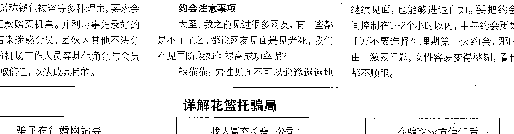

## 详解花篮托骗局

3. 心态：第一次不要急于制造罗曼史，一定要擦亮眼睛，洞悉一切蛛丝马迹，充分把握约会时间，多了解他。

## 相亲聊天的话题

相亲是双方认识了解增进彼此认知的直接方式，你在观察对方的时候，对方也在观察着你，而语言是最好的沟通方式。让双方更好地相互认识，才能正确判断你是不是那个可以携手一生的合适人选，毕竟是要相处一辈子，所以从见面的那一刻开始，拿出你最真诚的一面，才是真正的最好的沟通方式。

### 话题一：关于工作趣事

你应该是个细心的人吧，工作中同时相处肯定有很多趣事发生，这些事情回想起来是不是引人发笑呢？她肯定很乐意倾听。聊一些自己工作中出现的趣闻，逗笑对方的同时，展现自己的幽默感，同时让对方更了解工作中你的样子，增进彼此的信任感。

### 话题二：关于旅行见闻

你不会是“宅男”吧，女孩最不喜欢足不出户成天闷在家里的男人了，即使她们自己成天闷在家里，也随时幻想着走遍中国大好河山游遍世界美景，那是她们的梦想和向往。那么就聊聊旅行见闻吧，话题自然出来了。

### 话题三：关于近期上映电影

是的，就是近期影院上映的电影。什么？你不爱看电影，这可不行啊，以后开始约会之后的一个好去处啊，其实最新电影能引出好多话题啊，看看网上最新的影评，电影兴起的最新流行风向，最火的那句电影台词。如果她也看过同样的电影，这是多好的一个共同话题。如果你想了解她对某方面的态度，是不是通过评论相同电影人物的方式更加让人意想不到呢？

### 话题四：关于家乡风土人情

记得小时候插过红旗的那个小山坡么，屋后那个曾经躲着睡觉的那个稻谷堆。和她聊聊你家乡的风土人情或者小时候的趣事，一下子就拉近了你们之间的距离，还能显示自身的稳重可靠，不要害怕丢脸啦，谁都有小时候的，何乐而不为呢？

### 话题五：关于所向往的生活

还可以聊下你最憧憬的生活状态，这是最直接了解对方的方式，同时也告诉对方你是个肯为之努力的勤奋男人，勤奋有上进心的男人可是对形象的大大加分。

### 话题六：个人爱好兴趣

这是一个最好的让对方了解你的方式，当你们互相交换着双方的兴趣的时候，彼此的认识是不是加深了呢？也许你爱养宠物，那么她会知道你是个有爱心的人；也许你喜欢种花养鱼，那么她会知道你爱收拾爱干净。

### 案例1

通过网络达成的相亲无数次，就在我快要失去信心的时候，他出现了，姑且把他称为26个字母最后一个的Z男吧。
Z男比我大3~4岁吧，自己做生意。先在网上聊了有一个多月，觉得他基本条件不错，于是我们见面。
和Z男约在我家附近的咖啡厅，第一印象，比网上长得老实憨厚，但不难看，体型略有些发福（网上看不出来）。
Z男的话不太多，我们整个相亲的过程基本是冷场——突然想起一个话题——就这个话题你来我往地聊几句——再次冷场——这样的循环。
不过Z男倒是挺实诚的，说了很多实际的问题，比方说他告诉我现在刚自己开了一家小型的二手房中介的事情，还把曾经交往5年几乎到了谈婚论嫁地步的女朋友但最后分手的事情告诉我，还问我想找什么样的对象。
这些话题在以前的那些相亲男中很少涉及到，看来Z男还是比较成熟的。
还有一点就是，在我们冷场的期间，我发现Z男经常盯着我看，是那种目不转睛的注视，看得我特别不好意思。
在咖啡厅聊了能有两个小时吧，Z男提议去吃饭。选的是一家还不错的烤肉店，不过点菜的时候，发现他的口味与我的差别很大，有点小失望。
吃完饭之后，正好我还要去找个朋友，于是Z男就把我送到和朋友约好的地点后离开了。
就在我刻意忘记这件事情的时候，Z男重新在Q上找我了。他说当天见面有些冷场，可能是他没有准备好，或者是他本来就不是太外向，还有，他发现我也不怎么开口说话，心里拿不准我对他的态度。
我终于忍不住了，就跟他说，你是我打算通过网络相亲的最后一个见面的人，以后再也不相信婚恋网站了。他沉默了下，说，别啊，你不相了我以后找谁去啊？
我听了有点破涕为笑的感觉。随后，我试着跟他见了几面，发现我们相熟以后，他比初次见面时放得开，说的话题还很多。
现在，Z男已经成了我的老公了。

### 案例2

我有过不平凡的婚姻，面对现实，我们还是离了。只要决定了，下一步面对的，就是以后的生活。老人的絮叨、朋友的好言相劝，最终的意思，就是再抓紧找一个。
我性格比较内向，交际圈也不广，我于是选择了很红火的网站，以尝试的态度，办了一个月的免费看信会员，也许是天意，第二天，就有一个同城的女孩给我回复了信息。
我们通了几次电话，感觉还能聊得来，我看了好几次她的资料，身高1.69m，农村家庭，在济宁打工，当时我就想，她身高真的有1.69m？而我穿上鞋才1.69m。考虑到这点，我想什么事情也不能隐瞒，就专门为这事给她打了个电话：
“不好意思，我想问下，你的资料上写的身高真实吗？”
“是啊，怎么了？我不穿鞋1.69，穿鞋有1.72吧。”
“额，你真高，呵呵。”
“看来你穿上高跟鞋比我还要高啊。……其实，不穿高跟鞋也比我高，哈哈……”
“我这个星期六回嘉祥。”什么意思？要见面吗？没把我的“海拔”当成障碍？
“那你回嘉祥的时候来找我玩吧，我请你吃饭。”
“行。”回答的就是这么简洁。
“那我就等你到来了，呵呵。对了，你个子太高，来的时候能不能穿矮点的鞋啊？”
“呵呵，行。”
盼星星盼月亮，盼来了星期六，起了个大早。精心把自己打扮了一番，感觉自己比平时精神了许多，也增加了些许自信。
看了看表，9点多，想想她也该从济宁往嘉祥赶了。万一她不来了呢？心里有点忐忑，决定给她先打个电话：
“喂，今天回嘉祥吗？我在等你啊。”
“哦，回去，回去，我在洗衣服呢，洗完就回去。”
“哦，那我就等你了，呵呵，11点左右能到吧？”
“差不多吧。”
“好，一定要来啊，中午我请客，呵呵。”心终于放下了，耐心等吧。
接下来的两个多小时，感觉真难熬啊，半个小时看一次表，总感觉时间过得怎么那么慢了呢？
最后一次看表，11:30了，该来了吧，心跳得噗通又噗通，“嘀铃铃，嘀铃铃”，手机忽然响起，赶紧拿起手机，真是她打来的！她告诉我坐的车次。
到了车站才忽然想起，忘记问问她穿的什么衣服了。
车门开了，乘客陆续下车，终于下来了一位个子偏高的女孩，下车后东张西望，看上去还有点姿色，呵呵，就是她了，赶紧迎上去：
“你是‘冬天的蝴蝶’（网名）吧？”
“哦，你是‘努力奋斗’（俺的网名）？”
“呵呵，就是我……”一时有点无语，不知道说什么好了。
“中午想吃什么？我请客。”
“随便吧，什么都行……”笑容很灿烂、很自然，我紧张的心情也终于放松下来，看来彼此都默认了对方，有戏！
找了一家比较安静的饭店，点了些菜，这符合我当时的经济条件。聊了很多，从前、现在，还有未来。聊得都很实在，实话实说，坦言相告。总之气氛是温馨的，是愉快的，话越来越多，笑声也越来越多。
可就在这时，发生了一件意料之外的事，因为点的菜中有鱼，一根鱼刺卡在她喉咙里了，她很难为情。我也被刺卡过，所以知道肯定很难受。赶紧去找老板，要了两个馒头，快，吃多点，咽下去！管用吗？她有点疑惑，但还是大口吃了下去。过了一小会，痛苦的表情没了。
“你还真行，这方法很土但很管用。”她笑着说。
“呵呵，我也是半个大夫呢！”
“真不好意思，刚才吃得太快了！”
“呵呵，正常，我也被卡过好几次呢！”
“你还真能体贴人呢！”她边说边看着我。从她的眼神，我能感觉到深深的温情。我知道，她已经对我有了好感，我们的初次见面有了良好的开始。
鱼刺很尴尬，也很温情。
我们的这次见面留下了不错的印象，以后便开始交往了。到了春节的时候，我们约定回她的老家，再过几个月，我们就结婚了。

> 策划|《电脑爱好者》编辑部
监制|沧海
撰稿|邢侃 江北 李放

## 向HTPC时代告别
客厅首选高清播放机

随着技术日益成熟，高清电影的高解析度大画面的视觉冲击、高保真的多声道环绕效果，在这两年已成为了大部分人最痴迷的一种视觉娱乐方式。实现高清播放的设备也是种类繁多，诸如高清播放机、HTPC、蓝光播放机等。对于消费者来说，到底哪种更适合自己的应用需求呢？
按照我们以往的经验，在客厅里播放高清电影HTPC无疑是很多读者的选择，不过笔者身边越来越多的朋友和同事开始“淘汰HTPC，更换高清机”，这是为什么呢？
市场上价位在2000元左右的高清播放机在高清视频的播放上比之前的HTPC毫不逊色，且已具备蓝光光驱和无线网卡。我们再来看看远期投入，正常使用的时候HTPC的功耗不会少于100W（毕竟是电脑），而高清播放机普遍功耗在20~30W左右，几年下来这其中电费的差值就够再买一台高清播放机了。相信只要消费者的数学没问题，很明显可以发现高清播放机“价格便宜量又足”。
我们要的是那种惬意的感觉，一个按键按下去就看电影了，过多的操作只会影响我们随心所欲的生活。
综上所述，在家用HTPC播放高清电影的时代已经过去了。现在市场上的高清机花样繁多，价格相差也很悬殊，是不是能播放高清电影就算合格呢？我们选购应该注意哪些问题呢？请往下看。

### 性价比高清播放机胜过HTPC

我们来简单地算一笔账，以目前最低配置的i3处理器+H61主板构架为例，加上必要的机箱、电源、硬盘、内存等部件（无显卡、光驱），怎么也得3000元左右，而市场上价位在2000元左右的高清播放机在高清视频的播放上比之前的HTPC毫不逊色，且已具备蓝光光驱和无线网卡。我们再来看看远期投入，正常使用的时候HTPC的功耗不会少于100W（毕竟是电脑），而高清播放机普遍功耗在20~30W左右，几年下来这其中电费的差值就够再买一台高清播放机了。

### 要想省心还是高清播放机

在播放电影的时候HTPC的所有操作跟电脑别无二致，而且其间不能脱离键盘鼠标，而使用高清播放机时只要操作过电视遥控器就可以轻松使用。再有，高清播放机简洁的菜单比起Windows简直容易得要死，相比之下更适合老人、小孩等不会操作电脑的人。我们在客厅、卧室观看高清电影的时候要的是那种惬意的感觉，一个按键按下去就看电影了，过多的操作只会影响我们随心所欲的生活。
首先我们要在市场上区分2类产品，一种是偷换概念的“高清播放机”，这种高清播放机一般在200到400元，它们主要以播放RM/RMVB为主，也能兼顾多种其他格式，但是所播放的视频码率不能太高，用的解码芯片种类繁多，有些甚至就是数码相框档次的芯片，它们并不能支持多少“高清编码”影片，一般最高能支持720P的RMVB。这些播放机最大问题是并不支持H.264和VC-1这2种高清影片中应用最广泛的编码格式，声音方面也不支持DTS、AC3等高品质音效。源。因此这些播放机的使用寿命都不会太长，少则1年顶多2年后就面临淘汰。

这些所谓的高清播放机，唯一和高清沾边的地方就是视频输出使用了YUV（色差分量）接口/HDMI接口，一般YUV可以支持到720P输出，HDMI接口可以支持到1080P输出，仅此而已，关键是高清播放机内置的解码芯片并不具备解码高清影片的能力，因此这种播放机应该叫“RM播放机”或“硬盘播放机”，严格说不能算真正的高清播放机。

另一类播放机，就是能真正解码并输出720P、1080P高清的播放机。这种播放机起码支持H.264、VC-1里的一种或两种编码格式，解码能力强大，即使是高码率影片也能流畅播放并具备DTS、DTS-HD、Dobly、Dobly-HD等声音格式的解码输出或源码输出。这种高清播放机一般价格较高，从5百多到几千元都有，不过价格超过2000的播放机，已经和HTPC价格重叠。笔者个人认为超过2000的高清播放机生存空间不大，本篇不做推荐。

### 后续升级HTPC占优

HTPC说白了还是一台电脑，如果觉得有必要适当升级又可以将功能、寿命进一步延展，对于不同格式的影片，只要播放软件更新得够快就没有后顾之忧。高清播放机在此点上颇为掣肘，若是以后又出现一种新的高清电影格式，就只能眼巴巴地指望厂商的固件升级，有DIY情结的高清玩家不愿意接受高清播放机的还大有人在也就不难理解了。

我们一般意义上耳熟能详的高清播放机可以播放1080P高清节目，但音画质中规中矩，虽不卡顿，但播放机本身没有真正蓝光高清联盟组织的认证，由于可以解码绝大多数常见媒体格式，普及度很高。

### 高清播放顺畅凉爽

前两年购买过高清播放机的用户有很多对于其工作时的温度颇有微词，现在市场上这方面做得比较好的多采用台湾瑞昱的RTD1185解码芯片，此种芯片使用新一代50纳米制程，对比上一代RTD1073采用的是70纳米的工艺，升级了很多，有效降低了发热量及芯片大小。这点就可以让饱受诟病的RTD1073的发热量问题在竞争中不再是它的短板，毕竟现阶段的高清播放机在散热上面还都是比较弱的。采用RTD1185的高清播放机长时间循环播放全高清视频毫无压力。

### NAS功能更加实用

如果还把高清播放机定位于DVD的升级产品未免有些狭隘，其具备的家庭网络服务器（NAS）功能却少被人知。虽然之前在1073上也有上网增加过NAS功能，但不如现在原厂推出的功能实用，RTD1185芯片可以作为一台电脑被其它电脑或播放器访问，速度上不用担心，只跟你的网络有关。我们在自己家里只要保证自己的电脑和高清播放机同在一个局域网内，就可以随意调用、上传、播放媒体文件。以笔者的习惯，把电脑上下好的电影随手就用家里的无线网传到高清播放机的硬盘里，闲暇时候用电视随意播放，很惬意。

### 未来大趋势 网络点播

国内现在影音市场版权越来越规范，我们应该拍手称快，毕竟走入正轨的市场对于用户和制片商远期助益颇多。而我们家庭越来越高速的网络给我们提供了丰富的媒体资源。以往只能在电脑上看的土豆、酷六、优酷等在线视频也可以由高清播放机来实现了，这是技术的突破，更是生活理念的进步，毕竟我们从赶时间看节目一下子转变到想什么时候看就什么时候看。

网络点播及Flash网络浏览支持，这个功能目前来说，可以做出很多很漂亮又有个性的VOD点播界面，而且要实现权限授权的问题也轻而易举。一个VOD的Demo程序，同时也在做一套服务器端的程序，相当到时要实现嵌入式的本地VOD高清点播+在线点播就相当容易了，这也扩大了应用层面。

此种方案对于没有太高要求的寻常消费者已经足够，可以把家庭影院的功能发挥到淋漓尽致。不过此种构架的高清播放机无法赋予智能系统，最高也是媒体播放机。要想具备智能的系统，还需更进一步提高芯片等级。

### 当高清播放机遇到了Android

在智能手机和平板电脑界风光无限的Android系统这回也能和高清播放机联姻了。市场上采用Cortex-A9的CPU的一系列高清播放机都可以安装智能Android系统，这样一来我们的电视就变成平板电脑了。

Cortex-A9的CPU，核心频率达到1GHz，同时采用512MB大容量内存设计，采用这种芯片的高清播放机不但播放高清视频轻而易举，其运行速度快、处理能力强的特点更多地可以反应在智能操作的体验上，毕竟很多平板电脑就是用的这个构架。笔者在这种高清播放机上随意安装网上下载的海量APK程序，如QQ、新浪微博、有道词典、人人网、愤怒的小鸟等，满足您游戏、社交、办公应用等。我们自己安装一个“安卓市场”，可以分类搜索找到想要的应用程序，直接下载就可以使用，比如“大众点评网”和各种游戏等。一句话，智能高清播放机可以拓展无限可能。

配合无线鼠标键盘真的可以把电视当做平板电脑来使用，用大屏幕聊QQ的感觉远超平时电脑的体验感觉。赶上笔者手里正好有雷柏的E9080无线键盘，该键盘的小键盘区有一个触控板可以实现触摸操作，这点应用到Android智能高清播放机上可谓如虎添翼。得益于强大的3D演算机能《愤怒的小鸟》、《水果忍者》等大家耳熟能详的游戏，在大屏幕电视上手触控的爽快感不可言喻（不知道要感谢智能高清播放机还是这个键盘好了……）。

在我们不玩游戏不看高清的时候更可以浏览网页，Cortex-A9构架支持HTML5网站在线网游浏览，我们在自己的电视上就可以更新微博并且与他人互动，动态gif图片栩栩如生，仿真iPad视频网站在线播放十分顺畅。从这几点上来看，HTPC的生存空间真的很渺茫。

智能高清播放机虽然好用，但还不是最高端类产品，在追求高质量画质的用户看来，智能系统相对于高清是完全平行的两个事物，智能系统并不能提升高清视频的画质。要想追求极致的画面感受，更高清播放设备势在必行。

### 要蓝光更要3D

对于高端播放设备来说，具备3D技术简直是必修课。当然这还需要用户自己的电视要支持3D电影的播放。3D画面是通过人的双眼产生错觉来形成的，3D效果无法通过相机表现出来，所以相机拍出来有重影的画面，就是电视已经识别到3D信号并以3D格式播出！对于我们挑选高清播放机来讲，更要确定高清播放机拥有1.4版本的HDMI输出。

### 顶级画质还需顶级芯片

顶级高清播放机现在有两种方案，SigmaDesign8642和Marvell3010。高端市场一直是SigmaDesign的天下，Marvell能否后来居上呢？其包含的特色功能有哪些呢？

### 降噪、扩展更加提升高清品质

Marvell 88DE3010中的一项视频处理技术——Qdeo，为真正的家庭影院提供没有杂讯干扰的安静、自然的视频。不管其视频内容是来自于iTune节目、DVD或蓝光高清，Qdeo都能适应并提供有保障的高品质画面。

这在我们平时观看高清时能够起到比原本画面更加提升清晰度的作用，这在一般高清播放机和HTPC上是闻所未闻的。

它的最大问题（姑且称为问题吧）就是——不支持RM/RMVB格式的压缩电影！当然，真正玩高清的可能根本就看不上RM电影（RM电影过去并不能叫高清电影，目前最新规格才升到1280×720分辨率）。

另外这个方案还存在开机比较慢的问题（一般30秒以上，有些高清播放机要50秒）。最后，这个方案价格较高，一般都是高档播放机使用，目前这种方案的高清播放机普遍存在这种问题。

### 购买注意事项

播放机除了主控芯片以外，“固件”也是一个很关键的因素。固件就好比一台高清播放机的操作系统，虽然有个“固”字，但实际上它是一套软件，写在高清播放机内置的Flash芯片里。高清播放机能支持什么格式的影片，支持得是否好，除了主控芯片外，还要看固件。

只有这2者良好的搭配，高清播放机才有良好的性能。目前制作电影的编码软件非常多，所以做出的影片多多少少有些不一样，辛辛苦苦下载的影片在播放机里不能正常播放是常事，这就要靠厂家升级固件来解决。另外既然固件是程序，本身就多少会存在些问题（BUG），好的播放机厂家会根据用户的反映定期升级固件，可以解决很多程序BUG，或增加功能，或改善操作感受。因此购买播放机还要考虑厂家的研发实力，看看固件升级的频率。

很多高清播放机虽然和别人用一样的芯片，但厂家如果自己能开发固件，功能上往往能得到加强，或者缺点得到避免。而一般小厂的产品都是用芯片厂家的公版驱动，操作界面都一样，程序上的BUG也一模一样，这些小厂产品的售后升级全依赖芯片厂家，固件升级很慢，有可能给我们带来困扰。购买某款产品前最好去该厂家的官方网页论坛里看看用户意见反馈，因为里面绝大部分都是反映问题的，看看厂家对待问题的反应，再留意一下厂家发布固件升级的速度，就能了解厂家的能力和态度了。

确定了解码方案，了解支持的编码格式和解码格式，也了解声音输出的特点，我们还要留意一下输出接口。比如有些高清播放机有高档的YUV、HDMI接口，但没有低档的AV复合和S端子，如果你的电视是老式的，就无法接上。一般视频输出比较全的要兼顾高、中、低档用户。低档的AV复合视频、S端子要有，中档的VGA、YUV要有，高档的HDMI也要有。

此外有些老型号的播放机，HDMI接口是1.1或1.2的，最好还是选购HDMI1.3接口的播放机。另外有网络功能的还要看看能否支持无线网卡，毕竟将来无线是个趋势。是否支持BT下载，影片播放机一般就十几瓦顶多几十瓦功耗，比电脑要节电，用它来下载电影既省电还省得2次拷贝。对于手里有大量影片的，最好留意可以内置硬盘的高清播放机，有些可以内置3.5英寸硬盘，有些高清播放机可以内置2.5英寸硬盘，3.5英寸硬盘比2.5英寸硬盘便宜，而且容量很高，注意不要购买高性能的，而要购买静音版硬盘，避免硬盘发出的咔咔声影响你欣赏影片。

目前ST和WD都推出有5900转的绿色节能硬盘。还有些播放机的硬盘是抽屉式的，可以很方便地插拔硬盘，这样可以很方便地把硬盘拿出来去主机上拷贝电影或与朋友交流电影，或者你有海量的影片，有多块硬盘，就可以方便更换。如果你属于看完电影就删的用户，那就留意那些不需要内置硬盘的MINI体积的播放机，外观更漂亮，下载的电影拷贝到存储卡或U盘上，插到播放机上就能看。

### 最后总结

全高清（FULLHD）硬盘播放器的购买需要注意几个问题：

- 是否采用REALTEK1073/1283或 Sigmdesign 863X/864X/865X芯片。这些芯片是目前全高清（FULLHD）硬盘播放机的主流，其他所有宣称是高清播放机的都是假的。
- 是否支持DTS-HD/TRUEHD/LPCM7.1音效通过电视输出、不解码输入功放和源码输出。如果不支持，就只能看没有声音的电影了。
- 是否采用优化的矢量字幕而不是点阵字幕。因为点阵字幕的锯齿感费眼不说，更影响观赏外语影片的心情。
- 固件升级周期。由于高清播放器现阶段还没有普及，升级固件以消除BUG和获取新增功能的周期也应该是消费者考量一个产品的重要指标。
- 输出接口类型。注意一定要跟家里已有的或拟购的影音设备配套，以免重复投资造成浪费。
- 工作噪音要小。特别是带风扇的机型，否则噪音极易影响视听体验。
- 看售后服务。应选择销量大、口碑好的品牌，可以确保长期的技术支持和质量保证。

# 人人可用的项目管理Office秘笈

“项目管理”既古老又年轻。回顾历史的长河，人类祖先为我们留下了无数精彩的项目案例，金字塔、长城、大运河、故宫……每一项大工程的背后都是无数人血汗的结晶，也充分体现出古人管理的智慧。不过直到近几十年，项目管理才真正作为一门学科建立起来，几十年的发展，它现在已经成为职业人员追逐的热点。本期专题，我们透过一个职业项目经理一周的生活，为大家揭示项目管理的内幕，以及相关的操作方法技巧。实际上，不只是职业需要，项目管理作为一种方法体系，同样能应用到我们工作、生活的方方面面。

## 出场人物（项目干系人）

干系人又称为项目相关利益者，是指积极参与项目或其利益会受到项目执行及完成情况影响的个人或组织（甚至包括市场中潜在的对手和合作伙伴等）。不同的干系人对项目有不同的期望和需求，项目经理需要在他们之中找到一种平衡。下面是本文中直接或间接出场的人物，它包括了每个项目一般都要涉及到的几个主要人员。

| 角色 | 姓名 | 描述 |
| :--- | :--- | :--- |
| 项目经理 | 潘扬 | 清华大学高材生，曾任职于国外某大型咨询公司，现供职于国内某科技公司。为人热情、健谈，做事极有条理。他是本文中的项目经理，负责整个项目的管理工作。 |
| 客户 | 刘威 | F集团网站建设招标负责人。所谓客户，就是会使用项目产品的组织或个人。潘扬所在科技公司希望承包下F集团的网站建设项目，为其提供服务，F集团自然就是他们公司的客户了，而刘威则是他们与F集团的接口。 |
| 项目组成员 | 白桥 | 程序员，潘扬的铁哥们，是本次项目组成员的领军人物。所谓项目组成员，就是指执行项目工作的一组人。 |
| 发起人 | 王总 | 某科技公司的总经理，潘扬的老板，他有着丰富的项目管理经验。所谓的发起人，是指以现金或者其他形式为项目提供财务资源的个人或者团体。本项目中，王总就是授权潘扬并给予财务及人力支持的发起人。 |
| 竞争对手 | 瑟琳娜 | 对手公司的项目经理，客户经理出身，对网站技术不甚了解，但擅长处理与客户间的关系，是潘扬竞标道路上的最大障碍。 |

## 新来的“P经理”

P是潘的缩写，又是潘扬的工作岗位项目经理Project manager的缩写，似乎预示着他天生就是块项目经理的料！“别把P经理不当经理，没项目的时候你是最小化状态，有项目的时候你就是最大化状态，从公司老总到门口的文员，无一不是你可以充分利用的资源。一名优秀的项目经理，必须擅长调度各种资源，擅长管理项目团队，擅长对项目进展做到胸有成竹。在国际化大项目这个宽广的舞台上，你的心有多大，舞台就有多宽。”这是潘扬上班第一天，王总对他的一番谆谆教诲。王总很喜欢这个年轻人，希望把他培养成自己的得力助手。接下来的一个月，潘扬的工作紧张而又忙碌。他和客户经理一起拜访重要客户，大量阅读公司之前的各个大项目文档，梳理他所负责的目标客户的近期需求，静静等待幸运之花的怒放。

## 区分什么是项目和非项目

既然是项目管理，首先得理解“项目”的含义，如果同一个团队中各人对项目的理解都不能统一，就难免会有矛盾冲突。根据一些教科书上的定义，项目是：一次性、多任务的工作，具有明确规定的开始和结束日期，具有特定的工作范围、预算和要达到的目标产品。从这个定义，可以看出项目有两个特点，一是“时限性”，一是“唯一性”。要在一个规定的时间范围内，完成唯一的一项任务产品（或服务）。所以，建设某座桥梁（如赵州桥）、房屋（大到故宫小到居民住家），开发某款软件（如我写稿正在用的WPS），撰写某本书，建设某个网站，等等都是项目，需要在一定的时间内完成的一定的产品；而其他如一日三餐、上下班、每天看报等等就不是项目，它们不具有时限性和唯一性，简单来说，任何具有重复性质的事情，都不是项目。

## 3月26日 8:30——用邮件管理你的时间

作为项目经理，潘扬每天工作紧张而又忙碌，每天上班的第一件事便是打开电脑，收发来自公司决策层、同事以及客户的来信，面对小山似的来信，要按部就班势必会误时误事，不过，不用担心，潘扬高效管理邮件自有一套。

### 1.实现邮件自动分检

潘扬每天都会收到许多来信，这样不但不利于邮件的管理阅读，而且一些重要邮件非常容易被淹没在普通邮件甚至是垃圾邮件中，潘扬决定将邮件归归类。启动Outlook 2010，在Outlook左侧导航窗格中选择并展开“Outlook数据文件”，然后鼠标右键点击“收件箱”项，从弹出菜单中选择“新建文件夹”命令打开新建窗口。在打开的新建文件夹窗口中，输入文件夹名称，如“老板”，将来专门用来接收老板发来的邮件，最后单击“确定”按钮。以此类推，潘扬分别新建了同事、客户、同学、家人等多个文件夹。

点击菜单栏“开始”，然后选择“移动→规则→管理规则和通知”选项，在弹出的“规则和通知”窗口中点击“新建规则”按钮。在接下来弹出的向导窗口中选择“将某人发来的邮件移动到文件夹”选项，然后点击“下一步”按钮。在接下来的窗口中，在“步骤1”列表中选择“发件人电子邮件地址中包含特定词语”选项，然后在“步骤2”列表中点击“特定词语”链接，打开查找文本对话框，输入rqb712(即信箱的用户名，符号@前面的部分)后单击“添加”按钮将其加到搜索列表中，再单击“确定”返回，这样即可将老板的电子邮件地址添加进来。接下来，点击“指定”链接，将指定文件夹设置为“老板”文件夹，最后点击“下一步”按钮。在接下来的邮件处理窗口中，选择“标记为重要性”和“在桌面显示通知”选项，然后点击“步骤2”列表中的“重要性”链接，将重要性设置为“高”，最后点击“完成”按钮即可。这样，一个邮件规则就建立完成了，以后老板从rqb712@163.com信箱中发过来的邮件会被立即移动到“老板”文件夹中，并被标记为“重要性-高”，同时在桌面上会显示新邮件通知。按照上述方法，一一设置数条邮件规则即可实现邮件的自动分拣了。

### 2.利用颜色标注邮件的轻重缓急

每天面对收到的大量邮件，是不是应该仔细地阅读每一封信逐一处理呢？当然不是！如果不分轻重缓急每一封信逐一处理，势必会浪费很多时间，甚至会误时误事。面对海量邮件，潘扬的处理方法是先预览邮件，判断邮件的重要程度，删除垃圾邮件，回复容易处理的邮件。对一些需要大量时间去处理或者需要后续提醒的邮件，用Outlook的颜色与后续标记功能进行标记。点击Outlook“开始”菜单，然后点击标记“分类”，并从下拉菜单中选择“所有类别”，在弹出的窗口中可以对颜色进行命名。例如：将红色色标命名为“加急”、绿色色标命名为“重要”、蓝色色标命名为“普通”。以后当收到邮件后，便可根据邮件的轻重缓急来进行标记了。鼠标右键点击邮件标题处的颜色标记，然后根据邮件性质选择相应的色标即可。

对于还需要做后续工作的邮件，还可以添加后续标记，以便提醒防止忘记，设置后续标记的目的就是提醒在限定的时间内完成后续工作。右键点击邮件中的小旗标志，在下拉菜单中可以选择后续处理的时限，是今天、明天、后天还是本周或下周。对于需进行详细标记的邮件，可以选择“自定义”选项，打开自定义窗口自行定义。例如需要在某个时段电话答复的邮件，可以按如下方法进行设置。点击“标志”下拉列表，从中选择“请打电话”，然后分别设置一下开始日期和截止日期。最后选中“提醒”复选框，并设置一下提醒的时间和铃声。这样，Outlook就会在规定的时间发出提醒，提醒电话答复邮件。

### 3.重要成员特别跟踪

白桥外出考查，不时会发来一些调研信息，这些信息对潘扬来说非常重要，给其进行决策提供了重要的理论依据。潘扬想时刻掌握跟踪白桥的信息，免得人多事杂给漏掉了。点击菜单栏的“文件→选项”命令，打开Outlook选项窗口。选择左侧列表中的“便笺和日记”选项，点击右侧列表中的“日记选项”按钮。在接下来打开的“日记选项”窗口中，首先选中“自动记录”列表中的“电子邮件”，在“记录文件”列表中选择一种记录的方式，可以是Word、Excel、Access等，最后在“联系人”列表中选择需要消息跟踪的联系人，如“白桥”，并点击“确定”按钮即可。以后，在Outlook窗口中，选择“日记”选项打开日记视图，只要收到了白桥（特定联系人）的电子邮件，就能够看到通知，双击相应通知即可打开收到的邮件进行查看了。

### 4.桌面便笺方便留言

在整理邮件过程中，电话响了，原来是工会的马主席找新分配来的女大学生冯娟约她晚饭后去排练节目，打手机关机无法联系，所以让潘扬看到的时候，帮忙说一声。潘扬笑了笑，冯娟今天临时有事请了一个小时假，要晚来一会儿。捎话，这点小事，当然没问题了，就在自己的桌面上留个便笺记一下吧。

在Outlook中，点击菜单“文件→新建→便笺”(或按Ctrl+Shift+N键)新建一个便笺。接下来最小化Outlook，而便笺窗口依然贴在屏幕上，这时就可以把事情记下来了，输入“马主席找冯娟晚饭后排练节目，看到后告之”。潘扬想了想，觉得还是不放心，决定把便笺转发给冯娟本人以及她办公室的同事，也好让他人帮着通知一下。点击便笺左上角的图标，从弹出的菜单窗口中，选择“转发”命令，在弹出的发送窗口中选择相关人的邮件地址，点击“发送”按钮即可。

## 项目生命周期

如同一个生命会有出生、成长、衰老及死亡一样，每一个项目也都会有一个过程，我们称之为项目的生命周期。说白了，就是项目由初始立项到最终完成这样一个过程。一般来说，每个项目的生命周期由起始、计划、实施、控制、结束等几个阶段构成。每一个阶段，又会包含自己的起始、计划、实施与控制、结束。当然，理论上分的这几个阶段，在实际操作过程中，会有不同程度的交叉执行。比如在起始阶段，计划过程就开始了，在计划过程之中实际已融入了控制过程等等。对于项目经理来说，各个阶段的主要工作任务如下。

- 起始阶段：定义一个项目阶段的工作与活动，决策一个项目或项目阶段的起始与否，以及决定是否将一个项目或项目阶段继续进行下去等工作。
- 计划阶段：拟定、编制和修订一个项目或项目阶段的工作目标、计划方案、资源供应、成本预算、计划应急措施等方面的工作。
- 实施阶段：组织和协调人力资源及其他资源，组织和协调各项任务与工作，激励项目团队完成既定的工作计划，生成项目产出物等方面的工作。

控制阶段：制定标准、监督和测量项目的实际情况、分析差异和问题、采取纠正措施等管理工作和活动。

结束阶段：制定一个项目或项目阶段的移交与接受条件，并完成项目或项目阶段成果的移交，从而使项目或项目阶段顺利结束的管理工作和活动。

### 3月26日 10:30——报告处理、制作有诀窍

邮件处理得差不多了，潘扬喝了杯咖啡，稍事休息。这时MSN上弹出消息，王总告诉他“F集团的全国骨干网招标书今天刚刚发出！项目很大，时间很紧，快看邮件！然后抓紧做一份项目报告。”

#### 1. PM必备的超长文档阅读妙招

果然，这个项目异常庞大。仅仅技术文档需求就将近100MB，涉及到F集团22个大区的骨干网络，如果能够中标，标的将极高，堪称公司今年的第一大单。

超长文档阅读起来不是很方便，可适当运用一些技巧。运行Word 2010，单击菜单栏上的“视图”按钮，勾选“导航窗格”，即可在Word 2010编辑窗口的左侧打开“导航窗格”。Word 2010新增的文档导航功能的导航方式有四种：标题导航、页面导航、关键字（词）导航和特定对象导航，这样就可以轻松查找、定位到想查阅的段落或特定的对象，长文档阅读起来不会再无头绪了。

#### 2. 策划案就是一道填空题——双文档查看

项目策划书有一个基本的格式，比如一般会有执行概要、项目情况介绍、市场分析、竞争和风险分析、项目实施等项目。有时，它其实就像一道填空题，只需在相应的项目下填写上具体内容就行了。有不少内容，可直接从客户方的文档中提取出来，所以，将两个文档并列显示，写起报告来就方便多了。

这个要求，对于Word 2010来说，简直不费吹灰之力。首先，我们要在Word 2010中打开欲进行对比的两篇文档。然后，点击“视图标签→并排查看”命令，进入双文档同步查看模式。

此时，两篇文档便在Word 2010的安排下，完成了同屏显示。更令人兴奋的是，它们之间还实现了同步关联。当我们对其中一篇文档前后翻动时，另一篇文档也会随之自动移动，并且始终保持界面窗口中显示的是文档的相同位置。而正是这样一个人性化的功能，让Word 2010的“并排查看”显得更为实用。

#### 3. 报告图片随手拈来

为了让项目报告图文并茂，需要插入适当的图片。Word 2010中包含了截图工具，用起图来就方便多了。

切换到Word 2010或Excel 2010的“插入”选项卡，我们可以在“插图”功能组中发现一个名为“屏幕截图”的按钮，这里支持多种截屏模式，单击“屏幕截图”按钮，我们可以在这里发现当前打开窗口的截屏画面，单击选定之后即可插入当前文档。

如果选择“屏幕剪辑”，返回桌面时可以发现鼠标光标已经变成一个细十字形，按下鼠标左键即可截取相应画面，松开鼠标可以返回文档窗口，刚才截取的画面会自动进入当前文档。

如果是在PowerPoint 2010的演示文稿窗口，切换到“插入”选项卡，“屏幕截图”按钮的位置转移到了“图片”功能组中，我们同样可以在这里快速插入当前窗口的缩略图或截取窗口。

### 3月26日 13:30——分配任务 分头实施标书前期准备

一上午的时间很快就过去了，吃完中饭回来，潘扬将报告发给了王总，并在MSN上向王总请示：“王总，这个项目，我需要一个很大的团队来配合。”“你可以先细分一下对方的技术标和商务标需求，然后分解任务，利用一切可利用的资源，建立相应的团队。”于是，潘扬将客户需求的商务标和技术标分解成研发、商务、物流、售后等多个环节，每个环节设立责任人，在和王总商量过合适人选后，F集团的应标团队正式成立了。王总最后指示，要求尽快制定出竞标书，参加下周的竞标。

#### 1. 高效的事务管理

时间紧、任务重，再加上前期手上的一些未完成的工作，潘扬觉得头绪太多，不好好规划一下很可能会出错，于是决定进行一下事务的组织、管理与规划。

潘扬每周一、周五要参加公司的工作例会，5月12日上午10:30要与某IT公司黄经理进行会谈，15日，要完成职称评定所需的论文，这些都可以利用Outlook日历视图和待办事项栏来进行管理。

启动Outlook，从左侧列表选择“日历”选项，进入日历视图，在右侧窗格中点击鼠标右键，选择“新定期约会”命令。

在接下来弹出的对话框中，将“约会时间”设置成公司例会召开的时间，将“定期模式”设置成“按周”并选择“星期一”和“星期五”复选框，最后点击“确定”按钮即可。

在接下来的窗口中，将“主题”设置为“公司行政例会”，地点设置为“公司17楼大会议室”，并简要输入一些备忘内容，最后点击“保存并关闭”按钮即可。

接下来选择5月12日，在右侧窗口点击鼠标右键，选择“新建约会”命令，打开新建约会窗口。在“主题”栏中输入“与IT公司黄经理会晤”，在“地点”栏中输入会谈的地点，如“公司16楼小茶厅”，取消对“全天事件”复选框的勾选，同时将时间设置为上午的10:30~11:30，最后在下面的文本栏中输入会谈的内容摘要。

在Outlook中，可以直接将邮件标记为待办事项。找到论文收缴通知邮件，右键点击邮件的标记列，在随后打开的快捷菜单中选择截止日期。标记完成以后，就可以在“待办事项栏”中看到所有的待办事项和即将到来的约会信息。

#### 2. 巧妙处理突发事件

对于那些已经预先安排好的各种工作任务，潘扬已经习惯于将它们作为任务添加到Office Outlook的待办事项列表中，从而使这些工作任务可以有条不紊地进行，让自己将精力全部投入到当前的项目上。

但是，现实工作环境中经常会出现一些临时性的工作安排，例如，潘扬正在集中精力撰写工作总结时，总经理秘书临时通知潘扬下午15:00到总经理办公室去一趟。为了不使自己的工作思路被打断，潘扬利用OneNote提供的系统托盘功能来处理一些突发性的工作。

点击Windows系统托盘区的OneNote 2010图标，打开OneNote便笺窗口。在便笺窗口中输入临时任务的描述信息，例如“今天下午15:00到总经理办公室去一趟，王总找，探讨有关采购计划调整的相关事宜”。

在OneNote便笺窗口中单击鼠标右键，

#### 3. 合理进行任务分配

经与王总紧急磋商，潘扬基本上明白了投标的相关工作，磋商之后潘扬便开始为下属分配起任务来了。李萌负责与北京某公司联系，摸清对方对网站建设的基本需求；李杰负责市场的调研；王强负责标书的制作。

在Outlook中，点击左侧导航窗格中的“任务”选项，然后在右侧窗格中单击鼠标右键，选择“新建任务”命令，打开任务对话窗口。填写项目主题名称“网站建设竞标任务分配：摸清公司网站建设的需求”，设置项目截止及开始的日期，以及设置提醒时间、任务简介等等。最后单击工具栏上的“保存并关闭”按钮保存任务。

双击刚刚新建的任务，在任务窗口的工具栏上单击“分配任务”按钮，则该窗口上会多出一个“收件人”按钮，单击该按钮并将联系人选择为“李萌”，或直接在其后的文本框中输入接收任务人李萌的邮件地址。

设置完毕，单击“发送”按钮，即可将任务发送给李萌了。

按同样的方法，新建两个任务，将市场调研的任务分配给李杰，将标书制作的任务分配给王强即可。需要注意的是：在分配任务窗口中，选中“在我的任务列表中保存此任务的更新副本”一项，则同事在任务进行当中会自动发来通知消息，只要打开这个消息，任务表中就会自动修改这个任务。选中“此任务完成后给我发送状态报告”项，则同事将任务标为完成时，会收到自动状态报告消息，表示任务完成。

当同事接收到任务时，就会收到一条电子邮件消息，有任务交待，并有“接受”和“谢绝”两个按钮。当对方点击“接受”按钮，则这个任务自动加进他的任务表中，并成为任务拥有者。不管是点击“接受”还是“谢绝”，都会给潘扬发回一条确认消息。

#### 4. 巧妙的资料收集

为确保竞标工作的顺利进行，潘扬需要通过Internet查找一些资料，有时可能还需要将重要的资料以网页的形式保存起来，或者将其粘贴到Word文档中保存起来。为方便资料的查找和管理，潘扬决定使用OneNote来管理这些资料。在查找浏览网页过程中，直接将所需的信息添加到OneNote笔记本中。

在浏览网页信息过程中，当发现自己需要的内容时，只需将其选中，然后单击IE浏览器工具栏中的“发送至OneNote”按钮即可。这时，系统不仅会将内容添加到OneNote笔记本中，而且还会在内容下方显示该网站的链接地址，以方便通过此链接查看与此内容相关的详细信息。

如果没有在网页中选择需要导入的内容，单击“发送至OneNote”按钮，系统会将整个网页导入到OneNote笔记本中。

在查找资料的过程中，如果发现一些有用的资料，但该网站不允许复制其中的内容，造成资料无法收集，这时不用担心，利用OneNote的屏幕剪辑功能，可以方便地将网页“拍”下来，并将“照片”保存在笔记本中，笔记本下方同样会给出网站链接地址，方便再次访问网站内容。创建屏幕剪辑的方法非常简单，只需按组合键Windows徽标键+S键，待屏幕反白显示时，拖动鼠标选取所需的内容，这时，会弹出一个要求选择存放位置的对话框，选择一下图片保存的位置，即可将网页作为图片导入到OneNote笔记本中了。

一天的工作就这样紧张而有序地进行着，不知不觉间，潘扬看了看时间，已晚上8点了！项目经理加班，已经是见怪不怪的事情了，潘扬关上笔记本，看着窗外万家灯火，自己也该回家啦。

## 项目管理刘易斯模型

项目管理，有没有一种规律，套用之后，就可以一劳永逸？这个当然是不可能的，不过不同的项目，管理方法还是会有共性之处。美国一位著名的管理专家刘易斯，就提出了一种16步管理模型，称为刘易斯方法。它通过一系列的问题，帮助我们理清项目管理思路，确立概念，定义问题，编制及实施计划，协助我们顺利完成项目。

## 项目管理

所谓的项目管理，简单说，就是对那些为达到项目目标必须执行的活动进行计划、进度和控制。更准确地应该被称为‘由项目而实施的管理’。所有的项目管理工作，都具备四个主要目标：

- P：达到预期的绩效，即质量，终极目标是“优良”。
- C：在费用和预算约束范围内，即成本，终极目标是“便宜”。
- T：按时完成任务，即时间，终极目标是“迅速”。
- S：符合批定的工作范围大小，即范围，终极目标是“适度”。

### 3月27日——喧哗与骚动

一早上班，一封客户经理的邮件引起了潘扬的高度注意。近期F集团技术部门手中有一份潘扬公司的黑材料，将本次项目涉及到的他们公司的产品缺点和失败案例统统搜集到一处，甚至有大量夸大其词和捏造事实之处。但是这份黑材料的数据翔实，案例指名道姓，不了解事实真相的人会认为黑材料的可信度很高，这对竞标非常不利。

‘肯定又是瑟琳娜的杰作！她最擅长的就是这一套！’王总口中的瑟琳娜，正是对手公司参与此次竞标的项目经理，号称‘美丽花蝴蝶’，是个人见人爱的尤物型白领。她是客户经理出身，虽然对技术不甚了解，但处理与客户间的关系可是很有一套。此番竞标，她所在的公司也是志在必得，甚至放出狠话，不惜成本也要拿下这个项目。‘这也太无耻了！这不是明摆着的诬陷吗？都是大公司，怎么能用这种下三滥手段呢？’潘扬对这个瑟琳娜真是恨之入骨。‘还是想想应对策略吧！’王总安慰着潘扬。

喝完一杯黑咖啡过后，冷静下来的潘扬向团队各个成员布置了紧急任务。客户经理在第一时间拿到黑材料，研发人员和市场人员分别对材料中的产品弱点和案例不实之处进行一一驳斥，同时强调公司产品优势和项目执行的竞争力，制作好澄清的PPT提交给客户方。待到客户经理回复黑材料的负面影响已经消除后，潘扬仿佛看到瑟琳娜气急败坏的样子，暗自长舒一口气。

### 3月29日——广泛征求竞标方案意见

经过大家共同的努力，竞标相关准备工作进展得非常顺利，标书也在计划的时间内制作完毕。标书是否符合董事会的口味，是否还存在瑕疵呢？潘扬决定广泛征求一下意见。潘扬首先想集思广益，征求一下大家对标书的意见和建议，经过一番思考，潘扬决定使用调查问卷的形式。首先设计问卷样式。打开Word，按实际情况输入设计调查问卷即可。设计完成后，潘扬发现，如果最终是以纸质的形式进行现场调查，上面的问卷没有什么问题，现场使用笔勾选即可。但潘扬并不想把大家召集在一起，因为大家都很忙，为参加调查放下手头的工作并不太恰当，况且还有一些同事在外地，所以潘扬想使用电子邮件的形式进行调查。不过，如果问卷以电子邮件的形式发送给调查人，往往会出现这样的困扰，选择项该如何表示，以哪个符号来标记？以第1项为例，在填写问卷时，如果要选择‘非常满意’选项，需要进行的操作是首先删除‘□’这个白色的方块标记，然后再添加一个‘■’黑色的方块标记来表示要选择此项。对于熟悉特殊字符输入的人还好说，如果对这类操作不是很熟悉的人，想必会很恼火。潘扬经过一番思考，觉得这个问卷做得实在是太过糟糕，决定做进一步的完善。

点击菜单栏的‘文件’选项，进入文件视图，然后在左侧的功能列表中选择‘选项’命令，打开选项窗口。在打开的选项窗口中切换到‘自定义功能区选项卡’，然后在右侧勾选‘开发工具’复选框，最后点击‘确定’按钮。接下来，点击菜单栏的‘开发工具’选项，切换到开发工具视图页面。现在，在需要插入‘□’白色方块的地方，将原白色方块删除，插入‘复选框’控件。根据实际需要，分别为问卷当中的各个问卷调查项一一添加复选框、单选框、文本框等众多控件即可。控件添加完毕之后，接下来还要进行控件的设置。对于复选框来说，默认情况下，选中后是在方框中打上一个‘X’号，这可能并不符合大多数人的使用习惯，而是想使用黑色的方块使其更醒目一些。另外，还需要设置一下，防止问卷调查中添加的控件被调查人误删除了，因此还要有个防删除的动作。选中控件，然后单击‘属性’按钮。在接下来打开的‘内容控件属性’对话框中勾选‘无法删除内容控件’复选框，这样，就不用担心用户误删除控件了。接下来，点击‘选中标记’右侧的‘更改’按钮，在接下来弹出的‘符号’对话框中，将其更改成自己想要的样式即可。按相同方法一一设置好相关控件，这时再选中控件时，就会是我们想要的效果了。而且对于需要客户录入文字的地方，可以直接添加‘文本内容控件’，然后设定相应的样式，客户在相应区域输入文字后，会自动套用设定好的样式。好了，设置完毕，现在就可以将这样一份调查问卷发送给调查人了，并且在邮件中可以做一问卷填写简要说明，相信调查人一定会喜欢这种问卷的，因为实际填写过程中，效率会大大提高。

### 工作分解结构

工作分解结构（简称WBS）跟因数分解是一个原理，就是把一个项目按一定的原则分解，项目分解成任务，任务再分解成一项项工作，再把一项项工作分配到每个人的日常活动中，直到分解不下去为止。典型的工作分解结构有6级：大型项目、项目、任务、子任务、工作包、活动。在我们日常管理项目时，要学会分解。

#### 分解原则

- 1. 将主体目标逐步细化分解，最底层的日常活动可直接分派到个人去完成。
- 2. 每个任务原则上要求分解到不能再细分为止。
- 3. 日常活动要对应到人、时间和资金投入。

#### 任务分解的方法

- 1. 采用树状结构进行分解。
- 2. 以团队为中心，自上而下与自下而上地充分沟通，一对一个别交流与讨论，分解单项工作。
- 3. 分解可以采用多种方式进行，包括：
  - 按产品的物理结构分解
  - 按产品或项目的功能分解
  - 按照实施过程分解
  - 按照项目的地域分布分解
  - 按照项目的各个目标分解
  - 按部门分解
  - 按职能分解

#### 任务分解的标准

- 1. 分解后的活动结构清晰，从树根到树叶，一目了然，尽量避免盘根错节。
- 2. 逻辑上形成一个大的活动，集成所有的关键因素，包含临时的里程碑和监控点，所有活动全部定义清楚，要细化到人、时间和资金投入。

### 3月30日——进行民主投票

第二天潘扬就收到了白桥的电子邮件，根据白桥提出的修改意见，潘扬让手下对标书作了进一步修改完善。因为事关中标的成败，潘扬决定在将标书提交董事会之前来一次民主投票，让大家预测一下中标的成功率。

首先建立通讯组，以便进行群发。在Outlook中，点击菜单栏“开始”选项，进入开始页面，然后点击“通讯簿”按钮，打开通讯簿窗口。

在打开的通讯簿窗口中点击菜单“文件→添加新地址”命令，在弹出的添加新地址窗口中选择“新联系人组”选项后再点击“确定”按钮。

在接下来的窗口中，在“名称”文本框中输入新联系人组的名称“网络部的同事”，然后点击其上的“添加成员”按钮，选择“从通讯簿”选项，开始从通讯簿中往联系人组中添加联系人。

在接下来打开的通讯簿对话框中，在Ctrl键的配合下将需要参加投票的联系人一一选中，点击“成员”按钮，然后点击“确定”按钮，将多个联系人添加到联系人组中。

将需参加投票的联系人添加到联系人组之后，点击“保存并关闭”，最后关闭通讯簿窗口即可。

接下来，按Ctrl+N组合键写新邮件，点击新邮件窗口上的“发件人”按钮，在打开的“选择姓名”窗口中选取刚才建立的“网络部的同事”联系人组，并点击“确定”按钮。这时，在邮件窗口的收件人文本框中将出现“+网络部的同事”字样。

在新邮件窗口中，在“主题”文本框中输入本次活动的主题“请大家为网站投标书成功与否进行投票”。

点击新邮件窗口菜单栏上的“选项”，然后点击“使用投票按钮”按钮，并从其下拉菜单中选择“自定义”命令。在接下来弹出的“属性”窗口中，勾选“使用投票按钮”，然后从其下拉菜单中选择“赞成:反对”。接下来，勾选“将答复发送给”复选框，在后面输入接收人的邮箱地址，最后点击“关闭”按钮。接下来，点击“附加文件”按钮，利用弹出的“插入文件”对话框将修改好的标书作为附件插入到邮件中，以便大家分析研究。最后，点击“发送”按钮，发送投票邮件即可。需要提醒的是，在将要发送的邮件中是看不到投票按钮的，只有接收者才能看到。

当接收者收到投票邮件后，接收邮件的人单击提示，再从弹出菜单中点选相应选项，又会弹出一个窗口，点击“确定”后收信人的投票表决就被发送到前面设置好的邮箱中了。点击表决邮件上的提示，还能查看到所有的投票表决统计。

征求完意见，并作进一步修改之后，标书最后送往董事会审阅，董事会很快进行了答复，要求立即将标书发往F集团，参与网站的竞标，为确定发送的标书能够到达收件人手中，潘扬决定以“挂号信”的方法发出。

启动Outlook，选择菜单栏中的“开始”菜单，然后点击左侧窗格中的“选项”命令打开Outlook选项窗口。接下来，在左侧功能列表窗格中选择“邮件”选项，然后拖动右侧窗格滚动条，找到“跟踪”功能设置区。

在“跟踪”选项功能区中，选中“对于发送的所有邮件，请求：”下的“送达回执”和“已读回执”复选框。最后，点击“确定”按钮关闭选项窗口。

设置完成后，当收件人收到并打开邮件时，便会自动发出“送达”回执和“已读”回执。这与寄出的挂号信有异曲同工之处，即需要收信人看到信件并签字确认。只要收到回执，就说明邮件已经成功送达并已被阅读了。

### 项目管理中常用术语

在国际上，由于一些主要学术团体如美国项目管理学会（PMI）和国际项目管理协会（IPMA）等的不懈努力，项目管理的知识体系和实践正在不断完善和标准化，从而逐渐发展出一种项目管理的“专业通用语言”。下面为大家精选部分常用的术语解释。

- ★活动（Activity）：达到某一结果所需要的工作或努力。它消耗时间，通常也消耗资源。
- ★事件（Event）：时间上的一个点（参考活动）。事件是二元的，即要么达到了，要么没有达到；而活动可以部分完成。事件可以是一项活动的开始或结束。
- ★节点（Node）：网络图中的一个事件。
- ★里程碑（Milestone）：一个具有特定重要性的事件，通常代表项目工作中一个重要阶段的完成。在里程碑处，通常要计划进行检查。
- ★生命周期（Life cycle）：一个项目从概念到完成所经过的各个阶段。项目的性质在每个阶段都会发生变化。
- ★范围（Scope）：完成一个项目所必须做的工作的数量。
- ★浮动时间（Float）：在不影响项目结束日期的前提下，一项活动可以延迟多长时间的数值。
- ★学习曲线（Learning curve）：人们对一项活动的理解达到可以优化绩效的程度所需要的时间。在活动工时估算中必须计算学习曲线，以便达到计划的完成日期。

甘特图（Gantt chart）：表示项目中完成每项活动所需要的时间的条形图。它以亨利·L·甘特先生的名字来命名，他制定了一个完整的用条形图表示进度的标志系统。

箭线图（Activity-on-arrow）：表示活动顺序的一种网络图，用箭线代表每项活动，在箭线的每一端用圆圈代表事件。

变更单（Change order）：批准项目某项内容变更的一种文件。

## 后记

5月底，应标结果出来了，潘扬作为项目经理的交出了令人艳羡的漂亮成绩单。当天，王总正式在办公室宣布，这位新鲜“P经理”的“P”还是Perfect的缩写。这对担任项目经理不到半年的潘扬来说，真是莫大的褒奖。

这天，在北京最大的百货商场，正在为自己和女朋友挑选礼物的潘扬，竟然遇上了疯狂购物的瑟琳娜。这一场没有硝烟的竞标，丰富了潘扬的职业生涯。潘扬想，犒赏自己的购物还是比纯粹的发泄要强得多。诚然，项目后期执行还有很长的一段路要走，现在得意忘形未免太早，说不定瑟琳娜正密切关注着项目中的任何风吹草动，稍有差池便会让项目执行出师不利。

走着瞧吧，我会使出浑身解数，祭出所有法宝，不会让你这只花蝴蝶有任何可乘之机的！

策划《电脑爱好者》编辑部
监制柳絮飞

## 为“老友”续命 新春笔记本升级攻略

笔记本作为我们的贴身伴侣，一直在背后默默地支持我们的工作和娱乐。正所谓“人老不讲筋骨为能”，在硬件技术飞速发展的今天，你的笔记本是否也接近“暮年”了呢？当你作出让老本下岗另购新机的打算之前，不妨考虑为陪你多年的老本“升级续命”，在物价飞涨的今天，能省则省才是真理。

谁也无法抵御“新”的诱惑，新品往往意味着更靓、更快、更强。但是，唯“新”主义精神也是有时效性的。比如英特尔Ivy Bridge即将上市，如果你在近期买本将面临“入手即落伍”的尴尬。此外，如果你的笔记本至今未出现硬件问题，只是感觉速度功能跟不上，只需简单的几步升级就能让它重获活力并坚持到新品上市的时刻。

### 升级之前：给笔记本自我救赎的机会

笔记本开机就特别热，掌托和散热孔直烫手；
开机速度和软件运行时反应特别慢，远不如初；
玩玩游戏就会死机，总是莫名其妙地重启。

以上三点是最常见的给自己换笔记本的理由。很多同学都有类似的感觉：笔记本刚买2年，当初用起来速度杠杠的，为什么最近速度越来越慢，玩一会发热量就极度升高，频繁死机，难道必须换个新本了吗？

不要误解为你劳累多年的老伙计，更多的时候其实是人为因素造成的。比如，你安装了太多耗费资源的软件或插件，并将它们设定为开机启动，大量的资源都被这些不常用的程序所把控；放置笔记本的桌面N年也不擦拭一次，到处散落着堆成一团的灰尘与毛毛，而笔记本内部的散热孔也被灰尘所占据，散热不畅导致笔记本发热严重，从而引起CPU降频（速度变得极慢）或干脆频繁死机。在你认定老本“大限将至”之前，不如先给它一次“自我救赎”的机会吧。

#### 硬件：手动清灰

笔记本内部主要的发热源为CPU和显卡芯片（早期的芯片组发热也很大），它们的热量会随着覆盖其上的散热片，通过铜质的热导管传至位于机身一侧的散热鳍片上，并最终由风扇从散热鳍片的缝隙中排出。可惜，灰尘会随着笔记本使用时间增加慢慢将这些空隙作为巢穴，当它们完全堵住鳍片缝隙时，笔记本过热、变慢、重启甚至死机就成为了常态。如果你的笔记本开机后在速度变慢的过程中往往伴随着机身明显发热的症状，此时就需要手动对笔记本内部进行“大扫除”了。

以笔者的方正S410IG笔记本为例，与大家分享一下除尘的经验。在拆机前切记一定要断开电源，并取下笔记本的电池。先用螺丝刀将笔记本背部固定散热区域挡板的螺丝拧下，沿着缝隙一翘就能打开，小心拔下散热风扇与主板上连接的电源线，此时满目灰尘的散热风扇和堵满杂质的散热鳍片就映入眼帘了。

接下来就动用你身边的一切资源，如棉签、小刷子、皮吹子等清理你能看到的灰尘。笔者动手能力有限，没能拆开风扇清理内部的扇叶，有条件的同学还可以对风扇内部进行清理并添加润滑油。简单的体力活过后，风扇和散热鳍片上的灰尘基本被清理干净，连好电源线并将散热挡板重新固定，笔记本重新“冷静”了下来。

### 小提示

方正S410IG拆机相对容易，而且散热风扇被固定在散热挡板上，清理很容易。但不同型号笔记本清灰的难度不一，如果你对自己的动手能力没有信心，可以将笔记本拿到厂商客服中心，在主板的质保期（通常为2年）内都可以进行免费的除尘。如果笔记本过了质保期，可以在网上搜索与自己笔记本型号对应的拆机教程，并找有经验的朋友帮忙。如果到电脑城请专业人士清理，费用通常在50元左右。

#### 软件：优化提速

单纯的清灰，只能解决笔记本散热问题，避免因过热引起的各种不稳定情况。想让笔记本找回速度，还需要进行软件上的优化提速。在这里笔者推荐使用360安全卫士（下载地址：http://www.360.cn/）和鲁大师（下载地址：http://www.ludashi.com/）这两款软件。首先运行360安全卫士，依次点击“优化加速→一键优化→立即优化”，软件会自动优化系统设置。

如果你对系统比较了解，还可继续进入此界面的“启动项”，将除了与笔记本电源管理、快捷键相关和必要的软件之外的所有程序都设置在“禁止启动”状态，“计划任务”中的程序都可关闭，最后再有选择地关闭“应用软件服务”和“关键系统服务”，为系统做最彻底的“瘦身”。

通过上述设置，你会发现笔记本的开机时间和反应速度有了明显的提升，接下来还需用鲁大师进一步保障笔记本的散热“安全”。首先在“温度检测”中勾选“启用高温报警”，在“设置”界面中设定报警温度，接下来点击“节能降温”图标将笔记本设定在“智能降温”状态即可。

#### 外设：辅助散热

对一些先天性“体质不佳”的笔记本（比如2008年采用存在“虚焊门”隐患的NVIDIA GF8000M系列显卡的产品，如联想天逸F31/F41系列、惠普DV2000/DV3000系列等等），可能当你进行了上述操作但散热问题依旧严重，此时就需要引来散热底座这种“外援”了。

由于笔记本只有底部凸起的防滑脚垫与散热底座表面接触，散热底座本身并不能帮笔记本散热，因此在选购散热底座时不必一味地追求高价的金属材质，结构的合理性才是影响散热效果的关键。笔者推荐选择表面布满散热小孔（通风效果好），并只配有一个大尺寸风扇的产品（风扇越少，扇叶越大越静音）。

如果笔记本实在太热，还可以考虑一些可以自由移动风扇位置的散热底座，比如酷冷至尊NotePal U2，可以将两枚风扇分别置于笔记本散热风扇位置的散热孔以及放置硬盘位置的散热孔，让底座风扇为这两个位置送凉风可以起到最佳的散热效果。

如果你喜欢用外接键盘操作笔记本，还可以选择支持大角度调节的“书架式”散热底座，方便将其当作笔记本支架使用，使笔记本屏幕位置变得更高以符合人体工程学需要，获得更舒适的使用姿势和视觉效果。

### 小提示

有些散热底座还带USB Hub功能，一方面可以辅助笔记本散热，另一方面还能扩展更多的USB接口。但需要注意的是，散热底座上扩展的USB接口供电受限，大都无法识别移动硬盘。此外，目前很多高端散热底座都附带了音响功能，可以提供不错的音效体验，有这方面需求的用户可以特别关注一下。需要注意的是，散热底座的风扇虽然可以辅助散热，但同时也会将桌面下的灰尘聚集起来。如果你不希望隔三差五就得对笔记本内部进行清灰处理，每天擦2~3次桌面是必不可少的。

### 小结

通过上面几个步骤的自我救赎，相信你的笔记本已经解决了发热问题，而且速度也有了一定的提升。如果你觉得不满意，而且手头还有一定的预算，不妨给笔记本进行针对性的升级，重新找回失去的自信。

### 内存升级：低开销大收益

对普通用户而言，笔记本升级难度不小，其中最关键的原因就是涉及到拆机操作。还好，绝大多数笔记本都为内存预备了单独的扩展仓，没有太多的操作门槛，而升级内存，往往也可以为老款笔记本带来立竿见影的性能提升。

#### 内存贱卖 把握时机

2GB不足80元，4GB不到140元（DDR3 1333MHz），如今笔记本内存着实沦落到了“贱卖”的边缘。除了10.1英寸的上网本，普通笔记本基本都会提供2根内存插槽，即使全部换成2根4GB内存也不超过300元，8GB的内存在一年前还是不敢想象的“奢侈品”，如今仅需几顿饭钱就能轻松拥有。如果你觉得自己笔记本速度不给力，现在恰是入手升级的最好时期。换下的老内存不要浪费，一般卖内存的商家都会直接回购老内存，如果嫌收购价格低，也可以自行在一些二手论坛出售。

### 小提示

现有很多内存厂商都推出了“XX品牌指定笔记本内存”，与同容量的普通内存至少提价50%。现在笔记本内存的兼容性普遍不错，普通用户真没有必要刻意追求这类品牌指定的内存。不过，无论你是选择普通内存还是品牌指定内存，笔者都建议大家带上笔记本，现场安装并测试兼容性。

#### 把脉内存 对症下药

在升级内存之前，我们一定要提前做好功课，了解自己笔记本支持的是DDR2内存还是DDR3内存，最高支持多大的容量。识别的方法很简单，运行CPU-Z软件（下载地址：http://www.onlinedown.net/soft/2775.htm），在“主板”选项卡中可以查看主板芯片组的型号，而在“SPD”选项卡中则可以查看内存的具体规格，在“内存插槽选择”下拉框中还可以查看该笔记本一共提供了几组内存插槽。

表1是近几年主流笔记本所采用的常见芯片组，需要留意的就是Intel 4系列芯片组既支持DDR2也支持DDR3标准，厂商会根据产品的定位和当时的成本选择任意标准，两种标准接口互不兼容。比如2009年前DDR3内存价格很贵，这个时期即使是PM45也有选用DDR2内存插槽的。随着DDR3内存的普及，从2009年下半年开始，即使是采用GL40的低端产品都开始标配DDR3内存。当你升级到4GB或以上容量时，建议与64位版的Windows 7搭配，32位的Windows 7或XP系统只能识别3GB左右的内存。

### 小提示

DDR3 1333MHz内存安装在PM45身上，会自动降到1066MHz使用。如果老内存是DDR2 667MHz，加条新的DDR2 800MHz内存，系统也会自动将新内存降到667MHz以匹配老内存的频率。所以大家在购买内存时不用过分关注内存的频率。此外，除了内置核芯显卡的第二代酷睿i处理器，双通道内存的意义不大，而且现在也不存在两条内存品牌容量必须一致的问题。

**表1**

| 芯片组 | 最高内存 | 集成显卡 | 对双通道依赖 |
| :--- | :--- | :--- | :--- |
| 91x系列 | 2GB DDR2 (533MHz) | GMA900 | 意义不大 |
| 94x系列 | 4GB DDR2 (667MHz) | GMA950 | 意义不大 |
| 96x系列 | 8GB DDR2 (800MHz) | GMA X3100 | 意义不大 |
| GL40/GS40 | 4GB DDR2或DDR3 (800MHz) | GMA X4500 | 意义不大 |
| GM45/PM45/GS45 | 8GB DDR2或DDR3 (1066MHz) | GMA X4500 | 意义不大 |
| HM55/HM57 | 8GB DDR3 (1333MHz) | GMA HD | 意义不大 |
| HM65/HM67 | 16GB DDR3 (1600MHz) | 核芯显卡 | 十分必要 |

#### CFan教你玩转大内存

将大内存插进笔记本就万事大吉了吗？当然没有！除了同时运行多个大型游戏或软件时，系统对内存的利用率其实是有限的，比如当你升级到了8GB内存，但平时只有3GB左右能被利用上，剩余的5GB在绝大多数时间都处于闲置状态。想最大限度挖掘大内存的潜力，最好的选择就是将多余内存在建立成虚拟的内存硬盘，还能缓解机械盘速度太慢的性能瓶颈。

##### 闲置内存变硬盘

RamDisk Plus 10是一款很好用的虚拟内存硬盘软件（根据自己本本的系统选择32位或64位版），运行后点击软件左上角的“+”图标，根据向导提示自定义内存硬盘的空间。笔者笔记本内置4GB内存，可以将其中的1GB虚拟成内存硬盘，格式化后就能像普通硬盘一样操作内存盘了。如果你将内存升级到了6GB或8GB，则可以考虑划分出2GB的内存盘。

##### 内存盘优化几步走

首先要做的就是将IE临时文件转移到内存盘中，在控制面板中找到“Internet选项”，点击常规选项卡中的“设置”按钮，在弹出界面中点“移动文件夹”并将其设定在内存所虚拟的硬盘上。接下来还需转移系统临时文件夹。依次进入“计算机→属性→高级系统设置→高级→环境变量”界面，手动将用户变量窗口中的“TEMP”和“TMP”变量值改到内存盘所在的目录（修改前只要备份默认的地址，以便日后恢复）。

如果你的内存足够大，比如达到了6GB甚至8GB，则可以考虑取消虚拟内存的设置。具体方法为依次进入“计算机→属性→高级系统设置→高级→性能设置→高级→虚拟内存更改”界面，选中系统所在分区，勾选“无分页文件”后再先后点击“设置”和“确定”即可。

此时，我们已经将IE和系统所产生的临时文件都移动到了内存所虚拟的硬盘，绝大多数程序的数据都只会在内存中进行读取，无论是系统反应还是读取时间都快了很多。笔者没事喜欢自己玩玩《魔兽争霸3》，提前将游戏拷贝到内存盘中再进行游戏，可大幅缩短启动时间。如果你划分出了足够大的内存盘，也可以将常用的游戏拷贝进去后再运行，在关机前记得将期间所产生的存档拷贝到物理硬盘中即可。

##### 火速链接

如果笔记本安装了32位的操作系统，当你升级到4GB或以上容量的内存时，系统只能识别3GB左右的空间。在不重装64位系统的情况下，我们可以利用“超级兔子专业版”将无法识别的内存部分设置为虚拟硬盘，具体方法请参考2011年10期36页《4GB内存不浪费 系统提速巧利用》。此外，动手能力较高的同学，还可以尝试将操作系统安装在内存上，具体方法请参考2011年20期50页《媲美SSD硬盘 打造高速内存系统》。

##### 内存升级教程

第一步：拆开内存挡板
笔记本通常都为内存设计了单独的扩展挡板，拧下固定螺丝后就可拆开挡板看到内存插槽了。
第二步：找准方向
笔记本内存插槽有防呆设计，安装内存前要确认插槽和内存金手指的方向。
第三步：插入内存
斜着将内存金手指插入内存插槽，直至尽头。
第四步：固定内存
按住内存两侧边缘向下用力，内存插槽两侧的卡扣会自动咬合内存侧面的缺口。

如果你的笔记本升级内存时需要拆开整个背部的外壳，建议找专业人士帮忙。想换下旧内存时，只需用两个手指将固定内存两侧的卡扣向外掰一下，内存会自动弹出来。

### 硬盘升级：不仅仅为了容量

除了内存，硬盘是笔记本第二大容易升级的部件。虽然笔记本的处理器和显卡频繁换代，但多年间玩游戏时的Loading时间却没有多少改进，硬盘性能的瓶颈日益突出。很多同学只有等到硬盘不够用时才会考虑换个更大容量的硬盘，其实硬盘升级除了可以带来更大容量，还能让你获得更流畅的体验呢。

#### 硬盘也分三六九等

如今90%以上的笔记本仅标配5400rpm的硬盘，如果你想进一步提升存储性能，则可以考虑其余三类硬盘：7200rpm的高速硬盘、内嵌闪存芯片的混合硬盘以及拿闪存作为存储介质的SSD固态硬盘，它们之间性能的差距请参考表2。笔者推荐直接升级到7200rpm的高速硬盘，现在希捷混合硬盘价格涨得太离谱，999元足够选择普通硬盘+32GB SSD硬盘了。如果你的笔记本有两个硬盘位，或者光驱位长期闲置，则可以考虑入手SSD固态硬盘作为第二块硬盘（SSD硬盘容量太小，仅适合组建双硬盘环境），用于安装操作系统。

### 小知识

希捷混合硬盘在7200rpm硬盘的基础上加入了一颗4GB镁光闪存颗粒，可把使用频率较高的文件复制到闪存中，以便快速进行重新调用。简单来说，混合硬盘是越用越快，玩某个游戏，第一次读取用60s，第二次可能就45s，第三次就只用30s了。

2.5英寸笔记本硬盘的厚度有7mm、9.5mm和12.5mm三个标准，但很多笔记本仅支持9.5mm或以下标准，而现在不少750GB/1TB的超大容量硬盘厚度却为12.5mm标准，无法正常安装。所以在选购大容量硬盘时要以自己笔记本所支持的规格为准。笔记本升级更大容量的新硬盘后，千万不要将老硬盘尘封，我们可以另购一个移动硬盘盒（50元左右）将其打造成移动硬盘。

**表2**

| 硬盘对比 | 5400rpm | 7200rpm | HHD混合硬盘 | SSD固态硬盘 |
| :--- | :--- | :--- | :--- | :--- |
| PCMark Vantage HDD子项成绩 | 3500 | 5000 | 7000 | 21000 |
| HDTune平均传输速率 | 65MB/s | 83MB/s | 85MB/s | 180MB/s |
| 推荐型号 | 西数WD5000BPVT (500GB) | 希捷ST9500420AS (500GB) | 希捷ST95005620AS (500GB) | 金士顿SV100S2 (64GB) |
| 优点 | 便宜实惠 | 性能提升明显 | 越用越快 | 堪称完美 |
| 缺点 | 性能一般 | 增加一定发热量 | 价格稍高 | 容量较小 |
| 参考价格 | 629元 | 749元 | 999元 | 619元 |

平时用于存放不常用的数据。如果你的现金流很紧张，笔者也不建议选择二手硬盘，因为旧硬盘可能存在坏道等问题，很难短时间用软件准确检测出来。小提示大家在购买笔记本硬盘前，切记要先用鲁大师一类的软件检查笔记本硬盘接口类型，是IDE（PATA）还是SATA，二者不兼容。虽然淘宝上有2.5英寸硬盘IDE转SATA的转换接头，但笔记本硬盘仓的大小是固定的，加装转换接头后硬盘很难重新塞回去。如果你觉得大容量IDE硬盘不好买，可以考虑选择移动硬盘解决存储容量的不足。以上是笔者对老款笔记本升级硬盘时的选购建议，考虑到现在硬盘正处于“历史最高价位”，较去年年中贵上大约有一倍左右，因此大家可以再观望一段时间，择机出手。

#### 硬盘升级教程

第一步：拆开硬盘挡板
不同笔记本硬盘仓位置不同，这款笔记本就有单独的硬盘扩展仓。
第二步：取下硬盘
拧下所有固定硬盘的螺丝，硬盘表面通常会有一个便于插拔的牵引带。
第三步：更换硬盘
将原来的硬盘取下，换上新硬盘。

### 处理器：推荐高手升级

处理器应该算是笔记本中升级难度最高的部件，一方面是拆机时危险系数较高，容易对硬件造成损坏，另一方面则是移动处理器不好买。因此，笔者只推荐动手能力较高且理论知识丰富的玩家升级。

**表3**

| 微架构 | 处理器 | TDP | 插槽类型 | 是否兼容 | 代表产品 |
| :--- | :--- | :--- | :--- | :--- | :--- |
| Sandy Bridge | 赛扬双核B800 | 35W | FCPGA988 | 相互兼容 | B840 |
| | 奔腾双核B900 | 35W | PGA988 | | B950 |
| | 酷睿双核 | 35W | PPGA988 | | i5-2450M |
| | 酷睿四核 | 45W | FCPGA988 | | i7-2630QM |
| Westmere | 赛扬双核P4000 | 35W | PGA988 | 相互兼容 | P4000 |
| | 奔腾双核P6000 | 35W | PGA988 | | P6200 |
| | 酷睿双核 | 35W | PGA988 | | i7-620M |
| | 酷睿四核 | 45W | PGA988 | | i7-7400M |

#### 同期产品互相兼容

就英特尔移动处理器而言，只有同体系下的CPU和芯片组才可相互兼容。比如你的笔记本是Westmere微架构的奔腾双核P6200处理器，采用了HM55芯片组，最高可升级到四核心的i7-7400M（表3）。同理，如果你的笔记本采用了SNB微架构的i3-2310M与HM65芯片组，同样可以升级到同SNB核心的i7-2670QM等更高端产品。需要注意的是，超低压版移动处理器大都采用直接固化在主板上的BGA封装方式，用户无法自行升级。小提示目前移动处理器没有正规的购买渠道，在淘宝上销售的产品基本可分为三类：正式版、QS版和ES版，后两者为工程样品，但QS版的步进和正式版一样，在CPU-Z中也能看出CPU的具体型号。如果找不到正式版的处理器，则可优先考虑QS版。

#### 不容忽视的TDP

笔记本在升级时尽量挑选同TDP的处理器，更换处理器前一定要重新涂匀导热硅脂。比如你笔记本以前是奔腾双核P6200，升级到酷睿i7-620M没有任何问题，因为它们的TDP都是35W。当然，如果你注重性能，也可以考虑四核心的i7-7400M，但它的TDP已达45W，这意味着会带来更高的发热量，笔记本的散热模块会表示“压力很大”。

#### “排风扇”帮你散热

如果你想升级更高TDP的高端处理器，此时可以考虑为笔记本安装一部可无间隙加速抽取笔电内部停滞热气的“排风扇”（抽风型散热器）。目前淘宝出售的“排风扇”大致分为三种：网友自制型、散热孔卡槽型和支脚固定型。

### 电池升级：买新不如换芯

对使用一年以上的笔记本来说，电池使用时间越来越短是很现实的问题，总不能为此就换个新本吧。即使是再配个新电池，原装货动辄3xx元的报价也会让你心疼不已。那么，如何才能拯救这些丢失的电量，让锂电池找回以前的“激情”呢？

#### 深度放电拯救电池

在鲁大师的“硬件检测→硬件健康”界面中可以显示当前锂电池的状态，笔者笔记本购买刚满一年，现在的电池耗损就达27.37%。如果你的锂电池也出现了明显的耗损，可以利用深度放电减小锂电池的耗损量。具体操作如下：在电池100%状态下拔下电源适配器，在电源管理中设置为节能模式，中途不要操作直至电量低而关机。接下来开机进入BIOS设置界面，按Fn加组合键关闭屏幕（合上屏幕也可）直到电力完全耗尽而关机。当按电源键再也无法启动笔记本后，连接电源适配器直到电量充满，此时你会发现电池耗损有了明显的改善（笔者第一次操作后耗损降到了16.78%，第二次操作为16.22%，看来这已经是这块电池的极限了）。

#### 换电芯更超值

如果你的电池已经“没救”，通过更换电芯，只需百元左右的开销，同样可以获得购买新电池的效果。笔记本锂电池由外壳、电芯组和电路板三部分组成，其中电路板上还镶嵌着负责电量监测管理和充放电管理的芯片。笔者建议大家不要贪便宜，在淘宝上自己买电芯换上，除了质量难以保证，而且没有专业设备对电路板的芯片进行解密和解锁，电池只能充到最后一次记录下来的满充容量，电池管理信息仍然显示维修之前使用过的次数。因此建议大家到电脑城的专业店铺更换电芯，常见的六芯锂电池更换后可为笔记本提供2-3小时的续航时间，足以满足日常使用的需求。

电池全部换新的价格通常在180元左右。

给笔记本电池换芯，不要贪小便宜，尽量挑选品牌电芯，记得向商家索取收据并注明保修的时长（通常为3个月~6个月）。

## 功能升级：小开销高回报

### 蓝牙 帮你无线传输

蓝牙一直没有成为笔记本的标配功能，在智能手机热卖的今天，如果你能为笔记本加上蓝牙，可以实现更多的无线应用功能。为老款笔记本“镶牙”无需太高成本，对普通用户来说只需购买一个几十块的蓝牙适配器，插在笔记本的USB接口上即可。USB蓝牙适配器基本可以分为四大类（表4），其中“廉价型”的蓝牙适配器多采用杂牌芯片，价格最低只有8元左右，但信号的稳定性和有效距离往往不够理想。就性价比和实用性来说，笔者推荐采用CSR0401芯片的“主流型”适配器，至于蓝牙V3.0+EDR并不支持HS补充协议，实际速度和V2.1+EDR相差不多。

很多蓝牙适配器随机还会有“IVT”和“Widcomm”蓝牙软件，可更方便地管理蓝牙设备和使用相关功能，购买时别忘了向商家索取。如果你想了解更多蓝牙适配器的选购和技术知识，请参考2011年23期88页《教你用好笔记本的蓝牙功能》。

| 蓝牙版本 | 芯片品牌 | 特色 | 价格 | 推荐产品 |
| --- | --- | --- | --- | --- |
| V2.0或V2.0+EDR | CSR41B14或杂牌 | 价格便宜 | 8~30元 | 水木行BT520 |
| V2.1+EDR | CSR0401 | 比较稳定 | 25~50元 | 水木行BT560i |
| V2.1+EDR | BCM2046 | 可软件升级到V3.0+EDR | 60~80元 | 鼎新图DXT28 |
| V3.0+EDR | BCM2070 | 默认就为V3.0标准 | 130元左右 | AirLive BT-302USB |

### USB3.0 帮你高速传输数据

USB3.0是随着2011年SNB笔记本才逐渐普及的，其实我们不必羡慕这些新品，因为老笔记本身上都存在一个秘密武器，可以让你轻松扩展出USB3.0、eSATA等多种高速接口。没错，它就是ExpressCard插槽，通过ExpressCard USB3.0扩展卡同样可以让老款笔记本获得USB3.0功能，而且速度与SNB新品身上的USB3.0接口基本一致。

ExpressCard有34mm和54mm两种标准，54mm可以兼容34mm，反之不成立。大家在选购ExpressCard USB3.0扩展卡时一定要和笔记本上的ExpressCard卡槽相匹配。ExpressCard扩展卡大都选用NEC或FL1000（美国Fresco Logic）开发的USB3.0主控芯片，搭配后者的设备成本相对低廉一些，二者在速度上差别不大。建议选择ORICO、AKE、创见、飚王等品牌的扩展卡。

### 皮肤 让本本更个性

笔记本的速度和功能可以通过上述方法改善，但如何才能弥补我们对它的“审美疲劳”呢？毕竟追求更时尚的新品也是不少同学换机的理由。很多同学都会为手机配个性的保护套或贴纸来保持自己的时尚品味，笔记本为什么不可以呢？在淘宝上有各种风格的笔记本皮肤（贴纸）销售，一些热卖型号甚至还有专门定制款，键盘上方的快捷键的位置都预留出来了，而且每个键帽都有单独的贴纸，非常好看。当笔记本贴上皮肤后，不仅可以保护外壳不受划伤，还能让它重获新颜，总比换个新品实惠多了吧？

淘宝上销售的笔记本皮肤价格从10元到百元不等，质量更好的可以保证将来撕下皮肤时不会留有胶水的痕迹，便于打理。如果你没找到与自己笔记本型号匹配的皮肤，可以选择通用型的皮肤，自行剪裁一下即可。

### 小结

虽然现在很多高配的笔记本新品还没有iPhone贵，但作为办公娱乐终端的它，总不能像手机一样频繁地更换。当你感觉自己的本本不再给力时，不妨参考本文的方法为笔记本“续命”。请记住，在物价飞涨的今天，能省则省就是真理。

## 去伪存真 电脑伪技巧大揭底

大家知道在网上有很多伪技巧，这些所谓的“技巧”看上去冠冕堂皇，实则很多“技巧”是在误导我们的操作，甚至很多“技巧”是完全错误的，使用这些技巧会带来很多不可测的后果。因此在这一期的专题中，我们为大家收集了系统和软件方面的伪技巧，并且从去伪存真的角度出发，让大家识别伪技巧、掌握真知识！

## 操作系统篇——Win7常见伪技巧

Win7已经成为时下主流系统，但是很多朋友却仍然对Win7有很多错误的认识，网上也流传着很多关于Win7的伪技巧。用电脑就是用系统，因此我们首先为大家介绍关于Win7的伪技巧，同时结合Win7的各种新特性，从技术角度还原Win7的正确操作方法，让读者更好地认识Win7，了解Win7，用好Win7。

## Win7选择/安装篇

大家知道Win7是使用多版本封装的形式发布的，在一张安装光盘中包含旗舰版、家庭版、专业版等多个版本（并且包含多语言版本），每个版本功能各不相同，因此网上就流传很多关于如何选择Win7版本和安装的伪技巧。

### 伪技巧1：系统非旗舰版不可

旗舰版是功能最为强大的版本，因此很多朋友一说到Win7就认为非旗舰版不可，甚至很多朋友买了预装Win7家庭版的电脑后第一件事就是换装盗版的旗舰版。其实Win7根据不同的用户定位推出了旗舰版、专业版等版本。不同的版本包含的功能不同，微软根据不同用户的需求已经设置好了启动的系统服务和所需的组件，我们应该根据自己的实际需要选择版本。

这里以大多数品牌机预装的“家庭高级版”和“旗舰版”比较为例（表1）。可以看到2个版本主要区别就在于“可靠性功能”和“企业功能”上有所不同，不同点大多是普通用户基本上用不上的功能，比如“备份至网络”、“加入域”等功能。而我们在用的“数字媒体与设备”、“网络功能”上几乎没有什么区别。也就是说对普通用户来说，家庭版已经足够我们使用。

| 可靠性功能 | 家庭高级版 | 旗舰版 | 数字媒体与设备功能 | 家庭高级版 | 旗舰版 | 网络功能 | 家庭高级版 | 旗舰版 | 企业功能 | 家庭高级版 | 专业版和旗舰版 |
| :--- | :---: | :---: | :--- | :---: | :---: | :--- | :---: | :---: | :--- | :---: | :---: |
| Windows备份 | √ | √ | 照片查看器 | √ | √ | SMB连接数 | 20 | 20 | 加入域 | | √ |
| 系统镜像 | √ | √ | WMP12和Play To | √ | √ | 网络与共享中心 | √ | √ | XP模式授权 | | √ |
| 备份至网络 | | √ | WMP远程媒体体验(RME) | √ | √ | 家庭组 | √ | √ | AppLocker | | √ |
| EFS加密 | | √ | MPEG-2解码 | √ | √ | 改进的电源管理 | √ | √ | 从VHD启动 | | √ |
| BitLocker加密 | | √ | Dolby Digital解码 | √ | √ | 连接投影仪 | √ | √ | Federated Search (企业搜索范围) | | √ |
| BitLocker To Go | | √ | AAC/H.264解码 | √ | √ | 远程桌面、主机 | √ | √ | 多语言用户界面 (MUI)语言包 | | √ |
| 自动碎片整理 | √ | √ | DVD播放、媒体中心、电视卡支持 | √ | √ | IIS网络服务器、ICS、桥接 | | √ | UNIX程序子系统 | | √ |
| 创建和载入VHD镜像 | √ | √ | 同步中心 | √ | √ | 离线文件 | | √ | | | |

### 伪技巧2：光盘安装无法设置Win7系统盘为非C盘

使用光盘方式安装Win7的朋友都知道，在选择安装位置时无论你将Win7安装在何处，启动到Win7时，系统盘符都是显示为C:。这给双系统用户调用程序带来诸多不便。很多朋友因此认为无法更改Win7系统盘符。

实际上Win7是允许我们自定义Win7系统盘符的，只要先准备好“osletter.cmd”脚本文件并放置在F盘，然后使用Win7安装光盘启动安装，在出现安装界面时按下Shift+F10调出命令提示符界面，输入

```
"G:\sources\setup.exe /noreboot"
```

进行安装（假设G:为光盘的盘符）。假设现在要将Win7安装到D盘，其他步骤同光盘安装，只是在安装第一步骤完成后在命令提示符界面继续输入

```
"F:\osletter7.cmd /targetletter:Z /currentos:d"
```

更改到自己指定的盘符Z:即可。

### 小提示

上述命令中的“/targetletter:d”是指定Win7系统启动后的系统盘符为Z:（如果要更改为其他盘符，则在此自定义）。“/currentos:d”这里的分区盘符是Win7实际安装目录（即D盘）。

## 系统优化篇

在WinXP时代为了让自己的电脑运行得更快，系统资源占用得更少，很多朋友都会使用各种优化软件对系统进行优化。可是到了Win7时代，很多朋友仍然在使用WinXP那种传统思维去优化系统，很多优化伪技巧可能适得其反。那么现在有哪些常见优化伪技巧？我们又该怎样进行正确优化呢？

### 伪技巧1：虚拟内存应设为物理内存的1.5倍

从Win98开始就流传虚拟内存应设为物理内存1.5倍的优化技巧，到了Win7时代，很多朋友也想当然认为虚拟内存也应该设置为这个数值。其实上述优化技巧已经过时，因为现在拥有大内存的用户越来越多，机械地将虚拟内存的数值设为物理内存的1.5倍是不科学的。

比如你的物理内存是3GB，按照这个技巧虚拟内存就应该设置为4.5GB，实际上每个人甚至每个操作对虚拟内存需求是不一样的。设小了，系统经常会提示虚拟内存不足，设大了，则增加磁头定位时间，同时浪费磁盘空间。Win7使用了全新的内存管理机制，系统本身可以更好地对内存和虚拟内存进行管理，也就是说虚拟内存使用系统默认设置是最科学的，它可以动态对虚拟内存进行管理，在系统最需要的时候使用虚拟内存为你的操作提速。只要在虚拟内存设置页面勾选“自动管理所有驱动器分页文件大小”即可。

### 小提示

如果使用Win7默认设置后，系统仍然频频提示虚拟内存不足，这时候就可以考虑手动设置虚拟内存大小。一般来说“物理内存+虚拟内存”之和一般比正常占用高256~512MB即可。比如2GB内存，一般使用时占用的内存是800MB，那么虚拟内存可以设置为1.3GB左右。

### 伪技巧2：内存不应该设在系统盘，而应该设在其他非系统分区

这是关于虚拟内存优化设置的另一个经典误区，很多朋友认为虚拟内存进行大量的读写，极易产生文件碎片，而且该文件很大，因此为了系统提速和备份方便，应该将虚拟内存设置在非系统分区。

实际上因为系统盘包含系统文件和页面文件，是硬盘读写最频繁的分区，而硬盘读写时最耗时的操作是磁头定位。同一分区内的磁头定位无疑要比跨分区的远距离来回定位要节省时间，所以虚拟内存设定在系统盘内才是执行最快、效率最高的。对于备份来说，无论是常规的Ghost，还是Imagex备份，默认都会将虚拟内存文件排除在外。此外，Win7强制系统分区使用NTFS格式，NTFS可以有效减少磁盘碎片的产生。

### 小提示

由于虚拟内存读写比较频繁容易产生文件碎片，但是正常进入系统后会被Win7锁定无法进行碎片整理。因此我们可以定期进入虚拟内存设置页面，先将页面文件设置到非系统分区，对系统分区进行碎片整理后再重新设置页面文件到系统分区即可。

无论是从提速还是备份角度来说，虚拟内存都应该放置在系统盘。

### 伪技巧3：延长硬盘寿命，定期清空或者关闭SuperPrefetch

为了给日常操作提速，系统会通过预加载方式将常用的程序加载到内存中。由于预读操作在每次开机都会加载并且读写次数较多，因此很多朋友想当然认为预读文件会降低硬盘寿命，因此建议定期清空SuperPrefetch，甚至关闭SuperPrefetch服务。

#### 小知识：什么是SuperPrefetch？

SuperPrefetch实际上就是利用了计算机组成原理中的“局部性原理”（时间局部性和空间局部性原理），即Windows最有可能访问刚刚被访问过的程序，最有可能访问刚刚访问过的相邻的程序，利用这个原理，通过对用户习惯进行分析，能够在预定时间内将可能执行的代码提前调入内存，从而提高整体响应速度。

实际上这种观点是完全错误的，因为Superfetch是Win7新增的“超级预读”技术，它具有学习的功能，当我们第一次使用Win7时，Superfetch就开始记录我们的使用习惯，将我们经常使用的程序的页面在开机后进行提前加载，这样当我们第一次开启程序的时候便可以获得像第二次开启一样的速度了，大大提高常用程序的响应速度。

比如，经常玩“暴力摩托”的用户，在预读目录“c:\windows\prefetch”下就会存在类似“暴力摩托.exe-9ff4062.pf”的文件，它保存游戏路径、设置参数等信息，可以在我们再次启动游戏时快速加载。

### 小提示

由于Win7使用了超级预读技术，开机后它会将常用程序预读到内存，这样很多用户会觉得Win7开机后占用的内存很大，因此利用一些内存释放软件清理内存。清理的结果是清空预读数据，反而使程序运行速度更慢，因此不建议Win7用户使用软件清理内存。

SuperPrefetch可以有效提高系统运行效率，推荐使用Win7默认设置。

### 伪技巧4：清理掉有用的“垃圾文件”提高Win7运行速度

为了提高系统运行速度，很多优化软件都建议将系统的缩略图、搜索索引文件、IE缓冲文件等列为“垃圾文件”删除。其实对于Win7来说，很多优化软件扫描出来的所谓“垃圾文件”并非真的垃圾。比如搜索索引文件，Win7的一大特性就是在开始菜单、资源管理器、库中都整合了即时搜索功能，高效搜索就是以索引文件为基础的，删除了所谓的“垃圾索引文件”后，会大大降低搜索速度和效率。安全清理垃圾文件的方法是利用系统自带的“磁盘清理”，启动该组件后，看清楚文件实际描述后再选择性勾选删除就可以了。

### 小提示

其他常见被误解的垃圾文件及其作用
缩略图：可以带来华丽的用户体验，尤其是在图像的显示上。只建议在图标出现紊乱时清空。
回收站：可以回收误删文件，马大哈用户不建议清空，因为回收站只是占用一定比例的空间。
IE的Cookies：可以记录论坛、网站用户名和密码自动登录，经常忘记密码的用户慎删。

垃圾文件的清理，一定要根据文件的具体作用和自己的实际需求选择性删除。

## 系统使用篇

用电脑就是用系统，作为新一代的系统，Win7具备很多新特性，但是仍然有很多朋友对Win7新特性不够了解，因此在这一章节中我们主要就结合Win7新特性为大家剖析各种日常使用中的伪技巧。

### 伪技巧1：直接使用Administrator账户，操作更方便

大家知道Administrator是系统内置超级管理员账户，为了操作方便，很多朋友都喜欢使用这个账户直接登录系统使用。对于Win7来说，虽然Administrator账户使用起来是方便了，但是同时也给系统带来了极大的安全隐患。Win7新增了用户账户管理组件（UAC），UAC的一个重要作用就是阻止非授权访问。

默认情况下即使我们以管理员身份登录（不包括Administrator账户），在执行注册表编辑、系统还原等更改系统重要设置操作时，UAC都会进行拦截，只有单击“是”确认后才可以提权完成操作，这样可以有效阻止用户非授权访问（特别是恶意软件之类的后台静默操作）。但是UAC不会在用户以Administrator账户身份登录后生效，因此为了保护系统安全，Win7是不建议用户以Administrator账户登录使用的，同时默认设置下该账户也是被禁用的，使用该账户需要进入用户管理组件中手动开启。

#### 小提示：如何进行UAC截图

默认UAC设置弹出提示窗口时，桌面会被系统锁定无法进行其他操作。如果要截取UAC窗口，展开“控制面板\用户账户和家庭安全\用户账户”，单击“更改用户账户控制”，将滑块下拉至第三个级别，即“仅当程序尝试更改计算机时通知我（不降低桌面亮度）”即可。

日常使用建议使用标准账户登录，进行重要系统设置时手动输入管理员账户密码提权操作。

### 伪技巧2：关闭系统弹出的“解决PC问题”设置，操作更省心

在Win7的任务托盘新增了一个“解决PC问题”组件，当我们在执行重要操作（如启用EFS加密）或者系统存在重大安全风险时（如有新的更新），Win7就会弹出警示气泡，提醒我们及时进行操作。但是很多朋友认为这是Win7多此一举，经常予以忽略，甚至将“解决PC问题”服务关闭。这会给系统带来很大的安全隐患。

Win7的“解决PC问题”组件可以很好地保护我们的系统，以EFS加密为例，当我们首次启动EFS加密后，在系统托盘立刻会出现“备份加密证书和密钥”的提示，单击该提示即可弹出是否需要备份密钥的提示，单击“现在备份（推荐）”，即可按向导提示备份EFS私钥，这样可以在系统重装后导入私钥解密加密的文件，避免不必要的麻烦（如果选择稍后备份，则每次开机都会自动弹出是否备份的提示）。显然“解决PC问题”组件可以很好的保护我们的加密文件，关闭这个提示可能造成重要加密文件无法打开。

对于Win7弹出的“解决PC问题”都要认真对待，确认是否已经按系统提示进行操作。

### 伪技巧3：为了兼容Ghost，在Win7下预留FAT32分区

使用过Ghost一键恢复备份的朋友都知道，常规的Ghost是基于DOS环境运行的。Win7则强制系统分区使用NTFS格式，并且默认创建其他分区也使用NTFS格式。由于NTFS格式和DOS不兼容，因此很多朋友建议在Win7预留FAT32分区用于Ghost运行。

实际上Win7下的NTFS分区完全可以运行Ghost，一方面现在的一键Ghost使用“img”封装形式，它可以保存在NTFS分区并通过BCD加载，比如“一键还原精灵”在Win7下安装后，DOS操作环境是通过“c:\jhy\dos.img”加载的，这样在NTFS分区就可以执行一键备份和还原操作了。另一方面，Win7自带WinRE修复环境，Ghost32可以在其中运行，不要DOS环境也可以执行备份和还原操作。

Win7的NTFS分区完全可以执行Ghost一键备份和还原。

### 伪技巧4：迁移WinSXS文件夹能给Win7减肥

由于WinSXS保存很多版本的系统文件，因此它的体积比较庞大，比如笔者电脑上的该目录大小就接近4GB。因此从节约硬盘空间的角度出发，很多优化都建议将该目录转移到非系统分区，节约硬盘空间的同时提高Win7运行速度。

实际上转移WinSXS并不能实现上述目的。如上所述，WinSXS保存的是系统所需的重要文件，默认情况下目录里面的文件是不可删除的，这些文件夹支撑着mscorwks.dll，没有它们nmscorwks也无法加载。如果强行删除，可能只能以安全模式勉强进入Windows，Windows也就“挂”了。因此针对该目录的转移操作既危险又麻烦（需要先取得所有权，然后再建立硬链接才能保证系统正常运行），其次现在的硬盘容量动辄以TB计算，区区几GB空间占用和系统稳定性相比几乎可以忽略不计。再有将该目录转移到其他分区，跨分区操作大大增加了磁头定位时间（因为需要频繁调用的SYSTEM32系统文件是链接到该目录），移动该目录到非系统分区反而会降低系统运行速度。

#### 小知识：WinSXS的作用

WinSXS文件夹存放Windows所需要的所有组件。每一个组件都有属于自己的命名，可以看出它属于何种版本、语言，以及是32位还是64位的Windows。当我们安装系统更新的时候，Win7会先在WinSxS目录里面下载好一个新版本，然后自动映射到“Windows\System32”下面同名文件，从旧版本的硬连接指向新版本的硬连接，这样就能够快速地完成文件的更新工作，不需要进行文件的复制，不仅速度更快，而且安全性更高。因为在该目录仍然保存旧版本的文件，如果安装更新后系统出现异常，Win7会自动调用WinSXS下原来旧版本系统文件，这也是Win7稳定性比旧版本Windows更好的原因所在。

## 应用类软件——软件使用伪技巧

在日常使用中，除了系统，我们接触得最多的就是应用软件了。我们要借助各类软件完成各种操作，因此除了关于系统的伪技巧外，网上也充斥着很多关于常用软件的伪技巧。

### 伪技巧1：文件转为PDF文档就安全了

大家知道现在很多电子书籍、产品的使用文档都是使用PDF格式，我们在使用常见的PDF阅读器查看这些文档时是无法编辑的，因此很多朋友认为将自己的文档转换为PDF就很安全了。

实际上PDF文档并非不可编辑，而且很多PDF阅读器就可以对PDF文档的内容进行复制。比如免费的“福昕阅读器”就可以对很多PDF文档进行编辑，启动该软件后打开PDF文档，然后单击“工具→文本选择工具”。此时使用鼠标就可以将PDF文档的内容选取，右击需要复制的内容选择“复制到剪贴板”。接着再启动“记事本”程序，就可以将PDF文档的内容粘贴到文本中保存了。

为了防止文档复制，很多朋友还将文档转换为图片，不过很多扫描软件仍然可以轻松将文档扫描出来。因此建议转换后再添加水印。

文件转换成为PDF文档的形式来保存并不安全。

### 伪技巧2：只有最新版本才是功能最全最好的软件

现在很多软件隔几个月就会推出新版本，新版本一般有些新的功能，因此很多朋友也喜欢第一时间下载最新版本进行使用，他们认为最新版本才是功能最全最好的软件。

实际上软件并非最新最好，因为软件要在一个系统中稳定运行，首先需要用户在不同系统中使用一定时间才能保证其稳定性。其次软件增加的新功能需要有大量的用户使用才不容易出现BUG，而且新版会占用更多资源。对于最新版本往往会出现各种各样的问题，比如IE9用户安装最新版Flash 11插件后，在很多论坛上传附件时，上传窗口会出现黑边，给使用带来不必要的麻烦。

建议软件只使用官方推出的正式版。此外对于占用内存比较大的软件如PS等，建议根据“够用就好”的原则选择自己合适的版本。

### 伪技巧3：将软件安装目录拷贝出来，重新安装系统后就可以直接使用，无须安装

重装系统后最花时间的就是安装各种各样的软件了，因此为了减少重装后安装软件所花的时间，很多软件达人就提供了“将软件安装目录拷贝出到其他分区”，实现重装后不再安装软件的“技巧”。

实际上上述技巧对很多软件都是无效的（除了绿色软件），因为很多软件在安装的时候会在系统分区写入配置文件，或者在注册表添加必要的键值。如果我们只是简单地将软件安装目录复制到其他分区，重装后由于缺少必要的配置文件和注册表配置，重装后运行程序经常会出错。比如重装后直接运行之前QQ就会出现“无法完成验证，可能是QQ的文件已损坏，您需要重新安装qq”的提示。

还有个经典的伪技巧是在程序安装时将安装路径设置到非系统分区以实现上述目的，对于会在系统分区写入配置文件或者在注册表添加必要键值的程序，重装后也是无法直接运行的。

对于会在系统分区写入配置文件或者在注册表添加必要键值的程序，复制文件或更改路径无法在重装系统后运行。

### 伪技巧4：安装了播放器后，就可以播放任何视频、音频

由于视频、音频文件的格式众多，因此网上有很多所谓的“万能播放器”，很多朋友## 特别话题

有人认为只要安装了这些播放器就可以播放任何视频、音频了。

实际上播放视频、音频的操作和我们使用Word打开DOC文档是一样的，文件的打开操作就是对特定格式文件的“解码”过程。解码的前提是：应用程序包含指定格式的解码器。因此一款播放器要能播放指定格式的视频、音频，它就必须集成对应的解码器，比如暴风影音在安装的时候就会提示我们是否要安装指定解码器，只有安装常见的解码器，暴风影音才能播放大多数常见视频。

由于视频、音频文件的格式众多，而且很多解码格式是很多公司的专利，因此没有万能播放器（一是没有足够多的解码器，二是专利的解码限制），只有集成相应的解码器，播放器才能播放指定的视频、音频格式。

## 伪技巧5：使用压缩工具可以将任何文件减小体积

由于计算机处理的信息是以二进制数的形式表示的，文件也是由“1”和“0”的形式存储的，由于每种格式的文件存储代码不同，很多文件代码之间会存在着较多冗余的空间（即二进制信息中相同的字符串）。压缩过程就是把二进制信息中相同的字符串以特殊字符标记来达到压缩的目的，文件的体积都能够被大大压缩以达到“数据无损稠密”的效果，这就是压缩后文件为什么变小的原理。

为了方便网络传输和共享，很多朋友都建议对上传的文件进行压缩，因为这样可以减小文件的体积，加快文件上传和下载的速度，因此很多朋友便认为使用压缩工具可以将任何文件体积减小。

实际上从上面介绍的压缩原理我们可以知道，只有代码之间存在着较多冗余的空间文件才能压缩体积。对于那些没有（或者很少）冗余空间的文件是无法被压缩的。大家可以做个测试，使用键盘的截图键截取任意图片，然后将其保存为GIF格式图片，接着启动7zip使用最高压缩率对其压缩。比较压缩前后的体积可以看到，这种文件压缩后体积几乎没有任何变化，压缩前后占用的空间是一样的。

小提示：实际上除了常见的RAR、ZIP格式，日常使用中还有很多压缩文件，只不过它们使用的压缩算法不同而已，比如APE音乐、GIF图片、WIM镜像文件等，这类文件使用WinRAR再次压缩就不会有明显的压缩效果，甚至有些压缩后可能还会变大（因为压缩后会在文件中添加压缩识别代码）。只有存在着较多冗余空间的文件才能压缩体积。

## 伪技巧6：安装一款下载软件后，网上所有资源都可以下载

下载是我们最常见的网络操作，很多朋友经常利用迅雷、快车等下载工具下载资源，这些下载工具可以下载到网络常见的资源，因此很多朋友想当然认为只要安装一款下载软件后，网上所有资源都可以下载。

实际上网络下载资源多种多样，很多专属的下载资源我们必须借助专门的下载软件才可以完成下载，因为这些资源使用特殊的网络传输协议。这里以华军软件园的资源为例，打开任意一个下载链接的页面后可以看到有个“下载工具专用通道”，这里的资源就是专用下载资源，我们只有安装对应的下载工具才可以下载。

小知识：常见网络传输协议：网络传输协议即“统一资源定位符（URL）”，它是Internet的文件命名系统。用户通过URL可在Internet上查找任何资源，如文本、程序、声音或者视频等。下载软件正是通过内置代码识别URL从而达到下载的目的。

由于不同的网络资源使用不同的传输协议，因此，其URL也略有不同。常见的几种协议主要有：

- 1. file:// 用于标示硬盘驱动器或局域网上的文件
- 2. http:// 超文本传输协议，网上最常见的下载链接形式
- 3. ftp:// 文件传输协议，经常用于校园网、FTP服务器资源链接
- 4. TORRENT:// BitTorrent协议，P2P下载格式，其他如电骡等也使用类似格式
- 5. 特殊加密格式，如迅雷thunder://、快车flashget://

小提示：安装一款下载软件后并不能下载网上所有资源。

## 伪技巧7：软件不用时，直接删除软件安装所在目录

为了方便，很多朋友在不想使用某款软件时经常只是直接删除软件安装所在目录，他们认为这样就可以删除程序了。

实际上很多软件在安装的时候除了创建软件本身的目录外，它们还会在其他位置写入配置文件，同时更改注册表的设置。如果我们只是简单地删除程序本身的目录，那么是无法删除软件残留在其他位置的文件和注册表键值的，这样无法彻底地删除整个软件。以360安全卫士的安装为例，在安装过程中展开“详细信息”可以看到，除了创建程序自身目录外，程序还会在“C:\Users\yumufa\AppData\Roaming”目录下创建“360se”子目录，在开始菜单创建快捷方式等，显然直接删除软件安装所在目录是无法删除这些残留文件的。

CFan观点：软件卸载一定要借助软件自带的反安装程序，如果没有则借助控制面板的“添加/删除”组件进行卸载。

小提示：如果安装的程序没有卸载程序，也无法通过“添加/删除”卸载，我们还可以借助Total uninstall智能卸载，启动程序后选中需要卸载的程序，单击“分析”， Total uninstall会分析程序在计算机中所有位置的信息，按提示一一手动删除即可。

小提示：为了系统稳定运行，建议保留Win7原来默认设置。

## 其他常见伪技巧

在上面的文章中我们向大家介绍了很多关于系统和常见软件的伪技巧，除此之外，在日常的操作中也还有很多伪技巧，最后我们为大家再介绍一些常见和典型的伪技巧。

### 伪技巧1：只要设置强健密码即可保证系统、网银等的安全

密码是保护我们隐私安全的一道重要屏障，因此很多朋友认为只要设置强健密码，即可保证系统、网银等的安全。

实际上强健密码只是保护系统、网银等安全的一个安全措施，这些重要资料的保护还要借助其他多个因素的综合保护。这里以前段时间闹得沸沸扬扬的CSDN网站“密码门”事件为例，从其中泄漏的密码截图来看，还是有不少的网友使用了复杂的强健密码，不过再强健的密码在入侵黑客的眼中也没有任何效果。同样的，现实生活中很多网友为自己的QQ、网银设置强健、复杂的密码，但是却不注意自己系统的安全，中了键盘记录型木马还一无所知。这样再强健的密码也会被键盘记录木马记录下来，给自己带来不可预测的严重后果。

为了系统、网银的安全，设置强健密码是必需的，但是仅仅一个强健密码还不足以保护它们的安全。我们还要保持良好的安全习惯，如输入网银等密码时尽量使用软键盘输入、一个密码不要用于多个隐私资料的保护等。

### 伪技巧2: 系统补丁打得越多越安全

及时升级系统补丁是保护系统安全的重要保证，微软也会为此在每个月发布很多系统补丁。因此很多朋友想当然认为系统补丁打得越多才越安全，他们经常不分青红皂白一股脑儿将全部补丁下载到本地安装。

实际上系统补丁并非打得越多才越安全，从上面的介绍我们知道，只有重要更新才能解决系统安全问题，推荐更新和可选更新实际上并没有影响系统安全，如果贸然地全部安装，不仅浪费硬盘空间，而且可能带来一些不可测的后果。对于后两类的更新，一定要根据自己实际的情况选择安装，对于Win7用户只要依次展开“控制面板\系统和安全\Windows Update\选择要安装的更新”，然后选中具体的可选更新，单击“详细信息”，即可打开微软官方网页查看更新具体信息，确认是自己所需的更新后再下载。

### 小知识

微软会定期地将软件产品中发现的重大问题以安全公告的形式公布于众，并且提供相应的解决方案供用户下载，这就是我们常说的补丁文件。主要有以下三类：

- 1. 重要更新：可以让用户受益匪浅，例如获得更高的安全性、隐私保障和可靠性。比如用于Windows 7的ActiveX Killbit累积安全更新程序，安装该更新后就可以修补ActiveX控件中存在的一些安全问题。
- 2. 推荐更新：可以处理非关键性问题，或帮助增强计算体验。这些更新并不用来解决计算机或Windows软件的基本问题，但可以提供一些有意义的改进。比如kb2320550，可以解决休眠无法执行或未创建内存转储文件故障。
- 3. 可选更新：包括Microsoft推出的更新、驱动程序或新软件，用于改善用户的计算体验。比如微软升级库中的其他语言文件。

### 小提示

安装更新后出现故障怎么办？微软提供在线检测修复网站http://support.microsoft.com/fixit/，按自己的故障表现选择问题区域，然后选择具体修复方案进行修复即可。

系统补丁的安装应该遵循“安全第一”的原则，优先安装重要更新，根据实际情况安装推荐更新，不建议安装可选更新。

### 伪技巧3: 多次格式化硬盘会减短磁盘寿命

在日常的操作中，我们经常要执行“格式化”操作，比如重装系统时要格式化C盘，快速删除某分区全部资料时会选择“快速格式化该分区”。由于格式化操作是对分区进行的一次全盘操作，因此很多朋友认为多次格式化硬盘会减短磁盘寿命。

实际上格式化硬盘的时候，格式化程序只是对硬盘进行读写，而读写过程中，磁头和硬盘磁碟是没有接触的，因此不存在破坏硬盘的可能。因此从本质上说，一次格式化就像我们平时对文件的一次读写和删除操作，显然这样的操作对硬盘的寿命损耗是忽略不计的。比如当我们将某一分区格式化为FAT分区时，它只是重写原来分区的DBR、FAT和根目录，真正存放数据的数据区并没被破坏，只是添加了一个“删除”标记，因此格式化的读写操作量也是很小的。

### 小知识

格式化是指对磁盘或磁盘中的分区(partition)进行初始化的一种操作，格式化通常分为低级格式化和高级格式化，我们一般所指的都是高级格式化。它主要执行清除硬盘上的数据、生成引导区信息、初始化FAT分区表等操作。高级格式化(不论是快速还是普通形式)并没有真正从磁盘上删除数据，它只是给数据所在的磁盘扇区的开头部分写入了一种特殊的删除标记，告诉系统这里可以写入新的数据。格式化后仍然可以使用一些数据恢复软件恢复原来的数据。

多次格式化硬盘不会减短磁盘寿命。

三人成虎的故事相信很多读者都知道，假的东西经过多人传播很容易就变成真理。

同样的，电脑的伪技巧在网上以讹传讹后很容易就会变为真技巧。因此在本期的专题中，我们为读者们罗列了很多流传甚广的伪技巧，并对其进行了剖析。不过随着操作系统和软件的不断更新，新的伪技巧也会不断出现，《电脑爱好者》作为电脑科普读物的领头羊，我们也会在今后的文章中继续为读者们揭露更多的伪技巧，正本清源，任重而道远！

策划《电脑爱好者》编辑部
监制: 皓博

## 《暗黑破坏神3》应该这么玩

本来应该在2月1日发布的《暗黑破坏神3》又一次跳票了。不过还算庆幸的是，二阶段压力测试已经全面开始，暴雪再次放出了100000个测试邀请，并且随后会有更多账号放出。不过需要注意的是，个别硬件厂商和网店商家为了吸引人们的眼球，在没有客观评测的情况下，推出了所谓游戏指定硬件等宣传噱头，将需求无限夸大，以达到销售的目的。而实际上，《暗黑破坏神3》并没有传说中那样“邪恶”，400~500元的显卡、500~600元的处理器就可以完全满足流畅运行的需求。

### 游戏指定硬件 玩家是否埋单

从《暗黑破坏神3》准备发布至今，各大游戏和DIY论坛相关讨论帖络绎不绝，本次测试邀请放出后更是达到了一个小高潮。

### 眼明心亮 识别浮夸宣传

想来也惨，现在做一名游戏用户也真不容易，不但要操心游戏世界里升级、打怪那点事，更要操心电脑的升级、维护，并且还要在选购中眼明心亮。那么在论坛和交易平台那些厂商和商家贴出的软性广告该如何识别呢？若在平常，这真不应该是消费者的事，但是随着网购的普及，如果无法识别软性广告，那在选购中真是举步维艰。

小贴士：何谓软性广告：它是一种不拘泥于形式的文字表达方式，是为了推广某些商品而出现的一系列的文字性操作方法，同时也是这种表达方式下的文字、文章等产物的代称。

《暗黑破坏神3》真是一棵摇钱树，还没正式发布，各种利用其名头的销售早已开始。甚至个别硬件厂商和山寨商家在网上大肆做软性广告，用尽手段造势，同时也造成很多游戏玩家选购配置时经常“云里雾里”无法正确地判断。对于“暗粉”来说（《暗黑破坏神3》的粉丝，以下简称暗粉），其实识别简单的软性广告很简单，多数情况下文章中对《暗黑破坏神3》指定产品过多描述并过分美化，这肯定是软性广告，其购买和推荐建议需慎重思量。另外，配置推荐或评测类文章中，也有类似的软性广告出现，例如：在配置推荐中，推荐过于高端的配置或故意过分夸大某品牌的某款硬件如何优于其他产品，这些文章都有软性广告嫌疑。对于阅读评测类文章来讲，看数据也要客观，通过对多个网站或多篇文章中的数据进行对比，通常数据差异小较为正常，差异大则软性广告嫌疑会很大。

那么《暗黑破坏神3》的硬件配置是如何被夸大的呢？举个简单例子，淘宝店上很多商家销售显示器会夸耀其2560×1600的分辨率，表示玩游戏尤其是《暗黑破坏神3》会很爽。懂行的人不免要发笑了，其实这样的超高分辨率对于普通游戏用户来说根本没有多少的实际意义，因为主流显示器的分辨率都只支持到1920×1080。再加上液晶显示器必须“点对点”才能实现最好的显示效果，因此2560×1600这样的超高分辨率，在主流显示器上的画面效果甚至还不如1920×1080分辨率，属于白白浪费感情。所以说，若按照那些商家“指定”的硬件或配置来备战《暗黑破坏神3》，其结果未必达到满意的游戏效果，更有可能是一个很差的心情。

### 玄机暗藏的“指定”

如果“暗粉”们看到所谓《暗黑破坏神3》官方指定硬件，千万不要以为这款游戏非此品牌不可，这仅仅是个宣传噱头。

其实无论是哪款游戏行情看涨，卖场中都会出现或多或少所谓游戏“指定”产品。在这里官方指定的含义，其实仅仅是一种合作关系。指定硬件如果是显卡的话，那么还算是有情可原，至少可以针对游戏进行优化，在特定游戏中体现出一些优势。但如果是主板或键鼠这样对游戏性能关乎不大的指定硬件，就多少显得有些牵强了。尤其是键鼠，客观来说应该是一种十分个人化的选择。

很多游戏玩家除了追求键鼠的性能之外，往往还要亲自试用并选择最佳手感的产品。由于每个人的手感都是千差万别的，所以切不可因为看到键鼠上印制了精美游戏元素而迁就。

客观来说，这种指定硬件多数是官方的，但充其量也只是合作关系而已，它们仅仅是一个选项，而非必选。这些配件也并非不可替代，很多不同品牌同级别的产品其实也可以胜任游戏，而且在性能指数上与这些游戏官方合作品牌的产品无任何差距。况且很多情况下，指定硬件的价格往往虚高，反而不建议“暗粉”选择。

### 被忽略的游戏引擎

对于普通游戏用户来说，多数情况下还是将注意力集中在硬件和外设上，当然这也无可厚非。然而影响一款游戏的运行速度和效果并不单纯依靠强大的硬件，更多的还要看它的游戏引擎设计。用户在游戏中体验到的剧情、关卡、美工、音乐、操作等内容都是由游戏的引擎直接控制的。

据了解，目前《暗黑破坏神3》的引擎有两种可能：一是微软主推的Havok引擎，二是AMD热衷的Bullet Physics引擎。如果采用后者，无疑AMD显卡对此款支持将更加出色。原因是Bullet Physics引擎目前只有AMD显卡支持，并且此引擎性能确实不俗，它打破了传统物理引擎只能通过CPU运算的规律，采用GPU与CPU共同计算的方式（目前这种计算方式除Bullet Physics引擎以外仅有PhysX引擎可以做到）。并且还有种可能，暴雪不仅与硬件厂商合作，甚至还有与上游芯片厂商合作的可能。当然，如果《暗黑破坏神3》采用的是Havok引擎，那么AMD就没有任何优势了。

### 游戏体验随“芯”而动

平心而论，与其盲目地轻信“指定”硬件，不如在电脑的处理器芯片上多下下功夫。前几年，主流游戏对于显卡的依赖过于严重，以至于处理器都变成“跑龙套”的了。不过《暗黑破坏神3》这款游戏，却采用了反其道而行之的策略。根据已有的横向评测数据来看，其仍然没有针对四核进行完美优化。

因此，同频的四核处理器与双核处理器在游戏性能方面的表现相差无几。不过这款游戏虽然对四核处理器不是很“感冒”，但却对三级缓存极为看重。即便是四核处理器，如果没有三级缓存也是“废材”。但即便是双核处理器，如果三级缓存达到了3MB或6MB，也仍然能够实现游戏的快速狂飙。

也正是因为如此，AMD速龙系列在游戏当中的性能表现很差。而在频率相近的情况下，Intel的性能要略微好于AMD，因此购买价值反倒更高一些。

不过这样的结论只是测试版所呈现出来的，怪物数量和技能效果相对来说不算复杂。到了游戏后期，大量单位出现在同一画面内可能导致对处理器性能要求有进一步的提高，所以较低端处理器最好还是回避为妙。

### 杜绝人云亦云 显卡要选适合的

从目前《暗黑破坏神3》的横向评测数据来看，除了分辨率选项之外，游戏在画质方面只简单提供了高、中、低这三个选项。由于我们已知这款游戏对于硬件的需求并不“邪恶”，所以自然要选择1920×1080这样的分辨率和高画质(High)运行游戏。而根据已有的评测数据来看，《暗黑破坏神3》对于显卡的要求并不太高。A卡方面，399元的HD6570便可达到50帧的游戏速度。N卡方面，549元的GTS450则可达到接近60帧的游戏速度。考虑到人眼的生物特性，所以30帧以上的游戏速度便可达到画面流畅的基本需求。也就是说，《暗黑破坏神3》这款游戏要想达到全高清High级别，实际上只需要四五百元的显卡即可满足需求。不过话又说回来，要想让后继发布的正式版和更以后的资料片也同样可以流畅运行，那么显卡预算还是应该适当提高的。

总体来说，A卡方面，HD6850及以上的显卡就不用考虑了。虽然价格提高很多，但游戏速度却提升不到10帧，因此高端显卡在这款游戏当中的性价比很低。N卡方面，由于性能表现全面落后于A卡，所以可选种类也不是很多，最理性的就算是GTS450和GTX550Ti这两款显卡了。

#### 小贴士1：驱动优化尚未完善

由于《暗黑破坏神3》还是一款正处于测试期的游戏大作，所以显卡厂商对于这款游戏的驱动优化尚未完善。这就造成了测试中比较怪异的现象，比如说更高端的HD6790显卡性能甚至不如低端很多的HD6750显卡。不过这样的问题短期内便可解决，所以各位读者并不用特别担心。除此之外，N卡全面落后于A卡其实也是驱动优化的问题。但是考虑到更稳妥的方案，后文推荐的显卡产品仍然是A卡占多、N卡偏少，希望各位读者予以理解。

#### 小贴士2：DDR3显存坚决不能要

目前来看，四五百元的中低端显卡都可以很灵活地与GDDR3和GDDR5两种显存自由搭配。不过根据测试成绩来看，GDDR3低速显存却给显卡性能造成了极大伤害。性能损失达到30%以上，但价格却只便宜了二三十元。因此，对于消费者来说，搭配了“D3显存”的显卡一定要回避，必须是“D5显存”才能够放心购买。

#### 小贴士3：无需苛求DP接口

理论上来说，中低端显卡也具备了三屏以上的视频输出能力。不过需要注意的是，常见的HDMI+DVI+VGA其实最多只能实现双屏输出，而只有DP+HDMI+DVI才可以轻松实现三屏输出。不过话又说回来，中低端显卡的性能普遍都不是很高，所以即便拥有了DP也无法流畅运行3D环幕，因此各位读者在选购显卡时无需苛求DP接口。

#### 小贴士4：热管或双风扇散热最给力

虽然现在是冬天，但却仍然需要考虑夏天的问题。尤其是夏日在没有空调或空调不是很给力的房间里鏖战游戏，显卡的散热肯定会受到严峻的考验。因此，喜欢长时间运行游戏的玩家最好购买配备了热管或双风扇散热器的显卡，这样才能保证游戏的长时间稳定运行。

### “暗粉”如何玩转游戏

《暗黑破坏神3》到底需要什么样的配置才可玩得流畅舒服，相信是所有“暗粉”最想了解的。从日常游戏体验角度来讲，平均帧数在30～40帧左右，对于游戏玩家来说是可以接受的。在网上查询到该游戏的测试，使用的平台采用目前较主流的Z68+英特尔2500K为基准，显卡在Radeon HD 6950、GeForce GTX 570与AMD Radeon HD5770之间进行更换测试，分辨率为2560×1600，测试过程中，Radeon HD 6950与GeForce GTX 570平均测试可以达到60～70帧左右。更换5770后帧数下降严重，只能保持20～30帧左右，不过由此推论，如果分辨率降低到1920×1080，帧数将会有大幅提升。根据这些我们可以拿到的数据来看，一颗I5 2300配合千元级显卡便可安心地运行此游戏，但目前这套配置依然价位比较高，无法让人接受，那么只有退而求其次，选择性价比最高的折中办法，在CPU与主板上面略微降低一点。原因在于目前暴雪的游戏对显卡要求较高，对CPU要求一般，使英特尔CPU完全处在性能过剩状态。其实，将CPU换成目前性价比较高的i3 2100(由于采用独显，就不要考虑2105了)，不会有太多的帧数影响。主板方面虽说目前Z68属于热销产品，它的特点在于“智能响应”与“显卡智能切换”两大特点上，对于一般的游戏帧数方面并没有提升，因此我们将Z68换成价格更便宜的H61。下面我们就为大家推荐几款合理的配置。

#### 小贴士

在这里要解释一下游戏厂商推荐的最低配置，在最低配置下只可在最低画质、最低分辨率、特效全关闭的情况下运行游戏，游戏帧数方面惨不忍睹，毫无游戏乐趣可言。

### 老用户如何升级配置来玩转暗黑破坏神3

## 原始配置

| 类别 | 型号 | 是否保留 |
|---|---|---|
| 处理器 | 奔腾E5400 (2.7GHz) | 是 |
| 主板 | 梅捷SY-I5G41-L V2.0 | 是 |
| 显卡 | 主板集成 | 否 |
| 内存 | 威刚DDR2 800 2GB | 否 |
| 硬盘 | 希捷500GB | 是 |
| 光驱 | 16X DVD刻录机 | 是 |
| 机箱 | 金河田赤豹8561B | 是 |
| 电源 | 金河田ATX-385WB (机箱自带) | 是 |
| 键鼠 | 清华同方TF-K040有线套装 | 是 |
| 显示器 | 宏碁V223HQ (21.5英寸) | 是 |

## 升级方案

| 类别 | 型号 | 价格 |
|---|---|---|
| 显卡 | 铭瑄HD6570变形金刚 | 399元 |
| 内存 | 威刚DDR3 1333 4GB | 120元 |
| 总价 | | 519元 |

这是一套两三年前Intel平台的典型低端配置。目前来看，虽然奔腾双核E5400颇为老旧，但由于其主频高达2.7GHz，所以仍然可以让其继续服役。至于内存和显卡，则到了非升级不可的地步。好在原始配置当中的那款G41主板采用了COMBO设计，可以同时支持DDR2和DDR3两种内存。所以只需把以前的DDR2内存卖掉，再买一条DDR3内存即可。显卡方面，可以考虑升级为399元的HD6570，不但物美价廉，而且对供电要求也不是太高。再加上原始配置中的金河田电源，应该可以满足需求。ATX-385WB拥有270W的额定功率，所以无需升级电源仍然够用。总的来看，这套配置的花费为500元出头。只要《暗黑破坏神3》下个资料片不是大幅提高配置要求，应该还可以用两年时间。

## 原始配置

| 类别 | 品牌型号 | 是否升级 |
|------|----------|----------|
| 处理器 | 速龙64×2 4200+ (2.2GHz) | 否 |
| 主板 | 双敏UR780GX | 否 |
| 显卡 | 主板集成 | 否 |
| 内存 | 金士顿DDR2 800 2GB | 否 |
| 硬盘 | 西数500GB | 是 |
| 光驱 | 16× DVD刻录机 | 是 |
| 机箱 | 多彩MT492 | 是 |
| 电源 | 多彩DLP-360A静音版 (机箱自带) | 否 |
| 键鼠 | 现代HY-MK280 有线套装 | 是 |
| 显示器 | 明基G220HD (21.5英寸) | 是 |

## 升级方案

| 配置 | 型号 | 价格 |
|------|------|------|
| 处理器 | 羿龙Ⅱ×2 555 (3.2GHz) | 590元 |
| 主板 | 七彩虹C.A87HV18 | 309元 |
| 显卡 | 盈通R6750-HM1024GD5T1 极速版 | 529元 |
| 内存 | 威刚DDR3 1333 4GB | 120元 |
| 电源 | 大水牛劲强300京牛版 (额定300W) | 139元 |
| 总计 |  | 1687元 |

虽然同样是两三年前的典型低端配置，但是由于AMD的内存控制器都设计在了处理器内部，所以根本无法升级为DDR3内存。再加上速龙64×2 4200+这款处理器的主频只有2.2GHz，因此必须进行升级。与此同时，由于原始配置当中的电源只有220W的额定功率，因此同样需要进行升级。综合来看，处理器升级为羿龙Ⅱ×2 555双核处理器，主板则采用了比880G更便宜的870主板，而且搭配独立显卡也更为适合。显卡和电源则分别升级为HD6750和额定300W。升级的总体花费接近1700元，因此使用寿命也会更长一些，预计可以达到三年时间。

## 读者面对新游戏需“淡定”

其实，《暗黑破坏神3》也好，即将推出的某款新游戏也罢，硬件升级和选购都永远是重要话题之一。而我们想表达的观点仅仅是让游戏用户们更加理性地审视和选购硬件产品。我们处于一个性能过剩的时代，处理器、主板、显卡等主要硬件的性能远远高于我们的需求，而游戏厂商早已参透其中玄机，他们推出的大部分游戏所需的配置都非常人性化和时代化，根本不会抛弃大多数电脑用户。作为游戏用户来说，没有必要对新游戏的硬件需求太过担心，更不用理会DIY论坛和游戏论坛出现的“指定”硬件和商家们刻意的虚高炒作，要知道，过分的神话就是“妖魔化”。时间和游戏正式版的推出能够证明上述的一切。

# 别让银行卡成为你的负债

如今这时代，谁手中没有几张卡。很多年轻人更是人手一个“卡包”，从工资卡、借记卡、转账卡、储值卡、借贷卡到信用卡，种类繁多到持卡人都数不清。银行卡给我们带来方便的同时，也带来了不少烦恼。比如，一张压箱底的借记卡每天都“躺”在那里花着你的钱，一张贷记卡因为没有及时还款而被银行“罚款”，一张忘于脑后的信用卡因为欠缴年费居然影响了你的信用记录……用卡不当反被“卡”的事情屡见不鲜。本期特别话题就告诉大家如何管理、合理使用你手中的各种银行卡，尽可能地避免对我们资金和信用的损害，不让银行卡成为我们的负债！

银行的捞钱能力已经到了连行长都感叹“利润太高、不好意思公布”的地步。对于银行的暴利，普通百姓直观感受到的就是各种繁多的收费项目，诸如年费、跨行取款费、信用卡取现费、小额账户管理费等，让人眼花缭乱。我们只有做个有心人，才能避免被银行“宰”！

现在银行卡的种类非常多。据统计，目前国内有489种借记卡和1418种信用卡。从信用卡种类来看，仅农行、招行、工行就有近200种。但不管这些卡叫什么名称，从功能上说，都可以分为两大类—借记卡和信用卡。

借记卡是普通储蓄卡，属于活期存款账户，可以用于消费、ATM存取款等。借记卡按功能不同分为转账卡、专用卡、储值卡。信用卡可以用于消费、ATM存取款等，最大的好处是可以透支。信用卡又分为贷记卡和准贷记卡。

由于借记卡不能透支，对我们最大的影响就是资金！每年要收取一定的年费、管理费以及换卡挂失费等。而信用卡，不仅可能消耗我们的资金，由于可以透支，还会影响我们的信用记录！

## 躺着花你钱的睡眠卡

眼下，一人多卡的现象在我们身边很普遍。工资卡是A银行的，贷款又得向B银行还，股票账户通过C银行存管，水电煤气费又向D银行缴……因为持卡数量过多，某些卡使用频率不高，卡内余额也不多，极易被遗忘，成为不折不扣的“睡眠卡”。但这些“睡眠卡”躺在那里也是要产生费用的。即使不想用这卡了，销户时也还会遇到各种各样的问题。

## 睡眠卡吃掉我们多少钱

### 案例1 睡眠卡躺着花钱

黄女士某天收拾屋子的时候，突然找到一张自己三年前办理的工行借记卡。“我记得卡里还有六十多元钱，现在竟然没有了。”黄女士说，她去银行询问，银行工作人员告诉她，三年中除去每年要扣除的年费外，银行还要按规定收取每季度3元的小额账户管理费。黄女士表示，她从来不清楚银行还有这样的规定。像黄女士这样的用户不在少数，大家只是抱怨和疑惑“卡里的钱越存越少了”，其实在是因为小额账户管理费在悄悄吞噬我们的资产。

#### 1. 借记卡的年费

大家都知道信用卡是要收取年费的，很多人却不知道很多借记卡也是要收取年费的，比如工行、中行、农行、建行、交行的借记卡，年费均为10元。此外，渤海银行、恒生、花旗、东亚银行的借记卡也需要收取一定的年费。收取方式基本都是在办卡日期的次日一次收取全年度费用。

#### 2. 小额账户管理费

另一项隐藏得更深的收费项目是小额账户管理费，很多消费者都由于各种原因办了很多银行借记卡，而真正经常使用的只有一两张，其他卡大多时候都是闲置的。针对这种情况，很多银行都会对资金余额较小或者总资产不达标的账户收取账户管理费。

目前，包括工行、建行、中行、农行、交行在内的多家银行，其小额账户管理费的征收对象都为日均余额低于300~500元的借记卡，每季度收取3元的费用，一年就是12元。一些外资银行的收费标准更高，花旗银行规定，日均存款余额不足5万元就要收费。汇丰银行则对日均存款余额不足10万元的客户每年扣费1800元。中小股份制银行、信用社虽然目前大部分不收费，但近来这些银行也有跟随收费的趋势。

按照上述标准，一张存款额为零的“睡眠卡”，一年下来，持有成本至少22元（年费+小额账户管理费）。

#### 3. 电话银行和网上银行

现在很多人都开通了电话银行和网上银行，但大多数银行都对电话银行收取年费。开通网上银行也不完全免费，视版本而定，网银的口令卡或U盾一般都是收费的。如果开通手机的网银也要收取年费。

另外，很多银行宣称网银是有年费的，虽然目前不收费，但请注意这只是暂时的，大家要随时留意各银行的通知。

## 给银行卡减肥

### 案例2 积少成多的闲置资金

小王日前准备搬家，在收拾屋子的过程中，她从角落里接连翻出了8张银行卡。这些银行卡中有3张是可透支的信用卡，其余5张是普通借记卡。仔细回忆这些银行卡的来历，小王发现这些卡有的是帮银行的朋友完成任务办的，有的是换工作替换下的工资卡，有的是与存折一起绑定办理的，还有的是大宗消费时商家要求办理的，等等。

“这些卡最多的用过一年，最少的只刷过一次。如不是这回从抽屉里翻出来，都忘了自己还曾办过那么多的银行卡。”受到启发的小王后将钱包整理了一下，又找出了一张很久没用的银行卡。

整整一天时间，小王跑遍所有的开户行，将所有银行卡逐一注销。令她想不到的是，所有卡内剩余的钱加起来竟有800余元。小王用这800余元的“意外收获”，买下了一套渴望已久的化妆品。

从上面的案例可以看到，主动归并或者注销睡眠卡和较少使用的小额账户，可以带来很多好处。首先就是停止再向银行缴纳年费、小额账户管理费及跨行存取手续费等多项开支。我们虽然不能“站着把钱挣了”，至少不能让银行卡躺着花我们的钱！其次可以免除保存多个存折、多张银行卡的麻烦，保证个人信用。并且可以激活那些长期不用的账户上的资金余额，将小钱汇成一笔数目可观的资金，从而有效提高资金的使用效率。

看到这里，请马上整理一下你的诸多借记卡，只留下两三张常用的卡即可。然后，就让我们一起把清理出来的闲置卡一一注销。注销银行卡说简单也简单，说复杂也复杂，这取决于你的具体情况。下面就请各位对号入座吧！

#### 1. 卡内金额很少且闲置已久

如果你的银行卡金额不多且闲置已久，那么当里面的钱被扣光，过一段时间可能就自动销户了。有些银行虽不会自动注销但也不会继续扣费。所以，对于这种卡，销户任务不是很紧急，有时间的时候去柜台办理一下即可。

#### 2. 卡在本地且有不少金额

对于这种情况，显而易见，要赶紧去银行销户，挽救你剩余的资金。携带银行卡及本人身份证即可前往柜台注销。要注意的是，有些银行如农行、中行、建行、交行等需交齐年费和小额管理费才能注销。如果持卡人卡里的钱不够，还要补交欠费。不过这项欠费记录不会记录到央行的征信系统中。

#### 3. 卡的相关信息遗忘

如果因年代久远记不起卡的密码，或是你的卡与当时下挂的存折“分家了”，那么很麻烦，必须到开户行先挂失卡，挂失时需要核对开户单位等信息，如果信息不正确也不能销掉。挂失成功后再缴清所有欠费方可注销。

#### 4. 卡在异地

更麻烦的是一些异地卡，很多朋友的卡是以前在某个城市上学或工作时办的，注销需到办卡所在城市去办理。有些开户行甚至已经不存在了，这种情况则需要具体咨询当地银行营业网点。目前工行提供柜面、网上银行、电话银行多种形式的销户，但大部分银行都需亲临柜台办理。

如果持卡者不方便异地销户，可请当地的亲友拿着证件和卡帮忙销户。还有一种银行工作人员提供的方法，就是通过异地取消银行卡内的钱来清户，半年后(各银行时间不一致)账户就会自动转为睡眠户，再经过一段时间银行就会集中销户。

如果开通了网银，销户时将同步取消网银，此前购买的U盾将同时作废。此外，如果银行卡办理了银证转账的第三方存管业务，需将银证账户内尚未支取的炒股资金悉数转至银行卡内取出，取消关联的第三方存管才能销户。

| 银行 | 销户条件 |
| :--- | :--- |
| 工商银行 | 当季日均余额不足300元，自动扣收3元/季管理费、10元年费，欠费一年半，银行自动销户 |
| 农业银行 | 当季日均余额不足500元的收取3元/季小额账户管理费、10元年费，余额为零的不动账户5年以上统一销户 |
| 中国银行 | 借记卡收10元年费，日均余额低于300元收小额账户管理费3元/季，3年内未发生任何交易、1年利息为零，卡会被自动清理 |
| 建设银行 | 存折账户当季日均余额不足500元，自动扣收3元/季的管理费，借记卡年费10元，0元的借记卡“睡眠”后满4年才会被注销 |
| 交通银行 | 日均余额低于500元收小额账户管理费3元/季，收10元年费，没有签过代买基金等功能协议的2年之内无交易的“0元账户”会被自动销户 |
| 注：实际情况以当地银行为准 |

| 银行 | 是否可电话销户 | 销户费用 | 备注 |
| :--- | :--- | :--- | :--- |
| 中国银行 | 不可 | 无 | 本人至开户行办理，年费10元 |
| 建设银行 | 不可 | 无 | 同上 |
| 工商银行 | 不可 | 无 | 可电话销户 |
| 农业银行 | 不可 | 无 | |
| 交通银行 | 无 | 无 | 本人至开户行办理，年费10元 |
| 招商银行 | 可 | 取余额手续费5‰，最低5元 | 年费36元（日余额不足5000） |
| 民生银行 | 无存折可 | 取余额手续费3‰，最高50元 | |
| 光大银行 | 可 | 5‰，最低2元，最高20元 | |

#### 小知识：销卡跟销户有区别

借记卡一种是单卡户（只有一张卡），一种是卡折合一户（一张卡一张存折）。对于单卡户来说，销卡就是销户；对于卡折合一户来说，必须先销卡，然后才能销户。

对于信用卡来说，也分两种情况，即持卡人只有一张单卡或名下有多张信用卡。单卡注销是仅对持卡人名下的某张信用卡进行注销。销户则是先删除名下所有的信用卡，然后再删除账户。

如果信用卡销卡但账户仍在，若被人搜集到个人信息再重新向银行提交新信用卡申请，而银行也核准了的话，有被冒名盗刷的危险。所以销卡时一定要根据自己的情况向工作人员确认清楚。

## 信用卡扣费没商量

随着信用卡的广泛使用和传播，刷卡消费成为人们消费的主要手段之一。很多人在购物、吃饭、外出旅游时，都会使用信用卡消费。因为信用卡不但携带方便，而且使用便捷，最重要的是通过信用卡消费很多时候可以享受到打折、积分等优惠待遇。不过信用卡虽然很方便，但费用也很多，包括年费、滞纳金、取现费、全额计息费、超限费等。这些费用一不小心就会利滚利，让你“吃不了兜着走”！

### 盘点信用卡的扣费陷阱

#### 1. 免年费规则不同

##### 案例3 一个小礼品引发的欠费

小谭逛商场时，途经一个信用卡柜台，因为贪图一个玩具熊小礼品，在服务人员的劝说下办了张信用卡。当时说是免首年年费，小谭打的如意算盘是：拿到礼品后把卡注销就好了。结果“杯具”了！这个免年费是有条件的，需要一年内刷卡满18次才可以。小谭因此欠了费，现在那张卡要付很多钱，足够买几十个那样的小熊了。更“杯具”的是，当时办信用卡时随手填的一些资料忘记了，连注销都注销不了，只能继续用着。

尽管银监会早就规定，信用卡在持卡人未激活之前，银行不得收取年费，但不同银行还是有五花八门的信用卡办理年费规则。很多信用卡代办都是采取首年免年费，刷卡达到一定标准免除次年年费的做法，但并非所有的卡都是如此。有些卡声称免首年年费，但是有条件限制，即需刷卡多少次、满多少金额或一定积分才可以。

对策：即使同一家银行不同类型的信用卡，年费和免年费规则都是不同的，所以在申办新的信用卡时，要仔细了解各项收费标准并记录下来，避免交冤枉钱。

要注意的是，目前不少银行是不开卡不收费，但这只是暂时的。业内人士指出，未来会逐步过渡到不开卡也要收费，所以一定要密切关注发卡行网站的公告。

#### 2. 超限费

##### 案例4 临时额度成了地雷

陈小姐是一位信用卡金卡持卡者，春节的那个月，她尽情血拼，隔月收到账单后，账单上有一项数十元的超限费让她迷惑。致电信用卡中心，才知道春节时她血拼的金额已经超过了信用卡的5万元透支额度，银行看她超支额度不多，刷卡时就自动“放行”了，但收了她超支金额5%的超限费。

很多人都遇到过刷爆卡的情况，但殊不知有些银行在刷爆的情况下“默认”持卡人还能刷一定额度，这个超信用额度的消费部分是要收取费用的。对于“超限费”的规定，各家银行并不相同。

一类如浦发银行，数额不多就自动提高透支额，这样的好处是方便持卡人，不用临时再申请调高额度或者刷不出卡。不利之处是刷卡人要支付超出透支额度金额5%的超限费。另一类如建行、工行，一旦超出透支额，持卡人就无法刷卡透支消费了，必须致电发卡行临时申请调高透支额度，才能继续透支消费。这样做的好处是持卡人不用支付超限费，不利之处是比较麻烦。

目前共有13家银行的信用卡都收取“超限费”，而收费标准根据央行的规定，按照超限金额的3%~5%来收取。其中有些银行的“超限费”有上限，有的只有下限。举例来说，如果持卡人的信用额度为2万元，那么他的信用卡最多可以刷卡消费22000元，对于超出信用额度的2000元，银行会收取60元到100元不等的“超限费”。

对策：一些信用额度并不高的“购物达人”应养成记账的习惯，消费前可致电银行查询账户的余额，先确认一下卡上还剩下多少可用的信用额度。如果不慎超额，应赶在当天夜间银行记账之前存入钱。

目前也有部分信用卡提供极为贴心的“消费短信提醒”功能，每笔刷卡之后不仅会用短信提醒已刷卡多少，还会同时告知剩余信用额度，如此就不容易产生超限费了。

#### 3. 境外刷卡的兑换费

出境旅游时很多人都喜欢刷双币种信用卡。目前大多双币种信用卡都是美元/人民币账户，如果在非美元国家交易，结算时要先把该国货币换成美元，这时还要支付一个货币兑换率，其费用在1%~1.5%，这是付给国际货币清算组织的。

对策：在境外刷卡消费时，应该选择有银联标志的商户刷卡，支付货币和还款货币均为人民币，能省下1%~1.5%的货币兑换费。

#### 4. 取现费

很多人只知道信用卡取现每天要付万分之五的利息，且利息为复利。但很多人不知道，除了要付息，无论在境内外ATM机上取现都要收手续费。不仅透支取现收取手续费，即使信用卡里有溢缴款，取现也要收取手续费。

各银行的取现手续费标准不同，一般是取现金额的0.5%~3%，有的银行最低2元，有的银行最低30元。

对策：用信用卡取现？还是省省吧。除非迫不得已，否则取现的任务还是交给我们的储蓄卡吧。

#### 5. 最低还款要支付复利

很多月光族资金兜不转，到信用卡还款时会采用最低还款额。比如当月透支消费2万元，最低还款额只要还1/10即2000元。看着还款轻松，但实际上未必，因为未还部分每日要支付万分之五的利息，且是复利，按年利率计算超过18%！

对策：与其选择最低还款额，不如选择分期付款，因为分期付款不用支付利息，只需支付手续费。

#### 6. 退款不等于当期还款

##### 案例5 退款导致的罚息

杜小姐当月对账单上记录应该还款28658元，但是由于在当月账单日之后，收到预订酒店的抵押金退款800元，因此杜小姐认为这800元已经冲抵了部分还款，自己这个月只要还27858元就行了，因此当月存入了28000元，并认为自己的还款总额已经超过欠款额。然而银行对账单却显示，她仅还款28000元，没有足额还款，因此产生了165.10元的罚息。

杜小姐感到很气愤。银行对此的解释是，如果信用卡用户的退款发生在账单日后、还款日前的这一段时间内，不能冲抵当月的信用卡账单金额，只能留到下期账单充抵。如果将这笔钱取出来还要交取现费。要避免产生利息和费用，只有先全额还款。

实际上，退款本身不能被视作本期账单的还款，几乎是银行的默认“行规”。银行表示，机票退款、支付宝账户退款或其他商家退入信用卡内的钱，并不算是用户自己存入的现金，只有用户自己存入现金才算作还款。

需要注意的是，各家银行规矩也不尽相同，如光大银行规定，如果持卡人在账单日后产生了新的消费，卡内余额优先用来充抵；招行则是“先记账”，等新一期账单出清之后，到了还款日再用上一期的退款来充抵；而工行则规定，如果商户退款在信用卡用户还款日前进入其信用卡账户，可以算作当期还款额。

对策：就算是自己卡里的钱，你也要分清银行认不认。退款不等于还款。不管怎么样，先把本期账单还清，至于退款，留着等下期账单冲缴吧。

### 管理信用卡 远离陷阱

虽然信用卡收费陷阱重重，但只要做个有心人，还是可以避免被银行“宰”的！

#### 1. 选择便捷的还款方式

目前国内常见的信用卡还款方式主要有以下几类：发卡行内还款、跨行转账/汇款还款、网络还款、便利店还款、柜面通还款、信付通还款、还款通等还款方式。

网络和便利店还款是宅男宅女的最爱，轻松又方便。像网银、快钱、支付宝、拉卡拉都是不错的选择，不过目前拉卡拉等第三方支付平台已开始对信用卡还款收费。

需要注意的是，选择不同的平台和银行，收费标准和款项具体到账时间均有所不同。大多还款不是实时到账，一般需2~3个工作日。为避免影响信用记录，建议提前5天还款！此外，不可使用信用卡还信用卡哦。

表3 部分银行信用卡超限费收费标准

| 银行 | 超限额度 | 收费比例 | 最低超限费 | |
| :--- | :--- | :--- | :--- | :--- |
| | | | 人民币 | 外币 |
| 工商银行 | 视资质而定 | 5% | 1元 | 1美元 |
| 农业银行 | 无超限额度 | 5% | 1元 | - |
| 中国银行 | 无超限额度 | 5% | 10元 | 1美元 |
| 建设银行 | 无超限额度 | 5% | 5元 | 1美元 |
| 交通银行 | 无超限额度 | 5% | 5元 | 1美元 |

##### 实战1 支付宝还款

1. 登录支付宝网站http://www.alipay.com/，在“我的应用”列表中选择“信用卡还款”，在弹出页面中点击“立即还款”。
2. 填写信用卡信息和还款方信息。
3. 还款提供三种支付方式：支付宝余额、网上银行、快捷支付（含卡通）。
4. 支付的资金提交后，可在网上银行查询到账时间，一般要延后一天。工行、广发、交行、浦发是2日内到账，招行是1日内到账（晚上9点后付款第二天到账），农行信用卡、建设银行、平安银行、中国银行、深圳发展银行的还款时间是2个工作日到账，节假日顺延。

#### 2. 使用还款提醒软件

信用卡管理软件非常多，很多都带有强大的理财功能。由于信用卡上携带了太多的个人信息，为安全起见，这里不推荐可以自动联网的软件和手机上的软件。笔者使用的是一款绿色软件，也可以通过简单设置支付宝来进行提醒。

##### 实战2 银联信用卡管理软件

银联信用卡管理软件是一款绿色软件，有多种理财功能，管理银联、Visa、Master等信用卡，适合各类银行。在主界面下“投资理财”列表中选择“信用卡”，在右边的子窗口会显示对应的卡信息。可设置“账单日”、“还款日”、“提醒还款提前天数”等。“提醒还款提前天数”是对于我们最有用的功能，默认为5天。这样还款日之前系统会自动提示应该还款了，有时候银行短信没通知到，也能使自己不至于欠费，很方便，也可以时刻了解自己信用卡的使用情况。

##### 实战3 支付宝设置还款提醒

在信用卡还款界面选择“还款提醒”，可以设置手机、邮件、即时聊天工具作为提醒渠道。可设置还款提醒日期为每月1~28日中的一天（可根据信用卡的出账日期来设置）。目前提醒服务是免费的。

#### 3. 明明白白各项费用

使用银率网提供的信用卡借记卡计算大全在线计算器 (http://finance.qq.com/zt2011/xykjsq/index.htm)，可以计算常用的各项费用，包括欲借现金取款手续费、超限费、滞纳金等，让你明明白白自己的各项花费。

### 造成信用污点的信用卡

不知道你是不是有这样的经历，忘记了还款日，交了滞纳金，或是刷爆了信用卡而不知道。如果你有这样的行为，很可能留了“案底”，上了不良信用记录的黑名单。

过去，在“无债一身轻”的日子里，鲜有人对“个人征信”有过关注。如今贷款买房要凭资信，办信用卡要看信用记录。在一个逐渐拿信用说话的年代，关注自己的信用情况显得非常必要。央行早在2006年就组建了全国统一的企业和个人信用信息基础数据库，只要在银行办过卡、贷过款，都会自动在该系统中生成一份属于自己的“信用报告”。信用卡的使用情况是纳入个人信用记录的重要项目之一。

“信用污点”的边缘人群首当其冲的就是信用卡持有者。信用卡未及时还款、欠年费以及贷款和担保出现问题都可能影响个人征信记录。其实很多人并非恶意拖欠，只是由于对信用卡的使用不了解，忘记还款时间、还款金额等，从而产生了“信用污点”。一旦信用记录产生污点，问题很严重，会影响房贷、车贷、其他信用卡的申办等业务。不良记录累计超过7次，银行一般就不会批准贷款申请了。

#### 案例6 公积金管理中心的杯具

公积金管理中心亲历：一对农村中学教师小夫妻，从牙缝里抠出首付来买了套小房子，烈日暴雨下跑了半个多月终于把材料办齐了准备办贷款。一封中国银行的征信粉碎了他们的梦想——上面显示他们有不良记录！两口子想破头才想起来以前上学时办过一张信用卡，毕业就闲置了，银行每年都要收年费，催缴记录的寄送地址还是学校，小两口根本没收到，都有19期了，于是就产生了不良记录，以至不能贷款，小两口差点没哭出来。

## 产生不良记录的情况

1.  信用卡从未开启或长期闲置不用，致使新卡在睡眠中透支了卡费，形成不良信用记录。
2.  有些银行使用纸质信件通知客户，因信用卡数量过多，用户在变更资料时出现疏漏或错误，无法及时通知用户造成短期逾期，形成不良信用记录。
3.  信用卡透支后，忘记按照最低还款额还款。
4.  过度消费后无力按期偿还借款，进而形成不良记录。
5.  部分持卡人“以卡养卡”，以信用卡进行投资，因投资风险过大，致使无力偿还本息，形成不良信用记录。
6.  由于个人身份信息被盗，被人冒办信用卡，或信用卡被盗、被借，进而引发不良记录。

## 有了信用污点怎么办

一次污点不等于终身污点。一旦不小心产生了信用污点，就要努力地补救并修复它。

1.  轻重有别。尽管在理论上，不良信用记录没有轻微和严重之分，但在把握上会有一些区别，比如逾期时间很短，电话提醒立即归还的，属于较轻情节；逾期时间过长，经屡次催收的，属于比较严重行为。对于无意逾期，可及早向银行说明情况，并出具相关证明，向发卡行申请修改你在该行的信用记录，这也是成功绕过信用障碍实现贷款的有效手段之一。总之要提前了解自己的信用情况，别到了被拒绝放款的那天，才猛然发现自己已经成为“失信一族”。要提醒的是，如果有信用污点，即使贷款被批准，也可能要付出贷款利率上浮的代价。
2.  两年内好好表现。某商业银行信用卡中心的工作人员表示，已经出现不良信用记录的信用卡用户只能通过继续使用信用卡并且保证在两年内“好好表现”来消除。因为目前国家规定的银行信用记录期限是24个月，也就是说，信用记录只显示最近24个月的信用卡情况。所以在不良记录已经存在的情况下，千万不要销卡，只要在两年内继续使用信用卡，并诚实守信、按时还款，随着时间的推移，新的、良好的记录会逐渐刷新、替代旧的、负面的记录。两年后的信用记录显示就是良好的，个人信用也会回到正常状态。看到这里，有“信用污点”的朋友不要气馁，只要坚持正确使用信用卡，是可以逐步建立良好的信用记录，打一个信用翻身仗的！

如果最低还款额在还款日之前没还上，各商业银行不需要上报，逾期记录会自动进入人民银行的征信系统。就算逾期一天，都能在系统里看到。不过各银行对逾期还款的评价不同，如有的银行将逾期条件设得较宽，即使超过最后还款日，只要在下一个账单日之前还上欠款，也不算作逾期，不会作为不良记录。有的银行设定了信用逾期的级别，如逾期1~30天为一级，31~60天为二级，61~90天为三级，级别越高，问题越严重。
3.  还款时尽量多还一点。千万别忽略欠款的小零头，因为差一分钱没还，银行也要按消费金额的全部收取每天万分之五的利息，而且从消费第二天就要开始计算。时间一长，就是一笔不小的利息，所以宁肯每月多还一点，也绝不能忽略欠款尾数。

## 避免不良信用记录

没有信用污点的朋友，也不要掉以轻心，一定要小心避免。下面给出一些提示。

1.  信用卡最长50多天的免息期，但并非回回都是50天。一定要看好记账日和还款日。比如记账日和还款日分别是20日和次月8日，那么9月19日消费，10月8就需要还款，而9月20日消费的，可以11月8日再还。
2.  自动绑定还款方式不是一劳永逸。每个月一定得检查借记卡中余额是否充裕，不能让信用卡“饿肚子”！有时难免会有大额消费，不能因为绑定还款就索性不管还款的事。
3.  一定要保证最低还款。逾期还款最容易产生不良信用记录，但只要还款金额能达到最低还款额就不会影响信用记录。各家银行最低还款大致是总金额的10%。

### 小提示：信用记录查询方式

带上本人有效身份证原件和复印件，亲自到当地人民银行征信部门提出申请。征信中心会在2~3天内免费向本人提供本人的信用报告。

### 小知识

信用卡、借记卡“休眠”产生的后果截然不同。虽然大部分借记卡都收取一定的年费和小额账户管理费，而一旦休眠账户的余额不足以缴纳小额账户管理费和卡年费，超过一定期限后，银行大多会自动注销，而且“休眠卡”不记入个人信用系统。相比之下，像信用卡这样的贷记卡却“睡不得”，一定要按规定使用和还款，否则将影响个人信用记录。

## 野外迷失 小玩意大作用

本故事纯属虚构，如有雷同……就随你的便吧！

春暖花开，最是户外出行好时节。身背背包，自带饭菜，白水几瓶，远离闹市，走进山水间，行走在崎岖的山路，翻山越岭，攀悬崖，过断壁，趟小溪，一路气喘吁吁，只为寻找最美的风景……这一直是我这半年来的梦想。于是周末小编我呼朋引伴和要好的几个哥们儿去了北京周边的一处野山露营。因为每个人分工拿的东西不一样，有拿吃的、有拿灶具帐篷，本人被分配拿着众人的工具（没吃的有点可惜）。中途大家下车在一个小树林里解决了一下三急问题，谁知这帮不靠谱的家伙竟然没有注意到还有一个低调的背包人没有上车。等我出来以后发现自己形单影只地站在荒郊野外，这叫一个傻眼。慌忙掏出手机要给哥们儿打电话，这才发现手机的电池早已在刚才车上被我玩游戏耗光了……

旅行必需的IT产品占有着越来越多的比重，它们蚕食着旅途中人们相互间交流的乐趣，打发着旅行中可能会出现的无聊时间，也增加了在面对残酷自然时的生存几率，这就是科技为旅行所带来的。但科技产品唯一的弱点或是缺点——需要电力的支持。没有电，它们的用途比不上指南针，比不上腰间的军刀，比不上随身的书籍，也比不上一张正规发行或是手绘的地图。短途旅行我们可以不必害怕，电源随处可有，那么野外生存时是否需要考虑一下设备的续航能力呢？

### 小提示

有旅行需要的朋友在购买时注意它的电池容量不宜过少，涉及转换效率问题，2600毫安的电池不可能全部拿出电力给别的电池。另外在非阳光的强光照射下（例如球场的聚光灯）也可以给该设备充电，不过荧光灯之类的冷光源效果很差。

已经这样我反而淡定了，不慌不忙坐在路边大石上，放下背包寻找可用的工具。在杂乱的工具中我一眼就看到了一个备用电池（我佛慈悲啊……），但是插上之后毫无反应，翻过来这才发现这是个太阳能蓄电池，可能里边的电也被用尽。没关系，趁着阳光明媚赶紧充电。

小编的包里装的是一个全方位可以给多种设备（小至手机大到笔记本电脑）充电的NBC纳百川通用太阳能充电器，这种充电器平时折叠成一个方形，打开以后三面有太阳能电池板，可为笔记本电脑、手机、MP3、MP4等产品供电或充电使用。此产品由于采用了12000锂聚合物电池，可以在有太阳光的地方随时随地充电，对比常规旅行充电设备唯一的缺点就是体型相对较大。

户外使用电子产品，难以避免会出现电力告急的情况，多带一块锂电池，可解决不少燃眉之急，但也只是稍稍拖延了时间，并不能完全解决问题。太阳能蓄电池很有新意，何为有新意？体现在设计的思路上。它并不是一款单纯具有蓄电和充电功能的大容量电池，而是可以依靠太阳能进行电力储备的多能选手。在阳光下墨黑色的表面可有效地防止光反射，避免能源的浪费。设计原理与晶体管相似，以半导体为主，其内部主要材料为单晶硅和其他一些合金。蓄电池的表面由两个性质各异的部分组成，当电池板受到光照射，光伏特在转化过程中由一方流向另一方，从而形成电能，电池盒的锂离子电池足够给手机、PSP等设备充电之用。

但这种设备先得保证自身有电才能给我的手机充电，时间不等人，他们的车轮子更是不等人。我找到一个用普通电池也可以转换成充电器的设备——三洋eneloop（俗称爱老婆）旅行小助手，该设备有别于上文中需要借助太阳能的设备，只要手里有AA电池就可以充电。按下电池盒上唯一一个按钮，隐藏在面板上的蓝色指示灯会告诉使用者电池还有多少电力，3秒常亮代表电池很满，闪动3次代表电池不满但可以用，闪动6次就赶紧换其他的电池吧。这个电池盒同时还是个充电器，接上USB接口可以给三洋自家的AA型eneloop镍氢充电电池充电，一般用户出行只要准备几节三洋AA型充电电池就可以无忧出行了。

其实我们在不经意之间可以把有些太阳能设备穿在身上。这不，有些朋友不满足于携带备用电池出门扫街，把相机的背带加上了太阳能充电功能，可以边拍照边充电，算是个兼顾使用与美观的设计，也是个小小的动手实践。只是，现在很多人喜欢窝在棚子里面拍糖水片，这样的东西还是需要野外拓展精神的人来选择哇！

### 小提示

这种以干电池（AA充电电池）给手机等设备提供电力的电池盒没有锂电池的寿命问题，只要更换电池就可以持续使用。不过由于有升压操作（两节电池串联后3V左右，须使用内部电路提升至4.7V才能给手机充电）他的转换效率更低，一般2节南孚电池可以给普通手机（以笔者iPhone为例）充满电，若是使用充电电池最多充到3/4左右就会停止充电。

相比上一种的背带，我们选一些更时尚的东西岂不是更好。在晴天时选用墨镜的人会多一些，不仅携带起来方便，还有扮靓耍酷的功能。既然太阳能是最为清洁的能源之一，为何不借此机会好好利用下呢？

这款造型新颖的太阳能眼镜能够在遮挡刺眼阳光的同时，为拥有者提供一些额外的能量。它在镜片上整合了太阳能电池板，利用内置的电池储存电力，起到为一些小数码产品便携充电的功能，不仅保护了眼睛，还能够充分利用“出镜”的时间，丝毫不浪费啊！

上述设备都是依靠外力，俗话说求人不如求己，有什么靠自己就能冲上电的东东吗？在背包中找到一个带拨轮的东西，仔细一看是个手摇发电机，这下就算没有阳光、没有干电池也不用怕了。笔者把充电线插在手机上不慌不忙地摇动起这个自力更生的小玩意儿，眼看着手机有了充电指示心里那叫一个美啊。不过要想持续打电话，怎么也得先充一会儿（对体力是个挑战）。这种充电器使用时一定要注意的问题是恒压恒流，换句话说发电的人摇动的速度要尽量恒定，购买时最好选择带有充电指示灯的产品，否则很难用说明书上的转速计算速度是否适宜。

折腾充电浪费了半个小时，赶紧跟这帮不靠谱的兄弟联系，电话接通差点把我气昏过去，这么老远竟然没发现成员少了一个。一打听才知道他们的车出了故障歇在半道上了（心中有了些许平衡感），他们在原定的集合地点等我过去汇合。所幸在背包中找到个小型GPS可以帮我定位，我只需按照GPS的提示方向步行即可。这个小GPS专门为外出徒步旅行的朋友们设计，定位精度比起车载GPS毫不逊之，更有气压高度计的准确显示，这对于登山爱好者有莫大的助益，尤其是去西藏等高海拔地域，实时提醒自己小心高原缺氧问题，远比身上备足药品来得可靠。

说到这里稍微提一下，一般智能手机的GPS功能也可以在野外胜任常规导航工作，在功能的实用性和做工的气密性上手机就比不了真正的GPS了，对比手机那点可怜的电量和小型GPS区区三五百元的价格，经常野外徒步的朋友有必要购置一台，手机还是专门负责打电话发短信吧。

### 小提示

小心自己手机的导航软件是否有AGPS的定位服务，那个可是费流量的。

在购买小型GPS时需要注意其手持GPS最重要的一点就是要禁得起“折腾”，要翻山越岭如履平地，要日晒雨淋无所畏惧，GPS有个小磕小碰的不能有脾气，弄脏了或者掉水里了捞起来要能持续正常工作，所以防水/防震/防尘等指标成为GPS首要考虑因素。其次就是电池续航时间，智能手机的导航时间一般超不过4小时，这绝对不符合户外奔波的驴友们。

这款名为Garmin 佳明 eTrex H的三防户外手持GPS拥有直观的界面和坚固的外壳，具有高灵敏度，附有GPS接收机和HotFix™卫星预报的WAAS功能，甚至在茂密树林或建设区都可以迅速准确地锁定你的GPS位置。IPX7防水等级的eTrexH，就算不小心被水溅到或掉进水里（注意是开机状态），仍然可以继续使用。此款手持GPS只需2节AA电池即可连续17个小时使用。可在内存里储存多达500多个航点，检索非常方便。只要输入想去的地点或想要回到起点，使用其专门的TrackBack®功能回转你的路径日志，就可以迅速找到该地点。

配合手持型GPS使用的还要有一个指南针，此种物件随处可见成本极低，但很容易被外出旅行的朋友忽视。虽然此项功能手机上比比皆是，我们不可能要求每个手机上都有物理罗盘的指南针，这里介绍一个迅速、精准、实时测知方向的小方法，需要你佩带一块指针型手表即可。方法很简单，只要将你的手表所显示的时间除以2，以这个时间的小时刻度对准太阳，表盘上12点所处位置就是正北方向。需要注意的是，所使用的时间一律按24小时计算。

我记得背包中有个同行的哥们儿放进去一个计步器，说是可以计算自己一天的行程有多少，进而计算消耗的热量，正好拿出来试用一下。在我手里的一个叫Polygon卡路里多功能3D跑步计步器，该计步器内装有传感器，它能感应哪怕很轻微的振动信号。为了避免像坐着时前后晃动误计，此款产品设计了过滤功能，即机子从静止到动10下以下是不计的，会从第10步开始计数，而且最长1.5秒的间隔扫描，看是否有信号输入，就是说要10个连续在1.5秒内完成的振动，机器才会计数，所以用户不必担心准确度的问题，自带的卡路里计算功能更方便显示热量消耗。

### 小提示

计步器最早出现在70年代，最早是机械式的（指针式的表头），随着电子技术的发展，80年代初出现了电子计步器，并在2000年左右开始，风靡欧美。简单讲一下计步器的原理：人走动或者运动，会有一个上下振动的动作，计步器通过感应这个振动信号，人每走一步消耗的热量是一定的，计划好自己每天的锻炼和饮食平衡对于自己的健康非常有助益。

在手机（iOS）和iPod上也有类似功能，是著名品牌Nike与苹果合作研发的运动增值服务。要使用此项功能，只要准备好你的iPod nano或iPod touch、Nike+跑鞋以及Nike + iPod运动套件或传感器，将传感器置于你的Nike+跑鞋的鞋垫下特别设计的内置凹槽中，然后将接收器连接至你的iPod nano。iPod touch内置Nike+支持，因此无需使用额外的接收器。传感器能够追踪你的步伐，然后将数据传送到你的iPod中。跑步结束后，将你的iPod nano或iPod touch连接到Mac或PC，你的运动数据便会自动同步到nikeplus。访问该网站回顾过往的跑步成绩，并将你的源源动力和全世界的跑步爱好者共同分享。这个可比上一个计步器专业得多，更适合拥有该数码设备和爱运动的年轻人。

若是想购买Nike的鞋，不用笔者多做介绍，认准有Nike +ipod标志的就可以了。若是不想购买Nike的鞋，购买一种叫做Nike + iPod Sensor无线感应器也可以实现和iOS设备的全部互动功能，灵活性更强（小接收器可以兼容iOS设备）。

购买时需要注意产品是不是3D计步器，它不受方向限制，所以计步器放在口袋、背包里，依然可以计步，而传统2D计步器会有一个盲区，机子稍平一点放置就不会计步，网上很多机子其实是2D的，买的人不知道，卖的人估计都不是很清楚，就把2D的当3D机子卖，建议最好询问清楚。

看着天色渐晚的黄昏，我有些许心慌，这要是出现个狼可咋办（当时糊涂了，北京周边哪来的狼啊……这要来个姑娘，没准还把我当成是狼）。心里一边嘀咕一边朝着既定的路线大步前行，走着走着前方出现了一条小溪，没有多深，但却找不到桥，无奈为了和大部队汇合只能蹚水过去。不过幸好我早有准备，把手机、相机等设备一一放入塑料袋中，这其中还找到一个专门为小数码设计的防水袋，将上方封口封死之后就算放在水里几分钟也根本不用担心设备进水问题。

1.  不在峡谷中央，避免山洪。
2.  不在近水之处，避免涨水。
3.  不在悬崖之下，避免落石。
4.  不在高凸之地，避免强风。
5.  不在独立树下，避免雷击。
6.  不在草树丛中，避免虫蛇。

与帐篷不可或缺的随行装备就是营地灯，在不方便点火的地方一定要有光源，无论是为了提示远方而来的车辆或是活物还是什么。这位老兄自带了一个露营灯，采用LED照明，普通电池和手摇操作皆可。手柄可折叠，且经久耐用。体积小巧，方便携带且防水性能优异。

盘点我俩身上的装备，惊奇地发现我们的东西恰好互补，老兄带了吃喝给养，我则是多功能的小玩意儿。拿出白天用过的太阳能电池板，配合老兄的保温加热型饭盒，我们美美地吃了一顿泡面。在这个很薄的帐篷里两个人显得有点拥挤，空气不太好。但是拉开拉链又很冷，突发奇想拿出了我自己随包携带的负离子发生器，配合USB充电的电池，很快帐篷里的空气好了很多，就连身边这位抽烟都有很强的净化效果。

它利用负高压电离空气生成负氧离子，激活空气中的氧分子并使其活跃，容易被人体吸收。在吸入负离子30分钟后，可提高肺功能，增加吸收氧，进而促进排出二氧化碳。负离子分解细菌、烟尘，保持空气清新，消除疲劳，能有效预防空调病。

由于我俩都身心疲惫，一夜无话睡到天光大亮。要不是电话响真不知道睡到什么时候醒。我们靠着手里的导航设备走到了既定地点，胜利和部队会师，那叫一个热泪盈眶。这次有惊无险的旅程对于常年工作在喧嚣都市的小编来说是一次难得的人生经历，也由此发现了自己在独立生活中的不足，更显示了生活中不起眼的周边小玩意儿的价值，有兴趣的驴友们，还不快去试一试。

### 下边列举其他用得上的小工具

#### 军刀卡

一张名片大小的不锈钢卡片，集成了螺丝刀、刀片、钢锯、刻度尺、扳手等功能。可以方便地放在钱包中随身携带，就算不出去远足，亦可备用，以应对不时之需。

#### 净水器

在野外行走一时没有吃的东西没什么，若是不喝水就会很危险。准备一个净水器随身携带很重要。该产品内藏活性炭滤芯，可有效滤除水中杂质，使野外水源达到或接近饮用水标准。

#### 便携手动炉鼓风机

手动鼓风机，使用手柄可以快速制造气流，无论是吹起睡袋还是生火都很有用处。

适合户外野营使用，采用镁合金打火材料（特殊处理，稳定性好），用金属片侧面用力摩擦可瞬间发出高温高亮度火花，5000~12000次打火，高可靠性，几乎适应任何气候和环境条件下使用，为野外露营、烧烤、取暖增添便利。其他的产品往往被恶劣环境所影响：如气压、大气氧气含量、水、风等等因素。

以上两种使用时无论是自己亦或周围环境，一定要注意安全。

经历了这次小小的遇险，小编我还是甚感欣慰。自己能很顺利地找到大部队，平时里不起眼的小玩意儿关键时刻作用可不小，这些东西价格便宜携带方便，有兴趣的朋友不妨采购一些，以备不时之需。

## 谁说汇报不可以赏心悦目

最近经常有朋友问我如何写工作汇报，如何让工作汇报更好看，如何让领导多看两眼自己辛辛苦苦写出来的报告等等诸如此类的问题。于是，我觉得有必要单独开一个章节和大家聊聊关于工作报告设计与优化的话题，让大家以后无论是写Word报告还是PPT报告，都可以做到‘赏心悦目’四个字。

首先讲一件我亲身经历的事情。2007年我曾经为一家电信运营商做管理咨询项目，当我们参加完所有的招标会，过了两周之后对方告诉我们‘中标了一半’的结果。我们当时非常诧异，咨询了那么多年，咨询了那么多单位，只听到过‘中标’或‘不中标’，从来没有听说过‘中标了一半’的事情。客户方提出要我们项目组的项目经理与其他竞争对手公司的项目经理参加一次面试，面试成功才算真正中标。

我们假想了很多客户可能问的刁钻问题去面试，哪里知道对方啥问题都没问就直截了当地给了我们一张A4纸，上面就印了一道当年的高考作文题，然后让我们结合这个高考题目写一份对这个项目的理解、实施思路和工作执行的商业报告。出门的时候听竞争对手的一位顾问轻轻骂了一句：‘我靠，都是报告惹的祸。’由于我平时非常注重各种报告的素材积累以及报告美化的技能，所以最终我作为当时的项目经理在所有候选人中脱颖而出，拿到了这个百万级的管理咨询项目。现在看起来，不是报告惹的祸，而是报告给的福！

话说2010年重庆市政府要求40个区县一把手汇报工作一律采用PPT，4分半钟汇报一年的工作亮点和来年工作憧憬。后来，众多好事者又专访区县一把手，谈谈PPT的制作过程中的艰辛、材料的筛选和拼凑安排等等，其言下之意，制作这样的PPT还是很费神费事的，有些领导甚至还加了几个通宵班才敲定。

为什么政府一改原有汇报形式要求用PPT汇报呢？仔细琢磨一下的话，答案显而易见，其实政府领导已经厌倦听‘假大空’式的Word长篇乏味的催眠型汇报，而是更希望看到简明扼要的悦读型汇报。

### 常犯的工作报告三大误区

结合我这些年的观察，我发现很多职场人士对于写演讲稿、工作计划、工作总结等工作报告存在三种比较常见的误区。

#### 误区一：‘写好写坏一个样’

我观察过很多朋友写工作汇报，最近还有好几个朋友让我给他们的工作报告出主意，我觉得大家对工作报告从认识上可能还不是很清晰，感觉这个事情是个累赘。一种人认为：“做好做坏就这样，再怎么写也没法改变现实。”第二种人认为：“即使写好了也不给我多加一分钱，随便写写就算了。”第三种人认为：“我千万要写差点，写好了以后都是我写。”坦率地说，在我十年的管理咨询实践中，我没有看见过一位有这样思想的人最终坐上领导位置的，哪怕是个小领导。所以，最后我总结出一条职场黄金定律：“写作是做事，做事就是做人。”

#### 误区二：‘只要内容好，形式不关键’

我想很多朋友都参加过‘睡会’，大家一到会场，等演讲人一开讲，听了没多久就找个安稳的姿势一觉睡去，文人雅士们流点口水，彪悍无敌派则直接打起呼噜。你有没有想过这种会议的问题症结在哪？我总结了四个主要原因：一是会议和你本职工作关联不大；二是主管你的领导没有参会；三是台上讲的内容太无聊；四是报告压根没有任何美感可言。其实很多时候，睡会是这几种原因的综合产物。

相反，你可以回想一下苹果公司Steve特别话题《电脑爱好者》合订本

Jobs的每次演讲，他每次都穿几乎一样的黑色套衫和牛仔裤，他演讲的语音语调几乎也不曾改变，但是他的演讲穿透力极强，他的秘诀在哪里呢？除了演讲人出众的演讲才华和深厚的胆识之外，他的演讲报告非常简洁、美观。你可以想象一下，如果Jobs没有这种精彩绝伦的幻灯片，他的演讲效果也肯定会大打折扣。所以，这其实给你我一个很重要的启示：报告内容很重要，但形式也很关键！

## 误区三：“我没学过设计，能做成这样就不错了”

有一次，一位我培训的学员问了我一个有意思的问题：“老师你觉得孩子和成年人最大的区别在哪里？”我回答道：“尝试！成年人获取的知识和技能越多，他们对周遭的认知也会相对更全面，但自卫性的思考会越来越多，这直接导致了成年人遇到具有一定挑战性的事情时不像孩子那样敢于尝试。我接触的很多接受PPT培训的学员大多数都说过这样一句话：“我没学过设计，能做成这样就不错了。”每次我都纠正他们说：“我和你一样也没学过设计，但我们有一件事可能不太一样，那就是你打开电视的时候，我打开了PowerPoint软件。”其实的确如此，我觉得设计没有那么多的高难度动作，关键是敢于尝试、勇于尝试，仅此而已。

## 工作报告优化的五大“魔法术”

接下来，我们将针对以上的一些误区进行“精准打击”，让大家在思想升级上，在整体布局上，在设计技巧上，分享一些我的个人见解和看法。其实，有些朋友在问：“你说的东西适合用PPT，我经常写的是Word，可能用不着。”错！错！错！无论是PPT，还是Word，甚至Excel，汇报形式可以不一样，但是美化的思路和技巧都是一脉相承的。

今天我讲的大多数都是可以通用的一些工作报告视觉化的技能，我把今天教的内容叫做工作汇报的“魔法术”，其中包括五个部分：“思想”升级术、“封面”易容术、“表格”变身术、“图表”瘦身术、“内容”变革术。

### 思想升级术

其实你写的任何汇报材料，尤其是给领导写的汇报材料体现的不仅仅是你的语文水平、美工水平等表面性的东西，更多体现的是你对领导意图的理解力、对工作本身的执行力、对时间进度的掌控力。因此，我推心置腹地和你说一句：“你的报告不是为领导而写，而是为你自己而写。”我也衷心希望大家首先要从思想上重视工作汇报，重视的不仅仅是汇报的内容，而且要重视报告的美观程度，让领导有种良好的体验，这才是真正的“职场体验经济学”。

### 写报告前一定要问清楚的五个问题

很多人接到要写工作报告的任务，低头着就退出了领导的办公室，然后阴沉着脸埋头苦干，辛辛苦苦写出来的一叠纸到头来很可能被领导“全盘否定”。这种“烈士型”写手我看得太多太多了，很多时候我会找机会和他聊聊，聊的内容很简单，就五个问题：“这个报告谁去演讲？这个报告演讲给谁听？这个报告要汇报多久？最终哪天去做这汇报？希望突出哪些关键词？”

“这个报告谁去演讲？”代表了你写的报告的语气和格调，给局长写与给科长写的思路和视野完全不一样。

“这个报告演讲给谁听？”代表了与会者的级别高低，与会者级别越高，你写的报告所需投入的时间和精力就需要越多。

“这个报告要汇报多久？”代表了你写的工作报告的篇幅长度，正常朗读Word稿子的速度是120~150字/分钟，正常演讲PPT的速度是1~2分钟/张幻灯片。

“最终哪天去做这汇报？”代表了你现在还有多久可以准备写稿子以及美化稿子。

“希望突出哪些关键词？”代表了你写的核心思想应该围绕哪些内容展开。

### 天下文章一大抄 看你会抄不会抄

俗话说得好：“天下文章一大抄，看你会抄不会抄。”我这里谈的思想升级不是让你抄文章，而是需要你从思想上必须注意平时各方面素材的积累，千万别到要写的时候才手脚慌乱地到处找素材。

Word素材：你要注意积累工作报告可能用到的一些报告的通用格式或模板，我为大家总结了一些模板，大家可以去这里下载（http://dl.dbank.com/c04d1qvcb0）。

PPT素材：通常大家讲的素材分两种：模板素材、图片素材。

（1）模板素材。我一直很奇怪，为什么有那么多人喜欢收集模板。因为一般公司都规定有自己的模板，所以根本没什么机会使用其他模板的，我建议不用下载那么多模板素材，要收集也是收集自己公司里的模板，确保有淡色底色和深色底色各一套模板即可。

（2）图片素材。图片是PPT重要的组成部分，一般而言，我建议大家不要使用卡通人物的图片，而应该选择全彩色图片。一般而言，你通常可以去下面几个网站搜索图片：微软官网office.microsoft.com/zh-cn/images/、搜索引擎（image.google.com、bing.com/images、Flickr.com）、图片网站（昵图网、素材中国）等。

Excel素材：大家可以去Excel Home（http://club.excelhome.net/forum.php）和Excel吧（http://www.excelba.com/Bbs/）积累一些函数模型并讨论一下Excel的一些技巧。

### “封面”易容术

正所谓“良好的开端是成功的一半”，一份悦读型报告的基本要素之一就是专业、简洁、严谨的商务型封面。

由于Word和PPT的阅读和演讲特点不同，两者的封面特点也是有差异的。总体上，封面都应该遵循“专业又不失内涵，稳重又不失活泼”的原则，Word的封面需要较为稳重的颜色，而PPT的封面可以选择相对亮丽一些的颜色。你可能要问：“我去找模板呢？”

#### Word封面易容术

如果你要Word封面，你可以去微软素材官网（http://office.microsoft.com/en-us/?CTT=97），在搜索栏里面搜索report，然后再选择Templates，最后点击红色按键Search就可以了。

细心的朋友肯定会发现为什么打开的是微软美国版网站，而不是微软中文站点。我要告诉你的是，美国版站点中的Word模板数量要大大地多于中文版站点。所以呢，我们优先选择老美的网站。

由于这些下载下来的Word模板基本上都是可以编辑的，所以你可以直接用，在此我也不浪费口舌了，讲了那么多话，我也很口渴啊，我先喝口水先，嘻嘻……

#### PPT封面易容术

刚刚谈了Word模板，你肯定很想知道PPT模板，尤其是适合工作汇报的PPT模板去哪里下载。今天也算是真情大放送吧，我已经为你准备了50个适合工作汇报使用的PPT模板，你可以去我的微博下载 (weibo.com/1646148330/xEqtxtP57)。

有些人下载下来之后会问一个问题：“封面我看得挺喜欢的，但是内容页的模板我不太喜欢，这个怎么办呢？”哈哈，我就知道你会问这个问题。我教你个改变模板的简单“四部曲”。

1.  保存背景：选择内容页PPT，如果你使用的是PowerPoint2003的话，请点击顶端任务栏中“视图”中的“母版”，选择“幻灯片母版”（如果你使用PowerPoint2007以上版本，直接选择“视图”标签，然后选择“幻灯片母版”），进入母版视图下，右键选择“保存背景”，选择文件夹保存图片。
2.  去除背景：在母版视图下，右键“背景”，在弹出的对话框里选择纯白色背景，退出母版视图。
3.  载入背景：再次进入母版视图，点击任务栏上的“插入”→“图片”，选择“来自文件”，选择前面保存的那张背景图片。
4.  剪裁背景：选择背景图片后，点击图片工具栏里的“剪裁”功能（在PowerPoint 2007以上版本里面，可以左键双击待修改的图片，然后选择“剪裁”功能）。

### “表格”变身术

在设计领域有一句很经典的话：“文不如表，表不如图。”从总体思路上，大致有两种表格美化的思路，一种是“直接表格化”，另一种是“间接表格化”，前者比较直观，后者可能绕个弯。呵呵，可能你越听越玄乎了，如果你对这句话还没有特别感性认识的话，我接下来就用两个案例来向你诠释这句话的内涵，你可能就容易明白了。

#### 直接表格化

我们首先看一个“直接表格化”思维的案例，这个案例是我以前给客户做的一页PPT，在这里除了可能涉及到客户商业机密的内容都做了替换处理之外，基本保留了当初的优化思路。

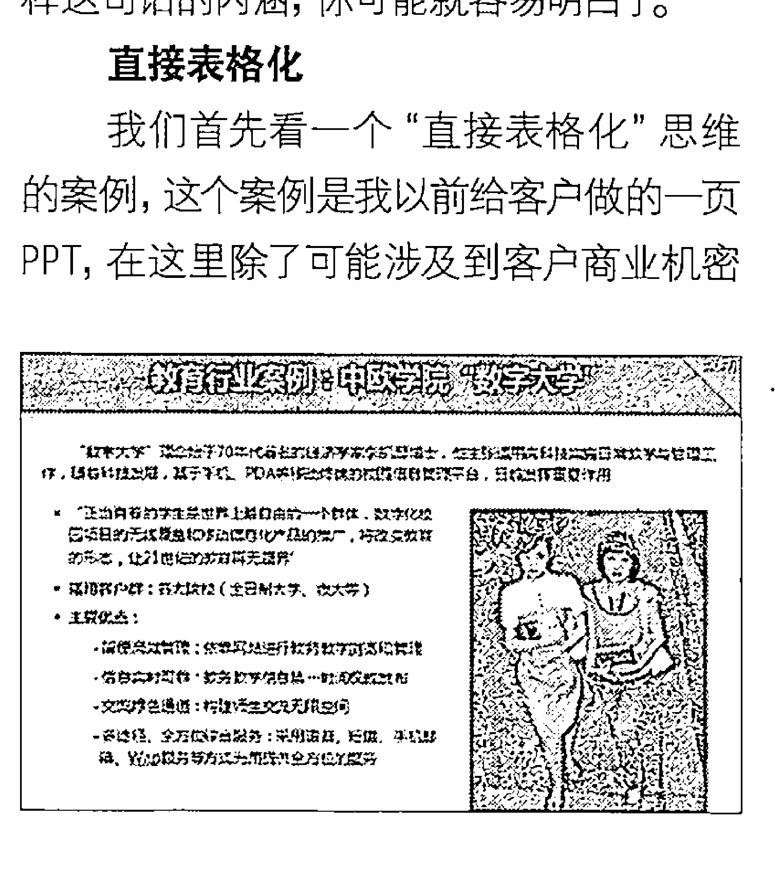

改动前：我们可以看看上面这幅PPT原页面，其实这张PPT已经做得还不错了，至少不能说难看。它之所以“还不错”，那是基于三点：一是页面中有图片，而且能较好体现文字表现的主题；二是段落分隔较为清晰，几个板块的内容都较为清楚；三是层次清楚，有一级（主要优点），也有二级（简便高效管理等）。

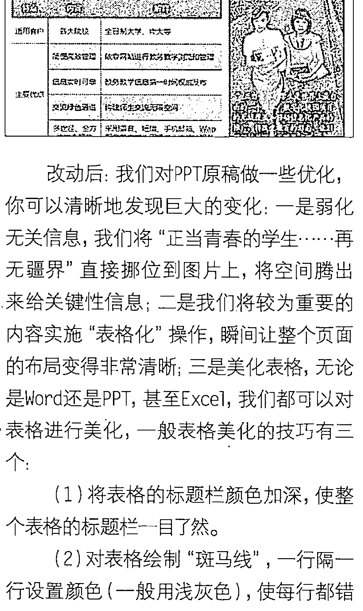

1.  将表格的标题栏颜色加深，使整个表格的标题栏一目了然。
2.  对表格绘制“斑马线”，一行隔一行设置颜色（一般用浅灰色），使每行都错落有致；
3.  对表格的边框实施优化。你可以像案例中那样去掉纵向两边的边框，也可以保留边框，将边框设置为虚线，也可以将最外面的边框设置粗线而里面的边框设置为细线等等。

#### 间接表格化

前面说的一种方法是将文字尽可能“合并同类项”，是比较直接的一种表格化方式。接下来我要谈一下相对比较隐晦的表格化方式，我把它称为“间接表格化”。

改动前：上面这页是一张较为普通的页面，很多文字，大致上也能看出来分了三个大的段落。大致上也凑合能看吧。

改动一：你知道原来的页面为什么难看吗？很重要的一个原因就是只有文字没有图，那接下来我们就考虑插入图美化一下。

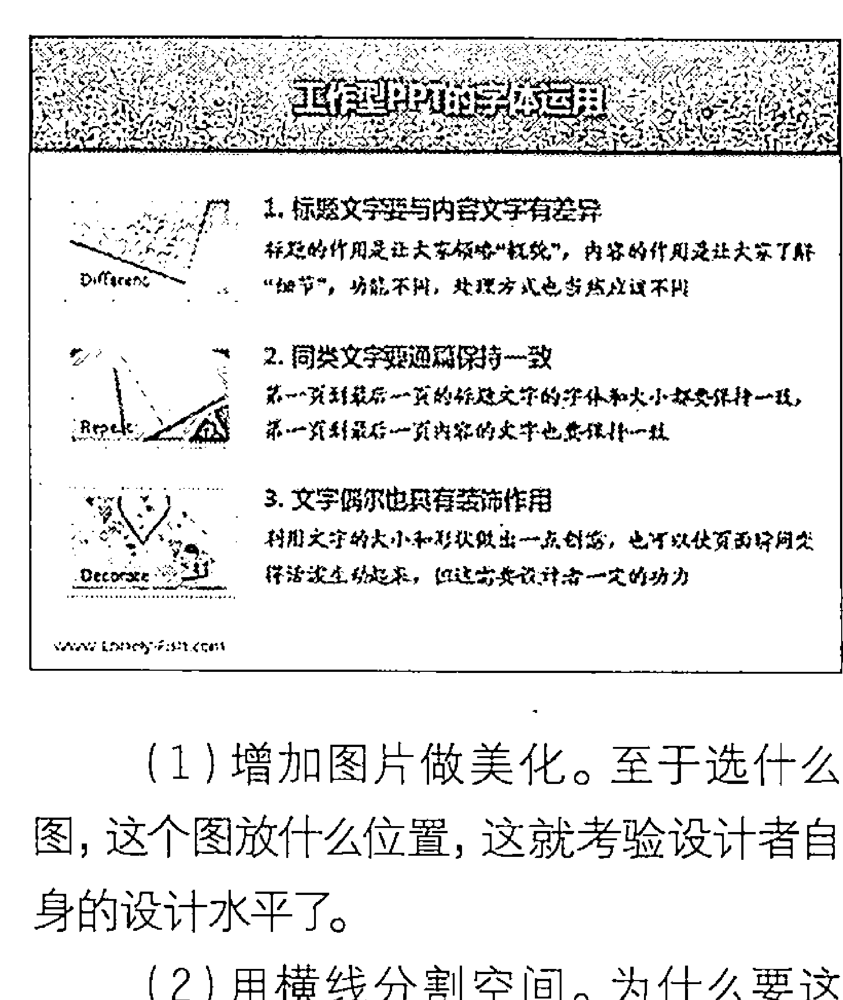

1.  增加图片做美化。至于选什么图，这个图放什么位置，这就考验设计者自身的设计水平了。
2.  用横线分割空间。为什么要这么做呢？各位朋友，你们自己想想看，琢磨一下。
3.  给图片加个标注。加标注也是有讲究的，这个标注不是什么词都可以用，至少我是这么认为的。我开始起的三个词是“Different(不同)—Same(相同)—Decorate(修饰)”，后来我换成了“Different(不同)—Repeat(重复)—Decorate(修饰)”，为什么我要这么做？你可以好好琢磨一下。现在告诉你，上面这张页面就是一张表格，你信吗？你可能不太相信。我告诉你，你换个视角看，你会发现这张页面是个“三行两列”的表格。我通过插入图片，将页面进一步表格化，使得整体效果比前面好了很多。

改动二：我不会满足于仅仅做个“较为美观”的页面，上面一个页面是想告诉大家，文字信息通过加入图片，可以重新布局为表格。现在我要告诉大家：文字不仅仅是文字，如果使用的恰当，它完全可以具备和图片一样的功能（美化功能）。看上图，你可以看见一张“三行三列”的表格，而使用了艺术字体的数字完全起到了美化页面的作用。

### “图表”瘦身术

作为管理咨询顾问，我可能比大多数人更理解图表的作用。在日常的工作报告中很多地方都需要用到图表，而且有了图表的报告通常让人觉得相对比较专业可靠。事实上，很多朋友不太知道如何使用图表，至少不太懂得“包装”图表。现在我重点谈几个图表设计的原则。

#### 简洁化原则

世界顶级视觉化大师Edward Tuft曾说过：“与数据无关的信息都不显示。”他也由此提出了一个“数据笔墨（Data ink）”的概念。所谓“数据笔墨”是指图表中不可去除的核心，是用来展示数据信息的非多余的部分。简而言之，数据笔墨就是图表中最内核的信息。

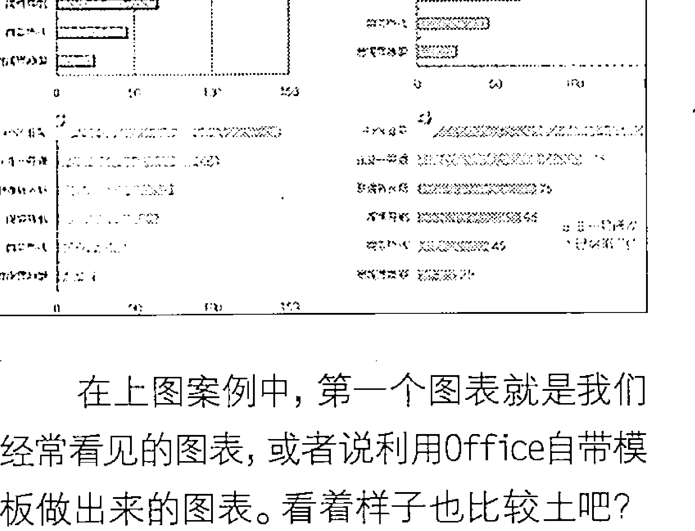

在上图案例中，第一个图表就是我们经常看见的图表，或者说利用Office自带模板做出来的图表。看着样子也比较土吧？第二张图表是我们在第一张图表的基础上去除了灰色的背景和间隔线，并且将各个柱子的颜色也调整为了一种颜色。第三张图表是在第二张图表基础上将图表的整个边框去掉了，然后将柱子的边框也去掉了。第四张图表则将纵向的坐标轴和横向的数值刻度也去掉了，同时将重点需要解读的柱子用对比色标注出来，标上数值（因为没有刻度了）。这样一张最简洁的图表就形成了，效果非但没有降低，而且表现力非常好。这个案例告诉我们，和图表无关的“肥肉”都是可以去掉的。

-   （1）去除所有不必要的非数据元素，例如：去掉不必要的背景填充色、无意义的颜色变化、图表网格线。
-   （2）弱化和统一剩下的非数据元素，例如：坐标轴、网格线、填充色、表格线都要使用淡色。
-   （3）去除所有不必要的数据，例如：不在一幅图表中放置太多的数据系列，只抽取关键的数据。

#### 平面化原则

请看下图中第四季度的东部、西部和北部三个柱子，你觉得哪根柱子长？每次我外出培训，拿出这张图的时候，几乎90%以上的学员会举手说“一样长”。其实我很了解你们的心思，你们觉得“一样长”的答案更像答案，这就是典型的成年人思维，喜欢揣测出题人的意图。话说回来，把这套思路用到一个职业管理咨询顾问身上，似乎有点……公布谜底吧，请看下图:

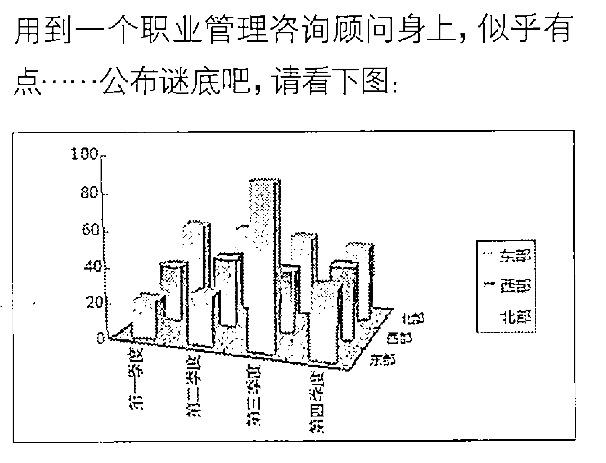

我不换数，只把3D图表变作平面图表之后，很显然可以看出第四季度中三个柱子的长短了，三根柱子根本不是“一样长”，而是北部的柱子最长。

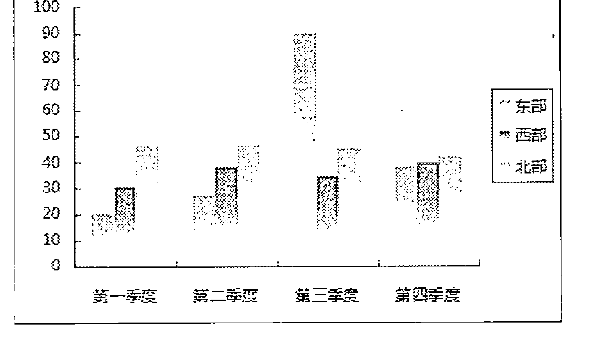

这个例子其实很明确地告诉我们这样一个事实：以后在工作报告中，无论是Word还是PPT，都不要用3D的图表，不管怎么样，都要用平面图表。切记啊切记，XDIM们。

#### 解体化原则

我们在工作汇报中使用图表的时候，经常会使用一种带有表格的图表，很多接受我培训的学员一看到这种图就马上兴奋起来，纷纷向我抱怨或者控诉：“我们老板就喜欢这种图，我几乎每个月都要画很多这种图表。”说实话，我很反对这种图表，因为它违背了图表的本质——简洁并易读。

其实我这里必须提一个图表的关键原则——一切以领导旨意为准。我所有教授的内容都是客观、科学的原则，但给你发工资和奖金的人毕竟不是我，以后给你升职机会的也不是我，所以你必须兼顾领导的意愿。你不一定可以一下子改变领导的想法，但你可以尝试着慢慢做些改变，这个月10张图表这样的，下个月搞个8张，再下个月减少到6张。

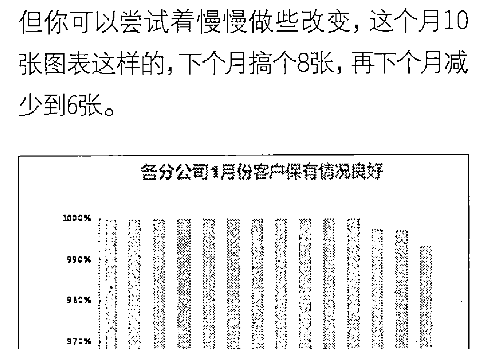

从图表设计角度看，我们要强调“解体化原则”，就是表格和图表要解体、要分开。有了图表就不要再加表格，有了表格就不要加图表。即使没有带表格的图表，我们同样可以将图表表述得更加有说服力！你信不信？

前一张带数据表格的图表仅仅是描述各个地市的客户保有率，仅仅是描述，而现在这张优化过的图表明显在表现力上比之前的要强有力得多，直接告诉阅读者“78.8%的分公司实现100%客户保有”，而不是给阅读者一堆数据，让他们自己去琢磨和领悟原始数据背后的含义。

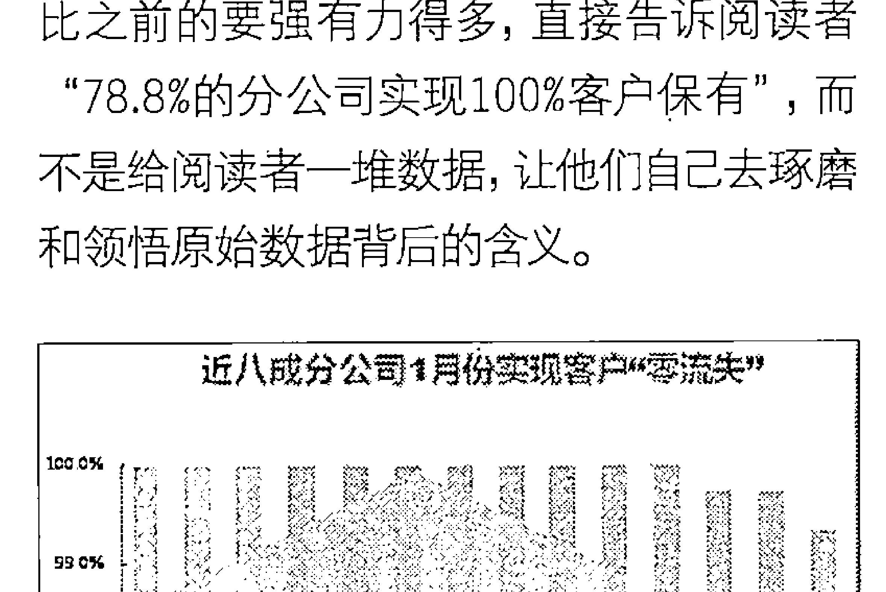

记住：你画的图表一定要有分析，要让读者一眼看到你的论点！

### “内容”变革术

前面我说过“文不如表，表不如图”，前面也用案例讲解了“文不如表”，现在我来讲解一下“表不如图”，由于这块内容对个人的创意、设计等能力要求较高，所以我把这个内容放在最后。

#### 表格变成图

以上这是一张很多人在年底汇报时可能会做的全年工作回顾简表。这张表格相对比较简单，但的确将很多信息作了很好的规整。但是这样的设计你不觉得很无聊吗？和同事的表格如出一辙。我们看看可以怎么设计呢？

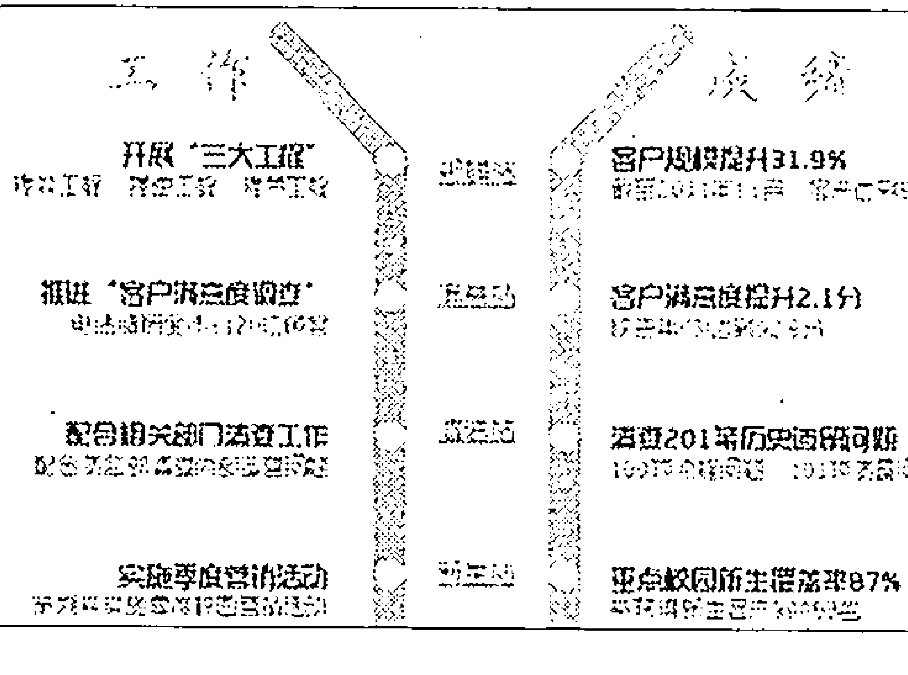

| | | | |
|---|---|---|---|
| 1 | 开展“三大工程”<br>改造工程、优化工程、服务工程 | 客户规模提升31.9%<br>较2011年11月，客户达到67万 | |
| 2 | 推进“客户满意度调查”<br>电话调查至企业3120的经营 | 客户满意度提升2.1分<br>较去年CSI达到92.3分 | |
| 3 | 配合开展部门消费工作<br>配合试点单位进行内部运作 | 消费2011历史遗留问题<br>1001遗留问题，1011遗留问题 | |
| 4 | 实施季度营销活动 | | 重点校园新生留存率87% |

你不妨模仿“地铁运行图”，将工作和成绩分别设计成一条轨道线路，通过最底下的箭头，引导你从上往下浏览整个页面。在每个站点（其实就是你最近一年工作的里程碑）将你最近一年的工作及成绩描述清楚。另外，将“站点名”提炼出一些主题词（规模、满意、清洁、新生）。

> **概念解释--员工满意度**
> -   员工满意度的定义：（1）员工满意=客户满意+股东满意=企业成功
> -   企业达成员工满意的途径：
>     ①建立以人为本的企业理念；②通过建立完善的企业环境包括自然环境、社会环境、软环境、管理环境、工作环境等；③为员工提供培训、展现其才能的机会，如员工培训、工作设计等。
>     员工满意度指标：（1）员工满意度，指员工接受企业的实际与期望值比较的程度（即企业期望与员工个人实际感受的差值）；（2）员工满意度指标，用来衡量员工满意度状况的客观指标。
>     员工满意度调查：对工作回报的满意感；对工作背景的满意感；对工作群体的满意感；对工作条件的满意感；对企业管理的满意感；对企业发展的满意感；

#### 文字变成图

改动前：典型的Word版PPT，标准的工作型PPT，字多无图无颜色。这种Word版PPT是很要不得的，因为PPT和Word其实分工比较明确，PPT负责提炼，Word负责详解。两种文件要配合着使用。像上图这样，把文字信息不分青红皂白往上一扔，基本上就是不打算让阅读者读下去了。当然，在某种情况下，这也是一种高深的厚黑学问，存心将一些信息弱化，让领导不注意。但很显然，这要求撰写报告的人的境界更高。

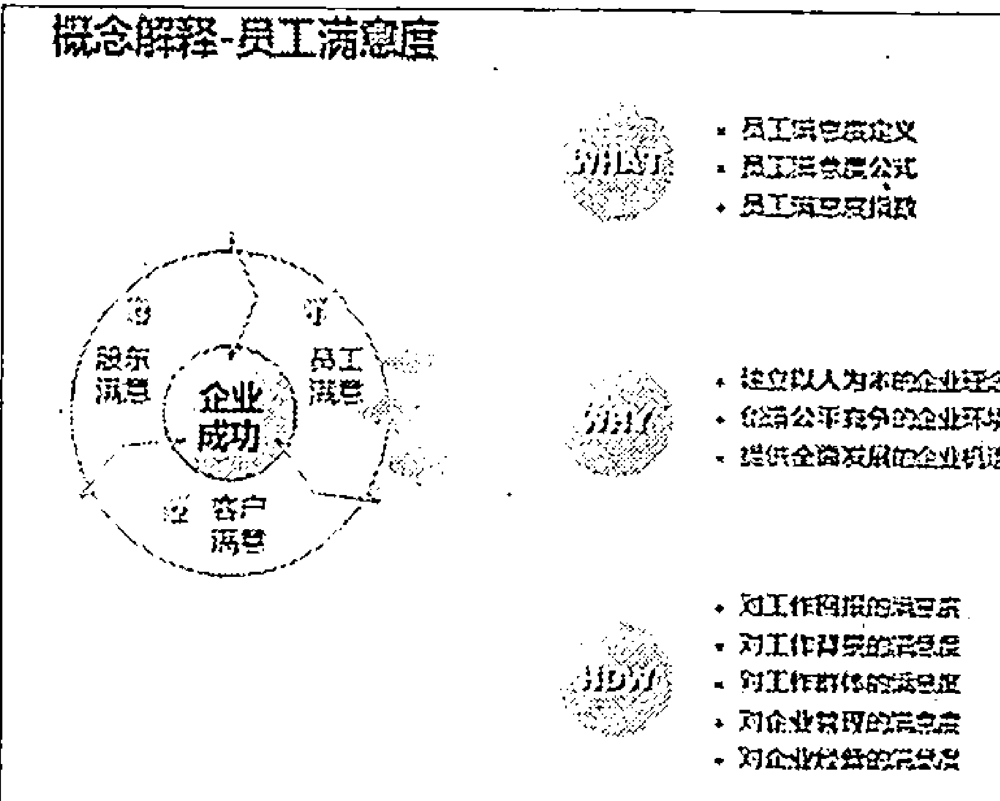

改动后：你如果仔细看了改动前的文字，你可以读清楚，原文讲了三个议题：什么是员工满意度（WHAT），为什么要做员工满意度（WHY），如何做员工满意度（HOW）。去除那些虚话和套话，将讨论的话题一条条梳理出来，形成逻辑模型图，这就大大降低了页面的信息饱和量，使得可读性大大提升。

策划\《电脑爱好者》编辑部
监制书童
撰稿卓旌国际首席咨询师 包翔

## Android 4.0驾到 千元平板选购攻略

去年这个时候，谷歌通过Android 3.0正式吹响了入侵平板战场的号角，携一批高价位的双核平板电脑与iPad展开了一场白刃战。一年之后，iPad依旧大卖，昔日谷歌阵营的双核联军却一败涂地。痛定思痛，谷歌再度祭出Android 4.0这面大旗，旨在移动市场（手机+平板）收复失地。与当年Android 3.0平板电脑上市之初的曲高和寡不同，Android 4.0平板的起价甚至不到500元，在打破了高价壁垒之后，Android 4.0能否成为安卓平板绝地反攻的标志？特别是在最受普通用户关注的千元级平板电脑中，新系统又能为这些产品带来哪些诱人的改变呢？

## Android系统家族回顾

Android，这个英文本意为“机器人”的系统，在短短几年间就击败了塞班、Windows Mobile，成为如今唯一有能力挑战iOS的智能系统。为了让大家更了解这个绿色的机器人，不妨先来温习一下Android的成长史吧。

2003年现谷歌Android主管安迪·罗宾创建Android，于2005年被谷歌收购。2008年9月，Android 1.0借HTC Dream正式登场，历经2.x系列版本的不断完善，至今已成为智能手机的代名词。随着三星Galaxy Tab的出现，算是Android首次试水平板市场，而以摩托XOOM为代表的Android 3.0平板的诞生，则显露了谷歌挥师平板市场的决心。随后的Android 4.0，可以视为平板电脑与手机市场即将“江山一统”（统一手机和平板的操作体验）的前奏，未来的Android 5.0则有望结束Android系统“碎片化”软硬件平台的历史。

### 小提示：高端Android平板之殇

将iPad视为高端平板的标杆，相信大家不会有意见吧？苹果的杀手锏是，只为iPad留下20%的毛利率，同时牢牢把握最优质的物料资源，没有给别的厂商留下任何价格空间。别人要想做到类似iPad品质和性能的机器，光成本就要比iPad的售价还要高。此外，借助App Store完善的生态链，使得开发者很容易在iPad上赚到钱，而且iPad与iPhone的软硬件平台相近，无需考虑太多兼容性问题。反观Android平板阵营，所谓的高端产品只能在理论性能上超过iPad，但在品质、操作感受和游戏、软件的质量上则很难与iPad抗衡。如果你对这个议题感兴趣，请参考2011年23期第84页《iPad还是xPad？平板是谁的天下》这篇文章。

| 系统版本 | 代号 | 发布时间 | 纪念产品 |
|---|---|---|---|
| Android 1.0/1.1 | 无 | 2008年9月/2009年2月 | HTC Dream (G1) |
| Android 1.5 | Cupcake (纸杯蛋糕) | 2009年4月 | HTC Magic (G2) |
| Android 1.6 | Donut (甜甜圈) | 2009年9月 | HTC Hero (G3) |
| Android 2.0/2.1 | Eclair (松饼) | 2009年10月/2010年1月 | 谷歌Nexus one |
| Android 2.2 | Froyo (冻酸奶) | 2010年5月 | 三星Galaxy Tab (P1000) |
| Android 2.3 | Gingerbread (姜饼) | 2010年12月 | 谷歌Nexus S |
| Android 3.0 | Honeycomb (蜂巢) | 2011年2月 | 摩托罗拉XOOM |
| Android 4.0 | Ice Cream Sandwich (冰淇淋三明治) | 2011年7月 | 三星Galaxy Nexus |
| Android 5.0 | Jelly Bean (果冻豆) | 2012年第三季度 | 未知 |

### 高端Android平板的尴尬

从Android的发展史来看，Android 3.0（蜂巢）是谷歌首款为平板电脑量身定制的系统，也是首度从系统层面与iPad开展了自卫反击战。虽然Android 3.0的系统结构和界面贴近了用户的使用习惯，但“非# Android 4.0助力主流平板

新iPad的起价不过499美元，这对Android阵营的高端平板而言犹如2012的末日预言。好消息是，随着Android 4.0系统“全民普及风暴”的来袭，让更多的国内企业也能获得挑战国际大厂的机会。早在2011年底，“冰淇淋三明治”就已经成为不少低价平板电脑的“零食”，并首次在系统层面走在了国际大厂的前面，而很多国际一线品牌至今仍未给老产品提供Android 4.0系统升级。

笔者认为，2012年国内的平板市场将呈现“沙漏型”的形态，即高端市场被iPad牢牢把控，中间是其他一线品牌的多核产品，而底部则是千元价位的低价平板。本专题所讨论的重点，将围绕沙漏的底部：千元级别的平板电脑展开。如果你有3000元以上的预算，或者对平板运行速度有极高的要求，那么就请绕过本文，iPad系列肯定是你的首选；反之，如果你想在有限的预算中取得性能和功能的平衡，追求“实用主义”，后面的内容可千万不能错过！

# Android 4.0更强调“软实力”

iPad之所以成功，iOS系统功不可没。细算起来，历代iPhone、iTouch和iPad加起来也有十多款产品了，但“不兼容”这个词却很少被此类用户谈及。反观Android系统，既有针对手机的2.x，又有为平板定制的3.x，再加上数不清的硬件平台，“不兼容”的呼声不绝于耳。为了避免手机与平板阵营出现更多的摩擦，为了统一使用体验，Android 4.0终于从幕后走向前台。

与以往的版本相比，Android 4.0并未带来多么令人激动的新功能，它最大的“创新”就是将手机、平板甚至智能电视的使用体验统一了起来，就好像iPhone和iPad，当你玩过其中之一后，另一个也可轻松上手。单就操作界面来看，Android 4.0和Android 3.0的差别似乎不大，而那些一眼看不到的细节改进，才是4.0系统最令人期待的特性。限于版面，下面笔者只列出几种对平板电脑颇具意义的变化。

## 1. 便于控制的虚拟按键

Android 4.0系统取消了底部物理按键设计，采用可随时调出的虚拟按键形式，有利于平板电脑取消物理按钮，设计更轻薄。

## 2. 更便捷的多任务管理功能

点击底部的虚拟按钮就会以列表的形式展示最近运行过程序的缩略图，点击某个缩略图就能立即切换，向右侧拖拽缩略图就能直接关闭该程序。

## 3. 文件夹更易创建和管理

你只需拖动一个程序图标到另一个图标上就会自动合成文件夹，然后可重命名并整理图标快捷方式，可以让你的桌面更整洁。

## 4. 针对特殊人群的优化

4.0系统加入了对特殊人群的照顾，比如针对盲人增添了屏幕阅读器的功能，还可选择更适合老年用户操作的“大号字体”。

## 5. 有趣的人脸识别功能

屏幕锁定状态下可以通过脸部识别解锁，就是说只要拿平板电脑在脸前晃一下，你的脸就是密码，平板就自动解除锁定了。

小提示：人脸识别功能并非Android 4.0平板的标准功能，至截稿日只有瑞芯微RK2918主控+最新4.03固件的产品才提供了该选项。希望其他主控厂商能在新版固件中加入这个功能，不要浪费了产品那个前置摄像头。

除了上述新功能之外，Android 4.0还加强了对多核处理器的优化，新版浏览器也更为人性化（比如“保存以供离线浏览”的功能）。如果你对4.0的更多新特性感兴趣，请参考http://bbs.cfan.com.cn/thread-1483488-1-1.html。

看完Android 4.0系统的新特性以后，接下来我们将面临一个更现实的问题：1000元左右的平板电脑，能否征服这个最新的系统？在挑选千元级平板电脑时，我们又应该注意哪些问题呢？

### 表1：国产三大主控对比

| 主控处理器型号 | 架构 | 最高/常见主频 | GPU |
|---|---|---|---|
| 全志A10 | Cortex-A8 | 1.5GHz/1GHz | Mali400 |
| 瑞芯微RK2918 | Cortex-A8 | 1.2GHz/1GHz | GC800 |
| 晶晨AML8726M-M3 | Cortex-A9 | 1GHz/800MHz | Mali400 |

# 千元级Android 4.0平板怎么选

目前，能提供完整Android 4.0体验要求的千元级平板电脑大都选用了全志A10、瑞芯微RK2918和晶晨AML8726M-M3三大国产主控芯片（表1）。有关这些处理器，《电脑爱好者》在前几期杂志上也做过较为详细的介绍，本文就将重点放在它们在Android 4.0系统的体验上。

小提示：别看全志A10、瑞芯微RK2918和晶晨AML8726-M3都定位低端，但它们都很好地把握住了Android 4.0系统升级的契机，在第一时间就准备好了相关的底层驱动并加以优化。理论上所有基于上述芯片设计的老平板都可升级到4.0系统。反观三星蜂鸟、德州仪器OMAP3600等主控，至今也没有升级4.0系统的动静，很可能就此终结在Android 2.3时代。

# 国产主控均能驾驭Android 4.0

三大主控在Android 4.0系统中的整体流畅度还是略逊于同产品在Android 2.3系统下的表现，主要表现在点击主页右上角按钮进入程序列表的一刹那，都会出现不同程度的卡顿现象，滑动屏幕时也略有掉帧的感觉。当然，这也和系统的优化有关，笔者手上的几款产品每升级一次固件，流畅度和测试软件的得分都会提升一点，最近的4.03版固件较最早的4.01版已经有了显著的提升。因此选择此类产品的用户，一定要时常关注厂商的固件更新信息。即便如此，在4.0系统中的平板电脑在易用性和实用性方面也远非针对手机定制的2.x系统可比，用句不恰当的比喻：可算找到“玩平板”的感觉了。

小提示：君正JZ4770也是一款不错的国产主控方案，并通过谷歌CTS认证，也是唯一可运行Android 3.x的单核芯片。要不是4.0系统放开了硬件要求，现在君正JZ4770的影响力可能会更大一些。JZ4770主频为1GHz，集成GC860显示芯片，但其架构并非我们熟知的ARM，而是MIPS架构。理论性能还不错，但对游戏的兼容性一般，目前也只被艾诺等少数品牌所采用，并不是主流主控。

就实际的应用测试来看，除了类似《暗影之枪》这种最新3D大作以外，三大主控在常见游戏面前并没有太大压力，但必须借助3D神器（后文有介绍）才能正常运行一些带数据包的高清3D游戏。在大家比较关心的上网体验中，瑞芯微RK2918的表现最理想，其次是全志A10，而晶晨AML8726M-M3在播放高清在线视频时会出现偶尔的卡顿问题，页面拖拽及缩放的流畅度也会逊色一些。

表2是采用不同主控芯片产品的性能表现，同时笔者还采用了德州仪器OMAP4430双核处理器的智器Ten3作为对比。Android 4.0系统对多核进行了优化，在游戏和看网络Flash视频上，OMAP4430较三大国产单核主控有着明显的优势，在系统的反应速度和操作流畅度上也更理想。当然，更流畅的代价也会体现在终端产品的价格上。智器Ten3应该算是最便宜的双核平板之一，但1499元的起价也超过了不少用户的预算。笔者认为，虽然三大国产主控在Android 4.0系统中的操作流畅度赶不上双核产品，但表现也在属于可以接受的范围内。便宜、够用，这就足够了。

## 表2：三大国产核心与德州仪器OMAP4430处理器在Android 4.03固件下的性能对比

| 测试项目 | 德州仪器OMAP4430 | 全志A10 | 瑞芯微RK2918 | 晶晨AML8726M-M3 |
|---|---|---|---|---|
| 安兔兔测试理论性能对比 | | | | |
| 总分 | 5115 | 2769 | 2172 | 2614 |
| RAM性能 | 863 | 398 | 321 | 329 |
| CPU整数性能 | 1472 | 643 | 509 | 514 |
| CPU浮点性能 | 1127 | 161 | 127 | 392 |
| 2D绘图性能 | 254 | 284 | 253 | 244 |
| 3D绘图性能 | 849 | 748 | 491 | 672 |
| 数据库I/O性能 | 310 | 220 | 190 | 195 |
| SD卡写入速度 | 81 | 116 | 90 | 85 |
| SD卡读取速度 | 159 | 199 | 201 | 183 |
| 处理器频率 | 1GHz | 1GHz | 1GHz | 800MHz |
| 基本应用对比 | | | | |
| 操作流畅感 | 非常流畅 | 流畅 | 流畅 | 流畅 |
| 1080P播放 | 挑格式 | 非常出色 | 比较出色 | 非常出色 |
| 网页浏览 | 非常流畅 | 流畅 | 流畅 | 一般 |
| 高清在线视频 | 非常流畅 | 流畅 | 流畅 | 一般 |
| 游戏对比测试 | | | | |
| 愤怒的小鸟 | 非常流畅 | 非常流畅 | 非常流畅 | 非常流畅 |
| 水果忍者-穿靴子的猫 | 非常流畅 | 流畅 | 流畅 | 流畅 |
| 极品飞车14 | 非常流畅 | 偶尔掉帧 | 偶尔掉帧 | 偶尔掉帧 |
| 暗影之枪 | 流畅 | 有明显掉帧 | 有明显掉帧 | 有明显掉帧 |
| 测试产品 | 智器Ten3 | 昂达V40精英版 | 原道N90 | 蓝魔W19 |

# 选平板不能忽视“面子”

和iPad不同，Android阵营的平板电脑在屏幕比例上并不相同，既有800×600、1024×768的普屏比例，还有800×480、1024×600、1280×800的宽屏比例（表3），你的脑袋大了没有？笔记本经历了从普屏→宽屏的时代转换，但平板电脑却随着市场规模的扩大，大有两极分化之势。宽屏优点在于欣赏视频时屏幕上下的黑边不会很明显，而普屏则更适合网页浏览和观看电子书，二者不存在孰优孰劣的问题，关键还是个人的使用感觉。

如果你注重显示效果，IPS屏幕肯定是必备的选购条件。但常见的IPS屏幕只有7英寸1024×600、10.1英寸1280×800和9.7英寸1024×768三种规格，而10.1英寸1280×800的IPS面板价格很高（产品多在2000元以上），因此如果你是“视觉控”，就只能在宽屏比例的7英寸1024×600或普屏比例的9.7英寸1024×768中任选其一了，前者小巧便携，后者视野更大。如果你可以接受非IPS屏幕的可视角度，则可以放宽条件，9英寸1280×800以及8英寸1024×768屏幕也是不错的选择，在拥有足够视野范围的同时，便携性要比9.7英寸的产品更理想。

## 表3：千元级平板电脑常见屏幕规格

| 宽屏 | 常见分辨率 | 备注 |
|---|---|---|
| 7英寸 | 1024×600像素 | 有IPS面板 |
| 8英寸 | 1280×768像素 | 多为普通面板 |
| 9英寸 | 1280×800像素 | 多为普通面板 |
| 10.1英寸 | 1280×800像素 | 有IPS面板 |
| 普屏 | 常见分辨率 | 备注 |
| 7英寸 | 800×600像素 | 多为普通面板 |
| 8英寸 | 1024×768像素 | 多为普通面板 |
| 9.7英寸 | 1024×768像素 | 有IPS面板 |

# 火速链接：低分屏平板小心变形屏

“变形屏”通常只存在于采用7英寸屏幕但分辨率却仅有800×480像素的平板电脑身上。这种7英寸面板的物理尺寸为16:9，而800×480分辨率的物理像素点为15:9，当两种不匹配的参数集于一身时，图像自然会出现压缩变形的问题，只是这种形变并不明显，不仔细观察和对比也不容易察觉。

学习如何挑选千元级Android 4.0平板电脑只是第一步，我们接下来的任务，就是学习如何用好这些搭载最新系统的“贴心伙伴”。

# 延伸阅读：即将上市的多核悍将们

除了我们熟知的NVIDIA Tegra 2/3、三星Exynos等多核处理器以外，大家还应关注三款即将上市的多核处理器，它们分别为瑞芯微RK30系列、创新ZMS-40以及海思K3 V2，分别针对低/中/高市场设计，拥有不俗的理论性能。相信随着它们的加盟，2012年下半年的平板市场将有可能成为“多核”普及的元年。

## 低端：瑞芯微RK30系列

作为RK2918的升级版，瑞芯微RK30系列处理器将采用Cortex-A9架构双核心设计，主频1.4GHz，集成4核ARM Mali-400图形处理器。就参数而言，RK30系列与三星猎户座处理器如出一辙，再加上瑞芯微在视频播放方面的传统优势，有望成为下半年千元级平板的新标准。

## 中端：创新ZMS-40

作为创新“汉之派”平台的处理器，ZMS-40基于Cortex-A9架构四核心设计，主频为1.5GHz，内置高达96个SP的GPU，并集成声霸卡音频技术，拥有许多中文使用工具。“汉之派”平台好似当年的联发科MTK方案，如果有足够多的OEM厂商支持，终端产品的价格有望控制在2000元上下。

## 高端：海思K3 V2

华为自主研发的四核处理器，K3 V2默认主频为1.2GHz或1.5GHz，内部集成多达16个GPU，并采用最高端的64bit带宽DDR内存设计以充分释放四核的性能。K3 V2号称业内最小、性能最强的嵌入式GPU。根据华为的定位，搭载该CPU的平板价格不会很便宜，至于性能还是等具体产品上市后再说吧。

# 不玩游戏的平板不是好平板

Android与iOS不同，大型3D游戏都需要先安装APK游戏文件，再将数百兆的数据包复制到指定目录中。由此会引发两个问题：第一，Android设备的硬件和系统版本非常混乱，游戏制作公司需要针对不同处理器（主控芯片）所集成的显示芯片（GPU）和屏幕分辨率进行特殊的优化，这就导致同一款游戏会出现高通版、三星版、NVIDIA版……等无数分支，玩家需要根据自己平板设备的处理器型号，下载对应的游戏版本才能正常运行；第二，大型游戏对数据包存放的路径有着明确要求，必须严格按照指定的路径存放。

## 游戏不兼容？神器帮你忙

目前Android平台的大型游戏基本会推出PowerVR、Adreno、Geforce和Mali四大系列GPU的专用版（表4）。可惜千元级平板电脑所用的处理器并非主流，比如瑞芯微RK2918的Vivante GC800就比较冷门，而全志A10和AML8726M-M3虽然也集成Mali-400，但网上很多针对猎户座处理器优化的游戏在这两个平台上运行还是会出现兼容性问题。如果你是游戏控，想最大限度提升平板电脑的游戏兼容性，“3D神器”（Chainfire3D）就成为你必须安装的应用之一了。

### 表4：游戏厂商最青睐的四种GPU

| GPU | 举例 | 相关厂商 |
|---|---|---|
| PowerVR | PowerVR SGX540 | 德州仪器、三星蜂鸟、苹果A5 |
| Adreno | Adreno 220 | 高通旗下全系列处理器 |
| Geforce | Geforce | NVIDIA Tegra系列处理器 |
| Mali | Mali-400 | 三星猎户座处理器 |

#### 小提示：何谓3D神器

Chainfire3D的作用，就是通过插件的形式模拟NVIDIA、PowerVR和QUALCOMM三大主流GPU的图形渲染工作，让平板电脑可以无视自身处理器型号，实现跨平台的游戏体验。

以采用全志A10处理器的昂达Vi40精英版为例，先下载Chainfire3D（下载地址：http://tinyurl.com/6t69dc7，包括主程序、密钥程序与3个zip格式的插件），在平板电脑上先后安装主程序和密钥程序。首次运行Chainfire3D需依次选择“CF3D驱动→安装CF3D驱动并自动重启→确认安装”，稍后平板电脑会自动重启。如果重启后发现Chainfire3D程序的图标不见了，再重新安装一遍主程序即可。

此时你会发现主界面多了很多选项，先点击“安装插件/着色”安装之前下载的3个zip格式的插件，返回主界面再选择“修复市场设置”。接下来你就有两个选择了，可以选择全局设置或选择性设置。笔者建议选择“每个应用程序的OpenGL设置”，只为少数不能正常运行的游戏定义模拟的插件。以时下最热的FPS大作《暗影之枪》（ShadowGun）为例，昂达Vi40精英版运行后只能停留在进入游戏之前的LOADING界面。没关系，运行Chainfire3D并进入“每个应用程序的OpenGL设置”界面，先在程序列表中找到并点击ShadowGun这个程序，在弹出的新界面中点击“使用插件”，选择NVIDIA（笔者下载的ShadowGun为Tegra优化版，如果是高通版就选QUALCOMM，以此类推），勾选“降低纹理质量”（不勾选这个选项同样会卡在LOADING界面，如果玩其他3D游戏会有卡顿现象，也能通过此法提升游戏速度），重新运行游戏，看是不是能正常运行了？

可以说，有了Chainfire3D之后你就不必担心网上下载的3D游戏属于哪个处理器的优化版了，让采用非主流处理器的千元级平板电脑也可以运行90%以上原来不兼容的游戏。需要注意的是，当你想卸载Chainfire3D之前，一定要依次进入“管理插件/着色器”，卸载之前安装的3个插件，再进入“CF3D驱动”选择卸载CF3D驱动并重启，最后再卸载Chainfire3D程序。

### 小提示

运行Chainfire3D程序需要平板电脑已经被Root。采用全志A10处理器的平板电脑大都默认已经Root，采用晶晨AML8726-M3处理器的平板可以用Z4root软件一键Root，而瑞芯微RK2918则可借助GingerBreak软件实现。至于选用其它处理器的平板电脑，具体的Root教程请网上搜索。

## 数据包 你在哪里安家

轮到第二个问题了，游戏数据包必须存放在指定的目录内（通常为\sdcard\Android\data\或者\sdcard\gameloft\games\），但不同硬件平台默认的存储路径会存在差异。以采用的AML8726M-M3处理器的蓝魔W19为例，主机内置存储空间的默认路径为\mnt\flash\，将数据包放在此目录内运行游戏时自然会出现找不到数据包的问题，因此用户要么额外买一张TF卡用于存放数据包文件，要么先Root设备再修改系统配置文件（\system\etc\下的vold.fstab）。

而瑞芯微RK2918（比如原道N90）比较特别，在没有TF卡时会将系统内存虚拟成\mnt\sdcard\，当有TF卡插入该目录则会自# 小结

随着千元级平板电脑的热卖，网上相关论坛的人气也是水涨船高，在某些热门机型的讨论版块中已经有人整理了可以完美兼容的游戏资源汇总帖。只要采用了相同的处理器，这些资源在不同的平板电脑产品上也是通用的，如果你嫌Chainfire3D操作复杂，也可在类似的论坛中找到适合自己机器的游戏资源。

# 面子小 请大屏设备来帮忙

平板电脑的屏幕最大也只有9.7英寸或10.1英寸，一个人躺在被窝玩游戏时的确挺爽，但想与家人或朋友一起分享，这个尺寸就谈不上任何的视觉冲击力了。还好，HDMI接口已基本成为千元级平板电脑的标配，通过它与大尺寸的显示设备相连，不就可以获得更震撼的视觉体验吗？

### 小提示

由于机身尺寸的限制，目前平板电脑基本都采用了Mini HDMI或Micro HDMI标准的接口，在购买视频线时需要多加留意。此外，全志A10和晶晨AML8726-M3处理器本身就已经集成了HDMI输出模块，而瑞芯微RK2918则需要配备第三方芯片才能实现HDMI输出的功能。因此，市售带HDMI接口的平板电脑多以采用A10和AML8726-M3处理器的产品为主，而带HDMI接口的瑞芯微RK2918平台的平板电脑则鲜有低价产品。

# 不同方案效果不同

在Android 4.0系统中，无需任何软件或驱动，采用三大方案的平板电脑都能实现全界面输出的功能，连上HDMI线就可以直接将画面输出到显示器上，只是在操作形式上有所区别。

全志A10：接上显示器后平板电脑本身的屏幕不会关闭，就好似笔记本与显示器相连时的“复制模式”，当关闭平板电脑屏幕，或当它进入待机状态时显示器的画面也会关闭。该方案的优点在于方便，玩游戏时我们只需看着平板电脑的屏幕操作即可，精准度最高，旁人则可通过显示器分享你的操作成果。缺点同样明显，屏幕常亮势必加剧耗电问题。还好，在播放视频时，A10平板电脑的屏幕会自动黑屏，只留有播放控制的菜单，起到一定的节能效果。

# 谁说便宜的平板电脑不能办公

平板电脑的崛起，对价位相似的上网本冲击极大，也让更多手持人民币的用户“纠结”了起来：就这么点钱，选上网本还是平板电脑？就笔者的使用经验来看，如果你家里已经有了台式机或笔记本，只是想再选一部随时娱乐的便携终端，偶尔处理一些简单的工作文档，上网看视频，那么Android 4.0平板电脑已经足以撼动上网本的地位了。不相信？请往后看。

# 想办公 优秀应用少不了

上网本可以办公，而平板电脑也能处理简单的办公操作。在Android 4.0系统中，笔者推荐“办公套件”（OfficeSuite Pro，下载地址：http://www.nduoa.com/apk/detail/102688）这款软件，它可以完美兼容Windows系统中的微软Office文档，对TXT、Word、Excel和PPT等文件进行修改编辑。与其它办公软件相比，该软件处理微软格式比其他任何程序都更快更精确，而且在平板电脑上主界面也会变成分栏的形式，左侧是目录，右侧为文件列表，顶部为编辑菜单，布局人性化，使用更便利。

想在动辄7英寸屏幕的平板电脑上实现高效的文字输入，笔者还推荐“百度PAD输入法”（下载地址：http://www.nduoa.com/apk/detail/128137），综合表现比搜狗、QQ、触宝等输入法更优秀。该输入法最大亮点是在横屏状态拥有“拼音-拇指”的输入界面：左侧为数字区，右侧为“九宫格”拼音区，在编辑文档时手指无需全屏移动去点选某个字符，极大提升了输入效率。此外，如果你觉得虚拟键盘占了屏幕太大的空间，在设置中还能调整虚拟键盘的高度。

# 高效率还需外设来帮忙

笔者建议使用无线键鼠套装，一枚Nona适配器就能同时控制键盘与鼠标。通过USB HOST线将适配器与平板电脑相连后，Android 4.0系统会自动识别硬件，2秒左右你就会发现平板电脑的屏幕上出现了鼠标的指针，接下来你就可以用鼠标对平板电脑下达指令了。此时，鼠标的左键即确定键，右键为返回键（退出程序或返回上一级）。

# 空间告急怎么办

千元级平板电脑可能在性能上拼不过三星、华硕、ACER等一线品牌的平板电脑产品，但就视频播放一项来说，它们则可以秒杀包括新iPad在内的顶级多核平板！既然平板电脑可以方便地接驳显示设备，又能毫无压力地播放网上随便下载的高清片源，连上电视看高清自然成为最佳的娱乐享受。可惜对平板电脑那8GB或16GB的存储空间而言，720P的高清视频还能勉强应付，但一部1080P视频基本就会占满所有可用空间！想解决平板电脑存储空间的瓶颈？此时就轮到USB HOST（USB OTG）上场了。

和iPad不同，Android平板基本都支持USB HOST功能，利用机身的USB接口可以方便地读取U盘、移动硬盘（支持NTFS格式）内的数据。在Android 4.0系统中更是大幅加强了外设的兼容性，类似键盘和鼠标已经实现了即插即用，再也不需要第三方软件的配合了。USB HOST功能的使用方法很简单，在平板电脑的包装内基本都会附赠一条USB HOST数据线，一头与平板电脑上的Mini USB或Micro USB接口相连，另一头则与存储设备相连，在/mnt/路径下（通常为usbhost1或usb_storage等）就能看到外接存储设备中的数据。

USB HOST接口也能识别移动硬盘，但平板电脑本身无法满足供电需求，所以必须使用带额外供电接口的双头USB线，或者移动硬盘本身安装电源适配器才能正常使用。

# 远程控制

你平时会将视频、图片和重要数据都放在什么地方？没错，肯定是家里的电脑上。每次想在平板电脑上浏览上述内容，都需要走一套“平板电脑通过数据线与电脑相连→选择USB模式→将硬盘数据复制到平板电脑的存储空间中”的繁琐流程，好不麻烦。其实，只要你家里有WiFi网络，完全无需上述步骤，直接在平板电脑上就能无线欣赏电脑硬盘中的影片，或者复制、修改或删除电脑硬盘中的任何文件。

首先需要登录网灵官网下载“网灵移动办公受控端”和“网灵移动办公控制端”（下载地址：http://www.wangling-tech.com），并在“注册ID”界面中申请用于远程控制的账号密码。将下载的受控端文件解压缩，以管理员身份运行wangling_skd_setup.exe，根据提示输入之前申请到的ID（注册邮箱也可以）和密码，接下来会提示让你输入自动拨号接入宽带网络的账户和密码（不必理会，直接跳过），最后点击安装即可。在任务栏右下角可以找到网灵受控端程序的图标，右键选择“查看状态”，如果提示“访问成功”就可进行下面的操作了。如果报错，请检查防火墙设置。

将控制端压缩包内的APK文件复制到平板电脑中并安装，输入网灵ID和密码登录就会看到受控端电脑的信息，选择“连接”就能进入具体的功能界面。此界面一共提供4大功能，“屏幕控制”就是我们的目的，将电脑显示器的画面映射到平板电脑的屏幕上，用平板来“遥控”电脑，比如直接播放电脑本地的视频文件。而“文件管理”功能，则可脱离数据线，让平板电脑直接访问电脑硬盘，进行本地文件的下载（复制）和删除等操作。

# 游戏玩家的福音

当平板电脑连接键鼠套装后，除了便于办公以外，对喜欢玩模拟器游戏的玩家来说更是一个好消息。时下主流的FPse、DroidEmu和PSX4Droid等模拟器软件都支持物理按键映射功能，可以将控制按钮逐一与键盘的WASD等按键关联上，用键盘体验昔日的经典。

以MD模拟器Tiger.Genesis为例，依次进入“输入设置→按键设置”，根据使用习惯将虚拟的操作按钮映射到键盘上，同时关闭屏幕上虚拟键盘的显示，可以获得更好的视觉效果和操作体验。接下来运行游戏吧，此时的游戏感觉，和普通的电脑或笔记本还有什么差别吗？

### 小结

Android 4.0系统大幅提升了对周边外设的兼容性，配合第三方软件可以实现基础的办公功能，这就赋予了平板电脑更广阔的生存空间。

当然，如果你还有些类似PS图像、视频编辑或者比较复杂的PPT制作等需求，现在的平板电脑还难以胜任，还得借助上网本或笔记本来完成。

### 小提示

使用网灵之前，请确保平板电脑和电脑都已接入网络（最好是同一个无线网络，速度最稳定）。如果你家里没有无线路由器，可以通过Connectify等软件将笔记本的无线网卡共享，虚拟成无线AP供平板电脑使用，具体的教程请上网搜索。网灵远程控制软件最大的特色就是通用性强，而且没有任何关于IP地址、连接方面的设置，全自动穿透内网NAT路由器。只要双方能上网，哪怕相隔千里，也可实现远程监控。

### 小结

远程控制是未来平板电脑最具潜力的应用之一，借助平板的屏幕，远距离遥控电脑的体验还是极具实用价值的。当网络带宽足够时，你再也不必担心平板电脑的存储空间不够、Android系统不兼容Windows程序等问题，因为平板电脑此时已经变成了你家里电脑的显示器，通过平板电脑的屏幕就能运行电脑上的任何Windows程序！

# 全文总结

虽然新iPad上市了，iPad 2和一揽子昔日高端的双核平板都降价了，但它们的价格还远未到普通用户可以接受的程度，这股新旧更替的旋风并没有对千元级平板电脑造成太大的影响。因此，在预算有限的情况下千元级平板依旧是尝鲜体验Android 4.0系统的首选，并可以为你带来足够流畅的操作体验和更多人性化的功能。

# Win8来袭 你Hold住了吗

在期待的目光中，微软终于正式发布了Windows 8消费者预览版（以下简称Win8），相信不少“童鞋”已经用上了Win8。而对于很多在观望中的朋友来说，他们更希望深入了解Win8，想知道Win8比他们现在使用的操作系统有哪些新的改变。

确实，作为一款全新的操作系统，Win8采用了全新的设计理念，不管是Metro界面的开始菜单屏，或者是布满Ribbon按钮的资源管理器，还是各种和系统无缝结合的在线应用，无不处处体现Win8颠覆传统的设计，自然这也给一直在使用WinXP或Win7的用户带来操作上的不适应。因此在本期的专题中，我们就结合生活中的实际操作体验，让读者朋友对Win8有一个更深入的了解。

作为一款全新的系统，Win8的操作界面和操作逻辑发生了很多改变，初次上手的用户可能会感到不太适应。本专题将从Win8的界面变化、基本操作、常用功能以及如何升级和安装等几个方面入手，带领读者朋友们一起认识Win8的“新鲜面孔”。

## 初识Win8——一起认识Win8的“新鲜面孔”

### Metro界面开始菜单屏

从Win95微软推出开始菜单以来，很多用户就是通过开始菜单启动各种程序的。但是如果开始菜单中的程序过多，那么查找起来会相当麻烦，因此很多用户选择将应用程序放在桌面或任务栏。为此Win7引入了超级任务栏和锁定应用程序来提速用户的操作，但任务栏的空间终究有限，而且在任务栏锁定过多的图标之后，会挤占新的程序的使用空间，操作起来始终没那么方便。

#### Win8亮点

Win8彻底告别了开始菜单，它开始使用Metro界面开始菜单屏来取代传统的开始菜单。首次进入Win8系统后显示的就是漂亮的Metro界面，这里集成了游戏、社交、娱乐、照片、音乐和视频、图书和参考、新闻和天气等各个类别的应用。而且桌面也被作为其中的一个应用集成到开始菜单屏中，这样用户在开始菜单屏就可以完成大多数程序的启动。

### 小知识：什么是应用

Win8系统新增了一个“应用”新名词，应用其实就类似Win7中的“程序”，但是它比程序的概念更广泛。比如在Win8的开始菜单屏中，传统的桌面就是其中的一个应用，其他诸如天气预报、IE浏览器、在线商店、SkyDrive网盘都是Win8的应用。Win8使用开始菜单屏替代传统桌面，它可以将所有应用集成到开始菜单屏中，在这里快捷启动或切换各种应用。Win8试图引导用户新系统的使用就从开始菜单屏开始（因为桌面也已经成为开始菜单的一个应用）。

据说微软发布Win8消费者预览版之后，全世界最大的呼声就是：“微软，还我们开始按钮。”让“小小”的开始按钮消失，彻底改变了用户多年以来的习惯。一款操作系统的习惯如此偏向触屏用户，确实让很多传统用户无法忍受！

### 技巧：向Metro界面添加Gmail邮箱

常规步骤下，是无法在Metro界面添加Gmail邮箱的，正确的方法是需要更改语言位置：打开控制面板，进入“更改语言首选项”窗口，单击“添加语言”按钮，将English(United States)调整到第一项，确认之后重启系统，或者注销并重新登录，就可以在Metro的邮件应用中看到Gmail的选项，按照提示添加Gmail邮箱即可。

### 小技巧：添加或删除Metro界面的应用

Win8可以非常方便地将自己的应用程序添加到开始菜单屏，只要选中程序右击选择“固定到开始菜单屏”即可（如果要批量添加，按住Ctrl键多选即可）。如果要将程序除去，选中需要解锁的程序后右击，然后单击下方的“将该项目从开始菜单上解锁”即可。不过开始菜单只能一个一个取消锁定，比如安装搜狗输入法后，会在Metro界面新增“设置”、“设置向导”、“扩展功能”三个按钮。如果要批量取消上述按钮的锁定，只要在Metro界面右击上述任意一个按钮，然后单击下方的“打开文件位置”，在打开的窗口中将指定的三个快捷键全部删除即可。

### 程序不再需要关闭

打开的程序多了，极易导致死机，这也正是Windows被戏称为“瘟到死”的原因之一，因此每次结束程序，最好是选择完全退出，但我们平时使用的智能手机，似乎根本不需要关闭程序的嘛。
在Windows系统中，虽然关闭程序的方法比较多，最常见的方法自然是单击右上角的×形按钮，或者也可以从主菜单选择“退出”，当然还有万能的Alt+F4，但无一例外都必须在相应的程序界面下才能关闭。如果没有及时退出某个程序的进程，那么将耗费巨大的系统资源，导致系统运行迟缓，情况严重时甚至会假死。

#### Win8亮点

Win8的应用并没有包含“关闭”的功能，这是微软的设计使然，当运行另外一个应用程序的时候，当前的应用程序会被自动挂起，只有资源不足时，系统才会关闭这个应用程序。因此，一般情况下，Win8不需要特地关闭应用，如果你非要关闭，那么可以将鼠标移到屏幕左上角或左下角，此时会列出所有正在运行的应用，鼠标右击选择“关闭”，可以关闭除了当前正在使用的其他程序。如果需要关闭当前程序，只要将鼠标移到最上面，变成手的图标，向下拖拽到最底部即可。

不需要关闭程序？拖拽式的操作显然更讨好触摸设备的用户。

### Ribbon风格的资源管理器

资源管理器是我们最常用的组件了，平时对文件的复制、粘贴；应用程序的打开；照片的查看、浏览等等操作都是在资源管理器完成的。Win7的资源管理器相比之前的版本有了不少的改进，但是大部分的操作仍然是借助各项菜单完成的，它的资源管理器的菜单栏仍然沿用WinXP的设计，并不能给我们日常操作带来多大的便利。

#### Win8亮点

也许微软认识到了资源管理器菜单设计的不足，在Win8使用了Ribbon按钮样式的设置，传统的菜单按照菜单功能分类分列在Ribbon按钮的上方，子菜单的功能则全部以Ribbon按钮替代。

使用过Office 2010组件的朋友就知道，在这个套件的菜单界面中，微软使用了大量的Ribbon按钮设计，这种设计赢得使用者的一致赞誉。Win8系统中，微软就将Ribbon按钮设计移植到了资源管理器中。这样不仅方便触摸操作，和传统菜单式设计相比，它可以将所有功能有组织地集中存放，不再需要查找级联菜单、工具栏等等，并且更好地在每个应用程序中组织命令，提供足够显示更多命令的空间。丰富的命令布局可以帮助用户更容易地找到重要的、常用的功能。

举个简单的例子，比如打开一个保存图片的文件夹后，切换到“管理”组菜单，对于图片常见的管理功能，如旋转、放映、设置为背景等功能菜单就归类在这菜单组下，大大方便了我们对图片的管理。

作为大家使用最频繁的组件，Windows每个版本的资源管理器都有新的变化，Win8的Ribbon菜单设计给我们日常操作带来极大的便利。

### 可自定义显示的锁屏图片

在平时的使用中，如果我们临时有事外出，很多朋友就会按下微软键+L锁定电脑。Win7用户锁定电脑后，屏幕显示的是用户登录界面，一些不怀好意的用户经常会在你离开电脑时试图猜测你的密码登录系统。

#### Win8亮点

Win8的锁定界面新增了图片显示功能，当我们按下微软键+L锁定电脑时，此时屏幕显示的是一张图片，左下角还会显示当前系统时间和网络状态。用户的登录界面被隐藏在图片后方，如果其他人不注意就不会轻易发现你的电脑已经被锁定，而且显示图片支持自定义设置，只要进入“电脑设置→个性化设置”，然后选择一张合适的图片即可，在下方的选项还可以自定义设置在锁定图片上显示的项目。

Win8的锁机图片隐藏了用户登录界面，可以更好地保护电脑不被其他用户登录。

## 了解Win8——体验Win8新特性

作为全新的系统，默认情况下Win8的很多设置都是针对平板、触摸而设计。因此Win8很多设置对于我们目前PC使用的“鼠标+液晶显示器”操作模式就显得有些“水土不服”。但正是由于为平板设计，所以Win8很多的新特性都给日常操作带来了简单和快捷。

### 体验感更好的IE10

作为系统自带的浏览器，IE仍是目前使用用户最多的浏览器，很多朋友从Win95开始就在使用IE。在平时的网络浏览中，大家都习惯使用IE界面的前进、后退来浏览打开过的网页，或者使用新建选项卡打开新的网页，使用收藏夹菜单收藏页面。

#### Win8亮点

Win8系统将浏览器升级到了IE10，浏览器的显示页面也做了很大的改进，如果我们在开始菜单启动IE，显示的是一个全屏界面的窗口，没有原来IE常见的工具栏、菜单或侧边栏，也没有关闭按钮，整个界面看起来要清爽许多。这就是专门针对Metro风格体验设计的IE10，是一种新改进的浏览方式，我们可以真正地只关注我们想要浏览的信息而不是浏览任务——一种完全沉浸式的体验。与此同时，IE10还提供了我们所熟悉的所有安全性和控制：选项卡、键盘快捷键、InPrivate 浏览等更多功能。

不过IE10在带来清爽的同时，也给很多老版本IE用户带来困惑，因为他们甚至不知道该如何输入网址，更别说如何浏览网页了。其实要切换到经典IE界面，只要在IE窗口右击，在桌面下方就会出现设置菜单，单击设置按钮，接着选择“在桌面上显示”，此时IE窗口会自动切换到桌面显示。继续在IE标题栏右击勾选“菜单栏”，现在的IE10界面是不是很熟悉了呢。

### 小知识：为触屏设备量身打造的IE10

对于刚开始使用IE10的朋友肯定很不习惯，因为新的IE10就是为触屏而生的。全屏显示初衷就是为触屏设备扩展更大的显示界面，IE10会根据用户操作难易程度，经过简单的点击(或移动)操作就会出现对应的菜单。这种巧妙的设计，既保证尽可能多的显示界面，同时又不会给用户的操作带来不便。

如果只是简单的前进、后退浏览，将鼠标移到IE窗口的左侧或右侧即会自动浮出相应的功能按钮。

如果需要使用常见菜单按钮，只要在IE窗口右击，此时IE窗口会自动缩小，在上方会出现关闭、新建选项卡菜单，下方则会出现地址栏以及前进、后退功能按钮。

如果需要进行更为复杂的设置，如启动“Internet选项设置”，只要将手指(PC对应为鼠标)移动到IE窗口的左上角，立刻会弹出设置菜单，可以在此启动搜索、共享或者对IE选项进行设置。

Win8自带的IE10的设计显然照顾到了触摸和传统用户操作，触摸用户大多通过开始菜单屏启动各项操作，这样默认启动的是全屏设计的IE，传统PC用户通过桌面启动IE则是经典模式。

### 以智能的名义复制文件

对于绝大多数用户来说，复制文件可以说是操作频率最高的任务之一，但Windows的复制很不给力，一旦复制对象出现任何问题，都会自动中止复制进程。如果是复制大文件，经过了长久的等待，却始终看不到结束的迹象。假如点击“取消”按钮，那么一切就只能重新开始，这可真是一场噩梦!

可惜的是，Win7虽然已经在复制方面有了很大的改观，例如可以在复制对话框提供复制进度和复制速度的信息，但仍然没有提供断点续传的复制功能，而且在复制过程中如果出现重复文件，那么只会提供“复制和替换”、“不要复制”和“复制，但保留这两个文件”等有限的选项。如果是重复的文件夹，那么只提供了“合并”的选项，必须借助Total Commander等第三方软件才能实现更智能的复制。

#### Win8亮点

从Office 2007开始，微软引入了全新的Ribbon界面，现在可以在Win8的资源管理器中看到它的身影。Ribbon界面可以为用户提供大量直观快捷的操作，例如复制、剪切、移动、全选等。

在资源管理器下复制文件，我们可以看到一个增强的对话框，这里除了提供剩余时间、剩余项目、复制进度等丰富的信息之外，还有一个非常生动的图像区域。复制框的右上角增加了两个按钮，点击“暂停”按钮可以暂时停止复制，再次点击可以重启复制进程，也就是说增加了断点续传的功能，只有再次点击右侧的×按钮才是真正取消复制。

如果复制过程中出现重复文件，这里除了替换、跳过等选项之外，还增加了“选择要在目标夹中保留的文件”的选项，选择之后会提供更丰富的信息，现在用户可以作出更准确的判断。如果有多个复制进程，那么会将多个复制框进行合并，方便用户的查看。

不要小看微软的这一创新，让呆板的复制对话框更生动，可以让用户有更多的选择，毕竟复制是用户最经常的操作之一。

### 让系统恢复再简单一些

俗话说：常在河边走，哪有不湿鞋。如果系统出现问题，在修复无效的情况下，恐怕只能重新安装系统，其中所耗费的时间和精力可想而知。因此，很多朋友是利用Ghost来解决这个问题。

Win7在这方面作出了很大改进，默认设置下会自动启用系统分区的系统还原功能，借助还原点可以还原系统，打开控制面板的“系统还原”窗口，你会发现这里的提示比较简陋，提供的选项比较少，在人性化方面做得很不够。

#### Win8亮点

提供了令人惊叹的恢复功能，按下Win+I组合键启动Charms按钮组，打开“电脑设置”界面，切换到“常规”面板，这里提供了“恢复电脑而不影响你的文件”和“初始化电脑并重新开始”两大工具。

恢复电脑而不影响你的文件：相当于重装系统的功能，恢复后将导致用户配置被还原为默认值，系统中安装的第三方软件将被全部清除，Windows应用商店安装的应用则被保留，当然其中有一个自动下载并重新安装的过程。整个过程轻松自然，完全没有Ghost的繁琐。

初始化电脑并重新开始：这个功能比较危险，一方面会将系统还原到初始安装的状态，另一方面会删除用户的所有信息，包括用户配置、用户数据文件、安装的软件和应用。最尴尬的是，初始化之后，产品密钥也将被清除，需要重新激活。这个功能特别适合于经常搞测试的用户，不保留文件也不会留下痕迹。

用户可以根据这两个功能，在不同的情况下进行选择，提示非常清晰，正常情况下应该不会造成用户的误解。即使是初级用户，也可以按照系统的指导，通过这种简单快捷的操作界面，也能轻松解决计算机故障。

## 为不同程序设计输入法

在Microsoft Office中，我们可以设置自动加载微软拼音输入法，而在QQ的某个版本中则可以绑定QQ输入法，这些人性化的设置都为我们提供了便利。所以很多朋友都希望能为更多的程序启用对应输入法。

在Win7中，在退出或最小化应用程序之后，输入法也就随之关闭，需要调用时必须再次选择或按下快捷键，无法为应用程序进行个性化的设置。

#### Win8亮点

Win8在这方面有了很大的创新，只要曾经在某个应用程序调用过第三方输入法，那么在按下Ctrl+Space组合键之后，只是暂时将这款第三方输入法隐藏，并没有真正退出，切换输入法的正确方法是使用Windows+Space组合键，切换时会有OSD界面，从中选择相应的输入法即可。

从控制面板依次选择“时钟、语言和区域→语言”，进入“高级设置”界面，在这里勾选“允许我为每个应用窗口设置不同的输入法”，确认之后即可生效。

### 技巧：恢复24小时的时间格式

默认设置下，Win8的时间只是显示为“上午XX:XX”或“下午XX:XX”的格式，看起来很不顺眼。解决的办法是重新设置时间格式，从控制面板打开“时钟、语言和区域”窗口，在左侧窗格选择“更改日期、时间或数字格式”，打开“区域”对话框，将“短时间”改成HH:mm，将“长时间”改成HH:mm:ss，确认之后即可恢复24小时的时间格式。

### 设置个性化的密码

对于很多对安全要求比较高的用户来说，简单的字符式密码可能无法满足他们的需要，但如果借助硬件进行加密，显然又会带来技术上的难度。而Win7仅仅提供了呆板的字符式密码，即使再复杂，在面对强大的第三方破解工具的情况下，可能也很快就会被那些专业黑客所攻破。

#### Win8亮点

Windows Live ID的密码一般是比较复杂的，每次登录都输入这一复杂的密码显然比较麻烦，此时可以使用图片密码和PIN密码：按下Win+I组合键，激活Charm菜单，依次进入“设置→更多电脑设置→用户”，在这里可以创建图片密码或PIN密码。

图片密码：首先需要载入一张图片，然后在图片上画出点、直线、圆的组合，这些手势都将成为图片密码的一部分，重复之后即可完成，系统将根据用户是否点击到焦点位置以及点击的顺序来判断用户是否正确输入，从而决定是否解锁。很显然，该功能主要适用于触摸屏用户。

PIN密码：使用4位阿拉伯数字，有利于触摸屏用户使用屏幕键盘进行快捷解锁并登录，熟悉iPhone、iPad、iPod touch设备的用户应该不会陌生。

完成设置之后，可以使用图片密码或PIN密码进行登录，安全性得到很大的增强，也很有趣，应该会有一些用户喜欢该功能。不过，如果图片解锁的功能应用在文件加密方面，那么应该有利于文件的安全。

### 截图的流水线服务

如果由于工作的需要，经常需要抓取相关的截图，一般都是按下Win+PrtSc组合键抓取当前窗口，接下来打开画图或其他图形程序执行粘贴操作，最后是命名保存，整套流程走下来，至少也要30秒，如果需要连续截图，那么工作量可想而知。

虽然Win7提供了名为“截图工具”的附件，免去了安装第三方截图工具的麻烦，但功能相对简陋，因此更多的朋友仍然是选择SnagIt等第三方工具实现截图的自动保存，对于新手来说，操作相对复杂。

#### Win8亮点

只要按下Win+PrtSc组合键，不需要任何的设置，屏幕闪烁之后，即可将当前屏幕快速截取下来，并且会自动保存为PNG格式的文件。也就是说，你只需要按下快捷键，相关截图会按照顺序自动命名、自动保存，第一次的截图命名为“屏幕截图.png”，第二次的截图命名为“屏幕截图(2).png”，依次类推。可以在用户文档的“图片”文件夹下找到相关的图片文件。

如果觉得默认的保存位置不太合适，可以双击打开用户窗口，找到“我的图片”文件夹，右击打开属性对话框，切换到“位置”选项卡，在这里重新设置默认的位置，即可将截图自动保存在指定的文件夹，从而提高截图的效率，这样就不需要安装那些第三方的抓图软件了。

有了这一功能，需要时只管按下Win+PrtSc组合键，其他的不必关心，最后去图片文件夹“收割”即可。当然如果Win8允许用户定义默认的文件命名规则和图片格式，那么就更妙了。

### 利用Windows Live ID实现一站化操作

在外企工作，每天都有大量的文秘事务，最主要的工作自然是处理邮件和备忘录，如果是在本地工作，自然是使用Office Outlook，考虑到移动办公的需要，一般会将相关文档放在SkyDrive。

Win7系统下，每次需要打开浏览器，登录到http://www.live.com/，反反复复几次进行切换，然后才能获取到所需要的信息，操作起来相当的繁琐。

#### Win8亮点

只要使用Windows Live ID账户登录系统，此时你会发现Metro界面已经将包括SkyDrive、天气、邮件、备忘录等各个方面的信息整合在一起，无论是查看邮件或者是在在线处理存储在SkyDrive的文档，显然是方便多了。

进入“电脑设置”界面，切换到“同步你的设置”面板，在这里可以选择需要自动同步的设置项目，例如个性化设置、桌面个性化、轻松使用、语言首选项、应用设置、浏览器设置、资源管理设置和鼠标设置，即使是在其他机子上使用Win8，只要使用相同的Windows Live账号登录，就可以获得统一的设置。

对于使用Windows Live Messenger聊天、使用Hotmail/Live系列邮箱、使用SkyDrive在线存储文档和照片的专业人士来说，这样的一站化操作显然大大简化了操作流程，也更有利于在平板电脑等智能设备下使用，操作便捷的同时还节省了网络流量。

### 技巧：取消密码输入的环节

打开运行框，输入control userpasswords2，随后会打开“用户账户”对话框，在这里取消“要使用本计算机，用户必须输入用户名和密码”复选框，确认之后连续输入两次密码即可。

### 技巧：将本地天气与Metro的日历完成绑定

不需要安装第三方的天气应用，利用Windows Live账号即可同步订阅天气。

- 第1步：获取相应城市的天气代码。在浏览器访问http://weather.raychou.com/2/list/，输入自己所在的城市名称，这里可以使用中文或拼音作为关键词，例如“张家港”，搜索之后会显示一周的天气预报，同时可以在地址栏看到类似于http://weather.raychou.com/2/detail/58353的URL地址，请将58353这串位于网址末尾的五位数字记录下来，这是我们所需要的城市天气代码。
- 第2步：订阅日历。登录https://login.live.com/，切换到Hotmail选项卡，在这里选择“日历”，点击“订阅”按钮进入订阅界面，将http://weather.raychou.com/2/detail/58353/ical/58353.ics=复制到“日历链接”后面的文本栏，注意实际操作时请替换相应的城市天气代码，在日历名称填入城市名称，颜色可以任意选择，最后单击“订阅日历”按钮即可。

完成上述步骤之后，注销并重新登录系统，无需其他的设置，立即就可以在Metro环境的“日历”位置看到刚才所设置的天气信息，即使处于锁屏界面，天气信息也仍然能够正常显示。

### 启用分屏技术

随着大屏幕液晶的不断降价，现在使用22英寸、23英寸甚至更大屏幕的用户越来越多，大屏幕可以给我们带来更多的显示空间。这样我们可以在一个屏幕上平铺两个以上的应用程序窗口，比如一个当前工作程序窗口，一个则是IE浏览器窗口，达到工作娱乐两不误。不过对于Win7之前的系统，我们只能手动调整程序窗口的位置，调整操作比较麻烦。

#### Win8亮点

Win8内置了自动分屏技术，它可以在我们需要显示多个程序窗口时自动激活。Win8的分屏有两个应用，对于开始菜单屏中激活的应用，我们可以在桌面随时使用鼠标将其拖到桌面左侧，这样桌面会被自动分成两个屏幕，一个小屏幕显示应用列表，另一个主屏幕则显示当前工作桌面（可以随时进行切换）。如果是两个桌面当前的应用程序，只要用鼠标将程序窗口往左右侧拖动，当前屏幕即可自动分成两个大小相同的子屏幕，分别显示两个程序。

大屏幕的普及是个必然的趋势，Win8的分屏设计则是为大屏幕用户量身打造的，无需任何设置，只要简单拖拽即可自动激活，大大方便大屏用户使用。

### 提高阅读效率

现在越来越多的文件都以电子文件形式发布，而电子文件中大多都采取PDF的格式。此外，微软提供的操作系统安装镜像文件主要是使用ISO格式，这都需要在系统中安装相关的第三方工具，也是很多用户装机必备的软件。在Win7系统下，要浏览PDF文档，那么仍然必须安装Adobe Reader或其他的第三方软件，与以前的操作系统相比，Win7唯一的进步是在安装Adobe Reader或Adobe Acrobat之后，可以在资源管理器的预览窗格直接查看PDF文档的内容。要浏览ISO文件，那么必须安装WinRAR或WinISO，总之是必须安装第三方软件。

#### Win8亮点

现在不再需要安装Adobe Reader等软件，借助于内置的Reader应用，在资源管理器窗口就可以直接浏览PDF、XPS格式的文档，虽然提供的功能相对简陋，但也基本够用。当然，如果你希望对PDF文档进行编辑，那么还是需要安装相关的软件。如果是ISO或VHD格式的镜像文件，那么可通过右键菜单直接装载，对于光盘则可直接镜像，也就是说我们可以获得一个与操作系统高度兼容、完全免费的虚拟光驱工具。

微软提供这两个功能之后，显然带给用户更多的便利，一般情况下即使不安装相关软件，也可以顺利浏览PDF文档、处理ISO文件，只是不知商业公司是否会抱怨微软的垄断？


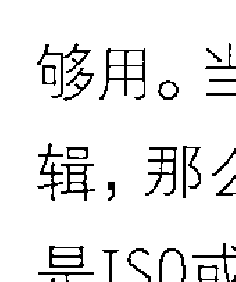

### 更快、更好用的搜索

在平时的操作中，我们经常要通过搜索启动程序或者查找文档。Win7的一大改进就是增加了强大的搜索功能，既可以在开始菜单，也可以在任意资源管理器窗口启动搜索，这种无处不在的搜索为我们的操作带来了极大的便利。

比如我们要启动组策略编辑器，但是只记得组策略命令前三个字符是gpe，只要在开始菜单的搜索框输入上述字符即可快速搜索并启动组策略编辑器。

#### Win8亮点

Win8取消了开始菜单，但是Win8的搜索功能并没有取消，而且有了更大的进步。

一方面它改进了搜索算法和默认设置，大大提高了搜索速度。而且在默认情况下，在资源管理器启动对某一目录的搜索后，Win8就会自动在后台建立索引（而不像Win7那样弹出是否建立索引提示），索引的建立可以给下一次的搜索提速。

另一方面搜索的使用更便捷。在取消了“开始”菜单按钮之后，Win8用户随时按下微软键，然后输入程序或者文件名称（或开头几个字母），系统会立即启动搜索（而且Metro界面还有自动更正功能）。不但可以搜索应用名称，还可以搜索应用中包含的内容（比如邮件客户端中的邮件、流媒体客户端中的影片、符合搜索关键字的PDF文档等），而且搜索结果会分列在不同应用中，大大方便我们查看搜索结果。

Win8虽然取消了开始菜单的搜索（资源管理器搜索仍然保留），但是任何时候按下微软键，然后输入程序或者文件名称，系统会立即启动搜索。不仅搜索的速度更快，而且搜索的范围也更广。

### 更快速的USB3.0

闪盘是我们平常使用最多的USB设备，大家经常使用它来交换资料，不过USB2.0的传输速度实在让人有些心烦，一个高清电影文件的传输就得耗费不少时间。幸好现在USB3.0的闪盘越来越多，它可大幅提高闪盘读写速度（理论极限速度是USB2.0的10倍）。不过Win7并没有集成USB3.0设备驱动，要使用USB3.0的闪盘，必须先装其驱动程序，否则仍会被Win7默认为USB2.0设备。

#### Win8亮点

作为新的系统，Win8已经自带USB3.0的驱动。USB3.0驱动实际上是主板USB控制芯片的驱动，对于自带USB3.0端口的主板，无需任何设置，安装好Win8后会自动安装USB3.0驱动，打开Win8设备管理器，展开“通用串行总线控制器”即可看到成功安装的USB3.0驱动。

USB3.0驱动的集成真正实现了新USB设备即插即用。

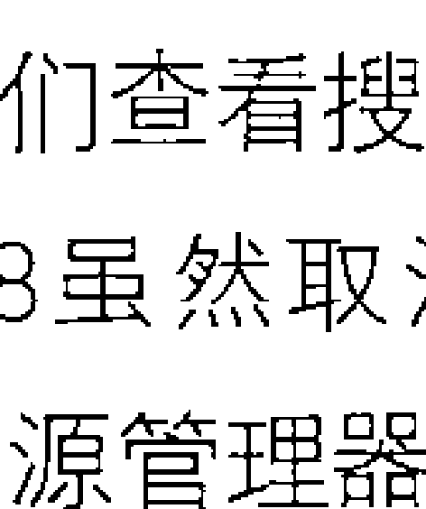

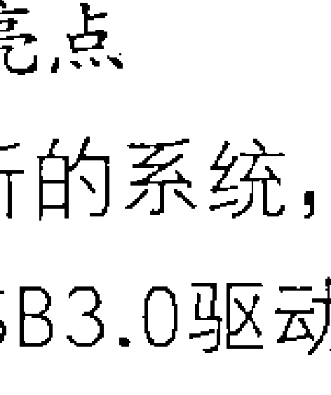

### 随时可用的云存储

为了方便数据的交换，很多朋友喜欢将数据保存在网盘中，这样不管到了哪里都可以对数据进行访问。为了方便上传/下载网盘数据，我们经常将网盘客户端安装到系统中，但是在Win7系统我们只能安装第三方客户端如快盘等。

#### Win8亮点

Win8首次将微软网盘Skydrive客户端集成到了系统中，如果使用微软账户作为系统账户，那么只要登录系统就登录了网盘，我们可以随时访问Skydrive网盘中的数据。在开始菜单单击Skydrive图标，在打开的页面就可以直接使用Skydrive服务了，这里可以下载或者上传各种文件。

### 小提示

> 由于MSN、Hotmail、Skydrive都是用微软账户，因此Win8用户也可以在系统中直接使用MSN和好友聊天（只要在开始菜单单击消息图标，在打开的页面就可以选择好友直接进行交流了，而且好友消息还会直接在桌面弹出），或者直接登录Hotmail邮箱发送邮件（在开始菜单单击邮件图标，在打开的页面就可以直接读取邮件了，如果要发送新邮件，单击左上角的+按钮即可）。
>
> Win8集成的网盘、MSN和Hotmail邮箱几乎涵盖了我们常见的网络活动，无需安装任何软件即可使用，为我们提供了一站式的在线服务。

### 丰富的关机选项

初次接触Win8的用户可能找了半天都无法找到关机的位置，甚至不得不按下电源按钮强制关机。微软的设计初衷是考虑到平板等数码设备，毕竟iPad很少关机，因此Win8将关机的功能隐藏得比较深入，但并非取消了该功能。

只要将鼠标移到桌面右下角，此时会浮现出一个快捷窗格，选择“设置”，进入设置界面之后选择“电源”，然后就可看到睡眠、关机、重启等选项。

#### Win8亮点

虽然关机稍麻烦了些，但关机的速度比起Win7显然是一个飞跃。如果是在桌面环境，只要按下“Alt+F4”组合键，同样可以见到类似于这样的对话框。或者，也可以将关机选项添加到右键菜单，下载http://media.askvg.com/downloads/2012/03/Add-Cascading-Power-Menu-in-Desktop-Context-Menu.zip这个文件，解压之后导入注册表，在传统桌面右击选择Power Menu，在这里选择相应的关机选项即可。

> Win8的关机设计显然有些令人头疼，很多初次接触的用户可能根本找不到关机的位置，其实微软的设计初衷是认为Win8根本不需要关机，难道你的智能手机经常关机吗？

## Win8系统大家谈

Win8的改进和新特性，大家已经了解了。或许微软的设计初衷和出发点是美好的，但Win8如何面对这残酷的现实更让人关注。微软将大量时间、精力和金钱投入到Win8平台支持触摸上。出于成本考虑，PC OEM厂商会不会接受台式机和笔记本的触摸功能，如果系统不支持触摸功能，Win8较Win7有多大优势？

## Win8改变的不仅仅是外观

作为新的系统，Win8从外观上就有了很多的变化。其中最为关键的变化是增加了“图”：开机后焕然一新的图形化启动、登录前增加的漂亮锁屏图片、进入系统后显示的Metor界面开始菜单、资源管理器中新增的Ribbon图标按钮。

Win8系统为什么要增加这么多的“图”，这些“图”的背后又隐藏着什么？其实这和微软Win8战略目标是紧密相关的。经常关注IT新闻的人都知道，平板电脑是近来乃至未来一段时间内最为流行的IT设备，Win8的战略目标就是平板电脑操作系统市场。目前平板电脑市场是安卓、iOS双雄并存，作为桌面操作系统的霸主，微软自然不会放过这个庞大的平板电脑市场！

因此为了适应平板电脑的操作，微软在Win8中融入了大量的图片元素。因为大家知道平板电脑都是使用触摸式的操作，触摸操作什么最方便、最精准？自然是图片无疑。按钮图片化操作不仅可以让使用者获得更愉悦的视觉感受，而且可以大大提高操作效率。举个简单的例子，Metro界面的开始菜单，首先从外观上看，五颜六色的图片按钮和精美背景图片显然比传统的开始菜单要漂亮得多，其次从手指触摸操作上看，磁贴式的图片按钮肯定是比触摸字符式的开始菜单来得简单、精准。

不过俗话说“有得必有失”，Win8在取悦平板用户的同时，由于外世界的“巨变”，也让很多传统Windows用户颇有微词。据说微软发布Win8消费者预览版之后，全世界最大的呼声就是：“微软，还我们开始按钮。”网友的抱怨是：微软想给予什么，我们不知道。但是我们想要什么，微软也不一定知道。其实作为下一代的操作系统，Win8系统从最早的泄漏版开始一直到最近的消费者预览版，关于Win8的是是非非就没有停止过。到底是让我们适应Win8，还是让Win8适应我们？这个答案需要等到Win8正式版发布后的市场占用率如何才能告诉我们。Win8能否取得成功，让我们拭目以待吧。（俞木发）

## Win8或许是微软的一记重拳

很多人都认为Win8的推出会对平板电脑市场格局引起变革。确实，除了界面的大变，Win8这次的改进明显是偏向触摸体验的。但是很多人没有想到，对于常规笔记本，当屏幕可以触摸之后，很多现在大家所诟病的功能，都将在指指点点之间得到解决。

就现在看来，触摸操作完全可以替代鼠标，就使用场景来说，这将极大地提高工作效率。毕竟，当你打字时需要选择一段文本的时候，用手去屏幕上直接选择，要比腾挪出去操作鼠标方便很多。当笔记本有了触摸功能，那相比普通笔记本+iPad的解决方案，这种性价比明显高很多。再深一步来想，因为Win8支持触摸，一旦超极本具备了触摸功能，那么，超极本在与苹果iPad的竞争中将获得更多筹码。如果现在消费者认为超极本不过是很轻薄的传统笔记本，那么等超极本配上Win8，这种观念肯定会改变。

因此Win8的变革，不单是微软对谷歌安卓、苹果iOS系统的反击，更是整个IT产业的革新。越来越多的PC厂商推出平板电脑，而一些手机厂商也借机步入平板市场。在微软宣布Win8全面支持触控后，英特尔走上了超极本之路。根据英特尔的描述，未来的超极本会有多种形态，可能是一个折叠的超薄、超持久、可触控的笔记本；可能是一种平推式的或是旋转的可触控笔记本；可能是双屏幕的笔记本；可能由一个平板电脑加上一个底座组成，插在底座上就是PC，拆下来就是一个平板电脑；甚至是支持手势隔空操控。无论怎样，最终目的都是要打破苹果iPad在移动领域的硬件“垄断”，将传统PC跨界到移动终端领域。（王志军）

策划 | 《电脑爱好者》编辑部
监制 | 沿博
撰稿 | 俞木发 王志军

## 覆“水”难收！水货手机你敢买吗

如今，手机正以突飞猛进的速度向着智能化时代发展，昔日诺基亚一览天下的时代已经悄然而去，苹果谷歌两大阵营的崛起让越来越多的消费者深切地体会到智能手机带来的便利。在智能手机用户不断壮大的同时，行货手机与水货手机也悄然形成了两大阵营，它们如天平两端的筹码，左右着消费者的购买意向。

智能手机越来越好玩，升级系统、刷机成为很多玩家的乐趣。而行货手机出于质量、稳定性和售后服务的原因，其把玩“自由度”并不高，以致于越来越多的用户开始将注意力转移到水货手机市场。不过目前卖场中的水货手机都是从国外走私进入内地，因此大部分没有国内行货所谓的三包凭证，售后基本都由经销商负责。并且这类产品在进入海关的时候都是机器和配件分离状态，并且质量参差不齐，这就让销售端的奸商有机可乘，于是各种花样伎俩的谋取暴利行为成为了水货手机市场并不光彩的“风景线”。

对于消费者甚至手机玩家来说，多数人都知道水货存在或多或少的问题，但却无法抵御其低价的诱惑和无拘束的娱乐体验。在他们不断购买水货手机“中招”的同时，又有新一批买家“试水”，形成了一种奇特而畸形的供需关系。不过从本刊记者的角度来看，最终受害的全部都是消费者，所谓低价和自由体验都是要付出一定代价的。水货手机购入后，品质和保修一律要自身承担，一旦出现问题，消费者们只能哀叹覆“水”难收了。

### 一台i9100引出的“水情”报告

“能说脏话吗？”面对本刊记者，Jackie模仿近期走红网络“油价哥”的台词略带调侃地说。

> “能说脏话吗？”

其实任何人遭遇Jackie的购机经历都同样有骂脏话的冲动。在一个多月前，刚领到稿费的Jackie兴冲冲地前往中关村鼎好电子商城地下一层的手机卖场，准备购买向往已久的三星i9100手机。由于这款机型行货价格高达3500元左右，所以他毅然选择了均价低于3000元的水货机型。在一家店面和老板讨价还价，自认为懂点水货常识的他把店面的所有销售人员侃得“心服口服”，最终以2899元的价格成交。

然而，Jackie在接下来的应用中却遇到了诸多问题。首先是和同事的行货机比，自己这款的屏幕明显偏暗，即使将亮度调至最大，也就和行货的正常亮度持平。并且装载新软件第一次运行时必然死机，后来严重到接电话也偶尔死机。而且机器后盖并不是很严丝合缝，有些细小的缝隙，当然，这是他起疑之后仔细检查才发现的。

意识到不对后，Jackie找到几个懂手机朋友的过来验机，并同时把相关问题发布到了一些手机论坛，得到的答案均是此款为翻新机。了解情况后，Jackie立即去那家店面要求更换，这时候的销售完全变了嘴脸，再也不是当初那种“心服口服”的态度，并且拒绝更换和推机。Jackie在生气之余还愤怒地发现，当初这家店面给自己开出的收据居然没有盖章，即使叫来了市场管理人员，人家也表示很无奈，无法对商家采取任何处理措施。

谈到这里，Jackie淡淡一笑，又和笔者调侃道：“你说，事情到了这步，我除了脏话，还有什么可表达的呢？”

> “你说，事情到了这步，我除了脏话，还有什么可表达的呢？”

可能是因为有这次惨痛的“哑巴亏”，Jackie对水货手机进行了深入了解，虽然研究时间不长，但是却也颇有心得。他对本记者表示，其实手机卖场中有很多的经销商都有自己翻新二手手机的条件，他们将低价回收的热门二手手机通过换壳、清洗和后封等手段处理之后，一部外表崭新的翻新机就由此诞生了。这些机型在翻新过程中出现了问题，商家肯定不会淘汰，而是卖给那些购买意向强烈且防范意识不强的买家。交易结束后，在开发票的时候故意不盖公章，其实已经做好了买家回来讨说法的准备，而买家通常将注意力集中在了新手机上，往往忽略了发票盖章的重要性。

### 眼见未必实·仅仅是“波澜”

Jackie显然对于自己的见解很自信，毕竟是用自己的痛苦经历换来的经验。其实在本刊记者看来，他看到的这些远非水货手机的真实情况，不过是“死水微澜”罢了。“真的吗？”Jackie有些不太相信，然后若有所思地沉默了。其实Jackie的遭遇仅仅是“冰山一角”，真正的“坚冰”还远未触及到。目前，水货手机市场空前繁荣，普通消费者几乎分不清哪些是行货，哪些是水货。而水货手机经销商就是利用这些机会，将消费者一步步引入早已设好的“陷阱”。

Jackie显然对于自己的见解很自信，

### 超低价诱惑

Jackie首先就是被这类低价攻势所轰倒，看到心仪的i9100行水之间差价有五六百元，毅然决然地选择了水货，这也正是水货经销商所希望看到的结果。

例如在苹果的iPhone 4S销售最火的那段时期，一些水货商家就曝出了3550元超低价格（当时港版实际售价4330元）。当消费者咨询购买时，商家会告诉消费者这个价格只能买有锁的机器，然后说明一些有锁机器的缺点，转而向消费者推荐价格更高的其他版本，一旦消费者“中招”，经销商就可以玩弄各种花样。

最常见的手段有以下几种：

- 1. 经销商会不断地说消费者已经看好的产品的缺点，动摇消费者的意志，从而推荐自己店中的手机。一旦消费者改变主意，等于放弃了自己事先了解好的产品信息，转向了并不了解的陌生产品，被坑仅仅是个时间问题。
- 2. 经销商可以按照自己宣传的超低价格卖给用户手机，但需要额外绑定配件，也就是说消费者还必须要支付另外一笔钱来购买与该手机相关的配件，比如手机套、手机膜或者电池等，但价格往往都高得离谱。
- 3. 如果经销商连绑定配件的手段也不用，那么建议消费者趁早放弃，要知道天下没有免费的午餐。价格太低的产品要么是翻新机，要么就是原装配件已经被掉包。Jackie显然就是中了这个圈套。不过他的i9100翻新或掉包的利润远远不如苹果的iPhone或者iPhone 4S，这类产品只要将机器的主板和屏幕掉包，卖出去一部就会获得800元以上的利润。如此一来，虽然售价比市场均价要低很多，但实际上这单生意是稳赚不赔的。

### 低价代购圈套

这类陷阱简直可以用不讲理来形容，而从中也体现了经销商的伎俩也在不断更新。随着消费者防备心理不断增强，光靠翻新机赚取显然是行不通的，况且很多用户在买手机之前都会积累一定的辨别方法，对于手法不熟练的经销商来说，翻新机很难得逞。也正是因为如此，网络代购成为了升级版的陷阱。

肖伟就是看中了一家淘宝店铺中的三星GALAXY Nexus比其他店铺便宜500元，所以才拍下了产品，只不过要接受日版代购的条件。很快手机便快递过来，拆包一看，缺少电池配件。他找到同样用此款手机的同事借电池开机，却发现无法使用，原来这类日版机器一般都会有网络锁，普通用户拿到机器根本无法使用，需要解锁才行。于是立即和商家联系，交涉结果是购买电池和支付解锁费用，算起来比产品均价还贵了70块钱。

与翻新机不同，日韩有锁机本身质量还是过硬的，商家的赚钱要点也不在更换配件上，只不过是先引诱肖伟这样的买家购买付款，然后再执行自己定制的霸王条款罢了。遇到这种情况最有效的方式就是：

- 1. 最好杜绝网上购买低价有锁版的手机；
- 2. 向商城投诉卖家。

### 移花接木

水货手机按来源国的不同会分为日韩版、亚太版、欧版和美版几大类，而不同版本的价格相差很大，且有着本质区别。多数的日韩版机都是有锁的，也就是说这些机器只能用本国的SIM卡，而国内的经销商可以通过破解让其使用国内的手机卡也可以正常通话，但是这些机器破解后会出现信号不稳定、系统不稳定等系列情况，因此价格要比无锁机器便宜很多。

Annie的遭遇很简单也很普遍，就是买了一台港版iPhone 4S，结果在使用中信号超级不稳定，并且杂音非常大。后来找到行家验机，发现原来是一台日版有锁机型，只不过进行了简单破解就卖给了她。

“今后不会再考虑水货手机了。”Annie很坚定地对本刊记者说。同时她也表示自己的收入其实可以轻松购买一台行货产品，只不过听到同事说水货价格便宜，也就跟风买了一台，没想到便宜没图上，还影响了日常工作。

对于Annie这类对水货手机完全没有常识的消费者，根本不要考虑这类产品，即使想买，也要有一名资深手机玩家随行购买才算稳妥。

### 狸猫换太子

“麒麟臂”是在QQ上接受的采访，他是一位手机玩家，对于水货手机应付得如鱼得水，号称市场上的商家见了他都会乖乖把残次品收起来。

识别iPhone 4水货手机的猫腻是他的独门绝技，基本没失过手。据他了解，目前不良经销商通过低价收购的二手iPhone 4进行一次改装后就重新摆上柜台充当新机出售的情况非常普遍。通常经销商将低于2000元回收的iPhone 4进行清洁处理，然后用市场批发的iPhone 4各种配件对机器进行翻新，在经过刷机和后封处理后就可以充当全新机器出售。

说到这里，“麒麟臂”在QQ上发了一个得意洋洋的表情，然后接着说：“其实识别这种翻新iPhone 4只要细心观察都能发现破绽，总结起来是四字诀：望、闻、问、切。”

望：主要看机器后盖缝隙的衔接是否紧密，机器螺丝、耳机接口和数据线接口是否有划痕，机器屏幕内是否进灰。

闻：刚开箱的新机会有一股很淡的檀香味，用户在验机时用鼻子很容易就会闻到，而翻新机多是用化学试剂清洗过，会有残留的化学试剂的味道。

问：将手机卡装入手机给自己的好友打电话，听一下通话质量，如果有条件最好给座机通话，翻新机信号不稳定、通话质量差的问题会一一暴露。

切：通过对手机进行充电的方法同样可以鉴别机器是否是翻新机，翻新机一般在充电十分钟后会出现死机、重启等症状，对这些异常情况一一摸准。

“有了这四字诀，基本能够识别市场上90%的翻新机了，至于那10%，就要靠平日积累的经验了。所以对手机一知半解的人还是不要碰水货手机。”“麒麟臂”显然也是从新手过来的，所以特意将这段话两次发给本刊记者。

以上几个受访者的经历仅仅是非常典型的案例，并不是水货手机市场内幕的全部。除了他们那些经历之外，本刊记者还了解到，在水货手机价格越来越透明的情况下，经销商想要在手机本身赚取高额利润的可能性已经越来越小，但他们还是有自己的办法，那就是将手机的原装配件掉包。

很多人都不知道，其实水货手机从深圳也好从国外也好，来到国内市场都是机器和配件分批寄过来，这也是他们逃避关税的一种手段。而所有的水货手机配件在上游批发商处都会寄过来原装配件，但经销商为了赚取利润往往会用高仿配件进行替代，然后将原装配件单独出售。拿一块电池来说，高仿的进货成本在二三十元，而原装的电池价格都在百元以上，其间的差价最少也是100元，如此以来经销商每出一款手机就最少在配件上赚取百元利润。

此外，像日韩机器往往都是双电双充，而像三星GALAXY Note还会随机配送原装手机套，这些配件经销商都会从中扒出来单卖，一个Note的原装手机套售价就200多元，而从日韩机器中扒出来的座充和电池售价也都在200元左右。这些消费者在购买手机时都是看不到的。

### 购买阵痛 售后剧痛

其实相对于购买水货手机后的烦心，真正到了售后服务就是闹心了。上文中采访的Annie属于很“点儿背”的，不但买手机被坑，让商家进行保修依然没兑现。

通常消费者在经销商处购买机器都会得到如下的保证：机器在无人为损坏的情况下可以三天包退，七天包换，三个月保修。Annie也是得到了这样的承诺，殊不知机器真的出了问题，承诺简直比手纸还廉价。店铺商家不但不承认出售了上文提到的有锁版机器，同时还对维修提出了质疑，他们的理由是：承诺保修的前提是无人为损坏的情况下。可是Annie的手机无法判定机器是否是人为损坏。通常水货手机在此项鉴别上和行货手机是不同的，基本由经销商决定故障原因，除非是消费者在购买当时就发现问题，一旦离开店铺，再回头找经销商，那么其结果相信大家也会知道了。经过经销商所谓的鉴定一定会是人为损坏，消费者根本得不到包退包换的权利。所以Annie根本没有申辩的机会，况且商家已经

### 保修不是整机保

“麒麟臂”表示这种情况大多数消费者都不太清楚，经销商口中所说的免费保修并不是整机保。其中机器的主板和屏幕两个大件是不在保修范围内的，一旦机器的这两个部件出现问题，经销商都不会给予保修，不管这是不是人为损坏。而这方面的问题用户在购买机器过程中经销商是不会说的，只有消费者问及他们才会告之。而在市场上，这两大部件的维修费用都在500元以上，非常昂贵。

### 软件保终身是空谈

在消费者购买手机时，很多经销商会承诺消费者机器软件保终身，这听起来非常大方，其实对于消费者根本没用。正常来说手机出问题只可能在硬件方面，而即使真的是因为软件问题导致死机重启等现象，经销商也会忽悠消费者说是硬件问题，然后将责任推到消费者身上，让消费者出钱维修。对于这种终身保软件的噱头，经销商经常在销售过程中对消费者进行“忽悠”，作为产品增值的筹码，其实说到底就是一纸空谈。

### 维修周期长

对于行货手机来说，消费者只需要有三包凭证，机器在保修时间内就可以进行返厂保修，时间周期大概在一周左右。但是水货却不是，虽然经销商同样可以给出包修的承诺，但是消费者如果要进行包修，首先经销商会自行进行所谓的鉴定，看机器是否是人为损坏，如果不是，那么经销商会答应免费帮忙修理，但是这个周期基本要在一个月时间，因为很多水货经销商都没有维修部门，他们需要将机器递到上游经销商处进行维修。

### 维修过程中调换配件

这是“麒麟臂”这个玩家群体最不屑的行为，能做出这种事儿的几乎是市场中道德水准最低的商家。他们在维修手机过程中会将消费者的机器的原装配件掉包，换成高仿货，其中最常见的就是更换屏幕。这在很多的手机论坛中都有用户反映称自己的手机在维修处修理之后发现屏幕变黄等现象，其实这都是因为奸商在消费者不知情的情况下将手机的原装屏幕调换的结果。

### 后续调查
无奈商家：水货问题问源头

小刘面对采访有很大顾虑，毕竟水货手机是他的“饭碗”，但出于一种愤怒和无奈，他还是向本刊记者打开了话匣子。
“我是从最底层干起来的，就是人们常说的那种黑导购”，他自嘲地笑了笑。“从店铺伙计到贷款拥有自己的店铺用了5年时间。”说到这里他顿了顿，精明的眼光中透露出一丝疲惫。
他对记者表示，起初水货手机市场利润很好，并且相对规范，商家之间还是具备一定商业操守，只是近两年情况开始恶劣，各种进货渠道的衍生令市场竞争骤然紧张，各种不规范的情况不断发生。
不但损害了消费者的利益，同时也令商家遭到诸多信任危机，由此丢失了很多客户。其实归结起来都是进货源头复杂，普通消费者只看到了手机本身，根本无法分清到底是什么来路。水货手机是否质量过关、原装还是组装等，早在进货的时候就已经决定了。
小刘表示，同样的一款手机在不同的经销商处报价不一，有时候甚至会差价千元，究其原因正是因为水货手机的进货渠道不同。

### 第一种渠道：从国外走私

从国外直接走私进货在中关村手机卖场不是很多，因为这种形式的成本很高且风险也很大，但依然会有很多经销商尝试这种渠道。通过该渠道进货的水货手机成本很高，因此在卖给消费者时价格也会很高。经销商一般会以空运方式进货，而这其中的运费自然要由消费者承担。
而像iPhone 4这样的热门产品，由于中国不是首发国家，国内很多有钱人想要第一时间得到机器，这就让一些经销商为了第一时间到货而想尽办法，他们甚至会亲自飞到国外首发国家，排队或者雇人排队抢购。因时差关系，iPhone 4第一批到达国内的多是澳大利亚版本，价格更是被炒到了上万元。
这种方式一般不会进货太多，因为随着时间推移，iPhone很快就会国内铺货，所以通过国外直接走私的方法一般只是针对iPhone系列这样的超人气产品。

### 第二种渠道：从深圳批发

从深圳进货是村里最为常见的渠道，基本上每一个经销商都会在深圳有一个或者几个稳定供货的上家，他们通过从深圳低价进货然后一台机器加100元左右出售。深圳方面的经销商除了提供手机产品之外还会提供技术支持，比如机器的刷机、包修等。

### 第三种渠道：通过高价回收

在中关村卖场大家一定能够见到高价回收手机的人，他们很多并没有自己的摊位，而是和几个关系好的商家达成协议，通过自己去回收手机然后加价卖给自己的上家经销商。
这些人遍布在各大卖场的角落，他们只收新机或者销量好的旧手机。对于新机收购他们也是会从中百般挑刺压价，价格压得越低他们的利益也就会越大。而旧手机也就是二手手机他们会根据手机成色给价，收回来的这些手机最终都会流到卖场的各大柜台，出售给消费者。

### 第四种渠道：翻新二手手机

对于翻新机很多人应该不是很陌生，村里有很多的经销商都有自己翻新二手手机的条件，他们将低价回收的热门二手手机通过换壳、清洗和后封等手段之后，一部外表崭新的翻新机就由此诞生了，而经销商自然会将这些手机作为全新机出售给用户。

### 第五种渠道：淘宝代购

这也是经销商进货的一种渠道，在全国最大的网上商城淘宝上其实隐藏着非常多的能人异士，他们专门从国外代购手机，以比国内低几百元的价格出售，而经销商从淘宝代购后按国内市场价格出售从而谋取差价。

### 第六种渠道：经销商之间调货

这种方式是他们内部的一种合作关系，如果有消费者来买手机，而经销商处没货，他们就会通过和关系好的经销商调货卖给消费者，而他们之间这种方式有自己内部的渠道价，该价格会保证两家经销商都有利可图，而消费者永远都是掏钱买单的角色。
话至此，小刘像完成任务一样长嘘一口气，表情一脸落寂。他对本刊记者表示，其实知道做水货手机不是长远生意，自己也做过坑人的事儿，但是没办法，生存现状如此。目前已经身处其中而无法自拔，也就是我们常说的“身在江湖，身不由己”。
小刘走的时候特意叮嘱本刊记者不要署真实姓名，说这不是什么光彩的事，也怕得罪人。

### 结束语

其实做完这个专题，本刊记者也有诸多感慨，面对水货手机，消费者和商家同样遇到很多伤心甚至痛心的事情。尤其是消费者，对水货手机有一种既爱又怕的感觉，而且抱着一种侥幸心理。如果买的产品没有问题，就感觉捡到了一个大便宜，兴高采烈；而一旦被奸商蒙骗，就会义愤填膺，甚至暴跳如雷。但是我们有没有反思过，为什么水货手机市场能够如此繁荣，难道作为消费者的我们就有一点责任吗？虽然
社会总将消费者定位在一个弱势群体的位置，但是如果对水货手机不动心，又何来的“覆水难收”呢？从记者对经销商小刘的采访可以看出，水货手机进货都不是正经渠道，出现在市场上的产品一律存在质量和售后的风险，对于普通消费者来说，水货手机市场基本上算一个被填满的“雷区”。
任何防骗技巧和揭示内幕都是最被动的手段，只有主动的杜绝才是最好的防护措施。水货手机你还敢不敢买？我想每一位读者都会有自己的答案了吧！

## 宝宝看镜头！——自拍影楼范儿宝宝照

宝宝诞生了，生活的重心将重新定位，看着TA可爱的样子，初为父母的你不知怎样去疼爱。拍照片必不可少，可是自己是个菜鸟，拍出的照片都太“业余”，只好去找专门的机构拍摄，前提是花费不菲的价格。多去几家影楼，你会发现，他们给宝宝拍摄有许多相同的做法，细细总结会恍然大悟，给宝宝拍照要出影楼效果其实没那么复杂。本期特别话题将带你走近这些技巧，使菜鸟的你也可以给宝宝拍出专业的效果。
周岁前的宝宝变化很大，面对初生的小生命，大多数父母会以相片的方式记录下宝宝的变化。有些父母闲暇在家，每天给宝宝拍照，有些父母却没那么多时间，尤其是爸爸外出上班，拍照的频率相对较低，但无论在什么情况下，多数中国父母给周岁前的宝宝拍照都会特别留意这几个时间点：刚出生时、满月、百天和周岁。
刚出生的小宝贝完全“宅”在家里，少了去外面拍摄的机会，拍照的任务自然是落到父母肩上，到了百天和周岁，会陆续有宝宝走进影楼或者某些专门的拍摄机构。
有过这方面经验的家长都知道，当宝宝到了影楼或者某家专门的婴幼儿拍摄机构，会被安排进一间供宝宝用的摄影棚，里面准备了一些宝宝喜爱的玩具，有些可爱的背景墙，负责给宝宝拍照的摄影师手里拿着一架现在很常见的单反相机：佳能、尼康等等。跟摄影师一同来工作的还有一到两个拍摄助理，她们负责帮助宝宝摆各种姿势，在拍摄过程中她们拿着各种可爱的道具，做些逗乐的表情，为的是要让宝宝开心地咧嘴一笑，便于摄影师捕捉这些镜头。
在这过程中，摄影棚里面的灯光是预先设计好的，摄影师很少开闪光灯，即使是拍摄的过程中遇到光线不足的情况，也会有后期的处理技术，而拍摄助理所做的工作经常不能顺利完成，她们尽职尽责地逗宝宝乐，可是还是有宝宝不买账，最后还得由妈妈来完成。
其实，不必这么折腾宝宝和父母，在生活中，遇到任何场景和机会都可以拿起相机，为宝贝记录下精彩的瞬间。即使是百日、周岁这样需要特别纪念的日子，我们也可以借鉴专业机构中我们能够做得到的经验，亲手给自己的宝宝拍照，效果不亚于专业水准。

### 给刚出生的宝宝拍照

想为刚出生的宝宝拍照，却发现TA的脸上一块块红斑、胎脂，身上也全是皱纹，拍出的相片自然会少了些许美感。
这时，千万不要失望，而且我建议一定要真实地拍摄出来，因为，这样的照片非常具有纪念意义。
我们都有这样的经验，看到自己小时候的照片时，新奇、开心和好奇一起在心头涌现，而且可以想象一下，多年后，你自己看到这些照片的场景，会有恍若隔世之感，或者给长大的孩子看，他们会问你，这就是我吗？我怎么是这样子，像个小老头（小老太），然后你会给孩子说，你小时候……
现在你会问我，这个阶段的宝宝成天都在睡啊睡的，实在是找不出什么好的姿势给他们拍照。别着急，这里为你总结了五条拍摄建议，供你参考。
**小提示：让宝宝远离闪光灯！**
在给三周岁前尤其是一周岁前的宝宝拍照时，最好不要用闪光灯。从医学角度来说，婴儿在出生后到三岁前，视觉神经系统还没有发育完全，强光会对眼睛的发育造成不良影响，所以在拍摄时，尽量不要用闪光灯，而用自然光。有关室内如何用光，请参照本期特别话题后面的讲解。
**拍摄包裹里的TA**
当护士把包裹好的宝宝交到你的手里时，你跟宝宝的第一次见面开始了。这时，在完成了初为人母、初为人父的亲热后，不要忘了，这是个最佳的拍摄时机。很简单，这时你只需将宝宝放在医院的床上，你的取景可以是横着拍，也可以竖着拍。横着拍摄，得到的效果是以宝宝的脸蛋为主，竖着拍摄，得到宝宝的一个全身照。也许你会有疑问，难道横着拍摄宝宝的全身、竖着拍摄宝宝的脸不行吗？这里涉及到拍照片的一些基本原则。
一般而言，拍摄照片的画幅分为横画幅和竖画幅，要选择如何拍，关键在宝宝的姿势，拍出的相片不会缺少手脚是一个基本原则。有如下一些专业的摄影机构规定：当宝宝睡在床上、伏在地上、爬行、坐下时伸展手臂的时候，通常就用横拍；站立、走路和跳高等动作时，用竖排；也有第三种不横不竖的拍摄，这时尽显摄影师的创意，其效果是让宝宝走不稳或者像个不倒翁。

## 特别话题
## 《电脑爱好者》合订本

### 脸部大特写

当你完成包裹里的宝宝的全身照后，接下来就给TA来个面部大特写。特写是摄影中近距离取景的一种方式，我们只需把宝宝的脸部尽可能地充满取景画面，为了美观，也不可太满，背景部分做虚化处理，虚实比例在五分之四为宜。为了突出宝宝的脸部，我们选择微距模式拍摄。也许你会问，这时的宝宝刚从妈妈肚子里出来，皮肤没有完全张开，看起来像个小老头，不过没关系，只要有纪念意义就好。

### 摄影加油站1

微距是数码单反相机中的一种拍摄技巧，我们先选择微距拍摄模式，然后取景选择宝宝的小脸，这时，透过相机，你要尽可能地看清楚宝宝的小脸，如果看不清，要不断调整镜头，直到看清为止，然后按下快门。微距拍摄模式得到的效果是虚化的背景和宝宝清晰的脸部。

### 摄影加油站2

如果你觉得通过特写拍下来的宝宝皮肤还不满意的话，也可以通过后期处理让你的宝宝得到一副“吹弹可破”的皮肤，这个技巧很实用，至少半岁前的宝宝都需要。

- 1. 启动Photoshop，打开需要修改的照片，用套索工具把脸部勾选，注意要去掉眼睛、鼻子和嘴巴部分，选取完成后按Ctrl+C。
- 2. 再按Ctrl+V复制刚才抠出的图像到新图层。
- 3. 在滤镜菜单里选择高斯模糊新建图层的脸部部分。
- 4. 调整已经模糊好的图层的透明度，一般数值是70~80，具体数值请根据图像的效果决定。

### 拍摄睡宝宝

刚出生的宝宝成天睡觉，也是拍摄他们睡态的最佳时机。一般而言，抓住以下时机拍摄效果较好，但前提是要准备好相机，静静地守候在宝宝的身边。

你可以先拍摄宝宝睡觉的一个全身照，然后开始给宝宝的脸部来些特写，耐心地等待宝宝的各种表情和姿势。例如宝宝会在睡梦中微笑翘起嘴角；宝宝流口水了；宝宝仰着睡，小手举过头顶；你可以轻轻帮TA翻身，变成侧卧态……

也可以尝试着从不同的角度来拍摄，不要只把宝宝的脸当做中心，可以把宝宝的小身体当作取景对象，然后从上下左右各个角度拍摄，自下而上看到的塌鼻子和眼睛，自下而上看到的小脚丫……

这里的拍摄技巧除了利用微距拍摄外，还可以用失焦的方式来拍摄，这样会使背景变得模糊，而焦点部分看起来则变得鲜明。

### 摄影加油站3

为了得到失焦的相片，需要让光圈更开放，以便让相机接收到更多的光线。光圈的数值是用“F+数字”来表示，数值越大，光圈的圈孔变得越小，接收到的光亮也就越弱。这样，景深变深，前景部分连背景俱是是对焦的状态。反之，数值越小，光圈的圈孔变得越大，接收到的光亮就会越强。

### 拍摄小手、小脚

宝宝的手脚虽然很小，却很可爱，因此也是拍宝宝照的理想拍摄对象，这方面的素材很丰富，本专题寻找几个比较典型的、普通家庭也能用到的方案。

方案一：试着拍一张用爸爸妈妈的大手给宝宝穿上袜子的照片，如此对比，构成一个神奇有趣的画面，你可以选择各种漂亮的婴儿袜子和婴儿鞋。

在拍摄这种场景时，无需拍摄宝宝的全身，只拍出需要强调的部分就可以了，因此需要特写模式，你可以通过微距的方式做到。

### 小提示

宝宝的小脚有可能出现小皱纹，导致拍摄的效果不尽如人意，为了拍出更幼嫩的效果，可以事先脱掉宝宝的袜子，涂上一些婴儿润肤霜，让皱纹消失，拍出更生动的效果。

方案二：在宝宝的脚趾全部分开的时候拍摄，效果最好。

你可能不知道吧，宝宝在用力吸吮的时候脚趾就会变成这样，所以应该抓住这样的机会，这时，只有将宝宝的脚趾作为焦点拍摄，才能拍出最好的效果。但是在使用单反拍摄时，相机会自动将画面的中央作为焦点，因此，在这种情况下，应该轻轻按一下快门，这种拍摄方法叫“半快门”。

### 摄影加油站4：半快门的拍摄技巧

半按快门本是数码相机最基本的操作功能，当我们慢慢地往下按相机快门，按到大约一半时手指会明显地有一种阻滞感觉，这时快门并没有释放，也就是说还没有拍照，这就叫半按快门，只有将快门按到底听到“咔嗒”一声响后，拍照才算完成。

半按快门是为了方便对焦，一般的相机聚焦速度比较慢，在半按的时候切忌不要晃动。

方案三：可以尝试用爸爸妈妈的双手捧着宝宝的小脚，用爸爸妈妈的手，捏着宝宝的大脚趾，或者妈妈的手拉着宝宝的小手，妈妈和宝宝用小指打钩钩等方式，突出宝宝小手小脚的可爱。

不用闪光灯拍摄得到的效果会比较柔和，充分体现出温暖的氛围。利用自然光线时，可以选在窗下或者日光灯下拍摄。

### 拍宝宝的第一套服装

很多妈妈都有保存宝宝刚出生服装的习惯，也难怪刚出生的宝宝生长速度最快，往往在一两个月以后就要考虑淘汰衣服。因此，宝宝刚出生的衣服比较有纪念意义，不妨让TA穿着这样的衣服拍下来，将来用实物和照片对比着看，岂不更有意义？

拍摄时，最好选择宝宝清醒的时候，为了避免背景的杂乱，可以先简单布置下背景，在大床上铺一块浅颜色的布，最好是白色的，如果没有，背景颜色的选取也要与宝宝的衣服接近，尽量避免使用花花绿绿的被子做背景，这样会让宝宝小小的身躯淹没在杂乱的背景中。

背景准备好了后，给宝宝穿上衣服，将宝宝放上去，家长站在床上，采取俯拍的方式，用镜头对准宝宝，采用创意取景，得到宝宝的全身照。

### 百日照DIY

当有在家中拍百日照的想法时，我们常常会有这样的念头：到底给宝宝穿什么？该摆什么样的姿势更好看？要拍些什么样的照片？

过百天的宝宝已经活泼好动了，要是像在刚出生时那样趁着他们睡着时摆拍没有那么容易，要拍出影楼效果，利用家里一些常用的“物件”打造一个家庭临时“影棚”也未尝不可。影棚里必不可少的是背景和光线，我们提供了些方便实用的方案供大家参考。

### 摄影加油站5：如何修改光线不足的照片

我们做了很多准备，如果室内拍下来的照片还是偏暗的话，后期是可以修复的。

- 1. 打开Photoshop，打开要修改的图像，选择菜单里的图像选项，点击调整中的曲线。
- 2. 出现曲线调整面板，此时是一条斜线，用鼠标将斜线向上拉，成抛物线状。同时对比图像进行调整，调整到自己满意的亮度即可。

### 简洁背景 突出主体

比较一下在家中拍照和在照相馆里有什么不同？很清楚地整理出不同点——背景。

有了宝宝后，家里的床、沙发等会变得很凌乱，这时拍下照片来虽然有了“生活”的味道，却缺乏点美感，我们可以经过一些简单的处理，得到影楼需要的背景。对于周岁以内的小宝宝来说，拍照也不需要太复杂的背景，杂乱的背景会让拍摄主体无法突出，甚至可以这样说，拍宝宝照时，简洁的拍摄背景就成功了一半。

#### 方案一：找块衬布

最简单的方法就是找一块白布罩在家里的大床或者沙发上，喜欢素雅风格背景的，可以寻找小方格的布，经过熨烫后，用大夹子夹在床头等部位来创造背景。

#### 方案二：海洋球

相信海洋球是许多有宝宝的人家都少不了的玩具，有些人专门将其放在宝宝不用的小床上，让他们躺在这些鲜艳的球体周围，既可以给宝宝的抓拿提供锻炼的机会，又可以刺激宝宝对于色彩的感觉，一举两得。海洋球还有另外一个功能，那就是拍照的道具。你可以给已经会爬的宝宝预备许多海洋球，放在镜头前面作为前景，也可以让宝贝躺在海洋球上，以此为背景。

#### 方案三：毛茸茸的毯子

这是很多影楼常见的道具，却在许多家庭的卧室里出现，其实它的价格不算太贵，在宜家家居200多元就能到手。如果你只是为了这次拍摄而用，何不去向别人借来用呢？

#### 方案四：家电等

在家里，不仅可以打造出与影楼效果相当的背景，还有影楼效果没有的背景，那就是家电、壁挂式暖气片等。在拍摄时，需要采用微距的方式，将背景作些虚化处理，而让光线更多地集中在宝宝身上，既可以拍出家的味道，也增加照片的美感。

### 小提示

有些家庭的电视屏幕有一定的弧度，拍摄时最好避开，因为有弧度的电视屏幕有反光。此外，家里常有玻璃门，拍摄时也有反光，拍摄时也要避开。

### 确保光线的亮度

光线是摄影中非常重要的条件，在家为宝宝拍照，应该将拍摄的位置选在光线明亮、采光好的窗边。在家拍摄不可能使用专业的摄影光源，室内拍摄最主要的光源在窗边。

假如你家卧室的大床正好有个大窗户，你把宝宝放在床上时，你背对窗户，拿着相机给宝宝拍摄，这样拍下来的光线充足均匀。如果你家有个大飘窗，方便搬动沙发等家具时，可以把拍摄地点选在那里。

你也可以尝试做一个简单的反光板，以弥补光线不足给你的拍摄带来的遗憾。反光板是拍摄中一种较好的补光措施，它能得到较为“自然”的光线，不像闪光灯的光线那样生硬。对于普通用户来说，反光板都不是标配，那也没关系，家里会有买新电器或家具的情况，箱子里都会有白色泡沫板，这种板子是很好的反光板的替代品。

反光板一般见于逆光拍摄，还是回到上面提到的那个场景，假如你把宝宝放在大床上，你面对窗户，这时，宝宝脸上的光为逆光，这时，将反光板放在宝宝的前方，窗外的光线就会从反光板上送到宝宝脸上，这样给宝宝补光将是最佳方案哦。

### 小提示

给宝宝拍照时，45°的侧光源效果最好，90°的光容易拍成阴阳脸，逆光则需要借助反光板。

室内拍摄用光的另一个技巧：窗帘全部打开，需要的话，室内的灯也可以打开（可能破坏白平衡的灯除外）。

### 宝宝服装的准备

要做好拍摄前的准备，还应该准备些衣服，平时那些看起来很漂亮的服装，拍出来不一定好看，如白衣服看起来较漂亮，但白衣服会造成曝光不足，如果没有相关的补救措施，会使得照片效果不佳。为宝宝准备拍照所穿的衣服以红、黄、蓝和草绿色比较合适，拍出的效果很漂亮。

此外，给宝宝准备些帽子，给女宝宝准备些发卡之类的，都可以提亮整个画面。

### 摄影加油站6

这个阶段的多数宝宝头发很稀疏，因此戴帽子拍照能够取得不错的效果，可是有些小家伙不愿意戴怎么办呢？那就选择后期合成吧。

- 1. 打开Photoshop，打开要给宝宝添加的帽子素材图，选择工具里的套索功能，沿着帽檐进行选取，把整个帽子全取。
- 2. 打开要给宝宝带上帽子的照片，将抠好的帽子拖到当前的照片中。
- 3. 把帽子和头部对应好。使用编辑里的自由变换工具Ctrl+T调整大小。如果有多余的地方可以用橡皮擦抹去，直至把照片调整好为止。

### 百日照实战

在做了这么多准备后，便开始给宝宝拍百日照吧。

方案一：躺着

这个阶段的宝宝还是成天躺着，因此，躺着拍摄是常态，建议让宝宝平躺在位置较低、可以直身俯拍的地方，然后对准孩子的头部聚焦。

还有一种最简单的方式，是将宝宝放在大床上，然后我们站上去完成直身俯拍。在选择大床作为宝宝的拍摄背景的时候，我们可以预先将被子、枕头等移开，然后罩上一层浅颜色的布，包括床头，让宝宝穿上漂亮的衣服，往床上放，这时，另一个家长可以配合着站在宝宝头部的位置，通过摇铃等玩具吸引宝宝的眼睛睁大，最好能给宝宝做些TA喜欢的表情，逗乐了、开心地笑了就更好。

### 摄影加油站7：如何防止照片虚拍

宝宝醒着时经常会高兴得手舞足蹈，要防止照片虚拍，需提高快门的速度。

虚拍的一个原因是宝宝动作太快，相机的捕捉达不到这个速度，如果使用单反拍摄，要提高相机的感光度。一般而言，在室内环境下，相机的快门速度达到1/1250秒这个速度，就能拍好宝宝的动作。

造成虚拍的另一个原因是因为手持相机不稳，造成相机抖动而使照片模糊，这时，可以右手紧握手柄，左手托住相机或镜头的下部，尽量找到可支撑手掌的支点，这样就不会因为手抖而造成画面虚了。

如果是热天，你甚至可以不让宝宝多穿衣服，顶多一块尿不湿，让TA躺在大床上。记住，在普通摄影中，技巧和用光虽然很重要，但给宝宝拍照时，拍摄的时机和“模特儿”的配合显得更为重要。

让百日宝宝穿着造型服拍摄也会是不错的效果，让你的宝宝成为可爱的西瓜宝宝、小老虎、豌豆宝宝等，这些服装在淘宝小店里有卖，而且几十元钱就可以搞定。实在不行，跟小区的同龄妈妈们商量下，一家买一套，然后相互借来穿。

### 小技巧

#### 绵羊帽的做法

- 1. 找条毛巾——折成三折，毛巾成一个筒状——把两端像卷袖子一样卷起来，中间打开，就可以戴上了。
- 2. 在毛巾的两头各打一个结，就是一个可爱的绵羊帽子了。
- 3. 把毛巾戴到宝宝头上，看看效果如何？是不是很可爱？

### 小提示

拍摄前，我们应该知道这个阶段的宝宝已经能够很好地趴着抬头了，但是支持的时间不会太长，要尽快拍摄，以免宝贝疲劳。随着视觉的发展，宝贝开始对颜色有了分辨力，对黄色和红色都很敏感，所以用这两种颜色的玩具来逗宝贝，会有很好的效果。

方案二：抬头照的纪念意义

有时候我们拍照的意义在于有纪念性质，比如结婚，我们为什么给小宝宝拍照的频率会这么高？这是因为，我们想用镜头记录下他们成长的轨迹，一些小的变化、一些大的变化等。过了百天的宝宝，基本上已经会趴着抬头了，这些我们常人特别普通的动作对小宝宝的发育而言是有标志意义的。因此，在拍百天照的时候，我们不妨给宝宝来这么一组抬头的照片。

还是回到我们的大床上，宝宝要趴着，这时，家长准备一个软软的大枕头，让TA趴在大枕头上，这时，家长要蹲下来，以与宝宝平视的视角来拍照。

你也可以给宝宝准备一个毛绒绒的毯子，让宝宝趴在上面，背景很空，这时可以放一些家里装饰用的干花、海洋球等在旁边作为前景，然后聚焦宝宝的小脸进行拍摄。

趴着的宝宝会流口水，哈哈，小宝宝的口水很清亮哦，拿起相机，给他们来个特写吧。

许多百天的宝宝头发还没有长起来，拍下照片来显得不好看，家长可以给趴着的宝宝来张戴帽子的照片。记住了，戴帽子时，不能将帽檐压得过低，以免挡住孩子活泼可爱的表情，致使照片有种沉重的压抑感。另外还要注意，帽子还要与衣服及衣物的颜色相搭配。

如果你觉得宝宝的发育实在是太快了，买个帽子不划算，那么就试着用家里的大毛巾，亲手给宝宝“折叠”一顶绵羊帽，无论是躺着还是趴着，带着绵羊帽的宝宝其魅力无法阻挡！其方法参照本页小技巧：绵羊帽的做法。

### 小提示

拍摄前，我们应该知道这个阶段的宝宝已经能够很好地趴着抬头了，但是支持的时间不会太长，要尽快拍摄，以免宝贝疲劳。随着视觉的发展，宝贝开始对颜色有了分辨力，对黄色和红色都很敏感，所以用这两种颜色的玩具来逗宝贝，会有很好的效果。

方案三：让百天宝宝坐起来的魔法

百天的宝宝是无法坐起来的，但是通常在影楼里，我们会看到很多坐起来的宝宝，他们是如何做到的呢？让我们一起来揭秘。

躺坐：在躺的基础上将头部垫高，这可能是最容易实现也是宝宝感觉比较舒服的姿势。不过要用其他支撑物，比如让宝宝躺在床上，头部适当用柔软的靠垫等垫高就可以实现躺坐姿势。如果家里有大小合适的篮筐用来躺坐也是不错的主意。

扶坐：通过大人协助让百天宝宝保持短时间的坐姿，方法有如下两种：

大人用胳膊协助宝宝坐稳，在用后期软件将大人的胳膊修掉即可。如果感觉后期处理起来比较麻烦，只需要在大人胳膊上搭块和背景色相同的毛巾即可。

准备大一点的毛绒玩具或者花篮等和宝宝并排放置在一起，大人一只手辅助宝宝坐稳，另一只手可以扶住玩具。拍摄的时候，注意尽量避开大人胳膊取景，如果实在避不开也可以用后期软件来修复。

### 摄影加油站8：如何修掉大人的胳膊

- 1. 启动Photoshop，打开需要修改的图片，使用工具里的图章工具。
- 2. 按住ALT键同时用鼠标进行涂抹，把其他地方的图案复制到有手的地方。
- 3. 然后用画笔选取相近的颜色进行涂抹至满意的效果。

### 小提示

百天宝宝毕竟神经骨骼都还没有完全发育完全，建议尝试拍摄几张照片而已，不建议让宝宝长时间坐着。

### 周岁照DIY

怎么样，经历过刚出生、满月和百天的摄影‘锻炼’，你是不是已经对给宝宝拍照积累了很多经验？那么，自己给宝宝拍张周岁照也是水到渠成的事情。

在摄影过程中，技巧和摄影装备必不可少，但是拍摄的时机和模特的配合也是一张好照片必不可少的元素。

宝宝是天生的拍摄模特儿，他们不会像成年人那样，脸上有皱纹，身材会变形，而且成人会有意识地躲避镜头，没有经过一些训练或自我训练，成年人很难拍出模特的感觉。

但是宝宝们不一样，他们细嫩的皮肤有吹弹可破的感觉，天真烂漫的眼神令人怜爱，胖乎乎的身形在成年人那里是臃肿，而在宝宝们这里有一种别样的可爱。因此，宝宝们特别容易就能拍出模特的‘范儿’。

周岁的宝宝已经长开了，会扶站，爬行是家常便饭，多数宝宝正在学习走路，这时，他们的认知和表情丰富多了，因此拍摄照片时会有更丰富的元素，我们继续走进拍摄方案。

### 扶站

周岁的宝宝大多都能够扶站了，因此在拍摄周岁照时，关于他们运动方面突破性进展的POSE都可以大胆运用。现在房间里有阳台飘窗的房子很多，那么这里就是个很不错的拍摄现场，我们可以把宝宝引导到这里，TA的手扶在暖气片上，一步一步地行走，可以给她拿点小道具之类的，边玩边拍摄。周岁宝宝可能知道你在拍照，一般不会太抵触你的这种行为。但是这时的宝宝一般是背对着你，所以，你要想办法引导宝宝回头，这样就得到一张回头照。

### 设计互动小游戏

这时的宝宝已经知道玩了，我们可以跟他们做一些游戏，比如吹泡泡这个游戏是许多宝宝都喜欢的，他们会因为喜欢而专注地投入其中。这时，你只需将宝宝引导在预先设置好的场景中，让他们尽情地玩，摁下快门，记录下他们玩耍的过程。这些连续的场景，很容易构成一些情节，继而发挥用照片讲故事的效果。

这个阶段的宝宝还喜欢玩躲猫猫的游戏，父母配合，一方拍摄，一方逗乐宝宝。假设爸爸当摄影师，妈妈逗宝宝，妈妈站在‘摄影师’旁边，找张纸做道具，时而遮住脸，时而拿开，当你遮住脸时，宝宝会很好奇，但是忽然去除纸时，宝宝会表现得很惊喜。

### 小提示

成年人在拍照时，会通过说“茄子”、“田七”的方式来做出笑的表情，宝宝的表情则需要逗出来。在给宝宝拍周岁照的过程中，设计互动小游戏的目的是尽可能让孩子的表情丰富起来。在与父母的互动中，父母可以引导宝宝的视线，朝着有利于摄影画面的方向去发展，比如宝宝低垂着眼睛，我们可以用一些有趣的玩具逗TA朝上看。

### 让家长作为陪体

家长陪宝宝一起玩是日常生活的常态，不去影楼而在家拍摄周岁照，宝宝拥有前所未有的安全感，较能容易拍出好照片。父母和宝宝一起玩，会让孩子觉得很幸福，尤其是周岁的宝宝，已经初步懂得跟父母简单的交流，我们只需用宝宝最喜爱的方式逗他们，这时拍摄会显得非常温馨。

但是将父母完全拍摄进画面，会成为“全家福”之类的家庭照片。要想将宝宝成为画面的主体，以孩子作为拍摄中心，父母作为陪体拍进画面，将父母放在画面中，也能展现孩子和父母的情感交流，更好地表现出和谐的家庭气氛和宝宝的幸福生活。

但一眼看上去，孩子还是画面的主体，父母无需做出太多表情，只拍摄出情感的交流或一些有情节的画面就可以了。

### 加入一些道具

为周岁的宝宝拍摄时，选择一些有趣的玩具作为道具，可以为画面增加情节并营造气氛。

道具的使用还可以给宝宝带来心理上的安慰，让TA的注意力转移到道具上，在玩耍时流露出自然的本性。道具的使用范围很广泛，玩具、餐具和食物都可以，只要宝宝感兴趣，能专注地投入其中就可以。

这幅图中的宝宝平时特别喜欢水壶，在拍摄时，家长巧妙地把水壶放在她旁边的小凳子上，宝宝顺手就拿起来玩，看玩得多专注啊。这位周岁宝宝平时喜欢玩打电话的游戏，家长给她买的电话玩具她“瞧不上眼”，而是拿起家里座机的分机开始拨打，家长抓住机会留下了这张照片。

> （本文PS技巧由北京新软学的司思撰稿，在此表示感谢。）

策划 |《电脑爱好者》编辑部
监制 | 沧海
撰稿 | 春华

## Ivy Bridge携手开普勒 2012选本必读

决定笔记本性能的两大核心硬件，处理器与显卡都迎来了全新的变革：制程工艺的进化与核心架构的升级。英特尔抢先占领22nm制程的高地，以Ivy Bridge微架构再度摘取性能之王的桂冠；而NVIDIA则携28nm制程的开普勒显卡，让笔记本的游戏性能再度飞跃。那么，当这两大新技术结合之后，又能为笔记本带来什么呢？我们又应该如何看待2012年的笔记本市场中的“双雄”呢？

“天下无贼”中有句经典的台词：“21世纪什么最重要？人才！”那么，对2012年的笔记本来说什么最重要？相信处理器与显卡技术都会成为点名率最高的答案。实际上，想让笔记本获取更出众的操作体验，既少不了CPU强悍的运算能力，也少不了GPU的高效率加持。

2011年底，NVIDIA推出了一系列600M系列移动显卡，但与之相伴的并非赞美之词，而是不绝于耳的“马甲”外号。如今的600M系列还是马甲吗？究竟谁才是开普勒的真身呢？

2011年英特尔Sandy Bridge处理器以强大的效能与突破性的核芯显卡给用户留下了深刻印象。一年之后，新一代Ivy Bridge处理器终于君临，新架构与HD4000核芯显卡能否再度带来全新的突破呢？

下面就让我们带着上述两个疑问，开始本期的特别话题之旅吧。在本专题中，你就能找到上述问题的答案，看过之后你也能对2012年的笔记本准确“把脉”了。

### 22nm更震撼 Ivy Bridge处理器登场

处理器一直是决定笔记本整体性能的核心部件，英特尔每年一度的技术升级总能给我们带来不小的惊喜，而Ivy Bridge能否延续这一不变的传说呢？

### 三分钟 学会识别Ivy Bridge

在Sandy Bridge之前，英特尔移动处理器通常会被细分为标准版、低压版和超低电压版三大产品线，而到了Ivy Bridge时代，英特尔则将其简化为两种，分别为面向普通笔记本的标准性能版，以及针对超极本量身定制的超轻薄版。

在具体型号的命名上，Ivy Bridge也沿用了Sandy Bridge的旧习俗，由“品牌+系列+四位数字+后缀”组成，品牌就是Core（酷睿）；系列包含i7、i5和i3；四位数字的第一位为3，代表第三代产品；后缀以XM、QM、M和U组成分别代表至尊版（55W）、四核版（45W/35W）、双核版（35W）以及超低电压版（17W）。根据这一标准可以很容易确定某款处理器的定位、性能水准与功耗水平。比如：

**表1：两代英特尔移动处理器分类表**

| Sandy Bridge时代 | TDP | 命名 |
| :--- | :--- | :--- |
| 标准版(SV) | 55/45/35W | ix-2xx0M/QM/XM |
| 低压版(LV) | 25W | ix-2xx9M |
| 超低电压版(ULV) | 17W | ix-2xx7M |
| **Ivy Bridge时代** | **TDP** | **命名** |
| 标准性能(Standard Performance) | 55/45/35W | ix-3xx0M/QM/XM |
| 超轻薄(Ultra) | 17W | ix-3xx7U |## 新品上市 高端先行

喜新厌旧一直是人类的“传统美德”，具备诸多先进特性的Ivy Bridge一上市，那还躺在库房的Sandy Bridge不就卖不出去了吗？英特尔自然也深知这个道理，因此在推广Ivy Bridge时采用了一些小伎俩：上市有先后，先高后低端。

因此，你会发现英特尔首批发布的Ivy Bridge处理器清一色均为四核版的高端型号（表2），原因很简单：一方面可以彰显新品的绝对性能优势，另一方面则可给厂商和自己清空上一代Sandy Bridge处理器库存的时间。当你拿到本期杂志时，应该就能买到搭载这些高端处理器的笔记本新品了。

### 表2：首批上市的Ivy Bridge移动处理器型号

| 型号 | 核心/线程 | 主频 | 睿频 | 内存频率 | 缓存 | TDP |
|---|---|---|---|---|---|---|
| i7-3920XM | 4/8 | 2.9GHz | 3.8/3.7/3.6 GHz | 650-1600MHz | 8MB | 55W |
| i7-3820QM | 4/8 | 2.7GHz | 3.7/3.6/3.5 GHz | 650-1250MHz | 8MB | 45W |
| i7-3720QM | 4/8 | 2.6GHz | 3.6/3.5/3.4 GHz | 650-1250MHz | 6MB | 45W |
| i7-3615QM | 4/8 | 2.3GHz | 3.3/3.2/3.1 GHz | 350-1200MHz | 6MB | 45W |
| i7-3612QM | 4/8 | 2.1GHz | 3.1/3.0/2.8 GHz | 350-1100MHz | 6MB | 35W |
| i7-3610QM | 4/8 | 2.3GHz | 3.3/3.2/3.1 GHz | 350-1200MHz | 6MB | 45W |

*睿频2.0动态加速（Turbo Boost 2.0）技术，分别为单核/双核/四核状态时的最高加速频率

### 小知识：三代酷睿处理器回顾

我们平时总念叨的Sandy Bridge和Ivy Bridge其实仅仅是处理器的微架构代号（表3），比如Sandy Bridge就曾被细分为Sugar Bay和Huron River（休伦河）两套平台，分别对应台式机和笔记本市场。而全新Ivy Bridge微架构所对应的笔记本平台的名称则为Chief River。因此，当你再看到Chief River标示的笔记本，也能断定其武装的是新一代的22nm移动处理器。

### 表3：从2009年至今，英特尔三代酷睿处理器基本参数

| 处理器代号 | 制程工艺 | 架构 | 平台代号 | 核芯显卡 | 代表型号 |
|---|---|---|---|---|---|
| 第一代酷睿 | 32nm | Westmere | Calpella | GMA HD | i7-740QM |
| 第二代酷睿 | 32nm | Sandy Bridge | Huron River | HD3000 | i7-2630QM |
| 第三代酷睿 | 22nm | Ivy Bridge | Chief River | HD4000 | i7-3610QM |

### 小知识：Ivy Bridge的新特性

除了制程工艺从32nm全面进化到22nm以外，Ivy Bridge移动处理器还采用了全新的三栅级晶体管技术，改进了IA核心和ISA指令集架构，使得LLC高速缓存和内存控制均提高了指令执行的速度IPC（CPU每个时钟周期执行的指令数），还针对SSE扩展指令集和字串处理优化了ISA。此外，Ivy Bridge还加强了安全性，加强了能耗管理，加入了Configurable TDP技术，并能支持更高频率的内存和低电压内存，全新的芯片组也原生支持USB3.0接口。

### 主流市场 还待中低端

四核Ivy Bridge的性能虽强，但出于定位的原因搭载此核心的产品价格也不会很便宜。对购机预算仅有5000元上下的普通用户而言，想加入Ivy Bridge家族就只能等待第二批上市的双核版Ivy Bridge了（表4）。

就参数而言，i7-3520M、i5-3360M和i5-3320M较去年同期发布的同级别Sandy Bridge处理器的主频提升了可不是一点半点，因此在相似的价位会提供更可观的性能。但至于具体产品的发布时间，可能就要等到5月底甚至6月初了。

酷睿i3一直是英特尔主打低端市场的悍将，很可惜截止目前英特尔也没有透露Ivy Bridge家族的i3成员，唯一曝光的产品还只是针对低端超极本定制的i3-3217U（表5）。

当然，英特尔肯定不会放弃低价笔记本市场，Ivy Bridge架构的标准版酷睿i3、奔腾甚至赛扬迟早也会上市，只是具体时间可能就要拖到暑促期间了。

### 表4：第二批上市的双核版Ivy Bridge移动处理器

| 型号 | 核心/线程 | 主频 | 睿频 | 内存频率 | 缓存 | TDP |
|---|---|---|---|---|---|---|
| **标准性能（Standard Performance）版** | | | | | | |
| i7-3520M | 2/4 | 2.9GHz | 3.6/3.4GHz | 650-1250 MHz | 4MB | 35W |
| i5-3360M | 2/4 | 2.8GHz | 3.5/3.3GHz | 650-1200 MHz | 3MB | 35W |
| i5-3320M | 2/4 | 2.6GHz | 3.3/3.1GHz | 650-1200 MHz | 3MB | 35W |
| **超轻薄（Ultra）版** | | | | | | |
| i7-3667U | 2/4 | 2.0GHz | 3.2/3.0GHz | 350-1150 MHz | 4MB | 17W |
| i5-3427U | 2/4 | 1.8GHz | 2.8/2.6GHz | 350-1150 MHz | 3MB | 17W |

### 表5：第三批上市的Ivy Bridge架构酷睿i3移动处理器

| 型号 | 核心/线程 | 主频 | 睿频 | 核芯显卡 | 缓存 | TDP |
|---|---|---|---|---|---|---|
| i3-3217U | 2/4 | 1.8GHz | 不支持 | 不明 | 3MB | 17W |

### 更给力的核芯显卡

除了CPU性能有着绝对优势以外，Ivy Bridge的另一大亮点则体现在其内部集成的HD4000核芯显卡上。与Sandy Bridge时代的HD3000相比，新一代核芯显卡的EU（执行单元）数量从12个上升到16个，而且还加入了对DX11和OpenGL3.2的支持。此外，HD4000核芯显卡的WiDi无线显示技术升级到了3.0，而快速同步视频技术也进化到2.0版，支持3屏输出，在多媒体娱乐功能方面的表现也更为突出。

### 表6：i7-3610QM与i7-2670QM性能对比

| 测试项目 | i7-3610QM | i7-2670QM |
|---|---|---|
| 架构 | Ivy Bridge | Sandy Bridge |
| 主频 | 2.3GHz，睿频3.3GHz | 2.2GHz，睿频3.1GHz |
| PhotoShop CS5* | 12.1s | 14.1s |
| CineBench R10（单核/多核） | 5627/21438 | 4883/18484 |
| CineBench R11.5 | 6.25pts | 5.1pts |
| wPrime 2.0 (32M)* | 10.705s | 11.732s |
| 3DMark06 CPU | 5995 | 4179 |

*代表越小性能越强

通过一系列专业软件的测试，i7-3610QM不负众望地在所有测试环节都领先于i7-2670QM，当然这也和其高出的200MHz主频有关。但是，22nm全新工艺的最大特性就是让处理器在功耗一定时拥有更高的主频，而i7-3610QM也仅仅是Ivy Bridge家族最低端的四核产品，而i7-2670QM则是Sandy Bridge上市半年后才新发布最新型号（与i7-3610QM对应的同期产品应该为i7-2630QM），因此我们有理由期待i7-3610QM后继新品的表现。

### Ivy Bridge性能有多强

分批次发布可能会延缓Ivy Bridge的普及速度，但却无法阻挡用户对其性能的期待。根据i7-3610QM与i7-2670QM两代处理器的性能对比（表6），足以展示以i7-3610QM为首的Ivy Bridge处理器在性能上的霸气。

以《生化危机5》为例，在i7-2630QM + HD3000核芯显卡平台上，想实现24fps基本流畅的运行效果只能将游戏运行在1280×720像素和低画质下。而在i7-3610QM+HD4000核芯显卡平台上，则可以让你在1366×768像素、中高画质（不开抗锯齿和动态模糊）也能保持24fps以上的游戏速度。

再以3DMarkVantage为例（表7），i7-3610QM在搭配单条4GB内存时，GPU子项的成绩也可达到13800（如果是双通道内存成绩会更高，核芯显卡对内存的依赖性很强），此时的性能甚至已经超越了GT520M和HD6470M这两款入门级的独立显卡！当然，这只是理论性能上的超越，由于很多大型3D游戏都特别针对NVIDIA等独显进行了优化，所以在实际游戏的体验中，HD4000核芯显卡还是很难拉开与GT520M等入门级独显间的差距。想发挥HD4000核芯显卡的全部效能，英特尔在驱动优化的道路上还需走更远。

### 表7: 常见入门显卡3DMarkVantage GPU成绩表

| 显卡型号 | GPU子项成绩 | 备注 |
|---|---|---|
| HD4000核芯显卡 | 13800 | 单内存 |
| HD6520G(A6系列APU) | 12500 | 双通道内存 |
| AMD HD6470M | 11000 | DDR3显存 |
| NV GT520M | 9600 | DDR3显存 |
| HD3000核芯显卡 | 8100 | 双通道内存 |
| NV G410M | 8000 | DDR3显存 |
| HD6480G (A4系列APU) | 6500 | DDR3显存 |
| AMD HD6370M | 6400 | DDR3显存 |
| HD2000核芯显卡 | 5000 | 双通道内存 |
| HD6310 (E系列APU) | 4200 | 双通道内存 |
| GMA HD高清显卡 | 2800 | 双通道内存 |

小结: Ivy Bridge是世界上首款基于最先进22nm制程工艺设计的处理器，实现了IA内核和核芯显卡性能/功耗的又一次飞跃，具备改进的安全性，并支持最新的DDR3L内存技术，支持更好的超频性能。可以说，新工艺和新架构，让Ivy Bridge较同等级Sandy Bridge前辈的主频和睿频频率都提高了200MHz以上，在性能提升的同时功耗表现也更为理想，能帮笔记本获得更持久的续航能力。

总之，Ivy Bridge的性能有所提升，但较Sandy Bridge而言并未出现质的飞跃。因此如果你现在已经使用上搭载第1、2代酷睿处理器的笔记本，Ivy Bridge还不太值得我们重新换新机。但是，如果你的笔记本还在使用酷睿2或更早期的处理器，或者你还没有加入本本一族，那武装Ivy Bridge处理器的新品绝对是追求性能与续航时间的最佳选择。

现实问题是，当你想加入Ivy Bridge阵营时可能却面临选择余地偏小的问题：5月份上市的新品都是配备酷睿i7且售价均在6000元以上，想买到5000元价位的新品，要么选择二、三线品牌的产品，要么只能等6月底甚至7月初才能上市的搭配第二批发布的i5-3360M等处理器的双核产品。如果你想买到更低价的Ivy Bridge笔记本，就只能等待酷睿i3处理器上市了。从这个角度而言，继续等待还是早买早享受都得从自己的实际需求出发。

- 小提示 TDP只有17W的型号为针对超极本量身定制的超轻薄（Ultra）版，以i7-3667U为例，借助22nm工艺在相同17W的TDP基础上，其最高睿频频率可达3.2GHz，说超极本CPU性能不给力可能真要成为历史了。

针对OEM市场，英特尔还准备了i7-3612QM和i7-3615QM两款型号，别看它们从数字大小比i7-3610QM大了一点点，但数字大小可不代表性能的高低。比如i7-3612QM的主频和核芯显卡频率都比i7-3610QM更低，但优势在于TDP仅有35W，和双核版本的Ivy Bridge一致，适合主打性能低功耗的高端机型。

- 小提示 HD4000核芯显卡的出现对传统笔记本的意义并不大，在双显卡横行的年代，游戏中交由核芯显卡表现的机会并不多。但对于超极本这类新兴产品而言，更高性能的核芯显卡意味着可以驾驭更多的主流3D游戏，进一步拓展超极本的应用范围。

当然，认为Ivy Bridge性能提升幅度有限的用户也大有人在。就笔者的感觉，Ivy Bridge其实是英特尔首度试水22nm工艺的先头部队（实际上2012年也恰好是英特尔Tick-Tock的Tick年，也就是工艺年），等摸透了新工艺的特性后，在2013年Haswell Bridge身上我们才能看到更大幅度的性能和功耗的革新。

- 小知识 HD4000核芯显卡也改进了原有3D微架构，提升了几何计算性能，增加Hi-Z性能，改进了各项异性的质量，增加了计算吞吐量，并降低了环形联通总线架构的带宽要求，同时降低了功耗。

### NVIDIA携“开普勒”来袭

看过了Ivy Bridge处理器，接下来我们再将眼光投向笔记本专用的移动显卡身上。对喜欢玩游戏的用户而言，高端的CPU固然重要，但想改善在某一具体游戏运行中的速度，再顶级的CPU也仅算是锦上添花，而显卡才是决定游戏体验的核心。

### 小知识：开普勒的改进

与Sandy Bridge和Ivy Bridge类似，费米（Fermi）和开普勒（Kepler）也是NVIDIA最近两代显卡的架构名称。除非特别说明，本文所涉及的显卡均为NVIDIA针对笔记本市场定制的移动版。

比如你在玩《战地3》，在不考虑平台兼容性的情况下，处理器从Sandy Bridge架构的i5-2410M升级到Ivy Bridge架构的i7-3610QM，游戏帧数可能仅有个位数的提升。但当你将显卡从GT540M升级到GT640M，游戏运行则可从勉强流畅晋升到非常流畅，实现游戏体验的质的飞跃。想让笔记本获得更完美的游戏体验？此时就轮到NVIDIA全新开普勒架构移动显卡登场了。

与费米相比，全新开普勒架构最大的特色在于将制程工艺从40nm提升到了28nm，除此之外还引入了很多全新的特性，值得我们共同关注。

#### 流处理器暴增：

新架构降低了控制逻辑单元和指令发射器的比例，用较少的逻辑单元去控制更多的CUDA核心，因此你才会看到定位主流的GT640M LE都可以拥有384个流处理器。理论上降低控制单元的比例会损失一定的效率，这就对驱动优化提出了更高的要求。当你选择开普勒显卡的笔记本后，一定要时常留意显卡驱动的更新，说不定每次的驱动升级都能换来更快的游戏体验。

#### GPU动态提速技术：

从开普勒开始，GPU核心和显存的电压/频率将不再是一个恒定值，它们能根据当前TDP做出即时改变（超频或降频），实现效能和功耗的平衡。比如在玩某款游戏时，在发挥同等性能的前提下，600M系列显卡的TDP只有500M系列的一半，实现2倍的“效能”（不是性能哦）提升。

#### 细节优化更完善：

开普勒与英特尔的核芯显卡搭配时，Optimus双显卡智能切换技术会更完美，在GPU闲置核芯显卡工作时，GPU的功耗为0。此外，开普勒还进一步优化了抗锯齿以及各向异性过滤技术，让游戏画面的表现更完美。

- 小提示: 马甲显卡为何泛滥

如果你是服装店老板，在当前春夏更替的时期，你舍得将去年积压的大量夏装丢掉，在资金没有回笼的情况下就引进大批最新款的货物吗？反正笔者是舍不得，而且还会将去年库存的夏装重新上架，并挂上“新品上市”的标签重新开卖，当然我也会小批量引入新货来吸引更多的顾客。回到移动显卡市场，NVIDIA又何尝没有服装店老板的压力呢？开普勒刚刚量产，而费米架构的老产品还积压了一大堆，当然得想办法新旧搭着卖了，而这就是“马甲显卡”泛滥的原因。

## 特别话题

### 主流组: 全是隔夜饭

NVIDIA全新的600M系列移动显卡规格可谓混乱，既有采用上一代40nm费米架构的“马甲”，也有搭上28nm新工艺设计的“新费米”，只有极少数的型号才选用全新28nm开普勒架构，如果你不懂得分辨李鬼和李逵，说不定就会吃上爆炒的隔夜饭。

| 主流组 | GT610M | GT620M | GT630M | GT635M | GT640M |
|---|---|---|---|---|---|
| 架构 | Fermi | Fermi | Fermi | Fermi | Fermi |
| 核心代号 | GF119 | GF117 | GF108 | GF117 | GF116 |
| 制程工艺 | 40nm | 28nm | 40nm | 28nm | 40nm |
| 核心频率 | 900MHz | 625MHz | 800MHz | 675MHz | 不明 |
| CUDA核心* | 48 | 96 | 96 | 144 | 不明 |
| 纹理单元 | 8 | 16 | 24 | 16 | 16/24 |
| 光栅单元 | 4 | 4 | 16 | 4 | 4/16/24 |
| 显存位宽 | 64bit | 128bit | 128bit | 128bit/192bit | 不明 |
| 显存类型 | DDR3 | DDR3 | DDR3或GDDR5 | DDR3/GDDR5 | 不明 |
| 纹理填充速率(billion/sec) | 7.2 | 10 | 12.8 | 16.2 | 不明 |
| 显存位宽(GB/sec) | 14.4 | 28.8 | 32 | 43.2 | 不明 |
| 对应老产品 | GT520M | GT525M | GT540M/GT550M | GT555M | 不明 |

*CUDA核心又称流处理器

### 表9: 中端组600M系列移动显卡详细规格表

| 中端组 | GT640M LE | GT640M | GT650M |
|---|---|---|---|
| 架构 | Fermi | Kepler | Kepler |
| 核心代号 | GF108 | GK107 | GK107 |
| 制程工艺 | 40nm | 28nm | 28nm |
| 核心频率 | 762MHz | 500MHz | 625MHz |
| CUDA核心 | 96 | 384 | 384 |
| 纹理单元 | 16 | 32 | 32 |
| 光栅单元 | 4 | 8 | 8 |
| 显存位宽 | 128Bit | 128Bit | 128Bit |
| 显存类型 | DDR3/GDDR5 | DDR3 | DDR3/GDDR5 |
| 纹理填充速率(billion/sec) | 不明 | 16 | 20 |
| 显存位宽(GB/sec) | 50.2 | 28.8 | 64 |
| 对应老产品 | GT550M | 新品 | 新品 |

### 高端组: 游戏的饕餮盛宴

高端组中仅有GTX660M一款搭上了开普勒的头班车，不过它的规格和GT650M类似，但既然被NVIDIA划分在GTX高端阵营，其性能表现还是值得期待的。很可惜GTX670M和GTX675M依旧为40nm费米架构（表10），属于GTX570M和GTX580M的马甲。如果你希望获得顶级游戏性能，只有等待还未发布的开普勒架构的GTX680M了。

- 小提示

在表8中，真正值得我们关注的应该是采用28nm工艺的新费米GT620M以及GT630M，虽然性能没什么提升，但整体的功耗表现应该会更抢眼。此外，作为GT555M的马甲，GT635M目前最常见的规格组合是144个流处理器，并采用128bit DDR3显存的版本，性能仅次于GT640M LE，在买不到开普勒新品时可优先考虑这个型号。

GT640M LE中包含一款沿用40nm费米架构的子型号，在搭配GDDR5显存时的性能介于上一代GT550M和GT555M显卡之间。大家在选购时需多加留意。

### 表10: 高端组600M系列移动显卡详细规格表

| 高端组 | GTX660M | GTX670M | GTX675M |
|---|---|---|---|
| 架构 | Kepler | Fermi | Fermi |
| 核心代号 | GK107 | GF114 | GF114 |
| 制程工艺 | 28nm | 40nm | 40nm |
| 核心频率 | 835MHz | 598MHz | 620MHz |
| CUDA核心 | 384 | 336 | 384 |
| 纹理单元 | 不明 | 56 | 64 |
| 光栅单元 | 不明 | 24 | 32 |
| 显存位宽 | 128bit | 192bit | 256bit |
| 显存类型 | GDDR5 | GDDR5 | GDDR5 |
| 纹理填充速率(billion/sec) | 30.4 | 33.5 | 39.7 |
| 显存位宽(GB/sec) | 64 | 72 | 96 |
| 对应老产品 | 新品 | GTX570M | GTX580M |

- 小提示

GTX660M虽然规格没有想象的高，但它的TDP却属于GTX系列显卡历代的最低。

### 开普勒性能大揭露

目前搭配NVIDIA 600M移动显卡的笔记本不少，但真正武装起开普勒架构显卡的产品却还处于凤毛麟角的阶段。接下来我们结合已经或即将面世的产品，抢先体验一下开普勒显卡的效能究竟如何吧。

首先，我们来了解一下常见移动显卡在3DMarkVantage测试中的GPU子项成绩（表11），该数据可以很好地展示某款显卡的真实游戏性能水平。

表11：常见移动显卡3DMarkVantage测试GPU子项成绩（E级别，1024×768像素）

| GPU型号   | 成绩   | 备注               |
|------------|--------|--------------------|
| GTX680M    | 50000  | GDDR5显存版        |
| GTX670M    | 42000  | GDDR5显存版        |
| GTX660M    | 35500  | GDDR5显存版        |
| GT650M     | 33200  | GDDR5显存版        |
| GT650M     | 30000  | DDR3显存版         |
| GT640M     | 27500  | DDR3显存版         |
| HD6770M    | 25500  | GDDR5显存版        |
| GT635M     | 24700  | 144流处理器+DDR3   |
| GT555M     | 22100  | 144流处理器+DDR3   |
| HD6750M    | 21300  | GDDR5显存版        |
| GT640M LE  | 20300  | 40nm Fermi+GDDR5     |
| GT630M     | 20100  | DDR3显存版         |
| GT550M     | 18200  | DDR3显存版         |
| GT540M     | 17000  | DDR3显存版         |
| HD6630M    | 16000  | DDR3显存版         |
| GT525M     | 15500  | DDR3显存版         |
| HD6620G    | 15000  | A8系列APU          |

部分成绩来自网络，仅供参考

从理论测试成绩来看，全新开普勒架构果然带来了明显的性能提升，GT640M可轻松秒杀上一代高端的GT555M，而GT650M在搭配GDDR5显存时的性能甚至可以媲美上一代顶级系列的GTX560M！在具体游戏的测试上，开普勒的游戏性能会在DX11级别的游戏上，比如《尘埃3》，GT555M的游戏速度不足15fps，而GT650M在相同画质则可超过30fps。

### GT640M LE 必选开普勒

前文介绍过，GT640M LE拥有Fermi和开普勒两个架构的版本，二者性能差距不小，因此当你发现某款笔记本采用了此款显卡，一定要多多留意网上的详细评测，并通过最新版的GPU-Z检查其详细的参数。比如联想Y480就选用了这款显卡，在3DMarkVantage测试中GPU成绩仅在20300左右，并没有拉开与GT630M的距离，究其原因就是该GT640M LE仍属于Fermi架构。

### 代表产品：联想IdeaPad Y480

屏幕：14英寸，1366×768
处理器：i7-3610QM（2.3GHz）
内存/硬盘：4GB/750GB
显卡：HD4000/GT640M LE GDDR5

Y480的整体设计和Y470类似，取消了橙色的腰线设计，但拉丝金属的掌托和高触感巧克力键盘依旧被保留了下来，而新增的两组USB3.0接口总算是提升了海量数据的拷贝速度。很可惜，Y480所配备的GT640M LE并非开普勒架构，而是采用上一代40nm Fermi GF108架构的GT 640M LE，其拥有96个流处理器、16个纹理单元以及4个ROP单元。还好联想为这个显卡配备了2GB GDDR5的显存，综合性能在上一代GT550M（GT630M）和GT555M（GT635M）之间。有消息称联想Y480今后会推出配备标准版GT650M的新型号，但具体的上市日期就得等了。

### GT640M 中流砥柱

与LE版相比，GT640M才是真正的中流砥柱，较高的频率保证了整体性能的发挥，在搭配DDR3显存时在3DMarkVantage中就可以达到27500的GPU子成绩，轻松秒掉上一代高端的GT555M，已经足以在1366×768高画质下流畅运行《战地3》等3D大作了。

### 代表产品：ACER Timeline Ultra M3

屏幕：15.6英寸，1366×768
处理器：i5-2647M（1.6GHz）
内存/硬盘：4GB/500GB
显卡：HD3000/GT640M DDR3

ACER M3属于大尺寸的“超极本”，在20mm厚度与2.2kg左右的重量中却容纳了15.6英寸超大屏幕、DVD刻录光驱以及全金属材质的机身，具备出众的触感和坚固耐用的可靠性。即便仅搭配了上一代SNB架构的i5-2647M这种超低电压处理器，但在GT640M的支持下仍能在《战地3》高画质中达到30fps的游戏速度，当GT640M与Ivy Bridge处理器搭配后的性能自然更是值得期待了。

### GT650M 脱缰的游戏野马

如果你觉得上述两款显卡还是不够给力，那就轮到GT650M出马了，这款显卡拥有最高850MHz的核心频率，代表了非GTX顶级显卡的最强音。需要注意的是，GT650M支持与DDR3或GDDR5两种显存搭配，如果你是游戏发烧友，配备GDDR5显存后的GT650M会给你更多惊喜。

### 代表产品：三星Q470

屏幕：14英寸，1366×768
处理器：i3-2350M（2.3GHz）
内存/硬盘：4GB/750GB
显卡：HD3000/GT650M DDR3

第一批上市的三星Q470并没有着急搭上Ivy Bridge的头班车，但却抢到了GT650M的首发权，与低端SNB架构的i3-2350M处理器搭配后也很好地控制了成本。需要注意的是，Q470给GT650M配备的是DDR3显存，即便如此在3DMarkVantage测试中也达到接近30000分的GPU子成绩，时下大型的3D游戏基本都可被其斩于马下。

### 清华同方钢铁侠X46H

屏幕：14英寸，1366×768
处理器：i7-3612QM（2.1GHz）
显卡：HD4000/GT650M GDDR5

X46H采用金属材质机身，整体做工还算不错，光驱模块可以换成第二块硬盘或电池是该系列的特色。最新款的X46H已经武装了Ivy Bridge架构的i7-3612QM处理器与GDDR5显存的GT650M显卡，在3DMarkVantage测试中达到了33000分以上的成绩，性能直逼GTX560M，结合清华同方一贯的主流定位，这款X46H上市后价格应该不会太贵。

### 小结

如今开普勒与换上马甲的Fermi都在争先抢着占领市场，我们不能指望厂商在产品详细参数上告诉你某款新品所用显卡究竟采用了哪种核心，因此我们才有必要恶补一下相关的知识。总之，如果你想在更高画质下流畅体验即将面世的《暗黑破坏神3》等神作，GT640M LE（开普勒）以上版本的显卡才是首选，相信当你看到本文后，武装以上显卡的新品应该已经进入批量上市的阶段了。

与Fermi相比，开普勒架构借助更多的流处理器与先进的架构，的确换来了显著的性能提升，特别是在DX11游戏中的表现更为抢眼，对游戏爱好者而言，非开普勒不选是必需的。即使你并非游戏玩家，28nm的开普勒所带来的更理想的功耗控制也能帮你的本本实现更持久的续航能力，而这些都是披着600M名号的马甲产品所无法实现的。

### 新旧交替 混搭流行

无论是英特尔的Ivy Bridge还是NVIDIA的开普勒，都面临着产能有限，以及老产品库存尚待清空的问题，因此在接下来的很长一段时期，除了Ivy Bridge+开普勒的正统组合外，我们还将看到更多采用“混搭”方案的产品。

#### 显卡一致 处理器不同

所谓的混搭，即Sandy Bridge+开普勒或Ivy Bridge+Fermi的方案。比如联想最新推出的Y480笔记本，首批上市的两个型号就分别采用Ivy Bridge架构的i7-3610QM四核处理器与Sandy Bridge架构的i5-2520M双核处理器，其余的配置和功能一致，当然，除了价格。

| 型号 | 参考配置 | 参考价格 |
| :--- | :--- | :--- |
| Y480-A | i7-3610QM+4GB+750GB+GT640M LE | 6699元 |
| Y480-B | i5-2520M+4GB+750GB+GT640M LE | 5499元 |

为了方便记忆，笔者将两款Y480分别以A、B后缀作为区别

对这种混搭方案来说，笔者的选购建议是“预算至上”的原则，i7-3610QM处理器当然非常出色，但我们还得把1200元的价差考虑进去。如果你的预算比较充裕，抢先体验Ivy Bridge自是最佳选择。但是对笔者这类每分钱都得花在刀刃上的普通用户而言，Y480-B的配置就完全够用了，余下的钱可以用来再买一根4GB内存，并将光驱位升级到第二块SSD硬盘，升级后的总体表现甚至足以超越更贵的Y480-A了。

#### 处理器一致 显卡不同

除了Y480以外，还有一种组合形式需要我们注意。以三星Q470笔记本为例，目前上市的型号均选用了Sandy Bridge架构处理器，但显卡方面则提供了开普勒架构的GT650M和Fermi架构的GT630M两种，二者在游戏性能上的表现可有着云泥之别。与其类似的，还有ACER最新发布的V3系列，包含采用GT630M/GT640M的两个版本，而惠普Pavilion dv6/dv7系列新品也拥有GT630M和GT650M两种版本。

| 型号 | 参考配置 | 参考价格 |
| :--- | :--- | :--- |
| Q470-JT02 | i3-2350M + 4GB + 500GB + GT650M | 5299元 |
| Q470-JT01 | i3-2350M + 4GB + 500GB + GT630M | 4999元 |

碰到这种混搭的产品，笔者推荐跳过Fermi，直接选择配备全新开普勒架构显卡的型号。在处理器性能“相对过剩”的今天，显卡规格的高低会直接影响到笔记本在实际游戏中的表现，而28nm的新工艺再结合开普勒架构的新特性，在提供更强性能的同时，在发热和功耗方面的表现也会比配备Fermi老显卡的产品更理想。

#### 新旧交替如何抉择

首批上市的Ivy Bridge只有包括i7-3610QM在内的高端四核型号，其售价普遍会超过6000元大关。因此，如果你打算买一部6000元以上的笔记本，并打算未来2~3年都不再换本，笔者强烈推荐选择Ivy Bridge+开普勒“新新联合”的产品，除了整体性能有所突破以外，这类新品往往还会采用全新的模具设计，不仅外观会更漂亮，在功能上兴许也会出现更人性化的设计。

可能此类产品批量上市的时间会集中在5月中旬甚至更晚，但它们所能带来的极致体验却是值得期待的。

反之，如果你用于购买笔记本的预算在5000元以内，等搭配i5-3320M等中端Ivy Bridge处理器的笔记本上市并降到理想价位则需要更久的时间。反正笔者是等不起的，因此我则会优先考虑Sandy Bridge处理器与开普勒架构显卡组合的混搭产品，其在游戏和日常应用中的表现也不会让你失望。

总之，每年到了新旧技术交替的时期，大家总会面临抉择上的疑虑与担心，Ivy Bridge与开普勒只是开端，稍后还有AMD阵营的南方群岛架构HD7000移动显卡以及第二代Trinity APU等着发布。

总之，《电脑爱好者》将一如既往地在第一时间帮大家解决产品选购方面的难题，如果你想进一步了解上述谈及的新技术和新产品的性能表现，请继续留意我们的后续报道。

### 小提示

同一个显卡核心，当与DDR3或GDDR5显存搭配时性能的表现存在明显差距，大家在选购笔记本时一定要多多留意显存的版本。除了同方X46H，惠普Pavilion dv6/dv7系列所配备的GT650M也采用了GDDR5显存，感兴趣的同学不妨关注一下。

## 网购代下单 省钱新主张

说到购物，很多朋友首先想到的就是网购。网购不仅方便快捷，而且还能节省不少钱。

其实除了常规的网购，如今悄然兴起的网络代下单能在网购的基础上节省更多的钱！什么是代下单？作为买家，该找谁代下单，怎么才能省钱又省事？作为卖家，该怎么选择代下单项目，又该如何推广代下单业务？代下单，对于消费者和创业者蕴藏着什么样的机会？本期的特别专题就来为大家解答这些问题。

### 扫盲篇——认识网络代下单

#### 何为网络代下单

代下单实际上是代客下单的意思，就是一些购物网站的高级会员借助网站购物返回的优惠券，用自己的账户为他人下单的服务。对于使用代下单的消费者来说，利用他人的账户优惠券可以省下不少钱。对于提供代下单的卖家来说，则可以通过代下单获取利润，同时借助他人在线购物再获得优惠券，形成一个良性循环。

#### 如何实现省钱

从代下单流程图我们可以知道，代下单省钱的关键是使用了下单账户的优惠券。因为现在很多网站针对多次购买的账户都有一定的优惠回馈，这些回馈是和购买账户（而不是收货地址）绑定的。因此使用代下单账户帮助买家下单后，就可以获得一定的优惠券和积分。当有需要的买家购买代下单服务后，代下单账户在下单时就可以使用获得的优惠券对购物单金额进行充抵，从而实现买家省钱、自己获利的双赢效果。

#### 能省多少钱

如上所述，代下单就是使用其他人的账户下单实现省钱，那么在实际购买行动中到底能省下多少钱？

1.  使用代购券获得的优惠。这里以京东商城的图书优惠返券为例，如果是普通账户在京东购买100元的书籍，那么实际花费是100元。如果购买“100-10图书音像专用券”代下单服务，由于下单账户有满100送10元的优惠，最终支付时只要在选择使用优惠券（普通账户没有优惠券），然后点选优惠券支付，这样就只要支付90元即可。
2.  会员折扣带来的优惠。为了激发高等级会员的购物激情，很多购物网站如京东、当当、新蛋、卓越亚马逊、淘宝、1号店等都会针对这些会员推出不同的折扣（大部分商品适用），这样普通消费者使用这些会员的代下单也能享受折扣。比如淘宝上很多店铺就有VIP价格，不同等级的用户可以享受不同的价格折扣。以店铺为例，如果是至尊VIP会员购买，单件商品就可以节省0.80元。
3.  促销获得的优惠券。为了宣传，很多商品进行促销，会员购买商品时可获赠优惠券。比如京东，购买很多促销商品时会赠送一定数量的京券和东券，以某商品为例，会员在代购时就可以额外获得40元的电子京券。
4.  购买商品获得积分优惠。很多商城购买一定金额的商品后都会给购买账户一定的积分，大多数积分是可以进行现金抵扣的。比如苏宁易购的用户每次购买商品后都会获得积分，而且可以使用积分兑换易购券（150:1），这也是代下单获得的优惠之一。

代下单不仅省钱，还有很多隐性的优惠措施。比如京东根据下单账户的级别不同，金牌以上的账户，退换货时还享受上门取件的免费服务。所以一件商品的代购可以获得优惠是非常多的，当然优惠并不是全部给代下单买家，代下单卖家也会获得相应的优惠，这也是代下单业务双赢的原因所在。

### 买家篇——使用代下单购买商品

由于代下单服务可以为我们省钱，而且最终收货地址是买家自己，因此平时的网购就要尽可能使用代下单。下面我们就介绍如何使用代下单服务购买商品。

如上所述，代下单是通过特定账户生成订单的，这样商家实际上是将销售额算在代下单的账户上。代下单的账户可以获得销售积分，提高会员等级，比如京东用户等级就是按照消费金额划分的，对于金牌以上用户，可以使用获得的积分换取优惠券。因此不少热心用户会推出免费的代下单服务，我们可以使用他们的账户获得优惠，此外也有不少收费服务。

#### 获取免费的代下单服务

适用用户：初次或者很少使用网购的用户，通过搜索引擎查找代下单服务。

要查找代下单服务，借助搜索引擎查找是个好方法。免费的代下单服务大多在论坛等地方发布，可以通过搜索引擎搜索自己需要的代下单服务。比如想找个代下单服务，只要使用“免费代下单+inurl:bbs | inurl:forum | inurl:thread”语句进行搜索（其中的bbs、forum、thread是论坛常见的关键字），搜索所有论坛代下单服务即可。

打开百度、谷歌等搜索引擎，输入“免费代下单 inurl:bbs | inurl:forum | inurl:thread”（“|”前后使用半角空格错开），就可以找到很多论坛的免费代下单服务，我们只要加以筛选即可。

#### 搜寻特定商家的代下单服务

适用用户：经常在特定商家购物的用户，有一定网购经验的用户。

很多朋友喜欢在指定的网站购物。比如笔者买书喜欢在当当网，不仅书籍类型多，而且支持货到付款、包邮。购买数码产品则喜欢到京东，这里品牌众多，而且购买用户的评价比较中肯，便于自己的选购。

如果需要搜索特定购物网站的免费代购服务，可以使用“inurl:”语句进行搜索。比如想在当当网使用代购服务买书，那么输入“免费代下单+inurl:当当网”即可搜索到很多关于当当网的代下单服务。

### 小提示

对于经常需要使用代下单服务的朋友，还可以使用谷歌快讯订阅代下单信息。只要打开http://www.google.com/alerts?hl=zh-CN，以自己的谷歌账户登录，然后在搜索字符框输入需要订阅的关键词“代下单”，数量选择“仅使用最佳结果”，这样一旦有符合代下单的最新信息，谷歌就会把信息自动发送到我们的Gmail邮箱，我们只要定期查看邮件就可快速获取到代下单最新优惠信息。

#### 搜寻论坛网友的代下单服务

适用用户：经常混论坛的用户。

很多朋友喜欢混论坛，他们跟很多论坛的版主或者论坛元老非常熟悉，这些朋友喜欢通过自己熟悉的网友代下单。这样一是方便，二是不容易出错，因为彼此熟悉对方，交流起来比较方便。此外使用论坛代下单还有一个好处就是很多代下单会员都是资深玩家，特别适用于相机镜头、DV等专业商品的代下单。我们在购买前既可以向他们咨询，也可以根据他们的推荐先自行选择合适的商品。

很多返利网站比如易购论坛、网易、搜狐等大型论坛也会发布很多代下单帖子。如果你是这些论坛的常客，并且只想搜寻指定论坛的代下单服务，那可以使用类似“免费代下单 site:bbs.egou.com”语句进行搜索，这样就可以直接搜索到易购论坛的所有代下单帖子。

#### 搜索收费代下单服务

免费服务毕竟没有那么周到，其实很多代下单服务收费并不贵，而且收费的服务很周到。比如淘宝上就有很多收费的代下单服务。登录淘宝后输入“代下单”进行搜索，很快就可以找到很多代下单的商家。为了找到更好的服务，可以在搜索结果勾选“消费者保障”，并将商家按信用高低排序。

### 小提示

对于同一种商品，不同网站代下单有不同的优惠措施，同一网站不同的消费金额也有不同的优惠。因此在选择代下单服务时，最好先确定自己的购买金额，并到实际下单网站查看具体的优惠后再购买或者选择具体服务。

#### 资源推荐：常见代下单服务网站

1.  易购 http://www.egou.com/ ：提供大量返利信息，其论坛有很多会员免费提供代下单服务。
2.  省钱啦 http://08sky.net/list.html ：提供唯品会、凡客代购、苏宁易购等代下单服务，价格多在1元左右，更新及时、品种繁多。
3.  爱购吧代下单专区：http://www.ibuybbs.com/bbs/thread.php?fid=90 ：提供大量代下单信息。
4.  买东西 http://bbs.maidongxi.com/showforum-8.aspx：免费，提供大量热门商品的代下单服务。

### 做好代下单前期工作

- 1. 在确认下单时一定要提供具体下单信息。因为代下单大多数是使用货到付款的方式，因此下单之前我们要把代下单商品的链接、单价、收货人地址等信息发送给下单人。当然最简单的方法是自己先下个单，然后将下单的内容复制给对方，这样就不容易出错了。
- 2. 确认自己的地址是否符合货到付款要求。并不是所有商品、快递公司都支持货到付款业务。这些业务往往有地域的限制，下单之前一定要到购物网站查看清楚，以免下单后无法递送。此外不同商家对于货到付款的费率有不同的要求，比如当当网没有额外的收费，淘宝商家则大多要增加总金额2%的收费，这些因素在选择代下单时一定要查看清楚。
- 3. 收货之前要及时和下单卖家联系。由于下单的是卖家的账户，我们无法直接登录购物网站查看商品的物流情况，因此在下单后一定要让卖家将商品的物流编号发送给我们，这样我们可通过物流编号对购买的商品物流信息进行查询。比如在淘宝代下单购买商品，可打开订单里的物流信息，叫下单卖家将其中的“物流公司”和“运单号码”发送给我们。

### 常见物流公司官方网址

- 圆通：http://www.yto.net.cn
- 申通：http://www.sto.cn
- 中通：http://www.zto.cn/bill.aspx
- DHL：http://www.cn.dhl.com/zh/express/shipping.html
- 联邦速递：http://www.fedex.com
- EMS：http://www.ems.com.cn/
- 韵达：http://www.yundaex.com

网络购物后很重要的一个步骤就是收货确认，我们在通过代下单收到货物后，不要急着通知下单账户确认收货，在收到货物并且使用没有问题后才可以确认收货。如果发现购买的货物有问题，一定要及时通过下单账户维权。

### 卖家篇——使用代下单服务盈利

### 卖家达人小档案

姓名：张子明，宅男
年龄：22岁
职业：北京某大学大四学生
网购经历：网购达人，自大一开始至今网购金额已达10余万元（包括自购和帮人下单），拥有多家购物网站高级会员身份。

前文中我们以买家的身份为大家介绍了该如何使用代下单服务，其实转换一下角色，你也可以做一个提供代下单服务的卖家，通过代下单赚钱。下面我们看看一位卖家达人的创业之路。

### 开设网店 坐等客上门

从大一开始，小张的大部分常用物品都是通过网络购买的，大到笔记本电脑、数码相机，小到闪盘、自考书籍。刚开始网购的时候，小张并没有想过要为他人提供代下单服务，可是网购时间长了以后，自己手上的各种优惠券越来越多，在购物网站的积分也越来越高。
由于优惠券和积分都有时间的限制，而自己不可能在指定时间内消费完，因此小张就试着用自己的账户为他人代下单购物，没想到这就开始一发不可收拾。随着手上资源的不断积累，他决定在淘宝专门开一个代下单网店，利用代下单为他人省钱、为自己赚钱！

#### 资源推荐

可以开网店的网站，店主选择电子虚拟商品即可。
- 拍拍网：http://www.paipai.com
- 当当网：http://www.dangdang.com
- Ebay：http://www.ebay.com
- 卓越亚马逊：http://www.z.cn

### 小知识

### 代下单卖家的利润主要组成部分

- 1. 在淘宝、拍拍网店铺直接销售获得的利润，一般最高只有1元/单。
- 2. 代下单时通过返利网站获得的积分回馈，可以通过积分兑换现金收入，如果下单的金额大，返利的利润还是很可观的。比如返网会员去“凡客诚品”购物，可从返网获得购物额3.5~10倍的返网积分奖励，这些积分可以兑换成现金收入（100积分可以兑换1元钱）。
- 3. 由于代下单获得的会员等级带来优惠，很多网站对于VIP、金卡会员有不同的优惠。比如淘宝很多店铺对于VIP会员都有一定的折扣，这样在代下单时可以利用这个折扣为下单者省钱，或者将折扣再打折出售给用户。
- 4. 在购物网站获得的积分，可以通过积分换取现金或者优惠券。比如对于成功购物并进行评价的用户，京东会给与不同的积分奖励，积分还可以兑换优惠券（表1）。

### 善用热门网络推广手段

开了网店，小张并不是天天坐等客上门，还充分利用时下流行的网络工具为自己的网店做推广。比如小张开通了新浪、腾讯和搜狐的微博，利用自己博客粉丝众多的优势，手上一有电子优惠券就用手及时在微博上发布，通过粉丝的订阅、转发，成功将代下单资源第一时间传播给众多网友。

### 通过返利网获取更多优惠

通过微博营销和网店销售，小张接到很多的代下单业务。不过接单后他并不是直接到购物网站去下单，因为现在很多网站提供返利服务，规定在本网站连接到购物网站成功购买后会给用户一定返点。比如易购网，用户通过易购网的链接转向到当当网购物，成功购物后最高返还3.5倍的易币，几乎购买各种商品都有返利。
不同的商家有不同的返利点，像京东最高返现比例达到45元，各个返点比例如表2所示。

#### 表1 京东的积分奖励

| 非图书商品评价送分规则 | 产品价格 | 铜牌会员 | 银牌会员 | 金牌会员 | 铂金会员 | 钻石会员 | 三钻会员 | 四钻会员 | 五钻会员 |
| :--- | :--- | :--- | :--- | :--- | :--- | :--- | :--- | :--- | :--- |
| | 10-200元 | 6 | 10 | 12 | 14 | 16 | 16 | 16 | 16 |
| | 200-1000元 | 10 | 14 | 30 | 40 | 50 | 50 | 50 | 50 |
| | 1000元以上 | 14 | 24 | 40 | 50 | 80 | 80 | 80 | 80 |
| 图书商品评价送分规则 | 产品价格 | 铜牌会员 | 银牌会员 | 金牌会员 | 铂金会员 | 钻石会员 | 三钻会员 | 四钻会员 | 五钻会员 |
| | 小于等于10元 | 3 | 4 | 5 | 6 | 8 | 8 | 8 | 8 |
| | 10-30元 | 5 | 6 | 8 | 10 | 12 | 12 | 12 | 12 |
| | 大于等于30元 | 6 | 8 | 10 | 12 | 15 | 15 | 15 | 15 |

#### 表2 京东返点比例

#### 小知识：什么是返利网站

| 单次订单金额 | 返点比例 |
| :--- | :--- |
| 小于等于100 | 无返现 |
| 100-300（含） | 返2元 |
| 300-500（含） | 返5.5元 |
| 500-800（含） | 返8元 |
| 800-1000（含） | 返11元 |
| 1000-2000（含） | 返13元 |
| 2000-3000（含） | 返16元 |
| 3000-5000（含） | 返20元 |
| 5000-8000（含） | 返25元 |
| 8000-10000（含） | 返35元 |
| 10000以上 | 返45元 |

正常情况下我们在网站购买商品，只能获得购物网站给我们的优惠回馈。为了推广业务，很多购物网站便向一些网站提供一定比例的返点，购物网站的后台服务器通过统计从指定网站连接到购物网站的成功购买金额来确定返点给返利网站，返点网站再将部分返点回馈给用户，这样用户就可以获得购买优惠。

因此只要有买家购买代下单服务，小张就会使用自己金卡会员的身份在易购网选择相应的购物网站下单。打开http://fanxian.egou.com并登录后，根据客户要选购的商品和购物网站，在易购网上点击相应的商家进入即可。比如最近的一单，买家要到京东购买一部价值1599元的液晶显示器。小张接到业务后，登录http://fanxian.egou.com/492767/（京东返现链接），打开后点击“去购物，拿返现”，登录到京东下单即可。因为下单的是超过1000元的液晶显示器，买家成功完成交易后，小张可获得13元的返点利润。

### 小提示

大多数返利网站的操作和返点都类似，由于最终下单购物仍然在购物网站完成，我们只是通过返利网的跳转实现返利，因此强烈建议所有购物都通过返利网站的跳转完成。不过要注意的是由于有跳转服务，一定要在正规、大型返利网操作，同时确认跳转后的是真正的购物网站。而且返利网站都有一套严格的跟单机制，大家一定要严格遵守才会返利到你的账户。比如易购网返利的用户，只有通过点击易购网的返现页面或者BBS导航进入购物网站购物，下单后在易购网订单查询页面查询到跟踪订单后，系统才能计算返现。另外请切记清除Cookies后再下单。

- 1. 及时领取淘宝店铺优惠卡。很多淘宝店有自己的优惠措施，在成功代下单购买商品后，登录“我的淘宝→我的优惠卡券”查看自己获得的优惠券，并且在指定时间内用于代下单服务即可。
- 2. 领取支付宝红包。支付宝经常举行发送红包活动，这样每次成功使用支付宝支付后，都要及时收取红包以备下次使用，操作时只要在订单页面选择优惠，然后使用获得的红包即可。
- 3. 低价购买各种优惠券。由于电子优惠券大多有使用期限和消费金额的限制，因此对于一般用户很多优惠券是用不上的。他们会在赶集网、淘宝等大型网站低价出售，我们可以择机购买。登录赶集网后，输入“优惠券”进行搜索，在搜索结果购买合适的优惠券备用。

#### 资源推荐：常见返利网站

- 易购网http://www.egou.com：支持国内大多数购物网站，返点及时。
- QQ返利网http://cb.qq.com/shop/index.html：腾讯旗下子网站，支持大多数购物网站。
- 返利网http://www.51fanli.com/：国内返利行业市场规模最大、用户活跃度最高的“第三方返利导购”平台。
- 比购网http://www.51bi.com/fanli/：提供返现商城300多家，可以返现商品达到400多万件。

### 及时领取优惠券和积分

对于成功的购物活动，很多购物网站都会给予一定的优惠。因此每完成一单的交易，小张都会及时登录购物网站，按照网站的要求领取或者赚取一定优惠券和积分。比如上一单的京东购物，京东规定购买商品评价大于100元的订单就可以获得2个积分，而且是第一个评价的获赠10个积分（积分可以用来兑换京券、东券）。因此只要买家付款完成交易，小张就会及时登录京东，对交易的商品进行评价。

### 小提示

对于即将到期的优惠券，售卖的价格都非常低廉。因此代下单的卖家在接到代下单服务时，如果手头没有指定网站的优惠券，可以到赶集网去淘淘便宜。

#### 获得更多优惠券的秘诀

#### 资源推荐

除了商家外，很多合作网站也发放各种优惠券。

除了发表商品评价获得积分，很多购物网站都有成功购物后的优惠回馈。作为代下单卖家，还可以根据不同网站的优惠活动，及时领取各种优惠券。

- 爱美控http://quan.aimeikong.com/homevv99.htm：每天发放各种网站的优惠券，使用邮箱即可免费接收。
- 返利网http://www.51fanli.com/landing_sem.asp：有300个商家优惠券发放。
- 免费资源网http://www.free9.net/others/coupon/：提供各种优惠券下载。
- 免费之家http://www.mfzj.net/：提供各种免费优惠券。

### 4.代下单利润细细数

通过上述代下单服务，几年下来小张获取了不少的利润。那么一般代下单卖家到底能够得到多少好处？小张对一张京东代下单服务做了粗略的统计，统计结果如下。

代下单商品：NOYOK集成吊顶 四灯浴霸+照明+换气

商品京东实际售价：368元

商品成交后小张实际获得利润小计：15.53元（包括电子优惠券），其中：

- 代下单服务售价：0.01元
- 购买商品获赠京券：10元
- 发表商品评价获得的积分2分：0.02元（100积分兑换10元京券）
- 通过返利网返现：5.5元

怎么样？一张代下单就可以获得15.53元可观收入，代下单服务是不是很有“钱”景？

### 小测试：谁适合使用代下单创业

看到小张零投资的代下单创业并且能够获得可观的利润，可能很多朋友就已经在跃跃欲试了。不过代下单业务虽然简单，也并不是谁都适合。如果你具备下列的条件之一，那就可以放心、大胆地去尝试一下。

- 1. 网购达人：熟悉网购购物流程，具备丰富的网购经验，可以为买家提供各种网站购物服务。
- 2. 手上经常有电子优惠券的朋友，比如京东校园代理商，由于经常帮助同学代购，手上会有大量优惠券，此时可以尝试使用手中的电子优惠券为其他网友代下单。
- 3. 掌握一定电脑知识的用户。代下单需要我们收集和整理代下单优惠资源，这些资源可以从网络中搜索获取，因此只要掌握一定的电脑知识，就可以尝试代下单创业。

### 卖家小贴士

- 1. 由于我们只是提供代下单服务，为了避免各类纠纷，卖家一定要使用买家的地址作为收货地址，同时使用货到付款或者上门自提的方式收货。对于确实需要先支付的单子，可以将支付的链接发送给买家，由买家自行支付货款。
- 2. 任何时候都不要借出自己的账户给他人。由于代下单账户大多是高等级账户，而且还有很多优惠电子券可以使用，因此一些不会怀好意的买家会以各种理由索要我们的账户查看物流、售后等信息，对这类要求要坚决拒绝。
- 3. 在买家需要维权的时候，一定要根据商家的要求提供相应的维权资料，如果收货时货物包装受损，很多淘宝商家要拍照查看，并且根据当时的旺旺记录作为投诉的重要依据。因此一旦发生纠纷，一定要要求买家准备好上述资料。
- 4. 由于很多购物网站的等级都是有时间、金额限制的，比如京东金牌用户要一年内累计消费金额超过10000元（含）。一年有效期满后，如在该年度内累计消费金额在2500元（含）～5000元或一年内未完成10个（含）以上不同日期的订单，则系统自动将身份降为银牌会员。因此如果有多个账户，一定要及时查看会员期限，代下单服务尽量均匀，保证每个账户不被降级。
- 5. 由于代下单大多使用货到付款的支付方式，如果收货者拒付就会给自己的账户信誉造成不良影响。比如对于货到付款的订单，京东规定，“如果一个ID账号在一个月内有过1次以上或一年内有过3次以上，无理由不接收我司配送的商品，我司将在相应的ID账户里按每单扣除50个积分作为运费。”所以一旦有买方拒付，一定要及时了解拒付理由，以便向商家解释、协商。

在可预见的将来，随着电脑的普及和宽带的提速，网购仍然会是井喷式的发展，这就给代下单业务带来了极大的想象空间。对于购买方通过代下单可以节省很多的资金，对于出售方则可以获得更多的利润空间。代下单，无论对于喜欢网购的读者还是希望创业的人来说都是一个不小的诱惑。

亲，你准备好了吗？

策划《电脑爱好者》编辑部
监制Justdo
撰稿俞木发

## 超极本 等等再出手

应该说超极本是今年下半年IT业内的“宠儿”，英特尔力推、厂商捧场、用户期待，占尽了天时、地利、人和。然而从超极本概念兴起至今，风光的背后总给人一种“叫好不叫座”的感觉，虽不时有新品推出，但市场和用户反应却相对平淡。这其中到底有什么原因呢？

### 被“绑架”的英特尔

可以肯定，超极本概念是正确的，与正在普及的移动应用趋势相吻合，同时还能保证超强性能。然而概念归概念，实际情况却大相径庭。英特尔本应该在超极本计划中扮演领导者的角色，然而就目前来看，却仅仅是一个芯片提供商，整个超极本市场变成了品牌厂商逐鹿的战场。其结果就是新品良莠不齐，“超极”噱头不断，个别厂商硬把李鬼充李逵，直接导致消费者概念不清，思维彻底凌乱了。本刊记者走访了中关村几个主要的电子卖场，同时采访了四位在不同领域工作的用户，并且结合上半年各品牌厂商推出的超极本产品进行汇总分析，发现了超极本目前存在的几个问题。

#### 不轻

记者在京东网络商城中浏览超极本产品资料，发现有些品牌推出的产品重量已经达到了2.2kg，这几乎无异于传统笔记本。而超极本的概念是“超轻、超薄、超长待机”，如果在最根本的重量上不能严格控制，那还妄谈什么“超极”呢？

本刊记者一直以来都关注着超极本领域，就目前来看，超极本正面临着发展过程中的第一个瓶颈期，但这个阶段并没有体现在技术研发和设计层面上，更多的是体现在应用层面。

在过去的一年中，超极本面对的赞扬和鼓励远远大于受到的质疑。如今，繁华落尽，无论什么样的超极概念都要回归应用的本质。对于大多数用户来说，超极本依然像一座“空中楼阁”，美轮美奂却只能远观，“超极”离我们还有多远？是依然坐等“超极”，还是理性选择实用呢？

#### 不薄

说完重量再来看厚度，超极本从设计蓝图上来看，英特尔希望将厚度控制在18mm以内（不超过20mm），但实际上市的产品并非全部可以做到如此。一些品牌产品的厚度已经达到了21mm，虽然比最高限度仅多出了1mm，但这将是一个不好的开端，具体原因会在下文中解释。

#### 不快

如果超极本失去了SSD固态硬盘助力，那将不再是超极本。目前推出的超极本中有一些并没有配备SSD固态硬盘，而还在使用传统的机械硬盘，那么，超极本的威力将逊色很多，至少在开机启动方面的表现会令“超极”名不副实。本刊记者电话采访了一名从事酒店销售的工作用户，了解一下他的体验感受。

**姓名：蔡沐　　年龄：31岁**

**职业：北京某涉外酒店销售经理**

本刊记者：听说你买了一台超极本，谈谈感受？

蔡先生：嗯，清华同方锋锐的，具体型号记不清了。还可以吧，比较便携，不过也没有传言的那么神。

本刊记者：有什么不妥吗？

蔡先生：开机和运行速度没有明显快的感觉，跟一般同配置的笔记本差不多。

通过查阅资料，蔡先生购买的超极本是清华同方锋锐S40H，采用的是普通机械硬盘而非SSD，当然在开机和运行速度上无法保证。

#### 不便宜

除了以上在硬件和设计上的纠结之外，超极本的价格依然是普通用户望而却步的主因。正所谓“便宜没好货”，目前所有低价超极本产品或多或少都存在设计和硬件配置上的违规，而真正合格的产品均在6000元以上。并且目前真正达标的产品售价在8000~12000元也不足为奇。虽然英特尔希望超极本的最终售价能够低于1000美元，但至少现在看来，7000元以上的产品才真正称得上“超极”。而对于大多数用户来说，售价直接影响着他们的消费意向。为此，本刊记者采访了两位经常来信的读者，他们都有购买新笔记本的需求。

**姓名：高鸢　　年龄：27岁**

**职业：村官**

本刊记者：咱们算是笔友了吧，为了买笔记本你已经给我发了不下十封邮件了。

高鸢：不好意思，主要想更换笔记本，所以问问超极本可否下手。

本刊记者：我推荐的几款不行吗？

高鸢：好是好，太贵了，如果价格在7000元以上，不如买一个游戏笔记本。这样我和我弟都能用。

本刊记者：嗯，也是。

**姓名：刘棉　　年龄：19岁**

**职业：学生**

本刊记者：前几天我给你推荐的超极本都还不错，下手了吗？

刘棉：6000多大洋啊，没钱。

本刊记者：父母不支持？

刘棉：他们嫌贵，说以我现在的学习成绩，2000元左右的笔记本足矣。

本刊记者：……

#### 定位不明

英特尔一直没有给超极本一个明确的定位，各个厂商也是各推自己的卖点，有的厂商擅长推出超轻薄系列，有的厂商忙着提升速度，有的则在设计方面下功夫。然而品牌之间似乎像存在某种盟约，均没有表示这些超极本产品到底是面向什么样的用户，是商务？是教育？还是家庭娱乐？而这些直接导致消费者的迷茫。“我该买什么超极本？”这样笼统的问题邮件充斥了本刊记者的邮箱，遇到这样的问题确实也难以回答。并不是读者们的提问没水平，实在是他们也不清楚这些产品到底是不是针对他们的需求，无从下手罢了。

#### 概念不清

直到现在，一些用户依然分不清超极本和超轻薄笔记本之间的区别，有些干脆认为这本来就是一种产品。在这一点上，本刊记者要给读者做一个精确的诠释。超轻薄笔记本是2009年提出的概念，体现了“消费”和“超低电压”两大特征，采用CULV平台，其中这个“C”代表了消费级。就目前来看，超轻薄笔记本并不成功，虽然做到了超低电压，但是羸弱的性能始终无法迎合大多数用户的需求，而超极本的崛起也预示着超轻薄笔记本彻底退出历史舞台。

#### 可选余地不大

虽然从概念推出至今已经一年，但市场中的产品与传统笔记本相比，无论从数量和种类上都无法匹敌。这些超极本产品虽各具特点，但还无法满足对性能和外观挑剔的用户，多数消费者是在持币观望中，众多厂商也仅仅在试水阶段，没有大批量进行生产。当然，这些情况会随着Ivy Bridge平台超极本上市后有所改观。从目前趋势来看，2013年才是超极本“井喷”的最佳时段。

造成超极本市场“群雄割据”的局面，英特尔固然要负有一些责任，但从市场推出的产品来看，多是品牌厂商自己的行为。少数不负责任的厂商将超极本看作一片未经开发的“领地”，肆意占“地”却不修边幅，而英特尔为了顺利推行超极本，对这些“小动作”保持了容忍的态度。这正顺应了某些厂商的心意，“绑”着英特尔无限开辟商机。最终倒霉的还是普通消费者，超极本买还是不买？

### 二线不正宗 低价也枉然

从以上分析来看，相信消费者们已经有自己的答案了，目前还不是购买超极本的最佳时期。然而理论和实际都会有一些差距，本刊记者在分析的同时，也走访和关注了IT实体卖场和网络商城。

目前，虽然英特尔大力推广超极本，却并未采用低价快速普及的市场策略，以致于超极本在上市数月之后，仍然维持着较高的市场价位。以京东商城超极本频道的报价分析（其他网络商城还没有独立或齐全的超极本频道），在几乎所有二线品牌当中，仅有清华同方和神舟这两个品牌将自己旗下的超极本降到了4000元“大众普及价”之内。但仔细观察之后就会发现，这些二线低价超极本却很难称其“正宗”。

以上文提到的清华同方的锋锐S40H为例，并没有采用SSD固态硬盘。如此一来，虽然仍然具备4秒唤醒功能，但却失去了SSD固态硬盘所带来的瞬间开机和游戏快速载入这两大特性。相比其他超极本来讲，吸引消费者为其埋单的魅力减色不少。而更为重要的是英特尔官方规定超极本的厚度最好控制在20mm以内，但是清华同方锋锐S40H的厚度却达到了21mm。仅从外观的轻薄程度来看，几乎与传统本无异，所以看起来也就不那么“超极”了。

无独有偶，神舟旗下的飞天U43 D1/D2也存在这样的问题。虽然厚度控制在了20mm以内，但飞天U43 D2采用了“SSD固态硬盘+HDD机械硬盘”的方案。然而两者的官方重量，却神奇地统一为“1.7kg”，这显然是不合常理的。根据评测数据来看，作为前者的飞天U43 D1实际上已经“超重”，达到了1.733kg。因此，预计作为后者的飞天U43 D2实际上还会超重更多，甚至有可能会达到1.8kg左右。又不是做模特，为什么要隐瞒“体重”呢？

除此之外，少数厂商还会推出采用了超极本处理器的轻薄机型。比如说东芝的L830-T02和ThinkPad的S220-5038A25，都采用了超极本上最为常见的酷睿i3-2367M处理器。但是由于并没有配备SSD固态硬盘，所以厂商的官方宣传并没有将其称之为超极本。但是在实际的IT卖场中，情况就发生了改变。尤其是售价只有3999元的东芝L830-T02，很多不良商家都将其称之为超极本。

本，造成了不少消费者选购上的失误。一些二线厂商经常将融合新技术的机型标以低价面市，虽然有利于拉动整体市场的价格下调，但是如果在产品本身品质上“偷工减料”，所谓低价还有什么意义呢？

### 一线不给力 促销时限短

反观一线品牌的超极本，则只有联想一家特别给力。IdeaPad U310系列超极本的售价甚至跌破5000元大关，相比其他一线品牌至少有了千元以上的价格优势。不过仔细观察联想的特价促销就会发现，这其实是一个让人既爱又恨的促销活动。

爱的是售价确实低廉，媒体价为5999元/5899元的两款U310在促销期间直降千元，以4999元/4899元的预售优惠价震撼击出。而且还提供7天不满意无条件退换货的承诺，并额外赠送1年标准意外保护以及迷你便携无线路由器。这样的促销力度，绝对是其他一线厂商所望尘莫及的。

恨的是促销活动转瞬即逝，4月27日甚至都没有涵盖五一劳动节假期。并且为了减少消费者的后顾之忧，联想官方网上商城还承诺了“预售结束，价格上调”，同时提供了长达30天的价格保护。也就是说，除非到了5月27日以后，否则消费者很难再次通过正规渠道享受5000元以内的廉价售价。对其垂涎的消费者只能通过他人转让或商家囤货等非正规渠道，被迫加价之后也肯定会超过5000元这个重要心理关口。

至于其他一线品牌，则并未跟进特价促销行列。三星530U3B-A04CN和宏碁S3-951-2464G52nss这两款超极本宁愿分别赠送100元和500元的京东代金券，也不愿意把价格降到5500元和6000元以内。可见厂商对于超极本降价的意愿并不强烈，尤其是一线厂商当中的“价格杀手”宏碁则更是如此，所以网络商城也更愿意以赠送代金券的形式促销，从而保证超极本仍然维持在“价格神坛”之上。

综上所述，无论是二线品牌还是一线品牌的超极本，在售价方面目前仍然偏高。

尤其是个别低价超极本，甚至很难称之为真正意义上的超极本。所以，笔记本用户和普通消费者一定要淡定，不要盲目跟风。根据联想官方网上商城30天价格保护的促销方案来看，预计只有到了七八月份左右，超极本市场才会有一些动作，但期望值不要太高。不过真正到了那个时候，很多消费者也许还会更为纠结。究竟如何纠结，且看下文分解……

### 扩展阅读：超极本不是“超极本”

由于英特尔的官方定位并不清晰，所以很多消费者对于超极本的印象都是“超轻薄”+“超续航”+“超性能”。而实际上，真正的超极本只是做到了前两个特点，而第三个特点却绝对无法做到。以酷睿i5-2567M这款超极本处理器和酷睿i5-2410M这款传统本处理器对比可知，超极本处理器在主频方面大幅落后，但睿频方面则有所追赶，只有在核芯显卡的睿频方面才算是奋起直追。所以说，同是酷睿i5处理器的笔记本，超极本的性能仍然明显落后于传统本。但是有了低功耗和标准频率的大幅降低，超极本却可以拥有“超轻薄”+“超续航”这两大特性。目前来看，超极本的普遍厚度都低于18mm，多数产品的厚度甚至低于15mm。续航时间也从传统本的2~3小时大幅提高至5~6小时，进一步拉近与“全天候运行”的续航差距。

### 等不等Ivy Bridge超极本 这是个问题

目前正在市场代售的超极本采用的均是Sandy Bridge平台，而Ivy Bridge新平台也会在下半年陆续上市，这就是纠结点。众所周知，英特尔的Ivy Bridge新平台已经在今年4月份发布，但是第一批发布的处理器，仅限于定位高端的i7处理器，既没有i5和i3什么事，也没与超极本产生任何瓜葛。所以Ivy Bridge新平台的性能即便比SNB旧平台再有魅力，也仅限于万元以上的“高帅富”用户才能购买，根本与普通消费者没什么交集。只有到了6月3日之后，Ivy Bridge新平台才会发布略微低端的酷睿i5处理器，这其中也包含了酷睿i5-3427U这款专供超极本的低功耗新品处理器。而就是在7月份左右，超极本市场才会有一些动作，但期望值不要太高。不过真正到了那个时候，很多消费者也许还会更为纠结。究竟如何纠结，且看下文分解……

旧平台超极本开始降价的阶段，究竟选新弃旧，还是选旧弃新？在新旧平台的更替阶段，如何抉择？

按照英特尔的时间布局来看，纠结的群体并不仅仅局限于定位中端的i5超极本消费者，甚至低端的i3消费者同样也会纠结。因为Ivy Bridge新平台还会在第三季度发布一款专供超极本使用的酷睿i3-3217U处理器。也就是说，消费者如果选择在6月份购买i3超极本，那么就会面临仅仅3个月就过时的尴尬遭遇。再加上英特尔有时候会对新平台采取高高在上的市场策略（通常都是因为产能不足或旧平台存货太多），有时候则又会对新平台采取低价快速普及的市场策略（第二代i3/i5处理器就是采用了这样的策略）。因此，很多熟悉市场的消费者，无论如何都要等到第三季度也就是9月份之后，看看英特尔到底采用何种市场策略。以避免6月份购买的超极本不但3个月就过时，而且还会上演价格暴跌的“悲剧”。

如此一来，消费者购买超极本的时机只能一拖再拖。如果Ivy Bridge新平台的i3处理器不在第三季度如期发布，而是跳票到第四季度的话，那么消费者恐怕只有等到年底，才能真正开始考虑选新弃旧还是选旧弃新了。究竟等不等Ivy Bridge，这是个问题！

### 扩展阅读：Ivy Bridge超极本的性能提升有多大

目前来看，虽然Ivy Bridge新平台已经发布，但是新平台超极本性能上的提升究竟有多大？这还是一个无法解答的问题。况且前文已经说过，只有到了6月3日之后，Ivy Bridge新平台才会发布略微低端的酷睿i5处理器，这其中也包含了酷睿i5-3427U这款专供超极本的低功耗新品处理器。也就是说，Ivy Bridge超极本的性能提升幅度，就只能根据Ivy Bridge新平台的传统处理器来一窥究竟了。好在值得庆幸的是，近期已经有了酷睿i7-3610QM（2.3GHz/6MB L3/22nm/IVY）这款新平台的评测数据。与其进行对比的，则是酷睿i7-2820QM（2.3GHz/8MB L3/32nm/SNB）和酷睿i7-2670QM（2.2GHz/6MB L3/32nm/SNB）这两款旧平台高端处理器。而根据评测数据来看，新平台的性能占据了极大优势。CineBench R10测试当中，酷睿i7-3610QM处理器的领先幅度分别为10%和25%。更为准确的新版CineBench R11.5测试当中，酷睿i7-3610M处理器的领先幅度则分别达到了18%和40%。由此可知，Ivy Bridge新平台超极本的性能提升还是相当恐怖的，普遍都比旧平台有了20%左右的性能提升。再加上HD4000核芯显卡的性能相比HD3000核芯显卡整整提升了接近一倍，甚至超越了GT520M这款常见的低端游戏显卡，这样就使得尚未露面的Ivy Bridge超极本覆盖上了一层更加诱人的光芒。

那么，Ivy Bridge平台为何会产生如此惊艳的性能提升呢？实际上，其答案还在于制造工艺方面。根据已有的资料来看，Ivy Bridge平台使用了当前最先进的22nm制程以及Tri-Gate 3D晶体管技术，这也是自硅晶体管问世50多年来，3D结构晶体管史无前例地被投入批量生产。3D Tri-Gate使用一个薄得不可思议的三维硅鳍片取代了传统二维晶体管上的平面栅极，形象地说就是从硅基底上站了起来。硅鳍片的三个面都安排了一个栅极，其中两侧各一个、顶面一个，用于辅助电流控制，而2D二维晶体管只在顶部有一个。

由于这些硅鳍片都是垂直的，晶体管可以更加紧密地靠在一起，从而大大提高晶体管密度。这种设计带来的直接好处就是Ivy Bridge在相同低电压下可获得37%的性能增益，或者相同性能下让功耗减少50%以上。同时芯片可容纳更多的晶体管，并配备更为强大的核芯显卡。这对于降低笔记本发热、延长续航时间、提高使用舒适度来说都有好处。甚至可以毫不夸张地说，对于超极本来说，Ivy Bridge才算得上是真正意义的最适宜平台。

### 普通用户：切勿羡慕嫉妒恨

对于少数不差钱的“高帅富”来说，直接购买高端的Ivy Bridge应该压力不大。而对于选购预算有限的普通消费者来说呢？

本刊记者的观点是与其盲目追新，不如踏踏实实从实际应用出发考虑购买意向。为什么放弃“新”超极本而选择“旧”传统笔记本呢？我们以下做一个比对，有数据有真相。

#### 4999~5000元价位区段配置对比

因为至今英特尔没有对超极本的应用人群进行划分，所以这里只对两类最常见的应用群体进行划分。在4000~5000元价位区段上，我们选择了神舟飞天U43 D2和联想U310-ITH(H)这两款目前市场上售价最低的超极本。与其对比，则是同品牌的家用主力机型和办公便携机型。

通过直观对比可以清晰地看到，超极本在与同价位区段的家用主力机型对比当中，完全占不到配置上的优势。家用主力机型的售价不但可以便宜300~500元，而且处理器也从酷睿i3提高到了定位更高的酷睿i5。除此之外，由于是家用主力机型，所以显卡自然也不会怠慢。GT540M和GT550M这两款独立显卡，都是“江湖”中成了名的游戏显卡，性能又比HD3000核芯显卡强上好几个档次。因此，如果是喜欢游戏的话，自然是传统主力家用机型更占优势。

除此之外，同价位区间的办公便携机型，则同样拥有价格优势。联想和神舟旗下的13.3英寸便携本，都要比同品牌的超极本整整便宜了将近1000元。而且还配备了独立显卡，所以游戏性能也值得称道。但是从整机重量来看，传统办公便携机型就存在很大差距。无论是1.85kg还是2.1kg，都要比1.35kg和1.39kg重了至少0.5kg。因此，如果只追求办公便携的话，5000~6000元价位区段的超极本将给你带来惊喜。但是既追求便携又追求性价比的话，则仍然是传统办公便携机型更值得推荐。

通过前面的对比可以发现，传统本普遍都拥有了至少三五百元的价格优势。所以如果不追求便携，但却艳羡超极本的瞬间开机和游戏快速载入，实际上完全可以用省下来的钱买一块固态硬盘。

这样一来只需简单地操作，去掉传统本的内置光驱，再换上固态硬盘，不但性能提升，而且重量减轻。再装上Win7系统，同样可以实现快速开机、快速唤醒、快速载入游戏的特性。注意由于超极本的模具进行了重新设计，所以其轻薄特性仍是传统本所无法实现的，改造达不到“质变”的效果。这也是对便携性能有需求的用户在购买超极本和传统本之前所应该考虑清楚的。

除此之外，同价位区间的办公便携机型，则同样拥有价格优势。联想和神舟旗下的13.3英寸便携本，都要比同品牌的超极本整整便宜了将近1000元。而且还配备了独立显卡，所以游戏性能也值得称道。但是从整机重量来看，传统办公便携机型就存在很大差距。无论是1.85kg还是2.1kg，都要比1.35kg和1.39kg重了至少0.5kg。因此，如果只追求办公便携的话，5000~6000元价位区段的超极本将给你带来惊喜。但是既追求便携又追求性价比的话，则仍然是传统办公便携机型更值得推荐。

通过前面的对比可以发现，传统本普遍都拥有了至少三五百元的价格优势。所以如果不追求便携，但却艳羡超极本的瞬间开机和游戏快速载入，实际上完全可以用省下来的钱买一块固态硬盘。

这样一来只需简单地操作，去掉传统本的内置光驱，再换上固态硬盘，不但性能提升，而且重量减轻。再装上Win7系统，同样可以实现快速开机、快速唤醒、快速载入游戏的特性。注意由于超极本的模具进行了重新设计，所以其轻薄特性仍是传统本所无法实现的，改造达不到“质变”的效果。这也是对便携性能有需求的用户在购买超极本和传统本之前所应该考虑清楚的。

除此之外，同价位区间的办公便携机型，则主要拥有价格优势。联想和神舟旗下的酷睿i3便携本，都要比同品牌的酷睿i3超极本整整便宜了1000元。但是从整机重量也就是便携性来看，传统办公便携机型差距并不大，而且劣势只有0.2~0.32kg。因此，如果预算不充足的话，还是应该选择传统办公便携机型，而非超极本。

#### 5000~6000元价位区段配置对比

在5000~6000元价位区段上，我们选择了三星530U3B-A04CN和宏碁S3-951-2464G52nss这两款市场上的典型轻薄超极本。其最大的特点就是整机重量甚至还没有超过1.4kg，因此其便携能力相当出众。

通过直观对比可以清晰地看到，超极本在与同价位区段的家用主力机型对比当中，仍然完全占不到配置上的优势。家用主力机型的售价不但可以便宜300~500元，而且处理器也从i3提高到i5，或者是从i5提高i7。除此之外，由于是家用主力机型，所以显卡也仍然有优势。2GB显存的GT540M显卡，游戏性能更加出众，性能上仍要比HD3000核芯显卡强上好几个档次。因此，如果是喜欢游戏的话，自然是传统主力家用机型更占优势。

除此之外，同价位区间的办公便携机型，则同样拥有价格优势。联想和神舟旗下的13.3英寸便携本，都要比同品牌的超极本整整便宜了将近1000元。而且还配备了独立显卡，所以游戏性能也值得称道。但是从整机重量来看，传统办公便携机型就存在很大差距。无论是1.85kg还是2.1kg，都要比1.35kg和1.39kg重了至少0.5kg。因此，如果只追求办公便携的话，5000~6000元价位区段的超极本将给你带来惊喜。但是既追求便携又追求性价比的话，则仍然是传统办公便携机型更值得推荐。

#### 思想勿“超极” 应用是王道

正如开篇提到，无论什么新产品，最终还是要落实到应用。对于普通消费者来说，超极本目前还暂时不是最佳选择，无论是从应用角度还是市场售价方面均无法完胜传统笔记本，甚至后者还在占据一定程度的优势。

| 产品类别 | 超极本 | 游戏主力机型 | 办公便携机型 |
| :--- | :--- | :--- | :--- |
| 品牌型号 | 神舟飞天U43 D2 | 神舟优雅A460P-i5 D3 | 神舟精盾K360A-i3 D4 |
| 处理器 | 酷睿i3-2367M双核 | 酷睿i5-2450M双核 | 酷睿i3-2350M双核 |
| 显卡 | HD3000核芯显卡 | GT540M独立显卡（1GB显存） | HD3000核芯显卡 |
| 内存 | 4GB DDR3 1333 | 4GB DDR3 1333 | 4GB DDR3 1333 |
| 硬盘 | 64GB SSD+500GB HDD | 500GB HDD | 500GB HDD |
| 屏幕 | 14.0英寸 | 14.0英寸 | 13.3英寸 |
| 重量 | 1.7kg | 2.28kg | 1.9kg |
| 报价 | 3999元 | 3499元 | 2999元 |
| 品牌型号 | 联想U310-ITH(H) | 联想Y470N-IFI | 联想Z370A |
| 处理器 | 酷睿i3-2367M双核 | 酷睿i5-2450M双核 | 酷睿i3-2350M双核 |
| 显卡 | HD3000核芯显卡 | GT550M独立显卡（2GB显存） | G410M独立显卡（1GB显存） |
| 内存 | 4GB DDR3 1333 | 4GB DDR3 1333 | 2GB DDR3 1333 |
| 硬盘 | 32GB SSD+500GB HDD | 500GB HDD | 500GB HDD |
| 屏幕 | 13.3英寸 | 14.0英寸 | 14.0英寸 |
| 重量 | 1.68kg | 2.2kg | 2.0kg |
| 报价 | 4999元（4月27日促销价） | 4699元 | 3999元 |

| 产品类别 | 超极本 | 游戏主力机型 | 办公便携机型 |
| :--- | :--- | :--- | :--- |
| 品牌型号 | 三星530U3B-A04CN | 三星Q460-JS0Q | 三星300V3A-S03 |
| 处理器 | 酷睿i3-2367M双核 | 酷睿i5-2450M双核 | 酷睿i5-2430M双核 |
| 显卡 | HD3000核芯显卡 | GT540M独立显卡（2GB显存） | GT520M独立显卡（1GB显存） |
| 内存 | 4GB DDR3 1333 | 4GB DDR3 1333 | 4GB DDR3 1333 |
| 硬盘 | 16GB SSD+500GB HDD | 500GB HDD | 640GB HDD |
| 屏幕 | 13.3英寸 | 14.0英寸 | 13.3英寸 |
| 重量 | 1.39kg | 2.25kg | 2.1kg |
| 报价 | 5499元（减去100元京券） | 5000元 | 4599元 |
| 品牌型号 | 宏基S3-951-2464G52nss | 宏基4750G-2632G75Mnkk | 宏基3830TG-2454G50nbb |
| 处理器 | 酷睿i5-2467M双核 | 酷睿i7-2670QM四核 | 酷睿i5-2467M双核 |
| 显卡 | HD3000核芯显卡 | GT540M独立显卡（1GB显存） | GT540M独立显卡（2GB显存） |
| 内存 | 4GB DDR3 1333 | 4GB DDR3 1333 | 4GB DDR3 1333 |
| 硬盘 | 20GB SSD+500GB HDD | 750GB HDD | 500GB HDD |
| 屏幕 | 13.3英寸 | 14.0英寸 | 13.3英寸 |
| 重量 | 1.35kg | 2.25kg | 1.85kg |
| 报价 | 5888元（减去500元京券） | 5599元 | 5000元 |

现在超极本还在不断发生裂变，从目前推出的新品看出，机型正在向两个方向发展，主要以屏幕来区分。一是13英寸以内的小屏幕产品，这类产品是超极本的最初定义，主要特点为超轻、超薄、超便携。有硬性的指标可以判断，比如厚度不超过20mm，重量不超过1.5kg，采用大容量SSD固态硬盘或小容量SSD缓存式硬盘。二是14英寸以上的大尺寸超极本。它们的特点是比传统同尺寸笔记本轻、薄，重量和厚度不再有硬性的指标，但是保留了超极本的快速开机、快速唤醒等一系列方便用户的新特性。但是第二点似乎有悖于英特尔的初衷，完全是个别品牌厂商的行为。所以现在还要看英特尔的态度，Ivy Bridge平台新品大量上市之后，是否会给出明确的市场定位与超极本的统一规格。
另外，市场售价短时期内很难下调，这针对的是货真价实的超极本，绝非上文提到的那些“掺水”的产品。因为从设计角度分析，薄是超极本赖以存在的关键，因此超极本在机身厚度上是不能妥协的。例如华硕UX21的4GB双通道内存便是直接将内存颗粒集成在主板上。为了在减少内存颗粒占用空间的同时满足双通道和大容量的目标，UX21的板载内存采用了DDP封装将两颗存储晶圆集成在单一封装内。这样一来成本当然不会便宜，成品的销售价格自然不低，即使促销价也会令普通消费者觉得偏贵。
所以对于多数用户来说，思想上切勿“超极”，因为目前超极本还在不断地更新和变化，其不确定性因素太多，很难HOLD住。与其盲目追新，不如将更多的精力放在自身的应用需求上，选择一台适合自己的传统笔记本远远优于一台“纠结”的超极本。

策划《电脑爱好者》编辑部
监制 严威川
撰稿 严威川 丁宁 王腾

## 那些正在主流化的非主流音箱

音箱，作为电脑的必备外设品，普及度之高不言而喻。但近些年便携产品风生水起，音箱渐渐脱离桌面，以各种面貌出现在我们四周，大有与“主流”音箱分庭抗礼之势。而超小型音频解码芯片的普及化更让“非主流”音箱形态各异。
非主流的便携类音箱源自笔记本音箱，不过纯笔记本音箱只是将音箱本身小型化而已，技术上没有创新，由于发声单元的变小，音质亦有所下降，所以市场反响平平。聪明的商家于是在小音箱上赋予了更多功能，成功地打开了市场。
多功能音箱因为其方便小巧、功能齐全而逐渐成为社会生活中十分流行的一种元素，一般的便携音箱都具有FM收音、读卡、MP3/WAV播放，再加上内置电池，使其成为脱离桌面的便携音频播放设备，君不见在公园内有多少叔叔阿姨都在使用，背着大包出行的驴友更是人手一个。这其中分类很是不少，我们引述几位用户对于便携音箱的意见。

> 大力哥：我没事儿就喜欢出去走走，不管是爬山还是摄影都是一个人，能有个随身携带的小音箱很能解决无聊的问题，我不要求别的什么功能，电池（使用）时间长就行。
老杜叔叔：我今年57了，身边不少朋友都有个“手里炮”，我也想弄一个，最好动静要大一点的，能放收音机和（内置）歌曲的，电池只要够我一次晨练用就行。
小静姐姐：我觉得所谓音箱音质一定要有保证，要是能听歌的时候看得见歌词就更好了。
小宅：便携音箱产品贵在“五脏俱全”，我要什么功能就有什么是最好，上次去开会看见有人拿了个小音箱还带遥控器，播放完资料后又做起录音笔的工作，真是一专多能啊。

### 便携音箱要能播MP3

听完这几位用户对便携音箱的种种要求不难发现，MP3播放已经是默许的必备功能了。时下很多便携式小音箱也都主打MP3播放，但是你知道吗，要想将此项功能用得舒心，选购时有几点必须注意。

### 显示最好是点阵式

若是室内使用较多的用户最好选择有液晶显示屏的产品，这其中要注意这个显示屏是数字的还是点阵的。简单说，数字显示屏就是只能像计算器一样显示0~9的阿拉伯数字，而点阵式液晶可以随意显示任何数字、字母甚至图像。推荐点阵式液晶屏的产品，但是售价也会更高一些。

### 曲目要能任意播放

我们在使用便携音箱播放MP3时常常遇到的问题是不知道下一首播放的歌曲是哪个。其实这个问题很容易被忽略，下一首播什么我就听什么是大多数用户的心态，但是歌曲数量太多的话几乎听不到排在后边的曲目。这个纯是文件名列表的问题，在便携式音箱的播放列表中默认是以数字、字母的顺序排列的，所以我们最好在电脑端将自己的歌曲名称前加个数字（例如01、02），这样等于告诉了音箱你要的播放顺序。

若是音箱的显示可以识别文件夹就最好不过了，这点没什么技巧可言，一般也没法在其宣传广告上找到，购买前最好自己准备一个分好文件夹的优盘当场测试一下即可。在测试的时候可以顺便看一下便携音箱播放MP3时有没有多种音效模式，这个功能外放时用得不是很多，但自己插上耳机当随身听使用还是有必要的。

### 小提示

很多歌曲在电脑上可以正常显示，拿到便携式音箱上歌曲名称就乱码了，何解？其实便携式音箱显示的歌曲名称是其标题名称，不是文件名。我们可以用鼠标右键打开歌曲的属性——详细信息下第一栏就是。这个为空的话在便携音箱上显示的就是乱码，我们自己把它填上去问题就解决了。

### 小提示

给大量MP3改名字或者加标题名称工作量真的很大，笔者推荐使用“MP3属性修改器”，此款软件可针对歌曲的所有常规参数进行批量更名，还可以根据所属乐队进行归类划分，大大节省操作时间。操作界面比较人性化，上手难度不高。

### 球迷怎能没有FM收音

中超联赛打得如火如荼，有多少球迷因为条件所限不能观看直播，而便携式音箱的FM收音机功能就是及时雨。不过笔者在这里要特别注明的是，便携音箱的收音效果跟芯片、喇叭之类关系不大，更多的取决于是否装有天线。有的产品在外部能找到可伸缩式天线，大多数便携音箱就算有天线也是隐藏式的，这就给注重这方面的用户带来了挑选上的麻烦。

现场挑选时打开此功能多调换几个频道，若是需要反复摆位置才有信号的产品多半没有内置天线，不过就算没有天线也不要紧，插上耳机后信号就来了（耳机线充当了天线的角色），不过不能外放只能自己欣赏了。以笔者的经验，音箱外壳采用金属体的收音信号非常好。

### AUX模式要有独立声卡

便携式音箱脱胎自笔记本小音箱，当然也会有机会用到电脑上，例如给电池充电的时候。我们欣喜地看到有些便携式音箱产品内置USB声卡，可以理解成电脑端的又一路声音输出设备。有了这个就可以让游戏依旧从电脑音箱输出，而所听歌曲通过播放软件从这个音箱输出，避免同一音源声音相互干扰的问题。这样玩游戏远处传来的悠扬乐曲声很是自然。

### 不妨多备电池

既然叫做便携音箱，利用内置锂电池的续航替换优势可以更好地满足用户的便携需求。细心的网友会发现一个很有趣的现象，许多便携音箱厂商的产品竟然都用着同一款可替换锂电池——BL-5C。相对于某些还在用4节AAA电池的产品，BL-5C型锂电池易用性更强，笔者极力推荐。这款电池可以很轻易地买到，外加座充30元左右就可以搞定。要是出门在外怕电池撑不住，再买一两块备着成本也不高。

### 音质取决于发声单元

便携式音箱的音质主要取决于所使用的发声单元，发声单元的大小和数目直接决定了其音量大小。例如1.5英寸3W喇叭的音箱，一个人在户外使用有可能觉得力不从心。而带有一对2英寸5W的小音箱开到60%音量对方圆3平方米内的其他人有明显的“干扰”（发声单元数目、大小不一）。当然这也不是盲目求大、求多就好，它与电池的消耗可是成正比的哦。若是想挑选音质好一些的产品，建议选择钕磁铁制造单元类的产品，音质提升很明显。

### 非一人使用音箱

就像上文采访老杜叔叔减肥提到，在公园里便携式音箱很普及。但是很多产品只能供自己一人使用，群体实用性不强。这就需要我们选择这方面功能性更强的音箱。这种音箱继承了上文介绍的产品的常规性能，更在信号放大和外放单元上增加不功率，我们大可以粗线条地认为是便携式音箱的放大化产品。在挑选产品的时候优先选择高音单元性能强劲的产品。原因很简单，音箱的低音只要放大功率即可轻松实现，高音不好的话很容易被淹没在澎湃的低音里，而便携式产品普遍没有“主流音箱”的高音、低音调节旋钮，很多产品声音很大、量感很足，若是高音单元不给力就会出现开大声音却听不清其中细节的问题。我们在购买前可以准备一些高音低音杂糅在一起的电子乐，到了柜台远点一试便知。

非一人使用的便携式音箱选购时最好配有遥控器，众人一起欣赏时专门让一个人守在音箱旁边换乐曲、调试音响太不方便。这种产品的遥控器都是红外线产品，操控距离5米范围没有问题。

另外电池的消耗与之前介绍的便携式小音箱相比增大了不少，两块BL-5C电池能有4小时的使用时间(音量全开下)就算不错了，公园里使用多备两块电池没坏处。

播放MP3的音箱最好能插卡。有些便携型音箱为了突出一体化设计内置了一定容量，卖家宣传时会说多么的一步到位，但拷贝歌曲时还要把音箱与电脑连接才行，而且容量再大也有用满的那一天。若是采用外接存储式的便携音箱就没有这个顾虑。而可外接存储型的便携音箱不推荐使用优盘播放。原因很简单，读取优盘数据耗电远大于普通存储卡，而且插上优盘“大尾巴”后的便携音箱就不便携了。

我们选购时不必纠结于是用哪种存储卡，SD卡和TF卡使用起来都一样，况且TF卡穿个马甲就是SD卡。而且不必多花钱去买什么高速卡，那种玩意儿若不用在视像录制上基本看不出什么优势，一般Class 2的卡绰绰有余了。而很多朋友问过笔者他的存储卡（优盘）在电脑上使用的好好的，到了便携音箱上就跟没插一样，很郁闷。其实这里要说明一下，现今便携式音箱主控芯片可识别的存储格式只有FAT，在电脑上使用的大容量存储卡若是默认格式为NTFS就无法用在便携音箱上。方法很简单，将存储卡插到电脑上重新格式化即可（别忘了做备份哦）。

### 小提示

按照读写电路的耗电来看，最省电的存储媒介应是TF卡，其次是SD卡，最费电的就是优盘了（一般优盘还有个灯呢）。

### 户外旅行音箱

上文采访的大力哥是个典型的周末背包族，还有个通俗的名字叫“驴友”，这类人所需的便携类音箱就是户外音箱。经过细细了解，笔者总结了广大“驴友”的产品需求特点：必须便携，随手挂在包上、腰间；必须结实，能适应摔打等各种艰苦环境；好的传声效果，音量大。这里边貌似有没有液晶显示屏都被驴友们略过了，要符合上述需求还是要仔细斟酌一番。

首先看选材。由于户外音箱主要在野外工作，这就要求音箱要有抗摔、耐磨、抗震等抗击各种复杂环境的能力，箱体最好是金属材料，金属箱体更加坚固耐用，唯一的缺点就是重量，不过驴友们充沛的体力应该是不会过多介意这点配重。

其次看便携性。笔者还要提醒大家的是最好配有挂钩，这样可以随手挂在腰间，不占任何空间，挂钩的结实程度不好在柜台试验，不过具备减震隔层就安全多了。最后推荐大家选一些有人性化设计的，比如市场上有一款户外音箱是配有照明灯的，这对于野外探路非常有帮助，不需要额外再带手电和照明设备，减轻了驴友们的负担。

### 导游音箱

不知道大家发现没有，公园里叔叔阿姨们使用的音箱很多是导游们挎在腰间的扩音器。这种导游音箱的好处是可以将自己的话语成倍放大，假日家庭出游时，带队人用这个发号施令很惬意哦。不过这个小功能衍生出了更多玩法，比较值得推荐的就是伴唱。导游音箱自带的麦克可以将自己的声音输出，同时可以播放外接的存储卡音频，我们播放的时候就可以跟随着乐曲引吭高歌。笔者的妈妈经常在公园里领唱，把导游音箱播放歌曲的音量调低，扩音器的音量调高，让外放能起到提示自己的作用，这样永远不怕歌唱中途忘词了。

### 蓝牙音箱 手机点播好助手

手机、平板电脑等随身设备的周边扩展产品一直是另一个商业战场，由于产品本身的体积限制，这些设备在声音输出方面的表现一般不是很理想，这样就给配件音箱提供了广阔的发展空间，而且随着手机、平板电脑应用程序的增加，用户对声音质量的需求也是越来越高，从终端设备方面来说，蓝牙应该是目前最为普及的，因此蓝牙音箱在非主流之音箱中也有主流化的趋势。

蓝牙音箱毕竟和传统音箱不同，只要用户的设备支持蓝牙就可以和音箱进行连接，若是不支持蓝牙中的A2DP协议，立体声输出无法保证（不是太老旧的手机都支持）。经笔者测试，蓝牙音箱从开始搜索到设备连接成功，一般来说不会超过20秒，配对过程也不需要输入密码，属于全“傻瓜式”连接。而且第一次连接成功之后，以后再使用可以省去搜索过程，直接连接即可。这样一来我们在外时手机插上耳塞就是MP3，进家门后就是媒体播放中心，蓝牙音箱看似非主流其实发挥空间很大。

### 只有喇叭的音箱

这是来自国产品牌麦博自主研发的净听技术，音箱本身没有使用箱体却得到了更好的音质。体积的减小给桌面节省了不少空间。笔者有幸亲身体验过一次，声音通透有磁性，饱受诟病的箱染问题被解决了。想要得到最好的效果需要用户正襟危坐在音箱的正前方大约一米处，换个位置感受就会有所偏差。不过对于真正的音频发烧友来讲，这算不了什么。

### 真正非主流

其实以上产品广泛实用性很强，个性突出就不是特别明显了。我就是“非主流”的范儿在哪呢？别急，以下产品没准会让你眼前一亮。

### 闹钟音箱

闹钟作为手机的必备功能也被一些音箱整合进来，早晨到了起床时间，音箱自动打开播放存储卡的音乐，这点绝对非主流。既然说是闹钟，我们要注意音箱闹钟的提醒音量和提示时间。有些产品可以设置工作闹铃（周一至周五），很人性化。不过相对于主流音箱而言，音质还是稍逊一筹。

### 与电源排插成功合体的音箱

电源插线板作为电脑必备周边谁没有呢？在上边设有可插卡播放的音箱绝对非主流。作为桌面设备的延续，或许不需要什么高音质，节省一份空间，多一份通用性更值得现代人反思。

### 是摆设也是音箱

笔者见过很多美眉桌面上摆放着各种稀奇古怪的小设备，其中音箱就有不少。它们大多把箱体设计得很隐蔽，功能性和音质也只是一般，但创意十足，绝对非主流。试问，工作场合能把有限的空间装点一番又能当做声音的输出设备，牺牲一点音质算什么呢？

### 床上也有音箱 布娃娃很嚣张

曾几何时布娃娃型放音设备流行在淘宝网店，这种音箱提供一个AUX音频接口线，可接驳MP3之类随身听设备，再无其他花哨的功能，但已经足够了。话说此类音箱的音质还是不错的，原因是布娃娃的填充物起到了很好的滤除杂音的作用，若不是特别厚的那种（高音会发闷），听起来挺清新的。

### 小提示

蓝牙固然方便，音箱音质虽然更好，但是仅限于一定范围内使用，以笔者使用经验来看，蓝牙音箱与手机之间最好不要隔墙。

## 自制绿色软件 我有专用工具

没有垃圾，便携使用，是绿色软件最吸引人的地方。2011年第21期《绿化杀软 你也行》一文介绍了手工制作绿色软件的方法，但该方法需用户参与的地方太多，比较麻烦。其实早有一款名为Cameyo的软件，制作绿色版软件非常简单，它制作的绿色软件，全是单文件版绿色软件，比绿色软件更方便。

### 1. 创建第一个系统快照

Cameyo（下载地址：http://www.cameyo.com/）自身就是一个单文件软件。它的原理是利用“应用程序虚拟化”技术，通过对软件安装前后的系统快照对比，找出软件运行所需要的注册表项、支持文件以及程序文件，再进行打包处理后，最后在一个新系统中，模拟出一模一样的环境，这样软件就具备了可移植性。在开始绿化前，必须先创建第一个系统快照，这个快照是绿化的软件安装前的系统状态，如果软件已安装，需要先卸载。

Cameyo的程序界面只有两个图标，单击左侧的Capture installation图标，界面自动隐藏，Cameyo开始为当前系统状态创建快照。在快照创建过程中，不建议大家进行任何操作，以免写入不必要的数据。待屏幕右下角的窗口中出现闪动的红色图标时，快照便完成创建，可以进入下一步操作了。

### 2. 安装软件

这一步骤没什么悬念，就是按正常步骤安装软件。笔者安装的同样是Kav2009。安装完后，Kav2009会要求重启，在安装界面单击“完成”按钮重启即可。重新进入桌面后，Cameyo的窗口还会出现在屏幕右下方，自动调入之前的快照。调入完成后，窗口中显示出闪动的红色圆形图标。

### 3. 创建第二个系统快照

第二个快照便是软件安装后的系统状态。单击右下角窗口中的Install done按钮开始创建。创建完后弹出提示框，单击OK将其关闭，此时会自动打开资源管理器窗口，便可看到创建完成的单文件版绿色软件。本例中，Kav2009的单文件版绿色软件名称为2009.virtual.exe，把它复制到U盘中便可在其他电脑上使用了，简单吧。

### 4. 使用

把U盘接入其他电脑，双击其中的Kav2009单文件版绿色软件，首先弹出可执行文件选择界面，要求指定软件的启动文件。先勾选Always open this program选项，再选中“卡巴斯基反病毒软件2009”选项，单击OK按钮，即可启动绿化后的卡巴斯基。应该说，由于在新环境采用了虚拟技术，因此比起安装版的软件，它的运行速度要慢一些。

> 小提示
>
> 其实在创建快照时，无论你如何注意，也难免会把一些软件的后台运行数据加入到软件包中，比如QQ、网络电视等，尽管这不会影响软件包的使用，但对软件包的体积及运行效率会产生影响。这种情况，可单击Cameyo界面的Edit existing package图标，打开软件包编辑界面，调入制作的软件包，而后分别切换到Files和Registry标签，把与软件包无关的选项删除即可。

（文|赵毅仙）

## 一次完成工资普调更新

又到每年事业单位工作人员正常增加薪级工资的时候了（俗称：工资普调），这时就需制作审批表，虽然有一套软件操作十分方便，可是单位为了节省资金，没有购买。这样，审批表只能在EXCEL中完成了。

单位有200多位老师，手工输入实在太费时费力，而且还容易出错。每年都要用呀，这可得想想办法。

经试验发现巧妙使用EXCEL的公式函数制作好模板，以后只需通过简单的复制粘贴操作，即可在很短的时间内完成任务，而且不会出现错误哦！

1.  打开上年的审批表，在“薪级工资审批表”工作表中将表头等信息修改好，并将表中的数据进行一次选择性粘贴，去掉公式。将表中右侧“增加后工资”下的所有工资数据复制到左侧的“现工资”列中覆盖原数据，随后清除“增加后工资”中的数据。

在第一位老师“增加后工资”中的“薪级”对应单元格中输入公式“=D6+1”，即可自动将该老师的薪级增加“1”。

2.  薪级数据自动生成后，接下来就要根据新的薪级级别更新薪级工资标准。新建一个“薪级标准”工作表，将薪级级别和标准数据输入备用。

3.  在“薪级工资审批表”工作表中第一位老师的“增加后工资”下的“薪级工资”中的“标准”列中对应单元格中输入公式“=VLOOKUP(M6,薪级标准!$A$1:$B$40,2,FALSE)”回车即可得到该老师薪级级别对应的薪级标准工资数据。

4.  分别在“O6、Q6、R6、S6和T6”输入公式“=F6、=H6、=I6、=J6、=K6”，让这些基本不变的数据左右相等，在“岗位薪级提高10%”对应单元格输入公式“=(N6+O6)*0.1”即可自动计算出该值，再在“合计”对应单元格输入公式“=SUM(N6:T6)”自动得到总工资，在“月增工资”对应单元格输入公式“=U6-L6”得到每月工资增加数据。审查无误后，将“增加后工资”和“月增资”下第一位老师对应的单元格选中，向下填充得到所有老师增加的工资数据信息。

最后，将这个模板保存好，以后每年到制作普调工资审批表时，只需将上年的表格复制一份，将其中的“增加后工资”中的数据选择性粘贴到“现工资”相应位置，当年的普调工资审批表数据即可更新成功，修改一下年份等个别信息，就可直接使用，既准确又快捷。

> 小提示
>
> 如果个别老师职称、教龄等发生变化时，只需将数据更新完成后，将对应老师的“现工资”中的数据更新一下，这时“增加后工资”中的数据自动更新。

（文|王彦博）

## Word 2007发送至PPT命令原来在这里

2011年第18期《唐诗三百首快速转分页演示文稿》一文，介绍了利用Word 2003“文件”菜单“发送”子菜单中的“Microsoft Office PowerPoint”命令将Word文档转换为PPT演示文稿。该文在最后说道：“遗憾的是，在Word 2007当中，我却没有看到类似的文档发送选项，我想是不是微软公司觉得这个功能没有多少人会用到，所以就没有将其添加到新版本Word软件当中。”其实，微软并没有将“发送到Microsoft Office PowerPoint”命令从Word 2007中删除，只是默认没有将其显示在功能区而已。如果你想在Word 2007中使用该命令，那么以下的操作可以将其请到Word 2007的快速访问工具栏。

1.  启动Word 2007，右键单击快速访问工具栏，然后单击“自定义快速访问工具栏”。
2.  在“自定义快速访问工具栏”列表中，确认当前选择是“用于所有文档（默认）”；在“从下列位置选择命令”列表中，选择“不在功能区中的命令”；在下面的列表框中，向下滚动找到并单击“发送到Microsoft Office PowerPoint”；单击“添加”按钮，则“发送到Microsoft Office PowerPoint”即出现在“自定义快速访问工具栏”框下的列表中；单击其右侧的“上移”或“下移”按钮，可以调整“发送到Microsoft Office PowerPoint”命令出现在快速访问工具栏中的位置，然后单击“确定”。
3.  之后，你就可以单击快速访问工具栏中的“发送到Microsoft Office PowerPoint”按钮，将打开的Word文档直接转换成PowerPoint演示文稿了。如果以后不再需要“发送到Microsoft Office PowerPoint”命令，可以右键单击快速访问工具栏中的该命令，从弹出的快捷菜单中，单击“从快速访问工具栏删除”将之删除。

以上所述对Word 2010同样适用。

（文|王杰）

## 拯救暗淡的视频

去上海世博园玩，辛辛苦苦拍摄些视频，回来放映时发现，一些视频光线暗淡，无法正常观看。可是时过境迁，这些视频文件又无法补拍，其实，大可不必担忧，这些暗淡的视频是可以修复的，那就跟我一起展开拯救行动吧！

### 原料/工具

1.  上海世博会拍摄的画面暗淡的视频
2.  vReveal_2.0.3.6788软件（到 http://www.crl73.com/soft/11361.html 地址下载）

### 方法/步骤

在vReveal中导入上海世博会画面暗淡的视频，运用修复功能将视频变清晰。

1.  首先打开vReveal软件。软件运行后，在“gallery(画廊)”选项下，单击“import(输入)”按钮，在弹出的窗口中，导入上海世博会视频文件，将文件导入到画廊列表下，单击视频文件，在右侧的播放窗口中，就能看到模糊不清的视频文件。
2.  点击“Enhance（增强）”，在“Fix(修正)”选项下面会出现7个效果图标，单击Fill Light(补光)方框图标，发现可以看到右侧的视频的亮度大大提高，向右拖拽Fill Light(补光)图标下方的滑块，视频画面亮度也随之增大。
3.  点击“Fine tune(微调)”，左右拖拽滑块调整视频参数，对视频进行更细微的调整。
4.  保存修复后的视频文件。点击“Save & Share(保存和分享)”，单击“Computer(保存到电脑)”，在出现的界面中，单击Output Resolution(输入分辨率)下拉箭头，选择一个合适的分辨率，在Format(输出格式)下拉菜单中选择一个视频格式，点击“Advanced(高级)”，在“Save in(保存到)”选择你要保存的路径，点击“Save(保存)”，这样，暗淡的视频就被拯救成功了。

（文|张树忠）

## 让IE也能实现独立窗口看视频

平时在办公室闲着没事偶尔看点优酷视频，再看点新闻很是惬意。但办公室的电脑使用的是IE浏览器，而IE浏览器自身“先天不足”，并不支持视频独立播放的功能，这给我的“娱乐”带来不少麻烦。难道非得使用第三方的IE浏览器吗？

其实不然，自己动手，也能让IE实现视频独立播放功能。要实现这个功能，还得借助迅雷7的帮助。

打开迅雷，右击软件顶部选择“配置中心”，打开以下的菜单：“我的下载”→“监视设置”，勾选“监视网页视频”，以后再打开网页看视频的时候，当我们把鼠标放在视频窗口上时就出现一个浮动的工具条。它除了为我们提供独立窗口播放视频外，还有方便视频下载的功能。

如果系统使用IE9浏览器并没有出现该浮动工具条，问题在IE9浏览器身上，解决办法如下。

打开IE9浏览器，点击右上角的工具按钮（或者使用快捷键Alt+X打开），选择“管理加载项”→“工具栏和扩展”打开，在右侧的加载项内找到“迅雷FLV视频嗅探及下载支持”，原来它被禁止了，右击该加载项选择“启用”，启动该加载项即可。

（文|行云流水）

## 操作考核自动评分记录成绩

2011年20期《Word操作考核自动评分系统设计》的方法能大大减轻教师的阅卷负担，但遗憾的是没有实现其成绩的自动记录，无法应用到期末考试中。下面对原文进行补充和完善。

第一步：在教师机E盘中新建一个名为“学生成绩”的文件夹并设置“共享”，其权限为“完全控制”，用来存放记录学生成绩的文件。在该文件夹中新建一个名为“成绩”的文本文件，并在第一行添加“姓名”和“得分”。

由于每台学生机都要访问教师机“学生成绩”共享文件夹中的“成绩”文件，建议教师机安装Windows server 2000及以上操作系统，并设置合理的学生机访问数。

第二步：按照原文方法制作试卷，然后在“交卷评分”按钮的前面输入“姓名”并插入一个文本框按钮，设置文本框按钮属性“SpecialEffect”为“6 – fmSpecialEffectBump”。接下来双击“交卷评分”按钮进入代码窗口，在原代码后面添加下列代码：

```
Set fso = CreateObject("Scripting.FileSystemObject")
Set openFile = fso.OpenTextFile("\\192.168.11.50\学生成绩\成绩.txt", 8, True)
'其中192.168.11.150为教师机的IP地址，1表示只读，2表示可写，8表示追加
openFile.WriteLine (TextBox1.Value + " " + Str$(wdnumber))
openFile.Close
```

最后关闭代码窗口，退出设计模式，保存文件。

第三步：教师通过多媒体教学软件将“试卷”发到学生机上，当学生完成操作后保存并点击“交卷评分”按钮，此时不仅将操作的结果告诉给学生，还自动将学生的得分记录到教师机的“成绩”文件中，这样，教师手中就有了这次学生测试的成绩了。

(文|周显胜)

## 20分钟 百篇博文炮制电子书

作为一个爱写博的人，不知不觉博客上的文章已有近百篇。最近想把博客上的文章保存到电脑上，做成电子书，这样即使将来博客关闭了，文章也少不了。可近百篇博文，分别一一保存很繁琐，况且有些博文中还有图片，保存后排版成电子书，就更加费时费力。经过一番研究，笔者借助一个网站和Word 2010，用20分钟就将近百篇博文做成了PDF电子书。本文就和大家分享这本电子书的诞生过程。

第一步：借助“超印速”批量整合博文
制作电子书，必须将博客上的文章全部下载保存，这里借助“超印速”网站（http://www.mrprint.cn），该站提供的“博客书”功能，可以批量读取博客上的文章，并可按自定义顺序排列文章。

①登录“超印速”，注册账户并登录，切换到“博客书”选项，单击“马上开始”按钮，选择自己的博客，并在下方粘贴博客网址，单击“下一步”按钮会开始获取博客上的博文。

②单击“下一步”按钮显示博文目录，再次单击“下一步”按钮，可显示博文的字数以及图片的张数，单击“上移”或“下移”按钮可调整文章的顺序，这也是文章在电子书中的顺序。

③单击“下一步”按钮输入书籍名称、副标题和作者名等，并选书籍封面和内页版式，这里要注意内页版式，它决定着电子书内容页排版格式。单击“下一步”按钮，输入递送地址等信息完成订单，此时会切换到“订单确认页面”，单击“下载博客书样例”按钮，下载包含博文的Word文档。

小提示
如果想把博文印刷成真正的纸质书，只需要根据提示付款，超印速网站会帮你印刷并装订，最后寄送给你。

第二步：使用Word 2010重排书籍
用“超印速”生成的博文书箱，还有一些不完善之处。

首先是博文中的图片是链接自博客，并没有内嵌到Word文档中，必须将链接图片转换成内嵌图片；其次是图片尺寸偏大，书籍（Word文档）中的图片不能完整显示。

这些可以在Word 2010中通过VBA来批量调整，下面具体谈谈操作步骤。

①按Alt+F11打开VBA窗口，右击ThisDocument选择“插入→模块”出现对话框，输入VBA代码。

```
Sub 链接图片转内嵌图片()
Dim pic As Field
For Each pic In ActiveDocument.Fields
pic.Unlink
Next
End Sub
```

②然后按【F5】键运行代码，VBA代码如下：

③再次右击ThisDocument选择“插入→模块”出现对话框，输入VBA代码，然后按【F5】键运行代码，这样即可将书籍中的所有外链图片调整为原尺寸的80%，如果还比较大，可将0.8修改为0.6，这样就是原尺寸的60%。

VBA代码如下：

```
Sub 调整图片尺寸()
For Each iShape In ActiveDocument.InlineShapes
iShape.Height = iShape.Height * 0.8
iShape.Width = iShape.Width * 0.8
Next iShape
End Sub
```

④按【Ctrl+S】保存书籍Word文档，然后选择菜单“文件→保存并发送”，选择“创建PDF/XPS文档”选项，再单击“创建PDF/XPS”按钮，将博文书箱保存为PDF电子书，这样所有博文就被做成了一本电子书。

小提示
文中的代码，需要的朋友可以到http://lnk.ly/nbq下载。

(文|江苏 徐美娟)

## Word转PDF 巧防修改和篡改

面对批量的普通Word文档，如果要转成PDF文件，一页一页去操作显得相当麻烦，如果有一种方法能够批量地完成岂不高效？

快下班时，领导来到办公室，忽然提出几点要求：

- 1. 要求将以前以Word格式存档的电子文件，全转换成PDF格式保存，以防不经意或恶意篡改，造成不必要的麻烦。
- 2. 不能使用Word 2007/2010或WPS2010/2012的“另存为”功能将它们转存成PDF。因为这类PDF文档，仍可使用PDF阅读器或PDF编辑工具轻松修改。
- 3. 在网站上发布文件时，内容全使用图片形式，以防他人复制占为己有。

面对领导的一系列要求，最直接的方法是将Word文档每一页转换成一张图片，最后使用PDF编辑工具将这些图片插入到PDF文件中，这样就无法轻易修改了。

但这种方法面对一个文档时还可以，当文件特别多时，这样操作不让人吐血才怪！

还好，向网友发出求救信号后没多久，她就给俺传来了“Word只读加密工具”（下载地址：http://www.3987.com/soft/2/70/14422.html）这款小工具，可将Word文档快速转换成图片形式PDF、图片文件和图片Word文件。

转换后，都可达到可浏览、查看，而不能被轻易复制、修改和篡改其中的内容。来看看是如何操作的吧。

## Word转成图片PDF 安全存档

运行“Word只读加密工具”软件，打开操作界面，从“只读加密方式”中点选“转图片PDF”项，在“选择Word文档”下选择需转换的Word文档，在“选择输出的PDF”中会自动给出保存转换得到的图片PDF文件的位置和名称，其位置与原Word文档相同，也可自己修改其它位置和文件名称，这些设置好后，将“文档转出质量”下的滑块拖到最右侧。

最后点击“转出”按钮，几秒钟就将Word文档每一页原样生成PDF文档的一页，Word文档所有页面整体生成到一个PDF文档，PDF文档中对象均为图片，该PDF文档中的内容不能被随意复制、修改和篡改。

在转换为中，本软件具有自动记忆界面设置功能，虽然不能批量转换，但软件具有自动记忆界面设置功能，而且转换一个文档速度非常快，只需简单的选择一下需转换的Word文档，再点击一下“转出”按钮就OK了。

一百多份存档文件转换工作，用了一个多小时就全部搞定了。

### 小提示

“Word只读加密工具”还可以将Word文档转换生成新的Word文档，但新的Word文档中内容均为图片，内容格式等与原Word完全一样，却不能随意复制和利用其中的文字等内容。请读者自己实践吧！

## Word文档转成图片 网上安全发布

Word文档发布到网上，如果将文字粘上去，会被复制使用的。

使用“Word只读加密工具”将Word文档每一页转换成转为一张图片，这样传上去，不但方便阅读，而且保证不会被随意复制文字内容。

打开“Word只读加密工具”，选择“转图片文件”项，选择Word文档、输出图片目录，在左下角的“图片格式”中选择需要的格式，可以选择JPG、BMP、EMF等格式，再将“文档转出质量”下的滑块拖到最右侧，最后点击“转出”按钮，很快就将该文档每页转换成一张图片，图片的大小和页面大小一致，随后将转换的图片上传到网上即可。

该工具需系统中安装Office 2000及以上版本，运行时需关闭Word。它同时支持扩展名为“DOC”和“DOCX”的Word文档，但在工具界面中不能直接选择“DOCX”格式Word文档。

需要在“选择Word文档”下的文本框中，输入“DOCX”格式Word文档的路径和全文件名称（主文件名和扩展名）即可让工具识别，轻松完成转换操作。

(文/赵晓琴)

## 局域网高速共享 既简单又快捷

Windows在局域网中的传输速度一直很不给力，2011年第19期《快盘实现局域网文件高速共享》一文提出了用“快盘”的解决之道，方法虽然不错，但只适合安装“快盘”并且拥有账号的朋友使用。如果没有“快盘”，该如何在局域网中快传文件呢？大家不妨试试mongoose这款软件（http://code.google.com/p/mongoose/downloads/detail?name=mongoose-3.0.exe&can=2&q=）。

它只有一个可执行文件，它的原理是把电脑自动配置成HTTP服务器，因此只需要在提供文件共享的电脑上运行，并且无需专门配置局域网。比方说我们要把甲电脑中的文件共享给乙电脑，只需先在甲电脑里把mongoose复制到共享文件所在的文件夹里并运行，此时在系统托盘区可以看到M字样的程序图标。随后把甲电脑的IP告诉乙电脑的主人即可。

乙电脑打开浏览器，在地址栏输入http://（甲电脑的IP地址）:8080，例如：http://192.168.1.101:8080，回车后，在浏览器界面就能看到甲电脑共享文件夹里的文件及子文件夹。单击文件名称，按提示便可把文件高速下载到乙电脑里。如果下载子文件夹的文件，则先将子文件夹打开再进行下载。共享完成后，在甲电脑右击M状图标，选择Exit命令便可终止共享。据测试，一般情况下的传输速度都会超过2MB/秒。

相比“快盘”，mongoose没有提供编辑回执和一对一的传输功能，但它让局域网文件共享这一难题，变得既简单又快捷。

(文/赵毅仙)

## 在Word 2007中也能发布博客

一般都认为，博客是写在网络上的日志，但你相信吗，用Word 2007也能开博，相信有人还没有体验过，下面就跟我一起来了解这一功能吧。

第一步：启动Word 2007，单击界面左上角的Office图标，在出现的窗口中点击“新建”按钮，系统会弹出“新建文档”对话框。

第二步：在“新建文档”对话框中，选择“新建博客文章”，再单击右侧的“创建”按钮，系统将自动打开一个博客文档。

> **小提示**
在该窗口中，除了一些常用的工具按钮外，还有一些“发布”、“插入类别”、“管理账户”等。当然，如果你不需要一些格式，建议你尽量不使用的好，因为这样会影响发布时的网络传输速度。

第三步：在开始写博客前，需要先注册一个“博客账户”，如果您已经从博客服务提供商那里申请了一个账户，则您可以将Word配置为在公开或发布博客张贴内容时使用您的帐户信息。

如果您尚未从博客服务提供商那里申请博客账户，就赶快申请一个吧。这样，我们就可以在文档中开始写今天的博客了。

写完博客后，通过工具栏上的“发布”按钮，将该文章发布至博客账户。

怎么样，在Word 2007中建立博客，是不是有点另类，对此感兴趣的朋友，不妨一试。

(文|王金红)

## 批量完成照片PS 轻松制作校牌

近来，我校要为老师们制作带照片的校牌，领导一方面要求节省开支，另一方面还要快速完成。若一张一张PS照片那可太费事儿了，能不能批量制作呢？为了给自己减负，我终于找到了方法，轻松搞定任务，来看看我是怎么完成的。

### 准备数据

在制作前需要准备好老师的照片，照片名称以老师姓名命名，宽高比最好为3:4。随后打开EXCEL，依次按顺序设计照片号、照片位置、证卡位置、编号、背景图，再在其后设计出需要出现在校牌上的姓名、职务、学校等数据列，并在照片号列下按老师姓名依次对应输入老师照片文件名（不带扩展名），再完善编号、学校等信息，照片位置、证卡位置和背景图列留空，最后保存成“老师信息.XLS”文件。

### 导入数据

下载“证卡制作系统(ZWLin PVC)”V2.4绿色版（下载地址：http://www.catmaomao.com/download/view-software-12835.html），解压后执行其中的“绿化安装.bat”文件，完成绿化后，运行其中的“WLin PVC.EXE”打开证卡制作系统界面。

将“老师信息.XLS”文件拖放到“导入人员资料”后的框中，软件就会将老师信息导入到界面下方，再将保存老师照片的文件夹拖到“选择照片位置”后的框中，各老师对应照片路径就会出现在“照片位置”上。数据导入后点击“第3步 进行证卡设计”中的“进入证卡设计器”按钮，打开“证卡设计器”窗口。

> **小提示**
照片号其实就是老师照片文件的主文件名，这样软件才能一一对应好照片，要不然就找不到照片文件。最好能将照片文件名修改成老师姓名，让照片号、照片文件名和老师姓名对应起来，这样就不容易出错哦。

### 设计校牌

在打开的证卡点击“新建”按钮，设定一下新建模板保存位置后，在“尺寸设置”下输入校牌的宽度和高度，点击“应用尺寸”按钮，软件根据输入的尺寸自动重新生成校牌，判断老师照片相应位置并显示出来，此时拖动照片的控制点改变大小，再拖放到适合位置。然后在校牌设计区域中添加文字（标签）信息。

点击“添加文字”按钮，在设计区域中单击，在弹出的“请输入”对话框中输入标签内容，确认后就创建好标签了，拖动其到适合位置，并从右侧选择设置文字的字体、颜色、字号、对齐方式等。使用同样的方法创建其它标签和横线等。

> **小提示**
每个校牌的姓名和职务后的内容不一样，所以选中姓名后的标签，勾选右侧的“关联字段”项，再从后面选择所要关联的EXCEL中的列名称，这儿自然选择“姓名”列，这时该标签内容就变成了与当前照片对应的老师姓名。使用同样的方法，将职务后的内容关联起来。就会让每张校牌的姓名、职务和照片一一对应，校牌输出这些内容会不断变换，轻松制作出每位老师的校牌。

最后再为校牌选择一张背景图，双击设计区的空白处，从弹出的“请选择底图”对话框中选择一张适合的图片后，点击“确定”按钮，应用到设计区。

### 输出校牌

设计好校牌后，点击“保存”按钮，将该模板保存好，方便以后调用。点击右侧的“输出”按钮，软件很快就将每一个校牌转换成一张BMP格式图像文件，保存在“C:\Users\用户名\AppData\Local\Temp\PhotoTemp”下，打开该文件夹就可查看到制作的校牌。最后使用PS等工具排版打印就行了。

> **小提示**
虽然输出校牌后，软件会打开“打印预览”窗口，可进行排版，但是使用的是试用版，虽然没有限制制作证卡的数量等其它功能，这儿却限制了“打印”功能，所以需使用其它工具来打印。

(文|烟锅)

## 查找查看不散乱 高效合并PDF文档

PDF文档最大的优点，是能把文档原汁原味地呈现给我们，因此应用的场合越来越多，不少工具都能直接把文档、网页保存为PDF格式，但时间一久，这些零零散散存放的文件，查找、查看都很不方便。想省事，那就得把散乱的文件分门别类地串联成一个文件吧！

### 方法一：纸文档连续扫描

如果是尚未扫描的纸质文档，建议你抛弃原有的扫描软件，改用WinScan2PDF（下载地址：http://www.softwareok.com/?Download=WinScan2PDF）这款扫描工具。它可以直接把扫描的多页文档转换成PDF格式，并导出为一个文件，这就省去了格式转换与文档合并的麻烦。
首先，打开程序界面，勾选Multiple Pages选项，单击Select Source按钮打开选择来源窗口，勾选所用的扫描仪型号，单击“选定”按钮完成设备选择。接着单击Scan按钮打开扫描操作界面，铺开文档后单击“捕获”按钮，再单击“发送”按钮，第一页文档便进入界面列表，随后按同样操作扫描其它文档。全部文档扫描完后，关闭扫描操作界面，在WinScan2PDF界面单击to PDF按钮打开“另存为”对话框，选择好文档的保存位置并为之命名，单击“保存”按钮，所有的文档页便会合并成一个PDF文件，出现在事先指定的位置。

### 方法二：多文件按序合并

至于电脑里保存的零散PDF文档，则建议大家利用UltraPDFMerger（下载地址：http://michalisnicolaides.com/ultra-pdf-merger-v1-0-bind-your-pdf-files-together/）这款软件，内容相似的文档按顺序合并成一个文件，以后翻看查阅就方便多了。
打开程序界面，单击Add按钮，在打开的对话框中选中所有要合并的PDF文档打开，这些文件名称就会出现在界面列表中。随后利用Move Up或Move Down按钮对选中的文档进行排序，最后单击Merge Files按钮，指定文件的保存位置并添加名称，单击“保存”按钮即可完成合并。

> > 小提示
> UltraPDFMerger需要NET Framework 4.0支持。
> 打开程序界面，单击Add按钮，在打开的对话框中选中所有要合并的PDF文档打开，这些文件名称就会出现在界面列表中。随后利用Move Up或Move Down按钮对选中的文档进行排序，最后单击Merge Files按钮，指定文件的保存位置并添加名称，单击“保存”按钮即可完成合并。

(文|孙敏)

## 这样共享文件更便捷

看了2011年19期文章《虚拟机文件共享 我有妙招》，回想自己安装的虚拟机是VMware7.14完整版，平常共享文件夹就直接用Windows自带的共享功能就行了，难道文章中说的精简版连局域网都不能通信？
如果实在不想打开虚拟机或者在不能打开的情况下，下载安装WinMount（http://cn.winmount.com/）来挂载虚拟磁盘也很方便。如果觉得VMware太臃肿，可以使用免费轻巧的Virtualbox。

### 1. Windows XP系统

选择“开始→运行→gpedit.msc”，展开“计算机配置→Windows设置→安全设置→用户权限分配”，在其下的“拒绝从网络访问这台计算机”中删除guest。如果不希望在登录时看到guest，可以在前面一项“拒绝本地登录”里添加上guest。选择“控制面板→用户→启用来宾”。如果分区文件系统是NTFS，还需要在文件夹属性的安全标签里添加everyone读取权限才能被访问。

### 2. Windows 7系统

前面几步和XP设置一样，唯一多一步设置是在“控制面板→所有控制面板项→网络和共享中心→高级共享设置”中，启用“网络发现”等（我把所有都设置成启用）。
这样，只要不是太精简过头的系统，应该都可以访问共享文件夹了。最后，使用“Win+R”，然后输入“\IP”，就可以更快速地打开！

(文|陈晨)

## 为不同程序设置所需分辨率

小明的爸爸上网一般就两件事，浏览网页，偶尔玩玩QQ游戏。浏览网页时，他喜欢把分辨率设置得小一些，而玩QQ游戏时，则又得把分辨率设置得大一些，否则游戏桌面就会显示不完整。以前小明为老爸准备了一款一键设置软件，即在游戏前通过一键来切换分辨率，但记性不好的老爸往往在进入游戏发现画面不对时，才想起没有进行一键切换。如何解决这样的问题呢？孝顺的小明经过一番查找，发现用软件Res-0-Matic（下载地址：http://www.zw97.com/soft/13541.html）可以让程序与指定的分辨率绑定，即运行特定程序时自动调整所需要的分辨率。

Res-0-Matic（下载地址：http://www.zw97.com/soft/13541.html）可以让程序与指定的分辨率绑定，即运行特定程序时自动调整所需要的分辨率。
该软件运行后，单击Browse按钮，指定QQ游戏的主程序文件，一般为X:\Program Files\腾讯游戏\QQGAME\QQGame.exe（X为安装盘符），然后在Graphics Mode中选择所需要的屏幕分辨率，Colors（屏幕色彩）、Refresh Rate（刷新速率）这两项可按默认的设置，然后单击Create Shortcut，在指定位置（比如桌面）建立一个新的程序运行快捷方式，然后在桌面上可以看到一个QQGame(at 1024×768)的程序快捷图标。

两项可按默认的设置，然后单击Create Shortcut，在指定位置（比如桌面）建立一个新的程序运行快捷方式，然后在桌面上可以看到一个QQGame(at 1024×768)的程序快捷图标。
双击该图标，表示QQ游戏将在指定的1024×768分辨率下运行，而退出QQ游戏，则又恢复到原来的分辨率。如此一来，就不需要在运行QQ游戏前设置分辨率了。

(文|曹春华)

## 只需两步 挽救网盘中误删除文件

小李用迅雷在家下载网盘中的资料，下载到总进度的70%时，因为停电不得不结束任务。随后，小李回到单位，不小心将网盘中的所有文件误删除了。打电话给网盘客服，又不能够完成修复。怎么办，那些资料都是很重要的，小李想，能不能从那个没有下载完的压缩包文件中挽救出资料？经过一番摸索，小李还真完成了那70%的文件修复工作，方法如下。

第一步：找到那个没下载完的文件package.zip.td，在文件处右击，选择“重命名”，把文件名改成“package.zip”。双击该压缩包文件进行解压操作，提示“package.zip：不可预料的压缩文件末端”，单击“关闭”后，在压缩窗口中只有一个文件夹，双击文件夹无法打开。

第二步：用ZIP修复工具Advanced Zip Repair 1.8来修复。

双击Advanced Zip Repair 1.8压缩包文件，在压缩包窗口的文件列表中找到AZR.exe文件，双击打开。

单击Advanced Zip Repair 1.8窗口的“Batch Repair”标签后，接着单击右侧的“Add Files”按钮，进入“打开”窗口，选择将要修复的压缩包文件package.zip，单击“打开”按钮完成文件的选定。然后就把修复好的文件自动保存到与package.zip文件路径相同的文件夹下，文件名为package_fixed.zip。然后单击右侧的“Start Repair”按钮开始修复，几分钟后进度条完成到100%后就弹出修复完成的提示框。

最后，打开压缩包文件package_fixed.zip，足足有200多兆大小，看来这次修复得较为彻底。赶快双击package_fixed.zip文件进行解压，等完成解压操作后，只有一个文件提示出错，没有恢复出来，大多数文件都在。

功夫不负有心人，终于把70%的资料给挽救了回来。

> （文|王昌红）

## 用MP3听郭德纲的视频段子

小李是郭德纲的铁杆钢丝，每当老郭有新作品出来，小李总是想一睹为快，可是小李是外勤人员，每天穿梭在城市的各个角落，很少有时间能坐下观看视频。这时，他的MP3就有了用武之地。

### 视频转音频

老郭的新段子多是视频，因此，将视频转为音频就必不可少了。

打开MP3音频转换通软件（下载地址：http://www.cngr.cn/dir/212/294/2011112177978.html），点击“添加”，将郭德纲的视频文件添加，然后在预设方案中选择要输出的音频格式（有多种格式可选，包括MP3格式），选好输出目录后，单击“转换”即可。

这个软件还有转换音频格式，切割音频文件等等功能，很强大，大家可以自己摸索。

### 降低音频杂音

老郭的段子大多是网友在台底下录制的，因此背景音很嘈杂。小李坐在熙熙攘攘的地铁公交车上，想要听清老郭的“包袱”很难，因此很有必要把转换过来的音频文件降噪。

①打开GoldWave（下载地址：http://www.skycn.com/soft/1883.html），依次点击“文件→打开”，打开音频文件，文件载入成功后假如是立体声，在界面上可以看到绿色和红色的波，分别代表左和右声道。

②依次点击“效果→滤波器→降噪”，在弹出的对话框中选择“使用当前频谱”，在“预置”中选择与你的情况相对应的降噪手段，然后单击“确定”，就可以初步完成降噪了。

③如果你对初步降噪后的效果还不满意，可以在原来的音频中选择一段只有噪音的波（按住鼠标左键拖动鼠标），单击右键，选择“复制”，然后打开降噪对话框，选择“使用剪切板”然后确定即可，最后保存文件。

使用这种方法前请备好份。

> （文|海江）

## 课件用视频 PPT插入FLV很方便

有朋友用“晨曦音视频转换专家”来解决制作课件时的视频处理问题，但是使用该软件将FLV视频转换成wmv、mpg等格式，然后再插入到PPT中，虽然解决了插入视频的问题，但是本来FLV视频的质量就不高，再转换后质量更差，并且又多了转换这一步，非常麻烦。其实借助一款PPT的插件pptflv.swf就可以解决在PPT中插入FLV视频的问题。

到http://www.woaikexue.cn/ReadNews.asp?NewsID=988下载pptflv.swf，解压缩后放到和PPT文件、FLV视频在同一个文件夹内。

然后打开要插入FLV视频的PPT，在幻灯片里依次点击“视图→工具栏→控件工具箱”，在控件工具箱中点击最后一个其他控件按钮，在列表中选择Shockwave Flash Object。此时，鼠标变成十字形，在PPT里点击鼠标左键，不要松开，斜着向右下拉出一个框来，在框上点击右键，选择“属性”。

在Movie属性里输入以下内容：flvplayer.swf?file=pubu.flv（请将pubu.flv换成你要插入的视频的名称）。

这样就能成功地在PPT里插入FLV的视频了，然后可以选择插入幻灯片来看一下实际效果。

> （文|殷强）

## 大道至简 做到就是养生(三)——营养均衡

上回讲到素食菜谱很丰富，这回我们接着谈健康饮食。
营养均衡包含两层意思：一是不要不吃主食，只吃水果蔬菜；二是不要只偏好几种食物或几种菜。

### 营养食物金字塔

“盼盼，听过食物金字塔不？看，这个，是中国营养学会于2007年提出的《中国居民平衡膳食宝塔》。”

谷物 《素问·脏气法时论》中说：“五谷为养……气味合而服之，以补精益气”。五谷富含碳水化合物、蛋白质等，营养配比很合乎人体需要。所谓“五谷”都是植物的种子，一颗小小的种子，最终可以成长为一棵完备的植物，说明种子具备旺盛的生命力，浓缩了植物的所有精华。因此我们祖先有智慧，将五谷定为主食，所以放最下层，占比最大。

蔬菜 《养生随笔》说：“蔬菜之属，每食所需”，应该多吃蔬菜，这是大家的共识了。

水果 水果的好处就不用多说了，地球人都知道。“每天一苹果，医生远离我”这句话大家都耳熟能详了。

芽菜坚果豆类 芽菜的营养比没有发芽前高，也更易吸收。坚果类的丰富油脂可以补充人体所需热量。豆类是一种高蛋白、低脂肪的食品，提供丰富的植物蛋白，可以补充肉类所含的营养成分，而又无需担心胆固醇过高，所以古语有云“宁可一日无肉，不可一日无豆”。

总之，饮食要以五谷为主，菜蔬水果为辅，再适当吃些芽菜坚果豆类。

另一方面呢，要吃杂一点，不要只吃有限的几种食物，世界上没有哪一种食物含有人体所需的全部营养。要选择多样化的菜式，这样才能保证摄取到全面的营养。

“这是非素食者的膳食金字塔，注意到没有呢？即使是非素食者，为了健康，也要求对鱼禽肉蛋的摄取量之和要远远少于谷类及蔬菜水果类哦。比如‘畜禽肉类50~75克’，就是1两左右，夹几筷子而已。而对素食者，也有一个食物金字塔。”

根据《内经》理论，五色入五脏。白色入肺，能清肺润肺；青色入肝，能清肝降火；红色入心，能养心清心；黄色入脾，能健脾养胃；黑色入肾，能滋阴补肾。五色蔬果滋养五脏，五脏好则身体健壮。

所以，我们吃蔬菜水果时，可以有意识每种颜色的都吃一点，最好能保证每天都吃三种颜色以上的水果蔬菜。这样既增进食物的色香味，促进食欲，也符合营养互补原则。

长寿村冲绳岛的居民，喜欢把不同颜色的食物放在一起烹调，比如橙色的红薯与绿叶蔬菜搭配。这样，各种抗氧化成分共同作用，促进消化液的分泌，保证人们从饮食中受益。

新华社曾报导过一位72岁的老太太王晋民，她曾经疾病缠身卧床不起，后来凭着素食“秘方”重获健康，还能周游全国。她家做菜，就遵循每天至少三种颜色的原则：白菜炖海带黄豆，上面还点缀着胡萝卜；西红柿烧土豆，几粒葡萄干在菜里若隐若现；苦瓜炒胡萝卜，加入姜做调味料，再洒上一层核桃仁和黑芝麻……

当然，我们在营养均衡的前提下，可以根据身体的需要，有意识地适当多吃一些有助于我们健康的食物。

像你现在有高血压，就可以多吃芹菜、黑木耳这些降血压的食物。

有白发，可以多吃些黑芝麻。我有两个亲戚，是陆丰客家人，她们常年吃含黑芝麻的擂茶，现在80多岁了，还一头乌发，染都不用染。

眼睛干涩(这也是办公一族常见的问题)，可以多吃枸杞、胡萝卜、菠菜等明目的食物。此外，可以试试“醋泡黑豆”，它对眼睛特别好。制作方法也不复杂，有兴趣可以百度一下。

### 尽量吃当地 一定食当季

我们老祖宗说“天人合一”，韩国名医也说“身土不二”，所以，饮食也应该顺时应地。

“吃当地”指吃同一个气候带的、本地的食物。

一来，当地的食物是天配合我们人体所产的，最适合我们的体质，所谓“一方水土养一方人”。二来，食物里程(食物产地到消费者餐桌的距离)越长，问题越多，如高昂的运输费、各种防腐添加剂、因运输时间长食物不新鲜导致营养流失……等等。

“食当季”指不要吃反季节的食物。

孔子曾说：“不时，不食”。违反自然生长规律的菜，会寒热不调，气味混乱，成为所谓的“形似菜”，徒有其形而无其质。另外，反季节菜，含激素太多，长期食用的话，对人体有害无益。

我们要顺应自然，夏天有夏天的蔬果，春天有春天的蔬果。

“像西瓜，应该是夏天产的，可现在，冬天在外面吃饭，饭后果居然有西瓜，这就是反季节食物了，我从来不敢吃。”

如何判断是不是当地当季食物？一般来说，市场里最多摊位在卖、最便宜的，就是了。

### 电脑有话说：

人类讲究营养均衡，我们电脑要不要讲究呢？也要的。要保证健康，既要有杀毒软件、防火墙，还要有能修复系统漏洞、防木马、杀恶意软件的东东。若希望营养再丰富一点，还可以加一些系统还原的家当。

人类要吃当地食物，讲究一方水土养一方人，我们电脑也希望。不管硬件软件，往我们身上装东西时，也应该注意兼容问题，不要装一些不兼容的东西给我们，否则我们会崩溃的。

### 常吃粗粮回归自然

俗话说“吃米带点糠，一家老小都健康”。现在的精制大米、白面等细粮，在加工过程中把米糠和麦麸剥掉，而人体所需要的养分，恰恰主要在米糠和麦麸里面。

在中国文字里，“粕”是由“白米”两个字组成的。中国的老祖宗很有智慧，告诉我们，吃白米等于吃糟粕，吃没用的东西。

(前面我们说过，种子能长成完备的植物，而加工后的白米不会发芽，没有生命力。《本草拾遗》中说：“常食精米令人身软，缓人筋也”。所以，我们要多吃没经过深加工的种子，也就是粗粮。但是，白米白面也有它的好处，就是口感较好，也相对容易消化些。因此我们可以粗细搭配着来吃。在粗粮里面，燕麦可谓极品。燕麦在欧美国家有“谷物之王”的美誉，它的营养价值比很多谷物都高，更含有多种能够降低胆固醇的物质。英国前首相撒切尔夫人胆固醇很高，所以她多年来一直坚持早餐食用燕麦面包。据说就算来到中国访问的短短几天，她也要每天从英国空运燕麦面包。国民党元老陈立夫后半生与糖尿病为伴，却活了101岁，秘诀之一就是天天早上喝燕麦粥。陈立夫的燕麦粥样式多变，一周都没有重的。后来，经陈立夫厨师的推广，一部“陈氏燕麦粥谱”公诸于世，并进入《中华千年食典》。

### 远离深加工产品 回归有机的耕种方式

但凡经过深加工的食品，都含有防腐剂、人工香精、人工色素等，这些化学用剂对人体的健康是有害的，尽量别吃。“可是，这也不现实呀，现在去超市，什么食品里面不含这些东西呀？”盼盼说。“是呀，现在化学添加剂满天飞，吃什么让人放心？我们只能是，少吃‘食品’，多吃‘食物’！比如吃新鲜的水果，而不吃超市的果汁；多喝白开水，少喝饮料；饼干之类的零食也少吃点。这些应该还是做得到的吧？”“嗯。这个我赞同。‘食品’比‘食物’多了不少有害的化学东东。”“而且，如果有条件，要尽量吃些没有污染的食物。长寿村的人们，都是吃自己种植的有机食物的，干净无污染。”“这个年代在城市讲没污染，简直是痴人说梦。你以为是雷锋叔叔那个年代吗？”“对啦，你整天在QQ上种菜、偷菜，累不累呀？”苏苏突然问了句不着边际的话，“别在网上种菜了，不如改在阳台种吧。”“自己种菜？”

“很奇怪吗？现在许多都市白领都种菜呢，你没听过‘网络种菜很Out，阳台种菜才叫In’吗？在时光不能倒流、人心不能复古的情况下，只能自己动手了呀。人家奥巴马夫人，还自己动手种菜呢。”他们在白宫的菜园里种菜，种出来的蔬菜水果，成为第一家庭甚至国宴上的佳肴。他们这样做，是想藉此鼓励民众健康饮食。米歇尔认为这是“新鲜”、“有营养”的食物。而且，奥巴马还不是第一个在白宫种菜的第一家庭呢，在他们前面还有前总统亚当斯、威尔逊、罗斯福。“这么多国家领导人种菜，你不跟一下风吗？”“我倒是有兴趣呀，可惜没经验。”“我给你两个学习种菜的网址和QQ群吧。”

-   桃花零零妖阳台种菜论坛：http://www.taohua001.com/bbs/
-   QQ群：44048786
-   中国都市农夫网：http://www.chinacityfarmer.com/
-   QQ群：57146229

“另外，建议你可以从发芽菜做起，发芽菜比较简单。”“好啊，这个我很有兴趣，上次电视上报导过芽菜的安全问题。”“我以前发过芽菜，我把我的文章给你参考一下。”

### 晒晒我自己发的绿豆芽——相当成功

最近突然决定试试发绿豆芽，这主要是受了姜淑惠医师的《这样吃最健康》里面一些观念的影响，她在这本书里多次提到芽菜的好处。先上网搜索一些成功的例子，学习一下，然后动手。我发豆芽用的是褒汤的砂锅（砂锅的遮光效果好，不必放在阴暗处，网友有失败的经验：如果见光或温度太高，豆芽会变红色）。新鲜绿豆提前放砂锅里浸泡一夜。这是第二天早晨的样子（已倒掉水）然后盖上盖子，早晚淋水，再把水完全倒出，保持豆子湿润即可（注意：切不可留太多水，要倒空水，只保持豆子湿润即可。这是有前车之鉴的，有网友因为水太多，结果不是发芽，而是长出了叶子）。

-   1. 第二天傍晚：冒出了小芽。
-   2. 第三天晚上：小芽长得更长了，豆皮全部裂开。
-   3. 第四天早晨：豆芽快与锅口齐高了，里面塞得满满的。
-   4. 第四天中午：觉得可以吃了。自己发的豆芽就是放心，抓出一小把（约四分之一），随便洗一下，再炒炒，就可以上桌了。

### 电脑有话说:

人类吃太多含添加剂的东西对健康很不好。我们电脑也是哦。主人们装软件时，请注意一下，尽量远离不良插件，不然我们的健康会大受影响的。我们喜欢绿色软件！微软公司发布的《IE8浏览器性能调查白皮书》还说，不良插件是导致浏览器变慢、崩溃的主要原因，70%以上的浏览器崩溃问题都是由插件导致的。不良插件还能造成用户隐私泄露。

(文|小思)

### PPT也能轻松搞定简谱

音乐组的同事要上公开课，拜托我做一个音乐课件，中间要用到一大段简谱，我从网上下载了几款简谱编辑软件试用了一下，发现除了难以上手外，文件格式也是个问题。有没有在PPT中录入简谱的好方法呢？其实有两款字体非常适合制作简谱。从网上下载SimpMusic Base和SimpMusic Accent (http://dx2.anxz.com/www.anxz.com/swrecorder.rar)，将它们复制到Windows的fonts文件夹。在下载回来的文件夹中有两张图片，分别是这两种字体的键盘布局。然后我们就可以按图索骥，开始录入简谱了。设置字体为SimpMusic Base，录入简谱的主旋律。设置字体为SimpMusic Accent，在简谱上面插入需要的符号。选定简谱行和符号行，将行间距设为固定值15磅以下，把符号和主旋律“捏紧”起来即可。

(文|雨林木风)

## 解决文件夹图标病毒更轻松

2011年第19期《找回“丢失”的相片》作者利用他扎实的电脑功底揪出被病毒隐藏起来的相片，但程序比较复杂，既要编辑注册表（查找注册表的路径就烦），还要重启进入“安全模式”输入命令代码。其实明白这是文件夹图标类病毒（文件夹怎么会带扩展名，还是.exe，一定是中毒无疑）就好办。

文件夹图标类病毒是一类恶意病毒，它会将所有根目录下和桌面上的文件夹全部隐藏，并将自己的副本命名为文件夹的名字。由于病毒的图标就是文件夹图标，如果没有显示扩展名的话很容易反复感染病毒。并且由于病毒的机理，会在硬盘上产生大量的病毒副本，即使副本被清理掉了，恢复隐藏的文件夹也是一件不容易的事情。

我们下载一款名叫“文件夹图标类病毒专杀工具”的软件（目前最新的版本2.31，它不仅仅查杀CF卡，也适合于移动盘、硬盘等存储器），在其界面菜单“选择扫描范围”下，为了怕该病毒感染其他的盘符，勾选全部，当然为了加快查杀就选择移动盘，菜单“扫描选项”保持默认，设置完点击右侧的“查杀病毒”，稍待片刻，查杀完毕，一般不需要重新启动计算机，病毒就已经被完全清理，被隐藏的文件夹也全部回来了。

如果您平时有需要隐藏的机密文件夹，请注意重新设置隐藏属性。

（文|行云流水）

## 附件文件多 自动列表好看清

办公室的小程每天都要发送许多邮件，他使用的是Foxmail邮件客户端工具，在撰写邮件时，常常需要插入较多的附件。为了让收信者对所发的文件一目了然，他还要在正文里提供一份详细的列表，但复制文件名称再粘贴有些麻烦，后来发现，利用Foxmail的“附件列表”宏，可省去这些麻烦。

单击工具栏中的“写邮件”按钮，从下拉列表选择“模板管理”，打开“模板列表”窗口，在左侧列表框选择相应的模板，注意必须是HTML格式的模板，这里选择“HTML邮件”，将光标定位在右侧窗格的适当位置，依次选择“插入宏→与名字、地址无关的宏”，选择“%ATTACHLIST(附件列表)”并保存。

以后使用已添加“附件列表”宏的模板创建新邮件时，只要向邮件中插入附件，Foxmail会自动获取相关附件的名称，并在指定位置自动插入，这样就方便多了。

（文|王志军）

## 开着QQ聊天 顺带收发网易邮件

给爱好者写稿件我都是使用163网易邮箱，主要是出于升级用户等级考虑，但等待回复（手机短信通知新邮件到达只有一次免费，包月要钱）很是煎熬，每次都要开邮箱。如果你每天都要开QQ聊天，何不叫QQ邮箱帮你代收邮件？
因为自己平时都在电脑旁，新邮件到来时QQ系统托盘区会弹窗提示，自然方便了。设置代收功能在QQ邮箱的“其他邮箱”栏是设置不成功的（估计在此只能设置QQ自己的邮箱转发）。我们应该在163网易邮箱的“今日”标签页面下的右侧“开通功能”处点击第三个图标，“开通自动转发”图片点亮。在打开的“自动转发”标签页下设置自动转发，填写转发到的QQ邮箱并设置转发形式为“以邮件形式转发（原邮件保留在本邮箱）”，确定后在弹出的“系统提示”对话框确认一下，网易邮箱会给你发一封验证邮件，点击该邮件内的一个验证网址，网易会提示验证成功。现在你只要开着QQ就能收发163邮件了。

（文|行云流水）

## 跳过游戏盒界面 让游戏启动更快速

很多游戏迷都用过4399游戏盒下载游戏和玩游戏，它自带了很多游戏，可以分类搜索，让玩游戏和下载游戏更方便。不过该软件还是有一个让玩家感觉很不爽的地方，游戏下载到本地硬盘后，无论是在4399游戏盒里启动还是用桌面上自动建立的快捷方式启动，每次都会出现“正在加载”的10秒钟倒计时广告界面，不仅难看，而且费时。能不能跳过这个10秒钟倒计时广告界面直接运行下载到本地硬盘上的游戏呢？关键是要找出下载游戏的存放目录。

游戏下载后只要运行一次就会自动在桌面建立快捷方式，我们右键单击该游戏在桌面上的快捷方式，选择“属性”，弹出游戏属性对话框，在“目标”栏的最后我们可以看到类似“#4365”这样的一个命令行参数，这个数字就是游戏在4399游戏盒下载后存放的文件夹名称编号，也就是游戏的编号，这样我们就能在非常多的游戏目录中找到自己要玩的游戏目录了。

在此文件夹下找到该游戏的可执行文件，然后手动建立桌面快捷方式即可。这样建立的快捷方式程序就会跳过这个10秒钟倒计时广告界面直接打开游戏，让游戏启动更快速，我们也少了广告的打扰。

（文|贺全荣）

## 文档变图片 低版本Office有帮手

2011年19期的《电子小报巧存图片放网上》一文只解决了Office 2010中的虚拟打印机问题，而Office 2003没有虚拟打印机，Office 2007中虽然出现，但不能打印成常见的图片。那么使用低版本Office的朋友该如何把文档打印成图片呢？我的方法是使用ImagePrinter这款虚拟打印机软件。

ImagePrinter (http://code-industry.net/public/ImagePrinter_2.0.1.zip) 可以把文档“打印”成BMP、PNG、JPG、PDF等格式的文件，安装后会成为系统默认打印机。打印前需要指定图片的保存位置，打开程序界面，切换到System标签，单击Output folder选择栏中的“…”按钮，指定一个文件夹保存图片即可。

切换到File Format标签，勾选想要的图片格式，比如JPG。默认情况下它会将Word中的每页单击输出一个图片文件，倘若文档较长，需要合并成一个图片，可勾选One file选项，把所有页合并到一个图片里。

设置完成后，单击OK按钮关闭界面，随后打开文档按正常步骤进行打印就可以了，其后外出打印，或放至网页都很简单。这种方法虽很难精确调整图片的像素值，但由于生成的是常见格式的图片，因此用其它工具二次处理也并不困难。

（文/赵毅仙）

## 拯救芳心秘籍 MM照片GIF转代码动画

某好友为博取芳心，想把MM的照片制作成GIF动画，本以为能受到表扬，哪知MM转眼就忘，好不伤心。也难怪，这种司空见惯的东西，MM哪会喜欢。要想让她记住你，必须拿出与众不同的创意，比如用ASCII Animator把GIF动画转换成别具一格的ASCII码动画。MM看了，准保过目不忘。

ASCII Animator (下载地址：http://www.qqpr.com/) 能把GIF动画转换成黑白或彩色的ASCII码动画，也支持导出为html文件。制作前先单击界面菜单栏中的Settings→Settings打开设置界面，单击Output type文字右侧的下拉箭头，选择需要的类型（其中Coloured Animated ASCII Art为彩色动画，Animated ASCII Art为黑白动画）。其他选项保持默认，单击OK按钮完成。

接着在主界面单击右上方的“…”按钮，选择一幅GIF动画打开，再单击右下方的“…”按钮，指定转换后文件的保存路径。最后单击Convert按钮开始转换。稍等片刻，待进度条完成后，关闭弹出的提示框，一幅酷酷的、由无数个形色各异且随时变化的ASCII码构成的GIF动画便诞生了。

文件名称被添加了ascii animator后缀。通过自动打开的图片浏览工具可以欣赏到实际效果。

据测试，软件的默认设置效果就很不错。但如果想提高画面的精细程度，可在设置界面单击Font按钮打开字体设置界面，选择更小的字体，同时增加Characters number in every 100 pixel width选项的数值。要注意的是，两个数值必须此大彼小，单纯提高某一数值，则有可能导致转换失败。

（文|孙敏）

## 从总课程表制作教师分课表

2011年20期的《编制课程表 妙计不再难》一文，解决了手工编制课程表纷繁复杂的难题，作为同行的我想到，要是在此基础上能把每一位教师的分工分课情况表也打印出来，那就更加完美了！

1. 启动Excel 2003，将Sheet2重命名为“分课表源表”，制作好表头。第一行中的第一个星期一到星期五为1班的课程，第二个星期一到星期五为2班的课程。在B2单元格中输入公式“=公示表!B4&'C'&公示表!$B$3”，B2单元格中显示的内容“语文C1”。在C2单元格中输入公式“=公示表!H4&‘C’&公示表!$H$3”，显示“数学C2”。在D2、E2、F2中输入公式，完成整个工作表的填充。选定B2:AE8，单击“复制→选择性粘贴”，粘贴为数值模式。将“各班分课表源表”的表头复制到Sheet4中备用。
2. 将Sheet3重命名为“教师分课表”，制作好表头，在B3单元格中输入公式“=Sheet4!B2&Sheet4!G2&Sheet4!L2&Sheet4!Q2&Sheet4!V2&Sheet4!AA2”。在每天的第一到第七节课中，如果出现同时给两个班上课的情况，说明课的编排产生了冲突，应当检查总课表。
3. 启动Visual Basic编辑器，将宏命名为“去除条件格式”，录入宏代码（注：此段代码请参看电脑爱好者论坛读编交流区回音壁板块的相应文章名下）。这是为了去除单元格中的条件格式，但是保留对单元格区域进行条件格式设置后的结果。
4. 以任教1、2两个班语文的教师为例，制作分课表。切换到“各班分课表源表”，选中B2: AE8区域，设置字体颜色为白色。单击格式菜单下面的条件格式，选择“单元格数值”、“等于”，并在最后边的文本框输入“=$B$2”，设置条件2“等于”$G$3，格式均为字体颜色“黑色”。 这样就把该教师在1、2两个班所教的语文都显示出来了。
5. 选中B2: K8复制到Sheet4中，在工具菜单下执行“去除条件格式”的宏。选中B2: K8，按Ctrl+H打开“替换”对话框，单击“选项”，将“查找内容”的格式设置字体颜色为白色，单击“全部替换”，将所有字体颜色为白色的单元格内容替换为“空”。这样就可以在“教师分课表”中产生该语文教师的任课情况。

（文|胡华章）

## 扔掉系统安装盘 U盘安装更给力

小新是一家电脑公司的维修人员，平时最主要的工作就是用光盘帮客户装系统，出修更要拿着系统盘、软件盘等诸多光盘，遇到没有光驱的时候就悲剧了。最近他发现一个很实用的软件WinToFlash（http://goo.gl/AdLER），可以把Windows安装盘直接转移到U盘，但不用像别的U盘启动制作工具那么多繁琐的操作，而且可以把需要的安装软件等复制到U盘，一盘在手，装机无忧呀！

将下载文件解压，打开WinToFlash.exe可执行文件，一路Next直到主界面，点击“Windows安装程序迁移向导”，选择“Windows文件路径”（即Windows安装盘所在的盘符）及“USB驱动器”（即U盘所在的盘符），然后接受Windows许可协议，确认U盘重要文件已备份后格式化U盘，接下来就开始将光盘的系统迁移到U盘上。

迁移完成后，重新启动并将BIOS的第一启动项设置为U盘启动，就可看到和光盘启动一样的Windows安装界面。你也可直接将需要的软件安装包放到U盘里，需要时就方便多了。

（文|杨志鑫）

## 用星号替代数据我有简便方法

2011年21期《银行卡信息安全显示有办法》一文中介绍了隐藏Excel表格中部分数据的方法，原文中使用了CONCATENATE、REPT和RIGHT三个函数，我觉得这三个函数中，REPT和CONCATENATE函数的作用不大，前者的作用无非是少输几个星号而已，后者可以用“&”这个运算符代替，只有RIGHT函数是必需的。我的做法是：在单元格中输入“="****-****-****"&RIGHT(A1,4)”公式，其中RIGHT(A1,4)的含义是从A1单元格中取出后4个字符。

（文|赵家春）

## 简简单单 让打印机为你省钱

对于家有打印机的朋友来说，省墨、省纸就是省钱，可你不能要求家里的每个人都像专业人士那样进行复杂的设置后再打印网页或文档，关键是找出一种人人可行的省墨、省纸的方法。

### 选用省墨字体

假如要打印的文档主要由英文字母及阿拉伯数字组成，主要供自己查看，而且对显示质量没有太高要求的话，那就建议大家使用Ecofont这种免费字体，它能通过在字母或数字上打出许多小洞达到省墨的目的，据称使用该字体后，最高能比标准字体节省20%的墨水。

下载Ecofont字体文件（http://www.ecofont.eu/assets/files/spranq_eco_sans_regular.ttf），右击文件图标，在弹出的菜单中选择“安装”选项，即可完成字体安装。

Windows XP用户只需把字体文件复制到C:\WINDOWS\Fonts中即可完成。以后在打印文档时，只要在字体选择对话框中，选择Spranq eco sans选项，然后进行打印，该字体由荷兰一家公司开发，借鉴开源的无衬线字体（Sans Serif），并在上面打出很多个洞来达到节约打印油墨成本的目的。

### 剔除网页垃圾

打印网页的时候，真正的浪费往往出现在与正文内容无关的广告、宣传图上。一个网页，可能无用的内容占一半以上。假如剔除这些垃圾内容，只保留网页正文，就一定会节省不少墨水和纸张。

那么怎样才能轻而易举地去除网页里的垃圾内容呢？我的方法是利用ViewText实现这一过程。

操作是简单得不能再简单了，利用浏览器书签栏就能完成，使用前得先把该服务添加到浏览器。

以Chrome为例，进入ViewText网站（http://viewtext.org/），找到绿色的ViewText按钮，将其拖到浏览器书签栏上完成添加。

IE浏览器用户则要将网址添加到收藏夹中。

以后打开网页时，只要单击书签栏的View Text按钮，你会发现，网页里的正文文本和相关图片已经被自动提取出来，显示在浏览器界面，之后按正常方式进行打印即可。

单击Original按钮可以返回原始网页。

IE浏览器用户需要打开收藏夹，点击收藏的ViewText条目才能完成。

### 合并多页内容

批发总是比零售实惠。日常生活中，我们打印网页时，总会在每一页留有空白，如果把多页内容合并成一页打印，同样能达到能省纸、省墨的目的。

iPrint这款打印辅助工具，能自动拦截用户的打印请求，允许大家把多页文档合并成一页，同时能自动删除待打文档中没有实质内容的页面。

该软件宣称最高能帮用户节省60%的印刷费用。

下载iPrint后无需设置（http://www.clicktoconvert.com/iprint/），安装后它会自动成为系统默认打印机。

以后打印时，首先会打开iPrint界面，其中的无用页、空白页已被标注为Deleted。接着从界面上方提供的单页、双页或四页打印模式图标中选择一个模式，再单击界面右上方的下拉箭头，选择打印机型号，最后单击左上方的打印机图标，即可将合并后的文档打印出来。

（文|孙敏）

## 前期没倒影 后期快速补充

同学打来电话，说她给孩子拍了张照片，需要倒影效果，想让我帮她处理一下，我没时间帮他PS，于是找到一个倒影制作工具。

修改这张图片之前，需要下载倒影制作工具：v2.2.0（http://www.crsky.com/soft/23139.html）。

在倒影制作工具中导入要制作倒影的灯下学习的孩子的照片，运用倒影制作功能将其制作成带有倒影的照片。

软件下载后，只需单击“下一步”，即可完成安装。

在界面中，单击“打开图片”图标按钮，将灯下学习的孩子的照片导入到软件界面中。

单击界面右侧的“常规设置”选项，在该面板下，拖动倒影尺寸至左侧一个合适位置（可以边拖动边观察画面倒影的变化，本例拖动到97%），接下来再拖动倒影透明度滑杆，上下两个滑杆数值越大，照片倒影的透明度越大，反之越小。单击勾选“倒影颜色”为“彩色”。在“位置”项下，将“间距”设置成“10”。

单击“其他设置”选项，在该界面下，将“背景填充颜色”设置成纯白色。将波浪效果下的“振幅”设置成“5”，其他选项默认即可。现在看看灯下学习的孩子的照片是不是已经被制作成带有倒影的照片呢？

单击“另存为”图标按钮，在弹出界面中，为照片起个名字，然后找个合适的保存位置。单击“保存”，这样，灯下学习的孩子的倒影图片就被制作成功了。

（文|张树忠）

## 巧招批量导入电话号码

单位领导手机丢了，新入手一款长虹手机，需要将单位150多位同事的手机号输入保存，以方便联系。可手工逐个输入工作量非常大。

同事小韩用了一个比较实用的宏功能，快速批量地完成了电话号码的导入。

这个过程说起来还蛮复杂的。

小韩在把玩手机时发现这款手机支持导入、导出电话簿功能，于是导出电话簿后，生成的是TXT文本文件，每个电话信息共有8项，每项信息占两行，信息间还空一行，电话信息共占16行。

小韩想，如果能将单位保存在EXCEL文档中的电话本转换成这种形式写入到文本文件中，就能轻松搞定电话的导入工作。

试验发现虽然可以只填写姓名和电话号码两项内容，其它项如无内容均可留空，但必须要有，否则导入出错无法进行。

于是小韩准备使用VBA编写个宏，来快速制作出符合要求的EXCEL文档，再将其复制到记事本就能导入了。

新建了一个EXCEL文档，将保存电话的EXCEL文档中的姓名复制、粘贴到Sheet1的A列中（必须从A1单元格开始粘贴），再将电话号码对应的复制粘贴到B列备用。

切换到Sheet2中，点击“视图”选项卡中的“宏”，打开“宏”对话框，在“宏名”下的文本框中输入宏名称，如“电话本转换”，再点击“创建”按钮，进入VBA编辑窗口，在“Sub 电话导入转换()”和“End Sub”之间输入如下代码：

```
vba
Sub 电话导入转换()
' 一个人员电话信息共占16行，每个人
' 员信息间需留1空行来分隔，所以一个人员
' 信息共占17行，所以下面用到17。

For i = 1 To 158 ' 从1循环到158
    Sheets("sheet2").Cells(17 * (i - 1) + 1, 1) = "姓名" ' 在Sheet2表的A1单元格中
    ' 写入"姓名"字符
    
    Sheets("sheet1").Cells(i, 1).Copy ' 复制Sheet1中A1单元格中的内容（同事姓名）
    ' 到剪切板
    
    Sheets("sheet2").Cells(17 * (i - 1) + 2, 1).PasteSpecial Paste:=xlPasteValues
    ' 将复制得到的姓名选择性粘贴到sheet2中
    ' A2单元格中
    
    Sheets("sheet2").Cells(17 * (i - 1) + 3, 1) = "电话号码"
    
    Sheets("sheet1").Cells(i, 2).Copy
    Sheets("sheet2").Cells(17 * (i - 1) + 4, 1).PasteSpecial Paste:=xlPasteValues
    
    Sheets("sheet2").Cells(17 * (i - 1) + 5, 1) = "家庭电话"
    
    Sheets("sheet2").Cells(17 * (i - 1) + 7, 1) = "公司名称"
    Sheets("sheet2").Cells(17 * (i - 1) + 9, 1) = "电子信箱名"
    
    Sheets("sheet2").Cells(17 * (i - 1) + 11, 1) = "公司电话"
    
    Sheets("sheet2").Cells(17 * (i - 1) + 13, 1) = "传真号码"
    
    Sheets("sheet2").Cells(17 * (i - 1) + 15, 1) = "生日"
    
Next

End Sub
```

检查无误后，点击工具栏上的“运行子过程”按钮，很快就可在Sheet2中生成符合要求的电话本信息。最后全选，复制粘贴到记事本中，将该文本文件复制到手机卡上，执行导入电话簿功能，电话的导入工作完成。

> **小编有话**
> 本文以长虹手机为例，给大家一个电话本批量导入思路，凡是具有电话本或通讯录导入导出功能的手机，都可利用这一思路来完成电话本批量导入，适用于各种类型手机，操作也很简单。
> 一般手机导出的电话本文件格式是TXT、CSV、XLS等，只是要求的电话本号码信息项多少不尽相同，这时只需要根据导出的电话本文件中一个电话号码的信息项要求样式，增删一下宏代码相应语句，就可以制作出适合相应手机的导入电话本样式文件，随后再转换成手机支持的文件格式，在手机上导入即可。
（文|韩伯利）

## 生成短链接 通信多人视频

科技都这么发达了，玩个多人视频却并不简单，除了安装软件，就是注册账号，为什么不想想简单的方法呢？

### 生成短链接

接到好友小张打来的电话，说他好不容易联系上几个外地工作的朋友，本想利用QQ的多人视频功能神侃一番，没想到好友的单位禁止使用QQ，而改用多人视频聊天工具的话，又少不了安装、注册这些繁琐步骤，问我有没有什么高招解决这一问题。对于小张的问题，本人当仁不让。因为AV by AOL这个网站提供了一个通过视频网页的短链接，实现最多四人视频的功能，而且无需注册便可使用，非常方便。在笔者的指点下，小张打开AV by AOL网站(http://www.aol.com/av/)，勾选网页中的I’m at least 13 years old选项，单击Start a video chat按钮，这时弹出了Adobe Flash Player设置对话框，勾选其中的“允许”选项，再单击“关闭”按钮，此时页面就出现一个短链接地址，同时小张的摄像头画面也出现在页面的视频窗口。小张可以在视频窗口上方输入自己的名字，最后单击Copy按钮复制链接地址，并发送给他的好友就可以了。

### 开启多人视频

小张好友的操作也很简单，通过浏览器打开网址，勾选I’m at least 13 years old选项，单击红色的Get started按钮，按照同样方法在弹出的Adobe Flash Player设置对话框开启摄像头和麦克风，然后单击Get in there按钮启动视频。连接完后，所有人的视频画面就会并排出现在浏览器界面。之后的事不说大家也知道，小张及好友对着视频画面，利用麦克风开始享受多人视频的乐趣了。

**小提示**
应该说AV by AOL网站的多人视频功能比较完善。如果哪个好友没有麦克风，还可以在自己的视频窗口下方输入文字，而这些文字将在所有视频窗口的底部显示出来，其它人也可以以文字回应。假如哪个好友有事要离开，只需单击网页左侧的Leave按钮便可退出。而想让新朋友加入的话，则在界面左侧单击Invite按钮，在打开的对话框中复制短链接交给新朋友即可。

(文|孙敏)

## 批量拍照 一步实现信息对接

一些考试要求学校集中采集头像，以便制作相关证件和上传到管理系统。传统的方法是一张一张地拍摄，进行重命名，最后再根据学生的信息进行整合，非常繁琐。

有没有一种方法，能在拍摄照片的同时，一步完成相片跟学生信息的对接呢？为了解决这个问题，我试用了多种软件，最终发现一款名为“自由照片采集系统”的软件很好用。这款软件并不难找，只要在百度或谷歌中输入关键词“自由照片采集系统”进行搜索即可。建议到正规的网站去下载。

这款软件必须在摄像之前进行系统配置才能使用。这些配置都是非常必要的，比如选择摄像头（摄像时不能采用笔记本内置的摄像头，因为此摄像头对准摄影师，而不是顾客）、设置照片的宽度和高度、存放照片的文件项内容。

这款软件在安装的过程中，可能会出现注册表无法写入的提示，请选择“忽略”，不影响使用。打开该软件，进入到主操作界面。单击“视频源设置”按钮，进入“设置管理窗口”。

选择摄像头：单击窗口左下角的“设置视频源”按钮，选择摄像头（如果仅有一个摄像头可跳过这一步）。单击“完成”按钮（每个设置都必须单击“完成”按钮，下同）。在窗口右下角，输入照片的宽度和高度值（宽度：300像素，高度：400像素），完成照片高度和宽度的设置。单击“照片管理”选项卡，选择储存文件夹，单击“完成”按钮。其他选项，可根据需要而定。设置摄像者名单：这款软件可以先将被摄像人员的名单导入系统，从而省去了边摄像边输入文件名的麻烦，加快了摄像速度。当然，在此之前，你得有存放摄像人员名单的数据库，在数据库准备完成后，就可以将此系统与数据库进行连接，方法如下：重新回到软件的主操作界面，选择“数据名单采集→数据源设置”，打开“数据源设置选项卡”，这里以Access数据库为例。点击“直接连接数据库”，数据库类别为“Access数据库”，导入目标文件库中的数据表，点击“完成”即可。

**小提示**
如果不会建立数据库或事先并不知道哪些人参加摄像，也可跳过这一步。那么在摄像时，只需在主操作界面上选择“采集方式”中的“直接命名方式”。设置数据库连接之后，再选择数据中的字段。“索引字段”列中选择“身份证号”，“主题字段”中选择“姓名”，“参考字段”中可以根据实际情况进行诸如学校名称、专业等等的设置。保存配置：设置完成后，又回到软件的主界面，单击“关于本系统”选项卡，导出配置文件。下次使用时，只需导入配置文件即可，不必重新配置。好了，经过这么多设置后，就可以进入到拍摄阶段了。还是回到软件主界面，单击“捕捉拍照”按钮，打开“捕捉拍照窗口”。单击“打开视频”按钮，选择主文件名，即可进行拍摄。

(文|赵家春)

# 打开TXT 一点就上网

双击一个含有网址的TXT文件，里面的网络地址只需一键点击就能链接到网上，再也不用将网址复制到浏览器中打开了。

属性窗口中点击“关联”选项卡，然后选中“启用关联”复选框，接着点击“添加”按钮，并在出现的关联扩展名文本框中输入TXT且选中其前面的复选框，确定与TXT建立关联。

经过如上设置之后，再打开一个含有网址的文本看看，所有网络链接或邮件链接，已经变成可以直接点击上网或发邮件的显示方式了。

平时如果我们在记事本TXT文件中记录了一批网络地址，要挑某个网址上网，必须将这个网址复制到网页浏览器的地址栏内并执行连接命令才能上网，拷贝到Word中也不行。如果能在TXT编辑环境下直接点击某个网址就能连上网，那就省事多了。采用EmEditor软件来管理我们的TXT文件，并对EmEditor作必要的设置即可实现这一设想。

接下来，我们选择“链接”选项卡，在其下选中“链接到URL”前面的复选框，如果还希望在文本编辑器中点击邮件地址就能发邮件，则选中“点击邮件地址时发送邮件”选项。请注意，有些网址中可能含有中文字符或单字节的日文符号或标记，如果想让这类网址也发挥作用，要同时选中“识别网址内双字节字符”和“识别网址内单字节日文汉字及标记”选项。选好后确定。

### 小提示

用上面的方法在TXT文本中管理网址，有时候，你一不小心点击一个带链接的文字串就会打开浏览器上网，也许这是你不需要的，这会给你带来一些不必要的麻烦。这时，你可以选择“Text属性”设置窗口的“链接”选项卡，选中“仅鼠标双击时启用”复选框并确定，这样一来，只有双击网址才能链接上网，麻烦解除了。

点击EmEditor窗口命令“工具→当前配置属性”(或按快捷键Ctrl+Enter)，在“配置”按钮，转入到“配置中心”窗口，选择“会员功能→会员配置”，进入会员配置窗口，在“离线下载”设置项目中，将“删除正在下载任务时，自动删除云端相同任务”和“本地任务下载完成时，自动删除云端相同任务”两项选上，然后点击窗口中的“应用”按钮使设置生效。

(文|李峰)

# 离线下载 空间不足为哪般

花钱买了迅雷会员资格进行高清节目的离线下载，但没有下载几天，系统就提醒我离线空间不足了，奇怪，难道我还需再花钱买更大的空间或更高级的会员不成？

线下下载窗口，如果在“已下载”一栏下发现有已经离线下载好的文件(文件前有√)，而这些文件又是你已经下载到本地的文件，这些便是占据你离线空间的“元凶”，选择后把它们删除即可腾出离线空间了。

# 花了钱也需勤动手

# 勤动手不如不动手

经过摸索，发现不是迅雷太黑，而是问题出在自己身上，是在“离线空间”的使用方法上存在问题。解决离线空间不足的问题，首先要去离线空间中看个究竟。点击迅雷窗口中“我的应用→离线下载”，进入离

如果老是要去手动清理空间，不是一个好办法。那么，就让我们找一个能够自动清理的办法吧！

这样一来，不管你什么时候下载，只要任务下载到本地硬盘中，离线服务器中的文件也就自动删除了，再也不用你去离线空间里看有没有垃圾占据你的有限空间了。

点击“迅雷”主窗口工具栏上的齿轮型

(文|方芳)

# QQ中转站附件资源巧下载

共享资源达到下载次数上限，别人无法再下载怎么办？

先登录自己的QQ邮箱，依次单击“设置→其他邮箱→添加其他邮箱账户”，打开“添加其他邮箱账户”界面，接着依次输入单位注册的新浪邮箱账户及密码，再勾选“自动收取”和“收取时，在其他邮箱中保留邮件备份”复选框，最后单击“确定”按钮即可。

快就可以打开已收到的新浪邮箱发过来的邮件。

学校最近注册了一个新浪邮箱并将邮箱名称和密码告诉了每一位老师，以便下载学校或上级发送的一些文件资源。但老师在具体操作时发现，收到的某些邮件的附件里常会有QQ中转站中的文件资源，而此类文件因已被成功下载了七次，达到下载上限而无法再被下载。也就是说，后边所有的老师都无法下载到相关资源了。接下来，我就来彻底解决这个问题。

经过以上操作，当再一次打开自己的QQ邮箱，单击QQ邮箱主界面中“其他邮箱”分支下新添加的单位的新浪公共邮箱(如A@sina.com)并选择“收取邮件”按钮，很

在QQ邮箱中打开相关邮件，就能够使用迅雷之类的工具正常下载该邮件中所包含的QQ中转站中的文件资源了。

### 小提示

对于单位的其他老师而言，也可以在自己的QQ邮箱中添加单位的新浪邮箱账户，以方便下载该邮箱中某些邮件附件所包含的QQ中转站里边的文件资源。

(文|闫华礼)

# 用摄像头智能录制活动画面

家离公司较远，中午都在公司就餐，小偷好像摸准了这一点，竟在大白天入室行窃，虽然家中没什么值钱的东西被盗，但心里总是感到不踏实。想起家中有一台老旧的电脑，于是想利用这台小偷也不感兴趣的电脑，再配上一个廉价的摄像头对准大门，但电脑硬盘容量太小，录不了多少时间就满了，能不能让摄像头聪明一点，待有小偷进门后再录制呢？Eyeline Video System可以实现。

如果不能自动捕获到摄像头设备，请单击Add Camera按钮进行添加，从预览窗口中定位到摄像头对准的位置后，单击Start/Stop motion detecting即开始智能检测，一旦摄像头中有活动画面，将开启录制功能，活动画面消失，录像也自动停止。

需要查看是否有录像文件存在时，单击Find and Play，即可从录像文件列表中选择文件，然后单击Play播放。软件默认把录像文件存放于安装目录之下，可以通过单击“Options→General”改存于某个容量较大的分区。如果电脑联网的话，还可选择Transmit来指定网盘盘符。

该软件可以同时对多个摄像头进行检测录像，如果连接有多个摄像头的话，可以通过Add Camera把它们添加进来进行设置。

（文|曹春华）

# 巧解Office 2010无法预览文档

近来将Office升级到2010版本，体验中发现Word 2010“打开对话框”不能像2003版本那样无需打开文档就可查看其内容，而是在选择一个Word文档时，预览区却显示预览错误，无法预览。试用Excel和PPT同样也都存在这样的问题。这项预览功能可避免反复打开、关闭多个文档的操作，节省不少时间。难道说Office 2010就不能实现预览文档功能吗？非也！Windows 7下就能实现！

虽然Office 2010三个组件的打开预览无法使用，但可在Windows资源管理器中预览文件。打开Windows资源管理器，在工具栏右侧按一下“显示预览窗格”按钮，打开预览窗格。点选要预览的文件，预览窗格就会显示文件内容，并可调整预览窗格大小，双击可打开查看文档。

（文|赵晓琴）

# 清理工具U盘随身带

CCleaner是一款可以清理系统内垃圾和个人隐私的强大工具，体积很小，只有3.34MB，不过是安装版的，但是我却想将它放进U盘，在别人电脑上也可以使用。要制作便携版的CCleaner，首先下载两个工具：7-zip和Restorator 2007。

将它们安装好，并将机器重启，右键点击桌面上的CCleaner图标选择“7-zip→提取到当前目录”，解压后将Lang文件夹中的lang-2052.dll、CCleaner、CCleaner64剪切在其他文件夹中。

打开Restorator 2007，将三个文件依次拖入资源树面板，展开CCleaner.exe、CCleaner64.exe及lang-2052.dll的资源树中的字符串文件夹，出现的是英语（英国）和英语（美国）字符串。将lang-2052.dll中的字符串文件英语（美国）复制，切换到CCleaner.exe和CCleaner64.exe的字符串文件夹中粘贴，按Ctrl+S保存，然后将这三个文件拷入U盘。

（文|曾梓虎）

# 让有线路由与无线路由和平共处

2011年21期的《有线加无线双层路由器共享上网》提到无法直接管理无线路由，我认为是无线路由器设置有问题，将其与有线路由器的IP地址设为一段就能解决了。以TP-LINK的TL-WR740N无线路由为例。

1.  把台式机与无线路由器的一个LAN口相连，在IE地址栏输入192.168.1.1登录无线路由设置页面，用户名、密码都输入默认的admin，登录后不要利用“设置向导”进行设置，直接单击“DHCP服务器”，选择“不启用”DHCP服务器，点“保存”。
2.  单击“网络参数→LAN口设置”，把IP地址改为192.168.1.2，点“保存”，这时路由器可能重启。如果没有重启，可单击“系统工具→重启路由器→重启路由器”让它重启，然后将其与台式机断开。
3.  只要原有线路由器正常，无线路由器不用再进行其他设置，只需用一根长网线把有线路由器和无线路由器的LAN口相连，再把台式机与有线路由器或无线路由器的一个LAN口相连，就能有线无线同时共享上网了，且可以在IE地址栏输入192.168.1.1登录管理有线路由器，而在IE地址栏输入192.168.1.2就可以登录管理无线路由器了。
4.  在IE地址栏输入192.168.1.2登录无线路由器设置页面，单击“无线设置→无线安全设置”，选择“WPA-PSK/WPA2-PSK”，在“PSK密码”框中输入密码，点“保存”。单击“系统工具→重启路由器→重启路由器”，以避免无线信号被他人盗用。

如果搞乱了，可以在无线路由器通电的情况下，用一个尖东西顶住路由器后那个小眼中的小按钮，让无线路由器恢复出厂设置，然后从头再来。

（文|王道才）

# 让Windows 7资源管理器也显示目录树

在Windows XP及其先前版本的系统中，当在资源管理器中打开一个文件夹时，窗口左侧会自动显示出与它相关的上级和同级文件夹（也称目录树），而在Windows 7中默认却不显示这个目录树，虽然在资源管理器地址栏中点击不同级别目录名称旁边的下拉箭头，目录列表也能显示出来，但这一功能对好多朋友来说不是很习惯。

如果想打开窗口左侧显示目录树功能也很方便，从Windows 7资源管理器“工具”菜单中选择“文件夹选项”，打开其对话框，在“常规”标签下的“导航窗格”中勾选“自动扩展到当前文件夹”项，点击“确定”按钮。当我们在资源管理器左侧点击某个目录，其下的所有文件就会以目录树的方式呈现出来。

（文|赵晓琴）

# 压缩包内找文件 WinRAR与好压自己行

有时我们需要在多个压缩包中查找特定的文件，收费的WinRAR和免费的好压都可以实现，以好压为例。

定位到需要查找文件的压缩包所在目录，点“查找”，在“要查找的文件名或者目录名”中输入需要查找的文件匹配名，在“压缩文件内查找”中选择压缩类型就可以找到对应文件。

而在WinRAR中，则需要输入完整的匹配名称，中间省略的需要用“*”来表达。

好压有一个好处，即要查找的文件类型为jpg时，可以输入“*.jpg”来查找，如果只查找名字为“report”的文件，就需要选中“完全匹配文件名”。

查找结果会在一个新窗口中显示，这点更方便一些。

（文|徐怀平）

# 用Word快速制作千份校牌

为了规范学生的管理工作，学校实行封闭管理，凡出入学校的学生都必须佩戴校牌，上千名学生的校牌如何才能高效完成？

按照规定，每名学生的校牌上必须有班级、姓名和照片等信息。下面以Word 2007为例来说明操作步骤。

## 准备照片和制作表格

将学生照片存放在一个或几个文件夹（如D:\photo）中（分班存放更合理、更规范），然后制作Excel表格的学生信息表.xls（图1）。

**小提示**
表示照片文件的路径要用双斜杠（如d:\photo\）。

## 邮件合并 插入姓名和班级

选择“邮件→开始邮件合并→邮件合并分步向导”命令，打开操作向导。选择“使用现有列表”，并单击“浏览”按钮，找到刚才生成的学生信息Excel。

| 班级 | 姓名 | 照片 |
|---|---|---|
| 高一1班 | 杨晓艳 | d:\photo\杨晓艳.jpg |
| 高一1班 | 姚凌康 | d:\photo\姚凌康.jpg |
| 高一1班 | 吴小慧 | d:\photo\吴小慧.jpg |
| 高一1班 | 陈斌 | d:\photo\陈斌.jpg |
| 高一1班 | 张敦佳 | d:\photo\张敦佳.jpg |
| 高一1班 | 余晶晶 | d:\photo\余晶晶.jpg |
| 高一1班 | 黄彬彬 | d:\photo\黄彬彬.jpg |
| 高一1班 | 万超 | d:\photo\万超.jpg |
| 高一1班 | 马超 | d:\photo\马超.jpg |

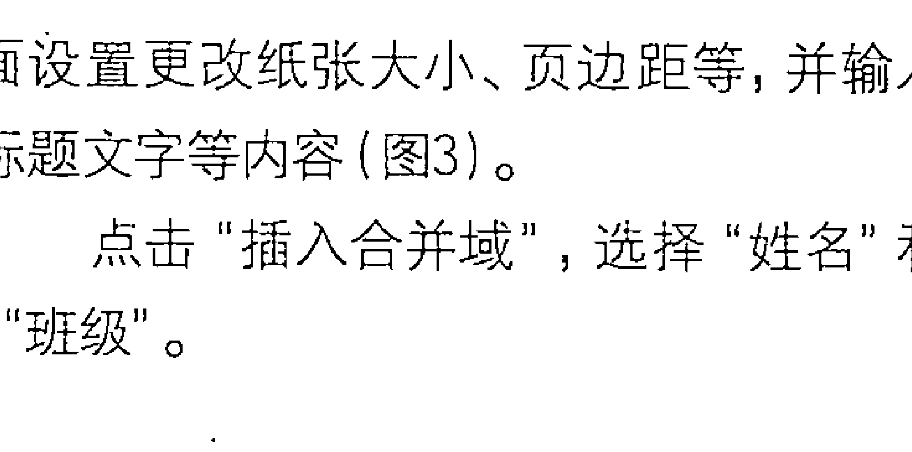

## 使用插入域的方法插入照片

由于Excel表格中只有照片文件名，而不是照片本身，如果使用插入姓名、班级的方法来插入照片，那么，只能显示文件名，而不是照片本身。因此，要插入照片，还必须使用插入域的方法。

进入“插入”面板中，单击“文档部件”中的“插入域”按钮，打开“域”对话框。插入IncludePicture域，并在“文件名或URL”下面输入一个名称。


按Alt+F9组合键显示域代码（该组合键的功能是在域代码和域对象之间切换，如果已经显示域代码，则无需操作）。

选定域代码中的名称photo，插入合并域中的“照片”。按Alt+F9切换到显示域对象状态，用鼠标调整照片框的大小。

选择“完成并合并→编辑单个文档”命令，出现“合并到新文档”对话框，选择记录的范围（因为每张校牌占一页，如果电脑的性能不够好，可以分批进行）。合并以后，生成一个新的文件。此时，照片仍未显示。按Ctrl+A键选定整个文档，按F9键，从而显示照片，至此大功告成。

**小结**：此项工作的关键步骤有：邮件合并、插入IncludePicture域、对域代码进行修改、修改后按F9显示域对象（即照片）。

（文|赵家春）

# 组合拳 实现孩子绿色上网

转眼又到寒假，这是一个令人纠结的假期。孩子希望在假期中玩玩电脑，而家长却又要开始担心网络上不良信息对学生可能造成的影响。
我的一位家长朋友对我说，你说让玩吧，我没法控制他，头脑和身体都可能受到伤害；不让玩吧，有点逆潮流，真的纠结。我说其实你不必如此担心，菜刀可切菜，也可杀人，但你不可能不用，电脑这玩意儿也就是一工具，稍加限制，没大问题。为了减少家长的花费，我针对XP和Win7用户推荐一些免费实用的方法。

# WinXP辅助软件来帮忙

目前使用XP的用户还不少，但无权使用家长控制这一功能，不过还可以通过以下软件来行使对孩子的监督权。

## 控制上网时间和网站

第一步：首先在http://dx.cr173.com//soft2/InternetSecurityController.zip下载Internet Security Controller程序，然后把要限制的所有网址添加到限制列表中。
打开程序界面，在文本框中输入要限制的网址的后两个字段，以便限制该网站的所有子网页。比如要限制“开心网”的网址时，只要输入kaixin001.com，然后单击Add按钮，网址便会出现在列表中。其它网址的添加规则与此相同。

第二步：接下来我们设置限制或允许使用电脑的时间段。
软件允许为一周中的每天进行不同的设置。比如要设置为每周一下午三点到五点之间允许使用，可单击Next按钮，在打开的界面中切换到Mon标签，单击Block All按钮，设置为红色的全天禁用，然后分别单击03PM和05PM两个按钮，使其变为绿色允许使用状态即可。

第三步：每天允许使用的具体时间应小于当天允许的时间段，使大家有回旋的余地。
单击Next按钮，进入使用时间设置界面。分别在界面左侧找到对应的日期，单击其右的下拉箭头，在弹出的菜单中选择即可完成。最后单击Next按钮设置程序保护密码，单击Finish按钮结束。此后软件便会根据规则自动限制。条件满足后，列表中的网站便无法打开。

### 小提示

可能有朋友怀疑如果孩子将软件的进程停止掉，那么就失去了作用。不过不用担心，即使在进程管理器将该进程停掉，被过滤的内容仍会被过滤。即使在系统启动项中停止该软件，仍然能继续启动。只要将密码设置好，即使是卸载也只有密码才能完成。

## 网上黄色图片自动打上马赛克

家长除了担心上网时间外，更担心网络色情对孩子的影响。
不少网页游戏都在打擦边球，用充满“黄色”的图片来吸引玩家，再加上自动弹出，孩子很难幸免。PicBlock可以自动检测网页中的不健康图片并对其进行屏蔽，保护孩子的身心健康。下载地址：http://www.wishdown.com/soft/download.asp?softid=41552&downid=33&id=42856

第一步：PicBlock安装后会随系统启动自动运行，程序图标驻留在系统托盘区。此后当发现网页中含有不健康图片时，就会自动使用马赛克块取代原来的图片，使图片无法在网页中正常显示，同时在桌面右下角弹出提示。

第二步：如果发现PicBlock拦截了一些有用的图片，也可以解除屏蔽，重新让图片显示在网页中。右击系统托盘区的程序图标，在弹出的菜单中选择Unblock content命令，然后按下键盘上的F5键刷新网页，图片即会显示出来。在右键菜单中选择Disable PicBlock命令可以禁用PicBlock。

第三步：PicBlock提供了三种图片检测的灵敏度设置，分别为轻度（Mild）、正常（Normal）和严格（Strict）。默认为Normal；如果要修改灵敏度设置，可右击程序图标，选择Settings命令，打开设置界面，切换到Configuration标签，在Sensitivity level选项栏中重新设置即可。
此外，还可以通过URL Blocklist标签，将不良网站添加到黑名单中进行全面屏蔽。

第四步：设置软件密码保护，防止孩子自己将过滤屏蔽掉。右击系统托盘区的软件图标，鼠标右击，选择Settings命令，在打开的设置界面中切换到Security标签，将Require password for unblocking blocked、Require password for accessing settings、Require password to disable Pic复选框选中，然后在PicBlock administrator和Confirm项后输入密码，确定即可。

## 限制软件运行

对孩子进行使用软件的限制，也可以有效防范孩子访问不良信息。这里使用组策略来完成。

第一步：限制运行程序。点击开始菜单中的“运行”命令，输入gpedit.msc启动策略组编辑器，在策略组编辑器窗口选择“用户配置→管理模板→系统”，在右面板上双击“只运行许可的Windows应用程序”，在“只运行许可的Windows应用程序属性”对话框中，选择“已启用”，然后点击“显示”，在“显示内容”对话框中，添加允许使用的软件，如office系列、聊天软件等，点击“确定”退出策略组编辑器。设置未被允许的程序将不会被运行。

第二步：限制安装/删除程序。在策略组编辑器窗口选择“用户配置→管理模板→控制面板→添加删除程序”，在右侧窗口将“删除‘添加或删除程序’”策略设置为“已启用”，可防止孩子自行安装其他程序。

第三步：限制组策略。在组策略编辑器窗口选择“用户配置→管理模板→Windows组件→Microsoft Mananement Console→受限/许可的管理单元→组策略”，这样就可以防止孩子通过组策略来修改规则了。

## 使用专用浏览器

孩子对形形色色的网络信息很难做出正确的辨别，这时就需要一款专业的浏览器来辅助。
花儿浏览器不仅集成了完善的网络过滤功能，而且针对孩子对信息的需要，收录了很多有针对性的功能。

该软件的下载地址：http://dl.huaer.com/huaer_setup.exe

花儿浏览器的首页收录了相当丰富的资源，并针对孩子感兴趣的话题进行了专门的收录，包括适合儿童的内容，如动漫世界、游戏天堂、学习乐园、网络漫游等，并且通过家长推荐还可以加入更多的网址进行浏览。

这些内容来自各大网站，如动漫世界收录了多款动漫影片，内容都是来自优酷网；游戏天堂收录了来自不同网站的多款Flash小游戏；在网络漫游类别中收录了学友园、七星瓢虫等内容。

## Win7家长控制显身手

如果你用的是Win7或者Vista，使用“家长控制”就可对孩子的上网时间进行控制，操作上会比XP简化不少。这里以Win7系统来说明。

进入“控制面板”，点击“家长控制”按钮。点击“创建新用户账户”按钮，输入用户名并单击“创建账户”按钮。双击新建账户，在“家长控制”中选择“启用，强制当前设置”。

如果想实现上网时间限制，单击“时间控制”链接；如果想控制孩子装载程序，点击“允许和阻止特定程序”链接进入设置界面；阻止游戏则只需点击“游戏”链接，在弹出窗口的“是否允许XX玩游戏”项选中“是”，再单击“设置游戏分组”链接。

如果想限制孩子只能进入某些特定的网页，则需要切换到“创建新用户”页面，在“其他控件”项中“选择一个提供商”，即“Windows Live家庭安全设置”，接下来需要到微软官网下载相应控件，该控件其实是Windows Live Essentials 2011的一个部分，没有Live账户的话需要注册一个。

安装完控件后点击新建的账户，会在浏览器中打开 https://fss.live.com/safety/default.aspx 页面，可以看到该页面就是“家长控制”的一个加强版。点击“网页过滤”链接，可以选择“仅限白名单”或“适合孩子”，点“保存”按钮。点击“网页过滤列表”链接，在文本框中输入相应的网页，如 www.baidu.com，单击“允许”按钮，即会列入允许访问的网站，再将其他允许访问的网站列入“保存”即可。

接下来，只允许孩子以新建账户上网，那么他的账户就处于“家长控制”之下，系统就能够有效地保护他不受“敏感”信息的侵害。

（文|侯金平）

## 共用PC 我的地盘我做主

办公室里共用PC，虽然有了各自的用户名和密码，但最终还是有文件“被”删除，如何才能避免此类悲剧的发生？

打开PC，发现一个重要的文件找不到了，难道是无意中误删了？进入回收站，也没发现它的影子。忽然想起，会不会是和笔者共用该PC的同事删除了该文件呢？虽然为了互相之间恪守“和平”，笔者为每个同事都设置了单独账户及密码，但这并不能保证各系统用户间不能删除其它用户的文件。那么，我们怎样才能避免此类悲剧的发生呢？笔者决定请 iCore Virtual Accounts（以下简称 iCore）出马。

iCore（下载地址：http://www.xiazaiba.com/html/5685.html）的特点在于，它能以虚拟机的形式在系统中建立多个账号，而且这些账号间相互独立，互不干扰。换句话说，就是我们在一个账号中进行的所有操作（安装、卸载程序、添加、修改文件等），不会影响到其它账号，同时，一个账号中毒或崩溃也不会影响其它账号。

### 安装程序并创建账号

iCore安装时，要到相应网站下载所需的支持文件，所以在安装时，请保证系统处于联网状态。安装完毕，重启系统，在出现的登录界面中，我们会发现在系统原有的账号之外，多了 Games、Internet 和 New software 三个账号，这三个就是由 iCore 自动创建的虚拟账号。

单击某个账号进入系统，会发现桌面上空空如也，就像刚刚安装的Windows系统一样，只有一个回收站图标和一个 To switch a computer 图标。接下来，我们就可像平时使用电脑一样，在该账号中进行软件的安装、卸载及文件的编辑、删除等操作了。

由于该账号对应的系统是独立且虚拟的，所以我们在其中所做的操作，只会保留在该账号中，不会影响到其它账户。

在操作的过程中，如果我们要切换用户，可双击 To switch a computer 图标返回系统登录界面进行选择。

### 添加删除账户

有时，程序自行创建的账号可能不符合我们的要求，我们需要将其删除。有时，我们又需要根据自己的实际情况新增其它账户，这时可以这样操作。

双击桌面上的 To switch a computer 图标，返回系统登录界面，选择系统中原有的那个账户进入桌面，单击“开始→iCore Virtual Accounts→Create or delete virtual account”，打开 iCore Virtual Account Wizard（iCore虚拟账户向导）对话框，单击“下一步”，选择 Create（创建）项，单击“下一步”按钮。

在出现的对话框中，分别设置好 Virtual Account Name（虚拟账户名）、Password（密码）等信息，单击“下一步”按钮，账户的添加工作就完成了。

### 小提示

如果要删除账户，选择“Delete”（删除）项并按提示操作，可删除已有的账户。

### 禁用账户

如果有人离职，也可以选择禁用账户操作，具体方法如下：

在系统原有账户的桌面上，单击“开始→iCore Virtual Accounts”，在出现的级联菜单中选择 Disable iCore Services Startup 或 Enable iCore Services Startup 命令，可禁用或启用虚拟账户，禁用后，虚拟账户将无法进入。如果你要直接卸载程序或删除虚拟账户，请在卸载或删除前保存已经创建的有用文件。iCore默认将虚拟账户创建的文件保存在 C:\Documents and Settings\All Users\Documents\My Virtual Accounts 目录下（其中 C 为系统分区），这一路径，实际上可单击 Location（位置）栏中的 Browse（浏览）按钮进行指定。

（文|飞雪散花）

## 丢掉数据线 同步照片

Q拍的云相册，省去了烦人的数据线，在拍照的同时同步到QQ空间。

办公室的小秦不久前分别入手了一台 iPhone 和 iPad，闲来无事会拍摄一些照片，同时上传到 QQ 空间的相册上。苦恼的是每次都必须通过专用的数据线与PC端进行传输，显然是相当的麻烦。其实，安装 Q拍之后，可以在拍摄照片的同时，将相关照片自动同步到 QQ 空间的私密相册。

在 iPhone 或 iPad 上安装 Q拍，运行并使用 QQ 账号进行登录，在主界面选择“云同步”，此时会进入“云同步”设置页面，向右拖拽滑块启用“云同步”功能。

在弹出的提示对话框中选择“确定”。以后，无论是使用 iPhone 或是 iPad，每次使用 Q拍拍摄照片之后，这些照片都会在后台自动同步传输到 QQ 空间的私密相册，可以切换到“我的云相册”进行查看。

如果需要在PC端查看这些照片，可以登录 QQ 空间，依次切换到“相册→云相册”选项卡，在这里可以查看到云相册里的所有照片。出于安全因素的考虑，可以试着设置独立密码。

（文|王志军）

## 没装聊天软件 网站中也能打开聊天

这几天在外地出差，有事情要和同事商量就在网吧上网，但网吧没有安装 MSN，好在我们有秘密武器，就是多平台的Web版聊天网站“imo”，在网页里直接可以登录 MSN，方便我们在没有安装 MSN 的电脑上临时救急。目前它支持 AIM、ICQ、MSN、Skype 和雅虎通等聊天软件。

打开网站 https://o.imo.im，在登录界面上勾选聊天软件，比如选择 MSN，然后输入自己的 MSN 账户和密码，单击 Sign on 按钮就可以登录了。

登录后在网页右边显示好友列表，双击好友名称即可打开聊天对话框，然后可以输入文字，按回车键发送信息。单击聊天窗口上面的 Video Chat 链接，会弹出一个视频窗口，待对方确认后，即可开始视频聊天。如果想语音聊天，单击 Voice Chat 即可。单击 Chat history 还能查看历史聊天记录。

登录 MSN 后，只要单击 Sign into more account，就会显示登录界面，还可同时登录其他聊天软件，让多个聊天软件在网页中同时运行。

（文|贺全荣）

## 用PowerPoint制作填空题更方便

以前有文章曾介绍过使用 Authorware 制作英语填空题的方法，但是 Authorware 的使用门槛太高，限制了使用，而在很多老师当中，因为 PowerPoint 使用简单、制作方便，使用率则比较高。利用 PowerPoint 的自定义动画来制作填空题很方便。

打开 PowerPoint，选择文本框，在工作区里面输入题目，在需要填空的地方根据所填内容的多少留出空格，然后选择直线工具，画出一条横线。

然后再次选择文本框工具，在每条短线上输入答案。注意，每个答案都是独立的文本框。选中第一个答案文本框，然后选择“动画→自定义动画”，在右侧出现的自定义动画对话框中，选择“添加效果→进入→出现”。

接下来，用同样的方法，对其他几个答案文本框依次添加自定义动画效果，这样，简单的 PowerPoint 填空题就做完了，我们可以播放幻灯片看一下效果了。

（文|殷强）

## 妙用百度 批量下载视频

不用安装专门的下载软件，睡觉前在网页上点播若干集连续剧，睡醒后这些连续剧全部下载好了。

前几天，我从网上搜索连续剧《带泪梨花》，希望能下载后拷贝到移动设备上出差时观看。我通过百度搜索引擎搜索到 D8电影网 (http://www.d8.cm/index.html) 有这部《带泪梨花》连续剧，共有34集。但点击其中的任意一集后，只能用百度播放插件进行播放，并没有像土豆或优酷那样提供下载当前视频的按钮。该怎么办呢？

### 百度视频播放的秘密

在百度视频频道中搜索出来的视频文件，不管是电影还是连续剧，都需要用百度视频播放器进行播放。实际上，在播放的同时，软件已经超前将视频文件下载到本地电脑中了。利用百度视频播放器的这一特点，结合我们手头中多核处理器的多任务处理能力，完全可以做到让电脑同时播放许多集连续剧或视频，借此获取视频文件。

### 准备下载内容的空间

右键单击系统托盘上的“百度影音”播放器图标，选择“播放器设置→下载→您观看过的视频存放在如下路径”，安排一个接纳下载文件的位置。如本例的“D:\连续剧 DVD\baidu player”文件夹。

### 巧借点播下载成批视频

在搜索到的连续剧《带泪梨花》页面中点击每一集连续剧的链接，开启多个窗口标签进行播放。随后，你就可以关掉显示器安然睡觉，等待明天到 D盘收获下载成果了。

（文|牛更生）

## 邮箱忘密码 月影帮找回

忘掉 Foxmail 的账户密码，只看到 *号密码显示，怎么办？

这些年，我一直在用 Foxmail 管理邮件，两年前设置的邮箱密码一直未动过。某日，在别人的一台电脑上临时性处理工作，需要登上网页收取邮件，要输入密码时却发现已忘掉了。后来在自己的电脑中打开 Foxmail 6.0 查看账户设置，也只能看到 *号显示的密码。于是找来 Windows 下查看星号密码的小工具来查看，却发现密码框里的星号依然还是一串 *号，原来自己熟悉的方法失效了。

一直不甘心，所以想尽办法去找回密码。经过下载多款软件，多次进行尝试，终于发现一款软件“月影Foxmail邮件转换/密码恢复器v1.7”可以找回忘掉的邮箱密码。

具体方法是：直接运行“月影Foxmail邮件转换/密码恢复器v1.7”软件，在“Foxmail密码恢复”下选择 Foxmail 中需要破解的账号的 Account.stg 所在目录（一般位于 Foxmail 软件安装目录，mail 文件夹下的账户名文件夹中），选择完毕后，软件会自动显示该邮件账号的相关信息。

（文|王晓宁）

## 自建多版本实用软件库

### 为软件库指定一个新位置

你肯定希望自己的多版本软件库建在自己定义的一个专用文件夹中。一般说来，软件默认的下载文件夹被设在 C盘中，这样容易在重装软件或系统、优化系统时造成软件的丢失，所以，建议将这个文件夹设置为系统盘以外的其他分区中，例如 D盘或 E盘等资料盘中。

选择窗口左侧“下载设置”一项，在右侧第一行的文本框内通过“浏览”按钮或直接输入路径的方法定义自己的软件版本库位置。比如设定为“D:\我的多版本软件库”。

### 截留系统更新时下载的软件

这是很关键的一步，只有设置了手动删除下载软件，才能保证每次安装的软件永久保留。选窗口左侧的“软件安装”一项，去掉右侧窗口的“开启一键安装，一键升级功能”选项。在“自动删除安装完成后的下载文件”一项下，选择“已安装的下载文件一直保留，直至自己手动删除”。经过设置之后，在你的“D:\我的多版本软件库”文件夹中便建立起了一个自动添加的实用工具软件库。

（文|瑛子）

## 和重复视频说Bye Bye

突然发现硬盘空间所剩无几，细究之下，原来是由于在转换成手机支持的视频格式时，造成同一视频存在大量不同格式、名称和分辨率文件所致。

于是杀心陡起，想要剔除重复视频中画质较低的文件，于是请来 Visual Search Pony，剑光闪过，重复的低质视频终于纷纷显形。

> 小提示
>
> Visual Search Pony (下载地址：http://visualsearchpony.com/) 支持 AVI、MKV、3GP、MPG、SWF、MP4、WMV、FLV 等几乎所有主流视频格式，但是该软件必须在 K-Lite Mega Codec Pack (下载地址：http://www.codecguide.com/download_k-lite_codec_pack_mega.htm) 支持下才能正常工作。

- **第一步：选择视频文件夹**
  打开程序界面，切换到 Source folders 标签，单击文件夹状的 Add source folder 按钮，在弹出的对话框中选择视频文件所在的文件夹打开，文件夹路径将出现在标签中。

- **第二步：指定比较时间**
  Visual Search Pony 提供了两种视频的对比时间，前20秒或前5分钟。前者速度快，但结果不够准确，后者结果准确但速度较慢。大家可切换到 Options 标签，按需要选择，比如前20秒对比时，勾选 Compare first 20 seconds 选项。

- **第三步：设置标记规则**
  我们可以按分辨率、持续时间、文件大小、最后修改时间来确定文件的优先取舍标准，以便让软件自动把效果较差的视频标记出来。比如想优先保留分辨率较高的视频，则勾选 Autoselect duplicates by resolution 选项。其中 Autoselect none 选项为不做任何标记。

- **第四步：开始查找**
  确保 List all found video files 选项未处于勾选状态。

  单击 Search 按钮，软件便自动提取每个视频的前20秒图像，通过界面中的视频窗口进行播放、对比，无论其以何种面目存在，最终都会显示在界面右侧的窗格里，其中分辨率较差及体积较小的视频、时间较短的视频，在缩略图左侧有对勾标记。

- **第五步：处理结果**
  在界面右侧窗格中右击鼠标，选择 Delete duplicates 选项，即可把所有被标记出的重复视频全部删除。如果选中某一个视频文件后右击鼠标，选择 Delete 选项，则可删除选中的视频。当然也可以通过其它选项，把重复视频暂时保存到其它位置。

（文|孙敏）

## 锁定USB设备也要有的放矢

为防止别人从电脑中偷拷文件，我们可以锁住 USB 端口，但这也同时也把打印机、扫描仪等 USB 设备一同拒之电脑之外，给自己使用带来不便。

那么能不能在锁定指定的 USB 设备时，保证其他 USB 设备正常使用呢？ USB Manager 软件能助你一臂之力。

运行该软件后，程序图标便驻留在系统托盘区，右击程序图标，选择 Main Window 命令打开程序界面，可以看到它把设备分为 USB存储设备、USB打印机、USB音频设备和 USB扫描仪四种，每个图标上都有一个绿色对钩标记，表示设备全部可用。

当需要锁定某个设备比如 U盘时，在 Storage device 图标的标记上单击鼠标，将其切换为红色禁用标记（或右击程序图标，选择 Disable USB storage devices 命令），随后退出软件就可以了。这样所有的 USB 存储设备将无法使用，而其他的 USB 设备则不会受到影响。

为避免别人私自改变锁定状态，可给软件添加保护密码。在程序图标右键菜单里选择 Options 命令，在打开的对话框中勾选 Enable password 选项，并在下方输入密码，单击 Change 按钮完成。

以后当别人想使用 USB 存储设备时，必须先在右键菜单中选择 Enter password 命令并输入正确密码，才能打开界面进行操作。

（文|孙敏）

## 表格计算无结果 数列分列解烦忧

会计找到我说，有一个 Excel 电子表格使用公式计算时结果都不正确（计算结果为0），即使将单元格中的数字类型转换为数值型也无济于事，除非在每个单元格中单击一下，但问题是表格中的数据非常多，每个单元格都要单击一下太费时间了，问我有什么好办法。我问他数据从何而来，他说是从数据库导出的，闻听此言，我就知道是什么在作怪了。教了他一招，问题立马解决。

选择要变更数据类型的那一列（或一列中的若干个单元格，每次选定的范围不能超过一列）。选择“数据→分列”命令，打开“文本分列向导”对话框，单击“下一步”进入步骤3，选择“列数据格式”为“常规”选项后单击“完成”。更改其他列的数据类型，表格中公式的正确计算结果立即呈现。

出现这种现象的原因是，在 Access 中将数据的类型设成文本型了。另外还有一种情况是在单元格中输入公式或函数之后，计算结果并未如期出现，其原因往往是单元格的数字格式被设置成文本型了，只要单元格的格式更改为“常规”型，再双击一下含有公式的单元格即可。

（文|赵家春）

## 网盘专用资源一次就搞定

爱捣鼓软件的我从网上搜索到好多实用好用的软件，它们大多都被网友上传到网盘上，但这些软件大多只能用对应网盘的专用下载工具才能下载，如米人、U蛋等，为了能顺利下载到这些软件，就不得不安装对应的专用下载工具，很麻烦。

近来找到了“网盘全能下载工具[集成版]”这款软件，它集成了 U蛋、米人、飞速网、115下载地址解析、在线视频下载及下载地址转换工具等多种下载利器，能够通吃所有知名网盘，而且里边的软件都已经去掉了广告，有了它就可以轻松下载所有网盘的资源了。

解压运行这个绿色单文件工具（安全软件会隔离，恢复并添加到信任区域即可），打开其界面，点击其中的相应工具按钮，就会自动调用相应下载工具来配合下载任务，操作简单方便，再也无需费时费力地下载安装多款专用下载工具了。

（文|烟锅）

## 把快捷方式放到最方便的地方

一直想把特定的文件或文件夹的快捷方式放置到最适合的地方，比如经常访问的文件夹放置到“我的电脑”，系统优化程序放置到“控制面板”，这样既便于访问，又能保持桌面洁净。可这两个地方属于禁区，不能随便创建快捷方式，直到发现了 My_Computer_Manager 这款软件才如愿以偿。

My_Computer_Manager 能在“我的电脑”和“控制面板”中创建文件、文件夹的快捷方式，分为简单和高级两种模式，前者是原样创建，后者可更改名称和图标。比如想以高级模式在“控制面板”中创建“360硬件大师”的快捷方式，可在程序界面中单击 Mode 右侧的下拉箭头，选择 Advance，再单击 Location 右侧的下拉箭头，选择 Control Panel，接着单击界面左上角的 Add File 按钮，在打开的对话框中输入“360硬件大师”快捷方式名称，指定可执行文件路径，并单击 Browse Icon 按钮，选择一个程序图标，最后单击 Add 按钮即可完成。

添加的快捷方式将出现在程序界面里。不需要的快捷方式，只要在程序界面选中后，单击 Remove Item 删除即可。另外，工具栏的 Add Folder 按钮，可以在“我的电脑”或“控制面板”中创建文件夹的快捷方式。

（文|孙敏）

# 公式输入不用烦 数学输入面板帮你忙

小沈是数学老师，在制作初三摸底考试试卷时遇到了麻烦，一些复杂的数学公式或者符号在Word里输入非常繁琐，并且Word自带的Microsoft公式3.0功能有限，编辑起来也不太方便，问我能否安装什么软件输入公式时直接用手写就可以了。

其实不用安装任何插件与第三方软件，只需要用Windows 7系统自带的“数学输入面板”即可搞定。

通过搜索“MIP”或在“开始→附件”中找到“数学输入面板”，启动后通过鼠标可“写入”任意数字、字母、数学符号等标记。

如果识别错误，可通过“选择和更正”圈中并选择正确符号。

如果识别不成功，可点击“写入”重新输入公式，同时点击“历史记录”查看输入过的公式。若数学表达式识别正确，点击“插入”即可将正确识别的数学表达式插入字处理程序或计算程序中。

注意：Windows 7的数学输入面板只能将数学表达式插入到支持数学标记语言MathML的程序中。

(文|陈晓军)

# 邮件加密解密 Foxmail直接完成

工作中常常要给邮件加密发送，有些朋友用加密工具或通过网易邮箱来实现，不过，如果你使用的是Foxmail，那么无论使用的是什么邮箱，都可以直接实现原生加密，操作相当方便。

撰写邮件之后，依次选择“邮件→邮件加密”，或右击工具栏空白处，打开“工具栏设置”对话框，将“邮件加密”按钮添加到工具栏上，连续输入两次密码即可完成加密。

如果对方是使用Foxmail客户端接收邮件，那么在接收到这封加密的邮件时，Foxmail会在预览框提示输入正确的密码，解密之后就可以正常阅读邮件内容和附件。如果勾选“清除密码”，那么它将自动清除加密邮件的密码，下次重新打开Foxmail阅读时就不会提示输入密码。

即使对方是在web页面收取加密邮件，或者是在其他的非Foxmail客户端收取加密邮件，此时也会提供详细的解密信息，同时会将邮件正文和附件打包为一个加密的zip附件，下载回来之后，用Winzip、WinRAR或7-zip等解密就可以了。

(文|王志军)

# 妙用Site搜索 开启论坛帖子之门

很多论坛对于非注册会员，既限制其论坛发贴，也限制其利用论坛中的搜索功能，而有些论坛，即便是新注册会员，也对其发贴时间及其他操作进行了相应限制。此时若想搜索、查找论坛中的帖子，可以借助Site的特定搜索功能来跳过论坛的搜索限制。

打开要搜索的论坛首页（以OFFICE精英俱乐部http://www.officefans.net/cdb/index.php为例），复制论坛地址，然后打开搜索引擎，在搜索框中输入“site:”（不含引号），粘贴所复制的论坛地址（不含http://www），输入要搜索的关键词，点击“搜索”即可。此时在打开的搜索结果页面中，显示的所有结果都是该论坛中包含关键词的帖子，这样就可以跳过论坛的搜索限制，在搜索结果页面中寻找、查看相关内容了。对于部分已经失效的帖子，点击“网页快照”，还可以打开搜索引擎在收录网页时保存在服务器内的缓存，从而打开在论坛中无法显示的帖子（在网页快照中打开的只是不能显示表格与图片而已）。

因论坛的建站模板不同，此方法并不一定适应所有论坛，而网页地址一定是首页不含子页面。“site:”后面带不带www结果可能是不一样的，因为有些域名还包括二级域名，而且，site某某.com和site:某某.com搜索结果也不一样。另外，“site:”和站点名之间不要带空格。

(文|刘长德)

# 非IE浏览器图片添加QQ表情

2011年5期《找回网页图片添加为QQ表情功能》一文，介绍了用“添加到QQ表情”小工具软件来实现右击网页中图片添加至QQ表情的方法，我下载后打开浏览器右击图片，确实看到了“添加到QQ表情”右键菜单项，但执行后却弹出“表情添加失败”的窗口，再仔细阅读原文，原来该方法针对IE浏览器有效，而我用的是搜狗浏览器。难道在非IE浏览器中就无法找回么？试用下列方法可以找回。

打开记事本，输入下列内容：

```
Windows Registry Editor Version 5.00
[HKEY_CURRENT_USER\Software\Microsoft\Internet Explorer\MenuExt\添加到QQ表情]
@="c:\Program Files\tencent\qq\Bin\AddEmotion.htm"
"contexts"=dword:00000002
```

其中，"c:\Program Files\tencent\qq\Bin"为本人电脑中QQ的安装目录，大家可以根据实际情况进行修改。

保存该记事本内容，命名为1.reg并运行该文件，写入注册表后，重启搜狗浏览器，发现右击添加表情大功告成。

(文|吴忠仪)

# 向积分下载说NO

很多时候，我们在网上下载资料时，需要支付该网站的积分，有时特别需要某些资料，但是苦于没有积分，该怎么办呢？

# 没有豆丁元 豆丁文档随意下

大多数网站都提供了资料下载的平台，豆丁文库提供了海量的doc、txt、pdf等文档供用户下载。然而，在多数情况下要下载的话，一般要充值付费，其实不用充值也能下载。

首先，下载“冰点文库下载1.7”软件，运行该压缩包文件，把“冰点文库下载1.7”安装到电脑中。

其次，打开豆丁网，找到要下载的文档下载，提示“你当前的文档剩余豆元：0不足支付”。

在该网页的地址栏处右击鼠标，在弹出的快捷菜单中选择“复制”，把文档的地址复制到剪贴板中。

接着单击录入框右边的“下载”按钮，开始下载操作，等到进度条到100%后，便开始进行格式转换，格式转换完毕后，就会提示文档下载完成。然后单击左侧的“已下载”，在任务栏中双击“任务名”下的任务，就可以打开已下载的文档了。

# 无需积分 CSDN资料随心下

朋友近来在学编程，他从CSDN网上找了很多学习资料和源代码，但是CSDN资料的下载有很严格的要求，必须有充足的积分才能下载，非常麻烦。朋友注册了账户，也努力去赚取积分，可是积分完全不够用，很快就用光了。我为他介绍了一款“CSDN免积分下载器”工具，使用它不需要注册CSDN账户，不需要积分，CSDN资料想下就下。

从http://www.xdowns.com/soft/1/70/2011/Soft_82050.html下载“CSDN免积分下载器”V5.1 绿色版压缩包，解压后运行，打开其操作界面。

打开需要的CSDN资源下载页面，从网址中找到资源对应的ID，例如：http://download.csdn.net/detail/yaerfeng/3967897这个资源，它下载就需要1积分，资源ID就是后面的3967897，复制该ID备用。

回到“CSDN免积分下载器”界面，将复制的ID粘贴到“资源ID”后的文本框中，输入验证码，在“地址选择”后选择“电信”（朋友使用的是电信网），最后点击“确定”按钮，这时在“程序状态”后的框中动态显示执行的步骤，很快执行完成6个步骤后，弹出下载地址已复制到剪切板上的提示。

### 小提示

每下载完成一个资源后，下载下一个前，需要将“CSDN免积分下载器”程序关闭一下，重新打开一次，方便获得新的验证码。另外不要太贪心哦，每次下载间隔时间最好控制在15分钟以下，否则外网IP容易被封，就不能使用这个工具下载了。

# 不是绿钻 免费下载QQ音乐

女友入手一款IPhone4S，想使用“QQ音乐”下载音乐在闲暇时欣赏，可是只有开通绿钻的用户才能下载。难道不开通绿钻就不能下载吗？

其实，还有免费的午餐哦！使用“QQ音乐高品质破解补丁”这个小工具，就能让非绿钻用户免费下载高品质音乐。

从http://www.33lc.com/soft/14227.html下载“QQ音乐高品质破解补丁”绿色版，先运行“QQ音乐2011”，再运行“QQ音乐高品质破解补丁”工具，出现和QQ音乐2011带的一样的搜索框，在“搜索”标签页中输入音乐名称或歌手名等关键词进行搜索，得到符合条件的音乐列表。

从音乐列表中选择需要下载的试听，适合后点击“下载”按钮，进入下载歌曲页面，在选品质中选择“高品质”项。

此时奇迹发生了，不再像以前提示绿钻用户登录后下载，而变成可用的“开始下载”按钮哦。

点击该按钮，弹出两次提示框，直接确定，就会调用QQ音乐2011程序下载高品质音乐了。

（文|王昌红 王彦博）

# 本周谁过生日直接筛选最简单

2011年21期有一篇文章《本周有谁过生日 给点颜色全了然》，其实不用自定义格式，不需要进行排序，也可以直接列出本周谁过生日，不仅还原方便（还原后不影响数据的默认顺序，特别当数据是按部门进行排列的），而且数据可以直接打印，不影响效果。

我们新增一行数据和一个A列，在C2中加入今天的日期，在A单元格中使用公式：

```
=YEAR($C$2)&WEEKNUM(DATE(YEAR($C$2),MONTH(C2),DAY(C2)),2)
```

其中单元格$C$2存放的是今天的日期，A2下面的数据只要双击填充柄即可。使用$符号是保证填充时公式引用的是绝对单元格。函数weeknum是用来获取指定日期在本年的第几周，后面的参数2表示使用周一为一周的第一天，和我们日常的习惯保持一致。这样不管周一是否是法定假日（比如清明、端午），都不影响本周的统计。而原文的方法如果周一休息，周二开始上班，就有点不给力了。

然后把A列和第2行的字体颜色设置为白色，这样就算打印出来也不影响效果，否则领导去祝福的时候总不至于都手工抄下来吧。

接下来的一步就更简单了，使用筛选功能，在A1单元格中选择本周所在的周，其实就是A2单元格的值即可，如果是今天，通常就是最大值了。

如果你是用Excel 2007或以上版本就更有福了，这个步骤还可以更简单，只要点中A2单元格，选择右键菜单“筛选”中的“按所选单元格的值筛选”即可。

（文|徐怀平）

# 批量下载邮件附件很轻松

面对收件箱里大量的邮件，如何进行备份才有效呢？

## 设置邮箱

运行查看主界面，在 Email account and save location 中设置个人邮箱的账号信息，以及附件的储存文件夹。

切换到 Mail service 选项卡，在 Choose mail server 项选中 Other 复选框，输入邮箱服务器地址和端口，并选中 Use TLS/SSL 复选框，在 Server type 选中 POP3 复选框。

笔者在一教育单位上班，老师们平时需要上交的一些材料都通过附件发到了单位的 126 邮箱中，供大家使用。由于该邮箱的密码大家都知道，为了防止操作过程中误删除附件，备份邮件附件成了我这个管理员首先要考虑的问题。

虽然使用 Foxmail 批量下载附件比在网页邮箱中快了不少，但是如果想更灵活地下载邮箱附件，最好使用 Mail Attachment Downloader，它是专门为邮件附件下载而设计的软件，内置了 Gmail、AOL 和 Live 等邮箱，对于国内邮箱另行添加相关设置。

## 设置下载文件类型

如果不需要下载所有附件，可通过设置下载条件来筛选。

切换到 Basic filters 选项卡，可以在 Search for attachment in 项中选择搜索的范围，新邮件 (New messages only) 还是所有邮件 (All mail)；在 Download if size greater 项可以设置下载文件体积最大限制；在 Download only files of type 可以设置下载的附件类型。

支持批量下载邮件中的附件，还允许设定各种下载条件，比如可限定大小、日期、发件者、内容、文件类型等等。

> **小提示**
> 也可选择 IMAP 协议，该协议与 POP 协议相比，具有操作双向性，即在客户端的操作会反应到服务器上。

选中 Other 复选框后还可在文本框中输入其他附件类型，如 .rar、.zip 等。

## 高级规则设置

切换到 Advanced filters 选项卡，可以在 Download between dates 栏设置开始日期 (Start date)、结束日期 (End date)，并可在 Download only if the following match 加入发件人 (From)、收件人 (To)、标题 (Title) 等其它条件。

## 下载附件

设置完成后，点击 Connect and Download 按钮即开始读取邮件，并着手下载该邮箱中的所有附件，此过程中显示进度。进入存储目录，即可看到附件。已下载的附件，会标识发件者的昵称和 Email 以便辨认。为了自动执行，还可在 General options 选项卡中的 Schedule download 项中选中自动下载的时间，省却了手动操作的麻烦。

（文|侯金平）

# WPS 帮你精确计算个人所得税

岁末年初，常常是发年终奖金的时候。实施新个税法后，有可能会导致年终奖多发一元多缴千元的税。那么如何得知奖金到底要拿出来多少交税呢？WPS 表格便能轻松帮你计算应纳税额。

首先打开 WPS 表格，单击工具栏“公式”选项卡，点击“插入函数”，这时会弹出插入函数窗口，选择“常用公式”中的“计算个人所得税(2011-09-01 之后)”选项。然后在“参数输入”中“税前工薪收入”的输入框中输入奖金数额。比如年终奖是 10000 元，则直接输入 10000，点击“插入公式”，这样应纳税额便自动显示在表格中了，它相当于执行公式：ROUND(MAX((10000*(1-23%)-3500)*{0.03,0.1,0.2,0.25,0.3,0.35,0.45}-{0,105,555,1005,2755,5505,13505},0),2) 经过这样轻松几步就能算出年终奖的纳税额了。若选择“计算个人所得税(2011-09-01 之前)”函数还可以计算税改前的纳税额；这样你就可以知道税改前和税改后相差多少。

（文|陈晓军）

# 不用参照物 照样准确量实物

以前有文章介绍可用网站工具来测量实物长度，但遗憾的是还需要一个标准的实物来校正电脑屏幕尺子，而在校正过程中不可避免地会产生误差，这个误差与校正人本身的操作有很大关系，即使号称史上最准确的屏幕尺子，实际效果也不会太好。

这里推荐的网站可以免去实物校正，选择正确的屏幕分辨率后可以直接进行测量，根据我对标准光盘的实测，精准度很高。

在浏览器中打开 http://iruler.net，会看到一把尺子，这把尺子是网站自动检测出来的屏幕尺寸和分辨率，如我的屏幕为 15.7 英寸、1280×800，前者不符，后者相符。单击 Select your monitor dimension（选择你的显示器尺寸），看默认参数是否符合，如不符合，则单击 Even more（更多），在出现的窗口中输入显示器的真实尺寸，例如 15.4 英寸、16:10，单击 Create 按钮，重返浏览器窗口即可对实物的尺寸进行测量了。

另外，还可以通过“桌面刻度尺”这个小软件来搞定 (http://71.duote.com.cn/zmkdc.zip)，其刻度是实实在在的标准刻度，不需要再设置分辨率等操作。

当然，所有所谓的屏幕尺子都是建立在液晶显示器的基础上，如果你还在使用古老的 CRT 显示器，还是找现实的尺子吧。

（文|侯金平）

# 听遍全球 找个全能收音机

常看到有人在电脑旁工作，手机还拿着个收音机听。其实大可不必去浪费电池。装个龙卷风网络收音机，要比你手中的那个强得多。

### 全球电台任你选

我们使用收音机，常收听的无非是国内各省市的电台和国外的英语或华语广播。要听这些节目，搜索切换频道也比较麻烦，一般收音机是不会给你标出哪个是北京音乐台，哪个是国际之声广播电台的，你只能根据频率来决定自己要收听的台，而后去搜索或设定频道。

而如果你改用龙卷风网络收音机，这些都不在话下，直接从层级菜单中选择，要哪个台选哪个台，一目了然。

### 预置频道更方便

相比于传统收音机，使用龙卷风网络收音机，你还可以预设好频道。例如，你常收听北京文艺广播电台，这时，你可以在点完北京文艺广播频道后，点击列表窗口下方的“预置”按钮，给这个电台设定一个频道号（比如1），设定之后，就可以直接在控制面板上按1号按钮，方便地调出北京文艺广播电台了。

### 好听节目录下来

用传统收音机来收听精彩节目，如果希望录下来，没有带录音功能的多功能收音机是无法实现的。用龙卷风网络收音机则可以轻松实现。

当你在收听某个频道的节目时，如果希望录下来，只需在该频道节目播放的同时，按下软件主界面的“录音”按钮即可开始录音了。

### 小提示：本地播放多功能

该软件不但是一个收音录音软件，它同时还是一个全功能的播放器软件，不但可以播放在线的网址音乐链接，还可以播放本地主流的多种格式音乐文件。

(文/江波)

# 本地也能批量管理网盘

出于数据安全备份或网络办公的需要，小秦经常会将一些重要的文档放在多个网盘上进行管理，例如115网盘、SkyDrive、QQ文件中转站，不过每次都要在网页登录之后才能进行上传或下载，操作起来相当繁琐。

其实，借助“AsLocal网盘本地管理专家”（官方下载页面为http://aslocal.com/），小秦可以在本地轻松批量管理网盘。

完成安装之后，在资源管理器窗口会自动生成“我的网盘”图标，双击进入之后右击选择“新建网盘”，按照提示可以依次完成115网络U盘、QQ文件中转站、网易网盘、微软SkyDrive等五款网盘的创建工作。

完成创建之后，“AsLocal网盘本地管理专家”会按照服务提供商对网盘进行自动分组，当然你也可以按照自己的需要重新排列这些图标。

现在，只要分别单击相应网盘，验证账户和口令，即可使用。

在这里可以像使用本地磁盘一样展开目录树，然后通过鼠标拖拽完成跨文件夹的复制，较网页操作自然是方便不少。

(文/王志军)

# 妙招强行删除“顽固”文件

日常工作中，我们在删除某个文件或文件夹时，经常会出现“无法删除”的提示。重启后仍无法删除。想当“钉子户”？那可不行，咱可要申请“强制执行”喽。

## 结束相关进程后再删除

删除文件有时系统会提示“文件正在使用，不能被删除”。虽然与待删文件关联的程序已经退出了，但相关进程可能还在运行。打开任务管理器，结束相关进程后就可以删除文件了。

如果在结束进程时提示“不能中止进程”的话，我们可以用“NTSD”命令强行中止进程，使用格式为：ntsd -c q -p 进程的PID值。

## 用WinRAR帮你删除

有些不能正常删除的“顽固分子”，我们可以请出Winrar来干掉它。

右键单击待删除文件，选择“添加到压缩文件”菜单，在弹出的对话框中勾选“压缩后删除源文件”后单击“确定”。

这样，WinRAR在创建该压缩文件的同时，会把原文件删除。

我们只需把新创建的压缩文件删除即可。

## 关闭预览功能后删除

Windows系统大多默认选中了视频和图片的“预览”功能，那么在删除此类文件时往往因此而提示“无法删除”，我们只要关闭该预览功能就可以删除这类文件了。

打开“开始菜单”，点击“运行”命令后输入“Regsvr32 /u shmedia.dll”回车即可。

在开始菜单下的“运行”输入框中输入即可。

(文/冯晓伟)

## iPad同步QQ邮箱记事

在iPad上可以不进入QQ邮箱，进入备忘录就可查看QQ邮箱记事本的所有记事。

老陆经常在QQ邮箱的记事本随手记下一些重要的日程或事务安排，她当然不是登录QQ邮箱，而是右击QQ列表中的头像，打开QQ空间编辑器快速记事，这样可以在外出时随时查看，但每次都需要登录QQ邮箱进行查看，虽然iPad可以随时访问网络，不过操作起来仍然感觉比较麻烦。

其实，只要进行简单设置，就可以在iPad上实现QQ邮箱记事本的直接同步。

### 启用IMAP服务

在浏览器上登录QQ邮箱，进入设置界面，切换到“账户”选项卡，找到“POP3/IMAP/SMTP服务”小节，在这里勾选“开启IMAP/SMTP服务”复选框，保存更改之后退出设置界面。

### 启用“备忘录”同步服务

打开iPad，进入设置界面，依次选择邮件、通讯录、日历，按照提示将Exchange QQ添加到账户列表，在这里设置收件服务器时，请将主机名设置为imap.qq.com，添加成功之后，启用“备忘录”的同步服务。

完成上述设置之后，在iPad上进入备忘录，就可以直接查看QQ邮箱记事本的所有记事，不需要通过浏览器访问QQ邮箱。当然你在这里添加的备忘录，也会即时同步到QQ邮箱的记事本列表，很方便吧？

> > (文|王志军)

## 虚拟快捷键盘助你高效工作

小华的桌面上乱糟糟地布满了程序、文件、文件夹的图标，既不美观，查找运行某个程序也不方便，他看到同事小高的桌面上只有几个扩展名为.mal的娱乐、办公图标，桌面上清清爽爽，但小高运行程序并不迟缓，只见他双击打开“娱乐.mal”，一个虚拟键盘出现在屏幕上，上面的许多按键上分布着小高常玩的游戏程序以及多款影音播放软件，只要敲一下对应的按键，或者直接用鼠标在虚拟键盘上单击，即可运行按键上面的程序，或打开上面的文件或文件夹。

而打开“办公.mal”，则虚拟键盘上的各个按键，对应的则是记事本、Word等常用办公程序，非常简单快捷。这个方法是怎样实现的呢？别急，且听我一一道来。

先去http://www.oyksoft.com/soft/16997.html下载MadAppLauncher这款软件，安装运行后，打开一个虚拟键盘，此虚拟键盘的各个按键上还没有安放任何程序或文件(夹)，右击某个空白按键，打开右键菜单中的Edit，通过Browse File按钮，指定程序主执行文件或其它非程序文件，也可以通过Browse Folder按钮，指定某个文件夹，完成后单击OK按钮，则指定键上将生成一个打开程序或文件(夹)的快捷键。

同样的方法，可以在其它按键上放置其它程序或文件(夹)的快捷键，最后单击“File→Save”，将得到一个“.mal”文件，如果所有快捷键都与娱乐有关，可以命名为“娱乐.mal”。

根据上述方法，可以再建立一个与办公有关的虚拟快捷键键盘，最后另存为“办公.mal”。

默认情况下，打开虚拟快捷键键盘后，按一次按键运行程序，虚拟键盘将自动隐藏，需要再运行其它程序时，必须再单击托盘中的软件图标。

如果要一次运行多个程序，可以取消自动隐藏：打开View菜单，去掉Auto Hide前的钩即可。

> > (文|曹春华)

## 不用插件 IE也能拦截广告

很多朋友不喜欢使用系统自带的IE浏览器，究其原因，除了多标签浏览不方便外，就是没有各种丰富的插件功能，比如广告拦截。随着IE9的多标签浏览的实现，很多人又回到了IE的怀抱，但是广告拦截的功能还是无法实现，那么，我们可不可以自己动手改造一下呢？

虽然之前有过通过CSS的方法过滤广告，不过这个方法维护起来比较麻烦，需要具备专业知识，而且对弹窗广告无效。所以今天就来讲讲另一种让IE浏览器拦截广告的方法，通过IE9自带的“跟踪保护”功能进行拦截。

首先，我们先启用IE9跟踪保护功能。单击IE9右上角的“工具”图标，再单击“安全性”，最后选择“跟踪保护”。在“管理加载项”窗口中，单击“跟踪保护”，然后单击“您的个人列表”，最后再单击“启用”。

接下来，只要单击下面的 ChinaList and EasyList TPL 链接: ChinaList and EasyList TPL，在弹出的对话框中选择“添加列表”，这样就可以达到广告拦截的功能了。该跟踪保护列表的拦截规则是从adblock的chinalist转换而来，另外加上easylist的部分规则，并会持续更新。

> > (文|孙志杰)

## 一键修复Flash Player

同事让我帮忙看看他的电脑为什么不能观看视频网站，我问他有没有进行过什么操作，他回答说只是按照电脑提示升级了Flash Player ActiveX，没想到之后就不行了。

最近也听不少网友反映，自从升级到最新版本的Flash Player ActiveX后玩网页游戏也出现异常，无法顺畅玩游戏。

原来是升级造成的故障！好在多特软件站已经推出了一款名为Flash Player ActiveX的修复工具，只要从www.duote.com/soft/51802.html将其下载到电脑中，双击运行，再点击“立即修复”按钮即可解决升级Flash Player ActiveX插件后出现的问题。注意修复时请关闭所有的浏览器。

> > (文|陈晓军)

## 控制影像劫持 添加删除一体

映像劫持虽然已经是病毒的惯用手段，但我也早将其用于对付病毒。我曾写了个脚本程序专门劫持不希望运行的程序，不仅仅是病毒，常见的广告程序都可以统统加进去，让系统干净许多。

正巧看到2011年20期的《反客为主 控制映像劫持远离病毒》，文章中并没有提到恢复已被劫持的进程名，万一劫持了一个正常程序，还得手动去注册表删除那一项，而我写的这个脚本就是添加删除劫持一体的哟！

源代码都是用VBS写的，功能基本和文章中的程序相同，当运行了被劫持的程序后，会在C盘根目录生成记录文件imageHistory.txt和劫持指向脚本norun.vbs，并且不会有任何提示（表面上看也就相当于没有运行）。

分享源代码就是为了让更多的爱好者DIY自己喜欢的功能！常见的安全卫士会扫描映像劫持并认为是恶意插件，不用理会！如果添加劫持失败，可能是因你安装了360，关闭360的自我保护功能即可。

注：脚本文件“劫持、恢复指定进程.vbs”请见电脑爱好者网站论坛回音壁板块的相应文章名下，将其拷贝并存为扩展名为“.vbs”的文件后即可双击运行。

> (文|陈晨)

## 电子教鞭在手 屏幕指点不惑

通过大屏幕显示器或投影仪给学生讲课时，经常要在屏幕上指指点点。可Windows自带的鼠标指针实在太小，学生很难看清。传统的教鞭倒是不错，但有可能损坏液晶屏或阻挡投影仪的光线。而有了PointerStick这个电子教鞭，老师们再也不用为学生们看不清鼠标指针而发愁了。

该软件运行后，屏幕上就出现了一个与鼠标指针同步的硕大无比的电子教鞭，形状和真实教鞭没有什么区别。关掉程序界面后，再在屏幕上指点就清楚多了。更有意思的是，电子教鞭的颜色和长度可以调节。

单击系统托盘区的图标，在弹出的界面向右拖动Size右侧的滑块，便可以改变教鞭长度，最高可达1024像素，最小也达到64像素。

教鞭的颜色和形状也并非固定不变，单击Image/Texture右侧的下拉箭头，就能看到软件自带的6种教鞭类型，按个人的喜好选择即可。另一个滑块Transparency则能改变电子教鞭的透明度。

暂时不想使用的话，只需按下键盘上的Ctrl+Alt+Y或Ctrl+Alt+Z组合键（或右击系统托盘区的图标），就能切换电子教鞭的隐藏或显示状态。

> (文|孙敏)

## 图片插入文档不走弯路新解

2011年17期《图片插入文档不走弯路》及23期《图片插入文档当然不走弯路》，介绍了在Word中插入图片的简单办法。虽然两篇文章都宣称不走弯路，但我认为这两种方法还是走了弯路。

原因有二。第一，两种方法都需要打开Word文档和截图软件。第二，截取图片后必然要添加文字注解，按两篇文章的做法，在Word中添加注解未必轻松。建议利用SnapInstall（下载地址：http://www.handle-it.nl/products/99-snapinstall.aspx）这款软件边截图边注解，最后直接生成Word文档。

SnapInstall的方便之处在于，你只需在界面Title右侧输入文档标题，再单击Start按钮启动截图功能，便可以在桌面上连续截图，还能随时在预览窗口输入注解。全部截完后，退出软件，便能自动打开Word文档，从中看到截图及注解。遗憾的是，免费版SnapInstall打开一次只能截五张图，如果在退出软件时选择“否”，然后重启软件，取相同的名称，在对话框选择“是”，便能把新图追加到原文档里。

> (文|赵毅仙)

## 用连字符加书名号更直观

2011年22期《大量书名号 一次巧添加》一文，介绍了用EmEditor的“使用正则表达式”法添加大量书名号。可我觉得用此法替换字符有一定难度，因为不直观，表达式难以掌握，容易出错。而用Excel连字符法则添加更直观简单。

用记事本或Word将宣传册文件打开，将需要添加书名号的书名选中，复制到Excel表格中的A列，然后在B1单元格中输入公式：="《"&A1&"》"

请注意要用英文双引号，&为连字符，该公式意思是将《符号与A1单元格内容再与》符号相连接后放在B1单元格。公式输入后就显现出结果，对与错一目了然，错了可以重输重试，也不会影响原书名。B1下面的书名用格子刷拉一下即可。

全部添加书名号后，选中B列的内容复制到刚打开的宣传册文件覆盖原内容。若是复制到Word中，则用“选择性粘贴→无格式文本”即可。

> (文|王法根)

## 屏幕张贴课表 只需再添壁纸

仅仅为了在屏幕右上角张贴课表就动用PS或注册表，显然有点儿牛刀杀鸡的感觉。2011年23期《在电脑屏幕的右上角张贴课表》一文介绍的操作，对一般人来说有些困难，我觉得不如用屏幕贴图类软件实现更容易一些。比方说，用Overlap Wallpaper给屏幕再加一张壁纸。

先运行Overlap Wallpaper（下载地址：http://www.cr173.com/soft/33841.html），再右击系统托盘区的程序图标，选择Settings打开设置界面，单击Browse按钮选择课表图片打开，格式可以为JPG、PNG、BMP、GIF等常见类型。接着在Photo size栏设置图片显示大小（以宽度为准，不会改变比例），Photo transparency栏设置图片透明度。大家可以勾选Preview size, transparency and position changes选项，这样可以让图片出现在屏幕上，以便实时看到设置效果。

略微麻烦的地方出现在Photo position栏，这里用来对图片进行定位。该软件是以屏幕左上角为坐标原点，根据图片左上角确定位置。比如宽为200、高为100的图，可先在Image X position on screen, left to right文本框中输入824（以屏幕分辨率为1024×768为例），设置横向坐标，再在下方的文本框输入0设置纵向坐标，这将把图片定位到屏幕右上角，随后利用两个文本框右侧的上下箭头细致调整，抵消因图片边框造成的误差，最后单击OK按钮完成设置，再把软件拖进“启动”项即可。这种方法比原方法的优点是操作简单直观，缺点是额外使用了软件。

（文|赵毅仙）

## 省墨网页先“删”后“打”

删掉不需要的部分，留下需要的部分打印，这样的网页打印方法想必你会喜欢。

领导事务繁忙，常常要求文秘把网上有价值的信息打印出来供其阅读，但打印的内容中有一些图片、文字段落与主题无关，既浪费了领导的宝贵时间，也浪费了公司的纸张、墨水，要求改进。起初我是把网页复制、保存到Word中，然后进行处理，后来发现有个专门处理网页打印内容的网站，用它来整理，简单又快捷。

打开http://www.printfriendly.com/网页，在Make any web page print friendly输入框中输入需要打印网页的网址，然后单击print preview，打开处理页面，若不需要网页中的所有图片，可以勾选no images予以全部删除，也可以移动鼠标至不需要打印的图片上，单击后实现删除。同样，把鼠标移动到网页中某个段落上使其呈选中状态，单击后则删除该段落，通过即点即删的方法删除掉不需要的内容后，单击Print就可以打印了。

如果要求比较高的话，也可以单击PDF，把删繁就简后的网页保存为PDF文档，然后再编辑这些PDF文档，编辑之后再打印。

（文|曹春华）

## 证件照片快速出来

急需照片，出快照比较浪费资源，怎样能出快照还省钱呢？其实Word就能帮忙。

前提是自己的电脑里有证件照，然后在Word中进行编辑，最后打印出来。普通的冲印点一版包含15张二寸照片和20张一寸照片需要好几十元，而这种方法仅花费3元！而且出图效果快，打印质量也满意，来看看我是怎么实现的。

### 制作一寸照两张组合

在Word 2007中新建空白文档“文档1”，执行菜单插入/形状/新建绘图画布，在编辑区拖动鼠标产生绘图画布，执行菜单插入/图片/来自文件，将已拍好的肖像照图片放置在画布中，不锁定纵横比，调整大小为一寸尺寸：2.5cm×3.5cm，复制粘贴产生另一张，调整二者位置使中间有一定的白线间隔，顶端对齐，将二者选中，拖至画布外，执行图片工具栏的组合，使之成为一个对象，并设置文字环绕为四周型。

### 制作一版一寸、二寸混合照片

在Word 2007中新建空白文档“照片版面”，执行菜单页面布局/纸型，设置A4纸型，页边距设置自定义上下左右边距1cm，插入/图片/来自文件，将已拍好的肖像照图片放置在本文档中，不锁定纵横比，调整大小为二寸尺寸：3.5cm×5.3cm，设置文字环绕为四周型，复制并四次粘贴产生另四张，调整五者位置使相邻照片间有一定的白线间隔，选中五者设置顶端对齐，复制产生第二行，移动位置使两行间隔白线，同法产生第三行。复制“文档1”中的一寸照两张组合对象，粘贴至“照片版面”文档，调整位置至第四行最左侧，向右旋转90度，复制产生另外的图片并调整位置和对齐方式，然后存盘。

### 小提示

使用绘图画布后多个图片才能使用组合按钮，图片从画布中移出后组合是为了使组合后的对象不受画布大小的影响。

### 打印

常用照片尺寸为1寸（英寸）：2.5cm×3.5cm，2寸（英寸）：3.5cm×5.3cm，Word中常用的打印纸型为A4：21cm×29.7cm，此处就选择A4纸，为了多出照片，上下左右边距均设为1cm，就可以打印了。

（文|刘丽萍）

## 只需一键 同步多处文件

很多时候，如果我们要在不同的电脑上处理文件，总是用U盘倒来倒去，有没有一种方法一键同步呢？

表妹在一家小型企业工作，上班做不完的工作，下班后要用U盘带回家继续完成。没过多久问题来了，她经常少给U盘复制文件，引来的麻烦可想而知。

起初，表妹想到了将资料上传到邮箱、在线存储网盘及单位FTP服务器的方法，可没几天就发现，这种方式虽可行，但操作实在费时费力。

要是能让所用到的文件资料一键同步该有多好！可现有的同步软件，只能一对一的同步，却不能多文件夹同时同步。

最后找到了“Allway Sync V10.4.0 多语绿色版”这款多文件夹自动同步工具，通过简单设置后，只需一键就可以让硬盘、U盘、单位FTP、在线存储网盘等位置的文件夹内容快速同步，彻底解决了她的问题。

从 http://www.xdowns.com/soft/6/119/2006/Soft_21637.html 下载 “Allway Sync V10.4.0 多语绿色版”文件，解压后，执行“Bin”文件夹中的“syncappw.exe”文件，打开操作界面。软件默认为英文界面，在“Language”菜单中选择“Chinese(Simplified)中文简体”将界面更改为中文。

### 配置同步文件夹

在主界面中从“同步组”菜单中选择“新建同步组”命令，创建一个名称为“新的同步组1”的同步组标签，创建后自动切换到该标签下，在左侧文件夹类型下拉列表选择“Windows文件夹”项，点击其后的“浏览”按钮选择家中工作文件夹，作为同步源文件夹。再从右侧文件夹类型下拉列表中选择“可移动存储设备”，点击“配置”按钮选择设置好U盘下的同步目标文件夹。

再从“同步组”菜单的“管理同步文件夹”子菜单中选择“添加”命令，在右侧再添加二个新的同步目标文件夹项，分别选择文件夹类型为“FTP服务器”和“OffsiteBox”在线存储。点击“FTP服务器”后的“配置”按钮，在打开的配置框，填写单位FTP服务器的地址及自己专属文件夹名称、登录账号、密码及端口等信息，点击“确定”按钮完成FTP服务器配置。点击“OffsiteBox”后的“配置”按钮，在弹出的配置框中输入OffsiteBox登录账号和密码（小妹没有OffsiteBox账户，点击“配置”后，根据软件提示，输入账号、密码和电子邮箱快速注册一个），确定即可配置好。

### 快速同步

源文件夹和目标文件夹配置好后，点击下方的“分析”按钮，分析同步文件夹间的差异，首次分析时会给出“重大差异”的黄色警告信息，这属于正常现象无需担心，点击“确认”忽略它，在下方给出这几个文件夹内文件差异详细情况。

确认无误后，点击“同步”按钮，就会开始同步这几个文件夹中的文件，第一次同步使用时间较长，以后同步用时就很短了。

（文|烟锅）

## 我的秘密 只与你分享

这年头我们总有一些秘密只能与某个人或某群人分享，日志、视频、资料……这些都可以成为秘密，那么我们怎样按需分享呢？

### 日志 只给TA看

晓峰最近在QQ上和一MM聊得特投机，感觉已经喜欢上这个MM啦，心里酝酿了不少话要跟MM说，可是爱在心中口难开，因此他想在空间上写一篇求爱日志，以博得MM的芳心。那怎样让QQ日志只给MM看呢？其实很简单，QQ日志中的一个小设置就能实现。

撰写求爱日志时，在下方的“权限”选项中选择“指定好友可见”，然后单击“选择好友”按钮则可打开QQ好友列表，从这里选择MM的QQ号，单击“确定”即可，最后单击“发表”按钮发表日志。

这样该篇日志只有MM访问晓峰空间时才会显示，其他好友都看不到该篇日志，特别适合潮男潮女互传爱意。

### 影像 不是想看就能看

自拍的影像视频，要想和密友们分享，晓峰请“优酷网”来帮忙，它能给上传的影像视频加密，观看时必须输入密码才能正常播放，非常贴心。

在优酷网注册账户并上传影像后，进入“我的优盘”，打开“我的视频”，单击“我上传的”可看到自己上传的影像，单击后面的“编辑”按钮出现对话框，在下方选择“设置密码”并输入密码，完成后单击“确定”按钮即可。这样在观看该影像时，就必须输入密码才行。

### 资料 有密钥才能下载

工作中有些商品报价表和产品宣传视频，要共享给全国各地的客户，通过邮件发送，可附件大小有限制，有些麻烦。晓峰的秘招是使用金山快盘，加密分享这些资料。

首先安装金山快盘 (http://www.kuaipan.cn) 注册并登录，然后将资料压缩成一个文件，并复制到快盘中，待同步完成后单击右侧的“获取分享链接”按钮出现对话框，选择“需要访问密码”，最后单击“获取链接”按钮即可出现下载链接和下载密码。

把链接和密码发送给客户，他们打开链接后输入相应的密码就可以下载资料，非常方便。

其实这也是一种非常好的文件分享方法，既安全又简单。

另外建议大家使用云存储服务时，还是多用知名公司的产品，安全和服务都有保障。

（文|沈澄）

## 轻松清除Win7登录密码

Win7使用了更为严格的安全机制，忘记密码则无法进入，怎么办？

小李从国外探亲归来，时隔半年，她办公室使用的Win7系统电脑密码忘记了。重新安装系统太麻烦，最好能将密码重置一下。

为了尽快进入系统，最好能清除系统登录密码。由于Win7使用了更为严格的安全机制，以前WinXP下可使用的软件工具，在Win7下已无法使用了。

为了方便快捷地搞定这个问题，我找来了“Active Password Changer v4.0.0111”这款小工具，将Win7登录密码重置为空，轻松进入系统。

从http://www.downgod.com/soft/6422.html下载回来“Active Password Changer”后，将其解压到U盘备用。

使用启动光盘或U盘，将小李电脑启动到WinPE环境下，插入U盘将“Active Password Changer”软件复制到电脑的非系统分区。

运行“Active Password Changer”软件，出现其操作向导界面，默认选中“Search all volumes for Microsoft Security Accounts Manager Database(SAM)(搜索所有分区中的SAM路径)”项，由于电脑只有一个系统无需修改，直接点击“下一步”按钮。

软件会自动搜索电脑硬盘中的SAM文件所在分区及路径，搜索到后显示出来，选中要重置密码的Windows所在分区对应的SAM文件项，点击“下一步”按钮。

这时软件自动显示Win7系统下包括系统管理员(Administrator)在内的所有账户，选中要清除密码的系统管理员账户Administrator，点击“下一步”按钮。

在出现的界面中选中“Clear this User's Password(清除这个账户密码)”项，点击“Save”按钮，点击弹出的确认对话框中的“是”按钮，即可成功重置Win7管理员Administrator的登录密码为空，并给出成功提示。

操作完成后，重新从硬盘启动电脑，系统就无需任何密码直接登录进去了。

（文|王彦博）

## 解密epub 只需7-zip

下载了一个epub文件，想先在PC上看看好不好，还得装个软件；要提取其中的内容为我所用，更需要找个合适的工具了。用得着这么麻烦吗？

其实可以不用那么麻烦。今天意外发现了一个在PC上查看epub文件的简便方法，不需额外去找专门的软件，一款很普通的压缩软件7-zip就能解决问题。

7-zip这款压缩软件，许多人的机子里就有。

如果没有，上网下载一个安装即可，免费的软件很好找。

### 电子书内容随便查看

找一本epub的电子书文件，如“黄帝内经.epub”备用。打开压缩软件7-zip，在压缩软件窗口里浏览定位，找到你要处理的epub电子书（或者通过文件右键菜单也可打开），双击epub文件后就可以看到其中包含的jpg或者html文件，选择打开就行了。

### 电子书内容为我所用

用这种方法，不但可以如前述直接选择打开文本文件或者图片文件查看，甚至可以将这些文件直接导出，为我所用，非常方便。假如我们希望将上面这本“黄帝内经.epub”所涉及到的所有文本提取出来，拿到其他环境下进行编辑利用，这时只需在窗口中选中所有HTML文件，然后通过右键菜单命令选择“复制到...”，将所有HTML文件复制出来，最后通过文本转换工具，将所有HTML转换为TXT文件，即可进行编辑了。

### 小提示

不同的epub文件架构不太一样，所以，打开后你看到的文件类别可能不同，但基本上都可以找到对应的内容。

（文|杨杨）

## 没接USB设备却显示U盘图标的去除

朋友新买了一台电脑，使用中发现没有使用U盘等USB设备时，系统托盘处老有一个USB连接的图标，给人造错觉，习惯性地去双击它来卸载U盘，却没有需要卸载的东东，让朋友很纠结。

经检查，原来朋友的主板是nForce芯片组，在安装系统时，安装了IDE-SW驱动，将SATA硬盘识别为移动设备，系统默认就会在托盘中一直出现USB连接图标。

要解决这个问题也简单，可在安装主板驱动程序时取消安装IDE-SW驱动，如果已经安装上了，卸载它就好了。但朋友找不到已安装的IDE-SW驱动，也不会卸载，这时可以通过修改注册表的方法来去除系统默认的U盘图标。

打开注册表编辑器，找到键值HKEY_LOCAL_MACHINE\SYSTEM\CurrentControlSet\Services\nvata或HKEY_LOCAL_MACHINE\SYSTEM\CurrentControlSet\Services\nvatabus，新建一个DWORD值，名称修改为DisableRemovable，值设置为1，重启以后SATA硬盘就不会变成可移除设备了，系统托盘上也不会在没有使用USB设备时出现USB连接图标。

（文|岁月无敌）

## 网络视频云端播放更方便

要流畅播放网络空间里的视频，不下载到本地照样可以流畅播放，那就是使用云端播放。
闲来无事，老孙会欣赏一些最新的影片或电视剧，对于自己喜爱的影视资源，他一般会将其放到自己的QQ旋风离线空间，这样可以在异地完成离线下载，在本地进行播放。不过麻烦的是，如果要进行播放的话，还是必须将其从云端下载到本地计算机才行，既浪费时间又占用硬盘空间，有没有更好一些的办法呢？其实，只要利用QQ影音进行云播放就可以了。
在任意一个能上网的地方打开QQ影音，单击右下角的影音工具箱，找到“播放”工具，打开云播放窗口，使用拥有离线下载权限的QQ账号进行登录，可以看到，这里显示了离线空间所存储的QQ影音支持的视频文件。
接下来双击某个视频文件，QQ影音会进行载入的操作，等待数据缓冲完成，我们就可以看到播放效果，在这里可以如同本地视频那样进行相应的操作，除了受到网络带宽的限制之外，就没有什么其他烦恼了。
将自己看中的影视资源保存到QQ旋风的离线空间，如果是热门资源，几乎可以瞬时完成，而利用QQ影音的云播放随时进行欣赏，可以保证效果流畅。另外，云播放还会在缓存目录下自动保存最后播放的一个文件，这样可以在下次播放时减少等待缓冲的时间。如果要清理硬盘空间，可在关闭QQ影音之后进入缓存目录手工删除其中的文件。

（文|王志军）

## 电脑有毛病 WinPE来搞定

上不了网，是网卡的毛病还是系统的毛病？用WinPE就能判断出来！
今天一个同事的笔记本的无线用不了了，想尽办法，还是不行，最终剩下两种可能，一是系统出了问题，二是无线网卡硬件出了问题。到底是哪个方面的问题，最终通过一片WinPE盘就搞定了。
笔者使用的是自带网络功能的WinPE盘，这种WinPE文件网上很多，有些是光盘版本，有些是U盘版本，朋友们可以根据笔记本的配置灵活选择。
用WinPE盘启动后，桌面上会有一个“启动网络支持”的图标，点击它即可加载网卡驱动，打开网络服务，并安装浏览器。
之后就会自动进入到网卡的配置窗口，选择无线网卡，如果网络中的DHCP打开，就会直接获得IP，而不用另外设置。如果DHCP没有打开，就需要根据网络情况设置IP地址、子网掩码和网关，设置好后，再测试能不能够上网。
遗憾的是，这台笔记本还是找不到无线网络，而现在的无线网络肯定是好的，因为有其他同事在用，所以可以确定是无线网卡硬件出了问题，而不用在驱动和系统方面浪费时间了。下一步就是送修（在保修期内），或者购买新的无线网卡（在保修期外）。

补充说明
用WinPE还可以快速判定笔记本其他硬件是否有问题（如有线网卡），也可以通过WinPE中集成的软件对硬件进行检测，例如检测硬盘、内存等，达到快速找到故障的目的。毕竟，重装系统要花费不少时间，而且很多时候也并不一定就是系统的问题。

（文|邹民）

## 鼠标一动 管控窗口提效

重复率特别高的窗口操作其实还可以再行简化、再提效
我们可以利用搜狗拼音输入法附带的鼠标手势操控桌面、浏览器功能，实现就地动一动鼠标便能操控软件的目的，从而大大节约移动鼠标、寻找目标和执行点击动作所需要的时间。

### 模块启用

在安装或升级搜狗拼音输入法的过程中，选择启用该功能，需要下载独立鼠标手势模块。如果你错过了这个过程，可下载最新版搜狗拼音输入法重装，安装过程中留意选择即可。

### 功能启用

安装模块之后，系统托盘会出现“搜狗鼠标手势”图标。点击该图标，从中选择“启用”或“暂停”命令即可选择开关该功能。

### 具体使用

点击系统托盘“搜狗鼠标手势”图标，从中选择“手势演示”命令，在线观看鼠标演示操作案例动画，以便快速度学会手势要领。安装时需要根据提示激活网络Activex插件才能观看该演示。
在具体使用鼠标手势时，只需按住鼠标右键，画出对应的手势，即可达到控制窗口组件的目的。
例如，通常我们让窗口居左，必须拖动窗口标题栏向左挪动，或者在Win7中拖动窗口标题栏向左一丢。使用鼠标手势后，只需按下右键向左一划即可搞定。
再如，以往的关机操作都需要从开始菜单中选择关机命令，而在使用鼠标手势后，只需在桌面画一个向右的竖弯，即可完成关机操作了。

（文|白璐）

## 快速转换电子书格式

exe或者chm都是电子书常见的格式，方便了阅读，却不能进行排版。

有没有一种方法将这两种格式的文件转化成txt文件，进而方便按照自己的意思进行排版呢？经过琢磨，我找到了miniKillEBook软件来帮忙。

先打开exe格式的《林语堂自传》，再打开miniKillEBook。在miniKillEBook窗口上点“选择源文件”，用鼠标将提示中的图标拖放到电子书的窗口中，软件就会自动识别电子书所在的路径。

如果你想存放在别的地方，选择“反编译出来的文件存放到此文件夹”选项，可以点击“浏览”按钮，选择别的路径。

最后点击“开始”按钮，OK，短的电子书用不了半分钟，长的也不过几分钟就完成了。

（文|李会强）

## 拥有内容镜 查看文件更方便

你平时有没有为了打开或查找某一个文件而用资源管理器打开一级级的文件夹？如果和下面讲的情况一样，那也来试试这个方法吧！

作为公司的电子档案管理员，我深知文件分类保存的重要性，上万个不同部门、不同类型的文件，不通过一层层子目录来管理，将来查找起来就会很麻烦，但非常细致的分层保存，也有一个弱点，那就是需要查看或者打开文件夹中某个文件，就得一层层打开文件夹，特别是文件保存在层次较深的文件夹中时，步骤就更多。有没有更为简便的方法呢？

只要拥有FastFolders，一切问题迎刃而解。

软件安装后，右击磁盘分区或文件夹，就会在右键菜单中看到FastFolders一项，只要逐步移动鼠标至下一级菜单，就可一层层进入下一级目录，从而最后定位到所需要查看的文件或文件夹，定位完成后，鼠标单击就可打开指定的文件或文件夹。

当鼠标悬停于磁盘分区或文件夹之上时，软件还会动态计算出该磁盘或文件夹所占空间大小、包含的文件数量、子文件夹数量等信息，这些信息以前我们是要通过“属性”才能查看到的。

（文|曾春华）

## 巧用“飞猫”共享美图

春节长假小金到自己心仪已久的旅游圣地游玩了一番，手中的相机更是一顿“大肆狂拍”。长假结束回到单位，小金当然要和最要好的同事小王分享快乐。

### 共享美图巧设置

两人的电脑都连接在单位局域网内，按照“老套路”的共享方式，小金需要先将照片发送到网络共享文件夹中，之后小王再将照片下载到本机上。小金觉得这种方式不仅繁琐，而且缺乏互动性。能否在自己观赏图片的同时，让小王也可以同步欣赏呢？这样自己只需翻阅图片，小王即可毫不费力地远程欣赏图片了，如同两人亲密无间地坐在同一台电脑前浏览美图一样。有了FlyCat这款独特的图片共享软件，小金的想法很快变成了现实。

在设置窗口的Viewer screen栏中勾选Full screen项，这样可以全屏浏览共享图片。然后，在Server Share Folder栏中点击Browse按钮，选择某个网络共享文件夹，FlyCat会在后台使用该共享文件夹存储必要的共享数据。最后点击OK按钮保存配置信息。

小王在自己的电脑上安装setupfciv.exe程序。初次运行FlyCatReader，软件会提示选择共享文件夹路径，小王在弹出窗口中点击Browse按钮，选择与小金同样的网络共享文件夹。

FlyCat提供了多种图片共享模式。小金决定使用最简单的全屏共享模式，在FlyCat主界面左侧纵向工具栏中点击Screen Image按钮，激活全屏共享模式。

### 共享美图更简单

随后打开ACDSee看图工具，进入图片文件夹，以全屏模式浏览图片。浏览时在FlyCat主界面顶部勾选Automatically send项，表示允许FlyCat自动发送全屏图片。同时点击最小化按钮，进入FlyCat迷你操作界面。小金只需在ACDSee中悠闲的翻阅着图片，FlyCat就可以在后台自动将全屏图片同步发送出去，小王电脑上的FlyCatReader自动完成图片的接收操作，并将图片以全屏方式显示出来，这样，小王和小金就实现了图片同步浏览。

全屏共享方式需要手工翻阅图片，小金感到有些不耐烦，实际上，FlyCat已经内置了图片自动播放功能。小金在FlyCat主界面左侧工具栏中点击SlideShow按钮，进入幻灯片播放界面。点击其中带有扳手图标的按钮，在图片选择窗口顶部中点击Add Files按钮，将自己的旅游图片全部添加进来。在窗口左侧勾选Loop项，可以循环播放图片。

此外，在Slide duration栏中拖动滑块，可以调整图片间隔的周期（默认为1秒）。之后返回幻灯片播放界面，点击底部控制栏中的绿色开始按钮，FlyCat就可以按照预设的时间间隔，逐一将预设图片发送出去，这样小王电脑上的FlyCatReader就可以同步接收小金电脑发来的图片，并且可以用全屏方式进行观赏了。

FlyCat由setupflycat.exe和setupfciv.exe两个程序组成，小金在自己的电脑上运行setupflycat.exe程序，完成主控端程序的安装。启动FlyCat主控端程序，在其主窗口左侧纵向工具栏中点击Options按钮，

（文|郭建伟）

## 表格多页打印 页页有标题

在朋友办公室看到他的同事打印表格，打一张停下来修改一下，再打一张再修改一下。我觉得好生奇怪，为什么不连续打印？于是凑过去看了一眼，原来她是在给每一页复制一个相同的标题。其实只需一个简单的操作，即可实现这种需求。选择“文件→页面设置”，打开“工作表”选项卡，单击“顶端标题行”后面的选择框，用鼠标选定第一、二行（可根据实际情况而定），确定即可。单击“打印预览”进入预览状态，单击“下一页”，即可看见标题出现在每一页上了。（文|赵家春 万阳艳）

## QQ截图也能轻松截取右键菜单

我是朋友圈子里公认的电脑高手，很多时候我都是利用QQ帮他们解决电脑难题。QQ的截图功能用起来很方便，你可以把一些操作步骤直接截图下来发给对方，不仅一目了然，还可节省不少语言和时间。但是QQ的截图功能有一点很是让人郁闷，它无法截取鼠标右键弹出的系统菜单。好在这个问题并不是无解的，在花了不少时间后，我终于找到了解决该问题的办法。在截图之前，先用左手按住Ctrl+Alt+Shift组合键，然后单击鼠标右键弹出需要截图的菜单，接下来左手松开Shift键（Ctrl+Alt要继续按住），再按下A键（也就是Ctrl+Alt+A组合键）。这个时候QQ截图就启动了，你会惊奇地发现，现在就可以截取鼠标的右键菜单了。（文|无可尚人）

## 一步删除单元格中文本的前导符

从Access数据库中导出的Excel表，文本型数据的单元格中都会出现文本前导符（即英文的单引号），虽然并无妨碍，但追求完美的人却要将其去除而后快。于是有些人想到了查找和替换，但查找后发现根本找不到单引号，无功而返。还有人将整个表格复制到记事本中，再复制回来，这虽然可以解决这一问题，但比较麻烦，而且更严重的是会丢失计算公式。其实要解决这一问题，只需两步。选定需要处理的单元格区域或整个表格，选择“编辑→清除→格式”命令即可。（文|赵家春）

## 寄送浪漫喜帖 传递真诚邀请

过几天就要结婚了，可是亲朋好友遍布全国各地，如何将结婚喜帖送到好友手上成了一个难题。邮寄传统的纸质喜帖既麻烦又没有新意，而打电话又显得不太正式。现在好了，电子喜帖就可以帮助你，它不仅让好友觉得自己有心意，而且省钱又环保。打开美图秀秀，点击窗口右上方的“新建”按钮，选择“自定义颜色”，选择自己喜欢的颜色，点击“应用”。然后右键点击背景图，选择“插入一张图片”，将婚纱照图片插入其中并调整至合适大小。接下来切换到窗口上方的“文字”界面下，点击左侧列表中的“动画闪图”，选择自己喜欢的效果，并输入喜帖中必要的内容。为了让图片的效果更加美观，还可以切换到“边框”界面下，为其添加边框效果。最后用邮箱发给自己的好友，让他们一起分享你的幸福吧。（文|郭成贺）

## 节约用纸 Excel表格也能分栏打印

打印Excel表格时，常会遇到表格很长但很窄的情况，打印出来后纸张上有大片空白，浪费严重。如果能将表格并排打印就好了，但Excel本身没有类似于Word的分栏功能。不过我们可以通过设置将相邻的两行合为一行，来实现类似于分栏的效果。在原有的表格中插入一列，在该列中依次输入字母a、b、a、b……单击该列任一有数据的单元格，单击“常用”工具栏中的“升序排序”按钮，使表中含有a的排在上面，含有b的排在下面。剪切所有以b开头的部分，粘贴到表格的上面，与含有a的部分并列。然后删除含有a和b的两列，稍加调整，单击“打印预览”可查看一下设置的效果。另外，还可以使用以前介绍过的软件“Excel多排表工具”来实现，但在设置参数时，如果不知道每页多少行合适的话，就需要事先通过“打印预览”等方法来查看一页有多少行，因为每页多少行会受到纸张大小、行高等因素的制约。（文|赵家春）

## 轻装上阵 把电脑装进手机

在实际生活当中，时常遇到外出后突然要查看电脑里的文件或是出门忘记关机等问题，怎么办？拿起手机就能解决，真的很给力（向日葵被控端下载地址：http://goo.gl/IRqnq，向日葵手机主控端下载地址：http://goo.gl/yI2Th，因地址过长，使用了谷歌短网址转换）。

在http://www.oray.com/注册Oray护照，在电脑下载“向日葵被控端”并安装，打开程序输入已注册护照登录，选择默认“许可授权”点“登录”，点击界面右上角的“设置”并根据需要进行设置。“安全”一项必须设置，“启用Windows账号验证”即使用当前Windows已设置的密码，“启用访问密码验证”即使用自己设置的密码。

用手机下载主控端（目前只支持安卓系统），安装并登录护照账号，选择要连接的主机，输入Windows用户名和设置的密码登录。

登录后先详细了解一下所提示的操作指南，手机可以横屏视野更好。用手滑动鼠标到图标上点击或双击屏幕即可实现鼠标左键点击和双击的功能。屏幕下方工具栏有键盘、鼠标右键、放大桌面、系统功能、退出等工具。

尽量在有WiFi的环境下使用远控，原因是速度比较快，并且不费手机套餐的流量。

（文|杨志鑫）

## 文档上传太臃肿 图片瘦身有妙方

文档中插入图片后往往体积过大，不能满足上传要求，有些朋友采取在文档中对图片进行压缩的方法来给文档“瘦身”。根据我的操作经验，如果在文档中对图片进行“另存为”操作，不仅操作简单，且“瘦身”效果也更加明显。

首先打开需要“瘦身”的文档，然后在图片中右击鼠标，执行“剪切→粘贴→选择性粘贴”命令，在打开的“选择性粘贴”对话框中，选择“图片（JPEG）”，确定后将文档保存即可。

此时再打开文档，在文档中右击鼠标，选择“属性”命令，在打开的“属性”对话框中再看，是不是文档体积就小了许多？

经过测试，对于DOC格式文档，采取图片“另存为”方式，图片“瘦身”效果尤为明显。

不过，对于DOCX格式文档，则采取图片压缩的方式，其瘦身效果会更好。

（文|刘长德）

## 一步到位 扫描直接变PDF

将纸质扫描的文件进行归档，经常会变成图片文件，如果能直接生成PDF文件，归档就方便多了。

单位以前的文件都是以纸质形式保存归档的，可是纸质文件保存时间一长，就容易损坏。

为了使以前重要文件的保存时间更长一些，领导让资料管理员小李把所有的重要文件扫描进电脑保存。

可是小李知道，使用普通扫描仪扫描纸质文件时，只能将每页文件保存成一个图片文件，最后将文件的所有页图片，保存到一个文件夹下，或将文件的所有页图片，插入到Word文档中保存。这些操作非常麻烦，而且费时费力。

为了给自己减负，小李找来了WinScan2PDF这款工具帮忙，它可以让扫描文件一步到位，直接将文件扫描成PDF格式文件保存，而且一份文件的所有页面会自动保存到一个PDF文档中，操作十分方便。

### 简单设置

下载“WinScan2PDFv1.42绿色版”解压后运行（下载地址：http://www.33lc.com/soft/11255.html）。勾选其主界面的Muliple Pages（多页）选项，进入多页扫描模式，再点击Select Source（选择设备）按钮，从弹出的对话框中选择与电脑连接的扫描仪型号。

### 扫描文件

在扫描仪中放入第一份纸质文件的第一页，点击主界面的“扫描”按钮，就会打开扫描仪对应的扫描程序界面（扫描仪不同，该界面有所不同）。并自动预览扫描，很快完成后，在右侧切换到“变亮/变暗”等标签下，调整好亮度、对比度等参数后，点击下方的“扫描”按钮，将该页文件扫描出来，显示到程序主界面扫描页列表中，并关闭扫描仪程序界面。

更换扫描仪中的页面到第二页，再点击主界面的“扫描”按钮，扫描第二页，这样重复操作，将一份文件的所有页面扫描完。

### 输出PDF

一份文件扫描完成后，点主界面上的to PDF（保存PDF）按钮，在弹出的对话框中指定PDF文档保存位置和文件名称，点击“保存”按钮，得到了该纸质文件的PDF格式的文档。

处理完成一个文件后，拖选主界面扫描页列表中的所有内容，点击右键，选择其中的Delete命令，将其中的内容清空后，再进行下一个文件扫描，这样就不会把多个文件页面合并到一个PDF文档，造成混乱。

### 小提示

这项工作最好两个人配合来操作，一个操作电脑，一个给扫描仪放置文件，这样效率更高哦！

（文|赵晓琴）

## 让工资出彩 条件格式更方便

2011年23期中《让工资显示自动出“彩”》一文介绍的让小于5000的数字显示为绿色、大于5000的显示为红色的方法，是通过设置单元格格式解决的，其实这类要求用Excel自带的“条件格式”功能解决起来更方便。

在Excel 2003中可以这样实现。先选中数据区域，单击菜单栏的“格式→条件格式”打开“条件格式”对话框，在“条件1”的第一个下拉箭头选择“单元格数值”，第二个选择“小于”，在右侧文本框输入5000，

单击“格式”按钮，在“单元格格式”对话框设置底色。随后单击“添加”按钮添加条件2，依同样方法设置大于5000的单元格格式，最后单击“确定”按钮生效。大家同样可以先设置空白单元格的条件格式再进行数据填写，数据将根据设定的格式自动匹配格式。

到了Excel 2010，条件格式功能更加丰满。不仅能设置底色，还可以为单元格数值添加彩色指示条、图标等来区分数值。切换到开始选项卡，选中数据区，先单击“样式”功能区的“条件格式”按钮，在弹出的菜单中选择“突出显示单元格规则→小于”打开“小于”对话框，输入数值并设定颜色，再在“小于”级联菜单中选择“大于”，输入数值并选择颜色，此后输入数据即可。

条件格式的优点是操作思路清晰、全无手工之累，而且需要的话，大家还可以添加更多条件。另外，采用图标集或色条区别数据，也是一个很好的选择。
（文|赵毅仙）

## 不用自动更正 更改大小写更简单

2011年11期《巧用自动更正 大小写不用你管》的方法不错，不过用一段时间后，体验其便利之外也发觉其不足之处。一是单词的添加过程比较繁琐，二是我们不可能将所有单词及英文短句都添加进去，所以在输入不常用的英文单词时，还得依靠手动切换才能输入。

与其将英文单词及短句添加到“自动更正”选项中，倒不如使用Word的“更改大小写”来得快捷方便，还省去了添加过程。需要输入英文单词及短句时，只需切换到英文输入状态，按照默认的方式输入即可。英文单词输入完成后，再切换回中文输入状态进行中文输入。待文档编辑完成后，在键盘中按下Ctrl+A组合键将文档内容全部选中，然后执行“格式→更改大小写”命令，在打开的“更改大小写”对话框中选择“词首字母大写”，确定后文档中所有英文单词的词首字母就都变成大写了。
如果文档中含有英文短句，可单独将英文短句选中，在“更改大小写”对话框中选择“句首字母大写”即可。虽说“自动更正”可以一次添加“终身受益”，但“更正大小写”不受“自动更正”词库的限制，对所有英文单词都一次更改全部生效。
（文|刘长德）

## 歌曲变伴奏 就这么简单

网上下载歌曲容易，可是寻找伴奏就难了，其实我们将歌曲中的“人声”消除就可以了。

单位年会，想演唱一首小沈阳唱的《我的眼泪为谁飞》，可是搜遍了整个网络，却只能找到该歌曲的原唱，就是找不到该歌曲的伴奏音乐，正着急，朋友推荐了一款歌曲消除人声软件给我，来看看我是怎么做的吧。

先下载歌曲原唱MP3《我的眼泪为谁飞.mp3》，放到指定目录下。

接下来下载歌曲消除人声软件（下载地址：http://www.ctdisk.com/file/4479688）并解压，双击解压文件夹中的“消歌声主程序.exe”启动程序。

消歌声主程序启动并弹出任务向导提示框，单击任务向导窗口右下方的关闭按钮关闭任务向导，点击工具栏中的“打开声音文件”按钮，弹出“打开”对话框，在对话框中浏览并点选已下载好的歌曲《我的眼泪为谁飞.mp3》，单击“打开”按钮，该歌曲片刻就被导入软件中。

点击工具栏上的“消原唱编辑”按钮，弹出“DART消除原唱”窗口，先保持“消除原唱参数设置”中的各选项为默认设置，在“试听选项”内选择“范围”为“整个文件”，单击“播放源文件”，再单击“试听结果”，如果感觉不合适，再在“消除原唱参数设置”里试着进行调节，直到满意为止。

在此，“消除原唱参数设置”的默认设置可以满足大多数人的需要。接下来，单击“开始”按钮，该歌曲的消除原唱操作会在瞬间完成。

打开歌曲原唱的保存目录，我们发现该歌曲的伴奏音乐已经做好，双击该伴奏音乐文件即可播放。
凭着熟练的电脑操作与优美的歌声，我在单位的年会上赢得了一阵又一阵的掌声……

小提示
普通的搜索引擎里是找不到伴奏音乐的，只有一些专业的网站才能提供，进入http://bz.5sing.com/，注册后搜索，需要注意的是，该网站需要积分。
另外，如果在文艺演出现场乐器帮你伴奏，这时就需要乐谱，也可以在网上搜索，进入http://www.sooopu.com/，在这里可以轻松找到简谱、吉他谱、钢琴谱、电子琴谱、二胡等类型的乐谱，下载完成保存即可。
（文|张莉 王金红）

## 宣传小报Word也能搞定

提起宣传小报的制作，大多数人都会想到PS工具，其实Word也能够完成这一任务。

开学了，学校宣传部的小王接到个新任务，制作一期介绍学校概况的电子小报。要求是主题突出、布局美观、图文并茂、别具一格。开始他很高兴，因为凭他所掌握的Word技巧应该不难。但随着制作的深入，他发现问题并不是想象的那么简单，很多效果制作不出来：如对图片和文字进行合理的布局；在一页纸内设置不同方向的内容排版效果；在一个文本框内出现类似分栏的效果；在一页中打印两版的内容等……这些都让他抓狂。

于是，他去请教老师，在老师的帮助下，终于完成了作品。来看看小王是怎么完成的吧。一份电子板报就是一个多媒体作品，设计是主要的，设计完成后，就要准备素材了，最后才是制作，本文重在介绍制作电子小报的几个难点。

### 页面设置

小王在规划阶段确立了电子小报的印刷效果为纸质印刷的彩版，页面大小为一张A3纸的正反两面（相当于4页A4纸）。

### 制作报头

先插入一幅背景图，再插入艺术字，并对艺术字进行格式设置。将背景图片的叠放次序设置为“衬于文字下方”，将艺术字设置为“浮于文字上方”（或“四周型”），调整二者的大小，使二者叠加在一起。为了防止二者错位，可以将它们组合起来。方法是先选定它们（选定时要按住Shift键），再右击打开快捷菜单，选择“组合→组合”命令。

### 单篇文章内容的排版

电子报刊的版面设计为了追求活泼，必须使用文本框，但是文本框中的文字不能分栏排版。小王先在文本框中插入了两个文本框，然后在弹出的文本框对话窗口中点击“链接”按钮，完成两个文本框的链接，其作用是在第一个文本框中输入文字，超出部分将自动进入第二个文本框。

在两个小文本框中把学校概况的内容输入完成后，再将三个文本框组合起来，方法同上。

这时，设置大文本框的填充效果及边框效果，插入艺术字“学校概况”，单击“艺术字”工具栏中的“艺术字竖排文字”按钮，使其变成纵向排列。选定艺术字，单击“居中”按钮，使其居中排列。

像大多数报纸一样，文字有横向排列的，也有纵向排列的。要做到这一点并不困难，只要插入“竖排文本框”即可，而且横排文本框也可转变成竖排文本框（单击“常用”工具栏中的“更改文字方向”按钮即可）。

小提示 电子小报的一个版面不只一篇文章，如果多准备了文章，可以用文本框的方法完成文章与文章间的布局。

(文|赵家春)

## 密码玩自动 防止“被支付”

网络交易，因为密码泄露造成损失的事件时有发生。那么如何保证密码安全，防止“被支付”呢？我们可以借助一个小工具RoboForm来管理密码，它可以让你的密码管理既省事又安全。

### 密码不用你来记

人们之所以使用同一密码，或使用“123456”或自己的生日作为密码，最主要的原因是因为密码不好记。不过有了RoboForm，这件辛苦的事，就让它为你代劳吧。

在吸附于“阿里旺旺”窗口上的RoboForm工具栏上，点击“保存”按钮，输入“阿里旺旺”的用户名和密码，点击“登录”按钮登录“阿里旺旺”。登录成功后，RoboForm弹出保存登录信息对话框，为该登录信息输入一个名称，点击“保存”，该登录信息就保存为一个密码卡片。

### 密码不用你来填

让RoboForm帮你，在使用密码的时候自动填写密码：在“阿里旺旺”的登录窗口上，与该应用程序匹配的密码卡片显示在RoboForm的吸附工具栏上。选择要使用的密码卡片，点击“填表”，密码卡片中的登录信息自动填写到“阿里旺旺”的登录窗口中。

点击“填写并提交”，RoboForm不仅会把登录信息填写到“阿里旺旺”中，而且还会自动点击“登录”按钮使“阿里旺旺”自动登录。

### 复杂密码自动生成

为了保证密码的安全，你的密码应尽量设得复杂一点。RoboForm内置了“密码生成器”模块，可以帮助我们生成强度很高的密码。

在系统托盘的图标上点击右键，选择“工具→密码生成器”来生成密码。还可选择“复制生成的密码到剪贴板”，把密码粘贴到其他地方使用。

(文|杨兴平)

## Excel水印图打印就差这一步

给制作好的Excel添加水印，在打印时却无法打出水印图，怎么办？

近来同事小高使用Excel制作好报表后，领导要求为报表添加上水印。小高心想这个小菜一碟，没想到，实际操作起来真没那么简单，好不容易处理好水印图片后，还不能打印出来，领导的任务如何完成？

没有办法，小高请教办公高手老童，老童经过短时间的实践，很快就找到了解决问题的方法。

### 给报表添加水印

在Excel中不能像Word那样使用水印功能，那就通过“格式→工作表→背景”菜单，给整个工作表添加水印图片。

选取整个工作表，在任意单元格上右击，选择“设置单元格格式”项，打开其对话框，在“图案”标签下选择“单元格底纹”区中颜色为白色，将整个工作表的颜色填充成白色。

再选取要显示背景水印图的报表单元格区域，在“设置单元格格式”对话框中的“图案”标签下设置填充色为“无颜色”，就实现了只让报表数据单元格添加上背景水印图片效果。

但使用这一方法只能让水印图片显示，却不能打印出来，打印时只打印数据，不打印水印图片。

### 打印水印图

要在每页上打印出水印图，可通过在页眉或页脚中插入图形的方式来实现。依次选择“视图→页眉和页脚”菜单，打开“页面设置”对话框，单击“自定义页眉”按钮。点击“页眉”对话框里的“中”框，再从中部按钮行中点选“插入图片”按钮，选择水印图插入，点击“中”框里的“&图片”字样，再点击中部按钮行中的“设置图片格式”，在该对话框的“大小”标签中设置水印图片大小等参数选项。最好事先将水印图片大小处理得稍小于报表打印纸张尺寸，在这儿就需设置水印图大小了，设置后不会使其变形太大。

这样添加的水印图会显示在数据的下面，同时会充满整个打印页面，预览没有问题后打印出来。虽然这种方法添加的水印可以打印出来，但却不能在电子文档中显示出来，因为添加的水印在页眉位置。

小高在老童的指导下，很快完成了领导分配的任务，并掌握了添加水印的方法，同时知道只有这两种方法配合使用，才既能显示出水印图，又能打印出水印图。否则要么只能显示不能打印，要么只能打印不能显示哦！

(文|王彦博)

## 为程序窗口添把‘锁’

有时候，为自己的程序窗口添把“锁”能够避免别人的随意操作。作者用两款小软件实现了不同的锁定功能，来看看是怎么回事吧。

同事小张今天有些郁闷，原因是他打开FTP软件维护远程服务器过程中，因为有事暂时离开了电脑，忘记了关闭相关软件。等回来后，发现远程主机上的文件被搞得乱糟糟的。肯定是有人趁自己离开的时候，在FTP程序中乱传文件所致。

小张费了一番力气，才排除了故障。他想，如果可以为程序窗口加把锁，这样不就可以避免别人随意操作了吗？利用WinLock这款小巧的软件，就可以轻松完成上述功能。

下载地址：http://www.donationcoder.com/Software/Skrommel/WinLock/WinLock.exe。

### 锁定指定窗口

在系统托盘的WinLock图标的右键菜单上点击WinLock项，在弹出的窗口中输入密码。

以后当需要锁定窗口时，首先在WinLock的右键菜单上点击Lock项，之后将鼠标移动到选定的窗口中点击，在该窗口的左上角即可出现“Locking……”提示框，WinLock即可完成对该窗口的锁定。按照同样的方法，可以锁定任意打开的窗口。当需要为窗口解锁时，在WinLock右键菜单中点击对应的窗口标题，在弹出的窗口中输入密码，即可使对应窗口恢复到正常状态，也可以点击Unlock All项，输入密码后即可恢复所有被锁定的窗口。

### 同时锁定多窗口

WinLock虽然简单好用，锁定的是选定的窗口，如果想同时锁定所有打开的程序窗口，该怎么办呢？这就需要利用HideDragon这款软件出手相助了。

下载地址：http://www.onlinedown.net/soft/60599.htm。

在HideDragon主窗口的Windows List列表中显示当前运行的所有程序，因为要锁定所有窗口，可以将其全部选中。

点击菜单“Tools→ Options”项，在设置窗口的HotKey面板中勾选Click mouse's middle button to hide all window项，表示点击鼠标滚轮时，隐藏所有的程序窗口；勾选Click mouse's left and right keys together to hide all window项，表示同时点击鼠标左右键时隐藏所有的程序窗口。

在Password Protection面板中勾选Enable Password Protection项，在其下输入密码，激活密码保护功能。在系统托盘中的HideDragon图标的右键菜单中勾选Hide Icon项，表示在系统托盘中隐藏HideDragon图标。点击HideDragon主窗口中的最小化图标，可以隐藏HideDragon主窗口，让其在后台悄悄运行。以后点击鼠标滚轮（或者同时按下左右键），就可以让打开的程序窗口全部消失。之后可以随时点击Ctrl+W键，重新打开HideDragon主窗口。当需要恢复隐藏的窗口时，再次点击鼠标滚轮（或者同时按下左右键），在弹出的对话框中输入预设密码，就可以恢复隐藏的所有程序窗口了。

(文|郭建伟)

## 手机软件 你也能制作

只要有素材，不懂编程，自己也能制作在各种智能手机上运行的应用程序。你相信吗？

智能手机普及，功能越来越强大，但也离不开众多软件的支持。总是用惯了别人设计的手机软件，你一定没想到过自己设计一款软件吧！想不想DIY一款呢？有了网站“追信魔盒”的帮助，只需轻点鼠标，不会编程的你也可以制作出能够在各种智能手机上运行的应用程序。

我们以制作一款手机新闻阅读工具为例来说明如何完成软件制作。

### 确定软件类型

先打开“追信魔盒”的首页（网址：http://app.zhui.cn/），注册账户并登录，然后单击“开始制作”按钮，接着单击“我要创建RSS应用”按钮，在“软件名称”右边的文本框内输入所制作手机软件的名称（如“网易新闻集锦”），单击“添加更多频道”按钮，在“网站地址”下边的文本框内输入网易不同类型新闻的RSS源地址，最后勾选“只显示RSS的摘要”和“正文部分显示原始页面”复选框并单击“下一步”按钮就可以了。

> > 小提示
打开网页http://blog.sina.com.cn/s/blog_6237b7510100fucv.html，在该页面中，有百度、凤凰网、网易、新华网等各大网站不同类型新闻的RSS源地址近百条，选择其中自己喜欢的添加即可。

### 修改默认频道

完成前面的操作之后，进入频道定制界面，对于已添加的所有频道，你也许会发现每个频道的默认图标和频道名称之间都是毫不沾边的，需要根据自己的需求，对每个频道执行以下修改操作：

- 对于任意一个频道的默认名称，可单击其右下角的“修改频道名称、管理二级分类”（有锤子、螺丝刀的那个）按钮，根据自己的喜好对频道的默认名称执行修改操作。
- 单击每一个频道的默认图标，打开“图标修改”对话框，从中选择一个自己满意的图标。当然也可以单击“上传图标”按钮，选择上传一个128×128像素PNG格式图片作为频道的默认图标。

> > 小提示
对每个频道的默认名称及默认图标修改完毕后，在右边的手机模拟器界面中就会看到修改后的效果。此外，单击每个频道下边的→或←按钮，还可以对所有的频道图标进行自定义排序。

### 定制软件界面

接着，按“下一步”按钮进入界面定制环节。单击“制作图标”“上传图标”或“选择图标”按钮，为制作的手机程序自定义一个好看的图标。最后为手机软件指定一款自己喜欢的皮肤并单击“下一步”按钮即可。

> > 小提示
手机软件安装完毕后，自定义的图标就会显示在手机桌面上。

### 软件生成及效果预览

单击“下一步”进入“软件生成”页面，根据实际情况，填写“软件描述”“官方网站”及“版权信息”等信息并单击“开始在线生成”按钮，稍等片刻，就完成手机软件的在线生成操作了。
完成了手机软件的制作，就可在已生成的页面中下载与自己手机系统所对应的软件包并安装使用了。

(文|闫华礼)

## 小心邮件‘双保险’陷阱

用Foxmail管理邮件，重要邮件不但可以收下在本地留存，同时还可以在服务器端留有备份，这样就相当于上了“双保险”。但双保险也有陷阱！

前几个月，因为本地空间有限，所以我删除了本地的历史大邮件。本以为在Foxmail服务器上还有备份，应该不会有问题。但是，最近发现服务器端的备份邮件也不见了，百思不得其解。

后来查看软件设置时发现，虽然在Foxmail邮件管理器的“接收邮件”属性窗口中设置“在邮件服务器上保留备份”选项，可以在邮件收取到本地的同时，将备份邮件留在服务器端保存，但是，不知何时，我不小心勾选了下面的“在30天后删除”的选项。这样，虽然邮件收取下来了，服务器上也存留了备份，但也埋下了一个隐患——邮件服务器端的邮件在设置的期限一到，所有邮件将被自动删除。原来是软件设置不当造成的。

知道了原因所在，问题就好办了。右键点击Foxmail中要设置的邮件账户，选择“属性”命令，然后在弹出的“邮箱账户设置”窗口中选择“接收邮件”一项，在选中“在邮件服务器上保留备份”选项的同时，去掉对下面的“在XX天后删除”项的选择即可。为了防止别人修改设置，可通过在账户上单击鼠标右键，选择“设置账户访问口令”设置访问权限。

经过这样设置之后，就可以放心大胆地去删除本地的邮件，服务器的备份也不会丢失了。

> > 小提示
对于用Foxmail管理邮件的用户，建议最好不要删除本地的邮件，因为Foxmail的优势就是本地化管理邮件。再说，服务器端的备份也不一定是绝对安全的，即使备份方案设置对了，“万一”的事情也可能发生。

对于空间不足的问题，除了删除备份邮件外，也有办法解决：Foxmail默认安装的目录是系统分区，但这个软件是准绿色软件，安装后，可以用直接拷贝的方法移动安装位置，你只要将其安装文件夹移动到C盘之外的数据备份分区甚至移动硬盘中，然后给主程序建立桌面快捷方式，这样就不怕因空间不足而不能保留备份了。

(文|张思齐)

## 邮件提醒你用了吗

现在QQ、网易邮箱的使用人数很多，如果不装专门的工具软件如OE、Foxmail等，怎样能立即知道有新邮件到来呢？信息社会，电子邮件是大家常用的交流工具。OE、Foxmail等邮件客户端软件为我们收发邮件提供了便利，打开这些软件能及时知道新邮件到来。但当我们不用邮件工具软件，而直接登录网页去查看邮箱时，却只能用手动的方式查看是否有新邮件到来，在这样的情况下，如果能以某种方式立即提醒就好了。其实有三种方法能实现这种功能。

### 方法一：使用360浏览器

第一步：开通邮件提醒功能。首先打开360浏览器，接着单击浏览器的“查看→工具栏→菜单栏”，在打开窗口下的“常用工具栏”中出现一个“邮件”按钮。单击“邮件→添加‘邮件提醒’账户”菜单，在打开的窗口中，在邮箱文本框处填写邮箱账户和邮箱密码后，单击“立即开启”完成操作。

第二步：收取新邮件。有了新邮件后，360浏览器会自动发出新邮件来了的语音。接着在“常用工具栏”中单击“邮件”按钮，再单击“wch1974@163.com（新到1封）”选项，输入邮箱密码，单击“确定”。

### 方法二：使用QQ邮件提醒

首先，打开QQ邮箱系统，单击页面左上方的“设置”按钮，在右侧的导航栏中单击“其他邮箱”菜单，单击该页面中的“添加其他邮箱账户”。接着在“您的其他邮箱”文本框中填写邮箱账户，在“邮箱密码”处填写相应的邮箱密码，单击“确定”完成设置。

成功设置好其他邮箱后，系统会自动收取其他邮箱的邮件，收到新邮件后在QQ上立即提醒你。

对于网易邮箱用户，则要设置自动转发。由于QQ的邮件提醒功能对网易邮箱支持不太好，需要把网易邮件转发到QQ邮箱进行集中管理，通过自动转发也可以完成邮件提醒。下面我们以网易163邮箱为例。

### 方法三：使用随身邮短信提醒

开通163随身邮服务后，你就可以在写信时选择“短信通知收件人”，添加了收件人手机号码，就可以在邮件发出的同时，系统自动发短信通知收件人，这样就可以让收件人第一时间回应你发出的邮件。

以网易163邮箱为例，单击“设置”菜单，在菜单栏中单击“手机收发邮件”菜单，打开该标签后，单击左侧的“短信提醒（随身邮）”，在页面中的文本框中输入你的手机号。然后，单击“马上开通”。（文|王昌红）

## 双行工资条 新手也能搞定

在Excel工资表上，每行留出间隔，这样便于后期的裁剪，这种双行工资条的制作在短时间内就可搞定。

小明每个月都会给员工做工资表，因为工资需要保密，要用Excel制作的工资表进行逐条裁剪，分别发给每个人，但是每个工资条都是紧密相连的，裁剪起来相当不便。如何让各个工资条之间有个间隔？逐条操作当然效率低下，如果批量完成岂不高效，于是双行工资条出现了，对于新手而言，短时间内就可搞定，一起试一试吧。

### 添加辅助数据

在Excel 2003中输入成绩，保存为“工资条.xls”，本例以20条数据加以说明，“工资”工作表里的数据不需要设置边框线。选中A1单元格，选取“插入”菜单中的“列”命令，则插入了一列，在A3:A22单元格区域输入等差数列1、2、3……19、20。

Q3的个人所得税的公式是=ROUND((MAX(P3-3500)*{0.03;0.1;0.2;0.25;0.3;0.35;0.45})-{0;105;555;1005;2755;5505;13505},0),2)

### 重复双行标题行

添加完辅助数据后，下面就可以制作双行工资条了。

选择A3:A22单元格区域，复制并分别粘贴到A23:A42、A43:A62、A63:A82单元格区域（这里一共粘贴了三次，如果是单行工资条，只需要粘贴两次即可）。

### 添加边框线 美化工资条

首先删除第1行空行和A列的数据，然后选中A1:Q3数据区域，执行格式工具栏的边框按钮，选择“所有框线”按钮。

再选中A1:Q4数据区域（第一个工资条和空行），双击格式刷，刷一下A5:Q79数据区域，最后按一下Esc键，这样，所有的工资条都有框线。

根据需要调整行高和列宽，设置一下单元格格式，20名员工的工资条就制作完成了。（文|张明昌）

## 课件插入视频 别忘关键步骤

最近教研组活动，要小张上一节公开课，她找了一个扩展名为FLV的视频文件，但却无法插入到PPT课件中。她找我帮忙，我只好上网搜索，经研究发现，她缺少了一个关键步骤。那么，正确的步骤是什么呢？

首先建立一个文件夹，把要插入的FLV视频文件和PPT文件保存到这个文件夹中，其好处是便于管理。下载flvplayer.swf文件（此文件就相当于FLV视频播放器，在网上很容易找到），保存到上述文件夹中。注意这就是关键步骤，如果没有flvplayer.swf，后面的设置将成为无源之水，根本无法实现。

打开“控件工具箱”工具栏，单击“其他控件”按钮，找到并单击Shockwave Flash Object控件，设置Movie属性值，比如“flvplayer.swf?file=无法视而不见.flv”，其中，flvplayer.swf是播放器的名称，等号后面的是视频文件名。如果视频文件在其他文件夹中，需要加上文件完整的路径。

经上述设置后，即可在幻灯片放映时播放FLV格式的视频文件。如果未能播放，右击视频对象，选择“播放”命令即可。

（文|赵家春）

## 简单设置让WPS网文整理迅捷如风

因工作需要，小郭经常从网页里复制文字，可是直接复制到文档中的内容往往带有各种格式而使处理速度变慢，同时给排版也带来诸多不便。为此她常常先选用“选择性粘贴”，再执行“无格式文本”来粘贴文字，不过这样也不方便。其实通过自定义设置将WPS默认的粘贴方式调整为“无格式文本”，就可以在提高粘贴效率的同时为文本的后续处理提供方便。

首先单击“粘贴”按钮，选择“设置默认粘贴”，弹出“选项”对话框，在“默认粘贴方式”下拉列表里单击“无格式文本”，然后打开网页复制需要的文本，在WPS文字里单击“粘贴”按钮，即可将文字“干净”地复制到文档中。这样处理后虽然没有了格式，不过文本里往往存在大量空行，逐行删除费时费力，这时用鼠标单击“段落”功能区里的“文字工具”按钮，选择“智能格式整理”即可瞬间解决网文整理难题，整理后的效果非常理想。

（文|陈晓军）

## 不扰民 不同时间用不同音量

晚上听音乐，声音大了容易吵到别人；白天听音乐，声音小了出不来效果。看起来很不起眼的音量控制，能不能让它按时间段的不同自动进行调整呢？

Volume Concierge这款软件能按我们预先定义的方案自动控制音量，需要.NET 3.0支持。比如我们要制定一个每天通用的音量方案，可按如下操作进行。打开程序界面（第一次运行会弹出激活窗口，输入自己的邮箱地址，单击Free Activation按钮免费激活便可以使用），把左下方的控制开关置于ON状态，单击开关右侧的下拉箭头，选择Every Day项，单击表状按钮，选择音量生效的时间（比如9:15），最后把音量控制滑块拖动到合适的位置即可。

随后单击Add New Volume Rule按钮添加一个选项，选择另一个控制时间并设置相应的音量。音量改变以15分钟为一个单位，范围从0:00到23:45。设置完毕后关闭界面即可完成。

从此以后，Volume Concierge将随系统启动自动运行，并根据系统时间自动把音量调整到方案中定义的数值。除了可按每天设置方案，还可按工作日和周末设置方案。想终止控制的话，只需右击托盘区的程序图标，选择Disable Autorun命令即可。

（文|孙敏）

## 光盘配封面 好找又好看

自打买了刻录机，小张就犯了刻录瘾，短短几天功夫，就刻录出了十几张光盘。可当别人提出看看她家宝贝儿子的照片时，小张却犯了嘀咕：一样面孔的光盘，哪一张里存放着儿子的照片呢？其实小张的问题很好解决，利用下面这款软件给光盘配上彩色封面，再加上文字说明，以后查找就简单多了。

DVD Slim Free可以制作CD、DVD、VHS、蓝光、PSP、XBOX等各种类型的光盘封面。打开程序界面，单击Printer下拉箭头选择光盘盒类型，比如CD/DVD box slim(9mm)，将展开对应的空白封面模板。

然后在界面中的空白封面上单击鼠标，选择一张代表光盘内容的图片打开（比如孩子的照片），照片便出现在封面上。

接着单击T按钮，上方输入光盘分类标题，比如：宝宝成长记录，下方输入内容相同的中缝标题，并设置字型、字号和文字颜色，单击OK，此时一张完整的光盘封面便呈现在界面中。

这时单击左上方的打印机状按钮，选择打印机型号，Copies栏中选择打印质量，单击Disk按钮，便可将设计好的光盘封面打印出来了。

（文|孙敏）

## 网易邮箱附件批量巧提取

我们经常用网易电子邮件系统来发送和收取邮件。如果要大量下载网易邮件系统中的附件，除了用工具软件下载外，还有什么好的办法来批量提取呢？

第一种方法：用网易电子邮件系统的“附件管理”来批量提取。登录网易电子邮件系统后，单击框架左侧“文件中心”的“附件”，单击“附件”下的“实验室”，在“附件管理”下单击“申请开通”按钮，片刻“文件中心”下的“附件”就提示“已提交申请”的字样。重新登录网易电子邮件系统，单击框架左侧“文件中心”下的“附件”，在右侧把所有的“附件”全部显示出来。点击“文件名”下的复选框，选中所有的邮件附件。然后，单击“下载”按钮，就以“附件打包”的形式完成了附件的下载。

第二种方法：高级搜索法。登录网易电子邮件系统后，单击框架左侧的“已发送”选项，在框架右侧上方单击方框按钮旁边的小三角形，在弹出的菜单中选中“有附件”后，所有带有附件的邮件在下面都列了出来。再单击“查看”按钮，找到“高级搜索”后打开，在“搜索目标”下拉列表中选择“附件”，单击“确定”完成搜索，所有的“附件”都以列表样式显示，全部选中即可下载了。

(文|王昌红)

## 鉴定U盘的真实大小

小王哭丧着脸来找我，原来是他贪图便宜用低价买了一个4GB的U盘，可是用了几天怪事来了：有时存在里面的电影和资料莫名其妙地丢失了，要不就是文件打不开，提示文件丢失。我觉得这十有八九是注水的U盘，可以用金山U盘卫士来鉴定U盘的真实大小。

先在金山毒霸中打开U盘卫士（如果看不到U盘卫士，那你需要升级一下金山毒霸或者到金山官网单独下载金山U盘卫士），点击“开始鉴定”（注意检测前一定要把U盘中的重要资料备份到本地，避免丢失）。检测时千万不要对U盘进行任何文件的写入，等结果出来以后，如果对U盘还是不放心，可以点击“深度鉴定”对U盘进行更精确的容量检测。成功测出U盘的真实容量后，可以参考2011年23期《闪存盘注水 挤干水再用》一文中关于隐藏分区只留实空间这一技巧来处理。

还可以用U盘卫士检测U盘的出厂信息、查看芯片提供商和设备序列号，再对照U盘的包装设备序列号，这样买U盘时就不用怕忽悠了。

(文|刘美年)

## 用WinRAR摘取Word 2010文档

2011年23期36页的《紧急情况“空手”看docx文档》虽然告诉我们可以通过document.xml找到需要的文字内容，但打开该文件后可能会发现内容凌乱，格式一塌糊涂，总不能一句一句地复制粘贴吧！为此我认为还应该续上一段。

利用WinRAR打开Word 2010文档后，双击打开Word文件夹，找到document.xml文件后单击“选项→设置”，在“查看器”选项卡的“查看器类型”项中选择“关联程序”，在“外部查看器名称”框中输入C:\Windows\system32\notepad.exe（或单击“浏览”找到该文件）。

这时双击document.xml文件会用记事本将其打开，能看到需要的文字内容了，把它们选中后复制粘贴到Word 2003文档中，在Word 2003中选中这些内容，把它们设置为一种英文字体，如AMGDT字体。

然后选中其中的几个汉字，右键单击，选择“选择格式相似的文本”，这样就会将文档中的所有文字内容都选中，最后把它们复制粘贴到一个新文档中去编辑就可以了。

(文|王道才)

## 网页中的表格原样导入到Excel中

想把网页的表格保存到Excel中，但复制粘贴不容易做到数据和版式都不变，一些小工具又多有功能限制，不能完整地把表格导入到Excel中，而通过修改注册表可以轻松完成。

打开“注册表编辑器”，定位到[HKEY_CURRENT_USER\Software\Microsoft\Internet Explorer\MenuExt]项，选中“导出到 Microsoft Office Excel(&X)”项，将右侧的默认字符串的值修改为“res://C:\Program Files\Microsoft Office\OFFICE11\EXCEL.EXE/3000”（Excel 2007修改为“res://C:\Program Files\Microsoft Office\OFFICE12\EXCEL.EXE/3000”，Excel 2010则修改为“res://C:\Program Files\Microsoft Office\OFFICE14\EXCEL.EXE/3000”）。

打开网页，在空白处点击右键，这时，右键菜单会多了一项：导出到Microsoft Office Excel(X)，选择此项后就会打开Excel软件，同时弹出“新建Web查询”对话框，显示网页所有可以导出的表格。

单击所需表格左上角的绿色右箭头使其变成对钩，然后单击“导入”按钮即可把它导入到Excel中，版式数据都不会出现混乱。

(文|没有指针的钟)

## 鉴别无损音乐何必如此麻烦

2011年18期《火眼金睛 给无损音乐验明正身》一文，介绍通过Foobar 2000这个音乐播放软件结合插件来完成无损音乐的验证，但很多朋友都不是通过这个软件来播放音乐的，而提到的频谱分析软件也只能测定一个范围，对于很多非专业朋友只能估计个大概。其实只要在网上下载一款“无损音乐校验助手”的小软件就可以为无损音乐验明正身（http://www.jj.xdowns.com/uploadFile/2011-3/LoselessAudioValidator.rar）。 下载后打开压缩包直接运行LoselessAudioValidator.exe文件，在主界面中单击“文件”按钮，在打开的窗口中选中需要校验的文件，一个或多个都可。如果所有音乐都放在同一文件夹下，也可单击“文件夹”按钮，选中对应的文件夹即可。当所选文件都添加到列表中之后，单击“校验”按钮，稍等片刻即可看到检验结果。其结果为CDDA和100%的均为真实的无损音乐，它会在该音乐文件前加一个√来表示，而标为MPEG的则非无损音乐，并标为红色字符。 (文|我心依旧)

## 压缩MP3文件 音质不丢失

2011年21期《播放器内存小 压缩MP3腾空间》一文，提供了使用MP3Resizer来压缩MP3文件的方法，虽然可以大幅度压缩MP3文件的体积，但有一个比较致命的缺点，即压缩的幅度越大，其音质会越差，主要因为其压缩原理是通过改变MP3的比特率来实现的。这对音质要求不高的朋友还可接受，如果想保持较好的音质，就有点勉为其难了。而WinMP3Packer（http://www.appinn.com/winmp3packer）的压缩原理是将MP3文件中的固定比特率转换成可变比特率来实现的，因而鱼和熊掌（压缩与音质）可以兼得。 该软件是个绿色软件，解压后直接运行winmp3packer.exe即可。运行后在Saved settings（已存储的配置）项中选择Convert to VBR in place（转换指定的文件为VBR），便可将比特率编码进行转换。在Input（输入）项单击Add a folder to the list（添加文件夹到列表）或者Add files to this list（添加文件到列表）按钮，打开需要压缩的文件或文件夹载入MP3文件。在Output（输出）项的Output Type（输出类型）中选择VBR，在Minimum bitrate中设置VBR编码采用最小比特率的数值，通常设为128或192KB，在Output folder（输出文件夹）选项中，若选择Same as input，则输出文件保存在原目录，替换掉原有音频文件，选择Custom则可自定义输出目录。设置完成后点击Process则开始转换。 (文|侯金平)

## 课表添加到桌面有更简法

2011年23期《在电脑屏幕的右上角张贴课表》一文，介绍了两种在电脑桌面上张贴课表的方法，其实还有更为简单的张贴方法，那就是使用自定义桌面，可以自由移动图像的位置，关闭也很容易。 首先通过Photoshop等图像处理软件将课表转存为图片，BMP、JPG、PNG等常见图片格式都可以，而原文介绍的两种方法则不可以使用PNG格式的图片。在XP系统的桌面空白处右击选择“属性”，执行“桌面→自定义桌面”命令，在打开的“桌面项目”对话框中单击Web标签，单击“新建”按钮打开“新建桌面项目”对话框，单击“浏览”选择添加课表图片，确定后即可将课表图片张贴到桌面右侧的空白处。 在桌面上指向课表图片上方，系统会自动显示图片窗口的标题栏，可以像普通窗口一样自由移动位置、最大化或关闭等。如果想禁止移动或者关闭该图片窗口，只需再次打开“桌面项目”对话框，在Web标签下勾选“锁定桌面项目”，即可隐藏图片窗口标题栏，锁定图片的大小和位置。 由于Windows 7不方便进行自定义桌面的设置，为了实现类似的课表图片张贴效果，可以先将课表图片单独放到一个文件夹中，然后右击执行“小工具→幻灯片放映”命令，选择对应的只有一张图片可以放映的文件夹，右击执行“大小→大尺寸”命令即可。 (文|姚文连)

## 别让使用痕迹泄隐私

如果能让“我最近的文档”不再记录打开过的文件，使用电脑的隐私就不容易被泄露了。 每次使用电脑，“我最近的文档”目录下，都记录着你打开过的文件。如果你删除了记录，下次使用电脑时又会有新的记录产生，这很容易泄露我们的个人隐私。为此，可用如下方案，让“我最近的文档”不再记录打开过的文件。 首先，打开开始菜单，单击“运行”按钮，输入gpedit.msc，然后按下回车键，进入“组策略”，单击“用户配置”，进入“管理模板”中的“任务栏和开始菜单”，找到“不保留最近打开的文档记录”，右击，然后点“属性”，把它设为“已开启”即可。 这时电脑就不会再保留最近打开文档的记录了。 (文|丁兆云)

## 三步 噪点照片换新颜

PS在处理图片时是万能的，但是对于没有PS基础的人来说，是否有更便捷的方法完成对问题照片的处理呢？
朋友小慧到外地出差，拍到了不少珍贵的照片，可是就有一些噪点图片让她感到很遗憾，对于一点PS知识都没有的小慧来说，怎么完成对噪点的处理呢？幸好有一款Neat Image软件，只需三步，噪点照片瞬间换新颜。
先下载Neat Image软件(http://www.crsky.com/soft/6087.html#down)。软件安装极其简单，只需单击“下一步”，即可安装到指定磁盘中。
单击界面中的“打开输入图像”按钮，在弹出的窗口中打开需要处理噪点的照片。
找到“噪点过滤设置”选项，这时，你会发现该选项是灰色的，无法设置参数。没关系，在界面的左侧，单击“自动匹配”按钮，无需调整什么，再单击“噪点过滤设置”，即可进入参数设置界面，将噪点级别调至如图所示的参数。
单击界面左上角的“预览”按钮，在画面上会出现一个正方形方框，观察方框内噪点去除情况，决定噪点参数设置。
去除噪点后，可以输出图像了。单击界面中的“输出图像”选项，单击“应用”选项按钮，经过短暂的换算，降噪后的图像就会出现在预览窗口中了(右侧的参数选择默认设置即可)。单击“保存输出图像”按钮，在弹出的对话框中选择照片图像存放的位置并输入文件名，单击“保存”后，会弹出一个JPEG保存对话框，将压缩率调小至50%。降噪后的照片就大功告成了！

(文|张树忠)

## 无论你在哪里 打印就在身边

小莫是公司部门主管，需要在不同的地方打印文件，以前每次换地方打印都要给电脑进行打印设置，我们何不试试Win7系统的“位置感知打印”功能呢？
有了“位置感知打印”这个功能，聪明的Win7系统会记住用户习惯使用的打印机，并根据当时所处的状况自动将文档发送到正确的打印机，我们就可以在不同网络切换时自动切换默认打印机了。
首先，鼠标单击Win7桌面左下角的圆形开始按钮，选择“设备和打印机”。然后，单击系统中已经安装好的一台打印机，在工具栏上单击“管理默认打印机”。在“管理默认打印机”的设置界面中，单击“更改网络后更改默认打印机”。
如果需要关闭“位置感知打印”，在“管理默认打印机”对话框中单击“始终将同一打印机用作我的默认打印机”，单击“确定”即可。然后设置Win7系统“位置感知打印”的不同网络和对应的打印机。点击“选择网络”右边的黑色三角小按钮，从下拉列表中选择一个网络，然后从“选择打印机”列表中单击对应的默认打印机，单击“添加”。根据需要重复上面的步骤，设置好多个不同网络环境下的不同打印机，设置完成后单击“确定”。
这样笔记本的“位置感知打印”就设置好了，当在这些网络环境中工作时，聪明的Win7系统就可以自动切换打印了。

(文|刘卓)

## VUZ电子书转PDF有妙法

VUZ格式的电子书如何转换为PDF，我没有找到直接转换的工具，但用“曲线救国”的妙法解决了问题。
有时，我们会在网上下载到扩展名为VUZ的电子书，这类电子书可以在PC上用“VUZ阅读器”来阅读，PC上能够阅读这类电子书的阅读器也不在少数。但是，如果你要在掌上设备阅读这种电子书，恐怕能够胜任的设备就微乎其微了。那么，如何才能让VUZ电子书也能在掌上阅读呢？

### 扩展改名竟然能解压缩

将获得的VUZ电子书的扩展名改为ZIP，双击发现竟然能用压缩软件打开。压缩包中的文件为一系列PDG文件，这是超星格式的电子书文件，这种文件借助于工具在PC上阅读没问题，但在掌上阅读还需要进一步做工作。

### 借用老马工具解决问题

我们要用到一款老马的图书转换工具Pdg2Pic.exe。转换图书时，我们没有必要对改名后的每个ZIP进行解压处理，尤其是当要处理的电子书有好多本时。我们只需借助于一个WinMount工具对要处理的ZIP压缩包进行虚拟处理，虚拟出一个盘符来，直接对盘中的文件操作即可，用完后很方便地用右键菜单卸载虚拟盘即可。
首先从虚拟驱动器选择刚才虚拟出来的文件夹，Pdg2Pic软件马上会对该文件夹下的图书文件进行统计，然后显示一个“格式统计”的报告窗口，确定之后即可进行进一步设置。
接下来，选择“或转换出来的PDF文件”选项，并在下面选择PDF文件的输出路径，然后点击“开始转换”按钮，即开始PDF的转换任务。
经过如上设置和转换，你就可以获得掌上可以阅读的PDF电子书了。

(文|黄亿)

## MP3自由组合 个性铃声做出来

将多个mp3音乐分别进行剪裁，最后合并成“一首歌”，这样的操作对非音乐专业的你来说也可以实现。

有同事出差回来说：“在途中邻座的一位小伙子手机铃声相当特别，原本是一首情歌对唱，可后来的歌词却是其它几首不同歌曲的组合，听后给人耳目一新的感觉。回来后在网上怎么搜索不到这样的铃声？”我告诉同事，这样的铃声是搜索不到的，那是人家自己制作的手机铃声。如果也想自己制作这样的铃声，其实也不难，既可以利用网站在线制作，也可以下载软件后自己制作。

### 音乐合并很简单

首先是下载“MP3剪切合并大师”（http://www.duote.com/soft/51393.html）。

第一步: 下载、安装完成后，打开“MP3剪切合并大师”，单击“添加”按钮，打开MP3或其他音频文件，添加完成后，软件会自动开始播放。在MP3文件播放过程中，选择我们所要开始剪切的时间点，单击“设置开始剪切时间点”按钮。之后，当播放到我们要

剪切的截止点时，单击“设置结束剪切时间点”按钮即可。

第二步: 选择好MP3的剪切点后，单击“浏览”按钮。在打开的“浏览文件夹”对话框中，选择剪切后的MP3保存位置，再单击“开始剪切”按钮，“MP3剪切合并大师”即可自动将剪切后的MP3歌曲保存在指定的位置。

### 小提示

如果你选择了几首歌曲，依次重复上述步骤完成剪切工作。

第三步: 剪切完成后就是合并MP3了。首先是点击“MP3合并”选项卡，再点击“添加”按钮，在随后弹出的“打开”对话框中，一定要按合并顺序依次选择、添加刚才剪切好的MP3片断，最后单击“合并成一个MP3文件”按钮，“MP3剪切合并大师”即可自动将合并后的MP3保存到前面指定的文件夹了。

### 在线混音更方便

如果你不想下载、安装软件，可以使用网站进行在线混音。首先打开“多比多”网（http://www.duobiduo.com/），然后在右上

角点击“请您登录”，成功登录后单击“创作音乐”即可打开混音器页面，然后单击“上传音乐”。

待上传成功后，单击“素材”，然后搜索自己需要的音乐，再单击“添加”按钮，将选择的音乐添加到混音器中，添加完成后关闭“素材库”。

在混音之前，首先要对相应的音乐分别进行裁剪。

方法是先将其它音乐进行“静音”设置，然后对裁剪的音乐进行试听，再用鼠标拖动“开始”与“截止”线，对音乐进行剪切。之后再依次对其它音乐进行试听、裁剪等同样的操作。待对所有音乐裁剪完成后，用鼠标拖动裁剪后的音乐片断进行位置自由调整、对接。调整完成后，将所有音乐打开，单击“播放”按钮，对混音后的音乐进行试听。对混音的效果满意后单击“保存”，最后单击“取消并离开”返回“我的作品”页面。

### 小提示

在混音编辑时，我们还可以对音乐的左、右声道进行微调操作，以求达到最佳效果。

(文|刘长德)

## 批量下载图片用搜狗

网页上的图片数量众多，如要下载，每个图片都要“另存为”一次，这样是不是太麻烦？能不能批量下载？

笔者在佳友在线的摄影论坛（http://www.photofans.cn/forum/index.php）上发现了许多漂亮的图片，想把它们下载到自己的电脑中。网站并没有提供批量下载功能。经过一番摸索，笔者找到一种快速下载大量图片的方法。此方法，同样适用于其他网站。

### 安装图片批量下载工具

在搜狗高速浏览器3.1中，点击“工具→工具箱→获取更多工具”，打开应用下载页面。在网页中搜“图片浏览器”，搜到应用后安装。

有些朋友可能还看不到“图片浏览器”，这时我们需要打开“常用工具栏”，点击“查看→工具栏→常用工具栏”，包括“图片浏览器”在内的所有应用，都在“常用工具栏”中。

### 设置图片批量下载工具

点击“图片浏览器”按钮右侧的小箭头，在弹出菜单中点“选项”。弹出“选项-图片浏览器-搜狗高速浏览器”对话框，设置图片的保存位置以及图片的类型、大小。设置好之后点“保存设置”。

如不了解“图片类型过滤”的意思，把四个都选中。图片大小根据网页中需要下载的图片进行设置，一般把“最小宽度”和“最小高度”都设置为200像素。如果想要更精确的数值，在网页中看一下自己要下载的那些图片中哪一个幅面最小，在图片上右击，点“属性”，“维度”后面的数字是图片的像素大小，把“图片大小过滤”设置成比上面的数字稍小即可。

### 批量下载图片

用搜狗高速浏览器打开含有大量图片的网页，点击“图片浏览器”按钮，网页中符合条件的图片都出现在“图片浏览器”中。点击“图片浏览器”右上角的“选择页面”按钮，可以看到搜狗高速浏览器当前打开的所有网页，点击某一个网页查看此网页中的图片。

点击“图片浏览器”右下角的“全部下载”按钮，网页中的图片就会下载到设置的文件夹中。把光标放在某个图片上，在浮动菜单中点“下载”，可以单独下载此图片。

(文|唐涛)

## 搜索升级 压缩内容也能搜

你碰到过面对着一大堆压缩文件而想要搜索某个位于压缩包内部的特定文件的情形吗？现在好了，你无需逐个解压文件就能够直接找到你的目标。

刚上班，就听同事说他很久以前把一个TXT文件存在一个压缩文件里，现在急用，但电脑里压缩文件特别多，忘记存在哪个压缩文件里了，用系统自带的搜索功能根本无法搜索到隐藏在压缩文件中的文件，难道要把所有的压缩包文件解压出来再搜索？还好有Archive Searcher这个工具，即使文件或者文件夹藏到压缩包里边，它照样能将其快速“揪”出来，省了不少麻烦。

运行Archive Searcher后，首先在“搜索此文件”后面的下拉菜单中选择是搜索文件夹还是文件，然后在文件名中输入需要搜索的文件或者文件夹名称，如果文件名记得不太清楚了，还可以使用通配符。然后在“压缩方式”后面的下拉菜单中选择压缩文件格式，Archive Searcher能够支持ZIP、RAR、ACE及CAB等常见的压缩文件格式，在“开始路径”后面选择文件所在的路径，最后单击“立即搜索”开始搜索，搜索到后会有文件名称、位置、大小等文件信息显示出来，直接双击文件名称即可打开该压缩文件。

### 小提示
如果你想要搜索的是压缩文件中的文件夹下面的子文件夹，可以单击左上角“立即搜索”右侧的向下三角图标，然后勾选“包含子文件夹”选项，最后单击“立即搜索”按钮就可以了。
（文|贺全荣）

## 问卷不用纸 在线更简便

不借助于纸张或专用软件，在网上就可以设计构建你自己的问卷调查。

假期组织同学聚会后，想搞个问卷调查，但同学都已各奔东西，如何分发这些问卷呢？记得网上经常有问卷调查之类的活动，十分方便，何不打造一份自己的在线调查问卷呢？

### 注册“调查派”
打开“调查派”（http://www.diaochapai.com/）网页，单击“注册”，填写注册信息，注册成功后，自动登录。

### 创建调查表
单击“新建调查表”，打开设置问卷页面。以制作单选题为例，单击“单选题”，在右侧的预览区域可看到“新建选择题”，单击它进入编辑状态，输入单选题题目以及选项。默认情况下，单选题有两个选项，需要增加选项的话，单击选项后面的“+”号即可。编辑完成后，单击“确定”。同样的方法，可以插入其他类型的题目。

### 发布调查表
对预览效果感到满意后，就可以发布了，单击“保存并分享”，要求对调查表的调查时间段、防刷票规则等进行设置。为防止刷票现象，在“过滤机制”中，可以选择“不允许同IP多次提交”或“不允许同一电脑多次提交”。在“用户填写完调查表后”一项中，可以选择“显示调查结果”，这样当用户填写完成后，即可立即看到问卷统计情况。如果问卷有时间限制，在“结束条件”中还可设置结束时间。最后单击“保存设置”、“分享调查表”，得到调查表的访问地址，可以把调查表分享到微博、开心网等。

### 在线调查
打开得到的调查表链接，填写问卷后单击“提交”，就可以实时查看调查结果了。
（文|曹春华）

## 鼠标指针也显电量

在一款小软件的帮助下，平时功能不多的鼠标指针也能够“兼职”显示笔记本的电量。对于经常需要移动办公的本本一族来说，电池容量是个不得不时常关注的项目，尽管Windows系统本身可以在托盘中显示电量，但看起来还是有点不方便，而且，占用了有限的托盘空间也让人不爽，软件battcursor（下载地址：http://www.oyksoft.com/soft/13912.html）很有特色，它可以让鼠标指针兼职电量显示，让我们随时随地掌握电量情况。

### 开启鼠标显示电量功能
软件运行后，在屏幕右下角，就可以看到一个电池图标，上面显示了电池的容量百分比。默认情况下，并未开启鼠标显电量功能。开启过程如下：右击托盘中的软件图标，选择右键菜单中的Settings，打开设置窗口，选中Cursor，选择Visibility为Always。如果感兴趣，还可以在Colors中设置鼠标颜色、鼠标中显示电量的文字的颜色等，最后单击OK，即可在鼠标指针中看到电量显示。

### 更多节能方案
该工具还提供了多个旨在延长电池使用时间的其它方案，比如关闭Aero效果和右侧工具栏等。在Settings中的Battery Tweaks选项中，勾选Aero Glass和Windows Sidebar下的两个选项，并设定电量低于多少时关闭这两个选项，最后别忘了单击OK确定。
（文|曹春华）

## 我有时光机 误存文件也不怕

各位办公室达人对如何使用Office文件已经相当熟悉了，里面的“撤销”按钮可是大家的好朋友，但是如果文件保存了之后才发现存错了，想恢复可就麻烦了！

相信有很多朋友经历过这种烦恼：文件存错了、文件被误删了等等。说实话，遇到这种问题时，Office中的“撤销”键可就不起作用了，有什么好办法呢？其实，我们可以使用现在比较流行的网盘来解决这种烦恼。
比如：金山快盘的快盘云桥版中就有一个“历史版本”的功能，可以给粗心的你提供一剂“后悔药”。

### 误存文件找回
登录快盘，在云桥版快盘右侧的tab页中会发现一个“历史版本”按钮，里面会自动保存最近7天或者最近10个修改过的文件。也就是说我们每对文件进行一个操作，在保存之后，都会同步到快盘的服务器上。
当你不小心把重要的文件修改了并且保存之后，就算发现自己存错了，也没关系，点击历史版本，就能找到之前同步到服务器上的版本，你可以选择“还原到此版本”或者“下载到本地”。“还原此版本”就是将当前快盘中的对应文件替换成历史版本，而“下载到本地”则可以将需要的版本下载下来再次查看和修改。

### 误删文件找回
如果不小心将重要文件删除了，也不用担心，可以通过网页版快盘回收站找回。登录网页版快盘中，点击“回收站”选项，在里面能找到被用户删除的文件，而且回收站是不设文件数量限制的，也就是说无论你删除了多少个文件都能在回收站里找到。
相信对于经常要进行文档修改的朋友来说，有了“历史版本”和“回收站”这剂“后悔药”，会让工作变得更容易。
（文|刘卓）

## 连接故障自动修 上网更轻松

作为一个刚刚接触电脑和网络的新人，小华在上网时，最让他抓狂的事情莫过于遇到各种网络连接故障了。

面对五花八门的网络连接故障，实在让小华不胜其烦。而好友小亮则用Connectivity Fixer这款独特的软件帮他摆脱了上述困局。因为软件可以实时监控小华的网络连接状态，只要发现有故障发生，就会自动将其修复，让小华可以高枕无忧地尽情冲浪。

小亮在Connectivity Fixer主窗口顶部点击Settings按钮，在设置窗口中勾选Start with Windows项，让其跟随系统自动运行。然后勾选Enable monitor at start项自动激活监控功能，以随时发现潜在的网络连接问题。如果选择Notify me when problems are detected项，表示当发现连接故障时，会提示小华是否执行修复操作。勾选Fix problems automatically项，可以自动修复各种连接故障。

小亮选择了后一种，将修复重任交给Connectivity Fixer全权处理。当然，软件也支持手工控制Connectivity Fixer修复模式。在Connectivity Fixer主窗口中点击Home按钮，在窗口中如果点击FIX NOW按钮，可以立即手工执行网络连接故障修复操作。
点击MONITORING按钮，可以让Connectivity Fixer进入监控状态，只要发现问题，就可以立即修复。
（文|郭建伟）

## iPhone拍照电脑看 购物也时尚

白领小张是购物狂人，尤其喜欢购买漂亮的衣服、鞋子等，有时候在外面逛街看到一件比较满意的衣服，但是否购买还拿不定主意，这时候如果能马上把衣服的图片让密友们看到，听听密友们的意见，也好参谋参谋。

虽然手机拍照比较简单，但要把拍好的照片传给好友却还得费一番周折。iPhone版金山快盘新增的云相机功能能很好地满足小张的需求，实现了手机拍照、电脑上立即查看的效果，无需等待密友就能在电脑上同步欣赏。
先在iPhone手机的APP Store中下载金山快盘iPhone版，也可以打开金山快盘官网(www.kuaipan.cn)下载iPhone版，安卓版本目前还没有云相机功能，安卓手机用户还得等待一段时间了。安装之后，用账号登录金山快盘。

逛街看到漂亮的衣服后，运行金山快盘，在主界面上点击“快盘云相机”，进入“新手引导”，点击“下一步”，金山快盘会自动调用iPhone手机的摄像头功能，然后像平常拍照的操作一样，对着衣服，调整好距离和角度进行拍照。
拍好衣服照片后，金山快盘会自动将衣服的照片上传到“快盘云相册”中，全程不需要任何人工操作，金山快盘全部为你搞定，为了让密友看得更加清楚，可以多角度多拍摄几张。
拍照完成后，只要电话或者短信通知密友，密友在电脑上登录同一个金山快盘账号，然后自动同步。完成后，打开快盘目录中“我的照片”这个文件夹，会发现生成了一个“iPhone相册”文件夹，里面就有通过iPhone快盘云相机拍下的衣服照片了。
iPhone版金山快盘真正拉近了人与人之间的距离，让好友随时查看到自己刚拍的照片。
（文|贺全荣）

## 调整笔记本显示屏亮度适应环境

笔记本电脑最大的特点是便于携带，可以在不同环境中使用。可随着环境的改变，显示屏的亮度必须时时调节，才能让眼睛适应。

那么在很难改变显示屏亮度的笔记本电脑上，怎样才能方便地调整显示屏亮度呢？monitorBright这款软件就能给你一个满意的答案。它需要Microsoft .NET Framework 2.0的支持。

软件运行后，程序图标便会驻留在系统托盘区。右击程序图标，选择第二个选项，然后在其文本框中输入所要降低亮度的百分比数值，比如5%或5，回车后，屏幕亮度立刻以原亮度的95%进行显示。在这个数值中，0%是最大亮度，100%则是黑屏（建议大家不要尝试该数值）。

在默认情况下，它是通过在原画面上覆盖黑颜色的原理来降低屏幕亮度的。如果显示屏色彩不正，我们就可以选用其他颜色覆盖，来修正原有的色彩。

比如想给屏幕增加红色时，在右键菜单中选择Color选项，选择红色色块，确定即可。

（文|真无聊）

## 学新歌 找个助手帮忙

平时遇到好听的新歌，必须反反复复地听才能学会。有没有更简单的方法帮我们掌握歌唱要领呢？当然有，Slow MP3是一个专门教你唱歌的工具，学新歌，找它准没错。

Slow MP3需要JAVA支持，首先把学唱的歌曲添加进来。打开程序界面，在菜单栏单击“File→Open”，选择一首MP3或WAV格式的歌曲文件打开，歌曲便自动开始播放。慢放歌曲无疑听得更准，更容易学会，但不会影响歌曲的音调。在Speed左上方单击on按钮使其激活，再向左拖动滑块即可放慢播放速度。

遇到自己的嗓音和演唱者的调调不合适，或者男唱女歌、女唱男歌的情况，可以拖动Transpose右侧的滑块，根据听到的声音效果选择适合自己的音调。遇到歌曲中难唱的部分，在该部分拖出透明框，便能反复播放选区内的歌曲。该部分学会后，在其他位置右击鼠标可以取消选区。等歌曲学得差不多的时候，单击菜单“Audio→Karaoke mode”，切换到卡拉OK模式，消除歌曲中的人声，就可以跟着伴奏自己演唱了。

想利用电子琴等乐器把歌曲弹奏出来，只要单击Transcribe左上角的on按钮将其激活，歌曲的和弦将以蓝色同步显示在下方的琴键上。

（文|孙敏）

## 文字变图片 网上露脸儿很容易

写博文担心被人复制，留邮箱会招来无数垃圾，好不容易想发个微博，偏偏又冒出个一百多字的限制……直到发现TextImages这款软件才算明白，只要用它把文字转换成图片，在网上露脸儿就可以既安全又省力。

打开程序界面后，切换到Text标签，把文字输入到文本框里即可，较长的文章可以粘贴进来。随后单击Next按钮进入Font and Format标签，在Font Size下方设置好字体大小，在Font下方选择好字型，单击Font and Backgound Color下方的两个Select按钮，选择文字颜色和背景色，必要的话，还可以勾选Strikeout和Underline选项，为文字添加删除线和下划线，防止OCR软件的扫描。单击Next进入Margins and Spaces标签，勾选Variable Image Size和Maximum Width，输入图像宽度（假如想分割成多张图片，可勾选Fixed Image Size，并设置每张图的大小）。

然后单击Next进入Save标签，单击Select Folder按钮选择图像的保存位置，单击File Format选项中的下拉箭头，选择图像的格式。

最后单击Create and Save按钮，文字就变成了图片，之后发布到网上即可。

（文|孙敏）

## 附件夹帮你轻松整理邮件附件

小郭想把平时用的材料整理一下，很多是别人通过QQ电子邮件发给她的，都保存在邮件的附件中，她得一个一个打开邮件下载附件，十分繁琐。好在QQ邮箱新推出的“附件夹”功能，让她能够方便地管理邮件附件。

进入QQ邮箱应用界面，点击左下角的“附件夹”，稍等片刻邮箱中所有的附件便展现在面前，同时还会出现预览标识，接下来就可以对相关附件进行查看或下载了，很方便。

目前QQ邮箱中的附件夹只是查看邮箱相关附件的入口，暂时还不能直接删除附件，不过可以在QQ邮箱的“收件箱”或“群邮件”中找到相关邮件，对邮件进行彻底删除后就可以将附件删除掉。当删除收件箱中的邮件后，附件夹里面就不会有文件了。

（文|陈晓军）

## 课文录音与文字同步

教英语的陈老师用PowerPoint制作课件，想将一段课文朗读的录音插入幻灯片中，配上课文文字。课文很长，若将课文放在一页，字太小，学生根本看不清；若将课文分放到多页，播放下一页时，声音停止了，总不能把一段录音截成几段吧？她想如果在切换幻灯片之后，声音仍然继续播放就好了。

将课文文字分散到多张幻灯片中，在第一张幻灯片中插入课文录音，打开“自定义动画”窗格，双击插入的声音文件，在“播放声音”对话框中，设置在第几张幻灯片之后停止播放声音。

然后使幻灯片的内容和声音同步，选择“幻灯片放映”菜单的“排练计时”命令，出现“预演”工具栏，当每张幻灯片的课文读完时，单击“下一项”切换到下一张幻灯片，直至全文读完，单击“关闭”。

排练计时的结果应该是：每段课文内容的显示时间与录音的播放时间一致。这样上课时，学生就可以边看边听，眼耳并用。

（文|赵家春）

## 已发邮件清空键原来在这里

我用的网易163免费邮箱最近老收到邮箱空间不足的提示，于是着手清理邮件。打开“垃圾邮件”，发现单击“清空”可全部清除，“已删除”邮件也有“清空”按钮，广告邮件、订阅邮件均可通过“清空”来一键清除。但打开“已发送”邮件时却找不到“清空”一项，只能勾选一页中的全部邮件再单击“删除”。

原来，“已发送”邮件的“清空”按钮隐藏在“设置”中。单击“设置”，在“邮件收发”中打开“文件夹管理”，在“已发送”一项中就能看到“清空”按钮了，单击它就能实现一键删除。

（文|曹春华）

## 提取音乐文件这样更轻松

2011年23期《怎样从网络视频中提取MP3》一文，为了下载一首电视剧的主题曲动用了两个软件，其实不必如此复杂。录制时长较短的音乐文件，Audio Record Deluxe（http://dl.dbank.com/c0cno9lac1）是你的好选择。

这是一个支持计算机内录的录音软件，完全可以不考虑外界的噪音，因为它所录制的声音是从声卡里出来的。

运行后单击主界面的小喇叭按钮，在Record Volume Control项选中音源，这里需要选择计算机中的声卡，然后选中“立体声混音”。接下来可以通过Option按钮对录制的声音进行设置，一般保持为MP3格式即可。

为了提高质量，将采样率设置为44100Hz，16-bit Stereo，模式选为立体声。通过其后的滑杆可调节声音的大小，单击Advanced Setting按钮可进行进一步的调节，通过Output File项或Change按钮可对输出的声音文件路径进行设置。

设置后录制就比较简单了，先用播放软件对需要录制的音乐进行播放，然后按下Audio Record Deluxe中的录制按钮，等到音乐播放完成后，单击停止按钮，将其保存即可。

另外，它还具有比较强大的后期制作功能，单击主界面中的Play and Edit Recording按钮即可使用其自带的Super Mp3 Edit Lite进行编辑，还可以通过其提供的效果来对录制的音乐文件进行优化。

（文|我心依旧）

## 批量选文件不必小题大做

2012年1期《选取数百文件 只需三步操作》介绍了批量删除无用照片的方法，其思路是通过对比函数得到需要删除的照片名称，然后借助批处理文件一次删除。

法子不错，只是太繁琐了。实际上，由于需要保留的照片的名称（不含扩展名）都已登记在册（就是“新生登记表.xls”中的身份证号），因此可以直接移动要保留的照片到新位置，既不用提取所有照片的名称，也用不着进行数据对比，直接用文本合并函数生成移动批处理文件就可以了。

在照片所在文件夹新建一个文件夹，命名为“保留照片”。打开已登记学生的Excel文件，假定身份证号位于B列，定位到一个空白列中（如D列），在E1列中输入公式：=CONCATENATE("move ",B1,".jpg 保留照片")

注意move后有一个半角空格。回车后得到内容，用填充手柄向下填充。然后复制D列内容，新建一个文本文件，粘贴内容到其中，保存为.bat格式，复制该文件到照片所在文件夹，双击后要保留的文件就全部转移到“保留照片”中了。

由于身份证号位数都是一样的，因此也可以不用公式，直接在身份证号列的前边列和后边列中分别填充“move”和“.jpg”，然后选中三列，粘贴到文本文件中，通过替换方式得到.bat文件的内容。

（文|贺拴运）

## 简单三步 空间日志音乐也玩DIY

虽然很多博客空间可以自主设置背景音乐，但是这都是针对整个空间的。有的时侯每篇日志需要不同的音乐，如何在日志里插入我们想要的音乐，甚至我们录制的音乐呢？想实现上述想法其实不难，看看如何使用酷狗音乐硬盘来实现吧。

1.  第1步：在浏览器中打开http://disk.kugou.com/，单击“浏览上传”按钮，依次上传符合要求的MP3歌曲。上传结束后，系统会提示输入可用的邮箱地址，以便将下载链接发到邮件中，这里也可以选择“跳过”，稍后仍然会自动生成提取链接。
2.  第2步：单击“生成组件”按钮，刚才所上传的歌曲会自动创建一个迷你播放器，只有很少的播放控制按钮。如果需要更多的设置，可以单击“高级设置”按钮进行操作，可以对播放器的颜色、面板尺寸、播放设置等参数进行设置。如果要在QQ空间里嵌入这个已经生成好的播放器，在这里选择Flash地址，单击右侧的“复制”按钮将其输出到剪贴板中备用。
3.  第3步：进入QQ空间，跳转到日志频道的“写日志”页面，写好日志，将光标放在适当位置，再单击工具栏中的“Flash动画”按钮，填入刚才复制的Flash代码，即可边浏览边听歌了。

（文|刘卓）

## VBA宏模块不能保存之谜

这些天用Excel 2010学习VBA简单编程，每次写好VBA程序后能正确执行，但保存时总提示，不论选择“是”或“否”都无法保存，下次再打开时VBA模块内容就找不到了。Excel 2003版本则正常。上网查询发现，从Excel 2007版本开始，其文件一般有两种格式，一种是不包含宏的文件，扩展名是xlsx；另一种是包含宏的文件，扩展名是xlsm。如果在Excel文件里写了VBA宏模块程序，就要把文件保存成xlsm格式（启用宏的工作簿）才行。如果仍保存成xlsx格式，就会出现提示而不能保存相应的VBA宏模块内容。处理包含VBA宏模块的文档，应选择xlsm格式保存，或保存成Excel 2003的xls格式。

（文|岁月无敌）

## 让老硬盘焕发青春

手边有老硬盘的人请手下留情了，因为有些方法可让它们得到重新利用。我是个学生，面对硬盘价格上涨的现状，有些无力掏腰包了，经过摸索，我发现，可以有一些方法让老硬盘发挥活力，提高工作效率，下面来看看我找到的方法吧。

### 彻底清除重复文件
我的电脑里都有很多重复的文件，占去一部分空间完全是浪费，老硬盘本来容量就小，清除它们就可以节约一些空间，储存更多东西。

1.  下载Duplicate Cleaner（http://www.bkill.com/download/1611.html），安装过程中选择语言Chinese Simplified。
2.  在“文件过滤”下的Included选择你要查找的重复文件类型，例如可以输入*.ZIP，查找ZIP重复文件。在“可用文件夹”中选择要查找重复文件的磁盘或文件夹，通过“→”向右边“查找目录”添加。最后点击“开始”就行了。至于“限定条件”“文件大小”“文件时间”这些你可以自由操作。
3.  搜索后，单击“选择助手”，建议选择“按目录选择”，可用保护C盘中的文件，点击“标记”，最后点击主界面上的“删除选定”删除就行了。

### 小提示
文档查找除了*.ZIP类型外，还有文档、视频、音频、所有四种类型。

### 快速整理磁盘碎片
长期的读写操作会使磁盘产生大量的碎片，影响硬盘性能发挥，而系统自带的整理工具效率极其低下，因此第三方软件就应运而生，比如Piriform Defraggler（http://www.piriform.com/defraggler）。首先打开该软件，选择驱动器，然后点击“分析”，软件就会自动分析磁盘中的碎片，给出碎片的情况，最后点击“整理”即可。我们可以计划整理磁盘，单击菜单栏的“设置”选择“计划”，可以为某一个磁盘设置定期整理计划，当然磁盘碎片整理不是越频繁越好，所有建议设置成一周一次或一月一次。

### 文件搜索先人一步
系统自带的搜索速度慢不说，搜索的东西还不全，当然要换掉它。这里推荐光速搜索（http://finder.sdo.com/upload/forum.php?mod=viewthread&tid=2616&extra=）。这个程序很简单，不需要安装，第一次使用时会建立索引，搜索文件也很简单，比如要搜索txt文件，只需要输入*.txt就行了，当然你也可以直接输入文件名，再勾选“全词匹配”，就可以搜索指定的文件了，速度那是相当的快啊！同时，你可以在“选项”中选择“设置”来替换系统自带的搜索，也可以过滤掉一些你不想被搜索到的文件。通过以上操作，我的老硬盘终于可以“老夫聊发少年狂”了。虽然这只是些皮毛，但是用好这些技巧，可以延长我老硬盘的寿命，等到硬盘降价再去买新的也不迟。

（文|海江）

## 两招完成复杂数据筛选

工作中我们常遇到复杂数据筛选的情况，有人觉得用VlookUp函数更为高效，而有人又觉得VlookUp函数太复杂，怎么办呢？

### VlookUp一分钟搞定

刚上班不久，就看到学校学籍管理员尹老师愁眉紧锁，原来他被一个难题难住了：今年学校七年级新生有300人，要建立一个包括学生各种信息的新生信息表，而现在手头上只有300人的新生名单和上级下发的一个包括全镇4000多名新生详细信息的Excel工作簿文件，要将这300名新生的信息逐个从全镇的新生信息表中找出来，谈何容易！还好，我用Excel 2007的粘贴函数VlookUp在一分钟内帮他完成了这个任务！

操作过程如下：

- 将全镇新生学生信息表工作簿文件复制到指定目录下，双击打开该工作簿文件，右键单击“全镇新生学生信息表”工作表标签，在弹出的菜单中选择“插入”命令，在弹出的“插入”对话框中选择“工作表”，单击“确定”按钮，新建立的工作表Sheet1被插入到工作簿中。
- 双击工作表标签Sheet1将标签名称修改为“田庄中学新生”，并将300名新生姓名复制到“田庄中学新生”工作表的A列中。
- 点击工作表标签“全镇新生学生信息表”，打开“全镇新生学生信息表”工作表，右键单击列标B，在姓名列A的右侧插入一空列，双击B2单元格，并在其中输入：=VlookUp（A2，田庄中学新生！A$2:A$301,1,FALSE）然后回车。
- 鼠标拖选整个数据表格，单击“数据→排序”，弹出“排序”对话框，在“主要关键字”里选择“列B”与“升序”，单击“确定”按钮。
- 此时，在B列中出现姓名的行被自动排到前面，鼠标点击行标2，并向下拖选所有B列出现姓名的行，右键单击选定的内容，在弹出的菜单中选择“复制”，复制到新建的Excel工作簿中即可。

小提示

公式的意思是，如果在“田庄中学新生”工作表中检索到A2单元格的值，则在B2单元格中显示A2中的姓名，否则显示信息“#N/A”。将鼠标光标移动到B2单元格的右下方，当光标变为“+”时，双击鼠标，完成B列其他单元格的公式填充。

复制完毕，我们有可能会发现，我们找到的信息比学校新生数量要多，此时，就得认真观察一下，是否有重名现象，如果有，就得逐个找到进行删除了。

看着制作完毕的新生信息表，尹老师紧锁的愁眉终于舒展开来。

### Excel高级筛选也能完成

与学籍管理员尹老师不一样，另一个学校的办公室小高也遇到类似的问题，他不习惯用Vlookup来完成类似的工作，通过Excel高级筛选功能也有殊途同归的效果。

小高想从两个Excel表格的“信息总表”中提取出“贫困生表”中的相应学生信息，最后补全信息，制作贫困生报表，他用Excel的高级筛选功能完成的。

- “贫困生信息表”中包含学生学号和姓名信息，其中学号就是两表间的关键词，将学号列中的数据复制到“信息总表”中无数据列中，并与已有数据相隔至少一列，保证其列标题与“信息总表”中学号列一样。
- 将鼠标定位于“信息总表”中的任意一单元格，点击功能区“数据”选项卡的“排序和筛选”组中“筛选”右侧的“高级”命令按钮，打开“高级筛选”对话框。选中其中的“将筛选结果复制到其他位置”单选项，点击“列表区域”右侧的按钮，拖选“信息总表”中原来数据的单元格区域，在“条件区域”中选择复制进来的学生学号列中的所有数据单元格（包括列标题“学号”），然后在“复制到”中选择本工作表中空白区域的首单元格，来存放筛选出的数据。

完成设置后，点击“确定”按钮，就将需要的数据筛选出来了，这时将筛选出来的数据复制到“贫困生信息表”中，补全信息排版打印即可。

怎么样，是不是比Vlookup函数更简单，操作更方便吧？

(文|张莉 烟锅)

## 歌曲变伴奏 这样更简单

2012年5期29页《歌曲变伴奏 就这么简单》介绍了如何用消除人声软件来制作歌曲伴奏带的过程。其实啊，为了那么一两首歌曲伴奏带根本不用弄那么大的动静，只需轻点鼠标，就能从网络中“借用”或制作我们所需要的歌曲伴奏带了。

打开“中国原创音乐基地”网站（http://www.5sing.com/index.shtml），待免费注册并登录后，输入所需的歌曲伴奏名称，点击“搜索”（用默认搜索“伴奏”），在搜索到的伴奏上点击“下载→下载到我的电脑”保存即可（新注册用户网站会赠送100棵豆豆，如果豆豆不足以下载伴奏带时，可以通过献花、评论、上传等来获取豆豆）。

如果没有搜索到所需要的伴奏带，此时可以先从网上下载MP3格式的曲子，然后打开“消声魔术师”网站（http://www.vocalremover.net/cn/index.php），点击“选择文件”，上传要消除人声的MP3，输入邮箱地址及验证码，点击“上传”。

稍等片刻制作完成后，网站会自动播放进行试听。播放完毕后，在浏览器中点击“工具→Internet选项→设置→查看文件”，在打开的Temporary Internet Files文件夹中找到刚才播放的文件缓存复制并保存即可。

通过网上下载或在线制作伴奏带的方式，是不是比用下载、安装软件再制作的方式简单了许多？

(文|刘长德)

## 巧用XP内录功能下载音乐

单位最近要搞歌咏比赛，需要一个伴奏音乐。这个任务落在本人身上，开始觉得这事很简单，在网上搜索一把就行，但没想到问题来了。

首先是百度上少有歌曲伴奏音乐，好不容易找到一些专门提供伴奏音乐的网站，点击后能听，但却在下载时发现，这些网站不是需要注册就是需要积分，为何不在保证音质不失真的情况下把伴奏音乐录下来？经过一番琢磨，我发现Windows XP有一个类似录音机的内录功能，它顺利地帮我完成了这个任务。

### 设置内录功能

找到伴奏音乐后，先不要播放，待完成对Windows XP的设置后再进行播放。

对音量控制进行设置，打开录音功能。

双击Windows XP桌面右下角的小喇叭图标，打开“音量控制”窗口。接着在窗口中依次单击“选项→属性”菜单，打开“属性”窗口。

然后在“属性”窗口下单击“录音”单选框，在“显示下列音量控制”下方的列表框中找到Stereo Mix列表，把该列表项前面的复选框选中，单击“确定”即可完成录音功能的设置。

完成对录音机进行设置后，就开始调整录音效果了。

在Windows XP桌面上依次单击“开始→程序→附件→娱乐→录音机”菜单，打开录音机程序。接着在录音机面板依次单击“文件→属性”菜单，单击窗口下方的倒三角形按钮，选择“录音格式”。

接着单击右侧的“立即转换”按钮，即可打开“声音选定”窗口，单击“名称”下方的倒三角形按钮，选择“CD音质”后，单击窗口的“确定”完成设置。

按钮开始录制。

因为录音机程序在默认情况下录制时间只有60秒，而一般的音乐时间都比这个要长，所以在录音机的录制进度块快到60秒时，鼠标在进度条末端单击一下，就可以把时间又延长60秒，点几次就可以延长几个60秒。等网站的音乐全部播放完毕后，单击录音机面板的“停止”按钮完成录制。

最后，依次单击录音机的“文件→保存”菜单，把录制好的文件保存到指定文件夹里，就完成了整个录制过程。

好了，接下来就可以试听自己录制的音乐了。

### 录制伴奏音乐

好了，Windows XP的内录功能设置好了后，就进入录制环节。

打开录音机程序，播放网站上的伴奏音乐，同时单击录音机面板右下方的录制

小提示

举一反三，这种方法不仅可以用来录制伴奏，还可以用来录制歌曲，如果一些影视剧的片头片尾曲还没有单曲出现时，就能用这种方法录制下来，自己抢先听。记得《电脑爱好者》2011年第23期生活百事通栏目曾经刊载过一篇文章《怎样从网络视频中提取MP3》，其实可以不用借助任何工具，用XP内录功能即可，亲爱的朋友，试试吧。

(文|王昌红)

## 日期快捷输入自己定

在使用搜狗输入法时，相信你在输入日期时说不定用过“rq”然后选择相应的格式来得到当前日期。按下数字键2、3、4分别对应的三种日期格式是“2011年6月21日”、“2011-6-21”和“二〇一一年六月二十一日”，当这些格式都不符合自己的使用要求时，不妨给它来个自定义吧。

比如我们喜欢日期格式“yyyy-mm-dd”的格式，只要在输入法图标的右键点“设置属性”，在弹出的对话框中依次点“高级→自定义短语设置→添加新定义”，在短语编辑中输入缩写“rq”，在位置中选择2，其实在实际使用时这个位置会加1，即出现在3的地方，在内容中输入“#$year-$month_mm-$day_dd”即可。具体格式可以参考图中⑤处“直接编辑配置文件”打开的文件说明，比如“$month_mm”表示两位的日期格式等。这样在输入我们需要的日期格式时，只要输入“rq3”就可以得到指定格式的日期了。

(文|第一枫)

## 命令行上做做功 备份很轻松

每天下班时，及时地做好当日备份很重要，这样第二天开始工作后发现有文档或程序被误修改时，也能及时找到老备份。如果每天都要手工点压缩，再完成关机，还是比较麻烦。花点时间在命令行上研究一下，在上面做做功，给指定的备份建立一个快捷方式并指定快捷键的话，完成压缩备份和关机一条龙，以后每次只要一次双击，或者只要一次按键即可，就会让你下班的时候更轻松一点。

假定工作目录是e:\我的工作，Winrar.exe的全路径是E:\program files\WinRAR\winRAR.exe，在桌面上建立备份快捷方式中的内容如图所示。

在目标中包含有相应的程序和参数，图中“目标”处的内容是：

"E:\Program Files\WinRAR\WinRAR.exe" u e:\我的工作.rar e:\我的工作 -ioff

其中后面的“-ioff”表示结束时自动关机，在winrar.exe后面的“u”表示更新命令，另外在“快捷键”中定义一个按键，这样下班时要更新备份，只要按下自己定义的快捷键，每次大概只要1秒钟就可以了。

(文|徐怀平)

## 出门旅游 做好计划 一路轻松

旅行是个好事，但最累的是被旅行社牵着鼻子游，想多呆的地方人家有时间限制，而不想久留的购物场所却强行要求购物。总之，每一个人都有一肚子的苦水。如果能像“搭车去柏林”的古越看好目的地，做好行程计划，那只有享受美景的份儿了。不过找专业人士做行程计划欠人情，找驴友又太费事，但有了积木游(www.jimuyou.com)，建立旅游计划就和小朋友搭积木一样轻轻松松、舒舒服服。

登录“积木游”后点击“我要去做计划”，输入你出行的人数、出行的时间、出发地点的省份和出发地点的城市，并输入行程的第1站，还可在HOTEL标志栏“修改”确定下榻的酒店，在飞机标识下选择出行的交通工具，飞机、火车、汽车由你做主，汽车换乘信息尤为详细（这是其他信息来源所不具备的），当然自驾也是不错的选择。

如果行程有变化，可以继续添加目的地，最后单击“完成计划”，它会显示完整的旅行计划详细说明书，点击“下载计划”可以以Word或者文本格式保存，比较人性化。

(文|段晓东)

## 学好英语不难 轻轻点读而已

孩子期末英语考试，该记的没记住，尤其听力部分丢分最多，家长心急如焚，可是请家教太贵，上英语培训班质量又良莠不齐。其实，利用现有的设备与软件，在就可以实现小学三年级到六年级的所有英语课文的点读，而且复习更是方便。下载逸豪多功能电脑点读机并安装（可选择XP下的安装文件，如果Win7下的安装多次运行出错，显示组件错误无法运行，估计是程序设计兼容性不好的原因）。

运行后选择“文件”菜单下的“导入电子书”，在导入窗口选择“PEP小学英语六年级上.meb”文件，单击“导入”后在“我的电子书库”栏下会看到导入的文件名。重新启动软件，依次导入小学所用的八本英语课本。单击“我的电子书库”，从课本的封面到每页的内容完全对应课本，选择某页指向某句话，标准的美式发音就出现了，单击“快速”可选择语速。选择“功能”菜单下的“我要做题”进行测试，可温故而知新。“编辑试题”则更加灵活，从所给的语言文件任意截取片段，更能锻炼孩子的听说能力。“我的学习日记”则会详细记录当天孩子的学习情况。

(文|段晓东)

## 看手机如何变身“扫描仪”

现在智能手机的功能有很多，发微博、拍照、发邮件等，一个偶然的机会，我发现手机也有扫描仪的功能。春节期间，远在国外的表妹来探亲，飞机刚刚落地，公司就打来电话，让她把来时写的一段材料传给老板。可粗心的表妹来时只知道带了纸质资料并没带电子文档啊！在周围找了半天也没发现一家打字部，一字一字地敲键盘，要打到什么时候啊！我见表妹着急的样子，忽然想到现在能够随时上网的智能手机，最后还真帮了表妹的忙，来看我是怎么解决的吧！

## 巧用手机文字识别程序

一想到用手机解决表妹的问题，我脑海里闪过一个念头：既然有名片录入的软件，难道就没有文字识别的程序吗？手机上网一搜，果然有一款“热卡文档拍照识别软件”（http://www.apk3.com/soft/777.html）能够完成文字识别功能。

软件下载到手机后，按操作提示进行安装。然后就要进行相关的参数识别。单击“软件设置”命令按钮，在弹出的设置界面中，单选界面语言为“中文简体”，“识别语言”选择“中英文”，“模糊判断”设置为“开”。设置好参数，就该进行文件“扫描”了。返回主界面，单击“拍照识别”按钮，在弹出的识别选项中选择“手动框选后识别”，软件提示将手机距离拍照对象10厘米处近拍。

小提示

环境光线好，拍摄清晰的拍照，可以选择“自动识别”。拍摄后，在图片上有一个绿色方框，扩大或者缩小来选择文字，范围选定后，单击“识别”按钮，一段识别后的文字便跃然手机屏幕上。接下来，需要将拍摄的文字发送到表妹自己的邮箱，点击“发送”按钮，在弹出的选项中选择“不附加图像”，然后将发送到一项选择为“电子邮件”，填好表妹的邮箱地址点击“发送”即可。

最后将所有的文字全部拍好后，将它们粘贴到同一文档里进行编辑制作，全部完成后，就可以发给老板了。

## 用“导入图像”功能识别

如果环境光线较差，可以选择使用手机的拍照功能，因为很多手机可以进行参数设置，要提高拍摄质量，仅靠软件提供的拍照功能，无法设置。

照片拍摄完成后，运行“热卡文档拍照识别软件”，单击“导入图像”按钮，在弹出的界面中选择“手动框选后识别”，在弹出的加载对话框下的查找文本框内键入/sdcard/dcim/camera，这时候，下面便会列出刚刚拍摄的以拍摄日期列表的图片文件。然后按照上述方法进行识别及发送邮件即可完成扫描成功。

(文|小五)

## 多级子目录 成批重命名

成批更名文件我们比较熟悉，但对于成批逐级更名多级文件夹如何才能实现呢？

立新学校信息组的电脑服务器中有一个学生档案文件夹，名字为“学生资料”，其下以一到六各年级名建有“一年级”“二年级”……“六年级”的年级文件夹，每个年级又以班级多少建立了“1班”“2班”……“18班”等班级文件夹，在最后一级文件夹中存有每个学生在校期间创作的电脑作品文件。

现在，为了给上级上报学生作品时能一目了然地标示出学生所在的学校、年级、班级情况，信息课老师希望在每层文件夹的名字前面都加上上一级文件夹名作为前缀，逐级累加添加，直到最后的学生作品文件名也将变成如下的样子。

例如，原来五年级6班的李红同学的作品文件名为“李红参赛作品.PPT”，更名后希望变为“立新学校学生资料-五年级-6班-李红参赛作品.PPT”。

全校70多个教学班的3000多名同学的文件夹和更多数量的作品文件要全部更名，如何能做到更快速更高效？

信息老师是借助于文件更名工具拖把更名器来完成这项工作的。

### 子文件夹关联与文件遍历设置

启动拖把更名器，选择菜单命令“选项→设置”，在弹出的“设置”窗口中，选中“一般参数”下的“遍历文件夹下的所有文件”选项，同时要去掉对“忽略文件夹”选项的选择，然后确定。

经过如上设置之后，拖把更名器就具备显示各级子目录和各级子目录下的所有文件的功能，为我们下一步成批更名提供了必要的条件。

### 文件夹与文件一键纳入管理

接下来，在一级文件夹“学生资料”文件夹上单击鼠标右键并选择快捷菜单命令“拖把更名器”，打开拖把更名器窗口，将所有要命名的各级文件夹和其下的文件纳入到管理范畴。

### 依照路径排序所有文件（夹）

点击更名器窗口中文件列表上方的“路径”标题名称，让所有文件夹和文件按路径排序。

### 取消对所有文件（夹）的选择

在窗口文件列表上单击鼠标，然后按动键盘组合键Ctrl+A全选所有文件，再单击鼠标右键，选择快捷菜单命令“取消打钩”。

### 逐级选择文件夹并参照命名

在更名窗口中用鼠标配合Shift键，选取各级文件夹。例如选择第一级文件夹——年级文件夹，接着用右键命令“打钩”选中该级所有文件，点击标签栏上的“添加”标签，切换到添加命名方式，我们在“文件名前添加”框中输入“立新学校学生资料-”（马上会有预览结果出现），然后按动快捷键Ctrl+E，完成该批文件夹的更名操作。

再依同样的方法，参考文件名后面的路径显示，通过添加上级路径进行命名的方式，分六次完成各个年级的文件夹批量命名。

### 按文件夹名称批量命名文件

最后，参考班级所在的更名后的文件夹名称，用同样的方法就可以将路径添加到每个班的所有文件前面，从而完成对全班同学所属文件的一次性命名。

用以上方法命名，所有文件都是在一个更名窗口中完成的，分批选择，逐级进行，一目了然，避免了在资源管理器中逐级切换文件夹，或用其他更名工具频繁切换窗口带来的不便。

小提示

拖把更名器文件遍历和文件夹包含与否功能的灵活组合应用，对是否包含文件夹本身命名，以及是否包含各级文件命名能做到灵活多变的应用，可用在不同类型的文件夹结构命名方面，我们可以根据自己所遇到的实际情况灵活变通使用。

（文|刘英）

## 用IF函数自动生成成绩等第

2011年24期《制作智能化的EXCEL成绩录入模板》使用宏制作了一个自动生成等第的成绩录入模板，我感觉仅为了这一功能制作一个应用宏的模板有些大材小用，如果考试科目和判定条件变化了，修改起来也不是很灵活。其实使用一个IF嵌套语句就能搞定。

设计好成绩输入表后，在语文科目的“等第”对应单元格中输入公式：

```
=IF(C3>100,"分数输入错误",IF(C3>=85,"A",IF(C3>=75,"B",IF(C3>=60,"C",IF(C3>0,"不及格",IF(C3<0,"分数输入错误",IF(C3="","缺考")))))))
```

让它们按其单元格数据显示不同的颜色以示区别。回车后将该公式向下填充，即可得到所有语文成绩的等第了。再将该公式复制到数学和英语对应的等第单元格，向下填充即可完成等第的自动生成操作。然后使用条件格式为等第列的单元格添加条件格式。

以后想使用时，只需按考试要求修改表格样式和公式的条件即可使用。无需担心IF函数嵌套层次问题，在Excel 2003及以前的版本中，最多允许7层IF函数嵌套，而Excel 2007以上版本允许使用64层IF函数嵌套，这足够用了。

（文|赵晓琴）

## 隔空对唱 与邓丽君同台表演

模仿星光大道，亲自体验一把与未曾谋面的歌坛巨星同台演唱的快乐。央视2011年星光大道总决赛之精彩令人回味无穷，获得第三名的有“小邓丽君”之称的那个叫娃娃的选手更是给我们留下了深刻的印象。她在舞台上居然能够和已故的邓丽君“同台”演唱，而且声音和图像与原唱浑然一体，就连评委席上来自台湾的歌坛奇人、邓丽君的老朋友张帝都感觉像在梦里一样，以为邓丽君又复活了。想不想破解这其中的奥妙，亲自体验一把与歌坛巨星同台演唱呢？我可以帮助你实现这个梦想。

### 巧扒原版 提取MP3原唱

要想实现与邓丽君同台演唱，还真离不开她的帮助呢！我们一定要找到她的原版卡拉OK影像资料，提取原版伴奏，剪辑原唱人声，最终实现与她同台隔空对唱。正版的卡拉OK碟片里面的歌曲都是双声道的，而且是左右声道可以分离的。通常，左声道的音乐是歌曲伴奏，右声道的音乐是演唱人声。我们可以找来邓丽君的原版影碟，或者从网上下载原版视频，把里面的MP3歌曲文件提取出来。比如，我们可以利用CoolEdit软件的“从视频中提取”功能，从《甜蜜蜜》卡拉OK视频中提取出MP3音频文件，保存为同名MP3格式文件。注意，我们的隔空对唱需要用到原唱的部分声音和画面，所以我建议大家一定要把原版MTV找到，从那里面提取MP3原唱，这个MP3文件中伴奏和人声做到了两个不同的声道，也非常方便我们在软件中进行剪辑。

### 隔空对唱的伴奏是这样的

隔空对唱的卡拉OK伴奏要求是，需要出现原唱的声音时，右声道的人声应该是保留的，需要对唱者进行演唱的时候，应该只有左声道的伴奏出现，千万不能在右声道出现原唱的人声，否则就弄成了“假唱”，会让人家笑话的！我们要在右声道需要消声的地方进行静音处理，但是还不能破坏波形的连续，要保证两个声道在时间上的统一。这就需要我们用CoolEdit软件进行一下技术处理，重新打造一个隔空对唱的伴奏。打开《甜蜜蜜》MP3文件，我们看到有两个声道的波形，上面是左声道的波形，是歌曲伴奏，下面是右声道的波形，是原唱人声，我们需要对这个声道进行技术处理。

### 改造原唱视频 实现隔空对唱

以第一句对唱为例，我们试听并确定好需要处理的区间后，用鼠标把右声道的这部分波形选中，在“效果”菜单中选择“波形振幅”中的“音量标准化”选项，把它的音量值变成0，就可以看到这样的波形。再试听一下，果然这句就只有伴奏而没有原唱人声了。用同样的方法对右声道的其他要对唱的波形区间进行静音处理，最终就得到了我们需要的这个隔空对唱的伴奏。

在会声会影软件中，把邓丽君的《甜蜜蜜》原版视频载入，插入到视频轨上，然后对其进行静音处理。将制作好的隔空对唱MP3伴奏载入，插入到音乐轨上，我们可以先体验一下实际效果，看看声音和视频是否像在原版中那样吻合。如果有问题的话，可以把这个伴奏从声音轨上删除，利用CoolEdit软件把对唱伴奏修改到满意为止，然后再回到会声会影中将修改好的伴奏载入并插入到音乐轨上。最后，我们可以利用“创建视频文件”功能生成新的视频，用这个MV卡拉OK视频最终实现与邓丽君隔空对唱的梦想！

(文|刘曙光 王鹰)

## 一个函数批出未下载剧集列表

2012年6期46页《技巧联合 比较剧集列表》用了不少技巧，而笔者认为用一个函数就可简单快速地解决。先将文中提到的两个TXT文件进行复制备份，再用Word分别打开它们，将其中的手动换行符↓（下箭头）替换为段落标记¶（弯箭头）。点“编辑→替换”，在查找内容框中输入^l（或点“特殊字符→手动换行符”），在替换框中输入^p（或点“特殊字符→段落标记”），全部替换即可。同时检查内容，看看是否一个剧集名一行。将整理后的两个TXT文件打开，选中全部并复制到Excel文件中。

将“央视目录库”复制到Sheet1工作表A列，按升序方式进行排序，将“已下载目录库”复制到Sheet2工作表A列，也按升序方式进行排序，再在Sheet2工作表B列中输入“已下载”（或其他符号，比如√），下拉填充或复制。在Sheet1工作表B1单元格输入公式：

=VLOOKUP(A1,Sheet2!A1:B11,2,FALSE)

B1单元格显示出值#N/A，表示没有找到，即未下载，下拉此公式至B10，已下载与未下载就全部显示出来了。公式的意思：在Sheet2工作表A1:B11区域中查找与Sheet1工作表A1相符的数据，若有则将同行2列（即B列）的值返回到Sheet1工作表B1单元格中，若没有则找到相符的，将显示#N/A（函数第4个参数range_lookup选项应为FALSE，若为TRUE，则返回近似匹配值，查找结果就不正确了）。

未下载剧集找出来了，但下载与未下载混合在一起，需要整理一下。将Sheet1工作表中的全部数据复制到一个空白工作表中（选择性粘贴：数值），对B列进行排序（无标题行，B列升降），下载与未下载一目了然。至此，任务圆满完成。

(文|王法根)

## 选最佳线路提升登录邮箱速度

在家中用笔记本登录163邮箱速度很快，可一到了学校，登录速度就很慢，常常登录失败，但这并非是学校网速慢的缘故，因为在学校里打开网页、观看网络视频速度都不错，可为什么偏偏登录163邮箱就非常慢呢？
原来，家里使用的是电信网，选择电信服务器登录邮箱速度很快。学校接入的是联通网，仍然选择电信服务器登录就很容易造成登录变慢。知道原因后，解决起来就方便多了。
打开登录页面，在“登录”按钮下方可以看到“登录邮箱太慢？请点击这里”，单击它会自动检测最佳服务器，检测出电信、教育网均超时，而联通为最佳线路。此时单击联通右侧的“选择此线路”，再单击“登录”，登录“卡”的现象终于消失了。
（文|曹春华）

## 批量统计字数 不必打开文档

作为校报编辑，每期校报出版后，都要根据稿件字数给小作者计算稿费，如果把这些Word稿件一一打开，再通过“工具→字数统计”来统计，非常麻烦。
我们可以通过“Word字数统计”这款免费软件来进行批量统计，而且可以让统计数据自动存放到Excel表格中。
首先把需要统计的Word稿件存放到同一文件夹中，然后运行该软件，单击“浏览”按钮，定位到稿件文件夹。
统计方法有两种，一是统计数据到记事本，二是统计数据到Excel。
我们一般选择后一种，单击“统计Word字数到Excel”，即可得到一个Excel表格。打开该表格，Word文件名和对应的字数便可一览无余了。
（文|曹春华）

## 收到照片轻松与朋友分享

利用QQ邮箱的附件夹，我们可以很方便地将QQ邮件的图片分享给其他朋友，不需要下载之后再上传。
默认设置下，附件夹并没有收藏任何图片，这需要我们平时做好图片的收藏工作。
在接收到包含图片附件的邮件时，单击相应图片下面的“收藏此附件”，即可将图片收藏到附件夹，原本显示为灰色的五角星会变成彩色，同时显示“已收藏，查看收藏附件夹”的字样。
以后需要将收藏的图片发给其他朋友的时候，只要在写邮件窗口的“照片”按钮下选择“从收藏的图片中选取”，选择后即可将附件夹收藏的图片添加到当前邮件。
另外，也可以在邮件中插入来自网络或QQ相册的照片。
（文|王志军）

## 修改表格错误 精准定位单元格

小丁近来有些郁闷，她经常需要在Excel中输入数据，可是在修改输入错误的数据时，一按方向键，输入框就会跑到其他单元格上，只有用鼠标双击单元格来定位光标的位置才行。因为输入数据量比较大，老是因为出现这样的问题而需要在键盘和鼠标间来回切换，实在太浪费时间。
如果能像在Word中那样，直接使用方向键定位到要修改的地方，那样在Excel中修改输入错误就方便多了。
其实在Excel中也能像Word中那样方便哦，操作起来也简单。只要在按方向键定位错误字符前，先按一下F2键，再按方向键，光标就能在错误字符所在的单元格中随意移动了。修改完毕后，再按一下F2键，退出修改状态，此时按方向键又可以切换单元格了。
（文|岁月无敌）

## 用移动设备远程管理QQ登录

由于工作的需要，即使是双休日，老赵也不得不经常让孩子一个人在家里。这个年龄的孩子，自然少不了玩QQ的爱好，玩着玩着就会忘记时间，但是如果采取设置开机密码或拔除网线等措施，既生硬也不太现实……
其实，老赵只要利用QQ允许在多个设备上同时登录的特性，即可利用移动设备远程管理QQ登录。在iPhone或iPad设备上登录同一账号的QQ，默认设置下会同时保持电脑或其他设备上QQ账号的登录状态。单击昵称旁边的状态按钮，进入在线状态管理界面，选择“状态管理”，可以根据孩子使用QQ的时间强行注销在电脑端的登录状态，注销之后移动设备会提示“您的账号在另一地点登录，您被迫下线”的信息。
有了这一绝招，老赵就放心多了。
（文|王志军）

## 信息录入所见即所得

2012年5期68页《数字代替汉字 信息录入飞快》一文介绍了用宏的方法来用数字代替汉字录入，有一定的借鉴作用，不过用宏还是有点麻烦，毕竟是代码，不是“所见即所得”的效果，可用二种方法替代之。

### 方法一：查找替换法

原中文提到用查找替换操作容易将其他列中的数据错误地替换掉，其实这有个小误区。查找替换操作默认是在当前工作表中进行，但一个Excel文件可以有很多工作表，为什么要将原始数据工作表中进行查找替换操作呢？可以将需要替换的数据（某行或某列或某些单元格）拷到一个空白工作表中进行替换操作，替换好后再将数据拷回覆盖原始数据不就可以了，这样完全可以避免错误替换。

- 中学一级
- 中学二级
- 员级
- 中学高级

- 高一年级
- 高二年级
- 高三年级
- 其他

录入之前先用纸条记一记：“1: 中学一级 2: 中学二级 3: 员级 4: 中学高级；1: 高一年级 2: 高二年级 3: 高三年级 4: 其他”，以免自己录入过程中糊涂而输错数字。输好后选中需要替换的职称数据C3:C7复制到一个空白工作表中，将“1”替换为“中学一级”，点“全部替换”。类推替换2、3、4即可，全部替换后将数据拷回覆盖原始数据。同理可替换“所属部门”列中的数据。

替换法的要点就是一次只替换某个单一数据，像原文所列的数据，分两次进行替换，每次又分为4小次。因替换法直观简单，人人皆会，不容易出错，整体录入速度反而更快了。用于中转的空白工作表随时可新建可删除。

### 方法二：序列数法

从原文中可知“职称”数据分为四种：中学一级、中学二级、员级、中学高级；“所属部门”数据分为四种：高一年级、高二年级、高三年级、其他。像这类有规律的数据输入也可用序列数的方法。先正常输入表头数据，选中需要输入职称的单元格如C3:C7，点“数据→有效性”，在“设置”页面中点“序列”，在“来源”框中输入：中学一级,中学二级,员级,中学高级（注意两词中间是英文逗号），点“确定”。再点C3，出现下拉选择条，选择“中学一级”即可，其他类推。

同理，“所属部门”列数据也按此法进行输入。全部输好后，若怕今后打开查看操作误点某个下拉选择条而错改数据，可对数据进行固定操作。选中上述序列数据，点“数据→有效性”，出现清除设置的弹出框，点“确定”，在“设置”页面中不用输入，点“确定”就清除序列格式了。当然也可选择“复制→选择性粘贴→数值”到某处，清除序列格式的单元格全部格式及数据后（“编辑→清除→全部”）再拷回数据，最后进行工作表保护。
（文|王法根）

## 三步提取PPT中的SWF文件

在很多制作精美的PPT课件中，往往少不了SWF动画的点缀，要把这些SWF文件从PPT中提取出来需要一定的技巧。

教物理的李老师正在做课件，他从网上下载了别的课件做参考，这份课件里有一个制作精美的SWF动画，李老师很想把这段动画提取出来用在自己的PPT里，但不知怎么办，于是找到我，我借助UltraEdit软件，很好地帮助李老师把问题解决了。

### 生成SWF文件的“片段”

首先，我打开李老师说的那个课件，找到嵌有SWF动画的那张幻灯片，单击一下使它处于当前编辑环境下。接着，在编辑区的“Flash控件”区域内右击，选择“复制”菜单项。然后在桌面处右击，选择“粘贴”菜单项，把名为“片段”的文件复制到桌面上。

### “搜索”SWF的文件头

启动UltraEdit后（http://www.99d.com/down/171/36376.html），依次单击窗口的“文件→打开”，在“打开”对话框框中选中桌面上的“片段”文件，双击打开。接着，单击“搜索”菜单中的“查找”项，弹出“查找”对话框。

在“查找内容”文本框处输入FWS（或者是CWS，非加密的SWF文件头是FWS，加密的SWF文件头是CWS），同时勾选“查找ASCII”，单击“向下”单选框，单击“下一个”按钮。

在UltraEdit窗口代码区中出现一行代码块“46 57 53 06 31 0F 01 00”（由于不同SWF文件大小和版本不同，“46 57 53”后面的数值可能和这有所不同），这就是SWF文件的文件头。

### 复制SWF文件块

根据SWF文件的文件结构我们可知，“46 57 53”三个数值是SWF文件的文件头的十六进制代码，“06”表示该SWF文件的版本号，“31 0F 01 00”则是SWF文件的文件大小。由于这里的数值是以十六进制先低位再高位的方式排列，所以实际数值是要倒置过来，即文件大小是十六进制的“00 01 0F 31”，用WinXP自带的“计算器”软件把十六进制的“00 01 0F 31”换算成十进制等于69425。

在UltraEdit窗口代码区中，用鼠标选中“46 57 53”后不松手，向右下方拖动代码块，直到代码块大小为69425时为止（UltraEdit右下角有文件大小的提示），光标刚好定位在“40 00 00”处，它是SWF文件的结尾。接着，在选中的代码块中右击，选择“复制”菜单。在主菜单下依次单击“文件→新建”，打开编辑窗口，在窗口内随意输入一个字符。依次单击窗口下的“编辑→十六进制功能→十六进制编辑器”，把编辑窗口变成十六进制编辑模式。

然后，选中窗口中的所有十六进制数值，右击后选择“粘贴”选项，这时整个选项中的SWF文件块都复制到编辑窗口内。最后，依次单击“文件→另存为”，在“文件名”处输入1.swf,单击“保存”后（扩展名一定是.swf），李老师需要的SWF文件就从PPT中被提取出来了。
（文|王昌红）

## 未知文件预览先行

出于安全的考虑，现实生活中许多朋友遇到未知文件常常处在打开与否的两难境地，通过文件预览功能可以很好地帮你走出困境。

小张在下载文件时遇到一些未知的文件类型，想打开吧，担心带有病毒，不打开吧，又是下载文件中不可少的一部分文件。纠结归纠结，问题还是要解决的，通过文件预览功能就可以很好地解决这一问题。

### Win7自预览

Win7可以预览文件，但默认设置下并没有启用该项，必须手工启用后才可使用。

单击资源管理器右上角的“显示预览窗格”按钮，即可在右侧的预览窗格中看到预览的内容。

如果你发现文件预览功能并未出现在所有文件夹中，那么可在打开预览窗格的前提下，依次选择“组织→文件夹和搜索选项”，在打开的“文件夹选项”对话框中切换到“查看”选项卡，在这里单击对话框顶部的“应用到文件夹”按钮即可生效。

关闭文件预览功能也简单，只需单击资源管理器右上角的“隐藏预览窗格”按钮即可。

### 小提示

软件安装过程中，如果将其加入到启动项，会自动在资源管理器中加载，否则可以直接运行。

### 软件助力 预览更强大

在Win7中虽然提供了多种格式文件的预览，但仍有许多文件不能预览。如果想让其预览功能更强大，可以使用GetData ExplorerView这一文件预览软件来实现 (http://download.usa3.getdata.com/ExplorerView-Setup.exe)。

软件安装完成后，打开资源管理器，会在窗口的下方出现一个如 “Explorer View by……” 的窗口，，在窗口上方找到需要预览的文件，选中后即会在下面窗口显示出该文件的内容。如果是视频文件，只需鼠标右击，在出现菜单中选择Play即可播放。如果系统的播放编码不全，还可以通过下载Win7codecs编码包来解决 (http://30.duote.org/win7codecs.zip)。

### Universal Viewer通吃

除了利用Windows 7本身的功能来预览文件之外，还可以使用专门的软件Universal Viewer来预览各种文件，这种方法的好处在于不会加重系统的负担 (http://atorg.net.ru/universal_viewer/files/UniversalViewer.exe)。

软件安装过程选择Custom installation自定义安装模式，在下面的三个复选框中取消最后两项的勾选，然后点击“下一步”，即可开始下载安装文件。

下载完成后进入页面，发现它完全是英文的，依次单击“Options→configure→Interface”，设定Lauguage为Chinese Simplified并单击“确定”即可切换到中文界面。

软件默认条件下只是内置了对文本文件和图片文件的预览，如果想要进一步预览其他的文件类型，则可以到其主站 (http://www.uvviewsoft.com/lister_plugins.htm)下载相关的插件，插件下载完成后，单击UniversalViewer的菜单“选项→配置插件”，在弹出的“插件配置”窗口中‘单击“添加”按钮，打开下载插件，确定后即可预览新的文件类型了。

预览时，单击工具栏中的“打开”按钮，指定需要预览的文件后，即可在软件的预览窗口中查看到文件内容。

### 小提示

该软件可以查看的文件类型包括近50种格式的图形文件、近90种格式的多媒体文件，以及多种格式的Internet网页格式文件、常用的文本格式文件等，在“选项→配置→常规”中，可以看到数量众多的文件类型。
（文|侯金平）

## 几十元 打造单位考勤机

不用花钱去买考勤机，也可以完成员工的考勤记录。

许多单位为记录考勤情况，会考虑购买专门的指纹考勤机或者拍照考勤机，这种方案代价较大，这里向大家推荐一套廉价的考勤系统，几十元的摄像头、一台旧电脑加上免费的软件—迎客松视频考勤系统 (http://down.it168.com/79/102/126383/)，就能搭建起一套方便实用的考勤系统。

第一步：录入员工信息。软件运行后，单击“管理设置”，弹出“设置”窗口，输入员工姓名、性别、密码等信息，输入密码的目的是防止他人代替考勤，输入完成后，单击“添加”完成所有员工信息的录入。

第二步：员工打考勤。员工上、下班时，先从“员工”下拉按钮中找到并单击自己的名字，然后让自己的面部对准摄像头，单击“上班”或“下班”按钮，再输入自己的密码，单击“确认输入”即可录入自己的照片以及上下班的具体时间。

第三步：查看考勤情况。单击“记录查询”，就可以查看员工上、下班签到时的照片及时间了，如果显示的姓名与本人照片不吻合，那就说明是代签现象。查询时，也可以选定时间段进行查询；还可以单击“导出记录”得到Excel表格，以便于统计出勤情况。

为防止所有员工查看出勤记录，可以设置查看密码，单击“管理设置→修改管理密码”来进行设置。

如果担心某些员工修改系统时间以达到考勤作弊的目的，可以利用“360时间保护器” (http://www.duote.com/soft/5006.html)来阻止对系统时间的修改，运行时间保护器，单击“安装时间防改保护”后，再单击“禁止时间修改”，然后关闭软件，系统时间就处于保护状态而不可修改了。
（文|曹春华）

## 解除限制 分享EXE电子书

解除设限的EXE电子书，好内容大家分享！
从网上下载的某些EXE电子书，许多都需要用户名和密码登录后才能阅读，若想和朋友一道分享这些电子书，就得连同用户名和密码都交给他们，谁愿意这样做呢？要解除这种限制，最好的办法就是把这些EXE电子书转换为PDF或者JPG图片格式，这样和朋友分享就没有任何限制了。针对不同性质的EXE电子书，我们一般可以通过下面两种方法来解除。

### 打印法

有一类EXE格式的电子书，比如从读览天下下载的EXE杂志，打开后能通过“打印”按钮进行打印，对这类电子书，可通过软件Bullzip PDF Printer来截取打印内容并转换为PDF文档，从而巧妙获取。
安装Bullzip PDF Printer有点麻烦：先下载Ghost Lite (一定要8.64版本以上，推荐下载地址：http://www.kaishile.com/g/p/GPL_Ghostscript.htm)并安装，然后再去http://www.skycn.com/soft/41352.html下载安装Bullzip PDF Printer (需要Microsoft .NET Framework 4.0或以上版本支持)，如果让Bullzip PDF Printer在安装过程中自动下载Ghost Lite，速度往往是令人不能忍受的。
安装完成后，打开EXE电子书，选择“打印”功能，指定需要打印的页面后单击“立即打印”，弹出“打印”窗口，选择打印机为Bullzip PDF Printer，再单击“打印”，弹出“生成文件”窗口，选择“格式”为PDF，指定输出文件夹，最后单击“保存”，即可以在指定位置得到转换后的PDF文档。

### 提取法

有些EXE电子书，根本没有打印按钮，比如用ZMaker制作的一些EXE杂志，如何转换为PDF文件呢？
首先打开“我的电脑”，依次单击“工具→文件夹选项→查看”，去掉“隐藏受保护的操作系统文件”前的钩，并选中“显示所有文件和文件夹”，最后单击“确定”。
打开EXE电子书，不要关闭它，然后打开文件夹C:\Documents and Settings\user\Local Settings\Application Data (user为计算机用户名)，在其中可以看到一个形如Zcom32215的文件夹 (可通过搜索Zcom来查找该文件夹)，在这里可以看到众多JPG图片文件，这些JPG图片即为EXE电子书中的页面图片文件，把这些文件复制出来，就可以和朋友分享了。

## iPad下片看 选最快路径

给iPad下载大片，如何才能既快速又保证下载的影片格式一定正好符合iPad播放？
朋友想下一部大片《所有美好的东西》用iPad看，上网搜到有一个高清的共享，文件大小4GB多，足足下载了半天，结果拷贝时发现存储卡空间已经不够用，还得转码，又花去大半天才搞成。其实，有更好的办法可以在短时间内搞定这项任务。
首先，选择一款具有“离线下载”加“离线转码”功能的下载软件作为自己的下载工具，安装在自己的电脑中。例如我选QQ旋风3.5(685)软件，它就支持将影视文件在线直接转为iPad适用的格式。

- 用搜索的办法寻找自己需要的视频片源《所有美好的东西》，对片源的格式没有固定的要求，片源找到后确认要下载时，选择QQ旋风来下载，下载方式选择“离线下载”，将你要的视频先下载在远程服务器上，千万不要急着选择下载在本地硬盘，如果那样就又落入俗套了。
- 进入离线下载窗口，在已经完成的任务上选择自己需要转换的视频文件“所有美好的东西”，点击鼠标右键，选择“离线转码”，在新弹出的对话框上选择“iPad适用”，点击“确定”，就可以进入离线转码过程。你会发现，在大多数情况下，这个任务是“秒转”的，也就是说几百兆的视频文件可能是在几秒钟内完成的，速度非常快。
- 从离线下载窗口中，选择转码后的文件“[iPad适用]所有美好的东西”，点击“存到本地”链接，将已完成格式转换的文件从离线服务器中高速下载到本地。
以上过程在很短时间内即可完成，大大提高了效率。类似地，不管你从网上找到的片源是什么格式，经过如上的转换过程之后，最后获得的均是统一的iPad适宜的格式，导入iPad中即可欣赏了。

## 利用网络广播播放幻灯片

不需要拷贝幻灯片文件，不需要安装PPT，幻灯片照样可以安全播放。
由于工作的需要，小徐需要将某份演示文稿展示出去，但出于安全考虑又不想直接共享，还需要考虑对方是否已安装PowerPoint。在这种情况下，小徐可以利用PowerPoint 2010的网络广播功能播放幻灯片，对方可以在浏览器中直接查看。
打开需要广播的幻灯片，在“文件”菜单中依次选择“保存并发送→广播幻灯片”，随后会弹出“广播幻灯片”对话框，单击“启动广播”按钮，在随后弹出的对话框中输入Windows Live ID和密码，确认之后即可连接。连接成功之后会给出一个远程共享的链接地址，将这个地址通过某种形式告知对方，然后单击“开始放映幻灯片”按钮，对方就可以在远程通过浏览器同步欣赏幻灯片。但只能被动欣赏，无法进行包括复制、下载之类的任何操作，小徐可以在播放端随时结束广播，既方便又安全。

## 简单技巧 让存储卡更贴心

存储卡的应用可谓广泛，要想真正用好存储卡，充分发挥其功能，离不开相关软件的配合。本文主要从存储卡的选购、数据擦除、文件加密等方面，介绍了存储卡的常用技巧。

### 轻松‘体检’ 买到优质卡

小李到电脑城闲逛，看到有一家公司的存储卡卖得很便宜，觉得挺划算，就买了一张8GB的存储卡。不过使用了没多长时间，存储卡就出现问题无法正常使用了，存储在其中的文件也无法找回，这让小李很郁闷。看来以后买卡的时候，对存储卡的体质进行检测是很有必要的。有了Check Flash这款绿色软件，小李再也不怕买到劣质存储卡了。

在Check Flash主窗口中的Drive列表中选择存储卡对应的盘符，在Access type栏中选择As physical drive (NT-based system only)项，将其作为物理盘进行处理。在Action type栏中列举了常用的检测手段，一般来说选择Write and read test项，对存储卡进行读写测试。为了提高测试的准确性，最好在其下选择Full pattern set项，使用复杂数据格式进行读写测试。在Test length栏中选择测试的类型，建议选择Burn it!项，对存储卡进行不间断测试，直到用户手工中断测试为止。

当检测完成后，在Drive map面板中如果全部显示为绿色的方块，表示存储卡‘健康状况’良好。如果出现红色的方块，表示存储卡的该部分出现物理损坏。如果出现黄色的方块，表示存储卡的该部分出现逻辑损坏。

### 让存储卡彻底‘失忆’

同事向小明借用数码相机，小明将相机存储卡中的内容复制到电脑中，之后将其内容清空，然后将相机借给了同事。过了一段时间，小明无意间发现同事在电脑上浏览自己原本删除的照片，小明感到有些生气。可能是该同事出于好奇，使用反删除软件恢复存储卡中已删除照片的缘故。看来，以后再借数码设备之前，一定要将其中的内容彻底清除才行！使用Digital Media Shredder (简称DMS) 这款软件，就可以让记忆卡彻底‘失忆’，避免数据泄露的‘杯具’。

在DMS主界面底部点击‘设置’按钮，在设置窗口的‘选择首选粉碎算法’列表中预设了一些强力数据擦除算法，选择所需的删除算法，在‘信息’栏中显示该算法的描述信息。勾选‘成功粉碎后进行格式化’项，表示在数据彻底删除之后，将存储卡格式化。之后将存储卡连接在电脑上，在DMS主界面中找到对应的存储卡设备名称，在其‘开始’列点击Start按钮，DMS开始对该存储卡进行数据擦除操作。DMS会实时显示数据删除操作的进度、花费的时间、剩余的时间、清理速度等参数。当清理完毕后，存储卡就会被彻底‘洗脑’，即使别人拿到该卡，也无法恢复其中的数据。

### 存储卡加解密‘我要全自动’

老李是一家网站的编辑，在其手机存储卡中保存有很多重要文件。为了安全起见，老李决定对其进行加密处理。不过常用的加密软件使用起来比较繁琐，老李使用起来很不顺手。如果能让加解密操作透明化，在存储卡和电脑之间复制文件时，可以自动实现文件加密或者解密处理，不就可以化繁为简了吗？有了MysecureDrive这款绿色软件，上述问题即可迎刃而解。

初次运行MysecureDrive时，需在认证窗口中输入密码，为了保险起见，也可以点击Use On Screen Keyboard按钮，利用屏幕键盘完成密码输入操作。在系统托盘中的MysecureDrive图标的右键菜单中勾选Encryption Mode项，激活其自动加密功能。MysecureDrive可以在后台监控文件复制操作，当发现用户向存储卡复制文件时，即可对其进行拦截，将原文件使用256位AES加密算法进行加密后，再将其放置到存储卡中。

当文件被加密后，MysecureDrive可以自动在其图标中添加加密标记。当从优盘向电脑复制加密文件时，MysecureDrive可以自动对其进行解密，这样就可以直接查看文件的内容了。

（文|刘景云）

## 省时省力 批量移植安装程序

同事小张新购了一台电脑，他看到我的电脑中安装了许多有趣的软件，让我也在他的电脑中安装这些软件，如果一一从网上下载再进行安装，费时费力。是否存在这样一条捷径，把我电脑中的安装程序批量移植到他的电脑中呢？

这种情况下，我们就可以使用PickMeApp (下载地址: http://115.com/file/dpy6s5wm) 给源电脑中的软件‘拍照’，并批量还原到目标电脑中，此过程只需两步即可。

### Step1: 给安装程序‘拍照’

软件运行后将开始扫描电脑中的安装软件，并显示于左侧列表中。从列表中勾选需要移植的安装程序，然后单击‘捕捉选中应用程序到活动配置文件’按钮，将开始对软件的安装目录以及各种所需文件进行‘拍照’，拍照完成后，将会在C:\Documents and Settings\Administrator\Application Data\SePure\PickMeApp_0.5.11.7_SePure\TAPPS (该文件夹为隐藏文件夹，需要在‘文件夹选项’中选择显示所有文件和文件夹) 目录下得到一些扩展名为tap的文件，每个tap文件就对应一个安装程序的快照，从文件名上很容易判断出是哪个安装程序的快照。

### Step2: 批量恢复快照程序

把这些快照文件复制到U盘中，然后在同事的电脑中运行PickMeApp，单击‘输入’按钮，定位到保存tap快照文件的文件夹，选中所有快照文件导入，然后单击‘选择全部’，最后单击‘安装所选应用程序’，即可实现批量安装了。

（文|曹春华）

## QQ空间也可‘克隆’

浏览别人的QQ空间时，看见装扮不错的也可以将其“克隆”到你的空间来。

在浏览QQ空间时，你是不是有时会羡慕别人漂亮的空间设置，可自己不会做QQ空间的模块皮肤，也没有时间去做过多的设置，怎么办?还是来玩玩QQ空间克隆吧，它能让你的QQ空间瞬间拥有别人的装扮及模块，让你的QQ空间片刻也变得漂亮起来。

- 第一步：下载安装“QQ空间克隆器2012 SP1.1”（http://www.duote.com/soft/32469.html），下载完毕，默认安装，启动QQ空间克隆器软件，点击程序界面左上方的“登录QQ空间”按钮，在弹出的“登录窗口”中填写QQ号码与登录密码，单击“确定”按钮，登录QQ。
- 第二步：在程序界面上方的文本框中，输入想要克隆的QQ空间号码，单击“查看对方空间”按钮，浏览该QQ空间，点选并浏览窗口界面下方“推荐空间”中列出的空间号码，进行逐一浏览，浏览至感觉满意的空间，点击窗口上方的“点击克隆”按钮，进行克隆操作。
- 第三步：弹出空间克隆向导，单击“开始克隆”按钮，单击QQ空间装扮备份提示窗口的“是”，开始克隆操作。在经过手动输入四次验证码后，克隆结束，单击“马上查看空间”按钮浏览克隆后的QQ空间面貌。
- 第四步：如果对克隆后的QQ空间不满意，单击QQ空间界面上面的“装扮→高级设置→恢复旧版装扮”，单击右上方的“保存”，即可恢复到原来的QQ空间设置。

## 足不出户在家就可献爱心

人人都可以为这个社会做出自己的贡献，然而作为全职上班的你，或是在校的大学生，往往受到客观因素的制约，没办法专门抽出时间献爱心做义工。但网上有一种公益行为不需要付出时间和金钱，门槛也很低，只要有一台普通的电脑，就可实现你的爱心计划，你还觉得困难吗？

World Community Grid是由IBM公司支持的网络公益项目，它将全球闲置的计算机处理能力汇集起来，形成全球最大的网络系统，帮助各种技术创新。目前研究的项目有：Help Conquer Cancer（战胜癌症计划）、The Clean Energy Project（清洁能源项目）、Help Fight Childhood Cancer（战胜儿童癌症计划）、Computing for Clean Water（清洁水源计划）、Help Cure Muscular Dystrophy-Phase 2（肌肉萎缩治疗计划2）……

如何加入该计划，使自己成为项目中的一员呢？进入活动网址首页（http://www.worldcommunitygrid.org），单击“立即加入”，输入成员名、电子邮件地址、密码，选择你欲加入的公益项目，在项目系统需求中找到适合你的公益计划。比如我选择Help Cure Muscular Dystrophy-Phase 2，只需要贡献爱机的64MB内存空间、50MB硬盘空间，单击“继续”按钮，下载所需要的工具软件wcg_boinc并安装（加州伯克利大学研制），其中主程序和数据目录不要安装到系统盘，一路点“下一步”，并重新启动电脑。登录项目的账户，单击“下一步”，现在就可以看到你的爱心表现画面了。而每天你所做的就是打开电脑，让加入的项目计划在后台默默运行，此时的你就是爱心计划的义工。人人为我，我为人人。

## 表格冻结不仅是首行首列

经常使用Excel 2007的同学，有没有遇到过想要冻结多行多列的时候，发现它只能冻结首行或首列，而不能同时冻结多行多列?今天就和大家分享一下轻松几步冻结多行多列的方法。

以一张平时工作中经常用到的项目进度表为例，这种进度表横向数据较多，不能在同一页面完全展示出来，所以为方便查看，需要将左侧两列和上面两行同时冻结。

在打开的表格中，点击菜单栏的“视图”，选择“拆分”，拆分后会出现两条交叉的十字线，把交叉线拖动到需要冻结的多行和多列即可。然后点击菜单栏的“视图”，选择“冻结窗格→冻结拆分窗格”，大功告成！左右上下拖动表格看一下，是不是需要冻结的窗格都保持在原地啊。

## 比双击填充柄更周到快捷

2012年2期64页《双击填充柄填充更快捷》的技巧，正是我们平时填充数据时使用的方法，可是如果需要填充数据的列，其左边或右边列的数据中有空白单元格时，双击填充时只会填充至空白单元格之前的单元格，不能完成所有单元格的填充，有时发现不及时，会造成麻烦。可是使用拖动填充柄的方法，数据很多时又会控制不住，往往得多次才能完成。

要想避免此类麻烦，选择公式单元格及要填充的单元格（从数据列最下方向上选择更快捷），再按下Ctrl+D键，即可完成填充，非常方便。这一方法非常适合于填充公式、固定数据，却不支持数据序列哦！

## 盘符修改就用修改器

我们通常在移动硬盘上保留很多程序的安装版本，在重装系统或给朋友电脑进行维护时，会接上自己的移动硬盘。习惯上，很多安装程序都是在一个指定的目录，如果能够保持盘符的一致性，那么安装和使用时就会方便不少。

保证安装和使用时总能使用相同的安装目录。

输入原盘符，再输入需要锁定的盘符（尽量是不常用的盘符，保证在不同的机器上此盘符都是空闲的）。这样当移动硬盘接入到新系统或新机器上，盘符不对时，只要在这个盘的目录，双击“盘符改为i”的程序即可。之后在“运行”中输入常用的安装目录（如i:\inst），就可以打开常用工具所在的目录。

不过用系统中的功能来修改并不方便，而用“蔬果果盘符修改器”则可以让移动硬盘的分区快速改为指定盘符，以

如果只想临时地进行盘符修改，可以使用“快速盘符修改”功能，对于盘符错乱时的修改很便捷。但移动硬盘每次都这样操作就比较麻烦，可以使用更快速的“某盘指定盘符快捷功能”。

比如指定安装的移动分区卷标为500C，插入电脑后的盘符是H，使用此功能

（文|徐怀平）

## PDF也能躺着听书

很多朋友都喜欢看PDF格式的电子书，不过长时间对着屏幕看眼睛受不了，保持一个姿势脖子也吃不消，如果能闭着眼睛美美地躺着听书那多好呀！最新版带朗读功能的福昕阅读器（Foxit Reader）就能办到。

中文语音支持库并安装。用福昕阅读器打开想要朗读的PDF文件，依次点击“工具→偏好设置→语音”选项，针对语音进行音量、语音种类（中文、英文）、音频、音速及是否朗读注释内容等各项进行设置。再点击“视图→朗读”，即可根据自己的实际所需选择朗读当前页还是整篇文档。

经常使用朗读功能的话，还可以在工具栏的位置点击右键添加朗读工具按钮，以方便操作。

安装福昕阅读器V5.1.0后默认情况下只能朗读英文，所以还要下载Voice Engine SpeechSDK51和SpeechSDK51LangPack微软

开启朗读功能后，还可以根据自己的喜好调节语速，并可随时中止朗读。若

注意：朗读的文档必须是由文本文档生成的PDF文件，由扫描文件或图片生成的PDF文档就无能为力了。语音朗读也支持其他语言，根据需求安装合适的语音引擎即可。

（文|陈晓军）

## 把倾斜的照片正过来

近来出门，用手机拍了不少照片，回来后发现不少照片画面严重失真、倾斜，根本拿不出手。曾尝试用PS进行矫正，却因难度太大而放弃。后来在ShiftN这款软件的帮助下，轻松修复了这些照片。

垂线，并以绿色标注在界面右侧，左侧则是调整后的效果。效果满意的话，就可以单击Save and exit按钮保存结果了。

被修正过来。至于极少数倾斜非常严重的照片，只能通过手工矫正。单击Adjust correction按钮打开手工调整界面，界面中有四个滑块，自上至下分别可以对上下视角、旋转、失真、水平缩放进行调整。根据画面情况调整对应的滑块进行修正后单击OK查看效果。单击Save and exit按钮，修正后的照片便被保存到原文件夹中，文件名后会添加上ShiftN后缀以示区别。

它的原理很简单，通过照片中的垂线进行矫正。打开程序界面后，单击Open按钮，选择倾斜的照片打开（文件夹必须为英文或数字名称），单击Automatic correction按钮，软件便自动查找照片中的

实际上检测出的有线条反而会影响矫正效果。如果出现这种情况，在右侧画面上单击不相干的绿线，将其变为红色排除在外即可。想添加的红色参考线则在上面右击鼠标，变为绿色，随后单击Re-optimize按钮重新优化。

经过这一步骤，绝大多数照片都会

（文|SM）

## 无需设置 网文整理也如风

2012年5期40页有篇《简单设置让WPS网文整理迅捷如风》的文章，一看标题就很吸引人，因为在工作中经常需要进行这样的操作。文中介绍的方法是在WPS文字中通过将默认的粘贴方式改为“无格式文本”粘贴，再进行智能格式整理。虽说效率有所提高，但无格式文本粘贴只保留纯文本格式，

当需要保留其中的图片和表格时，如何也能快速整理呢？

贴的内容是不是就按段落要求整整齐齐地排列好了？

首先在粘贴方式中保持默认的“带格式文本”，粘贴完成后按Ctrl+A全选，然后在“样式”功能区执行“新样式→清除格式”命令，在“段落”功能区中执行“文字工具→智能格式整理”命令。此时再看，所粘

通过“带格式文本”粘贴，然后再清除格式并进行智能格式整理的方式，既能保留复制的图片、表格等对象，又能对粘贴后的文档进行快速整理，岂不是一举两得？

（文|刘长德）

## 邮件也玩“语音搜索”

iPhone 4S中的Siri应用让“语音搜索”功能火了一把，这把火已经烧到邮件系统中了。目前网易邮箱已经支持“语音搜索”功能，通过语音对话即可完成邮件搜索，不过要保证你的浏览器支持HTML 5最新版本，如果不支持，那就赶紧换个浏览器吧！

提示，你就可以通过电脑上的语音输入设备说出想要搜索的关键词，系统会自动识别语音输入内容，然后自动执行邮件搜索。

要想发挥“语音搜索”的最大功效，建议打开“邮件全文搜索”功能。在邮箱上方的“设置”下拉菜单中点击“实验室”选项，找到“邮件全文搜索”，点击“立即体验”申请使用。申请通过后，系统会给你开通权限。

限。权限开通后，邮箱右上角的搜索框中会出现“支持邮件全文搜索”，这时就可以输入关键词来进行全文搜索了（支持收/发件人、邮件地址、邮件标题、邮件正文、附件名关键词搜索和附件正文搜索，支持txt、doc、docx、xls、xlsx、ppt、htm、chm附件格式以及zip和rar压缩文件中的这些格式）。

登录网易邮箱后，在邮件搜索框内点击麦克风的图标，会出现“请开始说话”的

（文|无可尚人）

## 让QQ尾巴彰显个性

QQ窗口中常带一些广告类的“尾巴”文字。如何将QQ窗口中无关的说明性文字打造成体现你个性特征的信息？

不知道大家注意过没有，每当好友使用手机或Pad版的QQ给自己发信息时，在第一条信息的末尾都会添加一句与对方所用QQ无关的说明性的文字。类似这样的QQ尾巴信息并无任何实际意义，不过我们可以通过修改，让QQ尾巴信息彰显个性。这样自己使用手机或Pad版本的QQ和好友聊天时，就能够给对方一个惊喜了。接下来，笔者就以Android for Pad版的QQ为例，给大家介绍一下如何来实现。

### 将APK文件解包

先从http://goo.gl/rt0wX下载“APK编译工具”解压。接着从http://goo.gl/ykHLY下载QQforPad.apk，将下载的APK格式软件包复制到“E:\APK编译工具”目录下，然后双击批处理文件“解包软件.bat”，稍等片刻，该批处理文件就会自动完成APK软件QQforPad.apk的解包操作了。

**小提示**

笔者经过亲自测试，安卓Pad版的QQ亦可在安卓手机中使用，而且软件界面也比手机版的更酷一些。

安装Java，可先从http://goo.gl/5YoSk下载Java，按照提示完成该软件的安装操作就可以了。

此外，需要解包的APK软件，其文件名不要包含中文及空格，否则也无法完成解包操作。

### 修改QQ尾巴信息

打开“E:\APK编译工具\汉化中的资源”目录，大家就会发现该目录下已新生成了一个名为_QQforPad.apk文件夹。然后用记事本打开_QQforPad.apk文件夹下面res\values目录中的XML文件strings.xml。再将字符串“QQ for Pad支持讨论组会话啦! http://im.qq.com/Pad/”修改为自己喜欢的任意内容，最后保存对XML文件strings.xml所做的修改即可。

### 重新打包软件

完成上述步骤之后，双击批处理文件“打包签名.bat”，该批处理文件同样可以自动完成已解包文件资源的自动打包和签名操作。最后打开“已汉化签名的软件”文件夹，将该文件夹下新生成的APK软件“汉化版_QQforPad.apk”安装到手机中就可以了。

**小提示**

“APK编译工具”的使用需要有Java环境的支持才可以，如果大家的电脑里边没有

这样一来，当自己使用Pad版的QQ给好友发信息时，对方收到的第一条QQ信息的末尾就会出现自己所修改的非常有个性的QQ尾巴了。怎么样，在使用修改过的Pad版的QQ和好友聊天时，是不是可以赢得他们无数羡慕的目光呢？

（文|闫华礼）

## 给Acrobat Reader加书签

Acrobat Reader不带书签功能是它的一个硬伤，一款小软件即可解决。

Acrobat Reader是一个PDF格式阅读器，但是不带书签功能是它的一个硬伤，害得好多同学每次看完书要记住当天阅读的页码，麻烦至极。其实只要下载bookmark_page.js-1.0.zip这个小小文件，这些烦恼即可解决。

第一步：将压缩包中的bookmark_page.js解压到X:\Program Files\Adobe Reader X.0\Reader\Javascripts目录下（其中X为程序所在的分区盘符，要特别注意的是随Acrobat Reader版本不同复制位置有可能不同。例如对9.0而言，我的复制全路径是D:/Program files/Adobe/Reader 9.0/Reader/javascripts），但无论如何请记住只需将解压文件复制到这个Javascripts文件夹即可。

第二步：随后启动Adobe Reader，打开一个PDF文件，单击菜单“编辑→首选项”打开相应的对话框。在左侧单击Java script项，在右侧勾选“启用Acrobat Java script (J)”、“启用菜单项目Java script 执行权限(M)”、“启用全局对象安全性策略”并单击“确定”按钮。

第三步：此时单击菜单“视图”，选择级联菜单中出现的Bookmark This Page，完成书签添加功能。

（文|段晓东）

## 身份证校验真轻松

工作中，录入大量身份证时常会出错，因此，录入后校对是家常便饭，然而，人工校验费时费力，如何提高校验的效率呢？
学校给高一新生建学籍档案时，需要将学生信息采集表中的数据录入Excel中，最容易出错的是身份证号码信息，将身份证号码准确搞定后，还要从身份证号码中提取出生年月、性别、年龄和户口所在地等必要信息。
如何才能提高身份证号码的输入准确率呢？人工校对会因工作量太大而容易出错，最后找到了“普通高中学生资助信息采集插件V6.11.12.05”这个小辅助工具。

### 校验身份证准确性

从http://chajian.open.ha.cn/www/cpsysm/index.htm下载最新版的“普通高中学生资助信息采集插件”并安装，在Excel 2010中打开建档表（该插件也支持Excel 2003），在“加载项”标签下就能找到“普通高中学生资助信息采集插件”工具，点击其名称展开对应工具栏。
在Excel中选择所有输入的身份证号码，然后从“普通高中学生资助信息采集插件”工具栏的“通用验证”中选择“身份证验证”命令，这时给出“您选择了N条数据，确定要进行所选区域的数据验证吗？”的提示，点击“确定”按钮，就开始校验所选身份证号。

很快就完成校验，并给出检验结果，提示多少是正确的，多少是错误的，点击“确定”返回编辑区，在身份证错误的单元格上用红色标记，并给出批注提示错误原因，这时与信息采集表对照修改后，再次选择它们进行校验，无误后自动去除颜色标记和批注。

> 小提示
身份证号码最后一位为校验码，它是根据前面十七位数字码按照一定的标准计算出来的，修改任何一位数字，校验时都会提示错误，所以很轻松地就能找出错误身份证号码。

### 一键提取身份证中有用信息

建档信息表中还需学生的出生年月、性别、年龄和户口所在地等必要信息，这些信息其实都包含在身份证号码中，只需使用一些函数进行提取就行了。
使用“普通高中学生资助信息采集插件”工具后，无需自己辛苦编写函数，仍然选中所有身份证号码，从工具栏“辅助功能”中选择“身份证号扩展”命令项，从弹出的提示中选择提取年龄的相对年份后，点击“确定”按钮。
再确认其他相关提示后，插件就会在身份证前面创建四个新列，并将提取的出生年月、年龄、性别、籍贯相应数据存放到其中。这时再简单地将各列字段名称修改一下就OK了。这时再将籍贯列进行排序，从籍贯还可进一步校对身份证号码的正确性。

### 轻松检查修改表信息

身份证号码及相关信息核准后，还需要检查其他信息项是否准确，表中列项目较多要检查每行各项内容时，就比较麻烦了，这时可选择“扩展功能”下的“查看数据”命令，让每行数据以卡片方式显示出来，就可一目了然地对每行数据进行检查，并能直接修改，所有信息核准后，按上级要求排列好列和行数据顺序上报。

> 小提示
“普通高中学生资助信息采集插件”主要是为普通高中学生资助信息采集开发的，功能十分强大，平时我们使用Excel处理数据时，有选择地使用工具中的相关功能，这能大大提高工作效率。

（文/王彦博）

## 网上开店识图协助

开淘宝店的朋友经常遇到自家小店的图片被盗用的情况，怎样找到盗用图片的“李鬼”呢？
朋友开了个淘宝店，自己辛辛苦苦拍下来的图片总是被别的商家盗用，她很头疼，找到我帮忙，来看我是怎么解决的吧。

### 站内识图 淘宝图想

识别盗图，传统的方法是使用关键字进行搜索。发现盗图之后，登录http://service.taobao.com/support/onlinecs/script_center.htm，出示两张以上不同角度的原始图片（未被处理过的图片）作为证据，投诉几乎百发百中。被投诉商店则面临着扣分、下架甚至网店关门的后果。
聪明的盗图者当然不会坐以待毙，他们通过改变称谓（关键字），挂羊头卖狗肉（图贴到其它商品上）的方法，弄得大家一筹莫展。
淘宝网内，当然首选的识图工具是淘宝图想（http://imagine.taobao.com/）。淘宝图想是专门为淘宝交易而设计的识图工具。
进入淘宝图想，单击“本地上传图片”，把图片上传，然后根据实际情况框选商品图片的区域，选择完成后，需要选择商品的分类，单击“相似搜索”即可。
可以看出，风格类似、不同价格的商品被一一列出，不用关键字，即使改了名称，谁是盗图，是不是一目了然？借鉴类似产品的优点，单击图标即可进入相应的商家。

### 全网搜索 谷歌识图

淘宝图想使用范围仅限于淘宝，为了更大范围内发现盗图，或者撞衫，使用图想则力不从心了。谷歌识图（http://www.google.com.hk/imghp?hl=zh-CN&tab=wi）可以帮助我们解决这些问题。
单击上传图片后，出现识图结果，谷歌识图前几项结果包括拍拍、淘宝、当当，还有一些鞋业批发网站。如果是结果太多，可以进一步使用文字描述，尽量缩小结果范围。

（文/赵建超）

## 双剑合璧 汉字识别接近完美

不用专业识别软件，用普通的扫描仪结合办公软件Office自带的图像软件，就能让手头上的纸质文本转换为电子文稿。

日常办公经常需要将纸质文本变成电子文稿，重新手输太麻烦，在实现了高科技办公的今天，当然要选择汉字扫描识别了。不过说实话，目前市场上的一些汉字识别系统识别率不是很高，用起来总是不太顺手。

经过摸索，特别是向老同事虚心请教，最近找到了一种可以接近100%识别率的汉字扫描识别方法，那就是使用扫描仪将文本扫描保存为TIFF格式的图片，然后使用微软Office自带的Document Imaging软件进行识别。

### 文本扫描

以比较常见的爱普生V3580扫描仪为例，将纸张放入扫描平台后启动扫描仪自带的EPSON Scan软件（我用的版本是V3.04sc）。

使用“专业模式”，点击“扫描”右侧的“文档保存设置”按钮，打开一个新对话框进行设置，这里关键一步是把“图像格式”设置为TIFF(*.tif)。点击“确定”后返回。为了提高扫描速度，此时可以将“图像类型”设置为“16位-灰度”，将分辨率设置为150dpi即可，不需要彩色和高分辨率。

此时，关键部位已经设置完毕，点击“扫描”按钮，将需要识别的文本逐一扫描保存为tif格式的图片。

### 汉字识别

如果已经安装了Office套装中的Document Imaging组件（未安装的可以用Office光盘安装），可以通过开始菜单直接启动。

启动后，点击“打开”按钮，将刚才扫描保存的图片文件读入。点击工具栏中的“将文本发送到Word”，片刻后识别完成并产生了一个类似于网页的新文件。

重复这一步骤，将需扫描的文本逐一扫描，最后将所有产生的新文件内容进行剪贴、校正、排版，就可以实现快速而非常准确的汉字识别。

经过检测，刚才这篇文本的识别率接近100%，需要改动的仅仅只是几个标点和几处格式。

扫描仪、识别软件双剑合璧，可以最大限度地将双手解放出来，实现高效率、轻松自如的办公。

（文/王卫华）

## 比较两列数据就这么简单

2012年8期63页《剔除表中表就用Excel》用函数、排序或筛选来比较两个表的数据。其实只需要一个表、两个公式就可以解决此类问题。

A列存放的是电视台播出过的电视剧，B列是已收藏的电视剧列表，这些电视剧名称只是当做数据来使用，并在Sheet1工作表中加入了“已录”和“未录”两个标记字段名。现在要将A、B两列的数据进行比较，如果B列存在A列的数据，则为已录，反之为未录。在D2单元格输入公式：

```
=INDEX(A:A,SMALL(IF(ISNUMBER(MATCH($A$2:$A$82,$B$2:$B$24,0)),ROW($2:$82),4^8),ROW(1:1)))&""
```

按Ctrl+Shift+Enter，将D2单元格的公式向下填充至D24单元格。已录其实就是A、B两列都有的数据，至于未录的数据，E2单元格的公式：

```
=INDEX(A:A,SMALL(IF(ISNA(MATCH($A$2:$A$82,$B$2:$B$24,0)),ROW($2:$82),4^8),ROW(1:1)))&""
```

```
或=INDEX(A:A,SMALL(IF(COUNTIF($B$2:$B$24,$A$2:$A$82)=0,ROW($2:$82),4^8),ROW(1:1)))&""
```

按Ctrl+Shift+Enter，将E2单元格的公式向下填充至E82。选择“未录”的数据，粘贴到新的工作表或txt文件中即可。

（文/张明昌）

## 多邮箱管理不麻烦

一个人同时拥有几个邮箱，是件很平常的事，如何高效管理就显得重要了。

同事小刘就注册了3个邮箱，一个邮箱用于工作交流，一个邮箱用于私人交往，还有一个用于同学沟通……但邮箱多了，小刘觉得管理也就不方便。

其实我们可以用代理方式，来实现在一个邮箱中管理多个邮箱的目的。

### 邮件代发

登录网易邮箱， 依次单击“设置→邮箱设置→邮件收发→发件人设置→添加备选发件人地址”，添加另一个邮箱地址、昵称后，单击“发送验证邮件”，将向被代理邮箱中发送一封验证邮件。再登录被代理邮箱进行验证，同意后即可使用。通过这种方法，可以添加多个被代理邮箱。

如何进行邮件代发呢？单击“写信”，在发件人地址后面可以看到一个三角按钮，单击三角按钮，从下拉选项中指定被代理邮箱，这样发出去的邮件，发件人地址中将显示被代理邮箱的地址。

### 邮件代收

单击“邮箱中心”，填写被代理邮箱地址、邮箱密码后，单击“确定”。以后，在代理邮箱中，就可接受、查看被代理邮箱中的邮件了。同样，我们可以添加多个被代理邮箱。

文中所述适用于网易163、126邮箱。

（文/曹春华）

## 会议录音 缺席也能及时听

公司明天有一个重要的会议，但同事小王还在外地出差回不来，有什么办法让小王能比较及时地收听到会议内容呢？

一般的方法是用录音工具给会议现场录音，然后把音频文件想办法传给同事播放收听。现在有了“有道云笔记”，就可以利用其新出的录音功能把用手机录好的音频实时同步发布到云端，同事则可以在电脑上直接播放云端的录音文件，及时听到会议内容。

运行有道云笔记，点击“笔记本”输入自己的网易通行证账号登录，再在主界面上点击“新建笔记”新建一篇笔记，然后在

“笔记标题”栏中输入标题，点击左下方的录音按钮就可以开始录音。

录音过程中屏幕下方出现正在录音的提示，并可通过下方的音量指示了解当前在录的音量大小是否合适，而且还显示录音的时间。

录音功能可在后台进行，在录音的过程中可以查看手机通讯录、日历或者笔记的其他内容，但当你在录音过程中有电话打入时，录音功能将自动关闭，并在挂断电话后自动恢复录音，建议录音时设置手机为飞行模式，防止录音中断。

为了让同事更实时地收听到会议录音，可以在会议中某一个人发言完毕或者中途休息的时候，点击录音结束图标，结束录音后点击“保存笔记”，刚才的那段录音将作为MP3格式的附件保存在笔记里，点击“同步”后这段录音就被保存在云端服务器上供同事收听。

同步完成后，在异地的同事只要在电脑上打开电脑版有道云笔记，使用相同的账号登录后，点击“全部笔记”，里面可以看到录音已经同步到电脑上了，如果同步后的文件比较多，可以点击“按时间选择”，这样可方便地找到最近新增加的文件。

(文/贺全荣)

## 轻松制作PDF书签不求人

手动编辑PDF文档书签不仅速度慢而且容易出错，何不试试利用虚拟打印机来自动实现呢。

首先，下载安装pdfFactory虚拟打印机。

要实现为PDF文档自动添加书签，就需要在你打印之前进行些设置。针对PDF页数较多的文档，制作书签时，最好自动生成文档的目录，然后操作会相对容易得多。如果是页数较少的文档，不想生成目录的话，还可以在文档生成PDF文档后进行手动添加，也可实现该功能。

然后，准备好需要打印的文档，选择pdfFactory虚拟打印机打印，在保存之前，对选项进行设置。进入“书签”选项下，勾选全部的选项，第一个选项的功能是实现

在打开文档查看时自动展开书签，第二个选项就是我们要重点介绍的自动生成书签目录表了。

想要实现自动生成书签目录功能，先要对整个文档的书签进行统一标识，这样打印机就可以自动识别哪些是书签了（这个功能和Word 的自动生成目录是一个原理，利用对字体的特殊定义来标识）。将文档中想要展示的书签用统一的字体进行标示，如果有多级，就分别用不同号的字体进行标识，每个级别的标签设置一个标准，记住设置好的标准。做好上面的工作以后，就要告诉PDF虚拟打印机我们的设置是什么样的，让系统自己来识别。

在最下方的“标题格式”选项里，设置好目录的级别，然后在对应的级别内选择

前面设置好的标签字体，此处一定要和之前设置的字体一致，要不然生成的目录会出错。为了保证字体的准确，可以勾选“只显示当前文档中应用的字体”，这样目录选项中只会出现文档中应用的字体，可以降低设置的错误性。

如果担心自己设置的不对，或者没把握，用软件的“预览选项”卡内的书签功能，就可以预先查看到生成的书签样式了（在没有设置好书签的字体时，预览选项卡内是没有“书签”这个选项的哦）。点击左侧的书签，右侧的文本内容就会连接到对应的页面。检查无误后，我们就可以保存了，一份带有标签目录的PDF文档就做好了。

(文/王立刚)

## 巧设密码“保质期”

在工作中，当加密或者解密文件时，需要反复地输入密码，这让人有些厌倦。

如果能够在保证密码安全的前提下，实现文件自动加解密操作，那该多好啊!有了CryptoForge软件，这个想法变成现实。CryptoForge的运行机制很独特，通过为密码设置有效期，让文件加解密变得“透明”起来，超过预设时间，密码会自动失效。

## 为健忘症巧开“醒脑药方”

在电脑前工作起来，往往会忘记一些重要的事情。如何才能摆脱健忘的烦恼，避免丢三落四的情况发生呢？看来，有必要对工作中的重要环节进行提醒呢。

## 涂鸦跳跃 让提醒充满趣味

公司老总今天要出席一个产品发布会，特地嘱咐小冯给一个重要客户打电话，告诉对方下午到公司洽谈合作事宜。可是小冯一忙起来竟然把这事给忘了，这让老总很生气，为此批评了小冯一番。小冯也接受了教训，使用ScribbleAlarm这款有趣的软件，终于可以和健忘说拜拜了。下载地址：http://download.cnet.com/ScribbleAlarm/3000-2350_4-75024183.html

ScribbleAlarm采用基于涂鸦方式的动态提醒技术，让提醒变得充满趣味。如果要让ScribbleAlarm提醒自己下午三点给客户打电话，可以点击窗口底部的Add New按钮，打开全屏涂鸦画板。在画板左上角的Paint窗口中选择好笔触的颜色和宽度后，小冯在画板左侧绘出电话图案，在右侧画出“记着下午给李总打电话，不要忘记哦”的字样。

之后点击Set Event按钮，在事件创建窗口中的Title栏中输入“打电话”，在Date和Time栏中设置提醒的日期和时间。为了突出提醒效果，在Preiod Type栏中选择Minute项，在Period Data栏中输入5，表示到达预设时间后，每隔5分钟弹出一次提醒信息。为了让提醒充满动感特效，在Effect列表中选择Bounce项，激活蹦跳显示特效。最后点击OK按钮，完成本提醒项创建操作。这样，当达到下午规定时间后，本提醒信息就会以全屏透明显示方式“跳跃”着显示在屏幕上，提醒小冯不要忘记该做的事情。

## 严格把关 杜绝乌龙邮件

市场部小云今天很忙，原因是老总要其尽快拿出下一步市场分析报告。小云忙活到深夜，好不容易撰写完毕，之后给老总发了封邮件，总算是完成任务了。但是第二天老总却说自己没有收到文件。看来是小云忙中出错，忘记发送附件了。如何才能避免发送类似的乌龙邮件呢？通过为Outlook安装SendGuard插件，小云再也不会犯类似的错误了。下载地址：http://www.standss.com/sendguard/download.htm

在默认情况下，SendGuard可以自动检测邮件主题是否为空，过滤邮件主题中的RE(回复)、FW(抄送)等垃圾信息，而且提供了延时发送邮件，防止错误回复邮件，精确选定邮箱等实用功能。在OutLook主窗口中点击菜单Tool→Standss→SendGuard→Settings项，在Attachment Guard面板中勾选Notify if attachment(s) missing but email contains at least one of these keywords项。当邮件内容中包含附件信息时，如果没有添加与之对应的附件，SendGuard将弹出警告窗口提醒你添加附件。在其下的列表中显示预设的邮件名称项目，点击Add按钮可以添加新的附件名称（例如附件、有关文件、.doc、.zip等）。例如当小云发送的邮件中包含了“分析报告.doc”字样，但附件中没有添加对应文档的话，SendGuard会弹出提示窗口，提醒她添加所需的文件。

如果你使用的是Foxmail 7，也可以使用其内置的检测功能。在Foxmail 7设置窗口中点击“写邮件”按钮，勾选“自动检测缺失的附件”项，点击“关键字”按钮，在弹出窗口中预设了常用的与附件相关的关键字，例如附件、文档、.docx等。点击“新增”按钮，添加的关键字名称。当你发邮件时，如果Foxmail检查到邮件内容中包含上述关键字，而附件中没有与之相符的文件，同样可以提醒你添加合适的附件。

## 禁止入内 电脑加把“自动锁”

当你在使用电脑过程中，如果暂时离开的话，可以按下Alt+L键来锁定系统，以防止别人随意接触本机。但是，如果你匆匆离开，忘记了锁定系统，那么你的爱机就会“门户大开”，处于危险境地。有了ScreenBlur这款免费的绿色软件，可以将上述危机巧妙化解。下载地址：http://www.softpedia.com/get/Security/Lockdown/ScreenBlur.shtml

ScreenBlur初次运行后，会自动弹出密码设置窗口，在其中设置所需的密码，点击Set按钮，完成密码设定。在系统托盘中右击ScreenBlur图标，在弹出窗口中点击Auto Lock项，在弹出窗口中勾选Enable项，激活自动锁定功能。在时间栏中拖动滑块，设置自动锁定延迟时间（范围从1到60分钟），本例中设置为2分钟。点击OK按钮保存配置信息。这样，你离开电脑后，当ScreenBlur检测到在规定的时间（本例为2分钟）内没有任何键盘鼠标动作时，可以立即锁定系统。

ScreenBlur解锁的方式很特别，没有提供什么密码输入框，只需在锁定界面中直接输入密码，就可以为其解锁。

（文/郭建伟）

## 琴谱一次下整完

小美喜欢弹钢琴，她经常从虫虫钢琴网下载琴谱并打印下来。但是通常一首曲子不止一张图片，有的甚至有八九张，难道要一张一张地另存为图片保存吗？这太麻烦了。

先找到钢琴谱，然后点击图片下面的“显示全部”，整张谱子都显示出来了。然后在浏览器（这里是用360）菜单栏中点击“工具→下载器”，在“360安全下载器”框下面点击“下载全部链接”。因为虫虫钢琴网是用GIF格式的图片显示曲谱的，所以在扩展名过滤中只勾选GIF。可以看到有一堆相似的名称，这就是曲谱了。在“关键字过滤”中，输入那堆名称开头的几个字符，即可把它们过滤出来。确认并选择好存放位置，点击“下载”即可。这样便可以一次性下载整个琴谱了。

（文/了一次）## 音量控制 随‘鼠’而动

全屏游戏时，调整音量需退出全屏才能操作，如何才能更为方便地调校音量呢？

其实，我们只需通过Volumouse这款小工具便能够充分利用鼠标中间的滚动键去调整音量，这无疑就显得更加方便。此时，鼠标滚动键便如同一个精巧的音量旋钮，只需上下拨动就能够轻松改变音量大小，使其转变为“桌面音量按钮”，从而大大提升工作效率。它到底是如何施展魔法的呢？现在还是跟我一道来寻访一番吧！

软件安装后，打开程序的设置界面。在设置界面中，根据需要选择调整的音量对象。首先打开“混频器设备”列表，从中选择电脑主机中的音频设备。

在“鼠标滚轮规则”区域内，可设置激活鼠标滚轮的条件。如开启“以下情况使用滚轮”列表，从诸多条件选项中选择“按下鼠标左键”选项，即代表按下鼠标左键的同时就可以通过滚动鼠标滚轮调整音量。

倘若感觉按下鼠标按键不太方便，不妨选择“鼠标指针位于桌面”选项。这样只要鼠标指针移至桌面，直接按下鼠标滚轮就可以进行音量调整，非常方便。由于我们希望调整的音量是系统主音量，故在此“组件”列表中选择“音量控制”。利用Volumouse，还可以分别调校左、右声道及立体声的音量大小。实现的方法很简单，在展开“声道”列表后，选择相应的声道即可。

通过上述方法，可以让Volumouse最多对五组音量控制对象进行调整。倘若我们打算调整更多的音量对象，可以按下列方法加以解决。首先，在对五组音量控制设置完成后，单击主界面中的“保存配置”按钮，将其保存为扩展名为ini的配置文件。然后清空所有配置，再继续对其它音量对象进行配置，接下来同样将它们保存为另一个扩展名为ini的配置文件。这样，当今后我们需要对某音量对象进行控制时，只需单击“加载配置”按钮，选择相应的配置文件进行加载即可。 (文/江华)

## 还我苗条身材 自己给QQ减肥

很多朋友都在抱怨腾讯QQ体形越来越大，各种没用的功能越来越多，严重影响运行速度和界面的清爽，但如果用TM的话，功能又太少了，可能正好遇到没有自己需要的某一个功能。其实用幽香2这个小工具就能给臃肿的QQ大减肥，根据自己的需要把不需要的功能全部去掉，甚至只保留简单的聊天功能。

下载CWUB幽香2工具，解压后先关闭QQ再运行即可安装，完成后再启动QQ，然后随便打开一个聊天窗口，在左下角点击鼠标右键，选择“插件管理”就可以打开幽香2插件管理器。它会自动检测当前QQ插件有多少款，其中启用了多少款，然后在窗口列表中把不需要的功能对应的插件名称前面的钩去掉，确定即可。如果对有的插件功能不是很了解，怕去掉后影响QQ正常使用，可以参考软件给出的提示。它把所有插件进行了分类，有可以禁用、建议启用和建议禁用三大类，这样方便菜鸟朋友进行选择。 (文/贺全荣)

## 看跨页大图和正常阅读两相宜

有的杂志图片常是左右跨页的，在看它的PDF版本时，有时想看看大图的震撼效果，往往需要左右页一起看，但是文字太小，又需要进行正常阅读，而不同版本间切换容易导致显示比例不正常。如果能够同时打开两份，一份用于阅读，一份用于查看双联页的大图，浏览起来就很舒服了。使用福昕PDF阅读器5.1版可以做到。

在“工具”的“偏好设置”中找到“文档”，勾选“允许多实例”，这样同一份文档能够打开多次。在需要左右页大图一起看的文档中，选择“状态栏”中的“双联显示”即可。但要注意，实际上我们书籍双联页的首页是物理页面的偶数页，此时如果只使用双联显示是不够的，可以点“视图”中的“页面显示”，选上“双联显示时单独显示封面”，这样就符合报刊的排版习惯了。如果页面中的广告被删除后，在PDF的起始页码(非报刊标注页码)是奇数页，自然要把该选项去除了。 (文/徐怀平)

## 批量下图片 软件就行

以前曾有文章介绍用搜狗浏览器来实现图片批量下载，但是大部分人用的是IE或IE内核的浏览器，难道为此再安装一个浏览器？其实软件NeoDownloader (http://www.duote.com/soft/8645.html) 就可以完美实现批量下载图片的功能，从此百度图片里的大图任你批量下载！

打开软件后，点击“方案”，选择“新建”，在开始地址栏里填上你要下载的网页地址，你也可以批量下载仅会员可见的图片，只需要填上你在该论坛的用户名和密码，再单击“完成”即可。同时，你可以选择“方案→设置”打开图片筛选界面，设置图片大小、类型等筛选条件后，单击开始按钮即可下载图片。 (文/海江)

## 出门在外把资源下载到邮箱

近日去好友家串门时，好友介绍了一些精彩的网络资源，当时没带U盘，便想把资源下载到电脑后，再发送到自己的邮箱里保存。好友却说：哪用这么麻烦，用SideCLOUDload网站，直接就能把网络资源发送到你的邮箱。

但见好友复制资源的下载链接后，打开浏览器进入https://www.sidecloudload.com/网站，先把下载链接粘贴到最上面的文本框，再在下面勾选Email选项，第二个文本框输入自己的邮箱地址，文件名自动出现在第三个文本框里，最后在最下面的文本框输入验证码，单击Submit按钮，稍等一会儿，文件就以附件形式发送到邮箱中，完成后网页出现提示。

这里需要注意的是，资源文件大小不能超过25MB。

据好友介绍，如果使用Chrome之类浏览器，就能用网站提供的Bookmarklet按钮。先单击Bookmarklet按钮，在设置窗口中选择Email选项，然后单击下面的Create Bookmarklet生成蓝色的文字链接，再把文字链接拖到浏览器书签栏完成添加。以后发现资源，单击该按钮粘贴下载地址，便能直接进入网站下载文件，避免手工输入网址的过程。 (文|仲育新)

## 下载百度文库无需工具

最近想在百度文库下载文档，但是遇到积分问题，又不能复制里面的文字，但是想不起哪里有专门下载百度文库的工具。于是，便想到一个办法下载里面的文库。

首先打开想要的文库，然后在文库地址前打上wap。然后会弹出一个页面，里面就是文库的文字，将文字复制到word文档中即可。

因为这就是wap浏览，很遗憾的是这种方法只能看文库里面的文字，图片不能看到。 (文|曾祥虎)

## 复制网页就能轻松获取专辑目录

2012年6期48页《代码过滤 轻松获取专辑目录》一文介绍了用网页代码过滤的办法获取专辑目录，如果能搜索到该视频序列完整的文本名列表，就不需要那么复杂的步骤了，复制网页就能获取专辑目录。

打开专辑网页(http://www.56.com/w33/album-aid-9690520.html)，右键“全选→复制”，在Word中选择“编辑→选择性粘贴→无格式文本”粘贴。专辑目录名是4个4个一组排列的，75个专辑目录名全在了，稍加整理即可。如在EmEditor中则直接粘贴，稍加整理就可以了。有了75个专辑目录名，完全可用专辑目录名重命名原文所收录的01.rmvb等文件名，方法很多，这里不再赘述。 (文|王法根)

## 打印水印效果另类方法

2012年6期30页《Excel水印图打印就差这一步》一文介绍了在Excel工作表中添加水印、显示和打印水印的方法，但使用起来还不是很方便，我觉得变通一下可能更简单。

### 借助自家兄弟帮忙二次打印法

- 1. 先在Word中新建一个空白文档，在不输入任何文本内容的情况下直接做出水印效果来(Word 2003单击“格式→背景→水印”，Word 2007单击“页面布局→水印→自定义水印”)，然后按最终需要的张数打印这个“空白”文档。
- 2. 把在Word中打印出的“空白”但有水印的纸再次放入打印机，然后打开Excel文档直接进行打印即可。不过注意千万别把纸放反了哟！

### 复制图片打印图像法

- 1. 打开Excel文档，单击“格式→工作表→背景”(Excel 2007单击“页面布局→背景”)，选择打开一个图片文件作为背景，然后调整一下单元格宽度并“打印预览”一下，保证所有数据都能在指定的纸张类型下打印出来。
- 2. 在Excel 2003中单击任意一个有数据的单元格，然后按Ctrl+A选中所有有数据的单元格，按住Shift键单击“编辑→复制图片”，选择“如屏幕所示”(如果选择“如打印效果”则没法复制背景图片)和“图片”后点“确定”。在工作表标签栏单击任意一个工作表名称，选择“插入”，插入一个新工作表，在新工作表中单击“编辑→粘贴”，直接打印新工作表即可。
- 3. 在Excel 2007中单击左上角的“Office按钮→Excel选项→自定义”，在“从下列位置选择命令”下选择“所有命令”，拖动其下的滚动条找到并双击“复制为图片”，点“确定”把“复制为图片”添加到“快速访问工具栏”中。
单击任意一个有数据的单元格，按Ctrl+A选中所有有数据的单元格，单击“快速访问工具栏”中的“复制为图片”，选择“如屏幕所示”和“图片”后点“确定”。在工作表标签栏单击任意一个工作表名称，选择“插入”，插入一个新工作表，在新工作表中单击“编辑→粘贴”，直接打印新工作表即可。 (文|王道才)

## 邮件附件列表 一键轻松获取

工作中有时需要将附件文件名做成列表贴在正文中，以方便收件人查看。有朋友介绍可以用Foxmail来方便地实现，可是如果没有使用Foxmail，那整理附件列表就比较麻烦。而使用Copy Filenames(右键复制文件名)这个可以集成到右键菜单的小工具则可彻底解决这一问题，无论是使用邮件客户端还是Web方式，都能不受限制地轻松获得附件名称列表。

从http://www.xiazaiba.com/html/3642.html下载Copy File Names V2.0.1英文版并解压，双击Install.vbs文件安装，安装后会给鼠标右键菜单增加相应的复制文件名功能菜单。
书写邮件内容和添加附件后，打开附件所在文件夹，选择需要获得文件名的文件，在选中的文件上点击鼠标右键，选择Copy File Names(拷贝文件名)子菜单下的Copy Short Name(仅拷贝文件名，包括扩展名)，就将所有文件主名和扩展名一起复制到剪切板上。

切换到邮件发送界面，将得到的文件名称粘贴到正文中即可。
如果需要得到压缩包中文件的名称列表也很简单，解压后调用右键菜单命令就能轻松完成！ (文|赵晓琴)

## 本周谁过生日直接筛选的补充

2012年3期30页《本周谁过生日直接筛选最简单》一文中，筛选功能和WEEKNUM公式用得非常好，但有些地方不是很详细，在此补充三点。
1. 看图该作者应该是用的Excel 2010，所以在输入公式=YEAR($C$2)&WEEKNUM(DATE(YEAR($C$2),MONTH(C2),DAY(C2)),2)时不出问题，可是在Excel 2003版本会出现错误，需要在“工具→加载宏”中勾选“分析工具库”和“分析工具库-VBA函数”。
2. 公式中前面的YEAR($C$2)&没有必要加上，加上后返回的数据是C单元格的年份后面加上周次，其实只要显示周次就可以了，没必要加上年份。
3. 将C列单元格设置格式为日期，在C2单元格输入=NOW()，就没有必要每次打开都输入当天日期了，单元格设为日期后输入公式就不会出现具体到秒的时间了。
最后按原文的方法将A列和第2行字体颜色设置为白色，再用筛选功能就非常好了。 (文|刘文凯)

## 为PPT2010加速

经常使用PPT2010的朋友，都会遇到它运行和保存速度慢的问题，那如何才能解决呢？看看作者都有哪些妙招吧！
近来为单位领导制作演示文稿，由于有大量的图形处理问题，所以选择了PPT2010，可在使用过程中，却发现哪怕只更新两个字保存，PPT2010的反应都特别慢。上网搜索，发现好多朋友都遇到类似的问题，这是由于PPT2010的保存机制与Word 2010和Excel 2010不同。可问题总要解决；经过多次试验，我找到了些方法。

### 关闭中文拼写检查功能

究竟是什么原因导致了简体中文版的PPT2010性能变差呢？PPT2010在输入每个字符时都会调用词典进行检查，而简体中文的词典有近100MB之巨，这就带来了巨大的磁盘操作量，从而在整体上拖慢了PPT 2010的性能，那就关闭Office 2010中文拼写检查功能吧！
在“控制面板”中双击“程序和功能”图标，在其中选择Microsoft Office 2010项(Win7系统)，然后点击“更改”按钮。
在弹出的窗口中选择“添加或删除功能”，然后点击“继续”按钮，在“安装选项”中，依次展开“Office共享功能”、“校对工具”、“简体中文校对工具”，然后将“拼写和语法检查程序”从“从本机运行”改为“不可用”，然后点击“继续”按钮。随后Office 2010就重新配置，很快完成。
如果关闭中文拼写检查功能，运行和保存极慢的问题能有所好转，但仍效果不够。通过以下方法，就能彻底改善PPT2010的运行和保存极慢的问题。

### 关闭字体嵌入文件功能

关闭PPT2010字体嵌入文件功能，保存时就不再进行嵌入字体操作了，速度就能更快一些。打开“PowerPoint选项”对话框，切换到“保存”下，将右侧的“将字体嵌入文件”项前的对钩去掉，点击“确定”，这样保存速度就快多了。到演示文稿制作完成后，最后一次保存前，再将“字体嵌入文件”功能打开即可。

### 关闭键入时检查拼写功能

Office输入文字时会调用拼写检查功能，关闭键入时检查拼写功能，这样键入文字和保存时，都不会再检查拼写了，速度会更快些。
在“PowerPoint选项”对话框中，切换到“校对”下，将“键入时检查拼写”和“使用上下文拼写检查”选项前的对钩去掉即可。

### 禁用图形硬件加速

很多时候PPT中会插入大量图片，这也是导致PPT2010运行慢的原因。切换到“PowerPoint选项”对话框中，切换到“高级”下，将“禁用图形硬件加速”选项前的对钩去掉，这样速度就不那么缓慢了。 (文|赵晓琴)

## 轻松下载在线音乐

第一种办法，查找临时文件夹。
首先，打开在线网站，试听那些好听的音乐，等到音乐文件全部播放完毕后，右击桌面上的IE图标，选择“属性”，在Internet属性窗口下，单击“设置”按钮后，再单击“查看文件”按钮，就打开了网页的临时文件夹。接着，在窗口的空白处右击，依次选择“排列图标→类型”。拖动右侧的滚动条，找到音乐文件所在的区域，选中全部音乐文件，右击选择“复制”。然后，在资源管理器中任意文件夹下右击选择“粘贴”，这些音乐就这样轻松地被“下载”了。

第二种办法，使用影音嗅探专家。
首先下载影音嗅探专家（下载地址：thunder://QUFodHRwOi8veGhlbFpLnpcvbC5jb20uY24vZG93bi5waHA/c29mdGlkPTUyMjc5JnNlcnZlcmlkPTQ1JnNpdGU9MTBawg==），双击打开下载完成的压缩包文件，运行影音嗅探专家msniffersetup.exe。接着，开始试听那些在线音乐，在影音嗅探专家窗口中单击“开始”，不多会儿，在地址列表框中就有一个黄色的地址项，表明音乐地址已被嗅探到。
然后，单击“停止嗅探”，在黄色的位置处右击，选择“下载”，这样就能把没有下载地址的音乐保存到本地文件夹中。 (文|王昌红)

## 传文件新方法 文件隐藏图片中

喜欢逛论坛的朋友都知道，在论坛贴吧之类的地方发文件是一件很困难的事。上传需要一定的积分或对文件大小有限制。不过，有智慧的坛友“创造”了一种神奇的发文件方法——把文件隐藏在图片中。

### 方法一：使用DOS口令实现
首先，准备好需要隐藏的文件，除了种子文件外也可以是txt之类的文件，将文件使用WinRAR压缩成一个rar压缩包，文件名尽量简单，如hide.rar。
然后，准备好一张想要显示的图片，如01.jpg。图片文件不要太大。将以上两个文件aa.rar与aa.jpg放在同一目录，如D盘根目录，打开CMD窗口切换到D盘，运行如下命令：
copy /b 01.jpg+hide.rar mypic.jpg
运行完命令后会生成一个名为mypic.jpg的图片格式文件，这就是小邓的最终作品，直接打开会显示图片，而如果使用WinRAR打开就能解压出第一步中压缩的文件。
小提示
软件生成的图片可以正常使用，将图片扩展名改成ZIP文件后就可以用WinZip等解压缩程序正常打开。

### 方法二：使用软件实现
如果你对DOS命令了解很少，没关系，使用“绣身文件生成器”这款软件，同样可以帮你达到保护秘密文件的目的。
运行软件后，选择新建一个文件，选择文件包的封面，这里的封面就是指我们要使用的图片。
然后添加需要隐藏的文件，在中间的文件包选项处选择压缩方式和输出路径，最后单击“生成文件”即可。 (文|王林)

## 用WPS生成加密PDF以保护文档

许多朋友为了防止别人修改PDF文档或复制PDF文档中的内容，常常把文档内容转成图片，再把图片生成PDF文档。这样做的话，不能发挥出PDF格式自身体积小、可任意放大缩小的优势。其实PDF文档自身的加密功能可以很好地保护文档，还可以实现更多的功能。

用WPS Office新春版中的WPS文字打开目标文件（支持doc、docx、wps、txt、rtf、htm、html格式），点击“WPS文字→输出为PDF格式”，在弹出的“输出Adobe PDF文件”窗口中点击“高级(M)”按钮展开窗口，勾选“权限设置(E)(使以下权限设置生效)”，下面的灰色内容即变为黑色。在此设置密码，定义用户更改、复制、添加批注、打印、打开文件的权限，点击“确定”，生成加密PDF文档。电子表格与幻灯片生成PDF的方法与此类似。 (文|唐涛)

## 小数点对不齐 占位符帮你补

芳心在一家公司做会计，每个月都要造工资单，由于工资数额上的差异，每次都有小数点对不齐的情况，表格看上去不那么美观，而在单元格格式的对齐项下又找不到具体的设置方法。
要解决这个问题，需要自定义单元格格式。

以WPS Office 2012版本为例，在WPS表格中选中要对齐小数点的那列单元格，然后单击鼠标右键，选择“设置单元格格式”命令。在出现的“单元格格式”对话框中点击“数字”标签页，在“分类”下选中“自定义”项，在“类型”空白框内键入????.??,单击“确定”退出。返回到WPS表格，小数点已经对齐了。

这里的“?”是数字占位符，当单元格中的实际数值位数少于自定义的单元格格式中占位符位数时，它会自动在小数点两侧增加空格来补齐，因而达到对齐小数点的目的。 (文|阿山)

## 数学概念用动画展示

小王在制作“角的概念的推广”PPT课件，要根据角的定义制作“角的形成”展示动画，即让直线绕着端点旋转。首先做出一条直线，设置好颜色和粗细，将其复制两份，一份设置为透明并与原来直线首尾相接，组合起来，另一份置底与原来直线重叠。选择组合的图，切换到“动画”选项卡下，为其设置“陀螺旋”动画，点击动画区中的“显示其它效果选项”按钮打开“陀螺旋”对话框，在“效果”标签下点击“数量”后的下箭头，从下拉列表中勾选“逆时针”项，在“自定义”后输入需要的角度，如25度，点击“平滑开始”、“平滑结束”后的微调按钮，设置一个适合的值。

在“动画”选项卡中，将“开始”选择为“单击时”，“持续时间”设置为0.5秒。点击“动画窗格”中的“播放”按钮查看动画，制作好后放映幻灯片，单击鼠标即可看到直线逆时针方向旋转25度的动画。使用这一方法，可以演示任意角的概念。

(文|赵晓琴)

## 剪贴板一键清空

在平时用电脑的过程中，剪贴板犹如一架桥梁，将所需的文字和图片等有用信息源源不断地帮我们传送到目的地，然而时间一长剪贴板所占内存无法得到及时释放，影响运行效率。其实可以利用简单命令自个儿一键清空剪贴板。在Windows 7下右键单击桌面，选择“新建→快捷方式”，在对象键入位置中输入cmd /c echo off|clip，在随后出现的快捷方式名称中输入“剪贴板一键清空”字样。右键单击此快捷方式选择“属性”，在“快捷方式”选项卡中，设置运行方式为“最小化”，选择“更改图标”，挑选一个比较醒目的图标文件即可（也可以在搜索窗口中输入regedit打开注册表编辑器，展开HKEY_CLASSES_ROOT→Directory→Background→shell，右键点shell新建command项，在属性窗口中将其值设置为cmd /c echo off|clip）。

现在点击鼠标右键，看看是否多出了一项“清空剪贴板”选项？

(文|段晓东)

## 一键制作多行报名条

我校要为学生制作报名条，由于想事先为学生留下姓名和新密码空位置，方便学生收到报名条后填写，制作时发现不能顺利进行表头的粘贴。这是由于在报名条中有空单元格，通过定位选择的空单元格不规则，所以不能粘贴。我用几句简单的VBA宏代码完成，使用时只需根据情况修改一下代码中的对应参数即可。打开报名工作簿，制作好报名条的表头，在最上方插入一空行，再给报名信息行加上边框线并排好版，然后按下Alt+F11快捷键打开VBA编辑窗口，在左侧窗格右击，选择菜单“插入→模块”，插入“模块1”，在右侧输入以下代码后保存。

Sub 一键制作报名条()
For i = 5 To 40 Step 4
'信息行数乘以步长就是循环终止值，步长是表头行数加1。
Range("A1:M3").Copy '选择复制表头区域，根据实际修改
Rows(i).Select '选择准备插入表头的行
Selection.Insert Shift:=xlDown '下方单元格下移
Application.CutCopyMode = False
Next
End Sub

检查无误后，点击“运行子过程”按钮，就会自动在每个报名行前面插入表头，并留一空行。设置行高等进行排版，就可以打印了。

(文|赵晓琴)

## 不用注册登录免费下载百度文库原版文档

经常在百度文库中下载资料，刚开始时还可以用账户里仅有的几个财富币下载，可财富币用完了就没有办法了。后来用软件下载，可是下载来的PDF格式文档却不能随意复制，实在是“食之无味，弃之可惜”。不过最近刚刚更新的“百度文库下载器2012终结版”终于可以下载百度文库中的原版文档了，而不再是形同鸡肋的PDF文档，并且不用注册登录就可以直接下载哦。百度文库下载器2012终结版（官方下载地址：http://www.dengkeyu.cn/mysoft/wenku/baiduwenku_4.0.rar）采用Microsoft Visual Studio 2010 C#开发，需要.Net Framework 4支持（http://tt.dengkeyu.cn/dotNetFx40_Full_x86_x64.exe）。

运行软件后，切换到“文档免费下载”标签，输入文档网址和文档标题，点击右侧的“下载原版”按钮，会弹出“原版文档下载中心”窗口，点击文档网址后面的“点击下载”按钮即可。待软件分析完成后即可自动跳转到下载地址，在这里就可以下载你需要的文档了。

通过下载界面可以看到，文档实际都是来自于这个名为“文库大全”的网站（http://www.wenkudaquan.com/），据笔者分析，应该是类似于百度文库的一个镜像库，百度文库里的资料大多可以在这上面直接搜索下载，需要下载文档的朋友可以到这里来找找吧。

(文|飞天小猪)

## 小小软件 保护信息安全

笔者习惯将一些比较隐秘的文件存到移动硬盘中，有同事来借移动硬盘用，不太好借，又担心这些隐秘文件被别人看见。后来找到了Lockdir这款小软件，不用安装，就能轻易地实现移动硬盘文件夹乃至分区文件的隐藏加密，实在是方便。

下载该软件 ( http://www.3987.com/soft/2/70/17224.html ) 后找到lockdir_ankty.rar的文件解压。将想要加密的移动硬盘连入电脑，将解压后的lockdir_ankty文件夹中的lockdir.exe文件复制到要实现加密的移动硬盘文件夹或分区中 (此处以加密移动硬盘分区为例)。双击lockdir.exe文件，弹出“文件夹加密”程序窗口，点选“加密当前文件夹”单选钮，两次输入密码后，单击“加密”按钮,该分区文件即被加密变成了软件图标。

双击已加密的图标，在弹出的文件夹加密窗口填写解压密码后，点选“完全解密”单选钮，单击“解密”按钮，弹出文件夹完全解密提示，可看到该分区中的文件已被成功解密。

### 小提示

不要担心别人将你已加密的图标删除，你只要将解压后的lockdir.exe文件再复制一份到你原来加密的文件夹或分区，就又能正常使用了。

（文|张莉）

## 用Excel也能玩微博

很多白领都是微博控，喜欢每天刷微博、看微博，但是现在很多公司上班时间开始禁止用微博。微博控可坐不住了，“Excel玩微博”这个应用绝对能帮到他们。这个工具把微博伪装成Excel表格，可以神不知鬼不觉在上班时间阅读微博，而不会让老板发现。

进入“Excel玩微博”的网址http://d-softs.com/sinaweibo/index.php，会出现一些繁体汉字的链接，点击进入。接下来会出现应用授权的界面，输入你的新浪微博的账号和密码，点击“登录并授权”完成授权，这样就可以将该应用添加到微博的“我的应用”下。下次再使用时可以从“我的应用”中找到“Excel玩微博”后进入。授权完成后，我们会看到一长串数字和字符，下面有提示“授权完成，请复制这段字符(授权码)”。

复制完成后，下载“Excel玩微博”程序，它的后缀是.xls，是一个基于Excel文档开发的软件。下载完成后，进入该Excel文档。在我的授权码中粘贴刚才复制的授权码，按回车，你的微博就会出现在下面的表格中。微博的内容可以点击“刷新”进行实时更新，连图片和动画也不会错过。

（文|陈健康）

## 为自己的音频添加“水印”

图片和视频都可以添加水印标明来源，音频同样也可以添加“水印”，以便在发生版权纠纷时，主张自己的权利。

小豪最近当上了校广播站的播音员，平日里喜欢看小说的他开始自己录制有声读物上传到网上的个人空间。不过，在自己上传了几章有声小说之后，小豪发现自己的“心血”被其他的网站收录，并且在开头和结尾都加上了别人网站的广告。小豪很气愤，自己的劳动成果就这样被别人夺取了。于是他想，图片和视频都有水印，那么音频可不可以也加上标明来源的“水印”呢？

下面我们有请音频处理的神级软件Goldwave登场 (下载地址: http://www.skycn.com/soft/1883.html) ! 这款软件可以胜任音频编辑、特效处理等各种基本和高级的音频处理工作，而且操作起来也很方便。

### 为单个音频添加水印

先录制一个水印文件，保存为“水印.mp3”。打开Goldwave软件，将“小说.mp3”和“水印.mp3”两个准备好的音频文件拖入到软件的窗口中，在“水印.mp3”对话框的波形图上单击右键，选择“复制”。之后在“小说.mp3”的波形图上单击右键，选择“编辑→混音”，在弹出来的混音对话框中设置好需要添加水印的起始时间，比如“00:00:05.00000”就是在音频的第5秒添加水印。然后设置音量，最好是将音量设置得低一些，以免影响到小说音频的音质效果，否则就得不偿失了。单击“确定”按钮，水印就添加上去了。

### 批量处理音频水印

可是，小豪录制的有声读物已经有很多了，一个一个地添加比较麻烦。我们可以使用软件自带的批处理功能来解决这个问题。单击“文件→批处理”调出批处理窗口。

在“来源”选项卡中选中“文件和文件夹”选项，单击“文件”按钮，找到需要添加水印的音频文件并添加；在“处理”选项卡中单击“添加编辑”按钮，选择编辑命令“设置标记→选区”，设置好需要添加水印的标记位置，单击“添加”。之后选择“混音”并设置好音量，再单击“添加”，单击“关闭”回到“批处理”对话框。在“目标”选项卡中设置好处理完成的音频的保存路径，单击“开始”按钮，软件就自动对多个音频进行处理了。稍等片刻，所有的音频就都处理完成了！

这样为自己的音频印上“水印”，他人就不能轻易将我们的作品版权据为己有了！

### 小知识：数字音频水印

通俗地讲，就是用一个短小的音频文件嵌入到需要保护的音频文件中，以达到“事后追溯”的效果。添加音频水印后，对音频文件原有音质无太大影响，或者人耳感觉不到它的影响。

（文|白嘉安）

## 飞信跨网也能发短信

说起移动飞信，大家都知道它最擅长给双方都在使用移动电话卡的用户免费发送短信。但是，对于接收目标方是联通或电信手机的用户，飞信根本无法添加网外的手机用户为好友。其实，移动飞信照样也可以给联通或电信用户发送短信。

给联通或电信手机用户发送短信，我们可以跳过常规的添加好友这一步，通过两个特别入口进入。在最新版飞信软件好友的主面板下方，最左侧有两个按钮，一个是“短信中心”，一个是“发短信”，通过这里就可以进入短信书写窗口。

如果有一条短信需要同时发给几位联通或电信手机用户，可以在“接收人”信息框中连续输入这些手机的号码，中间用半角空格分隔。发送费用同各人的本地短信费用相同。

在输入一系列群发短信号码的过程中，移动飞信系统就会及时提示你，有几位非好友（移动之外的或没加为飞信好友的），你需要为此短信付出每条多少元的费用，同时还会提醒你其中有几位已加入你的飞信好友，可以免费发送短信。

> 小提示

点击飞信软件面板下方的“发短信”按钮，在弹出的发短信窗口中填写所有的目标手机号码和短信内容，然后选中“定时”按钮并设置发送时间，点击“发送”按钮，之后的事情就交给移动的服务器去自动办理了。

(文/刘生乐)

## 移动文档字体“变形”阻击战

排版精美的Word、PPT、PDF文档，在其他电脑上打开时，却发现字体变形易位，变得难看之极！别急，本文告诉你怎么办……

小芳精心设计的图文并茂、版式优美的报告，在老总电脑上打开看时，却是版面变形错乱的Word文档……类似的这种情况，其实是由于“字体丢失”造成的。为了美观，小芳在文档中使用了其他电脑中没有的特殊字体，所以在老总电脑上打开时就会自动选用系统字体来代替，这样造成了字体“变形”，导致字距行距等变样。

### 字体跟着文档走

一个简单的解决办法，就是把使用的特殊字体“打包”到文档中，让字体随着文档走，这样不管到哪台电脑上，文档都不会因为字体缺失而变形了。这里以Word 2010为例。启动Word后，打开使用了特殊字体的文档，单击“文件”菜单选择“选项”弹出对话框，切换到“保存”选项，勾选“将字体嵌入文件”。

在此选项的下方还有两项。如果选择“仅嵌入文档中使用的字符”，则文档的体积会小一些，但是在其他电脑上将不得修改使用了特殊字体的文字，否则修改后的文字将无法使用原有字体。选择“不嵌入常用系统字体”，则宋体、楷体、黑体等常用字体不会嵌入到文档中。

因此在选择嵌入字体时，如果要确保任何文字修改编辑，可取消选择上述两个选项，不过文档的体积会猛增。如果确定文档无需任何修改，可选择这两项，这样文档的体积会减小，便于网络传输。

注意，如果是用Word 2003版本，可选择菜单“工具→选项”弹出对话框，切换到“保存”选项卡，在“嵌入TrueType字体”选项下，可以设置字体嵌入方式。

> 小提示

★除了Office外，办公室中流行的第二大类文档非PDF莫属了，PDF文档同样也会遭遇字体缺失的尴尬。所以，在制作PDF电子书时，也可以将字体嵌入到文件中，操作方法可参阅http://url.cn/4Fgcrz。

★制作网页时也会遇到字体缺失，网页中要嵌入字体，操作方法可参阅http://url.cn/4IqJjM。

### 文字转图片 简单又方便

在用PowerPoint制作演示文稿时，如果使用了特殊字体，可以像Word一样将字体嵌入到PPT文档，方法相似。不过，如果特殊字体在演示文稿中使用得很少（比如仅仅是制作了封面标题），那么我们可以将文字转换成图片，这样既保证了效果，又大大减小了文档的体积。

打开演示文稿后，复制使用特殊字体的文字，然后切换到“开始”选项卡，单击“粘贴”按钮下的▼出现菜单，选择“选择性粘贴”弹出对话框，选择“图片(PNG)”即可将文字转换成背景透明的图片，再删除原来的文字，这样以后无论在哪里打开演示文稿，使用特殊字体的文字都不会变形。这种将文字转换成图片的折中方法，简单方便。

### 拷贝字体再安装

如果上述方法皆不适合你遇到的情况，这里还有一招笨办法，那就是拷贝出特殊字体，再到其他电脑上安装。

打开系统字体文件夹Fonts，拷贝特殊字体，再在其他电脑上同样打开系统字体文件夹Fonts，将字体粘贴过来即可。这样其他电脑上也有了特殊字体，文字变形问题也就不存在啦。

(文/江苏 沈澄)

## 新浪爱问文件免积分下载

新浪爱问上有些文件很有用，在其他地方找不到，但是却要积分才可以下载，而积分却很难赚到。怎么才能不用积分就可以下载文件呢？

虽然网上有一些软件可以免积分下载，但是加入病毒就不好了。想自己动手不用积分下载新浪爱问文件很简单。

首先找到你要下载的文件，找到后会在立即下载的右侧找到“用手机下载”，单击进去后会看到“立即下载全部”链接，单击它就可以不用积分下载了！

(文/曾梓虎)

## 温馨记忆永久保存

QQ聊天记录也能制作成图文并茂的电子书，Word 2010辅助编辑排版可输出PDF电子书，Flip PDF可将PDF转换成精美的翻页电子书。与网友小丽热恋三年的阿峰，终于准备走进婚姻的殿堂，在大喜日子来临之际，阿峰想送一件有意义的礼物给小丽，思来想去，他觉得三年来两人的QQ聊天记录是最珍贵的。他们从QQ上相识，在逐步的交流中相知、相思、相爱，聊天记录基本上全程记录了他们的恋爱经历，因此他想把QQ聊天记录做成一本电子书，作为礼物送给小丽，这无疑是温馨而有意义的。

### 输出整理聊天记录

- 1. 登录QQ，单击主界面上的“打开消息管理器”按钮，选中好友列表中小丽的QQ，单击“导入和导出”按钮选择“导出消息记录”弹出对话框，“文件类型”选择“网页格式”，单击“保存”按钮将聊天记录导出为mht网页。

- 2. 启动Word 2010，按Ctrl+O打开保存的聊天记录网页(htm)，由于聊天记录文件比较大，所以打开时会比较慢。打开聊天记录后，选择菜单“文件→另存为”将聊天记录保存为Word文档，此时可以对聊天记录进行编辑排版。首先切换到“页面布局”选项卡，将“纸张大小”设置为16开，然后对聊天记录中的大段文字进行分行，因为从网页转换成Word文档后，长段文字不会自动换行。再调整聊天记录中的图片尺寸，最后单击“页面边框”按钮出现对话框，切换到“页面边框”选项，单击“方框”按钮，在这里可给聊天记录加上精美边框。

- 3. 在将聊天记录修饰整理后，我们可以直接保存为PDF格式的电子书，选择菜单“文件→保存并发送”，切换到“创建PDF/XPS文档”选项，再单击“创建PDF/XPS”按钮，将聊天记录保存为PDF电子书。

### 将PDF转换成翻页电子书

PDF格式的聊天记录电子书虽然保存很方便，但是不足之处就是缺少书的味道。我们可以将其转换成翻页样式的电子书，那样就更有读书的感觉啦。

- 1. 下载安装Flip PDF（http://www.flipbuilder.com/flip-pdf），打开Flip PDF，单击Try按钮进入主界面，单击Import PDF按钮弹出对话框，单击Browse按钮打开聊天记录电子书，选择All pages选项，单击Import Now导入电子书。

- 2. 导入结束后，单击Convert To Flipping Book按钮弹出对话框，选择*.exe，单击Browse按钮选择电子书保存文件夹，在File Name中输入文件名，单击Convert按钮开始转换电子书。如果页数比较多，转换时间就会比较长，要有耐心等待。如果选择*.app选项，可创建安卓系统上的电子书。

### 小提示

将QQ聊天记录永久保存

在非系统分区创建一个文件夹，登录QQ后单击“主菜单”按钮出现对话框，切换到“基本设置→文件管理”选项，选择“个人文件夹”下的“自定义”，将个人文件夹设置为自己的文件夹，这样QQ聊天记录都会保存在这里。以后重装系统后，也将个人文件夹设置为该文件夹，这样就能将QQ聊天记录永久保存着。（文|李燕）

> 时间标签不删自去

单位举行歌唱比赛，需要把歌词放到PPT中显示，但是手头只有满是时间标签的lrc格式的歌词，怎么办呢？想要一一把时间标签删去，噢不！那样太麻烦了。

用播放器打开那首歌（记得lrc歌词文件要和歌曲文件在同一个文件夹下），播放器会自动匹配歌词。若没有自动匹配，可以手动导入。然后在歌词显示的地方，点击右键选择“复制歌词”，即可把歌词复制至剪贴板。然后打开PPT，点击“粘贴”，便把刚刚复制的歌词粘贴下来了。这样时间标签就不见了！（文|了一次）

> 我的图片有秘密

小美最近拍了大量图片，想给图片加密，找到我。我找到图片保护狗这款小软件（http://www.crsky.com/soft/19342.html）帮助她解决了。

- 1. 安装完成后，就要进行相关的参数设置。运行软件，点击“设置选项”，在“设置加密选项”下，可以根据自己的需要选择保护项。

- 2. 根据小美的需要，我勾选了“查看密码”，当图片丢失、外泄时，必须输入密码才能查看。同时勾选“窗口时间”，输入看图时间为50分钟，当小美看图超出50分钟时，看图窗口将自动关闭。在“查看次数”栏目中，输入一个合适的数值，每次看图软件都会自动进行次数计数，超出次数将无法查看图片。

- 3. 参数设置好了后，就可以为图片加密了。单击工具栏上“添加图片”工具按钮，在弹出的窗口中，选择一张或者多张图片，确定后，左侧将显示缩略图，选中要加密的图，单击工具栏上的“加密图片”，则会弹出一个小窗口，勾选“删除以前加密的图片”，单击“开始加密图片”，会弹出一个处理结果的对话框，并提示是否打开目的文件夹。在文件夹中，双击“腾图阅图器”应用程序，即可查看加密后的文件了。但是当查看图片时，截屏软件都无法使用，功能失效，复制时只要提供密码即可。至此，图片加密成功。（文|小五）

## 一键拖拽创建打包附件

很多时候，我们需要将文件夹整体打包发送出去，一般是利用WinRAR或WinZip进行压缩操作，或者从右键菜单选择相应的命令，这需要在控制面板设置默认的电子邮件程序，而且是有版权限制的.rar格式，操作起来总是有些麻烦。

其实，如果你使用Foxmail，那么只要简单地拖拽，即可完成打包、添加附件的连续操作。运行Foxmail，打开新邮件窗口，首先完成邮件的撰写，接下来在资源管理器中找到需要打包发送的文件夹，按住鼠标左键，将其拖拽到Foxmail的新邮件窗口，稍等片刻，刚才选定的文件夹会自动完成打包压缩的操作，同时成为邮件的附件，而且是方便对方进行后期处理的zip格式，很轻松吧？

(文/王志军)

## 扫描速度“飞”起来

老李最近喜迁新居，在对旧家具进行整理的时候，无意间在衣橱的角落里发现了几本尘封已久的相册，可是在将照片扫描成电子版时却遇到了麻烦。在扫描过程中，老李发觉扫描仪使用起来比较繁琐，扫一张照片要折腾好几个回合。如何才能又快又好地扫描照片呢？有了LeafBoy和ScanSpeeder这两款软件的大力协助，老李体会到了飞一般的扫描速度！

### 扫描照片 只按一个键

LeafBoy的最大特点是可以一键完成原来繁琐的扫描过程，扫描速度得以成倍提高。在LeafBoy主界面中按F9键，在弹出的窗口中列出所有扫描设备，选定所需的扫描仪。之后按Ctrl+0键，设置保存扫描图片的路径。按F2键，光标跳转到Target file name栏中，输入目标图片的名称。之后将照片放入扫描仪中，在LeafBoy主界面中按回车键（或者点击Scan按钮），即可快速完成扫描操作，并将扫描后的图片保存到预设路径中。LeafBoy使用的是PNG图片格式，这是一种无损图片格式，可以获得“原汁原味”的照片。之后连续放入新的图片，输入新的文件名，并依次点击回车键，就可以连续不断地扫描所需的图片。如果懒得输入新的文件名，LeafBoy会自动在已输入的文件名后面添加数字后缀，为之后扫描的图片自动命名，例如mypic-1.png、mypic-2.png等等。

### 直线加速 N张照片同步扫

LeafBoy虽然扫描速度很快，但只能扫描一张图片。如果能够同时扫描多张照片，速度不就可以更快了吗？实际上，照片一般尺寸都不大，完全可以将多张照片整齐有序地摆放在扫描平板上，实现同步扫描处理。使用ScanSpeeder这款软件，一次就可以扫描保存多张照片，大大提高了扫描效率。

在ScanSpeeder主界面中按Ctrl+N键，创建一个新的扫描任务。将几张照片按照一定的顺序摆放到扫描平面上，注意照片之间应该保留一定的间隔。点击Step1-Scan and Select Photos面板中的Scan按钮，ScanSpeeder对所有的照片进行扫描处理，之后在该面板中显示得到的照片，在每张照片边缘出现绿色的控制框。这说明照片摆放的间隔比较合理，ScanSpeeder可以将其分别识别出来，作为独立的图片对待。你可以对扫描结果进行手动优化处理，方法是依次点击工具栏上的Manual Select按钮，手工逐张选择照片，之后拖动其边缘的绿色控制框，执行调整大小、移动位置等操作，将其合理地进行排列。当对扫描效果满意后，点击Step2-Extract and Edit Photos面板中的Extract Photos to Working Area按钮，将扫描的照片导入到工作区面板，在其中分别显示不同的照片。为了区别不同的照片，最好在对应图片底部的Caption栏中输入其标题名。如果扫描的照片尺寸较大，为了便于扫描，就需要纵向排列照片，这样可以一次扫描更多的照片，但是扫描后的图片会处于倒立或者逆时针偏转90度显示状态。在工作区中选定目标图片，点击工具栏中的顺时针或者逆时针旋转按钮，将其调整为正常观看角度。当处理好照片后，在Step 3-Save Files面板中的Save to Folder栏中选择输出路径，在File Name Prefix栏中设置输出图片的文件名前缀，在File Type列表中选择TIFF+JPEG(full size+compressed)项，可以同时得到高清晰的TIFF图片和压缩过的JPEG图片。最后点击Save Image Files按钮，ScanSpeeder就可以将图片全部保存到指定的路径中。

## 图片中的英文字体也能识别

常遇到一些不知道是什么字体的漂亮英文，要是这些字可以被选中，有多种方法可查看它们是什么字体，例如可以通过使用WhatFont（Chrome浏览器的插件）或者IE浏览器工具栏的“F12开发人员工具”来查看字体信息。但是如果这些字在图片上，这类方法就行不通了。好在国外的在线识别字体网站http://www.myfonts.com/WhatTheFont/为我们提供了解决之道。

登录该网站，单击“浏览”上传图片，注意图片应不超过2MB。点击Continue进入下一步，这是一个字体校对步骤，你要做的就是在每个高亮的字符下面填入正确的字符（不是一个字母就不要填）。再点击Continue就出现一个字体列表，选择和目标字体最相近的名称百度一下，下载相应的字体库安装即可。

(文/海江)

(文/刘景云)

## 巧用奇艺 连续剧随意看

奇艺播放器能够解决连续剧成批下载的问题，但因版权保护，拷贝到其他电脑或手机、平板不能播放。怎么办？

上个月，我在网上在线看《唐突的女子》连续剧上瘾，只看了几集，领导便通知让第二天出差，于是我打算下载后拷贝到笔记本或MP4播放器中带着看。但用土豆和优酷搜到之后发现只能下完一集再下一集，挺麻烦。同事介绍，可以借用奇艺播放器的搜索和下载功能实现离线成批下载连续剧。最终经过三步走，还实现了连续剧带着看的梦想。

### 成批高速下载连续剧

安装奇艺影音播放器后，主界面并没提供搜索资源的文字框，如果你只认为它是一个普通播放器，那就与成批下载失之交臂了。

点击窗口右下角箭头按钮进入下一级页面，该页面上有个小搜索框，输入要搜索的连续剧名“唐突的女子”，接着在窗口左侧就会出现搜索到的信息（可能是多个链接，需要选择非介绍性资源），选择之后，在右侧会出现该部剧集的简介和各集的播放链接，旁边还有一个“下载”按钮，这才是我们真正需要的那个“秘密机关”。

点击该按钮，会出现另一个下载窗口，在这个窗口中可用“全选”的方式下载整部连续剧。如果你想知道下载的情况，可通过窗口最下边的那个绿色下载按钮进入下载列表窗口，可看到刚刚加入的下载任务以五个任务并行的方式在高速下载。

### 解决异机离线播放问题

按照以上方法下载连续剧之后，如果将下载的连续剧拷贝到别的电脑上播放，我们常用的通用播放器（如QQ影音、暴风影音等）都不能支持。这是因为奇艺影音本身使用QSV这种特有的格式来防备大批量盗版，出于版权保护而有意为之。但是，奇艺并没有为个人拷贝设定更高的门槛，我们只需在播放的电脑上下载并安装“爱奇艺”播放器就可以播放了。如此就实现了拷贝到笔记本上带出去欣赏的梦想。

### 小提示

为了防止下载过程中硬盘爆满，通过搜索下载窗口的齿轮状设置图标，选择“缓存设置”和“下载\截图设置”两项，将缓存文件夹和下载保存文件夹设置在空间充裕的分区中。

考虑到大数据量下载硬盘长时间工作笔记本散热相对较差的情况，不建议用笔记本长期挂机下载连续剧。有条件的尽量用台式机下载大批量数据。

### 移动播放的全能解决办法

PC异机播放奇艺格式可用安装奇艺播放器来解决，但将下载的文件拷贝到手机、平板或MP4中都不能播放，这样就限制了移动设备的使用。而出门在外，移动播放是最佳的。市面常见的媒体转换器又无能为力，怎么办？在一片否定声之中，笔者无意中发现“QSV转换工具”可解决问题。下载这款软件的最新3.1版本，启动后点击“添加文件”添加先前下载的QSV文件，选择输出文件的路径，然后点击“开始转换”按钮进行转换，发现转换过程比以往使用的任何一款全能转换工具都要快速，转换出来的格式是FLV。这样就可以拷贝到高清MP4播放机或智能手机、平板中播放了。

### 附: QSV转换工具 V3.1下载

| 网盘   | 地址                                  |
| :----- | :------------------------------------ |
| 华为网盘 | http://dl.dbank.com/c0zavhu16d        |
| 115网盘  | http://115.com/file/dpqbd rif#        |

(文/张美红)

## 无间断延长XP内录时间

2012年7期28页《巧用XP内录功能下载音乐》的方法，是录制进度快到60秒时在进度条末端单击以延长60秒，点几次就可以延长几个60秒，可是用此方法来延长录音时间，录音会出现瞬间间断，有几个60秒就会有几个间断，这样会损害整个音乐的连贯性。

因此，要对录音时间长度进行如下设置，就不会出现瞬间间断的现象。

1.  单击“开始→程序→附件→娱乐→录音机” 打开录音机，单击录制按钮，空白录制60秒。
2.  单击“编辑→复制”，再点“编辑”，在下拉菜单中点“粘贴插入”，每点一次粘贴插入，录制时间延长60秒，点粘贴插入的次数，视录制歌曲的长短而定。
3.  录制歌曲的时间，不可能与添加延长时间长度相符，因此，歌曲录完后，要将剩下的时间长度及空白录制的60秒长度全删掉。在“编辑”中点“删除当前位置以后的内容”并确定，而后将活动条拉至空白处，在“编辑”中点“删除当前位置以前的内容”。这样空白录制的60秒全被删除。
4.  最后，单击“文件→另存为”，填上文件名，保存到指定文件夹。

用这个方法延长录制歌曲时间，录制的音乐无论多长，都不会出现瞬间间断的现象，保证了录音的质量。

(文/沈瑞春)

## 表内大段文字巧输入

有时为了注释的需要，我们需要在一个Excel表格的某个区域内输入一大段文字，这时，常常看到人们是用合并单元格，然后设置单元格换行和对齐等方法来处理的。但单元格跨行和文字换行问题很让人头痛。其实我们可以换个思路，用文本框来解决。

单击“视图”菜单，在“工具栏”命令中，选中“绘图”工具栏，单击该工具栏的“文本框”按钮，为了保证文本框的边界与工作表网格线重合，请在按住Alt键的同时插入文本框，然后就可以在文本框中任意输入文字了。

## 系统防膨胀 软件一键装

我们平时安装各种工具软件，系统给我们指定的默认安装目录一般都是系统盘 Program Files文件夹。随着软件安装数量的增多，系统盘被占用的空间会越来越膨胀，影响系统运行效率，因此，我们往往把软件安装到系统盘之外的其他分区中。但是，每次安装工具都要另选一个安装目录也麻烦，如果能将这个步骤省去，让新装的软件自动安装到C盘之外的分区，让软件升级也能自动一键升级安装到C盘之外的分区中，那样就省事多了。

这里介绍一种方案，借助于360软件管家工具，定制一键安装和一键升级来完成软件的非系统分区自动安装和升级。

首先，要保证电脑中已经安装了360软件管家。如果你已经安装了360安全卫士，其中会自动包含有360软件管家组件。在系统托盘的360安全卫士图标上点击右键，从快捷菜单中选择“软件管家”即可启动到360软件管家主界面。之后，点击软件管家窗口右下方的“设置”文字按钮，进入软件管家设置窗口，选中“开启一键安装，一键升级功能”复选框。接下来，在下面的文本框中定制一键安装软件的目录，把默认的目录更改为系统盘之外的一个目录，例如：D:\Program Files。与此同时，还要选择下面出现的复选框“一键安装的软件以后都安装至此目录”。设置完成之后，点击“应用”按钮。

经过如上设置之后，当有新软件出现后，在360软件管家窗口，软件后面就会出现“一键安装”图标，点击即可自动安装，不再需要选择路径。如果是已经安装的软件，当有新版本出现时，软件列表之后的图标会变成“一键升级”，单击即可完成软件升级工作，也不需要选择升级目录了。

(文/王怡)

## 在线也能玩摘抄

网上阅读最不方便的是摘抄，如何进行在线摘抄呢？

以前阅读文章时有做摘抄、裁剪的习惯，几年下来摘抄本有厚厚几大本，从中也汲取了不少知识。如今在网络上阅读，就没那么方便了，难道也用剪刀在屏幕上裁剪不成？喜欢“剪网”的朋友可以用“网络剪贴本”这个在线“剪刀”，随时随地剪下自己喜欢的内容。

打开http://www.jtben.com/进行注册，你就有了一本空白的剪辑簿。然后单击“获取剪贴工具”，在“安装使用步骤”中单击“下载安装文件”，下载安装后即可使用。

当我们浏览到某个网页需要剪切其中的内容（文字、图片等）时，右击网页空白处，从右键菜单中选择“打开剪贴工具”。用鼠标选中需要裁剪的内容后，单击“裁网页”，弹出登录窗口，登录成功后，可看到选中的内容被剪贴到下方的预览窗口中，这时我们可以对剪贴内容进行加粗、划线、高亮等操作，也可以单击“编辑”，输入自己的心得体会。如果只需要剪出其中的图片，应先单击“选图”，然后单击网页中的图片，再单击“选图”即可，最后单击“保存”进行保存。

每天我们会浏览很多网页，并进行摘抄，如果需要看到剪辑内容，只需登录该网站，打开“我的剪贴本”，就可以阅读自己的“剪报”内容了。

(文/曹春华)

## 分享屏幕 一键搞定

叔叔退休后最近玩起了电脑，可是他的电脑技术基本为零，经常需要我把操作电脑的过程演示给他看。如何能在不安装远程软件的情况下帮到他呢？其实，叔叔只需通过浏览器，简单地输入访问地址，就可以看到我在屏幕上的所有操作。

首先，打开网址https://join.me/，在打开页面的Share栏中选择pro项，点击其右侧橘黄色的三角按钮，激活屏幕共享服务。如果是初次使用，需要在认证页面中输入你的邮箱、密码，选择所在的国家，点击Start free trial按钮，在共享设置页面中以https://join.me开头的地址栏中输入以字母为首、最少包含九个字符的地址名称，例如 https://join.me/y168699az1zxc等。当该网站检测到该地址合乎要求后，会激活Create按钮，按该按钮，完成访问地址的创建操作。在下一步窗口左下角的Share栏中点击三角形下载按钮，下载join.me.exe程序。运行该程序后，就开启了本机的屏幕共享功能。笔者将上述地址发送给叔叔，叔叔在浏览器中打开该地址，在打开页面输入自己的名称，点击Knock to join按钮，向本机发起连接请求。在本机的join.me.exe程序中会显示该连接请求，在其中显示叔叔的名称，点击yes按钮，允许叔叔加入共享序列。之后叔叔就可以在浏览器中看到本机屏幕的一举一动了。

(文/刘景云)

## 给多音汉字正确加拼音

对于幼儿或小学工作者，经常要给汉字加上拼音，而有的汉字注音软件对多音字注音不能很好地识别。其实，借助Word的拼音指南就能很好地解决问题。以Word XP中的“拼音指南”为例，选择要注音的汉字，单击“常用工具栏”上的“拼音指南”按钮，不以单个字注音，只要按词注音，它就可以区分多音字了。

## 视频聊天变花样

厌倦了常规的视频聊天，怎么让视频聊天更有趣呢？学会本文中的“三板斧”，一定会让视频聊天更有趣。

这年头，视频聊天并不是什么新鲜事，可怎样让视频聊天更给力呢？如特效视频聊天、没有摄像头也能视频聊天、保存视频聊天记录……有关视频聊天的那些事，本文就为各位读者一一道来。

### 让视频聊天妙趣横生

惠普、联想等笔记本中会预装一款名为YouCam的软件，它可以让摄像头中的人置身于某种虚拟情境中，可以给视频背景添加装饰……让视频聊天妙趣横生。

第一步：下载安装YouCam (http://www.duote.com/soft/7890.html)，开启软件后会自动检测摄像头，在“效果”选项下有多种类别的特效，如场景、边框、头像等，只要双击某个特效即可应用到摄像头上。第二步：在YouCam开启的状态下打开聊天软件（以QQ为例），单击QQ主面板上的“主菜单”按钮，选择“系统设置→好友和聊天”弹出对话框，切换到“语音视频”选项，单击“视频设置”按钮，在“请您选择您的视频设备”中选择CyberLink WebCam Splitter，这样就可以应用特效摄像头。以后在和好友视频聊天时，只要提前开启YouCam，就可以用不同的特效来装饰视频。

### 小提示

单击“下载场景”按钮可以打开YouCam官网，注册后可以下载更多的场景特效。其他类别的特效，官网也有更多素材供下载。

### 没有摄像头也能视频

正常情况下，没有摄像头是不能视频聊天的，不过如果安装了“新浪虚拟视频”，我们就可以用自己已有的照片或影像，和对方进行视频聊天。下载安装新浪虚拟视频（http://vv.show.sina.com.cn），打开软件后切换到“视频来源”选项，单击“图片”按钮，然后选择一张照片，此时在视频预览窗口中就可以看到照片。再打开QQ，在“请您选择您的视频设备”中选择9158Capture，这样跟别人进行视频聊天时，在对方视频中就会显示当前设置的照片。

### 视频聊天记录这样存

视频聊天并不能像图文聊天那样方便地进行保存。如果你想保存视频聊天记录，则可以通过录制屏幕来实现。

在新浪虚拟视频，切换到“视频来源”选项，单击“屏幕捕捉”按钮，选择“自定义区域”、“显示捕捉窗口”和“高清视频”三个选项，取消选择“鼠标跟随”选项，单击“热键设置”按钮可设置开始和停止录像的快捷键。然后单击“录制”按钮，用鼠标选择聊天视频显示区域，这样就会全程录制当前的视频聊天过程。聊天结束后，按下“停止录像”快捷键F9即可结束录像。也可以双击状态栏处的软件图标打开新浪虚拟视频主窗口，单击“停止”按钮，此时会提示保存录像。

(文/李军)

## 浏览缓存放内存 垃圾不再生

用浏览器上网时，会产生许多缓存文件，这些文件只在浏览网页时有用，当浏览完相关网页后，这些文件就是垃圾文件了。我经常手动清除这些垃圾文件，虽然垃圾文件被从硬盘上删除，但是它们依然会产生许多磁盘碎片。对于固态硬盘来说，垃圾文件还会增加硬盘数据的写入量，从而影响固态硬盘的性能与寿命。最好的办法是：防止浏览器产生垃圾文件。

Opera浏览器可以把网页的缓存文件存放在内存中，不会在硬盘上产生垃圾文件，不过这项功能需要我们手动开启。打开Opera浏览器。点击左上角的Opera按钮，选择“设置→首选项→高级”，在左侧选中“历史”，右侧的内存缓存设为“自动”，磁盘缓存设为“关闭”，选中“退出时清空”，点“确定”完成设置。

(文/唐涛)

## 表格冻结 不要点拆分

以前曾有朋友介绍在Excel 2007中冻结多行多列时需选择“拆分”的方法，其实只需要一步就可轻松完成。Excel 2007中冻结窗格有三个选项，分别为冻结拆分窗格、冻结首行、冻结首列，除“冻结首行”或“冻结首列”两项功能只能冻结首行或首列外，其他冻结方法由“冻结拆分窗格”来完成。如果需要把左侧两列和上面两行同时冻结，只需在打开的表格中，选中C4单元格（单击第三行第三列），直接按下“冻结拆分窗格”，就可将左侧两列和上面两行同时冻结。

有时候，只需要冻结顶端二行，只需选取第三行（鼠标移到第三行左端数字上，当出现一个向右的箭头时单击鼠标），按下“冻结拆分窗格”，就可将上面两行冻结。同理也可冻结左端多列。

## 免小数点快速输入小数

如果你要做的Excel表格中需要输入大量小数且小数位固定时，可以用下面这种方法实现免小数点输入，这样录入速度就会大大加快。

用鼠标单击“工具”菜单，选择“选项”命令。选择“编辑”标签。选中“自动设置小数点”，并在“位数”后面的框内用上下箭头确定小数位，然后单击“确定”按钮即可。这样，当你在输入小数时，就不用输入小数点了，系统会自动按你设置的小数位把输入数值的后几位确定为小数，小数位不够则前面补0。如设置小数位为2位，输入2564则单元格内显示25.64；输入5则单元格显示0.05等。

(文/李水明)天下大事一网打尽，分分秒秒风云变幻尽在眼前。
http://top.baidu.com

## 搞怪视频自己做

在优酷、土豆等视频分享网站上，我们经常会看到这样的搞笑视频：将别人的头像嫁接在运动的人物上，比较好玩。这种效果的视频制作其实并不难，借助jibjab网站，就可以将已有的头像融合到网站提供的视频中的人物上去，从而很轻松地炮制出搞怪视频。
http://sendables.jibjab.com

## Memetales 图画书免费读

MeMeTales是一个专为儿童服务的图画书在线阅读平台，为全世界爱图画书的人创建了一个分享空间，网站旨在通过这个平台让孩子们阅读更多的书籍并丰富他们的头脑。在这里你可以阅读各种各样的儿童故事和图画书（含音频），跟孩子们一起探索发现更多好玩的活动和手工艺品、展示孩子们的创作，或发表自己的故事。家长们还可以在线上传发布为孩子写的小故事，还可以为故事添加配音，非常周到。
http://memetales.com

## 贷款买房试用按揭计算器

贷款买房，每个月按揭还款，如何选择适合自己还款能力的方案？在线贷款按揭计算器能帮你快速计算，只要输入贷款的总金额和期限、还款方式、利率等就能计算出每个月要还多少钱，还完后加上利息一起需要多少钱，方便大家参考。另外它还提供汽车及个人消费的贷款计算。
http://www.51240.com/daikuan

## 圆你一个作家梦

很多人都有写写画画的习惯，博客上的博文也有不少，如果想把自己的原创文章结集成书，可以请“超印速”来帮忙，它能圆你一个出书梦。该站可以读取主流博客（如：新浪、腾讯、网易、百度空间等）的博文，并提供书稿模板，让我们可以将博文自动进行排版，并计算印刷费用。在支付费用后，网站会印刷装订，最后寄送给我们。
http://www.mrprint.cn

## 测试你适合哪种装修风格

如果在网上看到大量的设计方案，都觉得好看而无所适从的话，可以通过在线测试，根据测试题选择自己的答案，就能判断你的性格和个人喜好，测试出你适合哪种装修风格和情调。
http://app.baidu.com/jtlhome

## 传递书籍 延续知识

家里有不少书，有些看完了，有些用不上了，放在家里占地方，当成废品卖又太廉价。其实只要来到“换书网”，就不会再纠结，它是一个交换书籍的平台，让爱书的网友享受交换的乐趣，既省去了昂贵的购书成本，又能让书的价值延续下去。
http://www.aihuanshu.com

## 网上看家庭装修效果图

在网上看别人的装修效果图，可帮助我们进行设计。装修效果图大全网提供了大量的家庭装修效果图供我们参考，并且按照风格、价格、面积等进行分类。
http://www.72xuan.com/pictures

## 模仿汤姆猫 在线语音变调

智能手机上那只可模仿人说话的汤姆猫，相信很多人都见识过。其实在电脑上我们也可以自制“汤姆猫”，AnMish是一款免费在线语音变调工具，可以用自己的声音创建卡通动画，只需拿起麦克风录制语音，再通过表情丰富的卡通人物讲出来，最后即可生成动画视频。进入网站后注册，单击START ANMISH选择卡通人物形象，在录制页面可选择话筒的灵敏度，建议调到最高，勾选改变音调，这样就可以开始恶搞啦。
http://anmish.com

## 美家达人帮你在线设计

有了方案参考后，就要开始自己的家庭装修的设计了。大型专业的设计软件一般人很难上手，其实通过美家达人网在线设计，就算是家装设计小菜鸟，也可以快速设计出风格独特的家装方案。
http://www.meijiadaren.com/designer

## 不超支 装修费用提前预算

装修方案设计好后，就要购买装修材料和家具开始实施了，但为了预防超支的尴尬，还得先做一个装修预算，提前调整好购买装修材料和家具的具体细节，合理利用手中有限的资金。这里推荐使用百度应用中的装修预算应用，可以预算墙砖、地砖、窗帘、涂料的面积和所需要的数量，估算出总的价格，防止被不良装修人员忽悠。
http://app.baidu.com/justzxjsq

## 一周热点尽在风云榜

一周的热点新闻是什么吗？大家都在关注什么吗？百度搜索风云榜是我们了解热点的捷径，权威的数据，精确的统计，周全的分类，精彩的评点。时时刻刻天下大事一网打尽，分分秒秒风云变幻尽在眼前。
http://top.baidu.com

## 家庭装修设计方案网上找

如何装修才能既美观又省钱？没有任何设计经验的朋友往往无所适从。新居网“网友DIY秀”频道中提供了很多装修达人提供的DIY设计方案、效果图。点击喜欢的方案，可以看到该方案的详细情况，包括方案描述、设计思想和优缺点评论等，说不定就能找到你满意的方案。
http://www.homekoo.com/myhome_diy/works.php

## 装修材料及家具网上购

装修方案定好以后，就是要进行装修材料和家具的购买了。如何购买省钱？其实也可以借助网络来帮忙。
很多材料和家具可以考虑在网上购买，淘宝网推出了淘宝商城家装馆，里面提供各种品牌和风格的家具，还提供送货上门和安装服务，方便又实惠。家装馆提供了从装修的拆改阶段到入住阶段的包括家具、家饰、卫浴等九大类所有材料和家具的购买，而且在一二线城市逐步提供送货上门并安装到户的服务。
http://jia.tmall.com

RifScan网站信息查询工具。
http://rifscan.com

http://url.cn/30yuPc
锐普论坛-视频教程：http://url.cn/47tKNd

## 动物萌照“集中营”

CutestPaw是一个收集世界各地最惹人喜爱动物萌照的网站。高质量的动物萌图，每天保持一定量的更新。图片可以使用关键字搜索，也可以按动物种类分类浏览，包括猫、狗、鼠、兔、猩猩、松鼠、猴子、鸟和猪等。
http://www.cutestpaw.com

## 消声魔术师 免费制伴奏

消声魔术师这个网站，只要将歌曲上传到网站，并填写自己的电子邮箱，网站会帮我们制作出歌曲的伴奏文件，非常方便。另外网站还提供了“消音魔术师”软件，我们也可以自己制作伴奏带，实用而简单。
http://www.vocalremover.net/cn

## 扑奔PPT 专业的PPT网站

这是一个专业的PPT网站，包含大量的PPT教程、PPT问题解答、PPT培训、PPT成品等，平时常用PPT的朋友一定不要错过。在其论坛上，有很多精华教程供阅读学习，还有不少设计精美的PPT源程序供下载，有志于提升PPT设计制作水平的朋友可常来泡泡。
http://www.pooban.com

## Lookmash帮你挑选衣服

这是一个全新的在线专属造型师，可以帮你在线轻松比较着装，作出最酷的装扮选择。进入网站单击voting按钮，通过你的打分帮其他人选择着装，也可以单击add2pictures按钮上传着装图片，让其他人在线打分帮你快速选择着装。
http://www.lookmash.com

## 图虫 摄影交流好去处

想要自己的摄影水平提升，除了不断加强基础训练和购买高端器材外，和其他摄友的交流也是绝对有必要的。图虫网是一个很好的摄影爱好者社区，它不仅收录了大量的摄友作品和心得，更重要的是还有大虾指导你哦。
http://tuchong.com

## 模板尽在PPT资源之家

要想做出精美专业的幻灯片，必须用一些与众不同的模板。PPT资源之家就收集了大量的模板，常做PPT的朋友可以去看看，同类网站还有“无忧PPT”、“资料库-PPT模板”，大家可以都关注一下。
PPT资源之家：http://www.ppthome.net
无忧PPT：http://www.51ppt.com.cn
资料库-PPT模板：http://www.zlcool.com/ppt

## 在线生成二维码

QR码是二维码的一种，QR Blaster是一个在线自制QR码网站，进入该站后无需注册，只需4个步骤就可以轻松搞定QR码制作。选择需要生成QR码的内容，目前提供网站网址、电子邮件地址、电话号码等，填写内容，选择喜欢的颜色，右侧可实时显示生成的QR码预览，满意后下载即可。
http://qrblaster.com

## 给邮箱找个“替身”

Melt Mail提供临时邮箱服务，它能帮你生成临时邮箱，并且将邮件转发到你的真实邮箱中，以防止垃圾邮件侵扰。
http://www.meltmail.com

## 做好幻灯片 交流很重要

国内专业的PPT设计交流论坛，在其“PPT高手进阶（设计创意）”栏目中，有一些创意非常棒，这些创意不但有详细制作过程，还会提供相关的源程序供研究学习。如果在设计PPT的过程中遇到问题，也可以来这里求助。
http://www.nordridesign.cn/forum.php

## 看看同名人的学术水平

想知道自己的同名人的学术研究成果吗？名字词典可以用指定姓名搜索学术研究成果，输入姓名后，单击搜索就可以列出相关的学术研究成果。我测试了一下，搜到的资料相当丰富，有此类需要的朋友可试下。
http://mingzi.dic123.com

## RifScan网站信息查询工具

RifScan是一个免费便捷的在线Web服务，可实时分析全球网站资讯。拥有完整详尽的数据统计系统，包括网站的一般信息、服务器详细信息、访客统计、网站地理位置地图、网站价值等，并支持通过电脑和移动设备访问。还可以从Alexa、Compete、Yahoo、Google等知名网站获取网络信息数据，并进行自动跟踪、检索统计。打开网站只要输入网址，就可以迅速列出与该网站相关的详细信息。
http://rifscan.com

## 视频学PowerPoint 2010

想学PowerPoint 2010其实很简单，微软官方推出的PowerPoint教程，一共22集，累计1个多小时，你只要花上2小时就能基本掌握了。同类网站还有锐普论坛，提供了PowerPoint 2003/2007/2010等各类教程，非常丰富。
PowerPoint 2010官方视频教程：

## 配色是一门艺术

同一个PPT，使用同样的素材，但是高手的PPT看起来就是艺术味更浓。原因何在？其实很多时候根源在于配色。这里推荐两个小网站——配色艺术和配色辞典，前者介绍了配色的原理和方法，后者直接提供各种搭配好的色彩供我们选用。
配色艺术：http://www.yacou.com/ps/index.htm
配色辞典：http://www.tool.la/ColorThesaurus

## 海量素材看过来

一个优秀的PPT作品，离不开丰富的素材，如图片、声音、字体等，用百度或谷歌搜索素材虽然方便，但是效果不一定好。很多时候我们还必须用好一些专业的素材网站，此类网站的素材分类详细，质量较高，不但适用于制作PPT，而且对做设计的朋友也有帮助。
音效素材：http://sc.chinaz.com/yinxiao
素材精品屋：http://www.sucaiww.com
天堂图片网：http://www.ivsky.com
找字网：http://www.zhaozi.cn

## 学习专家的PPT设计理念

打造精品PPT，仅有技术素材还是不够的，一些先进的设计理念，掌握排版布局的技法，PPT结构设计……这些都可以从一些专家的博文中学习获取。下面的博文分享给大家，相信只要你用心阅读，就会有收获。

- PPT设计理念：http://url.cn/20Pizs
- PPT设计及其它：http://pptdesign.blogbus.com
- PPT高手必须树立的十个理念：http://url.cn/3crYGZ
- PPT 图片处理的细节：http://xlxx.blog.rdedu.net/37977.html

## 最专业的网盘资源搜索

一般情况下我们都是通过搜索引擎（如：百度、Google）等查找文件，得到的搜索结果也是鱼龙混杂，但是却难以包含网盘中的文件。“找文件”则是一款专业的网盘文件搜索引擎，它可以从主流网盘中搜索文档、音乐、电影等资料，如果你想从网盘中挖掘另类“宝贝”，那就选用“找文件”吧。
http://www.zhaofile.com

## 逢年过节吃出营养和健康

俗话说“民以食为天”，每天的生活少不了吃饭。但春节期间的大鱼大肉，加上过度吸烟喝酒，是否让你的身体吃不消了呢？这里为大家介绍一个注重饮食健康营养的网站——可口网，在该网站我们可以通过各种简单测试，以及专业营养师搭配的合理食谱，获得诸多对身体健康有益的建议。
http://www.keko.com.cn

## 女性杂志大放送

女友特别喜欢看《瑞丽》这一类杂志，可此类杂志价格不菲。现在好了，有了“女儿国”这个网站，就可以替大家节约大把买杂志的费用。除了《瑞丽》，还有《时尚芭莎》、《服饰美容》、《健康之友》等，保证可以让你大饱眼福。
http://www.girlscountry.com

## 理科老师好帮手

理科老师经常需要输入一些特殊公式，简单的公式当然不在话下，可遇到繁琐复杂的公式就麻烦啦。在线LaTeX公式编辑器是一个简单易用的公式制作网站，超强的公式编辑能力，能编辑出各种数学、物理、化学公式，并且可以自定义字体、颜色、大小、透明度等。具体包含代数、微积分、统计、矩阵、集合、三角、几何、化学、物理。公式生成后是一幅GIF图片，右击图片可以保存使用。
http://url.cn/34Jlc3

## HTML5动画平台

Mugeda是一个基于云的HTML5动画平台，允许用户在任何浏览器中直接创建、共享和发布HTML5动画。在线直接访问Mugeda，无需安装任何软件，即可在线DIY制作动画。完成后，可直接在线浏览，支持代码嵌入到其他网站或博客上展示。Mugeda可被广泛应用于广告、游戏、教程和网络应用程序等。支持在智能手机、平板中播放。绝对有望成为下一代网上互动动画的行业标准，心动了就马上开始DIY属于你自己的动画吧！
https://www.mugeda.com

## 专为Chrome爱好者准备的资源站

现在，Chrome用户数量非常大，而Chrome浏览器本身就提供各种插件，通过各种不同的插件，就可以将Chrome打造成百变金刚类上网利器了。而这个“Chrome迷”的网站就是专门为Chrome爱好者设计的，里面提供了大量的插件资源介绍，除此之外，还有很多Chrome相关使用技巧信息，将该网站添加到收藏夹，会给你的Chrome使用带来极大的方便。
http://www.chromi.org/

## 倒计时并不都需要安装软件

在使用电脑的过程中，有时候需要一个倒计时功能用来提醒自己做某事。例如，在玩游戏时不想总让某件必须要办的事情让自己紧张兮兮，这时只要使用一个倒计时工具，让电脑自动提醒，即可让自己的大脑完全解放出来。这个名为“Aero Timer在线定时器”的网站就能完成此功能，无须安装软件。这个在线倒计时提醒功能相当强悍，可以设置倒计时的方式（再过多长时间或是直到某个具体的时间点），到达指定提醒时间后，就会自动弹出窗口并给出声音。此外，你还可以将常用的提醒存成书签，方便启动，比如“aerotimer.com/?20”表示一个20分钟后的提醒（问号加分钟数）。“aerotimer.com/?19:30”表示一个晚上7点半的提醒（问号加提醒时间）。
http://aerotimer.com/

## 不点击鼠标也能上网

整天趴在电脑前上网冲浪，也许你从没留心过每天点击鼠标的次数，却早已习惯了鼠标“嗒嗒”的声音。而Dontclick则是一个非常有趣的网站，不需要点击鼠标就可以浏览。如果所有的网站都能这样脱离鼠标的点击就能让用户正常浏览，那么，“鼠标手”可能就会从职业病榜单上消失了。这个极具创新的网站有不少能激发思维的东西，非常值得去看看。提醒一下，在这个不需要点击鼠标就能浏览的网站，如果你一不留神点了鼠标，老式电视机的雪花点将会让你眼花缭乱哦。
http://www.dontclick.it/

## 到海底逗鱼取乐

现在的生活节奏真快，很多时候总让人神经紧绷。如果你感觉有点累了，不妨到“深海探奇”网站去放松一下。该网站通过精美的图片和生动的文字，带你领略神秘莫测的海底世界。你可以在这里看到各种各样的海洋生物，从色彩斑斓的热带鱼到体型庞大的鲸鱼，应有尽有。此外，网站还提供了一些关于海洋保护的知识，让我们在欣赏美景的同时，也能关注到海洋生态的重要性。

## 互动视频更有意思

说到视频，就像优酷网的那些视频，我们都只能当看客，无法交互，能交互的估计只有开启、关闭，或是快进、快退了。而这个互动视频就显得物以稀为贵了，网站上的视频你可以通过鼠标参与进去，一边听着音乐，一边参与到视频中，非常有意思。
http://www.beonlineb.com/

## 做个拼图 让朋友去拼

有不少朋友喜欢玩拼图游戏，以前，都是从街上买来拼图，或是在网上直接玩拼图游戏。现在，你可以借助这个网站，自己制作一个拼图，让自己的朋友去拼。例如，将自己的照片制作成拼图，然后让心爱的TA去拼接，这样的拼图才别具一格呢，如果有自己的网站，还可以通过提供的代码直接在自己的网站中添加拼图游戏。
http://www.flash-gear.com/puzzle/

## 网上找人拼车更划算

有时出远门，如果到车站搭车比较麻烦，高峰期还不容易买到票，一个人租车又太贵，所以几个人拼车是一个不错的选择。AA拼车网就是专为要出门的朋友准备的，它可以帮你找到有相同目的地的“拼友”，AA制合理分担租车费用。
http://www.aapinche.com/

## 支付宝易转让帮你出售闲置品

如果自己手头有些闲置的东西想处理的话，可以选择在本地论坛或者赶集网之类的网站上去发布二手信息，但仅限于本地交易，异地交易担心交易没保障。最近支付宝推出了一个易转让功能，可以在支付宝的担保之下轻松买卖二手商品。登录后按照要求填写闲置品名称、价格、手机号码、所在地区等必填信息，另外最好还上传闲置品的实物图片，这样有助于提高卖出的机会，最后点击“确认并发布”即可，网站会自动发表你支付宝中设置的手机号和地址等信息。
https://yi.alipay.com

## “也去旅行”借鉴别人怎么玩

还在为去哪儿旅游而纠结么？其实我们可以到“也去旅游网”参考其他驴友发布的旅行记录，然后来制定自己的旅游计划。点击“目的地”，选择准备去旅游的地方，上面有详细的景点介绍以及住宿、美食介绍，还有丰富的图片。点击“旅行计划”可以查看别人分享的旅行记录，这样可以借鉴别人的经验，得到一些好的建议。
http://www.weyup.com

## 在线3D Google图书馆免费看书

如果想读国外的一些名著或者最近流行的书，国内不一定能及时买到，其实可以用Google推出的采用WebGL技术的3D版Google图书馆来在线阅读，它提供有来自全球各地图书馆和出版商的千万册图书、杂志。注意，本网站不支持IE，需要安装新版Chrome浏览器才可以阅读。在环状可以旋转的3D书柜，上面摆满各种各样的书籍，读者可以慢慢地挑选自己喜欢的书籍阅读，而且大部分是免费的。
http://workshop.chromeexperiments.com/bookcase

## 以图搜衣紧跟时尚

很多爱美的女孩经常在图片里看到别人穿的漂亮衣服，但由于拍摄角度或其他原因无法确定衣服的品牌和款式，自己想在网上购买怎么办呢？可以用Pixcoo时尚服饰视觉搜索网来帮忙，它能根据网上或者拍到的图片来搜索，并找到相应的卖家购买。
http://www.pixcoo.com

## 新浪微博兼职“家庭医生”

有时遇到自己身体某个部位不舒服，如果不是很严重，而且又比较忙的话，可以在电脑上用新浪微博的“按哪儿”应用来在线帮你看病，解答自己身体不舒服的原因。先打开新浪微博的“按哪儿”应用的网站，登录后点击不舒服的部位或者在文本框中输入症状描述，点击搜索图标就可以找到病因，它还给我们推荐一些穴位按摩来治疗。
http://an.sina.yoloho.com/index

## 我的秘密只有你能解

网络上，我们可以将心里话加密，然后给某些人提供阅读密码，输入密码才能看到具体内容。Ncode.Me就是一个加密文字的网站，登录网站后，在Text to encode下输入自己的心里话，在Password中输入密码，单击Encode按钮即可将文字变成乱码。将生成页面的网址发送给他人，他们就可以尝试解密你的心声了，前提是能猜到密码，或者你把密码告诉Ta。
http://ncode.me

## 网上购鞋好帮手

如今不少人会在实体店中选择货物，看好型号尺码后，再到网上去淘宝。如果你是买鞋，那就更方便了，你可以请“搜鞋客”来帮忙，这是一个能够通过鞋子图片、货号、关键字来搜索鞋子的网站，其提供的搜鞋精灵可以让我们在网上浏览鞋子图片时，即刻使用以图搜鞋的功能。另外该站还提供了手机客户端软件，依托移动网络，可以随时随地使用搜鞋客。
http://www.soxieke.com

## 在线生成书法字体

在艺术设计中，如果涉及到汉字，我们通常会用一些特殊的字体，不过大多数电脑制作的字体，总缺少一些艺术味，唯有手工书写的汉字才能淋漓尽致地体现书法的魅力。“在线书法工具”可以生成一些汉字的书法字体，这些书法字体的汉字都是白色背景的矢量图片，我们可以方便地在其他软件工具中调用，从而提升作品的艺术品味。
http://tool.sccnn.com/SF

## 一站网尽LOGO矢量图

Brands of the World是世界知名LOGO资源库，收录了世界各地海量LOGO图标，是设计师寻找矢量图标的宝库。
http://www.brandsoftheworld.com## 20年后我是啥样
有没有想过自己20年或30年之后是啥模样？See You是一个神奇的网站，可以根据你现在的照片，自动预测你20年或30年后的样子。登录后先选择性别（Male是男，Female是女），Age（20年或30年），是否吸烟，再单击下方的Upload your photo上传你的照片（最好是一寸的正面照），稍等片刻便能看到20年后的自己了，效果绝对震撼。
http://www.in20years.com

## 经典科幻小说全收录
想找科幻小说并不难，只要在网上搜一下全都有了！不过当前国内的科幻小说往往都充斥着各种穿越、玄幻和末世情结，看多了就感到毫无新意可言。俗话说：经过时间的沉淀，最后积累下来的才是经典。在“科幻小说网”中，国内外知名科幻作家的作品都能找到，而且很多都是免费精校全本，非常值得科幻迷一看。
http://www.kehuan.net.cn

## 用名字生成头像
根据名字生成头像，是不是有些神奇？RoboHash是一个在线制作各种奇怪的机器人、外星人头像的网站，在下方输入自己的姓名或昵称，单击Generate按钮可随机生成机器人头像，头像保存在RoboHash网站上，可以在其他网络应用中调用，非常方便。
http://robohash.org

## 几点睡觉最合适
Sleepyti.me是个既有趣又实用的睡眠计算网站，根据起床时间帮你计算出最佳入睡时间。进入Sleepyti.me网站后，在I have to wake up at选项中设置次日需要起床的时间，该站采用12小时计时制，所以还需选择AM（白天）或PM（晚上），然后单击Calculate按钮计算，即可获得几个最佳入睡点。
http://sleepyti.me

## 免费网站分析工具
Statmyweb专门为网站提供详细、准确的数据统计服务。对于想了解和分析网站的站长、网站开发人员来说，相当实用。用户只需输入网址，就可得到所查网站的各种数据，并且还会给出分数、价值等。例如网站何时何地创建、网络排名、地理跟踪、关键词排名等。除此之外还提供了Ping测试、域名查找、IP位置、网站速度测试、链接提取等几个世界级的查询工具。当然这些信息不保证100%准确，仅供参考。
http://www.statmyweb.com

## 将图片变成文本字符
你是否收到网友传情给你的字符画？你是否希望自己在论坛的签名档更加吸引众网友的目光？你是否想在自己的小屋挂张用字符做成的字画？现在我们只要用一个网站就能将图片转换成文本字符画。打开PicAscii，单击“浏览”按钮打开图片，在Size中设置字符图片的尺寸，选择Color可以转换成带色字符画，最后单击Generate按钮就行啦。
http://www.bzdiao.com/picascii

## 在线打印多种优惠券
喜欢吃肯德基、麦当劳，如果有优惠券的话，会更省钱。“嘻嘻网”提供各种优惠券，麦当劳、必胜客、小肥羊等，都可以从这里打印，黑白、彩色都行，有需要的朋友千万别错过。
http://www.xixik.com

## 学做电影中的美食
在一些电影中，特别是国外的大片，经常会看到一些令人垂涎三尺的美食。如果能自己做出电影中的这些美食，一是可以饱饱口福，二是还能学到烹调知识。可遗憾的是这些美食的烹调方法却难以获悉。现在好了，“电影菜谱网”将电影中的美食与现实的美食结合起来，通过菜谱和视频教学，让电影爱好者和美食家都能有所收获。
http://www.movierecipes.net

## DIY丑八怪表情图
网上流传的丑八怪系列漫画，每张漫画脸的特点就是线条简单、丑上加怪、冷得要命，这丑八怪系列要是搞一个表情包肯定好玩。Rage Maker就是一个制作丑八怪表情图的网站，它不仅仅是一个恶搞图库，还是一个在线制作漫画的绘图工具，可以在Rage Maker海量图库的基础上进行二次创作。
http://ragemaker.net

## 在线玩“割绳子”游戏
Cut the Rope（割绳子）这款流行于iPhone、Android平台上的经典小游戏，如今也推出了HTML5版，本来是为IE9定制的，不过所有支持HTML5的浏览器都可以很好地运行。现在，在电脑上也可以玩“割绳子”了，游戏的可玩性很强，休闲益智最佳选择。同类的HTML游戏网站还有Xwuz，该站推出了两款HTML5小游戏：同色消除（Bubble Trouble）和堆木头（Stack the log）。
http://www.cuttherope.ie
http://xwuz.com

## 玩游戏学物理
物理不好的同学有福气了，Physicsgames提供了大量在线小游戏，这些小游戏都与物理有关，需要应用到一些物理知识才能通关，这样就让我们在玩游戏的过程中，学到了大量的物理知识，真正体现“在游戏中学习”。
http://www.physicsgames.net

## 聆听来自全世界的好玩梦话
想知道人们在睡梦中都说过哪些天马行空的梦话么？Sleep Talk Recorder就是一个“梦话连篇”播放分享平台。在这里你可以听到来自世界各地的各种光怪陆离的梦话。如果你觉得好玩，还可以通过Facebook、Twitter分享给朋友们。网站同时还推出了iOS、Android客户端，方便你随时随地录制梦话。
http://www.sleeptalkrecorder.com/

## 童趣奇幻盒子世界
这是一个面向6~14岁儿童及其家庭，着力于孩子们的思维养成体验的家庭互动网络平台。通过孩子们喜爱的Flash图形化交互方式产生互动，提供孩子们成长中有益、探索的网络空间。
http://www.hezi.com

## 在线屏幕分享
平时我们要进行远程协助，通常需要使用专用的软件才行，而Join.Me则是一个在线屏幕分享网站，它集成屏幕分享、在线聊天、文件传输、远程控制于一身，会让你在团队工作、远程学习中事半功倍，因为不需要对方安装任何软件，无需任何客户端。你可以临时把屏幕分享给某个或某个人。进入网站后，单击左边橙色按钮Share，提示安装插件就会轻松得到一个链接地址，将这个地址分享给你的朋友，对方就会看到你的屏幕了。如果你愿意给权限，还可让对方控制你的电脑进行远程操作。（注意隐私保护哦，要是你电脑中有不希望别人看到的秘密，还是不要玩这个网站了。）
https://join.me

## 今天我们一齐下厨房
如今已不是无米之炊的时代了，当你另一半抱怨“为什么咱家天天吃那么几道菜”，你是不是觉得不能总吃老本，需要经常提升自己的做菜手艺呢？“下厨房”网站关注美食健康，提供给美食爱好者最全和最优质的菜谱信息，可以记录美食成长日记，和大家分享你的美食作品，绝对是美食爱好者的好去处。
http://www.xiachufang.com

## 在线照片快速美容
数码照片大部分要经过简单的编辑，比如修剪一下大小、调整一下亮度、修复一下红眼什么的。一般都要安装图形编辑软件才能处理，但如果电脑中没有安装相应软件（如网吧电脑或他人的电脑），怎么办？其实，只要能上网，不装软件也能编辑照片。PicMonkey就是一个在线图片编辑网站，它的页面跟美图秀秀类似，提供的功能也很全面，除了简单的修剪、亮度调整外，还可以为照片添加边框、添加大量特效等，非常方便。
http://www.picmonkey.com

## 夜莺教你唱英文单词
这是一个非常有创意的网站，打开主页后，在文本框中输入任意的英文单词或句子，然后点击Translate，即可将它翻译成“鸟语”，由页面中那只可爱的小夜莺给你唱出来。生成的MP3音频，还可以下载下来。
http://www.nightingale-song.com

## 在线补习大学课
没有上过大学的同学，是否觉得很遗憾？其实，我们还有机会在线自学大学课程。在番薯学院网站中，收集有计算机类、机械类、土木建筑类、财经管类、电气类、法学类、广告类、医学、心理学、大学英语、大学物理、高等数学、大学化学、哲学类等应有尽有的大学教程，既有文字资料，也有视频教程。大家就“好好学习，天天向上”吧。
http://www.da-fan-shu.com

## 看我照片七十二变
一个非常棒的照片合成网站。上传一张照片后，你可以设置各种特效，可以将照片嵌入组合到各种有趣的情景中，相当的酷。除了制作图片特效，还可以为照片添加相框、给人物换脸、制作GIF动画等，样式繁多，绝不止七十二变。
http://www.loonapix.com

## 在线导演情景动画短片
这是一个神奇的网站，不会画画，也可以制作出自己的动画短片。打开网站后，第一个页面选择动画背景和天空中的情景，点击Next，接下来选择人物相遇的情景，继续点Next，选择人物形象，设置人物对话，设置背景音乐，点击Finish Movie后即可署上你的大名，最后点击Preview&Send Movie，一款属于你的动画短片就完成啦，选择发送到自己或好友的邮箱即可。
http://www.dfilm.com/moviemaker/make.html

## 免费素材集中营
SwiftPSD网站上有许多设计师分享的大量免费高质量网页素材资源，包括图片、声音、按钮、图标、菜单、导航条、纹理、图案等等，Android、iPad、iPhone等不同平台的素材也都应有尽有，网页设计人员不可错过。
http://www.swiftpsd.com

## 以“色”搜图
Etsy网站提供了大量商业图片，除了一般的搜索外，它还提供一个以“色”搜图的功能。比如你想要找一幅蓝色调的图片，就点击页面中的蓝点，如果想找一幅红色调的图片，就点击页面中的红点，随着点击会自动显示出相应的图片，再点击图片可以显示图片的详细信息，如果正是你所需要的，就可以加入购物框中了。
http://www.etsy.com/color.php

## 鞋带的一百种系法
鞋带有一百种系法么？原先我觉得不可能，但是看了“系鞋带”网，感觉一百种都不止，网友们果然是花样百出啊。每种系法都配有图片解说，清晰明了，很容易就能学会。
http://www.jixiedai.com

## 一网打尽穿帮镜头
“穿帮网”很有意思，它的主题是专门收集影视剧穿帮镜头，乍一看是无聊之举，其实看穿帮镜头的解释会长不少知识。比如《甄嬛传》发现27处穿帮镜头，《花木兰》里陈坤刚出场时吃的胡萝卜，要知道胡萝卜是元朝时期引进来的，整整早了600年。
http://www.chinabug.net

## 改变 从心理开始
现代人承受着太多的压力，也带来了各种心理问题，心理网也由此而生了，它可以给我们提供各种心理服务，包含心理杂志、心理测试、心理氧吧、问答、心理应用等栏目，特别是心理游戏和心理FM。哪天心情不好了，感觉压力大，可以去逛逛。换一种心态去生活，或许你会发现别样的天地。
http://www.xinli001.com

## 微动力 趣味测试在微博
微动力是个很有意思的小应用聚合网站，有很多小测试，如死亡时间测试、知名度测试、存款测试等。用自己的QQ账号登录微动力，单击相关的应用，选择或填写相关资料，即可进行测试，测试的结果会自动发送到你的腾讯微博上。
http://qzone.3020.cc

## 用键盘“弹”钢琴
如果你是个爱听钢琴曲的电脑爱好者，那么会不会有弹钢琴的冲动呢？Virtualpiano就是一个非常棒的在线钢琴网站，进入网站后，单击Enter标志打开钢琴，单击钢琴上的MAIN MENU按钮会出现四个按钮，单击KEY ASSIST OFF会在琴键上显示数字和字母，这就是琴键对应键盘上的按键，只要勤加练习，绝对可以用键盘“演奏”出《蓝色多瑙河》。
http://www.virtualpiano.net

## 寻找日租、短租房
当我们来到某个陌生的城市，如何快速寻找到日租房或短租房呢？进入“住我那”这个网站，它提供了日租、短租房的快速网络渠道，只要选择目标城市，设置相关限制参数（如家庭旅游、公司聚会、商务出差等），就能快速找到适合自己的短租房。
http://www.zhuwona.com

## 一分钟制作个人卡通图
经常看到一些朋友使用卡通图像作为QQ或微博的头像，可这些卡通图像千“面”一律，根本与自己的模样没相似的地方。“脸皮网”是个非常有趣的网站，你只要对着镜子，在页面上选取适合自己的头发、眼睛、眉毛、耳朵、嘴，再单击“下一步”设置衣服颜色、背景颜色和图片尺寸，最后单击“正式生成输出图片”，就可以得到一张自己的卡通图像，非常有意思。
http://lianpi.com


## GoodSync 文件同步利器
很多时候我们会定期对文件进行备份以保证安全，比如将文件多复制一份到另外的移动硬盘中去。虽然这种方法很有效，但是不够方便和智能。当文件数量很多时，我们最好选择专业的文件同步软件，自动将台式机、笔记本、U盘等设备进行数据双向同步，有效备份数据，并且保持数据的一致性。GoodSync就具有双向同步功能，并且能够防止文件被简单删除或数据丢失。它具有双向文件（文件夹）同步、单项同步功能，可以同时执行多个任务，当文件被改变或移动设备插入时，即可启动自动同步。特别提醒：使用前一定要弄清楚同步对象和目标，弄反了会将有用的文件删除。
http://www.onlinedown.net/soft/49488.htm

## 个性化好友印象
QQ好友印象是好友对你的评价或你对好友的评价，现在还可以给好友印象加上特效，让你评价的每个印象都与众不同，脱颖而出。“QQ好友印象符号生成器”就是一款简单的好友印象特效工具，它所生成的好友印象，借助丰富的字符库，不仅创意十足，也非常炫酷，还能够即时预览，有需要的CFan亲们就试试吧。
http://lnk.ly/PKh

## 我的时间用在哪
相信很多人和我一样，一天中大部分时间都与电脑为伴，那你静下来的时候是否真正思考过，这一天到底用电脑做了些什么？是否只是沉迷于游戏或是只忙于工作……是时候详细了解一下喽。ManicTime可以记录电脑的所有操作，并准确地计算出你做每一项事情所花的时间，然后生成直观的图表，从而帮我们获悉大部分时间花费在哪些操作或者哪个程序上。
http://www.manictime.com

## 让复制文件更有趣
当需要复制一些几GB甚至几十GB的大文件时，经常会需要等待一段时间，这期间是不是有些无聊呢？那可以试试Nyan Cat Progress Bar，它能够让你的Windows复制进度条更加有趣，上面会有一只小猫在进度条上爬行，而且还有背景音乐。如果觉得背景音乐不好听，可以自定义添加自己喜欢的歌曲作为进度条背景音乐。操作很简单，将软件文件夹中的music.mp3替换成其它好听的MP3音乐即可，不过要保证文件名也是music.mp3。
http://instantelevatormusic.com/download/NyanCatProgressBar.zip

## 家用导演 珍藏动态记忆
每到岁末年终，很多人都习惯于将一年来拍摄的视频整理加工，并刻录成DVD光盘保存，此时就需要一款简单易用的刻录工具。“曦力DVD视频制作专家”就是一款非常适合家用的DVD视频编辑制作专家，支持将WMV、AVI、VOB、MPEG等绝大多数格式的视频文件制作成DVD视频光盘、ISO镜像文件。内置多种漂亮专业的个性化创作模板，支持定制主题菜单、添加背景图片和音乐，让我们可以制作出独一无二的专业的DVD影像光盘。
http://www.xilisoft.com.cn/xcn-dvd-creator.html

## 酷炫相册自己做
电脑硬盘中照片也有不少，想做成相册。看看网上的一些酷炫的3D相册，它们各种过渡特效非常华丽，特别吸引眼球，可我等菜鸟自然难以做出这样的效果。不过这个世界上就有傻瓜型软件，Cu3ox就是一款超级简单易用的3D幻灯相册制作工具，通过简单地拖放照片，就能制作出超炫的3D轮换特效的Flash展示相册。
http://cu3ox.softonic.cn

### 制作书本式相册
“乐凯照片书（相册）设计制作软件”可以用来制作书本式数码相册，内置的模板非常丰富（网站提供上百套个性化主题模板），例如校园、儿童、婚庆、写真等，选择相应的模板，导入照片，再将每张照片拖放到相应的页面，即可快速制作出相册啦。
http://www.onlinedown.net/soft/113865.htm

### 多种格式相册统一制作平台
有的朋友喜欢Flash格式电子相册，有的喜欢制作GIF格式电子相册，而有的则更喜欢制作只有一个独立运行程序的电子相册，有的朋友喜欢在电子相册中添加字幕、音乐、特效等。如果需要制作上述要求的相册，选择“影集相册制作系统”这款相册软件即可，制作方便，还能将相册刻录成DVD呢。
http://www.onlinedown.net/soft/76120.htm

### Flash相册的最简制作方案
如果只是将某次外出旅游拍摄的照片做一个Flash影集以便查阅，只需“简单Flash相册制作工具”即可实现。操作极其简单，将照片添加到列表中即可，还可添加背景音乐文件。最后可选择生成Flash相册还是屏保。
http://www.onlinedown.net/soft/94059.htm

### 专业制作光盘版相册
制作光盘版相册不仅能为告急的硬盘解围，还能在DVD电视上观看。这款“高影相册”提供专业的照片特效模板和转场特效模板，支持VCD/SVCD/DVD（清晰）格式。制作相册过程中还支持导入音乐、歌词以及导入片头、片尾、祝福语、FLASH动画等。
http://www.onlinedown.net/soft/90103.htm
http://lnk.ly/nce

### 要酷就制作3D相册
假如你想制作一部超酷的相册，那就制作一本3D特效相册。这款Minos Album通过鼠标点击的方式让你快速制作成3D立体翻页相册，最终可以保存成独立运行的EXE相册文件。
http://www.onlinedown.net/soft/44105.htm

## 百度在线音乐时时听
不少朋友喜欢听百度MP3上的音乐，每次不得不打开浏览器，再打开百度MP3或是Ting音频频道。现在，你只要使用“ting播放器”就可以实时欣赏百度音乐了。
http://ting.baidu.com/pcplayer/app/ting_Setup.exe

## 找回遗忘的路由器密码
忘记了路由器密码，怎么办？如果恢复到出厂设计，又免不了一番重新设置，非常麻烦。RouterPassView可以查看绝大多数家用路由器的配置文件，从而将其中保存的路由器密码揪出来。
http://www.onlinedown.net/soft/104401.htm

## 抢先试Windows 8 Metro
Windows 8测试版出来后，很多朋友都被它精美的Metro界面震撼了。现在我们可以将Windows 8中的Metro界面移植到Windows 7/Vista之中，Metro还支持Metro背景的壁纸替换和颜色更改。
http://www.metro7app.com

## 享用Windows 8的主题
使用Windows 8 Skin Pack主题包可以让Windows 7拥有和Windows 8一样的主题外观，包含壁纸、主题、登录界面、Windows 7第三方主题破解补丁等，还有模仿了任务栏右下角的用户头像等软件。

## 创造纯净的写作环境
是否常被QQ信息、弹出广告等打扰？Q10的功能很简单，屏蔽掉电脑上的所有信息。没有菜单栏，没有任务栏，没有弹出的窗口，没有各种安全提示，按F1键可查看使用时的各种快捷键。就这样Q10把电脑变为一块白板，任由我们在上面专心写字，请享用Q10为我们创造的片刻安宁吧。
Q10下载网址：http://tinyurl.com/bp3gjka
Q10中文包：http://tinyurl.com/clwqruk

## 儿童的知识乐园
七彩乐园是一款寓教于乐的综合知识学习平台，有很多儿童学习资源，从孩子的习惯和道德教育入手，扩展到自然科学、社会科学、物理学、生物学、数学、太空科学、音乐、美术、艺术等知识和相关能力修养，给孩子们提供完整知识系统的学习平台。
http://soft.ibaobao.tv

## 给对话框增加文件夹
对于大多数养成了习惯的朋友，一些常用的文件夹路径是不会怎么变的，我们可以用PlacesBar Editor修改“打开/保存”对话框，将左边的按钮改成自己的常用文件夹，即可快速访问常用文件夹了。
http://tinyurl.com/d2vfm8d

## 轻松制作蒙太奇图片
AndreaMosaic可以先选择一张照片当成底图，将这张底图马赛克化，接着导入成千上百张照片当点缀图，AndreaMosaic会用这些点缀图取代底图的马赛克方格，让底图变成一张由很多照片拼成的特殊照片！如果给MM的写真集做一张这样的图片当封面，相信MM一定会……你懂得！
http://tinyurl.com/8uyrk

## 轻松下载网络文档
这是一款老牌的文档下载软件，同时支持百度文库和豆丁网上的文档下载，支持百度及豆丁当前所有格式的文件(txt、doc、pdf、ppt、xls)。
http://tinyurl.com/ckcwesZ

## “老黄历”进驻状态栏
魔方小助手为我们提供了“老黄历”功能，它直接接管了Windows右下角的时间区域。有了它，可以随心所欲定制任务栏的时间显示，加入农历(黄历)、天气预报、我的IP等温馨功能，让屏幕右下角不再孤单。
http://tinyurl.com/c7pw3vq

## 励志壁纸助力工作生活
“给力壁纸”每天都会更新一张励志壁纸。下载安装网站提供的Motivate Desktop，可以自动检测给力壁纸的更新，并可选择自动下载并应用壁纸。
http://wordsmotivate.me/motivatedesktop

## 彻头彻尾改造Windows 7
Windows 7自出道以来，一直以精美的外观吸引了众多用户，可再美的东西天天看总会有腻的时候。使用魔方美化大师，可以把Windows彻底改头换面，打造出个性实用的系统，主要功能包含：更换开机动画、登录画面、系统图标、自定义开关机音乐、添加个性化OEM标志等。
http://url.cn/47WRCp

## 职场宝典笑傲“江湖”
有人的地方就有江湖，有江湖的地方就有恩怨。职场亦江湖，即将或已经踏入职场的朋友，你有笑傲职场的宝典吗？中科测评经过大量的调查分析发现：70%的求职者对自己的职业定位、方向和性格知之甚少，因此违反许多职场禁忌。如你喜欢按时回家，就不要选择销售工作；如你爱出风头，就别选财务工作……职场宝典可以为大家答疑解难，通过各种测试让你认清自己，选择适合自己的工作，进行合理的职业规划。
http://url.cn/1d2Xq9

## 网盘本地管家专家
不少朋友都有多个网盘账号，管理起来有点繁琐，如果能有一款软件可以通吃所有网盘，成为所有网盘的电脑客户端，让我们像管理本地硬盘一样，通过复制、粘贴和删除就能直接操作网盘上的文件，那就太方便了。AsLocal就是这样一款实用软件，它能在“我的电脑”里给网盘增加一个“驱动器”，像管理本地文件一样管理网盘内容，支持115网盘、腾讯中转站、网易网盘、微软的Skydrive等。
http://www.aslocal.com

## 图片批量快速“减肥”
春节在家拍了不少照片，上传到博客时速度比较慢，这也难怪，拍摄时分辨率设置得太高了。如果用图像软件一张张处理另存，又太麻烦了。其实使用Caesium可以批量为图片“减肥”。打开软件后，先添加照片所在文件夹，然后设置照片质量，一般在60%就行了，最后单击“压缩”按钮即可。
http://www.onlinedown.net/soft/116480.htm

## 另类方法创建文件夹
如果你有10个文件，想把它们放在一个文件夹中，我们一般是新建文件夹，然后剪切10个文件，再进入新建的文件夹，将10个文件粘贴进来。而使用Smart Folders，只需要选中10个文件中的9个，拖动它们到最后一个文件上，就会自动弹出新建文件夹并命名，重命名完成后所有工作也就完成了！这可是颠覆了传统的文件夹创建方式，拖动一个文件到另一个文件就能创建文件夹。
http://kuai.xunlei.com/d/DNKGORNSDQLM

## 电脑上玩新版愤怒的小鸟
愤怒的小鸟是手机、平板等移动媒体上的热门游戏，现在电脑上也有了最新季节版——《愤怒的小鸟：2012季节版》。在此版本中，绿色的猪戴上了红色的圣诞帽，而小鸟们在漫天飘雪的美丽场景下与猪展开了新一轮的战斗。它们又制作了新的道具，貌似一个会变大的大桔子，在拆大堂和万圣节的新关卡中展开新的较量！
http://www.douxie.com/game/9145.html

## 超酷幻灯片切换
默认情况下，PowerPoint的页面切换效果就那么多，没啥新意了。不过如果安装了PowerPlugs for PowerPoint，就可以享用3D立体切换效果。这是一款老牌的PowerPoint插件，安装后会自动增加三个按钮，单击Add 3D Transitions就可以弹出切换效果选择对话框，这里内置了五大类近百种三维切换效果，选择后会立即在右侧的预览框中显示相应的效果。
http://www.duote.com/soft/2931.html

## 将PPT转换成Flash
PowerPoint to Flash是一款能将PPT演示文稿转换成Flash的工具，可以批量将多个PPT文件（包含ppt和pptx两种格式）转换成swf格式，打开工具后单击Add按钮添加PPT文件，单击Convert按钮转换文件，切换到Output选项可设置转换后文件的保存目录，切换到Options选项，可设置Flash的尺寸、图片质量和背景色。转换后的文件无需安装PowerPoint就能通过浏览器播放，而且不可修改，能有效保护PPT的版权。
http://www.onlinedown.net/soft/19600.htm

## 演示文稿损坏能修复
意外断电、软件崩溃、病毒攻击等都有可能损坏PPT演示文稿，而Kernel PowerPoint Recovery则是一款专业的PPT文件修复工具，使用实时预览技术，完成扫描后，损坏或被破坏的PowerPoint演示文稿可以在窗口中预览，对于PPTX格式的文件也能实现修复。
http://url.cn/OZDRWw

## 给幻灯片配上专业解说
虽然PowerPoint自带录制幻灯片演示功能，但功能较弱，而Camtasia Studio在这方面的表现却非常出色。这原是一款专门捕捉屏幕的工具软件，它能在任何颜色模式下轻松地记录屏幕动作，包括影像、音效、鼠标移动的轨迹、解说声音等。安装后会自动给PowerPoint增加一个录制插件，单击该插件按钮就可以给当前幻灯片录制解说，可录制同步声音和影像，录制后发布的文件格式也非常丰富，绝对是一款不可多得的PowerPoint辅助工具。
http://www.duote.com/soft/1424.html

## 无PowerPoint也能播放幻灯片
正常情况下，演示文稿如果没有打包，那么源文件（ppt或pptx文件）必须用PowerPoint打开才能播放，这给一些没有安装PowerPoint的电脑带来不便，有时低版本PowerPoint也无法打开高版本PPT文件，从而导致无法播放。PowerPoint Viewer可以让这些问题不复存在，这是一款免费软件，安装后可以播放和打印PPT文件，非常方便。
http://www.skycn.com/soft/14233.html

## 数码时代必装USB管家
现在，数码产品琳琅满目，而各种数码产品几乎都是通过USB连接方式与电脑相连。在这个USB横行的年代，如果你没有一个相当专业的管理工具，肯定是不行的。这款Zentimo xStorage Manager就是一款专业级别的USB管理工具，可以设置很多种USB自定义行为，例如可以禁用USB，可以在USB设备插入、拔除等事件触发后执行特定的程序或进程，对读卡器的专用管理功能等，绝对是数码时代的USB管理好管家。
下载地址：http://zentimo.com

## U盘版安装系统制作很简单
现在安装系统估计都改用U盘来实现了，但很多朋友可能还不知道如何打造U盘版系统安装盘。而有了这款WinSetupFromUSB的小工具，自己打造U盘版系统安装盘就非常容易了。只要将U盘事先格式化处理（软件也提供格式化），然后再选择系统安装源文件（Windows 2000/XP/2003与Windows 7的添加方法有点差异，Windows Vista/7需要先选择相关选项），其他参数可以保留默认值，最后单击“执行”按钮即可进行制作了。
下载地址：http://www.x-hins.cn/download.asp?id=396

## 变网盘为本地硬盘
网盘的确方便，最起码比U盘使用起来更省事。但是网盘却没有U盘来得直接，需要从浏览器中打开，之后才能操作。其实，借助AsLocal这款小工具，可以直接将115网盘、网易网盘、腾讯中转站、微软Skydrive系列网盘虚拟成本地硬盘，这样操作起来比U盘更快捷。
下载地址：http://aslocal.com/

## 隐藏进程不只为多开游戏
很多软件都有单个进程的限制，当试图开启第二个进程时，就会被提示错误，或是无任何反应。而这款HideToolz的小工具就能解决软件无法多开的情况，它会直接将指定的软件进程隐藏起来，当重新开启这个软件时，软件因为检测不到而直接开启第二个程序进程。这类应用需求经常会遇到，例如在同一台电脑中开启多个游戏账户。
下载地址：http://tinyurl.com/72af9u3

## 本本变成WiFi热点
Windows 7提供了一项功能，可以通过无线网卡将电脑打造成一个WiFi热点，以便其他设备通过它共享上网，不过操作起来比较繁琐，初学者很难上手。而这款Virtual Router的小工具可以避繁就简，打造WiFi热点变得更简单。普通用户所需要做的只是为这一网络连接命名、设定一个密码，最后启动这个虚拟WiFi热点即可。
下载地址：http://dl.pconline.com.cn/download/65270.html

## 通吃Windows 8开始屏幕
还在用Windows 7吗？现在好了，只要安装Windows 8 Transformation Pack 3.0，无论是Windows XP、Windows Vista还是Windows 7，都可以提前体验到原汁原味的Metro UI风格的开始屏幕。安装启动后，在Control Panel项目中，可以根据需要有选择地启用或者关闭一些功能，在Lock Screen项目中可修改锁屏功能设置界面，可自定义背景图片，User Tile项中可以修改用户头像。
http://url.cn/4IzF3o

## 将电脑虚拟成手机去上网
很多手机网站，电脑上使用的浏览器是无法直接打开的。而这款Opera Mobile Emulator小工具，就可以让你在电脑中模拟手机、平板电脑，从而去访问WAP网站或是那些限制只有手机访问的网站，从此，不会再遇到该死的“无法访问”的提示信息了。
下载地址：http://cn.opera.com/developer/tools/mobile/

## 来自德国的系统优化利器
TuneUp2012是一款德国人开发出来的独具特色的系统优化利器，使用节能模式可以最大限度延长笔记本使用时间，使用Program Deactivator（程序抑制剂），用户可以完全控制启用什么程序禁用什么程序，并且只要禁用了某应用程序，还会将其所有相关的隐性组件都关闭。另外，通过临时关闭启动项，禁用计划任务、服务或停止进程，程序不再会拖累你的计算机。类似的特色功能还有很多，需要的朋友可细细体验。
http://www.tuneup.cn/download

## 苹果风格的影音娱乐盒子
G+盒子，一款苹果风格的影音娱乐盒子，内含流行音乐播放器（酷狗、多米、虾米、一听、酷我、豆瓣等知名音乐频道），涵盖流行电影视频网站（迅雷看看、PPTV、奇艺、酷6、56、土豆等知名电影视频），收罗了200多家网购团购商城（淘宝、京东、当当、拉手）等，同时包含了新浪微博、腾讯微博、定机票、火车票的流行盒子，非常实用。
http://www.gjiabox.com

## 预测检测U盘的寿命
如今U盘使用非常广泛，可U盘也是很脆弱的，说不定哪一天，保存着重要数据的U盘就挂了，因此U盘在长时间使用后最好进行检测，以获知它的“健康状况”。FlashMemory Test这款小工具就可以帮忙，它能够检测U盘的读写速度、使用次数等，还能对U盘进行格式化。
http://www.onlinedown.net/soft/66898.htm

## 英文歌曲搜索下载好帮手
听英文歌曲不但能愉悦身心，还能培养英语语感，对发音也有很大帮助。为了能搜索下载原汁原味的英文歌曲，可使用专用的英文歌曲搜索工具，Songr就是一个不错的帮手，只要输入歌曲名、专辑名、歌手等关键字，便能从多个搜索引擎搜索出相关的音乐。Songr还提供播放功能，并能根据可靠度、下载速度进行排序，提供免费音乐下载的建议等。
http://url.cn/4Kvxsl

## 让常用文件夹更醒目
硬盘中大量的文件常常会让人目不暇接，如果常用的文件夹也混在里面，使用时就比较麻烦。通过Folder Colorizer可以让文件夹摆脱千篇一律的奶油色，自定义为其他颜色，从而让其在万千文件夹中“鹤立鸡群”，一目了然。安装该工具后，右击文件夹，在 Colorize选项中选择要着色的颜色后，文件夹便会改变成指定颜色。
http://url.cn/1Yqv3e

## 轻松制作素描照片
女友在网上看到别人的速写素描照，让我也给她来一张，这可不是一件容易的事。真画，我肯定是不行的，还好上网淘到FotoSketcher，这是一款数码相片处理的好软件，它可以用铅笔素描处理相片，可以帮助你创建类似真实素描的艺术作品，比Photoshop的滤镜效果真实多了。
http://www.crsky.com/soft/11877.html

## 轻松提取影像的音频
在观赏某些视频影片的时候，突然发现伴奏、片头曲、片尾曲、插曲非常喜，怎样才能把它们提取出来呢？这里给大家推荐一个小巧实用、可以从视频中提取音频的软件，就是Pazera Free Audio Extractor。除了提取视频中的音乐这一功能外，它还是一个万能的音频、视频格式转换器，能从AVI、FLV、MP4、MPG、MOV、RM、3GP、WMV、VOB等影片中将背景音乐提取并保存，还可以按照需要，调整提取音频的格式、码率、频率等参数。
http://dl.dbank.com/c03aktsq2a

## 快速将复制的内容发送到程序
复制粘贴是个很常用的操作，通常复制之后还要切换到程序再粘贴，比较繁琐。而Click.to则可以让复制粘贴更简便，它可将Ctrl+C复制的内容，如文本、文档、图片、视频等一键发送到各类应用程序中。Click.to内置了几十个应用程序规则，可以自动完成诸多操作，如一键发送内容到Word/记事本、一键搜索、一键发送表格到Excel、将选定文本转换为PDF等。
http://www.clicktoapp.com/installation

## 人人都能成为书法家
你想成为书法家吗？那就快来试试Ougishi吧。用鼠标在程序的书写窗口上随便写几个字，再单击“变换显示”按钮，就可以看到你的字变成一些优美的书法字了。在程序的字体选择中预设了行书、草书、王羲之、怀素等十来种风格。在调整栏还可以根据笔脉、宽度、抑扬、飞白、连绵、轻笔等数值来定义变化的字体文件，真正做到了书法DIY。
http://www.duote.com/soft/5482.html

## 让摄像头内洒满“花瓣雨”
YouCam 5是一款笔记本附送的软件，它让摄像头不仅仅是拍照那么简单，还内置了五彩缤纷的特效，给你戴上一顶漂亮的帽子，把你的脸换成卡通形象甚至是动物形象，让花瓣散落在你的头上……有了YouCam 5，我们还可以在视频聊天过程中，以互动的方式，让动态的特效配合你的动作进行，花瓣如同真的散落在你身上，耸耸肩或挥挥手就能拍掉纸花，非常有趣。
http://url.cn/0XGJn

## DIY漂亮的光盘封面
平时购买的空白光盘没有封皮，很不美观，如果想自己制作光盘封面，用Photoshop难度太高，其实可以找Disketch帮忙，它可以让你在几分钟内就能建立专业的CD/DVD封面，只要选择创建标签和封面插图，添加文字，就可使用已提供的模板制作出精美的光盘封面了。
http://url.cn/0HujBL

## 让QQ自动接受文件
QQ文件自动接收管家是基于腾讯QQ2011正式版开发，广泛应用于印刷、喷绘、冲印、广告制作等行业以及每天频繁接收文件的企业。它可以同时自动接收多个文件，并自动归类、回复。当你外出或不在电脑旁的时候开启该软件，它会自动为你接收客户发来的图文，避免你接收不到客户文件的烦恼。
http://www.duote.com/soft/32838.html

## 男声变成女高音
与那些专业的混音软件相比，echoXPeg更倾向于恶搞，是个用来娱乐的小玩意。通过echoXPeg的“美化”，可以让你麦克风发出来的声音更加有意思。它内置了多种混音效果，可以把男声变女声、人声变外星人声等。通过对输入输出的增益调整、反馈及变调的调整，可以DIY出各种各样奇怪的声音。
http://url.cn/2JTOJV

## 信息收集加工的好帮手
BooguNote是一款收集加工信息的新概念工具，它将内容直接做到了树状列表中，树的每个节点也是内容，这给用户一种全新体验。使用BooguNote可以做听课笔记、读书笔记、收集箱（GTD）、思路整理等。软件官方网站提供了丰富的图文教程和视频教程，让用户可以轻松上手。
http://boogu.me/index_zh.htm

## 键盘也能控制鼠标
鼠标忘记带或是损坏，又无备用时，那么可以使用NeatMouse。这款可利用数字键盘来控制鼠标的免费工具，简单好用，容易上手，鼠标可做的动作，如移动、上下滚动、点击等，它均可模拟，有兴趣的朋友不妨一试。
http://url.cn/3dqMgL

## 让桌面下起小雪
DesktopSnowOK是一个免费的桌面美化软件，运行后可以让Windows桌面开始不断地下雪，非常有个性。如果在夏天使用，则会让你有凉爽的感觉。运行软件后，可以设置雪花的形状、数量、速度等。
http://www.onlinedown.net/soft/119368.htm

## 透明软件界面
Windows 7中，可以设置系统界面的透明度，实现一种类似于毛玻璃一样的美化特效。不过对于应用软件的界面，Windows并不能完全进行透明，如果想体验透明的软件界面，我们只要使用GhostIt就能实现。安装该软件后，右击任务栏处的GhostIt图标出现菜单，选择Ghost，然后在打开的软件窗口上单击，则该软件的界面就会半透明，选择Un-Ghost是取消透明，选择Un-Ghost All是取消所有软件的透明，选择Configure弹出对话框，拖动Alpha后的滑块可以调整透明度。
http://url.cn/38AiV6

## “云端”软件应有尽有
“云端”可以满足我们尝试海量软件的需求，它让运行软件游戏就像听歌看电影一样简单安全。它最大的优点在于运行的程序均处于一个“虚拟的软件环境”中，跟虚拟机或沙盘相似，不会对本机真实的系统造成影响。现在，新版的“云端”可以完美支持Windows 8了。无论是Photoshop、AutoCAD等大型软件，还是QQ、MSN等聊天软件，或者是影音播放、上传下载等软件，“云端”中应有尽有，在分享平台里都可一键下载安装。

## 全面监控网络状况
你是否遇到过这样的现象：感觉电脑慢，查看CPU占用率却又不高，只是硬盘狂转，网络连接的收发数据包巨大。那么到底是什么程序在写数据、连网络呢？IP雷达能帮助我们了解自己的电脑使用网络和读写硬盘的情况，显示哪些程序正在读写你的硬盘，实时显示本机上网流量，详细到每个远程IP的流量及其域名、位置，可以查看聊天对象的IP地址，显示各类网速的流量排名等。不需安装任何驱动，占用内存和CPU少，实时记录，让网络从此清晰。
http://url.cn/4d1Et1

## 一键制作Windows 8安装U盘
Windows 8让很多朋友心动不已，尝鲜的用户也有很多，可网上提供的是Windows 8光盘镜像，直接通过硬盘进行安装难度有些高，刻录到光盘上又不太方便，而从U盘安装无疑是最简单的。通过Windows 8 USB Installer Maker，就可以很方便地制作Windows 8安装U盘。打开软件后，在Selcet a USB Drive中选择U盘，单击Search ISO选择Windows 8光盘镜像，最后单击Create按钮即可制作Windows 8系统安装U盘了。
http://www.crsky.com/soft/32451.html

## 无干扰享受漫画的世界
漫画爱好者有福喽，因为本期要给漫画迷推荐一款超级好用的漫画浏览器——动漫大师，它内含超过70000集漫画，每日更新，热门漫画一网打尽，经典完结漫画完整重温。独有的预加载技术，下载速度快，翻页无需等待，自动加载下一页，看漫画更流畅。软件提供最好的网络阅读体验，没有任何的广告干扰。灵活的阅读方式，可通过单击、滚轮多种方式翻页，漫画自由拖动、缩放，全屏模式超爽！
http://url.cn/2NsVtB

## 整合7种在线翻译的工具
工作中需要参考一些英文技术书籍，可英文不给力，因此经常会用一些在线翻译工具进行翻译，有时为了确保翻译结果正确，我们会使用多个不同的在线翻译巩固，对翻译结果进行对比、确认。可每次都这样切换不同的在线翻译工具非常不便，而用了QTranslate后，一切就变得非常简单。打开软件后，在上方粘贴要翻译的内容，单击“翻译”按钮即可在下方出现翻译结果。在软件底部是7种不同的在线翻译工具，单击即可用该翻译引擎进行翻译。
http://www.onlinedown.net/soft/13566.htm

## 轻松加密文件或文件夹
对文件或文件夹进行加密，这是很多朋友需要的，AxCrypt就是一款可将文件或文件夹加密的工具。加密方式有两种：一是手动设置密码，二是利用Key-File来加密（.txt文件），安全等级较高，使用的方法也很简单。下载并安装后，当要对文件或文件夹加密的时候，右键文件或文件夹出现菜单，选择Axcrypt→Encrypt会出现设置窗口，输入密码后，点击OK即可，有需要的朋友可以试试。
http://www.onlinedown.net/soft/17626.htm

## Instagram美图一网打尽
因Facebook宣布以10亿美元收购而名声大振的Instagram，是一款运行在iOS、安卓平台上的移动应用，网友可通过它以快速、有趣的方式随时分享抓拍下的美图。而Instagram Downloader则是一款辅助下载工具，无需登录或密码，只要输入用户ID即可从Instagram下载照片（还没有Instagram好友的可以先试试http://tinyurl.com/89xvxnj这里的名人用户）。Instagram Downloader并不是把照片真正下载回来，只是提取出Instagram照片的直接访问路径（非共享的照片不会出现），然后我们就可以利用迅雷等软件批量下载了。
http://tinyurl.com/846j3ms

## Flash动画特效轻松制作
要想制作出酷炫的网页效果，Flash动画是必不可少的。不过，对于初学者来说，直接用Flash制作动画难度太高。而KoolMoves这款软件就可以帮助大家轻松制作出Flash动画特效。它提供了丰富的动画模板和素材，用户只需进行简单的拖拽和设置，就能创建出专业的Flash动画。无论是制作Banner广告、动态按钮，还是简单的网页游戏，KoolMoves都能胜任。
http://www.onlinedown.net/soft/8729.htm画是不可或缺的构成元素。不过，使用专业的Flash CS制作一个动画特效，往往少则半小时多则大半天，而使用SWiSH Max4的话，几分钟即可完成，只需点击几下鼠标，就可以让你的网页有令人瞩目的酷炫动画效果。它可以创造形状、文字、按钮以及移动路径，也可以选择内建的诸如爆炸、漩涡、3D旋转以及波浪等近400种预设的动画效果。生成的动画，可以导出为Flash动画，或者导出为视频、GIF动画，甚至EXE可执行文件。

http://tinyurl.com/agydy

## 记事本也玩Metro时尚

Windows自带的记事本软件一直为许多人所诟病，比如自动换行功能不完善经常错位等，导致许多人用第三方记事本软件替换它。如果只是简单记事，不追求功能全面，Tiny Notepad是一个不错的选择，软件新版本采用Windows 8 Metro风格，界面简洁优雅。软件启动后，在界面上右击鼠标，底部会出现工具栏，包括新建、打开、保存等常用操作。软件界面提供了十多种配色方案，软件字体设置也很人性化，提供了即时字体预览方案。

http://tinyurl.com/73bhyu

## 多标签资源管理器

Windows自带资源管理器的一个最大问题就是不支持多标签，而许多具有多标签功能的第三方资源管理器（如TC）又都是收费软件。这里推荐的Multi Commander则是一款免费的多标签资源管理器。它有许多独特功能，如直接浏览RAR等压缩文件、管理系统注册表、快速提取文件及文件夹的完整路径、一次创建多个文件夹、将剪贴板上的信息保存为图片等等。本软件提供移动版，即无需安装的版本，可从其官方网站直接下载(http://multicommander.com/)。下面的链接是完整安装版。

http://tinyurl.com/7cs7sdr

## 给文件贴个标签

有时想找一个急需的文件得大费周章，虽然Windows自带有文件搜索功能，但是是整盘查找速度非常慢。而如果平时养成给文件贴标签的习惯，那就跟图书馆里找档案一样方便多了。怎么给文件贴标签？Nemo Documents可以帮上大忙，通过它，右击文档选择标签即可（可自定义任意标签种类）。它除了可以给每个文件加标签外，还能为重要文件加星。查找文件时，直接通过书签筛选，很快即能找到需要的文件。另外，此软件的主界面有点像Outlook，可以根据年、月、日来查看不同类型的文档，也可以按最后修改时间及最后打开时间来排序查看文件。

http://tinyurl.com/7d7rwoc

## 免费多媒体工具宝库

多媒体时代，我们常常离不开一些多媒体应用工具，如图像转换、DVD刻录、3D图像视频制作，但这些软件分布在网络的各个角落，寻找不便，而且很多都是共享软件，使用时总有诸多不便。如今这些麻烦都已经不存在了，因为有了Free Studio。这是由DVDVideoSoft公司出品的一套免费多媒体软件合集，它包含视频音频转换、手机视频转换、图像转换、屏幕截图、屏幕录像、3D图片制作、DVD视频音频刻录、3D视频制作、视频音频编辑等共41种完全免费的软件。所有软件的界面清晰明了，使用简便，有需要的朋友千万不要错过！

http://url.cn/3pcfsM

## 手机视频转换成高清影像

用手机拍摄了一段视频，画面小，分辨率低，播放效果自然可想而知了。尝试将手机视频转换成画面尺寸较大的影像，影像会变得模糊，画面上的颗粒会变大，并且可能会有明显的马赛克。不过如果使用Infognition发布的Video Enhancer，则一切都会大不一样。这是一款非常实用的视频质量优化工具，使用大量VirtualDub滤镜和附加编码器重新压缩视频，改善视频清晰度，并应用了一种视频超分辨率技术(Super Resolution)来增加视频分辨率，每一视频帧的优化都会通过从相邻帧中提取最详细的信息以达到最佳结果。因此通过Video Enhancer可以提升视频质量与清晰度，将低分辨率的标清视频转换为高清视频。

http://url.cn/3nLcLt

## 每天自动更新桌面

了解或使用过微软Bing（必应）搜索引擎的朋友都知道，它的一大特色就是每天都会换一张精美的“每日壁纸”作为背景。有没有想过将每日壁纸作为电脑的桌面壁纸自动更换呢？使用Bing Desktop就能每天自动更换桌面。这是微软开发的一款免费桌面小工具，每天换一张美图壁纸，每天都有不一样的好心情……安装软件时，要勾选前两个选项，这样才能启用自动更换壁纸功能。

http://url.cn/2prd6m

## 低分辨率图片转高清图片

PhotoZoom Pro是一款新颖的、技术上具有革命性的对数码图片进行放大的工具。通常的工具对数码图片进行放大时，总会降低图片的品质，而这款软件使用了S-SPLINE技术（一种申请过专利的，拥有自动调节、高级插值算法的技术），可以尽可能地提高放大图片的品质。程序最大的特色是可以对图片进行放大而没有锯齿，不会失真。使用很简单，打开一张图片后，在“新尺寸”下设置图片的尺寸，在“更改大小的方式”下选择放大图片的算法，在右侧的预览窗口中可以查看图片的放大效果，感觉满意的话保存图片即可。

http://url.cn/2xpI08

## 轻松搞定分辨率设置

HRC是一款绿色软件，可以非常方便地设置分辨率，可以自定义热键，最多一次可以设置9种分辨率，支持调整多个屏幕分辨率，帮助我们实现快速切换分辨率，非常适合演示时使用，如笔记本+投影的使用。启动软件后会自动加载到状态栏，单击状态栏处的图标打开软件，选择常用的分辨率，单击Change按钮后设置快捷键，再单击Set按钮完成设置。这样以后只要按下设定的快捷键即可自动切换到相应的分辨率，相当快捷。

http://url.cn/3QuZPH

## 位置颠倒 快速更名有妙招

某年级对全年级上千名学生进行调查，要求每人交回一个形如“姓名-班级.DOC”的调查文件并存放到服务器的同一个“调查”文件夹中，由于当初规划不周，发现文件按班级拷贝处理比较麻烦，教务处希望将回收来的文件名统统改为“班级-姓名.DOC”的形式。任务落在信息课李老师的头上。李老师借助两个常用工具软件很快完成了千名学生文件名的位置颠倒任务。

### 借助“拖把”导出文件列表

首先，我们借助于“拖把更名器”的文件列表导出功能导出文件列表为一个TXT文本文件。具体操作方法：

安装软件拖把更名器，全选要更名的所有同学的DOC文件，然后在选区上选择右键菜单命令“拖把更名器”，这样，所有文件将添加到拖把更名器窗口中了。

接下来，选择工具栏上的“导出当前文件列表”按钮，将当前窗口中的所有文件导出为一个文本文件(例如LS.TXT)。

### 借助EmEditor颠倒项目位置

接下来，我们借助EmEditor文字编辑软件，实现姓名和班级位置成批颠倒。

首先，用EmEditor打开LS.TXT列表文件，然后用Ctrl+H组合键激活替换窗口。在“查找”文本框中输入“(.*)-(.*$)”(不包含双引号)，在“替换为”文本框中输入“/2-/1”，同时选中“使用正则表达式”复选框。最后点击“全部替换”按钮，你会看到，全部的姓名和班级位置已经替换过来了，存盘退出。

### 小提示：参数说明

替换窗口中用到几个参数，需要说明一下。“查找”中的字串由两部分组成，第一个半角小括号内包含.*三个符号，第一个符号^表示从字串开头查找，第二字符号半角小数点表示查找任何字符，第三个符号半角星号表示查找若干次直到遇到后续条件；第二个半角小括号内也包含.*$三个符号，前两个符号意义与第一个小括号内的相同，第三个符号$表示查找到本行结束为止。“替换为”中的字串由三部分组成，中间位原有的链接符-，反斜杠2表示原样引用查找框中第二个括号中的内容，反斜杠1表示原样引用查找框中第一个括号中的内容，这是位置颠倒的核心替换命令。

### 再用“拖把”执行成批更名

最后一步，我们要将文本文件中已经更名的列表，落实到实际的文件名称上。我们借助于“拖把更名器”的文本更名功能进行成批更名。

返回到“拖把更名器”文件列表窗口，在工具栏上选择“调用文本文件命名”工具按钮，载入刚才我们得到的含有颠倒位置文件列表的LS.TXT文件。这时，你在窗口的“预览”一列，已经可以看到文件序列的更名结果了。

确认无误后，执行Ctrl+E快捷组合，完成所有文件的更名工作。经过更名的文件，就可以在资源管理器中按班级进行自然排序和分班拷贝操作了。

编辑有话说：案例中的方法对所有涉及批量调换文件名组成成分位置的场合都适用，也不限于两个部分。

(文|臧于林)

## 软件安装过程也可复制粘贴

重新安装操作系统后，常用软件的安装是件比较累人的活，笔者一般一个月就要重装一次系统，以保证电脑的高速运行，但每次安装常用软件时，重复着以前的安装步骤，心里就觉着不是滋味。能不能把以前的操作步骤“复制”下来，需要重新安装时，实现简单的“粘贴”即可呢？借助于软件“Almeza MultiSet”（下载地址：http://www.newhua.com/soft/47471.htm）就能让我们从大量的程序安装过程中解放出来。

### Step1: 设置中文显示模式

安装软件时，应该安装于非系统分区之中，以防重新安装系统后，软件失效；安装完毕，启动程序，首先将界面切换为中文：依次单击“Service→options”，然后单击“Select the language of the program interface”下拉列表，从中选择“Chinese”，最后“OK”即可。

### Step2: 复制软件安装过程

我们以复制“格式工厂”这款软件的安装过程为例。

单击“添加软件包”按钮，弹出设置窗口，在“名称”中输入“格式工厂”，“可执行文件”中指定软件的安装文件，并勾选“进度完成后停止录制”，然后单击“确定”，这时，会出现程序的录制界面和程序安装向导，跟平时安装软件一样，一步步安装程序，安装完成后，自动停止录制，返回到软件主界面，可以从列表中看到录制的软件名称。

说明：录制前，应该关闭杀毒软件、防火墙等，录制过程中，除了输入序列号、用户名或点击“下一步”等必需的操作外，应该避免与安装无关的任何操作。

### Step3: 粘贴安装过程

重装系统后，再次安装格式工厂这款软件时，打开Almeza软件，从列表中勾选格式工厂，然后单击“安装选择的软件包”，即可自动完成软件的安装，不必人工干预。

需要说明的是，未注册版本一次可以“粘贴”五个软件的安装过程，注册版本则没有限制。软件在“粘贴”安装过程时，需要调用原文件，所以存放安装程序的原文位置不可更改，最好也存放于非系统分区的文件夹之下。

(文|曹春华)

## 全面升级 用CoolEdit制作高清音乐

CD的出现，让磁带与唱片统治整个模拟音频存储时代几乎消亡，只有黑胶唱片还有些生命力。黑胶唱片听感最为保真，没有数字音频那种数码味道。但不管是磁带还是唱片都有一个致命的缺陷，那就是不易存储和保护。为了挽救这些宝贵的音频资料，我们可以用数码录音技术留住完美。但是，如果要尽善尽美地还原原版的场景，压缩为MP3格式显然不够，FLAC无损音频格式算是一个好选择。这种格式已经被多数的电视机、播放器甚至是汽车音响所识别。现在很多的主板上都集成了高清的声卡(HD Audio)。因此，我们具备了录制高清声音的条件。软件方面，我们可以通过给Cool Edit Pro加装支持FLAC格式文件插件，直接将我们的老唱片录制为原汁原味的高清格式。

### 第一步：连接对录线 设置录音源

由于高清声卡的插口比较多，所以我们用它来录制声音时，也有一些讲究。从市场上购买对录线，最好选择比较贵一些、比较粗一些的。之后将对录线的一端插入播放器的Phone(耳机)插孔中，另一端插入声卡的青色的插口，此时会提示已经插入。

双击任务栏上的相应的管理工具，如“Realtek HD音频管理器”，再单击“线路输入”标签，然后单击其下的“设为默认设备”按钮。同时单击“默认格式”下拉列表框，从中选择“16位,96000Hz(专业录音室音质)”。

### 第二步：安装软件和FLAC格式支持插件

上网下载Cool Edit Pro 2.0进行安装。安装完成后，用Cool2chinese汉化补丁.exe进行汉化。再从http://www.hydrogenaudio.org/forums/index.php?s=dae0f9913f05f9f966d596003ca47c95&act=attach&type=post&id=548处下载得到cool_flac.zip，将其中的flac.flt文件解压到C:\Program Files\coolpro2文件夹下。

### 第三步：录制高清FLAC音频

启动Cool Edit Pro 2.1，单击工具栏上的“新建”按钮，再选择好相应的采样率和歌曲位数(最好为96000、立体声和32位，不要高于高清声卡录制选项中的最高值)，最后单击“确定”按钮。

播放机播放到自己要录制的音频开始之前，单击Cool Edit Pro下方的红色“录制”按钮，即可进行录制。

### 第四步：去除噪音 全面提升质量

如果将旧磁带旧唱片录入了电脑，或者一些文件中总有些噪音，听起来不舒服。利用Cool Edit Pro中内置的降噪器可以轻松处理：打开相应文件，选择“效果→噪音消除→降噪器”，然后在打开窗口中设置好相应的降噪方案，再单击右边“噪音采样”按钮，然后单击下方“预览”按钮预听，感觉满意后，单击“确定”按钮即可。

另外，在“效果→噪音消除”下还有破音修复、嘶声消除等效果，利用它们可以将一些破音去掉，而只留下最动听的。

### 第五步：保存高清FLAC文件

完成后，选择“文件→另存为”命令，再在打开的对话框中选择“保存类型”为FLAC，设置好保存文件夹和文件名，将文件另存即可得到FLAC音频。

小提示：关于小程序中命令参数的解释

如果你的播放机的音频输出口是两线分离的，可以从市场上购买一个三头音频线，把两头接到播放机后面的左右声道输出口，另一头接到声卡的Line In口即可。

(文|江北书生)

## 为Windows 7资源管理器添加远程搜索功能

由于工作的需要，老徐经常要在系统中搜索相应的文件，这自然是在资源管理器完成，不过有时还要从网络上搜索相关的信息，总不可能每时每刻切换到浏览器进行操作吧？

其实，老徐可以为资源管理器添加网络搜索的功能。

访问http://www.sevenforums.com/tutorials/742-windows-7-search-federation-providers.html，可以在这里找到许多现成的搜索连接器，包括Bing、Yahoo、MSN Search、Google等都可以在这里找到，单击相应的搜索图标，IE会自动下载指定搜索连接器的.osdx，单击“添加”按钮即可完成安装。

打开资源管理器，可以看到左侧窗格的“收藏夹”栏已经出现相应的搜索连接器，选中这个搜索连接器，在右上角的搜索框中输入相应的关键词，随着字符的键入，资源管理器窗口会即时显示远程搜索的结果，是不是很方便？

按照类似的方法，你可以向资源管理器继续添加其他的搜索连接器。

(文|王志军)

## 一键搞定系统DLL错误修复

有时安装了个别软件后，会导致DLL错乱，另外无所不在的病毒也有可能破坏DLL，从而导致出现一些软件无法安装，或在运行一些软件时提示DLL缺少错误等问题，让人不胜其烦，手动修复起来麻烦，而日菜鸟朋友无从下手。

何不使用“系统DLL错误修复”小工具，一键搞定DLL错误扫描修复呢？该工具在每次扫描修复DLL错误前，都会为我们做一个系统动态链接库文件信息备份，如果修复后发现有些问题时，可点击左侧的“救援”，切换到备份列表，选择相应的备份后，点击“恢复”按钮，即可将系统的动态链接库文件恢复到修复之前的状态。

(文|王彦博)

## 让远程互控来得更方便

公司组建了局域网，管理网络的重任就落到了技术员小明身上。管理网络，当然离不开远程控制软件。不过小明对常用的远程管理软件（例如远程桌面、TeamViewer等）并不满意，为什么呢？小明认为这些软件存在三个不足，其一是当每次连接时，必须输入具体的IP地址和密码，这实在有些繁琐。其二是文件传输问题，常用远程控制软件只能在本机和被控机之间传输文件，而无法在被控机之间快速传输文件。其三是远程控制环境中无法实现剪切板共享服务。有没有办法可以完美解决上述难题呢？自从获得了ShareMouse这款免费的软件，上述诸问题得以轻松解决，小明管理网络的效率也大大提高了。

### 准备：设计主机位置分布图

小明需要对局域网中的三台电脑进行远程控制，于是小明在本机和其余三台电脑上都安装了ShareMouse。在使用之前，必须配置主机位置分布图。小明在本机系统托盘中的ShareMouse图标右键菜单上点击“Monitor Manage”项，ShareMouse会自动搜索运行了ShareMouse的主机，并将其显示在弹出窗口中。可以看到，ShareMouse会按照字母顺序为每台电脑编号。其中A为本机，B、C、D为其他的主机。将鼠标移动到对应主机编号图标上，在弹出面板中会显示该机的名称、IP地址、屏幕分辨率等参数。小明要做的就是拖动B、C、D等主机图标，将其合理排列在本机图标周围。点击OK按钮，保存主机位置分布图。

### 鼠标巧穿墙 直达被控端

同其他的远程控制软件相比，ShareMouse具有快速切换控制端的“绝技”。当小明需要控制D主机时，只需将鼠标移动到本机的屏幕左侧，就迅速取得了B主机的控制权，B主机桌面出现在本机屏幕上。小明继续移动鼠标，当移动到B主机左侧后，D主机桌面出现在本机屏幕上，这样小明几乎不费吹灰之力，就取得了D主机的控制权，本机的鼠标和键盘的控制焦点转移到了D主机上，小明就可以对D主机展开实时控制了，就如同操作本机一样。当小明在D主机上完成工作，想遥控C主机时，只需将鼠标从D主机屏幕上一直向右侧移动，鼠标箭头到达并穿越B主机，回到本机屏幕上，之后向本机下侧移动鼠标，C主机桌面就切换到本机屏幕上，小明就可以对C主机“发号施令”了。当小明需要切换回本机时，除了根据主机分布图，移动鼠标切换主机外，最快的方法是按ESC键，就可以直接返回本机桌面。可以看出，只要配置好主机位置分布图，确定了各主机的分布位置，接下来只需移动鼠标“穿屏越界”，就可以轻松获取目标机控制权。

### 实现“直拖式”文件复制

小明需要将D主机上的某个文件夹复制到本机上，该怎么操作呢？方法很简单。首先移动鼠标切换到D主机上，之后选中所需文件或者文件夹，将其拖动到屏幕右侧并一直向右侧运动，这样鼠标箭头就“带着”文件穿越了B主机屏幕“来到”本机屏幕上，之后释放鼠标，ShareMouse就可以执行文件复制操作。将该文件或者文件夹复制到本机指定的位置（例如桌面或者某文件夹中），在文件复制过程中，会出现复制进度条，你可以随时点击取消按钮，结束文件复制操作。这样，如同在本机上拖拽复制文件一样，你可以轻松随意地跨越屏幕，在不同的主机之间复制文件。当小明需要在D主机和C主机之间复制文件时，方法是一样的。从D主机上拖动文件，之后一直向右侧移动，当到达本机屏幕后，再向屏幕下侧移动，当到达C主机后释放鼠标，这样文件或者文件夹就可以从D主机复制到C主机了。有了ShareMouse的帮助，小明只需在不同主机来回拖动文件，就可以实现文件的“跨越式”复制操作。

### 让剪切板“跟随”鼠标移动

当小明取得了B主机控制权，点击“Ctrl+C”键，将B主机上的文本、图片、文件或者文件夹复制到剪切板后，希望在本机上使用B主机剪切板内容时，该如何操作呢？方法很简单，小明在B主机桌面上向右侧移动鼠标，将控制焦点移动到本机上后，ShareMouse可以同步将B主机剪切板的内容完整无缺地自动发送到本机剪切板上，小明只需在本机桌面上点击“Ctrl+V”键，就可以粘贴剪切板中的内容了。可以看到，ShareMouse的剪切板共享功能很独特，可以让剪切板自动“追随”鼠标箭头，将其共享到当前被控机上。

### 小提示：配置ShareMouse

通过系统托盘中的ShareMouse菜单命令“Settings→Monitor switching→QuickJump hotkey”可以设置跳转热键。注意，因为ShareMouse安装在不同的主机上，你可以为每台主机分别配置不同的跳转热键，例如为D主机设置的跳转热键为“Shift+Alt+D”，这样只要点击该热键，就可以直接获得D主机的控制权，省去了移动鼠标“穿越”的繁琐。ShareMouse安装在不同的主机上，它们之间互为控制和被控制关系。按照上述方法，可以针对每台主机，分别配置各自的主机位置分布图。这样不管到哪台主机上，都可以灵活地远程控制其他主机。在“Panic hotkey”栏中设置返回本机热键。

在窗口左侧点击“Network”项，在窗口右侧可以设置网络通讯端口，默认为UDP 1046端口，点击“Find free port”按钮，可以更换空闲端口。注意，所有主机的通讯端口必须一致。在窗口左侧点击“Security”项，在右侧窗口中勾选“Unprotected mode”项，表示采用非保护模式，这也是默认模式。在该模式下，所有的主机通讯都是非加密的。为了安全起见，建议选择“Protected mode”项，激活保护模式，在“Password”栏中设置所需的密码。注意，不同的主机之间必须设置同样的密码，管理员才可以正常切换控制屏幕，否则的话，各主机之间是无法通讯的。如果进一步勾选“Encrypt network traffic”项，表示对各主机之间的通讯进行加密处理，这虽然会降低网络通讯的速度，但是安全性可以得到保证。

(文|郭建伟)

## 借力记事本 导出VFP数据表

在我们平常使用VFP6.0的过程中，常常需要执行“文件→导出→Microsoft Excel 5.0 (XLS)”命令，将DBF格式的数据表导出为XLS格式的工作表，以便于更多没有安装VFP软件的用户使用这些数据。但如果数据记录超过16383条，往往只能导出前16383条，在命令窗口中通过COPY命令导出数据也是如此。

网上也介绍了几种解决问题的方法，但都有点繁难。一个偶然的尝试，我发现可以先将DBF导出为定界文本，然后再通过Excel的数据导入功能，就可以轻松搞定这类数据导出问题。

具体操作方法如下：
通过VFP6.0打开要导出的DBF文件，执行“文件→导出→Delimited Text (定界文本)”命令，将DBF文件导出为文本文件，其中文本识别符号为英文双引号（"），字段分隔符号为英文逗号（,）；然后打开Excel 2007，新建一个工作表，执行“数据→获取外部数据→自文本”命令，打开“文本导入向导”，在“步骤1”中选择“分隔符号”，在“步骤2”中勾选“其他”一项，并输入英文逗号，在“步骤3”中设置各数据列的数据格式，单击“完成”即可将全部5万多条记录一次性导入到工作表中。

（文|姚文连）

## 火眼金睛教你快速揪出电脑中的重复文件

现在的硬盘动辄以TB起步，的确满足了我们的工作娱乐需求，让我们不再担心磁盘空间不足的问题，于是大量的文件得以长期驻足硬盘内。在电脑经过长期使用后，各种原因造成的重复文件也是越积越多，尤其是图片、应用程序、音乐文件。我们打开硬盘寻找文件也是毫无头绪。虽然说我们并不担心重复文件占用了多少空间，但重复的数据让我们的工作效率低下。为了还给我们一个井井有条的硬盘空间，笔者就教大家怎样拥有一副火眼金睛，快速地揪出电脑中的重复文件。

首先我们下载这次要用到的神器——Advanced Duplicates Finder (http://www.jz5u.com/Soft/softdown.asp?softid=10998)，它可以帮助用户快速查找重复文件，尤其是支持图片智能识别、音乐标签识别等技术，功能强大，体积小巧。

为了评测这款软件的搜索能力，笔者在D盘的根目录建立了一个测试文件夹，内有图片文件夹两个、音乐文件夹两个、文档文件夹两个，每个图片文件夹内都有三张内容相同但名字不同的图片，两个音乐文件夹的音乐文件完全相同，为了测试软件搜索压缩文件的能力，将一个音乐文件夹打包为rar文件，另一个打包为zip文件，另外两个文档文件夹里的各种文档也都完全相同。 本次我们用的是Advanced Duplicates Finder 1.5绿色版，解压后直接运行，是英文界面，不习惯的读者可以点击“setting”，修改为中文。

首先在软件主界面选择“查找重复文件”，点击“前进”。接下来设定查找的文件类型，如完全相同文件、0字节文件、图像文件等等。如果想执行更高级的查找，还可以点击“过滤器”自己设定需要查找的文件。

然后进入查找目标选择界面，在这里勾选需要搜索的磁盘，或者是共享文档、我的文档等专用文件夹。如果需要搜索压缩文件，别忘了勾选“搜索ZIP和RAR压缩文件”，然后就可以点击“前进”开始重复文件查找操作了。

稍等片刻便看到了搜索结果。勾选要删除的重复文件（要说明的是，压缩文件中的重复文件不可以勾选，需要手动删除），当然如果文件太多，也可以点击工具栏上方的“自动选择”按钮（就是有三个对号的图标）进行设置。

然后点击“前进”会看到搜索出来的相似的图片文件和标签相同的音乐文件，是不是很强悍？真的可以识别图片内容而不单单是从图片名来判断。接下来就要选择对这些重复文件的处理方式了，我们选择“移到垃圾箱”，点击“前进”，重复的文件便被移到了垃圾箱，而且生成了任务报告，是不是看起来很直观呢。就是通过这样一步一步地操作，我们的重复文件被消灭掉了。

（挑战者|吕晨曦）

### 查找相同项 其实很简单

今天挑战的“查找PDF文档的相同项”，测试环境是XP-SP3，Adobe Reader X 10.1.0（pdf阅读器下载）简体中文官方版（下载地址http://www.xiazaiba.com/html/95.html），这里不需要Adobe Acrobat X Pro V10.1.0 官方简体中文版（下载地址http://www.xiazaiba.com/html/5263.html），两者界面上最大的区别是是否有“工具”按钮。具体操作如下：

打开PDF文档后，点“编辑”菜单下的“高级搜索”，在当前文档中搜索“2010”，点“搜索”，得到结果，在1个文档中找到8处。其中元数据中有4个实例并不是PDF文档页面中的可见字符，所以8-4=4，这才是PDF文档页面中的相同项的个数。

如果PDF文档已经输出成Excel文档，打开Excel文档后，点“编辑”菜单下的“查找”或按“Ctrl+F”，输入查找内容。在“范围”选“工作簿”则会搜索所有工作表，如果是默认的“工作表”则只搜索当前工作表。点“查找全部”按钮，在对话框的状态栏即最下面有结果提示“92个单元格被找到”。

（挑战者|李承国）

## 淘宝返利达人的赚钱秘技

你是淘宝控吗？你知道怎么通过淘宝返现“赚钱”吗？省钱的同时能再通过返利“赚钱”，那才够给力！下面请淘宝返利达人分享她的“赚钱”秘技。

对于淘宝达人来说，淘宝购物能返利早就不是新鲜事了。淘宝返利流程是淘宝商家把钱给提供淘宝返利的平台，返利平台又抽出一部分给用户，用户可以申请将返利提现到支付宝账户中。虽说是羊毛出在羊身上，但是淘宝用户还是得到了实惠。

### 识别正规的淘宝返利网

淘宝返现网可以分为两大类，一类是专业性的淘宝返利网站，比如51返利网、品尚返利网等，另一类是非专业性的返现网站，比如QQ返现、网易返现。你可以理解为一个是全职性质的，一个是兼职性质的！

淘宝的返利网可以百度到很多，像51返利网、51比购网、易购网等，店铺都非常类似。所以第一步，就是要甄别信誉好的、真正的返利网站。

首先，不选做广告的返利网。在百度等搜索引擎下搜索“返利网”，最上部和右边等都是做返利网广告的网站，这样的网站尽量不选。因为做这样的广告每被点击一次，网站需要支付1元左右的广告费，羊毛出在羊身上，返利的额度肯定不会太高！

其次要看网站是否有ICP备案和营业执照，以上两点对买家来讲尤为重要。通过工信部网站可查询ICP备案是否真实有效，还可查看网站运营登记时间，通过工商局网站可查询网站所属工商的注册资金以及经营范围。

总的来说，目前没有明显的标志可以表明是淘宝的正规合作商家，只能是选取规模大的网站。

### 在同一返利网站纵向比较

返利的多少往往是消费者最关心的问题，所以第二条就是找到最优惠的返现。

首先可以在同一家返利网站比较，因为很多店铺都会卖同一个品牌的商品，支持的返利也不尽相同。以返利网为例，在首页点击淘宝图标后进入“淘宝返利”的页面，选择“查宝贝返利”标签页，输入商品品牌，比如“Mr ing”，点击搜索，即可列出所有该品牌商品的返利。

选择“查店铺返利”可比较各店铺对此商品的平均返利比率，还可看到店铺的信用等级。

### 横向比较各返利网的返现率

在同一返利网站纵向比较之后，还可以横向比较各返利网的返现率，方法就是去淘宝网找一个想购买的宝贝，复制宝贝名称，到各个返利网比较返现金额，这方法最实用。也可以通过软件来实现比价，但软件有一些限制。

下面，我们比较一下几个返利网站的返利条件。

首先，对比多家淘宝返利网返利额度，挑选返利高的！在此基础上，我们主要比较三点。

尽量选返利提现要求低的！返利网大多有返利提现限制，一般在10元左右。最好不要选提现要求为50元、100元的，这可能需要很长时间的积累，如果你忘了，钱就交给人家了。如果是10元的提现要求，因积满会很快，假如无法得到返利，以后不用这个网站就是了，可以减少损失！

返现时间自然是越短越好。每个返利网的返利金发放的速度是不一样的，有一周内发放的，有一个月才发放的，也有几天就发放的。对于消费者而言，当然是越快越好！

此外，操作要选尽量简便的，最好是通过返利网站直接进入淘宝购物，无需反复登录、更改设置。

本期我们重点介绍了淘宝返利的经验，下期再说说别的购物网站的返利经。

(文/雯雯)

## 文件堆积如山 快用高速分类

小赵喜欢将下载的文件堆积在一个路径中保存，当他想寻找时却傻了眼。

小赵最近为爱机配置一个2TB大硬盘，将原先的160GB的小硬盘彻底淘汰。这下，小赵终于可以摆脱小硬盘的束缚，随心所欲地使用迅雷下载各种资源了。

不过，小赵有一个不好的习惯，喜欢将所有的下载文件堆积在一个路径中保存。时间长了，在下载文件夹里堆积了大量的文件。当他想寻找前段时间下载的某个文件时，打开下载文件夹一看傻了眼，里面五花八门什么文件都有，音频、视频、游戏、文档、图片等文件杂乱地拥挤在一起。小赵花了很大的劲，才找到所需的文件。

看来很有必要对下载文件夹进行彻底整顿了！当然，这离不开DropIt这款免费的软件，它可是一位文件分类“高手”哦！DropIt的特点就是利用规则分类文件，于是小赵在DropIt悬浮窗右键菜单中点Associations项，在模式管理窗口点击“新建”按钮，在新建规则窗口中的Name栏中输入规则的名称，例如“视频分类规则”，在Rules栏中输入与之匹配的文件类型，DropIt支持通配符，不同的文件类型以分号隔离。例如*.rmvb;*.rm;*.avi;*.wmv;*.mov;*.flv;*电影*;*国语*等等。

在Action列表中选择文件分类方式，包括Move(移动)，Copy(复制)，Move Compressed(移动后压缩)，Copy Compressed(复制后压缩)，Open With(使用关联程序打开)，Delete(删除)等。小李为了简单起见，选择了Move项，表示将合乎本规则的文件移动到预设的路径。点击该栏右侧路径选择按钮，选择保存本类文件的路径（例如e:\迅雷下载\视频）。点击“保存”按钮完成本规则的创建。最后，运行DropIt即可根据预设的分类规则，让各种类型的文件进入各家门了。

(文/郭建伟)

## 深入隐藏分区 打造一键恢复

联想电脑系统降级或系统升级以后，再想一键恢复系统，要么无法实现，要么不能令人满意。不如自己打造一个称心如意的一键系统恢复分区。

有很多使用联想笔记本的朋友都遇到过这样的烦恼，把联想笔记本预装的OEM正版WIN7改成了XP，并且安装XP的过程中格式化了硬盘，删除了隐藏分区，导致“一键恢复”按键无法使用。如何重新建立联想隐藏分区呢？还有一些朋友说喜欢把自带的WIN7家庭普通版升级成专业版或旗舰版，可是喜悦的同时也夹杂着忧郁，每每电脑中毒后使用“联想一键恢复”恢复系统，但是恢复的系统是家庭普通版，而且由于数据的陈旧还要忙一些繁琐的事情，给系统升级、更新补丁等，这可是很耗时的事情啊（根据我自己以往的体会，更新WIN7补丁差不多花费了我一天的时间）！如果能DIY联想隐藏分区的数据多好啊。这样，“一键恢复”就变得更加方便了。

### 必要工具的准备

首先需要安装两款软件。第一款软件是OKR7.0工程师第二版，下载地址http://kdl.lenovo.com.cn/Laptop/Leos_Onkey/OKR7.ISO。注意：这是联想内部资料下载地址，所以不能在IE浏览器打开下载，否则要输入登录密码，我们直接用迅雷下载，新建任务输入下载地址即可。这个文件是打包好的ISO镜像文件，千万别解压，否则会导致文件无法使用。

第二款就是大家比较熟悉的UltraISO软碟通，没有安装的用户直接上网搜索下载，解压后安装。

### 备份前的整理工作

接下来进行OKR7.0工程师第二版安装和系统备份前的整理工作。

准备一个2GB以上的质量好的U盘。插上U盘在电脑上做一次格式化。打开“软碟通”（注意：WIN7用户一定要用管理员身份打开），找到下载的OKR7.ISO文件并打开，然后执行“启动→写入硬盘映像”。硬盘驱动器选择软件要刻录的U盘，后面“刻录校验”前打上对钩。写入方式要查看电脑BIOS支持的模式，一般我们选择默认的USB-HDD+。最后点击“写入”即可，大约3分钟左右就好，耐心等待。在写入过程中不要运行其他程序，防止其写入失败。刻录成功以后，消息框里会提示成功。

（注意：我们也可以把OKR7.ISO镜像文件刻成光盘，用刻录软件的镜像模式去刻盘）

插上U盘，重新启动电脑。进入BOOT菜单，我们选择USB KEY（即U盘启动）。进入“联想一键恢复环境”，便会看到一个CMD DOS窗口，还有一个提示窗口显示This operation will be clean all data on hard disk! Are you sure? 问我们是不是要清除所有数据，点击OK。

（注意：第二版OKR7.0只有全新安装模式，所以直接进入全新安装模式并询问是否清空硬盘数据）

随后弹出对话框，要求输入C盘大小，单位以MB计算，并根据所输入的C盘容量及整个硬盘的容量来自动进行D盘和隐藏分区的建立。我们输入50000，点击OK后会出现一个硬盘分区容量结果的提示窗口，一个C盘，一个D盘，继续点击OK，便会开始安装“一键恢复7.0工程师版”。在OKR7的安装过程中，会弹出OKR7系统所使用的语言的对话框，我们输入21，中文。成功安装以后会看到一个成功提示窗口。

（注意：重启计算机，开始安装操作系统，在没有备份系统到隐藏分区之前请勿随便进入联想一键恢复环境）

接下来，开始安装系统和驱动，安装完成以后，把系统更新到最新版本。也可以安装一些常用软件（注意：磁盘容量，隐藏分区只有14GB，最好不要安装太多软件，以免隐藏分区磁盘容量不够导致备份失败，一款Office 2010办公软件还是可以的），然后我们用新版本的防病毒软件对计算机做一次病毒查杀，确保系统未受病毒感染。最后使用清理垃圾的软件，删除系统分区上的冗余数据，以节省备份时所用的时间和磁盘空间（如360安全卫士或者金山卫士都能够很好地清理垃圾数据）。

### 生成个性化隐藏分区

这一步是关键操作，要备份系统至联想隐藏分区。

在备份到隐藏分区之前我们还需要一个小小的检查工作。在WIN7系统以管理员身份打开命令提示符窗口。输入diskpart回车，进入硬盘分区管理。继续输入list disk回车，查看电脑有几块硬盘。选择自己需要的硬盘，输入select disk 0回车，系统会提示磁盘0是现在所选磁盘。继续输入list partition回车，可显示该硬盘的所有分区。

分区一：就是WIN7的引导隐藏分区，这个一般是100MB或200MB，WIN7安装的时候强制分出来的一个分区并隐藏。目的是为了保护系统引导的分区和WIN7系统自带一些加密软件的需要。

分区三：类型为OEM，就是联想的隐藏分区。输入select partition 3选择第三分区。输入set id=07 override这个命令是显示此分区，set id=12 override隐藏此分区。我们使用这和命令方法把联想隐藏分区显示出来，然后开始检查隐藏分区的文件。

首先查看X盘目录下是否有SYSMODE.INI，此文件是OKR7系统判定是否需要进行工厂备份的标识文件，如果没有请从X:\NB\FPRO_BK\拷贝此文件到X盘根目录下。再查看X:\ONEKEY\MAIN\下是否有CALLFACTORY.CMD，此文件是进行工厂备份批处理文件，如果没有请从X:\NB\FPRO_BK\拷贝此文件到X:\ONEKEY\MAIN目录下。

（注意：X代表联想隐藏分区的驱动号，请以实际为准）

如果查看以上条件满足，那么OKR7会在安装后首次调用时自动进行系统盘的工厂备份。这就是在没有备份系统到隐藏分区之前请勿随便进入联想一键恢复环境的原因。

以上工作完成以后关机。按“一键恢复”键NOVO，进入一键还原界面，随后会自动进入备份状态。如果首次调用OKR7没有自动进入备份状态，也不需要着急，有可能是以上检查工作没有做好。我们可以选择进入一键恢复环境，然后选择备份，系统会提示你备份的是C盘还是整个硬盘，我们选择C盘即可。备份完成以后，系统会自动隐藏备份分区，备份完成！

### 小提示：联想工程OKR7.0第一版简单介绍

联想工程师软件还有另一版OKR7.0第一版，安装有三个选项，分别是：(1)全新安装，此模式会清空硬盘上原有的所有分区，并根据脚本定义对硬盘重新分区、格式化等操作。(2)修复安装此模式要求硬盘末端有约15GB未划分空间；安装程序会对这部分未划分空间重新划分、指定驱动器号及卷标。(3)修复ASD模块，在进行全新安装时，安装程序会弹出对话框，要求输入C盘大小，单位以MB计算；并根据所输入的C盘容量及整个硬盘的容量来自动进行D盘和隐藏分区的建立。据说有很多BUG。否则联想公司也不会升级第二版的。所以我这里就不做详细介绍了，第一版选项如图7，其安装方式与第二版大致相同。有兴趣的朋友可以尝试一下。

备份成功后，千万不要按Enter键，否则会重新备份一遍，直接关闭命令提示窗口，备份系统到联想隐藏分区的工作就做好了。也可以选择手动启动备份。以后想更新隐藏分区的数据也可以使用此方法来实现。在一键还原界面，鼠标点一下一键恢复窗口上任意一点。按Ctrl+左边的Shift+O进入命令提示符窗口，输入隐藏分区的盘符X:回车（X盘符为隐藏分区的盘符，在系统下硬盘分区的最后一个物理分区。推测方法，硬盘驱动号+光驱驱动号+X隐藏分区盘符，最后一个便是。虚拟光驱也算，请类推）。

输入dir回车，输入cd空格onekey回车，输入cd空格osimage回车，输入osimage.exe空格/fb。接下来就开始备份了，此过程大约45分钟左右，就会出现英文提示success的字样。

（注意：备份过程中千万不要中断操作并且保证电源供应）

（文|杨欢）

## “超极本”到底超极在哪

更轻、更薄、更强、更快的Ultrabook成为了众多笔记本厂商的救命稻草。Ultrabook到底是什么？它又超极在哪里？让本文逐项为你揭晓。

### 什么是Ultrabook

Ultrabook是Intel定义的又一种全新类别的笔记本产品，Ultra的意思是极端的、偏激的、过分的，Ultrabook指极致轻薄的笔记本产品，即我们常说的超轻薄笔记本，中文翻译为超极本。

其实什么是Ultrabook，Intel并没有严格的定义，不过根据已经推出和即将推出的属于Ultrabook范畴的笔记本的产品特征，可以总结出一些Ultrabook应该具备的重要特征：屏幕尺寸不超过13英寸，重量不超过1.5公斤，机身厚度不超过20mm，采用超低电压处理器（17W或更低TDP的处理器），硬盘采用SSD固态硬盘，不配光驱，开机时间不超过15秒，续航时间不低于6小时，价格最好在1000美元以内。

### Ultrabook到底超极在哪

### 超轻便携——体积

相比传统笔记本，Ultrabook舍弃了传统硬盘，改用SSD固态硬盘（一般没有外壳），同时内存和SSD固化在主板上，而且舍弃了不必要的插槽与设备，例如不带光驱，很好地控制了Ultrabook的体积和重量。

很多厂商在产品的设计方面采用了源自苹果AIR的一些灵感，如一体化成型的金属外壳，让产品更薄。当然，为了降低Ultrabook的生产总成本，各大厂商已经在考虑以其她材料来代替金属外壳。

由于采用了超低电压处理器，使得Ultrabook的散热组件体积远远小于传统笔记本，随之Ultrabook的重量也大大减轻。同时Ultrabook采用了锂聚合物电池（又称高分子锂电池），该电池具有能量密度高、小型化、轻薄化等特点，在形状上锂聚合物电池可以制作成各种形状和容量的电池，满足Ultrabook的轻薄需要。

### 性能超强——CPU

Ultrabook除了轻薄外，产品性能有了长足的进步。轻薄的产品还有上网本和CULV笔记本，不过性能太弱而昙花一现。Ultrabook则吸取了前辈的教训，性能要远远超过CULV轻薄本，更不用说上网本了。在所有测试中，Ultrabook几乎都成倍领先CULV轻薄本。再把Ultrabook和采用标准电压SNB处理器的笔记本对比，即使前者主频低一些，可是Ultrabook性能测试并没有落后多少，这种出色的性能表现源自处理器所支持的睿频加速技术。

Intel睿频加速技术是Intel酷睿i5和i7处理器的独有特性，当启动一个运行程序后，处理器会自动加速到合适的频率，而原来的运行速度会提升一定程度以保证程序流畅运行。应对复杂应用时，处理器可自动大幅提高运行主频，以轻松进行对性能要求更高的多任务处理。当进行工作任务切换时，如果只有内存和硬盘在进行主要的工作，处理器会立刻进入节电状态。这样既保证了能源的有效利用，又使运行速度大幅提升。也就是说，通过智能化地加快处理器速度，从而可以根据应用需求最大限度地提升产品的性能。

具体地说，Ultrabook能够轻松搞定当前大多数主流应用，例如，1080P高清视频播放，多网页顺畅浏览，低画质下的主流3D游戏，尤其是图形处理和视频转码等以往轻薄本薄弱环节的应用，Ultrabook比起标准电压本也不会逊色多少，这对Ultrabook的销售非常有利，毕竟用户不愿意花将近多一倍的钱买一款轻薄一些而性能差出很多的产品。

### 启动超快——SSD硬盘

此外，Ultrabook还能够实现瞬时开机。例如Ultrabook Aspire S3就可以实现2秒内快速开机（Instant ON），开机后2.5秒内快速联网（Instant Connect）。因为标配SSD，使得Ultrabook文件读写速度很快，非常适合分秒必争、展示公司实力的商务人士。相比轻薄本的前辈CULV轻薄本，Ultrabook已经不可同日而语了。

以3亿美元的推广费用，再加上届时Windows 8的配合，Ultrabook应该大有可为，唯一限制Ultrabook发展的恐怕只有价格因素了，毕竟苹果的产品摆在那儿，而且已经先声夺人。

（文|沈澄）

## 好汉三个帮 迅雷更强壮

提起迅雷的大名，电脑用户可谓无人不知无人不晓。迅雷以其强悍的下载功能，成为我们不可或缺的得力工具。不过要想充分发挥迅雷的威力，还必须得到其它软件的大力配合才行。有了它们的辅佐，迅雷会变得更强更好用。

### 保持身材 行动迅捷

#### 去除广告及无用功能

迅雷7小助手能激活VIP6及离线下载功能、屏蔽迅雷看看广告、自动隐藏右侧栏插件、管理迅雷插件，优化插件，让迅雷显得更轻巧更可心。

- 第1步：该软件是个绿色软件，直接运行即可。但需要说明的是，如果电脑上已安装安全软件，在运行之前请全部退出，否则一些功能将无法使用。在Win7/Vista系统下，请使用管理员身份运行补丁；如果已运行了迅雷7，请退出后再运行“迅雷7小助手”。
- 第2步：运行后会发现在软件窗口有4个标签，点击“界面修改”，在其中你可以去除“动态新闻”、“底部滚动的文字广告”、“右上角的图片广告”以及“迅雷影视导航”等项目。在“插件管理”标签中可以去除“节省时间”、“广告提示”、“音频外接程序”等34项平时不常用的功能，使迅雷7运行更流畅。在“附加功能”标签中还可以选择“激活VIP6”、“16级离线免等待”等7项功能，最后点击“立即执行”按钮即可。

需要提示的是：如果要使用补丁激活VIP通道，该补丁集成的VIP6文件msimg32.dll收集于互联网，并且此文件会被杀毒软件还有安全卫士误报病毒木马，请将此文件添加到杀毒软件还有安全卫士的白名单里去，也就是添加到信任区，否则无法破解VIP。

#### 删除无用服务来加速

在迅雷7里除了有上面介绍的一些鸡肋外，还集成了迅雷医生和迅雷平台服务等平时很少用到的功能，让迅雷的启动和运行速度慢了不少，如何删除这些鸡肋呢？借助“删除迅雷7服务”小工具就行。

在运行之前，请先退出迅雷。软件只是一个批处理程序，双击即可运行，如果是在Windows 7系统中，请使用管理员身份运行程序，运行后会弹出一个“命令提示行”窗口，根据提示操作即可。

### 会员功能免费享用

#### 免费申请迅雷VIP会员账号

如果想要免费成为迅雷VIP会员，那么“迅雷VIP账号获取器”软件是你最好的选择。

- 第1步：启动软件后在窗口中点击“某月某日某时更新20个”链接，可获得列表中点击最新的免费体验账号。然后在“账号获取列表中随意挑选一个账号来使用即可。这些账号都没有使用期限限制，也就是说你可以一直用下去，不过现实情况是狼多肉少，很多时候不一会儿就会被别人异地登录踢下线了。接下来启动迅雷7，在登录界面中输入账号和密码，最好将“保存密码”和“自动登录”复选框也选中。
- 第2步：如果你厌烦了这种和N多人共用一个迅雷VIP账号的日子，也可以去论坛申请一个自己专属的免费迅雷VIP账号，也就是一人一号。但这个账号你只有48小时的使用期限，48小时之后需要再次申请，而你所要付出的就是没事常去论坛灌水赚点论坛金币。

#### 享迅雷VIP会员且永不掉线

使用“迅雷VIP账号获取器”获得的账号很容易被踢下，为了挤线，还可以使用“迅雷会员VIP自动挤线器”帮你永享VIP且不掉线。

- 第1步：首先关闭安全软件，运行迅雷软件，输入账号和密码后，即可登录，需要注意的是，在登录窗口中，记得勾选“记住密码”和“自动登录”两项。如果不记住密码的话，挤线器将不能实现其自动挤线的功能。
- 第2步：使用获取的VIP账号登录迅雷后，即可运行压缩包中的迅雷会员VIP自动挤线器了，在软件界面中，点击右下角的“开始挤线”按钮，即可开始运行挤线功能，所有的挤线记录都将被显示在上面的事件列表中。如果想停止挤线，点击“暂停挤线”按钮就OK。再解压缩包，运行VIP账号获取器，在其界面中，点击本日更新的最新账号即可获取迅雷VIP了。

### 快传功能轻松用

拥有VIP账号后，即可拥有迅雷提供的“快传”功能，登录http://kuai.xunlei.com/sendfile，输入VIP账号和密码后，即可选择本地文件、网络文件两种上传方式，上传完成后，文件上传成功后，迅雷快传会自动生成下载链接，同时还可以实现QQ空间、新浪微博等热门平台的一键分享。对于VIP账号，还有资源续期功能。

### 下完就解压 省却多余的操作

作为一个下载达人，小刘每天乐此不疲地使用迅雷从网上下载各种资源，不过小刘发现网上很多资源都是以RAR、ZIP等压缩包形式提供的，当下载完成后，还得手工执行解压操作，才能获得所需文件。这让小刘感到有些繁琐，能否在下载完成后，让电脑帮助自己自动完成解压操作呢？

这样不仅省去了手工解压的繁琐，还可以节约宝贵的时间。有了Unpack Monitor这款免费绿色软件的协助，上述问题即可迎刃而解。

小刘将Unpack Monitor解压后，运行其中的Unpack Monitor.exe，在其主界面中点击菜单Options→Settings项，在设置窗口中的Unpacking面板中勾选Scan subfolders项，表示可以对目标路径的子文件夹进行扫描，来自动解压其中的压缩包。

在Delete Mode栏中勾选Remove Finish Jobs项，表示自动清除已经处理完的解压项目。勾选Remove Rarfiles When Done Unpacking项，表示当解压完成后，删除RAR原压缩包。

在其下可以选择删除方式，依次包括直接删除、删除到回收站、移动压缩包到“~UM_DELETE~”文件夹（该文件夹为本程序自建）等。其余设置保持默认。

在Unpack Monitor主窗口工具栏上点击Add Directory按钮，在打开窗口中选择迅雷下载文件夹，在监控设置窗口中的Unpack folder栏中选择输出路径。注意，如果该项设置为空，表示将压缩包解压到原始路径下。

在Scan folder every栏中设置扫描时间间隔（单位为分钟，默认为10分钟）。

在Unpack Options栏中最好勾选Unpack in separate folder项，表示为每一个压缩包创建单独的解压文件夹。勾选Overwrite existing files项，表示在解压时允许覆盖已存在的文件。

当配置好监控参数，返回Unpack Monitor主界面后，Unpack Monitor会自动对迅雷的下载路径进行扫描，当发现新的压缩包后，即可逐一对其进行解压处理，并将解压后的文件保存到输出路径中。实际上，Unpack Monitor会按照预设的扫描周期自动检测目标路径来完成压缩包的自动解压操作。当然，小刘也可以随时点击工具栏上的Start Unpacking按钮，来手工启动自动解压缩操作。

（文/鞠华英）

## 月底文件快速备份有妙招

我刊（周刊）编辑部服务器中存有全年52期的杂志资料，分别存放在52个独立的文件夹中，每期杂志文件夹下又分若干子文件夹，用来存放每位栏目主编负责的稿件文本和图片。每月月末，主编都需要将当月4期刊物的所有文本拷贝到手机上（但不需要图片），以便回家写当月工作总结时参考，如果一个个地挑选拷贝TXT文件太麻烦。

那么，一年12次的备份工作，如何做才能更方便更快速呢？主编把这个小任务交给我完成。

此前，我曾看到《电脑爱好者》有文章介绍过用压缩软件WinRAR成批提取复杂结构文件夹中文件的方法，这个方法虽然可行，但我觉得每月都要去寻找要备份的4个目标文件夹、调用压缩软件、设置压缩软件参数、执行压缩、然后解压、拷贝到手机上，重复相同的步骤也够麻烦的。最后经过琢磨和实践，我用记事本写了几句小代码来成批提取，领导觉得好用。使用这个程序的最大好处是，在后面的11个月的备份工作中，只需接上手机，用记事本修改4个期号数字，就能快速完成当月的文本备份。具体实现过程如下。

### 映射服务器盘符

实现数据自动拷贝，首先需要将服务器上存放稿件的文件夹映射为本地机的一个虚拟盘符。在网上邻居找到你要映射的服务器文件夹，选择右键菜单中的“映射网络驱动器”命令，然后选择一个电脑中平常不会使用的驱动器编号即可。

注意，要同时选择“登录时重新连接”复选框，这样就省得每次备份都要执行映射动作了。

### 小提示

如果不映射服务器文件夹为本地机的盘符，而直接访问服务器目录，将批处理程序拷贝到服务器文件夹中执行，程序将不能正确运行。所以，只能将批处理放在本地运行，自动拷贝服务器映射盘的内容。

### 设计自动批处理程序

将手机接到电脑上，或拔出手机存储卡，用读卡器接在电脑上，在手机卡要存储备份文件的文件夹中建立一个文本文件，例如“当月备份.TXT”，然后输入如下代码，只需输入前四行，其余复制修改即可。

注：假设稿件是分别存储在服务器中被映射文件夹的“稿件\2011-**稿件\”文件夹中（其中**为期号）。

```
MD 2011-01稿件
CD 2011-01稿件
XCOPY Z:\稿件\2011-01稿件\*.TXT /S
cd..
MD 2011-02稿件
CD 2011-02稿件
XCOPY Z:\稿件\2011-02稿件\*.TXT /S
cd..
MD 2011-03稿件
CD 2011-03稿件
XCOPY Z:\稿件\2011-03稿件\*.TXT /S
cd..
MD 2011-04稿件
CD 2011-04稿件
XCOPY Z:\稿件\2011-04稿件\*.TXT /S
cd..
```

代码完成之后，存盘保存，然后将文件名“当月备份.TXT”的扩展名更名为BAT，这样，我们所需要的批处理程序就制作完成了。

### 文件的自动备份

第一次（一月份）备份，只需连上手机，通过PC资源管理器在手机卡上执行“当月备份.BAT”批处理文件，即可完成当月4期杂志全部文本向手机的备份。

注意：在第一次建立了服务器盘符映射之后，最好不要人为取消这种映射关联，这样每次开机都会自动实现服务器盘符映射，才能保证每次备份的正确寻盘定位操作，方便随时备份。否则，备份前还需要手工设置盘符映射。

以后每月的资料每次备份之前，只需先用记事本打开“当月备份.BAT”批处理文件，将类似“2011-01稿件”字串中的月份号改为下月的4个期号并保存文件，然后执行该批处理文件，即可自动完成本月4期杂志的文本备份。

特别提醒：命令要在接上手机后在PC上执行，而不是在手机中执行命令。

### 小提示：关于小程序中命令参数的解释

- MD后跟期号表示创建期号文件夹
- CD后跟期号表示进入期号文件夹工作
- “XCOPY Z:\稿件\2011-01稿件\*.TXT /S”表示复制某期下的所有文本文件，连同其下的各级子文件夹一同拷贝，同时保持原有的文件夹结构。
- cd..表示返回上一级文件夹工作

编辑有话说：虽然以上案例讲的是编辑部的资料处理之事，但是，其处理方法适用于所有资料分期转移的领域。比如，公司或车间分期备份或转移某类文件，个人分批备份或转移收藏文件资料等。使用时，只要灵活改动文件夹名称和数量以及周期数量，就可以快速打造出适合于自身的文件备份系统。

（文|张惠香）

## 十秒钟 网页变身简洁电子书

在手机上看小说，最方便的格式是TXT文本，不过网上许多TXT下载站，总是用各种广告迷惑用户，下载一部小说真是千辛万苦，还有不少小说根本就找不到TXT版本。这种情况下，我们不妨自己动手采集整理了。

网页抓捕及小说提取的软件工具有很多，为什么还要向大家推荐本文中的方法呢？主要基于以下几个理由：

- ★抓捕类工具毕竟非专业的下载工具，下载速度肯定不及迅雷等专业工具。
- ★抓捕类工具往往会针对一些特定的小说网站，虽然方便找小说，但也限制了应用范围。比如非小说的文档怎么办？本文的方法则通杀任意网页。
- ★本文的核心是正则表达式，初学可能有些复杂，但是熟练使用后，它可以应用于更多的领域，而不是只能提取网页文本。比如用正则表达式，可以在开发中验证输入的字符串是否为邮政编码、电话号码、电子邮件地址、信用卡号码等，用正则表达式还能搜索文档中的特定文本块，根据需要用其他指定的文本块进行替换等。这可是抓捕类工具所不具备的。

### 批量下载小说网页文本

小说的TXT版本不好找，但是在线浏览的话却很容易找到。以四大名著之一的《红楼梦》为例，搜索关键字“红楼梦 在线阅读”，很快即可找到该小说的在线阅读页面。在线阅读小说比较麻烦的是，每一章都需要返回目录页再点击相应回目链接进入，所以我们先得想办法将这些内容页面批量下载下来。

如果安装了第三方下载软件，一般都会提供批量下载的功能，操作步骤相似。这里以迅雷为例（下载地址：http://www.xunlei.com），在小说目录页点击鼠标右键，选择“使用迅雷下载全部链接”，文件类型过滤选择“自定义”，仅选中htm项（根据实际情况确定是否选择html），即可将小说正文内容的链接筛选出来。点击“确定”，弹出提示对话框，勾选“使用相同配置”，选择文件保存目录后，点击“立即下载”即可。

批量下载小说啦。

### 批量改名并合并文件

我们需要的是TXT文本文件，下载的这些网页文件有什么用？其实网页文件实质就是文本，直接将文件扩展名由htm改成txt就可以了。不过一个文件一个文件的修改太麻烦，只需一个DOS命令，即可网页批量变文本。

```
ren *.htm *.txt
```

按回车键执行后，该文件夹下的所有htm文件就全都成了txt文件了。

```
copy *.txt hlm.txt
```

按回车键执行后，一部长篇小说的TXT版就完成啦。

### 超级替换清理文档中的垃圾

现在打开合并成功的《红楼梦》TXT版，会发现其中有很多网页代码，在电脑上看还不是很影响，如果是在手机这样的小屏幕上，得翻出很多页才能见到正文。更麻烦的是每一回就是一个网页，文本前后都有网页代码，合并后的TXT这样的代码有好几百处，纯手工删除太麻烦了。

### 多行重复内容巧清除

聪明的同学会说，网页代码有很多相似之处，直接用替换功能，把这些重复的网页代码替换为空不就行了？聪明！但问题又来了，文本编辑器（包括Word）最多只能替换一行，但网页代码往往有很多行，怎么办？别急，现在该“正则表达式”上场啦。

前7行的内容，在后面基本上是完全重复（本例中共120处）。分析这段重复代码的特点，可以发现，它的开头部分是<html>结尾部分是“高鹗 续。”>”。结尾部分包含有中文字符，正则表达式一般不支持，所以可将接在那后面的<title>作为结尾部分。继续以EmEditor为例，按Ctrl+H键调出替换对话框，勾选Use Regular Expressions（使用正则表达式）项，然后在Find（查找）框中输入正则表达式代码：
`<html>([\s\S]+?)<title>`
Replace with（替换为）框中则为：
`<title>`
如此替换是为了清除重复内容但又保留<title>以备后用。最后点击Replace All（替换全部），确定后，图4那几行内容的所有重复部分就被清除啦。在这个正则表达式中，\s表示任一空白字符，包括空格、制表符、换页符、回车符和垂直制表符；\S表示任一非空白字符。用中括号将它们组合起来，[\s\S]即表示所有的字符了。后面的+?则表示任意数量的字符。

### 保留替换内容

除了像上面那样的完全重复内容的替换法清理外，我们还会遇到以下问题。比如文档中还包括以下代码：
`<title>《红楼梦》 第一回 甄士隐梦幻识通灵 贾雨村风尘怀闺秀</title>`
我们需要去掉开头和结尾处的<title>标识，但是又要保留中间的文字内容，这时我们可以这么做，在查找框中输入以下正则表达式：
`<title>(.*?)</title>`
而在替换框中则输入：
`\1`
执行替换后，即可保留中间的内容，而将前后的<title>清理掉了。(.*?)与前面的([\s\S]+?)功能相似，都是表示任意字符，不过([\s\S]+?)将换行符也包含在内了。

### 为断行文本续行

通过网页转化合并的TXT文档，正文内容中间出现了许多换行符，这在电脑上看起来文档显得很整齐，但如果是在小屏幕的手机上，则时时遇到断行，影响我们的阅读。但如果我们直接将换行符替换为空，正文内容是能接上了，但是正常的段落之间的换行又会被破坏，一个超长的没有段落显示的文本也是非常恐怖的。

仔细分析，段落换行后还会连续两个空格，而正文中间非正常换行只有一个换行符。有区别就好。在查找中输入正则表达式“\n ”（注意后面有两个空格），将其替换成独特的字符串，比如“aaaaaaaaaa”（什么都行，保持唯一性即可）。接下来再输入正则表达式“\n”（这次不用加空格了），替换成空，将所有的正文内容连接到一起。最后，再将前面的“aaaaaaaaaa”，重新替换成“\n”，就可以恢复段落回行了。经过以上方法的快速处理，一篇干净整洁的TXT版电子小说就搞定啦，最后祝大家阅读愉快。

### 小提示

- ★使用copy命令批量合并文本文件，虽然快速，但有时会出现合并的文件顺序颠倒的问题，导致制作的TXT小说内容混乱。安全起见，我们还可以如下进行操作：首先在命令提示符窗口进入小说目录中，然后执行以下命令：

```
dir /B *.txt >>list.bat
```

完成后即可将该目录下的所有TXT文件名以列表的形式保存在list.bat文件中。注意，一定要加上参数/B，否则生成的列表文件中会有很多无用的信息。在EmEditor之类的文本编辑器中打开刚刚生成的list.bat（此时千万不要双击运行此文件，否则会打开一堆文件），稍作清理，并检查一下文件次序是否正确，不正确的可作调整。

完成后按Ctrl+H键打开替换对话框，勾选Use Regular Expressions（使用正则表达式）项，然后点击Find（查找）右侧的>按钮，选择\n，在Replace with（替换为）文本框中输入+号，单击Replace All（全部替换）后，所有的文件名都被排列于一行之中并且以+号相连。在行首添加copy（命令后加空格），在行尾输入合并后的文件名，如“hlm.txt，用空格与前面的内容隔开。保存list.bat文件后退出，再双击此批处理文件，即可快速将当前目录中的所有txt合并为一个了。

> （文|流言）

## 便捷备份同步我行

## PPT中如何实现下拉选择式菜单

如何将一个文本框中的内容，在放映状态下，实现下拉菜单式选择，或以其他控件实现。例如：有三个单位A、B、C，初始文本框中为空白，利用下拉按钮（或其他控件实现），实现A、B、C的任意选择。

> （范建国）

本挑战题目要求能便捷完成两个文件夹之间的备份工作，而且只保存新文件，不替换原来已经备份的文件。对于题目中所提的要求，可用的软件很多，笔者经过筛选，认为还是“个人文件同步备份系统”较为合适，现将使用方法跟大家简单介绍一下，希望能对有着同样需求的读者有所帮助。

软件安装完之后启动软件，对它进行设置。先点击程序界面中的“新建任务”按钮，打开“类型与名称”对话框。在对话框中，选择你要执行的任务类型，按照题目的要求，我们在这选择“累加同步”这一类型，然后输入任务的名称，点击“下一步”。

在第2、3步选择要备份的原文件夹目录和保存备份文件的目标文件夹目录，接下去的步骤都是一些关于此次任务的一些选项设置，读者们可以根据自己的实际情况进行选择，这里就不每步都介绍了。

但就题目中的要求而言，笔者认为在“自动执行”这步设置中（图1），我们需要选择“每日”或“间隔”这一方式，才能达到便捷这一要求（软件默认选择“手动”模式）。如果电脑配置比较高，文件收发频率又比较密，那么就应选“实时”这一方式。

在实时方式下，每当原文件夹目录文件有变动时，备份工具就会在设定的延迟时间自动执行备份任务，所以延迟时间不要过长或过短，要根据你的实际情况来设置，如原文件夹目录中每次收发的文件较大，需要时间较长的话，可把延迟时间设长一点，但如果每次备份的文件较小，就可把延迟时间设短一点，这样就可以避免出现原文件夹目录文件还没收发完备份工作就已经开始而导致备份失败的现象。

另外，在“自动重试”这一对话框中的设置（图2），笔者认为和上面的“自动执行”所选择的模式有一些关联。如上面选了“每日”或“手动”等模式，那么这里就应该选择“按次数重试直到完全成功”，并设置好重试的间隔时间和次数，防止出现因文件正被其它程序占用而导致备份失败。如选择“间隔”或“实时”模式，那么可选择“不重试等下次执行时再处理”方式。除非有特殊需要，建议一般不要勾选“无限次重试直到完全成功”选项。

还有，出于便捷完成任务这一要求，我们还应在“一般选项”对话框中勾选“任务执行前后使用气泡窗口进行提示”这一选项。勾选之后，每次执行备份工作都会有提示，连执行结果也会在弹出的窗口中呈现，这就让我们对备份工作一目了然，非常方便。

另外，任务建立好之后，如有什么设置不合适，我们还可对任务进行修改、完善，使它更符合我们的使用要求。最后，笔者还想提醒一下，由于现在分区使用NTFS文件系统的人也不少，我们在备份时也要注意权限的问题，登录的用户必须对原文件夹目录拥有读的权限，对目标文件夹目录拥有写入的权限，才能保证备份的顺利进行。

> （挑战者|谭明先）