# 电脑爱好者2012合订本（上）第二部分

# Win8 让你从此移动起来

随着大容量USB设备的普及，越来越多的朋友希望系统具备移动性。本期就让我们尝鲜Win8安装新方法，带着Win8走天下。

## 移动VHD安装好处多多

大家知道从Win7开始，系统就原生支持VHD启动（Win8自然也支持），这样整个系统可以封装在一个文件中，而且这个文件可以放置在移动硬盘中，非常便于我们在不同电脑上尝鲜。这种安装方式好处如下：

- 方便管理。整个Win8系统就是一个文件，不用再为安装Win8规划安装分区，等到Win8新版出来后，更新也很方便（只要使用新版系统的VHD替换旧版即可）。
- 体验方便。Win8 VHD是放置在移动硬盘，不会对电脑原来系统带来多余文件，而且Win8具有良好移动性，可以在任何支持USB启动的电脑上启动Win8。

## 简单四步打造移动Win8

了解移动Win8 VHD的好处后，下面我们就一起来看看在Win7旗舰版下如何打造Win8移动系统。

### 第一步：创建VHD文件

1.  右击桌面“计算机”选择“管理”，在打开的计算机管理窗口展开“计算机管理（本地）→存储→磁盘管理”，右击“磁盘管理”选择“创建”，按提示在任意NTFS分区（假设为J盘），创建一个名为win8.vhd、类型为“动态扩展”、大小为10GB的VHD文件。
2.  VHD创建完成后，按提示完成VHD硬盘初始化，并将其创建为活动、主分区。

### 第二步：安装Win8到VHD文件

由于只有使用Win8安装光盘启动安装，才能将系统安装到VHD文件中，因此先要准备一个PE安装环境。为了操作方便，这里使用“网虫PE”（下载地址：http://bbs.wuyou.com/viewthread.php?tid=157912）。

1.  下载网虫PE后使用bootice.exe（下载地址：http://js.oykscft.com/201106/bootice_0.9.rar）将网虫PE启动添加到BCD启动中。
2.  准备好Win8安装文件，重启并启动网虫PE，进入PE后右击桌面“计算机”选择“管理”，操作同第一步，展开到“存储→磁盘管理”，右击“磁盘管理”选择“附加VHD”，按提示加载上述创建的J:\win8.vhd。
3.  单击“开始→Imdisk虚拟磁盘”，启动虚拟磁盘工具后单击“加载新的”，然后在弹出的窗口选择加载前面准备好的Win8安装文件。接着打开光驱激活Win8安装向导，在“将Windows安装到何处”这一步时，选择将Win8安装到disk1 Partition1:Win8，即加载的VHD虚拟磁盘。
4.  剩下的操作按屏幕提示完成，重启电脑后就可以进入VHD Win8，按提示完成账户、密码等设置，这样就成功将Win8安装到VHD文件中了。

**小提示**

由于Win8有很好的移动性，上述操作可以在任意一部安装Win7的电脑上完成。由于成功安装Win8后，它会接管Win7原来启动。如果是在公司电脑安装Win8（只要成功安装Win8的VHD文件），需要恢复原来启动，只要以管理员身份运行bootice.exe，接着切换到“BCD编辑”标签，单选“系统BCD”，单击“查看/修改”，在弹出的编辑窗口将左侧的Windows Develop Preview菜单删除，同时将原来Windows 7菜单设置为默认启动即可。

### 第三步：配置移动硬盘启动

1.  首先准备一个包含活动主分区（NTFS格式）的移动硬盘（如果没有主分区，使用系统自带的“磁盘管理”，删除移动硬盘上原来的分区，创建一个大小为20GB主分区并设置为“活动”即可）。
2.  启动BOOTICE.EXE程序后，在“目标磁盘”选中当前移动硬盘，然后单击“主引导记录”，按提示选择“Windows NT6.x默认引导程序”，最后单击“安装/配置”，将移动硬盘引导记录更改为NT60格式。
3.  使用虚拟光驱加载Win8安装文件，然后将其中的BOOT目录、Bootmgr文件、安装了Win8的J:\win8.vhd文件全部复制到移动硬盘的主分区下。
4.  返回到BOOTICE.EXE程序界面，切换到“BCD编辑”标签，单选“其它位置的BCD”，选择L: \boot\bcd文件（这里L:为移动硬盘主分区的盘符），接着单击“查看/修改”，在弹出的编辑窗口单击“添加→Windows NT 6.x VHD启动项”，接着选中新建的启动项，然后依次执行下列操作：
    - 启动磁盘：当前移动硬盘
    - 启动分区：当前移动硬盘的活动主分区
    - 设备文件：\win8.vhd
    - 菜单标题：Windows 8 VHD
    - 其他使用默认设置，最后单击“保存全局设置”退出，这样我们就顺利在移动硬盘添加了VHD Win8的启动项了。

### 第四步：开始体验移动Win8

完成上述设置，我们就可以删除Win7电脑上的win8.vhd，以后只要将这个移动硬盘插入任何一部支持USB启动的电脑，就可以在其上体验Win8系统了。

1.  插入移动硬盘，开机进入BIOS设置，将USB设备启动设置为第一启动。接着在出现的多重启动菜单选择“Windows 8 VHD”。
2.  Win8开始加载，使用原来设置的用户名进入Win8，不过第一次进入桌面并不会显示Win8的开始菜单屏，首次显示的是空白开始菜单画面，此时按Ctrl+Del+Alt打开任务管理器，单击“文件→新建任务”，输入explorer.exe，确定后关闭任务管理器即可看到Win8桌面了。
3.  打开资源管理器，右击左侧窗格的“计算机”，选择“管理”，在打开的计算机管理窗口展开“计算机管理（本地）→本地用户和组→用户”，在右侧窗格右击选择“新用户”，按提示新建一个名为CFAN的用户。
4.  再次按Ctrl+Del+Alt，选择“切换用户”，然后切换到CFAN账户登录，现在登录后就可以看到Win8漂亮的开始菜单屏了。
5.  那么怎么判断这个Win8是运行在USB设备上的呢？最简单的方法是强行拔出移动硬盘，看看你的系统是不是蓝屏了呢？当然只要打开Win8的磁盘管理组件，右击其中的C盘（即Disk2，VHD加载的磁盘），此时右键菜单会弹出Detach VHD（分离VHD）菜单（表明当前Win8是运行在VHD上），而且在弹出的对话框可以看到该VHD文件是\Device\Harddisk volume 1\Win8.vhd，即移动硬盘第一主分区的Win8.vhd文件。

（文|闻人）

## 简约风格的海报也可以抢眼

其实制作海报，特别是校园海报，大多数用不到什么高难度的技术和技巧，最关键的是对于海报内容图像的构思和设计。

这是北京师范大学珠海分校英语协会的一张宣传海报，英语协会是学校众多学生社团之一，这张海报是用于社团文化节的时候做宣传。社团文化节是全校所有社团都聚在一起，每个社团一个摊位展示自己的一个大型展览活动。因此，这张海报只是对整个社团做一个形象上的宣传，并不是针对社团举办的某个活动进行宣传。

这张海报是用平面设计软件 Photoshop 完成制作的，尺寸是 A2。因为是对英语协会的一个整体形象宣传，要在社团文化节的时候在一百多个学生社团中达到抢眼的效果。

### 构思篇

我在构思之初就确定了简约的风格，到时现场人潮涌动，学生们也不会有很多时间留下来认真观看一张海报上过多的内容，我想要的效果就是随便路过晃一眼就能有个英语协会的印象，因此“英语协会”这四个字就一定要大，要够靓才显眼，而且在海报上要呈现的内容也不能太多，但是要切中重点。

#### 确定主标题

经过多次尝试，我最终决定采用一个晶莹剔透的字效来处理“英语协会”这四个字，很明亮光滑又略带反光的一种感觉，再打上一束浅浅的光线照在上面以示强调，有光则有影，所以又在下面加了淡淡的一个字体的倒影（图1）。

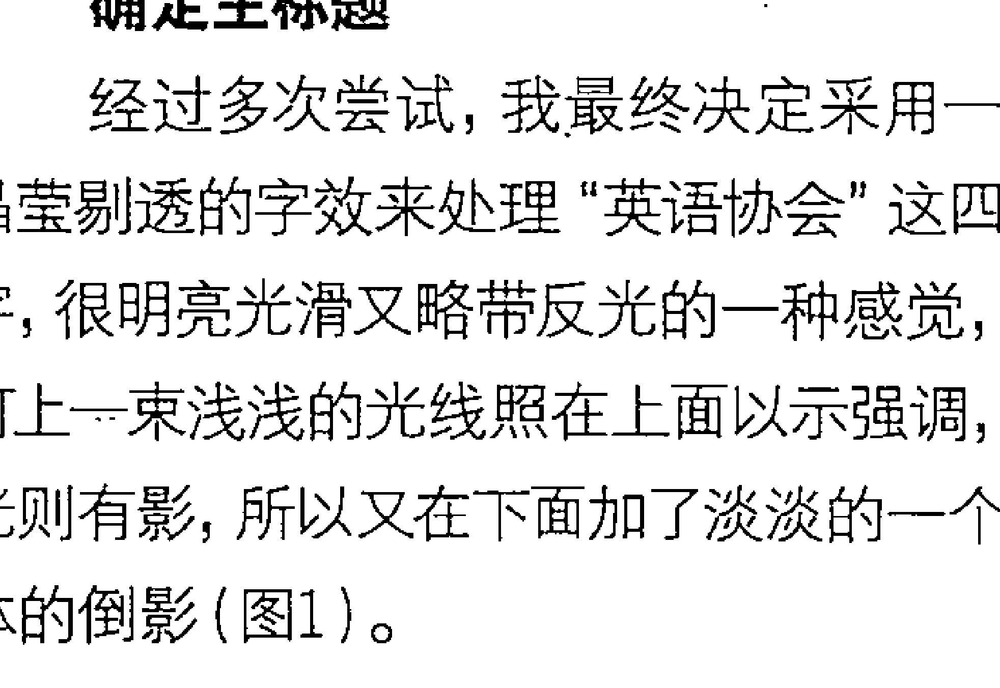

如果字体是正面出现在海报上，看上去立体感会比较差，继而光线也不好表现，因此为了突出一下空间感，我把字体拉斜了，光线也是从左上往右下打出来。

#### 渐变的背景

确定好这个主要标题的形式以后，对整个海报的结构就有了一个初步的把握，光是从上往下斜打的，经过调整就放在了中间偏下的位置。

接下来的步骤就是要确定海报背景，由于是要一个简约的风格，所以就直接拉了垂直从上到下的一个深蓝色到白色的渐变做背景色，也是经过调整后使得背景色在“英语协会”四个字之下开始明显变白，我选用由蓝到白的渐变效果，即顺应了英语协会学术性学生社团的相对严肃的学术风格（图2）。


#### 上下半部的文字色彩互补

在处理好背景色之后，海报就呈现了上半部分蓝色下半部分白色，为了将简约进行到底，使整个画面更融合，色彩相差不大，于是就将下半部分的文字处理成蓝色，而上半部分的文字处理成白色，这样相互补色一下，看起来整张海报很平和（图3、4）。


下面的文字内容就是写了英语协会最主要的几个活动，以及英语协会的英文名，都使用蓝色，同时为了不显单调，这部分文字都做了浮雕投影再加描边外发光等效果，使其像是浮在海报之上，更为显眼。

而海报上部分的文字就用了相对正统但是不死板的英文字体逐行写了几句简单的英语宣传语，英语协会的海报有一部分英文还是很有必要的，这几行英文在深蓝区域，直接使用了白色，也未采用任何特殊字效，以适应整体的简约风格。

到此为止这张海报就全部完成了，当然不能少的是在海报右下角注明制作单位，“北京师范大学珠海分校英语协会宣传部宣”字样，这是每张校园海报都需要写明的落款。

### 制作难点篇

整张海报的制作没有什么高难度的操作，但是最终出来的效果还是受到好评，风格简约明朗，所表达的信息也很清晰，贴在展板上效果显得很突出。下面就简单介绍一下制作这张海报所牵涉到的一些比较难以实现的操作。

制作中最主要的难度在于处理“英语协会”四个大字的字效。

制作步骤：打开 Photoshop 软件，新建一个 A2 尺寸、分辨率 300 的空白文件。

先用文字工具打出“英语协会”四个字，选到合适的字体和大小，并将文字图层栅格化以方便后续操作（栅格化的文字不可还原，为防止出错，可先复制该文字图层）。

然后是对字体进行自由变换，拖成一个斜向上立体的样子，接下来是添加图层样式使字体达到理想字效，这张海报中的效果是由内阴影、外发光、斜面和浮雕、等高线、纹理、光泽、颜色叠加和描边几个效果叠加而成的。

制作这张海报剩下的步骤就基本没有什么难度了，对 Photoshop 有一定了解的朋友应该都能看出剩下的操作。

最后我想说的是，制作海报，特别是校园海报，其实大多数也用不到很高难度的技术技巧，关键在于对海报内容图像的一个构思和设计，即使很多成功的商业海报有些也是很简单但又效果不凡的，根据所宣传的内容和所使用的场合来设计制作最合适的海报就是最佳的。

（文|江海洋）

## 打开方式吃上“聪明药”

当双击未知类型的文件时，系统会弹出“打开方式”窗口，让你选择与之关联的程序。这看起来似乎毫无问题，但实际情况却没有那么简单。实际上，Windows只是在“打开窗口”中机械地列出一些已经安装的程序，并没有任何合理化建议，这对于未知类型的文件来说，多少有些瞎子摸象的味道。尤其是对于一些你没有见过的文件类型来说，往往会不知所措。按照以往的做法，我们会去搜索打开此文件的办法，然后下载相关软件。其实我们完全可以用Open with (Enhanced)来弥补Windows的上述不足，让文件的关联变得更加智能。例如当你没有安装Office，却想阅读DOCX类型的文件的时候，可以双击该类型文件，或者在该文件右键菜单上点击“打开方式→选择程序”项，激活Open with (Enhanced)，通过对DOCX类型的分析，Open with (Enhanced)会在Recommended Programs栏中列出所有可以阅读该类型文件的程序清单，其中以带有绿色标记的项目为已经安装的软件，以红色标示的程序为未安装软件。例如双击其中的Microsoft Office Word Viewer程序，表示使用Microsoft Office Word Viewer来阅读DOCX文档。在打开的窗口中选择Visit program’s web page项，可以打开该程序的官方网站，下载安装该软件即可。（文|郭建伟）

## 用WMP创建图片播放列表

有时，我们需要快速查看图片，但Windows的图片查看器并没有提供幻灯播放的功能，必须使用鼠标或键盘不停翻页，操作起来颇为麻烦。如果使用Windows Live照片库，需要额外安装，显然不是很方便……其实，我们完全不用考虑第三方播放工具，可以使用Windows Media Player创建图片播放列表，从而以幻灯的形式播放图片，毕竟Windows Media Player是每台电脑都内置的。运行Windows Media Player，切换到媒体库查看模式，将相关图片拖曳到右侧窗格“未保存的列表”下，单击“播放”按钮，即可以幻灯的形式播放图片，播放的间隔相当合理。现在可以将当前列表保存下来，依次选择“列表另存为”，在随后弹出的对话框中指定播放列表的名称及保存位置。以后，我们只要双击这个播放列表，即可调用Windows Media Player以幻灯的形式播放图片，是不是很有意思？单击主界面顶部的“创建播放列表”按钮，从下拉菜单中选择“创建自动播放列表”，按照提示完成相应的设置，可以创建更智能的自动播放列表，以后每次打开这个自动播放列表，都将对其中的内容进行自动更新，感兴趣的朋友可以一试。

## 不让hybrid boot影响双系统

默认设置下，Windows 8会自动启用混合启动模式(hybrid boot)，此时如果在关机选项中选择Hibernate或Sleep，那么每次关机时将自动进入睡眠模式，重新开机也将极为迅速。不过，如果你使用的是双系统，那么可能将带来一些不便：由于在引导时不会出现双系统的选择菜单，因此如果希望进入另一个操作系统，那么将相当的繁琐。遇到这种情况，我们完全可以用下面的方法来解决。打开“运行”对话框，输入 gpedit.msc，执行后会进入本地组策略编辑模式，依次选择“Computer Configuration→Administrative Templates→System→Shutdown”，在右侧窗格双击Require use of hybrid boot。打开属性对话框，在这里将默认的Not Configured更改为Disabled，确认之后关闭对话框，重启系统之后就会恢复以前熟悉的双系统选择菜单。

## Win7也能搜索PDF文档

很多时候，我们需要搜索包含某些内容的PDF文档，可惜的是Windows 7并没有提供对PDF文档属性和内容方面的搜索支持，只能为属性添加索引，也就是只能搜索出文件名包含搜索关键字的PDF文档，难道只能逐一打开PDF文档进行手工搜索？其实，我们可以为Windows 7系统安装Foxit PDF IFilter插件解决这一困难。访问http://www.fuxinsoftware.com.cn/pdf/ifilter/，按照提示下载安装Foxit PDF IFilter。在正式使用之前，还需要打开控制面板窗口对索引选项进行设置，在控制面板右上角的搜索框输入“索引选项”进行搜索，打开“索引选项”对话框，单击“修改”按钮，在这里选择PDF文档所在的分区；确认之后关闭“索引位置”对话框。返回“索引选项”对话框，单击“高级”按钮，打开“高级选项”对话框，切换到“文件类型”选项卡，找到“pdf”扩展名项目，检查此处是否已经设置为“为属性和文件内容添加索引”，确认之后即可生效。

## Kylin的端口入侵记(一)

C语言课上，很多同学都直接从老师的FTP站点下载kylin的作业，又上传到自己的目录，便完成了作业。kylin心说：“抄我作业?看我怎么玩你。”

kylin使用的是黑客新手最容易掌握的135端口入侵，它可以通过系统漏洞对目标电脑进行控制，可以任意地给对方上传下载文件，危害极大。我们知道，系统中每一个端口都对应一个服务，而135端口对应的就是RPC(远程过程调用服务)。RPC本身在处理通过TCP/IP的消息交换部分有一个漏洞，该漏洞是由于错误地处理格式不正确的消息造成的。于是，kylin打算利用这个服务的漏洞来远程开启对方的telnet服务，从而很容易地入侵目标电脑。

### 135端口入侵过程

为了找到开有135端口且有漏洞的电脑，kylin使用了著名黑客“啊D”写的一款名为“啊D网络工具包”的网络辅助工具，其中的一个功能可以很快地扫描一个IP段内开放特定端口的IP。kylin的IP是121.62.1.113，于是他扫描的IP段是121.62.1.1-121.62.6.62，这样扫到的IP基本上都是自己学校里的，而且都是正在使用的电脑。选择“IP端口扫描”功能，填写IP段及要扫描的端口，点击“开始扫描”，不要两分钟，附近正在使用的电脑凡是开启135端口的都被记录了下来。

### 135端口入侵该怎么防御

135端口是必经之路。简单的防御就是把Windows的管理员密码改得复杂一些，高级的防御手段就是关闭135端口。关闭135端口在XP系统下比较容易。依次打开网络连接中的“本地连接→属性”→打开Internet协议(tcp/ip)属性，选择“高级TCP/IP设置→TCP/IP筛选→属性”，打开TCP/IP筛选即可。

Windows7中有些麻烦，首先运行SECPOL.MSC，选IP安全策略。然后在IP安全策略右面窗口右键点击创建IP安全策略，点击下一步，出现创建窗口，然后，凡是以后步骤看到有使用“添加向导”的都取消，全手动创建。在策略属性上点添加，会出现新规则属性，里面有IP筛选器列表，在IP筛选器列表的页面上点“添加”，在新出现窗口里填写名称，然后点“添加”。

在出现的窗口中，源地址选“任何IP”，目标地址选“我的IP”，然后选TCP协议，下面的选“到此端口”，然后填写135进去，点击确定，返回上级菜单。此时出现你刚才做的筛选器的名称。选中后点“筛选器操作→添加→阻止→常规”，自己起个名字“阻止”。确定后返回上级会看到一个新的列表及操作方法的条目，到这里已经做好一条策略记录了。

kylin通过135端口完成了一次入侵，可是还有一些密码复杂的电脑该怎么办呢？敬请期待kylin的下一次入侵。

(文|陈启麟)

## Kylin的端口入侵记(二)

上期说到，虽然kylin使用135端口漏洞入侵了几台电脑，但是很多电脑还是有密码的。Kylin决定逐个突破。

### ipc$空连接侵入

我们知道，要入侵一台电脑，首先应该要探测主机开放的服务端口，于是Kylin决定使用最经典的S扫描器。S扫描器只有几KB，但是功能却很强大，而且它需要在cmd下运行。

S扫描器的使用方法很简单，格式为：

```
s.exe (扫描方式)(ip或ip段)(端口)(线程数)即可，在末尾加上/save后，S扫描器会把扫描结果保存在所在目录。
```

经过扫描，Kylin发现有台电脑开放了139和445端口。139端口的开启表示netbios协议的应用,通过139和445(win2000)端口我们可以实现对共享文件/打印机的访问。于是，Kylin决定使用ipc$空连接来进行下一步的探测。IPC可以理解为Windows主机之间通信的线路，而我们可以通过这条线路获取到对方的用户列表、共享资源列表等。

一般情况下，我们建立IPC连接是用这样的语句进行的：net use \\IP地址"密码" /user:"用户名"，而Windows 2000则默认有一个低权限无密码的ANONYMOUS LOGON用户，通过登录这个用户就可以获取到主机的更多信息。

Kylin使用最直接的方式来与一台Win2K的主机建立空连接：输入net use \\192.168.1.100\IPC$ "" /user:""。

空连接建好了，Kylin又拿出一个名为netletmein的工具来获取目标主机的用户列表，并尝试使用弱口令进行登录。弱口令就是一些比较简单常用的密码，例如## IPC$空连接的防御

123456、admin、admin888都是管理员比较常用的密码。

通过几次简单的尝试，Kylin并没有能直接成功地得到管理员密码。但是kylin不想就这样放弃，于是他决定进行密码爆破。密码爆破虽然并不是一种很好的方法，但是当入侵的时候停止不前了，不妨尝试一下。

首先，Kylin使用了一个简单的工具brbook来生成制作一个字典。

字典生成后kylin使用了SMBCrack来进行暴力破解，当然SMBCrack也是需要在cmd下使用的工具。密码爆破可以说是黑客最后的选择，但是利用好的话也会有惊人的效果。

IPC$空连接其实是很好防御的。把密码改得更加复杂一些是最简单的防御手段。IPC空连接被建立后，会被黑客枚举用户列表和信息，对此以往有一些管理员认为删除掉IPC$这个连接可以防止，其实不需要如此复杂（因为需要在注册表中停止IPC的共享，而系统默认会在每次系统启动后自动开启IPC$），最有效的办法其实应该在“本地安全策略”中，选择“不允许枚举SAM账号和共享”，以上两点做到，也就解决了IPC的空连结漏洞。

另外，我们还可以删除默认的共享，以防万一。查看本地共享资源：开始→运行→cmd→输入net share。删除共享：net share ipc$ /delete。

即使建立了一个空的连接，我们也可能获得不少的信息，而这些信息往往是入侵中必不可少的，访问部分共享，如果我们能够以某一个具有一定权限的用户身份登录的话，那么就会得到相应的权限。不过，管理员的密码不是那么好搞到的，虽然会有一些管理员用空口令或者弱口令，但这毕竟是少数，随着人们安全意识的提高，管理员们也愈加小心了，得到管理员密码会越来越难的。因此绝大多数情况下都是以极小的权限甚至是没有权限进行连接，大家会慢慢地发现ipc$连接并不是万能的。

(文|陈启麟)

## IPS 硬的不仅仅是表面

当今平板市场，无论销量还是口碑，iPad 2都一马当先。究其原因，它所配备的全视角多点IPS触摸屏的作用功不可没，IPS到底好在哪儿？

### IPS的工作原理

IPS是英文In-Plane Switching的缩写，直译为平面转换。在谈IPS前，有必要先了解液晶屏的构造。从硬件方面来看，液晶屏主要分为四大部分：背光源、导光板、液晶基板和导光膜，最影响画面显示效果的就是液晶基板和导光膜，而IPS其实就是应用于液晶基板的一种技术，将该技术作用于液晶基板的控制电路和导光膜。

和传统面板相比，因为液晶分子排列方式和电极所在位置的不同，IPS屏在施加电压后分子发生转动的方向与传统面板屏有很大不同，IPS将电极设在了同一平面的两端，通电后液晶分子只发生水平转动，而传统面板的电极则设置在液晶分子的上下两端，通电后液晶分子会发生垂直转动。由于分子结构的不同，相比传统屏幕，IPS屏有诸多优势。

IPS屏又称为IPS硬屏，之所以称为“硬屏”就是由于它独特的分子排列，使得液晶结构稳定而坚固，当屏幕遇到外力时，能减少分子结构的变化，不会出现过大的水波纹、暗影和闪光现象，这无疑对于屏幕的触控体验有很大益处。

需要指出的是，关于IPS的误解或谣言很多，我们有时会听到采用软屏的液晶电视厂商促销员向消费者介绍自己产品的优势技术，对于硬屏，他们则说，“所谓硬屏，就是在液晶屏表面加了层树脂保护膜，摸起来硬一点而已，显示效果则和软屏差不多，而且硬屏加了膜以后散热不好！”甚至有促销员说，“硬屏液晶电视时间一长，树脂保护膜可能融化并和液晶屏粘在一起而损坏液晶电视”。当我们了解了IPS屏的分子结构后，就不会被这些谣言所骗。其实，据权威数据显示，IPS硬屏的表面温度比传统软屏的表面温度更低一些，而不是更高。

### IPS屏有哪些优势

相比传统软屏，IPS屏的优势如下：

- **无水纹 更稳定**

无水纹 更稳定

生色彩漂移现象，导致画面模糊或色变现象。某款采用软屏的国产平板，下视角全盘色变，其他视角显示效果一般，另外，IPS的色彩还原更准确。

- **宽视角 更精彩**

可视角度是指用户从不同方向清晰观察屏幕上所有内容的角度。由于IPS屏幕独特而稳定的分子结构，使得上下左右都能达到178度的可视角度，无论是与身旁的TA分享还是被众人围观，色彩表现力都不打折扣，映入每人眼中的都是完美的画面，基本消除了视觉上的“死角”。而传统软屏，从某一侧面（常见为下视角）观看时，会发生色彩漂移现象，导致画面模糊或色变现象。某款采用软屏的国产平板，下视角全盘色变，其他视角显示效果一般，另外，IPS的色彩还原更准确。

- **看比赛 更流畅**

地球人都知道，购买液晶一般要买高清的，但市场上宣传的高清电视绝大多数是指静态画面的清晰度，而我们看电视、玩游戏，绝大多数情况下是观看动态画面，而非静止画面。很多用户有过这样的经验，如果轻轻用手在软屏的液晶电视屏上滑过，会产生一道水痕。如果在播放较快的动态画面时触摸屏幕，就会出现画面停顿，与后面的画面叠加在一起，这就是所谓的“残影”现象。观看画面变化较快的体育节目时，软屏液晶电视往往会发生“拖尾”现象，动态清晰度明显下降，长时间观看会很累。动态画面的拖影和残影问题正是软屏液晶的“硬伤”。

要提醒的是，我们在卖场看到商家现场演示的高清视频通常都是专门制作的，节奏比较舒缓，感觉也很好，但买回家后看比赛节目时，显示效果就立即会差很多，这就是由于动态清晰度大幅降低而引起的，而IPS屏幕的强项就是响应时间短，可以有效控制动态显示的拖影和残影问题，这也是由于它独特的分子结构决定的。

(文|邹民)

## 毕业生网投 抓住HR1.5秒

如果说求职是场短跑，那么投简历就是起跑的那个万分关键的时刻，因为简历和求职信被淘汰的人就可以被称为倒在起跑线上的人，还没开始“跑”就输了。

最近，我给公司招聘一位计算机专业的学生，收到了大量应届生投递的简历。有两份简历，让我纠结了一下，我选择了后者。我认为，虽然这两位同学的实习经历相似，但是从简历制作来说，第一份简历的毛病太多，他所犯的错误也是大多数应届毕业生常犯的，而第二份则比较能够打动HR。下面将两份简历放在一起具体谈谈。

### 开篇啰嗦

**简历1的开篇：**

尊敬的贵单位领导，您好！
感谢您在百忙之中垂阅此函。因有志于在贵单位从事工作，通过对贵单位的了解，我以初出茅庐的勇气和百折不挠的信心毛遂自荐，愿为贵单位的发展尽绵薄之力……

> 以上80多个字的简历开篇没有太多信息，只是求职者想向招聘公司表示自己的尊重。简历不能表达这些，还是那句话：简历只是为我们赢得面试机会而存在。

**简历2的开篇比较好：**

HR，您好！
我是某大学毕业的XX，现应聘公司XX职位，简历如下，请查收，谢谢！

> 该开篇言简意赅，将自己需要面试的职位准确地传达给HR，值得借鉴。

小结1：简历是什么？简历是把自己变成一张纸或者一封电子邮件，用来说服看信的家伙提供一个面试机会的工具。发简历的初级目标是面试，终极目标是入职。因此，简洁地表达自己是为自己赢得面试机会的第一步。

### 泛化自我评价

**简历1的自我评价：**

性格稳重，开朗，人际关系处理得当；
思维严谨，敢于面对困难和挑战； 为人诚恳，具有良好团队合作精神和自学能力，并具有很好的分析问题与解决问题的能力；
工作积极上进，对IT领域的软件开发和设计工作有浓厚的兴趣。

> 大家一定注意到以上评价安在任何计算机专业应届生身上都可以。人人都适用的内容没有做到从对方角度出发，而且只能提供极有限的信息。

**简历2的自我评价：**

1.  有3年寒暑假实习经历，主要偏重于互联网软件开发；
2.  对程序员工作很有兴趣和热情，愿意长期从事此工作；
3.  对贵公司X系列产品的开发有自己比较独到的理解。

> 无论简历里还有其它什么信息，我相信企业HR看完以上3点必然会此同学面试机会，因为在短短的介绍当中他表现出有相关经验、对软件开发有兴趣和对公司比较了解的特点，如此候选人绝对可以用人才难得来形容。

小结2：简历要遵循一个中心来写，即从招聘方的角度出发，真正做到换位思考。
HR看简历就是通过它选个看起来合适的人约来面试进行挑选。考虑到这一点，“让对方有个面试我们的理由”看起来就尤其重要。给我们面试机会的理由有很多，从相关专业背景、学习成绩不错、得过很多奖再到有实习经历（对应届生而言有相关实习经历尤其能为我们加分）。

此外非常值得注意的一点是，我们要把这些理由放在简历里尽可能最靠前的部分——个人信息之后写成“以点的形式罗列呈现的自我评价，多呈现有用信息”，这样对方才能在浏览过个人信息之后第一时间找到约我们来面试的理由。

### 介绍实习经验时展现的有效信息不足

**简历1：**

2010年至2011年
实习项目： 文档管理系统
职责描述：
负责整体的需求、设计及编码。

项目简述：
文档管理是结合项目管理在项目建设过程中形成大量的文档资料，包括设计图纸、合同、文件等以及企业的其他文件，科学、高效地管理这些文档资料，分类保存，并建立各种文档资料与项目/任务的关联关系，使每个项目相关人员都能够快速、准确地了解每份资料的详细情况。

> 以上就是个很典型的例子，求职者介绍项目和开发环境用了135个字，介绍自己的工作责任只用了19个字。公司如果没有从我们的项目经验中发现长处和优势，那自然也不可能让我们去面试。招聘方想找合适的应聘者，并不打算买应聘者曾经开发的产品和项目，所以还是多介绍我们自己，少介绍项目。

**简历2：**

2010年至2011年
实习项目： 文档管理系统。
使用技术： 该项目用Portal产品进行搭建和开发。
开发工具： Idea
职责描述：

1.  负责整体的需求、设计及编码； Portal环境搭建和Portlet开发；
2.  编写应用评价报告，详细阐述Portal的应用经验、遇到的问题和实际解决办法。

> 上面这位同学相比之下重点介绍了自己在实习项目中的工作，虽然只有3点，但仍然能让人眼前一亮，因此也会给自己争取更多的面试机会。

大家可以看出，第二份简历更能体现属于求职者自己的东西，体现求职者适合此工作的理由，由此也给了HR面试自己的理由。

小结3：简历内容要从始至终与所应聘职位关系密切，其它则不必多提。假如我本人要去应聘人力资源招聘方向的工作，之前八年的销售经验只会被一笔带过，简历的重点会落在我做过猎头、企业人力资源方面的工作经验上，如此会大大提高我被约面试的可能性。

好了，在简历制作的这几个关键步骤完成后，就到了投递环节，关于投递我有一点建议：

虽然所有的招聘网都提供网上投简历的功能，但是我还是建议求职者用自己的邮箱投递简历。

如果你是企业里的HR，每天看的邮件都是XX@chinahr.com、XX@zhaopin.com、XX@51job.com，相信早就视觉疲劳了，偶尔有封不同后缀的邮件可以让HR眼前一亮，也许能为我们多赚到些机会。

最后，我想结合自己的经历给应届毕业生谈点HR的1.5秒原则。

我从2005年涉足人力资源行业，至今已有7年，期间看过的简历超过120万份。根据个人经验，HR给每份网投简历的时间不会超过1.5秒，其中原因是太忙、网投简历太多。

> (文|张大志)

作为一名求职者，应该写好简历以抓住这宝贵的1.5秒钟，继而给自己的简历赢得两分钟的时间。

这样才会有一次面试的机会，让自己由一张纸或者邮件变成活生生的人站在对方面前陈述自己。

一句话，网投简历中只要有一两处亮点，即可为求职者争取到很多面试机会。

## 音频压缩包起死回生术

一个存有音频文件的RAR压缩包，在解压和WinRAR修复相继失败之后，如何最大限度地抢救出其中的音频资料？

老爸从网上下载了“细说民间中医常用中草药”系列音频，在解压到其中的第二十一号RAR压缩包时，出现“文件被破坏”错误提示，不能解压。起初他以为是下载过程中造成文件损坏，于是又重新下载了一次，但还是不能解压，确定不是下载过程造成的问题。最后他寄希望于对压缩包进行修复上。这个任务落到我的身上，但如何修复呢？

### 用压缩工具尝试修复

WinRAR和好压等压缩软件同时具有修复压缩包的功能，遇到解压失败的情况，理所当然会首先用这个功能来尝试修复。

在好压窗口中选择这个压缩包，然后选择工具栏上的“修复”按钮，在弹出的“修复压缩文件”窗口中点击“修复”按钮，如果修复成功，显示成功信息。若信息窗口中出现“数据错误，文件被破坏”的错误提示，说明借助于好压的修复功能也无能为力，只能另想办法。不幸！我遇到的恰好就是后者。

### 虚拟光盘 曲线挽救

用压缩工具自带的修复功能不能修复的音视频文件压缩包，可以采用把压缩包虚拟为一个光盘，从中提取文件的办法。

用WinMount软件将已损压缩包虚拟为一个新盘符。具体做法是：右键点击压缩包，选择“WinMount→Mount至新驱动器”命令，一个新的“光盘”符号诞生了。

从虚拟光盘中选择音频文件进行拷贝，如果里边的文件不是很大，一般来说拷贝速度很快，但如果拷贝进行到中途，进度显示“剩余XX分钟”或更长时间，甚至拷贝进度停滞不动了，只能选择“取消”放弃，这时，必须另想办法将损坏的文件“拿”出来。

在本案例中我用这种方法拷贝音频文件，拷贝过程显示到5分钟的时候就不能进行了。如果你遇到这种情况，也许比我幸运，那就不用执行下一步。

### 坏盘拷贝 借助工具

复制坏光盘有专门的坏盘拷贝软件，能够绕过坏道拷贝抢救出光盘中的文件。现在我们拷贝的虽然是虚拟光盘，但道理应该一样，可借助BadCopy这款坏盘拷贝软件，最大限度恢复音视频文件。

启动BadCopy软件，选择“超强复制”标签，选择虚拟光盘中的损坏音频文件，定位拷贝输出路径，然后点击“复制”按钮，稍候片刻，如果复制成功，会有提示。这时，将文件拷贝出来收听，也许你会发现中间有小小的片段会有杂音听不清，其余的音频很正常，但这已经就算让这个压缩包中的文件起死回生了。

对于采取“超强复制”模式进行文件抢救，如果损坏不是很严重，属于软件力所能及的范围，则软件会自动解决。如果拷贝过程迟迟停留在某个位置不能前进，则可点击软件右侧面板上的“跳过”按钮，跳过文件中有错误的地方，软件会自动以0来填充有问题的字节空间。

到了这步还算幸运，老爸的这个压缩包未用“跳过”功能即自动修复拷贝成功。如果你遇到比我还低幸的情况，相信有这个“跳过”功能保驾护航，你的音频文件也能最大限度地抢救出来。

## 小提示

以上方法对各类视频压缩包修复也有效。对于程序的挽救，上面的方法不太适合。

> (文|郭志强)

## 重新调整网络服务的优先顺序

在办公场所，笔记本电脑一般可以同时连接有线网络和无线网络，默认设置下当然是自动选择无线网络，如果需要使用有线网络，必须关闭无线网卡或者禁用无线连接，这样操作显然比较麻烦。

其实，Windows 7系统已经提供了有线网络、无线网络优先顺序的调整功能。

右击系统托盘区的网络图标，打开“网络和共享中心”窗口，在左侧导航栏选择“更改适配器设置”，按下Alt键激活菜单栏。从“工具”菜单下选择“高级设置”，打开“高级设置/适配器和绑定”对话框，选择“本地连接”，将其访问顺序调整至最顶端，保存即可生效。以后即使无线连接已经启用，笔记本电脑仍然会优先连接有线网络，这下就方便多了。

> (文|王志军)

## 海纳百川 光盘整合我有招

把多张常用的系统维护光盘整合成一张光盘以方便使用，本文将带你一同实现这一设想。

大家知道，我们从网上下载到的系统文件大多数是可启动ISO文件，比如下载到的WinXP、Win7或者PE系统文件。默认情况下，一张光盘只能刻录一个ISO文件。这样，当我们需要使用光盘去帮助朋友重装系统或者维护电脑的时候，就不得不携带多张系统盘。而且现在DVD盘容量至少4.3GB，如果我们只刻录一个ISO文件，就会浪费光盘大量的剩余空间。何不使用开源、免费的GRUB软件将多个ISO文件整合到一张DVD光盘中？

下面我们就使用GRUB软件来打造整合多个ISO文件的启动光盘。因为GRUB自带的grldr本身就包含引导记录和启动文件，而且它可以借助内置MAP命令将ISO文件仿真成光盘启动，这样我们只要再准备启动配置文件menu.lst和各个ISO文件（对应系统文件）即可完成光盘整合操作。

### 整合目标

合盘具有系统重装和维护、系统恢复和启动本地硬盘系统文件功能。

整合对象：（系统文件均要为ISO格式）

1.  WinXP和Win7安装文件：用于系统重装（分别命名为winxp.iso和win7.iso备用）。
2.  老毛桃PE和网虫2008PE：用于系统维护（命名为laomaotao.iso和winpe.iso备用）。
3.  其他所需文件：GRLDR、UltraISO、Imagex一键恢复。

### 光盘整合具体操作

#### 制作合盘的引导记录和引导文件

在前面的介绍中，我们已经知道了grldr本身就包含引导记录和启动文件，我们只要将其改名为grldr.bin并导入合盘文件中即可。首先运行UltraISO，单击“文件→新建→UDF DVD映像”，继续单击菜单栏的“启动→加载引导文件”，导入上述准备好的grldr.bin文件，然后保存为“n合1.iso”即可。

#### 制作启动配置文件

GRUB启动配置文件可用记事本输入下列代码保存为menu.lst：

```
#用于安装WinXP,如要配置其他系统,请自行添加菜单并更改ISO文件名称
title 1.SETUP WinXP
find --set-root /winxp.iso
map /winxp.iso (hd32)
map --hook
chainloader (hd32)

#用于启动本机硬盘上D盘(hd0,5)下的Win8安装文件
title 2.Setup local Win8
root (hd0,5)
chainloader /bootmgr
```

#### 准备系统文件

在前面的打造目标中，我们要实现合盘有系统恢复功能，对于Win7用户，只要先使用“Imagex一键恢复”将当前系统分区增量备份到install.wim镜像文件中，以后恢复系统时就可以从install.wim中选择增量备份的映像进行恢复。其他功能的系统文件直接使用ISO文件即可。

1.  首先将下载到的Win7.iso使用WinRAR打开，将所有文件解压到E盘下备用。接着将下载“Imagex一键恢复”也放置在E盘备用。
2.  由于无法在当前系统备份C盘，可以使用任意启动U盘或者光盘启动到PE系统，然后运行前面下载到的“Imagex一键恢复”，单击“分区备份”，接着在打开的窗口选择当前系统分区，镜像文件选择e:\sources\install.wim，然后单击“下一步”。
3.  在打开的窗口输入备份的注释如win7backup（方便以后恢复时选择），单击“增量备份”，按屏幕提示完成备份即可。
4.  完成系统备份后，进入Win7再次启动UltraISO，单击“文件→打开”。打开下载到的win7.iso文件，展开sources目录，单击“操作→添加文件”，使用上述添加增量备份的install.wim替换其中的同名文件并保存。

#### 生成并刻录合盘

再次启动UltraISO，打开前面制作好的“n合1.iso”文件，然后依次单击“操作→添加文件”，将上述准备好的winxp.iso、win7.iso、laomaotao.iso、winpe.iso、menu.lst、Imagex一键恢复文件添加到合盘ISO文件中。最后插入空白DVD刻录光盘，单击“工具→刻录光盘镜像”刻盘即可。

### 合盘实际使用

完成上述操作后我们就成功打造出了一张包含丰富功能的启动合盘，以后出门维修电脑，我们只要携带一张光盘就可以执行各种操作了。在目标电脑上插入光盘并在BIOS中设置光驱为第一启动，成功启动后在多重启动菜单就可以选择不同功能菜单。

#### 系统重装

只要在菜单中选择1.SETUP WinXP或2.SETUP Win7，接下来启动效果就像插入WinXP和Win7安装光盘，只要按任意键即可开始引导安装。

#### 系统恢复

前面操作中已经将当前系统增量备份，现在如果要恢复系统，在多重启动菜单选择boot winpe。成功启动到网虫PE系统后，先将当前C盘格式化，接着启动光盘上的“Imagex一键恢复”，单击“分区恢复”，恢复分区选择当前C盘，镜像文件选择光盘上的sources\install.wim文件。单击“下一步”后，在打开的窗口选择注释为win7backup的映像进行恢复即可。

#### PE维护操作

合盘还包含老毛桃PE和网虫PE，这两个PE的功能非常强大，我们只要在多重启动菜单选择合适的命令即可启动，这两个PE的具体使用就不再赘述了。

#### 启动更多系统

由于DVD光盘容量有限，我们还可以通过GRUB命令行启动更多光盘外的系统。比如目标电脑上已经下载的Win8.iso文件，首先使用WinRAR将Win8安装文件全部解压到E盘，接着使用合盘启动电脑，在出现多重启动界面时按C键进入命令行界面，然后依次输入下列命令激活win8引导：

```
root (hd0,5)
chainloader /bootmgr
```

在出现Win8安装界面时，按下Shift+F12键调出命令提示符界面，接着输入e:\sources\setup.exe开始安装即可。

(文|俞木发)## 通过易购网返利的心得

随着年前消费旺季的到来，返利无疑成为网购达人的首选兵器。上期我们介绍了在淘宝网返利的经验，这期我们重点讲在其他网站进行购物返利的经验。

一个大概的范围，比如1%~7%、2~45元，范围模棱两可，上限和下限的金额相差很大，所以我们一定要搞清楚具体的返点是多少后再下单。

所以为确保跟踪到订单拿到返现，购物前清空Cookies最为保险，也请保持这个清空Cookies的习惯。

目前各类返利网站大行其道，让人眼花缭乱，各大返利网的返利政策也不尽相同。对于经常返利的朋友，电脑里一定要收藏几个返利网，看中了喜欢的商品才好进行价格比较，以得到最大的利益。笔者比较信赖大的网站，比如51返利、淘宝返还网、易购网、QQ返利网等。下面与大家分享一些通过易购网返利的心得。

点击每个商品对应的“有返现”标签，可以看到对于此类商品的具体说明，比如当当网对于图书音像类实付金额小于等于30元的订单是无返点的，而京东的图书返利返点很高，达6%！至于亚马逊(卓越网)返的易币只能在易购网内部通行。

清除Cookies的方法很简单：以IE 7.0浏览器为例，点击“工具→Internet选项→常规→删除Cookies”即可。

易购的返利有多有少，各家返利都不太一样，这就要有所比较。如果购买几本书，我会先根据书名看看哪家网店有，然后再比较哪家的返利多一些，这些其实一点都不麻烦，稍微动下脑子就搞定了。

## 搞清楚具体返利再下单

比如，在搜索框输入书名“失恋33天”后，显示6个商家在售。点击进去后会显示各商家的返现情况，这时就要注意了！有的显示返现金额，有的显示返现比例，还有的返易币。这里的返现金额和比例都只给出了

## 清除Cookies 跟踪订单

很多朋友在易购购物时经常会遇到一个问题，就是下单后不能跟踪订单。这一切都是因为Cookies！我们知道，返利网站是通过Cookies的方式来跟踪订单的，如果用户在京东(其他合作网站也一样)的购物车里有商品，即使通过易购的购物入口去买东西，京东还是会认为是它自己卖出的东西，所以不给易购返现，用户也就拿不到返现了。

此外，如果通过返利网到达商家之后，又通过了另外一个链接或者搜索引擎链接进入商家的网站进行购物，这样的话返利也会失败，因为用户的返利跟踪Cookies会被新的Cookies所取代。

这是技术的原因，只有在清除浏览器Cookies的情况下，易购的系统才可以记录到用户的订单信息，以便核算返现。

所以要想返利成功，在通过返利网链接进入商家之后，一直到结算都不要离开这个网站，返利成功的可能性会增加很多。

价格没有最低，只有更低！在易购网上找到自己心仪的商品后，最好再到淘宝上搜一下，对比一下价格，说不定有比易购返利后更便宜的。

大家试着在日常生活中学会理财，虽然返利比起我们花费的钱实在是不值一提，但点滴的积累也是一种很可爱的小乐趣，在购物成功后，通过自己的勤劳，获得些许额外的返利，会有喜出望外的自豪感。

(文李靖一)

## 将声音主题应用到其他主题页

Windows 7提供了很多非常漂亮的主题，其中有一些还提供了相应的声音方案，例如爱尔兰主题包含绿宝石岛图片和凯尔特音乐，可能你希望在其他的主题中也能应用来自爱尔兰主题的凯尔特音乐，如何实现呢？

首先在个性化窗口中应用“爱尔兰”主题，从控制面板打开“声音→声音”对话框，在下拉列表框找到Celtic这款声音方案，单击右侧的“另存为”按钮，将其保存下来，需要提醒的是方案名请勿与Celtic重复，例如这里命名为“凯尔特”。以后，当我们选择其他的主题时，就可以直接应用“凯尔特”声音方案，是不是很方便？

(文王志军)

## 桌面文件大挪移 不再害怕系统出问题

相信很多人都喜欢把要处理的文件放在桌面上，这样存放使用方便，打开电脑就能看见所需的文件。然而，系统默认的桌面是在C盘，一旦系统出问题，恢复系统时桌面存放的文件都将灰飞烟灭。

有没有什么办法把整个桌面挪动到别的磁盘下呢？Win 7系统下实现起来很方便。打开C盘，在“users”文件夹的“个人文件夹”（具体名称因个人设置而异）下找到“桌面”文件夹，右键点击并选择“属性”打开“桌面属性”，在“位置”栏下点击“移动”，设置桌面到其他磁盘设定的文件夹下。

移动过程出现“是否要将所有文件从原位置移动到新位置？”时，选择“是”就完成了。

以后再放在桌面上的文件，就自动存放到别的磁盘。如果想恢复，在“桌面属性”的“位置”栏里选择“还原默认值(R)”就可以了。

(文海芝灵)

## 真人照片轻松变手绘卡通

想不想给女朋友画一幅漫画像讨她的欢心？什么？你不会画画！没关系，只要你会拍照，今天我就教你一手照片变漫画的独家秘技。

通过特有滤镜或软件实现的照片漫画效果，你会用别人也能轻松使用，所以没有丝毫个性可言，况且效果也不尽如人意啊。而且，那些方法受照片本身的限制很多，无法调整，比如你总不能让照片中的人换个姿势什么的（新版Photoshop倒也提供有类似功能，但是试过之后感觉非常的生硬虚假）。

本文的方法，不仅能将照片变成真正的漫画，而且还能自由修改，并能插入网点、发光线等漫画元素，让漫画效果更炫更真实。下面，就让我们开始吧。

### 照片转成线描图

线稿是漫画制作的第一步，一般是用铅笔起好线稿，再扫描进电脑中处理。对于不会画画的人，可以用一个取巧的办法：把照片扫描进电脑作底稿，然后在上面“描”，描红我想谁都会吧。

当然，描红也需要一个好工具，这里推荐Easy Paint Tool SAI（下文简称为SAI），这款工具小巧好用，尤其它的“手抖修正”功能，有效改善了用手写板画图时手发抖的问题，简直就是勾线图者的福音。

启动SAI后打开照片原图。为了不破坏原图像，我们新建一个图层来操作，点击“图层→新建图层”，然后在新图层上描画即可（图1）。为了更便于操作，可放大视图，连续按“Ctrl++”键即可（反之，“Ctrl+-”键就是缩小视图）。视图放大后，按空格键不放光标将变成手的形状，此时可拖动调整图片到适当的位置，然后操作。

SAI提供了多种“笔”，勾线稿一般使用铅笔，选中后可以设置各种参数，如笔刷大小、笔尖形状、墨色浓淡等等，可以模仿出各种型号的铅笔。

描好大线条后，隐藏背景层的原图像，就得到一个初步的线稿图了（图2）。

### 用钢笔工具绘制精细线条

上面只是粗粗地描出了轮廓，线条画面不够细致干净，线条也不够流畅。可在此基础上，进一步描画出更精致的线条图来。

这里可使用SAI的钢笔工具。首先点击“图层→新建钢笔图层”，这时工具箱中自动显示钢笔相关的工具。选中“钢笔”描画即可。

这一工具的好处在于，即使你是一个新手，同样能轻松绘制出平滑有力的线条，并且还可以随意对线条进行编辑修改。举例来说，我们初始画出的是图3上方的线条，想把它变成曲线，此时可选中锚点工具，拖动线条上的锚点即可将它变成任意形状的曲线。选择笔压工具，此时向左拖动锚点可使线条变细，向右拖动锚点可使线条变粗。如此处理后，一条类似毛笔随意涂画的自由曲线就完成了，是不是比一样粗细的直线漂亮多了（图3）。

利用SAI的钢笔特性，还可以很轻松地临摹一些书法名作（图4）。这种灵活的线条绘制、修正功能，正是SAI的特色之一。

### 卡通发型绘制技巧

熟悉了钢笔工具的操作，这里简单介绍一下人物头发的绘制。漫画不需要将人物的头发一根根都画出来，只需要勾画出发型的大轮廓，然后画出类似“草叶”的头发就可以了（图5）。

### 眉目传神

无论是描摹还是写意，画人物时的眼睛部分很不好掌握。其实只要了解眼睛的结构，找出一定的规律，同样可以轻松画出传神的眼睛来。仔细观察，可以发现大部分人的眼睛是稍带点尖角的椭圆形，在此基础上演化出三角眼、棱形眼、猫儿眼、半圆眼等不同形状。确定某一人物眼睛的基本形状后，即可继续画出眼皮、眼球、眼睑、睫毛、眉毛等元素（图6）。

### 五步制作Q版卡通照

所谓Q版人物，即是大头小身体，头部为正常比例，身体被缩到很小，显得很可爱。前文说过，通过SAI勾线图制作的卡通照片，比起Photoshop之类的一键生成卡通照的优势，就是它有强大的自由编辑的空间。下面就让我们在描摹人物头像后，再为其配上Q版的形象。

第一步：导入原始照片（图7）。

第二步：按照上文介绍的方法勾出头像的线图，并自由发挥，为人物添加Q版身体（图8）。在制作漫画头像时，不需要完全写实，对人物的一些特点，可以稍作夸张，这样反而会更加的神似，比如某人下巴给人一种很尖的感觉，画头像漫画时可以让下巴更尖些以突出这一特点。

第三步：为人物的皮肤铺上底色。SAI中常见的有三种铺色方法。一是大面积平涂颜色后，再擦掉多余的颜色，这个比较费时；二是先贴着线涂出一个封闭的多边形，然后再用填色桶填充；三是用魔棒工具选中某一块区域再填充颜色（图9）。三种方法各有优缺点，各人根据需要选用即可。

第四步：根据原照片上脸部的明暗，为卡通头像添加阴影，增强立体感。

第五步：为头发、衣服等分别涂上颜色并添加阴影，卡通效果的大头照即告成功。这可是软件所无法自动生成的效果，相当的酷（图10）。

### 为画作添加漫画元素

SAI的优势就是画线，其他如纹理、着色等工作，另有专业的软件来更好地完成，这里强烈推荐ComicStudio。

ComicStudio的界面有点像Photoshop，许多操作也相似。不过ComicStudio是专业面向漫画创作的，它的一些独有特性是Photoshop所没有了，比如ComicStudio首先要建立单个作品的目录：名称、作者、规格、保存路径等都要设定好，非常符合连环漫画创作的习惯，也适用多人协同工作，不会出现文件混杂的现象。

漫画中经常用到放射线效果，传统漫画需要用尺子一条一条划线，非常繁琐，而这在ComicStudio中可以轻松搞定。点击“滤镜→描画→集中线”，再按提示设置长度、宽度、曲率、偏差等参数，一个放射线效果的图很快就完成了（图11）。

ComicStudio的功能非常丰富，限于篇幅这里不再细述。只要学会本文中的方法，足够你有能力将照片转成手绘漫画了。这是一门手艺，不只是能讨好女友，如果能做好了，还能赚钱呢。在淘宝上搜索“照片 漫画手绘”，会发现不少网店就是靠这个赚钱的。平均单幅作品要价在100元左右，做得好的，每月能售出十件左右呢。

（文/流言）

## 保护原始档案 锁定压缩文件

在某些单位的公用服务器当中，往往存有一些历史资料的RAR压缩包，常有员工打开查看，在查看过程中的某些随手操作，容易造成原始档案压缩包中的文件被修改甚至删除，使得资料失去原来的面目，以后到底是不是原始模样也不得而知了。

那么，在不限制文件使用的情况下，有没有办法限制对RAR压缩包中文件的修改，做到只能看不能改呢？

要实现对RAR压缩文件的防修改限制，只需按如下方法执行即可。

第一步：启动WinRAR，在程序主窗口中定位到要执行保护的压缩文件所在的文件夹，选中需要保护的压缩包（切记不要双击打开它），如本例选用“公司文件.RAR”。

第二步：按Alt+L组合键，打开一个设置窗口，在打开的窗口中确认“禁止修改压缩文件”复选框被选中，单击“确定”按钮即可把此压缩包锁住，其中的文件便无法被修改或删除。

## 小提示

此命令只支持RAR压缩文件。另外，在新建压缩文件时，设置窗口中也有一个“锁定压缩文件”复选框，一旦选中，生成后的压缩包将无法再修改。如果你的数据很重要，请在执行压缩时就一并设置。如果压缩时忘了设置保护，只能用上面的方法补救。

（文/晏君）

## 唤醒“沉睡”的数字小键盘

键盘右侧的数字键盘区域经常处于被“冷落”的地位。难道小键盘真的纯属“鸡肋”吗？答案是否定的，就让我们来领略小键盘的独特魅力吧。

### 用小键盘掌控窗口显示状态

当多个窗口堆积在桌面上，往往会将桌面搞得凌乱不堪。如何才能够让多个窗口互不影响呢？试试WinJuggling这款免费的开源小软件吧，它允许你通过小键盘掌控不同窗口的显示状态。当WinJuggling运行后，必须点击NumLock键，让小键盘指示灯处于熄灭状态，这样就避免了该程序和小键盘正常使用的冲突问题。

选中目标窗口（假设为Word窗口），点击Windows键的同时点击小键盘上的某个数字键（例如Win+1键），就可以让该窗口与小键盘上的“1”键建立关联。按照同样的方法，最多可以将“0”到“9”十个数字键和十个窗口建立绑定。之后直接点击对应的数字键，可以显示或者隐藏对应的窗口。

### 小键盘巧变WMP控制台

WMP是我们最常用的媒体播放器，一些高级键盘都附带了针对WMP而设计的快捷键，只要点击该键，就可以直接打开WMP，而普通的键盘却无此功能。试试MediaKeys这款绿色的软件吧，它可以将你的小键盘变成功能强大的WMP控制器，让WMP操作变得更加快捷。

在MediaKeys主界面的Controls面板的Select your media program列表中选择目标播放器，默认设为Windows Media Player。当然，MediaKeys也在支持iTunes、WinAMP、Foobar2000等播放器。

点击Click here to create hotkeys按钮，在热键设置窗口中的PlayPause key、Skip forward key、Skip back key等栏中可以设置播放/暂停键（默认为点击小键盘上的“*”键），跳至下一个播放对象键（默认为小键盘上的“-”键），回退到上一个播放对象键（默认为小键盘上的“/”）等。

在上述面板中勾选Pressing play button will run media program项，表示当点击小键盘上的“*”键后，可以启动WMP。勾选Hold skip button to fast-forward/back项，表示当持续点击小键盘上的“-”和“/”键时，可以控制WMP执行快进或者快退操作。

### 巧用绝密数字快速启动程序

当我们启动程序时，往往需要双击桌面上的对应快捷图标，或者在开始程序菜单中寻找目标。为何不试试用小键盘，来快速启动程序呢？使用ControlPad这款免费的小软件，你只需为目标程序、文件、网址等对象配置好数字组合，之后利用小键盘，输入预设的组合数字，就可以快速将其打开了。当ControlPad运行后，点击小键盘上的“*”键，打开其独特的命令编辑窗口，在其中输入对应的数字组合（例如9998）。

之后点击小键盘上的“/”键盘，弹出命令行输入窗口，在其中点击浏览按钮，选择对应的程序（也可以是任意类型的文件、网址等），之后按回车键，即可为该数字组合绑定启动程序。实际上，你也完全可以在其中直接输入多个程序名称、网址或文件路径信息，彼此之间以分号相隔，这样即可将该数字组合和多个目标对象绑定在一起。

如何使用该数字组合“指挥”程序运行呢？方法很简单，在小键盘中点击“*”键，在弹出窗口中直接输入预设的组合数字（例如9998），回车后即可运行与其绑定的单个或者多个程序了。

（文|郭建伟）

## IP地址修改 不快怎么行

借助“互维电脑IP自动改”这款小软件我们可以搞定IP地址快速修改问题。

最近上级要组织一个大型的远程网络培训，需要将本单位网络机房当中的电脑IP地址临时更改为城域网的IP地址，通过“网上邻居”的相关属性设置操作，按部就班地更改一百多台电脑的IP地址，往往要花很长时间，非常麻烦。借助“互维电脑IP自动改”这款小软件（下载地址：http://www.sz1001.net/soft/38110.htm），很快就可以搞定类似的IP地址快速修改问题。

运行“互维电脑IP自动改”软件，单击“参数设置”标签，设置要修改的子网掩码、默认网关、主副DNS等全自动修改参数，在“半自动修改参数”区域，可以设置计算机名称的前缀，IP地址偏移值、网段列表等参数，设置完成之后，打开“IP扫描”标签，依次单击“客户端”和“配置文件”按钮，将上述修改参数导出为“客户端.exe”和“hnhv.ini”两个配置文件。

通过极域、洪恩等网络电子教室软件，将上述配置和运行文件发送到要修改IP地址的电脑，并通过远程控制命令，在所有目标电脑上同时运行可执行文件“客户端.exe”，只要我们依次在各台电脑上输入形如“1、2、3……”的顺序编号，该程序便会将计算机名称自动设置为“名称前缀+顺序编号”的形式，并根据IP地址偏移值设置IP地址。例如，在1号电脑上输入编号1，计算机名称会自动变成JSJ1，IP地址会自动设置为101，设置完成之后，单击“确定修改”按钮，不需要重启计算机，即可完成IP地址的修改操作，而计算机名称的修改操作则需要重启计算机才能生效。

培训活动结束后，我们既可以通过网络还原软件精灵等系统还原软件，恢复原来的系统，也可以通过该软件，将IP地址再修改回来。

## 小提示

工作组、网段列表等选项可以设置多个，中间用逗号分隔，在运行“客户端.exe”的时候，可以根据需要进行选择，以便适用于不同网段、不同工作组同时并存的IP地址修改操作。

（文|姚文连）

## 我的115网盘我做主

115网盘受到很多朋友的青睐，不过使用115网盘也存在一些小麻烦，好在有高手设计了一些软件帮助我们解决了一系列的问题。

### 批量登录获取115网盘空间

1. 第一步：首先将下载到的压缩包解压到某一文件夹，然后找到115account.lst文件，用记事本将该文件打开，可以看到已列出的账号密码保存格式。将“用户名=密码”修改为需要导入115网盘的账号密码，多个则写上多行，不需要的行删除，完成后保存该文件。
2. 第二步：运行主程序“115网盘.exe”，点击主界面中登录下面的下拉菜单，选取运行几个账号后换IP，默认为3个，可以改为1个或者5个，运行多个账户后换IP主要是为了防止账号被删。
3. 第三步：点击“导入”按钮，在弹出窗口中选择115account.lst文件，导入成功后，会在下面的列表中显示所有的账号密码。最后点击“开始”即可自动登录并获取115网盘空间，选中“摇一摇”复选框则可以自动获取免费空间，获得多少就看你幸运几何了。

### 搜索115网盘资源更简单

1. 方法一：万能的搜索引擎。不管是百度还是谷歌，都提供了一个Site开关，用来搜索指定网站的内容。这个开关很好用，比如搜索“射雕英雄传”，只需输入“ site:115.com”（site前有空格），回车后即可找到需要的资源。
2. 方法二：专业网盘搜索引擎。在浏览器地址栏输入http://wpsoso.com/，然后单击左上角的“115网盘搜索”链接，输入需要的资源搜索即可。

### 管理115网盘更轻松

115网盘的免费空间升至15GB，让不少使用115网盘的朋友兴奋不已。兴奋之余，文件管理的问题也随之出现。随着网盘空间的增大，里边可以存放的文件越来越多，如果还是通过网页的方式来管理，则显得有些不便了。虽然115网盘也提供了优蛋下载来协助用户管理，但基本上是对VIP用户有效。而“115网盘辅助”可以帮你直接在客户端中快速批量地进行文件删除、文件续期或文件共享等操作，比起网页版要方便多了。

1. 第一步：运行“115网盘辅助通.exe”程序，在用户登录框中输入115网盘的账户、密码后，115网盘辅助通会自动登录。登录成功后，在界面左侧“我的文件”项，单击该项可以看到登录网盘上的内容。
2. 第二步：如果要从大量的文件中搜索自己想要的文件，直接在左侧的搜索栏中输入文件名回车即可。想要上传文件，点击顶部的“上传”按钮，在弹出窗口中选择文件，选中后点击“确定”即可。比起网页版，115网盘辅助通还具有批量删除、批量共享功能。需要批量操作的时候，双击左侧“我的文件”按钮，用鼠标框选需要批量删除、共享的文件，点击右键，删除选中的文件即可。对于需要续期的文件，操作基本相同，在右键中选择“续期选中文件”即可。

## 三步 彻底卸载旧驱动

笔者的电脑装有Win7，为了方便使用一直启用休眠功能。前几日系统的休眠功能突然失灵，“休眠”依旧在，只是老死机。经过多方查找，基本上断定是显卡出了问题。

1. 第一步：下载并安装该软件后，首先不要急于启动，仍然按照正常操作，在“控制面板”中的“添加/删除程序”或者用驱动自带的卸载功能，将驱动卸载掉，然后重启电脑。重启过程中，按下键盘上的F8键，待电脑显示出启动选项后，选择其中的“安全模式”，启动电脑进入此模式。
2. 第二步：运行Driver Sweeper软件，软件语言默认为英文，在主界面中点击Options→Language，随后选择Simplified Chinese，点Apply之后就可将界面更换为中文。在主界面右侧可以看到有不少的信息，但注意这些并不是电脑里已经安装的驱动，而是这款软件能够彻底删除的驱动。这里需要彻底删除N卡的旧驱动，所以就点击右侧的NVIDIA-Display前面的小框，打上钩。然后点击右下角的“分析”按钮，片刻之后，就将显示相关需要清理的内容，包括文件、注册表等垃圾。最后直接点击“清除”按钮就能完成清理工作了。
3. 第三步：对于旧驱动不在程序列表的驱动，可以点击左侧的“自定义位置”，之后在界面上点击“添加”，为这个操作定义一个名称，最好是和驱动相关的。在下方的“文件”栏点击右侧的下拉菜单，在其中的文件、目录、注册表里选定一个，具体选择哪个需要根据情况而定。然后复制这个文件的路径到右侧的空白栏里，最后点击“添加”。此时新建的这个类别就和软件默认内置的类别一样，可以随意清除。在彻底清除旧的驱动程序后，重启电脑，之后就可以安装新的驱动了。在执行清除任务之前，为安全起见我们可以先做一下备份，这样如果清理出错，可以随时恢复。

## 非Win8专利 系统重置自己造

Win8针对系统重装提供了更简捷的解决方案，它内置了“系统刷新”和“系统重置”组件。那么Win7的用户怎么办？何不自己打造呢？

## 准备工作

1.  下载本文所需的软件并保存在D盘备用。下载地址为：http://dl.dbank.com/c0xeule3jy
2.  备份Win7系统密钥。具体操作请打开http://bbs.kafan.cn/thread-799763-1-1.html查看。
3.  备份个人文件。运行下载到的“个人资料转移(Win7版)”，下载后以管理员身份运行，按提示将个人文件转移到“D:\用户目录”即可。对于QQ聊天记录、Foxmail邮件等个人文档，可以通过应用程序本身将数据保存到非系统分区。

### 制作重置系统

由于重置是“格式化C盘+将指定映像恢复到C盘”，因此我们只要通过imagex命令将install.wim指定映像恢复到系统分区即可。

首先下载好Win7安装文件，然后使用WinRAR将全部文件解压到E盘备用。接着运行下载的Gimagex并切换到“映像信息”，选择“E:\sources\install.wim”，单击“显示信息”，记住需要用作为重置对象的映像卷号即可。比如，笔者使用的是旗舰版映像，它在install.wim中的映像卷号为5。

## 小知识

### 什么是“系统重置”和“系统刷新”

Win8这两个组件实际上是借助光盘上的install.wim镜像文件完成的（使用时需要插入Win8光盘才可以完成操作）。

1.  系统重置是完全重装，执行这个操作后会删除原来Win8分区的所有文件并重装。实际后台操作是将Install.wim中指定版本的映像恢复到C盘。因此对于Win7用户来说，我们只要完成“格式化C盘+将指定映像恢复到C盘”即可自制系统重置。
2.  系统刷新是指在执行这个操作后，Win8将保留个人文件、用户账户以及通过Windows商店中安装的应用程序，但其它应用程序都全部删除，PC设置恢复到初次安装的默认状态。因此对于Win7用户来说（Win7没有Windows商店程序），我们只要先将当前系统个人文件转移到非系统分区，然后使用一个安装好的映像恢复到系统分区即可自制系统刷新。

用VHD分区来操作即可。

1.  运行下载到的VHD_OneKey_2011_51.exe，切换到“创建VHD”，然后进行下述设置。
    VHD位置：选择一个剩余空间较大的NTFS分区，VHD文件名称设置为“Win7_V.vhd”
    VHD大小：设置为默认15GB、动态扩展即可
    装入VHD的WIM位置：选择上述准备好的E:\sources\install.wim文件
    映像号：选择和自己已有的密钥相符版本如旗舰版（注意：只有专业版以上版本才支持VHD启动）
2.  剩下的操作程序会自动将指定的映像释放到VHD文件中。完成操作后返回程序窗口，切换到“挂载/卸载VHD”，然后单击“向BCD中添加项目”。重启系统，在开机多重启动选择Windows [WIN7_V.VHD]即可进入VHD系统，进入系统后安装必要的更新、应用程序、杀毒软件和驱动，最后运行“个人资料转移(Win7版)”，将个人资料转移到非系统分区。
3.  重启进入原来的Win7系统，同上运行VHD_OneKey_2011_51.exe并切换到“挂载/卸载VHD”，按提示加载J:\WIN7_VHD\win7_v.vhd文件，假设加载后的盘符为M:，成功加载后将C:\boot目录、C:\bootmgr文件全部复制到M盘根目录下。最后运行下载到的Gimagex，切换到“制作镜像”，然后依次执行下述设置：
    来源：选择VHD加载的盘符
    保存位置：前面准备好的“e:\sources\install.wim”文件
    映像卷描述：系统刷新专用
    系统标示：旗舰版
    最后单击“增量原镜像”，按提示将VHD系统添加到“e:\sources\install.wim”文件中。

### 制作刷新系统

如上所述，刷新实际上是将一个安装好的全新Win7恢复到系统分区，因此我们首先要安装一个全新Win7系统，系统安装使用VHD分区来操作即可。

### Ghost恢复、刷新/重置对照表

| 恢复类别 | 还原环境 | 数据安全性 | 恢复效果 | 适用情况 |
|----------|----------|------------|----------|----------|
| Ghost恢复 | 需要额外启动盘（DOS或者PE系统） | 低 | 彻底恢复，恢复后会删除原来分区所有数据，系统恢复到备份那刻的精准状态 | 不需要保存个人数据，需要将系统还原到备份状态 |
| Win8系统重置 | 系统内置WinRE，但需要安装光盘的支持 | 较高 | 完全恢复，恢复后也会删除原来分区所有数据，但是原分区数据自动备份在windows.old目录，系统恢复到第一次安装进入系统前的状态（要重新设置用户名、密码、安装驱动等操作） | Win8遭遇严重故障，如病毒严重破坏系统，并且无法彻底删除时使用 |
| Win8系统刷新 | 系统内置WinRE，但需要安装光盘的支持 | 高 | 不完全恢复，执行后Win8将保留个人文件、用户账户以及通过Windows商店中安装的应用程序，但其它应用程序都全部删除，PC设置恢复到初次安装完成后的默认状态（用户账户、个人文档全部保留，可以直接使用） | Win8遭遇较小故障，如只是由于系统服务设置导致系统紊乱，或者系统使用一段时间后，觉得系统运行缓慢想恢复到初始状态时使用 |
| Win7自制系统重置 | 系统内置WinRE，无需安装光盘的支持 | 高 | 可以选择覆盖或完全删除原来数据后再用指定映像恢复，恢复后的系统状态根据指定映像恢复到不同状态。重置是初次安装好Win7状态（没有安装任何第三方软件），刷新则是进行必要设置后的状态（已经安装必要软件和系统补丁、驱动等） | Win7遭遇故障，需要恢复到指定状态时使用。类似Win8严重故障使用重置，类似Win8小故障使用刷新 |
| Win7自制系统刷新 | 系统内置WinRE，无需安装光盘的支持 | 高 | 同上 | 同上 |

## 添加菜单到WinRE

通过上述的操作，我们已经成功制作了系统重置和刷新系统（分别对应“映像卷5”和“映像卷6”），下面就要在WinRE修复环境制作重置和刷新恢复菜单。

1.  将下载的“取得所有权.reg”导入注册表。打开“c:\recovery”后右击选择“取得所有权”，接着打开“C:\Recovery\f96a9c4d-5126-11df-88ce-9c36a58ca458”目录（注意：不同电脑名称不同），确保其下有boot.sdi和winre.wim文件。
2.  以管理员身份运行Gimagex，接着切换到“装载镜像”执行下述的操作：
    装载到：选择一个NTFS分区所在的目录，如J:\winre
    选择镜像：选择“C:\Recovery\f96a9c4d-5126-11df-88ce-9c36a58ca458\winre.wim”
    要装载的镜像卷选择“镜像1”
    勾选“读取和写入”
    最后单击“装载”，按提示将安装镜像1装载到“J:\winre”目录中。
3.  成功装载完镜像后，按提示将下载到的imagex.exe复制到J:\winre\windows\System32，下载到的tools文件夹复制到J:\winre\sources\recovery下。最后返回Gimagex界面，选中加载的winre.wim文件，勾选“提交更改”并单击“卸载”，将修改过的winre.wim保存并卸载。
4.  换到“装载镜像”执行下述的操作：
    装载到：选择一个NTFS分区所在的目录，如J:\winre
    选择镜像：选择“C:\Recovery\f96a9c4d-5126-11df-88ce-9c36a58ca458\winre.wim”
    要装载的镜像卷选择“镜像1”
    勾选“读取和写入”
    最后单击“装载”，按提示将安装镜像1装载到“J:\winre”目录中。

### 实际使用

完成上述的操作后，以后我们只要在“系统修复选项”窗口单击“Win7一键刷新/重置”，即可使用系统刷新或者重置功能了。

1.  开机按F8键，然后选择“修复计算机”，进入WinRE修复环境后，在打开的“系统恢复选项”窗口可以看到此时新增了一个名为“Win7一键刷新/重置”修复菜单。
2.  单击该菜单后可以激活“重置/刷新”组件，按提示输入菜单对应的数字并按下回车键即可，不过为了数据安全，建议在执行操作之前先选择“1”，将当前系统备份到镜像文件中。
3.  如果按下2或3键，系统会先执行格式化C盘操作，然后将E:\sources\install.wim中的“映像5”或者“映像6”恢复到C盘。不过比Win8更优越的是，重置、刷新操作都无需借助安装光盘的支持。

> 小提示
> 上述的WinRE.wim就是Win7自带的修复环境，可以在开机按F8键后选择“修复计算机”进入，系统重置和刷新就是在其中完成的。如果你的Win7开机按F8键后没有显示该菜单，只要以管理员身份运行cmd.exe，然后输入reagentc /enable开启即可。

（文|俞木发）

## 快捷方式变身文件的“虚拟替身”

我们知道，不管什么样的快捷方式，只是文件定位的一种手段而已，说到底无非是一个后缀名为.lnk的链接文件，其本身不包含目标文件的任何实际数据，目标文件内容的变化与该快捷方式没有什么关系。不过，一旦你安装了VirtualFiles这款软件，你创建的快捷方式就会变身目标文件的“影子”。顾名思义，该虚拟文件实际上并不存在，而是VirtualFiles采用虚拟化文件技术创建的虚拟化文件副本。其优点是不占用磁盘空间，而且对该虚拟文件的任何操作，都不会伤及目标文件的一丝一毫。

VirtualFiles安装之后，会创建一个盘符为V的虚拟磁盘。只要你将目标文件的快捷方式“扔到”该磁盘中，该快捷方式就会奇迹般地变身为“影子”文件。

这里我们举实例进行说明。例如你需要对一份重要文档进行修改，又不想对原始文档造成破坏，可以使用右键将该文档拖动到V盘中，释放鼠标后，在弹出菜单中点击“在当前位置创建快捷方式”项，就可以创建一个与原文件名称相同、大小一致的虚拟文件，您可以如同操作正常文件一样，对该虚拟文件进行修改、更名、删除、压缩、发送等等操作。不过这一切对于原始文件没有任何影响。

（文|郭建伟）

## 修改设置让你轻松复制网页文字或图片

很多朋友都喜欢复制网页上的文字或图片，不过网页提供者也不是“吃素”的，他们往往在网页代码加入一些指令关闭了鼠标右键功能，让你无法完成复制，为此有很多人想出了好办法来对抗，比如可以用记事本或FRONTPAGE查看网页HTML源文件，然后整理得到相关内容；也可以自定义IE浏览器安全级别或使用专门的软件，让浏览器禁止运行各种脚本程序，从而将文字内容复制过来。上述方法笔者都使用过，但将方法告诉同事时，他们都认为有点麻烦，有的根本就 不知道什么是脚本程序，当然也就不知道应该禁用哪几项了。经过摸索，笔者想到了一个比较简单的方法，那就是将浏览器的安全级别设为高即可。方法是：打开“工具→Internet选项→安全”，将“该区域的安全级别（L）”调至“高”，确定保存退出。

按F5刷新一下之后，就可以用鼠标对网页进行选中、复制、粘贴等操作了，注意一定要在自己需要的网页出现时才这么做，因为浏览器的安全级别设为高后，它将以最安全的方式运行，会让脚本程序、ActiveX等禁止运行，这样也会导致一些网页特效失灵，若想恢复正常再单击“默认级别”即可。

（文|陈晓军）

## 再谈简历 工作经验有玄机

> > 如何在简历中体现求职者与工作经验结合的明确目标并有效表达

很多时候错过与得到机会只有两字之差，如何在简历中体现求职者与工作经验结合的明确目标并有效表达，将是本文讲述的重点。

近期，我为单位招聘“网站编辑主管”一职，要求有经验的社会人员。在筛选简历的过程中，我会特别看中应聘者过去的工作经历跟所需职位之间的联系。因此我觉得，应聘者在撰写个人简历时，工作经历是重中之重，甚至可以利用简历前面部分的自我评价进行介绍。

与大多数HR一样，我会给简历有如下特点的求职者面试机会：经历与所应聘职位相符，逻辑清楚，有明显的职业路径，以下以两份应聘“网站编辑主管”的简历为例进行分析。我没有选择简历1，它的毛病很多，主要集中在以下几点：

### 自我评价逻辑混乱

简历1的自我评价：
自我评价: 为人认真, 工作努力!
佛说: 我不入地狱, 谁入地狱?
我说: 我如果不行, 还有谁行?

点评: 从这个自我评价中不知道求职者想表达什么意思, 也不能回答HR心中“此人为什么要来应聘?”这个问题。

简历2的自我评价：
自我评价: 1.参与两个网站内容建设和维护; 2.四年相关工作经验, 网络媒体的编辑有独到见解; 3.热爱文字工作, 有良好的语言表达和组织能力和极佳的文字表述功底。

点评: 逻辑清楚的自我评价让HR有兴趣见见简历背后的人, 看看她或者他是否适合公司提供的职位。

小结1: 自我评价位于简历的显著位置, 清楚的表达能双方节省时间, 让HR可以从中看出求职者的职业发展上清晰的路径。

### 经历与所应聘职位不符

简历1的工作经历：
2008/07~2009/07 某连锁网吧
在职期间主要负责计算机的硬件维修和保养，对局域网的维护有一定的认知！
2010/09~2010/03 某图书馆
在图书馆保管区域图书的管理和整洁，对所有分类的图书给予分类，坚决拥护领导的决策！本人心细，对公司的所有东西都会认真保管，对自己的工作认真负责！
2010/03~至今 某网站
负责该网站的运营与维护，处理突发事件。

点评: HR不能从简历1里找到与“网站编辑主管”的联系, 因此一般不会提供面试机会。此外, 工作经历的顺序应该是从新到旧, 让HR先看到求职者最近一段工作经历, 能取得事半功倍的效果。

### 简历2的工作经历

2010年7月至今  某网络出版杂志社（网站部分）
职位: 编辑主管
工作内容:
1.前期主要负责新闻频道的编辑,包括新闻的采编，频道页面的更改；
2.后期辅助负责其他频道的编辑和网站更新页面的工作；
3.新进编辑人员的培训工作。
2008年1月~2010年7月  某网站阅读频道
职位: 编辑
工作内容: 负责频道版面的约稿，编辑、校对及维护工作。
2006年7月~2007年5月: 某装备公司（后辞职考研）
职位: 档案管理员
工作职责: 负责办公室各种数据整理、归档以及电子档案的转化工作。

点评: 内容简单明了，将自己与所应聘职位的联系准确地传达给HR，值得借鉴。此外简历2也比较清楚地解释了求职者的职业空白期，因此不会让HR产生“此人因为没能力长期找不到工作”的坏印象。

小结2: HR找适合职位通常采用经验判断法，即之前工作与要从事工作有一定关联，尤其是对有工作经验的求职者而言。HR会在简历中寻找求职者此前工作经历与要应聘职位存在某种联系，继而决定是否约此人面试。这些联系包括: 所学专业相关、本行业工作经验等。

### 无明显的职业路径

简历1的工作经历（同上）
求职者毕业之后从网吧网管、图书管理员再到网站运维, 其中HR看不到一条明显的、从低到高的职业路径, 只能看到同等初级职位之间的转移。HR会因此怀疑求职者的稳定性，从而不给面试机会。

简历2的工作经历（同上）
毕业之后除第一份工作与编辑关系不大外，求职者后两份工作都是网络或者编辑相关，此前还担任过编辑主管一职。HR可以从这位求职者的经历当中看到同行业、呈上升趋势的职业发展路径。

小结3: 具备职业稳定性是HR约求职者面试的重要因素，而职业稳定性多半从求职者的工作经历中可以准确体现。企业普遍不喜欢无明确理由“跳来跳去”且没有提高的求职者，更愿意与在某项职业上稳步上升的人合作。求职者如果从事工作内容基本相同，在不同的公司之间转换，每份工作时间都在2年左右，会被认为是相对稳定。这种情况现在被HR认为是“忠于自己的职业”。

此外，职业空白期也是HR考察求职者职业是否稳定的因素。HR看到职业经历不连续时的想法可能是“既然这个人其它公司都感觉不合适，我再约来很可能浪费了时间。”也可能是“此人能力有问题所以找不到工作，我还是不要冒险的好。”所以没有合理的解释（比如：出国留学、考研等），同时经历里有超过半年没有工作的求职者被面试的几率会大大下降。

最后，我想强调“从对方角度出发”的重要性。HR每天要面对上千份简历，而他们的工作就是从中找到适合该职位的求职者再约他们来面试，从中选中适合的人请他们加盟公司。简历里如果能提供明确线索，就像求职者在大声说“看啊！我适合这个职位！”如此，简历很可能被选中，继而赢得宝贵的1分钟，再接下来让求职者有个面试机会。

本文所提出的建议的出发点都在“提供线索”上！能在此原则的基本上调整简历，会更加符合HR的阅读习惯，也会有更多面试机会。

(文/张大志)

## 转账汇款也要精打细算（网银篇）

新春佳节总是我们资金往来最密集的时候，比如常用的银行转账和汇款。为何不利用网上银行、手机银行、第三方支付等方式，为自己省点银两呢？

比较常用的转账方式有柜面转账、ATM机转账、网上银行、电话银行、手机银行以及第三方支付平台等。柜面转账一般是收费最高的方式，其次是ATM机转账，而通过网上银行、电话银行以及手机银行转账一般都较低廉。而且，网银等的转账面非常广，支持跨行转、异地转等多种方式，还能节省时间，可谓一举多得！下面就以个人网上银行境内人民币转账汇款为例，为你找出最省钱、最适合的方式！

同城同行的转账汇款任何银行都不收手续费，网银也是一样的，因此如果是同城同行，使用ATM和网银是一样的。

### 同行异地转账

对于异地汇款，各家银行都有明确规定，包括省内异地同行、跨行和省外异地同行、跨行两大类。

其中浦发银行、兴业银行、光大银行、北京银行都是免费的。其他银行有按转账金额百分比收取的，也有收取固定金额的。民生、华夏银行的收费较低，中、工、建、农、交五大国有银行的转账费用相对偏高。

由于各行不定期会有一些优惠活动和调整，收费标准也经常变化，表1列出了部分银行的收费标准，仅供参考，具体价格执行标准以当地分行公告为准。应注意的是，各银行对同城、异地的界定略有不同，具体以该行的划分为准。

小提示 本次调查涉及目前常用的20余家银行

### 跨行同城转账

农行、工行、建行、中行已将网银交易中的跨行转账业务费用统一，不再区分同城和异地，而是统一列为跨行转账。跨行同城转账中，除了兴业、民生免费外，其他银行都收取不等的转账费用。中国银行和北京银行最高，收取5.5元，华夏银行和农业银行最低，收取1元。中信银行、深发展的同城跨行转账每笔只收取2元的费用，这对于有大笔资金网银转账的客户来说很实惠。

表1 部分银行同行异地手续费对比
| 银行 | 手续费 |
|------|--------|
| 工行 | 1%，最低1元/笔，最高50元/笔 |
| 农行 | 0.4%，最低1元，最高20元/笔 |
| 建行 | 0.25%，最低2元，最高25元（财富卡和私人银行卡免费） |
| 邮政 | 异地转账目前减半至0.25%，最低1元，最高25元；行内汇款汇费减半至0.5%，最低2元，最高25元 |
| 中行 | 一万元以下（含1万）5.5元，另加收汇划费的30%；1万元~10万元10.5元，另加收汇划费的30%；10万~50万15.5元，另加收汇划费的30% |
| 交行 | 0.15%，最低1元/笔，最高50元/笔 |
| 招商 | 2元 |
| 广发 | 0.5‰，最高不超过20元，最低不少于1元 |
| 民生 | 普通卡1‰，最低1元，最高10元，贵宾卡免费 |
| 中信 | 0.2%，最低1元，最高10元 |
| 华夏 | 1‰，不足1元按1元收取，最高收取10元 |
| 浦发 | 0.2%，最低2元，最高30元 |

### 跨行异地转账

跨行异地转账的手续费普遍高于同行转账，目前收费标准有两种，一种是银行间系统采纳的电子划汇收费方式，中行就采取这种收费方式。另一种收费方式是以转账金额的比例来确定的，即费率。相对来说，如果汇款金额比较大，这种方式要缴纳的手续费较高。光大银行收费标准较低，为转账金额的0.15%，但是有条件限制。费率最高的是工行，为0.9%。

表2 部分银行跨行同城转账手续费对比
| 银行 | 手续费 |
|------|--------|
| 工行 | 1%，最低1元/笔，最高50元/笔 |
| 农行 | 0.5%，1元/笔，最高35元/笔 |
| 建行 | 0.5%，最低2元，最高25元 |
| 邮政 | 目前减半至0.25%，最低2.5元，最高25元 |
| 中行 | 与同行异地费率相同 |
| 交行 | 0.7%，最低2元/笔，最高50元 |
| 招商 | 0.2%，最低2元，最高50元 |
| 广发 | 5.5元，加收万分之五的通存费，最低1元，最高20元 |
| 民生 | 网银互联的暂免费 |
| 中信 | 2元/笔 |
| 华夏 | 按款项到达收款行时间不同，以一个工作日为例，按转账金额的1%收取，最低1元，最高收取50元 |
| 浦发 | 0.2%，最低2元，最高10元 |

总的来看，国有银行的手续费普遍高于股份制银行。由于很多银行的收费与跨行同城类似，因篇幅所限，在此就不一一列出了。此外，除了比较转账收费，也要比较一下银行的年卡和key盘费用、到账时间、网点的方便程度等，并且要多留意网上的资费调整公告。

(文东霖)

## 让快捷方式学会“自动追踪术”

普通的快捷方式其“智能”程度较低，例如当目标文件移动到新的路径后，与之关联的快捷方式就失效了。有了Universal Shortcutter这款软件，不管目标文件如何变化，都逃不出快捷方式的追踪。在软件主窗口中选择“Use custom prefix for new shortcuts”项，可以自定义快捷方式前缀。如果该栏置空，表示禁用前缀名称。

在资源管理器中选择目标程序、文档、文件夹等目标，在其右键菜单中点击“发送到→Universal Shortcutter”项，Universal Shortcutter就可以在桌面上为其创建快捷图标。凡是Universal Shortcutter创建的快捷方式，会自动记忆目标对象的相关信息，不管是修改目标对象的名称，还是更改其存储位置，都不影响其正常使用。

(文郭建伟)

# 转账汇款也要精打细算（手机银行篇）

曾经，我们在银行苦候，四处寻找联网电脑，只为一笔转账。现在通过手机银行，指尖轻点就能随时随地完成手续费低廉的汇款及转账。

上期我们介绍了通过网银来转账汇款如何省钱，但要论方便实惠，还是当属手机银行！现在很多银行都推出了手机银行服务，只要有一张银行卡和手机号，就可以申请，目前的服务几乎涵盖了所有的手机类型，用户可以获得全天候的服务。

目前工商银行、中国银行、建设银行、农业银行、招商银行、交通银行、兴业银行、浦发银行等都推出了手机银行业务。哪家的服务功能更强，转账手续费更低？我们来比较一下。

## 服务功能比较

可以看到，各大行的手机银行几乎可实现各种转账功能。招商银行支持的版本最全，建设银行和中国银行可实现预约转账功能。值得一提的是，农业银行推出了一种有特色的“面对面”的实时汇款方式——漫游汇款。即汇款人在汇款时无需选择汇入行，也无需知道收款人账号，款项汇出后，收款人凭漫游汇款号、身份证及兑付密码，就可办理兑付（表1）。

| 银行名称 | 服务功能 |
|----------|----------|
| 工商银行 | 支持WAP版、短信、iPhone和Android版。支持手机号码转账、账户转账、E-mail转账，iPhone和Android手机还可进行境外VISA卡汇款及跨境汇款 |
| 建设银行 | 支持手机到手机转账（行内转账）、手机跨行转账、手机约定转账 |
| 招商银行 | 支持HTML版、WAP版、Java版、iPhone版、Android版 |
| 中国银行 | 支持关联账户转账、中行内转账汇款、国内跨行转账、预约转账等功能 |
| 农业银行 | 分为WAP流畅版和3G时尚版。提供手机号码转账、本人手机银行注册账户间转账、手机银行注册账户向本行或他行账户转账等业务 |
| 交通银行 | 支持手机号转账、卡卡转账、跨行汇款、卡企转账 |
| 兴业银行 | 支持实时行内转账、实时跨行转出、普通跨行转账、实时跨行转入、手机号转账等功能 |
| 浦发银行 | 提供行内汇款、跨行汇款、手机汇款、收款人登记簿等功能 |

| 银行名称 | 手续费 |
|----------|--------|
| 工商银行 | 目前没有手续费，只收取交易费用 |
| 建设银行 | 目前异地转账（汇款）、跨行转账的手续费享受柜台费率三折优惠，即0.15%，最低1元，最高15元。另外要收取一定的信息服务费，“移动梦网”用户和联通“互动视界”用户的信息服务费都是6元/月，联通“神奇宝典”用户为10元/月 |
| 招商银行 | 即日起至2012年2月29日，使用HTML版、iPhone、Android版手机银行转账汇款，手续费全免 |
| 中信银行 | 同城跨行转账手续费为1元/笔；异地行内转账为0.1%，最低1元，最高10元；异地跨行转账为0.15%，最低1元，最高15元 |
| 中国银行 | 行内跨省人民币实时转账（银行卡与存折间转账）为0.5元+人民币电子汇划费×130%；行内跨省人民币实时转账（银行卡之间转账）为3‰，最低1元，最高30元；国内人民币跨行汇款为0.5元+人民币电子汇划费（最高200元/笔） |
| 农业银行 | 年服务费1元/月 |
| 农业银行 | 本行异地转账为0.4%，最低1元，最高20元；跨行转账为0.5%，最低1元，最高35元；漫游汇款为0.4%，最低1元，最高20元 |
| 交通银行 | 优惠期内暂不收取服务费（6元/月），转账费率五折优惠，均为0.15%，最高最低费用不变，分别为1元、15元 |
| 兴业银行 | 目前只有异地跨行汇款收费，手续费统一为0.5元+电子汇划费 |
| 浦发银行 | 服务费暂免，只收取流量费 |

> （文|李婧一 隋兆英）

# 能否运行Win8先查电脑配置

由于电脑配置的原因，很多朋友在安装Win8的过程中，安装到一半时系统提示“你的电脑不兼容Windows 8”！为了不折腾，在安装之前最好先检验一下你的电脑是否支持Windows 8。如何检查呢？登录到微软官方网站http://www.microsoft.com/en-us/windows/compatibility/en-US/CompatCenter/Home，在主页的左下角有各种硬件的分类，如输入设备、网络设备、显卡、存储设备等。

然后对主要硬件设备进行兼容性验证，比如选择Networking→Ethernet adapters（网络适配器），再选择相应的品牌，系统会出现网卡对Windows 8兼容的明细。如果Rating下面出现绿色勾选，证明此硬件完全支持Windows 8系统。反之，出现红色叉，则表明此硬件不能兼容Windows 8。

如果你不知道自己电脑硬件的型号，该怎么办呢？别急，你可以利用“设备管理器”来查看，依次打开“我的电脑”→“属性”→“硬件”，所有硬件设备一览无余，然后，通过主页右侧的“Advanced search”，输入型号，单击即可。

比如笔者的台式机网卡intel gigabit ct desktop ethernet adapter，在Advanced search中输入该型号，单击“搜索”按钮，最后查看结果，看下此硬件是否兼容Windows 8。

> （文|王金红）

# 拒绝泄密 密码管理我有招

最近的安全热点无疑是关于各大网站的密码泄露问题，一时间，密码泄露搞得人人自危，那么如何才能保护好自己的密码？且看编辑部为大家推出的密码管理绝招！
密码是我们访问各类资源的通行证，因此不仅要有复杂密码，在平时操作中我们还要养成良好的使用习惯。

1. 密码要分级管理。对于不同资源应该使用分级密码，比如可以将密码级别设置为高、中、低三级，高级对应最高安全需求的密码资源，如支付宝、QQ、网银密码，密码字符长度设置最长，安全程度最高，并且不要使用同一个密码。中级对应一般论坛、微博，低级则对应一次性使用的网站。
2. 及时设置找回密码组件。很多网站都提供密码找回服务，因此对于重要密码，请及时设置准确的邮箱、手机号码，方便找回密码。
3. 重要加密项目增加“动态密码”或者“硬件加密”验证方式。现在很多网银支付都是用动态口令验证，对于其他普通项目则尽量选择有开通动态口令的服务，比如邮箱可以选择Gmail邮箱的“两步验证”功能（类似动态口令），腾讯服务则可以开通QQ手机令牌。对于网银支付推荐申请UKEY服务，支付宝则建议安装数字证书。

## 磨刀不误砍柴工——设置复杂、强健密码

为了方便记忆，很多朋友都爱使用简单字符作为密码。以CSDN密码泄露事件为例，根据一项相关统计，在CSDN排名前十的常用密码中，有9个密码均是纯数字密码。其中，用户最惯用“123456789”，用这套密码者超过23万人！一些热心网友更是总结出中国流行弱密码，你的密码上榜了吗？
为了密码安全，我们首先应该设置一个强健的密码，最简单的方法是利用http://www.sexauth.com/在线密码生成服务，登录上述网址后选择密码包含的字符和密码长度，单击“生成密码”即可（图1）。

### 中国版25个“弱密码”
| 简单数字组合 | 顺序字符组合 | 临近字符组合 | 特殊含义组合 |
| --- | --- | --- | --- |
| 000000 | abcdef | 123qwe | admin |
| 111111 | abcabc | qwerty | password |
| 11111111 | abc123 | qweasd | p@ssword |
| 112233 | a1b2c3 | | passwd |
| 123123 | aaa111 | | iloveyou |
| 123321 | | | 5201314 |
| 123456 | | | |
| 12345678 | | | |
| 654321 | | | |
| 666666 | | | |
| 888888 | | | |
中国版弱密码，你的密码有几个上榜？

## 专业工具来相助——使用LastPass管理在线密码

现在很多论坛、邮箱、网站都需要密码，设置了强健密码后如何记忆就成了个难题。对于这些在线密码，我们可以使用免费的LastPass自动进行管理和自动记忆。
第1步：到https://lastpass.com/misc_download.php下载LastPass，安装完成后它会自动集成到IE的工具栏中。启动IE单击“工具→LastPass”，启动程序后单击“创建一个账户”，在打开的页面按提示注册一个LastPass账户。注册完成后返回程序界面登录即可使用了（图2）。

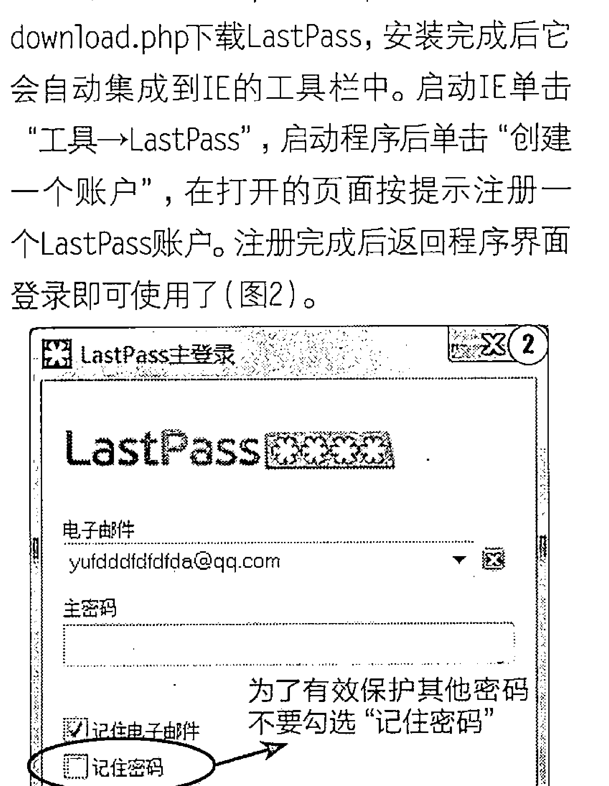

第2步：现在打开任意需要输入密码的网站，在输入正确邮箱用户名和密码登录后，此时在浏览器上方会出现LastPass保存密码提示，点击“保存站点”，然后在打开的窗口中设置保存名称。
第3步：以后如果要自动登录上述保存密码的网址，单击“LastPass图标→我的LastPass密码”，选中保存的网址右击选择“转到网址”，即可自动输入用户名和密码登录，省去我们记忆密码的麻烦。

> **小提示**
> LastPass使用一个账户来管理所有密码账户，只有输入LastPass账户密码才可以打开它自动记忆的其他网络密码。所以在登录界面不要勾选“记住密码”，这样可以有效保护它自动保存的其他网络密码。

## 聘请密码管家——管好本地密码

在线密码保存在浏览器中，如果重装可能会导致密码丢失。此外本地加密文件也有密码，为了密码安全，我们还要在本地做个备份。
使用“无敌密码生成器”

- **第1步：对于准备使用的新密码**，以管理员身份启动“无敌密码生成器”，先勾选密码生成组件（尽量选择高强度），然后单击“开始生成”即可生成复杂随机密码，然后根据密码用途设置好用户名和注释，单击“保存为新账户”即可。
- **第2步：对于已经在使用的密码**，则可以在密码文本框直接输入正确的密码字符，然后再根据密码用途设置好用户名和注释。以后需要查看密码时，再次以管理员身份启动“无敌密码生成器”，选中指定账户，单击“读取”即可看到正确的密码。

### 自制密码管理器

无敌密码生成器只是对密码进行管理，如果还要将密码和指定网址或者加密文件关联起来，我们可以使用Excel自制密码管理器。

- **第1步：启动Excel新建一个文档**，按自己需要设置好加密项目和密码。比如要管理保存在桌面上的cfan.zip加密文档，密码是“123456”，在Excel窗口选中加密项目下的文本，右击选择“超链接”，然后在打开的窗口定位到cfan.zip，单击“确定”。
- **第2步：操作同上**，继续添加邮箱、论坛等密码（超链接对应具体登录页面），然后单击“文件→保存”，在保存窗口单击“工具→常规选项”，按提示为这个文档设置打开和修改密码。
- **第3步：这样我们只要记住Excel文档密码即可管好所有本地密码**，以后如果要查看保存在本地的密码，打开上述加密文档后，直接单击对应加密项目的链接即可（密码已经显示在加密XLS文档中）。

（文|俞木发）

# Linux杀毒系统 杀毒更彻底

使用过瑞星杀毒软件的朋友都知道，它的应急杀毒光盘使用的是Linux系统，通过它可以轻松启动到Linux环境查杀各种顽固病毒。

其实对于Win7用户，同样可以自制YLMF（基于Linux核心）杀毒系统，而且将其整合在本地硬盘中用于查杀Windows下的各种顽固病毒！

## 为什么要用YLMF系统杀毒？给个理由先！

- 理由1：使用方便。YLMF是个完整Linux系统，使用起来和Windows类似，可以安装并使用免费Avast杀毒软件进行杀毒，而且自带很多维护工具（如分区工具、数据抢救工具），实现杀毒、维护双重功效。
- 理由2：安全性好。YLMF和Windows内核不同，Windows下再厉害的病毒也无法在其中运行，即使误点到病毒也没关系，可以安全杀毒。
- 理由3：杀毒效率高。很多顽固病毒通过Windows下特有的权限、非法文件名或者驱动、服务加载等方式保护自己，使用Windows核心杀毒系统常常无法将其删除。

## 在虚拟机中安装YLMF

由于YLMF是Linux核心的系统，它需要使用Win7下无法识别的EXT4格式分区，YLMF安装后还会更改硬盘主引导记录。因此为了操作方便，我们推荐使用虚拟机（以Microsoft Virtual PC 2007为例）安装YLMF，虚拟机安装完成后再将其移植到本地硬盘即可。

1. 启动Microsoft Virtual PC后按提示新建一个虚拟机，虚拟机硬盘容量设置为20GB大小即可。启动虚拟机后，单击“光盘→载入ISO镜像”，按提示加载下载到的ylmf os 4.0.iso，启动YLMF的安装。
2. 激活YLMF安装程序后选择“安装ylmfos”，按提示设置好YLMF的用户名、登录密码，安装位置选择上述创建的虚拟机硬盘，单选“手动设置分区”，不要划分交换分区，方便后续的恢复操作。
3. 单击“高级”按钮，在打开的窗口勾选所有选项，单击“确定”返回安装界面，单击“新建”，执行如下操作：
   - 分区类型：选择主分区
   - 分区大小：默认全部空间
   - 文件系统：ext4格式
   - 挂载点：“/”系统将安装于此
4. 单击“确定”返回安装界面，单击“安装”，剩余的操作按照屏幕提示完成安装。成功安装后启动虚拟机到YLMF，启动桌面Chromium浏览器到http://www.avast.com/zh-cn/linux-home-edition#tab4下载Avast for Linux杀毒软件（rpm格式），下载后右击选择“以管理员身份打开”，按提示将所有文件解压到根目录下。继续在浏览器打开http://115.com/file/eh6nul7g，下载avast.mo，然后将其复制到/usr/lib/avast4workstation/share/locale/zh_CN/LC_MESSAGES/下。

## 小知识

什么是YLMF？YLMF是广东雨林木风公司推出的一款基于Linux 2.6.x kernel内核的完整版Linux系统。YLMF采用广受欢迎的Gnome 2.30.2桌面系统，使用和Windows类似的图形界面，很多设置操作方式也和Windows相同，即使是新手也可以快速上手。

## 将YLMF添加到本地硬盘

通过上面的操作我们已经成功在虚拟机安装了YLMF和所需的杀毒软件。由于虚拟机的磁盘使用VHD格式，我们只要在Win7下加载该VHD文件，然后使用Ghost32将VHD分区分制作为GHO镜像，然后再恢复到本地分区即可。

1. 关闭虚拟机，右击桌面“计算机”选择“管理”，在打开的计算机管理窗口展开“计算机管理（本地）→存储→磁盘管理”，右击“磁盘管理”选择“附加VHD”，按提示加载上述虚拟机的VHD文件。
2. 由于Ghost32只支持制作ext4格式分区的完全镜像（这样恢复后的分区大小就只能和Ext4分区一致），因此我们首先要在本地分区准备一个和VHD磁盘大小差不多的分区（略大即可）。切换到“存储→磁盘管理”，选中一个剩余空间较大的NTFS分区，然后右击该分区选择“压缩卷”，在“输入压缩空间量”后输入比前面创建VHD磁盘略大的数值即可，比如VHD磁盘容量是20480MB，这里则输入20485MB。
3. 完成卷的压缩后。本地磁盘就会多一个20485MB的可用空间，按提示创建逻辑分区并完成格式化，设置其卷标为YLMF。接着启动Ghost32，单击Options切换到Image/Tape，单选其下的Image All，然后单击Accept返回Ghost32主界面。
4. 选择“Local→Partion→Partion”，源分区选择标记为Msft, Vitrual Disk1.0（即VHD磁盘）的第一分区，目标分区选择本地硬盘上述创建的卷标为YLMF的新分区，剩下操作按屏幕提示，完成分区的对拷操作。

## 使用本地硬盘YLMF杀毒

完成上述操作后，我们就顺利将虚拟机的YLMF移植到本地硬盘，接下来只要将它添加到BCD中启动，以后就可以在多重启动界面选择进入YLMF中杀毒了。

首先到http://www.kuaipan.cn/index.php?ac=file&oid=3237430383608086下载所需的软件并全部解压到C盘根目录备用。

1. 以管理员身份运行下载到的BOOTICE.exe，切换到“BCD编辑”标签，单选“系统BCD”，单击“查看/修改”，在弹出的编辑窗口单击“添加→实模式启动（grub4bdos等）”，选择新建的菜单后将“菜单标题”设置为“Linux杀毒系统”，其他设置默认，最后单击“保存全局设置”退出。
2. 启动记事本新建一个menu.lst配置文件放置在C盘，代码如下。这里假设YLMF移植到本地硬盘的第一逻辑分区D盘，如果是其他分区，请自行更改(hd0,4)的数值：
   ```
   timeout 3
   default /default
   title ylmf
   root (hd0,4)
   kernel /boot/grub/core.img
   ```
3. 重启系统，在多重启动选择“Linux杀毒系统”即可启动YLMF进行杀毒了。

杀毒系统”即可自动加载YLMF并进入系统。进入系统后，单击“开始→附件→终端”，打开“终端”后在其中输入sudo sysctl -w kernel.shmmax=128000000加载内核，接着继续打开/usr/bin/avstgui，按提示双击并在打开的对话框单击“运行”，启动杀毒软件后单击“更新”，按提示将当前病毒库升级到最新，接着单击“增加目录”，选择“./media”（即挂载到YLMF的所有本地分区），单击“开始扫描”杀毒即可。

## 操作更简单的Linux杀毒

在上述文章中我们介绍使用有别于传统Windows核心的Linux系统来杀毒，这样可以轻松达到操作更简便、效率更突出的效果。其实除将YLMF安装到本地硬盘杀毒，还有许多优秀的图形化Linux系统可以使用，比如Ubuntu、深度Linux等，而且这些系统可以直接在光盘上运行，或者安装到U盘上使用。因此，我们只要预先将AVAST解压到本地硬盘，然后使用光盘或者U盘就可以进行Linux杀毒（在Linux系统打开AVAST目录运行其中的avstgui即可）。由于YLMF的权限和Windows下的不同，对于在Windows下已发现的无法删除的顽固病毒文件，比如藏身在类似System Volume Information、“g.”目录中的病毒，现在只要在YLMF的文件浏览器中打开，然后右击选择“发送到回收站”即可轻松删除。此外它还集成了大量的实用工具如“Gpart分区工具”等，我们还可以在YLMF中进行其他的系统维护操作。（文|俞木发）

# 裸眼3D知多少

在3D电影院看过3D电影的朋友，那种视觉冲击肯定让你记忆犹新。如果不戴眼镜也能看3D是什么效果呢？又是怎样的技术让我们能够裸眼看3D的？快来学习一下吧！

## 人眼所见均3D

3D即Three-dimensional的缩写，指三维立体图像。而人的左右两只眼睛距离大约在6.5厘米，对同一物体左右眼将看到不同的视角影像，大脑再将视角影像合成具有深度特征的3D影像。因此，人类看到的物体都是3D图像。

## 3D显示技术原理

眼睛具有3D识别能力，但对于显示设备（例如显示器）来说必须顺应眼睛的识别原理来构建图像，否则无法实现3D效果。3D眼镜就是通过眼镜将左右影像分离开来分别送到左右眼中从而实现3D效果。裸眼3D技术则是通过调节光的角度使左右影像分别输入人眼以实现3D效果。

## 各种主流裸眼3D技术

目前，柱状透镜、视差障壁、指向光源为三种主流裸眼3D技术，下面来一一了解。

### 1.柱状透镜裸眼3D技术

工作原理：在液晶显示屏的前面加一层柱状透镜，使液晶屏的成像平面位于透镜的焦平面，每个柱状透镜下面的图像像素就被分成几个子像素，透镜就能以不同的方向投影每个子像素。由于像素间的间隙会因为透镜而放大，在技术处理上，需要将透镜与像素列错开一定的角度。这样，人的双眼就可以从不同的角度观看显示屏幕，进而能看到不同的子像素，最终完成3D效果的呈现（图1）。

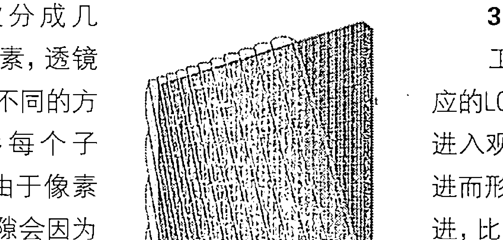

### 2.视差障壁裸眼3D技术

工作原理：使用一个开关液晶屏、偏振膜和高分子液晶层，利用液晶层和偏振膜制造出一系列方向为90°的垂直条纹（宽几十微米），这些条纹的光就形成了垂直的细条栅，被称作“视差障壁”。而“视差障壁裸眼3D”正是利用安置在背光模块及LCD面板间的视差障壁来阻隔一只眼睛对目标图像的可视性。例如，在立体显示模式下，应该由左眼看到的图像显示在液晶屏上时，视差障壁会遮挡右眼，反之，视差障壁遮挡左眼；通过将左眼和右眼的可视画面分开，进而实现视差而最终形成3D视觉效果（图2）。

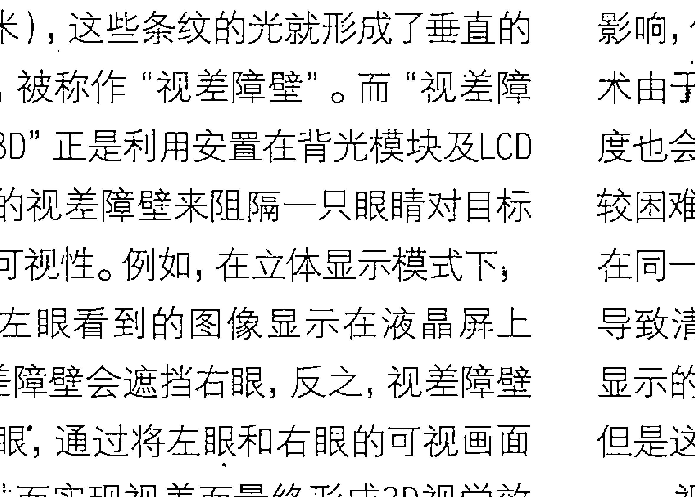

### 3.指向光源裸眼3D技术

工作原理：搭配两组LED，配合快速反应的LCD面板和驱动，让画面以排序的方式进入观看者的左右眼互换影像产生视差，进而形成3D效果（图3）。这种技术比较先进，比柱状透视、视差障壁裸眼3D技术更具优势，例如这种技术可以应用到手机、电脑、游戏机等设备中，进而可以普及发展。不过，这种技术仍处于研发阶段，距离产品上市仍需一定的时间。

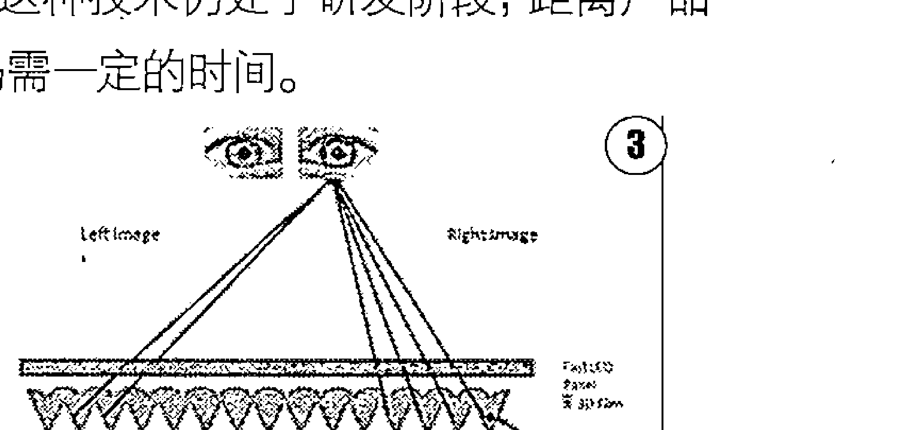

对于这三种裸眼3D技术来说，各有优点及缺点。柱状透镜技术的亮度不会受到影响，但观测视角宽度会稍小；视差障壁技术由于背光遭到视差障壁的阻挡，所以亮度也会随之降低，要看到高亮度的画面比较困难，除此之外，分辨率也会随着显示器在同一时间播出影像的增加成反比降低，导致清晰度的降低；而指向光源技术在3D显示的亮度和分辨率上都能够得到保障，但是这种技术尚未成熟。

视差障壁由于技术复杂度比柱状透镜低，目前市场上该类产品较多，而柱状透镜技术则是趋势和主流。国内外3D业内人士一致认为，随着3D产业链的逐渐成形，商用展示将是3D产业最先启动的市场，随后是便携式个人消费类电子产品，最后将是市场规模庞大的家用市场。（文|dream）

## 无盘启动系统 网络维护更轻松

现在随着网络的普及，除了企业拥有局域网外，家庭用户也越来越拥有局域网。如果网内电脑出现故障，常规的维护方法是网管们携带PE光盘或者U盘到故障电脑上进行维护。不过很多电脑没有光驱，U盘启动又经常遭遇兼容性故障，此时该怎么进行维护操作呢？其实网管们还可以使用iSCSI无盘方式启动WinXP进行维护，这样只要在服务器上设置一个WinXP镜像，客户端就可以使用PXE方式启动WinXP进行维护操作。

> 小知识
什么是iSCSI无盘启动。无盘启动顾名思义就是没有硬盘（或者不借助本地硬盘）启动，它的原理是在iSCSI服务器设置一个系统启动镜像，客户机利用PXE启动（近几年电脑几乎全部支持PXE启动）获得服务器传输过来的启动文件，接着按照这个启动文件配置启动服务器上的iSCSI启动镜像。它的效果类似磁盘映射，将服务器上的镜像映射为本地硬盘，从而实现客户端的无盘启动（实际利用的是服务器的虚拟iSCSI硬盘镜像）。

### 配置iSCSI服务端（以Win7旗舰版为例）

要使用iSCSI无盘方式启动，我们首先就要设置iSCSI服务器，服务器软件以“StarWind”（下载地址：http://wl.vipcn.com/1012/StarWind5.rar）为例。
- 由于“StarWind”需要Win7自带iSCSI服务支持，单击“开始”徽标，在搜索框输入“iscsi”，接着在搜索结果列表单击“iscsi发起程序”，启动程序后按提示单击“是”，设置Microsoft iSCSI服务开机自启动。
- 安装“StarWind”，启动“StarWind”后在程序界面单击“host→add host”（主机→增加主机），在打开的窗口输入服务器IP地址（即服务器内网地址，类似192.168.0.31），端口选择默认“3261”，单击“OK”建立新主机。

> 小提示
由于主机IP地址是和iSCSI硬盘绑定在一起的，为了保证IP地址的固定，可以在网络适配器属性设置中，将本机网卡IP地址设置为固定IP地址。

- 返回StarWind主界面，选中新创建的主机单击“connect”，用户名和密码选择“root”和“StarWind”（默认设置），连接成功后在“Genral”选项卡可以看到连接的主机名、IP地址详细信息。
- 单击“Targe→add Target”，添加一个Target，勾选“Target Name”，将其名称设置为“iqn.yy:winxp”（要记住这里的名称，后续iSCSI发起就是根据这个名称来连接的）。
- 剩下的操作按屏幕提示选择，在任意NTFS分区下创建一个类型为“Basic Virtual”的IMG镜像，大小4GB即可。创建完成后，IMG镜像会自动添加到Target列表。接着单击“开始”徽标，在搜索框输入“iscsi”，再次启动“iscsi发起程序”，在“快速连接”框输入上述创建主机地址“192.168.0.30”，单击“连接”，然后在弹出的窗口选择上述创建的Target（即“iqn.yy:winxp”），单击“连接”即可。
- 成功完成连接后，打开Win7的磁盘管理器，现在可以看到新增了一个名为“磁盘1”的存储设备，右击“磁盘1”选择“初始化”，完成初始化后按提示创建为主分区并格式化，同时设置为“活动、主分区”。

> 小提示
如果你的服务器系统是Windows 2008 R2，我们还可以到http://www.microsoft.com/downloads/en/details.aspx?FamilyID=45105d7f-8c6c-4666-a305-c8189062a0d0下载微软免费提供的iSCSI服务器软件。它的使用和StarWind类似，首先建立一个iSCSI目标，接着为目标创建一个VHD设备（等同于StarWind创建IMG镜像）。然后在“磁盘管理”中加载VHD设备，进行初始化、格式化、设置活动即可。

### 配置客户端（以WinXP系统为例）

- 启动客户端电脑，然后下载支持WinXP的iSCSI启动的程序并安装。接着到http://www.kuaipan.cn/index.php?ac=file&oid=3237430383608221下载“sanbootconf.msi”并安装，这样WinXP就支持从服务器的iSCSI启动了。
- 安装一个一键还原软件，按提示将当前系统备份为“winxp.gho”镜像文件，并且将其复制到服务器电脑上。接着在服务器上运行Ghost32，按提示将“winxp.gho”恢复到“磁盘1”中（即StarWind创建的iSCSI硬盘）。这样就完成启动镜像的设置了。

### 配置启动文件

- 在服务器电脑上到http://www.kuaipan.cn/index.php?ac=file&oid=3237430383608222下载“gPXE管理器”，启动程序后单击“磁盘管理→增加磁盘”，在弹出的窗口增加一个名为“winxp“磁盘，iSCSI服务器设置为“iscsi:192.168.0.30:::iqn.yy:winxp”，单击“确定”，增加一个可启动iSCSI硬盘。
- 返回程序界面，单击“选项配置”，勾选“启动DHCP代理功能（请先关闭其他DHCP/PXE功能）”，单击“编辑磁盘”，在打开的窗口将上述添加的“winxp”磁盘添加到工作站中。接着切换到“IP地址”，按自己实际网络环境设置好网络参数即可。

> 小提示
对于已经使用路由器用户，这里网络参数如子网掩码、网关IP使用默认网络设置即可。对于没有局域网的用户，“gPXE管理器”已经自带DHCP和TFTP服务，我们可以使用网线将故障电脑和安装StarWind的服务端电脑连接。此时就要自行设置网络参数，可以使用下列参数：

| 服务器IP | 192.168.0.2 |
| 起始IP | 192.168.0.3 |
| 终止IP | 192.168.0.10 |
| 子网掩码 | 255.255.255.0 |
| 网关IP | 192.168.0.1 |
| 首选DNS服务器 | 置空 |

### 实际使用

完成上述设置后，现在如果某台电脑出现无法启动故障，我们只要将其使用网线接入局域网，然后就可以使用无盘启动进行维护操作了。

- 在客户端电脑上进入BIOS设置，找到BIOS中BOOT选项下类似“PXE UND(BUS0 Slot)”的启动项，将其设置为第一启动即可。
- 保存并退出设置后，此时客户端就会自动从PXE启动，并从服务器中自动获得IP地址，同时获得从服务器传输过来的gPXE.pxe启动文件。此时在服务器端的gPXE管理器，单击“管理→DHCP监视器”，在打开的监视器窗口可以看到，服务器向客户端分配的IP地址和传输的引导文件gpxe.pxe。
- 完成启动文件的传输后，当客户端屏幕出现“booting from drive 0x80”提示时，则表明客户端已经成功加载服务器的iSCSI硬盘，并从中开始启动。
- 接下来的启动和本机启动WinXP是一样的，成功进入系统后打开设备管理器可以看到系统新增一个“Microsoft iSCSI”磁盘，WinXP也正是从这个iSCSI硬盘启动的。

这样即使局域网电脑无法启动（甚至没有硬盘），我们只要在服务器设置一个WinXP启动镜像，以后就可以利用PXE实现客户机的无盘启动（而不管客户端原来安装的是什么系统）。

由于启动的是我们熟悉的WinXP系统。维护操作就简单多了，比如可以启动网络去下载杀毒软件对客户端进行杀毒，或者下载操作系统镜像进行重装。

> 为了使服务器上的镜像WinXP有更通用的适应性，可以在任意安装WinXP的客户端电脑上安装“sanbootconf.msi”，接着使用系统自带的“sysprep”（C:\Windows\System32\Sysprep\sysprep.exe）命令进行系统清理，清理完成后再制作GHO镜像。

(文|俞木发)

## 旁敲侧击 巧破EFS加密防线

公司最近招了不少新员工，但由于公司的电脑设备有限，因此只能几个新员工共用一台电脑。为了使用上的方便，每个用户都创建了各自的账户。

为了防止别人偷窥文件，新员工小王将所有的重要文件都存储在D盘的“小王的文件”文件夹中，之后从该文件夹的属性窗口的“常规”面板中点击“高级”按钮，在打开窗口中勾选“加密内容以便保护数据”项，使用Windows自带的EFS加密技术对文件夹进行了加密处理。这样，除了小王自己，别人是无法访问其中的文件的。可糟糕的是，小王没过几日就离职了，当老总让小孙找一个在小王那里的重要文件时，小孙却傻眼了。

面对小孙的窘态，多亏同事小李出手相助，巧妙地突破了加密的壁垒，轻松找回了小王的重要文件。小李是怎样做到的呢？且看下面慢慢道来。

EFS(Encrypting File System, 加密文件系统)是Windows XP内置的一个实用功能，可以对NTFS分区上的文件和数据进行加密，在很大程度上提高了数据的安全性。小李之所以可以打破EFS加密算法的保护，关键是使用了系统提供的“策略代理”方法，该方法可以让特定的用户读取所有的加密文件。当然，该方法是针对多账户环境而言的。因为在该公用电脑中存在多个拥有管理员权限的账号。

> 上述方法虽然可以找回EFS加密文件，但是，并不能说明Windows的EFS加密方式存在隐患，使用该方法的前提必须是多账户环境，而且存在多个拥有管理员权限的账户，同时使用Windows默认的加密配置。如何杜绝上述安全隐患呢？对策是通过设置权限的方法，来禁止其他用户非法访问EFS加密文件。在EFS加密文件或者文件夹的属性窗口中打开“安全”面板，点击“高级”按钮，在高级安全设置窗口打开“常规”面板，不勾选其中的“允许父项的继承权限传播到该对象和所有的子对象”项。点击“删除”按钮，将“权限列表”中其他账号全部删除，只保留自己的账号，经过这样的权限设置，EFS加密文件的安全性才能得到根本保障。

小王使用的是Administrator账户，而另一个同事在该机上使用的账户名称是hongyun，该账户同样拥有管理员权限。小李正是借助于hongyun账户，才轻松突破了加密的束缚。小李首先以hongyun账户登录系统，之后在“开始→运行”中执行“cmd.exe”程序，在CMD窗口首先切换到C盘根目录，之后执行命令“cipher /r:mykey”，注意其中的mykey为导出密钥文件名。随后系统提示输入密码，小李输入的密码为key123456789。当然，该密码可以随意设置。

这样，就在C盘根目录下生成两个文件，扩展名分别为cer和pfx。本例中生成的文件为mykey.cer和mykey.pfk，其中mykey.cer为公钥证书文件，mykey.pfk为代理人的私钥证书文件。在“开始→运行”中运行gpedit.msc命令，打开组策略编辑器窗口。在窗口左侧的列表中依次展开“计算机配置→Windows设置→安全设置→公钥策略→正在加密文件系统”分支，在其右键菜单上点击“添加数据恢复代理程序”项，弹出操作向导界面。在其中的“选择故障恢复代理”窗口中点击“浏览文件夹”按钮，在文件选择窗口中导入前面创建的mykey.cer文件，之后依次点击“下一步”按钮完成操作。

在资源管理器中进入D盘中的“小王的文件”文件夹，在其中任意文件的属性窗口中打开“常规”面板，点击“高级”按钮，在高级属性窗口中点击“详细信息”按钮，在信息窗口中可以看到刚才创建的恢复代理项目。

双击前面生成的文件mykey.pfk，弹出证书导入向导界面，依次点击Next按钮，在“密码”窗口中输入预设的密码key123456789，完成证书的导入操作。当完成上述操作后。在资源管理器中D盘中的“小王的文件”文件夹，双击其中的加密文件，即可正常访问其内容了。这样，小李几乎没有花费什么力气，就成功找到了小王的加密文件。

(文|郭建伟)

## 一盘在手 启动无忧

作为公司分管安全的副总，张华一直在为公司各机要部门电脑的安全发愁。虽然机要部门的每台电脑已经设置了强劲的密码，但是由于业务的需要，公司各个部门的人员还是经常需要在这些电脑上查阅资料。时间长了，使用的人多了以后，再强劲的密码也没什么保密效果。定时更换密码是个好方法，可是频繁更换密码，密码的记忆倒成了一件烦心事。其实对于这些电脑，我们可以使用“NTBOOT”这款软件制作超强启动盘，将电脑的启动配置和文件集成在光盘中，确保只有插入光盘才能启动电脑。

### 电脑安全需求

公司电脑状况：目前安装的系统主要是WinXP和Win7。

实现安全目标：指定机要电脑上没有启动文件，只有插入指定光盘才能启动使用。

启动光盘功能：可以启动任何电脑上已经安装的WinXP或Win7，同时集成简单维护功能。

## 小知识

不管是PE、WinXP/2000/2003还是Win7，系统启动主要是由引导记录、引导文件和引导配置文件组成的。以Win7系统为例，它的引导记录是NT60格式，激活后会查找当前分区下的引导文件Bootmgr，Bootmgr启动后则根据“C:\Boot\BCD”引导配置文件开始启动Win7。“NTBOOT”（下载地址：http://chenall.net/post/ntboot/）则是一款超强启动软件，它将常见各种操作系统的引导记录（已使用光盘引导）、引导文件和引导配置文件全部集成在一张可启动光盘中，实现光盘直接启动本地硬盘各种系统（无需本地硬盘启动文件支持）。本文正是利用“NTBOOT”的这个特性，实现机要电脑只有光盘才能启动。

### NTBOOT配置

虽然“NTBOOT”是一款超强启动软件，不过它提供的仅仅是“超级引导”功能，启动的只是本地硬盘保存的各种系统。下面我们要根据公司电脑的实际情况和安全目标进行具体设置。

- 到http://bbs.wuyou.com/viewthread.php?tid=157912下载网虫PE作为维护系统使用，下载后解压得到“winpe.iso”放置在E盘备用。再到http://www.onlinedown.net/soft/614.htm下载“UltraISO”，启动程序后单击“文件→打开”，打开下载到的“NTBOOT”镜像文件。
- 单击“UltraISO”菜单栏的“操作→添加文件”，按提示将上述准备好的“E:\winpe.iso”添加到“NTBOOT.iso”根目录下。
- 在左侧窗格展开“boot/ntboot/ntboot.lst”，将右侧窗格的“menu.lst”和“isoinst.lst”提取到桌面备用。
- 使用“记事本”程序打开“isoinst.lst”，按自己的实际需要更改其中的代码。比如在上述操作中我们已经将Winpe.iso添加到光盘根目录中作为维护系统使用，则将文本中“title2”下的启动代码更改为“command %NTBOOT% iso_inst=winvblk cdrom=(cd)/winpe.ISO”。
- 完成上述文件的修改后保存，返回“UltraISO”界面，单击“操作→添加文件”，依次添加上述修改过的文件到原来位置替换原文件。这样就完成超级启动盘设置，插入刻录光盘，单击“工具→刻录光盘镜像”，完成超级启动盘的刻录即可。

### 安全检测——NTBOOT使用实战

经过上述的操作，我们已经成功打造好了超强启动盘，现在就可以使用它来作为机要电脑的专用启动盘了。

- 假设电脑原来安装的是Win7旗舰版，现在启动电脑进入系统，然后将“C:\bootmgr”和“C:\boot”目录剪切到D盘，重启电脑后，屏幕会提示“bootmgr is missing”，用户根本无法启动到Win7系统使用。
- 如果现在要使用这台电脑，只要重启并在BIOS设置光驱为第一启动，成功启动后在多重启动菜单选择“3.NT6.x From HardDisk”，这样即可进入原来无法启动的Win7。

> 小提示
如果启动的是WinXP系统，则可以先将WinXP系统分区下的“bootfont.bin”、“boot.ini”、“ntdetect.com”、“ntldr”剪切到其他分区，然后在多重启动选择“1.NT5.x from HardDisk”即可。

- NTBOOT光盘只是实现“启动”功能，如果是系统的其他文件受损，导致系统无法进入。比如“userinit.exe”被病毒破坏或“userinit.exe”的注册表键值被病毒修改，导致Windows系统不能正常登录，此时我们还可以使用NTBOOT光盘的维护功能。重启后在光盘的多重启动菜单选择“8.Windows Install”，然后在打开的启动菜单选择“2.Setup Windows from ISO to HDD Step 1(winvblk)”，这样系统会自动加载“WinPE.iso”。
- 成功加载“WinPE.iso”后我们就可以进入网虫PE运行注册表编辑器进行维护操作了。这个网虫PE功能非常强大，在前几期文章有过介绍，这里就不再赘述了。

因为NTBOOT启动不依赖本地硬盘任何启动文件，因此对于公司任何机要电脑，我们可以将每个系统的启动文件转移到其他分区（甚至删除），实现系统无法启动。如果要启动系统，则只有插入上述制作的启动盘，从而保护电脑不被用户轻易访问。对于没有光驱的电脑，我们还可以使用优盘进行量产，将NTBOOT安装到优盘中使用。

### 扩展：NTBOOT超级启动更多应用

从上述介绍我们知道“NTboot”超级启动秘密实际上是将系统的“启动”和“系统实体文件”分割开来，从而实现只要本地硬盘有“系统实体文件”就可以启动。这样我们只要在本地硬盘安装了Win7/XP/2000/2003、或者准备了PE、Windows安装文件、VHD、IMG文件（无需在本地硬盘进行任何启动配置），就可以通过它来成功启动。

### 扩展实战: 使用NTBOOT启动VHD系统

Win7开始就支持VHD启动，这样我们在系统正常的时候创建系统镜像备用(只要以管理员身份启动命令提示符，输入 `sdclt.exe` 启动“备份和还原”组件，单击左侧窗格的“创建系统镜像”即可)。假设创建的镜像是 `e:\win7.vhd` 文件，现在只要将 `NTBOOT.ISO` 中 `menu.lst` 的VHD启动代码更改为 `command %NTBOOT% NT6=(hd0,5)/win7.vhd`。注意：(hd0,5)表示本地硬盘的第二逻辑分区(即E盘)，如果你准备的文件不在该盘，请设置为对应的分区代码。这样一旦当前Win7无法进入，我们使用NTBOOT启动后选择“title 4.NT6.X From VHD”即可启动上述创建的VHD系统。同样的，由于NTBOOT使用模块化的设计，我们只要依葫芦画瓢即可添加其他启动系统。

**小提示：** 如果在其他电脑上使用这张超级启动光盘，或者光盘上的 `menu.lst` 没有配置我们所需的启动项，此时还可以使用 `NTboot` 命令行更改执行命令。比如其他电脑上的Win7.iso已经保存在D盘，现在需要启动 `D:\win7.iso` 进行重装操作，同上在图3选择“8.Windows Install”，然后在打开的启动菜单选择“2.Setup Windows from ISO to HDD Step 1(winvblk)”，接着按下E键，进入命令行编辑界面，最后将启动命令更改为 `command %NTBOOT% iso_inst=winvblk cdrom=(hd0,4)/Win7.iso` 即可。

(文|俞木发)

## 键盘失灵 不一定是硬件故障

键盘失灵，除了硬件故障的原因外，也许是软件搞的“鬼”。鼠标再好，也需要键盘输入，一来它在某种场合下更快，二来鼠标无法代替键盘输入大量文字。但在有些时候会出现按键不灵的情况，敲下N多个键，显示屏上出现的情况却与你预设的大相径庭。是键盘坏了吗？先别忙着下结论，看看是不是下面这些原因。

### 输入汉字却打开对话框

在Word中输入文本的时候，本来用得好好的，谁知道忽然间键盘上的操作变成菜单操作了，输入一个汉字的时候，汉字没有出来，却打开了一个菜单对话框，让你莫名其妙。你只能保存退出，然后重新开始。其实这时候，很有可能是你刚才无意中按下了Alt键。在Word、Excel等软件中，Alt键被默认为激活菜单栏的快捷键，按下这个键，菜单栏里“文件”选项便会突起一块，再按下对应的键，便可以打开相应的对话框。解决这个问题的办法是：重新按一下Alt键，取消激活菜单栏。该现象同样存在于其他的一些软件界面，诸如系统的资源管理器、IE浏览器等，因为Alt键默认功能就是激活菜单栏。

### 电子表格无法移动单元格光标

在Excel中输入数据，以前可以用左右上下方向键灵活地移动活动单元格，不知怎么的，最近用键盘上的方向键的时候，变成移动表格整块视图了，单元格光标却是一动不动。重新打开Excel也无效。其实这是因为你无意中按下了键盘上的Scroll Lock键(在有些笔记本上，这个键会标注为Scr Lk。这个键的名称叫做“滚动锁定键”，当按下这个键的时候，键盘右上角Scroll Lock灯会亮起(笔记本上通常没有指示灯，但也会发生这种情况)，方向键操作被赋予了类似鼠标滚轮的滚动功能，在移动方向键的时候，便只能上下左右地滚动屏幕了。再次按下Scroll Lock键，问题解决。

### 软件对话框无法输入汉字

这大概是最令人纠结的现象了，其具体症状是：浏览器、QQ、阿里旺旺等一些较敏感的软件无法输入汉字，但打开记事本、Word等办公软件却很正常。如果你的系统中安装了金山密保4.0，问题很可能就出在这里。这款软件在升级到4.0版本后，细化了网银、QQ聊天等软件的保护参数，如果你开启了“账号登录保护”中的“防键盘输入”，也就是按钮呈蓝色时，被保护的软件如浏览器、QQ、阿里旺旺等，都无法开启汉字输入法。这是一种较为严厉的保护，通常不需要开启它。打开主界面，点击右上角的“修改设置”，找到“账号登录保护”选项，点击一下“防键盘输入”左侧的滑块，使按钮呈橙色即可取消，被保护软件的窗口输入也会恢复正常。

(文|王卫华)

## 解决动态磁盘的恢复难题

硬盘转换为动态磁盘很简单，只要打开磁盘管理窗口，依次选择“存储→磁盘管理”，在右侧窗格的快捷菜单中选择“转换为动态磁盘”即可完成。但是，如果要将动态磁盘转换回基本磁盘，Windows提示必须首先删除全部的卷，否则将无法继续；而删除卷之后，其中的数据也就不再存在，这势必涉及到数据备份的问题，这可是一件麻烦事……其实，只要借助DiskGenius专业版(官方网站为http://www.diskgenius.cn/download.asp)，英文专业版的名称是Partitionguru，即可解决这一困难。在WinPE下打开DiskGenius，右击需要转换的动态磁盘，从快捷菜单中选择“搜索已丢失的分区(重建分区表)”，随后会弹出对话框，这里将搜索方式设置为“自动”，很快就可以找到所有希望恢复的分区，单击“应用更改”按钮，随后会弹出“选择分区表格式”的对话框，这里提供了MBR和GPT两种选择，请选择前者。退出软件，重新启动计算机，然后就可以完成动态磁盘还原为基本磁盘的任务，而磁盘上的所有数据仍然分毫无损。

(文|王志军)## 改造李开复的PPT

> “坦率说李开复博士演讲水平还是非常高的，我觉得比他的PPT水平要好很多。”

大家都知道IT牛人李开复博士也是演讲达人，最近他发了几条“教你如何做好PPT”的微博，大受欢迎，然而，他早期的PPT却有这方面的问题。

## “5秒原则”只差这一步

开复提出了做PPT应遵循“5秒原则”：不要在一页PPT上堆砌太多文字、图片，因为你在借助PPT演讲的同时，听众的眼睛和耳朵正在同时接受信息。记住幻灯片是用来辅助演讲的，而不是干扰！

我们以李开复在2011年中国移动互联网大会上的一张演讲PPT来理解这个概念。

这页PPT标题非常明确地点出一个关键词：动力，这个关键词是呼应上一页解释的内容，为什么安卓手机将在中国一骑绝尘？

当然这页PPT上的图文也一目了然，让听众了解到低端产品的样式、配置和价格，但是遗憾的是，在配置和价格项，开复博士还想解释为什么低端手机可以降至1000元，这就造成一个问题：页面信息过载。

要知道仅仅通过5秒钟理解一个流程图是有困难的，更何况在页面上端有个极醒目的手机外形图和价格分散我们眼球的注意力。

而且这页PPT标题描述的是价格下滑这个现象，而不是价格下降的原因。我猜测互联网大会的听众也许更想了解的是价格下降的理由，那么标题就应该概括为“产业链缩短，硬件门槛降低，千元安卓手机爆发”更合适。

从“5秒原则”出发，这页PPT还可以进一步简化，首先标题可以简化为：
动力：Android低端手机降至1000元
首先在演讲现场，所有人看到实物图就知道你讲的是当前手机价格，而不是未来价格。其次降至1000元本来就是谈价格，没有必要在标题上加上“今年”这两字。
这样整个标题控制在14个汉字长度，而且删除了两个分散注意力的概念（价格和今年）。最后展示给听众的是一个非常简单的主谓宾结构句子，这也是做PPT要求的简单完整句：结构简单，语义完整无歧义。

此外，这页PPT不符合“5秒原则”的最大问题是把价格下降的原因也放在一页PPT上，造成信息过载。而我的经验是，造成演讲时间过长的原因不是你的PPT页数，而是你想讲的内容到底有多少。

假如能控制住演讲要点数量，我反而愿意多设计几页PPT来强化我的演讲内容，所以我改造后的PPT只展示一个事实：价格下降，然后我们就可以用另一页PPT继续展开造成这个事实的原因，这样，两页PPT的标题和内容都可以对应，在5秒钟内真正为听众所理解和接受。

## 要让PPT的题目讲故事

李开复博士微博还建议写标题时要让你的题目讲你的故事，最好是把所有的标题串联起来，只读题目，就可以大致了解你的演讲内容。如此，听众只需关注标题辅听即可，不必再专注地阅读延展内容。

对于PPT的内容李开复也建议：
第一要牢记PPT只是辅助你口才的工具，绝对不可让其喧宾夺主，每个PPT最好让听众“不经思考”就能看懂。

第二PPT上每条最多4点，每点最多10个字，每条句子尽量使用同样的语法的句子，这样更容易被听众理解。

我想开复博士的下面一页PPT很好体现了这一点。

标题说明创业门槛降低，然后一张图一目了然解释了构成成本的结构都呈下降的趋势，这样听众很自然被引导去听开复博士提供更多信息解释为什么这些成本能够下降。如果去掉下面那个有点奇怪的计算公式，本来是相当完美的一页PPT。

但是另外一页PPT开复博士就没有完全遵守自己的建议。

这页PPT其实是一个目录页面，采用了一张非常有冲击力的图片强化漫延的概念，但是很遗憾。好像来自2012的末日洪水不见得能和“漫延”建立联想，而上面六个目录排版用了过多的颜色，使听众的注意力都在颜色上，而不是内容上，何况这个标题目录多达六行，而且每一行注意看，都没有做到上下对齐。

- 这六个标题分别是：
- 1.设备的漫延：Android将在中国一骑绝尘
- 2.用户的漫延：从5000万核心用户向13亿高速扩散
- 3.娱乐的漫延：智能移动设备帮助游戏覆盖数亿普通用户
- 4.内容的漫延：UGC使移动设备的内容更多、更快、成本更低
- 5.消费的漫延：24小时甚至统治用户的消费决策
- 6.创业者的漫延：门槛降至史上最低

我想作为一个分类来阐述观点已经相当完整，但是作为整个PPT这个目录并非是一个好故事。

其实我觉得比“漫延”更好的故事概念是“引爆”：
- 低价引爆设备升级；
- 设备扩展导致用户群基数快速倍增；
- 智能化设备引爆更具互动性的娱乐和内容服务；
- 甚至设备的移动性将引爆消费者新的购买习惯……

这些将引爆一个新的行业，这是创业者的机会。看起来，这样讲故事更容易引爆现场一点点，恰好“引爆点”又是一个非常有名的商业概念，干嘛不顺手借用？

好的故事其实不过是重复你大脑里面已经有的故事结构，但是灌注了新鲜的内容，这就好比小孩子，总是爱听同样的童话故事。

顺便说一下，其实字多一样可以出阅读视线清晰的PPT，我这里随便列一个例子。

此页PPT的字够多吧，每行很多也超过十个字吧？我想阅读起来没有什么问题，因为我用对比强化的方式突出了重点信息。

坦率说李开复博士演讲水平还是非常高的，我觉得比他的PPT水平要好很多。这也说明永远不要让PPT成为演讲的主角，演讲的主角永远是演讲者自己。

（文|秋叶）

## 身份鉴别 只看你脸色

一家现代化公司大门前，员工小李和小王站到门禁前时，语音警报系统提示通过。而当访客小陈效仿前两位时，却被门禁阻拦……近年来，“人脸锁”功能进入民用领域。作为一项热门的计算机技术，很多场所安装了人脸身份鉴别类设备用来鉴别目标。在摄像头的背后有着怎样的检测和识别流程呢？又是怎样做到识别不同人身份的呢？

先进行建模，再将其与数据库中的所有人的模板相比对识别，最终将根据所比对的相似值列出最相似的人员列表。

此外，图像质量的好坏直接影响到识别的效果，图像质量的检测功能能对即将进行比对的照片（其实就是捕获的视频的一帧）进行图像质量评估，并给出相应的建议值来辅助识别。

### 人脸识别技术原理

人脸识别技术是基于人的脸部特征，对输入的人脸图像或者视频流进行识别、判断。首先判断目标物体是否为人脸，如果是，则进一步分析人脸的位置、大小和各个主要面部器官的位置信息。依据这些信息，进一步提取每个人脸中所蕴涵的身份特征，并将其与已知的人脸信息进行对比，最终达到识别的目的。

人脸捕获与跟踪是先将一幅图像或是视频流中的一帧检测出人像并将人像从背景中分离出来，如果判断是人脸，再将其保存成数据，这个过程就是人像捕获。而人像跟踪则指利用人像捕获技术，当指定的人像在摄像头拍摄的范围内移动时自动地对其进行跟踪。

人脸的建模与检索是将登记入库的人脸数据进行建模，提取人脸的特征，并将其生成人脸模板（人脸特征文件）保存到数据库中。在进行人脸搜索时，将指定的人

### 人脸识别比对

人脸识别分核实式和搜索式两种比对模式。核实式比对指将捕获得到的人像是指定的人像与数据库中已登记的某一对象作比对，核实确定其是否为同一人。例如一些带人脸锁功能的电脑，用户在使用前已经进行过人脸识别，特定用户人脸信息数据被保存在数据库，下次登录系统前，人脸识别系统就将当前获取的人脸数据与数据库中的记录进行对比，一致则通过，反之则禁止登录。

而搜索式比对则是指从数据库已登记的所有人像中搜索查找是否有指定的人像存在。这个功能一般应用于鉴别对象数量大的场合。例如，一些安检场所，之前已经将一批可疑人的人脸信息数据保存在数据库，而对所有需要监测的对象进行识别时，需要直接跟数据库中的所有保存记录进行比对。

真人鉴别功能自然是识别人脸，假如是一张照片，由于与人脸在平面角度来说是相同的，如何避免照片替代真人脸这个作假问题呢？其实很简单，在识别时只要使用者作脸部表情的配合动作即可，例如微笑一次、做个特定的表情鬼脸，由于照片很难实现这样特定的动作，进而可以避开照片作假。

### 人脸识别主流技术

人脸识别技术是一项计算机技术，从光源角度来分，主要分为以下两大技术。

- 1.可见光人脸识别技术

可见光人脸识别是指在可见光的光线条件下进行中远距离的人脸检测和捕捉，并将抓拍下来的照片建立其相关人脸的数学模型，并获得人脸特征点的信息并提取出来，同时与后端的人脸数据库的人脸模板照片进行比对，输出比对结果。

- 2.多光源人脸识别技术

多光源条件下的人脸识别是在多种完全对人体无伤害的辅助光源的条件下进行人脸识别，支持PC(Windows/Linux)/ARM/DSP(Linux等)系统环境，现今算法保证识别率、识别速度、误识率和拒识率等各项指标优异。短距离人脸检测捕捉，适用于门禁、考勤等应用环境。

由于人脸识别需要光源支持，对周围的光线环境比较敏感，光线的强弱会直接影响识别的准确性。同时，人体面部的头发、饰物等会影响识别的准确率。还有，人脸变老等自然现象需要通过人工智能补偿、修正。

（文| dream）

## 将复杂命令操作集成到右键菜单

很多时候，我们需要将文件夹中的文件列表复制出来，或者快速清空剪贴板的内容，可你又不想安装第三方工具，此时虽然可以使用dir等古老的DOS命令实现，但命令参数又相对复杂。其实，通过注册表编辑器，就可以将复杂的命令操作集成到右键菜单。打开注册表编辑器，依次跳转到HKEY_CLASSES_ROOT\Folder\shell，新建一个名为copylist的项，在它的下级新建一个名为command的子项。返回copylist项，

将“默认”的数据数值修改为“获取文件列表”，当然也可以使用其他的名称；选择command子项，将“默认”的数据数值修改为“cmd /c dir "%1" /b /a:-d /o:e | clip”，这里用到“cmd”和“dir”两个命令，“dir”命令的参数是表示按照文件的扩展名进行分类排序，如果希望按日期或时间进行排序，可以修改为“:d”，修改为“:n”则可以按文件名的名称进行排序。

按照同样的方法，在刚才的位置下新建一个名为delclip的项，在它的下级新建一个名为command的子项。返回delclip项，将“默认”的数据数值修改为“清空剪贴板”；选择command子项，将“默认”的数据数值修改为“cmd /c "echo off | clip"”。

操作完成之后，我们可以在文件夹右键菜单发现新“获取文件列表”和“清空剪贴板”两个选项，需要时直接调用即可。

（文| 王志军）

## 用Gmail做远程控制达人

在很多人的心目中，Gmail是个功能强大的邮箱。实际上，Gmail还具备很多非同寻常的能力，当然，想要开发Gmail的潜力，离不开相关软件的大力配合。

### 巧用Gmail远程共享桌面

小林是一个电脑菜鸟，而好友小李精通电脑，经常热心地帮助小林解决各种问题。这天小林在单位又碰到了电脑方面的难题，就打电话向小李求助，虽然小李在电话中说得口干舌燥，小林依然听得一头雾水。小林想，要是小李能够直接远程操作自己的电脑，问题不就很容易解决了？不过自己处于单位的内网，网管在防火墙上设置了严密的安全规则，别说远程控制，就是平时QQ聊天、BT下载都控制得很严。不过借助于Gbridge这款独特软件，小李成功地对小林的电脑进行了远程控制，快速解决了小李遇到的难题。

小林启动Gbridge后，在登录窗口中依次输入自己的Gmail邮箱名称、邮箱密码和昵称，点击Log On按钮，登录到Gbridge管理界面。

小李使用同样的方法，完成Gbridge的安装和登录操作。小林在Gbridge管理界面中打开Friends面板。

在其中的Friends节点的右键菜单上点击Invite a friend项，在弹出窗口的Type email address of your friends栏中输入小李的Gmail地址，在Message to be emailed to your friends栏中输入邀请内容，点击Send Invitation按钮，即可发出该邀请函。

小李在本机的Gbridge中接收到该邀请函后，执行确认操作，将小林的名称添加到Friends栏中。当然，小李也按照同样的方法，向小林发送邀请函，让小林也将自己添加到好友列表中。

小林在Friends面板中的Friends栏中选择小李名称，在其右键菜单上点击Chat项，就可以和小李自由聊天了。小林在聊天窗口顶部点击Send DesktopShare Invitation按钮，向小李发出共享桌面邀请，小李确认后，即可对小林的桌面进行远程控制，这样双方就可以共同操作小林的桌面了。

该方法虽然可行，但是必须要求被控方主动发出共享邀请，控制方才可以远程共享其桌面。如果想直接控制对方的桌面，该如何操作呢？利用Gbridge提供的单个账户多重登录功能，就可以巧妙解决上述问题。

Gbridge允许多个用户使用相同的Gmail账户登录，这样彼此之间可以自由发起远程控制操作。

## 小知识

Gbridge采用加密型VPN连接方式，在Internet环境中，在你和好友的主机之间创建一个独立的虚拟网络，可以实现安全发布共享文件、同步和备份以及共享桌面等操作。使用加密型VPN技术，不仅可以突破防火墙的限制，而且可以有效地保护数据传输的安全性。

### 远程服务能不能用 Gmail说了算

小钱是公司的网络管理员，负责维护公司网站的运行。为了便于管理，小钱在服务器上开启了终端服务，这样小钱可以随时随地连接服务器，执行各种控制操作。不过前几天当小钱登录到服务器上时，发现公司网站被搞得面目全非，一些重要数据也不翼而飞，看来肯定是有黑客利用系统漏洞侵入了主机。通过对系统日志的分析，小钱发现黑客通过创建非法的账户，之后利用终端服务轻松取得了服务器的控制权。小钱花费了很大一番力气，才将服务器恢复正常。如果可以为终端服务安装一个开关，根据自己的需要执行开启或者关闭操作，不就可以避免重蹈上述悲剧了吗？

我们知道，远程桌面/终端服务的开启与否主要取决于相关注册表的设置，因此在系统目录（例如C:\Windows\System）中创建open3389.bat和stop3389.bat两个批处理文件，open3389.bat文件内容为：

```
echo Windows Registry Editor Version 5.00>3389.reg
echo [HKEY_LOCAL_MACHINE\SYSTEM\CurrentControlSet\Control\Terminal Server]>>3389.reg
echo "fDenyTSConnections"=dword:00000000>>3389.reg
regedit /s 3389.reg
del 3389.reg
```

"stop3389.bat"文件内容为：

```
echo Windows Registry Editor Version 5.00>3389.reg
echo [HKEY_LOCAL_MACHINE\SYSTEM\CurrentControlSet\Control\Terminal Server]>>3389.reg
echo "fDenyTSConnections"=dword:00000001>>3389.reg
regedit /s 3389.reg
del 3389.reg
```

open3389.bat文件功能是打开终端服务/远程桌面服务，stop3389.bat功能是关闭其服务。要实现以上功能，必须依靠GMail Commander这款免费软件。在服务器上运行GMail Commander，在其主窗口中的Username栏中输入自己的Gmail邮箱账户（例如xiaoqian@gmail.com），在Password栏中输入邮箱密码。在Accept IDs栏中输入自己的主叫邮箱（例如xiaoqian@tom.com）。此处可以输入多个邮箱，彼此之间以逗号分隔。在Refresh栏中输入检测周期（单位为分钟，最小为0.1分钟），点击Done按钮完成配置操作。

当需要开启服务器上的远程桌面/终端服务时，进入自己的预设主叫邮箱（例如xiaoqian@tom.com），在收件人栏中输入自己的Gmail邮箱（例如xiaoqian@gmail.com），主题栏为空，在内容栏中清空所有内容，注意必须启用纯文本格式。在内容栏中输入cmd open3389.bat，然后发送该邮件。

其中的cmd指令表示执行预设的命令。远程主机上的GMail Commander按照预设的周期检测小钱的Gmail邮箱，当发现新邮件后，可以自动读取其内容，当发现符合预设格式的控制命令后（这里为open3389.bat），即可执行该批处理程序，这样就开启了远程桌面/终端服务。想停止远程桌面/终端服务时，只需按照上述方法，向自己的Gmail邮箱发送包含cmd stop3389.bat命令的邮件，GMail Commander接到该命令后，就会停止远程桌面/终端服务。

（文/孙文峰）

## 巧用妙招 自动定期更新邮件

为了解决日报表做好后还需要手工发送邮件的负担，定制一套自动发送方案是很有必要的。

在工作中，有的朋友需要每天定时发送一封带附件的邮件，比如每日上报的报表、文件等，这些文件每天都是更新的，但是一般邮件客户端软件中的定时发送只能生效一次，而且邮件附件不能自动定时更新，这个问题的确比较棘手，现有的邮件程序、网络邮箱中均不带有这种功能，附件添加上去后就不能与原文件同步。

其实，要实现这个目的，可以通过Outlook以及计划任务来完成，具体方法如下。

### 编制自动方案代码

启动Outlook2010，按下Alt+F11组合键，启动VBA编辑器，在代码窗口左侧点击ThisOutlookSession，然后在右侧代码窗口中输入如下代码：

```
Sub Application_Startup()
Set oApp = Outlook.Application
Set oMessage = oApp.CreateItem(olMailItem)
oMessage.To = "wangxiang169@163.com"
oMessage.Subject = "每日报表"
oMessage.Attachments.Add ("E:\新建文件夹\每日报表.xls")
oMessage.Send
Set oMessage = Nothing
Set oApp = Nothing
End Sub
```

以上代码中的oMessage.To=后面是收件人地址，oMessage.Subject=指的是邮件标题，而oMessage.Attachments.Add则指的是所添加的附件文件路径。

输入完毕，检查无误后，点击“保存”按钮，关闭Outlook。

此段代码的作用是当启动Outlook时，新建一封邮件，自动添加附件，并将此邮件予以发送。

### 制定自动发送任务

执行“开始→程序→系统工具→任务计划”命令，选择“添加计划任务”，然后单击“下一步”，在弹出的任务计划向导的程序列表中，选择Microsoft Outlook 2010，在随之弹出的向导对话框中选择执行此任务的循环周期，如“每天”，单击“下一步”按钮，在弹出的对话框中设置起始时间以及日期，如16:30，单击“下一步”按钮。

接着在弹出的用户名以及密码设置对话框中，输入你登录本机的用户名以及密码（必须输入，否则无法运行任务计划），单击“下一步”，最后单击“完成”按钮即可。

这样，每周的星期五就会自动将带有附件的邮件发送到指定邮箱了。需要注意的是，如果服务中的任务计划程序没有运行，运行上面设置的任务计划时，会提示错误，这时候，可以执行“开始→程序→管理工具→服务”命令，将其中的Task Scheduler设置为“自动”，然后予以启动即可。

（文|王兰富）

## 轻松搞定多对多账户映射

领导布置一项节点任务，需要统计全公司的每一位员工拥有公司哪些应用系统的访问权限，对应的登录账号分别又是什么。

公司有ERP、办公自动化、即时通信、报表查询、零件设计等五大应用系统。上述应用系统，在业务上相互独立，权限上又相互交叉，比如，张三只有ERP、零件设计两套系统权限，而李四却有除零件设计系统外所有系统的权限。通过分析各系统数据库的账号表发现，ERP有用户100名，办公自动化有用户300名，即时通信有用户200名，报表查询有用户150名，零件设计有用户500人，全厂员工共有1000名。

- ERP
- 办公自动化
- 即时通信
- 报表查询
- 零件设计

面对如此庞大且无规律的数据，如何在最短的时间内，轻松准确地统计出“员工、系统用户映射表”呢？人工查询建表，显然不实际，还是研究挖掘Excel函数的强大功能吧。

首先，通过Excel新建一名为“映射表”的工作簿，设计好“用户映射表”的结构，导入所有员工姓名。其次，将从各应用系统数据库中导出的账号表保存为Excel表格，并导入至“映射表”工作簿中，统一修改内容，仅保留账号表中的姓名和账号两字段。

接下来，我们根据VLOOKUP函数语法开始设计，在“用户映射表”的B3表格中，输入公式：=VLOOKUP(用户映射表!A3,ERP账号表!$A$3:$B$11,2,0)，意思即为，在“ERP账号表”的A3至B11区域中，查找“用户映射表”的A3格数据，如匹配，则将“ERP账号表”中的第二列（即B列）数据拷贝至B3表格中。由于在公式中的“用户映射表!A3”采用相对值，所以，选中B3列，向下拉动鼠标在数据区填充公式即可。

依照上述公式，依次将其他应用系统账户自动填充到“用户映射表”中。

最后，我们只需对“用户映射表”稍作修改即可。复制“用户映射表”数据，在新建的工作表中，右键单击，选择“选择性粘贴”，在弹出的窗口中，选择“数值”，确定后便只留下数值，而剔除了所有的公式。接着按下快捷键Ctrl+F，弹出“查找和替换”窗口，切换至“替换”选项卡，在“查找内容”栏中输入N/A，保持“替换为”栏为空，单击“全部替换”，得到最终结果。

## 小提示

任意打开一张Excel表格，在工具栏中单击插入函数图标，在弹出的“插入函数”窗口中，向导会指引你找到满足要求的函数。在“常用函数”列表框中，选中VLOOKUP函数，在窗口下沿立刻显示出该函数意义：搜索表区域首列满足条件的元素，确定待检索单元格在区域中的行序号，再进一步返回选定单元格的值。

（文|陈孝勤）

## 不只是存储 深挖优盘潜力

优盘除了移动存储的功能外，竟然还可以帮我们做很多更重要的事情。本期达人方案就来看小李是怎样深挖优盘潜力的。

### 插上优盘 自动加密备份

场景：近来小李的电脑运行速度越来越慢，运行程序或者打开文档，都需要等上好长时间。看来需要重新安装系统了，好在小李事先已经使用MaxDos提供的系统备份功能，对整个C盘进行了克隆。只见小李熟练地打开MaxDos控制台，点击“全自动还原系统”按钮，之后悠闲地品着茶，“欣赏”还原系统的画面。很快，系统就恢复到了初始状态，运行速度快多了。不过小李这时才想起来，忘记备份“我的文档”里的重要文档了。这下全毁了，重要文档消失得无影无踪。

解决方案：重装系统之前忘记及时备份重要文件，这是很多人都遇到的乌龙场景。不过小李吃一堑长一智，找到了Abelsssoft Backup这款独特的软件，来避免以后上述悲剧的重演。有了Abelsssoft Backup的帮助，小李只需插上优盘，就可以实现自动加密备份操作。

在Abelsssoft Backup主界面下方点击Create new backup按钮，在新建备份任务向导窗口中的Backup name栏中输入任务名称，在列表中打开目标磁盘，可以看到Abelsssoft Backup已经针对目标磁盘预设了备份对象，根据需要选择相关选项，可以备份该盘中的所有文件，图片、视频、音乐、Word文档、Excel文档、PowerPoint文档等。例如小李选择备份C盘中的所有Word文档，这样既省去了手工搜索文档的繁琐，也有效避免了遗漏重要文档的现象。当然，小李也可以点击Backup an directory项，来自由选择需要备份的文件夹。

小李按照自己所需，选择了多个需要备份的对象。在下一步窗口中勾选Should the backup be protected with a password项，表示可以执行加密备份操作，在其下设置所需的密码。在下一步窗口中勾选Create a backup whenever a certain drive will be connected项，表示当连接目标优盘后，可以自动执行加密备份操作，并将备份包存放到该优盘上。之后完成备份任务的创建操作。

以后小李只要连上优盘，在自动弹出的认证窗口中输入密码，点击Ready按钮，Abelsssoft Backup就会自动搜索需要备份的文件，并对其加密压缩后保存到优盘上，备份文件的后缀名为“abbackup”。例如：备份任务名称为Backup1，那么备份包的名称就是Backup1.abbackup。当小李想恢复文件时，在Abelsssoft Backup主窗口的Backups列表中选择目标备份任务，例如选择Backup1，点击窗口底部的Open backup按钮，选择优盘上的备份文件即可（例如Backup1.abbackup）。

因为小李每次插入优盘，Abelsssoft Backup都会自动执行备份操作，会形成不同的备份点。小李选择合适的备份时间点，点击Go按钮，就可以将该时间点备份文件完整恢复到原始位置。

### 优盘变身文件加密“钥匙”

场景：身为公司资料员，小李最近有些郁闷，原因是前段时间老总给他一些重要文档，让其严加保管，不要让别人随意接触。为了保护文档安全，小李使用了一款知名的加密软件，对文档进行了加密处理。不过昨天老总需要查阅这些文档时，却发现密码怎么也对不上，面对无法解密的文档，小李只好硬着头皮等待老总的训斥了。

解决方案：心中懊恼的小李把玩着自己的优盘时，突发奇想，如果将优盘作为钥匙，当加密或者解密文件时，只需插上优盘就可以自动搞定，岂不是可以避免上述尴尬了吗？没错，有了CS Defender这款独特的加密软件，小李依靠自己的优盘，就可以实现上述想法。

小李首先插上自己的优盘，在CS Defender主窗口的Encryption engine面板中点击“+”按钮，来提高加密的强度。在Additional Security面板中勾选Make USB Token项，选择目标优盘盘符。同时勾选No Password项，这样，优盘就变成了文件加密的“钥匙”。小李点击Encrypt按钮，选择目标文件，就可以自动完成文件加密操作。加密后原文件被删除，加密文件存放在原文件路径下，其名称与原文件相同，后缀为“.csd”。

当需要解密文件时，小李只需插上加密文件时使用的优盘，在Additional Security面板中选择优盘盘符和No Password项，点击Decrypt按钮，选择目标加密文件，CS Defender就可以自动对其解密。这样小李再也不用担心忘记密码的尴尬了。

### 让优盘不再“失落”

场景：每到年底，单位都要个人总结以及明年的发展计划，作为资料室骨干的小李当然免不了忙活。不仅在公司里加班，回到家也不闲着。这不，昨天晚上，在家里又忙着统计数据、编写文档，好不容易干完了活，已经是深夜了。第二天起床后，小李一边洗漱吃饭，一边打开电脑，插上优盘，将相关文档拷到优盘上。然后关机，急匆匆地赶车上班了。到了公司，当给老总提交文档时，才想起来优盘还插在家里的电脑上，忘记拔了。

解决方案：忘拔优盘的事情经常发生，如果连上优盘后，电脑能提醒自己及时拔下优盘，那不就可以避免遗忘优盘的问题了吗？有了USB Stick Watcher的帮助，就可以轻松解决上述问题。

在使用之前，先打开画笔程序，点击菜单“图像→属性”项，在“宽度”栏中输入800，在“高度”栏中输入600，点击确定按钮，创建一张800×600的BMP图片，设置好图片的背景和前景颜色，使用文字工具，在其中输入合适的提醒信息，例如“不要把优盘忘在本机上！”等。然后将该图片复制到USB Stick Watcher安装路径下（默认为“C:\Program Files\USB Stick Watcher”），覆盖原来的alert.bmp文件。

在系统托盘中双击USB Stick Watcher图标，在其设置窗口的Fullscreen reminder面板中勾选Enable full-screen reminder while USB flash drive plugged to PC项。

## 保护文件夹 加密出奇招

对于重要的文件夹，最好的办法就是对其进行加密处理。如何才能寻找到适合自己的加密设置，让文件夹伪装得更逼真呢？

### 用好VHD和BitLocker功能

VHD是微软Virtual PC虚拟的磁盘文件，在Windows 7操作系统中我们能够单独创建和挂载VHD，所以我们可以利用VHD功能在系统中创建一个虚拟的硬盘，然后用BitLocker加密并将我们的隐私文件保存在这个“加密磁盘”中。
可能有的朋友会说，直接用BitLocker加密整个磁盘不就行了？
其实不然，那样做的话别人一眼就能看出来你的磁盘经过加密，而使用VHD后在你的磁盘中只显示成扩展名为vhd的文件，双击也无法打开，一般人根本不知道是什么文件。

在Windows 7中右击“计算机”选择“管理”一项，在“计算机管理”中点击“磁盘管理”，右键选择“创建VHD”，点击“浏览”或输入我们要创建的VHD的路径。
例如G:\vfd.vhd，再根据自己的需要填写虚拟磁盘的大小或选择动态分配，确定后系统便会开始创建一个新的磁盘。
此时在磁盘管理页面中我们便可以看到这个新建的显示为“未知”的磁盘，右击选择“初始化磁盘”，之后，我们就可以在这个未分配的磁盘中进行分区了。
方法是：右键选择“新建简单卷”，在出现的对话框中即可进行分区，或一直点击“下一步”直至完成。至此，创建VHD的任务就完成了。

接着就是用BitLocker加密磁盘了。在资源管理器中，选择刚刚新建的VHD分区，右键点击启用BitLocker，在弹出的对话框中选择“使用密码解锁驱动器”，输入密码，点击下一步，为预防不小心忘记密码，可选择“将恢复密钥保存到文件”，最后点击“启动加密”，经过一段漫长的加密过程，加密任务就完成了。

这时创建的VHD才真正成为我们自己的加密磁盘，现在我们可以把个人的隐私文件放在里面了，以后若要用到隐私文件时，只需在磁盘管理中，通过右键菜单的“附加VHD”（注：Windows 7在每次启动时是不会自动挂载VHD虚拟磁盘的），将这个VHD文件挂载到系统就可以了，由于挂载后访问磁盘需要密码，这就达到了对文件加密的目的。

### 为文件夹巧设多重密码

俗话说，不要将所有的鸡蛋都放在一个篮子里，因为一旦篮子损坏，将殃及所有的鸡蛋。文件夹的保护同样如此，现在文件夹加密软件多如牛毛，不过，其加密方式存在一个致命弱点，就是使用单一的密码来统一加密所有的文件夹。这样一旦密码泄露，你的所有重要文件夹就没有任何秘密。
使用Folder Lock这款免费的加密软件，就可巧妙避免上述问题。Folder Lock让你可为不同文件夹分别设置不同密码，这样一旦泄露一个密码，也不会造成多大影响。

安装好Folder Lock后，需要重启电脑。在Folder Lock主窗口中的Select Drive列表中选择目标驱动器，在窗口左侧显示其中包含的所有文件夹。选择需要加密的文件夹，点击Protect Floder按钮，在弹出窗口输入密码，点击Protect Folder按钮，可以将其保护起来，之后是无法正常访问该文件夹的。

按照上述方法，可以为不同的文件夹设置不同的密码。如何访问加密文件夹呢？方法很简单，在Folder Lock窗口中选中处于加密状态的某个文件夹，点击Unprotect Folder按钮，输入与之匹配的密码，就可以恢复其“活力”了。

（文 孙占春）

## 提高效率 用光速搜索

搜索就是为了提高工作效率，“光速搜索”让搜索光速搞定。
小美将系统升级到Win7已有一段时间了，唯一不能适应的是Win7系统自带的搜索功能，小美感觉很不好用，不但搜索速度慢，而且没有XP中好用的右键菜单“搜索”命令。平时为了找一些文件，得费好多事才行。为了提高效率，她找到“光速搜索”这个小工具，让搜索无处不在，光速搞定。
小美从http://finder.sdo.com/下载“光速搜索”安装到系统，软件会为任务栏添加快捷搜索框，同时也给右键菜单增加了好用的“搜索”命令。小美想搜索时，只要在任务栏的搜索框内输入关键字，搜索内容就会以弹出菜单方式显示出来。由于显示空间有限，如果没有符合的结果，我们就可以在任意文件夹上点击右键，选择“光速搜索”项打开“光速搜索”主界面。此时，会在软件中部显示框显示出该文件夹下的所有内容，而在上方的文本框中显示出该文件夹的路径，在其后输入需要查找的关键词，快速找到符合条件的文件了，这正是小美想要的功能。

（文 王彦博）

## 好的工作总结不依赖模板

用PPT做工作总结时，常会有这样的困惑，前期准备了一大堆素材，怎样整合在一起呢？

年尾月末是PPT总结季，每到这时，我就经常收到大量的邮件私信，主题无非是一个：“请问秋叶老师，你那里有没有适合的工作总结模板？”呃，这个总结类型的PPT，看来折磨不少人，但是各位，好的工作总结不依赖模板。今天我们就分享几个案例，看看写好PPT总结的要害在哪里。

一般而言，收集总结需要的材料不难，难就难在如何找到材料的表现形式，这里说的表现形式，不是模板，而是指用什么线索能够让别人在一页PPT上看到你工作的重点和亮点。事实上大部分工作总结问题恰恰就出现在堆积材料、缺乏线索、没有结构等问题上，导致PPT的可读性很差。

### 总结提升之一
为堆积的材料找时间线

每个部门完成的工作都非常多，关键是想好如何归类。一种常用的归类方法是按时间轴串联，然后考虑如何为时间轴找一个好的表达方案。在谷歌图片里用“时间轴”作为关键词搜索，可以找到大量的设计灵感。这里分享一个我做的案例。

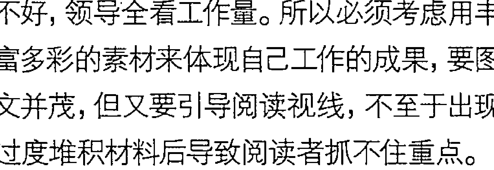

这个时间线适合文体活动特别多的各类协会工作总结PPT，工作好不好，领导全看工作量。所以必须考虑用丰富多彩的素材来体现自己工作的成果，要图文并茂，但又要引导阅读视线，不至于出现过度堆积材料后导致阅读者抓不住重点。
总结起来，越是抽象的东西，越要用直观的方式表达；越是理性的内容，越要配调动情感的图；越是宏观的构想，越要写具体的数字。这绝不仅仅是制作PPT的密码。

### 总结提升之二
为堆积的材料找重点线

再看一个案例，这是一页规划部工作概要，尽管找到一些不错的模板，但是很显然页面信息量太大，采用模板不但没有起到美化的作用，反而侵占了大量的排版空间，导致文字出现大量换行。环形模板也使得文字对齐很困难，整页PPT可读性很差。

改进后的PPT整齐划一，线索清楚。


这个改进其实很简单，就是不用模板用表格。
不是所有的工作都存在先后顺序，但是所有的工作都分轻重缓急和主次吧？所以另一种工作总结常用的线索结构是重点线。把重要的工作和不重要的工作通过排版区分出来。

在改进后的表格里，可以把相对重要的工作放在上面，相对不重要的工作放在下面，通过改变表格标题行和正文行的颜色，让阅读者清晰看到工作条目，有兴趣的内容读者自己会再阅读下面的明细栏目。

假如有特别想强调的工作内容，可以单独突出这一栏的标题，采用文字加粗加大或者变色强调的方法就可以，也可以考虑改变这一格标题栏底色来强调，但是强调项不能多，强调项一多就等于没重点了。

### 总结提升之三
利用书法字体增加总结的美感

在很多工作总结PPT中，存在一些形式化的套话，越是套话，往往领导越要追求形式美观。假如字数比较多，排版上还可以动一些脑筋，但比如下面的PPT，字数很少，怎么办？

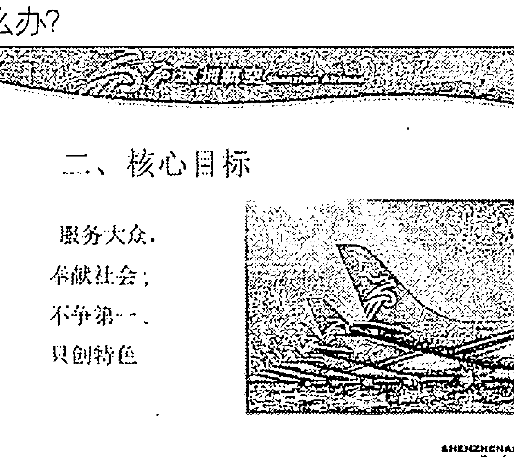

这页PPT的难处就在于核心目标只有20个字，而且作为领导介绍工作的一个重要页面，显然不适合再放其它的文字。所以大部分人的选择就是找一张大图，无非是企业背景或者产品，但在一页PPT中，如果图片太大，就会成为视觉的焦点，但是图片本身又很难传递出要表达的信息，这样看起来PPT很美，但是是以损失传递的内容为代价的。

从设计上讲，这样的构图并不恰当。


改进后的PPT并不复杂，对于一般工作中的总结足够了。对于目标纲领性的大字，汉字有个天然武器叫书法字体。当字足够大，配以书法字体（这里我选择的是北宋米芾的字体），本身就具备了修饰的效果。
假如还想用图片点缀，那么图片宜淡化视觉面积占比。所以我把大图片缩小放在左下角，用柔化边缘效果处理一下，也是为了避免版面太空大单调。

### 总结提升之四
利用图表结构化表达创新点

所有写总结的人都知道，仅仅平铺直叙做的工作是没有亮点的，工作总结的关键是要为自己的工作找一些亮点，而且通过PPT把亮点展示出来。

展示亮点的方式不能仅仅把自己的总结写出来，最佳的方式是用图表的方式表达自己在工作中的感悟和体会，这里我分享两个提炼的PPT供大家参考。

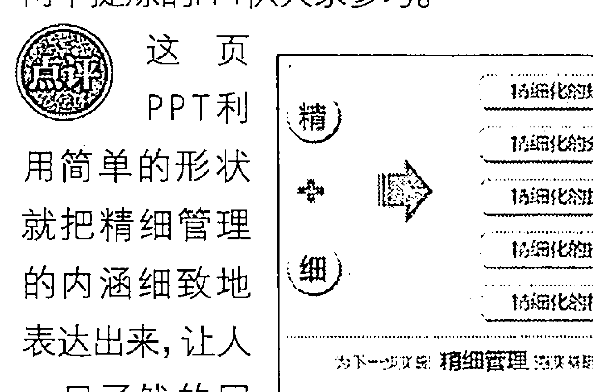

这页PPT利用简单的形状就把精细管理的内涵细致地表达出来，让人一目了然的同时又眼前一亮。

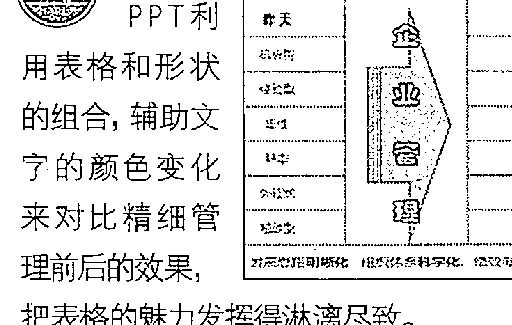

这页PPT利用表格和形状的组合，辅助文字的颜色变化来对比精细管理前后的效果，把表格的魅力发挥得淋漓尽致。

回到这两页PPT，都是先把Word中大段的文字进行提炼，提炼出要点，提炼成排比，然后再构思如何排版。有了排比句，排版就容易了。

话说回来，想做好这样的PPT，工作中没有切实的感悟可不行，中文不好也不行。
（文|秋叶）

## 时尚买手带你网淘奢侈品

春节期间中国人购买奢侈品的热情让整个世界都无法小觑，如何通过网络聪明地购买奢侈品，也成为许多奢侈品爱好者共同关心的话题。

本期特邀奢侈品资深买手Peter为大家介绍自己的网购奢侈品心得。Peter是做商业零售的，很早就开始购买奢侈品了，五六年前，他将奢侈品的购买从线下转到了线上。

### 为啥要网购奢侈品

为什么要从网上购买呢？有过奢侈品购物经历的买家应该有所体会。首先，网上的选择非常多。我们知道，不少实体店对奢侈品的购买数量是有限制的，比如LV，由于顾客经常太多，有时会实行每人每次两件的限购，而网店就没有这样的约束。再者通过网上购买非常便利，虽然我们可以去香港、海外购物或是找朋友代货，但毕竟没有网上来得方便，想必大家对LV、Gucci店门口长长的队伍记忆犹新，特别是二三线城市的买家，网购的优势更明显，不用远行也能买到心仪的奢侈品，还省了不少路费。此外，相比实体店，网上的款式也更多更全，可以做到全球同步。当然对于我们来说，最最重要的还是经济实惠，由于关税、奢侈品税、中间代理商的加价和汇率等多重因素的影响，国内的奢侈品价格普遍比欧美市场高出许多。而网上商城不用支付高昂的店面费和人工费，许多都是由国外奢侈品厂家直接供货，减少了中间流通环节，价格上自然便宜不少。网店还能提供一些折扣，碰上打折换季，优惠更是大大的！网淘究竟能省多少？Peter说，一些大牌产品比实体店能便宜30%，对于价格本身不菲的奢侈品来说，这可是一笔不小的银子。

### 网淘哪些奢侈品

接下来的问题是，在网上适合购买哪些奢侈品？我们知道，像LV、劳力士、爱马仕等动辄数万元甚至数十万元的重奢侈品品牌全球都不打折，唯一的区别就是赚个汇率差。而品牌定位在中高档、价格从几千元到上万元不等的轻奢侈品，才是普通白领热捧的对象，如Coach、Fossil、A&F等品牌。就商品品种来说，网购的奢侈品中以包、化妆品特别是高端化妆品、手表为主，还有一些国内没有或很少有的品牌以及全球限量版商品。

### 去哪些网站淘

奢侈品的网上购买渠道有这样几类，包括奢侈品牌的官方购物网站、国外奢侈品网站、国内专业奢侈品网站和综合类大型网商开设的奢侈品频道以及淘宝网。对于前两者，价格上没有优势，只是作为商家销售渠道的补充，不是品牌的重点。淘宝网，大家很清楚，货品真假难辨。至于大型网商开设的奢侈品频道，像京东商城、新浪、网易等，虽然价格实惠，但由于京东是做3C起家，并没有销售奢侈品的经验，很多方面可能不如专业奢侈品网站专业。比如对商品的描述就有很大区别，网购奢侈品没有在专柜的挑挑拣拣，所以直观感受很重要。一般的网店可能只有一些简单的描述和照片，专业网站则会配上剪影模特图，展示商品的很多细节。此外，由于奢侈品不同于一般商品，在包装、配送上都有特别的标准和要求，如果处理不当很可能损坏商品的品质。因此，最靠谱的就是去专业奢侈品网站购买，目前国内的轻奢侈品网站有几十个，比较有名的有唯品网、走秀网、优众网、佳品网等。

## 网络大补贴

- 唯品网
  http://www.vipshop.com
- 走秀网
  http://www.xiu.com
- 优众网
  http://www.ihaveu.com
- 佳品网
  http://www.vipstore.com

### 如何淘

虽然奢侈品网站众多，网上的商品琳琅满目，但同一款商品会有不同的价格，这让很多人感到迷茫，还有一些消费者花大钱却买到了假货或是次品，如何买到称心如意的商品呢？

#### 选择一个可靠的购物平台

首先要提前做好功课，事先了解一下所有要购买品牌的产品系列等知识，然后选择一个好的购物平台。何谓好的平台？就是大型的、口碑好的奢侈品网站，像唯品网、走秀网等。这些大型商家的信誉一般都没问题，选择时可看看网站是否有正品保证、退换货和售后维修等保证。对于奢侈品来说，正品保证更为重要，如果花正品的钱买到的却是水货，那损失可就大了，所以一定要看清楚该网站是不是有品牌授权。同时，为了保证商品在配送过程中的安全，要看清楚该网站是不是承担快递风险。据Peter介绍，通过目前大型的B2C网站购买比较可靠，不用担心买到假货。否则对一般消费者来说，很难区分哪些是真货，哪些是高仿品。

#### 选择合适的时机 做精明的消费者

目前权威的奢侈品网站很多，可以通过对比。看哪家相对价格低一些，比如，有的店LV便宜，而有的店Coach便宜。现在各大奢侈品网站为了吸引会员、提升销量，不仅折扣低而且不乏新品。如果能了解各大网站的促销规律和力度，那么省钱就变得轻而易举了。

## 小提示

如果对某品牌很熟悉，也可以入手一些二手奢侈品。二手奢侈品很多是过季款，价格便宜不少，如果保养得当甚至可能增值。Peter的一个朋友买过一个限量版的包包，没过多久卖出，倒赚了几百元。

- 聚尚网
  http://www.fclub.cn
- 第五大道
  http://www.5lux.comPeter认为有几个时机是一定要抓住的。一是奢侈品购物网站的和奢侈品官方网站的周年店庆促销，一般会在低价的基础上来个折上折。二是换季和节假日期间的促销。换季一年有两次，即春夏和秋冬换季，其中又以11月、12月的折扣最大。此外，还可以通过购物网站、返利网站等渠道搜集一些优惠券。

### 练就火眼金睛 辨明真假

刚才提到过，LV等品牌就是去专柜也很少有打折的情况，如果某网店宣称LV正品5折，那肯定不可信，千万不要贪这样的小便宜。至于一些所谓的代工货、水货、免税店也不要相信。

### 售后服务

奢侈品的高价也来自于其高品质的售后服务，但国内的不少消费者都有过售后方面的烦恼。比如想对已购买的奢侈品进行维修或清洗，动辄要等几个月甚至半年的时间，大部分还要自掏腰包。

所以，网购时要选择提供高质量售后服务的奢侈品商城。奢侈品日后的退换、清洗、保养、维修等都要通过网站来进行，这些购买前要确认清楚。

此外，Peter提醒大家，购来奢侈品后，也要注意自身的使用保护，减少不必要的维修和保养，比如有些商品要倒着放，有些要立着放，有些不能挤压，还有些要防潮、防燥等。

(文|掌盟人)

## 自己打造‘隐身系统’

很多时候我们无法拒绝他人使用我们的电脑，比如笔记本送修时，该怎么保护我们电脑里的隐私？动手打造一个完全隐身的系统吧。打造隐身系统只需七步。

### 第1步
启动程序后单击“Setting→Language”，在语言选项选择“简体中文”切换到中文版。接着单击菜单栏的“系统→创建隐藏操作系统”，弹出操作向导后按屏幕提示操作（请仔细查看弹出操作警示）。由于程序会对系统分区进行加密，操作前首先使用刻录机刻录一张应急启动盘，按向导提示生成启动盘文件（默认为“我的文档\TrueCrypt Rescuedisk.iso”），启动刻录软件将上述生成的ISO文件刻录为启动盘。刻录完成后插入光驱，单击“下一步”程序会自动检测，检测成功后才可以继续下一步。

### 第2步
继续按向导提示操作，在创建外层加密卷时按提示设置密码，这个外层加密卷是指保存隐藏系统的分区，这里设置的是访问加密卷密码，这个密码可以让我们在常规系统中加载隐藏系统分区，比如用于将私人文件全部转移到隐藏操作系统中。

### 第3步
继续按提示将外层加密卷格式化，格式化完成后程序会提示进入隐形操作系统启动密码设置，这里要注意的是选择的加密算法要和之前一致（全部选择默认加密设置即可），这个密码是启动隐身系统的唯一密码。

### 第4步
接着执行隐藏加密卷的格式化，完成这些操作后重启，此时在引导界面就需要输入上述设置的隐藏操作系统的启动密码，成功登录后程序会将当前系统克隆到隐身分区中。

### 第5步
完成隐身系统的创建后重启，此时再次进入隐身系统，可以看到隐身系统和原来系统是一样的（因为是完全克隆原系统）。只是每次启动到隐身系统后，TrueCrypt就会提示只有将原来系统删除才可以更好地保证隐身系统的安全，单击“是”，TrueCrypt就会将原来系统分区删除并格式化。

## 小提示

TrueCrypt将原来系统删除后，重启时就无法启动到原来系统了，因此删除之前一定要准备好启动U盘等引导工具。此外，TrueCrypt会更改原来的硬盘主引导记录，如果TrueCrypt启动出现故障，使用前面创建的启动光盘引导，在光盘引导界面按下F8键，按屏幕提示进行恢复即可。

### 第6步
使用准备好的启动U盘引导系统，按提示将前面制作的原系统的备份win.gho恢复到C盘，进入原来系统后重新安装TrueCrypt，重启后就可以使用前面生成的隐身系统了。由于隐身系统的分区D盘是被加密，在原来系统中无法访问D盘（提示没有格式化，此时千万不可格式化）。为了隐身系统的安全，可以启动“磁盘管理”组件，按提示将D盘（隐身系统分区）的盘符删除，这样原系统就无法看到隐身系统的任何信息了（见图）。

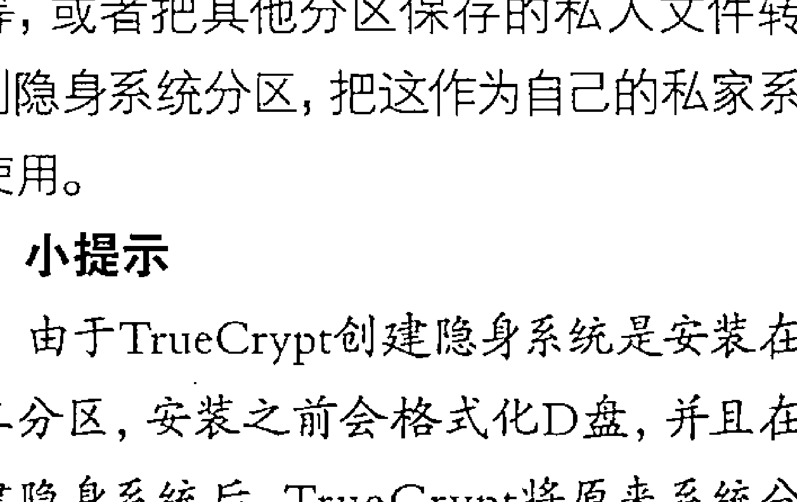

### 第7步
完成上述设置后，现在就可以对两个系统进行特定设置以保护自己的私密数据。比如可以进入原来的系统，将一些敏感的数据如网银的密码和用户名等信息全部删除，把原来系统作为来访好友的公共系统。接着再进入隐身系统设置自己的重要操作，比如设置网银密码、支付宝账户等，或者把其他分区保存的私人文件转移到隐身系统分区，把这作为自己的私家系统使用。

## 小提示

由于TrueCrypt创建隐身系统是安装在第二分区，安装之前会格式化D盘，并且在创建隐身系统后，TrueCrypt将原来系统分区格式化。因此操作之前，我们首先要使用GHOST将当前系统备份为win.gho备用，同时将D盘数据全部转移到其他分区，并且保证第二分区容量比系统分区大5%以上（否则请先使用PQ等分区工具扩容D盘）。

(文|俞木发)

## 建立链接表 文档搜索易

借助PrintFolder和Excel两款软件，制作一个包含打开链接的文档目录，可以大大提高文档使用和管理的效率。

现在的电脑硬盘容量越来越大，下载使用过的各类文档也越来越多，久而久之，难免会出现某些重要文档很难找到的情况。

面对成千上万的个人文档，即使记忆力再好的人，也不是每一次都能很快找到自己急需的文档资料。

通过Windows操作系统自带的文件搜索功能，虽然能够根据文件名称、类型、大小、包含文字等信息进行相关的文档搜索，但搜索结果不便于保存，即使下次要查找同样的文档，仍然要重新进行搜索，实在有点浪费时间。

其实，借助PrintFolder和Excel两款软件，只要经过几步简单的操作，就能够快速地为某个硬盘分区或文件夹制作一个包含打开链接的文档目录，不仅方便我们了解各类文档的整体分布情况，而且也能够节省一些文档查找的时间，提高文档使用和管理的效率。

### 获取目标分区下的文档信息

能够提取指定分区或文件夹下所有文件的名称、类型、大小等信息的软件很多，这里选择的是PrintFolder Pro汉化版（下载地址：http://www.onlinedown.net/soft/3577.htm）。

安装运行该软件，首先打开左上方的“选项”标签，单击“编辑”按钮，打开“高级”对话框，在“包括文件信息”标签下选择要提取的文件属性，如文件全名（即文件主名+扩展名，%NAME）、文件主名（%FNAM）、文件类型（即文件扩展名，%FEXT）、文件路径（%PATH）、文件大小（%SIZE）等，在“包括文件时间戳”标签下中添加文件创建日期（%DATE）。

为了方便后面创建访问文件的超链接，还需要将文件路径和文件名.扩展名组合成一个新的数据项%PATH%NAME添加到范例中，注意中间用“|”来分隔，以便于在Excel中进行文本分列，也可以在“范例”文本框中直接输入字符串%FNAM|%FEXT|%SIZE|%DATE|%PATH%NAME。

单击“排除”按钮，打开“排除”对话框，可以设置要排除搜索的文件类型或文件（夹）名称。单击“更多选项”按钮，还可以对文件夹、文件和列表进行相关的输出设置，这里勾选“忽略空文件夹”、“全路径”和“以KB为大小单位”等选项，即要在搜索结果中忽略空文件夹，全路径显示所有文件的存储位置，以KB为单位显示文件的大小。

回到“导航器”标签下，选择要建立文档链接表的分区或文件夹，这里选择E盘。在搜索文件类型中输入*.doc;*.xls;*.ppt，查找三种常用的Office文档类型，注意不同的文档类型之间用半角状态下的分号来分隔。

勾选左下方的“递归子文件夹”和“所有级数的子文件夹”两项，单击“确定”按钮之后，系统很快就会帮助我们搜索到该分区中所有相关文档的指定属性值，并自动以“|”符号分隔。

### 在Excel中创建文档链接表

在PrintFolder软件右侧的搜索结果框中，右击打开快捷菜单，依次执行“全选”和“复制”命令，复制上述搜索结果；然后打开Excel 2007，将其全部粘贴到一个新工作表当中，然后选定该列数据，执行“数据→分列”命令，通过“文本分列向导”，选择文本分隔符号为“|”，将各个文档属性值分列显示。

根据表格内容，设置好对应的Excel表头。如果想让文档目录检索更为方便一些，可以选定整个数据区域，将文档按指定属性值进行排序，这里以文件类型为主要关键字，以创建日期为次要关键字进行排序。

在F列中插入HYPERLINK函数，该函数的作用是“创建一个快捷方式或链接，以便打开一个存储在本地硬盘、局域网服务器或Internet上的文档”。Link_location参数表示文件路径，这里对应G列中的内容，Friendly_name参数表示超链接的名称，这里设置为“打开”，将该函数复制应用到整列单元格，即可完成文档链接的创建操作。

在Excel中经过上述的简单操作之后，我们很快就能获取指定分区的文档目录，所有文档名称都按指定的关键字有序排列，查找起来比较方便。每一个文档名称后面都包含访问链接，打开也很迅速。

### 用批处理快速删除无用文件

在使用文档链接表查看使用各种文档的过程中，难免会发现一些重复出现或者早已无用的文档，逐个打开各个文件夹，当然可以进行删除操作，但是手工操作的效率实在不敢恭维。其实，我们也可以借助上述文档目录，先在文件路径前面添加一个辅助列，将需要批量删除的文档设置一个相同的符号，例如*，然后再以“辅助列”为主关键字进行排序，就可以立即筛选出分布在不同文件中的需要删除的文档。

打开一个临时工作表，首先，在A1单元格中输入批处理命令的开启符号@echo off，在A2单元格中输入强制删除命令del /f /s /q，并复制到A列的其他单元格中，其中/f参数表示强制删除只读文件；/s参数表示从所有子文件夹中删除指定文件；/q参数表示安静模式，即删除时不需要进行确认操作。

接下来，将需要删除的文件路径信息复制粘贴到B2单元格开始的B列单元格中。最后，复制该工作表中的所有内容，并将其粘贴到一个记事本文档中，执行“文件→另存为”命令，将文本内容转存为扩展名为bat的Windows批处理文件。双击该文件，就可以飞快地批量删除所有的无用文件。

如果想将分布于不同文件夹中的重要文档复制到同一个文件夹中进行备份，只需要将删除命令del修改为复制命令copy，参数调整为/y，在C列中设置备份文件夹，参照上述批处理文件的生成方法，同样可以实现文档的快速批量备份操作。

（文/姚文连）

## “三系统”上马 兼容又防“崩”

使用Windows 7的人越来越多，但该系统还存在兼容性问题和系统崩溃的安全隐患。打造三系统方案，可以解决问题。
相信大家以前早听过了诸如双系统、三系统之类的说法。想必大家也知道，许多双系统，往往一个系统崩溃，另一个系统也跟着坏。出于对老软件使用兼容性和系统安全性的考虑，笔者采用了安装“三系统”的方案，就是Windows 7+XP Mode+ylmfOS这三个系统。
可能有人会说这会比较复杂，并且占据大量磁盘空间。大家可以放心，这一切的安装过程都可以在Windows 7系统下面完成，就像安装自己的应用软件一样，非常方便。至于磁盘占用，相对于目前的上TB大硬盘，牺牲一些空间换来兼容和安全还是值的。

### XP Mode 解决兼容问题

使用Windows 7当然是时下的主流，但可恨的是总有那么几个软件与Windows 7不兼容，尤其是与64位的Windows 7。
Windows 7自带的兼容性助手很菜，不兼容的软件还是不兼容，得不到实质的解决。
微软提供的XPmode就可以解决近乎所有的兼容性问题。安装了XP Mode就相当于安装了个独立的XP系统。

### 检测电脑能否安装XP Mode

- NO: CPU不支持。比较悲哀。
- Yes: CPU支持。赶快去将BIOS里的VT开关设为Enabled吧。
- Locked ON: CPU支持，且BIOS已经打开该功能。恭喜！现在就可以玩转XP Mode了。
- Locked OFF: BIOS当前禁用了虚拟化技术，但是不确定CPU本身是否支持。遇上这种情况，先去找找BIOS里面是否有Virtualization Technology，将它设置为Enabled，然后重新测试，若结果没变，还是比较悲哀……

### 安装Windows Virtual PC

这是安装XP Mode的前提，其实就是微软的一个补丁程序KB958559，已经安装过的可以跳过这步，值得注意的是要下对版本，X64指的是64位系统的，X86指的是32位系统的。
下载地址：http://www.microsoft.com/downloads/zh-cn/details.aspx?familyid=2b6d5c18-1441-47ea-8309-2545b08e11dd&displaylang=zh-cn

### 安装XP Mode

对于测试合格、能够安装的朋友，开始行动吧！下载中文XP Mode地址：http://download.microsoft.com/download/D/7/A/D7AD3FF8-2618-4C10-9398-2810DDE730F7/WindowsXPMode_zh-cn.exe
安装过程一直点击“下一步”即可。这样就安装在了C盘，备份的时候也可以把它一同备份。

### 配置虚拟机环境

首次打开时，在Windows 7下面点“开始→所有程序→Windows Virtual PC→Windows XP Mode”，就可以打开XP Mode了。接下来安装程序将自动建立并设置虚拟XP系统环境。
安装设置过程根据用户计算机配置不同，大约需要5~10分钟，不过安装程序在其过程中将为用户展示简单的XP Mode教学，让用户可以快速上手，也就不觉得枯燥了。进入正式XP Mode。

### 配置XP Mode

默认设置只给了我们的XP Mode不足1GB的内存，我们可以给它增加内存。在XP Mode下，点击右上角的Ctrl+Alt+Del，弹出一个界面，点击“关机”，然后在Windows 7下面点击“开始→所有程序→Windows Virtual PC→Windows Virtual PC”，然后右击，选择“设置”，打开设置界面。
为什么要这么打开？因为如果不这样，先关闭XP Mode，则不能进入设置。在这里，你可以配置这个系统的内存、网卡之类的很多东西。结合自己的电脑配置设置吧！
日后有什么不兼容的软件就在这个系统下面安装运行吧！兼容问题基本上解决，并且这个系统的打开速度很快，不像独立安装的XP那样，毕竟我们日后的主力还是Windows 7嘛！

### ylmfOS 解决安全修复问题

ylmfOS则是雨林木风基于Linux研制的一款界面与XP相仿的操作系统。对于熟悉XP用户的朋友，很容易上手。大家知道，Linux的安全性很高，有什么重要的工作，可以在这个系统下完成。更可喜的是，Windows系统不能识别Linux的磁盘，可是Linux能够识别Windows的磁盘，所以要是Windows 7系统坏了，可以在这个系统下面修复。
如此便可以打造出一套强悍的“三系统”电脑。

### 下载安装ylmfOS

下载地址: http://www.ylmf.net/ylmf/news/2011053125784.html。其实装这个系统比装XP Mode更简单，虚拟镜像加载后，点击安装程序，我们选择“在Windows中安装”，这次最好装在非系统盘，以后恢复、修复Windows系统的时候，可以让它独立运行。

### 使用和体验ylmfOS

设置好后点击“安装”，就会自动退出Windows 7系统，在DOS下自动安装。安装完毕后，会在电脑开机时多出个系统启动项，进去看看吧，跟XP很像吧！这个系统内核可不是Windows，是Linux，这个系统本身集成很多常用的应用软件，诸如浏览器、IM软件，也可以去Linux软件园下载更多的软件安装，好好体验吧！

一般的Windows操作它都可以胜任的，安全性极佳。
至此，“三系统”安装完毕。需要注意的就是那个ylmfOS最好不要装在C盘，这样让它相对独立，以便更好地维护我们的系统，还可以顺便体验一下不同内核的电脑操作系统。
(文|付易)

## 以3D视角巧看2D视频

小刘是一个电影迷，尤其喜欢3D电影。不过现在可看的3D影片很少，能不能直接以3D视角观看2D视频呢？别说，还真有具有特殊播放能力的视频播放器。

### 使用3D Video直播3D视频

3D Video Player的主界面极其简单，点击窗口底部控制栏中部的Open按钮，选择所需的视频文件（可多选），3D Video Player支持各种常见的视频格式。之后即可播放选定的视频。

在默认情况下，播放的是2D视频画面。点击控制栏最右侧的3D按钮，使之处于高亮状态，3D Video Player就可以自动将视频画面切换到3D显示状态。你只需带上3D眼镜，就可以欣赏立体感极强的视频画面了。

再次点击3D按钮，使之恢复默认显示状态，切换回2D视频播放界面。在3D Video Player控制栏中点击第一个按钮，可以切换到全屏播放状态。点击停止按钮，可以结束播放返回初始状态。如果选择了多个视频文件，可以点击前进或者后退按钮，播放前一个或者下一个视频。在音量栏中拖动滑块，可以调整音量的大小。

### 使用SAMedia3D看视频

SAMedia3D安装后需要重新启动系统，在SAMedia3D主界面底部浮动工具栏的Set Play Mode栏中选择3D项，表示直接以3D效果播放普通视频。当然，选择2D项表示播放普通视频。选择2D With Effect项，表示以预设特效播放普通视频。这里我们选择3D项。

要想欣赏到地道的3D画面，离不开合理的播放配置。点击工具栏中第五个按钮，在弹出面板中的3D Depth列表中选择Normal项，表示采用默认的3D视频深度。当然，您也可以选择其它视频深度，包括Deep 10%、Deep 20%、Deep 30%、Deep 40%等。不过这会造成视频拖影效果。在View 3D Glasses Type列表中可以根据实际需要，选择佩戴的3D眼镜的类型，默认为Red/Cyan（红/蓝眼镜）。

电脑硬件配置的高低，将直接影响到3D视频播放的速度。在Please Select Your System Specs/Speed vs Quality栏中可以选择适合本机的配置类型，依次包括顶级配置（例如采用顶级CPU、大容量内存、最强显卡等）、较高级配置、普通配置、低配置、较弱配置、最弱等等。之后点击Apply按钮，保存配置信息。

在上述工具栏中点击第三个按钮，选择需要播放的视频文件（例如AVI视频等）。当然，也可以自定义播放列表。点击工具栏中的第四个按钮，在播放列表面板中的Repeat Play栏中选择重复播放类型，包括不重复、重复一次、不间断重复等。点击Add Video Folder to Play List按钮，选择视频文件夹，将其中的所有视频全部添加到播放列表中。选择好所需的视频文件后，点击工具栏中的“播放”按钮，就可以以3D效果播放普通视频了。

在播放过程中，在上述工具栏下方拖动第一个滑块，可以调整视频音量。拖动第二个滑块，可以调整播放的进度。点击Esc按钮，可以在全屏和普通界面之间自由切换。

在播放画面的右键菜单中勾选Keep Aspect Radio项，可以保持视频的比例，勾选Crop Vertical Black Bands项，表示使用切边模式，自动清除视频画面上下的黑边，让视频画面变得更完整。

下载地址：http://www.awpersoft.com/download/SAMedia3DSetup.exe
（文|孙兴）

## 超酷！屏保做桌面

很多人都喜欢扮靓系统桌面，在Windows7中不但可以用梦幻桌面，还可以使用屏幕保护作为桌面呢！操作很简单，感兴趣的朋友就Follow Me。

单击“开始”菜单，选择“所有程序→附件→命令提示符”出现对话框，输入“cd c:/windows/system32”，cd后面有一个空格，c表示系统盘符，此命令是进入system32文件夹，然后按回车键确认，再次输入“sstext3d.scr /p65552”，/前面有一个空格，按回车键后即可看到桌面已经变成了3D文字屏保。使用屏幕作为桌面后，桌面上的图标也就被遮盖了，如果要取消可按【Win】键激活任务栏，右击屏保图标选择“关闭”即可取消屏保桌面。这里还可以将sstext3d.scr替换成Ribbons.scr（彩带屏保）、Mystify.scr（变幻线）等。
（文|沈澄）

## 一键休眠真给力

休眠可以让系统快速进入工作状态，笔者就是休眠的绝对支持者。可每次使用休眠都要单击“开始”菜单再操作好几步，比较麻烦。如果能让休眠功能放到桌面上，甚至添加快捷键，那就方便喽。其实使用快捷方式就能实现所需功能。

在桌面空白处右击选择“新建→快捷方式”出现对话框，输入“rundll32.exe powrprof.dll,SetSuspendState Hibernate”，单击“下一步”输入快捷方式名称，如“休眠”，再单击“完成”按钮即可添加快捷方式至桌面。右击该快捷方式选择“属性”，然后切换到“快捷方式”选项，在“快捷键”选项中设置快捷键，最后单击“确定”按钮。

以后只要按下该快捷键即可让系统进入休眠状态。
（文|沈澄）

## 以软制硬 电脑硬件巧加锁

但是，作为电脑的基础，硬件是保证软件可靠运行的最基础要素。实际上，软件和硬件是互相依存的。本期我们就来看看，软件和硬件是如何相辅相成的。

### 为ADSL猫加把“暗锁”

邻居王阿姨家里最近新买了一台电脑，安装了宽带，精彩的网络世界，给王阿姨的家庭生活带来了很多乐趣。不过烦恼也随之而来，王阿姨家的小孩迷上了网络游戏，造成了学习成绩不断下滑。这让王阿姨很担心，看来很有必要采取控制措施，防止孩子沉迷网络了。单位技术员给王阿姨介绍了ModemLockDown这款独特的加密软件（下载地址：http://www.onlinedown.net/soft/106448.htm）。可以轻松锁定ADSL Modem，这下没有王阿姨的许可，其小孩就无法上网打游戏了。在王阿姨的监督下，孩子的学习成绩终于上去了。

ModemLockDown可以跟随系统自动运行，而且具有很强的抗击非法关闭功能。当其初次运行后，在屏幕右下角会自动弹出密码配置面板，在Administration Password栏中输入管理员密码，利用该密码可以执行ModemLockDown管理操作，例如更改密码、锁定ADSL Modem、设置自动锁定的时间范围、调整ModemLockDown配置等。在Unlock Password栏中输入ADSL Modem解锁密码。

ModemLockDown提供了三种锁定Modem的方法。

其一是直接在ModemLockDown右键菜单上点击Lock Modem项来手动锁定ADSL Modem，之后可以切断所有网络连接。解锁的方法是在上述菜单上点击Unlock Modems项，输入解锁密码即可。

其二是自动锁定功能，在ModemLockDown右键菜单上点击Administration项，输入管理员密码后，在设置窗口左侧纵向工具栏上点击第二个按钮，在右侧窗口列表中选择Automatically lock项，表示当启动ModemLockDown时，可以自动锁定Modem。点击Automatically lock dialup modems when I disconnect项，当该项左侧出现红色的对号标记时，表示断开网络连接后，ModemLockDown可以立即锁定Modem。点击Lock non-dialup modems项，当该项左侧出现红色的对号标记时，表示锁定操作仅仅针对非拨号类型的Modem。

为了加强运行的隐蔽性，点击Stealth mode项，在弹出的窗口中设置激活热键，当点击OK按钮后，ModemLockDown即可进入隐藏运行状态。之后再次点击该热键，才可以重新打开其配置窗口。

其三是定时锁定Modem，在上述列表中选择Use user schedules项，表示按照用户预设的时间范围锁定Modem。在设置窗口左侧纵向工具栏中点击第三个按钮，在右侧窗口中可以设置计划锁定功能。在Scheduled User Access列表选择对应的时间段，点击Access按钮，为其添加绿色标记即可。同理，可以添加多个时间段，之后当进入预设的时间范围内，就可以自动锁定Modem。

### 为键盘鼠标加把锁

小李是个电影迷，喜欢从网上下载最新的电影，之后舒舒服服地躺在沙发上，抱着本本欣赏精彩的大片，这对小李来说是最惬意的事情。不过在观看过程中，经常会不经意触碰到本本上的按键和触摸板，造成本本突然发飙，不是误打开了其它程序，就是突然中断了电影播放，搅得小李无法正常观赏电影。看来很有必要在不影响观看电影的前提下，将鼠标锁定起来，让自己安安静静地享受视觉盛宴。有了KeyboardLock（下载地址：http://keylockbooring.net/bin/full.zip）这款免费小工具的帮助，小李的烦恼终于解除了。

KeyboardLock需要.NET Framework 3.5组件的支持，其使用了系统钩子技术，允许设定锁定暗语。不管在任何时候，只要敲击键盘输入锁定暗语，KeyboardLock就可以立即锁定系统。当系统锁定后，并不影响其它程序的运行，只是键盘和鼠标处于失效状态，鼠标虽然可以正常移动，只是其点击操作再无任何作用。系统犹如中了“定身术”一般，无法接受键盘和鼠标。

在KeyboardLock主窗口中输入锁定暗语（默认为cake），点击Start按钮，KeyboardLock就处于激活状态。只要输入预设暗语，键盘和鼠标就处于失效状态，无法对系统进行任何操作。同时，你可以随时输入锁定暗语来锁定键鼠，之后随时输入解锁暗语恢复鼠标键盘的活力。

### 各种端口统统上锁

公司老总将一些重要文档交给秘书小华，告诉他要妥善保管，不要让无关人员接触。小华自然不敢怠慢，不过又不能始终抱着电脑不放，看来还得另想妙策。经过一番思考，小华认为只要将电脑可能的泄密途径全部封闭，数据自然可以高枕无忧。有了Port Locker这款软件（下载地址：http://uninstal.in/demo-downloads/PortLocker.zip），终于让小华找到了解决问题的良策。Port Locker可以彻底封锁USB端口、IEEE 1394端口、网卡端口、光驱端口、打印机端口、红外端口等电脑与外界连接的通道，犹如将房间的所有门窗全部锁定一样，让存储在电脑中的数据安全无忧。

初次运行Port Locker时，需要为其设置密码，以后启动Port Locker时，必须输入该密码。在Port Locker主窗口工具栏中点击Configuration按钮，在窗口左侧点击Settings→General Settings→Password项，在窗口右侧可以更改管理密码。点击菜单Configuration→Port Settings项，在窗口右侧列表中显示Port Locker允许保护的端口范围，包括USB端口、IEEE 1394端口、和网卡关联的所有端口、光驱、打印机、红外端口等。这里建议勾选All Ports项，表示让Port Locker自动锁定所有端口。

在Lock Type列中选择Permanent Blocked项，表示彻底封锁所有选定的端口，禁止任何数据从这些端口中进出，这是最严格的锁定方式，之后点击Apply按钮，激活Port Blocker端口保护功能。

为了提高使用的灵活性，Port Locker还提供了定时锁定功能。在Lock Type列中选择Schedule Blocked项，在下一步窗口中勾选Lock when system is Idle项，在Select Idle Time X Minutes栏中设置系统闲置时间。例如将其设置为5分钟，这样系统空闲时间超过5分钟，Port Locker就可以自动锁定所有端口。勾选Select Duration项，可以设定锁定时间范围。例如为了防止下班之后，有人非法盗取数据，可以在From栏中输入“12:00:00”，在To栏中输入“14:30:00”，点击Add按钮，将午休时间添加到锁定时间段中等。

按照同样的方法，可以将其它时间段也添加进来。之后点击Apply按钮，激活Port Locker的定时端口锁定功能。在锁定所有端口之前，点击菜单Configuration→Device Permissions项，勾选USB White list项，连上优盘，点击Enumerate按钮，获取优盘的详细信息，之后点击Add按钮，将其添加到白名单中。点击Apply按钮保存白名单信息。这样，即使进入到Port Locker最严格的保护状态，你也可以自由地使用自己的优盘了。

## 用好Windows安全模式

当系统无法进入时，我们都会想到安全模式。可是如果连安全模式都进不去，我们该如何操作呢？为了让安全模式更安全，又有哪些未雨绸缪的措施呢？

### 安全模式进不去

当病毒木马破坏了Windows的安全模式或者删除了对应的注册表项时，系统进不了安全模式或者进安全模式会蓝屏死机就成为一种必然。这种问题如何解决？很大程度上要未雨绸缪，在能进入系统时先看问题是否出现。使用的软件就是专门修复安全模式的工具SMFixer，它支持WinXP/Win7等系统（下载地址：http://www.sergiwa.com/download/security/SMFixer.exe）。

软件绿色，下载后双击即可运行，在运行之前可能杀毒软件会报毒，放行即可。运行后点击其中的FIX按钮即可开始修复，修复后会自动重启电脑。另外还可以通过http://ishare.iask.sina.com.cn/f/13382103.html下载fixsafemode.reg文件，然后手动导入注册表项进行修复。

### 让安全模式更安全

如果别有用心的人擅自进入了安全模式，由于缺乏必要的系统防护，想作恶简直是易如反掌。通过“开机F8加密器”这款软件即可给“安全模式”启动通道加密。

第1步：“开机F8加密器”是款绿色软件，直接运行即可。在主界面中，先清除预设密码，再自行设定一个密码。之后设置开机显示的Windows启动菜单，其中要有F8功能菜单项。最后设置启动菜单的等待时间。

第2步：设置完毕后，点击“安装”按钮，程序弹出提示“F8加密安装完成”。确认操作后，再次启动系统时，会看到启动菜单界面发生了变化，会显示正常启动Windows与F8功能菜单两项。参看界面底端的提示，除了调节菜单上下顺序、按回车或B键启动外，还支持重新设定菜单序列，按C键则可进入命令行，执行DOS命令。在选择F8功能菜单后，需输入正确的密码才可进入。

### 随时启用安全模式

如果只是简单的禁用/启用安全模式，用不着牛刀，可以试试Enable Disable SafeMode。

第1步：运行软件，如果没有禁用安全模式，那么只有Disable Safemode按钮可用，点击下去就是禁用安全模式了。反过来Enable Safemode就是启用安全模式。

第2步：勾选Password protected application可以设置密码保护。因为有时候禁用安全模式是为了安全，例如办公室的电脑安装了某些保护软件，禁止进入安全模式，所以加密码保护也是有用的。

### 安全模式进入器

一般来说进安全模式的方法很简单，开机的时候不停地按下F8键，就能看到启动菜单了。在启动菜单里可以选择进入“安全模式”。如果实在不会操作，这里给你介绍一个重启进入安全模式的软件——安全模式进入器。

第1步：运行“安全模式进入器”，看到有几个选项，如果要杀毒，请选择“重启进入安全模式--最少加载项”。如果要进入安全模式并让朋友远程协助以帮你解决问题，那就选择“带网络连接”。

第2步：如果正在处理一些程序或者文件，请先保存好。点击重启器的“重启”按钮，之后出现一个Boot Safe的提示框，询问你是否同意重启，选择“是(Y)”。接下来电脑自动重启，重启之后就自动进入安全模式了。

## 让Windows 7变身为卡拉OK

除了去KTV高歌几曲之外，通常我们也都会在家里自己闭关练歌，不过老是跟着配音一起唱，好像就没有那种KTV的感觉，而寻找歌曲伴奏又比较麻烦。在Windows 7中只要声卡支持，就能将自己的电脑变成卡拉OK设备。

右击任务栏处的“音量”图标选择“播放设备”出现对话框，选择“扬声器”后单击“属性”按钮，切换到“增强”选项，选择其中的“消除原声”，这样播放音乐时原唱就自动消除了。

如果没有“消除原声”选项则表示电脑的声卡不支持，不过能安装Windows 7的电脑基本上都支持消除原声。

另外在这里还可以进行变音，如调整“变调”下“设置”的数值，负数为男声，正数则为女声；选择“环境”可模拟声音播放环境，如礼堂、森林等；选择“均衡器”可模拟各种表演条件（如现场、爵士乐、摇滚乐等）。

通过播放设备，我们无需第三方的均衡器，在系统中就能轻松模拟出各种声音特效，非常给力。

## 打造“不简单”的剪切板

在复制文件、编辑文档等操作时，时常需要使用剪切板。实际上，和剪切板相关的操作远没有这么简单。本文就帮助你打造一个不简单的剪切板。

### 为剪切板加把“安全锁”

小孟是公司市场部经理，在其电脑中保存有公司一些机密文档，为了防止机密信息泄露，小孟可谓小心谨慎，对这些重要文件进行了加密处理。不过百密必有一疏，当小孟在查阅这些文档时，随手执行了复制操作。之后当其离开后，忘记了关闭电脑，有人乘机在其电脑上点击Ctrl+V键，毫不费力地得到了存储在剪切板中的机密信息。而有了Advanced Encryption Package Professional (简称AEPP)这款软件，小孟就可以彻底加密剪切板中的数据，再也不怕由此引发的安全问题了。

运行AEPP提供的Clipboard Encryptor (Tray Icon)程序，在系统托盘中的AEPP图标的右键菜单中点击Clipboard Encryptor项，在弹出窗口中勾选Enable globe key项，激活热键加密功能（默认热键Ctrl+F12）。

小孟将文本复制到剪切板后，按下Ctrl+F12键，在加密窗口的Enter password和Repeat栏中输入相同的密码。

小孟担心潜伏在系统的间谍程序拦截密码，在Enter password栏右侧点击选择按钮，利用弹出的虚拟键盘，完成了密码的输入操作。小孟深知，强悍的密码是数据安全的最大保证，如何设置强悍的密码呢？只需在虚拟键盘窗口底部点击Key Size按钮，设置密码的长度（默认为32位）。点击Generate按钮，在弹出的窗口中选择所需的加密算法（默认为SHA1），点击Start按钮，然后在该窗口中快速移动鼠标，可以随机生成复杂的密码。之后点击Done按钮，完成密码的自动填充操作。为了防止忘记密码，小孟点击Save to按钮，将其备份为独立的密码文件。

之后在加密窗口中点击Encrypt按钮，完成对剪切板的加密处理。不管任何人点击Ctrl+V键，试图得到剪切板内容，只能得到加密后的杂乱无章的数据。当小孟想恢复剪切板内容时，直接按下Ctrl+F12键，在解密窗口的Enter password栏中输入密码，点击Decrypt按钮执行解密操作，剪切板中的内容就恢复如初了。

因为小孟使用了AEPP自动生成的复杂密码，于是他在Enter password栏右侧点击浏览按钮，在虚拟键盘窗口底部点击Load from按钮，导入之前保存的密码文件，AEPP即可自动填充密码，这样小孟几乎不费吹灰之力，就完成了剪切板的解密操作。

### 为剪切板配个自动存档器

小张是一个电脑迷，平时喜欢琢磨各种操作技巧。因为小张从事的是文秘工作，因此需要时刻和剪切板打交道。小张发现按照常规的使用方法，当自己按下Ctrl+C键复制文本或者图片后，必须立即按下Ctrl+V键，将其粘贴到目标窗口中。否则的话，当复制新的数据后，剪切板中的原先内容就会被覆盖掉。当复制粘贴大量的数据时，很容易产生差错。使用ClipBoardCC这款免费的软件，就可以轻松实现剪切板自动存档功能，在复制数据的同时，可以自动将数据存储在不同的文件中，这样查找起来就方便多了。

#### 文字存档

小张在ClipboardCC主窗口左侧点击Settings按钮，在窗口右下角点击Show all settings按钮，在设置窗口左侧点击Files按钮，在右侧窗口中的Format列表中选择文件存储类型（包括TXT、RTF、HTML等，默认为文本格式）。在File to save text栏中选择对应类型文件存储路径。因为复制的数据可能带有格式属性，因此小张选择了RTF格式。小张为了管理上的便捷，勾选了Merge text and image into one file项，可以将复制的文本和图片全部保存在目标RTF文件中。为了便于区分不同的数据，小张勾选了Insert delimiter between text clips项，表示不同的存储内容之间添加分隔标记。分别点击上下Change按钮，可以自定义数据块前后分隔标记。

#### 图片存档

在窗口左侧点击Image按钮，在右侧窗口中的Format列表中选择图片存储格式，包括JPG、BMP、PNG、GIF等。在Folder to save images栏中设置图片保存路径（默认为“我的文档”）。在File name mask栏中显示图片存储格式，点击Change按钮，可以更改图片命名格式。其余设置保存默认。

小张接下来在ClipboardCC主窗口左侧点击Start saving按钮，激活剪切板监控功能。之后当小张向剪切板中复制文本或者图片时，ClipboardCC都可以自动将剪切板中的内容分别保存在指定路径下的RTF文档或者图片中。这样，不管什么时候，小张都可以方便地查看自己曾经复制过的内容了。当点击ClipboardCC主窗口左侧的Stop saving按钮后，可以停止其自动存储操作。

### 为局域网巧设剪切板

小王的单位组建了局域网，大家在局域网上可以快速共享各种资源。不过小王发现当自己和其他同事协作编写文档时，往往需要共享某些文本或者图片，传统的处理方法是先将其存储为文件，之后发送给对方，才可以实现数据的复制粘贴操作。小王想，如果能够为局域网也装上剪切板，那么只要操作者按下Ctrl+C键，数据就可以自动传送到其他主机的剪切板中，其他主机用户按下Ctrl+V键，就可以将其粘贴到目标窗口中。这不就可以大大提高工作效率了吗？有了CrossClip这款软件的大力协助，小王的想法很快变成了现实。

小王首先在局域网的所有主机中安装CrossClip，因为CrossClip使用的是UDP 9091和TCP 9092端口，因此如果电脑上安装有防火墙的话，必须开放上述端口。小王在本机上复制文本或者图片后，在系统托盘中右击CrossClip图标，在弹出菜单中点击Send项，CrossClip即可将本机剪切板中的数据发送给所有的局域网主机，其它主机的操作者只需在CrossClip菜单上点击Get项，就可以接收到小王发送来的剪切板数据了。之后按下Ctrl+V键，就可以粘贴得到的数据了。按照以上方法，局域网中任意主机都可以灵活地发送本机的剪切板数据，同时也可以接收其它主机发送的内容。

当然，如果多台主机同时发送各自剪切板数据的话，那么目标主机只能接收最后一台主机发送的数据。为了提高发送速度，小王在CrossClip菜单中勾选“Preferences→Double Click→To Send”项，这样只需双击系统托盘中的CrossClip图标，就可以立即发送本机的剪切板数据了。对应的，在CrossClip菜单中勾选“Preferences→Double Click→To Get”项，这样只需双击系统托盘中的CrossClip图标，即可完成远程数据的接收操作。

手工收发数据毕竟有些繁琐，小王决定使用剪切板自动收发功能，来提高操作效率。在CrossClip菜单中勾选“Preferences→Auto Send”项，激活其剪切板数据自动发送功能。对应的，勾选“Preferences→Auto Get”项，激活其剪切板数据自动接收功能。之后CrossClip即可对本机剪切板进行实时监控，当发现数据发生变动后，即可将其发送给局域网中的其它主机。如果激活了数据自动接收功能的话，任何主机上的CrossClip可以自动接收其它主机发送来的数据。

在使用CrossClip过程中，小王发现，文本数据的发送速度往往很快，但是对于图片（尤其是大图片）来说，其发送速度往往比较缓慢。其实，CrossClip已经内置了图片压缩传送功能，可以有效提高图片传输速度。小王在CrossClip菜单中勾选“Preferences→Compress Pictures”项，激活图片的压缩传送功能。这样当小王复制图片时，CrossClip可以先将剪切板中的图片进行压缩处理，之后再将其发送出去。当目标机接收到压缩图片时，可以自动完成解压操作。

(文|郭建伟)

## 二维码技术与生活渐行渐近

现在购买的实名制火车票右下角有一块比较大的纹饰式的图案，这就是时下正逐渐流行的二维码。二维码还有哪些功能？它与人们生活又有着怎样的紧密联系呢？

现在不仅在火车票上可以看到二维码，其实，在很多场合都能见到它的身影。例如超市中的很多商品包装盒、手机软件下载、电子凭证、会议签到、存货盘点等各行各业。现在很多手机中安装的软件就可以读取二维码，直接扫描一个事先设定的二维码，就可以直接打开淘宝网进行购物，无需再进行复杂的启动浏览器、输入淘宝网址等流程，不仅方便，更提高了效率。既然二维码如此神奇，那它的工作原理又是怎样的？

二维码是用某种特定的几何图形按一定规律在平面（二维方向上）分布的黑白相间的图形，以记录数据符号信息。了解计算机原理基础知识的朋友都知道计算机其实只认识两个字符：“0”和“1”。而二维码的编制上借鉴了计算机的内部逻辑基础，使用若干个与“0”和“1”相对应的几何形体来表示文字数值等信息，通过图像输入设备或光电扫描设备自动识读以实现信息自动处理的目的。因此，人的肉眼是无法直接识读二维码的真实含义的。

### 二维码有哪些分类

二维码在大类别上可以分为堆叠式（或称行排式）二维码以及矩阵式二维码（或称棋盘式二维条码）。堆叠式二维条码形态上是由多行短截的一维条码堆叠而成，而矩阵式二维条码则以矩阵的形式组成，在矩阵相应元素位置上用“点”表示二进制“1”，用“空”表示二进制“0”，“点”和“空”的排列组成代码。堆叠式二维条码的编码原理是建立在一维条码基础之上，按需要堆积成二行或多行。它在编码设计、校验原理、识读方式等方面继承了一维条码的一些特点，识读设备和条码印刷与一维条码技术兼容。但由于行数的增加，需要对行进行判定，其译码算法与软件也不完全相同于一维条码。矩阵式二维条码是在一个矩形空间通过黑白像素在矩阵中的不同分布进行编码。在矩阵相应元素位置上，用点（方点、圆点或其他形状）的出现表示二进制“1”，点的不出现表示二进制的“0”，点的排列组合确定了矩阵式二维条码所代表的意义。矩阵式二维条码是建立在计算机图像处理技术、组合编码原理等基础上的一种新型图形符号自动识读处理码制。

### 大量信息是如何存储的

二维条码的单位面积（每平方英寸）的信息存储容量，即信息密度，成为我们衡量二维码性能的第一重要参数。把信息全部存储在一个二维条码中，要查看相关信息只要用识读设备扫描二维条码即可，不需要事先建立数据库。

### 信息出错如何纠错

直接通过一个图案来存储数据，万一出现错误怎么办？二维码设计时早就想到了这个问题，特意在其中加入了纠错功能。二维码有多个种类，但每种码制有其特定的字符集，每个字符占有一定的宽度，而且它们都具有一定的校验功能等，如果出现错误（例如不清晰、部分图案损坏等），它就会直接借助校验功能进行校验。如果出现了毁坏性现象，由于校验不过，直接损毁，避免误读而造成损失。其纠错算法与人造卫星和VCD等所用的纠错算法相似。这种纠错机制使得二维条码成为一种安全可靠的信息存储和识别的方法，这是一维条码无法相比的。而且不同的二维码标准的纠错功能都有各自的纠错级别、纠错信息以及纠错率。二维码的纠错功能是由纠错码通过校正复杂运算让错误信息得以纠正。因此二维码的信息存储包含两个部分，一个是有效信息，另一个是纠错信息。每种二维码标准会对自己的纠错划分等级，客户可以根据自己对有效信息容量和纠错功能的需求来进行选择。同样的二维码标准，纠错功能越强，它的有效信息存储容量也就相对越少。

(文|刘芳)

| 描述 | PDF417 | QR | DM | GM | SM |
|------|--------|----|----|----|----|
| 最大信息存储容量 (单位:字节/平方英寸) | 1106 | 2953 | 1556 | 1143 | 2000 |
| 对应纠错信息 | 0.2%纠错信息 | 7%纠错信息 | 14%纠错信息 | 10%纠错信息 | 8%纠错信息 |

不同的标准单位面积存储量不同# “地道”的英文简历看过来

笔者曾出国留学，现任职于一家医药TOP5的外企，在申请和求职的过程中感受到了英文简历扮演的角色，现将个人制作英文简历的经验分享，供大家讨论。

在外国人写的简历中几乎没有见过写Gender、Birthplace和Date of Birth，那我们的英文简历中也不要包括这些内容。

完成一份由中文简历翻译而来的英文简历并非难事，但当申请外企的岗位或出国留学时，那份英文简历就成了展示自己的窗口，而一份“地道”的英文简历，无疑会为我们的申请增色不少。

# 第三步：搭建框架

外国人写的英文简历，一般包括的内容很多，但一般情况下，Personal Details (个人信息)、Education(教育)和Experience (经历)是必要的。

其中Experience可以是任何与所申请职位相关的经历，根据需要可以使用多种名称，如Work Experience、Professional Experience、Research Experience、Career Experience等等。

搭建好简历的基本框架之后，我们根据第一步做的总结以及实际的需要，来完善各个部分的内容。

# 前提篇：做到“地道”只需这几步

如何做到“地道”，一个最便捷而又可行的方法就是直接模仿外国人写的简历。我首先在互联网上通过输入Resume (简历) + Position/Major (职位/专业) 的关键词搜索到大量相关的岗位或专业的英文简历。在阅读了几篇“纯正”的英文简历后，便开始了英文简历制作的相关资料搜集工作。

# 制作篇

下面，以我拿到医药TOP5的外企面试通知的这份英文简历分析下英文简历制作的关键点 (图1)。

# 第一步：总结自己

### 1. Personal Details

以抬头形式出现

Personal Details:

Yu

Xiao

> 通过阅读外国人写的英文简历可以发现，一般申请人姓名和个人信息在简历中都以抬头形式出现。这样总体比较美观，并且可以节约空间。如果有多种联系方式和地址，都可以补充上去。如果需要的话，也可将个人照片添加上去。

无论是写英文的还是中文的简历，首先要做的是总结自己。总结的内容，就是个人与申请的职位或项目所关联的方方面面。以下内容一般是英文简历所涉及的，包括：Experience (工作经历)、Education(教育背景)、Achievements (个人成就)、Relevant Skills (相关技能) 和Strength (优势) 等。

# 第二步：忘记中文简历

没错，就是要忘记自己的中文简历，这是完成一篇“地道”的英文简历的关键所在，可以帮助大家走出“英文简历仅仅是从中文简历翻译而来的”误区。

举个简单的例子，许多中国求职者的英文简历中包括了如下内容：Gender (性别)、Birthplace (出生地)、Date of Birth (出生日期) 和Political Status (政治面貌)。

这些内容在中文简历很常见，在各大招聘网站上也是屡见不鲜。但试想一下，当审核你简历的外国人看到Political Status这个项目时，会感觉多么的突兀。如果想要完成一篇地道的英文简历，就如学习英音、美音一样，大家也要尽量按外国人的习惯和思路去写。

> 在外国人写的简历中几乎没有见过写Gender、Birthplace和Date of Birth，那我们的英文简历中也不要包括这些内容。

### 2. Education 内容全面

这部分包括学历、专业、学校、年份，还可以加上主要相关课程、GPA、发表的文献等 (图2)。

> Education项的内容尽可能全面，包括获得的学位和专业、毕业的年份、毕业的学校以及相关的课程。
学位、专业、毕业年份以及毕业院校是最基本的信息，如有需要，可以将在校期间与所申请职位息息相关的课程 (Related Courses) 列出来。

### 3. Skills 分类列出

所掌握的与工作相关的技能，可根据内容分类列出 (图3)。

> 根据内容和投递的职位 (研发岗位)，将技能分为实验技能和其他技能。电脑软件的应用和外语的技能与实验技能区分后，更加直观和清晰。

### 4. Experience 从近到远

一份简历中的“重头戏”，要以从近到远的顺序列出申请者的相关经历 (图4)。

> 内容全面，表明了在什么时间和地点以什么身份从事了什么工作。这个部分特别要提出的是，经历或者工作内容与成就的描述一定要具体。比如像第二部分中“Optimized cultural condition…… increased the yield of secreted extracellular protein by 50.”从这句话我们很清晰地了解到工作的内容以及工作的效果。比起单单说“Work on cultural conditions for Heterobasidion annosum”也更加有说服力。一个清晰并且具体的经历描述更加有说服力，也表明你对之前的工作十分了解。在考虑篇幅的同时我们要尽可能地提供细节。根据外国人的简历写作习惯，在描写工作内容时，应避免使用“I”以及尽量以动词开头。

# 完善与“美化”篇

把各个部分“填满”了以后，就是后期的修改与调整。当应聘公司职位时，如果个人经历不是过于复杂，推荐简历长度为1页A4纸。而当申请外国学校时或个人经历实在丰富，长度可以达到多页。内容和文字固定下来后，就可以着手给自己的简历选择一个合适的模板了。在网上有许多简历的模板可供参考。选好模板，填好内容，不要急，我们还要对简历的外观进行最后的“打磨”。字体、行距、对齐等细节的完善都会让人产生正面和积极的印象！最后我想说，短时间内其实很难准备出一份很优秀的英文简历。只要我们不断地吸取经验并应用到自己的简历中，简历会越来越好，也会为我们开拓更多的机会。希望本篇文章能对你有所帮助或启迪！

- Skills
  - Lab skills:
    Protein isolation/purification (Äkta FPLC, HPLC)
    Western blot
    Enzyme activity measurement
    Cell and fungal culture
    Gel electrophoresis (DNA & Protein)
    Perl
  - Other skills:
    MS software, Fluent in English (TOEFL 620), French (Basic)

**Research & Work Experience**

| 时间 | 职位 | 公司/部门 | 职责描述 |
| :--- | :--- | :--- | :--- |
| January 2011 - Present | Manager Assistant | Quality Assurance Department, Beijing Roshan Biotechnology Co.Ltd. | * Developed SOP of Employee Training Management and performed GMP self-audit.<br>* Established the quality specification of 12 raw materials used in PUMP Project.<br>* Designed 20 gowning instructions, 5 area information posters, door signs and different safety signs. |
| January – August 2009 | Research Assistant | Department of Molecular Biology, Union University | * Finished thesis for master degree: Identification of protein expressed by the root-rot fungus Heterobasidion annosum when growing on lignocelluloses.<br>* Optimized cultural conditions for Heterobasidion annosum, increased the yield of secreted extracellular protein by 50%.<br>* Worked on protein identification and a total of 11 proteins were found, one Cel9 protein was identified as the most expressed protein with high cellulase activity. |

（文|王潇宇）

# 视频消人声 音乐要保留

学校要办英语配音大赛，领导要我将网上下载的视频文件消去人声，但要保存背景音乐，比赛时视频画面要对上配音者的口型。有些难度呀！

## 视频与工具准备

1.  下载好所需处理的视频。本次以处理《玩具总动员III》为例。
2.  所需软件：格式工厂（格式转换软件）、千千静听（音乐转换软件）、Boilsoft Video Splitter（无损视频切割软件）、Audition或Cool Edit（音频消音处理软件）、会声会影X2（音视频融合及切割软件）。

# 音视频具体处理

1.  请老师下载好视频，记录好所需片段的准确时间。老师要的只是《玩具总动员III》从1’02”~4’52”中的一小段。
2.  视频格式转换：由于老师在网上下载的是flv格式或rmvb格式的视频文件，会声会影无法处理，必须先利用格式工厂软件进行视频转换，一般转化为通用的mpg或avi格式。打开视频文件，选择左边的“所有到AVI”，弹出窗口，添加文件并选择“输出文件夹”，确定后返回到主窗口，单击“开始”转换。
3.  视频切割：老师下载的视频是整部影片，所以还需运用视频切割软件进行无损剪切处理。我的会声会影剪切的视频有个小Bug，剪下来的视频没有声音，因此我用的是无损视频切割软件Boilsoft Video Splitter。这个软件非常好用，只要选择好分割时间1:02~04:52，再点“分割”就OK了。
4.  音频处理：
    a) 视频转音频：在“千千静听”中打开刚刚剪切下来的视频，在播放列表中右键点击视频文件，选择“格式转换”，选择转换为mp3格式，选择保存位置，一会儿转换就成功了。
    b) 消音处理：打开鼎鼎大名的音频处理软件Audition3.0，导入转换下来的音频文件，双击打开，再进行音频消人音处理。通过“效果→立体声声像→声道重混缩”选择Vocal cut，用默认选项确定，然后保存。
5.  音视频融合：打开会声会影软件，将切割好的视频文件导入到视频轨，打开‘多轨编辑器，在视频文件上按右键，选择分割音频，此时，原有的视频文件分成两个部分：一是视频轨，二是音频轨。再在音频轨上，删除原有音频，接着导入上面利用Audition已经消去人音的音频，试播放，就可以对着口型进行配音了。选择创建视频文件，类型为DVD视频，然后进行分享，OK，大功告成。

## 小提示

如果要将视频处理得更好一点，还可以在会声会影中加上一些特效、标题头、结尾等等，你的作品会更加出众。本文虽然只是给视频消音，但其实涉及到各种音视频处理软件，包括音视频转化、剪切、消音等方法。有些朋友可能认为很多软件从没有涉猎，太过复杂。其实，这个方法只是涉及了这些软件的一些简单功能的应用，相信自己，一步一步走下来，并不难实现！
（文|毛恩利）

# 旅游达人巧用机票游遍全球

小莫是个旅游达人，这几年她游山玩水去了不少地方。千万别以为她是个有钱人，其实她只是巧妙地利用了缺口票和“免费停站”机票服务，花最少的钱玩最多的地方！

## 省钱就用缺口票

什么是缺口票呢？缺口票（Open Jaw Ticket）也叫开口票、缺口程票，就是指一张机票，它的去程目的地和回程起飞点可以不同。它和一般的往返机票不同，并不是固定两点间的进出。这种票的优势，就是来回机票的价格却有单程机票的灵活性。

比如，现在很多年轻人喜欢自助游欧洲，如果从香港飞到伦敦，一路逛遍欧洲最后来到意大利，到了罗马机场后就可以直接坐飞机返港。不用再花费时间走回头路，从罗马回伦敦，然后再从伦敦返港。

缺口票可分成三种。目的地缺口票，即目的地不是回来时出发的城市，如“香港>台北”加上“高雄>香港”；始发地缺口票，即出发的城市和回程的城市不一样，如“上海 > 东京”加上“东京 > 北京”，如果想从北京出发去上海玩，从上海要回广州老家，看到这种类型的缺口票，一定比分开买单程要便宜；双缺口票，就是四个完全不同的点，甲到乙加上丙到丁，如“台北>上海”加上“北京>高雄”。

缺口票不仅节省了时间，还可以玩更多的地方。只是航空公司不一定随时有这样的票贩卖，所以，如果看到有符合需求的，当然不要错过！

对于出境游来说，缺口票也是很好的选择，比如从我国上海到澳大利亚的航班，可以在包括悉尼、布里斯班、奥克兰和墨尔本等目的地中任意选择到达城市和返回城市。从我国香港到日本的缺口票，有多达196种不同的路线选择。

## 如何订缺口票

那么在哪才能订到缺口票呢？小莫向我们推荐真旅网（http://www.travelzen.com/）。点击主页的“超值精选”选项，即进入特价机票页面。可以看到“Open Jaw Specials”列表，上面列出了很多台北、香港、高雄、广州、福州等地的缺口票。如果列表中没有合适的缺口票，可以选择more，点击“Search Now”进行查询。

小莫建议，中间的两个城市距离尽量不要太远，最好坐大巴或火车就可以到达，否则还要订机票，也是很麻烦的。

如果是国内旅游，可以选择香港作为中间城市。因为香港是亚洲最大的中转站之一，从香港出发的航班不但航线更多，价格也优惠，闲暇之时还可以去香港和澳门玩玩呢。

## 中转城市也要玩够本

除了缺口票，小莫透露，“免费停站”服务也是不错的选择。如果打算在旅程途中停留一地，可以使用免费停站（Free Stop-over）服务。可免费在转机城市停留2~3天甚至1个月，玩得够本才向下一站出发。

“免费停站”多用于国际线路。先确定好航线，然后找出途经的中转城市，再去寻找相应的机票即可。这样并不用花费多余的机票钱，又可以不错过途经的城市，可谓一举两得。方法同上，在特价机票页面选择“Free Stop-over”列表，也可进入搜索页面进行查询。

（文|乐桐霖）

# 让历史硬件设备马上现形

有时，我们会希望Windows的设备管理器显示那些以前曾经连接但目前没有连接的硬件设备，这主要是为了处理驱动程序方面的故障，例如为部分设备更换接口，更改不同规格的设备，删除带问号的未知设备。如果你使用的是Windows 7，那么可以按照下面的方法让这些历史硬件设备现形。

打开设备管理器，依次选择“查看→显示隐藏的设备”，现在就可以查看到已经连接或以前连接的所有硬件设备，包括任何曾经在计算机中使用过哪怕仅一次的历史硬件设备。

已经连接至计算机的设备将以实色图标显示，未连接至计算机的历史设备将以暗灰色图标显示。

“便携设备”中的内容都显示为暗灰色，这些都是以前连接过的iPad、闪存盘、数码相机，“磁盘处理器”显示为暗灰色的图标同样表示以前曾经连接过的闪存盘、MP3播放器、数码相机。

（文|王志军）

# 让指定文件夹窗口在单独的进程中打开

对于Windows 7来说，如果在“文件夹选项→查看”下勾选“在单独的进程中打开文件夹窗口”复选框，那么在打开多个文件夹窗口之后，将会有多个不同的explorer.exe进程同时运行，否则运行一个explorer.exe进程。不过，可能你并不希望始终以不同的进程打开所有文件夹窗口，而只是希望在打开某些文件夹窗口时使用单独的进程。

按照下面的方法，我们可以只指定某些文件夹窗口在单独的进程中打开：

右击任务栏的资源管理器快捷方式，在快捷菜单中再次右击“Windows资源管理器”打开“Windows资源管理器属性→快捷方式”，将光标定位在“目标”文本框，在这里添加相关的目标路径，确认之后关闭对话框即可生效。

以后只要从任务栏打开资源管理器，那么每次就会在单独的进程中打开指定的文件夹窗口。

（文|王志军）

# 技巧联合 比较剧集列表

不借助于其他专用工具，用很平常的土办法联合，就能比较两个超级文件列表的不同，你能办到吗？

老李是一位电视剧收藏家。他手头上有两个记录电视剧目录的纯文本TXT文件，其中一个文件“央视目录库.TXT”中记录的是中央电视台曾经播出过的所有电视剧名称列表，另一个TXT文件“已下载目录库”中记录的是他已收藏的电视剧名称列表。现在，老李需要快速得到一份待收藏剧集列表，他想知道在央视电视剧列表中，哪些是待收藏连续剧，这样可以更有目标地去收藏不曾拥有的剧集，且不至于造成重复。那么，如何快速得到一份精准的待收藏剧名列表呢？

如果通过对比两个TXT文件的不同，快速地从央视列表中剔除已收藏文件名称，剩下的便是老李有待收藏的连续剧列表了。那么在Windows环境下如何比较两个TXT文件的不同？老李对数据库或别的专用工具软件不在行，也不打算找什么专门的比较文件列表的工具软件，他觉得这样一个小问题用电脑中已有的记事本结合常用的工具软件就应该能轻松完成。对于收藏影视节目，老李是个行家，那么用土办法比较两个文件列表，老李行吗？

老李的方法虽然技术含量不高，但很巧妙，能解决实际问题。就让我们先看看老李解决问题的思路。

第一步：用已有的两个连续剧库列表TXT文件自动生成两个系列的虚拟电视剧文件（虚拟文件容量可为零字节），独立存放在两个不同的文件夹中，每部连续剧一个文件。

第二步：分别统一两个系列虚拟电视剧文件的日期戳，让两个系列目录下的虚拟电视剧文件各具有一个统一的日期。

第三步：将已收藏电视剧虚拟文件统统拷入央视电视剧虚拟文件目录中，覆盖掉央视库中已有的文件。

第四步：到央视虚拟文件目录下，用资源管理器的时间排序功能对文件进行排序，删掉与已收藏文件日期相同的那些文件，剩下的便是待收藏的虚拟剧集文件了。

第五步：用记事本结合一个DOS文件目录列表命令，从经过筛选的文件目录生成一个待收藏文件列表。

接下来我们再看老李的具体实现方法用到哪些技术。

## 生成虚拟电视剧文件

老李首先用已有的两个列表文件“央视目录库.TXT”和“已下载目录库.TXT”生成两个系列的虚拟电视剧文件。由于这个文件只是为列表找不同服务，不是实际上的电视剧文件，所以没有必要有真实的文件容量，为了提高比较和筛选的效率，老李将每个虚拟文件容量都设定为零字节，这样可以大大节省运行时间空间。具体生成方法是：

1.  先建立一个“央视目录库”文件夹和一个“已下载目录库”文件夹，然后分别在两个目录下建立一个“虚拟文件.TXT”文件，这个文件内容为空，不需输入任何内容。
2.  将“央视目录库.TXT”和“已下载目录库.TXT”这两个文件分别拷贝到同名的文件夹中，然后在这两个文件中的每一条剧集名称的前面加上“COPY 虚拟文件.TXT ”（注意COPY之后和TXT之后各有一个半角空格），文件名后加上.RMVB。为提高效率，可借用EmEditor文字编辑软件或Word软件的成批替换功能，替换行结束符为.RMVB\nCOPY 虚拟文件.TXT。
3.  替换结束后存盘，将“央视目录库.TXT”和“已下载目录库.TXT”两个文件的扩展名均更名为.BAT，然后分别在两个文件夹下执行这两个BAT批处理文件。这样，在刚才建立的两个文件夹下，就生成了两个系列的虚拟连续剧文件，每个连续剧一个文件，字节为零。

## 统一电视剧文件日期戳

分别统一两个系列虚拟电视剧文件的日期戳，让两个系列目录下的虚拟电视剧文件各具有一个统一的日期。也就是说“央视库”中的电视剧文件是一个统一日期，“已收藏电视库”中的文件是另一个不同的日期。对于文件日期统一更名这个工作，我们可以用文件更名工具拖把更名器来轻松完成，也可以用你手头上的具有文件日期更名功能的任意文件更名工具来完成。

进入“央视目录库”文件夹，选择所有虚拟文件，用右键菜单选择“拖把更名器”命令，进入更名界面窗口，然后点击时钟模样的“更改文件日期”按钮，进入更改文件日期窗口，设定一个相同的日期。

再进入“已下载目录库”文件夹，用同样的方法设定其下的所有文件为另一个不同的日期。

## 拷贝覆盖同名电视剧文件

将“已下载目录库”文件夹下的虚拟文件统统拷入“央视目录库”文件夹中。当系统提示重名文件的时候，要执行覆盖确认操作，覆盖掉“央视目录库”中已有的虚拟文件。经过如上操作后，本来具有相同日期的“央视目录库”中的虚拟连续剧文件就具有了两组不同的时间。

## 时间排序剔除已下载文件

进入“央视目录库”文件夹，用资源管理器的时间排序功能对文件进行排序。将Windows XP资源管理器的文件查看方式切换到“详细信息”方式，点击文件列表上方的“修改日期”标题栏，排序后用鼠标框选或Shift配合鼠标点击的方式，选择并删掉日期为刚设定的“已下载目录库”中文件日期的那些文件。

经过这样的操作之后，“央视目录库”文件夹下，剩下的文件便是待收藏的连续剧虚拟文件了。

## 生成待收藏电视剧列表

最后一步，就是从经过筛选的虚拟文件生成一份待收藏电视剧文本文件的过程。

如果要获得待收藏电视剧文件的TXT列表，只需用记事本做一项简单的工作，即可从经过筛选的“央视目录库”文件夹中生成一个待收藏文件列表。
在“央视目录库”文件夹下建立一个文本文件如“LS.BAT”，文件内容只输入一行“DIR *.* /B /ON >待收藏剧集列表.TXT”，最后执行LS.BAT批处理文件，即可得到你需要的“待收藏剧集列表.TXT”了。
留下或打印出这个TXT文件的清单，以后就可以一部一部地对照收藏和做标记之用了。

以上讲述的是一个用排除的方法比较两个电视剧文件列表不同的案例。事实上，生活中需要对比两个文件列表不同的案例比比皆是，如人员名单变动的比较、产品不同的比较、项目变化的比较……如果不需要专业工具和知识，发挥一下操作系统的文件操作技巧，只要用上面的方法套用一下就可实现了。
此外，能够实现这种比较的方法不止一种。除了上面的这种用手头上的记事本来实现比较外，你还可以用一些工具来实现，比如用Excel函数或表间关系比较的方法，用专用比较文件的工具比较的方法等等。
读者朋友们，如果你感兴趣，可以尝试用其他方法来为老李解决一下他的问题。相信你有更高效的方法。
（文|卓秀然）

## 代码过滤 轻松获取专题目录

通过过滤网页代码，可以将网页上显示不全的长文件名列表完整地提取出来。
我有一个含有75个视频文件的《中医诊断学》课件，文件名是以01.RMVB、02.RMVB……75.RMVB这种格式命名的。我希望能找到代表各集文件的标题替换掉以数字命名的视频文件名，这样便于在学习时按文件名点播。我在网上搜索和发帖求助，都没能找到该视频序列的现成文名列表，但在一个视频网站上发现有该视频专辑的播放页面，却因播放页面上显示的文件名不全而无法以直接复制的办法取得完整的文件名序列。如果用点击每个链接查看链接属性然后复制完整链接名的办法，倒是可以获得完整的文件名称，但那样一个接一个地操作效率太低了。有没有效率更高的办法呢？
借助网页代码过滤是个解决问题的办法。既然用右键单击链接可以看到完整的视频文件名称，那说明在网页代码中肯定存在完整的视频文件名的记录。获得了网页代码，这些完整文件名也就在其中了。
但是，在网页代码中，完整的文件名是混杂在非常复杂的网页代码中的，如何快速从这密密麻麻的网页代码中提取出我们所需要的完整视频文件名？这倒成了一个大问题。
最后，我在网页代码的基础上，利用文本编辑器软件的过滤替换技术，在很短的时间内过滤出自己需要的完整文件名序列。

### 获取网页代码

右键单击网页，选择快捷菜单命令“查看源文件”，系统会自动用记事本打开网页的源文件代码。

### 借用EmEditor处理

由于记事本本身对源代码的过滤编辑作用有限，所以我们可以借助于功能强大的文字编辑软件EmEditor来解决问题。
打开EmEditor编辑软件，将以上由记事本获得的网页源码全部复制过来。

### 过滤网页源代码

经过对源代码的简单分析得知，在每个视频文件名的前面都有一个固定的字符串<img alt=""，在每个视频文件名的后面也有一个固定的字符串" src=""。有规律可循，这样就好办多了。我们只需对视频文件名的前后两个字符串与文件名做统一断行处理，然后将文件名之外的所有无关信息用自动结合手动的办法清除掉，删除所有空行，剩下的就是我们要的视频文件名完整列表了。
用快捷键Ctrl+H启动替换窗口，在“查找”框中输入<img alt=""，在“替换为”框中输入\n\n\n\n\n\n\r\n\n\n，执行全部替换。然后再在“查找”框中输入" src=""，在“替换为”框中输入\n\n\n\n\n\n\n\n\n\n，执行全部替换。
这样，就将每个视频文件名和其他无关的信息远远地隔开了，每个视频文件名也独立成为一行。
最后，再用类似的替换方法成批将其他无关代码段或文字统统替换为空（“替换为”框中不填任何内容），再点一下EmEditor插件工具栏上的一次性删除空白行和重复行命令钮，一次性成批删除多余的空白行和重复行。剩下的就是我们要的完全版文件目录列表了。
（文|张楚华）

## 以命令提示符的名义管理硬件设备

有些朋友可能希望以脚本程序的方式管理Windows的硬件设备与驱动程序，这就需要调用DevCon这款命令行实用工具以替代设备管理器。
其实，我们可以按照下面的方法从Windows DDK提取最新的版本。
访问http://www.microsoft.com/download/en/details.aspx?displaylang=en&id=11800，下载版本号为7.1.0的Windows Driver Kit，按照提示下载ISO文件，使用WinRAR或其他工具打开ISO文件，进入WDK文件夹，根据操作系统的类型选择相应的.CAB文件，例如32位系统可以提取setuptools_x86fre.msi、setuptools_x86fre_cab001.cab，运行SETUPTOOLS_X86FRE.MSI文件执行安装。
完成安装之后，依次进入“\WinDDK\7600.16385.win7_wdk.100208-1538\tools\devcon\i386\”路径，在命令提示符环境下运行devcon.exe，可以在命令提示符环境下启用、禁用、重新启动、更新、删除和查询单个设备或一组设备。
（文|沈澄）

## 优盘资料 即插即共享

公司技术部正在开发一个新项目，为了便于数据携带，负责人小陈将相关的资料文档复制在自己的优盘上，虽说方便，但项目组的其他同事要使用时就得借来借去。

小陈想，既然优盘可以即插即用，那么能不能实现优盘即插即共享？这样只要插上优盘，就可以自动将其设置为共享状态，省去了手工操作的烦恼。在SharePlugger这款软件的帮助下，小陈轻松实现了上述想法。

小陈插上自己的优盘，假设该盘盘符为J，容量为8GB。在系统托盘中点击SharePlugger图标，在弹出菜单中部按照可用优盘的盘符和容量，显示所有允许添加的共享优盘项目。

这里点击其中的“Add: J (8GB)”项，在弹出窗口中的Share name栏中可以更改该优盘的共享名称，在Share description栏中输入该共享描述信息。在Share username列表中显示该盘的共享账户名，SharePlugger提供了两个共享账户名可供选择，默认为shareplugger。另外一个为“extdisk_+该盘的共享名”，例如该盘的共享名为lysofter，那么另外一个共享账户名就是“extdisk_lysofter”。

实际上，我们可以在CMD窗口中执行net user命令，在本机账户列表中可以看到SharePlugger自动创建的账户名。选择所需的共享账户名后，在Share password栏中显示共享密码。也许你会感到奇怪，密码是以星号显示的，如何得到密码呢？方法其实简单，在Share password栏右侧点击复制按钮，即可将密码复制到剪切板中。

小陈设置好共享参数后，点击Update按钮，SharePlugger即可将该优盘设置为共享状态了。

小陈将该优盘的共享账户名和密码告诉项目组的其他同事，其他同事在“网上邻居”图标的右键菜单上点击“搜索计算机”项，在搜索窗口中输入本机的IP地址，搜索到本机后，双击本机名称，就可以看到处于共享状态的优盘。双击该共享优盘，在访问权限窗口中输入账户名和密码(这里假设使用了shareplugger账户名)，就可以访问该优盘中的数据了。

小陈有好几个优盘和移动硬盘，他也按照上述方式，将这些移动存储设备设置为自动共享状态。在系统托盘中右击SharePlugger图标，在弹出菜单中列出所有的共享优盘卸载项目，点击不同的卸载项目(例如“Eject: WINPE J: -8G”)，可以安全移除选定的优盘。

当创建完对应的共享优盘后，SharePlugger可以自动记忆其共享属性。以后当再次连接该优盘后，SharePlugger可以自动将其设置为共享状态，无需任何干预。这样可以大大提高优盘共享的效率。

此外，SharePlugger允许更改已有共享设备的属性，在SharePlugger菜单中部列出所有共享优盘的属性修改项目。点击对应的共享设备，可以修改其共享参数。例如点击“Modify: WINPE J: - 8G”项，可以打开该优盘属性修改窗口，具体的修改方法与上述完全相同，这里就不赘述了。

不管采用哪一种共享账户名，都可以灵活地更改其共享密码。在系统托盘中的SharePlugger菜单中点击Settings项，在设置窗口中点击Renew master password按钮，在弹出窗口中点击“是”按钮，SharePlugger可以为所有共享账户更换密码，注意该密码是随机产生的。
(文|朱阳)

## 建立快捷方式让电脑快速休眠

休眠可以把电脑的运行状况临时保存在硬盘中，下次开机时可以迅速回到当前工作状态。但是从开始中点击休眠比较麻烦，而且现在多媒体键盘都设计有休眠快捷键，那么普通键盘我们能否也给它设计一个休眠快捷方式呢？

首先，我们在桌面空白处点击鼠标右键，选择“新建→快捷方式”。在对象位置一栏输入undll32.exe powrprof.dll,SetSuspendState Hibernate。按“下一步”，将快捷方式取名为“休眠”。

有了快捷方式，我们就可以建立快捷键。回到桌面用鼠标右键点击“休眠”快捷方式，打开“属性”对话框，切换到“快捷方式”选项卡。

将光标定位到“快捷键”一栏中，然后按下F10(可自定义)，这样就可以为该休眠快捷方式定义一个快捷键。以后无论在什么时候按下F10键即可迅速使电脑进入休眠状态。

为避免和其他软件的热键冲突，或者不小心触碰导致无意的休眠，快捷键要酌情而定。
(文|孙志杰)

## 取消Win7系统关机补丁提醒

Windows系统有个不得不说的特点就是补丁特别多，不过这也是微软为了用户的安全着想。如果系统设置的是下载更新但是请让我选择时更新的选项，每次关机前都会有系统更新的安装，而且安装完成后才会关机。

能不要这个提示么？解决这个问题的方法非常简单，使用组策略就可以了。

首先，以管理员级别的账户登录系统，在运行对话框中输入gpedit.msc，打开本地组策略编辑器。

依次展开“用户配置→管理模板→Windows组件→Windows Update”项，从右侧窗格中找到“不要在‘关闭Windows’对话框显示‘安装更新并关机’”项，双击打开其属性窗口，选择“已启用”，确认退出即可生效。
(文|刘卓)

## 下载 想说爱你不容易

谈到下载，许多朋友可能会嗤之以鼻，可是在下载过程中往往会遇到一些问题，想要把下载工作做得更完美？那就往下接着看。

### 找到真实的下载链接

作为网站生存的必要来源，广告一直是网站获取利益的主要来源，因此许多下载网站广告满天不足为奇。但可恶的是那些冒充下载地址的广告，如果没注意，下载到的很可能是其他的软件，甚至是间谍软件和流氓软件。这里教大家两种识别方法。

1.使用浏览器插件
要获取真正的下载链接，除了采取人工辨别方法外，还可以找浏览器帮忙。这里以傲游2为例来说明。
启动傲游2浏览器后，鼠标右击浏览器右下角的“广告猎手”按钮，则会对打开的网页进行全局去广告的处理。如果只需要对部分内容进行过滤，则可鼠标左击该按钮，在出现的菜单中选中“网站内容过滤”。这样基本上就把假的链接地址给过滤了，之后点击真实链接即可。

2.专业工具来帮忙
这里推荐一款比较专业的去广告软件——AD Muncher。AD Muncher是一款在业界广受好评的去广告软件，体积虽然小巧，却内置了强大的广告过滤功能，可以杀大部分广告于无形，而且与一些插件不同的是，它在浏览器打开网页时就已开启，将广告挡在电脑之外，而有些插件的作用只是不显示广告而已，广告的内容已下载到硬盘当中了。

第1步：软件运行后，会以默认的广告过滤规则对网页进行过滤。双击任务栏的AD Muncher图标，弹出Configuration（配置）窗口，在默认Default filter（过滤器）选项卡中可以看到软件内置的过滤规则，选中Use these filters复选框后单击Apply按钮启用默认过滤规则。

第2步：如果觉得默认规则还有不当之处，则可以选中My filters（我的过滤器）选项卡，单击New按钮，在其中输入需要过滤掉的网址、关键字等，然后在Filter Category（过滤类型）项中选择一项处理方式，单击Apply按钮启用。如果想取消的话，则按ESC键。

第3步：软件还可以对过滤目标和处理广告的形式进行设置。单击Options（选项）标签，选中Filter Targets（过滤目标）选项卡，在My Filter Targets（我的过滤目标）项列出了已监测到的浏览器，如果想选择更多，则可以使用“+进程名”的方式添加，也可在我的过滤目标中选择程序后单击Filter按钮将其添加到过滤目标中，单击Apply按钮启用。

对于广告的处理方式，可以选择Popups（弹出框）选项卡，从上到下依次是“屏蔽自动弹出窗口”、“自动屏蔽Java脚本警告”、“屏蔽信息弹出窗口”、“当提示被阻止给出一个文本提示”、“按下Ctrl键时不进行广告过滤”。在Filtering选项卡中有关于对网站中相关内容是否下载的限制和阻止广告后以什么样的形式填充广告位的设置。

小提示
ADM4.92版，其注册方式可以参考 http://bbs.kafan.cn/thread-1033111-1-1.html

### 找到最快的下载链接

对于经常从网上下载电影的朋友来说，下载几百MB甚至几GB的文件都属小菜一碟。在带宽有限的情况下，快速下载是大家追求的目标。但是在众多链接中，到底哪条链接最快呢？如何找最快的链接呢？其实很简单，我们只要用DownTester这款软件测试一下便可知晓（下载地址：http://www.onlinedown.net/soft/85294.htm）。

第1步：首先把下载地址添加到测试列表中。打开程序主界面，单击工具栏中的Add URLs list（添加URL列表）按钮，打开Add Download URLs（添加下载URL）对话框，把某个下载点的链接地址复制下来，粘贴到该对话框中，然后加一空格，输入下载点的名称。回车另起一行，再继续添加其它下载地址。添加完所有要测试的链接地址后，单击“确定”按钮。此外，也可以先将下载链接复制到记事本中存成.txt格式，然后单击Add URLs from File按钮一次性导入。

第2步：接下来开始测试。单击工具栏中的Start Downloads test（开始下载测试）按钮，DownTester便会依次从网站下载一个较小的文件，测试每个下载点的下载速度，稍等片刻测试完成，通过比较界面中“速度（字节）”和“速度（比特）”两个选项的数值，便可以知道哪一个下载点最为理想，从中选择最快的链接即可。

### 压缩文件好坏不用下载就知道

对于下载体积庞大的文件而言，找到快速下载链接是重要的，但对于像笔者这样常找破解版软件、绿色版软件下载链接的用户来说，最重要的是下载的内容名副其实，而不是被挂羊头卖狗肉骗点击的网站耍弄。这时可以使用LoadScout把要下载的压缩包文件看个通通透透，避免下载到不能用的文件（下载地址：http://www.onlinedown.net/soft/28508.htm）。

第1步：LoadScout安装后，会在右键菜单中添加相应的选项。当在下载文件前需要预览压缩包中的内容时，只需从网页中找到压缩包的下载链接，对准它右击鼠标，在弹出的菜单中选择Open with LoadScout选项，便会打开程序主界面。

第2步：如果压缩包的链接地址可用，LoadScout就会自动从网络服务器上获取压缩文件的内部信息，比如文件的大小名称以及都有哪些文件等，并把它们显示在界面右侧。因此，压缩包中有没有你所需要的东西，下载之前就做到心中有数了。

第3步：找到了需要的文件，就可以单击界面工具栏中的Download按钮，把整个压缩文件下载到电脑中。比一般下载软件神奇的是，即使你只需要压缩包中的某几个文件，LoadScout也可以做到。在界面右侧将其选中后，单击工具栏中的Extract按钮，在弹出的对话框中选择好保存位置后，单击Start按钮将其解压到本地。
当然如果觉得LoadScout下载速度还不够快的话，你也可以调用迅雷等专业下载工具来下载。

## 从平面照片到“3D大片”

### 从平面照片创建三维模型

整天面对平面的、静止的照片是不是已经厌倦？今天教大家一些方法，可以轻松将照片转换成动态的3D大片。还可以使用硬纸板等低成本材料，拼装成现实中的实物模型。

工欲善其事，必先利其器。首先我们需要获取一款照片转三维模型的神器—123D Catch，大名鼎鼎的Autodesk公司出品，可从http://www.123dapp.com/catch下载安装，测试版阶段目前免费。注意：下载时要求有账号，按提示注册一个即可。

接下来要准备好素材照片，即对现实中的某一物体，从不同角度拍摄多张照片。很简单，围绕着某一物体，比如公园中的一座雕像拍一圈即可。

好了，现在启动123D Catch进入主界面，点击左上第一个图标（Create a new Photo Scene），在打开的对话框中全选所有拍摄的照片，点击“打开”，完成后第一个图标将变成绿色对钩按钮，下面还有一个“xx images”的蓝色链接，点击后显示添加的是哪些照片，而且按照相似度自动对照片进行分类。

如果打开的照片有遗漏，还可单击下面的图标（Add More Images）继续添加照片。照片选定后，单击绿色对钩按钮，在弹出的对话框中填写注册账号时的用户名及邮箱信息，勾选下面两个复选框，单击OK。又会弹出对话窗口，默认项目名称为Scene加日期，可以修改成自己希望的名称，然后单击Wait将这些照片上传到Autodesk云端服务器进行处理，稍候片刻（视网速而定），即可获得被3D化了的照片。

此时按Alt键不放，上下左右拖动鼠标，是不是发现照片中的雕塑已经与背景分离，可以从各个角度来观看它了。Alt+右键拖动可以旋转画面，按鼠标滚轮上下左右拖动可以将图片中已经立体化的3D模型摆放在画面的任意位置。够神奇的吧？

123D Catch的工具栏中，前两个工具是选取工具，可以选择画面中不需要的一些面，按Del键删除，留下一个干净的3D模型，然后执行“File→Export Scene As”（文件→输出场景）菜单命令，就可以将生成的3D模型导入到其他三维软件（如3D MAX）中使用了。

### 从平面照片到实体模型玩具

上面从照片创建出3D模型，在此基础上，我们还能将其移植到现实中，只需要一些廉价的硬纸板，即可制作一个实体的模型玩具。

如果你使用的是苹果系统，可从http://www.123dapp.com/make下载安装123D Make，启动后，导入上面创建的模型并选择创建的方式。有两种方式可选，一种是通过纸板堆叠而成，一种是通过两组互相垂直的纸板搭建。导入后，3D模型被自动“切”成一片片的2D平面切片。将这些切片图案打印出来，根据这些图案裁剪硬纸板，再根据标号顺序堆叠，一个实体的模型玩具就搞定了。

没有苹果系统的同学也不用着急，可以试试123D Make的在线版本，在浏览器中打开http://apps.123dapp.com/make，页面上有两个标签，How To Make实际是一个制作教程，点击右侧箭头浏览后面的内容，实际就4步：1.选择模型文件（点击下方的Import导入按钮）；2.定义模型大小；3.编辑生成的切片；4.打印出切片图案，依据此图案裁剪硬纸板，堆叠模型就可以啦。

如果还没有在123D Catch中制作任何模型，可切换到Gallery（图集）标签中，选择预置的某个模型（比如鲸鱼），然后单击Start Making按钮启动制作，左边显示出效果图，右侧则可以选择打印纸张大小及打印预览图。最后点击Do It Yourself（我要DIY），输入注册的账号提交即可下载打印文件。后面都是依样画葫芦的操作，就不细说了。

### 上传照片平面变3D

只要找到趁手的工具，平面照片变3D动画就不是什么难事。这里再给大家介绍一个更简单的方法，只要上传照片就可以将照片变成3D动画。

在浏览器中打开http://labs.mppark.jp/hige，点击右上角Change your own face（改变你的脸）按钮，再点击Upload上传一张照片（需正面头像），可以是自己，当然也可以是朋友的。照片上传成功后，你会惊喜地发现，照片动起来了，摇头、微笑、眨眼，非常有趣。更有意思的是，页面上飘浮着许多头像，点选某个头像后，该头像上的装饰物，如特别的发型、胡须、帽子等，就自动加到你的头像上，非常搞笑。

有点遗憾的是，网页上似乎没提供下载功能，而动画又是Flash格式的，无法直接保存。不过我们可以通过迅雷等软件提供的Flash抓取功能下载，或者通过截屏工具将动画截取成GIF动画的形式进行保存。

### 照片的另类3D效果

还有一种将静态图片变成立体效果的方法，就是制作360度全景图，动态浏览的时候，我们就仿佛身临其境，在一个固定点环顾四周景色。

制作这种效果的照片，首先拍摄照片时就要有一定的技巧。拍摄点一定要固定，在这个固定点旋转拍照时，相机的水平高度和角度要尽可能保持一致。最好的方法是使用三脚架辅助拍摄。另外需要注意的是，相邻的两张照片，之间一定要有三分之一以上的重合度，否则很难拼合照片。

照片拍好后，即可在软件中拼合了，Photoshop就提供了这一功能。在Photoshop中，单击“文件→自动→Photomerge”打开照片合并对话框，在左侧选择拼合的版面效果，再点击“浏览”打开所有要合并的图片，最后点击“确定”，Photoshop即会自动进行计算处理拼合照片，并形成一个多层图像文件。根据实际情况进行微调后保存，一个360度全景图就制作完成啦。

## Win7的Desktop.ini探秘

在Win7中将文件夹查看方式设置为显示所有文件，在桌面发现了两个同名文件“desktop.ini”。在一个文件夹里为什么会有同名的文件存在？为此我们对它进行了一番探究。

### 答疑解惑——桌面上为何有两个同名文件

大家知道Windows是不允许在同一个目录下存在同名文件的，那么为什么在Win7桌面会出现两个同名文件“desktop.ini”？其实这主要是大家对桌面理解有误，实际上桌面并非是一个单一目录，因为桌面上保存本机当前用户和公共用户对应桌面快捷方式（包括文件）和特殊文件（如我的电脑、回收站）。

因此对于Win7来说，桌面实际上是多个目录结合体，其中的“Desktop.ini”则是不同用户的桌面配置文件，它的作用是存储用户对文件夹的个性设置，并保存着系统文件夹（如我的文档、下载目录）、开始菜单在多语言环境下对应的语言。

了解桌面真实面目后，现在就可以解释同名文件的存在了，实际上两个“Desktop.ini”是分别对应当前用户和公共用户的配置文件。我们只要依次选中这两个文件右击选择属性，就可以看到一个文件位置是“C:\users\当前用户\desktop”，另一个则位于“c:\users\public\desktop”，所以实际上“Desktop.ini”是位于不同目录下的两个文件，它也是系统正常文件，并不是病毒。

## 小提示

由于“desktop.ini”保存着系统文件夹、开始菜单在多语言环境下显示为对应的语言，如果误删这个文件，则可能造成当前用户下的目录如“下载”、“我的音乐”变为英文显示。此时只要启动记事本输入下列代码，保存为“desktop.ini”放置在“C:\users\当前用户\desktop”，并设置其系统、隐藏属性即可。

```
[.ShellClassInfo]
LocalizedResourceName=@%SystemRoot%\system32\shell32.dll,-21769
IconResource=%SystemRoot%\system32\imageres.dll,-183
```

### 为我所用——活用Desktop.ini配置文件

通过上面的介绍，朋友们对“Desktop.ini”有了一定的了解，实际上除了储存用户对文件夹的个性设置外，通过添加特定的参数，我们可以用活这个配置文件，为我们的日常操作服务。

### 实例解读：使用desktop.ini为任务计划程序建立一个固定目录

平时很多朋友喜欢使用任务计划执行一些自动任务，被执行的程序都是借助命令行完成，这就要求被执行程序需要有固定路径，如果更改程序所在目录名称就会导致任务无效。现在借助“desktop.ini”就可以建立一个固定目录，无论用户怎么更改目录名称，目录实际名称都不会改变。

- 1. 第1步：在任意分区如I盘建立一个名为“cfan”的目录，然后将需要执行计划任务的程序如“cfan.exe”放置在该目录。接着启动“记事本”输入下列代码，将文件以“desktop.ini”保存在“i:\cfan”下。
  ```
  [.ShellClassInfo]
  LocalizedResourceName=cfan
  ```
- 2. 第2步：启动命令提示符依次输入下列命令，为“desktop.ini”添加上“系统”、“隐藏”属性。
  ```
  Cd i:\cfan
  Attrib +s +h desktop.ini
  ```
- 3. 第3步：现在任务计划中指定的命令“i:\cfan\cfan.exe”就可以固定执行了，不管用户以后将“i:\cfan”改为什么目录名称都可以执行“i:\cfan\cfan.exe”（因为cfan目录的实际名称是不会变化的）。比如将cfan目录名称更改为“电脑爱好者”，还可以再建立一个名为“电脑爱好者”的目录，实现两个同名目录。
- 4. 第4步：由于Windows是不允许在同一个目录下存在同名文件的，实际上包含“desktop.ini”的“电脑爱好者”目录，它的实际名称仍然是“i:\cfan”，它之所以能显示为“电脑爱好者”，正是“desktop.ini”的存在所致。打开命令提示符使用DIR命令可以看到前者真正的名称仍为“cfan”，也就意味着我们无论将“i:\cfan”怎么改名，都可以让任务计划正常地运行。

## 小提示

- 除了建立不可改名的目录外，我们还可以根据自己的需要设置更多参数。
- 设置一个永远显示同一名称的目录。只要设置“desktop.ini”的属性为只读，用户就无法更改指定目录的显示名称了（只是显示名称不变，Dir命令显示的是最终更改的名称）。比如可以用于重要目录保护，使用户无法改变其显示。
- 建立一个醒目的目录。目录名称是通过“LocalizedResourceName=”后的参数显示，因此为了让目录更加醒目，可以设置“LocalizedResourceName=<>?/”（用Windows保留字符作为文件名，重启后生效），这样目录名称就显示为“<>?/”。

### 火眼金睛——批量删除Desktop病毒

一些病毒也会利用这些特性在很多目录下生成类似“desktop.ini”的病毒（名称可能为Desktop_1.ini、_desktop.ini），对于这些假冒“desktop.ini”的病毒，利用Win7自带的搜索功能即可轻易删除。

首先打开资源管理器，将文件夹选项设置为显示所有文件、显示受保护系统文件，搜索范围选择“计算机”，接着在搜索框输入“Desktop_*.ini”（使用通配符搜索所有类似Desktop_1.ini的文件）。最后在搜索结果列表选中全部搜索到的Desktop_1.ini、Desktop_2.ini文件删除即可。

## 小提示

由于系统正常的“desktop.ini”是系统文件，它们大多是在安装系统时产生的，因此我们也可以从“desktop.ini”修改时间（即系统安装时间）判断是否为病毒。

（文|俞木发）

## 实现Win7一键还原

Win7时代，由于系统引导文件的变化，很多一键还原类软件已经无法在Win7环境中生存。为何不抛开传统思维模式，依靠K1RF这款免费的软件来快速备份还原Win7呢？

### 备份还原就用系统快照

K1RF运行方式很独特，不管Win7“受伤”有多么严重（即使将系统盘彻底格式化），K1RF都可以迅速恢复其“青春活力”！K1RF不仅支持32位Windows XP/2000/Vista/7等系统，而且完美支持64位Vista和Windows 7！（下载地址：http://www.keriver.com/OneClickFree/download.html）

K1RF是通过拍摄快照来记录系统的状态，当系统出现故障后，可以依靠快照文件快速恢复系统。当其安装完成之后，在自动弹出的窗口中勾选“在硬盘上安装恢复控制台”项，可以将控制台程序集成到硬盘引导扇区。

这样当启动系统时，K1RF可以抢先取得系统引导权，在其控制台界面中可以执行启动系统、创建快照、恢复快照等操作。因为K1RF的运行是完全独立的，不管系统出现什么故障，K1RF都可以轻松将其修复。

### 系统快照备份还原更灵活

同传统的Ghost软件相比，K1RF的功能更具灵活性。它不仅可以创建多种类型的系统快照，而且可以随时更新快照文件的内容。

这样，你可以在不同的时间为系统分别创建不同的快照文件，在恢复系统时就拥有极大的灵活性。而传统的Ghost软件，其工作模式比较呆板，备份文件一旦建立，你是无法及时更新其内容的。

在系统托盘K1RF图标的右键菜单中点击“创建新进度”项，可以新建一个快照文件。

注意，如果是第一次创建快照，K1RF会针对系统盘自动创建一个完整的快照文件，在快照窗口中显示快照文件的创建进度，第一次创建快照文件时间会稍长一些。当操作完成后，系统会自动重启。

当以后再次创建快照文件时，K1RF会弹出其属性窗口，在其中的“进度名”栏中可以输入快照文件的名称（默认为“新进度”）。

点击“高级”按钮，在弹出窗口的“进度类型”列表中可以选择不同的快照类型。如果选择“基准进度”项，表示创建一个完整的系统快照。选择“增量进度”项，表示仅仅针对系统盘中发生变动的内容，来更新最近一次完整快照文件的内容。选择“差异进度”项，表示针对系统盘中发生变动的内容，来更新最近一次快照文件的内容。

初看起来，“增量进度”和“差异进度”似乎相差不多，实际上两者还是存在不同的。增量进度针对的最近一次完整快照文件，而差异进度针对的则是最近一次快照文件。

例如当你安装了新的软件后，可以及时更新快照文件，这样在恢复系统时，就省去了重复安装此类软件的繁琐。选定合适的快照文件类型，点击“下一步”按钮，就可以创建所需的快照文件了。

### 用快照快速恢复系统活力

在使用系统的过程中，你可以随时根据需要来创建或者更新快照文件。当系统因为误操作、病毒入侵甚至格式化等原因导致崩溃、无法正常启动时，如何使用预设的快照文件快速恢复系统的活力呢？

方法很简单，当启动电脑后，会自动弹出K1RF控制台界面，选择Boot up the computer normally项（或者直接回车），可以正常启动系统。点击Restart the computer项，可以重启电脑。点击Power off the computer项，可以执行关机操作。点击其中的第二项菜单，进入K1RF故障恢复界面。

在快照列表中显示你创建的所有快照文件名称，包括快照的名称和具体创建的时间。

注意，其中的“基准进度”项表示K1RF初次运行时自动创建的完整快照文件。选择对应的快照文件，点击“恢复系统”按钮，K1RF可以使用该快照文件对系统进行恢复操作，将系统恢复到创建该快照文件时的状态。

这样，重新启动后，就可以正常使用Windows 7了。当然，也可以在上述界面中点击“创建新进度”按钮，为当前系统创建快照文件。

（文/郭建伟）

### 显示隐藏设备也要一步到位

很多时候，我们需要在设备管理器查看那些隐藏的设备，如果每次都进行手工设置，显然是比较麻烦。其实，我们可以通过控制台程序将这一操作保存为快捷方式，这样查看起来就方便多了。具体步骤如下：

第1步：激活“开始搜索”框，输入mmc，打开控制台根节点窗口，依次选择“文件→添加/删除管理单元”，此时会打开“添加或删除管理单元”对话框，选择“控制台根节点”，在列表框选择“设备查看器”，接下来需要选择管理对象，设置为“本地计算机”，确认后关闭对话框，“本地计算机上的设备管理器”会出现在所选管理单元。

第2步：关闭“添加或删除管理单元”对话框，返回控制台主界面，此时可以看到设备管理器已经被加载到控制台界面，双击打开设备管理器窗格，依次选择“查看→显示隐藏的设备”命令，此时会显示所有隐藏的设备。

以后，如果需要查看隐藏的设备，那么在“开始搜索”框输入“显示隐藏设备”即可，这显然是方便多了。按照类似的步骤，可以创建其他的自定义控制台，感兴趣的朋友可以一试。

（文/王志军）

## 看摄影狂人如何拍纪念照

春暖花开之际，家人团聚、三五好友或单位同事相约踏青，拍纪念照不可避免，可是除了普通的大合影之外，纪念照的拍摄有诸多的方式。

所谓纪念照，无非是“到此一游”的纪念和证明。但也正因为如此，纪念照需要含有许多信息：这张照片里需要有人物也要有景物，需要交代清楚地点、环境或故事背景。

因此，拍摄“好看”的纪念照不是那么容易的——我们既不能只拍张人物肖像特写，也不能用大光圈和长焦镜头把背景中的杂物完全虚化掉——很多我们熟知的摄影技法在这种题材的摄影中都受到了限制。

为了避免这种尴尬，有的时候我们会完全放弃“拍出好看的纪念照”这种念头，我们要么就只拍摄美丽的风景，要么就只拍摄漂亮的人像。有时候，我们干脆发出“我们可是摄影师，不拍纪念照的”这样的声明——可即使如此，仍然阻挡不了摄影爱好者们期待拍摄出“漂亮”纪念照的热情！

那么，拍摄漂亮的纪念照真的是不可能完成的任务吗？我本人是一名狂热的旅游爱好者，自然拍摄过不少的纪念照片。最近，我跟同事在青岛休假拍摄了一组纪念照，现将拍摄心得与广大读者分享，希望会对热爱纪念照的你有所启发。

这种纪念照通常需要拍清楚每个人的相貌，所以也最容易显得无趣和呆板。千万别让大伙儿直直地面对镜头站立，三两成群地来一点互动可以让画面出现一些疏密变化，也可以让情绪变得轻松自然。如果觉得麻烦的话，哪怕只是侧一点身，都会显得棒很多！

### 轻松愉快的大合影

这是最常见的纪念照形式了。当我们到达一个新的城市，总是习惯在飞机场、火车站那大大的城市地名前合影。我们有意识地选择这个城市最典型的建筑景观作为背景，而在建筑的顶端，以文字形式交代地址是最好不过的了。

眼光看着趴在地上的他。一切准备就绪以后，韩老师跑到镜头前和大家一起高高地跃起，因为总是猜不到相机自拍的倒计时时间，实际上我们跳了五次才真正成功。在他做准备工作的时候，我给他拍了这张照片，现在只要看到它，就会想起当时的有趣场景。

### 巧用文字交代地点

和“大合影”一样，这张照片也利用了文字来交代具体的拍摄地点。不同的是，这一次交待得更详细，除了地点外，还包含了这一地点的由来和发生过的故事。

另一个明显的不同是，这张照片里居然没有拍到“正脸”，而只是两个背影而已！这样的纪念照也可以有吗？这个还真可以有！我们的目的只是要记录“到此一游”就好了，画面中的人物“长什么样”并不是我们最关心的问题。

不是每张照片都需要拍到脸庞的，有时背影也不错。

### 别放过有趣的事

旅行的过程中总是会遇到许多有趣的事情，这些有趣的事情是我们最珍贵的回忆。但是，为什么我们每次拍摄纪念照，就要傻傻地整理衣服，微笑着面对镜头呢？这是假装出来的场景，并不是真正的旅途。

除了正经八百的纪念照以外，这些有趣的事情更值得我们用心来记录！图中的人物是我的同事韩冬，他正趴在天主教堂广场的地上调整相机做低视角取景，为大家的合影作准备，周围的游客都用好奇的眼光看着趴在地上的他。一切准备就绪以后，韩老师跑到镜头前和大家一起高高地跃起，因为总是猜不到相机自拍的倒计时时间，实际上我们跳了五次才真正成功。在他做准备工作的时候，我给他拍了这张照片，现在只要看到它，就会想起当时的有趣场景。

这同样也是有趣的事情，青岛邮电博物馆里的电话就像是一张惊讶表情的机器人的脸，我的一位同事正在拍摄。

像这样的一幕其实并不少见，朋友们在专心致志地拍照片，而我们可以站在他的身边为他拍摄漂亮的纪念照。人们在拿起相机时总是会显得非常专注，并不会留意到身边还有人正把相机瞄准他本人——这是最恰当的抓拍时机！我们可以巧妙地改变拍摄角度，转到拍摄者的斜后方，使得拿着相机的那位朋友和他正在拍摄的景物出现在同一张画面中。这样一来，纪念照既有了人物也有了景物，人物和景物还正在互动着，故事就讲得清清楚楚、明明白白了。

### 螳螂捕蝉 黄雀在后

### 特殊的视角

一位摄影爱好者是否能拍摄出漂亮的照片，很大程度上决定于他的观察能力，决定于他是否能在生活中“发现”那些特别的、漂亮的场景。我们总是开玩笑说，一个不懂得“抬头”和“低头”走路的人，可能会错过许多漂亮的风景。

这是从潜艇出口由下往上看到的场景，三位女士探头出来。在平日里，因为大家的身高都比较类似，所以观看景物的视角也都非常相似，如果总是以一个普通人身高的角度来拍摄照片，就难免会显得比较单调——因为其他人也是这样观察世界的，早已习以为常了！而完全的仰拍或俯拍，这些特别视角的合影照片会带来新奇的感受。

另外，这样的圆形构图还带来了构图形式上的美感。一般情况下，一张照片里总是含有大量的信息，这些信息有时显得杂乱无章，让人觉得心烦意乱，无法把握画面的主要内容，所以我们很喜欢在照片中出现明显的、简单的集合图形的照片，而圆形是所有几何形状里最简单、最完美的一种。在这张照片里，整个画面最明显的元素就是一个圆形，圆形外侧是一个世界，圆形内侧又是另一个故事。

为了达到更完美的效果，我让她们调整了所在的位置，让她们之间的角度互成120度，构图就变得更加对称、有趣。

### 巧妙利用前景

我们总是在强调对背景的选择，但有的时候，前景的选择也非常重要。

在这张照片里，伙伴们站在红色的大礁石上眺望远方的大海。一般来说，我们喜欢把画面的分界线放在1/3处，也就是接近于黄金分割线的位置。但在这张照片中，我有意识地在构图时将画面的3/4都用以描述礁石，而只留了一个小角落用于描述人物。这样一来，画面中的礁石所占的面积会显得非常庞大，而被挤压在小小角落里的人物却显得如此渺小，这样明显的大小对比让观赏者更加身临其境，能夸张地描述礁石的大小，凸显当地的地貌特征。

这时，只要在背后一声呼唤，伙伴们回头之时就会出现完美的景致。记住，人们在回头时，身体姿势会旋转，表情也会显得更加轻松自然。（本文作者为卡图教育中心创始人兼讲师。）

（文|叶梓）

## 搭建内网“0时间”搜索环境

共享局域网中所有电脑硬盘的资料，搜索起来又几乎不用时间。如此美事如何实现？

A公司有3台服务器，上面存有该公司多年来的数据资料。平时，大家找文件都是通过文件共享进入服务器中进行搜索，由于服务器中的文件太多，要找出自己所需的文件，总得花上一阵子功夫。一天，老板急着要从服务器中找一份三年前的资料，小秘B硬是花了10多分钟才找到。老板有点不满意，问信息部的小李有没有什么更快的办法。小李分析了问题的症结所在，除了对服务器访问的方便程度影响了效率外，主要是使用传统搜索方法对服务器大量数据的检索浪费了时间。知道问题的症结所在，就好办多了。只要找到一个方便访问服务器的方法，不用管服务器文件存在哪个硬盘的哪个地方，另外还找到能够大大缩短搜索时间的方案。

装搜索服务软件Everything。该软件首次启动会显示你难以辨认的日文界面，若看不懂可装中文语言包，然后按动Ctrl+P组合键，从弹出窗口的第一个下拉框将软件界面语言设置为“简体中文”。

2. 在服务器中启动Everything后，选择“工具→选项”命令，单击“磁盘”标签，逐个选择本服务器要共享的磁盘并选中“包含在数据库中”复选框。

3. 接下来单击HTTP标签，选中“允许HTTP文件下载”和“自动运行”复选框，关闭并重启Everything。这样，Everything会自动索引本地硬盘上的数据，为今后近乎无需时间的快速搜索（“0时间”搜索）做好前期准备。

Everything的索引无需逐一扫描硬盘文件，而是直接读取NTFS文件系统的USN日志。这当然是既省力又合理的做法。第二个快速体现在搜索速度。在搜索框中键入字符后，搜索结果（或许称为过滤结果更准确）实时呈现。来自各方的测评和试用者认为，其速度超过了以前备受好评的Locate32。看到网上有网友留言：速度已经快到令人震惊，甚至是愤怒了！凭什么可以这么快！

### 在任意电脑上实现快速搜索

在服务器端设置好之后，我们在局域网内的任何一台电脑上打开浏览器，只要输入这台服务器的IP地址（例如http://192.168.1.3），再在网页的搜索框里输入相应的关键字即可搜索到相应的文件。

搜到的文件如果是文本文件，直接单击后可以预览；如果是其他类别的文件，可用右键菜单“目标另存为”命令将该文件保存到本地硬盘中使用。

### 定制专用“0时间”搜索服务器

- 1. 首先，在公司的所有服务器上都安

## 小提示

### 出乎想象的速度是从哪里来

Everything搜索工具的最大优点是速度快。第一个快速体现在索引速度。官网称，1分钟可索引100万个文件。笔者测试自己电脑的NTFS文件系统共40GB（近4万个文件），第一次启动时，根本没有感觉到建立索引需要时间。这种快速，是因为

（文|林峰）

# 通过淘宝网获取最大返利

看了今年第1期的《淘宝返利达人的赚钱秘技》，我忍不住把自己在淘宝联盟的返利方法给大家分享下。通过我的方法，要比从返利网获取的返利更多！

## 直接从淘宝平台获取返利

我今天给大家介绍的方法是跳过返利网，直接利用淘宝返利平台获取返利，要比从返利网拿到的更多！

- 1. 登录淘宝旗下网站淘宝联盟 http://www.alimama.com，注册成为淘宝联盟会员。注册好后，和你的支付宝绑定，以方便日后提现。
- 2. 点击上方“我的推广”，再点击左边的“淘宝客推广”，可以看到右边出现一个淘宝搜索栏。

我们搜索“罗技M215”，可以看到很多可以返利的商品，还会显示商品的价格和返利的多少。选定其中的某一款商品，点击右边的“立即推广”按钮。

复制弹出窗口给出的链接，通过这个链接购买此款鼠标就可获得返利2.19元。

现在我们来做一个横向对比，看看几个主流返利网对同一个商家的同款鼠标的返利。可以看到，从淘宝联盟购买最划算。

## 附表 返利比较

| 返利网   | 金额  |
| -------- | ----- |
| 购物兔   | 1.31元 |
| 淘宝联盟 | 2.19元 |
| 易购网   | 0.99元 |

3. 点击上方的“结算中心”，可以查看自己的可用收入，然后就能提现到支付宝了。

# 利用软件优化搜索

可以看到，淘宝联盟的搜索栏提供的选项比淘宝网的要少很多，例如无法按总价和信用排序、没有分类建议等。这里我们可以借用一下其他返利网站提供的软件。

首先访问 http://www.gouwutu.com/new/doc/coop/ 下载购物兔浏览器，它是购物兔返利网推出的可以实时显示商品返利情况的浏览器。

打开此浏览器，注册一个购物兔账号，然后进入淘宝官网，就可以像平常那样筛选喜欢的商品了。例如我们选中一款鼠标，点击地址栏右边的“搜返现”查看返利情况。如果有返利，会显示返利多少，并且下方会有类似商品的返利情况。

选好可以返利的商品后，复制下商品全名，把它粘贴到淘宝客搜索栏里，点击搜索，找到同一个卖家，就能通过淘宝客购买此商品了。

购物兔浏览器会在C盘释放它的软件。Win7的路径是 C:\Users\用户名\AppData\Roaming\GoShopping，若要卸载，把这个文件夹删除就行了。

注：天猫店很多都是加入淘宝联盟的，但如果你的爱好是逛外贸店或者自己设计作品的店铺，他们一般很少加入联盟，这就意味着此攻略可能并不适合你。

本文介绍了如何通过淘宝联盟获取返利，其实这个返利也可称为佣金，只不过这个佣金是通过自己购买商品获得的。推而广之，如果能通过推广介绍其他网友购买，你就能获得更多的佣金。

> (文/一方通行)

# 仅需一分钟 为你选个最快的DNS服务器

很多时候，我们用IE浏览器上网时无法正常浏览网页，但运行QQ却很正常；也有些时候，网页能打开但网速却异常缓慢。出现这些问题的原因很多，很大的可能就是我们上网设置中的DNS服务器不稳定造成的。不妨试试“彗星DNS优化器”这款小软件吧，仅需一分钟，它就可以全自动地为我们甄别选择并自动设定最适合自己的DNS服务器地址哦。

“彗星DNS优化器”的主界面中已经列出近2000个DNS服务器地址供我们选择。这些DNS服务器是否能正常使用、稳定性如何以及速度怎么样，我们只需轻轻一点主界面下侧的“一键完成”按钮，它就可以自动地进行测试并自动更改本地DNS设置。

经过一分钟左右的性能和速度测试，软件中列出的当前所有DNS地址会全部给出测试结果。我们可以随时点击“响应时间”标签，所有DNS地址就会按照响应时间快慢进行排序，孰优孰劣，一看便知。

> (文/冯晓伟)

# 给系统密码添上一把‘限制锁’

大家都知道，在系统中可以设定用户密码以保护我们的系统安全。可是很多时候，经常有别人在自己不在时用“猜谜”的方式来试着找出密码。如何能对这些无聊者做一下限制呢？笔者这里有个很简单的好办法，可以在用户密码输错时设定账户登录次数和锁定时间，一起来看看吧。

Step 1：依次点击“开始菜单→设置→控制面板→管理工具→本地安全策略”，打开“本地安全设置”界面。然后依次点击“安全设置→账户策略→账户锁定策略”，在右侧窗口中找到“账户锁定阈值”后双击，弹出“账户锁定阈值属性”对话框，在这里我们可以设置输错密码达到一定次数后锁定账户，如可设为3次。

Step 2：如果还想进一步定制一下锁定时间长短，可以双击“账户锁定时间”，在弹出对话框中进行设定。

简简单单的小设置，就可以把那些喜欢“猜谜”的家伙们拒之门外了。

> (文/冯晓伟)

# 特价机票这样淘

找机票特别是特价机票是一件费时费力的事情，其实在很多时候即使旺季都是可以买到一折机票的，就看你是不是善于利用网络资源，会不会淘。

- 春秋航空：http://www.china-sss.com（有很多往返上海的特价机票）
- 海航：http://qq.csair.com
- 甘泉航空：http://www.aifei.com/Airline/O8
- 财付通南航机票专区：http://qq.csair.com

Skyscanner的另一个优势是不但包含全世界所有传统航空公司，而且包括大部分廉价航空公司，去哪儿和酷讯则不具备这种优势。此外，Skyscanner的所有报价都是含税费的最终报价，不像有些订票网站只报票价，加上税费会高很多，也不会像有时航空公司打的特价广告，税费可能比票价还高。

## 搜索引擎这样用

## 全球机票去Kayak

要淘低价机票就要有好的搜索引擎。如果是国内机票，许多朋友都知道去哪儿网和酷讯网。这两个网站是机票搜索引擎，可以把所有航空公司的最新折扣信息都搜索出来，然后按照价格排序列表出来，简洁明了地让人们选择。这两个网站比较安全、可信，价格一般也比携程网、艺龙网等网站便宜。平时可以先按照要出行的日期和地点搜索，然后保存在收藏夹里，有空没空就看几眼，一定会有让你满意的价格!

以上说的是国内机票，如果要范围更广的机票搜索，比如全球范围内的，那么我推荐Kayak网站 (http://www.kayak.com/flights)。Kayak是一家美国的旅游搜索引擎服务商，也被认为是国内知名旅游搜索引擎“去哪儿”的国外模板。

大体上用Skyscanner和Kayak搜索全球机票都不错，但二者又略有不同。前面说过，Skyscanner在欧洲涵盖的廉价航空公司比较多，但美国的一些廉价航空像Air Trans、Frontier则不在搜寻范围，Kayak这家美国公司则包含了以上两家航空，Kayak现在包含的欧洲廉价航空也越来越多了。

网上机票虽然便宜，陷阱也不少，我们的目标是既要安全，也要便宜。那么可以这样做，即先用垂直搜索工具查询，但是订票时在官网订。因为一般小代理能拿到的低价票，航空公司自己也会做。到航空公司网站上直接买，就能跳过机票代理，也更保险。

在Kayak中输入出发地和目的地，然后输入日期和乘客人数以及机舱等级，点击Search，它就会把全世界的航空公司的最新折扣信息都搜索出来，然后按照价格从低到高排序出来。无论去全世界哪个国家旅行，都可以在这里搜索机票，不用一个航空公司一个航空公司地寻找了!

总的来说，Skyscanner和Kayak搜寻的结果有部分重叠，没重叠的部分，Skyscanner主要搜寻其他欧洲的旅游网站，Kayak主要搜寻其他美国的旅游网站，搜出来的结果各有胜负，甚至有时候Kayak会找到比Skyscanner便宜的欧洲境内机票，Skyscanner有时会找到比Kayak便宜的美国内陆机票。所以大家搜索时可以多做比较再决定。

比如我们可以先在去哪儿网和酷讯网查询，看看最便宜的机票是哪家航空公司放出的，然后到相应航空公司的网站上搜索，也就是订票的时候仍旧在官网订，这样通常也能买到价格一样的。需要注意的是，有时在搜索网站查询到的个别价格信息不是非常准，以实际预订时为准。

Kayak页面默认的货币以美金为单位，在网站的右上角有显示。点击向下的箭头可以选择不同国家的货币计算方式，我们可以选定人民币CNY(元)。

## 别错过航空公司官网和团购

## 模糊搜索用天巡

有时候我们的出行时间和地点并不十分确定，比如我想从香港出发旅游，搜到合适价格的机票后再决定去哪、何时去，这种情况首推天巡网。

通过搜索网站比较完价格，还可以去航空公司官网看机票团购，有时候会有惊喜哦!保险起见，切记只去航空公司官网的团购。本人最常用的团购网有以下几个：

- 西部航空团购：http://www.chinawestair.com/frontend/groupbuying/display.action?status=present
- 国航团购网：http://tuan.airchina.com/index.htm
- 东方航空团购：http://www.ceair.com/mu/original/help/tuangou/help.html
- 山东航空团购网：http://ebuild.

除了这两个网站，一些特价机票查询网站以及几大航空公司网站的特价票渠道也是要锁定的，比如南航的财付通，海航以及东航、上航等针对特殊航段放票的官网。

天巡旅游搜索网（www.skyscanner.net）也叫Skyscanner，成立于2001年，是英国起家的公司，公司起创时专门针对欧洲廉价航空，所以在欧洲涵盖的廉价航空公司比较多。

## 网络大补贴

天巡网最吸引人的是它的模糊搜索方式，无需输入时间地点等搜索选项，可以浏览一个月甚至一年中的航班价格，找到最低的机票，做出最实惠的选择，对于时间和地点均弹性的人来说再适合不过了。

比如可以直接搜索香港到世界各地的机票，然后选择全年往返。搜索结果中不仅可以看到价格最低的票价，还可以观察未来各地航线价格的趋势。对于决定目的地以及出发时间很有帮助。并且Skyscanner直接通过航空公司或旅行社订票，没有任何附加佣金。

### 国内特价机票查询网站

- 去哪儿：http://www.qunar.com（可以预约特价机票）
- 酷讯：http://www.kuxun.cn
- 贤贤网：http://www.xixii.cn（可以订到一折机票，但需要至少提前一个月预订出票）

# 从窗口到进程 坚决清除“顽固派”

在使用电脑过程中，您一定遇到过这样的烦心事——当您试图关闭某个失去响应的窗口时，却发现自己是点关闭按钮或者“Alt+F4”键，都无法将其“消失”；当您运行某个程序后，发现该程序因为某种原因处于僵死状态，对您的任何操作都“视而不见”，而您却无法将其正常关闭；当您正在处理重要数据时，突然系统进入死锁状态，究其原因，是某个进程占用过多的资源造成的，您只能无奈重启系统。遇到上述情形，您最想做的就是赶快清除那些“不守规矩”的窗口、程序或者进程，恢复系统的正常状态。使用本文向大家介绍的几件神兵利器，就可以轻松化解上述危机。

# 为Alt+F4键找个“孪生兄弟”

遇到比较“霸道”、拒绝服从您的“招呼”的窗口，还是请SuperF4出手将其制服吧！SuperF4堪称“Alt+F4”键的“同胞兄弟”，所不同的是，SuperF4使用“Ctrl+Alt+F4”热键，而且其专门对付无法正常关闭的窗口。SuperF4有两种使用方法，一种是在系统托盘中的SuperF4右键菜单上点击“xkill”项，之后将带有骷髅标记的鼠标箭头移动到目标窗口上点击，可以强制关闭该窗口。另一种方法是直接在目标窗口上点击“Ctrl+Alt+F4”键，同样可以让该窗口彻底“消失”。为了更好地运行SuperF4，可以在其菜单上点击“Hide tray”项，将其从系统托盘中彻底隐藏。

# 巧除后台进程中的“害群之马”

系统锁死是我们最讨厌的事情了，不管您怎么着急，即使再怎么拍打键盘鼠标，系统如同中了定身术一般没有任何反应。引起死锁的原因有很多，其中很大一部分原因是由于后台进程异常造成的。有了AntiFreeze这款免费软件，您就可以轻松拯救锁死的系统。一旦Windows进入死锁状态，您点击“Ctrl+Win+Alt+Home”键，进入AntiFreeze控制界面。AntiFreeze采用特殊的运行机制，工作在系统底层，可以轻松接管系统的控制权。AntiFreeze激活后可以立即挂起系统核心进程之外的所有进程，您可以查看所有处于挂起状态的进程信息，包括进程的名称、开发者名称、状态、占用的CPU时间、占用的内存量、占用的虚拟内存量、描述信息等。根据以上信息，不难判断出引起系统冻结的“元凶”（例如某进程占用过多的系统资源等）。选中该“肇事”进程，点击屏幕左下角的“End Process”按钮，中止该进程即可，这样系统即可恢复正常运行了。点击屏幕右下角的“Exit”按钮，可以返回正常的系统环境。

# 专杀“僵死”的前台程序

笔者喜欢摆弄各种软件，在测试过程中，经常遇到某些程序运行后失去响应的情况。在任务管理器的“应用程序”面板中试图关闭这些程序时，却出现无法关闭的问题。这些顽固的僵死程序明显影响了系统的运行速度。如何干脆利索地将其干掉呢？还是请Task ForceQuit Pro这款针对前台程序的专杀工具出场应战吧！在Task ForceQuit Pro主窗口中列出所有的前台程序，从中确定需要关闭的程序，点击其右侧的“Force Quit”按钮，即可将其强制关闭。如果点击“Restart”按钮，可以强制重启该程序。如果Windows外壳因为种种原因挂掉的话，可以点击窗口底部的“Restart Explorer”按钮，来重启Windows外壳程序。如果系统已经彻底失去响应，还可以点击“Restart System”或者“Shut Down PcAnywhere ”按钮，来重启或者关闭系统。

# Windows 8“借用”Windows 7的显卡驱动

新近安装了Windows 8的开发者预览版，虽然Windows 8几乎自动安装了绝大多数的硬件设备，包括一直无法识别的罗技摄像头，但无论是在线搜索，或者手工安装，老旧的ATI X300显卡驱动始终无法正常安装成功。看着设备管理器带着黄色感叹号的显卡设备，虽然并不影响正常使用，但总是不太舒服。其实，如果是Windows 7/Windows 8的双系统，而且Windows 7的设备驱动一切正常，那么可以让Windows 8“借用”Windows 7的显卡驱动。进入Windows 8，从控制面板依次进入设备管理器窗口，在“其他设备”列表下选择“显示适配器”，选择“浏览计算机以查找驱动程序软件”，将文件路径定位到Windows 7的Windows\System32\DriverStore目录，当然必须勾选“包括子文件夹”复选框，经过一番简单搜索，很快找到了Windows 7的显卡驱动文件，耐心等待片刻完成安装。不需要重启系统，设备管理器列表下的黄色感叹号已经消失，显卡设备正常显示为ATI Radeon X300/X550/X1050 Series，Windows 8体验指数的得分也恢复正常。

# 因地制宜 双机共享有道

不同地点、不同电脑之间交换资料，什么方法更简单？作为市场部经理，小王经常要和同事、公司电脑交换各种业务资料，有时是在公司，有时却要在外地。不同地方、不同电脑之间交换数据让他烦心不已，幸好近日朋友教会了更简单的资料交换方法，这才让他大大提高了工作效率。下面我们就一起来看看小王的工作日记，看看本本和PC资料交换有什么高招。

## 4月2日 晴

**地点：公司**
**工作安排：2012夏季市场推介会**
**资料交换：台式机转移到笔记本**
**使用交换工具：Mouse without Borders**
**适用交换环境：局域网**

今天的工作是准备市场推介会，一大早小王就赶往公司准备资料了。到了公司才发现，一些客户资料和产品报价数据还保存在公司台式机上，现在急需将这些资料转移到自己的笔记本电脑上。通过局域网设置共享来拷贝的传统方法显然不是小王获取资料的首选，小王早就预备了好办法—预先在台式机和笔记本安装了Mouse without Borders。

它可以在局域网共享鼠标、剪贴板，这样只要简单复制粘贴即可完成资料的互换操作。

**第1步：** 在台式机上启动Mouse without Borders，按向导的提示单击yes，然后单击Link连接笔记本。

**第2步：** 成功连接后切换到Machine Setup，在Secrity Key输入自己设置的密码（8位包含数字和a~z的字母），单击Apply。此时在笔记本也会出现同样的设置窗口，按提示也在Secrity Key框输入上述设置的密码，最后单击Apply。

**第3步：** 程序默认随机启动，小王如果要复制台式机上的资料，只要使用鼠标在台式机上复制文件，然后将鼠标移动到笔记本打开保存位置再粘贴即可，就像在一台电脑上进行复制粘贴。

## 4月4日 阴

**地点：家里**
**工作安排：加班赶制市场策划报告**
**资料交换：公司未完工作文档转移到家中电脑**
**使用交换工具：系统任务计划+金山快盘**
**适用交换环境：不同地点电脑**

刚刚参加完2012夏季市场推介会，公司老总就要求小王赶快写出新产品的策划书。可是策划书还保存在公司电脑上，在家里怎么继续加班？把策划书保存在金山快盘让它自动同步就OK了。不过这些毕竟是公司机密文档，网上泄密可不好了。其实只要结合“任务计划+快盘”就可以实现安全便捷两不误。

**第1步：** 预先在台式机和笔记本安装快盘客户端并设置自动登录快盘，在台式机的Word里设置好文档保存位置为C:\my目录。接着启动记事本，依次新建两个批处理，保存为cfan1.bat和cfan2.bat，放置在C:\下：

```
批处理1：
Xcopy c:\my j:\快盘\我的文档 /d:4-4-2012

批处理2：
Xcopy j:\快盘\我的文档 c:\my /d:4-4-2012
del /q j:\快盘\我的文档\*.*
```

命令解释：使用xcopy只复制2012年4月4日之后产生的文件到指定目录，批处理1可以保证其他机密文件不会自动复制到快盘，大大加快同步速度并且有效保证其他数据的安全。以后需要复制指定日期的文件时，只要更改一下“/d”后的日期即可（月日年格式）。批处理2则用于将家里加班赶制好的文档自动复制到公司电脑，复制完毕删除快盘文件保证安全。

**第2步：** 启动系统任务计划，设置一个每天17点25分执行的计划任务（假设17:30下班），执行的程序是c:\cfan1.bat，再设置一个每天早上9:00（假设8点上班）执行删除文件批处理cfan2.bat。由于快盘里的文件会在客户端和服务器之间自动同步，现在小王回到家后只要打开本本上的快盘进行同步，即可在家加班继续做策划，同时到了公司后9点会自动删除快盘文档。

## 4月7日 小雨

**地点：火车上**
**工作安排：出差拜访客户**
**资料交换：同事电脑资料传输到自己的本本上**
**使用交换工具：系统自带的创建临时网络**
**适用交换环境：没有网络环境地点如火车、大巴上**

策划书交给老总没几天，小王和小张就被老总派去出差了。在出差的火车上小王才想起来还有部分客户的资料在小张的电脑上，可是身边又没有U盘怎么传输数据？此时系统自带的“创建对等网”工具就帮上大忙了。

**第1步：** 在小张的电脑上（Win7系统）打开“网络和共享中心”，单击“管理无线网络”，接着在打开的窗口单击“添加”，按提示创建一个临时网络。

**第2步：** 将网络名设置为“小张电脑”，安全类型选择“无身份验证（开放式）”，勾选“保存这个网络”，剩余操作按提示完成临时网络的创建。

**第3步：** 在小张的电脑上将需要传输的资料保存在一个文件夹中，同时设置该文件夹共享，这样在小王本本打开无线网络搜索，此时就会找到一个名为“小张电脑”的无线热点，单击“连接”。

**第4步：** 成功连接后，现在小王打开资源管理器，在地址栏输入类似“\\169.254.82.128”的地址（即小张无线网卡IP地址，可以打开网络连接的详细信息查看），回车后就可以看到小张的电脑了。打开后按提示输入小张的账户名和密码登录，现在就可以轻松复制所需的文档到小王的本本上了。

## 小提示

实际上在小张的电脑上创建临时网络，就是利用Win7自带的功能将本本自带的无线网卡虚拟成无线热点，其他本本连接这个热点后就能形成一个局域网，这样就能在没有网络的情况下传输文件了。

接上后组成一个局域网，利用局域网共享即可轻松交换资料了。当然也可以不用设置共享，直接利用前面介绍的Mouse without Borders进行复制和粘贴，但需要同事事先约定并装好软件。

写在最后

其实两台电脑之间数据交换主要有两个途径。一是借助网络，两台电脑之间通过网络实现文件的传输。二是借助硬件如U盘、蓝牙，数据通过这些硬件进行传输。最后我们对常见数据交换方法作个横向比较，方便大家平时的选择（见表）。

（文|俞木发）

| 交换方法 | 适用环境 | 优缺点 |
| :--- | :--- | :--- |
| U盘 | 任何电脑 | 操作简单但需要借助U盘传输 |
| 共享 | 局域网电脑 | 操作较复杂，需要设置共享权限，安全性较低，但不要借助任何软件 |
| Mouse without Borders | 局域网电脑 | 操作简单，但是需要在共享电脑上安装同一软件 |
| 创建临时网络 | 无线网卡 | 操作较复杂，需要无线网卡支持，但可以在没有网络的条件下实现共享 |
| 快盘 | 互联网 | 操作简单，可以自动多方同步，但需要在电脑上安装客户端 |
| 蓝牙、红外 | 特定硬件 | 操作较复杂，两台电脑都需要对应的硬件支持，但可以实现无线传输 |
| QQ、MSN等软件 | 互联网 | 操作简单，但需要软件和互联网的支持 |

# 为桌面巧加“隐形”元素

在通常情况下，活跃在桌面上的对象（如图标或窗口）都是可见的，操作起来也很简单。如果希望执行一些隐蔽的操作，该如何更好地扩展桌面功能呢？

保护隐私 紧急呼叫“隐形”桌面

小文是公司的一名新员工，因为公司办公设备较为紧张，所以小文只好和其他几名新员工共用一台电脑。让小文感到烦恼的是，自己的隐私安全无法得到保证。因为每个用户都可以操作该机，很容易窥视彼此的隐私数据。难道在共用机就无法保护自己的隐私吗？有了Hidden Desktop（简称HD）这款独特的安全软件，小文可以轻松呼叫自己的隐形桌面账户，将自己的所有操作痕迹彻底雪藏。

配置隐身账户

当HD安装完成后，会自动弹出操作向导界面（图1），其默认的激活热键为Ctrl+Alt+K。在下一步窗口中输入隐身账户的名称和密码，之后HD会自动完成隐身账户创建、服务注册等操作。因为是初次使用，必须立即按Ctrl+Alt+K键，注销当前账户，在Windows登录界面点击隐形账户名，输入其密码后，进入该隐形账户操作环境中。

激活隐身桌面

当初次进入该环境后，HD会自动打开设置向导界面（图2），在其中的Panic

Hotkey（紧急热键）栏中显示默认的紧急热键为Ctrl+Alt+P。在默认状态下，只要按该热键，可以立即最小化所有窗口，注销并隐藏隐身账户。在下一步窗口中勾选Log off and hide if inactive for X（空闲超时注销隐藏）项，当系统空闲时间超过预设值（默认为20分钟），HD会强制注销隐身账户。此外，可以在下一步窗口中的Copy Settings from列表中选择其他账户名，点击Start Copying按钮，将目标账户的配置信息（包括程序菜单、桌面、收藏夹等）快速复制到本隐身账户环境中。完成以上操作后，隐身桌面就会被彻底激活。

使用隐身桌面保护隐私

接下来试试HD的威力吧！在隐身环境中，你的所有操作，对于其他账户来说完全是不可见的，所有的痕迹信息被彻底封闭。只要按Ctrl+Alt+P键，即可快速注销该账户，在之后的登录界面中是看不到该隐形账户的。当回到正常账户环境后，可以随时按Ctrl+Alt+K键，打开HD动作选择窗口，选择Switch to your hidden desktop项，就可以进入隐身桌面。

装个“隐形相机” 揪出非法使用者

当有事离开电脑，小文最讨厌的事情就是有人未经许可随意对爱机“动手动脚”。有了Hidden Recorder（简称HR）这款小巧的监控软件，不仅可以看清非法使用者的真面目，而且可以非常直观地了解别人在电脑上的“一举一动”。

HR安装完成后，不会在桌面等“显眼”位置留下任何踪迹。HR可以自动运行，也可以打开C:\Program Files\Oleansoft\HR文件夹，运行其中的HR.EXE文件来启动它。HR启动后看似没有任何反应，实际上它已经在后台运行，按照预设频率抓取拍桌面和摄像头画面截图。

按Ctrl+F1键进入HR控制窗口（图3），其中可以浏览所有抓拍的图片。点击菜单Properties→Settings项，在设置窗口的Capture面板中选择Both项，可以同时抓取摄像头和桌面画面。

在Picture quality栏中可以设置抓图间隔和图片质量，选择Full screen项，表示抓取全屏幕。在Archive folder for screenshots栏中点击浏览按钮，可以设置图片的保存位置。在窗口底部可以更改激活热键。为了安全起见，最好点击菜单Properties→Password项，为HR设置登录密码。

（文|郭建伟）

# 好汉三个帮 Win7添智力

Win7相对WinXP来说已经智能了许多，但是在平时的使用上仍然有许多的不足。今天我们就请三位好汉来帮助Win7，让我们的日常使用更顺手。

## 声音玩智能

### 解决难题：家中和老爸合用电脑音量大小问题

电脑的音量默认每个用户都是一样的，可是老爷子的听力不好，使用电脑喜欢把音量开得很大，我每次登录第一件事就是调小音量。

现在借助nircmd.exe命令行工具，根据不同用户自动调整音量。

第1步：下载后将nircmdc.exe和nircmd.exe复制到C:\windows\system32下，接着启动记事本新建一个批处理代码如下：

```
nircmd.exe setsysvolume 65535
```

第2步：完成上述设置后，将这个批处理以baba.bat为名保存在老爷子账户的启动文件下，比如C:\Users\当前用户\AppData\Roaming\Microsoft\Windows\Start Menu\Programs\Startup。这样只要是老爷子登录系统就会自动将系统音量调整到最大。

同样的，再设置一个调整音量到合适大小的批处理放在自己账户的启动目录下，这样就可以实现系统音量针对不同用户个性设置了。

### 举一反三：为不同时段设置不同音量

nircmd.exe命令行可以自动调整音量，我们还可以结合其他组件实现更多个性化设置。

比如结合任务计划，设置一个每天23:30运行的批处理（代码为nircmd.exe mutesysvolume 1），这样每天到了指定时间电脑就自动静音，不影响家人休息。

## 小提示

Win7自带的音量管理还可以针对不同应用程序进行设置，比如老爷子喜欢看电影，则可以启动播放程序后打开“音量合成器”，将播放器音量调大而将其他应用程序的音量调小。

## 分辨率有特色

### 解决难题：不同游戏分辨率不同问题

现在很多大显示器使用1920×1080分辨率，可是很多游戏并不支持这个分辨率和32位色深，这样每次玩游戏都要来回切换分辨率。

现在借助Dexpot虚拟桌面，可以在每个桌面设置不同的分辨率和色深。

1.  第1步：程序启动后会自动最小化到任务托盘，右击程序图标选择“设置”，打开设置窗口切换到“切换桌面”，对每个桌面背景、分辨率、名称进行设置。比如有些游戏只能支持到1024×768，此时可以勾选“定制屏幕分辨率”，同时将桌面2命名为“游戏桌面”，接着切换到桌面2，将其分辨率设置为1024×768。
2.  第2步：操作同上，为需要不同分辨率的游戏依次设置不同的桌面。以后需要启动特定分辨率的游戏时，只要切换到对应的桌面，然后在这个桌面启动相应的游戏即可，省去屏幕分辨率来回切换的麻烦。

### 举一反三：为不同用户设置不同分辨率

对于家里共用的电脑，如果老爸眼力不好就需要使用较低的分辨率，此时只要将Dexpot虚拟桌面软件放置到老爸账户的启动文件夹（自己账户则不要设置Dexpot的自启动，使用默认最佳分辨率），同时进入老爸账户设置Dexpot启动后默认使用较低桌面分辨率。这样老爸登录和自己登录使用的就是不一样的屏幕分辨率。

## 按键玩个性

### 解决难题：阻止游戏用户用坏键盘

很多游戏迷在玩游戏时都有大力按A、S、D、W这四个常用键的习惯，因此键盘上的这四个按键最容易损坏。如果想保护这四个键位不被其他爱玩游戏的朋友按坏，可以使用“键盘屏蔽器”（下载地址：http://www.onlinedown.net/soft/94808.htm）来实现运行特定游戏时屏蔽指定按键。

第1步：下载后将程序复制到C:\windows\system32，运行程序后按下需要屏蔽的键位如A键，并记下它的代码V65，依次按下其它键位并记住代码。

第2步：启动记事本新建一个批处理，保存为no.bat也放置在系统目录下，同时使用权限的设置阻止任何用户删除该文件：

```
"C:\Program Files\Internet Explorer\iexplore.exe"
start c:\windows\system32\iHookKeyboard.exe hide v65 & exit
```

## 小提示

上述命令是启动IE浏览器后自动屏蔽A键，因为很多网络小游戏都是通过桌面IE浏览器启动。屏蔽某按键的语法是“hide 指定键位代码”，如果要屏蔽多个按键则在命令后面加上按键代码（代码之间使用半角空格错开）。此外“hide ALL”表示屏蔽所有按键，则整个键盘不可使用。a 代表 Alt 键，c 代表 Ctrl 键，s 代表 Shift 键，w 代表 Win 键。如果键位之间没有空格则表示屏蔽组合键，如wv76 表示屏蔽Win + L组合键。

第3步：由于用户启动游戏大多使用桌面快捷方式，现在将IE快捷方式发送到桌面，然后右击选择“属性”，将目标路径和起始位置均指向C:\Windows\System32\no.bat，然后单击“更改图标”选择IE浏览器作为图标。

第4步：完成上述设置后，用户如果现在启动浏览器玩游戏，则指定的按键会自动失效，是不是更好保护你的键盘了呢，其他游戏的设置类似。当然自己玩游戏，同样可以使用上述方法屏蔽微软键。如果要取消键盘屏蔽，打开任务管理器将其中的iHookKeyboard.exe进程结束即可。

### 举一反三：实现不同用户或时间段键位失灵

由于iHookKeyboard支持命令行运行，我们同样可以结合任务计划、用户账户启动，实现不同时间段（以阻止夜深了玩游戏）、不同用户的“个性化”按键失灵。

（文|俞木发）

# “番茄”让工作效率翻几倍

1小时完成3小时的工作，这就是番茄工作法带给我们的实惠。如果你想提升工作学习的效率，那么一定不要错过本文。

软件代替。从http://url.cn/1cQL4k下载Pomodoro，解压后可直接双击运行。软件启动后会自动加载到任务栏的通知区域中，右击图标选择Settings（设置）出现对话框，将Pomodoro duration（延时）设置为25分钟，Break duration（中断）设置为5分钟。如果不想一直听到走时声音，可取消选择Ticking sound（嘀嗒声）选项，不过我建议保留此项，嘀嗒声能让我们更专心。

来非常方便，一天差不多6.5小时用于工作。利用番茄工作法的优点之一就是清楚自己一天做了什么，并记录时间的消耗状态，不再稀里糊涂地过一天，可大大提高效率。

## 从零开始 一天写完教学论文

番茄工作法，可以缓解我们对时间的焦虑，提高学习和工作的效率。下面让我们通过具体实例来看看如何实现。

### 规划一天要完成的任务

每一天的开始记下自己要做的事情，随时出现随时记录，并从中优先挑选出今天要完成的任务，记入当天工作计划表中。

比如剑锋是一名信息技术教师，周二全天都没有课，虽然当天有许多其他的事要做，但他优先考虑的是完成一篇教学论文，因为本周必须要上交至教育局，不能再拖延了。他将这一任务写入当天的工作计划表中。

工作计划表可以写在纸上，也可以通过软件完成，比如办公常用的Word、Excel等，这样还方便记录和管理。工作计划表中一般包括以下几项内容：

- ▲小标题，包括时间、地点、人物
- ▲清单，包括今天要做的事情，并按先后排序
- ▲给“计划外紧急事件”预留位置

### 启动第一个番茄时间

番茄工作法与水果番茄并没有关系，它实际是一种工作计时方法，灵感源于厨房中炒菜时用的定时器。一般设定每25分钟为一个“番茄时间”（各人可根据自身情况设定），这段时间里要一心一意完成手头的工作，25分钟过后就休息5分钟，每完成4个番茄时间就休息更长点的时间。每个番茄时间都不容打断，一旦打断就需要重新计时，这样才能确保既能专心工作又能专心休息。

剑锋一天的工作时间是上午7:00上班，11:10吃午饭；下午1:30上班，5:30下班。可用工作时间8小时，可分成16个番茄时间。填写工作计划表，上网浏览新闻后，7:30他才正式进入工作状态，启动第一个番茄时间。

番茄计时器是本方法的一个必备工具，淘宝(http://www.taobao.com)有售，很便宜。当然我们也可以不花钱用免费

关闭选项窗口，再次右击Pomodoro图标，选择Start Pomodoro（启动番茄定时器）输入任务名称，单击OK按钮开始计时并执行任务。在完成一个番茄时间（25分钟）后，Pomodoro会自动提醒，并将完成的任务记录在档案中。此时别忘了在工作计划表中添加完成的番茄数，一个番茄时间就填写一个星号（也可以是你自定义的其他符号，如黑方块等）。如果在一个番茄时间内被其他的事情打断，可选择Interrupt Pomodoro（中断）记录，然后再选择Resume Pomodoro（重启番茄时间）继续工作。在每个番茄时间内，我们必须尽最大可能避免被干扰、被打断，如果遇到不可抗拒的外力，那当前番茄时间就必须作废。

### 四个番茄时间后的大休

当番茄计时器响起时，你必须停止手中的工作，即使你仅差一点没有完成这项任务，也必须在5分钟的时间内断开与工作的联系。每四个番茄时间后，则需要停止手头的工作进行一次较长时间的休息，一般可以在15到30分钟之内，清理一下办公桌、散散步、检查邮件等等。重要的是，别去做复杂的事，要让自己好好放松。

### 整理一天的工作

经过一天的忙碌，在下班前论文得以顺利完成，剑锋查看了一天的计划表完成情况，所有已完成的任务都被划掉了。在Word中，这种划掉（删除线）效果很好设置，选中文字，右击，在右键菜单中选择“字体”，再从弹出窗口中勾选“删除线”项，确定即可。

右击Pomodoro图标，选择Statistics（统计）可查看已经完成的任务。上面的任务中，共用了13个番茄时间完成了所有计划任务。一个番茄就是半个小时，时间统计起来非常方便，一天差不多6.5小时用于工作。

## 联姻思维导图 提高复习效率

番茄工作法让我们有效地利用时间，而思维导图则让我们有效地提炼思想，如果将这两种方法整合在一起，我们的学习效果将更为明显。

比如大四生阿飞计划考研，其薄弱学科是英语，因此必须提前做好复习。面对繁多的复习内容，阿飞有些力不从心，不知从何下手。学长华哥利用思维导图为其制作复习计划，番茄工作法监督其执行，让阿飞的复习效率大幅提升，每天都有新收获。

首先华哥以时间为序，将要复习的内容采用思维导图的形式进行了分类，如4月份复习单词，华哥对单词部分进行分类，并将复习内容细化到每一天，并根据当天的情况安排可用的番茄时间，然后使用NovaMind (下载地址: http://url.cn/1bazgH)绘制“考研单词”复习思维导图。打开软件后，选择菜单“文件→新建”选择模板，然后编辑修改，在思维导图中填写复习内容。当要增加节点时，切换到“插入”菜单，可以给相应的内容增加子内容，最后将复习计划图表打印出来。

为了让阿飞能够严格执行计划，华哥又为阿飞的手机安装了“番茄工作法”（下载地址：http://url.cn/13FdCt）。这款软件的使用极其简单，下载安装到手机中后，运行软件，切换到“今日事项”中按提示添加事项。在选择要进行的事项后，当事项前出现一支笔时便可开始编辑。点击“+”号可增加该事项的番茄时间，点击“-”号则可减少该事项的番茄时间。点击时钟按钮；便开始倒计时工作，25分钟后它会提醒你休息。注意，开始工作就不能退出番茄工作法，就算你把它最小化，它也会给你计时。

番茄工作法的操作非常简单，关键在于要有坚定的执行力。初次使用者一定要严格执行番茄计划，这样才能取得立竿见影的效果。

（文|周建峰）

# Win8图片密码背后的秘密

安装了Win8的朋友都知道，Win8新增了一种特殊的登录方式，那就是使用图片作为系统的登录密码。那么Win8是怎么实现图片的识别，图片密码后面又隐藏着什么秘密？

## 图片密码 设置很简单

大家知道传统登录密码都是使用字符，这样很容易被黑客暴力破解。因此为了增强Win8的安全性，系统新增了“图片密码”，由于作为登录密码的只是一张普通的图片，其中并没有包含任何字符，这大大增加了破解的难度。要使用图片登录，只要打开“控制面板→所有控制面板项→用户账户”，然后单击“在电脑设置中更改我的账户信息”。接着在打开的设置窗口单击“创建图片密码”，然后选择一张合适的图片，在图片上使用鼠标设置自己的手势（注意顺序）即可创建（图1）。

这样在下次登录系统时，登录界面就会出现上述图片，在这张图片上使用前面设置的手势进行解码即可登录Win8。

小提示
Win8图片密码支持线段、点和圆。线段、点都通过坐标标示，对于圆，系统会记录其中心点坐标、圆的半径和方向，通过量化手势轨迹图来保存数据。

## 图片密码的背后——Win8怎么识别手势

从上面的介绍我们知道图片密码主要是由图片和用户绘制的手势组成，密码的核心就是用户在图片上的手势。那么Win8是怎么知道正确的手势的？

这里以上述图片密码为例，当用户选择上述小熊照片作为密码后，Win8会将该图片以网格划分为N个区域，这样用户的手势在图片上就有一个对应的坐标。比如我的图片密码是从A开始顺时针划到B再到C点，这样第一个手势是从A（假设坐标为13，16）划到B（假设坐标为20，12），这条线段的起始位置就以特定值保存在Win8数据库中了，其他手势标记位置类似（图2）。

由于手势坐标值是个准确的数值，而我们每次划的手势不可能都吻合，因此Win8的手势坐标值数据库还允许有一定误差。这里还是以上述手势为例，当我们在使用图片密码登录时，在A点开始划手势的时候，系统就开始比较。首先系统会将用户的操纵区域向外发散，以A点坐标为中心（值设为100%）向外递减，只有当匹配率>= 90%才算正确。也就是说起点只有在以A为中心向外扩散10%的区域开始划时，系统就认为是正确的起点（图3）。

由于整个线段都是由不同点组成的，因此只要手势画出的直线组成的点是在AB向外扩散10%的区域内，Win8都认为是正确的手势。这样如果你在系统登录界面划出和Win8数据库相符（在误差方位内）的手势，就可以顺利登录Win8系统了（图4）。

## 图片密码安全性更高

通过上述的介绍我们了解了图片密码的制作和识别机制，那么这种登录方式和传统的字符式密码相比有什么优势？我们还是以图片中最简单的三条直线密码组合为例。如果采用3个字符的密码组合方式，理论上的组合方式是“10个数字+52个字母（大小写）”即62^3 = 238328种，其中剔除类似111、aaa之类的非独特密码，最终密码种数是81120。如果采用直线密码，大家知道通过一个点就可以画出无数条直线（但是需要剔除其向外扩散10%区域内同方向的直线），而且这条直线的起点可以在图片任何位置开始。这样图形密码的第一条线我们就可以设置出非常多的手势（这还不包括反方向直线），三条直线手势根据微软计算公式可以组合出高达846183种独特密码，它的总数是数字字符的10倍！当然这还不包括点和圆的组合。按照微软的理论，有5个手势的图片密码最多有398万亿种组合可能，而传统的8位密码也仅有9万亿种。微软做了个比较表格，可以看到图片密码可产生的独特密码要远远多于字符式密码（见表）。

| 长度 | 传统密码 | 图片密码（点） | 图片密码（圆） | 图片密码（直线） |
|------|----------|----------------|----------------|------------------|
| 1    | 无       | 270            | 335            | 无               |
| 2    | 无       | 23535          | 34001          | 1949             |
| 3    | 81120    | 2743206        | 4509567        | 846183           |
| 4    | 4218240  | 178,832,265    | 381,311,037    | 412,096,718      |
| 5    | 182790400| 15,344,276,658 | 44,084,945,533 | 156,687,051,477  |
| 6    | 7128825600| 1,380,314,975,183| 5,968,261,724,338| 70,441,983,603,740|
| 7    | 259,489,251,840| 130,146,054,200,734| 9,078,537,514,872,860| 无               |
| 8    | 8,995,627,397,120| 13,168,374,201,327,200| 无               | 无               |

(文|俞木发)

# 主持人大赛海报也可“内外兼修”

准确、独特、有力是海报传达的要求，做到丰富独到的内涵和精致严谨的版式相统一，这个海报就成功了。

这两张海报是四川美术学院主持人大赛的初赛和决赛的海报。主持人大赛是四川美术学院学生会精品活动，由团委宣传部为活动包装设计，我很荣幸成为其中一员，并负责海报和周边设计出品工作。

## “淘”元素 “映”内涵

这两张海报是使用Photoshop和Illustrator共同完成制作的。因为本届大赛主题是“巧言夺天下”，整个比赛的风格定向为中国风，所以我就在中国元素上下足功夫。然而，中国元素有千千万，中国风的海报也层出不穷，如何能在如此众多的元素里“捞”出自己想要的那颗“针”呢？

我首先确定了海报的主题。这种主题的联想，最好脱离频繁俗套的元素，要在主题中找到独到的见解，这样找到元素后才能把海报升华到更高的层次。现在拿第一张海报做例子，看我是如何表现主题的（图1）。

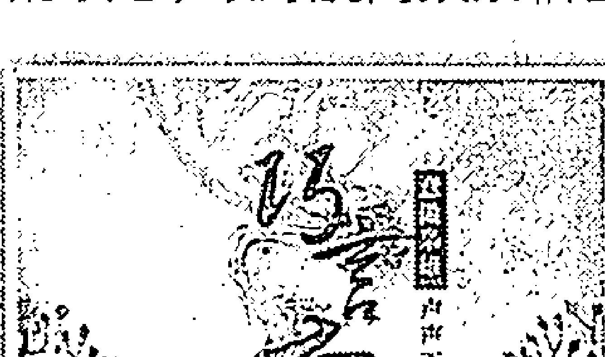

本次演讲大赛的主题是“巧言夺天下”，我将这句话分解为三部分。

第一部分是“巧言”。何人能巧言博众心？这也是主持人大赛的精髓。我联想到中国传统文化中的禅，并试图在设计中融入禅的思想。

将禅与主持大赛挂上联系？这看起来风马牛不相及，然而细究却有关联。

禅虽然看上去意蕴深广，妙不可言，每个禅者都有着一个感性游说理性的生活态度。然而，禅者往往寥寥数语，闻者却能顿悟、生禅意。这与主持工作有点类似，一个优秀的主持人能把信息流畅地表达出来是远远不够的，如果把自我的表达超脱于本身之意，那么此时此刻顿生禅意。很多知名主持人，他们主持的精到之处不在闻声，而在深深敲进观众心中的道理，并深深感染着当下的时代。

最终我在初赛的海报里就融入了禅的思想，在海报的两侧放了两个树下禅者，意义就是两人一言一语却是一个盛世天下。这样也把主题转到了别的思想层次，也烘托了“巧言”的重要性。

第二部分是“夺”。夺字不一定要用金戈铁马、战场来体现，这样略显粗犷，和禅也不是很呼应，所以我选择了用象棋的元素来表达这一点，将海报的底部融入象棋棋盘元素，与“夺”字呼应。

第三部分是“天下”。这是一个很霸气的词语。我用的是水墨龙做标题的衬底，把标题也做得很有张力，就这样整体的元素就确定了。

第二张海报的主题在承接了第一张海报原有意义的基础上，着重突出了主持人本身的特质，在已经通过层层筛选的胜者中怎样能选出精英中的精英？因此我在话筒的形式美感上做了很多功夫来暗喻精英之精（图2）。

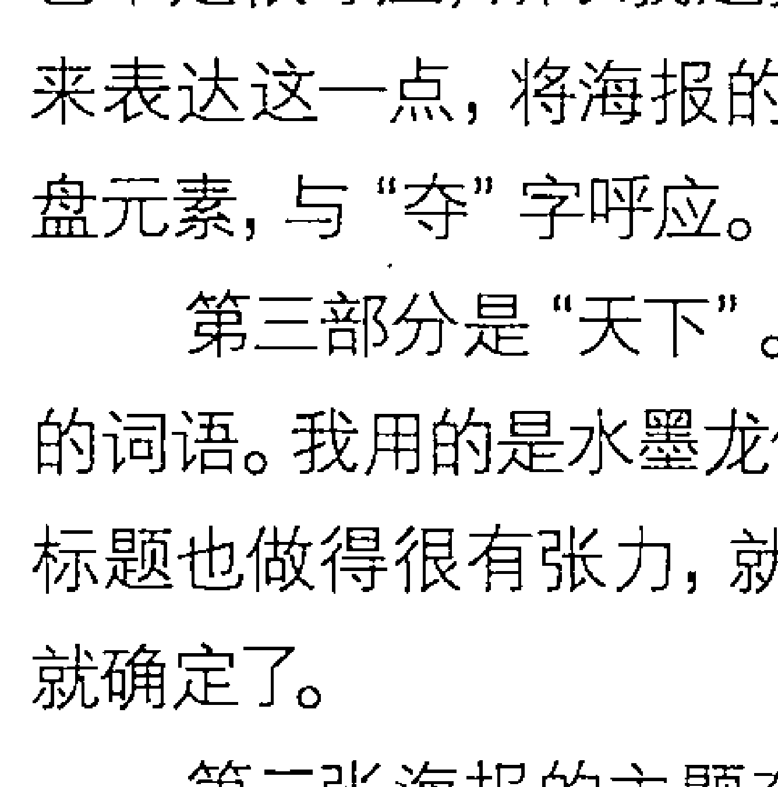

## “搭”元素 “精”版式

定完海报设计的主题后，接下来就要想如何在文字、图形等创意的基础上，选择和创造最佳组合表现形式的视觉传达语言？这是一张海报制作的重头戏。

首先要做到主题和元素的突出。受众视线的快速定位是这一点的重中之重。

第一张海报中的禅者、棋盘、印章都是偏静感觉的元素，那么要想让主题在元素中脱颖而出，就要以静衬动，将主标题做得生动大气，这种视觉上的反差感是突出主题的杀手锏。为了突出主持人大赛的性质，我在标题左下角加了一个图形是话筒的中国传统印章，这样比赛的思想和性质就一目了然。

一目了然。

第二张决赛的海报，我用Illustrator做出了一个偏装饰感的话筒，体现了决赛的庄重并富有观赏性的特点。标题也做了风格的转换，偏稳重流畅的感觉，旨在映射主持人大赛胜者所具备的基本要求。在字体的图层样式上不建议做过多的变化，这个也在一个度的掌握，过多的样式堆积会显得肤浅不自然。可以加一些质感的处理，要理性地添加，要符合整体的风格，在其他的元素和文字上也要有呼应，建议平时多多收集网上一些高端的图层样式保存下来，既方便又有效果。

盲目地添加会显得突兀不美观。其他元素整体要符合中国风格，搭配上也要灵活。例如第一张海报的棋盘元素，如果直接将原图放上去，纵横交错的线会破坏构图，很凌乱。我把它做了地面角度的变形，这样既有空间层次感又不会破坏主体信息。元素的色彩关系上也要多加思考。最好要有色调感，再用其他色相的颜色做点缀，颜色种类根据海报形式而定，偏活力的可以多一些，但是不要乱加，也要考虑元素的色相、明度和纯度，这三点调和好才是一个美的海报。

其次要把排版做到严谨精致。海报制作中的主要信息和次要信息的位置、面积都要提前做好草稿（图3）。

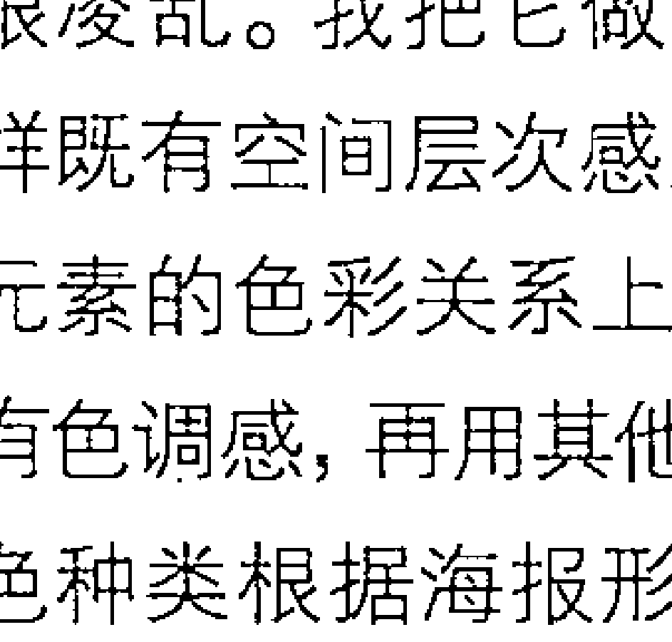

散乱的信息最好要合成一个整体，有大块有小块，在主要位置次要位置有条理地排列，这样形成的视觉流程才会让读者接受。

例如第一张海报，上方主体信息占了整个2/3的面积，比较醒目，一眼就能看出活动性质和内容。下方传达的时间地点即为次要信息，琐碎且繁杂，需要分成两个节段，排版时整体中心对称，每一节两端对齐，这样的好处就是稳定严谨，活泼又不失端庄。字体种类整篇海报最好在三种左右，太多会太花哨没有整体感，太少会太死板不丰富。

## 结束语

一个海报的价值并不在于制作流程有多复杂，而在于它的内外是否一样耐人寻味，是否脱离了往常重复的理念并创造新的思维。

之所以那些国内外知名的海报如此成功，是因为精致的版式和传达出的独到观念赚足了路人的回头率。我们制作海报时不仅仅是在模糊的概念里强硬地把信息拼凑，而是反复斟酌对比，把自己的见解更好地融入到海报当中去，把版式协调好，那么海报的设计就真的没有什么难度了。

（作者为四川美术学院大一在读生，该校学生会宣传部部长。）

# 制作方法小贴士：字体变形

第二张决赛海报的主标题是通过字体变形实现的，那么如何能在原有字体上创作出新的字体呢？下面我来和大家分享一下这个小方法吧。

用文字工具分别打出“巧言夺天下”，字体是华文隶书。最好是一个字一个图层，这样方便后面的位置调整。将这些字的图层全选，然后按Ctrl+G合成一个组并重命名，合并组是一个好的捷径，在多图层的海报中会很方便地寻找到想要的图层（图4）。


先以“巧”字为例，在“巧”的图层上点鼠标右键，再点“转化为形状”。这样“巧”字图层就由文字图层转化为形状图层了（图5）。


在工具栏点“形状选择工具”，然后在图像编辑区里点“巧”字（要点“巧”字的边缘线）。这时巧字的边缘就会有很多路径点包围着（图6～9）。


按住Shift在想要变形的区域拉出一个框，这时候被拉的区域的路径点就由空心变成实心。然后就可以在实心点上进行自己想要的变形（按住鼠标左键拖拽）。

其他的字依次用这种方法，调整出自己想要的形状即可。然后再加一个浮雕效果调一下参数就完成了（图10）。


（文|吴卓）

# 让XP也拥有“库”

Win7中由于引进了“库”，可以将本地或局域网中的文件添加到“库”，把文件收藏起来。

在Windows XP时代，文件管理的主要形式是以用户的个人意愿，用文件夹的形式作为基础分类进行存放，然后再按照文件类型进行细化。

而在Win7中，由于引进了“库”，文件管理更方便，可以把本地或局域网中的文件添加到“库”，把文件收藏起来。因为对于使用者来说，常用的文件夹数量其实很有限，将其分门别类地放进库中，无疑会大大提高访问速度。

但是，对于“古老”的Windows XP来说，却没有提供库功能。你如果想快速访问文件夹的话，只能在桌面上为其创建一堆“丑陋”的快捷方式，而这会将你的桌面搞得凌乱不堪。能否在Windows XP中也能实现美观实用的库功能呢？借助于Right Click Enhancer这款小巧的软件，就可以在我的电脑窗口中创建XP版的文件库。

下载地址：http://rbsoft.weebly.com/uploads/4/8/3/7/4837537/right_click_enhancer.exe

在Right Click Enhancer主窗口中点击My Computer Manager按钮，在弹出窗口工具栏的Mode（模式）列表中选择Advance（高级）项，激活高级配置模式。点击工具栏上的第二个按钮，可以在“我的电脑”窗口中添加文件夹快捷方式。在弹出窗口中的Name（名字）栏中输入该快捷方式名称，在Path（路径）栏中点击Browse（浏览）按钮，选择目标文件夹。在Icon（图标）栏中可以为该快捷方式选择图标。点击Add（增加）按钮，将其添加到“我的电脑”窗口中。

这样，一个文件库就建立起来了。可以看出，这里所说的文件库实际上就是一个特殊的文件夹快捷方式，和普通的快捷方式不同，这种快捷方式可以在“我的电脑”窗口中“安家”。实际上，点击工具栏上的第一个按钮，还可以在“我的电脑”窗口中创建程序快捷图标。按照上述方法，可以在“我的电脑”窗口添加任意多个文件夹快捷方式。之后当打开“我的电脑”窗口，在系统盘符下方的“其它”栏中就会显示你创建的文件夹图标。

双击其中某个文件夹图标，就可以快速进入目标路径了。和Windows 7的“库”相比，你无法随意更改这些文件夹的真实路径。如果想删除旧的文件库，可以在目标文件夹图标的右键菜单上点击Delete（删除）按钮，即可让其从“我的电脑”窗口中消失。注意，如果安装有杀毒软件的话，在执行上述操作时，可能会出现注册表关键组件被修改的提示，对此你不必担心。

（文|郭建伟）

# 黄金周怎样畅游东南亚

0元游曼谷，45元飞新加坡……这样的机票价格是不是难以置信？更别说在4、5月份这样的旅游旺季了。穷游达人小黄却用这样的超低价机票畅游了整个东南亚。

又来到了4、5月份的黄金旅游季，是不是早就想出去旅游了？不过黄金周昂贵的票价却令很多人望而却步。小黄却总是能订到特价机票，甭管五一、十一还是暑期，照样潇潇洒洒上路！背包客小黄自称穷游达人，所谓穷游，机票一定要超级便宜！像1元钱可从海口至深圳，45元可从广州至新加坡，新加坡飞曼谷只要几块钱，国内飞澳洲也不过千元，听上去难以置信有木有？下面就听小黄细细道来他的淘票经。

够大，多以秒杀为主，特别是出国机票，价格上没有太大优势。

需要注意的是，因为是廉价航空，各方面都要节省，所以通常会选择运营成本低的城市。比如亚航，只开通了杭州、天津的航线，而不是上海、北京的航线，因为北京、上海的机场租赁费贵。对于有2个以上机场的大城市，廉价航空通常选择运营费便宜的机场。

小黄说，平时一定要多留意这些航空网站的促销信息，他提供了3种方法，一是直接登录官网查看，二是在官网选择“邮件通知”服务，此外还可以关注这些航空公司的微博。

## 锁定廉价航空公司

小黄说，要想买到便宜的票价，一定要多留意廉价航空公司的打折信息。大家较熟悉的廉价航空有JetStar捷星、TigerAir虎航、AsiaAir亚航、Cebu宿雾、Airberlin、easyJet、Ryanair瑞安等，它们的航线范围以东亚、南亚、澳洲为主。廉航公司经常会有机票促销，像虎航曾推出10万张1分钱机票，飞往马来西亚、泰国、中国、印尼等国家的12个城市，像0元机票等大型促销很多也来自这些公司。

除了价格低廉，这些航空公司最大的好处是放票不定期，不受国内十一之类的大假影响，就是临近春节也会有特价票放出。比如Cebu航空推出的北京飞大马的388元特价机票，有效期在5月1日到7月31日之间，完全可以黄金周出行。对比国内传统的航空公司，虽然有时也会有促销，但力度不够大，多以秒杀为主，特别是出国机票，价格上没有太大优势。

## 行程早安排

罗马不是一天能够建起来的，特价票也不是一天能够淘到的。小黄说，只锁定了这些廉航网站还不够，把握时机最为重要！淘票需要时间，越早准备把握越大。因为超级便宜，所以一定要早早预定。要知道很多游客都会盯着特价机票，先下手为强，不要等到看到Sold out的时候才扼腕叹息！

小黄是典型的“早起的鸟儿有食吃”，明年十一的特价机票他现在就已经订好了，因为提前一年购买只需要交纳税费，机票近乎免费。

一般而言，机票要提前多久订呢？小黄称，每家航空公司的情况不同，除去大小促销，一般提前1到2个月就可以了，当然，有合适的价格就及早下手吧！另外，及时得知各网站的促销信息也是必需的，通常特价机票放出不久就被抢售一空！

-   小黄总结了几大廉航网站的促销规律。

1. 亚航。亚航的优势在东南亚，特点是机票价格变化大，几天一个价。如果旅行安排得早，可多观望一段时间，时间不多了就赶紧下手。
亚航的促销规律为：每周一般有新的促销；每周五有常规促销，多为本月或者下个月的机票；每个季度一次大促销，过后有时会有第二次相同时段的较大促销，价格比大促稍高；新航线开航时会有促销。
2. Cebu航空。Cebu的优势在菲律宾，节日放大促销的机会较多，小促销一般是中午放出的。
3. 虎航。虎航的促销较少，主要针对它的会员优先放票。
4. 捷星航空。捷星的澳洲航线较有优势，促销经常有，但大促销非常少，买一送一之类的很难碰到，周五一般有促销。要注意的是，日本、澳洲、新加坡等每个站的促销时间都不一样，可根据自己的需要查询。

很多朋友可能没时间天天守在电脑旁边，针对这个问题，小黄有两个窍门。一是利用一些廉价机票的搜索网站。这些网站推出了短信提醒功能，大家可以将自己预计的出发时间、目的地和机票的预计折扣（不要订得太低）输入提醒系统，系统会在发现符合要求的机票时通过短信提醒你。需要注意的是，短信提醒有免费和收费之分。小黄常用的有去哪儿网（http://flight.qunar.com/）和酷讯网（http://jipiao.kuxun.cn/）。

另一个窍门是到一些自助游论坛上，可以看到很多的打折信息，比如E旅行网

## 附表 主要廉价航空公司

| 廉价航空公司 | 简介 | 可选城市 | 可通国家 |
| :--- | :--- | :--- | :--- |
| 虎航<br>http://www.tigerairways.com | 全称欣丰虎航私人有限公司，俗称老虎航空，是一个新加坡的廉价航空公司 | 海口、深圳、广州、香港、澳门 | 东南亚国家和澳洲 |
| 捷星航空<br>http://www.jetstar.com/sg/zh/home | 澳洲航空旗下的一家廉价航空公司 | 北京、宁波、广州、杭州（上海）、汕头、海口、香港 | 东南亚国家、澳洲、新西兰 |
| Cebu航空<br>http://www.cebupacificair.com/ | 宿雾航空，也叫宿雾太平洋航空，是一家菲律宾的廉价航空公司，总部在宿雾 | 北京、上海，广州、厦门、香港、澳门 | 菲律宾、泰国等东南亚国家 |
| 亚航<br>http://www.airasia.com/cn/zh/home.page | 马来西亚的一家廉价航空公司 | 天津、杭州、广州、成都、桂林、深圳、香港、澳门、重庆 | 东南亚国家、澳洲、英国 |

# E 达人

(http://www.elvxing.net/forum.php)的廉价航空版块以及亚洲廉航网(http://www.airasia.com/cn/zh/home.html), 都可以看到不少促销信息。

## 小提示

由于特价机票大多通过网上银行付款，网购机票时最好准备一张信用卡、网银或者类似支付宝的账号(如财付通和百度的支付系统等)。支付时要注意汇率的问题。如果支付时选择人民币支付，实际结算时一般要转换为美元结算，这样通常会涉及到2次货币转换，会收取一定的费用。为了减少损失，大家最好直接选择美元结算。

廉价航空机票虽然便宜，但正所谓天下没有免费的晚餐，有时要为这个便宜而付出一些代价，比如飞机上可能不提供餐饮，可能晚点，服务可能打折等。一般而言，廉价航空除了坐飞机是便宜的，其余的服务都是要收费的。

小黄说，可以说任何一家廉价航空公司都有弊端，但用别人十分之一甚至更低的钱买机票，自然服务就只有那么多，也没什么好抱怨的。

(文|乐桐霖)

# 为你的整轨音乐打造CUE

想必各类音乐党们对整轨音乐文件不陌生吧，如果没有它，我们无法知道每首单曲的名字、信息，甚至连每首单曲的开始时间都会把你弄得晕头转向。

PERFORMER "Avril Lavigne" //单曲歌手或艺术家
INDEX 01 00:00:00 //这首歌曲的开始时间
TRACK 02 AUDIO
TITLE "innocence"
PERFORMER "Avril Lavigne"
INDEX 00 04:00:46 //上一首歌结束时间(00指上一首歌曲), 用于相邻两条音轨有空白部分的情况, 如没有则可忽略
INDEX 01 04:02:32 //空白后, 这首歌的开始时间(01指当前这首歌)
TRACK 03 AUDIO
TITLE "my happy ending"
PERFORMER "Avril Lavigne"
INDEX 01 08:04:22
TRACK 04 AUDIO
TITLE "Nobody's Home"
PERFORMER "Avril Lavigne"
INDEX 01 12:22:27

藏了一个工具，下面拿出工具CreateCUE制作一个吧。不过这款软件原本的用途是对多个分轨音乐制作CUE，因此有些功能并不适合，所幸的是我们只需要它代劳繁琐的代码就够了。

## 手动打造CUE文件

CUE文件正是为解决这类问题而诞生的，它记录每首歌的播放信息，使得播放器能正确定位每首歌，同时你也能知道每首歌的歌名。由此CUE文件也成为了整轨音乐不可缺少的一部分，没有它就如同一本书没有目录，让人欲哭无泪。如果你有多首歌曲或某位歌星的专辑，想自己动手打造一个CUE文件，该如何操作呢？

首先咱们用记事本打开一个CUE来透彻了解一下文件的结构。
PERFORMER "Avril Lavigne" //专辑歌手或艺术家名字，一般有单个曲目歌手名字后，不需要整张专辑歌手的名字了，就像此处是可有可无的
TITLE "个人收藏" //专辑名字
FILE "个人收藏.ape" WAVE //文件名，后缀尽量加上
TRACK 01 AUDIO //01是音轨的序列，就是第几首歌
TITLE " I Will Be" //单曲曲名

有时我们还会看到REM XXXXXXXXXX这么一段，它只是注释语句，属于非执行语句，后面随便写什么都可以。

从左边打开整轨音乐文件，接下来在界面中间填好艺术家和专辑后点预览CUE，我们可以看到软件已经生成了一首歌的CUE代码，剩下的有几首歌就复制几遍代码，然后把歌曲对应的名字(TITLE)、歌手(PERFORMER)、音轨号(TRACK)和时间(INDEX)改一改就可以了。注意如果两首歌之间有空段，那要在空段后面那首歌的代码中手工加入“INDEX 00 上首歌的结束时间”，具体参考上面的代码分析。

## 制作CUE 软件来帮忙

现在代码解决了，但是问题又来了：如何找出手头这个整轨音乐文件的每首歌的开始和结束时间呢？这时候就该大神出场了。没错，大神就是传说中的GoldWave(下载地址：http://www.onlinedown.net/soft/5236.htm)。我们用GoldWave载入文件，可以看到，GoldWave可以根据波纹、声音找出歌曲的开始和结束时间。最后将这些数据依次替换原CUE中的时间，点击生成CUE就大功告成了，注意不要忘了CUE文件的命名规则：整轨音乐文件名.cue。

你说看不懂，写不来？好吧，其实我私

(文|高路遥)

# 杜绝IE自动下载的安全隐患

很多时候，由于病毒或木马程序的原因，即使没有得到用户的允许，IE也可能从网页自动下载并安装相关的程序，严重性不言而喻。其实，只要对系统策略进行简单的设置，即可杜绝IE自动下载文件的安全隐患。

以管理员权限的级别登录系统，打开“运行”对话框，输入gpedit.msc命令，打开本地组策略编辑器窗口，在左侧窗格依次选择“用户配置→管理模板→Windows组件→Internet Explorer→安全功能→限制文件下载”，在右侧窗格选择“Internet Explorer进程”，双击打开Internet Explorer进程对话框，在这里选择“已启用”，确认之后依次退出。

完成上述设置之后，IE浏览器将限制任何文件执行自动下载的操作，只有得到用户的允许之后才可以进行下载，很方便吧？

(文|王志军)

# 低价竞拍的秘诀

网上商城出售的商品价格本来就不高，而我的朋友能以比一半还低的价格买到自己心仪的商品。秘密何在？

小提示作为一个参拍者，你尽量不要主动频繁出价，那样其实对你自己也不利。好的耐心和坐观其变也是考验你参拍心态的一个标准。

京东商城原价589元一台的纽曼MP5，在促销降价90元之后，同事小李还嫌太贵，他有一个梦想，用不高于250元的价格弄一台回来。终于，他以230元的价格搞定了一桩买卖。如此廉价，秘密何在？

## 时段选择 勿挤

参与拍卖的时段选择非常重要。我们从本案例的截图可以看到，我的这位同事拍得的这件商品，拍卖时间正好是大家中午下班吃饭的时间，能有这么低的成交价，除了他竞争有方外，不能不说与占据“天时”——竞争不激烈的时段有关。

## 加价幅度 宜小

原来，同事的“宝贝”是从京东商城通过竞拍的方式“拍”来的。我也曾在京东竞拍过物品，但从来没有这么低价成交过。我想，这其中一定有奥妙，于是经过打听，同事终于道出了原委——

参与京东这样的网上电子竞卖的人多数是公司、家庭或学校有文化的顾客，大家的空闲时间可能晚上会更多一些。如果有两件一模一样的商品，一件在中午11点开拍1点结束，一件在晚上7点开拍9点结束，你想想你该参与哪场拍卖？很明显，晚上那场竞争更激烈，因为中午那个时间段人们正忙着准备吃饭或休息，而晚上那个时段正好是吃完饭上网溜达的时段，激烈程度可想而知。

从同事参拍的这个案例可以看出，人们加价基本守着循序渐进的规则，没有出现太狂妄的拍客或太过分的举动，我的同事更是如此，显然，他不是靠疯狂加价压倒对手的。加价也是有学问的。

在京东商城购买东西，你若不在意有人摸过，又想省下一大把人民币，不妨先不要急着下单，到拍卖区看看有没有这款产品，也许一次参拍的机会，就会给你省下一半的银子。京东商城拍卖频道的名字叫做“夺宝岛”，你可以通过京东页面顶栏点击进入，也可以直接用网址auction.360buy.com进入。

显然，我同事选择中午时段参与竞拍是再合适不过的了。如果放在晚上，在这长达两个小时的角逐中，如参与的人很多，可能早就有不耐烦的人把价格提得高高的了。

每次出价，加价多少才合适？这虽然说在系统限定范围内你有自己的自由，但加价差额大会扰乱市场，对所有人都不利。你尽可能在系统“最低加价”的基础上加价，不要太过份。疯狂加价不但对你自己不利，其实也坏了卖场的规矩。拍卖场上不要显摆你的大款“气度”。

小提示解除疑虑——批量出现的拍卖品真的很滥吗？

对于这些批量出现的拍卖品，一般来说一批产品多存在共同的毛病，比如是同一个小电容坏了或某处接口松动了等，这些隐患一旦被发现并排除，只要能用，整个机器便不成问题了。对于没有修过的新品，反而还存在这种隐患，也许你手上的机器还正是这万分之几的不合格品呢，只不过是毛病还没有发作罢了。由此看来，新买来就返修的产品，只要维修后功能一切正常，安全系数可能反而会更高。因为别人提前帮你排除了迟早会出现的问题。

小提示一个同样型号、同样市价的产品，在中午拍卖和在晚上拍卖，在晴天拍卖和在阴天拍卖，最终的效果可能大大不同。

文明加价对所有人都有利。试想，假设所有参拍的人都能达成默契，在系统允许的范围内，慢腾腾出价，慢腾腾加价，到最后，无论哪个人拍到这个“宝贝”，价格肯定不会高到哪里去。

## 出价频度 节制

从本文案例的拍卖记录可以看出，我的朋友出价绝不是很频繁的，但他却是最后的胜利者。为什么？这其中也一定有奥妙。

小提示虽然“野蛮”的加价在拍卖快结束的时候还稍微有情可原，但若在拍卖开始就出现这种情况，且中间也反复发生这种现象，只能说这场拍卖中混进了没素质的人或把钱当纸的主儿，这时，劝你尽早退场，不要和他们浪费时间。

出价的频度是影响竞争激烈程度的一个很关键因素。不管参与的人多少，如果有一个人或几个人在系统规定的可出价时间范围内频繁出价，这肯定会加剧竞争的激烈程度。竞争越激烈，出价越频繁，最后导致的结果就是拍卖价格的不断提升。其实这也是所有参与拍卖的人所不想见到的，不断出价只是为了压倒对手，却也在无形中为“宝贝”的最后定价加了一“码”。

夺宝岛商品的来源大致有以下三类：

- 1. 未使用的商品：拍照失真、客户误购退货，或仅商品外包装破损留存仓库存销售等情况，仅仅是原装封条打开。
- 2. 使用过的商品：使用过一段时间，产品功能完好，产品外观可能有少许瑕疵，比如轻微划伤、变形等。
- 3. 维修过的商品：产品曾经有质量问题，经过授权维修商维修，产品功能正常。

## 最后冲刺 疾速

同事透露，这最后的冲刺是至关重要的一步。如果这一步做不好，前面做得再好、再有耐心，到头来可能还是前功尽弃。他的成拍也得益于最后冲刺的技能。

拍卖品的具体情况在拍卖单品信息页面的说明中都有详细介绍。

一场拍卖，能熬到最后并决定继续出价很不容易。因为到最后，可能“宝贝”的价格早已超出你先前提料的价格。而也有时候为了和竞争对手赌那么一口气，你不得不违心以高出自己心理底线的价格再次出价。

# 玩转主题包 美化不走寻常路

系统美化是个老生常谈的话题，我们经常会看到将系统模拟成苹果或者高版本系统的文章，方法大多是使用第三方软件，虽然简单，但却不是最完美的方案。

第三方软件通常会对系统进行深度修改，可能导致系统不稳定，某些来路不明的美化软件甚至暗含流氓软件，给系统带来安全隐患……今天来学一下如何自制系统主题，打造一个安全的个性化系统。

## 备足素材 让MM无处不在

系统美化的实质就是改变系统的背景图片、窗口颜色、桌面图标、鼠标指针、系统声音等，因此要用MM个性化系统，就必须准备与MM相关的个性化素材。

桌面背景当然是MM的靓照，可以用美图秀秀等软件美化修饰，调整尺寸，让其适合自己的桌面。桌面图标可以用MM的大头照，鼠标指针可以用MM的手势照片。图标和指针是不可以直接用的，必须转换成相应的格式。

打开“在线制作ICO图标、CUR光标”（http://www.utsing.com/tupian/ico.html），单击“打开图片”按钮选择MM的照片素材，然后设置图片尺寸，再保存成ICO图标或者CUR鼠标指针。系统声音当然也是让MM录制了，根据不同的场景，使用“在线录音机”（http://app.baidu.com/okrecord）录制相应系统声音，保存成wav文件。

在准备好素材之后，下面我们就让MM在系统中随处可见。登录Windows 7后，在桌面空白处右击选择“个性化”出现对话框，单击“更改桌面图标”可以用MM的大头照来替代原有的图标，同样鼠标指针也可以修改成MM的手势，单击“声音”按钮，可以将系统的各种提示音修改成MM的原声，完成后单击“保存主题”按钮。

小提示：其实Windows 7官方也提供了很多主题供我们下载使用，单击“联机获取更多主题”可登录Windows 7官网，这里有大量的主题供我们下载使用，下载后双击主题就可以应用到当前系统，非常方便。

## 他山之石 使用工具更给力

Windows 7制作主题非常简单方便，但是还不专业。要使用第三方个性主题，就要用一款秘密武器—CustoPack Tools（http://dl.dbank.com/c063j6vj0q），这是一款专业的系统主题定制软件，自定义功能非常细化，提供了大量的时尚个性主题模块供使用。

打开CustoPack Tools，单击“选择CustoPack”按钮切换界面，然后单击“下载CustoPacks”按钮打开网站，选择合适的主题模块并下载（如：愤怒的小鸟），再根据提示安装即可使用。相比于微软官网提供的主题，这里的主题内容更加丰富，包含图标、声音等，可以让系统彻底“改头换面”啦。

除了使用已有的精美主题，还可以借助CustoPack Tools自制个性化主题。单击“建立一个CustoPack”按钮，然后单击“建立一个新的包”按钮，输入名称，再选择主题类别（Windows XP、Windows Vista或Windows 7），单击“创建项目”按钮切换界面，在这里系统主题的各个元素都可以替换，完成后切换到“包定稿”选项，单击“浏览”按钮为主题选择一个预览图像，最后单击“出口打包”按钮即可保存自制主题。

美化系统，就如同泡制美食，直接“狼吞虎咽”远没有自己做的有味道。想一想如果能自己对系统进行个性化的修饰美化，并且能将自己的成果与好友分享，让他们也用上自己的成果，这无疑才是最有成就感的事。

小提示：在网上的主题还有很多，可一一寻找又有些麻烦，“魔方美化大师”推荐了很多第三方Windows 7主题。打开魔方美化大师（http://url.cn/4Q4DZU），可对系统进行9个方面的“手术”，切换到“系统主题定制”选项，在右侧提供了大量的Win7主题资源供下载使用；对于某些需要破解的主题，下载后单击“更改主题”后的“浏览”按钮安装主题，最后单击“应用主题”按钮即可应用到系统。

（文|李峰）

（文|江苏 沈澄）

# 智斗安卓软件中流量窃贼

小张上个月刚换了摩托罗拉M870，手机系统为安卓2.3，可是不到一星期就收到短信提示50MB包月容量已经用完，害得小张再也不敢用手机上网。感觉没怎么上网，为什么流量还如此之大？原来在安卓手机中藏着不少“流量窃贼”……

## 实战1：移除钉子户 原生软件轻松移除

原因分析：对于很多使用山寨或者定制机的用户，手机原生自带的程序是流量耗费的元凶。比如很多电信定制机自带的“移动电视”，一不小心启动，视频播放顷刻就会耗费大量的流量。

解决方案：由于系统权限的限制，这些自带的程序我们无法通过常规的方法卸载。不过可借助“系统软件清道夫”先获取Root权限，然后再轻松删除这些程序。

### 具体方法：

准备好手机的驱动程序并安装在电脑上，接着在手机上依次进入“手机设置→应用程序→开发”，勾选“USB调试”。将手机连接到电脑，选择USB充电模式，确保电脑可以识别到手机。

到http://ishare.iask.sina.com.cn/f/14801145.html?from=like&retcode=0下载SuperOneClick，启动程序后单击ROOT，按提示完成手机Root的获取。

接下来，重启手机然后安装“系统软件清道夫”，切换到“系统软件”，此时程序会将所有系统自带程序列出，按提示选中“移动电视”，单击“移动到回收站”即可。

## 小提示

系统软件清道夫就类似Windows的“添加/卸载”，在我们Root手机后即可删除任意程序。对于山寨机的定制程序，如果不知道程序具体名称（比如很多是英文名称的联机游戏），选中程序后单击“联网鉴定”，联机到谷歌进行搜索，通过搜索结果来确定捆绑的程序是否为恶意程序。

## 实战2：自造长城 阻止广告网址的访问

原因分析：除了后台软件联网耗费流量外，很多广告网址也是吃流量的大户。比如很多安卓软件都会内置广告，这些广告会耗费不少的流量。

解决方案：含广告的软件有些是必备软件，不能因为有广告而整个软件都不用，怎么办？我们可以采取分而治之的方法，软件照常使用，但是软件内含广告则屏蔽之。这些嵌入的广告往往链接到独有的网址。Windows用户都知道，我们可以通过修改HOSTS的方法屏蔽恶意网址，安卓用户同样可以通过这种方法屏蔽广告网址。

### 具体方法：

如上例所示，先要获得手机Root权限，接着在手机上安装Rootexplorer.exe，启动程序后打开etc/hosts文件，然后单击Mount R/W将其加载的属性更改为可写。
点击hosts文件，选择text editor，打开hosts文件进行编辑。然后按下列的格式每个广告网址一行（格式：127.0.0.1 具体网址）添加到hosts文件中，编辑完成后保存即可。

### 常见广告网址：

- 127.0.0.1 wap.casee.cn
- 127.0.0.1 mm.admob.com
- 127.0.0.1 r.admob.com
- 127.0.0.1 gw.youmi.net
- 127.0.0.1 static.youmi.net
- 127.0.0.1 www.umeng.com
- 127.0.0.1 d.wiyun.com
- 127.0.0.1 apps.virsir.com
- 127.0.0.1 dpwnfile.m8fans.com
- 127.0.0.1 ade.wooboo.com.cn
- 127.0.0.1 static.wooboo.com.cn

这一方法还有一个另类的使用技巧，对于一些无法通过域名直接访问的服务如谷歌文件，我们可以在hosts中添加指定IP来实现直接访问。比如输入：
209.85.225.101 docs.google.com 这个可以访问谷歌文件。

## 小提示

怎么知道具体要屏蔽哪些广告网址？方法1是直接点击软件界面的广告页面，然后在打开的页面通过地址栏查看。方法2是借助AdAway自动下载，启动程序后单击“下载文件并应用广告拦截”即可自动下载并替换最新的hosts文件。

## 实战3：一劳永逸 斩断软件联网功能

原因分析：上述方法虽然可以很好地屏蔽广告网址的链接，但是新的广告商层出不穷。比如很多软件并不需要联网功能，

很多安卓软件，所有功能其实都内置在本地，但是每次使用时都会出现广告页面，平白浪费流量。

解决方案：对于这些无需联网的软件我们可以自己动手进行编译，然后将其联网权限屏蔽，即可一劳永逸。

### 具体方法：

到http://115.com/file/aqzdxurg下载APK软件编译工具，下载后将其解压到桌面备用。准备需要去除互联网连接的软件，然后启动编译程序apktool.exe，单击“选择APK文件”，选择准备好的安卓软件，然后为反编译程序选择文件保存目录，单击“反编译APK”。打开反编译程序保存目录，使用记事本打开其中的AndroidManifest.xml文件，将其中涉及到的联网代码删除并保存。

完成操作后返回反编译程序，单击“选择APK文件目录”选择上述保存AndroidManifest.xml的目录，生成APK文件目录，选择一个新的目录用于保存编译后的APK文件，单击“编译APK”完成新的APK文件的编辑。完成文件的编译后还需要对程序进行签名，单击上图的“APK签名”，然后在弹出的窗口选择上述编译好的APK文件，签名文件保存目录选择保存签名后的APK程序，单击“制作签名”。

把自己编译过的程序传输到手机上安装，在安装时就不会再显示联网、读取手机位置的选项，当然也就没有后台联网流量的消耗了。

## 小提示

对于确实需要联网的程序怎么去除广告？其实主要操作也是对安卓软件进行反编译，然后再签名安装即可，只不过反编译时屏蔽的项目不同。我们根据广告的不同，自行选择需屏蔽的项目即可。比如很多国内软件内嵌广告，需要对反编译后的classes.dex进行编辑，删除其中对应的http://中广告网址，很多国外的软件则需要对AdView文件进行编辑。不同的软件需要根据软件广告配置进行不同的编辑。

## 更多省流量绝招

技巧1：进入“程序设置”，关掉一些安卓手机后台服务，如Google的一些服务。同步联系人、同步Gmail、同步日历等也会耗费流量。

技巧2：浏览器设置节省流量，比如UC浏览器可以设置显示浏览网页时使用低彩图片节约流量。

技巧3：安卓手机都有WiFi功能，对于有无线路由器的用户，可以设置WiFi为默认网络，这样一旦联网就会优先使用免费的无线网络。有些常规软件，故意默认设置为无线网络优先，如果你没注意到这个细节，一不留神就会造成流量大增。

技巧4：常用软件设置，如关闭搜狗输入法自动升级功能。

## 小技巧

怎么测算广告耗费的流量？

如果要测算广告网址的流量消耗。我们可以先查询当前手机流量耗费并记下其值，

然后关闭所有联网程序和消耗流量的后台服务，接着启动包含广告的程序，不要进行任何联网操作，以一定时间为基准，前后两次流量消耗的差就是广告网址的实际消耗流量。不过提醒大家注意的是，虽然广告本身消耗的流量可能不多，但是很多广告链接都是下载链接，错误点击带来的流量损失是很大的，而且广告显示还会消耗手机电量。

（文|平淡）

# 突破常见 让远程服务更具活力

在日常网络管理中，远程控制软件是管理员不可缺少的好助手。很多时候，我们往往面临比较复杂的使用环境，这就要求我们深入探究远程控制的使用技巧。

## 远程控制 我“最苗条”

小刘出于工作需要，希望拥有一款体积小巧、便于携带的绿色版远控程序，体积精巧、功能实用的TrueRemote成了他的不二之选。

TrueRemote是一款绿色版软件，只包含trueremote.exe和trueremote.dll两个文件，体积只有300KB左右，堪称最“苗条”的远程软件，完全可以将其复制到优盘上使用。TrueRemote身兼服务器端和客户端程序双重“身份”，使用起来可谓简单快捷。

在服务器上运行TrueRemote，在其主窗口的Mode列表中选择ServerMode项，将其作为服务器端程序使用。在IP列表中选择本机IP地址，在Port栏中设置网络端口号（默认为5000）。在Password栏中输入认证密码。在Control列表中如果选择On项，表示允许客户端完全控制本机。点击OK按钮，TrueRemote即可潜伏在后台，等待客户机连接了。小刘不管到任何电脑上，插上优盘，运行trueremote.exe程序，在其主窗口

的Mode列表中选择ClientMode项，激活客户端程序功能。在IP栏中输入服务器地址，在Port栏中输入连接端口，点击OK按钮，就可以与远程服务器建立连接。

如果服务器端允许执行远程控制的话，小刘就可以自由执行各种控制操作。否则，就只能浏览服务器屏幕内容。当小刘想从服务器中下载文件时，在远程操作界面的TrueRemote菜单中点击Send项，选择所需的文件。之后点击Receives Files项，文件就会自动发送到客户端。

## 远程控制也能巧妙“穿墙”

大伟的公司内部组建了局域网，而大伟经常外出办事，有时很想穿越防火墙直接遥控自己的内网电脑，但一般的远程控制软件并不具备穿墙能力。当大伟找寻到Remote Utilities (简称RU) 这款独特的软件后，终于可以摆脱防火墙的束缚了。

RU分为服务器端和客户端两部分，大伟在自己的内网电脑上运行rut.server5.1en.msi，完成服务器端程序的安装操作。之后在软件窗口中点击Settings for server→Security项，在安全设置窗口的Authorization面板中选择Single password protection项，点击Change Password按钮，

设置好连接密码。

在反向连接管理窗口工具栏上点击添加按钮，在弹出窗口的Name栏中输入反向连接名称、电脑的IP地址和端口号，点击OK按钮，完成该反向连接项目的创建操作。

大伟在外网主机上安装rut.viewer5.1en.msi程序，完成客户机程序的安装操作。在RU客户端连接管理窗口中点击菜单Tools→Options项，在设置窗口的Callback面板中必须勾选Allow callback项，允许接受来自服务器的反向连接。

只要在内网主机中打开RU反向连接窗口，双击上述反向连接项目，内网主机上的RU即可向指定的外网主机发送反向连接请求。外网电脑接收到上述连接请求后，会在屏幕右下角弹出请求连接的提示，双击系统托盘中的连接请求图标，在弹出窗口中点击Accept按钮，在连接配置窗口的Name of connection栏中设置连接的名称，点击OK按钮，完成连接项目创建操作。

大伟双击该连接项目，在连接认证窗口中输入预设的连接密码，点击OK按钮，RU客户端就可以与大伟的内网主机建立连接，之后大伟就获得了内网主机的完全控制权，可以随心所欲地对内网主机“发号施令”了。

（文|郭建伟）

## 利用搜索筛选器筛选特定文件

很多时候，我们需要筛选出某一作者的相关文件，虽然可以在资源管理器界面按照“作者”进行排序，但如果需要筛选的文档遍布于各个路径，那么操作起来恐怕有一定的难度。此时可以借助Windows 7的搜索筛选器解决这一问题。

打开资源管理器，跳转到相关文件夹，单击右上角的搜索框，在弹出菜单中选择“作者: ”，输入相关作者的姓名，不需要按下回车键，即可在指定路径下搜索出符合条件的文件，可以说是相当的方便。

利用同样的方法，我们可以筛选出特定歌手、特定唱片集、特定长度的歌曲，也可以筛选出特定拍摄日期、特定类型的照片。如果没有在搜索框发现自己需要的筛选器，可以在搜索框按照“标题: 内容”的格式直接输入。

（文|王志军）

# Win8极速启动的秘密

在Win8消费者预览版发布会上，微软现场展示一部台式机的开机速度，达到了惊人的8秒！8秒，我们很多手机的开机速度都无法达到，Win8是如何做到的呢？

原来，Win8将系统内核、驱动程序和系统服务等核心数据，写入休眠文件（即C:\hiberfil.sys）中，同时将用户当前工作状态（如开着的Word文档），将Metro程序写入交换文件中（即Win8新增的C:\swapfile.sys，因为Metro程序没有关闭按钮，切换到其他程序时Metro程序会自动挂起到后台运行）。当数据全部写入完成后，Windows通知固件进行关机。这样当我们下次按下电源键时（前提是插座电源没有断开，电脑仍然在通电状态下），系统会直接通过唤醒系统内存来启动上次写入的数据，再读取休眠文件和交换文件，然后将上次关机前的状态呈现在你的面前，这就是Win8的混合启动技术（图2）。

## 传统开机流程

对于Win7系统，传统的按下电源按钮开机流程是这样的：
第一步：查找硬盘主引导记录（MBR），接着MBR读取硬盘分区表（DPT）。
第二步：找到活动主分区，读取活动主分区的分区引导记录，接着根据引导记录查找该分区根目录下的BOOTMGR。
第三步：BOOTMGR读取\boot\bcd文件并根据BCD记录列出操作系统启动菜单，接着加载winload.exe，然后通过其加载Win7内核。
第四步：加载必需的硬件和服务，进入Win7桌面。

## 极速开机的背后推手——混合启动技术

从上面的启动流程我们可以知道，第一步和第二步是操作系统启动之前的硬件读取，这和操作系统版本没有关系，对于第三步，Win8启动内核和Win7大致相同。因此Win8极速开机的秘密就在于启动的第四步（这也是整个开机过程中最耗费时间的步骤），这就是Win8新增的混合启动技术（Hybrid Boot）。

Win8引入的混合启动技术，是通过睡眠技术扩展而实现。传统的休眠是指系统自动将内存中的数据全部转存为休眠文件（即C:\hiberfil.sys）。接着会切断所有设备的供电进入休眠状态。恢复操作时系统读取上次转存到C:\hiberfil.sys文件中的数据，读取完毕即恢复原来的操作状态（图1）。

Win8的睡眠则做了进一步的改进，当我们在Win8选择睡眠关机时（单击关机菜单电源按钮即可），Win8会将系统大部分的核心系统，如驱动、系统服务等压缩写入内存，然后通过处理器将用户数据写入休眠文件。当数据全部写入完成后，Windows通知固件进行关机。这样当我们下次按下电源键时（前提是插座电源没有断开，电脑仍然在通电状态下），系统会直接通过唤醒系统内存来启动上次写入的数据，再读取休眠文件和交换文件，然后将上次关机前的状态呈现在你的面前，这就是Win8的混合启动技术（图2）。

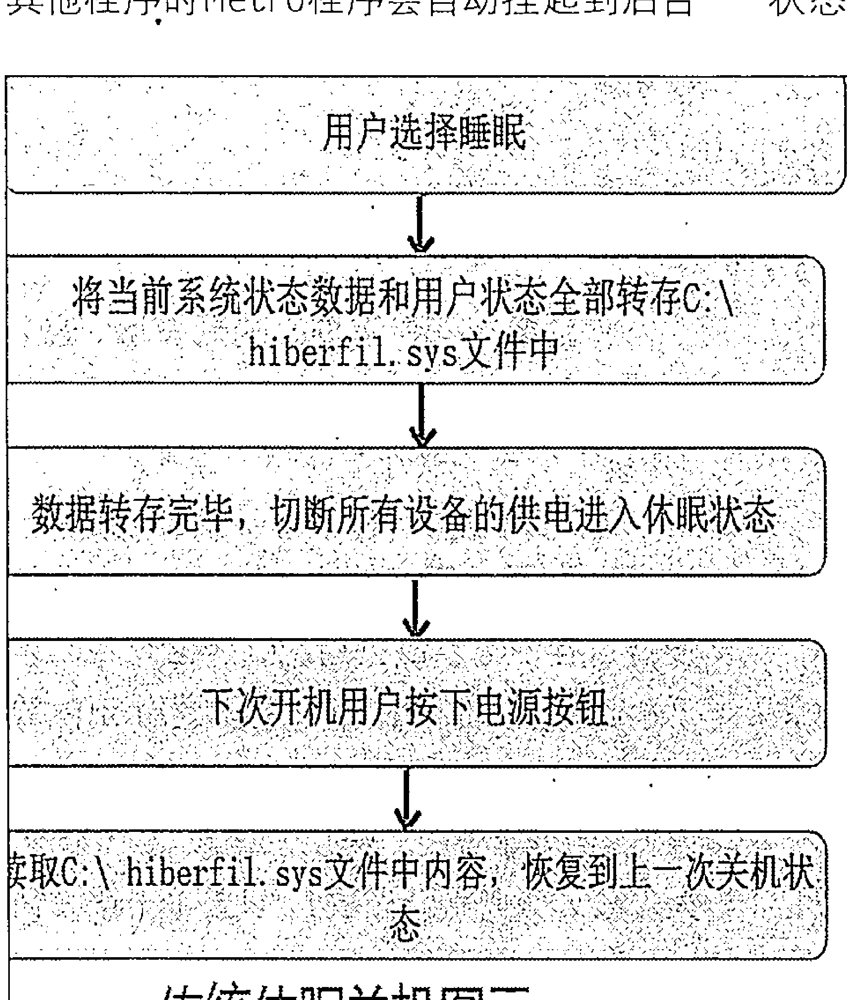

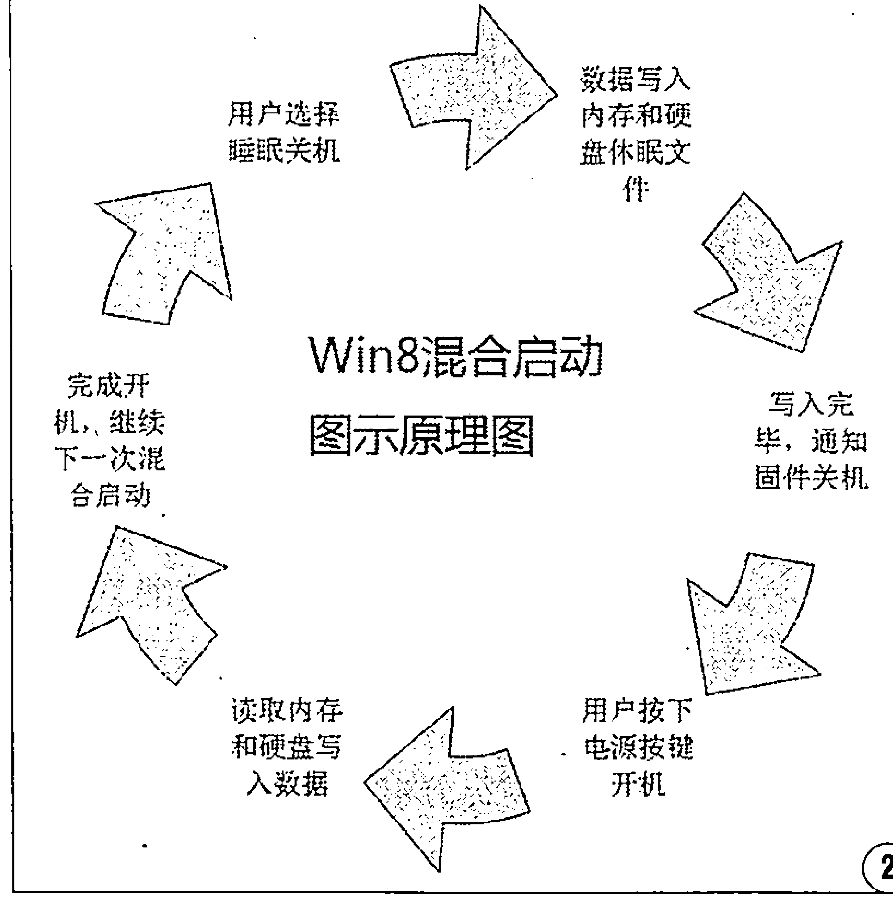

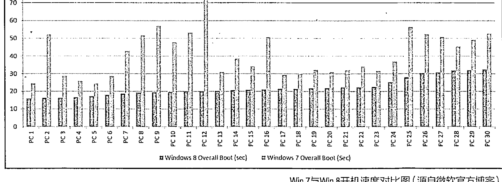

很显然，Win8混合启动的极速是依赖上一次的睡眠关机而存在的，这种新技术从上一次的关机开始就为下次开机做足了准备（省去了系统内核、硬件以及各项服务初始化所需的时间）。由于内存的读写速度很快，而其中保存的是上次已经进入系统后成功加载的数据（比如自启动的服务、加载的硬件设备），所以Win8的混合启动所花的时间实际上是“读取内存数据时间+读取休眠文件和交换文件时间”。
对于开机时间的定义大多是指按下电源键到出现桌面的时间（不包括启动用户程序所花的时间），Win8混合启动时间主要就是指读取内存数据所花的时间。由于内存的读写速度较快，因此对于配置较高的电脑，这个内存数据读取时间（8秒）是很有可能的，这也是Win8发布会上台式机8秒开机的秘密所在！

（文/俞木发）

# Win8预览版热辣体验报告

Windows 8消费者预览版终于发布了，怎样才能更安全地尝鲜Win8？Win8又有什么新特性？看看编辑部在第一时间推出的消费者预览版热辣体验报告！

## 安装篇

对于Win8的安装，其实从最早的Win8泄露版开始，杂志就做过不少的介绍了。这里我们再为读者简单总结一下，同时介绍Win8新增的安装方法。

- 1. 虚拟光驱安装。下载到的Windows 8消费者预览版是一个ISO文件，因此我们只要使用虚拟光驱加载，然后在Win7下直接激活安装即可。
- 2. 从光盘/U盘/移动硬盘启动安装。将安装映像中的文件复制到介质，并从其中启动电脑即可。
- 3. VHD安装。由于Win8支持从VHD启动，这样我们无需划定分区，只要使用VHD_OneKey即可快速安装。
- 4. 在线安装。对于网速较快的用户，到http://windows.microsoft.com/zh-CN/windows-8/download下载Win8在线安装程序，启动程序后按向导提示完成下载，下载后按提示创建ISO文件，或者使用内置工具将ISO映像转换为安装媒体（如DVD或USB可引导闪存驱动器）进行安装即可。
- 5. 虚拟软件安装。对于内存较大的用户，还可以使用Oracle VirtualBox来安装Win8，新建虚拟机后选择下载到的ISO文件作为安装介质启动安装即可。

**小提示**
VHD的位置可以是任意分区，但文件系统一定为NTFS，但要保证有足够的剩余空间（大于所设定的VHD大小），否则启动时会蓝屏。

## 体验篇

作为面向消费者推出的预览版，这个新版本和之前的开发者预览版又有什么不同，接下来我们就开始体验一番吧。

- 1. 更自动的安装体验。在安装过程中，新版Win8和之前版本最大的不同：在安装设置过程中可以设置用户账户密码找回包括手机短信和邮箱找回（前提是使用微软Live ID作为登录账户）。同时为了简化用户操作，Win8新增了“使用快速设置”（符合大多数人使用默认设置），只要单击该按钮即可快速完成设置。
- 2. 添加习惯设置。新版Win8彻底“抛弃”了“开始菜单”，进入系统后显示的是开始菜单屏，而且桌面也没有“计算机”、“我的文档”等快捷方式。对于很多Win7用户来说使用起来非常的不习惯，下面我们可以对Win8稍加改造以方便使用。
- 3. 自制“开始菜单”。对于很多Win7用户来说，他们还是习惯使用开始菜单来执行各种操作，但是Win8彻底抛弃了开始菜单，这使得我们使用起来很不方便。现在可以自己制作一个类似Win7的开始菜单。

添加常用的快捷方式到桌面：只要打开资源管理器，然后将“计算机”、“我的文档”等常用的快捷方式拖到桌面上即可。对于“命令提示符”、“运行”等常用的组件，则可以在开始菜单屏中找到组件的具体位置，然后再为其添加快捷方式。这里以添加“运行”快捷方式为例。
第1步：按微软键激活“开始菜单屏”，在开始菜单屏空白处右击，单击下方的“所有应用”，在打开的应用窗口右击“运行”组件，接着单击窗口下方的“打开文件位置”按钮。
第2步：在打开的窗口我们就可以看到“运行”组件位置，现在右击“运行”选择“发送到桌面快捷方式”，这样以后在桌面就可以快速启动“运行”组件来运行各种程序了，其他组件的添加同上。
第1步：切换到桌面，在任务栏空白处右击选择“工具栏→新建工具栏”，接着在打开的窗口选择C:\ProgramData\Microsoft\Windows\Start Menu目录作为新的工具栏。
第2步：此时在任务托盘左侧就会出现“开始菜单”工具栏，单击它即可弹出类似Win7的开始菜单，这样使用起来是不是方便多了呢。

**小提示**
单击“固定到开始菜单屏”、“固定到任务栏”即可将指定的组件添加到开始菜单屏或者任务栏上。

## 新功能篇

新版Win8和开发者预览版相比新增了不少新的功能，下面我们就简单来进行一番体验。

- 1. 应用商店。在开始菜单屏单击“应用商店”，打开“应用商店”后选择需要下载的程序进行安装即可。
- 2. 密码找回服务。如果使用Live ID作为登录账户，Win8还提供在线找回服务，这样再也不怕忘记密码了。打开“控制面板→所有控制面板项→用户账户”，单击“在电脑设置中更爱我的账户信息”，接着在打开的窗口单击“更改密码”，单击“忘记密码”，然后选择“在线修复您的问题”，连接到Windows Live网页后按提示选择邮箱或手机找回密码即可。
- 3. 在线服务：Win8社交化服务时期一大亮点，在系统中集成MSN、SkyDrive、漫游配置等在线服务，前者可以非常方便地让我们在系统中接收和发送MSN信息，后者则可以直接使用在线存储和漫游配置等功能，比如可以在其他Win8电脑上传用户配置，在登录电脑上就可以使用原来的个人设置。

**小提示**
Win8将关机菜单隐藏得很深，默认情况下我们只有将鼠标移动到桌面右上角，然后在弹出的窗口单击设置图标，接着在弹出窗口单击电源，最后选择关机即可。单击“电源”，在弹出的菜单才能选择“关机”或“重启”。如果要快速地关机，我们还可以在电源设置中设置按下电脑的电源按钮关机。

# 写在最后

这次微软发布的是消费者预览版，应该说这个版本是基本定型的Win8。经过几天的试用，笔者感受最深的就是“颠覆”。

从外观上看，Win8的UI设计颠覆了以往我们对Windows的认识，Metro界面的设计让系统看上去十分酷炫。不管是登录界面、开始菜单屏还是资源管理器界面都“Metro”味十足。不过虽然界面漂亮了，但是“开始菜单”的彻底消失却让很多新手不知所措（甚至很多新手不知道怎么关机），所有的界面几乎都是为触屏操作而设计，这也让很多习惯鼠标、键盘操作的朋友无法适应。

从内在设计上看，Win8的网络化、社交化应用“颠覆”了传统的“在线”应用，这也是Win8的一个新亮点。不管是登录账户的Live ID，还是登录后的原生支持SkyDrive、账户配置漫游、Fackbook扩展应用、应用商店，这些无不体现Win8的网络化、社交化应用。随着互联网网速的提升和社交化网站应用日益深入人心，应该说Win8的在线应用是与时俱进的。（文|俞木发）

# 创意简历 从形式到内涵

每年就业季的一道风景就是海投族们，他们制作一份简历，投给无数用人单位，千篇一律的简历能够脱颖而出的压力越来越大，创意简历呼之欲出。

# 创意简历的三个标准

这份简历在网络上发布后，就吸引了无数眼球，大家都觉得地铁线式设计和精细的排版，让这份简历具备了过目不忘的能力，哪个单位的HR不愿意多看一眼这样的简历呢（图1）？

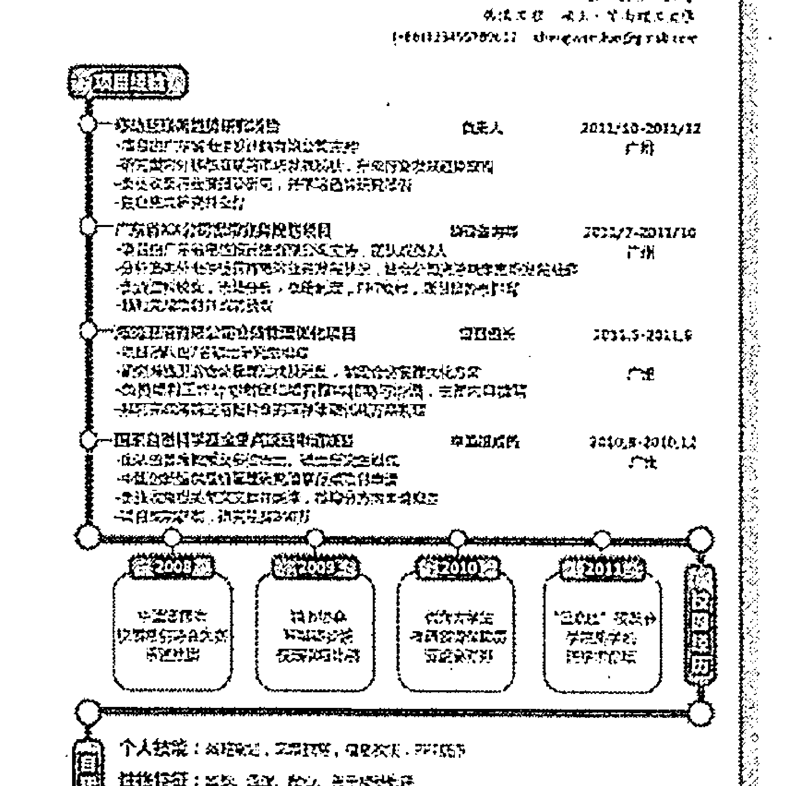

这份简历非常好地体现了一个有创意的简历所具备的三个标准：

- 1. 版式新颖：千篇一律的简历让HR的眼球饱受折磨，如果出现一份一眼看过去就经过精心设计的简历，就大大提高了简历被HR关注的概率。
- 2. 重点突出：对企业的HR而言，关心简历的内容胜过简历的设计，毕竟绝大部分工作对设计的要求并不高。这份简历优先突出自己的项目经验，就非常明智。任何企业的HR都会特别留意一个人的经历是否和自己招聘岗位的匹配性。
- 3. 文案简洁：简历的通病是文字不简洁，充满大量没有实际意义的描述语，这份简历文案显然经过详细提炼，只突出最有价值的关键词、点睛语，没有无意义的废话，使文字的可读性大大提升。

大致了解什么是创意简历之后，我想谈谈如何制作一份创意简历。首先创意简历并非万能，一般而言在营销策划、广告媒体、平面设计等行业或者岗位上，创意总是深受欢迎，但是如果是党政机关，金融会计这样的行业或职业，简历太有创意未必能够加分，而且很多企业只接受固定格式的简历，排版太有创意的简历往往难以发送成功。其次简历的创意并非仅仅是版式的变化，文案的提炼也是关键，所以在版式难以创新的情况下，想办法提升文案的质量，一样是有创意的简历。

## 版式创意抓眼球

现在先说说简历版式的创意，在我收到的近百份优秀的PPT投稿中，简历版式创意一般有三种。1.强化页面的美化修饰元素。比如改变字体的大小和颜色，为标题位增加线条引导的变化，改变背景的颜色，有意识注意行列的对齐制造统一版式的感觉。图2所示的简历就是这样的代表，通过页面美化修饰，让自己的简历可读性大大提高。

增加页面美化修饰元素是否成功的一个判断标准就是，假如美化修饰让你优先看到的是简历的重点内容，那就是成功的，如果让你注意到的是美化修饰元素本身，那就是失败的。

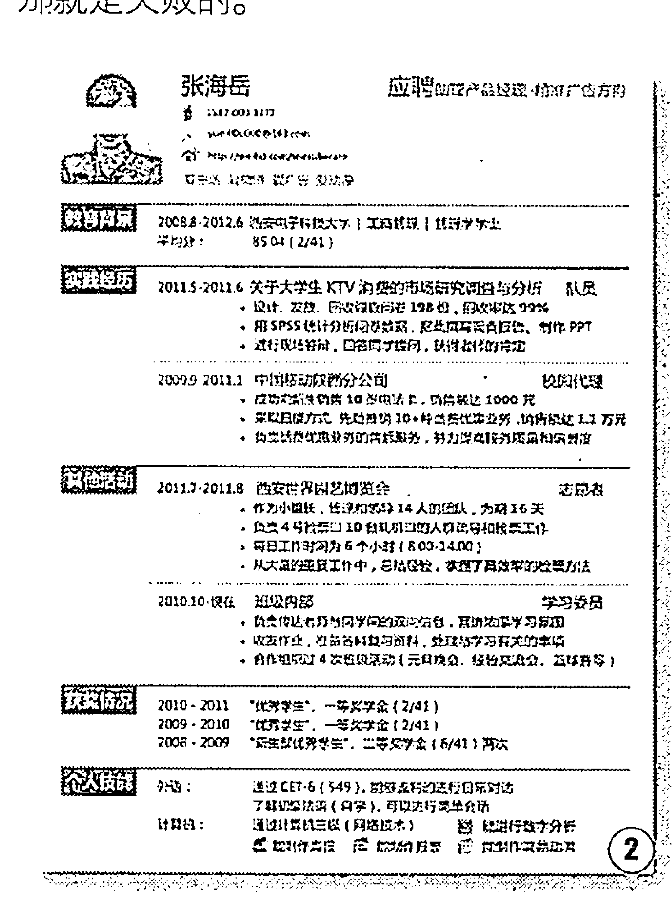

这样的设计灵感你多注意杂志平面设计排版，可以借鉴到很多的灵感。2.借鉴企业或行业的设计元素。假如你应聘互联网企业，设计一份具有互联网企业要素的简历，让企业HR优先关注的概率就会大大提高。图3是一位大学生朋友应聘小米手机的创意简历，他把小米手机的设计元素（比如版式、配色、Logo、小图标）巧妙融入自己的简历中，这样的简历就容易让对应企业的HR产生亲切感。这份简历同时高仿豆瓣网站的页面排版，这种网站页面设计往往经过精心考虑，放在简历上即可以让普通人做出自己难以达到的设计感简历，同时遇到类似社区爱好者的HR，会制造出情感共鸣的愉悦感。在海投简历的时代，能多做一点努力，让HR有一点点对你与众不同，真的很重要。

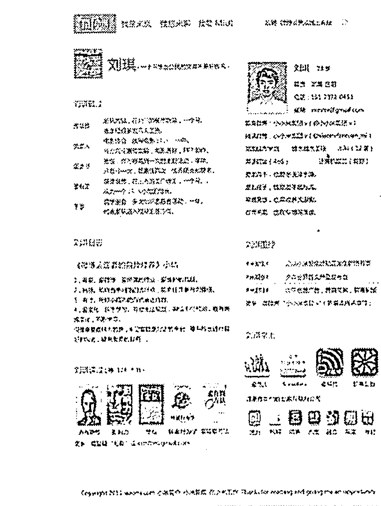

## 3.把自己的经历信息图表化。

信息图表是现在最流行的视觉化表达手段，能充分展示一个人归纳提炼展示和设计的全方位能力，在移动互联网的大数据时代，从碎片化信息里找到数据的规律，这是非常不容易的。

图4的简历就是一份信息图表简历，作者把自己掌握的技能、经历全部用各种图表来表达，整体上又非常有设计感，的确是非常有才华的青年。

所谓信息图表，就是把文字里面的信息找到某种形式的逻辑联系，比如总分关系、比例关系、包含关系、时间轴、地点线，然后用某种图表化方式加以设计实现，用图表能够表达复杂关系的优势，在最小的页面内展示最大量的信息，不过这样的图表式简历，往往要求简历制作者必须有一些拿得出手的资历，没有干货，编出来的信息图表也是干瘪空洞无说服力的。

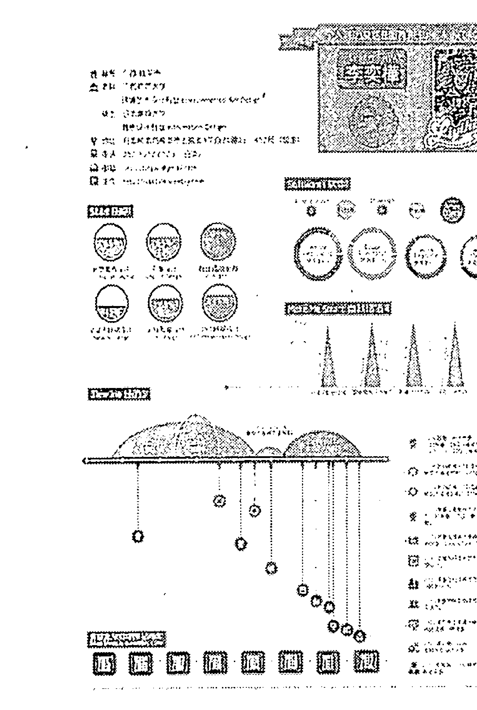

图5：一份个人简历表格，包含姓名、性别、出生年月、联系电话、邮箱、求职意向、教育背景、工作经历、项目经验、技能证书、自我评价等模块，采用传统表格布局。

## 文案创意显内涵

对于以上的创意简历，对求职者设计功底或某些方面的知识面还是有一定的要求，绝大部分可能都难以胜任，但是简历的版式只能解决抓眼球的问题，简历的文案才能体现你的内涵，所以对于设计能力一下子难以提升的朋友，不妨考虑在文案上动脑筋。

简历里的文案创意，最重要的莫过于提炼点睛的标题，大部分人的简历标题是没有意义的“教育经历、社会实践、个人技能”，为什么不考虑写一个能够描述你可以为企业带来什么的标题呢？

比如可以尝试不写“教育经历”，可以写“专业知识”，那么与其陈列你的课程或者分数，不如展示你学了哪些专业方向的内容；又比如不要写“社会实践”，写“独立完成某某项目某某工作”，这样更容易让用人单位理解你的实际贡献。

对于工作技能，文案应该追求平实客观，让别人可以评估，比如写“本人熟练掌握OFFICES软件操作”就不如“能够应用Word完成毕业论文、社团活动策划书的文字排版”，这样的话语更让人理解你的操作水平。

图6：另一份个人简历表格，同样包含个人基本信息、教育背景、工作经历、项目经验、技能特长、自我评价等模块，但排版更注重层级和视觉引导。

图5、图6的两份简历主要是对文案的修改，在构思上的特点是采取分级文案的形式，第一级文案兼顾习惯，第二级文案细化一级标题，通过二级标题展示自己各方面的能力，从而更加全面展示自己的特点，而且利用一级标题之间的留白让阅读变得更轻松，是很值得借鉴的文案提炼办法。

文案的创意也是无穷无尽的，比如中英文结合加上设计变化，文案也可以排出别样的精彩，比如下面这份简历（图7）。

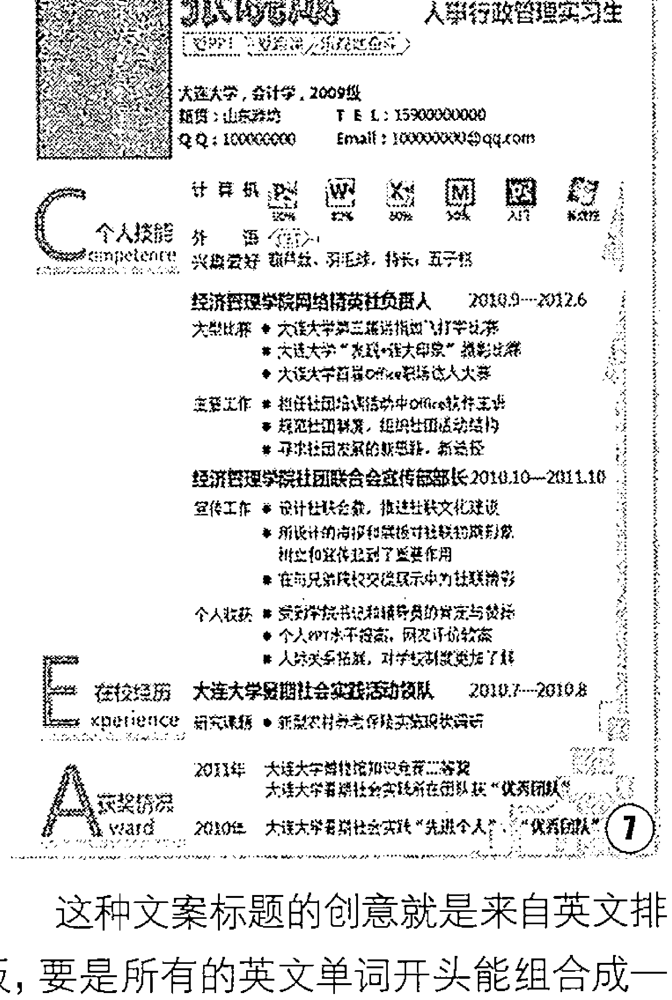

这种文案标题的创意就是来自英文排版，要是所有的英文单词开头能组合成一个有趣的英文单词，这样的创意也许能大大地出彩呢！

（文|秋叶）

# 走近低价竞拍网站

6.02元购得苹果The new iPad, 7.66元买到三星GALAXY Tab P7500平板电脑……这些看似不可思议的成交记录都来自竞拍网站。下面就让我们一探低价竞拍网站的究竟。

## 网络竞拍的流程

竞拍这种独特的网络购物形式，对广大网友来说可谓既陌生又熟悉。之前电视、报纸上就有类似竞拍的广告，只是现在将其移植到网上，拍卖的流程也更透明一些。

网络竞拍是在美国兴起的一种电子商务模式，它的最大优势是将原本贵族化的交易方式，利用互联网的特点，变成了平民交易。不管是谁，无论在哪里，只要可以上网就能参加网络竞拍，并且可以随时成交。在国外，有Bid Cactus、bidblink.com等折扣竞拍模式的网站。到了国内后中国电商做了很多改进，近年来，随着竞拍网站的不断崛起，也涌现了不少新奇的形式。

与传统购物网站不同的是，很多低价竞拍网站的商品是0元起价，想要参与竞拍，先要花些小钱购买网站的出价点卡（一般1元可购买1点）。用户每次喊价，商品售价增加约1分钱，但出一次价需要付出一定金额的点卡（一般为1~2元），如果10秒之内没有再加价者，那么商品就将出售给最后一位出价的竞拍者，这是低价竞拍网站的普遍形式。

很多网站在此基础上做了不同程度的改进，比如如果未能成功拍得商品，可在竞拍结束后通过保价获得该商品，不浪费竞拍过程中消耗的点数，补清差价即可。有些网站限制了最高抢拍价格。还有些网站规定，距商品限价5元之内，不能手动出价，只能自动出价，加价是随机的，如超过最高限价将会爆掉，出价归零，点卡不予退还，用户只能重新出价。还有些网站规定，如果某用户出的价格是所有参与者中没有被重复并且是最低的，则用户成为幸运的中标者，可以以所出的价格购买竞拍商品。

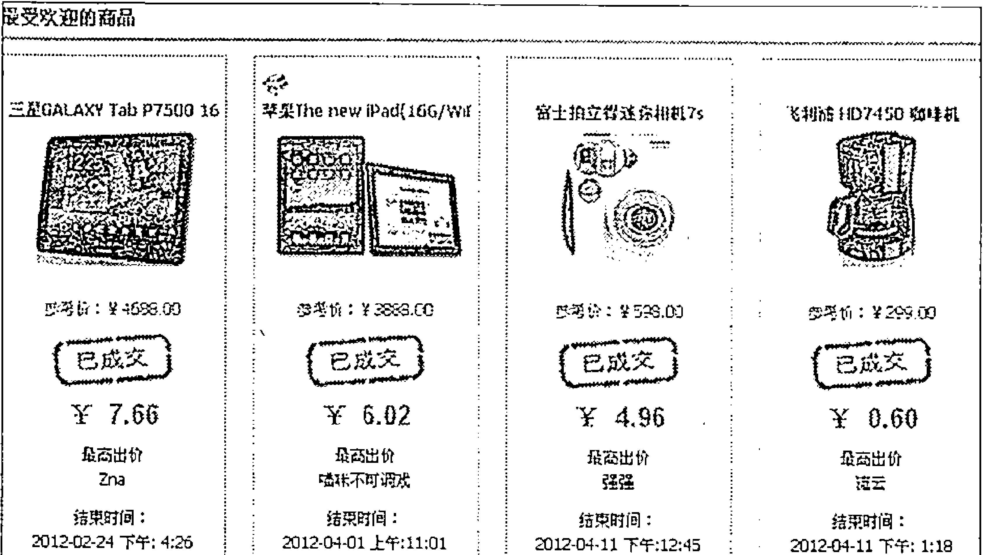

据某竞拍网站介绍，竞买过程是完全保密的，竞买完成之前只有玩家自己知道其出价数据，除玩家以外的任何其他人（包括网站管理员）都不能知道其出价的相关情况。在整个竞买过程结束后，所有竞买者的出价将公开发布，包括所有的详细出价区间，以示公平。

## 网站如何盈利

我们知道团购网和秒杀网已经逐渐冷却，日渐火爆的低价竞拍网是否又在赔本赚吆喝？可以看到，很多竞拍网站的商品成交价格异常低廉，如此低的价格，竞拍网站真的能够获利么？

实际上，竞拍网站不仅不会赔本，盈利还很惊人！竞拍网站的利润来源并非依靠商品最终成交的低价，而是来源于虚拟点卡。前面提到过，用户每出价一次，成交价上涨1分钱，但用户出价所用的点卡需要用1元人民币购买。这就形成了拍点价格超过出价价格涨幅的现象，可超过达100倍之多。

以某网站的价值3700元的三星笔记本来说明，其成交价是110元。按用户每出价1次成交价上涨1分钱，每次花费1拍点计算，那么用户累计出价11000次，再加上竞拍成功者获胜后支付的成交价，网站的收入为11000×1元+110=111110元，远远超过拍品的市场价。这也就是竞拍产品成交价低但是网站仍有盈利的原因。

竞拍这种模式的特点在于用户获胜的几率会随着用户投入的增加而加大，而用户为了获得更多的收益，势必会加大投入，竞拍网站的收入也就相应增加。竞拍所需的点卡和商品价格之间有一个比例，一般定在1:200~1:500之间，也就是说，如果有200~500个人竞拍同一件商品，那么网站就不会亏本。

一旦用户量上去，网站便可轻松依靠用户每次竞拍付出的点卡来盈利，网站是稳赚不赔的，一般可达200%~300%甚至更高的利润。因为竞拍网站背后有着巨大的利润空间，目前除了一些纯竞拍网站，如偶尔网、点点吧等，一些互联网大佬，如淘宝淘江湖中钱庄版块、京东商城夺宝岛版块都已涉足竞拍领域。在百度搜索中输入“竞拍网”，可得到约908000个相关结果，其火爆程度大有赶超2010年“百团大战”之势。

## 竞拍也需要技巧

和秒杀一样，竞标也需要一定的技巧。拍友小鱼儿为大家奉上几点竞拍心得。

- 1. 参与竞拍之前，要有充足的拍点，防止由于中途拍点不够而错过竞拍时机。
- 2. 新用户注册后，先熟悉竞拍流程，然后利用免费赠送的拍点从小件商品开始竞拍，积累竞拍经验和技巧。
- 3. 参加竞拍的用户越少获胜的几率越高，因此要选择一个最佳的时间参与竞拍。一般早晨到中午以及夜里的时段人少，比较好拍。晚上下班后大多数人都有时间，竞拍难度也大。同时要避开热门竞品，很多人抢的话成功的概率很小。
- 4. 把握出价时机，在商品刚开始出价时最好一直保持压价状态，因为很多时候，参与竞拍的人只是碰碰运气或试探性地看看对手是否有保价的意愿。如果开始保持强势，多数情况下是可以吓住对手的。
- 5. 分析“竞拍历史”数据，在商品详细页面中，对于历史数据中经常低价的商品可以考虑参加，成功的几率很大。
- 6. 成功竞拍后一定要在规定时间内付款，这才算真正成功竞拍。
- 7. 不要最后一秒才出价。很多新手都认为，竞拍就是最后时刻出价。其实不然，出价需要技巧，例如在竞拍结束前几分钟，查看竞拍页面，如果有人以接近底价的价格拍下，那么这个价格可能是竞拍网站设的“保价”，在接下来的竞拍中，这个价格将成为竞拍结束的最高价格，此时如果你出价，很可能就会成为最终的赢家。

认为，倒计时结束的一瞬间出价，自己的胜算才大，其实这种做法是受到了另外一种竞拍形式“秒杀”的误导。
秒杀是最后一秒出价，一秒定胜负。而竞拍不同于秒杀，只要进入了10秒倒计时，任何一次出价，倒计时都会顺延10秒重新开始。这时，最后一秒出价就显得没有任何意义，而且还会给自己带来风险。所以，正确的做法是：如果对某件商品势在必得，那么在倒计时10秒内别人出价一旦高过你，就必须马上出价超过他，越早越好。

## 吃馅饼需先防陷阱

花几元钱、几分钱买到几千元上万元的商品，讨了便宜又享受了竞拍的娱乐过程，这对于消费者来说真是天上掉下的馅饼吗？

实际上，虽然很多消费者是被馅饼吸引而来，但大多数连“馅饼”味都没闻到。能够以超低价格竞拍到心仪商品的人毕竟是少数，在电脑前苦候一天花费若干点卡却还是与目标商品失之交臂的情况很正常。

在竞拍网站如火如荼的表象下，实际隐藏着一些潜在的隐患。浪费时间使人上瘾是一方面，有些网友自从迷上竞拍，每天必上竞拍网，即使自己不拍也要亲自观战。如果参与竞拍的人多，经常会花费至少半天的时间，结果可能只是以保价收场。
产品的质量不过关也是一个问题，一位参与多个网站竞拍的网友发现，不少小网站的商品质量根本没有保证。还有些网站在运营初期，由于缺乏人气，会雇用所谓的“托”参与竞拍抬高竞拍价。而所有竞拍网站的竞拍过程目前都没有统一规范和监督，有些网友不免对公平性和透明性提出了担忧。

有网友指出，低价竞拍能够屡试不爽，就是准确地抓住了一批“想占便宜的人”的心理，同时选用了当下最潮流最火爆的商品来吸引用户。低价竞拍类似一种变相的彩票，大家一起花钱买门票博彩，然后拼运气加上一点博弈的技巧，抽到一个所谓超值的东西。网站免费赠送的一两次抢拍的机会，就像是给博彩的人派发免费筹码。

不管大家是否会参与网上竞拍，都应保持一个良好的心态，尽量用平常的心态去对待每次竞拍的成与败。
（文|李峰氏）

# 加密不必完全靠密码

加密如果完全依靠密码，则密码成了保密的唯一一把钥匙，如果你对密码记忆已经免疫，那么可以通过分割软件对机密文件进行加密操作吧。

## 分割软件来加密

我们使用的软件是BDBZM，它为我们提供了一种全新的文件保护方式——伪装。伪装后的文档不仅具备加密效果，而且更加安全。
其原理是用BDBZM将机密文件分割伪装为美女图片，使其失去作为独立文件运行的能力，一旦别有用心的人得到了你的机密文件，也只能是欣赏欣赏美女而已，是无法真正获得原机密文件的，从而很好地保护自己的机密。

## 常规加密法

运行BDBZM绿色汉化版工具，切换到“分割”标签，点击“要分割的原始档”后的“浏览”按钮，选择需分割伪装的机密文件，再从“BBM档保存位置”后选择分割的伪装文件保存位置。在“分割方法”、“资料加工”和“命名方法”中分别选择“指定大小”、“简单分割”和“随机”项，并选择“固定副档名”复选框，再来设置伪装文件的格式，如JPG、PDF、DAT等。再在“分割大小”下设置分割得到的图片文件的大小。

接下来在右侧密码下输入合并时的密码，并取消对“子目录自动分类”复选项的对号，点击“执行”按钮，就开始分割机密文件了。很快分割结束后给出成功提示，此时在对应文件夹下已生成多个伪装成图片的BBM格式恢复文件。

进入设定的文件夹中，我们可以看到，分割好的文件有两类，分别是伪装好的“美女图片”和一个BBM恢复文件。此时双击图片打开后，仅仅能实现图片浏览功能，而原有的内容已经被完全屏蔽了。要将分割好的文件结合起来，切换到“结合”，在“BBM档位置”下选择好之前分割得到的BBM格式的恢复文件，再在“合并后存放位置”设置好合并的机密文件存放位置，在密码后输入之前设置的合并密码。

选择好所有参数后，在档案信息下显示出该机密文件的大小和分割数量，单击“执行”按钮，开始合并，合并完成后，给出完成提示，同时右侧显示出之前分割得到的图片文件列表。单击“开始”很快就复原出了原文件。

如果分割的伪装文件中某几个损坏了，在“BBM档位置”后选择分割得到的BBM格式的恢复文件或保存恢复信息的那个伪装文件，在“分割来源档案”中重新选择原机密文件，再从右侧勾选需重新还原的伪装文件，单击“开始”即可将损坏的伪装文件还原。

## 高级分割伪装法

使用常规分割伪装的方式，分割伪装后得到一个BBM格式的恢复文件和若干伪装文件，这还是很不安全。那就让那个BBM格式的恢复文件也不要出现吧，彻底分割伪装成若干图片文件，更安全。

切换到“设置”标签下，选中“把BBM档添加到最后一个档案”项，弹出一个提示框，说明分割伪装时，不生成BBM格式的恢复文件，恢复信息将被保存在分割伪装的最后一个文件中。

再次切换到“分割”标签下，分割伪装机密文件，设置好分割各参数，单击“开始”按钮开始分割。分割后给出恢复信息保存在分割伪装的最后一个文件中的提示，这样分割伪装得到的只有一些图片文件，隐蔽性会更强。

需要合并无BBM文档的内容时切换到“结合”，单击“BBM档位置”后的“浏览”，在弹出的“打开”窗口中选择“文件类型”为“全部”，选择分割伪装文件中保存恢复信息的那个图片文件，并输入之前设置的合并密码，即可复原出机密文件。
（文|鞠华英）

# 打造动感火烧效果电子相册

做一个PPT和Flash难以完成的电子相册，实现图片纸张燃烧效果或熊熊大火从下面烧起的效果。

一位朋友拿来一张图片演示光盘，问我其中的火烧图片效果是如何实现的。我看了一下，火从画面的某个位置随机燃起，逐步烧掉整个图片，还有一个大火从下面熊熊燃烧起来的场景，看起来都非常酷。我当时想应该能在PPT中轻松模仿实现，但试验未果。用Flash也不知如何实现。经过摸索，最终用多媒体设计软件MMB通过灵活使用两种魔幻场景参数，制作出这种独特的燃烧效果多媒体电子相册。

## 软件与材料准备

首先需要安装多媒体设计工具Multimedia Builder（简称MMB）。原版为英文版，如果英文不好，可以在安装英文版后安装汉化包进行汉化。

接下来需要准备好建立电子相册所需的图片文件。软件支持的图像文件包括BMP、JPG、PCX、PNG、TIFF等常用格式，如果我们手头上的图像文件不是这些格式的，需要用图像转换工具（如SnagIt、ACDSee、XnView Shell Extension等）转换。

本例以做一个数码产品照片为内容的燃烧特效电子相册为例说明。

## 建立相册工程文件

启动MMB软件，系统默认载入一个扩展名为MBD的多媒体工程文件，文件名为Media1.mbd，为了保证制作内容不丢失，我们最好给工程起一个合适的工程文件名，例如“数码产品演示.mbd”，点击磁盘图标命名工程，将工程文件存盘。

## 设定电子相册参数

点击MMB系统菜单命令“方案→方案设置”，弹出“方案设置”窗口，在“窗口尺寸”一栏内定义我们的多媒体演示作品的窗口大小，这个窗口大小要根据我们演示时电脑屏幕的大小来设置，我们考虑到

目标用户的屏幕可能有大有小，为了顾及到大多数用户，这里可以设置一个比较适中或小一点的窗口尺寸，比如1024×768或800×600。

除此之外，最好同时选中“总在最前面”“全屏幕背景”“覆盖windows任务栏”等选项，这样可以保证编译之后的多媒体相册独占桌面演示，消除周边或背景图片的影响，给人以更纯粹的视觉感受。

多媒体方案参数设定之后，按“确定”返回设计主界面。

## 电子相册页面规划

接下来添加页面、导入原材料。

在设计窗口的最底部出现的页面栏中，默认出现的只有“页面1”一个页面文件，我们需要用“页面→添加页面”命令，给工程添加足够多的页面文件。本案例我们要做多媒体相册，每个页面中要出现一幅图片，因此，有多少产品图片，至少就得添加多少页面。

## 小提示

通过点击下方“页面”栏上工具栏的第一个按钮可以快速地给工程添加新页面。本例我们假设要添加到10个页面。

接下来，点击“页面1”，然后用左侧工具箱中的“创建位图”工具给该页面添加图像文件，并将图像文件调整到正好和设计页面相当的大小。以此类推，给所有10个页面添加图像文件。

## 纸张燃烧特效设计

接下来开始设计燃烧动态效果。假如我们要给“页面1”设计一个向“页面2”过渡时的燃烧纸张效果，我们需要做如下设计。

首先设置激活动作。双击“页面1”中的图像，激活位图窗口，在窗口中选中“激活动作”复选框，然后点击下面的第一个按钮“外部命令和页面动作”。在接下来弹出的动作设置窗口中选择触发操作为“鼠标点击时→跳至下一页”，然后确定返回上级窗口，再次确定退至设计主页。

接下来设计特效。执行“页面→属性”命令或直接按页面工具栏上的“页面属性”按钮进入页面属性设置窗口。在“脚本”按钮旁的“页面切换效果”一栏中选择设置“燃烧的图像”，与此同时，将燃烧时间延迟设置为一个合适的参数（例如这里设置为500，可以根据情况修改）。

## 小提示

如果我们希望在演示过程中图片切换的时候，随着纸张被烧掉的过程出现，能够听到火烧的声音，这里我们还可以通过“背景音乐→声音文件”一栏，载入一个反映燃烧效果的声音文件。

以上均设置好以后，单击“确定”按钮返回设计界面。

用同样的方法，在其他需要出现类似过渡效果的图片页面上设置过渡效果。需要指出的是，如果我们希望每个页面纸张燃烧效果出现的速度不同，需要给每个页面分别设置不同的燃烧延迟参数。这样就不会有千篇一律的感觉。

## 熊熊大火特效设计

下面我们再看那个从底部出现的熊熊大火是如何燃起的。

具体我们以第二个页面为例来说明。

假如我们希望在演示切换到第二个页面后，屏幕的底部慢慢燃起熊熊大火，火苗上部显示大字标语“火热的产品”。这种效果不是用上面所述的图片过渡效果就能完成的。这需要借助一种叫做“动态FX对象”的工具来实现，这是一种通过函数来实现模拟自然场景的技术，比如可实现云雾或大火燃烧等效果。

首先将页面切换到第二页图片页，执行“页面→插入→置前”命令，插入一个空白页。点击设计窗口左侧工具箱中的“创建动态FX对象”按钮，然后在工作区画出一个和设计页面一样大小的矩形框，这时，我们会看到设计窗口马上被一个五彩缤纷的画面所覆盖，这说明已经添加了一层动态FX对象。

双击五彩画面，弹出“动态特效”设置窗口，在“特效类型”选择框中选择“火焰”一项，在“色彩风格”一项下选择“典型火焰”，此时在预览窗口中会出现大火熊熊燃烧的动态画面，这时，我们可以根据需要修改窗口左侧中间的“计时器”参数设置和“计算机网格”设置，将火焰样式调整到满意的程度。
最后在这个页面上端，用文字工具输入几个大字“火热的产品”，同时设置好颜色。
依照同样的方法在要应用这种效果的页面上设置同样的虚幻效果，同理，特效的程度可以分页面进行个性化设置。

## 最终获得编译作品

通过反复的“方案→调试”命令和修改设计，设置好所有页面的特效之后，就可以将相册编译成可以独立运行的EXE文件了。
点击“文件→检查并发布”命令，弹出编译发布窗口，在窗口中输入编译文件的输出路径，选择编译的质量为“最佳质量”，确定之后稍等片刻便可获得可以独立运行的多媒体相册文件了。

## 小提示

编译的同时会产生一个Autorun.inf文件，如果我们把这个文件连同编译所得的EXE文件一并刻录到光盘上或拷贝到优盘的根目录中，那么这张光盘或这个优盘就变成了一个可以自动运行的产品演示载体了。这样可以大大方便用户的使用。
（文|陈智君）

# 相同内容重复巧输入

在工作中，我们经常会用到一些重复的句子或者短语，很多人的习惯是将这些句子或信息保存为文本，需要的时候复制粘贴即可。
可是从打开文本，复制所需的句子到粘贴，也需要三步来完成，如何能一劳永逸，将常用或重复内容的使用简单化呢？

## 巧妙设置输入法

现在的输入法功能越来越多，不仅让我们的文字输入方便快捷，更提供了很多个性化的功能。要想实现常用短信的快捷输入，只要稍加设置即可搞定。以QQ输入法为例。
首先，右击输入法长条，点击“属性设置”，调出“QQ输入法设置”界面，然后选择左侧的“高级设置”，点击对话框中的“自定义短语设置”。最后，点击“添加”，输入缩写和完整的短语，点击“确认”添加就可以。
比如“电脑爱好者”，在上面输入cf，下面输入“电脑爱好者”，然后选择出现的顺位，点击“确认”添加即可。添加成功后，在使用QQ输入法时，输入cf，即可出现“电脑爱好者”，是不是方便了许多呢？

## 文档编辑替换法

上面讲到的使用输入法来实现快捷输入只能针对偶尔出现、频率并不高的聊天或信息输入时使用。如果在某篇文章中需要反复输入同样的词语时，对待这样的词语，我们则可使用替换的方法加快输入效率。
假设在编辑某篇文档时，经常要输入“电脑爱好者”这几个字，在这里固然可以用复制粘贴的方法来提高输入效率，但如果在编辑的过程中，还经常需要复制一点其它内容，那么原先剪贴板的内容就会被替代，这样为了达到能复制粘贴“电脑爱好者”的目的，就不得不反复复制这几个字，致使输入效率降低。但如果用替换法，效果就不一样了。
在遇到需要输入“电脑爱好者”时，不输入相应字符，而是输入几个非常简单但与文档内容无关的字符，如111。文档编辑完毕，在Word主界面的“开始”标签的工具栏中单击右侧的“编辑/替换”打开“查找和替换”对话框，然后在“查找内容”文本框中输入111，“替换为”文本框中输入“电脑爱好者”，点击“全部替换”按钮，现在看看，文档中的111是不是全部被替换为“电脑爱好者”了？
这种方法对输入某些出现频率较高的特殊字符非常有效。因为相对于汉字和数字来说，特殊字符的输入毕竟要难一些。此外，在Word中，我们还可以使用自动图文集功能来快速输入常用词组和句子。以Word 2010为例。
首先，选中需要重复输入的句子或词组，如电脑爱好者，然后点击“插入”标签，在“文档部件”下选择“自动图文集”，然后选择“将所选内容保存到自动图文集”，此时会弹出“新建构建模块”，我们只需将要替换的内容设置好，创建完自动图文集的词条后，在输入某个词组或句子的前几个字时，Word就会根据自动图文集中的记录自动给出建议的完整词条选项。如果接受就按回车键，不接受可以继续输入后面的文字。
（文|刘卓）

# 官方工具自如诊断系统内存

对于Windows 7用户来说，相信很多人不会对Windows Memory Diagnostics Tool（Windows内存诊断工具）感到陌生，不过它需要在系统启动时进行加载，操作起来有一些麻烦。其实，我们完全可以在Windows界面下启动内存诊断工具。
首先请保存所有正在编辑的文档并关闭相关程序，进入命令提示符环境，手工输入mdsched，运行之后会弹出对话框，建议选择“立即重新启动并检查问题”，随后系统会自动重启并进入内存诊断界面，按下F1功能键可以自行选择测试模式。
我们可以根据实际情况选择自己所需要的诊断模式，默认设置下，内存诊断工具会对所选择的项目内容执行两次，当然也可以使用Tab键跳转到“传送计数（0-99）：”位置重新设置更多的执行次数，最后按下F10功能键即可执行。诊断结束之后会自动重启系统，并在托盘区显示诊断结果，如果提示无错误信息，那么表示内存没有任何错误。
（文|王志军）

# 为文件夹巧加“自动锁”

小王为了数据的安全，将重要文档全部存放到某个文件夹中，之后使用某款加密软件对该文件夹进行了加密隐藏，以后当需要使用机密文件时，将该文件夹恢复到正常状态即可。不过有一次当小王使用完机密文件后，忘记及时隐藏加密相关文件夹，就离开电脑办别的事去了。这下所有的机密文件都暴露了，有人趁机到小王的电脑上查看这些重要文件，这让小王既气愤又郁闷。如果在使用完机密文件后，可以自动加密隐藏文件夹，不就可以避免上述悲剧了吗？使用BitSec Secure Folder这款独特的安全软件，就可以轻松化解上述危机。

当初次使用BitSec Secure Folder时，在账户窗口中的“User Account”栏中输入密码，在“Information for encryption your files”栏中设置问题及答案，之后点击OK按钮，在弹出窗口中点击“Browse”按钮，指定账户信息备份路径，之后完成新账户的创建操作。

以后进入BitSec Secure Folder操作环境，必须输入预设的密码。在输入密码时，为了防止潜伏在系统中的间谍程序拦截键盘操作，可以在密码输入栏左侧点击软键盘按钮，利用虚拟键盘完成密码输入操作。

在BitSec Secure Folder窗口顶部点击设置按钮，在设置窗口中左侧点击“Modify Password”按钮，在右侧窗口可以更改登录密码。在默认状态下，在系统添加删除程序列表中是无法显示BitSec Secure Folder的，如果需要删除BitSec Secure Folder，

可以在窗口左侧点击“Self Protection”按钮，在右侧窗口中取消其保护状态，即可正常卸载该程序了。

使用BitSec Secure Folder加密文件夹，方法很简单，在其窗口左侧点击“Add Secure Folder”按钮，选择需要加密的文件夹，将其添加到加密列表中，之后该文件夹就从磁盘上“消失”了。按照上述方法，可以添加任意多个需要保护的文件夹。

在对应文件夹项目右侧点击设置按钮，在弹出窗口左侧点击“Encryption Method”按钮，在右侧窗口中选择“Not encryption any files”项（这是默认选项），表示仅仅隐藏文件夹，而不对其中的文件进行加密。选择“Encrypt all files”项，表示加密其中的所有文件，点击“Encryption files of special types”项，表示仅仅加密指定类型的文件。

点击“Set file types”按钮，在弹出窗口中输入文件类型（例如“.txt”等），点击“Add”按钮，将其添加到文件类型列表中即可。按照同样的方法，添加您所需的所有文件类型。

这样，BitSec Secure Folder就会只对该文件夹中指定类型的文件进行加密处理。在窗口左侧点击“Visibility”按钮，在窗口右侧最好选择“Secure Folder is hidden after locked”项，表示锁定该文件夹后，将其设为隐藏状态。如果选择“Secure Folder is visible after locked”项，表示锁定后仍然可以显示该文件夹，只是无法对其正常访问。

文件夹一旦被BitSec Secure Folder加密锁定后，就无法正常显示和操作了。当您需要访问该文件夹时，必须进入BitSec Secure Folder操作界面，在加密列表中点击对应文件左侧的加锁/解锁按钮，才可以正常打开该文件夹，BitSec Secure Folder会自动对其中的文件进行解密，之后您就可以操作其中的文件了。操作完成后，再次点击上述加锁/解锁按钮，可以重新加密锁定该文件夹。为了防止在使用完毕后，忘记锁定文件夹。最好在窗口左侧点击“Timer Setting”按钮，勾选“Start Timer”项，激活自动锁定功能。在“The opened secure folders will be locked after”栏中设置自动锁定延迟时间。

这样，当打开加密文件夹的时间超过预设值后，BitSec Secure Folder就会自动将其锁定。如果勾选“Display the Prompt dialog, before a secure folder will be locked automatically”项，表示在自动锁定之前，会弹出相关的提示信息。

此外，还可以在“Shortcuts”栏中设置锁定热键，这样，您只要点击该热键，可以自动锁定所有打开的文件夹。为了提高BitSec Secure Folder运行的隐秘性，BitSec Secure Folder还提供了隐形功能。在其窗口顶部点击设置按钮，在设置窗口中左侧点击“Gost Mode”项，在窗口右侧设置激活热键，这样当点击该热键后，BitSec Secure Folder可以立即进入隐蔽运行模式。

（文|郭建伟）

# 利用性能监视器检查内存泄漏

最近更新了几个最新的测试版本驱动程序，感觉到系统的运行速度似乎有些缓慢，考虑到可能是这些驱动程序占用的内存没有得到及时释放，也就是所谓的“内存泄漏”，如果要证实这一情况，恐怕必须借助第三方的工具软件。

其实，只要利用Windows 7内置的性能监视器就可以解决这一难题。

打开开始菜单，在搜索中输入“性能监视器”，打开“性能监视器”窗口，在右侧窗格右击选择“添加计数器”，依次添加Pool Nonpaged Bytes、Pool Paged Bytes、% Usage等三个特征计数器，Pool Nonpaged Bytes和Pool Paged Bytes表示非换页内存池和换页内存池，%Usage表示使用率，确认之后关闭“添加计数器”对话框。右击打开“性能监视器属性”对话框，切换到“常规”选项卡，在这里设置采样间隔、持续时间两项参数。

耐心等待一段时间，就可以在窗口中查看计数器指标的变化情况，可以看到这里的数值相当稳定，说明系统并不存在内存泄漏的情况。如果发现数值发生剧变，那么说明可能存在内存泄漏，当然前提是添加计数器之后没有再对系统进行无谓的操作。

（文|王志军）

# 被清除软件遗漏的秘密

系统清理就像卫生检查前的大扫除，即使你使出吃奶的劲儿把一切可能的地方都打扫过，还会留下边边角角的遗漏。随着大家电脑安全意识的提高，越来越多的朋友开始关注自己的电脑安全，也知道安装360系列软件来“武装”自己。对于涉及到自己的隐私的上网记录、密码等信息尤为重视，不时地使用这些安全软件清理一番，信心满满地认为安全问题就此搞定。其实问题远没那么简单，本文就带你走进这些遗忘的角落去探究一番。

## Index.dat 藏着大秘密

如果你利用Windows默认的本地搜索功能来搜索Index.dat，那么相信你基本上一无所获，即使你打开资源管理器，单击“工具→文件夹选项”命令打开“查看”选项，将“隐藏受保护的操作系统文件（推荐）”复选框取消，并将“显示所有的文件和文件夹”项选中，重新搜索，结局基本是一样的。但是你如果换一个搜索工具，比如笔者使用的“光速搜索”，以Index.dat为关键字，结果会令你大吃一惊，因为光速搜索会列出分散在硬盘中多处的Index.dat文件。

Index.dat文件是做什么用的？里面又有些什么内容呢？通过专业的Index.dat分析软件Index.dat Suite可以帮你看清楚一切。运行该软件，点击工具栏上Index.dat finder按钮，在Search for项中默认Index.dat，在Search in中选择系统盘（默认所有硬盘），单击Finder按钮，稍后就会看到很多的Index.dat文件及其所在位置。文件越大则表示包含的隐私越多，选择其中一个，如C:\Users\Administrator.GXNWJZASZGHTLHT\AppData\Local\Microsoft\Windows\Temporary Internet Files\Content.IE5\index.dat，鼠标右击选择View file contents→Using internal viewer命令，在出现的对话框中单击“确定”按钮后，就会发现经过360等软件清理后的上网记录都保存在这里，包括网址、图片、动画等都不少。

如何删除呢？在Windows中连痕迹都找不到，删除就更谈不上了。当然还得选Index.dat Suite这个专业软件。除了在找到文件后单击Clear Results按钮进行本次删除外，还可以进行自动删除。单击工具栏上的Generate File，在出现的窗口中单击“确定”按钮后，软件会自动创建一个名为Run.bat的批处理文件，该批处理文件会在电脑重启时自动运行，从而删除选中的Index.dat文件。因为Index.dat删除之后系统还会重建，该批处理文件会自动将该文件中的内容删除为空，让别人对你的上网记录无从知道。

## Cookie 甜饼并不甜美

Cookie原本是用来为我们提供便利的缓存文件，例如记住我们的登录状态等，以减少重复的输入。但任何事物都有其两面性，如今的Cookie从另一方面也成为别有用心之人收集用户个人信息的工具。其中最常见的Cookie包括HTTP Cookie和Flash Cookie。Http Cookie比较常见，而Flash Cookie对于某些朋友来说还有点陌生。

那么Flash Cookie有什么作用？举个例子，打开任意浏览器进入百度MP3搜索，在不登录百度账号的情况下打开百度音乐盒，随便试听几首歌曲，这时可以看到在百度音乐盒的试听历史中会出现之前试听的歌曲。接下来我们使用浏览器自带的删除功能来清除Cookie，清理完之后用任意一个浏览器打开百度音乐盒，都可以发现之前的试听历史，这就是Flash Cookie的功用之一。

与Http Cookie比起来，Flash Cookie更加强大，不仅容量更大，而且没有默认的过期时间，还能被存储在不同的地点，因此普通用户很难处理它们。将Flash Player升级到最新版本后，在“控制面板”中点击Flash Player的设置选项，进入之后在“存储”标签中，就可对本地存储的Flash Cookie进行操作。点击“站点的本地存储设置...”按钮，就可以查看当前电脑中的Flash Cookie，删除之后，就不会再出现之前的试听记录。假如比较看重个人隐私的话，可以选中“阻止所有站点在此计算机上存储信息”复选框，不过之前保留的所有和Flash相关的信息就都没了。

## 密码表单 清除软件不理会

浏览网页特别是逛论坛时，账户与密码的填写是必不可少的。为此，许多浏览器还专门设置了“智能填表”等功能。其安全与否其实毋需多言，通过WebBrowserPassview (http://xingke.newhua.com/down/webbrowserpassview.zip)这个小软件就可以说明问题。

在笔者使用完360安全卫士完成清理操作后，运行该软件，会发现其窗口中列出IE登录过程中的三个信息，其中两个以明文表明了密码。由此可见，这种为方便而设置的密码表单自动保存功能是很不安全的。即使一些以安全著称的浏览器，也不如想象中安全。比如360安全浏览器的自动填表和快速登录插件，其账号密码就保存在其数据文件夹下的extensions子文件夹中，用户只需将其整体迁移到另一台电脑中将相同文件夹覆盖，即可快速登录相关的账号。

因此，对于网银等账号，一定不要设置为自动保存。登录时尽量使用浏览器的无痕模式，并且对于这些账户使用特殊的一套账户与密码以确保安全。

## 你被定向网络广告的秘密

细心的朋友也许会发现，当打开一些网站或软件时会出现与自己浏览内容相关的广告。你一定很奇怪，你是如何被定向广告盯上的呢？至少可能有两个方面，一个是在浏览器接受Cookie的情况下，服务器在检测出用户电脑是否已访问该网站，若第一次访问则会在用户的电脑上创建一个Cookie，当用户再次访问网站时，网站将能够通过Cookie知道用户曾经访问过该网站，从而根据浏览历史投放定向广告。

# 独辟蹊径 修复“瘫痪”的Win7

随着Win8多个测试版本的陆续发布，相信许多朋友都已安装试用了吧。不过现阶段的Win8往往会存在不少BUG，因此大家新鲜够了，难免要重回Win7的“怀抱”。如果在安装Win8时，是通过自定义方式安装且没有格式化系统盘，则以前版本的Windows使用的文件会保存到Windows.old文件夹中。要正常使用以前的Win7系统，我们就必须用几条DOS命令，简单修复“瘫痪”的Win7。

## 第1步：移动Win8系统文件

先将Win7的安装光盘放入DVD光驱，然后重启计算机，当屏幕出现“Press any key to boot from CD or DVD”的提示信息时，按下键盘的任意键以实现从光盘启动系统；接着在出现选择语言、时间和货币格式、键盘和输入法的“安装 Windows”对话框时，按下“Shift+F10”快捷键，调出“命令提示符”窗口；再在窗口中执行以下DOS命令（每输入一条DOS命令都要按下回车键，下同）：

```
C:
Md Win8
Move Windows Win8\Windows
Move "Program Files" "Win8\Program Files"
Move Users Win8\Users
Attrib -h -s -r ProgramData
Move ProgramData Win8\ProgramData
Rd "Documents and Settings"
```

小提示：第1、2条DOS命令的含义是切换到系统盘C盘根目录下并创建一个名为Win8的文件夹；其余DOS命令的含义是：将C盘根目录下的Windows、Program Files、Users、ProgramData这几个文件夹及其所包含的文件资源全部移动到“C:\Win8”目录下，并删除C盘根目录下的Documents and Settings文件夹。

## 第2步：移动Win7系统文件

完成上述DOS命令之后，接下来的工作就是将C盘Windows.old文件夹中与Win7有关的所有文件都移动到C盘根目录下了。与移动Win8系统文件一样，这也得通过DOS命令来完成，“命令提示符”窗口光标所在的位置再依次执行以下DOS命令：

```
Move /y c:\Windows.old\Windows c:\
Move /y "c:\Windows.old\Program Files" c:\
Move /y c:\Windows.old\ProgramData c:\
Move /y c:\Windows.old\Users c:\
Move /y "c:\Windows.old\Documents and Settings" c:\
```

当然，在实际的操作过程中，无论是移动Win8还是移动Win7系统中的“Documents and Settings”文件夹，如果系统提示找不到指定的文件时，直接忽略就可以了。

## 第3步：修复启动菜单

将Win7运行所必需的文件资源都移动到C盘根目录之后，此时如果重启系统，大家就会发现Win7根本无法正常启动，所以我们必须修复一下系统的启动菜单才可以。其操作步骤是：光标所在的末尾执行DOS命令“F:\boot\bootsect /nt60 c:”即可（F盘是光驱所在的盘符，如有不同，请大家自行修改）。

小提示：修复Windows.old文件夹中的Win7，这需要用到Win7系统的安装光盘，如果大家没有，亦可用Win7版的系统U盘来代替；当然，试用之后发现Win7运行一切正常的话，再把C盘中包含Win8所有文件资源的“Win8”文件夹予以删除就可以了。

经过以上步骤的操作，再重启系统，就可以正常使用Win7了。更重要的是，修复好的Win7系统包含了符合自己使用习惯的一些个性化参数设置，我们不用再修改就可以用得很顺手。而实现上述目的至多只需10分钟即可搞定，这是不是比重装Win7更省事呢？有此需求的朋友不妨一试。

# 在线书籍自动生成PDF电子书

网上可以找到免费的书籍，不过它们一般不提供下载服务，只能在线阅读，一页一页地翻阅很麻烦。另外，有时我们不方便上网，这时就无法看这些书了。怎么办？

本文的方法，将教你如何把这些书籍“搬回家”，并且能方便地在平板等移动设备上阅读。原理是因为这些书籍可以在线阅读，所以我们只要将书籍页面截成图，再转换成PDF电子书即可。一般书籍都有许多页面，有些甚至有几百页，手工翻页、截图，工作量巨大，所以我们需要通过一些技巧进行自动翻页并自动截图。最后将所有的截图再自动组合成PDF电子书。方法看似复杂，但因为都是自动完成，所以在掌握了方法之后，最终效果异常的方便快捷。

下面给大家演示一番。

## 不用动手自动截图

首先我们来解决自动截图的问题。这里推荐使用Snagit（下载地址：http://www.skycn.com/soft/2291.html），作为一款强大的截图软件，Snagit提供多种截图方式和截图设置，我们只要使用Snagit自动截取指定电子书网页即可。

运行程序后单击右侧窗格预设方案下的“统一捕捉”，接着在下方的“方案设置”中，输入设置为“窗口”，选择在线书籍页面窗口作为捕捉对象。

Snagit可以根据不同电子书截取不同形状，比如电子书在需要滚动的超长网页上，“输入”可以设置“滚动窗口”，截取整张网页为图片。如果只需要截取网页中指定部分内容，“输入”可以设置“自定义滚动窗口”，自行选择截图区域。

继续方案设置，输出设置选择“文件”，然后在展开列表选择“属性”打开输出属性窗口，切换到“图像文件”，进行设置：
- 总是使用以下文件格式选择“JPG-JPEG图像”。
- 文件名称选择“自动命名文件”。
- 文件夹选择“总是使用以下文件夹”，设置一个保存截图的目录。

单击“确定”返回Snagit主界面，单击菜单栏的“工具→程序参数设置”，在打开的窗口“全局捕捉”热键设置为F4键。继续单击“工具→定时器设置”，在打开的窗口切换到“捕捉定时器”，执行捕捉间隔设置为5秒。这样以后我们只要按下F4键，Snagit就会每隔5秒重复截图。

因为是在在线图书，这里捕捉间隔设置要根据自己的实际网络状态设置，一定要保证前后截图间隔时间内能完全打开新一页的在线图书（可以自行打开浏览器测试）。如果网络不好，打开页面较慢，不妨将间隔时间设置长一些。

## 鼠标自动点击翻页

接下来要解决的是自动翻页的问题。这里推荐的工具为AutoHotkey（下载地址：http://www.onlinedown.net/soft/39219.htm）。我们只要使用AutoHotkey录制鼠标按下电子书“下一章”的操作，即可实现自动翻页的操作。

本例，我们打开一个在线试读图书的网页，单击“展开视图”，单击左侧“隐藏图书”，使得浏览器窗口刚好显示需要截图的图书。如果无法显示页面的全部内容，可以设置浏览器全屏显示，或者使用缩放设置。

下载AutoHotkey并解压，然后双击运行其中的AutoScriptWriter.exe，单击程序界面的Arecond按钮启动脚本录制。现在依次执行：切换到浏览器页面→单击在线图书的“下一章”按钮翻页→按下F4键（即上一步中我们定义的截图热键）→按下Y键停止Snagit自动捕捉→单击STOP停止录制。

返回AutoHotkey窗口对录制脚本进行编辑，比如打开新的一页加载需要5秒等待时间，这里要将默认的Sleep 100更改为Sleep 5000即可（时间间隔一定要和Snagit自动捕捉间隔对应，就是新页面完全加载后才开始Snagit的自动截图），这样完全打开新页面后再继续点击“下一页”操作。需要截取电子书有几页，则在“send {F4} {y}”代码前重复添加“MouseClick, left, 910, 460”和“Sleep, 5000”这两行代码即可。

```
send {F4} {y}
MouseClick, left, 910, 460
Sleep, 5000
```

完成脚本编辑后，单击Save按钮，提示将脚本保存为cfan.ahk放置在桌面。接着运行AutoHotkey的Ahk2exe组件（在AutoHotkey\Compiler下），Source选择上述cfan.ahk，Destination选择转换后的程序名cfan.exe放置在桌面。如果需要截取的图片很多，我们可以只使用2~3行代码，将脚本转化为EXE后再使用任务计划重复执行这个程序，根据整本书翻页时间设置任务计划运行的持续时间即可。

完成上述操作后测试一下，启动Snagit→按下F4键开始截图→选择电子书窗口→启动cfan.exe，看看能否自动翻页和自动截图保存。截图默认保存在C:\Users\当前用户\Documents\Snagit，测试无误后接下来的操作就是将截图自动转换为PDF书籍了。

## 图片自动生成PDF电子书

截取的一堆图片，阅读很不方便，没关系，下面就将它们组织成电子书。这里推荐的软件工具为Axommsoft Image to Pdf（下载地址：http://t.cn/z0CNW03）。

启动程序后单击Addfile，然后定位到截图保存目录，全部截图添加到程序列表，还可以在此对图片顺序进行手动调整，单选下方的Convert to single Pdf（转换成单一PDF），设置转化后的PDF为“我的电子书”，同时勾选Auto Settings。

单击Convert，在弹出的窗口按提示选择保存PDF文件目录，单击OK后程序就会将所有图片合成为PDF了，可以使用任意PDF阅读软件打开它，随时随地阅读啦。

## 小提示

很多PDF文件由于各种各样的限制无法编辑，我们也可以使用上述方法截图，然后使用OCR扫描软件对图片文件进行扫描，转换为Word文件进行编辑。

如果要将电子书转换为音频文件，则可以在转换为Word文档后，使用TTS朗读读出来，然后录制为MP3放在随身设备上“听书”。

编辑有话说：方便自己但是要注意版权保护。上述介绍的方法实际上是对很多受限文档提取的一种通用方案，注意很多受限制文档都是有版权保护的，自己动手转换文档只能自己使用，切勿随意传播，否则会引发版权纠纷，负法律后果。
（文|俞木发）

# 妙手巧改 让Win8更好用

作为全新的系统，Win8的很多设置都是针对平板设计，这让很多传统PC用户不适应。何不自己动手对Win8进行改造，让新系统更好用？

## 开始菜单 我要酷炫与传统并存

Win8最大的特点就是取消开始菜单按钮，使用Metro界面开始菜单屏作为用户初始界面。这让很多习惯使用开始菜单操作的用户不适应。现在借助Start8（下载地址：http://www.xp510.com/soft/ossoft/System-Auxiliary/15800.html，支持32/64位系统）即可轻松恢复开始菜单，并且还可以继续显示Metro界面。

- 第1步：在安装程序后无需作任何的设置，桌面就会出现久违的微软徽标了，只要单击即可弹出开始菜单，现在要启动开始菜单的程序是不是轻松多了？
- 第2步：如果要继续显示Metro菜单，在微软徽标右键菜单勾选Show Fullscreen Metro Start Menu即可，这样单击微软徽标显示的就是开始菜单屏。选择Pick a different Start Button image则还可以自行选择喜欢的图标替换默认的微软徽标。

## 关机不再是难事 自制关机菜单

关机、重启是我们经常要执行的操作，不过要在Win8下正常关机可不容易。何不在开始菜单自己添加一个关机菜单？

- 第1步：右键单击桌面新建一个快捷方式，然后在键入对象的位置框输入“shutdown.exe -s -t 03”，接着为快捷方式选择一个关机图标。
- 第2步：在桌面右击上述建立的快捷方式选择“固定到开始菜单屏幕”，现在按下微软键激活Metro界面，就可以看到我们建立的红色关机菜单按钮，以后单击该按钮即可快速关机。

小提示
除了找回开机菜单，程序还会在微软徽标新增右键操作快捷关机菜单。右击微软徽标选择“shutdown”，此时在桌面就会弹出系统的关机菜单，现在关机是不是简单多了。

## 恢复更简单 添加恢复镜像到Win8

Win8系统新增了“系统恢复”和“系统初始化”组件，可以快速恢复系统。这两个组件的使用默认需Win8安装光盘支持，可以手动将光盘集成到本地硬盘，以方便使用。

- 第1步：在任意NTFS分区如J盘新建一个win8目录，接着准备好Win8安装文件（ISO格式），然后右击选择“装载”，此时ISO文件会自动加载到虚拟光驱。打开虚拟光驱将全部文件复制到J:\win8目录。
- 第2步：按微软键+X，在弹出的菜单选择“命令提示符（管理员）”；依次输入下列命令，自行设定修复安装源位置（rem为注释，无需输入）：
```
Rem 查看修复环境信息
Reagentc /info
Rem 关闭修复环境，以便自行指定重装源位置
Reagentc /disable
Rem 指定修复源路径为J:\win8\sources，恢复源文件为J:\win8\sources\install.wim的映像1（消费者预览版只有一个映像）
Reagentc /setosimage /path J:\win8\sources /index "1"
Rem 重开修复环境查看结果
Reagentc /enable
```
- 第3步：完成上述的设置后，再次输入Reagentc /info查看，确认“Recovery image location: 路径为 \?\GLOBALROOT\device\harddisk0\partition8\win8\sources（即J:\win8\sources目录），恢复映像索引（index）为1。
- 第4步：完成上述的操作后，以后如果要恢复系统。只要展开“控制面板→所有控制面板选项→恢复”，接着在打开的窗口单击“恢复”选项后的“开始”，启动恢复向导后，按提示一步步完成恢复操作即可，Win8不会再弹出插入安装盘的提示。

## 不再按F8 将修复环境添加到启动菜单

微软从Win7开始就在系统集成WinRE修复环境，我们可以在系统出现故障时按F8键，然后选择“修复计算机”激活修复环境。不过对于Win8单系统用户来说，由于没有开机菜单等待时间，这样开机后就很容易直接进入系统。现在可以将WinRE修复环境添加到启动菜单，方便我们随时选择。

- 第1步：到http://ishare.iask.sina.com.cn/f/11926541.html下载“管理员取得所有权.reg”并导入注册表，接着右击C:\recovery选择“管理员取得所有权”。这样即可打开C:\Recovery\f96a9c4d-5126-11df-88ce-9c36a58ca458目录（Recovery下子目录名称不同电脑可能不同），然后将其中的winre.wim和boot.sdi全部复制到C:\下。
- 第2步：以管理员身份启动程序，切换到“BCD编辑”标签，单选“系统BCD”，然后单击“查看/修改”。接着在弹出的编辑窗口单击“添加→新建WIM启动项（Ramdisk）”，接着选中新建的启动项，依次执行下列操作：
设备文件：\winre.wim
菜单标题：Win8RE
其它的选项采取默认设置，最后依次单击“保存当前系统设置”和“保存全局设置”退出。重启后选择WinRE即可进入。

## 再见 锁屏图片

Win8在启动系统进入用户登录界面之前都会显示一张锁屏图片，只有用鼠标点击并向上拉起才能看到登录界面。每次登录都要重复这个动作是不是觉得麻烦？现在借助组策略可以取消锁屏图片。启动组策略编辑器后，展开“计算机配置→管理模板→控制面板→个性化”，双击Do not display the screen，然后选择“启用”即可。

（文|俞木发）

# 证书是这样保障网购安全的

说到网购就离不开在线支付，那些正规的银行、支付宝、快钱等支付网站是怎么保证我们支付安全的？幕后功臣就是证书加密，下面就一起来对证书进行解密。

在现实生活中，开启保险箱可以使用密码和钥匙。而在网络的世界里，人们所面对和处理的都是数字化的信息或数据，也需要一种类似钥匙的数字凭证，用以增强账户使用安全，这就是数字证书。

证书，又称数字证书（Digital Certificate）或者公钥证书（Public Key Certificate），是一种数字签名的声明，它将公钥的值绑定到持有对应私钥的个人、设备或服务的标识。

举个通俗的例子，证书就像银行保险柜的锁，需要银行和用户两把钥匙才能打开。网站使用证书加密后，就相当于在网站服务器准备好了银行方的钥匙（对应证书私钥），访问用户下载证书并导入浏览器的“受信任根证书颁发机构”，就相当于获得保险柜用户方的钥匙（对应公钥）。这样用户下次访问加密网站时，网站服务器私钥会和用户的公钥验证，如果证书无误，就相当于插入保险柜的两把钥匙，这样即可在网站服务器和个人PC之间执行安全加密通讯操作了。

现在大多数的银行（如中行、招行）、支付宝等都使用证书加密方式。比如当我们在浏览器输入www.alipay.com后，地址栏的网址后面会有一个“小锁”标记，点击它可以看到“该网站使用了证书加密（SSL）”的提示，表明支付宝网站使用了证书加密。

这个证书是如何保护我们支付安全的呢？这就要从证书的功能说起了。加密证书的功能主要有2个，即确认网站真实性和保证信息传输的机密性。下面以支付宝网站为例，说明证书的这两个作用。

## 确认网站的真实性

由于互联网的广泛性和开放性，使得互联网上存在许多假冒、钓鱼网站。证书加密可以确保访问者输入的www.alipay.com是真正的支付宝网站。

首先因为它使用了权威的第三方证书机构颁发的可信证书，一般只有正规大型企业才会使用可信证书。单击图2的“查看证书”，在打开的窗口可以看到证书颁发者是Verisign Class 3 International Server CA-G3（即VeriSign公司），它颁发给www.alipay.com使用，也就是说www.alipay.com使用的是VeriSign公司颁发的证书。

其次，VeriSign公司证书的申请有一套严格的审查手续，它会对拥有www.alipay.com域名的公司进行审查，这就确保申请证书的是支付宝公司。而且证书每年使用价格也不菲（年费都在7000~8000元左右），普通的钓鱼网站根本不会使用受信任的证书加密（既无法通过申请也不可能支付证书费用）。所以证书加密可以确保www.alipay.com真实性，工信部网站的查询可以知道域名拥有者正是“支付宝（中国）网络技术有限公司”。

## 小提示

VeriSign公司是诺顿旗下著名的证书公司，它是世界上财富500强企业中超过93%的公司和世界40家最大银行的SSL证书供应商，同时也是Windows系统默认信任的根证书颁发机构。Win7用户只要单击开始，输入certmgr.msc打开证书控制台，然后依次展开“证书-当前用户→受信任的根证书颁发机构→证书”，在右侧窗格可以看到系统预置的受信任的根证书颁发机构，其中就有VeriSign公司的身影。

## 确保网站信息传输的安全

使用过支付宝的同学都知道，在完成整个在线支付过程中，我们需要多次向服务器端传送信息，比如登录自己的支付宝账户、输入支付密码、输入手机验证信息等，那么证书加密是如何确保这些信息的安全呢？

对于部署了SSL加密证书的网站，登录需要加密的页面时会自动变为https://（即安全HTTP链接），比如支付宝账户登录地址是https://auth.alipay.com/login/index.htm。由于SSL加密会对传送的数据进行加密和隐藏，确保数据在传送中不被改变。这样当我们在浏览器输入支付宝账户登录地址时，SSL会同步确认服务器和客户端，并创建一种加密方式和一个唯一的会话密钥，它们可以启动一个保证消息的隐私性和完整性的安全会话。

打个比方，当我们打开SSL加密的支付宝网站时，SSL就像现在时下银行的VIP专柜，我们使用的是一条专用的、封闭的通道，可以安全地在这里开户、存取款、买基金等，整个过程只有VIP客户和银行工作人员参与（对应的是用户PC和网站服务器）。在支付宝网站上输入的任何信息都是从用户电脑上自动加密传输到网站服务器，黑客进不来也看不到，所以安全性极高，从通讯方面保证用户数据传输的安全。

通过证书的这两个功能，使得我们访问的不仅是真正的支付宝网站，而且保证了用户和支付宝网站的网络通讯安全。正因为SSL证书的安全可靠，所以很多银行、快钱等金融网站都使用SSL证书加密。

## 证书并非100%安全

虽然SSL证书的加密可以很好地保护我们的在线支付，但需要引起注意的是，使用SSL证书加密后并非就100%安全。因为一个钓鱼网站也可能有https://安全链接标志，只不过它使用的是简易版的SSL证书。

由于证书颁发机构是商业公司，任何人都可以出钱购买证书，简易版的SSL证书申请只要拥有域名对应的管理员邮箱就可以快速申请（年费只要二三百元）。

比如张三拥有一个.alipay.com（是“i”不是“1”）域名对应的管理员邮箱，只要在线付款后即可购买简易版的SSL证书并部署在www.alipay.com服务器上（对于支付宝公司申请的VeriSign公司SSL128位加密证书，用户则需要提交公司文件，并且域名所有者要与申请者名称完全一致，这样才能购买证书，使用价格是8000元/年）。这样当我们访问www.alipay.com时也会出现小锁标记，只不过显示的证书就不是颁发给www.alipay.com使用（而是www.alipay.com），而且在工信部网站肯定也无法查询到alipay.com域名对应的公司（工信部域名备案同样需要提交公司注册信息）。所以通过使用证书对应的域名和工信部网站的查询，我们才可以确定访问的某一网站是否确实为真正的在线支付网站。（文/俞木发）

# 高转发PPT微博炼成记

一位草根小号，如何在微博上发表一份PPT，引起高转发率？本文作者将告诉你这个秘密。

PPT这种表现形式，图文并茂，很容易被受众理解和喜欢，而且可以转换为图片长微博，在微博上传播效果也比一般的短微博或者文字长微博更吸引人，因此在微博上很多人喜欢将自己的看法做出PPT拼图分享。今天我就用自己的一个微博为案例，介绍下如何策划和制作一个吸引人的PPT微博。

我介绍的微博的主题是《关于垃圾处理的那点事》，是一个纯公益话题，没有任何娱乐性，也没有采用那种简单的全图型（大图配一句话）的形式，单页文字和信息量都非常大，更没有赶上环境日之类借势搭车，在新浪微博发布后，一日转发超过700次，带动很多高质量的朋友关注。作为一个草根小号，应该说这个转发量非常成功，我总结了三点成功的经验供大家分享。

## 寻找共鸣的主题

我选择的主题是围绕垃圾介绍一些关于垃圾处理的知识。

每个人在生活中天天都接触垃圾，都会经常遇到和垃圾处理有关的话题，比如在某地建立垃圾填埋场或焚烧厂引起居民抗议，某些垃圾造成环境污染等等。所以我想这个话题不仅仅是和大家的生活相关度很高，而且也能引起广泛的讨论，这是一个PPT能否传播的一个前提。否则即使你的PPT做得非常精美，但假如话题是“黎曼几何曲线的非线性动力学分析”，不管PPT做得多么出彩，关注的总人数恐怕会寥寥无几(图1)。

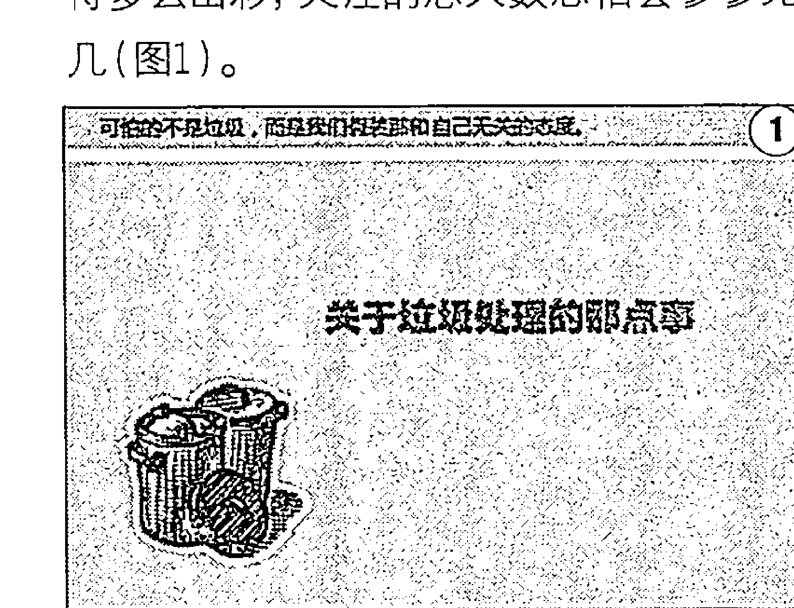

> PPT微博第一个关键是选择一个适宜传播的主题，如果主题太专业，或者太个人化，都很难引起微博人群共鸣，转发更无从谈起。

所以一般在微博上适合传播的PPT主题往往是公益环保话题类、有影响力的读书心得类、心灵鸡汤励志类等等。简而言之，选择最大人群共鸣的话题来制作。

## 限制话题的长度

我在制作垃圾处理这个题材时，利用搜索引擎做了大量案头工作，在几个小时内我快速浏览了大量的垃圾处理知识，让自己迅速成为一个准话题专家。

在搜索时代，获得信息不难，难在如何挑选和组织信息，使其具备更好的结构，便于别人理解和阅读。所以首先我要快速了解关于垃圾处理方方面面的知识，从宏观上理解它，才能在结构上把握它。

当我阅读信息越多，我的结构开始逐步清晰，开场就提出一个问题，垃圾到哪儿去了？其实很多人并不知道垃圾的处理流程，这样就很自然引出了垃圾的处理方式，再从方式引出关于垃圾处理方式的争论，从争论又自然引出国外处理理念和中国处理理念的不同，最后升华主题。不管哪种处理理念，都要求我们每个公民做点什么，于是发出号召。

在结构搭建过程中，可以利用的素材做100页PPT都可以，但显然人们无法对这样的长话题感兴趣，那么限制页面的长度不仅仅可以便于制作更小的PPT，而且可以让每个单元的内容全部选择最具有冲击力的材料来组织，使整个PPT显得不拖沓啰嗦。

> PPT微博第二个关键是限制话题的长度，我的经验是一条图片微博如果拼图长度超过15页，那么在打开浏览方面会因为网页加载速度问题导致很多人无法有耐心等待显示完全后浏览。

而PPT的页数限制也直接限制了我们的构思取材和表达形式，这也是做PPT的一个重要技巧。用页数来限制传递的内容，会让每一页都只能选择放置关键或者精华的信息。而太多的PPT恰恰是不肯给自己限制，导致内容无限膨胀，进而可读性也极大下降。

## 不要忽略了文案

在做这个PPT的过程中，我感觉每页都意犹未尽，所以又统一在顶部加了一行小字，把有些意犹未尽的话放在顶部，这里面有些话后来都成为大家微博上转发的评语。比如首页顶部的“可怕的不是垃圾，而是我们假装和自己无关的态度”，就被很多朋友作为转发评语直接借用。

文案的表述尽可能多地选择多样化元素，这样的元素除了经过提炼过的语言外，还可以有形象的图说方式，以免引起读者的视觉疲劳。如第二页用一个垃圾流程图的方式把我们身边的垃圾处理方式做了一个形象说明，而在页面底部用两个形象的垃圾桶加上简单的一句话，把填埋一吨垃圾的费用清楚地呈现在读者面前（图2）。


而第七页用了饼状图来说明垃圾不是废物，将垃圾分为可直接回收的和不可直接回收的部分。如果我用文字来描述，估计不到一分钟，大家就失去了阅读的兴趣，而用一个饼状图直接比较，就能很清楚地指明将垃圾变为资源的意义（图3）。

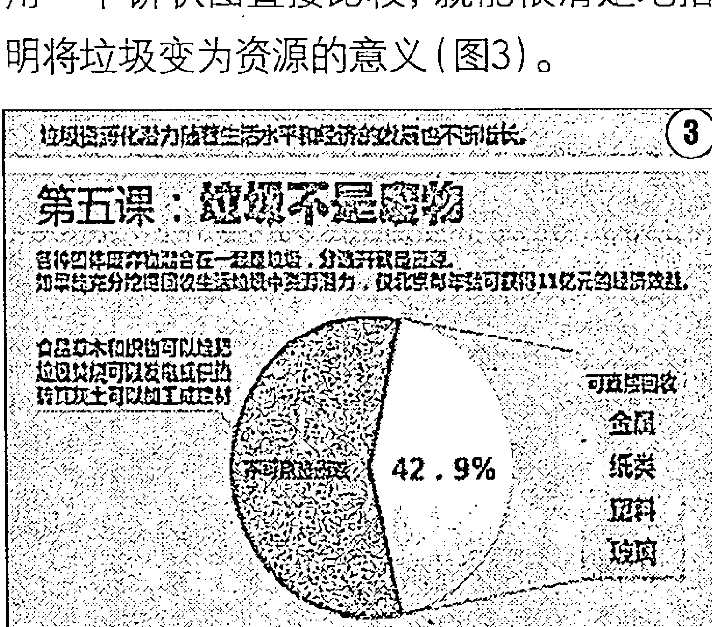

文案表述多样化的另一个思路是提炼关键词，在PPT里，不主张很多文字堆砌在一页上，而应做到精简，图说是一种思路，而提炼关键词是另一条思路。

如最后一页“垃圾分类，你可以做些什么”是发起号召，文案也是反复提炼，总算提炼出六个关键词：抵制、减少、节约、修复、回收、呼吁，然后带出后面的具体建议。

假如我直接陈列关键词后面的六句话，普通人看都不看就跳过，因为信息量太大，现在有了关键词，信息量阅读实际上就被分解为两步了，减轻了阅读负担(图4)。

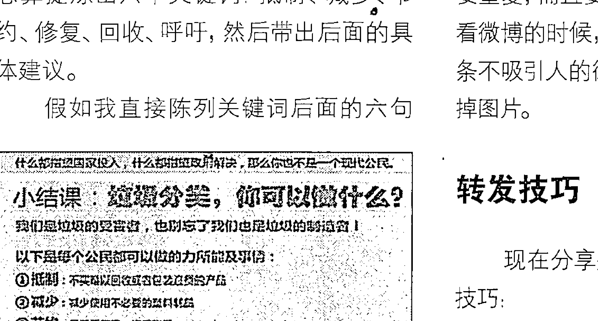

PPT微博的第三个关键是微博的文案，微博的文字内容要和PPT的内容有机结合，相互呼应，提炼亮点，尽量不要重复，而且要提醒别人注意看图。很多人看微博的时候，根本就忽略了还有图，而一条不吸引人的微博也会导致别人直接忽略掉图片。

## 转发技巧

现在分享关于PPT转图片微博的操作技巧:

- PPT文件存盘时选择另存为PNG或JPG图片，PNG图片质量更好，但文件偏大。
- 用美图秀秀或可牛影像等在线拼图模板或者客户端软件（功能会更强大一些）拼图，调整图片大小（建议图片宽度设置为480像素）后通过微博上传。不建议直接通过软件发布微博，不仅仅是会带上相关网站的微博链接，导致微博可写的长度变短，更重要的是你要记得把PPT源文件链接在微博里通过各种网盘分享，很多网盘比如新浪微盘、华为DBank网盘在下载的时候默认都会自动转发，大大带动微博的传播。
- 顺便说一句，在制作PPT图片时可以充分利用这些网站提供的场景拼图功能，绝对能让人对你的PPT眼前一亮！

如果你对这个关注垃圾话题的公益微博有兴趣，可以@秋叶语录，在“搜我说的话”对话框里搜索“垃圾”即可找到原始微博，继续借助你的力量让更多人了解关于垃圾减重的知识，现在就转发吧！

(文/秋叶)

# 坐在家里赚钱的淘宝客心得

今年我们介绍过几期返利的文章，相信不少童鞋已经小有斩获。但要想让我们的腰包更丰盈，还需要更给力！那就是做一名淘宝客，可以坐在家中赚取佣金！

## 成为一名淘宝客

由于我有淘宝购物省钱的经验，同事们纷纷找我帮忙网购，他们的一些返利自然也到了我的钱袋子里。一个念头闪现在我的脑中，如果帮网友购物时，都能将返利提取一部分作为佣金，那可是不小的收入啊。

经过多方比较，我选择了具有多种推广模式的淘宝联盟—阿里妈妈。登录阿里妈妈注册淘宝联盟账户，按照步骤操作，与支付宝绑定，我就成了一名淘宝客。

接下来就要开始推广了，我让同事在淘宝拍东西时告诉我，我通过淘宝联盟找到同事购物的淘宝店，再把推广链接发给她。过了一天，我发现淘宝联盟结算中心增加了一个明细，显然这是做淘宝客的一笔佣金。有了第一桶金，信心大增！

## 初级淘宝客的生意经

简单的推广方法能够赚到钱，但是又不能总是让别人购物时告诉我，麻烦且不说，时间长了他们都喊我小贩。接下来，我将自己买过的和朋友所购的商品收集起来，把使用经验写成短文，在文字的下方附上推广链接。

在获取这个链接时，我都是货比三家，选择价格最低、网上评价及信誉最好的淘宝店铺。随后就把这些经验性文章发到博客、微博、论坛及QQ空间上分享给好友。网友感兴趣了就会点击链接购买商品。购买量增加，佣金也随之增多。需要提醒的是，在淘宝联盟搜索到商品后，一定要点击商品右边的“立即推广”，否则，有可能获取不到佣金哦！

## 达人淘宝客的生财之道

上面介绍的链接推广方法虽然能够赚到钱，但运作起来会耗去很多精力和时间。我决定进阶一下，利用淘宝联盟的API第三方工具，让赚钱变得更轻松。展开API工具，在下拉列表中列出了很多开发工具。有些工具使用人数超多，简单易学，如小豆淘建站工具。

还有一种与众不同的工具，如商品导购电子书。选择工具千万别贪多，有两个就够了。

将鼠标移动到小豆淘建站工具上，右侧出现“立即使用”按钮，点击进入建站界面。

先进行模板选择，勾选栏目、导入图片（我自己设计了LOGO及标题图片）。在推广商品项中添加推荐商品和可选商品，一个网站就OK了。

我为网站起了一个个性的域名后，把这个网站的地址通过QQ、MSN、微博、博客等发布出去。我选择的是家用生活、女性用品及特色饰品等产品，每件商品都包含我的ID信息。只要购买上面的商品，我就能得到佣金。我的经验是，网站的商品宜精不宜多。

杂志推广也是相同的道理，初选这种模式，是基于一些女性朋友的阅读习惯。她们喜欢看时尚杂志，我就把现成的免费商品杂志送给她们，不管买不买她们都要看几眼，即使不买也会告诉别人她们的发现。

操作上我选择了两种方式同时进行：一是保存到电脑上，随时向自己的好友发送；二是直接在杂志页面上点击分享到微博、博客、论坛等网络工具上。选择杂志时，主要看商品的实用度和佣金额度，两者都要合适。

(文/张树忠)

# Excel 2010重要表格不留空

平时编辑的表格中总会有些单元格没有内容可填写，通常为了防止以后被人套印填写篡改，我们需要在没内容的空格中填上“无”、“0”、“空”或画一直线（通常用减号或破折号）。若逐一选中空格输入显然很麻烦，在此介绍几种可以在Excel 2010中快速填满空格的方法。

## 直接输入——快速填写所有空格

在Excel中只要按住Ctrl键，逐一单击选中所有空格，输入“无”后，按Ctrl+回车键确认即可在选中的所有空格中填入“无”。这算是最直接的方法了，不过当空格太多时逐一单击选中空格就不容易了。对此，我们可以选中要填写空格的单元格区域，单击“开始”选项卡的“查找和选择”，选择“定位条件”。在“定位条件”窗口中单击选中“空值”单选项，单击“确定”即可选中选定区域中的所有空格。然后输入“无”，按Ctrl+回车键确认即可。

## 查找替换——多张工作表同时填空

在Excel中还有一种填写空格的方法也很简单，选中要填写空格的单元格区域，单击“开始”选项卡“编辑”组的“查找和选择”，选择“替换”。在替换对话框的“替换为”中输入“无”，查找内容不要输入，单击“全部替换”即可看到所有空格已经全部输入了“无”字。在此，选中区域中不能完全没有数据，否则会提示替换错误无法进行填写。

这招最大的优点是可以同时填写多张工作表。按住Ctrl键逐一单击选中需要填写空格的多张工作表标签，再拖动选中标题行以下的所有数据行，选中行数应按行数最多的表格考虑。然后进行替换，同样“替换为”中输入“无”，查找内容不要输入，单击“全部替换”即可同时填写多张工作表中的空格。Excel会很聪明地只填写各张表格内的空格，表格外的空格则照样保持空白。

Excel在替换填写空格时会自动判断表格区域，只会在工作表中最后一行、最后一列有数据的行、列以内的区域才会自动填写，如图2所示。超过这个区域即使选中进行替换也不会被填写。因此即使多张表格的结构、布局、行列数都不同也可以同时选中进行填写，不过最好表格标题部分的行数尽量相同，这样选择区域时才能准确避开标题部分只选中多张表的数据区进行填空。

## 函数公式——让空格自动显示“无”

若表格在填满空格后还不时需要重新删除或填写表格数据，那么每次修改后都要重新填写一次空格也挺麻烦。在Excel中使用函数公式就能做到自动填写指定区域中的所有空格。以自动填写“考核”工作表D4:J120的所有空格为例来说吧，先按住Ctrl键拖动“考核”工作表的标签复制出另一份工作表“考核(2)”。在“考核(2)”表的D4输入公式=IF(考核!D4="","无",考核!D4)，然后选中D4进行复制，再选中需要填写空格的区域D4:J120进行粘贴即可。现在表格中的空格已经全部自动显示为“无”了。现在你在“考核”工作表进行填写修改，“考核(2)”工作表中就会自动为空格填上“无”。我们在需要打印时选择“考核(2)”工作表进行打印输出即可。

## 编辑代码——实时填写空格

函数公式虽然简单，但需要建立一个辅助工作表，不能在同一个工作表中修改和打印，操作上有一点麻烦。其实Excel也可以在完全不改变工作簿布局的前提下实现自动填空，那就是编辑工作表代码了。

右击工作表标签，在右键菜单中选择“查看代码”，在打开的Microsoft Visual Basic窗口中输入以下代码：

```
Private Sub Worksheet_Change(ByVal 输入区 As Range)
    On Error Resume Next
    Dim 单元格 As Range
    For Each 单元格 In 输入区
        If 单元格 = "" Then
            单元格 = "无"
        End If
    Next
End Sub
```

在此我们使用中文变量名，代码含义不难理解就不细说了。最后关闭Microsoft Visual Basic窗口返回Excel窗口。选中需要填写空格的单元格区域，按Ctrl+C键复制再按Ctrl+V键粘贴，马上可以看到选中区域的所有空格已经填上了“无”字。以后当你删除单元格中内容后，Excel就会自动在单元格中填上“无”，而由于Excel本身的特点，在单击单元格输入新数据时“无”字会自动被替换，所以无需删除“无”字。此外，当你从其它表格中复制一批单元格数据粘贴到此工作表中时，原数据中的空格也会自动填写上“无”。此设置只对当前工作表有效。

注：如果有个别单元格需要清空又不想填写“无”字，可以在该单元格输入一个空格，这样就能显示成空白了。此外，操作时得特别注意不要在表格外的无关空单元格中双击编辑，以免空单元格被填上“无”。也不要通过单击行、列标选中整行、整列进行删除，否则会出现整行、整列的“无”。不过这个问题只要在代码的If后用AND增加对行列范围的限制条件即可解决，具体代码就留给大家自己研究吧。

由于是通过编辑代码实现的，因此最后一定要把编辑的工作簿以“Excel启用宏的工作簿 (*.xlsm)”格式保存才行。而且，下一次重新打开此工作簿时会警告宏已被禁用，得单击警告栏中的“启用内容”按钮才能使用这项功能。好在Excel 2010还比较聪明，只要启用一次，以后再打开就不会禁用宏了。

上面总共介绍了四种填写空格的方法，直接填写和查找替换都比较简单直观但不适合用于经常修改的表格。编辑代码和使用函数更适合用于需要经常修改的表格，操作上函数公式要比代码容易些，实际效果则代码要比函数好。四种方法各有优缺点，大家可根据自己的喜好、需要选择。不过如果你有好多个工作表需要同时填写，那么替换显然是最佳选择。

（文|陈桂鑫）

# 巧设置 自动分页小计

平时制作工资表、采购清单、项目报价表、销售记录等页数多的数据表格时，为了方便查看，往往需要在打印出来的每一页表格末添加一行分页小计对本页数据进行合计，最后一页除了分页小计外还得再增加一行总计行用于合计所有数据。靠手工逐页插入分页小计显然很费时费力，最要命的是一旦进行了增加行、删除行或排序后还得重新来过。在此介绍一个可以在Excel 2010中自动生成分页小计的简单方法。你只要创建一个分页小计工作表，然后在其中用公式引用原表数据自动生成含分页小计的表格即可，完全不会影响到原表。下面就以工资表为例来说吧。

## 创建分页小计工作表

打开需要分页合计的“工资表”工作表，右击“工资表”工作表标签选择“移动或复制……”，在弹出窗口中单击选中“创建副本”复选项，确定后即可复制出一张“工资表（2）”工作表。右击工作表标签选择“重命名”，把它改名成“分页小计”工作表。
从A1拖动到I3选中A1:I3区域，输入公式=IF(工资表!A1="","",工资表!A1)，然后按Ctrl+回车键确认把在A1输入的公式同时填写到A1:I3单元格，以同步引用原工资表的标题行数据。在I2单元格输入每页可打印的表格行数15，不计算标题行但应包括分页小计行。
然后切换到“页面布局”选项卡单击“打印标题”，在“顶端标题行”中输入$1:$3，确定后即可让1~3行的标题行内容重复出现在每一页上。最后删除所有数据，只保留标题行和第1行数据。

## 自动生成分页小计

在A4单元格输入公式=IF(OR(MOD(ROW()-3,$I$2)=0,COUNT($A$1:$A3)=COUNT(工资表!$A:$A)),"",OFFSET(工资表!A$1,ROW()-(ROW()-3)/$I$2,0))，选中A4向右拖动其填充柄把公式填充至C4单元格。在D4输入公式=IF($A4="",IF($A3="",IF($A2="","",SUMIF($A3:$A$3,"",D3:D3)),SUM(OFFSET(D3,0,0,-MOD(ROW(D3)-3,$I$2))),OFFSET(工资表!D$1,ROW()-(ROW()-3)/$I$2,0))，并选中D4向右拖动填充柄把公式填充至I4单元格。两个公式中的-3均为标题行数，请按实际情况修改。
选中A4:I4单元格区域向下拖动填充柄复制填充到第600行，即可看到所有分页小计和总计都已经出来了。在此向下填充的行数应按原记录表需要的最大记录行数加上相应分页小计行数考虑，必须确保行数足以显示所有数据行、分页小计和合计。公式填充好后还应该注意确保所有数据行的行高一致，分页小计才能准确出现在每一页下。
如果你还需要在C列显示分页小计、合计等字样，只要在C4单元格输入公式=IF(A4="",IF(A3="",IF(A2="","","合计"),"分页小计"),OFFSET(工资表!C$1,ROW()-(ROW()-3)/$I$2,0))，再选中C4单元格双击其填充柄把公式向下填充即可。

为了方便区分记录与小计，要求把分页小计和合计放置在表格外显示。这要求同样可以用条件格式实现，你只要把条件公式改成=$A4<>""即可，其它操作完全一样。
OK，现在直接打印“分页小计”工作表就可以得到有分页小计的表格了。打印前需要先打印预览一下看看有数据页面总共有多少页，再直接指定打印页码范围，以免后面的空行也一起打印出来。

## 表格边框自动设置

向下填充的公式行数显然会大大超出工资的实际需要，这样最后面没数据的单元格也会显示表格边框。我们可以通过设置条件格式让空行的边框自动隐藏起来。
先选中A4按住Shift键单击I600来选中A4:I600区域，在“开始”选项卡中单击“边框”后的下拉按钮选择“无边框”消除所有表格边框。
再单击“条件格式”选择“新建规则”，在“新建格式规则”窗口的“选择规则类型”列表中选择“使用公式确定要设置格式的单元格”，在下面输入公式为=$I4<>""。然后单击“格式”按钮，在弹出窗口中设置好外边框。
全部确定完成设置后你会看到只剩下前面的数据行还有表格边框，后面空行的边框已经自动消失了。此外，有的表格为了美观会设置隔行换色，如果也想让空行的颜色自动消失，只需再新建一个条件格式规则，公式同样为=$I4<>""，然后设置填充颜色即可。

## 重复使用与调整

设置好的分页小计工作表以后都可以重复使用，一般无需再作任何修改。我们在“工资表”工作表中对数据进行修改、排序及增加、删除行等操作后，直接切换到“分页小计”工作表即可打印出带分页小计的工资表。只有当你修改纸张、边距、行高等设置造成每页实际打印行数变动时，才需要调整让分页小计正好出现在每页的最后一行。
调整也很简单，切换到“视图”选项卡单击“页面布局”，在“页面布局”视图下可以很方便地算出每一页中的实际行数，你只要把这个行数输入I2单元格，即可自动完成调整。在编辑记录表时偶尔会碰到需要增加、删除列的情况吧？那也简单。你只要按住Ctrl键单击工资表和分页小计工作表标签以同时选中这两张工作表，再选中列，然后右击选择复制，再右击选择“插入复制的单元格”即可在两张工作表中同时增加列。删除列则只要直接选中列右击选择删除即可。
按此操作同时增加、删除列后分页小计工作表仍然可以正常显示，无需再做其他调整。同理，当需要调整行高、列宽、单元格格式等设置时也一样，只要同时选中两个工作表进行操作即可确保两个工作表格一致。
注意，插入列后要填写修改数据时，一定要先单击切换到其他工作表后再返回工资表中修改，不能在同时选中两个工作表时修改数据，否则分页小计中的公式会被删掉而无法正常显示。

（文|陈桂鑫）

# 远程重装系统手记

办公室用来作监控的电脑软件运行出错，厂家告知必须重装系统。如何在家实现远程安装系统，并在系统装好后，电脑继续受我控制？

## 2:00 机房告急

最近几天，在家用TeamViewer控制办公室电脑办公。这天晚上，办公室的电脑出问题了，远程控制没有问题，但软件运行出错，技术人员说系统出了问题，需要重装。但此时已是凌晨两点，去办公室已不太现实，时间紧迫。

## 2:05 决定重装

经过一番思考，我决定远程重装系统。用一键安装Windows的软件，只需要在Windows下做好设置，电脑启动后会自动利用Ghost镜像文件进行安装。

## 2:10 定制镜像文件

由于办公室的电脑并没有做过备份，得使用一个新的Ghost镜像文件，但重装后系统中的TeamViewer没有了，如何远程控制呢？思前想后，我打开软件GhostExplorer.exe，将手头的一个Ghost镜像文件做一下修改，将安装好的TeamViewer文件夹复制到镜像文件里面的C:\Program Files下面去，这样，新系统安装好后也就有了TeamViewer文件。

## 2:25 制作启动菜单批处理

新系统安装好后，必须得运行TeamViewer才能受控，这也难不倒我，我编写了一个批处理a.bat，内容就是一行语句：
```
"C:\Program Files\TeamViewer\Version6\TeamViewer.exe" --control "%1"
```
作用就是启动TeamViewer，将这个批处理文件也放进了手头的Ghost包中。这次放的位置是“C:\Documents and Settings\Administrator\「开始」菜单\程序\启动”文件夹下，这样就意味着新系统装好后，启动完毕，会自动运行这个批处理，那么就能启动TeamViewer。

## 2:33 搜寻受控密码 制作reg

考虑到TeamViewer是有受控密码的，如果系统重装，用户设定的密码没有了，依然无法控制。那么只有找到TeamViewer用户设定密码的存储位置，将其放在远程的电脑中去。经过查找，我终于在注册表中找到TeamViewer一项（图1）。
经过测试得知其中的SecurityPasswordAES这行就是密码，于是我将其导出，保存在E盘，取名为tea.reg。
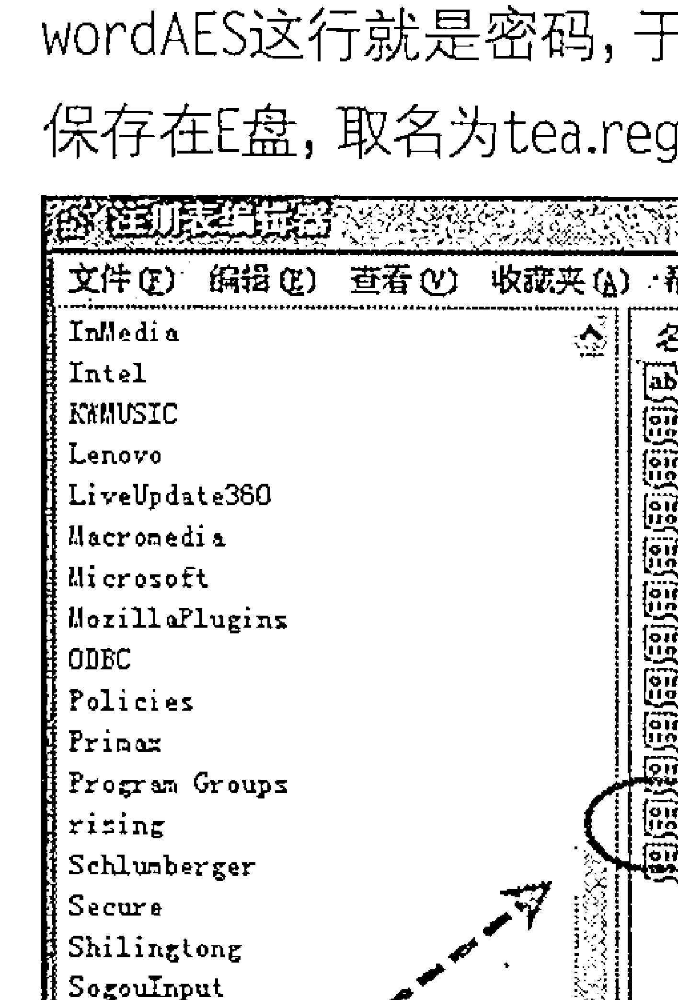

## 2:42 启动菜单自动导入reg

如果直接把这个文件放进启动菜单，那么系统开机的时候确实会自动执行该注册表，但是这个时候不会导入，而是弹出一个导入的对话框，如果是在本机操作，单击确定就可以了，但这时远程电脑已不受我控制了，所以，会在这一步卡住。怎么办？我突然想到regedit.exe命令有个参数/s。如果加上这个参数，在导入注册表时不会有任何提示，直接导入。于是我在批处理文件中添加了一条语句，现在a.bat的内容就变成了如下样子：
```
regedit.exe /s "e:\tea.reg"
"C:\Program Files\TeamViewer\Version6\TeamViewer.exe" --control "%1"
```
第一行先导入注册表，第二行启动Teamviewer受控端。

## 2:50 再改批处理 设置延时

这时我又忽然想到一个系统的网络延迟问题。批处理命令会在进入系统后马上执行，但那台受控机器档次低，开机速度比较慢，XP在开机后，网络不能马上使用，初始化要等待一段时间。而TeamViewer早早运行，可能会因没有网络而产生错误。最好加点延时！批处理命令的延时比较麻烦，而且不准确。不过也没关系，我只需要延长一段大致的时间就可以了。经过再三斟酌，我再次修改了a.bat文件：
```
regedit.exe /s "e:\tea.reg"
@echo off
echo %time%
ping /n 60 127.1 >nul
echo %time%
"C:\Program Files\TeamViewer\Version6\TeamViewer.exe" --control "%1"
```
其中ping /n 60 127.1 >nul这行的意思就是等待60秒左右的时间。

## 2:55 登录路由器 绑定地址

计算机安装好后，自动获取的IP地址可能有所变化，怎么办呢？我首先查看了受控计算机的MAC地址，然后登录路由器，将其MAC地址和IP地址绑定在一起，这样，就算重装了系统，其获取的IP地址还是不会发生改变。

## 3:00 导出防火墙reg文件

新安装的系统在一般情况下本地连接的防火墙是打开了的，那么TeamViewer这款软件在启动的时候会访问网络，这个时候防火墙会弹出对话框，如果不解除阻止的话，那么Windows的系统防火墙会自动阻止TeamViewer访问网络，这样我还是不能控制远程电脑。
该怎么办呢？还是老方法，注册表。防火墙的打开和关闭，在注册表中肯定有所体现，只要导出就可以了，经过一番搜索和测试，我找到了这个项目。其中这个EnableFirewall项就是是否打开防火墙的，

## 3:03 让批处理导入防火墙reg

最后修改启动菜单的批处理，使之能导入防火墙的reg文件。再次修改a.bat，使其内容成为如下几行：
```
regedit.exe /s "e:\tea.reg"
regedit.exe /s "e:\fire.reg"
@echo off
echo %time%
ping /n 60 127.1 >nul
echo %time%
"C:\Program Files\TeamViewer\Version6\TeamViewer.exe" --control "%1"
```

## 3:05 远程复制 重装系统

所有工作准备就绪，开始操作。我首先通过共享文件夹，将我做好的注册表文件、Ghost安装镜像文件（我修改过的）都复制到受控机器的指定位置，然后在受控机上运行一键还原，出现对话框后选择“自定义操作”，出现选择文件对话框，选择我刚才复制过去的Ghost镜像文件并确定，只见系统窗口一暗，受控机器重新启动了。

## 3:10 漫长的等待

下面的操作就不受我控制了，只能寄希望于我的所有构思完全正确。过了一段时间，我在CMD窗口输入ping 192.168.1.102 -t这个命令（该IP是我为受控机器绑定的IP地址），耐心等待，在受控机还没有安装好，没有进入系统的时候，CMD窗口中就一直显示Request timed out。

## 3:28 恢复正常

突然，CMD窗口出现了Reply from 192.168.1.102: bytes=32 time=3ms TTL=63，说明受控机的系统安装好了，我心中一阵狂喜，又等了几分钟，启动本机的TeamViewer，在伙伴ID中输入受控机的IP地址，然后点击“连接到伙伴”。过了一会，出现要求输入密码的对话框，这说明受控机的TeamViewer也正常启动了，输入我开始设置好的密码，点击“登录”，出现了受控机的屏幕，呵呵，成功了！我又可以远程办公了。

（文|赵睿）

# 快速医治Win7的“疑难杂症”

小范热衷于鼓捣新奇的软件，时间久了，发现系统运行的速度越来越慢，这也难怪，再强壮的系统，也难免会出现“头疼脑热”的病症，如何医治呢？重装系统虽然可以解决问题，但是操作起来实在繁琐。好在小范预先使用了WinRescue 7（下载地址：http://superwin.swmirror.com/wnrsq7z.exe）这款系统急救软件，毫不费力地治好了Windows 7的“病痛”，让其重新恢复了健康。

## 选择“急救包”类型

在WinRescue 7主窗口中打开Backup面板，软件预设了四种不同类型的“急救包”。小范选择了Config1类型的“急救包”，接下来需要为其添加各种“急救药品”。说白了，就是针对各种系统“要害”文件创建备份，用来迅速恢复受损的系统。
点击Change Backup Properties按钮，在备份设置窗口左侧选择Backup Properties项，在右侧窗口的Backup Config列表中选择Config1项，在Settings面板中的Backup Type列表中选择备份模式，包括正常备份、增量备份、差异备份、替换备份、副本备份等。
为了控制备份文件的大小，WinRescue 7可以对备份文件进行压缩处理，在Compression Level列表中选择压缩等级。

## 配置备份对象

为了安全起见，勾选了所有的备份对象。当然，小范还有一些自己的重要文件需要备份，在Other Files面板中点击New按钮，导入所需的文件或者文件夹。为了防止别人随意使用WinRescue 7执行备份和恢复操作，小范在Misc面板中的Password to use Backup and Restore栏中输入密码，这样没有密码，WinRescue 7将拒绝执行备份和恢复操作。

## 为Windows 7 创建“急救包”

因为已经配置好了Config1类型“急救包”属性，因此在系统运行正常时，在WinRescue 7主窗口的Backup面板中选择Config 1项，点击Backup按钮，在弹出窗口中输入“急救包”的名称，点击OK按钮，完成该急救包的创建操作。所谓急救包，就是WinRescue 7在预设路径中创建的备份文件夹，在其中存储着各种压缩后的系统备份文件而已。
为了加快备份的速度，打开备份设置窗口，在左侧点击Desktop Icons（桌面快捷图标）项，在右侧窗口中的Type in Title（键入标题）栏中输入标题名（例如“急救包”），勾选Back up 1ST Config项，选择第一种备份模式。点击Create Desktop Icon（创建备份快捷方式）按钮，就可以在桌面上创建名称为“急救包”的快捷方式。双击该快捷方式，就可以立即创建所需的急救包了。
按照上述方法，可以创建任意多个“急救包”。

## 快速治疗系统“病痛”

当系统出现异常情况时，小范在WinRescue 7主窗口Crash Fixer面板的“1.Choose Backup to Restore”列表中选择WinRescue Backup-Most Recent项，WinRescue 7会自动显示所有可用的“急救包”项目，可以从中选择所需的“急救包”。
在“2.Select Extent to Restore”栏中勾选Windows Creah（Registry）项，表示修复和注册表相关的故障。如果勾选Another Type of Crash（WinConfig）项，表示修复针对系统配置文件导致的故障。勾选Lost User Data（User Profile）项，可以拯救用户重要数据。
这里小范勾选了所有的修复项目，对系统进行全面恢复。点击“3.Restore”按钮，WinRescue 7就可以根据备份文件，将系统恢复到与之对应的正常状态了。

（文|郭建伟）

338 电脑爱好者 合订本·2012

# 网盘海选 寻找贴心“保险箱”

经过多年的大浪淘沙，有些网盘已销声匿迹，新的网盘又闪亮登场。那对我们普通用户来说，我们需要什么样的网盘？使用网盘前需要了解哪些参数？哪种网盘适合自己？

## 当优盘 异地文件快速同步

如果工作比较急，除了加班外，许多人会选择将文件拷贝到优盘，然后带回家中继续做。如今有了网盘就不用那么麻烦了，文件直接放到网盘中，然后不论何时何地，只要能上网就可以取用文件了。对于有这一需求的用户，一般来说优先考虑的问题是:
- 方便: 在网盘中存取文件，就像在本机上进行一样;
- 安全: 办公文档一般具有私密性，所以对安全比较重视;
- 共享: 办公经常涉及到多人协作，所以能否方便地共享也很重要。

点评: 网盘的方便性，主要体现在客户端的同步支持上，客户端同步可以让网络文件存储如同在本机进行一样。上面打√的，表示全面支持Windows、Android和iPhone/iPad系统。网盘的安全性主要分两方面，一是数据保护的安全，二是稳定性，否则如果回到家中发现网盘打不开了，岂不是糟糕。网盘最方便的共享方式，最主要的是对外链支持，直接给他人一个链接即可下载，非常简单。
通过表1数据的比较，作为优盘来用的网盘，金山快盘和华为网盘比较接近需求。不过，金山快盘的外链也支持加密，安全性更高。另外，金山网盘还支持虚拟硬盘功能，用起来更方便。所以针对这一需求，我们推荐金山网盘。

### 实战: 金山快盘小范围分享

共享文件在日常办公中比较常见，特别是不少办公族需要在小范围内分享文件。使用金山快盘可以轻松并安全地实现:
从http://www.kuaipan.cn下载安装金山快盘客户端后，它会在本机建一个虚拟硬盘。打开金山快盘，选中要分享的文件(夹)，单击右侧“共享给好友”，在弹出对话框中输入好友的快盘账户名，单击“增加”，再在下方选择好友的权限，单击“应用”即可。
好友方的快盘很快会收到自动提醒，单击“接受”打开他自己的快盘，即可找到你共享给他的文件了，特别方便。如果是分享给非快盘用户，选中文件后单击右侧“生成下载链接”，即可获取外链网址(可添加密码)，发给好友，对方简单点击就可以下载了，方便又安全。

## 超大文件快速共享

所谓超大文件，是指几百MB甚至上GB的文件，比如我有一部高清电影，就达2GB之多。如今我要将此电影共享给多位好友，那么一个一个传显然很浪费时间和网络带宽，最佳的解决方案则是通过网盘共享。对于有这一需求的用户，一般来说优先考虑的问题是:
- 速度: 如果上传下载的速度太慢，谁也没耐心等待;
- 容量: 网盘容量必须足够大;
- 单个文件大小: 许多网盘容量很大，但支持的单个文件却很小，同样无法共享超大文件;
- 是否支持外链;
- 文件保存期限。

点评: 本次评测的几个网盘，基本上都支持外链，共享比较方便。其他几个方面，网盘都有个初始容量，随着使用的时间变长，容量慢慢增长(基本上都是学谷歌Gmail的模式)。所以初始容量有5GB，基本上够用了。坚果云虽然是“无限容量”，但实际上每月上传下载会有所限制。所以，单个文件大小的支持反而更重要。115网盘上传的速度慢点，不过下载速度还是很快的，另外，它在上传文件时会自动检测服务器，如发现相同文件则会自动保存到网盘中，无需重复上传，间接提高了上传效率。不过通过表2数据的综合对比，360云盘(http://yunpan.360.cn)在上传下载速度、容量大小、单文件大小等方面的表现都很抢眼，是超大文件快速共享的较好选择。

## 特色网盘推荐

现在的网盘产品很多，但基本功能上大同小异，所以各家网盘都很注意特色功能的开发。下面就我的试用经验，给大家推荐一些。

### 酷盘——诺基亚手机也用网盘

诺基亚这两年走向了没落，其主要原因就是Symbian操作系统太落后了，那么多网盘，竟然鲜有支持Symbian系统的。还好，酷盘(https://www.kanbox.com)比较够意思，提供了Symbian的客户端，诺基亚手机用户有需要用网盘的，千万别错过。在诺基亚手机上安装相应版本的酷盘，然后打开酷盘并登录，此时会列出文件目录，选择后会自动下载，选择“选项”下的“上传文件”，可将手机中的文件上传到酷盘。

| 评测项目 | 金山快盘 | 华为网盘 | 115网盘 | 盛大网盘 | 坚果云 | 360云盘 |
| :--- | :--- | :--- | :--- | :--- | :--- | :--- |
| 客户端 | √ | √ | √ | Win/iOS | √ | √ |
| 安全性 | ★★★★★ | ★★★★☆ | ★★★★☆ | ★★★★★ | ★★★★☆ | ★★★★☆ |
| 稳定性 | ★★★★★ | ★★★★☆ | ★★★★☆ | ★★★★★ | ★★★★☆ | ★★★★☆ |
| 外链 | √,可加密 | √ | √ | √ | √ | × |

| 评测项目 | 金山快盘 | 华为网盘 | 115网盘 | 盛大网盘 | 坚果云 | 360云盘 |
| :--- | :--- | :--- | :--- | :--- | :--- | :--- |
| 传输速度 | ★★★☆☆ | ★★★★☆ | ★★★☆☆ | ★★★☆☆ | ★★★☆☆ | ★★★★☆ |
| 空间大小 | 初始5GB | 初始5GB | 初始15GB | 初始7GB | 无限容量 | 初始18GB |
| 单文件大小 | 300MB | 200MB | 1GB | 500MB | 1GB | 5GB |
| 保存时间 | 永久 | 永久 | 永久 | 永久 | 永久 | 永久 |

### 新浪微盘——海量电子书任你看

新浪微盘 (http://vdisk.me) 的最大特点是跟新浪微博结合紧密，除此之外它最大的特色就是微盘上的文档资料非常丰富。我在微博中发现一些好的资料时 (文档资料、电子书籍等)，一般会随手保存到微盘中，我的手机和平板电脑上都安装有新浪微博客户端，很方便就可同步微盘中的资料，平时外出无法用电脑时，我就可以直接从手机 (或平板) 调出微盘中的资料学习了。

### 那些名不符实的网盘

有不少网盘，名声虽大，但总有某些方面很不好用。

#### 慢如蜗牛的微软SkyDrive

微软提出云存储的概念很超前，SkyDrive硬盘推出也比较早，它主要面向微软Office用户，用来进行多人协同办公。不过它在国内的服务一直跟不上，速度慢是其最明显的硬伤。

#### “鸡肋”的QQ网盘

QQ网盘属于存储盘，是典型的“鸡肋”，空间太小，功能单一。初始容量为1GB，网盘内置在QQ中，QQ用户调用确实很简单。不过它也有很多不足之处，首先它没有在本机中创建虚拟磁盘，正在编辑的文件不能直接保存到QQ网盘中，上传文件步骤繁琐。另外，它上传文件非常慢，登录有时也失败。如果不是腾讯将其捆绑在QQ中，那么QQ网盘绝对没有“活路”。

# 挖掘任务管理器的“潜能”

Windows自带的任务管理器是我们最常用的工具，不过，要想真正用好它，使之最大限度地为我们服务，也不是一件简单的事情。

你是否觉得任务管理器的功能太过单薄？那就请出TaskmgrPro插件，为其增加威力吧！

## 让任务管理器吃上“补药”

该插件可以为任务管理器添加进程批量控制、服务管理、掌控启动项、查看网络连接、定时关机、管理共享资源等新功能。这里我们主要谈谈进程批量操作，在任务管理器窗口中打开“进程”面板，按下Ctrl或者Shift的同时，依次选择目标进程，即可将其全部选中，之后点击“结束进程”按钮，在弹出的对话框中点击确认按钮，即可将选中的进程全部关闭。

实际上，要想发挥进程批量操作的威力，离不开TaskmgrPro提供的进程列表功能。例如当病毒，木马等恶意程序侵入系统后，往往会启动各种乱七八糟的进程。我们在对其清理之前，最好将无关进程全部关闭，为杀软打造一个纯净的环境。为此，在“当前列表”栏中选择Clean XP.xml项，可以选中所有正常系统进程。

之后点击“批量执行”按钮旁边的箭头，在弹出菜单中点击“编辑此进程列表”项，在弹出窗口中勾选“排除性列表”项，表示仅仅关闭本列表之外的进程。点击菜单“批量执行→批量结束列表中的所有进程”项，可以关闭当前列表之外的所有进程。这样所有无关的进程就会被全部干掉，而只保留合法的系统进程。这样杀起毒来就轻松多了。

## 为任务管理器加把“锁”

有时，出于安全性的考虑，我们不想让别人随意开启本机的任务管理器，那么最好的办法就是为其加把锁，将非法使用者拒之门外。使用Password Door这款软件，就可以彻底锁定任务管理器。运行Password Door安装程序，在其中的Set Admin Password窗口中输入主控密码。当启动Password Door时，必须输入主控密码后才可以进入其主界面。在其主窗口中的Password Manager面板左侧列出本机上安装的所有软件名称，你可以选择需要加锁的程序。这里为简单起见，首先打开任务管理器窗口，之后在Password Manager面板底部选择准星图标，将其拖动到任务管理器上，Password Door即可捕捉到任务管理器窗口信息，在弹出的加密窗口中的Standard面板显示任务管理器的程序的名称和路径。为了提高安全性，最好为目标程序单独设置访问密码，在Password栏中点击Change按钮，设置所需的密码。这样，以后就只能使用该密码启动任务管理器。

在Advanced面板底部的Advanced Options列表勾选Enable EXE identity项，表示允许Password Door对目标程序进行全面监测，即使其更改名称和路径，也无法避开Password Door的锁定保护。

## 让进程列表彻底“隐形”

如果你不想让别人了解本机运行的进程信息，最好的解决方法就是对进程列表进行屏蔽，让别人面对“失踪”的进程列表无计可施。这就需要使用PEExplorer这款强悍的资源修改工具。在PEExplorer主窗口工具栏中点击“打开文件”按钮，导入taskmgr.exe文件。在PEExplorer的工具栏中点击“资源查看”按钮，在“资源编辑器”窗口的左侧选中“对话框→110”项，选中“进程”面板窗口。

点击Ctrl+Shift+E键，在“对话框模式”窗口左侧列表中选中control[SysListView32]项，在右侧窗口的“风格”栏中取消ws_visible选择框前部的红色标记，可以让进程列表彻底“隐形”。

按照同样的方法，分别在窗口左侧选择两个button项，分别取消其ws_visible项的选择状态。可以让“显示所有用户的进程”框和“结束进程”按钮消失。之后点击确定按钮，在弹出窗口中点击“是”按钮，完成修改操作。同理，在“资源编辑器”窗口的左侧选中“对话框→112”项，按Ctrl+Shift+E键，选择“应用程序”窗口。之后按照同样的方法，可以隐藏“应用程序”列表、“结束任务”按钮、“切换至”按钮、“新任务”按钮等对象。

当修改完成后，点击工具栏上的保存按钮，得到修改后的taskmgr.exe文件。为了避开系统文件保护的限制，可以在“开始→运行”中执行命令sfc /PURGECACHE，清空缓存文件夹内容。之后将修改后的taskmgr.exe文件覆盖c:\windows\system32文件夹下的原始文件，Windows随即弹出文件保护对话框，在其中选择“取消”按钮。这样当重新打开任务管理器时，就会欣赏到你精心打造的限制版任务管理器了。

(文 郭建伟)

# 你了解三星魔焕炫屏吗

三星Galaxy SII手机的魔焕炫屏让人过目不忘，你知道它的屏幕为什么如此轻薄亮丽吗？它采用了何种材质或是显示技术？下面就为你指点迷津。

## 主流的手机屏幕

每个人都希望自己的智能手机屏幕晶莹剔透、色彩饱和，但是你知道吗？手机上图像、文本显示的显著差异是由手机屏幕多样化的材质决定的。而三星Galaxy S II手机屏幕之所以有出色的表现，就是因为采用了Super AMOLED Plus材质的屏幕。

Super AMOLED (Super Active Matrix/Organic Light Emitting Diode)是三星的专利，是AMOLED的升级版。听到这里，你是否会有疑问，什么是AMOLED？

的确，对于我们大多数人而言，都不是专业人员，那些手机屏幕的技术名词，像TFT、AMOLED、SLCD、ASV、IPS以及Retina、Bravia等听上去总让人一头雾水。别担心，下面为你一一解读。在搞清Super AMOLED Plus之前，先来了解一些基本知识。

按屏幕的材质，目前主流智能手机的屏幕可分为两大类。一类是LCD (Liquid Crystal Display)，即液晶显示器，大家都很熟悉了。另一类是OLED (Organic Light-Emitting Diode)，即有机发光二极管。其他屏幕技术与材质可算作这两类的子类或延伸。市面上比较常见的TFT和SLCD屏幕都属于LCD的范畴，而三星的AMOLED系列屏幕则属于OLED的范畴。

屏。TFT的发光原理是靠背光灯照在液晶板面上，由于显示原理并不先进，这种屏幕最大的缺点就是费电。TFT屏幕一直占据着市场的主导地位，随着触控时代的到来，人们对于手机屏幕的视觉效果有了更高的要求，这时，AMOLED技术开始替代传统的TFT技术。

AMOLED (Active Matrix/Organic Light Emitting Diode, 有源矩阵有机发光二极管面板) 也称魔丽屏，是OLED技术的一种。先解释一下OLED技术。OLED代表着它是自发光显示器，利用多层有机化合物来实现独立R、G、B三色光。OLED在工艺上只需用两层薄膜和玻璃或塑料基板，无需背光模块及彩色滤光片，因此更轻薄，显示效果也比LCD显示屏明亮、细腻，理论上也更省电、成本更低。

OLED显示依据驱动方式的不同，分为无源驱动OLED (PM-OLED) 和有源驱动OLED (AM-OLED) 两类。与PM-OLED相比，AM-OLED具有反应速度较快、对比度更高、视角较广等特点，有更大的应用领域。

AMOLED屏幕的构造有三层，即AMOLED显示层+Touch Screen Panel (TSP, 触控感应层) +外覆玻璃层的层叠式设计。这使得AMOLED屏幕有很多优点，比如更轻、更薄、色彩更艳丽、对比度更高等。但缺点也很明显，由于AMOLED屏幕技术不成熟、成品率不高、成本高，所以在早期只有高端机型才会采用这类屏幕，即使目前采用该屏幕的手机也不多，主要为诺基亚的高端机型Lumia 800等。

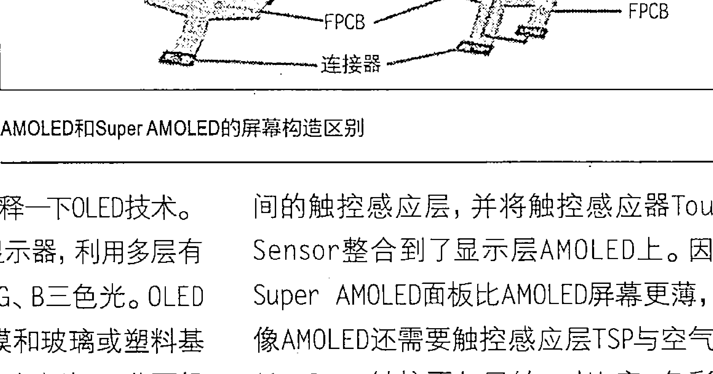

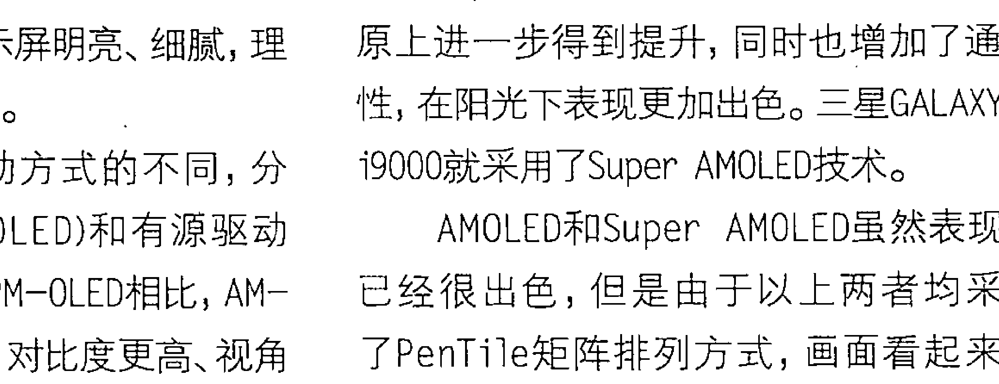

间的触控感应层，并将触控感应器Touch Sensor整合到了显示层AMOLED上。因此Super AMOLED面板比AMOLED屏幕更薄，不像AMOLED还需要触控感应层TSP与空气层Air Gap，触控更加灵敏，对比度、色彩还原上进一步得到提升，同时也增加了通透性，在阳光下表现更加出色。三星GALAXY S i9000就采用了Super AMOLED技术。

AMOLED和Super AMOLED虽然表现都已经很出色，但是由于以上两者均采用了PenTile矩阵排列方式，画面看起来颗粒感比较重，仔细看的话，文字边缘会有轻微的毛边，细节表现不够完美。Super AMOLED Plus是Super AMOLED的进一步提升，色彩上更加艳丽，同时画质也细腻很多。三星i9100采用的就是Super AMOLED Plus屏幕。

## 认识Super AMOLED Plus技术


## PenTile和RGB排列的不同

Super AMOLED Plus与Super AMOLED重点的区别就在于前者比后者多出了50%的子像素，改善了以前Super AMOLED屏幕Pentile像素排列的方式。说到像素排列，对屏幕的显示效果影响很大，有些朋友可能有过这样的体验——虽然屏幕分辨率并不低，但颜色看起来却不纯正而且有颗粒感，这就涉及到屏幕的像素排列问题了。

## 先解释一下什么是像素排列。

我们知道，目前在电子设备上的显示屏都是以像素为单位来衡量的。每个像素点由一个特定的颜色一红色、蓝色或绿色组成，这种像素点排列的方式叫做RGB排列。红蓝绿这三原色都是子像素。如果这三个子像素共同发光，那么从远看就是白色。而其他的颜色则需要每个子像素发光量的不同来进行显示。如果千千万万的像素发光的话，在图片上我们就能能够看到一个个有序排列的图形，这就是我们肉眼可以看到的图像。

RGB的显示对于TFT-LCD来说，效果比较直观，颜色控制准确。不过对于AMOLED来说，RGB显示技术要求像素点比较多，而AMOLED的成本与像素点成正比，像素的多少直接影响成本。因此为了控制成本，Pentile应运而生。

Pentile理论上说是一种比较投机取巧的方法，Pentile的排列主要是通过相邻像素公用子像素的方法来减少子像素的个数，从而达到低分辨率模拟高分辨率的效果。在RGB的基础上再增加一个子像素，就有了RGBW-Pentile和RGBG-Pentile。

RGBW-Pentile由Clairvoyante公司创造，除了传统的绿、红、蓝，新加入了白色作为基准色，这四种颜色组成了一个基本子像素。同时RGBW-Pentile在不增加功耗的前提下提高了屏幕亮度，变相降低了屏幕功耗。目前魅族M9采用的是RGBW-Pentile设计。

三星Super AMOLED采用了RGBG-Pentile技术。RGBG-Pentile仍然是传统的绿、红、蓝，不过整个屏幕强调绿色，绿色成为红、蓝的间隔。所以这种屏幕的对比度很高，颜色显示也更加艳丽。

前面说过，Pentile排列最大的好处就是省电、省成本，但它的显示效果并不如RGB。Super AMOLED Plus就采用了非Pentile设计，回归到原本的RGB标准矩阵式排列技术，大大改进了Pentile排列造成的弊病影响，使得屏幕效果色彩更加艳丽，图片和字体更加清晰，对比度也有所提升。Plus指的是以RGB三色子像素为一组，组成一个像素的排列，也就是RGB标准排列，不用考虑像Pentile排列那种让相邻的像素共享子像素的情况，这样就可大幅消除Pentile排列造成的那种颗粒感和彩边情况，当然相对成本也升高了。

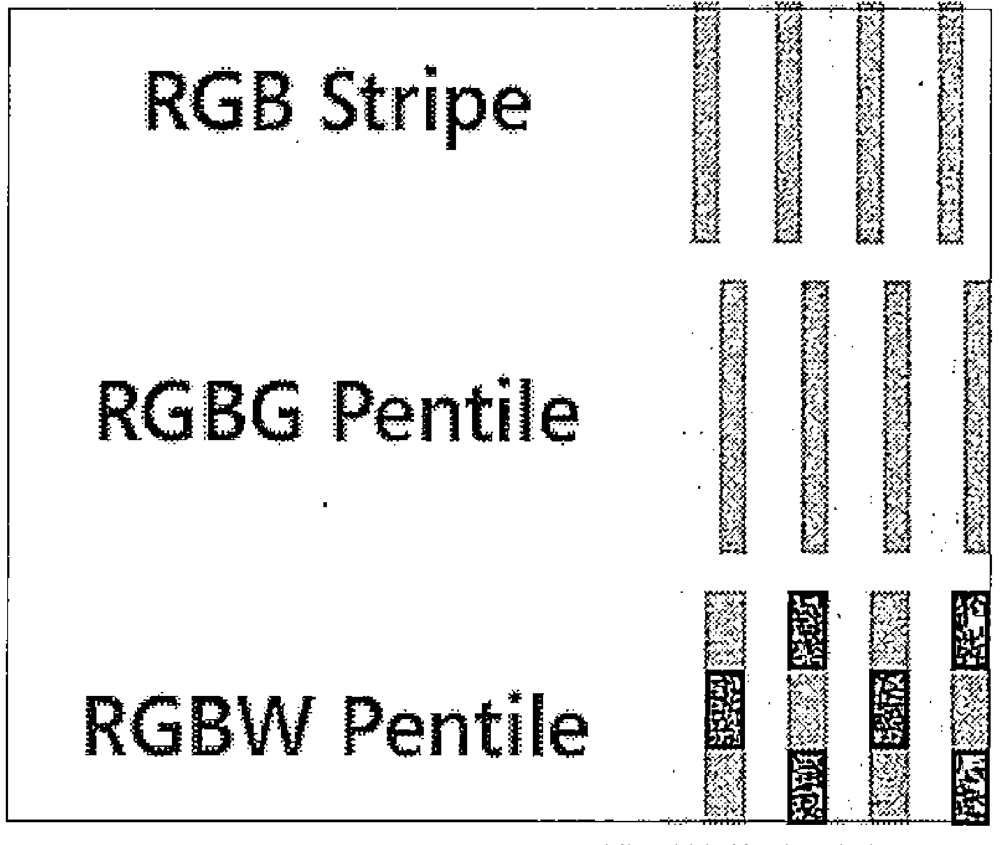

总的来说，Super AMOLED Plus是目前OLED阵营中相当出色的手机屏幕，远远超过了Super AMOLED。
(文|李靖一)

# 让常用文件夹触手可得

电脑中的文件夹数以千计，但常用的文件夹恐怕就不多了，当我们要打开这些常用文件夹保存文件时，在保存对话框中寻找这些文件夹，不知要浪费多少时间!
如何让常用文件夹触手可得，做到一劳永逸呢? 不妨试试下面的方法。

## 常用文件夹随呼随到

首先到http://www.jisuxz.com/down/13674.html下载Eusing Fast Folder Access这款软件，安装完成后，就能享受到它的便捷之处了。软件运行后，单击工具栏中“添加”按钮，弹出添加文件夹窗口，通过Path右侧的“浏览”按钮定位到常用文件夹，单击OK确定。通过这种方法，可以添加多个常用文件夹。现在，在资源管理器窗口，或者在“打开/保存”对话框右侧的资源管理器窗口中，右击鼠标，可从右键菜单中看到Fast Folders一项，单击选中其中的某一常用文件夹就可打开。

## 常用文件夹如影相随

如果你觉得用右键呼出常用文件夹还是有点麻烦，那可以让常用文件夹入驻资源管理器的窗口标题栏中，需要打开这些文件夹时，从窗口标题栏中就可直接打开。用软件FileBox eXtender (下载地址: http://xiazai.zol.com.cn/detail/42/414889.shtml) 即可达到目的。

软件安装运行后，右击托盘中的软件图标，单击Open打开设置窗口，选中Favorites标签，单击New Item，加入常用文件夹(也可加入常用文件)，最后单击Hide隐藏。

经过以上设置后，在资源管理器窗口标题栏，或者在“打开/保存”对话框的标题栏中，可以看到一个心形按钮，单击该按钮，就可从中选择加入的文件夹了，如果单击左侧的时钟按钮，则展开的是最近打开的文件夹。

## 与打开/保存窗口融为一体

用记事本或Word编辑文档进行保存时，“保存”对话框左侧列举的文件夹大多不是我们所需要的，而软件Places Bar Editor (http://melloware.com/download/) 则可以让常用文件夹安身其中。

## 定制Windows中的对话框

软件Windows标签下提供了五个可定制的常用文件夹按钮，勾选Custom，然后单击User Folders后的“打开”按钮，指定文件夹位置，指定完成后，单击Save进行保存，单击OK后，打开“保存”对话框看看，这样我们就可以非常方便地把文件保存在常用的文件夹当中了。

## 定制Office中的对话框

单击Office标签，并勾选Add 5 more custom……，然后在Folder Name中输入名称(可任意取名)，并单击User Folders右侧的“打开”按钮，指定常用文件夹后单击Save，这时再打开Office组件的“打开/保存”窗口，自己所定制的窗口就可以看到了。

通过这种方法，可以向保存位置中添加5个常用文件夹。
如果常用文件夹不多的话，可以试试这种方法。
(文|曹春华)

# 公共Wi-Fi上网会被黑吗

据某黑客自曝，使用公共Wi-Fi上网会被窃取个人信息和密码，甚至危害网银的安全。果真如此吗？

**流言**：有黑客自曝，在星巴克、麦当劳这些提供免费Wi-Fi的公共场合，用一台Windows 7系统电脑、一套无线网络及一个网络包分析软件，15分钟就可以窃取手机上网用户的个人信息和密码。国内某知名安全机构的工程师承认，这个真可以做到。网银、支付宝密码……你懂的……

**真相**：这是微博上曾疯传的一个帖子。其实，无论你使用电脑、iPad还是手机，只要通过Wi-Fi上网，数据都有可能被控制这部Wi-Fi设备的黑客电脑截获，其实也未必一定是Windows 7系统，信息是有可能被窃取的，当然包括未经加密处理的用户名和密码信息。但是，无论什么系统的电脑，架设了多么高级的Wi-Fi热点，黑客一般不能在用户正确操作下获取网银和支付宝密码，更不要说盗窃其中的钱了。

## 手机银行如何保障安全

用户可通过手机上的专门客户端程序，通过WAP方式与银行系统建立连接，并进行账户查询、转账、缴费付款、消费支付等金融服务，这种方式被称为“手机银行”。与一般上网方式显著不同的是，其网址的头三个字母是WAP。手机银行的账户信息是经过静态加密处理的，而且与手机绑定，假使他人盗取了你的账户信息，其他手机上也无法操作。

最重要的是，手机银行还有认证手段。加密的原理很简单，其目的是让非授权用户即使获取了数据也无法利用，而认证则是对数据是否篡改、接收数据的人是不是授权用户等方面的审查措施，用来保证数据的真实可靠，接收者是被授权的。从采用的具体技术和算法而言，加密与认证并没有明显的区别，但从功能角度而言，两者非常不同，相互不能取代，并可通过有效配合而达到很高的安全性。

你输入了正确的账号和密码，当进行涉及到账户资金变动的操作时，手机银行会提示你输入特定的电子口令，而电子口令卡就是一种有效的认证手段。例如工行电子口令卡，它发来信息C5H8，你就要在相应的输入框里输入138141，而且银行每次发来的信息都不会相同。
不同的银行可能会采用不同的认证方法，比如建行就是通过绑定手机发送手机验证码，但都起到了类似的作用。

## 个人网上银行如何保障安全

个人网上银行会采用https的加密协议来保障交易安全，结尾比你常见的http多了个s。你在电脑上输入个人网上银行地址，当跳转到账户信息输入页面时，网址栏就由http变为https了，而且在最后面还多了一只小挂锁，这寓示着通过这个页面输入并传送的数据，会被128位的加密算法进行加密，只有银行方面才能正确解密，即使这些加密数据被黑客拿到，也无用途。

而且，用电脑通过https方式访问个人网上银行时，还有认证手段的保护，操作账户资金限额的大小与认证手段的强度相匹配。电子口令卡的认证强度低，能操作的资金少，而U盾的认证强度大，能操作的资金就多。使用https协议与个人网上银行进行连接，这是银行为了保证安全而采取的强制措施，通过非加密协议传送的信息是不会被银行所接纳的。

用过个人网上银行的网友都会知道，使用前必须安装银行提供的安全控件，否则账户信息栏是灰色的，根本无法输入任何信息。而手机的系统无论是苹果、安卓还是塞班，统统都不支持这个控件，根本就安装不了，账号也就无法输入，被盗取的可能性大大减小。

有些高水平玩家会在手机上装虚拟机，这倒是可能安装上银行的安全控件并成功操作个人网上银行，这时手机就可看作是个简版电脑了，自然也要跟使用普通电脑一样，通过https这种安全协议与个人网上银行进行数据交换。

## 警惕钓鱼网站

不少账户被盗的案例其实是因为访问了钓鱼网站。它们伪装成正规的银行页面或是支付页面，骗取你输入账户名和密码，而这未必一定需要通过Wi-Fi热点这种方式来实现，任何上网的方式都有可能上当。不过，公共的Wi-Fi确实提供了植入钓鱼网站的潜力，利用ARP欺骗，可以在用户浏览网站时植入一段HTML代码，使其自动跳转到钓鱼网站。从这个角度说，公共Wi-Fi网络为黑客提供了一个便利的钓鱼环境。

避免被钓要注意使用安全。一方面，需要对别人发来的网络地址多留心，因为这个地址可能非常接近如淘宝、网上银行的域名地址，打开的页面也几乎和真实的页面完全一致，但是实际你进入的是一个伪装的钓鱼网站；另一方面，尽量选择具有安全认证功能的浏览器，这些浏览器能够自动提示你打开的页面是否安全，避免进入钓鱼网站。

对于智能手机用户，在下载和交易有关的客户端软件时尽量选择官方渠道下载，不要安装来路不明的客户端。

## 结论

银行账户是否安全与手机是否是通过免费的Wi-Fi上网并没有必然的联系。使用基于WAP客户端的手机银行是安全的，用电脑通过https使用个人网上银行也是安全的，但不要用手机上个人网上银行，现在银行也还不支持这项业务。用电脑上个人网上银行时，请核实下https和地址栏后面的小挂锁标志，谨防钓鱼网站。

> P.S. 当然，互联网没有绝对的安全，这话确实不假……

特别鸣谢：snowmark-zhang、晓风残月、HelloPlanetHX对本文的帮助。

## 小编有话说

本文肯定不可能涉及到公共Wi-Fi环境中安全问题的方方面面，仅供大家参考。另外，如网友dikcen所言，“正确操作”可以增强公共Wi-Fi环境下的上网安全，但是难就难在“正确操作”上，这涉及到许多细节，需要很多前提知识和判断，不是那么容易就做到。更多的安全讨论，可以浏览一下http://www.guokr.com/question/99127/。

(文/果壳网 奥卡姆剃刀)

# 寻美党代会海报

党政类主题的海报往往因为严肃而缺乏美感，如何在设计中发掘海报的美往往成了棘手的问题。

这张是四川美术学院2012年元旦晚会的海报。由于刚成功举行党代会，学校就把晚会主题定为“献礼党代会，开创新时代”。如何把这种偏党政类的主题能做得有活力并有时代设计感？那就让我和大家共同分享一下我的锦囊妙计吧（图1）。

> 这张海报的原稿请访问我刊论坛：http://bbs.cfan.com.cn/thread-1483376-3-1.html

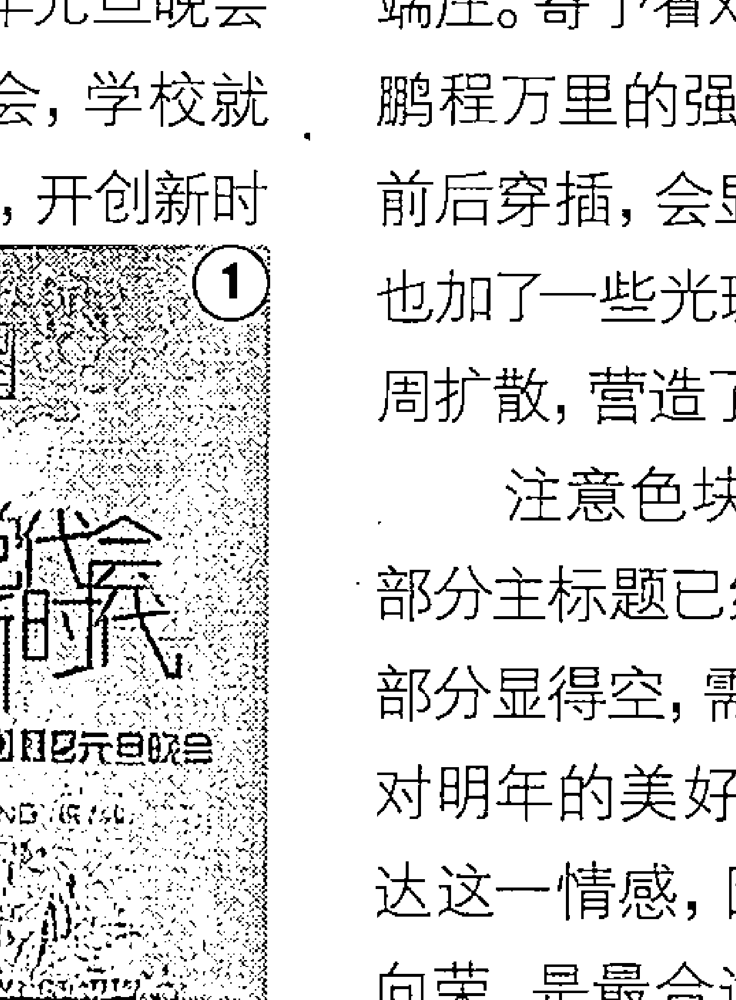

## 纸上谈兵 事半功倍

每当开始制作一张海报的时候，不要急于求成，没有条理地安排元素和文字最后只能是一盘散沙。所以，提前打一个设计草稿往往能省去很多不必要的麻烦，更主要的好处就是可以迅速看到整体海报的大效果，并能直接决定这样的构图或元素是否值得使用。

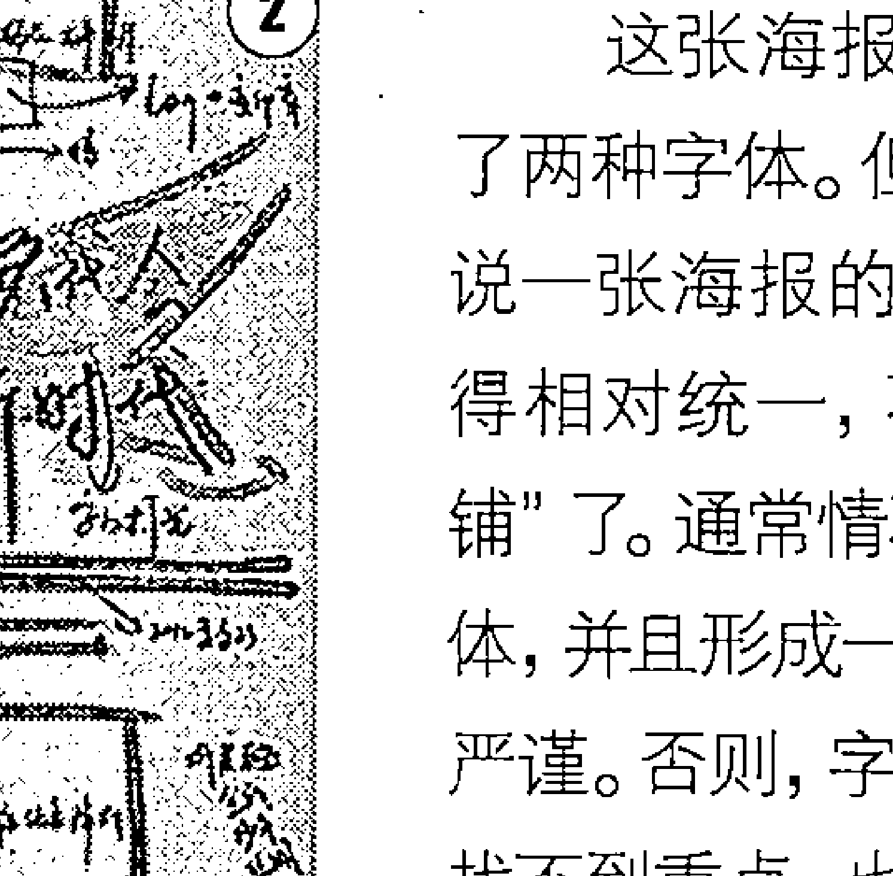

图2是我做这张海报的设计草稿，在草稿上不仅要把自己脑海中呈现的大体元素形状和位置标注出来，还要注释它的性质，可能需要的图案、明度和色相。草稿对于即将制作的海报提供了有条理、有系统的捷径。

在设计稿定型之后，就开始主标题和其他装饰元素的打底。海报的底层，我选用附带质感的图层，这样会让画面丰富起来，也很出效果。

鉴于主题，我决定用亚麻的布料质感来做衬底。这种针织的质感显得整体海报大气中不失细腻，元素附在其上能有一种绣画的感觉，更加唯美，赏心悦目。主标题我用画笔工具绘出一种半透明的形似于羽翼感觉向四周扩散的彩云，因为扩散的纹样会显得画面很有张力动感，大气且不失端庄。寄托着对新的一年将继续飞黄腾达、鹏程万里的强烈期望。这些彩云在主标题前后穿插，会显得很有层次感，在云层前后也加了一些光斑，这种若隐若现随彩云向四周扩散，营造了一种和谐美好的意境。注意色块安排要有整有零，因为中间部分主标题已经占用大部分面积，而上下部分显得空，需要元素来烘托主题。为体现对明年的美好期盼，我选择用牡丹花来表达这一情感，因为牡丹预示着新年的欣欣向荣，是最合适不过了。而表现形式则用线描再用颜色润染的方式，然后用正片叠底使得与衬底融合一起，这样不仅能增加美感，而且让海报显得清新自然。

## 咬文嚼字 精益求精

有时我们会觉得文字的功能只是传达表面信息，但事实上字体如果设计合理的话其实也是一种艺术作品，不同的字体实际上就是不同的图片，能够传达不同的语气及含义。关键就在于如何选择字体，才能和画面中的元素相和谐，从而达到准确有效地传递信息并更有力量呢？

这张海报由于信息量较小，所以只用了两种字体。但是不管信息量多大，一般来说一张海报的字体最好三种左右。这样显得相对统一，不然海报就成了字体“杂货铺”了。通常情况下，同类信息尽量用一种字体，并且形成一个整体会显得版式更加清晰严谨。否则，字体杂乱无章的排列会让读者找不到重点，也就失去了文字的价值。

主标题的字体选择是这篇海报的重头戏，我保留了两种方案。

第一种是恢弘大气的迷你简黄草字体，气场很强。但是不足之处就是形式过于老套，无法体现“开创新时代”的“创”与“新”之意，也没有学生晚会的青春活力的感觉（图3）。

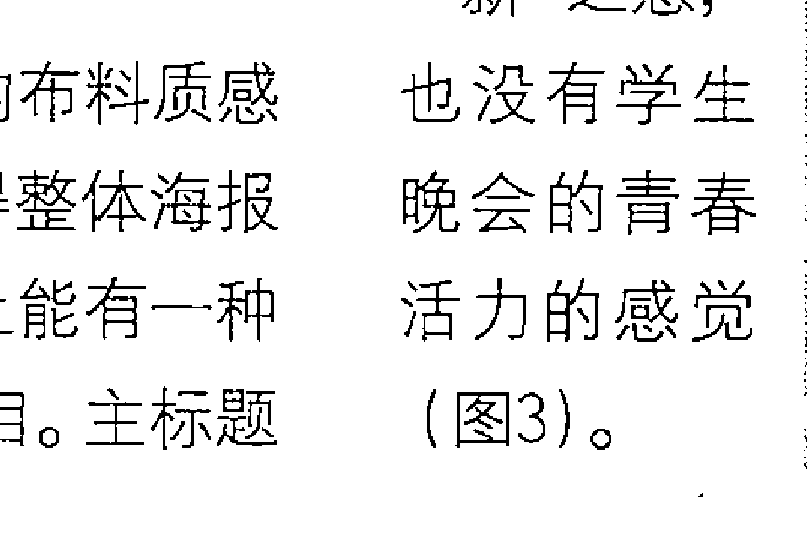

而第二种张海山锐线体简体虽说没有第一种的气势雄浑之感，但是设计感和时代感很强，并且还做了一点字体变形，顺着彩云动势扩散，很有动感，恰到好处地扣住了“新时代”的主题。让学生群体比较容易接受。我把字距拉小，字号大小也做了改变，让字的线条纵横交错的感觉更加强烈，颜色选用了黑色，这样观者的视觉中心就自然而然地拉到了这里（图4）。


其他的注释文字选用的悦黑字体，也是一种设计感很强的字体。这次海报把信息量压到了最低，这样海报会显得清爽，主题清晰，令人印象深刻。

“四川美术学院2012元旦晚会”中的“2012”我做了一些变形，没有直接打出2012，我发现我校标志的“艺”字和数字2的结构相像，便直接将其替换，这样更亲切，让人耳目一新。上方用标题的字体做了一个印章，传统元素用这种字体做出了现代的感觉，再次突出元旦晚会的性质。

## 斟酌色调 锦上添花

一张色彩很美的海报，是抓住路人眼球的关键所在，美的色调往往能潜移默化地影响观者的内心。但是这种党政类的主题结合新年晚会却成了一大难点，我在网上看到很多这类的作品，多数色调都是红色和黄色挂钩，而且设计风格也是千篇一律。要冲破这些设计上的思维定势，就要在主题上找到一个突破点，并将其放大作为海报的主色调。

“献礼党代会，开创新时代”，我把选择重心放在了“开创新时代”，这也就给了我将海报转向时代感和创新感的理由。中国人在这种喜庆的日子都喜欢用大红来表达对节日的喜悦和祝福，但是在“新”上体现得不够完美。所以整体色调我避开了传统的大红，选择了桃花花瓣的粉红，给整个海报赋予了一种美的情调。

而对于中间主标题的羽翼的色块，为了不让整篇海报缺乏色彩，所以这里的色彩搭配尤为重要。我选择红的类比色桔黄为主体，类比色的搭配总是能够产生和谐的视觉效果，因为它们含有大量相同的颜色。然后再以蓝、绿和紫作为小小的点缀。颜色面积的比例是很重要的，主体色和点缀颜色的面积差别要大，不然会混乱整体色调。注释文字的颜色也要按照主色调来运用，这样就更能烘托主色调。上下两侧的牡丹润上淡淡的红色，使得整个画面又增添了不少滋味，也使得那种欣欣向荣的气氛更加浓厚，升华了主题。
就这样整个海报的色彩关系就确立了，这对于画面的效果功不可没。所以每当我们纠结于个别元素是否美观的时候，倒不如先顾一下整体色彩关系是否和谐，如果不和谐，先通过PS中的色彩平衡调一下色彩倾向，使之与整个画面和谐，再去调整饱和度、明度，这样元素就自然而然地融入到画面中去了。

> （作者为四川美术学院大一在读生、该校学生会宣传部部长。）

## 制作小贴士

### 巧用高反差滤镜让亚麻质感更清晰

亚麻的底色背景图是在网上找到的，但是像素并非尽如人意，当放大到整个画面，而且还要打印成海报，就会很模糊，亚麻的质感就无法体现，降低了海报的精致程度。
亚麻质感是通过线之间的缝隙实现的，如果用普通锐化滤镜通常不会达到想要的效果，还会损坏原图。因为它的锐化原理是通过提高个别色彩纯度来实现的，很容易出现噪点等不利于原画面的东西，所以大家尽量慎用。如果巧妙地使用高反差保留的滤镜，就会很完美地避开这一问题，而且效果很好，同样适用于人像的锐化。那就让我来告诉你如何让亚麻的质感锐化更加清晰吧。

-   1.  首先将原来图层复制，选择复制过的图层。
    2.  再点“滤镜→其他→高反差保留”，由于图像缝隙很密，所以将半径调高到60，确定。普通图片只需调到5左右即可。
    3.  现在整个图像是灰色的，图层面板的混合模式选择“柔光”。
    4.  再点“图像→调整→曲线”。将曲线调成反S形状，不要过大，提高对比度，这样就大功告成了。

> （文吴卓）

# 简单查看 找蛛丝马迹

Security Process Explore是一款进程查看工具，与Windows自带任务管理器相比，其最大的特色在于对检查到的进程都标了颜色。其中纯绿色表示非常安全，纯红色表示极其危险，而绿中带红则表示存在安全风险，红色色块越长则表示危险性越大。对于安全级为空白的，则表示暂时无法判断其安全性。
当然就此判断进程是否有问题还不足以说明问题，因为有些病毒会采取注入到正常进程的方式，这时可以通过查看更加详细的进程信息来判断。只需选中可疑进程，鼠标右击，选择“详细信息”，在打开窗口中即可看到进程的名称、ID、优先级、公司名称等信息，单击“用到的模块”标签，还可以看到其调用的DLL文件等，以便于进一步识别进程，从而找到可疑进程。对于可疑的进程，可以单击窗口中的“屏蔽进程”按钮，即可将该进程添加到屏蔽列表并终止运行。被屏蔽的进程一般很难再启动。
对于不熟悉的进程，除了将其直接屏蔽之外，还可求助于网络了解其相关信息，从而判断该进程的安全性。点击相关进程后，在窗口下方点击“更多信息”链接，之后会自动打开一个英文网页，即本软件公司官网，在该网页中可以看到用户对该进程的评价。不懂E文也没关系，只需单击浏览器上的“翻译”按钮，即可调用Google进行翻译，译文还挺不错呢。

# 术业专攻 svchost进程巧识别

相信大家在打开任务管理器的时候，会看到多个svchost.exe进程。那么这些svchost.exe进程是干嘛的？为什么跟其他进程不一样，会有多个呢？其实svchost.exe是一个属于微软Windows操作系统的系统程序，用于执行DLL文件，系统的服务都是靠它来运行的。正因为这个原因，有很多病毒也喜欢伪装成svchost.exe进程。我们如何来识别每一个svchost.exe进程是安全的？
这里介绍两款专门针对svchost.exe的小软件，让你学会雾里看花，把它看得清楚。
Svchost Process Analyzer是一个svchost进程分析程序，用来显示Windows操作系统上运行的svchost进程的详细信息。首先打开浏览器在http://www.neuber.com/free/svchost-analyzer/SvchostAnalyzer.exe下载该软件，下载后直接打开运行即进入系统的扫描状态。
经过很短的时间，SPA就检测出了系统中存在的问题，并显示一个简单的报告。如果想要了解更详细的具体内容，可以单击Details按钮，此时会以不同的标识显示出详细的svchost进程，其中红色的代表有问题，需要检测其安全性。
如果用户对于其安全性基本处于不了解的状态，则可以通过下载该公司出口的Security Task Manager任务管理软件来检测其安全性。绿色代表的是微软自带程序，黄色代表非微软公司的进程，但仍安全。还有一些灰色标志的，表示未激活的，可以单击该灰色按钮查看具体进程情况，SPA对其中的进程也进行了安全与否的标识。通过SPA的基本判断，我们可以对其标识为不安全的进程进行一些处理，以达到系统安全的目的。

> （文鞠华英）

# QQ赚钱也疯狂

## 案例一：QQ群让我能自给游戏费用

QQ大家都在用，但是你是否知道，当有一天，你的QQ人群在增加的时候，通过组建群等方式，QQ也会成为赚钱的“利器”。

QQ的作用原本是一个创造好友互动交流的大众平台，也正因为QQ有这样庞大的用户群，可以加以运用，获得意想不到的收入。好，闲话不多说，下面借助我的亲身经历，将QQ赚钱的思路为你展现。

读初二那年，由于沉迷网络游戏荒废了学业，沉迷于当年最流行的传奇世界，迷恋里面的PK和在游戏里当老大的感觉。

那时花钱靠家里，开始玩游戏时光上网费就是一笔足够大的开销，成天问父母要，后来到处借同学的钱上网、买游戏装备和虚拟的游戏币，为的就是提高游戏角色里面的身份和地位，但这是个永远填不满的无底洞。

游戏里面都是模仿现实中的人和事，里面那些所谓的“兄弟”，都是一起出去找别人打架、一起去做任务、一起玩，也就是游戏中的朋友吧。

我在游戏中自己成立了一个帮会，是帮会的“老大”，因为等级比较高，游戏装备好，很多玩家都加我QQ找我聊游戏，后来索性建了QQ群，成为一个帮会的“兄弟”，有什么任务就在QQ群里喊话，或者在上面聊游戏，在线的就一起出去做游戏任务。

当时QQ群里面有200多个都是我帮会的游戏玩家，他们每次上游戏看到我在线，都会和我打招呼，或者要求和我一起玩游戏出去PK！他们默认了我这个帮会大哥。

那时候的网络游戏也就只有盛大网络的最火了，里面的虚拟武器装备，也是非常昂贵的。虽说是虚拟的东西，但是，对于沉迷的职业玩家来说，非常有诱惑力，真金白银地往里面砸。我就是利用销售游戏的武器装备和游戏币赚到了8000多块钱。

毕竟我也往游戏里砸了不少钱，装备也是属于高级一类的，玩游戏技术也很熟练，职业玩家一个。后来我脑子一转，光往游戏里面砸钱，就像个无底洞，有多少钱都不够砸，难道没有赚钱的方式吗？买装备需要花钱，我卖装备就一定能赚钱了，想到这，我就觉得机会来了。

于是我就在游戏里面到处和朋友去打宝物，打装备，打游戏币……经过一段时间，游戏里的仓库堆满了游戏里的高级装备和游戏币，我在QQ群里喊话卖装备，当时只想试试，就这么简单的一句话，才过几分钟，就有几个人和我聊购买游戏装备了！

因为QQ群里的都是平时一起玩的“兄弟”，所以，当我说卖装备，整个QQ群都沸腾了。就这样，只在6天的时间里，就靠卖游戏的装备和游戏币总共收了8000多块钱！经过这次之后，玩游戏打装备，然后在自己的QQ群里销售，已经成为我职业的一部分！

或许你会觉得不可思议，人家怎么会买我这种虚拟的东西？我觉得信任是最重要的，因为我在游戏里面跟他们交流久了、玩久了、认识了，而且我又是帮会里的“大哥”，他们渐渐地相信我，知道我的为人，知道我不会骗他们，他们才会肯花钱买我的游戏装备。

回到现实中，我们该怎么操作，怎么利用QQ群来赚钱呢？比如你是个卖产品的商家，有产品，应该怎么利用网络卖出去。我以卖减肥药为例，你需要在肥胖人群的论坛社区，去结交更多需要减肥的朋友们，和他们成为朋友，真诚地邀请他们加入到你自己的QQ群里。

这样，群里都是一群需要减肥的胖子，聊的话题当然也是减肥的话题，你需要做的就是和他们做朋友，和群里的朋友互动、交谈、搞好关系，多帮他们解决一些他们需要解决的问题。经过时间的积累，渐渐地，你成为了网络上很好的朋友，同时，他们也越来越信任你，这就等于是把他们培育成了你的客户。当你把你的减肥产品推荐给他们的时候，他们会对你的产品产生信任。

## 案例二：QQ空间让他两天赚万元

我的一个初中同学，在读大学，他高中时就一直在学跳街舞，经过几年的学习他成了一名街舞高手。他对街舞的热爱，不是我们能理解的，他也会经常在QQ空间里写一些自己学习街舞的感想和热爱街舞的日记，还发表一些学习街舞中应该注意哪些要点和保护身体关节的方法等等。

通过这种方式，他结识了很多同道中人。从加他QQ想跟他交流街舞开始，到访问他的QQ空间，最后他的QQ空间每天的访问量达到800次。

去年我回家过年的时候碰到他，和他聊了很久，问他什么时候毕业，他说还差两年，他向我说起了家里经济条件不是很好，读大学让家里的经济压力挺大。他想在读书时兼职打工，减少家里的负担。

我给他个建议，既然街舞是他的专长，干嘛不在大学里搞个街舞培训班？他说平时读书那么忙，哪有那么多时间，天天教别人学街舞。也有很多同学找他或者加他QQ想跟他学，他都拒绝了。

听到这，我心里已经有了明确的策划，这是一座金矿，他却没发现？我分析了他的QQ，有200多个好友都是他的校友，都是喜欢他的街舞和他成为朋友的，但是很多朋友只是很热爱街舞，但是却不会跳。

QQ空间的访问量每天都有800多次，他发表的每篇关于街舞的日志，浏览量都很高。这就是商机呀！但是他却不能发现。他根本就不相信，光是研究一下他的QQ好友，能帮他赚什么钱。

我让他回去，花一个月的时间，拿数码相机录制他的街舞教学视频，内容就是教新手怎么练街舞的，一步一步地开始录，从最初新手开始学起开始录，把这个做成视频，尽量做成新手能学习、能懂的视频，具体需要做几集，自己想，做出来的视频把名字取为《新手72天的街舞达人梦》视频教程，做好了之后先上传到网络硬盘上。

做好视频教程，然后就只需在QQ空间发表一篇日志，日志说明：“应广大街舞爱好者的需求，本人录制的《新手72天的街舞达人梦》视频教程正式出版，视频教程里面教大家怎样快速学习街舞，跳出自己的个性舞步。因为花费了自己的一段时间制作教学视频，也希望得到朋友的支持和体谅，需要收取XXX元的费用即可参加本套视频学习。同时也对朋友们在学习过程中遇到的问题进行解答和建议，也欢迎爱好街舞的朋友一起学习。”
如果有人买视频教程的话，让他把钱打到事先开通的账户上，确认后，只需发一封邮件到对方的邮箱里面，给链接让他们自己去下载视频教程，就搞定。
就这样，从我哥们在发表他的那个《新手72天的街舞达人梦》视频教程起，2天的时间内，收入高达上万元，而之后的每天都还能继续销售，只要有人需要，就可以销售。我建议他每套教程卖800块，结果两天就卖出了200多套教程。当时能出这样的效果，在我预料之外。


你可能会有疑惑，800块钱一套视频教程，为什么会有人买？而且利润也太暴利了吧。这点大可打消念头。
首先，购买的人，都是认识我哥们的人，如果他们出去参加专业的街舞培训班，800块根本就不够交学费，如果出去超市购买那些别人专业出版的教学光碟，他们就会面临一个大问题，就是在学习中，遇到些不懂不明白的地方，他们根本就找不到人交流，找不到人去问，学街舞不交流是学不好的。
但是，购买我哥们的教学教程，这些问题就全都不存在了。最主要的是，他们都知道我哥们的为人与能力，对我哥们的“信任”，就是他们购买的最大原因！

我哥们的案例有什么借鉴意义呢？
这个你可以结合自己自身的知识，利用自己的长处，包装成产品。
假如你是一个钢琴好手，就可以销售学习钢琴的培训资料。
假如你是一名瑜伽老师，就可以销售学习瑜伽的培训资料。
..........
不管是现实社会中还是在网络中，客户对你的背景没兴趣，对你所谓的“产品”也没兴趣，客户只对你能够给他带来什么东西有兴趣。如果能满足客户的需要，他就会掏钱购买。这样，有了可销售的产品后，就需要去增加对你的特长感兴趣的空间粉丝。

（文|李贤威）

# 一网搞定各类生活账单

对水电煤气等生活账单进行缴费，是我们日常生活中不可避免的环节，但这么多费用一项项交起来很麻烦。何不充分利用第三方支付和网银，一网搞定生活账单！
张先生的父母腿脚不好，可水费、煤气费、电话费、电费、手机费、上网费、有线电视费这些日常费用一样也不能少交。虽说有自助缴费终端，但排队等候在所难免。最烦人的是这些账单不会一起来，而且缴费的网点或银行也不完全一样，经常不得不在好几个地点之间奔波。张先生决定充分利用网络，足不出户，将父母的各类生活账单通通搞定！
网上缴费非常方便，7×24小时服务，无需排队，全部零手续费。目前的一线城市基本上都已开通了各项基础设施费的网上缴纳功能，一些二三线城市的业务也在逐步开展。现在网上的缴费途径包括第三方支付、网银支付以及便利店的拉卡拉缴费。下面我们分别比一下，找出最适合的方式。

## 第三方支付比较

第三方支付主要包括支付宝、财付通等，其中快钱已于2011年6月关闭公共事业缴费功能。

可以看到，就覆盖范围来说，支付宝的水电煤气费覆盖面最广，支持的城市最多。而财付通对于手机固话宽带支持的省市较多，主要集中在南方城市。就方便性来说，首推支付宝，只要你有支付宝账户，几乎可以实现所有的功能，安全又便捷。

商户和银行之间的合作关系不同，需到当地银行咨询网银是否开通代交水电费业务。只有银行和当地水业电业部门签订了协议，才能使用网银缴费。其中工商、中行支持的范围都很广，邮政目前支持的城市相对有限。

## 网银方式比较

我们很多人都有银行卡，如果开通了网银功能，那么通过网银来缴费也是不错的选择。目前，光大、工商、交通、建设、中信、招商、邮政、中国银行都可办理水、电、煤气缴费和代扣业务。但由于不同城市的

不管在哪个银行，开通网银基本都需要购买口令卡或是U盾，每年还要交一定年费。

如果不想开通网银，可以选择银联在线，只要一张银联卡，无需开通网银即可在线缴费。银联在线对于水电煤气费支持的城市包括北京、上海、重庆、宁波、台州、苏州等，具体可在网站（http://www.chinapay.com）查询。银联在线对于手机固话宽带支持的范围较广。

除了以上介绍的方式，大家还可以选择电话银行和手机银行甚至电视银行支付，相信总有适合你的那一款。

（文|掌盟人）

**附表 第三方网上缴费比较**

| 支付平台 | 支持城市 水费 | 电费 | 燃气费 | 手机固话宽带 | 网址 |
| :--- | :--- | :--- | :--- | :--- | :--- |
| 支付宝 | 上海、杭州、重庆、南京、沈阳、北京等24个城市 | 河南全省、浙江全省、福建全省、湖南全省、吉林全省、北京、上海、杭州、重庆等24个城市 | 上海、杭州、重庆、南京、苏州、沈阳、呼和浩特、北京（包含供暖费）等22个城市 | 广东全省、浙江全省、湖南全省、山西全省、北京、上海、重庆、天津等城市 | http://www.alipay.com |
| 财付通 | 上海、重庆、长沙、成都等12个城市 | 上海、重庆、福建、南京等12个城市 | 上海、重庆、郑州、南京、沈阳、苏州、合肥、哈尔滨、北京（包含供暖费） | 上海、苏州、重庆、宁波、南京、成都等，不包括北京 | http://life.tenpay.com/jiaofei/ |
| 拉卡拉 | 北京、上海、南京、苏州、青岛、成都、武汉（仅限中百）、福州、厦门 | 北京、上海、苏州、青岛、成都、湖南、武汉（仅限中百）、福州、厦门 | 北京、上海、南京、苏州、青岛、成都 | 以北京、上海、南京、苏州、青岛、成都为主 | http://www.lakala.com |

# 走近微博刷粉师

随着微博的火爆，很多人意识到微博所能带来的社会效益和经济效益，都希望自己拥有大量的微博粉丝，一种另类职业——微博刷粉师应运而生。

## 微博粉丝刷出来

小莫就是某微博刷粉团队的一员。据小莫介绍，他们团队有十几个人，可以为包括新浪、腾讯、网易、搜狐几大微博刷粉，还提供企业粉丝、加V、转发、评论、投票人气等“刷”服务。

小莫所属的团队属于规模相对较大的，小的刷粉工作室只要3个人就能运作，其中一个技术员负责写程序和日常维护，一个客服负责与客户联系，一个业务员负责工作室的推广和宣传。

刷粉工作室可谓一本万利，投入少，门槛低，只要客户稳定，收益很可观。小莫说刷粉师的收入在几千元到1万元不等。

小莫透露，目前增加微博粉丝的目的无非两种，一是为出名，二是为赚钱。大家都知道，现在微博好几十万粉丝级别的大多为明星、企业家，当然也不乏一些店主及草根博主，他们的粉丝不少都是刷出来的。

微博刷粉的方法，目前概括来说有两种，一种是免费方式，包括加入互粉群、QQ群或使用刷粉软件、转发评论工具软件（其中某些软件也是收费的）。另一种是付费找专刷微博的团队，以人工刷粉方式为主。

## 使用软件刷粉

刷粉软件的原理是在软件群里大家互相关注、互为粉丝，类似以前淘宝互刷信用的模式——大家互相购买对方的商品然后给予好评。小莫解释说，就是用大号“授粉”，小号“回粉”，即用小号关注别人，获得积分，接着利用积分为大号购买粉丝。大号是需要刷粉的微博账号，小号是用来互粉互相关注的账号。

| 服务名称       | 粉丝数量 | 完成时间 | 价格 |
|----------------|----------|----------|------|
| 高质量粉丝A   | 500      | 1小时    | 20元 |
| 高质量粉丝B   | 1000     | 2小时    | 30元 |
| 高质量粉丝C   | 5000     | 1-3天    | 100元|
| 高质量粉丝D   | 1万      | 2-5天    | 180元|
| 普通粉丝A     | 1000     | 1-2小时  | 8元  |
| 普通粉丝B     | 5000     | 24小时内 | 30元 |
| 普通粉丝C     | 1万      | 24小时内 | 50元 |
| 充数粉丝A     | 1000     | 1-2小时  | 3元  |
| 充数粉丝B     | 5000     | 24小时内 | 10元 |
| 充数粉丝C     | 1万      | 24小时内 | 15元 |

## 人工刷粉方式

小莫认为付费方式效果最好，也就是找专业的微博刷粉团队，通过人工方式快速增加微博粉丝。小莫极力推荐他们团队的高质量粉丝服务。用户只需要提供微博访问地址，微博刷粉丝团队就可搞定一切。

小莫介绍到，所谓高质量粉丝服务，就是他们所提供的所有刷粉账号都是真实的，跟正常的网友账号无差别，都是有头像、有自己的博文以及数量不等的自有粉丝（基本超过100个，大部分都在200个以上），活跃时间超过3个月以上，博文有20~500篇不等，而且不定期更新微博，采用不同IP加粉丝进行微博推广的微博账号。

小莫说这些粉丝不存在封号、掉粉、僵尸的情况，活粉率为95%以上。因为账号是团队专属的，有专人维护，可以说就是真实的。

以高质量粉丝为例，粉丝数量达到1万需要2~5天，收费为180元。最便宜的充数粉丝24小时即可刷到1万，只需15元。而转发评论，当天可完成1万次，需要200元！小莫说，选好所需的服务后就可通过支付宝付款，付款成功后即可按照服务规定开始操作。

小莫说他们的生意不错，每天都有人来咨询购买业务，刷粉软件每天使用人数在千人以上。他们的客户都是什么人呢？小莫等几个刷粉师给出的答案基本一致，无外乎明星、商家、想出名的草根博主、活动的主办方。小莫刚接的一个新客户是某大学学生，因为开了个网店但生意一直不好，于是想借助微博粉丝来宣传，花费不多就可以提升人气，从而为他的店铺赢得关注，相当于一个廉价广告。

微博是一个非常强调互动的新媒体平台，而如今普通的微博用户却可能在不知情的情况下，成为刷粉公司和“买粉人”消费和欺骗的对象。小莫表示，对于普通用户来说，其实很难识别真假粉丝，因为现在的僵尸粉越来越少，大都为有博文、有粉丝、固定更新的“高仿真”粉丝。目前国内法律上没有对买卖粉丝、有偿转发行为的明文规定。各大网站虽然也都在加大查惩力度，微博实名制也在推进，但只是使假粉丝制作难度加大，很难从根本上杜绝。

有市场就有需求，如果想减少买卖微博的现象，需要大家的共同努力，否则微博买卖粉丝现象持久下去，对微博的公信力必将带来极大的破坏。（文/乐桐霖）

# 卡巴斯基的另类应用

卡巴斯基是一款杀毒软件，它不仅查杀率高，还拥有强大的手动设置功能。除了杀毒之外，我还常常借助它来解决各种电脑难题。

玩过FIFA和PES的朋友都知道在进游戏时游戏主程序会自动联网搜索是否有更新，但非正版玩家不会通过游戏来自动更新，况且链接服务器也比较慢，每次都会花十几秒去慢慢搜索。我们可以通过卡巴斯基来节省这段时间，更快进入游戏（这里以FIFA12为例）。

解决办法：打开卡巴斯基，在下方选择“网络监控”，在弹出的窗口中选择“网络活动”标签，点击标签下面的“规则设置”，选择“所有网络规则”（图1）。

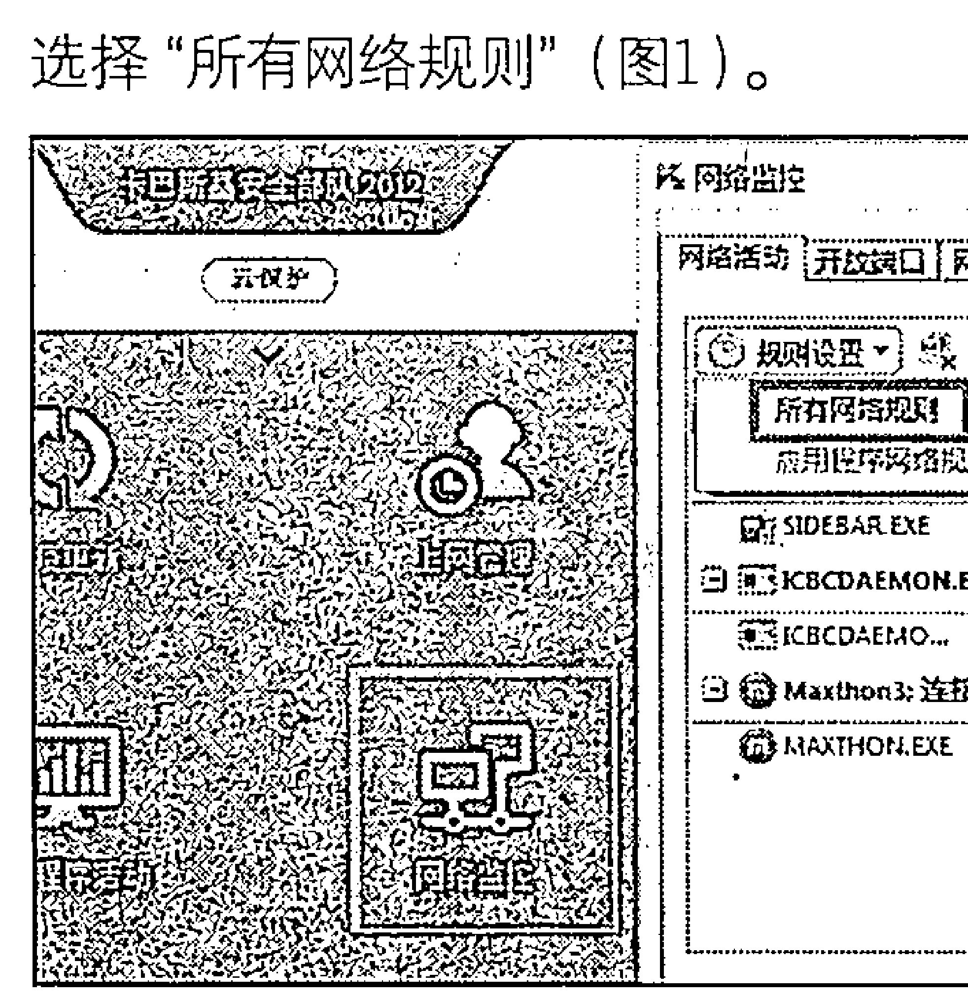

在弹出的防火墙窗口中选择“应用程序规则”，下拉选择所有应用程序，然后在右上方的搜索栏里输入FIFA，对搜索出的FIFA12那一行和权限那一列所对应的小图标点右键，选择“阻止”，最后点击右下角的“确定”来保存设置（图2）。

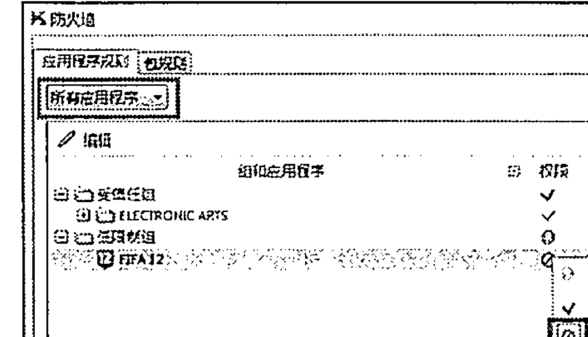

以后，只要卡巴斯基正常运行，就会阻止FIFA12的所有网络连接，让你更快进入游戏。同样，如果你想阻止其他程序联网，在防火墙里找到这个程序设置一下即可。

想去掉迅雷广告却不能阻止迅雷联网下载，想阻止浏览器自动更新却不能阻止它浏览网页。我们不可能使用上一个方法禁止这些网络软件访问网络，为此我们需要详细设置卡巴里的程序规则。这次，我以购物兔浏览器为例。

我习惯用购物兔浏览器老版本上的一些功能，但此款浏览器会不经用户同意自动更新到最新版。它的自动更新行为是先读取update文件夹里的index.ini，获取最新版本的下载地址后进行下载。现在我们用卡巴来阻止它。

解决办法：进入卡巴的设置选项，选中左侧“实时保护”标签下面的“应用程序控制”，点击右边的“隐私保护”。

选择上方的隐私数据标签，下拉选择“用户文件”，点击“添加类别”，输入“阻止文件夹”，点击“确定”。

再点击“添加”，名称里填写“购物兔”，点击“浏览”，把C:\Users\用户名\AppData\Roaming\GoShopping\update\*复制到对象那栏，点击“确定”。

点击右下角的“确定”退回到卡巴主界面，选择“应用程序活动”，下拉选择“所有应用程序”，在右方搜索购物兔。在列出的程序中，找到路径为C:\Users\用户名\AppData\Roaming\GoShopping的购物兔客户端（若没显示路径，点击应用程序右边的加号）。

打开此应用程序规则，切换到“文件和系统注册表”，在下方找到刚才建的“阻止文件夹”，像上一个情景一样，将右边全改为阻止。

点击“确定”保存，现在就大功告成了。我们再打开购物兔，卡巴就会阻止购物兔浏览器读取update文件夹从而使其无法自动更新。

迅雷客户端的广告无非是自动下载的一些xml和swf文件，从网上搜到这些文件的保存路径，再阻止迅雷读取它们，也能屏蔽迅雷的广告。

经常用破解软件的朋友肯定都曾从网上下载过算号器推算注册码，但是很多杀软对算号器报毒。那么如何在确保系统安全的情况下使用算号器呢？下面我用airplay音乐播放软件做个试验。

解决办法：对airplay点击右键，在菜单中选择“安全运行”。

打开的airplay软件被一圈绿色包围，这说明此软件处于卡巴的隔离中。

现在，我们可以用它来正常播放音乐，但我们无法用它来删除硬盘里的歌曲。也就是说，处于隔离中的程序可以读取电脑里的文件，但无法对文件进行修改和删除。

同样，处于隔离环境的算号器也能正常运行并推算出注册码，但如果它们真有危险行为要修改系统文件，根本不会影响到我们的真实系统。

有些试用软件在第一次运行时会往注册表里写记录文件，下次它们运行时若检测到这些注册表记录会提示用户试用期已过，无法正常使用。我们也能用卡巴的安全运行功能阻止它们读写注册表，无限次使用这些软件。

注意：个别病毒可以突破卡巴的隔离对系统造成危害，所以就算用安全运行也不要关闭卡巴的监控。

现在网页上的广告越来越多，不仅影响浏览，还拖慢了网速。有的浏览器拦截广告能力很强，比如说傲游3的极速模式，但有的则几乎无法拦截广告，比如IE（可以自己添加规则拦截）、遨游3的兼容模式。

这时我们可以用卡巴来帮各种浏览器拦截广告。

解决办法：打开http://bbs.kafan.cn/thread-821042-1-1.html，从里面下载适用于卡巴的广告过滤规则。

下载回来的是个genera_rules.txt文件。打开卡巴设置界面，找到“反广告”，勾选“启用反广告”和“使用黑名单地址”，点击“设置→导入”，找到下载的genera_rules.txt，把规则导入卡巴，点击“确定”保存。

现在就算用没有广告拦截功能的浏览器也能看到清爽的网页了。

本文展示的四个功能只是强大卡巴的冰山一角，大家有空可以仔细研究一下卡巴的程序规则，打造出适合自己的系统。

(文|张江楠)

# 记事本 我的文件管理专家

一般人只用Windows记事本作简单的文字记录，可是，在达人们的手里，它却可以用来管理文件，而且常常比在窗口环境中操作还要方便高效。

记事本也能管理文件？这看起来是一件天方夜谭的事情，然而在办公室小李那里却是小菜一碟。小李用记事本结合系统内置的一些简单命令来管理文件，连资源管理器和任何其他工具都不需要。你相信吗？

## 批量文件快速迁移复制

在小李的资料文件夹中有许多子文件夹，在这些文件夹中存放有Word格式的DOC文件、Excel格式的XSL文件，还有一些五花八门的其他格式的文件。在整理档案的时候，小李希望把所有的DOC格式文件拷贝出来单独刻盘。这项任务，小李借用记事本，只用一行简单的命令就完成了：

```
XCOPY *.DOC /S E:\MYDOCBAK
```

输入完毕后存盘，将TXT文件扩展名改为BAT并双击该文件，这样当前文件夹以及其下各级子文件夹下面的DOC类型文件均被复制到E盘的MYDOCBAK文件夹中了，而且保持原来的目录结构。

其中，参数/S的意思是在复制指定类型文件时包含本级目录和各级子目录（空目录除外）。

以上是复制一类文件的命令，如果希望迁移一批文件，那么只需在记事本中使用迁移文件命令MOVE就可以了。

## 多层文件夹的管理

### 多级文件夹的成批创建

小李要在公司服务器上的资料文件夹下建立一个包含各部门和其下每位员工的资料文件夹组，该资料文件夹组下面包含5个部门的子文件夹，在每个部门的子文件夹下，包含以该部门所属每个员工姓名命名的下级子文件夹。人员众多，用平常的思维在Windows资源管理器窗口中一级一级地逐个建立，一定很麻烦！

首先，在服务器资料文件夹中建立一个TXT文件，例如“生成器.TXT”。打开“生成器.TXT”文件，在里面输入如下命令：

```
MD 财务科 计划科 生产科 供应科 劳资料
CD 财务科
MD 张三 李四 王五 赵六 ……（注：此处省略若干该部门人名，人名之间均用半角空格分隔）
CD..
CD 计划科
MD 张红 李绿 王白 赵紫 ……（注：同上省略若干）
CD..
接下来，模仿上面的方法，输入用来进入其他三个部门和建立员工文件夹的命令。
录入完毕，存盘后修改文件扩展名TXT为BAT。最后执行“生成器.BAT”，到资料文件夹下看吧，需要的各级文件夹都生成了。
```

## 小提示

上面的操作实际上是变以往在资源管理器中繁琐的文件夹建立过程为非常简单的记事本打字过程。需要输入的只有MD和CD这样两个简单的英文命令。其余需要输入的部门名称和人员名称，因为办公室一般均有其现成的名单文本，一般直接复制过来，中间用半角空格隔开即可。

## 指定文件夹的批量删除

生产科这个部门人员有上百人，经济危机发生后裁员走了一批人，这些人的资料备份后，小李需要删除这批人留下的文件夹，一个个地挑出来删除显然太麻烦，怎么办？

删除已知姓名人群的文件夹，只需在该部门文件夹下建立一个TXT文件，然后在里面输入一个RD命令，后面跟一个半角空格，接着连续输入或导入要删除的人名（人名中间均用半角空格分隔），最后再输入 /S /Q参数（注：两个斜杠前均有半角空格），存盘后将文件扩展名改为BAT，执行一下这个文件，需要删除的人名文件夹就全部被删除了。

## 小知识：MD、CD、RD命令的解释

MD是建立文件夹的Windows系统内部命令，它是MKDIR命令的简称，使用二者作用等同。命令格式为：

```
MD [drive:]path
```

意思是在某个驱动器中创建某个路径的文件夹。如果是建立并列同级别的文件夹，则可以连续输入文件夹名称，中间用半角空格隔开。

CD命令是CHDIR命令的简称，作用是进入某个文件夹。CD..是返回上层文件夹，CD\是返回到根目录。如果在命令行中使用 /D 命令行开关，除了改变驱动器的当前目录之外，还可改变当前驱动器。

RD命令是RMDIR命令的简称，作用是删除文件夹。如果使用了参数 /S 表示除删除目录本身外，还将删除指定目录下的所有子目录和文件，可用于删除目录树。使用参数 /Q 表示删除模式为安静模式，这样，如果你使用了带 /S 参数来删除目录树时系统就不要求确认了，可以实现删除操作的自动化。

## 文件列表清单快速生成

小李的同事小王电脑中收集有500多本精品PDF电子书，电子书文件名都是书的名字。一天，小王的朋友获知后想知道小王收藏了哪些电子书，要求小王给她传一个目录过去。小王打开资源管理器后傻眼了，怎么将这500多本书的目录发给朋友呢？需要找工具或下载安装软件吗？小李说不用，用记事本就能完成这件事。

只见小李在该电子书文件夹中建立了一个TXT文件，接着，他在里面输入了如下一行命令：

```
DIR *.PDF /ON /B >BOOKLIST.TXT
```

接下来，他把TXT扩展名改为BAT，然后双击这个BAT文件，眨眼之间，一个BOOKLIST.TXT目录文件就生成了。就这么简单，小王马上把这个文件发送给了朋友。

要完成此项任务，小李还有另外一种选择，那就是用TREE命令。他只需将记事本中的那行命令改为TREE /F >BOOKLIST.TXT即可。用这种方法得到的列表文件BOOKLIST.TXT，里边的文件是按目录树来排列的，如果该电子书文件夹中有下级文件夹，也一并会以树形结构的形式列出来，一目了然。TREE的本意是“树”，这个命令的意思也就是列出当前文件夹下面的目录树，/F 参数是显示文件列表（File的首字母），所以特别好记。

### 小提示：DIR命令与参数说明

DIR命令是用来显示文件夹中的文件和子文件夹名称的。它有许多参数，能实现非常复杂多变的文件或目录显示和输出，甚至连隐藏的系统文件都能进行操作，比窗口操作要方便得多。

以上命令中我们用到的/ON参数的意思是列表时按文件名顺序排序，其中的O是英文“排序”这个单词的第一个字母，N是英文“名称”的首字母。参数/B是指使用空格式，即列表时不带标题信息或文件摘要信息（因为此处我们只要文件名，不关心文件的其他无关摘要信息，所以用此命令过滤掉无关信息）。>BOOKLIST.TXT是输出重定向，它能把本来从窗口上显示的内容输出到BOOKLIST.TXT文件中。

## 设定文件操作的限制

为了安全起见，小李有时要将一些档案文件加上只读属性，甚至加上隐含属性。例如：小李要将当前目录中所有的DOC档案文件都设上只读属性，同时还要将所有的PPT文件都隐藏起来。这些操作在资源管理器窗口中操作起来比较麻烦，尤其是涉及到隐含属性的操作，还需要在系统文件夹选项中设置开启或去掉隐含文件属性，要显示出来时还得用同样麻烦的方法设回去。如果改用记事本来实现就简单多了。这两个操作，只要在记事本中连续输入两条简单命令：

```
ATTRIB +R *.DOC
ATTRIB +H *.PPT
```

存盘后将文件更名为BAT文件，执行一下BAT文件就OK了。如果要取消这些属性，只需将上面两条命令中的+号变为-号即可。

## 小提示

ATTRIB命令表示修改文件的属性。该命令可用参数包括R（只读属性）、H（隐含属性）、S（系统文件属性）、A（存档文件属性）。还可以带/S参数连子目录下的文件一同处理，带/D参数表示连文件夹的属性也一并设置。

（文 于君慧）

# 视网膜显示技术剖析

随着iPad 3的到来，人们纷纷预测会有哪些新技术应用在iPad 3上。呼声最高的莫过于此前已经应用在iPhone 4上的视网膜显示技术。它有哪些优势？与其他手机有何区别？

## 人眼识别的PPI极限

我们都知道，使用图片查看器看图片时，如果将图片无限放大，最后就容易看到一个个小方格，而这些小方格就是人们常说的像素。在显示器中显示的各种目标，都是由大量不同像素点构成的。在同等大小面积中，显示的像素越多，画面自然就会越清晰。人们规定，在1英寸面积内显示的像素数目用PPI来代表（也就是像素密度）。而人类肉眼所能识别的最高像素密度为300PPI，如果像素密度超过300PPI，人类肉眼就无法区分出单个的像素了。

譬如，将一幅照片缩小，就很难看到像素，而将照片放大，极容易看到一个个方格的像素点。那么视网膜显示技术是如何将图片在高像素下显示得更清晰的呢？

## 视网膜显示屏实现原理

要想让显示更逼真，那就得想办法让像素密度超出人眼能辨识的范围。为此，苹果工程师们开发出了直径仅有78微米的超小像素发光点，使人眼难以分辨单个像素。与普通LED相比，相当于将一个像素点拆分成4个像素点，这样就会导致像素密度提高了4倍。

由于人眼已经无法分辨单个像素，因此，让图像显示达到纸制品的效果，看起来非常生动鲜活。而与之前版本的iPhone相比，78微米小了很多。

初代 iPhone：约 176 × 223 微米
iPhone 3GS：约 176 × 223 微米
iPhone 4：约 78 × 102 微米

## 视网膜显示让图片更清晰

采用了视网膜显示技术的iPhone 4显示屏，就是一种具备超高像素密度的液晶显示屏，它可以将960×640的分辨率压缩到一个3.5英寸的显示屏内。由于屏幕大小没有变化，还是3.5英寸，分辨率的提升将iPhone 4的显示分辨率提升至iPhone 3GS的四倍。该显示屏的像素密度达到326PPI，这个值已经超出了人类肉眼识别单个像素的级别。因此，在显示图片或是其他目标时，就不会出现颗粒感了。

通过上面的了解，我们就可以知道视网膜显示屏本质上就是一块LED背光驱动的像素密度为326 PPI 的显示器，在这样的显示屏中，每一个像素仅占 78 微米大小。

## 视网膜成像显示技术

除了像iPhone 4这样传统的显示屏使用了视网膜显示技术外，现在很多高科技公司通过视网膜显示技术正在开发更加先进的显示设备。例如，日本的兄弟工业公司的新产品也许会改变这种现状，他们开发了一种外形看起来像是一副眼镜的显示设备，用激光直接将图像投射到使用者的视网膜上。而西雅图华盛顿大学的几位研究者干脆直接把显示器做在了隐形眼镜上。这些产品很有可能会改变我们感知世界的方式。

眼镜式显示器不算很新的产品，但由于它使用不透光的液晶屏蔽，导致使用范围受限，进而制约了其普及性。而兄弟工业公司的视网膜显示新产品解决了这种问题，他们的显示技术不会阻挡使用者的视线，而是在真实景物前叠加了一层半透明的显示效果。这就是视网膜成像显示技术。

在原理上来说，视网膜成像显示技术和过去使用的阴极射线管显示器（CRT）异曲同工，利用人的视觉暂留原理，让激光快速地按指定顺序在水平和垂直两个方向上循环扫描，撞击视网膜的一小块区域使其产生光感，进而让人们感觉到图像的存在。兄弟工业公司的视网膜成像显示技术以每秒钟60次的频率刷新，可以显示800×600的分辨率，相当于14英寸的CRT显示器。

（文 dream）## 静态图文变身3D动画大片

10年前的2D版《泰坦尼克号》现在已修复成3D立体大片。虽然我们没有能力制作一个3D电影，但是我们却有能力将10年前拍摄的静态照片变成3D立体动画大片。

# 徒手制作3D文字动画

在将静态图片转换成3D动画之前，我们先来制作一个3D文字动画热热身，熟悉一下Flash CS5的基本操作。文字内容是：欢迎订阅电脑爱好者。

启动Flash CS5，单击“新建”下的ActionScript 3.0创建一个新文档。在文档上右击选择“文档属性”出现对话框，设置“宽”和“高”的数值都为600，单击工具箱中的“文本工具”，输入文字“电”，单击“属性”按钮设置字体、字号、颜色等。单击“任意变形工具”按钮，将文字的中心点拖到文字的正下方。选中文字，单击“变形”按钮弹出面板，在“旋转”下输入40，再单击“重制选区和变形”按钮复制文字，一共复制9个文字。因为是要制作环形文字动画，所以360度除以9就得到了40度，文字旋转40度并复制，这样就得到环形文字。然后双击每个文字，分别将原有文字修改成“欢迎订阅电脑爱好者”。全选文字后按Ctrl+G组合文字，右击文字选择“转换为元件”弹出对话框，输入名称为：环形文字动画。然后双击开始编辑动画，在144帧处按F6键插入关键帧，选中第1帧右击选择“创建传统补间”命令，单击“属性”按钮弹出面板，选择“旋转”下的“逆时针”，最后单击“场景”按钮返回主场景，按Ctrl+Enter键可以测试动画效果。复制并粘贴文字动画，分别选中文字，单击“属性”按钮，给文字添加滤镜、调节透明度，让两个文字分别呈现深色和浅色，深色文字置于底层。然后使用“任意变形工具”，分别对文字进行变形处理（图1），按Ctrl+Enter键查看效果。

## 缔造浪漫的“触动邂逅”

在开始制作“触动邂逅”动画之前，我们先来欣赏动画效果，这是腾讯的一个宣传动画，观看网址为：http://x5.qq.com/act/a20120520love。这里的图片经过处理后，通过Flash合成为立体感很强的动画。下面我们来模拟制作其中的第3个场景。

## Photoshop中为图片分层

启动Photoshop对动画中所要用到的图片素材进行必要的处理，这里包含了3个图层，地面图片在“图层1”中，人物图片在“图层2”中，海面图片在“图层3”中。其中对人物图片进行透明和阴影效果处理，最后将处理好的图片保存成PSD格式（Photoshop的专有格式）。

## 分层图片导入Flash

启动Flash CS5，按Ctrl+J键打开文档设置对话框，宽度设置为900，高度设置为600，背景颜色为黑色，帧频为30，单击“确定”按钮。选择菜单“视图→标尺”开启标尺，选择菜单“视图→辅助线→显示辅助线”，然后编辑辅助线，让上下左右的辅助线紧贴在场景边缘。选择“文件→导入→导入到舞台”弹出对话框，选择保存的PSD文件，选择所有图层，在“将图层转换为”中选择“Flash图层”，单击“确定”按钮即可。此时PSD文件中的图层会自动分布到Flash的图层中，并且层的次序是一样的。为了保证三维动画的清晰度，这里的图片分辨率比较高。

接下来，分别给3个图层取名，从上至下依次为：人物、海面、地面。为了完全显示图片和场景，便于后面的动画设置，可以将显示比例设置为20%。由于图片的位置远远偏移了场景，这里可以根据需要移动到需要的位置。

## 无缝组合不同层次图片

选择“地面”图层第1帧处的地面图片，使用工具箱中的“任意变形工具”对其进行变形处理，使其与海面形成一定的角度，这样看起来更有立体感。调整“海面”图层第1帧处的海面图片，让其更好地与地面融合在一起。同样调整“人物”图层第1帧中的人物，让小狗的一部分出现在舞台中。

## 分层设置动画渐变

在“海面”的第75帧处按F6键插入关键帧，然后缩小海面图片并移动，让图片更多部分显示在舞台中。在“地面”图层的第30帧处插入关键帧，然后将30帧处的地面图片向舞台上收缩，让其与海面图片尽可能融合在一起，这里需要插入多个关键帧，对每个关键帧的地面图片进行变形处理，这样才能确保地面和海面完美融合。在“人物”图层的75帧处插入关键帧，调整人物图片的大小和位置，为了确保人物图片的比例，在使用“任意变形工具”时必须按住Shift键不放，这样图片会成比例缩放。最后为各帧创建“传统补间动画”。

## 梦幻动画 浪漫插曲

在各个图层中继续添加关键帧，并调整各层图片的位置和大小，通过图片的同列运动，以及背景（地面和海面）的变形，形成一种空间变化的视觉效果，这样整体上就会合成立体效果极强的动画。在动画的定格帧处，要确保动画的人物和背景尽可能最大化显示在场景中，并在定格帧后的50帧处按F5键插入空白关键帧，让动画有50帧左右的定格时间。选择菜单“插入→时间轴→图层”插入一个图层并取名为“音乐”，选择菜单“文件→导入→导入到库”，选择一首梦幻音乐，再按Ctrl+L键打开“库”，将音乐文件拖放到舞台上，这样带有音乐的立体动画就制作完成了。

现在，你可以按照上面的方法，将人物替换成你自己的照片，再配以精美的背景，即可做成梦幻般的立体动画啦。为了便于大家学习和制作立体图文，我特地将本文中的实例源程序存放在网盘中，感兴趣的朋友可以去下载，网址：http://url.cn/24nqnx。

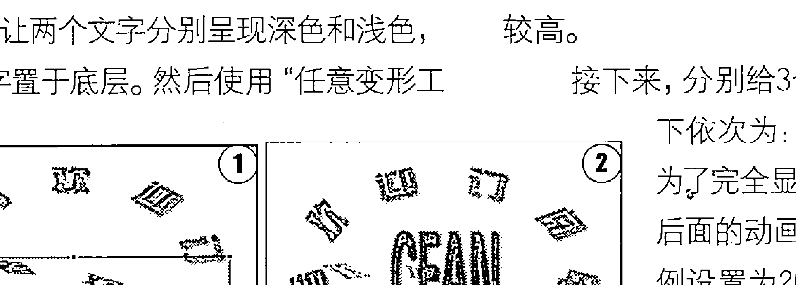

# 不加密 照样防蹭网

无线网络防蹭一直是无线网络用户最关心的问题，使用加密机制会对无线网速造成一定影响。能否在不加密的情况下，将蹭网者拒之门外呢？

小刘下载文件时，发现网速明显降低。使用扫描软件对内网进行扫描发现有两台来历不明的电脑“蹭”了进来，占用了很大的带宽。看来，一定有蹭网者破解了自己无线网络的密码，才得以“免费”上网的。

小刘想，密码虽然可以保护无线网络安全，但是凡事都有两面性，一方面密码一旦泄露或者遭到破解，就起不到任何保护作用。另一方面加密机制也会对无线网速造成一定影响。能否在不加密的情况下，将蹭网者拒之门外呢？小刘经过研究，找到了行之有效的解决方案。这里以常见的水星MW150R路由器为例，来说明具体的操作技巧。

## 不给蹭网者留“空位”

利用路由器提供的DHCP功能，可以为联网的电脑自动分配IP地址。而我们则只需在本地连接属性窗口中为Internet协议设置自动获得IP地址功能，就可以让电脑获得从路由器分配的地址。这样做虽然简单，但是也给非法连接大开方便之门。

实际上，我们完全可以根据自己所用的电脑数量，有针对性地缩小地址池的范围，将多余的连接挡在门外。例如自己家里有三台电脑，实际只需要获得三个有效的IP。于是进入路由器设置窗口，在左侧点击“DHCP服务器→DHCP服务”项，在窗口右侧的“DHCP服务器”栏中选择“启用”项。在“地址池开始地址”和“地址池结束地址”栏中设置实际所需的地址范围。

例如将其设置为192.168.1.100到192.168.1.102，之后保存配置信息。这样，路由器就只能为连入的电脑分配192.168.1.100、192.168.1.101、192.168.1.102三个地址。当你将家里的三台电脑全部开启联网后，将上述三个地址全部占用，其他主机就无法接入了，盗用者只有“耐心”地等待空余的IP地址出现，才可以实现蹭网。而实际上漫长的等待只会让其放弃“非分之想”。当然，如果你只有一台电脑，甚至可以只让地址池包容一个地址，让蹭网者彻底无机可乘。

## 巧妙迷惑蹭网者

上述方法虽然简单，可是也很容易被蹭网者识破。怎么才能更加巧妙地阻止蹭网者轻而易举获得IP呢？我们不妨来个逆向思维，将路由器地址池和网关地址修改为非常用地址段，巧妙迷惑蹭网者，让其摸不清我们的底细。

我们知道，IP地址的私有网段包括A类地址范围（从10.0.0.0到10.255.255.255）、B类（从172.16.0.0到172.31.255.255）、C类（从192.168.0.0到192.168.255.255）。但是路由器常用的是以192.168.1.1开头的地址段。这就让大家形成了思维定势，要连接无线路由器必须使用此类地址。

我们完全可以反其道而行之，将路由器地址池设定为非常用地址段，避开蹭网者的视线。例如我们可以使用从10.10.1.1开头的地址段。在无线路由器设置界面左侧点击“DHCP服务器→DHCP服务”项，将右侧窗口中的地址池范围设置为10.10.1.1到10.10.1.100。对于网关地址也可以加以巧妙更改。一般网关地址都是地址池中第一个地址。我们可将其设置为10.10.1.254，让蹭网者无从猜解。之后保存配置信息。

同时在“DHCP服务器”栏中选择“不启用”项，关闭其地址自动分配功能。我们可以在自己的电脑上手工打开本地连接属性窗口，为Internet协议设置合乎要求的IP（例如10.10.1.99等）和网关地址，自由地上网冲浪。

## 巧设带宽 蹭网者龟速“冲浪”

蹭网者之所以乐此不疲蹭网冲浪，图的就是“省钱”和较快的网速。我们不妨“发发善心”，允许其正常接入路由器，但是将其可用的带宽设置得“很窄”，例如只分配给其10KB/S的带宽，估计对方会“无法忍受”而主动退出。我们可以将内网电脑的MAC地址和指定IP绑定起来，形成一个MAC地址列表，对该列表中的电脑不限速，而将该列表之外的IP地址设置超低的带宽，就可以实现上述想法。

例如家里有三台电脑。在路由器设置界面左侧点击“IP与MAC绑定→静态ARP绑定设置”项，在右侧窗口中的“ARP绑定”栏中选择“启用”项，激活MAC地址绑定功能。点击“增加单个条目”项，分别输入三台电脑的MAC地址，使其与192.168.1.98、192.168.1.99、192.168.1.100等IP实现绑定。这样，就形成了一个MAC地址列表。之后在设置界面左侧点击“IP带宽控制”项，在窗口右侧勾选“开启IP带宽控制”项，选择好你的宽带线路类型。

在IP带宽控制规则表中设置地址池范围，为指定IP段设置低速带宽。例如地址池范围为192.168.1.1到192.168.1.100，那么可以将192.168.1.1到192.168.1.97地址段的带宽设置为5KB/S（设置更低），之后保存激活针对该地址段的带宽限制功能。即使蹭网者连上了路由器，也只能龟速运行，使其处于虽可上网，但是只能处于慢吞吞传输数据的窘境，使其知难而退。

## 过滤MAC地址 蹭网无机可乘

如果你觉得上述方法虽然有趣，但是操作起来有些繁琐的话，完全可以使用过滤MAC地址的方法，将蹭网者彻底阻挡在门外。我们知道，每一块网卡只能拥有完全不同的MAC地址，这也是其唯一的“身份证”。将正常电脑的MAC地址添加到路由器的MAC地址过滤表中，那么只有合法的电脑才可以正常接入，其他的非法连接将被彻底拦截。在路由器设置界面左侧点击“安全设置→防火墙设置”项，在右侧窗口中勾选“开启MAC地址过滤”项，并选择“仅允许已设MAC地址列表中已启用的MAC地址访问Internet”项。

之后点击“安全设置→MAC地址过滤”项，在右侧窗口中点击“添加新条目”项，输入所需的MAC地址，点击保存按钮，将其添加到MAC过滤列表中。按照同样的方法，将所需的MAC地址全部添加进来即可。

这样，只有拥有合法MAC地址的主机才可以连接路由器，其他主机将无权接入。

(文|郭建伟)

# 开心职场 被迫加班有快乐高招

工作嘛，不可避免会遇到加班，特别是临近年底，职场中人都比平时忙碌了许多。既然工作越来越忙，既然加班不可避免，那么为什么不让自己的加班变得快乐些、再快乐些呢？

## 痛并快乐着

（金炜 30岁公司职员）

工作嘛，不可避免会遇到加班。有时候为了赶一个项目，会连续几天加班甚至通宵。我们常常戏言，上班的路上只有24小时便利店开着，下班后也只有24小时便利店还开着，我们和百货公司购物无缘，我们和娱乐生活无缘。我最忙的时候，连着一周没有回家吃过晚饭，在公司吃快餐，忙了一通宵第二天早上继续干活。加班通常是枯燥无聊痛苦的，首先我们会事先订好饭不让自己饿着肚子，因为身体是革命的本钱嘛，在吃晚饭的时候和同事开开玩笑，听听流行歌曲以及抒情音乐，吃完饭后立马再投入到火热的加班中去。觉得自己要撑不下去时就放摇滚震撼一下，或去茶水间喝咖啡。我和我的同事就这么痛并快乐着。

我有个闺蜜，也是经常加班的主儿，可是她对养生特有讲究，经常买一些药材自己熬汤泡茶之类的。加班嘛，实在是很普通的一件事情，重要的是在努力工作的同时也别忘记了保重身体。

看我这么起早贪黑地加班，别人都以为我们的加班费很可观，其实加班是用我们的私人时间给老板免费打工。虽然如此，那也是不得不加啊，如今的竞争这么激烈，你不干别人排队等着干呢，所以还得老老实实去加班。

在我们公司，加班还意味着出差，出差也是加班，这时我会怀念那些在公司加班的日子，加班再晚也能回家睡个觉，看看老婆孩子啊。我们往往一出去就是一两个星期，用上了休息日也永远别想补。在外面，忙了一整天，回宾馆除了给家里打个电话就无所事事了，实在是又累又无聊。有一次，一个偶然的机会，我在网上碰见了一个同学，巧的是，他和我正在同一个城市出差，我们马上约了个地方见面，小小地把酒言欢了一下。要知道，平日里大家都是忙人，想聚个会还不一定找得出时间，这下倒好，反倒是在异乡出差的时候有时间见面聊天。意外之余，我还收获了一次愉快的出差经历。

接下来，我就学乖了，出差之前，先在同学录或者MSN上吼一嗓子，把我即将去的地方告知各位。运气好的话，就会有同道的人主动靠过来，甚至可以一起订机票，一起订酒店，到了外面，白天各干各的活，晚上碰个头一起聊聊，人多的话，还能凑个牌局，好像回到了无忧无虑的学生时代。最重要的是，平淡的出差生涯变得有盼头，有滋味了。

## 享受写作的乐趣

（沈小姐 28岁公司文案）

我们做文秘的，加班有很大一部分工作就是回复电子邮件。因为给客户的回复内容多数是大同小异的，所以我们有一个专门的模板，只要按照固定的格式填进不同的抬头和时间就行了。当然，碰到较熟的客户，而心情又比较好的时候，我会撇开模板写封真挚的信。这样发出的信，回复常常同样很有个性，有的客户还会在信里向我个人问好或者用上好看的个性信纸，让我的心情也变得好起来。后来，在加班时，我常常针对不同的客户回复不同内容的邮件，不再用模板里统一的“此致敬礼”或者是“顺颂商祺”之类的话，而是将回信当作一次练笔的机会，享受写作的快乐。

以前，回信是一种任务是一种负担，但是，一点改变往往就能让你至少不讨厌这个过程，特别是在客户夸奖我文笔好时。

## 陪员工一起加班

（黄先生 40岁公司主管）

在八小时之外想要召集大家加班绝对是一件需要看别人脸色的事情，有的时候，我只能硬着头皮宣布加班，员工们脸上那些稀奇古怪的表情只能当作没有看到。

多数情况下，我都会跟员工一起留下来加班。结束后，我会请辛苦到大半夜的员工出去吃夜宵庆祝工作顺利完成。工作就是这样，很少有可以松口气的时间，碰上一个大的项目，连续几天加班也是常有的。

还好，大家也算是心往一处想，毕竟公司好了，对大家也是好事。我会尽量地多为大家考虑一点，让大家心里平衡一些。加班是无奈的，所幸的是，我这个团队的干劲多于抱怨。

（来源|时尚yoka）

# 保隐私 隐藏加密程序窗口

在电脑上干重要的活，要临时离开，必须关掉窗口回来再打开吗？不见得！

我们可以用软件WindowManager（下载地址：http://www.jisuxz.com/down/9091.html）把这些窗口隐藏、加密起来，回来之后再恢复即可。

软件运行后，右击托盘中的该软件图标，选择右键菜单中的Open WindowManager dialog，打开窗口，在该窗口中收录了所有正在运行的程序窗口名称，选中需要隐藏的窗口名称，单击Hide，该程序窗口就从桌面消失，任务栏对应的程序窗口图标也随之消失，这时可以单击Close关闭该软件了。

需要恢复这些隐藏的窗口时，再右击托盘中的软件图标，在Restore window中单击程序名称即可。通过这种方式其他人也能恢复隐藏的窗口，我们可以通过加密的方法来防止他人恢复。选择右键菜单中的Settings，单击选中Security标签，勾选restoring hidden windows，再单击Set Password设置密码即可。为防止他人关闭该软件，还可以勾选closing the WindowManager，对关闭软件也设置密码。

（文|江苏 曹春华）

# 选取数百文件 只需三步操作

从上千名学生的电子照片库中快速选出报到的且在本地学习的所有学生的照片，其余统统不要，你能做到吗？
事情是这样的：本学期，学校录取了近千名学生，被录取的每名学生都有电子照片。但开学后，部分学生并未到校报到，且报到的学生有的被安排到外地学习。现在，上级要求在学籍管理系统中，上传每名学生的电子照片，如果重新采集学生的照片，难度很大。因此，学校决定上传已有的学生照片，但是必须去除未报到的和到外地学习的学生照片。
原先采集的学生照片全部保存在一个文件夹（E:\电子照片）中，共有近千份，照片以身份证号码命名。现在要从中筛选出数百个文件，筛选的依据是“新生登记表.xls”中的身份证号码。现在，要把电子表格中有名单人员的照片文件筛选出来，把没用的文件删除。

## 获取所有文件的文件名

- 1. 打开“电子照片”文件夹，在地址栏中输入c:\windows\system32\cmd.exe（如果是Windows 7系统，只需输入cmd即可）。
- 2. 输入命令：DIR /O /B >LIST.TXT，按回车键。这个命令的含义是：将该文件夹中所有文件的名称输送到LIST.TXT文本文件中。
- 3. 在LIST.TXT中，使用查找和替换的方法，删除所有的.jpg。

## 数据对比

- 1. 打开“新生登记表.xls”。
- 2. 复制LIST.TXT中的所有内容，将其粘贴到Excel表中。注意：在粘贴之前，要先选定粘贴数据的列，将其数字格式设置为“文本”类型，否则粘贴后会出错。
- 3. 在 B1 单元格中，插入函数“=VLOOKUP(A1,[新生登记表.xls]sheet1!$A:$A,1,0)”，按回车键确认，本单元格中这个函数的作用含义是：在“新生登记表.xls” Sheet1工作表的A列（这一区域），查找与A1单元格相同的内容，如果找到后，将该区域第1列的内容显示在当前单元格中，括号中最后一个数字“0”表示查找方式是精确查找，否则显示出错信息“#N/A”。
注意：所查找的内容必须在选定区域的第一列，否则一定会找不到。（VLOOKUP函数在“查找与引用”类别中，可以通过对话框操作）。
- 4. 双击B1单元格的填充柄，复制公式到下方的单元格。
- 5. 单击B列有数据的单元格，单击“升序排序”按钮，其中“#N/A”表示没有找到。
- 6. 选取没有找到的A列数据，即图4中“A469”之后的单元格，将其复制到空白表的A列。
- 7. 在C1单元格中输入=A1&".jpg"，即给A1单元格内文字的后面加上.jpg，双击C1单元格的填充柄，复制C1的公式到C列的其他单元格。
- 8. 在B1单元格内输入del，复制B1的内容到B列的其他单元格。

## 删除所有不符合要求的文件

- 1. 复制B、C两列的内容，粘贴到记事本中，将文件保存为del.bat（bat为批处理文件，del为删除文件的意思，在“另存为”对话框中，“文件类型”要选“所有文件”），保存位置为“电子照片”文件夹。
- 2. 打开“电子照片”文件夹，双击del.bat，系统就会自动删除所有不符合要求的文件，留下的就是所需的文件了。
注意：用这种方法删除的文件不会进入回收站，因此，不能恢复。

（文|赵家春）

# 多图组合 快速选择有技巧

众所周知，Word具有强大的文本、图形混合排版功能。用Word编排复杂的版面，有时需要将若干个基本图形对象选定后，再利用“绘图”工具栏提供的“组合”命令进行组合，这样才不至于在排版过程中将插入到文本中的图形搞得面目全非。常看到大家在选择多个对象的时候笨手笨脚，很难快速搞定，甚至引起返工。那么，有什么办法可以快速准确地判断用何种方法多重选择图形呢？

当组成一个图形的对象比较少，并且对象容易被鼠标捕捉时，用同时按下Shift并点击鼠标的方法选择多重图形对象。当组成一个图形的对象比较多，并且比较集中时，单击“绘图”工具栏上的“选择对象”按钮，在对象区域外侧的适当位置按住鼠标左键，用拖动鼠标框选的办法来选中多个或者全部对象。

这两条是人们最常用的选择方法，然而，就是因为只知道这些方法，所以人们往往在遇到稍复杂的图形组合而不能依此法选中后，才发现事情很麻烦，不知该怎么办。这种情况下，下面的办法可帮你迎刃而解。

当要选定的对象比较分散，并且对象不易被鼠标捕捉时，用如下方法进行选择：执行菜单栏中的“工具”→“自定义”命令，打开“自定义”对话框中的“命令”选项卡。在“类别”列表框中选择“绘图”选项，用鼠标将“命令”列表框中的“选中多个对象”拖放到“绘图”工具栏中。单击“关闭”按钮。当在Word工作区内绘制了多个对象时，单击“绘图”工具栏添加的“选中多个对象”按钮，在弹出的“选择多个对象”对话框中将列出所有对象，在“对象”列表框中用鼠标单击欲选定的各个对象，选择完毕后单击“确定”按钮，即可选中多个对象。

只有快速判断自己要选择的图形对象群的类型，并快速选择以上一种合适的方法，才能实现快速选中并组合多个图形对象的目的。
否则，若用简单的方法来选择情况复杂的图形组合，很可能会前功尽弃，甚至将图形搞乱而不得不动用Ctrl+Z返工。

（文|边学文）

以前在用Word编辑文档的时候，多依赖鼠标拖动，只知道一两种选择文本的方法，操作起来笨手笨脚。前些天看到一位大师在用Word排书，感觉他选择文本像变魔术，一问才知，鼠标配合键盘才是选取的“硬道理”。原来选择文本也有这么大学问。

# 文本选取 高手自有快招

## 句子的快速选取

选取一句：按住Ctrl键，单击文档中的一个地方，鼠标单击处的整个句子就被选取。

选取多句：按住Ctrl键，在第一个要选取句子的任意位置按下鼠标左键，松开Ctrl键，拖动鼠标到最后一个句子的任意位置松开鼠标左键，这样就可以选取多句了。或者按住Ctrl键，在第一个要选中句子的任意位置单击鼠标左键，松开Ctrl键，再按下Shift键，单击最后一个句子的任意位置。

选中多段：在左边的选定区双击选中第一段，然后按住Shift键，在最后一段中任意位置单击鼠标左键，即可选中多个段落。

## 矩形选取 改变选择方向

通常我们只关心选择几个词语、句子或段落。特殊情况下，我们还可能要选择矩形区域。矩形选取的方式有以下3种：

- 按住Alt键，在要选取的开始位置按下鼠标左键，拖动鼠标左键即可选取一个矩形的区域。
- 把光标定位在要选定区域的开始位置，按住组合键Shift+Alt，用鼠标单击要选定区域的结束位置，同样可以选取一个矩形区域。
- 将光标置于要选择文本块的左上角，按组合键Ctrl+Shift+F8，这时光标会变得比原先的细一些，然后就可以拖动鼠标进行选择了（也可以使用键盘上的方向键进行选择），按Esc键可以取消选择。

## 段落的快速选取

选中一段：在要选取段的段首位置左侧空白处双击鼠标左键，即可选中整段。

## 全文选取 不光只有Ctrl+A

大家常用快捷键Ctrl+A选中全文，其实还有别的办法：先将光标定位到文档的开始位置，再按组合键Shift+Ctrl+End选取全文；按住Ctrl键在左边的选定区中单击，同样可以选取全文。

## 扩展选取 选择更加灵活

Word 2003具有一种扩展的选取状态，按F8键，可使状态栏上的“扩展”两个字由灰色变成黑色，表明现在进入了扩展状态。再按一下F8键，则选取了光标所在处的一个词；按两下F8键，选取光标所在处的整句；按三下F8键，选取整段；按四下F8键，选取全文。

按Esc键，可以使状态栏中的“扩展”两字变成灰色显示，表明退出了扩展状态。当然，用鼠标在“扩展”两字上双击也可以切换扩展状态。

## 小提示

扩展状态也可以与其他的选择方式结合起来使用，进入扩展状态，然后按住Alt键单击，即可选定一个矩形区域。

# 中文粘贴 随身空格自动删

插入剪贴板内容时，Word自作多情地为你添加了前后空格，害得你还要去手工删除。能不这样吗？

在文档中进行删除文字操作时，Word会自动删除多余空格，而当插入“剪贴板”中的内容时，Word会在插入内容的前后自动添加空格，这就是Word提供的智能剪贴功能。该功能对于英文的编辑来说，将省去手动增删空格的麻烦，但对汉字来说，就显得有点画蛇添足了。用什么办法可以在插入剪贴板的内容时，删除自动添加的空格呢？

其实，只要我们在Word中作必要的设置，就可以让Word不再自作多情地擅自添加空格了，这就是关闭智能剪贴功能。禁用智能剪贴功能，可以通过执行如下操作步骤来实现：

首先，执行菜单栏中的“工具→选项”命令，打开“选项”对话框。接下来，单击“编辑”标签，打开“编辑”选项卡。然后，在“剪切和粘贴选项”区域中，单击“设置”按钮，打开“设置”对话框。最后，在“个人选项”区域中，清除“自动调整语句和单词间隔”复选框，然后单击“确定”按钮即可。

（文/刘思娇）

# 英文单词 排版断行自解决

排版涉及到大量英文单词，换行问题不好解决怎么办？

以前排版中涉及到的英文单词比较少，遇到换行问题处理不了，就手动处理一下了之。最近排了一篇涉及许多英文单词的中英文混排文档，英文单词的换行问题出了麻烦。

起初，在文章中输入英文单词时，发现遇到行末的时候，一个单词都会被分开显示在两行，且中间没有连字号“-”，不符合行文规范，因此就用手工的办法人为换行或添加连字符号。弄了一些之后，觉得太麻烦了！那么，能否有什么好办法让一个英文单词不分开显示在两行，自动判断进行换行处理呢？后来发现，要使英文单词不分行显示，其实只需在Word中作必要的设置即可。具体方法如下：

首先，打开要排版的文档，执行菜单栏中的“格式→段落”命令，打开“段落”对话框，在对话窗口中选择“中文版式”选项。

接下来，在“换行”选项区域中，取消“允许西文在单词中间换行”复选框前面的“√”。

最后，单击“确定”按钮，返回到版面中间再看看，是不是遇到英文单词出现在行末的时候就不会出现折断的情形了？

（文/刘思娇）

# 幻灯图片 缘何出彩

在阅读别人的精美PPT时，你是否经常会有这样一种感觉：同样是一张图片，怎么用在别人的手里就这么有特色，这么吸引人？这时你最想知道的是，那些出彩的图片效果是怎么做出来的。

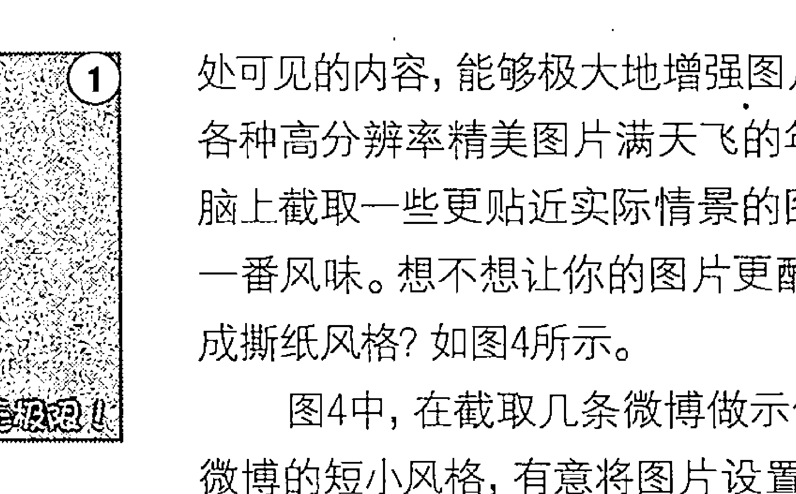

特别精美的图片，往往都是作者针对相应的演讲主题专门制作的，甚至很多页面都是用各种图片处理软件（Photoshop、Fireworks等）专门设计的。自然而然的，这得花足够多的时间和精力才行。那么有没有办法，让我们既不费太多时间，还能做出富有个性的效果来？你别说，还真有！下面咱们就来看看，什么样的图片可以让你快速打造充满个性化的PPT！

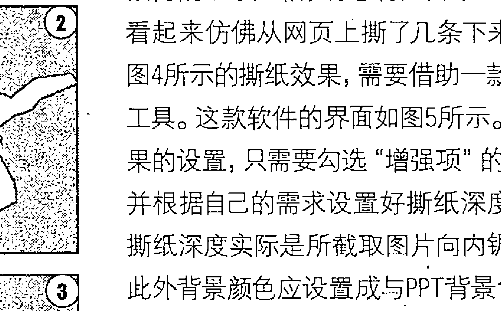

## 给不规则的图片添加粗糙的边缘

PNG格式的图片在PPT中有着非常重要的作用，因为这种格式的图片具有透明的背景，换言之，其边界可以不规则。这种图片能够非常灵活地安排在PPT页面中，有很强的活跃页面的作用。因此，现在的PPT中使用这种图片的例子已经不胜枚举。任何一种技巧，无论它多么出彩，在被用滥了的时候，都会或多或少降低其原有的效果。在没有PNG格式图片时，也可以对背景色单一的图片通过“设置透明色”来实现。例如图1，就是这样制作得到的。

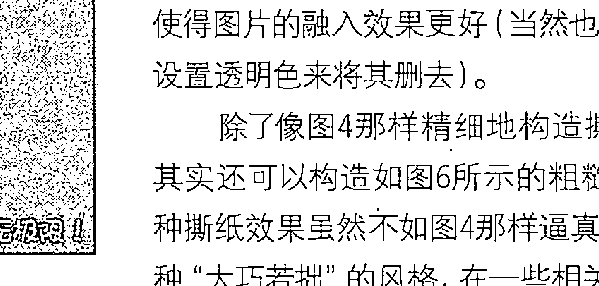

> 小提示
图3的效果中还对所画的任意多边形增加了阴影，以增强页面的层次感。

但从图1中不难看出，删除背景色的方法虽然可以使我们获得类似于PNG图片的效果，但由于处理得粗糙，在边缘部分还是存在着各种各样的毛刺，使得呈现效果大打折扣。那么如何处理，才能既保留PNG格式的灵动效果，又去掉毛刺带来的遗憾呢？方法很简单，在图片背后叠加一个不规则的单色背景即可，如图2所示。这里不规则的单色背景，是通过PPT中的“任意多边形”来画出的。在画的时候，不必要求多么有规则，沿着原图大致勾勒一下更能增添一份别致。最终效果如图3所示。

## 撕纸效果

对于本身就是高清PNG格式的图片，也可以借助这个简单的处理来使其另具特色！如果你喜欢在页面中使用不规则的图片，这个技巧值得保留。

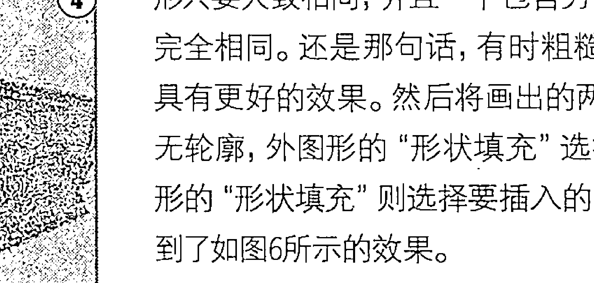

在做演示的时候，我们往往插入一些截屏图片。这类图片的优势在于它们往往是我们身边随处可见的内容，能够极大地增强图片的亲和力。在各种高分辨率精美图片满天飞的年代，从自己电脑上截取一些更贴近实际情景的图片，反而别具一番风味。想不想让你的图片更酷一点，比如做成撕纸风格？如图4所示。

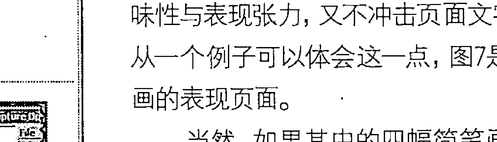

图4中，在截取几条微博做示例时，为了表现微博的短小风格，有意将图片设置为撕纸效果，看起来仿佛从网页上撕了几条下来一样。要得到图4所示的撕纸效果，需要借助一款软件：SPX截图工具。这款软件的界面如图5所示。其中对撕纸效果的设置，只需要勾选“增强项”的“边缘效果”，并根据自己的需求设置好撕纸深度等选项即可。撕纸深度实际是所截取图片向内锯齿化的深度，此外背景颜色应设置成与PPT背景色一致，这样可使得图片的融入效果更好（当然也可以通过PPT的设置透明色来将其删去）。

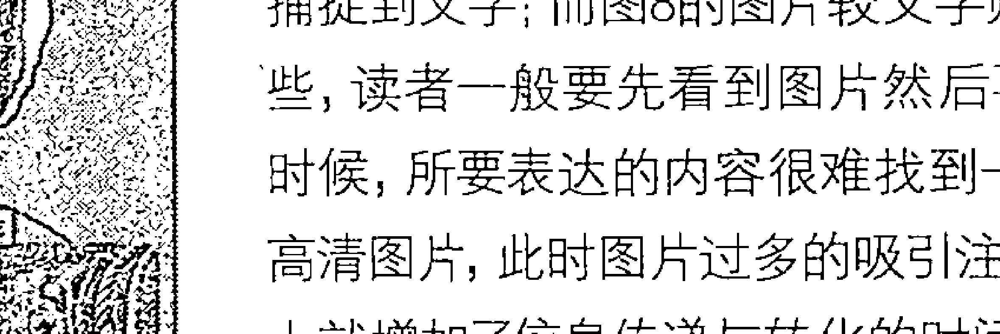

除了像图4那样精细地构造撕纸效果，有时其实还可以构造如图6所示的粗糙撕纸效果。这种撕纸效果虽然不如图4那样逼真，但其体现了一种“大巧若拙”的风格，在一些相关主题中会起到意想不到的效果。它的制作方法也很简单，先用PPT中的“自由曲线”画出一个封闭图形，然后在这个图形再画一个大致类似的封闭图形。这两个图形只要大致相同，并且一个包含另一个即可，不必完全相同。还是那句话，有时粗糙点反而比精细具有更好的效果。然后将画出的两个图形设置为无轮廓，外图形的“形状填充”选择白色，而内图形的“形状填充”则选择要插入的图片。这样就得到了如图6所示的效果。

## 简笔画图片

换言之，各种类型的图片表达必然各有千秋。而简笔画图片是一类能充分展现个性的图片，因为这类图片不像高清图片那样容易获得。国内很多PPT方面的牛人都是采用自画简笔画的方式来得到图片，显然他们的图片就是独一无二的，这种个性是别人最难复制的。如果你对自己的鼠绘水平信得过，哪怕粗糙一点，都是完全不一样的效果。

不过也要注意到，简笔画通常需要花费较多的时间去绘制。若PPT的制作周期很短，除非已有较大量简笔画的储备，否则很难运用得出色。

在实际生活中，简笔画的图标也随处可见。例如公交车上的老幼病残孕的标志、名片上的电话与电邮图案、杂志和网页上的各种小标识等，多数都是典型的简笔画风格图片。在平时浏览中，注意积累一些出色的简笔画，可以在关键时刻让你的PPT超凡脱俗。

## 剪影图片

与简笔画图片类似，剪影图片也是一类能够有利于突出文字的图片。本质上而言，简笔画与剪影图片能够有效地突出文字，原因在于这两类图片最大程度地去除了图片中的细节，只保留了能反应图片最核心的因素，因而图片显得非常简约，从而既避免了对文字的冲突，又增加了页面的生气。

在PPT中，运用剪影图片时，通常是运用黑白风格的剪影图片。当然，为了保持PPT前后用色的统一性，也可以将剪影图片处理成其他单色风格。要注意到，剪影图片虽不限于人物图片，也可以是某个物品或某个场景，但一个基本的注意事项是，剪影图片一般在表现简约图案时更有效果。若是表现一个繁杂的图案，使用剪影图片可能会适得其反。


就剪影的使用效果而言，苹果公司Ipod的宣传画无疑是一个非常好的案例，如图9所示。可以看出，图中剥去了人物图片的各种细节，仅保留了外围轮廓以展现人物的动态，而黑色的人物剪影与白色的Ipod形成鲜明的对比，怎么能不给人留下深刻的印象。

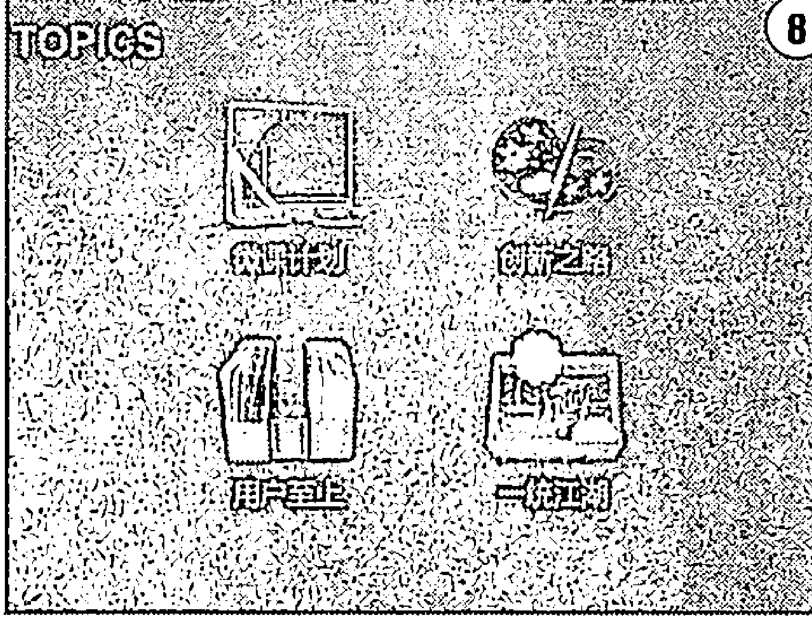

相对而言，剪影图片突出了对面上的单一着色，而简笔画则强调了对线条的运用。网上关于人物的剪影图片很多，在需要时可以快速搜索合适的加以应用。除此之外，还可以充分利用Office的剪贴画自行制作。方法是导入剪贴画后，取消组合，删除不需要的元素，然后对剩余的部分重新组合后填充为合适的颜色即可。

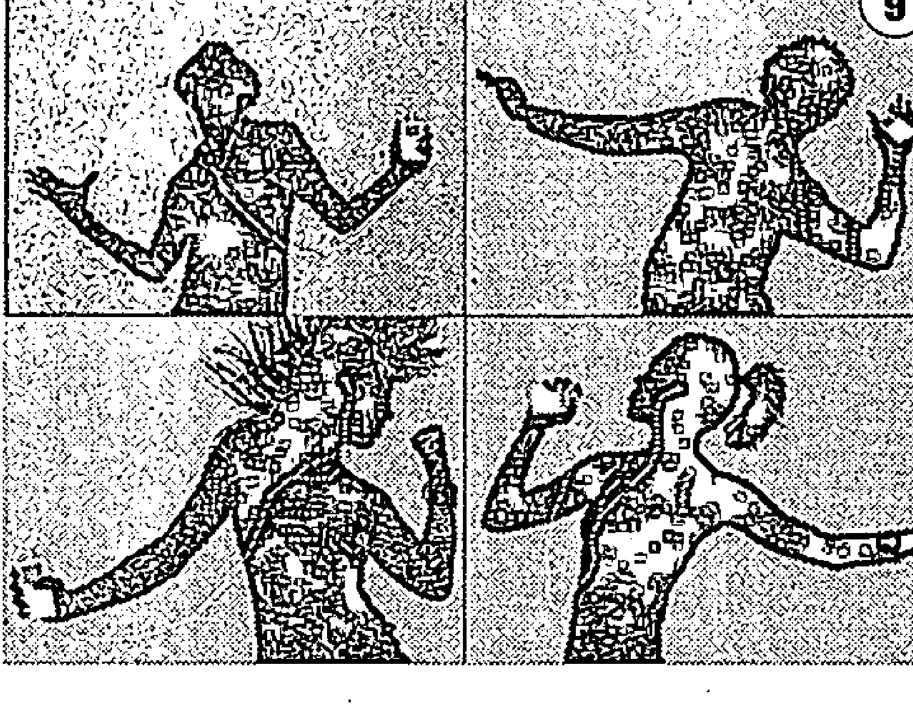

以上就是常见的几种别具一格的图片类型，当然以后我们还会介绍更多出彩的方法技巧与风格特色。但要特别强调的是，出彩与否并不取决于选择哪种风格，而在于你选择的风格是否能够与你的主题高度匹配。如果主题合适的话，你不妨试试本文的几种图片运用风格。

（文/沈栋）

# 借助特殊标记 多表快速定位

用Excel完成一项相关的工作，我们常常习惯于把一批表格安排在同一个Excel文档中，比如一个业务员用一个Excel文件管理上百个同类客户。但是，位于屏幕下方的工作表标签栏能够显示的工作表名称受屏幕的限制一次只能显示几个，而且既不能排序又不能用查找的办法定位表格，这样表格一多，在标签栏中只能以翻页的办法按名称找工作表，很麻烦。下面的方法可以解决这个问题。我们以Excel 2010为例说明。

## 快速成批设置特殊标记

先单击选中第一张工作表标签，再按住Shift键不放，单击最后一张工作表标签，即可同时选中所有工作表。然后右击第一行行标选择“插入”，在第一行前插入一行，在A1中输入一个你在表格中绝不可能输入的内容（如：vv8vv）作为记号。回车确认后再右击第一行的行标选择“隐藏”把第一行隐藏起来。

## 快速定位或筛选工作表

先单击“开始”选项卡最右侧的“查找和选择”，在下拉列表中选择“查找”。在“查找和替换”对话框中单击“选项”按钮以显示更多选项，再单击“范围”的下拉按钮选择“工作簿”。

然后输入查找内容为vv8vv，单击“查找全部”按钮进行查找。

这样当前工作簿中所有内容为vv8vv的单元格都会以列表方式显示在查找窗口中，同时也会显示其所在工作表名称。由于每个工作表只有唯一的单元格是vv8vv，所以这里显示的就是所有工作表的目录了。在列表中单击任一项即可直接切换到相应的工作表。

在此，我们可以单击列表标题中的“工作表”按钮让显示的工作表名按拼音升序排列，这样找起来就更轻松了。

更进一步，如果你要定位满足表格中有某项特定值单元格的所有工作表（如“部门”为“财务科”的工作表），通过在“查找内容”中输入不同内容（如“财务科”），就可以将特定的某类工作表（如含有财务科的表）筛选出来，以供选择。

（文/君二）

# 作文试题 局部稿纸轻松设置

把整篇文章设置为稿纸，这个不难，以前多有文章介绍。若只要求把语文卷的作文部分变成稿纸，这个怎么办？语文老师小王，在每次语文测验后收回试卷批改时，总是发现一个有趣的现象，同学们写作文时，很多人前面的还算工整，到最后就出问题了。有的留有大片空白，有的拥挤不堪，有的则是字体大小不一，“上天入地”，很少有工整的。后来向同学们一了解才得知，试卷不像作业簿那样有方格，布局难以掌握，如果像作业簿那样有方格就好了。但局部试卷如何设置方格？

## 局部行线巧设置

在试卷中作文位置我们可以设置成局部行线，方便同学们写作。首先是将光标定位到要插入行线的位置，执行“插入→文本框→绘制文本框”命令，拖动鼠标绘制一位置合适的文本框。然后在文本框边框中右击鼠标，选择“设置对象格式”命令，在打开的“设置对象格式”对话框中，执行“线条颜色→无”命令，之后关闭对话框。在文本框中单击鼠标，再执行“开始→段落”命令，在“段落”对话框中将“间距”、“行距”等设置成与试卷中其他位置相同即可，单击“确定”退出对话框。此时连续按下回车键，将光标移动到文本框底部，再拖动鼠标，将所有回车符选中，最后在“开始”选项卡下的“段落”功能区中单击“边框”按钮右侧的箭头，选择“内部横框线”。这样，局部行线也就设置完成了。同学们在写作文时，由于有横线的参照，书写就方便多了。

## 局部稿纸任意设置

行线相较于方格稿纸来说，方格稿纸更具优势，方格稿纸还可以限定字数，不过稿纸默认的是布满整个文档的，那么在试卷中如何使用局部稿纸呢？首先在Word中新建一个空白文档，执行“页面布局→稿纸设置”，在打开的“稿纸设置”对话框中单击“非稿纸文档”，选择“方格稿纸”，再单击“行数×列数”，选择合适行与列，并选择颜色较浅的风格，单击“确定”关闭对话框，最后执行“文件→另存为”在打开的“另存为”，对话框的保存类型中，选择“Word文档(*.docx)”，再单击“保存”即可。随后打开我们编辑的试卷，将光标定位到要插入稿纸的地方，执行“插入→对象”，在打开的“对象”对话框中单击“由文件创建”选项卡，单击“浏览”按钮，在打开的“浏览”对话框中选择保存的稿纸文档，单击“确定”，即可在文档中插入一个整页稿纸了。待稿纸插入后，先在插入的稿纸中右击鼠标，执行“剪切”命令，然后在“开始”选项卡下单击“粘贴→选择性粘贴”，在弹出的“选择性粘贴”对话框中选择“图片JPEG”，再单击“确定”即可。图片稿纸插入后，剩下的就是调整图片稿纸的大小了。首先在图片中单击鼠标，使其呈可编辑状态，然后执行“图片工具→裁剪”命令，根据作文的文字要求，对图片的行、列进行适当裁剪，直到满足要求为止，局部稿纸设置完成。这样，在试卷中无论是采取局部行线，还是局部稿纸的方式，对于小学生来说，在写作文时有了网格或行线的约束，书写起来文字布局就容易掌握多了。

（文/刘长德）

# PDF优化后装入平板

做些工作，让你的平板能装更多的PDF电子书，且阅读起来感觉更爽！对喜欢阅读的学生来说，在平板电脑中放几本PDF书籍是再平常不过的事。不过，对于体积较大的PDF，阅读起来并不方便，一是打开速度慢，二是平板电脑容量一般较小，比不了笔记本。所以把PDF装入平板之前，最好先进行优化处理。我们用一款免费的软件PDFCool Studio（下载地址：http://www.duote.com/soft/42487.html）来处理，可以完成多项优化任务。

## 切割大文档

把大文档切割后，再装入平板，阅读完的小文档可以及时删除，而且打开速度也会加快。依次单击“文件→打开”，导入PDF文档，再依次单击“文档→分割文档”，可以看到切割方式还是比较灵活多样的，可以按页面分割，也可以按容量大小切割，选择什么切割方式，就看你的喜好了。指定输出文件夹后，单击“开始分割”即可。

## 提取需要的页面阅读

一本书籍，可能你只对其中的一章或几章感兴趣，我们可以把这几章单独提取为一个新的PDF文档。依次单击“页面→页选择器”，打开页选择器窗口，勾选需要提取的页面，然后单击“发送到批处理器”，单击“全选”。也可以选中页面进行预览，再删除其中不需要的页面。最后单击“创建PDF”即可得到一个新的PDF文档，这个文档，就是你提取的PDF精华了。

## 裁剪页面 让阅读界面清爽点

有些扫描得到的PDF书籍，页面边缘有明显的多余部分，这对屏幕本来就很小的平板来说，简直就是罪过。做做裁剪工作吧，很快就会完成的。依次单击“页面→裁剪页面”，在“页面范围”中选择需要裁剪的页面，然后在“边距”中指定裁剪的边线距离，从右侧预览中可以看到裁剪线，最后单击“开始剪裁”即可。

（文/曹春华）

# 制作任选项目的查询系统

面向普通用户的数据查询，制作一个能按各种项目随意查询的系统是必要的。巧用VLOOKUP和OFFSET函数，就能实现。

面向大众的员工记录、产品记录、合同记录、学生成绩列表记录等经常要查询的记录表，一般需要制作一个查询界面，以便于通过输入员工号、姓名、合同号、产品型号等简单文本来快速查询所需记录内容。在Excel 2010中通常大家都会使用VLOOKUP函数制作查询界面，不过VLOOKUP只能以记录表中的首列为依据进行查询，而在实际使用中由于已知的查询条件不同，往往需要随时选择不同列进行查询。以员工记录来说，除了按员工编号进行查询外，有时也需要按姓名、身份证号码、联系电话进行查询。那么如何才能做到按任选列进行查询呢？在此就以员工记录表的查询为例来介绍两种方法。

## 查询界面设计

不管用哪种方法实现，查询界面总是一样的，我们先统一介绍一下查询界面的设置。
用Excel 2010打开“员工记录”工作表，新建一个“查询”工作表并按需要设计好查询界面，在此我们设计在B2单元格输入查询关键词，A2单元格则用于输入要查询的列标题，查询结果则显示在A4:D10单元格区域。选中A2单元格，切换到“数据”选项卡，单击“数据有效性”。在“数据有效性”窗口中单击“允许”的下拉列表选择“序列”，并输入来源为“=员工记录!1:1”即记录工作表的标题行，确定完成设置。这样我们不仅能方便地从A2的下拉列表中选择要查询的记录列标题，还可有效避免因在A2中输入不存在的列标题出现的查询错误。设置好后先在A2选择输入一个列标题“姓名”，并输入一个正确姓名，以免后面输入公式时显示#N/A错误。
再来选中B7，右击选择“设置单元格格式”，在“数字”选项卡中选择“文本”格式，以确保能正常显示身份证号码。同样对D5、D6也要分别设置相应的日期才能显示为正常的日期。

## 任选列查询设计

在Excel中用VLOOKUP和OFFSET函数都能轻易实现任选列查询。在此分别介绍一下两种函数的实现方法，实际操作中大家只要任选一种即可。

### 方法一：OFFSET函数

用OFFSET函数需要先在员工记录表中为各列数据定义名称后，方可实现任选列查询效果，操作比较简单，不会影响到原员工记录表布局。
切换到“员工记录”工作表，选中所有数据列(A:L)，在“公式”选项卡的“定义的名称”组中单击“根据所选内容创建”。在“以选定区域创建名称”窗口中只选中“首行”复选项，单击“确定”即可把各列分别按列标题定义名称。切换到“查询”工作表，选中B4单元格输入公式=OFFSET(记录!$A$1,MATCH($B$2,INDIRECT($A$2),0),0)。同样在B4:B10、D4:D8单元格中都输入这个公式，不过要把公式中最后那个0依次改成1、2、3……11，以分别显示相应列的内容。

OK，现在你只要在“查询”工作表中选中A2单元格，单击其后的下拉按钮，从下拉列表中选择要查询的列标题为“联系电话”，再输入查询内容13605076742，即可查询到联络电话是13605076742的陈桂鑫个人记录。

注：若要查询的是全数字的身份证号，输入时必须在证号前面加一个半角的单引号，例如“'350621197602232010”，这样身份证号才能正常显示查询。否则输入的身份证号不能正常显示，将无法查询出结果。不要事先把B2单元格数值设置为文本格式，虽然设为文本格式也能显示身份证号，但会让输入的电话号码、编号、日期等数值变成文本，导致输入电话、编号、日期查询时出错。

### 方法二：VLOOKUP函数

大家应该比较习惯于使用VLOOKUP查询吧？虽然VLOOKUP只能按首列查询，但这不是问题。我们只要在员工记录表前面增加一列辅助列来实时显示要查询列的内容，同样可以轻易实现任选列查询。
在“员工记录”工作表中，选中A列右击选择“插入”，在A列前插入一个空列。在A1单元格输入公式=HLOOKUP(查询!A$2,B:M,ROW(),FALSE)。选中A1:A2000区域按Ctrl+D组合键把A1公式复制填充到A1:A2000单元格，即可在A列显示要查询列的内容。由于我们在查询工作表的A2输入的是姓名，所以现在显示的是姓名列。至于具体需要向下填充到第几行，请参照记录表准备存储的记录数考虑。此外，若不想影响原表视图，可在设置好后选中A列，右击选择“隐藏”隐藏A列。
回到“查询”工作表，按一般VLOOKUP函数的用法，在B4输入公式=VLOOKUP($B$2,员工记录!$A:$M,2,FALSE)。同样在B5:B10、D4:D8单元格中都输入这个公式，不过要把公式中的2依次改成3、4……13，以分别显示相应列的内容。现在试试在A2选择列标题，输入查询内容，也一样能找到记录吧。

总结：用VLOOKUP的缺点是需要添加辅助列，当增加记录行时得把辅助列的公式复制下来才能查询到。优点是当列数、列标题变化时无需再做任何修改仍可正常使用。OFFSET的优点是不影响人员记录表，增加记录行无需做任何修改。缺点是当用于查询的列标题改变时得选中列重新定义名称后方可正确查询。两种方法各有优劣，大家可按表格特点、个人习惯选择适合的方法。
需要说明的是，现在虽然可以在A2单元格中选择任何一列进行查询，不过除员工编号、姓名、身份证号、联系电话外，对其它列的查询符合的可能不止一项，而不管是VLOOKUP还是OFFSET函数都只能显示第1条符合的记录，其他记录就找不到了。对此，可以限制只能按员工编号、姓名、身份证号、联系电话等具有唯一性的列进行查询。方法是在查询界面中为B2设置“数据有效性”时，把输入的来源改为“员工编号,姓名,身份证号,联系电话”即可（不含引号，各选项间以半角逗号分隔）。

（文/陈桂鑫）

# 大型报告的分工合作之道

多人合作的报告，往往需要把文档拆分给各人编辑，回收合并修订再拆分，不断重复。该如何快速实现拆分、合并文档呢？

在大型集团公司中的小王经常要写一些涉及范围较广的总结或报告，这类报告通常需要由多个部门分工合作才能完成。因此小王得把写好的提纲先按需要拆分成多个文档，分发给相应科室去编辑。回收合并成一篇报告，统一修订、批注后，再重新拆分成子文档发给大家修改，如此重复直到最终完成。重复拆分合并操作当然很麻烦，为了节省时间，小王准备用Word 2010的主控文档功能来实现文档的快速拆分、合并工作。

## 快速设置标题样式

拆分文档首先必须给标题设置样式，当然若文档原本就设置有各级标题样式，这步就可以省了。建议顺便把标题编号改成自动编号，这样大家编辑增删小标题要点时编号就可以自动调整，需要修改各级标题格式时也会轻松很多。大量的各级标题要逐一设置样式比较麻烦。针对各级标题编号的不同特点，小王决定利用Word的查找替换功能来批量设置各级标题样式。

在“开始”选项卡“编辑”区中单击“查找”后的下拉箭头，从中选择“高级查找”。在“查找和替换”窗口中单击“更多”按钮显示高级选项，选中“使用通配符”复选项，输入查找内容为“<[一二三四五六七八九十]{1,}*^13”（不含引号）。单击“在以下项中查找”按钮，从下拉列表中选择“主文档”，马上可以看到文档中以“一、”“二、”……开头的标题行已经全部被选中了。现在从“开始”选项卡的“样式”列表中选择“标题1”，即可把所有一级标题设置为“标题1”样式。然后切换到“替换”选项卡，查找“<[一二三四五六七八九十]{1,}、”替换为空，单击“全部替换”删除原来的文本编号。

现在要设置编号就很简单了，随便选中一个标题设置好自动编号，再右击选择“样式/更新 标题1 样式以匹配所选内容”即可为所有一级标题设置自动编号。以后想修改标题格式或编号都是这么简单，任选一个标题进行设置后，右击更新样式即可。

对2、3级标题的格式和编号设置操作也差不多，只是需要根据编号不同修改一下查找内容。对于“1.”“2.”……开头的二级标题编号，只要查找<[0-9]{1,}.^13即可，其他操作完全一样。含括号的编号则要麻烦点，得先在不使用通配符下查找^p（替换为^pA，把段首的（全部换成A，再查找<A[0-9]{1,}）^13进行设置，请注意括号的全角、半角格式要与原文中的括号一致。

## 小提示

[一二三四五六七八九十]代表10个中文数字中的任意一个，[0-9]则表示10个阿拉伯数字。{1,}表示有1个或多个前一字符连续出现，与前面的数字组合代表1位及以上的数字。<表示单词开头，对于中文来说实际上就是语句的开头。*代表任意多个任意字符。^13代表段落标记，相当于不使用通配符时的^p。）已被通配符表达式使用，因此必须在前面加\，输入\），才能被当做）查找。

## 根据标题自动拆分

按本公司的情况，小王必须把总结报告按开头总述、财务情况、主要成就、业务扩展、人员制度管理、总结分析和规划拆分成6个部分。财务情况、主要成就、业务扩展、人员制度管理分别交由不同部门去整理，自己汇总后再整理写出开头总述部分和结尾的总结规划。这些要拆分的部分正好都是在一级标题下，可以让Word自动按标题拆分文档。

先切换到“视图”选项卡单击“大纲视图”，切换到大纲视图模式。在“大纲”选项卡中单击“显示文档”以展开“主控文档”区域。按Ctrl+A键全选，单击“创建”图标，即可把提纲内容拆分成6个子文档，拆开的6个子文档内容会分别用框线围起来。最后把文档命名为“总结报告主文档.DOCX”保存到“D:\总结”文件夹下，Word会在保存文档时在“D:\总结”下创建XX公司总结报告.DOCX、财务情况.DOCX、主要成就.DOCX……等6个子文档。现在只要把财务情况、主要成就、业务扩展、人员制度管理4个子文档按分工发给相关部门去编辑就行了，记住要交待他们不能改文件名。

创建的子文档默认以首行标题作为子文档名称。若想自定义子文档名，可在第一次保存主文档前，双击框线内左上角的小图标打开子文档，在打开的Word窗口中单击“保存”即可自由命名保存子文档。在保存主文档后子文档就不能再改名、移动了，否则主文档会因找不到子文档而无法显示。如需在其他电脑中处理主文档，则必须把主文档和所有子文档一起复制过去并放在同一文件夹下才能正常显示。

## 小提示

自动拆分只能从设置了标题、标题1样式的标题文字处进行拆分。实际分工时可能还会碰到需要把某一标题下的子文档再拆开给两个人编辑的情况。对此只要在子文档框线内选中要拆分的内容，单击“大纲”选项卡中的“拆分”即可新建一个子文档保存拆分内容。选中内容的第一行必须有设置标题2、标题3……这类的标题样式才行，否则无法创建。

反过来，若要把几个子文档合并成一个，则只要在主文档中同时选中几个连续的子文档内容单击“合并”即可。合并后选中内容会全部集中到第一个子文档内，但原有的子文档并不会被自动删除。

## 回收文档 快速合并

等大家编辑好各自的文档发回后，小王只要把收回的文档复制粘贴到“D:\总结”文件夹下覆盖同名文件就行了。现在打开“总结报告主文档.DOCX”，你会发现文档只剩下几行子文档地址链接。此时需要先切换到大纲视图，在“大纲”选项卡中单击“展开子文档”才能显示各新子文档内容。如果你不习惯在大纲视图下编辑，可以在展开子文档后单击“关闭大纲视图”返回页面视图，显示的子文档内容并不会消失。

现在你可以直接在汇总好的总结报告主文档中进行编辑、修订、批注了。自己负责的开头和结尾部分也可以直接在主文档中修改。全部修改完成后，同样记得把主文档和所有子文档一起复制带回即可。中编写好。所做的编辑、修订和批注都会同时保存到对应子文档中。主文档修改完成后先保存，再把“D:\总结”中的子文档重新发回给对应的人员，让大家按修订、批注内容重新进行修改完善。如此重复直到总结报告最终完成。

OK，总结报告主文档经反复修订发回后终于完成了，小王最后要做的工作就是把文档转成普通文件上交。打开主文档“总结报告主文档.DOCX”，在大纲视图下单击“大纲”选项卡中的“展开子文档”以完整显示所有子文档内容。拖动选中所有显示的子文档内容，单击“大纲”选项卡中的“显示文档”展开“主控文档”区，单击“取消链接”以消除与子文档的关联。然后单击“文件”选项卡选择“另存为Word文档”，命名另存即可得到合并后的普通报告文档。

## 小提示

若你事先没有准备报告提纲，也可以先让大家按要求写出各自负责的那部分报告内容上交，回收后再汇总生成主文档。只要先把所有文档集中到一个文件夹中，打开Word新建一个文档，切换到“大纲视图”，单击“显示文档”，再单击“插入”把编辑好的文档按顺序逐一插入到主文档中保存即可。

(文 陈桂鑫)

# 小点缀 一样很精彩

一个标点、一个小图、一种字体……用一些平时不起眼的小组件也可以打造出精彩的PPT效果。

正如绿叶能够更好地衬托出花朵的美丽，精彩的页面也可以通过一些简单的点缀来快速实现。

## 标点的妙用

在PPT中，一般而言，大段式的文字出现较少，因此在页面上通常标点也使用较少。实际上，在标点符号较少的情况下，对其中的标点符号进行适当的处理，可以将标点变为页面的点缀元素，大幅提升页面的表现力。试看如下几例（图1）。

使用标点符号做点缀时，注意其颜色的选择，常见三种选择准则：其一是选择灰色，灰色是一种无色彩的颜色，与任何类型的版面都能够有机融合，而且还能体现出高品质的感觉；其二是选择与版面一致的单色，常见于单色系的设计风格型PPT，标点也选择该色，可以保持页面的前后统一性；其三是根据页面主题选择对应的颜色，例如危险、警示等页面选择红色，环保、生机等页面选择绿色等。

## 小图片做点缀

在PPT中，图片是提升页面吸引力的最有力工具之一。当页面上不能使用大幅图片时，可通过增加少量的小图片进行点缀。例如图2中左上角例、右上角例、右下角例都是通过小图片活跃页面的示例。另一方面，即使对于含有大图的页面，小图片也可以帮助构建页面的层次，丰富页面的表现力（图2中左下角例中的凤尾夹）。

对于小图而言，在PPT中运用时注意保持前后的一致性。这里的一致性主要表示为图片风格、图片色彩风格、图片样式等几个方面。图片风格例如都选用边界自由的PNG格式图片，色彩风格例如都处理为灰度模式，图片样式例如都设计为剪裁对角线（图2中右下角例）。

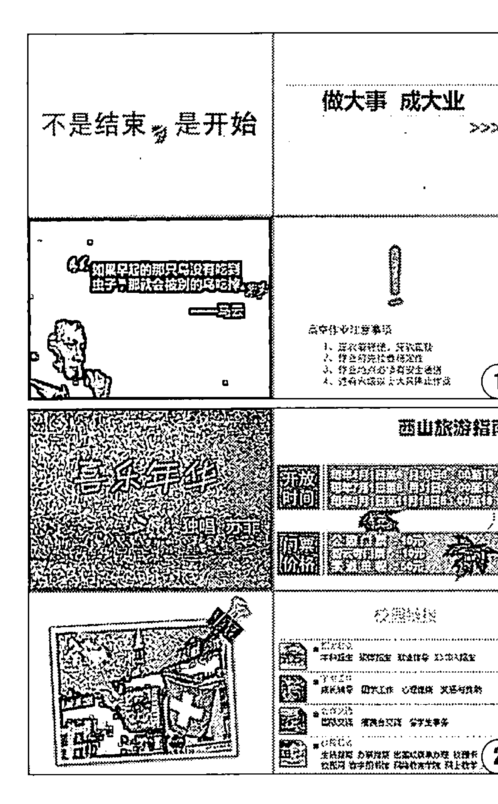

## 字体也是点缀

在PPT版面中，标题适宜选择较粗的字体，例如方正粗宋、黑体等，正文则通常选择常用字体，例如宋体、微软雅黑、楷体等。这些字体按照线条是否粗细一致可以分为两类，即有衬线字体与无衬线字体。实际上，除了这两类字体，无论中文还是英文都还有各种艺术字体可供使用。但这种艺术字体一般不宜大量使用，在少量使用时完全可以看作页面的一种点缀（图3中各例）。

图3中，左侧是将英文字体进行设计做点缀，而右侧则是对中文进行设计。例如，右上角例将“优秀”选用手写体，既体现特殊性，又使得页面趣味十足。又如右下角例不光将标题设置为艺术字体，还采用反白技巧突出关键词。

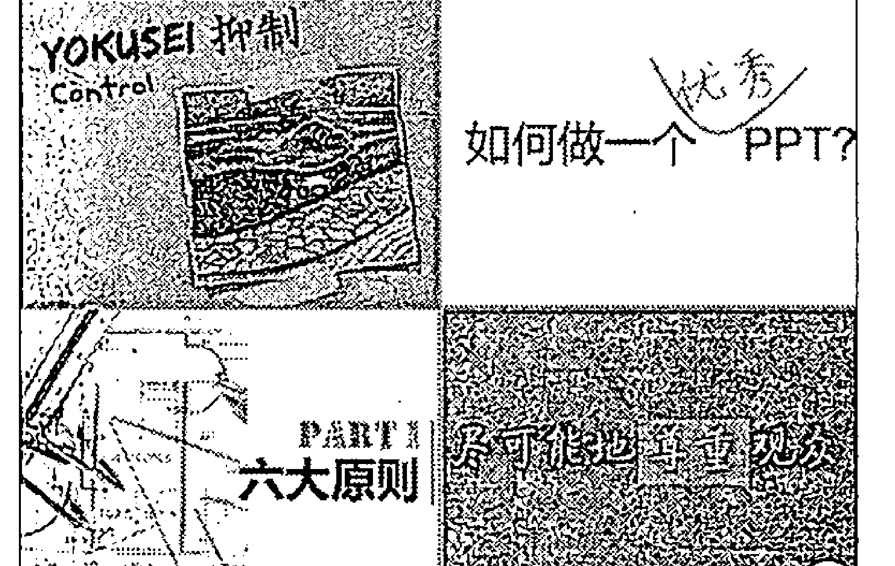


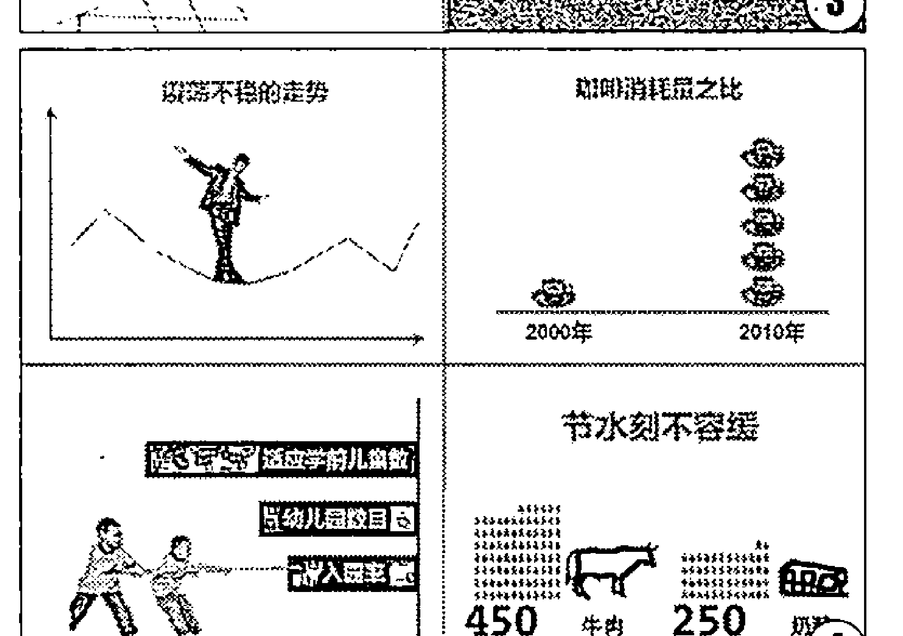

## 图表中的点缀

图表是PPT中呈现数据的主要方式，而对图表进行适当点缀也可以进一步提高观赏性。在图表中的点缀，最常见的就是使用图片对图表内容进行重述或填充（图4中右侧两例）。另一种点缀图表的方式为外加图片于图表之上，在两者之间建立关系，例如图4中的左侧两例，其中左上角例用摇摆的人物烘托震荡不稳的走势，左下角例用两个孩童的拉动表现提高入园率的态度。

(文 沈栋)

# 也谈PPT制作变形动画

制作PPT变形动画除了可以用逐帧的传统方法外，还可以用PPT自带的功能来实现。《电脑爱好者》第19期60页刊登的《何需FLASH PPT轻松制作变形动画》，介绍了如何在PPT中制作圆柱变形成圆锥的动画。作者使用的方法，其实类似于动画中的逐帧动画，前后一共用了十几张幻灯片来实现最终效果。要达到作者所说的动画效果，我觉得完全可以用PPT自带的陀螺旋动画来实现。

## 制作思路

用绘图工具绘制出相应的图形，通过PPT自带的陀螺旋动画实现圆柱两侧的线段的收缩效果，通过放大/缩小动画实现圆柱上底的缩小，最终达到目的。

## 制作过程

### 绘制图形

本例中的圆柱并不是用绘图工具中的圆柱工具直接画出来的，而是用椭圆工具和直线工具分别画出椭圆和线段后组合而成。为了描述的方便，我们分别称为左线段、右线段和上底。

PPT中的陀螺旋动画，对象旋转时是围绕对象的中心点旋转，而图中的左线段和右线段旋转时，我们希望是围绕下方的端点进行旋转。为了解决这个问题，我们把左侧线段进行复制，将复制后的线段移动到原线段下方，并在“设置形状格式”窗口中，将线条颜色设置为“无线条”，这样复制后的线段就成透明的了，再按Shift键选定原线段，将原线段与复制后的透明线段进行组合。右侧线段也如法炮制。这一步算得上是一个关键步骤。

### 动画制作

- 1. 选定组合后的左线段，添加动画“陀螺旋”，并对“陀螺旋”动画进行如下设置：“数量”选择自定义，输入 24° (注意：这个数值是本例中的旋转度数，具体制作时可根据实际情况进行调整，此外，输入后必须按回车键确认)，选择“顺时针”旋转。按“确定”按钮关闭对话框。动画的持续时间为默认的两秒钟 (当然，也可以根据实际需要进行设置)。
- 2. 右线段的动画设置跟左线段设置差不多，不同点是选择“逆时针”旋转。
- 3. 上底的动画，我们选择“放大/缩小”，对该动画效果进行如下设置：“尺寸”中输入 0%，也就是说上底经过缩小后，最终完全消失。

在动画窗格中，将右线段和上底的动画的开始全部设置为：与上一动画同时。主要动画设置完毕，播放幻灯片，发现了问题，上底和两侧线段出现了一段距离。这是什么原因呢？经分析，原来是两侧的线段旋转后，线段本身的长度不变，但垂直距离变短了 (相当于直角三角形的直角边和斜边)。方法也很简单，给左右侧线段分别加上一个“放大/缩小”动画，对该动画进行如下设置，“尺寸”中输入107%，即对两侧线段进行一个小小的放大效果。此外，在动画窗格中，将这两个动画的开始全部设置为：与上一动画同时。动画持续时间为1.5秒，延迟0.5秒。播放幻灯片，大功告成了!

## 小提示

本例的制作是在PowerPoint 2010中制作完成，在PowerPoint 2003中制作方法类似，不同的是，左右两侧的线段必须用矩形制作而成，将复制后的矩形的填充设置为“无填充颜色”，将线条设置为“无线条颜色”就可以了。此外，本例中的一些动画设置数据，可以根据实际情况作适当的修改，多测试几遍，一定能达到满意的效果。
(文|许向前)

# Excel快速生成设备鉴定表

Excel结合简单的VBA代码，可以大大提升报表生成效率。每年各单位的设备管理部门都要定期生成各种设备鉴定表，如设备报废、维护、修理及校验等鉴定表。这类鉴定表要为设备明细表中符合规定条件的每一台设备填写一张固定格式的表格，使用“复制→粘贴”方式填写对于设备量少的单位还勉强能用，但当设备较多时，工作量大，效率低，又极易出错。通过编写一小段VBA程序，可以快速准确地生成各类设备鉴定表。下面以设备报废鉴定表为例进行说明。

- 1. 筛选出符合报废规定条件的设备。打开设备明细表新增一列“是否报废”，在D3单元格中输入公式：`=IF(J7>K7,"是")`即报废条件为使用年限大于报废年限。
- 2. 使用移动或复制工作表功能将“设备报废鉴定表”复制到本工作簿中。
- 3. 在设备明细表页面添加一个按钮。单击插入控件，选择“命令”按钮，在工作表中单击按钮左上角要出现的位置。
- 4. 右击工作表标签，在右键菜单中选择“查看代码”，在Microsoft Visual Basic窗口中输入鉴定表生成的代码 (见图，为方便调试和套用，该代码可从http://iask.sina.com.cn/u/1704202287/ish下载)。

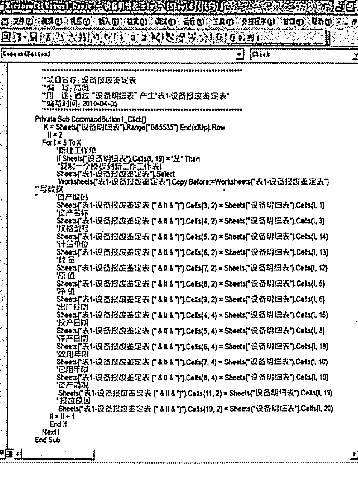

## 小提示

按Alt+F11组合键能快速进入VBA编辑状态。
- 5. 按下“生成鉴定表”按钮，即可生成当前设备的鉴定表。
(文|高薇)

# 书籍装帧 立体效果轻松设

制作立体效果的书籍宣传画，不需要复杂而专业的图像处理软件，用小软件就可以解决大问题。学报为我的书籍作宣传，需要书的立体效果图。用扫描仪扫描吧，只能是平面的；用数码相机拍摄，效果又不佳；用Photoshop来做，要做一个有书脊、有封面、有厚度、有阴影和倒影等效果的立体书，还真费时间，而且调整起来不灵活，非常麻烦；用3DMAX的贴图方式来做也比较麻烦，还有点大炮打蚊子的感觉。幸亏有软件InsoftaCoverCommander，它帮我快速完成了书籍装帧立体效果图的制作任务。

## 软件准备与设置

上网搜索一下很容易能找到该软件，如http://www.mt30.com/Soft/safe/Sother/200907/18184.html。这是一个绿色版软件，解压以后执行CoverCommander.exe就可打开。初次执行是英文版，但可以设置成中文版，方法是：在菜单中选择File→Language→Chinese(简体中文)，就可成为中文版了。

## 准备工作

在制作之前首先做一些准备工作，准备书籍封面和书脊的图像文件。出书的时候编辑给了我一张书籍设计平面图，包括封面、书脊和封底在一起的图像，用Photoshop选择各部分分别保存为相应图像：封面.jpg、书脊.jpg、封底.jpg。

## 制作过程

InsoftaCoverCommander制作效果图有两种方式，第一种方式是向导模式，根据提示，一步一步设置即可：打开软件时，出现欢迎窗口，选创建新方案，接着选样式类型(项目很多，这里选择“薄的书”或“包装盒”，因为书脊图像在设计时宽度较小)，再接着选择模板，设置封面图像、左边图像和背面图像分别为封面.jpg、书脊.jpg、封底.jpg，下一步设置是否需要阴影和倒影，单击完成即可进入编辑模式。第二种方式是编辑模式，它可以让用户自己来设置相关参数，具体包括：“方案”选项设置立体书籍的宽、高和厚度；“封面图像及颜色”选项设置立体图各个面的图像及背景颜色，“视角”、“光源”、“阴影”、“倒影”等选项可以设置各种立体效果，也可以在预览窗口中用鼠标调整视角。一切设置好以后，在右边预览窗口单击“生成预览”可以预览生成图像的实际效果图。单击“保存图像”打开对话框进行一些设置，可以将立体效果图保存为合适的图像文件。

## 小提示

该软件除了可以快速制作书籍装帧立体效果图外，还可以制作具有专业效果的各种包装盒，CD、DVD光盘面、卡片等的立体效果图。除了发布为供展示和打印的图像文件外，还可以输出为动态的swf格式的动画。
(文|冷国华)

# PPT也做图片跑马灯

用Flash可以轻松制作很炫的图片“跑马灯”动画效果。对于只熟悉PPT而不会用Flash制作的人来说，用PPT也能做出类似的动画效果吗？图片跑马灯效果就是一组图片自动依次通过屏幕中央进行演示，这样可以让欣赏者流畅地欣赏一组图片，视觉效果明显提升。这种效果用Flash可以轻松实现，但能够轻松使用Flash的人远远没有会用PPT的人多，现学现做又太费时费力。其实，如果你不会Flash制作，运用PPT的自定义动画，照样可以做出很炫的图片“跑马灯”效果。接下来，笔者就通过具体的实例向你介绍如何运用PPT中的自定义动画制作图片的“跑马灯”效果。

## 自行选择插入图片

在空白幻灯片中插入一组你所心仪的图片，把图片调成统一大小，放到屏幕的中央。图片距左右两边的距离最好相等。

## 小提示

设置图片大小及位置时，可以选中所有图片，然后在图片上右击选择“设置图片格式”，在“尺寸”选项卡设置图片大小时，最好将锁定纵横比去掉，在“位置”选项卡输入图片的水平、垂直位置即可。

## 自定义动画巧设置

这一步很关键，效果有没有就在这步了。首先设置进入效果。选择所有图片，效果：飞入，开始：之前，方向：自右侧，速度：非常慢，并且右击进入效果要选择“从上一项开始”。其次设置退出效果。选择所有图片，效果：退出，开始：之后，方向：到左侧，速度：非常慢(速度可自己设定)。

“跑马灯”效果出来的关键在于图片的出现顺序及每张图片的进出。可要仔细做，别让图片乱出乱入！用鼠标在“自定义动画”窗口处拖动调整每张图片出现的顺序让每一张图片一进一退。

## 细微调整让画面更和谐

你想让“跑马灯”这个效果如何开始、如何结束，可在这步进行设置，这就看你的想法了。将第一个幻灯片的动画效果改为：出现，开始：之前。第二个动画效果改为开始：单击时，作用是让第一张图片停在屏幕中央。将最后一个退出效果删除，作用是让最后一张幻灯图片停留在屏幕上。最后试一试，看看这种PPT跑马灯效果和Flash做的效果是不是很相似！
(文|马震安)

# 用PPT设计个性化名片

巧妙运用PPT图文混排技术可以设计出富有个性化的名片。

第2期的PPT图文混排特别话题详细介绍了多种图文混排的技巧与原则，那么，具体如何运用这些技巧创作出属于自己的作品呢？本文我们就一起来用PPT为自己设计一张富有个性的名片，适当的设计可以使得你的名片在众多的文字型名片中脱颖而出。

打开PPT后，首先要按设计的名片长宽比例来设置页面大小。一般而言，名片的尺寸为90mm×54mm，考虑到名片印刷过程的剪裁，需要在上下左右各加2mm的出血部分，因此页面可设置为94mm×58mm。实际上对页面而言，只要保证页面长宽比例符合即可，页面范围可适当增大，以保证清晰度，但要记得缩小至实际大小查看文字是否能清楚显示。本文中设计的个性名片，页面范围设置为10cm×5cm，名片看起来更加狭长。

## 全图型名片设计案例

首先，选择一张与作者行业密切关联的图片，这样可以在图片与文字之间形成呼应，通过图片内容来暗示名片主人的职业信息。实际上，对于某些职业也可以通过图片进行营销与展示，例如设计人员、摄影家等，都可以用个人作品做背景，既富有新意又营销个人品牌。本案例的职业为编辑，故选择与编辑行业直接相关的图片，例如堆叠的《电脑爱好者》杂志或一堆文稿等，由于名片主人供职的杂志属于电脑类，因此也可以选用电脑相关的图片。

然后，将图片插入PPT至位置合适，给其足够的开放空间用以展示，并注意将要突出的内容集中在一个区域展示。图片的焦点置于页面的三分位置处，可以增强页面的稳定感。最后，将个人信息添加到页面上。特别注意两点：一是文字对齐，即将各条信息进行左对齐或右对齐，居中对齐应用较少；二是字体选用普通字体。

### 本法使用技巧：

- 1. 当图片信息纷繁时，加一长条区域，填入25%淡色的黑色，调整透明度在10%以内，以保证文字信息能够清晰显示。担心插入长条影响美观，可将图片上的文字区域进行模糊化处理，然后直接将文字添加在该处。
- 2. 如果一侧相关信息内容十分丰富，不愿意遮挡其中任一部分，则可以将简洁的文字信息置于名片的背侧，也即使用名片两面分别设计。
- 3. 姓名与个人信息有所区分，可通过将姓名文字字号变大来实现，也可以在姓名与信息之间直接添加线条。文字内容注意稍居内侧，避免剪裁时导致文字过于靠边缘，甚至被剪裁掉。
- 4. 文字采取的对齐方式与其所处位置匹配。

## 半图型名片设计案例

首先，安排文字内容。将文字对齐，置于页面上合适位置。若文字内容较少，则可以考虑将文字角落化，例如置于页面的左上角或右下角。若文字内容较多，则可以考虑将文字半区域化，例如置于页面的左半区域或下半区域。具体位置则需要同时考虑图片内容，以使得图片内容与文字形成动势关联。其次，选择合适的图片进行匹配。例如基于《电脑爱好者》编辑身份，我们选择了一张键盘的Enter键进行点缀。再如平面设计人员的名片，可以选择铅笔涂鸦等进行匹配。此外，也可以直接将个人图片直接添加到页面上进行展示。

最后，将文字与图片进行融合。若图片背景色单一，不妨将该背景色直接设置为页面的背景色，这样可以使得页面变为一个整体，而不是图片游离在外，增强名片的质感。如果图片中存在主色，还可以提取该颜色并设置文字标题部分为该色值，形成颜色上的互应。若图片背景色存在过渡等细节，则抠出图片主体，然后给整个页面添加背景色。

### 本法使用技巧：

- 1. 注意图片与文本的相对位置安排，如文本与图片处于一个相对对称的位置，图片居右下，则将文本提至页面左上。
- 2. 将文本与图片内容元素形成关联，若人物视线朝向一侧，便将文本中姓名与视线位置保持一致，进而安排其余信息。在设计中注意将文本中的重要信息与图片内主要元素进行关联，其他内容可视版面需求进行安排，例如职称、头衔等可以置于姓名之上，但个人联系信息一般置于姓名之下或一侧。
- 3. 如果背景显得复杂，可以采用融入背景的设计，如在页面左侧添加一个渐变型蒙版，填充颜色与图片主色调相近。
- 4. 当有一系列小图时，可以将小图拼接成约为半个页面的图片区域，然后将文本置于另一半的部分。放置系列小图时，可通过背景色块将多幅小图进行统一化。

## 多文本型名片设计案例

首先，给名片添加背景色，利用色块形成冲击力。选择浅色的花纹式背景图片也不失为一种巧妙的方式。有时页面背景不添加任何颜色，保留纯白色，通过对文字的巧妙处理也可以营造很好的留白效果。

其次，对文本进行细致处理。处理技巧包括：选择合适的字体，较忌讳花哨的字体，宜使用常规字体，尤其是个人信息部分；细致处理各部分文本之间的对齐，使得各文本之间能够形成内在关联。例如，“电脑爱好者”与“安世伟”左对齐，其余文本统一左对齐，相对姓名向内收一部分距离。

最后，必要时可以通过添加图片元素进行点缀。处理图片时不需要进行足够放大，实际上页面足够的留白可以营造一种很强烈的视觉感。

### 本法使用技巧：

- 1. 页面内图片元素不宜多，多则显乱。为避免版面太乱，将文本前的图标全部采用单色简笔画样式，从而弱化其效果，更多起到提示的作用。页面中的趣味元素主要是上端的电脑爱好者文字Logo及右下侧的点缀图片。
- 2. 图片多选用PNG格式，这种格式的图片边界不规则，可以提升版面的趣味性。
- 3. 注意文本与图片的比例关系，若图片尺寸放大，则图片成为页面主角，而个人信息则成为配角；反之，图片尺寸缩小，则图片便主要起点缀作用。此外，多幅小图片可通过大小一致的剪裁及排列进行重复式展示。

(文/沈栋)

# 过年送礼你送对了吗

我们中国人注重人情，讲究礼尚往来。很多职场人会趁着春节给领导拜年、送礼，加强感情沟通，但如何送礼可是门大学问！

## 案例直击：送礼吃了闭门羹

小王：本人今年升迁了，于是想趁着过年对一些领导表示谢意，同时增进感情，也便于以后工作。不料，领导让我吃了闭门羹！
经过是这样的：因为是第一次送礼，为避免唐突，我先给领导打了电话，说想去看望领导，问他在家吗，领导说：“我在外面散步呢，不用来了，心意我领了。”我告诉领导已经在路上了。到领导家门口后，又给领导拨通了电话，领导还是说：“不需要，我还没回到家，你先回去吧。”然后就挂断了电话。
正在我寻思的时候，看到有人从领导家出来了，于是我去敲门，没人答应，打电话也没人接。
我发了条短信给领导，说我在他家门口，是真诚来感谢他的，请给我一个当面表达谢意的机会。”领导没有回复。
我不甘心，又打了领导电话，领导这回恼了，“说了不需要，你怎么就不听呢。”便挂了电话。我彻底无语了！

## 经验教训

小王的声势太大，送礼的目的性、功利性太明显，行为也太程式化，让人感到不舒服！建议如下：
- 1. 感谢和送礼不要说得太清楚，特别是不应该提前打电话。
- 2. 观察好时机，等领导在家时，直接到他家去。
- 3. 进门后无须多言，主要表明来看看领导的意思，顺便说：“上次的事多谢领导了……”
- 4. 时间不宜过长，一般三、五分钟就行，瞅机会（例如来人了、领导有电话了、电视插播广告了等）赶紧借故离开。
- 5. 除了到领导家，还可以通过领导身边的助理把礼物带过去。也可以直接走进办公室，把小礼送上去，告诉领导这是你过年的一点心意。

总之，让领导感到你这人有眼力、讲感情、重义气，不要时时把事情挂在嘴边，关键在行动上体现。

## 让领导欣然接受

给领导送礼不仅要选好时机、选好礼品，更要让领导欣然接受你的礼物。

- 1. **借花献佛**
如果你送土特产品，可以说是老家人捎来的，分一些给对方尝尝鲜。
东西不多，自己又没花钱，不是特意买的，请他收下。一般来说，受礼者那种害怕目的性太强的拒礼心态可望缓和，会收下你的礼物。
- 2. **暗渡陈仓**
如果你送的是酒一类的东西，不妨假借说是别人送你两瓶酒，来和对方对饮共酌。这样喝一瓶送一瓶，礼送了，关系也近了，还不露痕迹。
- 3. **借马引路**
有时你想送礼而对方又与你扯不上关系，不妨选送礼者的生诞婚日，邀上几位熟人同去送礼祝贺，那样受礼者便不好拒收了。当事后知道这个主意是你出的时，必然会改变对你的看法。借助大家的力量达到送礼联谊的目的，实为上策。
- 4. **移花接木**
比如，张先生有事要托刘先生去办，想送点礼物疏通一下，又怕刘先生拒绝。张先生的太太与刘先生的女朋友很熟，张先生便用起了夫人外交，让夫人带着礼物去拜访，礼也收了，事也办了，两全其美。
- 5. **先说是借**
如果送的是物，不妨说这东西我家撂着也是撂着，让他拿去先用，日后买了再还。如送的是钱，可以说拿些先花，以后有了再还。只要你不催着要他还，天长地久也变成送了，这样也可减少受礼者的心理负担，你送礼的目的就达到了。

世事洞明皆学问，人情练达即文章。送礼是人际关系的一个缩影，也是一种学问。
关于送礼，你有什么心得体会，欢迎发至zc@cfan.com.cn。
（来源|华商网）

# 虚拟打印机 打印准考证

家里没有打印机，既安全又可行的打印准考证的方法是什么？
又是一年考试时，山西省会计从业资格考试要求网上打印准考证，由于自己的电脑没有连接打印机，去复印店上网打印，又担心登录账号和密码的安全。于是我想到以前看过《电脑爱好者》文章中提到的虚拟打印机，准备用虚拟打印机先打印到本地，再拷到U盘上，到复印店打印。

Step1: 先从www.tinypdf.com下载TinyPDF这个虚拟打印软件，在电脑上安装，

如果出现安装总是报错而不能成功的情况，那是由于打印服务没有开启。点击“开始→设置→控制面板→管理工具→服务”，找到以P开头的Print Spooler，双击Print Spooler，在弹出的对话框中选择启动类型为“自动”，单击“确定”，再次双击，在服务状态下单击“启动”，再次确定就可以了。

Step2: 打开会计之星网站，登录以后，点击打印准考证按钮，等一会，一个PDF文档就静静地躺在桌面上了，这样就可以拷到U盘中放心到复印店打印了。

当然，现在提供虚拟打印服务的软件很多，诸如Microsoft XPS Document Writer、TinyPDF、Snagit 10等等，大家可以借鉴一下，这里只是抛砖引玉。

## 小技巧

其实有很多exe格式的电子书和一些考试模拟软件都会禁止复制，我们可以轻松地利用虚拟打印机把它们打印到本地计算机，再另存为txt格式，放在手机、MP5里边就可以看了。
（文|左国才）

# 用Excel制作另类“邮件合并”

抛弃传统的邮件合并方法，用另类方法制作一个高效的邮件合并，可以大大提高工作效率。
由于工作关系，经常用到Word中邮件合并功能打印奖状、证书、准考证等，发现Word中邮件合并功能虽然不少，可是有些东西，用Word中邮件合并功能虽然也能实现，但工作量却多了不少，用起来很不方便。如果科目随时变化，每变换一次，就得重新设计一次Word邮件合并（即科目一列得重新录入，成绩引用也要重新插入）。
下面以打印学生成绩为例，介绍一种直接用Excel 2000制作另类“邮件合并”的方法。虽然开始设计时得花点时间，可是一次设计好后，在以后应用中只需稍作改动，就能完成任务，可大大减少时间及工作量。

## 准备工作

首先，用Excel 2000建一个Excel文件（命名为：成绩打印模板.xls），并把其Sheet1重命名为“成绩”，主要用来存放要打印的数据源（这里用科目1、2……来代替各科目名称），把Sheet2重命名为“打印用”，主要用来将科目及成绩套打在毕业生推荐表上。在这里“成绩”这个工作表几乎不用怎么设计了，因为学生成绩数据是现成的（与数据源一样），要打印某个班或某个学生的成绩，从现有的数据源表里筛选出来后，将其用全选（Ctrl+A）复制，然后到“成绩”工作表里选中A1单元格，粘贴上去即可。
因为在设计这个模板时，是按所有学生所学的最多科目数来设计的，只有用全选复制，粘贴到“成绩”工作表里才能覆盖原“成绩”工作表里所有的信息，打印时才不会将多余的东西打印出来。
其次，是“打印用”工作表的设计及调整。主要目的是根据毕业生推荐表的要求，设计好要套打的内容，本列要套打的内容是“科目”及“成绩”两部分，其余内容为打印作辅助用。在这里设置套打问题不作说明，电子表格有选择“打印区域”功能不难做到。

## 数据引用

### 第一步: 科目的引用

在“打印用”工作表选中B5单元格输入下面的公式：=IF(INDIRECT(ADDRESS(1,ROW($A4),,"成绩"))<>"",INDIRECT(ADDRESS(1,ROW($A4),,"成绩")),"")， 按下Enter后，得到第一个科目“科目1”，最后将B5单元格公式向下填充到最后B10，得到第一列科目。第二列科目开头D5单元格的公式直接把上面的公式复制过来，并把公式中的ROW($A4)改为ROW($A10)，最后将D5单元格公式向下填充到最后D10，得到第二列科目。采用同样的方法，再设置其余各列科目。

### 第二步: 分数的引用

首先，在“打印用”工作表中的M1单元格输入“序号”、在N1单元格输入“姓名”，在M2单元格输入公式=IF(成绩!A2<>"",成绩!A2,"")并将其公式向下填充到M6，引用“成绩”工作表中的序号过来，在N2单元格输入公式=IF(成绩!B2<>"",成绩!B2,"")并将其公式向下填充到N6，引用“成绩”工作表中的“姓名”过来。
其次，在“打印用”工作表中的G1单元格输入“序号：”，在“打印用”工作表B2单元格输入“姓名：”，在C2单元格输入公式：=INDEX($N:$N,MATCH($H$2,$M:$M,0)):INDEX($N:$N,MAX(IF(LOOKUP(ROW($N$2:$N$6),IF($M$2:$M$6<>"",ROW($M$2:$M$6)), $M$2:$M$6)=$H$2,ROW($M$2:$M$6))))， 然后按Ctrl+Shift+Enter组合键锁定数组公式，Excel将在公式两边自动加上大括号“{}”。注意：不要自己输入大括号。
接下来还在“打印用”工作表中选中C5单元格输入下面的公式：=INDEX(成绩!D:D,SMALL(IF(ISNUMBER(FIND($C$2,成绩!$B$2:$B$6)),ROW(成绩!$A$2:$A$6),65536),ROW(1:1)))&""， 然后按Ctrl+Shift+Enter组合键锁定数组公式，即可得到C5单元格所要显示的“分数”。
同理在C6单元格复制上面公式进来，并修改公式中的“成绩!D:D”为“成绩!E:E”，即可得到C6单元格所要显示的“分数”。采用同样的方法，再设置其余各列成绩。

## 设置微调项按钮

设置微调序号的按钮，可以通过点击“微调序号”按钮，选择数据源中要打印的某个学生的成绩，让其显示在“科目及成绩”的表格中，就可以查看及打印。
设置方法：执行“视图→工具栏→窗体”，从“窗体”中，选择“微调项”，拖出一个“微调项”按钮来，“微调序号”下方那个一样。并设置“微调项”，右键选择“微调项按钮→设置控件格式→控制”，在“控制”项下面，最小值设为1，单元格链接选择$H$2，其他为默认，按“确定”即可。

## 设置批量打印功能

在K8单元格输入“开始序号”，K9单元格输入“结束序号”，再选中L8单元格设置其“有效性”，选择菜单命令“数据→有效性→设置”，在其“设置”项下方，“允许”选择“序列”，“来源”选择=$M$2:$M$6。同理设置L9单元格“有效性”。
编写宏命令，在“打印用”工作表里，执行菜单“工具→宏→宏→宏名”，输入“批量打印”，“位置”选择“当前工作簿”，点击“创建”，把下面的代码写进去即可。

```
Sub 批量打印()
    Application.ScreenUpdating = False
    Dim a As Integer, b As Integer, i As Integer
    a = Range("L8").Value    '设置批量打印的开始序号
    b = Range("L9").Value    '设置批量打印的结束序号
    If b <= a Then
        MsgBox ("批量打印结束序号小于开始序号，请重新输入!")
    Else
        For i = a To b
            Range("H2").Value = i    'H2是要打印的序号
            ActiveWindow.SelectedSheets.PrintOut
        Next
    End If
    Application.ScreenUpdating = True
End Sub
```

有了“宏命令”，还要有执行“宏命令”的按钮。在表格中添加一个按钮，选择菜单“视图→工具栏→窗体”，从“窗体”中，选择“按钮”，在表格中适当的位置，拖出一个“按钮”来，在“指定宏”中，选择上面编制的“批量打印”宏命令确定，并把“按钮”上的名称改为“批量打印”作为批量打印的按钮。

设置完成，如要批量打印所有人的成绩，本例中在“开始序号”后面（即L8单元格）选择1或直接输入1，在“结束序号”后面（即L9单元格）选择5或直接输入5，单击“批量打印”按钮即可实现批量打印全部人的成绩。

该模板文件，设置完成后可以设置成只读文件，防止以后应用过程中误操作，修改了公式或打印区域设置好的内容等，给再次应用增加不必要的麻烦。

该模板设置好后，在运用过程中，不需要保存，只需要把要打印的数据源，从其他现成的数据源中，筛选出来并通过全选（Ctrl+A）复制、粘贴到该模板文件的“成绩”工作表中，在“打印用”工作表中执行打印功能即可，不需要再做任何的修改。

（文|吴以林）

# 微博运营专员成长记

在很多人苦于工作中无法刷微博时，有一群人幸福地表示：“我们的工作就是不停地在微博上发布消息。”他们就是微博运营专员。

广义来说，负责监控、更新、维护微博平台及内容的人员都可以称作微博运营专员。在企业的微博运营部门，总编辑、责任编辑、图片编辑、客服编辑都属于微博运营专员的岗位范畴。

向阳生涯CCDM职业规划师认为，称职的微博运营专员至少应具备以下六项能力。

## 1. 持续、高效的学习能力

“别人不可能平白无故关注你。个人微博或许可以通过语出惊人、通过搏位来拼粉丝数。官方微博则只有发布有价值的信息或推出有吸引力的活动，才能赢得网友们的好感和光顾，从而达到公司品牌传播及产品推广的营销策略。”

每天按至少7条的更新数量来算，你需要为这些内容做多少准备工作？看似积累了不少东西，要不了多久就消耗完了。对于微博运营人员来说，快速、高效、持续的学习积累很重要。没有良好的学习习惯，不善于学习的人，很难胜任该工作。

## 2. 创新思维发掘新的内容呈现形式

虽然每次发布出去的内容只有140字，但可以配图、加视频或网页链接，也可@指定的人引起重点关注，可以用各种形式组合发布。想要赢得持续关注，就需要不断转换思维模式，打破既定思维。

## 3. 像记者一样对信息敏感

这一点对于微博这种短平快的信息发布平台尤为重要。微博运营专员对新热点的感知和预测要十分迅速，随时跟踪企业相关热点事件和行业信息，判断出能引起共鸣的信息，并及时用合适的语言和形式发布出去。

## 4. 具备超强的文字驾驭能力

140个字的限制对内容有强大的局限性，但如何把最核心、最精彩的内容，用最短的文字呈现出来是这个工作最大的挑战之一，工作人员对文字一定要有绝对的驾驭能力。

## 5. 懂心理学、营销学、管理学等

微博是一个开放且互动性极强的平台，企业在面对其目标宣传客户和潜在宣传客户时，微博上的“一言一行”都会对它的宣传效果产生影响，因此如何把握客户心理，如何结合平台特点进行有效的营销，如何管理好信息发布和客户反馈等，都需要这个专员一一掌握。

### 6. 深谙行业(专业)知识和技能

运营专员不仅要对企业涉及的行业知识和技能等了如指掌，还要提供既有趣又专业的内容。

部分企业微博甚至通过对在线活跃用户的语言、喜好倾向等进行分析，随时监测客户对产品或服务的评价，通过数据分析来确定未来的新产品或新服务的制定方向和修复方案。

吕露介绍，目前，该公司开通有企业微博和产品微博，前者由公司技术总监进行管理，后者则由她专职负责。吕露每天的工作就是与微博粉丝进行互动，除此之外，她平均每天都会发布10则原创微博，主要内容包括互动活动，以及与女人养生有关的信息。

而她发布的原创微博也会同步更新至公司博客中。

吕露介绍，作为微博运营专员，她的工资待遇由微博而定。衡量其工作业绩的标准主要有三个，一是微博的粉丝数目；二是粉丝粘性，也就是互动频率、评论数量；三是淘宝上销售产品中微博用户所占的比例。

24小时把微博挂在线上

吕露学的是广告学，2010年5月，她成为汇特生物的广告文案。“公司研究推广的是生物医药技术，还没有全面普及。因为我们的目标群体主要是公司白领，因此，经理认为非常有必要利用一些新兴的媒介进行宣传。”

在吕露看来，这些标准是压力也是动力，为了获得更好的业绩，她不论工作日还是假期，不论上下班，都会一直把微博挂在线上，随时关注粉丝动态、为粉丝答疑解惑。

虽然工作时间不久，吕露已经总结出了不少经验。

（来源|东楚晚报）## 2小时完成课表编排

借助电脑，让以往用两天时间才能完成的排课工作在两个小时内完成。老师们学会这一招，可以休闲一下了。

每学年开学，负责教务的领导最怕的就是排课了，前前后后反复考虑，多次调整，能把脑袋搞炸了，稍大的学校，排一次课表有时需要一两天。本学期开学后，作为一名信息技术教师、学校的电化教育骨干，我决定发挥自身特长，使用软件进行排课，让信息技术能够真正为学校教育教学工作服务。在试用过多款排课软件后，我选择了“洪仔排课软件”，用不到2小时的时间编排好学校的课务，让他们相当惊讶。下面就和大家分享此次排课的经历，希望为你学校的排课工作提供一条“捷径”。

# 编排教师课务

在排课之前，必须先创建一个Excel文档，输入本校教师的课务，从B2单元格开始，纵向输入班级，横向输入学科（输入2次），然后依次填写班级学科对应的任课教师和课时数，在A1单元格中输入班级的起始单元格（B3），A2单元格中输入班级的结束单元格（如：B15），A3中输入学科的起始单元格（C2），A4单元格中输入学科结束单元格（如：S2）。在输入教师课务时，一定不能出错，姓名课时确保准确无误。

## 设置排课条件

1.  打开“洪仔排课”（www.pkxt.com），选择菜单“排课条件”设置周课时节数，选择“从Excel中导入第2、3、4步基本数据”导入课务Excel文档，然后选择菜单“统计工具→教师教学计划统计”，再检查一下全校教师的任课情况，确保万无一失，否则后面做的都是无用功。选择“排课条件→全校课程及特征”，在这里将语、数、外的周课时数设置为“上午多”、主科、优先安排、进度一致，还可以根据学校实际情况进行设置，完成后单击“保存”按钮即可。

2.  选择菜单“排课条件→输入班级、教师、场地、教研组特征”出现对话框，切换到“班级特征”，可设置优先排课的班级，如：毕业班的课程；切换到“教师特征”设置课时特征，如：英语老师共5节，必须确保每天都有，则需将“周课时分布”设置为5天；体育老师每周有14节课，则“每天最多课”可设置为3节，确保老师课时不要过于集中，以免影响课堂效率；某些双职工夫妻需要照顾小孩，必须保证两人不能同时有课，此时在“互斥教师”选项中可分别将彼此设置为互斥对象。切换到“教学场地特征”，输入学校的专用教室。

3.  选择菜单“排课条件→输入班级教学计划”，双击班级，然后设置改班的教学计划，如：教学场地、连课类型等，这里的教学场地选择非常重要，可确保各个专用室每课只安排一个班，其实这也是我们平时手动排课必须注意的。对于作文课，一般是2课连上，此时可选择“连课次数”为1次，这样就能确保2节作文课连在一起。选择菜单“排课条件→固定时间排课限制→课程排课限制”，设置某些时间段不安排的学科，如：艺体学科一般不安排在上午第1课，语数外一般不安排在下午第3课，这些都可以一一进行设置，从而确保排课质量。

## 预排特殊课程

有些学科（如：科学）需要在专用室上课，而且需要做实验，因此为了避免频繁更换实验器材，最好让同一个年级连续上课，如：下午3课依次为六年级3个班的科学课，这样科学教师只要准备一次实验器材，就能确保3个班的实验，选择菜单“固定位置课程→按班级预先安排课程”，分别指定某班的特殊课程。某些老师的课务可能需要特别安排。

## 自动排课和手动调课

在进行上述设置后，就可以进行初步排课了，选择菜单“自动排课→自动排课推荐→自动重排所有连续课程”，即可进行自动排课，排好后快速浏览一下，大体满意后可进行手动调课，不满意可多执行几次自动排课。正常情况下，每个班都有一两课空着，可以通过手动调课进行补充。

虽然电脑排课比较智能，但不是万能的，因为电脑毕竟不是人脑，有些地方还不是非常人性化，因此手动调课就显得不可缺少，比如：有些老师喜欢上第二课，有些老师喜欢下午的课，这些都可以通过手动调课来完成。选择菜单“查看与调整→手动调课设置”可修改调课条件，如：预排课程禁止调节、课程不均提示等；选择菜单“查看与调整→班级课表查看与调整”，然后选择班级查看课表，如果有空课，则保存在暂存区，选择某个课程，则会显示该任课教师的详细课表。在这里可以单击课表上的科目，相互调换，从而让排课效果最优化。手动调课相当重要，通过人为的手动调课，可以让课务安排更加人性化，更贴近教师的实际需要。

## 输出打印课程表

确认课表编排结束后，我们可以打印总课表、教师课表、班级课表和场地课表，也可以将课表导出为Excel文档。选择菜单“打印课表→设置打印项目”，选择要打印课表中包含的项目，根据实际有选择性地打印。

比如：打印班级课表，则选择菜单“打印课表→打印竖式若干教师任课表”，选中所有教师单击“打印”出现对话框，选中所有单元格右击选择“设置单元格格式”，可设置字体字号等，当字号增大后，可指定单元格高度，从而保证课表能够完整打印，最后单击“预览及设置”查看效果，满意后即可打印。单击“保存到Excel”可将课表导出为Excel文件。

一般情况下，教育主管部门要求上交总课表Excel文档，可先选择打印学校总课表，然后单击“保存到Excel”按钮输出总课表。

编排课表是个瞻前顾后、顾头又顾尾的繁琐工作，借助软件排课，我们只需要按照自己的要求进行编排，调课直观方便，出现的冲突会自动解决或弹出提示，确保不重课、不漏课，从而快速排出合理有效的课表。

(文|周建峰)

# 录入项目多 Access来帮忙

借助Access开发一个信息录入窗口，遇到需要在Excel中录入多项目的表格就不再首尾不顾了。

新生入学后，就要登记新生的个人资料，如姓名、性别、身份证号码、家庭住址、家长姓名、联系电话、政治面貌、毕业学校等，往往有几十项之多，本例所示最后一列的列号为BB，即有54列之多。如果在Excel中录入，需要来回拖动滚动条才行，首尾不能相顾，很不方便。

如果利用Access制作专用录入窗体，在窗体中输入信息，那就方便多了。

一个人的资料录入完毕，可以单击“添加新记录”或“下一条记录”按钮，继续录入下一个人的资料。

那么，制作这样的窗体是不是很困难呢？其实一点也不难，只需要两步即可。

## 制作空表格

1.  启动Access2007，单击“新建空白数据库→空白数据库”按钮，输入数据库文件的文件名，单击“创建”按钮，即可进入Access2007窗口。
2.  右击左侧窗口中的表，选择“设计视图”选项，出现“另存为”对话框，输入表名称，单击“确定”按钮。
3.  输入字段（数据库表中的列称作字段）名称，设置数据类型和字段大小（即宽度）。
4.  设置完毕，保存设置。至此，表的制作即告完成。

## 制作和设置窗体

**新建窗体**

1.  选定新建成的表。
2.  单击“创建”菜单的“窗体”按钮，一个新的窗体即制作完成。如果此时保存一下，就可交付使用了。

## 美化窗体

为了窗体的使用方便和美观，还可以进行如下的设置。

1.  单击第一个对象（严格来说，应叫控件）的左上角，选定窗体中的所有对象，右击“属性”命令，打开“属性表”窗口，设置其“高度”值。
2.  选定窗体中所有对象，在“设计”菜单中设置对象的字体、字号等内容。

## 调整各个对象的位置

1.  选择“开始”菜单的“视图”列表中的“设计视图”。
2.  选定窗体中的所有对象，选择“排列”菜单下面的“组合”按钮，再单击其下方的“取消组合”按钮，使每个对象都能被随意拖动。
3.  用鼠标拖动调整各控件的位置。如果调整后相互不对齐，可以按Shift键，选定多个对象，使用“排列”菜单下面的各种对齐按钮，使之排列整齐。
4.  保存所有设置即可。

说明：如果觉得上面的操作有困难，也可以不调整对象的位置。

至此，窗体制作完成，可以交付使用了。使用时，录入的数据将会自动记录到Access表中，录入完毕，将整个表中的数据复制或导出到Excel表中都行。

## 填表提效技巧

如果采用一些技术，可以在填表时减少一些重复劳动，比如将“健康状况”一栏的默认值设置为“良好”、填好身份证号码的前几位、从身份证号码中取得出生日期等。

### 设置对象的默认值

1.  在“设计视图”右击“健康状况”文本框（右边的框，不是左边的文字），选择“属性”命令，出现“属性表”窗口。
2.  在“默认值”栏中输入“良好”（文字的前后要加英文的双引号）。
3.  用同样的方法设置身份证号码的默认值（为身份证号码的前几位，如34262319）。

说明：以后使用时，只需补齐后面的部分即可，如果有的人的身份证号码与默认值不同，可以删除默认值，重新输入。

### 改输入文字为选择文字

性别的类型非男即女，政治面貌的类型有群众和团员，独生子女的类型有是和否。如果制作组合框，将来使用时，只需进行选择即可。

1.  在“设计视图”右击“性别”文本框，选择“更改为→组合框”。
2.  在“属性表”中，选择“行来源类型”为“值列表”，“行来源”为“男”“女”（单击“…”按钮，在对话框中设置更直观）。
3.  用同样的方法设置其他控件。

### 自动填写出生日期

身份证号码的第7位之后的8位数，即为出生日期，因此，在填写了身份证号码之后，让系统自动填写出生日期是可行的。

1.  在设计视图，选定“出生日期”文本框，单击“设计”菜单的“查看代码”按钮，打开代码窗口。
2.  选择GotFocus（获得焦点的意思），输入代码 `出生日期.Text = Mid(身份证号码, 7, 8)`。Mid(身份证号码, 7, 8)的意思是从身份证号码的第7位开始截取8个数字。

```
access
出生日期.Text = Mid(身份证号码, 7, 8)
```

经过上述设置之后，“出生日期”文本框只要获得焦点（单击、选定、切换到此框都能使其获得焦点），即可自动填写出生日期。

说明：也可将代码写成这样：`出生日期.Text = Mid(身份证号码, 7, 4) & "年" & Mid(身份证号码, 11, 2) & "月" & Mid(身份证号码, 13, 2) & "日"`

```
access
出生日期.Text = Mid(身份证号码, 7, 4) & "年" & Mid(身份证号码, 11, 2) & "月" & Mid(身份证号码, 13, 2) & "日"
```

编写代码之后，Access可能会出现安全警告，此时，需单击“选项”按钮，打开“安全选项”对话框，选择“启用此内容”选项，确定后上面编写的代码才可运行。

(文|赵家春)

# 补考清单 快速提取生成

全校那么多学生，如何快速确定谁需要补考、补考几门，提取补考清单是个费脑筋的问题。

如何快速、高效地从班级成绩中提取补考清单，此前曾有人运用单元格设置结合公式来解决。我只用Excel函数与公式，不用人为设置单元格，几分钟就可搞定一个班级的补考数据，更加高效！

这里以我校11汽修班的成绩为例来说。工作表命名为“汽修班”，共41名学生，单元格区域C4:I44为7门学科的分数区域，各学科满分为100分，小于60分为要补考的分数。首先插入工作表，命名为“汽修班补考”，在单元格A2~E2分别输入序号、姓名、科目、分数、补考门数。

## 小提示

解释一下上面的这个公式，首先在C4:I44区域中，找出不及格的，如果不满足条件，就返回A列的第65536行，2003版Excel的最后一行，一般情况是一个空单元格，然后SMALL(数组, ROW(A1)) 从小到大进行排序，返回这个数组中第几小的数，最后结合row函数下拉，通过INDEX做到依次引用A列的数据。

## 提取序号和姓名

在单元格A3中输入以下数组公式：

```
=INDEX(汽修班!A:A,SMALL(IF(汽修班!$C$4:$I$44<60,ROW(汽修班!$C$4:$I$44),65536),ROW(A1)))&""
```

按下Ctrl+Shift+Enter组合键后，公式将返回第一个需要补考的序号，将A3单元格公式向右、向下填充到B71单元格，B71没有任何数据了，即A3:B70单元格区域为所有需要补考的序号和姓名数据。

## 提取科目

在单元格C3中输入以下数组公式：

```
=INDEX(汽修班!$3:$3,MOD(SMALL(IF(汽修班!$C$4:$I$44<60,ROW(汽修班!$C$4:$I$44)*1000+COLUMN(汽修班!$C:$I),65536),ROW(A1)),1000))
```

按下Ctrl+Shift+Enter组合键后，公式将返回第一个需要补考的科目，将C3单元格公式向下填充到C71单元格，即可得到所有需要补考的科目数据。

以下数组公式也可达到同样的结果：

```
=INDIRECT("汽修班!r3c"&RIGHT(SMALL(IF(汽修班!$C$3:$I$44<60,ROW(汽修班!$C$3:$I$44)*1000+COLUMN(汽修班!$C:$I),65536),ROW(A1)),3),0)
```

## 提取分数

在单元格D3中输入以下数组公式：

```
=INDIRECT("汽修班!"&TEXT(SMALL(IF(汽修班!$C$4:$I$44<60,ROW(汽修班!$C$4:$I$44)*1000+COLUMN(汽修班!$C:$I),65536),ROW(A1)),"r0c000"),0)
```

按下Ctrl+Shift+Enter组合键后，公式将返回第一个需要补考的科目的分数，将D3单元格公式向下填充到D71单元格，即可得到所有需要补考科目的分数信息。

## 汇总每人的补考门数

在单元格E3中输入以下公式：

```
=IF(COUNTIF($B$3:B3,B3)=1,COUNTIF($B$3:$B$70,B3),"")
```

按下Enter键后，公式将返回第一位同学的补考门数，将E3单元格公式向下填充到E71单元格即可。

对单元格区域A2:E71进行单元格格式设置，美化工作表，可以删除第71行的数据。

以上是一个班的数据统计生成。对于其余班级，只需替换原始成绩表数据，补考名单就会自动生成。

(文/张明昌)

# Excel双面“软”打印

Excel的双面打印，如果用插件来完成则适用面更广，也更方便。

《电脑爱好者》2011年第16期登载了通过打印机的自身属性来完成Excel的双面打印。但并不是每个人的打印机都具有双面打印功能，像笔者单位就还在用着老式的针式打印机呢。不过每次需要在Excel中双面打印时，笔者并不着慌，因为笔者使用了一款叫做ExcelPrinter的小插件，支持Excel 2003/2007/2010，可以很轻松地支持Excel文件的双面打印。该插件的下载地址：http://www.onegreen.net/Soft/ShowSoftDown.asp?UrlID=2&SoftID=15190。这里以使用Excel 2010为例来说明。

## 安装插件

双击下载的Excelprinter.exe文件，设置好安装位置后根据默认安装即可。安装完成后打开一个需要进行双面打印的.xls文件，点击“加载项”选项卡，在左侧的“自定义工具栏”项即可看到三个小图标。从左到右依次为“手动双面打印”、“打印当前页”、“关于对话框”。

## 小提示

如果是Excel 2003及早期版本，会在常用工具栏下生成一个GxlBar工具栏。

## 双面打印

对于单页文件而言，“手动双面打印”和“打印当前页”功能没什么区别。对于多页文件而言，单击“手动双面打印”按钮后，则会自动先打印所有奇数页，然后进行提示，确认后再打印所有偶数页，和在Word中一样。

“打印当前页”功能与默认的Excel设置相比，只是会提示打印的页码，当然用起来也比Excel中默认的打印操作更加简便一些。

(文/鞠华英)

# 录入身份证号有错提醒

如果给录入身份证加个提醒功能，出错的机会就少多了。
身份证号码在Excel数据信息里随处可见。录入过程中稍不留意，出错难免，而且处理不好会给后面利用的信息带来不少麻烦。比如目前打印的学生毕业证、职业资格证、合格证等证件或者其他情况都要求有身份证号码，一旦录入身份证号码出错，给办证及后面的工作带来的后果可想而知。
如果能在Excel表格中录入身份证号码的时候多一个提醒功能，做到录入时及时发现错误并及时更正，相信出错的机会就少之又少了。

利用Excel公式对身份证号码的录入进行准确性检验，可确保身份证号录入的准确性。它可以检验出15位或18位的身份证号码录入时是否是15位或18位，而且18位身份证号码（目前绝大多数为二代身份证了，即都是18位号），其最后一位是校验码，它是根据身份证号码前17位数字依照规则计算出来的，其值0-9或X。一般情况下只要有一位数字录入错误，依照规则计算后就会与第18位数字不符。当然不排除按错误号码计算后恰好与校验码相符的情况，但这种情况出现的可能性较低。

利用下面介绍的设置功能，录入身份证号码时除了可以检测出录入位数的对错外，同时还可以检验18位的身份证号码是否合法，及时在录入时提醒录入者，大大提高身份证号码录入的准确率。

## 方法一：自动弹出提示信息

这种方法是利用Excel数据有效性设置自动弹出提示框提醒。
在录入身份证号码前，一般先设置要录入身份证号码的所在列为“文本”格式，否则在Excel单元格中输入的数字位数超过11位后，会变成科学计数的形式，即身份证号码不能正常显示（“文本”格式的设置方法这里不细说）。本文要录入身份证号码的所在列为C列，那么要设置录入身份证号码的所在列（C列）的有效性，让其能在录入身份证号码不正确的时候及时提醒。

**第1步：** 选定“C列”列头，选菜单“数据→有效性”。

**第2步：** 当打开“数据有效性”对话框后，选择“设置”选项卡的“允许”为“自定义”。公式引用的位置，把下面的公式输入进去（图1）：

```
=OR(LEN(C1)=15,IF(LEN(C1)=18,MID("10X98765432",MOD(SUMPRODUCT(MID(C1,ROW(INDIRECT("1:17")),1)*2^(18-ROW(INDIRECT("1:17")))),11)+1,1)=RIGHT(C1)))
```

**第3步：** 公式输入完后，选择“出错警告”选项卡的“样式”为“信息”。“标题”下面的内容输入提醒文字如“注意！”。“出错信息”下面的内容输入“请您再次确认，您录入的身份证号码是否准确！”等文字，最后点“确定”（图2），数据有效性设置就完成了。这时录入身份证号码完成后如果号码出错，马上就会自动弹出提醒对话框，提醒录入人员重新核对，避免了身份证号码出错了还不知道。

## 方法二：设置辅助列进行提示

这种方法是在身份证号码所在列旁增加一列用于设置文字提醒。
如在D列设置，D1单元格输入“身份证号码对错”作表头，在D2单元格输入下面的公式：

```
=IF(IF(LEN(C2)=18,MID("10X98765432",MOD(SUMPRODUCT(MID(C2,ROW(INDIRECT("1:17")),1)*2^(18-ROW(INDIRECT("1:17")))),11)+1,1)=RIGHT(C2),IF(LEN(C2)=15,ISNUMBER(--TEXT(19&MID(C2,7,6),"#-00-00"))),"正确","错误")
```

输入完后按回车，然后向下填充该公式即可。这样如果身份证号码录入对了，其对应的右边D列显示“正确”，不对了显示“错误”。

为了使“错误”显示得更显眼，还可以在D2单元格输入公式后，先设置一下D2单元格“条件格式”，再向下填充该公式。通过单元格“条件格式”，让显示“错误”的时候，字体变成红色同时加上底纹颜色，以便更好地识别出来。设置方法（步骤）：
在D2单元格输入完上面的公式后，选中D2单元格，选择菜单“格式”，选择“条件格式”选项，“条件1”选择“单元格数值”，选择“等于”，接着在后面框中输入“="错误"”。
选择“格式”按钮，选择“字体”选项卡，颜色选择“红色”，再选择“图案”选项卡，在“单元格底纹”下选择一种底纹颜色“灰色”，点击“确定”按钮返回，再点击“条件格式”对话框上的“确定”按钮完成设置。

再用D2单元格向下填充其公式，就会连同设置的“条件格式”一起向下填充了。当录入的身份证号码出错时，其对应的D列上所在的单元格会显示出红色字体的“错误”两个字及该单元格被加上“灰色”底纹的效果，当身份证号错误时，显示得更显眼。

当全部身份证号码录入完后，如果D列不想要了，可以隐藏它或者直接删除。

以上两种方法的设置，都可以在录入身份证号码出错时，马上提醒录入人员重新核对身份证号码，避免了身份证号码录入错误了还不知道。这两种方法可以单独使用，也可以一起使用，至于使用哪种方法，可以根据自己的需要和习惯来定。第二种方法也可以用在身份证号码都录入完以后对所有身份证号码的检查。

(文|吴以林)

# 文字探照灯 PPT也能做

不会用Flash，只要合理地运用PPT已有的自定义动画功能，Flash能做出的文字“探照灯”动画特效，用PPT照样能够做出来。

在使用PPT制作演示文稿时，往往想给自己的内容加上一些特殊效果以吸引人的眼球。比如想对文字进行“探照灯式”的扫描，灯光扫描到的文字在光柱下显示，没有扫描到的文字漆黑一片看不到。这种效果在现有PPT自定义动画效果中是不存在的，无法用现成的效果调用来实现特效。虽然说用Flash制作那是非常简单的事，但不会用Flash的人还要从头学习，这太费时费力了。

其实，只要熟练合理地运用PPT已有的基本动画设置功能，PPT照样能够做出这种Flash动画效果来。下面笔者就通过对PPT中最基本动画的运用，做一个类似于Flash遮罩的文字探照灯效果。

## 添加并设置遮罩内容

打开PowerPoint 2003，新建一个空白幻灯片。插入一个文本框，输入要显示的文字，如“好好学习 天天向上”，设置字体为隶书（建议选择粗一些的字体），字号为60，文字颜色为红色。

再利用“绘图”工具栏上的“椭圆”按钮住Shift画一个圆，右击这个圆选择“设置自选图形格式”，设置线条颜色为无色，填充效果为双色渐变，颜色1为白色，颜色2为黄色，透明度从0到80%，中心辐射，这样看起来比较像灯光。调整大小使它刚好可以遮住左边第一个字。对内容的添加与设置也可以发挥，以设置不同的填充效果。

## 自定义动画巧设置

接下来的操作是给图形设置动画。右击圆形，选择“自定义动画”，单击“自定义动画”窗格中的“添加效果”按钮，选择“进入”中的“出现”。再选中圆形，单击“添加效果”按钮，选择“动作路径”中“其他动作路径”下的“橄榄球形”，点击“确定”后拖动出现的调节柄，尽量把它压扁并调整长度，使之覆盖整行文字。

然后设置“开始”为“之后”，“速度”为“非常慢”。在“自定义动画”窗格的已添加效果列表中，右击第二项橄榄球形椭圆2，选择“效果选项”，在“动画播放后”栏选择“播放动画后隐藏”，切换到“计时”选项卡，设置“重复”为“直到下一次单击”，这里可以根据你的具体情况设置。

## 生成遮罩随你愿

这一步可是出现“探照灯”效果的关键呀，可得仔细！选择“格式”中的“背景”，把背景色设置为黑色，同时把文本框的填充色也设置为黑色。选中文本框，剪切，再点击“编辑”中的“选择性粘贴”，选择“图片（GIF）”。选中粘贴的图片，点击图片工具栏上的“设置透明色”按钮，再点击图形的红色字部分，把红色字设置成透明色。

调整位置让第一个字正好对准刚才设置好的圆。这时就可以看到与Flash动画中一模一样的遮罩效果了。

由此可见，PPT并不比一些专业的多媒体制作软件逊色，只要我们平时善于思考，勤于研究，一定会有许多新的发现。

（文|马震安）

# 卷轴特效课件轻松做

本文介绍的是一种以卷轴字画展开的动感方式来演示的课件制作方法。如果你不会使用Flash，这个方法可让你的课件更酷、更动感。

教美术的同事要制作一个课件，想让展示的古字画以展开卷轴的动画方式显示，由于她不会使用Flash制作动画，我推荐直接在PPT 2003中完成，操作简单，效果很不错。

## 制作卷轴

首先，我们来制作古字画需要的卷轴。完成该项任务可使用PPT中的“绘图”工具栏中的“矩形”、“椭圆”和“填充”等工具。

为方便起见，也可以从网上下载一些带有卷轴的图片，使用画图程序进行简单处理，只保留卷轴部分，保存成图片文件。

## 设计卷轴特效

第一步：打开PPT课件，切换到课件相应页面，将卷轴图插入到幻灯片上，改变其大小及设置透明。把卷轴移动到幻灯片上边界，移动古字画上边与卷轴衔接好，并将它们的位置调整到适合。

再复制卷轴图两份，一份放置到古字画下边缘，另一份放置到上边卷轴紧接下方的位置。将古字画置于底层，卷轴置于上层。让三个卷轴上下对正，调节古字画到它们的正中位置。

第二步：把古字画和下边卷轴组合，并选中该组合对象，单击菜单“幻灯片放映→自定义动画”命令，调出“自定义动画”面板，单击“添加效果”按钮，选择“进入→其他效果→切入”。

添加一个切入动画特效，再在“自定义动画面板”中，将动画特效的“方向”设置为“自顶部”，“速度”设置为“非常慢”。

第三步：选中上方第二个卷轴，单击“自定义动画”面板中的“添加效果”按钮，选择“退出→其他效果→消失”，为该卷轴添加一个消失动画特效，最后在“自定义动画”面板中，将该动画的“开始”参数设置为“之前”。

所有动画设置好后，保存PPT，卷轴特效动画就制作好了。

单击PPT的“从当前幻灯片开始幻灯片放映”按钮观看切换到放映模式，单击一下鼠标，这时就会发现带卷轴的古字画从上至下缓缓地展开了。怎么样？是不是很逼真呀！

使用该方法，还可以制作从左到右、从右到左等方向的卷轴动画，也可以给卷轴画上添加上文字，并让文字也具有展开卷轴特效，操作也很简单。在PPT 2007/2010等版本中的操作方法也很类似。

（文|赵晓琴）

# 改善制作课件中的音频

音频是课件中必不可少的素材，制作课件音频常需要裁剪拼接音乐、自录配音、音频合成、声音修饰，用会声会影就能自制适合课件的音频文件。

课件中的音频对教学内容起着重要的作用，不仅可增加课件的真实感，增强课件的艺术感染力，提高课件的表现力，对提高课堂效率和促进学生全面发展都有着不可忽视的作用。课件中的音频通常包含背景音乐、课文录音以及特殊音效（如打雷、下雨等），这些音频除了直接从网上搜索下载，很多需要自己动手来制作，即便是现成的音频素材，也要根据实际情况作适当的修饰。

## 拼接符合情境的音乐

音乐可以烘托气氛，强调教学中的难点，是传播信息的最简洁、最自然的方式，而各种效果声的加入，也使课件更富有活力。但是音乐并不能全盘照搬直接应用到课件中，需要去糟粕取精华。很多时候我们可能需要一首或多首音乐中的精华部分，并进行修饰连接，从而得到适合课件情境的音乐。

第一步：打开会声会影X4，单击“导入媒体”按钮，将所需音乐文件导入到“素材库”中备用。将需要裁剪的音乐文件拖放到“声音轨”，播放音乐将“播放尺”停留在需要裁剪处，单击“分割素材”按钮即可将文件分割为两部分，选中不需要的部分右击选择“删除”。

通过这种方法可以将多个音乐文件拖放到声音轨，裁剪删除并拼接到一起。在拼接音乐时，要注意音乐的前后节奏的统一，过渡时要尽量保证自然顺畅。

第二步：在相邻的两段音乐之间，如果变化较大，可通过淡入淡出效果予以减缓，选中轨道上的音乐文件，单击“素材库”右下角的“选项”按钮，修饰音频文件的属性，单击“淡入”或“淡出”按钮，就可以给当前选中音频加上淡入淡出特效，非常简单。

课件封面的背景音乐通常都会应用此特效。音乐裁剪修饰完成后，单击“分享”按钮，再单击“创建声音文件”，可将音乐保存为WAV或WMA格式，其中WAV文件音质好体积大，WMA音质稍有减弱但体积小，笔者建议选择WMA格式。

不同的音乐可能音量会不一样，拼接后可能会出现音量时高时低的现象，可以对各段音乐的音量进行调整，让它们基本一致。要想拼接出烘托情境的音乐，在选好素材的基础上，还需多次调整修饰，可能的话最好请音乐老师帮忙试听，这样才能确保音乐自然流畅。

## 自录课件所需的配音

课件中的音频除了直接获取外，还需要自己根据需要录制，比如课件中的表扬语、课文配乐朗诵……只要拥有一款麦克风，在会声会影X4中就能录制出课件中所需的音频。

第一步：录制前先要选择一个安静的环境，确保外界噪音尽可能小和麦克风正常录音。如果使用的是Windows 7，那么可以右击桌面右下角的“音量”图标，选择“录音设备”出现窗口，选择“麦克风”后单击下方的“属性”按钮，在“级别”选项中可调节麦克风的音量。切换到“增强”选项，选择“DC偏移消除”和“噪音抑制”选项，这样可提高音质。

第二步：为了提高录音的成功率，录音的内容要提前熟悉，这样才能保证在录音时不会读错。如果录音还有配乐，最好先听配乐进行练习，便于录音与配乐完美融合。在录制过程中，通过数码播放器播放配乐并用耳机收听，这样才不会干扰录音。单击轨道上的“录制/捕获选项”按钮出现对话框，双击“画外音”出现调整音量窗口，单击“开始”按钮即可进行录音。

第三步：录音结束后，在声音轨道上单击则会停止录音，并且录制的音频文件会自动添加到轨道。由于不是在录音棚中录音，所以录音中难免会有噪音，右击音频文件选择“音频滤镜”出现对话框，双击“NewBlue减噪器”即可添加到音频，然后单击“选项”按钮调节减噪强度，可边调节边试听，尽可能去除噪音。在减噪后配音可能会显得有些单薄，可添加“NewBlue音频润色”滤镜，让配音圆润有磁性。最后可以将配乐文件拖放到“音乐轨#1”，拖动配乐可调节开始时间，让其与录音同步。

## 替换影像中的原音频

影像也是课件中常用到的素材，但很多时候影像中原有的声音可能并不是我们所需要的，这就需要修饰或替换原有的音频。在会声会影中可以轻松实现音像分离，并重新按需录制或添加音频。

第一步：将影像导入到素材库中并拖放到“视频轨”，选中影像后右击选择“分割音频”，此时影像中的音频文件则会添加到“声音轨”（如图），选中音频可以删除，再根据需要重新录音。选择菜单“设置→轨道管理器”可以添加音乐轨道，从而满足一些特殊需求，如制作虚拟风雨雷电效果，打雷、下雨、刮风等声音会同时出现，这就需要多个音轨。

第二步：当影像中包含多音轨时，我们通常会弱化背景音乐，从而突出前景音频，也就是减小背景音乐的音量。选中背景音乐单击“混音器”按钮，此时音频文件会出现音量调节线，在音量调节线上单击会出现节点，添加多个节点后，可以将节点往下拖动，这样两个节点之间的音频就可以降低音量。通过添加节点，我们可以根据表现需要，随时调整前景和背景音频的音量，让它们相得益彰，相辅相成。

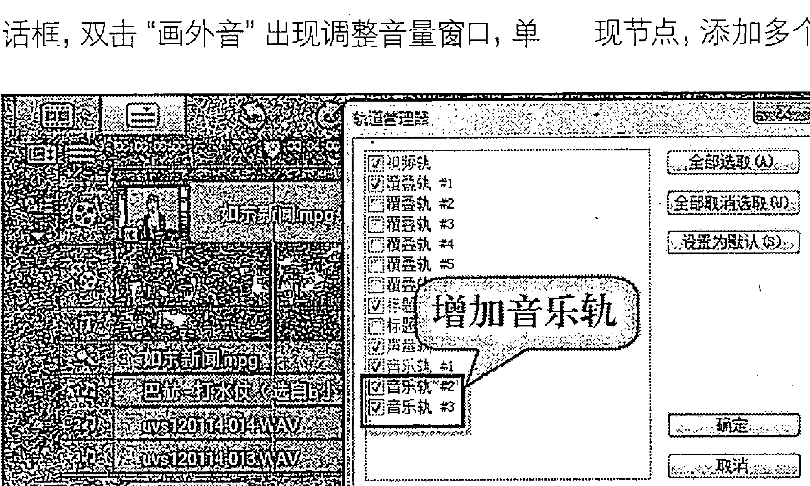

（文|周建峰）

# PPT实现点小图看大图效果

在许多多媒体作品中，我们常常可以见到点击小图出现相应的大图的演示效果。在PPT演示作品中，如何实现点击缩略图随机显示大图片的效果？

好友小王在某汽车品牌做地区销售经理，过几天需要出差，为了展示该品牌汽车，需要做PPT幻灯片给大客户演示该品牌各种型号的汽车和内部结构图，制作过程中遇到难题了，按照领导的意思需要在PowerPoint中先展示各种汽车的缩略小图片，如果客户对哪款汽车有意向，点击该小缩略图则可以看到大图片。对PPT不是很熟的小王只好找到笔者帮忙，笔者利用插入Microsoft PowerPoint演示文稿对象的方法轻松实现了这种效果。

## 插入新演示文稿

先打开PowerPoint 2010，来到要制作缩略图效果的空白幻灯片页面，然后依次单击“插入→对象”，打开“插入对象”对话框，单击“新建”，在对象类型中选择“Microsoft PowerPoint演示文稿”，单击“确定”按钮，在该幻灯片页面中插入一个新的演示文稿。

## 巧妙利用背景图片

插入成功后，在该幻灯片编辑区里就会出现一个类似于“图片”的对象框，这就是刚刚插入的演示文稿，选中该对象框，可以看到幻灯片编辑区内有8个黑色的控制焦点，可以拖动它，调节其大小，再把该对象框拖动到合适位置。选中后右键单击，在弹出菜单中选择“设置背景格式”，然后在“填充”选项中选择“图片或纹理填充”。

接下来就可以从文件、剪贴板或者剪贴画中选出想要添加的图片，这里单击“文件”，然后选中要插入的图片文件，最后单击“关闭”按钮，这样就完成了第一张图片的设置。

这种采用“填充”功能来添加图片的方法，可以不用考虑图片的原始大小，添加之后即可自动适应对象框的大小和位置。

## 依法炮制添加图片

用同样的方法在幻灯片中添加其他的Microsoft PowerPoint演示文稿对象，填充需要的图片，直至把所有需要的图片都填充添加完毕，这样点小图看大图的缩略图效果就完成了。演示的时候只要单击幻灯片上的汽车图片，就自动打开该图片的全屏清晰大图。如果嫌一张一张地添加填充图片比较费时，可以第一个添加设置好的演示文稿对象，按Ctrl+D组合键复制粘贴出多个演示文稿对象，然后拖动它们到各自的位置上，接下来只要采用前面的方法重新设置每个演示文稿的背景填充图片即可。

为了避免演示的时候出现尴尬，可以单击“切换”选项卡，去掉“换片方式”下的“单击鼠标时”，这样可以避免播放时操作者的鼠标不小心没有点到小图，而是点到小图外的空白处，演示文稿就可能直接跳转到下一页幻灯片中了。需要跳转到下一页，可通过按键盘的空格键来实现。

（文|贺全荣）

# 删除表中表就用Excel

用Excel函数中的IF和COUNTIF这两个函数能够轻松地从总表中查找到子表中所没有的内容。

第6期E达人栏目的一篇文章，介绍了电视剧收藏家老李用系统自带的记事本和命令对比两个TXT列表的方法。方法虽然很巧妙，但实现起来过程也很复杂。笔者想借助Excel的两个函数帮助老李轻松简便地来完成这个任务。

## 移花接木导入TXT

首先将TXT文件中的内容导入Excel工作表。在这个过程中，需要在Excel中用“文件→打开”命令，将两个TXT文件中的内容分别导入到Excel的两个工作表中，在Sheet1中放入的是中央电视台播出过的电视剧名称列表，在Sheet2中放入的是已收藏的电视剧名称列表，并在Sheet1中加入了一个标记字段名。

## 巧编公式作标记

两个工作表建立好之后，将Sheet1中的每条记录都和Sheet2中的所有记录比对，如果在Sheet2中找到了Sheet1中的记录，则在Sheet1中的记录标记处标上“已录”；如果未找到则标上“未录”。所以在Sheet1中的C2单元格处输入公式：=IF（COUNTIF（Sheet2!B:B，B2），“已录”，“未录”）。

回车选中C2单元格，拖动填充柄向下进行填充，每个记录就都作上标记了。

## 排序或筛选巧分类

通过上面的过程，我们把Sheet1中的每条记录都作了“已录”或“未录”的标记，这时我们可以利用两种方法对这些记录进行分类：“排序”法和“筛选”法。

“排序”法：利用“排序”法就是通过对“标记”字段进行升序或是降序排列。首先选择“标记”这个字段名，也就是C1这个单元格，在这里笔者提醒你不要选择C整个一列，否则排列出来会错位的。然后点击“升序排列”或是“降序排列”按钮，即可对记录按标记进行分类了。若想恢复原排列，只需按“序号”字段进行排序就行了。

“筛选”法：利用“筛选”法就是通过对“标记”字段按“已录”或是“未录”进行记录的筛选。首先选择“标记”这个字段名，也就是C1这个单元格，然后点击“数据→筛选→自动筛选”菜单，这时在每个字段的右侧出现了一个黑色小箭头，你可以单击“标记”字段处的箭头，选择“已录”或者“未录”进行筛选，即可对记录按标记进行分类了。如果你想取消筛选，只需要再点击“数据→筛选→自动筛选”菜单即可。

对记录进行分类后，选择复制排序结果或筛选结果中的“未录”部分，并粘贴到新的工作表中或TXT文件中就可以了。

（文|马震安）

# 三招两式做剪影

苹果iPod的宣传中使用了剪影图片，黑色的人物剪影与白色的iPod剪影形成鲜明的对比，成为平面设计中的典型案例。PPT中如何做剪影？

剪影图片相对于真实的图片而言，在PPT中常有以下几种用途：

- 单色型的PPT中，使用剪影图片可以避免多彩图片引起的颜色增加，有利于保持PPT作品的单色性；
- 图片用于陪衬时，使用剪影图片可以大幅减少图片能表现的细节，从而使观众的注意力更集中于其他着力表现的元素；
- 希望PPT风格独特时，使用剪影图片可以凭借其简约的造型在众多色彩丰富的PPT中脱颖而出，如出水芙蓉一样清新而有新意。

那么，如何获得我们想要的剪影图片呢？实际上，你只需要掌握如下的三招两式就可以了。

## 第一招：搜索

有了搜索引擎和丰富的网络资源，你需要的，无论是任何东西，都可以先搜一下看是不是已经有你需要的。例如，笔者分别在百度、Google中输入剪影、silhouette得到此搜索结果（图1-图2）。

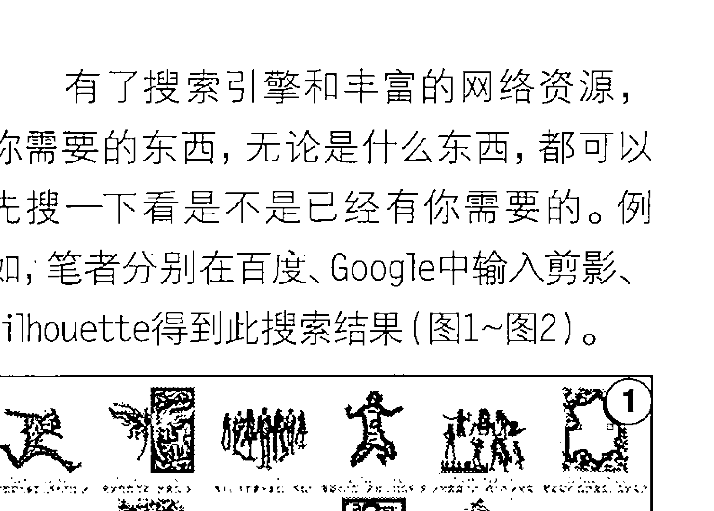

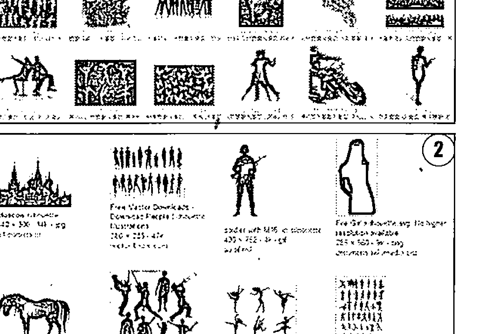

首先，在搜索具体目标的剪影图片时，可以通过添加“剪影”关键词来实现范围限定。例如需要一些人物的剪影，就可以在搜索栏输入“人物 剪影”，这样就可以发现搜索出来的结果去掉了其他类型的图片，而只保留了剪影类型的图片。

其次，百度与Google的搜索选项中都已经给出了相关的选项。在百度图片搜索页面左侧的选项悬挂栏中，在“类型”选项下有“黑白简笔画”，输入关键词搜索后，勾选此选项可以有助于图片类型的筛选。

在Google的图片搜索页面，同样在“类型”选项下有“素描画”与“剪贴画”的选项，有助于快速获得相关的图片（图3）。

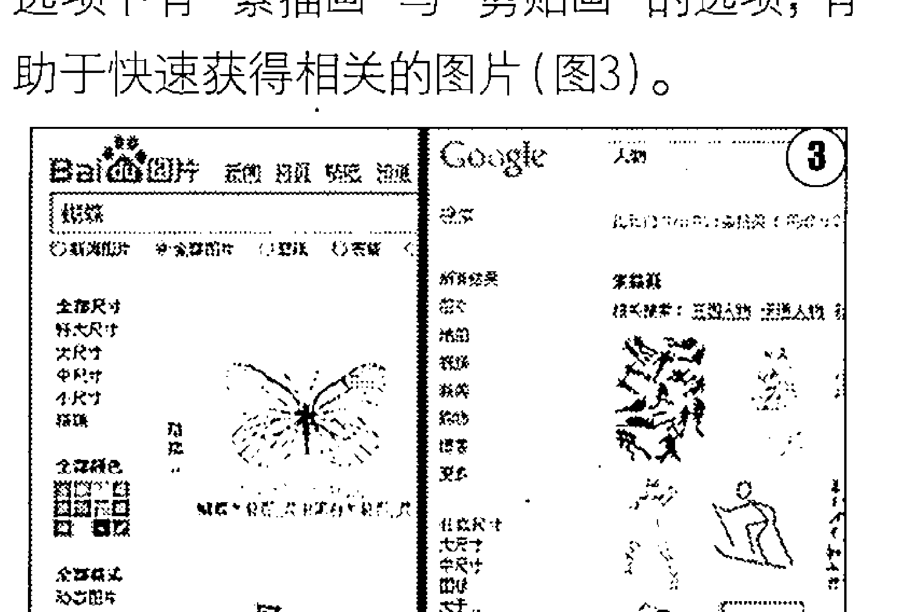

再次，由于图片搜索也是基于关键词进行的，因此在Google中使用英文关键词可以帮助我们获得更广范围的图片，当然也很可能会带来意想不到的收获。

## 第二招：绘制

如果你需要的图片很特殊，或者有自己特殊的要求，在搜索时可能会没有符合要求的图片。这时，最简单的处理办法就是自己绘制了。对于大多数人来说，没有美术功底，绘制满意的图片的确比较困难。不过，反过来想，在PPT演示中重要的是突出你的观点，阐明你的想法，剪影类的插图主要是为了增加页面的趣味性，略显笨拙的自绘图片往往会成为一种独一无二的风格呢！

绘制图片通常有两种，一种是在白纸上手绘，然后扫描为图片再进行后续处理，相对而言费时费力，除非特殊需要一般并不推荐；另一种就是在PPT中直接进行简单的绘制。

事实上，PowerPoint 2010的绘图功能较之此前的版本已经有了长足的进步。对于PPT内的图片绘制，你需要注意以下技巧提示。

首先，编辑顶点技巧。在PPT中预制的绘制形状相对较少，但是增加了编辑顶点技巧，可以使得我们十分方便地改造图片。对插入的图片单击右键可以看到下拉菜单中的“编辑顶点”选项，单击后，各顶点可以任意拖动，并且在边线也可以任意拖动。此外，还可以通过在边线上右键“添加顶点”来实现更精细的调整。

其次，善用任意多边形。通过任意多边形，你可以绘制任意形状的图形，并且PPT还会对你绘制的线条自动进行柔和化，使得线条更加流畅。此外，任意多边形还可以用于对其他图形轮廓的描红。

再次，图形运算功能。PPT 2010中提供了四种图形运算功能，分别为形状剪除、形状交点、形状联合、形状组合（图4）。通过这些图形运算，可以构造出更为独特的图形。例如这个通过形状组合得到的交通标志，你能快速想到是怎么实现的吗（图5）？

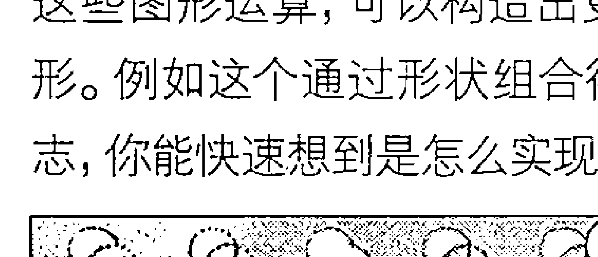

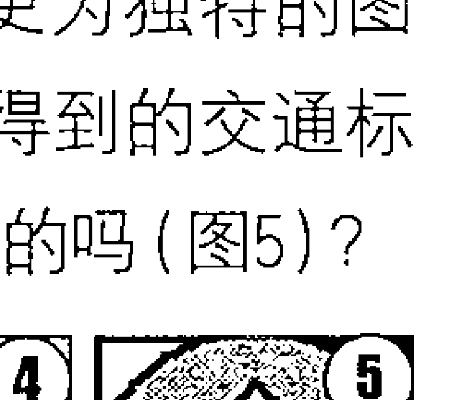

最后，使用放大功能。在PPT工作区右下角有比例选项，通过拖动图表实现工作区的放大，可以对细节进行调整。实际上，单击工作区后，按住Ctrl键滚动鼠标的滚轮也可以快速实现工作区的放大缩小。

## 第三招：改造

如果搜索没搜到合适的剪影，绘制又实在是不好看，那怎么办呢？最直接的办法莫过于找到你想要的图片来进行改造了。这是获得剪影图片的又一快速办法。对改造而言，就需要掌握如下两式了。

### 第一式：剪贴画改造

众所周知，Office中预设了丰富的剪贴画资源。在早期的PPT中，这些剪贴画可谓是演示的宠儿，在很多PPT中出尽风头。然而，随着越来越高分辨率的图片涌现出来，剪贴画一时间仿佛变成了古董。如今，我们可以对剪贴画进行简单的改头换面，就可以获## 第二式：普通图片改造

得优质的剪影图片了。第1步选择并导入一幅剪贴画，然后将其取消组合，此时图片如第2步所示，最后将不需要的部分删去，并将剩下的部分选择形状填充为灰色或黑色，如第3步所示，一张剪影图片就大功告成了（图6）。

如果找不到合适的剪贴画，普通的图片也可以用来改造，只不过步骤稍微麻烦些，多了一些复制粘贴的环节。

如果图片本身是无边界的PNG格式，那么制作剪影就要简单很多了。先导入该图片，然后在图片选项中将亮度拖至-100%，就可以得到黑色的剪影图片了（图7）。如果要得到灰色的图片，则将对比度也拖至-100%即可。如果要得到其他颜色的剪影图片，则只需将黑色的剪影图片复制，并选择“粘贴为图片”进行粘贴，就得到了一张黑色剪影图片，再进一步在图片选项卡的“颜色”选项中选定颜色即可。

如果图片本身不是PNG格式，但是有一致的底色，如此图左侧所示（图8）。此时，只需借助“设置为透明色”工具将底色去除，变为右侧图。然后再将去除底色后的图片复制，并选择“粘贴为图片”，然后你就得到一张新的图片了（等同于无边界的PNG格式图片），剩下的步骤如上一种情形。

那么如果图片背景比较杂乱（图9），该怎么处理呢？插入图片后，利用图片工具中的“删除背景”去掉不需要的部分，就得到最右侧图。然后将其复制，并执行“粘贴为图片”，剩下的相信你就懂了吧。

看看，只要通过这么三招两式，我们就可以得到各种各样的剪影素材了，快运用到你的PPT中去吧。

（文|沈栋）

# 用PPT制作下拉菜单

利用PPT的自定义动画功能也能够做出动感十足的下拉菜单，绝不逊于专业软件做出的动画效果。

实例描述：一个介绍学校的PPT演示文稿，它包括地理位置、历史概况、发展现状、教学成绩、获得荣誉、未来展望等6个模块，把这6个模块做成一个下拉菜单，并且每个模块链接到一张幻灯片上。

## 菜单添加

在这个过程中，我们需要在幻灯片上放置一些文本框，并将它们的位置调整好用来显示菜单。

首先在幻灯片拖动一个文本框，在文本框中输入“导航菜单”四个字，可对字体、大小及颜色进行设置。在文本框边框上击右键，选择“设置文本框格式”，可以对文本框进行设置、填充背景等等。

接着复制6个相同的文本框，依次放在“导航菜单”这个文本框的下面，并且把文字更改成“地理位置”、“历史概况”、“发展现状”、“教学成绩”、“获得荣誉”、“未来展望”，当然每个文本框的背景填充色也可以更改。然后，分别右击这6个文本框，把它们分别链接到相应的幻灯片，最后选择这6个文本框把它们组合在一起，形成一个组合框。

## 添加菜单弹出动画

这个过程将实现单击“导航菜单”时弹出下拉菜单。选中组合的文本框，右击其边框选“自定义动画”，在对话框选择“添加效果→进入→切入”。

对切入的效果进行设置，把“方向”改为“自顶部”，触发器设置成“导航菜单”，目的是单击“导航菜单”时弹出下拉菜单。

## 添加菜单收回动画

通过上述过程，实现了当点击“导航菜单”时就会弹出下拉菜单，这时我们需要再来一个效果，再次单击“导航菜单”时收回下拉菜单。把菜单缩回的制作方法同上，就是右击组合框选“自定义动画”，在对话框选择“退出→切出”。

至此一个PPT的下拉菜单就基本完成了。为了增加它的动画效果，我们可以给这个下拉菜单加一个背景，让它看起来更生动。

## 锦上添花加背景

在组合框上画一个矩形，比这个组合框稍微大一些，对它进行设置，比如去掉边框、添加颜色等等，最后右击它，选择“叠放次序→置于底层”把它放到组合框的底层。

对这个矩形进行自定义动画设置，同样也设置切入、切出效果，同样也在触发“导航菜单”时有效。

在这个基础上，我们还需要调整一下触发器的触发顺序，即动画出现顺序，以便单击“导航菜单”时，先弹出矩形再弹出菜单，再次单击“导航菜单”时先收回菜单再收回矩形。

注意：要把切入的“组合3”和切出的“矩形1”的开始都改为“之后”。

一个动感十足的下拉式菜单就制作完成了。

为了使这个下拉式菜单在整个演示文稿中都起作用，需要选中这个下拉菜单的所有对象复制粘贴到所有的幻灯片上。至此大功告成，看看是不是PPT做的菜单不比专业软件制作的逊色呀？

（文|马震安）

# 打造学校工作总结影视专题片

纸质的学校工作总结已经不能满足时代的要求。图文并茂、声像俱全、直观形象的总结专题片，正在成为新时期工作总结的“宠儿”。

在学校工作中，撰写总结是相当普遍的，学校工作总结、部门工作小结、专项工作小结等等屡见不鲜，而学校工作总结无疑是重中之重。笔者所在的学校，每学年都要求上交学年度工作总结，必须将所做的教学工作进行全面汇总，在撰写文字材料的基础上，还需要提交相关图片和视频作为佐证材料。常规的做法是分别提交文本、照片和视频素材，供上级领导查阅对照。在实际操作中，我们发现这种方法并不是最合理的，查阅不便，材料混乱，不便于教育主管部门全面了解学校所做的工作，因此在笔者的建议下，学校对工作总结的呈现方式进行了改革。如今我校教师的工作总结除了附带相关的材料外，还专门制作了一部“工作总结专题片”，也就是将材料中的文本、照片和视频进行有机整合，用影视专题片的形式进行呈现。一般是以时间或模块为序，编排成一部展示学校业绩的小电影，配上标题和音乐，领导一般只要花上二三十分钟的时间观看影像，就能全面了解学校做过的工作、开展的活动……

## 总结专题片的策划

一份高质量的总结专题片必须进行周密的前期策划，先要把工作实际的材料分类罗列，对于已有的照片、视频，我们分门别类保存在相应的文件夹中以备用，对于纸质文件材料，可通过扫描仪或数码相机获取保存，总之所有的材料都要数字化，转换成影像素材。材料备足后，我们可以按照时间为序编排总结，也可以根据总结的模块（如分部门、分阶段）来编排。如笔者所在的学校，在策划时通常会借助思维导图，列出总结专题片的大体提纲以及相关负责部门，通过思维导图，各部门也能很快了解自身的工作，清楚要准备的材料。最后还要考虑制作专题片时所涉及到的技术，操作上是否有难度，所有的问题都要提前解决好。前期策划非常重要，条理清晰、内容丰富、画面精美……这些都是专题片让人耳目一新的必备条件。

## 用会声会影制作专题片

作为工作总结篇的主要制作人，笔者在选择相关工具时也颇费心思，因为工具不能太复杂，这样便于分管负责人能参与到后期制作，从而也能减轻笔者的工作量。在试用过多款影像编辑软件（如Premiere、威力导演、会声会影等）后，笔者最终将“会声会影”作为常用工具。当然，如果你习惯使用其他工具，完全可以按己所需进行选择。工具是为我们的工作服务的，只要能实现我们所要的功能，管它是“白猫”还是“黑猫”呢。

### 第一步：导入材料。

打开会声会影X4，单击“添加”按钮增加几个文件夹（如集体荣誉、教师发表文章等），分别用来存放各类材料，然后选中文件夹，单击“添加文件”按钮导入相应的材料素材以备用，单击下方的“选项”按钮，可对图片、视频进行简单修饰，如调整色彩、亮度、旋转方向等。学校的重大活动一般会用数码摄像机拍摄，存储介质是DVD光盘，将光盘放入光驱，打开会声会影X4中，切换到“捕获”选项，单击“从数字媒体导入”按钮然后选择光盘所在盘符，单击“确定”按钮读取光盘并列出所有视频章节，最后我们可以根据需要选择导入所需视频片段。

### 第二步：编排总结。

在导入素材后，我们可以根据总结内容编排素材，将素材文件夹中的各类素材拖放到视频轨道上，这里要制作一个封面摆放在开始位置，某些材料可以摆放在覆叠轨上，如公开课视频上可以将获奖证书覆盖在上面。在两个素材之间，可以添加过渡效果让其切换更加平滑，单击“转场”按钮，在这里可以将转场效果拖放到两段素材之间，这样就可以添加过渡效果。在使用转场时，以淡入淡出为主，对于重点内容可使用冲击力较强的转场，切忌使用过多的花哨转场，这样会显得不够严肃，给人以错觉，可能降低总结的可信度。

### 第三步：添加标题。

专题片中的某些内容，必须用标题注明，这样才能让总结专题片更加清晰。某些图片或视频上，还必须添加文本说明，这样才能突出重点，有的放矢。单击“标题”按钮，可将里面的标题直接拖放到“标题轨”，然后在预览窗口修改上面的文字，在模板窗口下方可修饰标题。通过这种方法，我们可以给影像总结中的重点部分添加上文字说明。另外标题文字要尽可能简明扼要，文字下方最好用一些清新典雅型的背景作衬托，切忌把文本总结成段成段复制到专题片中，这样会让画面显得杂乱，也不利于领导阅读。

### 第四步：输出总结。

在制作总结专题片时，最好是分模块制作，也就是总结有几个部分，就分别制作几个部分的影像，这样就可以把大总结分解成若干个小总结，由各个部门分别完成，最后进行整合。在输出专题片时，也能分章分节，便于上级各科室领导观看时，可以选择性地查看自身分管的工作，节约了他们的时间，也能给他们留下好印象。

- 切换到“分享”选项，单击“创建光盘”按钮选择DVD出现对话框，单击“添加视频文件”或“添加项目文件”将各部门制作的单个视频文件分别添加进行汇总。
- 单击“下一步”为专题片选择播放菜单模板，在这里还可以对菜单进行美化修饰。单击“下一步”按钮，放入空白DVD光盘，单击“刻录”按钮即可将总结专题片刻录到光盘上。为了便于保存，我们通常还会将专题片制作成光盘镜像，选择“创建光盘镜像”，然后选择保存文件夹，再单击“刻录”按钮即可将专题片保存成光盘镜像。

经过上述四步，一部优秀的总结专题片就完成了。对于有网站的学校，还可以将专题片上传到网站，没有网站也可以上传到优酷等视频网站，这样既便于查看，也能帮学校做个免费宣传，一举两得。笔者相信总结专题片一定会让学校增色不少，也能给学校带来意想不到的机遇。

## 小提示

其实编排总结专题片也就是进行视频的后期处理，这里就不详细介绍制作步骤了，有需要的朋友可上网查阅会声会影的相关教程。

(文|周建峰)

# PPT也能制作苹果形标注

本文以一个普通曲线较难做出的苹果形标注框为例，讲述PPT独特的文字标注框的设计方法。

在PPT演示中经常用到标注框来写一些说明、对话文字，虽然PPT形状中也有几种标注框可用，但都比较普通，想用更独特的标注框还是得靠自己设计。以前只能通过绘制曲线、编辑节点来绘制标注框，不仅操作麻烦，也很难画出一些特殊形状。PPT2010中新增了四个形状工具，可以把多个自选图形进行叠加、消剪来拼绘出特殊形状，让个性标注框绘制变得非常简单轻松。下面就以一个苹果形标注框来说吧。

## 组建图形拼接工具组

打开PPT2010，在功能区右击选择“自定义功能区”，在“Powerpoint选项”窗口右侧的“自定义功能区”列表中选中“插入”选项，单击下面的“新建组”按钮，在“插入”选项卡下增加一个“新建组（自定义）”。

选中“新建组（自定义）”，单击“重命名”按钮，在弹出窗口中输入显示名称为“图形拼接”后确定完成设置。

在“从下列位置选择命令”的下拉列表中选择“不在功能区中的命令”，从下面的列表中找到并选中“形状剪除”命令，单击中间的“添加”按钮把它添加到新建的“图形拼接”组中。

同样把下面的形状交点、形状联合、形状组合三个命令也添加到“图形拼接”组中。确定完成设置后就可以在“插入”选项卡的右侧找到新建的“图形拼接”组和四个形状工具。

## 绘制苹果标注框

现在用这四个工具快速绘制出苹果标注框。

切换到“插入”选项卡，单击“形状”选择“椭圆”，拖动画出一个圆，把它复制成两个，调整位置使重叠部分形成叶子状，选中这两个圆单击“形状交点”即可做出一片叶子。

再画两个椭圆并适当调整角度和位置拼出苹果的外形，单击“形状”选择基本形状的“空心弧”画一小段圆弧当果柄，画一个三角形做标注框的尖角。把这些拼成苹果标注的形状。

然后按住Shift键先单击叶子再顺次单击果柄、两个椭圆、标注，同时选中这5个形状，单击“形状联合”就可以得到一个苹果的标注了。

最后再画一个小圆叠加到苹果边上，按住Shift键先单击苹果再单击小圆选中两个形状，单击“形状剪除”即可在苹果上咬掉一口。

形状剪除是从第一个选中的对象中剪除与其他形状重叠的部分，因此若先选中小圆再选中苹果标注，则结果将变成被咬一口的小圆。

在组合、联合、剪除、交点得到的形状默认角度总是与第一个选中形状的角度一样。想得到无旋转角度的拼接形状，则第一个选中的对象必须是水平的，因此形状组合时我们才要先选中叶子再选中其他形状。

虽然有旋转角度并不影响形状外观，但会直接影响到输入文字的角度。此外，这四个工具只对“形状”中的图形有效，且不是对所有形状都有效，如直线、各种连接符就不行。

形状组合工具的效果是把所有形状联合并从中剪除重叠层数为双数的区域。以三个圆重叠来说，形状联合后没重叠部分和三个圆重叠部分被保留下来，只有两个圆重叠的区域被剪除镂空。

## 添加文字并调整

标注框画好后要输入说明、对话文字就简单了，你只要选中标注框直接从键盘输入标注文字即可。

不过输入的文字有可能会超出形状边线，这可以通过设置文字边距进行调整。

在标注框中的文字上右击选择“设置文字效果格式”，在“设置文本效果格式”窗口中设置“垂直对齐方式”为顶端对齐，若引角在上侧的则应设置底端对齐。

然后适当调整“内部边距”左、右、上（下）的值让文字正好在形状内即可。

通过单击数值后的按钮调数值可以实时看到形状中文字的移动，很容易调好。

设计好的标注框仍可轻松调整引角的角度和长短，右击标注框选择“编辑顶点”，在标注框上就会显示很多黑色小方块（顶点），拖动引角尖的顶点即可直接调整引角指向。

## 颜色设置

再来选中标注框，在“绘图工具”的“格式”选项卡中选择现成的形状样式、艺术字样设置一下颜色、效果即可。

不过对于复杂形状标注只设置单一颜色显然效果还差点。以苹果来说，本体应该是红色渐变、叶子是绿色、果柄则是棕色。我们需要一个可以为同一形状设置多种颜色的小技巧。

选中苹果，按Ctrl+D键复制出另一个苹果标注，删除其中的所有文字，设置其“形状轮廓”为“无轮廓”，“形状填充”为红色渐变。

再画出一个三角形，设置为棕色挡住果柄，画一绿色椭圆挡住叶子。用于遮挡的形状要求能挡住指定区域，且形状的尺寸框不得超出苹果标注的尺寸框外。

最后同时选中两个三角形和下面的苹果进行复制或剪切，再右击原来的苹果标注框选择“设置形状格式”。

在“设置形状格式”窗口左侧选择“填充”，单击选中“图片或纹理填充”单选项，再单击下面的“剪贴板”按钮，即可看到在苹果标注上已经分别设置了三种不同颜色。

以上是在PPT2010中的操作，实际上你或许更希望能在Word、Excel中使用自制标注框吧，可惜这四个形状工具是PPT2010独有的，在Word、Excel中是无法使用的。不过我们只要把PPT中设计好的标注框添加到剪贴画库中，在Excel、Word程序中就可以从剪贴画中插入个性标注了。或者在PPT设计好个性标注再直接复制粘贴过去使用也行。

(文|陈桂鑫)

# 阅卷从此更轻松

限于教育经费短缺等实际情况，目前学校、培训机构、考试中心几乎很难一步到位全部实现无纸化考试。高考或国家级统考用的电脑阅卷系统的购买费用不是每个教师或学校所能承担或愿意承担的。那么有没有一种既能快速提高阅卷效率，同时又能减少人力及财务支出的方法呢？

有办法！那就是普通电脑阅卷。只需普通摄像头（或数码相机、扫描仪、数码摄像机等），再加上一个小软件，即可轻松快速阅卷，并能立即排名、统计分析成绩。无须专用阅卷机和专用答题卡，即可实现客观题统一阅卷。答题卡可设置嵌入试卷中，无须特殊纸张和单独印刷，只需普通的打印纸或复印纸即可，有效地降低了成本。

## 阅卷要求与答题卡扫描

当然不是随便拿一份试卷（答题卡）都能使用电脑阅卷的，要用电脑阅卷，对试卷、试卷制作、答题卡及答题卡上的考号都有一定的规则或要求。

**试卷制作要求：** 试题必须全为客观题（即选择题、判断题），才能实现电脑阅卷，而主观题如作文类只能靠工人批阅。还有客观题试卷题目量的多少、选择题的选项多少都得跟答题卡配套，假如100道题的答题卡题号顺序是1、2、3~100，那么试卷制作要求的题号与答题卡题号顺序必须一致，即试卷每道小题题号编法顺序也是1、2、3~100。这样做主要是让考生明白试卷题号与答题卡题号对应，并知道在答题卡哪个位置上答题。试卷制作时要写清楚每类大题的答题要求，如判断题要求正确的涂A，错误涂B等字样，让考生明白答题要求。

**答题卡制作要求：** 电脑阅卷主要是通过电脑阅读答题卡来进行阅卷，所以答题卡还得用阅卷软件提供的答题卡样式（或模板），并非所有答题卡用一款阅卷软件都能正确阅读。电脑阅卷(PC OMR 9.0)软件带着很多种答题卡样式，我们只要根据试卷题目量的多少及选择题的选项多少，即选择题的选项以最多的那道题的选项来定答题卡。如选择题的选项最多到E选项的，就不可能用那种答题卡选项最多到D的答题卡，否则E答案就无处可作答。

根据以上两点选择相应的答题卡，并用普通的打印纸或复印纸直接打印或复印出来即可。当然答题卡也可以作些简单的修改，如在答题卡顶部增加一些答题的注意事项，也不会影响答题卡的正常使用。

**答题卡考号：** 电脑阅卷只能识别考号的填涂，不能识别姓名，也就是说每位考生要有专门的考号，所以考试前必须给每位考生分配相应的考号与其姓名对应，那样才能让考生正确地填涂答题卡上的考号。有了考号，批阅出来的成绩才知道是谁的成绩。这里用的答题卡考号为四位数，正常情况下，不管是学生或者是培训学员都有学号或准考证号，这些都可以作为考号，所以只要告诉考生用学号或准考证号哪几位数作为填涂答题卡上的考号，考试时正确地在答题卡上填涂即可。电脑阅卷时要用到考号与姓名的数据，这些数据一般都有现成的，就算没有，现做也要不了几分钟时间。

**答题卡扫描：** 电脑阅卷是通过阅卷软件，阅读答题卡来达到阅卷目的，那么接下来就是把考生作答的答题卡，通过普通摄像头将答题卡全部扫描成图片存进电脑，为下一步阅卷作准备。因为笔者批阅的试卷都是大批量的，所以扫描、阅卷分开操作。当然答题卡扫描速度的快慢取决于所用的扫描设备了，如果用高速扫描仪扫描的速度，那就像点钞机过钞票的速度一样，大家都知道那有多快。自然阅卷速度也就更快了，因为电脑阅卷快慢主要取决于答题卡扫描成图片存进电脑的速度。其实不管用什么扫描设备将答题卡扫描成图片存进电脑再阅卷的速度远比人工阅卷快得多。至于扫描方法，不同的设备采用不同的方法，答题卡图片格式用BMP格式或JPG格式都行。

这几年来笔者批改的试卷量大（一年近10万份的量），一直用的是高速扫描仪及配套的扫描软件。扫描模式用“黑白”，分辨率用150分辨率的即可，这样扫描速度更快，同时不会影响答题卡识别率。答题卡图片格式笔者主要用BMP格式，那样方便后面阅卷时用“画图”软件，对考号出错的答题卡作修改用。

## 用阅卷软件批量阅答题卡

做好了以上的准备工作，接下来就是用阅卷软件PC OMR 9.0对所扫描的答题卡进行批量阅卷了。

**做标准答案：** 首先做一份标准答案并配分值，标准答案的做法有两种，一种是用Excel做好标准答案后复制粘贴到PC OMR阅卷软件里并保存即可。用Excel表格做标准答案表格非常简单，只要三列：题号、答案、分值。做好答案后，打开PC OMR阅卷软件，选择Excel表格标准答案的“答案”及“分值”两列并复制，然后选择阅卷软件的“从Excel粘贴”把答案粘贴到PC OMR阅卷软件里并保存即可，该方法适合大批量阅卷，即别人提供好Excel答案的。另一种标准答案的做法是直接打开PC OMR阅卷软件，选择“选择试卷”后，做法跟前一种差不多，只不过不是“从Excel粘贴”，而是选择“插入”行，然后手工输入答案并配分值，保存即可。

**添加考生名册：** 先选择软件里的“考生名册”，再把用Excel事先做好的名册中“考号”及“姓名”两列内容进行复制，再选择软件里的“从Excel粘贴”并保存即可。如果批改量大，而且名册随时都要更换，这时名册粘贴进去即可，无需保存，这样下次更换名册时，只要选择“考生名册”选项，原名册就会自动清除，不用单独删除。

**进行阅卷：** 选择“阅卷”选项，接着选择“答题卡成批阅卷”选项，导入前面扫描好的答题卡图片进行成批阅卷，导入完答题卡后即可看到批改出来的成绩。阅卷过程中如果阅出考号填涂错误的，如考生忘了涂考号，或者少涂一位，或者考号填涂错位等，软件都会在相应的答题卡图片的所在行自动标出红色底纹，并在“阅卷情况”列提示出错情况。对于这部分出错的答题卡，哪张答题卡出错，选定后可以通过选择点击“修改图像”打开“画图”等软件来一一修改，正确后再重阅即可。

**成绩管理：** 完成了阅卷即可查看考生得分情况以及详细的成绩分析，并且可以将成绩及分析情况同时导出到Excel或者Word里，为后期进一步利用及分析提供方便，到此电脑阅卷完成。

（文|吴以林）

# 竞赛评分 自动统计巧设计

使用Excel设计竞赛评分系统，输入各种基础分值之后，其他所有需要的结果立马自动显示出来，十分方便。

机关、学校、企事业单位都会举办各种竞赛活动，竞赛的评分如果采用纯手工方式进行处理，不仅速度慢，而且可能出现差错，很大程度影响竞赛活动的实际效果。

笔者运用Excel设计了一个评分系统，只要主持人把各评委的打分宣布完毕，工作人员同步进行分数录入，系统就会自动提示错误分值，自动将最高分、最低分分别用不同的颜色和字体进行区分显示，自动去掉最高分和最低分，自动计算每位选手的最后得分，自动生成参赛选手的得分名次，自动将得分较多的前三名用红色加粗字显示。

如果此系统采用多媒体投影设备显示，能使整个竞赛评分过程显得快捷、紧凑、公开、透明，很能烘托竞赛气氛。此系统只要根据实际评委人数和选手数量稍加修改，即可广泛运用于各类竞赛活动的评分和统计。

## 新建竞赛评分系统

新建“竞赛评分系统.xls”工作簿，C2:J2单元格中为各评委，B3:B12单元格中为各选手，K3:K12单元格为最后得分，L3:L12单元格为得分排名。C3:K12为记分区，所有的分数录入均在此区域。

## 设置数据有效性

如果评分标准为百分制，当录入数据不在此范围时，可采用“数据有效性”自动提示数据错误。

1.  用鼠标选择C3:K12数据录入的单元格。
2.  在“数据”菜单中，单击“有效性”。
3.  打开在“设置”选项卡，设置数据的有效范围。
4.  打开“出错警告”选项卡，设置当录入数据超出设定范围时，弹出提示窗口的标题和内容。

## 显示最高、最低分

录入评委打分后，使用“条件格式”，通过字体和颜色，能将最高分、最低分与其他分值区别显示。

1.  使用鼠标选择C3:J3单元格区域，选择菜单“格式→条件格式”命令，打开“条件格式”对话框。
2.  单击“条件1”下方的下拉箭头，在弹出的下拉列表中选择“公式”。将最高分的条件格式公式设置为：=MAX($C3:$J3)=C3。点击“格式”按钮，将字体设置为“加粗”和“红色”。

注意：如果条件格式公式为=MAX(C3:J3)=C3，引用则为相对引用，它会根据单元格的实际偏移量自动改变，显示结果就会出现差错。

3.  点击“添加”按钮，使用同样的方法，将最低分的公式设置为=MIN($C3:$J3)=C3，并将“字体”格式设置为“加粗”和“蓝色”。点击“确定”按钮，确认“条件格式”设置。
4.  将第三行的“条件格式”运用到以下各行。使用鼠标选择C3:J3单元格区域，把鼠标指向J3单元格右下角的填充柄，这时鼠标变成黑色的十字形，按住鼠标左键，向下拖动至单元格J12，放开鼠标，即可完成填充。设置好后单击“确定”按钮，完成了“条件格式”的设置。

## 计算选手最后得分

1.  将最后得分精确度设置为小数点后两位。选择单元格K3:K12，右击鼠标，选择“设置单元格格式”。在“单元格格式”对话框的“数字”选项卡的“分类”区域中，选择“数值”，将“小数位数”设置为2。
2.  计算最后得分。在最后得分单元格K3中输入以下公式：

`=IF(COUNT(C3:J3)=0,"",(SUM(C3:J3)-MAX(C3:J3)-MIN(C3:J3))/(COUNT(C3:J3)-2))`

公式中，IF(COUNT(C3:J3)=0,""的作用是：当本行没有输入任何分数时，不进行计算，不显示任何内容。公式中SUM(C3:J3)-MAX(C3:J3)-MIN(C3:J3) 的作用是：将本行分数进行求和，并减去最高分和最低分。COUNT(C3:J3)的作用是：进行评委人数统计。不用绝对数的目的主要是解决评委缺席和不确定问题，个别评委缺席，比赛照常进行，统计值不受影响。

单击K3单元格，把鼠标指向该单元格右下角的填充柄，这时鼠标变成黑色的十字形，按住鼠标左键，向下拖动至单元格K12，放开鼠标，即可完成填充。

注：当录入分数到第二个时，分母为零，致使整个表格出现错误，这时可不理睬。

## 统计选手得分名次

选定单元格L3，输入以下公式：

`=IF(COUNT(C3:J3)=0,"",RANK(K3,$K$3:$K$12))`

公式中RANK(K3,$K$3:$K$12) 的作用是：统计K3单元格在K3:K12中的排名。IF(COUNT(C3:J3)=0,""的作用是：当本行没有输入任何分数时，本单元格不显示任何内容，当K3没有值时，RANK(K3,$K$3:$K$12)会显示错误。单击L3单元格，把鼠标指向该单元格右下角的填充柄，这时鼠标变成黑色的十字形，按住鼠标左键，向下拖动至单元格L12，放开鼠标，即可将单元格L3的公式填充到以下各单元格。

## 突出显示优胜选手

使用鼠标选择L3:L12单元格区域，选择菜单“格式→条件格式”命令，打开“条件格式”对话框。

单击“条件1”下方的下拉箭头，在弹出的下拉列表中选择“公式”。条件格式公式设置为：=L3<=3。点击“格式”按钮，将字体设置为“加粗”和“红色”。

通过以上步骤完成模板制作后，当主持人逐步宣布各评委的打分后，就可接着宣布去掉一个最高、去掉一个最低分后该选手的最后得分。当最后一名选手最后得分宣布完毕后，接着就可宣布本次比赛前三名的选手姓名和得分了，中途不会有任何停顿和冷场。

> (文|郭萍)

# 数字代替汉字 信息录入飞快

在Excel中录入数据，如果能用数字代码来代替一些固定的汉字字符串，就可以使工作化繁为简，大大提高效率。

请看下面的这个实例：这是一个“丰南一中职称统计登记表”，其中“编号”、“姓名”都已录入完成，只需填入相应的“职称”和“所属部门”。假如“职称”分为中学高级、中学一级、中学二级和员级，“所属部门”分高一年级、高二年级、高三年级和其他，试想我们在录入时输入相应的汉字是不是比较烦琐呢？如果我们能用数字代替这些文字，几个汉字的录入只需一个数字即可，那是不是能大大提高我们录入的效率呢？下面让我们看具体的实现方法。

## 建立工作表

先建立一个工作表，注意字段的顺序很重要，它涉及到下面的操作。

## 构建基本代码

选择“工具→宏→Visual Basic编辑器”，在左边的资源管理器窗口双击Sheet1（Sheet1），在右侧的代码窗口中分别选择Worksheet对象和Change事件，然后输入几行非常简单的代码。

这些代码看起来非常简单，但为了照顾不懂编程的朋友，我在这里还是稍作解释，你照搬即可：
(1)在这段代码中选择的Worksheet和Change分别代表当前工作表和改变事件，就是说当前工作表单元格中的值发生改变时要做什么；
(2)代码中Target.Column=3用于指定只能在第3列输入这些数据时才有效（如果不指定则对整个工作表都有效）；
(3)在代码中用到了If…End If语句，表示“如果…那么”，Target.Value则表示输入单元格的值。
这下你对上述代码理解了吧？如果还没理解也不要紧，你可以先照着把它输入到自己的工作表中试一试效果如何，以后慢慢体会体会就懂了。

## 数字代替文本输入

关闭这个编辑器，返回到Excel窗口，这时在第3列也就是“职称”这列输入相应的数字，就可以看到数字被替换成指定的文本内容了。

可能有的朋友会想，先输入这些数字，然后用查找替换的方法不也行吗？然而我们会发现，用查找替换操作容易将其他列中的这些数据错误地替换掉，如果每个数字经确认后再替换就显得比较烦琐了，而用代码就不会出现这些问题，加载之后就可以一劳永逸了。

## 修改代码 推广设置

有了对以上步骤的理解，相信你也可以对第4列即“所属部门”进行设置了。很简单，只需修改一小部分代码即可。

有了这段小小的代码，我们的工作就非常轻松了！
（文|马震安）

# 手动剿灭Word宏病毒

嵌入于Word文档中的宏病毒危害极大，然而仅凭杀毒软件的查杀也不是百分之百能保证安全，手动围剿也很必要。

宏病毒是通过Word中的宏语言（一种类似VB的语言）编写的，易于传播而且危害巨大，常常能将用户花了很多时间编写的文档瞬间“吃掉”。但是，在病毒横行的今天，杀毒软件在某种程度上仍然只能起到马后炮的作用。如果你在某天收到一封自己感兴趣的陌生Word附件，很想打开看个究竟，但又非常担心这份Word文档带有宏病毒，这时，在利用杀毒软件查杀无果之后，如果你还不放心，使用手动查杀和剿灭Word宏病毒的方法，可以让你更加放心。

## 先行检查 感染早知道

如果能在打开文件之前先自我检查一下是不是感染了宏病毒，就胸有成竹了。

检查的方法很简单：打开需要检查的文档，单击“文件”菜单栏，选择“另存为”命令，如果对话框中的保存类型固定为“文档模块”，则表示这个文件已经感染了宏病毒，需要用杀毒软件进行清理了。

## 斩草除根 剿灭宏病毒

发现有宏病毒，我们可以用手工的方法杀掉它。

单击“工具”菜单栏，选择“宏”，单击“宏”命令，或者使用组合键Alt+F8调出宏对话框，如果在弹出的对话框中有已经记录的宏，那就极有可能是宏病毒，删除所有的宏就可以了。比较复杂的宏病毒会将宏对话框屏蔽掉，这时就需要采用其他方法。

Word环境中的宏病毒一般是存放在Microsoft Office目录下Templates子目录中的Normal.dot文件中，这时需要重新启动计算机，找到这个文件，并把它删除，再运行Word就可以了。

但是，道高一尺魔高一丈。有些宏病毒“知道”用户会找到Normal.dot并删除掉，所以它会在硬盘的多个目录中放上同样的Normal.dot，如果只删除Templates下的一个，Word会按照Windows缺省的搜索路径进行搜索，这样会加载其他有毒的Normal.dot，并把删除掉的再重新恢复。这时，只要使用Windows中查找文件的方法把硬盘中所有的Normal.dot全部删除就可以了。

## 未病先防 模板加把锁

类似于人体病毒，对于电脑病毒来说，也是预防为主。提高预防意识在某种程度上来说比查杀更重要。

预防Word宏病毒的方法其实也很简单，因为宏病毒在Word中寄居的文件就是Normal.dot，所以只要事先把没有感染宏病毒的Normal.dot文件的属性设置为只读，这样宏病毒就不能寄居到Normal.dot中，就能起到预防宏病毒的效果了。
（文|殷效忠）

# 不用裁剪 巧制会议桌签

不少场合都会用到的人名桌签，常因文字位置不合适而先行裁剪。其实，只用一张A4纸张，不用裁成两半，轻松搞定会议桌签打印问题。

各单位的办公室人员总免不了要为各类会议准备各种桌签，但怎么制作还真不是一件简单的事。笔者单位的后勤人员苦于Word中没有字体镜像功能，所以他们只能一直延用老办法进行制作:用Word各打印两行名字，再裁剪四边成两条长宽合适的纸条塞进桌签中，费时费力。在不使用专门软件的前提下，如何完成这一“简单”的任务呢?笔者换个思路，轻松搞定这一看似简单而实际又挺麻烦的小事。

## 设定纸张页面

经测量，我单位的桌签长度为20厘米，宽（或高）度为10.1厘米。

新建一Word文档，进入“页面设置”，上下左右页边距均设置为2厘米，方向设置为横向。

插入表格，列数为3，行数为1。前两列为一侧的桌签，而第3列为桌签的另一侧。

全选表格，右键选择“表格属性”，在“表格”页选中右下侧的“设置…”按键，设置表格的“默认单元格边距”，均设置为0厘米，确保单元格内的文字不会因为左、右边距而产生换行的问题。

分别设置3列的列宽为第一列6.1厘米，第二列2厘米、第三列10.1厘米。你该明白为何要设置3列的原因了吧!因为左边距为2厘米（此数据无法设置为0。当然设置为其他值也可以，只要保证与第2列的宽度相等即可，同时确保第1列有足够的宽度录入文字），加上前两列的宽度正好与第三列的宽度相等。而桌签的另一侧就没必要再设置成3列了，因为不存在设置页边距的问题，因此只要单独设置成一列就OK。

设置表格的行高为16厘米（因为我们使用的是A4纸，其规格为21厘米×29.7厘米，桌签长度为20厘米，因此必须裁掉1厘米，该1厘米建议留在底部为妥，否则表格有可能会跨页，不利于排版），其上的页边距为2厘米，其下剩余3厘米，裁剪1厘米后，正好可以保证表格内的文字在后期的整体视觉效果上完全居中。将单元格的垂直对齐方式设置为居中。

## 搞定字体镜像问题

虽然Word中没有镜像字体，但它有各向左、右翻转90度的文字方向设置功能，借助于此，我们就能变相地轻松搞定文字镜像。

分别在第1、3列中录入参会人员的名字，设置字体、字号（我用120号）与段落（我用158，可视具体要求而定），再设置文字方向，第1列的必须设置成字头朝右，第3列设置成字头朝左。

至此，基本完成全部设置。但先别急着设置表格的边框样式，因为还有最后一步—校准。先打印一张样张看看。因为每台打印机的打印效果并不相同，经测试，我们单位的这台打印机打印出来的实际效果:左侧页边距比设置值少0.3厘米，上部页边距则宽了0.2厘米（此值每台打印机各不相同）。因此，必须再次设置页边距，将左侧页边距设置为2.3厘米，上部页边距设置为1.8厘米（请根据实际误差值进行设置）。

## 设置表格边框样式

先将表格边框设置为“无”（否则无法更改第2、3列间的分隔线样式），再设置第2、3列间的分隔线，线型设置为虚线，颜色设置为“灰色-40%”（此线只是作为折叠参考线而设置的，故颜色不宜太深）。

桌签模板制作大功告成，保存文档。今后打印桌签只需修改文字或以“保留源格式”进行粘贴即可。

(文/汪忠军)

# 超级链接去除分别对待

超级链接本来是Word提供的一项体贴功能，但在某些时候它却会给你带来麻烦。那么如何避免这种情况的发生呢?这要分情况来对待。

## 即时去除自动链接

有时，我会在论文中引用一些网址或邮件地址，并不需要链接上网或进入邮箱，但是当我输入了一个网址或E-mail地址后，Word便会自动将其转换为一个超级链接。如果我不需要这一链接，则这个“温馨”的功能对我来说纯属多余。

其实，如果我们不需要这种链接，只需在输入完成之后，按下Ctrl+Z组合键，即可取消该自动转换。

## 成批取消大量链接

上网时我有一个摘录网页精彩内容的习惯，但我发现摘录到Word中的某些字符串具有链接属性，一不小心点击了这些文字，就会链接上网，非常麻烦。这时，我们可用如下办法成批去除链接属性。

执行“工具”菜单中的“自动更正选项”命令，在弹出的对话框中选择“键入时自动套用格式”选项卡，去除对“Internet及网络路径替换为超链接”复选框的选择。

需要注意的是，使用此方法后，当再输入网址或E-mail地址时，Word就不会自动将其转换为超级链接了。如果你的文档需要大量的带链接属性功能，则需要打开这一设置。

## 只取消特定的链接

如果在一篇Word稿件中出现了许多次含有网址或邮件地址的链接，而我只想把文档中某个特定的超级链接转换为正常文本而不想影响到其他位置的链接属性设置，这时，只需用键盘将编辑光标移动到该超级链接上，然后按下Ctrl+Shift+F9组合键即可取消这个超级链接。

(文/剑英)

# 拿来主义 快速制作写字动画

一笔一画在电脑上给孩子演示一个字的书写过程，这个看起来容易的事情，做起来却很麻烦。能不能把麻烦的事情变得更简单些？

在小学低年级教学中，认识常用汉字是非常重要的。很多老师在制作识字课件时，一般都会使用写字动画，也就是让汉字按笔顺依次动态书写出来，而通常的做法是先在图像处理软件中，逐个拆解汉字笔顺并保存为图片，然后复制到PowerPoint中，根据笔顺设置自定义动画效果，最终形成连贯的汉字书写动画。方法虽然不难，但是太过于繁琐，制作时的工作量非常大。其实只要使用“ppt语文课件小助手”，就能使网络资源快速制作出写字动画。

## 下载并安装工具

下载“ppt语文课件小助手”(http://711.la/drgwa)，解压后双击其中的“安装.bat”文件，安装ppt语文课件小助手。打开PowerPoint2010，选择菜单“文件→选项”弹出对话框，切换到“信任中心”选项，单击“信任中心设置”按钮，再切换到“宏设置”选项，选择“启用所有宏”，最后单击“确定”按钮完成设置。

## 选择插入文字动画

先保存课件到某个文件夹中，然后切换到“加载项”标签，单击“插入笔顺”按钮出现对话框，输入要制作书写动画的文字，选择“样式二”，再单击“下载笔顺动画”按钮，自动下载Flash文字书写动画，并保存到课件文件夹中，最后单击“插入笔顺动画”按钮，会自动插入动画到当前幻灯片页面中。

## 设置文字动画格式

在当前幻灯片中会自动增加汉字对应的按钮，选中按钮，切换到“格式”标签，可以修改按钮的外观和样式，并且根据需要调整按钮的位置，选中右侧的文字书写动画播放界面，同样可以调节大小和位置。

## 演示文字动画

修饰完成后，切换到“幻灯片放映”标签，单击“从头开始”按钮播放课件，单击相应的文字按钮即可出现相应的文字动画，单击“笔顺”按钮，然后单击“连续”按钮可演示文字书写过程，单击“分步”按钮可逐步演示文字书写过程。另外还可以查看汉字的笔画、偏旁、读音等，非常全面。

如果要把课件拷贝到其他电脑播放，一定要将课件保存文件夹中的Flash汉字书写动画文件一同拷贝，否则将无法正常播放汉字书写动画。ppt语文课件小助手的工作原理很简单，就是根据输入的汉字，直接从网络下载相应的汉字书写动画，然后自动生成链接按钮，便于我们有选择地播放演示。

这些汉字书写动画都是Flash制作，我们也可下载保存到硬盘中，再在PowerPoint中插入需要的汉字动画，这样同样可以使用。常用的2499个汉字书写动画可到电驴资源网中下载(http://www.verycd.com/topics/68347/)，建议小学低年级的老师下载保存到电脑中以备用。

# 华为没你想的那么夸张

华为在大家眼里一直是个很特别的企业，它的军事化管理、它的狼文化让很多人都有所耳闻，它的《奋斗者协议》也将自己推到了媒体的风口浪尖上。华为到底是什么样的？华为的员工怎么看华为？

## 参与者介绍

- 老李 加入华为已超过10个年头
- 扬子 入职华为2年
- 小韩 2011应届毕业生，加入华为几个月

## 奋斗者协议

据说，每位入职华为的员工都要签署一份《奋斗者协议》，如果员工签署了这份协议，劳动者就“升级”为“奋斗者”，从而得到公司在年终奖、配股分红、升迁、调薪等方面的倾斜。绝大部分华为员工都签署了这份协议，因此协议也被称作“被自愿”的。

老李：就像之前换工号一样，对此痛批的都是局外人。如果不签，就等于放弃了奖金、期权等福利，所以大多数人都会去签。

扬子：说实话，我都没看这协议的内容就签了。大家都签，我也就随大流了。其实这份协议所说的放弃带薪年假对我们没什么影响，不签的话我们部门也没什么带薪年假。至于公共假期等劳动法规定的其他假期都不影响！对大多数人来说，签了还是照旧过日子。

小韩：公司工作需要，愿意支付更多薪酬让员工配合到工作需要中来，而作为新人，我们也愿意牺牲自己的休息时间换取更多的金钱，毕竟年轻，时间有，只是MONEY不多。为了十几天的假期，放弃年终几万块的奖金，谁会愿意？

## 伴随你在华为日子的行军床

关于华为员工的工作状态问题，一度引起极大关注。特别是几年前华为员工胡新宇的猝死，让华为的“床垫文化”备受质疑。网上这样描述华为的“床垫文化”：每个员工的办公桌下都有一个行军床。一旦你开始工作，床垫就伴随你在华为的日子，做好加班熬夜的准备。

老李：其实就是一个床垫，休息用的，累了可以躺一会。不是必需你可不准备。

扬子：床垫只是午休用一下，很少用来加班熬夜，在我的印象中，晚上加班不回家睡床垫的很少，除非项目特别紧。

小韩：看到床垫的传说觉得很可笑，床垫不是为了加班，而是为了方便睡午觉的。春困秋乏夏打盹，午饭后如果没有床垫，那只能趴在工位上睡过去，远没有躺在床垫上舒服。

## 关于疯狂的加班

华为一直有业界闻名的加班制度，尽...管没有成文性规定，但是流传着一些口头加班制度，都是考核新技术员工的一项隐性规定。华为的加班究竟多到什么程度？

老李：加班情况没有外界传说的那么严重。事实上，我在华为上班期间，正常上下班的时间占一半，有人加班是由于个人原因，或者由于项目突发情况。公司每周三和周五不提倡加班。

扬子：华为规定，每个月的最后一个周六必须加班，这在华为属于正常上班，但是按双薪算。其余时间，并没有强制加班，只要早上不晚于9点半来，晚上不早于6点走即可。每个月平均每天的工作时间不少于8小时即可。就整个公司而言，加班似乎已经成了习惯，即使没什么任务，也要晚一会再走。

小韩：我所在的部门加班确实比较多，特别是项目紧的时候。平时工作是否累因人而异的，大部分人需要加班才能完成任务。加班到晚八点半后可以领一份价值7元的夜宵，到晚10点半后可以叫商务车专程送你回家。

回家。后记：让人意外的是，三位员工并不太了解公众眼中的华为，因为工作繁忙，大部分时间都在公司度过。加上华为上网有限制，他们对工作以外的信息知之甚少。但当他们看到媒体对华为的诸多传闻后，一致表示被过分夸大了，华为在员工的眼里和在公众眼里完全是两个样子，华为没你想的那么夸张！

（文|七白）

# 八卦格字帖自己制作

以往写书法用九宫格、米字格字帖，如今又流行一种八卦格字帖。买不到八卦格书法字帖，就自己用Word做一个！

前几天在电视中看过一档节目，节目中介绍的是八卦格字帖的使用方法及效果。看过报道后，感觉八卦格字帖对文字的书写规范确有很大帮助，于是也想进行八卦格书法练习，怎奈身边一时无法购买八卦格书法字帖，怎么办？我们只要参照电视中的介绍，用Word自己制作八卦格字帖，然后打印再练习不就得了！

## 第一步

打开Word后，单击“页面布局”选项卡，在“页面设置”功能区中先选择好纸张方向及纸张大小。然后根据需要，确定每一行的文字数量，再执行“插入→表格→插入表格”命令，在打开的“插入表格”对话框中，在“列数”框中根据我们确定的每一行文字数量乘以6，而行数则直接输入6即可，单击“确定”即可插入表格了。

## 第二步

先将表格选中，然后在“开始”选项卡下将字号设置为八号为宜。之后在“表格工具”的“布局”选项卡下的“单元格”功能区中，将单元格的高与宽设置为相同值，再单击“单元格”启动器，在打开的“表格属性”对话框中，将“行高值”设置为“固定”，单击“确定”，这样插入的表格中各单元格即可成正方形了。

## 第三步

将整个表格选中，右击鼠标，执行“表格工具→设计→边框→边框和底纹”命令，在打开的“边框和底纹”对话框中将表格内部边框设置为“无”，单击“确定”退出。

小提示 如有必要，在“表格属性”对话框中再单击“单元格”选项卡，然后单击“选项”，在打开的“单元格选项”对话框中，将左、右边距设置为“0”，再单击“确定”关闭对话框。

## 第四步

先将表格按6行×6列分成若干个独立方格，然后在左侧的方格内，用鼠标选择第三列的2、3、4、5单元格，将右侧的边框在“边框和底纹”对话框中设置为虚线。再将第三行的2、3、4、5单元格底部边框设置为虚线，形成十字形。接着选中十字形中心的四个单元格，并将其边框设置为虚线。再依次将其他的方格进行同样设置即可。

## 第五步

以十字为中心，用鼠标将上下的左右对称的八个单元格选中，执行“插入→形状”，在“基本形状”中选择“八边形”，然后将鼠标指向其左上角，左手在键盘中按下Shift键，拖动鼠标绘制一个标准的“八边形”，将所选单元格覆盖。然后在“绘图工具”选项卡下单击“形状与样式”启动器，在随后打开的“设置形状格式”对话框中，先将“填充色”设置为“无”，再将“线条颜色”设置为“黑”色，最后将“线型”宽度调整为1磅，“短划线类型”选择为“长划线”，单击“关闭”，即可形成一个八卦格了。

最后，按上述方法，将后面每个方格内的虚线依次进行同样的设置，再将设置好的表格选中并复制，依次粘贴，直到布满整个页面。至此，八卦格字帖制作完成。这样，我们就可以将制作好的八卦格字帖交付打印，进行书写练习了。

小提示 在插入表格后，为了便于操作，我们可以在页面右下角将“显示比例”放大，以便在绘制、调整图形时更加精确。

（文|刘长德）

# 用WPS轻松转换日期格式

笔者最近要将全镇教师的信息通过Excel表格导入到人事管理数据库中，其中令人头痛的就是下面各个村小上报的表中出生年月格式不一样，而要想成功导入到数据库中必须统一为“0000-00-00”格式，难道要一个一个手动修改后再导入吗？其实用WPS表格软件就能搞定。

对于“00000000”格式的日期我们可以这样做：先选中相应单元格，执行“格式→单元格”，在弹出的“单元格格式”对话框“数字”标签中，单击“分类(C):”→自定义，在“类型(T):”下面输入0000-00-00后确定即可。

而对于中间已经有某种分隔符的日期来说，需要运用查找替换功能将各种分隔符替换为标准的日期分隔符“-”便可，比如可以把“、”替换成“-”，这样就可以轻松得到统一的日期格式了。是不是很方便？当你以后遇到类似的情况时不妨也试试吧。

（文|陈晓军）

# 课件打印 省钱有道

快速将PPT课件的核心内容重新排版打印，这样，长篇的PPT文档用少量纸就能打印出来。

现在在大学，老师的课件比课本重要。学生复习的时候可以不看课本，但是不可以不看课件。更有不少新手老师，以开卷形式考试，再将课件中的内容原封不动地出成考题。

因此不少学生选择打印老师课件的方式来复习。

虽然现在打印也不是很贵，但是想到将一份PPT课件原封不动地打印一次，还要花费10多块钱，真是不甘心。于是我就想了一个省钱的办法——提取精华打印。

背景：将《软件质量保证与测试》课件由PPT转成PDF格式，共20个文件。

原理：获得纯文本课件，并进一步整理，如去掉空行，加粗标题。

所需软件：AisNote_pdfToText、Word 2007、记事本。

## 快速获得课件纯文本

- 1. 将AisNote_pdfToText与PDF格式的课件放入同一目录，如“C:\课件”。
- 2. 打记事本，在上述目录中，保存为1.bat，内容如下：
    `for %%i in (*.pdf) do (`
    `pdftotext.exe "%%i" "%%~ni.txt"`
    `)`
- 3. 执行1.bat，确认得到20个txt文件。

## 合并课件文本

- 1. 将20个txt文件放入一个新目录，如“C:\课件\txt”。
- 2. 将20个txt文件按名称排序。
- 3. 选中所有txt文件，右击第一个文件，选择“重命名”，命名为(1).txt，确认所有文件被重命名。
- 4. 打开记事本，在上述目录中，保存为2.bat，内容如下：
    `copy /y (1).txt+(2).txt+(3).txt+(4).txt+(5).txt+(6).txt+(7).txt+(8).txt+(9).txt+(10).txt+(11).txt+(12).txt+(13).txt+(14).txt+(15).txt+(16).txt+(17).txt+(18).txt+(19).txt+(20).txt total.txt`
- 5. 执行2.bat，确认得到total.txt文件。

## 进一步整理文本课件

- 1. 将total.txt中的内容复制到Word 2007中。
- 2. 删除分页符。打开“查找和替换”，在“替换”选项卡中，替换内容为空，查找内容为“^12”，点击“全部替换”。
- 3. 删除无效内容。步骤同上，替换内容为空，查找内容分别输入出现的特殊符号（如星号）及无用字串（如校名）。
- 4. 删除页码。在“替换”选项卡中，替换内容为空，点击“更多”按钮，勾选“使用通配符”，查找内容为“Page ^#-^#”（格式因实际而定，“^#”表示一个或多个数字）。
- 5. 去空行。替换内容为“^p”，不勾选“使用通配符”，查找内容为“^p^w^p”（只含空格的行），点击“全部替换”。勾选“使用通配符”，查找内容为“^p^13@”（连续的回车符），点击“全部替换”。
- 6. 加粗标题。替换内容为“^&”（代表查找到的内容），点击“格式”，设置字体为加粗，勾选“使用通配符”，查找内容为“第 ^# 章[^13]@^13”（格式因实际而定，“[^13]@”表示回车符以外的一个或多个字符），点击“全部替换”。勾选“使用通配符”，查找内容为“^13^#.[^13]@[^13]@^13”（格式因实际而定），点击“全部替换”。

用以上方法得到的纯文本课件可以方便在手机、MP3等设备中查看，复习时还可以方便地对课件内容进行查找。

（文|王东晓）

# 用PPT制作识字动画

利用PPT，家长能够根据自己宝宝的认识能力量身制作出生动有趣的识字动画教材。这里以汉字“上、中、下、大、小、多、少”为例教你制作。

## 用动画片人物激发兴趣

宝宝都爱看一些动画片，我们可以用《喜羊羊与灰太狼》动画造型与文字交替出现，来激发宝宝的识字兴趣。

首先，打开PowerPoint 2003，新建一张空白版式的幻灯片，选择“插入→文本框→水平”菜单，此时光标变为特殊的十字状，单击鼠标左键便插入一个空文本框，在文本框中键入“上”，选中这个文本框，设置字号为407，可在字号处输入407后回车即可。字体为楷体、加粗、阴影、红色。字体放大后会偏离页面中心，这时可以用鼠标左键拖动文本框边框将文字拖拽至页面中心。当然，你可以根据个人喜好对字体进行设置。然后，我们可插入宝宝喜欢的动画片中的人物素材，并调整它和文字的位置关系。

## 调整人物文字出现顺序

在这个过程可根据宝宝的兴趣利用自定义动画调整动画人物、文字出现的动画效果和顺序。在这张幻灯片中笔者想在“喜羊羊”退出后出现“上”字，所以就设置“喜羊羊”退出动画为“盒状”，右击这个效果，选择“退出→盒状→计时”，设置开始为“之后”，延迟为2秒，速度为“快速（1秒）”。

选择内容为“上”字的文本框，设置它的进入动画效果为“扇形展开”，开始为“之后”，速度为“非常快”，用鼠标拖放在图片动画效果之下。当然，这些动画效果你也可以根据自己的喜好、宝宝的兴趣来设置。

这时，第一张动画效果就设置完成了。接下来，可以插入若干张新的空白幻灯片。

## 为页面添加配音

同理，在它们的上面插入文字和动画人物素材，并进行相应的动画效果设置。

这一步的任务是为每个页面中的文字配一个相应的读音。首先检查一下你的麦克风是否插在声卡上，调音台中的麦克风选项是否打开，然后选择第一张幻灯片，点击“幻灯片放映→录制旁白”菜单；在弹出录制旁白对话框，按下“设置话筒级别”按钮又弹出一个“话筒检查”对话框，你可试着朗读画面提示文字检查一下你的话筒质量。按“确定”返回上级对话框，再按一下“确定”拿起麦克风开始录音。

## 设置幻灯片切换

注意：每个页面的录音开始要在每页的图片退出后文字出现1秒左右，如在第一张幻灯片“上”字出现1秒左右，开始录制读音，完成后再让页面停留1秒左右，然后及时按下空格键切换到下一页面，同样是在文字出现1秒左右时开始录音，完成后再让页面停留1秒左右，再按下空格键切换到第三页……直至完成所有页面的录音。

选择“幻灯片放映→幻灯片切换”菜单，在效果栏中可设置前后页面切换时的屏幕效果，本例设为“随机”，速度设置为“中速”，声音为“照相机”。在“页面切换方式”栏中有单击“鼠标换页”和“每隔XX秒”两个选项，其中“单击鼠标换页”即每击一次鼠标页面向后切换一次，“每隔XX秒”即每隔多少秒后页面自动向后切换一次。在本例中选择每隔10秒自动切换一次。最后点击“应用于所有幻灯片”按钮就把所有页面以动画形式连接起来了。你可以用“幻灯片浏览视图”看一看所有幻灯片的排练时间。

现在，按F5观看放映，看一看效果如何。伴随着咔、咔的照相机声，醒目的画面一页一页地向后翻，并伴有文字的读音，是不是很专业很好玩，相信你的宝宝一定感兴趣！

（文|马震安）

# 一位物流管理师的经验分享

随着网购的普及，也带动了物流行业的发展，物流专业人才已被列为我国紧缺人才，物流管理师更是成为一个炙手可热的新兴职业。

Edw：物流管理专业本科毕业，目前已先后在两家世界500强的物流公司任职5年。在这里和大家分享一下他的宝贵经验，包括在校期间专业知识的学习、实践经验的培养以及毕业后的工作规划，希望给有志从事物流管理师的学弟学妹一些借鉴。

## 物流业的两级分化

因为很多物流管理专业在读的同学和想往这个方向发展的同学，对将来从事的工作很迷茫，对公司中与物流管理专业相关的职位也没有概念，这里我谈谈自己的理解。

物流行业有一个两极分化的现象。首先，入门门槛较低，初级的岗位要求较低，有些甚至高中、中专就可以做（当然现在大学生多了，大一点的公司会要求大专）。说实话，在我经手的一些项目中，建议使用学历较低的员工，一方面成本低，另一方面人员流动率相对低。

而物流行业的管理岗位（不仅指主管、经理等管理层，还包括一些管理规划的职位），则需要学历甚至是高学历加丰富经验。无论在企业里做物流，还是第三方物流或第四方物流、咨询公司，恰恰是物流管理岗位才能拿到高收入。

## 知识和实践经验的准备

大多数刚毕业的学生，肯定不属于后者，也许有点所谓的专业知识，但没有经验，甚至有些连专业知识都没学好。

对于没学好专业知识这点，我觉得不要急，因为物流的专业知识，如果没有在实践中使用过，很难派上用处。但这也不代表就不用学了，大学里一定要把实务操作课程学好，至少能达到日后工作中碰到问题知道属于什么范畴、在哪里可以找到答案的水准。还有一些基础知识一定要掌握，比如空海运操作实务等，这是找工作的敲门砖，也是日后学习的助力器。

此外，英语、运筹学、统计学、EXCEL（不要小看它，真正能用好它的高手可不多）也是必学的，有空可以涉猎一下工业工程（国外的物流管理很多都是在工业工程学之下的）。

在学校期间的实践方面，有条件的话，多去一些大型的、规范的公司看看，特别像大公司设立在保税区的大型仓库，如果用心可以学到不少。

另外要在学校里培养自己的组织和管理的能力。想做高级的物流岗位，肯定要协调管理多方来达成一个目的，完成一个项目。因此组织、管理（不仅仅代表管人）、协调和沟通能力很重要。个人觉得，如果很内向并且没法改变自己，不适合做物流。

## 物流工作的规划

有一点小经验和大家分享。如果没有什么社会关系，要争取进一些世界级的大公司，如DHL、UPS、APL。从这些公司出来，即使没给你带来多少经验，也给你带来了一个跳槽的较高起点。当然世界级大生产企业的物流岗位也是很不错的。可能你无法在第一步就进入这些公司，但请不断积累，持续寻找机会。

一个有效的方法是，通过管理培训生进入这些公司（当初我就是这样）。一般而言，公司比较重视管理培训生，会安排你在各个岗位上轮岗学习，如果公司组织得好，还有不少其他方面的培训和轮岗，对做物流这一行很有帮助。

进入了这些世界级的公司之后呢？我的建议是找准机会，去一些后线的部门和管理性质的部门，比如物流供应链设计部门（这行主要分承运人、货代和物流供应链三类业务）、IE部门等。或者去一些直接接触外部的部门，比如销售、订舱等。前者更容易累积经验，学习各方面知识，是一条让你达到管理层面的捷径，后者能让你积累更多的行业和社会资源。

（来源|天涯社区）

# 巧用临时隐藏表保护数据安全

如果数据表中涉及到一些公式，稍有不慎就会被输入者弄乱套。怎么办？某公司新招来一批员工，负责录入产品数据。在回收录入的Excel表格文件时，产品经理发现有几个人的表格中自动计算价目一栏的计算结果不对。后来分析发现，原因是这些员工在录入过程中不小心动了表格中的公式。

> 小提示 在Excel工作表中，为了提高计算和工作效率，设计者常常会在其中使用一些函数或由函数和数字共同构成的计算公式。但是，使用者并不一定都懂得这些。对于不懂公式或函数的人来说，操作表格的过程中很容易会将别人设计好的公式或函数弄得一塌糊涂，到头来算不出正确的结果，却不知原因何在。即便是学过函数或公式的人，如果不小心破坏了别人设计好的公式或表达式，要恢复成原来的样子，也得琢磨上半天。因此，保护好这些函数或公式就显得至关重要了。

## 借用临时表 实现公式转移

思路：既然公式或表达式放在显眼的地方容易被使用者搞坏，那么何不将它们放在一个隐秘的地方（比如另外一个工作表甚至是另外一个工作簿文件中），需要使用时只引用一个简单的单元格地址不就可以了嘛！对于涉及到公式比较多的工作表，或构造比较复杂的公式，我们都可以用这种办法。

> 小提示 我们还可以将一些常量值、列表数据、计算中的临时变量等，都放在一个临时工作表中以方便调用。

例如：工作表Sheet1中出现的公式，现在我们怕使用者搞乱，为保护它，可以把它存放在另一个表Sheet2中。为了构造公式，我们需要在当前工作簿中新建工作表Sheet2，在这张表的A1单元格中，构造计算所需要的公式。其后，不论A1单元格中的函数表达式多么复杂，我们都可以在本工作簿任何一张工作表的任一单元格中用`=Sheet2!A1`这个简单的表达式来调用计算结果。

出于固定参数移植和复用的考虑，我们甚至还可以将公式放在另外一个Excel文件（如Book2）中，然后用`=[Book2]Sheet2!A1`这样的格式实现快速调用。这里Book2表示同一文件夹下的另外一个Excel工作簿文件，Sheet2是该文件中的表，A1是该表中的单元格。

如果存放公式的Excel文件不是和工作文件在同一文件夹中，则需加上路径，构成形如`=[C:\Documents and Settings\aaa\桌面\Book2]Sheet2!A1`的表达式。

> 小提示 反过来，当你分析别人做的表格时发现引用了一个你看不见的工作表，这时，你可以试试“格式→工作表→取消隐藏”命令，也许会发现藏有公式的工作表。

## 隐藏临时表 确保数据安全

也许你会觉得，为了计算一些结果，又多设计出一个工作表格甚至一个工作簿文件，用着碍事儿。

别急！这个问题好解决，临时工作表制作好并完成其中的公式构建后，只要将临时工作表隐藏起来，就不会影响整体表格的美观和使用的方便了。

具体方法是，点击含有公式的工作表标签，将该工作表切换为当前工作表，然后依次选择“格式→工作表→隐藏”命令，即可将当前显示的工作表隐藏起来。

如此一来，因为操作不会直接接触到公式或表达式，因而就安全多了。

（文/王俊文）

# 考场座位 我有我的编法

期中考试临近了，编排考生座位顺序的任务又落在我的头上。如何高效实现带照片的学生座位单的编排？

实例描述：学生按班级号1~5的顺序循环；座位号设计成001~030的循环号；照片编号0041~0243，JPG格式；A3纸张1行3个，共10行打印考场座位单。本例所有文件存放在C盘PIC文件夹下。

## Excel数据源巧设置

打开“高二年级.xls”文件，切换到“高二名册”工作表。C2单元格的公式`=B2&".jpg"`。如何实现考生按班级号1~5顺序循环呢？H2单元格的公式`=COUNTIF($E$2:E2,E2)`，对H列“升序”排序即可。

该编排考场和座位号了；F2单元格的公式`=ROUNDUP((ROW()-1)/30,0)`。单击G2单元格，输入公式`=TEXT(MOD(ROW()-2,30)+1,"000")`。考号可以运用技巧输入L001~L203。

## Word邮件合并效率高

在Word 2010中创建一个主文档并保存。在“页面布局”选项卡下对页面进行设置：纸张A3，纵向，上下左右页边距0.5厘米，页眉和页脚距边界0厘米，表格下方适当增加若干个空段。

切换到“邮件”选项卡，在“开始邮件合并”功能组中单击“开始邮件合并”选项，在下拉菜单中，选择“目录”型主文档并单击“确定”按钮。

依次单击“选择收件人→使用现有列表”，弹出“选取数据源”对话框，打开C盘根目录pic文件夹下的“高二年级.xls”作为数据源，在“选择表格”对话框中，单击“高二名册$”后“确定”。

定位到“考号”后面的单元格，在“编写和插入域”功能组中单击“插入合并域”按钮，选择“考号”合并域。

重复以上操作，直至将“姓名”、“班级”、“考场”、“座位号”合并域全部插入为止，保存文档。

单击显示照片的位置，切换到“插入”选项卡，在“文本”功能组中选择“文档部件”中的“域”，在“选择域”对话框中选择“IncludePicture”域，键入文件名，如“C:\pic\0041.jpg”。

## 后期调整

如何实现每个考场1行3个共10行打印考场座位单呢?分栏即可。依次单击“页面布局→分栏→更多分栏”命令，弹出“分栏”窗口，将“栏数”设定为3，适当设置间距。

分栏以后很可能座位单有错位、每页座位单少于或超过30的情况，这时应该关闭合并后生成的新文档，从主文档重新开始，比如调整文本字体大小、表格的行高、下方空段的行距等等，然后重新邮件合并，经过反复测试生成最终文档。

（文/张明昌）

# 大字打印 何需另装软件

打印特大号字，人们常用专用软件来完成。Word中直接就可打印特大号字，何需借助这样那样的工具？

单位要在楼道张贴大字标语，领导让计算机室的小李打印几个大字，小李在Word中一试，发现即使用工具栏中最大的字号，也离领导的要求相去甚远。怎么办？一位聪明的同事让小李去网上搜索下载专门用来打印大字的软件。小李便一头扎进了网络浏览器……

实际上，为了这几个普通的大字，大可不必去下载什么工具，依靠Word自己所有的功能就可完成这项任务。

## 直接设定字号打印

从Word 2000开始，尽管系统提供的字号选择框中仅有几种有限大小的字号供你选择，但我们却可以非常方便地使用超过1000磅的特大号字。

在Word空白页面中输入所要打印的字符，选择需要使用特大号字的字符，然后单击“格式”工具栏中的“字号”框，在“字号”框中用手输入相应数字，如1000，即可得到1000磅大小的大字。这里的技巧就在于，人们一般不会想到在选择框中还支

## 用艺术字打印大字

或许你正好不需要实心的大字，而是需要自己用其他颜色来填充，这时，也许你会觉得用这种方式设定的大字，打印起来会很费墨。没关系，我还可以告诉你另一种不费墨的好办法。

我们可以用在版面中插入“艺术字”的办法来打印大字。“艺术字”不是一种简单的系统字体，而是Word中以图形对象的方式提供给用户使用的一种“对象”。这种对象提供的无级缩放的特性，能够根据你的实际需求，顺应版面的大小来进行伸缩。

单击“绘图”工具栏上的“插入艺术字”按钮，从打开的“艺术字”库对话框中选择一个样式，单击“确定”按钮，弹出“编辑艺术字文字”对话框，输入你需要的文字替换掉系统默认的那行字，通过“字体”选项选择你需要的字体，单击“确定”按钮，文档中就插入了艺术字，同时Word自动显示出了“艺术字”工具栏。

单击“艺术字库”按钮，可以打开“艺术字库”对话框。选择第一列第一个或第二个样式，均可以让你的艺术字具备空心样式，这样可以达到打印省墨的目的。

拖动黑色的控制点，可以改变艺术字的形状和大小，我们可以根据自己设定的版面和纸张大小来改变艺术字的大小。

## 小提示

如果一次打印多个艺术字，可具体设置控制。在艺术字工具栏上单击“艺术字字母高度相同”按钮，所有字母的高度就一样了。单击“艺术字竖排文字”按钮，字母变成了竖排的样式。单击“艺术字字符间距”按钮，从弹出的菜单中选择“很松”，艺术字中间的间距就变大了。此外，艺术字也可以同剪贴画一样设置填充颜色、对齐、环绕等格式。

如果你在工具条中没有找到插入艺术字的按钮，可打开“插入”菜单中的“图片”子菜单，单击“艺术字”命令，打开“艺术字库”对话框，选择格式，输入文字并设置，同样也可以插入艺术字。

# 下载资料 巧‘跳’校园网

校园网屏蔽，误把有用的资料也“禁”掉了，如何才能“跳”出校园，下载自己急需的学习资料？

相信现在大家在学校宿舍上网一般都是接入校园网的宽带吧？众所周知，校园网为了安全等多方面考虑，屏蔽了一些网站，甚至连一些学习资料共享的网站也屏蔽了。

屏蔽正当的资源下载，这对于具有自由精神的当代大学生来说当然无法忍受，那我们怎么才能获取自己需要的学习资料呢？

## 技术思路与提示

OPERA浏览器我想大家都不陌生，但是它独有的Opera Turbo技术也许大家还不太了解。OPERA独有的Turbo技术能够压缩用户指定需要浏览的网页，压缩后再传送给目标计算机，由目标计算机的OPERA客户端进行解析还原。对于利用数据流量上网的用户来说，不仅节约了不少的上网流量，而且由于网页数据经过二次压缩，上网速度也大大提高。

我们仔细分析，压缩后的网页数据由谁负责传送给你呢？不错，就是OPERA的服务器。这样我们就无需直接访问目标网站而获得该网站的内容了，OPERA服务器起到了“代理”的作用，从而绕过了校园网对该网站的限制。

也许有人会问，为什么不用HTTP代理服务器或者VPN代理服务器呢？很简单，HTTP服务器不仅不稳定，而且速度不是一般的慢，VPN代理服务器确实好用，但大部分是收费的。

而利用OPERA浏览器“越狱”的方法由于利用的是本地网络，速度以及稳定性自然是其他方式没得比的。但还有一个问题需要我们注意，OPERA桌面版的Opera Turbo技术好像已经失效，无法正常使用。而手机平台的OPERA却可以正常使用。所以我们换一种思路，让计算机模拟JAVA环境，运行OPERA MINI JAVA版实现“越狱”。

## 具体实现方法

首先需要安装JAVA环境，打开http://www.java.com/zh_CN/，点击“免费JAVA下载”下载安装软件。

接着下载OPERA MINI JAVA版和PC端的手机JAVA模拟器KEmulator V0.98（汉化版）。下载完成后解压，运行KEmulator.exe进入JAVA模拟器。

依次点击“文件→载入JAR”，选择刚刚下载的OPERA MINI JAR文件，程序自动打开了OPERA MINI。由于程序默认的原因，窗口非常小，浏览不是很方便，所以我们还要对其进行一下设置。

依次单击“视图→选项”，在“定制”一栏的“自定义属性”修改“屏幕宽”以及“屏幕高”为768和560，确认后回到程序界面，单击“文件→重新开始”，之后便可以扩大到所设置的窗口大小了。

调整窗口大小之后，就可以开始使用了。在JAVA模拟器界面里，用鼠标以及键盘一些特定的按键来模拟手机键盘，在“视图→选项→键位”一栏可以自己调整设置。鼠标单击OPERA界面上的“输入网址”后，就可以利用虚拟出来的键盘进行输入了。

自此，校园网完美“越狱”成功。不过，缺点还是有的。对于运营商限制的网站如YOUTUBE，还是无法“越狱”成功的。关于用模拟出来OPERA下载文件的位置，是在解压出PC端的手机JAVA模拟器KEmulator V0.98根目录下的file\root内。

> （文|王炜）

# 贯穿前后的过渡页设计

为你的PPT设计恰当的过渡页，可以更好地承上启下。过渡页是指在一个PPT中起到内容转换作用的页面，类似于港台电视剧中常见的转场。一个PPT中往往包含多个部分，在不同内容之间如果没有过渡页，则内容之间缺少衔接，容易显得突兀，不利于观众接受。而恰当的过渡页则可以起到承上启下的作用。

### 思路一: 基于图形的过渡页

这种思路意在用几个图形的拼装来表示PPT的各个部分。左侧为目录设计模式，右侧为对应的过渡页设计模式。在目录页中，各个部分可以用长度、角度等来表示相应内容的多少。在过渡页中，则通过将相应部分充分放大，来实现不同部分之间的对比，从而将接下来的主题突出显示出来。

### 思路二: 基于图片的过渡页

这种思路意在通过图片的视觉效果实现过渡。图片在PPT中视觉冲击力强，能够在短时间内形成印象，比文字性的条目具有更强的记忆效果。因此使用图片做目录时，在稍后重现这些图片中的某一幅时，能够使得观众与初始目录图片形成互应。图中左侧为目录设计，右侧为对应的过渡页设计。注意到这里②将对应图片放大至整个版面，而④则为原样呈现，均具有清晰的过渡效果。

### 思路三: 基于颜色的过渡页

基于颜色的过渡页系指对目录页面不做过多修改，而将对应主题之外的其余主题通过颜色弱化来实现区分。这种方法是对目录页直接做过渡页方法的改进，左侧为目录页，右侧为对应的过渡页设计。其中②将主题项保留原色，而其余主题则为灰度模式，④则将其余主题区域添加半透明黑色，这样还可以进一步添加少量文字。

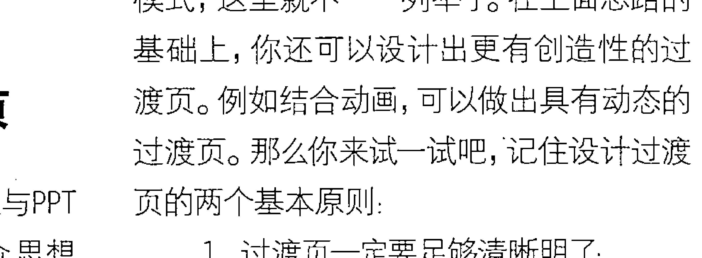

### 思路四: 基于类比的过渡页

这种思路指借助日常生活的具象与PPT的各个部分进行对应，从而形成观众思想上的共鸣与进度把控。图中①类比地铁线路图，并且用换乘站对应一级主题；②类比中国地图，涉及区域展示内容常可借用；③类比高楼的层级，最底层与工作基础具有很强的类比性；④则类比一株植物的生长来表现一个项目的推进过程。

### 思路五: 创意型的过渡页

实际上，过渡页还有多种多样的设计模式，这里就不一一列举了。在上面思路的基础上，你还可以设计出更有创造性的过渡页。例如结合动画，可以做出具有动态的过渡页。那么你来试一试吧，记住设计过渡页的两个基本原则：

-   1. 过渡页一定要足够清晰明了;
-   2. 过渡页要突出展示接下来的内容主题。

> （文|陈腊梅）

# 制作智能化的Excel成绩录入模板

每到期中或是期末考试，老师们都要录入学生成绩，并且在录入完成后还要根据成绩评定等第，虽然说利用Excel能大大提高工作效率，但录入数据之后的等第评定不管用什么方法都得花费一定的时间和精力，因此，常规的处理方法显然是比较麻烦的。那么，有没有在录入成绩的同时自动生成等第的方法呢？办法是有的。笔者就在Excel中设计了一种智能成绩录入模板，它就能实现上述要求。

功能三：当某位学生因病或因事缺考，“成绩”列中的分数为空时，相应的“等第”列就会用黄框显示提示信息：“缺考”。
功能四：当对“成绩”列中的分数进行修改时，相应的“等第”列也自动进行相应的修改。

“Target.Row>3”用于在第三行及其以后各行输入数据时才有效；
“Target.Row”代表当前行号；
“Target.Column”代表当前列号；
“Cells(Target.Row-1, Target.Column)”代表输入数值回车后所输入的数值，这个代码就代表“70”；
“Cells(Target.Row-1, Target.Column+1)”代表输入的数值右边的单元格；
“Range(prange.Address)”表示单元格的范围，“.Address”代表单元格的地址；
“.Borders()”代表单元格的边框，“.Weight”代表单元格线型，“.ColorIndex”代表颜色索引号；
“.Interior”代表单元格的内部填充。

## 实现四大功能

我将要设计的智能成绩录入模板需要实现如下四大功能。
功能一：在“成绩”列输入成绩时，在“等第”列就能智能地显示出相应的“等第”，如果“等第”为“不及格”，还会用红色字体提醒。
功能二：在“成绩”列中误输入文字或者输入的成绩数值不符合具体要求时（考试多采用100分制，数值大于100或者小于0时都是错误的），在“等第”列就会用醒目的灰底篮框显示提示信息：“分数输入错误”。

## 具体制作方法

第一步：新建Excel工作簿，在“Sheet1”中填写表头并在单元格A2、B2、C2、D2中分别输入“学号”、“姓名”、“成绩”、“等第”。
第二步：选择“工具→宏→Visual Basic编辑器”，在出现的窗口左边双击“Sheet1”，在右边箭头处分别选择“Worksheet”对象和“SelectionChange”事件，并添加相应的代码，关闭这个窗口。（清晰版代码图片参见http://iask.sina.com.cn/u/1704202287/ish）
说明：这里应用了IF语句的嵌套。
代码中“Target.Column=3”用于指定只能在第三列输入数据时才有效；
第三步：要想使这些代码发挥作用，需要点击“工具→宏→安全性”菜单，将宏的安全性设置为低。
至此，一个智能化的成绩录入模板就制作完成了，这时你就可以在“成绩”这列输入数值了。试一试，是不是很方便！

（文|马震安）

# 办公技巧版

拖动填充柄，许多人仅知道这种方法。其实还有更快速的方法，那就是在该列的第一个单元格内输入常量或公式（不必选定区域），然后将鼠标指向填充柄双击，则该列从输入单元格到数据区的最后一行就都填充了数据（常量或公式）。

没有满意的编号，这时先选中一个类似的编号，使“自定义”按钮激活，然后按下该按钮，在弹出的对话框中进行编辑即可。

## 快速实现中英文互译

在用Word写文档的过程中，你可能会遇到某些英文单词而不知道它们的汉语意思，这时，需要找词典软件来实现翻译吗？不用！在Word中，按几个键就可以实现中英、英中互译。方法是选中一个词后按下Alt+Shift+F7，在弹出的对话框内有中英文之间的互译。

## Word也能自动填充表格序列

Excel的“以序列方式填充”表格的功能可以将大量的表格进行序列编号，提高用户的工作效率。比如你输入“星期一”“星期二”之后，用鼠标一拉就可自动输入其余的星期。其实在Word中同样可以实现这一功能。
选中需要填充序列号的一列（或一行）表格，单击“格式→项目符号和编号”，在对话框中选择“编号”选项卡，然后选择需要的序列编号。但也许你会发现，现有的序列编号不是多一个点就是多一个括号，与自己心目中的序列号相去甚远。如果觉得

## 快速查看幻灯片动画效果

在PowerPoint的“幻灯片浏览”视图状态下，设置了动画效果的幻灯机，每幅幻灯片左下角都有一个图标（一个风驰电掣的五角星），单击这个图标就可直接预览该幻灯片的动画效果，无需转换到放映格式。
注意，只有在设置了动画效果的幻灯片下才有这个标志。在PowerPoint 2002以上版本的幻灯片缩略图窗格中，会显示此标志。

## 双击填充柄填充更快速

在Excel中，单元格或单元格区域的右下角会有一个小方形，这就是填充柄。在一个工作表中已建立了数据表时，如果某一列要填入相同的数据或公式时，可以用鼠标

## 巧用名称框实现区域选择

在Excel表中选定多个区域的传统方法是利用鼠标的拖拽来实现选择，当遇到多

# PPT编辑 空格跟着英文走

在PowerPoint中经过必要的设置，可以在删除英文单词的时候，自动去掉多余的空格；如果从剪贴板插入英文文本，也会自动添加空格。具体实现的方法如下：点击“工具→选项”，在弹出的对话框中使用“编辑”选项卡，选中“使用智能剪贴”复选框。最后单击“确定”关闭对话框就可以了。

# 巧用文档内超级链接整合资源

在Word文档中设置外部链接，可以有效实现外部资源的整合和方便使用，避免总是将文件合并来合并去的麻烦。设置外部超链接有如下几种技巧：

拖放编辑法：首先保存文档，然后拖动鼠标选中特定的词、句或图像作为超级链接的目标，然后点击鼠标右键，把选定的目标拖到需要链接到的位置，释放鼠标按键，在快捷菜单中选择“在此创建超级链接”选项即可。

拷贝粘贴法：利用鼠标拖放法创建超链接很方便，但是有时超级链接的起点和终点在文档中相距较远，使用拖放式编辑的方法是很不方便的。这时可以选择超级链接的目标词、句或图像，按下Ctrl+C复制选定内容，把光标移动到需要加入链接的位置，然后执行菜单“编辑→粘贴为超链接”即可。

使用书签法：首先保存文档，选择特定的词、句或图像作为超级链接的目标，选择菜单“插入→书签”，插入书签时，需要为书签命名，命名后单击“添加”按钮，把光标移到需要添加超级链接的位置，选择“插入→超级链接”，在“编辑超链接”对话框中单击“书签”按钮，并在“在文档中选择位置”对话框中选择特定的书签，单击“确定”按钮即可。

# 快速到达Excel特定单元格

有些时候，我们所使用的表格是相对固定的，每次录入或修改所涉及到的单元格也是那么固定的几个，但是因为表格所包含的内容可能很多，因此每次定位要编辑的单元格总是要经过拖拽或滚动才能找到目标。其实，我们可用如下办法快速解决。如果要在一个内容较多的Excel表格中，将光标指针快速定位到某特定单元格，只需记住你所要操作的单元格区域的左上角单元格的具体地址，以后进入时，在整个工作表的左上角的单元格地址栏中直接输入该单元格地址并回车即可。

# 如何消除文档打印麻点

用针式打印机打印含有图片的WPS文档时，白色背景的图片打印出来后往往有“麻点”。解决问题的方法是，在打印之前，我们只需右击该图片，然后在“对象属性”中设置打印类型为“灰度”打印，即可消除打印麻点。

# 获知Word文档版权信息

在内部网服务器中放置的Word文档，我们往往不知道它的建立者是谁，有时间常听员工在问，某某文件是谁建立的。其实，从文档本身就能看出来其原作者，即使是作者没有专门署名也是如此。

具体方法是，在Word文档上右击鼠标后选择“属性”，然后选择“摘要”标签，你可以很轻易地查看到该Word文档的标题信息和来源信息。其中的描述信息如果制作者没有设置，可能你看不到什么，但是，“来源”中的“作者”信息肯定会有内容显示，它就是文档创建者所使用的机器的用户名。局域网内员工的机器一般具有明显特征的名称，因此从这里你就可以轻松判断出创建这份文档的作者是谁了。

# 快速获得Word文档图片

如果在某DOC文档中含有大量图片，想保存的话一一复制太麻烦，我们可以把该DOC文档另存为“Web页”，完成后在保存该Web网页的文件夹下有一个与文档文件同名的图片文件夹，打开该文件夹即可找到文档中包含的所有图片。

# 幻灯片自动更新日期与时间

像Word那样，在PowerPoint幻灯片上也可以插入页眉与页脚，以便在里面插入时间，而且还可以通过设置，使得每次打开演示文稿，里面的日期、时间都能够自动更新。具体设置方法是：

点击“视图→页眉和页脚”，在弹出对话框中使用“幻灯片”选项卡，选中“日期与时间”复选框，然后选择“自动更新”单选按钮。

以后每次打开文件，系统会自动更新日期与时间。我们还可以选中“标题幻灯片中不显示”复选框，这样可以在标题幻灯片中隐藏“页眉与页脚”的设定。

# 快速输入 使用“选择列表”

在Excel中输入数据时，如果按下Alt键+下箭头，这时会出现一个本列中之上各行输入内容的下拉列表，用上下箭头或PageUp、PageDown选中后回车即可输入，既方便也不易出错。这对于已经输入内容的情况来说，非常方便，尤其是当项目内容比较复杂时，非常值得使用。

# 让文档实现自动预览

当在Word中阅读一篇较长的文章时，反复翻页是一件很麻烦的事。这时，我们可以给Word文档加上自动翻页的功能，方法如下：

在Word中打开要阅读的文件，单击“工具→宏”，单击“宏”命令，在弹出的对话框中，在“宏的位置”一栏中选择“Word命令”，然后在“宏名”的列表框中选择AutoScroll，单击“运行”按钮。

现在，鼠标指针会自动跳到右边的滚动条上，鼠标指针在滚动条的上半部则向上翻页，在下半部则向下翻页，放到中部则暂停翻页。鼠标越靠近两端，滚动的速度越快。要关闭自动翻页功能，只要随便点一下鼠标即可。

# 文章落款快速插入

很多时候，在编辑文档时，需要在文档末尾加入落款，如姓名、通讯地址等资料，我们可以使用Word提供的域功能来自动完成这一操作。

单击“工具→选项”，在对话框中选择“用户信息”选项卡，输入相应的个人信息后，按下“确定”按钮保存输入结果。

这样，在需要插入落款时，只需执行“插入”菜单上的“域”命令，然后在弹出的对话框的“类别”选项中选择“用户信息”以及相应的选项，点击“确定”按钮即可完成自动加入落款的操作。

# PPT存盘“保险系数”自己调整

使用计算机的时候，经常会出现非正常关机、死机、程序出错等情况。虽然PowerPoint提供了强大的文档恢复功能，但是所能恢复的文档取决于PowerPoint最后一次自动保存的结果，如果自动保存的时间间隔比较长，还是不能起到保护作用。通过修改PowerPoint自动保存文档的频率，可以尽量减少文稿丢失造成的损失。

点击“工具→选项→保存→保存自动恢复信息，每隔[]分钟”，指定希望Microsoft Office程序保存文件的频率。完成以后单击“确定”返回。

**小提示**

如果自动保存时间间隔设置得太小，文件又过大的话，会由于频繁保存，导致计算机性能下降，影响正常工作。因此，需要根据自己的情况选择合适的时间。

注：以上案例均在Office 2003环境下通过。

# 在迷茫中快速定位

在用Word处理一篇比较长的文档时，经常会遇到丢失当前光标的情况，一时找不到刚才自己编辑的位置在哪里。这时，只需要按下Shift+F5组合键即可回到刚才光标所在的位置。

不仅如此，Word还可以为你记录下最后三次输入或编辑文字的位置，你也可以重复按下Shift+F5组合键以到达所需的位置。

# 让打开文档少走弯路

Word启动后，使用“打开”命令打开文件时，Word使用的默认文件夹通常是“我的文档”文件夹。实际上，很多时候我们需要打开的文件都存放在自己事先设定好的文件夹中，“我的文档”用的人反而不多。这样，打开一个文件就要绕“十八道弯”才能到达自己的文件夹。怎样才能让Word一步到达自己的文件夹呢？你可以按照如下步骤设置Word启动后的默认文件夹：

-   1. 用鼠标单击菜单栏中的“工具”菜单项，并从下拉菜单中单击“选项”命令，程序将会弹出一个标题为“选项”的对话框。
-   2. 在该对话框中，选择“文件位置”标签，同时选择“文档”。
-   3. 单击“修改”按钮，打开“修改位置”对话框，在“查找范围”下拉框中选择文件夹所在的盘符。光标指向你希望将其设置为默认文件夹的Word文档文件夹并单击，在“文件夹名称”中即显示出该文件夹。单击“确定”按钮，此时Word的默认文件夹就指向用户自己设定的文件夹。最后再单击“确定”按钮，完成设置工作。

# 使用快捷键完全删除单元格

常看到有对Excel不太熟悉的用户，要删除其中的某些单元格，选中之后按了Delete键，只删除了其中的内容，而后再去找删除空白单元格的办法。其实，除了通过菜单命令一次删除单元格及其内容外，还可以通过快捷键将某单元格连同其格式和注释一并从工作表中完全删除。

只要选择需要删除的单元格，然后按下“Ctrl-（减号）”组合键即可。执行操作后，周围的单元格将移过来填充删除后留下的空间。

这一方法不同于使用Del键或Backspace键的删除，后一方法只清除单元格的内容，并不删除该单元格。

# 备份文档不要等到最后

不少用户在备份Word重要文档时，总是喜欢在工作完毕存盘后，拷贝一份作为备份文件。这样做其实是不太安全的，一旦在中途出现问题，虽然Word有恢复机制，但也可能会丢内容。

其实可以在Word中进行设置，让Word帮助备份文件。单击“工具→选项”，在“选项”对话框中选择“保存”选项卡，选中“保留备份”选项。这样，在执行了保存文档操作后，相同的路径下就会出现一个Word文档的备份文件。一旦遇到问题，你到文件保存路径下调用备份文件即可。

# Excel 别把分数当日期

有时候我们会遇到这种情况，在Excel的单元格中输入了诸如“1/6”这样的分数后，Excel会自动将其转换为日期“1月6日”，让你啼笑皆非。其实，这是由于系统默认这种输入格式为日期造成的。

要避免这种情况的发生，除了事先设置单元格的格式为分数格式外，我们可以不进行任何提前设置而直接输入分数：在想要输入的分数前面加0及一个空格，如输入0接着输入半角空格再输入1/6，即可得到1/6这一分数了。

# 自动编号不见得就给你方便

在Word中有一个自动编号的功能，即输入“1.某某某内容”后按下回车键会自动出现“2.”，这给你输入序列内容带来了很大的方便。但是有时候，你接下来的意图并不是要输入2、3、4、5之类的编号，并不需要该项功能，这样它“献”的这种“殷勤”反而是一种多余。那么，当你不需要这种功能的时候，如何取消呢？

单击“工具→自动更正选项”，在对话框中选择“键入时自动套用格式”选项卡，将“自动编号列表”选项前的对钩去掉即可。

# 用智能标记代替选择性粘贴

Microsoft Office智能标记是一组在## 用剪贴板的图表等进行替换

常规的替换，都是文字与文字之间的。实际上，从Word 2000开始，已经可以使用图片、表格等进行替换了。

首先将需要进行替换的图片或表格等对象复制到剪贴板，然后执行“编辑”菜单上的“替换”命令，在弹出的“替换”对话框的“查找内容”中输入要替换的文字，输入完毕后将光标移入“替换为”框中，单击“特殊字符”按钮（如果看不到该按钮，请先单击“高级”按钮），在菜单中选择“‘剪贴板’内容”。

单击“替换”或“替换全部”按钮后，就可以完成操作了。该方法不仅可以应用于图像、图形、表格，还可以用于公式编辑器等。

# 跨越编辑界面直接播放PPT

如你已经制作完成了一个幻灯片，以后再用到的时候只是播放幻灯片，而不用修改它，那么就可以在保存幻灯片时选择文件类型为“PowerPoint放映(*.pps)”。以后双击该文件时就会自动播放幻灯片而不是打开它来编辑。

但是许多时候，人们是把幻灯片文件保存为*.ppt这样的格式。如果你已经将文件保存为“演示文稿(*.ppt)”类型，也不用重新保存它，只需要在播放的时候右击这个PPT文稿，在弹出的快捷菜单中执行“显示”命令，或者在打开前将其扩展名改成.pps后双击它播放，就可以不打开PowerPoint直接播放幻灯片了。

# 不动鼠标的连续输入技巧

在Excel中输入数据时，有时候是在一个区域中进行输入。常看到有用户在输入完一个数据后，手离开键盘，用鼠标点击另一个单元格继续输入。其实，可以不动鼠标使用以下方法来提高输入效率。

首先用鼠标选定输入区域，接下来就可以在这个区域内使用快捷键进行输入了：按Tab键可使当前单元格向后移，按Shift+Tab可使当前单元格向前移。这种方法的最大好处就是，可以用键盘连续输入一组数据而不用鼠标，大大提高了工作效率。

# 在打开文件的同时建立副本

如果你只想打开查看某个Office文件的内容而不希望在浏览过程中改动源文件，通常的方法是先复制一份留底，然后再对复制品进行打开查看。

其实还有一个简单的方法：你可以右击该文件，在弹出的快捷菜单中选择“新建”命令，这样Office系统会自动以同样的内容打开一份文件副本，免去了你备份副本的工作。而当你对这份文件进行了改动，退出时它会提示你另给文件取个名字，这样就不会把源文件给破坏掉了。

在Office XP的“新建”任务窗中也有此功能。我们可以通过选择“根据现有文档”命令项，选择一个现有文档，根据现有文档内容来新建Office文件而不会破坏原来的文件。

# 打开Word工作自动接着干

如果我们需要连续几天编辑某一个文档，每次使用我们总是先去磁盘和目录下找到这个文档，然后打开它。其实，通过设置，可以让Word记住你干过的工作，每次只需启动Word，它就会自动打开你最后编辑的文档了。我们可以通过录制一个宏来实现这个目的：

- 1. 执行“工具→宏→录制新宏”命令，打开“录制宏”对话框。
- 2. 在“录制宏”对话框中的“宏名”输入框中输入autoexec，点击“确定”。
- 3. 从“文件”菜单中的列表中选择一个文件名。
- 4. 选择“工具”菜单中的“宏”菜单项，单击“停止录制”命令。
- 5. 退出Word，保存宏。

这样，下次再启动Word时，它会自动打开我们最后编辑的一个文档。

# 选定整个单元格的快捷键

假设有一个Excel表格，我们需要选择所有列的数据和列标题，而不需要选择表周围的空白单元格，通常的方法是先按下Shift键，再依次点击数据区对角的两个单元格来完成。一旦这个数据区超过了屏幕的显示范围，这样的操作很不好把控。其实有一种简单的办法可以快速选定，你只需按下Ctrl+Shift+*快捷键组合就可以了。

这一技巧不同于全选命令。全选命令将选择工作表中的全部单元格，包括那些你不打算使用的空白单元格。

# 设置展台用幻灯片

我们可以设置幻灯片的播放方式，使得幻灯片播放到结尾以后自动回到开头，开始下一次的播放。这种情况很适用于展台的产品形象展示。

打开想要播放的幻灯片，点击“幻灯片放映→设置放映方式”，在弹出的对话框中选中“循环放映，按Esc键终止”复选框，单击“确定”关闭对话框。

我们还可以选中“设置放映方式”对话框中的“在展台浏览(全屏幕)”，该项被选中后，上面的那个项就不起作用了。这样可使演示文稿循环放映，还可以防止用户更改演示文稿。

# 一次打开多个工作簿

出于工作的需要，许多时候我们需要同时打开多个Excel工作簿进行工作，一个一个地打开显然麻烦。

其实，我们可以将需要一次打开的工作簿保存为工作区文件，只要将它打开，Excel就会打开保存在其中的每个工作簿。

具体的操作方法是：打开需要同时使用的多个工作簿，根据使用要求调整好工作簿窗口的大小和位置，执行“文件”菜单中的“保存工作区”命令，再输入保存的文件名并按下“保存”按钮就可以了。

在对这些工作簿进行操作后，如果需要保存的话，必须逐个保存，而不能图省事，只保存工作区，是达不到目的的。

# 鼠标故障时应急启动Office组件

有时候，鼠标突然坏了，手头又找不到替代品，急着要用Office来干活，怎么启动这些软件？也许你会说有键盘，那么你会用键盘吗？

在没有鼠标的情况下，可以通过键盘快速启动Word、Excel、PowerPoint、Frontpage等Office应用软件。具体步骤为：在按下Windows图标键的同时，按R键，打开“运行”对话框，输入winword回车，转瞬间即可启动Word。

要打开Excel、PowerPoint、Frontpage，只需在运行对话框相应地输入excel、powerpnt、frontpg即可。

此外，启动Office程序，还可以通过加参数控制程序的启动。例如，在Word无法正常启动时，运行winword /a也许就可启动。

# 让Word文档字数统计更方便

在早期版本的Word中，为了统计文档的字数，我们总得从“工具”菜单下执行“字数统计”命令，使用起来比较麻烦。从Word XP开始，其实在“工具栏”中已经增加了一个十分实用的“字数统计”项目，在激活它后，文档窗口中会增加一个“单击重新计数来查看”的下拉列表框和一个“重新计数”按钮，点击▼按钮后还可以从下拉列表框中选择字、字符（无空格）、字符（带空格）、中文字符或朝鲜语单词、非中文字符、行、页、段落等不同统计内容，然后点击“重新计数”按钮即可显示最新的统计数字，这对从事文字工作的朋友来说可特别有用。

如果你仅仅看到“重新计数”工具按钮，而未看到这个下拉列表框，请将它拖动到比较空的区域，这样就可以看清楚了。另外，还有一种更简单的“重新计数”方法是同时按下Alt+C组合键。可见，快捷键有时比鼠标点击更方便呢。

# 快速清除Excel单元格内容

也许你遇到过这种情况，当你不需要Excel某个单元格中的东西时，单击鼠标选定该单元格，然后按下键盘上的Delete键。但是，你也许会发现，该操作只是删除了单元格的内容，而此前设置的格式和批注还保留着。如何才能彻底清除单元格呢？

首先，选定想要清除的单元格或单元格范围，然后选择“编辑”菜单中的“清除”命令，这时在显示的“清除”菜单中，你可以选择“全部”、“格式”、“内容”或“批注”中的任一个。当然，以上的操作也可以通过鼠标右键快捷菜单来完成，先选择需要清除的单元格，然后单击鼠标右键，从快捷菜单中单击“清除内容”命令。

# 巧借“自动更正”快速输入专业术语

在专业领域，往往会涉及到普通人见不到的词汇，因而在常用的输入法中也找不到这些词组，不能按词组输入。这时候，除了一些智能输入法的词组定义功能外，我们还可以巧妙地借助于Word提供的“自动更正”功能来快速输入这些词汇。

具体方法是：首先用普通的输入法一个字接一个字地在文档中输入经常重复利用的专业词或句子并选中它们，执行“工具”菜单上的“自动更正选项”命令，在弹出的“自动更正”对话框的“替换”文本框中输入定义它们的字母符号（即输入代码），这些符号的使用原则是简单而不常用的字母组合，如VQ。另外，为了避免切换输入法，应该在大写状态下进行输入。

# PPT幻灯片纵横向页面并存

默认情况下，PowerPoint中幻灯片版式设置为横向，并且PowerPoint不支持在一个文稿中同时使用纵向和横向版式。如果在演示的过程中正好有一张需要以不同的页面方向展示，该怎么办？

我们可以按照下面的方法来实现纵横版式并存：

首先将要设置为纵向的幻灯片移动到新演示文稿文件中。在普通视图的“幻灯片”选项卡中，选取要更改的幻灯片。执行“编辑”菜单中的“剪切”命令。打开一个新的空白演示文稿，执行“编辑”菜单中的“粘贴”命令。

更改演示文稿中幻灯片的方向。点击“文件”→“页面设置”→“幻灯片方向”，单击“纵向”，保存新的演示文稿。

创建从原演示文稿到新演示文稿的链接。首先选取要链接到新演示文稿的文本或对象（建议选择文本框，这样不会改变文本的格式），点击“幻灯片放映→动作设置→单击鼠标→超链接到”，再单击列表中的“其他 PowerPoint 演示文稿”，浏览找到新演示文稿并单击“确定”。

创建从新演示文稿回到原演示文稿的链接。操作方法和上述方法一样。

# 在两个工作簿中互相倒腾工作表

很多用户经常需要复制整张工作表（工作簿中的一页）到另一个工作簿中，如何才能实现？

首先打开目标工作簿（复制的目的地）和源工作表。鼠标右击屏幕左下方源工作表的标签，在出现的快捷菜单中选择“移动或复制工作表”。接着在弹出的对话框中，在工作簿下拉菜单中选择已打开的目标工作簿，然后还可以在“在下列选定工作表之前”中设置在目标工作簿中的位置，如果你是要复制该工作表而不是移动的话，应当选中“建立副本”，最后单击“确定”按钮，该工作表就被移动或复制到目标工作簿了。

# 快速修改单元格次序

修改Excel单元格内容的次序是非常常见的操作，那么，能否快速修改单元格内容的次序呢？

在拖放选定的一个或多个单元格至新的位置的同时，按住Shift键可以快速修改单元格次序。

# 一次性关闭所有文件更简单

在Office中，当按住键盘上的Shift键时，“文件”菜单中就会出现“全部保存”和“全部关闭”命令项，这样就可以一次性保存或关闭所有已打开的Word文档了。

不过，你肯定有这样的希望，要是这两个命令能永久驻留在“文件”菜单中，那就不用每次都按Shift键了，岂不更好！

打开“工具→自定义”对话框，找到“类别”下的“文件”项，然后在右边的“命令”下拉列表框中分别选择“全部保存”和“全部关闭”两项，再将它们拖到“文件”菜单中就可以了。

# 评估一下你的幻灯片字体大小

幻灯片用多大的字号合适？最小不能低于多大的字号？你可以用下面的办法来观察幻灯片字体是否足够大。

先以每页9张幻灯片的密度把演示文稿打印在纸上。方法是：执行“文件”菜单中的“打印”命令，在“打印内容”下拉菜单中选择“讲义”，然后设定“每页幻灯片数”为9。

打印好之后，观看打印纸，如果看不清每张幻灯片上的所有文本，那么坐在房间后排的观众也看不到。

# 照顾色盲 幻灯片慎用绿色

为了显示丰富多彩，我们常常可以看到颜色花花绿绿的幻灯片。但是，在制作幻灯片的时候，你是否想到过，你的这些颜色别人不一定能够欣赏得到。

为了照顾PPT观众中的色盲，你要特别注意，在设计幻灯片的时候尽量不要使用红绿配色。因为色盲患者最难分辨的颜色就是红色和绿色。如果非要使用，也要在绿色中掺入蓝色（大多数色盲都可以识别蓝色与红色）。

这个技巧很简单吗？以前你注意过并这样执行了吗？如果没有，从现在开始吧！

# PPT以窗口播放或小屏幕播放

在播放PowerPoint幻灯片时，我们一般使用的是全屏模式。演讲时，有时为了让屏幕同时显示其他内容，你还可以采用窗口模式或者小屏幕模式来播放PPT。

如果希望采用窗口播放模式，只需要按下Alt键，然后单击演示文稿窗口左下角的“幻灯片播放”按钮。

采用小屏幕播放模式的方法是按下Ctrl键，单击演示文稿窗口左下角的“幻灯片放映”按钮，这时启动的幻灯片放映模式是与全屏放映模式的操作完全一样的小屏幕放映模式。

# 波浪线的输入

要在两段文字之间画一条波浪线，如果要用图形来实现，不但需要调出图形工具来画线，还需要考虑和调整图形和文字的上下层次等位置关系。

现在，我们用输入符号的方法就简单多了，只需在两段之间留一空行，并在空行行首连续输入三个以上的半角字符~，再按回车键，就可以得到一条波浪线了。

# 单虚线的输入

如果需要在两段文字之间加一条单虚线，又该怎么办？

这次使用键盘上的星号就能实现。只要在需要出现单虚线的地方连续输入三个以上的半角符号*，然后回车就可以得到一条虚线。

# 快速输入大写中文数字

在一些特殊领域，例如银行等金融部门，经常需要输入中文的大写数字金额，一次两次可以，但是输入次数多了未免太麻烦了，这里介绍一种快速输入大写中文数字的方法。

执行“插入”菜单上的“数字”命令，在弹出的“数字”对话框中输入需要的数字，如输入345678，然后在“数字类型”里面选择中文数字版式“壹、贰、叁…”，单击“确定”，中文数字式的“叁拾肆万伍仟陆佰柒拾捌”就输入好了。

# 双直线的输入

如果需要在两段文字之间加一条双线，怎么办？也很简单，只要连续输入三个以上的半角符号=，回车就可以得到一条双直线。

# 细实线的输入

如果在段落某处需要一条细实线，又该用什么符号呢？想必你也大概能猜出来了！只要连续输入三个以上的半角符号-，然后回车就可以得到一条较细的实线了。

# 双细线夹粗线的输入

来个难一点的能不能实现？我需要一个中间粗线、上下夹细线的三线条，有什么办法吗？

照样可以实现！只要你连续输入三个以上的半角字符#，然后回车，马上就可以得到一条中间粗、上下细的组合线条了！

小提示

以上这个快速用字符输入线条的功能的正式名称是什么呢？也许有不少人会脱口而出：自动更正。遗憾的是，不完全对。它是一种键入时自动套用格式的功能。执行“工具”菜单的“自动套用格式”命令，在对话框中选择“键入时自动套用格式”选项卡，在“键入时自动应用”类别中会发现“框线”。就是它控制了这个功能。

# 快速输入常用网络表情

为了活跃气氛或者表达自己的情绪，许多人都会使用一些表情，如哭脸、笑脸等等。在Word中，我们也可以很轻松地输入这些表情。

按下Shift键不释放，然后依次输入:和)就可以得到一个笑脸图标；依次输入:和(哭脸图标就出现了。需要提醒注意的是，输入时需确认输入法为英文输入状态。

# 去除照片中的雾气

进入冬季，受天气的影响，我们拍的照片很容易雾蒙蒙的，使照片失去原有的美感，如何透过这浓浓的雾气使照片回归本色呢？

打开原图（如图1），泡温泉是这位MM冬季的大爱，但拍出的照片太过朦胧美，下面我们通过USM锐化滤镜，让这位MM露一露庐山真面目。USM在处理过程中使用模糊蒙版，以产生边缘轮廓锐化的效果。该滤镜是“锐化”滤镜组中锐化效果最强的滤镜。

单击“滤镜→锐化→USM锐化”。数量选60，半径选15，如图2所示。可以看到图片现在清楚了很多，如图3所示。

需要注意的是，所谓物极必反，一定不要过度锐化，否则会破坏图片，使图片出现夸张的噪点。

这里需要注意USM的三个参数，正确使用了这三个参数才能将USM锐化灵活运用起来。

| 参数 | 作用 |
| :--- | :--- |
| 数量 | 用于限定锐化程度，值越大，锐化效果越明显。 |
| 半径 | 用来设定图像轮廓周围被锐化的范围，其值越大，锐化效果越明显，但处理速度越慢。分辨率较高的图像通常需要较大的半径。 |
| 阈值 | 决定多大反差的相邻像素边界可以被锐化处理，而低于此反差值就不作锐化。正确设置后就可以使图像既保持平滑的自然色调（例如背景中纯蓝色的天空）的完美，又可以对变化细节的反差作出强调。此项在设置的时候推荐值为3或4。 |

大家处理时可使用小数值多次锐化，直到取得满意的效果。

（文|李婧郁）


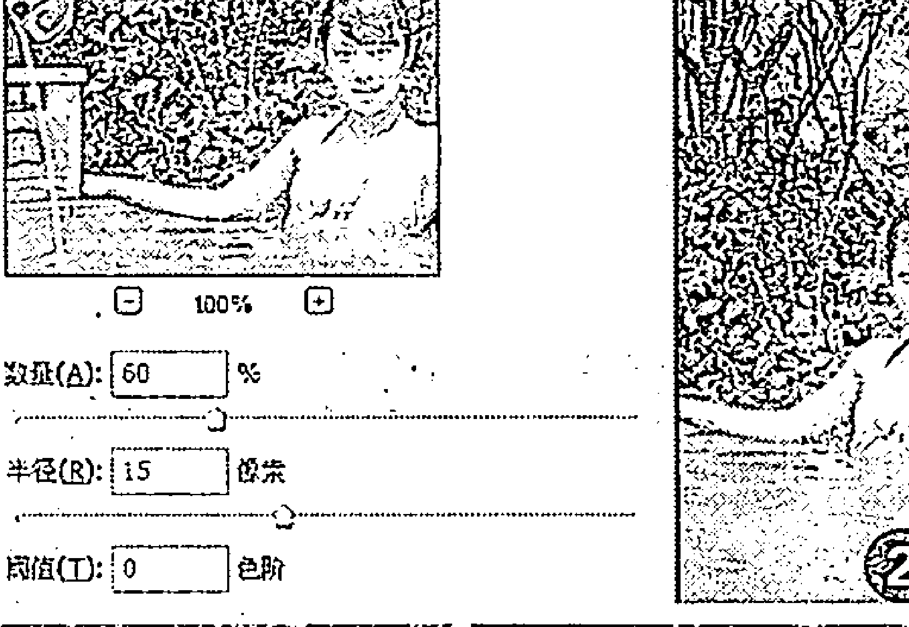


# 如何拍雪景

很多人都喜欢看从天而降的白雪，雪景的拍摄也是冬日必备。可我们拍出的雪景经常不是灰灰的，就是发蓝。怎么拍出洁白的雪景呢？其实很简单。

## 蓝色的雪

我们在阳光充足的天气拍摄阴影处的雪景时，经常会出现偏蓝的情况，原因就在于白平衡不恰当。我们人眼和大脑在动态范围、反差和校正色彩上要比相机强1000倍。无论我们在日光下、阴影中还是暗夜中看雪，都是白色的。而相机的自动白平衡一般无法准确地进行判断。当相机错误地识别了阴影中的雪时，就会拍出蓝色的雪。

只要在数码相机上手动设置阴影白平衡，告诉相机光线并非直接来自太阳就可解决。

## 灰蒙蒙的雪

当我们在下雪时和雪后天未晴时拍摄雪景，特别是对着大片的雪景测光时，很容易出现灰蒙蒙的效果。这是因为对于雪景这种“过亮”的光线，相机测光时会自动减少曝光量。我们只要增加1档左右的曝光补偿，基本就能把雪拍成白色的了。

（文|曾继伟）

# 拍出动静结合的照片

吴晓华：作者（手持拍摄）将照相机架设在一辆行驶中的有轨电车窗口的侧面中央，在构图上以二分法则分别将窗内和窗外分成两个部分，一并摄入镜头，从而使画面形成了明显的动静效果。这种效果尤其适合卡片机的拍摄。

拍摄这类照片需要注意三个方面的问题。

- 一是在行驶的汽车中拍摄时应尽量选择比较平坦的路段（轨道交通相对比较稳定），车外的被摄景物要尽量避开天空和空旷地带，这样才能展现出十足的动感效果。
- 二是拍摄这类照片使用速度优先的半自动模式为最佳，通常快门速度控制在1/30s~1/60s之间（快门速度应视车辆行驶速度的快慢和车辆颠簸幅度的大小来决定，车速快或颠簸幅度大时应适当提高快门速度，反之则可适当降低快门速度）。
- 三是拍摄这类动静结合的照片时必须以确保车内景物的清晰为前提，这也是静态优先的基本原则。


# 你也可以制作巧妙的三维立体画

## 三维立体图原理及看图的方法

三维立体图是利用人眼立体视觉现象制作的绘画作品。一个人的两只眼睛有一定的距离，这就造成了物体的影像在两眼中都有一定的差异，由于物体与人的眼睛距离不同，两眼间的视角也会不一样，这样所看到的影像也就不同，大脑会根据这种差异感觉到立体的景象。三维立体画就是利用这个原理，在水平方向生成一系列重复的图案，当这些图案在两只眼中重合时，就看到了立体的影像。

三维立体图片表面看来跟普通的平面图片没什么两样，第一次要想看到需要一些方法，以后就可以随心所欲啦！我根据大家看图的心得总结出一个很形象的方法—对眼法，大家应该知道斗鸡眼吧？哈哈，就是使劲盯着图中某一处，两眼珠子几乎凑到一块了，然后画面会慢慢地模糊，最后会觉得眼前一亮，豁然开朗，这时就是大家看到立体图的无比奇妙的一刻啦。简单地描述一下哈，就是跟现实的场景很接近，空间感很强，而且眼睛离开画面越远，空间感也就越强。说到这大家也许都跃跃欲试了，那就赶快行动吧。

## 制作方法

制作三维立体图片，分为两个部分，一个是背景图，可以找些合适的素材或自己制作都可以。另一个就是其主体部分，可以用Photoshop来涂鸦制作，也是创意之所在。还可以用3Dsmax制作人、物的模型，效果很不错。背景和主体模型都准备好了，还需要一个核心的制作合成软件。制作合成三维图片的软件有几种，给大家推荐StereoGreator，这款三维制作软件比较直观，也比较好操作。笔者安装的是英文版的，不过操作很简单。

- 1. 首先要进行主体模图的制作，从最简单开始，先让大家领略到立体图的乐趣哈。打开PS，新建一个文件，这个尺寸不做具体要求，大家自定，这里尺寸是680×500像素。把背景填充成黑色的，然后把前景色设置成白色，背景色设置成黑色。选择画笔硬度为0，不透明度为100%、直径大小为300，在画面中间的位置点击一下鼠标左键，这时就看到一个边缘有晕化的白球，这就是一张最简单的主体模图了，如图1所示。

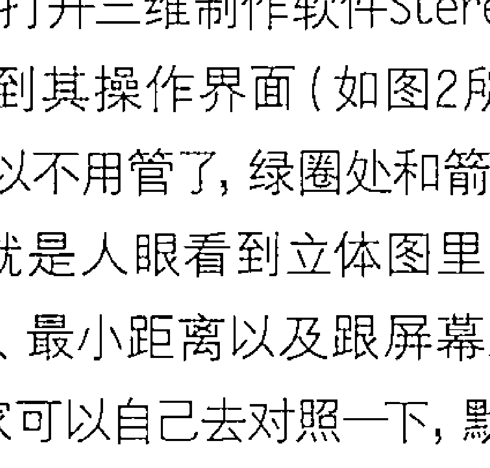

- 2. 打开三维制作软件StereoGreator，可以看到其操作界面（如图2所示），左边那些可以不用管了，绿圈处和箭头右边是对应的，就是人眼看到立体图里面主体的最大距离、最小距离以及跟屏幕之间的距离等，大家可以自己去对照一下，默认即可！也可以试着改变数值看看效果。红框处分别是生成立体图的宽度和长度，这里设置成800和500像素。

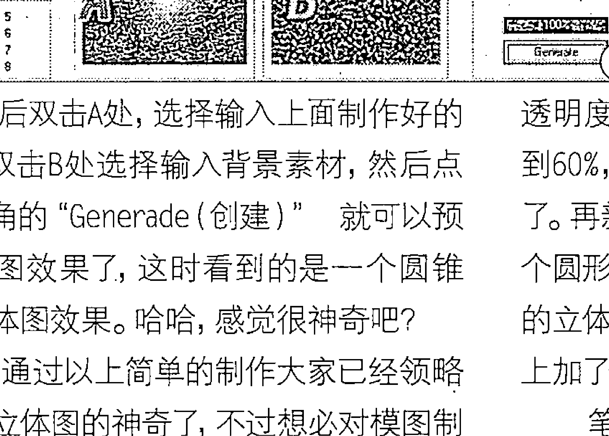

- 3. 通过以上简单的制作大家已经领略到三维立体图的神奇了，不过想必对模图制作方面还有很多的疑问吧，这一步将详细说明模图制作的原理。制作模图用的是灰度图，也就是说从白色到各级灰色再到黑之间的过渡都可以。在立体显示图中，白色部分是在最前面，黑色部分融合在背景里。

以上面制作的模图为例，大家可以看到球体中间部分是白色的，外圆边缘是黑色的，整体是从白色向黑色渐变的。那么，呈现出来的立体图效果就是一个立体的圆锥体，尖端是朝向我们的。如果把黑白两色调一下会产生什么样的效果呢？也就是说把球体中心从原先的白色改成黑色，外圆从原先的黑色改成白色（如图3）。这样显示出来就是尖端在背景处，外圆在前面，相当于锥形杯，大家可以去试试看哈。如果不要显示是尖的，可以在圆心白色渐变处画个圆选区，再填充附近的纯灰色，这样就有个截面效果了，不再是原先的圆锥形了。

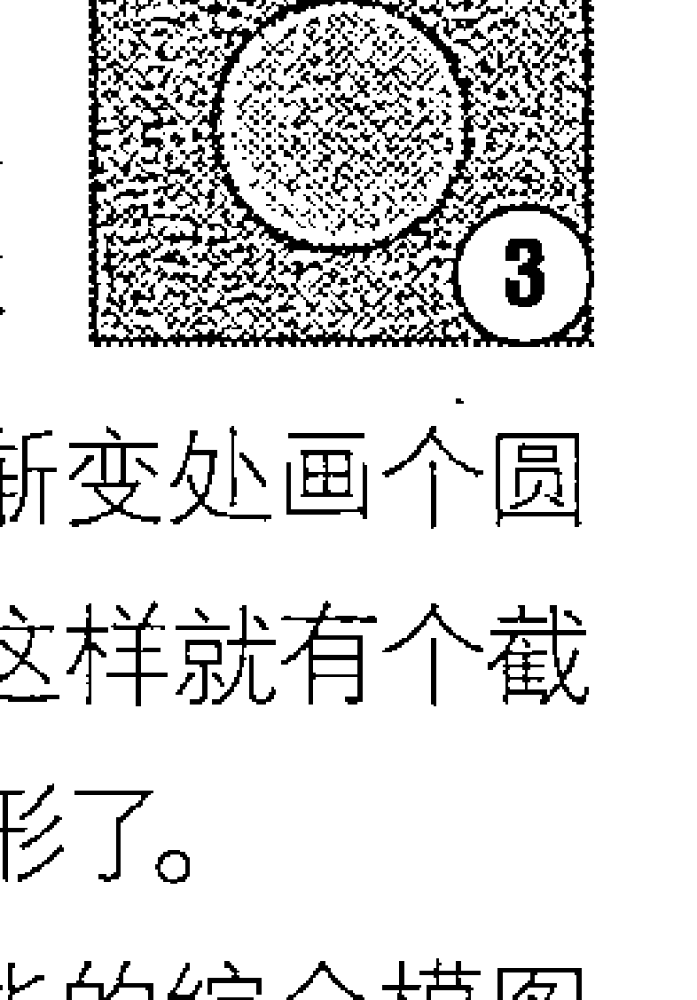

- 4. 下面我们再进行复杂些的综合模图制作，以“CFAN”为例制作空间位置错落的立体效果。新建一个680×500像素的文件，把背景填黑，新建一层透明图层。输入CFAN四个英文字母，字体为黑体、白色，大小为300。每个字母各放一层，如果就这样作为模图的话，那显示的立体效果应该是CFAN这几个字母悬浮在最前面，字体没有立体效果。按Ctrl键，同时点击C图层得到C字形的选区，关掉C图层前面的小眼睛隐藏该图层。打开“菜单→选择→羽化”，羽化半径为10，然后新建一透明图层，填充白色。这样制作成立体图后的显示效果就不一样啦，C字母有了立体的效果，底部和背景相连在一起了。下面三个字母F、A、N都按照这样羽化填充，然后把F图层不透明度降低到80%、A图层不透明度降低到70%、N图层不透明度降低到60%，这样显示出来就是从C到N高低排列了。再新建一透明图层，用椭圆选区工具画个圆形，来个渐变填充描边，这样制作出来的立体图就是在前面字母高低排列的基础上加了倾斜的圆圈了。

笔者还另外做了两张三维立体图片财和佛，受视觉和色彩的限制，本文中所用到的背景素材、效果图以及各种配图请访问http://bbs.cfan.com.cn/thread-1452501-1-1.html。

(文|凡鱼)

# 巧用气泡 让美女照更吸引人

再漂亮的美女照也有看腻的时候，有时无需太复杂的技术和步骤，一个小创意就可以制作出有趣、令人遐想无限的照片。下面我们就通过一些普通的泡泡，让美女照大变身。

首先要找到一张美女图，衣服不要穿太多，一定要有裸露的肌肤，并且越多越好，当然也可以通过后期PS几处裸露的肌肤，目的就是增加些令人遐想的空间。下面我们就来体验一番吧。

1. 打开一张漂亮的MM素材，漂亮是很重要的，要不来个凤姐，即使裸露得再多也只能更令人作呕哈。在MM腰间增加几处裸露的肌肤，这个只要复制腿部的肌肤上去即可。
2. 新建一透明图，命名为“圈圈”，把前景色设置成绿色，当然设置成其它颜色也可以哈，只要不跟图片上的色彩混起来就可以了。选择画笔，硬度和不透明度都为100%，选择不同的画笔直径大小，在需要裸露的地方点击画圆圈。圆圈越多越好，大小可以不同，并注意不要交叠。
3. 关闭圈圈图层前面的小眼睛隐藏该图层，在圈圈层下面新建一透明层填充橘红色，这个色彩根据个人所好，喜欢什么颜色就填充什么颜色。再新建一透明层，在工具栏里选择“圆角矩形工具”，然后进行3个像素的路径描边，做个圆角的白边。
4. 打开圈圈图层，点击“菜单→选择→色彩范围”，用吸管点击一下绿圈圈，这样就选择了画面中所有的绿色圈圈作为选区了。然后隐藏圈圈图层，用鼠标点击橘红色的填充图层（激活该图层）。按住Alt键，再点击图层面板下面的“添加矢量蒙版的图标”，这时大家可以看到原先绿色圈圈覆盖的部位变得透明啦，一张很有趣味、令人浮想联翩的照片就这样诞生啦！

(文|曾继伟)

# 平凡木屋突变恐怖鬼屋

童话般的梦幻小屋，瞬间变身恐怖片中的吓人鬼屋，这样的效果利用Photoshop自带的滤镜即可实现。

1. 首先打开一幅房屋图片（图1）。先用魔棒选取天空并复制，新建图层1，粘贴，然后隐藏图层1的小眼睛，以方便调整背景图层的色调。
2. 回到背景图层，用Ctrl+M曲线工具、Ctrl+U色相/饱和度调整和Ctrl+L色阶调整工具调整画面色调，使其暗些并偏蓝一点。然后用渐变工具将图层1填充黑白渐变效果。执行“滤镜→渲染→分层云彩”，得到图2的效果，这样天空中就变得满是阴霾了。
3. 按Ctrl+I反相，在Ctrl+L用色阶工具调整，拖动滑块，闪电就出来了（图3）。改变图层1的图层混合模式，使其与背景图层相融合，并透出底图天空的轮廓。
4. 基本大功告成了。合并图层，对画面整体色调和氛围做些渲染调整即可，得到最终的效果图（图4）。怎么样，妩媚动人的晴空晚霞下的小木屋是不是变成了雷电交加、暗云密布下的恐怖小屋了？

**小提示**
PS滤镜在各种绘图软件中的特效制作工具中是最为强大的，花点时间来试验的话，会得到很多令人瞠目结舌的效果。若能用心钻研PS的滤镜特效，能发现很多令人欲罢不能的乐趣。在设计过程中善用PS滤镜丰富多彩的效果变化，往往能事半功倍。

(文|叶勇)

# 全家福这样拍才更生动

新年亲朋好友大团聚，一张温馨快乐的全家福是必不可少的，可以将新年的气氛推向高潮。不过年年正襟危坐、大同小异的全家福是否令你有些审美疲劳？

如果是三口之家，“1+2”的排列将使你们看上去更紧密，减少了每个人身体之间的“死角”。如果家庭成员多于三名，那就排一个分组三角形，也就是最前面排一到两个人，后面每排的人数依次增加，直到妥善安排好每一个人。

尽量利用现有的座位，比如在室外，公园的长椅、大石头等都是不错的座位。如果在家中，客厅的沙发、餐厅的座椅、楼梯、一些摆件等都可以直接利用。

## 侧身

第一个改变全家福照片的方法就是创造一些角度——侧身！当人的一个肩头比另一个更靠近镜头时，不仅看上去更活泼、有趣，也可以让人看上去更苗条。

当你让被摄者侧身时，他们不得不扭头去看镜头，从而在头部和肩膀之间创造了一个有趣的角度，打破头部和肩膀固有的“铁三角”！

## 三角队形

印象中的全家福大都采用两到三行、整齐划一的队形，看上去很呆板。这里我们做出一些改变，排一个三角形的队形。这样更有视觉冲击力，看上去也更吸引人。

## 头靠向一起

这一条很简单，就是确保每个家庭成员的头略微靠向中间，而不是和身体一样愣愣地直上直下。

这样也可以创造一种亲密的感觉。如果一个人的头偏离他旁边的人，倒向另一边，他们看上去是不是有些疏远呢？

## 有坐有站

让全家福更生动的另一个窍门就是安排一些人坐着，另一些人站着。

需要注意的是，千万别像以前那样在房间中放上几把椅子，一看就像是摆出来的。

## 别再说“茄子”

说起来，喊“茄子”的方式真该为所有单调、木然的全家福照负责。很多人在镜头前就已经很不舒服了，如果你再告诉他们需要在“1、2、3”的时候喊“茄子”，他们的面部一定会因为紧张而变得僵硬，从而摆出造作的笑容。

如果你想捕捉到一个特别的家庭瞬间，就尽量不要告诉他们你要拍照了。相反，保持和你的家庭成员谈话、交流，同时抽空抓拍几张。

你会发现，照片上的每个人看上去都很放松，微笑很自然，姿势也更有趣，那场景就和你出差回来刚推开家门看到的一样。

(文|李婧一 隋兆英)

# 世上最贵的照片

摄影师Andreas Gursky创作于1999年的作品《莱茵河畔2》(Rhein II)在2011年11月8日的佳士得拍卖会上以4338500美元成交，成为史上最贵的照片。

这张天价照片引起了很多人的不解。在普通人眼中，这只是一张非常平淡的、河岸比较平行的风景画。这张照片有何过人之处？且让我们听听专家的看法。

吴晓华：初看《莱茵河畔2》这张照片，无论从构图还是线条之美，特别是画面的简洁，都无愧于一幅优秀的摄影大作。

> “宁静致远”来为该作品命名或许再贴切不过了。

凡到过莱茵河畔的人，都会有一种恍惚——莱茵河畔城市的嘈杂与喧闹一下子被抛到了九霄云外，那种掷地有声的宁静，似乎使人来到了世外桃源……用成语

至于这幅照片之所以天价，可能与很多因素有关。作为一幅有价值的摄影作品，往往是摄影家用其独特的眼光记录下的人们在日常生活或特定环境下所见到的瞬间。能拍这样照片的人很多，但只有这位摄影师能发现这样的美——天空、河、路由浅变深的三色对应草地的三色，很了不起！我们不妨自问一下，我为什么没有拍到呢？

# 打造《男人帮》趣味漫画

随着《男人帮》的热播，一幅网友自创的卡通漫画也风靡网上。漫画一直以其诙谐夸张的形象效果受到大家的喜爱，下面详述如何制作卡通人像效果。

## PS滤镜制作法

在PS中已经提供了功能强大的滤镜，丰富多彩的外挂插件更是如虎添翼。

1. 打开一张孙红雷的剧照（图1），复制一层，命名为图层1。打开“菜单→滤镜→液化”，根据孙的长相特点对其进行夸张，用膨胀工具把鼻子放大些，用缩小工具把眼睛缩小些。再用向前变形工具对眼睛和鼻子进行修饰，把耳朵也拉长些，嘴巴、下巴和头发都做了些夸张的处理。这些都是制作卡通漫画时根据人物特点常用的夸张处理手法（图2）。
2. 按下Ctrl+J复制图层1，命名为图层2，关掉图层2前面的小眼睛隐藏该图层。点击图层1，用钢笔工具或蒙版把头部抠出来，头发不用抠得太细。然后用涂抹工具，直径大小为10，硬度和强度都设置为10%左右，拉几缕发丝出来（图3）。
3. 打开图层2前面的小眼睛，用橡皮擦、钢笔工具或直接用蒙版把衣服和手抠出来。然后按下Ctrl+T，用变形工具缩小些，用移动工具把身体和头部对好，可以用蒙版来修整结合处（图4）。
4. 把图层1和图层2合并起来，打开“菜单→滤镜→艺术风格→绘画涂抹”进行设置（图5），增加些绘画的笔触效果。点击“菜单→编辑→渐隐画笔涂抹”，选择35%左右，就是只需要刚才绘画涂抹的35%的效果，这很方便，但很多人都忽略了这个功能。
5. 复制一层，图层混合模式为“线性光”，不透明度降低到50%左右，得到最终结果（图6）。

## PS钢笔路径法

在PS中的钢笔路径是鼠绘不可缺少的工具，下面我们以一张《男人帮》里的三主人公的剧照为例，详述制作过程。

1. 打开素材（图7），复制一层命名为图层1。还是以右边的孙红雷作为P图的对象，其它的方法都一样。选择钢笔工具，把头发用路径描下来，不必太精细了，这样反而更有卡通的味道。

简单说一下钢笔工具操作的技巧，鼠标单击左键就得到一个路径的描点，不放开鼠标顺势拉出就得到两头的操纵杆。在操作过程中，按住Ctrl键就转变成路径选择工具，按住Alt键就变成了转换点工具。一段路径画好后要另画一条路径，只要按下Ctrl键，同时点击鼠标左键就可以了。

以上所述的是实际路径操作中的技巧，方便实用，大家务必记牢！路径画好后，新建一透明图层，鼠绘各个部位，最好要分层。然后转到路径面板，双击路径缩略图，保存该路径。右击该路径选择填充路径，添加个白色背景，这样头发效果就出来了（图8）。
2. 接着用路径画个脸部的轮廓，这就要用路径描边了，路径描边时要勾选模拟压力，这样出来的线条有粗细浓淡的变化。可以进入画笔预设面板，选择“形状动态→控制→钢笔压力”，设置合适的最小直径即可（图9）。
3. 按照上述的方法完成人像的路径制作，其他两人制作的方法也是一样的，最后添加身体部分，一般卡通漫画的身体部分都比较小，这也是卡通的特色。这样整个路径卡通漫画的人像效果就全部制作完毕了（图10）。

## 小结

以上详述了如何制作卡通人像漫画的思路方法，要求线条简练，可以适当夸大人物某一部分的特点，这样更有趣味。鼠绘最主要是钢笔工具，这个一定要掌握并熟练应用，有何不明白之处请到CFan图形图像论坛交流。

(文|凡鱼)

# DIY可以打印的照片年历

时间流逝，转眼间2012年就来到了，学校里、家里和单位里又要添新年历了。今年想不想做一张专属于我们自己的年历呢？

说到年历，首先需要2012年历模板，可以到网上搜索下载，最好是PSD或矢量格式的素材，当然也可以自己做，其它的辅助素材元素可以在网上搜索下载，用图片素材或用笔刷都可以。接下来就是准备一张或多张要DIY的照片了，本期就以《电脑爱好者》杂志社编辑部合影照为例，详述如何用PS打造一张属于自己的个性年历。

首先对合影照片进行常规处理（图1），打开照片后发现画面水平线有点倾斜，先校正一下水平线，然后依照一般的审美习惯，人群应该要向右边移动些，背后的大门最好要接近正中位置。这个说难不难，说易可也不易，要用到抠图合成方面的知识。

复制一层命名为图层1，并关掉图层1前面的小眼睛隐藏该图层。点击背景层处于编辑状态，用套索工具，羽化值为0，在背景层上做出大致的选区（图2）。

同时按下Ctrl+J，复制一层选区内的图案，命名为图层2，用选择工具向右移动图层2中的合影人物到合适的位置，然后用蒙版把残留的背景大体清理一下。这时大家会发现移动后的合影人物和原先的人物混在一起。

接下来要把画面中多余的人物去掉，还要恢复被原先人物遮住的背景，这些可以用复制粘贴加上图章修复工具来辅助完成。用选框工具做个选区，复制一层，然后覆盖下面部分相关的背景，最好加蒙版修整完成（图3）。这样合影图片修复处理完毕，来个前后对比（图4）。

按下Ctrl+N新建文件210×297毫米（A4纸），根据整体色调风格的要求，一般都要先确定底色，多以渐变色为主，这里以红黄径向渐变作为底色。然后把上面处理好的合影照片拖进来，再把所需的素材元素拖进来，调整好大小并放置在合适的位置，再用蒙版处理好结合处的过渡，最后检查一下整体的效果，完善细节的问题，至此全部完工（图5）。

## 小结

以上详述了DIY个性年历的思路方法，在修复处理照片时主要用到图章修复工具、复制粘贴、画笔工具，以及常用的调色工具等，合成时要注意结合处的自然过渡以及细节的问题，色调方面可以选择喜庆的、恬静的、温馨的等等。年历模板素材网上很多，大家可以去搜索下载，有何不明白之处请到论坛探讨交流。

(文/凡鱼)

# 通过借景方式让主题更突出

春节期间，各种类型的庙会热闹非凡，处处是景。下面是来自CFan图形图像论坛默人拍摄的两张庙会照片（图1~图2）。

吴晓华：照片所拍尽管是庙会上的一个亮点，但当读者单独去欣赏和判断时，却很难确认这就是一张庙会的照片，更难确认这是在哪个庙会上拍摄的。因为照片太注重突出个体，如果不加文字说明，也可认为它不是一张记录庙会的照片。

拍摄庙会照片特别要注意两点：一是尽量突出庙会人山人海的宏大场面；二是无论是拍摄大场景还是反映庙会的个别单体场景，都要学会通过借景方式让主题更突出。借景就是在突出主体的前提下，通过背景场景（往往能反映出主题的位置、属性等）的衬托，使所拍的主题在没有任何文字的说明下，依然活脱脱地展现在照片上（图3正中间右侧的一面小黄旗上“2012-北京厂甸庙会”十个大字，使照片的主题一目了然）。

# 别错过飞机上的美景

逢年过节，很多人会坐飞机旅游、探亲，为什么总是在飞机上无所事事一直等到目的地才开始拍照呢？拿起你的相机，尽情捕捉飞机内外的美景吧！

## 做好拍摄前的准备

### 1. 选择好的座位

要想拍出好照片就要占据有利地形，靠窗的位置视线无阻，自然是最好的选择！要尽量避免机翼后面的位置，因为发动机的排气管会使你的图像看起来模糊。此外，要选择背光的位置，因为对着光的窗口（特别是有划痕的）很容易引起耀斑。当然，在起飞前，用纸巾对你旁边的窗口进行清洁也是很有必要的哦。

### 2. 切换到手动对焦

由于大多数飞机窗口都会有一些玻璃划痕和污迹，通过玻璃拍摄时，相机的自动对焦会发生混淆，将焦点放到倒影或玻璃上。所以无论是单反相机还是傻瓜机，请把对焦模式切换到手动模式，自己定位对焦点。

### 3. 尽可能在飞行早期进行拍摄

如果飞行时间过长，飞机窗口很容易起霜、起雾甚至结冰。所以尽可能在飞行初期进行拍摄，这样拍摄窗口通常比较清晰。

### 4. 可使用高速连拍

由于飞机窗口大小及拍摄角度的限制，我们从飞机上很难拍摄到地面的景色。拍摄的机会很短暂，只是在飞机起飞和下降时能捕捉到一些镜头。所以一定要提前做好准备，最好使用高速连拍。

### 5. 关闭闪光灯

闪光灯会引起窗口的反射，虽然有时看上去闪光灯的影响并不大，只有几米的距离，但我们最好关闭它。为了减少反射，机舱的顶灯也应关闭，尽量穿深色衣服。

## 不要让镜头贴上窗口

人们常犯的错误之一就是把相机镜头紧贴着舷窗玻璃，希望借此来减少反射，增加拍摄的稳定。事实上，这样虽然可能减少一点反射，但由于飞机的颠簸，往往会增加相机的抖动，从而使影像不清晰。

比较好的做法是，如果是单反相机可使用镜头遮光罩，如果是普通的卡片机，腾出一只手放到镜头边来遮挡反光，同时使相机镜头尽可能地接近窗口，但不要贴上。

## 寻找有趣的主体

有时我们通过窗口看到很棒的景色，拍摄出来却平淡无奇，所以选择有意思的拍摄主体是很有必要的。可以试着拍一下机翼、飞机引擎、云层、另一架飞机、海岸线、景色的变化，以及落日、夜景等，甚至可以拍摄机舱内的景物。

城市的灯光在夜间看上去总令人兴奋，拍夜景最好的方式是使用手动模式，快门速度调到1/500秒或再快些。当然，最后的成像很可能曝光不足，可以通过PS适当修复。

坐红眼航班或长途飞行时，特别是在机舱内的灯光关闭时，你可能会发现一些有趣的场景，试着将它们记录下来。和大家分享一个不错的位置，就是紧急出口处和洗手间门口，你可站在那里寻找有趣的拍摄主体。

(文|继伟)

# 给暮春的绿叶来颗春露吧

今年春天来得好迟，倒春寒来得好不汹涌。别辜负了大好的春光，让我们动手给翠色欲滴的绿叶PS一颗春露吧。

第一步：新建图层，用选取工具圈出个圈，用渐变填充工具拉出黑白渐变的圆形。

第二步：更改图层混合模式和透明度，我用的是强光模式和61%的透明度。其实柔光、亮光、线性光、变暗、变亮、滤色等都行，自己看着效果调调就好。透明度也是，多调下尝试不同效果。

第三步：选取背景层为当前图层，按住Ctrl键点图层1载入选区，然后按Ctrl+C、Ctrl+V创建图层2。

第四步：创建图层3，还是使用渐变填充工具拉出个圆形的渐变白点作为高光，注意编辑一下渐变的模式，做出前景到透明的白色径向渐变。

第五步：到这里基本效果就出来了，连接三个活动图层，在菜单中选取“编辑→变换→扭曲”，然后对露珠进行变形。

第六步：这样露珠的制作就基本完成了，最后为图层2添加点阴影效果就大功告成了。

(文|叶勇)

# 龙年画龙

岁月匆匆，转眼间龙年将至。龙一直是我们中国人的精神象征，这期我们就来个龙年画龙——鼠绘趣味送宝的卡通金龙！
说起龙相信大家并不陌生，牛头、鹿耳、蟒身、鱼鳞、鹰爪等构成龙的形状，我们在绘画时可以体现出这些构成。具体步骤如下。
虽说龙是杜撰之物，但是人们赋予龙的是一种崇高的品性，给予龙一种精神，中国人把自己当成龙的子孙、龙的传人！

1.  新建一白底文件600×650像素，我们先从龙的鼻子画起（这个没有定性，根据个人习惯），新建一透明层，命名为“图层1”。用工具栏中的钢笔工具，画出龙的鼻子形状，保存为路径1。点击激活图层1，右击路径1，选择填充路径，填充浅黄色(图1)。

2.  新建一透明图层，命名为图层2，用钢笔工具画出鼻孔，保存为路径2。 用工具栏中的加深工具（硬度为0、曝光度为50%以及合适的笔头）擦出鼻子的暗部，要细心地逐步涂抹，曝光度可以适当地变换，这样鼻子看起来就有立体感啦（图2）。

3.  画眼睛，有个技巧哈，先画最外圈，然后填充深黄，再画里面的那一圈，填充白色，以此类推，最后点上高光效果（图3）。

4.  用加深减淡工具或画笔为眼睛擦出阴影使之有立体感效果，由于两边眼睛是一样的，可以复制过去，注意眼睛高光的位置要统一（图4）。

5.  新建一层，用钢笔工具画出龙角，填充黄色，并用加深工具涂抹出暗部以及龙角上的节痕。再新建一透明图层，画出龙须、龙眉的路径，填充红色，同样用加深减淡工具涂抹出明暗部。龙角、龙须、龙眉都是一对的，正面状态下左右是对称的，可以直接复制过去（图5）。

6.  接下去就是画脸部了，在图层1（鼻子层）下面新建一透明图层，用钢笔工具画出龙的脸部，也是填充黄色，并画出红色的舌头。然后依次画出龙的身体、红色的马夹还有手中的金元宝，方法同上。要注意上下图层的关系，这样可以省去不少的麻烦，最终效果如图6所示。

7.  至此，鼠绘卡通龙就全部完毕了。背景部分可以用素材元素也可以自己手绘，这样就做成了一张完整的龙年大吉图啦。下面是笔者做的另外一张效果图（图7）。

(文|凡鱼)

# 用双色照片打造怀旧感觉

说到怀旧效果，很多朋友都会想到那种泛黄的照片。其实使用Photoshop的双色调，可以非常简单地做出多种色彩的怀旧效果。

## 双色印刷

很多人都喜欢怀旧效果的照片，常用的方法就是将照片做黄或是去色，这样处理会损失很多其他色彩。而使用Photoshop的双色模式，可以做出表现力丰富的多种怀旧效果，打印时还可节省油墨！
要了解什么是双色调，先要了解“双色印刷”。我们知道，C、M、Y、K（青、洋红、黄、黑）是常用的印刷四原色，由不同百分比的C、M、Y、K组成的颜色混合可以产生丰富的色彩。
双色模式可以任意指定两种颜色进行印刷，从而产生个性的怀旧效果，比单纯的灰色图像更生动。以此类推，还有三色和四色印刷。

## 操作步骤

1.  在Photoshop中打开需处理的照片，点击“图像→模式→Lab颜色”，把RGB颜色转换为Lab颜色。
2.  在面板中选择“通道”，单击“明度”，画面呈现灰色。
3.  点击“图像→模式→灰度”，弹出“要扔掉颜色信息吗？”的对话框，点击“确定”继续。这里没有选择直接对照片去灰，因为在“明度”中去灰，画面质量更高。
4.  点击“图像→模式→双色调”，弹出“双色调选项”对话框，在“类型”中选择“双色调”，油墨1的默认颜色是黑色，可以重新选择，油墨2需要自己选择。点击油墨2的颜色框，在弹出的“颜色库”中自行选择颜色。
5.  选好两种颜色后，如果想精确地控制油墨的混合比例，可点击油墨曲线，调整暗调、中间调和高光区域的油墨密度。在曲线图中，横轴表示原图像的色调范围，纵轴表示油墨的密度。可以直接在11个数值区域中输入具体数值，也可以直接拖动曲线进行设置。图像的暗调区、中间调区和高光区默认分别使用100%、50%、0%的油墨印刷。如在100区域输入80，表示图像的高光区用80%的油墨印刷，可以看到图像比以前淡了。
6.  选择颜色时要根据照片的主题和整体基调来选择，这样照片才有好的表现。比如大海、蓝天、高山等照片可使用蓝色为主，古建筑、老街等可使用褐色、咖啡色，绿树、植物、草原等可使用绿色，而黄昏日落及高兴的场合可使用红、橙等为主。调好色调后可保存起来，以后需要时直接载入即可，也可直接载入系统提供的色调。
7.  由于双色调不属于JPG的用途范围，保存时有两种方法，一种是单击“文件→存储为Web所用格式”，一种是将图像转为RGB模式后再进行保存。大家还可以选择三色、四色模式，创造更多样的效果。

(文|曾继伟)

# 给卡通人物拍张X光片

近来网上流传一张 “Hello Kitty去医院拍了X光片” 的图片，让人忍俊不禁，大呼有创意。今天我们就照葫芦画瓢，给你喜欢的卡通人物也照张X光片！

## 了解骨骼结构

要制作X光的照片，首先要了解骨骼结构。由于我们的对象是动画主角或家中的玩偶，四肢的骨骼基本差不多，根据人体的骨骼结构加以适当地变形后就可以混用啦。当然头骨要换卡通型的，我们的目的是既要有X光照片的韵味又要有夸张趣味的效果，而不是单纯的写实效果。

## 制作X光照片

1.  打开一张大家都熟悉的美羊羊图片（图1），复制一层，去色并反相。
2.  用钢笔工具画出头型路径，然后新建一层，羽化2个像素填充白色。做出眼窝、鼻孔的选区，羽化2个像素后按Delete键挖空。
3.  用钢笔工具做出牙齿的路径，转换为选区，羽化2个像素，按Delete键删除。加蒙版，用硬度为0、不透明度为4%的画笔在头骨的边缘以及眼、鼻洞周围涂抹。最后添加杂色为10%（图2）。
4.  大家可以预先制作些常用的骨骼备用，方法同上，使用时直接进行变形套用就可以了，不必很精确。拖入预先制作好的手掌骨骼，进行适当地变形并放置合适的位置。
5.  继续拖入手臂和腿骨，变形并放置合适的位置。由于动画主角或玩偶都不是正常的人体比例，所以骨骼安放时也不必太标准，得到此效果（图3）。
6.  用钢笔工具画出美羊羊头上其中一个角的路径，羽化2个像素填充白色，加蒙版画笔涂抹，并复制一层移动到左边，这样就做成了两只角啦（图4）。
7.  至此，大致已经制作完成，为了增加趣味，可以复制一层原图放在图层的最上面，按下快捷键Ctrl+I反相，降低该图层的不透明度至65%左右，加蒙版把头上两个蝴蝶结以及裙子和鞋子擦出来。这样，一张既有X光效果又有趣味的图片就完成啦（图5）！
按照上述的制作方法以及利用预先制作好的骨骼素材，同样也可以很轻松地把自己拍摄的一张布娃娃变成趣味的X光照效果（图6）。

## 小提示

本文所用到的图片及骨骼素材可访问CFan图形图像论坛http://bbs.cfan.com.cn/thread-1467816-1-1.html下载。

(文|凡鱼)

# 让水饺像水晶般绚丽

说到正月十五的元宵节，大家自然而然就会想到汤圆、水饺，可你见过像水晶一样晶莹剔透、绚丽多彩的饺子吗？一起来用PS制作吧！图层合并后，抠图去掉白色背景，并适当增加亮度对比度，得到图示的效果。

## 制作背景

1.  选择深褐色和浅褐色分别为前景色、背景色。选择渐变工具拉个径向渐变，作为背景。
2.  打开“菜单→滤镜→杂色→添加杂色”。
3.  复制一层，按Ctrl+T变形后置于下部，高斯模糊3个像素，再加个亮度对比度的调整层，至此背景就制作好了。

## 制作水晶饺子的外皮

拖入一张玻璃蛋的素材，用液化工具进行变形，做出饺子的外形。

## 融入饺子馅

拖入饺子馅素材，适当变形再加蒙版使之融合自然，这两个

## 细节处理

1.  利用图层样式为饺子做出外发光效果。
2.  复制一层，图层混合模式改成“线性光”，不透明度降为90%，这样整体的效果就出来了。

## 调色

1.  利用色相饱和度调出蓝色调效果，添加两个色相饱和度调整层。
2.  把边角再压暗些，用白色画笔加强高光效果，合并全部图层，复制一层，混合模式为“叠加”，要把背景还原出来。至此这张绚丽的水晶饺子效果就全部制作完毕了！

(文|凡鱼)

# 创意情侣照为情人节加温

情人节就要到了，计划好怎么度过这一年中最浪漫的节日了吗？给你的TA制作一张有趣的情侣照怎么样？通过裁剪将一张情侣照分置于手机场景中，看上去会充满乐趣，情人节当天送给TA这样一张创意照，相信一定会令TA惊喜不已。

现在准备一张手机图片、一张情侣互动照片，马上开始制作。

1.  在美图秀秀软件中打开待处理的照片，单击“美化→裁剪”，分别裁剪出男女头像并保存。
2.  打开手机素材图片，在美化菜单下，选择“涂鸦笔”将手机屏幕涂抹成白色，以便融合素材。
3.  单击“饰品”菜单，选择“导入饰品→导入”，导入之前保存的图片。
4.  接着点击“用户自定义”，添加导入的人物素材图片，调整图片大小和位置，并右键选择“融合”。
5.  点击“美化”菜单，选择“LOMO-旧时光”特效，并调整透明度至50%。再选择“经典HDR”特效，并调整透明度至50%，这样就大功告成了！

有趣的情侣照就这样制作好了！是不是很简单呢？这样一张创意照，不失为情人节加温的好办法！当然发挥更多创意和DIY精神，大家还可以创造出更有吸引力的创意美图哦，一起来试试看吧！

(文|秀秀)

# 记录月全食最美的变脸

十年来我国观测条件最好的月全食于2011年12月上演，很多朋友观赏了高挂夜空的美丽的“红月亮”。下面就和大家分享一下如何记录下这迷人的景象。

## 准备工作

1.  资料准备: 为了拍好本次红月亮，本人得知这一消息后，在网上查询了大量的有关资料，包括本次月全食的起始时间、方位以及从半月影开始到结束的全部时间点位等，并一一记录在案。
2.  器材准备: 拍摄月全食，应准备长焦距镜头、三脚架、快门线、充足的电池、镜头清洁器材(长时间野外拍摄肯定会对镜头的镜片造成影响)。同时对照相机设置的数据进行调整，准备好在拍摄过程中参数的调整方案等。这些事必须做到位，否则在拍摄过程中会手忙脚乱。
无论大家用的是单反机还是卡片机，只要具备一支焦距能达到200~300mm的光学变焦镜头就完全可以胜任月全食的拍摄任务了。
3.  拍摄踩点: 踩点工作很重要，像拍摄本次月全食，应提前观察月亮运动的方位(轨迹)，尤其是对临近拍摄日期时每天月亮出现的大体时间以及时间点位进行事先的踩点，包括选定一个具体的拍摄位置等，就不会临时抱佛脚了。

## 拍摄过程

1.  从2011年12月10日19:15开始进入拍摄位置，5分钟后做完全部准备工作进入拍摄状态，并开始试拍。
2.  对照准备好的拍摄资料，对所要拍摄的时间点位一一进行确认，包括事前对照相机的内置时间校正以及对点位的长时间间隔进行划分，以确保拍摄图像的连续性及可观赏性。

## 拍摄技巧

很多文章提到拍摄月亮的快门速度大致为2秒，但实际并不实用。在这里我谈一点自己的拍摄技巧。

1.  快门速度: 拍摄月亮与拍摄其他天体是不同的，因为月亮表面在阳光照射下比较明亮，同时月亮是不断运动的天体，所以首先要确定快门时间，通常拍摄月亮的快门时间应保证在1/60秒或以上，这样拍出来的月亮比较清晰和富有层次感。
2.  主体对焦: 拍摄月亮必须进行手动对焦，一旦对焦合位，应及时锁定对焦环，以后基本上不需要进行再次合焦调整了。
3.  景深预视: 我们一般不习惯使用相机上的实时景深预视，结果往往拍出大量的废片(不是曝光过度就是曝光过欠)。因为当按下景深预视功能钮后所看到的画面才是最终的拍摄结果。景深预视功能也是一个确定曝光量是否正确的“平衡仪”，利用好这一功能是消除废片和节约大量宝贵时间的最佳办法。
4.  数据设置: 在确保曝光合适的前提下(请注意，拍摄明亮的月亮时，照相机给出的曝光量一般是过度的，这时拍出的月亮肯定是雪白一片)，一定要利用照相机的“实时景深”和“全时手动”功能来调整(降低)曝光量。在快门基本保持1/60秒的基础上，可以通过增加ISO感光度来使其具有合适的曝光量。
ISO感光度应根据月亮实际亮度的变化来进行适时的调整，拍摄明亮的月亮时，ISO感光度可以设置在ISO 100左右，这样可以大大减少画面的噪点。而光圈通常情况下可以设置在最大状态。
5.  地点选择: 夜间拍摄月全食，要尽量远离城市中繁杂的光线。特别是卡片机几乎不带有镜头遮光罩，城市里的路灯、霓虹灯、楼宇轮廓照明灯，以及楼房窗户玻璃的折射光一旦进入镜头，就会产生眩光——“双月亮”现象。

## 组合照片的后期制作

月全食的任何一个单幅照片是非常单调的，通常都要做成组合照片，俗称“糖葫芦串”。在制作过程中为表现出月全食“变脸”的全过程，应特别注意每一幅月亮照片时间点位的组合，这样才能使月全食的组合照片看起来更出彩、更真实。此外，如能选取一些有特色的背景物，比如高塔、古建筑等，照片将更有观赏价值。
注: 本组照片摄于2011年12月10日月全食的前半程
(文|吴晓华)

# 挑战视觉的错位摄影

你能想象自己在一片树叶下躲雨吗？你能想象一块小小的鹅卵石也能压得自己直不起腰吗？运用创意十足的错位摄影，一切皆有可能！
什么是错位摄影？其实就是利用透视畸变来欺骗我们的眼睛，利用视觉假效果拍摄出移花接木般妙趣横生的照片！

## 短焦距、小光圈、大景深

错位拍摄所需要的工具特别简单，卡片机、手机都行，越是小光圈、深景深的摄影设备越容易拍出效果！反而大光圈、景深浅的单反相机不容易拍摄哦！
错位摄影最重要的是控制景深，尽量选用短焦距、小光圈、大景深。具体要看两个错位的物体距离的远近，不然很容易其中一个物体清晰，另一个模糊，达不到效果。

## 巧妙利用角度、远近和Pose

错位摄影除了要使相机和另外两个物体在同一直线上外，要巧妙利用拍摄角度、人和物远近距离、有趣的Pose来实现错位的效果。
笔者尝试了两种错位摄影的拍摄手法，一种是利用静物，一种是使用道具。
静物错位摄影很简单，效仿自天气错位拍摄法，即借用太阳等自然元素，让本不相干的景物组合出现在画面上，显现奇怪的透视感。比如人的兜里揣着个落日、瓶子里涌出一朵云。我们只要将太阳（或云朵）等换成静物即可。找准能够引起视觉错位的位置，并配合场景拍出相应的Pose和表情，咔嚓一声，一张有趣的照片就诞生了！
至于道具错位摄影，拍摄者扮演着最重要的角色。比如在树叶下躲雨的照片，一个人远远地在桥上摆出姿势，另一个人手持树叶站在桥头。拍摄者要用眼睛来调整画面中各个角色和物体的位置，反复摆拍直到得到所需的效果。
当然，还可以进行人物错位摄影的尝试，比如两个人通过远近距离不同来达到视觉畸变。拍摄时一定要考虑人物之间的大小强弱对比关系，以达到协调的效果。
值得注意的是，拍摄时需要充满富有想象力的创意和亲身实践的勇气！那么你的任何出游都将变得乐趣十足了！
（文|iris小猴子）

# 让茶壶的嘴儿冒点水汽吧

笔者最近在设计一个茶馆的海报，茶壶等素材很好找，但除了茶壶外，总觉得有点空，差点什么呢？苦思冥想无果。无意间看到刚泡的奶茶正飘着水汽，不如让茶壶嘴里冒点水汽吧，给海报增加些悠然的意境。

1.  首先找到一张自己喜欢的茶具素材，把茶具抠出来放好，底色填充为黑色，以方便观察。新建图层，前景色用白色，用喷枪喷几笔。
2.  用高斯模糊滤镜模糊，然后用涂抹工具随意抹抹。
3.  再执行“滤镜→扭曲→波浪”，参数需要反复调整。
4.  按Ctrl+F重复执行波浪命令，这样就有水汽的感觉了（图1）。
5.  这水汽看着怎么别扭呢？嗯，原来是太实了，不够虚无缥缈。那么再请来笔者最喜欢的高斯模糊“滤镜先生”，参数可大些，调好后摆好位置即可。
6.  最后就是摆放文字和图形及合成背景。来看看最终的效果（图2）。
（文|叶勇）

## 自制个性龙年邮票

新版的“龙票”还未发行就引起了广大集邮爱好者的质疑。咱虽没有设计师那么深厚的功底，不过通过PS也可以过一把设计师的瘾，自制个性的龙年邮票。

在Photoshop cs3中利用路径可以进行抠图、绘图、做选区等，用路径绘图可以制作一些特殊的效果。下面我们就通过PS路径来绘制一枚龙年邮票。

## 制作邮票雏形

- 1. 启动Photoshop cs3，单击“文件→打开”命令，打开一幅图像素材（图1）。
- 2. 选择工具箱中的“矩形选框”工具，选择图像中间部分（即在图像四周留出大约1厘米的空白区），在选区内右击，从快捷菜单中选择“通过剪切的图层”命令，此时在图层调板上新增了图层1，将背景层填充黑色。
- 3. 在工具箱中选择“矩形工具”，并在其选项栏上选择“路径”按钮，绘制一条矩形路径，矩形大小刚好与图层1上的图像一样大。单击图层1，选择“画笔”工具，打开画笔调板，选择“画笔笔尖形状”为尖角19，画笔直径设为26，间距设为114%，将前景色设为黑色，在路径调板上选中“工作路径”，并单击“用画笔描边路径”按钮，再单击一下路径调板空白处。
- 4. 选择“横排文字工具”，在其选项栏上设置“隶书”、“48点”、“黑色”，在图像上单击，输入80，选择“移动工具”，将文本80放在合适的位置，再次选择“横排文字工具”，在图像上单击，输入“分”字样，并将大小改为“30点”，选择“移动工具”，将文本“分”放在文本80的右上角（图2）。

## 加盖仿旧邮戳

- 1. 下面在邮票上绘制一个邮戳。在图层调板最上方新建图层2，选择“椭圆工具”，在其选项栏上选择“路径”按钮，在图像上绘制一个圆形路径。选择“画笔”工具，设置画笔笔尖形状为尖角9，间距为1%。将前景色设置为黑色，在“路径”调板上选中“工作路径”，并单击“用画笔描边路径”按钮。选择“横排文字工具”，设置“隶书”“36点”“黑色”，将鼠标指针紧靠到圆形路径上单击，输入“中国邮政”字样，这时的“中国邮政”显示在邮戳的外部（图3）。
- 2. 在路径调板上选中“中国邮政 文字路径”，按下Ctrl+T键，按住Shift+Alt键，拖动图像中控制框角上的控制点将路径缩小，并旋转一定的角度后回车，“中国邮政”字样就进入了邮戳内部，单击“路径”调板空白处。
- 3. 在图层调板最上方新建图层3，将前景色设置为黑色，选择“自定形状工具”，在选项栏上选择“填充像素”按钮，形状选择5角星，在邮戳中间绘制一个五角星，并调整好位置。
- 4. 将图层调板上面的三个图层合并，则整个邮戳合并到了一个图层中，选择“橡皮擦”工具，在选项栏中将橡皮擦的画笔笔尖形状设置为“滴溅59像素”，直径设置为200，不透明度设置为20%，用橡皮擦在邮戳上不同部位单击几下，制作成一个旧的邮戳，并用移动工具将其移动到合适的位置，得到最终的效果（图4），这样一张盖了邮戳的邮票就完成了！


（文|贾风军 于永平）

# 将生活照改为火影雷切造型

从高中开始看漫画火影忍者，到大学毕业走上工作岗位，心里的卡通英雄形象依然是卡卡西。也许在动画里看惯了人物招牌动作——雷切不过瘾，今天我就在生活照里加上“雷切”的效果。

首先下载一个名叫Alien Skin Xenofex的滤镜，并准备一张生活照。Alien Skin Xenofex滤镜可以随机生成闪电，免去了许多麻烦。当然，PS高手也可以自己生成。

- 1. 有了素材与工具后，就可以开始工作了。首先需要生成若干个闪电图像，点击新建文件，并将背景色填充成黑色，这样方便后期去掉闪电的背景色。
- 2. 依次点击“滤镜→Alien Skin Xenofex 2→闪电→随机种子”，就得到了闪电图像，为了让图像更逼真，可以将“发光”选项卡里的外部颜色改成“蓝色”，然后确定即可。
- 3. 重复步骤2生成若干个图层备用。打开准备好的生活照，将一张闪电的图像全选复制过来，进行适当的旋转后（Ctrl+T），再将图层的混合选项选择“滤色”，此时雷切的第一道闪电已经完成。剩下的就是再复制其他的闪电图像，并进行图层“滤色”处理。
- 4. 重复步骤3，我们就得到了生活照里加上“雷切”效果的图像。为了让照片更真实，可以按Ctrl+M将图像进行曲线调整，因为闪电是光源，它周围的肢体等会被照亮。调整好后，合并图层。至此这张雷切造型就完成了，是不是很酷？

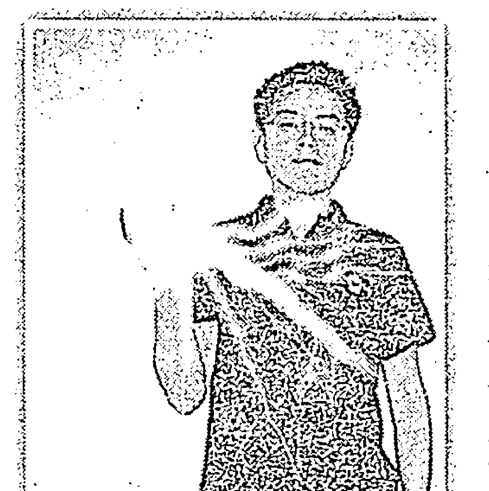

（文|叶勇）

# 龙年做个龙纹玉佩

玉佩是古人佩戴的一种饰品，上面雕刻一些精美的图案，不仅能起到装饰作用，更能体现出一个人的个性和品位。龙年就让我们一起来做个龙纹玉佩吧。

## 制作玉佩的基本轮廓

- 1. 打开PS，新建宽度高度均为5厘米、分辨率300像素、颜色模式RGB、背景为白色的文件。
- 2. 设置前景色为深红色，按Alt+Delete键填充背景层为深红色。选择“滤镜→杂色→添加杂色”，弹出添加杂色对话框，设置数量为11，勾选高斯分布和单色。选择“滤镜→模糊→高斯模糊”，在弹出的高斯模糊对话框中，设置半径为0.5像素。选择“滤镜→渲染→光照效果”，作为背景。新建图层1，选择椭圆选框工具，在图像中建立一个正圆的选区，填充白色，保留选区。
- 3. 单击菜单栏的“选择→修改→收缩”命令，将选区缩小，然后在图层1中删除选区中的图像，取消选区（图1）。

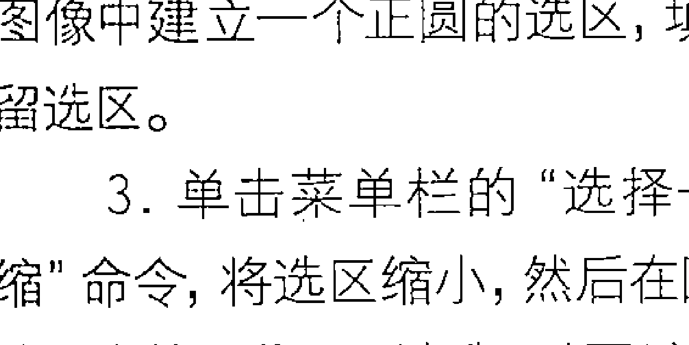


## 设置玉佩形态与颜色

- 4. 选择“滤镜→模糊→径向模糊”，设置数量为20，方法为旋转，这样品质最好。按Ctrl键将图像反相处理。按Ctrl+B键，弹出色彩平衡对话框，设置参数（图5），再次调整参数设置（图6）。
- 5. 新建图层2，载入图层1选区，填充白色，取消选区。对图层2使用3次高斯模糊滤镜，模糊半径分别为15、10、5像素，完成后再次载入图层1的选区并反选，在图层2中删除选区内的图像，并更改混合模式为滤色，不透明度为30%，然后取消选区。
- 6. 复制图层1，放到图层2的上方，更改混合模式为正片叠底，接着在图层1副本上执行“滤镜→艺术效果→调色刀”命令，在弹出的调色刀对话框中，设置描边大小为40，描边细节为3，软化为0。

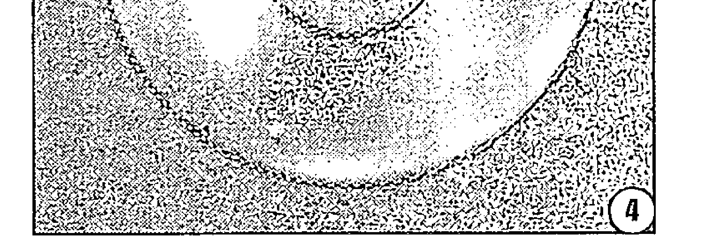

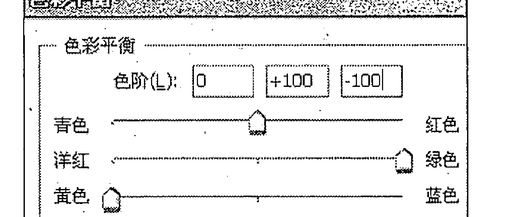

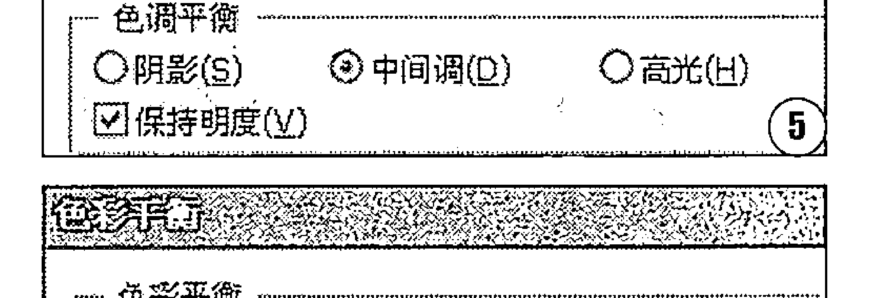

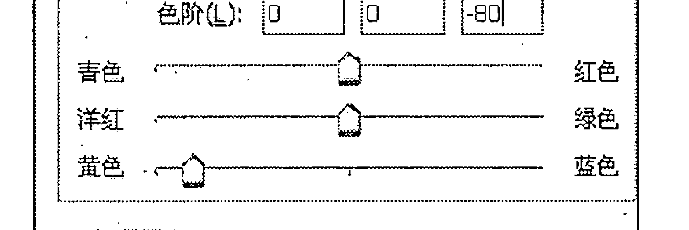

## 插入龙纹图片

- 7. 载入图层1的选区，选择“滤镜→模糊→动感模糊”，在动感模糊对话框中设置角度为90，距离为20，完成后按Ctrl+U键，设置饱和度为40。
- 8. 复制图层1副本并旋转90度，接着对图层1副本2执行径向模糊，设置数量为20，方法为旋转。
- 9. 新建图层3，载入图层1选区并填充白色，取消选区，更改填充值为0%。双击图层3，打开图层样式对话框，选择投影样式，设置不透明度为54，角度为120，距离为12，扩展为0，大小为35。选择内阴影样式，不透明度为45%，角度为-45，距离为5，阻塞为0，大小为16。选择内发光样式，设置颜色为R171、G255、B152，不透明度为68%，阻塞为19，大小为51。选择斜面和浮雕样式，设置深度为281，大小为16，角度为120，高度为30，高光模式的不透明度为100%，暗调模式的不透明度为0%。选择渐变叠加样式，设置混合模式为叠加，不透明度为100%，样式为线性，角度为90度。
- 10. 打开一幅龙纹素材图片，单击菜单“选择→色彩范围”命令，用吸管吸取黑色花纹部分，为花纹添加选区，将花纹复制粘贴到玉佩图像中。更改混合模式为正片叠底，填充值为0%。双击图层4，打开图层样式对话框，选择斜面和浮雕样式，设置样式为枕状浮雕，深度为1000%，大小为5，软化为1，角度为120，高度30，暗调模式的不透明度为10%，得到最终效果图（图7）。

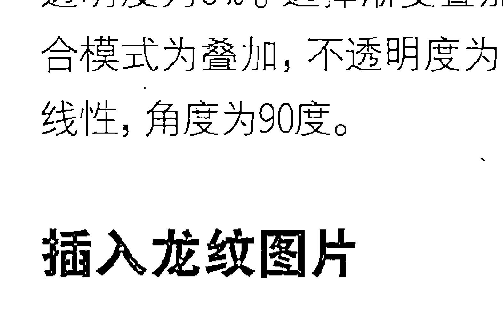

# 让节日视频变身专业小电影

春节期间，不论用数码相机、摄像机还是手机，想必大家都拍了不少的视频片段。如何把N多的视频小段合理地组合起来，成为主题鲜明并有专业范的“小电影”呢？

## 前期摄像的技巧

一部电影是由一个个镜头组成的，那么什么是一个镜头呢？这里的一个镜头是指从按下录像按钮开始拍摄直到停止拍摄为止。拍摄时最忌拖泥带水、左右摇摆、反复推拉，这些都是初拍者的通病。切记：除了要拿稳摄像机外，能用一个镜头拍完的就不要用两个镜头！

节日拍摄要注意两点，一是景物和人物之间的过渡，比如要拍摄春节时公园中的热闹场面，可以先把镜头对准树上的花灯，然后逐渐把镜头向左下移动到人群上，其间可以采用远近推拉手法，以使得情景交融、主题突出。

另外要注意互动场景的拍摄，拍摄现场中有人在放风筝或拍照等都属于互动场景。可以先拍个拍照的画面，然后把镜头转到被拍摄者，后期中还可通过画面固定以及音效进一步完善。

## 后期视频编辑

现在视频后期的编辑软件有多种，最常用到的是“会声会影”和Premiere，会声会影属于傻瓜级的视频编辑软件，Premiere相对专业些，功能也多。下面就详细介绍通过Premiere Pro编辑视频的技巧。

### 创建新项目

打开Premiere Pro，创建新项目，视频存放的路径最好选择容量大的分区，因为视频编辑时除了本身视频容量外，还得考虑输出时的容量和临时的视频交换文件，比如要编辑1GB的视频，那么最好选择超过5GB的空间。

### 取舍剪切

由于前期拍摄很难做到比较理想，比如停止拍摄时却忘了关掉摄录按钮，接下来就都拍摄路面了。相信不少人都有这个经历，这些不要的画面都要进行剪切。可选用工具栏中的剃刀工具对导入的视频进行初步的取舍，然后再进行进一步剪切。

### 转场效果

我们拍摄时经常是东拍一段西拍一段的，这时就应该把前后相关的场景合理地归类到一起，并做好上下两节视频的转场过渡效果，这样画面之间的过渡就比较自然了。图1中对上节的红旗镜头和下节的龙灯镜头执行了淡入淡出的过渡转场处理。

打开项目中的视频转场窗口，选择“溶解”中的“淡入淡出”转场，按住鼠标左键，同时拖到两小节视频之间就可以了。

### 特效技巧的运用

下面介绍笔者在编辑中用到的两个视频效果，运用得当的话会增加不少的乐趣。

### 慢动作和快动作的应用

影视中我们经常看到慢动作和快动作的镜头，快动作通常用于表现繁忙的场景或是一些夸张搞笑的动作。慢动作有加强突出某个动作的效果，比如视频中的小姑娘拉着风筝奔跑，可以做成慢动作的奔跑效果。

选择工具栏中的“剃刀工具”，在需要放慢速度的区域前后剪断。把后面部分的视频往后拉，以便腾出些空间，可以用工具栏中的“轨道选择工具”来整体移动。然后切换到选择工具，移动鼠标到选中视频小段的边缘，这时会出现红色的中括号，按下鼠标左键，向右拉伸到所需的位置即可，拉得越长速度就变得越慢。也可以右击选中的视频，在下拉栏中选择“速度/持续时间”，调整速度的快慢（图2）。

### 模仿拍照的效果

在画面中应用拍照的动作，可以增加趣味。用剪刀工具把这段镜头的头尾剪断，接下来做张拍照后的静止图片。打开“菜单→输出→帧”，输出静止图片，默认自动加入项目的面板中，把这张图片拉到时间线原来的位置上，不过要放在视频2中，如图3中的“000.bmp”。

## 添加文字

除了用转场的效果外，还可以在各个场景前打上文字，比如体育场、某某车站等，这样既解决了上下视频之间的转场，也可让观众明白其中的内容。

- 1. 以添加标题文字为例，打开“菜单→文件→新建→字幕”，在字幕设计面板中输入“新春乐”，在右边“对象风格”选项里可以选择字体、大小、颜色等，然后保存该字幕。
- 2. 把刚做好的“新春乐”文字拖到时间线视频2上，放在最前面。如图4所示，现在可以看到文字效果了，再增加些动态效果，这里做个常见的扫光文字效果。
打开特效面板，把FinalEffects里的FELightSweep扫光效果添加到文字视频层上，然后打开特效控制面板，对发光的角度、色彩、亮度、宽度等进行设置，然后点击FE Light Sweep运动特效，这样画面上就出现了带×的操纵杆。
把红色播放线拖到最左端，依次点击各小项前面的固定动画的按钮，会出现相应的关键帧。然后把红色的播放线向右移动一点距离，这里是20秒处，把扫光带拖到文字的右边，这样播放起来就是从文字的左边到右边扫光一次。
- 3. 扫光效果做好了，再增加文字进入和出去的特效就更出彩了。这只需利用视频转场滤镜中的特效即可，比如这里文字开始进入用窗帘特效，退出时用筋斗翻出特效。

## 配音

### 添加音效

现在给上面做的模仿拍照效果加上快门声，把该音效拖到时间线的音频轨道中，并放在000.bmp下合适的位置，这样画面中随着咔嚓一声，一张照片效果就出来了。

调整音频可用钢笔工具，按住Ctrl键并在需要调音之处点击左键，该处出现关键帧，然后就可以通过上下拖拉改变音量大小了，这里把前面的一节音效调成渐变效果了（图5）。

### 调音台

单击“菜单→窗口→调音台”，打开调音台面板，里面有各个音频以及主混合音频，可以分别调整各个音轨的音量大小，还可以打开录制轨道，利用麦克风直接录制配音。最后单击“菜单→文件→输出→影片”输出视频，AVI格式的视频效果最好，然后可以用视频转换软件转成所需的视频格式。

（文|愚者）

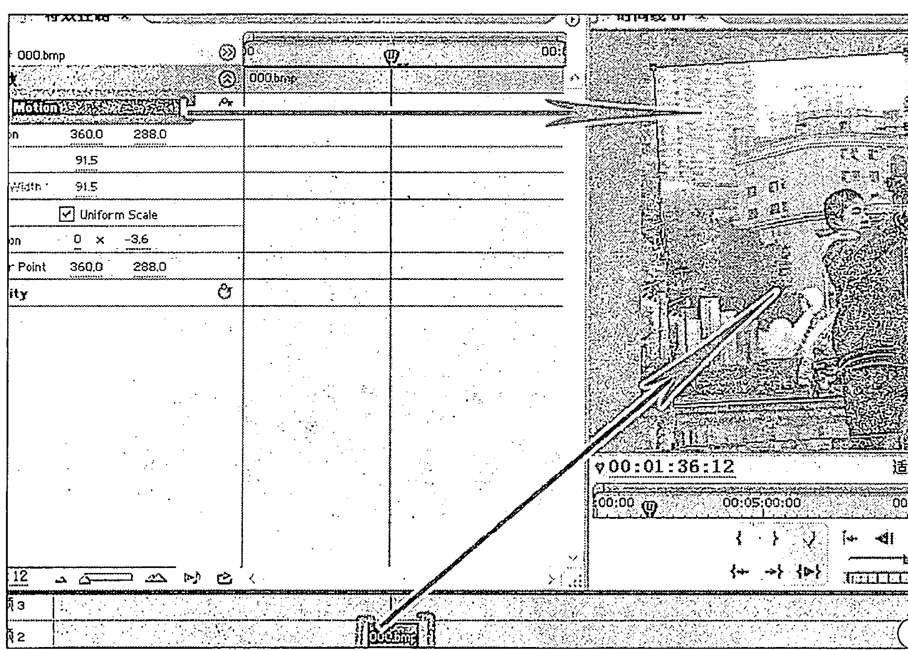

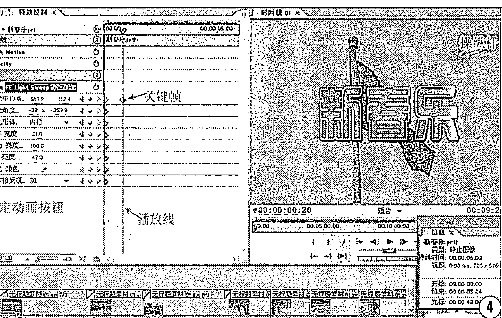

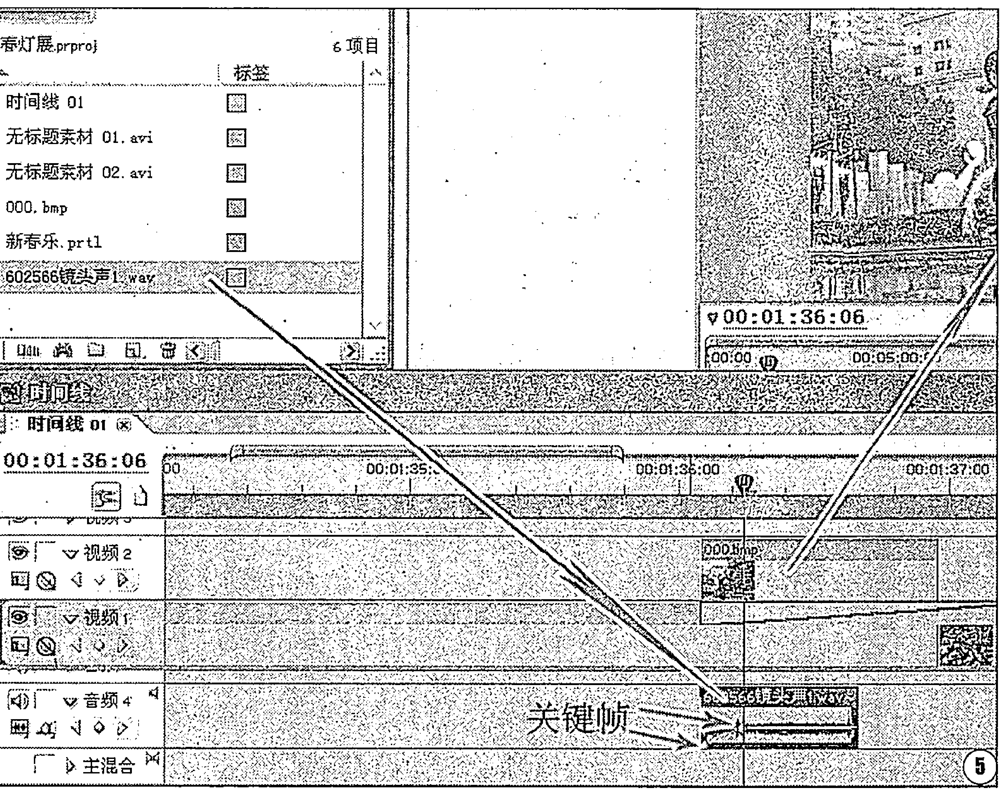

# 自制《变形金刚3》个性海报

《变形金刚》电影相信大家都看过，那震撼人心的场面一定还记忆犹新吧！本期就来用Photoshop制作一张个性的变3海报。

## 收集素材

由于我们要做的是合成的图片，所以收集所需的素材是首要工作，比如城市照片、变形金刚以及烟雾、火焰、飞行器等。要注意的是城市背景和变形金刚的拍摄角度要一样，本文采用仰拍的图片素材，可访问http://bbs.cfan.com.cn/thread-1471470-1-1.html下载。

## 处理背景

- 1. 打开素材2，这是一张城市的图片，现在要渲染出战火的效果。新建一图层，执行“滤镜→渲染→云彩”，图层混合模式为“正片叠底”，可按下快捷键Ctrl+F，变化几次云彩滤镜的效果。
- 2. 拖入所需的素材，分别放置到合适的位置，除了左上角的飞机的图层混合模式用“叠加”外，其它的都用“强光”，分别加蒙版修整完善。
- 3. 把建筑物左边的顶端做个选区，变形错开，然后用图章工具修整一下，做出倒塌的效果，这是常用的方法。

## 合成金刚、添加文字

- 1. 把金刚素材拖进来，放在合适的位置，加个图层样式外发光效果，叠加一层火焰素材渲染一下，最后再添加一些闪电的笔刷做出大楼的裂痕。
- 2. 添加文字，文字采用素材或自己制作都可以。在画面的下部做个选区，拉个从黑到透明色的渐变，然后拖入文字素材，图层混合模式为“滤色”。

### 抠出金刚

合成离不开抠图，抠图方法很多，本文采用通道抠图法将白底的金刚抠出。首先复制绿色通道并反相，用白色画笔把金刚身上都涂白，然后点击通道面板下面的“将通道载入选区”图标。返回图层面板，按下快捷键Ctrl+J复制选区内容，接着在其下层新建一图层，填充其它颜色，就可以看到抠图后的效果了，不理想之处可加蒙版修整。

- 3. 合并所有图层，复制该图层，图层混合模式为叠加，不透明度为30%，增加画面的质感。再合并图层，复制一层，执行“滤镜→渲染→光照”效果，实现给画面聚光的效果，突出主体。至此这张变3海报就全部制作完毕了，得到最终效果。

> （文|凡鱼）

# 普通剪纸打造创意动画

习惯了电子显示屏和鼠标操作吗？这次来点不同的——我们用纸来显示。使用普通的剪纸素材，再配合一定的手势，打造一个创意十足的动画视频！手指轻点你信手涂鸦的图标，一个剪纸组成的浪漫场景旋即展开。再用手指拖动另一张图标，轻轻点击，一段真实的视频又将你拉回现实世界。这就是本次带给大家的“纸想告诉你”创意视频！使用普通的剪纸素材，加上常用的手势以及现实世界的视频，将动画和视频完美地融合。

顾名思义，“纸”要充当主角的。准备若干张普通的A4打印纸，先用铅笔打稿或直接打印，再用剪刀剪出所需的文字、图形等。然后找个色彩反差大的背景进行拍摄，如木板、纸皮、布面（图1）。

要做动画效果首先要把主体与背景分离，各个要动的部分也要分开，比如素材中的双手、鸽子、教堂等都要分别置于不同的图层。根据以上所拍的素材，我们在PS中用简单的色彩范围和蒙版这两种抠图方法就可以了。要注意的是抠图后要保存为psd格式，为下一步导入到视频软件Premiere做好准备。蒙版抠图就是给抠出的图层加蒙版，然后用黑色的画笔把背景去掉。色彩范围抠图的方法为打开“菜单→选择→色彩范围”，用吸管在白色的纸张部分点击一下，选取白色的选区，按快捷键Ctrl+J复制选区内容，就抠出来了。然后加上阴影图层样式，更换新的背景后可以看到抠图后的效果，保存为psd格式的文件。

把处理好的素材全部导入Premiere，注意导入psd透明图层源文件时要选择具体的图层（Choose Layer），图中抠图层放在“图层1”，所以要选择图层1，有多个图层时要一一导入。

- 1. 手从叠合到张开的效果 导入一张背景图放在时间线视频1轨上，拖入“双手”素材，分别放在视频3和视频4轨上。打开特效控制面板，点击Motion，分别给左右手确定两个关键帧（如图2中菱形图标）。然后拖拉左右手分别放在合适的位置，这样就有了手从叠合到张开的动态效果。
- 2. 手推开时出现文字 拖入处理好的“纸想告诉你”的文字素材，放在视频2轨上。移动红色播放线到双手即将张开的那一帧上，然后把文字素材对齐。打开“特效面板→视频转场”，给文字视频轨左边开始端添加“3D过渡”中的“内关门”转场，右边结束端添加“擦除”转场。
- 3. 手指点击桌面文件夹的动画效果 拖入桌面文件夹排列的剪纸素材，左边开始端添加“3D过渡”中的“翻转”转场效果，与上一个文字消失的镜头有个过渡效果。拖入右手素材放在视频3轨上，打开特效控制面板，点击Motion，拉动右手素材到要点击的文件夹图标上，这样就有了点击的动画效果（图3）。
- 4. 纸婚照的动画效果 拖入一张蓝色背景的素材，放置在视频2轨上，对上一个镜头的两个视频轨的素材进行渐隐处理。点击视频轨，选择“显示关键帧”，用钢笔工具在“双手”素材上拉出透明效果，实现手推开照片消失的效果（图4）。

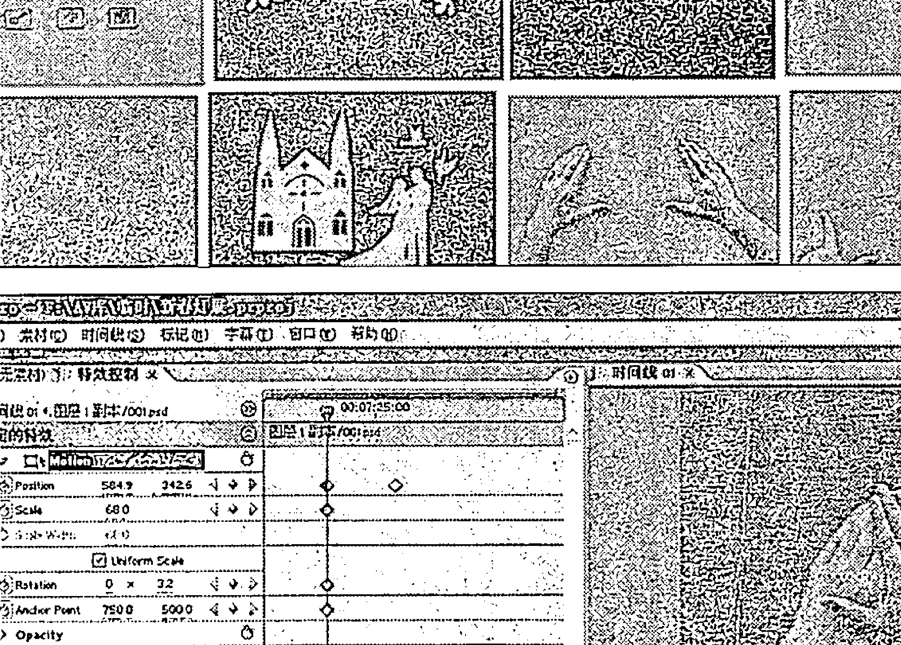

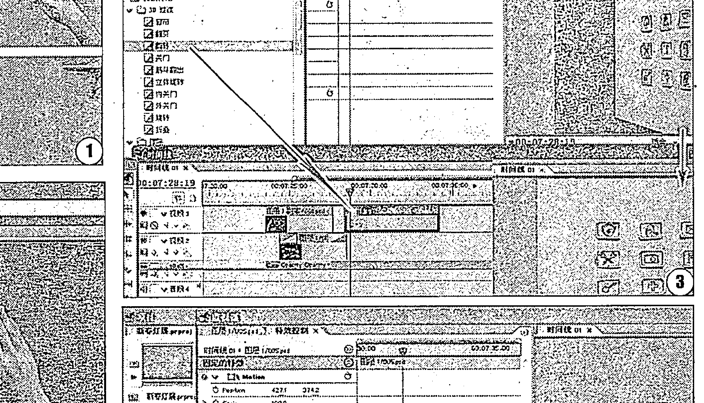

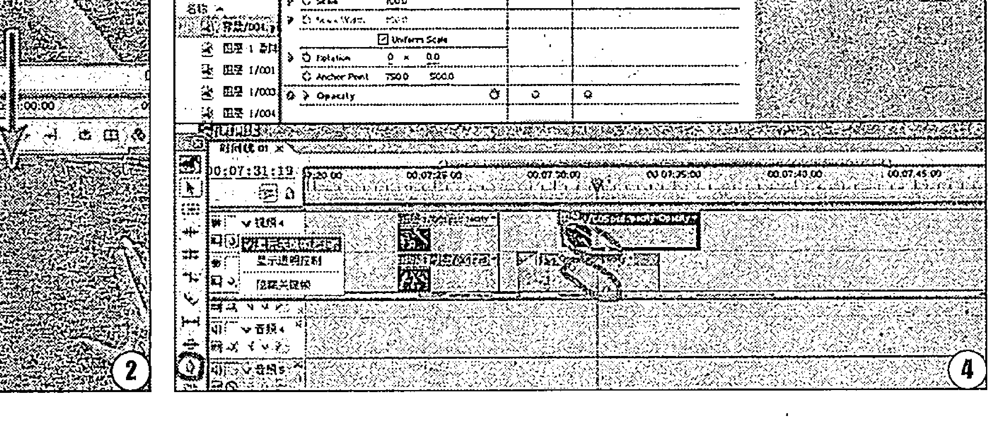

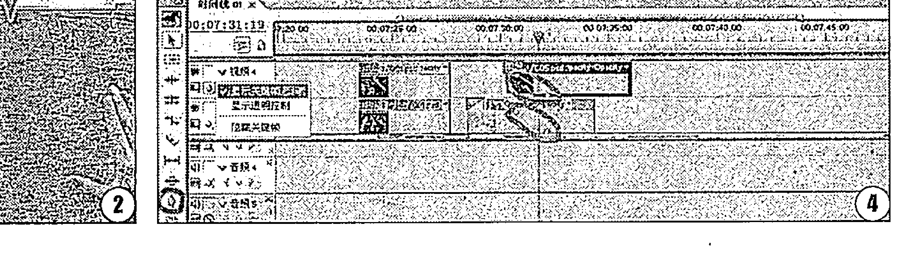工具做两个关键帧，后面一个关键帧往下拉，这样就形成了斜线视频渐隐的效果(图4)。

把剪纸的教堂、新郎新娘还有两只鸽子，分别放置在视频3轨~6轨上，给教堂添加“3D过渡中”的“翻转”转场效果，给人物和鸽子分别添加“滑行”中“推”的转场效果。

点击“菜单→文件→输出→帧”，保存婚照画面，取名“婚照”。然后在PS中添加照片的白色外框效果，拖到视频3轨上，点击Motion特效，把婚照画面做成从大到小且转个小角度的动画效果。拖入手势素材放置到视频4轨上，也是利用Motion特效，操作方法同上，做成拍照的动画效果(图5)。

## 5. 静态照片过渡到动态效果

导入一小段视频素材，拖到视频3轨，按照前面介绍的输出帧的做法，保存一张该视频第一帧的画面静态图片，取名“花灯照片”，拖入到视频2轨。再拖入一张右手素材，通过调整特效控制面板中的Motion，操作同上，就不再重复了。

这里说一下思路，首先让静态图片缩小，并处于右下角，然后运到画面的中间，同时右手手指也要跟着运动，体现用手推着图片运动的效果。然后让相同画面的视频素材也移动到图片的上面，大小相同覆盖该静态图片，加个渐隐过渡，接着逐渐把画面放大直到满屏(图6)。

## 6. 纸文字动画效果

分层导入剪纸文字素材(the end)，每个字母分别放一个视频轨，利用翻转、推、立体旋转等视频转场效果以及视频特效控制面板中的Motion，做出字母插入画面的各种效果。再添加背景音乐以及过程中特殊的音效，最后导出AVI格式，可根据需要转换成其它的格式(图7)。

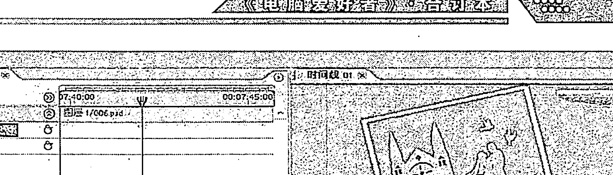

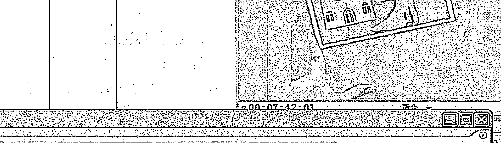

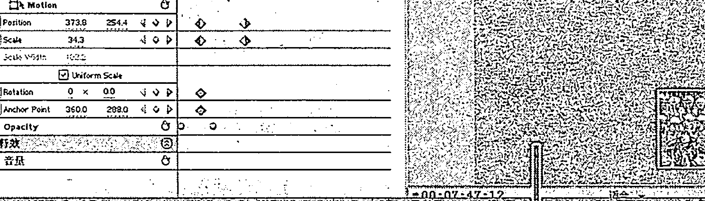

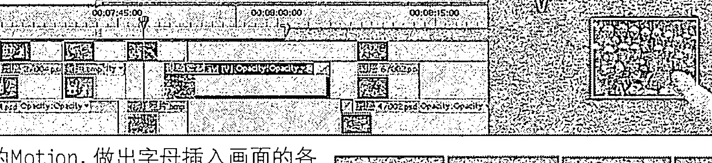

(文/凡鱼)

# 鼠标涂鸦仿毛笔字效果

春节期间，很多人自己写对联。咱没有笔墨纸砚，不过借助PS一样可以挥笔泼墨抒高怀!

- 1. 选择PS工具栏中的画笔工具，点击画笔设置右边的黑三角，在展开栏中把书法画笔到自然画笔全部载入，载入时会出现一个对话框，一定要选择“追加”，切记！！！否则原有的那些笔刷都会被替换掉。

- 2. 打开画笔预设面板，点击打开“画笔笔尖形状”选项，选择“平头湿水彩笔”笔头，设置相应参数。然后点击打开“形状动态”选项，如图所示设置参数。最后勾选“平滑”，并点击打开“双重画笔”选项，选择“水彩1”笔头，模式选择“颜色加深”，其它设置如图所示。

经过上述的画笔设置后，大家就可以用鼠标直接涂鸦了。如果有数码笔的话那效果就更好了，只是要把画笔设置中的“形状动态”里面的控制“渐隐”改成“钢笔压力”。

(文/凡鱼)

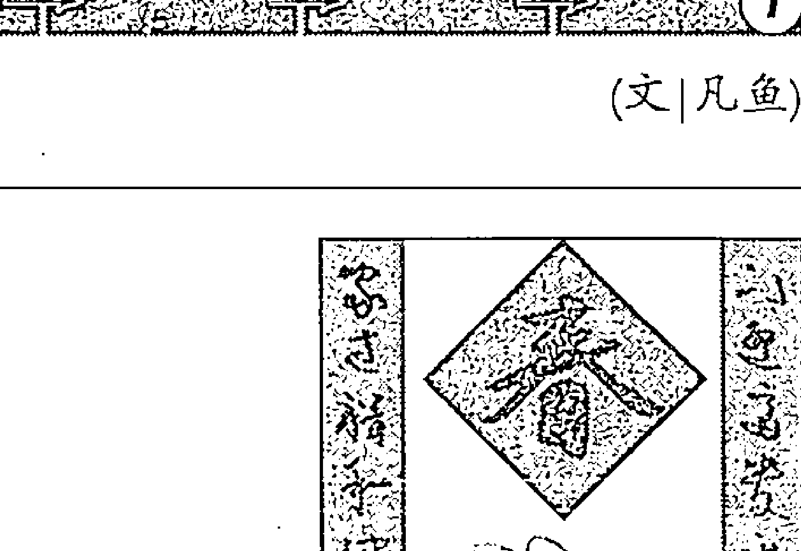

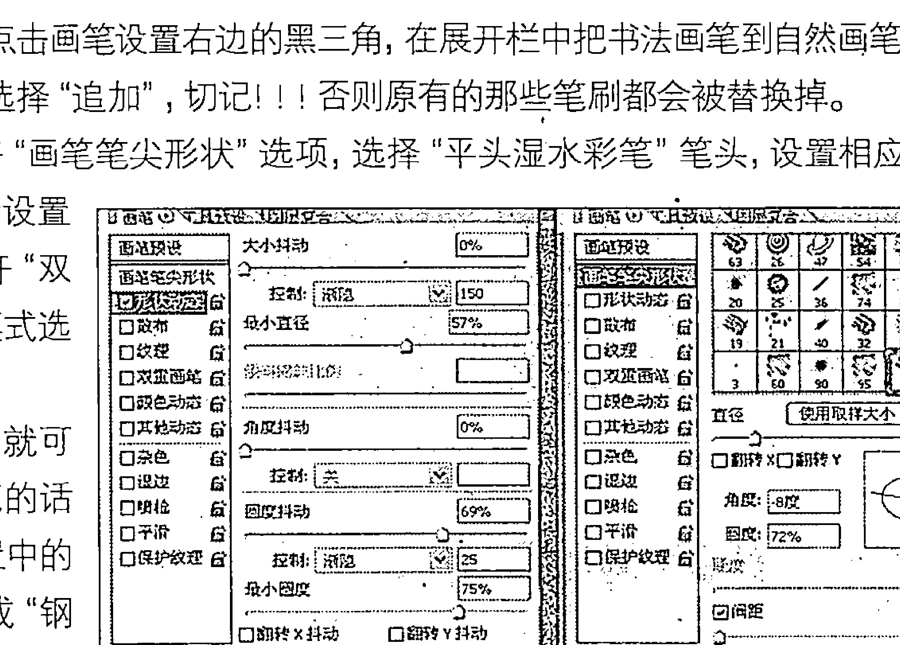

# 你也能留住舞台上的精彩

最近看了大大小小的不少演出，从演唱会、音乐会到歌舞剧，在欣赏精彩的表演之余，当然也想将它们记录下来。下面与大家分享一下拍摄心得。

## 准备工作

### 1. 观察光源

无论我们是拍摄演唱会、音乐会、芭蕾舞剧还是歌舞剧，拍摄前最好能有一定了解。通常入场后会有一小段等待时间，可以借机观察一下现场的灯光、演出者的位置，了解演出的剧目、高潮等，这样容易抓住精彩的场面。

### 2. 选择适合拍摄的位置

很多人认为正中间是好的拍摄点，其实不然。坐得尽量靠近舞台没错，因为光的亮度会随着距离衰减，近距离拍摄影像质量好，也容易捕捉到表演者的面部表情、衣着、首饰和各种细节。

但是请记住，一定不要坐在正中间！从正面拍摄很容易被舞台上的一些障碍物，如麦克风支架等所影响，还容易造成仰角。最好坐在中间偏侧的位置，笔者的经验是第3~10排、和舞台中心成120度夹角的区域内。

### 3. 设置相机参数

虽说舞台拍摄是专业相机的强项，但对于普通相机道理是相通的，如果能合理设置，也能取得不错的效果。比如，尽量使用高ISO，单反可设至ISO 400~1600，过高的ISO容易在照片上产生明显的噪点，普通相机设至ISO 400即可。

单反相机尽可能选择最大光圈在F/2.8以上的镜头和高速快门，普通相机可选择连拍模式。

测光模式选择中央重点测光。至于白平衡，使用全自动模式就可以了。

## 拍摄要点

### 1. 不使用三脚架和闪光灯

我们知道，很多演出现场是禁止使用闪光灯的，而且闪光灯的使用会破坏现场的氛围，使照片看上去发“死”，还会影响到表演者和周围的观众，所以不要使用闪光灯。当然，在演出结束、演员谢幕时，可以使用闪光灯。

至于三脚架，由于一般演出现场都不会太宽敞，不允许放置三脚架，也容易影响其他观众。因此可以考虑使用占用空间较小的单脚架。实际上，如果现场照明条件好，即使没有三脚架或独脚架，也很容易拍到清晰的照片。

### 2. 捕捉动人的瞬间

舞台拍照不同于摄像，要通过凝固的瞬间来表现流动的舞蹈或音乐，这就需要融入自身对表演的理解。无论音乐还是舞蹈，都有创作者所想表达的东西，这些东西会通过舞台上的一举一动显示出来。试着选择这些并捕捉下来，比如挥舞的手臂、跃动的眼神、飘扬的头发、拨弄吉他时梦呓的表情等，重点表现现场的气氛和人物情感。这些动人的瞬间和氛围也只有在现场才能完整地体会和记录下来。

### 3. 别忘了周围的观众

除了拍摄舞台上的演出主体，别忘了他们背后的乐队、台下陶醉的观众和身旁的朋友，他们的表情和舞台表演是完整的一体。不妨试着换个角度拍下观众、朋友以及表演者和观众的互动，你会发现不同的乐趣。

> (文|继伟)

# 拍出萌动你心的宠物照

网络人气小猫“猫叔”和“俊介君”攫取了无数人的眼球，何不为家中可爱的宠物拍些萌动逗趣的照片，留下美好的纪念呢！

很多人家中都养了宠物，它们可爱聪明、淘气又卖萌，让人从疲惫的社会生活回归家庭港湾时备感开心和快乐。这次小猴子以爱宠米米君作为模特，奉献一些实用宠物拍摄小技巧。

只要有心，你家的宝贝也不输给网络红猫“猫叔”和“俊介君”呢！

## 寻找自家宝贝的特质

参考网络“潮猫”的特质——猫叔那永不睁开的眼睛和千斤顶大头功，俊介君那圆溜溜的眼睛和笑脸，maru逢箱子必钻的特点……都让它们在千万萌宠大军中脱颖而出！我家米米君的特点就是圆滚滚的蓝色大眼睛和胖乎乎的花色身子啦，所以拍摄的时候就要重点突出这两点！

## 寻找最佳角度

宠物和人一样，是需要有拍摄角度的，有些角度拍出来是天使，有些角度却是魔鬼……总体来说，因为宠物个子娇小，拍摄时一般采用低机位，平视或者仰视。比如猫咪，仰角能显得脸圆圆，眼睛有神，更可爱。而狗狗一般采用平视机位，鼻子会显得更加有趣。

## 寻找拍摄最佳时机

宠物都是好动不受控制的，所以耐心很重要，因为我们可没法要求宠物看镜头，唯一可以做的就是等待。一是在其玩乐的过程中进行抓拍，优点是动感、有趣，缺点是极难对焦、容易模糊不清。二是利用它们最喜欢的玩具、零食、特殊的声音等进行吸引，让宝贝乖乖坐好或者保持姿势，然后顺利拍下照片，优点是易拍摄，缺点是稍稍缺乏生性。建议大家采取第二种方法为主、第一种为辅的方式进行拍摄。

## 制造有趣场景

当我们了解了基本的技巧以后，就可利用现有条件来制造一些有趣、搞笑、夸张的画面，拍出生动有趣夺人眼球的照片！比如狗狗接球的囧态、猫咪打哈欠的大嘴以及主人和宠物的互动等，耐心等待，一定会捕捉到有趣的一瞬。

> (文|Iris小猴子)

# 用DC记录校运会精彩的瞬间

一年一度的校运会是学校的体育盛会，赛场上同学们生龙活虎、激情拼搏。而要在纷繁复杂、热闹非凡的赛场上捕捉到一幕幕精彩的瞬间，却也并非易事。

## 径赛拍摄

-   1.起跑
在拍摄运动员起跑的镜头时，可以在跑道外选择一个离起跑线5米外没有观众遮挡的地方，以“蹲姿”进行拍摄，左手紧握相机，肘关节以膝盖支撑，然后屏神静气，像运动员一样全神贯注地听发令员的口令：“各就各位—预备—跑！”当听到“预备”时就要半按快门，听到“跑”字就可以果断按下快门了。


-   2.途中
比赛过程中最好拍摄运动员们你追我赶的镜头，特别是800m（含800m）以上的项目，因为这些项目是可以抢道的。如果要达到主体清晰而背景模糊的运动效果，可以利用“追随法”来拍摄。

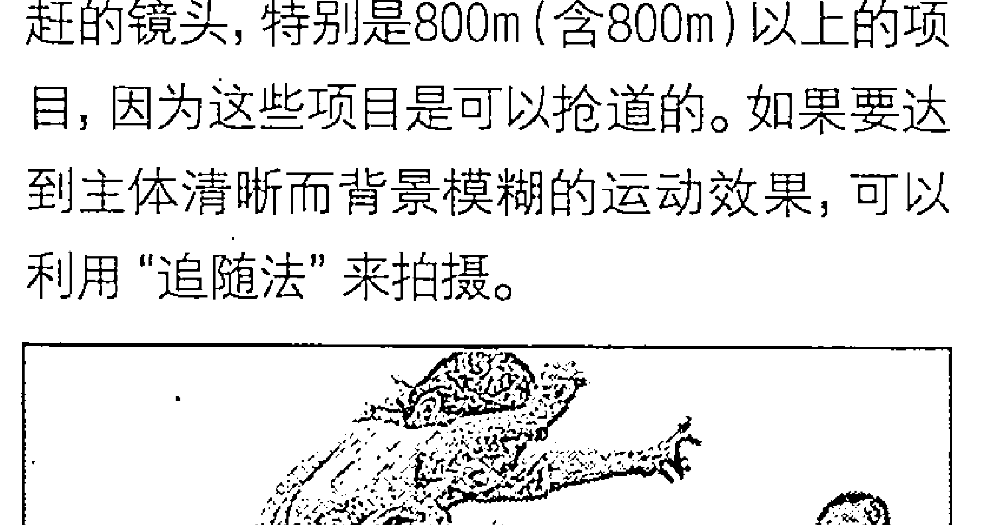

-   3.冲刺
拍摄“冲刺”时，以速度最快的运动员把终点线“绑”在腰间的镜头为最佳。同时更要注意老师和同学们关切地搀扶本班运动员的情景，这些照片往往更能感动人。

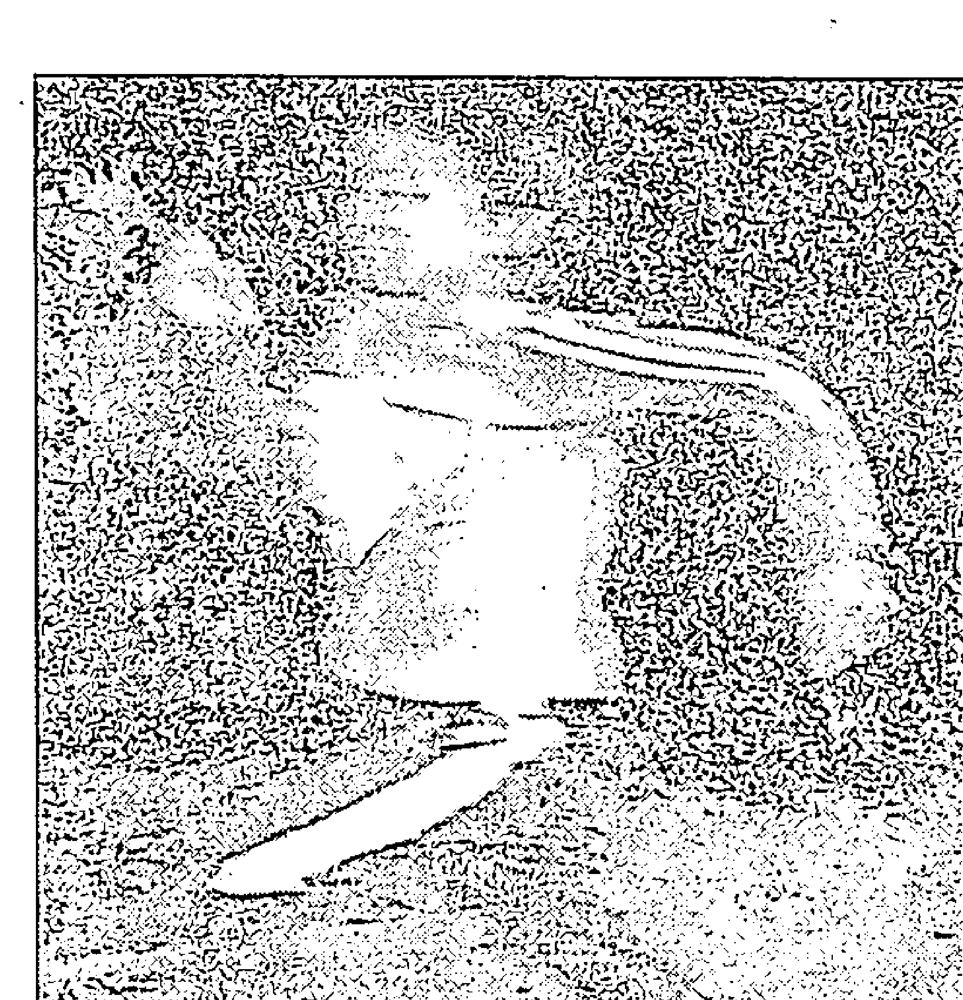

## 田赛拍摄

田赛主要有跳远、跳高和一些投掷类项目，下面主要讲讲跳远和跳高的拍摄。

-   1.跳远
在拍摄跳远比赛时，要抓住腾空和入坑的瞬间进行拍摄。当运动员助跑即将结束、起跳脚踏上跳板的一刹那就按动快门。腾空的动作较能表现跳远比赛的特点，尤其是在刚刚腾起时，容易拍到姿态优美的照片。拍摄点可以选在正前或侧前，但一定...


-   2.跳高
跳高有很多种过杆方法，在通常情况下，拍摄者应站沙坑边上与运动员助跑方向相对的位置上，以“低姿”进行拍摄。当运动员的摆动腿已过杆，起跳腿刚好在横杆上方的刹那间按动快门，把运动员腾空飞越横杆的瞬间定格下来。这样拍摄的照片是以蓝天白云为背景的，能与运动服装形成较为鲜明的对比，突出了主题。快门速度1/60秒就可以了。

(文|胡华章)

# 巧用图层蒙版合成水果娃娃

可爱的娃娃脸若隐若现在新鲜的水果上，看着很可爱有木有？这样的“水果娃娃”效果通过Photoshop的“图像合成”功能就可以实现。

图像合成应用非常广泛，制作广告海报、插画、壁纸等平面设计作品都经常运用到图像合成的功能。实现图像合成一般的思路是使用“选区的创建工具”抠出所需要的图像并复制到另一幅图像上。这种方法有两个明显缺点：一是所抠取的图像大小不合适的话，对图像边缘进行修改不太方便；二是要实现不同程度的半透明效果非常烦琐，而用“图层蒙版”就可以有效克服这两点不足。

图层蒙版是覆盖在某一个特定图层或图层组上的蒙版，通过更改蒙版可以在不改变图层本身的前提下对图层应用各种特殊的效果。在蒙版层，黑色区域表示透明区，白色区域表示不透明区，灰色区域表示半透明区，不同深度的灰色显示的图像透明度不同。

- 1. 启动Photoshop cs3，单击菜单“文件→打开”，打开四幅素材图像（图1~图4）。

- 2. 选择工具箱中的“移动工具”，在选项栏上选中“自动选择→图层”。将三张小孩图像拖动到水果图像上，并放置在合适的位置。这时，在水果图像中会自动增加三个图层—图层1、图层2、图层3，水果图像则作为背景层。

- 3. 在图层调板中右击背景层，选择“复制图层”命令，生成一个新的图层“背景副本”，并将其移动到图层调板的最上方。选择“背景副本”图层，将其不透明度改为70%，其下面图层的图像就可以隐约看到了（图5）。

- 4. 选择“背景副本”图层，单击图层调板下方的“添加图层蒙版”按钮，在“背景副本”图层上添加了一个图层蒙版，并且此时自动选中了“图层蒙版缩览图”按钮。

- 5. 在工具箱中选择“画笔”工具，“画笔笔尖形状”选择“柔角65”，将前景色设为黑色，用画笔在左边和下边小孩的脸部进行涂抹，再将前景色改为灰色，用画笔在右边小孩的脸部进行涂抹，先涂抹一个大致的轮廓，将“背景副本”图层的不透明度改回100%。

- 6. 这时左边和下边小孩头像四周有一些多余的部分，不需要显示出来，继续使用“画笔”工具，将前景色设为白色，在左边小孩头像周围多余的部分进行涂抹。这样交替使用黑色、白色画笔，可以非常简便地对图像的隐藏和显示部分进行修改。选择“画笔”工具，“画笔笔尖形状”选择“柔角35”，将前景色设为黑色，在右边小孩的两只眼睛上分别涂抹，使眼睛部分完全显示出来，将前景色设为不同程度的灰色，在右边小孩的头像其他部分涂抹，呈现不同程度的半透明效果。最终效果如图6所示。（注意：在用画笔涂抹图像的过程中，必须始终选中“图层蒙版缩览图”按钮。）

因篇幅所限，这里只列出了主要的图片和步骤，更详细的内容可访问http://bbs.cfan.com.cn/thread-1483377-1-1.html浏览。

（文|于永平 贾风军）

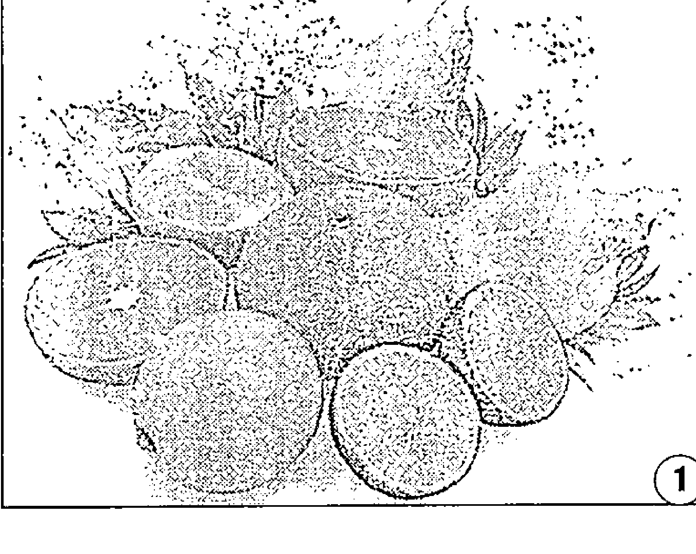


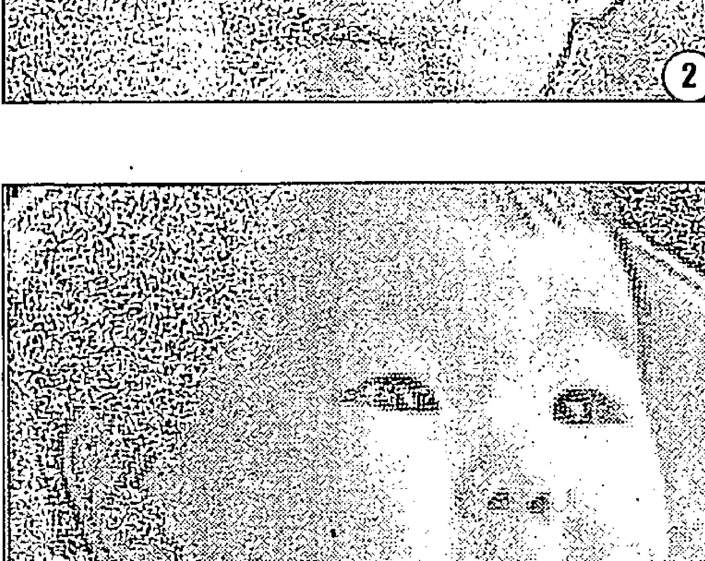

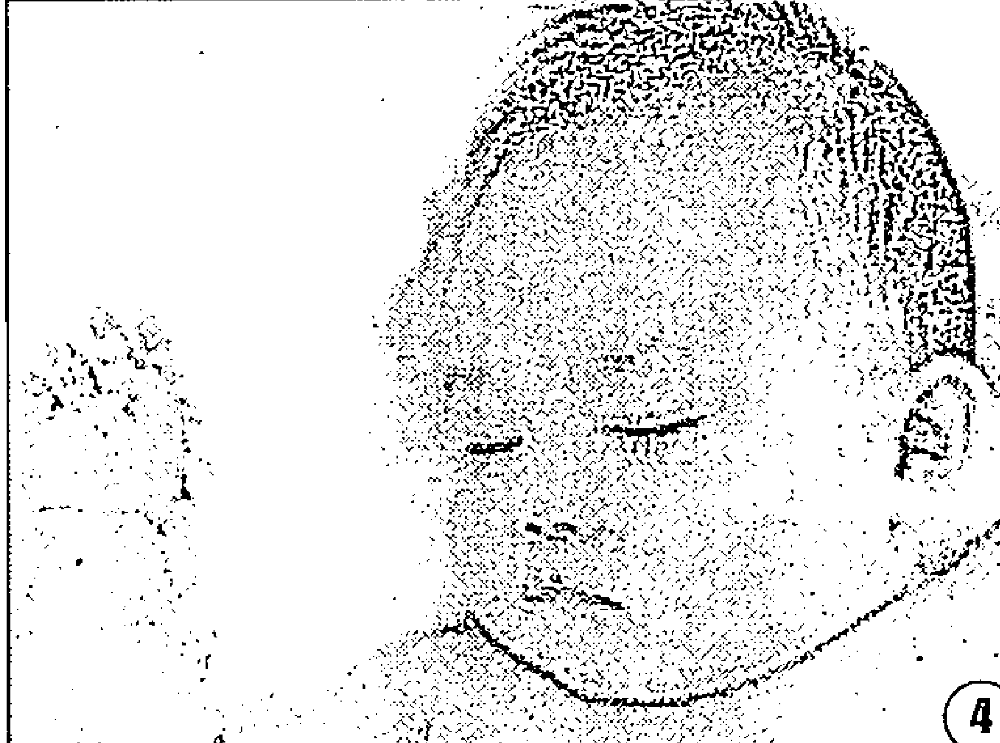

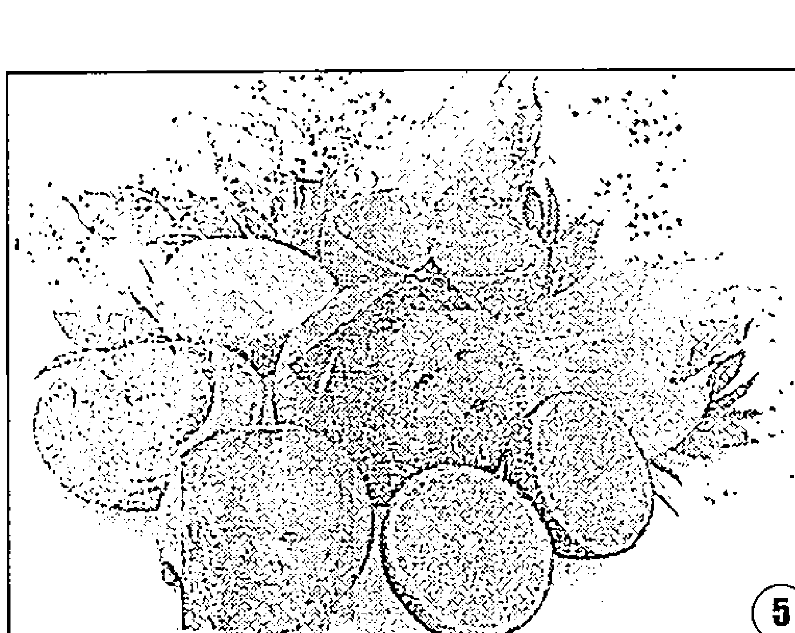


# 把出游视频拍成电影短片

出游时我们经常会拍摄很多的视频，但这些视频片段往往是散乱、平淡的。现在就从拍摄开始，把出游视频拍成电影短片！

相信大家都有这样的经历，日后观看出游时拍摄的视频时，自己都恨不能按快进键。原因嘛？就是太过散乱，缺乏主题、张力、戏剧感。

我们首先来解决散乱的问题。我们知道，一个电影短片通常有几个要素—人物、主题及情节结构。以一个国外的出游视频为例，短片的主题一定要鲜明，这里是全家去海边游玩。人物是短片形象的中心，这里我们以单一主人公宝宝为主角进行拍摄，那么短片中就尽量不要出现其他人物。

至于情节，正如写文章、讲故事一样，我们要运用“起承转合”式的结构。“起”是起因，是影片开头，“承”是事件的过程，“转”是转折，“合”是对该事件的议论，是结尾。

起承转合设置好，影片就会具有张力、戏剧性，也就很好地解决了影片平淡无奇的问题。下面以带宝宝出游为例，示范一个短片。

起承转合包含先转后承式、先承后转式、起承转合式、起转承转式几种形式。这里我们采用最简单的起承转合方式，因为是短片，使用一次起承转合即可。

- 1. 起：故事的开头设置为全家带宝宝出游。图1清楚地表达了起始点，大家要搭乘公交出游。在影片中用一个镜头即可表达清楚，同一个地点、景物不用从多角度进行拍摄和构图。

- 2. 承：到达了目的地。图2中以侧影进行拍摄，既表达了宝宝期盼的心情，也显示了目的地的名称，即Chinatown。如果目的地的景点中有明确的标识，大家可以摄入镜头，给观众一个清楚的交代。

- 3. 转：饱览Chinatown的各处美景，宝宝玩得很开心(图3)。拍摄在沙滩上玩耍的视频时要采用动态拍摄，也就是用镜头跟随宝宝移动。注意尽量不要移动脚步，以腰为圆心，上身转动，将需要拍摄的场景和人物一一扫入镜头。

中间还要设置一些转折、高潮，引起观众的兴趣，可以是一处美景(图4)、一顿大餐(图5)，也可以是一个街头表演(图6)等。总之，任何出游都会有让你意想不到、印象深刻的地方，或让你惊喜，或让你失望，把它们作为短片的“转”。

拍摄高潮部分时，可采用特写镜头，进行短暂定格，让观众看清细节。用DV拍摄时，把镜头“推”到较大的变焦位置，注意尽量保持器材的稳定，最好把DV放到三脚架上拍摄，以防止拍出的画面晃动。另外，特写镜头的时间不要太长，一般不超过几秒。

- 4. 合：游览结束，要返程了。宝宝还没玩过瘾，在窗边恋恋不舍。好的结局可以为短片创造意犹未尽的效果，比如一个伏笔、一个空镜头、一段独白，大家可发挥想象力，大胆尝试。

(文|乐桐霖)

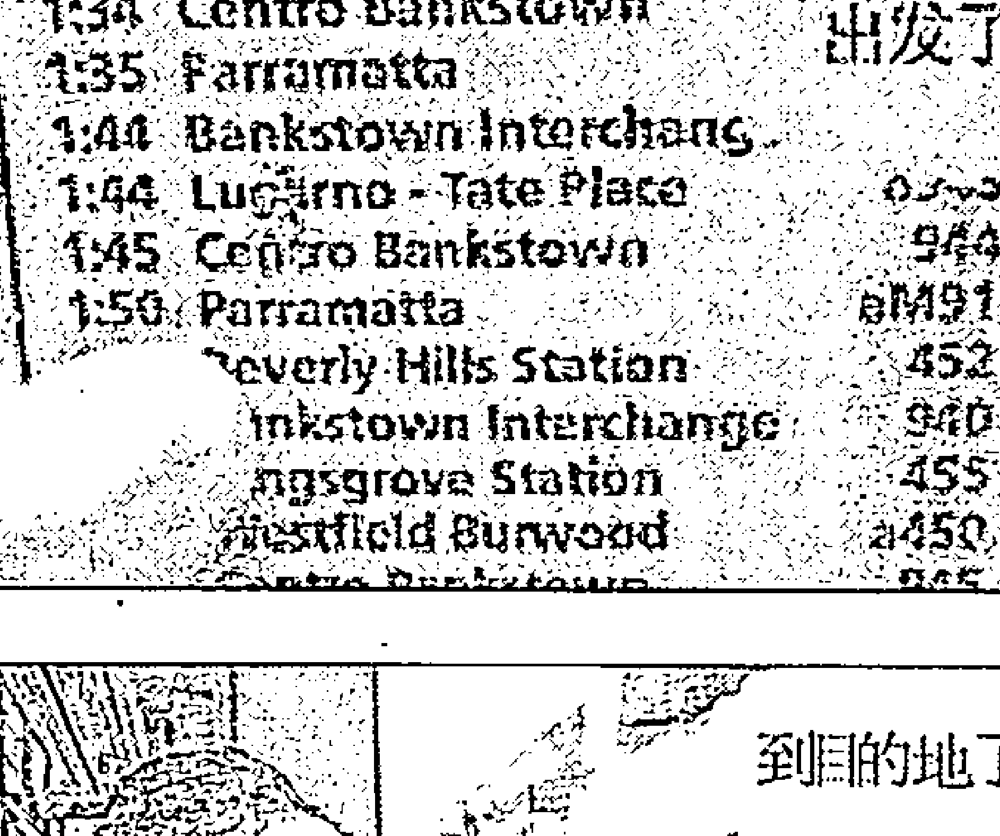


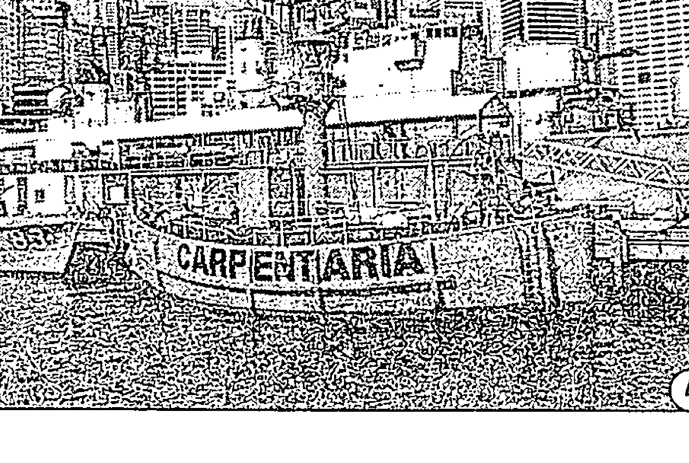


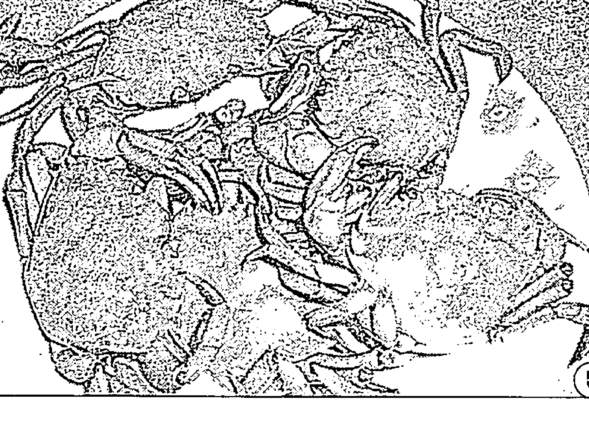

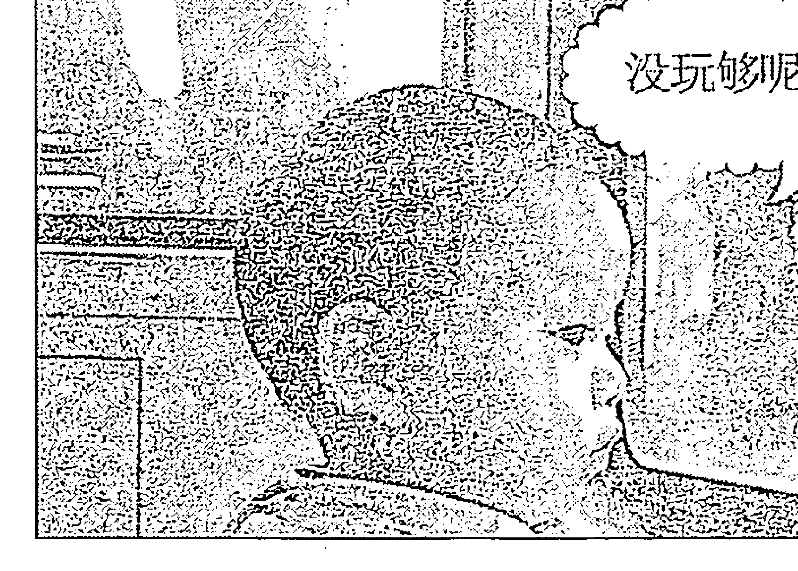

# 做一个印章效果的个性签名

如今大家都喜欢用个性签名，有没有想过制作一个印章效果的签名呢，就像书法家画大师那样，别有一番韵味!

## 选择喜欢的印章形式

印章文字一般都是从上到下、从右到左排列。按照字数来分共有单字、二字、三字、四字及多字五类(图1~图4)。

单字印主要是突出字形的特色，也可以加些装饰品，如动、植物等图案；二字印分右左、上下，可用于两个字的名字；三字印分右左右、右右左，用于复姓、三个字的名字或双字后面加个“印”字都可以；四字印可分右右左左、右左左右；一般把五个字以上的称为多字印，多字印以上下右左排序为主，在排序上可以灵活些。

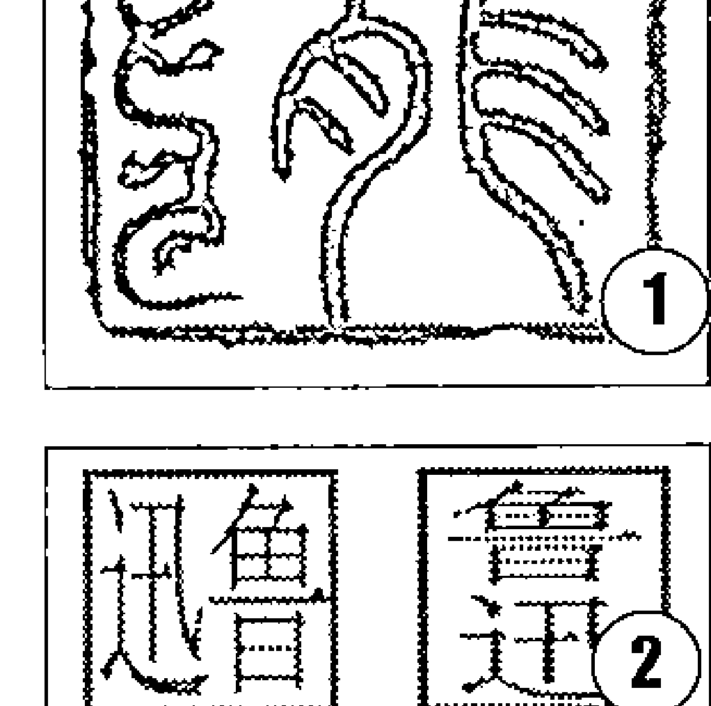


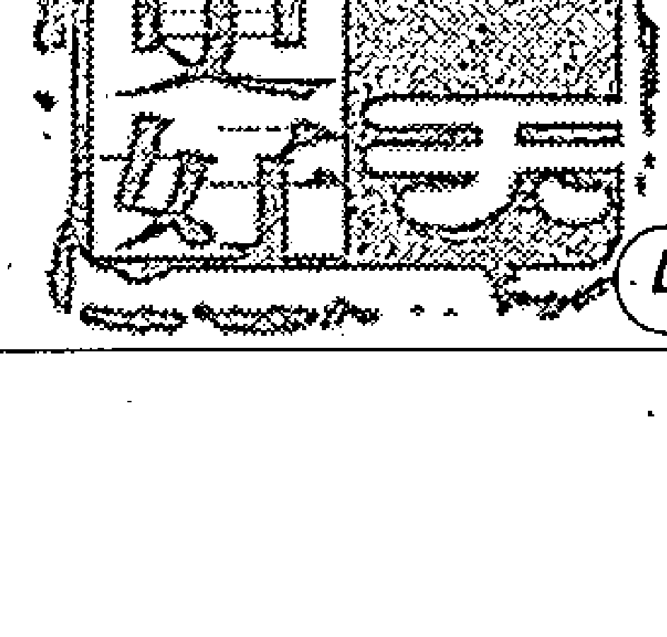

## 仿篆刻效果

在传统的中国画中，印章都是用篆刻的。古代书画家的印章概括起来有三种，第1种是姓名章，白文章刻姓名，朱文章刻别号；第2种是斋馆章，表示画家的住处；第3种叫做闲章，大都刻一句成语、格言或画家的主张，但这种印章一般与画的内容有所联系。篆刻大都弄成毛边残缺的效果，下面我们来仿制这种残缺的篆刻效果。

- 1. 新建一透明层，为图层1，在工具栏中选择“圆角矩形工具”绘制圆角矩形路径，将路径转化成选区，填充大红色(图5)。
- 2. 复制图层1，打开“菜单→滤镜→画笔描边→喷溅”，里面的数据自己可以适当地调整，以达到最佳的效果，此层命名为“喷溅”。
- 3. 复制喷溅层，打开“菜单→滤镜→素描→图章”，里面的数据自己可以适当地调整，以达到最佳的效果，此层命名为“图章”，图层混合模式为“变亮”(图6)。

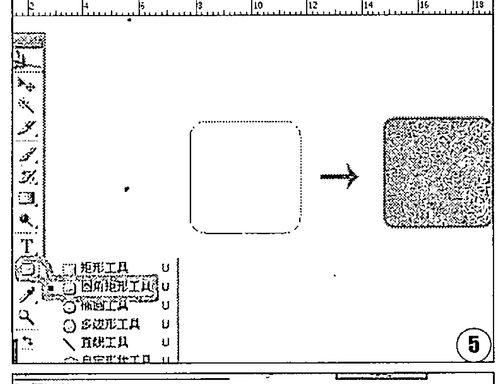

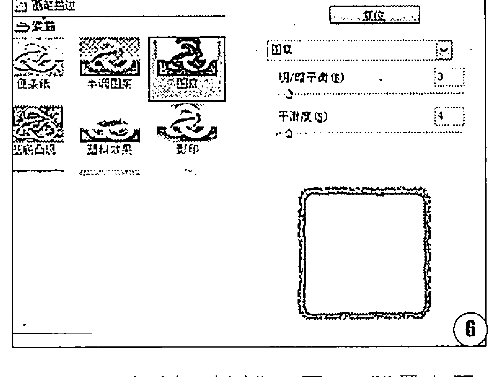

- 4. 再复制“喷溅”图层，置于最上层，按下Ctrl+T键适当地缩小，此层取名“底印”，然后做一次撕边处理(图7)。

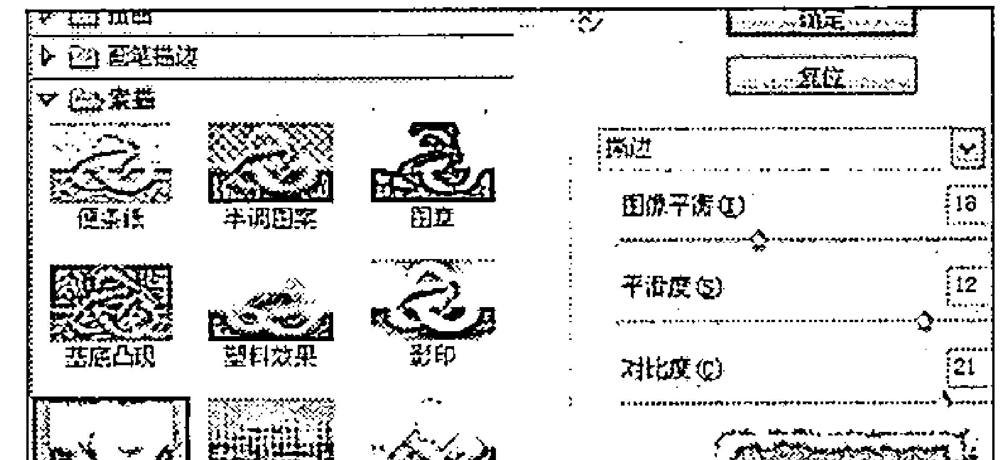

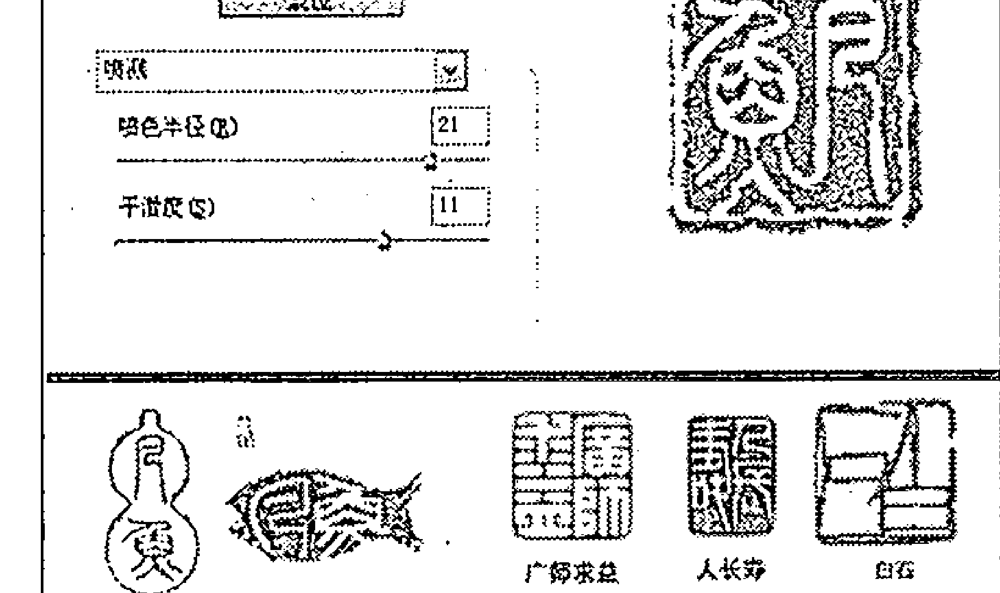

## 个性签名印章

个性签名印章是在传统的印章基础上加以创新变化，不用篆体文字，摆脱了传统印章的条条框框的限制，尽显个性魅力!

个性签名印章多采用形式多样的外框装饰效果，一般用钢笔路径图案描边或者用各种图案花边构成，这里以蝴蝶环绕的心形外框效果为例加以说明。选择工具栏中的“自定义形状工具”，选择心形图案，画出心形路径。再选择画笔工具，打开画笔预设面板，在画笔笔尖形状中选中蝴蝶图案(各类笔刷大家自己可以下载安装哈)，调整蝴蝶排列分布的合适间距。新建一透明图层，右击路径选择路径描边，选择画笔就可以了(图9)。

大家可以发挥自己的想象力做出各式各样幽默诙谐、个性鲜明的印章签名作品(图10)。

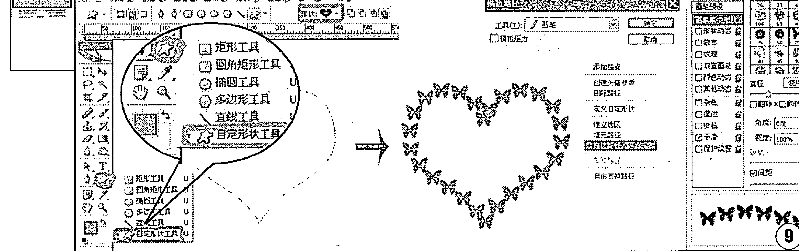

- 5. 底印做好了，现在要输入文字了，比如输入“凡鱼”，设置背景色为红色，前景色为白色。然后格式化改文字层，执行“菜单→滤镜→画笔描边→喷溅”，这样残缺的篆刻效果就制作完毕了。这就是所谓的白文章，朱文章制作的原理也一样，大家可以举一还三做出各自需要的印章(图8)。


> （文|凡鱼）

# 你也可以变身光剑战将

很多人都对《星球大战》中的光剑既好奇又羡慕，想不想让自己也成为手握光剑的战将呢？下面就让你美梦成真！

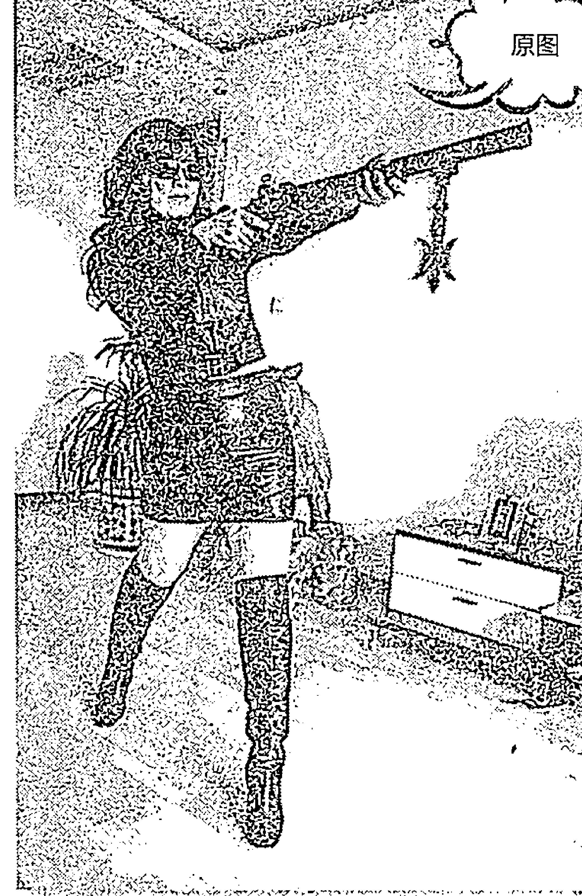

## 制作背景渐变效果

按所需尺寸新建文件，这里尺寸用650×900像素，新建一透明层，选择工具栏中的渐变工具，在属性栏中选择径向渐变图标，然后用鼠标从上到下拉一条渐变。

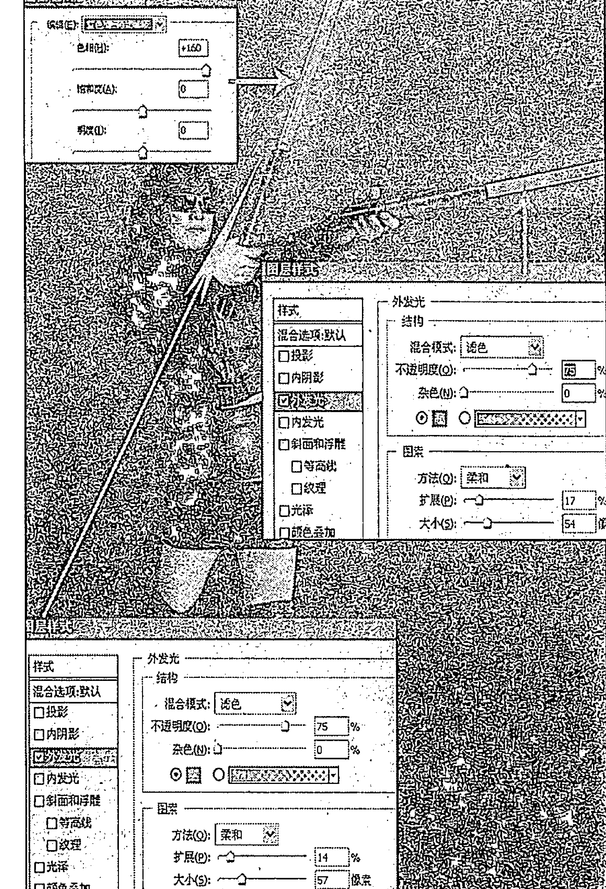

## 合成处理

1.  把上面抠好的人物和光剑都拖进来，首先调整好人物的尺寸和画面中的位置。然后继续调整光剑的大小和位置，复制一层光剑，这样人物左右两手就各握着一把光剑了。用图章修复工具和画笔，以及复制粘贴等方法把原图中的枪去掉，然后分别给两个光剑层加蒙版，把手指擦出来便于握着剑柄，用加深减淡工具或直接用画笔做出结合处的阴影，使之结合自然。
2.  这一步要让光剑发光以及把其中一把光剑变成红色。点击图层面板下面，给右剑添加色相饱和度调整层图标，选择蓝色，再拉动色相滑钮就可以得到所需的色彩了。复制一层，把剑柄用橡皮擦去掉，添加图层样式，选择外发光，并选择相应的发光色彩，具体数据参考图中所示，就可以得到发光的效果了。另一把剑也按照这样的方法添加外发光效果。

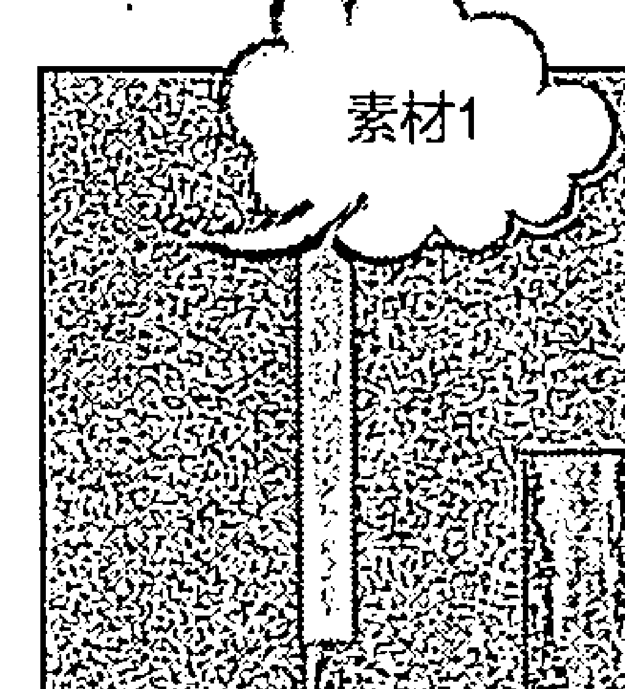


3.  新建一透明图层，执行菜单“滤镜→渲染→云彩”，图层混合模式设置为“叠加”，为画笔添加烟雾效果。如果烟雾的效果不理想的话，可以按下快捷键Ctrl+F更换烟雾效果。

### 抠图

1.  抠图是基本功，这里只说一下大体的思路方法，更多图片资料请访问http://bbs.cfan.com.cn/thread-1486744-1-1.html。打开原图，复制一层，在其下面新建一层填充白色，作为抠图后查看的新背景。人物的抠图主要是头发的抠出，这里用抽出滤镜，强制白色抠出头发。然后复制一层原图放在最上面，加蒙版用黑色画笔涂抹抠出身体的部分。
2.  把火焰素材拖进来，降低些不透明度，约为85%，添加蒙版修整，增加火焰效果。新建一透明层，选择黄色画笔，不透明度为10%左右，硬度为0，在腿部和脸部增加些环境黄光的影响。墨镜上可以做个光剑反光效果，再刷两条电流笔刷增强效果。至此全部处理完毕。

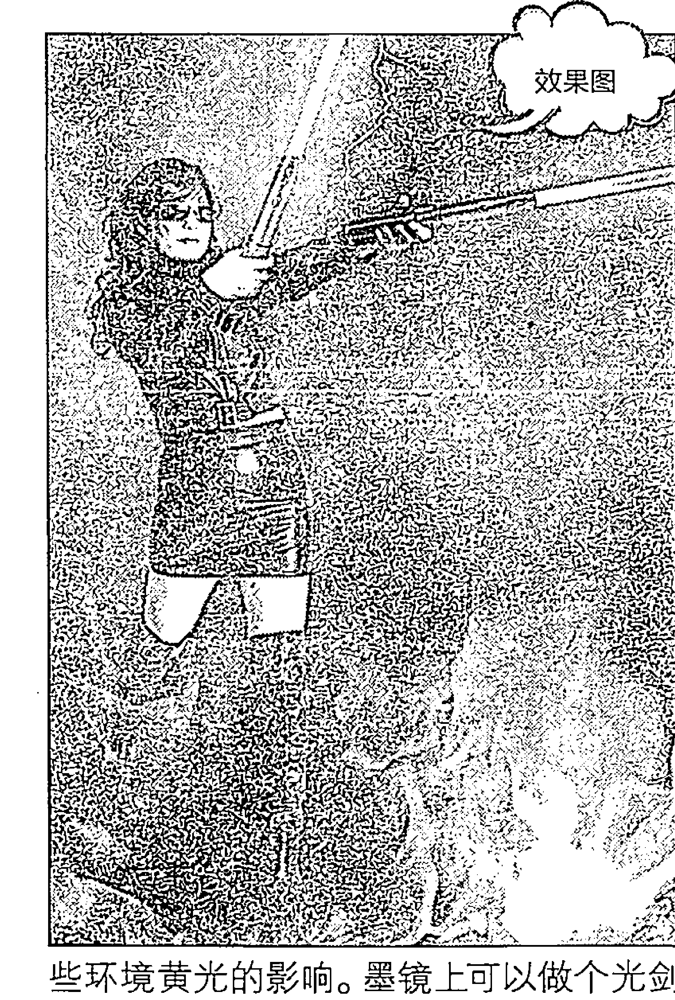

(文|凡鱼)

# 这样拍你会更高更瘦

每个人特别是MM都希望自己的身材更高、脸部更瘦、更有型。只要采用适当的拍摄技巧，你就可轻松拥有梦想的脸蛋和身材。

## 把人拍高

拍人物可多从低角度出发，我们都知道俯拍能把人变矮，采用低机位仰拍可令被拍者身材更高挑修长。但从什么高度仰拍最适宜呢？一般来说，取景高度略低于被摄者的腰部，拍起照来会显得高且自然。需要注意的是，取景高度不要过低，否则人物虽然看上去高大，但同时也会让腿和脚变得粗大，整个人显得有点畸形、失真，还容易给人高傲的感觉。

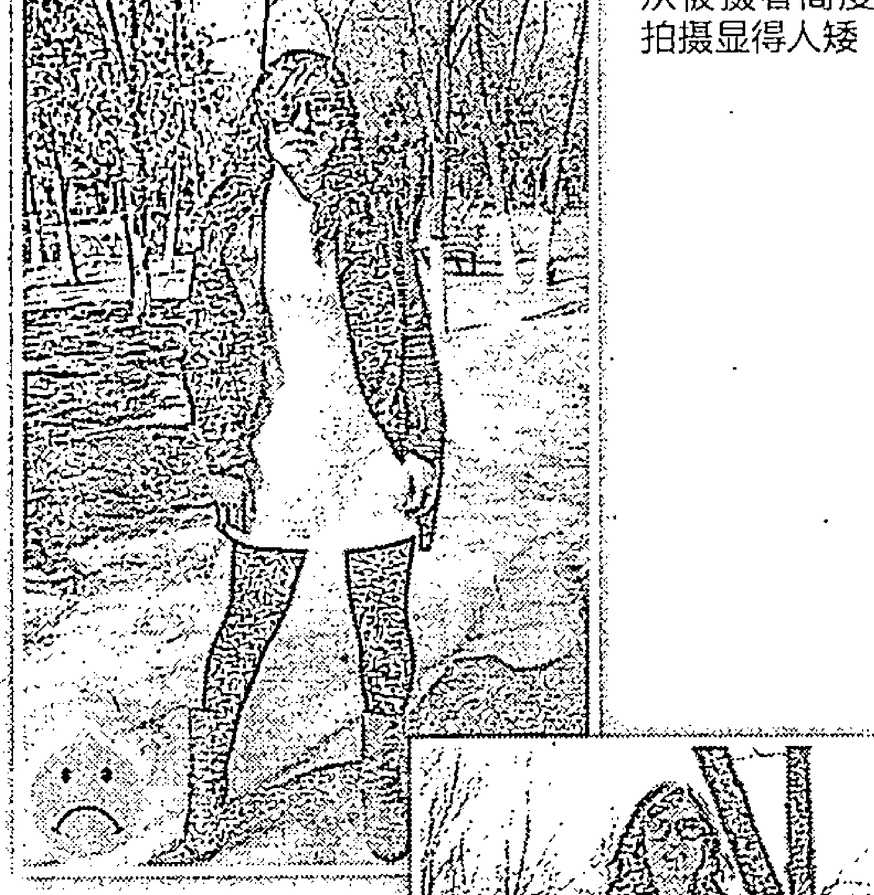


## 把腿拍长

没有谁不喜欢自己的腿能显得修长一些。窍门就是：拍全身照时被摄者采取走路的姿势，抓住腿迈出的瞬间。一条腿在后，一条腿在前，两只脚间隔差不多半只脚的距离。把重心放在后腿上，前面的脚如果没穿高跟鞋的话，脚尖微微踮起来，两脚之间的角度最好别超过30°。腿也不要伸得太长，以免显得太过刻意。然后让摄影师蹲下来，从被摄者腰部稍下的高度往上拍，这样拍非常拉长腿。如果拿捏不好行进中的姿势，就在站立时把其中一条腿往前伸一伸就OK啦。


还有个显腿长的办法，就是女士们尽量穿露脚面的高跟鞋。至于穿平底鞋的MM和GG们，可以把脚悄悄踮起来，注意保持平衡和自然。


## 把脸拍瘦

我们大多数人虽然不是大饼脸，但上镜后很容易就拍成一张肿胖的脸。显得脸小的窍门其实和自拍差不多，那就是讲究角度！自拍时可以这样：把相机或手机举高，呈45°倾斜拍，脸看上去会显小很多。如果是不熟悉的人给自己拍照时，就不好意思叫人家调好45°对准自己了。这时千万别直视相机，那样会拍得眼睛小、脸的下半部大，可以稍低头，侧头看相机。这里和大家分享我的侧头诀窍。拍照的时候有两种侧的办法，一是横面侧，就是脖子往左边或者右边歪，大约20°左右，这会让你看起来更俏皮可爱；二是斜面侧，让自己的一边脸更靠近相机，而让自己的另一边脸往后一点，这样让你的眼睛显得大一些、脸小一些。

(文|李婧一 隋兆英)


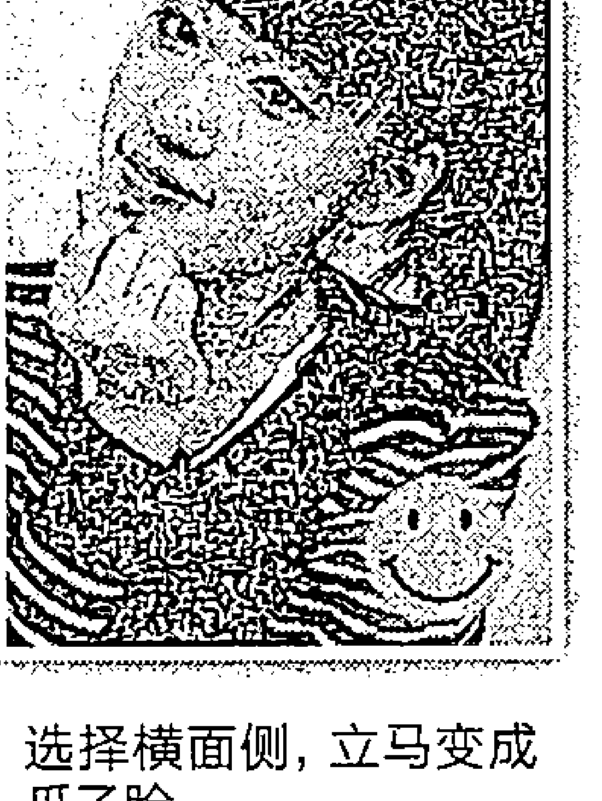

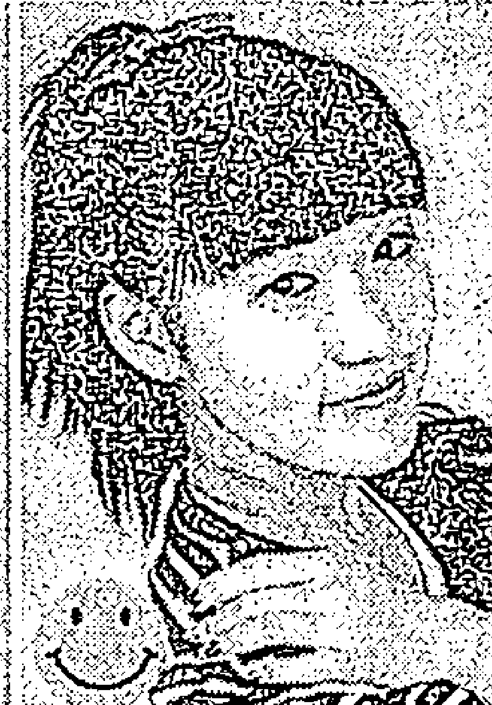

# 用HDR变身酷酷女杀手

HDR以其饱满而富有冲击力的效果受到越来越多人的喜爱。HDR用在人物身上，还可以打造与众不同的质感。下面我们就用HDR将一位MM变身酷酷的女杀手。

HDR是英文High-Dynamic Range的缩写，意思是“高动态范围”。HDR照片是使用多张不同曝光的图片，然后用软件将其叠加而成的一张图片。HDR照片可以使亮的地方非常亮，暗的地方非常暗，而且亮部和暗部都有细节，整体质感非常有特色。

原照是在室内拍摄的MM持枪动作，首先更换背景，先找张与之匹配的背景素材，合适协调的背景很重要，能起到锦上添花的效果。

## 素材的合成处理

1.  首先把原图中的人物抠出来。这里用抽出滤镜，把“强制前景颜色”打钩，再用吸管工具取样头发的黑色。然后用边缘高光器工具把要抠出的部分涂抹，就可以抠出发丝了。复制一层原图，在上面加蒙版抠出身体的部分，再把这两个图层合并起来，这样就完成人物的抠图了。
2.  把背景素材拖到人物下层，为了让人物和背景的光照方向一致，把背景素材进行了水平翻转。并调整好人物的大小、位置，给人物图层加上蒙版修整边缘结合处，使之与背景更融合。
3.  这一步要对人物进行调色，使之与背景的色调协调统一。给人物图添加色相饱和度调整层，降低些色彩饱和度。再添加色彩平衡调整层，调向青和蓝一些，具体数据如图1所示，这样整体画面色调就比较一致了。

## HDR效果处理

1.  常用的HDR软件有三个，包括Lucis Art 3 for Adobe Photoshop、ReDynaMix_HDR(汉化)、Photomatix.Pro.v4.0.1。Lucis和ReDynaMix_HDR作为PS的插件使用，操作比较简单，都是可视化界面操作。安装后可以在滤镜菜单中找到该滤镜。 Photomatix是独立的HDR软件，虽然是英文版的，但操作起来并不难，效果也相对要好些。三个HDR软件各有特色，可以利用其中的一个，也可混合使用。
2.  合并各图层，添加亮度对比度调整层工具，把亮度调到50、对比度设为25，另存为我的图片1。然后继续依次设置“亮度25、对比度13”、“亮度0、对比度0”、“亮度-13、对比度-25”、“亮度-25、对比度-50”，分别保存为我的图片2~5，这样就得到了5张从过曝到欠曝渐变的图片。然后打开Photomatix，点击Load Bracketed Photos，出现一个对话框，再点击Browse，选择刚保存好的渐次曝光我的图片1~5，注意要按这个顺次依次输入。
3.  接着一路点击OK，最后出现图2中的画面，右边一排是各种效果图，左边是对HDR细节进行微调的，这里选择图中右边最后一个预览效果图，再对左边那些进行微调。满意后点击左下角的Process，然后点击菜单File→Save as保存即可。
4.  把刚保存的HDR效果图拖到图层的最上面，添加蒙版，把不需要太强烈的HDR效果的地方减弱些，比如背景后面的房子、天空以及脸部等。为了体现冷酷的杀手形象，新建一层，用画笔涂上暗紫色的唇红和腮红，图层混合模式为叠加，适当降低些不透明度，色彩不理想的可以添加色相饱和度调整。添加曲线调整层，向下拉一点，稍压暗些，这样效果更好。
5.  最后检查一下整体的细节问题，进行局部锐化。合并所有图层，复制一层，图层混合模式设为“叠加”，打开“菜单→滤镜→其它→高反差保留”，设为0.8个像素左右，这样可以明显地看到整体锐化了，不过我们通常不需要全部都锐化，所以要添加蒙版。用黑色画笔把不需要锐化的还原，这里我们只需把人物的五官、头发以及前面的部分建筑稍加锐化。至此HDR效果就制作完毕啦，对比HDR前后的效果，可以看出经过HDR的处理，立体感增强了，质感纹理更突出了。

注：因篇幅所限，更多图片请访问http://bbs.cfan.com.cn/thread-1505420-1-1.html。HDR软件分享请访问http://dl.dbank.com/c0ztfe3xta。 (文|凡鱼)

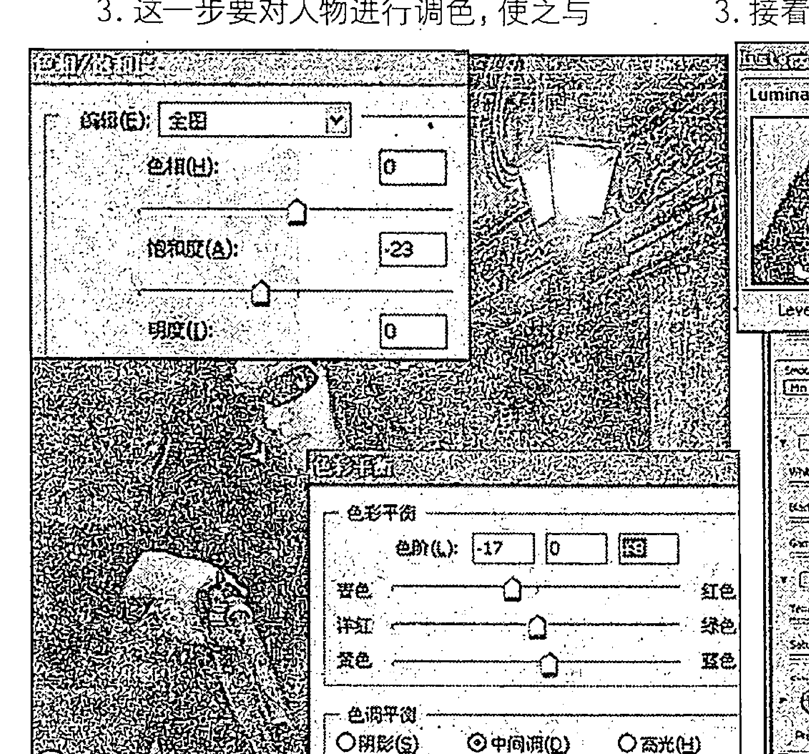

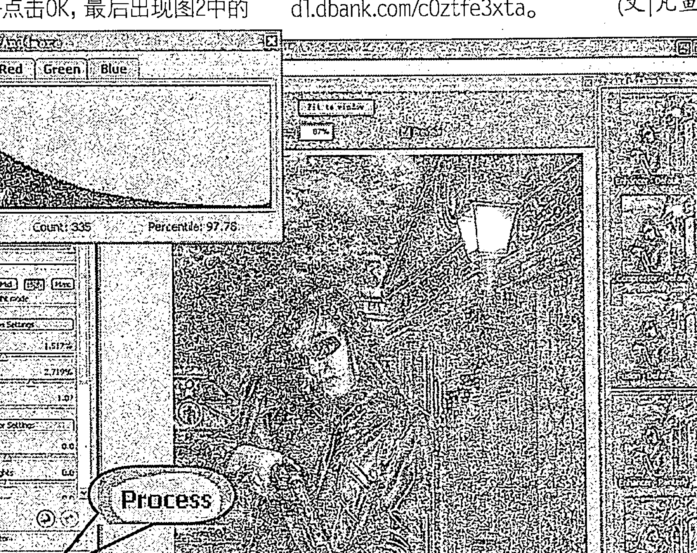

# 卡片机记录春天的大自然

春天里，无论是田野里的花朵还是花丛中辛勤的蜜蜂，处处是美景，怎么才能用小卡片机把这些景色拍得更生动和精彩呢？

除了时段，还需要注意拍花时的光线。一般而言，顺光拍大片的花效果好，而如果想表现单个花瓣或树叶的质感，采用逆光比较好，能获得良好的透明感。

## 合理取景构图

为了突出主体，我们拍摄时尽量选择背景比较简单和距离比较远的景象，因为卡片的背景虚化能力有限，如果背景过于复杂，拍出的画面就有些不知所以然的感觉（图4）。

我们不妨选择干净、明快的图像主体，舍弃与画面主体无关的花和枝叶，集中力量突出主体。同时将主体焦点稍稍离开画面中心，使画面稳定而不呆板（图5）。

## 选择早晨拍花

说到春天，不得不说竞相开放的花朵。每当这个时候，都是大家赏花的好时节。拍花要选择适合拍摄的时间段。总体来说早晨是拍摄花卉的好时段。因为早晨阳光比较柔和，空气湿度大，有露水，花瓣上反射的光线不会太强烈，拍出来的花卉显得亭亭玉立（图1）。在傍晚的时候拍也可以，虽然有些花会显得憔悴，但可以采集到夕阳下特有的光线。而中午阳光猛烈的时候尽量不要拍，因为容易过曝，也不容易拍出漂亮的光色（图2）。此外，多云的天气也非常适合拍摄花朵和植物。

## 用连拍拍摄昆虫

春天也是小虫开始出来活动的季节。各类小虫的活动，也代表着万物的开始。经常拍摄昆虫的朋友都知道，昆虫喜欢动来动去，稍微一移动，本来对焦在身体的焦点便跑到后面的花蕊上了，很难掌握。此时最好的办法是将相机调整到连拍模式，后期挑选一张比较适合的（图3）。

## 用侧逆光拍树木

春天树木开始发芽生叶，那种养眼的绿色是不容错过的。拍摄树木以侧逆光照明最好。侧逆光对树干的立体感和质感都表现得很好，树枝在逆光照明下能形成双轮廓光的效果，树叶也可以呈现出半透明的质感。拍摄时重点要体现出树木向上的朝气。

除了注意一些拍摄技巧外，可以对卡片机拍摄的照片略加软件后期处理，比如最简单的色阶调整就能改善曝光的不准确。不喜欢带一大包摄影设备踏青的朋友，不妨试试。

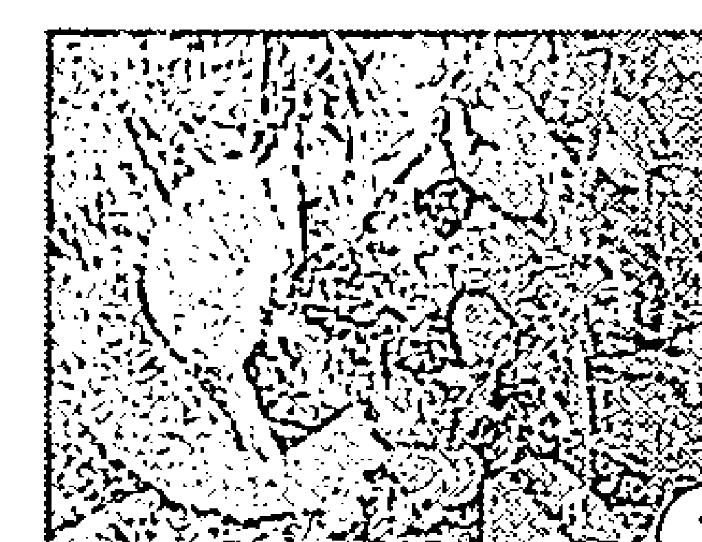


(文|叶勇)


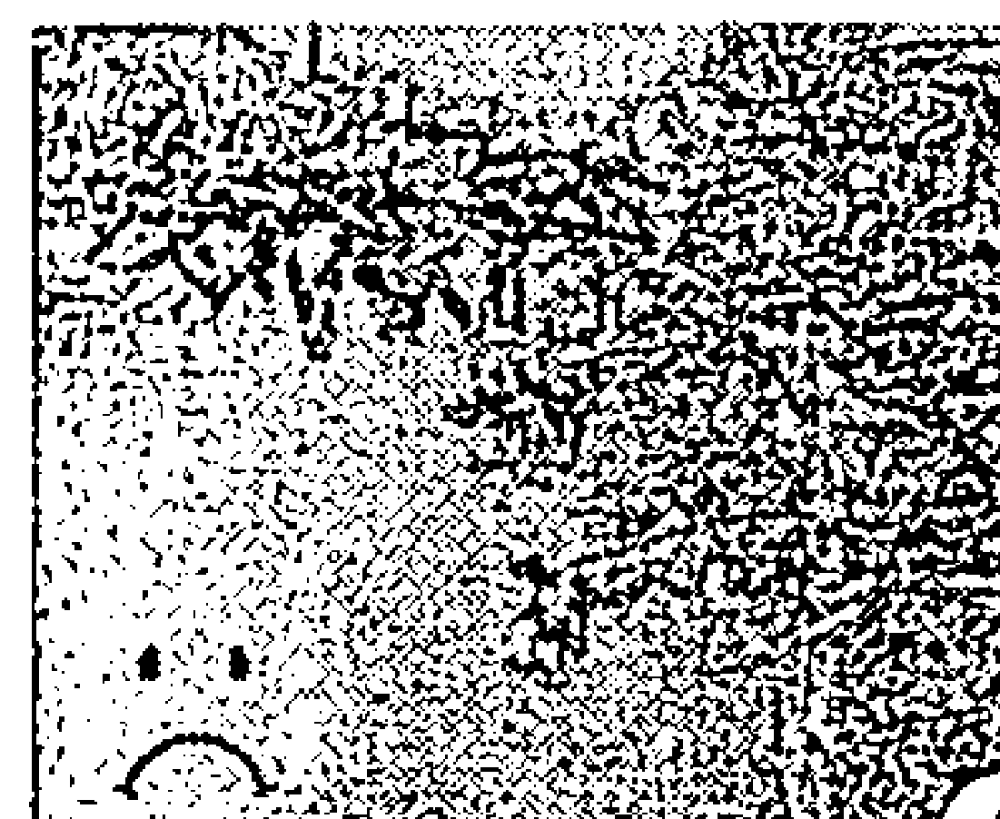


# 拍出神秘的幻影照片

世界上有极少数的人体验过灵魂出窍。我们将通过简单拍摄合成出神奇的幽灵照片，让你体验和自己的灵魂亲切会面的奇幻画面。

## 统一拍摄环境和系列动作

拍摄幻影照片最关键的是统一的拍摄环境，包括背景、场景和光线必须保持一致，这将为后期的制作省心省力！如果觉得难以把握，建议选择纯色背景。

本次摄影需要拍摄出自己当下和下一秒钟的动作变化，因此最好设计为一系列较为连贯的动作。比如后倾倒的照片，需要我们在同一位置分别拍摄出一张直立照片和后倾的照片。再比如左右摇晃的照片，则需要我们以一个点为轴心，分别拍摄出向左倾倒和向右倾倒的两张照片。当然，动作完全可以不止一个，我们可以发挥想象力，拍摄多张动作连续的夸张照片来进行组合，但需要确保人物在画面中的大小和位置不要相差太大。

需要注意的是，我们要为自己设计一系列的动作和场景，比如“跳跃”主题可以拍摄起跳、跃起、落下的连贯动作，“奔跑”可以拍摄准备、起跑、摆臂甚至跌到、爬起等一系列动作，还可以做“表情变化”主题。从微笑、咧嘴笑、大笑到爆笑的系列变化，这些有意境主题的动作场景，使拍摄出的照片显得有趣有感觉，不会平淡无奇。

## 照片合成步骤

所有基础照片拍摄完毕以后，可以利用Photoshop软件将两张照片进行完全叠加（也就是把一张照片拖拽到另外一张上进行重合），然后选择两张照片图层合适的透明度（一般为30%~50%），一张神奇的照片就立即呈现在我们眼前啦！下面我们一起来欣赏下效果，是不是很妙呢？

## 拍摄实例

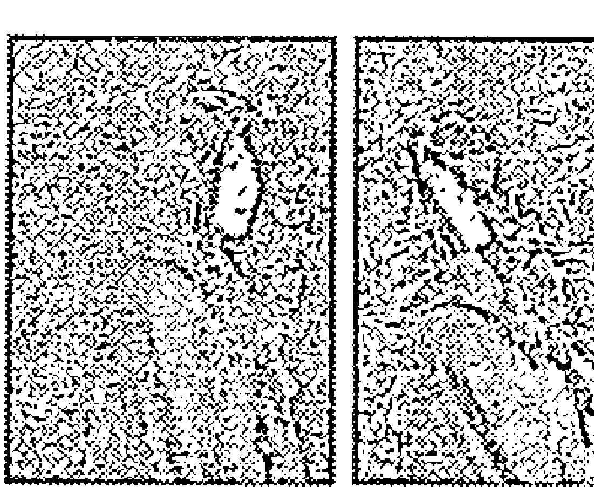

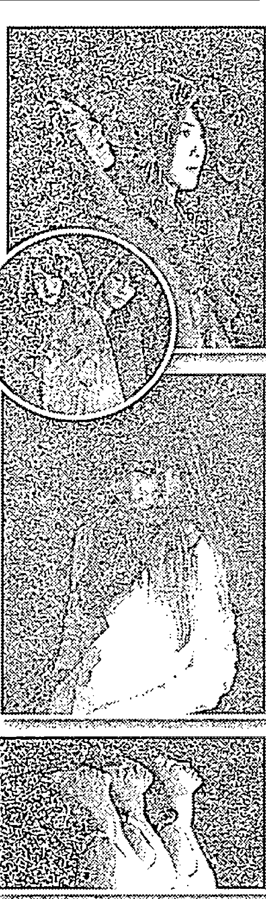

(文|Iris小猴子)

# 完美抠取发丝不再难

抠头发可说是抠图中最难的了，特别是女孩子的根根发丝。下面使用Photoshop的图层、通道、色阶、蒙版等技术，教你抠出完美发丝！

## 前期图层处理

1.  在Photoshop中打开背景图和一张美女图片。背景图方便观察抠取头发的细节，美女图呢，我们选择一张头发比较蓬松的。
2.  使用移动工具把“美女”移动复制到“背景”中，生成“图层1”，按Ctrl+J生成“图层1副本”。“图层1副本”用于抠取蓬松的发丝，“图层1”用于抠取人物的主体。
3.  关闭背景图层显示，便于通道操作。

## 利用通道和色阶找到发丝选区

1.  选择“图层1副本”图层，在图层面板上选择通道，点击蓝色通道，把它拖动到“创建新通道”按钮上复制蓝色通道。这里选择蓝色通道是因为蓝色通道中头发和背景的反差比较大，容易把头发选中。
2.  按Ctrl+L调整“蓝副本”通道色阶（图1）。调整色阶是抠取发丝的关键，调整时参数因图而异。一般情况下要让黑色滑块移动到右侧的高峰处，白色滑块移动到左侧的高峰处，主要目的是让所选取的对象和背景深浅反差变大，以方便下一步选取头发。
3.  按Ctrl+I反选。通道可以用来表示选区，白色表示将来要选择的部分，黑色表示将来不选的部分。因为将来要选黑色的头发，所以要反选。需要说明一点，有时候先反选再调整色阶效果会更好一些，在这个实例中先调整色阶比较好。
4.  选择加深工具（图2），把发丝部分的背景进一步加深。
5.  打开RGB通道显示，关闭“蓝副本”通道显示，准备进入图层面板操作。
6.  配合Ctrl键单击“蓝副本”通道，载入“蓝副本”通道所表示的选区。

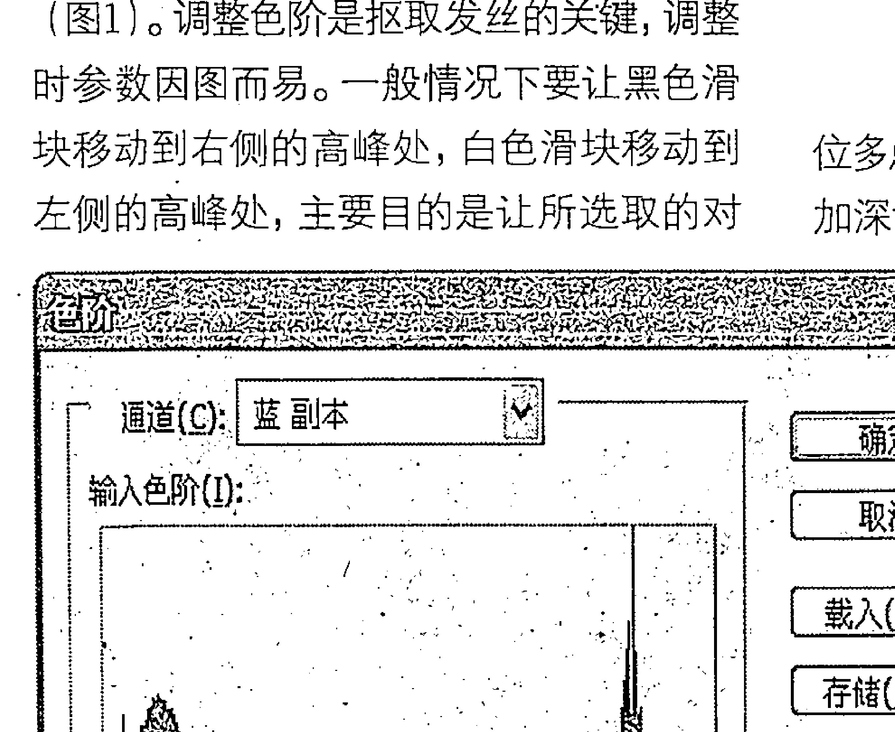


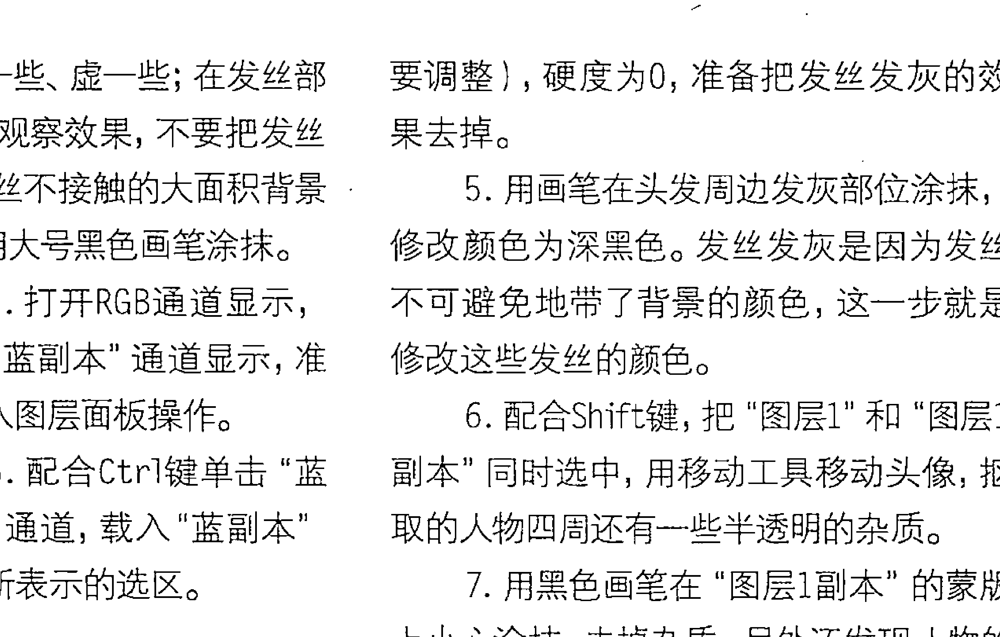

## 利用蒙版各取所需

1.  保持上面的选区，返回图层面板，为“图层1副本”图层添加蒙版。
2.  选择“图层1”图层，使用多边形选框工具选取人物的实体部分。也可以使用快速蒙版、快速选择工具、钢笔等工具选取人物的实体部分。
3.  添加蒙版，然后打开底图图层显示。这时候基本就能看出抠图的大致效果了，可看到发丝部位灰蒙蒙的，下面处理它们。
4.  单击图层面板上的“图层1副本”的彩色图层缩览图（注意，不是蒙版），选择画笔工具，编辑前景色，吸取比较深的头发的颜色，设置画笔大小为50（根据需要调整），硬度为0，准备把发丝发灰的效果去掉。
5.  用画笔在头发周边发灰部位涂抹，修改颜色为深黑色。发丝发灰是因为发丝不可避免地带了背景的颜色，这一步就是修改这些发丝的颜色。
6.  配合Shift键，把“图层1”和“图层1副本”同时选中，用移动工具移动头像，抠取的人物四周还有一些半透明的杂质。
7.  用黑色画笔在“图层1副本”的蒙版上小心涂抹，去掉杂质。另外还发现人物的边太齐了，可以用比较虚的黑色画笔在两个图层的蒙版上小心涂抹，最终达到较完美的抠图效果（图3）。

因篇幅所限，更多的步骤图及素材请访问：http://bbs.cfan.com.cn/thread-1535890-1-1.html (文|张海洋)

# 3月古建筑摄影赛小结

3月的主题摄影 “我身边的老建筑物” 得到了大家的热烈支持和广泛参与。下面讲讲古建筑的拍摄技巧以及本期优秀作品的点评。

3月的主题是“我身边的老建筑物”，也就是建筑摄影。建筑摄影主要包括写实和写意。写实要求忠实表现建筑师的设计意图和建筑功能，客观真实地再现建筑的正立面、侧立面、透视和室内装饰等情况的画面。写意属于艺术摄影范畴，更多的是表现摄影者对建筑的主观感受，通过对建筑的观察和表现，来反映摄影者自己的摄影思想。

建筑摄影的拍摄主题范围非常广，可以是一栋建筑，也可以是建筑的群体或一个地区、一座城市；可以是建筑的整体，也可以是建筑的局部；可以是室外，也可以是室内。这类拍摄主题一般表现为：具有地区特征的鸟瞰全景图；反映地区轮廓线的大景观图；城市或乡村街景或广场公共空间；各类建筑群体以及地标（标志性）建筑。

对于古建筑的拍摄，最好要体现出整体的老旧的韵味，以暗调为佳！可以采用全景或局部特写的拍摄手法。

## 全景图的拍摄

拍摄全景图时要重点体现出老建筑的宏伟高大或是特殊的建筑特色。如果是高耸类的建筑最好采用竖幅构图，以仰拍的手法体现其高大。看具体情况采用正面或3/4侧面进行拍摄，光圈可以适当小些，比如F8~F16，这样可以获得比较清晰的全景图。拍摄速度以手持能稳就可以了，一般要小于1/60秒，如果是长焦的要小于1/125秒。

## 局部特写

局部特写顾名思义就是要拍摄古建筑有特色的部分，比如屋檐、柱子、大门甚至是门钉等。通常采用大光圈小景深晕化背景突出主体，光圈可在2.8~5.6之间。对速度一般没有特殊要求，但如果要结合其它场景就要考虑拍摄速度了，比如要拍摄一只鸽子在屋檐起飞的镜头，就要提高快门速度。如果要拍出雨丝效果的话，就要调低速度，并用三脚架协助拍摄。要注意的是拍摄速度的调整要兼顾整体的曝光组合。

下面针对3月的三张优秀作品一一点评，希望读者可以从中有所借鉴。

### 水乡婺源 (作者：孙思臣)

这张拍摄的是平凡百姓家的老房子，作者采用了大光圈小景深、慢速度在雨天拍摄的，雨丝依稀可见。整体画面凝重却不失通透，构图巧妙、曝光合理、主题突出。前部露出的屋檐是画面的焦点，也是主体部分。斑驳破损的土墙、陈旧的瓦片以及发霉的檐木似乎在向人们诉说岁月沧桑，突出了主题内容。这是张意境比较好的摄影作品。

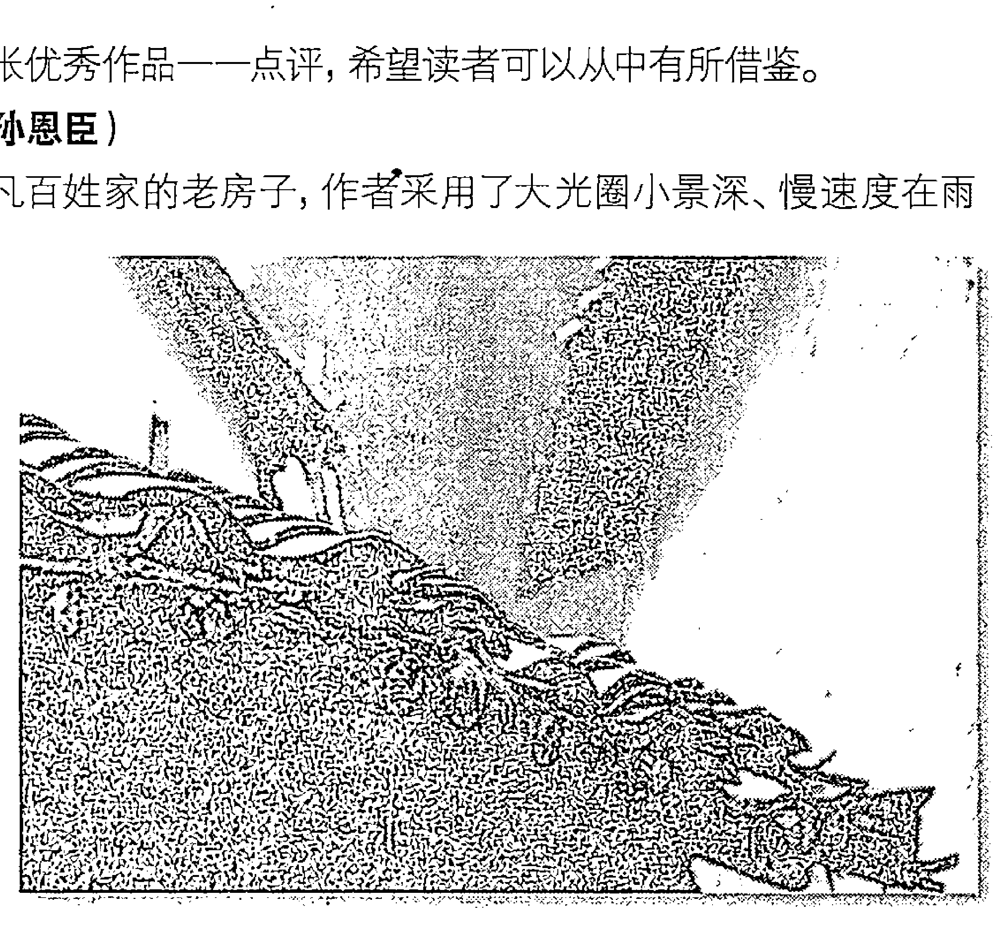

### 关族图书馆 (作者：Panjilai)

这张照片拍摄的是位于赤坎上埠的关族图书馆，作者以仰拍的角度从正面几乎完整地记录下了关族图书馆的全貌。构图上也中规中矩，使得画面中的建筑特色一览无余。到过赤坎的人知道，要拍好关族图书馆这种高大的建筑很难避免仰拍的效果；但作者如果将曝光再减少1/3或1/2档，画面的色彩、层次和锐度会变得更好。另外，整体稍向左倾斜了，左下角的女人可以去掉，还可以通过后期加强些色彩与质感。

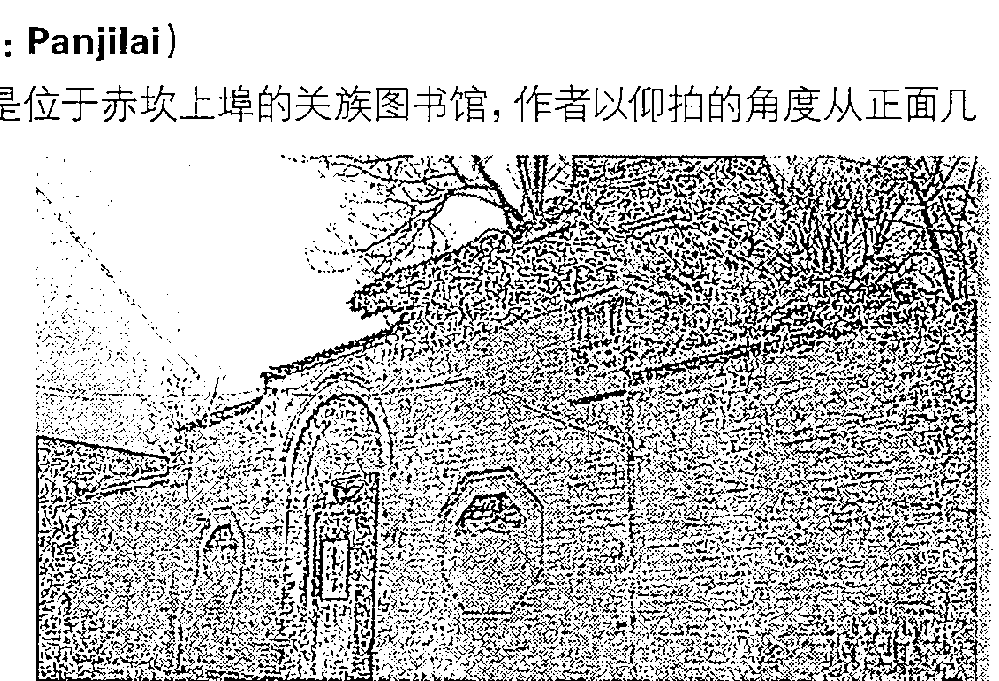

### 老屋 (作者：小鹤)

这张拍摄的是古厝，采用常规构图，可以清楚地看到古厝的结构特色。整体画面朴实无华，但却韵味十足！这都归功于后期采用了反转负冲效果，色调调得也比较适合，不过树枝有点过锐的感觉。合适的后期处理虽然能起到锦上添花的作用，不过大家一定要注意把握度。

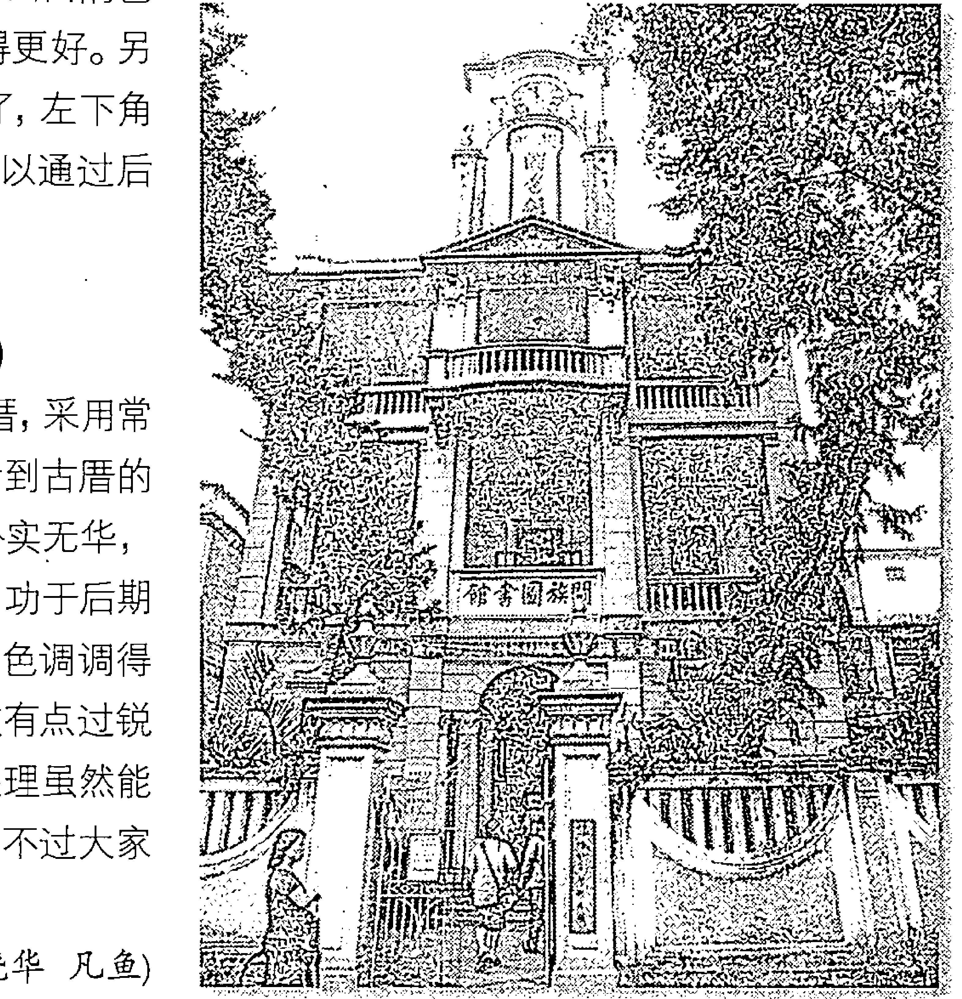

(文|吴晓华 凡鱼)

# 给母亲的周末来针“肉毒杆菌”

用PS变年轻的方法不少，但看上去只是一张皮肤磨得光滑粉亮的下垂的脸。母亲节来了，我要让母亲真正脱胎换骨，犹如打了肉毒杆菌般的效果。

标，选择曲线工具调整层，在中点位置稍往上拉一点，这时就可以看到磨皮美白的效果了，可以将头发、眼睛、眉毛等适当地还原。

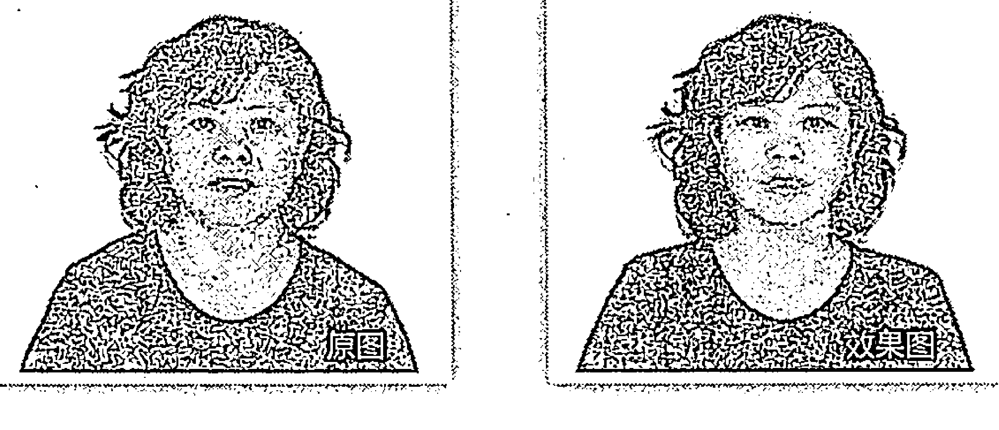

## 初步处理

打开母亲素材原照，复制一图层。正常情况下都可以对原照进行“三自”处理，所谓“三自”指“自动色阶、自动对比度、自动颜色”，一般都会起到去灰、改善色彩的效果。打开菜单“图像→调整”，选择相应选项即可。

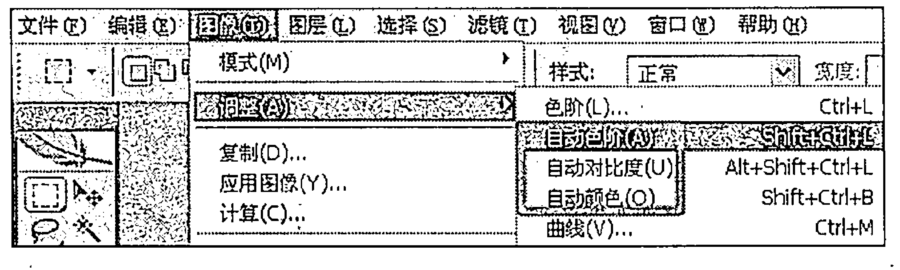

## 磨皮美白

年轻的肌肤都是光滑润泽、富有弹性的，因此第一步先磨皮。磨皮的方法很多，这里用的是高反差磨皮法。打开通道面板，发现蓝通道最“脏”，复制蓝通道。打开菜单“滤镜→其它→高反差保留”，选择4个像素左右。打开菜单“图像→计算”，对蓝通道进行强光模式的计算，再重复两次。

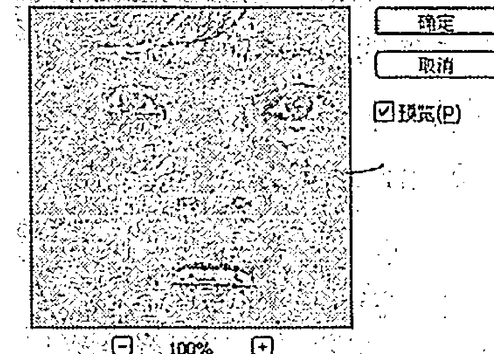

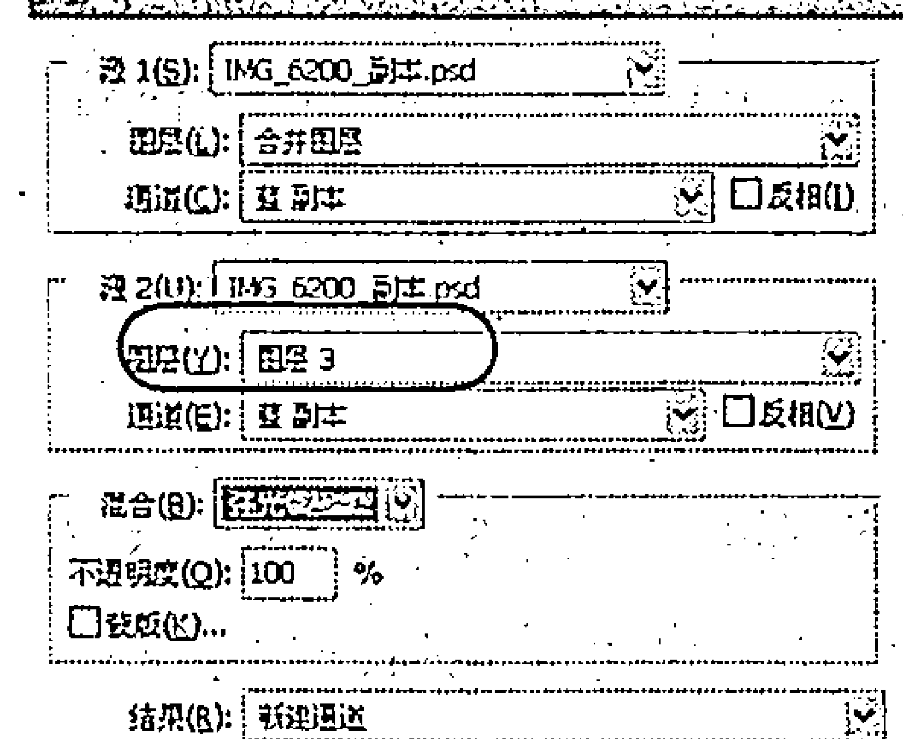

单击通道面板下面的“将通道作为选区载入”图标，然后点击RGB通道，转到图层面板。点击图层面板下面的“创建调整层”图标，选择曲线工具调整层，在中点位置稍往上拉一点，这时就可以看到磨皮美白的效果了，可以将头发、眼睛、眉毛等适当地还原。

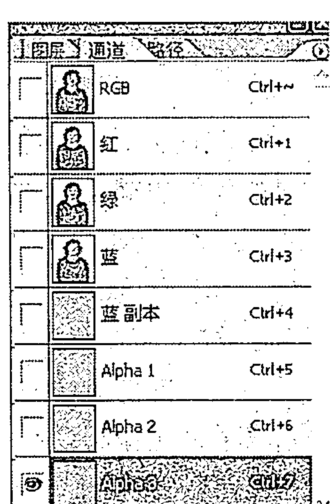

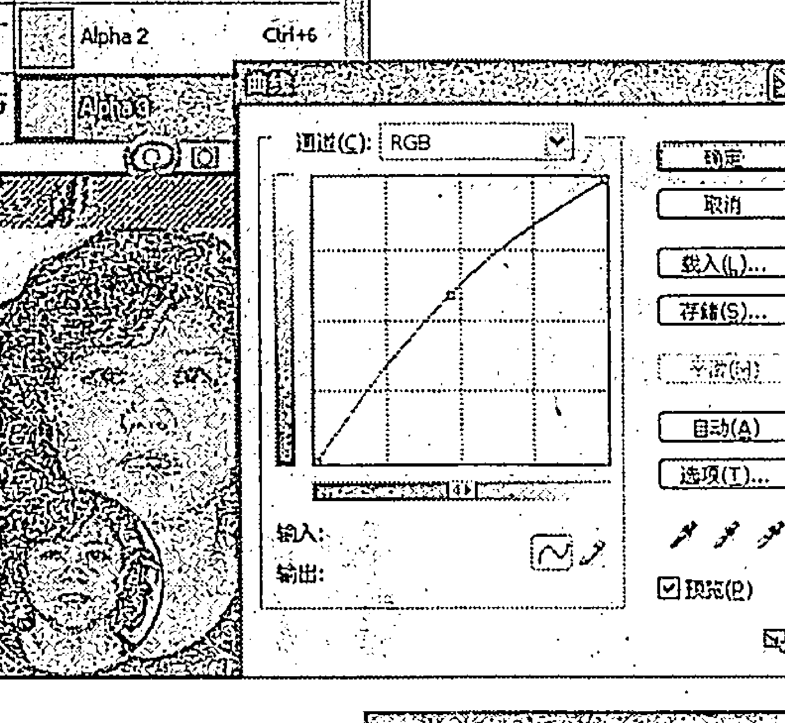

## 液化变形

液化滤镜是修整形体常用的工具，这里我们要利用它来瘦脸庞、脖子和肩膀，提眼尾、拉嘴角等。主要是用到液化滤镜中的向前变形工具，操作过程中要变换合适的笔头才能达到良好的变形效果。图中的箭头方向就是向前变形的方向，要注意变形的幅度，以免面目全非。

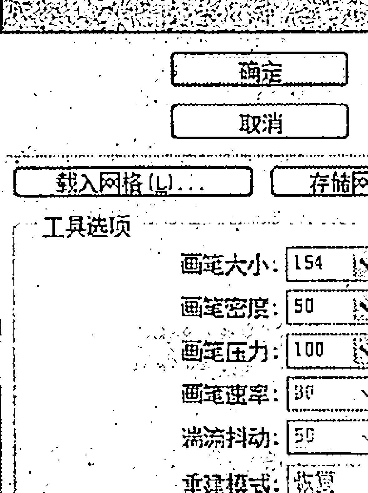

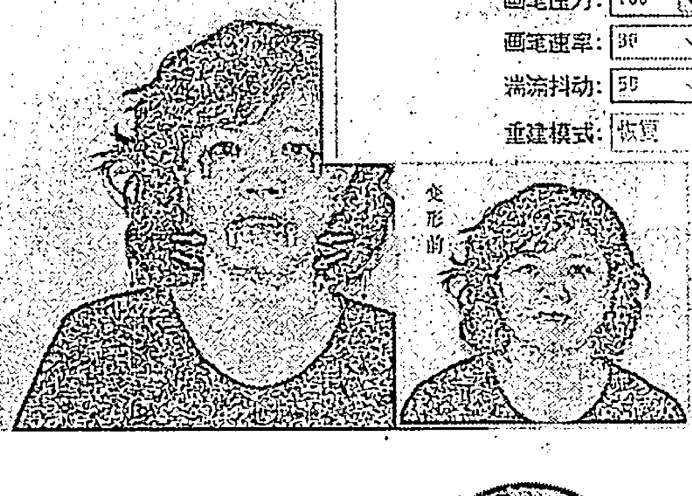

## 平整皮肤

主要是用图章修复工具或画笔平整脸部和脖子的皮肤皱纹、赘肉等，让松弛的皮肤变得光滑、紧绷有弹性。操作中尽量在附近皮肤取点，这样整体才能融合协调。

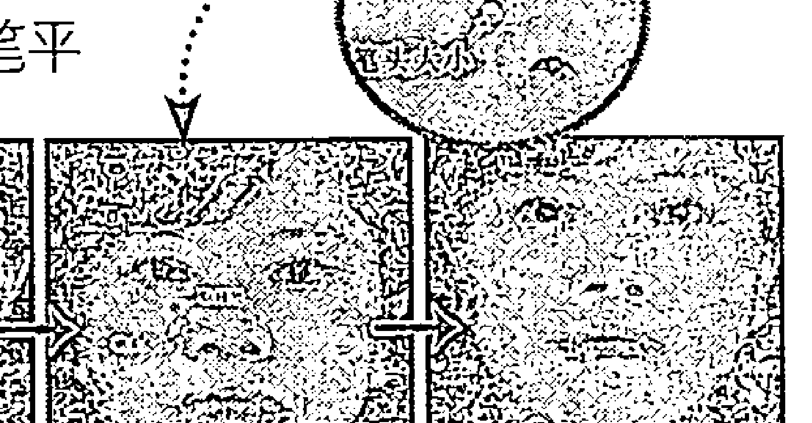

## 皮肤调色

主要是利用可选颜色、色彩平衡等调色工具调整肤色，以获得嫩白肌肤的效果。

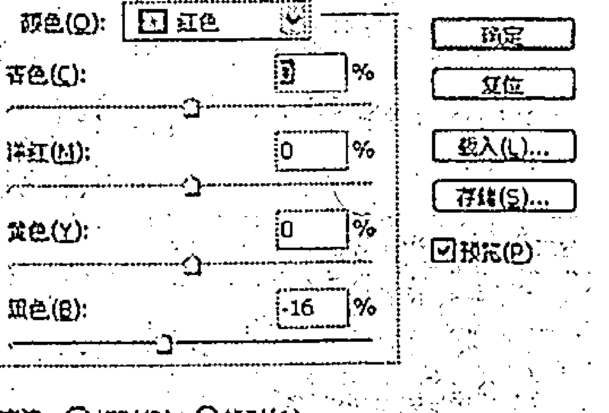

## 最后统调锐化

用曲线对全图进行最后的统调，检查完善细节的问题，并对五官头发等适当地做些锐化处理。如果觉得皮肤太光滑缺乏纹理的话可以复制一层，执行菜单“滤镜→杂色→添加杂色”，勾选“单色”，然后降低该图层不透明度为10%左右，这样看起来比较自然。至此全部处理完毕。

> 因篇幅所限，更多的步骤图及素材请访问：http://bbs.cfan.com.cn/forum-62-1.html

怎么样，效果不错吧？这就是我送给妈妈的母亲节礼物。人从中年过渡到老年会逐渐出现衰老的特征，如皮肤不再嫩滑，开始松弛变形，出现眼袋、鱼尾纹、法令纹等，眼尾下垂，嘴唇及周围开始收缩等，所以想PS变年轻的话就不单纯是磨皮能解决的。

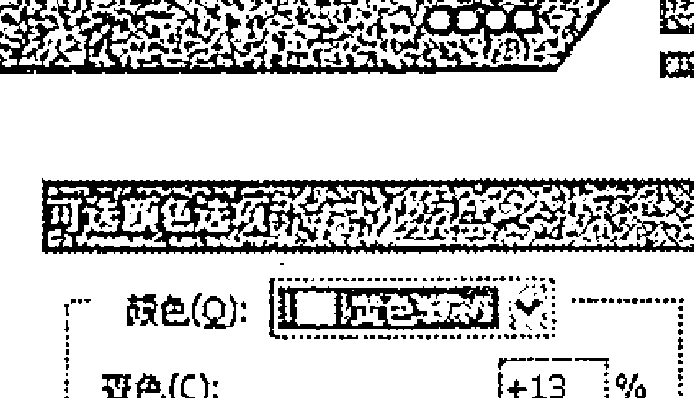


# 打造逼真动态的马赛克

在后期处理人物视频素材时，有时我们需要把受访者用马赛克或模糊层遮挡起来。下面就给大家介绍两种给视频加马赛克的方法，让你把视频人物遮得严严实实！

## 添加模糊层

马赛克的视频给人一种直接在原始画面上覆盖一层的感觉，这也正是我们制作时的基本思路，无论使用何种软件，都要掌握这一思想。


首先打开After Effects，在素材层上新建一个调节层，对它使用“模糊与锐化”中的“快速模糊”效果，自定义模糊量，制作好毛玻璃层（图1），或者使用“风格化”中的“马赛克”效果。

## 简单加马赛克

利用工具栏中的“椭圆形遮罩工具”（图2），为调节层画出一个椭圆形遮罩，羽化遮罩边缘进行美化。将毛玻璃层移动到受访者的头部，并建立位置关键帧。之后每隔一段时间便调整模糊层的位置，以求基本覆盖到人物脸部（图3）。这样简单的马赛克就加好了。


## 更精确更省事

上面的方法虽然简单，但一点点移动模糊层工作量较大，而且处理效果也比较粗糙，那么接下来介绍一种又精确又省事的方法。

让我们重新回到制作完毛玻璃层之后的一步。现在我们关心的是如何将模糊层完美地契合在人物面部，并且这个工作还得是自动完成的。没有什么工具能比After Effects的跟踪器更胜任这项工作了。我们的思路是利用跟踪人物面部特征的方法，生成头部运动轨迹，再将轨迹应用到毛玻璃层。

通过比较面部五官的特征，我们选择眼珠或鼻孔为目标跟踪对象（因颜色较深容易跟踪）。单击“跟踪”建立跟踪点，定位到黑色的眼瞳上面（图4），然后点击跟踪面板的“向前分析”，跟踪点会随着受访者眼睛的移动而调整位置。待分析完毕后，单击跟踪面板中的“设置目标”，在弹出的对话框中选择“调节层”，这样就把跟踪的路径应用在了毛玻璃层。单击“应用”预览播放，可看到一大块矩形毛玻璃随着受访者的头摇摆而晃动。再为调节层画出一个椭圆形遮罩，羽化边缘，能跟着受访者面部移动的马赛克就打造好了（图5）。

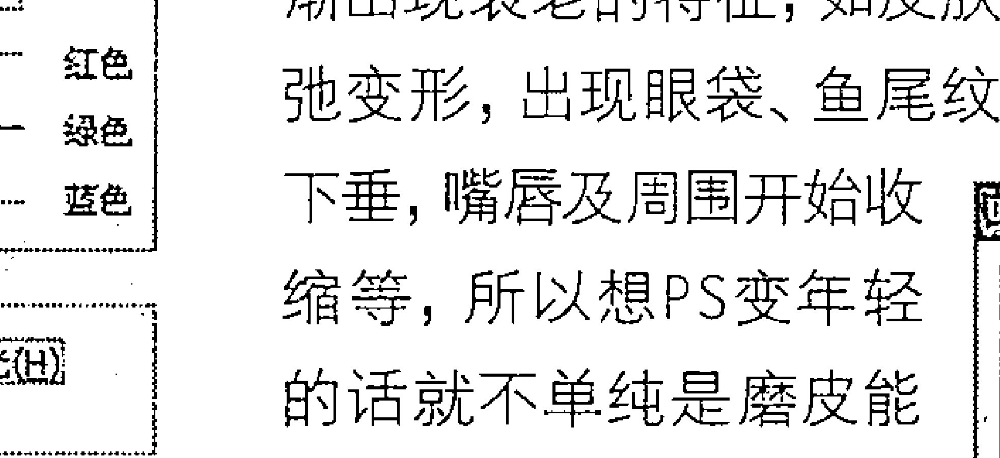

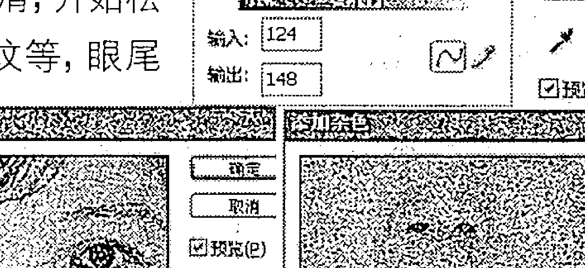


本篇文章探讨了给视频加马赛克的两种方法，实际上，跟踪在影视后期中发挥了巨大作用，比如特效合成等。这里只是抛砖引玉，相信你可以发挥想象做出更优秀的作品。

（文|石峰）

# 让你的车展照片脱颖而出

有人说比开车更有趣的就是拍摄车展。拍摄车展虽然有趣，也很有挑战性。下面给出一些拍摄提示，让你的车展照脱颖而出。

## 大胆探索各种角度

车展现场往往是人山人海，照片看上去要么人头攒动、杂乱不堪，要么就是像汽车广告般千篇一律。找到一个新奇的角度和拍摄的有利位置，运用独特的构图，才能让你的拍摄脱颖而出！当找到想拍摄的车时，先绕着它走一圈，找到有趣或独特的角度后再开始拍摄。拍摄时不要只在眼睛水平高度拍摄，尽量不要选择汽车的正面、侧面，这样会给人呆板的感觉，缺少立体感。

试着蹲下来，鞋面的高度是个不错的选择，你甚至可以躺在地上拍摄，这样汽车看起来咄咄逼人，更加霸气！汽车的前后45度斜角是很好的角度，前后各一张就足以摄下汽车的全貌。让相机稍微倾斜，还可以取得动态的效果。拍摄时尽量把一些标志性的背景包含进来，比如展会的条幅、赞助商的充气装饰、奖杯的照片等，这样既交代了车展的背景，有助于区别于另一个车展，也使你的照片看上去丰富且与众不同。在人多的展台，可以利用天然有利的位置，那就是站在高高的看台上俯拍，轻型独脚架是个好帮手，不贵且拍特写时非常有效，可以保持相机的稳定。此外，也可以试着从发亮的汽车轮毂盖或后视镜中拍摄被反射的另一辆车。

## 相机的基本设置

- 快门速度：如果使用不带三脚架的标准镜头相机，快门速度应在1/60~1/125秒之间，特别是如果车中有模特，快门速度不能太低，否则很可能在模特运动的瞬间把照片拍糊掉。
- ISO设置：对于小DC用户来说，默认的ISO 100显然不适合，需要在手动模式下将ISO设为400~800之间，单反相机可以尝试1600。
- 闪光：车展现场虽然看着很亮，但由于是人造光源，分布并不均匀，容易导致曝光不正确。解决办法一是提高闪光灯指数，对于小DC，可以进行适当的曝光补偿；二是刚才讲到的提高ISO；三是使用慢门闪光同步拍摄。对于小DC，可以调到夜景模式或在自动模式下打开闪光灯。

## 挖掘独特的细节

我们知道车展中总是很拥挤，想要拍一张整车的全景照实属不易，那么我们可以专注于车的细节。每辆新车的设计都会有自己的特点，比如车标、车牌、前后灯、发动机、铝合金轮毂、尾翼、排气管、里程表、内饰设计等。某些制造商的标志甚至比汽车本身还吸引人，某些限量版的标志也是不容错过的。

## 不要只见模不见车

每次车展总有去拍车的朋友拍回来一堆美女，特别是本次北京的国际车展，几乎成了全模特展，很少有一辆全车的镜头，也因此遭到了广大车迷们的诟病。毕竟汽车才是展会的明星，车展还以拍车为主，模特只是适当的点缀。具体操作时可以拍摄模特在车中试驾的照片，或是模特靠在车边的照片，但注意模特的比例不要过大，以免喧宾夺主。有些朋友喜欢拍摄模特的脸部特写，那么可以把车作为大的背景来拍摄，尽量不要整张照片只有一张模特脸，让人不知所拍。

> (文|曾继伟)

# 手机拍人像告别模糊

很多人都喜欢用手机随时随地拍人像，可惜的是很多照片都模糊不清，这既有手机设备本身的原因，也往往是拍摄技巧不佳的结果。

## 室内借助光源

如果在室内拍照，由于光线一般不足，照片很容易粗糙。可以走到窗台等光线充足的位置，如果无法利用自然光，可以打开台灯或靠近灯源进行补光。在室内拍人像的过程中，有时在手机屏幕上会看到人像过暗或过亮，试着把手机的拍摄角度上下左右稍微移动一点，就会收到较好的效果。

有些手机自带一个小的LED灯，它对拍摄还是有帮助的。如果你的手机没有配备闪光设备，可以随身携带一个钥匙扣式的LED小手电筒，当光线不足时，可打开它作为辅助光源，当然这仅限于近距离拍摄。另一个方法是采用夜间模式拍摄，以取得较好的亮度。

## 半按快门

手机拍照一般有延迟现象，特别在线不足的情况下比较明显。当按下拍摄按钮时，手机可能需要高达1秒的时间来反应。如果在按下快门的一瞬间手抖动了，拍出的人像就会发虚或者模糊不清。所以记得保持快门的半按状态，在焦点对准后，稍微等一下以便相机进行对焦，然后再从容按动快门，这样拍出的照片就会人物突出，不会模糊不清。

## 室外用顺光或侧面光

对于手机拍摄，采光是最重要的，光线够强照片才会清晰明亮。如果在室外拍摄且光线充足，很容易拍出清晰的人像，一般采用顺光或侧面光即可。如果拍摄对象的衣服或拍摄背景色彩鲜艳，成像看上去就更清晰。要注意的是最好避免逆光和强光。逆光容易拍出大黑脸，而强光会导致反差对比过大。强光下可采用侧面光，能较好地突出人物轮廓。

## 尽量走近被摄者

用手机拍人像的一个通病就是主体看上去小且模糊不清。因为手机的分辨率本身就低，而且很多手机没有光学变焦，只有数码变焦。如果用数码变焦来拍照，会降低图像的清晰度。因此试着走近你的拍摄对象，让拍摄对象充满整个镜头，这样拍出的照片不仅清晰，也能够突出主体。

> (文|李锋民)

# 安卓智能手机 让老人生活更精彩

## 休闲娱乐打发时间 手机生活篇

### 早上6点 起床听收音机

爸爸每天起床后就喜欢听收音机，了解最新新闻，但手机自带的FM收音机功能很不给力，需要连接耳机才能勉强搜索到几个台，还是用AnyRadio网络收音机吧，通过网络方式播放收音机电台，软件集合了国内外众多的电台频道，包括中央人民广播电台、中国国际广播电台和各地方频道，还有国外频道，如BBC等。此外还可以按照电台类型或者地区分类选择喜欢的电台，播放流畅，而且还能录音，有WIFI的话更节约流量。

### 上午8点 正点闹钟提醒吃药

年纪大了，记忆力衰退，很容易忘事，妈妈在家里的时候还能提醒爸爸到点按时吃降压药，遇到妈妈外出就很容易忘记到点吃药。用手机做闹钟吧，安装正点闹钟，打开后选择“按时吃药”，可以设置每天吃药的3个时间点和提醒铃声音乐，到时手机就响铃提醒，再也不担心忘记吃药了。

### 上午9点 手机看报纸新闻

上午在家无聊，可以用手机安装搜狐新闻2.0看最新新闻资讯，它还提供了非常全面的报刊和杂志可以浏览，更新非常及时，而且还节省了订报纸的钱呢。

### 下午2点 解放眼睛用耳听书

书和报纸看多了，眼睛会累，可不可以用手机来听书呢？其实用安卓手机也是能做到的，懒人听书这个软件就是很好的选择，提供海量小说、评书、相声、百家讲坛，可在线免费听，而且支持资源断点续传下载，既能消磨时间又能保护眼睛。为了节约流量，建议用WIFI下载再收听，下载的资源可在“我的下载”中找到，然后在没有WIFI的时候听。如果是晚上躺在床上听，为了防止睡着忘记关闭软件浪费流量和电池，可以用“睡眠模式”，设置一个睡眠时间，到时软件将自动关闭。

### 手机扫描比价 买到最便宜的东西

爸爸非常节约，每次去超市购买家里的必需品，如食用油、香烟、酱油这类的，都要跑多家超市，反复比较价格才下手，现在有了安卓智能手机就没必要这么麻烦了，用我查查扫描比价搜索，就能找出附近超市最便宜的商品。

运行后点击下面的“扫描”，然后用手机摄像头对准任何商品上的条形码，手机屏幕会出现一条红色的线条，注意把条形码放在红线的范围之内，同时调整手机与条码的位置进行扫描，扫描识别成功后出现提示音自动打开该商品的价格信息页面，最上方是商品的名称，下面是销售商家信息，有商家名称、售价多少，点击价格便宜的商家名称，进入该商家所在城市的各大销售门店信息页面，这样就能帮你找到所在城市最便宜的商品了。

### 晚上手机记账理财 让消费更明白

爸爸每天都有晚上记账的习惯，记录家里一天的开支情况，让消费明明白白，有了安卓手机后，这完全可以在手机上完成。安装超级理财，打开后，每次消费或者收入都可以记录，清晰明了，快捷方便，还能定期生成账单，进行简单统计，比手工在纸上记录和计算更轻松，而且还能自动备份数据。

## 工欲善其事 必先利其器 手机功能增强篇

### 增大铃声 来电不错过

父亲年纪大了，听力下降了不少，即使把手机的铃声调到了最大，也经常由于没听到错过了来电，用上安卓智能手机了，可以用音量调节器这个软件给手机的喇叭提高音量。运行后，开启音箱音量修改，软件提供了手机喇叭和耳机音量提高2种功能，然后在“音量等级”中选择“最高”或者“极高”就大大提高了手机的声音，而且音质基本不会改变，不会出现那种刺耳的爆音和杂音。另外记得把手机自带的铃声调节功能调到最大。

### 解放双手 语音短信输入和拨号

使用手机免不了要和儿女或者朋友发短信，但手工输入短信对老年人来说非常麻烦，主要是键盘太小看不清和拼音不熟练所致，其实如果普通话还算标准的话，可以用Vlingo这个软件语音输入短信内容，更加方便快捷。打开Vlingo，点击“发送短信”，然后点击“开始”，在“选择联系人”中浏览手机通讯录，然后选择要发送短信的对象，再点击下面的麦克风图标开始对着手机说话录入短信内容，短信内容说完后，点击完成即可识别刚才所说的内容，最后点击“发送”就可以了。在主界面上点击“拨号”，然后再点击下面的麦克风图标开始对着手机说出要拨打的联系人名称，注意联系人名称必须是在你手机通讯录里保存了的，说完后会识别出联系人的名称，并自动拨打电话。免去了在通讯录中翻阅的痛苦。用Vlingo还能语音打开应用程序，点击“打开应用程序”，点击“点击并说话”，然后语音说出应用程序的名称，如“QQ影音”，就能自动启动该程序，非常方便。

### TIPS:

还有一种更简捷的方法，直接点击主界面下方的“点击并说话”，然后用语音命令就可以进行短信、打电话、打开程序的操作了，命令格式如“发短信给老婆短信内容你回家了吗”、“呼叫老婆”、“打开QQ影音”，这样可以省去了在手机上几次点击动作，但对普通话要求更高，否则识别成功率要低一些。

### 常用联系人快速拨号

爸爸手机里联系人比较多，每次在里面翻阅某个人的电话比较麻烦，此时就可以用快速拨号这个软件。软件采用九宫格样式，可以向九宫格的每一个格子中添加自己常用的联系人，点击已经添加了联系人的格子可直接呼叫该联系人，长按已经添加了联系人的格子可给联系人发送短信。另外也能从九宫格内编辑、删除联系人。

### 手势拨号 手指一划就能拨号

很多老年人普通话不是很标准，用语音拨号可能识别不出来，此时就可以用到手势拨号这个软件，通过画一个简单的手势来拨打电话。例如，设置“画圆拨号”，进入软件后，点击“设置”，然后点击“添加手势”，选择“画圆”，然后输入要拨打的联系人名称，点击“确定”，以后只要在主界面上画一个圆圈，就会自动拨打该联系人的电话了。

音拨号就不是很好，这时候可以安装手势联系EasyCall软件，把常用的联系人设定为某个简单手势图案，比如给大儿子打电话就画个1，给二儿子打电话就画个2，以后只要画出那个手势就能智能识别，然后进行拨号，摆脱了在海量通讯录中翻阅查找的烦恼。首先要录入新的手势，点击主界面上的“加入”按钮，如果是给自己手机通讯录中的联系人添加手势，则点击“从电话本里找”，然后打开自己手机里的通讯录，点击要添加手势的联系人，进入手势录入界面，用手指画出简单的手势图案，画的时候一定要快速画完，不能停顿，完成后，点击“确认添加”则添加成功。如果是给手机通讯录里没有的电话号码添加手势，则点击“自定义联系人”，然后依次输入联系人名字、手机号码，画出对应的手势图案即可。

当需要拨打电话或者发短信的时候，点击“找人”，在下面的空白处，用手指划出对应的手势图案，软件就能帮你找到对应的联系人，软件识别的速度比自己翻阅通讯录或者按拼音或者汉字查找都要快得多，找到联系人后，直接点击上面的电话或短信图标，就能打电话或者发短信，此时就非常快捷方便。

自己录入了很多联系人的手势图案之后，如果忘记了具体图标，可以在主界面点击“看人”选项查看所有添加了手势的联系人情况，包括联系人名字、电话以及对应的手势图案。如果不需要某个联系人的手势了，可以长按联系人名称，弹出删除对话框，点击“确定”则可以把该联系人的手势删除。

### 语音播报天气预报

爸爸每天晚上喜欢定时看电视上的天气预报，惹得正在看韩剧的老妈很不爽，其用上了安卓智能手机，完全可以在手机上掌握天气情况了。安装天气通1.0，这是首款可以语音播报的天气软件，提供多达2486个国内城市（包括地、市、县）的最新天气和五日天气预报，有最近五日天气温度曲线，通过直观的温度曲线反映天气变化情况，为未来五日内的穿衣、工作和出行，提供参考。

（文|潇湘浪子）

# 天气变幻 打开手机知冷暖


俗话说：六月天娃娃脸，说变就变。进入六月就代表着进入雨季，天气多变，你手机上到底该安装哪款天气软件，以便随时掌握天气变化呢？在众多的天气软件中，都有哪些贴心功能？本期我们就来对比一下目前Android平台最新最热的天气软件，看看它们在方方面面表现如何吧。

在这一环节里，各个天气软件的表现都相差无几，对于天气预报做得也相当详尽，其中墨迹天气做得最为温馨，每天都有节日提醒，而且有生活指数，小编重点推荐它。

程序和天气程序。对于GO天气插件功能上的薄弱，GO拥有天气动态壁纸作为弥补。蜜蜂天气3×4的插件可以预报未来4天的天气，点击城市名称支持更改城市，有意思的是插件会定时更新一些新闻，为插件增色不少。此外，还有点击新闻进入蜜蜂新闻，不忘推销下自己的应用。91黄历的插件除天气外，还显示了当天的黄历，快捷方式进入后是来自91黄历天气的三页内容，相对来说功能还需要完善。

## 天气预报内容对比

天气软件软件最重要的是预报的内容，内容的详尽与否才是天气软件的命脉，表格的形式相对来讲则更为直观。纵观这几款软件，在预报内容方面都具有未来几天的详细天气预报，而在温度准确度方面，由于各软件获取数据的平台不同，会有一些偏差，但偏差不大。不过这里我们重点要说一下墨迹天气，因为在这些软件中，墨迹天气拥有未来几天的温馨提示和节日提醒以及语音播报，功能更加全面。此外，墨迹天气在新版中增加了污染指数的信息和气象灾害的预警功能，用户可以提早收到气象灾害预警。另外，在生活指数方面，墨迹天气做得非常的人性化，洗车指数、穿衣指数、运动指数等一系列温馨提示，任何一项只要点入进去还能有更为详细的讲解。特别值得一提的是墨迹天气新增的语音功能。语音播报功能的确实不错，但是语音包需要自行下载，建议使用Wi-Fi下载语音包。

## 桌面工具对比

如果天气软件没有桌面插件，那就可以直接被筛掉了，因为我们不可能每天刻意按图标进软件进行查看，在这一环节中，我们将对天气软件桌面小工具的快捷方式、按钮、皮肤等进行详尽对比。墨迹天气支持1×4和2×4两种规格的桌面插件，每款插件都可以显示时钟和当日的详细预报，2×4规格支持默认的五种快捷方式，包括城市切换、时间、邮件、进入天气和刷新五个功能，更可以进行功能的自定义，表现相当强大。表现同样强大的还有墨迹天气的皮肤，来自网友制作的形形色色的皮肤足可以让你挑花眼。MIUI天气同样支持两种桌面格式，但可惜的是MIUI天气桌面插件只是简单地提供了日期、温度、时间的相关信息，但是在1×4的桌面尺寸显示时，并没有提供“时间”显示，真的很让人匪夷所思。GO天气的插件相对来讲显示项目较少，1×2插件的可用性相对较低，只有当时气温显示。小编推荐大家使用2×4的天气插件，默认支持两个快捷方式，进入时间


桌面插件可能是我们平时观察天气最直接，最常用的方式，在这一环节中，墨迹天气支持自定义快捷键和丰富的插件皮肤，以绝对的优势获得小编的推荐。GO天气无法快速切换城市，在未来还需要改进。91黄历天气虽不可切换城市也不能进入时间设置，但拥有黄历，总算没掉队。

## 总结：

天气软件算是Android的必备应用，经过我们对这几款软件的测试，发现几款软件各有特点：墨迹天气在天气预报的提示和桌面插件做得相当用心，且有着丰富的DIY资源，小编重点推荐它。GO天气界面精致华丽，天气预报方面信息详尽，但过于注重视觉效果而忽视了一些人性化设计。蜜蜂天气在界面方面做得不错，但在插件和流畅性等方面还有很多缺陷。91黄历天气虽然拥有黄历功能，但经过对比，基本功能过于薄弱。至于哪款天气软件更适合你，相信大家都心里有数了。

## 回家经典游戏伴你行

好不容易盼到春节，等待阿黄的则是如何在火车上熬过那漫长30小时的回家路了。还好阿黄的手机安装了不少经典家用游戏机的模拟器，在MD、GBA、PS经典游戏的陪伴下，阿黄度过了非常有趣的火车归家之旅。

Android系统的模拟器程序使用默认的系统设置就能正常游戏。但想获得最佳的操作体验，还需根据自己的习惯，设定游戏画面的显示方向以及虚拟键盘的位置。

## 简单设置轻松上手

以MD模拟器Tiger Genesis为例，点击手机菜单键进入模拟器的设置界面，依次进入“输入设置→虚拟按键设置→按键位置定义”设定为“底部+底部”，将虚拟的方向键和按钮都设定在手机底部，横屏操作手机时便于操作。

类似摩托罗拉里程碑或HTC Desire Z等带侧滑全键盘的手机，在“输入设置→按键设置”中还可以将虚拟的操作按钮映射到手机的物理按键上，同时关闭屏幕上虚拟键盘的显示，可以获得更好的视觉效果和操作体验。

目前Android旗下的模拟器主要以Tiger（如Tiger GBA）和oid（如PSX4Droid）两大模拟器系列为主，前者免费（设置界面有广告），后者收费（不过网上有免费的破解版），二者兼容性差不多，只是在设置细节略有区别。

| 模拟器名称 | URL | 说明 |
|------------|-----|------|
| PS模拟器 | http://tinyurl.com/6ng7esz | HTC G7级别的手机可以流畅运行 |
| NDS模拟器 | http://tinyurl.com/89pnlk6 | 对硬件要求很高，兼容性非常一般 |
| N64模拟器 | http://tinyurl.com/6ptbtjp | HTC G7级别的手机可以流畅运行 |
| GBA模拟器 | http://tinyurl.com/7mbqdo9 | HTC G3级别的手机就能流畅运行 |
| SFC模拟器 | http://tinyurl.com/6uslzmj | HTC G2级别的手机就能流畅运行 |
| FC模拟器 | http://tinyurl.com/73w868g | 几乎所有Android手机都能完美运行 |
| GBC模拟器 | http://tinyurl.com/6ozsmvf | 几乎所有Android手机都能完美运行 |
| MD模拟器 | http://tinyurl.com/833crxr | HTC G2级别的手机就能流畅运行 |
| 街机模拟器 | http://tinyurl.com/842lr4e | 对硬件要求不高，兼容性流畅度不错 |

其中PS和GBA模拟器都需要相关的BIOS文件，如果遇到运行不正常的游戏，建议大家换个不同版本的BIOS试试。

如果你嫌麻烦，还可以考虑DroidEmu全能模拟器，支持FC、SFC、GBA、MD等主机游戏的模拟，一软在手别无他求。不过该模拟器无法自定义虚拟按键位置，在有些系统的手机上还会出现无法加载游戏ROM的现象，老版本还不支持快速保存和读取。

上述模拟器会不定期推出最新版本，修复Bug并提供更多功能，感兴趣的同学可以在网上搜索最新版本下载。

## 小提示

包括PS模拟器FPse和街机模拟器在内的一些模拟器没提供横屏显示的选项，提前打开手机自带的屏幕旋转功能，当你横向把握手机时游戏画面自然就会横屏显示了。此外，在运行PS模拟器FPse时，如果遇到无法识别游戏光盘镜像文件的情况，可以尝试在存储卡根目录新建文件夹，将PS游戏放在里面。如果运行时有卡顿现象，还可以尝试另一款PS模拟器PSX4Droid，对硬件的要求相对低一些。

## 经典游戏“随叫随到”

等火车期间，阿黄简单玩了下PS模拟器上的《生化危机3》，无奈候车室人声嘈杂，没有一点玩恐怖游戏的气氛，还是等到坐上火车后夜间安静时体验吧。由于出门比较匆忙，阿黄还没来得及从电脑上拷贝更多的模拟器游戏，还好自己手机还有300MB左右的免费流量可用，运行“模拟器游戏大全”（下载地址：http://tinyurl.com/6nndh8m），该软件搜罗了FC、SFC、MD、GBA和PS等主流模拟器和ROM的搜索、查找、下载功能，界面类似于电子市场。比如想下载GBA上的《幻想传说》，只需依次进入“GBA→角色扮演”列表寻找，或者点击右上角的放大镜图标搜索，点击游戏详情界面中的“下载”按钮，该游戏就会自动下载到指定的目录。运行GBA模拟器，如果在检索目录中没有出现这款游戏，只需先按下手机菜单键再选择“搜索游戏”，新下载的游戏就能出现了。该软件还搜罗了大量汉化版的游戏ROM，喜欢体验剧情的同学可以优先选择汉化版的游戏下载。

## 小提示

“模拟器游戏大全”软件本身是免费的，不过下载游戏需要网络流量，如果你开通了3G流量套餐，下载几个MD或GBA游戏还是不成问题的。但你要想体验PS游戏，还是建议在有WiFi的环境时下载，毕竟PS游戏的容量动辄就数百MB呢。

## 八门神器助你快速通关

RPG游戏的精髓在于剧情，繁琐的练级和攒钱过程是枯燥乏味的。想在回家的旅途中打通更多的游戏，“八门神器”（下载地址：http://tinyurl.com/7xarg2z）就派上用场了。

这款软件和PC上的“金山游侠”类似，可以修改游戏中的金钱、攻击力等数值，让你通关变得更简单。

运行八门神器，按菜单键选择“选择程序”，选中当前正在运行的模拟器，然后在搜索框中输入修改前的数值。长按手机主页键，在正在运行的程序列表中返回模拟器程序，想办法（如卖东西）让数值发生变化，然后再返回到八门神器主界面，重新输入变化后的数值，反复几次直至只剩一个搜索结果，点击该搜索结果就能修改其数值了。通过下拉框选择“存储”后，还能继续修改其它数值。以修改GBA模拟器游戏《幻想传说》的人物等级为例，需要利用八门神器来修改角色的“下一等级所需经验值”，将其修改为1并选择“锁定”即可，这样每战斗一次就能升一级，99级很快就能达成。如有需要，你还能继续修改金钱或者战斗力等数值，修改后可帮你省却练级赚钱的步骤，直接体验精彩剧情，助你快速通关。

需要注意的是，不同游戏的修改技巧不同，有些RPG游戏直接修改EXP（经验值）即可，但对《幻想传说》这款游戏就无效。有时还可忽视数值的最后一位，比如MD的《梦幻模拟战2》，比如游戏显示金钱值为500，需要搜索50才能被修改器搜索到。此外，八门神器也不是万能的，有些游戏是无法通过软件修改的。20多个小时的火车总算熬到头了，在此期间阿黄轻松打通了MD的《太空战士》，GBA的《幻想传说》和PS的《生化危机3》也进行到了最后阶段。

一路有这些经典大作相随，原本枯燥的归途也充满了乐趣。

## 小提示

火车上没有电源插座，手机玩几个小时模拟器电池可能就会罢工。如果你打算学阿黄在火车上玩“持久战”，可以考虑为手机配一个移动电源，以5000mAh的主流容量为例，基本可以帮你为手机充满3次电力。具体选购方法和思路，请参考2010年6期P90页《电池还是电源？哪种“能源”适合你》这篇文章。

## 手机装地图 出行更靠谱

当手机进入智能时代后，人们总愿意拿手机去与地位已经受到威胁的PC比较，但手机的便携性注定会牺牲性能从而败在PC面前。不过，手机地图软件是个例外，相比电脑上的Web地图，手机地图无论是显示还是功能等方面都要强大许多。说到手机地图，给人印象深刻的无非就那么几家，他们要么是导航起家，要么是互联网行业的顶尖公司，他们的产品名称大家也已熟悉，那就是：谷歌地图、百度地图、高德地图。今天我们就来对比一下他们都有哪些拿手绝活，能让他们在竞争如此激烈的地图市场生存。

## 操作与图层对比

地图软件的界面大致相同，都没有特别过人的设计，用户的操作体验才是用户评判好坏的标准。说到操作，就不得不说地图软件的图层，图层越多，软件的功能越丰富。

### 谷歌地图

谷歌地图是安卓手机用户最熟悉的地图了，很多手机都内置了谷歌地图应用。这也让谷歌地图成为了全球使用量最大的地图软件。谷歌地图自5.0版本开始使用了矢量地图，地图全部由坐标构成，而非图片拼接而成，直接带来的体验就是，地图显示相当清晰、锐利，不会有像素图放大后的粗糙感。同时，地图支持旋转和鸟瞰视角的变化，而且还有谷歌特有的街景、3D建筑物示意图等功能。但遗憾的是并不支持国内使用。

### 百度地图

百度地图相比谷歌地图，在视觉效果上并不占上风，地图不支持旋转和角度的变化。不过，百度地图的图层还是非常清晰的，即使你仔细观察也不会觉得粗糙，同时当缩放到一定级别时，百度地图可以显示建筑的3D建筑示意图，虽然并不是真3D，但示意很清楚。

### 高德地图

对于做导航地图起家的高德来说，它的手机地图产品也很值得肯定。地图上对于路边店铺设施标注得很清楚，这对于一个开车的人来说是十分需要的功能。不过，高德地图并没有建筑显示功能，但它独有的矢量化道路名称还是值得肯定的，即使你在拖动地图的时候，道路名称也不会被拖出屏幕。

## 线路规划对比

地图软件的线路规划是个很好的功能，对于驾车和坐公交的人有着很好的辅助作用，下面我们就来看看各地图软件是否真的能对我们出行提供很好的辅助作用。

### 谷歌地图

谷歌地图提供了驾车、坐公交、步行和骑车四种方式，驾车线路列表十分详细，拥有路程总长度、估算时间和每个路口进出口的详细提示，而公交线路共给出了3个直接到达的公交线路，有估算时间。

### 百度地图

百度地图在搜索完线路后提供了驾车、公交和步行三种方式，除了详细的线路示意图，还用符号标出了进出口和摄像头的位置，线路列表纯文字，有些不够明确。提供了时间距离和打车价格3种估算信息，并且可以通过最短时间、最短线路和少走高速对自己的行车线路进行规划，公交共提供了五种方案，同时提供了较快、少换乘、少步行和不坐地铁四种方案。

### 高德地图

高德地图只提供了驾车和公交两种出行方式，图层示意图较为一般，线路列表仅有里程估算，提供了最短时间、最少费用、最短路线和少走高速四种切换，公交出行提供10种方案，没有地铁出行方案，按照速度最快、换乘最少、步行最少、舒适优先等分类。

## 特色功能对比

除了以上对比外，各地图软件也都有自己很有特色的小功能，有些小功能还是很实用的，比如测量尺、比例尺、流量检查、截图等等工具，但这些工具的使用方法都差不多，这里列个表给大家看一下。

| 功能 | 谷歌 | 百度 | SOSO | 搜狗 | 高德 | 老虎 |
| :--- | :---: | :---: | :---: | :---: | :---: | :---: |
| 测量尺 | 0 | 0 | 0 | 0 | 0 | 0 |
| 刻度尺 | 0 | 0 | 0 | 0 | 0 | 0 |
| 截屏 | 0 | 0 | 0 | 0 | 0 | 0 |
| 流量查询 | 0 | 0 | 0 | 0 | 0 | 0 |
| 地图包 | 0 | 0 | 0 | 0 | 0 | 0 |
| Wi-Fi规划 | 0 | 0 | 0 | 0 | 0 | 0 |
| 指南针 | 0 | 0 | 0 | 0 | 0 | 0 |

# 情人节 手机共共远方的她

## 情人节 让MM自己装游戏

阿亮的女友基本就是“手机痴”，到现在还搞不清APP是什么东东。为了让女友一个人也能度过有趣的情人节，阿亮早就在她的手机上安装了很多类似AppChina应用汇的软件商店，即使她连存储卡目录都搞不清楚，但只要会连接网络，同样可以进行“傻瓜式”的应用安装。

以AppChina应用汇为例（下载地址：http://tinyurl.com/3w1ppp2），在搜索界面中直接搜索带“情人节”关键字的应用即可，像《水果忍者》、《愤怒的小鸟》等经典游戏的情人节专版都会排在前几页（图1），展开喜欢的游戏点击下载，软件会自动下载并提示安装，无需任何多余的操作，游戏的启动图标就会出现在手机的程序列表中。

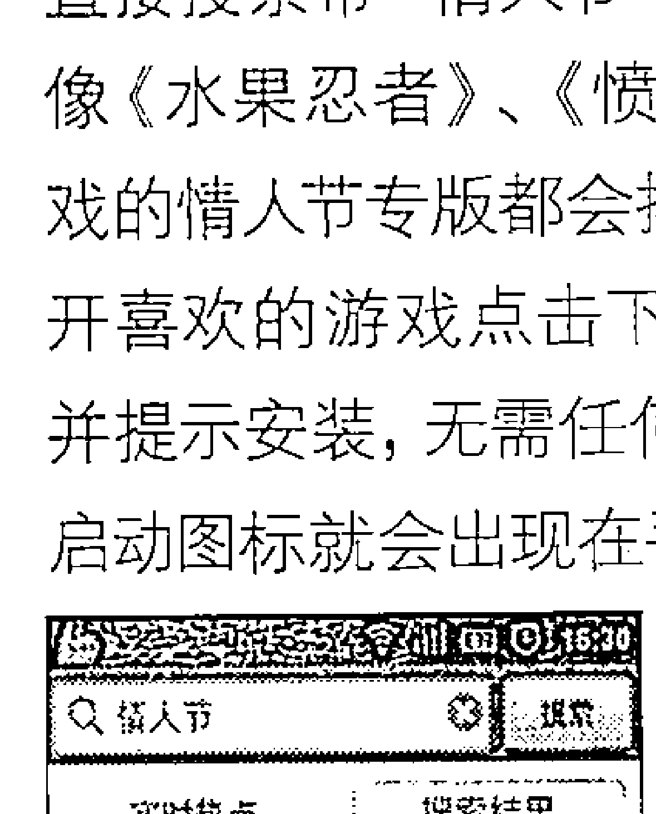

## 贺卡 传递浪漫信息

在这个浪漫的日子，让女友自己找游戏玩游戏，没有其它互动可是行不通的，在2月14日凌晨为女友发一封情人节贺卡，怎么说也比传统的短信来得有意义吧？

此时，Aico智绘贺卡（下载地址：http://tinyurl.com/7f3wyge）就派上用场了。

该软件预设了很多节日的模板和精彩祝福语，软件虽小但功能很强。选中适合情人节使用的模板，对内容进行简单的修改，还可以直接调用相机拍摄图片或视频，利用手绘涂鸦功能还能制作出独一无二的特效（图2）。

如果你怕自己忙而忘记在适当的时间发送，按下手机菜单键并选择提醒，在2月13日临时提醒你一下就好了，可以通过彩信、邮件、微博等途径发给她哦。

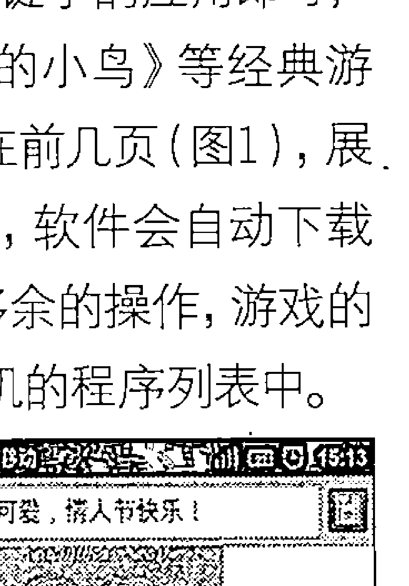

## 思念 唱出来更动听

阿亮担心女友不满足单一的贺卡传情，除了图片和文字，唱歌应该算是传达思念的“最酷载体”了。作为校园十佳歌手的他，自然要传递自己的声音了，而迷你卡拉OK（下载地址：http://tinyurl.com/7f9mer）则是Android平台最好用的卡拉OK软件之一。

选中你想唱的歌曲，点击人脸图标可以直接消除MP3中的原声唱歌，只留下背景音乐，即将MP3变成了伴奏。

插上耳机再点麦克风图标，你就可以对着手机唱歌了，最后点击磁带图标就能直接进行录制，你的手机就是一套完整的卡拉OK设备，联网后还能自动下载歌词文件哦。

唱完了？还不赶紧将录有你声音的MP3传给她？

## 互动 给你二人世界

阿亮的女友属于比较“黏人”的类型，只要没有按时联系就会发“小火”。为此，阿亮还在两个人手机上安装了二人世界（下载地址：http://www.youmeonly.com）。这个软件是针对年轻情侣的即时通讯应用，每个人只能绑定一个Ta，打造二人专属的私密空间。借助二人世界，可以用虚拟形象进行多样化的爱情互动，比如打招呼，亲一亲抱一抱。

阿亮的女友要求更高，每隔几个小时就要求阿亮用该软件汇报当前的地理位置，时刻掌握他的“历史足迹”，虽然限制了自由，但阿亮还是美滋滋的，远在祖国南北的两人仍能在一个屏幕上互动，距离从此不再是问题。

## 天气 及时通报益处多

阿亮女友家住南方，就怕碰到大风和雨雪等极端天气……为了随时提醒她注意最新的天气情况，阿亮在自己手机上安装了MIUI天气（下载地址：http://tinyurl.com/7e9ewko）。这个软件可以在桌面生成美观的天气插件，在设置界面还可打开当前位置提醒的功能。阿亮总将女友所在的城市设置为当前位置，并将女友添加到联系人中，每当出现雨、雪、降温等突发天气时都会自动通知，第一时间告知这位“马大哈”的她。

## 聚会 隐私保护不可少

寒假期间免不了串亲戚、和朋友聚餐等社交活动，就阿亮而言，现在还不希望被亲戚知道与自己交往的是异地同学，更不希望在聚餐中被其他多事的哥们借着把玩手机的理由窥探手机内的隐私。无奈的是，阿亮手机中存着很多与女友合影的照片，以及一些比较敏感的短信和资料，而自己也找不到恰当的拒绝别人看手机的理由。没关系，有了金刚锁（下载地址：http://tinyurl.com/86cmk1）这款软件，保护隐私只需简单几步设置。

金刚锁是一款实用的保护隐私的程序，首次运行记得修改初始密码（默认为1234），该软件提供了应用锁、文件锁、隐藏应用、隐藏图片、密友通讯等功能。举个例子，你可以将女友添加到密友通讯中，这样别人在通讯录就找不到她的痕迹了。

再或者，你不希望别人看你的短信，你可以对短信程序做做手脚：依次进入“应用保护→应用锁”，将“信息”程序（其它软件或游戏均可）添加到应用锁列表中，再点击右上角的设置按钮，开启“使用虚假错误提示功能”，之后当别人点击短信图标就会弹出系统报错的信息，接下来你就可以大方地说：“现在手机系统不稳定，好多程序老报错。”如果你手机中有敏感的数据文件夹，则可在“实用工具→文件锁”中对存储卡中的任意文件加锁，设置同样方便。

# 手机帮你“玩转”新学期

开学在即，小明用压岁钱犒劳了一下自己，买了一部Android 2.3系统的安卓手机。没想到开学后，这个手机竟然发挥了通讯之外的更多职能，让自己在学校里玩得开心又不耽误学业，轻松玩转新学期。

## 数学函数不再头痛

小明上学期的高等数学课差点挂科，这学期可得好好补补。但面对复杂的函数计算，尤其是函数画图，小明有点束手无策。现在有了安卓智能手机，只要安装图形化计算器Arity（下载地址：http://tinyurl.com/7s2csya），除了可以进行各种复杂的计算外，还能用函数画图呢。打开Arity，输入函数，如Y=X^2+SIN(X)，便能生成该函数的坐标图像，点击图像还能全屏观看，并且支持放大缩小，有了这个利器，对付一些作图题就简单多了。

## 轻松实现理性消费

从小依靠父母的小明在学校独立生活，虽然很自由，但不善理财的他也光荣加入了月光族。每月父母寄的生活费，用不了多久就莫名其妙用光了，也不知道到底花在什么地方。其实用一个小小的手机软件挖财（下载地址：http://tinyurl.com/82mvyae）就能帮上大忙，能随时随地方便地记账，比传统的纸笔记账或者电脑记账更方便。打开挖财，点击“记账”，如果是消费支出，则选择“支出”，然后输入金额、类别和时间，然后点击“保存”即可。如果是收入，则选择“收入”，然后输入金额、类别和时间等信息，再点“保存”。另外挖财还可以自动统计，点击“明细”看到以不同颜色表示当月的收入和支出详细情况，并显示收入和支出的总金额，让小明轻松掌握当月消费情况。另外点击“报表”，点击“支出报表”查看当月各项支出占总支出的比例，可了解自己在哪些方面的支出最多。

## 疯玩不怕耽误课

相信很多“童鞋”都有在外面玩疯了忘记课表耽误课的情况，贪玩的小明也不例外。很多次在外面玩，忘记当日的上课时间和地点，还打电话给寝室的兄弟询问，还有一次玩HIGH了忘记了下午二节重要的专业课。现在好了，安装智能课程表（下载地址：http://tinyurl.com/7foxx73），可以提前输入课表，还可以设置提醒功能，避免玩疯了忘记上课。

运行智能课程表，首先录入课程表到手机中。点击手机菜单键，在弹出菜单中点击“新建”，然后选择节次，再输入本节课的课程名称、上课教室、上课时间等，再开启提前功能，设置提前提醒的时间，最后点击“保存”按钮，一节课就录入好了。然后把当天的所有课程录入，然后点击星期旁边的箭头，切换到其他天数，用同样的方法把当天所有的课程录入后就完成了。然后点击“设置”进入提醒设置，先开启提醒，再设置提醒方式，支持铃声提醒、震动提醒、文字提醒。从此，小明再也不用到处打电话询问上课的时间和地点了，而且上课前手机会自动提醒，也不用担心玩疯了忘记上课。

## 随时无线互传文件

课间闲得无聊，看到旁边兄弟正在用手机玩新出的游戏，想拷贝过来打发时间，但手头上没有数据线，当然也没有电脑、无线路由器等设备，如果用QQ发送则太耗GPRS流量，怎么办？其实用飞鸽传书安卓版（下载地址：http://tinyurl.com/6rs76ug）就能搞定，前提是两台手机中有一台有无线AP的功能，把这台设置为AP热点，另外一台连接到这个热点。

使用飞鸽传书的前提是两款软件都有安装，然后在带AP功能的手机上的“无线和网络设置”里面打开“便携式WLAN热点”，然后点击“便携式WLAN热点设置”设置热点名称。完成后，另外一台手机打开WIFI搜索，连接成功后，双方都打开飞鸽传书，在下面的列表中就会出现对方手机的名称。点击名称打开文件传送窗口，按左下角的发送文件按钮，然后选择手机SD卡中的游戏安装文件，即提示等待对方接收，对方接收后就开始发送了。由于手机间的距离比较近，传输速度比蓝牙快了很多。

## 英语四级不再是问题

小明新学期还有一个重要任务就是要通过大学英语四级考试，上次考试还差几分通过，伤不起啊！除了进图书馆看书备考外，利用手机安装大学英语四级安卓版（下载地址：http://tinyurl.com/8y99tdj）也能随时随地进行英语四级考试复习。备考过程中遇到不认识的单词还可以使用QQ慧眼（下载地址：http://tinyurl.com/86ev96e），可以通过手机摄像头扫描单词进行识别。

点击程序主界面的“单词顺序浏览”，可以像用词典记忆单词那样查看四级考试的所有词汇。如果碰到不认识的英语单词，点击“词典功能”，然后在上面的文本框中输入要查询的单词，列出该英语单词的中文含义和音标，还有几个例句介绍该单词在句子中的用法。点击“作文模板”，里面还会列出各种常见四级考试作文的类型，有“正反观点型作文”、“历年真题范文”等，选择类型就能看到作文范文的内容了。点击“考试技巧”可以查看很多关于四级英语等级考试的考前准备和答题技巧，帮你轻松通过英语四级考试。

如果在备考过程中做阅读理解，碰到难度大的，可以利用腾讯的QQ慧眼，通过手机的摄像头快速捕获文字，并进行实时翻译。运行QQ慧眼，点击左上方切换翻译的语言，这里选择“英译汉”，然后把手机摄像头对着资料上的阅读理解，把整篇内容用手机拍下来，再点击右上角的“框选”，用手指在拍摄的图片上框选要翻译的文章区域，在区域中只要点击单词，就能弹出精确的汉语翻译。这样只要点击单词就能翻译，不需要用手机摄像头一个一个单词去实时取景翻译，大大提高了翻译效率。

## 耽误课程不必着急

前几天小明生病了，耽误了几天的课程，找老师要来了上课时使用的讲义和课件，但大部分采用的都是Word和PPT的文档。无需电脑，手机只需安装Documents To## 手机在身边读书很明显

网络时代，电子书籍已经成为人们阅读时不可或缺的工具。在安卓平台有哪些优秀的阅读软件呢？本期我们就做一个简单对比。

每款软件的界面功能都有其特色，不过大多数软件都将在近期浏览的书籍显示在主界面上，这也是最便于用户使用的一种设计。在这几款手机阅读软件中，QQ阅读的书籍分类功能给小编印象最深。

## 界面与软件功能对比

虽说“人不可貌相，海水不可斗量”。不过，外观设计在一定程度上决定了用户的操作方式和用户体验。

### 掌阅书城iReader

掌阅书城也是以书架作为背景，一本本书堆叠其中。不过它并不支持扫描本地书籍的功能，用户需要打开文件夹列表，自己去将手机里的电子书翻出来，比较麻烦。

### QQ阅读

进入“QQ阅读”的书架，书架上展示出最新阅读的电子书目录。另外，还可以点击界面下方的“本地”按钮扫描本地图书。界面最独特的地方就是它的书籍分类，用户可以自定义添加分类，这便于书虫们整理自己手机中的书籍。

## 阅读操作与感受对比

不论一款手机阅读软件中的网络书籍资源多么丰富，阅读功能始终是一款手机阅读软件的核心功能，如果操作不便，估计没有一个用户会愿意使用。许多手机阅读软件都加入了手势操作以及多种个性化设置，让操作以及阅读状态更适合用户。我们接下来就看看每款手机阅读软件的阅读操作。

### 掌阅书城iReader

iReader拥有自己的独立渲染引擎，在不同硬件配置的机器上达到快速渲染的目的，提供给不同用户更好的阅读体验。小编曾在三星5830、HTC G6和i9100上运行过iReader，书籍渲染速度很快。iReader还支持手势翻页，有多种翻页特效，支持书签、全屏、自定义看书文字与背景、白天与夜间看书模式、自定义缩放、自定义看书时的屏幕亮度、备份看书历史、自定义编码等，以上所述内容均可在设置中找到。

### 熊猫看书

在熊猫看书中打开一本书，默认字体硕大，背景色默认为羊皮纸风格，在阅读设置中可以更改。在阅读设置中，用户还可以更改翻页动画、滚屏速度等。不仅如此，熊猫看书还支持省电设置，这是它所独有的，用户可以通过它设定白天黑夜模式的开启时间。另外，熊猫看书支持浏览JPG、BMP、PNG、GIF等格式的图片，还提供了全屏查看、放大、缩小、图片旋转、设置为软件背景等功能。

初次进入91熊猫看书需要进行注册，注册时软件会为用户自动提供一个账号，用户只需要输入两次密码即可。进入阅读界面，点击屏幕中央后，会显示出常用的操作以及设置，这替代了手机Menu键的职能，让用户依靠触屏就可以完成对软件的设置，这种设计很方便。

### QQ阅读

QQ阅读的阅读界面有一个很有趣的设计，在点击页面中心后，除了界面下方会出现菜单，界面的右上角还会多出一条灯绳，用于切换夜间模式。与此同时，你还可以通过手势操作调节亮度。在其他方面，QQ阅读显得中规中矩，整体来说，QQ阅读提供的设置偏少，只能满足最基本的一些阅读需求。

3款手机阅读软件用过一遍之后，发现其中都有自己独特的功能，比如QQ阅读用一根灯绳代替传统按钮来切换夜间模式，iReader有丰富便捷的手势操作，可以调节亮度、字号等。同时，有的软件在阅读体验上还有优化的余地，比如熊猫看书，翻页效果相对来说不是很逼真，不过对于用户操作来说没有多大影响，只是美观问题。

在本次对比中，iReader，QQ阅读，91熊猫阅读各自拥有不同的特色与风格，不过在细节和用户体验方面小编感觉还是iReader略胜一筹，虽然功能中规中矩，但使用起来非常贴心流畅，而另外几款软件在功能细节上有待加强。QQ阅读作为阅读软件的新秀表现也可圈可点，但只能满足一般阅读需求。91熊猫看书熊猫资源虽多，但是文件加载速度还有待提高。

# “春劫”后手机帮你省钱

对不少80后同学而言，刚刚过去的春节犹如“春劫”，从网上大家晒出的“春节账单”来看，没个万八千很难度过此“劫”。没办法，注重礼节是我们国人的传统，花出去的钱好似泼出去的水，既然收不回来就想办法弥补吧。

在龙年“春劫”的洗礼下，小刚的可用资金直降至4位数，在发工资之前必须过上一段“节衣缩食”的日子了。好消息是，现在手机上出现了很多可以帮我们省钱的软件，合理利用这些资源不就可以度过此次难关了吗？

## 电话短信不再花钱

在小刚的日常开销中，手机话费占了很大比重，因此省钱的第一步就从电话开始。现在手机都能上网，用无线网络取代通讯网络是最简单的节流手段，而通过“微微”（下载地址：http://tinyurl.com/7alm574）就能实现免费拨打全球座机和手机。

微微注册时需要绑定手机号，你可以选择发送短信的一键注册形式，也可以选择输入验证码的手动注册形式。微微的界面和拨号界面很像，首次运行记得先在更多中选择“同步通讯录”，如果联系人中也有安装过微微软件的会有图标提示。当双方都安装了微微时，可以选择“免费微微语音拨打”，不受时间限制，而且还能免费发送带有语音和图片的短信。如果对方没有安装微微，则可以选择“免费网络电话拨打”，通过你手机的流量通话，但每天有30分钟的使用限制，而且对方手机无法正常显示来电号码，会显示为“未知来电”。

使用微微时会耗费你手机的上网流量，在2G网络环境下通话质量和视频通话的效果一般，但在3G和WiFi下通话非常清晰，看来服务器还需进一步优化。随着3G和WiFi网络的普及，类似的软件可以实现高质量的免费通话和短信功能，实属省钱必备的软件之一。

## 租房便宜方便是王道

现在租房的价格屡屡看涨，刚过完年房东就提出了涨价的要求，对此小刚的口袋表示“压力很大”，看来在合同到期前，有必要重新找一处便宜的住所了。此时“好租租房”（下载地址：http://tinyurl.com/7n6xvfq）就派上用场了，该软件定位后会自动列出附近的房源信息，预设多种筛选条件，可以快速准确地帮你找到适合自己的房源信息。

小刚的公司在海淀黄庄附近，理论上地铁10号线和4号线周边的房源都在考虑范围内，点击软件主界面中的“地铁找房”，筛选条件上输入相关的信息就能自动列出相关的房源了。如果你对周边环境要求很高，还可以选择“小区找房”，根据具体小区附近的公交餐饮、超市和娱乐等信息再定夺。

## 节流从开销记录开始

交完房租，小刚手头只剩几张百元大钞了，在发工资之前只能靠信用卡为自己提前买单了。与常见的记账软件相比，“卡卡理财”（下载地址：http://tinyurl.com/899ewnd）在提供传统收支记录和统计功能之外，与时俱进地加入了信用卡账户管理功能。首次运行可先按手机菜单键进入设置界面，选择“导入短信”，软件会自动筛选各银行发来的数据自动建立账户。

如果相关短信都被你删除了，则可进入软件首页的“账单”图标，点击右上角的“+”，可以添加信用卡账单，首次添加则需输入尾号、还款日期和账单日等信息。今后你在刷卡后会有短信通知，然后自动记账，对于经常刷卡消费的用户非常实用，也避免了忘记还款日的悲剧。

## 打折商品帮你省钱

在物价和工资涨幅不平等的今天，小刚总是寻求各种打折的商品信息，毕竟在收入没有增加的情况下，打折也算是一种“赚钱”的形式。“积米逛街助手”（下载地址：http://tinyurl.com/86zyh8z）是小刚最常用的LBS软件，运行后它会根据你的当前位置列出周边商场的促销打折信息，而且还可以通过地图的形式显示，部分商场还有详细的地形图。运行积米逛街助手后软件会自动定位并列出周边的促销信息，当然你也可以手动设置商圈，并设定筛选条件，快速锁定感兴趣的促销打折信息。

## 购物前记得扫一扫

同样的产品在哪里购买最便宜？只有这个问题解决了我们的钱包才能踏实，为此小刚准备了各种比价软件。当有固定目标时，小刚会运行“一淘”（下载地址：http://tinyurl.com/7boptrh）查询该产品在各大网上商城的最低价格。如果你嫌手动输入型号信息太过繁琐，或在商场偶然碰见感兴趣的商品，则可利用“淘宝”（下载地址：http://tinyurl.com/7kt9lqs）手机客户端的条码扫描功能，对着商品的条码一扫就能知道它的平均价格，从此就不必担心当“冤大头”了。

## 小提示

如果你常在超市采购零食或日常用品，笔者推荐安装“我查查”（下载地址：http://tinyurl.com/7tb8cbu），该软件收录了各大超市的价格信息，非常适合家庭主妇/夫选择。

## 把握一夜暴富的机会

和绝大多数同学一样，小刚也怀揣着一夜暴富的梦想，经常投身于公益彩票事业。作为“技术型彩民”，研究彩票走势图是小刚每天必修的功课，感兴趣的同学也可在手机浏览器中输入“wap.cp126.com”查看各支彩票的走势图，很多大奖得主的灵感就来源于这些看似凌乱的曲线。

由于加班的关系，小刚在年前曾与双色球3等奖失之交臂（下班太晚错过了购买时间），从此便在手机上安装了“我中啦彩票”（下载地址：http://tinyurl.com/7h6gc4e），软件可实名制注册，通过银联、支付宝、手机充值卡等方式完成充值，脱离电脑或投注站，在手机上就完成彩票的购买以及兑奖的操作，此外还能查看最新的出奖信息，非常便利。

## 省钱防骗 安卓手机上网记

小黄终于买到了心仪的小米手机，但不舍得换掉多年来一直使用的2G号，只能饱受速度慢、不支持CMNET的煎熬。想知道小黄最终是如何解决上述问题的吗？

## 在CMWAP和CMNET间穿越

如今4G都快商用了，但小黄却还在用着神州行15元包月卡，虽然速度不给力但贵在实惠。可惜小黄的包月卡只能使用CMWAP上网，但很多Android系统中的软件或服务都需要CMNET，难道就只能忍痛割爱换全新的3G号了吗？

移动2G号的上网策略存在地域差别，并非所有城市上网都不分CMWAP和CMNET，如果选择CMNET接入点上网会产生额外的扣费。像小黄这种使用早期不限流量套餐卡的同学来说，虽说CMWAP是生命之源，但借助Cmwrap软件（下载地址：http://tinyurl.com/32v3mj3）的配合，仍可免费享用基于CMNET的网络服务。

首次运行Cmwrap，需要先按手机菜单键进入“环境测试”，如果测试全部通过，恭喜你，你的手机将可以用Cmwrap从CMWAP“穿越”到CMNET。进入设置界面，打开“自动开启”的选项，其余设置使用默认状态即可，然后返回软件主界面，点击按钮切换到“启用”状态。现在再试试，是不是那些基于CMNET的服务都能正常运行了呢？如果你所在的城市还在区分CMWAP/CMNET上网，Cmwrap软件则可始终让手机以免费的CMWAP接入点上网，帮你节省上网时的更多开销。

## 监控优化让你“伤得起”

既然流量“伤不起”，如何监控流量的走势，并防止“过度消费”就成了重中之重。如果你和小黄一样，不妨安装“LBE安全大师”（下载地址：http://www.nduoa.com/apk/detail/103194），除了支持系统加速优化之外，该软件还加入了强大的流量监控功能。

首次运行需先进入“上网监控”的设置界面中修改流量套餐，比如笔者朋友用的是动感地带5元30MB套餐，在“设置流量套餐”中输入30即可。勾选“流量报警”，当上网流量超过27MB时就会自动报警提示。接下来再点击“联网权限”，此界面中可以对手机上安装的所有应用添加联网开关，我们可以关闭除了浏览器、短信、微博和QQ等常用软件之外的所有程序在2G/3G下的联网功能（WiFi下再可劲儿上网吧），如此一来就不用担心它们在背后偷跑流量了。

> **小提示**
有些手机随机也会预装一些经常自动联网更新的程序，对这种系统程序，需要进入它的“配置软件权限”界面，取消“信任”的勾选，接下来就能在“联网权限”中关闭它在2G/3G下的联网功能了。

在Android系统中，很多软件除了偷跑流量以外，还有类似自动发送短信甚至拨打电话的隐藏功能，很多恶意软件就是借此功能实现“吸费”的目的。依次进入LBE安全大师的“安全功能→主动防御”，此界面会列出所有具有“嫌疑”的软件，大家可以优先检查有“发送短信”权限的软件，比如在网上随便搜索下载的“ShakeBreak”，运行时会自动发送最多5条收费短信，在弹出的警告对话框中自然要选择“拒绝”啦。如果你不希望自己的联系人和通话记录等隐私数据被第三方软件窃取，点击相关的软件并将其设置在“拒绝”状态即可。

## 利用电脑上网

小黄家还在使用笨重的台式机，也无法使用笔记本共享WiFi方式让手机上网，每次想安装个软件或游戏，都得先下载到电脑上然后再传输至手机SD卡上，好不麻烦。实际上，只需一根USB数据线，手机也能通过电脑的网络共享上网，虽然多了一根数据线的束缚，但总算可以通过手机屏幕体验互联网的精彩世界了。

首先进入手机系统设置，找到“共享手机网络”并打开此界面中的“USB绑定”选项。将手机和电脑相连，在Windows 7系统中会自动安装相关驱动（如果仍无法识别则可到手机品牌官网下载相关的USB驱动），此时电脑应该会自动断网（USB绑定的另一功能是让电脑通过USB线使用手机流量上网，我们的目的是相反的，这个时候记得先关闭手机的移动网络功能，避免电脑耗费手机流量）。

依次进入“控制面板→网络和Internet→网络连接”，你会发现多了一个网络连接的图标（代表你手机的虚拟网卡，为了便于记忆，笔者改为Android手机）。先不管它，找到电脑当前联网的接入点。比如笔者家使用的是联通ADSL，此时正在用名为“西府顾园”接入点上网，那么就右键选中它进入“属性→共享”，勾选“允许其他网络用户通过此计算机……”，在“家庭网络连接”中选择刚刚设置的代表你手机的网络连接，最后点击确定即可。

> **小提示**
打开电脑网卡的共享功能，需要ICS共享服务和DHCP服务的支持，这两项服务不要被360安全卫士等优化软件给屏蔽哦。如果点击共享时出现“0x80004005”报错，请依次进入“计算机→管理→服务和应用程序→服务”，启动Windows Firewall服务。
如果还是报错，可尝试在“internet选项→连接→局域网设置”中选择“从不进行拨号连接”，并取消“自动检测设置”和“使用自动配置脚本”的勾选。

接下来进入手机虚拟网卡的属性窗口，在Internet 协议版本4（TCP/IPv4）中自定义IP地址（192.168.42.1）、子网掩码（255.255.255.0）和首选DNS（8.8.8.8），点击确定后你会发现电脑又能连上网了。

最后的操作是在手机上完成的。在手机上安装并运行“超级终端”（下载地址：http://www.nduoa.com/apk/detail/66561），依次输入“su”（赋予软件Root权限）回车，“busybox route add default gw 192.168.42.1”回车，“setprop net.dns1 8.8.8.8”（设置DNS，不设置将无法访问带域名的网站）回车，恭喜你，你的手机已经可以利用电脑的网络上网了，还不快去试试？

> **小提示**
以上三款软件都要求手机取得Root权限，不同手机破解Root权限的方法不同，大家可以在机锋网、安卓网或其它Android手机社区查看相关教程。

# 零开销 免费享受正版软件

iPhone和iPad上拥有无数好玩的游戏和好用的软件，在不“越狱”的情况下，有没有什么方法能让我们免费享用这些“应用大餐”呢？

随着iPhone和iPad的大卖，苹果iOS系统的功能也日趋完善，同时也吸引了更多软件、游戏开发商的关注，无数独占的顶级游戏和创新应用让Android系统用户羡慕不已。对国内用户而言，更多用户都已习惯于选择越狱并安装盗版软件的方式，来体验iOS系统的精妙。但是越狱后iOS设备将面临令人担忧的安全性，并常常会出现死机、闪退、运行迟缓的问题，在正版软件价格相对偏高的情况下，有什么方法可以让我们免费获得自己喜欢的正版软件？本文将向大家介绍4种较为容易获得正版软件的方法。

## 准备：注册美国AppleID

本文介绍的几种方法所获得的正版软件Code只可在美国iTunes商店使用，所以首先必须要拥有一个美国AppleID，如果你已经拥有了美区账号则可以跳过此步骤。注册免费的美国iTunes账号很简单，先在设置→App Store中注销自己的账号，进入AppStore中选择一款免费软件，点击下载。在跳出的提示框中选择新的appleID并按提示完成注册步骤。需要注意的是在填地区时最好填写免税州，如阿拉斯加州等等。

## 小提示：美区AppStore的优势

虽然中国AppStore已经运营，但相对美区AppStore的软件数量还是少了很多，而且在美区购买$5.99以上的软件时要比中国区的价格有一定优惠。此外，在中国的iTunesStore中还“阉割”了ping、电视节目等功能，而在美区中可以轻松找到这些项目。目前经常有送码活动的商城只有美区和日本区，但日文的语言障碍比较大，还没有专属中国区的礼品码（不过开发商的推广码是所有区通用的）。最后，很多朋友以为在美区下载到的游戏、软件都是英文界面的，其实大部分APP都可以与系统语言一致，在登录时也不需要特殊的设置。

## 方法一：freemyapps

使用自己的iOS设备登录m.freemyapps.com，点击GET apps按钮。在跳转的页面中随便点一个软件图标，点击对话框中的OK以安装描述文件（这个网站无需注册，并会自动通过设备的UDID注册，即使刷机后积分还在）。点击软件的Sponsor Apps按钮，可以看到一些做推广的软件，将软件下载下来并运行30秒就将得到75~150的点数，当点数足够时，便可以在Gift Apps中兑换软件。点击要兑换的软件后会自动跳转到iTunesStore中的兑换界面，点击Redeem此软件就会开始下载了。

## 方法二：JouoWallet

在AppStore中搜索junowallet。下载后打开软件并点击Sign Up，注册JouoWallet账号。在Invite Code中填写邀请人的邀请码即可获得$0.25。注册后点击Earn Gifts，其中列出了几种得到美金的方法：

-   邀请朋友通过你的邀请码完成注册，一次可获得$0.5。
-   下载免费的推广软件，一次可获得$0.16。
-   成为Facebook粉丝（中国因为某些特殊原因，只有打开VPN才可以访问），其它方法与2类似。

点击1后，会生成你账号的邀请码，邀请你的朋友在注册时输入，你就可以获得$0.5。点击2，会自动列出未下载的推广软件，点击后下载运行30秒，可得$0.16（开启美国地区的VPN可看到更多的推广软件，否则可见软件比较少。如果使用的VPN可以打开下载任务后关闭VPN来减小流量的耗费，等到验证的时候再打开）。当你所获得的点数够了$10，即可点击Go Shop来购买Gift Cards，其中可以购买XBOX360、iTunes、Nintendo 3DS、eBay、Playstation等礼品卡，点击兑换24小时后可在Wallet中查看礼品卡信息并兑换。

## 小提示

使用Android系统的设备同样可以使用此方法刷点数，登陆同一账号即可。此外，在AppStore中也有类似的软件如“AppNaNa”，不过赚钱较慢。

## 方法三：FreeAppDaily

在AppStore中下载FreeAppDaily。打开软件你将可以看到一个计时牌，当计时牌时间到0时（以前的时间在凌晨3点，现在的时间在早晨7点左右），会显示出3个推广软件。点击下载并运行30秒，点击软件图标，再点击要兑换的软件后会自动跳转到iTunesStore中的兑换界面，再点击Redeem即可兑换到此软件。

## 方法四：把握促销时机

AppStore中的软件经常会有限时免费的软件，一般是一些休闲类的游戏。不过在圣诞节等节日时，很多软件开发商都会免费放出一些大作。比如去年的圣诞节时，GameLoft的狂野飙车6，EA的SPY MOUSE、Mirror's Edge等$6的高价软件都限时免费了，但能否及时下载这些游戏，就看我们能否第一时间获知这些促销的信息了。可能自己寻找限时免费的软件、冰点特价软件比较困难，这时可以在AppStore中下载AppPusher软件。这是一款可以自动推送限时免费、冰点特价软件的应用，可以及时通知软件特价、免费的消息，非常好用。点击推送的消息会自动打开浏览器转到www.iapps.im，这里不仅有通知消息，还有网友的点评。

## 小结

虽然iPhone在中国已呈现出“街机”的趋势，但在付费意识尚处于培育阶段的国内市场，用户愿意买高价手机的同时并不等于同时还可以接受付费应用。本文内容则能帮助支持正版、反对“越狱”的实用派用户，免费即可得好玩的游戏或者软件，不就是多花些时间吗？反正我愿意了，你呢？

# 油价飞涨 看我省钱绝招

随着3月20日的调价，上海、北京和四川等地的93号汽油已全面踏入“8时代”，这对于刚刚购买私家车的小张来说无疑是当头一棒。想在油价物价飞涨、工资停涨的这段日子攒点私房钱，不靠点“技术手段”怎么能成呢？

## 避免违章 快请司机秘书

作为驾驶新手，最近小张每月都要跑几趟交通队，违章罚款的总额都快够买一部新iPad了。为此小张每天晚上回家都会用电脑在网站上查询违章信息，每次都需要输入车牌号和发动机号，好不麻烦。幸亏同事小李推荐了一款手机端的“司机秘书”软件（下载：http://tinyurl.com/6wk8gwx），可算是解决了随时随地查违章的问题。

首次运行先点击界面底部“更多”按钮进入设置界面，设定你所在的城市，在车辆管理界面中则可添加车辆信息，根据提示输入车型、交通局以及车牌号和发动机号，成功后在车辆信息页中会出现“刷新”按钮，点击就会自动罗列出该车最近所有未处理的违章信息，并会告诉你此次违章扣多少分罚多少钱，让你心中有数。

此外，这款软件还支持查询当天油价、天气和近期的限行安排，对小张这种经常忘记限行时间的马大哈来说都是颇为实用的功能。从此小张每次都能第一时间了解最新违章信息，避免在同一地段多次跌倒。

## 加油哪便宜 问高德车友汇

虽然油价上涨了，但很多加油站还是有自主的定价权，时不时搞一些促销活动来吸引车主，如果可以获取这些促销信息，久而久之也能节省非常可观的费用。“高德车友汇”（下载：http://tinyurl.com/6uz37jv）可以通过GPS、WiFi或基站定位并找出周边相对便宜的加油站或停车场，并以地图的形式直观展现，帮你顺利导航到目的地。

根据要求填写个人/车辆信息注册后软件首页会显示当天的天气和洗车指数，告知当天的限行信息，并可直接查询该注册车辆的违章信息。

车辆的违章信息。该软件还支持语音播报和代回短信功能，为你解决开车时不方便接听电话和回复短信的问题，一举两得。

## 图吧助你语音导航

对司机而言，少走冤枉路就意味着省钱。对小张这个新手而言，本来开车的技术就很菜，一边开车一边在手机上输入地址或导航信息可是相当危险的，因此支持语音控制的“图吧导航”（下载：http://tinyurl.com/7mnqj4d）自然成为了他的首选。和普通的导航软件相比，图吧导航加入了AR（增强现实）功能，实现实景导航功能，告诉你前面路口的红绿灯状态和摄像头信息，并可全程通过语音进行导航。

图吧导航需要开启手机硬件GPS，配合GPS、WiFi和基站混合定位技术可以快速精准定位，如果你手机流量有限，可以提前下载全国离线地图包。该软件采用了讯飞语音输入法，语音识别率很高，并可以提供智能路线规划功能，还可添加流量统计服务，显示周边餐饮、购物、停车场等信息点，非常适合不熟悉路况信息的新手司机。

注意，图吧导航对小城市的支持并不算好，如果你需要外地自驾游，还是建议选择“凯立德”或“高德导航”等导航软件。

## 限行日出门找8684

随着北京交通压力的不断增加，针对私家车限行的力度也会越来越大。在限行的日子中，地铁和公交就成为小张出门必乘的交通工具了。虽说上下班是轻车熟路，坐啥车到啥车都了解，但有时会出现临时性的拜访客户和外出开会的需求，此时就需要借助“8684公交/地铁”（地铁：http://tinyurl.com/85dvo2v；公交：http://tinyurl.com/7uwr2mq）这两款软件帮忙了。

首次运行尽量在WiFi环境下，软件会下载当地的离线数据。软件界面都很简洁，拥有换乘、线路和站点三大查询功能，比如笔者想从六里桥到小黄庄，只需在换乘界面输入起点和终点的信息，再点击换乘查询即可，非常方便。

## PickRide 让拼车更给力

北京的早晚高峰时段小张总被公车和地铁中的人流挤成照片状，眼看夏日即将来临，到时再碰到几个有狐臭的……想想都恐怖。一边是尾号限行，一边是高油价，再有就是拥挤的公共交通工具，这让小张又打起了拼车的算盘。PickRide（http://tinyurl.com/86n4cuv）是iOS和Android平台最热的拼车应用，与类似软件相比PickRide支持微博账号注册，其他用户的回复会显示在你的微博私信中。首次运行可以用自己的新浪微博账号注册及登录，在使用时必须开启GPS功能，当初次定位后会弹出用户需求的填写界面，设定常用的地址。当你想拼别人的车，就可填写当前的乘客数量、前往的目的地、愿意支付的费用。想找别人拼车，则需提供空位数量等。在地图上会显示前往目的地的车辆和司机信息，如果觉得靠谱直接拨打地图上的号码即可联系。

PickRide的亮点在于提供了相对完善的信用机制，与信用好的人拼车，被放鸽子的几率会大幅降低。借助PickRide，小张在非限行的日子提供搭车服务可以获得少许报酬，而限行日选择拼车也能方便交友，也算是响应当前绿色出行的号召了吧。

## 汽车管家 帮你养成记账习惯

自从买了汽车，小张发现自己的生活质量明显降低，加油、交停车费/罚款、保险保养等流水账搞得自己都不知道钱是怎么没的了。想节流的前提就是要算笔明白账，汽车管家（http://tinyurl.com/7dqm3hq）和手机理财软件中的“挖财”类似，只是其中数据项目都和汽车常见的开销有关。

首次运行需要点击主界面右上角的“+”号录入车辆信息，在设置界面中则提供了多种类别的开销项目，日常的停车费、过桥费和违章等支出都可添加到记账选项中，而每次加油、保养、保险和年检的信息都需录入到专门的类别中，以便软件统计汇总，可以让你直观了解爱车每月的油耗，而且软件还支持提示功能，会自动提醒你车辆保养、保险和年检等时间。

# 毕业找工作 手机来帮忙

大学生曾经被誉为“天之骄子”，但随着几度扩招之后，即使你读到硕士也很难一下子就找到满意的工作。对即将面临毕业或者想在大学期间打工赚钱的同学而言，为何不借助手机来助我们一臂之力呢？

隔壁寝室大四的王同学最近找到了一份非常体面的工作，没事就来我们寝室得瑟，着实羡慕煞了几个兄弟。没办法，现在找份自己满意的工作可不是件容易的事情，东奔西走穿梭于各种招聘会不但耗费时间，也增加不少经济压力，效果还不一定好。没关系，随着智能手机的普及，在小小的屏幕上就能带给你足够有用的招聘信息，不但速度快、信息广，而且还节约开支。不相信？那咱们就一起来看看吧。

## 邻近毕业 提前兼职演练

小李虽然还是大三，明年才面临毕业找工作，但同班很多同学都在学校所在的城市里找了兼职，过上了自给自足的日子。于是小李也准备找份兼职锻炼自己，培养交际能力，顺便赚点生活费，减轻家庭的经济负担。对普通学生而言，想找兼职通常需要熟人介绍（信息量太少）或者找中介（要收费），机会和成功率有限。其实，只需在手机上安装“百姓网精简版”（下载地址：http://tinyurl.com/72cyunv）就可以在手机上搜索同城的兼职职位了。

运行后点击“兼职招聘”，然后点击“切换城市”，选择自己所在城市，再选择要找的兼职职位的类别，比如“促销”、“家教”、“翻译”、“设计”等，选择后就可以获取职位信息。如果满意，最后点击“点此下发到手机”就可获取联系方式并与职位提供者进行联系了。

## 毕业后 抓紧找工作和职位

除了找兼职，大学生面临更重要的事情还是找一份理想的工作，在没有电脑的情况下，也可以用手机安装“前程无忧”（下载地址：http://tinyurl.com/c93pdko）客户端，随时随地搜索职位信息。前程无忧是由51job前程无忧网站为手机用户定制的求职软件，职位信息非常丰富，更新也很及时。

运行前程无忧后，单击“职位搜索”，然后点击“职位名”，在搜索关键字栏中输入职位信息关键字，如“网络维护”，然后设置地点筛选条件，如“湖南”，再点击“搜索”就可以找到符合条件的所有职位信息了。点击职位可以查看该职位的详细信息。如果对某一个具体公司的招聘信息比较感兴趣，可以通过公司名来搜索，点击“公司名”，然后输入公司的名称，点击“搜索”就能找到该公司的招聘信息。

## 没经验 找校园招聘信息

周同学以前也在网上找过很多职位，投的简历也非常多，但大部分都石沉大海，因为很多职位都要求应聘者有一定的工作经验，而这恰恰是大学生所欠缺的。好在很多校园招聘会和校园招聘的信息中所提供的职位多是针对大学生，不需要有工作经验，对于还在校园的学生们可以通过手机软件“校园招聘”（下载地址：http://tinyurl.com/bphsqeh）来搜索本城市各大高校正在举办的校园招聘信息。

运行校园招聘，首先点击界面左上角选择自己所在的城市名称，如“武汉”，即可搜索到本城市各大高校的校园招聘会信息，按照时间的先后顺序排列，每个校园招聘会都包括地点、时间，点击招聘信息即可弹出工具菜单，点击“查看详情”即可调用浏览器打开该招聘会的详细信息，包括公司介绍、具体时间地点等。如果怕自己忘记，还可以点击“设置提醒”，到时候手机会自动提醒，让你不会错失机会。如果你对校园招聘的地方不是很熟悉，可以点击“路线”，会调用百度地图，标出校园招聘会的具体地点和路线，让你轻松找到校园招聘会现场。

## 求方便 机会就在身边

有时候为了方便，很多同学都想在学校附近找工作或者兼职，而“赶集生活”（下载地址：http://tinyurl.com/cux2hkp）就为大学生提供了“附近”功能，能通过手机定位找出自己所在位置附近的全职职位和兼职工作，为那些想在附近找工作的学生提供了方便。

打开赶集生活，点击“附近”，软件会自动定位出当前手机所在的位置，然后在职位分类中点击“全职招聘”或者“兼职招聘”来搜索附近3000米范围内的职位信息。

## 好简历 帮你提高成功率

小杨同学的专业成绩还不错，年年都是奖学金获得者，但每次找到中意的职位并写好简历进行投递后都查无音讯，没有下文，而同宿舍的小严属于每次考试都会挂科的主儿，但却很容易就找到了月薪3000元的工作，经过经验的分享后小杨才发现是自己的简历出了问题，尽顾着突出成绩的优良却忽略了很多细节。如果你也觉得自己的简历写不好，不妨参考“前程无忧”的“职场资讯”中所提供的信息。

在“职场资讯”中详细介绍了在写简历时要注意的问题，比如你知道如何才能在简历中突出自己的优点吗？点击“职场资讯”里的“简历指导”，可以看到很多指导大家写简历的文章，点击文章标题可以打开文章的内容进行阅读，包括一些大学生在写简历时的常见误区，有了这个法宝，相信大家一定能写出更吸引人的内容。

## 想面试 提前功课不可少

面试是找工作过程中比较重要的一环，面试中表现的好坏直接关系到能否签约，很多同学都是在面试的时候表现不佳而被无情地拒绝掉。其实面试除了平时知识的积累和交际等综合能力的考查外，也有一定的技巧可循。一般考官面试除了考核你个人工作能力外，还会在面试过程中观察你的个人修养和临场应变能力，面试中哪些表现会让你的面试加分？如果你不清楚的话，可以让“面试技巧”（下载地址：http://tinyurl.com/d22q9yl）软件告诉你，帮你清楚了解面试中礼仪等问题。该软件提供了有

# 和Wii说Bye 手机玩体感

还在羡慕任天堂Wii游戏机吗？如今只需一台安装Android或iOS系统的手机，再借助普通的PC和AIWI软件同样可以享受体感游戏的乐趣，让你在游戏中也能起到强身健体的奇妙功效。

AIWI是能够将iPhone/iPod Touch/Android平台的智能手机当作游戏手柄来控制计算机游戏的软件。只需将计算机和智能手机设备通过3G热点和/或无线网络（WiFi）联机，就可以体验用手机玩体感游戏的畅快了。因为篇幅有限，软件具体的下载连接方法请参考这个链接：http://tinyurl.com/7dr9fgj。

小提示 笔者测试的手机型号为三星i897（Android 2.3系统），家中的网络环境为中国联通10M光纤（Tp-link w740n无线路由器），电脑预装Windows 7 SP1（64位）系统。

让手机和PC联姻 首先需要打开手机的WiFi并接入和电脑（笔记本）相同的无线网络，并启动手机上面安装的AIWI客户端。在电脑上运行AIWI，并在主界面的左边选择“装置连接”，然后在下面选择“连接向导”，在连接向导里选择Android设备并以“手动设置”操作，输入手机客户端界面上的IP地址，然后再输入PIN码，一般默认是0000，根据提示操作即可完成连接。

实际游戏体验 AIWI体感游戏客户端的界面和苹果的APP商店很像，里面提供很多免费的游戏试玩版，我们可以根据游戏的分类找到自己想玩的游戏。以“拳击之王”这款游戏为例，先将该游戏下载就可以进行游戏了。此时手机屏幕的TOUCHING AREA区域变成了一个触控板来控制PC端的鼠标，轻点屏幕是确认。根据笔者的试玩，推荐用户右手持手机，因为在挑衅模式和绝招模式下通过右手大拇指操作比较方便，也更容易找到一个合适的摇摆角度。整体操作的感受取决于手机重力感应系统，如果你的手机支持三轴陀螺仪感觉会更真实。

遥控电脑更方便 如果你用AIWI只玩体感游戏可就真的大材小用了，它除了可以带来类似Wii游戏的真实体验，还可用来控制电脑代替鼠标呢。当你进入某个游戏后，先按键盘上的Windows徽标键切换到桌面，此时手机上面的控制区域并没有退出，大家在手机的控制区域点击一下试试，是不是屏幕上的鼠标指针也跟着在动呢？呵呵，切换出来它就变成了一个触摸板，跟笔记本触摸板的使用方法一样，而且整个手机全屏幕触摸，轻点一下就是单击。遗憾的是没有鼠标右键功能，而且在触控区域并不支持多点触摸功能，因为AIWI提供的游戏基本上不会用到多点触摸。

如果感觉鼠标指针不是那么的灵敏的话，大家可以暂时将系统的杀毒软件和防火墙关闭，退出像PPS、PPTV、迅雷、QQ炫风在内的网络应用程序，减少带宽的占用。如今的安卓智能手机基本上是4英寸屏起步了，用它来控制电脑还是比较爽的。

小提示 AIWI会调用手机的震动功能，让拳击显得更为真实一些，这个游戏仅提供了试玩版，如果想玩完整版就需要花钱来购买了。AIWI不光可以玩客户端版的游戏，还有网页版的游戏，游戏方法比较类似，大家可以体验一下。

（文|小强 南坡Man）

# 远离碰瓷 手机行车记录仪

我们对“彭宇案”最新披露的真相不作过多评析，但由此引发的道德滑坡却已成既定事实。对司机朋友而言，各种碰瓷已成心头大患，因此我们有必要学会如何用随身的手机“保护”自己。

路段狭窄，人车混行，很多特殊路段屡屡出现“碰瓷专业户”。每当听说类似案件，很多司机都后悔没有安装行车记录仪，出了事故没有任何视频可以作证。还好碰瓷毕竟是小概率事件，我们也无需为此买一部专业设备，因为Android手机就可以是一部高档的行车记录仪。

## DailyRoads帮你忙

手机做行车记录仪需要借助DailyRoads软件（下载：http://dailyroads.com），注意一定要安装到SD卡中。DailyRoads被誉为最好的手机行车记录仪软件，这里推荐大家安装1.7.2.wm（不带Google地图版），由于去掉了Google地图，可以安装在没有Android Market的手机上。

小提示 使用DailyRoads需要打开手机的GPS

（文|贺全荣）

## 软件设置很重要

功能，并将手机放在GPS信号充足的地方。由于发生剐蹭事故一般在车辆右边，笔者建议放在车前挡风玻璃右前方，既可以获得很好的摄像角度，又不会遮挡视线。在手机固定上，建议可以网购手机车架固定装置进行固定。

首先需要修改DailyRoads软件的视频质量，单击手机菜单键依次进入“设置→录像→视频质量设置”。低画质（177×144）每分钟需2MB左右空间，高画质（720×480）则需要15MB左右，在16GB TF卡都跌破80元大关的今天还是尽量选择高画质吧。为了保证事故发生时处理过程的信息详细，建议大家将视频时间设置为10分钟以上。该软件的特色在于当系统默认加速变化较大（撞车）时可以自动保存视频，不过这个功能有利有弊，为了防止刹车的时候覆盖原来的视频，建议保留视频设置在5个以上。

然后进入基本设置，选择使用GPS卫星。选择这个选项之后，系统会在录像中自动叠加速度信息。不同路段车速限制不一致，同样一次事故，速度快慢有时候会影响事故的定性，设置后视频上就会出现信息的叠加效果了。

## 实战演习效果好

以上设置好之后，当你到了特殊的路段（人车混行或听说有经常碰瓷的地点）时只需单击主界面的录像按钮，系统就可以开始行车记录了。嫌不方便，可以让系统工作在自动模式下，选择开始录制视频，即可以自动开始录制视频。值得注意的是，此项功能需要使用手机车架，当手机检测到车架会自动执行该功能。

通过这样的设置之后，一部行车记录仪就诞生了。不过，这部行车记录仪还有一些使用中的小问题。比如供电电源，大家可以用车载供电和外置电源盒来解决，车载充电要选择质量好的（输出电流和手机充电器相近的），外置电源盒则需要选择容量稍大的。如果你担心视频记录会占满存储卡中剩余的存储容量，则可在软件中选择循环删除，这样只需500MB左右的空间就足够了，因为录像文件可以进行循环覆盖。

> > 小提示
视频设置时一定要打开声音。因为作为证据使用的时候，可以对车内的行为和整个处理过程进行举证，这样碰瓷、钓鱼执法整个过程就可一目了然了。此外，在DailyRoads运行期间一旦手机来电就会导致视频暂停，而行车接打电话则有可能会被扣分，还是请大家遵守交通法规吧。

（文|河南 赵建超）

# 智能开锁屏 解放电源键

手机电源键平时用得最多，如何最大最大限度地延长电源键的寿命，甚至是用软件来代替电源键的操作呢？

小张平时开机键用得太多，如开关机和开屏、锁屏用得比较频繁，达到了开关的极限寿命所致，维修起来比较麻烦，而且价格不菲。其实我们可以安装软件来实现锁屏、开屏和关机等按键操作，既能临时救急，也可以解放电源键，最大限度地延长键的使用寿命。

## 光感开屏锁屏

如果手机有光线感应器，则可以安装Light Lock（光驱锁）软件来代替电源键开屏锁屏，它是通过光线感应器来控制屏幕的锁定与解锁。先下载安装Light Lock，运行后点击“设备管理员”，然后勾选“光驱锁”后面的钩开启光感应功能，弹出“要激活设备管理器吗？”的提示），选择“激活”就可以了。不勾选“光驱锁”则取消激活。

还可以根据个人习惯设置锁定按压手机光线感应器位置的时间，点击“设备锁定设置”，选择“锁定”，点击“锁定按压时间”，选择自己合适的时间。用同样的方法可以设置解锁的按压时间。设置完毕后，把手机放在口袋里没有光线就自动锁屏，拿出手机，用手指去按一下手机光感传感器的位置就解锁了，完全不用按电源键。

> > 小提示
该软件不能像一般的软件那样删除，会提示卸载失败，需要先取消激活才能卸载成功。

## 晃动开屏锁屏

如果手机没有光线感应器，但有重力感应功能的话，可以用ShakeOnOff软件来实现晃动开屏锁屏。运行ShakeOnOff，先在“幅度”栏中选择晃动手机的幅度大小，幅度一般选择中或者大，不能设置得太小，防止在口袋里产生小晃动而开屏锁屏，然后在“速度”栏中选择晃动速度，一般选择“慢速”就可以了。

，然后在“方向”栏中选择晃动的方向，有“从左到右”和“从右到左”两种方式，这个根据个人习惯选择，再设置再次打开或者关闭屏幕的时间间隔。

另外软件默认只开启了晃动锁屏，晃动开屏是关闭的，需要点击“晃动开屏”后面的“打开”，最后点击“开始”就设置完毕。第一次设置的时候弹出需要激活设备管理器的提示，点击“激活”就可以了，安装设置完成后只要掏出手机轻松一晃，就能实现开屏锁屏了。

经过测试，开启该功能后，手机的耗电量会增加，如果需要关闭该功能，只需要点击“关闭”即可暂时关闭，另外该软件需要点击手机“设置”，选择“位置和安全”，点击“选择设备管理器”，取消勾选ShakeOn0ff，才能完成卸载。

## 按键救星虚拟键

除了光线感应和晃动开屏锁屏外，也可以用按键救星软件来生成虚拟键，代替手机按键完成相应工作，彻底解放手机的实体按键。

运行按键救星，点击“关闭/打开按键救星服务”来打开按键救星功能，这样在手机桌面右边会多出一个箭头图标，点击箭头后弹出几个虚拟按键，包括模拟主页（Home）、菜单（Menu）、返回（Back）、电源开关四个实体按键，然后我们就可以通过触摸屏幕上的虚拟键来完成相应的操作，大大减少实体按键的损耗和保护手机按键寿命。

（文|冼墨池）

# GPS手机在手 出差不再愁

小白由于工作需要经常要到外地出差，可惜自己是路痴，来到陌生城市经常遇到各种尴尬。此次出差，小白找到了帮手：使用支持GPS的智能安卓手机，并通过各种基于位置服务的软件来解决出差过程中可能遇到的各种问题。

提起GPS，可能大家的第一印象就是导航。其实，GPS除了能解决常见的驾车导航以外，再结合一些支持AGPS基站定位的软件，在日常生活中还能扮演更全能的角色呢。

## 搜星软件帮你快速定位

小白的安卓手机没有别人的手机搜星那么快速，尤其是在室内或者天气不好的情况下，即便打开了AGPS辅助搜星也是如此。好在有了“GPS状态”这款辅助搜星工具，运行后会自动扫描卫星，大概10多秒就可找到卫星。有了这个秘密武器后，小白的手机搜星速度和准确度明显改观。

## 陌生城市打车不怕被宰

下了飞机，初次来到陌生城市，小白不知道离住宿的宾馆有多远，走哪条路最近，打的大概需要多少钱，想起上次到外地出差被不良出租车司机带着在城里绕来绕去，花了不少冤枉钱。为了避免再次被宰，小白早就做好功课了。运行手机上的“HiTaxi掌上出租车”，马上就能通过GPS定位出自己当前的位置，并用头像标示出来，然后点击放大镜图标进行路线规划，输入目的地地址，点击“确定”就能找出最佳路线，在下面列出具体路线，还有打车的距离和全程费用估算。有了这个法宝，再黑心的出租车司机也不敢冒着被投诉的危险欺骗小白了。

## 没去过的餐厅哪里好

搞了一天的培训，小白在晚上约了几个朋友到外面聚餐。不知道这个城市哪里口味最好（实惠），打开手机里安装的LBS美食分享软件“开开”，可用QQ号码、新浪微博、搜狐微博、人人网等账户登录，点击“地点”就能找出附近网友们分享的美味餐馆，并显示名称和距离，点击餐馆名称可以看到餐馆的电话并进行预定和咨询，但小白还是不知道如何找到餐馆，再点击地图图标，可以在地图上标出详细位置，这样小白就能轻松找到美味又实惠的餐馆了。

## 临时取款快找ATM

参加聚餐，为了避免结账钱不够的尴尬，还是提前多取点钱为好。小白不知道附近哪里有ATM取款机，满大街寻找费时费力。这可难不倒小白，手机里安装的“ATM位置通”派上用场了，它能找出最近的ATM自动取款机及银行，而且显示出当前位置到银行的步行路线图。运行软件，点击“附近的ATM”选择自己的银行，软件会自动搜索并列出附近所有的ATM机器，并且按照距离的远近排列。小白找到了ATM机，但对当地路线不熟悉，不知道如何走，点击“查看地图”，即可在百度地图上显示出该ATM网点的位置、小白的位置以及步行路线，而且查阅路线时可用放大缩小工具来查看细节，让小白轻松找到最近的ATM机，顺利取款。

## 小提示

在陌生的地方取款，最好掌握一些取款时的防骗技巧，在主界面中点击进入“取款防骗”栏目，会有详尽案例介绍。当你遇到ATM故障或者其他异常时，可以点击“银行电话”查看各银行的客服电话，及时联系银行的大堂经理或者值班保卫人员进行处理，也可以拨打银行客服进行咨询求助。

## 突然内急怎么办

出差第三天下午，小白决定到街上买点特产带回家。突然内急，估计是头天晚上聚餐酒喝太多拉肚子的原因。赶紧运行手机上的“噢粑粑”，点击“找厕所”菜单项，此时软件会根据你的定位信息将周围所有的厕所列出来，并按照从近到远排列，在列表信息后面还有一个小指南针指示其方向，非常贴心。小白对当地路线不熟悉，点“离你最近的厕所”并打开地图提示，软件会自动打开百度地图，并根据你当前的位置将步行路线呈现出来。

## 游玩走散 及时归队

第四天客户请小白到郊区的几个景点游玩，由于景点人比较多，小白只顾和美女搭讪而走散了。赶紧拿出手机联系，悲剧的是手机卡里没钱了，而且附近也没有公共电话，向路人借电话换来的也是白眼。幸运的是，小白手机里安装过“好友定位”软件，而且提前已经加客户为好友了。

运行“好友定位”，用自己注册的手机号码登录，首先会检测自己的位置，然后点击“好友列表”，里面会列出当前的在线好友和离线好友。找到客户的名字，就能将他和自己当前的具体位置标示出来，该软件的地图数据非常准确，小白根据手机上的位置，很快就找到了客户，及时归队。

## 手机丢时不用慌

上午开会觉得无聊，用手机打游戏吧。一摸兜，小白的心瞬间就变得哇凉哇凉的，手机不见了！难道是路上被小偷“光顾”了？好在小白手机里安装了“金山手机卫士”，其防盗功能可以定位手机的具体位置。马上拿朋友的手机发送定位短信指令“dingwei#防盗密码”到自己的手机，定位成功后，被盗手机将向手机发送短信来报告当前所在位置。小白一看，原来是掉在宾馆房间里忘记拿了，这下可放心了。

## 寻找附近好友打发时间

晚上的宾馆好无聊，没有一个好看的电视节目，如何才能打发无聊的时间呢？小白想到了手机上还安装着“朋友网”呢，这款软件可以帮你寻找同城附近的好友。打开软件用QQ号码登录，然后点击“附近的人”，软件就能通过GPS定位你当前的位置，然后搜索出距离最近的正在使用“朋友网”的全部人，并显示出离自己的距离（说不定还有很多美女哦），点击人物头像就能查看其资料并进行聊天了。

## 本文涉及软件下载

| 软件名称 | 下载地址 |
| :--- | :--- |
| GPS状态 | http://tinyurl.com/873tdrp |
| HiTaxi掌上出租车 | http://tinyurl.com/837mj9c |
| 开开 | http://tinyurl.com/7cw39b6 |
| ATM位置通v2.0 | http://tinyurl.com/6ojh3bx |
| 噢粑粑 | http://tinyurl.com/7tsqdnz |
| 好友定位 | http://tinyurl.com/7dkwek6 |
| 金山手机卫士 | http://tinyurl.com/7m9zwow |
| 朋友网 | http://tinyurl.com/6uym52e |

(文|贺全荣)

# 暑期自助游 手机来搞定

自助出游面临不少问题，不跟团旅游对交通、住宿、景点等情况不熟悉，也没有导游现场讲解，怎么办呢？发挥安卓手机的作用，用软件来帮助我们吧。

马上就到暑期了，单位几个同事准备出去旅游放松下，但想起上次跟团打仗式的旅游就郁闷。跟陌生人拼桌吃难以下咽的饭菜，途中强迫购物，还没来得及欣赏美景就被赶着往前走，这些都让人烦恼。其实几个同事一起自助游是个不错的选择，可以摆脱旅游团的束缚，在时间上完全自己把控，让旅游更加自由。而现在有了智能手机软件的帮助，自助出游更加便捷了。

## 酒店、门票早预定

出门旅游，首先是前期的准备阶段，可以用手机来帮忙，如查询旅游地有哪些吸引人的著名景点，帮助选择大家都有兴趣的旅游地点，根据当地未来几天天气情况选择出游日期。另外也可以提前预定当地的酒店宾馆和打折门票，这样可以获得一定的优惠。

## 选地点: 乐自游

到www.leziyou.com上下载“乐自游”安卓版，可以提前查看各大城市旅游景点信息，帮助提前选择好旅游地点。运行后先选择自己准备旅游的地点，软件收录了国内各大省市的多个著名景区，如“海南三亚”，选定城市后，点击“游玩”可以方便地查看城市各个景点简介。上面详细介绍了该城市的地理位置、旅游景点，还有部分景点的图片，让我们详细了解该地的旅游特色。为了提前知道当地未来几天的天气情况，在主界面上滑到最后一页，可以看到当地最近3天的天气预报，避免下雨不方便旅游。

## 订酒店: 驴妈妈旅游

驴妈妈旅游是一款以打折门票、自由行、特色酒店为核心的软件，提供自助游产品预订查询服务，运行后，点击“目的地指南”，选择准备去旅游的省份和城市，即可查看软件提供的旅游指南，包括介绍、交通、最佳季节、购物和特色美食，让我们对该地有一个大致的了解，对选择好旅游城市大有帮助。

另外驴妈妈旅游还提供了特色酒店预定功能，点击“特色酒店”，选择省份和城市，就能找到该城市的一些特色酒店，显示酒店名称、原价和打折价。如果找到的酒店比较多，可以点击“筛选”，设置酒店的价格范围和星级，点击酒店名称可以查看详细介绍，满意后，点击“预定产品”进行预定。

## 定门票: 景点门票打折

用手机安装景点门票打折软件可以提前预定景点门票。运行后，点击“景点门票预订”，然后选择景点所在的省份和景点名称，进入景点门票预定界面，上面有景点级别以及原价和打折预订价格，点击“预定”，填写预定数量、日期和取票人姓名、手机号码，确认后可以获取订单短信，作为到景点后的取票凭证，而且不需要提前支付门票费用，到景点门票处付款即可。

### 打车出行防挨宰

选择好旅游地点后，来到旅游地点游玩，不得不在各个景点之间来回穿梭，在陌生地方有时候打车比较难，也可以用手机来帮忙找到车，规划合适、划算的打车路线，了解打车预算价格，防止被宰。

## 巧出行: 掌上出租车

运行安装好的HiTaxi掌上出租车，马上通过GPS定位出当前自己的位置，并用头像标示出来，然后点击放大镜图标进行路线规划，输入目的地地址，点击“确定”就能找出最佳路线，还有打车的距离和全程费用估算。

## 景点、线路巧规划

到了旅游地点后，由于自助游没有导游，如何规划合理的旅游路线，让大家少走冤枉路，用较少的时间看最多的景点，找到自己喜欢的景点，没有导游也能了解各景点介绍，这些都可以用手机来搞定。

## 随身导游: 乐自游

到了旅游城市后，用乐自游可以查看周围景点情况和规划路线，最大的特点就是语音现场讲解功能，可模拟导游用语音讲解景点。

点击“游玩”，会列出周围所有景点的信息，选择自己感兴趣的景点，如“三亚天涯海角”。详细介绍景点的开放时间、门票价格和交通指南，交通指南有具体的公交路线等，十分详细。点击“查看三亚天涯海角位置”，还可以在地图上显示出景点的位置和周围，方便大家找到景点和规划路线，不走弯路。

到了景点后，还可以听景点语音讲解，比真导游更给力。点击“地图”，就可以以地图、列表以及卫星地图等多种模式将周围景点都显示出来，也可以显示景点周围的购物、娱乐、酒店等场所的信息，点击+一号还可以使用地图缩放功能，对景点进行详细的浏览。运行乐自游后只要进入景点范围内，手机便可自动识别景点名称，弹出真人语音讲解导游界面，对该景点进行详细的语音介绍，让我们可以更深入地了解景点内涵。如果周围环境人比较多，很嘈杂的话，可以带上耳机慢慢聆听，和真人导游非常相似。

## 规划线路: 朋游风景

运行朋游风景后，先选择旅游地点，可以在搜索框中输入关键字搜索，也可以在“国内景区”里选择省份和景区。如选择“海南三亚市”，然后点击“地图模式”，它会帮我们把当地所有景点在GOOGLE地图上标识出来，方便我们选择要观看的景点和规划线路。

点击地图上的景点图标可以查看景点的详细情况，如景区介绍、门票价格、游览路线和游玩指南。点击“游览线路”可以在地图上标出合理的自助游线路，方便我们参考线路进行游玩。

## 小提示

在旅游的时候可以安装“ATM位置通”以帮助自己在需要取钱时快速找到附近的ATM取款机。

## 美食要品钱要省

旅游除了看天下美景外，另外一个重要的目的就是尝当地的特色美食，在陌生城市不知道当地特色美食有哪些？如何找当地实惠的特色美食和餐馆呢？也可以请手机来帮忙。

### 品小吃：百度身边

百度身边是一个基于位置的生活消费信息分享平台，让你随时随地找附近的特色餐馆。运行百度身边后，软件会自动定位当前所在城市，然后列出附近的特色餐馆，包括与自己的距离。点击后可以看具体地点和电话，方便找到餐馆和电话联系。如果吃后觉得不错，可以点击“拍照”给美食拍照，可随时随地上传美食照片，成为美食拍客一族。另外还可以给该餐馆和美食写上评论，方便其他网友进行参考。

### 团美食：团800

多个同事在外自助游，用团800团购当地的特色美食也是不错的选择，实惠又可口。进入软件后会自动GPS定位当前所在的城市，首先点击“附近”，再选择“美食”。美食的分类有很多，大家可以根据喜好来搜索自己喜欢的菜系，就能找到美食团购信息，点击可以查看美食名称、具体地点、团购价格、剩余时间等信息，然后就可以团购预订了，很多团购支持手机支付。

(文/贺全荣)

# 手机截图软件大比拼

现在手机截图软件并不多，如何在这不多的软件中选出精品呢？本期我们就来对比一下手机截屏ShootMe、轻松截屏Screenshot ER、截图大师drocap2这三款软件。

经常从网上论坛看到各种各样的安卓手机截图，你是不是有时也想晒一下自己的爱机呢？虽然我们可以通过手机连接PC的方式实现手机界面截图，但受设备的制约不能随时随地操作。所以安装一款专用的手机截图软件会让我们省心不少。

## 截取方式比拼

手机屏幕是用户经常接触的界面，其界面和图标布局直接影响用户量。因而，界面是否美观，图标布局是否合理，截图的方式和便利性都是考评的方面。

说到这里了，是不是对光线感应、声音等截图方式非常好奇？呵呵，不要着急，下面小编带领大家体验一下ShootMe的声控截图功能。首先在系统设置里面，将Working Mode设置为Audio（Shout），然后在主界面上选择Hide，然后在需要截图的地方，对着手机的麦克风说一句“茄子”或是任意语音，咔嚓一声，一张截图就截好了，哈哈，是不是非常科技感呢？

接下来看看软件Screenshot ER，它所支持的倒计时截图、摇动、长按搜索键、通知栏触发按钮、主屏幕快捷方式5种截图方式，让大家对截图方式有了更多的选择。使用延时功能时，右上角会自动生成一个计时器开始倒计时，让用户知道截图的准确时刻，这点还是挺人性化的。而且ER2截屏的自定义参数非常丰富，对截屏的时间、格式、开机启动等都能预先设定。

而软件drocap2如果用一个词来形容的话那就是超简洁，整体就只有两个按钮，一个开始一个取消，虽然没有华丽的界面，但是使用更加简单。它支持3种截图方式，摇动、定时器以及通知管理器截图。软件与ShootMe的外观很相近，软件的主界面也是半透明模式，如果不是需要运用到ShootMe的连拍视频截图功能，这款软件也是不错的选择。

## 截图效果比拼

一款截图软件的好坏，不能单从界面和功能上来定义，而是要看最终的截图质量和查看起开是否方便。

从以上三截图工具可以看到，目前的主流安卓截图工具一般都是摇动截屏，功能丰富的还会带有通知栏触发、定时功能甚至是声控和光线感应截屏，比iPhone只能够即时截图的方式可要丰富得多。由于使用习惯问题，小编使用的是ShootMe，无论是功能还是各方面综合考虑，这款软件的强大是有目共睹的。据说最新的Android 4.0系统也内置了截图功能，假如它的截屏和iPhone相似的话，那功能强大的第三方截图软件将来还是有用武之地的。

| 软件\项目 | 界面设置 | 截屏模式 | 特色功能 | 资源占用 |
| :--- | :--- | :--- | :--- | :--- |
| 轻松截屏 | 采用图标加文字的形式，蓝白色调的主题看起来比较直观，一目了然 | 支持倒计时截图、摇晃、长按搜索键、通知栏触发按钮、主屏幕快捷方式5种截图方式 | 图片截取后左上角显示缩略图，提供忽略、查看、重拍、分享、保存等功能 | 内存占用和CPU占用适中 |
| 手机截屏 | 整体界面呈透明质感，简洁明了 | 支持摇动、光线感应、声音、以及连续截图 | 可设置自动隐藏、显示截图通知等。对截图图片未提供查看方式 | 内存占用和CPU占用较多 |
| 截图大师 | 开始界面直接进入截图状态，具有常规设置、声音设置和文件名设置 | 支持摇晃、定时、通知三种触发截图模式 | 支持自定义文件名前缀、文件夹名称，方便用户从SD卡中查看图片 | 内存占用和CPU占用较少 |

# 手机遇灵性 模式巧切换

作为老师，有几次上课的时候我的手机铃声突然响起，让我尴尬不已，究其原因都是从家里到学校后忘记把手机的情景模式换过来导致的。

有什么办法让手机变聪明，能自动根据手机所处的不同地理位置切换不同的情景模式呢？直到发现下面两款软件，彻底帮我解决了问题，它们可以根据手机所在的地点自动切换到自己事先设置好的情景模式。

## 位置铃声 不同基站切换

位置铃声这款手机软件，可以通过提前设置，让手机跟随基站变动而自动更换情景模式，这样我们到达不同的地点使用不同的基站后，手机会自动切换情景模式。

我们都知道手机基站的收发台都有一个固定的编号，而软件正是具有记录手机最近到过哪个基站的功能，便于我们绑定情景模式，怎么绑定呢？

下载安装位置铃声后运行，位置铃声功能默认是关闭的，先点击“运行状态”后面的开关按钮开启，然后点击“情景设置”设置符合自己要求的情景模式。比如笔者添加上课地点的情景模式，输入情景模式的名称，如“上课”，设置铃声音量大小到静音，打开手机震动，最后点击“确定”就添加好了自己的情景模式。同样的方法，为自己添加其他地点的情景模式。

到达上课地点后，把“上课”情景模式和当前地点的基站编号进行绑定，点击“绑定情景”，在“情景模式列表”中选择前面添加的“上课”情景模式，然后点击“确定”即可绑定成功。这样只要手机到达该基站范围后，就自动切换到“上课”情景模式。

另外该软件有一个默认情景模式，当用户到达没有绑定任何情景模式的基站范围后，软件会自动跳转至“默认情景”模式，也可以修改默认情景模式下的铃声和振动设置。

## 自动定位 不同地方切换

如果手机有GPS定位功能，还可以用自动情景模式软件利用手机GPS定位功能，让手机在不同的地理位置自动切换事先设定的情景模式。下载安装自动情景模式安卓版后运行，首先来设置在上课地点采用的“会议”模式，点击软件主界面中的“会议”，进入会议情景模式设置界面，然后勾选“启用自动切换”选项，再点击“切换条件”，软件会通过GPS获取当前手机所在的位置，勾选“使用当前地点”。

如果不能获取当前手机的位置，也可以点击“地点位置”，在弹出的地图中手工指定位置，然后点击“确定”按钮即可。另外还可以根据个人习惯设置“会议”情景模式的其他个性化选项，如是否打开蓝牙、Wi-Fi等，最后点击“确定”就可以了。这样就可以实现让手机在不同地方自动切换到不同情景模式。

(文|冼墨池)


# 让手机快速“恢复青春”

- **软件名称：** 热重启
- **适用平台：** Android
- **http://tinyurl.com/c8xe9ot**

Android系统的“特色”就是越用越慢，其中主要反应在对内存的控制上。以HTC G10为例，如果你安装了内存监控软件，刚开机时显示的可用内存为350MB，使用半天后，无论如何清理进程可用内存，至多也仅能维持在250MB左右，虽然重启一下手机就能恢复内存，但重启的时间却让我们很头大。如果你想让手机内存快速“恢复青春”，可以尝试“热重启”（Hot Reboot），这款软件提供了热重启、正常重启、重启到Recovery、重启到BootLoader四种重启模式，其中“热重启”只释放内存和进程，重启时间比正常重启要快2倍以上，还能在桌面生成一键重启的窗口小部件呢。

## 无用软件清光光

- **软件名称：** 系统软件清道夫
- **适用平台：** Android
- **http://tinyurl.com/7lmd8xp**

很多品牌手机随机都会预装很多本土化软件，可惜并非所有程序都属于“实用派”，不仅浪费了手机内部的存储空间，而且还无法通过程序管理卸载。如果你不希望手机空间长期被此类程序所占据，可以尝试“系统软件清道夫”。这款软件比我们常用的“System App Remover”和“Uninstall”启动速度更快，而且还内建回收站模式，可冻结“谷歌后台传输服务”或“联系人自动同步”等后台服务偷偷运行而无需删除，万一误删关键系统程序也可以吃后悔药，安全性在同类软件中表现更优。

## 图片隐私不怕泄露

- **软件名称：** 马赛克_olleh
- **适用平台：** Android
- **http://tinyurl.com/788w72w**

如今手机拍照效果越来越强，没事在家自拍的时候，可能就会将家里的一些“秘密”给捎带上，比如挂在墙上的结婚照、书桌上的重要文件等等。删了吧，怪可惜的，留着吧，这些照片中的小细节又可能会让你难堪，此时“马赛克_olleh”就派上用场了。这款软件可以选择任意图片并在图片任意位置添加马赛克，或者通过该软件直接拍照，并在刚拍摄的照片上添加马赛克。操作很简单，打开图片后点击左下角的“马赛克”图标，把你不希望被别人发现的细节给处理掉，拖拽顶部的进度条还能调整马赛克的颗粒大小呢。

# 让手机教你签名

- **软件名称：** 我的艺术签名
- **适用平台：** Android
- **http://tinyurl.com/7cna6mg**

如今街头巷尾常能看见帮人家设计签名的“艺术家”，一元钱一个字，交钱就能帮你设计“龙飞凤舞”的名字。对写字不好看的同学来说，想学会一种个性美观的签你每次都得去街头碰碰运气吗？“我的艺术签名”这款软件就通过手机教会你书写个性签名的方法，接入网络（GPRS、3G、WiFi都可以）输入你的名字就能同步最新数据或查看更多可选签名，其中包括商务签名、艺术签名、个性签名、诙谐签名等等，并可让你通过手机屏幕随身欣赏和练习签名。怎么样，学签名就是这么容易！

# 司机必备的随身秘书

软件名称: 司机秘书
适用平台: Android
http://tinyurl.com/7vooje9

如今汽车虽然便宜了，但国内开车的环境却大不如前。以北京为例，尾号限行常变，油价信息的波动也较为频繁，资格再老的司机也有忘记限行日期还开车上路的时候。如果你经常违章，对限行日期把握不好，不妨为手机请个“司机秘书”吧。这款软件支持全国交通违章查询（车主只需输入车牌号码和发动机号，即可查询出来自当地交管局的未处理的违章信息），智能提示洗车指数和尾号限行，车主还可随时查询最新油价，它还内置理赔流程的要点和步骤，提供多家救援机构的一键直播服务电话功能。

# PDF软件不仅在于看哦

软件名称: PDF Reader
适用平台: iOS
http://tinyurl.com/76nfjbf

提到PDF软件，可能绝大多数同学对它们的印象还停留在“只能看”的阶段，殊不知除了看之外，PDF软件还能实现更多功能呢。就拿“PDF Reader”为例，除了打开文档速度和换页流畅以外，还支持自建文件夹及文件功能（甚至还能对某个文件夹使用密码保护功能）。此外，“PDF Reader”提供了标记功能，可以随意在文件上写备注、设书签、划线标记等，帮你记录下资料中的重点和灵感。该软件还结合了扫描器和PDF检视器的概念，用摄像头扫描照片及书本中的文字（还可对照片进行编辑），就能直接变为PDF文件方便用户管理使用，并可通过WiFi局域网将文件上传到电脑上。

# 摇摇手机换心情

软件名称: 摇一摇换壁纸
适用平台: 塞班S60v5/Symbian3
http://tinyurl.com/7krt2cv

现在的手机已经不局限于简单的通讯设备了，展现个性已经成为更多手机的“副业”，除了为手机佩戴时尚另类的保护套以外，绚丽的背景图案也是手机彰显个性的舞台。大家手机都保存着大量个性壁纸吧？但每次都需要进入系统设置更换壁纸，是不是太麻烦了？没关系，通过“摇一摇换壁纸”（ShakeWallPaper，需签名）就能利用手机自带的重力感应功能达到更换壁纸的目的。首次启动该软件只需添加你想更换在屏幕上的图片到列表，软件会自动进入后台运行，在待机状态摇一摇手机即可更换壁纸，无需再进入手机设置菜单手动更改。

# 不用手机也能发短信

软件名称: 蜡笔同步
适用平台: 塞班全系列
http://www.labi.com/

你有过出门忘记带手机的经历吗？因此而错过重要短信和电话的案例数不胜数。针对这类“马大哈”用户，笔者推荐使用“蜡笔同步”来帮忙。这款软件可以将你的手机联系人、短信、照片、日历与通话记录实时同步到网站服务器上。如果你忘带手机，只需登录蜡笔网站就能遥控手机远程发短信，还支持添加IP号码，避免错过重要电话和短信。此外，该软件还能让你的多部手机共用一个智能更新的通讯录与日历。如果手机不幸丢失，即使小偷换了SIM卡，我们也可以在蜡笔网站上查看小偷的手机号码与联系人，时刻掌握他的短信、通话记录，提供更确凿的证据。

# 漫画迷必备

软件名称: ComicGlass
适用平台: iOS
http://tinyurl.com/75pk2ra

如果你是“漫画控”，“ComicGlass”应该算是iOS上最好用的看漫画软件了。该软件除了直接支持ZIP和RAR等压缩包格式的漫画文档，还可以选择适合iPhone/iPod竖屏观看的自动分页模式或适合iPad横屏观看的双页模式，即使在3.5英寸的屏幕上也能获得不错的欣赏体验。“ComicGlass”支持图像校正功能，能改善印刷品扫描造成的“暗蒙蒙”的效果，对画质低的漫画可以选择伽玛图像校正来弥补。此外，软件还支持WiFi传送和联网下载漫画资源，推荐给闲暇时喜欢看漫画打发时间的同学。

# 拍照不再怕抖

软件名称: Ai照相机
适用平台: iOS
http://tinyurl.com/86jxbjy

手机不比数码相机，像素再高，在成像和防抖方面的表现总是逊色一筹。就拿笔者来说，在光线好的地方一切OK，怎么拍都清楚。但在光线不佳的环境下，在按下屏幕上虚拟快门键的一刹那小手总会抖那么一下，结果就导致成像变虚，惨不忍睹。对iPhone用户来说，“AI照相机”可以在一定程度上解决上述问题。该软件的特色在于支持水平拍照，屏幕上有分度和十字线可以帮你参考水平或倾斜状态，当手机处于水平状态时则会自动拍照（此时手肯定是稳的），想暂时停止拍照只需倾斜相机或按下光标一次转换成“AI pause”状态，简单又实用。

# 功能无限的离线百科全书

软件名称: MDict 3.2
适用平台: Windows Mobile
http://tinyurl.com/7sqlvt2

拥有微软平台掌上电脑或智能手机的朋友，少不了给自己的爱机装几部这样那样的词典工具，之后遇到好用的词典软件，总不甘心放过，于是，软件越装越多，管理和启动找起来也麻烦。其实，大可不必！只需借助于一款全能的词典软件MDict，就可为自己打造一部无所不有的掌上百科全书。MDict具有可定制性，安装了什么词库，就可以搭建一个什么环境。例如，你安装了穴位数据库，它就是一部穴位字典；安装了本草数据库，它就是一部《本草纲目》；安装了百度百科离线数据库，它就是一个离线版的百度百科……总之，一个软件就可以满足你无限扩张的各种需求，可谓是一个掌上离线大宝库。

# 手机截图带壳抓

软件名称: Pocket Controller Enterprise
适用平台: Windows Mobile
http://tinyurl.com/cvh43yc

抓取手机屏幕截图不是难事，用手机自带的功能或装个抓屏软件即可实现。但是，抓取连同手机外壳在内的屏幕截图，你用什么办法能够实现？当然，不能考虑用数码相机拍照的办法，因为那个失真和干扰比较严重，很难得到满意的截图，所以不在考虑之列。Pocket Controller Enterprise可以办到，你只需将数据线与电脑连接，启动该软件，给软件设置好与你手机同样的皮肤，然后用抓图软件就可连壳带屏幕一同抓下来了，绝对不失真！

# 五音不全 歌曲也能搜出来

软件名称: 猎曲奇兵
适用平台: Android
http://tinyurl.com/7srgaj5

很多人可能常常会碰到这样的情况，在收音机里听到一首好听的歌，却不知道歌名叫什么，谁唱的。将Android手机的扩音器对着正在播放的音乐，或者自己哼唱几句，Midomi SoundHound就可以告诉你歌曲的名字、专辑的名称，还有作者。这一点比同类软件SHAZAM强，不过要是走调太厉害了可就不敢保证了。该软件功能非常强大，五音不全的歌声都能识别出来。特点是快速搜索，支持标题搜索和歌词显示。

# 灵活多选的手机地图

软件名称: 老虎地图 V3.70
适用平台: Symbian
http://tinyurl.com/buxlhwy

手机查看地图，地图服务生活，建议你尝试一下诺基亚全球创新大赛一等奖作品——老虎地图。这是一款绿色免费软件，提供全国各省市详细手机地图包下载，浏览速度最快，流量和手机内存占用在业界最少。可以边看边下载，也可以使用WiFi或电脑下载后在手机上安装，不用联网也可浏览手机地图。不知道怎么去那里？公交打车自驾随你选，为你提供多个详细的路线，还可以将结果收藏起来，随时查看，出行方便极了。城市森林中找不着北？软件提供基站、WiFi热点、GPS多种定位方式和指南针，即使你的手机没有GPS，也可以随时查看自己的位置。附近有啥吃喝玩乐的好去处？随时随地，掏出手机一键搞定，全国近千万详细分类的商户信息，快速查找美食小吃、酒店住宿、休闲娱乐及一切城市生活信息，不仅可以找到准确地址和电话，还可以根据商户特色、距离、价位、口味等进一步筛选排序找到你最想要的哦。老虎地图为你发现生活中的惊喜。

# 音质更好的网络收音机

软件名称: 优媒网络收音机
适用平台: Android
http://tinyurl.com/75n3kac

你有安卓手机吗？如果你通过AM/FM收听电台却发现广播音质太差，那么可以试一试这款网络收音机软件mdieaU的线上广播。你可以很方便地按世界各大洲的类别，快捷地浏览、搜索、收听全世界的电台。非常体贴的是，当软件检测到有来电时，收音机会在通话时自动切换成静音，通话结束继续广播。该软件Lite版免费使用，通过购买序列号可直接升级为完整版。

# 你的掌上娱乐集装箱

软件名称: 麦田广播
适用平台: Android
http://tinyurl.com/7b5ay68

打开手机连上网，5000回笑话随便听！打开幽默集装箱，笑破肚皮的段子更能乐死你！手机中装上这样一个软件，保证让你开心！这就是麦田广播。除此之外，它还包含了小说历史类文学音频、相声评书等曲艺类音频点播，以及百家讲坛等时下最流行的讲座内容。打开软件，首先看到的是最精彩推荐内容，你更可以自行按软件提供的分类进行点播。

# 快速启动栏 手机也能拥有

软件名称: TrayShortcut
适用平台: Windows Mobile
http://tinyurl.com/d7cz9c9

使用WM系统的智能手机，我们虽然不能像在PC Windows中那样用拖动的方法将快捷方式安放到任务栏中，但我们可以借助一个小小的绿色软件TrayShortcut，把自己希望的任何程序或文档的快捷方式安放在屏幕的任务栏上。这个软件用起来很简单，先在手机存储卡中建立一个目录，将下载的系统托盘绿色软件TrayShortcut解压并拷贝到该目录中，该软件只有TrayShortcut.exe和TrayLoader.exe两个文件，直接运行其中的主程序TrayShortcut.exe即可启动该软件，添加你希望的程序或文档到桌面的任务栏中。有了这个小小的任务工具栏，手机操作起来，就能找到PC上使用Windows XP的那种感觉了。

# 注意身体 生病了该怎么吃

软件名称: 生病怎么吃
适用平台: Android 1.0及以上版本
http://tinyurl.com/8a82vf6

平时稀里糊涂地大吃二喝，吃坏了身体才去问自己，我该怎么吃？哪些能吃？哪些不能吃？吃哪些有助于恢复，吃哪些会对病情不利？到哪里问？拿手机问就可以了——装上这个软件，它能在关键时刻帮你的大忙。
本应用工具专业汇集了百余种常见疾病的饮食适宜和饮食禁忌原则，并具体指出哪些食物与哪些疾病相宜或相克。
吃得健康才是你需要的！有病时查查该怎么吃是必要的，但更关键的应该是防患于未然，如果在没病的时候常拿出来看看这个软件里介绍的知识，相信“有病时才求助该软件”的情况就会很少发生了。

# 提高睡眠质量 软件可帮忙

软件名称: 催眠大师 (专业版)
适用平台: Android 1.0及以上版本
http://tinyurl.com/6vh37qm

人的一生有三分之一的时间是在睡眠中度过的，睡眠质量的好坏直接影响每个人的健康和幸福。然而在现代社会，随着生活压力的加剧以及职场竞争的日益激烈，人们越来越多地受到睡眠失调的困扰。
催眠大师采用了国际公认的匹兹堡睡眠质量评测，可以帮助用户自我评价睡眠质量及催眠效果。它属于音乐治疗的范畴。

# 保护自己或保护你的她

软件名称：月经跟踪应用
适用平台：Android 1.0及以上版本
http://tinyurl.com/7xqywvf

好女人最起码应该是关心自己的女人，而好男人最起码应该是关心自己女人的男人。“月经跟踪应用”就是一款让女人关心自己、男人关心女人的Android应用程序。每一个女人，都希望了解自己的月经周期、排卵期、受孕期等，用它来记录你当月的月经周期，预测你下个月的月经时间、排卵期、受孕期等。而男人更需要对自己的每一次行动负责，负责又来源于对自己心爱的女人的了解。装上这款软件吧，如果你是女人，它能保护你自己；如果你是男人，它能保护你心爱的她。

# 跟随手机行万里路

软件名称：不可不知的地理常识
适用平台：Android
http://tinyurl.com/7srd4px

古人云：读万卷书，行万里路。行万里路可不是一件容易事。但是我们仍然可以用书本上的知识来略补遗憾。我国的名山大川有哪些？世界地理遗产与地理名城有哪些？古人所指的“二十八星宿”是什么？世界十大奇迹是什么……这些问题你都知道答案吗？如果有你不知道的，那么就跟随此软件的脚步，一起去探索未知的地理世界吧！

# 剧情雷人 有图有真相

软件名称：电视e族
适用平台：Android
http://tinyurl.com/6v7wvgd

拿着手机看电视已经不是啥新鲜事了，但是现在的电视剧剧情是越来越雷人，当你拿着手机看到雷人的剧情或穿帮镜头的时候有没有想抓拍下来的冲动？这个想法在以前也许是奢望，但是现在有了电视e族这个软件你就可以随时抓拍电视画面了。赶快晃晃手机把电视上播出的穿帮镜头抓拍下来吧！当然，你也可以将你喜欢的大明星拍下来收藏哦！

# 手机也能让你变身文艺青年

软件名称：素描相机
适用平台：Android
http://tinyurl.com/7twlm3m

你有没有觉得自己没有文艺细胞？想不想也来点文艺范儿？那就让素描相机来帮你实现梦想吧！使用这款软件你可以直接用手机摄像头“画”出你想要的风格化照片，你的作品瞬间秒杀一切画家！通过软件的几个简单按键，你就能得到四种素描风格的逼真效果。同时这款软件还支持使用前置摄像头拍照，对着镜头看看自己被画出来时是什么样吧。

# 不起床 发微博 求羞辱

软件名称：起床大作战
适用平台：Android/iOS
http://tinyurl.com/7wm6p48

早上不想起床上班有木有，闹钟响了一遍又一遍Who Care？市场上千篇一律的闹钟软件实在很多，可怎么也找不到一个不赖床的理由，那么就让这款颇具恶搞气质的闹钟软件来改变这一切！它的工作原理非常简单，如果赖床，就自动发送一条微博帮你求羞辱。软件需要和新浪微博、腾讯微博配合使用才能发挥最大作用。你到底是不是一个赖床的人，来试试疗效吧！

# 安卓用户不再羡慕嫉妒恨

软件名称：虚拟助理Vlingo
适用平台：Android
http://tinyurl.com/7e66gwn

作为一个Android手机用户，请问iPhone 4S有什么值得我们羡慕的呢？面对这个问题，感觉iPhone 4S的Siri算是一个创新，难道Android上就没有这么好玩的语音识别软件么？好吧，小编来告诉你，不但有，而且还用像其他人那样为了用Siri还去学英文！来看看支持中文的语音工具Vlingo吧！它是一位可以为你做很多工作的语音助手，尤其是当你开车的时候，你会发现Vlingo真的是很贴心。

# 拍拍照 鞋买到

软件名称：搜鞋客
适用平台：Android
http://tinyurl.com/7y65ceb

在喧闹的大街上顾盼到喜欢的鞋，在流动的视野中捕获到时尚的鞋，拿起随身携带的手机，拍照即可留住瞬间即逝的美丽，寻找到你的最爱之鞋，这就是搜鞋客的强大功能。软件采用最新的图像识别技术，让你随时随地、快速便捷地找到你喜欢的鞋款，为你提供完美的搜鞋体验。

# 手机摄像头变身监控探头

软件名称：手机摄像头变身电脑端
适用平台：安卓
http://tinyurl.com/6mtg5d9

用手机的摄像头充当电脑的摄像头来视频聊天已经不是啥新鲜事了，一根USB数据线就能搞定。但是你想不想用手机的摄像头来做IP监控的探头呢？这款软件就能帮你实现！软件可以通过WiFi、蓝牙与电脑连接，你只需打开网页浏览器输入IP地址，就可以监控手机探头拍到的一切了。

# 停车也有小帮手

软件名称：车位易
适用平台：安卓
http://tinyurl.com/6lvtaob

在茫茫城市中你的爱车将于何处栖身？本软件可以帮有车一族的你解除马路上来回找车位的痛苦，轻松点击即可让你省钱更省时。软件会自动定位你的位置，搜索附近停车场，并提供停车场列表和图片两种地图导航展示形式。停车场的具体位置、数量、收费情况、实景图片及车友的评论一目了然。

# 用手机向黄页说拜拜

软件名称：SOSO号码
适用平台: 安卓
http://tinyurl.com/7hcudab

到了一个陌生的地方找不到目的地怎么办？此时你最想干什么？没错，打电话！可是没有号码打给谁？现在好了，Soso号码可以为你进行定位，搜索出你周边的餐厅、银行、酒吧、学校、医院、超市等信息。外卖电话、餐厅订位、银行客服、医院问讯等电话信息一网打尽！

# 完美妆容从这里开始

软件名称: 化妆宝典
适用平台: 安卓
http://tinyurl.com/6plcbts

每个人都想成为被关注的主角，对于女人来说，妆容更加重要。可爱的妆容可以让你成为校园舞会里绝对的女主角；清新的妆容可以让你职场第一步迈得更加从容自信；精致的妆容可以让你成为倾心的他眼中唯一的风景；脱俗的妆容可以让你个人魅力完美尽现。现在就打开化妆宝典，翻翻手机动动手指，打造一个更加完美自信的你吧！

# 智慧和见解也能分享

软件名称: 快问
适用平台: 安卓/iOS
http://tinyurl.com/82b7vct

百度知道大家都用过，无论你是想寻找答案还是帮人回答问题，都能在上面体验到助人为乐的成就感。有了智能手机，不必打开网页也能根据自己的兴趣爱好来助人为乐了。快问就是集中了众人的智慧、给用户提供参考意见和辅助决策的好软件。如果你自认为才华横溢，擅长多个领域的知识，那就来一展身手吧！

# 要想吃得好 食神不能少

软件名称: 食神来摇摇
适用平台: 安卓
http://tinyurl.com/7r3joum

亲朋好友来做客不知道去哪吃饭好？拿出手机摇一摇！食神就会出来帮你找到最合适的餐厅！这款软件会根据你的位置和饭局不同的场景，推荐离你最近的餐厅，无论你有什么样的要求，无论你有怎样的喜好、口味、菜系、价位等要求，它都会给你推荐最适合的餐厅。更神奇的是，软件还能及时提醒你周围的哪家餐厅有新优惠或者团购呢！

# 空气质量如何我知道

软件名称: 全国空气质量监测
适用平台: 安卓
近日，关于空气质量PM2.5的讨论可谓沸沸扬扬，全国各地的空气质量都是大家热衷讨论的热点。这不，马上就有一款相应的手机软件面世了——“全国空气质量监测”。该软件是能实时播报全国100多个城市空气污染指数（PM2.5）的应用，基础数据来自于中国环境监测总站，极为权威，实时全面。打开软件，当时当地的PM2.5数值及健康状态、是否适宜户外运动、是否需要佩戴口罩等信息一目了然。

# 小秘在身边 打车不再难

软件名称: 打车小秘
适用平台: 安卓
生活在都市打车太难？难打车、拒载、不知道怎么叫车？让“打车小秘”帮你解决！它是结合了LBS地理定位服务以及用车服务分享的全新应用，旨在帮助你分享附近的打车指数，节省你的出行时间。对于经常有用车需求的朋友来说，是一个不可缺少的好秘书哦。只要你拿出手机，软件就会第一时间告诉你所在地打车难易程度，帮你迅速做出判断。让你快人一步，不怕迟到、不怕等车、不怕拒载，一切尽在你的掌握之中。

# 集成搜索在手机上实现

软件名称: 爱尚搜索
适用平台: 安卓
在电脑上操作时，我们已经习惯了使用搜索引擎。但是在使用手机上网时，由于输入的原因搜索就变得不是那么方便。如何解决呢？来试试爱尚搜索吧！爱尚搜索是方便安卓手机用户随时随地使用搜索服务的应用。依托百度、谷歌、淘宝、搜狗、优酷等专业性搜索引擎，为用户提供专业的网页、图片、新闻、知道、词典、地图、MP3、视频等专业垂直搜索频道，营造更个性的手机搜索服务。手机端常用服务，热门站点资讯，一键即达。

# 做时尚潮人 从鞋开始

软件名称: 鞋季
适用平台: 安卓
现如今，从一双鞋的新款式就能发现当年的潮流风向，你想不想做一位时尚达人，永远走在潮流前沿呢？那就从关注“鞋季”开始吧！鞋季是Android平台完全免费版的流行鞋专业应用。每日更新欧美最新的鞋子设计款式，最性感时尚的女鞋美图欣赏。通过它我们可以看到世界上最新、最美、最时尚的鞋子和潮流街拍。让它伴随你一起走进每一个属于鞋子的美丽季节，无论哪个季节，美丽的鞋子永远随时伴你在一起！

# 手机变透明 大胆往前行

软件名称: 透明屏幕
适用平台: 安卓
在街上走着走着突然听见扑通一声，转头一看，人仰马翻，同时地上躺着一部手机。谁都知道走路得看着点，但有时候手机玩得太尽兴就容易出现这样的情况。要解决这一状况你有两种选择：一、戒掉走路玩手机的毛病；二、安装“透明屏幕”。该软件可以给你的手机屏幕“施加魔法”，让手机屏幕变成半透明状，这样，在你玩手机的时候，同样能看到被手机遮挡住的部分。软件支持手机分辨率和透明度的调整，绝对是走路玩手机的神器。

# 小助手大闹钟

软件名称: memo+
适用平台: 安卓
在Android系统上有几十万个应用，要在这之中找出几个提醒应用绝对不成问题。除了闹钟我们还会用到哪些提醒呢？还有什么可以成为提醒的条件呢？你想不到的，“memo+”替你想到了。memo+是一个有着奇妙构想的云服务提醒软件，小编也是头一次听说一个软件能够把云服务和提醒凑到一起。memo+软件包含了触发器系统，当满足触发器条件时，就会在触发器下设定的程序。比如：当家乡的温度降低超过5度时，软件就会给远在家乡的父母发送短信提醒。而你所要做的仅仅是把触发条件设置好。

# 两秒钟的小电影

软件名称: 拍照软件GIF快手
适用平台: 安卓

GIF是目前常用的图片格式，虽然GIF格式在画面颜色上显得不够鲜艳，但因为可以存储动态信息所以流传范围较广。在手机上制作GIF图片不如在PC上那样方便，不过今天为大家介绍的软件“GIF快手”，则可以让手机摄像头直接拍出GIF格式小动画，是个很好用的工具。GIF快手还提供了方便的分享功能，可以将拍摄好的照片同步到互联网上与好友分享，虽然拍照分享软件不少，但是既能制作GIF又能分享的软件确实是寥寥无几哦。

# 手机也能测量高度

软件名称: 智能测量工具
适用平台: 安卓

现在建筑是越建越高，当你看到一座高楼矗立在眼前，你一定很想知道这座楼到底有多高。以前要想得到楼的高度是很难的事情，现在好了，拿着手机对着高楼拍两张照片就能测量出来了。不相信？那你就试试这款智能测量工具好了。用手机向测量对象的底部拍下一张照片，保持相同姿势，再把手机相机镜头指向对象的最高点，然后按下软件上的按钮，就能实时获得对象的高度喽。

# 不出门 便知天下菜价

软件名称: 天天菜价
适用平台: 安卓

“土豆土豆我是地瓜，我这茄子1块，你那多少钱？”还记得小品里的这句台词吗？现实中，菜价越来越高，小品里的这句台词已经在很多地方成了现实。为了买到最便宜的菜可能需要全家出动去采购。怎样才能获取你身边菜市场的菜价，并与其他菜市场的价格进行比较呢？快来试试“天天菜价”吧！天天菜价是一款根据你所在的地区获取当前最新菜价的小应用，菜价按蔬菜、水果、水产、禽肉蛋和粮油分为五个分类，便于快速索引到你所需要的信息，每条信息包括了菜名、最高价、最低价、平均价、计量单位、发布日期、发布市场等信息。

# 看好病得找好大夫

软件名称: 好大夫在线
适用平台: 安卓

现在医院挂号比买火车票都困难，为啥？除了患者太多的原因外就是好大夫太少，如果能迅速准确地获得各医院专家的信息以及出诊时间，我们不就可以更有针对性地行动了吗？有了“好大夫在线”，你就能比别人更快一步。软件不但有专家信息，还有各种疾病的信息和针对各种疾病的推荐专家医生和医院信息，针对你的需求准确定位，让你不再“病急乱投医”。

# "黑掉"黑中介 找到好房子

软件名称: 口袋房产
适用平台: 安卓

对于北漂一族来说每次找房子搬家都是无法言喻的痛苦，很多漂泊在外的人都经历过在网吧一边开着电脑一边打着出租房屋人电话的日子。不过如今找起房子来可方便多了。由新浪乐居推出的“口袋房产”就是针对消费者在买房、租房时遇到的问题而设计的。除了基础的搜买房、搜租房、显示房屋信息及联系方式外，“口袋房产”还独家添加了实景看房功能，通过手机上的摄像头和LBS定位能够实时显示并查询所拍摄楼盘及其附近的售房、租房情况，而且还能识别联系电话是否为中介哦。

# 原来豆浆也有这么多种做法

软件名称: 美味营养豆浆
适用平台: 安卓

豆浆是中国人民喜爱的一种饮品，又是一种老少皆宜的营养食品。自从牛奶爆出“绯闻”，豆浆就成了很多人的生活必备饮品。除了把黄豆倒进豆浆机搅拌外，你还会哪种做法呢？如果你不会，那就快来看看“美味营养豆浆”吧！软件介绍了几十种豆浆的制作方法、材料及功效。有了这本宝典，做出的豆浆除了富含植物蛋白和磷脂、维生素B1、B2和烟酸外，还可以含有铁、钙等矿物质哦。当然，这要看你添加的原料啦！

# 扫描图标也能下载

适用平台: iOS
软件名称: Eyeconit

和一帮果粉朋友出去玩的时候，聊天话题总是会在不经意间转向手机中的好玩应用，朋友掏出手机，展示他们的收藏。如何才能在事后记起这些应用并下载到自己手机中呢？当然，你可以记住应用的名字，然后搜索下载，不过这通常都行不通，尤其是当应用的名字十分晦涩难记时。何不试试Eyeconit这款专为解决这类问题而设计的iOS应用呢？将手机摄像头对准朋友的手机、报刊杂志或电脑屏幕上的应用图标，Eyeconit便会利用其扫描技术在苹果的App Store中为你找到与之匹配的应用并下载。

# 畅享优质网络生活

适用平台: iOS
软件名称: 城市热点

现在城市的无线热点越来越多，如何能快速准确地找到你身边的免费无线热点呢？现在就来试试城市热点专为手机用户免费定制的WiFi登录认证软件吧！它能快速搜索到你身边的WiFi信号，通过简单操作登录认证之后，即可免费在网上冲浪了。此外，软件更为你创造了交友、购物、网上冲浪的好去处。而你所要做的事情就是注册成为热点会员，带上你心爱的上网利器找寻离你最近的热点位置，遨游无线网络世界，畅享优质网络生活。

# 都市生活必备客户端

适用平台: 安卓
软件名称: 逛街助手

现在开团购的商家很多，也许就在你附近。你是否遇到过不知道商家有团购而挨店家全价宰的情况呢？有了“逛街助手”，无论在家、公司、学校、逛街时，都能轻松实现手机直接购买商家超值团购。软件会自动精准定位你的位置，自动显示周边热门商家团购项目，并在地图上标记好起始路线，同时，客户端集成了支付宝快捷支付功能。

# 动动手 让浏览变简单

适用平台: iOS
软件名称: 手势浏览器

手机的屏幕面积设计是越来越大，如果在使用浏览器的时候，操作过于依赖按钮，按钮就会过多地占用屏幕空间，不方便操作。因此，结合电容屏，利用“手势”来操作浏览器，成为了一种合理的解决方案。而刚推出的“神马浏览器”与其他移动浏览器相比，手势操作更直接，用手指在屏幕上划出相应的轨迹，就可完成相应的操作。除了手势一个特点以外，浏览器的标签页管理也颇具特色，可以以不同颜色区分标签页组类，这样我们可以把不同用途的网页分门别类放在不同颜色的标签页组中，方便在不同的情景下浏览网页。

# 玩手机的同时能赚钱

适用平台: 安卓
软件名称: 米赚

在PC平台，通过做任务赚取外快的途径很多，所以很多手机软件开发者也将这个功能移植到了手机平台。相对于PC平台来说，在手机上做任务更加简单快捷。而“米赚”就是一款让你在玩手机的同时还能得到实惠的手机应用。在米赚上，你可以通过安装推荐的优秀应用、发表评论和分享优秀应用、完成指定的奖励任务等方式赚取“大米”，然后攒够大米把它兑换成手机充值卡或Q币等虚拟物品或实物奖励。由于这种方式刚刚出现，而且很多手机软件正处于推广期，兑换的要求并不高，所以兑换起来还是很轻松的，现在不做任务更待何时呢？

# 我就是不一样 我是嗨客

适用平台: 安卓
软件名称: 嗨卡

如果问问你，你的钱包里除了钱，什么最多？你肯定会说是卡！没错，现代的生活干啥都离不开卡，连楼下收废品的大爷都开始印制会员卡了。这么多的卡装在身上你有几张是常用的？所以帮你管理会员卡的手机应用就出现了。而“嗨卡”与其他管理软件不同的是，除了管理功能外，还能帮你申请和填写会员卡资料，更结合了扫描二维码的功能，让手机集打折、优惠、支付于一身，让你的卡生活够酷、够新潮、够方便！

# 手机功能不再简简单单

软件名称: 邀友广场
适用平台: 安卓

平时安装一款手机应用只能实现一种功能，现在的软件开发者也开始赋予手机应用更多神奇的功能了。邀友广场就是这样一款神奇的软件，不但能下载精品软件，还能同步备份通讯录，更强大的是软件还具有支付功能。使用者可以通过手机来给手机充话费、充值游戏币、缴纳交通违章罚款，以前要实现上述功能起码要安装3~4款软件，而现在用软件自带的充值缴费功能就能解决全部问题！可以说这是一款比安卓市场下载更方便的软件，一款比QQ同步助手备份时间更短的软件，一款比支付宝更安全更方便的充值缴费服务软件。

# 开奖信息随时掌握

软件名称: 号外开奖
适用平台: 安卓

对于彩迷朋友来说，最激动的时刻莫过于开奖的那一刻。以前开奖大家都是通过第二天的报纸来获取开奖信息，现在开奖更加透明和公开了，开奖不但有现场直播，更可以在网站随时查询。但是，如果你不在电脑或电视旁，如何才能第一时间获取开奖信息呢？现在好了，有“号外开奖”来替你播报最新的开奖信息。软件目前支持国内主流的福彩和体彩，更有地方彩票玩法的信息加入，让你随时做到号外传喜讯，彩票中大奖！

# 轻轻一碰 信息共享

软件名称: 碰碰乐
适用平台: 安卓

曾经在APP里有一款很热门的名片交换软件，只要两部手机轻轻一碰名片信息就会交换。如今，手机轻轻一碰不再是交换名片那么简单，用户选定需要共享的照片、联系人甚至是应用程序都可以交换了。碰碰乐就是这样一款跨平台的极具创意的应用程序，利用它，你能够迅速的在两个手机之间共享照片、联系人和应用程序。只需选择要发送的内容，然后拿着手机与另一碰碰乐使用者手上拿的手机轻轻相碰，即可共享照片、应用程序和联系人。更吸引人的是软件可在 Android、iPhone、iPad 和 iPod之间跨平台使用哦。

# 品牌打折我先知

软件名称: 品牌打折提醒
适用平台: 安卓

谁都希望买到物美价廉的商品，如果能买到打折的名牌商品更是让人兴奋。如何才能快速准确地获得品牌打折信息呢？现在就有专门的团队来帮你了。“品牌打折提醒”只有一个功能，关注你中意的品牌，在这些品牌有打折信息时，你会第一时间收到提醒。软件现支持北京、上海、广州三大城市，更有专职采编团队一对一关注26家知名潮牌，保证优惠信息第一时间获悉。除了完善的打折信息，你更可以看到参与打折的分店、分店信息、地图等详细内容。

# 生活窍门一点通

软件名称: 窍门全来了
适用平台: 安卓

在生活当中，我们难免会碰到各种琐碎、棘手的问题。有时这些繁杂的小事竟然成为难题，给原本精彩的生活增添无限的烦恼。精彩的生活是绝不允许让小插曲打乱脚步的，这时候如果能有生活小窍门或小常识，不就相当于有了小帮手吗？“窍门全来了”包括清洁窍门、保养收藏、鉴别选择、服装搭配、烹饪窍门、妙用窍门、节约窍门、旅行窍门等问题，让我们一起挖掘生活中的小窍门与生活小常识，用最有效率、最便捷的办法去解决问题。

# 轻松记录宝宝成长瞬间

软件名称: 米宝
适用平台: 安卓、iOS

智能手机的出现让很多家长可以随手拍下宝宝可爱的瞬间，记录宝宝的成长。但是爸爸妈妈各自手机里的相册如何能共享呢？“米宝”就是为使用iPhone和安卓手机的爸爸妈妈专门设计的一款应用软件。它通过合并爸爸妈妈的手机相册来实现共同记录捕捉、亲朋好友及时分享评论、存储宝贝成长瞬间影像。无论是爸妈相隔两地还是使用多部手机，都能将给宝贝拍摄的图像合并成一个相册，即便天涯海角也可共同参与，让父母实现有图有声有真相，记录宝贝在成长。

# 手机变身“晕车药”

软件名称: 晕动听
适用平台: 安卓

相信不少朋友都或多或少经历过晕车、晕船、晕机的痛苦吧？其实这都是我们内耳前庭平衡感受器受到过度刺激产生过量生物电，影响神经中枢引起的。现在我们不妨安装一款叫“晕动听”的App。晕动听其实就是通过物理镇静以及阻断次声给大脑加载4～8Hz的脑波频率，促使受者进入深度镇静状态，减低神经中枢对环境运动的敏感性。通俗点说就是通过聆听特殊音频，减低耳朵受到的刺激。有晕车或晕船的朋友不妨试试。

# 汽车消费记账也能很专业

软件名称: 卡卡汽车账本
适用平台: 安卓

油价越来越高，有车的朋友每月的花费也越来越大，俗话说的好，就怕买得起开不起啊！其实平时除了加油的费用外，保养、保险、维修等费用也是一笔不小的开销。以前的朋友都习惯经常算一下汽车的油耗，可是很少有朋友会去计算一年中给自己爱车的花费。一是记录起来麻烦，有时会遗忘；二是计算起来麻烦，记了一年最后也分不清各项费用到底是多少。现在好了，有了卡卡汽车账本这样专业的记录软件，作为车主的你就可以对爱车的消费状况了若指掌，为爱车做出更合理的消费预算。软件除了可以对加油、洗车、停车、过路、保养、维修、违章、饰品、配件、车贷、车险等费用一键记录外，更提供整体消费数据分析，饼状图、柱状图、走向图向你直观展示。

# 每天便宜多一点

软件名称: 天天特价
适用平台: 安卓

电子商务的兴起让一大批电子商城如雨后春笋般冒了出来，作为消费者我们当然乐意看到这种现象，这样我们就可以在多家商城之间进行选择对比。为了吸引客户，网站商城的一大法宝就是特价促销，只有及时掌握了解网站的特价商品，消费者才能获得最大的利益。可是，这么多的电子商城如何才能实时掌握呢？随着“天天特价”的推出，消费者手中就有了秒杀低价的利器。软件支持包括京东、库巴、乐蜂网、薇薇安、梦芭莎、玛萨玛索、悠品网等数十家信得过的电子商务网站，你不但可以随时了解限时促销的宝贝，更能在各大网站比价，真正了解没有最便宜、只有更便宜的真谛。

# 拼车出游 快乐搭车

软件名称: 路游
适用平台: 安卓

油价贵，开车堵，打车难，现在上下班的路途是越来越“艰难”了，正因为如此所以应运而生了“拼车一族”。可是对于想拼车的人来说，如何找到适合自己的路线和拼友是很困难的。“路游”正是为这些朋友设计开发的，它可以为上班族、驴友、有车一族、拼客们提供出行信息，让你更迅速地找到身边的有缘人，帮你轻松解决出行难、打车难等问题！此外，还能分享地图上的路线、路况信息，独创的地图路线智能匹配系统让它成为聊天交友、互动分享的平台。

# 让团购省钱又省脑

软件名称: 团购提醒
适用平台: iOS

“团购券又忘记用掉，过期了！白买了！”身为一名团购达人的你，肯定会有这些似曾相识的烦恼。在团购到心仪的服务后，总会为过期时间而操心，团购券来自各个网站且信息量大，管理不方便。如今，为你精心打造的解决方案：“团购提醒”横空出世！有了它你就可以轻轻松松管理所有的团购券，再也没有过期的烦恼！软件除了可以导入团购券并进行过期时间提醒外，更可以离线保存你浏览过的数据，即使没有联网也能查看，方便你随时翻阅。

# 同城活动我先知

软件名称: 活动汇
适用平台: iOS

现在的都市生活紧张而又忙碌，到了周末每个人都想好好放松一下。可是周末两天时间不能走太远，所以同城活动逐渐兴起。如果你业余时间不知道玩什么，正想结交臭味相投的新朋友，不想宅在家，那就来试试“活动汇——同城活动大全”吧！软件聚合了多个互联网活动平台的优质数据（如豆瓣、同城、六人行）。每周更新数千活动，为你提供丰富的选择。上千个好玩新颖的活动就在你身边：羽毛球、户外踏青、音乐会、桌游、单身派对、夜店、滑雪、演唱会、电影、K歌，周末再不用为去哪玩而苦恼啦！同时，软件可以根据你的位置，查看离你最近的可参加的活动，为你发现更多身边的乐趣，不必长途跋涉。更有活动报名方式和乘车方案给出，让你轻松参与其中。

# 水果不能想吃就吃

软件名称: 水果达人
适用平台: 安卓

说到减肥，很多人的方法都是不吃饭只吃水果。夏天是各种水果集中上市的季节，可是这么多的水果真的是想吃就能吃的吗？其实，水果也分为寒凉、甘平、温热等种类，炎炎夏日该吃哪些水果，又该注意哪些水果的饮食禁忌你知道吗？那么就让水果达人来告诉你！软件除了会告诉你每种水果的特性和食疗效果外，还具备了闹钟功能，你只需将你喜爱的水果名字输入进去，就可以为每种水果设置吃水果闹钟和买水果闹钟。有了水果达人就可以让你吃得明明白白，吃得轻轻松松。

# 要想瘦得快你得吃对菜

软件名称: 瘦身菜谱大全
适用平台: 安卓

要想减肥，除了吃水果外，就得多吃菜。毕竟减肥就是为了摄入的淀粉量低于身体的消耗量嘛！既然淀粉不能多吃那就多吃点菜喽。可是，菜也不是随便吃的，你得挑选热量和卡路里低的菜品。而瘦身菜谱大全为我们提供了各种减肥食谱，包括主食类、果蔬类、低热量食物的制作方法，对美食毫无招架之力的你绝对需要找对减肥菜谱来帮助你保持身材。

# 减肥食物也有库

软件名称: 减肥食物库
适用平台: iOS

对于减肥，运动是一方面，吃又是另一方面，吃东西时吃多吃少是很重要，但所吃的食物也同样有很多学问，你要问我吃什么好？我们还是要请教专家。减肥食物库就是这样的专家，它给我们详细地讨论了该吃什么、该怎么吃的话题，所涉及到的食物搭配也相当多。减肥食物库是菜谱，但也不都是，食物库从营养方面帮我们列举了多种食物搭配，每种食物都有着详细的能量摄入统计。小编相信，如果按照食谱上的提示进食的话，就算不会瘦也肯定不会发胖了。

# 瘦身你得有方法

软件名称: 瘦身电台
适用平台: iOS

减肥第一步就是要知道自己如何减掉体重，而不是上来盲目的就是上量，所以你可以试试“瘦身电台”，平时把这个电台揣在兜里，没事时候听听有什么适合自己的减肥方法，将会对自己减掉体重提供很多的帮助。应用中提供了大量减肥方法的音频，涵盖的内容五花八门，但都与减肥相关，虽然名字叫瘦身电台，软件中的音频还都是可以进行下载的，没事时在Wi-Fi环境下多多下载内容，挤公交时听总比听歌有收获。

# 减肥也要瘦得健康

软件名称: 我要减肥
适用平台: 安卓

减肥不仅仅是控制饮食那么简单，更多的是依靠运动，此外多掌握一些减肥的技巧和别人的减肥经验也是很有必要的。你一定很羡慕并想知道那些明星是如何保持身材的吧？那就来看看“我要减肥”是如何教我们的吧。软件汇集了齐全的明星减肥方法，为朋友们量身定制减肥食谱及健康快速的减肥方法，包括食物减肥、瑜伽减肥、运动减肥、明星减肥、瘦腿、瘦脸、丰胸、减肥误区、减肥产品等减肥资讯，更专业地告诉大家如何健康地减肥，让减肥不再那么遥不可及，让你瘦得健康！瘦得漂亮！

# 随处尊贵 随时优惠

软件名称: 生意信用卡
适用平台: 安卓

物价上涨大家都希望自己的生活中充满实惠和优惠，要问这年头哪里的优惠最多，当然是银行了。无论打开哪个银行的信用卡网站，充斥界面的都是一条条的优惠信息，那真是吃喝玩乐无所不包啊。可是如何才能掌握和了解各银行的优惠信息呢？总不能每天在各银行网站上游荡吧。现在好了，“生意信用卡”的出现就可以让过日子的你及时了解各银行信用卡的优惠动态和超值活动信息。此外，软件还可以绑定信用卡，对你的信用卡信息进行记录，以便提醒你准时还款。

# 即时比分 彩迷最爱

软件名称: 球探体育比分
适用平台: 安卓

你是体育爱好者吗？不是！你是球迷吗？不是！你关注比分吗？是的！相信现在有很多彩迷都属于这样一群人。有很多彩票竞猜的都是国外的比赛，由于时差原因，很多比赛进行的时候我们这里正处于漫漫长夜，总不能大半夜趴在电脑前等待吧，所以就有了即时比分软件的出现。由老牌体育比分网站-球探网推出的“球探体育比分”覆盖全球各大体育比赛的即时比分、赔率，专为竞技型彩民打造，可以提供专业实时的赛事信息和实时比分以及赛况等精彩内容，更有重要赛事的现场比赛数据直播，无论你是彩迷还是球迷都值得拥有。

# 的哥拉活有秘招

软件名称: 易打车的哥版
适用平台: 安卓

今天介绍的易打车的哥专版则是专门为出租车司机量身定制的司机端打的接单软件。软件依托于位置服务以及语音技术，无论是停车等客，还是行进途中，该应用都能够帮助的哥的姐发现正准备打车以及有潜在打车需求的客人，并能实现与他们的无缝沟通，方便快捷地接到客人，大大降低了车辆空置率。司机师傅需要做的仅仅是打开软件登录易打车系统，根据手机地图上的显示，快速准确地找到需要搭车的乘客，这无论是对的哥来说还是对乘客来说，都是双赢的好软件。

# 歌曲百科 不懂就问

软件名称: 猎曲奇兵
适用平台: 安卓

很多人可能常常会碰到这样的情况：在收音机里听到一首好听的歌，却不知道歌名叫什么、谁唱的。现在好了，只要将Android手机的扩音器对着正在播放的音乐，或者自己哼唱几句，猎曲奇兵就可以告诉你歌曲的名字、专辑的名称还有作者。不得不说猎曲奇兵是音乐搜索领域的革新产品，它能以世界上最快的速度识别你播放的音乐，而且提供了全世界唯一的个人哼唱搜索，除了能够为你提供瞬时的歌词和歌手资料外，如果你说出歌曲名或歌手名，它还会为你找到你想要的音乐。不过你哼唱的时候要是走调太厉害可不敢保证准确哦。

# 不知穿什么 就问它

软件名称: 明天穿什么
适用平台: iOS

明天上班穿什么？明天约会穿什么？你是不是每天睡觉前都要想想“明天穿什么”，那不如就让“明天穿什么”来帮你！软件可以称得上史上最智能的时装测试工具了，可以针对你的需求提供众多时装权威人士的搭配方案，并且根据使用者的要求很快就能猜到明天你想穿什么，为我们在数十万件网购时装中推荐独具风格的单品，并支持单品的一键购买。有了这款软件，你再也不用羡慕网购百战百胜的朋友，真正做到测不停，看不停，买不停，件件击中你心意，心情High翻天！

# QQ音乐声音自动变小

我使用QQ音乐播放器听音乐时，只要有QQ好友上线，播放器的声音就会自动变小。请问如何不让其他声音影响QQ音乐播放器的声音？

你应该是在Windows 7系统环境下遇到的这个问题。如果不想让另外一款软件（通常是IM软件）声音影响当前软件的声音，可以直接关闭系统的声音控制功能：打开控制面板，在“声音→通信”标签中选中“不执行任何操作”即可。

## 傻博士有话说

在Windows 7系统中增加了声音优化控制方案，主要就是通信类软件声音优先。例如网络电话软件、聊天软件开启语音功能，在这类软件使用声音功能时，系统会自动将其他软件正在播放的声音缩小，甚至还会将网页浏览器在线音频播放功能暂停，只要关闭语音或是网络电话后，系统会自动重新启动被暂停的软件。

## 同花顺显示K线非常小

最近使用同花顺软件看股票行情，但是有些股票的K线图上的K线显示很小，根本看不清楚。请问这该如何解决？

先使用上、下方向键来放大、缩小K线大小，如果这样仍不能让K线图看得清晰，还可以通过右击K线图的空白处，选择“常用指标”，将“均线5”选中，同时确保选择“普通K线”即可放大K线了。

## 无法安装Office

不管是Office 2007还是Office 2010都无法安装，提示需要替换Windows的一些文件，点击保留替换文件后安装程序就会自动退出。请问这该如何解决？

这应该是因为系统中之前安装过Office程序，没有卸载干净而导致的，只要从http://support.microsoft.com/kb/290301/zh-cn#FixItForMe找到相应的版本卸载程序，下载后直接运行一次将Office组件卸载干净，重新启动一次系统后再重装Office就应该没问题。

## KMPlayer播放视频时画面与声音不同步

我使用KMPlayer播放电影时，视频画面与声音总是无法同步，而换成暴风影音播放器则能正常播放。请问这是什么原因？

这类问题都与解码器有关，建议重新下载安装完整版的KMPlayer，不要安装那些精减版，由于未集成其他解码器，播放器在工作时自动调用系统中其他播放器或是系统中的解码器，会出现各种各样的问题。

## 微软输入法无法卸载

安装的是Windows 7系统，之后又安装了Office 2010，从此就一直摆脱不了微软拼音输入法的困扰，在输入法设置中删除不久又会出来。请问如何才能彻底将其删除？

遇到输入法问题，通常借助这款名为“IMEtool”的软件（下载地址：http://www.onlinedown.net/soft/37684.htm）即可解决。打开后它会自动检测到系统中当前安装的所有输入法程序，找到微软输入法，直接通过“删除”按钮将其删除，然后再从“高级”选项卡中将其从注册表中清除干净即可。

## 双核CPU却显示成单核

我当初配置的电脑明明是双核CPU，但今天无意中使用鲁大师检测后发现，显示的是单核4线程CPU。请问这是什么原因？

这有可能是软件误报，可以通过系统任务管理器来核对：按“Ctrl+Shift+Esc”组合键打开任务管理器，切换到“性能”选项卡，如果是双核4线程CPU，在“CPU使用记录”列表中会显示4列图表。例如，这块4核8线程CPU系统显示有8列图表，以系统自己检测的结果为准。

## 如何躲避别人对P2P下载限制

我的电脑总是被别人控制P2P下载，导致uTorrent无法下载，请问如何才能躲避别人对我的电脑P2P下载？

## 能躲避别人对我的电脑P2P下载？

现在封锁P2P下载有硬件和软件封锁两种方法，如果别人使用硬件方法控制P2P下载（例如在路由器中禁止P2P下载），客户端是没有办法躲避限制的。而若被一些P2P软件限制了下载，则可以通过相应的反P2P软件（例如“反P2P终结者”）来躲避别人的P2P封锁。

## 傻博士有话说

如果在局域网环境下使用P2P软件，建议在相应软件中通过设置来限定上传、下载速度，如果满速下载，会导致整个局域网的网速变得很慢，自然会影响到别人的工作。而若在自己家中上网，满速P2P下载虽然不会影响到别人，但是在下载期间，自己在使用其他网络软件时也会出现网络无法连接的现象，例如QQ无法上线、网页无法打开等。所以，在使用P2P类下载工具时，除非夜间无人用网络时开启满速下载，否则，建议设置下载带宽上限，避免引发网络拥堵现象。

## 无法安装ATI显卡驱动

我从网上下载了显卡驱动程序，但在Windows 7系统中安装时总是提示找不到INF文件，导致显卡驱动程序总是无法安装。请问这该如何解决？

你的显卡驱动程序不正确，如果你无法找到显卡驱动程序，可以直接借助驱动精灵类软件来智能判断、安装显卡驱动程序。只要下载驱动精灵，运行后它会自动检测到设备，直接下载安装驱动。

## 无法打开Excel表格文件

我的硬盘中保存很多Excel电子表格，但今天在打开时却显示“文件已损坏”，请问这该如何解决？

出现这个问题后，如果身边有其他电脑，直接使用其他电脑打开，如果其他电脑能正常打开，说明问题并不在电子表格文件本身。

这时，尝试修复安装Office程序。如果其他电脑也无法打开，说明Excel表格本身存在问题的可能性较大。

例如，一些通过数据恢复软件找到的Excel表格文件，文件头损坏后就会出现无法打开的现象。

这种情况下，建议通过一些电子表格修复软件来尝试修复，例如 “Excel文件恢复工具 ExcelFIX” 。

## 网页视频、音频均无声音

Q 我平时使用傲游浏览器，最近不知道什么原因，使用傲游浏览器打开网页视频、音频时总是无声音，而使用播放器播放时却能正常播放出声音，IE浏览器也能正常播放声音。请问这是什么原因?

A 这可能是傲游浏览器上设置了静音所致，检查傲游浏览器状态栏中的喇叭图标是否设置成静音模式，只要将其开启即可。

## 无法通过优盘启动系统

Q 一台旧电脑，BIOS中显示支持USB设备启动系统，但我制作的一块支持启动的优盘插入电脑后，总是无法用其启动系统。请问这是什么原因?

A 首先，确保电脑BIOS中设置第一启动设备为USB设备，有些电脑支持在启动时通过快捷键选择启动设备（例如有的是F12，有的是F11、F9、F2等，一般会在启动时提示相应的快捷键），在启动时需要按此快捷键来选择USB设备。其次，检查你的优盘是否工作正常，例如到其他电脑中看是否能启动系统，如果启动盘有问题，自然也无法启动系统了。最后，考虑USB插槽位置，尽量选择机箱后侧连接主板的USB插槽，不要使用USB延长线或扩展器。

## 无法登录支付宝

Q 我使用的是Windows 7系统，在使用自带的IE9浏览器打开支付宝时，总是无法登录支付宝，在IE地址栏总会出现一个蓝色筛选图标（圆圈中带一斜杠）。请问这该如何解决?

A 这是由于IE9浏览器开启了 “ActiveX筛选” 功能，它会过滤网站中所有的加载插件。当打开支付宝网站的时候，IE9也将登录支付宝必须加载的安全控件给过滤了，所以无法登录。只要在工具菜单中，点击 “安全” 选项，点击 “ActiveX筛选” 选项（让其处于非选中状态），设置好后，重新刷新浏览器即可解决问题。

## 无法删除带点号文件名的文件

Q 在我的D盘有一个名为 “ghost..” 的文件夹，占用4GB空间，但是打开后却是空的，无法删除，执行删除时系统就会提示错误。请问这该如何解决?

A 这是由于文件名出现了特殊字符而导致的，可以打开命令提示符窗口，然后通过下面的命令来删除。先切换到该文件所在目录，然后输入命令：

```
rd "ghost.."
```

即可。

## 傻博士有话说

正常情况下新建文件、文件夹，即使在文件名后面添加2个点号，系统也会自动将其清除。只有在特殊情况（例如命令行中）使用特殊命令生成的文件才会在文件名末尾保留两个点号。例如在命令行中使用 “md ghost.."” 命令就能创建这样的特殊文件，之后是无法在资源管理器中删除文件夹的，通过上面的命令就可以删除。此外，如果有WinPE环境，也可以在PE中删除这类特殊文件。

## 中银网银登录无法输入密码

Q 我使用的是64位Windows 7系统，已经从中国银行网上银行登录页面下载安装了安全控件，但是在使用IE浏览器登录时，密码框总是不显示。请问这该如何解决?

A 出现这种问题，可能还是由于控件方面的原因。请尝试下面的方法：直接将登录控件下载并存放到桌面，然后右击该插件程序，选择 “以管理员身份运行”，这样安装后再重新启动浏览器应该可以正常登录。如果按上述操作后仍无法登录，请检查浏览器中的中国银行插件是否被禁用：单击IE菜单 “工具→Internet选项”，单击 “程序” 选项卡，单击 “管理加载项”，在打开的列表中找到中国银行对应的插件并将它们设置成启用状态即可。

## QQ影音播放器声音变得很小

Q Windows 7系统中安装了QQ影音播放器，一直使用正常，但今天不知道什么原因打开视频后声音很小，已经用鼠标将音量调到450，同时系统音量也设置到最大了，但仍不能解决问题。请问这该如何解决?

A 如果只是QQ影音播放器这一款软件有声音问题，可以考虑在Windows 7的系统声音合成器中调大QQ影音的音量：右击托盘区音量喇叭图标，选择 “打开音量合成器”，在打开的窗口中直接将QQ影音对应的音量设置为最大值即可。

## 电脑插耳机无反应

Q 笔记本电脑，将耳机插入耳机插孔中后，电脑外置音响依然播放声音，而耳机中没有任何声音。请问这是什么原因?

A 出现这种问题，首先应该考虑耳机插孔是否有问题，以及是否将麦克风及耳机插槽混淆了。只要耳机插孔工作正常，即使是坏耳机，当耳机插头插入后，会自动屏蔽内置音响。此外，再考虑声卡驱动程序是否出现故障，在设备管理器中找到声卡驱动程序并将其卸载，然后再重新安装声卡驱动程序，或者借助驱动精灵这类智能驱动程序软件更新一次声卡驱动程序。

## 360总是提示Au_.exe不安全

Q 我在卸载软件时，经常会被360安全卫士提示发现风险，对应的文件是Au_.exe，如果不允许该文件运行，接下来360安全卫士还会提示Bu_.exe，直至Zu_.exe。而安装的小红伞杀毒软件并未报毒。请问这是什么原因?

A 这是由于你卸载的程序的安装包是由NSIS程序制作，NSIS卸载程序每次执行卸载的时候，先是拷贝自己到一个临时文件夹C:\Documents and Settings\userXXXXX\Local Settings\Temp\~nsu.tmp\，名字一般是Au_.exe，或者是Bu_.exe……Zu_.exe。由于文件命名特殊被360安全卫士误报，只要在360安全卫士的警告窗口中选择允许执行该程序即可正常卸载了。

## Outlook的DBX文件无法打开

Q 单位的电脑，平时使用Outlook接收和发送邮件，由于时间长未清理邮件，现在Outlook出现了问题无法打开，虽然DBX备份出来了，但是该文件达到2GB，无法在其他电脑中打开。请问，这种情况下...

## 邮箱为何无法上传附件

Q 我家使用的是2M电信ADSL，最近出现一个问题，不管登录哪个邮箱，上传附件功能都失效，下载附件功能是正常的。请问这是什么原因?

A 这与浏览器的设置有关，由于上传附件功能需要浏览器执行客户端程序，通常是JavaScript程序，如果浏览器禁用了执行JavaScript，就会出现一些网站的正常功能无法使用的情况。使用IE内核浏览器的情况下，只要打开IE浏览器，单击菜单“工具→Internet选项”，选择“安全”选项卡，将安全级别设置为“中”，或者直接单击“自定义级别”按钮，在打开的窗口中找到“脚本”项，将下面的几个选项都设置为“启用”即可。

## 傻博士有话说

现在大多数网站都是通过程序开发出来的，很多功能与软件类似，但是在执行这些功能时都是通过浏览器执行相关代码来实现，而这些代码通常是以JavaScript呈现的，有的还需要在电脑中安装个程序（就是我们常见到的插件程序—ActiveX）。如果浏览器中禁用了这些功能，就会导致网页功能无法执行，例如网上银行无法登录、上传附件功能失效等。甚至，还有些网站需要借助其他程序才能正常使用，例如一些使用Flash技术制作的网站就需要客户电脑安装Adobe Flash播放器插件才能正常运行，要想在浏览器中直接打开PDF文档，又需要安装PDF阅读器插件等。通常，这些网站的功能无法执行时，浏览器会给出提示。

## 电脑总是自动开机

Q 我使用的是台式电脑，安装的是Windows 7专业版系统，最近出现怪问题，每次关机后隔几个小时会自动开机，现在只有将电源断开才能避免自动开机。请问这该如何解决?

A 出现这种问题，可以从下面两个方面来考虑：

- 重新启动并进入BIOS设置，将所有自动唤醒（例如网卡自动唤醒、鼠标自动唤醒、键盘自动唤醒等）功能全部关闭。也可以直接在系统中的网卡属性中设置。
- 右击“计算机”，选择“属性”，单击“高级系统设置”，在“高级”选项卡中单击“启动和故障恢复”中的“设置”按钮，取消“自动重新启动”选项。

## 关闭USB关机状态下的供电

Q 我使用的是笔记本电脑，关机后外置鼠标灯还亮着，这样无疑会消耗电池电量。请问，如何设置才能让USB接口在关机后断电?

A 这需要在BIOS中设置才行，在BIOS设置界面中，进入Power Management Setup页面，找到S3 KB Wake-Up Function或者是含义相近的选项，将其设置为Disabled，这样即可关闭主板对键鼠的+5V供电，进而可以解决你的问题。不同版本的BIOS设置方法不一样，假如上面方法中显示的路径找不到，可以尝试查找Power Management Setup→ErPSupport，直接将其设置成Enabled即可。

## Windows 7经常无法进入桌面

Q 启动Windows 7系统时经常无法看到桌面，但能看到开始菜单，双击启动中的程序，都会默认使用Windows图片查看器打开。请问这是什么原因?

A 出现这种情况，首先应考虑病毒感染系统，看能否启动杀毒软件，更新病毒库后对系统进行病毒扫描，或是使用光盘、优盘杀毒方式进行病毒清杀。接下来，尝试新建一个系统账号并重新登录系统，如果是因为用户个人数据损坏，也有可能会导致桌面无法显示之类的问题，只要重新建立一个系统账户，登录后就恢复正常了。

## 网络连接图标出现很慢

Q 单位有两台电脑，一台是笔记本，另一台是台式电脑，最近每次启动后都需要等待很长时间才会出现本地连接（大约是2~3分钟），然后才能连接上网。请问这是什么原因?

A 如果开机后2~3分钟才能启动网络连接，请考虑是否使用了一些优化工具优化了系统启动。例如360开机优化功能就会将一些启动项进行延迟处理，也有可能会导致网络连接被推迟。此外，在局域网环境下若开启Workstation服务，网络连接图标显示也会慢于正常情况。最后，再检查一下这两台电脑是否设置了固定IP地址，在没有设置固定IP地址的情况下，尝试为本地连接设置固定IP地址，这样也可以提高系统启动后的网络连接速度。

## 支付宝交易中找不到“评价”

Q 之前在淘宝网购买了一件羽绒服，由于羽绒服内胆处有点破损，在与卖家协商后卖家同意退部分损失费，但对方要求先将好评截图发给他们，然后他们财务将损失费打到我的支付宝。但是我找半天没有看到好评链接在哪，请问这是什么原因?

A 淘宝交易系统中，评价功能是在交易成功后才能使用的，按你描述的情况是还未“收货”。这种情况下，涉嫌绕开淘宝交易系统的欺骗。这时，可以通过正常的退款流程：在支付宝交易列表中找到目标交易，点击“申请退款”，然后按实际情况设置退款金额即可。

## 傻博士有话说

在淘宝网购物，一律要按照常规流程来操作，很多被骗买家都是因为不按流程操作而导致的。假如误信卖家错误指引而完成交易，如果需要退货、退款等，可以在交易后的0~15天内通过“投诉维权”功能来弥补错失，将与卖家的聊天记录保存好，在投诉维权时作为凭证，如果理由充分，也可以达到弥补损失的目的。

## 如何修改360云盘的本地位置

Q 我安装了360安全卫士中的云盘，第一次使用不太熟悉，当时将云盘对应的本地文件夹放在系统盘，现在系统盘剩余空间告急，但是无法将这个位置更改到其他位置。请问如何才能修改云盘在本地硬盘中的文件夹?

A 云盘启动后，会在系统托盘区生成一个云盘图标，右击该图标选择“设置", 在打开的窗口中选择“高级”，在展开的窗口中就可以重新设置云盘的位置了。不过，在修改360云盘位置后，它会影响服务器端的文件。如果之前有很多文件，请在移动时同意移动文件，而不能直接将本地360云盘文件夹删除后再重新设置新位置，避免删除服务器端的文件。

扫描，同时再使用IE修复功能对IE进行修复。其次，检查IE浏览器安装的插件：单击菜单“工具→Internet选项”，选择“程序”选项卡，单击“管理加载项”按钮，在打开的窗口中将一些无用的插件禁用。另外，还可将IE的临时文件夹清理，如果临时文件夹已满，也会导致打开网页不正常的情况。

“安全”选项卡中赋予当前系统账户足够的操作权限。此外，如果使用Ramdisk类软件后，将系统临时文件夹移至虚拟硬盘中，出现这类问题后可能是虚拟硬盘的空间小而导致的问题，可以暂时将系统临时文件夹修改到默认位置，重新安装即可解决问题。

## 无线鼠标无法使用

系统是Windows XP SP3，新买一个无线鼠标，连接到系统中后提示为2.4G Receiver，但却总是无法使用。请问这是什么原因？

你的这个操作系统应该是被精简过，一些驱动程序文件被删除了，否则正常情况下无线鼠标可以被自动识别。出现这种情况后，只要考虑为鼠标安装驱动程序即可解决问题。通常，只要到鼠标厂商官方网站就能找到驱动程序，或者使用驱动精灵之类的智能驱动识别软件搜索驱动，安装驱动后就能正常工作了。

## Windows 7无法远程连接

家中的电脑安装的是Windows 7系统，我在单位使用远程连接的方式欲控制家中的电脑来下载文件，但总是无法成功连接，提示无权限。请问这是什么原因？

首先检查家中电脑是否开启了远程连接功能：右击“计算机”，选择“属性”，单击“远程设置”，在打开的窗口中选择“允许运行任意版本远程桌面的计算机连接(较不安全)”选项，保存设置即可。这样设置后安全性相对较弱。另外还可以通过选择“仅允许运行使用网络级别身份验证的远程桌面的计算机连接(更安全)”项，然后再设置一个可远程访问的系统账户即可。

## IE打开网页非常慢

使用IE浏览器打开网页时速度非常慢，有时候甚至还会出现页面假死现象，而换用其他浏览器(例如傲游、世界之窗)打开则正常。请问这是什么原因？

先检查IE是否被流氓软件绑架，使用360安全卫士之类的软件对系统进行

## 主页被修改成“http://about/”

刚刚从网上下载了一个Ghost版系统，安装后发现浏览器主页总是被换成“http://about/”，改成别的地址后重新打开浏览器又会变成这个地址。请问这该如何解决？

先检查是不是IE浏览器的快捷方式属性中添加了上述地址，例如“"C:\Program Files\Internet Explorer\iexplore.exe" http://about/”，只要去掉后面的“http://about/”信息即可解决问题。出现这类浏览器主页被锁定的情况，直接借助金山卫士、360安全卫士、Windows修复助手之类软件修复一次浏览器即可快速解决问题。此外，还可以通过这类软件的浏览器主页锁定功能直接将浏览器默认主页锁定，防止其他流氓软件或是网站再次修改。

## 傻博士有话说

现在有很多朋友喜欢从网上下载Ghost版系统进行安装，殊不知，这类所谓Ghost版系统，都是被别人动过手脚的，例如在浏览器中修改默认主页，或是在收藏夹中添加广告网址，甚至还会添加一些流氓软件。所以，不建议大家安装这类操作系统，最好安装原版操作系统，然后手工进行Ghost备份。此外，安装杀毒软件并开启自动更新也是非常有必要的。

## 无法安装IE9

我想在Windows XP系统中升级安装IE9浏览器，但总不成功，提示“Unable to create temporary installation directory, Error: 0x00000003 (3)”。请问这该如何解决？

根据错误提示显示，这是由于系统临时文件夹状态不正常所致，例如权限不够或是临时文件夹位置被改变。首先打开系统临时文件夹(默认在C:\Windows\Temp)，右击该文件夹并选择“属性”，在

## 如何解决电信劫持问题

我家使用的是电信2M的ADSL拨号上网，只要打开一个网页出现错误，之后就被转到本地的一个叫真划算的网页。请问如何解决这种电信劫持问题？

如果拨打10000客服电话无法解决，可以考虑使用下面的解决思路：更换非本地电信DNS服务器，例如“8.8.8.8”、“8.4.8.4”，或是直接使用百度搜索可用的其他DNS服务器。设置DNS服务器方法：在控制面板中打开网络连接，右击本地连接并选择“属性”，在列表中找到“Internet协议版本4 (TCP/IPv4)”并双击，在打开的窗口中即可修改DNS服务器地址了。

## GreenBrowser经常假死

我使用的是64位版Windows 7系统，浏览器是GreenBrowser，在打开多个网页后经常会出现假死，特别是含有Flash的网页，切换页面时经常会出现残影。请问这如何解决？

这个问题可能是开启了Flash加速所致，先右击Flash播放窗口并选择“设置”，在打开的小窗口中取消选择“启用硬件加速”选项。如果问题仍未消除，再尝试关闭IE9浏览器的硬件加速：在IE浏览器中单击菜单“工具→Internet选项”，在“高级”选项卡中找到“使用软件呈现而不使用GPU呈现”并将其选中，保存设置即可。

## QQ无法在64位Windows 7系统中运行

我安装的是Windows 7 64位系统，从腾讯官方网站下载QQ安装出现错误，提示：应用无法启动，因为应用程序的并行配置不正确。请问这该如何解决？

这有可能是系统中缺少Visual C++ 2005 SP1组件而引起的。只要从## 傲游无法调用迅雷组件下载

我安装的是傲游3浏览器，记得刚安装启动下载时会自动启用迅雷下载组件，但现在每次点击下载链接后都是启用傲游自带组件下载，无法启用迅雷下载组件了。请问如何设置成迅雷组件下载模式？

单击傲游3的菜单，选择“工具→选项”，在打开的页面中选择“傲游下载”，在右侧窗口中选择默认下载工具中的“傲游迅雷加速下载”项，保存设置即可。

## 64位系统为何也只识别3.37GB内存

我安装的是64位版本Windows 7系统，但升级到4GB内存后却在属性中显示3.37GB内存。请问这是什么原因？

出现这种情况一般有以下几种原因：
- 使用的是集成显卡，而集成显卡会占用一部分物理内存，进而会导致Windows属性中查看可使用的内存少于物理内存总数。
- 主板不支持大内存，一些配置较旧的电脑主板不支持大内存，例如有的电脑默认最大只支持2GB内存，在这种情况下，即使你插入更大的内存，系统也只能识别2GB。

傻博士有话说：
很多朋友都遇到过系统显示的内存数值与实际不符的情况，通常就是上述两种原因导致的。此外，对于32位操作系统来说，由于系统架构原因，一般最多只能识别3.25GB，假如再遇到集成显卡的情况，显示的可能更少，这些都是正常的。而在系统硬件支持识别大内存而系统不支持（例如32位系统）的情况下，可以通过使用Ramdisk之类虚拟磁盘软件，将系统无法识别的内存转换成虚拟硬盘，然后再将系统临时文件、网络临时文件放到这个虚拟磁盘中，提高系统运行效率。

## 无法安装系统更新

我使用的是Windows 7专业版系统，最近在更新系统时遇到了问题，下载了47个更新却只有一个成功安装，显示“80070011 错误”。请问这是什么原因？

出现这个问题，一般是由于使用优化方法对系统的一些目录进行了转移，例如Program Files、Users、Winsxs等。只要重新将被转移位置的这些文件夹转移至其默认位置即可解决问题。

## 插入移动硬盘无法开机

我有一块移动硬盘，系统启动后可以正常读取其中的数据，但倘若将其插在电脑上，系统总是无法启动。请问这是什么原因？

系统启动时，BIOS程序需要检测存储设备，很多主板环境下BIOS都会出现移动设备与内置硬盘冲突，导致系统无法正常启动，只要将这类移动设备拔除故障即可消除。

## 系统总是死机

我使用的是华硕笔记本，安装的是旗舰版Windows 7 SP1，使用的是Chrome浏览器，安装了金山卫士和Avast杀毒软件。最近经常出现无缘无故的死机现象，请问这是什么原因？

据描述的情况，极有可能是因为安装了多个杀毒软件所致，通常多个杀毒软件安装在同一个系统中会出现冲突，进而会导致死机、系统变慢、其他软件工作不正常等现象。只要卸载其中一个杀毒软件应该能解决问题。通常情况下，在同一个操作系统中，建议只安装一个杀毒软件。

## 休眠后总是自动开机

我的是笔记本电脑，安装的是Windows 7系统，明明启用了休眠功能，在进入休眠功能后系统总是自动重新开机，而有时候却不会出现这样的情况（例如网线拔除后）。请问这是什么原因？

这有可能是开启了网卡触发开机功能所致，只要将这些功能关闭应该能解决问题。右击“计算机”，选择“管理”，在设备管理器中找到网卡设备并右击网卡，选择“属性”，在“电源管理”标签中取消选中“允许此设备唤醒计算机”项，保存设置即可。

## 为何同时有多个Explorer进程

Windows 7系统中打开任务管理器，在进程列表中看到有三个Explorer.exe进程，使用杀毒软件检查也无异常。请问这是什么原因？

这可能是系统设置中允许多个进程中打开文件夹窗口所致，只要设置成“在单独的进程中打开文件夹窗口”即可：在资源管理器中按“Alt”调出菜单栏，单击菜单“工具→文件夹选项”，在“查看”标签列表中选择“在单独的进程中打开文件夹窗口”项，保存设置即可。

## 如何删除多余的启动列表

笔记本电脑中安装的是Windows XP，安装双系统失败后，现在每次启动系统时都会出现一个启动列表，必须手工选择下面的系统启动项才能进入系统。请问，如何才能将这个安装失败的系统项删除？

先打开资源管理器，单击菜单“工具→文件夹选项”，在“查看”列表中设置显示隐藏文件、系统文件。接下来打开系统盘根目录下的“boot.ini”文件，找到对应于那个安装失败系统项的那行字符并将其删除，保存后重新启动系统即可解决问题。

## Word中宋体无法显示

系统中安装的是Office 2007，不知道什么原因突然导致宋体无法显示，只要在字体设置中设置成宋体，文档文字就会变成空白，设置成其他字体可以恢复正常。请问这是什么原因？

宋体字对应的字体文件为系统盘中Windows\simsun.ttc，请将你系统中的该文件删除，然后从其他同版本系统电脑中拷贝该文件并放到该位置，如果是字体文件损坏而导致的问题，这样应该能解决。此外，再尝试删除Word模板文件（直接搜索normal.dot），如果因为模板出现问题，删除模板后重新启动Word时会自动重建该文件，进而解决问题。

傻博士有话说
很多Word故障（例如无法打开Word程序），可以通过删除normal.dot模板来解决。这个文件通常位于C:\Documents and Settings\用户名\Application Data\Microsoft\Templates文件夹中。

## 系统停留在“请稍候”界面

Q 安装的是Windows 7系统，最近在开机时总是无缘无故地无法正常开机，开机进入“欢迎”后，在“请稍候”字样出现后就停在那，无法进入桌面。请问这该如何解决？

A 这可能是系统账户文件丢失或是损坏而导致的。可以考虑使用下面的方法重新添加系统账户及密码，使用系统安装光盘引导进入系统修复界面，然后在调出的命令窗口中通过下面命令新建系统用户：

```
net user newuser password /add
net localgroup administrators newuser /add
```

## 显卡如何实现一拖二

Q 我的电脑中主板自带一块显卡，之后我又添加了一块PCI显卡。现在我想让这两个显卡同时工作，带动2台显示器，其中一台显示器玩游戏，另外一台看电影。但总是只能显示一台显示器画面，请问这是什么原因？

A 一台电脑板载显卡与PCI显卡不能同时工作，只要插了PCI显卡，板载显卡会自动被屏蔽。如果你想用两台显示器，只要再加一块显卡一转二接口（可参见http://tinyurl.com/8267t5n），使用这个接口分别连接两台显示器，最后还需要在系统中设置主、从显示器（从显示器要设置成“扩展桌面”模式）才能正常使用。以Windows 7为例，打开“控制面板\所有控制面板项→显示→屏幕分辨率”，先识别显示器，然后再逐一设置主、从显示器即可。

## D盘无法创建和删除文件

Q 其他盘一切正常，只有D盘中的文件无法删除，也无法在D盘创建文件，总是被提示：介质写入保护，系统是Windows 7专业版。请问这该如何解决？

A 据故障描述，先检查有没有安装磁盘保护类软件，或是防火墙中设置对硬盘进行了保护。如果排除上述因素，再考虑对硬盘进行磁盘错误扫描，如果磁盘上存有错误，也有可能会出现类似症状。在资源管理器中右击D盘，选择“属性→工具”，单击“开始检查”，在打开的窗口中将两个选项全部选中，完成修复后看问题是否解决。如果上述方法均无法解决问题，直接将D盘中的有用文件备份到其他位置，再将D盘格式化一遍即可解决问题。

## 系统无法打开自动更新

Q 安装的是正版Windows 7旗舰版操作系统，我想打开系统自动更新功能，但是在自动更新设置窗口中设置按钮变成灰色不可设置状态。请问这该如何解决？

A 出现这个问题，首先检查系统中的Windows Update服务是否开启，如果不开启自动更新服务，自然就无法开启系统更新了。按Win+R，输入“Services.msc”并回车，打开服务管理器，在列表中找到“Windows Update”项，直接将该服务设置为开启状态即可。

## 网页打开时提示更新IE版本

Q 我平时一直使用傲游浏览器，最近在使用傲游浏览器打开一些网页时，被提示更新IE版本，或是更换Chrome、Firefox等浏览器。请问这是什么原因？

A 因为你使用的是傲游2.X以前版本，它使用的是IE内核，而很多最新开发的网站，使用了新IE浏览器内核标准，低版本IE浏览器的内核自然无法执行其中的一些程序，进而无法完整地打开网页，同时会给出提示。而对于大多数网站来说，还是正常的。例如很多网站使用了HTML5技术标准，而低版本IE就无法支持这个标准，在打开时就会出现这样的提示。而傲游3浏览器使用了双核（Webkit+IE）技术，在打开那些网页时就会正常显示了。建议你升级到傲游3浏览器。

## 傻博士有话说

浏览器最重要或者说核心的部分是“解释引擎”（通常称为“浏览器内核”），该引擎负责对网页语法的解释（如HTML、JavaScript）并渲染（显示）网页。所以，通常所谓的浏览器内核也就是浏览器所采用的渲染引擎，渲染引擎决定了浏览器如何显示网页的内容以及页面的格式信息。不同的浏览器内核对网页编写语法的解释也有不同，因此同一网页在不同内核的浏览器里的渲染（显示）效果也可能不同，网页编写者在编写网页时，需要在不同内核的浏览器中测试网页显示效果。现在很多浏览器都提供了双核技术，例如傲游3、搜狗浏览器、360安全浏览器等，在使用时自动切换，比较方便。

## 网络无法连接

Q 我使用的是笔记本电脑，自带无线网卡。有时候需要通过无线网卡连接无线猫（无线猫开启了自动拨号及路由功能）上网，而大多数时候是通过网线接入。在实际使用过程中经常遇到无法上网的情况，拔下网线才能恢复正常。请问这该如何解决？

A 据你描述的这种情况，是两种网络连接方式共存而导致的冲突。在你的使用环境下，只要将无线连接取消自动连接，需要使用无线连接时，再手工操作。这样就可以避免两个网络连接之间的冲突而导致无法上网的问题了。具体设置方法：在无线连接列表中右击无线连接，选择“属性”，在“连接”选项卡中取消选择“当此网络在范围内时自动连接”选项，保存设置即可。

## 文件夹恢复不正常

Q 一个移动硬盘中有300多MB的数据，突然由NTFS格式变成了RAW格式，使用FinalData恢复，单独恢复一些图片和文件一切正常，但恢复整个目录后，无法打开所有的文件和图片，包括原来单独恢复可打开的文件和图片也无法打开。请问这是什么原因？

A FinalData在恢复数据方面不如R-Studio（下载地址：http://www.onlinedown.net/soft/8653.htm），不要向移动硬盘写入新数据，直接使用R-Studio进行数据恢复，恢复的文件成功率会增大。

## 宽带拨号出现651错误

我的笔记本电脑安装的是Windows 7系统，在单位可以正常上网，但回到家中，将台式电脑的网线插入，拨号时总是提示651错误，无法连接网络。请问这是什么原因？

651错误通常是网卡方面的原因，既然在单位可以正常上网，说明网卡工作状态是正常的。考虑是不是当地网络运营商对客户端进行了技术封锁，一些地区的网络运营商通过程序监控，只识别第一次连接网络的电脑网卡MAC地址，换用其他电脑时，由于网卡MAC地址变动，就会出现651错误，进而导致无法上网。先拨打当地网络运营商客服电话咨询一下。

## 液晶显示器总是黑屏

家中有一台AOC液晶显示器，之前使用一切正常，最近将VGA线换成DVI线后，显示器连续不定时黑屏，有时非常频繁，有时一天也不会出现一次黑屏。请问这该如何解决？

尝试打开显卡设置控制台（在控制面板中找到相应的入口），在设置窗口中找到数字面板相关设置项，在“属性”中将“DVI设置”设置成“切换DVI操作模式”（勾选此选项），保存设置后应该能恢复正常。

## 计算机无法正常关机

一台计算机一直使用正常，最近出现无法关机现象，只要选择关机就停在“正在关机”界面，请问这该怎么办？

首先，建议你进入“设备管理器”，选择“计算机”，找到“ACPI”选项，将其设置为开启状态，看问题是否可以解决；如果仍然存在问题，建议你启动计算机，按DEL键进入主板BIOS设置，选择“Power management setup”，找到“ACPI Function”选项，将其修改为“Enabled”，按F10键保存并退出主板BIOS设置，一般问题可以解决。

傻博士有话说

除了上述原因外，不少计算机出现无法关机现象也有可能是软件造成的，建议你用最新版的杀毒软件彻底检查一下系统，看问题是否可以解决。此外一些正常安装的游戏或者播放器软件很容易发生冲突，从而导致无法关机现象，可回忆出现该故障以前是否安装过一些软件，尝试将其卸载后，看问题是否可以解决。

从光盘启动而光驱内却是非系统光盘。此外，如果是从硬盘启动，那么说明你的硬盘没有安装操作系统，尝试重新安装操作系统一般问题可以解决。如果问题仍然没有解决，那么可能是硬盘的问题，因为硬盘损坏、硬盘数据线松动、硬盘接口故障等，都可能造成该故障的出现。

## 笔记本电脑外屏显示为何需要切换

一台笔记本电脑由于屏幕损坏，一直使用外接显示器，但是每次开机都要按下快捷键切换屏幕才能让外接显示器有显示，请问有什么办法可省去这个操作？

该问题取决于你的笔记本电脑设置，如果设置了双显示器输出，那么下次开机的时候也会同样使用双显示器，这就是你遇到的情况。建议你进入笔记本主板BIOS，看BIOS中是否有选项可以设置默认的输出方式为VGA或HDMI接口，一般问题可以解决。

## DVD刻录光驱无法识别

一台笔记本电脑，一直使用Windows XP操作系统，最近安装Windows 7操作系统后，其他一切使用正常，但是无法识别DVD刻录光驱，请问该如何解决？

这一问题可能是由于你的笔记本电脑的SATA电源管理机制所造成的，使得DVD刻录光驱的ALPM功能启用与执行不能正常工作，从而使Windows 7操作系统无法识别DVD刻录光驱。建议你进入“设备管理器”，双击“磁盘驱动器”，如果发现光驱设备有黄色惊叹号的提示，或显示“Windows不能验证此设备的数据签名……”，此时可以进入注册表编辑器，并依次展开【HKEY_LOCAL_Machine/System/Currentcontrolset/Control/Class/{4d36e965-e325-11ce-bfc1-08002be10318}】分支，删除右边的“Upperfilter”和“Loweverfilter”。重新启动计算机，Windows 7操作系统即可正常识别DVD刻录光驱了。

## 笔记本电脑摄像头无法识别

一台华硕X8E22DAC-SLhtml笔记本电脑，以前一直使用Windows XP操作系统，最近更新安装了Windows 7操作系统，在QQ视频的时候摄像头刚开始偶尔能打开，再重新连接就显示找不到摄像头。设备管理器里面也找不到摄像头，请问是什么问题造成的？

建议你到华硕的官方网站，网址链接：http://support.asus.com.cn/download/Options.aspx?SLanguage=zh-cn&type=1，输入你的笔记本电脑型号，查找并下载最新版本的笔记本电脑摄像头驱动程序，然后安装到计算机，一般问题可以解决。此外，一些华硕笔记本的个别型号，安装最新摄像头会造成摄像头视频倒立问题，出现这种问题时，建议可以安装相对较老版本的驱动程序，一般就可以解决该问题了。

## 为何升级独立显卡硬盘发出响声

一台计算机一直使用集成显卡的主板，最近购买了独立显卡，插入主板PCI-E 16X显卡插槽，但是硬盘经常出现“吱吱”声，请问这是什么问题造成的？

该问题应该是由于你的计算机供电不足造成的，由于你为计算机添加独立显卡，增加了电量的输出，造成电源供电不足，从而使硬盘发出异样的“吱吱”响声。建议在更换大功率电源之前，不要继续使用你的独立显卡，因为长期让硬盘工作在供电不足的状态下，容易造成硬盘故障。

## 为何提示找不到系统

一台计算机启动后提示：“MISSING OPERATING SYSTEM”，请问这是什么问题造成的？

该提示的意思是找不到系统，首先检查你的计算机是否在主板BIOS中设置

## QQ远程控制无法操作

两台电脑安装的都是Windows 7 SP1系统，在使用QQ远程协助进行远程控制时，有些文件可以操作，而有的文件无法操作。

## UltraISO无法使用虚拟光驱功能

Q 以前一直使用UltraISO内置的虚拟光驱功能，但自从换上Windows 7系统后，之前一直正常的UltraISO的虚拟光驱功能就无法使用了。请问这是什么原因？

A 首先，确保你使用的不是绿色版，部分被绿化修改版在Windows 7系统中使用时，会因为相关文件缺少而导致功能不正常。其次，尝试使用管理员身份运行UltraISO程序，如果权限不够也会导致使用不正常。

## Excel中无法直接打开超级链接

Q Windows 7系统，安装的是Office 2007，最近不知道什么原因导致表格中的任何超级链接都无法直接点击打开，同时给出错误提示：由于本机的限制，该操作已被取消，请与系统管理员联系。请问这该如何解决？

A 按Win+R键调出运行对话框，输入“regedit”并回车打开注册表编辑器，定位到以下子键：

```
HKEY_CURRENT_USER\Software\Classes\.htm
HKEY_CURRENT_USER\Software\Classes\.html
```

直接将上面两个子键删除应该能解决问题。（操作前注意注册表的备份，以备万一误操作导致系统异常，也好还原注册表。）

## 傻博士有话说

远程控制除了使用QQ外，还可以使用系统自带的远程桌面连接功能，如果是自己的电脑（例如在办公室控制家中的电脑），可以尝试通过远程桌面连接功能来实现，这样可以避免远程电脑无用户可以协助操作的问题。不过，之前需要在系统中设置开启远程桌面连接功能，并且还要知道系统账号及密码信息。

## 插上优盘系统无法启动

Q 之前在电脑中安装过老毛桃PE，现在给电脑留下了后遗症，只要将优盘（内存卡、手机均如此）插上后，电脑就无法开机。请问这该如何解决？

A 这一般是由于系统的启动设备被设置成USB设备，当有USB设备插在电脑中，系统启动时会自动将USB设备作为第一启动盘，而由于你插入的优盘或是其他USB设备均无法启动系统，进而会导致系统启动失败。这种情况下，只要进入BIOS设置，在启动设置中将硬盘设置为第一启动设备即可解决。

## 如何找回回收站图标

Q 我安装的是Windows 7系统，在网上下载了几个软件安装后发现桌面回收站图标丢失了，怎么也找不回来。请问，如何才能将回收站图标找回？

A 这可能是动了系统设置，导致回收站图标从桌面被删除了。按Win+R键调出运行对话框，输入“gpedit.msc”并回车打开组策略编辑器，依次展开“用户配置→管理模板→桌面”，双击“从桌面删除回收站”打开设置窗口，将其设置成“未配置”，保存设置即可。

## 文件夹加密后无法显示

Q 我安装的是无忧文件加密工具，将其安装在D盘，打开运行并退出后，被加密的源文件夹就无法显示了，在资源管理器中找不到该文件夹。请问如何让被加密的文件夹显示出来？

A 无忧加密工具加密的文件夹会自动变成隐藏、系统属性，只要在文件夹选项中设置显示隐藏文件及系统文件即可：打开资源管理器，按Alt键调出菜单栏，单击菜单“工具→文件夹选项”，选择“查看”标签，直接取消选中“隐藏受保护的操作系统文件”，再选择“显示隐藏的文件、文件夹和驱动器”，保存设置即可。当然，这样就失去隐藏的意义了，其实只要记住文件夹位置，可在资源管理器中输入地址直接访问。

## 总是出现“脚本加载”提示窗

Q 我使用的是IE8浏览器，检索CNKI中的文章题目关键词时，总是出现“脚本加载……请稍后”的提示框，而使用Firefox浏览器就没有这个问题。请问如何不让这个提示框弹出？

A 出现这个弹出窗口说明网站与浏览器不兼容，只要在IE8浏览器中使用兼容模式打开这个网站就不会出现这个提示框了。如果平时需要经常打开这个网站，可以直接将该网站添加到兼容视图列表：单击IE菜单“工具→兼容性视图设置”，在打开的窗口中直接将目标网站添加到列表中即可。

## 傻博士有话说

在IE中打开网站出现显示异常，而在其他浏览器中可以正常显示，问题往往就出在兼容性方面。一些老网站，在开发时是以低版本IE标准进行开发的，而在新版IE浏览器中打开时，就会出现不兼容而导致页面显示不正常或是其他故障。而新版IE也考虑了这些问题，为了兼容这类网站，直接提供了兼容性视图功能，在浏览网页时出现这方面问题时，选择兼容性视图即可解决问题。其他浏览器之所以可以正常浏览，是由于它们使用的不是IE内核，而这些网站在设计时已经考虑了这些内核，所以可以正常显示。

## 12306订票网账号被抢注

Q 需要在网上购买火车票，但是当我在12306网站注册我的账号时，提示身份证被注册。请问这种情况下该如何解决？

A 你可以使用家人的身份证注册一个账号，登录后直接进行车票预定，在设置乘客信息时点击“我的常用联系人”链接，然后将自己的姓名、身份证等信息（需要填写真实信息）加入，然后按照订票流程进行购买即可。12306网站中遇到自己的身份证被别人抢注，如果仍需要注册自己的账号，可以按以下表格的内容填写申请信息，以及本人近照、身份证正反面照片等资料发送到12306.cn网站指定的邮箱，处理结果将回复至邮箱。

## 文本拷贝后出现问号

**Q:** 从文本文件中拷贝内容到部分软件中会出现问号，而粘贴到Word中则是正常的。请问这是什么原因？

**A:** 这是由于不同软件中支持的内码不同所致，而你使用的可能是一些专业的文本工具，例如EditPlus。有些软件无法识别非UNICODE内码，就会出现乱码现象。只要统一将文本内码转换成UNICODE,然后再拷贝到其他软件中就不会出现乱码了。

## 淘宝无法自动登录

**Q:** 以前在登录淘宝网时，可以通过选择保存2周实现自动登录，但是现在无法打开这个选项了。请问这是不是哪项设置不正确所致，如何才能重新实现淘宝网的自动登录？

**A:** 最近淘宝取消了该项功能，如果想恢复这种自动登录功能，可以这样实现:在自己的电脑中安装淘宝旺旺并设置成自动登录,在淘宝旺旺登录状态下,再打开淘宝网的登录界面就会看到系统自动检测到登录状态,这样就可以不用输入账号、密码即可登录了。不过要注意的是，自动登录存在一定的风险，比如你不在位置上的时候，别人使用你的电脑，有可能也会登录进你的淘宝。

## 无法调整分辨率

**Q:** 我的笔记本电脑连接到42英寸平板电视,因为平板电视是16:9显示模式,在电视上看到的画面变形严重,但是在电脑中无法调整显示比例,尝试设置多次均无效。请问这个问题应该如何解决?

**A:** 这是由于显卡驱动程序未安装或是损坏,导致系统设置中没有适合16:9模式的分辨率。可以这样来解决:右击“计算机”并选择“管理”,在打开的窗口中找到并打开设备管理器,找到显卡项,将驱动程序卸载掉,然后重新安装一次显卡驱动程序,然后再重新设置显示分辨率为16:9模式下的值即可。

## PPTV启动后一直提示缓冲

**Q:** 我使用PPTV看电影,启动后一直提示“正在缓冲,已加载0%,下载速度0%”,无法观看节目。请问这是什么原因?

**A:** 先检查是不是因为防火墙阻止了程序访问网络所致,只要暂且将防火墙关闭,再次运行PPTV,如果能正常观看,则是防火墙的原因,只要将PPTV添加到防火墙的允许列表(白名单)中即可。此外,检查用的PPTV是不是绿色版,有些绿色版本在运行前需要先运行一个引导程序,只要先运行该程序,再打开PPTV就能正常工作了。

## 傻博士有话说

现在很多朋友都喜欢使用绿色版软件,而有些绿色版软件在使用之前需要运行其中的特定文件,这些文件一般是对一些关键组件进行注册,如果没有执行此步骤,由于一些重要组件(例如一些DLL文件)没有注册,而无法启动软件或是部分功能不能正常使用。还有一些绿色软件直接将一些注册文件制作成注册表文件,运行软件前需要将该文件导入到系统注册表才行。在实际使用过程中需要注意一下,在Windows 7系统中,需要使用管理员身份导入注册表才行。

## 微博通为何无法同步新浪微博

**Q:** 最近两天我微博通中的消息无法自动同步到新浪微博,而之前是可以正常同步的,而且其他微博(例如腾讯微博)也可以正常同步。请问这是什么原因?

**A:** 这有可能是新浪微博官方有变动造成的,你可以登录到微博通网站(http://www.wbto.cn/),检查下面支持的微博图标中,新浪图标是否变成灰色并同时显示"40089:account or ip or app is illgal, can not continue!"错误。这类问题,无法通过技术方法来解决,只能等待新浪官方的重新放行。

## 电脑播放720P突然变得很卡

**Q:** 一台笔记本电脑,之前用来看720P电影无任何问题,但最近在播放这类电影时CPU就会达到100%,播放画面总是很卡。请问这是什么原因?

**A:** 先检查是否开启了过多的程序,占用资源过多时出现播放高清片卡的情况也很自然。其次,更换播放器试试看,例如使用Potplayer播放器来播放,该播放器在支持高清影片时比较好。注意在换用播放器后,要在播放器设置里开启加速功能。

## 无法删除WGH WGH..文件夹

**Q:** 在我的G盘生成了一个WGH WGH..的文件夹,将鼠标移至上面显示文件夹是空的,无法删除,删除时提示无法读源文件或磁盘。请问这是什么文件,如何删除?

**A:** 这是一键还原软件(WGho)的还原目录,只要重新安装一次WGho软件,然后再删除即可成功。此外,还可以用管理员身份启动CMD命令行,然后使用命令“rd /s /q WGH WGH..”（不含外侧引号）来删除。

## QQ影音无法启动

**Q:** 安装的QQ影音总是不能启动,提示:由于应用程序配置不正确,应用程序未能启动,重新安装应用程序可能会纠正这个问题。但重新安装后仍不能解决问题。请问这是什么原因?

**A:** 先检查系统中是否安装了VC运行库,如果已经安装了VC运行库,还需要检查安装的是什么版本,有的QQ影音版本需要安装2005版,而有的则要安装2008版,正确安装VC运行库后,问题应能自动解决。

## 12GB内存只能使用4GB

**Q:** 我电脑中原来有2条2GB的内存,安装64位的Windows 7系统后,又加了两根4GB的内存,一共是12GB的内存,但是在Windows的属性中查看发现只有3.92GB可用,而将那2条2GB的内存去掉后又显示正常了。请问这是什么原因?

**A:** 有些电脑的主板在添加内存时需要按一定的方式进行,不同的插槽需要插入不同容量的内存条,乱插就会出现上述现象。你试试按4+2+4+2这种方式来插入内存条看看,也就是第一个插槽插入4GB的,第二个插槽插入2GB,第三个再插入4GB,第四个插入2GB。其他大小的内存可以参考表中的规则。

## iTunes X64无法启动

新买的富士通BH531小本本，安装的是OEM版Windows 7系统，从官网刚下的iTunes 10.52 X64，安装时提醒出错，忽略安装后总启动不了。请问这是什么原因？

在Windows系统下安装iTunes系列软件，可以先用WinRAR解压iTunes安装包，找到AppleApplicationSupport.msi，将其安装到系统中后再正常安装iTunes软件即可。

## 傻博士有话说

在Windows系统中安装Windows版苹果软件，之前需要确保系统中安装了支持包文件AppleApplicationSupport，如果没有安装该支持包文件，相关软件在安装时就会出现或是无法正常安装，即使安装后，部分功能也会出现异常。就如一些软件需要VC运行库及.Net Framework运行平台支持一样，不提前安装这些组件，应用程序就无法正常启动或是运行。

## Vobsub使用不正常

Windows XP系统，安装了K-Lite_Codec_Pack_832_Mega解码包，现在需要提取DVD字幕，又安装了Vobsub，但是发现SubResync和SubMux无法启动，点击快捷方式和程序本身鼠标变成加载状态，但不久后便恢复原样。请问这是什么原因？

这是由于在安装Vobsub时需要注册DVobSub.ax滤镜，而Vobsub与IE8浏览器的兼容性不好导致出错。若不想恢复旧版本IE浏览器，可以将Vobsub升级到新版本版本来解决问题。

## Live Mesh数据同步错误

一直使用Live Mesh在多台电脑间同步数据，今天整理Live Mesh在笔记本电脑中的数据，准备将一个文件迁移至另外一个盘，通过剪切进行了转移，结果导致另一台电脑中的同步文件部分被删除，现在弄得数据不完整了。请问这种情况下如何解决？

数据同步是把双刃剑，在进行删除等操作时一定要注意，避免误操作而导致多台电脑中保存的数据同步被删除。出现这种情况后，看通过剪切移动的数据是否完整，如果完整，再将其“拷贝”至原先的位置，然后再重新同步即可。此外，看有没有其他电脑在误操作时是没有联网，如果没有联网，这台电脑中的数据就是完整的，在断网状态下开机，然后做好备份，开机后再重新将其以新目录的方式同步到其他电脑中即可。

## 网络总是不稳定

我安装了两块网卡，借助Windows的网络共享功能带动笔记本电脑共享上网，但每次使用一会后笔记本就会自动掉线。请问这该如何解决？

通常出现这种问题是由于其中一台电脑感染了攻击类病毒而导致的，建议对两台电脑系统进行病毒查杀。此外，如果网线接口松动，也会出现类似症状。另外还可检查系统中安装的防火墙软件。例如，若安装了卡巴斯基安全部队，开启其中的“反网络攻击”功能后可能会导致类似症状出现，尝试将其关闭来解决：打开安全部队主窗口，选择“在线安全”，点击“反网络攻击”，暂且关闭该项即可。

## 傲游不能一次打开多网址

一直使用傲游浏览器，之前使用的傲游3可以实现将收藏夹中的某个文件夹中的所有网址同时打开，但是自从重新安装系统后就无法使用这个功能了。请问这是什么原因？

一次打开多个网址，在傲游3浏览器中为“快捷组”，收藏夹中的文件夹无法直接打开所有网址。你只要在收藏夹中右击目标文件夹并选择“转换为快捷组”将其转换成快捷组即可。

## IE自带下载功能导致文件丢失

平时下载一些不大的文件，喜欢直接使用IE浏览器自带的下载功能来实现。而最近经常发现下载的一些文件在完成后打开时（IE浏览器设置成下载完成后自动打开）便提示找不到文件。请问这是什么原因？

这种问题一般是由于IE临时文件夹已满，下载的文件无法保存在临时文件夹而被系统自动删除而导致，这种情况下，只要将IE临时文件夹清理一遍即可解决问题。还有一种原因就是下载的文件可能含有病毒，在下载完成后，杀毒软件会自动对其扫描，发现有病毒后进行隔离或是删除，进而导致无法找到文件，这种可能性最大。

## 短网址无法在手机中打开

我平时多数时间使用手机上网，最近遇到一个难题，一些短网址，在电脑中可以正常打开，而在手机中总是无法打开。请问这是什么原因？

短网址是一些网络服务商提供的服务，比如，谷歌提供的短网址服务，当你用手机访问缩短的网址时，需要先获取谷歌服务器的解析（将短网址还原成常规网址），然后才能正常访问。假如你的手机在访问谷歌服务器时出现了问题，就会导致这个短网址无法打开。因此，出现这种情况时，可以通过电脑打开短网址，在地址栏变换成正常网址后，再将手机收藏夹中的短网址更换成正常网址，以后访问时就不会出现无法访问的情况了。当然，在手机上手工修改网址比较麻烦，如果使用的是360手机浏览器（注册了账户并登录），可在电脑上将打开的网址收藏，然后回到手机360浏览器上，同步一下收藏夹即可（目前360浏览器PC端收藏夹可以同步到手机中，今后的版本将会实现双向同步）。

现在有很多短网址服务，例如百度刚推出的短网址服务http://dwz.cn，谷歌推出的短网址服务http://goo.gl，其他还有http://tinyurl.com等等。相应的网上还有一些短网址还原服务网站，可以将短网址还原成常规网址。不过，只要在电脑上将短网址打开，稍后地址栏就会自动还原成原来的网址了。此外，现在很多论坛、微博都有自己的短网址系统，例如在发微博时，如果微博中含有长网址，微博系统会自动将其变成一个短网址，在使用时也可以留意一下。

## 解压游戏提示内存不足

下载了两款游戏，一款是《极品飞车》，另一款是《使命召唤》，在使用WinRAR解压时提示内存不足，同时C盘剩余空间不到10GB，总是解压不成功。请问这种情况如何解决？

这种情况下，不要直接双击压缩包，先打开WinRAR，在参数设置中选择“路径”，将解压临时路径设置到剩余空间较大的非系统分区，同时取消选择“仅用于可移动磁盘”选项，之后在解压游戏时，请右击游戏文件，选择“解压到…”，再设置解压的目标目录即可。

## QQ无法给对方播放视频文件

办公室电脑中可以通过QQ给对方播放视频，而家中才安装系统的那台电脑，总是无法给对方播放视频文件，提示缺少解码。请问这是什么原因？

你播放的电影应该是非AVI类视频，例如RMVB、MP4等，即使是本机播放也会出现无解码包而导致的不能正常播放。要想能正常给对方播放视频，你的电脑中必须安装相应的视频解码包。为了方便起见，推荐安装“完美解码”包（下载地址：http://www.onlinedown.net/soft/52770.htm），安装后就能正常播放了。此外，安装完美版的播放器（例如KMPlayer）后，由于这些播放器往往自带解码包，因此也可以解决这类问题。

## QQ为何无法传文件

最近传送文件时总是出现问题，例如使用A端给B端发送文件，B端无任何出错提示，也不会出现接收文件提示，A端也不会提示出错，文件就是无法传送。请问这是什么原因？

先考虑B端是否使用手机登录，在手机登录模式下，B端头像上会加一个手机标志，在对方使用手机登录的模式下，无法传输文件夹，而文件是可以正常传输的。排除文件夹无法传输的情况，再考虑对方临时文件夹是否已满，让他清理临时文件夹。QQ文件传输过程中是先将文件放到临时文件夹中的，假如该文件夹已满，就会出现无法接收的情况。此外，如果B端所在电脑安装了防火墙软件，限制了QQ相关权限，也会导致无法接收文件的情况，只要在防火墙中将QQ添加到白名单即可。

## 系统还原无法打开

Windows 7系统，准备使用系统还原功能将系统还原到之前的状态，但是在系统属性中无法打开，提示页面错误：系统还原使用的卷影复制服务无法运行。请问这是什么原因？

根据提示，可能是Microsoft Software Shadow Copy Provider服务没有启动所致，请按Win+R键，输入services.msc并回车，打开服务管理器，找到该服务并将其开启即可。

## Skydrive Simple Viewer工作不正常

一直使用Skydrive Simple Viewer来浏览Skydrive网盘中的文件，最近打开后总是提示：You have 0 folders in skydrive，而使用浏览器进入后，里面的文件夹仍然存在。请问这是什么原因？

现在的Skydrive访问由原先的http变成了https，可能你使用的还是旧版本软件，默认还是http访问，所以会出现这一问题。只要更新该软件即可（http://skydrivesimpleviewer.codeplex.com/）。

## 傻博士有话说

现在很多网站都慢慢转向https访问模式，特别是谷歌的一些服务，使用原先的http模式会出现无法访问的情况。所谓https（全称：Hypertext Transfer Protocol over Secure Socket Layer），是以安全为目标的http通道，简单讲是http的安全版。即http下加入SSL层，https的安全基础是SSL，因此加密的详细内容就需要SSL。这个系统的最初研发由网景公司进行，提供了身份验证与加密通讯方法，现在它被广泛用于万维网上安全敏感的通讯，例如交易支付方面。

## 小红伞为何总是显示“过期”

最近小红伞在我重新启动系统后总会弹出窗口提示“过期”，而我看病毒库明明是最新版的。请问这是什么原因？

这个“过期”不是病毒库的过期，而是小红伞软件本身的版本过期。最近小红伞的免费版本升级至V2012，你只要按照“过期”提示中的链接进入下载页面，升级软件即可。或者直接到官方网站http://www.avira.com/zh-cn/avira-free-antivirus下载安装。安装过程中需要重新启动以卸载之前的旧版本。

## 驱动更新不正常

我使用驱动精灵2012进行检查，提示ATA控制器有驱动更新，但之后使用驱动精灵进行驱动更新时又出错，无法安装。请问这是什么原因？

驱动精灵这类软件是通过相关算法自动检测系统硬件中的驱动程序，然后与数据库进行对比，如果发现有新版本驱动程序，就会给出提示。而所有的设备驱动程序，均以官方网站为准。出现这类情况后，可直接到相应设备的官方网站搜索下载最新版驱动程序。其实，驱动程序并非都必须要更新，只要使用上没有什么大碍，能更新更好，无法更新的话也不用刻意去更新。如果使用Windows 7系统，还可以考虑使用系统自带的更新功能来升级驱动程序。

## 让老电脑支持USB3.0接口

一台老电脑，本身没有USB3.0接口，但我的优盘以及一些新买的数码设备都是USB3.0接口的。这种情况下，我该怎么办？

现在市面上有将PCI-E接口转换成USB3.0接口的转接卡，使用这类转接卡后，就可以在原本没有USB3.0的电脑中享受USB3.0的数据传输速度。不过，PCI 2.3无法支持USB3.0转接，该接口本身的传输速度就低于USB3.0，转接无意义，市面上也无相应的转接卡。PCI-E 1X转USB3.0是当前最常用的一种转接卡，有时比原生USB3.0还要快。PCI-E 16X也可以插PCI-E转USB3.0的转接卡，但浪费了一个显卡插槽。

## USB猫在其他接口无法使用

我使用的是神舟笔记本电脑，买了一块USB宽带猫，正确地安装了驱动程序，但是在部分USB接口上无法使用，只有换到右侧的USB接口中才可以正常使用。请问这是什么原因？

在笔记本电脑中，一般都是有一个主USB接口，而一些用电量稍大的设备，必须将其插在主USB接口，否则因为供电不足而导致无法正常工作。例如，一些多媒体键盘若插在非主USB接口，就会出现无法正常使用的情况，只要换到主USB接口即可。针对笔记本用户，在使用外置键盘鼠标的情况下，可以考虑使用无线键、鼠，这样不仅可以节约USB接口，还可以避免因为USB供电而导致的各类问题。上面的故障，可能就是将USB猫插在非主USB接口上所造成的。

设备，由于之前安装了旧版驱动程序，或是驱动程序损坏，在操作之前，需要手工在设备管理器中将其卸载，然后再进行更新操作，否则会出错。

## 登录论坛总是提示验证码出错

最近在登录六间房网站时，明明正确输入了验证码（并且注意了大小写），但在登录时总是提示验证码出错。请问这是什么原因？

这样的情况，一般都是与浏览器缓存有关系，建议清空一下浏览器的缓存。例如IE浏览器，只要单击菜单“工具→Internet选项”，在“常规”选项卡中单击“删除”按钮，在打开的列表中选择“Internet临时文件”项，最后单击“删除”按钮即可。

## 蓝牙耳机无法使用

我用的是笔记本电脑，由于本本没有自带蓝牙功能，所以使用的是一个外围蓝牙适配器，然后在使用一个蓝牙耳机时，可以识别，但是图标上总显示一个黄色感叹号，无法使用。请问这是什么原因？

出现这种情况，多数是由于驱动程序出现问题所致。正常情况下，现在的Windows 7系统可以自动识别蓝牙耳机并自动安装驱动程序。但若在使用过程中不慎导致驱动程序出错，就会出现无法使用的情况。解决方法：右击“计算机”，选择“管理”，选择“设备管理器”，打开后找到蓝牙设备，将蓝牙适配器及耳机直接删除，之后再重新刷新一次设备列表，系统会自动搜索并安装驱动程序，应该可以解决问题。

## 傻博士有话说

遇到设备因驱动程序出现问题，在Windows 7系统中可以通过疑难解答，然后直接借助系统自带的升级功能从网上自动搜索匹配的驱动程序来解决问题。而有些

## 百度文库文档无法下载

想从百度文库中下载文件，但选择财富值为0的文档也无法下载，点击没有任何反应，重新安装了一次系统仍是如此。请问这该如何解决？

百度文库的下载模块是由Flash技术搭建的，在下载时，需要自己的电脑中安装了最新版Flash播放器插件。如果插件过旧，或是新系统没来得及安装插件，都会导致无法正常下载，只要去Adobe网站安装或更新到最新版本的Flash插件即可解决问题。

## 无法修改QQ默认浏览器

每次在QQ中点击消息中的链接时就会启动IE浏览器，而我平时惯用的浏览器是傲游，已经将傲游设置成了系统默认浏览器，但这样还是不行。请问这该如何解决？

这可能是在使用过程中，IE浏览器自动变成系统默认浏览器而造成的。如果在傲游中进行设置不能解决的话，可以试试下面的方法：在“开始”菜单中输入“设置默认程序”，然后在打开的设置窗口中选择傲游浏览器，再从右侧点击“将此程序设置为默认值”，这样就可以将其设置成系统默认浏览器了。

## 无法单独关注特定人的微博

我虽然刚刚使用QQ微博，但是已经关注好几百人了，这时就会出现这样的问题，因为微博内容太多，其中有几个我需要特别关注的人的微博往往被错过。如何在不取消关注其他微博的情况下，又能重点关注特定的微博？

在QQ微博中，只要使用“我的名单”功能就可以实现这样的目的。打开自己的QQ微博页面，然后点击“我的名单”，创建一个名单，再将特定的微博添加到这个名单中，以后只要直接点击这个名单，特定微博内容就会独立显示出来。

## FlashFXP显示乱码

使用FlashFXP时，文件列表中看到的文件目录名称都是正常的，而地址栏却出现了乱码，导致文件无法上传。请问这该如何解决？

先检查服务器的编码是什么类型，在FlashFXP中将编码设置成相同编码。如仍不行，可打开FlashFXP的参数设置窗口，将“界面→字体”设置界面中的参数设置成常规字体试试。

## 无法查看摄像头监控

我使用一块自带路由功能的监控摄像头，使用花生壳的免费服务配置了一个远程访问的平台，在家中的电脑中可以正常查看摄像头监控，但是在单位的电脑中却总是无法打开监控画面。请问这是什么原因？

使用花生壳实现的远程访问平台，需要在查看监控画面的电脑中安装客户端插件。请使用IE浏览器打开监控画面，浏览器工具栏正文会弹出提示安装插件的提示，只要右击鼠标并选择安装，就可以正常进行远程监控了。注意：对于Windows 7系统，需要使用管理员身份启动IE浏览器，然后再安装。

## USB接口键盘启动时无法使用

使用的是台式电脑，安装了双系统，配置的是USB接口的鼠标、键盘，每次在启动过程中，键盘是无法使用的，导致想要选择启动的系统时无法实现。请问，这种情况下应该如何解决？

现在的电脑一般都支持启动时使用USB键盘，你遇到的这种问题，可能是由于在BIOS中没有开启启动时对USB的支持所致。可以先用一个PS/2的传统键盘，启动时进入BIOS，找到USB设置项，开启系统启动时对USB的支持，然后再换回USB键盘即可。

## 傻博士有话说

在使用USB键盘或其他设备时，还经常会出现因供电不足而导致的一些问题。另外，有些笔记本电脑的USB接口还分主、次，一些耗电较大的USB设备必须在主USB上才能正常使用。建议笔记本电脑用户在配置## 飞信无法给某个好友群发短信

**Q:** 我经常使用飞信给朋友群发短信，最近发现，每次群发短信时，有几个朋友总是无法被添加到接收短信列表中。而单独给他发短信是能成功的。请问这是什么原因？

**A:** 这几位好友可能没有绑定移动手机号（只要打开与其聊天窗口，在右侧就会显示是否绑定）。对于未绑定手机号码的移动飞信号码，是无法直接向其群发短信的，只能逐条发送，对方在回复时，消息也会直接发到你的手机中。

## UUCALL有余额但不能使用

**Q:** 很久没有使用UUCALL账号打电话了，今天登录拨打电话时提示余额过期，无法拨打电话，但是余额明明还有金额的。请问这是什么原因？

**A:** 现在UUCALL已经升级至新版本，名称为QQVoice，建议你先升级到新版本。QQVoice账户余额会根据充值额度的不同，享有不同的有效期。充的越多，有效期就越长，每次充值后，会根据当次充值的金额，在原有的有效期上增加相应的有效期。账户余额有效期720天封顶。账户余额有效期结束后，有90天保留期，保留期内将保留你的账户余额，只需要通过续费即可重新激活账户余额。若超出保留期未激活账户余额，系统将会自动清零。如果你还需要使用，建议小额充值进而激活余额有效期即可。

## 虚拟机无法联网

**Q:** 我在Windows 7系统中安装了微软的虚拟机软件，主要是用来挂游戏的，但是安装了虚拟机系统后，总是无法连接网络。请问这该如何解决？

**A:** 对于微软的Virtual PC虚拟机来说，只要在虚拟机设置中开启网络共享即可解决问题：打开设置，在“网络”设置中将其设置成“共享网络(NAT)”，保存设置即可。

## 选择标签就导致关闭

**Q:** 我使用的是傲游浏览器，最近不知道什么原因，经常在单击选中标签时自动将其关闭了。请问这是什么原因？

**A:** 这个问题可能与你的鼠标有关系，有的鼠标使用时间过长，按键出现失灵，单击过程中会出现双击现象。在不更换鼠标的情况下，你可以通过将傲游浏览器的标签双击关闭功能关闭来解决：在傲游设置选项中，选择“标签栏”，在右侧页面中取消选择“双击鼠标左键关闭标签”选项即可。

## Potplayer无法截图

**Q:** 使用Potplayer播放电影时，想截取一段画面，但它会弹出一个对话框：当前画面处于无法截取状态。请问这是什么原因？

**A:** 这可能是因为你当前播放电影时使用的渲染模式不支持截图功能造成的。解决方法很简单：只要在播放视频时按下“V”键调出视频渲染设置窗口，尝试更换为其他渲染模式，确定之后再尝试截图应该能成功。

## 安装网卡驱动后提示错误

**Q:** 由于系统无法自动安装网卡驱动（无线网卡），我手工安装了驱动程序，之后系统就提示：无法定位程序输入点apsGetInterfaceCount于动态链接库wlanapi.dll上，以及无法定位程序输入点apsInitialize于动态链接库wlanapi.dll上。请问这该如何解决？

**A:** 通过系统搜索功能搜索系统中是否有wlanapi.dll文件，如果没有，请从其他相同版本的系统中拷贝该文件到故障电脑的Windows\System32系统目录中。然后按Win+R键打开运行对话框，首先输入执行命令“regsvr32 /u wlanapi.dll”（不含外侧引号，下同）注销该文件，接着再输入执行命令“regsvr32 wlanapi.dll”，重新注册一次该文件，即可解决上述问题了。

## 磁盘分区莫名丢失

**Q:** 笔记本电脑，安装的是Windows 7系统，因为某款必用的软件不兼容，我需要重新安装成Windows XP。使用Ghost恢复后重新启动系统失败，使用WinPE查看C盘为非活动分区，而F盘变成了活动分区，我便手工设置C盘为活动分区，之后发现E、F分区丢失了，里面有重要资料。请问如何将其找回？

**A:** 如果硬盘中的数据不是太重要或有备份，可以自己试着解决。分区丢失，一般是分区表数据出现问题，可借助磁盘工具（例如DiskGenius）来找回分区表：软件运行后，单击工具栏“搜索分区”按钮，它会自动搜索到丢失的E、F分区并修复，确认后，重新启动系统一般就能恢复正常了。

## 文件夹图标显示缓慢

**Q:** 我使用的是ThinkPad笔记本电脑，安装的是Windows 7系统。最近在打开一些文件夹时，里面的文件图标显示非常缓慢，通常是2~3秒才能显示一个。请问这是什么原因？

出现这种问题，首先考虑到系统垃圾文件的清理，例如回收站、缓存等。其次，再检查安装的杀毒软件的影响，如果杀毒软件对Explore.exe进行拦截，也会出现类似的现象，只要在杀毒软件中将该程序添加到白名单中即可。除了上面的情况外，还可以考虑重建图标缓存来解决(通过“重建图标缓存工具”即可实现)。

## CPU遇到无效指令

**Q:** 每次开机时都会出现一个弹出窗口，提示：C:\COCUME~1\ADMINT~1\LOCALS~1\Temp\Pausher\Cookie\Temp\XMPPUS~1.EXE NTVDM CPU遇到无效的指令。不过关闭后并不影响系统正常运行。请问这该如何去除？

**A:** 这一般是由于安装的某个软件被卸载或是一些流氓软件被杀毒软件清除，但相关启动项并未被清理，从而导致开机出现问题。可以先尝试从启动项中查找相关启动项，直接将其禁用。此外，还可以从注册表中搜索XMPPUS~1.EXE项，找到后直接将对应的键值项删除即可(操作注册表之前最好对注册表先做备份)。

## 无线信号良好但网络不畅

**Q:** 安装的是Windows 7系统，使用的是无线方式上网，之前一切良好，但是最近无线信号良好，而网页却打不开(显示受限制网络)，连不上QQ、MSN。请问这该如何解决？

**A:** 出现这种情况后，建议先将路由器的相关参数重置，例如网络连接模式设置成11bgn，关闭DHCP功能等，或者直接通过路由器的复位键将参数重置，之后应该能恢复至正常工作状态了(无线路由重置后需要重新设置无线网络的安全密码等)。

## 无法打开新浪微博转发功能

**Q:** 我使用的是IE9浏览器，之前将IE参数重置了一次，之后就无法打开新浪微博的“评论、转发”窗口了。请问这是什么原因？

**A:** 这可能是由于IE的保护模式开启而导致的，只要将其关闭即可：单击IE菜单“工具→Internet选项”，选择“安全”，取消选择“启用保护模式”选项，保存即可。

## 电信积分商城无法登录

**Q:** 我一直使用的是电信网络，登录到电信交费系统后看到有不少积分，但是登录积分商城却总是提示密码不正确，无法登录。请问这是什么原因？

**A:** 电信积分系统与电信缴费系统并非同一个系统，如果出现这种情况，有可能是你的账号之前经过过户或是相关操作。可直接致电电信的服务台咨询，然后根据要求上报办此账号的身份证号码，让客服人员帮你重置密码，之后就可以正常登录了。

## QQ无法接收任何文件

**Q:** 将QQ升级到最新版后，不管哪个好友发来的任何文件都无法接收，而QQ的其他功能使用一切正常。请问这是什么原因？

**A:** 这可能是QQ的文件接收安全级别被设置成“高”而导致任何文件均无法传送。只要打开QQ的参数设置窗口，在“安全设置→安全”中将“文件传输安全”设置成“安全级-中(推荐)”即可。

## 挂载的第二块硬盘无法识别

**Q:** 我的电脑主板是华硕G41，想添加一块硬盘来扩展存储空间，挂了一块旧IDE接口硬盘，但是系统总是无法识别这块硬盘。请问这是什么原因？

**A:** 挂载的旧硬盘若与光驱共用一条数据线时，需要按照硬盘说明书中的说明设置硬盘上的跳线，这种加载扩展硬盘，需要将其设置成从盘，否则会无法识别或是导致系统无法开机等现象。

## Win8无法使用农行网银

**Q:** 为了尝鲜，我安装了Windows 8系统，但是在使用农业银行的网上银行时总是不成功，输入密码后就无法显示了。请问这是什么原因？

**A:** Windows 8目前仍是测试版，而在测试版中各大银行的网上银行还没来得及推出对Windows 8支持的相关插件，因而无法在Windows 8系统中正常使用网上银行了。这种情况，也只能等待网银推出官方插件了。

## 文件属性变成英文

**Q:** Windows 7系统，打开任意文件的属性窗口，相关属性都变成英文状态，而文件夹属性窗口中的文字都是中文。请问这是什么原因？

**A:** 这可能是控制面板中的区域和语音选项设置不当所致：打开控制面板，进入“区域和语言选项”，在“格式”中将“格式”设置成其他语言，再将“位置”也设置成非中国，重新启动系统，之后再按上述步骤设置，重新将其他语言更换成“中国(中文)”，保存设置即可。

## 某些网站显示不正常

**Q:** 我在使用IE浏览器打开12306网站时出现异常，网页上的内容都挤到页面左侧，中间及右侧都是空白，也没有图片。请问这是什么原因？

**A:** 出现这种问题，通常是浏览器的缓存已满或是垃圾文件过多所致，只要将IE浏览器的缓存清理一下，包括Cookie文件：单击菜单“工具→Internet选项”，在“常规”选项卡中单击“删除”按钮，在打开的窗口中再选择“Internet临时文件”、Cookie并进行删除即可。此外，使用12306网站购票前，还需要将网站提供的根数据证书下载并安装到系统中，否则也会出现一些无法正常使用的情况。

## 傻博士有话说

这种故障经常会出现，例如淘宝购物网站就会经常出现，只要IE临时文件夹已满，这类页面中动态内容的网站都会出现显示不正常的情况。这是因为这类非静态页面，在用户的电脑中显示时，是由网页客户端程序向服务器请求数据，之后再进行显示的。如果IE临时文件夹已满，程序在索取数据并显示时就会因为资源不足而显示不正常。这种情况还经常出现在喜欢使用休眠功能的电脑上，由于休眠时系统不会自动清理临时文件夹，导致IE临时文件夹容易满，这时只要重新启动一下系统即可。

## 无法安装Windows 7

**Q:** 我重新将硬盘分区，之后准备安装Windows 7系统，但总被提示：Reboot and select proper boot device or insert boot media in selected boot device and press a key。无法成功安装Windows 7系统。请问这该如何解决？

**A:** 这是由于你在对硬盘进行分区时没有设置活动分区所致，只要使用一些工具软件(例如WinPE中的磁盘分区工具)设置一个活动分区，重新启动系统后即可正常安装Windows 7系统了。

## 傻博士有话说

活动分区是计算机系统分区，启动操作系统的文件都装在这个分区，Windows系统下一般被默认为C盘。没有活动分区的情况下是无法安装操作系统的，另外，同一块硬盘只能设置一个活动分区。对于Windows 7系统，如果使用Windows 7的分区功能对硬盘进行分区，或是全新安装Windows 7系统，都会产生一个100MB的活动分区，用来存放Windows 7的启动文件。而在升级安装Windows 7或是在全新安装之前使用其他分区工具进行分区，将不会产生这个100MB的活动分区。

## IE下载总需点击2次

**Q:** 我使用IE浏览器上网，在下载盛大网盘数据时，每次都需要点击两次才能下载，第一次被提示阻止/允许，点击“允许”后第二次点击才能下载。请问这是什么原因？

**A:** 这是由于IE浏览器中的参数设置的问题，只要单击IE浏览器菜单“工具→Internet选项”，在“高级”选项卡列表中选择“允许活动内容在我的计算机的文件中运行”项，保存设置，以后再下载时就不会再需要点击2次了。

## 部分字体Fireworks无法识别

**Q:** 在网上下载了一些字体，在Photoshop中可以正常识别和使用，但在Fireworks中却无法识别，有的是乱码，有的则无法查看。请问这是什么原因？

**A:** 你使用的可能是低版本的Fireworks，Fireworks CS3以下版本容易出现这类字体不识别的错误，只要升级到CS3(或更高版本)即可解决问题。

## 电脑网址同步到平板的UC端

**Q:** 在电脑中收藏的网址，在使用平板的安卓系统UC后无法直接打开，显示出错页面。请问这是什么原因？

**A:** 这是由于平板电脑的UC浏览器访问的网址协议与电脑访问的网址协议不同所致。针对这种情况，直接使用UC浏览器的“用户中心”(http://reg.uc.cn/)在不同的平台之间进行自动同步即可。此外，如果遇到个别网站无法打开，还可以将访问协议手工由http://修改成wap://即可。

## 无法显示“添加/删除Windows组件”

**Q:** Windows XP系统，想通过“添加/删除Windows组件”功能来添加一些系统组件，但总是无法调出它的选择框。请问这该如何解决？

**A:** 这种情况可能是因为sysoc.inf文件被修改所致，你可以从Windows安装源文件中搜索该文件，再将其拷贝到Windows\inf文件夹中替换受损文件即可解决问题。

## 会声会影无法打开MPEG编码器

**Q:** 我使用会声会影X2编辑一段视频，但在创建视频时总被提示打开MPEG编码器失败。请问这是什么原因？

**A:** 这主要是由于系统中缺少MPEG编码器所致，建议你直接下载安装“终极解码2012”(下载：http://www.skycn.com/soft/39000.html)，安装后它会自动为系统配置MPEG编码及解码器，再重新启动，会声会影即可正常使用了。

## 在线视频变成全绿色背景

**Q:** 在线通过浏览器看电影，打开电影后可以听到声音，但是图像变成绿色画面，优酷、搜狐视频均如此。请问这是什么原因？

**A:** 先右击播放页面，取消选择“启用硬件加速”选项，如果硬件配置较低或是未安装显卡驱动程序而导致的这一现象(或干脆无法播放)，只要关闭硬件加速即可解决。此外，考虑重新安装或是升级一次Adobe Flash Player播放器，若因播放器版本过低或是损坏而导致的问题，升级安装后即可解决。

## 安装Acrobat 8出现假死

**Q:** 前段时间安装了Adobe Acrobat 8，没安装成功。上网重新下载了Adobe Acrobat 9 Pro，但安装时出现假死状态，电脑还是可以正常上网、下载等，只有Adobe Acrobat 9 Pro没提示安装完成。请问这该如何解决？

**A:** 这可能是由于之前安装Acrobat 8失败时，导致注册表中残留相关信息，进而导致新版本安装失败。可以从http://download.pchome.net/system/cleanup/detail-165578-1.html下载Windows Installer Clean UP，打开后在列表中找到Adobe Acrobat相关项，找到后将其删除。再打开注册表编辑器，搜索acrobat相关项，若搜索到相关项可以删除(操作注册表之前请注意进行备份)，之后即可重装了。

## 笔记本无法分屏

**Q:** 最近在学习图片设计，需要经常对照原图，在笔记本旁边又放置了一台液晶显示器，连接到笔记本后，总是同时显示与笔记本一样的画面。请问如何实现分屏显示？

**A:** 首先，要确保笔记本电脑正确安装了显卡驱动程序。接下来，只要右击桌面并选择“屏幕分辨率”，在打开的多显示器选项窗口中设置笔记本自带显示器为主显示器，液晶显示器为从显示器，在“多显示器”下拉列表中选择“扩展这些显示”，保存设置即可。

## IE总是自动设置代理

**Q:** 我使用的是Windows 7自带的IE浏览器，最近不知道什么原因，它总是自动设置代理服务器，去掉代理服务器选项后，重新启动系统后又会被设置成使用代理。请问这是什么原因？

**A:** 这可能是因为你安装了本地代理服务器类软件，通常这些代理服务器软件会自动为IE浏览器设定代理参数，即使你手工将代理服务器参数取消，重新启动浏览器后，它又会为浏览器重新设置代理。例如Tunneler这款代理软件安装运行后就会自动为浏览器设置代理。所以，检查一下系统中是否安装了这类代理服务器软件，直接将它们停用即可解决问题。

## 傻博士有话说

网上经常有人遇到QQ能用、网页却打不开的情况，这也极可能是代理服务器的问题。可能是你的浏览器被设置了代理服务器，而代理服务器当前又失效（例如本地代理服务器软件关闭、远程代理服务器失效），导致浏览器无法正常上网而其他网络软件可以使用的情况。这时可考虑检查浏览器的代理服务器，将其取消即可。

## Windows 7常遇Tcpip.sys蓝屏

**Q:** 我安装的是Windows 7系统，最近经常出现蓝屏，提示信息说是因为Tcpip.sys文件错误。以前使用一直正常，只是从最近开始，特别是网络流量较大的时候（例如下载文件）容易出现蓝屏现象。请问这该如何解决？

**A:** 这一般是网卡驱动程序与系统不兼容所致。我们最好选用通过了WHQL测试的版本驱动，或者直接使用Windows Update检测到的版本。在系统能正常工作时，搜索下载匹配的网卡驱动，然后将网卡驱动程序卸载，重新安装一次即可。

## 傻博士有话说

WHQL是微软的驱动程序与系统兼容性检测实验室，它主要从事计算机硬件产品、驱动程序与Windows操作系统的兼容性和稳定性测试。如果通过测试就证明这款产品与Windows操作系统可以达到100%兼容，确保稳定。微软规定凡是通过WHQL认证的产品都被授予Designed for Windows标志。

## 桌面右侧成空白

**Q:** 一台旧笔记本安装的是Windows XP系统，上次设置桌面属性时不知道乱点了哪个参数，导致桌面右侧呈现空白状态。请问这该如何解决？

**A:** 根据你的描述，你可能误启用了桌面的Web项，只要将其关闭即可：右击桌面，选择“属性”，在“桌面→自定义”，在Web选项卡的列表中将Web项取消选择，保存设置即可。

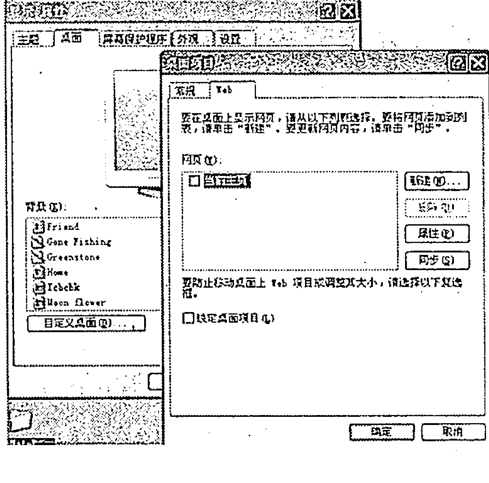

## 蓝牙耳机无法使用

**Q:** 在电脑中安装了一个蓝牙适配器，然后使用蓝牙耳机与电脑相连，已经成功配对，但却没有声音。请问这是什么原因？

**A:** 不知道你说的声音是不是针对某款软件，例如在QQ语音时想使用蓝牙耳机，如果是在某些软件中使用蓝牙耳机，则需要特别设置。例如在QQ的音频设置中需要手工指定音频设备为蓝牙耳机设备。而针对系统来说，当蓝牙耳机配对成功，系统会自动将音频发送到蓝牙耳机。另外，如果蓝牙驱动程序出现问题，也有可能会导致类似的故障发生，可以在设备管理器中将蓝牙适配器删除，然后重新安装，再进行配对操作。

## SD卡提示未格式化故障

**Q:** 一块SD卡，从手机上取下放入读卡器后显示未被格式化，而里面保存了重要数据。请问该如何恢复其中的数据？

**A:** 这种现象经常会出现，有时候在手机上可以正常使用的手机卡，但取下来后在读卡器中无法读取。这种情况一般是由于读卡器兼容性不好，或是存储卡放置不当导致接触不良等原因造成的。可以试着更换读卡器或是重新放到手机中，如果能正常读取，直接将数据备份下来。如果手机也无法识别，那可能的确出现了故障，建议找专业人士修复。如果数据不是很重要，也可以自己尝试使用诸如DataRecovery类数据恢复软件恢复数据。

## 无法安装第三块硬盘

**Q:** 原先我的台式电脑有两块硬盘，一块是160GB的，另一块是40GB的。现在想再安装一块40GB的硬盘，但是安装后只剩下系统盘了，其他两块硬盘均无法显示出来。请问这是什么原因？

**A:** 这可能是没有设置好主、从盘的问题。硬盘正面铭牌上有Master和Slave字样，接硬盘时，需要将这些用来当数据盘的硬盘设置成从盘：将硬盘上的跳线设置成Slave模式即可。

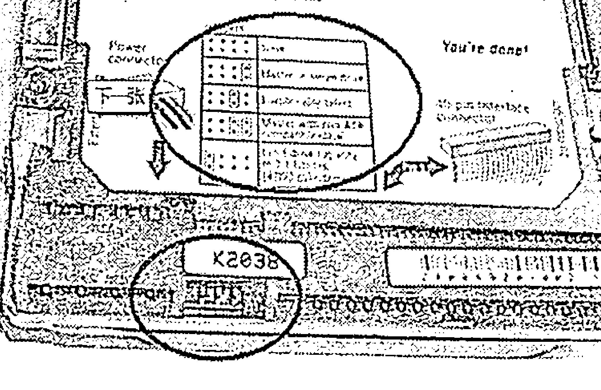

## 提示延缓写入失败

**Q:** 之前系统莫名其妙地出现蓝屏，现在直接显示：硬盘某卷，延缓写入失败。操作系统过几秒就会停顿一下，鼠标也移动不了，有一个硬盘的所有盘符均消失。请问这是什么情况？

**A:** 出现这种情况，可能是硬盘上出现坏道了。先将硬盘中的重要数据备份下来，然后再使用DiskGenius之类的工具对硬盘进行检测，如果的确出现坏道，可通过软件将坏道屏蔽掉。不过我建议最好更换新硬盘，毕竟数据的价值要远大于硬盘本身的价值。

## 傲游下载论坛附件总是job.php

**Q:** 一直使用傲游浏览器自带的下载功能从网上下载文件，最近发现使用傲游浏览器下载论坛附件时，下载弹出窗口中总是显示job.php文件。请问这是什么原因？

**A:** 这通常因为没有登录论坛，或论坛本身有限制（如下载需要积分等）。先检查登录状态，保持登录状态再进行下载，如果积分不够导致类似故障，只能通过其他方法赚取更多积分，之后才能正常下载。

# QQ窗口无法合并

升级了QQ主程序，开始时看到多个聊天窗口都是合并到一起的，但今天发现聊天窗口又分散开来，无法合并了，用鼠标拖放到一起也不能合并。请问这是什么原因？

这可能是你取消了合并功能。随便选中一个聊天窗口，在标题栏中单击“窗口设置”，选择“合并会话窗口”项，这样，所有的聊天窗口就会自动合并到一个窗口中了。

# 程序缺少MFC80U.dll

最近在打开一些软件时，总是出错，提示缺少MFC80U.dll，例如打开QQ时就会出现这个提示，而像Word这类程序却正常。请问这是什么原因？

MFC80U.dll是VC运行库，很多软件都需要它的支持才能正常运行。而你的系统中缺少了VC运行库，打开这类软件时就会出现错误提示。只要从http://tinyurl.com/29cbgqk下载VC运行库，安装到系统中即可解决问题。

# 总提示连接路由器

最近打开一些网站时总是弹出一个登录路由器窗口，窗口标题为：连接到drmomm.baidu.com，窗口中的内容是：TENDA NAT Router，然后就是登录账号及密码框。请问这是什么原因？

这不是路由器窗口，而是你打开的网站可能限制了访问权限。如果打开任何网站都出现这种登录提示，极有可能是由于浏览器访问恶意网站中了流氓插件，请及时使用杀毒软件及流氓查杀软件进行查杀。

# VLC播放器内嵌字幕乱码

Windows 7系统下，使用的是VLC播放器，在播放MKV电影时，内嵌的字幕总是显示为一个个方框，无法显示文字。请问这该如何解决？

这可能与你的VLC字体设置有关，在参数设置中将字幕字体设置成Arial Unicode MS，一般问题即可解决。

# 如何删除2345.com启动页

不知道因为安装了什么软件，导致浏览器首页总是被修改成2345.com，我在注册表中搜索“2345.com”并未发现任何相关项，无法将其清除掉。请问这该如何解决？

删除这个顽固起始页，可以这样来实现：首先按Win+R键打开运行对话框，输入regedit并按回车键打开注册表，依次定位到HKEY_CURRENT_USER\Software\Microsoft\Internet Explorer\Main，将Secondary Start Pages键的值项清除即可。

下载软件时建议从口碑较好的网站或是软件官方网站下载，在安装过程中也要谨慎，如发现有捆绑的插件选项，取消插件项后再进行下一步。此外，在正常情况下，遇到浏览器首页被某些网站强制篡改的，可以在注册表中搜索该网站域名并将它们删除来解决。不过有些网站在注册表中不保存相关域名项，无法通过搜索来删除，此时即可采用上面的方法。另外，出现浏览器首页被绑架的情况时，还可以使用一些反流氓软件来解决，例如Windows清理助手、金山系统急救箱、360安全卫士等，而像金山卫士等还有锁定浏览器首页的功能，可以尝试使用。

# 无线路由器严重丢包

我家使用的是无线上网方式，路由器是DLINK 150M，无线网卡是TP LINK 150M，路由器放在客厅中，电脑放在卧室中，在不到10米距离的情况下却总是出现数据丢包现象，请问这是什么原因？

像这种情况，一般可以从以下三个方面来判断：1.电脑与路由器之间的障碍物比较多（例如因房屋结构复杂信号隔的墙太多），导致无线信号难以逾越；2.路由器本身的发射功率较小，导致信号比较弱；3.干扰信号多，导致正常信号无法传输。可以按下面思路来排查：先想办法将电脑与路由器的距离拉近，如果情况马上转好，说明路由器的发射功率小或信号隔的障碍物多，可以想办法让路由器与电脑的距离缩小。最后，再考虑是否有别人蹭网的现象，直接为路由器启动加密处理即可排除。

## 傻博士有话说

对于家庭组网来说，除非临时用笔记本、手机及其他上网设备上网，对于常年固定不动地使用电脑（例如台式机），建议使用有线接入方式，不仅稳定，而且还不会担心被别人蹭网，从数据安全的角度来说，也比无线好。而若启用无线方式，一定要注意信号加密保护。在信号稳定方面，还需要注意家用电器（例如微波炉）以及其他无线设备的干扰，尽量让这些可能有干扰的设备远离无线路由器。

# 虚拟机物理机共享问题

我使用的是VMware虚拟机，安装了两个虚拟系统，以前可以直接在虚拟系统与物理系统之间复制、粘贴，但现在却不行了，使用起来很不方便。请问这是什么原因？

要想在虚拟系统与物理系统之间互相拷贝文件，需要安装VMware Tools，否则无法实现。此外，在正常安装VMware Tools的背景下，还需要正确配置相关参数，例如选项参数中的Guest Isolation必须保持选中状态，否则就无法互相拷贝。

# 无法安装网络打印机

打印机连接在Windows 2003系统的服务器电脑中，已经开启了网络文件和打印机共享功能，而Windows 7系统中想添加这个网络打印机时，不开启来宾账户总会反馈错误信息。请问，如何在不开启来宾账户的前提下成功添加网络打印机？

先使用//Windows 2003系统IP地址（例如：//192.168.1.11）访问这台Windows 2003系统，在弹出输入凭证时，输入正确的登录信息，然后再勾选保存凭证，这样就可以在共享打印机列表中看到网络打印机，之后再进行添加即可。

# 傲游收藏栏无法按要求排序

我安装的是傲游3浏览器，通过设置将收藏夹中的“链接”栏显示在收藏栏中，但其中的网址排序总是无法满足我的要求。请问如何才能将最常用的网址放在最前面，重新启动后仍能保持这样的顺序？

傲游浏览器的收藏栏排序方法有多种，有按使用次数排序，也有按标题排序的。如果你需要按特定的顺序排序，可以使用“按标题排序”方式进行，然后再将需要排在前面的网址重新命名，将需要显示在最前面的网址添加前缀a，排在第二位的添加前缀b，依此类推即可。

# 设备管理器多出黄色感叹号

Windows 7系统，在打开设备管理器时，发现有一个设备项旁边多出一个黄色感叹号，设备项名为USB Device (VID_1f3a_PID_efe8)，请问这是什么原因？

叹号，一般是由于相关驱动程序出现异常所致。通常可按如下方法处理：直接在设备管理器中将该设备卸载，再刷新一下设备列表，系统会自动安装驱动程序。如果系统找不到驱动程序，可以通过系统的补丁升级功能来搜索匹配，安装后即可解决问题。此外，如果不知道什么设备出现了问题，或是找不到匹配的驱动程序，可以使用一些驱动程序智能工具（例如驱动精灵）来解决。

# QQ语音提示设置麦克风

Windows 7系统下安装的是最新版QQ程序，每次在使用QQ语音聊天功能时，都会提示“你的麦克风没声音”，需要重新将麦克风勾选上才行，下次登录时需要重复这样的操作。请问如何才能解决这样的问题？

这可能是由于你当前使用的系统登录账号有权限限制的原因，如果有管理员账号权限，可以在启动QQ时右击QQ程序，选择“以管理员身份运行”，这样登录后将麦克风设置好并保存，下次一般就不会再出现这样的现象了。

# Google账号无法自动登录

我平时喜欢使用Google邮箱，但在使用IE浏览器登录我的Google账号时，以前可以选择的“记住我的登录状态”选项前的复选框消失了，无法选中保存登录状态。请问这是什么原因？

这种问题不少用户遇到过，通常是由于浏览器参数设置中的脚本程序的执行权限被取消所致，只要打开IE浏览器，在参数设置中重新允许脚本程序即可解决问题：单击菜单“工具→Internet选项”，在“安全”选项卡中单击“自定义级别”，在列表中将“Java小程序脚本”及“活动脚本”均设置成“启用”状态即可。

# 新浪微博无法取消关注

之前因为授权了很多应用，导致我的新浪微博自动关注了很多用户，后来我使用批量管家删除了关注，但最后剩下85个关注无法取消。请问如何才能将这些关注也取消掉？

这是新浪微博自身的缺陷所致，用户无法取消关注被系统屏蔽的用户。要想清除这类无法取消的关注，需要以私信的方式联系新浪微博客户人员（@微博客服），同时还需要提供以下信息（缺一不可）：1.微博登录名；2.当前密码前三位；3.历史密码前三位；4.注册时间；5.注册地点。之后，新浪微博客服会协助取消所有关注，接下来再手工关注自己平时需要关注的用户就可以了。

# NOD32提示无法清除的病毒

Windows 7系统中安装的是NOD32杀毒软件，今天在上网时NOD32提示：内存中发现威胁，对象：系统内存>C:\Windows\Microsoft\.Net\Framework\v2.0.50727\vbc.exe，信息：无法清除。请问这该怎么办？

这种情况一般是由于病毒库中没有相应的病毒特征码，杀毒软件因此无法进行查杀，但是NOD32有启发式检测病毒的能力，所以又能够将病毒检测出来。出现这种情况时，应该立即升级病毒库，如果升级病毒库后仍不能查杀，可以将其隔离处理，或者使用具有云查杀功能的安全产品（例如金山毒霸的在线查杀：http://www.duba.net/shadu/index.shtml）进行查杀，这类产品的病毒库更新更加及时。

# 无法删除远程桌面的记录

平时我经常使用远程桌面功能远程连接别的电脑，在远程连接列表中有很多记录，现在只想删除其中的一项记录，但是找不到单独删除一项记录的选项。请问，如何才能删除特定的远程访问记录？

打开注册表编辑器，定位到HKEY_CURRENT_USER\Software\Microsoft\Terminal Server Client\Default分支，右侧的那些键值项就记录了远程连接的IP地址或是域名，找到不需要的项直接删除即可。

# 一寸小一寸巧 5英寸“平板”同样给力

平板电脑的屏幕应该有多大？像9.7英寸的iPad，还是像三星Galaxy Pad P1000一样的7英寸产品？如果你还将自己的视野锁定在如此狭隘的范围内，那可就太对不起更小巧便携的5英寸产品了，它们在提供同样强劲性能的同时，更符合贴身伴侣的精髓呢。

## 小提示：为什么会出现5英寸平板

像摩托罗拉这种一线品牌，其10英寸平板XOOM的出货量也仅相当于苹果iPad 2的千分之九（2011年Q3季度）。可以说，在“强悍”的苹果面前，任何品牌的10英寸产品都会逊色几筹。还好乔布斯非常讨厌小尺寸的平板，这就给了其它品牌从侧面挑战苹果的机会，纷纷涉足iPad无法接触的小屏市场。此外，并非所有用户都喜欢像iPad那般大小的平板产品，即使是7英寸左右的平板电脑对MM们柔弱的肩膀来说还是负担。而5英寸的平板电脑，重量还不如一听可乐，小巧的体积可轻松塞进绝大多数包包里（钱包除外），而且价格也更为实惠。

## 5英寸还算平板吗

5英寸的确算个比较“暧昧”的尺寸，特别是在连手机都开始向4.x英寸助跑的今天，5英寸大小的产品还能归类在平板领域吗？回想一下，当年平板电脑还有英文名“Tablet PC”呢，在我们的印象中就是带旋转+触摸屏幕笔记本的造型。自从苹果推出iPad以后，大家才开始接受这种没有键盘全触控操作的平板电脑。笔者认为，凡是可以提供足够大的视野，可方便接入网络，并可安装丰富应用的产品都可归类到平板电脑的范畴，只是大屏幕牺牲了便携换来了舒适的视觉享受，而小屏幕则以牺牲面子的代价增强了与用户“亲密接触”的机会。

## 无可比拟的便携优势

5英寸平板电脑的重量多在200g左右，一听可乐的重量约355g，无论是机身尺寸还是重量都很理想，上网、看漫画和视频时也能带来不错的视觉享受。此外，Android平台中的很多游戏都需要通过屏幕上的虚拟按键操作，如果是7英寸或以上尺寸的平板电脑，由于屏幕过宽，拇指很难按到位于屏幕中间的按钮，但在5英寸的屏幕上就不存在上述问题了，即使是MM的小手也能轻松操作。

## 向手机抛出橄榄枝

正因为5英寸是手机与平板功能相处“最融洽”的尺寸上的中间点，因此很多手机厂商也纷纷推出了5英寸的“平板手机”，既可以看做是能轻松塞进衣服口袋中的智能手机，也能视为屏幕大到能够分栏显示邮件内容的平板电脑。如果你出门时懒得同时携带多种数码装备，选择此类产品既不耽误通讯，更大的屏幕也能带给你操作平板电脑的感觉。可惜目前5英寸“平板手机”的价格都不太便宜，而且待机时间也就1天左右。

## 根据需求学会取舍

随着用户需求的不断走高，5英寸平板电脑逐渐成为兵家的必争之地。我们可以将5英寸平板电脑划分为“主流型”、“高端型”和“手机型”三种类别（见附表），其中“主流型”会选用瑞芯微RK2918、全志A10等国产处理器，就性能而言还算不错，而且强化了视频播放等最实用的功能，但出于成本的考虑会去除蓝牙和GPS等功能，而且在屏幕的选择上也是能省则省，可视角度普遍一般，适合预算有限的同学选择；“高端型”算是前者的功能完美版，只是视频播放能力逊色一些，可惜价格较高；“手机型”就不用说了，除了价格和续航时间以外堪称完美。

| 类别 | 主流型 | 高端型 | 手机型 |
| :--- | :--- | :--- | :--- |
| 处理器 | 瑞芯微RK2918，全志A10等国产处理器 | 三星、高通处理器 | 三星、高通、德州仪器、NVIDIA处理器 |
| 优点 | 价格实惠，对视频的兼容程度最好 | 配备GPS和蓝牙等实用功能的模块 | 一机多用；出门带一部设备足矣 |
| 缺点 | 做工和屏幕的表现相对一般 | 视频播放能力不佳 | 续航时间不理想 |
| 代表产品 | 原道N50 | 三星Galaxy G70 | 戴尔Streak5 |
| 价格范围 | 599元起 | 1500元以上 | 2500元以上 |

就笔者而言，比较推荐“主流型”和“手机型”两种类别，前者实惠实用，后者功能集成，如何抉择就得根据您的预算来决定了。

### 网络调查

你支持5英寸的“手机平板”吗？欢迎在微博中投上一票http://t.cn/SyHMKv。

## 选5英寸需要注意啥

在很多同学心里，平板电脑尺寸越大，价格越贵性能越强。这个观点比较片面，比如瑞芯微RK2918处理器，其涉足的领域横跨5英寸~10英寸的产品区间，只要处理器相同，这些产品的理论性能也是一致的，差别仅在于屏幕的大小和材质、外观设计与扩展接口。总之，大家不必担心5英寸平板性能会不够用，主要考察的重点应该放在触控屏幕的技术上，一定要挑选支持多点触控的电容屏，否则会严重影响操作中的体验！

## CFan推荐产品

### 昂达VX580W豪华版

如果你的预算有限，可以考虑不足600元的昂达VX580W豪华版，170g的重量相当便携。这款产品采用了全志A10处理器，玩高清3D游戏、看在线视频或本地高清视频毫无问题。与VX580W其它型号相比，VX580W豪华版采用了支持5点触控的电容屏，在滑动和拖拽等操作中的表现更好。最近昂达还提供了1.8T固件，升级后VX580W豪华版还能支持红蓝3D视频，将红蓝3D片源拷贝至平板中，佩戴红蓝眼镜后即可在平板上体验3D电影带来的立体盛宴了。

### 三星Galaxy Note i9220

如果不在乎钱，想一步到位体验平板手机，三星Galaxy Note‘i9220绝对是目前最强悍的产品。i9220的硬件规格和i9100类似，而且Exynos处理器的主频也提升到了1.4GHz，可轻松玩转时下所有的3D大作。i9220采用了5.3英寸屏幕，分辨率高达1280×800像素，Super AMOLED材质提供了震撼的显示效果。作为一款大屏怪兽，三星还为其准备了2500mAh的电池，重量也被控制在178g左右，除了价格高昂以外，还真没什么缺点了。

### 优择F5C

如果你喜欢更时尚的外观，优择F5C也是不错的选择。这款产品采用了黑白搭配的钢琴烤漆外观，同样选用了支持5点触控的电容屏幕。与昂达VX580W豪华版不同，优择F5C搭载了更成熟的瑞芯微RK2918处理器，同样具备不错的游戏和视频性能。值得一提的是，优择F5C标配的电池容量很高，3000mAh的电池可以连续看4小时以上的视频。

|  | 昂达VX580W豪华版 | 优择F5C | 原道N50 | 戴尔Streak 5 | 三星Galaxy Note i9220 |
| :--- | :--- | :--- | :--- | :--- | :--- |
| 屏幕 | 7英寸电容触控屏 | 7英寸电容触控屏 | 7英寸电容触控屏 | 5英寸电容触控屏 | 5.3英寸电容触控屏 |
| 分辨率 | 800 × 480 | 800 × 480 | 800 × 480 | 800 × 480 | 1280 × 800 |
| 方案 | 全志A10 | 瑞芯微RK2918 | 瑞芯微RK2918 | 高通QSD8250 | 三星Exynos |
| GPU | Mali 400 | Vivante GC800 | Vivante GC800 | Adreno 200 | Mali 400 |
| 内存/存储 | 512MB/8GB | 512MB/8GB | 512MB/8GB | 512MB/16GB | 1GB/16GB |
| 重量 | 170g | 198g | 223g | 220g | 178g |
| 参考价格 | 599元 | 699元 | 699元 | 2999元 | 5999元 |

# 平板电脑 双核普及进行时

双核很贵？你OUT了！随着戴尔Streak 10 Pro的一声降价，接下来你会看到更多昔日高端的双核平板走进主流领域的大道。

随着Tegra 3四核平板的上市，双核将逐渐从昔日的贵族沦落成平民。当双核平板卖到3000元时，无论如何也拼不过苹果的iPad 2，但当它们的价格跌破2000元大关时，无疑会受到更多用户的关注。戴尔Streak 10 Pro只是双核平板降价的开端，相信当您看到本文时，会有更多经典高端双核平板加入到降价的行列。

## 可以忽略的性能差异

作为消费者，我们无需考虑不同双核处理器之间的性能差距（见附表），因为它们都足够强悍，现在Android系统中的3D大作连单核1GHz的机器都能运行流畅，对双核机器而言更是小儿科。因此，在挑选双核平板时，大家更应该将重点放在产品的屏幕（是否IPS）、价格是否合理、外观设计是否炫酷，以及是否足够轻薄便携等等。

## 兼容性更不是问题

三星Exynos（猎户座）处理器集成的GPU型号为相对偏门的Mali400，起初并不受游戏公司重视，游戏兼容性曾一度出现问题。但随着三星Galaxy S2的热卖，Mali400的兼容问题已经基本得以解决。因此，在双核平板上大家不必过多考虑游戏的兼容性，都是大厂，游戏开发商谁也得罪不起。其实Exynos在双核处理器中具有最突出的表现，可惜现在只有三星的i9220这么一款5.3英寸“平板手机”一个支持者。

| 型号 | Tegra 2 | MSM8X60/APQ8060 | OMAP 44X0 | Exynos |
| :--- | :--- | :--- | :--- | :--- |
| 主频 | 默认1GHz | 最高1.5GHz | 最高1.8GHz | 最高1.4GHz |
| GPU | Geforce | Adreno 220 | Power SGX540 | Mali400 |
| 架构 | Cortex A9 | Scorpion | Cortex A9 | Cortex A9 |
| 工艺 | 40nm | 45nm | 45nm | 45nm |
| 超级兔子总分 | 4850 (1GHz) | 6100 (1.5GHz) | 6100 (1.2GHz) | 6150 (1.2GHz) |
| CPU整数性能 | 1323 | 2006 | 1648 | 1465 |
| CPU浮点性能 | 1028 | 788 | 1273 | 1248 |
| 2D绘图性能 | 481 | 295 | 284 | 296 |
| 3D绘图性能 | 1162 | 1235 | 1230 | 1226 |
| 参考测试机 | Streak 10 Pro | 小米手机 | GALAXY Nexus | 三星i9100 |
| 注：高通MSM8260/8660两款CPU在通讯制式上存在差异，APQ8060则不包含通讯模块，其余规格基本一致。德州仪器双核OMAP 包含4470/4460/4430三个子型号，标准频率分别为1.8GHz/1.5GHz/1GHz。超级兔子评分仅供参考，系统优化对总成绩的影响较高，因此仅重点列出与CPU有关的子项成绩。 |

## 双核平板不是万能的

诚然，双核平板在性能上肯定比国内主流的瑞芯微RK2918、全志A10等单核平板强劲，但并非“全能选手”，至少在高清视频播放的表现上并不完美，如果你只是希望购买一个看电影和上网的利器，999元的IPS国产单核平板就足够用了。当然，如果你希望可以流畅玩2012年新出的Android系统3D大作，双核平板可以为你带来足够的性能冗余空间。此外，如果你经常驾车游玩，一定要多多留意产品是否支持GPS功能，不少低价位的国产双核平板出于成本考虑可能会拿掉这个功能。

# 低价笔记本 留心你的系统

短短几年，笔记本就从当年的高端派彻底沦落为平民派，3000元就能买到很多SNB平台独显的笔记本。但是，随着笔记本价格的不断拉低，你会发现更多的厂商都开始着力于硬件的搭配，但却在其他方面缩减支出。

厂商如何节省成本呢？除了看得见的做工用料和蓝牙等非必要的功能组件外，更多的厂商会选择取消预装正版Windows系统的招数，在宣传上则以“正版Linux系统”为噱头，更有甚者竟然连驱动光盘都不提供，需要到官网下载(最“坑爹”的是官网服务器不给力，下载速度如同蜗牛搬家)，而且同一个型号下可能还会提供多种不同品牌的无线网卡驱动，还需要用户自行甄别下载。

前不久健圣就为朋友在京东买了一部Gateway NV47H24c(2699元，奔腾双核B940+2GB+320GB+核心显卡，Linux系统)，本以为半小时之内就能帮他解决系统问题，没想到竟然在安装系统的第一步就“卡壳”了：进不了BIOS，修改不了启动项！搞了半天才发现必须要在屏幕出现厂商Logo的一瞬间，同时按下“Fn+F2”(说明书写单按F2即可)，而且还要把握好同时按下去的时间差，否则还是无法进入BIOS。看着我这边反复重启，朋友脑门都见汗了。虽然最终顺利装上了系统，但健圣的颜面却折了大半。

这个经历倒是让健圣开始重视起笔记本预装操作系统的重要性了。因为买低价笔记本的多是预算很紧张、对电脑知识了解较少的最普通用户，不同品牌笔记本进入BIOS的方法和设置还各有区别，装系统的难度比台式电脑还要高一些呢。因此，在选购没有系统的低价笔记本时，如果你自己或者身边有朋友可以帮你安装操作系统，在哪里买机器都是一样的。如果身边没人能帮你解决系统问题，要么直接选择预装操作系统的产品(哪怕贵一些)，要么就别怕麻烦到电脑城购买，现场让销售人员帮你安装系统和驱动。

最后，希望今后厂商在推出没有预装系统的笔记本时，请多替普通用户想一下，至少要让BIOS默认就是光驱或U盘启动吧？并在驱动光盘中加入一键自动安装的功能(对最初级的用户而言，看着光盘中数十个纯英文的驱动文件夹，谁知道先装哪个)，最大限度帮用户简化系统安装的步骤，而这对厂商来说应该也不算什么难事吧？关键还是看大家有没有用心去做。

## 超极本之外的轻薄笔记本

超极本集超轻薄、高性能、高续航等卖点于一身，凸显“性感美”。但是，超极本的价格也相当的昂贵，将很多普通用户拒之门外。实际上，我们无需太多开销，同样可以获得媲美超极本的产品，至少在轻薄、续航和性能间不会逊于超极本太多。

对绝大多数用户来说，今天的笔记本已经进入了性能相对过剩的时代，轻薄已经成为更多笔记本用户所追求的目标。而超极本就是一种被规范化的轻薄产品：选用11英寸或13英寸屏幕、超低电压CPU、厚度低于21mm、重量低于1.4kg、配备SSD硬盘、支持睡眠/快速唤醒功能、5小时以上的续航时间等等。

超极本看似美好，但仍有很多缺陷阻碍着它普及的步伐。首先就是价格，动辄8000元左右的报价并不适合普通消费者；接口数量较小，对经常接驳外设的用户而言不太够用；对有一定游戏需求的玩家来说性能还是不够给力，以上的诸多不足就将超极本限定在了一个非常小众的用户群。因此，如果你预算有限，没事还要用一个USB接口给手机充电，偶尔还要玩玩游戏，那就不妨将目光投向超极本之外的“银牌选手”吧。

| CINEBENCH R10 | 单核 | 多核 |
| :--- | :--- | :--- |
| i3-2310M (2.1GHz) | 3454 | 7540 |
| i5-2410M (2.3GHz~2.9GHz) | 4617 | 9574 |
| i5-2467M (1.6GHz~2.3GHz) | 3465 | 7154 |

超低压版的i5-2467M性能和标准电压版的i3-2310M接近

## 超极本的不足

## 哪些产品可以媲美超极本

超极本追求的是极致的轻薄，因此在轻薄领域，除了上网本的便携性可以超越它以外，其余类型的笔记本基本没戏。但是，只要你能稍微放宽一下轻薄的定义，花更少的钱也能选到一款或在性能或在续航时间上媲美超极本的产品。

总之，如果你近期想选择一款集轻薄、性能和续航于一身的产品，在预算有限的情况下，超极本还不是首选。实际上，现在很多11.6英寸或13.3英寸的产品都融合了“普通笔记本”和“超轻薄笔记本”的特色，相对轻薄，性能足够强劲，性价比更为理想。

| 笔记本分类 | 代表硬件 | 设计理念 | 优点 | 缺点 |
| :--- | :--- | :--- | :--- | :--- |
| 普通笔记本 | 标准电压CPU | 常见功能一个都不少，处于一本在手PC不愁的傲然姿态 | 性能强悍，价格实惠 | 便携性相对一般 |
| 超轻薄笔记本 | 超低电压版CPU/APU | 抛弃光驱的普通笔记本，格外注重续航能力 | 续航长，相对轻薄 | 性能相对一般 |
| 上网本 | Atom或APU | 性能够用就好，关键是足够便携和便宜 | 小巧，低价 | 屏幕小，输入体验一般 |
| 超极本 | 超低电压版CPU | 把不需要的功能全拿掉，换来更轻薄的设计 | 轻、薄、做工精良 | 扩展性很差，性价比不高 |

# 好玩不贵 触控一体电脑怎么选

一体电脑和手机不同，更新换代的速度不会太快，等Windows 8携一大批好玩的触控应用出现后，你不会临时再新买一台机器吧？在触控型一体电脑价格越来越便宜的今天，是到了一步到位的时候了。

一体电脑拥有不逊于传统台式电脑的震撼视野，同时还具备一定的便携性。在标配无线网卡与无线键鼠套装后，一体电脑仅受一根电源线的束缚，再结合家居化的简约时尚外观，以及触控技术的“亲民化”（逐渐向5000元价位靠拢）大有取代传统品牌台式电脑的趋势。

## 触控 只欠东风

触控一体电脑在前几年一直没有太大的建树，主要还是因为应用跟不上的缘故。随着平板电脑的热销，大屏幕+触控的操作快感再度被大家所重视，类似《愤怒的小鸟》、《水果忍者》一类的游戏都被移植到了PC平台，在超大的屏幕上用手指操作的感觉远非鼠标可比，而且一体电脑产品也纷纷为产品预装了基于触控操作优化的软件。

比如联想的Ideatouch、惠普的Touchsmart等等。此外，即将降临的Windows 8系统也会引入专门针对触控优化的Metro界面，可以让你像操作WP7手机一样控制电脑。可见，未来会有更多在平板上的游戏大作被移植到PC平台，届时要没有一面触控屏幕，你就只能用蹩脚的鼠标来拖拽操作啦。

**小提示**

> 目前常见的多点触控技术主要以红外光学式、表面声波式、AMR电阻式和电容式四种为主。其中红外光学式应用最广泛，它在屏幕外框电路板的对角方向设有红外线发射管和接收器，当红外线波在特定位置被接触物阻隔即可计算出接触物（如手指）的位置；表面声波式触控技术多被应用在联想旗下的一体电脑中，利用声波发放器传送至平面玻璃，根据声波被遮断（如手指接触）的点计算接触位置；AMR电阻式属于改进型的电阻式触控技术，实现媲美光学式的多点操作；电容式触控技术可以带来类似iPad的操作体验，但成本最高。

## 常见多点触控技术对比

| 类型 | AMR电阻式 | 光学式 | 表面声波式 | 电容式 |
| :--- | :--- | :--- | :--- | :--- |
| 优点 | 定位最精准 | 适合大屏幕，实现简单 | 灵敏度和准确度高 | 操作最流畅 |
| 缺点 | 实现多点需更高的成本 | 无法适应强光环境 | 易受表面脏污及水分影响 | 屏幕越大成本越高 |

## CFan推荐触控游戏

| 游戏名称 | 下载地址 |
| :--- | :--- |
| 愤怒的小鸟：里约大冒险 | http://dl.3dmgame.com/201106/13326.html |
| 愤怒的小鸟：四季 | http://dl.3dmgame.com/201112/15766.html |
| 水果忍者高清版 | http://bbs.3dmgame.com/thread-2062123-1-1.html |
| 埃及祖玛高清版 | http://www.3dmgame.com/games/luxorhd/ |
| 植物大战僵尸 | http://www.3dmgame.com/games/pvz |

## 多点 两点足矣

多点触控是衡量一体电脑操作体验的基本环节，只是所谓的“多点”只需2点足以。因为一体电脑屏幕很大，更多的情况都是两只手在同时操作，因此现阶段不必过于迷信多点传说。

## 屏幕 高清舒适随你定

21.5英寸算是一体电脑的分水岭，21.5英寸以上的一体电脑均为1080P（1920×1080）的规格，如果你是“视觉派”，可直接选择搭配全高清屏幕的产品。但如果你家里有老人或小孩，或者需要长时间盯着屏幕上网、处理文字资料，则建议适当降低要求，选择20英寸分辨率为1600×900像素的产品。因为21.5英寸屏幕的点距为0.248mm，20英寸屏幕的点距则为0.276mm，后者更省眼睛。

## 游戏 不是我的强项

虽然一体电脑也开始武装起最新SNB或APU处理器，但在主流价位上最常见的还是核芯显卡、HD6450（台式机）、GT525M（笔记本）这几类中档显卡，玩《魔兽世界》和《英雄联盟》一类的游戏不是问题，但想体验最新3D大作还是有些力不从心的。所以，如果你对一体电脑存有游戏幻想，还是将目光投向更高性能的DIY市场吧，5000元可以让你攒出数倍于一体电脑性能的机器。

因此，在选购一体电脑之前，你就需要端正思想：选一体电脑不是用来玩大型游戏的，而是作为更容易操作的大尺寸影音娱乐终端设备。

## 优化 让触控更实用

想用好一体电脑的触控功能，还需进行一番手动优化。比如在桌面右击鼠标右键，选择“查看→大图标”，再点击资源管理器界面右上角的“更多选项”，选择“超大图标”，放大电脑中的程序图标，让手指点击更轻松。除了《愤怒的小鸟》和《水果忍者》这类从手机平板中移植的游戏，类似《怪怪水族箱》、《大鱼吃小鱼》、《植物大战僵尸》、《连连看》这类需要“点选操作”的传统PC游戏也很适合手指操作呢，玩起来比用鼠标更有趣。

**小提示**

> 类似《水果忍者》等移植于手机或平板的游戏，需要DirectX 9.0C和VC2010的支持，如果一体电脑运行中提示缺少“msvcr100.dll”文件或没有声音，到微软官网下载安装这两个组件即可。

# Ivy Bridge看前角如何选本

隔壁班小刘说4月英特尔就要推22nm处理器，现在买本的都是冤大头。但是并非所有人都能再忍耐数月无本的日子，如果现在急需用本，在选购时应该注意哪些呢？

## Ivy Bridge 等还是不等

根据已知的资料，我们可以将Ivy Bridge视为Sandy Bridge的优化增强版，其最大的改进就是将制造工艺提升到了22nm（引入3D Tri-Gate立体晶体管技术），同时进一步提升了内置核芯显卡的性能（EU执行单元大幅增加，同时硬件支持DirectX 11)。笔者认为，如果你喜欢轻薄型笔记本（比如超极本或13英寸以下的集显机型），并希望在轻薄的同时尽可能具备更强的游戏性能，Ivy Bridge的确可以带来质的提升，值得你再等待几个月。反之，早买早享受就是真理。

**小提示**

## Ivy Bridge和Chief River是什么

还记得Sandy Bridge（简称SNB）吗，它是英特尔在2011年初推出的32nm制程工艺处理器的核心架构名称，而Huron River则是基于SNB处理器设计的笔记本平台代号。同理，英特尔在2012年将会发布核心架构名为Ivy Bridge的全新22nm处理器，Chief River就是基于该处理器设计的新一代笔记本平台代号。

## 选本优选升级款

距离Ivy Bridge笔记本上市还有一个季度的时间，在新旧交替之前就想选购笔记本的今天，笔者建议大家应该多关注一些经典产品的升级款，在价格相近的情况下，这些升级款就能为你带来更出色的使用体验。此外，所谓“瘦死的骆驼比马大”，当昔日的机皇沦落到主流价位时，也是我们优先考虑的对象。接下来，笔者就为大家分享一些现阶段购买笔记本的选购思路。

## 优选之一：细节改进版

有一些产品拥有极高的性价比，但可能在某些细节方面的表现并不尽如人意。比如ACER 4750G/5750G系列笔记本，在4000元左右的价位就提供了酷睿i5+GT540M显卡组合的配置，可惜悬浮式设计的键盘在敲击手感上并不舒适，键帽缝隙部分也容易堆积零食的残渣。对这类存在少许遗憾的经典产品，我们不妨从它们的升级改进款中挑选更适合自己的型号。

### ACER 4755G-2452G75Mtks

**基本配置：14英寸+i5-2450M+2GB+750GB+GT540M**

与4750G系列相比，ACER 4755G系列采用了颗粒式的巧克力键盘，除了视觉效果显得更整洁以外，敲击的感觉也要比4750G的悬浮式键盘更出色。此外，ACER 4755G中的部分型号还标配英特尔WiFi Link 6205无线网卡，其最大的卖点就是可以脱离VGA或HDMI线，通过WiFi就能将笔记本的画面无线传输到电视或显示器上（又称WiDi技术，需选配Netgear PTV1000无线适配器）。如果你青睐于4750G系列的性价比，对键盘手感和功能有更高的要求，4755G系列将成为最佳替代品。

## 优选之二：昔日机皇版

新品一定比老产品强吗？不一定，至少我们不能指望新一代主流产品可以超越昔日的机皇。以i7-720QM为例，论性能并不逊于SNB架构的i7-2630QM太多，而NVIDIA移动显卡也并非一代更比一代强，比如GTX285M无论是理论性能测试还是真实的游戏体验，都远超时下高端的GT555M。因此，在Ivy Bridge君临之前的这段真空期中，挑选上一代的机皇级别的产品，可能要比同价位的SNB产品更给力。

### 微星GT660R-230CN

**基本配置：16英寸+i7-720QM+4GB+500GB+GTX285M**

别看微星GT660R在硬件平台上落后了一代，但当初顶级的i7-720QM与GTX285M结合后，其综合性能并不逊色于i7-2630QM+GT555M太多，而且微星还为这款产品加上了CPU和显卡一键超频的功能，在游戏表现上甚至可轻松超越后者。值得一提的是，GT660R内建双硬盘位，标配7200rpm高速硬盘，自带低音炮单元，在机身四周还嵌有独特的LED灯，在当初可是机皇的定位，而现在只需6999元就能拥有。

## 优选之三：技术领先版

虽然Ivy Bridge还未上市，但AMD和NVIDIA新一代移动显卡却已经“抢先偷跑”了。需要注意的是，第一批上市的新显卡多为上一代显卡的“马甲版”，比如GT630M≈GT540M、GT635M≈GT555M、HD7600M≈HD6700M，相对应的新旧显卡的理论性能基本一致，最终性能取决于厂商所设定的默认频率。虽说这些新显卡多少有些“旧瓶装新酒”之嫌，但只要厂商能为你“免费升级”，咱们也就别太较真儿了。

### 联想ideapad Y470P-IFI

**基本配置：14英寸+i5-2450M+4GB+500GB+HD7690M**

联想Y470P-IFI是第一批搭载AMD HD7690M显卡的产品，与同为AMD 7系显卡的HD7670M相比，HD7690M采用了第三代Thames XTX核心，除了核心/显存频率更高之外，OpenGL也支持到4.1版本，性能和功能的表现更抢眼。除了显卡之外，Y470P-IFI将处理器也升级到了睿频加速后可达3.1GHz的i5-2450M处理器，改进后的散热模块也可轻松应对全速游戏时的发热量。

**小提示**

除了联想Y470P以外，ACER的4752G系列笔记本也升级到了GT630M显卡，华硕N45系列也推出了搭配GT635M显卡的版本。总之，对抢先上市的新一代显卡而言，我们的态度应该是“不盲从”。如果你真想让笔记本获得远超上一代显卡的游戏性能，笔者建议等待配备GT650M或HD7700M或以上级别新显卡的产品出现。只是这些真正的“新显卡”应该会跟随Ivy Bridge一同上市，有得等了……

## 优选之四：青出于蓝版

有些时候，可能很经典的机型会退出历史舞台，但你却非常喜欢该产品的特殊设计，怎么办？此时就不如退而求其次，寻找定位相似的新品。以华硕UL20系列为例，该产品线搭载了英特尔上一代超低压版处理器，隶属于我们常说的CULV平台，坚固的铝合金结构、1.56g的重量再结合8小时的续航时间，在当初也算一号“人物”呢。在笔记本进入SNB时代后，UL20系列停产了，但超轻薄、高续航、低价格依旧是不少用户

### 华硕U24G1231E

的追求，这个时候我们就不妨将目光放在UL20的后辈身上了。

基本配置：11.6英寸+i3-2310M+2GB+320GB+核芯显卡

与UL20系列相比，华硕U24G1231E的屏幕从12.1英寸缩减到11.6英寸，视野并没有损失多少，但UL20特有的镁铝合金拉丝外壳与便携性（1.5kg）依旧被继承了下来。值得一提的是，华硕U24系列是业界首款11.6英寸且采用标准电压处理器的轻薄笔记本，

i3-2310M无论是CPU性能还是游戏性能都远比上一代ULV处理器给力，而将近10小时的续航时间也可满足全天候办公的需要。

总之，当你持续关注的某款产品不容易买到时，与其定位相似的新品也许同样适合你，而且还具备更出色的性能呢。

款姊妹机最大的差别其实在操作体验上。N45在键盘最左侧加入了一列多媒体控制键，导致键盘整体向右移动了2cm左右，初次接触会很别扭，需要一段时间来适应。而N55的多媒体键则窄了很多，与右侧键盘还有一定的间距，键盘的整体布局和普通笔记本基本一致，操作起来就舒服多了，也不容易出现误操作的现象。因此，当大家在挑选类似的姊妹机型时，要将更多的心思放在操作体验的考察上。

**小提示：最容易被忽视的体验**

操作体验是容易被我们忽略的一点，拿华硕N45和N55系列为例，它们在硬件规格上完全一致，差别仅在于N55多提供了一组USB2.0接口。与外在的表象相比，这两

# 新Atom能否带上网本重振雄风

随着以iPad为代表的平板电脑的热卖，上网本从前两年的火爆期进入了冷却期。如今，英特尔最新Cedar Trail平台正式被上网本所武装，它能否重振上网本当年的雄风呢？

有性能够强的台式机或笔记本，但你又缺一台可以方便外出携带，临时处理工作上的琐事、旅途中可以帮你减负、提供超长看电影时间的产品，它只能算是家中PC成员的一个临时替补，在极低的价位上就能满足你基础的上网办公和娱乐体验。

扇就能解决发热问题，支持无线显示和无线音乐（视频/照片和音乐可无线与电视机或音响相连），还支持休眠模式中也能自动更新邮件的智能连接技术与从待机模式立即重启机器的快速启动技术，但这些新特性并没有成为首批新一代上网本的标准卖点。实际上，Cedar Trail可以让上网本拥有摆脱散热风扇的能力，这意味着可以进一步优化主板的布局和模具的整体厚度，让上网本变得更为轻薄，而一些新功能也能极大提升产品的易用性，只是想实现这些改进还需厂商投入更多的研发成本。

## 尴尬的“笔记本”

**小提示**

毛毛在逛某数码卖场时，被一种非常小巧的“笔记本”所吸引，10.1英寸+双核处理器，价格更不足2000元，天哪，简直就是神一样的机器。在销售人员于一旁拍着胸脯保证该机器性能比当年2万多元的Thinkpad X60s还牛之后，毛毛兴奋地将它抱回了家。没想到使用一段时间后，这个神一样的机器却给了毛毛当头一棒：速度与同事早前买的2799元的笔记本没法比，早知如此还不如多花点钱买一个屏幕稍大的机器呢！

Cedar Trail平台搭配代号为Cedarview的32nm Atom处理器，包括针对上网本的N2600/N2800以及桌面平台的D2500/D2700。新Atom的GPU部分将基于PowerVR（具体型号为GMA3600/GMA3650），使得其在DirectX 10.1兼容和解码方面有很大的改善，支持MPEG2、VC1、AVC、H.264及Blu-ray 2.0解码，并可支持LVDS、eDP、HDMI、DP等输出接口。

请记住，上网本永远都是你家的第二台电脑，Cedar Trail如此，未来几年内它的后继者也是如此。上网本只能在轻薄便携的前提下帮你完成基础的办公娱乐应用，想用它玩主流3D游戏肯定是不现实的。在平板电脑和低价笔记本的冲击下，上网本想“保住饭碗”只能将性价比优势进行到底，在2000元作为价格上限的基础上来不断完善自己，因为在上网本从新兴事物变为成熟产品后，想让消费者高价选择这种辅助的第二台电脑已不再现实。

## “四不像”的上网本

## 新Atom还有很长的路要走

受利益的趋势，很多厂商或卖场导购在宣传中都会夸大上网本的性能表现与应用范畴，刻意强调“双核、超轻薄、高续航、低价格”这几大卖点，但鲜有准确描述上网本使用范畴的说明。不少用户都认为上网本仅仅是屏幕小了点、没有光驱的传统笔记本，传统笔记本能干的事它也没问题，而毛毛就是持有这种观点的受害者，以致于现在将上网本归类于性能不如笔记本、便携不如平板电脑的“四不像”类产品。其实，如果大家在选购之前就明确上网本存在的意义，类似的尴尬也就不复存在了。

与上一代Atom N570相比，Cedar Trail平台的新Atom在性能上并没有明显改观，N570跑不动的游戏或软件，新Atom运行也未必流畅，上网本的应用范畴并不会因新Atom而出现拓展。但是，将制程工艺从45nm提升至32nm后（TDP也从8.5W降至3.5W），新Atom则有机会改变上网本的设计形态，让它变得更为“性感”。可惜的是，最新上市的第一批Cedar Trail平台上上网本，为了第一时间抢占市场，多是沿用上一代产品的模具，仅仅是内部硬件的简单升级，并没有充分挖掘Cedar Trail的潜力。请注意，这里所谓的潜力不是性能，而是低功耗和低发热的潜在优势。

理论上新Atom处理器已经无需散热风

对上网本来说，它仅适用于家里已经

总之，新Atom并没有给上网本带来性能上的革新，只是帮上网本略微改进了一下之前的不足，更不适合成为厂商因此而大幅提价的理由。如果你希望拥有一部更高性能的超便携产品，那就彻底放弃Atom吧，转而投向采用超低压版酷睿处理器的超极本，只是所需开销将数倍于普通的上网本。如果你注重性价比，同时允许便携为性能稍微妥协一下，则可关注11.6英寸以上的轻薄笔记本。

# 小心变形屏 低价平板怎么选

小刘最近新买了一部7英寸的平板电脑，游戏视频都很流畅，在赞叹超值之余也发现了一个问题：为啥圆形的图案总有向椭圆形变的趋势呢？

春节期间小刘在网上订购了一台采用全志A10方案的7英寸平板，599元的价格非常便宜，时下热门的游戏基本都能流畅运行，网上随便下载的视频也能完美播放，唯一的遗憾就是屏幕的画面总有变形的感觉。通过网络“恶补学习”，原来这款平板电脑的屏幕属于传说中的“变形屏”。对于手头并不宽裕的用户来说，在挑选低价平板电脑时还应该注意哪些呢？

## 何谓“变形屏”

“变形屏”通常只存在于采用7英寸屏幕但分辨率却仅有800×480像素的平板电脑身上。当这种屏幕上出现圆形的图案时，你会发现圆形图案在横屏时被压扁，竖屏被拉长，大有向椭圆进化的趋势。“变形屏”形成的原因很简单，低价位平板电脑的屏幕通常会选用廉价的国产液晶面板，这种面板的物理尺寸为16:9，而800×480分辨率的物理像素点为15:9，当两种不匹配的参数集于一身时，自然会出现压缩变形的问题，只是这种形变并不明显，不仔细观察和对比也不容易察觉。

既然在16:9物理尺寸的液晶面板上实现15:9的物理像素点会变形，让面板厂商稍作调整，做出15:9物理尺寸的液晶面板再赋予15:9的物理像素点不就结了吗？实际上没这么简单，在7英寸液晶面板的生产中，16:9物理尺寸的液晶面板的切割成本最低。如果想切割出15:9物理尺寸的液晶面板，或者在16:9物理尺寸液晶面板不变的情况下，实现16:9的物理分辨率（如854×480或1024×600），都会涉及到对光刻机或者玻璃基板（液晶面板的原型）做出改动，成本也会大幅增加。

举个例子，假设屏幕上的每个物理像素点都是1mm×1mm的正方形，7英寸平板电脑的屏幕所用的玻璃基板的长宽分别为16mm和9mm，理论上应该分布16×9=144个像素点。实际情况是，当前的生产设备只能在这块玻璃基板上做出15×9=135个像素点，想将这个玻璃基板刻满，只有将正方形的1mm×1mm像素点拉伸成1.06mm×1mm的长方形。由于物理像素点已经被拉伸了，所以屏幕上由这些像素点组成的图形自然也是变形拉伸的。

## 想完美必选IPS

如果你对屏幕显示质量的要求很高，现阶段7英寸（1024×600像素）和8英寸/9.7英寸（1024×768像素）的IPS屏幕才是最佳选择。不用纠结于IPS平板的液晶面板到底是LG、三星还是奇美生产的，只要是IPS屏幕效果就足够令人满意了，只有将不同品牌不同型号的IPS面板摆在一起，你才能看出亮度、漏光和色彩的差异。目前IPS平板电脑的价格普遍向千元内靠拢，强烈推荐预算充裕的用户选择。想了解更多IPS平板电脑的选购技巧，请参考2012年3期第91页《平板电脑 IPS屏幕才是王道》这篇文章。

## 小提示

为什么平板会钟情于800×480分辨率？在Android系统下，绝大多数游戏都是按照这个标准分辨率制作的（主要是针对手机），而网上的电影资源也多以16:9作为标准分辨率。当游戏和视频想在4:3比例的屏幕上（如800×600或1024×768）全屏显示，要么强行拉伸至图像变形，要么则会出现黑边。当然，随着Android设备屏幕的分化，越来越多的游戏开发者都开始重视起这个问题，相信未来会有所改善吧。

## 低价平板怎么选

如果你青睐于7英寸平板电脑的视野与便携，不允许画面有一丁点变形，笔者建议避开800×480分辨率的产品，选择采用更高分辨率（1024×600像素）或采用800×600像素（4:3）屏幕的产品，不过此类产品的价格基本都在600元以上。如果你的预算不太充裕，则可考虑采用5英寸800×480像素的平板电脑，此类产品的屏幕不存在变形，而且价格最低不足500元，性价比非常高。

总之，目前低价位国产平板几乎都已经全面升级到了晶晨AML8726-M3、瑞芯微RK2918或全志A10（表1）这三种平板方案，它们都能保证流畅的视频播放和游戏效果，而电阻式触控技术也“濒临淘汰”，499元以上的市售平板基本都会选用支持多点触控的电容屏。大家在挑选低价平板电脑时，可将更多的精力放在产品的屏幕效果、外观、质量以及电池的容量上。

以小米手机和其它安装了MIUI系统的Android手机为例，依次进入“设置→系统→共享手机网络”，勾选“便携式WLAN热点”，在便携式WLAN热点设置的“配置WLAN热点”中分别设置“网络SSID”（虚拟的网络名称）、“安全性”（建议选择WPA/WPA2 PSK加密）和密码，最后点击保存按钮即可。接下来打开平板电脑的WiFi，搜索之前设置的SSID无线网络，输入密码后即可上网。需要注意的是，此时平板电脑所用的网络流量都由手机提供，使用时注意流量的消耗哦。

### 小技巧：3G不是必需

像iPad和一线平板都有专门的3G版，在没有WiFi网络时也可随时上网。低价平板自然不会有内置的3G模块，但它们基本都可借助USB接口连接外置的上网模块。当然，外置上网模块的费用得咱们自己掏。不想再花钱，还想让平板电脑实现随时上网？只要你身边有采用塞班、Android或iOS系统的手机，都可以将手机共享成无线AP供平板电脑上网。

| 瑞芯微RK2918 | 全志A10 | 晶晨AML8726-M3 |
| :---: | :---: | :---: |
| 上网体验 | ★★★★☆ | ★★★★★ | ★★★★☆ |
| 视频解码 | ★★★★☆ | ★★★★★ | ★★★★☆ |
| 游戏性能 | ★★★★☆ | ★★★★☆ | ★★★★☆ |
| 游戏兼容性 | ★★★★☆ | ★★★★☆ | ★★★★☆ |

# 神舟官网惊现‘古董’

近期，发现神舟官网上的一款型号为“承运L580T”的古董机，并且所采用的显卡还是多年前“N卡缺陷门”名单里的一员，令笔者感到十分诧异。

## 多年回顾 N卡缺陷门记忆犹新

说起多年以前的“N卡缺陷门”，很多熟悉笔记本电脑的读者恐怕还记忆犹新。根据NVIDIA在当时透露的官方说法来看，很多G84、G86核心的移动版显卡都出现了发热量过大的问题。而这其中，不但包括不太知名的二线厂商，甚至就连戴尔、惠普、联想、苹果等一线厂商也都被先后牵涉进来。虽然当时包括戴尔和惠普等一线厂商都已提出了解决方案，但几乎都是通过更新BIOS提高风扇运转来降低显卡的核心温度，以此来延长显卡的寿命。并且厂商所能做到的只是延保两年，而更换的仍然是存在隐患的G84和G86显卡。也就是说，除非用户的幸运指数特别高，否则存在发热隐患的G84和G86显卡仍然有可能突然损坏。并且一旦过了两年延保期，消费者就只能自认倒霉了。

时至今日，“N卡缺陷门”已经渐渐被人们所淡忘，但在网络论坛上却仍然不时看到过保用户的哀叹。而神舟承运L580T这款古董机所采用的8600GS显卡(如图)，却恰恰出现在“N卡缺陷门”的名单当中。虽然就现在来看，8600GS的返修率确实不如8400GS那么高。但是不容分说的是，即便这是一款“新机”，但只要是采用了GeForce8系列独立显卡，就肯定存在或多或少的安全隐患。难道神舟想要做的就是冒天下之大不韪而推出这个质量隐患机型？答案似乎并不明朗！

| 型号 | 价格 |
|------|------|
| 优雅C200S/R/W | ¥1799 |
| 优雅P20 D3/D4 | ¥1899 |
| 优雅UL31-S23 D1 | ¥2199 |
| 优雅A200-D52 D1 | ¥2299 |
| 优雅A360-P62 D1 | ¥2399 |
| 承运L580T | ¥2499/2699 |
| 优雅UV20-C17/UV21-S23 | 加¥199送 |

## 有价无货 是乌龙还是陷阱

带着寻根问底的心理，笔者拨通了神舟的800-830-6022客服电话。在通话当中，笔者提出想要购买这款“承运L580T”，并询问是否有货。客服人员迅速地提供了笔者所在城市的代理商电话，并声称只要是官网有的，市场上就应该可以买到。不过当笔者进一步拨打本地代理商的电话之后，答案却出现了180度的转弯。尤其是在笔者描述“承运L580T”的配置之后，经销商更是斩钉截铁地答复根本就没有这样的古董机。“甭说酷睿2代的笔记本早就没货了，甚至连第1代酷睿i的笔记本也已经货源稀少。”据此，经销商答复笔者，“承运L580T”有可能是一起乌龙事件，神舟官网很可能发布了错误的产品信息！

不过话又说回来，回顾神舟电脑的发展历程，确实曾经有过把过时配件大批量采购回来，并组装新机以超低价销售的前例。比如说曾经在市场轰动一时的“4999元P4电脑搬回家”，采用的就是当时早已退市的423针P4处理器，而并不是当时最新的478针P4处理器。那么，有价无货的“承运L580T”究竟是乌龙还是陷阱？答案或许只有时间才能证明！

## 价位相近 选择余地非常大

接下来，就让我们重新回顾一下“承运L580T”这款古董机型的配置。根据神舟官网2012年2月20日～2012年2月29日发布的信息来看（http://www.hasee.com.cn/ad/hasee.html），这款机型的配置可谓是相当古老。首先就是酷睿2 T5870处理器，即便是在当时也算不上高端。至于15.4英寸高亮宽屏，则是在新品市场上早已销声匿迹的16:10屏幕比例，而并不是时下流行的16:9屏幕比例。

而更为重要的是，内存容量只有1GB，运行XP还算凑合，运行Win7绝对吃力。但神舟官网却提供了添加199元升级Win7系统的促销活动，实在是令人匪夷所思！虽然2499元的总价并不昂贵，但如此古老的配置敢卖如此高价也确实需要极大的勇气！

实际上，只需浏览神舟官网的产品页面，即可找到优雅A460-P62这款机型，本文截稿之日的官方报价仅为2699元。不但仅比“承运L580T”贵了200元而已，显卡也从8600GS升级为绝无隐患且性能更强的GT325M独立显卡，至于内存容量则更是从1GB DDR2升级为2GB DDR3。无独有偶，如果跳出神舟品牌的限制，市场上其实还有更超值的选择。比如说京东商城本周特卖的宏碁AS4743ZG-P622G32Mncc这款机型，售价仅为2799元，但是采用的却是更为先进的GT520M独立显卡。

综上所述，即使神舟“承运L580T”这款机型确实有货，而并非乌龙事件，也绝对算不上低价的“馅饼”，毕竟只需添加两三百元，消费者即可买到更为主流的机型。

## 不可盲目迷信‘价格’

长久以来，神舟电脑一直在整机市场中扮演“价格杀手”的角色，而近些年也陆续推出过一些不错的产品。然而其超低价机型却长久以来存在争议，在散热、性能以及整体设计上都存在不足。而且神舟的官方网站总将低价和机型中某一配件的优势（如显卡、内存等）进行强势宣传，有误导消费者之嫌。

毕竟整机最终要回归应用体验，某一项硬件优势并不能带动整体性能，并且买电脑不是买菜，没必要每次都炫耀其低价。此次神舟官网出现的“承运L580T”就是一个例子，根本就是过时配置，一旦不明真相的消费者买回，必然在应用过程中遇到诸多不便。

低价电脑固然是神舟值得称道的地方，然而如果是对消费者不负责任的低价，那还有什么意义呢？

(文|费雪)

# 超低价笔记本选购攻略

对不少预算紧张的用户或家庭而言，3500元可以算是添置笔记本的上限。那么，在此价位之内如何才能买到最适合自己的超值产品呢？

## 家庭用户 慎选小屏产品

既然是家中唯一一部PC，咱们日常的办公、上网和游戏等操作都需借助笔记本才能完成，而这就对笔记本的屏幕尺寸提出了更高的要求，最好可以达到14英寸或以上级别。更小的屏幕虽然能赋予笔记本更出色的便携性，但并不适合长时间盯着使用（费眼），虽然可以通过外接显示器弥补，但一方面需要更多的开销，另一方面12英寸或以下尺寸的笔记本大都选用了AMD C系列APU或者英特尔双核Atom处理器，在性能上又难以满足太过复杂的运算需求。因此，在资金有限的前提下，应该尽量挑选适应性最强的产品，就不要追求所谓的便携了，何况14英寸/15.6英寸的笔记本多在2.3kg/2.5kg左右，短途的外出也不算累赘。在具体的产品选择上，我们还是将英特尔和AMD两大阵营的产品分别讨论。

**小提示**
类似SNB架构的奔腾P957和赛扬C847这类超低电压处理器（通常为11.6英寸的轻薄产品所用），它们内置的GPU并非核芯显卡，而是沿用了上一代的GMA HD高清显卡，但得益于真融合的架构，性能有了一定提升。由于此类产品并非主流，在这里就不多加讨论了。

| 型号 | 主频 | 缓存 | TDP | 核芯显卡 | 显卡频率 |
| :--- | :--- | :--- | :--- | :--- | :--- |
| 酷睿i3-2370M | 2.4GHz | 3MB | 35W | HD3000 | 650MHz~1.15GHz |
| 酷睿i3-2350M | 2.3GHz | 3MB | 35W | HD3000 | 650MHz~1.15GHz |
| 酷睿i3-2330M | 2.2GHz | 3MB | 35W | HD3000 | 650MHz~1.1GHz |
| 酷睿i3-2310M | 2.1GHz | 3MB | 35W | HD3000 | 650MHz~1.1GHz |
| 奔腾B970 | 2.3 GHz | 2MB | 35W | HD2000 | 650MHz~1.1GHz |
| 奔腾B960 | 2.2 GHz | 2MB | 35W | HD2000 | 650MHz~1.1GHz |
| 奔腾B950 | 2.1 GHz | 2MB | 35W | HD2000 | 650MHz~1.1GHz |
| 奔腾B940 | 2.0 GHz | 2MB | 35W | HD2000 | 650MHz~1.1GHz |
| 赛扬B815 | 1.6GHz | 2MB | 35W | HD2000 | 650MHz~1GHz |
| 赛扬B810 | 1.6GHz | 2MB | 35W | HD2000 | 650MHz~950MHz |
| 赛扬B800 | 1.5GHz | 2MB | 35W | HD2000 | 650MHz~1GHz |
标注：3500元内常见SNB架构移动处理器参数，表外的老型号慎选

## 低价也要优选新架构

在3500元以内的价格段中，英特尔阵营中的主力涉及两个时期的产品（表1），分别为2010年的主力，Westmere架构的老酷睿i（如i3-370M）和老奔腾（如P6200），以及2011年的主力，Sandy Bridge架构（下文简称SNB）的新酷睿i（如i3-2330M）、新奔腾（如B940）和新赛扬（如B800）。就笔者的经验，以上处理器的选购优先级应该是：新酷睿i>新奔腾>老酷睿i>老奔腾>新赛扬。其实，如果单就CPU性能而言，老酷睿i的排名应该在新奔腾之前，但后者所集成的“核芯显卡”则为其加分不少，因为在很少配备高端独立显卡的低价笔记本上，集成显卡的强弱更具有实际意义，能让笔记本跑动更多的游戏。

## 核芯显卡也有上下之分

Westmere架构处理器内部集成GMA HD高清显卡，而SNB架构处理器则武装了核芯显卡，但在酷睿、奔腾和赛扬之间略有区别。其中，只有SNB架构的酷睿i处理器为HD3000核芯显卡，而SNB架构的奔腾和赛扬则为HD2000，游戏性能有所下降。即便如此，其性能也要远超集成GMA HD高清显卡的上一代酷睿i系列处理器（表2）。举个例子，在其它配置相似并都采用集显工作的情况下，i3-2330M可以在1366×768像素最高画质以30fps的速度运行《英雄联盟》，B940想流畅运行就需要关闭部分特效了，至于B800（主频低）、P6200或者i3-370M（GPU不给力），在没有独立显卡的帮助下，想流畅运行游戏就甭想谈太好的画质了。

| 独立显卡型号 | 3DMarkVantage (GPU子项) |
| :--- | :--- |
| AMD HD6630M | 16000 |
| NV GT525M | 15500 |
| HD6620G (A8系列APU) | 15000 |
| HD6520G (A6系列APU) | 12500 |
| AMD HD6470M | 11000 |
| NV GT520M | 9600 |
| HD3000核芯显卡 | 8100 |
| NV G410M | 8000 |
| HD6480G (A4系列APU) | 6500 |
| AMD HD6370M | 6400 |
| HD2000核芯显卡 | 5000 |
| HD6310 (E系列APU) | 4200 |
| GMA HD高清显卡 | 2800 |
表注：常见独立显卡与集成显卡3DMarkVantage测试成绩对比

## 是否武装独显是学问

既然核芯显卡性能已经够用，那还有必要考虑带入门级独显的笔记本吗？这个问题的答案还得根据实际情况而定。虽说核芯显卡的理论性能与入门级独显接近，但毕竟后者支持更多的特效，比如在玩DX11游戏时，你可以打开更多的特效，在玩支持物理计算的游戏时可以获得更快的速度。总之，在价格相近的情况下，我们并不排斥给机器加上额外的入门级独显芯片，但它并不值得我们为此多花钱。特别是对3500元以内这种低价笔记本而言，每一分钱都得花在刀刃上。真正值得让我们多花钱的独显，至少也应该达到GT525M或HD6630M的级别才对。

以富士通LH531笔记本为例，在3500元以内拥有多种不同价格和配置的子型号。表3中的A~D是4种典型配置，其中A配置在游戏性能上有着先天缺陷，而D配置仗着G410M独显就加价400元显然不值。如果笔者选择，我的顺序是C>B>A>D，其中将B或C的内存升级到4GB以后都能获得不逊于D的性能，但价格却实惠不少。

| 子型号 | 基本配置 | 市场价格 |
| :--- | :--- | :--- |
| A | B940+2GB+320GB+HD2000核芯显卡 | 2699元 |
| B | B960+1GB+500GB+G410M独显 | 2899元 |
| C | i3-2350M+2GB+500GB+HD3000核芯显卡 | 3099元 |
| D | i3-2350M+2GB+500GB+G410M独显 | 3499元 |

# 不是所有APU都适合你

在3500元的价格段中，AMD阵营主要以APU系列处理器为主（表4），其中包括代号为Brazos的E系列APU（定位于低功耗平台）和代号为Llano的A系列APU（性能级平台）。笔者推荐的选购思路为A8>A6>A4系列，并可优先选择表4中标出的新品。但是在新品中，大家需要留心A4-3305M和E2-3000M。别看A4-3305M从数字上来看较A4-3300M高一级，但实际上它却是A4-3305M的缩水版，除了二级缓存缩水至1MB以外，内置HD6480G显卡的流处理器数量也减少到160个。而E2-3000M则是A4-3305M的低频版，虽然被冠以“E”的头衔，但其性能却并非E450可比。如果你想让笔记本在日后承担更多娱乐工作，尽量不要考虑低功耗的E系列，它更适合11.6英寸的超轻薄笔记本。

## 集成显卡 APU的杀手锏

AMD Llano APU的“杀手锏”是其内置的集成显卡与“CrossFire”混合交火模式。A6/A8所集成的HD6520G和HD6620G显示核心，在性能上甚至超越了HD6470M这类独立显卡，性能不可小觑。而A4所集成的HD6480G在性能上虽略逊于核芯显卡，但也足以应对早期的3D游戏（表2）。当它们与额外的独立显卡结合后，即可在显卡控制面板中开启CrossFire功能了。简单来说，如果SNB笔记本上的双显卡技术可以让你在集显或独显状态下任选其一，即A或B，那么Llano APU的双显卡则可实现集显和独显协同工作，即A+B，充分发挥所有显卡的效能。

| 型号 | 核心 | 主频 | 三级缓存 | TDP | 集成显卡 | 流处理器 | GPU频率 |
|------|------|------|----------|-----|----------|----------|--------|
| A8-3550MX(新) | 4 | 2.0GHz/2.7GHz | 4MB | 45W | HD6620G | 400 | 444MHz |
| A8-3530MX | 4 | 1.9GHz/2.6GHz | 4MB | 45W | HD6620G | 400 | 444MHz |
| A8-3510MX | 4 | 1.8GHz/2.5GHz | 4MB | 45W | HD6620G | 400 | 444MHz |
| A8-3520M(新) | 4 | 1.6GHz/2.5GHz | 4MB | 35W | HD6620G | 400 | 444MHz |
| A8-3500M | 4 | 1.5GHz/2.4GHz | 4MB | 35W | HD6620G | 400 | 444MHz |
| A6-3430MX(新) | 4 | 1.7GHz/2.4GHz | 4MB | 45W | HD6520G | 320 | 400MHz |
| A6-3410MX | 4 | 1.6GHz/2.3GHz | 4MB | 45W | HD6520G | 320 | 400MHz |
| A6-3420M(新) | 4 | 1.5GHz/2.4GHz | 4MB | 35W | HD6520G | 320 | 400MHz |
| A6-3400M | 4 | 1.4GHz/2.3GHz | 4MB | 35W | HD6520G | 320 | 400MHz |
| A4-3330MX(新) | 2 | 2.2GHz/2.6GHz | 2MB | 45W | HD6480G | 240 | 444MHz |
| A4-3310MX | 2 | 2.1GHz/2.5GHz | 2MB | 45W | HD6480G | 240 | 444MHz |
| A4-3320M(新) | 2 | 2.0GHz/2.6GHz | 2MB | 35W | HD6480G | 240 | 444MHz |
| A4-3300M | 2 | 1.9GHz/2.5GHz | 2MB | 35W | HD6480G | 240 | 444MHz |
| A4-3305M(新) | 2 | 1.9GHz/2.5GHz | 1MB | 35W | HD6480G | 160 | 593MHz |
| E2-3000M(新) | 2 | 1.8GHz/2.4GHz | 1MB | 35W | HD6480G | 160 | 不明 |
| E450 | 2 | 1.65GHz | 1MB | 18W | HD6310 | 80 | 508MHz~600MHz |
| E350 | 2 | 1.6GHz | 1MB | 18W | HD6310 | 80 | 492MHz |
| E300 | 2 | 1.3GHz | 1MB | 18W | HD6310 | 80 | 488MHz |
| 表注：APU的优势在于集成显卡，流处理器数量越多，性能越强 |

## 不必盲目追求混合交火

既然APU能让双显卡协同作战，是不是非双显卡不选呢？答案自然是否定的，因为CrossFire混合交火的效率取决于驱动优化，比如在《现代战争2》和《尘埃3》等游戏中开启该功能可以获得10fps左右的提升，但在《孤岛危机2》和《星际争霸2》中却并不明显。和SNB是否需要独显一样，我们同样需要根据预算和实际情况，理性看待具体的产品。
以惠普G4笔记本为例，3500元以内拥有A~C（表5）3种典型配置，笔者推荐的选购顺序为A>C>B。对绝大多数家庭用户而言，A配置就足够使用了；虽然A4-3305M内置的HD6480G集显有所缩水，但额外的HD7450M独显则弥补了游戏性能的缺陷。理论上B配置中的A6-3400M所集成的HD6520G集显性能足够强悍，但多了一个额外显卡的C配置却仅贵了100元，低开销就能换来明显的性能提升，无论怎么算都是值得的。

| 配置 | 基本配置 | 参考价格 |
|------|----------|----------|
| A | A4-3305M+2GB+500GB+HD6480G集显+HD7450M独显 | 3199元 |
| B | A6-3400M+2GB+640GB+HD6520G集显 | 3399元 |
| C | A6-3400M+2GB+640GB+HD6520G集显+HD6470M独显 | 3499元 |

## 期待超极本之外的“轻薄集显本”

曾经的集成显卡连《魔兽3》玩起来都卡。如今，CPU内部集成的GPU就足以媲美入门级独立显卡，对不玩大型3D游戏的普通用户而言，独立显卡已经不再是必需。
但是，多年来“独显=游戏”的观念根深蒂固，在配置上具有弹性的机型才是厂商的研发重点。同样一款笔记本的模具，往里面塞进独显芯片就算高端型号，满足消费者对“游戏笔记本”的心理预期，没安装独显芯片的型号就低价出售，只为满足预算不足的消费人群，这种可以根据市场需求做出即时反应的弹性配置才是厂商们最喜欢的设计。因此，你会看到14英寸以上的笔记本，独显和集显机型的厚度和重量并无差异，它们的差别仅仅是主板上有无镶嵌一枚对便携性毫无影响的显卡芯片。
这就好像一个守旧的鞋店一样，鞋的尺码很丰富，但却只提供大号和小号两种鞋盒。非小脚的用户买鞋，无论你的鞋码多大，店家都会再卖给你一个大号的鞋盒，原因是多大的鞋都能装进带走。实际上，现在鞋码中等的用户越来越多，他们需要的是中号鞋盒！
如果在产品研发之初就否定独显的必要性，厂商完全有能力设计更紧凑的主板与简化的散热模块，轻松压缩笔记本的体积与重量。超极本就是这种思路的极致形态产物。实际上，健圣更期待针对集成显卡量身定制的产品，它们无需超极本那般极致的轻薄，无需昂贵的超低压处理器与SSD硬盘，将14英寸/15.6英寸机型的重量控制到1.9kg/2.3kg以内，而价格只比普通的集显笔记本略高，这就足够了。
希望在新的一年中，笔记本可以走上相对纯粹的道路，游戏玩家可以选择搭配高端独显的产品，预算宽裕的非游戏迷则可以考虑极致轻薄的超极本，而对游戏不太感冒的普通用户，则有机会挑选比超极本重一点但比独显笔记本薄很多的“轻薄集显本”。

# 省钱至上 二手笔记本怎么选

在笔记本性能越来越强，而价格却越来越便宜的今天，本着“省钱至上”的我们还有必要选择二手笔记本吗？如果有必要，在挑选二手笔记本时应该注意什么呢？

言，如果你仍为当年没钱曾错失与经典“约会”的时机懊悔，在二手市场中则可以较低的价格，重新获得拥抱经典的机会。另一方面，笔记本技术革新很快，不少赶时髦的玩家都会选择在购买新机的同时卖掉老机器，或者因缺钱而卖掉正在使用的笔记本。只要你能把握好机会，完全有机会低价“抄底”，3000元买到现售4000元的产品。需要注意的是，二手笔记本虽能帮我们节省预算，实现低开销大回报，但其中也存在一定的风险，需要端正态度并以正确的思路加以应对，才能买到真正超值的产品。

接、型号、配置、购买时间等信息发到健圣的邮箱（wangjian@cfan.com.cn）中，我会帮大家分析一下大致的价格区间。

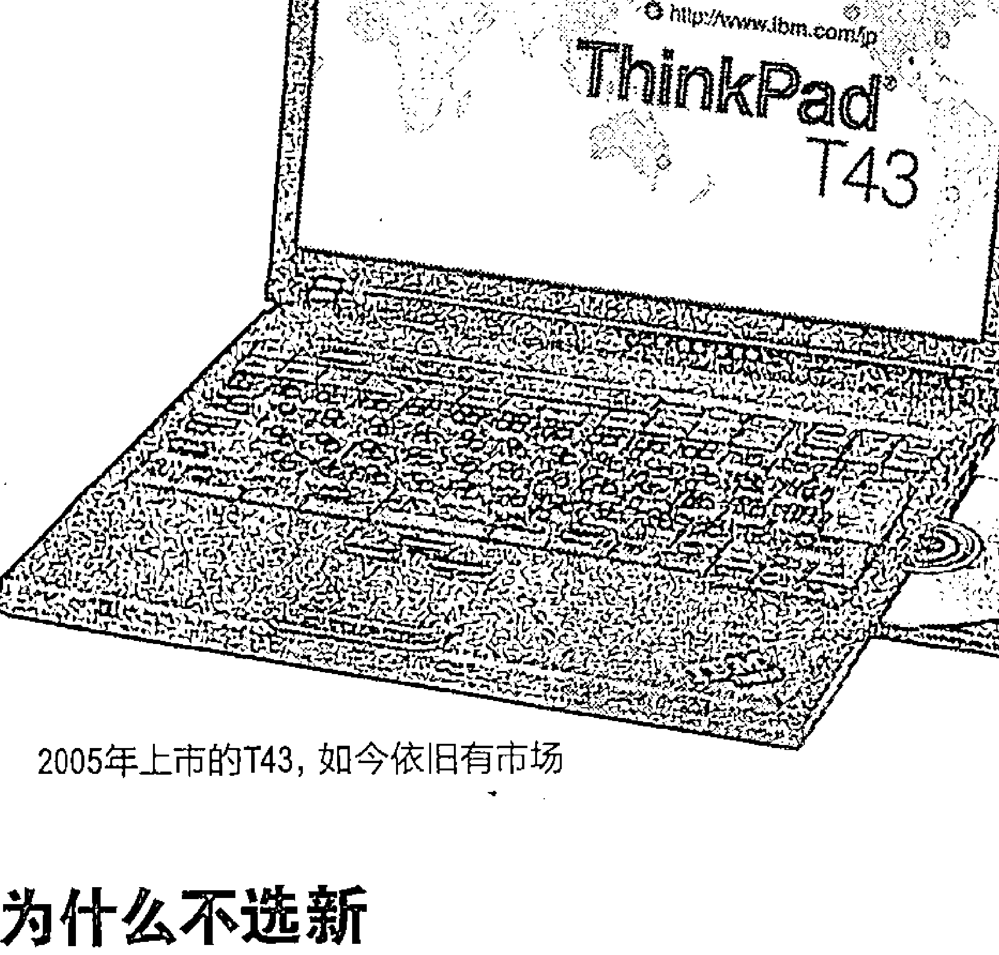

## 为什么不选新

现在SNB新品的起价不过3000元左右，为什么还要选旧机器呢？实际上，二手笔记本可以满足我们两方面的需求：将昔日经典揽入怀中或是拿3000元钱当4000元钱花。

举个例子，在二手市场中类似ThinkPad T43等“古董”仍是抢手货，论性能T43连双核上网本都比不过，但人家多少还保留着当年IBM的血统与毋庸置疑的做工和口碑，自然“退休”后仍有市场（根据成色，价格在1000元左右）。而与T43同时期的其它产品，绝大多数都已成为电子垃圾，或者在“家电以旧换新”的活动中发挥了余热。从这个角度而言，如果你仍为当年没钱曾错失与经典“约会”的时机懊悔，在二手市场中则可以较低的价格，重新获得拥抱经典的机会。

## 不易估价的二手本

笔记本不像手机，每个型号只对应一个价格。笔记本细分起来，会根据品牌、系列、具体型号而衍生出无数子型号，它们根据配置的不同在价格上也会存在很大差距，因此需要对硬件有足够了解的用户才能判断好价格，给自己留下砍价的空间。此外，我们在挑选二手笔记本时不要横向比较，比如二手ThinkPad T420可能要比全新的神舟高配本还贵，而且性能也不如后者，但真正选择ThinkPad的用户更看重的应该是品质与服务，而不是单纯配置的高低。

> 小提示
> ThinkPad T43搭载Dothan核心的移动版奔腾处理器，配备64MB显存的X300独显，当内存升级到2GB后，足够应付日常的办公和在线视频等操作，给家里的老人淘一台还是挺合适的。

选购二手笔记本时一定要端正心态，不要指望卖家或商家能帮你解决售后问题，潜在的隐患都需要自行承担。所谓二手有风险，入手需谨慎。如果你无法承担潜在隐患的压力，可以考虑选择仍在质保期内的二手笔记本，日后即使真的出现硬件问题也维修有门。

> 健圣有话说
> 如果你相中了某款二手笔记本，但却不知到底值多少钱，可以将出售该产品的链接、型号、配置、购买时间等信息发到健圣的邮箱（wangjian@cfan.com.cn）中，我会帮大家分析一下大致的价格区间。

## 二手本的黄金期

任何电子产品都存在使用寿命的问题，对笔记本而言前2年可以算是“黄金时期”，出现硬件故障的几率很低。想让它拥有更久的寿命，就得看原主人平时的用本习惯了（比如定期清灰、避免进水与磕碰等等）。

因此，笔者建议除了ThinkPad T系列和X系列、戴尔外星人系列、苹果MacBook系列等特别经典且质量过硬的高端机型以外，其它品牌和型号的产品尽量挑选2010年以后上市的机器，确保性能足够且避免潜在的安全隐患。

> 小提示
> 尽量不要选择配备NVIDIA GeForce 8000M系列显卡的机器，这个系列的显卡因为设计缺陷，故障率非常高，购买二手本时一定要避免“踩雷”。

| 上市年份 | 当年高端笔记本代表配置(CPU+显卡) | 合理价格 | 说明 |
|---|---|---|---|
| 2007年 | Core 2 Duo T5600+Mobility Radeon X1600<br>Core 2 Duo T7200+Geforce Go 7600 | 1500元以内 | 不值得购买，性能还不如SNB核心奔腾双核+核芯显卡 |
| 2008年 | Core 2 Duo T6600+Geforce 9600M GT<br>Core 2 Duo T8300+Mobility Radeon HD3650 | 2000元以内 | 不值得购买，性能与SNB核心酷睿i+核芯显卡的配置接近 |
| 2009年 | Core 2 Duo P7350+Geforce GT240M<br>Core 2 Duo P8600+Mobility Radeon HD4670 | 2500元以内 | 可以考虑，整体性能相当于i3-2310+GT520M |
| 2010年 | 酷睿i3-370M+Geforce GT435M<br>酷睿i5-560M+Mobility Radeon HD5670 | 3000元以内 | 可以接受，性能表现和当前产品相差不大 |
| 2011年 | 酷睿i3-2330M+Geforce GT555M<br>酷睿i5-2530M+Radeon HD6770M | 视新品价格 | 比较推荐，相关产品基本都在质保期内 |

批次的独显芯片存在缺陷，使用一段时间后容易出现虚焊，导致发热、花屏、黑屏和死机等问题，光维修费用就在400元左右。存在显卡门隐患的代表产品有联想天逸F31/F41系列、惠普DV2000系列、戴尔Inspiron 1420系列等等。

### 火速链接

我们曾介绍了如何借助网络淘二手手机的文章，而二手笔记本在寻找货源、分辨商家、议价砍价和交易形式上也有异曲同工之妙。感兴趣的同学请参考《学淘客 低开销玩转天下手机》这篇文章。想掌握更详细的检验二手笔记本的技巧和方法，请参考2011年7期《这里水很深——选购二手笔记本需谨慎》这篇文章。

## 根据需求选二手

笔记本技术革新很快，在选择二手笔记本时我们更应秉承“够用就好”的原则。比如当年作为高端游戏本代言的9600M GT和Mobility Radeon HD3650也就是如今SNB处理器所集成的核心显卡的性能水准，所以你不要指望当年的“游戏机”还能风采依旧（配备GTX280M之类顶级显卡的产品除外）。

笔者将近几年典型高端笔记本的配置列了出来（附表），可见2009年以前的机器几乎已经没有选购价值，除非特殊情况，3000元可以算是2010年以前二手笔记本的采购上限。对于市售版本（现在还有全新机在卖的型号），则可根据成色和配件的情况，在新品价格的基础上打个7~8折左右。

就纯粹的性能而言，多年前的旗舰可能也不如现在的低端新品，但我们不能忽视它们在设计和功能方面的优势。比如2010年款的戴尔Alienware M15x，采用i7-6200M+GTX260M显卡的二手型号均价在7500元左右，但此价位最多也就能买到i7-2670M+GT635M（GT555M的马甲）配置的新品，可能二者的性能差距不算太大，但M15x所拥有的高清屏幕、强大的散热系统、超酷的背光系统以及张扬的品牌效益却是任何同价位新品所无法比拟的。

## 验机检测不可少

笔者不推荐到中关村卖场的二手店铺去选购二手笔记本，这些店铺机器的来源非常散，既有回收的当地旧本，也有从各地批量采购而来的机器，没有一定的专业知识很难从中买到真正超值的二手机器。因此笔者更推荐借助网络与出售二手笔记本的个人交易，最终的成交价和风险要低于实体卖场。

一般来说，二手笔记本最常面对的质量隐患就是硬盘出现坏道，以及曾经出现过硬件问题（比如进水）返厂维修过。用HDTune（下载地址：http://www.duote.com/soft/10032.html）可检查硬盘健康情况。此外，绝大多数笔记本厂商官网都提供质保查询的功能，输入笔记本底部标签上的序列号信息，就可查看该产品的出厂日期和质保截止时限。

如果是网络交易，记得提前从卖家那里索要序列号信息，自己亲自查询一下。如果该产品有维修记录，在查询界面中也会有所显示。

考虑到交易时可能没有太多的测试时间，所以笔者推荐“鲁大师”（下载地址：http://www.ludashi.com/），提前将软件拷贝到U盘中，验机时在笔记本上安装并运行，在“电脑概况”中可以了解主机的详细配置，与该机标配对比一下，如果出现了变动就说明卖家曾进行过升级或换件。在“硬件健康”中可以查看硬盘使用时间与电池的耗损情况，在“温度检测→进行温度压力测试”中可以检查笔记本的散热能力，如果很快就突破85度大关，说明该机器的散热能力不佳，有必要进行除尘操作。在“性能测试”选项卡中还能检测屏幕有无亮点坏点。

## 小提示

笔记本背部都贴有质保标签，一旦破损就代表有过质量问题吗？答案是否定的，笔记本在升级内存和硬盘，或者拆机除尘时属于正常的维护操作，因此不代表所有质保标签出现破损的机器都出现过硬件问题而维修过，但一定要让卖家解释清楚之前拆机的目的。如果还是不放心，可以和卖家协商，到附近厂商的客服中心交易，顺便请客服人员帮忙检测并除尘（绝大多数厂商，在主板或CPU等核心部件尚在质保期内时都可进行免费的除尘服务）。

## 小结

- 1. 在网上寻找合适的机器
- 2. 联系卖家
- 3. 询问更详细的使用情况和实物照片，提供产品机身序列号
- 4. 在官网根据序列号查询质保时限与维修记录
- 5. 根据成色、配件（后期是否升级过硬盘内存）和保修时间砍价
- 6. 确认交易地点
- 7. 亲自验机
- 8. 交易完成

如果你是第一次买笔记本，或者对电脑技术知之甚少，不要犹豫，直接选购新品吧，4000元高配的产品一抓一大把。如果你对笔记本有一定的研究，则可以考虑二手笔记本，在相同的预算中可以让你选到性能更强或者功能更出众的产品。

## 二手笔记本分析案例

### 举例1

惠普DV4配置的亮点在于高端的HD6750M独显，游戏性能非常出众，就配置而言仍属于2012年上半年的中档配置。目前该机在京东报价4299元，卖家提出的3699元还是有一些虚高。既然卖家保证了成色（95新），那我们就应该把砍价的着力点放在质保时间上，如果还有半年以上的保修，只需将价格砍到3400以内就可入手。如果即将过保，3200元左右则是比较合理的价位。

### 举例2

Y460是联想在2010年的主力产品（现已停产），还好，i5-460M与GT425M的搭配还算均衡，性能相当于i3-2310M与GT525M独显的组合。考虑到这款机器成色没问题（95新且配有键盘膜），而且质保时间还有半年以上，尚有一定的选购意义。但是卖家提出的3299元价格还是太高，毕竟这个价格已经可以买到不少品牌i3-2350M+GT540M的新品，2600元左右应该算是这款机器的合理价格。

### 举例3

CS19是索尼在2009年的经典主流型号，可惜随着技术的发展，P8400处理器的性能略逊于现在的i3-2310M，而9300M GS显卡的性能也不如核心显卡，就性能而言CS19只能算是“够用”，适合非游戏之外的普通娱乐应用。卖家提出的2300元报价不算便宜，如果可以保证成色与质量，1800元以内还算可以，否则不如选择2010年后的高配机器了。

# iPad退席 高端双核平板怎么选

随着新iPad上市，iPad 2跌破3000元大关，让原本以价格取胜的Android阵营的高端双核平板感到了前所未有的压力。那么，现阶段此类产品还有选购的必要吗？

理论上讲，华硕EeePad TF201、ACER Iconia Tab A510等采用四核Tegra 3处理器的Android平板才是新iPad的挑战者。在本文中，我们不和新iPad比，而是来看看iPad 2的那些昔日挑战者，在iPad 2降价后还能否从容应对吧。笔者将告诉你，这些昔日的高端双核平板还值不值得选？到底值多少钱？降到多少价位时才是最佳的出手时机？

## 小提示

与千元级价位的国产平板电脑相比，一线品牌的双核平板除了在做工和品质方面更有保障以外，还加入了陀螺仪、蓝牙和GPS等功能，而且借助强劲的双核处理器，在运行速度和游戏体验上基本可以和iPad 2媲美。

据传年底苹果也要推出Mini版的iPad，而价格也会非常实惠，如果此消息属实，其他品牌的小尺寸平板也将面临巨大压力。但对我们消费者而言，苹果iPad挥师小尺寸市场，也有助于其他产品的价格回归理性，让我们花更少的钱就能买到性能更出色的产品。

### 避iPad锋芒 需剑走偏锋

iPad 2在高端平板市场有着无可争议的优势，剑走偏锋就成为不少品牌的应对绝招，其中三星就属于比较成功的典型。早在2010年三星就推出了Galaxy Tab P1000的7英寸平板手机，在iPad无法顾及的小尺寸市场找到了立足之地。如今，三星Galaxy Tab家族更是衍生出了8.9英寸、7.7英寸等多型号，都指向了iPad便携性稍差的软肋，为平板电脑赋予手机功能也成为了一种潮流趋势。

国内品牌很早就嗅到了这股气息，于是7英寸、8英寸和9英寸的平板产品蜂拥而至。与国内品牌的积极相比，其他一线品牌对小尺寸的平板电脑表现得并不积极，除了三星以外，目前只有ACER A100以及华为MediaPad搭上了平板小型化的班车。笔者认为，在高端市场iPad 2的优势太过明显，想和iPad正面抗衡并不可取。就拿iPad 2忽然降价的事情来说，其他双核平板的价格优势荡然无存，纯粹比拼价格时甚至处于劣势。由此可见，三星差异化竞争路线还是蛮成功的，值得其他品牌借鉴。对在性能和体验上讨不到便宜的10.1英寸的双核平板而言，降价必然就成为了唯一的出路。

### 拼实用 iPad并非首选

降价后的苹果iPad 2好是好，但很多用户都觉得数据管理太过繁琐，想往里面拷个电影或文档必须借助iTunes或91助手等同步软件才能完成。如果你希望可以像U盘一样管理平板电脑中的数据，随意创建文件夹来存放照片、音乐、视频或者其他格式文件，此时Android系统的人性化就彰显出来了，可以不受限制地在任意电脑上分享数据。由此可见，即使新iPad哪天也卖到白菜价，但限于iOS系统的封闭性与局限性，Android系统的平板还是能找到自己的生存空间。

无论是iPad还是其他高端平板，使用虚拟的触控键盘录入文字都是一件颇为痛苦的事。而Android系统从3.2版开始便加入了对键盘鼠标的完美支持（Android 4.0进一步完善），一线双核平板都支持USB HOST功能，可以直接读取U盘/移动硬盘内的文件，或是连接无线键盘鼠标打造成一整套办公平台，而iPad只能选择昂贵的蓝牙键盘才能实现，繁琐的同步过程也阻碍了其成为大众化移动办公平台。比如，当你好不容易用iPad赶出了个PPT，想着急拷贝到客户的电脑上，此时开始祈祷他已经安装了iOS设备客户端吧，否则你就只能先找个装有iTunes的电脑拷出来才能再在客户的电脑上分享。

## 小提示

当用键盘鼠标操作或在欣赏视频时，平板电脑最佳的摆放方式就是由支架固定在桌面。可惜现在鲜有自带支架的产品，都需要借助类似Smart Cover这种可折叠的保护壳或者专用支架的帮忙。希望今后的平板电脑都能在产品背部直接加上可折叠的支架，以便用户解放双手。

### 火速链接

Android 4.0系统和千元级国产平板电脑的组合好不好？在Android平板电脑上如何借助键盘鼠标更好地办公和娱乐？请参看《Android 4.0驾到 千元平板选玩攻略》。

### 高价平板≠一流视角

三星、华硕、联想、ACER等一线品牌的双核Android平板无论屏幕尺寸大小，其分辨率均为1280×800像素（7英寸~10.1英寸）或1024×600（7英寸）像素，与iPad（9.7英寸，4:3显示比例）相比，更突出宽屏比例。

表1：采用Tegra 2双核处理器的平板电脑
| 型号 | 屏幕 | 分辨率 | 内存/存储 | 重量 | 参考价格 | 理想价位 |
|---|---|---|---|---|---|---|
| 戴尔Streak 10 Pro | 10.1英寸TFT | 1280×800 | 1GB/16GB | 727g | 1999元 | 保持即可 |
| ACER A100 | 7英寸TFT | 1024×600 | 1GB/8GB | 410g | 2199元 | 1700元 |
| 乐Pad K1 | 10.1英寸TFT | 1280×800 | 1GB/16GB | 760g | 2299元 | 1999元 |
| 摩托罗拉Xoom | 10.1英寸TFT | 1280×800 | 1GB/32GB | 730g | 2599元 | 2300元 |
| Galaxy Tab P7310 | 8.9英寸PLS | 1280×800 | 1GB/16GB | 465g | 2688元 | 2300元 |
| 华硕TF101 | 10.1英寸IPS | 1280×800 | 1GB/16GB | 680g | 2799元 | 2300元 |
| ACER A500 | 10.1英寸TFT | 1280×800 | 1GB/32GB | 765g | 2799元 | 2300元 |
| Galaxy Tab P7510 | 10.1英寸PLS | 1280×800 | 1GB/16GB | 560g | 2988元 | 2500元 |
| ThinkPad Tablet | 10.1英寸IPS | 1280×800 | 1GB/16GB | 740g | 2998元 | 2500元 |
| 华硕SL101 | 10.1英寸IPS | 1280×800 | 1GB/16GB | 960g | 3299元 | 2600元 |
| 索尼Tablet S | 9.4英寸IPS | 1280×800 | 1GB/16GB | 598g | 3299元 | 2600元 |

在影音娱乐方面的视觉优势。

但是，IPS（三星为PLS，可视角度甚至超越IPS）材质的屏幕可并非这些高价双核平板的标准装备，比如ACER A500/A100、戴尔Streak 10 Pro以及联想乐Pad K1仍然为TFT。在千元级国产平板都将IPS屏幕视为标准配置的今天，很多高价位的高端双核平板的确显得有些小家子气了。没办法，一线大厂产品更新的周期很慢，现在大家都将精力投入到足以和新iPad媲美的四核新品上了，现存的双核平板在配置上很难再有更新。如果你比较在意显示效果，可优先挑选采用IPS屏幕材质的机型。

# “心”有所属

回到具体的产品选购环节，我们先来回顾一下市售的一线品牌双核平板电脑都有哪些。

## NVIDIA Tegra 2阵营

Tegra 2是第一款上市的双核处理器，采用Cortex A9架构和40nm的制程工艺，出于成本和功耗的考虑，其内部没有集成NEON协处理器（只能硬解Main Profile的H.264视频，其他格式只能依靠CPU软解，对720P以上级别的高清视频支持不佳），而且主频也被限定在1GHz，因此它的整体性能在几款双核处理器中相对较差。

- 整体性能★★★☆
- 运算性能★★★★
- 游戏性能★★★★☆
- 视频性能★★
- 优点：游戏性能出众
- 缺点：缺少NEON协处理器，高清播放不给力

在Tegra 2刚刚推出的时候，其他品牌的双核处理器还在“孕育”阶段，因此2011年上市的双核平板90%都采用了这个核心，且主频和内存均为1GHz/1GB，这类产品在性能上几乎没有任何差异，差别主要体现在做工用料、屏幕材质和产品重量上。其中戴尔Streak 10 Pro的价格算是最合理的，不足2000元的价位弥补了屏幕材质和重量上的缺陷，而其他产品在iPad 2降价后就显得有些虚高了，如果你能接受Tegra 2在高清视频播放方面的遗憾，当这些产品的价格降至理想价位后即可出手。

## 高通MSM8x60阵营

与其他双核处理器相比，高通MSM8x60的架构并非Cortex A9，而是与其单核处理器类似的Scorpion架构（异步双核，只有当其中一个核心满载后才调用第二核），浮点性能相对低下，但借助1.5GHz的最高主频，以及集成的Adreno 220 GPU，在大型游戏和高清视频的体验上还是比较不错的。高通处理器的另一大亮点是集成通讯模块，非常适合作为支持3G或手机功能的平板所采用。

- 整体性能★★★★
- 运算性能★★★☆
- 游戏性能★★★★
- 视频性能★★★☆
- 优点：主频较高
- 缺点：浮点性能差

高通MSM8x60处理器在双核手机领域占据了半壁江山，但在平板电脑领域却不太顺利，目前只有被联想乐Pad S2系列和华为MediaPad所武装。其中华为MediaPad的性价比非常不错，1280×800分辨率的7英寸屏幕表现非常细腻，1999元的价格还是蛮合理的。而乐Pad S2因支持3G功能而价格较高，距离合理价位还有很大的一个区间，希望联想能推出乐Pad S2系列的WiFi版以降低成本，让更多普通用户接受。

## 德州仪器OMAP44x0阵营

德州仪器OMAP44x0系列包括OMAP4430、OMAP4460以及OMAP4470，它们都采用Cortex A9架构和45nm的制程工艺，主频分别为1GHz/1.5GHz/1.8GHz，其中OMAP4470集成的GPU为PowerVR SGX544（384MHz），其余两款为SGX540（与单核时代的蜂鸟相同，但核心频率被提升到300MHz）。OMAP44x0的优势在于游戏兼容性最出众（GPU和iPhone相同），多媒体性能的表现也比较抢眼。

- 整体性能★★★★☆
- 运算性能★★★★☆
- 游戏性能★★★★☆
- 视频性能★★★★☆
- 优点：GPU兼容性最出色
- 缺点：无明显缺点，最均衡

德州仪器OMAP44x0双核处理器量产时间较晚，错过了双核平板上市之初的黄金时期，在平板市场成为高不成低不就的典型，比如摩托罗拉 XOOM2（DroidXyboard）还未上市就受到了iPad 2降价的冲击，其上市价格如果高于iPad 2可就尴尬了。说实话，OMAP44x0在功耗、游戏兼容性和多媒体影音方面的表现都很出众，还未占领市场就将被更高端的四核大军所淹没实属可惜。好消息是，OMAP44x0受到了包括智器在内的很多国内品牌的青睐，1500元左右的上市价格极具吸引力。

## 三星Exynos 4210阵营

Exynos 4210（猎户座）是最晚发布的，也是目前最强大的双核处理器，采用Cortex A9架构和45nm的制程工艺，拥有最高1.4GHz的主频，并集成ARM自行设计的Mali400多核心GPU，拥有最强悍的理论性能，对绝大多数的视频格式都可实现1080P

表2：采用高通MSM8x60双核处理器的平板电脑
| 型号 | 屏幕 | 分辨率 | 处理器 | 内存/存储 | 重量 | 参考价格 | 合理价位 |
|---|---|---|---|---|---|---|---|
| 华为MediaPad | 7英寸IPS | 1280×800 | 高通MSM8260（1.2GHz） | 1GB/8GB | 390g | 1999元 | 保持即可 |
| 联想乐Pad S2007 | 7英寸IPS | 1280×800 | 高通MSM8X60（1.5GHz） | 1GB/16GB | 360g | 3299元（3G版） | 2600元 |
| 联想乐Pad S2010 | 10.1英寸IPS | 1280×800 | 高通MSM8X60（1.5GHz） | 1GB/16GB | 670g | 4199元（3G版） | 3200元 |

表3：采用德州仪器OMAP44x0双核处理器的平板电脑
| 型号 | 屏幕 | 分辨率 | 处理器 | 内存/存储 | 重量 | 参考价格 | 合理价位 |
|---|---|---|---|---|---|---|---|
| 亚马逊Kindle Fire | 7英寸IPS | 1024×600 | OMAP4430（1GHz） | 512MB/8GB | 403g | 约1500元 | 保持即可 |
| 摩托罗拉XOOM2 | 10.1英寸/8.2英寸 | 1280×800 | OMAP4430（1.2GHz） | 1GB/16GB | 不明 | 还未上市 | 2600元 |硬解码，多媒体功能也很出众，唯一可惜的就是Mali 400存在一定游戏兼容性问题。

- 整体性能★★★☆☆
- 运算性能★★★☆☆
- 游戏性能★★★☆☆
- 视频性能★★★☆☆

优点：GPU性能强悍，配合软件可打开抗锯齿
缺点：游戏兼容性有待提高

Exynos 4210的性能毋庸置疑，但限于成本和产能目前仅被三星自家的平板所采纳。借助Galaxy S II（i9100）等型号手机的大卖，Exynos逐渐被游戏开发商所重视，最新的游戏大作都已单独针对Exynos加以优化，游戏兼容性的缺陷有望成为历史。如果你注重平板电脑的性能与便携，Galaxy Tab P6210是目前最值得关注的机型，等价格降到2200元左右时就是最佳出手时机。Galaxy Tab P6800虽然具备更出众的高清屏幕与手机功能，但过高的价格降低了竞争力。好消息是，Exynos 4210已经被蓝魔武装到了旗下的W21（8英寸TFT，1024×768）上，价格有望控制在1500元以内。希望借Exynos量产的机会，能有更多国产平板加入到猎户座的大军。

四种双核处理器都能带来非常流畅的操作体验，也能流畅运行Android平台的大型3D游戏，只是在多媒体和视频播放等方面存在差别。总之，在价格和其他配置相近时，笔者推荐的选购顺序是三星Exynos 4210 > 德州仪器OMAP44x0 > 高通MSM8x60 > NVIDIA Tegra 2。

## 小提示

三星Galaxy Tab家族中凡是后两位为“00”的（如P7500、P7300、P6200）均为3G版，后两位为“10”的（如P7510、P7310、P6210）为WiFi版。

### 为何不推荐3G版

平板电脑究竟是否需要原生的3G功能？相关的话题我们已经讨论多次，在这里笔者再一次重申自己的观点：如果你没有智能手机，需要随时能接入网络的智能终端设备，在口袋宽裕的情况下可以选择原生3G版的平板电脑（比WiFi版贵600元~1000元）。如果你已经有了智能手机，而且该手机支持无线AP（分享手机的网络，变身无线路由器）功能，此时3G对平板就不是必需的了，需要的时候分享一下手机网络即可，一张手机卡就能搞定，还省去了专门为3G平板另配一枚上网卡（还得再为这个新卡办理一定流量的包月套餐）的开销。因此，笔者建议厂商还是踏踏实实做好WiFi版的型号，把成本控制好，以性能和价格的优势来吸引更多的用户，毕竟更多的消费者还不了解3G和WiFi的差别，价格才是他们唯一认定的指标。

一线品牌双核平板在品质和性能上都足以和iPad 2抗衡，只是出于iPad 2的怒降而措手不及。高端有iPad 2把控，低端有1500元左右的国产双核平板搅局，位于二者之间的一线双核平板略显尴尬。当然，尴尬的源泉还是在于不太合理的价格，当它们真的降到合理的价位时，相信依旧能取得不错的反响。作为消费者的我们准备好了，厂商们你们准备好降价了吗？

### 表4：采用三星Exynos 4210双核处理器的平板电脑

| 型号 | 屏幕 | 分辨率 | 处理器 | 内存/存储 | 重量 | 参考价格 | 合理价位 |
|---|---|---|---|---|---|---|---|
| Galaxy Tab P6210 | 7英寸PLS | 1024×600 | Exynos 4210 (1.2GHz) | 1GB/16GB | 345g | 2588元 | 2200元 |
| Galaxy Tab P6800 | 7.7英寸PLS | 1280×800 | Exynos 4210 (1.4GHz) | 1GB/16GB | 340g | 4458元 | 4000元 (可打电话) |

# eSATA 悲情的高速接口

eSATA，一个速度不逊于USB 3.0的高速接口，为何逐步沦为可有可无的“附属品”了呢？

## 旧时代的高速尖兵

拥有1.5Gbps或3Gbps理论传输速度的eSATA可秒杀仅有480Mbps速度的USB 2.0，其实测速度可达70MB/s左右，即使与最新的USB 3.0相比也不会逊色太多。

## 自己革了自己的命

虽然完胜USB 2.0，但eSATA还是败在了自己手上：纵然具备超高的传输速度，但需要额外供电的设计却被很多人认定为“技术上的倒退”，由此还引发了一系列的“杯具”。首先是缺乏外设厂商的支持，eSATA仅被应用在少数移动硬盘之上；此外，少到可怜的周边设备让厂商的激情也逐渐淡化，很多笔记本厂商对eSATA的定位就是“噱头”，我可以提供，但实用性就不考虑了。因此你才会看到将USB和eSATA接口被分别安排在机身两侧或距离很远的“蛋疼”设计，eSATA移动硬盘的“分叉”数据线（eSATA读取数据，USB取电）只能照顾到一个接口，当eSATA这边接上了，你会发现USB线头够不着笔记本上的其它USB接口而无法供电……当然，你可以选择独立的电源适配器供电，但此时还算“移动”硬盘吗？

## 众人拾柴火焰才高

通过eSATA的成败，我们不难发现，单纯的技术优势只是走向成功的一个环节而已。IEEE 1394和eSATA这些昔日的技术明星，都败于缺乏盟军的支持。反观如日中天的USB，从移动硬盘、U盘、手机、平板电脑……无数外设都将其定位于标准接口，不火才怪。

eSATA这类接口如此，换成系统也是这个道理。比如微软的Windows Phone平台，虽然具备简洁流畅的操作体验，但至今只寻得了诺基亚这么一位铁杆Fans，像HTC、三星这类合作厂商却还处于脚踏多条船的状态。古人云，得人心者得天下，也许就是这个道理吧。

因此，只要你笔记本上有eSATA接口，就不要再羡慕那些配备USB 3.0接口的新品了，这种多年前的技术标准同样可以为你带来飞速的传输体验。但是，为什么这个旧时代的高速尖兵却没什么知名度呢？

# 低价也能尝鲜3G平板电脑

继芯片和面板的进化之后，千元级平板电脑又将卖点锁定在了3G上网上。这种可以随时随地接入网络，甚至可以拨打电话的产品能否满足我们的日常使用需求呢？

提到手机平板，可能大家会联想起“价格不菲”的三星GALAXY Tab P1000；提到3G平板，可能大家的第一印象又是3G版的iPad，而且价格肯定要比Wi-Fi版的型号贵上近千元。好消息是，随着相关政策的放宽与新技术的应用，今后为平板电脑赋予3G上网甚至手机功能将不再是一线品牌与高价产品的专利，特别是国内平板品牌的涉足与推广，大大降低了3G上网平板的价格门槛，配置相近的机型也不会比Wi-Fi版贵太多，3G上网平板的普及旋风就此袭来。

## 3G平板≠手机平板

需要注意的是，3G平板≠手机平板，也就是说可以插SIM卡的平板并不一定都支持语音通话功能。因为想让平板电脑支持语音通话，需要走和手机一样的工信部审核流程，取得入网许可等一系列繁琐的手续认证后方能实现，因此很多厂商都会放弃语音通话，只为平板开放3G上网的功能。如果你希望可以像手机一样用平板电脑通话，在选购产品时要挑选支持语音通话的型号，反之则不必在意这个功能，毕竟拿着类似板砖的平板打电话会被很多人鄙视的，随时随地接入网络才是这类产品的核心卖点。

## 表2：常见主流价位的3G平板，支持语音通话就意味着可以拨打电话

| 参数 | 原道N12 3G版 | 蓝晨V13 | 普耐尔MOMO7 | 酷比N6 | 原道N70 | 昂达VX610W豪华版 |
| :--- | :--- | :--- | :--- | :--- | :--- | :--- |
| 屏幕 | 7英寸电容屏 800×480像素 | 7英寸电容屏 800×480像素 | 8英寸电容屏 1024×768像素 | 8英寸IPS-T电容屏 1024×768像素 | 7英寸IPS电容屏 1024×600像素 | 7英寸IPS电容屏 1024×600像素 |
| CPU | 瑞芯微RK2918 | 全志A10 | 瑞芯微RK2918 | 瑞芯微RK2918 | 瑞芯微RK2918 | 瑞芯微RK2918 |
| GPU | GC800 | Mali400 | GC800 | GC800 | GC800 | GC800 |
| 内存/存储 | 512MB/8GB | 512MB/8GB | 512MB/8GB | 1GB/8GB | 512MB/8GB | 1GB/8GB |
| 3G | TD-SCDMA | WCDMA | TD-SCDMA | WCDMA | 仅支持2G | 3G通话+2G上网 |
| 语音通话 | 不支持 | 支持 | 不支持 | 支持 | 支持 | 支持 |
| 蓝牙 | 不支持 | 不支持 | 不支持 | 支持 | 支持 | 支持 |
| GPS | 不支持 | 不支持 | 不支持 | 不支持 | 不支持 | 不支持 |
| 摄像头 | 前置30W | 30W/200W | 30W/200W | 前置200W | 前置30W | 130W/200W |
| 视频输出 | 不支持 | HDMI | HDMI | HDMI | HDMI | 不支持 |
| 电池 | 4500mAh | 6000mAh | 6000mAh | 4000mAh | 3400mAh | 4000mAh |
| 价格 | 599元 | 799元 | 899元 | 1099元 | 999元 | 1299元 |

## 3G平板的分类

如今千元内的3G平板大都选用了瑞芯微RK2918或全志A10方案，处理器本身并不支持3G或通话功能，需要额外的第三方通讯芯片支持。在通讯标准方面则基本分为四类（表1），如果你追求上网速度可以考虑采用WCDMA制式的产品，由于CDMA2000相对小众，现在还没有相关产品出炉，而选用TD-SCDMA制式的产品性价比普遍更出色。但需要注意的是，部分支持移动TD-SCDMA制式3G功能的平板（如原道N12）只能使用移动号（包括2G和3G），而联通和电信的号无法正常识别，而支持WCDMA制式3G功能的平板则普遍可以支持移动和电信的手机号（但只能使用2G的网络上网）。

## 表1：常见通讯标准

| 3G标准 | 运营商 | 上网速度 |
| :--- | :--- | :--- |
| TD-SCDMA | 中国移动3G | 比较快 |
| WCDMA | 中国联通3G | 非常快 |
| CDMA2000 | 中国电信3G | 非常快 |
| GSM（2G） | 支持三大运营商的2G网络 | 很慢 |

有些平板电脑（如原道N70）虽然可以像手机一样拨通联系人并与其语音通话，但机身上并没有专用的听筒，对方的声音只能从机器背部的扬声器发出，感觉就和手机开启了免提的功能一样。因此，使用这类平板电脑打电话时尽量戴上耳机，以防隐私泄露。此外，包括蓝晨V15在内的一些平板电脑默认下是没有通话程序的，需要用户自行找到位于内置SD卡中的“电话激活工具”，安装运行重启后才会出现短信、联系人和播放器程序的图标。

另一方面，千元级的3G平板都不支持SIM卡的热插拔，在插入SIM卡时请确保机器处于关机状态（开机插入可能烧毁3G模块），在接入3G网络时记得先关闭Wi-Fi功能，因为Wi-Fi和3G是不会同时开启的。以预装Android 4.0系统的3G平板为例，可依次进入“设置→无线和网络→移动网络”，勾选界面的“模组电源”（如有“外置模组”选项，代表用于OTG线外接3G网卡的模块供电）和“已启用数据”。如果搜不到网络信号，可以到网络运营商处选择并注册。

## 3G平板VS外置3G模块

很多平板电脑都配有USB接口并可外接3G上网卡模块，但当这种设备与平板电脑相连时好似一个尾巴，虽然也能解决随时随地上网的需求，但实在是有失美观，而且还会影响便携。而本身内置3G模块的平板电脑，兼容性和易用性都更理想。此外，外置3G上网卡的价格也不算便宜（最便宜的也要200元左右），如果碰到支持3G且价格依旧实惠的平板电脑，自然是后者更值得选择。

如今的智能手机都可实现虚拟的无线AP功能，可以临时共享手机的流量，通过Wi-Fi供平板电脑上网。但是，智能手机的待机本来就不给力，在开启无线热点功能后耗电量也会激增，一个小时就能耗费50%左右的电量，万一碰到紧急情况需要拨打电话却发现电池没电可就“杯具”了。因此，如果你只在家中使用平板电脑，或者外出时只有偶尔或临时性的上网需求，普通平板电脑再结合手机无线AP功能是个不错的解决方案，反之则应该考虑内置3G模块的产品。

# 硬盘防震 商务笔记本的必修课

如今商务本和娱乐本的概念已渐渐模糊，商务也能娱乐，娱乐也可以办公。但是，真正为商务用户量身定制的产品，还是有一些值得称道的设计或功能，而硬盘防震则是其中之一。

顾名思义，商务笔记本就是专为商务用户量身定制，免不了随主人四处奔波的忙碌生涯，因此笔记本厂商都会对旗下商务笔记本的结构进行加固处理，比如改用合金材料或碳纤维材料的外壳、配备防滚架的机身结构。此外，商务笔记本往往还会加入键盘的防泼溅功能，即在键盘与机身之间设计一道引水槽，如果键盘不小心洒上了液体，最终会从机身底部的导流孔排出，避免硬件受损。

但是，即使笔记本再坚固再防水，一次明显的震动也很有可能造成硬盘内磁头与盘片的亲密接触，致使硬盘内部的数据受损。对于商务人士来说，笔记本自身的价格好似毛毛雨，但是笔记本内部的数据却是无价的。因此，经常会看到很多用户花数千元去恢复受损硬盘内的数据。

## 硬盘防震 主动被动要分清

超极本的兴起，让SSD固态硬盘进入了快速发展的黄金期，但想让固态硬盘成本大幅降低还是需要一个长期的过程，想确保商务笔记本内部的硬盘数据安全，还不能完全指望SSD硬盘的武装。好消息是，很多笔记本厂商都找到了折中的解决方案：为笔记本内的机械硬盘赋予主动或被动的保护技术。

## 被动式防震技术

被动式防震技术无需任何电子元器件的参与和软件的支持，只是在硬盘的周围填充一些海绵或橡胶材质的可以吸收震动的缓冲层，可避免偶尔、轻微的颠簸对硬盘造成损伤。以某款笔记本为例，在机身底部的硬盘挡板内设有两条防震胶带来吸收震动能量。考虑到橡胶材质属于热的不良导体，因此这类笔记本往往还会在硬盘表面覆盖一层导热性更好的铝箔确保硬盘的散热，保证长时间运行的稳定性。

如果你的笔记本没有任何硬盘防震技术，不妨自己动手，为本本缓解震动伤害。方法很简单，拆开本本背后的硬盘挡板，拧下固定硬盘的螺丝，在硬盘四周和表面用双面胶固定几片厚度适当的海绵垫，同样可以起到为本本减轻“压力”的效果。

## 主动式防震技术

主动式防震技术在被动式技术的基础上还需加入加速感应芯片，判断硬盘是不是处于震动中或跌落状态，还需预装在系统中的特殊软件对硬盘进行管理，也就是所谓的软硬结合，可以最大限度保证笔记本在频繁的震动或颠簸下的硬盘安全。当笔记本出现了振动、撞击或者跌落，主动式防震技术会以毫秒级的速度迅速将硬盘的磁头从工作状态收回到磁头停止区，从而减小撞击对硬盘的损害，保护硬盘及硬盘内的数据。

### 小提示：为啥争抢商务市场

虽然如今商务笔记本的出货量不如娱乐笔记本，但前者的单机利润却是非常可观的，同时也是彰显品牌设计实力的主战场。如果放弃商务市场，品牌的高端形象将大打折扣，因此你会发现任何一个注重维系品牌形象的笔记本厂商，都拥有可以在商务战场傲视群雄的商务办公利器。

富士通笔记本为硬盘准备的双层安全气囊、ThinkPad的硬盘减振器以及惠普笔记本常用的减震型硬盘框架均属于被动式防震技术中的代表。此外，笔记本底部的脚垫其实也能起到一定的防震功效，至于实际的效果则取决于它的材质、弹性和形状。

### 商务≠价格昂贵

一提到商务笔记本，可能大家的第一感觉就是价格不会很便宜。实际上，只要你不追求最顶级的配置版本，某一商务机型的低配版往往会带给你价格上的惊喜。毕竟对非游戏和进行超复杂运算的普通商务应用，只要两款产品具备相同的安全特性即可，至于四核的i7与双核的i3在日常应用中的差别不会很明显，而省下的真金白银却是非常现实的。

随着年轻一代商务用户的兴起，传统的商务笔记本也处于全新的转型期，在延续一贯稳定安全特性的前提下，更多品牌的商务产品线逐渐向时尚化、个性化转型，由内而外彰显身份和品味。

总之，如果你并不追求极致的娱乐性能，但对安全稳定的要求极高，支持硬盘防震技术的商务派笔记本依旧是你的首选。

## 小提示

主动式防震技术中比较有名的包括ThinkPad的APS硬盘保护技术、惠普的3D DriveGuard硬盘保护技术、富士通的三维硬盘防震系统、东芝三维硬盘保护技术、索尼3D感应硬盘保护技术等。需要注意的是，以上这些技术需要软硬件结合，大家在购买了此类产品时要检查是否完整安装了相关的驱动或软件，特别是重装系统时更需留意，不要让这些先进的技术成为摆设。

# “E”鸣惊人 Sandy Bridge-E预备称王

近期英特尔发布的Sandy Bridge-E处理器是一款针脚数接近上一代两倍的产品，但却沿用了SNB构架并加以拓展而来。虽然外界赞誉如潮，但它究竟有何“神通”？能否成为下一站王者呢？待我们慢慢道来……

## 新丁驾到 “E”论纷纷

Sandy Bridge-E处理器是中高端玩家的新“利器”，这是目前占据主流的论调，而这款处理器到底针对什么群体？目前升级至这款处理器是否合适？则令众多玩家“E”论纷纷。目前它的旗舰型号Core i7-3960X与上一代Core i7-990X同样采用六颗物理核心设计，超线程技术也依然提供了支持，所以这款产品也具备六颗物理核心和十二线程的规格。除此之外Core i7 3960X采用了新的接口规格，内存通道也由上一代的三通道升级为四通道，并且三级缓存也扩大到了15MB。这款处理器在实际系统中能够十二条线程工作，这就是英特尔的超线程技术在起作用。不要小看超线程出的十二条线程，它可在我们进行渲染运算时实现十二条线程共同渲染，相当于虚拟出十二个核心在处理任务。

## 四通道技术实现“小超越”

在Core i7 3960X Extreme Edition和X79芯片组上有个令人惊喜的“小超越”—四通道内存架构。其实理解这个构架并不难，首先我们了解内存的作用就是交换数据，事实上三级缓存和二级缓存也具备类似功能。而四通道内存系统升级也让内存带宽更加接近三级缓存的带宽，如果刨去验证机制，那么四通道内存的性能也已经和三级缓存性能非常接近了，即使是未来某一天三级缓存因为内存过分强大的性能而失去应有的作用（或成为性能瓶颈），那么我们也不用对此过分惊讶。当然四通道内存也面临一些应用难题，目前我们所了解的32位系统最多只支持到3.2GB容量的内存，所以选择Sandy Bridge-E平台的用户就只能使用64位系统。

### 小贴士：Sandy Bridge-E内部探析

Sandy Bridge-E构架有八个处理核心、八块总计20MB三级缓存、环形总线（两条白色虚线）、两个双通道DDR3内存控制器物理层（总计四通道）、内存助手、两个PCI-E控制器物理层（总计四十条PCI-E通道）、PCI-E助手、两个QPI总线物理层、QPI助手、电源控制单元等等。整个核心拥有22.7亿个晶体管，采用32nm Bulk工艺制造，核心面积435平方毫米，长度和宽度分别为20.9毫米、20.8毫米，基本呈正方形。

另外，上一代处理器中的睿频技术在Sandy Bridge-E中仍然存在，令用户在应用中实现自动超频，不但便捷，而且安全、稳定。下面我们举个简单例子来说明，在执行单任务的时候Core i7 3960X Extreme Edition会将单个核心频率提升到最高睿频频率，这样能够最优化单核心（双线程）的性能，而其他核心则降低频率以避免不必要的功耗浪费，并且在执行高负载多任务时则将六颗核心（十二线程）分别提升至一个较低的频率上，这样则能够在控制功耗的同时最优化程序执行性能。

### 小贴士：多通道内存的由来

早在2004年末，DDR内存的双通道系统就已经出现，双通道内存系统带来的位宽和带宽的提升是明显的，也正是在那个时候，DDR内存才被所有消费者认可为最强的内存系统。但仅仅过去了三年，X58和Nehalem处理器所带来的三通道DDR3内存构架正式被Intel所推出，而双通道的顶级性能也被三通道所带来的强大性能提升所取代，最强内存性能的代表转移到了三通道内存上。

## “E”马当先 局限在于价格

不少中高端玩家似乎都在翘首以待Ivy Bridge的发布，这款明年发布的处理器目前还无法得到太多数据，只了解它采用22nm技术制造，支持Tick-Tock微构架，首次加入3D晶体管批量生产，应该属于高端中的高端，市场售价很有可能高过当前Sandy Bridge-E平台几倍，并且短时间之内也无法通过技术手段实现降低成本。所以奉劝那些苦等Ivy Bridge的用户还是讲究一下实际，Sandy Bridge-E是最靠谱的选择。况且目前Sandy Bridge-E的性能已超过我们的预期，其中旗舰版处理器的性能已远远超越了上一代的旗舰Core i7 990X处理器，并且四通道内存架构也让平台整体存取性能得到了质的提升，如果想追求高性能平台的话，Sandy Bridge-E是目前不二的选择。

## 做好心理准备 升级需“忍痛”

由于本次Sandy Bridge-E的规格大范围升级，内部晶体管数量增多等原因，以往LGA 1155和LGA 1366接口俨然已经不够用，英特尔在不得不推出新接口的情况下推出了针脚数高达2011个之多的LGA 2011接口标准。从现有的产品观察，其背面的触点已经达到了非常密集的程度，而LGA 2011接口几乎比LGA 1155接口的触点数量多了一倍，所以处理器的体积自然也增大了许多。接口的变动造成处理器体积占用更多的主板空间，这意味着之前的散热器与主板都无法兼容Sandy Bridge-E处理器，看来想要升级的用户必须“忍痛”将CPU、主板与散热器全部更换。

### 小贴士：睿频技术

睿频加速技术在2008年发布，最早出现在英特尔Nehalem架构Core i7平台上，睿频加速技术的核心在于：在控制功耗不超过Intel限定范围的前提下最优化计算机的资源利用。睿频加速技术能够在需要的时候将频率自动提升，而在不需要的时候将频率和电压降低以节省消耗。

当然，高性能意味着高投入，这也就是为什么文章标题刻意提到“预备称王”，主要坐观英特尔何时能将价格调整到合理位置。目前六核十二线程的Sandy Bridge-E Core i7 Extreme处理器预计售价在1000美元左右，六核十二线程的Sandy Bridge-E Core i7处理器预计售价将在550~600美元，而四核版的Sandy Bridge-E Core i7处理器售价预估在300美元左右。如果英特尔不能及时调整售价，那么目前即使中高端玩家也只能望“E”兴叹。

# 切勿大意 中端电源不好选

现如今，显卡和处理器的功耗越来越高，随随便便一块中端显卡，其功耗就可能超过100W。再加上一款四核处理器，功耗需求轻轻松松稳超200W。面对此情此景，一款功率为400~500W的电源肯定是必需的！不过除了功率，选购电源时其实还有很多地方需要留意哦！

## 电源版本需要留意

自从2.0版电源上市之后，市场上的主流电源就从单路12V变成了双路12V输出。而新近推出的2.3和2.31版电源，则是提高了+12V1输出能力，并降低了+12V2输出能力。之所以会出现如此改变，其实是为了适应当前的硬件发展潮流。由于+12V2输出主要针对处理器，并且低功耗的酷睿i已经占据主流，所以就不再需要强大的+12V2输出能力。

至于+12V1输出则主要针对显卡，在高端PCI-E显卡功耗不断提升的情况下，+12V1输出也就必须要有更强的能力。所以消费者在选购时，应该主要考虑2.3和2.31版的电源产品。

## 长线电源玩转背线

每次打开电脑机箱的侧板，我们都会看到乱糟糟的一堆连线。对于电脑用户来说，这些连线不但有碍观瞻，还会影响主机里的空气流通，从而影响到各个硬件的散热。面对此种情况，越来越多的机箱产品开始支持背线方案。不过需要注意的是，背线方案对于电源往往也提出了比较高的要求。由于厂商的官方数据并不包含电源连线的准确长度，第三方测试数据往往也只是简单描述。因此，选购电源时最好带着机箱，以防止那些名声在外却徒有虚名的电源产品。

## 模组化设计化繁为简

与背线方案一同出现在电源市场的，其实还有模组化设计这种方案。这种电源的连线全部采用可插拔的接口设计，其最大的好处就是可以只连上必要的接口，更好地进行理线工作，并经常搭配长线设计，大多支持背线方案，保持机箱内的整洁，也更加有利于各个硬件的散热。不过需要注意的是，模组化电源的售价通常比较昂贵，所以只推荐预算比较充裕的玩家购买。

## 风扇尺寸决定噪音

随着电源功耗的不断提高，电源内部的风扇噪音也变得越来越大。而为了有效解决噪音问题，主流的中端电源开始放弃原始的8cm风扇，而采用12cm或14cm规格的风扇。目前来看，这种技术看起来还是相当完美，一方面大规格的风扇在转速不高的前提下保证了出风量，另一方面风扇转速的降低也减小了电源噪音。从比较客观的角度来说，12cm大风车电源即可满足噪音需求。而对噪音特别敏感的玩家，则可以考虑购买14cm大风车电源。

# USB3.0主板 高速未必高价

2012年是USB3.0进一步普及的一年，用户需求随着相关外设的不断上市而增加，拥有USB3.0接口的主板因此格外受到青睐。

## 原生与非原生

由于Intel的“6”系列主板并不“原生”支持USB3.0接口，所以在市场上“原生”支持USB3.0接口的芯片组就只有AMD的A75这一款。但是由于A75主板仅支持FM1接口的处理器，所以喜欢其他处理器的消费者就只能接受“非原生”这个概念。好在令人欣慰的是，根据已有的测试来看，“非原生”在数据传输上与“原生”的差距微乎其微。诸如H61、H67、880G这样的主板，均可在第三方芯片帮助下提供USB3.0接口。而且其传输速度也并不差，同样可实现十倍于USB2.0的传输速度。消费者在选购时，无需特别关注“原生”与“非原生”的区别。

## 非原生要看售价

目前来看，由于“非原生”的主板采用了第三方芯片来实现USB3.0接口，所以成本和售价方面肯定会更高一些。不过话又说回来，市场上的USB3.0扩展卡已经普遍卖到了100元以内。所以在选购时，非原生的USB3.0主板也不能太贵，最多也就比USB2.0主板贵七八十元才算合理。如果贵出100元以上，就不如购买USB3.0扩展卡更划算啦！

## USB3.0接口的数量

根据AMD的官方资料来看，A75主板可以原生支持4个USB3.0接口。但是令人遗憾的是，很多主板厂商为了省事，多数A75主板都仅提供2个USB3.0接口，想要找到4个的产品还是得细心挑选才行。选购时，一定要多关注A75主板的USB3.0接口数量，最好是达到4个才为其买单。至于“非原生”的USB3.0主板，则由于第三方芯片限制，普遍只能提供2个USB3.0接口，所以也就不能苛求4个。

## 视频接口的种类

500元以内的USB3.0主板，普遍都是低端整合主板。因此在选购时，视频接口的种类也是必须留意的。如果只具备VGA接口，那么就只能搭配老款低端显示器，要想体验纯数字的视频信号也只能是望尘莫及。如果同时具备了DVI+VGA接口，则算是绝对达标，搭配主流的显示器几乎没有任何问题。如果同时具备HDMI+DVI+VGA接口，则算是近乎完美，不但可以搭配最新款显示器，而且还可以与电视或投影相连接，实现更大屏幕的视觉冲击。

（文|宁宁）

# 突破极限 玩转微星OCgenie技术

最近购买了微星的H61MU-E35主板，听商家说具备了OCgenie智能超频技术，可以智能超频二代i5处理器的内建GPU，游戏性能也会因此得到很大的提升。经过一番研究之后，终于弄懂了如何设置，从而享受到了GPU超频所带来的游戏快感！

1100MHz。至于微星H61MU-E35所具备的智能超频技术，则被叫作OCgenie技术。虽然同样是GPU超频技术，不过最大的不同却是可以突破英特尔的限制，使GPU的运行频率远远超越1100MHz，使得游戏性能进一步提升。

在进行完上述设置之后，微星的OCgenie技术才算是被真正打开。保存BIOS并重启电脑进入Windows系统下，使用AIDA64软件再次检测。此时发现，GPU的频率运行在了1450MHz，远远超出了1100MHz最高限制，3DMark的得分也提升了接近3成，以前卡顿的游戏也变得流畅起来！

## 与iGPU容易混淆

所谓OCgenie智能超频技术，实际上是微星主板的特色技术，在概念上容易与英特尔i5处理器本身自带的iGPU技术相混淆。其中，iGPU技术就像处理器的睿频技术那样，可以动态地对GPU进行超频。在空闲时，GPU只有850MHz。而在运行3D游戏时，则可以达到1100MHz。不过需要注意的是，iGPU技术虽然也是GPU的超频技术，但是频率范围却是有限制的，最高只能自动超频至1100MHz。

## BIOS设置需正确

与iGPU技术不同的是，微星的OCgenie技术需要进入BIOS进行正确设置，才能真正发挥功效。进入到主板BIOS当中，然后找到“OC Genie Button Operation”这个选项。将后面的参数更改为“Enabled”之后，就会发现同一界面当中，“GT Ratio”和“Adjusted GT Frequency”这两个选项后面的参数变成了“29”和“1450MHz”。

## 总结：

由于处理器厂商和主板厂商都提供了GPU的智能超频技术，所以不知情的用户容易对两种技术造成混淆，并误以为处理器厂商的iGPU技术其实就是主板厂商的OCgenie技术。有鉴于此，在超频技术大行其道的今天，作为用户的我们更应详细阅读自己主板的说明书。这样一来，才不至于对各类超频技术造成混淆，白白浪费了主板所提供的超频技术。

（文|宁宁）

# 新版GTX460被迫入市

长久以来，显卡市场当中的超值精品，几乎都是上游厂商精心设计安排出来的结果。不过近期上市的新版GTX460显卡，却多少有些被迫发布的意思。

低为779MHz。不过即便如此，但是由于“阉割”并不严重，所以性能上的差距进一步缩小。再加上千元左右的超值售价，因此购买价值还是相当不错的。

是偶尔为之的惊艳表现，但是考虑其千元左右的超值售价，所以性价比优势还是相当明显的。

## 老树开新花 采用新核心

随着GTX560的不断降价，老版GTX460终于被挤出了历史舞台。但是由于GTX560仍然在千元以上，售价仍不亲民，而更低价位的GTX550Ti却难敌AMD阵营的HD6790显卡。所以说，NVIDIA希望旗下的合作伙伴能推出更廉价的GF114“阉割版”，以此来提升对HD6790的竞争力，于是乎新版GTX460被迫推出。值得注意的是，这款新版产品并没有采用曾经的GF104核心，而是采用了与GTX560完全相同的GF114核心。对于那些预算不多又想品尝GF114“美味”的玩家绝对是一种吸引。只是为了与GTX560拉开档次，所以新版GTX460才把ROP单元的数量从32个减少为24个，显存位宽也相应地从256bit缩减为192bit。与此同时，核心也从1645MHz降

## 三种版本 轻松鉴别

由于新版GTX460在上市之后并没有高调宣传，所以在显卡外包装上也没有“新版”的字样帮助鉴别。如此一来，玩家就只能通过显存版本这样的细节进行鉴别了。目前来看，GTX460显卡主要有768MB/192bit、1GB/192bit、1GB/256bit这三个显存版本。其中只有1GB/192bit才是GF114核心的新版GTX460显卡，至于另外两种显存版本则仍旧是GF104核心的旧版显卡。

需要注意的是，虽然新版GTX460显卡只具备192bit的显存位宽，但在实际测试时却凭借GF114核心而超过了256bit的性能表现。以3Dmark11为例，新版GTX460不但轻松击败了旧版GTX460，甚至击败了A卡阵营销价更贵的HD6850显卡。

虽然击败HD6850只是偶尔为之的惊艳表现，但是考虑其千元左右的超值售价，所以性价比优势还是相当明显的。

## 热管散热更给力

虽然现在是冬天，但却仍然需要考虑夏天的问题。尤其是夏日里在没有空调或空调不是很给力的房间里鏖战游戏，显卡的散热肯定会受到严峻的考验。因此，喜欢长时间运行游戏的玩家最好购买热管散热器，并且热管的数量也是越多越好。

## 视频接口需关注

目前来看，新版GTX460显卡的视频接口主要有两种版本，第一种版本就是HDMI+DVI+VGA，无需转接便可连接VGA显示设备，非常适合于投影用户。第二种版本则是HDMI+双DVI，需要转接才能连接VGA显示设备。所以对于投影用户来说，选购时不妨多多关注视频接口。

# 投诉无门 新蛋店大欺客

本刊读者丁先生在新蛋网上的一次网购体验，却可以用“悲催”二字来形容。原因为何呢？待本刊记者慢慢道来。

乎并没有什么不妥。毕竟电视新闻里曾经播出过《手机变砖头》的新闻，丁先生为了确保硬盘没有被不良快递员盗窃或遗失，就必须确认物品的真实性。再者说，如果包装内没有硬盘，也变成了砖头之类的杂物充数，那也就不需要找新蛋客服了，而是直接向国家公安机关报案才行。

票的正规快递，新蛋却只酌情承担不超过8元的运费，返还的运费也以积分形式返还至客户的新蛋账户中。

## 起因：暴力运输 伪造客户签名

读者丁先生在新蛋网上订购了一块硬盘准备升级电脑，根据他的描述，这个订单是在2012年3月16日晚上下单的。付款完成后的第二天，收到了新蛋网的收货提醒短信。上面写到“您的订单20616891已出库，将在1~4个工作日内送达，收货时请仔细检查包裹与封条是否完好! 在您签收后，请务必在配送员在场的情况下开箱查验商品数量和外观，如有缺失或损坏请务必让配送员签字确认并立即联系新蛋客服400-8200-4400，祝您购物愉快。”。刚收到这个短信，丁先生还感觉很贴心，不过事情的后续发展，却完全与新蛋的短信背道而驰。

不过即便是丁先生向新蛋网客服表达了自己的理由，但结果仍然是先送检，再考虑是否退换货。至于丁先生是否签收，则与新蛋的服务流程没有任何关系。而且即便是丁先生同意按售后处理，也并不承诺任何加急程序（新蛋网的正常流程是15个工作日，如果加上小长假，弄不好得等一个月）。

并且新蛋的温馨提示里有下面一句话：“如由新蛋网代开检测报告可能会造成耗时过长而会错过7日（退货）或15日（换货）的退换货时间。为保证客户售后权益，新蛋网建议顾客自行到厂商售后服务中心进行检测并开具检测报告。”。也就是说，检测快的话，客户还能享受到退换货服务。否则的话，就只能自己认栽。实际上，丁先生原本想自己去硬盘售后进行检测，但新蛋销售的是神州数码代理产品，甚至在丁先生所在城市的当地都没有售后维修站，所以只能通过新蛋的售后检测流程。

两天后，也就是2012年3月19日的晚上，圆通快递员上门送货，交接的时候这名送货人员显得非常匆忙，还没等丁先生找出笔来签收，便风驰电掣般地离去。这个举动引起了丁先生的警觉，他随后仔细观察硬盘的最外层包装盒，发现已经严重形变。至于里面的硬盘原厂包装盒，也有一角发生了形变。打开包装对硬盘进行测试，发现硬盘噪音极大，并引起机箱共振，估计是暴力运输造成了内部机械损坏。恼火的同时他想到了退货，考虑到时间已晚，丁先生便选择了第二天进行退货投诉，结果事情由此开始“悲催”起来。

虽然在收货多日之后，丁先生经过了多次沟通，但新蛋网给出的仍然是消极解决方案。除了售后，并没有承诺任何赔偿。丁先生在电话中与新蛋网客服沟通，说是可以提供未签收的快递运单照片。但却被新蛋网客服委婉拒绝，至于圆通那头，新蛋网则说是要自行追查。而根据新蛋网的收货记录来看，签收是通过“邮件收发章”来完成的。而作为个人用户的丁先生，从来就没有过所谓的“邮件收发章”，可见圆通的快递员确实在进行违规操作。不过即便是如此，新蛋网的追查也仅仅是只闻其声而已。

## 总结分析：店大欺客

平心而论，B2C网站雇用第三方物流进行配送，本来是一件无可厚非的事情。但是像新蛋网这样对第三方物流缺乏监管、放任自流，却绝对是当今B2C领域少之又少的特例。并且就目前来看，很多B2C网站都意识到了第三方物流的管理难度，不但开始自建物流，而且还提供更为贴心的上门退换货服务。而新蛋则选择固步自封，仍然只有上海一地提供上门退换货。

## 处理：流程僵化 态度欠佳

第二天，丁先生联系到了新蛋客服。由于按照整个事件的发展路径来看，丁先生始终都未签收，所以丁先生认为应按售前退货办理。但联系多个新蛋客服（邮件、在线、电话），都是坚称只能按售后处理。更为过分的是电话客服竟然将责任推给了丁先生，认为丁先生当时并不应该打开货物的包装，而是应该保证货品的原样并及时联系新蛋客服。但是按照本刊记者与丁先生的沟通来看，他第一时间打开货物包装，似乎

## 霸王条款：自话自说

回顾整个事件的过程，新蛋的多途径客服都是经过了统一培训的回答，几乎没有任何的人性化服务。甚至有在线客服被问得不耐烦了，干脆就不回答了，售后环节存在严重问题。其次，就是15个工作日是送修检测的流程，即便日后超过了15个工作日，也只是承诺给继续联系，至于究竟多少天能完善解决，则是回答“无法预测”。

除此之外，为了排除读者丁先生的遭遇仅仅是个例，本刊记者还在网上进行了关于新蛋大量投诉搜索。总体了解之后，发现新蛋的在服务方面确实存在很多纰漏。例如一位网友在新蛋购物，收到了样品手机（里面有通话记录），打算退货。结果新蛋客服在消费无忧网站上的回答竟然是，“不排除用户在插入SIM卡后导入部分通话记录到手机中。”反正只要是没有确实证据，模棱两可的事情，新蛋都会把责任推给客户。个别网友甚至遭遇到了“当场拒收也得返厂检测”的逆天售后流程。

除了上述丁先生的遭遇之外，根据本刊记者的调查，新蛋网还存在各种各样的霸王条款。首先，新蛋只提供圆通和申通这两种快递的运费报销，但是必须要有发票才行。但是上述两种快递，人员管理都不是很规范，快递员很少随身携带发票。像丁先生这样的新蛋退换货用户，很多也就无法报销运费。至于顺丰、EMS之类可以提供发

在本文截稿之日，也就是丁先生寄回硬盘之后的第18个工作日（已经超过新蛋承诺的15个工作日）。新蛋网的信息仍然是已检测送修，并没有任何处理结果。本刊还将对本次事件进行跟踪报道，敬请广大读者关注。

+   部分网友新蛋客服遭遇典型汇总：
- 不排除用户自己导入通话记录
  http://www.xiaofei51.com/qiuzhu/10308.html
- 当场拒收也得返厂检测
  http://www.xiaofei51.com/qiuzhu/15458.html
- 手机原厂封贴被换成新蛋封贴
  http://www.geihui.com/b/thread-162830-1-1.html
- 承诺换新却等来返修机
  http://www.tianya.cn/techforum/content/837/33205.shtml
- 缺少任何配件不能退换货
  http://tieba.baidu.com/p/1505498594
- 缺乏保护意识的新蛋客户
  http://www.newegg.com.cn/Product/A28-105-4TE/ReviewReplies-2170512.htm
- 购买笔记本未收货“被签收”
  http://www.xiaofei51.com/qiuzhu/14153.html
- 新蛋网售后服务相关页面：
  http://www.newegg.com.cn/Service/HelpCenter.aspx?sysno=41
  http://www.newegg.com.cn/Service/HelpCenter.aspx?sysno=97

# 花屏竟然是主板问题

显示器花屏有时并不是显卡的问题。最近家里的电脑开机很难，而且每次都花屏。需要好几次才能进入系统，进入后又马上卡死。按照惯性思维，本以为是显卡问题。结果换了三块显卡都没有解决，最后才发现竟然是主板问题造成的故障。按照惯性思维来分析，显卡出现花屏，自然是显卡的问题。并且偶尔能够进入系统之后，只要卸载显卡驱动就可以继续正常运行；于是更怀疑是显卡的问题了。可是令人意外的是，换了三块显卡问题也没有解决，问题依旧。无奈之下，只能采用替换法进行故障查找。当我换了另一块主板之后，竟然发现显卡花屏的故障消失了。仔细观察主板，才发现主板上显卡插槽附近的电容，有几个已经鼓包了。如此一来，显卡花屏的故障原因就可以确定了。去电子城买了几个相同容量的电容，依次通过焊接进行替换，问题得以圆满解决。最后要与各位读者分享的是，寻找DIY故障千万不能按照惯性思维，否则就会浪费大量的时间和精力。最常使用的就是替换法，这样才能快速地找到问题根源所在。除此之外，显卡花屏除了主板问题之外，也有可能是内存造成的（低端显卡需要共享内存作为显存），还有可能是电源造成的（高端显卡的6pin供电不纯净）。所以在遇到故障问题时，千万不可按照惯性思维走到底。

（文|笨笨）

# 侧吹型热管散热更合理

目前来看，市场上的侧吹型热管散热器，不但更符合机箱内部的风道合理性，而且还有热管作为散热保障。而更为重要的是，由于现在还并非是散热器的销售旺季，因此这类产品的售价格外便宜。

# 淡季购买 春节特价

每年的冬天，都是散热器市场的销售淡季。为了吸引消费者购买，厂商和经销商在春节期间打出了令人意想不到的超值特价。就拿市场上的侧吹型热管散热器为例，以前一直是价格昂贵的高端产品。但是就近期来看，百元以下的超值产品却比比皆是。尤其是超频三红海mini和九州风神冰凌mini旗舰版，售价在淡季都已跌破40元，卖到了前所未有的39元。如果在夏季，这个售价足以造成任何一个经销商柜台脱销。

# 热管形状 值得留意

相对于纯铜或纯铝材质的散热器来说，热管散热器最大的好处就是能将CPU核心热量快速传导到散热片上。因此，其散热效果不但是塞铜散热器的几十倍，而且还超越了纯铜散热器。有鉴于此，选购热管散热器的时候，应该特别关注热管的数量。一般来说，热管的数量越多，散热器的效果就越好。除此之外，热管的形状也是值得关注的选购要点，主要分为L型热管和U型热管。其中，U型热管技术更为先进，其散热效果相当于两个L型的热管，选购时还是可以多多考虑的。

# 兼容扣具 不能忽视

目前来看，包括AM2+、AM3、LGA775、LGA1155、LGA1156在内的五大平台，已经成为了目前市场上的绝对主流。因此，对于那些准备升级或喜欢更换平台的用户来说，单纯支持一种平台的散热器已经无法满足要求。受此影响，包括超频三、九州风神、酷冷至尊等主力散热器厂商，都在极力推广多平台散热器产品。此类产品往往提供了多种平台的兼容扣具，并且日后厂商还有可能发布适应最新平台的扣具。如此一来，购买这样的多平台产品，便可以为日后的升级或平台转移带来很大的便利。散热器还可以继续为我们服务，唯一的变化就是扣具发生了改变而已。

# 性能参数 不可全信

消费者在选购散热器时，总是喜欢关注风扇噪音值、散热片尺寸、风扇转速等性能参数。而实际上，除了风扇转速之外，另外两种性能参数不可完全相信厂商的官方数据。尤其是噪音值，消费者在购买时最好亲自试听一下。如果在环境比较嘈杂的电脑城里，都明显感受到风扇的噪音，那么就肯定不是静音优秀的散热器。对噪音比较敏感的用户，一定要特别回避。除此之外，散热器的安装也是有讲究的。按照机箱内部的风道合理性来分析，风扇在向左吹风时风道最为顺畅。因此各位读者在安装时，一定要特别注意散热器的安装方向。

| 部分网友新蛋客服遭遇典型汇总 |
| :--- |
| - 不排除用户自己导入通话记录<br>  http://www.xiaofei51.com/qiuzhu/10308.html |
| - 当场拒收也得返厂检测<br>  http://www.xiaofei51.com/qiuzhu/15458.html |
| - 手机原厂封贴被换成新蛋封贴<br>  http://www.geihui.com/b/thread-162830-1-1.html |
| - 承诺换新却等来返修机<br>  http://www.tianya.cn/techforum/content/837/33205.shtml |
| - 缺少任何配件不能退换货<br>  http://tieba.baidu.com/p/1505498594 |
| - 缺乏保护意识的新蛋客户<br>  http://www.newegg.com.cn/Product/A28-105-4TE/ReviewReplies-2170512.htm |
| - 购买笔记本未收货“被签收”<br>  http://www.xiaofei51.com/qiuzhu/14153.html |
| 新蛋网售后服务相关页面：<br>  http://www.newegg.com.cn/Service/HelpCenter.aspx?sysno=41<br>  http://www.newegg.com.cn/Service/HelpCenter.aspx?sysno=97 |

# 光存储进入“蓝色”低价时代

不知不觉中，光存储设备就进入到了“蓝色”时代。单层单面光盘的存储容量也从4.7GB直线提升至25GB，以往被称为“海量”的数据现在也可轻易被读取或存储。而且随着诸多成熟产品的上市，价格也在不断下调。考虑到蓝光光盘拥有了25GB的超大容量，因此蓝光刻录机非常适合于高清发烧友以及需要海量备份存储的用户购买。

## 三种蓝光 按需购买

就目前来看，蓝光设备主要分为三种，分别是蓝光光驱、蓝光康宝(COMBO)、蓝光刻录机。首先，蓝光光驱是一种只读光存储设备，只能读取蓝光光盘或DVD光盘，适合于喜欢收集蓝光影片的高清玩家购买。其次，蓝光康宝是一种过渡型产品，虽然只能读取蓝光光盘，但却可以刻录DVD光盘。由于功能上兼具只读和刻录，因此适合于有一定存储需求的高清玩家购买。最后，蓝光刻录机是一种读写兼备的光存储设备，无论是蓝光光盘还是DVD光盘，均可实现读写操作。

## 工包横行 认准包装

客观来说，蓝光设备的选购并不困难。但是由于国内市场的蓝光设备还没有全面普及，所以价格方面相比海外市场也贵了很多，这就造成了大批量的“工包”产品流入国内市场。目前来看，受到“工包”困扰最为严重的主要有LG和建兴这两个厂商。购买此类产品之后，不但无法获得厂商的正规保修，而且还极有可能遇到翻新或返修产品，其蓝光设备的使用寿命更是受到了极大影响。因此，在选购蓝光设备时，最好还是购买行货产品为宜。辨别行货的方法也比较简单，首先是要求有完整的包装和附件，其次是要求包装盒上印刷了简体中文。具备上述两种条件的蓝光设备，基本上就可以肯定是行货产品了！

## 刻录速度不容忽视

由于蓝光刻录机正处于技术不断成熟阶段，所以最近两年的速度提升十分明显。去年的时候，还是8X的产品最为主流。现如今，则是12X的产品扎堆上市，理论上的刻录速度提升了1.5倍。因此，消费者在选购时，还是购买12X的刻录机更为符合潮流。

## 刻录盘片 只要10X

目前来看，蓝光刻录盘片的市场非常混乱，4X、6X、10X的盘片并存于市场当中。对于消费者来说，自然是购买10X刻录盘最为稳妥。这样一来，即便是担心刻录时飞盘，也可降速到8X进行刻录，基本上实现了时间和稳定性两面兼顾。至于市场上的超值产品，则以铼德X系列的BD-R刻录盘一家独大，10片装的售价只有53元而已，比同类产品便宜了将近一半。预计短期内，还会有其它厂商跟进降价。

# 只选SSD 混合硬盘是噱头

对于近期打算升级的台式机用户来说，升级SSD固态硬盘是不错的选择，将其设置为主盘，能够瞬间提升开机及游戏速度……

## 混合硬盘绝非佳选

传统机械硬盘由于受到自身的工作原理限制，性能上一直无法获得有效提高。因此硬盘厂商推出了混合硬盘，以期获得更好的性能表现。不过需要注意的是，随着相应评测数据的披露，混合硬盘似乎并不是最好的升级选择，反倒是“小容量固态硬盘+大容量机械硬盘”的组合性能更优。选择小容量固态硬盘做系统盘与大容量机械硬盘搭配在一起，不仅具备了高性能，同时还拥有了大容量存储，可以说是一个高性价比的硬盘性能提升方案。开机速度相比混合硬盘来说，也可从30秒左右直线提升至20秒，游戏加载及运行速度更是获得明显提升。在新平台还没有推出之前，这绝对是当仁不让的最佳升级方案。

## Z68主板用户有先见

除了作为系统盘使用之外，如果你已经拥有了一块Z68主板，实际上还可依靠Intel特有的Smart Response技术让性能如虎添翼。简单来说，这种功能允许用户将一块SSD固态硬盘(部分或全部容量)用作机械硬盘的高速缓存，从而让整机系统获得接近于固态硬盘的读取/写入性能，同时还保留机械硬盘超大容量的明显优势。凭借这样的技术，本来是木桶原理中“短板”的机械硬盘，便出现了惊人的性能飞跃，甚至比单纯作为系统盘性能更优。五六百元买一块60GB的SSD固态硬盘，其中的20GB用来做Smart Response，另外40GB装游戏或软件，绝对是不错的升级方案。

## 固态硬盘非笔记本专利

目前来看，台式机机箱当中通常只提供了3.5英寸和5.25英寸驱动器安装位，而SSD固态硬盘却有很多都是2.5英寸。实际上，很多厂商都提供了3.5英寸转接固定架，这样便可以把固态硬盘很好地安装在机箱当中，消费者在选购固态硬盘时不妨特别关注这个附件。除此之外，这种3.5英寸转接固定架在市场上也有销售，或者自行DIY也能达到类似效果，因此消费者的安装方案还是有很多种的。

## 网络B2C购物 不能忘记货比三家

由于B2C网购平台已经相当发达，所以直接在网上购买SSD固态硬盘，也是非常不错的选择。而且还可实现“足不出户、送货到家”的目的。目前来看，京东(www.360buy.com)、易迅(www.51buy.com)、亚马逊(www.amazon.cn)都是不错的选择，但是报价和运费各有不同。所以消费者在选购时，不要忘了货比三家。

(文|呼小狼)

# 多屏显卡超值导购

目前，HD6000系列显卡已经全面上市，而且多屏显卡的售价也比较平易近人。对于喜欢多屏的消费者来说，购买时机已经成熟了。

## 选购技巧

### 玩转多屏 只认DP接口

消费者在选购时，不妨根据自己的需求来选择。通常情况下，具备一个DP接口的显卡可以实现三屏输出，具备两个或三个DP接口的显卡则可以实现四屏或五屏输出。有鉴于此，对于多屏输出有需求的游戏玩家，一定要特别留意显卡的视频接口。至于DP接口的外观，则与HDMI接口略微相近，只是尺寸上要略大一些而已。

无论是DP接口还是HDMI接口，都有mini设计的方案推出。由于其外观比较特殊，因此无法兼容市面上最常见的DP线和HDMI线，所以只能搭配显卡原厂线进行使用。有鉴于此，对显示输出有距离要求的用户一定要特别注意。如果视频线的最终距离超过两米，那么最好回避mini接口，以免配线时比较麻烦（配线少且贵）。

由于DVI接口和VGA接口不能同时使用，否则DVI接口将无法传输视频信号，而同时使用两个DVI接口时，也会让HDMI接口失效。因此，要想实现最少三屏的视频信号输出，则需要DisplayPort这种接口（后文简称为DP接口）。

至于NVIDIA方面，则没有太多的选择，并且相关技术还不太成熟。千元以内的显卡，即便搭配了DP接口，也很难实现多屏技术。千元以上的显卡，一旦搭配了DP接口，则要比同规格产品贵出很多。因此，并不推荐购买。

### 售价要合理

千元以内的DP显卡，可以说是物以稀为贵。少数厂商推出此类显卡，其实就是为了赚取更多的利润。因此消费者在购买时，还是应该特别注意“高价陷阱”。理论上来说，DP显卡相比普通版显卡贵50元就OK了。如果差价超过百元，就显然是HOLD不住了，绝对不值得购买！

### 游戏选三屏

理论上来说，显卡的视频输出在由单屏变为三屏之后，其分辨率就整整提高了三倍，运算负载也同时提高三倍。这样一来，低端显卡在运行游戏时就很难同时应付三屏输出，游戏画面也会因此而变成悲催的幻灯片。

客观来说，从游戏玩家的角度来看，双屏显示和四屏显示并没有完全的必要。因为在游戏扩展分辨率之后，双屏或四屏的玩家所面对的屏幕最中间始终是显示器的黑边。而相对来说，只有三屏显示才适合人眼的视角，中间需要一个主屏，而两边则用来扩充视野。因此，游戏玩家在购买千元内显卡时，只要具备一个DP接口，实现三屏输出就够用了！

(文/埃里克·沃恩)

## 根据需求 选购显卡

由于AMD方面更加热衷于推广多屏显示技术，因此相应的显卡产品也更多一些。中低端显卡市场当中，就存在着HD6770、HD6790、HD6850、HD6930这四种显卡可选。其中，前三种显卡由于定位低端，所以通常只提供一个DP接口，因此也只是实现最多三屏的视频输出。至于HD6930显卡则标配两个DP接口，可以实现最多四屏的视频输出。

因此，在选购显卡时，还是应该按照需求来确定自己的购买目标。如果只是平时办公或上网时使用三屏，那么HD6770显卡即可满足需求。而如果想要在网络游戏时使用三屏，则需要HD6790或HD6850这样更高端的显卡。如果既喜欢大型3D游戏又喜欢四屏的话，自然是HD6930显卡莫属了。

## 双6pin显卡如何连接电源

小马买了一块“双6pin”接口工包GTX460显卡，而他的电源只有一个6pin接口，却提供了多余的两个4pin接口。于是他就在电脑城买了一根双4pin转6pin的转接线，给显卡的两个6pin接口都接上。令人遗憾的是，这样的尝试失败了，显卡根本无法工作，估计是供电出现了问题。

迫于无奈，小马拨打了经销商电话，经过咨询得知问题出在工包显卡本身。因为是工包产品，所以没有附带一条双D型接口转6pin的转接线。无奈之下小马只好去IT卖场购买了一条，所幸电脑上电源的D型接口还算丰富，连接之后显卡正常工作。期间，小马发现了一个有意思的现象，在网络中有很多人对此进行求助，甚至是那些购买原厂正品的用户。可原厂正品为何也有这类问题呢？其实原因在于购买者粗心和惯性思维，通常认为显卡线材只涉及到风扇，所以忽略了厂商配备的转接线。

## 购买和应用需注意

目前，很多显卡都采用了“双6pin”接口，但是没有引起消费者的足够重视，以至于应用中经常出现小问题。通过了这次经历，小马了解到了原厂配件的重要性，一条小小的线材几乎浪费了他近两天的时间。对于小马这样的初级DIY用户，一定要慎选工包产品，一是没有保修，二是附带配件几乎没有，使用十分不方便。

# 移动硬盘无线化 金士顿Wi-Drive体验

对iPhone这种无法扩展的移动设备而言，存储容量总是影音爱好者心中的痛。没关系，有了金士顿Wi-Drive，存储空间不够将彻底成为历史。

新Pad所用超高分辨率的屏幕既带来了超级震撼的视觉享受，同时也对不支持容量扩展的存储空间制造了更多压力，高分游戏和软件翻番后的容量很快就会占满可怜的16GB甚至32GB的空间。对Android系统的平板或手机而言，虽然支持存储卡扩展的特性在一定程度上缓解了存储压力，但当你与多部设备共享数据时，每次还是得借助移动硬盘或TF卡折腾数据，好不麻烦。如果你也经常被频繁的数据交换搞得焦头烂额，不妨看看金士顿Wi-Drive所能带来的便捷体验吧。

## Wi-Drive好似数据中转站

Wi-Drive无线硬盘可以用Wi-Fi技术，让智能手机和平板电脑跳过数据线，直接以无线的方式读取内部的数据。从此你手机的存储空间内只需存放常用的游戏和软件即可，而浪费空间的影音文件则可一股脑地塞进Wi-Drive中。你可以将Wi-Drive放在客厅、卧室甚至包包内的任何地方，只要在有Wi-Fi信号的情况下，都可无线对内部文件进行操作。

金士顿Wi-Drive以闪存作为存储介质，好处是防震与低功耗，可最大限度减小设备的体积，使Wi-Drive的体积媲美iPod touch，就连一向以“刀锋”自居的摩托XT910在Wi-Drive面前也变成了庞然大物。闪存式存储的弊端在于容量与成本，目前16GB/32GB的Wi-Drive京东售价分别为559元/899元，性价比还有待提高。希望金士顿今后可以考虑机械硬盘版的Wi-Drive，虽然可能会造成体积上的翻番，但却能满足不少消费者对大容量与低成本的共识。此外，Wi-Drive的传输接口还是USB2.0标准，希望后续型号可以升级到USB3.0标准，这样才能最大限度发挥出闪存式存储的高速优势。

### 小提示: Wi-Drive是什么

简单来说，Wi-Drive就是以闪存作为存储介质的移动硬盘，但在硬盘的基础上加入了Wi-Fi路由功能，可以同时让3部设备无线访问内部的数据，直接在手机或平板电脑的屏幕上播放Wi-Drive内的视频。

## 连接设置Very Easy

金士顿Wi-Drive提供了iOS和Android两大主流系统的客户端，以笔者的摩托罗拉XT910为例，先在Play Store中搜索Wi-Drive下载并安装到手机，接下来按下Wi-Drive的开关，等蓝色的Wi-Fi指示灯开始闪烁后，再用手机搜索并接入名为Wi-Drive的无线网络，最后再运行之前在手机上安装的Wi-Drive程序就能无线访问设备中的数据了。

Wi-Drive客户端会以列表的形式将内部存储的文件逐一列出，不同格式的文件以相应的图标区隔开来，数据再多也能轻松找到所需的文件，单击列表中的文件，则会打开相关的运行软件。比如点击视频文件后就会弹出你手机上所有可用的播放器软件，视频的兼容性就取决于你所安装的这些第三方程序了，如果你是视频控，笔者推荐MoBoPlayer播放器，基本可以全兼容常见的视频格式。如果你想在手机和Wi-Drive之间进行数据的拷贝，长按列表中的文件就会弹出具体的操作命令，和普通的资源管理器无异。

## 小提示

目前Wi-Drive的客户端程序仅能在苹果的AppStore和谷歌的Play Store官方商店下载，希望金士顿能将客户端引入国内用户最常用的机锋、N多、安卓市场等软件商店，并尽可能在官网就提供下载。

## 体验效果实战

别看Wi-Drive不大，但其Wi-Fi模块的发射功率还是蛮不错的，将其放在卧室后，在笔者家中的任何角落都能搜到信号，在半径8米的范围播放720P视频时不会出现卡顿和延迟，但如果中间有墙或距离更远则可能出现影音不同步的现象。Wi-Drive内置锂电池，充满后大概可以提供4小时的续航时间，只能算是勉强够用，而最令人遗憾的则是Wi-Drive在Wi-Fi状态下还无法同时充电，希望可以得到金士顿的重视并加以改进吧。

(文|Hiker)

# 自制USB3.0前置接口机箱

机箱的USB3.0接口不一定要标配，还可以自制。随着USB3.0移动存储设备的普及，市场上带有USB3.0前置接口的机箱产品已经越来越多。但是这些机箱普遍都比较昂贵，作为学生的我根本就买不起。于是我发挥DIY精神，最终只用了120元，就把我的USB2.0电脑升级为USB3.0电脑啦。

自制USB3.0前置接口机箱，最初的灵感来自于Tt ARMOR A60这款机箱。这款机箱配备了一根符合USB3.0规范的蓝色延长线。只需简单地插入到主板USB3.0接口上，便可让机箱面板上的前置USB接口获得USB3.0的梦幻高速。有了这样的灵感之后，我首先去网上购买了一块USB3.0的PCI-E扩展卡，之后又买了一根USB3.0的延长线。接下来，把PCI-E扩展卡装上，再把USB3.0延长线的“公头”插入到扩展卡的USB3.0接口上，整个工程就完成一半啦！

接下来，只需把其中一个机箱前置的USB2.0接口退出来（无需剪断后面的连线，以防日后继续使用），再把USB3.0延长线的“母头”顶替进去，并使用哥俩好粘牢加固，整个DIY过程就算是大功告成了。总的来说，整个DIY构成并不复杂，其中PCI-E扩展卡的售价是100元，USB3.0延长线则是20元。如果各位读者已经购买了USB3.0主板，那么仅需20元，即可自制成功USB3.0前置接口机箱。

(文|小白)

# “常春藤桥”驾到——Intel Ivy Bridge国内首评

相信很多读者和DIY发烧友们已经对Intel Ivy Bridge有了大概的了解，然而这款处理器到底有多牛呢？我们评测室第一时间拿到了Ivy Bridge i7-3770K处理器以及Intel DZ77GA-70K主板，接下来就是见证奇迹的时刻！Ivy Bridge代表了Intel下一代微处理器技术，命名为“常春藤桥”。制程从32nm升级到22nm，不但性能得到了提升，而且功耗也更低。好啦，纯理论终归比较空泛，测试数据和游戏体验才能让我们更好地了解这款处理器。

## 以下是我们组建的测试平台

| 处理器 | Intel Ivy Bridge i7-3770K (ES) |
| :--- | :--- |
| 主板 | Intel DZ77GA-70K |
| 内存 | ADATA DDR3 1333 4GB×2 |
| 硬盘 | KINGMAX SSD 128GB |
| 显卡 | Intel HD Graphic 4000<br>ZOTAC GTX680-2GD5极速版<br>(3DMark 11) |
| 电源 | Tt Toughpower XT 650W |
| 散热器 | Tt Contac 21 |
| 操作系统 | Windows 7 Ultimate SP1 x64 |

## Windows 7系统评分

首先来运行一遍我们熟悉的Windows 7系统评分。这颗默认频率为3.5GHz的i7-3770K处理器在Windows 7中处理器一项即可达到7.7的高分，同时由于出色的内存控制性能，双通道的DDR3 1333MHz内存同样获得了7.7分，在Windows 7系统评分中能够得到7.0分到7.9分，意味着超强性能。假如我们稍对处理器进行超频，再超频内存频率或者更换更高频率的内存，处理器和内存同时封顶7.9绝非难事，这是上代处理器难以比拟的优势。值得一提的是，Intel HD Graphic 4000核芯显卡性能强劲，在图形和游戏图形中也得到6.5的高分，比肩很多独立显卡，这也在后面的游戏测试中得到验证。

## 日常应用测试

然后我们来模拟一下日常应用，也是测试整体平台性能最常用的软件PCMARK VANTAGE和PCMARK 7。从结果来看，Intel新一代22nm处理器Ivy Bridge的成绩对比以往的中高端平台有着明显的优势，在使用处理器内置HD Graphic 4000核芯显卡的情况下，PCMARK VANTAGE和PCMARK 7得分几乎达到了15000和6000的高分（14755分和5856分）。

## 图形性能测试

处理器性能强不强，体现在什么方面？很多玩家对那些高深测试并不感兴趣，他们重视的是实际的3D性能。我们熟悉的3DMARK就是为了评定平台游戏性能最好的测试工具之一，这次为了实际体验Intel HD Graphic 4000核芯显卡之强大，我们特地使用核芯显卡来进行尽可能多的测试。在3DMARK06中，在基本的1280×1024分辨率下我们使用默认频率为3.5GHz的i7-3770K处理器和Intel HD Graphic 4000核芯显卡运行了基准测试，3DMARK06得分6587，其中处理器得分达到7209的高分，核芯显卡在SM2.0和HDR/SM 3.0当中分别为2083和2656。在3DMARK VANTAGE中，标准的P模式测试用核芯显卡即可达到P4025分之多，处理器分值高达25891，而核芯显卡分数达到了3140，可见更高版本的3DMARK对高性能核芯显卡支持得更好。这一分数已经超越了很多笔记本电脑的独立显卡和部分独立显卡性能。3DMark 11是Futuremark在DX11显卡全面上市一年之后才推出的DX11显卡性能测试工具。3DMark 11基于原生DX11引擎，全面使用DX11 API的所有新特性，包括曲面细分、计算着色器、多线程。为了测试当今顶级平台的实际性能，我们为平台搭配上索泰GTX680-2GD5极速版来运行最高阶的X模式，结果不出所料得到X3158分。有人说3DMark 11 X模式超过3000分就属于当今的极限平台，默认频率的i7-3770K和GTX 680其实还大有潜力可以挖掘。

## 处理器单核性测试

接下来是测试者和玩家最爱的几个单核心和多核心多线程跑分项目，Intel的处理器单核性能强是不争的事实，而Super PI就是测试处理器单核性能的最佳利器。注意在暴雪的诸多游戏（比较典型的是魔兽世界）中处理器的单核性能极为重要，所以Super PI MOD 1.5相当有代表性意义。我们依旧使用i7-3770K的默认频率来运行Super PI MOD 1.5的1M测试。在1M测试中，处理器如果能够进入10秒大关，就说明这颗处理器的单核性能卓越，这个时间越短越好。不出所料，Ivy Bridge架构的i7-3770K直接打到9.485秒的好成绩，假如我们进行超频，相信i7-3770K会有更佳成绩诞生。

## 国际象棋测试

被称为国际象棋的Fritz Chess Benchmark也是测试者和超频爱好者最习惯使用的测试工具，与Super PI MOD 1.5不同的是，在这里得分是越高越好。i7-3770K在这里得分为每秒千步13778，性能相对于P3 1.0GHz的每秒千步480，对比倍数打到28.71倍。

## 三维渲染性能测试

非常常用的渲染测试软件CINEBENCH R10 & R11.5测试着重三维渲染性能，此时多核心多线程的威力就出来了，看看我们的i7-3770K能否借架构优势一举取得高分。在CINEBENCH R10中，多线程渲染性能越大越好，i7-3770K一骑绝尘达到25802，OpenGL也达到了5851的好成绩。在新版本CINEBENCH R11.5当中，多线程渲染得分改为pts，i7-3770K拿到7.45的好成绩，要知道这可是i7-2600K超频到4.0GHz才能达到的成绩。OpenGL得分也有20.80FPS之多，看来我们对i7-3770K的多线程性能大可放心。

## DirectX 11测试

Heaven Benchmark是国外的一款专## 游戏测试

最后，当然是最激动人心的游戏测试啦！我们选择了几款很典型的游戏进行测试，Ivy Bridge的“魔力”一览无遗。首先运行的是《街头霸王4》基准测试，使用系统默认设置并关掉垂直同步。四个场景运行下来，在1280×720分辨率下，平台得分超过一万大关达到11495，平均FPS达到78.67，远远超过了60大关。

紧接着就是《失落星球2》，这款大作支持最新的DX11 API，对显卡性能的要求也是当今游戏中很高的。我们使用核芯显卡挑战1920×1080分辨率下的DX11模式，平台最终得分D，平均FPS在9.7。结果也在意料之中，毕竟对于一款大作来说满分辨率对于核芯显卡的压力还是比较大的。

最后再来看看风格独特的《生化危机5》，在DX10模式下测试程序默认分辨率为1280×720，Intel HD Graphic 4000核芯显卡非常给力，全程测试过程中极为流畅，最后得到了B，平均FPS也有49.2之多，完全达到流畅水准。

总结：从整体评测来看，以上数据表明，Ivy Bridge在性能上大大超越了上一代，但是亮点依然集中在HD Graphic 4000核芯显卡上。在测试中可以判断，那些玩《魔兽世界》和《DOTA2》等游戏的用户，通常在常规模式下，根本无需购买独立显卡。应该说在测试之初，我们对于Ivy Bridge i7-3770K的性能没有太多怀疑，在评测过程中也验证了这一点。最令我们惊喜的是核芯显卡的能力确实达到了一个新的层次，彻底打破了长期以来对于Intel在图形处理方面不给力的传统思维，这也让我们开始无限猜想Intel Haswell了……

(文|严威川)

# MOD机箱 以“召唤”之名

作为一名虚拟战士，笔者从《使命召唤4：现代战争》一直追到《使命召唤：现代战争3》完结。为了纪念那段光辉岁月，决定MOD一款战地主题机箱留作纪念。

## “战”前准备

机箱选择：长城战龙T-05。

改造工具清单：手术刀、电磨、美纹胶、镊子、斜口钳、电烙铁、手钻。

改造耗材：指针电流表、电子仪表盘温度计、火力开关、开关钥匙按钮、WiFi天线、迷彩布、金属把手、双面胶纸、警示带胶纸，外加工亚力克面板、打印高光照片贴纸。淘宝上买了一些火力开关、指针仪表盘、数字仪表盘以及各式各样的按钮等电子元器件为箱子装潢，规划好了主题和入手材料之后，开始动手MOD。

箱边缘的装饰，用警示带胶纸粘贴前置面板边缘，再进行边角裁切。接着用双面胶粘贴机箱侧板的边缘和中心位置，再裁切相同尺寸的迷彩布裱上去。最后打印高光相片贴纸等使命召唤LOGO和警示标志为机箱侧板点缀。

接着是对战龙T-05前置面板的改造，原来的战龙T-05是8光驱位前面板穿孔网设计，透气性十足。在此我小小改动了一下，前两个光驱位镶嵌了三星的I9000手机外壳扣具和WiFi天线接口。3~6光驱位的面板被我拆卸下来，去除穿孔网面板，用手磨切割镂空了原来的光驱塑料挡板。裁切了亚力克面板，然后再用PVC胶黏剂固定前置面板和亚力克，用加装了便携硬盘抽取盒、赛车战斗开关和温度、电流仪表盘等开关面板来装饰。

拆卸下顶部面板，用金属开孔器和电磨开孔，装裱上警示贴纸和仪表盘温度面板、各种安全警示开关和WiFi天线（负责机箱内部温度监控调节和开机电源供电以及无线局域网互联），又在顶部和前置面板开孔加装了金属提手，方便搬运的同时突出战地主题。侧板通过迷彩布包裹喷贴LOGO和边缘警示带来点缀来凸显军事风格。

移动性，主板挑了带无线网卡插槽的梅捷SY-H67+节能版，加装的无线网卡模块通过延长线DIY了两个接口到前置面板。

## 初“战”预热

机箱面板、侧板的美化过程。考虑到加工难度、环保问题、存放时间和成本，本次改造没有用喷漆进行装饰，而是采用迷彩布料粘贴装饰机箱侧板。不仅操作方便，节约成本，也方便以后更换主题。首先是机箱面板、侧板的美化过程。考虑到加工难度、环保问题、存放时间和成本，本次改造没有用喷漆进行装饰，而是采用迷彩布料粘贴装饰机箱侧板。不仅操作方便，节约成本，也方便以后更换主题。考虑到战地移动指挥电台的便携性。

(文|色蓝)

# 海外代购电子书手记

本人抱着尝试的心理用很少的钱买到了很棒的电子书，而且还自己刷了Android系统，可用性直逼平板电脑，想知道个中奥妙吗？

笔者老早之前就想买个电子书，电子墨水（E·Ink）的观看感觉远不是手机、Pad之流可以比拟的。纵览国产的大牌普及率太高，难以凸显我的个性，于是我把目光锁定在国外大牌亚马逊Kindle和巴诺nook上。在这之前同事老哥就曾经海外代购过一个Kindle 4电子书，和nook 2比起来特点如下：

从体型上看，nook 2已经做得很轻薄了，但Kindle 4确实比它更进一步，宽度更窄，厚度更薄，重量更轻，拿着有种柔弱无物的感觉。两者都戴上套之后，Kindle 4的重量正合适，Nook 2显得略微有点沉。

外观方面，nook 2是个圆滚滚的小黑胖子，按键都隐藏在黑框里，简洁低调，Kindle 4一身银灰，方方正正，下方一字排开五个实体键，设计也比较清爽，我不喜欢的是背后斗大的Kindle字样，寡味。

做工上，目前看双方是旗鼓相当的水平，都没有什么显著的缺陷。

由于Kindle 4屏幕不能触摸，又取消了原来的实体键盘，因此操作上相当繁琐。举个例子，同样是跳转章节，nook 2上是点屏幕下方跳出菜单，选择content，然后点选需要的章节。Kindle 4上，你需要先按一下菜单键跳出菜单，按确定Go to，按下键和确定键进入table of contents，再按方向键选择章节，按确定跳出菜单，再按一次确定follow link，终于跳到那个章节了！不过查字典时，Kindle 4的那个光标移动非常灵活迅速，即点即译，加上字典丰富，倒是比nook 2显得更方便。

nook 2另外有一个强项，就是按住翻页键的快进和快退，就跟真的在快速翻阅一本实体书似的，看书和选书时都能用，非常强悍。

仔细对比权衡了一番，现在主流的Kindle 4卖点在其3G网络，亚马逊提供了免费的3G网络可供用户网上购买读物并直接下载到他的Kindle 4上，这也给我们提供了免费浏览网页便利。相比之下nook 2只有WiFi功能可以上网，而自己特有的功能是触摸屏翻书技术，相对于Kindle有限的物理按键寿命还是值得称道的。而闻听nook 2可以刷自制Android系统，而且还支持外接TF扩展卡，我毅然决然选择了巴诺的nook 2电子书。

## 翻新机也可以考虑

无意间在淘宝上看到海外代购官方翻新版nook 2电子书价格很诱人，成交记录也不少，看了一下买家购买后评价还都不错，决定试一把。在这之前要是听说自己周围谁买到了翻新机，感觉如同被坑爹一样。翻新机的定义在我们脑海里与以次充好、质量低劣、骗子差不多画上了等号。不过，笔者在此特别声明官方翻新和民间作坊翻新是有本质不同的。

在国外有着严格的质量管理体系，把问题机器回收并且全面检测其问题所在，哪里坏了就会直接更换问题模块的整体零部件，不会像无良商人那样凑合修到能用就拿出来当新的卖，二次投放市场会特别标注其经过返修并以一半的价格销售。买官方翻新机从某种意义上讲是买了价格便宜质量又有保证的性价比之王，在国外官方翻新机热销于全新机是很正常的事。

## 海外代购成本是时间

既言海外代购，时间上肯定是不会太迅捷。淘宝卖家给的答复是，得攒够一定的货单数目团购回来价格才能控制得这么低，想想也对。而时间是自购买日起20天左右可以拿到货，我的天哪，真够漫长（急等着用还是不要玩代购了，心急怎么吃热豆腐呢）。

其间笔者多次查看单号的快递信息均查询无果，不过看着那么多的正面评价也对此次代购充满信心。在付款的第15天，陌生电话号码打来让我下楼接快递，怀着欣喜加紧张的心情打开了包裹，nook 2电子书跃然眼前。

## 小试牛刀 手感不错

笔者把nook 2拿在手里仔细观看，没有发现任何瑕疵（连手印、指纹都没有），迅速开机，需要在WiFi环境下注册一次才能进入主界面，初始界面很友善，手指轻触就可以识别，其灵敏度不亚于iPhone。

## 小结一下nook 2优缺点：

- 优点：
  1. EPUB、PDF格式解析优异，常规可下载格式阅读的好伴侣。
  2. 红外触摸操作上佳，不费力，无噪声，阅读与菜单操作轻松便利。
  3. 人体工程学设计，握持很好。
  4. 做工扎实，用料上乘。
  5. 电池给力，一个月充电一次。

- 缺点：
  1. 电力百分比查看不方便，没在状态条上显示数值。
  2. 内置的字体不支持中文显示。

## 不足的解决之道：

- 1. 电力百分比：不看它，反正nook 2电力不错。
  2. 汉字乱码：需要安装补丁。

## 自在看书 中文字体要安装

由于nook 2本身不支持中文字体，再好的操作体验也枉然，手动修改一下非常有必要（除非你只看英文原版书）。笔者参看了许多版本的教程，大多较复杂。自己的操作过程相对简化，在此与各位分享。

从Windows 7的fonts目录下把雅黑和雅黑粗复制出来，改名为Caecilia.ttf 和 Caecilia-Bold.ttf ，替换电纸书system\fonts目录下相应的文件，注意复制覆盖完改下权限，看fonts目录下其他文件的权限，依葫芦画瓢，重启生效。系统自带的阅读器可以直接看中文EPUB文件了（网上的修改代码操作有些复杂，不推荐使用），常规阅读体验完全够用，如果仅仅看书之用，本篇文章以下可以不看了，若是想把手里的nook 2改造成平板电脑，接下来的一段你非看不可。

## nook搭配Android 如虎添翼

nook 2刷机教程与手机刷机类似，无外乎先取得ROOT权限再刷机器，网上可以轻松找到，本篇不再赘叙。不过笔者通过教程一步步走下来，不幸把心爱的nook 2刷成了砖头（启动不了），几经周折才救回来。为了使大家远离此种风险，特把注意事项列举。

- 1. 要准备一个大于512MB的TF卡。
  2. 刷机环境要有WiFi支持。
  3. DOS对话框停住时要等待，这点最关键。

至于网上传言刷机用电脑的系统一定得是Windows XP，这个倒是不必，笔者的64位Windows 7照样成功了。刷机成功后开机机会有Home界面选择菜单，可以选择进入Android系统，笔者安装了一个ireader后，几乎任何格式的读物都可以读取，并且连接WiFi时可以自动获取书目的免费下载列表，对于阅读方便非常，其系统菜单界面也可以随意优化改造，就像你的Android手机一样。

笔者在此推荐安装豌豆荚，至此无数种平板电脑的快捷应用在等待着你。不过由于nook 2没有音频输出以及屏幕材质问题，玩游戏会有些不爽（玩愤怒的小鸟就看见一团黑烟飘过去了……）。要说刷机后的缺点也就是耗电会比原系统来得猛烈一点。

## 小提示

在看书的过程中点屏幕中间，再点下面显示的Aa就可以进去调整字体的大小和字体的行距，如果出现乱码，就在旁边的字体选择里选gill sans 或者Helvetica Neue就把字体改成中文。

## 省电小技巧

root explorer里，上方模式设为mount r/o。然后进入system目录，在app目录里，把Phone.apk和TelephonyProvider.apk两个文件名改掉（最好不要删除）。这两个程序是电话功能的程序，在nook上根本没有任何意义，改名后重启就不会有电话功能在后台运行了，可节约许多电力。

# 手机四核 趋势大于意义

从2011年开始智能手机进入双核时代，而四核处理器出炉在即，2012年将会是四核处理器的天下。但四核处理器能给我们带来什么呢？

手机里可做文章的点大多被苹果做到极致，要超过iPhone的整体水平难度太大。在设计思路上绞尽脑汁地要打破苹果为手机制造的壁垒就要付出高昂的研发成本，这显然不会让各大手机厂商为之乐见。所幸iPhone的处理器不是很强，大厂们开始老老实实在核心机能上下功夫。进入去年12月份，四核处理器已经开始逐渐从幕后走向台前，NVIDIA、高通、三星等主流手机处理器厂商也都开始陆续曝光自己的四核路线，让一些手机发烧友眼睛一亮。

## 手机性能过剩 跟风者几何

其实并非所有手机厂商都是四核处理器的拥护者，以苹果为首的一些大牌稳稳地坐镇双核，SONY更是放出狠话在2013年之前不会推出四核处理器的手机。去年双核手机问世几个月后，一些手机厂商的产品线上才零零星星地出现几款对应的产品，明显就是一种被迫的跟风。厂商尚且如此，我们用户何必着急呢？

## 四核心针对的首先是平板

处理器核心数的增加带来的最大问题是它能耗的升高。同样的日常使用，高性能处理器能耗普遍高于低性能处理器，这是很好理解的常识，就算是待机亦不能避免性能提升带来的耗电上升，拥有更大容量电池的平板电脑显然更适合高性能的处理器。

反观现在手机上的游戏大作，双核手机运行起来绰绰有余，一度的噱头—Tegra 2专属游戏经破解还是能稳稳地运行在单核手机上，那些要求高配置的游戏岂不是有欺骗消费者之嫌。在四核出来的这段日子里，还没有出现哪款游戏在双核机上运行缓慢。当然，四核对于播放1080P的高清电影肯定比双核手机流畅得多，但谁会用手机那可怜的屏幕观看高分辨率的影片呢（耗电先放一边，影片的容量就是个问题）？以业内人士来看，这些要求高性能的应用除了提供理论测试数据之外实际意义并不大。君不见走在智能手机最前端的苹果从没有在性能上拔得头筹，但它的使用效果无有对手可以匹敌，这足以说明智能手机需要在使用的体验感觉上下功夫，而不是增加核心数。当然，如果你是跑分党算我没说。

## 趋势大于实际意义

其实真正推动硬件性能提升的不是用户的使用要求，而是厂商利益的驱使。试想，若不拿出更高性能的处理器凭什么让用户掏腰包更新换代。现今Android的软件无论手机还是平板电脑，性能档次千差万别，要想开发的软件能得到最大的回报，就得照顾到中低档次手机用户，让更多的人下载之后可以正常使用才有收回成本的可能。当然，笔者不排除日后四核会有越来越多的应用空间，但在手机四核处理器刚刚问世之初，用户真的需要这么强的机能么？真有了这么强的机能，除了跑分还能干什么？

# 动中求静 降噪耳机选购谈

随着现代人们对生活质量要求的提高，我们越来越关注身边的噪音污染，每个人都无法彻底避免噪音带来的干扰，上下班时、旅行时……既然我们无法控制噪音源，那么就想办法让噪音无法进入耳朵，于是降噪耳机出现了。

笔者前段时间因工作与同事出差一次，按照惯例坐在飞机上靠听音乐来打发时间，不过就算飞机飞行平稳后还是有很明显的噪音，害得我不得不把随身听的音量开得很大，以至于空姐(不姓苍井)来送饭我都没听见。一旁的同事看了摇摇头说，耳机音量开得太大有损听力，要是真想压制噪音的话，何不像我一样弄个降噪耳机。笔者立马带上同事的降噪耳机，原来世界是可以这样安静的。于是飞机上我都霸占着这个神奇的东东，同事颇有悔意……笔者回来之后马上找耳机方面比较发烧的几个哥们儿聊了一下，准备给自己也购置一款。

## 轻度降噪被动式足矣

在选购降噪耳机时我们应该确定一下自己需要的降噪需求，一般公交车上的噪音完全可以用个入耳式耳塞来降噪。这里要说的是，入耳式耳塞名副其实，要把发声单元塞入耳道，良好的气密性使得外界的杂音不容易干扰我们正常使用，是目前大部分用户所能接受的。以笔者的使用经验，随身听音量开到50%在地铁上可以很惬意地听自己的音乐，耳机在耳朵里塞得越紧噪音隔绝得越好，但是使用这种被动式的降噪耳机还是能听到外界的声音，只不过不明显了。要想在飞机、火车、人头攒动的闹市享受音乐，非主动降噪耳机不可了。


## 主动式降噪告诉你什么叫宁静

前辈给笔者拿出了一款自己用的降噪耳机，很奇怪的是耳机自带电池仓，难道降噪耳机也要消耗电力？带着疑问笔者开始试用，刚把耳机带上，瞬间整个世界都安静了，如此神奇的使用效果令笔者震惊不小。

其原因是由于耳机上设置有专门搜集外界噪音的麦克风，利用耳机自带芯片运算出对应噪音的反声波与噪音相抵消，来达到降噪效果。索尼推出的部分主动降噪耳机产品甚至号称降噪等级达到了99%，这是被动降噪耳机所不能企及的。

## CFan推荐产品
### 索尼MDR-NC13

小编点评: 作为主动式降噪耳机，索尼MDR-NC13在这个价位做得还是不错的。开启降噪功能之后外界噪音大部分被抵消掉了，加上入耳式的结构，使得降噪效果进一步提升，基本上做到了别人大声喊你都无动于衷的程度。降噪功能打开的情况下电池的消耗还是很慢的，不过此耳机音质较为一般，追求高音质的朋友不妨先去试听一下为宜。

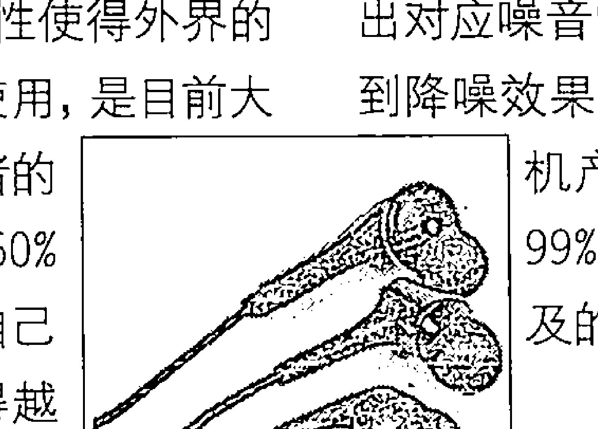


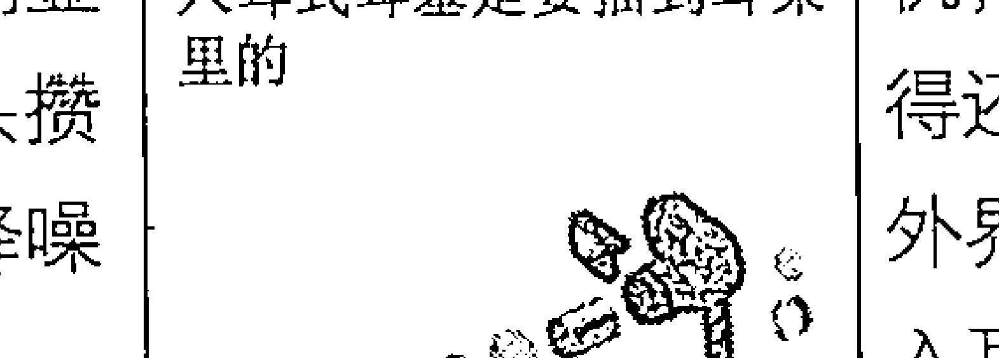

## CFan推荐产品
### 飞利浦SHN4600

小编点评: 飞利浦SHN4600耳塞拥有85%的消噪功能，令用户佩服。这种智能噪音消除技术可以将吵闹环境中的噪音降低，从而提高音质，它对于低频噪音能够有效抑制，即便是在公交车、地铁上或者相似环境中也能正常地享受音乐，让用户能更好地体验音乐带来的快乐。

笔者拿起一个带电池的主动式降噪耳机，使用时故意把周围的电视、电脑音箱音量开到很大，耳机会随着周围的噪音音量大小调整自身的降噪力度，使得使用者总是在一个相对平稳的声音环境中聆听。不过当笔者在本身就很安静的环境中仔细听不难发现，降噪耳机的音质实际上不是特别的好，远比不上同价位的非降噪耳机。这里笔者发现了个有趣的用途，把降噪耳机打开，不播放任何音乐的时候，耳机带来的就是寂静的无声世界(相对而言)，我们完全可以用它来在飞机上睡觉(再搭配个黑眼罩就完美了)。

## CFan推荐产品
### 魔声录音师Studio Monster Beats

小编点评: 录音师是魔声推出的一款高素质的耳机，使用两节AA电池提供降噪能源，利用先进的扬声器设计和动力隔离技术，使该耳机能更好地利用功率能量，进一步提高低频的力量感。同时，此款耳机提供110dB的灵敏度，在降噪的基础上更加注重音质的表现，可以更大幅度地将细节表现出来。对于喜欢大耳机的朋友们来说此款降噪耳机比较值得关注。

前面说过的降噪耳机音质不是特别理想是普遍问题，要想买到发烧级音质效果的降噪耳机，差不多够买一台笔记本电脑的了，笔者不做推荐，不过作为经常出行时佩戴随身听的用户还是有必要购置一款留在身边的。

# 两千元内双模双待手机选谁

现代社会的多元化生活让越来越多的用户手中不止一个手机号码，拥有一部双卡双待手机能够给我们提供很多方便。但是市场上双卡手机鱼龙混杂，到底怎么挑选呢？

笔者的妹妹在天津上大学，每个周末回北京与家人团聚。由于地域间话费差异不小（天津话费很便宜哦），她一般就会把手机换上本地号码，另一个维持休眠状态，等闲暇了换回来查看有没有老师给发的短信。看到她这么累，笔者不禁脱口而出“干嘛不换个双卡双待的手机呢？”“就是那种两个SIM卡的手机吗？可是我的两个卡是不同网段的，能用吗？”

## 小提示

采用双模指的是两种网络模式，目前全球主要的网络制式有，CDMA（国内电信卡）、WCDMA（国内联通卡）、TD-SCDMA（移动3G卡）以及我们平常在用的GSM 2G卡。顾名思义，双模双待就是可以同时兼容两种网络制式的手机，它可以是CDMA网络加WCDMA网络，或者是GSM网络加CDMA网络。而双待就很好理解了，就是两种网络可以同时在线待机，用户可以方便地在手机上设置哪张卡在线。目前市面上的手机中，配备了两个SIM卡插槽，用户可以用移动手机卡负责电话和短信，用中国电信的3G卡来上网，十分方便。

## 小技巧

可以去网上买一张资费相对便宜的3G卡负责上网，另一张卡负责自己的日常通讯，这样一个手机上网通讯两不误，还可以节省不少话费。

## 双卡双待 or 双模双待

当我们听说一款手机可以实现双卡双待的时候，千万不要和双模双待混淆在一起。双模双待是可以同时使用两种不同网络制式的手机，而双卡双待的意义在于，手机内置两个SIM卡插槽，但这不一定支持哪种网络，有可能是两个相同网络，或者有可能是一个GSM卡一个CDMA卡。这样在我们购买双模双待手机之前就得做好准备工作，看一看自己手中的两个SIM卡号究竟是哪两个网段的，避免一些卖场的商家含糊地把自己的双卡手机说成是双模双待，然后再根据这个去购买双模双待手机。目前关于双模双待还没有一个准确的规范，所以我们在购买手机的时候一定要事先看好参数，免得日后李逵与李鬼的纠纷。

## 双模双待了 双通就完美了

说到这里笔者的妹妹问了一句貌似外行的话，“我正用着一个卡打电话，另一个卡的号码同时也来了电话，能不耽误接通吗？”其实这就点出了一个很重要的细节，用户购买的双模双待手机是否具备双通功能。就像刚才的例子一样，我们用A卡打电话，这时朋友给你手机中的B卡打电话，如果能够接通则说明是双通手机，如果对方暂时无法接通，则说明是单通手机。也就是说我们无法同时接听两个电话。但是这样的细节有时候在购买的时候容易忽略，我们不妨在验机的时候试一下，若具备双通功能则双模手机更加完美。

## 其实也有单卡双模手机

在一些手机卖场，如果你让导购员推荐一部双模手机，他有可能会给你推荐一部平常我们使用的2G兼容3G手机。为什么有些手机只有一个SIM卡槽，商家也叫做双模手机呢？原因就是有些手机支持联通的WCDMA 3G网络以及我们平时使用的GSM 2G网络，虽然机身只可以插一张SIM卡，但可以在设置中轻松切换两种网络。

## 双卡手机挑选有门道

我们在卖场挑选双模双待手机时有必要事先准备好两张卡（当然不在同一网段），应该首先注意两个频段的信号接收强度是不是都很充足，在开阔地带当然没问题，拿着手机稍微走动一下看看有没有哪一个信号衰减较为明显。还有就是一般3G上网时（尤其下载开始的时候）观察一下GSM网络有没有断线的现象，虽然几率不高，真赶上这种手机还是挺让人头疼的。再有，以笔者经验，双模双待手机耗电实在是比普通手机厉害，尽量选择电池电量大一些的手机，如果电话业务较为繁忙，有必要购置另一块电池备用。另外，如果手机能在系统菜单下关闭某一个SIM卡会给使用上带来一些方便（例如某些不想接电话的场合）。

## 普通手机也可双卡单待

目前市场上出现的双卡通就是基于双卡用户的需要而产生的一种产品，它能够使一部手机实现同时使用两张SIM卡。只要把自己手里的SIM卡剪成小卡然后装在双卡通上，开机后屏幕显示的是双卡通卡槽1中装载的SIM卡的号码。首次安装双卡通，可以通过双卡通的功能菜单编辑其中的两个手机号码。主卡前面有“*”标识，当需要将另外一张卡转换为主卡时，只需要通过双卡通菜单选择另外一个卡确定即可。虽然可使用两个号码，但并非完美双卡双待。可实现双号待机是双卡通的主要特色之一，其设置方法是：当前使用A号码，欲实现B号码同时待机，输入*62*B卡号码#→按通话键→关机→开机；当前使用B号码，欲实现A号码同时待机，输入*62*A卡号码#→按通话键→关机→开机。取消以上设置的方法是：输入##62#→按通话键。如此，单卡手机也能模拟一下双卡手机了。

## iPhone也可双卡双待

就像苹果皮非常受消费者的欢迎，Gmate安装在iPhone上可以令其变成双卡双待手机（乔布斯若看到会无语的），其外形与苹果皮的差别较大，因此也有人称其为苹果核。Gmate是一款微小的配套设备，用户可以插入任何GSM、SIM卡，通过蓝牙连接可以让大多数的苹果iOS设备具有语音通话、短信和互联网接入功能。安装了对应软件之后就可以在系统下切换使用某一SIM卡了。

# 4英寸Android手机我选择

如今iPhone大行其道，有多少人像笔者一样觉得那3.5英寸的屏幕实在有点小，若是屏幕再大一些，不但抓握感更理想，可显示信息也随之增多，可是如何挑选呢？

自从三星正式发布其Galaxy系列的Galaxy Tab P1000，智能手机开启了超大屏时代。7英寸的显示屏虽然霸气，但其携带不方便也成为一弊端。而后发布了5.3英寸的Galaxy Note，再次与苹果壁垒分明地定位了大屏手机市场。

时至当下，4英寸屏幕已经不罕见，乃至已经成为主流手机的屏幕尺寸，部分型号还颇为热门。用户的观念在逐一改变的同时，不得不承认当下大屏幕俨然已经是一个趋势。那么到底多大屏幕的手机才适合自己，这个有说法。

## 屏幕尺寸选对不选大

近日，国外知名调查公司Strategy Analytics的一份报告《智能手机用户想要更大的屏幕和更薄的机身》得到了各大媒体的转载和播报，这份报告主要阐述了两个观点：4.0~4.3英寸的手机屏幕更能迎合用户；9毫米以下的超薄手机需求量越来越大。那么手机多大屏幕才是适合自己呢？光靠前景看是不够的。

俗话说鞋子舒不舒服只有亲自试一下才知道，我们在确定了某一款预购手机的时候，很有必要在卖场亲手把玩一下，一只手握住手机的时候，将手机握在手中以拇指转动半周，可以到达手机最远端就表示此款手机屏幕大小合适。从此点来说适合亚洲人手型大小的手机多是4.0~4.3英寸手机也就很好理解了。

## 屏幕增大 重量莫忽视

手机作为便携移动终端一定不能太重，再好的手机太重了也影响使用。每个人使用手机的方式虽然不尽相同，但是手机还是单手操作的时候占绝大多数（双手玩游戏时除外吧），打电话时虽然可以用脸颊贴住手机但也缓解不了多少重量。一般意义上讲，我们单手拿着手机5分钟内若是没有出现明显的疲劳感，这个手机的重量就算过关，这个当然是要在购买手机的时候亲自试一下才知道。

千万别被全金属机身的光滑质感所迷惑，要知道地铁上短信聊天也是个体力活。

## 屏幕的观看感受要注意

为了让显示效果更细腻，在苹果的带动下手机屏幕的分辨率越来越高。但是Android阵营中最常用的分辨率是800×480，这个分辨率在3.7英寸屏幕上还是很细腻的，若是放在4.3英寸屏幕上则能发现很强的颗粒感，对这方面有所在意的朋友注意一下为宜。HTC Sensation XL便是深受其害了，4.7英寸的显示屏搭载480×800的分辨率，极强的颗粒感，导致网友一片骂声。

当然屏幕的颗粒感还跟屏幕材质有关，一般来讲，HTC通常用的SLCD屏幕的颗粒感相对较为明显，而摩托罗拉的TFT好些，三星和索爱的屏幕颗粒感更不容易察觉，当然成本也会高一些，这些会体现在最终售价上。

除了颗粒感的问题还有就是显示比例不能不提了。常规显示如上文所述都是16:10的比例，还有不少采用16:9显示比例的手机。一般游戏的分辨率在16:10的屏幕上看着比较自然，放到16:9屏幕上会有小范围的“压扁”，虽然不是很明显。例如大家耳熟能详的小米（分辨率为854×480）、摩托罗拉XT910（分辨率为960×540）都是16:9，这类手机在观看电影方面有着更卓越的使用感觉，原因很简单，上下无黑边的全屏显示，但发微博、浏览网页就显得可视面积有点窄了（横向使用时尤其明显）。其实16:10的比例是综合“玩与用”的权宜之比，这方面有偏执的朋友可要注意。

## 屏幕大了 也更费电了

“我的手机没电了”已经成为当下很频繁的一个词句，合理地使用屏幕亮度以及及时关闭后台不用的程序虽然可以缓解电池的压力，但屏幕和分辨率的增大也导致常规操作时处理器计算量的增加，从而更加耗电。

哪怕你的电池毫安数再高，大屏手机其屏幕功耗始终是一个大问题。一般网上所说关闭Wi-Fi、蓝牙、后台无关紧要进程之类这里不必多说，其实平日休息的时候把手机设置成飞行模式会很省电。笔者有一次出差正好赶上没有可充电的情况，把手机改成飞行模式，每过几小时连接一次查收短信或邮件，一半电量用了足足两天。当然，选购大屏幕手机的同时尽量找电池容量高一些的，1500毫安以下的直接Pass吧。

如果觉得还是不够用，再购置一块备用电池也很有必要。

## 大屏手机字体小是问题

高分辨率细腻的质感在满足我们视觉的同时视力疲劳也愈发常见，这常出现在观看某些细小区域的文字上。严格上来说高分辨率屏幕字体偏小是普遍存在的。细小的文字加剧了我们的视力下降。我们使用手机的场合本就不可能像看书、办公之类的那么固定（经常走动着也要看手机），字体小的话真的很费劲。虽然可以在系统下调整字体的大小，但是收效一般不尽理想，这里笔者介绍一种可以自己随意更改字体大小的方法。

首先，将自己的手机ROOT过了，安装好RE文件管理器，然后就打开RE文件管理器，找到\system\font\DroidSansFallback.ttf（这个就是手机默认字体），把这个文件复制到SD卡上，在电脑上用字体修改器打开（这里推荐Font Creator Program），然后选择“格式→设置→布局→单位”调整字体大小，数值越小，字体越大，具体取值多少自己酌情即可。然后保存文件，再用RE把文件放回原处，重启手机即能看到增大并且很圆润的字体了。

# 为手指控“偶” 二手全键盘手机淘宝

日前，我们在市场调研时，发现原本追风购进触控机的用户又开始“返璞归真”，欲购进全键盘手机。这部分人群更希望在二手机中淘宝，那么，不妨跟随我们一起来与全键盘手机进行一次亲密接触吧！

输入有着天生的劣势：一是对触点定位要求严，误码率高，对使用环境要求高，很难满足用户在行进中进行文字输入的需要，除了安静不动，很难给触摸屏上的触点以准确的定位；二是输入时进行同音字词、复杂字词、符号的选择，必须通过繁琐的切换来实现，有时为输入一个字往往要切换数屏才能找到，这无疑大大减缓了输入的速度。

张本地卡，一张外地卡，对于经常出差的商务人士非常有用。

作为一款全键盘手机，黑色、白色、灰色三种经典颜色搭配在一起显得时尚、帅气，密密麻麻的小格子看起来非常漂亮。不仅如此，摩托罗拉EX223还带有触屏功能，把玩很舒坦，内置有腾讯QQ、开心网、MSN、有道词典、QQ斗地主等，可以满足旅途之中休闲的需要。美中不足的是键盘手感偏硬。

## 电脑键盘的“小老弟儿”

“QWERTY”，很多人包括正在使用全键盘手机的朋友，对全键盘的这一爱称都是一头雾水。何为“QWERTY”？大家不妨低头看一下自己的电脑键盘，没错，正是电脑键盘首行左侧的一排字母。仔细比较一下全键盘手机的键盘和电脑键盘，我们不难发现，手机的全键盘俨然就是迷你版的电脑键盘，全键盘之所以以“QWERTY”命名的原因就是因为其按键分布与电脑键盘一模一样，26个英文字母、0~9的数字、方向键、回车键、Ctrl、Alt和符号键等等一应俱全，可以实现电脑键盘完全相同的输入和操作。

## 小知识

相对于全键盘，还有一种键盘更为常见，这就是自从大哥大时期就一直延续至今的数字键盘，又名T9键盘，采用12宫格布局，数字0~9，外加*、#，共12个按键。除此之外，还有一种更不为人知的键盘布局方式—AZERTY键盘，这种键盘主要在法国等少数国家使用，在国内鲜有AZERTY键盘手机售卖，三星B7610则是特例，感兴趣的朋友不妨关注一下。

## 两分天下 全键盘、触控机各有千秋

纵观用户市场，无论是触控机还是全键盘，都牢牢锁定了自己的用户群。触控机追求的是大屏幕，无门槛儿傻瓜化智能点触操作，操作方便是其深深吸引普通用户之处。另外，通过点触进行游戏、影音播放、看图、阅读，非常的方便，赚足了用户的眼球。

然而这一切却始终难以撼动手指控、商务人士这一高端用户群。

为何？因为全键盘手机在文字输入上将触控机远远甩在了身后。触控机的手写

相较触控机，全键盘手机的优势得到了淋漓尽致的发挥：其键盘布局、输入习惯完全符合电脑键盘使用习惯，用户完全可以轻松上手。全键盘手机完全可以单手操作，亦可以双手同时操作，在五笔输入法、双拼输入法的帮助下，进行快速的盲打，这些都是触控机可望而不可及的。

综上所述，触控机非常适合没有用机基础的新手、游戏控、影音迷的使用，而全键盘手机则更适合商务人士办公需求，可以快速地记录会议纪要、编辑办公文档，以及满足微博控、聊天达人快速编写博文、畅聊之需。

## 沙场点名 四款超值全键盘手机导购

只选对的，不选贵的，在手机更新换代非常频繁的今天，选一款性价比超高的全键盘手机往往要比追潮追新实惠得多。那么，对于喜欢全键盘手机的朋友来说，哪些品种值得我们关注和出手呢？

## 仅售268元的黑色甜莓

提起全键盘手机，首当其冲要想起黑莓，一直以来，黑莓就是全键盘手机的代名词。今天为大家推荐的黑莓8800，售价仅为268元，非常的超值。

全键盘是黑莓的特色，浑身洋溢着浓郁的商务气息。色彩比较鲜艳，即便在阳光下也能够达到很好的显示效果。内置有Microsoft Word、Excel、PowerPoint和Corel WordPerfect程序，可以较好地进行办公处理、收发邮件和GPS导航。作为一款低端商务手机，黑莓8800性能和功能上存在明显的短板，但非常的超值。

## 南上北漂 商旅首选

售价为499元的摩托罗拉EX223可以同时插入两张GSM手机卡，支持双网双待，一

## 学生族最爱的阿尔卡特

外观颇像黑莓，这款售价仅338元的阿尔卡特OT-807拥有酷黑的直板造型，腰身纤细，有酷黑、樱桃红、橘黄和深灰四种颜色可选，非常适合热衷于社交的学生族选用。

全键盘按键虽然面积较小，但突出的设计、较大的间距可以很好地避免了误操作。同时还搭载了一块2.8英寸的QVGA触控屏幕，全键盘和触控相互操作更为方便。作为一款面向社交应用的手机，OT-807内置有多种网络软件，具备无线Wi-Fi上网功能，在有网络热点的地方可进行方便的无线上网冲浪。没有开启Wi-Fi功能的专用键，可以方便地启用、关闭Wi-Fi上网功能。

## 迷你电脑 索爱四角兽

索尼爱立信CK15i采用侧滑设计，打开后完全就是一部迷你的小电脑，3英寸触摸屏幕，320万像素摄像头，仅500元不到的售价，是不是显得很超值。

整体纯白色的机身相信对于白色控来说，充满着吸引力。白色漂亮是漂亮，是不是容易脏呢？放心，因为采用了特殊的涂层加工工艺，所以不但持握的时候颇为舒服，同时不容易脏。四角快捷键设计，被用户称作四角兽。作为一款社交型的机器，CK15i内置有移动QQ、新浪微博、人人网开心网客户端，使用很方便。美中不足的是全键盘按键感略偏硬，另外第一排按键上方空间不算太充裕，按起来不是太方便。

只选对的，不选贵的！花费几百元不等，就可以在电子市场选出一些不错的非主流热门全键盘手机，只要你用心，甚至可以完全找到全新的机器。那么，不妨去淘淘吧！

# 电脑爱好者合订本

## 2012年（上）关键词检索

| 页码 | 标题 | 关键词 |
| :--- | :--- | :--- |
| 457 | 360总是提示Au_.exe不安全 | 360 |
| 302 | 搭建内网 "0时间" 搜索环境 | 0时间搜索 |
| 262 | 我的115网盘我做主 | 115网盘 |
| 230 | 20年后我是啥样 | 20年后 |
| 286 | 以3D视角巧看2D视频 | 3D |
| 298 | 从平面照片到 "3D大片" | 3D大片 |
| 352 | 静态图文变身3D动画大片 | 3D动画 |
| 233 | 耍酷就制作3D相册 | 3D相册 |
| 370 | 录入项目多 Access来帮忙 | Access |
| 456 | 无法安装ATI显卡驱动 | ATI显卡 |
| 228 | 专为Chrome爱好者准备的资源站 | Chrome资源 |
| 314 | 为你的整轨音乐打造CUE | CUE |
| 299 | Win7的Desktop.ini探秘 | Desktop.ini |
| 230 | DIY丑八怪表情图 | DIY表情 |
| 236 | DIY漂亮的光盘封面 | DIY光盘封面 |
| 240 | 一键搞定系统DLL错误修复 | DLL错误 |
| 303 | 仅需一分钟 为你选个最快的DNS服务器 | DNS服务器 |
| 272 | 旁敲侧击 巧破EFS加密防线 | EFS加密 |
| 177 | 解剖epub 只需7-zip | epub |
| 456 | 无法打开Excel表格文件 | Excel |
| 184 | Excel水印图打印就差这一步 | Excel水印图 |
| 71 | 定制快乐 "e" 春节 | e春节 |
| 37 | 中国为何难出Facebook | Facebook |
| 237 | Flash动画特效轻松制作 | Flash特效 |
| 233 | Flash相册的最简制作方案 | Flash相册 |
| 173 | 一键修复Flash Player | Flash修复 |
| 157 | 撷获芳心秘籍 MM照片GIF转代码动画 | GIF动画 |
| 232 | GoodSync 文件同步利器 | GoodSync |
| 229 | 在线3D Google图书馆免费看书 | Google图书馆 |
| 444 | GPS手机在手 出差不再愁 | GPS手机 |
| 228 | HTML5动画平台 | HTML5 |
| 200 | 用IF函数自动生成成绩等第 | IF函数 |
| 237 | Instagram美图一网打尽 | Instagram |
| 205 | iPad下片看 选最快路径 | iPad下片 |
| 193 | iPhone拍照片电脑看 购物也时尚 | iPhone拍照 |
| 254 | IPS 硬的不仅仅是表面 | IPS |
| 261 | IP地址修改 不快怎么行 | IP地址修改 |
| 131 | Ivy Bridge携手开普勒 2012选本必读 | Ivy Bridge |
| 253 | Kylin的端口入侵记(一) | Kylin |
| 253 | Kylin的端口入侵记(二) | Kylin |
| 456 | 同花顺显示K线非常小 | K线 |
| 269 | Linux杀毒系统 杀毒更彻底 | Linux杀毒系统 |
| 23 | 今天你LOGO了吗 | LOGO |
| 229 | 一站网尽LOGO矢量图 | Logo矢量图 |
| 226 | Memetales 图画书免费读 | Memetales |
| 238 | 记事本也玩Metro时尚 | Metro |
| 189 | 压缩MP3文件 音质不丢失 | MP3音质 |
| 456 | 无法安装Office | Office |
| 457 | Outlook的DBX文件无法打开 | Outlook |
| 456 | 如何躲避别人对P2P下载限制 | P2P下载限制 |
| 208 | PDF也能躺着听书 | PDF电子书 |
| 448 | PDF软件不仅在于看哦 | PDF软件 |
| 252 | Win7也能搜索PDF文档 | PDF搜索 |
| 359 | PDF优化后装入平板 | PDF优化 |
| 227 | 视频学PowerPoint 2010 | PowerPoint |
| 64 | PPT出彩 尽在图文间 | PPT |
| 275 | 改造李开复的PPT | PPT |
| 379 | PPT也能制作苹果形标注 | PPT |
| 396 | PPT以窗口播放或小屏幕播放 | PPT播放 |
| 393 | PPT存盘 "保险系数" 自己调整 | PPT存盘 |
| 216 | 为PPT 2010加速 | PPT加速 |
| 228 | 学习专家的PPT设计理念 | PPT设计 |
| 227 | 扑奔PPT 专业的PPT网站 | PPT网站 |
| 394 | 跨越编辑界面直接播放PPT | PPT直播 |
| 234 | 将PPT转换成Flash | PPT转换 |
| 227 | 模板尽在PPT资源之家 | PPT资源 |
| 169 | 非IE浏览器图片添加QQ表情 | QQ表情 |
| 214 | 还我苗条身材 自己给QQ减肥 | QQ减肥 |
| 209 | 让QQ尾巴彰显个性 | QQ尾巴 |
| 457 | QQ影音播放器声音变得很小 | QQ影音播放器 |
| 346 | QQ赚钱也疯狂 | QQ赚钱 |
| 227 | RifScan网站信息查询工具 | RifScan |
| 169 | 妙用Site搜索 开启论坛帖子之门 | Site搜索 |
| 203 | 三步提取PPT中的SWF文件 | SWF文件提取 |
| 235 | 数码时代必装USB管家 | USB管家 |
| 177 | 没接USB设备却显示U盘图标的去除 | USB设备 |
| 158 | 扔掉系统安装盘 U盘安装更给力 | U盘安装 |
| 235 | U盘版安装系统制作很简单 | U盘版系统 |
| 188 | 鉴定U盘的真实大小 | U盘容量鉴定 |
| 235 | 预测检测U盘的寿命 | U盘寿命 |
| 196 | VBA宏模块不能保存之谜 | VBA宏保存 |
| 343 | 公共WiFi上网会被黑吗 | WiFi被黑 |
| 235 | 本本变成WiFi热点 | WiFi热点 |
| 329 | 独辟蹊径 修复 "瘫痪" 的Win7 | Win7 |
| 338 | 快速医治Win 7的 "疑难杂症" | Win7 |
| 118 | Win8来袭 你Hold住了吗 | Win8 |
| 331 | 妙手巧改 让Win8更好用 | Win8 |
| 320 | Win8预览版热辣体验报告 | Win8预览版 |
| 234 | 彻头彻尾改造Windows 7 | Windows 7 |
| 308 | 好汉三个帮 Win7添智力 | Windows 7 |
| 458 | Windows 7经常无法进入桌面 | Windows 7 |
| 233 | 抢先试Windows 8 Metro | Windows 8 |
| 250 | Win8 让你从此移动起来 | Windows 8 |
| 267 | 能否运行Win8 先查电脑配置 | Windows 8 |
| 178 | 电脑闹毛病 WinPE来裁定 | WinPE |
| 188 | 用WinRAR摘取Word 2010文档 | WinRAR |
| 405 | 给卡通人物拍张X光片 | X光片 |
| 24 | 阿里巴巴启动私有化 | 阿里巴巴 |
| 220 | 新浪爱问文件免积分下载 | 爱问 |
| 345 | 察 "颜" 观色 保电脑平安 | 安全 |
| 288 | 用好Windows安全模式 | 安全模式 |
| 206 | 省时省力 批量移植安装程序 | 安装程序 |
| 228 | 倒计时并不都需要安装软件 | 安装软件 |
| 239 | 软件安装过程也可复制粘贴 | 安装软件 |
| 430 | 安卓智能机 让老人生活更精彩 | 安卓智能机 |
| 226 | 贷款买房试用按揭计算器 | 按揭计算器 |
| 385 | 八卦格字帖咱自己制作 | 八卦格字帖 |
| 215 | 下载百度文库无需工具 | 百度文库 |
| 233 | 百度在线音乐时时听 | 百度在线音乐 |
| 392 | 获知Word文档版权信息 | 版权信息 |
| 182 | 歌曲变伴奏 就这么简单 | 伴奏 |
| 221 | 温馨记忆 永久保存 | 保存 |
| 198 | 命令行上做做功 备份很轻松 | 备份 |# 关键词检索

## 《电脑爱好者》合订本

| 页码 | 文章标题 | 关键词 |
|------|----------|--------|
| 249 | 便捷备份同步我能行 | 备份同步 |
| 354 | 开心职场 被迫加班有快乐高招 | 被迫加班 |
| 211 | 比较两列数据就这么简单 | 比较数据 |
| 90 | 为“老友”续命 新春笔记本升级攻略 | 笔记本升级 |
| 236 | 男声变成女高音 | 变声 |
| 363 | 也谈PPT制作变形动画 | 变形动画 |
| 238 | 给文件贴个标签 | 标签 |
| 180 | 表格多页打印 页页有标题 | 表格打印 |
| 188 | 网页中的表格原样导入到Excel中 | 表格导入 |
| 207 | 表格冻结不仅是首行首列 | 表格冻结 |
| 335 | Excel 2010 重要表格不留空 | 表格留空 |
| 375 | 剔除表中表就用Excel | 表中表 |
| 396 | 波浪线的输入 | 波浪线 |
| 151 | 在Word 2007中也能发布博客 | 博客发布 |

C

| 179 | 我有内窥镜 查看文件更方便 | 查看文件 |
| 360 | 制作任选项目的查询系统 | 查询系统 |
| 236 | 让常用文件夹更醒目 | 常用文件夹 |
| 342 | 让常用文件夹触手可得 | 常用文件夹 |
| 231 | 夜莺教你唱英文单词 | 唱单词 |
| 245 | “超级本”到底超级在哪 | 超级本 |
| 383 | 超级链接去除分别对待 | 超级链接 |
| 392 | 巧用文档内超级链接整合资源 | 超级链接 |
| 27 | 超级马里奥的“三级跳” | 超级马里奥 |
| 140 | 超极本 等等再出手 | 超极本 |
| 41 | 成功者的诅咒 | 成功 |
| 184 | 为程序窗口添把“锁” | 程序窗口 |
| 416 | 拍出萌动你心的宠物照 | 宠物照 |
| 419 | 把出游视频拍成电影短片 | 出游视频 |
| 231 | 一网打尽穿帮镜头 | 穿帮镜头 |
| 178 | 鼠标一动 管控窗口提效 | 窗口管控 |
| 43 | 龚海燕：创业无关性别 | 创业 |
| 414 | 普通剪纸打造创意动画 | 创意动画 |
| 321 | 创意简历 从形式到内涵 | 创意简历 |
| 206 | 简单技巧 让存储卡更贴心 | 存储卡 |
| 408 | 挑战视觉的错位摄影 | 错位摄影 |
| 372 | 录入身份证号有错提醒 | 错误提醒 |

D

| 222 | 一键拖拽创建打包附件 | 打包附件 |
| 252 | 打开方式吃上“聪明药” | 打开方式 |
| 393 | 让打开文档少走弯路 | 打开文档 |
| 190 | 无论你在哪里 打印就在身边 | 打印 |
| 392 | 如何消除文档打印麻点 | 打印麻点 |
| 158 | 简简单单 让打印机为你省钱 | 打印省钱 |
| 396 | 快速输入大写中文数字 | 大写中文数字 |
| 389 | 大字打印 何需另装软件 | 大字打印 |
| 396 | 单虚线的输入 | 单虚线 |
| 395 | 快速修改单元格次序 | 单元格次序 |
| 202 | 修改表格错误 精准定位单元格 | 单元格定位 |
| 395 | 在两个工作簿中互相倒腾工作表 | 倒腾工作表 |
| 177 | 轻松清除Win7登录密码 | 登录密码 |
| 202 | 选最佳线路提升登录邮箱速度 | 登录邮箱 |
| 457 | 无法登录支付宝 | 登录支付宝 |
| 315 | 低价成拍的秘诀 | 低价成拍 |
| 323 | 走近低价竞拍网站 | 低价竞拍 |
| 433 | 手机装地图 出行更靠谱 | 地图 |
| 362 | 小点缀 一样很精彩 | 点缀 |
| 44 | 1946， 世上第一台电脑诞生 | 电脑诞生 |
| 25 | 下一“战”：电视 | 电视 |
| 174 | 电子教鞭在手 屏幕指点不愁 | 电子教鞭 |
| 149 | 20分钟 百篇博文炮制电子书 | 电子书 |
| 248 | 十秒钟 网页变身简洁电子书 | 电子书 |
| 179 | 快速转换电子书格式 | 电子书格式 |
| 190 | VUZ电子书转PDF有妙法 | 电子书转换 |
| 330 | 在线书籍自动转PDF电子书 | 电子书转换 |
| 325 | 打造动感火烧效果电子相册 | 电子相册 |
| 218 | 数学概念用动画展示 | 动画展示 |
| 397 | 拍出动静结合的照片 | 动静结合 |
| 274 | 解决动态磁盘的恢复难题 | 动态磁盘 |
| 225 | 表格冻结不需点拆分 | 冻结 |
| 160 | 生成短链接 通航多人视频 | 短链接 |
| 233 | 给对话框增加文件夹 | 对话框 |
| 238 | 多标签资源管理器 | 多标签 |
| 395 | 一次打开多个工作簿 | 多工作簿 |
| 238 | 免费多媒体工具宝库 | 多媒体工具 |
| 355 | 多图组合 快速选择有技巧 | 多图组合 |
| 218 | 一键制作多行报名条 | 多行 |
| 211 | 多邮箱管理不麻烦 | 多邮箱管理 |

E

| 30 | 没有终点的俄罗斯方块 | 俄罗斯方块 |
| 233 | 儿童的知识乐园 | 儿童乐园 |
| 457 | 电脑插耳机无反应 | 耳机 |
| 227 | 在线生成二维码 | 二维码 |
| 290 | 二维码技术与生活渐行渐近 | 二维码 |

F

| 448 | 不用手机也能发短信 | 发短信 |
| 148 | Word 2007发送到PPT命令原来在这里 | 发送 |
| 243 | 淘宝返利达人的赚钱秘技 | 返利 |
| 303 | 通过淘宝网获取最大返利 | 返利 |
| 353 | 不加密 照样防蹭网 | 防蹭网 |
| 150 | Word转PDF 巧防修改和篡改 | 防修改 |
| 179 | 巧用“飞猫”共赏美图 | 飞猫 |
| 220 | 飞信跨网也能发短信 | 飞信 |
| 144 | 那些正在主流化的非主流音箱 | 非主流音箱 |
| 152 | 为不同程序设置所需分辨率 | 分辨率 |
| 238 | 轻松搞定分辨率设置 | 分辨率设置 |
| 361 | 大型报告的分工合作之道 | 分工合作 |
| 180 | 节约用纸 Excel表格也能分栏打印 | 分栏打印 |
| 176 | 我的秘密 只与你分享 | 分享 |
| 224 | 分享屏幕 一键搞定 | 分享 |
| 205 | 解除限制 分享EXE电子书 | 分享电子书 |
| 336 | 巧设置 自动生成分页小计 | 分页小计 |
| 234 | 电脑上玩新版愤怒的小鸟 | 愤怒的小鸟 |
| 226 | 一周热点尽在风云榜 | 风云榜 |
| 458 | 邮箱为何无法上传附件 | 附件 |
| 188 | 网易邮箱附件批量巧提取 | 附件提取 |
| 195 | 附件夹帮你轻松整理邮件附件 | 附件整理 |
| 232 | 让复制文件更有趣 | 复制文件 |
| 236 | 快速将复制的内容发送到程序 | 复制文件 |

G

| 81 | 向HTPC时代告别 客厅首选高清播放机 | 高清播放机 |
| 240 | 全面升级 用CoolEdit制作高清音乐 | 高清音乐 |
| 243 | 文件堆积如山 快用高速分类 | 高速分类 |
| 359 | 作文试题 局部稿纸轻松设置 | 稿纸设置 |
| 230 | 在线玩“割绳子”游戏 | 割绳子 |
| 197 | 歌曲变伴奏 这样更简单 | 歌曲伴奏 |
| 236 | 英文歌曲搜索下载好帮手 | 歌曲搜索 |
| 449 | 五音不全 歌曲也能搜出来 | 歌曲搜索 |
| 232 | 一分钟制作个人卡通图 | 个人卡通 |
| 232 | 个性化好友印象 | 个性化 |
| 365 | 用PPT设计个性化名片 | 个性化名片 |
| 191 | MP3自由组合 个性铃声做出来 | 个性铃声 |
| 420 | 做一个印章效果的个性签名 | 个性签名 |
| 239 | 位置颠倒 快速更名有妙招 | 更名 |
| 278 | 巧用妙招 自动定期更新邮件 | 更新邮件 |
| 238 | 每天自动更新桌面 | 更新桌面 |
| 147 | 一次完成工资普调更新 | 工资普调 |
| 281 | 好的工作总结不依赖模板 | 工作总结 |
| 169 | 公式输入不用烦 数学输入面板帮你忙 | 公式输入 |
| 458 | 关闭USB关机状态下的供电 | 供电 |
| 150 | 局域网高速共享 既简单又快捷 | 共享 |
| 152 | 这样共享文件更便捷 | 共享文件 |
| 165 | 共用PC 我的地盘我做主 | 共用PC |
| 296 | 取消Win7系统关机补丁提醒 | 关机补丁 |
| 22 | 从光合作用的倒掉说起 | 光合作用 |
| 233 | 专业制作光盘版相册 | 光盘版相册 |
| 187 | 光盘配封面 好找又好看 | 光盘封面 |
| 257 | 海纳百川 光盘整合我有招 | 光盘整合 |
| 280 | 提高效率 用光速搜索 | 光速搜索 |
| 390 | 贯穿前后的过渡页设计 | 过渡页设计 |
| 366 | 过年送礼你送对了吗 | 过年送礼 |

H

| 251 | 简约风格的海报也可以抢眼 | 海报 |
| 311 | 主持人大赛海报也可“内外兼修” | 海报 |
| 344 | 寻美党代会海报 | 海报 |
| 413 | 自制《变形金刚3》个性海报 | 海报 |
| 228 | 到海底逗鱼取乐 | 海底逗鱼 |
| 201 | 一个函数找出来下载剧集列表 | 函数 |
| 211 | 双剑合璧 汉字识别接近完美 | 汉字识别 |
| 152 | 查找查看不散乱 高效合并PDF文档 | 合并文档 |
| 99 | 《暗黑破坏神3》应该这么玩 | 暗黑破坏神3 |
| 382 | 手动刺灭Word宏病毒 | 宏病毒 |
| 229 | 互动视频更有意思 | 互动视频 |
| 33 | 互联网鄙视食物链大全 | 互联网 |
| 384 | 华为没你想的那么夸张 | 华为 |
| 404 | 用双色照片打造怀旧感觉 | 怀旧 |
| 227 | 做好幻灯片 交流很重要 | 幻灯片 |
| 394 | 设置展台用幻灯片 | 幻灯片 |
| 235 | 无PowerPoint也能播放幻灯片 | 幻灯片播放 |
| 391 | 快速查看幻灯片动画效果 | 幻灯片动画 |
| 234 | 给幻灯片配上专业解说 | 幻灯片解说 |
| 396 | 评估一下你的幻灯片字体大小 | 幻灯片字体 |
| 357 | 幻灯图片 缘何出彩 | 幻灯图片 |
| 424 | 拍出神秘的幻影照片 | 幻影照片 |
| 109 | 谁说汇报 不可以赏心悦目 | 汇报 |
| 212 | 会议录音 缺席也能及时听 | 会议录音 |
| 75 | 玩转婚恋网站 | 婚恋网站 |
| 170 | 向积分下载说NO | 积分下载 |
| 319 | Win8极速启动的秘密 | 极速启动 |
| 350 | 记事本 我的文件管理专家 | 记事本 |
| 173 | iPad同步QQ邮箱记事 | 记事同步 |
| 301 | 看摄影狂人如何拍纪念照 | 纪念照 |
| 324 | 加密不必完全靠密码 | 加密 |
| 217 | 用WPS生成加密PDF以保护文档 | 加密PDF文档 |
| 287 | 以软制硬 电脑硬件巧加锁 | 加锁 |
| 229 | 新浪微博兼职“家庭医生” | 家庭医生 |
| 226 | 网上看家庭装修效果图 | 家庭装修 |
| 232 | 家用导演 珍藏动态记忆 | 家用导演 |
| 226 | 家庭装修设计方案网上找 | 家装设计 |
| 450 | 手机摄像头变身监控探头 | 监控 |
| 289 | 打造“不简单”的剪切板 | 剪切板 |
| 218 | 剪贴板一键清空 | 剪贴板 |
| 376 | 三招两式做剪影 | 剪影 |
| 265 | 再谈简历 工作经验有玄机 | 简历 |
| 155 | PPT也能轻松演示简谱 | 简谱演示 |
| 213 | 为健忘症巧开“醒脑药方” | 健忘症 |
| 232 | 用键盘“弹”钢琴 | 键盘钢琴 |
| 274 | 键盘失灵 不一定是硬件故障 | 键盘失灵 |
| 305 | 从窗口到进程 坚决清除“顽固派” | 解除锁定 |
| 237 | 透明软件界面 | 界面 |
| 293 | 让指定文件夹窗口在单独的进程中打开 | 进程 |
| 432 | 回家 经典游戏伴你行 | 经典游戏 |
| 373 | 卷轴特效课件轻松做 | 卷轴特效 |
| 349 | 卡巴斯基的另类应用 | 卡巴斯基 |
| 288 | 让Windows 7 变身为卡拉OK | 卡拉OK |
| 424 | 用卡片机记录春天的大自然 | 卡片机 |
| 259 | 真人照片轻松转手绘卡通 | 卡通 |
| 28 | 开心网将从“玩”转向“用” | 开心网 |
| 375 | PPT实现点小图看大图效果 | 看图效果 |
| 388 | 考场座位 我有我的编法 | 考场排座 |
| 204 | 几十元 打造单位考勤机 | 考勤机 |
| 230 | 经典科幻小说全收录 | 科幻小说 |
| 36 | 科技想要什么 | 科技 |
| 175 | 屏幕张贴课表 只需再添壁纸 | 课表壁纸 |
| 369 | 2小时完成课表编排 | 课表编排 |
| 157 | 从总课程表制作教师分课表 | 课表制作 |
| 386 | 课件打印 省钱有道 | 课件打印 |
| 153 | 课件用视频 PPT插入FLV很方便 | 课件视频 |
| 187 | 课件插入视频 别忘关键步骤 | 课件视频 |
| 374 | 按需自制课件中的音频 | 课件音频 |
| 392 | PPT编辑 空格跟着英文走 | 空格 |
| 207 | QQ空间也可“克隆” | 空间克隆 |
| 196 | 简单三步 空间日志音乐也玩DIY | 空间日志DIY |
| 237 | 键盘也能控制鼠标 | 控制鼠标 |
| 425 | 完美抠取发丝不再难 | 抠图 |
| 312 | 让XP也拥有“库” | 库 |
| 168 | 把快捷方式放到最方便的地方 | 快捷方式 |
| 247 | 月底文件快速备份有妙招 | 快速备份 |
| 358 | 借助特殊标记 多表快速定位 | 快速定位 |
| 393 | 在迷茫中快速定位 | 快速定位 |
| 449 | 快速启动栏 手机也能拥有 | 快速启动栏 |
| 392 | 快速输入 使用“选择列表” | 快速输入 |
| 296 | 建立快捷方式让电脑快速休眠 | 快速休眠 |
| 19 | 宽带大提速 实惠还是噱头 | 宽带 |

L

| 225 | 浏览缓存放内存 垃圾不再生 | 垃圾 |
| 173 | 不用插件 IE也能拦截广告 | 拦截广告 |
| 234 | “老黄历”进驻状态栏 | 老黄历 |
| 196 | 让老硬盘焕发青春 | 老硬盘 |
| 448 | 功能无限的离线百科全书 | 离线百科全书 |
| 161 | 离线下载 空间不足为哪般 | 离线空间 |
| 228 | 理科老师好帮手 | 理科 |
| 364 | 书籍装帧 立体效果轻松设 | 立体装帧 |
| 234 | 励志壁纸助力工作生活 | 励志壁纸 |
| 458 | 网络连接图标出现很慢 | 连接图标 |
| 223 | 巧用奇艺 连续剧随意看 | 连续剧 |
| 394 | 不动鼠标的连续输入技巧 | 连续输入 |
| 174 | 用连字符加书名号更直观 | 连字符 |
| 284 | 建立链接表 文档搜索易 | 链接表 |
| 193 | 连接故障自动修 上网更轻松 | 链接故障 |
| 161 | 打开TXT 一点就上网 | 链接上网 |
| 166 | 没装聊天软件 网站中也能打开聊天 | 聊天 |
| 294 | 技巧联合 比较剧集列表 | 列表比较 |
| 317 | 智斗安卓软件中流量窃贼 | 流量窃贼 |
| 409 | 自制个性龙年邮票 | 龙年邮票 |
| 391 | 制作智能化的Excel成绩录入模板 | 录入模板 |
| 194 | 课文录音与文字同步 | 录音文字同步 |
| 162 | 让有线路由与无线路由和平共处 | 路由 |
| 233 | 找回遗忘的路由器密码 | 路由器密码 |
| 313 | 黄金周照样畅游东南亚 | 旅游 |
| 293 | 旅游达人巧用机票游遍全球 | 旅游达人 |
| 199 | 出门旅游 做好计划一路轻松 | 旅游计划 |
| 147 | 自制绿色软件 我有专用工具 | 绿色软件 |
| 164 | 组合拳 实现孩子绿色上网 | 绿色上网 |
| 270 | 裸眼3D知多少 | 裸眼3D |

M

| 428 | 打造随面部移动的马赛克 | 马赛克 |
| 448 | 漫画迷必备 | 漫画 |
| 403 | 别错过飞机上的美景 | 美景 |
| 399 | 巧用气泡 让美女照更吸引人 | 美女照 |
| 227 | 动物萌照“集中营” | 萌照 |
| 233 | 轻松制作蒙太奇图片 | 蒙太奇 |
| 230 | 聆听来自全世界的好玩梦话 | 梦话 |
| 229 | 我的秘密只有你能解 | 秘密 |
| 212 | 巧设密码“保质期” | 密码保质期 |
| 268 | 拒绝泄密 密码管理我有招 | 密码管理 |
| 29 | 密码泄露没你想的那么简单 | 密码泄露 |
| 218 | 不用注册登录 免费下载百度文库原版文档 | 免费下载 |
| 391 | 巧用名称框实现区域选择 | 名称框 |
| 341 | 你了解三星魔幻炫屏吗 | 魔幻炫屏 |
| 399 | 平凡木屋突变恐怖鬼屋 | 木屋 |
| 295 | 代码过滤 轻松获取专辑目录 | 目录获取 |
| 163 | 让Windows 7资源管理器也显示目录树 | 目录树 |

N

| 48 | 内存前传 | 内存 |
| 327 | 利用性能监视器检查内存泄漏 | 内存泄漏 |
| 326 | 官方工具自由诊断系统内存 | 内存诊断 |
| 223 | 无间断延长XP内录时间 | 内录 |
| 228 | 女性杂志大放送 | 女性杂志 |

P

| 448 | 拍照不再怕抖 | 拍照 |
| 356 | 英文单词 排版断行自解决 | 排版断行 |
| 17 | 2011岁末大盘点 | 盘点 |
| 208 | 盘符修改我用修改器 | 盘符修改 |
| 364 | PPT也做图片跑马灯 | 跑马灯 |
| 227 | 配色是一门艺术 | 配色 |
| 159 | 巧招批量导入电话号码 | 批量导入 |
| 160 | 批量拍照 一步实现信息对接 | 批量拍照 |
| 191 | 批量下载图片 用搜狗 | 批量图片 |
| 214 | 批量下图片 软件就行 | 批量下载 |
| 195 | 批量选文件不必小题大做 | 批量选文件 |
| 229 | 网上找人拼车更划算 | 拼车 |
| 229 | 做个拼图 让朋友去拼 | 拼图 |
| 224 | 给多音汉字正确加拼音 | 拼音 |
| 21 | 乔布斯：从玩游戏到种苹果 | 苹果 |
| 40 | 抢食苹果 | 苹果 |
| 286 | 超酷！ 屏保做桌面 | 屏保 |
| 194 | 调整笔记本显示屏亮度适应环境 | 屏幕亮度 |

Q

| 273 | 一盘在手 启动无忧 | 启动盘 |
| 113 | Android 4.0驾到 千元平板选玩攻略 | 千元平板 |
| 447 | 让手机教你签名 | 签名 |
| 180 | 一步删除单元格中文本的前导符 | 前导符 |
| 213 | 琴谱一次下载完 | 琴谱 |
| 395 | 快速清除Excel单元格内容 | 清除单元格 |
| 328 | 被清除软件遗漏的秘密 | 清除软件 |
| 371 | 补考清单 快速提取生成 | 清单提取 |
| 195 | 已发邮件清空键原来在这里 | 清空邮件 |
| 162 | 清理工具U盘随身带 | 清理工具 |
| 434 | 情人节 手机哄哄远方的她 | 情人节 |
| 39 | 牛鼻子老道求伯君 | 求伯君 |
| 401 | 打造《男人帮》趣味漫画 | 趣味漫画 |
| 400 | 全家福这样拍才更生动 | 全家福 |

R

| 340 | 挖掘任务管理器的“潜能” | 任务管理器 |
| 385 | 用WPS轻松转换日期格式 | 日期格式 |
| 392 | 幻灯片自动更新日期与时间 | 日期更新 |
| 198 | 日期快捷输入自己定 | 日期输入 |
| 371 | Excel双面“软”打印 | 软打印 |
| 224 | 系统防膨胀 软件一键装 | 软件安装 |
| 167 | 自建多版本实用软件库 | 软件版本 |

S

| 398 | 你也可以制作巧妙的三维立体画 | 三维立体画 |
| 285 | “三系统”上马 兼容又防“崩” | 三系统 |
| 181 | 一步到位 扫描直接变PDF | 扫描 |
| 222 | 扫描速度“飞”起来 | 扫描速度 |
| 396 | 照顾色盲 幻灯片慎用绿色 | 色盲 |
| 170 | 本周谁过生日直接筛选最简单 | 筛选 |
| 216 | 本周谁过生日直接筛选的补充 | 筛选 |
| 228 | 不点击鼠标也能上网 | 上网 |
| 36 | 联想网站停止销售上网本 | 上网本 |
| 46 | 上网本的“冬天” | 上网本 |
| 295 | 以命令提示符的名义管理硬件设备 | 设备管理 |
| 363 | Excel快速生成设备鉴定表 | 设备列表 |
| 293 | 让历史硬件设备马上现形 | 设备现形 |
| 300 | 显示隐藏设备也要一步到位 | 设备隐藏 |
| 276 | 身份鉴别 只看你脸色 | 身份鉴别 |
| 210 | 身份证校验真轻松 | 身份证校验 |
| 347 | 一网搞定各类生活账单 | 生活账单 |
| 258 | 将声音主题应用到其他主题 | 声音主题 |
| 175 | 省墨 网页先“删”后“打” | 省墨 |
| 437 | “春劫”后 手机帮你省钱 | 省钱 |
| 440 | 油价飞涨 看我省钱绝招 | 省钱 |
| 193 | 我有时光机 误存文件也不怕 | 时光机 |
| 221 | 时间标签不删自去 | 时间标签 |
| 232 | 我的时间用在哪 | 时间标签 |
| 386 | 用PPT制作识字动画 | 识字动画 |
| 34 | 实名制变形记 | 实名制 |
| 43 | 邮寄快递或将实名制 | 实名制 |
| 171 | 不用参照物 照样准确量实物 | 实物测量 |
| 189 | 别让使用痕迹泄隐私 | 使用痕迹 |
| 148 | 拯救暗淡的视频 | 视频 |
| 226 | 搞怪视频自己做 | 视频 |
| 42 | 视频黑马的野蛮生长 | 视频黑马 |
| 225 | 视频聊天变花样 | 视频聊天 |
| 166 | 妙用百度 批量下载视频 | 视频下载 |
| 292 | 视频消人声 音乐要保留 | 视频消声 |
| 238 | 手机视频转换成高清影像 | 视频转换 |
| 351 | 视网膜显示技术剖析 | 视网膜显示 |
| 181 | 轻装上阵 把电脑装进手机 | 手机 |
| 435 | 手机帮你“玩转”新学期 | 手机 |
| 449 | 灵活多选的手机地图 | 手机地图 |
| 436 | 手机在身边 读书很简单 | 手机读书 |
| 446 | 手机截图软件大比拼 | 手机截图 |
| 185 | 手机软件 你也能制作 | 手机软件 |
| 199 | 看手机如何变身“扫描仪” | 手机扫描 |
| 438 | 省钱防骗 安卓手机上网记 | 手机上网 |
| 233 | 制作书本式相册 | 书本式相册 |
| 236 | 人人都能成为书法家 | 书法 |
| 226 | 传递书籍 延续知识 | 书籍 |
| 209 | 给Acrobat Reader 加书签 | 书签 |
| 223 | 表内大段文字巧输入 | 输入 |
| 225 | 免小数点快速输入小数 | 输入小数 |
| 395 | 鼠标故障时应急启动Office组件 | 鼠标故障 |
| 415 | 鼠标涂鸦仿毛笔字效果 | 鼠标涂鸦 |
| 192 | 鼠标指针也显电量 | 鼠标指针 |
| 242 | 借力记事本 导出VFP数据表 | 数据导出 |
| 168 | 表格计算无结果 数据分列解烦忧 | 数据分列 |
| 197 | 两招完成复杂数据筛选 | 数据筛选 |
| 261 | 唤醒“沉睡”的数字小键盘 | 数字小键盘 |
| 456 | 双核CPU却显示成单核 | 双核CPU |
| 306 | 因地制宜 双机共享有道 | 双机共享 |
| 252 | 不让hybrid boot影响双系统 | 双系统 |
| 396 | 双细线夹粗线的输入 | 双线 |
| 186 | 双行工资条 新手也能搞定 | 双行工资条 |
| 396 | 双直线的输入 | 双直线 |
| 124 | 覆“水”难收！ 水货手机你敢买吗 | 水货手机 |
| 215 | 打印水印效果另类方法 | 水印打印 |
| 230 | 几点睡觉最合适 | 睡觉时间 |
| 448 | 司机必备的随身秘书 | 司机秘书 |
| 318 | 利用搜索筛选器筛选特定文件 | 搜索筛选器 |
| 192 | 搜索升级 压缩内容也能搜 | 搜索升级 |
| 231 | 以“色”搜图 | 搜图 |
| 228 | 海量素材看过来 | 素材 |## T

| 页码 | 文章标题 | 关键词 |
|------|----------|--------|
| 231 | 免费素材集中营 | 素材 |
| 236 | 轻松制作素描照片 | 素描照片 |
| 171 | WPS帮你精确计算个人所得税 | 所得税计算 |
| 168 | 锁定USB设备也要有的放矢 | 锁定USB设备 |
| 373 | 文字探照灯 PPT也能做 | 探照灯 |
| 334 | 坐在家里赚钱的淘宝客心得 | 淘宝客 |
| 60 | 学淘客 低开销玩转天下手机 | 淘客 |
| 392 | 快速到达Excel特定单元格 | 特定单元格 |
| 304 | 特价机票这样淘 | 特价机票 |
| 442 | 和Wii说Bye 手机玩体感 | 体感 |
| 394 | 用剪贴板的图表等进行替换 | 替换 |
| 431 | 天气变换 打开手机知冷暖 | 天气 |
| 431 | 天气预报内容对比 | 天气预报 |
| 207 | 比双击填充柄更周到快捷 | 填充 |
| 391 | 双击填充柄填充更快速 | 填充柄 |
| 166 | 用PowerPoint制作填空题更方便 | 填空题 |
| 182 | 让工资出彩 条件格式更方便 | 条件格式 |
| 153 | 用MP3听郭德纲的视频段子 | 听视频 |
| 456 | KMPlayer播放视频时画面与声音不同步 | 同步 |
| 166 | 丢掉数据线 同步照片 | 同步照片 |
| 176 | 只需一键 同步多处文件 | 同步照片 |
| 454 | 同城活动我先知 | 同城活动 |
| 227 | 看看同名人的学术水平 | 同名人 |
| 201 | 隔空对唱 与邓丽君同台表演 | 同台表演 |
| 231 | 童趣奇幻盒子世界 | 童趣奇幻 |
| 230 | 用名字生成头像 | 头像 |
| 156 | 解决文件夹图标病毒更轻松 | 图标病毒 |
| 418 | 巧用图层蒙版合成水果娃娃 | 图层蒙版 |
| 227 | 图虫 摄友交流好去处 | 图虫 |
| 230 | 将图片变成文本字符 | 图片变字符 |
| 252 | 用WMP创建图片播放列表 | 图片播放列表 |
| 234 | 图片批量快速“减肥” | 图片减肥 |
| 221 | 我的图片有秘密 | 图片秘密 |
| 310 | Win8图片密码背后的秘密 | 图片密码 |
| 181 | 文档上传太臃肿 图片瘦身有妙方 | 图片瘦身 |
| 447 | 图片隐私不怕泄露 | 图片隐私 |
| 238 | 低分辨率图片转高清图片 | 图片转换 |
| 222 | 图片中的英文字体也能识别 | 图片字体识别 |
| 159 | 前期没倒影 后期快速补充 | 图像倒影 |
| 34 | 团购酒店过春节 | 团购 |

## W

| 页码 | 文章标题 | 关键词 |
|------|----------|--------|
| 172 | 妙招强制删除“顽固”文件 | 顽固文件 |
| 50 | 网购有坑 卖场有诈—消费骗局揭秘 | 网购 |
| 136 | 网购代下单 省钱新主张 | 网购 |
| 35 | 网景后传 | 网景 |
| 396 | 快速输入常用网络表情 | 网络表情 |
| 256 | 重新调整网络服务的优先顺序 | 网络服务 |
| 205 | 利用网络广播播放幻灯片 | 网络广播 |
| 178 | 网络视频云端播放更方便 | 网络视频 |
| 449 | 音质更好的网络收音机 | 网络收音机 |
| 24 | 网络投票背后的玄机 | 网络投票 |
| 233 | 轻松下载网络文档 | 网络文档 |
| 49 | 揭开网络营销师的神秘面纱 | 网络营销 |
| 42 | 网络作家的生存实录 | 网络作家 |
| 172 | 本地也能批量管理网盘 | 网盘 |
| 235 | 变网盘为本地硬盘 | 网盘 |
| 339 | 网盘海选 寻找贴心“保险箱” | 网盘 |
| 234 | 网盘本地管家专家 | 网盘管家 |
| 168 | 网盘专用资源一软就搞定 | 网盘资源 |
| 228 | 最专业的网盘资源搜索 | 网盘资源 |
| 229 | 网上购鞋好帮手 | 网上购鞋 |
| 210 | 网上开店 识图协助 | 网上开店 |
| 282 | 时尚买手带你网淘奢侈品 | 网淘 |
| 255 | 毕业生网投 抓住HR1.5秒 | 网投 |
| 187 | 简单设置让WPS网文整理迅捷如风 | 网文整理 |
| 208 | 无需设置 网文整理也如风 | 网文整理 |
| 264 | 修改设置让你轻松复制网页文字或图片 | 网页复制 |
| 156 | 开着QQ聊天 顺带收发网易邮件 | 网易邮件 |
| 457 | 中银网银登录无法输入密码 | 网银登录 |
| 230 | 免费网站分析工具 | 网站分析 |
| 28 | 中国微博面孔 | 微博 |
| 219 | 用Excel也能玩微博 | 微博 |
| 450 | 不起床 发微博 求羞辱 | 微博 |
| 348 | 走近微博刷粉师 | 微博刷粉师 |
| 368 | 微博运营专员长成时 | 微博运营 |
| 232 | 微动力 趣味测试在微博 | 微动力 |
| 26 | 微信凶猛 | 微信 |
| 94 | 去伪存真 电脑伪技巧大揭底 | 伪技巧 |
| 356 | 文本选取 高手自有快招 | 文本选取 |
| 157 | 文档变图片 低版本Office有帮手 | 文档图片 |
| 392 | 快速获得Word文档图片 | 文档图片 |
| 234 | 另类方法创建文件夹 | 文件夹 |
| 280 | 保护文件夹 加密出奇招 | 文件夹加密 |
| 457 | 无法删除带点号文件名的文件 | 文件删除 |
| 355 | 选取数百文件 只需三步操作 | 文件选取 |
| 217 | 传文件新方法 文件隐藏图片中 | 文件隐藏 |
| 204 | 未知文件预览先行 | 文件预览 |
| 393 | 文章落款快速插入 | 文章落款 |
| 194 | 文字变图片 网上露脸儿很容易 | 文字变图片 |
| 271 | 无盘启动系统 网络维护更轻松 | 无盘启动 |
| 457 | 网页视频、音频均无声音 | 无声音 |
| 189 | 鉴别无损音乐何必如此麻烦 | 无损音乐鉴别 |
| 36 | 无线上网需提防钓鱼WiFi | 无线上网 |
| 31 | 无音箱的声学——净听技术 | 无音箱 |
| 447 | 无用软件清光光 | 无用软件 |
| 387 | 一位物流管理师的经验分享 | 物流管理师 |
| 153 | 只需两步 挽救网盘中误删文件 | 误删恢复 |
| 397 | 去除照片中的雾气 | 雾气 |

## X

| 页码 | 文章标题 | 关键词 |
|------|----------|--------|
| 180 | 寄送浪漫喜帖 传递真诚邀请 | 喜帖 |
| 235 | 来自德国的系统优化利器 | 系统优化 |
| 263 | 非Win8专利 系统重置自己造 | 系统重置 |
| 231 | 鞋带的一百种系法 | 系鞋带 |
| 396 | 细实线的输入 | 细实线 |
| 231 | 今天我们一起下厨房 | 下厨房 |
| 377 | 用PPT制作下拉菜单 | 下拉菜单 |
| 297 | 下载 想说爱你不容易 | 下载 |
| 198 | 巧用XP内录功能下载音乐 | 下载音乐 |
| 389 | 下载资料 巧“跳”校园网 | 下载资料 |
| 229 | 支付宝转让帮你出售闲置品 | 闲置品 |
| 305 | Windows 8“借用”Windows 7的显卡驱动 | 显卡驱动 |
| 303 | 给系统密码添上一把“限制锁” | 限制锁 |
| 207 | 足不出户 在家就可献爱心 | 献爱心 |
| 232 | 酷炫相册自己做 | 相册 |
| 233 | 多种格式相册统一制作平台 | 相册制作 |
| 326 | 相同内容重复巧输入 | 相同内容 |
| 242 | 查找相同项 其实很简单 | 相同项 |
| 84 | 人人可用的项目管理Office秘笈 | 项目管理 |
| 227 | 消声魔术师 免费制伴奏 | 消声 |
| 217 | 小数点对不齐 占位符帮你补 | 小数点对齐 |
| 309 | “番茄”让工作效率翻几倍 | 效率 |
| 163 | 用Word快速制作干份校牌 | 校牌制作 |
| 384 | 拿来主义 快速制作写字动画 | 写字动画 |
| 226 | 圆你一个作家梦 | 写作 |
| 233 | 创造纯净的写作环境 | 写作环境 |
| 262 | 三步 彻底卸载旧驱动 | 卸载旧驱动 |
| 456 | 微软输入法无法卸载 | 卸载输入法 |
| 232 | 改变 从心理开始 | 心理 |
| 219 | 小小软件 保护信息安全 | 信息安全 |
| 203 | 信息录入所见即所得 | 信息录入 |
| 382 | 数字代替汉字 信息录入飞快 | 信息录入 |

## 关键词检索

| 页码 | 文章标题 | 关键词 |
|------|----------|--------|
| 236 | 信息收集加工的好帮手 | 信息收集 |
| 158 | 用星号替代数据我有简便方法 | 星号数据 |
| 442 | 远离砸瓷 手机行车记录仪 | 行车记录仪 |
| 286 | 一键休眠真给力 | 休眠 |
| 366 | 虚拟打印机 打印准考证 | 虚拟打印 |
| 173 | 虚拟快捷键盘 助你高效工作 | 虚拟键盘 |
| 235 | 将电脑虚拟成手机去上网 | 虚拟手机 |
| 264 | 快捷方式变身文件的“虚拟替身” | 虚拟替身 |
| 183 | 宣传小报Word也能搞定 | 宣传小报 |
| 394 | 选定整个单元格的快捷键 | 选定单元格 |
| 194 | 学新歌 找个助手帮忙 | 学歌助手 |
| 230 | 玩游戏学物理 | 学物理 |
| 199 | 学好英语不难 轻轻点读而已 | 学英语 |
| 230 | 学做电影中的美食 | 学做美食 |
| 397 | 如何把雪拍白 | 雪景 |
| 246 | 好汉三个帮 迅雷更强壮 | 迅雷 |
| 163 | 压缩包内找文件 WinRAR与好压自己行 | 压缩包 |
| 260 | 保护原始档案 锁定压缩文件 | 压缩文件 |
| 234 | 演示文稿损坏能修复 | 演示文稿修复 |
| 154 | 大道至简 做到就是养生(三)——营养均衡 | 养生 |
| 229 | “也去旅行”借鉴别人怎么玩 | 也去旅行 |
| 106 | 野外迷失 小玩意大作用 | 野外迷失 |
| 396 | 一次性关闭所有文件更简单 | 一次性关闭 |
| 300 | 实现Win 7一键还原 | 一键还原 |
| 220 | 移动文档字体“变形”阻击战 | 移动文档 |
| 229 | 以图搜衣紧跟时尚 | 以图搜衣 |
| 258 | 通过易购网返利的心得 | 易购网 |
| 195 | 提取音乐文件这样更轻松 | 音乐提取 |
| 187 | 不扰民 不同时间用不同音量 | 音量 |
| 214 | 音量控制 随“鼠”而动 | 音量控制 |
| 219 | 为自己的音频添加“水印” | 音频水印 |
| 236 | 轻松提取影像的音频 | 音频提取 |
| 256 | 音频压缩包起死回生有术 | 音频压缩包 |
| 102 | 别让银行卡 成为你的负债 | 银行卡 |
| 354 | 保隐私 隐藏加密程序窗口 | 隐藏窗口 |
| 244 | 深入隐藏分区 打造一键恢复 | 隐藏分区 |
| 235 | 隐藏进程不只为多开游戏 | 隐藏进程 |
| 283 | 自己打造“隐身系统” | 隐身系统 |
| 291 | “地道”的英文简历看过来 | 英文简历 |
| 228 | 逢年过节吃出营养和健康 | 营养健康 |
| 174 | 控制影像劫持 添加删除一体 | 影像劫持 |
| 235 | 苹果风格的影音娱乐盒子 | 影音娱乐 |
| 32 | 笔记本硬盘维修的两难选择 | 硬盘维修 |
| 279 | 不只是存储 深挖优盘潜力 | 优盘 |
| 296 | 优盘资料 即插即共享 | 优盘共享 |
| 457 | 无法通过优盘启动系统 | 优盘启动系统 |
| 171 | 批量下载邮件附件很轻松 | 邮件附件 |
| 216 | 邮件附件列表 一键轻松获取 | 邮件附件 |
| 367 | 用Excel制作另类“邮件合并” | 邮件合并 |
| 169 | 邮件加密码 Foxmail直接完成 | 邮件加密 |
| 185 | 小心邮件“双保险”陷阱 | 邮件陷阱 |
| 167 | 邮箱忘密码 月影帮找回 | 邮箱密码 |
| 227 | 给邮箱找个“替身” | 邮箱密码 |
| 156 | 跳过游戏盒界面 让游戏启动更快速 | 游戏启动 |
| 180 | QQ截图也能轻松截取右键菜单 | 右键菜单 |
| 276 | 将复杂命令操作集成到右键菜单 | 右键菜单 |
| 209 | 邮件也玩“语音搜索” | 语音搜索 |
| 162 | 巧解Office 2010无法预览文档 | 预览文档 |
| 202 | 用移动设备远程管理QQ登录 | 远程登录 |
| 241 | 让远程互控来得更方便 | 远程互控 |
| 240 | 为Windows 7资源管理器添加远程搜索功能 | 远程搜索 |
| 337 | 远程重装系统手记 | 远程重装 |
| 318 | 突破常规 让远控服务更具活力 | 远控服务 |
| 214 | 看跨页大图和正常阅读两相宜 | 阅读 |
| 380 | 阅卷从此更轻松 | 阅卷 |
| 29 | 云存储押注者 | 云存储 |
| 237 | “云端”软件应有尽有 | 云端软件 |
| 231 | 在线补习大学课 | 在线补课 |
| 230 | 在线打印多种优惠券 | 在线打印 |
| 231 | 在线导演情景动画短片 | 在线导演 |
| 231 | 在线屏幕分享 | 在线屏幕 |
| 226 | 美家达人帮你在线设计 | 在线设计 |
| 229 | 在线生成书法字体 | 在线书法 |
| 192 | 问卷不用纸 在线更简便 | 在线问卷 |
| 217 | 轻松下载在线音乐 | 在线音乐 |
| 226 | 模仿汤姆猫 在线语音变调 | 在线语音 |
| 231 | 在线照片快速美容 | 在线照片美容 |
| 190 | 三步 噪点相片换新颜 | 噪点相片 |
| 224 | 在线也能玩摘抄 | 摘抄 |
| 356 | 中文粘贴 随身空格自动删 | 粘贴 |
| 449 | 你的掌上娱乐集装箱 | 掌上娱乐 |
| 278 | 轻松搞定多对多账户映射 | 账户映射 |
| 441 | 毕业找工作 手机来帮忙 | 找工作 |
| 151 | 批量完成相片PS 轻松制作校牌 | 照片PS |
| 231 | 看我照片七十二变 | 照片变脸 |
| 202 | 收到照片轻松与朋友分享 | 照片分享 |
| 402 | DIY可以打印的照片年历 | 照片年历 |
| 208 | 把倾斜的照片正过来 | 照片倾斜 |
| 56 | 今年过年不送礼 送礼就送照片书 | 照片书 |
| 439 | 零开销 免费享受正版软件 | 正版软件 |
| 175 | 证件照片快速出来 | 证件快照 |
| 332 | 证书是这样保障网购安全的 | 证书 |
| 234 | 职场宝典笑傲“江湖” | 职场宝典 |
| 393 | 用智能标记代替选择性粘贴 | 智能标记 |
| 443 | 智能开锁屏 解放电源键 | 智能锁屏 |
| 391 | 快速实现中英文互译 | 中英文互译 |
| 233 | 享用Windows 8的主题 | 主题 |
| 402 | 通过借景方式让主题更突出 | 主题 |
| 316 | 玩转主题包 美化不走寻常路 | 主题美化 |
| 215 | 复制网页就能轻松获取专辑目录 | 专辑目录 |
| 333 | 高转发PPT微博炼成记 | 转发 |
| 266 | 转账汇款也要精打细算(网银篇) | 转账汇款 |
| 267 | 转账汇款也要精打细算(手机银行篇) | 转账汇款 |
| 226 | 装修材料及家具网上购 | 装修材料 |
| 226 | 不超支 装修费用提前预算 | 装修费用 |
| 226 | 测试你适合哪种装修风格 | 装修风格 |
| 38 | 你介意Q+接管你的桌面吗 | 桌面 |
| 431 | 桌面工具对比 | 桌面工具 |
| 189 | 课表添加到桌面有更简法 | 桌面课表 |
| 258 | 桌面文件大挪移 不再害怕系统出问题 | 桌面文件 |
| 307 | 为桌面巧加“隐形”元素 | 桌面隐形 |
| 383 | 不用裁剪 巧制会议桌签 | 桌签 |
| 215 | 出门在外 把资源下载到邮箱 | 资源下载 |
| 200 | 多级子目录 成批重命名 | 子目录重命名 |
| 202 | 批量统计字数 不必打开文档 | 字数统计 |
| 395 | 让Word文档字数统计更方便 | 字数统计 |
| 393 | 自动编号不见得就给你方便 | 自动编号 |
| 394 | 打开Word 工作自动接着干 | 自动打开 |
| 182 | 不用自动更正 更改大小写更简单 | 自动更正 |
| 395 | 巧借“自动更正”快速输入专业术语 | 自动更正 |
| 236 | 让QQ自动接受文件 | 自动接受文件 |
| 458 | 电脑总是自动开机 | 自动开机 |
| 156 | 附件文件多 自动列表好看清 | 自动列表 |
| 183 | 密码玩自动 防止“被支付” | 自动密码 |
| 149 | 操作考核自动评分记录成绩 | 自动评分 |
| 327 | 为文件夹巧加“自动锁” | 自动锁 |
| 391 | Word也能自动填充表格序列 | 自动填充 |
| 381 | 竞赛评分 自动统计巧设计 | 自动统计 |
| 314 | 杜绝IE自动下载的安全隐患 | 自动下载 |
| 392 | 让文档实现自动预览 | 自动预览 |