# 电脑爱好者2012合订本（下）第一部分

# PC的2012 谁是救世主

2012年的“末日浩劫”似乎即将过去，但PC产业所面临的严峻却是无法逃避的现实。在即将过去的一年中，包括微软、英特尔、AMD、NVIDIA等巨头都展开了自我的救赎之旅。

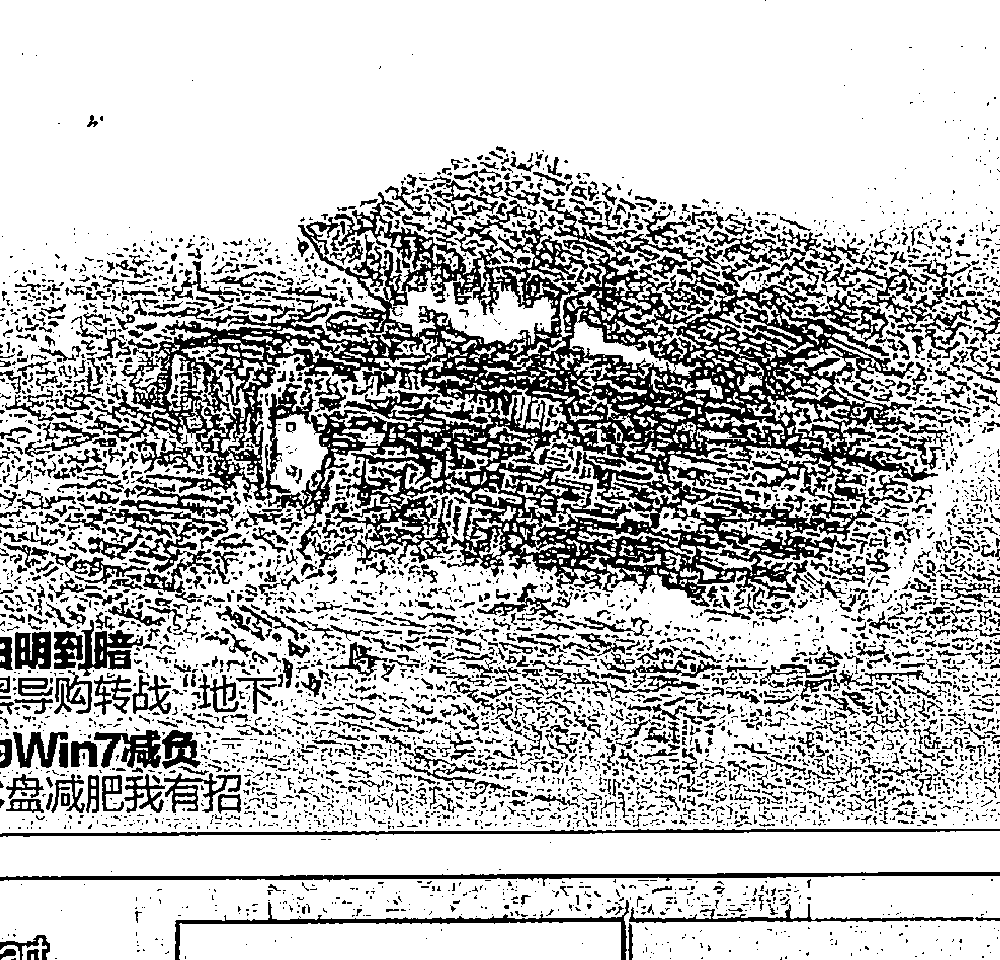

## 手机维修水多深

关于手机维修的行业揭秘和消费者指南。


## 切断互联网 可能吗

探讨互联网切断的可能性和影响。

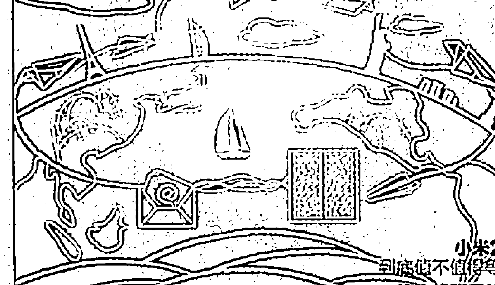

## 惊奇！网盘竟能这样用

随着宽带网络的发展，越来越多的用户开始使用网络存储。网盘的兴起，让我们的工作和生活方便了很多。除了常规地使用网盘存储外，网盘还能怎样用？还有什么新奇玩法呢？

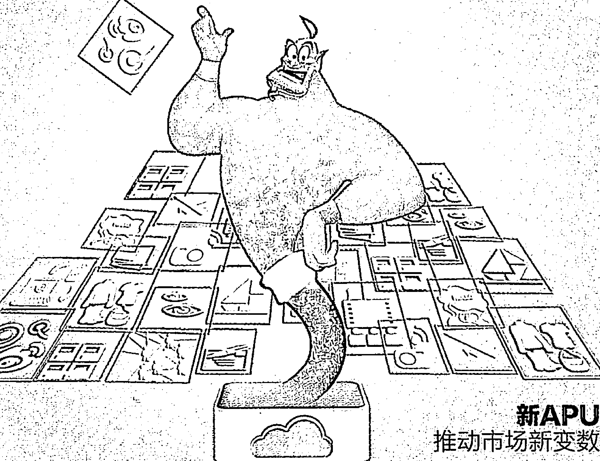

### 由明到暗 黑导购转战‘地下’

## 为Win7减负 C盘减肥我有招

## Windows 8 深度体验记

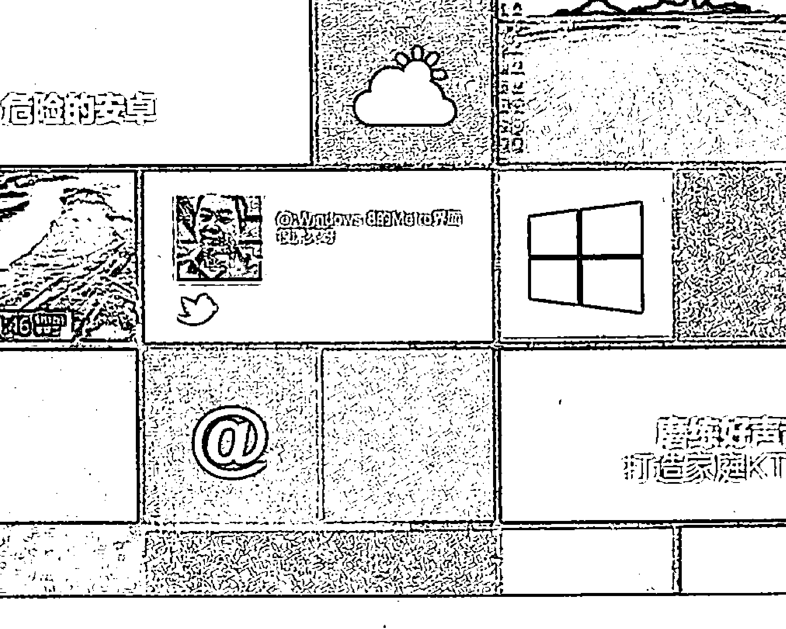

## 新APU 推动市场新变数

## 白菜价的平板手机要小心

电脑爱好者

合订本·2012下半年


电脑爱好者杂志社

# 《电脑爱好者合订本》2012年(下)

- 主管：中国科学院
- 主办：北京《电脑爱好者》杂志社；中国计算机世界出版服务公司
- 编辑出版：《电脑爱好者》杂志编辑部
- 顾问：郭传杰

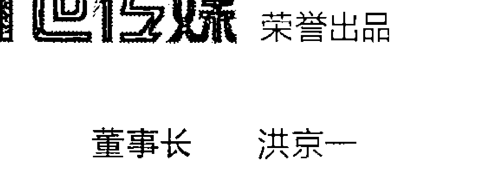

- 董事长：洪京一
- 名誉董事长：P.McGovern
- 副董事长：熊晓鸽
- 总裁：万鹏远
- 业务运营总裁：黎争
- 副总裁：梁继有 覃超
- 社长：葛程远
- 出版人兼总编辑：杨富强
- 副总编辑：齐书阳 西浩铭

- 办公地址：北京市海淀区翠微中里14号楼4层
- 通信地址：北京123信箱（《电脑爱好者》杂志社）
- 邮编：100036
- 网址：http://www.cfan.com.cn
- 总机：010-68130909
- 发行总代理：北京爱好者文化传媒有限公司
- 读者服务部：手机短信：13801293315；电话：010-68258784
- （发行）联系方式（周一至周五 9:30~11:30 13:30~17:00）
- 零售：全国各地邮局（所）
- 国内发行：北京报刊发行局
- 邮发代号：82-528
- 中国标准连续出版物号：ISSN1005-0043；CN11-3248/TP
- 印刷：北京汇林印务有限公司
- 广告许可证：京海工商广字第0055号
- 法律顾问：北京周涛律师事务所（网站：www.zt148.cn）；电话：010-63141013 13366185341

本书如有印刷或装订质量问题，我们负责调换。E-mail: publish@cfan.com.cn
图文版权所有，未经同意不得转载、翻印
全套合订本（正文+配套1DVD） 定价：39.8元

# CONTENTS 目录

电脑爱好者2012（下半年）合订本

# 封面报道

- 还在当玩物吗 平板变身办公利器 ………… 9
- 微博早该这么玩 ………… 19
- 伦敦奥运中的新科技 ………… 29
- 小米手机之后 谁才是性价比之王 ………… 39
- 惊奇！网盘竟能这样用 ………… 52
- IT巧消费 淘尽开学季 ………… 61
- 切断互联网 可能吗 ………… 70
- 手机专利的秘密 ………… 80
- Windows 8深度体验记 ………… 89
- iPhone 5 变了味的苹果 ………… 97
- 淘宝贝实拍攻略 ………… 105
- 手机维修水多深 ………… 114
- PC的2012 谁是救世主 ………… 121

# 身边事件

- 智能电视 想说爱你不容易 ………… 130
- 网购评价“癌变” ………… 132
- 追赶者微软 ………… 134
- “天猫”恶意排序何时止 ………… 136
- 变味的专利之争 ………… 138
- 草根大号们的微博江湖 ………… 140
- 115网盘商业化悬疑 ………… 142
- 价格战背后的猫腻 ………… 144
- 3B大战 两败俱伤 ………… 146
- 苹果发布iPhone 5 ………… 148
- 危险的安卓 ………… 150
- “4S”不安全 “5”最保险 ………… 152
- “0元购” 不管你们信不信 反正我不信 ………… 154
- 富士康群殴罢工真相 ………… 156
- Windows 8能否重振微软Style ………… 158
- 联通“装灯计划”缘何选择潜伏 ………… 160
- “方周”之战 2012年末大戏 ………… 162
- MSN 生于机遇 死于散漫 ………… 164
- 光棍都敢骗！网购狂欢背后的阴影 ………… 166
- 返利网站的“生死劫” ………… 168
- 由明到暗 黑导购转战“地下” ………… 170

## IT史话

- 高桥名人的冒险岛………………172
- 王江民：杀毒也曾风卷残云………………174
- 图灵 上帝派来的电脑精灵………………177
- Android小传………………180
- 争议世上第一台便携式电脑………………182
- 谢谢你 蒂姆………………184
- 没落的WordStar………………186
- Excel的铺路石——VisiCale………………188
- Linux是如何诞生的………………190
- “硬盘业始祖”阿兰·舒加特………………192
- 当CD光盘遭遇存储………………194
- 系统 炼成微软帝国的基石………………196
- 四面楚歌的PC………………199
- BT之父 布莱姆·科恩………………200


## 技术解读

- 泰坦尼克如何穿越三度空间………………202
- 超级隐形眼镜 眨眨眼就拍照………………204
- 超级计算机的超级秘密………………206
- 谷歌搜索按钮背后的秘密………………208
- 走进多核CPU的世界………………210
- 3D打印改变未来生活………………212
- Flash退散HTML5成主角………………214
- NFC 移动生活的主角………………216
- Android游戏互不兼容为哪般………………217
- 动口不动手 Siri技术大起底………………218
- Qi无线充电技术揭秘………………220
- 超敏感触控带来超体验………………221
- 网络爬虫攻防内幕………………222
- 基带芯片 智能手机不能没有你………………224
- 解读安全Win8背后的推手………………225
- 低光世界里的拍摄秘密………………226
- 手机能让你的卡消磁吗………………228
- Atom Z2760 英特尔平板梦………………230
- Win8的OA3.0技术探秘………………231
- 摩托罗拉 官方“解锁”正在路上………………232
- 背照式摄像头 拍照就看你………………233
- 悬浮触控 隔空操作不是梦………………234
- Android内存机制有玄机………………235

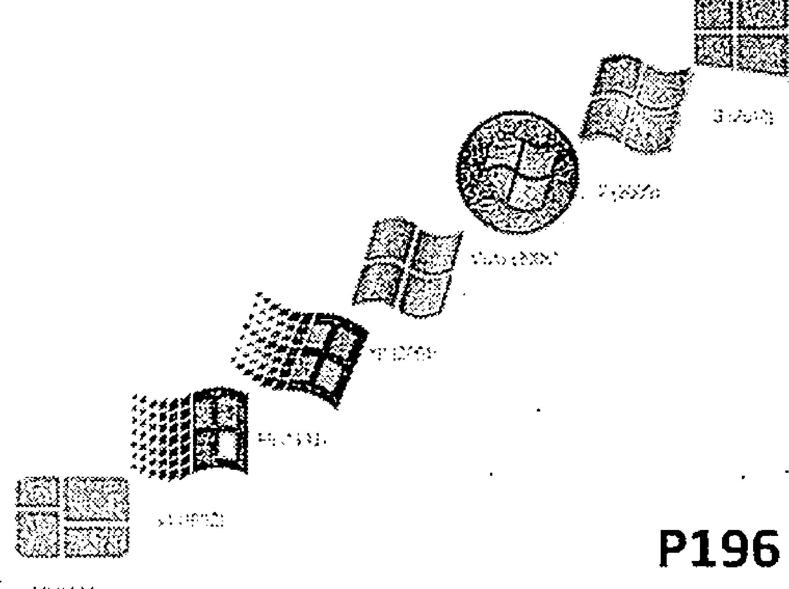

# 移动天地

- 出差 让爱机成为得力助手………………236


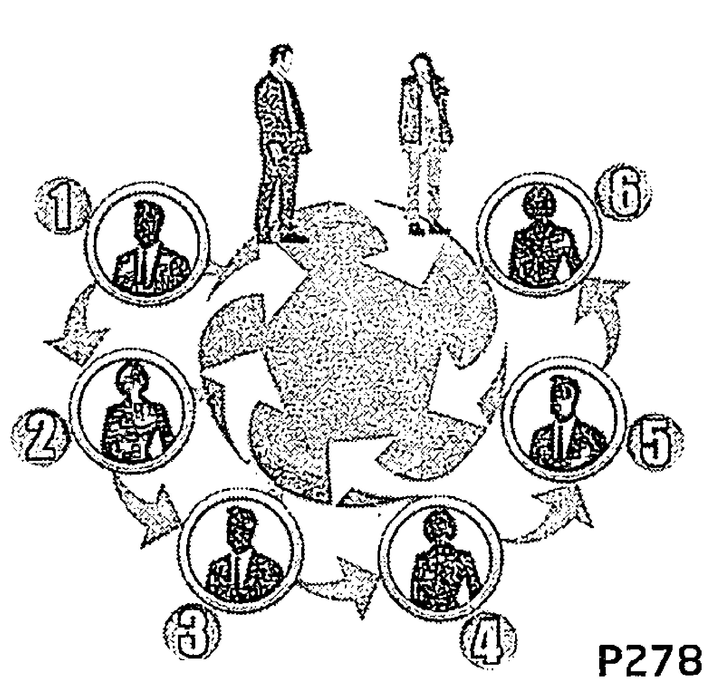

- 无“线”自由 手机也能看房 ..................238
- 摆脱数据线 跨平台快速传输 ..................240
- Wi-Fi玩接力 信号弱也不怕 ..................241
- 享“乐”无罪 好歌曲不放过 ..................242
- 三板斧 让手机隐私更绝密 ..................244
- 重要事件与手机“绑”一起 ..................245
- 双管齐下 打造属于你的应用 ..................246
- 出行无忧 十一出行早规划 ..................248
- Android手机SD卡“分家” ..................250
- 将旅游进行到爽 ..................252
- 挖掘潜力 玩转手机传感器 ..................254
- 回炉重造 让应用如我所愿 ..................255
- 音乐发烧友的手机生活 ..................256
- 省心省力 打造手机维护盘 ..................258
- 不要迷信手机屏幕 ..................260
- 国产手机的崛起 ..................261
- 手机充电器的那点事 ..................262
- Android手机拨号软件该选谁 ..................263
- 那些让MM Hold不住的手机游戏 ..................264
- 当汽车遇上智能机 ..................266
- 手机看电影的奇思妙法 ..................268
- 手机浏览器该用谁 ..................270
- 10块钱DIY手机微距镜头 ..................271
- 疯狂升级的Android系统 ..................272
- 手机随身带 生活随处拍 ..................273
- 寒冷冬季 手机养生有绝招 ..................274


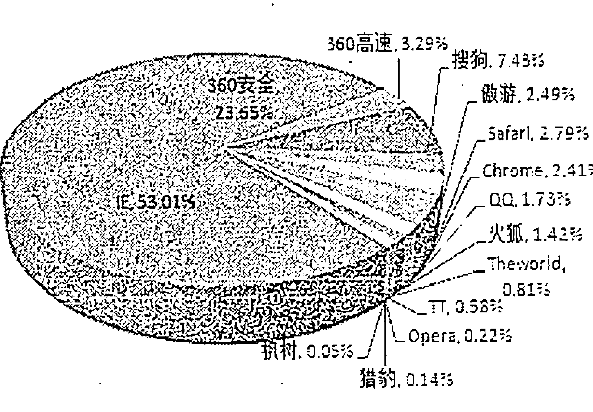

# 网络生活

- 不花一分钱 免费图书送到家 ..................276
- 找工作 SNS助你一臂之力 ..................278
- 突破140魔咒玩转长微博 ..................280
- 看评论搞定网购 ..................281
- 淘宝小卖家的流量解决之道 ..................284
- 无视在线阅读 电子书DIY ..................286
- 网上阅读自建文摘库 ..................287
- 网络钟点工走红 ..................288
- 六步DIY垂直搜索 ..................290
- 我的Email你收到了吗 ..................291
- 鼠绘达人的涂鸦生活 ..................292
- 大战网页广告 就要小清新 ..................294
- 让快盘再度“快”起来 ..................296
- 先看再下 在线文件预览 ..................298
- 网页上的下载有诀窍 ..................299
- 保护隐私堵住6大安全缺口 ..................300
- 网海泛舟要上哪条“浏览船” ..................302
- 快速炼成离线下载达人 ..................304

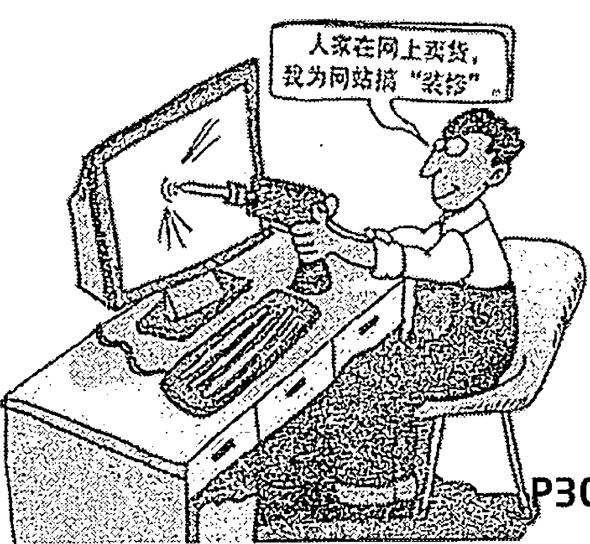

# 目录

# 软件方案

- “双十一”另类赚钱的一群人………………306
- 普通U盘变身双效U盘………………308
- 天下无贼 DIY家庭监控系统………………310
- 电脑做中枢 手机平板看电影………………311
- 不安全的服务 不用就关掉………………312
- 系统文件夹不再“藏污纳垢”………………314
- 开机经典故障排除………………315
- Win7经典启动故障排除………………318
- 巧做卡拉OK遮罩字幕………………321
- 按下Win+L键 玄机来了………………322
- 当XP访问Win7遇阻之后………………324
- 就地取材改装Flash动画………………326
- 清除广告 让视频变单纯………………328
- 成批巧补丢失的文件序号………………330
- 免费使用迅雷离线下载………………332
- 自己动手 调出妙曼之音………………333
- 双拼双打 输入腾飞的秘诀………………334
- 打造完美的移动Win8………………336
- 不用外援三招修复IE………………338
- 时光倒流找回过去的文档………………339
- 电脑桌面扩展到移动手机………………340
- 两条命令打造移动版Win8………………341
- 找回失落的EFS加密文件………………342
- 磨练好声音 打造家庭KTV………………344
- PDF电子书减肥全程方案………………346
- 硬盘伤不起 内存盘助力………………348
- 隐藏数据 轻松快捷不留痕………………350
- 截杀进程 告别简单模式………………351
- 成就高手 掌握多重技巧………………352
- 相片光盘 离线看图有绝招………………353
- 一个Win8 架设多重系统………………354
- 安装Win8后必做的优化………………356
- 巧用内部命令实现文件管理………………358
- 领先一步 路由器上拦广告………………360
- 多方支援 用好Win8………………362
- 解放双手电脑操作更方便………………364
- 视频处理讲技巧 玩出精彩咱有招………………365
- 见招拆招 Win8使用无难题………………366
- 正确刻录可启动系统盘………………368
- 本本摄像头充当安全卫士………………369
- 用控制台命令RAR实现灵活备份………………370
- PC玩安卓 一样很精彩………………372
- 字幕“生病” 再好的戏也不精彩………………373
- 让“撤销”无处不在………………374

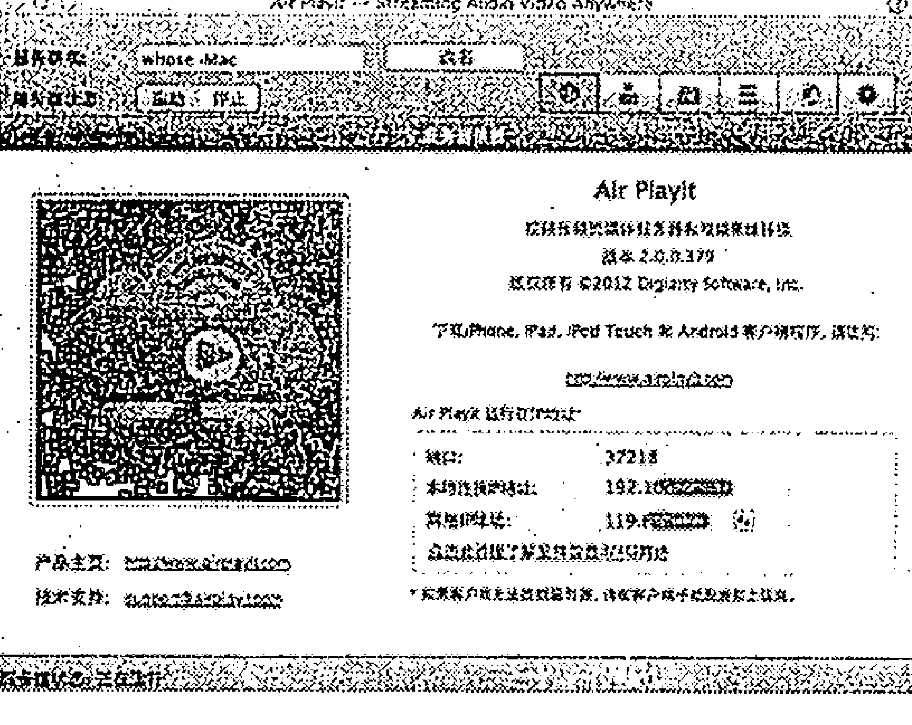

P311

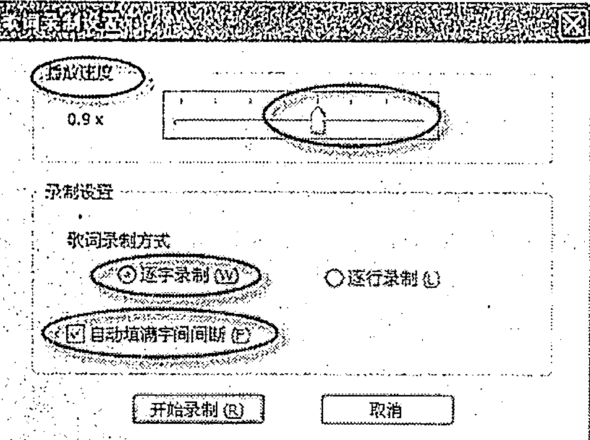

P321

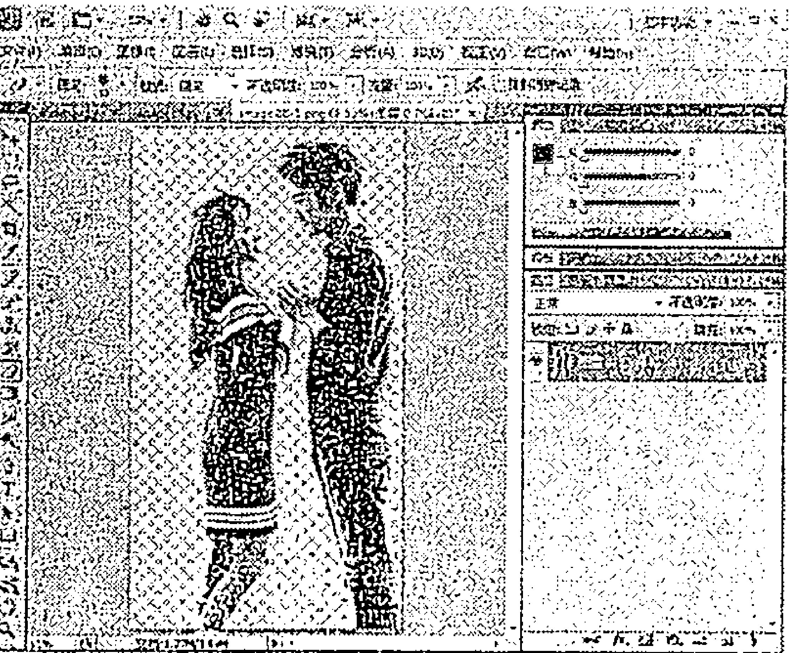

P326

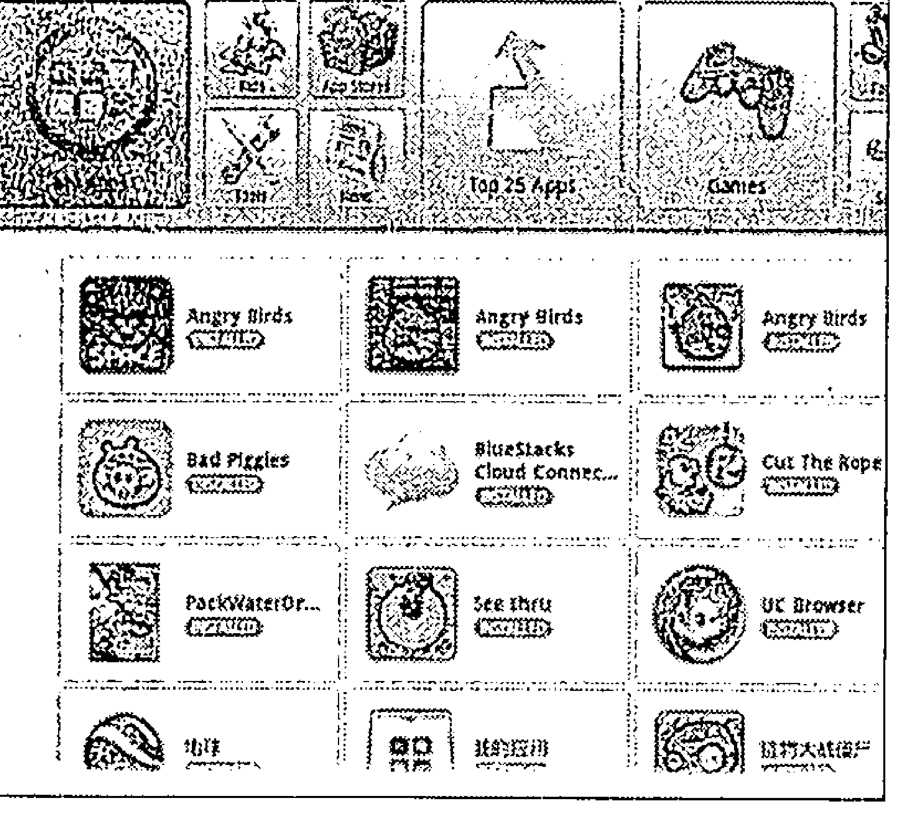

P372

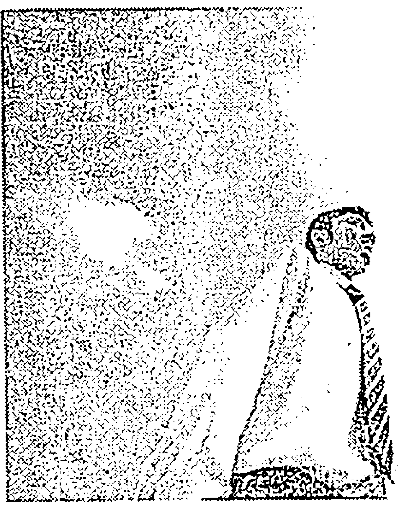

- 巧取PDF所需内容 ………………………………………………………………375
- 保护电脑安全 你用什么杀毒软件 ……………………………………………376
- 为Win7减负 C盘减肥我有招 …………………………………………………378
- 玩转Win8应用商店 ………………………………………………………………381

# 公司校园

- 调查测评 摄像头轻松统计 ……………………………………………………383
- 函数助力 考试服务一条龙 ……………………………………………………384
- 自编全能版毕业纪念册 …………………………………………………………386
- 巧用替换 规范试卷格式 …………………………………………………………388
- 播放幻灯片 因“需”制宜 ………………………………………………………390
- 借助Excel 练习试卷轻松做 ……………………………………………………392
- Excel操作题也能自动评分 ……………………………………………………394
- 活用受限制区域做试卷 …………………………………………………………396
- PPT轻松实现随机抽题 …………………………………………………………397
- 让Excel图表告别“山寨”面孔 ………………………………………………398
- Excel数字“假”变“真” ………………………………………………………400
- 给Word捆绑一个计算器 …………………………………………………………401
- 网页表格清白进Word …………………………………………………………401
- 千份通知书一次自动打印 ……………………………………………………402
- 巧做两圆内切动画 ………………………………………………………………403
- 让PPT图表动起来 ………………………………………………………………404
- 自制Q版卡通照 …………………………………………………………………405
- 潜伏在PPT下的奇技绝活 ………………………………………………………406
- 快速提升外语听力 ………………………………………………………………408
- PowerPoint巧做连线题 ………………………………………………………409
- 赔钱赚钱 预测有妙招 …………………………………………………………410
- 用几何画板制作课件 …………………………………………………………412
- 文档图片 瞬间批量提取 ………………………………………………………414
- 不付费实现内部断网通信 ……………………………………………………415
- Excel中也能打印条形码 ………………………………………………………415
- PPT制作翻书效果不逊色 ………………………………………………………416
- 巧用Excel控件制作动态图表 ………………………………………………417
- 制作自己的Word实验工具箱 …………………………………………………418
- Excel源数据表的制作误区 …………………………………………………420
- 让Excel帮你自动审查数据 …………………………………………………422
- 巧用Word编题库 ……………………………………………………………424
- 让PPT图表排版不再头疼 …………………………………………………426
- 技巧联合 快速找出流动学生 …………………………………………………428
- 利用VBA实现大批论文格式整理 ……………………………………………429
- 简历：外企向左 国企向右 ……………………………………………………430
- 触类旁通 玩转特殊替换 ………………………………………………………432
- 90后 在工作中成长 …………………………………………………………434
- PPT与Excel完美结合做练习 …………………………………………………436
- 巧用代码实现简洁替换 ………………………………………………………438
- 忘掉防改密码 文档照样编辑 …………………………………………………439

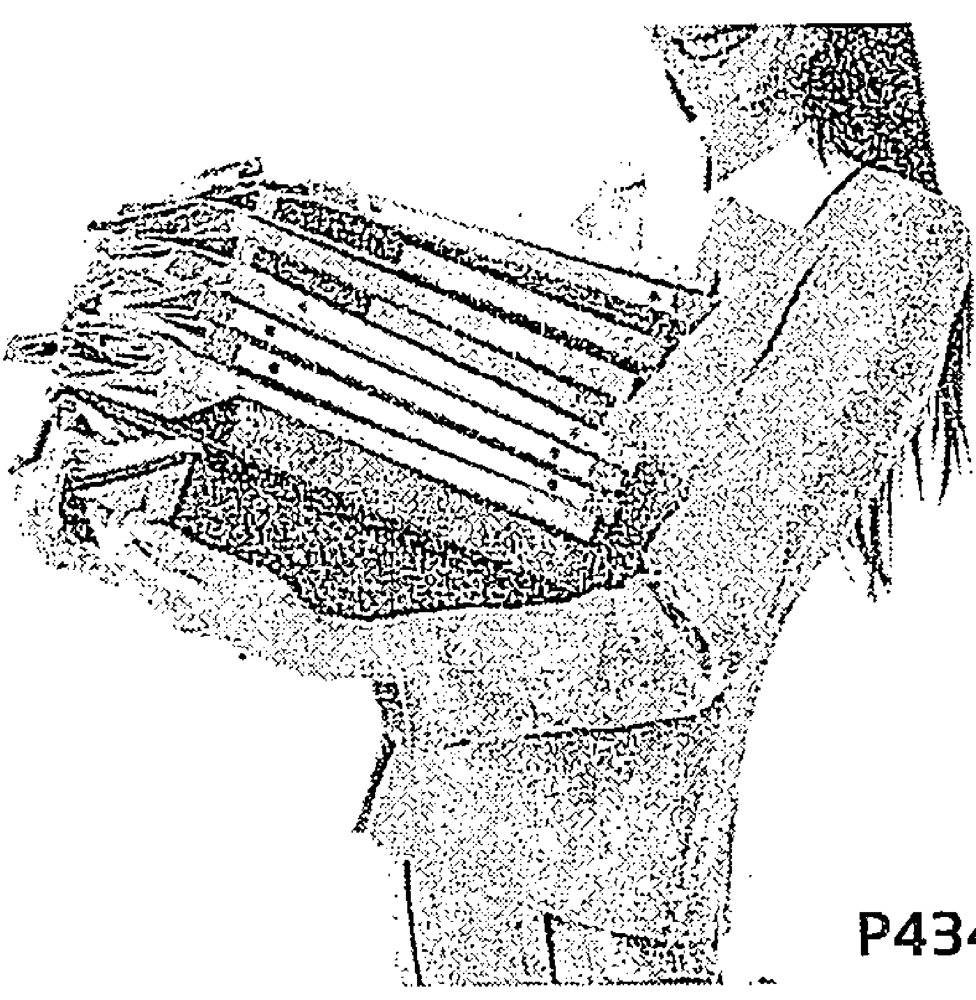

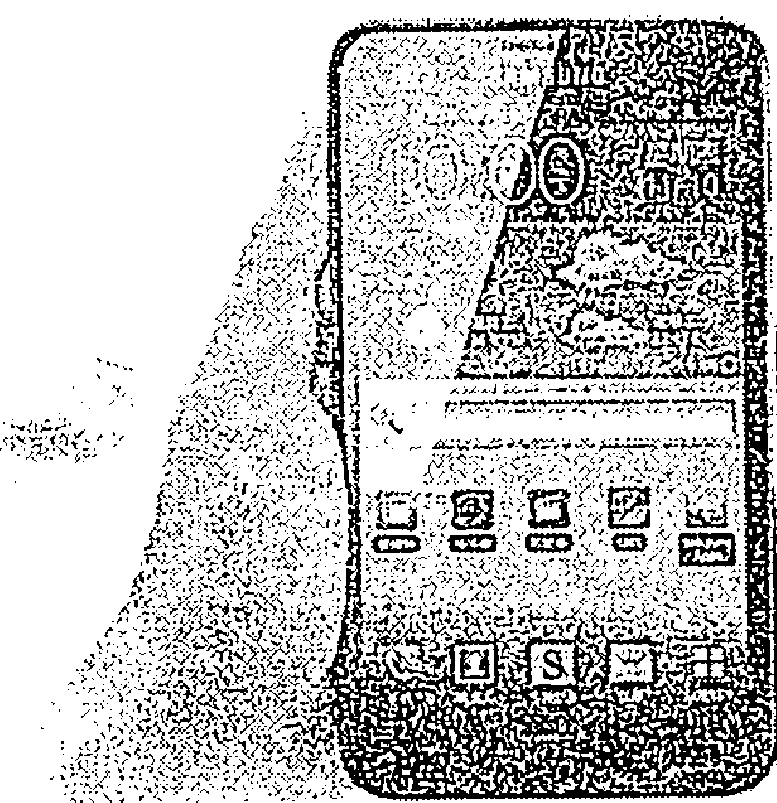

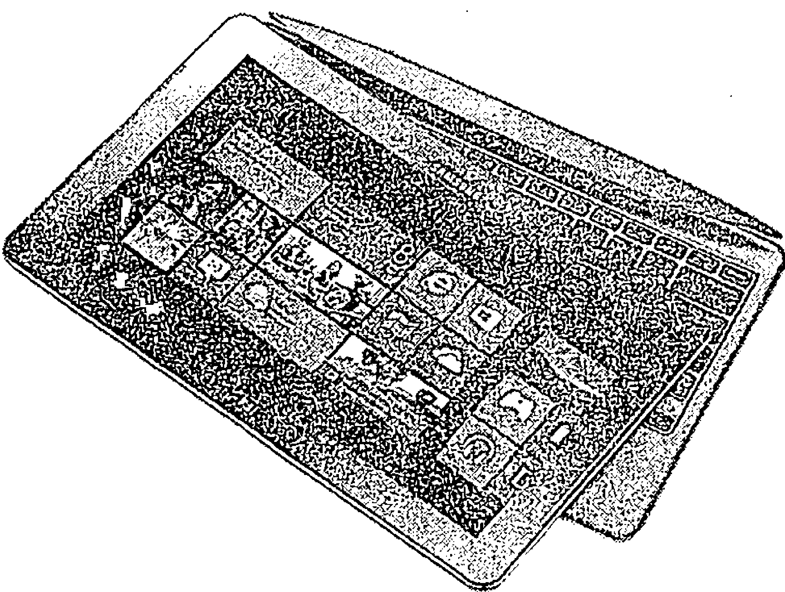

# 目 录


# 硬件通家

- SSD硬盘 4K要对齐 440
- 大硬盘和系统不兼容探秘 442
- 解析笔记本的发热困局 443
- 开普勒显卡超频攻略 449
- 新APU 推动市场新变数 452
- 白菜价的平板手机要小心 454
- 驯服迷你路由 Wi-Fi无限 456
- 自己动手增益无线网络 458
- 降温节能 让电脑“冷酷到底” 460
- 给HM77芯片组笔记本提速 461
- 四核手机 性能不是唯一亮点 464
- mSATA 笔记本的好伙伴 466
- 免费为USB2.0设备提速 468
- 一台变两台 电脑也分身 470
- 笔记本 不要忽视电源管理 472
- Windows 8 你必须了解的三件事 473
- 不妨升级笔记本无线网卡 478
- 散热模组 笔记本冷热全靠它 480
- 起死回生 U盘修复我也行 483


# 视像达人


- 视频画面不再抖 485
- 花鸟鱼虫也要拍出意境 486
- 盲拍让你捕捉自然人像 488
- 补光让照片“重放光彩” 489
- 把毕业册包装成个性图书 490
- 如何拍照才上相 491
- 让海景照告别失衡 493
- 打造360度全时空图片 494
- 三维室内效果图DIY 495
- 让你的网页告别“失焦” 496
- 大片大场景我也能做 498
- 数码相机拍摄人工防抖术 499
- 五彩缤纷免费“滤光镜” 500
- 剪裁的力量 502
- 家用级布光拍出专业级大片 504
- 镜头定格翩翩雪世界 506
- 带着手机去旅行（一） 508
- 带着手机去旅行（二） 509
- 静态图片“动”起来 510
- 普通相机拍摄专业特写 512

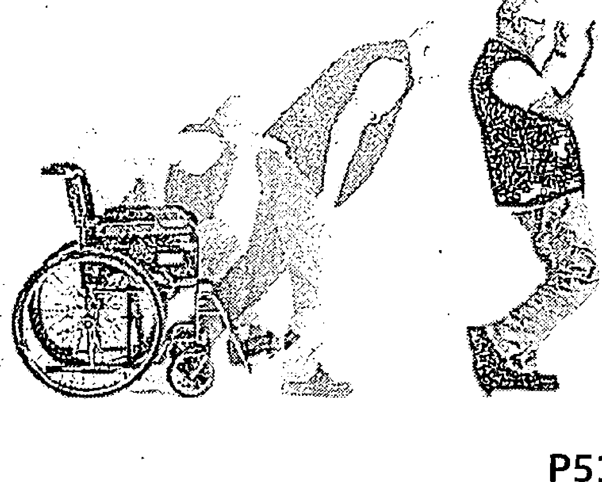

## 还在当玩物吗

### 平板爱上办公规则

最近流行起了平板电脑，身为销售总监的我毫不犹豫地购买了一款安卓平板。虽说它给人们的感觉更像是玩物，但通过使用我发现它也能很好地为我的商务办公服务。它克服了笔记本续航能力弱、无法触摸的缺陷，现在的我使用平板电脑来办公已经是得心应手，套用一句广告词：平板办公，我看行。如果你的手上也有平板电脑，但还不会利用它来为自己的工作服务，那就一起来看看我的平板电脑办公周记吧。

# 周一 天气 晴

## 工作安排：策划产品夏季市场促销方案

随着夏季的到来，产品进入销售高峰期。因此我必须先期做好促销方案。以前策划方案都是借助电脑来完成，自从用上了安卓平板，我发现使用平板电脑作为策划方案辅助工具非常给力！

### 8:00

今天一上班我就召集市场部几个业务主管讨论策划方案，以前会议讨论都是使用挂在墙上的白板，每个员工有什么想法就上前使用水笔添加，操作起来有些不便。现在使用平板上的小黑板（下载地址：http://www.fengbao.com/android_soft/yypz/soft_96945.html）就简单多了。为了便于沟通，员工都是围在公司小会客室圆桌上讨论。我的平板放置在圆桌中央，这样既便于员工观看，又方便每个人随时添加自己的想法。

1. 在平板上启动软件后显示的是一块全屏的白板，只要用手指点击即可写字或者画出任意图形。比如这次的策划是讨论每个大区市场的营销策略，我先在白板上画出策划的大体结构图，后续的操作就是大家讨论添加。添加的方法非常简单，手指按住屏幕后会出现一个笔形图标，每个人按照自己的需求随时添加文字或者图形都可以（图1）。

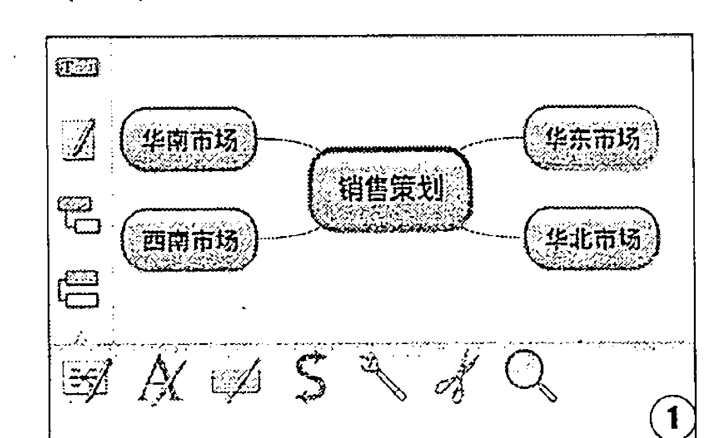

2. 由于屏幕的限制，策划子方案细分到每个大区，每个分区一张图片。完成图片的编辑操作后点击屏幕上方的心形按钮即可将图片自动保存在SD卡上，或者上传到Picasa网络相册，如果是跨部门的协作，还可以即时通过蓝牙将策划图发送给对方（图2）。

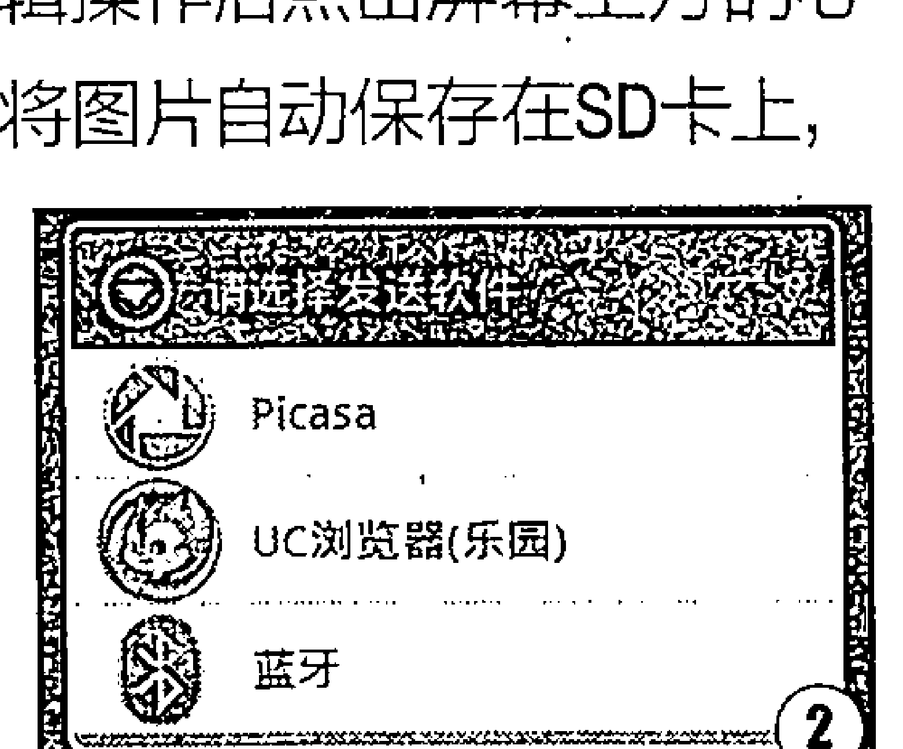

### 14:00

经过一上午讨论，策划初稿终于完工。下午一上班就要将讨论的初稿打印出来，可是打印机在隔壁秘书办公室，借助PrinterShare（Android端下载地址：http://goo.gl/8MoX5）可以轻松实现WiFi共享打印。

1. 先在连接打印机的电脑上安装PrinterShare的电脑端（下载网址：http://www.onlinedown.net/soft/83202.htm），接着启动程序PrinterShare Console，按提示注册为用户并获取用户ID。
2. 在PrinterShare Console主界面，点击User-Log In，用收到的ID和密码登录后，可以看到电脑上连接的各种打印机，用鼠标选择准备用于外网打印的打印机，点击Share按钮共享该打印机。
3. 在平板上启动WiFi和PrinterShare，选择要打印的文件（上述制作好的策划导图），最后按菜单键调出打印。

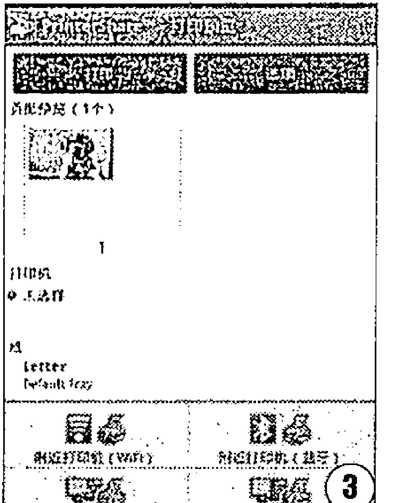

印机选择窗口，点击“附近打印机（WiFi）”，这样可以快速搜索到秘书室的打印机。输入账户和密码登录后，选择搜索到的打印机进行打印，打印完毕叫秘书分发到销售部各个员工手上即可（图3）。

总汇报策划方案，下午则要面见客户，晚上还有一个客户的约请。赶紧使用平板上的“爱提醒”（Android下载地址：http://goo.gl/nu4r7），根据工作的轻重缓急，设定级别并定时提醒。

1. 设置声音。要提醒，当然是多种方式同时提醒效果更保险，建议打开声音提醒，这样会同时以声音和弹窗两种方式提醒。依次进入“设置→声音”，把“静音模式”后面的钩去掉（静音模式下铃声自然会失效），再进入“通知铃声”，选择一种提醒铃声，最后还要看看“音量”里面的“铃声”音量是不是合适，如果太小，就要调大。
2. 添加提醒。点击“添加提醒”，添加了一个事件，输入标题“汇报策划方案”，再勾选“提醒”，选择提醒时间（一般以事件发生前半小时左右为宜）。在“备注”中输入汇报时间和需要注意的事项，最后点击“保存”创建该提醒事件。这样一到指定时间，平板就会响起铃声，并弹出提醒对话框（图4）。

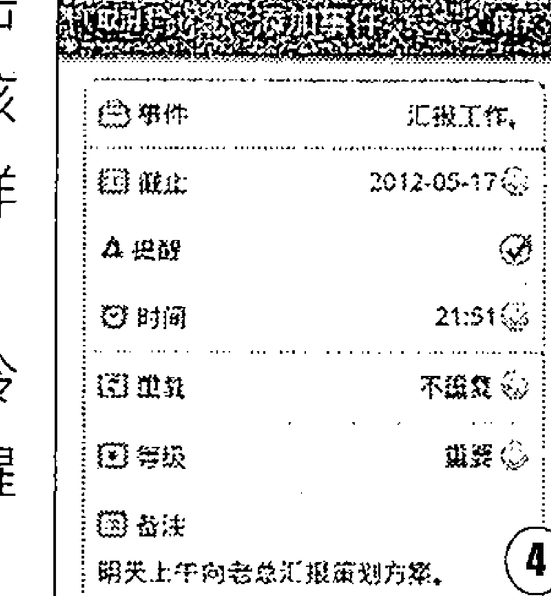

### 23:00

准备睡觉，忽然想起明天上午要向公司老

# 周二 天气 阴有小雨

## 工作安排：市场策划汇报

虽然今天一早就下起了小雨，但是公司老总有交代，今天必须提交策划方案。因此一大早就带着平板赶往公司，对昨天的策划方案进行最后的完善。

### 7:50

一到公司，打开平板，我开始仔细审核整个策划方案，忽然发现还有一个重要素材没有添加到方案中，可是方案素材保存在办公室台式机上。借助ES浏览器（下载地址：http://www.crsky.com/soft/28394.html）局域网文件浏览功能可以轻松浏览电脑文件。

1. 在安装Win7的电脑上找到保存素材的目录，右击选择“属性→共享”，接着单击“共享”，在打开的窗口输入共享的用户为everyone，同时设置其权限为“读取”。这样在安卓平板上就可以共享读取这些文件了（图5）。
2. 在安卓平板上启动ES，单击左上角的“本地”，然后在打开的窗口将

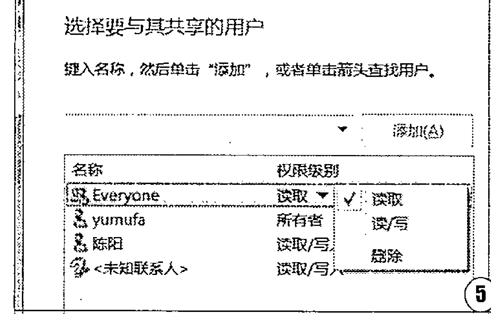

| 名称 | 权限级别 |
|------|----------|
| Everyone | 读取 |
| yumufa | 读取/写 |
| 陈刚 | 读取/写 |
| <未知联系人> | 读取/写 |

### 外接键盘提升输入效率

平板电脑的性能和软件都足以支撑起简单的办公应用，但每每涉及到大量文字录入时，通过触控屏幕打字的弊端便显露出来了。想在平板电脑上实现不逊于PC平台的录入体验，缺少了外置键盘怎么能成？考虑到Android平板通常只有一个USB接口（轻薄产品通常会选用miniUSB或MicroUSB），小编建议大家选择2.4G无线键鼠套装，一个Nano适配器就能同时控制鼠标和键盘，在Android 4.0系统中可以实现即插即用。当然，外置的键盘鼠标也不能影响我们外出时的便携性，因此采用类似笔记本键盘的紧凑型无线键盘就成为了我们的首选。在这里小编推荐雷柏的9020键鼠套装，超轻薄的设计非常适合于平板搭配外出使用。如果你的平板电脑支持蓝牙，则推荐大家选择雷柏的另一款产品：E6500蓝牙键盘。它拥有金属材质的超薄机身，而且还针对Android系统添加了很多专用的快捷键，使用上更贴近Android系统的使用习惯。

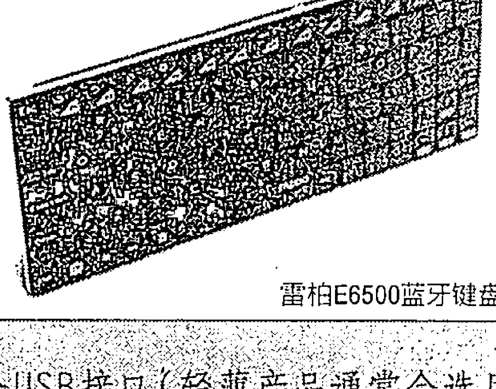

视图切换到“共享”。点击菜单“新建→服务器”，然后按提示输入局域网电脑的IP地址（内网），访问用户名和密码，单击“确定”新建服务器（图6）。

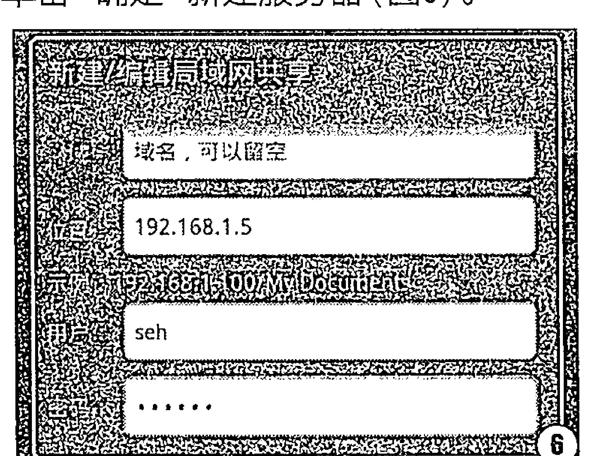

3. 返回程序界面，此时在局域网共享的列表就可以看到我们新建的服务器（默认以IP地址命名）。双击上述新建服务器，按提示输入访问的用户名和密码，连接成功后就可以在平板上看到电脑里的共享目录了（图7）。

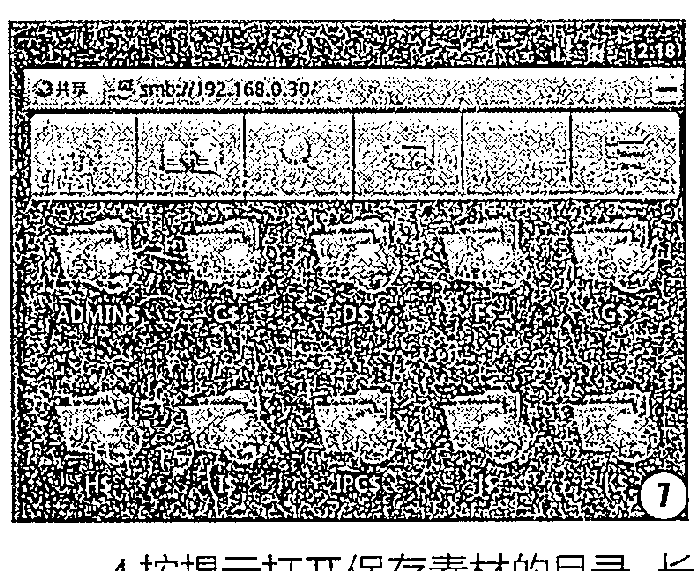

4. 按提示打开保存素材的目录，长按需要打开的素材，在弹出的菜单选择“打开为”，如果平板安装了打开素材的程序则会自动打开。如果需要将文件复制到平板，则点击“复制”可以将文件保存到平板的SD卡上（图8）。

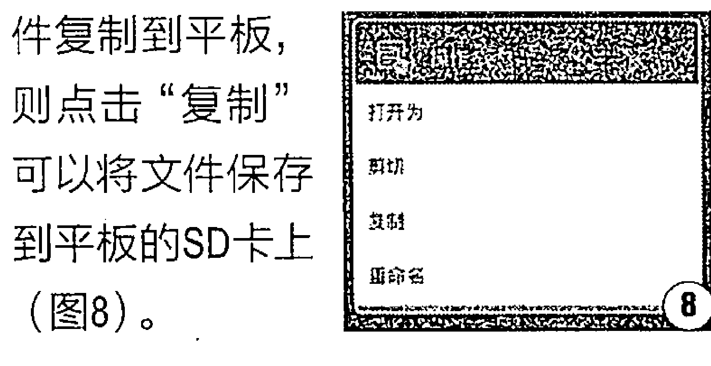

### 9:30

好不容易完成策划的编辑工作，一看汇报时间已到，我赶紧赶往公司会议室。平板的屏幕那么小，当然要利用会议室的投影仪来展示，到了会议室赶紧将策划PPT文稿复制到会议室电脑上。不过演示时需要随时为老总解答疑问，在电脑上操控总是不方便。借助PPT演示器可以将手中的平板变为电脑PPT播放的遥控器，自在地遥控电脑播放的PPT文件（PPT演示器平板端下载地址：http://goo.gl/WdNYz，服务器端下载地址：http://goo.gl/xMF33）。

1. 先在播放PPT的电脑上启动PPT演示器的电脑端，启动时弹出“Windows安全警报”的对话框，点击“允许访问”，否则平板会因防火墙的阻挡而无法操控。启动成功后点击Start启动软件服务端（图9）。

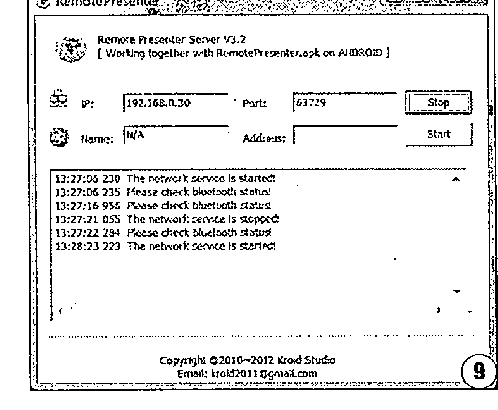

2. 在平板上启动PPT演示器平板端，调出菜单，进入“设置”，点击“自动搜索”。找到要播放PPT的电脑，点击生效后在平板上面会显示电脑的IP和端口，屏幕上方显示出了遥控器的4个功能键（图10）。

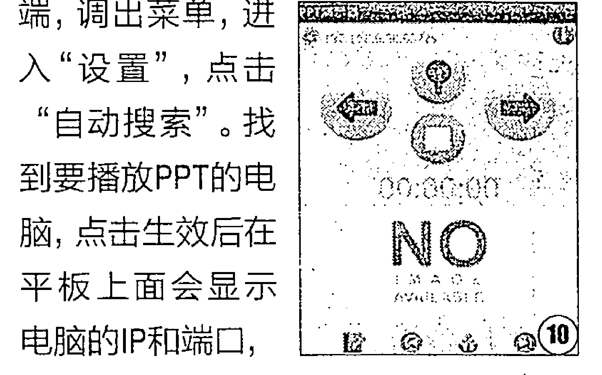

3. 在电脑上打开要演示的策划PPT文件，然后在平板上点击最上面那个播放键，电脑屏幕变黑，开始播放幻灯片。点击向左或向右按钮，可以播放上一张幻灯片或下一张幻灯片，也可以用手指向左或向右滑动，操控方式很灵活。如果不想播放了，只需点击屏幕上方的停止键即可。这样通过平板，我坐在老总身边就可以很轻松地控制PPT播放，而且可以随时对老总进行讲解。

### 11:30

正在演示期间突然接到一个客户的电话，客户需要策划案中的一些补充细节资料。补充资料保存在我的平板里，使用文件大师(下载地址：http://goo.gl/Jw2uN)把补充资料作为附件发给客户就好了。幸好有平板在身边，邮件发送

### 皮套+键盘=平板即变上网本

如果你觉得外出时还得背上键盘实在累赘，则可以考虑自带键盘的皮套，在淘宝上输入“键盘皮套”搜索就能找到无数相关的产品。
大家可以根据自己平板电脑的尺寸和品牌，找到兼容型号。如此一来，当我们外出时只要带上平板和键盘皮套就可以了，既可以保护平板不受磨损，同时一体式的键盘设计在使用时也会更方便。有了皮套的平板看上去更像上网本。

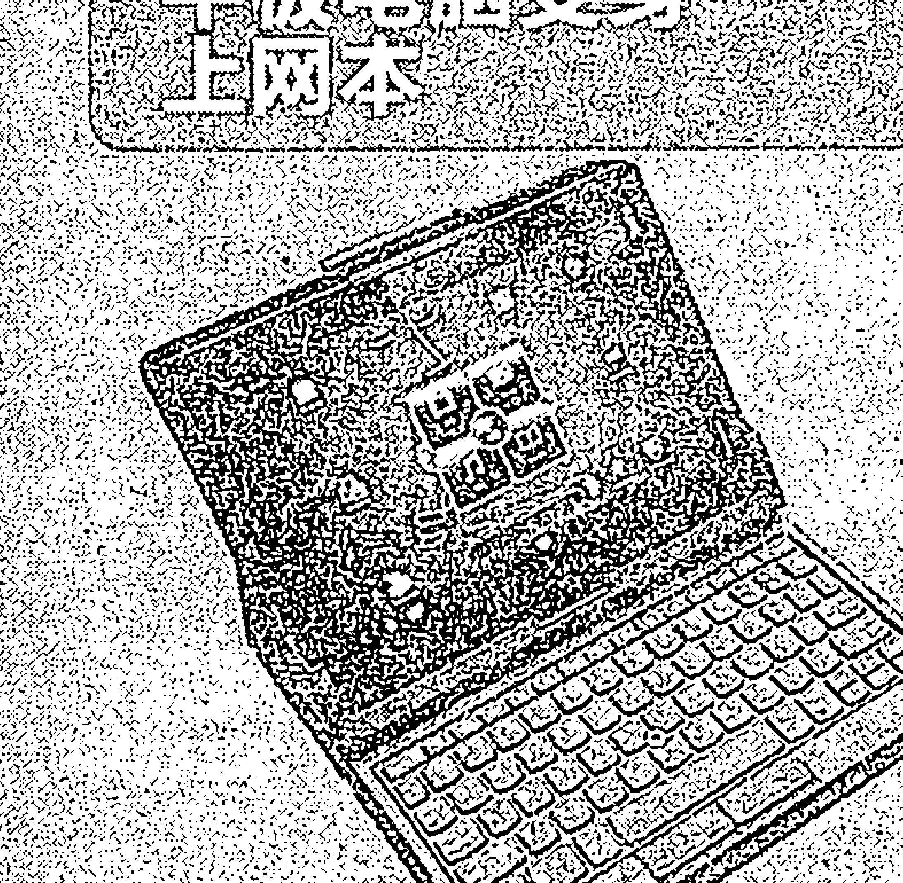

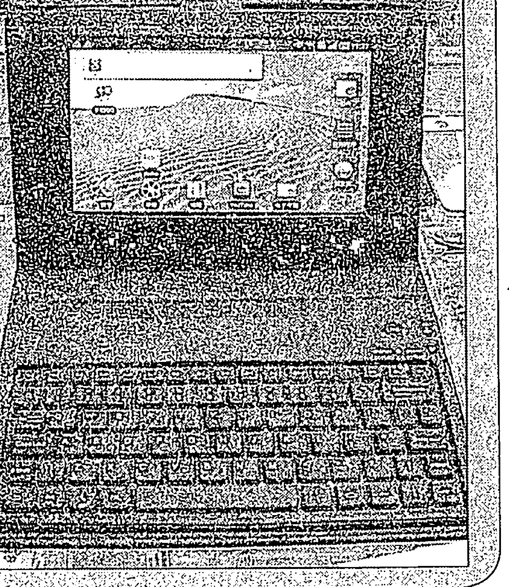

1分钟搞定，一点也不会耽误我和老总的解说工作。启动Gmail，按菜单键调出邮件菜单，选择“附加”，接着在弹出的“选择附件的类型”对话框中选择“文件大师”。进入文件大师主界面，再进入到资料所在目录，逐一添加客人需要的文件（还可以根据需要在正文中输入一些说明文字），确认无误后，点击“发送”即可将邮件发送给客户（图11）。

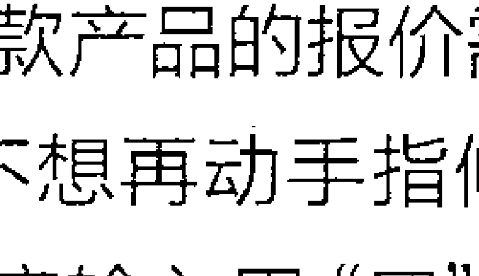

### 14:10

平板上的“爱提醒”发出声音提示，14:30要拜见客户，赶紧准备资料，带上自己的平板去拜见客户了。

### 22:30

完成一天的工作准备休息。我躺在床上打开平板查看这几天的工作文档，发现有几款产品的报价需要修改。今天太累了，不想再动手修改了，还是利用讯飞输入用“口”修改吧。

1. 在平板上安装讯飞输入法，点击“设置→语言和键盘”，然后勾选“讯飞输入法”。接着在平板上打开需要修改的文档，然后定位到需要编辑价格的文本框长按，点击弹出的“输入法”，然后在选择输入法列表点选“讯飞输入法”（图12）。
2. 此时平板会自动调用讯飞输入法，点击输入法面板的麦克风图标，在弹出的窗口对着平板麦克风开始说话，对于价格的修改只要说出数字即可。语音输入完毕点击“我说完了”，讯飞会自动识别并将正确的数字添加到文本编辑框中（图13）。

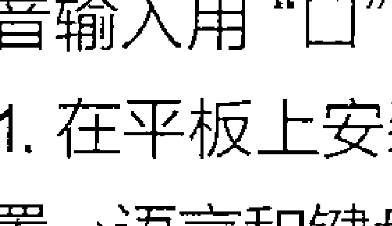

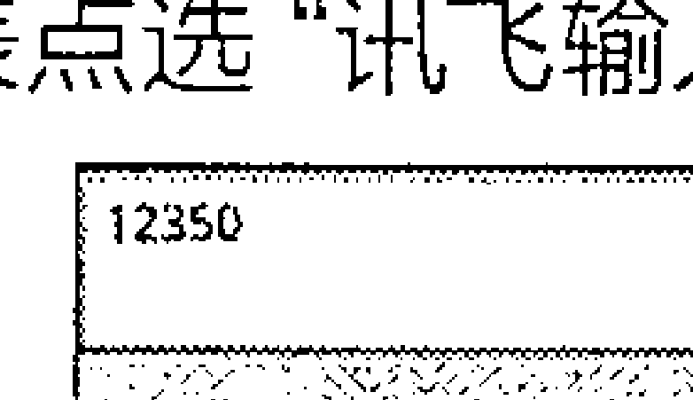

小提示：一般情况下，平板邮件对附件支持得并不好，除非你安装了相关程序（例如要发送图片，就需要安装图片程序，要发送办公文档，就需要添加相应的办公软件）。像我这样需要经常发送各种类型附件的人来说，不太可能安装所有相关的应用程序，所以选择“文件大师”发送附件非常方便。

# 周三 天气 晴

## 工作安排：到广州出差拜访客户，进行实地市场调查

市场策划获得老总的认可，接下来的任务就是要具体实施了。因此这两天我就要出去拜访客户并进行市场的实地调查。通过平板买机票订酒店都已经是轻车熟路的活。

### 8:00

来到公司并到财务科借款后就准备出发。这次出差是到广州，出差前我已经搞定了机票和酒店。预订机票和酒店使用“乐驰旅行”（下载地址：http://www.mobgo.cn/project_site_media/downloads/letsgo.apk），在平板上启动“乐驰旅行”，依次切换到机票和酒店的订购即可完成电话订购（图14）。


### 3G上网卡 便宜实惠的联网方案

3G平板的价格普遍偏高，在免费WiFi热点不够普及的今天，想随时随地接入网络，利用Android的OTG功能连接3G无线上网卡则是最行之有效的解决方案。在这里笔者推荐联通的3G上网卡，每月默认的套餐为80元（1GB），如果你不小心超过了套餐流量也不用担心，因为联通采用的是自动升级套餐的形式。比如本月流量达到了3GB，按常来讲应该收取80元（默认的1GB流量）+2048×0.1元=280元的费用，但联通采用的方式则是当流量超过3GB后直接升级到3GB的套餐方案，只收取150元的套餐费，下月自动恢复80元的套餐。

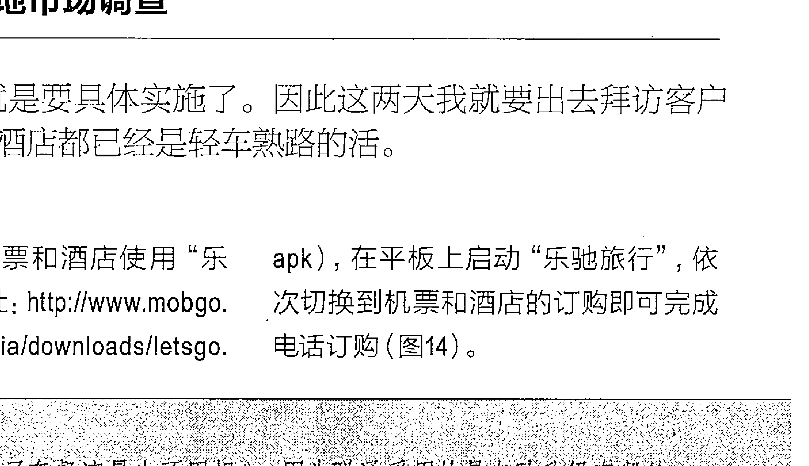# 封面报道
《电脑爱好者》合订本 2012

| 航班 | 机型 | 时间 | 价格 |
| :--- | :--- | :--- | :--- |
| CZ3108 南航 | 波音738 | 08:30 - 11:45 | ¥1700 经济全价 |
| HU7805 海航 | 334 | 08:40 - 12:00 | ¥1700 经济全价 |
| CA1321 国航 | A330-300 | 09:00 - 12:15 | ¥1700 经济全价 |
| CZ3000 南航 | 380 | 09:30 - 12:45 | ¥1700 经济全价 |
| CA1315 国航 | 777-300 | 11:00 - 14:15 | ¥1700 经济全价 |
| CZ3112 南航 | A330-300 | 11:30 - 14:45 | ¥1700 经济全价 |
| CA1339 国航 | A330-300 | 12:00 - 15:15 | ¥1700 经济全价 |
| CZ3102 | 波音738 | 11:00 - 14:15 | ¥1700 经济全价 |


11:00 登机并开始飞往广州。飞机上不能使用手机上网，不过有平板在身边并不会寂寞。因为头天晚上我就用“熊猫看书”（下载地址：http://ks.sj.91.com/）在平板上下载了不少电子书，这样打开平板看书就可以消磨旅途无聊的时间了。

1. 出差之前，在家里电脑使用数据线或者WiFi将平板和电脑连接后，启动91手机助手，切换到“电子书”，然后按提示安装熊猫看书，这样在程序右侧窗格就可以免费下载到各种电子书，选中需要下载的电子书点击“下载到手机”（图15）。
2. 点击程序界面的“下载任务管理”，切换到管理界面后选择左侧窗格的电子书，然后选中已经下载的电子书，点击“上传”即可将电子书自动传输到平板电脑上（图16）。
3. 以后在飞机、火车或者汽车上，我们只要打开平板启动91熊猫看书，在程序的页面点击上传到手机上的电子书即可开始离线浏览。如果想要有更好的翻书效果，点击“菜单→左右翻页”即可（图17）。

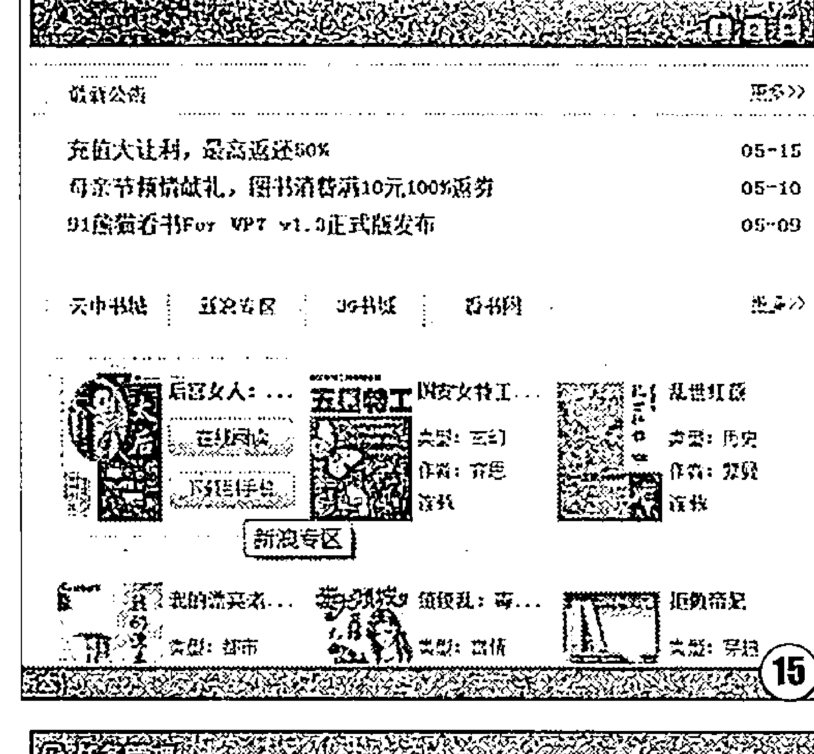

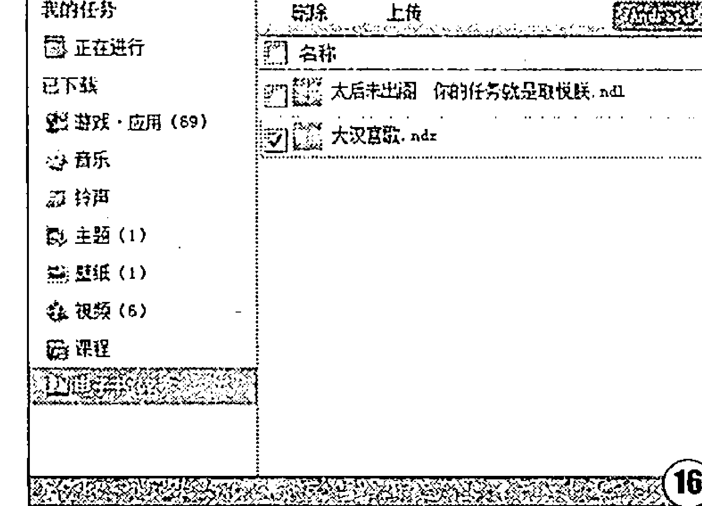

死生之地，不可不察也。
故经之以五事，校之以计，而索其情：一曰道，二曰天，三曰地，四曰将，五曰法。道者，令民与上同意也，故可以与之死，可以与之生，而不畏危。天者，阴阳、寒暑、时制也。地者，远近、险易、广狭、死生也。将者，智、信、仁、勇、严也。法者，曲制、官道、主用也。凡此五者，将莫不闻，知之者胜，不知之者不胜。故校之以计，而索其情，曰：主孰有道？将孰有能？天地孰得？法令孰行？兵众孰强？士卒孰练？赏罚孰明？吾以此知胜负矣。吾计听之，用之必胜，留之；计不听，用之必败，去之。


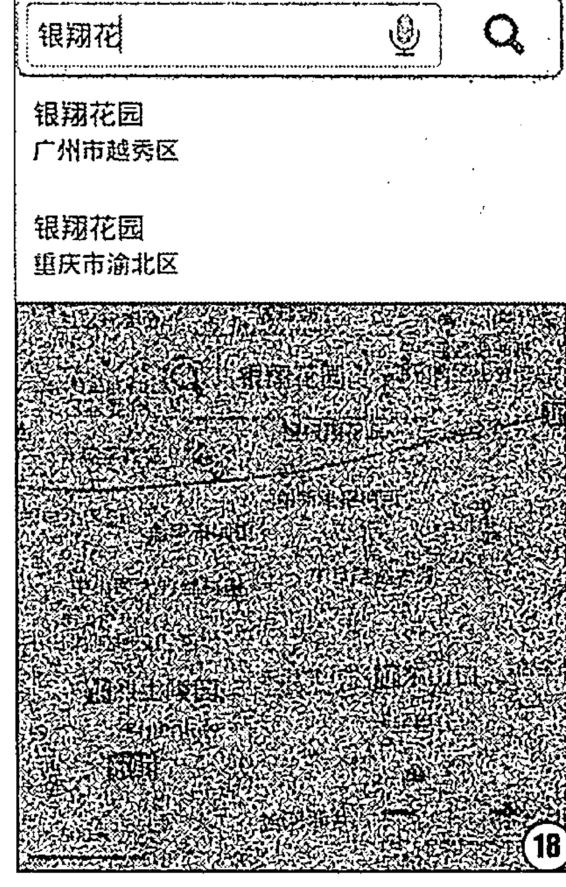

13:00 到达广州。一到目的地入住宾馆后，我立马准备去拜访客户。这次拜访的是新开发的客户，出发之前当然要熟悉一下对方公司的位置了。在平板上启动百度地图后在搜索框输入客户公司地址进行搜索即可（图18）。

14:25 赶往公司客户的路上。我才坐上公车不一会，手机就响了，原来是山东的客户来电告知，他的电子合同已经发到我的邮箱了，要我立即查看并告知结果。平板收邮件，小意思了，因为我早在家里就设置好了邮件收发客户端。下面以163邮箱设置为例。

1. 点击“九宫格→所有程序→邮件”，打开邮件客户端后点击菜单按钮，在弹出的菜单点击“账户列表”。然后在弹出的窗口选择“新建账户”，打开新建账户向导，点击“其他（POP3/IMAP）”。剩余的操作和电脑上一致，按提示设置好163邮箱的发送和接收服务器设置即可（图19）。
2. 完成账户的设置后，以后我们只要激活邮件程序，程序就会自动将163邮箱的邮件下载到平板上。点击需要查看的邮件，我们在平板上就可以浏览收到的新邮件了，点击“回复”可以回复邮件，点击“菜单→新建”则可以新建邮件，前后不到5分钟就看完客户邮件并完成回复（图20）。

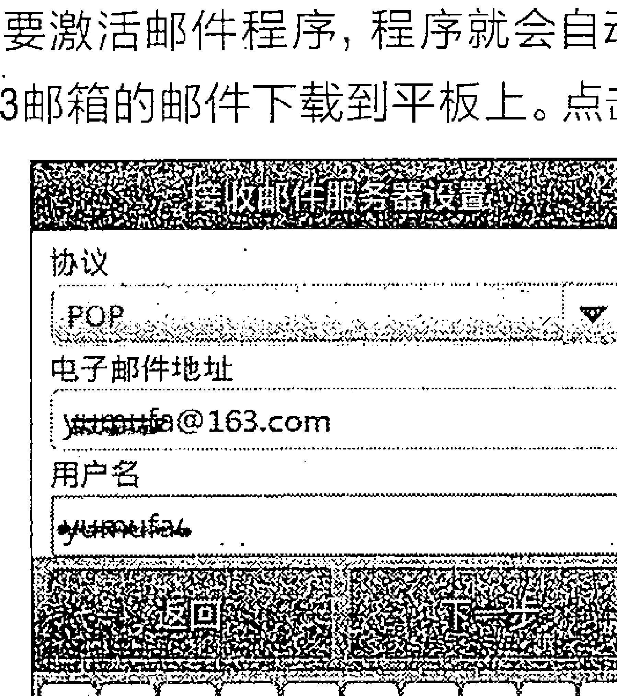

15:00 到达客户公司。由于之前产品详细情况已经和客户沟通，这次我到广州来主要是和对方公司的林总敲定合同细节。林总公司可是大客户，谈判可不能马虎，为了记录整个谈判过程，我使用的是会议助手（下载地址：http://goo.gl/jnAMc）。

1. 在平板上启动程序后，点击“中文”切换到中文输入，然后生成一个谈判记录，接着点击“开始会议记录”，启动会议记录后，点击“录音”开始录制谈判过程。因为是全程录音，不用管它，让机器自动录音。偶尔遇到要简单做记录的，可以直接用手写，比输入要迅速，用左边笔的图标，就可以用手指在屏幕上输入了，这可是原迹录入（图21）。
2. 谈判完成后，点击右边第二个图标（扳手图标），记录谈判会议名称、会议地点等信息。会议时间是自动生成的，不必输入，点击保存图标，该会议记录就完成了。以后要查看以前的会议记录，只需进入“查看历史记录”，想看图片信息，就点击图片缩略图。想听录音，就点击声音图标。这样多的信息都在一个记录中，非常方便回到公司后查询（图22）。

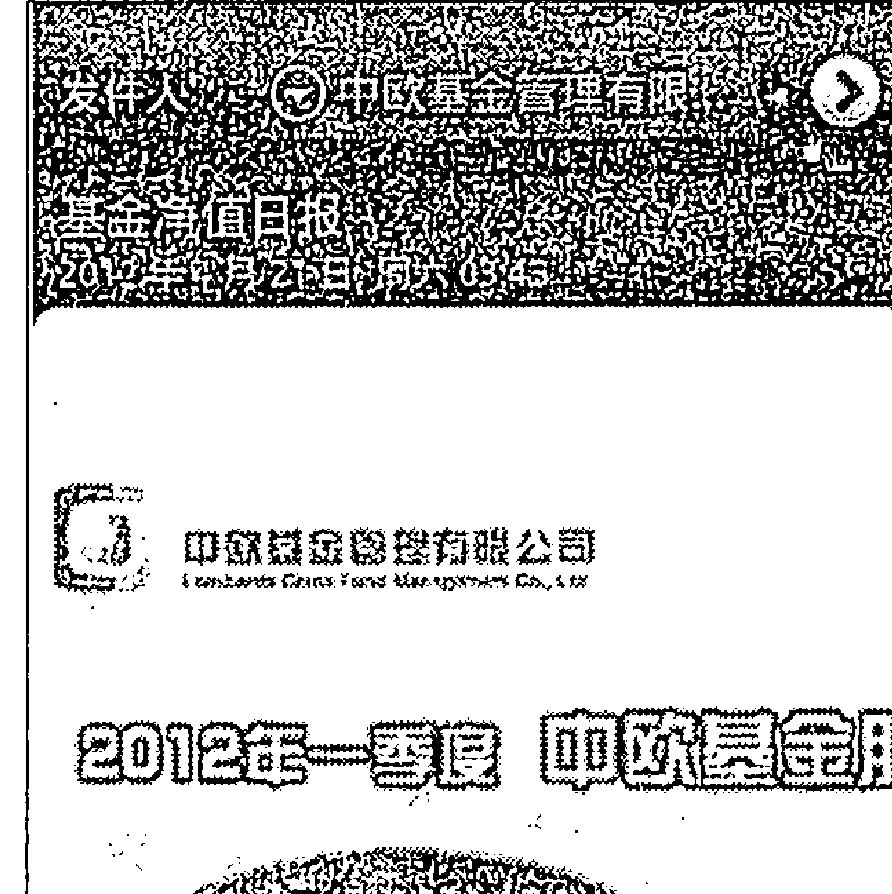

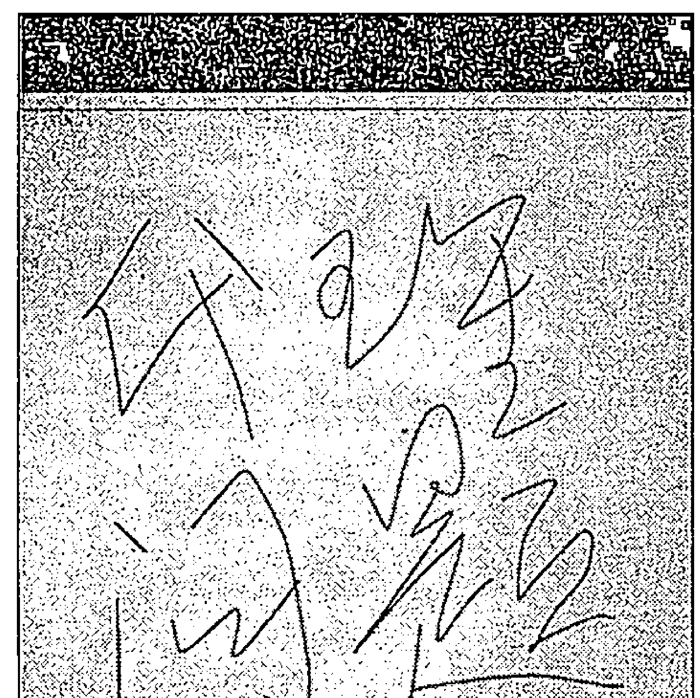

## 支点 解放双手 平放立起来
Android平板电脑基本都支持OTG功能，可以通过机身上的USB接口（可能需要转接头）与键盘、鼠标、U盘和无线上网卡等USB外设互联。此外，不少中高端产品还会支持蓝牙功能，可以同时使用多种蓝牙外设，弥补了平板电脑扩展性不足的缺陷。此外，在使用外置鼠标键盘操作平板电脑时，我们当然希望平板电脑的屏幕可以“立起来”，解放双手以获得最佳的观看角度，此时平板电脑支架就派上用场了。比如埃普UP-4，只要有一个平面就能为我们提供一个倾心的角度。

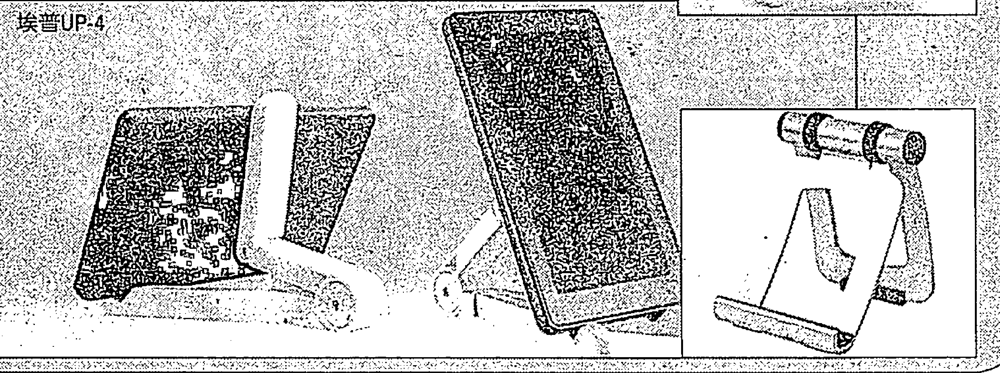

CFanBoundEdition · 2012

## 用好电容触控笔事半功倍
在很多应用中，用手指操作平板电脑还是不够方便，比如绘画、原笔迹手写软件中，粗大的手指很难确保精准的定位。此时，如果你能配备一根电容式触控笔，一切自能迎刃而解。
电容触控笔的笔尖主要以导电的泡棉或导电塑胶为主，以模拟真实手指接触到屏幕的感觉。需要注意的是，笔尖越粗（触控面积越大）会导致精准度越低，比如你想点击屏幕边角的某个按钮时常会有误差。笔尖越细精准度越高，但由于导电体积太小则会导致触控的灵敏度有所下降，反映出来就是按住才会有反应，急性子用不了啊。以上两种触控笔市场上很容易买到，价格从十几元到数百元不等。对平板电脑用户而言，笔尖相对粗一些的产品在使用上的感觉会更理想。

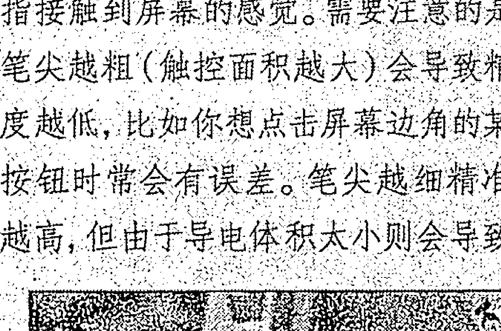

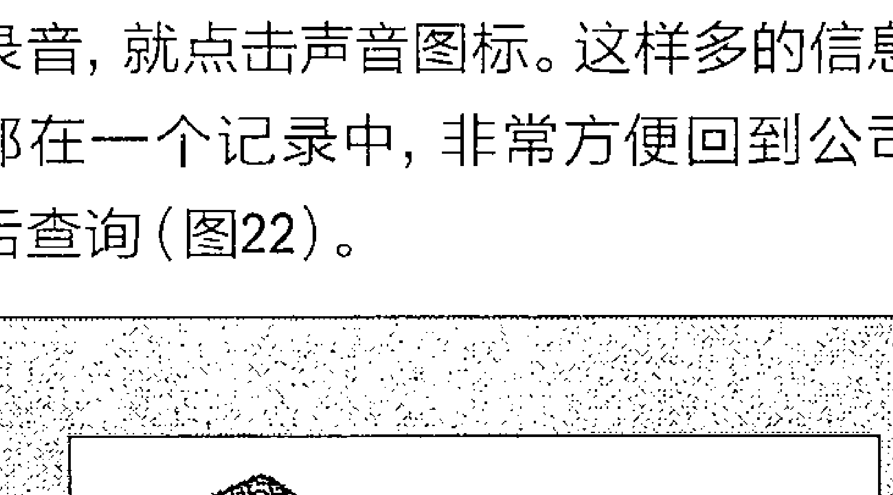

| 项目 | 内容 |
| :--- | :--- |
| 会议时间 | 2012-05-19 22:38:22 |
| 会议名称 | 和林总的谈判 |
| 地点 |  |
| 主持人 |  |
| 与会人 |  |
| 记录人 |  |
| 会议内容 |  |

16:00 使用QQ视频展示新产品。完成谈判后，我给林总又介绍了一款公司的新产品，林总颇感兴趣，提出能否看看产品的操作视频。不过这款产品的技术性比较复杂，我只能求助公司技术部的刘总来演示。视频的演示利用QQ视频聊天最简单了，QQ2012支持语音视频聊天，这样刘总在我们公司使用电脑QQ视频进行展示即可。在平板上启动QQ2012，在好友列表选中刘总的QQ，点击“视频”，成功连接后就可以在平板上开始和刘总视频聊天（支持语音），这样刘总在公司进行现场演示，演示的视频就可以同步传输到我的平板上给林总观看。由于支持语音，林总还可以和刘总进行实时的语音交流（图23）。

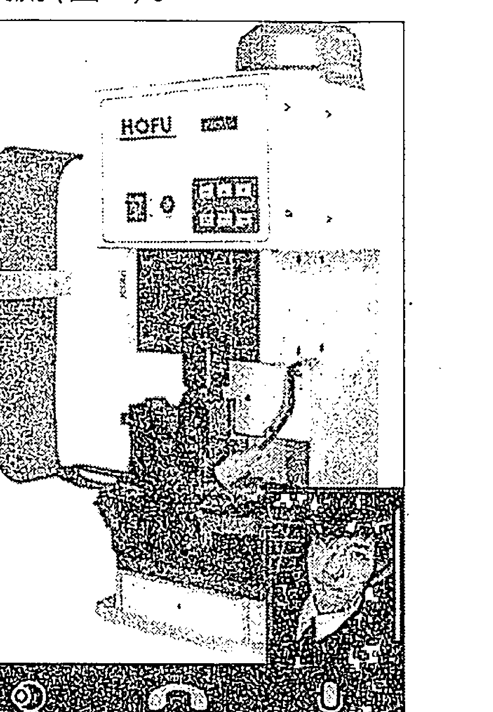

# 周四 天气 阴有小雨
工作安排: 到珠海拜会公司老客户

虽然今天下起了小雨，但是我的心情非常不错。因为昨天和林总的谈判非常顺利，到了广东必须到珠海拜会一下原来的老客户，昨天在宾馆就使用平板订好了到珠海的车票和宾馆。

9:00 赶往珠海的路上。在车上，忽然想起了公司最近严格财务纪律，对出差费用控制比较严格。我得及时用“随手记”控制出差费用。

1. 在平板上启动程序后，点击“预算”，输入公司规定的预算7000（即1个月7000元）。接着点击“设置→支出类别”，自己动手增加了一些如“招待费”、“餐费”、“交通费”的项目，软件自带的项目很多与实际的项目不符，不要的项目可以删除（也可以直接修改），这些工作几分钟就完成了。

## 3G路由器 无线互联 随时随地上网
如果你的平板电脑不支持OTG，或者不兼容3G上网卡，又该如何实现随时随地的网上冲浪体验呢？这个时候迷你无线3G路由器就能派上用场了。这种设备的大小和名片夹类似，可以轻松塞进口袋和包包里，满足平板电脑在短途外出或是临时性的上网需求。

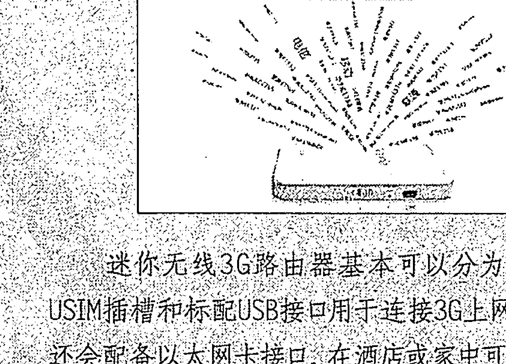

迷你无线3G路由器基本可以分为两大类：内置USIM插槽和标配USB接口用于连接3G上网卡。后者通常还会配备以太网卡接口，在酒店或家中可以连接网线，将有线网转化为WiFi信号，通用性更强，缺点是需要外置供电。笔者倾向选择内置USIM插槽的迷你无线3G路由器，通过内置锂电池供电，一次充电可以持续工作4小时以上，可以同时满足5部左右的设备同时上网。

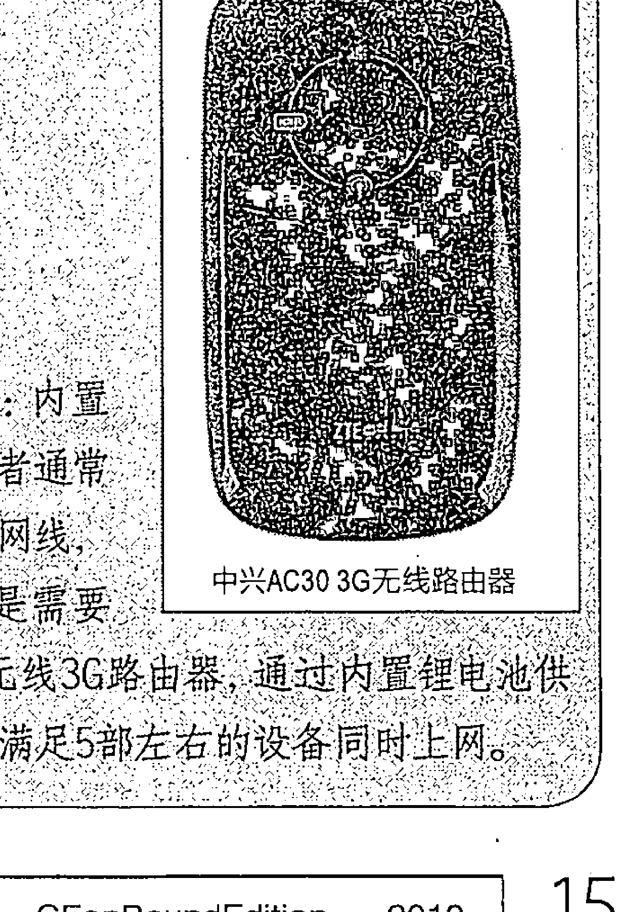

2. 这不，昨天下飞机打车到酒店花了50元，赶快点击“记一笔”，输入金额“50”，选择类型“交通费-公共交通”，账户选择“现金”，点击“保存”，这笔账就记好了。如果一次有多笔账要记，就不要点击“保存”，直接点击“再记一笔”，会自动保存上一笔账，再弹出新的录入窗口，更方便（图24）。

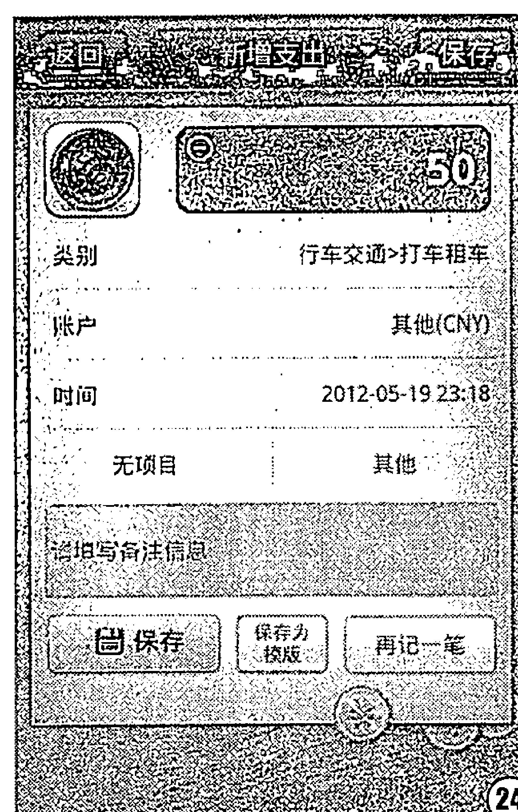

3. 以后如果要查看出差这几天的花费，启动“随手记”，收入总额、支出总额和预算余额一目了然、清清楚楚，随时都可以看到预算余额，这次出差可别再超标了。想了解所有的项目明细，进入“流水”，一笔一笔的账都在这儿。进入“报表”，软件会以饼图（也可选择条形图）的形式显示所有类别的比例，所有的出差账目可谓是一清二楚（图25）。

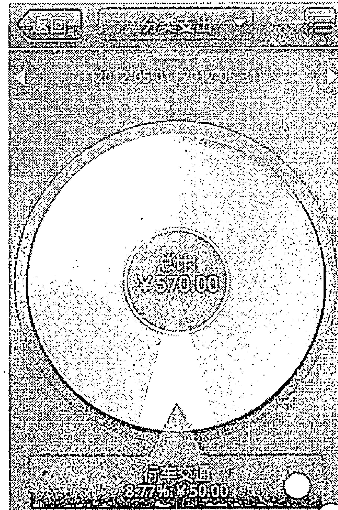

10:00 到达珠海。一到珠海我就马不停蹄赶到老客户的公司，一见面黄总就向我诉苦。由于我的公司前段时间产品出了一些瑕疵，导致黄总公司有一些退货、换货，中间业务比较混乱。幸好平板上安装了有道笔记。

1. 在平板启动有道笔记，在“有道笔记”的“设置”里选择“自动同步”，这样无论身在何处，用什么设备都可以看到全部的备忘录。当然，为了节省流量，可以勾选“仅在WiFi连接时自动同步”。听完黄总的诉苦，我在有道笔记点击“新建笔记”，记下退货、换货的标题和内容。
2. 新的备忘录记录好了之后，我只要将备忘录同步，这样回到公司点击一下同步即可。由于这是云笔记，在任意电脑进入网址http://note.youdao.com/，输入自己的账户和密码，即可查看和修改所有备忘录。

**小提示**
如果有很备忘录，想查找其中某一个的时候，就点击右上角的那个搜索按钮，输入要查找笔记的关键词，该笔记很快就会被搜索出来。

**ThinkPad Tablet (16GB版)**
**价格：2299元**
ThinkPad Tablet采用NVIDIA Tegra 2处理器，结合1GB内存可以保证绝对的系统流畅性。该产品在机身上提供了标准的USB接口，可以直接读取U盘，连接无线键鼠等USB外设，通过MiniHDMI也可方便地将机器内的PPT演示在外接的显示设备上，还有专用的扩展坞可选，高配的版本更有自带键盘的专用皮套。而ThinkPad Tablet的另一大特色是标配触控笔，通过内置的Notes Mobile软件可以实现真实笔迹的保存，还可以实现由笔迹向电子文本的自动转换。

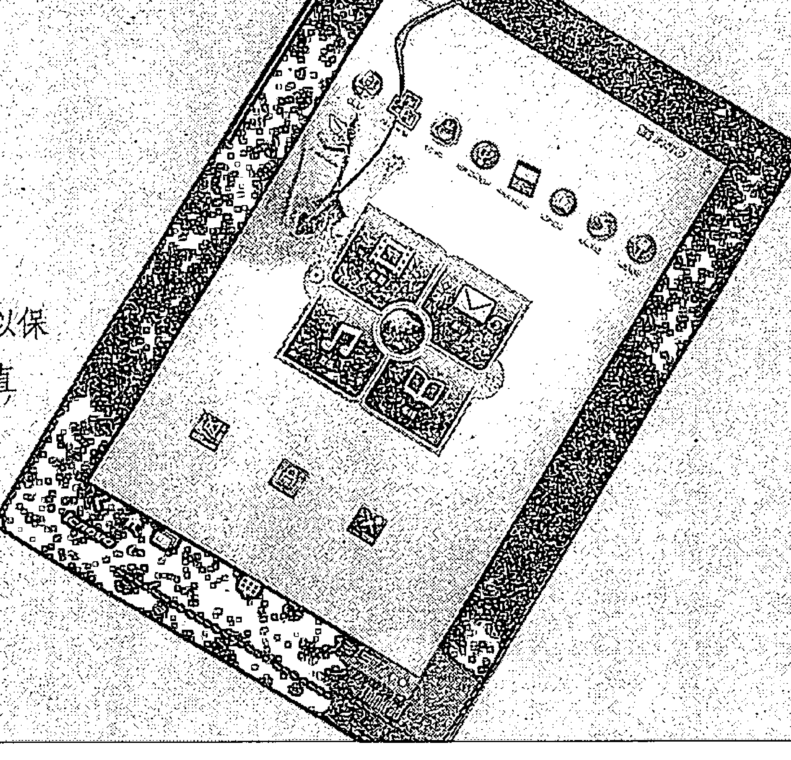

# 周五 天气 晴
工作安排：出差归来，向老总汇报工作并对下一步销售工作进行安排

出差两天，公司的事情繁多，我得立刻赶回公司，周五一上班就带着平板向老总汇报此次出差之行。

8:00 老总办公室。老总正在办公室等我汇报，我掏出平板正准备将保存在平板上的合同文档给老总看。糟糕，昨天晚上我是在家里台式机上整理资料，由于时间太迟了没有及时将资料传输到平板上。幸好我平时的文档是保存在金山快盘，它可以将快盘文档自动同步到平板上。

1. 家里使用的一般是Word，单击“工具→选项”，在弹出的窗口切换到“文件位置”，将文档的保存位置设置为“快盘”目录，这样保存的Word文档就会被快盘自动同步，Excel设置类似（图26）。
2. 这样无论在何时何地，联机上网后在平板上启动金山Office（已集成快盘客户端），点击“文件打开图标→金山快盘”，按提示输入自己快盘账号和密码登录，接着打开“我的文档”，一下就找到合同订单文档（图27）。
3. 点击需要下载的合同文档，它会自动将文档保存到平板上的SD卡目录下，然后直接使用平板上的金山Office打开即可。金山Office的文档编辑功能强大而且免费，具体的使用和PC端的WPS类似。比如需要对特定的语句加粗、更改字体颜色。长按并向后拖动选中需要编辑的语句，然后点击常用工具的“字体”，继续点击“加粗”和“字体颜色”进行设置即可，其他诸如插入图片、表格的操作类似（图28）。


**小提示**
由于平板的屏幕较小，而且不支持鼠标的操作，对文档精确的定位较不容易，建议使用触摸笔进行操作。

4. 平板金山Office同样支持将文档保存在快盘，只要在选择保存位置时选择“金山快盘”，这样平板上所有工作文档都会自动保存在快盘，方便我们在公司、家中电脑上都可以在线访问，而且会自动同步到台式机上的快盘目录中（图29）。

14:00 整理文档。屈指算来，平板已经使用1个多月，平板上保存的各种资料着实不少。这个周五下午，我决定抽个时间好好对近期的文档作个规范整理。借助知识管理软件Wiz，管理平板文档就简单、高效多了（下载地址：http://www.wiz.cn/download）。


Wiz可以作为本地文档管理软件也可以作为网络硬盘使用，方便用户随时随地调取文档。比如我经常在家中还要加班，所以Wiz网络同步管理文档很好用。不过为了做到能够准确搜索各种文档，提前将资料扫描进Wiz做成索引就成为第一要务了。由于很多资料还是保存在电脑上，因此我需要先使用Wiz的PC端对文件进行整理。

1. 电脑端设置。在电脑上启动程序后选择“导入文件”，接着在弹出的“导入文件”对话框中找到自己保存资料的文件夹，点选“包含子文件夹”复选框，设置好后资料文件夹下属所有子文件夹和文档列入下方的明细框中，确认无误后就可以静候Wiz自动导入快速索引中（图30）。


2. 以后如果要在平板上使用Wiz查找文档，和使用QQ一样，打开Wiz的Android手机版客户端，登录自己的账户。打开“近期文档”，经过网络同步即可在平板上快速管理上述在PC中已经制作好的文档索引和文件（图31）。


> 小提示
许多功能强大的软件都有平板端和PC端，如果要对大量的文件进行管理，由于平板上的触摸操作效率并不高，强烈建议在电脑上完成编辑操作，然后利用软件的同步功能自动同步到平板上，仅在平板上进行少量的整理和编辑操作，以提高办公效率。

### 华为MediaPad 3G版
价格：2499元
华为MediaPad是一款主打“小、轻、清、快”的平板电脑，机身采用一体化铝合金工艺制作，就做工而言堪比苹果iPad。7英寸的高清IPS屏幕，分辨率达到了1280×800像素，显示效果清晰细腻。130万像素的前置摄像头和一枚500万像素的后置摄像头更可保证视频聊天和拍照时的效果。目前Android 4.0系统的升级固件新加入了Windows Share功能，客户只需在WiFi环境中，就能与搭载Windows的PC完成连接，进行无障碍传输、编辑和运行电脑中的共享文件。


## 平板办公优劣势一览表

| 优势 | 劣势 |
| :--- | :--- |
| 方便携带，重量轻，续航能力强 | 屏幕略小，支持3G网络不够丰富，只支持主流3G上网卡 |
| 支持手写、多点触摸 | 大多无键盘，不方便大容量文字输入 |
| 安卓平台可以下载到绝大多数办公所需的软件 | 和PC相比，扩展性略为逊色，比如很多办公软件只有简版功能 |

结论: 并不能完全替代PC，但是作为移动办公辅助设备还是合适的

## 平板办公的优劣总结
购买了平板一月有余，平板确实给我日常的公务带来了极大的便利。不过“术业有专攻”，平板并不能完全替代电脑作为办公的主要工具。
从上面的实例大家也可以看到，平板上很多操作并不能完全脱离电脑。电脑的操作高效而且功能强大，但是携带不方便；平板的优势则在于灵巧和便携性，但是功能还是较为薄弱，只是适合一些简单的展示和文档的编辑。但把电脑的强大功能（利用同步实现）和平板的便携结合起来，平板就能为我们的办公带来极大的便利。上面的表格是我根据自己的使用体验对平板办公的优势和劣势做的对比，方便读者们自行选择判断，看看平板办公到底给不给力。


## 微博早该这么玩

现在对很多人而言，上班微博、下班微博、吃饭微博、马桶微博、临睡前微博……短短两三年间，微博正以它特有的魅力渗透进我们的生活。

作为一个吸引粉丝关注的新型社会化平台，微博用140字、图片、视频的表达方式让人们熟知。如果把微博认为是一种新型媒体，那么抱着提交文章、发博客的旧思路去玩微博，效果必定与当初的预想南辕北辙。与此同时，当尝鲜心理渐渐淡去时，人们玩微博的动机正在呈现多样化的趋势——维护人际关系、新型交友平台、创业、找工作、找对象、求婚……

对多数人而言，这是一个熟悉的平台，但又有所不了解的方方面面，本期专题将带你深度走进微博。

策划|《电脑爱好者》编辑部 监制|郭娟 撰稿|秋实 周建峰 沧海 桂荣

# 微博达人如何炼成 ——李开复PK王弘张

你想让你的微博粉丝快速增长吗？清晰的内容定位当然必不可少，写好引人关注的微博内容也是主要因素，增加粉丝应该运用“四五一五法则”……一句话，玩微博有规律，这些所谓的规律不是束缚自由的条条款款，而是类似于打游戏的“通关秘籍”，同时，与那些深奥的规律相比，玩微博的规律也姓“微”：门槛低，人人能学。

## 如何锤炼140字？

如果你想成为一个微博达人，那么就先来学习下微博高手们是怎么玩微博的吧！本刊邀请两位在玩转微博方面有心得的专家级人物来PK一下，希望读者能从他们对于玩微博方法的异同中找到属于你自己的玩微博的规律。

李开复：一般来说，微博的内容包括开头、中间、结尾三个部分。

正如每篇新闻都要有凝练、醒目、吸引人注意的导语一样，微博开头第一句话就是微博的导语。微博的开头第一句话非常重要，要足够吸引人，在需要的场合，甚至可以有点儿劲爆和煽情。

微博的最后一句话也很重要，可以用一些醒目的字眼再次点题，也可以写一句互动的话，抛出问题让大家思考，或者诱导大家转发和评论。

微博的中间尽量表述得有条理。

曾经有人找我转发一条微博，它的原文是这样的：

> “某某商会的‘未来科技商业领袖摇篮计划’，是一个紧密联结科技商业界资深人士和创业家，促成双方在较长时期内进行有效交流和沟通，以帮助和推动创业家最终成功的项目。摇篮计划将充分整合科技商业界资深人士的经验和资源，由他们担任导师，以一对一的辅导方式，帮助、引领进入摇篮计划的创业家，增大这些创业家未来成功的可能性。”

这则微博除了字数符合要求，没有一条符合微博这种新文体的要求，它枯燥乏味，没有可读性，毫无条理，更不具备广泛传播的潜质，因此，这则微博在被转发时进行了修改：

> “想冯仑做你的创业导师吗？请登录某网站申请摇篮计划。摇篮计划是促进年轻企业家成长的公益项目。三家上市企业是完美时空、海兰信、德鑫泉，未来将有数家。摇篮导师有冯仑、李开复、雷军、张亚勤、田涛等。在这个由商业精英和创业者组成的公益组织内，传承精英商业智慧、造就未来商业领袖。”

撇开我个人的名人效应不说，改造后微博的传播效果显然优于改造前，文风轻松活泼、有亲和力，从可读性上就优于前面那一则枯燥的商品介绍。

嘉宾1：李开复
创新工场创办人、CEO。

微博地址：http://t.sina.com.cn/kaifulee
http://t.qq.com/kaifulee

嘉宾2：王弘张
微博名：@王者归来
新浪百万名博，对微博等社会化媒体有一定的见解和研究。

微博地址：http://weibo.com/418021861

王弘张: 微博第一句话很重要，应该注意活用#关键词#，你想说什么，通过这个功能使大家一目了然。

其次，微博的中间部分的质量决定了微博内容的好坏，有三个技巧：
1. 使用1、2、3等编号，清晰阐述自己的观点。
2. 注意措辞。如你在微博上写了“我今天吃了午饭”，这样的微博当然大家不会关注。若修改一下表达方式，就会立即让这句话生动起来: 今天和某位MM/GG一起去海底捞吃火锅，那里的服务和传说中一样好。
3. 在微博里有@功能，要善于运用。因为有些话题是你所不擅长的，需要与别人一起探讨，需要注意的是，@点名的人数不宜超过10人，一般控制在3~5人为好。
最后，结尾用一个疑问句或者反问句会有比较不错的效果。

## 发微博一定要加上图片吗？

李开复: 图片至关重要，新浪、腾讯微博与Twitter的区别在于图文并茂。这里有两种图文并茂的发微博的方式：
一种是文字为主的微博，在发布时附带张图片，效果会更好。
还有一种图文并茂的微博，那就是以图为主，这时，文字一定要简短有力，点题、煽情，只要吸引读者看图即可达到目的。

## 小技巧

搜图时假如你的英文还不错，还在使用谷歌作为搜图工具，关键词选择英文将会有令人惊讶的图片。

王弘张: 一条好的微博需要图文并茂，有时一张好的图片、一段好的视频能为微博增光。那么如何选择图片或者视频呢？
首先，图片或者视频必须迎合文字的主题，与文字相符。
其次，微博140字的空间有限，有时为了弥补表达的不足，需要图片、视频和链接更深层次的参与，让粉丝进一步了解微博的内容。

## 对于零粉丝用户，吸引粉丝关注有哪些方法和技巧？

李开复: 在个人微博上，仅仅写好内容未必能够吸引粉丝关注，如何让更多的粉丝关注，这需要技巧。作为一个零粉丝用户，你必须主动去关注别人，别人才有可能反过来关注你。那么，如何寻找最合适的人来关注呢？

-   1. 利用微博提供的标签和搜索功能，是寻找粉丝的重要方法。这样寻找到的粉丝是与你相似的人，比如你是个宅女，搜“宅”字可以得到一批粉丝；你喜欢美剧，搜索“美剧”，就可以看到哪些人正在微博中讨论美剧。
然后，可以从搜索结果中进入每个微博主的主页，看看他们的昵称、头像、简介和微博，找出其中你最感兴趣的微博主，开始关注。如果被关注的人通过微博提醒发现你开始关注他，那么，他也会反过来浏览你的微博，就很有可能因为兴趣相似而成为你的粉丝。

-   2. 有意去寻找那些最活跃、最愿意关注别人并与别人交流的微博主。这样的微博主，你关注了他们，他们反过来关注你的可能性比较大。那么怎么才能找到这一批活跃的、愿意关注别人的微博主呢？
有一个方法是在热门微博、热门评论中，找那些经常主动评论、主动转发的人，这些人在微博上最活跃。另一个方法是，看一下对方粉丝数量与对方关注数量之间的关系。假设某个人的粉丝数量是50，但他关注的人的数量是500，那说明这个人是个疯狂寻求别人关注的人。无论他是出于什么目的，他都可能比较容易地成为你的第一批粉丝，有助于你后续扩大粉丝的基数。
除了这些粉丝外，那些关注他们的50人很可能也是像你一样刚开始找方向的人。你也不妨去关注这50人，尤其是兴趣和你一致的。

-   3. 一旦关注一批人后，你要在微博上多评论他们的发言，别人才有可能注意到你。礼尚往来，在微博上也是这个道理。如果你经常评论一个人的微博，经常夸奖他的语言风趣、内容有价值，那他一定会反过来注意到你，并可能进一步关注你，成为你的粉丝。留言时，不妨多慷慨赞美他们的观点。如果一段时间后，他们还没有关注你，你也可以直接留言请他们关注。

-   4. 在你的个人网站、个人博客等地方给出你的微博主页地址，甚至可以在你的邮件签名、个人名片中写上微博地址。这样，当网友从别的地方认识你时，就很自然顺着链接找到你的微博。

-   5. 在增加粉丝的初级阶段，保持每天发几条吸引人的微博。这样，每天新来的网友，就不会因为新鲜出色内容太少而丧失对你的兴趣。要理解，大部分人在关注一个人之前，会先看看他的首页，也就是最新发的十条左右的微博。所以，你要尽量保持在任何时候，你的最新微博都有足够的吸引力。反响好的微博可以隔几天再用转发自己并加新评论的方式重新发一次，因为初期来看你微博的人很不固定，新来的人有可能错过以前的精彩内容。

-   6. 初期尽量看看微博上与你同类的人，你正在关注的人都在讨论什么话题，尽量写些类似话题的微博。这样，他们来到你的微博主页后，就很容易产生共鸣，进而成为你的粉丝。
只要内容好，又有一定数量的第一批粉丝，那么你的微博就有可能被粉丝们转发和评论，并进而吸引更多的粉丝关注，一旦形成滚雪球的效应，你的粉丝就会自然而然地增长。

王弘张：如果你刚刚开通微博，正为增加粉丝发愁，我可以告诉你一个技巧，那就是“四五一五法则”，也就是“关注400人，获得500粉丝，体验100小时，某条获得50条以上转发。”
对于粉丝人数为零的人来说，若想获得他人的关注需要采取“互粉”的方式，我建议前100~200名粉丝基本依靠这种方法获得，可以利用标签进行搜索找到志同道合的粉丝。
按照搜索的方法关注400人并不是特别难的事，如何获得500粉丝就取决于100小时的体验。这100小时是一个最基本的时间，在这段时间的体验里，主要是针对如何使自己的微博变得更生动、有趣，如何获得更多粉丝的转发和评论。当你有某条微博获得50条转发量后，意味着你有了一条质量比较高的微博，这也是增加粉丝的方法。
根据很多研究微博的数据显示，一条微博转发超过50次以上就可以带来1~2个粉丝的增长。高质量的微博使更多的人发现你的价值，自然会关注你，成为你的粉丝。

## 如果我的粉丝上百后，该如何进一步增加粉丝数量？

李开复：要把你的粉丝数量从100提升到1000，甚至更高，仅仅靠交换关注是不够的，这时，最有效的方法是耐心地请那些粉丝数众多的微博主，帮你转发和推介。
哪些人适合帮你推介？

-   1. 好朋友、有共同话题的人、个性相似的人、微博上与你互动良好的人、非常热情愿意帮人做转发和推荐的人。
-   2. 找到人气高的、可能帮助你推介的微博主后，先准备一条或几条你认为写得很好、足以吸引人目光的微博。然后，可以通过留言或私信的方式直接告诉人气高的微博主，你希望他们帮忙转发和推荐。当然，留言和私信中，不要只是恳求别人推介，而要给人一个理由。比如“能帮忙转发我的微博吗？我想，我关于iPad未来的分析对你的粉丝可能很有帮助”、“请帮忙转发，我热爱摄影，想通过照片与更多摄影爱好者成为朋友。”
-   3. 如果不直接留言、私信，那也可以在你的微博或评论中，用@提及他们的名字，引起他们的注意。

王弘张：刚才我说过吸引微博粉丝的“四五一五法则”，如果你完成了这一法则的运用，也意味着微博的“瓶颈期”顺利度过。接下来该如何获得更多的粉丝呢？有两条技巧：

-   1. 进一步提高微博的质量，获得更多人的“围观”，保持与粉丝的互动，留住现有的粉丝，获得新的粉丝。
-   2. 有必要建立自己的“品牌微博”，适当“包装”自己的微博，如参加一些公益活动、参加爱心行动等。

## 最佳发微博的时间是什么？

李开复：工作日：9:30~12:00，15:30~17:30，20:30~23:30。
周末：上午少发，下午和晚上可多发点。
可以利用节假日效应：每逢节假日，微博上的粉丝们往往会关注一些特定的话题，并大规模地转发某些特定内容。例如，端午节前后，大家会大规模在微博上互致端午问候，并大量转发与端午相关的笑话、段子、图片、故事……

王弘张：其实微博的高峰值往往出现在这三个时间段：10:00~12:00，16:00~18:00，22:00~24:00，这几个时段是发微博的黄金时间。
工作日和周末微博时段也有不同，工作日集中在上午和晚上，周末和节假日基本上集中在下午和晚上，微博的活跃度较高。

## 发微博的频率该如何控制？

李开复：除了发微博的时间段以外，发微博的频率也是一个值得思考的因素。

首先，作为一个尽职的微博主，最好能天天发微博，别让粉丝忘了你。但是，一天发的微博数量过多，会在粉丝看到的页面上，造成刷屏的现象，引起大家的反感。而且，数量多了，微博的质量也会下降。因此保持一天10~15条，这是一个比较合适的频率。

另外，每天不同时段的微博数量尽量均衡，比如每天早上、下午、晚上各发3~5条。

每条微博之间，最好间隔一定的时间再发，相隔20分钟左右，或者更长时间。因为读者在某个时间看到你发的多条微博时，通常只会阅读最新的一两条，而忽视之前的微博。

总的来说，发微博的原则是“宁缺毋滥”。

## 转发微博有哪些技巧？

李开复：在微博平台上，相互转发是扩大影响力、加速微博内容传播、吸引粉丝关注的重要手段。从这个意义上来说，转发是群体智慧的表现，正如前面说过的那样，写微博时，我的角色是记者，而转发微博时，我的角色是编辑。因此，转发微博也是一种技能。

-   1. 慎重挑选转发内容。转发在事实上表示该内容得到了你的认可，也代表了你的品位，不慎重使用转发，不但会失去粉丝，更会伤害你自己的信誉。
-   2. 微博是个性化的平台，内容还是应以原创为主，转发不要超过自己微博数量的一半。
-   3. 转发时尽量增加自己的简短评论，或从转发的内容里挑一句经典的话，这样，你自己才会被大家关注。
-   4. 自己转发自己：对于自己发出的比较受欢迎的微博，几个小时后可以加一句话或者加一个问题，通过转发的方式再发一遍。而看过第一条微博的人，也可以从第二次转发中找到新的信息内容。

王弘张：微博上适当的转发还是需要的，尤其是对于一些热门微博的转发，用一两句话表达你的看法就好，促使粉丝的及时互动，这点还是很重要的。

还有值得一提的是，目前由于微博每天信息量很多，有时候需要自己转发自己的，可能某条微博帖子在第一次传播没有火，于是经过第二次传播，诱导二次转发，重新让微博帖子火起来。

## 如何与粉丝互动？

王弘张：发微博不宜太频繁，最好控制在20分钟到一小时一条为佳，一天的微博数量控制在10~20条。发微博过于集中，常常会被认为是在“刷屏”，这影响到你的粉丝体验。对于新手来说，少发质量差的微博。

李开复：微博上的互动类型有很多种，通常包括解释和说明、提问和回答、征集意见、发起话题讨论、不同观点的辩论、发起投票、有奖竞答或竞猜等。做到这些互动应该注意以下几点：

-   1. 在写微博时，微博内容可以适当留出扩展、发挥的余地，给别人接续话题的空间，或者再创造的欲望，不要写成所谓死帖。
-   2. 有的微博最后可以用一句话问个问题，这样就很容易引起大家的兴趣，使大家参与讨论。
-   3. 要保持互动时的风度。不要生气，不要鄙视别人。尽量不要删除别人的评论，纯粹恶意评论可以删除，出言不逊、态度恶劣的网友则可以考虑屏蔽他，但要谨慎处理。

王弘张：微博的粉丝互动必须放下身段，如果你有足够的时间，及时与粉丝互动，像好朋友那样对待你的粉丝，保持说话的分寸，不要鄙视别人，不要骂脏话。

## 各有所长 微博辅助工具不少

玩转微博，除了了解必要的技巧外，第三方工具的帮助必不可少。的确，140字的魅力不可抵挡，但在某些时候，140字又不够讲完一件复杂的事情，这时会不会想到要突破140字的上限？想更新自己的微博，可正巧有事外出，能否借助别的工具将内容预先设置，到时候自动广播？你是否同时有两到三个微博，你需要逐个打开，重复发布一条微博…… 这些在微博第三方工具那里都不是问题，这些工具的出现，让你玩微博时有更完美的表现。

小提示 第三方微博工具的使用虽然帮你解决了上述问题，但是一旦时间充裕了，不要忘记上微博去与你的粉丝们互动哦。

## 文本转图片 字数再多也不怕

微博从诞生那天起，可能是为了体现其“微”的特性，字数限制为140个，尽管有些微博（如腾讯、饭否）在字数超过140个之后会自动截断，但是不可否认140字是一个“坎”。那么当微博字数超过140个后，该怎么办呢？目前常用的方法就是将文字转换成图片，再发布到微博上。其实有时图文并茂的微博，往往能够吸引更多人关注。

### 1.简单好用的长微博

打开“长微博”（http://www.changweibo.com），可以看到一个类似Word的主界面（图1），输入文字后可以设置字体、颜色等，可以直接粘贴文本，还可以插入表格等，完成后单击“转换为图片”按钮，即可将当前文本转换成图片，单击“预览图片”按钮可查看效果图，最后单击“下载图片”保存当前照片，再发到自己的微博。

### 2.功能齐全的图微博

图微博比长微博的功能更加齐全，它能够编辑大小标题，可以在文字中插入最多5张图片。打开“图微博”（http://sunchateau.com/twb），根据页面上的提示输入微博内容（图2），单击“转换图片”按钮即可生成图片微博，此时还可以直接将图片发布到新浪微博或腾讯微博。

### 3.挖掘微博客户端的潜能

现在的微博客户端都有抓图功能，我们可以在一些软件中排版好大段的文字，然后使用微博客户端（如QQ客户端）的截图功能，直接抓取排版好的图文（图3），最后发布到微博上。

### 4.手机上发送长微博

常用手机发微博的朋友该怎么办呢？其实很简单，只要在手机上安装“长微博”客户端就能解决问题，在手机软件市场中搜索“长微博”即可下载安装。打开长微博（图4），切换到“设置”选项，可修改图片的宽度、背景颜色等，切换到“写微博”选项，可以撰写微博内容，然后选择“保存”选项将微博内容保存为图片，最后再在手机上将图片发布到微博上即可。

## 特定时间 让微博自动广播

由于特殊的需求，我们需要在特定的时间发送微博，如女友生日到来的那一刻，总不能为了发个祝福微博等到凌晨吧，这就需要使用“定时广播微博”。

### 1.定时广播新浪微博

打开“微博定时发送器”（http://...## 无需重复 多个微博同步更新

现在很多人拥有多个微博，更新时可能就需要进行重复劳动了，同一个内容在这个微博上发布了，还需要再在其他微博上发布，久而久之，浪费的时间肯定不会少。此时我们就可以借助微博工具，实现多个微博同步更新。

## 1. 多微博同步平台

玛撒网 (http://www.masar.cn) 是一个多微博聚合平台，可以用腾讯微博、新浪微博等账号登录并授权，然后单击“绑定账号”绑定其他的微博 (图8)。绑定后单击“我的主页”按钮可输入微博内容，单击“发布到”按钮可以选择要发布到哪些微博中，非常方便。


## 2. 定时自动更新多个微博

打开“微博保姆” (http://www.weibaomu.net)，用自己的微博账号登录并授权，可以是腾讯微博、新浪微博、搜狐微博等，切换到“微博同步”选项，单击“更多捆绑”按钮，使用其他微博登录并授权。完成设置后切换到“定时发送”选项 (图9)，输入微博内容，在后面选择要同步发布的微博，单击“立即发送”按钮，即可将同一内容同时广播到多个微博。


## 3. 手机也能批量玩微博

手机上批量发布也很便利，只要装个“追微博”客户端就能实现，打开追微博 (图10)，选择“绑定微博”可以绑定新浪微博、搜狐微博等账号，选择“发微博”就可以在手机上对绑定的微博进行广播。同类软件还有“微博助手”，简单易用，支持腾讯微博、人人网等，捆绑后输入微博内容，选择“群发”即可批量广播微博。


在微博蓬勃发展的今天，类似的微博辅助工具和网站还有很多，我们只要根据需求进行搜索，通常会获取很多的相关信息，这些工具或网站使用也非常简单，即使是菜鸟也能轻松上手。相信在微博日益普及的今天，微博辅助工具也会迎来其发展的明媚春天。

## 2. 月光宝盒 腾讯微博好帮手

打开“月光宝盒” (http://box.ci123.com)，单击“月光宝盒定时器”下的“马上进入”按钮，用自己的腾讯微博账号登录并授权 (图6)，在这里输入微博内容，插入视频、音乐等，在“定时发送”中设定定时广播微博的时间，最后单击“发布微博”按钮添加定时微博。单击“批量发布广播”按钮还可以一次性添加多条定时微博。在“定时转播”中可以添加关注的微博地址，设置自动转播的时间，这样就能自动定时转播设定微博。


## 3. 手机也能定时发微博

同样在手机上也能定时发微博，只要在手机上打开“皮皮时光机”网站，用腾讯微博账号登录 (图7)，输入微博内容后设定自动广播时间，最后单击“定时发送”按钮即可。


## 微博改变了我们

无论现在你是否掌握了诸多玩微博的技巧，或者还是处于随意发微博的状态，不可否认的是，微博已经参与了我们的生活，并在一定程度上改变了我们。

一组数据显示，截至2012年5月，新浪微博用户达到3.24亿，腾讯微博用户为4.25亿。这意味着，抛除那些同时都在玩新浪微博和腾讯微博的用户，在中国近7亿网民中，约有5亿微博用户，其中逾1亿为活跃用户，而且数量还在增长。

对于多数微博用户而言，上班微博、下班微博、吃饭微博、马桶微博、临睡前还要微博……有些人甚至因为一心记挂微博，成了名副其实的微博控。

与此同时，有一部分人已经完全超脱了玩微博的阶段，他们利用微博这个平台直播个人事件、求婚成功、找到工作、创业成功……一起来看看他们的故事。

## “我的小微博覆盖了一个县”

@水森河: 玩微博一年有余，记得那是一个无聊的夜晚，闲来无事，拿起手机随便在网上乱逛，无意中看到一篇文章，讲述Twitter的故事，从那时开始了我的新浪、腾讯微博之旅。

现在几乎每个网站门户都把微博作为标配，我几乎把稍微大一点提供微博功能的站点都注册了一圈，美其名曰，占山头。

真正深入研究是在2012年的年初。注册了几个新浪账号，基本的头像、标签、个性签名和模板等设置后，养号两个月，粉丝接近1500。2012年2月6日临近下班前，突然看到一张很有个性的照片，临时起意，测试一下自己这两个月的成果。于是借来图片，自己配（图1）。

当然一开始少不了自己账号的引导，发布过之后，在临近下班的20多分钟，自己用几个马甲顶了一下，由于马甲的粉丝均接近1500，对二级转发评论起到了一定的带动作用。午夜睡觉前，登录账号看了一下，也就是5个小时后，转发破百，评论也超过了七十。

后来几天由于工作较忙，就把这件事情抛之脑后了。最近登录一看，让我震惊不小。花了半个小时把转发和评论的一些数据做了统计。以1000粉丝以下、1000到10000粉丝之间和10000粉丝以上认证、达人和普通账号的转发和评论数，做了一个统计，大致对有可能接触过此条微博的用户数做一个评估（此方法为本人自创，作为衡量影响人数使用，不具有权威性）（图2）。

|      | 普通 | 达人 | 认证 | 影响人数          |
| :--- | :--- | :--- | :--- | :---------------- |
| 转发（F<1千） | 162  | 47   | 2    | 10.55万（F取500计） |
| 转发（1千<F<1万） | 25   | 24   | 2    | 10.2万（F取2000计） |
| 转发（1万>F） | 4（1个5.6万F） | 6    | 5（1个3.2万F） | 28.3万（F取1.5万计） |
| 总转发      | 191  | 77   | 9    | 49.077万           |
| 评论（F<1千） | 102  | 12   | 1    | 115               |
| 评论（1千<F<1万） | 4    | 9    | 0    | 13                |
| 评论（1万>F） | 0    | 1    | 2    | 3                 |
| 总评论      | 106  | 22   | 3    | 131               |
| 总影响人数    | 约50万 |      |      |                   |

+   1.  F指转发评论微博账户的粉丝数；计算影响人数时，F按统计时账户集中粉丝数计；
    2.  评论微博影响人数按总的评论数计算；
    3.  转发微博影响人数按总的转发数加上转发微博账户的粉丝数合计计算；
    4.  转发和评论时，可能有重复帐号未剔除，此仅供自己测试之用。

从上图可见，接近300次的转发和130次的评论，影响将近覆盖50万的人数，相当于一个大点的县城人口数，可见，微博传播的范围之广，影响人数之多，并且其中有通过认证的名人和微博达人，他们的二次效应是惊人的。


## # 一位“Twitter控”的搞笑自白

我的微博控症状始于2008年6月25日，“测试，测试，是这么用的吗？”这是我发出的第一条微博。一开始，我只是想博得几个朋友的欢笑。那时候我还不知道这个玩意会让我如此沉迷。可没过多久，我就开始每天发表20至30条微博，全周无休。这些微博或搞笑或伤感，有些甚至不免流俗，带些许轻浮，带些许挑逗。

此后三年里，我每天都会发布更新，只有一天例外，也就是我岳父去世的那一天。最后，我吸引了大约25000名粉丝。对于一个普通人来说，这可是个了不起的成绩。

很快我的整个生活都与微博紧紧相连。我停止了阅读，几乎不怎么聆听音乐或是观看电视，一切于我皆为浮云。和朋友外出找乐子时，我都会到洗手间里摆弄着iPhone顾影自怜，开车的时候我发微博，看电影、打网球的时候我也发微博。比如，沉浸在电影剧情的时候我都会偷空发一条“我喜欢在黑暗中握着你的小手”。

即使在我不使用Twitter的时候，我都会琢磨着待会儿该发一点什么我原创的“警世格言”呢？我甚至开始采用“微博体”说话。每小时接着每小时，我日以继夜不眠不休孜孜不倦地发布着微博。

是的，我成了典型的微博控患者。就像任何上瘾的事情一样，它可不会给你带来什么好处。

开始用上Twitter后的第八个月，我便被公司解雇了。经济状况是如此不景气，我找工作的窘迫境遇也就可想而知了。差不多在我晃荡了一年之后，我才在一本男性杂志那里开始了一份新工作。此外，在我开始新工作之前，我把自己的大名从Twitter账号中移除，换成了我的名字缩写L.C.。

几个月以后的一天早上，老板踱进了我的办公室。“我们要好好谈谈关于Twitter的事情”，他说道。

老板提到人事看了我的Twitter，上面一些粗俗不堪的微博违反了公司关于使用社交网络的规定。当时我只有两条出路，要么删掉我的微博，要么滚蛋。想到接下来岌岌可危的日子，而且我还抱着这份工作本来就不怎么样的想法，于是，我决定闪人。

再次失业的日子越发地不好过。可另外一个好处就是，我有更多时间去经营我的微博。当然，也许有人会问，写微博没名没利的，你图个啥呢？在我看来，每一条微博就是一次自我展示的机会，虽然没人知道我是谁，可我也渴望人们的掌声与喝彩。

失业后的一个月里，我便和老婆分居了。我搬出了之前位于纽约长岛的家，住进了Park Slope的一间公寓。一天早上“怨夫”的我发表了一篇微博：“老婆这次算是给我开了一枪，我多么希望自己才是那个扣动扳机的人。”其实，对我来说这只不过是个玩笑。可对我的儿子，它却不只是一句笑话，老婆可是我们两个都爱着的人。他威胁说要取消对我的关注，我只好立马把这条微博给删了。

也许这并非是一个偶然，也正是从这个时候开始，发微博的习惯开始变成了一种负担，而不是喜悦。在那之前，发微博可是我生活的全部啊。不过我还是暂停了Twitter的使用，开始认真地考虑自己是否应该将它戒掉。


我把以前发过的一些旧文重新发布了，因为我觉得新粉丝可能还没看过这些微博。但其实这里面真正的原因是，每一天的自曝，竭尽全力地去琢磨该说点儿什么，或是该如何剖析自己，早已耗光了我的情感，微博确实让我精疲力尽。

一个月之前，我终于决定“自杀”我的微博。有些粉丝力劝我要三思，但更多的人却给了我祝福。我深深地了解，到了该回归真实自我的时候了。

偶尔，我是否还会有想发微博的冲动？我还会思考该如何撰写我的微博吗？我想不想念Twitter上的那些朋友？当然会。有时候，这股冲动让人势不可挡，可我还是克制住了。每天睡觉的时候，在关灯之前我都会先关掉我的iPhone。早上起床后我想到的第一件事情便是冲咖啡，而不是到Twitter上去当话痨。

在我的倒数第二条微博中，我号召大家都去成为我儿子的粉丝。幸运的是，他知道把握好其中的分寸。而且，他也很有搞笑的天赋。假以时日，他长大成熟的时候，一定会比他的老爸强。

## 29条微博直播分娩全程

@染小染: 福州的网友染小染是个微博控，同时她也是个快临盆的孕妇。

5月31日，染小染到医院待产，一直到6月3日报喜，染小染一共发了29条微博。微博中透露出乐观和幽默，引起众多网友的“围观”。

本来以为5月31日孩子就会出生，但是却迟迟没有降临，染小染发出微博：“估计没那么快，大家先散了散了吧”“不晓得宝宝是不是在和我玩‘狼来了’的游戏”“耍花样装‘熟’，或者是在耍大牌。”

接着开始产前阵痛，6月1日凌晨，她发了一条微博，记录下阵痛的时间，还对即将出生的宝宝开玩笑，“不要再胡闹喽，如果今天还不出来明天就要对你动粗喽。”

住院后，同病房的产妇都生了，染小染的心情也紧张了起来。“眼看着五人病房变成了三人，那个同名同姓的‘麻麻’据说做了无痛分娩，估计快生了，祝福她。”她在微博中如此写道。

染小染也不甘示弱，和同病房的几位产妇开始为即将到来的“神圣时刻”做起了准备。“吸完第二次的氧，怂恿了另外两位准妈妈一起爬楼梯去了，三个大肚婆爬楼梯的场面是不是好拉风啊？”

6月2日早上7点多，她发出一条微博后，数小时没有更新，也没有回复朋友们的留言。此时，微博中“围观”的亲朋好友们都明白，小宝宝要来到世界上了。

6月3日凌晨一点多，染小染发出这条微博：“6月2日16:57，宝宝出世，母子平安，‘杨桃’终于‘熟了’。”“杨桃”是染小染的宝宝，小染还顺带发了张宝宝的靓照，引得围观亲友一阵羡慕，收到约150条微博祝福。

至此，染小染的生娃直播宣告圆满结束，也在微博上为自己和宝宝留下了一个特殊的纪念。

## “转发一万条，我就嫁给你！”

@权静@琪缘: 故事往往有个不寻常的开始，但这个故事的开始很寻常。

她是一位门户网站的财经主持人，靓丽、青春，赢得了诸多的眼光，他就是仰慕者之一。因为创业的关系，他认识了这位女孩，但一个高高在上，一个看似普通寻常，怎么才能有机会相互认识呢？

他只有在自己的微博上查找她，果然，当打开她的微博界面时，果断地成为了她的粉丝，并且一直默默地关注着这位优秀的女士。

上天总是会眷顾有准备的人。一次，她在一个大会上做主持，而他也刚好在场，会议现场有微博互动环节，他用微博发了个问题，肯定这个问题的质量相当之好，主持人的她选择了他的问题，并对他有了不错的第一印象。

接下来故事有了转折，他回去后开始给她发私信，信的内容当然是介绍自己是今天大会上的提问者，她也成了他的粉丝。

在互粉的日子里，两人相互评价、相互关注、相互评论，忽然有一天，他们决定见面，他们的关系开始从线上走到线下。

渐渐地两人越来越谈得来，终于要到谈婚论嫁的日子，用什么方式求婚呢？他想了无数种方案，要么被人用过，要么就是没有新意，盯着电脑屏幕，他忽然灵机一动，既然微博帮了我这么大的忙，何不用微博求婚？于是在某天，他发出了这样一条微博：

> #求婚转发了# 一年前在微博上认识了她，从加关注、发评论、成粉丝到发私信，从相遇、相识、相知到相恋，因为她我感到幸福和幸运，她就是@权静，我想在微博上对@权静说，我爱你，嫁给我吧！希望我能和你一起实现我们的梦想：建一个幸福的家庭，做一件伟大的事情。

看到如此炽烈的求婚誓言，女主角用微博回复男生并出了一个题目：

> 好吧，既然是通过微博认识的，那求婚也得有点门槛吧——吐过，能有10000个人帮你转发，我就嫁给你！

10000个人的转发看起来不是个简单的任务，他们的粉丝们在第一时间里关注到这浪漫、新奇的求婚方式，祝福的话语纷至沓来，转发的人数越来越多，真情无价，在短短八个小时里，求婚微博感动了微博世界里的千千万万人，突破了10000人，回复的祝福话语也数以万计，最终由三万多网友帮他们转发，见证了他们的爱情。

结果他们二人举办了隆重的婚礼。

## 118字微简历脱颖而出的秘密


@胡超：今年3月，华中科技大学的大三学生胡超在网上看到一则“微简历大赛”的消息，称“撰写优秀简历者将有机会赢得某大型互联网公司实习或工作机会”。

这让有过多次营销比赛经验的胡超感到跃跃欲试。“我喜欢互联网，课余时间还学习过代码知识，编过网络杂志，建过个人网站，技术上肯定没问题。”

为了在微博所限的140个字以内最充分地展现自己的优势，胡超绞尽脑汁。“我把自己实践经历中和产品经理这个职位相匹配的部分在草稿纸上列出来，然后一遍又一遍地尝试用最简洁的语言来概括。”


#微简历大赛#2012届新闻专业学生应聘，经历1次创业，2个网站，3个项目，4次实习，5年规划，6年腾讯产品使用，7种基本技能，8年触网经验。专注时间管理；产品体验狂；网络营销和数据分析；PRD、BRD逻辑图和DEMO设计经验……更多信息点击图片简历。


为了让自己的表现更加突出，胡超还精心设计了一份电子版的“一张纸简历”——将自己的基本资料、个人技能等浓缩在一张纸上——链接在微博后。“‘产品开发速度’、‘回报率’这些词在我的简历里很常见，它们也让我看起来更专业。”

“用图片形式表现出140个字无法体现的内容，是一种很好的突破字数限制的方式。”修改了四五遍，终于有了满意的版本，胡超将它发在微博上。

这条简历被转播了290次。网友“小肥肥”在评论中说：“这简历值得很多上班族好好学学，如果我是面试官，我100%会面试你。”智联招聘的官方微博也对该简历做了推荐：“大标题、小图标的使用，使内容表现得清晰又充分；表格、色彩的合理应用，使整体感觉美观又严谨！这样的简历你还担心石沉大海吗？”

微博发出后第二天，这家大型互联网公司人力资源部的工作人员就联系上了胡超，并就一些技术问题在电话里对他进行了3轮面试。

结了婚的他们依然在微博上秀爱情，2012年5月28日，权静同学在微博上写到：

4月1日，胡超接到录取通知，成为该公司的一名产品经理。胡超的这份“微简历”在这次“微简历大赛”的两万多条中脱颖而出。

> 【要不要老公接送】从认识到现在，@琪缘同学 必然接送我去机场。刚开始我还是挺骄傲的，会故意跟同事说我老公送我来的。结婚后，就不想让他接送了。我自己打车也很方便。就希望他能多睡会儿，多休息会儿。婚姻就是这样，不会再沉醉于一个得到的好处，而是希望两个人都能幸福，两人整体利益的最大化。

微博成全了他们的爱情，他们也习惯了在微博上和他们的粉丝分享一切，从工作、生活到心情，微博看似琐碎，却以这种独特的方式记录着他们。

“我现在才上大三，在这个职位上还有较长的实习时间，但我相信我能做好。”胡超总结自己的求职经验时说，求职需要认真，但也要有技巧。

“简历制作并不是越厚越好，而要针对职位需求列举自身对应优势，各个击破。我的观点是，自己就是商品，需要成功的营销和运营。”

> 【要不要老公接送】从认识到现在，@琪缘 同学必然接送我去机场。刚开始我还是挺骄傲的，会故意跟同事说我老公送我来的。结婚后，就不想让他接送了。我自己打车也很方便。就希望他能多睡会儿，多休息会儿。婚姻就是这样，不会在沉醉于一个得到的好处，而是希望两个人都能幸福，两人整体利益的最大化。
5月28日11:24 来自iPhone客户端 举报 转发(31) 收藏 评论(28)

# 伦敦奥运中的奢华科技

伦敦奥运会被称作“首届真正的数字奥运会”。数字科技的高速发展让现代化的信息与科技触角蔓延至伦敦城市的每个角落——从交通、体育场馆、公共服务、政府事务，到文化、教育以及科研……这场号称世界上最大的高科技比赛将带给全世界体育迷们一次特别的体验！现在，大家翘首以盼的伦敦奥运会已进入倒计时，3D直播、解说员信息系统、移动支付、各种高科技战衣等都开始成为人们热议的话题。下面就让我们提前领略一番数字化的伦敦奥运！

策划|《电脑爱好者》编辑部 监制|曾妍 撰稿|掌盟人

## 视觉篇 ——科技体育带来的视觉盛宴

外媒把3D、HD和大屏幕显示作为本届奥运会的关键词之一，这也注定了伦敦奥运会将是一场精彩的视觉盛宴。来自体育运动的视觉冲击无疑是最令人期待的，和以往的奥运会不同，2012伦敦奥运会是第一届用3D技术转播的奥运会，全球亿万观众第一次拥有观看3D开幕式、闭幕式、田径、游泳和体操等项目的机会。此外，最尖端的设备和技术将一一用于本次盛会，如一体化双镜头3D摄像机、多屏互动观感体验、手机电视、建筑投影、全息虚拟技术、体感游戏等都将给观众带来别样的观感。

### 3D实况转播

体育赛事一向被认为是最适宜在3D电视上观看的内容，在本次伦敦奥运会上，3D技术会首次覆盖至少12项体育赛事。采用3D直播的体育赛事，能让观众看到运动员的每一个动作，体验比赛所带来的视觉震撼，近距离全方位地体验赛事。试想一下，当你打开电视，发现客厅变成了足球场，参加奥运会的选手们正在眼前奔跑，这种身临其境的画面让你仿佛就置身于赛场之中。

+   **小提示**
    中国3D电视试验频道在各地的频道号：
    -   北京：701
    -   上海：300
    -   天津：450
    -   苏州：311
    -   杭州：169
    -   南京：172

    每天播出时间为10:30~24:00，每晚首播4.5小时，每天重播两次，共播出13.5小时。

+   **小知识**
    随着高清视频格式的发展，高清也被分为三个不同档次：标清、高清与全高清。

    所谓“标清”(SD)即标准清晰度，是指物理分辨率在720P以下的一种视频格式。

    而“全高清”(FULL HD)，是指物理分辨率达1920×1080的逐行扫描，即1080P，是高清的顶级规格。

    超高清的物理分辨率为7680×4320，极高的分辨率带来的就是令人难以置信的细腻显示效果，高高在上的镜头几乎能映出一个城市的全貌——一辆汽车、一个行人，都能看得清清楚楚。


毫无疑问，伦敦奥运会将彻底改变我们在家观看体育赛事的方式和体验。据悉，中央电视台已购买2012年伦敦奥运会的3D转播权，奥运期间将通过3D试验频道对奥运会进行300小时的实况转播。观众不用到伦敦，就可以身临其境，尽情体验3D带来的视觉震撼。

**体验指南：**也许我们没有办法亲临奥运会的现场，不过我们可以零距离地感受远在大洋彼岸的体育赛事及当地的风采。从观看角度来讲，3D配合大画面，可以获得更好的临场效果，所以看3D奥运节目要选择大尺寸电视产品。目前，42英寸、46英寸以及55英寸的3D电视都属于家用主流产品，消费者可根据客厅最佳观看距离选择产品。

至于收看方式，我国首个3D电视试验频道已于今年春节正式开播。3D信号采用有线接收的形式，与其他十几个已经开播的高清频道一样落地，目前信号覆盖全国，暂时免费收看。以上海为例，3D电视试验频道的频道号是300，只要购买一台3D电视机，并安装东方有线高清机顶盒，就可以点播观看东方有线“3D点播专区”的节目，观看门槛不算太高。


### 超高清转播

四年一届的奥运会是全世界的体育盛宴，承载着无数人的梦想与希望。历届奥运会，在人类奥林匹克精神传承的同时，电视技术也在不断地发展。从1992年巴塞罗那奥运会的首次数码转播到2008年北京奥运会的首次高清转播，已经过去20年了。

在今年的伦敦奥运会上，BBC和NHK这两家国营广播公司将在伦敦奥运会上以超高清（Super Hi-Vision）格式转播部分赛事，这一超高清格式的分辨率达到7680×4320，为传统全高清电视信号的16倍，同时还能提供22.2声道的音频。转播伦敦奥运会将是超高清技术首次大规模的公开测试，不过试播的范围仅限少数的专业人员。由于个人很少拥有能接收并放映超高清信号的设备，此次OBS（奥运会转播机构）、BBC和NHK采取的是街头大屏幕公开展示的形式。

1080P大家都不陌生了，电视的下一个方向就是进一步提高屏幕分辨率，即向超高清方向升级。许多TV制造商（如三星、LG、索尼、夏普、松下和东芝）都宣布或计划宣布其超高清4K分辨率LED TV，具代表性的产品是夏普的8K×4K（7680×4320）“Super Hi-Vision”显示屏，尺寸达85英寸。不过由于技术超前，预计超高清未来10年内都不会走入家庭。

对于国内的用户来说，虽然无法体验超高清的震撼，不过还是可以尽情欣赏全高清的。只要购买一台高清网络播放器，连接网线和电视，就可以观看奥运现场的高清直播，还可以随时在闲暇时间回看精彩赛事，更可以下载高清比赛实况到硬盘上，在电视上反复体验激动人心的时刻。

体验指南：通过有线方法，歌华有线拥有十套左右高清节目开播，消费者每月需缴纳18元的有线电视费用，并购买歌华有线指定的高清机顶盒即可。通过高清机顶盒可以收看到3D节目，当然还得配备3D电视机。

小提示
目前，中国观众只能通过中国网络电视台（CNTV）观看奥运会比赛直播。届时，网民可以登录CNTV来观赏伦敦奥运会5600小时的赛事直播和点播节目。

小知识
多屏互动技术所指的是，在不同的操作系统（IOS、ANDROID、WIN7、WINDOWS XP、VISTA等）以及不同的终端设备（智能手机、智能平板、电脑、TV）之间可以相互兼容跨越操作，通过无线网络连接的方式，实现数字多媒体（高清视频、音频、图片）内容的传输，可以同步不同屏幕的显示内容，并通过智能终端实现控制设备等一系列操作。


无线方法，通过无线高清机顶盒或者无线数字电视一体机接收数字地面广播，可以收看到多套高清节目。

### 大屏显示技术

遥想2008年北京奥运会，仍然历历在目，美轮美奂的开幕式场景深深地烙印在人们的脑海中，其中最吸引大众眼光的当属炫彩的大屏显示系统。而今，大屏显示技术将再一次闪耀伦敦奥运会，相关人士表示，伦敦奥林匹克公园将安装世界上最小最轻的高亮度、高品质紧凑型20000流明投影机，用于开幕式。另外松下将在比赛场馆提供有史以来最大的LED显示屏。在室内比赛场馆，103英寸PDP显示幕将首次被用于奥运会。

BBC与伦敦奥组委和英国地方政府三家联手，在伦敦的海德公园、维多利亚公园和市中心的特拉法加广场，将树立起三个巨大的电视屏幕，英国其他主要城市也将树立起21个大屏幕，向公众播放奥运会比赛的转播。

每个大屏幕有25平方米，配备最先进的数字视频播放技术和音乐会质量的音响。大屏幕还可以与现场观众互动，观众可以发短信对比赛品头论足并向大屏幕发送自己的照片。

### 多屏观看方式

说到用大屏幕互动，就不能不说一下多屏互动技术。如今各大伦敦奥运会互联网媒体都瞄准了最近兴起的“多屏互动”，今年的奥运观看方式较往届更加多样和丰富。除了传统的电视之外，观众还可以通过台式机和笔记本电脑、智能手机和平板电脑来观看比赛。许多体育迷更青睐于一种双频战略，即一边看电视，一边通过手中的平板电脑和手机与网友交谈，对赛事进行评论。


多屏互动可以让电视、手机、Pad等多个显示设备相互连接，同步显示。比如，好友发了段精彩的伦敦现场视频，你用手机控制电视，就可以马上在电视上欣赏播出手机的视频片段，一起分享每一段开心的时刻，还不影响正常的电话接听。当客厅的电视播放高清球赛时，可以将电视里的赛事节目同步到手机或Pad等小屏上播放，不论去厨房、上厕所，都不必担心错过精彩比赛。


体验指南：目前TCL、海信、康佳都在智能电视产品中内置闪联“享屏”智能客户端软件，只要下载这一软件，用户就可以实现在不同品牌、不同终端之间的文件分享、收看。

## 网络篇 ——无处不在的网络触角

网络的触角延伸到包括地铁在内的每一个伦敦角落，从机场、地铁、路边的垃圾桶，到支付终端等，各种二维码、丰富的APP都方便使用。并且，随着Facebook、Twitter等社交网络的兴起，伦敦奥运会将成为与社交网络融合最紧密的一届奥运会，甚至被称为“社交奥运”。

### 无处不在的Wi-Fi

伦敦市长鲍里斯·约翰逊（Boris Johnson）表示，奥运会召开之际，WiFi网络将覆盖伦敦的每一个角落。在伦敦的每个路灯下，每个公共汽车站点，行人都可以享受到无线互联网。该项计划名为“Wi-Fi工程”。


伦敦地铁是历史最悠久的地铁，基础设施虽然老旧，但也继续“与时俱进”。奥运前夕，Wi-Fi接入将首次来到伦敦地铁系统，完全覆盖伦敦市中心的网络。但Wi-Fi信号并非在地铁车厢内，而是站台、电梯和售票处。届时来自世界各地的运动员、工作人员、伦敦的乘客和游客都将可以免费体验到Wi-Fi网络覆盖带来的便利。伦敦地铁可以同时处理百万数量级别的游客产生的流量，这也是目前欧洲最大的免费Wi-Fi网络覆盖区。

### 社交奥运

伦敦奥运会将成为与社交网络融合最紧密的一届奥运会，甚至可以称得上是“社交奥运”。@、#、Like等社交媒体符号将与各国的国旗一样流行，某些运动员在Twitter和Facebook上花费的时间甚至会多过赛场。

> > “悉尼奥运会几乎没有高速互联网，雅典奥运会几乎没有智能手机，北京奥运会几乎没人用社交网络。”伦敦奥组委公关总监杰基-布鲁克-道尔（Jackie-Brock Doyle）说，“但都已改变。如今，一切都有了，人们将以各种渠道参与奥运会。”
>
> “与4年前相比，如今的关键差异在于，所有人都有智能手机，因此都能实时参与。”伦敦公关与社交媒体营销公司Paratus Communications专家亚当·文森兹尼（Adam Vincenzini）说，“原本要坐在电脑桌前访问各大社交媒体平台，现在无论是在酒吧还是比赛现场，都可以边看比赛边使用手机和平板电脑。”

拥有75万Twitter粉丝和280万Facebook粉丝的国际奥委会，将在奥运村内组织运动员参与实时聊天，允许用户利用社交媒体向运动员发问。该组织还创建了一个名为Athletes' Hub的在线门户，可以收集整理Facebook和Twitter上发布的消息。

根据国际奥委会的规定，只要不是出于商业目的，也不损害奥运会官方赞助商和转播商的利益，运动员和经过认证的人士可以自由发布信息、博客和Twitter消息。

**体验指南：**虽然很多人不能拿到奥运会的门票，不过可以上网体验一把社交奥运。Facebook推出了一个“探索2012年伦敦奥运会”的页面，汇集了各个代表队、体育项目、运动员和转播商。专用于运动员与粉丝沟通，并围绕奥运会发布个性化更新，包括运动员们奖牌的获得情况和照片以及状态的更新。


### 智能垃圾桶

你能想象路上驻足时通过垃圾桶看股市指数、新闻吗？为迎接奥运会，英国伦敦正在打造这样的智能垃圾桶。

从技术角度来看，家用垃圾桶电子广告牌与Wi-Fi技术并非新兴技术，但以往设立电子广告牌都是直接布置一块专门的广告牌，这次伦敦则让街头随处可见的垃圾桶摇身一变成了能交流信息的智能型垃圾桶。不过，这个具有信息显示功能的垃圾桶造价可不便宜，每个造价约3万英镑，将花费纳税人大约1块8美金。

伦敦希望将垃圾桶改造成能让行人阅读新闻、提供各种城市信息的智能型信息终端。垃圾桶改造的第一个步骤是将其增高，因此行人可以看到伦敦街头竖立着一个个高约170厘米的垃圾桶，室内垃圾桶的两侧安装有双屏幕液晶显示器，液晶屏幕高约1米，形成一个长方形的电子广告牌。这样的尺寸非常便于让行人看到智能垃圾桶电子广告牌所显示的内容，可以帮助居民通过指示将垃圾投入相应的分类中。

除了可以指示居民分类处理垃圾，智能垃圾桶还能显示多种信息。为了实现信息的及时传输与更新，每个智能垃圾桶均配有Wi-Fi。这使得随处可见的垃圾箱成了伦敦都市区内的数据中心交换站，奥运会期间，每日新闻、公交时刻表、天气、气温、股市行情、时间、奥运赛程与消息都能通过智能垃圾桶公开传递。此外，它还能有效防止恐怖袭击。

### 通过二维码了解资讯

本次伦敦奥运会期间，央视将首次在电视屏幕上引入二维码。观众在收看赛事直播或插播广告时，只需拿起手机扫描二维码，即可以借助网络直接了解屏幕以外的更多信息，诸如运动员特点介绍、比赛进展盘点以及赛场所在城市的建筑、天气等资讯。
央视伦敦奥运会报道所用的二维码主要是提供网络浏览入口，让观众边看直播边通过手机上网了解更多关于奥运会的信息。

> ### 小知识
近场通信（Near Field Communication, NFC），是由非接触式射频识别（RFID）及互联互通技术整合演变而来，通过在单一芯片上集成感应式读卡器、感应式卡片和点对点通信的功能，利用移动终端实现移动支付、电子票务、门禁、移动身份识别、防伪等应用。

体验指南：在伦敦奥运会来临之前最好先为手机安装一款二维码扫描工具，或是直接安装具有二维码扫描功能的手机QQ浏览器。手机QQ浏览器二维码扫描功能非常简单，只要点开手机QQ浏览器的搜索框，找到搜索框右侧的“相机”图标，然后点击该图标即可启动二维码扫描，将摄像头对准任何一个二维码都可以迅速获取二维码的内容，包括图片、视频。如果二维码内容是一个网址链接，就会直接打开网页，无需二次跳转。

### 无现金消费

对于那些计划到现场观看伦敦奥运会的观众来说，如果想在比赛间歇喝点什么或者赛后买个吉祥物，除了现金和信用卡之外，现在又多了一个选择——拿出手机刷一下，用移动终端付账。


移动支付并不新奇，但真正扔掉空荡荡的钱包，在奥运场馆里用手机付账还是头一遭。单凭这一点，伦敦奥运也会在科技奥运的历史上青史留名。按照计划，在伦敦奥运会的场馆里，加入移动支付计划的用户只要对着读卡器晃晃手机就能买下心仪的产品。但出于安全考虑，对于15英镑以上的消费，还需要在手机上输入密码，支付后用户还能随时在手机上查阅自己的消费记录和账户余额。
根据全球主要的信用卡公司之一维萨（Visa）的说法，2012年伦敦奥运会是展示未来支付手段的独一无二的大舞台，移动支付则正处于这个舞台的中心。维萨将和移动终端制造商三星以及电信运营商沃达丰结盟，在伦敦奥运会和残奥会场馆安装3000个无接触终端，展示预付费、无接触支付等创新技术。
今年，伦敦客还可体验NFC（近场通信）。三星GALAXY SIII成为伦敦奥运会的官方手机已是尽人皆知的事情。伦敦奥运会期间，三星携手Visa为伦敦奥运会所有运动选手提供新款的带有非接触式支付服务的三星奥运手机。用户只要在他们的三星奥运手机上选择Visa移动非接触式支付应用，并选择支付选项，然后在购物点的非接触式读卡器前刷一下手机就可以完成支付，方便人们在伦敦奥运会期间购物。据悉，伦敦市已经安装了6万多个NFC支付终端。

### 丰富的APP

随移动互联网兴起的应用程序（APP）也急于搭上奥运的“班车”。不少“嗅觉灵敏”的开发者早已积极投身体育运动类APP的研发，体育游戏、健身、彩票、运动以及医疗健康类等泛体育类APP在今年已显现出较为明显的增长趋势。不论是伦敦博物馆、艺术中心、歌剧院或是酒吧，大都会有相应的APP，让更多的人可以在网上体验到场馆的各种服务。

### OFFICIAL LONDON 2012 MOBILE APPS

There are two official mobile apps to help users keep in touch with the Games wherever they are. The Join In app is available to download now on Android and iOS. The Results app will be available later this summer.


> 苹果派CEO朱连兴透露，公司计划做一个奥运时尚图片杂志APP，把之前的杂志类产品移植到奥运会和欧洲杯版本，届时可能会有很多细化的分类。

## 城市篇 ——智慧城市的典范

3年前英国政府推出了一份纲领性文件《数字英国》，主题是通过改善基础设施，推广全民数字应用，提供更好的数字保护，从而将英国打造成世界的“数字之都”。如今数字科技已经悄然复兴了整个伦敦城，伦敦更被作为未来智慧生活的典范，今天，就让我们体验一下这座数字化的城市。

### 城市智能交通体系

伦敦是全球最早采取智能交通体系的城市。每辆火车都使用全球定位系统，交通控制中心掌握每辆车的位置。站台上的乘客随时可以在显示牌上了解下一趟车的抵达时间和终点站；站台上的传感器将等候的乘客数据提供给控制中心，调度人员便可以灵活机动地控制车次和出车的时间间隔。

通过网站（http://traintimes.org.uk/map/tube/）能免费查到伦敦市区所有的地铁线、地铁站，并且实现实时更新和交互的功能。该地图是运用了英国政府网站上提供给各种开发员人员的开放API，据说，英国政府的Data Store为开发者开放了大量API，对于开发者来说非常不错。

下面这张图是由Matthew Somerville根据伦敦市政府线上开发数据中心的API Transport for London AP，然后将数据与Google Map一起搭建而成的。黄色的点代表的是地铁站，处于不断移动中的红色的点代表正穿梭于伦敦市中心的地铁。通过此地图，可以看到哪一辆地铁即将来到你的附近。


### 通过行走发电的地砖

每天数十万客流量的繁华街道上，实际潜藏着巨大的能量。很多人都想过利用庞大客流的脚步进行发电，但迟迟未迈出商业化的一步。托伦敦奥运会的福，帕维根脚步发电系统的创始人劳伦斯接到了第一笔商业订单，他们需要为奥林匹克体育场和斯特拉特福德城市购物中心间的街道铺设20块帕维根地砖。
行人踩踏上去，其踩踏产生能量的5%将被收集起来用于点亮地砖中央的一个LED灯，其余能量则会被储存进蓄电池，最长可以储存3天。这些储存的电量可以用于诸多低功耗的应用。也就是说，一旦应用这种地砖，当大街上人来人往时，他们踩踏所产生的能量很多都将被收集起来加以利用，而这些行人甚至可能都不知道自己正在为发电做着贡献。

### 城市扫描

在伦敦2012年奥运会和残奥会期间，将吸引11万来自世界各地的游客，最繁忙的一天预计会有额外的300万辆汽车上路。来自英国莱斯特大学的研究人员将实施一项新技术，被称为城市扫描，它可以监视额外的伦敦奥运会期间的交通将如何影响污染水平，同时也改善奥运会期间的交通管理问题。
城市扫描收集散落在整个城市的阳光，扫描和读取以上城市的每一个点的空气质量，包括游乐场、操场、建筑物和个别道路空气质量读数。该技术还可以提供有关污染高峰水平的天数和时间的详细信息。这个结果不是一个单点数据显示，它可以绘制出污染程度以及如何在三维模型中蔓延。

莱斯特大学研究人员称，通过两个或三个城市扫描仪器，可以绘制出一个完整的市区，测量交通排放产生的二氧化碳量、传播的污染、排放量和空气质量欠佳之间的联系，以使人们尽量避开这些地方，从而更好地管理人们的呼吸系统健康。


### 虚拟伦敦

伦敦奥运会的各项准备工作正如火如荼地展开，一个名为“虚拟伦敦”的项目应运而生。它利用数字技术模拟伦敦，从专业设计人员到普通百姓都可以参与到未来伦敦的设计规划之中。当然，去游览一下这个数字虚拟城市也会相当有意思。
“虚拟伦敦”是一个非常吸引人的计算机图形建模项目，它把大伦敦地区的每一座建筑都用三维立体图像的形式刻画了出来。该模型是由伦敦大学学院的高级空间分析中心（CASA）创造的，中心主任麦克尔·巴蒂博士教授解释了模型的重要意义：“它可以监视诸如空气污染和洪水之类的问题，预测高层建筑产生的各种影响，从而为市政规划提供参考。所有和城市相关的计划都可以在模型上表现出来，并以此来推测其在现实中的情况。”


利用Google Earth软件，CASA中心设计的软件可以让人们随心所欲地修改、设计自己的家园和周边的邻里环境。游客到伦敦看奥运之前就可以先对伦敦作一番“数字游览”。虚拟伦敦体验站点为http://www.learnglish.org.uk/cet_cubed/flashactivities/learnenglish-science-cubed-virtual-london.html。

### 远程声波控制

2012年伦敦奥运会吉祥物文洛克和残奥会吉祥物曼德维尔“看到一切”的独眼，似乎还不足以保护奥运活动的安全。在7月27日至8月12日这17天里，伦敦的居民和游客将体验到第二次世界大战以来最大的军事部署。英国国防部称，本届奥运会安保设备将使用远程声波控制器。“远程声音装置”是由一家美国企业生产的非致命声音武器，曾在伊拉克战争中使用，可以发出类似枪声的声响，最高音量大约150分贝，最大射程3公里，可以使人体出现痛感，有高音喇叭和非致命武器两种模式。

国防部说，伦敦奥运期间，军方将主要使用这种装置的高音喇叭模式，用于在泰晤士河上与拦截目标船只沟通。

路透社报道，“远程声音装置”可以安装在船只侧面或车辆顶端，一些型号的形状和大小类似垃圾桶盖。美国2009年主办二十国集团峰会期间，警方使用这种装置。一些人在索马里沿岸附近用它对付海盗。

### 高科技安全措施

伦敦奥运会的准备工作已经进入了冲刺阶段，伦敦政府采用多种措施来保证安全，其中不乏很多科技手段，包括一系列新的扫描设备、生物身份证、数字和面部识别闭路电视系统、面部识别技术、手持红外读卡器、跟踪疾病系统、额外的警察控制中心以及在城市重点区域的安全检查站等，都将成为防范恐怖袭击的重要组成部分，在安全上面的开支将会超过预期的22亿美元。

据悉，伦敦奥运会涉及安全动员和军事操作的人员可达50000人！军队的一系列硬件武装让人印象深刻，包括无人驾驶飞机、地空导弹、台风战斗机、轻剑2000地空导弹、E-3预警机、山猫直升机、美洲狮直升机、海王侦察机和11英里长的5000伏电力安全围栏。

**体验指南：**说到其中的面部识别技术，虽然还不成熟，但我们已经可以在电脑上和手机上进行体验了。Win8就有一项通过内置摄像头记录人脸的功能。此外，还有不少第三方软件，只要你的笔记本电脑有一枚内置摄像头，或者你的台式机电脑上连接着外置摄像头，通过第三方软件都可以在自己的电脑上轻松体验生物识别技术带来的便捷。这里推荐两款，Luxand Blink! Pro（http://www.onlinedown.net/soft/111409.htm）和360 Degree Web FACE（http://www.o2face.com.cn）。

至于手机上的软件，虽然安卓、塞班、苹果平台上都有一些，大都不专业，有兴趣的用户可自行下载试玩。


## 赛场篇 ——精彩纷呈的赛场

每届奥运会的场馆都会应用一些新技术，伦敦奥运会也不例外。从场馆建设到交通保障，从解说员信息系统到高科技运动服，从赛场的照明设计到比赛中使用的计时器等，虽然奥运会还未开幕，更多的技术细节还有所保留，不过我们还是可以先到赛场内外略窥一二。

### 信息传播系统

信息传播系统是一组可以将实时结果提供给媒体和奥委会的系统，它包括可提供实时比赛结果和运动员信息的解说员信息系统，和为媒体、运动员、裁判员、教练员以及赞助商提供实时信息的myInfo+内部系统。

解说员信息系统（Commentator Information System, CIS）是此次伦敦奥运会的一大亮点，它将让媒体和记者在现场观众的欢呼声响起来之前，就已经看到了触屏上出现的信息并获得比赛结果，从而向全球观众发布。英国媒体称，在伦敦奥运会期间，CIS系统的全面运用让伦敦奥运在信息和数据传递上比北京奥运更胜一筹，所提供的赛程信息将比北京奥运多出30%，进一步满足广大体育爱好者对实时信息日益增长的需求。2012年伦敦奥运会上，26个项目将全面使用CIS系统。在随后的残奥会上，也将有5个项目运用到该系统。

解说员信息系统在收到结果的0.3秒内，可将结果和其他信息发送到待在奥运场馆的解说员，如果哪个运动员赢了，解说员就会查到这个运动员在以前的比赛成绩、背景资料等。该系统整合了包括36个比赛场馆内每一个赛事的历史和实时数据的海量数据库信息，比赛期间可在1500个带触摸屏的宏基电脑上使用该系统，CIS的远程版本还可供世界各地的注册媒体通过互联网访问。


myInfo+内部系统在伦敦奥运会上首次使用。媒体、官员和运动员可以使用myInfo+内部系统访问比赛日程、结果、奖牌排名、交通新闻和体育纪录。比赛结果将在0.5秒内被记录，然后通过互联网传送给授权用户。据技术人员介绍，通过CIS加上myInfo+，可以将比赛的结果瞬间提供给观看比赛的数十亿观众。


### 打破游泳慢行道

游泳比赛中运动员在前进时激起的水浪，会形成反作用的阻力，对靠近泳池壁两侧的边道影响尤为明显。因此，边道通常被视为慢行道，运动员一般都不愿被分在边道比赛。不过，这一情况有望在伦敦奥运会上得到改观。


在伦敦奥运会游泳馆的建造过程中，采用了一项名为“波浪停止”的技术，可有效减少波浪对运动员的影响。无论是在中间的第四泳道，还是第一道或第八道，基本没有差别。

### 英国自行车队的“秘密”

在2008年北京奥运会的场地自行车赛项目中，英国选手所向披靡，夺得了10枚金牌中的7枚，除了运动员训练有素外，高技术的装备也起了很大作用。英国选手穿的被称为“人皮战袍”的特殊赛服，可以最大限度地降低骑行过程中的空气阻力。而在本届奥运会，英国选手又将使用新型“战车”。

出色的成绩来自人与机械的完美结合。英国科研人员采用计算流体力学软件，对自行车各部分结构进行了大量研究，包括骑车姿态所造成的阻力、表面摩擦力以及运动员头盔的形状等。他们发现，在特定的环境中，圆盘轮作为后轮可以起到帆的作用，从而减少运动员在比赛中的总阻力。在大量实验的基础上，英国科研人员设计了一种全新的比赛用车，将在今年伦敦奥运会上使用。该车采用了航空航天技术，由250多个零部件组成，材料为碳合金，精密程度完全可以同实验室的科学仪器媲美。而且，每辆赛车都是根据选手的身体条件打造的：车座的高矮、把手的长短、脚蹬的大小，都与运动员契合，可谓天衣无缝。这么先进的自行车，价格自然不菲，每辆成本高达1万英镑，相当于一辆中档小轿车。

此外，英国自行车队的每位选手都有量脚定做的比赛用鞋。这种鞋同田径运动员穿的跑鞋不同，它必须与赛车的脚蹬相契合，在穿着舒适的同时，能够承受选手骑行过程中巨大的压力。


### 跑道上的激光器

田径比赛看似一个纯体能项目，实际上离不开高科技的支持。在伦敦奥运会上，短跑计时程序将完全由计算机控制——计时官员扣动发令枪扳机后，电流信号通过光缆同时传送到起跑器和计时台，选手起跑，计时开始。此刻，在赛道终点线的两端，分别布置有激光发射和接收器，发射出肉眼不易察觉的激光束。当运动员“撞线”时，光束受到阻挡，激光接收器立刻向计时台发送信号。计时台记录下选手的比赛用时，然后发送给裁判席和电子显示屏，当场向观众和媒体公布。

同时，与终点线平行安装的高速数码摄像机，会以每秒2000帧的惊人速度，将比赛场面摄录下来。当每名选手跑过终点线时，摄像机会记录下最先触线的身体部位，帮助裁判员确定可能差之毫厘的冠军归属。

采用这种计时设备，既减轻了裁判员的负担，又显得非常公正，这是传统的计时方法所无法相比的。


### 兴奋剂的克星

在体育比赛中，有些运动员为了获得好成绩，会偷偷地使用一些兴奋剂。在奥运史上，因兴奋剂丑闻而被取消奖牌的事情时有发生。

为了提倡公平公正的比赛精神，伦敦奥运会组委会建立了先进的反兴奋剂实验室。据说，这是奥运历史上迄今最先进的反兴奋剂实验室，目的是威慑赛场上的心怀不轨者。

反兴奋剂实验室位于伦敦东北方向的埃塞克斯郡，占地约4400平方米，由英国著名的制药公司葛兰素史克提供设备。在奥运期间，一个由150多名科学家组成的团队负责兴奋剂的检测工作。实验室采取24小时轮班的工作方式，将检测超过6250份尿样和血样。这就意味着，每两名运动员中就会有一人被检测，其中会包括所有的奖牌获得者。

就以最常规的尿检为例，其核心设备是“液相色谱-质谱联用仪”，对一份尿样的检测只需24小时，可以识别尿液中240种不同的违禁药物。

### 赛场的灯光设计

伦敦奥运场馆的灯光照明系统让技术人员们颇感自豪。据英国工程技术学会国际运营总监易恩介绍说，伦敦奥运场馆的灯光照明系统非常先进，无论哪个座位上的观众，获得的照明效果完全一样，要做到这一点很不容易。


以篮球馆为例，篮球馆内的大部分赛事都在夜间举行，因此灯光系统就成为整个设计方案的重中之重。设计师构思了一个“盒中之盒”的方案，在这个长方形的场馆里，以两层特殊工艺制造的塑料薄膜作为“盒子”外壁，第一层主要起遮挡作用，第二层则用来调节馆内的恒温恒湿。整个照明系统就架设在两层薄膜的空隙之间，它使得光线能够从“盒子”内自然地透出来，并以其独特的灯光效果让场内观战的每个人感到惊艳。比赛进行时，当某支队伍处于领先状态，场馆内的灯光就会变成和该队一样的颜色，并随着场上比分的变化而不断变换，场馆外墙也会因场内灯光的漫射而呈现出多样色彩。如果你事先知道场上有哪两支队伍在比赛，即使不在场内观战也能够知道场上的比分状态。

实现这项设计的关键在于找到一种合适的建筑外膜，这种膜既能让日间5%左右的阳光照进场馆，以达到节能的目的，又能有非常好的透光质地，在夜间灯光照射之下令场馆产生梦幻感。几经挑选，设计师最终从一位德国材料制造商那里找到了一种PVC膜，最后终于如愿以偿获得了“薄雾般”的视觉效果和“泡泡状”的建筑外观。奥运结束后，篮球馆也将被整体拆除，这些拆除之后的建材有2/3都将被二次利用。

### 提速0.23秒的TurboSpeed

奥运会如今不光只是各国运动员之间的实力的较量，更成为各大运动品牌厂商展示自身科技装备的无形战场。在伦敦奥运会开幕前夕，Nike公司也向外界公布了其为美国队定制的TurboSpeed运动套装，科技含量相当之高。

据悉该款套装采用了源自高尔夫球的局部空气动力学灵感——高尔夫球中的酒窝型设计，来帮助运动员减少气动阻力。这也将成为耐克有史以来最能减少气动阻力的运动服之一。来自耐克的官方说法，这将有助于100米跑选手提升0.23秒的成绩。

0.23秒对于我们而言仅仅是一瞬，但是对于世界上速度最快的百米赛跑而言，任何0.01秒的优势，都能决出谁才是真正的冠军。拿美国短跑选手沃尔特·迪克斯来说，在2008年北京奥运会男子100米赛跑中以0.22秒的微弱劣势惜败牙买加的短跑王者博尔特，仅仅取得铜牌。而照耐克公司的说法，如果当时迪克斯能够穿上这件TurboSpeed运动服，那么他将轻松击败领先0.02秒的银牌得主理查德·汤普森，甚至威胁博尔特的冠军地位。这套TurboSpeed运动服并非美国队所独有，同样由耐克赞助的德国以及俄罗斯队也将获得该套装备。


### 高科技含量十足的龙服

在伦敦奥运会上，中国奥运军团会身穿什么炫目服装走上领奖台？答案是——冠军龙服！历届中国代表团的奥运领奖服设计都是国人关注的焦点，而伦敦奥运会“冠军龙服”在创意设计及工艺科技方面也不乏亮点。美观舒适的“冠军龙服”蕴含了多项高科技——防雨、无缝拼接、可再生！

“冠军龙服”的制作过程几乎包含了目前体育服装制造领域所有最尖端的工艺，也做到了历届中国奥运领奖服中的最环保，所使用的面料都是环保再生面料，每吨再生纱线可以节约6吨石油，比原生产制品节约80%以上的能源利用。这种材质不仅低碳环保，而且可以回收。

同时，考虑到伦敦每年七八月间雨水较多，因此，冠军龙服必须具备一定的防水性，从而使人体与服装之间的微小气候得到调节，为穿着者保持干爽和温暖。此外，“冠军龙服”还实现了无缝拼接，激光切割和激光打孔使得衣服图案、接口做到准确无误。


### 最精确的计时技术

自1896年首届现代奥林匹克运动会以来，计时就成了转动这场世界庆典的轴心。而总部设于瑞士比尔的欧米茄则担负着迄今为止最长久的奥运赛事计时工作，它将在2012伦敦奥运会上第25次荣担官方指定计时钟表商。一如以往的每届奥运盛事，欧米茄将会在伦敦奥运会推出创新的计时技术。近450位专业计时人员和数据处理专家，将在850名经过甄选培训的志愿者的协助下，为伦敦奥运会提供完美的计时服务。

据悉，欧米茄在伦敦奥运会上采用的新设备包括量子计时器和量子水中计时器，可以达到1μ秒（一百万分之一秒）的分辨率，比以前的设备提高了100倍！量子计时器也提供了更高的精度，为百万分之0.1，从而可以在每千秒内探测出最大为千分之一秒的变化，比以前精确了五倍。这种梦幻般的改进是由斯沃琪集团所属公司发明的组件带来的，包括16个独立的时钟、128个输入和32个输出。16个独立运行的时钟可以植入硬件设备，并且每个信息可以同时传送到记分牌或在电视上播放。这些将近400吨的计时设备将经由铁路和海路运至伦敦。


# 小米手机之后谁才是性价比之王

## “小三”拉开战争序幕

2012年6月，360和腾讯之间的3Q大战的余烟还未散尽，堪称互联网业内“职业斗士”的周鸿祎又将矛头指向了小米科技董事长雷军，并针对小米手机的成本、硬件等问题展开了一系列攻势。二人以微博作为主战场，短兵相接、你来我往，不经意间将手机行业的商业内幕和运营模式彻底曝光。为了让这场意义深远的战争青史留名，业内取小米和360两家公司名称之精髓，并将其誉为“小三大战”。

“小三大战”正值酣际，随后而来的“撞机事件”再度将互联网手机的战事推向了高潮。6月28日上午，小米、360、北斗小辣椒和盛大先后促销、上市或预售（表1），也因此被网民戏称为“628撞机事件”。细心的读者肯定已经发现了，无论是阿里巴巴、小米还是360、盛大，他们都是国内某领域中最抢眼的互联网公司，却无一例外地选择进入Android智能手机这种终端市场，只是方法不尽相同。或与传统的手机硬件制造商联手实现共赢，或直接推出自主品牌产品搅局（表2）。但无论是先来者还是后到者，在周鸿祎看来：“在智能手机这块”

表1

| 时间 | 事件 |
| :--- | :--- |
| 9:00 | 小米手机开展全民大抽奖 |
| 10:00 | 360特供手机AK47开售 |
| 11:00 | 北斗小辣椒接受预订 |
| 12:00 | 盛大手机拉开预售序幕 |


在“小三大战”中，雷军和周鸿祎的口水战中爆出很多和手机芯片有关的“内幕”，外行听得云里雾里绕若有其事，内行坐山观虎斗笑而不语，充分让我们认识到没文化是多么的囧。对此，傻博士将对手机芯片做一番详尽的解析，各位同学准备好，马上就要上课咯！

## ARM的架构决定性能

周鸿祎称小米手机的处理器为Cortex A8架构，不如360手机的Cortex A9架构，但通过很多测试成绩来看，小米手机所用的高通MSM8260处理器却比不少Cortex A9架构处理器还强，这是怎么回事呢？Cortex A8属于单核架构，只能用于设计单核心的处理器。但在Cortex A9架构的基础上，则可设计双核甚至四核处理器，即将而来的Cortex A15架构则更为彪悍。但是，高通的处理器只使用了ARM指令集，核心却选择了自主开发（表A）。

表A：参数对比

| 参数对比 | ARM Cortex A8 | ARM Cortex A9 | 高通Scorpion | 高通Krait |
| :--- | :--- | :--- | :--- | :--- |
| 制造工艺 | 65nm/45nm | 40nm | 45nm | 28nm |
| DMIPS/MHz性能 | 2.0 | 2.5 | 2.1 | 3.3 |

**表2：各大互联网公司旗下手机发布时间表**

| 时间 | 厂商 | 型号 | 价格 |
| :--- | :--- | :--- | :--- |
| 2011年7月28日 | 阿里巴巴、天语 | 阿里云双核手机W700 | 2680元 |
| 2011年8月16日 | 小米 | 小米手机M1 | 1999元 |
| 2011年12月20日 | 百度、戴尔 | 百度易平台手机Steark Pro D43 | 2999元 |
| 2012年4月 | 阿里巴巴、天语 | 阿里云二代大黄蜂W806 | 1499元 |
| 2012年5月15日 | 百度、长虹、富士康、联通 | 长虹H5018 | 899元 |
| 2012年5月18日 | 360、华为 | 华为闪耀360特供机 | 1499元 |
| 2012年5月18日 | 小米 | 小米青春版 | 1499元 |
| 2012年6月5日 | 新浪、HTC | HTC one S | 3999元 |
| 2012年6月6日 | 盛大 | Bambook S1 | 1299元 |
| 2012年6月12日 | 360、阿尔卡特 | 阿尔卡特AK47 | 1699元 |
| 2012年6月28日 | 北斗手机网 | 小辣椒 | 699/999元 |
| 2012年7月3日 | 360、海尔 | 超级战舰W910 | 1888元 |

## 强势互联网手机大对决

这些互联网手机真的好用吗? 真的足以媲美国际品牌旗下的产品了吗? 正所谓 “是骡子是马拉出来溜溜”，接下来我们就通过阿里云W806、小米手机、阿尔卡特AK47和海尔超级战舰W910等几款互联网手机管中窥豹吧。

## 为什么选择它们

这几款手机的软硬件平台都极具典型意义（表3）。硬件方面它们涵盖了目前所有常见品牌的双核处理器，均具备较好的稳定性和兼容性，因此也是目前互联网手机最青睐的硬件平台。


## 盛大手机：意法爱立信U8500

意法爱立信U8500是主打入门级的双核处理器，采用标准Cortex A9架构。限于相对老旧的45nm工艺制约，为了平衡功耗和发热只能将主频控制在1GHz左右。此外，U8500所集成的Mali-400MP只有一个像素着色引擎，这也是其游戏性能不如三星猎户座的主要原因。


小米手机所用的MSM8260使用的是Scorpion核心（S3），360和海尔定制 “超级战舰” 所用的MSM8260A则为Krait核心（S4），和Cortex A8/A9/A15一点关系也没有。就理论的性能而言，高通Scorpion的性能介于Cortex A8和A9架构之间，而高通Krait则在Cortex A9和A15架构之间。但在实际体验上，处理器具体型号、主频大小、手机终端的优化对性能的影响更大，因此片面地说谁强谁弱都是有失公允的。

## GPU决定兼容性

ARM相对还是比较开明的，并没有强制芯片厂商使用其自家的GPU——Mali-400MP，而是开放竞争任君选择。于是你会看到高通选择了PowerVR SGX，NVIDIA使用了自家的GeForce，高通则继续武装Adreno，Mali-400MP只有三星和意法爱立信这两位拥护者（表B）。GPU标准的不统一，除了性能参差不齐以外，还会带来游戏的兼容性问题，特别是Gameloft推出的一些数百兆的大型游戏，需要用户根据自己手机处理器所用GPU芯片的型号，选择对应的版本才能正常运行。GPU的性能取决于型号和频率，Adreno 225应该是目前最顶级的GPU芯片，除了意法U8500和联发科MT6577集成的GPU以外，其余GPU的性能大致在伯仲之间。就兼容性而言，PowerVR SGX肯定是最好的（和iPhone一样，方便游戏厂商开发移植），Adreno和NVIDIA次之，Mali-400MP相对一般。但随着三星i9100和i9220等神机的热卖，Mali-400MP越来越受重视，兼容性也在不断提升。

> 小提示
Mali-400MP “x” 的含义
Mali-400MP属于比较特殊的GPU，它支持1~4个像素着色引擎，比如三星Exynos系列选用的是拥有4个着色引擎的Mali-400MP4，而意法U8500的Mali-400MP1只有1个着色引擎，因此性能之间会存在较大的差异。

表3

| 对比 | 盛大手机 | 阿里云W806 | 阿尔卡特AK47 | 海尔超级战舰 | 小米手机 | 魅族MX双核升级版 |
| :--- | :--- | :--- | :--- | :--- | :--- | :--- |
| 屏幕 | 4.3英寸 | 4.3英寸 | 4.5英寸 | 4.5英寸 | 4英寸 | 4英寸 |
| 分辨率 | 960×540 | 800×480 | 1280×720 | 1280×720 | 854×480 | 960×640 |
| 处理器 | 意法U8500 (1GHz) | NVIDIA Tegra2 (1GHz) | OMP4460 (1.2GHz) | 高通MSM8260A (1.5GHz) | 高通MSM8260 (1.5GHz) | 三星Exynos4212 (1.5GHz) |
| GPU | Mali-400MP1 | Geforce | PowerVR SGX540 | Adreno 225 | Adreno 220 | Mali-400MP4 |
| 内存/存储 | 1GB/8GB | 1GB/8GB | 1GB/4GB | 1GB/8GB | 1GB/4GB | 1GB/16GB |
| 摄像头 | 30万/500万 | 30万/500万 | 200万/500万 | 130万/800万 | 800万 | 30万/800万 |
| 电池 | 1930mAh | 1800mAh | 1800mAh | 1760mAh | 1930mAh | 1700mAh |
| 系统 | Android 2.3 | 阿里云OS 2012 | Android 4.03 | Android 4.03 | MIUIV4 | FlymeOS |
| 参考价格 | 1299元 | 1499元 | 1699元 | 1888元 | 1999元 | 2399元 |

★理论上魅族并不属于互联网公司，但考虑到MX双核升级版的关注度颇高，因此也加入了本次对比

## 阿里云W806：NVIDIA Tegra 2

Tegra 2是第一款上市的双核处理器，采用Cortex A9架构和40nm的制程工艺，出于成本和功耗的考虑，其内部没有集成NEON协处理器（只能硬解Main Profile的H.264视频，其他格式只能依靠CPU软解，对720P机上级别的高清视频支持不佳），而且主频也被限定在1GHz。


## 盛大手机：意法爱立信U8500

CPU性能★★★☆
优点：游戏性能出众
缺点：缺少NEON协处理器，
高清播放不给力

## 阿尔卡特AK47：TI OMAP 4460

CPU性能★★★☆
优点：主频较高
缺点：浮点性能差

## 小米手机：高通MSM8260

与其他双核处理器相比，高通MSM8260的架构并非Cortex A9，而是高通自己的Scorpion架构（异步双核，只有当其中一个核满载后才调用第二核），浮点性能相对低下（影响运算精确度），但借助1.5GHz的最高主频，以及集成的Adreno 220 GPU，在大型游戏和高清视频的体验上还是比较不错的。

表B：芯片型号对比

| 芯片型号 | 制程 | 架构 | 核心数量 | 常见主频 | GPU | 代表产品 | 性能等级 |
| :--- | :--- | :--- | :--- | :--- | :--- | :--- | :--- |
| 联发科MT6577 | 40nm | Cortex-A9 | 双核 | 1GHz | PowerVR SGX531超频版 | 华为闪耀 | ★★★ |
| 意法U8500 | 45nm | Cortex-A9 | 双核 | 1GHz | Mali-400MP1 | 盛大手机 | ★★★ |
| NVIDIA Tegra 2 | 40nm | Cortex-A9 | 双核 | 1GHz | GeForce | 阿里云W806 | ★★★ |
| NVIDIA Tegra 3 | 40nm | Cortex-A9 | 四核 | 1.3GHz | GeForce | HTC ONE X | ★★★★☆ |
| 三星Exynos 4210 | 45nm | Cortex-A9 | 双核 | 1.4GHz | Mali-400MP4 | 三星i9100 | ★★★★☆ |
| 三星Exynos 4412 | 32nm | Cortex-A9 | 四核/双核 | 1.5GHz | Mali-400MP4 | 魅族四核MX/双核MX升级版 | ★★★★☆ |
| TI OMAP 4430 | 45nm | Cortex-A9 | 双核 | 1.2GHz | PowerVR SGX 540 | Galaxy Nexus | ★★★☆ |
| TI OMAP 4460 | 45nm | Cortex-A9 | 双核 | 1.5GHz | PowerVR SGX 540 | TCL S900 (AK47) | ★★★★ |
| 高通MSM8260 | 45nm | Scorpion | 双核 | 1.5GHz | Adreno 220 | 小米手机 | ★★★☆ |
| 高通MSM8260A | 28nm | Krait | 双核 | 1.5GHz | Adreno 225 | 海尔超级战舰 | ★★★★☆ |

## 海尔超级战舰：高通MSM8260A

与小米所采用的MSM8260相比，后缀多了一个A的MSM8260A属于高通最新的，性能介于Cortex A9和A15架构之间的Krait核心，而且制程也从40nm升级到了28nm，可以实现更高的频率（最高1.7GHz）和更低的功耗，而Adreno 225 GPU也能提供更出色的图形性能。

CPU性能★★★★☆
优点：新制程新核心
缺点：无明显缺点


## 阿尔卡特AK47：德州仪器OMAP4460

德州仪器OMAP4460采用Cortex A9架构和45nm的制程工艺，标准主频为1.5GHz（被AK47降频到1.2GHz使用，因此性能大打折扣），集成的GPU为PowerVR SGX540（核心频率达到300MHz）。OMAP4460的优势在于游戏兼容性最出众（GPU和iPhone相同），多媒体性能的表现也比较抢眼。


CPU性能★★★★
优点：GPU兼容性最出色
缺点：被AK47降频使用

## 原生和定制系统

Android系统是免费开源的。我们可以将谷歌提供给大家使用的、不经任何改动下的Android系统称作原生系统，就好似毛坯房。各厂商拿到毛坯房后，会根据自己产品的定位进行装修。像拆了非承重墙，或自行加入隔断的精装修，就属于深度定制的Android系统，就好像阿里巴巴云OS、魅族MIUI和魅族FlymeOS。而那些没有改变毛坯房结构，只是简单刷白贴砖的简单装修，只能算是原生系统的简单优化，就好似360特供机，只是在Android原生系统基础上加入了一些360特色的应用而已。

## Root权限

还是将Android比如成一处房产，而Root就好似房产证。就好像我们租房、卖房或者贷款时都需要提供房产证明，对方才能给你办理相应的业务一样。Android系统中很多程序，比如类似PC上金山游侠的游戏修改软件“八门神器”、可以修改程序联网权限的防火墙程序、删除系统自带的系统程序等等，都需要先检查房产证（获得Root权限）后才能继续操作。所以，没有Root的手机的功能是有局限性的。不同手机Root的方法不同，具体请自行上网搜索。


软件方面，阿里云W806和魅族MX分别采用了在Android系统的基础上深度开发的阿里云OS 2012和魅族Flyme OS操作系统，该系统只能运行在阿里云和魅族品牌的手机中，而盛大手机所运行的也是盛大深度优化的Android，均属于全封闭的系统平台；小米手机同样预装针对Android深度优化的MIUI系统，但却可运行在包括三星、HTC等其他品牌的热销手机上，属于半开放的系统平台；而360特供版的阿尔卡特AK47和超级战舰则仅仅是在Android系统的基础上安装了360软件，相关的360应用可以安装在任意Android系统手机上，属于全开放式的系统平台。

因此，只要我们将这几类手机的性能和特色摸透，基本也就掌握了时下互联网手机的主要脉络。

## 性能比拼 理论性能上的博弈

我们通过Android平台最权威的安兔兔软件对几款手机的性能进行了考量，性能排名情况为魅族MX双核升级版>海尔超级战舰>小米手机>阿尔卡特AK47>盛大手机>阿里云W806（表4）。从结果分析来看，属于Cortex A8改良架构的MSM8260却胜过很多标准的Cortex A9架构处理器，可见网上很多唯架构是从的理论是站不住脚的。

实际上，主频才是影响手机性能发挥的核心要素。比如阿尔卡特AK47虽然搭载了OMAP4460，本来拥有1.5GHz的默认主频，但却被阿尔卡特降频到1.2GHz使用，极大影响了性能发挥。阿里云W806所用的Tegra 2只有1GHz主频，而且由于缺少了Neon多媒体协处理器，只能勉强播放720P视频，在高清视频播放的性能方面逊于其他产品。

虽然这些手机的理论测试成绩差异很大，但是它们都可以流畅运行Android平台中所有的大型3D游戏，在使用体验上并没有明显差别。究其原因还是因为Android系统还无法充分发挥硬件机能，更强悍的性能起到的仅仅是锦上添花的效用。我们推荐的选购思路是，在价格相近的情况下，可以选择性能更强悍的手机；在预算有限的情况下，则没有必要为了追求只能在测试软件中才能分出高下的更强悍的手机，而勒紧裤腰带度日。

CPU性能★★★★☆
优点: 新制程, 发热低
缺点: 无明显缺点

## 魅族MX双核升级版:三星Exynos4212

Exynos 4212是三星猎户座家族的新成员，拥有双核和四核两个版本。其中双核版的规格和上一代Exynos 4210类似，只是将主频多提升了100MHz。虽然性能较上代产品提升不大，但得益于Exynos 4212的32nm新制程，让MX双核升级版的发热得到了非常明显的改善，而且续航时间也明显提升。

小提示

测试软件仅供参考
系统优化对安兔兔这类测试软件的影响很大，以笔者自用的Galaxy Nexus为例（i9250，搭载OMAP4430），在Android 4.04系统中安兔兔测试成绩可以超过6000分，但升级到刚刚曝光的Android 4.1后安兔兔成绩却不到5000分，可见厂商对系统的后期优化是多么重要。但根据笔者的经验，只要安兔兔测试成绩在5000分以上，就已经足够驾驭目前Android平台下的任何应用环境了。总之还是请大家记住一点，在当前的Android系统版本中，双核处理器的性能基本处于过剩状态，不同型号间的确存在理论性能上的高低之别，但在手机的使用过程中则很难表现出来。

小提示

魅族MX目前还无法刷第三方系统，而阿里云W806则可以通过刷机的形式运行MIUI系统了，但用户自行刷第三系统会失去质保，而且有一定的危险系数，不推荐普通用户操作。

表4：几款互联网手机性能对比

| 处理器对比 | 盛大手机 | 阿里云W806 | 阿尔卡特AK47 | 海尔超级战舰 | 小米手机 | 魅族MX双核升级版 |
|---|---|---|---|---|---|---|
| 处理器 | U8500 (1GHz) | Tegra2 (1GHz) | OMAP4460 (1.2GHz) | MSM8260A (1.5GHz) | MSM8260 (1.5GHz) | Exynos 4212 (1.5GHz) |
| GPU | Mali-400MP1 | Geforce | PowerVR SGX540 | Adreno 225 | Adreno 220 | Mali-400MP4 |
| 超级兔子 | 5227 | 5086 | 5310 | 6944 | 6752 | 7480 |
| RAM性能 | 753 | 680 | 949 | 1249 | 1363 | 1345 |
| CPU整数性能 | 1415 | 1393 | 1357 | 2270 | 2208 | 2158 |
| CPU浮点性能 | 1073 | 1083 | 1013 | 1068 | 915 | 1656 |
| 2D绘图性能 | 289 | 284 | 281 | 297 | 316 | 293 |
| 3D绘图性能 | 1005 | 1126 | 1197 | 1255 | 1325 | 1220 |
| 数据库IO性能 | 390 | 210 | 265 | 465 | 365 | 495 |

## 软件优化 系统好才是真的好

互联网企业不指望靠硬件赚多少钱，因为他们知道强悍的硬件只是基石，用于博得用户的关注并掏钱购买。而用户在使用手机过程中的体验才是核心，更为人性化和易用的系统才能培养用户的忠诚度，只有积累足够多的用户到自己的系统平台上，才能实现后续通过应用和流量挣钱的梦想。

### 盛大手机 你的掌上书苑

与其他互联网手机以Android 4.0系统作为卖点不同，盛大Bambook S1在系统选用了深度定制的Android 2.3，但是UI设计上则加入了更为圆润的图标，看起来非常清爽(图1)。其中Bambook S1的应用程序按键设计很独特，点击后会弹出一个扇形的动态按键，将应用程序分为不同的种类，可以帮用户快速定位到自己所需的软件(图2)。可惜，从本地安装的程序并不会被计入分类，只有通过下载中心下载的软件才会被归入相关扇形叶，没有给用户提供手动筛选功能略有不便。


其实，盛大Bambook S1更核心的优势并非价格和配置，而是其内置的应用们。比如拥有海量版权书的云中书城，而且盛大手机会赠送价值500元的图书(图3)、通过内置的有你短信(Youni)软件在Wi-Fi或3G环境中就能免费通话和发短信，而且随机还内置万能钥匙(内置全国50万Wi-Fi热点密码)，就是为了让咱们在哪都能用盛大手机看书(图4)！具有网游公司背景的盛大，自然也为Bambook S1预装了传奇世界等网络游戏，就随机预装的游戏数量而言，Bambook S1应该是互联网手机中最给力的。如果你没事喜欢用手机看书，那盛大Bambook S1绝对能帮你省下不少银子。


### 阿里云W806掌上网购宝

阿里巴巴W806预装的是全新的阿里云OS2012，属于深度定制的Android系统。如果你用惯了原生Android，阿里云OS用起来会非常蹩脚：主屏幕不能添加插件，取消了下拉菜单的设计，留给用户自行DIY桌面的空间非常有限。但如果你以前没用过Android，阿里云OS的上手反而可能会更容易一些。阿里云OS取消了程序界面，所有的应用程序都会显示在主界面上，用户可以通过新建文件夹分门别类，查找起来比较方便(图5)。由于取消了自行添加桌面插件的设计，因此阿里云


## Ak47/超级战舰：360桌面的展示平台

既然是阿里巴巴的“云”，阿里云OS几乎所有的功能都跟淘宝有关，并需要网络环境的支持。比如当你按下手机上的“云按键”会直接跳转到云市场（图6），可以在购物、新闻、游戏、生活等多项服务中下载丰富的软件，喜欢哪个直接将其添加到桌面即可，无需下载（图7）。如果你有阿里云OS账号，还可以将联系人、图片、信息、通话记录、云便签等信息同步到云空间上。如果你经常使用淘宝网充值、购物、比价，在阿里云OS上使用这些功能的效率要比其他任何Android手机都要来得便捷。因为阿里云OS捆绑了支付宝，200元以内的购物无需注入支付宝密码就可实现，而且阿里巴巴会定期返给用户一定金额的红包，同时返利、特价商品也被融入其中（图8）。

但是，阿里云OS对网络的依赖也是所有定制Android系统中最多的，所有的云服务都会产生大量的流量消耗，因此建议大家选择更高级别的流量套餐，或是在Wi-Fi环境下使用。最后还有一个需要吐槽的地方：阿里云OS没有提供文件管理器，这意味着如果你想安装保存在SD卡的APK文件，或是查找手机内存中的某个文件，还得先联网下载第三方的文件管理器后才能实现。实际上，如果你能依次进入“浏览器→下载管理”就能看到文件浏览的界面了（图9）。有必要将如此重要且初级的功能隐藏得这么深吗？

> 小提示
如果你用不惯阿里云OS也没关系，W806同样支持类似360桌面等第三方桌面程序。


在程序列表能直接删除程序


特色的快速设置功能

前面已经分析过，AK47和超级战舰的系统的默认界面其实就是360桌面。360桌面的特色就是更换了系统程序的图标以及程序列表的界面（图10），并加入了很多特色的360小插件，集成多种主屏和主菜单的滑屏效果，整体感觉更加美观。为了方便用户使用，主界面加入了快速设置的快捷方式，点击后就会弹出圆形的虚拟快捷键（图11），可直接进入设置闹钟、打开网络、更换铃声的设置界面，非常方便。

对普通用户而言，预装的360手机卫士应该是最实用的程序了（图12）。除了可以进行病毒木马的查杀、一键关闭所有进程以外，流量监控则可以保证我们的银子不会被恶意软件偷偷联网透支。虽然360手机卫士提供了联网防火墙，可以对任意程序赋予或移除联网权限，可惜这项功能需要Root系统，而这两款手机并没有开放Root权限，这项最给力的功能就被浪费了。


360手机卫士功能强大


人性化的快捷方式调出设计

360桌面虽然功能较强，但系统资源占用也是很高的，主要表现在界面滑动和进入程序列表时偶尔会出现卡顿现象，如果换成原生Android 4.0界面则完全流畅。因此，如果你对系统的反应速度和流畅度要求较高，可以直接在程序列表中删除360相关的服务软件和插件（无需Root），使用原生Android 4.0系统。

除了预装360应用，阿尔卡特AK47本身还是在Android 4.0的基础上加入了一些更人性化的细节设计。比如，Android手机通常会将3G、Wi-Fi、蓝牙、旋屏等快捷开关放在屏幕的下拉菜单中（在全屏游戏中下拉菜单会失效），而AK47则将它们隐藏在了屏幕底部导航栏中，点击左下角的“倒三角”就会弹出快捷开关（图13）。这种设计的好处是，即便是在全屏的游戏中，也可以随时调出快捷开关以便快速更改设置。

> 小提示
“AK47”是360特供机的代号，在阿尔卡特品牌下的具体型号为OT986，而它们都属于TCL S900的简化版。作为AK47/OT986的原型机，TCL S900搭载了没有降频的1.5GHz OMAP4460处理器，而且摄像头为800万像素，三者在外观和用料方面几乎没有差别。如果AK47停售，大家可以考虑OT986或S900。如果你对360特色的桌面感兴趣，其实也没必要刻意选择360特供机，只需在360官网下载“360桌面”并安装在手机上，点击“主页”键就可替换原生的Android界面，也就是说任何Android手机在安装360软件套装后都能变成“360特供机”。

## 小米刷机玩家的乐园


MIUI系统的诞生时间要比小米手机早一年半，它最早是以匹配摩托罗拉里程碑、HTC G7等热门手机的第三方系统的身份出现的，逐渐培养了无数经常刷机的发烧友，并最终将名气打响，也成为了小米手机的最大卖点。MIUI系统属于深度定制的Android系统，更改了原生系统的结构，取消了程序列表页的概念，调整了设置菜单内选项的布局（图14），更符合国内用户的使用习惯。

MIUI系统预装了包括米聊、手电筒、指南针、流量监控（图15）等丰富且实用的功能，而且将包括通话、短信、音乐、相机和浏览器等系统程序也都换成了MIUI自己的版本，统一了界面风格和使用体验，捏合屏幕就能进入添加桌面插件的模式（图16），用户还可以自定义下拉屏幕快捷键的布局和内容（图17）。最重要的是，MIUI默认就是开放Root权限的，很多软件的


功能都可以不受限制地使用。此外，小米手机是所有Android手机中刷机最安全容易的，系统更新速度也最快。

随着Android 4.0的普及，MIUI系统也分化出了2.3版MIUI和4.0版的MIUIV4。但是，基于4.0系统定制的MIUIV4至今仍存在些许BUG，无论是在稳定性还是兼容性方面都略逊于2.3版本的MIUI。因此，如果你喜欢小米手机，现阶段还是尽量不要升级MIUIV4为上。

> **小提示**
其他手机想体验MIUI系统有两种方式，其一是登录MIUI网站，看自己的手机是否在匹配机型的列表中，如果在，可以通过刷机将原系统换成MIUI，享受和小米一样的人性化体验。如果你的手机不在匹配列表，则可以考虑第二种方法，安装MIUI桌面。类似360桌面，将手机的启动器换成和小米一样的MIUI界面，但这个方式只是模拟，类似拨号、短信和设置界面仍是原系统风格。


## 魅族MX 会减法的系统更易用

和MIUIV4一样，魅族Flyme OS也是在Android 4.0系统的基础上，通过底层代码的深度优化定制而成，和号称性能最强的三星猎户座处理器相比，Flyme OS才是魅族手机今后的核心竞争力。别人都在考虑在Android原生界面的基础上加入更花哨功能和更炫酷插件的今天，魅族却玩起了“减法”，干净、简洁的Flyme OS系统绝对是Android手机中的奇葩（图18），在易用性和实用性方面较MIUI有过之而无不及。

比如，当你激活下拉菜单中的Wi-Fi功能，点击网络按钮就会直接弹出搜索的热点列表，无需进入一层层的网络设置（图19）；系统设置中提供性能、均衡和省电三种模式，限定了CPU的最高主频，用户可以根据需求自行选择（图20）；长按手机的菜单键就会弹出近期程序列表，只需点击最近打开旁边的图标即可一键关闭所有任务（图21），较第三方任务清理软件要实用得多。总之，Flyme OS加入了更多人性化的细节处理，唯一可惜的就是不提供Root权限，这也是被很多玩家诟病的主要原因。


总之，无论是MIUI还是Flyme OS，都属于从Android低层开始着手完善的定制系统，很多用户用惯了它们，再操作类似HTC和三星或原生系统开始变得很不习惯，这就是深度定制的魅力。只是现在魅族和小米走在两条大路上，Flyme OS代表封闭（只有魅族手机能用，类似阿里云），而MIUI则代表开放。

## 你需要留意的几处细节

互联网手机主要依靠互联网传播推广，大家对口碑的建设还是比较看重的，因此我们不用过于担心这类手机的做工和质量。就这三款手机而言，魅族MX的做工是最出色的，海尔超级战舰因为加入了三防功能，因此在机身结构的坚韧性上无可匹敌，阿里云W806的做工稍好，而盛大手机、小米手机和AK47则在一个水平上。限于版面，请原谅我们无法呈现这些手机在外观和细节设计上的更多对比，本文的重点只能围绕手机的性能表现和使用体验上了。

## 分辨率 视网膜不是神话

分辨率决定屏幕的显示精度。目前已知的互联网手机通常会选用4~4.5英寸尺寸的屏幕，与800×480~1280×720等分辨率组合形式，不同组合的ppi值会有很大出入(表5)。当年iPhone 4曾以视网膜屏幕傲视群雄，而如今视网膜屏幕则即将成为互联网手机的标配：只要屏幕小于5英寸且配备了720P分辨率，均可达到300ppi以上的标准。

## 表5：常见屏幕尺寸和分辨率组合的ppi参数表

| 屏幕尺寸 | 分辨率 | 每英寸像素点数 | 代表产品 |
| :--- | :--- | :--- | :--- |
| 4英寸 | 800×480 | 233ppi | 三星Galaxy S |
| 4英寸 | 854×480 | 245ppi | 小米手机 |
| 4英寸 | 960×540 | 275ppi | 摩托ME860 |
| 4英寸 | 960×640 | 292ppi | 魅族MX |
| 4.3英寸 | 800×480 | 217ppi | 阿里云W806 |
| 4.3英寸 | 960×540 | 256ppi | 盛大手机/华为闪耀 |
| 4.3英寸 | 1280×720 | 342ppi | 索尼LT26i |
| 4.5英寸 | 960×540 | 245ppi | HTC G19 |
| 4.5英寸 | 1280×720 | 326ppi | AK47/超级战舰 |

*ppi超过300就可成为视网膜屏幕，即达到印刷效果，肉眼无法看出像素颗粒*

## 屏幕尺寸 4.3英寸是分水岭

雷军说4.0英寸最适合把握，而周鸿祎则说更大才有面子。对互联网手机来说，多大的屏幕才算合适呢？通过几款手机的实测对比(图22)，我们不难发现：4.3英寸~4.65英寸的显示面积差别并不明显，而4英寸屏幕则确实显得较为寒酸。

小提示：在未来很长的一段时间内，16:9的720P屏幕将成为Android手机中的绝对主流，在这种显示比例下，你会发现更大的尺寸只会拉长屏幕，而屏幕的宽度则不会出现明显的变化。这意味着，如果你能单手操作4.3英寸屏幕的手机，那单手操作4.5~4.8英寸720P屏幕的手机也不成问题。

## CFan“三剑客”观点

-   ◎做工设计：★★★☆
-   硬件性能：★★★☆
-   ◎系统体验：★★★
-   ◎性价比：★★★★★

去年，盛大曾用Bambook电子书将电子墨水屏阅读器拖进了499元时代，今天的以超低价进军手机市场自然引发了同样的关注。盛大Bambook S1最吸引人的地方莫过于1299元的低价与Cortex A9架构的意法U8500处理器，虽然性能相当一般，但贵在便宜。而且还有盛大文学旗下无数的内容资源，预装丰富的游戏，还贴心地帮咱们准备了无数Wi-Fi密钥，这不是摆明了想让用户随时在线吗？

健圣：系统虽然并非最新的Android 4.0，但经盛大优化的2.3系统还是蛮实用的，可惜该系统虽然取消了程序列表，但不提供建立文件夹功能，用户安装的程序多了，查找起来会有些费劲。

周璟：就这个价位，盛大手机的性能还算不错了，只是摄像头拍照效果不是很给力，如果也能提升到800万像素就完美了。

老严：盛大手机的GPU是Mali-400MP1，相对其他处理器所集成的GPU而言兼容性和性能就一般了。

### 阿里云W806没有网络啥也不是

-   做工设计: ★★★★☆
-   硬件性能: ★★★☆☆
-   系统体验: ★★★☆☆
-   性价比: ★★★★☆

首先我们要肯定阿里巴巴能把Android系统改得“面目全非”的执着精神，在各个方面都突出了云服务和淘宝购物的元素，但整个系统层面太过依赖网络。在硬件层面，由于Tegra 2是最早上市的双核处理器，因此在多媒体和性能方面的确有很多不如意的地方，这就导致W806为发烧友不屑，普通用户又觉得阿里云OS太过封闭。相对而言，这款产品更符合淘宝达人的需求，随时随地交易，还有额外的红包可拿。但对于追求实用性和更高性能的用户而言，W806似乎不是最佳选择。

健圣：刚一上手还真不习惯，想加个天气插件都没搞定，适应阿里云OS系统所需要的时间比我所接触的所有Android手机都要久。

周璟：这手机的系统和淘宝深度捆绑，买宝贝和用支付宝充值一类的操作比其他手机安装淘宝客户端或走网页版的形式要方便得多，这应该是阿里云OS的杀手锏。

老严：如果你是淘宝达人，阿里云手机可以极大提高浏览买卖宝贝的效率，但前提是你家里的无线网得给点力。

### 小米手机不要迷恋哥只是个传说

-   做工设计: ★★★★☆
-   硬件性能: ★★★★☆
-   系统体验: ★★★☆☆
-   性价比: ★★★☆☆

小米在去年刚刚上市时，1999元结合MSM8260的硬件平台的确堪称极致性价比的典范。但是一年过去了，更多高配置的互联网手机纷纷出炉，而小米仍固守1999元价格不变，性价比优势荡然无存，也被扣上了“单机利润惊人”的帽子。要不是360、盛大进军互联网手机，说不定小米手机现在还得先预定才能买到呢。另一方面，由于谷歌Android 4.0原生系统已经足够人性化，而MIUI V4反倒显得不够完美了，因此很多小米手机用户要么转向原生4.0系统，要么仍停留在2.3系统时代，MIUI V4的吸引力大打折扣。综合来看，小米的确曾经辉煌过，但现在无论是硬件还是系统都面临严峻挑战。如果你有1999元，笔者建议选择其他更超值的互联网手机，或是等待即将到来的第二代小米手机吧。

健圣：我去年1999元买到小米，今年2150元出手，小米的饥饿营销还帮我赚了一点银子。但不可否认价格现在已变成了小米的劣势。

周璟：小米的摄像头虽然是800万，但系统的优化还是有问题，拍照效果只能算是一般般。就我感觉现在的小米用户很多已经不是发烧友了，不需要给MIUI频繁地升级，反倒不如赶紧推出一个完美版的MIUI V4系统。

老严：就性能而言，小米排名已经不再靠前，如果小米2再不赶紧出来，会被其他互联网手机抢走不少用户的。而届时小米1停产还好，如果大幅降价会让近期购买的用户损失大笔银子。如果你喜欢小米，现阶段最好先观望一段时间。

### AK47打的就是广告效应

-   做工设计: ★★★★☆
-   硬件性能: ★★★★☆
-   系统体验: ★★★★☆
-   性价比: ★★★★☆

以世界最著名的枪械作为特供机的名称，360的意图很明确：打响第一枪，让世人是知道360也开始玩手机了！AK47在硬件规格上是三款手机中相对最出色的，只是降频后的OMAP4460处理器成为了大家吐槽的对象。但360做手机的思路和小米完全不同，小米是自己研发、找代工厂制造、自己销售自己售后，而360则是联合手机厂商，只要装上我的应用就算360特供机，但售后还是归手机厂商负责。就现在来看，360进军手机的节奏似乎过快，短短几个月就联合华为、阿尔卡特、海尔等品牌推出了数部产品，但同时却又无法保证充足的供货，让你有钱也买不到干着急。如果你想购买包括AK47在内的360合约机，必须密切关注新品销售的具体时间，及时下单，但这样是不是太累了？

健圣：将OMAP 4460降到1.2GHz是AK47的最大悲剧，要知道，德州仪器的处理器对主频依赖极高。

周璟：360桌面对系统资源的占用较高，有时会造成系统的轻微卡顿。希望360以后再推特供版时，可以根据具体机型进行特殊优化，确保每款特供机都能拥有媲美原生系统的流畅度，尽量不要因炫酷的桌面影响流畅度。

老严：AK47的性能我很满意，就是有点担心阿尔卡特的售后渠道能否满足全国各地消费者的需求，很多网友都反映阿尔卡特的售后网点不好找，对互联网手机而言，质保服务可是用户最为关心的重中之重。

### 超级战舰靠硬功夫吃饭

-   ○做工设计: ★★★★★
-   ☆硬件性能: ★★★★★
-   ◎系统体验: ★★★☆☆
-   ○性价比: ★★★★

作为继AK47后360特供机的性能级产品，海尔W910能被誉为“超级战舰”自然有它的过人之处。这款产品采用了和AK47一样的4.5英寸720P屏幕，但是却拥有IP54标准的“三防”设计，防水、防尘、防刮。除了外在表现更佳之外，超级战舰W910所搭载的高通MSM8260A也一度成为周鸿祎近期微博中所宣传的重点，而且发货的数量也数倍于AK47，可见360上下对这款产品的器重。但是，在360特供机家族系谱不断刷新之際，超级战舰的性能优势和推广力度还能保持多久？当然，现在讨论这些为时过早，反正1888元的超级战舰已经足够吸引更多注重性能和价格的用户关注了。

> 健圣: 超级战舰在工作时的耗电量可是不可小觑的，如果超级战舰可以参考摩托罗拉Defy三防手机可更换电池的设计就更完美了。
>
> 周璟: 就我感觉，超级战舰的三防功能远比高通新处理器更实用，在雨中打电话也不用担心手机短路。
>
> 老严: 自本文截稿时，周董称超级战舰的预定用户已达20万台，现在我们就一起关注最终出货时的效率能否和预定下单的效率持平吧，不知道第20万个预定的用户，实际拿到手机的时间是一周后还是一个月之后？

### 魅族MX近期有点压力山大

-   ○做工设计: ★★★★★
-   ☆硬件性能: ★★★★★
-   ◎系统体验: ★★★★☆
-   ○性价比: ★★★

就笔者的使用感受而言，魅族MX双核升级版的做工要比其他互联网手机出色得多，而且就性能而言也有明显的优势。但是，在众多互联网新机的冲击下，非“互联网专业”的魅族应该是受冲击最大的手机厂商之一，原因就是在足够诱惑的低价高性能新品面前，什么更好的系统、更好的做工，神马都是浮云。最关键的一点是，新款的MX并没有提升屏幕的尺寸和分辨率，而且2399元的价格的确是贵了点。曾经，魅族的对手只有小米，现在小米的性价比都被人鄙视了，魅族自然也更压力山大了。

> 健圣: 不支持Root系统、不可更换电池是魅族MX的最大缺陷。前者可以谅解，毕竟是出于系统安全的考虑，如果魅族可以随机附赠一套移动电源，相信我们也就不会吐槽了。
>
> 周璟: MX所用的960×640分辨率在Android手机中也算奇葩了，有些游戏会出现显示上的问题。
>
> 老严: 魅族没有提供拆卸后盖的工具，难道还得让网购的用户跑到离家很远的魅族客服去开后盖装SIM卡吗？

> 总结，这几款互联网手机各具特色，我们很难从单一地对它们做出评价。就性能而言，魅族MX凭借三星猎户座处理器拔得头筹；就显示效果而言，AK47和超级战舰拥有超越视网膜标准的高ppi；就价格而言，盛大手机则是最实惠的。由此可见，在互联网手机中，没有最具性价比，只有更具性价比。就好像你刚刚觉得AK47性价比很高，想买却买不到时，360和海尔的合约机超级战舰又出来了，1899元结合高通新一代CPU似乎更具性价比。当你打算驾驶超级战舰时，可能小米又曝光了……现在的互联网手机就好似上紧弦的发条，地球人已经无法阻止它们前进的步伐了。

## 扩展阅读: 蓄势待发的新品

### 北斗小辣椒 (699元)

作为最便宜的双核手机，北斗小辣椒自然会在硬件上进行取舍，比如4英寸800×480屏幕，512MB RAM/ROM的组合都仅是入门级手机标准。MSM8225是针对低端市场定制的Cortex A5架构双核，性能和MSM8260（Cortex A8架构的改良版Scorpion）和常见的双核处理器（Cortex A9架构）差距不小。

### 华为闪耀 (1499元)

华为闪耀360特供版属于雷声大雨点小的典范，主要原因是在等待MT6577量产。就理论性能而言，MT6577的性能基本可以驾驭Android系统中的任何游戏和软件，只是联发科的名号可能会让人联想起“山寨”（英雄不怕出身低！）。想了解这款产品的具体表现，请关注《电脑爱好者》近期的报道。

| 参数对比 | 北斗小辣椒 | 华为闪耀 |
|----------|------------|----------|
| 屏幕 | 4英寸 | 4.3英寸 |
| 分辨率 | 800×480 | 960×540 |
| 处理器 | 高通MSM8225 (1GHz) | 联发科MT6577 (1GHz) |
| GPU | Adreno 203 | PowerVR SGX531 |
| 内存/存储 | 512MB/512MB | 1GB/4GB |
| 摄像头 | 30万/500万 | 30万/500万 |
| 电池 | 1500mAh | 1930mAh |
| 系统 | Android 4.03 | Android 4.03 |
| 参考价格 | 699元 | 1499元 |
| 安兔兔总分 | 4521 | 5000左右 |

## 硬件三剑客解读“小三大战”背后玄机

周鸿祎曾说过，“如果我和雷军都做牛奶，就没人敢掺三聚氰胺，都做食品，就不会有苏丹红地沟油。”二人的争斗让我们更接近真相，也得到更多选择。从这个角度来看，互联网公司做事情似乎是没有秘密可言的，因为一旦被别人抓住把柄，就会受到猛烈的来自互联网的攻击。但是，作为360老大的周鸿祎，他的所有言论就是真理吗？雷军所谓的小米不靠硬件挣钱的理论还成立吗？这些互联网领域的大鳄们纷纷抢滩手机市场，其目的何在？针对大家颇为关注的几个话题，且听CFan“硬件三剑客”分解。

## 互联网手机缘何引起关注

小米10个月卖了300万台，AK47在2小时内销售一空，似乎但凡是互联网企业推出的手机都是销量的保证。有人卖不出去，有人不愁卖，天理何在？
俗话说“流氓会武术，谁也挡不住”。互联网公司最大的特性，就是对互联网的传播规则了如指掌，借助网络营销炒作自是游刃有余。比如提前半年就放出风声，要推某款超高配置超低价格的神器，期间陆续放出所谓的产品谍照或测试截图炒作；依靠无渠道建设的低成本运营优势，以极低的价格切入市场，通过饥渴营销的策略持续刺激消费者的神经。买到的欢天喜地四处炫耀，买不到的郁闷悲催发帖宣泄，这种出于自愿性质的信息传播，厂商自然偷着乐了。

> 健圣：除了苹果iPhone，还有哪家厂商可以在不投放广告的情况下，仍被各大媒体和用户持续关注？没错，就是这些互联网企业，他们深知游戏规则，一条微博、一张照片，就能成为大家饭后的谈资，无数转发，如何不火？

> 周璟：“吹牛”是这类厂商的一大特色，他们最擅长将某个硬件或功能的特色放大，电池电芯是进口的就称整个电池是进口的，屏幕面板和苹果供应商沾上边就称采用了和iPhone或iPad一样的屏幕，这种技巧如何不让老百姓动心？

> 老严：AK47很牛没错，1699元的价格也很值，但2小时内就卖光了，余下的用户买不到活该，反正宣传的效果已经达到了。这就是互联网企业的绝招：饥渴营销，让你有钱买不到，还得时刻惦记着我的产品。这些人深知“人为财死鸟为食亡”的道理，往往能在定价上突破消费者的心理防线，再加上硬件参数确有过人之处，以及无数网络水军的宣传推广，让人感觉买不到似乎就是吃亏了。

## 一根飞线挑起的战争

互联网的威力就是这么大，一次拆机、几张图片，就可以将某款产品推向舆论的风口浪尖。

> 健圣：手机领域的“飞线”起源来自多年前的水货黑莓手机。黑莓手机的生产流水线会在不合格的手机主板上打一个孔，视为作废。而这些报废的主板却通过特殊渠道流入了组装黑手机的作坊，工人们会通过一根金属线将主板上断路的两个焊点连接在一起，当新黑莓手机出售。结果这种带有“飞线”的手机返修率极高，而主板上的飞线也就成为了大家口诛笔伐的对象。而AK47手机上的飞线则属于连接两个PCB板的连接线，和前面所谓的飞线不是一个概念。

> 周璟：其实手机里有飞线（说连接线更合适）是一种很通用的做法。除了AK47，就连顶级的三星GALAXY S III和HTC One X手机中也有类似的设计，可以说只要手机采用了多PCB板的设计，连接线是必不可少的，即使是小米手机的内部也有类似的排线设计。

> 老严：互联网企业的一大特色就是，善于抓住任何产品的优点、缺点并无限放大，雇用无数水军在论坛发表带有明显倾向性的所谓对比评测、内幕曝光等等，而AK47的飞线门只是其中的一个缩影。随着互联网手机进入白热化的竞争阶段，可以预见会有更多类似事件出现。作为消费者，我们还是应该持有一个清醒的态度，参考更多专业媒体的测试，聆听真实用户的点评。

## 传统手机厂商的日子还好过吗

既然互联网手机如此超值，那传统手机厂商的产品还卖得出去吗？我们还需要购买动辄三四千元的三星、HTC等品牌的手机吗？

1999元的小米手机、1888元的超级战舰、1699元的AK47，这些手机在性能上足以比肩任何国际巨头的旗舰手机，但价格却仅有后者的一半甚至更低。在这种情况下，不少消费者动心了，传统手机厂商的日子可就苦闷了。

> 健圣：就这个问题我曾问过中关村的一些手机商家，他们表示压力不大。因为平时光顾中关村的顾客，多为追求时尚或更高品质的客户，比如想换手机的白领，他们更倾向于选择更具品牌优势的三星、HTC一类的水货机型，无论配置还是做工都较互联网手机出众。

> 周璟：冲击不大。还是以AK47为例，第一批货卖完了就没了，还想买360的高性价比手机就只能选择360和其他品牌合作定制的机器了。对普通消费者来说，可能刚听说某互联网手机很值时就已经买不到了，他们还是更倾向于到实体卖场挑选、购买手机。如果互联网手机能走进实体卖场，对传统手机的冲击会更大，否则就各走各的路，井水难犯河水。

> 老严：90%的互联网手机都在搞饥渴营销，往往不是当你想买就能买到的。就我的感觉，受互联网手机冲击最大的应该是2000元价位的行货手机，而那些预算有限但不在乎保修的手机玩家可能仍会选择水货手机的渠道。

## 售后服务靠谱不

互联网手机最大的一个特性，就是将主要的销售渠道安排在线上，没有实体卖场的依托，售后能让人放心吗？

小米手机虽然创造了销量神话，但乏力的售后却饱受诟病。为此，小米计划将在今年投入2亿元建设小米之家、客服中心、特约维修点以及仓储物流，缓解售后压力。而周鸿祎的思路却和小米截然相反，360不做手机不卖手机，而是由手机厂商生产，在京东等电商平台销售，360所做的只是帮手机厂商通过互联网推广而已。

> 健圣：互联网企业做手机的思路已经出现分化，像小米是自产自销负责到底，盛大手机的路线貌似和小米一样，但好在有过销售Bambook电子书的经验，售后经验还是有的。而阿里云手机被纳入天语的售后体系，360手机的售后也归手机厂商负责。随着消费者对互联网手机售后服务的关注，相信大家都会给出满意的方案。
>
> 周璟：互联网手机主要依靠电商销售，如果没有线下客服中心的依托，一旦出现质量问题，返修的周期会相当长。因此我更看好360和手机厂商合作的思路，让专业的人做专业的事儿才是王道。
>
> 老严：价格只是互联网手机之间的第一回合交锋，而售后就是能否维系品牌口碑的核心环节了。互联网企业自己做维修点和售后，势必造成成本的上涨，而最终也会反应在产品上。我认为现在互联网手机还处于摸索状态，还是给大家一点时间调整吧。

### 总结

2012年已经过半，但手机市场却已经历了血雨腥风的历练，在这个谁都可以做手机的时代，互联网企业也许只是第一波势力，也许下一个就会变成麦当劳和肯德基。但无论如何，最终受益还是我们消费者自己，花更少的钱就能买到更高性能的手机，哪怕它预装了很多用不上的软件或服务，反正有的是方法卸载或禁用，不是吗？

# 推荐！网盘各种应用

随着宽带网络的发展，越来越多的用户开始接触或正在使用网络存储工具，把资料文件存储在网盘中方便随时随地提取，同时也给重要资料做个备份，至少网盘安全性比起个人电脑来能强上不少。除了循规蹈矩地使用网盘存储外，网盘还能怎样用？还有什么新奇玩法呢？

策划 | 《电脑爱好者》编辑部 监制 | 淝博 撰稿 | 淝博

到底哪家产品更好用一点呢？结合着新鲜出炉的百度网盘，让我们从方方面面的对比测试中找出最为好用的网盘。参评网盘包括115、华为网盘（原Dbank）、酷盘、金山快盘和百度网盘。

## 谁是最好的网盘

### 哪个网盘更好操作

现在各大网盘都支持网页界面操作，虽然界面操作没有安装客户端那么繁琐，但是一些功能的实现各商家所表现出来的反应还是不一样的。在这里我们着重看一下还不被我们熟悉的百度网盘。登录百度网盘后直接进入网盘操作界面，可以对文件进行下载、删除、移动、复制、重命名操作。而百度网盘的离线下载功能可以帮助用户离线下载基于http及ftp协议的文件，这在所有网盘中可以说是独树一帜，给用户增加不少好感。同时百度网盘还支持文件的预览，相信这两大功能可以为百度网盘拉来不少的忠实用户。

CFan点评：从操作界面与快捷功能上来说，华为网盘及115网盘的表现最为出色，迅雷网盘及百度网盘不支持文件右键菜单操作使得文件管理略有不便，而不支持文件预览功能的酷盘及华为网盘让用户必须将文件下载回本地才能查看内容。

| 界面操作主要对比 | 右键 | 复制 | 移动 | 删除 | 重命名 | 分享 | 预览 |
| :--- | :---: | :---: | :---: | :---: | :---: | :---: | :---: |
| 华为网盘 | √ | √ | √ | √ | √ | √ | x |
| 115网盘 | √ | x | √ | √ | √ | √ | √ |
| 金山快盘 | √ | x | √ | √ | √ | √ | √ |
| 酷盘 | √ | √ | √ | √ | √ | √ | x |
| 百度网盘 | x | √ | √ | √ | √ | √ | √ |

### 哪个网盘空间更大

网盘的免费空间，关系到用户能往里边塞多少内容。用于存储普通的文档，上GB空间已经差不多足够；用于存储照片类文件，10GB空间少不了；用于存储视频文件，那么10GB以上是必需。

想要多一点存储空间？没问题，多数网盘都可以通过签到、邀请注册等任务来提升存储空间大小，当然不想麻烦的话还得出动RMB，直接用人民币购买存储空间吧。来看看各个参赛网盘获取更多存储空间的途径。


CFan点评：以初始化容量来算，115网盘与百度网盘都为用户提供了15GB大小的初始化容量。不过，115网盘虽然初始容量和最大容量都是15GB，但该网盘的容量实际上包括5GB的永久性空间和10GB的临时空间，其中永久性空间中保存的文件永远不会消失，而临时空间中保存的文件只限于31天的共享。由此看来，115网盘提供的最大空间实际上只有5GB，而迅雷网盘则只能通过购买空间形式来进行扩容，且初始化容量5GB也略显不足。看到这里不得不说，百度网盘真的值得期待了。

| 扩容活动对比 | 免费扩容 | 收费扩容 |
| :--- | :--- | :--- |
| 华为网盘 | 邀请、签到 | 68~9990/年 |
| 115网盘 | 邀请、签到 | 50~1000/年 |
| 金山快盘 | 积分、签到、邀请 | 无或尚未实行 |
| 酷盘 | 新手任务、邀请 | 无或尚未实行 |
| 百度网盘 | 无或尚未实行 | 无或尚未实行 |

### 哪个网盘传输方便

上传单个文件的大小限制，关系到用户在上传大文件时是否需要将该文件进行分割。例如用户想要上传一个1GB大小的文件，而网盘限制单个文件的大小最多200MB，那么用户需利用工具将该文件分割为最少五份才能进行上传，在下载回本地时也需进行多次下载操作，将所有的分割文件下载回来再进行合并操作后才能使用，那真是麻烦。

| 单个文件大小限制（MB） | |
| :--- | :---: |
| 华为网盘 | 200 |
| 115网盘 | 1024 |
| 金山快盘 | 300 |
| 酷盘 | 无限 |
| 百度网盘 | 2048 |

CFan点评：对单个文件的限制，真的很让人头疼。既然有的网盘都已经支持在线播放视频，却要在文件大小上做出限制，这种矛盾又冲突的做法很让人不解。在这一环节当中表现最好的要数酷盘，不仅5GB的容量足以满足大部分用户的需求，而且上传单文件体积无限制的做法也让人觉得很爽。

## 哪个网盘速度快

### 上传速度测试

网盘的好用与否，其实跟其中两个指标是存在很密切的联系的，如网盘数据的上传、下载的速度如何。对于较大体积文件的传输过程，如果在网络环境良好的状态下，传输速度太慢，是非常影响用户的使用体验的。


| 软件名称 | 上传速度统计(平均) |
| :--- | :--- |
| 金山快盘 | 356.13kb/s |
| 酷盘 | 672.44kb/s |
| 115网盘 | 158.52kb/s |
| 华为网盘 | 352.14kb/s |
| 百度网盘 | 535.53kb/s |

### 各大网盘特色功能汇总

| 网盘/功能 | 外链共享 | 微博发布 | HTTPS传输加密 | 虚拟硬盘 | 多平台共享 | 在线查毒 | 在线播放 | 误删文件恢复 |
| :--- | :--- | :--- | :--- | :--- | :--- | :--- | :--- | :--- |
| 115网盘 | 外链 | 支持 | 不支持 | 支持 | 支持 | 支持 | 支持 | 不支持 |
| 华为网盘 | 外链 | 支持 | 不支持 | 支持 | 支持 | 不支持 | 不支持 | 不支持 |
| 金山快盘 | 共享 | 支持 | 支持 | 支持 | 支持 | 支持 | 不支持 | 支持 |
| 酷盘 | 共享 | 不支持 | 支持 | 支持 | 支持 | 支持 | 不支持 | 支持 |
| 百度网盘 | 外链 | 支持 | 支持 | 未发布 | 支持 | 支持 | 支持 | 未知 |

测试说明：本文测试所使用的网络带宽为4MB的联通宽带，测试过程中，同一网络的其他用户未进行较大占用网络资源的操作。在测试过程中，由于上传过程速度并不是恒定不变的，上传速度会出现快慢波动的情况。因此我们统计的方法是，在上传都完成的整个过程中，随机抽取10组数据，然后求平均值。

参测的网盘在上传速度测试中的表现比较悬殊，获得最高速度的是酷盘为672.44kb/s，而表现最低速度的是115网盘为158.52kb/s，差异化还是比较大的。同样类型的产品，在网络资源的传输获取过程中，速度优化是非常重要的。

### 下载速度测试

测试说明：网络带宽为4MB的联通宽带，测试过程中，同一网络的其他用户未进行较大占用网络资源的操作；另外，在测试过程中，由于下载速度并不是恒定不变的，会出现快慢波动的情况。因此统计的方法是，在下载都完成的整个过程中，随机抽取10组数据，然后求出平均值。

这里需要给定条件，在参测的产品中，其中几款都会在用户点击“下载”网盘Web端数据时，弹出下载提示。注意到这个提示与我们平时在其他网上下载资料时的情况一样，用户可以选择使用多种下载工具来进行。但是在本测试中，我们统一使用Windows自带的下载器来进行下载，以避免一些不必要的误差。


| 软件名称 | 下载速度(平均) |
| :--- | :--- |
| 金山快盘 | 251.57kb/s |
| 酷盘 | 657.46kb/s |
| 115网盘 | 212.20kb/s |
| 华为网盘 | 243.42kb/s |
| 百度网盘 | 912.51kb/s |

> 点评：通过测试统计，可见百度网盘从随机抽取的10组数据中算得的平均速度为912.51kb/s，暂时领先于其他七款产品而处在首位。其余网盘下载数据的速度都在200kb/s以上。

## 哪些网盘更有个性


### 误删文件能否恢复

普通用户在日常中使用计算机时，有时会因为误操作而把某些重要的文件误删除了，不过还是可以通过回收站、备份文件恢复等方式恢复文件。那么网盘数据从PC端传至网盘Web端之后，数据在网盘上的运作安全的保障如何，Web网盘是否建立了健全的数据安全机制呢？


| 软件名称 | 文件恢复机制 | 文件恢复方式 |
| :--- | :--- | :--- |
| 金山快盘 | √ | 显示已删除文件 |
| 酷盘 | √ | 显示已删除文件 |
| 115网盘 | √ | 网盘回收站 |
| 华为网盘 | √ | 网盘回收站 |
| 百度网盘 | -- | 无法恢复 |

### 网盘PC端回收站还原机制

华为网盘数据保护体系中，当用户删除网盘中的文件时(Web、PC端)，华为网盘系统会提示用户将数据删除到回收站中(这个回收站只是华为网盘的虚拟回收站)，如需彻底删除的话，那么文件数据就会最终被彻底清除掉，需要恢复文件的，直接还原即可。

### 网盘Web端还原机制

金山快盘高强度分布式加密技术，安全可控的文件存储和传输均经过高强度分布式密钥加密，使用过程中无需担心文件丢失，即使误删除也可通过“快盘回收站”功能找回，文件永不丢失，全程加密传输，真正安全可控。
除了网盘Web、PC端的还原机制，还有无法恢复的网盘。目前百度网盘还无法对其网盘数据在误删除的情况下进行恢复操作。

### 是否可转存或分享

发现一个好的文件资源，想要分享给网友，网盘的分享功能是个不错的选择，可是有些网盘的分享链接需要用户注册账户后才能下载资源，有些还有下载次数的限制，那么参评网盘中哪个的文件分享最方便呢？

| 是否支持桌面同步 |
| :--- |
| 华为网盘 | 支持 |
| 115网盘 | 支持 |
| 金山快盘 | 支持 |
| 酷盘 | 支持 |
| 百度网盘 | 支持 |

| 外链生成对比 |
| :--- |
|  | 生成外链 | 外链下载是否需要注册 | 可否转存 |
| 华为网盘 | 可 | 需要 | 可 |
| 115网盘 | 可 | 无需 | 可 |
| 金山快盘 | 可 | 无需 | 可 |
| 酷盘 | 可 | 无需 | 否 |
| 百度网盘 | 可 | 无需 | 可 |

### 总结

从总体功能上来看，酷盘和金山快盘无疑是五款网盘中最强的两个，尤其是酷盘，无论是在数据同步、多平台共享还是网盘的容量大小、单文件的大小限制以及上传、下载速度方面，都达到了很好的平衡，表现得相当出色。快盘虽然在许多方面表现也不错，但单文件上传大小的限制是一个瓶颈，注定该网盘仅适用于存储中、小体积的文件，而与大文件无缘。新军百度网盘的表现亦不错，大有赶超前辈的趋势，值得我们期待。

通过上面的对比，我们已经了解了各家网盘的特点。不过除了网盘服务商提供的基本存储功能，我们还可以借助其他软件对网盘功能进行扩展，让网盘的使用更加简单，功能更加丰富。

# 强身健体——让上网盘更好用

## 在线网盘变本地硬盘——为网盘添加本地客户端

为了方便大家的访问，现在不少网盘都提供本地客户端。但是很多朋友现在都有多个网盘，这样就需要安装多个客户端软件，操作起来需要切换来切换去的。网盘本地管理专家（下载地址：http://www.3987.com/soft/2/60/66/12483.html）则可以让我们在一个客户端里管理多个网盘，它支持微软网盘、QQ中转站、115网盘等常见在线硬盘。

安装后它会自动集成到资源管理器中，打开我的电脑，双击打开“我的网盘”，在窗口侧边栏点击“网盘任务→创建一个新的网盘”，然后按提示输入支持网盘的账户和密码，以后只要打开“我的网盘→具体网盘”，输入相应的密码后就可以访问网盘了（图1）。


## 搜索更给力——自定义网盘搜索引擎

现在越来越多发布者喜欢将自己的资源保存在自己的网盘中，但是很多网盘服务商并没有提供搜索功能（或者仅提供自身网盘搜索功能），这样给我们查找网盘资源带来极大的不便。不过我们只要借助谷歌的自定义搜索功能，就可以自己打造多网盘资源聚合搜索。

首先打开http://www.google.com/coop/cse/，使用自己的Google账户登录后点击“创建自定义搜索引擎”。在打开的页面搜索引擎名称处输入“网盘搜索”，在“选择一些网站”下输入查找资源的网盘地址如http://www.115.com（每个网盘网站一行，同时输入多个常见网盘的网址（图2）。

完成上述操作后勾选“我已阅读并同意接受服务条款”，点击“下一页”创建自己的搜索引擎。这样以后需要搜索上述网盘资源时，我们只要登录自己的Google账户，然后点击“自定义搜索→我的搜索引擎→网盘搜索”。这个专用的搜索就可以同时在设定的网盘中查找资源（图3）。


## 下载更方便——批量下载多网盘资源

网上各种网盘保存各种各样的资源，很多时候我们下载的资源可能需要在多个网盘中下载，但是很多网盘资源只有服务商提供的下载客户端才能下载，这样资源下载操作起来就比较繁琐。借助NetDiskDown（下载地址：http://download.pchome.net/internet/download/down-2419-1.html，目前支持多达27个网络硬盘服务商，并且文件下载支持断点续传功能），我们可以同时从多个网盘下载不同的资源。

启动程序后它会在程序左侧窗格自动列出支持网盘列表，这样我们只要在网盘找到下载资源链接，然后点击“下载”，接着在打开的新建下载窗口点击“从剪切板粘贴”，点击“确定”返回程序窗口后就可以开始下载了，操作同上依次执行不同网盘资源的下载操作即可（图4）。


在上面的章节中，我们为大家介绍了关于网盘使用的一些实用技巧，不过这些技巧都是针对网盘最基本存储功能进行的优化。其实网盘除了存储这个最基本的存储功能，我们还可以结合其他小软件，利用网盘其他特性实现更多的另类功能，充分扩展网盘的功能，为我们的学习和生活带来便利！

# 剑走偏锋——网盘另类功能秀

## 摄像头+网盘

### 网盘变身家庭监控器

- 使用网盘: 金山快盘
- 利用特性: 网盘自动同步功能

对于刚升级为爸爸妈妈的职场一族来说，上班时间仍然牵挂在家的宝宝，宝宝是不是睡醒了在哭？宝宝是睡醒了，趁爷爷奶奶去洗衣服时，在床铺上乱爬？在公司上班怎么监控家里的宝宝？幸好快盘有自动同步功能，这样我们只要借助自动定时拍照软件Timeshot，拍照后保存在快盘目录，然后利用快盘自动同步到公司电脑上，这样在上班时我们也可以随时查看家里宝宝的一举一动。

首先分别在家里和公司电脑上安装快盘客户端并设置其自启动，在家里电脑上快盘目录设置为J盘，然后在其下新建一个Pictures目录作为照片存放位置。接着启动Timeshot，不过需要注意的是，如果你是Windows 7系统，需要右键点击Timeshot图标选择“属性”，然后在“兼容性”标签下勾选“以兼容模式运行这个程序”，否则无法运行。


这样我们在每天上班的时候设置好Timeshot的自动拍照，以后每隔十分钟程序就会自动将当前家里宝宝的照片保存在快盘目录，快盘会自动将照片同步保存到公司电脑上，我们只要打开快盘目录即可随时查看家里状况了。快盘同样支持iOS、Android等平台，这样即使你不在电脑面前，在乘地铁、坐公交的时候，只要你手上有能上网的设备，就可以登录快盘随时查看家里情况（图6）。


## iPhone+快盘

### 网盘变身购物参谋

- 使用网盘: 快盘
- 利用特性: 快盘云相机

俗话说：女为悦己者容，爱美是每个女孩的天性。作为一名白领，张丽绝对是一个追赶潮流的败女。这不最近市面上流行韩版服装，张丽几乎每个周末都要去逛街买衣服。好衣服当然是穿给别人看的，可是大多时候都是自己在逛街、试衣服。衣服颜色的好坏、款式的新颖与否，这些自然少不了闺蜜们的点评，很多时候光靠电话是无法说清。幸好张丽使用的是iPhone手机，这样再借助快盘的云相机功能即可，让家中的闺蜜在第一时间进行点评。首先让闺蜜电脑上全部安装上快盘，接着在iPhone手机上到App store中下载金山快盘iPhone版，安装之后，用账号登录金山快盘。现在如果逛街看到漂亮的衣服后，运行金山快盘，在主界面上点击“快盘云相机”，剩下的操作按屏幕提示完成(图7)。


这样以后逛街需要使用云相机功能时，金山快盘会自动调用iPhone手机的摄像头功能，然后像平常拍照的操作一样，对着衣服，调整好距离和角度进行拍照即可。完成照片拍摄后，快盘会自动将衣服的照片上传到“快盘云相册”中。完成新衣服的拍摄后，只要电话告诉在家里上网的闺蜜，让她们使用自己的快盘账号登录，打开“金山快盘\我的照片\iPhone相册”，里面就是自己刚拍下的照片了，赶快让闺蜜们点评吧(图8)。

## QQ聊天记录免费网盘 网盘变身QQ会员聊天记录漫游器

### 使用网盘：Skydrive

### 利用特性：同步功能

很多Q迷都知道，QQ会员有一项聊天记录漫游的功能。它可以将用户的聊天记录保存在腾讯服务器上，这样不管你的QQ在哪里登录都可以将聊天记录漫游，随时随地查看好友的聊天记录。不过QQ会员可不是免费的服务，对于普通的QQ用户，现在借助Skydrive的自动同步功能，我们也可以实现聊天记录的免费漫游。首先注册一个Windows Live用户，同时在家里和公司的电脑上安装SkyDrive Explorer客户端，并在网盘默认目录下新建一个名为“QQ聊天记录”的子文件夹。虽然很多网盘都有自动同步功能，但是对于保存QQ聊天记录网盘还是强烈建议使用Skydrive。因为即将发布的Win8，用户账户可以使用Windows Live账号，而且Win8内置Skydrive客户端，每次登录Win8后会自动同步Skydrive内容，这样以后Win8普及后就可以实现聊天记录的自动漫游。


在家中和公司电脑上启动QQ2012，点击“菜单→设置→系统设置→文件管理”，个人文件夹选择“自定义”，点击“浏览”选择“C:\Users\yumufa\SkyDrive\QQ聊天记录”作为QQ个人文件目录(图9)。这样只要开机登录SkyDrive Explorer客户端，聊天记录就会自动同步到微软服务器。同样通过微软服务器，聊天记录会自动同步到公司电脑上，实现类似QQ会员享受的聊天记录漫游服务。


不过要注意的是，上述方法是将QQ整个个人文件夹内容全部同步到微软服务器，如果你的个人文件很多，每次同步时间可能较长，因此建议定期清空个人文件夹中不需要的文件，比如接收到的文件、照片、群表情图片。实际上QQ聊天记录只是QQ账号下的Msg2.0.db数据库文件，动手能力强的用户也可以在电脑上设置一个复制Msg2.0.db文件到Skydrive文件夹的关机脚本，然后在另外一台电脑上使用手动复制替换原来QQ个人文件夹下的Msg2.0.db文件，实现聊天记录的漫游。

> 利用网盘的同步更新功能，我们还可以实现很多配置的同步更新。比如可以将IE收藏夹C:\Users\yumufai\Favorites重新定向到Skydrive的保存目录，这样不管在哪台电脑上使用IE都可以同步更新收藏夹。同样的将用户桌面配置文件、应用程序配置文件、输入法的数据库、杀毒软件的病毒库定位到Skydrive的保存目录，则可以实现更多配置的同步更新。

## 任务计划+网盘
网盘变身远程控制器
使用网盘：百度网盘
利用特性：选择性同步

在日常工作中，我们经常需要用到远程控制，比如远程提取公司电脑上的文档、对异地好友的远程操作等。说到远程控制，很多朋友就会想到向日葵、网络人或者远程桌面等专业远程软件，虽然这些软件的功能强大，但是配置也复杂，还要涉及到内网、外网等专业术语，对用户电脑知识要求较高。其实对于只是执行一些简单远程控制，使用任务计划+百度网盘就足够了。比如很多朋友在上班时间总是担心家里孩子使用电脑太长时间，现在借助网盘就可以轻松实现远程关闭家中电脑。

首先在电脑上安装百度网盘客户端，启动后登录网盘，网盘目录默认为C:\Users\yumufa\Documents\百度网盘，按提示进入上述目录并在其下新建一个名为control子目录。在网盘客户端界面切换到“高级→选择性同步”，点击“选择”，然后在打开的窗口选择上述创建的子目录作为选择性同步目录，这样每次自动同步时只有该目录的文件会自动进行同步更新，可以加快远程控制的响应速度（图10）。

> 小提示
网盘的远程控制实际上是通过指定批处理的命令行完成的，因此只要远程操作能够借助命令行完成就可以实现远程控制。比如可以通过copy命令实现远程复制文件到网盘，通过regedit远程操作注册表，通过命令行进行杀毒等操作。大家可以举一反三利用网盘完成更多远程控制。此外，由于任务计划执行的只是批处理，因此我们可以不要更改任务计划的设置，只要编辑一个其他命令的批处理a.bat，即可让指定电脑执行不同的操作。

接着在家里电脑启动计划任务，新建一个触发器，开始任务设置为“每次启动时”，每隔10分钟运行一次任务计划，执行的程序是“C:\Users\yumufa\Documents\百度网盘\control\a.bat”，这样家里电脑每天开机后就会每隔10分钟运行一次a.bat批处理（图11）。


同上也在公司电脑上安装百度网盘客户端并设置同样的选择性同步，然后在 “C:\Users\公司电脑账户\Documents\百度网盘\control” 下保存一个a1.bat批处理，代码如下：

```
Shutdown -s -t 3
```

代码的含义是指定计算机在3秒后自动关机，由于公司电脑的上述目录会选择性同步到家中电脑（比如 shutdown -a可以取消关机）。这样如果我们要控制家中电脑关机，只要在公司电脑上将a1.bat批处理更改为a.bat即可，这样家中电脑最多过10分钟就会自动执行关机指令，从而实现远程控制功能。如果要取消控制，则将a.bat更改为a1.bat，家中电脑由于找不到a.bat而不会自动关机。我们借助网盘，通过公司电脑更改文件名就可以轻松实现远程控制的开关。

百度网盘同样支持多终端、跨平台的访问，如果你不在办公室，则可以通过PPC、iPhone、Android、iPad等设备访问并更改网盘中的文件名，实现手机远程控制家中的电脑。如果你是在网吧，还可以直接登录百度网盘在线页面，在线对文件名进行编辑。

实现手机远程控制家中的电脑。如果你是在网吧，还可以直接登录百度网盘在线页面，在线对文件名进行编辑。

## UC网盘电脑客户端
网盘变身无线数据线
使用网盘：UC网盘
利用特性：UC网盘多设备访问

随着手机的普及和功能的日益丰富，我们经常需要在手机和电脑之间交换数据，比如需要将手机上拍摄的照片上传到电脑上，手机则要从电脑上获得下载的软件资源。常规的方法是在电脑上安装驱动，然后借助数据线和电脑连接进行数据的交换。不过很多小品牌的手机无法找到驱动，即使有驱动，很多时候我们也不会随身携带数据线，因此这种有线连接交换方式有很大的不足。无线连接大多又需要Wi-Fi和无线路由器的支持，其实现在很多网盘都可以通过手机访问，这样借助网盘，绝大多数的手机都可以实现和电脑之间的数据交换。由于大部分手机都会安装UC浏览器，UC浏览器集成的网盘是最适合的交换载体。

比如很多手机论坛资源大多使用RAR格式，手机访问论坛不方便，下载后将压缩资源解压也不方便。我们可以先在电脑上下载手机所需的资源然后解压，接着在电脑上打开http://reg.uc.cn/ssowww/web/login.php,使用自己的UC账户登录后选择UC网盘即可进入。进入网盘后点击“新建目录”，建立一个资料交换新目录“手机软件”，然后将所有需要交换的软件全部上传到该目录(图12)。


在手机上启动UC浏览器，依次切换到“应用中心→UC网盘”，登录网盘后即可展开“我的文件→手机软件”，选择需要下载到手机上的软件，即可使用UC自带的下载软件将资源从网盘转移到手机上。对于支持Wi-Fi连接的手机，手机接上Wi-Fi网络后，点击文件下方的“下载”按钮可以更快速地完成数据的下载交换(图13)。


### 网盘离线下载
网盘变身热门资源中转库
使用网盘：百度网盘
利用特性：离线下载

作为韩剧发烧友,只要网络上一有新的韩剧发布,小王几乎都是第一时间将其下载到自己的硬盘保存。不过这些影视作品毕竟体型庞大,小王家2M的ADSL“小水管”下载起来非常吃力,而这些热门的影视资源由于各种原因的限制,经常发布没几天就会被删除,这让小王很是苦恼,很多电影经常只下载到一部分。现在利用百度网盘的离线下载功能,小王在上班时间发现新片源后就可以第一时间将资源转移到自己的百度网盘。

登录自己的百度网盘后,点击“离线下载→新建离线下载任务”,然后在弹出的窗口输入影片具体下载地址即可(图14)。


由于是离线下载,资源实际上是从原来服务器转移到百度网盘服务器上,下载的速度很快(资源实际上只是在线转移一下保存目录),小王到家后再登录自己的百度网盘,离线下载的文件会自动列在我的文件目录下,只要选择相应的资源从网盘下载到本地电脑即可。由于资源已经保存在自己的网盘,以后下载就再也不怕发布者删除资源了。

> **小提示**
UC手机浏览器也提供类似的离线下载功能,启动UC浏览后单击下载资源,此时会弹出UC下载提示窗口,按提示选择“离线下载”,接着即可选择保存到UC网盘还是中转站(普通用户容量1GB),同时在UC下载任务列表开始启动离线下载(图15)。


### PrayayaV3 让移动办公利器
使用网盘：酷盘
利用特性：目录同步

作为公司的销售主管,小王经常要在不同的地方使用电脑,有时候是在家里加班赶制文档,有时候则在公司查看销售合同。由于每个地方电脑环境都不同,因此小王使用的是移动办公系统PrayayaV3,现在结合酷盘的同步功能,小王不管在哪里使用电脑都可以拥有自己的桌面配置和软件,办公效率提高了不少。

首先在家中和公司电脑上都安装PrayayaV3,默认安装位置都选择D:\Prayaya,启动PrayayaV3后在这里保存自己常用的文档和软件。继续在家中和公司电脑上都安装酷盘客户端,在选择酷盘位置时,点击“浏览”选择D:\Prayaya(图16)。


由于PrayayaV3的所有配置(包括桌面和软件)均保存在默认目录,这个目录也是酷盘自动同步目录。因此通过上述的设置后,不管是在家里还是公司电脑上运行PrayayaV3,酷盘都会自动将文件同步。小王每次需要启动PrayayaV3进入桌面时,只要等待酷盘将所有文件同步成功后,即可在任何地方都是用同一套的PrayayaV3配置文件(图17)。


## 网盘变HTML
### 网盘变身个人博客

- 使用网盘：Dropbox
- 利用特性：网盘公共文件夹，支持HTML语言并可以绑定域名

几乎每个网虫都有自己的博客，很多朋友在自己的博客撰写大量的生活笔记。博客已经成为很多朋友的个人网上家园，不过是不是很多朋友也为不稳定的博客困扰，很多博客服务商今天还一切正常，第二天就无法访问，造成自己大量的个人数据丢失。何不借助Dropbox网盘，将博客、个人主页建在自己的硬盘上，数据备份在Dropbox网盘上，这样辛苦撰写的文章就再也不会丢失了，而且朋友也可以进行在线访问。

首先安装Dropbox的客户端，成功安装后在网盘默认目录C:\Users\yumufa\Dropbox下会自动生成一个Public子目录，在这个文件夹中添加的文件，网络上任何人都可以访问到，只要他们有一个链接指向该文件。可以把所有的HTML、JAVASCRIPT、CSS和图像文件放到这个文件夹中，定向到你的域名，本地博客就建立了。由于搭建网站需要大量的素材，因此最简单的方法是将资源类博客网站保存到Public子目录，然后稍加编辑即可。这里以保存新浪博客文章为例。


1.  登录自己的新浪博客，然后点击IE浏览器的“文件→另存为”，将页面保存在C:\Users\yumufa\Dropbox\Public，文件名为index，保存类型选择“网页，全部（*.htm, *.html）”，把这个作为本地博客的基本框架文件（图18）。
2.  依次打开博客文章，将所有文章也全部保存在Dropbox的Public目录下，这些保存的文件会全部自动同步到Dropbox服务器上。接下来对index.html首页文件进行编辑，将首页链接全部指向Dropbox网盘对应目录即可。
3.  这里以编辑“开博啦”这篇文章为例。打开https://www.dropbox.com访问Dropbox网盘，接着展开public目录，打开上述保存的博客文件目录，找到“开博啦”这篇博客文章，右击选择copy public link，在弹出的窗口复制文章的在线地址，可以看到该文件地址是指向网盘的某个位置的（图19）。
4.  使用记事本打开Public下的index.html首页文件，通过搜索功能可以看到原来“开博啦”这篇文章指向的链接是新浪的http://blog.sina.com.cn/s/blog_55630c9e010008gn.html。
5.  由于上述文章链接页面实际上是保存在Dropbox网盘（同时在本地电脑也有同步备份），因此现在我们只要将这个链接指向到上述网盘的具体位置即可，这样访问用户再次点击这个链接时，打开的就是网盘上保存的链接页面，从而实现将网盘变身为本地博客的功效。当然原来的首页链接还有许多需要修改的地方，我们只要一一进行修改即可。
6.  完成所有链接的修改后，同上进入Dropbox网盘获得index.html的在线链接地址，有域名的用户将这个地址和域名绑定，没有域名的用户则可以使用短网址服务。以后自己或者其他来访者只要打开指定网址就可以访问我们的本地博客了。以后需要发布博客文章时，我们只要将文章放置在C:\Users\yumufa\Dropbox\Public下，然后在首页文件添加一个指向链接即可。


## 扩容无极限
### 邮箱变身网盘

- 使用网盘：常见邮箱
- 利用特性：邮箱空间变身网盘

现在很多网盘都有容量的限制，扩容需要这个条件那个条件的，而且很多网盘服务还不稳定，很多网盘服务说关就关。因此很多朋友在为自己的网盘容量不够发愁，又在为保存在网盘里的文件安全担心。不过免费的邮箱申请倒是非常简单，而且邮箱的容量也不小，何不将这些邮箱变为网盘？借助“海存网盘”可以将常见邮箱变为网盘。

海存网盘安装后启动，按提示输入自己邮箱的账号和密码，成功登录后就可以看到一个类似资源管理器的邮箱网盘窗口了。我们可以像在资源管理器中的操作一样，在这个网盘里新建文件夹、上传或者删除文件。

在邮箱网盘上传的文件会作为附件保存在你的邮箱中。比如在邮箱网盘新建文件夹，进入邮箱的收件箱，可以看到一封主题为haicun[f38072\新建文件夹]的新邮件，保存在其下的文件则作为附件保存。

> ## 小提示
海存支持常见的163、QQ、Sohu等邮箱作为网盘，启动海存后只要输入不同邮箱的账户和密码即可进入不同邮箱网盘。由于文件是作为邮件附件保存，因此对于那些经常发送邮件给对方，对方却总收不到附件（或丢失）的用户，我们还可以在海存中直接将文件拖到邮箱网盘，实现邮件附件的发送。

# IT5消费 满足开学季

又是一年开学季，高校新生入学注册，大二生初为学长，三、四年级老生已经开始考虑保研和未来工作问题了。每年开学，都是一个IT产品购买的小高潮，同样也是商家最后一轮暑期促销的开始，对于学生们来说，这是一次抓紧高性价比“尾巴”的好机会。相比以往暑促，今年的形式有点复杂。超极本全面市场出货，与传统笔记本电脑形成竞争态势；英特尔的第三代智能酷睿处理器Ivy Bridge的发布令Sandy Bridge-E逐渐失去性价比，而更新一代的Haswell处理器将于秋季IDF上强势登场；相对前两者，平板电脑的“入侵”显得润物细无声，随着智能操作系统的不断更新，其应用体验日趋简单和人性化，一些用户已经开始讨论和探索平板电脑是否能够替代笔记本电脑。各种产品、各种情况、各种促销，学生们应该如何选择呢？

策划 | 《电脑爱好者》编辑部 监制 | 严威川 撰稿 | 严威川 王健

> 我们通过统计读者来信进行需求分析，60%是高校学生消费者，其中新生比例占据70%左右，剩下的是二三年级学生，大四学生非常少。而从购买倾向上看，新生的消费模式大部分是“高富帅”类型，二、三年级学生消费趋于理性化，而大四学生的来信基本是在讨论相关技术。从分析看出，大一至大三学生是消费的主力军，而大一新生是最不吝惜预算的群体。不过今年IT市场中的复杂性远远高于以往，并不一定是花大钱就能够买到最牛的IT产品，也许花了万元买回来的电脑不到两个月就变成了过期产品；又或许今天升级了一款高端硬件，但转瞬发现整个平台都已“老去”；双核产品新鲜感未消，那边四核产品已经开始降价……白白浪费钱还徒增烦恼。

到底该如何正确消费呢？归根结底也逃不过老生常谈的那个观念“按需消费”，该买新的买新的，该升级的升级，该不买的就不买。尤其是大一新生，父母都不愿意孩子输在起跑线上，更何况大学生涯已经处于发力阶段，即使再拮据也不会吝惜给孩子消费。而作为新生，一切都是新的开始，还不知道赚钱辛苦的学子们自然不会输给同届学友，电脑等产品自然是体现身份和面子的基础设备（名表、名车暂且不谈），而这些都是不理性消费的根源。其实对于高校学生群体而言，真正的“高富帅”能有几个？绝大多数都是硬充门面的“屌丝”，不理性的攀比消费不但苦了自己，还未必能够满足日常学习和娱乐的需求，更是对自己父母辛苦工作的不尊重。

虽然经年累月地不断提醒学生群体，然而能够真正做到按需消费的只是寥寥。这个话题也经常在编辑部争论不休，当然，我们都是根据读者的需求进行产品推荐，尽可能做到让读者不花冤枉钱，却能得到最佳的应用体验。而编辑们的争议点在于建立在用户需求的基础上，到底是推荐台式机（包括DIY）、笔记本电脑还是平板？由于编辑们负责的产品线不一样，所以对各自的产品线都有充分的信心，都有满足不同消费者需求的理由。那么接下来各位同学不要错过每一个争论和推荐的细节，也许在某一点上正应了你的需求呢！

## 立场一：笔记本必选论

健圣观点：开学必选笔记本

其他编辑观点：笔记本并非必选

### 其他编辑立论：DIY实惠更自主 笔记本并非必选

DIY的优点就是可塑性，能将有限的资金根据自己的实际需求任意分配。比如有人喜欢玩游戏，那就可以控制CPU、硬盘和外设的预算，选择更高级别的显卡即可。只要你能从预算中挤出1000多元用于投资到NVIDIA GTX560或AMD HD7770级别的显卡，那足以秒杀任何2万元以内的笔记本。换句话说，DIY的选择权完全在用户手里，而笔记本的配置都是厂商硬塞给你的，因此我方的观点是笔记本并非必选，DIY才是王道。

### 健圣立论：够用易用还便携 笔记本自然必选

拥护DIY的同学都有一个共同特色：钟情游戏。但随着英特尔IVB处理器和NVIDIA开普勒显卡的出现，笔记本的游戏性能早已“咸鱼翻身”，终结了和大型游戏绝缘的历史。此外，大学生活的特色就是流动性强，在不同的教学楼和宿舍间客串、到本地同学家做客、跑到麦当劳蹭个无线网、假期得回家、大三还得找地方实习，此时拥有便携特性的笔记本优势显露无疑，你在哪里它就在哪里。想让笨重的台式机挪个地方？反正我没有李元霸和项羽的力气。

### 其他编辑发言：玩游戏必须DIY

想流畅玩《孤岛危机2》一类的单机游戏大作，只需配备一块800元左右的显卡就足够了，1080P全高清分辨率下游戏的震撼绝非笔记本可比。此外，台式机的发热源都在机箱里，不会像笔记本那样玩会儿游戏掌托和键盘区域就烫手。因此，笔记本并非必选。

### 健圣发言：笔记本玩游戏没问题

现在最受学生朋友欢迎的大都为WOW这类网游或星际2、DOTA和LOL这种竞技类游戏，网游对硬件的要求本就不高，而在竞技类游戏中你根本没时间去盯着画面看细节，只要你不追求顶级画质，即便是IVB处理器所集成的HD4000核芯显卡也能体验上述游戏了。至于发热问题也可以用散热底座缓解，选择笔记本作为开学装备绝无问题。

### 其他编辑发言: 同性能 DIY更省钱

DIY所用的全部组件都能由用户自己做主，可以确保总体预算不会超标，性能肯定也要比同价位的笔记本更强悍。此外，DIY的优势还在于日后的扩展升级，只需很小的开销就能延续生命周期，满足未来的游戏运行所需。笔记本的机身结构使其只能搭载被“阉割”后的显卡（相对于同级别台式机的显卡）且无法对其升级，一年不如一年。

### 健圣发言: 主流价位笔记本更给力

谁说同价位的DIY肯定要比笔记本强？表1是目前4000元左右可以买到的笔记本和DIY攒机的典型配置。现在3499元就能买到i5-2450M + GT630M独显组合的笔记本。如果你的预算更高，甚至可以选到武装NVIDIA开普勒架构独显的产品（GT640M或以上级别）。用台式机打游戏，分辨率至少也要调到1600×900像素吧？但在这个级别的分辨率下，GT630（台式机用）显卡的性能不会比GT640M（笔记本用）在1366×768像素分辨率下的速度快多少，既然在流畅度上的体验基本一致，在相近价位上DIY完胜笔记本自然是站不住脚的主观臆测。但不能否认的是，在提高预算的同时，笔记本在性能上很难有太大的提升，但换成DIY在性能上却可以获得质的飞跃。4000元的笔记本可以媲美同价位的DIY台式机，但若换成6000元甚至8000元，二者在性能上的差异就会非常明显了。问题是，现在有多少同学忍心从家长那里要出如此之多的购机预算呢？

表1: 4000元级别台式机和笔记本对比

| 典型配置 | 主流笔记本 | 4000元DIY台式机 | 合计/价格 |
|----------|------------|----------------|----------|
| 处理器 | 酷睿i5-2450M (SNB) 或i3-3110M (IVB) | 酷睿i3-2120 | 789元 |
| 主板 | HM67 | 华硕P8H67-M | 569元 |
| 显卡 | GT630M或GT640M | 盈通GT630-1024GD5游戏高手 P1 | 479元 |
| 内存 | 4GB DDR3-1333 | 金士顿骇客神条 4GB | 169元 |
| 硬盘 | 500GB 5400rpm | 希捷1TB 7200rpm | 599元 |
| 显示器 | 14/15.6英寸 1366×768 | AOC i2352Ve (IPS) 1920×1080 | 999元 |
| 机箱 | 不用花钱 | 航嘉御辐王H405 | 269元 |
| 电源 | 不用花钱 | 航嘉磐石355 电源 | 205元 |
| 键鼠 | 只用鼠标 | 富勒MK650 | 79元 |

### 其他编辑结论: 笔记本水分太大

DIY的每个配件都有唯一的定价，我们掏出的每一分钱都有它的去处。但笔记本的价格水分可大了，同品牌同系列的机器，只是处理器从i5换成i7，其他规格不变，价差可能就会超过数千元。笔记本一旦出现质量问题，直接就是更换主板或主要部件（DIY的话，可能只需更换某个电容或芯片），维修费用动辄就是四位数，简直就是光天化日之下的抢钱。

### 健圣结论: 合理消费最重要

我们承认同一款型号的笔记本，高配和低配的版本价差并不合理，因此我们才会强调理性消费。比如i5 + GT650M和i7 + GT650M的两款机器，如果二者相差千元肯定是前者更具性价比，因为i5和i7的性能差异平时根本体现不出来，省下的银子都够再买一部双核平板电脑了。健圣的意见是，选购笔记本时首先应该关注显卡这种今后无法升级的硬件，而且在游戏中的表现主要也是依靠显卡，至于CPU，i5级别足矣，内存和硬盘都能自己升级，不必过于纠结。

## 玩笔记本推荐

针对不同用户群，笔记本也衍生出了多种类型：或者具备17.3英寸超大屏幕，具备宿舍里取代台式机的潜质，方便和兄弟姐妹们一起欣赏；或者拥有多彩绚丽的外观，甚至是可换彩壳设计，让笔记本的色彩随心情而变；或者拥有极致轻薄的身材，比如时下大热的超极本，甚至还不如两本教材厚重，真正做到解放你的肩膀。这些都是笔记本所特有的气质，再华丽的DIY也只能摆在宿舍供有限的同学欣赏，而笔记本则是可以伴你而行的全能个性终端。健圣在本专题中推荐了四种类型的笔记本，希望各位同学能够根据实际需求找到最适合自己的那一款。

### 游戏娱乐全能选手

毫无疑问，游戏是笔记本在宿舍中的主要任务，如果你是游戏控，在挑选笔记本时一定要以显卡为先，首选GT640M或以上级别开普勒架构的独立显卡。


### 联想IdeaPad Y580N-IFI（6599元）

- 适用人群：对便携性要求不高、预算适中、对性能要求极高的游戏发烧友
- 屏幕：15.6英寸（1366×768）
- 处理器：i5-3210M（2.5GHz~3.1GHz）
- 内存/硬盘：4GB/1TB
- 显卡：HD4000核心显卡/GTX660M（GDDR5）
- 重量：2.7kg

联想Y580N拥有全金属材质的机身和高触感的巧克力键盘，做工和手感方面在同类笔记本中表现突出。这款产品最大的魅力在于配备了NVIDIA高端的GTX660M独显，拥有2GB GDDR5显存，基本代表了万元以内游戏笔记本的最强音。结合JBL专业品牌音响和杜比音效技术，玩游戏时足以吸引其他宿舍的同学驻足观看。

现在很多宿舍用的都是有线网，这意味着只有一部电脑可以上网。三星Q470笔记本的出现解决了上面的尴尬，可以实现一键变身无线AP热点的功能，供其余笔记本或手机共享上网。此外，Q470还配备了USB夜间指示灯、一键关闭屏幕、底部集成支架等人性化设计，而GT650M独显的加盟，也赋予了其具备挑战大型3D游戏的实力。

### 三星Q470-BT04CN（5599元）

- 适用人群：对性能要求较高，且希望笔记本用起来更“傻瓜”、追求易用性的同学
- 屏幕：14英寸（1366×768）
- 处理器：i5-3210M（2.5GHz~3.1GHz）
- 内存/硬盘：4GB/500GB
- 显卡：HD4000核心显卡/GT650M（DDR3）
- 重量：2.2kg

### 轻薄便携惹人爱

对MM或走读上学的同学来说，笔记本的身材一定要苗条，而且还要具备或时尚，或个性的外观，这样掏出来才拉风。当然，在轻薄的同时，笔记本的性能自然也不能给咱们丢面子。

### 联想U310-ITH超极本（4699元）

- 适用人群：喜欢靓丽色彩和小巧精致外观、对性能要求不高的MM同学
- 屏幕：13.3英寸（1366×768）
- 处理器：i3-2367M（1.4GHz）
- 内存/硬盘：2GB/500GB+32GB
- 显卡：HD3000核心显卡
- 重量：1.68kg

对MM们来说，性能不是唯一，够用好看才是王道。而联想U310-ITH堪称最超值的时尚超极本，18mm的厚度和1.68kg的重量对MM来说也不算是负担，粉色和蓝色外观的型号掏出来也格外抢眼。U310系列采用了全铝合金外观配以纳米级喷砂，整机外观无螺钉，视觉效果高档简洁，长达7小时的续航能力也可弥补MM容易忘记充电的小马虎。

有些同学可能喜欢超极本的纤薄设计，但却无法接受超极本的定价。没关系，ACER V5系列就是为解决此类用户需求而生的。就拿V5-471G来说，仅仅是因为厚度超标（23mm，比英特尔规定的21mm多出2mm）和缺少SSD固态硬盘而无缘进入超极本阵营，但它却比同尺寸的普通笔记本纤薄得多，而且还是内置了光驱的设计。

### ACER V5-471G超薄本（4599元）

- 适用人群：喜欢类似超极本的极致纤薄、对性能有一定要求但预算又比较有限的同学
- 屏幕：14英寸（1366×768）
- 处理器：i5-3317U（1.7GHz~2.6GHz）
- 内存/硬盘：4GB/500GB
- 显卡：HD4000核心显卡/GT620M（DDR3）
- 重量：2.05kg

### 台式机的终结者

好不容易考上大学，家里的奖励仅仅是一部电脑的资金。选择笔记本在学校的确方便，但回到家里屏幕就不给力了（屏幕小，分辨率低）。如果你希望选择一款在宿舍或家里都能取代台式机的产品，那拥有全高清大屏幕且性能给力的产品自然不可或缺。

### 华硕N76Y361VZ-SL（8899元）

- 适用人群：喜欢一步到位、对性能和视觉效果要求极高、预算充裕的同学
- 屏幕：17.3英寸（1920×1080）
- 处理器：i7-3610QM（2.3GHz~3.3GHz）
- 内存/硬盘：8GB/750GB 7200rpm
- 显卡：HD4000核心显卡/GT650M（GDDR5）
- 重量：3.4kg

华硕N76系列采用抗刮耐磨的铝合金拉丝机身，C面采用一体成型铝合金材质，做工相当精湛。这款产品随机赠送了一枚SonicMaster重低音低音炮，选用IVB和GT650M高端独显搭配的硬件平台，完全可以胜任台式机替代者的角色。

如果你对笔记本的视觉要求较高，来自索尼的S15系列新品应该引起你的关注，这款产品拥有15.5英寸全高清分辨率的屏幕，而且整机重量也被控制在2kg左右，堪称同尺寸笔记本中最细腻最轻薄的产品。索尼S15配备了GT640M LE独立显卡，可以在全高清分辨率下运行绝大多数主流的3D游戏，具备出色的娱乐素质。

### 索尼VAIO S15（7499元）

- 适用人群：对视觉体验要求极高、同时对便携性和性能都有较高要求的同学
- 屏幕：15.5英寸（1920×1080）
- 处理器：i5-3210M（2.5GHz~3.1GHz）
- 内存/硬盘：4GB/750GB
- 显卡：HD4000核心显卡/GT640M LE（DDR3）
- 重量：2.0kg

### 超值实惠之选

高富帅可能和我们无缘，家里所能为我们提供的资金可能也十分有限，此时就需要配置均衡且价格实惠的产品了。

### ThinkPad E430（4599元）

- 适用人群：平时不怎么玩游戏、但对质量和键盘手感有更高要求的同学
- 屏幕：14英寸（1366×768）
- 处理器：i5-3210M（2.5GHz~3.1GHz）
- 内存/硬盘：2GB/320GB
- 显卡：HD4000核心显卡/G610M（DDR3）
- 重量：2.19kg

全新的ThinkPad E430系列采用了镁铝合金材质和金属拉丝面板，ThinkPad笔记本小红帽的易用性和键盘手感无需多疑，在全面升级到IVB架构处理器和G610M独立显卡后，整体性能较上代E420系列有了明显提升。当然，我们不能指望G610M显卡可以在高画质下驾驭最新3D大作，但喜欢ThinkPad的同学应该鲜有游戏控吧。

惠普g4-1359tx在配置上亮点不多，选用了SNB架构的i3和GT610M入门级独显的组合，整体性能相对一般，但好在价格实惠，3599元的官方售价还可以接受。好消息是，惠普将在开学期间组织团购活动，两人组团购买原价g4-1359TX单台可优惠300元，算起来颇为超值。

### 惠普g4-1359TX（3599元）

- 适用人群：预算有限、对游戏要求不高、喜欢搞团购优惠的同学
- 屏幕：14英寸（1366×768）
- 处理器：i3-2370M（2.5GHz~3.1GHz）
- 内存/硬盘：2GB/500GB
- 显卡：HD3000核心显卡/GT610M（DDR3）
- 重量：2.1kg

火速链接
更多高性价比笔记本推荐
如果你的预算更低，倾向于拥有更高性价比的SNB架构笔记本老将，请参考本刊16期P92《IVB时代SNB还有必要买吗》这篇文章。

## 立场三：DIY“升”还是“不升”

### 北冥观点：DIY升级仍然有用

### 其他编辑观点：DIY升级已经无用

#### 其他编辑立论：平台更新快 DIY升级已经无用

最近几年，DIY平台升级太快，不但形成了LGA775与LGA1155这样的天然“鸿沟”，而且号称相互兼容的平台其实也很难兼容。就拿SNB和IVB这两个新旧平台来说，为了避免新品滞销，所以SNB旧平台就罕有向上兼容的主板产品。而相对来说，IVB新平台的主板却几乎都能向下兼容。通俗来说，其实就是H61/H67主板很少向上兼容IVB处理器，但B75/H77主板却清一色地向下兼容SNB处理器。因此，这样的兼容特性并不能给升级用户带来实惠。所以我方的观点是，DIY升级已经无用。

#### 北冥立论：显卡常升级 DIY升级仍然有用

客观来说，现在升级主要是为了玩游戏。否则的话，即便是四五年前的双核主机仍能满足日常需求。而就目前来看，现在的主流游戏主要依赖显卡，对于CPU和主板的要求并不高。因此，我方的观点是，DIY升级仍然有用，尤其是升级显卡，几乎可以为游戏运行带来立竿见影的效果。在高校学生群体中，三、四年级的学生最热衷于升级，经历了大一的青涩与大二的繁忙，三、四年级的学生已经开始考虑自己的未来，很多已经经历了短期打工与实习，知道了赚钱的辛苦，消费观已经逐渐改变。无论是笔记本还是台式机，都以升级为主，很少购买新机。而给我们来信的高校三、四年级学生都是在讨论如何升级硬件，将电脑性能更淋漓尽致地发挥，以达到游戏和实习（兼职）的需求。

#### 其他编辑发言：很多配件在升级时无法保留

除了CPU和主板之外，很多配件在升级时都无法保留。比如说IDE硬盘、IDE光驱以及DDR2内存等配件，在升级时都需要更换。再加上CPU和主板也都需要更换，里外里就只剩下机箱和电源了。因此，DIY升级已经无用。

#### 北冥发言：转接卡可以留用很多配件

如果仍在使用IDE硬盘、IDE光驱、DDR2内存等配件，那么已经有三四年都没有升级了。如果只是为了应对日常应用，看看高清、玩玩网游的话，那么IDE硬盘和IDE光驱仍然可以保留，只需花费三四十元购买一个IDE2SATA的转接卡，即可解决问题。至于内存，换成便宜如白菜的DDR3内存反倒更好，性能也会出现明显提升。因此，DIY升级仍然有用。

转接卡显然是在以点盖面，如果这类设备的兼容性那么好的话，SATA硬盘和SATA光驱基本就卖不出去了。并且DIY升级之后，难免会出现意想不到的兼容问题或不稳定现象。还不如直接买新机，既省去了麻烦又省劲。

#### 其他编辑结论：DIY升级既麻烦又费劲

我的观点并非是全面抵制购买新机，而是说DIY升级能解决的问题就尽量不揽新机。并且DIY升级主要针对的是消费更加理性的高校三、四年级学生，所谓针对人群不同，方案不同嘛。我当年上学的时候（很久以前的古代事……）大一宿舍中各种快乐，消费无压力，都是花父母的钱嘛。后来到了三、四年级，宿舍中的兄弟们有去KFC打工的，有做兼职售后服务的，高端点的给软件公司汉化软件，消费方面都开始“抠门”，也越来越追求性价比。
在DIY升级方面，每个人的情况和需求不同，所以升级内容也不尽相同。北冥在本专题中提供了五种颇具典型性的升级方案；希望各位同学能够在这些方案中找到与自己电脑情况相似的升级方案。

#### 北冥结论：大学期间能DIY升级的尽量不揽新机

我的观点并非是全面抵制购买新机，而是说DIY升级能解决的问题就尽量不揽新机。并且DIY升级主要针对的是消费更加理性的高校三、四年级学生，所谓针对人群不同，方案不同嘛。我当年上学的时候（很久以前的古代事……）大一宿舍中各种快乐，消费无压力，都是花父母的钱嘛。后来到了三、四年级，宿舍中的兄弟们有去KFC打工的，有做兼职售后服务的，高端点的给软件公司汉化软件，消费方面都开始“抠门”，也越来越追求性价比。
在DIY升级方面，每个人的情况和需求不同，所以升级内容也不尽相同。北冥在本专题中提供了五种颇具典型性的升级方案；希望各位同学能够在这些方案中找到与自己电脑情况相似的升级方案。

## 升级主题：千元以内的单核变双核

- 1. 需求一：原始配置采用了SP145单核处理器，性能偏弱，连网游都吃力。
- 2. 需求二：预算不超过千元，要求单核变双核，能玩主流网游。
- 3. 需求三：以前的DVD光驱坏了，不再需要光驱了，希望要一个U盘平时装系统用。

| 配置 | 原始配置 | 升级配置 | 价格 |
|------|----------|----------|------|
| CPU | AMD Sempron SP145 | AMD APU A4-3400 | 260元 |
| 主板 | 双敏UR780GX | 微星A55M-P33 | 399元 |
| 内存 | 威刚2GB DDR2 800 | 宇瞻4GB DDR3 1333 | 105元 |
| 硬盘 | 希捷酷鱼160GB（IDE） | 优越者Y-6112（IDE2SATA双向转接卡） | 39元 |
| 光驱 | 三星16× DVD光驱（IDE） | 金士顿DataTraveler 101 8GB（U盘） | 35元 |
| 显卡 | Radeon HD3200（主板集成） | Radeon HD6410D（核心显卡） | 0元 |
| 机箱 | 金河田数字7061 | 金河田数字7061 | 0元 |
| 电源 | 金河田ATX-S300（250W） | 金河田ATX-S300（250W） | 0元 |
| 键鼠 | 清华同方TF-K040有线套装 | 清华同方TF-K040有线套装 | 0元 |
| 显示器 | AOC 193FW（19英寸） | AOC 193FW（19英寸） | 0元 |
| 总计 | | | 838元 |

升级解析：这是一个预算极为苛刻的升级方案，再加上SATA硬盘售价仍旧高位运行，所以必须购买一个IDE2SATA转接卡，从而保留以前的IDE硬盘。并且为了能够玩网游，Intel的处理器肯定是不行了。最佳选择则是AMD的APU A4-3400双核处理器，提供了HD6410D核心显卡，运行大多数主流网游还算够用。除此之外，为了保证升级配件的兼容性，所以选择了一线厂商的微星A55M-P33主板。虽然是A55主板，但却提供了7.1蓝光音效和DVI/VGA视频接口，399元的售价绝对超值。至于金河田ATX-S300电源，则符合ATX 12V 1.3标准，额定功率为250W，最大功率为280W，能够满足双核配置的供电要求，因此在配置中予以保留。

## 升级主题：1500元双核独显配置

- 1. 需求一：奔腾E2140只有1.6GHz主频，超频也不给力，打算换掉。
- 2. 需求二：现在的游戏越来越吃显卡，打算换一个高性价比的独显。
- 3. 需求三：预算1500元，不喜欢有线键鼠，可否推荐一套无线键鼠。

| 配置 | 原始配置 | 升级配置 | 价格 |
|------|----------|----------|------|
| CPU | Intel Pentium E2140 | Intel Celeron G530 | 250元 |
| 主板 | 昂达G31C V5.0 | 技嘉GA-H61M-DS2 | 369元 |
| 内存 | 三星2GB DDR2 800 | 金士顿4GB DDR3 1333 | 110元 |
| 硬盘 | 希捷酷鱼250GB（SATA） | 希捷酷鱼250GB（SATA） | 0元 |
| 光驱 | 三星18× DVD刻录机（IDE） | 优越者Y-6112（IDE2SATA双向转接卡） | 39元 |
| 显卡 | GMA3100（主板集成） | 铭瑄HD6750变形金刚 | 489元 |
| 机箱 | 多彩MT492 | 多彩MT492 | 0元 |
| 电源 | 多彩DLP-360A静音版（220W） | 昂达滚珠王500（300W） | 149元 |
| 键鼠 | 清华同方TF-K040有线套装 | 富勒KA79无线套装 | 69元 |
| 显示器 | 明基G2220HD（21.5英寸） | 明基G2220HD（21.5英寸） | 0元 |
| 总计 | | | 1475元 |

升级解析：由于预算十分有限，所以只能将每一分钱都花在刀刃上。原始的处理器、主板以及集成显卡都无法满足需求。所以换成了赛扬G530处理器搭配技嘉H61主板。处理器主频高达2.4GHz，主板虽然只有VGA接口，但却不用担心，因为配备了HD6750这款高性价比的独立显卡。键鼠方面，富勒KA79无线套装虽然是无线外设产品，但是套装中的鼠标却具备了1600DPI的高性能，因此游戏时不但无拘无束，而且速度上也能够得到保证。另外需要特别说明的是，IDE接口的DVD刻录机如果没有老化，可以购买一个转接卡予以保留。至于原配的多彩DLP-360A静音版只有220W额定功率，必须升级为额定300W电源才算够用。

## 升级主题：两千元“真彩色”游戏配置

- 需求一：原配酷睿2 E8400处理器，不舍得换掉。
- 需求二：GT240显卡游戏太吃力，需要强力显卡一枚。
- 需求三：显示器色彩不太好，需要一台IPS显示器。

| 类别 | 原始配置 | 升级配置 | 价格 |
| --- | --- | --- | --- |
| CPU | Intel Core2 E8400 | Intel Core2 E8400 | 0元 |
| 主板 | 七彩虹战旗C.P45 X3 D3超频版 | 七彩虹战旗C.P45 X3 D3超频版 | 0元 |
| 内存 | 金邦2GB DDR2 800 | 金士顿4GB DDR3 1333 | 110元 |
| 硬盘 | 西数蓝盘320GB（SATA） | 西数蓝盘320GB（SATA） | 0元 |
| 光驱 | 建兴16× DVD刻录机（SATA） | 建兴16× DVD刻录机（SATA） | ¥0 |
| 显卡 | 索泰GT240-512D5网吧版 | 索泰GTX560SE 1GD5毁灭者 | 899元 |
| 机箱 | 爱国者空军一号 | 爱国者空军一号 | 0元 |
| 电源 | 世纪之星自由战士2（300W） | 航嘉jumper350（350W） | 279元 |
| 键鼠 | 现代HY-MK280有线套装 | 现代HY-MK280有线套装 | 0元 |
| 显示器 | 宏碁X203Hcb（20英寸） | 华硕VS239N（23英寸） | 999元 |
| 总计 | | | 2287元 |

升级解析：目前来看，虽然E8400双核处理器廉颇老矣，但是由于其主频高达3GHz，所以仍然可以让其继续服役。至于内存和显卡，则到了非升级不可的地步。好在原始配置当中的那款P45主板采用了COMBO设计，可以同时支持DDR2和DDR3两种内存。所以只需把以前的DDR2内存卖掉，再买一条DDR3内存即可。显卡方面，可以考虑升级为索泰GTX560SE显卡。提供了336个SP，比起GTX550Ti的192个SP明显强了许多，几乎是千元以内的最强N卡。配置中的显示器则是最大亮点，采用了IPS+LED液晶面板。

## 升级主题：三千元“大换血”游戏配置

- 需求一：奔腾G850处理器，打算升级为酷睿i3-2120。
- 需求二：GTS450显卡不给力，打算换掉。
- 需求三：再买一块硬盘，打算组成RAID磁盘阵列。

| 类别 | 原始配置 | 升级配置 | 价格 |
| --- | --- | --- | --- |
| CPU | Intel Pentium G850 | Intel Core i3-3220 | 760元 |
| 主板 | 双敏UH61AT全固态EVO版 | 双敏UH61AT全固态EVO版 | 0元 |
| 内存 | 金士顿4GB DDR3 1333 | 金士顿4GB DDR3 1333（双条） | 110元 |
| 硬盘 | 西数蓝盘500GB（SATA3） | 金士顿60GB固态硬盘（SATA3） | 399元 |
| 光驱 | 三星蓝光COMBO（SATA） | 三星蓝光COMBO（SATA） | 0元 |
| 显卡 | 铭瑄GTS450变形金刚 | 华硕ENGTX560 DC/2DI/1GD5 | 1299元 |
| 机箱 | 航嘉御辐王S1 | 航嘉御辐王S1 | 0元 |
| 电源 | 航嘉多核R80（额定400W） | 航嘉多核R80（额定400W） | 0元 |
| 键鼠 | 优派飙影派对无线套装 | 微软无线蓝影桌面套装2000 | 199元 |
| 显示器 | 三星S27B370H（27英寸） | 三星S27B370H（27英寸） | 0元 |
| 总计 | | | 2767元 |

升级解析：这是一套去年刚配的Intel平台中低端配置。目前来看，IVB平台的酷睿i3-3220处理器已经发布，仅比上一代酷睿i3-2120贵了80元，因此强烈推荐新i3。更为值得庆幸的是，双敏UH61AT全固态EVO版可以完美支持IVB平台处理器，所以仅需升级至最新版BIOS，即可解决升级问题。显卡选用了华硕的GTX560。内存建议再买一条，组成双通道8GB内存模式。硬盘建议再买一个SSD固态硬盘，并作为系统盘使用，要比RAID磁盘阵列载入速度更快。

## 升级主题：六千元“3D立体”游戏配置

- 需求一：由于经常高负载、多任务，所以四核推土机仍不给力。
- 需求二：需要一款120Hz的3D显示器，27英寸的，尽量花费少一些。
- 需求三：显卡绝对不能太差，硬盘希望数据载入速度快一些。

| 类别 | 原始配置 | 升级配置 | 价格 |
| --- | --- | --- | --- |
| CPU | AMD FX4100 | AMD FX8120 | 1100元 |
| 主板 | 华硕M5A97 PRO | 华硕M5A97 PRO | 0元 |
| 内存 | 金士顿4GB DDR3 1600（双条） | 金士顿4GB DDR3 1600（双条） | 0元 |
| 硬盘 | 西数黑盘1TB（SATA3） | 金士顿60GB固态硬盘（SATA3） | 399元 |
| 光驱 | LG蓝光刻录机（SATA） | LG蓝光刻录机（SATA） | 0元 |
| 显卡 | 映众GTS450游戏战神 | 迪兰恒进HD6950恒金1G | 1499元 |
| 机箱 | 航嘉御辐王H405 | 航嘉御辐王H405 | 0元 |
| 电源 | 昂达滚珠王800（额定600W） | 昂达滚珠王800（额定600W） | 0元 |
| 键鼠 | 雷蛇地狱狂蛇有线套装 | 雷蛇地狱狂蛇有线套装 | 0元 |
| 显示器 | 宏碁V223HQ（21.5英寸） | 飞利浦273G3DHSW（27英寸） | 2899元 |
| 总计 | | | 5897元 |

升级解析：既然四核推土机仍不给力，则推荐升级为八核FX8120，高负载性能会得到接近一倍的提升。西数黑盘则作为数据盘，从而实现如虎添翼的磁盘读取性能。至于120Hz显示器，则推荐AMD HD3D技术的产品。飞利浦273G3DHSW专为这一技术而打造，刷新率高达120Hz，并随显示器附送价值千元的3D眼镜一副。考虑到游戏在3D模式下负载提高了整整一倍，所以显卡搭配也绝不含糊。HD6950绝对是1500元以内的最强A卡，购买价值那可是相当不错的。

立场二 平板电脑能否取代

周璟观点：平板无法取代轻薄本

其他编辑观点：选轻薄本不如选平板

其他编辑立论：平板足以取代轻薄本

如今iPad 2都跌破3000元了，国产双核平板普遍更是定位在千元以内，这个价位你能买到什么笔记本？追求轻薄就只能选搭载Atom处理器的10.1英寸上网本，除了上网看视频以外，根本无法流畅运行大型3D游戏，而上网本屏幕的可视角度也非常低。与其如此，为什么不选择配备IPS屏幕的双核平板呢？看视频上网同样给力，无数触控游戏更是打发时间的最佳选择。

周璟立论：平板无法取代轻薄本

我同意反方的部分观点，随着平板电脑性能的不断攀升，已经逐步呈现出与笔记本的功能和应用环境互有重叠的趋势，从某种程度上它们的确已经可以实现笔记本的部分功能，但想取代后者还是不太现实的。即便是性能相对低下的上网本，一样具备完整功能的Office文件编辑功能，可用PS软件精准修饰图片，自带键盘的设计也要比外接键盘的平板电脑方便，更能运行不少PC平台的网络游戏，而这些却是平板电脑无法比肩的。

其他编辑发言：平板可随意“折腾”

平板电脑可以随意塞进包包里，随便折腾也不怕硬盘坏道（闪存介质不怕震动），躺在被窝里看视频的感觉非常爽。笔记本就不成了，上课时你能背着本子去吗？能把本子倒过来用吗？有可以触摸操作的《愤怒的小鸟》等好玩的游戏吗？

周璟发言：平板离不开笔记本（PC）

平板电脑的确比笔记本便携，借助触摸屏和丰富的游戏资源娱乐特性方面有着先天优势。但是，当你想完成老师布置的电子版作业或毕业论文，用平板电脑搞定非得累死你，不是还得借助笔记本才能完成吗？此外，平板电脑里的数据还需要连接PC才能更新，比如平板中的电影或音乐肯定需要从电脑上拷贝吧？脱离了平板电脑，笔记本照玩不误。没有笔记本或PC作为依托，在Wi-Fi不是很给力的国内高校中，平板电脑可就玩不转了。

其他编辑结论：平板可变笔记本

现在上网本的价格1500元起，超极本的价格4000元起，而10.1英寸双核平板电脑的起价则只有千元，性价比孰优孰劣明摆着呢。而且平板电脑也可通过OTG功能外接键盘鼠标、U盘或3G模块，一样可以获得类似笔记本的输入体验。

周璟结论：平板只能用于娱乐

即使平板电脑接上了键盘鼠标，也只能运行iOS或Android上的程序，无非是打字快了，玩游戏有快捷键可以用了。但我们生活中更多的软件需求还是建立在Windows系统下的，平板电脑只能算是随身的娱乐玩伴，而笔记本则是守在宿舍随时等你调遣的全能伙伴。

说白了就是电脑是必需的，平板是可选的。如果你家里已经有了性能足够的笔记本或台式机，在校园只能希望拥有一部可以上网、游戏、看视频的利器，只要你符合以下四个条件，那就可以义无反顾投入平板大军了：

- 1. 对PC游戏不感冒，但很喜欢用小游戏打发时间，哄女友。
- 2. 喜欢躺在被窝里和课堂上偷偷上网或看电影的感觉。
- 3. 无论走到哪里，数码装备不离身，奉行轻薄至上的原则。
- 4. 身边同学有笔记本或电脑，可以随时从中获取影音资源。

如果你真的憧憬有了平板电脑就再也用不着笔记本了，那还是趁早打消这种可笑的念头吧。话说回来了，如果你已经决定携平板电脑回到校园，面对数不清的平板品牌和产品，我们又该作何抉择呢？下面，周璟就和大家分享一下平板电脑的选购思路。

小提示

本文所谓的轻薄本主要以10.1英寸~13.3英寸的笔记本为主，比如上网本和超极本。

两个阵营的平板电脑

我们可以将平板电脑分为两大阵营，包括以苹果、三星、华硕和ACER为代表的国际品牌阵营，多核产品售价普遍在2500元以上。以及以昂达、艾诺、原道和智器为代表的国产阵营，1500元以内是它们的主战场。

表2是国际阵营的代表产品，它们的优势在于品牌知名度，做工和功能。比如iPad 2拥有无可争议的品质，iOS系统的可玩性也毋庸置疑。华硕TF300T是目前最便宜的四核平板，而TAB2-P5110则是三星近期推出的新品，德州仪器的双核处理器性能不赖。考虑到此类产品的价格较高，再添点钱足够买性能还不错的笔记本了，因此它们仅适合预算充裕或者铁定不需要电脑功能的同学用于日常的娱乐。

| 参数/型号 | 苹果iPad 2 | 华硕TF300T | 三星TAB2-P5110 |
| :--- | :--- | :--- | :--- |
| 屏幕 | 9.7英寸IPS | 10.1英寸IPS | 10.1英寸IPS |
| 分辨率 | 1024×768 | 1280×800 | 1280×800 |
| 处理器 | Apple A5双核 | NVIDIA Tegra 3四核 | TI OMAP 4430双核 |
| 内存/硬盘 | 512MB/16GB | 1GB/16GB | 1GB/16GB |
| 摄像头 | 30W/70W | 120W/800W | 30W/300W |
| 蓝牙/GPS | 支持/不支持 | 都支持 | 都支持 |
| 重量 | 601g | 635g | 587g |
| 参考价格 | 2988元 | 2699元 | 2488元 |

3000元以内的笔记本基本没法用，性能不给力。但平板电脑则不同，1000元和3000元的平板在性能上的差别其实不大。比如搭载晶晨AML8726-MX和瑞芯微RK3066等双核芯片的国产平板电脑，价格不到1000元但性能却可媲美苹果iPad 2和三星Tab2等一线品牌的双核平板，只是在机身用料做工和GPS等功能上有所缺失。因此，周璟更推荐预算有限的同学考虑这类国产平板电脑。

小提示

如今手机动辄都4.5英寸屏幕了，如果你想获得最佳的使用体验，推荐选择9.7或10.1英寸的大屏幕平板。7英寸平板虽然小巧，但上网和看视频的感觉并不给力。当然，如果你是MM或是非7英寸大小的便携性平板电脑不选，也推荐选择双核+IPS高分屏搭配的产品，保证运行的流畅和视觉效果的完美。至于具体的选购思路和产品推荐，请参考本期“平板与手机”栏目的相关内容。

开学消费 别难为父母

本专题至此收尾，常规性的购买建议和总结就免了，都融入到了每场辩论之中了，每年都做，难免俗套。其实本刊编辑更想表达另一种观点。

就在这个专题制作过程中，微博和网络上刊登了这么一则新闻：“一家苹果产品销售店门前，一名女孩儿怀抱一台iPad，一脸愠色。而不远处，一名中年女子蹲在墙角，手捏纸巾，低头不时抽泣。销售人员告诉记者，这名女孩儿即将去外地上大学，特意过来买数码产品，她上来就要买iPhone 4s、iPad 3和Mac book这‘苹果三件套’，而且都得是高配，超过2万元支出让母亲觉得有些吃不消。刚说完这些，女孩儿大喊一声：‘不给我买，就让我在大学丢脸去吧。’说完便扔下母亲，扬长而去。”

看到这里，本刊编辑心中颇不是滋味，我们都是从学生过来的，将来也会为人父母，而回想起学生时代那些不理性的消费会是什么滋味？将来，这个新闻中的女孩也会成为母亲，她将如何面对自己孩子的高消费呢？如果孩子也如她当年那般任性呢？

正如专题的主旨那样，高校学子在IT产品的选购上尽量要按需选择，你消费的每一分钱都是父母辛苦挣来的。当然，谁都是从不理性逐渐向理性转变，我们所能做到的仅仅是建议而已。无论是购新还是升级，最终回归的还是应用的本质，能够满足自身的需求，这钱花的就值！

最后，说句题外话，消费还是要量力而行，视自己的家庭经济状况而定。现在打工机会很多，做个自食其力的“屌丝”要远远强于硬充的“高富帅”，后者这个词汇没有任何褒义！

加法互联网 可能的

互联网带给我们一个虚拟的世界，但它并非看不见摸不着。现实世界中，互联网由千千万万的光缆、金属和塑料构建，范围遍及全球，就好像一个机器怪兽环抱地球。它好比管道，在其中总是忙碌地运送着一些“物质”，将你在电脑上随意的一次网址请求、一封电子邮件的发送、一次远渡重洋的MSN聊天从你家里的网线传递到你所希望达到的目的地。习惯于这些应用的你是否会想到，一旦有一天，互联网管道中的某个部位发生了断裂，在互联网中传输的物质将会有怎样的运行轨迹？事实上，随着技术的成熟，互联网已经做到坚不可摧，它的复杂程度好比人体的血管，总有多条通道运送人体所需要的有用物质，也有诸如静脉、动脉等关键部位。本期封面报道就为你抽丝剥茧，探秘一下全球互联网的静脉、动脉、心脏等如何形成良好的血液循环。

策划 |《电脑爱好者》编辑部  监制 | 郭娟  撰稿 | 闵江 平淡 沧海

互联网的本质是电脑与电脑之间互相通信并交换信息。

在早期，电脑发明之后，单独一台电脑会完成大量的运算，可是发展到后来，人们发现，电脑与电脑之间也要进行信息交换，于是人们开始进行这方面的尝试。1969年美国军方的阿帕网是目前世上公认的最早的互联网，但与现在庞大的网络相比，那只是个局域网，后来加入这个局域网的机构越来越多。到了1983年，美国国防部索性将阿帕网分为军网和民用网，其中的民用网面向市场开放，加入的公司和个人越来越多，连进互联网的设备也日益丰富，渐渐扩大为连接世界你我的互联网（图1）。互联网发展到今天，技术已经非常成熟，连接全球互联网的物理网络错综复杂，很难理清它们之间的关系。但是，就好比人体的血液循环一样，不管血液循环系统有多么复杂，要想让一个机体的血液循环正常运转，心脏、静脉和动脉的协同作战才是构成这个复杂网络的关键。在全球互联网的世界里，数据中心、根服务器和海底光缆这三个部分构成了这个世界运作的主干，让我们一起来揭开它们的神秘面纱。

1 互联网的中枢——数据中心

喜欢在线办公的朋友都知道，如果我们将文件保存在了网盘上，那么无论在哪里我们都可以通过互联网访问这些文件，网友每一次提取自己的文件都是在访问网盘的数据中心。

平时我们从网站下载的软件、上传的数据、浏览的网页、访问的论坛、搜索的资料，诸如此类的数据其实都是保存在网站服务器的数据中心上，只不过每个数据中心的存储容量大小不一，实际存储的数据不同而已。

需要接入、输出和处理的数据非常多，因此都会建设庞大的数据中心以满足自己的使用，大部分则出租给其他厂商使用。因此这类专业大型数据中心我们称之为托管数据中心，因为其中大部分数据是其他企业托管在此的。普通数据中心则指公司的数据机房，它只是一个企业的数据互联枢纽，规模和专业程度都要逊于托管数据中心。

交通枢纽——托管数据中心

从这个意义上来说，数据中心在全球很多，然而，在全球互联网的系统里，托管数据中心的作用和级别更为高级，数量也相对较少。那么托管数据中心和普通数据中心有什么不同呢？大家知道数据中心是数据互联的中枢，托管数据中心一般是由专业通信公司（如中国电信、中国联通）建设和运营的。

一句话，托管数据中心就是国家高速公路的互通立交，普通数据中心则只不过是小县城的十字路口。位于纽约市的哈德逊街（Hudson Street）60号的建筑是一个很不起眼的建筑，但是你可知道，它是全球互联网数据中心的重要枢纽，这个大型的托管数据中心的内部看上去类似一些大公司的计算机机房（图2）。

因为这些公司是互联网提供商，这个数据中心是当地、美国以及全球多层光纤电缆的汇聚地。在这里，每个载体的服务器、存储数据和网络设备连在一起，就像那一系列光学接口、同轴电缆等通过一系列连接板与其他网络连通。

目前中国有9个托管数据中心，北京有2个，上海有4个，成都、浙江、深圳各有1个。

那么为什么中国托管数据中心要分布在北京、上海、成都、浙江和深圳？前面说了，数据中心要连接其他交汇高速干线，因此它的分布必须要均衡，以支撑全国互联网的运行。托管数据中心分布在上述各地，是由数据中心接入点和地缘位置决定的。

北京是全国政治中心和各大ISP总部所在地，上海、浙江是全国经济中心，深圳则是中国通信、电子行业最发达的区域（而且和港澳毗邻），成都是中国西部枢纽。因此上述各地数据中心可以均匀分布在地图上的上北（北京）下南（深圳）、左西（成都）右东（上海、浙江），形成全国互联网的中枢。

## 托管数据中心的功能

从上面的描述我们知道，托管数据中心是一个城市（甚至是一个国家）多层光纤电缆的汇聚地。高速公路的互通立交（数据中心）作为各个道路的交汇点，一方面它要负责交汇汽车（数据）的引导和分流，另一方面作为高速公路的中枢，它还要连接其他交汇高速干线（全国各地ISP服务器），因此它的分布要均匀，能够起到承上启下、左右互通的作用。具体说来，数据中心的主要功能有：

路由功能。数据中心一方面要从国际互联网入口接收数据（同时将数据通过出口分发出去），另一方面则要将数据分发到连接的各地服务器（同时接收各地服务器发送的数据）。因此数据中心得具备大型路由器的功能，互联网的物理中心，本质上说就是一个巨大的以太网交换机。

在线存储服务。由于各种数据在此交集，数据中心肯定必须要有数据存储功能，这样才能对数据进行有效的管理和各种处理。

数据处理。因为数据中心保存海量的数据，同时每天每个时刻都有成千上万的服务器连接，因此数据中心必须有强大的数据处理能力，这样才能满足各种数据的吞吐。

## 揭秘谷歌数据中心

通过上面的介绍，我们知道托管数据中心是互联网的中枢。那么它是怎么工作的呢？我们以全球最著名的数据库中心——谷歌的数据中心为例来说明。

目前，Google在全球有36个数据中心，以每个中心有150个机柜计算，Google的服务器至少超过20万台，而实际数字还要比这大得多，且每天都在增加中，下图就是谷歌数据中心的一角（图3）。

谷歌数据中心为什么要那么多？我们在谷歌进行搜索时，这些数据中心是怎么为我们服务的呢？

大家知道谷歌作为全球IT巨头，几乎每时每刻都有成千上万的用户在使用谷歌的搜索服务。那么谷歌是如何快速地对全球各地用户的搜索进行响应的呢？这主要归功于谷歌高性能的数据中心。

## 结构先进的服务器

大部分公司都是向Dell、HP、IBM和SUN厂商直接购买服务器。不过Google的所有服务器均为自己一手打造。Google服务器厚度3.5英寸，2U（两机柜式），它有2个CPU、2个硬盘，采用技嘉主板，有8个内存插槽。Google采用AMD与英特尔的X86处理器。在同样大的空间内，Google的服务器比其他厂商的服务器能容纳更多的CPU，而且功能更为强劲，可以执行更为高效的操作。根据一项统计，谷歌公司的数据中心能在半秒之内回应700至1000台服务器的搜索请求（图4）。

## 技术优越的核心技术

Google一直都钟情于开源软件，也一直支持开源技术。Google服务器使用的是Linux操作系统，Google的工程师按照平行计算的要求对Linux进行了优化。Google开发自有核心软件，开发语言是Java和C++，它的三大核心元素：

- 1. Google文件系统（GFS）：GFS负责服务器数据的存储工作。
- 2. Google大表——Bigtable：是Google的一种对于半结构化数据进行分布存储与访问的接口或服务。由于Google的文件系统异常庞大，以至于甲骨文和IBM公司的商业数据库在这里无用武之地。另外，商业数据库都是按CPU数量来收费，如果Google使用商业数据库，可想而知，花费将是一笔天文数字。所以，Google量体裁衣地设计了符合自身的大表。

封面报道

《电脑爱好者》合订本

数据中心最大的支出是电费，除了维持服务器正常运转外，大部分电费支出是花在冷却服务器的开销上。因此现在很多数据中心都建立在气候寒冷的地方，充分利用低温自然天气为服务器冷却。比如谷歌在芬兰的数据中心，它运用当地低温和芬兰湾的冷水作为降温利器，成功地利用旧纸厂原有的海水冷却系统，有助于减少大量的耗电与电费。

谷歌通过将海水引流到隧道，然后使用抽水泵将海水打入设立在服务器房间内的海水交换器里，通过海水的循环来为数据中心的服务器设备降温。其实它的原理和很多超级骨灰级玩家制作的水冷系统类似，只不过谷歌的规模更庞大而已。

3. MapReduce算法：它是Google开发的C++编程工具，用于大于1TB数据的大规模数据集并行运算。MapReduce能够找出一个词语在Google搜索目录中出现的次数、一系列网页中特定词语出现的频率、链接到某个特定网站的所有网站数量等。

用户在任何地方、任何时候都可以感受最佳的搜索体验。

节能减排——数据中心节能探秘

大家知道大型数据中心一般是由成千上万台服务器组成的，而且大多是24小时运转，它们的功耗惊人。据测算，Google数据中心的耗电量已经超过了全球总用电量的1%。而根据Google所公布的官方数据，其数据中心在2010年的耗电量即达到了22.6亿千瓦时，超过老挝一个国家的用电量。因此让数据中心更节能、降低成本便成为很多厂商一直在追求的目标。

现在这个数据中心已经成为谷歌公司全球最节能的据点之一，它内部的海水冷却管是不是有些像大型锅炉房呢（图6）。

全球分布数据中心

现在谷歌全球数据中心在美国有19个、欧洲12个、俄罗斯1个、南美1个和亚洲3个（北京Google.cn、香港Google.com.hk和东京各1个）（图5）。通过分布在全球主要区域的数据中心，谷歌才能对我们的搜索请求进行快速响应。比如中国香港数据中心主要负责东亚、南亚数据处理，当这些国家的用户在使用搜索时，谷歌优先使用中国香港数据中心为他们服务，速度当然要比使用美国数据中心快。另一方面，谷歌全球数据中心是一个整体（而且使用分布式计算），各个数据中心之间互相支援、互为备份，当某一区域搜索请求繁忙时，谷歌其他地方数据中心会自动进行分担，从而让用户在任何地方、任何时候都可以感受最佳的搜索体验。

小提示

想知道全球13台根服务器的具体分布？在谷歌地图上早就有朋友为我们制作了地标文件了，只要访问 http://dwz.cn/cfan1 （短网址，访问后会自动重定向到谷歌地图），看看这些根服务器都分布在哪儿，不止13处，其实很多是根服务器的镜像地址。

Most 全球数据中心之最

最环保数据中心：惠普服务器打算使用奶牛粪便供电，根据计算，10000头牛能保证1000台服务器正常运作所需的电量。

最绿色数据中心：惠普全新一代Wynyand温亚德数据中心，坐落于英格兰的东北部，它采用了可循环自由空气冷却技术和高能效独特绿色技术，使用可回收材料，并通过收集来的雨水进行冷却。

最苗条数据中心：罗斯维尔工艺癌症研究中心将自身的200台物理服务器整合到174台虚拟机中，而这174台虚拟机仅仅通过3台服务器运行。

最大数据中心：微软位于芝加哥的数据中心，这个数据中心的一层放置了多达56个集装箱，每个集装箱内放置了1800到2500台服务器。

最安全数据中心：Iron Mountain（铁山）公司数据中心在地下约66米深处拥有一座安全级别仅次于白宫和国防部的秘密资料库，声称是地球上最安全的地方之一。

# 2 互联网翻译大师——根服务器

除了全球主要的托管数据中心，根服务器也是全球互联网的“主干”，它最主要的作用是解析域名。所谓域名解析，就是将原始的IP地址的数字表达“翻译”为我们所熟知的英文形式。一起来看看根服务器是如何完成的吧。

我们知道，互联网上的每一台计算机都被赋予唯一的IP地址，这一地址是该计算机走进网络世界，实现不同计算机之间通信的唯一地址。因此，IP地址具有唯一性。

尽管IP地址的作用非常重要，但IP地址是数字型的，导致用户记忆十分不便。因此，人们又发明了另一套字符型的地址方案，也就是域名地址。

将IP地址中标志的数字进行英文字母的“翻译”，这一过程就是域名解析。说来也许你不相信，全球互联网有数不清的IP地址，却只有13台根服务器完成域名解析工作。

## 为什么全球只有13台根服务器

根域名服务器（root-servers.org），是互联网域名解析系统（DNS）中最高级别的域名服务器。目前，全球共有13台主要的根服务器。它的主要分布是：主根服务器（A）美国1个，设置在弗吉尼亚州的杜勒斯；辅根服务器（B至M）美国9个，英国、瑞典、荷兰、日本各1个。

另外借由任播（Anycast）技术，部分根域名服务器在全球设有多个镜像点（mirror），因此可以抵抗针对其所进行的分布式拒绝服务攻击（DDoS）。所有根服务器均由美国政府授权的互联网域名与号码分配机构ICANN统一管理，负责全球互联网域名根服务器、域名体系和IP地址等的管理。13台根服务器组织结构如图所示（图7）。

看到这里，你可能会问，为什么全球互联网只设置13台根服务器？

这还要从DNS协议（域名解析协议）说起。DNS协议使用了端口上的UDP和TCP协议，UDP通常用于查询和响应，TCP用于主服务器和从服务器之间的传送。由于在所有UDP查询和响应中能保证正常工作的最大包长是512字节，512字节的限制影响了根服务器的数量和名字。

要让所有的根服务器数据能包含在一个512字节的UDP包中，根服务器只能限制在13个，而且每个服务器要使用字母表中的单个字母命名，这也是为什么根服务器是从A~M命名。


## 全球13台域名根服务器位置以及IP地址

| 代号 | 运营机构（所在地） | IP地址 |
| :--- | :--- | :--- |
| A | INTERNI.NET（美国，弗吉尼亚州） | 198.41.0.4 |
| B | 美国信息科学研究所（美国，加利福尼亚） | 128.9.0.107 |
| C | PSINet公司（美国，弗吉尼亚州） | 192.33.4.12 |
| D | 马里兰大学（美国马里兰州） | 128.8.10.90 |
| E | 美国航空航天管理局（美国加利福尼亚州） | 192.203.230.10 |
| F | 因特网软件联盟（美国加利福尼亚州） | 192.5.5.241 |
| G | 美国国防部网络信息中心（美国弗吉尼亚州） | 192.112.36.4 |
| H | 美国陆军研究所（美国马里兰州） | 128.63.2.53 |
| I | Autonomica公司（瑞典斯德哥尔摩） | 192.36.148.17 |
| J | VerSign公司（美国弗吉尼亚州） | 192.58.128.30 |
| K | RIPE NCC（英国伦敦） | 192.0.14.129 |
| L | IANA（美国弗吉尼亚州） | 198.32.64.12 |
| M | WIDE Project（日本东京） | |

## 根服务器是如何工作的

在互联网刚开始发展的时候，由于联网的计算机不多，计算机与计算机之间的通信是借助IP地址来实现的。不过随着互联网的发展，联网的计算机越来越多，人们已经无法通过记忆纯粹由数字组成的IP地址来进行通信。这样就提出域名的概念。域名是由一串英文字符组成的单词，比如微软公司使用microsoft.com域名，这样大大方便人们记忆和访问微软网站。

不过使用域名虽然方便了我们的记忆，但是计算机却无法识别这些域名，因此引入了域名解析服务器，用来将域名和具体的IP地址对应起来。这样当我们在浏览器地址栏输入www.microsoft.com的时候，首先是连接到域名服务器，接着服务器再将此域名解析为相应网站的IP地址，完成这一任务的过程就称为域名解析，从而实现计算机与计算机之间仍然是通过IP地址进行通信（图8）。

从理论上说，任何形式的标准域名要想实现解析，按照技术流程，都必须经过全球“层级式”域名解析体系的工作才能完成。

在“层级式”域名解析体系中，第一层就是根服务器，负责管理世界各国的域名信息，就是我们上面所说的13台根服务器。在根服务器下面是顶级域名服务器，即相关国家域名管理机构的数据库，如中国的CNNIC，然后再下一级的域名数据库和ISP的缓存服务器。

举个例子来说，现在我们在浏览器地址栏输入www.163.com进行访问，按照层级式解析流程整个解析过程如下：

第1步：当我们联网并输入www.163.com时，电脑首先连接到本地DNS服务器（就是网络服务商如电信、网通提供的DNS服务），假设这是一个新的域名，本地DNS服务器就无法进行解析。

第2步：此时会连接到13台根服务器中的d.root-servers.net（它负责.com域名的解析），问它：哎，那个163.com对应的IP地址是多少？但是根服务器都是流量较大的服务器，它只接受迭代查询（因为如果它们对每一个解析请求都代为查询的话，那将会消耗极大的服务器资源，可能会导致服务器过载甚至崩溃）。于是它就会告诉你：这是c.gtld-servers.net域名服务器（13台顶级域名服务器之一）这个家伙管的，你问它好了。

第3步：顶级域名服务器c.gtld-servers.net收到查询请求后，它会告诉你“163.com域名服务器”是专门管这事的，于是又将查询转到了163.com域名服务器，在这查询后找到了答案：163.com域名对应的IP是123.58.180.8。

第4步：查询到具体的IP地址后，163.com域名服务器就会把结果返回到本地域名服务器并加以记忆，然后我们在浏览器输入www.163.com就可以打开网易的页面了，这就完成了一个常规的域名解析过程（图9）。

> 小知识
什么是迭代查询？
比如公司人事经理要你到公安部门询问办理户籍迁移的事情，但是你不知道怎么办。于是你到公安局后首先问值班室的张警官，假设张警官只负责带班，他会让你去问具体经办的黄警官，黄警官便告诉了你具体流程。你回来告诉经理如何如何办，这就完成一个问询过程。在这个过程中，人事部经理始终在等待你的答案，你就充当了一个代理和中间人的角色，来全权负责此事，你的目的是要把答案找到并反馈给经理。你、张警官、黄警官这三个人之间的信息传递，就是迭代的过程，这样的问询方式，我们就称之为迭代查询。


# 3 假如根服务器遭到攻击

上文我们分析过根服务器在域名解析的最顶级，是最优先的查询，如果根服务器出现故障，整个流程就无法继续。因此如果全球的13台根服务器遭到攻击或者出现故障，那么将影响地球上数不清的网站的域名解析。

经常使用百度服务的朋友可能都还有一个印象，2010年1月12日7时左右，百度首页出现大面积访问故障。与此同时，百度旗下贴吧域名（tieba.com）也无法正常访问，更要命的是全国绝大多数地区均无法正常访问百度网站。直至中午12时，百度才宣布北京恢复正常，随后全国访问才陆续恢复。按道理类似百度这样的大型网站，黑客的攻击是无法将其服务器瘫痪这么长时间的，那么这次故障背后的原因是什么？真实原因就是美国负责百度域名的根服务器遭到了黑客攻击，导致百度瘫痪。可见根服务器对互联网的影响有多大。难怪在这次事件之后，百度CEO李彦宏在贴吧里发了“史无前例，史无前例呀！”9个字，表达对域名解析服务受制于人的无奈。根服务器域名解析几乎关系到每一个互联网企业的生死。但是13台DNS解析服务器都是由美国控制，可以说，美国垄断了国际互联网，中国虽然上网人数多但是没有话语权。因此，我国专家把争取全球互联网的话语权的机会寄托在IPv6身上。那么什么是IPv6？它就有突破DNS顶级解析服务器封锁的能力？

## IPv6协议的前世今生

IPv6（Internet Protocol version 6，互联网通信协定第6版）是被指定为IPv4继任者的下一代互联网协议版本。IPv4则是目前广泛使用的互联网通信协议，它的最大问题是网络地址资源有限，因为IPv4采用A、B、C三类编址方式，可用的网络地址和主机地址的数目变得极为有限，实际上目前的IP地址已于2011年2月3日分配完毕。由于IP地址是网络中每台电脑的唯一标识符，IP地址的短缺给互联网的普及带来了极大的不便。一方面是地址资源数量的限制，另一方面是随着电子技术及网络技术的发展，计算机网络将进入人们的日常生活，可能身边的每一样东西都需要连入全球互联网。比如随着物联网的发展，以后你家的冰箱、彩电都需要IP地址的支持。因此在这样的环境下，IPv6应运而生。单从数量级上来说，IPv6使用32个十六进制数表示IP地址，理论上可能的地址有2^128 ≈ 3.4×10^38个。IPv6所拥有的地址容量是IPv4的约8×10^28倍，达到2^128个。这不但解决了网络地址资源数量的问题，同时也为除电脑外的设备连入互联网在数量限制上扫清了障碍。对于Windows来说，Win7已经内置了对IPv6的支持，当我们打开网卡属性设置窗口时就可以看到Win7系统内置的IPv6协议组件（图10）。


## IPv6如何破解根服务器垄断

在前面的叙述中我们知道了13台根域名解析服务器全部在美国，这样美国的垄断就很容易给他国互联网的发展带来限制。2003年伊拉克战争期间，美国政府就曾授意ICANN终止对伊拉克国家顶级域名“iq”的解析，一夜之间，所有以“iq”为后缀的网站都从互联网上蒸发了。而2004年4月利比亚顶级域名“.ly”瘫痪事件，则让利比亚在虚拟互联网世界里消失了整整4天。正是看到域名解析受制于人的可怕后果，现在中科院计算机网络信息中心已成功建立了试验性的IPv6域名系统根服务器，可向全球范围内的IPv6网络用户提供根服务器级的域名解析服务。在下一代互联网地址访问新技术即将推广的今天，域名系统的根服务器也将随之调整。

小知识
IPv6我们得到多少网址
IPv6新的算法大大扩展了IP地址的数量，为了在IPv6推广后获得更多的IP地址，中国三大互联网服务提供商已经申请了海量的IPv6地址。截至2012年6月26日，三大运营商中，中国电信获得了4099/32块地址（“块”为国际IPv6地址数量单位，1/32块为2的96次方个地址，大约为7.9乘10的28次方个地址），中国移动和中国联通则分别获得了4098/32块地址。

对于中国来说，有实力也有能力建立域名系统的根服务器，但是IPv4解析已经被美国牢牢控制而且成为国际标准，中国不可能也没有能力去取代这个已经存在全球性的解析服务。但是IPv6则是正在发展的协议，我们可以创建（至少也是参与创建）IPv6 DNS根服务器。

因此，中科院计算机网络信息中心承担了一部分基于IPv6 DNS根服务器研究的相关项目，借助中国互联网络信息中心（CNNIC）运行国家.CN域名服务器和中文域名根服务器的优势，该项目建立了IPv6试验网，基本解决了IPv6域名系统根服务器的一系列关键技术，在全球最大的IPv6试验网络6Bone上建立了骨干网络节点，开展了顶级地址分配机构（pTLA）测试工作。

这样在IPv6技术下，我们通过在中国建立全球IPv6域名解析服务器来突破美国域名解析的垄断，目前已经取得了长足的进步。假设在中国建立IPv6根域名服务器，那么不仅可以大大加快域名解析速度，而且给中国互联网的安全带来更多的保障（图11）。


小提示
Win7系统下如何设置IPv6
随着IPv6的日益普及，Win7已经内置了对IPv6的支持。如果要在Win7中使用IPv6，首先点击通知区网络连接图标，点击“打开网络和共享中心”，接着在网络和共享中心里面点击“更改适配器设置”，转到“控制面板->网络和Internet->网络连接”页面，在本地连接或者无线网络连接上面点击右键，点击“属性”进行IPv6配置。进入设置窗口后选择“使用下面IPv6的地址，和IPv4设置一样，填入已经找到（或者选择自动获取）的IPv6相关参数（地址、网关、DNS）完成设置即可（图12）。


# 4 互联网的桥梁——光缆

在全球互联网的“血液循环”中，除了托管数据中心、13个根服务器之外，三条最主要的海底光缆是全球互联网运作的关键，一旦这三条海底光缆同时遭到破坏，整个互联网界将会宣布Game Over! 让我们一起来继续揭秘。

## 最重要的三条海底光缆

据TeleGeography报道，全球互联网的主要光缆只有三条，分别分布在长岛Mastic海滩、纽约州Manahawkin市和纽约州Tuckerton。那么为什么这三条光缆如此重要？

首先我们来看一张根服务器分布图（图13），可以看到在美国的东海岸分布了A、C、D、G、H、J六台根服务器，显然这是全球互联网最重要的区域，每天全球有数以亿计的解析要连接到这些服务器。长岛Mastic海滩、纽约州Manahawkin市和纽约州Tuckerton正是处于美国的东海岸这片区域，而且这片区域集中了大量的互联网服务商和高科技IT公司。

这几条光缆的两端连接美国的东海岸和西欧，是一些世界最稠密、重要的基础设施点。


那么这么多的数据是通过什么传输到此地的？答案是：海底光缆。所以为了保证这些海量数据的传输和各类大型公司的数据传输，通信服务商就在这里架设了三条光缆，美国的东海岸和西欧的海量数据就通过这些光缆双向传输。而且光缆两端作为世界互联网的骨干节点，它们的功能就类似高速公路之间相连的两座巨型高速立交环岛，从海底接出来的光缆再通过各种线缆连接到世界各地，因此这三条光缆成为世界互联网最重要的光缆就不足为奇了。那些从海底爬出来的往外连接的光缆是不是很像连接互通立交上的那些公路呢（图14）。


### **为什么要用光缆连接电脑**

大家知道最早的互联网连接的电脑数量并不多，连接电脑彼此之间的距离也不遥远。

但是随着互联网向全球拓展，连接到互联网的电脑越来越多，彼此之间的距离也越来越遥远。地球上五大洲之间的电脑如何连接？在地球上海洋占用的面积最大，因此互联网骨干服务器之间的连接大多是通过国际海底光缆来完成的。


这是因为海底电缆不容易受到人们的生产作业的破坏，而且传输的距离也比较简洁。现在全世界大大小小总共建成了170多个海底光缆系统，总长近亿公里，大约有130余个国家通过海底光缆联网。

目前，全世界超过80%的通信流量都由海底光缆承担，最先进的光缆每秒钟可以传输7TB（1TB等于1024GB）的数据，几乎相当于普通1M家用网络带宽的730万倍。有个网友利用微软的Bing地图以及Wikipedia的数据，做出了一幅互动式的世界海底光缆分布图，看看世界上海底光缆是不是和蜘蛛网一样呢（图15）。

### **怎么维护海底光缆**

由于海底光缆大多铺设在大洋几百米深的海底下，常规的渔业生产一般不会对光缆造成破坏。但是进行深海捕捞作业以及海底地震、海啸时，这些因素却会严重影响到海底光缆的安全。一旦光缆出现故障，怎么进行维护？

现在大型光缆公司都有专业的维护公司，GlobalMarineSystems就是一家专业的海下安装和维护公司，总部位于英国。他们的专业维护工具是一艘6吨重、价值1000万美金的深海遥控操作机——代号“野兽”。

它的工作地点位于水下超过一英里深的地方，采用履带在海底行进。每当需要对海底光缆进行维护时，操作人员在母床上用一个操纵杆控制“野兽”，利用其声纳、摄像机和金属探测仪来定位受损坏的光缆。找到受损的光缆后“野兽”会将故障光缆干净利索地切断，并将两端都带到水面，然后在船甲板上进行维修后再放入海中，有些“野兽的英姿”，是不是有点像月球车（图16）？


### **光缆如何连接电脑**

实际上互联网就是一个庞大的局域网，它的结构和我们公司里的局域网并没有什么不同，一般是由服务器、交换机和终端三部分组成，三部分之间就是通过缆线连接的。当然小的局域网都是用普通的网线而不是光缆（图17）。


在上面的图中，我们也可以将其看成互联网，把WEB服务器看成是提供互联网出口服务的大型服务器（如电信服务器，它的另一端则连接世界上其他服务商的服务器），它的数据中心则可以看成是交换机，其他电脑则看成是连接到互联网的个人用户。

不过在现实生活中，每个用户实际上是先连接到本国提供出口带宽的宽带服务商服务器上，这些服务器再和其他国家的服务器组成局域网。由于世界上各个国家服务器的距离遥远，为了减少数据在传输过程的衰减，并且能够稳定地传输海量的数据，服务器之间是通过海底光缆进行连接的。光缆大多是由连接两国的通信服务商投资兴建的，在港口城市的各个网络服务商总部机房，这些光缆宛如花束一样从海洋底钻出来，然后从这里接至全球各地。

### 当海底光缆发生意外

有一些技术狂人会发出这样的想象，这三条海底光缆如果同时发生故障将会是什么情况?

其实道理很简单，上文我们提及的全球互联网的三个关键部位数据中心、根服务器、光缆，它们是互联网这个虚拟世界的硬件组成，是硬件就会发生故障，三条海底光缆发生故障不是没有先例。

2008年12月19日，地中海下面的三条光缆遭到破坏时，整个中东和南亚部分地区的互联网服务先后出现故障。其中埃及“伤得最重”，整个国家80%的网络服务瘫痪；沙特阿拉伯和其他海湾国家也好不到哪里去，电子邮件发不出去、收不进来，网页无法登录。远至马来西亚和中国台湾地区的网络服务都受到影响。同样的事情在2012年1月和2月两度重演，致使整个地区的家用和商务网络服务中断多日，无法正常运行。


### 脆弱的互联网

通过上面几个章节的揭秘，我们已经知道全球互联网的运作原理，虽然随着技术的完善，全球互联网已经呈现坚不可摧的现状，但是在这个虚拟世界里，美国具有绝对的话语权。从这个意义上来说，互联网是脆弱的。

作为全球互联网的发源地，全球13个根服务器中美国占了9个，而全世界主要的三条海底光缆中，有两条位于美国……这些条件都会给美国攻击别国的互联网提供了先天条件。从这个意义上来说，全球互联网是脆弱的。

### 硬件攻击的可能性

事实上，互联网诞生的背景是在上世纪美苏争霸期间，现在互联网的民用欣欣向荣，丝毫不能削弱它作为诞生于军用之需的基因。

1991年海湾战争期间，美国向伊拉克派出特工，将伊从法国购买的防空系统使用的打印机芯片换上了含有计算机病毒的芯片。在美国对伊实施战略空袭前，美特工用遥控手段激活了这些芯片中的病毒，致使伊防空指挥中心主计算机系统程序错乱，伊防空C3I系统失灵。这次行动也让美军尝到了将信息技术用于网络战的甜头，网络攻防开始被提升到战略高度。

而上文我们提到的2010年1月12日百度网页大规模瘫痪的事件，虽然事后发现是黑客攻击了负责百度域名解析的根服务器，但是怎能不重视9台根服务器在美国本土、服务器的机房由美国维护的事实。在硬件上，美国具有攻击别国互联网的可能性。

### 病毒攻击

除了有硬件攻击的可能性，病毒攻击往往使互联网成为另一个战场。

2008年，在发生军事冲突的同时，格鲁吉亚与俄罗斯互相指责对方发动网络战。由于俄罗斯的攻击，格鲁吉亚总统萨卡什维利的网站不得不依靠美国一家公司的服务器运行。

2010年9月，伊朗有约3万个互联网终端和布什尔核电站员工个人电脑受震网（Stuxnet）蠕虫病毒攻击，伊朗指认美国和以色列发动网络攻击。

2012年5月，俄罗斯安全专家发现一种威力强大的电脑病毒“火焰”（Flame）在中东地区大范围传播。俄罗斯电脑病毒防控机构卡巴斯基称，这种新病毒可能是“某个国家专门开发的网络战武器”。

“火焰”病毒最早可能于2010年3月就被攻击者放出，但一直没能被其他网络安全公司发现。“火焰”病毒出现的最早时间甚至可追溯到2007年。在火焰病毒重灾区伊朗，病毒攻击了伊朗石油部门的商业情报。由于情报的泄露，互联网是美国攻击其它国家的另一战场

这给伊朗带来了不可估量的损失。此次‘火焰’病毒与之前的‘震网（Stuxnet）’、‘毒区（Duqu）’等病毒类似，重点攻击国家命脉行业！但是，‘火焰’病毒比‘震网’病毒要严重很多，其所包含的代码数量大约相当于之前发现‘震网’病毒的20倍。‘火焰’病毒具有混合型特征，集文件传染、蠕虫、木马、黑客程序等特点于一身，是迄今为止发现的最大规模和最为复杂的网络攻击病毒。同时，‘火焰’病毒构造十分复杂，据了解，该病毒用了5种不同加密算法、3种不同压缩技术和至少5种不同文件格式，包括其专有格式，病毒文件达到20MB之巨（代码打印出来的纸张长度达到2400米）。

## 美国到底有多强

若干年前，美国军事记者詹姆斯·亚当斯曾在其撰写的《下一场战争》一书中假设：借助事先植入的木马程序，美国政府远程关闭了德黑兰的民用电力网络，瘫痪了中国的三峡水库控制系统，扰乱了沙特阿拉伯的程控电话交换网络，进而得以兵不血刃地胁迫这些可能拥有庞大常规武器装备的‘强国’服从美国的要求，阻止了冲突的发生。现在这一假想越来越有实现的可能，原因是美国的互联网实力具有强势地位，那么美国网络战实力到底如何？

从1990年代起，美军大量招募网络人才。1995年，美军16名‘第一代网络战士’从美国国防大学信息资源管理学院毕业。两年后，第一批国家级‘网络战士’参加了美国国家安全局组织的秘密演习。在1999年科索沃战争中，南联盟方面使用多种计算机病毒，组织黑客实施网络攻击，使北约军队一些网站被垃圾信息阻塞，一度瘫痪。而美军则通过截取的通信链路把制造的假雷达图像插入南联盟防空网络系统中，致使南防空系统陷于瘫痪。美军的网络战规模和效果都有增无减，时任美国国防部副部长哈默称之为全球‘第一次网络战争’。

在此之前，美国及时将网络作战的经验‘理论化’、‘再实践化’。从1998年10月的《联合信息行动条令》到当年建立的‘全球网络作战联合特遣队’，从2001年7月的‘网络中心战’概念到次年诞生的‘网络中心战’新型作战模式，一直到美军战略司令部组建了美军历史上也可能是世界上第一支‘黑客’部队——网络战联合功能构成司令部（JFCCNW）。

根据对美军网络战项目跟踪多年的防务专家乔尔·哈丁的评估，美军涉及网络战的军人已经增至5万~7万人，其中网络战专家3000~5000人，加上原有的电子战人员1.5万人，总数已接近9万人——这意味着美军网络战部队人数已经相当于7个101空降师。

在硬杀伤网络战武器方面，美国已研制成或正在发展电磁脉冲弹、次声波武器、激光反卫星武器、动能拦截弹和高功率微波武器，可对别国网络的物理载体进行攻击。

由于计算机芯片、操作系统、网络协议、路由、域名解析等是绝大多数国家和地区的绝大多数网络运行的基础，而它们大都打上了‘美国制造’的标签，美军通过指令启动可能存在的芯片内置程序，不管是自毁还是‘反水’，都易如反掌。另外，美国控制了全球13台域名根服务器中的10台，只要停止解析服务，对方的网络就会立即陷入瘫痪或停顿。

因此，虽然美国不断渲染各种针对美国计算机网络的攻击事件，但实际上美国无论是网络运行的稳定性、可靠性和安全性，还是其锻炼出来的人才队伍水平、培养出来的网络安全意识水平等，都远远超过其他国家，美国自身的网络战能力更是无人能及！

## 近几年发生的主网络故障事件

- A. 2006年12月26日20点25分，我国台湾省南部海域发生7.2级海底地震，造成该海域13条国际海底光缆受损，致使我国至欧洲大部分地区和南亚部分地区的语音通信接通率随即明显下降；致欧洲、南亚地区的数据专线大量中断；互联网大面积拥塞、瘫痪，雅虎、MSN等国际网站无法访问，1500万MSN用户长期无法登录，1亿多中国网民一个多月无法正常上网，日本、韩国、新加坡等地网民也受到影响。直到5艘海缆维修船经过一个月的努力，才将断裂的海缆修复。海底光缆已经和我们的日常生活紧紧相连在一起了。
- B. 2009年5月19日，北京、天津、上海、河北、山西、内蒙古、辽宁、吉林、江苏、黑龙江、浙江、安徽、湖北、广东等地区均有网民反映上网遭遇故障，大量网站无法打开，网速也受到了很大影响。20日，工信部在官方网站上发布公告称，故障原因是由于暴风影音网站（baofeng.com）的域名解析系统受到网络攻击出现故障。
- C. 2012年2月9日，来自ISC的Mark Andrews发现通过根服务器无法访问根区数据。这直接导致数以百万计电脑无法访问根服务器解析的域名。最终确认是位于澳大利亚境内的一个L根镜像服务器出现了故障。
- D. 2012年2月24日，澳洲最大的运营商电信（Telstra）由于网络数据中心发生网络中断故障，导致数百万当地用户受到影响。电讯的固网和移动网络服务均中断，使预计三百万名用户断网了一个小时左右。发生故障时，用户们无法连接NextG移动服务、固网宽带、BigPond邮件服务，并且无法连接国际站点。
- E. 2012年8月6日，维基百科位于佛罗里达州的数据中心发生光纤断线的技术性意外，致使数百万使用者无法存取其中的资料。

# 手机专利初探秘

小手机里有个大秘密，这个秘密就是手机专利。你可知道，苹果在设计iPhone和iPad的过程中，共拥有15500个专利，今天，苹果扛起专利的大旗，开始在全球范围内打击竞争对手。这场被乔布斯生前预言为“核战争”的专利战，波及的手机厂商包括三星、HTC和摩托罗拉。纵观这些专利官司，我们会惊奇地发现从外观到手机屏幕上的圆角图标，从手指对手机屏幕的轻点，到智能手机上的一个按键，都无一不在专利的范畴内，而作为消费者的我们也在无形中为这些专利费用埋单……本期封面报道将带你走近这些知名的专利，为你一一揭秘。

策划 |《电脑爱好者》编辑部 监制 | 郭娟 撰稿 | 沧海 马荟 平淡

## 专利之争争什么

苹果在设计iPhone和iPad的过程中，申请了诸多专利，如今他手握这些专利，开始了征讨竞争对手，从摩托罗拉、HTC到三星，无一能脱离苹果的“魔掌”。

持续了16个月的苹果三星专利战终于在美国当地时间8月24日落下帷幕。当天，加州圣何塞地区法院裁定三星侵犯了苹果的6项专利，需向苹果赔偿10.5亿美元。涉案产品达到21款，包括Nexus S4G和Galaxy SII。

这已不是苹果第一次跟同行打专利官司，从HTC、摩托罗拉到现在的三星，苹果把手中的15500项专利当成“利器”，掀起了全球范围内的专利官司。

纵观以上几例专利官司，苹果申诉竞争对手的核心专利项目有：滑动解锁功能、“橡皮筋”专利、“圆角矩形”的外观设计……

苹果发动的这场被乔布斯生前预言的“核战争”究竟争什么，我们将为你一一剖析。

科特·福斯特尔在内的苹果软件工程师们觉得，有必要开发一种功能，可以避免手机从口袋里拿出时或在手提包里受到挤压时意外拨打电话或发送短信。

据知情人士透露，苹果公司的工程师们认为这是一项很重要的功能，因为它能增加用户初次体验iPhone时的趣味。这位知情人士说，从手指滑动的速度到手型动作，苹果团队进行了反复试验。

2005年圣诞节前两天，苹果公司向美国专利及商标局提出一项专利申请，内容涉及一些含有椭圆和圆形的基本图案。

这些图案形成了现款iPhone所用滑动解锁功能的早期版本：白色的圆角矩形滑块，用手指触摸并向右沿水平方向拖滑，直至设备“解锁”，打开开机画面。

## 专利一：滑动解锁

苹果在第一代iPhone手机中率先推出“滑动解锁”功能，这一功能能够保证设备在用户口袋时不会出现误操作。

当时第一款iPhone还处在研发阶段，包括现任苹果高级副总裁斯

> 早期版本的Android屏锁是一个难看的灰色矩形图标，用户还得按一个物理“菜单”键解锁。Android 2.0的屏锁完全改变了，有点让人联想到旋转拨号盘：用户只需沿着旋转线路点击解锁图标，手机就解锁了。Android 2.1稍微改变了屏锁。没有预定的旋转路径，而是采用拉出风格，同时在原位置上保留了相同的解锁图标和声音图标。在Android 3.0上，谷歌大幅度修改了屏锁。锁定图标位于解锁区域的中间而不是在左侧，从任何方向轻触都可解锁设备。
>
> Android 4.0（冰淇淋三明治）有一个小变化。显然，谷歌再次看到了解锁专利，决定坚持从左到右的解锁动作。他们在解锁区域右边放置了一个解锁图标，在左边放置了摄像头图标，可以方便地在锁定屏幕上访问图标。对于Android 4.1，谷歌只是简单地添加了另一个快捷键，这次是在解锁图标上面放置Google Now。

专利局四年后于2010年初授予苹果公司该项专利。是年3月，苹果公司在美国特拉华州对宏达电公司提起诉讼，指控宏达电侵犯了苹果滑动解锁和其他一些功能的专利权。

几个月后，苹果公司在美国佛罗里达州向摩托罗拉公司提出索赔，声称摩托罗拉有十余个产品侵犯了苹果的滑动解锁专利权。摩托罗拉公司此前已经在佛罗里达对苹果公司提出了起诉。

摩托罗拉多款手机使用的滑动解锁功能在很多方面与苹果手机雷同，用户用手指从左至右滑过手机屏幕底端就可以实现解锁。

但是手指滑动动作的视觉表现形式有所不同。苹果用户在手机上看见的是一个白色的矩形滑块滑过屏幕，而在摩托罗拉手机上，手指滑动时是拖动了一个滑动条在屏幕上拉伸。以此为部分理由，摩托罗拉声明它所谓的“拉伸解锁”并没有侵犯苹果公司的专利权。

三星对苹果的挑战更是不同寻常。就在苹果公司等待专利发布的时候，三星发布了自己的手机，用户点触屏幕中心的圆圈，然后向圆圈以外的任何一点拖滑手指就可以实现解锁。

三星的设计的确有所不同，但在苹果公司的高管们看来，这种差异还不够充分。苹果公司因此于2009年再次向专利局提出专利申请，欲将滑动解锁设计专利涵盖的范围扩大。

苹果公司2011年10月获得了该项专利，

### 延伸阅读：电容式多点触控的原理

许多人在选用手机时，也会以屏幕使用电容式还是电阻式为重要考虑之一，这二者间存在着很大的区别。

手机市场上被形容为热感屏幕的手机，一般都是电容式屏幕，并没有热感，因为屏幕反应与热力无关。

电阻式屏幕又分为四线式、五线式、六线式及八线式多种，但原理几乎一样，分别在于其受外来影响的程度及准确度。简单来说，电阻式屏幕分两层，上下各两层物料，中间以极微少物体阻隔。当两层物料碰撞，电流便会产生影响，芯片因此计算力量与电流之间的数据，评定屏幕哪一个位置受压，作出反应。

由于电阻式屏幕需要上下两层物料碰撞后才能作出反应。因此，当两点同时受压，屏幕的压力变得不平衡，导致触控出现误差。而且，电阻式屏幕依靠两层物料碰撞方能产生反应，物料弹性随着使用率降低而寿命较短。好处是技术含量较低，成本不高。

电容式屏幕同样有上下两层物料，但上下层并不需要碰撞而产生反应，而是利用下层发射讯号到上层，当上层被导体接触后，下层物料便能够接收讯息并作出计算，由于上下层屏幕不必直接碰撞，仅依靠下层接收讯息并作出计算便可以得到位置。因此，电容式屏幕可以同时支持多点，可以多少点及速度则取决于芯片的效能。

由于人体本身已经是一个导体，所以当手指触碰屏幕的时候，电容式屏幕能够产生反应。电容式除了能够在透明的屏幕上使用外，也能够应用于不透明物料上，重点在于芯片对讯号的敏感度，与热能无关。热感触控只是一个坊间术语，并非专业名词。市面上号称使用热感技术的产品大多使用电容式屏幕技术。

## 专利二：多点触控

2012年8月24日，美国加州圣何塞地区法院一个陪审团对苹果和三星之间的专利侵权诉讼作出了裁决。

陪审团认为，三星侵犯了苹果对iPhone手机和iPad平板电脑的6项专利，需向苹果赔偿超过10亿美元，反过来苹果则没有侵犯三星专利。

回顾这场“世纪大战”的庭审现场，缩小放大专利是双方争论的焦点之一，这个专利就是双指捏合缩小、放大图片。

支持缩小放大专利的是用多点触控技术，首款采用电容式实现多点触控的手机就是苹果公司在2007年推出的iPhone。苹果主张，电容式多点触控技术是其固有的技术，因此三星将此用于Galaxy Tab属于侵犯专利，而三星认为，电容式多点触控技术并不是苹果的专有技术。

为了证明这项技术是苹果研发出来的，在八月初的庭审中，苹果iOS开发部副总裁斯科特·福斯特作为苹果方的第二证人出庭。他说，苹果团队成员在最初研发iPhone用户界面和触摸屏技术时是如何做出巨大努力和展现创新力的。

他补充，早期的iPhone是电阻触摸屏技术，和如今苹果的电容性触摸屏技术不同。前者需要很大的指力来进行项目选择和滑动，而后者只需轻触。

福斯特把屏幕键盘的开发称作是一项“科学工程”。

“最大的挑战是这之前基于鼠标键盘的研发完全不同，这次我们必须基于触摸屏来改造整个用户界面。我们必须重新思考每一件事情，每一款装置的每一个单独部分都必须是基于触摸屏重新进行思考。”

最终三星败诉，美国加州圣何塞地区法院判决结果为：除了三款产品之外，三星的所有设备证实侵犯了苹果的915“缩小放大”专利。

在庭审过程中，苹果的举证结束后，三星方面派出两位证人，他们的身份是电脑科学家，攻击苹果最初声称此案具争议的软件专利。三星证人提出证据显示，类似苹果的“橡皮筋”技术早在2007年iPhone问世前就存在。

## 专利三：“橡皮筋”专利

苹果告三星侵权的案子中，苹果的“橡皮筋”专利为其打赢官司加了砝码。那么什么是“橡皮筋”专利呢？

2012年，苹果公布了四个与触摸屏有关的新专利，这项新的“橡皮筋”技术包含在其中。

所谓“橡皮筋”技术，当手指把文件或图片推出触屏外时，它们能弹回原位。新的“橡皮筋”技术将通过一个直线性的振荡器为屏幕提供反弹效果。

“当屏幕触摸到屏幕的某块特定区域时，振荡器将被激活。当用户的手势被屏幕制定区域的感应器捕捉到时，振荡器也能被迅速激活，进而在屏幕上提供局部的反弹效果。通过这一技术，‘是否接触到屏幕’的界限不再模糊不清，屏幕还能呈现出与现实中点击按钮类似的效果。”

三星方面的第一个证人是美国马里兰大学教授Benjamin Bederson，他以一个界面向法庭解释他发明的Launch Tile，一套具36个Tile(应用程序图示)的系统，使用者可以在该界面上缩小、放大且与图示互动。还有一个“跳回功能”(Snapback feature)，使用者可以滚动图像至触及最后一个Tile的边界，就会停下。Bederson作证该程序于2004年发表，Hewlett-Packard Co. (惠普) (HPQ-US)的HPiPAQ 1900口袋型个人电脑便搭载此功能。

苹果证明该专利的发明者为Fletcher Rothkopf，据了解，此人是前iPod机械工程师和设计师。今年第一季度苹果向美国专利局申请通过了该专利。

三星方面的第二个证人是Circle Twelve的总裁Adam Bogue，他举其2001 Diamond Touch为证，这是一个触控式投射图像表格，他补充2005年首次展示此“桌布”技术，使用者可将投射的表格拉回、抓住物件并使其“跳回”定位。

## 专利四：设计专利

苹果大战三星，法院最终判定三星有六个专利侵犯了苹果专利，其中有三个是设计专利。

上文我们提到的橡皮筋专利、缩小放大专利被法律人士归结为工程专利，保护期在20年。而包括苹果的黑白外形和界面上的圆角图标的设计专利只有14年保护期，在界定上比较困难，因为这类诉讼通常都会融入更多的主观意见，而且，企业通常可以借助相对简单的外观调整来规避侵权风险。

### 圆角图标专利

苹果认为，三星的手机图标复制了苹果的图标，它们的设计和形状是完全一样的。

自iPhone诞生后，苹果方面曾经申请200多个专利去保护他们的这个发明，乔布斯也曾经预言过包括“橡皮筋”技术在内的多项专利会遭人剽窃。

三星败诉，美国加州圣何塞地区法院判决认定三星的21款手机侵犯了这项专利。

据了解，苹果于2004年起就开始研发iPhone，当时iPhone研发工作被称为“紫色项目”(Project Purple)。在庭审现场，苹果iOS开发部副总裁斯科特·福斯特透露，苹果已故联合创始人乔布斯曾对他讲，不能雇用苹果以外的任何人员来研发用户界面，出现在显示屏上的按键和图像也不例外。

福斯特说，当时他的团队中有1000人直接向他报告，每次召开员工全体会议，参会人数通常会达到2000人。

> 延伸阅读：谷歌如何规避苹果的“橡皮筋”专利？
> 早期版本的Android没有包括任何类似反馈，Android 2.3的首个重要改进就是以独特的方式添加一些反馈。当用户点击可滚动列表的末端，就会从底部冒出橙色光。
> 除了“全应用程序”屏幕和主屏幕外，任何地方都是如此。在全应用程序屏幕上，谷歌使用3D滚动类型接口，图标在Z-轴上滚来滚去。用户一旦点击应用程序列表末端，列表将弹回重新排列图标。在主屏幕上，谷歌采用类似的弹回效果，在滚动停止后主屏幕将对齐弹回。

之前，苹果将其一系列程序图标进行注册，而且对每个图标的描述也非常详尽，比如说相机程序的图标，不仅仅是“圆角的相机镜头”，而且包括了对颜色的描述。图标注册的递交尺寸是绝对高精度的955×955，iPhone上其实只有57×57，而iPad上是72×72，看来苹果是先制作了高精度尺寸，再缩小到所需要的尺寸。

法院最终判定，三星的13款手机侵犯了这一专利。

### 外观专利

为了证明三星侵犯苹果的外形专利，苹果将2007年前三星出厂翻盖机、右角带天线的机型和iPhone诞生后三星手机的外形做了比较，苹果以此证明，三星的多款手机侵犯苹果手机的外形设计专利。

苹果的指控是“三星产品看起来像苹果”，而三星却将之曲解为“苹果不让我们用矩形圆角的设计”。

在法庭宣布三星输了后，三星称：“专利法已经被苹果操纵，让‘圆角矩形’这样的外观设计都可以被一家公司垄断，而这正是三星和其他公司正在努力改善的技术。”因为抓住“圆形矩角”的设计更容易赢得大众的支持。

苹果还列举了一个证据：从Bestbuy网站透露，许多三星平板电脑被退货的原因在于，消费者误认为自己买了苹果iPad。

三星则举证证明苹果所申请的这些外观专利早于iPhone之前就有了，“这真是‘闻所未闻’，因为早在2006年LG Prada Phone就采用了这种设计，这绝不是苹果发明的。至于平板，惠普和Fidler平板早在iPad之前就采用了一个大的长方形屏幕和圆角的设计。”

在人证方面，苹果公司第一证人是1995年起供职苹果的资深设计师斯特林格，苹果有一个由15人组成的设计师团队，这个团队向苹果设计大师艾夫报告，斯特林格就是这个团队中的一员。

7月31日庭审时，斯特林格回顾了苹果的多个原型机，其中包括扁平的iPhone、四四方方的iPhone以及比较厚的iPad等。

《华尔街日报》称，这些草图和原型机最少可追溯至2006年。其中有一款原型机比现在的iPhone更扁，形状更似砖头。还有一款与现在的iPhone类似，但后面印着“iPod”的字样。

被问到该设计团队如何敲定最后的iPhone设计时，斯特林格说，“这是我们所有设计中最漂亮的，当我们看到出来的这个东西之后，我们知道就是它了。”

### 延伸阅读：伟大的苹果后盾Legal

为什么苹果公司会为自己的产品甚至连一个程序图标都要不断地申请专利？这些专利现在成了苹果打击对手的利器，这是苹果早有预料，还是无意行为？这里还要追述一件往事。

早在1982年，苹果发现富兰克林计算机公司Ace 100计算机芯片所使用的只读代码与该公司的只读代码有着大量相似之处，甚至都包含苹果首席程序员的名字。

苹果随即将富兰克林计算机公司告上法庭，但在当时，只有实际的产品才拥有版权，这也是富兰克林计算机公司极力抗辩的一点，但法官最终支持了苹果的立场，将版权保护扩展至计算机代码，这一裁决对于软件行业迅速兴起起到了重要的推动作用，也被评为科技史上十大最重要法律纠纷之一。

这一划时代的胜利也激励着苹果公司进一步将法务部发扬光大，成为捍卫自己权益的有利保障。到了上世纪90年代，苹果的律师已经制定了一整套完善的法律策略，当中包含着数十个相关商标以及数以千计的专利，为苹果公司的投资组合保驾护航。

此外，相比起其他同行，苹果还更加重视设计专利和外观特色（Trade Dress），根据维基百科的解释，外观特色是一个法律术语，属于知识产权的一种，一般指产品区别于与其他产品的不同视觉外观或其包装的艺术特色，这或许与苹果审美眼光极高的创始人乔布斯有关，乔帮主名下有着数以百计的专利，甚至包括苹果公司零售店（Apple Store）的楼梯乔帮主都申请了专利。

苹果对专利等知识产权保护方案上的举动可以用“狂热”来形容。例如，其他公司对于不占优势的专利往往会放弃让其失效，而不是花上数千美元维护费保留这些专利，而苹果的做法恰恰相反，据科技博客Patently-O称，苹果从未主动放弃任何一项专利。这使得苹果的各种产品，从最简单的耳机到iPhone、iPad等王牌产品，无一例外地充满了各种实用专利、外观设计专利、商业秘密与知识产权，这使得苹果在同行中显得鹤立鸡群。

## 手机上还有哪些专利

手机字体技术：这项专利的典型应用实例是微软 Windows Phone 雅黑字体。喜欢手机美化的朋友都知道，我们只要从网上下载某一字体包，通过简单的点击就可以改变系统界面字体，获得更好的视觉享受，其中很多安卓用户就是用漂亮的雅黑字体作为系统默认字体。不过大部分手机都只有默认的1~2种字体可供替换，因为很多字体都是其他公司的专利产品。

三轴陀螺仪技术：这项专利的典型应用实例是 iPhone 4 的三轴陀螺仪。大家知道 iPhone 4、iPhone 4S、iPad 2 等明星产品都是带有陀螺仪的，现在各大厂商推出的旗舰 Android 手机也都是带有陀螺仪的，例如 One X、Galaxy S3、Optimus 4X HD 等都是。不过它并非像重力感应技术那样普及，因为这是 InvenSense 公司的专利技术。

音频、视频解码技术：这项专利的典型应用实例是所有智能机上都没有全能播放器。手机除了通讯功能外，也日益成为我们的娱乐工具。在手机上听歌、看电影已经成为很多人的消遣方式。不过细心的朋友可能注意到，不管是苹果、安卓还是 Windows 手机，手机上都没有自带类似暴风影音、Kmplayer 之类的万能播放器。我们如果要播放 RMVB、FLV 之类的视频，就必须借助第三方播放软件。其中的原因就是专利限制，因为很多视频格式都是某一公司的专利。

芯片专利：这项专利的典型应用是高通的 WCDMA 芯片。使用手机的朋友都知道，现在中国的移动通讯是移动 TDMA、中国联通的 WCDMA 和中国电信的 CDMA 三分天下，这三种通讯方式互不兼容，因此我们购买手机时都要按照自己的 SIM 卡类型选择不同的手机。其中的 WCDMA 芯片大多是美国高通公司的技术，因此这种制式的手机生产厂商都必须要向高通公司缴纳专利费用，我们熟知的小米手机，它的成本里就有高通授权专利费。

双模双待：这项专利的典型应用实例是可以同时使用两种制式的手机。移动 TDMA、中国联通的 WCDMA 和中国电信的 CDMA 这三种制式是不兼容的，但是很多朋友又经常需要其中的两个号码，因此现在市面上出现双模双待手机，它可以在一部手机上同时插入上述两种制式的 SIM 卡。不过这可是我国华立通信公司的专利，三星 CDMA/GSM 双模双待 W579 手机就是由于未经授权使用这个专利，被法院判决赔偿 5000 万美元。

其实在我们的手机上还有许多看得见和看不见的专利，比如距离感应、光线感应、双卡双待、系统优化代码、手机内部散热设计、应用程序优化设计、手机硬件授权专利等。数数看，你的手机上有多少是侵权的专利呢？

## 买手机支付多少专利费

通过上面的介绍，我们知道一部手机上有很多的专利，如果厂商恶意使用未授权的专利，付出的代价是很大的。一般来说，根据惯例每卖出一部手机，侵权厂家将向专利人支付 10~60 美元不等的版权费。那么我们购买手机时，付出的专利费又是多少？

一般来说，一部手机专利费用主要由操作系统授权、硬件（如 WCDMA 芯片使用权）、其他专利授权费用组成。比如安卓是开源免费（但是安卓使用微软专利，安卓手机厂商需要向微软支付专利费用），iPhone 则获得诺基亚多项专利授权，诺基亚每年仍能从 iPhone 销售中获得 4.3 亿欧元的专利费。

根据统计，采用了 WP 系统的中兴通讯每生产一部 WP 手机，均要向微软支付约 27 美元的授权费。HTC 和三星等制造商每台设备需要向微软交纳 10~15 美元。WP 手机一般授权费用在 20 美元/台。

HTC 每部 Android 手机需向微软缴纳 10 美元专利授权费用，三星每部 Android 手机则需支付 10~12 美元，一部安卓手机（主要指大厂商，小厂商微软目前还没有收取费用）专利费用在 10 美元左右。

对于 WCDMA 手机，高通公司还要收取一定芯片授权费，每部手机收取 5~10 美元不等的费用。

根据上述统计，假设我们购买三星（SAMSUNG）WCDMA/GSM 手机 GT-I9100G，售价是 3499 元，那么按照上述专利授权费用（均选择下限值），需要支付的专利费用=10 美元（向微软支付专利）+5 美元（高通支付芯片授权费）=15 美元，约合人民币 96 元。如果加上其他厂商如苹果、诺基亚对三星授权的专利，我们需要支付的费用还更多。

## 专家观点：我看三星苹果专利案判决

国内企业不重视知识产权的后果日益显现，要走得更远更稳，专利始终是国内手机企业无法回避的问题。

苹果在美国告三星获胜和三星在韩国告苹果获胜的结果，可以引发如下思考：

### 知识产权诉讼具有地域性

在不同国家，相同主体之间涉及相同专利内容的侵权诉讼，判决结果大相径庭。这种地域性不仅仅表现为法律理念、法律制度、诉讼程序等因地域而异，同时也体现为对权利界定以及侵权认定等方面的差异。这种地域性通过不同地域的法律文化、法律观念、法律思维、消费观念以及对权利不同程度的认知作用于知识产权诉讼，从而产生不同的法律结论。

法院必须遵循特定地域的经济文化状况、社会观念、社会公众的利益作出适当的判决。

### 对美国法院陪审团的质疑

也许，人们会这样质疑：苹果是美国公司，在美国本土起诉来自韩国的三星，陪审团不可避免地会具有一定的倾向性和感情色彩。同理，苹果在韩国起诉三星，韩国法院不可避免地对三星具有一定的倾向性，从而作出有利于三星的裁决。可是，在两个诉讼主体本土之外的第三方日本，法院应当是处于中立地位，却作出绝对有利于三星的裁决：判定三星未侵犯苹果专利权，并要求苹果支付相关诉讼费。

人们没有理由不认为日本法院的上述判决具有相当的客观性，并自然而然地以其为标准来衡量美国法院及韩国法院的裁决。美国法院陪审团裁决的客观性及合理性就不能不令人质疑。

（1）通常来讲，专利诉讼也许是所有法律诉讼乃至知识产权诉讼中最为复杂的诉讼类型之一，专利既涉及到复杂的技术问题，又涉及到复杂的法律问题，专利不是法律和技术的简单相加，而是法律与技术的有机结合、高度统一。

从事专利诉讼的专利律师需具备技术背景，并应当具有相当的技术思维能力。司职专利纠纷审判的裁决者也应当具有相当的技术思维能力，能够理解涉案专利及涉案产品的技术方案、技术特征和技术逻辑，能够精确理解和把握专利的权利要求界限。

根据有关媒体报道，负责审理苹果与三星专利世纪大战的美国联邦地方法院陪审团9名陪审员分别来自不同的行业：半导体行业人员、自行车卖场职员、退役军人、建筑界从事者以及家庭主妇。其中，陪审团团长、67岁的退休工程师霍根，2002年在美国专利商标局注册与“影像录制·储藏方法以及装置”相关的专利，此专利包括利用无线键盘上网冲浪以及传输再生影像信息技术。

从负责审理本案的本案陪审团的组成人员来看，大部分成员似乎并不具有相关技术背景，更不具有相关技术工作经验。陪审员对于手机的外观或许并不缺乏起码的感知能力和判断能力，但对于涉案的手机专利技术，无论如何人们无法毫无保留地相信他们具有审理如此重大的专利技术侵权纠纷所必需的技术逻辑思维能力和判断能力。

（2）陪审团的团长霍根是手机技术领域的工程师，对于涉案专利技术具有足够的了解，当对涉案技术一无所知的陪审员对于侵权是否成立无法自行判断或无法相信自己的判断时，唯一的选择就是相信专业人士的判断，于是，霍根的意见变得举足轻重。事实上，根据有关媒体报道，也正是这位团长主导了陪审团对于本案的审理，其他陪审员在霍根的劝说下很轻易地作出了侵权裁决。可见，陪审团对此案的审理是多数服从少数。

更为不妥的是，霍根本人持有与“影像录制·储藏方法以及装置”相关的专利，而且苹果产品有可能已经使用了该项专利。即使苹果没有使用霍根的专利，霍根持有该项专利的事实本身就足以使其偏离中立立场而向苹果倾斜。

因此，人们有理由质疑，陪审团对于本案的审理在一定程度上欠缺客观性和公正性。当然，陪审团的裁决尚有待于法官的确认，三星也还有机会提起上诉，最终结论如何，且让我们拭目以待。
（文 | 中国知识产权律师网首席律师、北京市律师协会专利法律委员会委员 徐新明）

## 国内手机厂商专利困局

透过苹果状告三星的案子，给国内的手机厂商带来了一系列的启示：要想走得更远更稳，专利始终是国内手机企业无法回避的问题。

### 内忧外患

知识产权已经是一种商业手段。

数据显示，2012年上半年，我国出口手机4.57亿部，预计2012年全年我国手机出口量将突破10.5亿部，出口额预计达到800亿美元。

虽然目前中兴、华为等中国厂商尚不足以与苹果产生正面冲突，但若不加以重视，它将从软肋变成发展的硬伤。

美国国际贸易委员会8月21日宣布：对来自中国内地的华为、中兴以及中国台湾的宏达、宏碁等13家知名企业生产的无线电子设备发起大规模的“337调查”，以确定这些企业是否侵犯美国企业的专利。

所谓337调查，是指美国针对进口贸易中不公平的竞争行为，主要是知识产权侵权，采取的一种措施。我国是出口大国，很多企业从事OEM或ODM出口贸易，很容易被美国企业依据337条款向ITC提出调查申请。

中国知识产权律师网首席律师徐新明对记者介绍，近年来，越来越多的企业逐渐意识到知识产权的重要性，也开始尝试申请一些专利、商标等知识产权，但应进一步重视知识产权尤其是专利的质量。

“在专利申请方面，我国企业申请较多的是未经实质审查即可授权的实用新型专利和外观设计专利，对于需经实质审查的发明专利之申请的数量和比例仍然很小。尤其是，我国企业普遍缺少对于知识产权整体的战略性布局和运用能力。”

易观国际分析师王颖对记者表示，面对智能机同质化的趋势，苹果与三星专利战的结果给其他的手机企业起到了范本作用，同时也给国内的一些企业敲响了警钟。如何应对国际品牌的专利诉讼和加强自身的科技创新成为国内企业不得不面对的问题，战火必然会蔓延至其他竞争对手。

### 软肋还是武器

魅族M8因被苹果诟病“窃取了我们的创意和知识产权”而遭停售的风波仍历历在目。在三星与苹果的专利案中，原苹果Mac设计师Susan Kare在网站上列举了大量的图片证据，魅族作为“污点证人”出场，藉此说明不抄袭苹果照样可以创造出新的产品。

国内的手机厂商在专利问题上真的进步、成熟了吗？

“魅族也是没办法，如果不拿其他机型来参考，软件和硬件就都没了方向。这就是国内数码的现状，没有参考就没有方向。”网友的评论一针见血。

在iPhone 5即将上市前一周，深圳谷蜂公司宣称同步推出一款四核iPhone 5概念神机Goophone (谷蜂) i5，网友更多是吐槽，“山寨！太丢人了。”

该网站首页上方写着“极限COPY潮流”的代表。据称该机器自主研发、四核处理器、拥有自主知识产权、手机外观专利。“根据商标法的通则是谁先使用，谁先运作谁具有优先权，不管iPhone 5外观如何，誓将iPhone 5拒之国门之外。”

有博客称，这可能会对新iPhone5在中国上市造成阻碍。如果iPhone5发布的外观和Goophone i5一致的话，iPad商标的历史或将重演。国内打价格仗国外打专利仗。根据全球股票研究常务董事桥德里 (Trip Chowdhry) 的研究报告表明，单在手机领域，谷歌拥有的专利就有14770个，其中包括谷歌去年收购摩托罗拉时收入囊中的大量专利，而苹果在手机方面的专利则有8991个，三星这个全球手机最大制造商则以64976个专利远超苹果和谷歌。

国内的企业正在追赶。

据了解，在中兴有这样一批人——IPR经理，他们虽隶属于法务部，却分布于一线部门的各个角落，他们既有通讯技术的专业背景，又有知识产权法律的职业素养，职责就是把新发明挖掘出来，评审其价值，并根据公司的经营战略和专利布局申请专利，最终构建公司的无形资产。

游走在模仿与创新之间利用规则打擦边球，并不是知识产权保护的初衷，相反，手机专利还可以是一门生意。在这方面国内厂商还有很多需要学习。

## 反思专利

美国的专利对于手机的许多专利的规定和审批过于宽泛，这使得保护知识产权的专利变成了阻碍创新、打击竞争对手的利器，专利正在变味。

专利已成为IT产业顶级竞争的主要武器。苹果与三星之间进行的全球专利战，核心在于争夺全球智能手机市场的霸主地位，因为从竞争实力来看，三星无疑是苹果面临的最为强劲的对手，而在去年，苹果在美国本土发起了对HTC的专利申诉，实现把HTC赶出美国市场的目的。

这些专利战的表面是在保护知识产权，但其实质是“借知识产权之名保护自己的市场地位”，更何况在一些手机的外观专利上面，本来争议很大，因为这些外观专利的评判主观性很大。

透过这些“核战争”，我们最应该反思两个问题：首先，是否该给苹果公司所有的创新都颁发专利；其次，坚持走技术路线的公司和新创立的公司在设计自己的产品时能在多大程度上借鉴其他公司的创新突破，而不被算作是专利侵权。

在美国，专利法的存在有125年，它规定：一项技术要获得专利必须具有新颖性、实用性和创造性，这样专利发明者就可以享有20年的专利独占权；“设计专利”，包括产品的外观设计，经过一个简单的审查过程后被授予专利权，其有效期为14年。

在苹果三星案子中，苹果提出保护期外观设计的诉讼看起来很可笑。

来自美国法院的消息透露，苹果向三星提出了避免侵犯苹果专利的设计建议：不要生产整体为长方形的智能手机和平板电脑，努力将平板电脑的外观做得凌乱一点，而不是现在完全平整的样子。

面对这些让人哭笑不得的建议，业内人士忍不住调侃：三星可以将产品做成正方形、圆形，甚至是三角形，就可以避免官司。

但事实上，美国法院还是判决三星侵犯了苹果的三项外观设计，有网友忍不住发言：“创新应该是技术方面的，而不是图形这类。纠结于图形、菜单使用方式这些方面，根本就是在利用专利来扼杀使用的普适性。”

印第安纳大学法学教授李·谢弗向媒体表示：“技术上大的飞跃是很罕见的，绝大多数创新都是技术细节上的微调。生产商们拿到一样好的产品，然后做出比之更好更廉价的东西是对消费者有利的。只是苹果上诉三星的案子中，获胜的是专利律师们。”

> “创新应该是技术方面的，而不是图形这类。纠结于图形、菜单使用方式这些方面，根本就是在利用专利来扼杀使用的普适性。”

> “技术上大的飞跃是很罕见的，绝大多数创新都是技术细节上的微调。生产商们拿到一样好的产品，然后做出比之更好更廉价的东西是对消费者有利的。只是苹果上诉三星的案子中，获胜的是专利律师们。”
> ——印第安纳大学法学教授 李·谢弗

诚然，苹果公司设计的一些功能相比苹果手机出现前的同类产品来说的确是有巨大的进步，但如果圆角矩形图标都要被赋予独占权，那么我们只能将“新颖”和“创造”的定义拓展到极限了。

美国的专利制度在这方面显得过于宽泛，而过于宽泛的专利会给公众带来三方面的危害。首先，这样做意味着科技企业会花更多时间在法庭上争斗，而非努力在市场竞争。其次，这样做也会使一些公司依赖现有的技术，阻碍他们对这些技术进行后续开发。最后，这样做会引发美国专利系统许多更为广泛的问题：如专利流氓，指那些本身并不制造专利产品，而是购买专利的所有权或使用权，再借专利诉讼赚取巨额利润；如防御专利，主要是为了防止诉讼风险而申请专利，这种专利会增加企业成本；带来创新僵局，许多小型专利为不同的竞争者所有，这给结合多项技术创造新产品带来了困难。

也许不必这么悲观。在科技创新史上，我们看到了太多的垄断寡头一家独大，似乎不可能有后起之秀击败他们。但最终的结局总是，新技术、新发明、新设计横空出世，一举击败寡头，新的霸主粉墨登场。如此循环往复。

## 手机专利大战回眸

自从手机发明以后，围绕手机专利产生的是是非非就不曾断过，而各大手机厂商也纷纷抡起专利大棒来打压竞争对手。下面我们就来回顾一下那些影响较大的手机专利大战。

### 黑莓和NTP专利诉讼战

- 原告: NTP公司
- 被告: 黑莓公司
- 2000年1月，美国弗吉尼亚州的NTP公司致信RIM公司，声称后者的BlackBerry手机服务侵犯了其8项专利权，其中涉及电子邮件系统中无线通讯使用的无线电频率。
- 经历长达6年的诉讼，双方和解以NTP净赚6.125亿美元告终。

### 高通诺基亚专利之争

- 原告: 高通公司
- 被告: 诺基亚
- 高通公司是手机芯片中的巨无霸，2007年4月，高通起诉诺基亚侵犯其五项专利，涉及GSM、GPRS和EDGE技术。请求禁止诺基亚销售侵权手机，并为已销售手机赔偿损失。
- 诺基亚向高通支付2007年第二季3G手机专利费，金额为2000万美元。

### 甲骨文谷歌专利战

- 原告: 甲骨文公司
- 被告: 谷歌公司
- 甲骨文2010年起诉谷歌，称Android操作系统侵犯其Java专利。甲骨文要求谷歌赔偿10亿美元的损失，同时要求谷歌停止侵权行为。而谷歌则表示，Android所使用的甲骨文技术已不受版权保护。
- 甲骨文公司败北。2012年9月5日，美国联邦法官威廉·阿尔苏普(William Alsup)周二要求甲骨文向谷歌支付100万美元的诉讼费用。

### 中兴爱立信专利之争

- 原告: 爱立信公司
- 被告: 中兴公司
- 2011年老牌手机厂商爱立信在英国、德国和意大利对中兴通讯提起的专利侵权诉讼，以及中兴通讯在中国对爱立信提出的专利侵权诉讼。
- 达成和解，交叉授权。

### 诺基亚苹果专利战

- 原告: 诺基亚
- 被告: 苹果公司
- 经常向对手发起诉讼的苹果公司遭到手机元老诺基亚公司的专利诉讼。2009年诺基亚就自己所拥有的46项专利权向美国国际贸易委员会(ITC)对苹果提起诉讼。
- 苹果最终选择与对方和解，支付约2亿欧元的一次性费用，并将在随后的每个季度，持续向诺基亚支付大约4000万欧元的专利费。

### 微软安卓专利战

- 原告: 微软公司
- 被告: 生产安卓手机的厂商
- 微软在2010年10月1日向美国国际贸易委员会提出投诉，摩托罗拉等安卓手机侵犯微软的9项技术专利。
- 没有提出起诉，达成和解。微软要求生产Android手机的厂家，都要支付每部手机(或其他移动终端产品)5-15美元不等的专利授权金。

### 苹果HTC专利战

- 原告: 苹果公司
- 被告: HTC(宏达电)公司
- 2010年3月，苹果起诉HTC侵犯了其10项专利，但后来又在诉讼中削减了6项，但是法院判决两项属于侵权专利，最终判定只剩下一项侵权。终审判决中指出：美国国际贸易委员会在本次调查中发现第337部分存在侵权，并公布了有限驱逐令，禁止进口HTC涉及侵权的个人数据、移动通讯设备及相关软件。
- 2011年12月22，美国国际贸易委员会判定HTC侵权，称其某一项产品侵犯了苹果专利，并正式对HTC产品发出进口禁令，该禁令将从2012年4月19日实施。

# Windows 8深度体验札记

想知道梨子的滋味，最好的办法是亲自尝一口。要体验一款系统的优劣，最好的办法就是长期使用它。所以从开发者预览版到MSDN版，我一直徜徉在Win8所能带来的种种惊喜或苦恼中，于是也就有了下面的一些很私人化的感受。正是这些感受，形成了我对Win8的最终印象，而这种印象，无疑能从某种程度帮助朋友们更全面地了解Win8。

策划 |《电脑爱好者》编辑部 监制 | 沧博

## 关于启动速度
体验感受：快，但无法帮助我快速进入工作状态

启动速度快，是Win8追捧者最爱提到的一个诱人之处。据权威评测机构介绍，Win8的启动速度要比其前辈Win7和XP快33%~55%左右，事实果真如此吗？

实际上从开发者预览版到现在最新的MSDN版，我从未感受到这一点。而用360安全检测的开机速度，也很好地证明我应该对此感到郁闷。因为自从将它请入电脑以后，我的开机速度从没跌落到1分钟以下，1分半钟、2分钟甚至更多是家常便饭。而在安装了更多的应用程序的情况下，Win7的开机速度则明显要比它快得多（图1）。

造成这种差异的主要原因，是评测机构和360分别采取了不同的计时标准。

评测机构所说的启动时间，是自按下开机键到出现选择用户输入密码界面时所用的时间。而360安全卫士所检测出的开机时间，是指从按下开机键到整个桌面准备停当（Win8传统桌面）、用户可立即工作所用的时间。

于是答案似乎很明确，对于使用PC的我来说，Windows 8并不能帮助我更快地进入工作状态。


在Win8中，这一功能当然存在，两者不同的是，Win7的锁屏界面使用的是用户登录界面，要解锁的话，只需输入相应密码即可。而在Win8中，锁屏其实是由两部分组成：锁屏界面与登录界面，这样，当我要解锁时，就不得不先按下任意键或者单击鼠标，将锁屏界面除去，然后才能进入登录界面。这样的操作看上去比较“麻烦”，但对我而言，其实蛮方便，这主要表现在如下两个方面：

一是锁屏界面显示出了更多信息，如时间日期、节日、电池余量、网络连接状态以及邮件、即时通讯信息提示等（图2）。这样，即使在锁屏状态下，我仍然不会错过一些重要信息，比如我的OutLook邮箱有多少封新邮件、MSN上有多少条信息、新浪微博上有多少条新更新的微博，有了这些提醒信息我可以一进入桌面就马上去查看。

二是界面背景图片可以自由更换，这对于我这样一个总喜欢用新图片来替换系统默认壁纸，以达到愉悦眼球或个性目的的人来说也非常实用。因为只要愿意，我可以随时进入“电脑设置”界面，选择左侧的“个性化设置”项（图3），然后在右侧选择一张系统自带的图片作为锁屏背景，或者单击“浏览”按钮，直接使用本机中保存的图片作为背景图片。

## 关于锁屏界面
体验感受：富含更多信息，适合于特定用户

在Win7中，如果我有事要离开PC时，为防止他人随便使用我的电脑，我可以按下Win+L键，方便地锁定屏幕。


## 关于Win8风格界面
体验感受：可以不习惯，但别全盘否定

Metro界面最近被正式命名为“Windows风格界面”。如果说Win8曾经给我带来过什么强烈冲击的话，那就是风格界面了。因为它彻底改变了十余年来我对Windows的印象。而认识该界面，我则经历了从“强烈吐槽”到“不习惯→渐渐习惯→习惯→觉得它并非一无是处”等一系列过程。

起初我觉得这种适合于平板和智能手机的界面应用在PC中，本身就是一个笑话，我搞不懂微软为什么要一厢情愿地在PC和平板统一采用一种看上去很不搭的结构，为什么不能灵活一点，分别推出适应不同设备的版本呢？比如在PC中只保留传统桌面，而在平板中只提供Win8风格界面？或者大度一些，让我能自由选择可保留的界面。


后来随着试用时间变长，我开始理解了这一界面。这当中除了我越来越理解微软试图通过该系统在PC和平板之间搭起一个可无缝衔接的桥梁，以便能同时使用Win8电脑和Win8平板的朋友带来互联互通的最大方便外，还在于我发现该界面，即使对PC用户也并非一无是处，甚至在某些时候，它会变得可爱。

Win8风格界面由两部分组成，其中位于左侧的图标（即Win8官方所谓的“磁贴”），是系统自身提供的Win8风格的应用，位于右侧的则是用户自行安装的非Win8风格的应用程序。我们可以发现，凡是系统自带的应用，或者通过Windows store安装的应用，它的图标都是Win8风格的，彩色的铺底，长方形或者正方形的样式。而用户自行下载安装的传统应用程序，则统一是蓝底、小豆腐块的形式。

不得不承认的是，Win8风格的应用图标确实漂亮多了，炫丽的色彩、漂亮的图示给人的冲击绝不是传统Windows桌面图标可以比拟的。同时大尺度的图标也让寻找应用程序更加方便，传统的Windows用户都可能体会过在满是图标的桌面上找到需要的应用程序是一件多么费劲的事。

此外，Win8风格的应用图标一大特点是，它可以将实时信息直观地显示在相应应用的图标中，当然，前提是你已经联网，否则一些以网络为基础的应用无法准确显示。

### 就我而言，这些应用中最有帮助的包括如下几个：

- 一是“天气”应用。通过它，我可以快速地了解我当前所在区域或我所关心的城市的天气状况，而且添加城市的方法极其简单，我只需要在Win8风格界面中单击“天气”应用，然后在出现的默认天气信息界面中右击，相应的工具栏就会出现在左上方。接下来，我只需要单击“地点”按钮，然后在出现的界面中单击“+”号按钮，即可方便地将我所关心的所有区域，以汉语拼音或文字的形式添加到预报列表中（图4）。
其中被“设为默认位置”的区域、天气状况将直接显示在“天气”图标中，所以如果我只想了解它的话，根本就无需进行额外操作，非常方便。而在Win7中，如果我想了解天气，则只有通过启用侧边栏中的“天气”应用，或通过进入天气预报网站或通过安装第三方工具来完成。


- 二是“人脉”，通过它，我可以轻松地了解我的Facebook、Twitter、Outlook和LinkedIn中的好友或联系人是否发布了新的信息（图5）。此外如果需要，我还可以通过单击相应的联系人，快速地给他们发送邮件，或通过MSN给他们发送信息。
- 三是“消息”，如果说在我上面提到的锁屏界面中，我可以及时地了解是否有MSN在呼我的话，那么通过该应用，我可以直接了解是谁在呼我，以及他们最近一次呼叫的内容和呼叫的次数。而如果我想更具体地了解呼叫内容的话，只需简单地单击“消息”图标即可。
- 四是“邮件”，在这里我们直接看到邮件主题，从而确定该邮件是否重要，我需不需要及时回复。如果重要，我可以单击该图标，进入自己的邮箱，查看邮件的详细内容。
- 五是“资讯”、“旅游”、“体育”和“财经”。因为借助它们，我可以不必进入相关的网站，即可在第一时间了解当日最热门的新闻和旅游、财经等信息等。
- 六是“SkyDrive”和“照片”。Win 8风格的“照片”应用，除了可以以幻灯片的方式，依次播放SkyDrive相册和图片库中的图片外，还可以播放位于同一个家庭组用户共享出来的图片（图6）。这样，当这些用户的照片有更新时，我们即可在第一时间了解到，并且可通过单击的方式，进入图片界面，仔细地查看有关该图片的清晰大图。
“SkyDrive”的作用同样在于此，通过它，我可以很快地明了SkyDrive网盘文件的更新情况。


### 小提示
只是Win8应用商店里的应用是这样的界面，传统的应用程序还是像以前那样。不过，相信微软会让合作伙伴的应用程序都逐渐向Win8应用界面风格迁移。

## Win8程序安装
体验感受：按需而设，灵活度高

在Win8中安装Win8风格的应用非常简单，只需在Win8风格界面中，单击“应用商店”图标，然后在出现的应用列表中选择安装即可（图7），整个过程基本无需用户手工干预。但在Win8传统桌面或Win8先前的版本中，我首先必须在网络上搜索、下载该程序，然后双击启动它，并指定安装路径及要安装的项目才能完成安装，相对来说比较麻烦。


唯一不足的是，很多应用程序依然要通过传统的方式安装。

## 关于开始菜单
体验感受：适应它，然后你会喜欢它

很多朋友认为Win8取消了“开始”菜单，这种看法看起来比较滑稽。那个“开始”按钮明明存在，只要将鼠标移动到屏幕的左下角就能看到（图8），而且通过单击它，我们也可轻松进入“开始”界面，为什么非要说它消失了呢？


答案只有一个，那就是我们太沉迷于自己的习惯了，而且一经养成，竟不耐烦去做丝毫改变。

实际上，Win8的“开始”菜单（是我上面提到的Win8风格界面），要远比Win7及以前系统中的菜单更好用。就拿日常操作的运行程序来说，很多软件都会罗列在开始菜单里，按以往的操作就是鼠标左键点击左下角的“开始”按钮，然后在“程序”里寻找自己要运行的那一项。虽说现在“开始”按钮隐藏了，但是我感觉打开步骤并没有变得更为复杂，我同样可以通过单击“开始”按钮，或按下Win键轻松地调出它。比Win7更直观的是，所有程序图标都会直接显示在Win8风格界面中，而不像以前那样需要在长长的程序列表中或打开多层的级联菜单苦苦寻觅。

- 程序和功能(F)
- 电源选项(O)
- 事件查看器(V)
- 系统(Y)
- 设备管理器(M)
- 磁盘管理(K)
- 计算机管理(G)
- 命令提示符(C)
- 命令提示符(管理员)(A)
- 任务管理器(T)
- 控制面板(P)
- 文件资源管理器(E)
- 搜索(S)
- 运行(R)
- 桌面(D)

最后，还有很重要的一点改进让人感觉很贴心，以前电脑的许多设置需要进入控制面板来操作，而进入控制面板的“必经之路”就是开始菜单，而在现在的Win8里，我只要鼠标右击桌面左下角按钮，在出现的菜单中，就可以看到比原Win7菜单多得多的命令项。通过这些命令项（图9），我可以很方便地打开一些平时最易用到的操作窗口，如“程序和功能”、“电源选项”、“系统”、“设备管理器”等。而这些操作，在Win7和XP设备中，都是需要通过较为繁复的选择才能将其打开的。

这些改进让很多刚刚接触Win8的人很不适应，也是“吐槽”最多的一点。但是作为一个经常要运行很多软件，而且要不断更改电脑设置操作的我来说，也许开始也会不适应，但是当慢慢习惯后就会发觉这项改进确实为我的工作效率带来了提升，起码我现在已经喜欢上了它。

## 关于Charms菜单和左边栏
体验感受：操作简单，速度更快

Win7刚推出的时候，最让人诟病的问题就是搜索功能没有XP那么强悍了，也许是微软听到了用户的声音，所以在Win8中搜索功能被大大增强。

提到搜索就不得不提Win8的创新一招——Charms菜单。当鼠标移动至屏幕右边时，出现一个的黑色的边框，它的名字就叫Charms菜单（图10）。有智能手机或平板的朋友对上面的按钮一定不会陌生，搜索、设置这些不都是移动设备里安装的应用才有的选项吗？没错，为了配合风格界面和Win8的应用，Charms菜单的使命就是将PC和移动设备更好地结合。


虽然现在我们还无法体验到Win8平板，但是Charms菜单里的功能照样能在PC上发挥它的作用。就拿Win8的搜索来说，Win8中的搜索功能被进一步细致化，我可以根据自己的需要，即时选择要搜索的文件类型，如程序、文件等（图11）。由于搜索范围缩小，所以搜索速度较Win7有了较大提高，不但用时更短而且搜索更加准确。


当我要搜索QQ程序时，在选定范围上选择程序，QQ程序就会弹出，而如果我要搜索QQ的相关新闻，只要将搜索范围选定在资讯即可。

不过，其中有个问题也常引起我的思考，如果是一个刚接触电脑不久的用户，根本就弄不清自己搜索的东西是属于程序、设置还是文件，他能否准确地予以指定，并利用该引擎方便地搜索到自己想要的结果呢？因此就我看来，Win8这种将搜索人为地一分为三的设计看似高档，但实际离Win7那种在“开始”菜单的搜索栏里（图12），便可对所有文件类型展开搜索的方法稍有不便，起码对菜鸟朋友是如此。

虽然搜索功能的改进对个人而言有一定的局限性，但是Charms菜单里的设置，着实让我们在PC上体验了一把平板的感觉。打开Win8应用后点击设置不但可以有应用的详细设置菜单说明，更重要的是Charms菜单的部分功能承担了Win7环境下“开始”中的大部分功能如关机、设置电源、设置音量等等，就如新的Win8开始菜单一样。在以前的系统中，这些操作可不是在一起就能操作完成的，当我们在Win7下执行这些功能时，往往是在控制面板、任务栏、开始菜单里分别设置，而在Win8的Charms中，这些功能不但统一实现，更是以图形界面展现（图13）。


现在我们将界面转回到Metro，将鼠标放置到左上角时，可以看到我们打开的窗口的纵向罗列，这就是Win8的“左边栏”，它有什么功能呢？

当我们在Win7中打开某个程序、图片时想要关闭，很简单，点击右上角的“小叉”，但是，你在Metro界面打开某些应用时，你会发现，熟悉的“小叉”不见了。例如点击“资讯”打开资讯界面，如果你想退出“资讯”，只需回到Metro界面，找到左边栏，在左边栏纵向排列的程序窗口中找到缩小的“资讯”窗口，点击右键，弹出“关闭”提示，点击即可。除了关闭程序的功能外，Metro界面下，想要切换到任意一个程序都可以利用“左边栏”，只需找到窗口，点击即可完成。

对于这种设计，我整体的体会是并不反感，因为相对于先前的系统版本来说，这种通过左移、右移并下拉来打开相应菜单的方式，并没有增加操作难度，相反，还感到了某种方便，以前我经常需要通过繁琐操作来完成第二屏幕的启用与设置，现在可以在Charms菜单中轻松完成了。当然，最终要克服的还是一个习惯问题，如果习惯了，Win8中有许多设计并不是那么值得吐槽。

## 关于Win8资源管理器
体验感受：Ribbon界面，操作便捷

第一次认识Ribbon界面是在2006年，那时我在系统中安装了Office 2007。该界面给我的第一印象是简洁、整齐、分类明确、易于操作。

Win8资源管理器同样采用了该界面，这使得它看上去比Win7资源管理器更强大、更体贴，更有助于文件的高效管理（图14），因为根据微软官方的说法，平时我们需要借助右键菜单，或进入“选项→更改文件夹和搜索选项”对话框才能实现的常用操作，有85%以上都可以通过在该界面中切换到“主页”、“共享”和“查看”标签来实现。就以最简单的查看文件属性来说，在以前的系统中我们更习惯于在文件上点击鼠标右键来查看属性，使用了Win8你的这一习惯可能就需要改改了，因为在标签栏下就有“查看属性”这一项。从这一细节我们就可以看出，Win8真的是可以让复杂的操作变简单，让简单的操作更简单。

说到变简单，Win8的资源管理器还有一点不得不提，那就是管理器界面顶部变“丰满”了。在Win7系统中，无论我们是要打开“工具”还是进行“编辑”，都要点击顶部按钮在长长的列表中进行选择，如果选择的结果不是自己想要的还得继续选择。而Win8的简单带来的则是让所有按钮功能一览无余地展现（图15），我的鼠标只要放在相应功能按钮上，无需点击就可以预览到点击后出现的效果，这一点简单的改变，谁会不爱？

此外，在使用Win8资源管理器中，我可以通过选中文件，然后单击“文件”标签中的“复制路径”按钮，方便地将其路径复制下来，以便将其用在Word文档中，或需要用到它的任何地方。而在Win7中，我只有通过复制管理器地址栏中的地址才能达到这个目的。

同样，在这些标签中，还有更受欢迎的“移动到”、“复制到”，通过名字我们就可以猜到，有了这两个按钮，我们无需再在多个文件夹中来回地切换就可以实现文件的复制、粘贴、剪切等操作（图16）。

由于工作性质的原因，我经常要查看文件的后缀名，以前在Win7系统中要想查看后缀名，我必须在资源管理器的工具栏中，单击“组织→文件夹和搜索选项”，进入“文件夹选项”对话框，切换到“查看”标签，从列表中选择“显示隐藏的文件、文件夹和驱动器”项，并取消对“隐藏已知文件类型的扩展名”项的勾选才行（图17）。

而一旦使用完毕，我不得不再次进入该对话框，将相应的选项复原，以达到重新隐藏文件和扩展名的目的。现在我只需简单地点击标签栏的按钮就可完成，操作起来的确轻松了很多。这一点对于我来说很实用，因为我经常需要了解文件的扩展名或者查看隐藏的文件，以便能将其名称准确地用在一些IT类的文章中。

不过，如果你认为Win8资源管理器的魅力仅限于以上几点的话，那你就大错特错了。实际上，Win8对文件的管理细节做了若干有益的改进。就拿平时接触最多的图片查看来说，在Win7之前的系统中，查看的图片在旋转后，会出现长宽比失调的现象，就像很多人刚看到16:9的电视的时候那样，感觉图像都被压扁了。而现在我使用Win8查看JPEG图片时，无论是横版图片还是竖版图片，不管怎样旋转，都会保持图像原有的长宽比，这一功能让旋转后的图片保持合理比例，不致失真。

对于我来说，最常用的文件夹就是保存稿件的那个文件夹，以前也经常会使用一些修改技巧来将常用文件夹固定在任务栏。Win7发布后，有了“库”，让我使用常用文件夹方便了许多，而用上Win8后，对于使用常用文件夹更加顺手了。因为无论哪种类型的文件（或者是文件夹），我都可以通过右击它，然后在出现的右键菜单中，选择“固定到‘开始’屏幕”，将其固定到Win8风格界面中，以前可能需要多步操作才能打开的文件，现在就出现在风格界面，系统一启动，我就能方便地调用它。

显然，Win8资源管理器这些全新的特性，将有助于我们更快捷、更方便地管理或查看其中的文件。而一旦明白了这一点，再使用Win7或先前系统版本的资源管理器，就会觉得低效得多。


| 文件名 | 修改日期 | 类型 |
|---|---|---|
| 办公软件 | 2012/06/21 16:14 | 文件夹 |
| 办公软件 | 2012/08/26 12:08 | 文件夹 |
| 办公软件 | 2012/08/26 11:36 | 文件夹 |
| 办公软件 | 2012/08/26 11:36 | 文件夹 |
| 办公软件 | 2012/08/26 11:36 | 文件夹 |
| 办公软件 | 2012/08/26 11:36 | 文件夹 |

## 关于任务管理器
体验感受：功能强大，信息丰富比如对初级用户来说，它最大的作用是可以帮助自己快速结束那些没有反应的程序，而对有一定系统基础的朋友来说（例如我），它能帮助我们准确了解当前运行的程序占用了多大的资源、系统中是否存在危险程序等。

Win7中的任务管理器相对于XP及先前版本的Windows系统，已经有了很大进步，因为它提供了更多信息（图18），而Win8中的任务管理，相对于Win7又是一次飞跃。这主要表现在以下几个方面：

一是显示的信息更加细腻，对于64位的Windows 8系统，当使用32位程序时，会在程序后面予以标注。而当某程序没有响应时，新版本的管理器会以醒目的红色字样予以提示。

二是右击某程序，在弹出的右键菜单中，我可以选择“切换到”、“结束任务”等先前版本的任务管理器中就有的命令进行相关操作，也可选择“打开文件位置”和“联机搜索”等新版本独有的命令，直接进入程序所在的目录或联网对其进行搜索，从而让自己的判断更准确。

三是在“详细界面”的“进程”列表中，我可以很清楚地在每个进程的前面看到一个与程序对应的图标。有了这些图标，我要判断某进程所对应的程序关系就简单得多了。此外，“进程”标签下多出了“磁盘”及“网络”列，这对于及时了解某进程对磁盘的读写情况，以及当前所占用的网络流量大有裨益。

四是新增了“应用历史记录”标签，通过切换到该标签，我可以轻松地获知自某段时间以来相应程序所占用的资源总量，从而对该程序的整体表现情况有个大致了解（图19）。

正是基于上述改进，所以我一直认为，Win8资源管理器的表现已经非常完美，我甚至想象不出未来的版本中还需要增加什么，而这种感受，我在使用Win7任务管理器的时候从来未曾有过。

## 关于复制粘贴

复制粘贴的时候不但能显示传输速度，还能随时暂停随时继续，这一点很实用（图20）。

举一个简单的例子，当我复制一个很大的文件时，恰逢急事需要用电脑，在先前的系统中我只能采取两种方法，一是取消复制，以后有机会从头再来，二是不取消，继续复制，这样做的后果有可能导致系统资源被大量占用，目前应急需完成的工作无法正常进行。现在有了暂停功能，一切就OK了，我可以随时使用该功能暂停复制，这样，已经复制的进度得以保留，从而为以后的继续节约大量时间，同时，系统资源也会得到释放，使得目前应该完成的任务能轻松进行。

除此之外，Win8还支持多个复制任务同时进行，不过，复制速度会有所下降，而且会占用大量的系统资源，所以除非我目前不再需要使用电脑，并想让电脑在这段时间内完成复制操作，否则我不会采用这种方式，我宁愿使用单文件复制的方法，逐一进行，以此来提高复制效率。

在Win7及先前版本的Windows系统中，如果我要删除一个文件，系统会弹出“删除文件”提示框，询问是否确定要把此文件放入回收站（图21）。在Win8中，该警告不会出现，而是会直接将文件放入回收站中。对此我的最初感受是，会不会因此而误删重要文件？后来我发现这种直接放入回收站的方法，远比询问的方式要高效、爽利得多。

## 关于文件删除

首先我要删除的100个文件中，可能仅有一两个属于误删，如果为了这百分之一二的可能，非让我去点98次的“确定”按钮，这其中的得与失，自然有智者可以辨明。

其次，删除的文件依旧保存在“回收站”中，删除文件的结果没有变化确定，这样，即使是误删，我也很容易通过翻检回收站将其找回。

最后，是否启用提醒方式的决定权在于我，Win8从未强制我去使用某种方式，这就意味着，如果我仍然执着地去留恋先前那种看上去画蛇添足的方式，我也可以通过在“回收站属性”对话框中，通过勾选“显示删除确认对话框”的方法将其找回（图22），只是这种可能性不大，正如一个学会了走的人，不太可能再去留恋幼儿时期手脚并用的行进方式一样。

## 关于内置的Reader应用

**体验感受：方便，但不灵活**

Win8中内置了Reader应用，利用它，我可以在不安装Adobe Reader、福昕PDF阅读器等第三方阅读工具的情况下，轻松地打开并阅读我喜欢的PDF和XPS文档。

不过，最终我的系统中还是安装了福昕PDF阅读器（图23）。原因很简单，我不太喜欢系统内置的这个阅读器，这当中除了它功能简单，只提供了阅读功能，而未提供任何有助于我更方便阅读的其他功能（如注释、朗读和标签）外，还在于它是一款典型的Win8风格的应用。

这就意味着，我每次阅读PDF或XPS文档，都不得不被强行拖回到Win8风格的界面中，由于Win8风格的应用有全屏显示的特点（图24），而且无法自定义，所以，在阅读的时候，我根本无法同时进行其他工作，比如将阅读的内容复制到Word文档中，或在阅读的间隙，方便地和MM聊天等。

## 有关兼容性

**体验感受：仍有不兼容程序或服务，双系统仍然必要**

兼容性的好坏当然不止取决于Win8，同时它还由软件、网站和游戏的开发者或运营商，根据系统、浏览器的架构（Win8内置了IE10浏览器）及时做出调整，使得自己的作品能和Win8水乳交融有关。或者说得官僚一点，兼容是必需的，只是时间的长短而已。

比如，在开发者预览版之初，我就非常希望我常用的网络服务、软件或者游戏等，能与它和睦共处，流畅运行，以便我能直接在该系统中工作，而不必因为兼容性问题而浪费空间在硬盘中安装双系统，然而直到今天我的这个希望依然没有实现。

虽然在这当中，我已经多次欣喜地发现，先前在各种预览版中不兼容的程序或网络服务，已能够流畅地运行在Win8中，但其中总有那么一些顽固者，影响着我进一步体验该系统。

这其中最典型的一个例子是“QQ五笔输入法”，这款软件安装后，将导致任务管理器、记事本和360安全卫士无法运行。从开发者预览版至今，没有丝毫改进。

此外我付费购买的“财智7”理财工具也无法使用，我最常用的91手机助手，也无法通过数据线连接到PC（连接后不能识别，但可以通过Wi-Fi方式连接（图25）。其他还有“暴风影音”只能通过兼容方式运行，PPS影音经常会出现一些莫名的崩溃错误等。

## Metro控：指尖上的Windows 8

Windows 8的Metro界面无疑是个突破，同时也给我这样的传统用户带来很多不便，怎么说呢？一步步适应吧。

## Metro初体验

Metro被称为更友好的操作界面，其实说白了就是更直接、更通俗的面向用户。将传统界面中的程序组分别图块化地进行展示，分为“邮件”、“人脉”、“消息”等等，一目了然，但其实很多都是从传统程序中衍生出来的。例如“人脉”，就类似MSN，输入邮箱和密码就直接进入朋友列表。

初识Metro界面，尤其是像我这样用27英寸屏幕的用户都会感觉这种大图标的罗列非常刺眼且不适应，没关系，只需要将五指紧贴屏幕，往里一抓（收缩状），界面会自动缩小成正常尺寸，归列屏幕左侧。

不过这些呈现于眼前的“版块”显然不能满足我的传统需求，很多常规的程序都消失不见，如何找到呢？摸索一阵，找到了窍门，答案在界面的右下角。用手指轻轻按住右下角位置，向上一提，便出现了一个“所有程序”图标，点击进入，顿时赫然开朗，我们熟悉的“文件管理器”、“计算机”、“控制面板”等选项一一映入眼帘。这些常规程序一旦调出，我的触控操作信心也就狂飙上扬了，接下来就是更大胆的体验了。

## 完全抛弃键鼠可能吗

既然右下角能够划出传统程序，那么诀窍必然在界面的四个边框。一阵胡摸乱划之后，新的菜单被挖掘了出来，只需将手指对准最右侧边框轻轻向左一划便出现了。这个菜单很重要，其中“开始”图标肩负着切换传统操作界面和Metro界面的任务，这一度令我很有成就感，因为之前几次简单接触，我对利用触控切换两种界面几乎绝望，甚至认为这是Windows 8的一个BUG，只能通过外接键盘的Win键来实现。看来一切皆有可能，完全抛弃外接键盘和鼠标并非纸上谈兵。摸索至此，我的感觉是界面右边框和右下角的两组菜单尤为重要，当然，前者是重中之重。而右下角划出的菜单在每一个程序中承载的任务不同，它就是一名“演员”，而界面中每一个程序都是一个“舞台”，菜单中的内容随着舞台的变化也在变化着“角色”。我以两组程序举例，当我进入“地图”程序组，在右下角划出的菜单分别是“我的位置”和“路线”，它承载的任务是定位和寻找路线；而当我进入“音乐”程序组，右下角菜单则变成了一个媒体播放器，负责播放和选择歌曲。其他各类程序可以以此类推。

## 触控输入？暂时算了吧

如果说仅仅作为娱乐，只要Windows 8的触控设置不是太离谱，基本在应用体验上打个“酱油”也就将就用了。但是毕竟我不是富二代，和大多数人一样，电脑是用来工作和社交的。键盘输入是我首先考虑的问题，在手机上用触控键盘似乎已经顺理成章，但是在27英寸屏幕上使用就非常纠结了。Windows 8将触摸键盘分为了三种形式，传统模式、分离模式以及手写模式，前两者其实就是将实体键盘变成了虚拟形式，唯一不同的就是没有了真实的键盘回弹力以及击打声，这对传统用户是一个考验，至少我总觉得缺少了些什么。这里要和读者强调一下，至少在我的应用过程中有个心得，就是切换的不仅是界面，更是一种操作观念。如果想完全掌控Metro界面，那么首先要无视实体的鼠标和键盘，强迫自己不去用它们。对于一般用户来说，触控键盘用于上网、简单记录完全胜任，我个人感觉切换到手写模式更为妥帖。这和个人习惯有关，我测试了一下触控输入速度，手写输入竟然超过了键盘输入。当然，每个用户的输入习惯不同，见仁见智吧。在触控输入这方面我个人感觉还是不甚理想，至少传统用户无法适应，仅仅是平面的触控键盘的输入体验远远落后于实体键盘。

## 编辑点评

作为一名IT杂志的编辑，我认为Metro界面如果在一般用户中普及，绝非一两年的时间。客观地说，我对于软件和硬件的了解要远远超过大多数普通用户，但是我在体验过程中依然会感觉到不适应和无所适从，这仅仅是针对操作系统本身，但是今后如果再装载第三方软件和游戏该怎么办？那遇到的问题会更加复杂和多样化。所以说Metro界面目前仅仅是微软对未来操作形式的展望和尝试，传统界面依然是主角。当这期杂志上市，离Win8正式发布的日子已经很近了。也许系统还会有些许的改变，与文中讲述的内容不一致，但整体已经不会有太大的变化。当Win8慢慢走来，我们也许会有操作的不适，但微软既然有变革的勇气，我们用户为什么就没有改变操作习惯去适应的信心呢？

# iPhone 5 变了味的苹果

在乔布斯时代，iPhone集万千宠爱于一身，始终位居智能手机标杆的王座。时间飞逝，库克时代的iPhone 5似乎丢失了某些东西，竟然在发布会后的第一时间就成为众多媒体和用户吐槽的对象。一贯以新鲜示人的苹果，如今也开始面临变味的困境了。

iPhone 5在第一个周末就创造了500万部的销量传奇，虽然低于预期目标，但仍足以勾起大家对新一代iPhone的胃口。但是好景不长，iPhone 5先后爆出机身掉漆、背面划伤、屏幕闪动、屏幕水波纹、地图定位不准等各种“门”，而这也成为了困扰广大果粉的心结。

总之，摆在我们面前的iPhone 5已经变味了。想知道哪里变了？那就请随着本文一起细细品味吧。

策划 | 《电脑爱好者》编辑部 监制 | 王健 撰稿 | Hiker 圣光小羽 王健 于晓煜

## 苹果之变人物篇：乔布斯→库克

变味原因：从偏执的艺术家到精明的商人

俗话说“人无头不走，鸟无头不飞”。一把手身居要害、肩负全局，其素质、能力和形象如何将直接影响到企业最终的走势。苹果iPhone 5之所以会变味，乔布斯的接班人，现任CEO蒂姆·库克（Timothy D. Cook）自然难逃关系。

### 傲慢的乔布斯 亲和的库克

乔布斯没有为当年iPhone 4的天线门致歉（图1），反而责备抱怨者，并指导用户正确持握iPhone 4的方法，而最终iPhone 4有了免费的保护套。无论如何，乔布斯没有让iPhone掉价。

反观库克（图2），在iPhone 5因“地图门”事件而面临口诛笔伐之际，竟然在抱歉的同时破天荒地建议用户尝试谷歌和诺基亚地图等第三方应用。要知道，如果乔布斯还活着，就冲这一点库克就有“下岗”的风险，因为库克的解决方案实际是在告诉用户：我们的地图很差劲，而糟糕透顶的诺基亚所生产的东西似乎都比苹果设计的地图还要好。

虽然乔布斯可能不满意库克的做法，但作为普通用户的我们还是感受到了库克的“厚道与老实”，至少他说出了实情。实际上，与乔布斯的傲慢不同，库克表现出了更多富有亲和力的行为：除了重启对股东的分红、公开供应链名单、接受第三方独立机构FLA对苹果供应链劳工问题进行调查之外，库克还成为了首次来华的苹果CEO，视察了北京西单大悦城苹果店和位于郑州的富士康代工厂。以上种种，都是乔布斯所未曾尽到的“义务”。总之，乔布斯的苹果是傲慢和强硬的，而库克的苹果则变得柔和与实际。

### 消逝的“现实扭曲力场”

乔布斯的强大源自其“现实扭曲力场”（能扭曲现实时间与空间的普遍观念，详见《乔布斯传》），这种“逆天”的光环是乔布斯改变实际的王牌武器。力场一开，乔布斯就能把黑的变成白的，假的变成真的，不可能变成可能，让员工信服“那些看来遥不可及的惊人目标”是可以实现的，让发布会现场的所有观众都相信苹果的产品才是最厉害的！

很可惜，库克没有继承乔布斯的“现实扭曲力场”，并不具备这种无数企业领导人、演说者梦寐以求想要具备的能力。因此，我们看到的是一场没有太多抑扬顿挫、缺少感染力和煽动性的iPhone 5发布会。试想如果乔布斯还活着，即使iPhone 5的参数早已泄露，即使iPhone 5并不完美，但他仍然会用“自High”的方式引来台下的欢呼，这就是“现实扭曲力场”的魔力。

而iPhone 5发布会的最大问题就是太“意料之中”了，那种新iPhone的神秘感已经不复存在。对此飞象网CEO项立刚认为：“乔布斯是艺术家，但库克是商人，他知道没有可能再惊艳，所以干脆把一切在发布前泄露殆尽。”如果非要再找个理由，那可能就是库克的不自信，因为他缺少乔布斯的一种逆天能力。

### iPhone 从神秘到公开

除了性格以外，两任CEO对新品的保密也有着截然相反的态度。乔布斯时代的苹果绝不会允许新品资料泄露，当年iPhone 4原型机丢失事件就曾引起乔布斯震怒，并拒绝邀请购买原型机进行报道的美国科技博客Gizmodo参与新品发布会。

乔布斯因为具有“现实扭曲力场”，所以他的时代是以打造极致用户体验为核心，加之营销策略的辅助的商业策略。库克当然了解自己的不足，所以他的时代则从产品体验为核心转向加强产业链主导地位的生态系统，占据产业链主导话语权，而这也就是导致iPhone 5创新乏力可陈，而且放弃对新品那严格保密措施的主要原因吧。

我们喜欢乔布斯的那种不完美不罢休的偏执精神，因为只有完美的iPhone才配叫“iPhone”。同时，我们也喜欢库克的谦卑，以及他对iPhone中国化所进行的努力，让我们感觉苹果是具有亲和力的科技企业。库克进一步扩大了苹果的销售网络与产品世界，但没有了乔布斯的苹果似乎还缺少了某种激动人心的东西，也许就是那种过于的偏执吧。总之，库克时代的苹果可能很难再次为我们带来感动的传奇，但却能让苹果以更加平等的姿态参与到市场的竞争中来。作为一家公司，库克已经带领苹果品尝到了巅峰的滋味，这就已经够了。

## 苹果之变品质篇：深陷“门”的漩涡

变味原因：iPhone 5堪称史上质量最差的iPhone

iPhone 5不但没有给果粉带来足够的惊喜，随之而来的“各种门”更是将库克时代的标杆产品推向了风口浪尖。作为当事人，苹果官方对各种门的回应态度也颇为强硬。我们不禁要问：苹果的品质到底是怎么了？

### 细数iPhone 5的缺陷门

别看iPhone 5上市时间不久，但其出现的各种“缺陷门”却已经充斥在各大网站论坛了（图3），随着日后iPhone 5用户群的激增，不排除还会出现新的“门”事件出现。对于一款定位在智能手机金字塔顶端的旗舰手机而言，如此品质还真有点说不过去（表1）。面对目前已知的常见iPhone 5缺陷门，你遇到了几道呢？

### 到底是谁出了问题

如果说漏光门、气泡门、静电门和接口门是小概率事件，那iPhone 5外壳的缺陷苹果肯定难辞其咎。为了保证手感，iPhone 5选用了阳极氧化铝后壳和边框，但这种材质实在不争气，轻轻一划就会出现划痕或掉漆。对此苹果的态度也很明确：“铝制外壳的通病，所以不关我事！”但是，很多用户都是刚刚拆封，就在“全新的iPhone 5”身上发现了划痕，这难道也要归结到用户头上吗？就摄像头逆光拍摄出现紫色光圈的问题，苹果也是把责任推给了用户，称“大多数移动终端的摄像头，在捕捉到视野外光源的时候都可能在边缘产生耀斑眩光现象。”这就是苹果，出了问题死扛！目前一部iPhone 5在国内的售价至少6000元（图4），而购买第一批iPhone 5用户的开销更大，就是这么一款苹果孕育了一年之久的新旗舰却出现如此之多的问题，不知道如果乔布斯还活着会不会崩溃？反正在iPhone 5上我们找不到任何可以称为“完美”的理由。如果是其他品牌的手机，上市之初遭遇各种门还可以理解，但它叫iPhone，iPhone不就应该是完美的吗？

| 各种门 | 问题描述 | 苹果回应 |
| --- | --- | --- |
| 掉漆门 | 外壳极易掉漆，网友戏称其为“刮刮乐” | 铝制手机都会掉漆，正常现象不保修 |
| 磨损门 | 外壳特别不耐用，极易被尖锐物体划伤 | 理由同上 |
| 气泡门 | 轻按触屏幕时，屏幕液晶表面出现了气泡 | 暂时没有回应 |
| 漏光门 | 机身正面顶部有轻微漏光，夜晚非常明显 | 暂时没有回应 |
| 屏幕门 | 屏幕出现不明显的黄斑影响视觉体验 | 正常现象，过段时间就好了 |
| 静电门 | 虚拟键盘存在静电干扰现象，出现闪烁条纹 | 暂时没有回应 |
| 接口门 | 新接口太紧，有人甚至用钳子才把插头拔出 | 暂时没有回应 |
| 拍照门 | 逆光拍摄时会出现明显的紫色光圈 | 正常现象，很多手机都有类似问题 |
| 地图门 | 不同国家数据不统一，地图信息错误百出 | 承认错误，并建议使用第三方程序 |

除了“地图门”以外，外壳、屏幕和摄像头所遇到的诸多问题在苹果看来都是正常现象，要怪就怪用户没有掌握正确的使用方法，比如给手机贴膜带套、不要逆光拍摄等等……态度极为强硬。看来库克时代的苹果还在遵循“用户要来适应iPhone”，而不是“iPhone要迎合用户”的观念。无论如何，iPhone 5出现的问题之多是历代iPhone之最。苹果这一届的“门”，iPhone 5的确已经变味了。

### 小提示

为了改善iPhone 5外壳存在的缺陷，苹果对富士康代工厂提出了更严苛的质量标准，而这成为了十一期间富士康郑州工厂员工集体罢工的导火索（苹果将iPhone 5的表面瑕疵要求限定到了0.02毫米之内，工人不满高强度工作压力），并造成了全球范围的iPhone 5供货不足。iPhone 5缺陷门连锁反应的影响可见一斑。

## 苹果之变屏幕篇：3.5英寸→4英寸

### 变味原因：颠覆了乔布斯的理念

从iPhone 1到iPhone 4S，任由大屏智能手机风起云涌，这五代的iPhone却始终坚持3.5英寸不变，奉行着乔布斯所认定的3.5英寸才是最适合绝大多数用户使用习惯的“黄金尺寸”观念。但是，乔布斯的坚持却被库克时代的iPhone 5打破了，而且除了屏幕尺寸增加了0.5英寸以外，就连屏幕比例也从3:2变成了16:9。

### 向大屏妥协一小步

说实话，3.5英寸的iPhone屏幕确实偏小，在4.3/4.5英寸智能手机渐成主流的今天，iPhone在体型上已经沦为“小弟”，这是不争的事实。如果抛开乔布斯的执着不提，相信绝大多数用户都希望iPhone的屏幕可以变大一些，于是你便看到了这款好似被拉长了的4S的iPhone 5（图5）。只能说，iPhone 5的“长个儿”并不彻底：为了单手把握的手感在宽度不变的基础上纵向拉伸了屏幕，为了延续iPhone 4开始的Retina标准选用了不伦不类的1136×640分辨率。看着被果粉戏称为“遥控器”的iPhone 5，在另一个世界的乔布斯不知作何感想。换个角度想想，如果iPhone 5最终规格是4.3英寸+1920×1280 (3:2比例)，估计就不会有这么多果粉吐槽了……

### 备受争议显示比例

iPhone的成功离不开完美的兼容性和统一的操作体验，从iPhone 1到iPhone 4S，均是建立在3:2这一标准的显示比例之上。如今iPhone 5却将屏幕比例拉伸到了16:9，无疑打破了iOS应用的生态系统，这意味着老程序不得不面临两侧出现黑边，软件开发商在开发应用时需要同时兼顾3:2和16:9两种标准（图6）。当然，软件开发商应该是支持苹果这边的，因为这回终于有理由让用户重新花钱购买最新版本的游戏软件了，至于以前付费下载的那些游戏？删了吧！3:2和16:9的游戏是两种商品！

大屏是时下的流行趋势，即便是苹果也必须对这一趋势做出反应，而iPhone 5就是库克的作业。可惜他同时修改了尺寸和比例两大参数，改变了iPhone整体风格和软件环境。总之，iPhone 5是最不像iPhone的iPhone，变味后是否依旧美味，只有用以后的时间加以证明了。

## 苹果之变接口篇：30针→8针

### 变味原因：苹果开始明目张胆地“抢钱”了

iPhone手机和相关配件历来是所有智能手机中最贵的，以前我们可以用第三方的兼容配件来取代原装的，但经过苹果的“小动作”之后，就连最常用的数据线可能都需要我们花费数百大元才能拥有了。

### 线里藏芯

iPhone 5改变了耳机接口的位置，这是好事，将音频插孔设计在底部有助于用户体验的优化，不必担心线材的折损和避免灰尘从顶部渗入机身内部的问题。但与此同时，苹果却对另一个接口“痛下杀手”，将已有10年历史的30针接口改为了全新的8针接口（图7）。从表面看来，新接口可以提供更快的传输速度，而且不分正反面的设计更为人性化，但苹果却玩起了“线里藏芯”的猫腻，只有内嵌认证芯片的数据线才能被iPhone 5识别，将大量非授权配件厂商的产品挡在iPhone 5之外。

### 配件市场重新洗牌

围绕iPhone的周边产业利润之高已经让苹果眼红了，而内藏芯片的Lightning就成为苹果意欲染指配件市场的武器：今后任何Lightning接口的数据线、音响、移动电源、车载系统……都需要获得苹果MFi认证之后才能上市，而代价则是MFi企业每售出一个配件只需向苹果缴纳20%左右的分成即可（抢钱哪）。面对苹果新接口的认证芯片，国内配件厂商呈现出了两极分化的态度，部分技术含量不高的山寨企业对此表示绝望，坚称这一市场已经崩溃。而另一部分资源深厚的企业则已经顺利完成了初步的芯片破解，并低调且高价地推出了相关的兼容产品。

### 谁是受害者

无论如何，最终的受害者还是我们消费者自己。以前20元就能买到30针兼容数据线，而如今iPhone 5数据线的购买成本至少要翻5倍，而且还不一定是原装的，今后想在家里和公司各配一根数据线将成为一件很奢侈的事情。此外，哪个果粉家里没有iPhone专用的音响或电源？不好意思，iPhone 5要是想沿用这些老设备，你必须花费200元左右的人民币买个30针转8针的转接头。

> 苹果Lightning接口让我们多少嗅出了一些阴谋的味道。原先那些‘躺着挣钱’的配件厂商面临洗牌，而习惯了低价购买兼容配件的我们，也要重新制定购买计划了。可见，Lightning虽小，但其却令iPhone5不那么好吃了。

## 苹果之变SIM卡篇：Micro-SIM→Nano-SIM

### 变味原因：再一次增加用户使用成本

iPhone 4是第一款启用Micro-SIM标准的手机，当年就曾出现了很多自行剪卡引起的悲剧。如今，iPhone 5又选用了Nano-SIM标准，再一次让用户感受到了苹果那“iPhone是需要用户来适应的，而不是iPhone需要去迎合用户”的霸气。

### 新标准有贡献

Nano-SIM是目前最小巧的SIM卡标准，比还未普及的Micro-SIM标准更小更薄（图8）。Nano-SIM卡体积的减小可以为机器内部预留出更多的空间来进行产品硬件的提升，而iPhone5的机身能够在不牺牲性能的情况下做到更薄，SIM的改变也作出了一定的贡献。但现实的问题是：想让iPhone 5有信号，要么自己剪卡并承担可能出现的失败风险，要么去营业厅换卡。

### 用户两面受气

营业厅不是已经推出Nano-SIM换卡服务了吗？那就跑一趟自己换去呗，有啥麻烦的？坏消息是，不少地区的营业厅并没有奉行“用户是上帝”的准则，而是借iPhone 5提高营业额。威锋网某网友就经历了这么一幕：去当地联通营业厅换Nano-SIM卡，却被告知需要额外的50元换卡费和充200元话费（图9）。没办法，不同地区的营业厅对Nano-SIM换卡执行标准并不统一，有热情且免费的，有嫌麻烦并收费的，还有暂不提供的……总之，换卡所需要的时间、物料成本都需用户自行支付，这样的iPhone 5你还觉得好吗？

> 今天去联通换NANO-sim，被告知要50卡费和充200话费，还一副爱换不换的样子

> 一月前换的移动NANO一分钱不要，第一次用联通就来一个下马威啊。

威锋网网友所遭遇的尴尬

> 其实我们没有理由责怪苹果为何选择Nano-SIM标准，因为Nano-SIM也是未来的技术趋势，只是被苹果抢先启用而已。但是，至少对国内的用户而言Nano-SIM绝对不会很受欢迎，因为各地运营商对Nano-SIM的支持力度各不相同，这无疑会打乱用户第一时间体验iPhone5的计划。

## 苹果之变系统篇：有瑕疵的iOS 6

### 变味原因：罪魁祸首是新版苹果地图

智能手机已经经过长足的发展，苹果如果还想在智能手机领域独霸一方就得拿出点对策来。在硬件层面原本引领潮流的iPhone现如今已经难以让一干后来者“服服帖帖”，但是iOS这个操作系统依旧是独一无二，这次iOS 6的意义可能比iPhone 5本身更为重要。

### 普及速度惊人

苹果iOS 6早在今年六月份的WWDC上就已经正式发布，但直到临近iPhone 5正式发布时我们才能真正去下载升级这一最新版本。好在用户的热情没有被长时间的等待消磨，苹果用户更新最新iOS 6的速度之快超过你的想象。在具代表性的北美地区，在iOS 6上线短短几天后用户升级数量就迅速上升，一周后iOS 6便成了市场上份额最大的iOS版本（图10）。其中iPhone用户表现出了最高的升级积极性，大约有六成的iPhone用户已经升级了iOS 6。

### 小知识

对比很多Android平台的设备，苹果在让用户保持系统更新上有自己的优势。谷歌一般只在历届Nexus手机和平板上第一时间推送最新的操作系统更新，而占据手机绝大多数的各个品牌手机的更新策略基本完全由厂商制定。倘若你用的是该品牌旗舰产品，得到升级的机会自然就早一些，如果是过期机型恐怕就要等上很长一段时间了。比如说目前使用最新4.1版本Android系统的用户恐怕只是少数，原因并不是其他用户不想用，而是手机制造商根本没有提供在线更新的机会。在这样的情况下，用户除了自己刷系统别无他法。

### 叫座不叫好

尽管拥有更新方式上的优势和众多用户的追捧，但是iOS 6还是遇到了一些问题。表现在数据上的结果就是，经历了发布之初的火爆后，iOS 6用户数量开始停滞不前，甚至有很多用户希望降级回到之前的操作系统。iOS 6用户数量开始停滞不前的原因是多方面的。部分用户被iOS 6当中存在的一些问题所困扰，而那些还未更新系统的用户则开始畏首畏尾。随着iOS 6尝鲜用户升级结束，其他用户仍在观望，因此iOS 6增长速度停滞也在情理之中。即便没有出现持续的高增长率，iOS 6这次的普及速度还是给人留下了深刻的印象。这个苹果号称“超过200项新功能”的最新系统，究竟因为为什么引起了如此大的争议呢？

### 新地图掉链子

审视iOS 6一圈，肯定要先批评地图。这个全新打造的地图是苹果在“去谷歌化”大计中最为明显的体现，但是它的表现令人失望。很多人说这次苹果地图在中国版上的表现力欠佳，但其实就算在国外，新版iOS地图表现依旧“坑爹”。

在新版地图当中，很多外国朋友发现他们熟悉的道路拐弯了，熟悉的车站变形了，熟悉的桥梁通天了，甚至连人人都知道的柏林都跑到南极去了。看来在新版地图的不靠谱程度上，国内海外都是一样的（图11）。

不过也有人专门为中国版苹果地图翻案。苹果最新地图选择了高德作为中国地区的合作商，这是个明智的选择，因为高德是家本地公司，而且Google地图从来都没有真正进入中国，原因我们大家都懂。

Google地图在中国非常受欢迎，在大城市它几乎无所不能。但你若去一些三线城市，它的表现力就有一定下降，如果再到了这些城市的郊区，Google地图就变得很无力了。你能看到高速公路、主干道甚至小路，但却没有商店、旅馆、银行、医院等信息，而在这种个别情况下高德版地图相对占优（图12）。

### 体验Passbook功能

这代iPhone依旧没有加入NFC近场通信功能，据苹果的说法是能用软件解决的问题就不去动用硬件。Passbook就是苹果给出的解决方案，它能够管理不同应用中的订单，这些订单包括了登机牌、电影票、购物卡等。Passbook自动为订单生成二维码，商家则可以通过扫描二维码让用户使用。

国内应用有携程、去哪儿、QQ电影票等支持Passbook，实际表现还是不错的。Passbook刚刚起步，所支持的应用数量少属于正常情况。作为一个全新功能，Passbook的未来是否光明取决于能否吸引更多第三方应用的支持。

> 苹果iPhone经常被称为“生活态度”，而iOS则是其中的灵魂。因为本次iPhone 5并没有很好地完成“再一次改变一切”的任务，所以iOS 6身上的担子比平时来更重。但由于重头戏地图功能掉了链子，总体来说也不能算是很成功。

## 苹果之变市场篇：饥渴营销→用户不买账

### 变味原因：很难再度成为炫耀的理由

与iPhone 4上市的疯狂和iPhone 4S上市时的火爆相比，iPhone 5终于显露出疲软的姿态。虽然iPhone 5在三天内就实现了500万部的销量（美国市场），但仍低于华尔街分析师预期的600万至1000万的目标，特别是在国内市场更是遭遇了前所未有的冷遇。这也难怪，变了味的苹果，受欢迎度自然下降了。

#### 火爆销售已成历史

9月21日，iPhone 5如期在香港中环店开卖，与此同时深圳的华强北成为了iPhone 5内地之行的第一站。然而，iPhone 5在华强北并没有掀起抢购热潮，反而不如iPhone 4S热销。十一黄金周期间iPhone 5也没能扭转颓势，北京中关村各大电子商城也仅仅是问多买少，实际成交量少得可怜。要知道，现在剪卡技术已经比较成熟，而且中国联通已经推出了iPhone 5专用的Nano SIM卡。

#### 胆战心惊的价格

除了iPhone 5本身存在缺陷门的影响之外，高台跳水的价格也往iPhone 5火热的势头上泼了一盆冷水。iPhone 5上市之初曾卖到万元天价，但随后便出现了以千元为单位的价格波动，高台跳水的价格让用户和商家都体验到了胆战心惊的感觉。用户怕刚买就又贬值，商家怕积压卖不出去，如此恶性循环自然阻碍了iPhone 5的销售之路。有水货手机商计了一笔数，双节期间，iPhone 5与iPhone4S的销量比为1:6。

面对iPhone 5的惨淡销量，水货卖家转而向买家推销性价比更高、更受青睐的iPhone 4S，“还是看看4S吧，iPhone 5太贵了”这句话已经成了他们的口头禅（图13）。目前部分地区电信版iPhone 4S甚至已经爆出了2999元的超低价格，与令人胆战心惊的iPhone 5价格相比，超低价的行货4S显然更具吸引力。

#### 无法成为炫耀资本

如果说iPhone 4S是iPhone 4的翻版，那iPhone 5只能算是大号的4S，“乍看起来没啥区别，想炫耀还得把手机竖起来，让对方看到它的屏幕比4S长。”一位花费8000元购买了iPhone 5的读者如此感叹。

#### 崛起的挑战者们

iPhone 5难以复制昔日的辉煌，那些崛起的挑战者们自然也是“功不可没”。苹果在iPhone 4之前有着无可争议的前瞻性，无论是超大屏幕（就当时而言）和各种传感器的应用都是其他品牌模仿借鉴的对象。而自从iPhone 4S开始，苹果的竞争对手逐渐反超，到了今天的iPhone 5已经很难在规格上领先对手，而且更谈不上什么性价比。既然有了更多超值之选，请你给我一个购买iPhone 5的理由吧。

> > 小提示
> 咱们可以简单回顾一下iPhone和它的挑战者们。iPhone的对手是诺基亚N95, iF3G为诺基亚5800XM, iF3GS为HTC G3, iF4为HTC G7, iF4S为三星i9100, iF5为三星i9300。iPhone的配置也经历了全面领先到反被超越的180度逆转。

> > SIM之变增加了用户的使用成本和难度，各种缺陷门和找不到合适的价位也助长了用户的观望情绪，而iPhone 5引以为豪的个性也被缺乏新意的iPhone 5消磨殆尽。总之，iPhone 5没有重现历代iPhone应有的火爆，昔日的疯狂刺激了消费者的热情也淡了，本应属于苹果的旺季，就好比当头的暴雨一般，成为了消费者茶余饭后的谈资。

## 苹果之变观念篇

其实iPhone 5是一部相当不错的智能手机，它有一些小毛病，但是总体来讲还是非常优秀的。可能是人们对它的期望有些太高，以至于发布之后抱怨和争议也比较多。对于iPhone 5的变化，微博用户是怎么看的呢？

- 9月21日晚间，谷歌公司的贾彦斌刚刚在其腾讯微博里发了一个有趣的截图，证明腾讯CEO马化腾已经在iPhone 5上市首日入了两台iPhone 5。贾彦斌的微博内容显示，马化腾称，“黑白64G到手，但无Nano卡无法激活，想只连Wi-Fi都不行。难道换卡前只能用来晒图？”看来，有些时候，买iPhone 5要比换Nano卡更简单？

- 对于iPhone 4和5，很多用户表示傻傻分不清楚。微博网友懒猫称，“iPhone 4和iPhone 5的区别就是：我女朋友身高1.65cm，体重90斤，貌美如花，身材一流；但她的双胞胎妹妹也是貌美如花，身材也一流，可是身高1.70cm，体重85斤。我要不要改为追求她妹妹呢？”

  iPhone 5自从发布就开始被用户调侃，微博上名为圣光小羽的读者称，“iPhone 5神级吐槽，以前的PS图简直弱爆了，无法直视啊！”

- iPhone 5黑色版掉漆问题让不少果粉头疼不已，苹果称因为铝制外壳的关系出现这个情况很正常，所以不必大惊小怪的。现在有商家针对这个问题开辟一个新的解决办法，对iPhone 5的后壳等进行激光雕刻，也就是说去掉铝制外壳那薄薄的图层——比如LV版。

  微博中iPhone微博称，“据说这是iPhone 5掉漆真相！”非常有想象力。

## 苹果之变用户篇：同仇敌忾→两极分化

变味理由：首次出现冰火两重天的两种声音

去年的iPhone 4S因为仅有“内在变化”而引起了很多果粉的不满，今天的iPhone 5却因“内外均变”引发了不间断的口水战。无论如何，iPhone 5无疑是最受争议的iPhone，接下来我们就来听听正反两方的声音吧。

> 281462331: 我之所以是忠实iPhone的用户，绝大部分原因用一个字来形容，那就是：爽！然而iPhone 5的使用，更让我感觉到了这种爽。上周我和朋友同时入两台黑色，很幸运都没什么瑕疵，后来裸奔两天，平时就装在口袋里，也没有出现任何划痕。A6芯片让iPhone 5的速度更快了，网页加载、程序切换，一切都是眨眼间完成。新屏幕色彩真的十分绚丽，你会感觉你触碰的一切都好真实。以上就是入手几天的一些直观感受，总结下来就是，快！炫！爽！不得不说，这是有史以来最好的一台iPhone。

> hdn4825: 拿到手机前我也觉得是一些喜欢抹黑苹果的人的恶作剧，但是真正使用中还是掉了一点点（不要说你没掉漆，那是因为你自己用得很小心）。iPhone 5的第一感觉就是轻飘飘，长长的屏幕就好似一个怪胎。引用老婆的一句话：“iPhone 5和4S的差异就像是夜用型跟日用型的差别，加长了，更薄了！”作为纯爷们，我的食指已经够不到屏幕右上角了，估计MM单手操作会更费劲儿了。

> 神龙07: 我是个新手机到手必摔的人，iPhone 5也没能幸免，重重的摔过2次，但目测加手感触摸却没有出现想象中的掉漆。我就想，人家苹果好不容易把手机做那么薄那么轻，就别累赘加个壳了。刚把iPhone 5拿到手上的第一反应就是好轻！屏幕加长后果然很不习惯，本人手小，单手已经出现点不到的地方了，不过屏幕变宽的好处是玩游戏时那个小球终于可以挪到不碍事的地方了。最后要吐槽的就是Lighting接口真的很不方便，家里无数的30Pin数据线和音响都报废了，转接头又太贵，期待兼容数据线赶紧上市。

> vem.daniel: iP5应该是输给4S的，不是说性能，而是一种感觉。当年从Nokia换iP4时，我发誓再也不碰Nokia了（因为iP4太完美了）。后来换4S后我也没有留恋过iP4，而是直接送人了（因为4S速度快多了）。但从4S换到iP5后，我的心里并不在意自己一定要用iP5，没有那种我从今天开始就只用iP5的心理，甚至会出现iP5备用、4S继续用的想法。所以我自己觉得4S输给了iP5，只因为后者没有给我喜新厌旧的感觉。

> Goodkiss: 我已经体验到iPhone 5加长的安全隐患了，因为我的iP5已经丢了……以前用iP4时手机可以完全没入裤子口袋，分量也很有感觉。但iP5放进裤袋后手机会露出一个头，而这也更便于小偷下手。好吧，我承认是我大意了，但iP5的身材的确是便于小偷们下手了！

> silenty: 屏幕较4S提升不少，4S平时使用的亮度打在一半的位置，现在iPhone 5的亮度我打在40%处，感觉比4S还要亮些，室外大太阳下毫无压力。升级1GB内存的好处很明显，在玩大型游戏时退出后上网刷微博QQ微信一圈下来再进去，照样继续玩，而4S的话很有可能游戏进程已经被干掉了。在声音部分给人最直观的感觉就是外放音量有所增强，电话铃声更容易听到，同时喇叭更大，使得玩游戏时手指遮住喇叭导致突然没声的情况好很多。iPhone 5发热相对于4S有改善，玩最新的超大游戏比如狂野之血时发热量很大，但是比4S玩无尽之剑2时烫手的感觉要好些，玩稍微小些的游戏温度就不那么高了。最后就是iOS6的Bug，需要将邮件获取新数据方式里的推送关掉，所有邮箱获取数据都改为手动，否则一晚上就会自动跑电20%。

> huling520: iPhone 5的质量真的让人揪心，我第一次买的iPhone 5无线信号非常差，即使在同一个房间内也搜不到路由器的Wi-Fi信号，后来加钱从JS手上换了一台才正常（很多网友都有类似的反馈）。为了用上iP5，我已经到营业厅换过2次Micro-SIM卡了（我所在的营业厅还不提供Nano-SIM，我手笨剪坏了两次）。现在国内还没有LTE网络，感觉iP5的优势会大打折扣，个人觉得现在有4S的人没有必要换iP5，去买根新耳机就够用了。总之，现在买iPhone 5的感觉就是折腾，真想入手的话建议等外壳工艺修复的下一批机器，或者等国内开通了LTE网络之后吧。

> iPhone 4S和iPhone 5都非常流畅，但当你用惯iPhone 5后再玩4S，你就会发现4S似乎有些卡顿的感觉了，特别是在玩游戏和打开网页时的一霎那，iPhone 5真的已经极致了。这是健圣对iPhone 5的第一感觉，但是，iPhone 5的改变的确让很多果粉难以接受。特别是变长的屏幕和机身材质的缺陷，前者让iPhone 5不再像iPhone，后者则让iPhone 5的品质不再像苹果。总之，iPhone 5在用户心中的感觉已经变味了，只是立场不同，酸甜苦辣不同。

## 苹果之变遗憾篇：失望大过期望

### 变味原因：找不到iPhone的感觉了

尽管很多信息在发布会之前很久就曝光出来，但还是有很多用户寄希望于苹果那“再一次改变一切”的力量。希望越大失望越大，我们的一份读者来信中就讲述了从“想买iPhone 5”到发布后的失望到最终放弃的经历，着实令人遗憾。

自从年初丢了iPhone 4，一直期待iPhone 5的到来，对苹果的产品也一直是充满信心和期待的。当时的想法主要是觉得iPhone保值，安卓的手机降价快。而且很喜欢iPhone 4的造型，特别适合女生用，期盼iPhone 5更出色的外观设计。以至于当三星Galaxy S3出来的时候我也成功按捺住了蠢蠢欲动的心，坚守着荷包准备买iPhone 5。

随着时间离发布会越来越近，关于iPhone 5的曝光内容也越来越多。我当时主要关心的是iPhone 5的外观，没想到当时一个看起来很没创意的“iPhone 4加长版”真的成了现实。里面提到5代的外观就是4代简单地拉长，屏幕当中可以多容纳一行图标，屏幕宽度不变。我还记得当时就在嘀咕，要是iPhone 5真成了这样，我买还是不买？

好不容易盼来了9月21日，看完iPhone 5的发布会之后，如果要形容我的心情那就只能用失望两个字了。这不就是那个“iPhone 4加长版”吗？苹果的设计师们现在是怎么了？我等外貌控的心情能不能照顾下啊……

iPhone 5采用4英寸显示屏虽然变大了，但宽度与iPhone 4依然完全相同，外观也没太大区别。好吧这些我都可以忍，但是那个背部造型是怎么回事？五代的双色背部造型我很不中意，这样的外观让等了大半年的我欲哭无泪。

再说说这次的iOS 6系统，同事的iPhone 4S升级了以后明显耗电量增加，速度也有些变慢，游戏会出现闪退现象。不知道是不是她装了太多应用导致的，也不知道是不是个别现象，反正iOS 6系统的表现让我们公司里的资深果粉们吐槽不断。

最难用的当属地图服务功能，在iOS 6当中苹果换掉了谷歌地图，但是至少到目前为止，苹果地图漏洞百出：信息不全、标注错误、数据缺失等等。

而对期待已久的中文版Siri我也提不起兴趣，其功能没有此前宣称的那般强大，更多只能是用来娱乐一下。

经历漫长等待，我最终决定不再纠结，把购机计划变为三星Galaxy Note II。原因无非就是价格更低、屏幕更大、电池容量更给力，其实最主要的原因还是这次iPhone 5在硬件和软件双方面都让我失望了。顺便一提，Note II那5.5英寸屏幕开始我是担心很大，女生拿不住而且操作困难。但后来实际用起来基本没有问题，只担心机身太大的朋友们可以放宽心了。(文|圣光小羽)


### 我们应如何消费iPhone5

对铁杆果粉而言，变味的苹果肯定是不好吃的，但对以前没有接触过iPhone的用户而言，变长的iPhone 5似乎没有那么不能接受。细想起来，iPhone 5为何会让这么多人失望？理由无非有三，期望过高而欲求不满、提前泄密故没有惊喜、创新不足继担忧未来。抛开这些因素，iPhone 5其实还是一部好手机。

4S相比4只有内部硬件的改变，有人都毫不犹豫入手了。虽然iPhone 5存在缺陷，在专业人士眼中失去了乔布斯时代的光环，但这些依旧无法妨碍这款新机的热卖。没办法，因为她叫iPhone，何况还是第一次从外观+分辨率+芯片三方面同时增强的新品。

总之，iPhone 5并非完美的iPhone，并不适合大家“天价”入手，特别是那些正在使用iPhone 4S的老用户而言。与此同时，在性能和功能上足以媲美iPhone 5的竞争对手也纷纷亮相，喜欢超大屏幕的可以选择三星Note 2，喜欢精美拍照的可以选择诺基亚新旗舰Lumia 920，预算有限的则可以考虑小米2等互联网手机。面对iPhone 5，我们更应该高举理性大旗，从自己的真正需求出发。[CF]

# 淘宝贝实拍攻略

近日，淘宝新规“主图非实拍将被提升扣分”让许多店小二措手不及。

新规规定，从9月28日起至12月27日期间，主图非实拍从原来每件扣除0.2分提升到每件2分，而在淘宝上，卖家被扣满12分就要被封店，大量女装商品卖家受此影响遭扣分甚至封店。

即使没有新规，淘宝照片的拍摄也很重要。随着电子商务的发展，带来了一种全新的购物流程：从网页、商品图片、文字描述，再到旺旺交流。这种视觉营销方式的凸显，让消费者从与人和商品面对面的交流变成了与网页和图片的交流。对多数卖家尤其是小白卖家而言，要把照片交给专业机构来拍摄，会花费不菲的价格，而作为摄影门外汉的他们，又有无从下手的感觉。

本期封面报道就以淘宝平台为例，介绍一些实用的淘宝贝的拍摄技巧，既给消费者揭秘，同时也希望能够帮助到淘宝新规下的淘宝卖家们。

策划 | 本刊编辑部 监制 | 沧海 撰稿 | 春华 沧海

## 在进入主题之前，应该明确三个问题：

一是淘宝上上传的图片有三个规格，在浏览宝贝时的显示比例是80×80，以图表方式显示时是160×160，进入宝贝详情后尺寸则是312×312。因此在上传到淘宝网店时，最好先将照片设定为这三种规格的图片，这样看起来更加美观。

二是淘宝的图片只需要一个主体，而且需要尽可能的大和清晰，背景则尽量简单（图1），别用小图来拼凑大图，这样在缩略图里什么都看不清（图2）。如果需要提供更多的图片，请放在宝贝描述里面。


三是无论你的拍摄技巧纯熟与否，在拍摄时，一定要在大脑里对商品的展示效果有个预想，这样便于你在拍摄时对商品摆出各种造型。

## 拍摄前的准备

经常有一些打算开淘宝店的朋友会来问我，拍摄宝贝需要准备些什么？细说起来，要准备的很多，这里删繁就简，归纳出朋友们的问题，总结出两个必需的准备工作。

-   Q：我想开一个淘宝小店，目前正打算上传照片，我想问，给宝贝拍照卡片机能搞定吗？单反有一定的操作难度，价格还贵。有没有一款既有单反的复杂操作功能、价格上也能接受的相机呢？
-   A：就目前我知道的情况而言，相机分为卡片机、具备手动功能的数码相机和单反数码相机，我建议你选用具备手动功能的数码相机（图3）。
    卡片机机身小巧，时尚、操作简单，但是它不具备手动功能，缺乏在多种环境下拍摄的能力。单反相机能够不断换镜头，适合任何场景的拍摄，缺点就是价格贵，新手需要一定时间的学习才能够掌握。手动功能相机在便携相机的基础上，增加了手动功能，其应用面更加广泛，也更适合商品拍摄，那些想省钱但又不想牺牲拍摄效果的店主可以考虑这种相机。


-   Q：我在拍摄自己的宝贝时，放在家里的大床上拍摄，尽管我对此已经做好了各种准备，但是最终展示效果还是不好，有一个朋友建议我，应该搭建个简单的影棚来完成这样的拍摄，可像我这样的摄影门外汉，怎么去搭建，有没有必要去搭建这些都是问题。
-   A：拍摄要卖出的淘宝贝是需要搭建个影棚的，这样会使只有业余拍摄水平的你拍出的照片看起来更专业。但是也没有必要像那些专业影棚一样做过多的工作，这里我给你介绍一些简便的方法，你自己动手试试。
    搭建简易影棚需要三种东西：背景板、反光板和灯。

    选择背景板的目的是为了从背景的角度突出你的商品，与你想要展现的商品一起构造一幅和谐完整、干净的图片，以吸引买家。
    从颜色上来说，如果有真人模特儿参与拍摄，选择一些颜色浅但不要太鲜艳的背景，如白色、蓝灰、灰黄等。如果没有真人模特儿参与，只有单独的一个商品参与拍摄，这时为了得到生动的画面，可以选择黄色、橘色等暖色调的颜色。
    从材质上来说，背景板最好不要选择反光材料，如果反光的话，灯光照上去会白一块黑一块的，造成光线不均匀，影响照片的质量。有垂性不易起皱的布、有质感的稍厚的纸、墙纸、广告用的POP板等都是做背景板的理想材料。

    搭建影棚需要反光板。一般而言，反光板有白纸反光和锡纸反光。锡箔纸超市都有卖。如果还想省钱的话，可以到卖文具的小店，有一种礼品包装纸，一面是彩面，一面就是可以反光的锡面。
    反光板大小根据自己宝贝的大小来决定，建议可以找个硬纸箱，裁成所需大小，贴上白纸就好了，既经济又实惠。

    搭建影棚也需要准备些灯，一般家用的台灯就可以，准备两三个，因为在后期的拍摄中，你可以看到灯的摆放位置不一样，拍摄效果截然不同。

    > 小提示
    > 搭建摄影棚的目的是为了聚光，将光线集中在宝贝上，照出来的宝贝效果才鲜活又漂亮。这里主要提醒大家注意一点，主灯和辅灯位置的高低以及距离宝贝的远近，直接影响到拍摄效果，摆放位置不好，同样会出现照片发暗和颜色不均匀的现象，所以大家在拍摄开始之前要有耐心多实验几次。

    附：一个淘宝卖家自我搭建的影棚（图5）。


## 精美服装照如何出笼

准备工作完成后，我们可以直奔主题，进行拍摄，但是淘宝上面的商品品类较多，该选择哪种来给读者展示淘宝贝的拍摄全过程呢？

鉴于篇幅，我选择服装类作为代表，因为网购服装的人群不在少数。另外，服装类产品在实际拍摄中会遇到的一些问题：商品如何组合效果更好？自制摄影棚里如何利用反光板和灯光？如何针对各种不同的商品选用背景？

这些问题都是多数品类在拍摄中遇到的，举一反三，希望对你有所启示。

### 方案一：将衣服悬挂拍摄

通常商场中的衣服都是在衣架上挂着销售的，这样可以让顾客一目了然。在浏览一些淘宝小店时，我们会经常遇到一些悬挂拍摄的衣服；怎样才能拍好这样的相片呢？我以拍摄一件衣服为例讲解。

一般在对服装进行拍摄时，我们会有挂着拍摄和平铺拍摄两种方式，先看如何挂着拍摄。

> 小提示
> 如果想用背景颜色衬托出服装更好的效果，就需要准备有颜色的背景纸，如果绿色的衣服可以选择淡黄色的背景；大红色的衣服可以选择淡淡的蓝色或者白色；深蓝色的衣服可以选择淡蓝色的背景；咖啡色的衣服可以选择淡黄色的背景。忌用颜色对比强烈的背景。

第一步：垂直放好底板，再将背景颜色或者有色背景纸平铺或固定。在这个案例中，我想得到更干净的照片，选择了白色背景。

第二步：选择衣架，然后将衣服挂在衣架上。这里需要注意的是，不同材质的衣服搭配不同的衣架，如衬衫类的衣服应该用带泡沫的衣架，而泳衣内衣应该用其专用衣架。

> 小技巧
> 因为是拍摄女装，为了让悬挂拍摄的衣服显得有女性的曲线，可以先在上面绑两个气球，大小如女性胸部。


第三步：为了让拍摄效果更好，可以用大头针把衣服固定好。

第四步：布光。右上角作为主光源，将光线打在左侧的反光板上，确保反光板的光线折射到衣服上。左侧面一盏灯，也使灯光打在右侧的反光板上，不要将光线直接照在衣服上。
来看看拍摄效果(图6)。

#### 延伸阅读：

拍摄淘宝贝的过程中，最常见的布光方式(图7)。


### 方案二：上衣平铺着拍摄

将衣服平铺拍摄是淘宝众多卖家惯用的手法，因为平铺拍摄相对于其他两种拍摄方式更为简单一些，一些T恤、裤子和裙子等无需突出立体效果的都可以采用平铺拍摄。平铺拍摄需要做到两点：一是背景选择不要杂乱，二是注重细节的展示。下面是以平铺拍摄方式得到的T恤展示图。


> 小提示
> 拍摄的角度应该确保镜头与服装保持平行，取景的焦点应该集中在胸部位置，从最下端或者从最上端拍摄，都会让展示图显得变形。

第一步：选择浅颜色背景。淘宝上经常见到一些卖家将衣服平铺在床上直接拍摄，这样的拍摄效果会因为背景杂乱而得不到满意的效果。如果你实在是对于背景的选择很头疼，我建议你在未上漆的木板上拍摄，因为木板的颜色是最自然的，能够衬托任何色彩(图8)。

第二步：服装放在铺好的背景上，先整体俯拍，得到该商品的整体展示图片(图9)。


第三步：有了总体形象后，试想一个消费者逛你的店铺的时候，会看什么？不错，细节，这些细节包括吊牌、做工和材质，这些需要对其进行特写，展示衣服良好的品质(图10)。


> 小提示
> 如果卖的商品不是什么品牌服装，吊牌不需拍摄，作为卖家，你想向消费者诉求的点有质量怎样？可以拍摄布料的近景。衣服上的某个图案怎么样？需要对图案进行特写拍摄。

### 方案三：裤装的平铺拍摄

裤装的平铺拍摄是一种常见的方式，这样拍出的效果能让买家在第一时间对裤子有个不错的整体印象。平铺拍摄看似简单，要想达到好的效果也并不容易，下面用具体的例子来讲解。

第一步：背景的设计。这里与衣服的平铺拍摄是一个道理，不再赘述。


第二步：摆放裤子。裤子的摆放应该根据材质来决定，如对于牛仔裤，一般会将其摆放出一定的褶皱，营造出自然的效果(图11)。

第三步：裤子的平铺拍摄会遇到光源和阴影的问题，我先用一个案例做讲解(图12)。
左图只用了一盏灯，未能把光线均匀地投射在整条裤子上，结果造成图像上半部分亮，下半部分灰暗。
中图用了两盏灯，但未使用白色挡板，由于没使用白色挡板反射，光线未能均匀散射开来，所以造成了图像中花花点点的效果。
右图下半部分灰暗，灯从侧面投射过来，将造成图像下半部分相对灰暗，而且上半部分的阴影也相当的深，看上去很别扭不自然。
怎么解决呢？
我使用了平铺的道具，照明使用了两盏灯，为了不至于产生两个阴影，两盏灯都朝向了同一个方向。而后，利用反光板使原本较重的阴影变淡，显得自然。


> 小技巧
> 将要拍摄的衣服放在冰箱里冷冻，拍摄时可以喷点雾水在上面，会在摆放造型时达到事半功倍的效果。

> 小结 本组摄影道具如下：两组灯源都位于相机左侧，使用白色板对照明进行反射，在相机前部穿起一块白色反光板，用于把裤子下端的阴影照亮(图13)。


### 方案四：真人模特拍摄

在淘宝上我们看到很多服装类卖家用真人模特儿进行拍摄，这种拍摄方式能够更好地展现出商品的线条和样式。由于室外拍摄受天气、搬运，环境等因素的制约，只有极少数的卖家会在室外进行拍摄。通常卖家们都会采用在室内拍摄，这样的光源便于调节。

先看一组使用错误方法拍摄不好的照片（图14）。

中图使用两盏灯的对称照明，拍摄者为了消除一个光源造成的阴影而采用了两盏闪光灯的方式，结果导致了人体模特儿在背景上有两个影子。
右图照明的中心朝向商品中心的位置，照明未能投向整个商品，只是对准了商品的某个中心部位，所以导致某个部位发亮，其余部分发暗。
以上这组照片都是在拍摄者还没有掌握合适的商品特点的拍摄技巧情况下，采用常见的错误拍摄方法拍出来的。
这类照片也可以通过软件PS一下，但这势必会造成工作时间的延长，而且也很难获得高质量的照片。与其事后亡羊补牢，不如在拍摄阶段把工作做好。

一般而言，只要有光，就会有阴影。如果为了消除阴影而采取在商品两侧呈45度的角度进行对称照明的方式，虽然照明光线会均匀地投向两侧，但是商品也会因此产生两个对称的影子，前面介绍的“不好的照片”中间那张图就是属于这种情况。
为了解决这个问题，就不能对称使用两盏照明，而要安排它们在不同的角度进行投射，或者使用不同强度进行投射。

选择在不同的角度进行照明，此时，由于照明的角度不对称，也就不会对称地产生两个影子。而且，由于人眼会因此产生不规则性效应，人们在看照片时就不会感到阴影那么明显了。
使用不同强度进行照明，如果把其中一盏灯的灯光调得很强，另一盏调得很弱，那么，受到对面强灯光的影响，较弱的那盏就不会产生阴影。但在实际上，具有调光功能的闪光灯非常少见。如果不能调节光线的强弱，那么可以尝试改变它们与商品的距离，使其中一盏灯稍微靠近商品，另一盏灯稍微远离商品。这是运用了照明距离越远，照明光线越弱的原理。该原理只适用于人工照明，对自然照明而言，它是完全没有用处的。
这个原理证明：光线的减弱程度与商品、照明两者之间的距离呈反比。也就是说，距离拉远为两倍，照明光线会减弱为1/4。

下面将尝试调整两盏闪光灯的角度进行拍摄：

-   从拍摄的道具上看，两盏闪光灯的位置不是对称的，一盏位于商品的左前方，另一盏位于商品的正右方。
-   使用的是直接照明，本身大衣是吸光材料制成的商品，只有使用直接照明才能够真正体现产品的质感。

以下就是实拍照片以及光源的正确应用（图15）。


左图只使用一盏闪光灯，灯光朝一个方向投射，这样拍出来的照片会有很重的阴影，同时，由于只有一个光源，使得衣服上有很明显的明暗分别。中图使用两盏灯的对称照明，拍摄者为了消除一个光源造成的阴影而采用了两盏闪光灯的方式，结果导致了人体模特儿在背景上有两个影子。右图照明的中心朝向商品中心的位置，照明未能投向整个商品，只是对准了商品的某个中心部位，所以导致某个部位发亮，其余部分发暗。

> 小结 虽然照片也存在右下方有些发暗的缺点，但是这是只有两盏闪光灯的情况下很难克服的。没有必要为此投入大量的资金去买昂贵的闪光灯，只在现有条件下尽可能拍出质量高的照片，稍有不足可以PS一下。

## 真人模特POSE这样摆

当你把模特儿引入自己服装店拍摄时，是不是会苦于无法“指挥”她们摆点姿势？下面以一位淘宝店主的心得来向大家说明。


**头部和身体忌成一条直线**
两者若成一条直线，难免会有呆板之感。因此，当身体正面朝向镜头时，头部应该稍微向左或是向右转一些，照片就会显得优雅而生动。同样道理，当被摄者的眼睛正对镜头时，让身体转成一定的角度，会使画面显得有生气和动势，并能增加立体感。


**尽量让体型曲线分明**
对于女性被摄者来说，表现其富于魅力的曲线是很有必要的。通常的做法是让人物的一条腿实际上支撑全身的重量，另外一条腿稍微抬高些并靠着站立的的那条腿，臂部要转过来，以显示其最窄的一面，胸部则通过腰部的曲线，尽量显示其高耸和丰硕感。同时，人物的一只手可以摆在臀部，以便给画面提供必要的宽度。


**双臂和双腿忌平行**
无论被摄者是持坐姿或是站姿，千万不要让双臂或双腿呈平行状，因为这样会让人有僵硬、机械之感。妥当的做法可以是一曲一直或两者构成一定的角度。这样，就能既造成动感，姿势又富于变化。

坐姿忌讳
表现被摄者坐姿时，不要让其像平常一样将整个身体坐进椅子。如果这样，她的大腿就会呈现休息的状态，以至于腿上端脂肪的部分隆起，使腿部显得粗笨。正确的做法是让其身体向前移、靠近椅边坐着，并保持挺胸收腹，这样可以避免肩背肚凸的现象。

表现好手姿
被摄者的手在画面中的比例不大，但若摆放不当，将会破坏画面的整体美。拍摄时要注意手部的完整，不要使其产生变形、折断、残缺的感觉。如手叉腰或放到口袋里时，要露出部分手指，以免给人以截断的印象。

镜头宜远不宜近
一般来说，拍人像照，距离远些总比近些好。因为当镜头（尤其是广角镜头）离被摄者很近时，会出现畸变现象。因此，摄影师应选择合适焦距的镜头，并让镜头和被摄者保持一定的距离。根据实践我们知道，若是使用标准镜头拍摄人物头像，最佳距离应在6~8英尺（1.8~2.4米）之间；拍胸像则应在8~9英尺（2.4~2.7米）之间；拍全身像，以13~22英尺（3.9~6.6米）之间为宜。

## 品类不同 拍摄方法各异

对于淘宝商品的拍摄，除了上文介绍的诸多拍摄技术外，还有一点很关键：拍哪里。对于这个问题，不同的品类有不同的拍摄重点，请接着看下文。

从上文对于服装的拍摄中，我们可以总结，一件淘宝商品需要拍出整体和微观两个方面，这是一个通用的原则。商品的全部展示为整体，微观注重细节，包括品牌、材质、商标等，其目的是为了让大家在网上购物时，通过丰富的、多层次的图片展示能够对淘宝商品有一个初步的了解。

针对不同的品类，能突出的地方也不一样。下面以实例讲解，希望对你有所启示。

### 鞋类

- 很多卖家认为把鞋子的样式和材质真实地体现出来了就算负责，可是很多细节都被忽略了。例如展示的鞋底，很多卖家都没有养成拍摄鞋底的习惯，拍摄鞋底能够让买家有更全面的了解（图16）。


- 鞋子的拍摄一般都是左右两只，最好是把一双摆放在一起拍，但是非要单独拍摄时，一定要注意两双鞋子的拍摄效果一致，以免引起色差。

- 一般皮鞋都具有一定的光泽，在拍摄中，设置照明尽量表现特定部分。对皮鞋而言，主要是鞋尖部分，最好按照对角线来布局，而非正面或侧面。尽可能在一张照片中容纳前面、侧面和里面的各种信息（图17）。


- 通常我们在拍摄鞋子时，会以白色为背景，但是如果碰到拍摄白色的鞋子时，应该换个背景拍摄，这样避免鞋子的边缘被背景遮盖（图18）。


### 手机

在淘宝商品的品类中，数码类商品也是一类，很多消费者为了省钱，会去实体店试用，而选择网购平台购买。因此，这也算是一个品类，对于这类商品该怎么拍摄呢？我以手机为例，为大家讲解。

- 通常手机的表面都很光滑，极其容易倒影出其他物体。在拍摄时稍不注意就会在手机上映出自己的身影（图19）。


如何拍摄才不会出现这种情况呢？第一种方法是用遮光板。第二种方法是拍摄时保证手机开机，这样会减少屏幕的反射。第三种方法是找张A4的白纸，从中间挖个洞，让镜头从中间伸出，这样也可以消除手机表面上的影子。

> 小提示
> 此法适合于拍摄有LED屏的电子产品，如相机、笔记本电脑等。

- 拍手机的思路是先将手机和配件放在一起拍“全家福”，细节的展示包括：机身两侧的接口、电池展示、电池条形码的特写、手机的上网许可证等（图20）。


### 香水

把香水拍好并非易事，因为香水瓶大多是透明的玻璃材质，要怎样才能把它的通透性质拍出来呢？

- 将香水瓶放在白纸上，两盏灯左右平均地对香水瓶照射，这是最常用的方法。如果有条件可以加底灯或顶灯拍摄，这样效果会更好。

- 香水瓶很小，没有必要用三脚架什么的，直接将相机放在桌子上，选择微距模式，对焦完成后即可拍摄。

- 为了让拍摄效果更佳完美，可以用一张与产品差不多大小的黑卡纸，架在香水瓶上方，让光线从黑卡纸折射下来，这样就勾出了香水瓶的轮廓，立体感更强（图21）。


### 儿童用品的拍摄

在现实中，很多小宝宝的妈妈是没有多少时间去逛街的，网购是她们的首选，如何拍好儿童用品呢？

- 婴儿车的拍摄一般选择在户外，先将婴儿车展开，以45°角摆放，角度稍微俯视一点，便可以得到整体效果（图22）。


- 宝宝的许多用品是年轻父母们闻所未闻的，因此，如果你是个精明的店主，可以将商品的使用场景呈现出来，这比你花半天功夫用文字描述更有用。

洗澡帽的拍摄，我们展示宝宝戴着洗澡帽的场景，然后再组合一个洗澡帽的商品，是不是很有说服力（图23）。


大家看到这个门卡可能不知为何物，也不知如何去用，卖家只需展示在家中，将门卡装在门上，便可避免你淘气的宝宝夹着手，是不是很有用啊？（图24）


- 拍摄奶瓶时，不要把光线直接打在奶瓶上，因为奶瓶的表面光滑，容易反光，正确的处理方法是将光线打在柔光箱的两侧，用反射光来照亮瓶体，这样的效果会更好（图25）。


### 案例：卡片机如何拍餐具

几个月前决定做全职淘宝卖家以后，我便开始了紧张的筹备工作。进货、拍照、上架、宣传，着实是一笔不小的工作量。每一次与厂家洽谈进货事宜，都像是一场艰苦的商务谈判，而每次拍摄宝贝照片，仿佛都是在完成一件艺术创作。今天，我就来和各位交流一下拍摄的心得，顺便说一下，我的淘宝小店主营餐具。

大多数的淘宝店掌柜都并非专业摄影人士，我也和大多数人一样，既没有专业的摄影知识，也没有高端的照相机，我使用的是一部800万像素的奥林巴斯FE360卡片机，但这并不妨碍我拍出好照片。

首先，我准备一些道具。

- 白色挂历纸（图26）。这个容易找，大多数的挂历翻过背面即可用，把宝贝放在上面拍摄，你就有了一张白背景，这无论对你的拍摄效果或是后期的图片制作，都能起到好作用。


- 白色的硬纸板（图27）。它的作用主要是用在当你需要反射光线的时候，而用它来挡过强的光线时，它和底下的白色挂历纸相互作用，也不至于让光线一下变得过暗。它类似于我们在拍照场合经常看到的那张反光板的作用。


- 我们买来的衬衣垫在里面的那张硬纸板，用起来刚好顺手，如果你身边实在没有，也可以用另一张挂历纸代替。

- 强光小手电（图28）。这可用在小物件的局部特写时做补光之用。或者你用聚光性能比较好的台灯也可以。


- 漂亮的鲜花和水果（图29）。这可作为对宝贝的点缀之用，作用类似于绿叶与鲜花的关系。何种鲜花和水果视各人喜好及所拍摄的商品为何物自定，另备一大小适中的可爱玩偶。


- 最后一个是拍摄小商品最重要的道具，也是最不起眼的——沙子（图30）。你千万别小看它的作用，用它做铺垫，可以起到意想不到的浪漫效果。使用前要先用筛子选出细小的，


#### 延伸阅读

用我们家里厨房常见的塑料筛，足以完成这工作。筛完以后用肥皂或洗手液把细沙洗一遍，再放到阳光下晒干。

接下来就是拍摄光线的选择，我建议尽量在室外光线明亮处拍摄，这样照出来的相片更清晰，是室内光源无法比拟的。

下面我们来看几张我拍摄的照片(图31)。

这几张图片都是我实物拍摄的，它们有的搭配了鲜花点缀，有的搭配了水果点缀，拍摄的时候我用的是微距模式，这样出来的照片更清晰。因为要上传到淘宝，所以你拍摄的照片尺寸不用太大。1MB左右大小的图片像素1280×960足够了。

下面是几张通过小玩偶和PS修改后出来连环画效果的图片(图32)。

我的心得是，不管道具多么简陋，在拍摄时一定要对图片事先做好构思，而这些经验的积累在于我们浏览网页时多多欣赏别人的好作品。

### 大图处理成待传图片

在用相机拍摄宝贝时，图片往往都比较大，这些原始图片不适合直接用来展示宝贝，需要对其进行一系列优化，才能在上传时生成三个不同规格的照片。

- 打开Photoshop，点击“文件→打开”打开一个待加工的图片。打开图片后，点击“图像→图像大小”打开一个对话框，在宽度处输入相关数值，一般情况下，淘宝的宝贝图片建议宽度设置在700~780像素之间，这样的大小比较适合宝贝的展示。

- “分辨率”也需要设置，一般分辨率在300dpi应用于打印，而淘宝图片分辨率在70dpi左右即可。点击“确定”，即可完成图片的处理。

### 自动批处理图片

淘宝商品图片的处理，有时数量很多，Photoshop虽然在图片处理的质量上首屈一指，但是效率上就减弱很多。可以批处理图片吗？光影魔术手提供了这一功能。

点击“文件→批处理”选项，出现“批量自动处理”的操作对话框，在“照片列表”中选择你要处理的文件后，点击“自动处理”选择批处理的动作项：“缩放”“锐化”“水印”“文字签名”等，确定后便开始进行图片的批处理。

### 自动处理

光影魔术手还有一个功能是“自动处理”，也是非常有效率的图片处理工具。

选择“文件→自动”，在“自动”下拉菜单中选择“自动动作菜单设置”，可以预先设置一些选项，比如“缩放”、“水印”、“边框”等。

再要对某个图片进行自动处理时，只需在“文件→自动”的下拉菜单中选择即可。

## 手机维修水多深

或许你在地铁里、快餐店、咖啡厅等场所都会看到青年男女们注视着手机屏幕，手指灵巧敲击，偶尔微笑或叹息……是的，智能手机已经完全融入我们的生活，并且相伴而来的还有各式各样的手机售后维修服务。

关于手机维修所谓内幕、揭秘的文章每年都在做，正所谓“年年岁岁花常在，岁岁年年人不同”，虽然经年的提醒和警示，然而受骗上当的消费者依然“前赴后继”。是我们对那些良莠不齐的手机维修服务了解得不够深入吗？答案是否定的。只能说我们对过去维修中存在的“猫腻”已经了如指掌，但是维修商家的伎俩却在与时俱进，他们的招数永远快过消费者。

目前在IT卖场中手机维修点随处可见，其资质很难界定，维修人员既没有相关技术证明，也没有专业设备。其实这些维修点十之八九都是个体商家承包，在卖场中找一个柜台，雇用一两个懂手机常识和掌握拆卸技能的伙计坐镇，再挂上一幅“专业手机维修”或者“XX品牌授权维修”的牌匾，生意就此开张。要求这样的店面为消费者提供满意服务无异痴人说梦，更别说这些所谓的“技师”多数不懂维修原理，只是简单的拆卸工，并且缺乏最起码的职业道德，将手机维修变成了“危”修。

策划|本刊编辑部 监制|严威川 撰稿|严威川 丁明明 秋夜悲风

### 一次“趣味”实验

为了检验这些“专业手机维修”店铺，记者在中关村随机挑选了三家手机维修店铺，而准备“维修”的是一款HTC G21手机（图1）。这款手机属于记者自用机，本身任何故障都没有，目的是看看这三家对于“故障机”的态度。（这个想法源于一个健康访谈节目，电视台记者用绿茶冒充尿液去医院检测，没想到检测结果居然是各种疾病症状和健康隐患。）


第一家维修店铺在中关村某电子商城地下一层，其实就是一个柜台，老板卖手机兼职维修技师，是一位看起来三十岁出头的年轻人。当记者表示G21手机经常死机，是不是硬件有什么故障时，这位老板很有同感地点头，表示HTC的机器都这样。接着，他熟练地拆下机器电池，然后再装上，开机，摆动几下系统之后对记者表示可能是手机主板出了问题（很神奇，拆了一下电池就能够看出主板问题）。这个答案简单得出乎记者的意料，原本以为这位老板会露几手比较高深的拆机把戏后才给出结论，没想到他居然连表面功夫都懒得做，或许记者长了一副很菜鸟的脸吧。问及换主板价格，老板表示最低800元。

而到了第二家，是一个维修站的模样，从经营范围来看确实以修理各类移动终端为主，还卖一些手机配件。外面有两男一女负责接待和咨询，后面还有个屋子，估计是修理机器的房间。同样的问题，经过两个接待人员的测试和判断，对记者表示G21没有硬件故障，是软件系统问题，重新刷机即可。问及刷机价格，其中一位表示50元，不还价。

第三家记者选择了一家“XX授权维修”，当然，授权这家维修的品牌不胜枚举，从北美到欧洲，能想到的品牌基本都有授权。店主是一位戴眼镜的中年人，对于记者的问题没有马上回答，而是将手机开关了几次，并且安装了几款软件测试。一番折腾后，“眼镜男”告知记者买了翻新机，是测试出来的（还真没听说软件能测出翻新机），但是无法判断具体哪些配件出了问题，要全拆进行检测。听到这里，记者赶紧表示先凑合用，不行再找他来修。出了这家店铺真感觉松了口气，好好的G21差点被“五马分尸”，正宗代购的原装机被所谓软件检测成了“翻新机”，还真不是一般的神奇。

由于怕三家测试不够客观，记者又走马观花地陆续去了两家卖手机的柜台检测，那里的技术人员均表示硬件应该没有问题，是系统问题，可以刷机解决。收费从50元到100元不等。

### 装傻还是真傻


“内行看门道，外行看热闹”，这些私营维修店主为什么对记者手里一款毫无毛病的手机作出了各种“症状”判断呢？装傻还是真傻相信读者已经了然于胸了吧。对于消费者来说，只要私营维修店铺老板想动动手，基本没有什么招架之功，不管你懂还是不懂。很多人认为带个懂手机的同事或者朋友去维修比较靠谱，其实没什么太大作用。懂手机仅仅是技术层面，但是如何利用手机维修赚钱则是另外一回事。


通常去私营维修店铺的消费者基本都是水货手机用户，这类群体是私营店主最喜欢的，因为水货手机基本没有保修，并且可以随意“赋予”故障问题。更换主板是一种最常见的伎俩，是对付菜鸟级消费者的统一办法。私营店主通过简单和消费者沟通，便能够判断对方是否懂行，然后会逐步将手机故障夸大，最后必然落实到换主板上。这种换件属于一举两得，既将自己的配件高价兜售给了消费者，而且还能得到一块完好的主板（本身手机并不是主板问题），接着等待其他消费者“上钩”。这里需要提醒一下消费者，记者可以肯定地说，基本上所有私营店铺都没有鉴定手机主板的技术能力（即使能够判断，也是凭借个人经验，这样的误差率是非常高的），因为专业检测的机器都在十几万元以上，根本不是这些小业主能拥有的。


当然，遇到一些稍微懂行的消费者，笼统地说主板问题显然无法圆谎，精明的私营店主会顺着消费者的判断延伸问题，最后肯定归结到三个部件上（有兴趣的读者可以实地验证一下），那就是排线、按键和摄像头，因为这是维修服务中最容易产生暴利的配件。原因在于配件价格不透明，需要拆机进行更换，新旧难以分辨。通常私营店主换这三种配件价格基本都要在几百元左右，并且还要额外支付20~50元拆机费，而且告知消费者，手机如果修不好，拆机费不退。记者说的这还算是“厚道”的店主，遇到那些职业操守十分低下的，据说换一个按键曾经要价900元之多。

据记者调查，那些长期经营维修店铺的商家报价还是比较合理的，例如换按键，在有配件的情况下，价格不会超过220元；如果是换排线，那么价格不会超过150元；摄像头的价格不会超过80元。而更换主板的费用如果超过300元，大可讨价还价。至于拆机费更是无稽之谈，这部分费用可以拒绝支付。

### 维修技师也分档

从记者走访的这几家维修店铺可以看出，这些遍布在中关村商城中的私营手机维修点基本都是以盈利为目的，并且“庸医”众多。普通消费者遇到第二家那种情况已经算是碰到厚道人了，50元的刷机费用真不算高了。通过对记者对私营手机维修店铺的长期接触，将“维修技师”们粗分为几个档次。


> ## 首先是“不懂装懂，半瓶醋”
>
> 这类维修人员占据大多数，就是对维修懂一些，但是并不精通；有些故障他们能准确地判断出来，但是无法进行有效的维修。用句白话就是“眼高手低”，动手能力差。但是千万不要小看，他们是对消费者危害最大的群体。因为这类“维修技师”属于“艺低人胆大”，敢于下手，但是却不能及时收手，基本在维修过程中就把一台手机“断送”了。

#### 其次是“根本不懂，商家充内行，破绽百出”

看到这里读者们或许能够会心一笑，没错，这说的就是上文中的第三家店铺老板。在记者走访的三家中店铺中，这位“眼镜男”检测的时间最长，给出的结论也很中肯，而且很热情地要把G21来个“彻底”检查。但是他也是最露怯的维修技师，如果仅仅通过软件就能检测出来机器是被“翻新”的，那卖场中的手机奸商至少能够减少一半。

#### 第三种是“真懂装糊涂，大部分消费者都折在这类人手里”

我们上文提到的第一家店铺老板或许就是这类人，记者由于时间有限，所以没有过多攀谈，但是在几番交流后发现这家店铺老板肯定对手机很熟悉，之所以拆一下电池就说是主板问题，估计感觉记者这单生意利润不大，所以懒得应付而已。但这类维修技师是维修行业中“食物链”的顶层，他们做维修甚至比卖手机还能赚取利润。这些人对手机构造与故障都非常了解，只不过对消费者装糊涂而已，但是他们可以把小故障说成大故障，能修好的故障尽量说修不好，然后低价从消费者手中收购，成为日后翻新机的配件，或者拆开作为零配件分别销售盈利。

当然，消费者看了这些也不要草木皆兵，虽然都是私营维修点，但是还是有一些店铺老板有较好的职业操守与良知，只不过在日益严峻的竞争环境与暴利的诱惑下，这些人的身影在逐渐模糊……

### 维修店老板如是说

不过事情都具有其两面性，如果一味地去责怪私营维修店铺也非理性，毕竟他们还是解决了一些消费者手机的故障问题。这里我们不仅要反思，为什么众多消费者明知道在私营维修店铺有可能被坑，还义无反顾地来咨询和修理呢？为此，记者采访了同样是经营维修店铺的李老板，作为记者的朋友，他虽然有些无奈，但也尽量直言不讳。

李老板表示，如今手机维修无论是官方维修还是私人维修其实都会有意外情况发生。首先说官方维修，按说应该最被信赖，但是如今很多手机厂商将自己的售后维修外包给第三方公司来做，维修人员技术参差不齐，并且有的时候态度还很恶劣。官方维修周期一般都比较长，多数机器都是要通过返厂更换配件，所以用户要等待很长时间。如果用户机器不在质保期内，那么到官方维修还可能会遇到收取高额维修费的情况。

如此一来，很多急等手机用的消费者即使在保修期内也不会选择官方维修，一般小问题直接去中关村解决，并且在私营维修店铺不会遇到太恶劣的态度，如果再换几个配件，商家的态度会更加和蔼可亲。一旦出了保修期，消费者就更不可能去埋单官方高昂的维修费，而且私营店铺的优势在于可以讨价还价。

当然，作为私营店铺业主的李老板也毫不避讳地表示，私人手机维修店问题更多，首先要付一笔维修费这是肯定的，其次很多不良商家维修时会额外提出更换用户手机中的原装配件。例如换手机听筒后会出现屏幕显示效果失常（其实是在维修过程中的粗心和不熟练造成的，完全是商家的原因）。更有甚者，明明用户手机听筒不好使，他却告诉用户是主板问题，借此收取更高的换件费用。对于记者用G21走访三家维修店铺的做法，李老板也感觉很无奈，“假如我和你不认识，那么或许我在某些时候也会这么干。”他一脸坦诚地说。随即李老板又表示，毕竟生存和竞争是压在每个商家头上的“巨石”，“职业操守”这个词汇是无法保证每个月都能够付得起柜台费的。欺瞒消费者赚的钱往往心里也非常不安，其实只要能够保证经营正常，一般做了很多年的商家都不愿意这么干。

除了这些维修过程中的问题外，李老板还和记者提到了购买时需要注意的问题。他建议用户最好到正规渠道购买手机，如果不是正规渠道，那么一定要让商家写清楚收据，做日后保修的凭据。此外购买手机时用户需要问清楚两个问题：

1.  手机是保修还是包修，如果是保修那就正常，如果是包修那么日后出问题，商家只会提供收费包修。这里消费者一定要注意，很多商家善于玩这样的文字游戏，“保”和“包”虽一字之差，但是在服务上差距甚大。
2.  所买手机一定要问清楚是否是全保，现在多数商家对手机主板和屏幕都是不保修的，所以用户要在购买时确定机器是否全部保修。

### 再谈私营维修店铺

“危”修并不仅限于IT卖场，记者后来又选择了一家私营维修店，位于北京东三环一家商厦中的店面，此次用iPhone作为“试金石”。

然而这些维修店就真的便宜吗？经过记者的了解，这家维修店虽然价格相对较低，但是设备简陋，维修人员的水平也参差不齐，服务水平很难得到保障。这与记者在中关村遇到的情况非常相似。

店铺老板给记者的报价为：修理屏幕800元左右，修理Home按键要650元左右，换块主板850元左右。这种报价明显高于其他品牌手机的维修价格。该店老板解释为iPhone在设计和用料方面跟其他品牌手机差别较大，不能简单比价。“就拿iPhone的触摸屏来说，外观和触感比同类产品好，维修成本肯定也比其他手机高很多。”这位老板说的时候颇为理直气壮。

### 官方维修的霸王条款

在记者忙于中关村的“趣味”实验与采访的同时，网友“空豆”也在同一时间进行另外一场测试。如果仅仅是通过走访中关村来探访手机维修生态环境显然有些偏颇，私营维修店铺很多确实有失职业操守，但是为什么还有那么多手机用户在机器出现问题时依然趋之若鹜呢？其实在和李老板的谈话中能够看出一些端倪，那就是品牌官方的维修服务远远达不到消费者的满意程度。为此，记者的好友“空豆”做了另一个测试，用一台苹果手机分别去苹果官方维修点、授权维修点以及某商场中设立的手机维修店进行实地体验，看看维修中到底能遇到什么问题。

“空豆”第一站是北京三里屯苹果零售店，当时很多修理手机的消费者正在排队等候。“空豆”经过询问了解到，消费者必须在苹果官方网站提前预约，才能在预约好的时间范围内前来维修。否则消费者即使亲自到店，苹果售后也拒绝提供服务。

然而，在“空豆”通过苹果官网进行预约时，发现预约的流程远比想象的复杂。可以预约到的最早维修时间也要在一周之后。而对于工作日没有时间前来维修的上班族来说，想要约到一个周末的时间更是难上加难。虽然苹果官方客服人员的解释是，这种提前预约的方式是为了减少消费者来门店的等候时间，避免不必要的纠纷。但是“空豆”认为，苹果这种将消费者的维修需求拒之门外的态度是在推卸责任，并把责任转嫁到消费者头上。作为消费者，有权利在产品出现质量问题的第一时间享受维修服务。他认为无论在销售还是维修中，总是能够体会到一股令人不爽的“苹果式傲慢”。

预约成功之后就能顺利维修手机了吗？也不见得。据“空豆”了解，苹果官方的维修方案和其他品牌有所不同，并非哪坏了修哪，而是全部采用整机更换的方式。哪怕送修的手机只有一个零部件损坏，也基本上实行整机更换。这个整机更换可不是换给你一台刚出厂的全新机，而是给你换一台“官翻机”。那么“官翻机”来源于哪里呢？一般是由因质量问题退换的手机或者前期用户使用过的评测机所组成。厂商回收它们之后再进行二次修复或者更换零部件，继而重新组装成一款全新产品，最终再投放到市场当中进行再次销售。官方翻新产品要比全新机型多一道改造程序。这样的机器虽然使用正常，但毕竟不是原始的出厂产品，不少消费者心理上很难感到平衡。

而根据苹果官方的报价，iPhone 4整机更换的价格1198元，iPhone 4S为1598元，相当于新机价格的三分之一，消费者还必须负担50元~100元不等的拆机检测费。苹果工作人员解释说，整机更换比较快捷保险。如果修理部件，一是检测时间更长，二是容易出现意外。但是“空豆”认为，维修过程中出现意外本来就应该由苹果官方承担责任，如果因此而增加消费者的维修费用，是一种对消费者极不负责的表现。并且“空豆”和几位等待维修的“果粉”进行了交流，大家都有同样的感觉。

另外值得一提的是，对于超出保修期的用户，苹果官方建议，付费468元，延长1年保修期，不过对于普通消费者来说，这笔费用显然并不情愿支付。无奈之下，一些消费者只好转向苹果授权维修点或者是价格更低的私人维修点。

不光是苹果，很多国外知名品牌在维修服务方面都表现出了某种霸道，而苹果官方维修仅仅是一个现象的缩影。所谓的“官翻机”等于就是官方拼装的机器，其实和私营维修店做的有什么差异呢？消费者买了几千块钱的新手机，因为一点点小毛病就变成了拼凑手机，这是什么道理？而且还要额外支付拆机检测费？各位读者看到这里会不会感觉似曾相识？没错，跟上文提到的私营维修店铺的流程如此相似，只不过披上了一件品牌的“外衣”。

目前手机维修行业就是这么一个怪现象，私营业主偷偷摸摸地做，品牌官方堂而皇之地“服务”，消费者情何以堪？

### 所谓的授权维修

“空豆”紧接着马不停蹄地赶到一家苹果授权维修店进行体验，果然，比零售店僵化的流程式服务要灵活得多，也亲切了许多……当然，价格也贵了不少。

客服人员告诉“空豆”，他们是在官方维修费用的基础上再加入自己的利润，所以价格更高。经过一阵寒暄和套近乎，“空豆”与授权维修点的工作人员迅速熟络（这也是记者选择他的原因，人缘好，自来熟）。后者告诉“空豆”，以维修中常见的Home键失灵为例，手机除后盖外的全部部件都会换新的，并不只是换一个按键那么简单。该工作人员表示，这就是苹果公司的特色，所有正规维修渠道，包括直营店和授权服务商都是这样的。所以在零售店和在授权维修点的费用都是比较高昂的。说白了，如果一定要享受正规渠道的维修，那么苹果手机就如同档次较高的汽车，消费者考虑买得起的同时也要掂量一下是否开得起。

“空豆”后来表示，可能是这名工作人员感觉和他聊得比较投机，还善意地提醒他，“苹果手机官方维修费用虽然很高，但是一旦手机损坏，还是建议去官方维修点，一些私人维修点虽然表面要价低廉，但是会通过偷梁换柱、以旧换新等手段，让手机越修越坏，维修费用成了无底洞。”

### 混乱的维修行业

不光是苹果手机，其他国外品牌手机的官方维修普遍价格过高，但是去私营店面也不放心，在尚欠规范的维修市场，消费者似乎成了弱者。

“空豆”了解到，目前，iPhone手机维修主要集中在电池、Home键、主板、屏幕几个方面，消费者若要对零件进行单修的话，一般换电池费用在580元左右，Home键800~1000元，屏幕1000元，主板1500元，每一项都比“官翻机”的价格差不了多少，也正是如此才使很多消费者不得已去换“官翻机”。在各大论坛上，消费者对苹果这种几乎“强行”的做法也是抱怨频频。

除了高昂的维修收费外，漫长的维修时间也给用户带来很多不便。一位网名“极度深寒”的网友在接受采访时表示，“苹果维修起来太麻烦了，预约最起码要等待一周，预约完了维修还要等三天以上的时间。而iPhone的SIM卡为特质卡，拆下后很难在其他手机上使用，平时的电话业务比较繁忙，又不可能更换号码。”

另一位网名“泰迪宝贝”的网友表示，“一部手机仅仅因为某个零部件坏了，就要求更换整机，张嘴就要1000多元，而iPhone折旧后也就值2000多元，维修价值不高，但是购买新机又实在太贵，消费者很难选择，也只能自认倒霉。”

记者与“空豆”分别结束了体验，相聚在双安附近一家星巴克咖啡馆。无论是记者的中关村之行，还是“空豆”在不同资质维修店铺的经历都体现了目前手机维修市场的种种现象。以前我们看到的文章和报道往往注重于手机维修业的“黑幕”，往往“黑幕”这个词汇一出现就能够刺激消费者的神经，并且乐此不疲地去追逐真相。其实在记者与“空豆”看来，真相并不复杂，那就是品牌官方维修服务体验不甚理想，尤其是很多国外品牌维修服务做得不到位，根本没有进行本土化经营，完全忽视消费者的体验感受，导致消费者不得不选择私营维修店铺。而另一方面，私营维修竞争激烈，整体维修市场欠规范，消费者永远处于“食物链”最底端。

目前来看，手机维修领域与电脑维修领域比较相近，基本上不要求任何资质。只要办理营业执照便可开店，而如果是在手机市场里“搭边”的话，甚至连营业执照都不需要便可开店。更为重要的是，对于手机维修店的资质问题，不但商场物业不管，甚至连工商税务也不管。因为这些手机维修店很多办的都是手机零配件的销售执照，而并非是手机维修的营业执照。

由于手机维修不要求资质，办一个手机零配件的销售执照，便可兼营手机维修。所以，手机维修也因此成为了水平最为良莠不齐的混乱领域。与此同时，也就出现了前文那些不懂装懂、似懂非懂、真懂却装糊涂的手机维修人员。而在这其中，不懂装懂和似懂非懂的维修人员占据了大多数。这些人员大多只会换换键盘、屏线、电池，其他根本不懂。

另外，国内的行货手机大多只提供一年保修服务，所以维修问题几乎是用户们的必修课。其中，曾经以物美价廉而著称的第三方维修，反倒成为了消费者最容易掉入的消费陷阱。即便是同一维修项目，维修报价也会相差十倍甚至百倍。与此同时，把小故障说成大故障，还可赚取更多的维修费。比如说，明明是屏线坏了，却说成是屏幕坏了。这样一来，不但可以赚取新屏幕的销售利润、换屏幕的人工费用，同时还可赚取旧屏幕的倒卖利润。

至于厂商指定的维修服务站，则同样存在问题。尤其是手机已经过保，或者被判定为人为损坏，维修费用更是惊人。“空豆”给记者举了一个自己遇到过的案例，一次正常充电时造成了手机接口处发生了元件的短路烧毁。还算靠谱的第三方维修店，10元钱就能修好。厂商指定的维修服务站，却索要60元。而之所以会如此高价，因为人工费的“起价”就是50元。按说“空豆”还属于比较懂手机的，要碰到完全不懂的消费者，肯定是任人摆布而不自知。

### 记者后话

总结性的话不说了，因为这个话题永远没有终点。只是建议消费者，如果对手机不精通，那么最好在购买时选择行货，虽然贵，但是维修服务会有保障一些。很多机型都是一年保修，是否续保，是一个观念问题。例如“空豆”说的苹果花钱续保，对于多数普通消费者还是实用的，私营维修店确实存在风险，尤其是苹果机型。

另外，其他品牌即便是三四千元的高端手机，其免费保修也往往只有一年。因此，消费者在购买手机时建议购买“延保服务”。就目前来看，以苏宁易购为代表的B2C商城，普遍都提供了手机的付费延保服务。千元价位的智能机，65元可以延保一年，138元可以延保两年，188元可以延保三年。考虑到手机更新速度已经越来越快，贬值速度也同样惊人，所以延保一年最为划算。这样一来，手机便拥有了两年免费保修。即便过保了，换个新的也值了。

由于厂商指定的维修服务站与手机厂商之间都是雇佣关系，所以在条件允许的情况下，能够判定成人为损坏的肯定不会免费维修。如果消费者对维修站做出的判断表示异议，那么一定要收集证据并据理力争。必要时可进行400电话进行投诉，把相关问题反映到厂商那里，往往能够获得理应得到的免费维修。而对于那些非正规渠道流出国内市场的手机，消费者一旦购买，那也只能选择私营维修点。目前来看，记者走访的几家私营维修店或多或少都存在问题隐患，这些仅供消费者参考，至少在维修过程中不要轻易相信商家的判断，多走几家咨询，然后总结分析问题出现的可能性。对于贸然提出更换主要配件和主动沟通收购手机的商家尤其要小心。

其实说了这么多，最终还是要提醒消费者，选购手机还是行货保险。如果选择了非正常渠道的手机，在享受操作体验的同时，消费者也要做好承担后期维修成本的心理准备，自己算算账，这么做到底值得吗？

> 手机‘危’修，危险重重，这就是手机维修的现状。如果你曾经遭遇过手机维修的黑幕，欢迎将‘危’修中的问题，以及不良维修中心的信息和相关凭据发送到wgy@cfan.com.cn这个邮箱中。也许你的经历就能帮助更多读者避开维修陷阱。最后，还是希望大家可以重新审视行货与水货手机的利与弊。水货手机虽然便宜，但各种翻新、组装、问题机充斥市场，无形中就增加了你与维修中心打交道的几率。随着小米、魅族、华为、天语等国产品牌发力中低端手机市场，未来的高配行货手机也会越来越便宜。保修理性的行货手机可以最大限度避免你掉入‘危’修陷阱。CF

# PC的2012 谁是救世主

玛雅人说，当2012年12月21日的黑夜降临以后，12月22日的黎明永远不会到来。虽然这则末日预言也许会化为茶余饭后的谈资，但整个PC产业却依旧深陷在末日浩劫的恐慌中。

正所谓机会与挑战并存，唯有创新才能突破枷锁，在不景气的全球经济下绽放出奇迹之花。那么，在2012年中有谁展开了自我救赎之旅，最终是否取得了成功呢？下面，就让我们从笔记本、DIY以及手机三大领域出发，看看谁最终拯救了自我，拯救了“世界”。

策划 | 《电脑爱好者》编辑部 监制 | 王健 撰稿 | 王健 丁明明 于晓煜

## PC市场：超极本+Windows 8难挽狂澜

2012年全球PC销量出现了11年来首次下滑，PC产业的黄金十年成为历史。为了“拯救”PC产业，英特尔力推极致纤薄的超极本，而微软也将触控写入Win8的基因中。在二者携手之下PC产业自我救赎之旅就此展开，而超极本就是该项计划的执行者。

### 乔布斯的预言渐成真

乔布斯曾大胆预言“PC已死”，当初看似荒谬的言论如今似乎正在一步步接近现实。根据市场研究公司IHS iSuppli前不久发布的一份报告显示，2012年全球PC销量出现了11年来的首次下滑，而艾媒咨询CEO兼首席分析师张毅则将下滑的原因归咎于停滞创新的技术：在经过10年高速增长且将近饱和的市场背景下，PC厂商已经无法说服用户对自己的PC更新换代了。

这还不是最坏的消息。作为曾牢牢把控整个PC产业长达几十年之久的Wintel联盟，还在眼睁睁地目睹以平板电脑和智能手机为代表的移动互联时代的来临。曾经弱小的ARM让英特尔寝食难安，iOS和Android则把微软霸占“智能手机”市场多年的Windows Mobile扫地出门，还将最新的Windows Phone挤兑到了移动市场的边缘。毫无疑问，2012年的Wintel联盟都已经站在了下行的轨道上。

乔布斯和他的iPad，翘起了传统PC的平衡杠杆

### PC的颓势有多严重

可能很多用户还没意识到移动互联设备对PC市场的冲击，但只需稍加观察你就知道PC的颓势有多严重了。如今，我们宁愿每年都花3000元换台新手机，也不愿让已经用了两年的笔记本“下岗”。原因很简单，以iPhone和iPad为代表的移动互联设备，每年都会出现令人振奋的变化，新品诞生之际便是老产品落伍之期。而我们也愿意为更快的速度和更炫的功能而埋单，于是每代iPhone和iPad的销量都是呈递增趋势。但PC则不同，除了游戏爱好者，即便是4000元级别的笔记本也面临着“性能过剩”的窘境，让已经拥有PC产品的用户找不到任何需要更换新机的理由。于是，品牌台式机更加没落，一体电脑也从新鲜期过渡到平稳期，而曾经迅猛发展的笔记本也变蔫儿了。

英特尔将未来的押宝在超极本身上

### 唯有创新才是出路

值得欣慰的是，Wintel联盟已经认识到裹足不前的创新步伐就是导致PC产业危机的最大内因。为了拯救PC产业，更为了拯救自己，Wintel联盟纷纷走上了“更激进”的创新之路。其中英特尔早在2011年5月31日便公布了超极本愿景，而首批超极本也于2011年10月正式发布。

## 超极本没能拯救世界

作为“杀手锏”，英特尔曾预期超极本将在2012年底占到消费类笔记本出货量的40%，但最终的数据却显示超极本出货量仅占笔记本电脑出货量的5%左右（2012年第二季度），与英特尔的期望值相差甚远。其实，超极本在2012年经历了三个阶段，每个阶段都有机会取得成功，但每次都因一些问题而错失了拯救世界的机会。

## 第一阶段：2012年3月以前

- 优势：极致纤薄
- 失手原因：定位失策、同质化问题严重

这个时期的超极本声势惊人，似乎是一夜之间就让用户知道了“世界上还有如此纤薄的笔记本”。可惜此时的超极本定位失策，均以具备纯高端的“血统”自居，动辄8000元起的价格着实吓跑了不少潜在用户，仅能成为普通用户茶余饭后的谈资，让人着实领略到了一番“高处不胜寒”的滋味。此外，这些超极本还存在致命缺陷：同质化问题严重且性能不足。

早期超极本将极致的纤薄视为最大卖点，每增加一个USB接口或机身又薄了1mm都能成为傲视群雄的资本，也是展示品牌设计研发实力的舞台。此时的超极本基本和游戏无缘，同质化的硬件（屏幕均为11.6或13.3英寸，配备Sandy Bridge移动处理器）导致大家的产品都处于同一起跑线，唯一的差别仅在于外观、厚度和接口数量。面对外表相似、性能不够玩的超高价新品，想想也知道它们仅仅是高帅富耍酷的玩意儿。

## 第二阶段：2012年3月~10月

- 优势：性能极大改进、价格逐步普及
- 失手原因：缺乏创新、观望Win8态度

超极本肩负着拯救PC产业的重任，总被束之高阁自然不是长久之计。随着消费者对这个新鲜事物越来越感兴趣，各大笔记本厂商也展开了一轮差异化的竞争之路。

于是，14英寸和15.6英寸的大号超极本出现了，配备IVB处理器+额外独立显卡的游戏超极本也出炉了，低至3999元的全民超极本也诞生了，全面突破了视野、性能和价格的枷锁。差异化竞争给了用户更丰富的选择空间，也让超极本在传统笔记本市场上站稳了脚跟。

虽然超极本性能强了、价格低了，但这些只是相对的概念，和同级别传统笔记本相比依旧缺乏价格优势，而且外观形态依旧是更加纤薄的笔记本而已，难以激发用户购机的冲动。当然，还有一个更为关键的问题：当时Windows 8系统即将发布，大家都在等待引入Windows 8和触控功能于一身的下一代超极本，所以都将银子攥在手心里而不急于出手。

## 第三阶段：2012年11月至今

- 优势：触控、创新
- 失手原因：创新的同时再度提升了成本

如果说以前的超极本仅是传统笔记本的瘦身版，那借助10月底微软发布的Windows 8系统，超极本学会了更厉害的变形术，实现了笔记本和平板电脑的特性融合，让用户根据不同需求随时切换到两种不同的应用和体验。也是从这个时间开始，超极本开展了新一轮的创新竞赛，练就了瑜伽、滑盖、旋转等各种体操招式，触控屏幕的加盟也极大地增添了使用乐趣，而这可能才是英特尔最初设想的超极本的真实形态。很可惜，按照数码产品的发展规律，任何新品都会存在价格虚高→逐步普及的过程，现在的各种变形触控超极本也将会面临更高成本的困扰，从而影响普及化的进程。虽然超极本在2012年并未取得预想的成功，但经历三个阶段的转变之后，超极本已经经历完从曲高和寡到逐步认可的过程且“找到了感觉”，一旦控制好新技术和成本的关系，说不定就可以拯救2013年的世界了。

## Windows 8 微软自我的救赎

Windows 8是超极本的最佳搭档，同时也是微软自我救赎的希望所在。智能手机和平板电脑等移动互联网智能终端的兴起，iOS和Android系统已经对Windows产生了实质性的威胁，以至于微软不得不对Windows进行创新。于是，我们便看到了取消传统开始菜单引入全新Metro界面的Windows 8。

微软的目的性非常明确，用Metro界面取代开始菜单，“强迫”庞大的Windows 8系统用户去感受、习惯并接受Metro界面，从而喜欢上WP8手机和Win RT平板。虽然褒贬参半，但借助各种广告和宣传，已经在用户心中产生了Windows 8 = Metro的潜意识，这就足够了。微软接下来需要做的，就是尽可能改进Metro，让鼠标和键盘操作起来也更加方便。

虽然Windows 8也没有取得微软所预想的销量，也没能实现微软自我的救赎，但它却重新激活了周边的产业链，让近乎停滞的创新齿轮重新发动了起来。除了前面提到的变形超极本之外，一体电脑也是Windows 8系统的最大受益者。其实，触控式一体电脑并非新鲜事物，只是在Windows 7时代，触控屏幕完全是英雄无用武之地，几天的新鲜过后就会被鼠标所取代。而Windows 8的出现，将手指轻点屏幕的交互方式首次和鼠标站在了同一起跑线上，而各大PC厂商也改进了一体电脑的机身结构，使其更利用手指操作。未来，笔记本、超极本、一体电脑和发烧游戏型台式机将成为PC市场新格局的组成部分。

现在超极本所执行的任务，就是凭借更性感的身材和更个性的操作形式吸引更多用户的关注并为之埋单。三次转型之后的超极本已经赚足了眼球，但和英特尔希望在2012年底占到消费类笔记本出货量40%的期望值却相差甚远。摆在英特尔、微软和各大笔记本厂商面前的问题是，如何进一步降低触控式Windows 8超极本的价格，千万不要因融合了平板的功能和体验后，就想当然地认为触控式超极本在价格上就要高于传统笔记本。总之，超极本在2012年的任务失败了，并没能拯救下滑的PC市场。但是，创新的变形超极本已经走在了正确的道路上，同时也是PC产业最后的救赎。如果成功，PC产业将进入下一轮黄金时期，如果失败，PC产业的前途将更加难料。至于最终的结果如何，还待2013年分解。

## 第三阶段代表

### 联想Yoga 13 让视界随你而翻转(10月)

联想Yoga 13是首款屏幕可以360度自由翻转的超极本，将笔记本和平板电脑两种形态完美融合，16.9mm的厚度和1.5kg的重量，与传统13.3英寸超极本相比也不遑多让。

### 华硕太极TAICHI 带给你两个视界(10月26日)

华硕 TAICHI并没有改变传统超极本的机身结构，却创新性地把A面掏空，塞入了第二块支持10点触控的1080P屏幕，给了用户两个视界。合盖就是平板、翻开则是可以让对面两个人共同体验的超极本，这就是太极的魅力所在。

### 三星ATIV Smart PC/Pro 神奇S Pen笔(10月26日)

三星ATIV Smart PC采用了分体组合式的设计，让你随时可以在键盘输入和手控之间转换，500T1C和700T1C两个型号分别搭载Atom和酷睿处理器。Smart PC可以借助S Pen智能笔和S Note应用，为用户带来无与伦比的书写和绘画体验。

### ACER Aspire S7 神奇转轴的力量(11月2日)

在Aspire S7身上我们看不到翻转、插拔等新形态的设计，而是继续压缩有限的机身空间，让S7实现了令人难以置信的纤薄（11.9 mm）。S7选用了独特的强韧T型一体式双力矩转轴设计，确保1080P高分触控屏可以在大于110°翻转角度时操作的稳固。

## 支撑转型的几大技术

在超极本的三次转型过程中，总有某些新技术和功能起到了“催化剂”的效用，超极本化蛹成蝶自然少不了它们的帮忙。

### Ivy Bridge来袭

关键词: 22nm、HD4000、独显

“必须搭载17W超低功耗处理器”是英特尔对超极本核心硬件提出的基本要求。早期Sandy Bridge处理器仅集成HD3000核芯显卡，面对大型游戏一点脾气也没有，这也导致了第一批超极本成为了“游戏绝缘体”。还好，英特尔从4月份开始陆续推出了Ivy Bridge移动处理器，22nm领先制程工艺在降低发热功耗的同时，还集成了更高性能的HD4000核芯显卡，让超极本在集显模式下也具备了流畅运行LOL等级别3D游戏的实力，明显改善了超极本在娱乐领域的表现。好消息是，为了满足更多游戏爱好者的需求，很多超极本已经武装起GT640M级别的独立显卡，即便是大型3D游戏也能无压力运行。

### 混合硬盘存储模式

关键词: 双硬盘、低成本

“支持2秒唤醒的高速响应能力”是超极本必备的素质，而该技术背后的核心则源于SSD固态硬盘。早期超极本之所以价格昂贵，就是采用了大容量的SSD取代了传统机械硬盘。ACER最早想到了解决方案，就是利用小容量SSD+大容量HDD的混合硬盘组合方式，即实现了2秒内的唤醒能力，还大幅降低了成本。至今，你会发现几乎所有5000元以内的超极本都采用了混合硬盘，由此可见“变通”的重要性。

### 来自Windows 8的支援

关键词: 触控、Metro、变形

在很多人眼中，超极本仅仅是纤薄化的笔记本，仅此而已。就在我们即将产生审美疲劳之际，Wintel联盟的另一位成员，微软终于派出了Win8援军。超极本为了迎接Metro动态磁贴界面，纷纷改用了支持触控的电容屏幕，并将传统笔记本翻合式的操作方式改成了各种变形形态，不仅更好玩也更加好看，至少可以一眼就能吸引用户的眼球。

### 打破金属材质“垄断”

关键词: 玻璃纤维、混合材质

“厚度不能超过18mm/21mm”是超极本身材的底线，想保证如此纤薄机身的坚韧，对超极本外壳的材质、机身内部每一个元器件都提出了更高的要求。回想一下超极本一年来的发展历程，你会看到早期问世的超极本几乎都采用了全金属或碳纤维材质的机身，昂贵的成本将更多普通用户拒之门外。为了让超极本尽快普及，英特尔也没闲着，花了大把银子和上游零部件供应商研发出了玻璃纤维及塑料加金属冲压的混合材质，除了提供不逊于金属的坚韧之外，成本也得以大幅降低。此外，14英寸以上超极本专用的超薄光驱和屏幕转轴等零件也实现了统一标准的流水化作业，从点点滴滴开始降低超极本的成本，因此才会有3999元超极本的出现。

**小提示**
超极本催生超薄本
继续前面的话题，既然将大容量SSD换成混合硬盘，那取消SSD成本不就更低了吗？于是超极本在成本控制的过程中还催生了超薄本的全新品类。这类产品的外观可能和超极本一般无二，只是缺少了SSD硬盘，不符合超极本的规范而已。

## DIY市场：“小踏步”向前

现如今就连笔记本都蔫了，那传统DIY市场的境遇相对就更为悲惨了。想抵御2012的严寒，核心配件领域展开了新一轮的升级换代，而外设配件领域则通过微创新自救。在看似死水一潭般的2012年DIY市场中，能有资格担任救世主角色的产品又有哪些？

在领略“凛冬将至”的气候之后，针对DIY市场的标杆“三大件”（CPU、主板和显卡），英特尔、AMD和NVIDIA都分别推出了数款DIY领域的重头戏产品，这些产品能否拯救他们自己，甚至拯救整个DIY市场呢？

### 半代更新的Ivy Bridge

Ivy Bridge (IVB) 是英特尔2012年主打的新一代处理器微架构，和Sandy Bridge (SNB) 相比仅仅是制程和工艺更新（22nm+3D三栅极晶体管技术），核心架构并没有太大改变，因此IVB也被DIY玩家冠以“半代更新”之名。此外，为了清理上一代SNB处理器的库存，IVB桌面处理器的上市进度拖拖沓沓，从四月份最终拖到第三季度才算布局完成。就算是吊足了用户的胃口，IVB在DIY领域依旧算不上大红大紫。若要深究其中道理，可以说有必然也有偶然。

### 短命的Ivy Bridge

首先就是IVB延续了CPU和芯片组接口同时升级的坏习惯。英特尔下一代Haswell处理器已经确定使用LGA 1150接口，这意味着用户买了不到一年的IVB处理器和7系主板在一年后将要双双退休。如果Haswell不跳票准时到来，那么IVB几乎算是最短命的处理器架构之一，这就是其不招人待见之必然。

### 深陷“顶盖门”漩涡

根据不少超频爱好者的反映，解锁倍频型号的IVB处理器在超频并满载运作时的核心温度要比同样状况下的SNB处理器高出20多摄氏度，在厂方默认电压下超频情况依旧。一些超频爱好者认为这是英特尔在处理器出厂时“偷工减料”来压低成本，在原本处理器金属散热顶盖和处理器核心的空隙处使用普通导热硅脂，导热性要比原本的金属焊接方式差好几百倍。他们通过撬开IVB首发型号之一的Core i7-3770K顶盖证实了这一点，由于普通硅脂导热效率远不如金属焊接，因此原本就已经很小的处理器核心变成了热量集中地。后来专业团队通过对处理器开盖并以不同的导热材质来进行测试，证实了英特尔原厂所使用的普通导热硅脂是造成IVB超频时温度过高的主要元凶。

英特尔也承认由于核心面积的缩小，导致在IVB和SNB的发热量相当的条件下，芯片表面的热量密度由于芯片面积减少而大增的情形出现。这种情况与当年英特尔发布使用90nm制程的Prescott核心之Pentium 4有异曲同工之处——都是由于芯片面积缩小，导致在发热量与前代芯片相同的情况下，热量密度过高而引起的处理器核心温度过高。但英特尔对于导热硅脂的问题则避而不谈，还称不会为已出厂的和后续的处理器产品作出改良。

新一代架构尽管与SNB相比CPU核心有5%至15%的性能提升，核芯显卡有25%至68%的性能提升，但桌面版处理器却备受质疑。由于超频后的温度问题，IVB至今都没有成为很多DIY用户的首选。既不能超频，又难以持久，放着新一代处理器不用反而去选择上代SNB，是今年DIY领域的一大怪现象。“顶盖门”也成了IVB不招人待见因素中的偶然部分。

### B75主板火了

就算是英特尔处理器很强，但很多用户还是去选择“3A平台”，因为组建英特尔平台往往要选择相对更昂贵的主板，无形中增加了用户攒机的成本。因此，英特尔平台急需一款低价格、提供基本完整功能的亲民主板，这就是B75的全部优势。因为IVB的顶盖导致的温度问题，很多用户已经放弃了对处理器超频的打算。此时，拥有完全功能的Z77芯片组反倒成了鸡肋，而具备基本功能和接口但不支持处理器超频的B75主板看起来一切都是那么合适。

与桌面版IVB处理器尴尬的处境相比，这代全新的B75主板可谓定位清晰、性价比优势明显，一扫以往我们“英特尔平台主板贵”的印象，完完全全抓住了消费者的心。再加上这代IVB的超频无力，B75主板今年算是火到了极点。

### 缺乏性能的打桩机

既生瑜，何生亮。英特尔从Core微架构开始全面称霸，面对这个空前绝后强大的对手，AMD似乎总是在走弯路。但是，每个消费者都在期望AMD的崛起，通过竞争让处理器走在良性发展的轨道上。而Piledriver（打桩机）就是AMD今年用于和英特尔抗衡的新作。

Piledriver其实就是第二代Bulldozer微架构，属于一种增强改进版，其中衍生出来的新一代Trinity APU融合了最强大的集成显卡，对比英特尔的核芯显卡，APU Trinity的图形性能完胜。可惜的是，Piledriver的CPU性能依旧令人失望，提高默认主频导致了难看的功耗表现，而单核效能不高的毛病依然没有得到解决。

Bulldozer架构的AMD FX系列性能上比推土机强13%至15%，但部分项目甚至只和英特尔方面的酷睿i5-3570K持平。还好，首发FX-8350的官方售价也确实

### 小提示

单核效能就是处理器每一个物理核心单独的性能，而非处理器整体性能。目前很多程序和游戏并没有为四核乃至双核以上的处理器做深度优化，也就是说一旦单核性能低下，处理器的整体性能同样难以得到保障。

| 结果详情 | | | 运行细节 | | |
|---|---|---|---|---|---|
| 图形分数 | 654 | GT1 | 3.89 | GPU | Intel(R) HD Graphics 4000 |
| 物理分数 | 7857 | GT2 | 3.88 | CPU | Intel(R) Core(TM) i7-3770S CPU @ 3.10GHz |
| 结合分数 | 777 | GT3 | 4.19 | | |
| | | GT4 | 1.53 | 时间 | 2012/5/20 上午 03:04:30 |
| | | PT | 24.84 | | |
| | | CT | 3.61 | | |

| 结果详情 | | | 运行细节 | | |
|---|---|---|---|---|---|
| 图形分数 | 1275 | GT1 | 5.55 | GPU | AMD Radeon HD 7660D |
| 物理分数 | 3930 | GT2 | 6.11 | CPU | AMD A10-5800K APU with Radeon(tm) HD Graphics |
| 结合分数 | 1138 | GT3 | 7.15 | | |
| | | GT4 | 4.21 | 时间 | 2012/9/26 15:54:11 |
| | | PT | 12.48 | | |
| | | CT | 5.29 | | |

英特尔和AMD顶级处理器集成显卡性能对比# NVIDIA显卡亮了

和i5处于同一水准，仅就这一代产品来看，AMD已经放弃了与对手的i7处理器抗衡。幸好Bulldozer的多线程性能表现不错，超频能力也胜过IVB，再加上价格上的优势，也算是为用户作出了贡献。

与处理器之争相比，AMD和NVIDIA之间的显卡大战扣人心弦。

2012年上半年，随着AMD GCN架构的南方群岛系列与脱胎换骨的NVIDIA开普勒大军正面碰撞，显卡大战一触即发。

基于GCN架构（南方群岛）打造的AMD HD7000系列虽然抢先发布，虽然性能较上代产品有所提升，但与后发制人的NVIDIA Kepler（开普勒）相比就显得乏善可陈了。于是，AMD显卡遭遇了近年来最低市场份额的局面。AMD惯用的“小核心+低成本”策略被NVIDIA成功偷师，NVIDIA用更小的核心面积实现了更高性能，以往“田忌赛马”一样的显卡性价比之战也不复存在。

NVIDIA开普勒架构显卡的核心由上代Fermi的流处理器群改为SMX，具体表现为每组CUDA核心的数量大幅增加。同时开普勒架构核心支援GPU Boost动态超频技术，通过PCB内建的芯片与BIOS控制，会根据GPU的TDP与实际运作功耗之间的差异来进行动态超频。同时这代显卡终于顺应民意，官方支持DisplayPort输出，一切看起来都是那么完美。

除了功能上的完善，开普勒成功之处还在于核心面积和性能的完美平衡。从GeForce 200开始屡被对手奚落的大尺寸核心策略被果断放弃，NVIDIA用比对手更小的核心面积实现了更高的性能，这一次NVIDIA赢得很彻底。

尽管今年是DIY行业的寒冬，用较低成本获得高性能产品的NVIDIA依旧不慌不忙，开普勒架构成功地让NVIDIA实现了自我拯救。而AMD下一代显卡如果不改头换面，恐怕麻烦不止目前这样而已。

显卡可以一年一升级，但类似显示器和机箱这种外设配件的“生命周期”则格外顽强，能3年换一次就很不错了。在DIY领域的严冬中，周边外设总是“最受伤”。但是，如果外设也能抓住用户的需求而创新转型，同样可以从死气沉沉的市场环境中脱颖而出。

## SSD成最大黑马

在2012年的外设市场，SSD固态硬盘绝对是一匹黑马，128GB的SSD硬盘竟然从年初1300元的价位直降至如今的600元。请看看你的周围吧，无论是笔记本还是DIY攒机，但凡装有两块硬盘的其中之一必为SSD。

有人认为固态硬盘价格跳水与早期机械硬盘价格暴涨有关。由于泰国洪灾导致HDD行业的产能大幅下降，机械硬盘的价格可以说是翻倍上涨。后来产能恢复，价格仍然无法下降到灾前水平，这给固态硬盘留下了一个很好的市场发展空间。同时，全新25nm工艺闪存的成本优势也不容忽视。

如今固态硬盘的性能已经可以满足用户的需求，不过在容量上依然无法和机械硬盘相比。如果固态硬盘在确保性能的同时把容量也提升上去，再配合合理的售价，相信到时候固态硬盘就不再是高端发烧产品，而变成所有电脑用户的标配了。

## 靠面板拯救的显示器

如果不是有这么一款产品，那么整个2012年PC显示器行业就没有什么值得一提的事情。抛开远未普及的4K分辨率产品和21:9比例的显示器不谈，你仔细观察诸多显示器产品无非就两种类型：一种价格和品质都很高端，而另一种效果都差不多。

HKC T7000的性价比几乎打遍天下无敌手

如果你要问京东商城下半年最火的显示器是什么，懂行的朋友肯定会告诉你是HKC的T7000。HKC这个品牌可能有些用户有些陌生，不过T7000那27英寸身躯内使用的LM270WQ1液晶面板却是大名鼎鼎。包括我们熟悉的苹果27 Cinema Display显示器在内，众多使用此LGD面板的高端显示器售价就没有低于4000元的。

使用最高端的S-IPS面板、27英寸的16:9屏幕，分辨率高达2560×1440，一切看上去都那么完美。可HKC（惠科）这个显示器品牌靠谱么？既然液晶面板系出LGD名门，同时HKC承诺了三年质保，再加上有京东商城良好的售后口碑，那么T7000尽管有山寨味道却依然极具性价比。

T7000在最初上架的时候是六月，不出两天就告售罄，不少没有第一时间买到的朋友在网上大呼郁闷。过了半个月再次陆续到货，不出一周再次售罄，其受欢迎程度可见一斑。如果没有这台“山寨苹果屏”，2012年的显示器产业实在找不出亮点。与T7000拼性价比，

## 脱胎换骨的国产机箱

航嘉经过暗夜公爵H403和暗夜公爵Ⅱ两代的历练，终于在暗夜公爵Ⅲ这代脱胎换骨，大放异彩。暗夜公爵Ⅲ吸取了众多中端机箱的优点，不仅实现了风扇的整体控速，还在可拆卸防尘等细节部分实现了很好的效果。同时支持SD卡和USB 3.0也是它的优势所在，要知道在同类型产品中同时支持这两者的产品就像大海捞针。

> **救世主？成功**

严格来说暗夜公爵Ⅲ并不能算是2012年的产品，但是之后推出的豪华版增配随机附件、改良侧板设计、修改顶部增设外接硬盘功能，命名为暗夜公爵Ⅲ豪华版的这款机箱的确在2012年初让人眼前一亮。航嘉对于旗下产品不断改良的认真态度也让用户竖起大拇指，我们无限期待暗夜公爵四代再一次的辉煌。

暗夜公爵Ⅲ系列机箱所代表的意义，并非是一款中端机箱那么简单。虽然它比起很多海外经典之作来说仍显稚嫩，但暗夜公爵Ⅲ之前，在中端机箱领域几乎没有一款内地产品能够与众多海外高端品牌相提并论。暗夜公爵系列已经成为航嘉机箱产品中毫无疑问的旗舰品牌，它不仅代表了航嘉机箱当中的旗舰水准，也是国产机箱品牌对于品质的全新诠释。

> **小结** 通过回顾，我们不难发现2012年整个DIY市场的成员均走在自己的创新之路上，只是英特尔半代更新的Ivy Bridge超频不佳，AMD Piledriver效能不高没能引起应有的回报。但是，B75主板和开普勒显卡，以及HKC T7000和暗夜公爵Ⅲ均在如此低迷的DIY市场取得了一定的成功，可见创新也要和用户的实际需求紧密结合。只要找准创新之路，至少也可以拯救自己。

## 手机市场：有人欢喜有人愁

与PC市场相比，智能手机在2012年的表现可谓喜人。但在一片欣欣向荣的光景之下，我们也不难找到实现自我突破的成功典型，同时也不乏暗自神伤的失败案例。

## 联发科重新拯救低端市场

当年凭一己之力造就山寨手机辉煌历史的联发科，却因决策失误搁浅于3G和智能时代。在经历巅峰→谷底的高台跳水之后，终于靠MT6577实现了咸鱼翻身，在自我救赎的同时，再度掀起了双核智能手机普及风暴，拯救了国产低端手机的世界。

> **救世主？成功**

在2012年之前，智能手机市场的核心部件：处理器，始终把控在国际芯片制造商的手中，高通、三星、德州仪器和NVIDIA占领了整个高中低端市场。摆在消费者面前的是非常残酷的选择：“想要高性能？那就买1500元以上的双核机器吧！预算不到1000元？不好意思，您靠边站吧”。

虽然高通和意法先后推出了低端的MSM8225和U8500双核处理器，但最终并没能掀起太大的波澜。于是，大家都将希望寄托于曾经开创“山寨手机”市场繁荣的联发科。

而联发科也不负重望，在靠MT6573和MT6575单核处理器打开智能手机市场局面之后，终于在2012年下半年交出了迟来的作业：基于Cortex-A9架构设计的MT6577双核处理器。就性能而言MT6577并非最强，但它却继承了联发科“交钥匙模式”的精髓，提供了完整CPU+GPU+通信模块打包方案，大幅降低了手机厂商的研发门槛，手机厂商只需采购联发科芯片、屏幕和手机外壳，直接拼装就能上市。于是，无论是以联想和天语为代表的正规军还是南方众多不知名的小企业，先后都推出了不足1000元的双核Android手机，让用户以极低的开销就能享受到更为流畅的操作体验。可以说，短短的几个月时间，MT6577已然垄断了低价位的双核手机市场。

联发科靠MT6577赚了个盆满钵满，同时也加快了创新速度，基于28nm工艺Cortex-A7四核架构设计的MT6589也即将在12月正式发布，据悉MT6589的成本比MT6577还要低廉！如果不出意外，相信2013年初国产四核手机也将全面进入千元级时代。

让互联网企业找到感觉的小米2代手机

## 互联网手机改写性价比

如果说联发科拯救的是千元级的低端手机市场，那2000元左右的中端手机又靠谁来救赎呢？没错，就是来自小米和360这一批互联网企业，重新诠释了性价比的定义，给中端手机贴上了高端性能的标签。

还记得2011年所有旗舰手机的价格吗？没有2999元（行货）你都不用想。就在手机厂商美滋滋地享用高端机型所带来的利润蛋糕之际，突然从半路杀出个“程咬金”，雷军靠一款小米手机重新诠释了性价比的定义，在1999元的价位上提供了3999元顶级手机的性能，同时还开创了全新的互联网营销模式，在品牌知名度上一下子就走进了一线品牌的行列。

随着小米2的发布，雷军更是将“期货营销”模式发挥到了极致，100秒卖出15万台的骄人数据，足以印证小米的成功。

看着小米取得了成功，周鸿祎坐不住了，联合包括阿尔卡特、海尔、夏新等知名手机品牌共同推广“360定制机”，无论是配置还是价格都以小米手机为标杆，上演了一出“小三大战”的好戏。雷军和周鸿祎在你来我往的口水战中各有胜负，而消费者也从中了解到更多手机利润背后的秘密。随后，又有更多互联网企业杀入到了手机领域，一时间大米、大可乐、小辣椒……无数款高配低价的新品争先出炉，着实让用户享受到了实惠。

小米的“期货营销”模式虽然饱受争议，但的确是一种创新的营销策略。在遭人谩骂的同时也被大范围模仿。无论是联想华为，还是纽曼夏新，在推广新品时都学会了先借助互联网炒作，再通过网上商城提前预定，最后按批发货的全新模式。说白了，就是你会发现真正高性价比的互联网手机不是说买就能买到的，而是需要抓住机会才能抢购成功。

虽然我们不喜欢小米的“期货营销”，但必须还得感谢这种模式对中端手机市场做出的贡献，让你花2000元就能买到昔日4000元手机的性能。否则，无论是联想的K860、华为荣耀2还是魅族MX2，如今可能都会以3000元作为起价发售呢。总之，互联网企业之所以能在手机市场攻城掠地，都是依靠创新的营销模式和定位思路。我们也期待2013年会有更多互联网品牌的手机崛起，让每年换一部高性能手机不再成为普通用户的负担。

## 三星挑起Android手机大梁

iPhone和iOS一直被誉为智能手机和手机操作系统的标杆，享受着“一直被模仿，从未被超越”的最高荣誉。如今，以三星GALAXY S3为代表Android系统阵营终于战胜了苹果并告知天下：智能手机，iPhone不是唯一！

在谈Galaxy S3的成功之前，我们不得不分析一下逐渐没落的苹果。被誉为库克时代标志的iPhone 5，由于缺乏足够的创新，虽然赢得了销量却输掉了口碑，也被很多玩家誉为最不给力的iPhone。而三星就很聪明，避过iPhone的锋芒，以iPhone固守3.5英寸屏幕的诟病为契机，从Galaxy S1到Galaxy S3逐步展开大屏攻势。Android系统不够易用，那就自己开发了S Voice、S Suggest、Direct call等一系列人机交互功能，将使用体验提升了一个台阶。

于是，我们看到三星Galaxy S3取得了3000万台的全球销量。继5.3英寸的Galaxy Note成功敲开大屏手机的市场大门后，今年上市的5.5英寸Galaxy Note 2更是取得了500万台的全球销量（一个月的时间就完成了一代产品五个月所取得的销量），全新S-Pen触控笔也赢得了用户的口碑。

总之，三星Galaxy S3和Galaxy Note2都是推崇差异化的设计成功案例，也从苹果手上抢到了更多智能手机市场的利润蛋糕，向世人证明高端智能机领域不再只有苹果一家。由此可见，即使面对再强大的对手，只要抓住机会展开差异化的创新之路，距离成功可能仅仅是时间问题。

Android阵营的挑战之外，还得小心三星、HTC等品牌旗下WP8手机所引起的内乱。还好，目前全球各地Lumia 920的市场销量还算乐观，此时Lumia 920能否征服国内市场就显得尤为重要了。是重回巅峰还是一蹶不振？就只能让时间来给我们答案了。

## Lumia 920诺基亚的自我救赎

放弃塞班、全球裁员、关闭工厂、加强与微软合作、被微软摆了一道（Lumia 900等老产品无法升级WP8）……昔日王者诺基亚在2012年更是过上了如坐针毡的日子。因此，Lumia 920已然成为诺基亚自我救赎的最后希望所在。

平心而论，诺基亚Lumia系列手机的口碑还不错，但实际的销量却颇为惨淡，其中既有iOS和Android太过强大的外因，微软不提供WP7.5升级WP8的机会也是诺基亚无法回避的内因。于是，诺基亚在Lumia 920身上引入了更清晰的870万像素的摄像头、高通最新的骁龙处理器以及一切可以用上的全新技术。和三星、HTC等手机厂商不同，诺基亚已经把身家性命都压在了微软身上，不成功便成仁。

## 英特尔移动之路步履维艰

今年年初的CES和世界移动通信大会上，英特尔宣布重回智能手机市场，并宣布和联想、中兴、摩托罗拉、Lava和Orange结为战略合作伙伴，并于上半年成功推出了第一款采用英特尔处理器的智能机联想K800。

联想K800上市之后由于销售不畅已经停产，对此联想内部人士不置可否。不过从联想K800最初3299元的定价和用户体验来看，这款手机在市场定位和设计上确实存在问题。“虽然K系列在联想智能手机产品线中定位高端，但K800过于厚重的设计、较短的待机时间以及过高的价格难免会对其销量产生负面影响。”

为了提升在手机市场的影响力，英特尔前不久还联手摩托罗拉推出了搭载2GHz主频Atom Z2480处理器的MT788，但受X86单核架构的制约，其性能与同价位四核新机相比毫无优势。可见，PC领域的王者在移动领域依旧处于“小学生”的角色。摆在英特尔面前的是如何进一步提升Atom核心数量和性能的同时，进一步降低Atom的功耗，同时取得更多一线手机品牌的支持。生产工艺一项是英特尔的优势，我们也期待2013年Atom能借助22nm工艺获得更好的成绩吧。

现在评论Lumia 920成功与否还为时尚早，但诺基亚除了面对苹果和Android阵营的挑战之外，还得小心三星、HTC等品牌旗下WP8手机所引起的内乱。还好，目前全球各地Lumia 920的市场销量还算乐观，此时Lumia 920能否征服国内市场就显得尤为重要了。是重回巅峰还是一蹶不振？就只能让时间来给我们答案了。

智能手机市场蓬勃的背后依旧暗流涌动，昔日王者诺基亚从巅峰到沦落仅仅用了2年多的时间，而当年创造辉煌的联发科，也因决策失误导致多年没有建树。可见，优胜劣汰的法则从来不会改变，唯有不断创新和寻求突破才是王道。

在全球经济不景气、传统PC产业受到移动互联设备冲击的大环境下，唯有创新才能拯救世界，这已经得到了更多企业的认同。但是，如何创新？如何权衡创新可能带来的成本提升？对现有格局造成冲击的隐患也需要得到重视。当年上网本也是被誉为创新之作，也被当做是拯救PC产业的新生势力。历经几年的辉煌之后，则被停滞不前的创新和惨烈的价格之争拖垮阵亡。可见，创新并不代表可以成功，但不创新则只有死路一条。纵观2012，大家都在创新，虽然真正能拯救“世界”的屈指可数，但凡是迈出创新脚步的也展示出了其过人的一面。只需继续努力，2013年的路会更好走。■

## 智能电视 想说爱你不容易

家电卖场内，如今五花八门的智能电视多得数不过来，各种高级功能让人应接不暇。智能电视是否真的好用，又是否值得购买？

文 | Justdo

很多项智能化应用都需要联网才能使用。但使用智能电视上网速度非常慢，半天打不开网页，卖场的解释是受目前智能电视处理器的限制，网速远比不上电脑和平板。并且上网时需要用遥控器正对着电视操作，四个方向键的操作比起电脑鼠标和键盘来很是不便，老赵只用了一次就在等待中丧失了耐心。而一旦不接入网络，那么智能电视所谓的多屏互动、在线应用、云存储、云推送、云下载等也就成了摆设。

小王打算买一台大屏幕彩电，来到电视卖场，形形色色的大屏彩电看得他眼花缭乱。各大品牌都推出了智能电视，并将其作为卖点和销售重点摆在显眼的位置，占据了卖场的半壁江山。随手拿起的促销单、摆上推荐位置的也都是智能电视。至于销售人员介绍的智能电视的功能也是种类繁多，什么视频点播、体感游戏、语音操控、数字音乐、IP电视、网络新闻、网络视频电话、云技术、3D等，这些专业名词搞得小王云里雾里，不知如何选择。更让小王咋舌的还是智能电视的价格，同样尺寸的电视，有了智能功能的要比传统电视足足高出数千元！小王感到很困惑，这智能电视到底好不好用，有没有必要购买？下面我们一起来听听各方人士的看法。

老赵看重的另一功能——语音识别和控制功能，在使用时才发现是需要一定条件的——家里必须保持异常安静，并要以非常标准、清晰的语音和缓慢的语速对着遥控器报出所需的频道或是下指令调节音量，试了几次后老赵觉得还不如直接在遥控器上按键来得方便。

至于在卖场吸引老赵的手势识别功能，回到家才发现并不实用，使用时需要站在指定的地方，而且动作要标准、舒缓，如此比划半天也不过就是切换个频道，使用起来徒增麻烦。

对于很多人感兴趣的体感游戏功能，不少游戏用户试用后都表示不爽，不仅和Kinect无法相比，那种滞后性和大屏幕操作的不便也让人哭笑不得。智能电视的亮点应该是使用简便、实用性强，但无论是体感遥控器，还是对一些手机触摸屏的游戏的支持，到电视上就变了味道：试想在玩切西瓜时，当你已经看准角度切了下去，屏幕上的水果依然没有落下，你站在大屏幕的一方却要跑到另一方进行操作，这将是什么样的心情？游戏也就谈不上可玩性了。

### 用户：好看不好用

今年春季以来，继TCL、长虹、康佳、海信、夏普、LG、三星等传统电视厂商推出新品后，许多IT企业也陆续加入了智能电视战场。在销售人员的极力推荐下，老赵被点燃了购买热情，买了台46英寸的智能电视。在满怀期待地将电视搬回家后，老赵却觉得颇为失望。老赵购买时看中了智能电视的几大功能，包括网络搜索、语音操控、视频点播、手势识别等应用服务，但事实上这些附加的功能使用起来并不方便。

### 业内人士：成熟尚早

如此种种不畅快的体验，让老赵的智能电视成了摆设，智能功能鲜有用到，相当于多花了钱却当作传统电视来看。

像老赵这样的用户不少，根据海信的研究数据，目前智能电视的接通率只在40%左右，即购买智能电视的用户中，只有40%的用户真正使用了智能电视提供的“智能服务”，智能电视的“智能服务”大部分遭到闲置。

首先说上网功能，这是最基本的，因为智能电视的目前智能电视的接通率只在40%左右，即购买智能电视的用户中，只有40%的用户真正使用了智能电视提供的“智能服务”，智能电视的“智能服务”大部分遭到闲置。

苏宁某电视负责人指出，消费者不会用智能功能，跟产品的功能不实用有关。不少智能电视的功能使用起来都不方便，使用体验太差！业内人士梁振鹏称：“当消费者使用传统的遥控器去操作智能电视的复杂界面时，可能很多人都有将遥控器扔出窗外的想法。如果用键盘和鼠标去操作智能电视界面，那消费者恐怕只会认为智能电视不过是一台奇怪的电脑。智能电视操作上的不便利，明显打击了消费者的购买和使用欲望。”

除了用户体验不佳，智能电视目前遇到的突出问题还包括平台应用数量不足和应用兼容性不强等。某业内人士指出，智能电视的确是未来电视机行业发展的趋势，但现在的智能电视行业的发展远未成熟。智能电视行业目前存在着先天不足，研发人员只是沿用IT业的思路来做电视，把电视当作继手机、电脑、Pad之外必争的一个市场。把电视性能标榜得很强大，把功能开发得越来越复杂。其实目前智能电视所谓的新功能，在平板电脑和手机上大多都已经实现了，而且用户还可以对应用的质量进行选择。比如视频点播，如果用电脑，可能会选择搜狐高清或者优酷HD，从中选择效果最好的。而智能电视大都只是绑定了如百视通等一个固定点播平台，用起来并不如电脑舒服。

商家需要做的是把小屏幕的内容和功能同步到尺寸更大的电视上，并且保证操作的简单方便。这是需要厂商多从用户角度出发、多花心思、多些耐心才能实现的。许多功能要脱离电脑、手机，专门为电视重新设计，而目前智能电视显然未能做到，反而把一些问题搞复杂化了。

### 专业人员：不如传统电视+平板

小知识 什么是智能电视？从概念上说，智能电视就是指具有全开放式平台，搭载操作系统，可以由用户自行安装和卸载软件、游戏等第三方服务商提供的程序，通过此类程序来不断对彩电的功能进行扩充，并可以通过网线、无线网络来实现上网冲浪的一类彩电。

或者手机的智能特性，因此才会被冠以“智能电视”的美名。

实际上，智能电视，或者其他的所谓“云电视”现在来看还是太过于理想化和概念化。主要是因为一部电视机的价值就这么多，去年的旗舰卖9999元，今年降到了5999元，在没有更新技术的支持下，厂商非常需要为电视赋予新卖点，来继续顶替9999元的旗舰市场。而智能电视就是这种产物，看似美好，但里面却存在很多问题和隐患。

一大问题就是高成本，同样的尺寸和规格，传统电视卖5999元，智能电视卖9999元。它们之间只差一枚芯片和周边的扩展附件以及被定制化的功能。现在1000元都足以买到一款双核平板，带HDMI接口，连上电视后，就变成了“智能电视”，我们可以通过平板的屏幕，或者外接键盘鼠标来操作，此时和智能电视又有多大区别？而且我们还可以随时取下平板，外出携带，坏了可以方便维修，大不了再换一部。

但智能电视就不同了，芯片是被固化在内部PCB上的。现在的平板和手机硬件更新换代极快，眼下是双核，年底就是四核，明年八核可能又要出来。电视的寿命通常都在10年左右，今年还能流畅玩游戏，但明年新出的游戏就跑不动了，而厂商也不会许诺帮用户一年升级一次智能芯片的型号，即便可以，收取的费用也足够我们再买一部高端平板了。

因此，阿健认为，智能电视的确是未来发展的方向，但现在却成为厂商用来提价的理由和噱头。不差钱的用户自然可以随便选购，但普通老百姓反而不如选择传统电视+平板电脑这种组合来得实惠。

## 网购评价“癌变”

近年来电子商务在我国蓬勃发展，而相关平台上的规则漏洞百出，出现了一群新兴的、寄生在这上面的职业，它们的出现，让网购评价变了味。

文|沧海

网购→消费者收货→评价，这基本上是一个网络购物的大致流程。

但是现在，许多消费者在评价这一环节会稍显犹豫，近日的“寿衣门”、恐吓短信等事例告诉我们，一旦实事求是地写上中差评，会导致不必要的麻烦。同时，决定消费者网购行为的评价机制正在经历作假、虚构评价、删除差评等暗箱操作，这与购物网站设计评价机制的初衷相去甚远，其公正性正受到前所未有的怀疑。

是什么导致了评价机制的变味？没有一点瑕疵的评价正常吗？我们网购时到底需要什么样的评价作为参考？

### 一不小心写了中差评

靠消费者的评价引导购物是网购的一个重要特性。

由于无法眼见为实，并且空间上相距遥远，事后追责困难重重，所以消费者往往会根据之前购买者的意见，来做出购物的选择。

正是受到某店面全部好评的引导，2011年冬天，大学生小戴在淘宝上买了一双雪地靴，可是拿到实物时，令她大失所望，不仅质量没有卖家所描述的那么好，连颜色也有偏差。

小戴觉得，这双靴子也能穿，只是卖家夸大宣传，于是她实事求是地给这桩交易打了个“中评”，并将原因一一列举。

第三天，小戴接到了卖家的电话，对方告诉她，如果不满意可以把靴子退回去，并且告诉小戴，既然网购价比市场价便宜那么多，有点质量问题是可以理解的。

小戴当场没有答应对方，可是在接下来的几天里，卖家天天给她打电话，软硬兼磨，直到小戴把网购评价改成好评为止。

小戴告诉记者，卖家的电话开始还是主动让我退货，后来变成了威胁，“我当时忙复习考试，哪有那么多时间跟他们磨？”

与小戴的放弃不同，网友叮铛坚决不改评价，她说：“我拒绝了卖家的要求，你的东东好就是好，不好就是不好，如果不好，我硬给他们说好，不是误导下一位消费者了吗？再说，通篇的好评看起来让人觉得不真实。”

记者打开淘宝几个五皇冠的店铺发现，通篇好评的现象很常见，这似乎不太正常，对于一款商品，消费者会有不同意见，因此，应该会有些好评和中评甚至是差评，但这些网上店铺几乎都很“干净”，基本没有中差评的影子，这是为什么？

### 规则的漏洞

通过与一个店铺主联系，记者发现，这是淘宝开店的一个规则。“如果想让网购者在淘宝的搜索引擎上很快找到自己的店铺，除了参加淘宝的直通车外，必须依赖几个因素：单品的评分、评语和销量，这些决定了搜索展示排名的权重。”这位店主所指的评分，即是淘宝制定的好评、中评和差评三档，好评数越多，单品的评分越高，因此，出现在搜索引擎里的机会越大。

此外，淘宝对于差评还有严格的规定，假如20个好评能让网店的好评率提升一个百分点，而一条差评就能迅速让网店的好评率下降几个百分点，“对于交易量不大的网店，一个差评很可能就把你的好评率直接从99%拉到97%。”上述店主告诉记者。

正因为以上因素，店主尤其是那些刚开业不久的店主们对于中差评总是很紧张。如果有消费者网购之后，给某家店打了个差评，淘宝方面限定了评价的修改期：

评价做出后的30天内，逾期将不能再更改。
“好评不能修改，中评或差评只能修改为好评或删除，且只有一次机会，如差评修改为好评后，将不能再删除或修改。”

在淘宝上购物还有消费者不喜欢做评价的，那么这意味着什么呢？

这位店主告诉记者，“不做评价的消费，将会在30天后系统自动做出好评的评价。”这显然不能代表消费者的真实想法。

在淘宝的评价上，也有一些恶意评价，面对这种情况，店铺主又该怎么办呢？

淘宝方面的客服人员告诉记者，他们对恶意差评分两种情况，一种是同行竞争商家给予的恶意差评，一种是买家质疑商品质量，但不愿意退换货，提出赔偿要求未果给予的差评。但如果要官方处理买家恶意差评需满足几点要求：1.卖家承诺给买家退换货未果。2.卖家没有主动提出给予买家钱财赔偿。3.提供双方聊天记录（不包括电话录音）。

知名电子商务评论家于斌告诉记者，“仅仅这三条已经很难涵盖现在网购差评的行为，当年淘宝制定这套规则的时候，电子商务C2C还在中国方兴未艾，遇到的情况较为单纯，但是面对数亿的网购人群，什么情况都可能发生，怎么用三条规则就涵盖网购方面出现的问题呢？显然，是改变规则的时候了。”

### 灰色职业寄生

正是因为电子商务在我国的蓬勃发展，相关平台上的规则漏洞百出，出现了一群新兴的、寄生在这上面的职业，从早期的刷信誉、虚假交易，到现在的职业好评师、职业差评师……

记者联系到一位职业好评师，他告诉记者，自己服务的对象是那些刚刚开店铺的人，“一个好评20元，通过支付宝交易。”那么他是怎么进行好评的呢？

他告诉记者整个流程：“给我提供你的店铺，将要推广的宝贝→我点击进入→先浏览店铺2~5分钟→点击收藏→购买前的正常咨询→拍下付款。”

随后，店家只要按照他留下的地址随便寄点东西过去，“主要是获得真实的单号和物流跟踪记录。”一旦这位职业好评师收到快递后，便开始给出五星评价还外加分享。

他告诉记者，他设计的这套购物流程除了交易和寄送物品方面外，其他完全真实，淘宝方面是很难查到。当记者问他为什么要定位于刚开店的店铺时，他说：“一个没有任何评价和交易的店铺很难让网购者信服他们的信誉，因此，在没有交易前，刷些好评在那里，可以给消费者购买的信心。”

但是也要注意规避淘宝的一些规则，“所谓道高一尺魔高一丈吧”，他制定了一套刷交易的注意事项：同一个旺旺ID在一月内不要超过5笔，超过5笔将会被淘宝反作弊中心自动纳入需调查对象；拍很多笔的不同旺旺ID不要在同一个IP上，淘宝反作弊中心有IP追踪技术；淘宝反作弊中心有自动分析物流扫描信息软件；淘宝反作弊中心可以查看卖家与买家的聊天记录……

### 只有好评不真实

如果说职业好评师的操作还算说得过去的话，职业差评师就有敲诈的嫌疑。

5月底，淘宝店主“爱持户外”在网上直播他卧底在职业差评师QQ群里所获取的一些信息。他表示，差评师一般的行事手段就是先找到目标卖家，拍下商品，然后挑出商品毛病以给卖家差评，威胁卖家给予补偿。

“爱持户外”还表示，在他卧底的不到3小时内就有10余卖家遇害，还有“双冠”卖家遭毒手。卖家第一反应就是给淘宝网打电话，没有办法的情况下又和这群人协商，少则每人退10元，多则二三十元。

对于差评师如此牟利的行为，相关人士表示，这有敲诈勒索的嫌疑，但国家法律对敲诈勒索罪的判定有金额界限，虽然差评师每次索取较少，但如果累计金额到达判定标准也是可以判为敲诈勒索，不过取证很困难。

于斌向记者分析到，之所以有寄生在网购中的灰色职业的存在，根源在于淘宝的网购评价太干净了，容不得一点瑕疵，“其实通篇的好评是不是给人以不可信的感觉呢？”

“没有差评就是一个完美状态吗？网购和现实世界的交易一样，充满了各种风险，差评对于买方来说，是一个风险提示的手段，对于卖方，则是对其产品和服务的提醒与警告。尽管这个评价制度还有诸多不完美之处，但差评和好评一样，在网络世界的生态环境中发挥着同样重要的作用。一个只有好评的世界，是不真实的世界，好评的价值也会大打折扣。”

## 追赶者微软

在过去，苹果是一家硬件公司，而微软是一家软件公司，但是现在，随着苹果产品的热销，苹果自有的操作系统iOS和Mac已经越来越多地占领到桌面。

文 | 沧海

微软正在追赶苹果。

2006年，微软的市值是苹果的4倍，但现在却不到苹果的一半。过去的几年里，苹果凭借iPod、iPhone、iPad获得了巨大的商业成功，微软按捺不住了。

6月19日，微软推出自有平板Surface。随后几天，微软单独为手机发布了Windows Phone 8，这一系列的举动表明了微软追赶苹果的决心。

微软也正在重构一个新的生态系统，经典的Wintel模式还在保存，但同时又引入了ARM架构；过去从不参加硬件竞争的微软这次生产Surface，将使得它跟合作伙伴之间的关系变得微妙。

然而微软究竟胜算几何？

### 第二回合开战

其实，这已不是微软第一次追赶苹果。

第一回合的追赶发生在2006年的音乐播放器领域，微软推出的Zune号称“iPod杀手”，鲍尔默曾经预言此款产品在五年后能够超越苹果的iPod，但最终，Zune不得不于2011年停产。

显然，第一回合微软以失败告终。

那么，第二回合的平板较量，微软会胜利吗？

Surface会成为第二个Zune吗？

2012年6月19日，鲍尔默在Surface推出大会上重新定义了平板，Surface不同于iPad，却更为接近盖茨Tablet PC的想法，这是一款“可以办公的平板”，与盖茨早期对于平板的定义相符。

区别于苹果将平板认为是移动终端，这次微软更倾向于认为Surface是个人电脑。

“从其对操作系统上的选择就可以看出这一点，苹果在iPhone和iPad上用iOS系统，而在笔记本上用Mac系统，微软恰恰相反，在PC和未来面市的Surface上用Win8，而单独为手机发布了一个系统Windows Phone 8。”IT评论人于斌向本刊的分析。

但是从时机上看，却稍显晚了些，Surface的推出距离苹果推出首款iPad有两年半！于斌认为，“如果微软在此时不入局，将会面临这样的局面：一滩死水的计算机市场，PC市场逐渐被平板瓜分。”

“上一季度，在以iPad为代表的平板电脑市场，排名第二的三星平板只是iPad出货量的1/11，目前平板市场上苹果没有真正的对手。”IT评论人士孙永杰撰文指出。

此外，随着iPhone、iPad和iMac的热销，苹果自己的操作系统也在侵蚀着微软的大本营——操作系统，这一点不得不让微软感受到危机。

在过去，苹果是一家硬件公司，而微软是一家软件公司，但是现在，随着苹果产品的热销，苹果自有的操作系统iOS和Mac已经越来越多地占领到桌面。

美国市场研究公司asymco的数据显示：2011年第三季度苹果iPad和Mac电脑出货量增幅均超过Windows PC。

该报告还显示，在过去三年里，Windows PC的市场占有率节节下滑，市场占有率从30%左右降至10.5%。

Surface会重蹈覆辙吗？

在平板市场的“沙滩”上，已经倒下了诸多的厂商，从惠普到三星等都是苹果的手下败将，Surface胜算几何？

于斌认为，Surface的设计针对了iPad的弱点，走差异化的道路。“iPad输入不给力，Surface就拥有可拆卸的保护套键盘，这让Surface随时可以像笔记本那样使用；同时针对iPad的App Store应用深度不够，Surface Pro则采用了X86的Win8操作系统，能向Win8以上的操作系统兼容使用。”

于斌也分析了Surface可能存在的市场风险：“首先，在消费者的心目中，微软是一家软件厂商，虽然过去在xbox上取得了成功，但是Surface可能无法像苹果的品牌那样给人以年轻、时尚的印象，消费者对于这个产品是否认同还有待市场检验。”

“其次，鉴于这款产品是微软‘亲生’的硬件产品，如果借鉴iPad的销售经验，只在微软的零售店里销售，这将会使微软顾此失彼、本末倒置地打造硬件品牌和零售业务而非提升Windows 8的用户体验。”

“所谓的iPad的竞争者是有名无份，也就是根本称不上是竞争者。”IT评论人士孙永杰认为。“后来的微软凭什么来挑战苹果呢？其实微软自己在平板电脑生态系统中，除了Windows 8这个系统之外，其他的包括硬件本身和应用几乎等于零，根本算不上软硬结合，相反倒是软肋多多。”

### 更大的威胁

在手机操作系统上，微软更不是苹果的对手，这才是更大的威胁。

来自美国市场公司asymco的数据显示，到目前为止，iOS占有了5.3%的市场份额而Windows Phone系统则只有0.05%，还不及iOS的零头。

这也促使微软改进它的Windows Phone系统，并于Surface推出后两天开始发布Windows Phone 8，无疑，Windows Phone 8的发布有诸多亮点：共享内核、NFC功能、开始界面的改变……这些都得到了业界的称赞。

于斌对此做出进一步的评价：“Windows Phone 8改用与Windows 8相同的NT内核，意味着应用在两个平台之间可以互用，微软在会上宣称目前有超过13亿人正在使用Windows内核；NFC让移动钱包也有了，支持信用卡和贷记卡，还有会员卡等等玩意，支持NFC接触支付，NFC还支持设备之间相互的数据传输，现场就用手机传输了通讯录到一部平板……”

仅凭功能的创新就能赢得市场吗？其实未必，当初就有人认为Zune的体验优于iPod，但最终也失败了，在手机操作系统上更是如此。

“虽然说微软WP的生态系统相较平板电脑要好得多，但与苹果和谷歌相比，还是存有不小的差距。例如苹果的App Store已然拥有了60多万的应用，谷歌的Android Market Play也突破了30万，与之相比，微软的WP应用才有10万左右。关键是苹果、谷歌的智能手机出货量和市场占有率远远超过了微软的WP。”孙永杰认为。

### 混乱的生态系

微软推出Surface和Windows Phone 8来追赶苹果到底有戏吗？

最起码Surface重构的生态系统已经不同于以往的格局，这也惹得合作伙伴不高兴。微软在未来要生产的Surface有两个版本：RT版和Pro版。RT为标准版，采用ARM处理器，只运行Metro应用；Pro是全能机版，采用Intel处理器，可以在平板上运行所有PC软件。引入ARM，宣告了以微软和英特尔联手的单一的Wintel模式的终结。

此外，过去微软一直把个人电脑和Windows设备的生产交给宏基、戴尔等公司，微软在Surface上的策略改变，独自推出自家硬件品牌，将直接与PC合作伙伴竞争。

宏基全球资深副总裁艾仁思认为：“微软开辟了一个新战场，而非强化Windows 8的用户体验。我担心这会导致微软无法全力关注Windows 8，然后我们就会遭殃，毕竟我们在和它合作。”

最倒霉的要数诺基亚，在其Lumia手机中，诺基亚排他性地选择了WP系统，却在微软推出Windows Phone 8时欲哭无泪，因为WP8终于告别了WinCE内核，采用Windows 8内核，但不支持Windows Phone 7的升级，这意味着，现在买了WP手机的消费者将不能升级到WP8。

为了安慰诺基亚，微软在随后两天内推出了Windows Phone 7.8版本。

可以说，为了追赶苹果，微软推出Surface和Windows Phone 8创造了许多新玩法，这些玩法至少在现在看来将会对微软传统的生态系统带来巨大的影响。那么微软此举是否能够成功呢？

IT媒体人董晓常不看好微软的追赶，他认为，“不只是微软，其他‘杀手’在阻击苹果的历史中也以失败居多。”

“这样的局面不仅仅是因为苹果是一个优秀的公司，更多的因素是在技术市场中，追赶是一个会让人伤痕累累的、昂贵的但往往又无效的游戏，即使追赶者是一个曾经取得巨大成功的公司。”

“实际的症结并不在于追赶者的身份，而在于追赶者要有更多的创新能力。创新能力应该作用于市场，作用于需求与用户。最终比拼的是对用户的把握和提升，而非资金投入和‘重视’程度。一个新的好的市场出现，每个人都想分一杯羹，但新市场往往是创新者建立，如果没有对新需求的完全把握，热情也解决不了问题。”

## “天猫”恶意排序何时止

每每说起淘宝网，总是让消费者有一种既爱又恨的矛盾感。爱的是，经常能够买到物美价廉的商品。恨的是，很难避免水货、样机、翻修货等残次品。

### 低价排序的陷阱

淘宝一直在强力推广淘宝商城，并将其改名为“天猫”，其目的就是为了向消费者展示其从C2C平台(个人对个人)向B2C平台(商家对个人)转变的决心。不过即便是如此，入驻天猫商城的很多商家却仍旧难改C2C时代的恶习。笔者近期购物所遭遇的“低价排序”问题，就是十分困扰消费者的大麻烦。

低价排序其实就是消费者衡量产品性价比的标尺。由于天猫商城属于B2C性质，而且还有正规发票，所以消费者只要启动价格排序，并查看商家的信誉度，以及是否提供包邮服务，并在其中购买最低价产品即可。然而令人郁闷的是，自从有了恶意低价排序后，事情就不再那么简单了。

所谓恶意低价排序，其实就是本来应该卖100元的商品，却仅仅标价为80元。这样一来，消费者在低价排序之后，采用上述伎俩的商家便可排在最前面。而当消费者真的进入到店面之后，并准备购买80元的商品时，却经常被告知无货。商家继而推荐给消费者其他更贵的“套餐”，获得正常利润甚至是不合理的超级暴利。

### 恶意排序 暴利丛生

就目前来看，恶意低价排序确实很有效果，甚至可以让深谙此道的商家们赚得盆满钵满。在这里，就以笔者打算购买的“天语小黄蜂”手机为例，在天猫商城以关键字进行搜索之后，排在前5名的售价分别为430～444.9元（图1），明显低于480元的市场报价。除了一位商家因为信誉度偏低只成交了7笔之外，另外四位商家最少也成交了74笔，最多则成交了658笔。

而为了验证恶意低价排序的真实存在，笔者进入到了排名第一的商家店面，并指定要购买430元的低价套餐。得到的回复却是样机无货，而且即便有货也“只有手机和保修卡，没有电池”（图2），根本无法正常使用。无独有偶，排序靠前的另外四位商家也采用了同样的伎俩，并且低价套餐当中都没有电池。其中的两位商家还美其名曰为“仅供丢了主机的老客户，拍前联系”。但是真正联系之后，却仍然被告知无货。另外两位商家的低价套餐则更为过分，甚至还恬不知耻地标注为“不含后盖”（图3）。要知道，没有电池的手机还是可以单独购买电池后使用，但是没有后盖，则绝对让你寸步难行。

除此之外，在很多商家的店面不但买不到“低价套餐”，而且就连所谓的“优惠套餐”也存在不合理的暴利问题。以某位商家的710元套餐五为例（图4），就包含了“官方标配+8GB内存卡+原装电池+万能座充”这几样东西。要知道，这款手机的市场报价仅为480元，而8GB内存卡的售价也仅为25元，“原装电池+万能座充”也不过五六十元。也就是说，如果不明真相的消费者购买了“套餐五”，那么商家除了手机的正常利润之外，最少还可以多赚150元的额外利润。对于四五百元的低档手机来说，这150元的额外利润绝对堪称暴利。

为了验证“优惠套餐”的价格陷阱是否普遍存在，笔者还在天猫商城里搜索了近期打算购买的一款数码相机，上述情况依然存在。低价套餐仍然无货，“优惠套餐”则是陷阱重重。这些“优惠套餐”或赠送存储卡或赠送充电套装，有些夸张的“优惠套餐”甚至连三脚架和微型摄影棚都包含在内了，而标价更是贵得离谱。

| 套餐类型 | 配置详情 |
| --- | --- |
| 套餐四 | 全新主机，原装电池两块，充电器，数据线，保修卡，说明书，全国联保，8G卡，送3.5耳机送导航软件 |
| 套餐五 | 全新主机，原装电池两块，充电器，数据线，保修卡，说明书，全国联保，16G卡，送3.5耳机送导航软件 |
| 套餐六 | 全新主机，原装电池，充电器，数据线，保修卡，说明书，全国联保 |
| 套餐七 | 全新单机头，不含后盖。近期有顾客反映手机丢失配件还在，我们特意准备此套餐，希望给广大顾客节约损失，PS:此套餐没有电池 充电器 数据线。如果是想要买新手机的顾客建议选择带卡的套餐方便使用哦😊 |

| 套餐类型 | 价格 | 配置详情 |
| --- | --- | --- |
| 官方标配 | 640 | 主机、电池、充电头、数据线、保修卡、说明书、全国联保（不送礼包） |
| 套餐一 | 620 | 官方标配+原装电池+商务座充 |
| 套餐二 | 660 | 官方标配+4G内存卡 |
| 套餐三 | 670 | 官方标配+8G内存卡 |
| 套餐四 | 700 | 官方标配+4G内存卡+原装电池+万能座充 |
| 套餐五 | 710 | 官方标配+8G内存卡+原装电池+万能座充 |
| 套餐六 | 440 | 裸机（不带电池不带充电器小插盘）仅供丢了主机的老客户，拍前联系 |

### 缺乏监管 淘宝官方难辞其咎

客观来说，天猫商城在刚刚成立之时，还没有此类的恶意低价排序问题，但是随着越来越多的商家进驻，竞争环境也开始变得残酷起来，相应的非正规手段也开始增多。与此同时，淘宝官方缺乏监管，也同样有难辞其咎的责任。在举报商品的官方途径中，就仅有“出售禁售品”、“出售假货”、“天猫举报”这三个选项（图5）。而恶意低价排序，却并不属于上述三个选项范畴之内。

更为重要的是，除了不正规的恶意低价排序之外，天猫商城的价格优势也正在被其他B2C平台所蚕食。根据笔者的多番寻找，在天猫商城当中，“天语小黄蜂”这款手机的“官方标配”最低包邮价为478元，几乎与480元的市场报价相差无几。而苏宁易购和当当网这两个知名B2C，却只卖到了略贵一点的499元。至于卓越亚马逊也不算太贵，卖到了529元。并且与天猫商城所不同的是，其他B2C平台根本就不存在完全等同于价格陷阱的“优惠套餐”，所以消费者在购物时也不会被扰乱视听，从而被商家赚取额外的不合理暴利。

直至截稿，天猫商城上恶意低价排序情况依然比比皆是，问题出在哪里？天猫？还是入驻商家呢？唯一肯定的是，这种恶意低价排序每天都在损害着消费者的利益。

## 变味的专利之争

近来IT领域的专利大战愈演愈烈，而在频频发生的专利之争的背后，有这么一个日渐繁荣的群体，他们不生产、不创造，夜以继日地收购专利，通过授权和诉讼盈利。

文 | Justdo

> > “如有必要，我会用尽最后一口气，花光苹果400亿美元的积蓄，摧毁Android，因为那是偷来的产品。”

在《史蒂夫·乔布斯传》中，乔布斯曾这样表达了他对谷歌的某种情绪。其实，当32年前乔布斯从施乐PARC研究中心“窃取”图形用户界面的时候，乔布斯应当庆幸，他赶上了“好时候”。

### 通过专利创富的巨头们

近年来移动互联网频频发生的专利大战开始愈演愈烈，已成为IT业界常态。对于类似苹果、三星、Google、微软这样的行业巨头而言，几乎都打过专利官司。专利如今已经不仅仅是研发和技术实力的象征，而且是有效的竞争手段，是一门利润可观的生意。在专利领域里的最高境界就是使专利授权成为一个盈利业务，动辄上亿美元的赔偿金额，不仅成了打击对手的有效手段，也成为IT巨头的一场创富游戏。

据悉，作为全球最大专利持有公司之一的IBM每年因专利进账10亿多美元！而微软从Android手机中获取的专利收益是Windows手机收入的三倍！

一部智能手机涉及的专利高达25万个，以Android手机为例，每一部手机出厂之前，都会被“抽税”约26~45美元。微软首席辩护律师Brad Smith称，“每一款智能手机都包含着三层专利膜，第一层是高通公司提供的基础移动通信技术专利，约20美元；第二层是运行在手机上的多媒体技术专利，约3~5美元；微软收取的专利费属于第三层——操作系统软件的专利膜，约3~20美元。这是整个行业运作的方式，多年来都是如此”。当然，不只是Android手机，iPhone和WP手机同样需要缴税，至于缴多少则要看各家的专利“军备库”的实力。

其实从十几年前开始，IBM等大型科技企业已经通过专利组合授权来创收。为了获得更多现金，近来一些大型科技公司开始转向更加精细的途径，将其专利剥离至独立实体，进行出售和剥离，将专利变成收入。

去年，五家公司——苹果、微软、RIM、爱立信和索尼共支出45亿美元收购北电网络破产资产中超过6000项的专利。但这些公司并没有瓜分所有的专利，而是将其中大约4000项注入一家名为Rockstar Consortium的公司。Rockstar是由苹果、微软、RIM、索尼和爱立信等业内巨头联手创建的一家专门储存专利的公司。

该公司CEO约翰·维斯奇表示，Rockstar的任务是管理专利组合，通过授权和转让获得投资回报。他说：“我们有时可能转让一些专利，有时则采用授权的方式。迄今为止，Rockstar还没有起诉任何一家公司。”但维斯奇认为起诉是早晚的事情。

### 成为巨鳄的专利流氓

由于不生产任何产品，永远不会以被告身份卷入专利诉讼，一些人将Rockstar称之为“专利流氓”。在专利市场，除了像微软、谷歌等这样的专利实施主体公司，像Rockstar这样的群体正暗自生长、发展壮大，他们不创造任何发明，不生产任何产品，只低价收购他人专利，目的不是用以开发产品，而是通过授权和诉讼赚钱。

在业界鼎鼎大名的高智发明被划入了“专利海盗”的行列，高智发明由微软前CTO纳森·梅尔沃德于2000年成立，如今高智发明已成为国际专利交易中的“巨鳄”！其创始人兼CEO纳森·梅尔沃德被美国媒体称为“硅谷最令人害怕的人”，是所有科技公司的梦魇！

### 专利流氓的'生意经'

专利流氓不创造任何发明，不生产任何产品，只低价收购他人专利，目的不是用以开发产品，而是通过授权和诉讼赚钱。

与苹果和高通等进行专利诉讼的公司不同，高智并不生产任何产品，高智只交易一样东西——专利！高智的业务模式为通过研发、购买专利所有权或使用权，并以专利组合的形式对外授权，提供防御诉讼服务和赚取授权使用费。作为纯粹的专利挖掘者，大量技术依赖型企业都害怕成为它的诉讼对象。目前高智发明可以动用的现金流超过50亿美元，并夜以继日地低价收购发明专利，然后以专利组合的方式，将专利的杀伤力从不起眼的小折刀变成了火箭炮。而高智的这一盈利模式不仅仅在美国，还早已在亚太乃至中国展开。其实靠贩售专利或专利授权来过日子的，在业界行之有年。不同的是，过去多是被称为“专利蟑螂”的个人或是小公司，但如今高智发明这类公司却大规模地向全球的机关院校买进专利，辅以内部的研发资源，再把专利以多种营运模式换成银子，完全企业化经营。

### 伤害还是帮助

专利蟑螂究竟是不是像蟑螂那样令人讨厌？亦或是一块诱人的蛋糕？这是个颇有争议的话题。

有观点认为，专利流氓正成为扼杀IT业创新的无形之手。波士顿大学法学院一项最新研究表明，1990年至2010年间共有5000亿美元的财富流失，创新发明也有所下滑，而这一切的元凶都是源于专利蟑螂！

手握专利，心中不慌；手无专利，众矢之的。在一个优秀的技术诞生之后，必须给它穿上结实的防弹衣。但这层防弹衣价格昂贵，从研发到申请专利投入资金就是个无底洞。申请费用也是一笔不小的数字，在美国申请一项专利需要花费数万美元，在欧盟和日本这个数字更高！而苹果告宏达电，一次就拿20个专利来打仗，如此来算，一个稍具规模的企业手上至少要养一千项专利，才能做到基本的防卫。至于应付来自专利流氓的诉讼成本，据统计，大公司为727万美元/次，小公司为133万美元/次。

以移动领域来说，由于专利的复杂性，谁都存在侵犯和使用他人专利的可能性。比如，苹果手机中共有26000多件专利，而苹果公司真正拥有的不到10%，大部分都是通过收购或交叉许可的方式获得。在欧洲电信标准研究所存储的数据库中拥有4956项标准，涉及175家企业的117964项专利。如果竞争对手每设计一款兼容设备都必须支付一定的专利使用费，那么这个行业的发展可能将趋于停滞。

除了高昂的专利成本，专利流氓的流氓之处还在于，技术的结合和进步，使得普通用户根本无法了解自己的软件究竟有没有侵犯某个“容易受到伤害”的专利持有者。以前他们只能针对竞争对手，在专利所有权、使用权等方面做出进攻或是防御性的行为，而现在专利流氓们可以对小型企业、个人用户和开发者下手，这些组织和个人无法承担诉讼费用，只能选择付出专利使用费。

对于小公司而言，在诉讼案中花费的代价更高。被告不仅要出诉讼费和律师费，还要承担“被影响管理、员工工作效率、产品推出时间和质量以及公司信用”等潜在损失。这让小公司的开发重心从技术创新转移到模仿和使用现成主流技术、专利，花费大笔资金购买这些专利，避免诉讼风险。

具有讽刺意义的是，科技企业虽然一直以来都谴责批评所谓的专利蟑螂，但同时一些科技企业也开始仿效这些“蟑螂”的策略。从Rockstar到高智发明，其幕后都是IT界的巨头。不管是被动防御还是主动出击，这些IT企业们一面被“劫匪”们收取保护费，自己一面也充当了黑社会老大的角色。

专利的意图，本是在保护创新与技术传播之间取得一个平衡。如今的科技专利之争却逐渐背离了专利的本质，以致美国的律师发出了“我们是否还需要这样的专利”的质疑。对于企业来说，合理利用好专利，让专利发挥正当的作用，才是负责任的表现。

小知识
专利流氓的英文名称是Patent troll，还有专利地痞、专利海盗和专利蟑螂多种翻译方法，尤以美国的高智等公司为代表。专利蟑螂本质上就是一个以专利为唯一产品的空壳公司。专利蟑螂公司所拥有专利权通常会比较集中在某几个产品上。一般情况下，在一个产品上会附着专利蟑螂公司的几十、几百甚至上千件专利权。所以，一旦专利蟑螂对一个企业发出要求支付专利使用费的诉求，涉及的就不是一件两件专利，而是一大批专利。因为迎战的成本太高，同时专利蟑螂公司是没有实际产品的，也没法通过专利回击的方式来实现和解，在此情况下，面对专利蟑螂公司的诉求，一般企业都只能选择妥协。

## 草根大号们的微博江湖

近来草根大号们遭到新浪的禁言甚至是封号，这是出于对新浪微博自身商业化的考虑呢，还是别的原因？

文 | 沧海

7月底，素有“大嘴”之称的地产界大亨任志强因为在新浪微博上发言不慎被禁言一天。第二天，任志强在自己的腾讯微博上发了一条微博，内容就三个字：“已注册”。虽然这几个字的意义有些含混不清，但许多网友愿意将其理解为“任志强已将自己的微博从新浪转战到腾讯”，他们发出评论：“解放区的天”、“欢迎从‘白区’转战‘苏区’”……

任志强遭禁言的时间是在新浪微博宣布商业化后的两三个月后，这段时间，新浪对于微博的管制越来越严，连任志强这样的名人大号也在管理之列，而那些随着新浪微博成长起来的“草根大号”们更是体会到了被管制的压力。

### 恶意公关

短短两年，新浪微博取得了快速发展，俨然一架“航空母舰”，其平台上快速分化为几股力量：千千万万的小号、媒体机构、企业官方微博和草根大号。

小号的影响力小，而媒体机构和企业官方微博因为需要得到新浪方面的官方认证，在发言上会相对负责，但是草根大号们就不一样了，他们的转载量动辄上千，它的杀伤力到底有多大呢？

年初，一条美汁源含农药多菌灵的微博由草根大号“广州折扣精选”发布，该微博引用专家的观点，称食用多菌灵将对人类大脑产生严重影响。

短时间内，“深圳折扣精选”、“上海折扣精选”、“淘宝控”等十余个大号纷纷转载，这条微博的转发量直达两万多条，一时成为热门话题。

“取得这样的效果，也吓到我们。”“广州折扣精选”的负责人刘辉向媒体表示，他同时告诉媒体，这条微博的针对目标是可口可乐公司，雇用他们发布微博的人便是可口可乐方的竞争对手，“只要美汁源的市场份额下去了，对方的市场份额就会上升。”

这样的案例在公关界被界定为“恶意公关”，许多企业“躺着中枪”，一般运作方法是找像刘辉这样手里有许多大号的人，由一个大号发布消息，其他大号进行转发，恶意扩散。

“便宜、隐蔽、效果立竿见影”是企业将草根大号选作“打手”的动机。而对于刘辉这样的草根大号来说，参与发布谣言和转发有一笔不小的收益。

业内人士告诉本刊记者，现在的“市场行情”是，草根大号们转发一条微博的收费300~800元不等，原创发布价格更高，“涉及食品安全的微博收费提高三成。”

在这个行当里，像“广州折扣精选”这样的草根大号根本不算什么，提及草根大号必定会想到“冷笑话精选”。但到现在为止，“冷笑话精选”的口碑还是相对较好的，因为它很少参与这种“恶意公关”的行为。

### 草根崛起

2009年10月23日，经过一段时间的观望后，85后伊光旭同时在新浪和腾讯上注册了微博，取名为“冷笑话精选”。这一天，他在新浪上发布了四条微博。

这位在大学期间就执着于创业的年轻人固执地认为：“互联网发展晚期，笑话网站流量很大；豆瓣上，笑话类的小组也做得很好。”他相信“历史会在新浪微博上重演”。

玩域名出身的他特地注册了10个跟笑话相关的微博账号，发扬搬运工的精神，从各大笑话网站间接取材，编成140个字的“微博体”发到新浪微博上，一周后他觉察，“冷笑话精选”账号最能吸收粉丝，遂将其作为主打，粉丝的发展速度很快。

但这时，他最想做的事情还是投资域名，当他看中一个不错的域名时，就想问问有经验的人，此时，“冷笑话精选”的粉丝中有许多著名企业家，伊光旭开始给他们发私信。

一个叫蔡文胜的人给了他回复，并把自己的6位数QQ号给了伊光旭。毫无疑问，伊光旭被这个“大叔级”的QQ号蒙住了：他没想到这个超级天使还在使用QQ，更没想到他会把这么私密的沟通工具告诉自己。

很快，伊光旭从南京出差到北京，见了蔡文胜，两人聊得很好。再次见面是在福建，这次，蔡文胜决定投资伊光旭。

在福建，“我讲微博的趋势在哪里，未来的价值是什么，一般我跟别人讲90%，对方还很难明白，但蔡文胜听到40%就全懂了，这是他的厉害之处。”伊光旭回忆说。

确定投资之后，蔡文胜强烈建议伊光旭从南京搬到厦门，能够回到福建家乡创业，伊光旭求之不得。老规矩，蔡文胜在最短时间内把钱打给了他。

蔡文胜在中国的另一重身份是“站长之王”、“著名天使投资人”，在新浪开通微博后没多久，蔡文胜成为最早玩微博的一批人。当他注册了微博账号后没多久，便发现自己的粉丝数增长迅猛，自己感觉到这个平台的力量。

> > 于是蔡文胜总结了一段至今仍是微博界捧为经典的话：“粉丝一百人，你基本上是在自言自语；粉丝到了一千的时候，基本上你已经有了一定的影响力；粉丝到了一万，你是个小型媒体；到了十万，你是大型杂志，都市报级别。”

投资了冷笑话精选后，蔡文胜接着投资别的微博大号。现在的新浪微博平台上，排名前50位的草根大号中，有25个是蔡文胜投资的。剩下的25个草根大号又是什么情况呢？

### 三足鼎立

就在伊光旭注册新浪微博前不久，新浪微博邀请了两个人来试用：杜子健和酒红冰蓝，前者常年泡天涯，后者却在玩论坛，谁也没料到，他们会是未来新浪微博上有影响的草根大号。

杜子健现在的名衔是“微博教父”。在新浪上安家一个月后，杜子健开始重视这个平台，他觉得“这个新鲜的玩意儿将会为自己带来不菲的收入”，于是将自己的“选美公司”转行为“微博营销公司”，之前的员工仅有12名留下。带着这12名员工，杜子健开始养大号，并且较早提出了“微博营销”的概念。

那时杜子健并没有业务和客户，但他认识到，把账号养大是能赢利的。

除了自己培养，杜子健还开始买账号。2010年4月，杜子健收买了第一个草根微博账号：那时排名前五、具有十几万粉丝的微博被他连人带号“一锅端”——账号买断，人进入公司劳动。

杜子健的买号行为直到得到天使投资人薛蛮子的投资后变得疯狂。2010年12月，薛蛮子拉上蓝色光标对杜子健投资，双方各出资250万元认购杜子建的华艺全部股权的24.5%。此外，蓝色光标自己750多个客户的微博需求全部交由杜子建的公司打理。

目前，新浪微博上排名前50的草根大号中，有15个是杜子健的，而当初他收购这些草根账号时的价格为6万元，杜子健觉得这个投资很值，未来这些大号们的价格远远超过这6万元。

而另一个草根大号酒红冰蓝经历了与杜子健和伊光旭一样的故事，“精选语录”、“星座小巫”是他的范围，酒红冰蓝手里的微博主要针对女性、瘦身、时髦、旅游、汽车、数码、雇佣等潜力壮大的行业。目前，他没有风险投资，但靠转发，酒红冰蓝尝到了收益的甜头。

### 尾声

2012年7月的某天，“冷笑话精选”的粉丝在新浪微博上达到900万。当天，“冷笑话精选”转发广告仅为8条，而这一天发的微博数量是115条。

> > 对于草根大号们而言，“因为广告过多的话，会随时遭到新浪微博的禁言，甚至封号。”

2012年3月初，新浪大范围对微博进行“扫粉”（移除僵尸粉），重点对象就是草根大号。在这次行动中，草根大号的掉粉率基本在10%以上，多的在30%到40%以上。

经历这场扫荡后，“冷笑话精选”、“微博搞笑排行榜”等草根大号开始对广告慎重。

2012年4月，新浪微博开始全面启动商业化。与草根大号们赚钱正酣的情形相比，新浪微博迟迟未能赢利。自那以后，新浪微博上的草根大号们结束了无拘无束的日子。

The request was rejected because it was considered high risk有意思的是，在这场3B大战中，对战双方，外界的观感大多是“俱无好感”。对于曾经挑起了3Q之战的奇虎360，IT评论人曹悦平就指出：“周鸿祎赌的是‘用户都是小白’，接受浏览器的推荐。”

显然，这场搜索引擎大战中，从数据上来看，百度受伤极重，360拿到的流量份额几乎都来自百度，搜狗反而没受到太大影响，而显然，来自360的第一波攻势非但没有“伤及无辜”，反而以极其强悍的用户黏合度证明了其他百度对手在长期搜索体验上的耕耘是有回报的。

但仅仅如此吗？搜狗真正稳住阵脚的关键在于自己的客户端。

作为奇虎360的老对手，搜狗在浏览器市场上和它已经交手多年，而奇虎360的这次奇袭之所以有所斩获，关键就在于其依托其占国内市场份额第二的360浏览器为它带来了强大的流量转化率。而这条路上的导师恰恰是搜狗和它的搜狗浏览器。

“搜索引擎是互联网的入口，但搜索引擎又有自己的入口，对于大多数网民来说，就是浏览器，而百度在浏览器上一直没有多大建树，导致了它快速地送掉了自己10%的市场份额。”

IT时评人许松松告诉笔者：“但这也是奇虎360短期内扩张的极限了，就如搜狗一直有市场，但市场一直不够大一样。”

目前而言，无论是百度、搜狗还是奇虎360，都已经碰到了“天花板”。因为战争的爆发和胶着地带都不是技术创新这个正面战场，而是浏览器、网址导航这样的敌后战场。

这场战争只能是持久战，而持久战的取胜之道正如即刻搜索CEO邓亚萍所言：“没有人关心它的背景是谁，没有人关心它的投资人是谁，但是非常重要的是我们要为我们的客户提供最好的信息服务。”

## 技术战 大家一起打酱油

可无论是新贵还是老将，国内搜索引擎们却并没有真正把用户体验当作一回事。

“360搜索并没有带来新鲜的产品，它只是和百度、搜狗差不多的搜索体验。”龙搏微网络科技公司CEO杨子文说：“因为好奇所以试用，但从始至终没有惊艳。”

大部分搜索引擎都把持久战的重点放在了“绑架”用户上，2011年6月和7月，百度的手机浏览器和PC浏览器先后上线。

尽管市场份额很小，但在这一次攻防战中，这些浏览器还是为百度留下了不少客户。许松松说：“这就是百度的防火墙，一个和对手反方向进攻的防火墙，可以说，百度的视线依然没有放在如何提高搜索引擎的体验上。”

寻找流量、挖掘流量和实现流量的变现，其实是目前搜索引擎们的集体思维，而它们忽略了流量的导入在于如何增强用户体验和增强用户粘性上，搜索引擎和它们的互联网同行一样，想着的就是如何通过控制入口来直接“变现”。

中搜总裁陈沛就认为，无论3B大战，还是3SB大战，都无法真正改变中国搜索市场的格局，因为都是“马车对马车的战争”，汽车并没有出现。

陈沛这样说是有理由的，一个大背景是，在欧美市场，每年都会有新搜索理念向谷歌发起挑战，而谷歌也在不断地丰富自己的搜索体系来试图保护自己的地盘，谷歌地图、Google+等新颖的应用也在这种技术攻防战中应运而生。

落后就要挨打，成为了国外搜索引擎的共识。尽管在国外谷歌一家独大，但这种独大除了用户在惰性思维下的一定使用惯性外，就是靠不断创新的搜索体验来吸引流量。这和国内目前这种无创新、抢入口、玩绑架的搜索引擎大战完全两样。

在中国要想改变格局，需要中国搜索厂商有颠覆性的创新，仅仅是在服务形式、呈现方式、搜索算法改进等方面做出的微创新是无法打破垄断的，陈沛如是说。

可知之为知之，搜索引擎们对此光说不练，理由是，安于现状已经能够带来极大的既得利益。加上中国的知识产权问题，网易丁磊说过的“谁创新谁倒霉绝非一句空话”。杨子文对笔者说：“大家都在等着对手创新，然后一夜山寨，这种马奇诺防线式的静坐战让搜索引擎技术创新变成了一潭死水。”

3B大战已经停止，并非来自外界的干预，而只是因为参战各方都知道，现在的战术已经不能改变不败不胜的相持格局，要想破局，必须有新的战略上的考量，或许这个战略会最终落在技术创新和用户体验上，这也是3B大战带来的真正有价值的结果，尽管这是个副产品。

3B大战还在持续，只是不在正面战场，而是在口水战场，参战各方不断地通过微博、新闻和各种渠道在宣扬着自己的辉煌战果和对手的痛脚，反而让围观者觉得，搜索引擎们的这场战争可怜复可笑。

## 苹果发布iPhone 5

北京时间9月13日凌晨消息，苹果在美国旧金山召开发布会，正式发布iPhone 5、iPod touch及nano三款重要新品，同时亮相的还有全新设计的耳机EarPods，并对iTunes进行了更新。


- 图1: iPhone 5正面
- 图2: iPhone 5 侧面
- 图3: iPhone 5背面
- 图4: iPhone 5和iPhone 4S对比
- 图5: iPod touch
- 图6: iPod nano
- 图7: 苹果发布的新款耳机EarPods，苹果号称为这款耳机设计耗时3年


iPhone 5采用4英寸视网膜屏，较上一代产品iPhone 4S扩大，屏幕分辨率为1136×640，屏幕中的应用图标增加至5排，预装苹果最新的iOS 6系统。

iPhone 5厚度为7.6毫米，比iPhone 4S薄了18%；重量为112克，也较4S轻了20%；仍采用800万像素摄像头，但支持1080P全高清视频拍摄；前置摄像头支持720P高清拍摄。

iPhone 5支持4G LTE网络，采用A6处理器，CPU速度和图形处理速度都是A5处理器的2倍。

iPhone 5采用新尺寸的nano-SIM卡，比现有的标准SIM卡和iPhone 4使用的microSIM卡都更小。

电池方面，iPhone 5能够坚持8小时3G通话或者10小时视频播放，待机时间也达到225小时。

接口方面，iPhone 5采用了全新的8针接口，改变了自2003年以来的接口设计。新接口被称为“闪电”。

作为首批上市的地区，苹果香港也第一时间放出了iPhone 5的价格，最低售价为5588港元(约合4560元人民币)。

## 媒体评论

《福布斯》杂志：iPhone 5有着致命的缺失：它无法证明什么让这款产品比上一代产品更加优秀，或是能够与竞争对手区分开来。苹果正在逐渐变成一家普通的科技公司。苹果将会继续让产品更快、更小、更便宜。但是苹果的高管层缺乏对产品的愿景，苹果可能将不再会像过去十年那样引领整个产业的风尚。

《连线》杂志：毫无疑问，iPhone 5是当前世界上最好的手机，全新的造型称得上是工业设计的一场胜利。对于这款手机我们似乎没有什么可以挑剔的地方，但也仅此而已。iPhone变得一年比一年出色，这是一场令人惊叹的技术胜利，但与此同时，它也逐渐失去了令人兴奋之处，它不会改变你的生活，甚至不会为你提供一个焕然一新的使用体验。这是一个颇为奇怪的理论。iPhone 5既是市场上最好的手机，同时也令人兴趣索然。事实上，这与苹果并无多大关系，只是因为消费者对于苹果的期望过高。

新浪科技：乔布斯走后的日子，苹果正在逐步褪去此前的光环，设计思路从开创潮流变成随流前行，新品发布从颠覆性创新变成修补性完善。以往痴迷崇拜的苹果用户逐渐发现iPhone已从一件艺术品变成消费电子品，过去无望追赶的竞争对手也在不断缩小与苹果的差距。如今的苹果，更多地是依靠乔布斯时代积累下来的平台优势，将已有的技术逐步配置到各项产品，在商业方面拓展市场和销量，甚至推出迎合市场需求的产品。换作其他科技公司，这样的变化都不会受到批评，但市场永远不会用对三星的标准去要求苹果。因为苹果每年只发布一款iPhone，所以消费者对每次新品发布都充满着期待，他们希望看到又一部令人眼前一亮的产品，看到让他们值得连夜排队购买的艺术品。正因为如此，当他们看到新品iPhone 5的时候，失望之情也在所难免。不是因为iPhone 5不够出色，这仍然是目前最好的智能手机，而是因为iPhone 5仍然带有前代产品的明显影子，更多的只是改进和完善。iPhone发布5年，神话终结于秋季，苹果告别乔布斯，也走下了创新神坛，回归到普通的行业竞争之中。从引领潮流到随流前行，苹果不再有光环，从伟大公司成为优秀企业。而竞争者已然看到了希望。

### 众说纷纭

MarketWatch专栏作家弗莱德曼：苹果的首席执行官不得不接受世人将其和乔布斯不断比较的现实。作为一位领导人，库克面前的任务是吃力不讨好的。如果苹果持续取得成功，人们很可能会说，这应该归功于乔布斯所留下的产品发展思路，归功于他所留下的强大的领导团队。可是，如果苹果出了状况，同样的评论家们就会说，这是库克的失败，他未能延续乔布斯的成功。

爱范儿专栏作家陈一斌：在直播苹果发布会的时候，我忍不住在想——iPhone 5 有什么参数没有被泄露出来？让我们数一数：

- 名字：iPhone 5。猜对。
- SoC：A6。猜对。
- 机身外壳材质：铝和玻璃。猜对。
- 外形：后背盖设计。猜对。
- 屏幕：4英寸，分辨率1136×640。猜对。
- 通讯网络：LTE。猜对。
- 新接口：8针。新接口消息猜对，但具体技术规格没猜对。
- 新耳机。不但猜对，而且谍照与真机外形一致。

当AllThingsD、iMore、9to5Mac、MacRumors 等等媒体的谣言成真时，谁也不愿意看一场被剧透的戏，不管这出戏原本的质量有多好。如果直接从发布会的内容来评价iPhone 5，或许它是令人失望的，因为它没有带给我们“惊喜”。

@安卓论坛：iPhone 5发布完了，诺基亚：终于看到了一丝希望。三星：该我坐头把交椅了吧。HTC：布丁不是我的专利了。谷蜂：发了一笔横财哦。小米：这下销量更有保证了。中国移动：掩面泪奔。中国联通：这……这让我怎么剪？罗永浩：干死苹果？我只需要两成功力！

### 苹果对外界评价的回应

苹果CEO蒂姆·库克对质疑的回答：iPhone 5和最新的iOS 6移动操作系统是自iPhone诞生以来发生在iPhone身上最重大的事情，苹果更加关注的是怎样做出一部最好的手机，怎么将科技完美融入到这个最具魅力的小巧装备里，而不是第一时间将业界最新出现的功能堆砌进去。我们必须做到至臻至善，而不是让产品成为一张功能清单。

## 危险的安卓

从安全的角度来看，阿里云想当中国的安卓目标是好的，但仍要花不少时间才能成为主要智能手机操作系统。

文|沧海


9月13日，一场阿里云联合宏基的手机发布会基于谷歌的压力不得不终止。

事后，安卓之父安迪·鲁宾公开发表言论，称阿里云OS是“安卓的山寨版”，而阿里云方面则坚持认为，自己的手机操作系统为“自主研发”，双方各执一词。

换句话来解释这件事：安卓认为阿里云OS是其“儿子”，而阿里云则认为自己与安卓“平辈”，都是Linux的“儿子”，究竟真相是什么？

5G咨询的洪波认为，这是一场安卓对抗安卓的战争。其实，阿里云OS是否“山寨”安卓，一看源代码便知，但是现在的情况是阿里云并没有公开自己的源代码，孰是孰非不好下定论。

反而在这件事情上，我们看到了一个危险的安卓，它对于阿里云OS的打压其实是一场开源技术的非开源战争，而对于大部分正在使用安卓的手机厂商而言，这是一个危险的信号。

### 失败的战略

阿里云的高调让远在美国的谷歌关注到大洋彼岸的阿里云。

前不久，阿里巴巴集团的首席战略官曾鸣曾向《华尔街日报》表示，“我们希望阿里云OS在中国市场可以与安卓相媲美，我们已经新获得数家手机合作伙伴。”

曾鸣进一步表示，安卓的很多应用比如地图、日历和邮箱等在中国无法使用，而“这些阿里云OS可以做到”。有媒体表示，正是《华尔街日报》的这则报道成了谷歌施压阿里云的导火索。

与别的企业通过开发手机APP、做预装市场切入移动互联领域不同，阿里巴巴的战略是做手机操作系统，这是阿里方面做阿里云的初衷。

但是，手机操作系统是一种投入大但是成效未必那么好的项目。在国内，除了中国移动曾经尝试过一次OMS的开发失败后，很少有厂商在这上面投入。

阿里巴巴已经离职的一位员工在微博上透露，最早版本的阿里云OS通过收购猛犸科技进行独立研发，随后在向手机厂商推广的过程中，厂商认为这版操作系统并没有市场，他们纷纷要求阿里云OS能够兼容安卓，于是在后期的研发中阿里云提出一个战略：既做独立研发，又兼容安卓。

在谷歌强迫宏基进行“二选一”的抉择后，阿里巴巴负责国际事务的副总裁约翰·斯佩里奇发表声明称：“阿里云OS并不是生态系统的一部分，当然不必与安卓兼容。”斯佩里奇还表示：“这样一家大谈开放性的公司，却在鼓吹一个封闭的生态系统，颇有讽刺意味。”

阿里巴巴此前透露，阿里云OS基于Linux开源软件。而安卓同样基于Linux。阿里方面表示，阿里云OS是阿里花三年时间、由1600多名工程师打造的一款自主操作系统。

安卓之父安迪·鲁宾在Google+上表示：“阿里云OS使用安卓的运行环境、框架和工具。阿里云应用市场中包括了安卓应用(甚至包括盗版谷歌应用)。”他的结论是：“阿里云OS基于安卓平台开发、利用了OHA(开放手机联盟)为这一平台所付出的工作成果，这一点毫无争议。”

与此同时，消费者对于阿里云OS的评价并没有那么好。

已经是阿里云合作伙伴的天语朗通在前段时间发布的大黄蜂2系列手机中，已经转投安卓4.0的怀抱，这说明阿里云在用户体验、技术和手机厂商的支持上确实与现有的手机操作系统存在很大的差距。

资深媒体人郭建龙在接受采访时明确表示，阿里巴巴集团做手机操作系统是战略上的一次错误，“只需像小米那样更改安卓的ROM就可以”。“即便要涉及手机操作系统，也要配合自己的主业进行，既然阿里巴巴的主要业务就是交易平台，这在应用层就足够完成，做一个与MIUI类似的ROM就足够了。”

郭建龙认为：“透过这件事情更值得反思的是OHA，它是基于安卓这开源技术之上的非开源联盟，其实与每一家互联网公司、手机厂商都相关，这才是它带来的更长远影响，任何企业都有可能在将来面对开源时代的‘非开源战争’。”从这一点来看，国内的手机厂商是危险的。

### 打压的实质

对安卓的修改是有先例的，为什么谷歌唯独针对阿里云OS呢？

艾媒咨询的数据显示，国内手机厂商有90%以上使用安卓系统，最多是在安卓基础上进行一些改造，比如小米的MIUI、创新工场的点心OS都是基于安卓的技术。国外，亚马逊的Kindle也是基于安卓系统做修改。

这些厂商相对安全，因为他们基于安卓的手机操作系统“至少遵循了安卓的基本规则”，而且他们有自己的硬件，更重要的是，小米和亚马逊不是安卓的OHA(开放手机联盟)的成员，因此，谷歌想施压也是不可能的。

众所周知，安卓是基于Linux做开发的，其成长极大地受惠于众多软件工程师，开源的精神要义在于：所有个人与企业均可使用这些技术与代码。开源的确给安卓带来了好处，既可以让其快速成长，同时也因为必须公布新改进而难以为一家所有而商业化。

现在谷歌必须面对这样的尴尬：安卓为谷歌所有，但对于安卓产业链的控制能力极为弱势，因为利用司法起诉不遵守开源规则的人，虽貌似可行，但存在着举证困难、诉讼成本高、收益小等问题。

因此，OHA (开放手机联盟) 应运而生，以反分裂为宗旨，参与OHA的厂商可以进行专利交叉授权、技术交换等等。这个联盟除了对成员有约束力之外，还可以利用成员的身份，向成员的合作伙伴施压。所有参与OHA的成员还必须使用得到谷歌认可的安卓版本，这里最重要的是在该版本中会嵌入谷歌提供的核心应用，如日历、地图、Gmail等。

虽然该联盟的核心要义与开源精神彻底背离，是一个开源时代的“怪胎”，但唯有如此才能保障谷歌在安卓开源生态链中的利益。

而阿里云OS在系统层面仅仅是允许运行安卓标准的APK文件，自然不会有谷歌核心应用的位置，这才是触怒谷歌的关键所在。

事已至此，谷歌仍然无法直接对阿里云施压，而只能通过OHA成员——宏基来间接对阿里云表示反抗，这也间接说明安卓对于生态链把控能力的弱势。

### 一家独大是危险的

目前来看，安卓在手机操作系统上的地位是不可挑战的。

艾媒咨询发布的数据显示，在用户对操作系统的关注方面，安卓系统智能手机获得70.1%的关注比例，保持遥遥领先水平。而iOS系统获得15.9%的关注比例，塞班鲜有问津，WP系统并没有因为是微软和诺基亚的杰作而获得好评，而其他的操作系统如阿里云移动操作系统仅占2.9%。

中兴通讯手机业务主管罗忠生最近也表示，安卓预期会继续占主导，因为其他软件平台发展新程序生态系统要花很长时间。他说：“目前没有人可以挑战安卓。”

就是目前没有人可以挑战的安卓，前不久刚刚受到苹果的挑战，很多人认为，苹果起诉手机竞争对手侵犯专利诉讼的目的被认为是打压安卓。上个月苹果在一家美国联邦法院针对三星的完胜引发了有关手机厂商可能考虑安卓之外其他智能手机操作系统的讨论。

尽管微软WP被认为是最明显的候选者，阿里云等知名度不高的系统也受到过关注。阿里巴巴集团的首席战略官曾鸣说：“如果我是一家手机厂商，而且只有安卓这一种操作系统可供选择，我会感到害怕。任何公司都希望有至少两家供应商。”

前不久，华为的任正非在一次内部讲话上也透露，华为要做自己的手机系统，“华为现在做终端操作系统是出于战略的考虑，如果他们突然断了我们的粮食，安卓不给我用了，WP也不给我用了，我们是不是就傻了？”

从安全的角度来看，阿里云欲当中国的安卓目标是好的，但仍要花不少时间才能成为主要智能手机操作系统。

> 郭建龙认为，当前对于国产操作系统来说，亟待提高的关键词是创新、择优。“所谓创新，不是剑走偏锋的操作界面，而是集成符合中国消费者习惯的服务；或是细分市场，开发譬如信息安全、特殊行业等特定领域的操作系统。所谓择优，是指衡量一款终端在应用方面的出色与否，不是以量取胜。”

## “4S”不安全 “5”最保险
——本刊记者亲历水货手机市场

iPhone 5水货登陆中关村卖场之后，本刊记者持续“进村”探访，原本以为iPhone 5将成为新的“暴利点”，没想到情形远非如此……

文|严威川


一款没有硬伤、保护良好的iPhone 4S，基本2000元回收，最高不会超过2500元。如果机器屏幕有划伤，那价格也就在1000元出头，而对于主板出现问题的手机“尸体”，则会出更低价格回收。由此看来，iPhone 4S热度不减反升，比iPhone 5水货登陆之前还受商家重视，俨然已经是卖场中的“头牌”了。

### “头牌”的秘密

十一长假，本刊记者频繁进村，主要关注iPhone 5价格走向。没想到几天下来，iPhone 5售价每天都在成百元下跌，有时一天竟直跌上千元，与刚登陆时的万元售价判若云泥，也造成多数柜台有价无机，谁也不敢压货。与此同时，本刊记者却发现iPhone 4S意外成为商家“新宠”，价格也较之以前便宜不少，而且商家普遍或明或暗地表示“高价回收iPhone 4S”。这个情形很奇怪，就算iPhone 5价格不稳定，但只要找好时机，几百块钱的利润还是有的，难道商家放弃iPhone 5了？

离开这家店面，记者直奔与自己熟识多年的手机商家张先生的专卖店进行咨询，表明来意后，张先生很直接地表示：“其实那些在路边回收手机的小贩都是这些水货手机卖家的下线，他们将回收的手机拿回来不用半天时间就可以组装出一款全新的iPhone 4S，然后摆到柜台出售。”一款成色较好、没有硬伤的iPhone 4S只需要进行简单的换壳工作后，就可以以3000元左右的价格卖出，利润基本在1000元左右。如果是一款屏幕有问题的iPhone 4S，他们需要进行换屏出售，由于所换屏幕不是原装屏，成本大概在三四百块钱，加上回收手机的钱整个成本也会控制在2000元以内，然后同样是按全新机出售，利润也在1000元以上。

为此，本刊记者拿着一台iPhone 4S随机到一个收二手机的柜台“试水”。记者：“看看我这款iPhone 4S多少钱收，我想出手换iPhone 5。”商家闲扯几句，然后对手机进行仔细检查，最终认为没问题，九成新标准，2000元收。客观地说，对于一款已经用了一年多的iPhone 4S，2000元的价格还算公平。通过继续攀谈，记者还了解到，

为了能够眼见为实，记者特意跑了几家手机维修柜台，亲眼目睹了一个店铺的技术人员为顾客更换iPhone 4S屏幕的全过程，经过大约3小时的折腾，一款崭新的iPhone 4S就摆到了眼前。

由于iPhone 5水货高价上市，iPhone 4S价格开始走低，一些消费者感觉iPhone 4S更超值，继而成为购买首选，因此销量与日俱增。而对于商家来说，虽然iPhone 4S售价要降低，但是通过回收和翻新，利润却没有任何下跌，而随着销量的增加，这种翻新机简直是只赚不赔的“聚宝盆”，iPhone 4S想不变“头牌”都难。


### “新机”基本不靠谱

“那么iPhone 4S是不是买个原封的新机就没有问题了？”记者继续询问张先生。“大家都知道，iPhone 4S和其他多数手机不同，在包装盒外都会有一层很薄的封膜，非常融洽地贴合在包装盒上。但现在这个贴膜根本谁又能想到也许他们手里拿着的不过是几千元钱换来的一堆垃圾组装的产品。

证明不了什么，一般商家都可以自行后封膜，很多买家看到有封装的机器就以为万事大吉，其实根本不靠谱。”张先生一本正经道。接着他又表示：“你肯定想知道怎么防范对吧？我的办法就是眼睛看仔细点，其他没有任何办法。买家只要留心一点就可以发现，进行后封的机器基本都会出现封膜褶皱现象，而且很多机器可以发现很明显的封口。这类机器都不是苹果原装出厂封膜，也可以判定机器是已经开箱过。”关于后贴膜，本刊记者深信不疑，因为在卖场中闲逛的时候，就能够看见一些商家在进行封膜处理，简直已经不避讳什么了。

### 商家靠后期 买家靠仔细

买到开封机还算好事，大多数情况下消费者买的都是商家后期处理的翻新机。“那岂不是普通消费者根本躲不开翻新机了？”面对记者的疑问，张先生有些无奈地说：“也不那么绝对，只能说如果翻新手段不高的机器还是可以防范的。虽然回收回来的手机都会经过化学清洗，外观乍一看和全新机器没有两样，但是像耳机接口和数据线接口使用后肯定会留有插拔的痕迹，这是靠清洗所无法掩盖的。此外iPhone 4S的摄像头也是容易出现磨痕的部位，多数奸商不会因为摄像头有磨痕便更换全新的，那样会增加成本，所有上述任何部位出现痕迹都可以断定该机器是翻新机。”

说到这里，张先生貌似想起了什么，微笑道：“我们还有一个不成文的鉴定方法，那就是所有未使用过的新机器在拆开包装后，只要凑近鼻子就可以很容易闻到一股淡淡的檀香味，这一点iPhone 4S也不例外。如果没有檀香味或者是一股其他化学试剂的味道，那么机器肯定不是新机。虽然这个没有什么科学依据，但是百试不爽。”

### 激活手机也不保险

在和张先生聊天的过程中，记者发现大概五六位顾客都是要来买iPhone 4S。张先生的店员在帮顾客验机时


说到：“全新的iPhone 4S都是处于未激活状态，所以第一次开机后会进入设置页面，只有经过了这一系列的设置操作之后，iPhone 4S才可以激活使用。”店员边说边为已经购机的消费者激活手机。

这时，张先生将我引入他的办公室，边走边说：“其实刚才那个店员说的那种方法无法保证机器一定是全新的，因为iPhone 4S如今已经可以通过刷机的方法恢复到未激活界面，要想确保机器确实没有激活过，最可靠的方法还是要到官方去查激活时间。”张哥打开了他的电脑为我演示，只需登录苹果官方网站http://www.apple.com，点击网站右上角的Support，进入技术支持页面，在该页面可以找到Check your service & Support Coverage链接，点击进入查询页面，在页面出现的对话框内输入机器的IMEI串号就可以查询到iPhone 4S的激活时间，由此可以判断机器是否已经被使用过。

> > 由此可见，在一些水货商家柜台所谓的现场激活手机同样躲不开翻新机。


### 记者后话

在中关村探访几天，和张先生以及一些商家攀谈，本刊记者感触颇深，而且很愤怒。看着街头型男靓女拿着苹果手机频繁电话、听歌、显摆，谁又能想到也许他们手里拿着的不过是几千元钱换来的一堆垃圾组装的产品。而翻新机仅仅是水货手机市场的冰山一角。如今手机价格越来越透明，暴利仅仅存在一小部分热门机型，商家早已将经营领域深入到了配件市场，他们把原装配件掉包，然后单卖来赚取差价。像iPhone 4S的数据线以及耳机线上都可以找到“中国制造”的英文字样，而在iPhone 4S的取卡器上同样可以找到印有TAIWAN或者CHINA的字样。如果没有这些印字的，那都是他们用的劣质山寨货将原装配件掉包过了。各位读者，现在不妨检查一下您的iPhone 4S……■

## “0元购” 不管你们信不信 反正我不信

2012年8月15日开始，京东、国美、苏宁三家电商发起网上价格战，接踵而来的是所谓“0毛利”、“0元购”等促销活动。难道天上的“馅饼”一下子都聚集到网购平台了？
文/严威川


根据本刊记者调查，苏宁易购的“超级0元购”活动期间，凡是在活动期间成功购买促销商品的手机绑定用户，均可获得与实际支付金额等值的返券。虽然每个用户每天仅限一件商品返券，若单笔订单含两件及以上商品，仅单价最高的那件商品可获得等值金额返券。但从最终的成交价格来看，其实就相当于“买一送一”。所以即便算不上5折，也绝对算得上6~7折促销。

单价格仍然是299元，而并非是促销页面中所标注的99元。

### “0元购”虎头蛇尾

9月5日晚间，中央电视台《新闻联播》报道，国家发改委价格监督检查和反垄断局有关人士表示，初步查明，京东商城、苏宁易购、国美电器的网上商城，主要在三方面涉嫌存在价格欺诈：一是促销价高于原价，二是未完全履行价格承诺，三是有的电商拿出自己的独有商品参加比价活动。对此，发改委已约谈相关企业，相关企业也开始自查自纠活动。然而时隔一月，苏宁易购在9月19日~9月24日举行的“超级0元购”当中，却再现涉嫌“价格欺诈”的商品。

更为重要的是，根据本刊记者的调查来看，“超级0元购”的返券及时性也是令人满意的。除了个别存在违规行为的用户之外，绝大多数参加活动的用户都获得了返券。所以仅从活动真实性来看，苏宁易购的“超级0元购”并没有任何瑕疵。

根据最后的统计来看，在9月24日“家居生活”的促销页面当中，共有30件商品参加促销活动，但是却有多达7件的商品存在下单后价格变化的问题，覆盖范围达到了23.3%。并且这7件商品还是清一色的价格上浮，却没有一件是价格下降。因此可以肯定的是，上述问题并非是操作人员的疏忽所造成的，否则也不可能清一色地集体“涨价”。7件涨价的商品当中，最小涨幅也达到了36%以上（促销价的1.36倍），最大幅度则将近原价的3倍。

但是，如果是全程跟踪本次活动的用户，就会发现其中的问题所在。比如说促销活动的最后一天9月24日，在“日用品专场”当中“家居生活”商品的促销页面上，活动售价本来为99元的“溢彩年华幻彩双杠伸缩挂衣架DKC5-089”，点击“立即购买”之后的售价却为299元。促销页面上活动售价本来为199元的“吉祥三宝涂料印花四件套花开花朵200*230”（图1），点击“立即购买”之后的售价却为309元（图2）。而为了避免冤枉苏宁易购，本刊记者还特别进行了线上下单操作。结果“溢彩年华幻彩双杠伸缩挂衣架DKC5-089”的下


### 修合无人见 存心有天知

目前对于网络卖场的监管还存在很多漏洞，而卖场本身如果不能恪守商道，最终受损的依然是消费者。但是正应了那句老话“群众的眼睛是雪亮的”，是非曲直自有评说。

面对“0元购”，网友各种吐槽从侧面也说明了一些问题。

- 第一类网友，就是发现了价格猫腻但却选择退让容忍。一位名叫fkwang的网友在购买了“吉祥三宝涂料印花四件套花开花朵200*230”之后便在评论页面留言：“零元购价格坑爹了，整整贵了100元，促销活动就是先涨了再优惠。”另一位名叫蔡涓的网友则在购买了“LOVO罗孚羽丝绒超柔被200*230cm”之后提出质疑：“0元购提高商品价格，这是我心目中的苏宁吗？”

- 第二类网友，就是虽然有所察觉，但却仍被蒙在鼓里。一位名叫tmountain

| 超级0元购商品名称 | 促销页面售价 | 24日下单售价 | 涨价幅度 |
| --- | --- | --- | --- |
| 溢彩年华幻彩双杠伸缩挂衣架DKC5-089 | 99元 | 299元 | 202.0% |
| 吉祥三宝涂料印花四件套花开花朵200*230 | 199元 | 309元 | 55.3% |
| LOVO罗孚羽丝绒超柔被200*230cm | 148元 | 298元 | 101.4% |
| 好事达卡瑞奇转椅680-3-6122 | 192元 | 499元 | 159.9% |
| LOVO罗孚双人全棉斜纹优雅四件套格兰春晨200*230 | 269元 | 499元 | 85.5% |
| 玛克家纺加厚超大双人负离子竹炭床垫180*200cm | 219元 | 298元 | 36.1% |
| 贝德罗全棉斜纹印花双人四件套精灵树风1.5m | 239元 | 469元 | 96.2% |

的网友在购买了“好事达卡瑞奇转椅 680-3-6122”之后发出评论：“看上去还行，但肯定不值499”（实际上这位读者花费了原价2.6倍的价格购买，所以即便参加了0元购活动，仍然要比原价贵了1.3倍）。另一位名叫“山东英雄001”的网友则在购买“LOVO罗孚双人全棉斜纹优雅四件套格兰春晨200*230”之后评论：“499买的，一天后299”，虽然发现了价格虚高，但“使得心得”却仍然是执迷不悟的“苏宁的活动还是蛮好的”。

- 第三类网友，则是警觉性极高的群体。他们不但及时发现了价格猫腻，而且在变相提醒其他消费者不要购买，同时还向苏宁易购进行了书面咨询。一位名叫fish0220的网友针对“溢彩年华幻彩双杠伸缩挂衣架DKC5-089”进行了咨询：“这个原来也是卖99，现在宣传页面显示的也是99，点进来就是299，太坑爹了吧”。但苏宁易购的回复却是“此款商品目前价格没有问题的，建议您在线咨询一下。感谢您对苏宁易购的支持，祝您购物愉快。”另一位名叫boxwang的网友则针对“LOVO罗孚双人全棉斜纹优雅四件套格兰春晨200*230”进行了咨询：“是不是先抬高价格再打折？玩不起别玩，谢谢！”苏宁易购的回复同样是以搪塞为主：“您好，因采购、市场、活动调整等因素，价格会有一定的波动，请您继续关注苏宁易购，更多精彩等着您，感谢您对苏宁易购的支持，祝您购物愉快。”

除了上述三类，到底有没有“幸运”的网友，“超级0元购”中获利呢？经过多番查找，本刊记者还真找到了一位。这是一位购买了“LOVO罗孚羽丝绒超柔被200*230cm”的网友，评论时期是9月20号，内容是“质量一般吧，挺柔软的。冲这个牌子，应该比杂牌好点。149我不会买，因为看了评价有99买的，我用了0元购的返券，相当于149的半价，呵呵。超级划算啊。”也就是说，这位网友是以149元的价格参加的0元购活动，然后得到返券，而9月24日的网友却只能以298元的价格参加0元购活动，两者之间的差价整整达到了一倍。可见，苏宁易购的价格猫腻普遍发生在促销活动的尾声阶段。

### “0元购”知多少

本刊记者浏览了多个网购平台，类似“0元购”的活动也同时在不定期举行，从5折到1折的促销层出不穷，这其中的真实性很难一一判断。我们以上问的“0元购”为例，根据不完全统计，在2012年的9月、8月、6月、3月以及去年的11月11日，苏宁易购均推出了类似的促销活动。考虑到今年的11月11日（光棍节）即将到来，提醒广大读者注意这种价格猫腻问题。

首先，苏宁易购的价格猫腻通常发生在促销活动的尾声，也就是活动期间的最后两天。所以之前没有抢购成功的消费者，一定要在这两天提高警惕。千万不要只看促销页面当中的价格，而不看最后提交订单的价格，以防掉进上述表面特价、下单却涨价的小把戏中。其次，如果由于粗心或者急于购买，已经付款成功。那么就应该尽快在“我的易购”中进行操作，在最短时间内取消订单。与此同时，应该对存在价格欺诈的商品页面进行截图取证，并尽快向苏宁易购方面进行投诉。至于投诉的途径，根据本刊记者的调查，在线客服的效率要明显高于400电话客服（只需点击苏宁易购主页右上角的在线客服即可）。

类似在促销阶段通过对日期和价格返券做手脚的网络卖场不仅仅是苏宁易购一家，很多家网站都打过或多或少的擦边球。例如一款产品的促销价非常超值，但永远没货；或者在不定时会出现少量商品上架，但是在瞬间被秒杀，普通消费者根本无法得手；或者在一些优惠和返券上进行时间限制，但又没有特殊说明，造成消费者错过优惠期。如果说前两种手段还算比较隐晦，那么后面这种情况就显得非常直接了。7月份的时候，曾经有一名网友反映过在某著名网络卖场购买了一台799元手机，然而订单付款都成功之后，晚些时候突然发现网站上这款商品的价格跌至599元，也没有任何降价促销的通知，等于当天买就亏了200元。而这种一天之内修改价格还不是个案，并且在各大网络卖场都有发生。当然，网络卖场一般都有所谓的价格保护申请，然而这种申请都是在订单付款签收之前可以申请，也就是一旦在线付款之后，那么商城想怎么改价格都行，消费者也只能认倒霉。

### 写在最后

对于普通消费者来说，一旦发现网络卖场存在价格猫腻，并且订单已经发货，切记在快递送货上门时选择“拒收”。因为拒收之后，各大卖场的退货流程一般不是很复杂，也不会被拒绝受理。但如果选择了收货之后再退货，就相对繁琐了很多。所以当面“拒收”也是消费者维权的最后一道防线。而目前各大网络卖场的促销活动确实给消费者带来很多惊喜和实惠，但是不尽如人意的地方也非常明显。希望能够在盈利的同时多为消费者着想一些，更真诚一些。[CF]

## 富士康样没受工作日

苹果的完美主义不仅在于它对于产品的设计上，还折磨着代工企业。
文|沧海


富士康代工厂内部的楼梯

10月5日，正值国庆长假，富士康郑州分厂的工人却把这天戏称为“富士康的情人节”，因为就在这天，一贯繁忙的厂区的休闲广场上三三两两的情侣在闲逛……

就在这一天，不堪加班重负的工人们集体罢工，这使得富士康对于iPhone 5的代工一度停滞。而在之前不久的9月24日，富士康太原分厂发生保安与工人的群殴事件，iPhone 5的代工也受到影响。

尽管富士康方面对于平息类似风波有高超的技巧，但是仍有诸多疑问要问：低端代工剥削的人工模式，在流水线上的工人们平日像机器一样繁忙，而自身的幸福感却几乎是负数；富士康工人的工作状态一直从闻名的“十三跳”开始暴露，为什么iPhone 5的代工成了激化矛盾的导火索……

### 完美主义折磨下的代工

无论是富士康的群殴事件，还是罢工风波，不可缺少一个外部因素：为iPhone 5代工。

北京时间9月13日，苹果在美国旧金山芳草地艺术中心发布了iPhone 5，首周销量为500万部，而据摩根斯丹利等机构的预测，到今年底iPhone 5将售出5000万部。

在这样巨量的销售预期下，为iPhone 5代工的富士康显得更加繁忙。加之国庆节前，iPhone 5曝出了掉漆和划痕等问题，加重了苹果对于代工企业的要求。

深圳富士康的一名生产线工人在其微博上称：“苹果对iPhone 5的要求是，铝合金边框及后盖的划伤、凹陷标准是0.02mm。而人的头发直径大概在0.07mm，这个要求相当于头发三分之一的凹陷标准，肉眼根本看不出来。”

这让富士康的质检人员非常恼火，也是他们参与此次罢工的直接导火索。

另一方面，为了赶工，富士康的工人们在中秋、国庆的八天长假里得不到休息，加深了他们的抵触情绪。

事实上，苹果的完美主义不仅在于它对于产品的设计上，还折磨着代工企业。后盖的划伤、凹陷标准是0.02mm的苛刻要求仅是一个导火索，富士康的创始人兼现任CEO郭台铭曾经说过：“乔布斯为什么要把iPod、iPhone全部交给我？因为只有我能做。”

> “乔布斯为什么要把iPod、iPhone全部交给我？因为只有我能做。”

据了解，一部iPhone包含约500个元器件，由上游200余家供应商提供。苹果对生产线的要求是，即便是不同厂家做出来的东西，最后看起来都得像一台机器里一次做出来的产品，不然就是不合格。

为了达到这一点，苹果对代工会派出“SQE”的质检人员，随时解决苹果供应链上出现的问题，并检查产品的生产良率，良率就是产品的合格率。

与其他厂商“只要交给我符合要求的元器件即可”的思路不同，苹果在管理供应商的过程中遵循一个原则，苹果必须完全控制手机生产的每道环节，它要了解每一个元器件的来源、研发、生产、测试等过程。

还有一点，苹果对整机组装的质量要求很高，比如iPhone对外层玻璃安装的精度和一致性。业内人士分析认为：“和IC元器件一样，高要求导致一个整机组装的良率问题。整机组装流程、工艺和检测，从小批量样机、批量试产到大批量出货，也是一个良率逐渐提升的过程。这个过程，会持续超过一年的时间才能稳定。这个过程会产生一个很高的制造门槛。”

这也是在苹果组装代工厂上，鲜有新厂商出现的原因。作为一直为苹果代工的富士康，在这方面的累积提升了门槛，也就是说，长年为苹果代工的富士康已经累积了一定的技术门槛，这使得其他同行在短期内难以超越。

### 富士康的“少数派”

在苹果完美主义的折磨下，富士康对于质检的要求相当高。在接手某个新产品的代工后，流水线上的工人会得到短期的培训，质量的初控把握则由工厂里的质检人员进行，他们在富士康被视为“少数派”之一。与以往的罢工不同，国庆期间，郑州分厂的罢工包括质检人员。

一名叫青青草的富士康山西分厂的质检人员在微博上接受本刊记者采访时表示，她所在的车间有600名工人，而质检人员却只有10人，她的工作时间通常是从晚上8点到早上7点之间，“别的工友可以坐着工作，而我们则要四处走动，一旦发现产品有瑕疵，就要及时处理。”

一线工人对这些质检人员很是反感，他们认为：“我们辛辛苦苦加工出来的产品，这些质检员还要挑三拣四，有时还用本本记录下来，层层上报。”

### 管理一直是个难题

青青草认为，如果不上报的话，产品质量有问题又要找他们负责，“我们也很难”。尽管双方都有苦衷，但是富士康内部底层质检员和一线工友们的矛盾就这样不可避免地产生了，“轻则吵架，重则拳脚相加”。青青草说：“你跟产线的工人吵了架，以后你再面对他们，他们就会觉得，你可能会找他们的事儿。如果你再在他们的产线附近站的时间稍微长一点，他们就会撵你走。”与一线质检员一样，在富士康内部，保安也被归结于“少数派”。

9月23日晚深夜至9月24日凌晨，山西太原富士康发生员工群殴保安事件，太原作为iPhone 5的后盖生产基地，也在为iPhone 5没日没夜地赶工。据富士康的内部新闻稿公布，这次事件是因为几名山东籍的富士康员工与保安发生冲突，双方开始动手打架，闻讯赶来的老乡开始群殴保安。

据一名目击员工称，当时正好遇到2000名工人下班，大家听说在打保安，纷纷加入了群殴，据这名目击者说，他亲眼看到数百名员工殴打一名保安，“即使不用棍棒，一人一拳都够那保安尝的了。”

> “这些工人不但殴打保安，还砸坏了厂区的安保亭，推倒了富士康厂区的大门，各种指示牌、宣传栏，班车、饭厅等也遭到破坏。打砸活动一直持续5个小时，场面一度失去控制。随后，富士康选择报警。”

据了解，富士康的保安不是一般工厂里面的门卫只管看门接送快递之类的保安。富士康内部员工称其为环境安全课，简称环安课。这个部门类似特务组织，是富士康各个分厂区的监控管理部门，规模不在少数。一般富士康园区内部打架斗殴、安全事故，以及公司技术产品保密，都由这个部门处理，一般不会交到当地派出所手里。

另一方面，富士康的保安在园区内可以随意训斥员工：女员工在回宿舍途中解开工作服扣子，会被保安喝斥侮辱性词汇；员工上班刷卡只能默默排队，如果交谈，会被保安当场训斥。另外，富士康的保安殴打员工名声在外，这个充当富士康军事化管理的群体，与一线员工的关系一直非常紧张。保安与一线质检员一起，被称为富士康的“少数派”。

据了解，作为苹果的代工厂，富士康在不久前加速推动“金匠中原”计划，以河南郑州、洛阳和山西晋城三座城市为据点，形成中原金三角制造基地，并以iPhone为主要生产重心。其中郑州将成为全球最大的iPhone产品整机组装制造基地，而在洛阳将配置玻璃面板生产基地，晋城则为核心零组件等的生产基地，太原则负责生产iPhone后壳等物料。为了避免深圳华龙厂区的N连跳事件再度发生，富士康在这些新建的厂区里更加体现了社区化的思路。但是这不能解决问题的根本，社会上的社区化是以家庭为单位，而富士康的社区化的基本单位是单身员工，因为工作强度很大，所以，在这些新招收的员工中，多是些80后、90后，他们还有另一个身份是“二代农民工”。

接受本刊记者采访的青青草便是一位80后，她不止一次提到，“这里不把人当人看”，富士康的人员流动量很大，为了避免12号一发工资就走人的现象，她所在的部门把员工的所谓全勤奖拖延发放，8月份的11月份才能发。

> “假如每天早晨8点上班，领导要求7点钟就到公司跑步、站军姿做早操，不去就挨批。后来我改在上晚班，才逃过这一劫。”

她说家里有相当不错的条件，当初来到富士康是家里人想让她出来锻炼下。她说，自己不久就会离职，打算做点别的事情，再也不到类似富士康这样的企业当工人了。

广东省社会科学综合开发研究中心主任黎友焕认为，富士康的代工模式决定了富士康需要巨量的简单劳动工人。由于其生产模式是一条完整加工链上简单的重复劳动，很多年纪大的工人无法应付，因此只能招聘年轻工人。“同时，一些具有大学学历的85后、90后工人经过若干年培养被提拔到管理岗位，但他们缺乏管理经验和磨练，管理同龄人还存在很多问题，这也是富士康所面临的新的管理难题。”


## Windows 8能否重振微软Style

有种说法是：Windows 8正式发布之日，就是“后PC时代”的开启之时。但本刊记者的观点是：Windows 8的发布是微软亡羊补牢的开始，留给微软的时间已经不多了。

文 | 严威川

传统操作界面与触控界面，后者是专门为触屏产品量身设计的。本刊记者亲自体验了Windows 8预览版，并且选择在一台具备触摸操作功能的一体电脑上。应该说对于普通用户来说，触控界面的基本操作并不复杂，有使用智能手机经验的用户在短时间内都能够很快上手。

但是需要注意，即使在发达国家，触屏电脑也还远未普及（未来触屏操作是否成为主流还是个未知数），国内绝大部分用户都会在非触屏电脑上使用Windows 8系统。这样一来，体验难度随之而来，Windows 8传统操作界面与Windows 7及以前所有系统的界面截然不同，不但没有了熟悉的“开始”键，而且很多设置和服务开启选项皆有较大改动，即便是一个Windows系统的老用户也会感到无所适从。

当然，具备一定电脑知识的用户可能会不以为然，因为目前Windows 8的相关技巧和修改界面软件已经充斥网络，甚至可以将新系统的界面改为类似Windows 7的界面，以便进行操作。然而这类人在所有电脑用户中占据比例很小。

### 挽回失落的五年

严格意义上来讲，微软应该发布了四个版本：Windows 8、Windows 8 Pro、Windows 8企业版、Windows RT，其中Windows RT是Windows 8专门为ARM架构设计的版本。作为普通消费类用户，今后体验最多的应该是Windows 8和Windows RT，前者将出现在传统PC端，而后者将预装在与Windows 8同时发布的微软新平板Surface上。

从发布的系统和硬件可以看出微软对于进军移动终端市场的迫切态度。毕竟近几年大量用户开始逐渐适应移动操作模式，并且一部分人已经彻底放弃了传统PC体验。虽然在桌面操作系统领域，微软依然拥有不可撼动的地位，但是移动终端在未来趋势中已经开始要逐步承担起各类重要任务。即便是现在，微软的情形也不容乐观。根据弗雷斯特研究公司（Forrester）数据调查显示，受到各类移动终端以及苹果iOS和谷歌Android的影响，微软在全球计算设备操作系统的市场份额已从四年前的70%降至目前的30%。

2007年至今应该说是微软“失落的五年”，而其间苹果iPhone、其他类型移动终端以及移动互联网的出现令用户们体验到了移动应用的乐趣。微软却在为Windows Vista拙劣的体验埋单以及救火般地推广Windows 7，业内大势悄然改变，微软一顶“王冠”落地。正因为这样，新系统在未来被寄予了厚望。Windows 8和Windows 8 RT的同时发布证明了微软想借用此次发布新系统完成一次跨平台的飞跃，利用在传统PC端的操作系统优势，逐渐将用户引导至移动终端系统，从而达到“抄近路”的目的。

从微软的立场来看，这种构思堪称后来居上的上策。但是业内同行却显得不以为然，苹果CEO蒂姆·库克甚至公开进行调侃，他表示：“任何东西都能被迫整合在一起，但问题在于整合产品最终要选择折中，而到达用户手中的产品必然存在很多遗憾。你可以将烤面包机和冰箱整合，不过大家都知道，那些东西可能不会让用户满意。”

### 体验难度增加

Windows 8被称为具有革命性变化的操作系统，最直观的体现就是采用了传统操作界面都发生了如此颠覆的改变，几乎令用户们从头再来学一次操作。

本刊记者随机访问了十名普通公司职员（非IT及互联网公司），并且将装载Windows 8预览版的笔记本让其体验10分钟，只有一名受访者表示操作难度不大，其余皆表现出不知所措。同时这十名受访者表示目前在公司和家里用的操作系统足以满足需求（Windows 7或者Windows XP），尤其在工作中，已经没有精力再去学习新操作系统，除非公司统一升级。当提到微软的新平板Surface时，十名受访者均表示出感兴趣，但是均表示如果最终购买，应该还是会选择iPad、安卓系统平板或者即将上市的iPad Mini。

本刊记者认为，或许微软太想“移动”了，以至于传统操作界面都发生了如此颠覆的改变，几乎令用户们从头再来学一次操作，这样无形中加剧了推广的难度。平心而论，这样的质变有些顾此失彼，为了达到跨平台的目的，甚至牺牲了部分传统操作的使用习惯。并且微软多年来过于关注用户基础需求的开发，以至于目前Windows XP就足以满足多数用户的需求。另外很多企业和个人用户今年才刚刚升级到Windows 7，对于新系统并没有太多渴求和兴趣。

而在调查中同样也反映出Windows 8 RT目前的尴尬处境，苹果iOS以及谷歌Android已深入人心，用户们早已习惯用这两种操作系统去体验视频、音乐以及各种网络互动，有多少人能为了微软的平板去学习和适应一套新操作系统呢？

### Surface是妙局还是臭棋

新平板Surface与Windows 8同时发布彰显了微软的雄心，进入移动终端领域的不仅有Windows RT，还有自己的平板。微软不但要从操作系统方面重振雄风，在硬件方面也要取得成功。

然而在微软计划推出平板电脑之前，宏碁CEO王振堂就公开表示：“我们已向微软表达了我们的想法。这将给生态系统带来极大的负面影响，而其他品牌有可能做出负面回应。这并非你所擅长的工作，因此请三思。”说简单点，就是微软这点做得太可怕了，既掌握了操作系统，又有自己的硬件产品，这让以往的合作伙伴如何想？一旦Surface获得成功，“卧榻之上岂容他人鼾睡”的道理恐怕谁都心知肚明。

Surface是一部妙棋

既掌握了操作系统，又有自己的硬件产品，这让以往的合作伙伴如何想？一旦Surface获得成功，“卧榻之上岂容他人鼾睡”的道理恐怕谁都心知肚明。

微软之前可以垄断操作系统市场，谁能保证这之后不会用在平板电脑市场呢？虽然目前移动终端还是苹果系统和安卓系统的天下，但谁敢保证这种态势永恒不变呢？另外，Windows RT和Surface的推出将微软与ARM架构下的芯片厂商推到了一个“战壕”，这或许让多年与之合作的英特尔平添了几分猜忌。

应该说微软这是在下一步“险棋”，做好了能重新“黄袍加身”，反之则是四面楚歌。或许这一切能够有更好的解读，微软之所以如此赋予软件和硬件诸多整合内容，是想迅速把五年内失去的全部找回，甚至加倍收获。

### 3.5个优势重回巅峰

微软如果要重回巅峰状态，Windows 8和Windows RT占据至关重要的位置。

首先，上文虽然指出了Windows 8的不足之处，但好在今年年底推出的台式机、一体机和笔记本电脑都开始预装新系统，这样加速了其普及速度。按照以往的经验，一款新的操作系统达到一定程度的普及需要一年半至两年的时间。只要以往的合作厂商不出太大问题，Windows 8的推广应该比较顺利。

其次，重中之重还是在于Windows RT的普及程度，而新平板Surface起着至关重要的作用。因为这款平板电脑可以视为微软的原生机型，与Windows RT能够达到最完美的无缝连接，给用户带来最理想的应用体验。如果Surface本身的质量和性能得到保证，Windows RT的大规模普及仅仅是个时间问题，当然，合作厂商推出的产品也是很有力的“助推器”。

第三点优势应该是与目前市场中所有平板电脑不同的微软独特差异化设计，就是面向商务用户。因为无论是iPad还是安卓系统的平板电脑，主要实现的还是娱乐和游戏功能，办公方面则显得非常弱势。而Windows RT系统内预装了微软Office 2013，拥有与桌面级Office相同的（但是经过触摸优化的）用户界面和相似的使用方式，用户几乎可以尽享无障碍办公。

还有0.5个优势就是Windows 8系统自带的Windows Store（应用商店），为什么仅仅算一半优势呢？因为目前Windows Store中的Windows 8应用仅仅只有4000多种，与苹果和安卓相比相差甚远。但是微软在应用设计、开发培训、分成比例、商业模式等很多方面都提供了比较优越的条件帮助Windows Store发展，这样能够迅速吸引更多的开发者和使用者。短期内软件应用服务与用户的快速增长应该不是难事。如果以上3.5（加上未来Windows Store发展成熟加分的0.5）个条件在未来能够得到很好的执行和贯彻，微软重回巅峰也并非不可能。

### 记者后话

Windows 8发布无论是微软的救赎也好，亡羊补牢也罢，其实无外乎都是在争分夺秒。毕竟移动终端已经逐渐超越了传统PC的销量，毕竟安卓和苹果已经占据了移动操作系统大半以上的份额，留给微软证明自己的时间真的不多了。

这里还要重点提一下Surface，本刊记者有一个猜想，微软为什么要推出自主的平板电脑呢？除了想进入移动终端市场，恐怕更大的目的是让用户更加完美地体验到Windows RT。谁家做都不如自己做，自家的硬件配合操作系统才能够达到万无一失。微软CEO鲍尔默曾表示“今年会是微软史诗般的一年”，这话得有多少底气和下多大决心才敢说啊。

## 联通“装灯计划”缘何选择潜伏

通常，电信运营商的信号发射基塔都设置在居民小区的外围，且很少进入到居民小区的内部。不过就是在近日，一批伪装成路灯的联通发射基塔却悄悄“潜伏”进了沈阳市某小区。

文 | 严威川

射的人群（孕妇或孩子）会选择刻意躲开这些“树”。

### 一批奇怪的“树”

### 物业表示是免费“路灯”

而相对来说，本文的主角却是小型信号发射基塔。由于其尺寸和高度的原因，设立在居民小区的外围肯定用处不大。所以就在近期，居民们发现了众多伪装成路灯的联通信号发射基塔已经悄悄潜伏进入居民小区的事件。以本刊记者一位朋友的小区为例，便遭遇到了联通“装灯计划”。

原本一块四四方方的绿地，已经有了4个路灯，却突然有一天，一群“好心”的外来工作人员又在4个路灯的间隙多装了2个路灯（图3），并且这2个路灯还十分诡异，夜晚从来不亮。与原有的4个路灯不同的是，新装的2个路灯的外观也发生了很大变化。原有的4个路灯是透明灯罩，可以很清晰地看到里面的灯泡（图4）。新装的2个路灯则是类似日光灯的全白色不透明灯罩，即便走到近处也很难看清里面到底有没有灯泡（图5）。可以说除了高度相近之外，新旧两种路灯并没有相似之处。由此可见，新装的2个路灯并非是物业所为。

细心的读者可能会问：“好好的信号发射基塔，为何要伪装成路灯呢？”实际上，为了避免引起周围民众的反感，对信号发射基塔进行伪装很早以前就已经开始了。而目前最为常见的，就是将信号发射基塔伪装成树木。

这种假树的外观就像林木般高大且笔直，并且只有顶端才有稀疏的绿色“树冠叶子”。与此同时，由于是把大型信号发射基塔进行伪装，所以这种假树与周边的树木对比起来显得格格不入，甚至有些“鹤立鸡群”（图1）。走近假树之后，发现不但“树干”笔直，而且树冠内部还“长”满了电器线材。一条细细的避雷针样物体撑出“树冠”，而全身上下完全被一层树皮样的塑料覆盖（图2）。日常生活中，经常可以看见担心辐

为此，记者的朋友还特意拨打了物业电话进行询问，被告知这是联通公司赠送的免费路灯，至于为何夜晚从来不亮，物业也不清楚具体原因。并且他电话告诉记者，街坊邻居中有懂相关技术的人仔细观察过，新装的两个根本就不是路灯，而是联通的3G发射基塔。

记者的朋友父母所在小区住了很多中老年人，并且很多都在帮着儿女照看孩子。住户对这些“路灯”的设立反弹很激烈，在本文截稿之前，十数位中老年人制止了进行二次施工的联通工作人员，并使用绳子将配套的电箱和伪装的路灯推倒毁掉了。目前，小区内只剩下一个配套电箱的水泥基座，配套电箱则被人收走（图6）。另外还有一个已经被推倒的“假路灯”，经历了多日的风霜雨雪，倒在那里至今无人问津（图7）。

联通“装灯计划”所涉足的几乎都是中低档小区，并且连敢于尝试高档小区的勇气都没有。

### 物业真假难辨 联通明知不告

为了进一步调查真相，本刊记者的朋友对所在城市的部分小区进行了详细调查，发现被联通“装灯计划”所染指的几乎都是中低档小区。此类小区通常都是开放或半开放式小区，所以联通工作人员只需与物业进行提前沟通，谎称赠送路灯或维修线路，小区门卫便不敢阻拦。而相对来说，高档小区则很难进入。尤其是在施工这一环节，不但需要获得物业授权，同时还需要业主委员会的授权。否则的话，即便施工也会被强行叫停。

所以联通“装灯计划”所涉足的几乎都是中低档小区，并且连敢于尝试高档小区的勇气都没有。至于小区物业表示对这些路灯不明真相，其真实性值得玩味，如果物业连自己社区内的公共设施都不清楚的话，那何以保证小区的正常生活环境和安全性。

除此之外，作为电信运营商的联通也应履行告知义务。一位长期从事无线电研究的专家曾经表示：“无线电对人体辐射的程度，要视功率和距离而定。如电脑、电视等发射出的无线电，由于属于低频段、低功率，所以对人体的辐射可以忽略不计；而信号基站发射的无线电，频率较大，对人体的辐射也较大。但究竟多大的辐射会对人体产生危害，迄今为止，无论国内还是国外，都没有一个统一的技术标准定性。对于信号基站可能对人体产生的医学危害，也没有明确鉴定。所以，只能说，有可能。”3G产业联盟秘书长项立刚也曾经在微博上表示：“建还是不建小区基站，运营商也处于两难境地。手机信号、3G网络的好坏，都有赖于基站的覆盖和布局。手机用户又想高信号，又想身边没基站，这本身就是个矛盾体。所以，运营商才会想出美化天线的方法，伪装小区里的基站，谁料到可能反而让住户因为无戒备而暴露在基站周围。所以，无论把基站建成什么样子，运营商都应该履行告知义务，竖立提示牌提醒大家尽量远离辐射。”

在本文截稿之日，也就是10月29日的12:30分左右。本刊记者拨打了联通公司的10010客服电话，并对此事进行了询问。客服人员告知，信号发射塔通常都被安装在楼顶，所以“假路灯”是否为发射基塔，客服人员也不敢确定。当笔者表明，当地的电视新闻和报纸已经报道了，“假路灯”确实为3G发射塔之后。客服人员希望笔者确认“假路灯”上是否有联通的标志，之后才能确定是否为3G发射基塔。

当本刊记者再次表明，“假路灯”就是伪装后的3G发射塔，并且有联通的标志。客服人员则稍显善意，并提醒笔者，辐射肯定是有的，但绝对要比常见的楼顶发射基塔小很多。如果在意辐射的话，建议稍微远离一些。

最后，当笔者询问“假路灯”的发射功率之时，客服人员在经过查询之后也没有相关数据，因此答复只能是“确定不了”。而笔者多次拨打客服电话，希望通过其他客服人员询问发射功率的问题，得到的答案也是完全相同的。

而通过网络搜索，笔者只找到了《联通下半年拟新建52个路灯式基站》的一个半官方新闻发布。文中也只是表明，“已经修建好的基站全部采用美化景观灯柱，分布在三个街道及经开区范围内道路绿化带内，极大地改善了星沙城区3G信号质量。”至于具体的发射功率，则仍然是只字未提……

记者的这位朋友作为事件的亲历者，表示目前追求的已经不再是“假路灯”是否危害健康，而是简简单单的“发射功率”这一参数。因为只要有了这一功率参数，便可有专家或业内人士进行论证，并告知广大民众详细的安全距离究竟是多少。

总之，广大读者如果发现小区内新装了不亮路灯，或者是与记者的朋友所见路灯一模一样之时，还是应该积极行动起来。只要联通不告知真实的发射功率，那么就努力让这种“装灯计划”在全国范围内继续“搁浅”吧。

### 扩展阅读

+   **中国境内建立基站的工序流程**
1.已获授权运营的移动通信经营者在设置或增设移动通信基站时，要先填写《公用移动通信基站站址认定审批表》。
2.市无委办在十五日内对递交的《公用移动通信基站站址认定审批表》予以答复，同意设置时，核发《公用移动通信基站选址认定书》。
3.运营单位建站后，即应报环保局申请《电磁辐射环境合格证》。环保局应在三个月试运期内测试，经验收后，核发《电磁辐射环境合格证》。
4.设台单位凭《公用移动通信基站选址认定书》、《台站技术资料表》、《电磁辐射环境合格证》申办电台执照。

## 方言"之战 2012年末大戏

10月9日，方舟子在微博上呼吁司马南卸载360安全浏览器，并且连发数条微博表示360浏览器侵犯用户隐私，窃取用户数据。随后360公司对此做出了措词激烈的回应。

文 | 严威川

### 事件回放：方舟迷雾 各执一词

2012年10月11日，方舟子在搜狐微博发表博文表示，“长期以来IT业界人士、媒体一直在批评奇虎360公司的一些做法，特别是自2010年以来，对360浏览器、360杀毒软件采集用户隐私数据上传服务器的做法的质疑、批评更是引起了我的关注。但是此前我对此都没有发表公开评论。直到10月9日下午我注意到司马南的新浪微博显示是用“360安全浏览器”发的，我才作为朋友发了一条微博提醒他：360浏览器已被媒体揭露一点都不安全，会悄悄收集用户的隐私资料，包括各种上网密码！像司马这样的敏感人物尤其要注意上网安全，尤其对做“流氓软件”起家的人搞出来的东西要警惕。（注：著名的“流氓软件”3721是奇虎360公司董事长周鸿祎开发的。）

这一席话无疑激起千层浪，10月12日奇虎360董事长周鸿祎在新浪微博发表了一篇长微博反击方舟子，他表示，“给360安全浏览器泼脏水的，方舟子不是第一个。有好多个朋友告诉我，不要理睬方舟子，一旦被他咬住没法摆脱。我们也犹豫过，但是当我们看到方舟子再三以不实材料污蔑360安全浏览器，而且背后有明显的操纵痕迹，我决定必须正面痛击这个疯子，并揭露出他幕后的黑手。”

那么周鸿祎要揭露的幕后黑手是谁呢？奇虎360首席隐私官谭晓生的一条长微博揭开了答案，他表示，“方舟子是一杆付费枪，幕后操纵者就是百度。百度利用方舟子当先锋，掀起舆论关注，百度再在自己的搜索引擎和新闻网站上主推360安全浏览器的负面文章。百度还半夜打电话给媒体人删除昨天360发表的声明。@朱光（百度副总裁），你敢对天发誓没有干过这事吗？如果不是黑手，为什么心虚删稿？”

至此，相信读者已经对“方舟”之战有了大致的了解。

### “战火”升温 “调查”成关键词

由于涉及到用户的安全和隐私，“方周”之争的蝴蝶效应牵动了整个行业，并且工业和信息化部也介入了调查。工业和信息化部明确表示，对360通过其浏览器窃取用户的信息和隐私问题，“如果查实确有违法违规行为，我部将依法予以严肃处理。”中国电子商务协会网上交易保障中心副主任乔聪军认为，需要明确国内行业安全的底线与规则，将对促进行业自律和网民隐私的保护都是利好。工业和信息化部表态后，金山、网秦、卡巴斯基等其他安全厂商纷纷表态，坚决支持工信部对360的调查，以彻底肃清安全软件行业中某些企业一直以来隐藏的隐私安全问题。

而奇虎360董事长周鸿祎在近期的一次媒体交流会上同样表示，工业和信息化部的介入调查是奇虎360推动的，欢迎工业和信息化部介入调查此次事件，并希望能尽快给予调查结论。“我们在之前就在找第三方政府机构对产品做一个鉴定。目前，360已经将浏览器提交至工信部、公安系统的检测机构做检测，将借助第三方机构证明产品在用户隐私上没有问题。”据周鸿祎介绍，360已经设立了专门的辟谣页面，对业界所有与产品有关的质疑逐一进行了回应与澄清。同时，早在2010年4月开始，360就已经将软件的源代码托管在国家信息安全评测中心，并定期更新、补充新的产品代码，以公开源代码的方式来接受公众监督。由此可见，这已经不是“方周”的这个领域缺乏监管和法律，目前只能依靠各公司的从业道德，期望后面有更多的行业条例甚至是国家的法律来完善。

战争，而是奇虎360和整个行业的战争。“调查”是目前的关键词，如何调查？该怎么调查？360浏览器真如方舟子说的那样吗？鉴于本刊近期的读者来信也在频繁问360浏览器的相关问题，记者带着疑问走访了两位业内专家。

### 是非曲直 专家评说

记者采访了中国反病毒专家、腾讯桌面安全产品部副总经理吴波先生和反病毒安全专家李铁军先生，对读者们集中比较关心的问题交换了意见。

**记者：** 网上公布了一些关于360浏览器泄露用户信息和数据的截图，我想知道用户的信息和数据是安全厂商应该涉及的吗？

**吴波：** 安全厂商肯定是不能收集用户的信息的，相反，他需要特别避免任何类型的信息收集，因为安全软件处于系统底层，它具有其他应用软件不具备的技术优势以及产品优势，可以触及用户日常上网的各个方面，所以它一旦作恶，所产生的危害就特别大。

**李铁军：** 不管有没有用，安全厂商收集用户信息都是不能被允许的。安全厂商只关注诸如PE格式的可执行文件，还有手机上的APK文件，只有这些东西才是安全厂商应该关注的。而用户的数据文件，无论在任何时候都不是安全厂商应该关注的。用户的数据文件就是属于用户自己的。

**记者：** 我在网上看到一些公布360浏览器泄露用户信息的报道，例如淘宝买家的姓名、地址、邮编、电话，甚至购买产品的型号都有。这是网友刻意夸大，还是客观存在呢？

**吴波：** 浏览器泄露了这些信息，理论上浏览器是可以上传用户的任何网上信息到后台的，之前也有谷歌的搜索引擎暴露过360后台所搜集的用户的隐私数据，我相信这个应该是存在过，至于说用处，其实浏览器的很多数据都对互联网产品的开发和运营是有用的，特别是360开始做搜索之后，这部分的数据对于他们的引擎优化是有很大效果的。但是这个领域缺乏监管和法律，目前只能依靠各公司的从业道德，期望后面有更多的行业条例甚至是国家的法律来完善。

> 方舟子（V）
360首席隐私官果然是首席谎言官，造完我拿百度黑钱，又造起我别的谎言了。第一，我的收入来源在电视、纸媒和网络访谈中都被问过很多次，我也都回答过，何时三缄其口？就是来自版税、稿酬，怎么了？第二，360猛抱大腿的罗永浩不是说了吗，我蹭老婆的房子住，何时自己买房了？我何时在国内买丰田车了？我在美国还在搞科研时倒是买过一辆丰田车，美国丰田车什么价钱？一万多美金，有工作的谁买不起？第三，我也多次说过，我推广转基因，是做科普，你怀疑我拿钱推广，给指出证据出来！其他科普人士，例如方玄昌、土摩托，也都在推广转基因，难道也都是拿钱推广？你们360这些人，很难理解居然有人愿意不拿钱就做公益的事是不是？第四，罗永浩还告我搞基金诈骗，不是大张旗鼓告到警方、地税那里去了吗，查了几个月不是没查出有任何问题吗，你们360还要再诬告一遍吗？我再问大家一遍，你敢使用由这种肆意污蔑人的人当首席隐私官的公司出的任何产品吗？
方舟子回应360关于他拿百度钱一说

**记者：** 我近期看到一段65分钟的视频，内容是证明360浏览器暗设后门，并且对安全构成威胁，您怎么看？

**吴波：** 360的浏览器所设的后门，我也认为是真实的，这是从安全软件本身所引发的，一般安全软件为了更快地打击病毒木马，它会有一些快速更新的逻辑。但是在浏览器里面是不应该有这类的逻辑的，而360在浏览器里面做这个逻辑，我想肯定不是为了用户的利益，更多是为了他的商业利益而不顾用户的隐私和安全性的保证。这也是我对这家公司的担忧。

**李铁军：** 这个视频我知道，并且我也和制作这段视频的网友微博私信沟通过。据这名网友表示，他经过测试，并且用了四次将视频录制好。这段视频内容还是很有证明力的，并且视频没有作假。给读者通俗地讲解一下，例如你自己的家被开了一个后门，对方跟你说这是为了你好，当然除了开后门外也没有继续什么下一步动作，但是你家有这么一个后门，你怎么想？360凭什么在用户系统上开后门呢？

**记者：** 周鸿祎在近期一次媒体交流会上表示360之前就在找第三方政府机构对产品做一个鉴定。目前，360已经将浏览器提交至工信部、公安系统的检测机构做检测，将借助第三方机构证明产品在用户隐私上没有问题。各位专家认为这种检测会有结论吗？

**吴波：** 第三方的验证，我认为意义不大，先不说第三方的机构有多大的技术实力去看那些海量的代码，即便他们能够分辨清楚，现在互联网的产品一天几次的更新速度，怎么保证他们的所有改动都提交给了第三方机构，第三方机构能够检查得过来？特别是有一些后门或者云控制的开关手段，这种就更不可能检查出来了。

**李铁军：** 第三方机构很难检测出来，很可能最后不了了之。

**记者后话**
客观地说，“方周”大战其实对互联网安全起到了推动作用，因为多数用户对于自身隐私的保护意识并不强，借此事件希望能够整体提升网民的自我防范意识。至于这场战争孰是孰非，等官方的调查结果出来再做评判吧。GF

## MSN 生于机遇 死于敷衍

微软Skype开发更新博客刊出Skype CEO托尼·贝茨的言论，称微软计划在明年一季度于全球范围内 “以Skype全面替代Live Messenger”，但“中国大陆还将继续沿用”。
文|严威川

### 机遇性“走红”

生于1999年的MSN在中国走红仅仅用了1年时间，2000年MSN首先在国内职场中流行，并且几乎成为了唯一的线上交流工具。原因很简单，当时在工作中聊天还是职场的禁忌，无论是国企还是外企似乎有一种默契，就是将娱乐性很强的QQ等一干聊天软件进行了封锁，而一向以商务办公形象示人的MSN得以免遭清除，迅速成为了职场用户的新宠。

工作中的应用延续到了日常生活，MSN用户日益庞大，甚至QQ用户纷纷倒戈。2006年以前，MSN一直对QQ有压倒性的优势，即使到了2008年依然可以分庭抗礼，而这之后，MSN便似过山车一样急速下滑。本刊记者记忆犹新的是，多年前在工作上已经离不开MSN，但是MSN在功能上的种种不便却总是如影随形。比如说最初的MSN不但不支持离线发文件，甚至连离线留言都不支持。可以毫不夸张地说，一旦MSN离线了，就只能用邮件进行替代沟通。当时最想实现的一个愿望，就是MSN能够离线留言和离线发文件功能。

### 戏剧性转折

这说明一个问题，当时用户们一边在使用MSN，一边也在忍耐MSN，只不过当时微软并没有意识到这已经为MSN的“死亡”埋下了伏笔。2006年12月下旬，MSN突然无法正常登录，原因是台湾附近的海域发生了地震，造成海底光缆的严重损坏。这次意外事故成为了MSN在中国命运的转折点，中国1500万MSN用户在数天内无法登录的情况下变得不耐烦，很多人开始转投QQ、网易泡泡、新浪UC等本土即时通讯工具。当时一天内QQ同时在线人数比平时多了几十万人，并且申请注册QQ号码的用户激增。

这次“天灾”是戏剧性的，由于MSN在事故中展现了脆弱的一面，其忠实用户开始了多元化选择，即使没有马上抛弃MSN，也纷纷注册其他通讯工具以备不时之需。并且通过这次事故，国内用户也多少知晓了MSN服务器并不在中国，虽然拥有上千万注册用户，但依然非微软嫡系，看来“外来的和尚”是靠不住的。

这次MSN在中国地位的转折虽有偶然性，但并不足以致命，其后天诸多必然性才是走到终结的原因。

### 作茧自缚

应该说MSN进入中国之后，一直发展得漫不经心，尤其是在功能增加上更是跟进缓慢。最初，只要是有邮件地址，便可添加MSN好友，几乎不能拒绝，危险性相当巨大。与此同时，前文提到的离线留言和离线发文件功能，也长期困扰着众多用户。

虽然上述功能MSN最后都进行了跟进，但在速度上却远逊于“土生土长”的QQ。尤其是团队合作不可或缺的“群”功能，更是处于姗姗来迟的状态。等待MSN开始支持“群”功能的时候，QQ甚至已经开始了“群”视频。要知道，文字会议毕竟不如视频会议来得直观。而MSN的功能总是显得慢半拍，推出之后均显得可有可无。

除此之外，MSN在客服方面也存在着较大缺陷。相信用过MSN的用户都会碰到这种情况，一旦登录，某好友就会发来借款信息或者垃圾广告。这并非好友所为，而是好友MSN账号中病毒所致。其实账号中毒不可怕，可怕的是寻求MSN客服帮助时遇到的繁琐问题。

### 落后于移动应用

真正导致MSN整体衰落的是移动终端的普及。当越来越多的JAVA手机和早期智能手机被国人所拥有之后，以中国移动为代表的电信运营商也开始推波助澜。仅需5元钱包30MB的流量，便可挂一个月的QQ在线。于是乎，腾讯的移动QQ成为了手机的第一选择。再加上后来的微信，腾讯在移动时代简直如虎添翼。

与此同时，中国移动还凭借运营商的优势开始强推飞信，并以免费短信作为“诱饵”，同样占据了移动版即时通讯软件的一席之地。淘宝的移动版阿里旺旺，则凭借着网络购物的排他性（其它通讯软件的聊天记录并不能作为投诉证据），同样拥有了生存空间。而又一次上演迟到剧目的移动版MSN，则彻底失去了优势。再加上手机端的QQ能够更好地与PC端的QQ相互沟通，QQ反倒是未用突袭手段，就逐步蚕食了MSN的市场份额。

### Skype接班 蛮不讲理

目前，MSN的替身则是已经被微软收购的Skype。不过对于大多数国内用户来说，Skype充其量也只是一个网络电话软件，而并非是一个即时通讯软件。而更重要的是，Skype这款网络电话软件在几年前便不具备优势，最近两年则更加难以凭借网络电话功能撼动竞争对手。

一个客观事实摆在眼前，无论是坐公交还是坐地铁，都会看到越来越多的85后和90后使用微信在进行语音聊天。公司职员则干脆使用手机语音套餐直接聊天。就以中国移动的“合家欢-家庭网”套餐为例，每月只需花费10元，便可让4位家庭成员的每一位获得1000分的互相通话时长，总计长达66个小时。即便是再喜欢“煲电话粥”的用户，也几乎是完全够用了。

如此看来，Skype这个网络电话功能，无非是鸡肋而已。除非经常有越洋长途，否则其实际意义并不是很大。而微软此举事前没有任何征兆，仅仅是发布了消息。我们大可以理解微软的态度：我换Skype了，MSN不玩了，就这样吧。

### 记者后话

千万不要将“以Skype全面替代Live Messenger，但中国大陆还将继续沿用”这句话理解为微软开始重视中国用户了，因为微软不能够单方面决定停止MSN在中国的运营。2005年4月，微软公司和上海联和投资有限公司共同出资成立微软MSN（中国），挂牌为“上海美斯恩网络通讯技术有限公司”，这家合资公司才是MSN在中国命运的决策者。

应该说微软赋予了MSN“生命”，同时也将MSN推向了末路。多年来功能推进缓慢、轻视用户体验反馈、后续服务繁琐等等造就了今天的局面。对于MSN，我们还是应用不如怀念吧。截稿时，再次传出微软的声音称，“关闭”或“停用”这个说法不准确，微软将来肯定不会关闭MSN，尤其是在中国。MSN与Skype的业务会有调整，其中微软调整MSN业务的重点，集中在Messenger上面。

其实“关闭”也好，调整业务也罢，MSN在中国的衰落局面已经是不争的事实，大浪淘沙，天下大势已定亦。

## 光棍节败局！网购狂欢背后的阴霾

11月11日“光棍儿节”俨然可以成为史上最疯狂的购物狂欢节，再厉害的电商也被“汹涌而来”的光棍们惊呆了。但是在风光狂购的背后，也引发了服务和诚信上的危机……

文 | 严威川

### 预热期3天发货成空文

天猫商城作为淘宝网的拳头产品，其品牌号召力已经越来越强。而为了有效规范天猫商城的入驻商家，淘宝网也祭出了很多规章制度。在这其中，拍下之后3天内发货（“双11”当天则变成7日内发货），否则将把货款的30%赔偿给买家，这其实就是一个很好的规章制度，但一些“精明”的商家略施巧计便可躲开了。

以笔者10月末购买的一款产品为例，当时由于已经进入到了“双11”预热期，所以很多天猫商城的店铺都开始进行特价促销，其订单数量也如雪片般纷至沓来。而为了避免超出3天的发货期而受到消费者投诉，这个天猫店铺就采用了先填写快递单，再将订单确认为“发货状态”，然后等有时间了，才真正联系快递发货。这样一来，即便是很多天收不到货，也不是这个店铺发货不及时的责任，众多消费者只能迁怒于快递的运输效率上。

通过笔者的交易记录便可以看到，这个商品是在2012年10月26日的09点28分就拍下付款了，而商家确定发货则是在当天晚上，也就是2012年10月26日的20点07分。如此看来，商家的发货速度还算及时，但是如果仔细观察快递公司的物流信息便会发现蹊跷所在。因为商家明明是在10月26日的20点07分发货的，但是包裹到达快递公司之后的第一站，却整整经历了3天以上的时间，拖延到了10月29日的21点18分（图1）。要知道十月末的时候快递可并未爆仓，快递员在同一城市的路上走了整整3天也肯定是解释不通的。

如此看来，就让人不得不心生疑问。而第一直觉得出的结论，就是商家当天就填好了快递单并确认为“发货状态”。但是直到3天后，天猫店铺才终于有时间完成“真正”的发货。这样一来，就不需要把货款的30%赔偿给买家。不明就里的买家，大多也只是投诉快递公司的低效率。

无独有偶，笔者在2012年11月08日的14点21分购买的另一款天猫商品，虽然2012年11月10日的18点55分已经发货，但却仍然是2012年11月11日20点00分才显示为快递员收件完成（如图2），发货时间仍然超过了3天。可见，此种规避赔偿的方案，已经成为了众多天猫店铺的“潜规则”。

### 预热期以次充好频频出现

除了天猫店铺喜欢在“双11”之间进行预热促销，甚至就连普通的钻石卖家也凑起了热闹。不过相对于天猫店铺来说，普通的钻石卖家在服务及诚信上就更加良莠不齐了。尤其是那些打着特价促销旗号的商品，没准就是以次充好的陷阱。

同样是笔者的亲身经历，11月初的时候购买了一件女士连帽卫衣，网页看起来绝对是质优价廉。可是衣服收到之后，却发现根本就是以次充好。网页上明明写着胸围102cm，但实际测量84cm。衣长也不是67cm，实测只有53cm。与其说是“女士连帽卫衣”，不如说是“女童连帽卫衣”。但凡是正常发育的成年女士，都会觉得太小而穿不了。收到这样的货物，自然是要退货。

仔细观察订单，竟然发现卖家在发货时，已经非常“好心”地给买家赠送了一份退货保险。

可是在旺旺上联系卖家，却一直是隐身状态。进行了多次留言，也干脆不回复。于是拍了照片证据，直接选择退款，并警告其拒绝退款则要求淘宝介入。如此一来，经过了多番周折之后，才完成了成功维权（图3）。而回顾整个事件，就会发现商家赠送退货保险实际上是一举两得的诡计。如果遇到了坚决维权的买家，就给退货，花费0.8元的运费险就免去了理应承担的退货运费。而那些不坚决维权的买家，通常就会在评价里骂两句，然后就自认倒霉了。

时隔多日，再去浏览这款产品的评价，就会发现众多维权失败的买家。诸如“在淘宝购物这么多年来，第一次给卖家中评。本来也没指望衣服有多厚，但是也不至于这么小吧。我胸围102，是穿着衣服量的，但是衣服撑到最大也没办法拉上。至少该在描述里写胸围102才不会让人这么愤怒吧？更不用提衣服质量有多次，根本不是里面加不加棉的问题。不退了，就当买个教训！”

“图片与实物就是两种东西，图片衣服的面料是纯棉或者涤棉的，收到的衣服是纯涤的，图片衣服的拉链是树脂的，收到的衣服拉链是尼龙的，而且拉链起鼓，帽子明显有跳扣，口袋大小与图片也完全不符，尺寸与标注的尺寸相差甚远。说句实话。非常失望的一次购物，我确认付款了，因为不想为了这几个钱再叨叨，以后不会再光顾。”

而上述评论当中，虽然买家都提出了严重批评，但却有很多选择了“不退了”或“付款了”（图4）。如此看来，奸商虽然挨了几句骂，但以次充好赚取利润的目的已经达到了。

### “双11”价格并非最低价

如果说“双11”的预热期让消费者遭遇了众多“地雷”，那么“双11”当天的普遍涨价问题就更加让人心灰意冷。在“双11”促销之前，淘宝宣称，所有参加活动的商家都是5折特价，并且还是最近一个月的最低价。比如说一个杯子在最近一个月内曾经卖出过10元钱的特价，那么“双11”当天，最贵也只能卖9.99元。也正是凭借着上述吸引，消费者才会对淘宝网的天猫商城蜂拥而至。

不过话又说回来，笔者“双11”当天翻看了最近一个月在天猫商城中购买的商品，却有很多无法满足淘宝网的硬性要求。10月26日慢回弹颈椎枕保健枕护颈枕头枕芯，包邮特价为23元，“双11”当天的包邮售价却涨价到了28元（图5）。11月8日购买的加厚单人冬被，包邮特价为39.99元，“双11”当天的售价却涨价到了59元，而且还需要15元运费（图6）。

诸如此类的可谓比比皆是。好奇的读者可以登录tao800这样的限时特价网站，看看最近一个月内的特价商品，“双11”当天涨价的更是数不胜数。

### “爆仓”成骗子顺风车

“双11”促销不但让快递爆仓，同时也让淘宝客服全面爆仓。这在“双11”促销期间，成为了骗子搭乘的“顺风车”。以笔者为例，在“双11”促销“淘宝”和“一淘”所赠送的部分小额红包，由于只有两张1元的鸡肋红包，购买“双11”的促销产品甚至连运费都不够。于是笔者就找了一个千品网代购的商家，准备来一顿双人套餐。但是到了餐厅却发现，刚刚团到的服务密码已经被退款。好在笔者用手机对商家的电脑进行了拍照取证，上传照片并要求淘宝介入。否则的话，岂不是让骗子诬陷为“吃了又来退款的无赖”，并让其趁乱骗取了不义之财。

虽然在本文截稿之日，这个骗子商家已经被淘宝冻结（图7）。但是由于处理投诉的时间周期过于缓慢，再加上很多买家未能在现场取证，造成了很多买家被其骗走了钱财。因此，淘宝在引爆网购狂欢节的同时如何加强监管和服务，也将是主导消费者选购意向的重大问题。

## 返利网站的“生死劫”

从2013年1月1日起，消费者通过返利网到淘宝上购物将不再享受现金返利，这对于以现金返利来吸引消费者的返利网来说，无异于一个打击。

文/沧海

2012年11月20日淘宝联盟官网公布：从2013年1月1日起不再支持针对淘宝站内（包括天猫和淘宝集市）购物返现金给会员或买家的淘宝客模式，只支持返积分、返实物、返优惠券、返购物券的非现金返利方式。

公告中的“淘宝客模式”，正是国内大部分返利网站的基本饭碗。分析人士认为，这是继今年6月京东商城叫停与所有返利网的合作后，淘宝方面再次“掐断”返利网财路的做法。

### 雪上加霜

淘宝禁止返现的规定无疑使返利网站雪上加霜。

> “取消现金返现，对消费者最直接的诱惑就没了。”一名返利网站业者坦言，短期内对流量势必会有影响。另一名返利网站长则认为，淘宝联盟的新政策将导致自己无法再获得用户，最终导致网站关闭。

据了解，目前国内返利网站采用的返利模式有返现金、返积分、返实物及返优惠券四种形式。作为淘宝联盟的一种推广模式，相较于返积分、返优惠券等形式，返现金更加直观易用。

- 返现金
- 返积分
- 返实物
- 返优惠券

记者登录某大型返利网站发现，其合作商家包括淘宝、天猫、亚马逊中国、苏宁易购、当当网等，用户从该网站购买淘宝网商品最高可返35%现金，购买苏宁易购商城商品最高返63元，这对于用户来说应该有不小的诱惑力。

因此，淘宝禁止现金返利的规定出来后，让大多数返利网站如鲠在喉。

对于此次调整，更多的人认为，淘宝此次变更规则无疑更能加强淘宝平台对用户后续消费行为的控制。

> “过去返利网站直接返现金，返还给用户的资金去向可能会流向其他电商平台，无法控制用户的二次消费，而采取返积分形式后，用户的后续消费行为至少可以停留在支付宝及淘宝的‘集分宝’体系内，形成一个闭环。”

虽然淘宝方面一再强调，此举更大的意义在于规范返利网站的行为，“净化购物积分行业”，然而，至少从短期来看，许多返利网站会因为不再为消费者提供现金返利而暂时失去吸引力。

资料显示，淘宝每天的流量当中有相当一部分是来自返利网站，返现禁止的规定实施后，也会对淘宝的流量造成一定的影响。那么，淘宝会因此而自断财路吗？

> 其实不然，据新浪报道，马云曾在淘宝内部公开表示过不会扶持返利网站。该分析认为，“一旦第三方将流量做大，形成规模，淘宝将面临被绑架的危险。拥有庞大流量的返利网站就有资本和淘宝讨价还价，争取更高额度的佣金。否则可以将流量引向其他电商平台，这对淘宝而言将会是极大的损失，而淘宝显然不希望出现这样的局面。”

### 危机四伏

即使没有淘宝联盟的禁止现金返现规定，返利网站也已经危及四伏。

在返利网站购物的消费者们都知道，只要注册成为某返利网站会员后，就可从返利网提供的链接到相关电子商务网站购物，然后返回返利网申请提现，只要返还金额达到返利网的规定数，便可直接打到消费者的账户上。

同时，返利网站因为引导消费者达成购买行为，会获得相关电子商务网站提供的佣金，返利网站又从这部分佣金中提取一定比例的钱来返还给消费者。

这是一种全新的电子商务导购平台，当初的构想是“凭借着使卖家、买家、返利网、广告联盟四个环节同时获利，形成了一个良性的商业循环”。

然而，自2012年4月以来，中国的部分返利网站陆续被工商等有关部门查处，其中，较知名的包括太平洋直购网、福建百分百返利网、温州百业联盟、万家购物等大型购物返利网站，均有被指有变相传销之嫌。

与淘宝新规相比，返利网在发展中存在这样那样的问题，才是返利网站今天所面临的‘生死劫’。

这也是6月京东商城叫停与返利网站合作的直接原因。分析认为，创办一个返利网站的门槛相当低，有些小型网站的背后甚至就是一两个人在工作，给返利网站后来的发展埋下了混乱的因素，像太平洋直购、福建百分百返利网等已经被定性为‘山寨返利网’。

‘正规返利网站是帮用户省钱，而传销类网站只是套着返利的马甲，拉下家赚钱，这是两者的本质区别。’业内人士告诉记者，这些网站甚至不用产生真实的交易就能进行返现，涉及的资金有几千元甚至几万元。

‘从常理来讲，要想从正规的返现网站拿到万元奖励，起码要消费几百万，什么东西会那么贵？根本不可能。网站只是拿后面加入的会员的钱填前面的窟窿，受骗者数量如滚雪球般增多。’上述人士称。

除了因门槛低被传销利用外，返利网的夸大宣传扰乱了电子商务的价格体系。

一些返利网站对外宣称‘比直接去店家处购物便宜30%-50%’，消费者看到后直接去和商家谈判要求降价，也让商家不堪其扰。‘我们本来就是微利经营，根本不会给这样大的优惠，这样的返利破坏了我们的价格体系。’淘宝卖家黄先生向记者诉苦。

对于消费者来说，返利网站恶意延长返利账期让他们头疼不已。网购用户周小姐说，之前她在京东和天猫买返利商品，由于要等待上游确认，申请一笔5元的返利也最少要2个月时间才能到账。‘如果换成虚拟的优惠券和积分，建议周期是否能相应缩短？’

有些返利网则把返利的金额设置得很高，一些网站将返利金额恶意设置为5元甚至50元的倍数。‘这意味着，消费者就算账户中有99元的现金奖励，也只能拿到手50元，除非继续买。’

### 无奈与妥协

此次淘宝联盟禁止现金返利的规定公布后，记者发现一个有趣的现象，一些小型返利网站多对此有争议，但是那些较为大型的网站却对淘宝新规持肯定态度。

如一家小型返利网站的站长直言，‘我觉得取消现金返现，其实就是推淘宝自家的‘集分宝’。‘集分宝’和支付宝是打通的，100个积分可以换1元钱，这等于变相把返利网站的用户拉到‘集分宝’去。’

但是一家大型返利网站的CEO则认为，新规只不过是将原本返还到用户银行卡内的现金改到了支付宝内而已。‘返利‘集分宝’的系统已经上线，对于返利网用户，‘集分宝’积分返利对于在淘宝旗下网站的购物与‘返现’的作用相同。’

分析人士认为，‘淘宝要求通过积分或者优惠券的形式来对用户进行返利，能更好地引导用户在自己的闭合体系内消费，这就要求返利网站必须不断提升自身能力，寻求更多的方法来留住用户，因而对返利网站的技术和运营有着更高的要求，而只有大型的返利网站才能做到。’

相关资料显示，淘宝系占据整个电商销量的7成份额，且返利形式灵活多样，一场由淘宝制定的游戏规则自然是一些大型返利网站的不二选择。因此，在淘宝的‘闭环’里继续生存将是一些大型返利网站的明智之选。

## 电脑纠纷 黑导购转战“地下”

近日，海淀法院以使用欺诈、暴力手段强迫顾客完成交易罪，判处李某两年半有期徒刑。这个判决令消费者拍手称快的同时，也让少数奸商将不良销售行为转入了“地下”……

文|严威川

### 法律面前 岂容“明抢”

据介绍，这也是中关村首例强迫交易案宣判。令人惊讶的是，李某经营的数码商品店，半年时间就引发此类纠纷30余起。据李某交代，公司主要销售照相机和笔记本电脑，经营之道就在于用批发价在网上打广告，吸引顾客来买东西。而具体操作的员工薛某总结公司的经营方式就是两点：“转型”和“偷机”。

目前，在中关村一些不诚信经营的商家中，普遍都采用了以低价吸引顾客来店、高价出售机器的“转型”法，以及偷换配件的“偷机”法，强迫顾客进行交易。其中，“转型”是指顾客来公司购买一款已经看好的机器，销售员在顾客看机或者聊天过程中为顾客推荐另一款机器，一台三四千元的机器可以挣1000元。“偷机”则主要用在数码相机上，是在“转型”未果的情况下，称顾客在网上看的价格有问题，并报上市场价，顾客同意就成交，之后会用副厂的低价镜头冒充原厂镜头卖给不懂行的顾客。

面对中关村首例判案，“转型”和“偷机”这两种伎俩彻底曝光之后，或许对多数奸商起了一个警示作用，但同时也让一些冥顽不灵的奸商行事更加隐蔽。而根据本刊记者的调查来看，“黑导购”也确实正在逐步转入“地下”……

### 两次过招 记者VS“黑导购”

为了具体了解“黑导购”的惯用伎俩，本刊记者事前通过卖场中的朋友确认了目标（有欺导购行为的商家店铺）。行动当天，记者刚刚走到电脑城门前，就有一位热情的陌生人出现在面前，称自己公司代理多种品牌的数码产品和笔记本电脑。经过简单询问之后，得知记者所要购买的那款笔记本不但货源充足，价格还比网上整整便宜了500元。面对如此热情的一位陌生人，记者决定跟他走一遭。于是就跟随其后，进入电梯上到了电脑城的10楼（这层都是写字间），并继续跟着陌生人进入到了走廊尽头的一个写字间。

进入写字间之后，一位男性销售人员接待了记者。由于价格已经谈妥，所以销售人员告诉记者要先交钱才能提货。

提货。当时记者有些犹豫，但是由于打算继续了解“黑导购”，于是就先交了200元押金。令人赞叹的是，销售人员的提货绝对迅速。不到5分钟，记者要的机型就已经取回来了。那哥们伸手就要开封，动作那叫一个麻利。可是记者仔细看了看箱子，却发现包装箱上并没有厂商的胶带封条。虽然笔记本包装箱是完整崭新的，但封装的胶带只是一条普通的透明胶带，一看就是样机。

当记者提出质疑后，销售人员承诺肯定是新机。不过当笔记本开箱时，销售人员的马脚终于露出来了。因为记者买的这台笔记本预装了正版Win7系统，按理说预装系统的话，开机之后会自动进入到Windows注册画面的解包状态，只有进行注册之后才能正常使用。但是这台笔记本可就完全不同了，开机之后就看到了Win7系统的滚动条，系统干脆就没有解包，十足的样机本色展露无遗。

不过令人诧异的事情还在后面，销售人员在被揭穿了骗局之后，竟然恼羞成怒对记者表示必须扣掉200元押金作为“开箱费”才行。由于记者已经交了押金，所以此时陷入了全面被动，最后当着这名销售人员的面拨通了110电话，这才将其气焰压制下来。显然他也知道报警带来的后果，态度和缓了许多，并且解释到，机型停产了，如果可以的话，不妨更换另外一款货源充足

当消费者受到利益侵害时绝对不要忍气吞声，应该第一时间通过电话联系电脑城物业、工商管理、新闻媒体甚至打110报警。

的同品牌机型，不但配置更好，而且价格更便宜。由于商家推荐的机型记者也有所了解，所以决定再探究竟。为了避免麻烦，记者首先声称先看样机而不是新机，然后再决定是否购买。

在这之后，销售人员的态度一下子好了很多。“转型”笔记本的报价不但仍然比网上便宜500元，而且这个报价还可以“带票”。但是等到样机拿来之后，记者却再次发现了蹊跷。在记忆当中，记者所要的明明是i3-2310笔记本，但是拿来的样机却是B950笔记本，硬盘也从500GB变成了320GB。

面对此种情况，商家的解释是，这款笔记本厂商在近期进行了免费升级，处理器已经从低级别的“i3”系列升级为“B9”系列（因为数字9大于数字3），并且这个B950处理器也是酷睿（实际上却是定位更低的奔腾），不但性能更好，而且功耗更低。很显然，销售人员打算用“低配版”充当“高配版”来进行销售。话说到这个份上已经没有意思了，剩下的就是坚决要回200元押金，可能记者之前拨打110电话的余威尚存，这名销售人员没说什么直接退款了。

### 刚柔并用 拒绝进入“写字间”

由于执法部门对IT卖场中的黑导购进行了坚决的治理和惩戒，目前很少看到强行“包围”消费者、生拉硬扯进行销售的行为了。但随之而来的是更为隐蔽的欺诈模式，其带来的危害甚至比明着“黑”消费者更甚。

目前销售人员为了避免和消费者在公共场合发生冲突，已经学“乖”了很多，他们会很热情地将消费者引入公司的写字间和办公室，远离卖场，然后再进行各类伎俩施展。即使出了问题，影响力和关注度也比在卖场中小得多，有效地避开了卖场管理人员的视线。

消费者首先要做的就是拒绝进入“写字间”，而是要始终停留在环境相对公开的电脑卖场当中。这样一来，即便奸商人多势众，也完全不用理会。即便发生纠纷，也会引来围观，甚至是电脑城的物业保安。由于所有店面都会缴纳一定的保证金给电脑城物业，因此奸商对于物业还是有所顾忌的。而遇到与商家发生纠纷时，消费者必须保持强硬态度。并且在没有拿到满意机型的时候，绝对不交给商家一分钱。

这样一来，消费者就占据了主动，即便商家索要“开箱费”也不能得逞。当消费者受到利益侵害时绝对不要忍气吞声，应该第一时间通过电话联系电脑城物业、工商管理、新闻媒体甚至打110报警。在这里，消费者通常首选的“12315”投诉电话，目前已经与各地的工商部门联合执法，所以响应时间最为迅猛。

除此之外，少数商家会采用更卑劣的手段。为了逼迫消费者“转型”，以便购买消费者不熟悉且利润更高的机型，他们会在笔记本本身上“动手脚”，让其在验机过程中发生故障。而实际上，笔记本同质化现象已经趋于严重，二线的质量也不是太差了。所以很少有新机打开就出现故障的。遇到这样的商家，不交钱即可，一走了之。

在验货时，消费者应仔细核对箱内的物品是否缺失，如果发现有遗漏物品，最好也不要购买。同时还要核对包装箱、保修卡以及笔记本机身上的铭牌，查看三者的型号及序列号是否一致，以免低配版冒充高配版。并且名牌大厂的笔记本还会在电池上印有笔记本的序列号，与保修卡上的序列号进行对比，查看是否一致。由于剪口发票很可能造假，所以消费者在购买时，最好还是开具机打发票。并且在发票中，明确打印出消费者所购买的具体型号和产品序列号。这样一来，日后维权也可以更加从容。

### 记者后话

客观来说，中关村首例判案确实对多数奸商起了一个警示作用，但同时也让一些执意为奸商的商家行事更加隐蔽。面对此种销售策略，监管部门也无计可施，所以消费者必须自我防范。

除此之外，还有一种柔性陷阱，则需要有关部门加强监管，这也是记者的朋友转述的一个案例。案例当中，消费者购买了冒充“高配版”的“低配版”笔记本，于是第二天就选择退换货。但是商家的态度不但不强硬，反倒诚恳道歉，并宣称是业务员的疏忽才拿错了机型。不过话又说回来，态度诚恳却并不代表不是奸商。商家收到消费者的退货之后，首先宣称的就是“高配版”无货，需要消费者耐心等待半个月。但是这“半个月”，其实只是虚数，有时甚至会拖延一两个月之久。其目的，就是等待“高配版”大幅降价。这样一来，“高配版”如果降价500元，商家就多赚500元，降价1000元，则商家就多赚1000元。

而面对这样的柔性陷阱，由于消费者每次交涉的商家态度都很好，所以也很难将其绳之以法。这个时候，有关部门就应该加强监管，尤其是手里握有商家保证金的电脑城物业，完全可以引入退换货的第三方先行赔付机制。这样一来，消费者需要退换货首先接触的就不是商家，而是电脑城物业，维权也可以更加容易便捷。

## 高桥名人的冒险岛

高桥名人是一度和马里奥兄弟齐名的游戏人物，唯一的不同之处在于，马里奥完全来自虚构，而高桥名人则实实在在确有其人。

文|张书乐

日从供职26年的HUDSON离开时，之前的猜疑烟消云散。
高桥名人，真名高桥利幸，依靠《高桥名人的冒险岛》（以下简称《冒险岛》）而一度和马里奥兄弟齐名的游戏人物，唯一的不同之处在于，马里奥完全来自虚构，而高桥名人则实实在在确有其人。真人和游戏中的小野人形象还保持了高度一致，堪称登陆游戏的第一个真实名人。为什么他会有如此的号召力呢？这一切都要从HUDSON的崛起说起。

### 高桥名人是谁？

- A.FC上《高桥名人的冒险岛》的主人公
- B.一个按游戏键达到每秒16连发的游戏超人
- C.日本老牌游戏厂商HUDSON的前资深元老
- D.本名高桥利幸的53岁大叔

如果你是游戏年龄15年以上的游戏达人，这道选择题难不倒你；如果你是FC时代的怀旧者，这道选择题很简单；如果你只玩过网游，那请选择跳过键。

### 30年的轮回

2011年4月1日，日本各大游戏网站的新闻头条上出现了一条消息：“日本游戏巨头KONAMI（科乐美）从即日起全部接管HUDSON业务。”玩家顿时议论纷纷，到底是不是愚人节新闻呢？尽管HUDSON近年来业绩都很不理想，但它毕竟是创造过《炸弹人》系列、《桃太郎》系列、《挖金子》系列、《天外魔境》系列以及广为中国玩家熟悉的《高桥名人的冒险岛》系列等众多FC神作的顶级游戏公司。

到了5月中旬，以16连发闻名游戏界、在80后玩家心中占有极高地位的高桥名人，通过官方博客宣布，将在5月31

1984年，以“坏脾气”著称的任天堂社长山内溥办公室里来了叫工藤的两兄弟，他们一开场就直言不讳地希望山内溥授权他们的公司为任天堂FC游戏机设计游戏软件，当山内溥听到工藤兄弟的HUDSON公司已经面临倒闭时，坏脾气爆发了。还好这时候任第二开发部部长的上村雅之对HUDSON以前设计的软件颇有好感，便极力说服山内溥给两个年轻人一个机会。本来就苦于FC上游戏短缺的山内溥决定冒一次险。

谁曾想，就是这个赌一把，让HUDSON崛起了。当年，《挖金子》这么一个简单得不能再简单的小游戏出乎意料地卖出了100万套。全公司上下一片欢腾，当年该社发了相当一年薪水的红利后，工藤兄弟携全体员工包机前往夏威夷美美地度了把假。新的公司拓展计划也拉开了序幕。

在《挖金子》获得巨大成功后，HUDSON趁热打铁推出了《炸弹人》，当FC玩家们到处在游戏里布设炸弹时，HUDSON彻底摆脱了倒闭的命运，直到近30年后，被收购的命运再次轮回。

### 史上第一次游戏选秀

有了钱的HUDSON开始谋划如何让自己的游戏更受欢迎，工藤兄弟脑袋中立刻浮现出选秀的念头，通过在日本举办游戏大赛来扩大影响力，这几乎是电子竞技的雏形。

于是乎，高桥名人正式登场，在HUDSON举办的游戏玩家海选中，当时还叫高桥利幸、长得很漫画、特别是下巴很像大力水手中的布鲁托的这个年轻人一路过关斩将。既然是高手，当然有自己的绝世武功，高桥的拿手绝技则是以胳膊肘为支撑点，手指灵巧且近乎神速般地连续点击按键。结果，在最终的大决战中，凭借着“秒间按键16连射”力挫对手毛利公信的10连射，独霸游戏大赛。这下子，高桥利幸就有了“高桥名人”的花名，并且一下子成为了电玩界的超级英雄、游戏玩家中的奥特曼、当世FC兵器谱排行榜第一名。

这里还有一个趣闻，在高桥名人的人气达到鼎盛时期的1986年末，在孩子们心中神一样存在的高桥名人被传说“因在比赛中作弊而遭到警方逮捕”，而罪状则是“公开作假”。其实呢，游戏奥特曼高桥大叔只不过是去警察局玩了把“一日局长”的公益宣传，可见人气和传说是多么强大，这种人气，不利用太可惜了。

HUDSON随后的举动基本上被时下的娱乐业全盘山寨。这样的牛人必须收归旗下，因此高桥名人成为以高玩跻身第一人；这样的牛人技术必须推广，因此他的16连射也连带催生了“连发摇杆”；这样的牛人资源必须利用，因此量身打造的《冒险岛》应运而生。

### 卡哇伊蔬菜大战略

但不仅仅是如此，还不足以奠定HUDSON和《冒险岛》经典的地位，真正让这款游戏不朽的，恰恰是它足够卡哇伊的健康设定。

和采蘑菇的马里奥不同，《冒险岛》系列的4个游戏中，最有趣的设定之一就是高桥大叔攻击用的武器大多是蔬菜和水果，而且还有专门的体力槽设定，要补充体力也是靠吃水果和喝牛奶。当然，在行进中会不断损耗体力，如果不幸碰到了饿鬼挡路，它还会吃掉高桥大叔的体力值，高桥大叔自然也就一饿不起，GAME OVER了，这就让冒险变得更加真实了。而这个设定据说也是来自于高桥大叔的体验，据高桥大叔2009年在东京大学和学生们做游戏报告会的时候说，因为读大学实在无聊，所以他才读了三个月大学的高桥就辍学到超市里做购买蔬菜的工作，也许这个设定的最早出处就是纪念他这段比尔盖茨游戏版生活吧。

甚至于类似“上上下下左右左右BA”这样的科乐美秘技，在游戏中也有完全卡哇伊的呈现。熟悉初代《冒险岛》的朋友们，大多难以忘怀一个秘密得分技巧，即当狐狸从高桥名人身后出现时，跳跃躲避，然后将其消灭，屏幕上就会出现个可以增加1000得分的游戏手柄。


这种卡哇伊式的游戏风格之后几乎贯穿到了所有的HUDSON游戏中，不暴力不色情很友爱，让HUDSON的游戏不至于在家长那里被搁浅。

比如说1987年HUDSON推出了首个RPG游戏作品《桃太郎传说》，这个取材于日本传说故事的RPG游戏最大的亮点就在于人物对白风趣、幽默。HUDSON在8位FC上营造出了奇幻的桃太郎冒险，当然，桃太郎的伙伴是同样卡哇伊的狗、猴子和鸡。同时，由该游戏改编的动漫作品也随后在电视台上热播，开启了动漫和游戏结合的全新周边发展之路。

### 每天游戏一小时

仅仅如此，并不能撬开家长的钱包。为了能够更有效地赚钱（当然按照传统经济学理论，资本家都是以赚钱为目的的），有着卡哇伊色彩的HUDSON在戏里戏外都用健康游戏来进行宣传，通过健康的形象大使高桥名人来不断召集粉丝们，不断倡导着健康游戏的理念。

“想要买游戏的话，必须让妈妈钱包的纽扣松一些才行”，想让更多的孩子玩到游戏，必须给妈妈们留下好的印象,工藤和高桥都在思考着。几经周折，“每天一小时游戏”成为HUDSON的经典口号,也正如此,它成为了撬开家长钱包最关键的一把钥匙。

这一切都造就了HUDSON的成功，首推首创，几乎成为了HUDSON的成功典范。如同第一个办电竞，第一个用真实名人作为游戏角色，第一个尝试体力槽和卡哇伊设定，第一个提出健康游戏口号，众多第一成就了HUDSON的成功，就和其他在同一时代成功的游戏公司那样。但之后的首推首创经历就不那么乐观了，HUDSON从一个先驱成为了先烈。

不满足做任天堂的奠基石，1987年，HUDSON发售了家用游戏机历史上第一台以CD-ROM为载体的游戏主机PC Engine，可索尼PlayStation游戏主机以及世嘉SEGA Saturn游戏主机却用3D立体游戏击败了只有“精美动漫过场+移植街机游戏”的PC Engine。遭遇滑铁卢的HUDSON再次开始创新，在世人尚没有尝到网络的甜头之时，它就帮助世嘉打造网络互联服务，让玩家足不出户就可以在SEGA Saturn主机上对战它们的经典游戏《炸弹人》。

一连串压错宝，让有着先进游戏理念的HUDSON困难重重，一个原本应该属于HUDSON的时代灭亡了。这也说明了一个真理，有先进游戏理念不一定成功，还要好运常伴，就像HUDSON遭遇任天堂的最初几年那样，高桥大叔的冒险生涯也因此宣告OVER。


## 王江民：杀毒也曾风卷残云

江民杀毒软件的创始人王江民38岁才开始接触电脑，后来在教育软件领域做得很成功的他忽然转行做了杀毒软件，他说：“我傲视病毒。”

文|姜洪军


王江民

在热闹的喧哗声中，王江民端着酒杯，一桌一桌地向赴宴宾客敬酒。
这是2006年9月21日的晚上，世纪金源大酒店里正举办江民科技公司成立十周年庆典招待晚宴。这一天的下午，庆典暨江民特教园丁奖颁奖仪式在人民大会堂已隆重举行过。
晚宴的气氛是轻松愉快的，王江民烟台亲友团一位女士上台的一首高歌，更是将这种欢快的气氛推向了高潮。不过，细心的记者在举杯回敬时，发现王江民眼里闪过一丝旁人难以察觉的疲惫。
是当天饱满的行程安排所致？还是公司十年来的风雨历程乃至数十年来披荆斩棘的人生给他带来的倦意？

### 青涩年华

风儿将远处海浪的喧哗、海潮的咸味吹进楼里，坐在窗口的少年王江民孤寂地看着楼下走来走去的行人，有些哀怨地看了一下自己那条受伤的腿，前些日子被一位骑自行车的人给轧断了。
那条腿本来就不灵便，是3岁患小儿麻痹症时留下的后遗症，年幼的他为此吃过不少苦头。“我只知道自己下不了楼，一下楼，就从楼顶滚到了楼梯口。”他曾这样对《知识英雄》一书的作者刘韧说。有一次，他站在小桥上看鱼，被路过的人碰了一下，站立不稳的他一头栽进了水里。
下不了楼的王江民拿过一张纸条，将它一撕为二，再把一头捻在一起，然后从窗口扔出去——放转转。看着纸条晃晃悠悠地在风中转，他的心情也好了一些。
等到能够外出时，他执拗地要学骑自行车。腿脚灵便的少年初学自行车也少不了摔几个跟头，他所吃到的苦头可想而知。他回忆说：“摔了很多很多次，我的眼睛都摔得冒金星了，趴在地上老半天起不来。这个我印象非常深，我还以为眼睛怎么看不见了呢！”可他依然不肯放弃，最后终于能够像同龄人一样骑自行车外出，到郊外去爬山。没错，是爬山，他那不灵便的腿让别人为他担心，可他执意要爬，而且是爬高山。“人都是在不断地反抗自己周围的环境中成长起来的。”这是高尔基的名言，王江民很欣赏。
王江民还喜欢到烟台海边的礁石上钓鱼，钟情钓鱼此后成为他一生的嗜好。
一天，他又一次坐到了被海浪雕刻得极丑也是极美的礁石上。来自浩淼大海上的风抚着他的脸颊，浪花溅碎在礁石上，飞起的泡沫散落在他的身上。他一时陶醉了，没有注意到涨潮了，大海将礁石与岸边间的陆地淹没了，他被孤零零地留在了礁石上。
他一个猛子扎了进去，虽然喝了几口咸涩的海水，但终于回到了陆地。他此后学会了游泳，并在水中找到了如鱼得水的感觉，因为游泳时，腿部残疾的困扰不像在陆地上那样明显。
但腿部的残疾还是成为他心头的一块阴影。“谁要提他那腿，那是触动了伤疤。”他的儿子王营曾回忆，2006年的一天，25岁的王营不小心提到父亲的“腿不好”应休息时，“他反手一耳光，啪，我飞出去两三米，脸上当时印了三个红印。晚上我太太回来，心疼得泪都下来了。”
因为腿疾，当年初中毕业的他一时找不到工作，没有工厂愿意接收。他回忆说：“找了很多单位，不要工资白干，人家都不愿意接收。我觉得自己被社会抛弃了。”
他呆在家中，开始自学针灸，希望能够治好自己的腿。他也曾想拜一个接骨医生为师，但医生看着他单薄的身体，认为他没有足够的气力摁住病人的腿脚，此事告吹。
到了1971年，终于有一家街道工厂肯接纳他。此后，他精于钻研技术，成为光学领域的专家，曾被入选为全国105个新长征突击手标兵之一。但也因为成为了厂里的技术骨干，当想去参加高考时，厂里不肯放他。
“有时一扇门虽然关上了，其余的门却是敞开的。”小说家塞万提斯这样说。

> > 我傲视病毒。
> 江民杀毒软件的创始人王江民38岁才开始接触电脑，后来在教育软件领域做得很成功的他忽然转行做了杀毒软件，他说。

## IT史话

王江民通过将KV100升级到KV200的方式整顿市场，他选择了一家大的经销商做KV200总代理，原来代销KV100的公司可以以优惠价格从这家经销商进货。

### 从学习机入门

“如果不懂电脑就跟不上时代的潮流。我已经搞了十几年的机电技术，所以又开始学点儿电脑，那时候已经38岁。”王江民曾这样回忆自己接触电脑的缘起。

当时，计算机是8086型的，也就是286电脑前身。当时电脑被罩着神秘光环，一个企业的电脑室往往是工作条件最好的部门，装有空调，员工出入要换鞋，甚至要换上白大褂。

在这种时代背景下，王江民所在工厂把电脑看得很紧，不让员工轻易接触。他要偷偷地去学一点，操作几下，如果被领导看见了，还会挨批评。自己想买一台？当时可买不起，要好几万元一台，当时人们的月工资不过几百元。

不久，社会上出现了一种类电脑产品——中华学习机，就是一个能连上电视的键盘，可以模拟一些电脑基本功能。王江民买了一台，开始认真揣摩。

他说：“我38岁开始学计算机，没有感觉我老了，没有感觉我不行，只感到我的英语基础不好。再说，计算机是实践性非常强的学科。我搞计算机是用计算机，不是学计算机。”

王江民的钻研劲再次显露出来，他很快成为当地使用电脑的高手。当年的同事严绍文曾评价他是很多方面的专家，譬如机械、光学，尤其是在光学领域成绩斐然，其专利数很少有人超过，在厂里人们都说他是“怪才”，“怎么王江民学什么他都行，学什么都比别人强。我觉得很奇怪呀！到我们这个（电脑）行业，我想肯定赶不上我了，其实他比我不知道强到哪去了。”

王江民首次在软件上崭露头角是开发一种风靡全国的教育软件。

当时，他的儿子上小学一年级了，学校经常让家长出题，出的题还得符合逻辑。“一天出五十道口算题，你不能说二加三等于几？二十加三十等于多少？你也得简单考虑它的逻辑性，也不能随便地出，应付，那不行。”他这样回忆，“挺费事儿的，也挺费时间的。所以我干脆就编个程序通过计算机打印出来，然后一打印出来就几百道题、几十道题。”

做事有板有眼的王江民按照教学大纲进度要求，成体系地编制出一、二年级数学、语文教学软件。他把软件信息刊登到某计算机报上，结果被评为读者受欢迎的软件，名列第二名，第一名是金山的WPS。经过该报推广以后，王江民一共赚到了八百块钱，正好是中华学习机的价格，他把这个机器的成本赚回来了。

如果他照着这条路走下去，也许做教育软件的科利华公司早年就会碰到一个强劲的对手。不过，他很快发现了在中国计算机市场上另外一块极有发展前景的领域——杀毒。

### “我傲视病毒”

“编病毒在暗处，反病毒在明处，所以，我们不可能超越他们，也无法知道他们正在琢磨什么怪招法。”王江民这样说，“我从不傲视同行，但我傲视病毒。外国有些反病毒软件常常查出来某种病毒，但告诉你无解，建议把文件删掉算了。但只要是我遇到的病毒，我就非要杀了它不可。”

1989年，关于电脑病毒的新闻开始出现在国内的媒体上，王江民在工作中就遭遇了它。当时，他开发了一些工控软件，有些用户因为设备感染病毒无法运转而迁怒于他的产品，这逼得好强的王江民开始着手处理病毒问题。

他开始编写程序杀灭病毒，每消灭一种病毒，就把相应的程序代码公布到媒体上，帮助用户杀毒。后来他觉得这些独立的程序用起来繁琐，于是首次将6个程序集成到了一起，起名为KV6，这就是KV系列的起源。后来是KV8、KV12、KV20……

KV杀毒软件的影响逐渐扩散出烟台。1994年，他把开放式、可扩充的KV100软件寄给了《软件报》，并建议每周报纸公布一次新病毒特征码，让用户自己升级。“在没有互联网和光盘传播的时候，报纸的反病毒公告发挥了绝对的作用。有不少单位的领导要求计算机管理员把每一期的报纸都剪下来，把新病毒特征码加上去。”王江民回忆。


### 江民科技董事长王江民

被命名为“超级巡警”的KV100在全国范围内受到了欢迎。王江民准备把它商品化，中关村一家小公司的负责人很识货，但没有足够的推广经费，于是他们一起再去找合作伙伴。一家至今仍在中关村卖软件和书的大公司表示可以承接王江民的业务，但表示只和王江民本人合作，不能带上那家小公司。

“我比较尊重第一个和我接触的人。”王江民表示不能甩开原来的那位合作伙伴。于是，谈判告吹。

这家小公司开始经销KV100，每卖一套，给王江民3%的提成费。随着产品的旺销，中关村更多的经销商开始参与进来。王江民制定了自己的代销许可政策：20万是独家许可，5万是地区许可，2万是普通许可。

随着转让家数的增加，市场开始变得无序，经销商纷纷压低价格，争夺客户。王江民说：“协议规定大家不准互相抢客户，都去争取新客户。但我给连邦供货70元一套，从我这拿到版权的公司以50元一套的价格向连邦批发。”因此，产品价格一路下跌。

王江民通过将KV100升级到KV200的方式整顿市场，他选择了一家大的经销商做KV200总代理，原来代销KV100的公司可以以优惠价格从这家经销商进货。协议规定：由王江民统一发放激光防伪标志，每个激光防伪10元，然后统一市场，统一价格，批发价不得低于90元。王江民说：“谁也不许压低价格，低了之后，协议规定可用任何方法制裁。”

过了一段时间，他在市场上发现了假的激光防伪标志。他对合作方的背信弃义很伤心：“他们靠KV200赚大钱了，连个小小的提成费都不想给我！”

### 自我创业

当黄色面包车的后视镜将故乡的海、山、城一收无余时，王江民离开了烟台，北上中关村。

“我掌握着版权，谁犯了错误，我都可以加以纠正。”王江民说。他不想再为他人作嫁衣，于1996年创立了江民科技公司。

在36平方米的两间房子里，他开始编写新的杀毒程序KV300，由于顾不上喝水，满嘴起泡。呆在屏幕前的他一坐就是一整天，晚上上床的时候腿脚冰凉。

由于技术过硬，KV300上市后大卖。一段时间内，江民的杀毒软件几乎成为中关村的“硬通货”，生产多少卖多少，许多经销商拎着大捆的现金堵在公司门口进货。

虽然生意做得很顺，可接触过他的一些人说他性格中有很多地方不像商人，不够圆滑。他则说：“按照我的性格我是学不会的，肯定是学不会的。我只有靠我们自己的技术，靠我们产品的技术含量，靠我们市场的服务含量，来争取市场，争取客户。但是这样可能比较累一些。”

运营一家公司，毕竟不像开发软件那样单纯，需要应对许多繁琐的事情。他曾感慨地说自己最喜欢做的还是开发软件，喜欢用自己研发的软件去把病毒杀掉，最头疼的是公司的市场策划及管理运作。他承认这些业务是自己最不愿意做的，“但是现在逼得我不做不行了。”

进入新世纪以后，杀毒软件市场风云四起，从口水战到诉讼，几家杀毒软件公司争得不可开交，而江民科技则采取了不参与炒作的态度，业内人士评价王江民是“平和”、“与世无争”。

随后，一个更强烈的风暴袭来，这就是杀毒软件的免费化。

国内开始有公司推行杀毒软件的在线免费化，这给包括江民科技在内的杀毒软件公司带来了强烈的冲击。

王江民在接受媒体采访时说：“杀毒软件的真谛在于引擎的创新和研发，杀毒的核心功能不可能永久免费，永久免费杀毒在国外没有任何成功的先例。”

无论如何，江民科技已经走过了自己的黄金岁月。

王江民曾说：“成败就在瞬息之间。但无论今后怎样，毕竟我们曾经成功过。”


> “我比较尊重第一个和我接触的人。”王江民表示不能甩开原来的那位合作伙伴。于是，谈判告吹。

### 江民离去

2010年4月4日，王江民早上5点钟出门，前往北京门头沟钓鱼场。两个多小时仍无鱼上钩，他有些郁闷，于是换了一个地方，接着钓，随后钓到一条大鲤鱼。据当时在场的一位钓友、在一家杂志社开车的腰师傅回忆，钓上鱼来的王江民当时很开心，但笑容瞬间凝固，一下子坐到地上。

“父亲出事的时候，我在温哥华。当地一直在下雨，狂风大作，那天突然晴了。就在这个时候，我在阳台上接到一个电话，说，你是王江民的儿子吗？我是你爸爸的朋友，你爸爸不行了，进医院了。我当时第一反应，觉得这是个骗子。父亲虽然很操劳、很瘦，但他没什么病。他是吃过苦的人，很有劲，动了手术还能把我打出两三米远。”王江民的儿子王营这样回忆。

可是，王江民真的走了，时年59岁。4月8日，追悼会在八宝山进行。王营回忆：“火化那天，人太多了，电话也太多了，我也对不上人。记得当时大家普遍反映火化厅太小，有人还跑去反映，说这是个名人，这么一小厅。”

## 图灵 上帝派来的电脑精灵

年仅24岁的图灵提出的计算机概念，奠定了今天整个计算机科学的基础，而他在42岁那年服毒自杀，至今仍是个谜。

文 | 苗得雨


仅以此文献给计算机科学奠基人阿兰·麦席森·图灵（1912.6.23~1954.6.8）诞辰一百周年

在计算机科学史上，有两个人的名字值得大书特书，一个是冯·诺依曼，另一个就是阿兰·麦席森·图灵。图灵被后世膜拜，主要是因为他建立了现代计算机的逻辑运算体系，以后的一切，包括我们眼下正在使用的每个和人工智能有关的器件，都得益于此。

图灵的一生很短暂，却在各个领域都有高质量的涉猎，他是数学家、逻辑学家、计算机科学之父，他擅长长跑，比当时的马拉松最好成绩只少了几分钟，同时，他也是同性恋的标志性人物。

1954年6月8日，给图灵清扫房间的女佣打开他的房门时发现，早就过了通常起床时间的图灵仍然沉睡在床上，神态自若安详，枕边有个只吃了一小口的苹果，书桌上灯亮着，有一封准备寄出的信。

法医在图灵没有吃完的那只苹果里检验出了氰化钾，一种剧毒化学药品的残留物。警方在多方搜集证据后，对外正式宣布调查结果：图灵是服毒自杀，时年42岁。

### 理论探索——提出图灵机概念

图灵出生于1912年6月23日的英国伦敦，他的整个家族在学术方面有着相当辉煌的成果，家族成员中有三位当选过英国皇家学会会员，图灵的祖父还曾获得剑桥大学数学荣誉学位。

图灵显然遗传了家族中最优秀的数学细胞，他在16岁时就开始研究爱因斯坦的相对论，并开始运用深奥的数学原理独立推导力学定律。

1931年，图灵考进了剑桥大学，在该大学的“国王学院”专攻数学，正是在研究“数学逻辑学”的过程中，图灵提出了日后以他名字命名的虚拟计算机器——图灵机。

那以前，数学家们总以为，一个数学问题，虽然要找到答案也许很困难，但是理论上总有一个确定的答案，要么是真的，要么是假的。

然而数学家哥德尔的不完全性定理指出，在一个稍微复杂一点的数学公理系统中，总存在那样的命题，我们既不能证明它是真的，也不能证明它是假的。数学家们大吃一惊，发现以往大家认为绝对严明的数学中原来有如此令人不安的不确定性。

每个逻辑学家都在苦苦思索，试图替陷入了危机的数学找到一条出路，他们包括当时在剑桥的贝特朗·罗素、阿尔弗雷德·怀特海、路德维格·维特根斯坦这样著名的逻辑学家。

在这种环境下，图灵作出了他一生中最重要的科学贡献，在他著名的论文《论可计算数》（On Computable Numbers）中，他提出了日后以他名字命名的虚拟计算机器——图灵机。

图灵机这台完全虚拟的“计算机”忽略了硬件因素，图灵思考的焦点是逻辑结构。图灵在他那篇著名的文章里，还进一步设计出被人们称为“万能图灵机”的模型，它可以模拟其他任何一台解决某个特定数学问题的“图灵机”的工作状态。“图灵机”想象使用一条无限长度的纸带子，带子上划分成许多格子。如果格里画条线，就代表“1”；空白的格子，则代表“0”。

图灵想象这台“计算机”还具有读写存储功能：既可以从带子上读出信息，也可以往带子上写信息。计算机仅有的运算功能是：每把纸带子向前移动一格，就把“1”变成“0”，或者把“0”变成“1”。“0”和“1”代表着在解决某个特定数学问题中的运算步骤。

“图灵机”能够识别运算过程中的每一步，并且能够按部就班地执行一系列的运算，直到获得最终答案。

### 得到冯·诺依曼的赏识

图灵的文章从理论上证明了制造出通用计算机的可能性。

几年后，美国的阿坦纳索夫在1939年果然研究制造了一台电子计算机ABC，其中采用了二进位制，电路的开与合分别代表数字0与1，运用电子管和电路执行逻辑运算等。ABC是“图灵机”的第一个硬件实现，看得见，摸得着。

图灵的一生很短暂，却在各个领域都有高质量的涉猎，他是数学家、逻辑学家、计算机科学之父，他擅长长跑，比当时的马拉松最好成绩只少了几分钟，同时，他也是同性恋的标志性人物。

而冯·诺依曼不仅在上个世纪40年代研制成功了功能更好、用途更为广泛的电子计算机，并且为计算机设计了编码程序，还实现了运用纸带存储与输入。

到此，天才图灵在1936年发表的科学预见和构思得以完全实现，那一年，图灵24岁。

与图灵一样有天赋的冯·诺依曼看过图灵的论文后极为赞赏，惺惺相惜，极力邀请图灵毕业后到普林斯顿高等研究院工作，做他的研究助手。然而图灵深爱着剑桥大学，执意要回到母校任教，令冯·诺依曼教授惋惜不已。

惋惜的远不止冯·诺依曼，不知有多少学者发出叹息，当年两位科学奇才没能走在一起。尽可以想象，由于两大世纪天才的合作，数学、计算机科学等会获得怎样的发展？“1加1一定会大于2”，两颗灿烂的巨星一处发光，显然会将科学的天空照耀得更加明亮。

### 超级黑客图灵

但是，当图灵在剑桥刚刚打算做一名优秀的教师和学者之时，1939年9月4日，英国对德国宣战，开始了第二次世界大战漫长的拉锯战。而图灵则在第二天就被军方应招入伍，来到了远离城市的乡村，一个名为布莱切利的庄园。

在这里，英国军方安排给图灵的工作就是破译密码，虽然此前英国军方已经能够运用一些德军的操作漏洞破译部分Enigma的密码，但是这个漏洞随时可能会被德国人修补，因此英国军方希望能够在德国人修补漏洞前，找到真正彻底攻破Enigma的方法。

在分析了大量德国电文后，图灵发现许多电报有相当固定的格式，他可以根据电文发出的时间、发信人、收信人等这些无关电文内容的信息来推断出一部分电文的内容。

例如，德国人每天的天气预报总在早上六点左右发出，要是在六点零五分截获了一份德国电报，它里面八成有Wetter这个词，也就是德文中的“天气”。根据在此之前德国人天气预报电文的死板格式，图灵甚至能相当准确地知道这个词具体在密文的哪个位置。这就使得图灵想到了用“候选单词”这一方法来破译Enigma电文，在英语中，图灵把这些“候选单词”叫做Cribs。


可图灵并不清楚在密文中出现这个候选单词时的转子状态，但是图灵想的办法很巧妙，他想如果用3台Enigma同时加密这个候选单词，会发生些什么事？图灵的绝妙主意就是用3台Enigma把连接板上连线的效应抵消掉，这样他就只要考虑1054560种转子方向就可以了。把候选单词、字母循环圈和用线路连接起来的多台Enigma机构成了密码分析的强大武器。图灵对Enigma的破译方法完全是纯数学和理论性的，也只有图灵，这个数学虚拟机器的发明人，才能有这样的想象力。

后来图灵得到了来自英国军方的十万英镑拨款，制作了一款专门破解Enigma的逆向破解机“炸弹”(Bombes)。每个“炸弹”里都有十二组转子，理论上能够快速地完成对Enigma密电的破解。

图灵的发明赢得了他在布莱切利庄园的同事的尊敬，大家把他看做是超群的密码分析专家。他的一位同事彼得·希尔顿(Peter Hilton)回忆道：“图灵毫无疑问是个天才，而且是个极近人情的天才。他总是愿意花费时间和精力来解释他的想法。这不是一个钻在狭窄领域里的专家，他的思想遍布科学的许多领域。”

### 图灵机——从理论到实践

1945年第二次世界大战全面结束，图灵随后被英国国家物理实验室聘为高级研究员，于是他又回到了伦敦专心研究计算机理论。计算机的研究在当时属于绝密，他撰写的论文都没有公开发表。而当年图灵写了若干份“内部报告”，明确提出了“自动程序”的概念，在1970年得以解密，后来收入爱丁堡大学的《机器智能》论文集中。

理论上的准备已经充分，而且在战争时期已经具有运用计算机的经验，此时的图灵对计算机的发展前景胸有成竹，他兴致勃勃地拟订了一份“自动计算机(ACE)”的设计方案，完整地描绘出通用数字电子计算机的结构。

我们都知道，冯·诺依曼参与设计制造了世上第一台电脑“爱尼亚克”号，1945年春，“爱尼亚克”在试运行中每秒能运行5000次加法运算，性能可靠。

然而，“爱尼亚克”也有其缺点，它不像现代计算机那样用存储于机内的程序来控制机器运行，而是利用接线板插头和转换开关的方式来实现程序控制，这使它在解决问题时非常慢。而图灵的ACE方案则是基于程序存储方式，这为现代计算机奠定了基础。序，因而，每当要转入一个新的计算时，都要重新连接线路，有时仅仅几分钟或者十几分钟的计算，就要花费几小时甚至是几天的时间来操作那6000个开关，这是一个致命的弱点。另一个弱点是它的存储量太小，至多只能存20个10位的10进制数。

这两个弱点是相互关联的：如果有较大的存储量，就可以用来存储计算程序。“爱尼亚克”的设计者们认识到这点，冯·诺依曼将十进制改为二进制，但没有突破。同时，由于存在这两个弱点，“爱尼亚克”不能进行自动计算。

此时的图灵更注意到存储量与运算速度是计算机的核心，他设计的ACE在性能上大体相当于上世纪80年代美国苹果公司研制的个人电子计算机“麦金塔”。图灵实在太超前了，国家物理实验室认为制造原原本本的ACE在工程与技术方面过于困难，知难而退，仅仅制造了一台简化了的ACE，其运算速度和存储量均大为逊色。

尽管不如图灵所愿，但这台ACE毕竟是图灵研制成功的第一台公开对外的电子计算机。况且ACE一鸣惊人，被公认为是当时世界上最快的电子计算机之一。图灵特别满意它的存储功能，骄傲地向参观者介绍：“它能十分轻松地记忆任何一本小说中的10页内容，一字不差！”

1946年，英国皇家学会成立计算机实验室，设在曼彻斯特大学，一时群英荟萃，成为英国计算机事业的中心，总负责人是图灵在布莱切利庄园的老同事和好朋友纽曼教授。图灵是皇家学会计算机实验室的常务副主任，实际上的负责人。图灵成为实验室的灵魂，他的计算机理论指导着实验室的发展，世界上第一台商业计算机“马克一号”即在这里问世。

### 人工智能的先驱

这个时期图灵也在思考与探讨人脑与计算机之间的关联与互动。

图灵在他的另一篇划时代的论文《机器能思考吗？》中，这样描述他的设想：“人的大脑好似一台巨型的电子计算机，初生婴儿的大脑皮层像‘尚未组织好的’机器，可以经过训练，使之成为‘组织好了的’类似于万能机式的机器。”

早年在剑桥大学获得的数学与哲学方面的深厚功底又一次发挥了力量，图灵是当之无愧的现代“人工智能”之父。也正因为图灵和他的“人工智能”，电子计算机方有了另外一个名字：电脑。

为了演示人机对话，图灵编写了一套象棋程序，当时却没有一台足够好的计算机去执行这个程序。于是图灵就亲自模拟计算机，严格执行他预先编写的程序走棋，模拟的“计算机”每走一步要用半小时。

他就这样与同事下了一盘，结果“计算机”输了。图灵明确提出“机器能思考”，或者说，具有人脑智力的机器才是图灵心目中真正的万能机。图灵没有说空话，他进一步给出机器是否具有人脑智力的判别法，后来被称为“图灵测试”。

在图灵的时代，全世界仅有的计算机中，当然没有一台能够通过“图灵测试”，那时计算机的水平与今天不可同日而语。可那限制不了图灵的想象和预见，他相信在20世纪末，定会有计算机能够通过“图灵测试”。他的预言得到证实：IBM研制出的一台会下国际象棋的电子计算机“深蓝”，战胜了当年的国际象棋世界冠军卡斯帕罗夫。

### 英年早逝

但在图灵生命的后来的时光，他并没有被看做一个英雄，而是因他的性倾向而饱受骚扰纠缠。

1952年因被小偷入室行窃，他向警察报了案，但是不通世事使他忘了向警察掩盖他和另一位男士同居的事实。1952年3月31日图灵被警方逮捕，被以“有伤风化”的罪名起诉，并被判为有罪，在整个过程中他不得不忍受报纸对他的案件的公开报道。


1954年6月8日，图灵去世的噩耗像晴天霹雳，不仅英国，乃至全世界都为之震惊。

有关他的死，留下太多谜团，他的母亲不相信、不接受警方“图灵服毒自杀”的判断，因为桌子上那封未寄出的信里提到“同意在几天后接受采访”云云。她认为图灵是不小心接触到了他实验室里的剧毒化学药品，是死于意外事故。警方则认为，那封信是图灵故布疑阵，令母亲相信儿子意外中毒而亡，心里会好受些。

困扰人们的问题是图灵为什么要自杀？在1954年6月7日的那个晚上，当代最伟大的头脑之一，就这样在四十二岁时离开了这个世界。

英国当年的法律主张严厉惩戒同性恋，图灵不得不接受注射激素，否则会有牢狱之灾。激素疗法非但不能改变同性恋倾向，反而呈现出多种副作用，图灵变得意志消沉，越发寡言少语。图灵曾经去看心理医生，医生建议这位科学奇才放松情绪，换换脑筋，不妨读读好的小说。结果图灵真的喜欢上了列夫·托尔斯泰的小说，不过，情绪并未因此而好转。人们普遍认为，图灵情绪的低沉抑郁，最终导致了他的自杀，是那不人道的激素疗法害了他。

## Android小传

假如现在你正在用Android系统的智能手机，开机便会跳出一个绿色小机器人，你可知道，Android的创造者是个热爱机器人的技术狂，其实远不止这些。

文|沧海


美金，那么谷歌为什么会想到收购这样一家移动软件公司呢？

当时的谷歌认识到开源是击败微软Windows mobile的唯一机会，为了避免Linux平台缺乏强有力领导者的悲剧，已经是搜索引擎巨头的谷歌决定扛起这面大旗。

那时的IT界，几乎都患有“微软恐惧症”，甲骨文公司的创始人拉里·埃里森这样评论微软：微软，这家西雅图雷德蒙的巨兽最独特的本领是“压制小公司的创新能力”。

谷歌执行董事长施密特同样患有“微软恐惧症”，在担任谷歌CEO之前，他就在SUN和Novell两家公司与微软打过多年的硬仗，施密特曾对媒体表示：“只要谈及微软，就已经对我们不利了”。

最开始，谷歌努力进行LinuxPC操作系统向手机操作系统的移植，但是他们很快发现，这样做的难度很大，而且移植费用高，用户体验不好。

为了加快研发进度，提高阻击速度，谷歌开始急于寻找基于Linux平台的移动软件企业，希望通过收购获得核心技术和开发资源。从当时的时机上来看，微软在移动领域的脚跟还没有站稳，越早发起阻击战，抵御微软的可能性就越高。

那时候的微软已经隐约感觉到移动互联网的威力，他们的操作系统在PC领域做到无敌，也想把这种成功复制到智能手机操作系统上。为了达成这一目标，微软先后开发了Pocket PC、Smart Phone、Media Centers。2003年，微软做出重大的品牌调整，将之前开发的这三套手机操作系统统一改为Windows mobile。

现在的手机操作系统市场上，谷歌Android的开放与苹果iOS的封闭各具特色，在市场份额上平分秋色，它们成为这个领域真正的竞争对手。

有谁知道，当年谷歌收购Android公司时，只是想对付微软在移动市场上表现出来的野心，却不想无心插柳柳成荫。大概当年的谷歌也没有想到Android会有如今的繁荣。

### 微软恐惧症

微软在移动领域的野心让所有竞争对手忧心忡忡，没有人愿意看到已经是PC领域霸主的微软在移动领域继续复制它的成功，这一次谷歌走在了阻击微软的最前线。

倡导自由的谷歌将阻击的弹药放在Linux上。Linux是自由软件和开放代码发展中最著名的例子，凭借其开放性，Linux一度成为Windows操作系统最强劲的敌人，但是Linux缺乏一个强大的领导者引领，因此在冲击微软在PC端操作系统的霸主地位时没有获得成功。当年，谷歌的搜索引擎就完全建立在Linux之上。

2005年以前的智能手机市场可以说是一潭死水，技术与应用难以进步，智能手机非常无趣。那个时代手机操作系统的“春秋五霸”分别是微软的Windows mobile、诺基亚的Symbian、RIM的黑莓、Palm以及Linux，它们在移动市场各自占据一块地盘。

### Android之父

谷歌收购Android Inc.，一家由安迪·鲁宾创立仅22个月的小型无线软件创业公司。说起安迪·鲁宾，现在人们公认他是“Android之父”，媒体也一度认为，他是让乔布斯“嫉妒羡慕恨”的人。

智能手机火起来，不过是最近两三年的事。然而，早在2002年的春天，谷歌的两位创始人拉里·佩奇和谢尔盖·布林就在腰带上别上了一款炫目的智能手机。无论他们走到哪里，都可以上网，使用自己的搜索引擎。

给这个市场带来微妙生机始于谷歌的一场收购行动。

谷歌2005年收购Android公司的行为，被评为“谷歌历史上最成功的交易”，而这次收购仅花费了谷歌5000万

它就是Sidekick。当时，大多数的时髦人士和硅谷的电子迷们都喜欢带上这款肥皂形状的智能手机，四处招摇。Sidekick比主要用来收发邮件的黑莓手机更加灵活，是当时可以对互联网、即时通讯、电子邮件和其他个人电脑设备

微软在移动领域的野心让所有竞争对手忧心忡忡，没有人愿意看到已经是PC领域霸主的微软在移动领域继续复制它的成功，这一次谷歌走在了阻击微软的最前线。

进行无缝整合的首批智能手机之一。这个新潮的玩意儿就是安迪·鲁宾的发明。1963年，安迪·鲁宾出生于美国纽约州，家庭的熏陶使他从小就对电子产品有浓厚的兴趣。1986年，鲁宾取得纽约州尤蒂卡学院计算机学学士学位后，先后在卡尔·蔡司公司、苹果和微软工作过。1999年，鲁宾离开微软，自己创业，在他创业的办公室里，堆满了各种从日本带回来的机器人，他后来制造出一款像巧克力条那么大的设备，售价不到10美元，用户可以用扫描物品，然后把图片传上网，在网上平台发布关于这些物品的信息。鲁宾说，发明这一扫描设备的初衷是为了打造一块“数字化海绵”，将人们“吸”回到互联网络。这是一个很酷的想法，但问题是，没有人肯出钱资助。

### 初识谷歌创始人

2002年初，鲁宾在斯坦福大学给硅谷工程师讲课，其间谈到了Sidekick的研发过程。他的听众中有两个不平凡的人物——谷歌创始人拉里·佩奇和谢尔盖·布林。这是两人第一次与鲁宾结缘。下课后，佩奇走到鲁宾身边查看Sidekick，发现Google已经被列为默认的搜索引擎，“真酷。” 佩奇由衷地说。鲁宾在斯坦福授课之际，具备手机功能的手提设备已经初具雏形，只是后来数字无线网络的发展给了这一设备以新生而已。创办Danger并担任CEO的过程让鲁宾完成了从工程师到管理者的转变。他开始积极地思考如何研发一个产品并从零开始建立一个公司。在他的努力下，Danger公司找到了将移动运营商和手机制造商利益结合起来的模式。但是，公司的运营并不理想。2007年，Danger董事会决定不再让鲁宾担任CEO。鲁宾跑到开曼群岛待了几个月，并在那里开始编写软件，试图研制一款数码相机。但是，老问题又来了，没人肯投资这款相机。兜兜转转，鲁宾又回到了研制下一代智能手机的最初想法上。这次，他决定成立一家叫Android的公司，Android.com是他拥有多大的一个域名。Android一词最早出现于法国作家利尔·亚当在1886年发表的科幻小说《未来夏娃》中，他将外表像人的机器起名为Android。鲁宾召集了一帮工程师和产品规划师，目标是开发一个向所有软件设计者开放的移动手机平台。鲁宾把所有的积蓄都倾注在Android项目上。但还是遇到了缺钱的问题。他打电话给老朋友珀尔曼，告诉他自己成了穷光蛋。珀尔曼二话不说，赶紧跑到银行，从取款机里取了100张100美元，直接来到鲁宾的办公室，将厚厚的一摞钱放到他的办公桌上。珀尔曼陆续借给鲁宾10万美元，资助Android公司完成商业计划。很快，有风险资本家对Android的开发项目感兴趣，提出收购Android。鲁宾一边跟这位收购者洽谈，一边发了个电子邮件给谷歌创始人之一佩奇，暗示Android也存在跟谷歌合作的可能性。几周后，谷歌就迅速收购了Android。


### 收购Android后

收购Android后 Android被收购后，鲁宾选择留在谷歌，成为Android项目的负责人。最初，谷歌对Android也没有多大把握，为了增加成功的砝码，在接下来的几年里，谷歌做了大量的准备工作，这个时候人们还不知Android为何物，谷歌开始了跟上下游、各式厂商、运营商的沟通合作，并积极筹备成立联盟，但此时的谷歌看起来是低调的，他们对外很少宣传Android。直到2007年11月5日，谷歌高调发布Android移动平台系统，开启了一个新手机系统的辉煌时代。当天，谷歌也同时宣布“开放手机联盟”成立。第一批联盟成员就有34家，涵盖了手机产业从上游到下游的所有企业。Android是一个完全整合的移动软件系统平台，与当时手机系统最大的区别在于它具有开放性，谷歌开放Android平台的手机源代码，并允许手机厂商加入开发，免费使用。出于利益和技术封闭的考虑，当时智能手机操作系统都是封闭的，被各大品牌厂商严格控制，这也使得各种应用开发速度非常缓慢，不具有核心技术的手机厂商和第三方开发商难以进入这一市场，这在一定程度上阻碍了智能手机的发展。谷歌宣布开放Android平台，使得这个群体为之振奋。三年磨一剑，谷歌打造出来Android这个武器，而此时，它原先的假想敌——微软，却陷入了竞争的泥潭。在这三年里，微软并未把PC端的神话带到手机领域，相反，在诺基亚和黑莓的夹击下，正走得艰难。

## # 争议世上第一台便携式电脑

文|一侃人

自电子计算机诞生后，人类对于电脑的轻便、便携和性能的完美结合进行了无数次的摸索，直到1985年，东芝生产出了T1000计算机，奠定了今日笔记本电脑的雏形。


便携式电脑之父亚当·奥斯本

众所周知，早期的电子计算机非常笨重、庞大，如本栏目不止一次提到的“爱尼亚克”，占地170多平米。计算能力虽然在当时首屈一指，但无法与现在任何一台计算机相提并论。高速和轻巧，一直是计算机科技发展的目标，而便携式电脑，美国人称为Laptop（膝上计算机），其精髓在于轻巧。它的出现，真正实现了人类关于电子计算机可以随身便携的梦想。

1985年，东芝公司生产出了T1000计算机，这是一台和现代笔记本接近的便携式计算机，性能良好，它的出现具有里程碑意义。与1985年后笔记本市场的精彩相比，1985年前的笔记本电脑丝毫不逊色，区别在于前者是商业竞争，后者是人类对于计算机轻巧、便携和性能完美结合的体现。

### 争议

1979年至1984年间，计算机科技领域开始有了便携式电脑的雏形。早期人们对于便携式电脑的尝试，粗略来说可以分为两种类型:一类是主要着眼于重量，为了轻巧便携而采用较低的配置，取得较轻的重量，并不追求性能上的突破，这类便携式电脑的显示屏一般采用液晶；另一类则是追求性能的便携式电脑，它们一般功能强大，配置较高，采用CRT显示器，外观不灵巧而多数呈皮箱状，稍嫌笨重。

那时的便携式电脑雏形已经形成，但是它的体态还显得有些臃肿有些粗笨，所以当时的人们难以培育出足够的想象力，把它与轻巧便携的笔记本联系在一起，也不敢命名为“笔记本电脑”。人们只称其为便携式计算机，或者膝上计算机。要知道，当时的便携式电脑十分昂贵，它们只是百万富翁、公司老板和政府高管的时髦用品，平常人家根本无法想象能拥有一款Laptop。

但和许多伟大的发明一样，关于谁最早出第一台便携式电脑这个问题，在业内一直存在着争论，一直以来，人们很难确定究竟哪一个计算机才是世上第一台便携式电脑。历史学家们从来都没能就这个问题达成共识。但是所有这些，并不影响我们对便携式电脑诞生的历史回顾。

### Grid Compass1109的里程碑

1979年，Grid Compass1109问世，这是人类有史以来对于便携式计算机制作的一次尝试。这台电脑是英国人威廉·莫格里奇为Grid系统公司设计的。型号为Grid Compass 1109的电脑拥有与现代笔记本电脑几乎相同的外观，可以向上翻起的顶盖上安装了一块液晶显示器，键盘安装在屏幕前方，而在键盘与屏幕后方是安装机器内部组件的位置。一切的一切，都与现代的笔记本如此相似。据说这款便携式电脑是人类历史上首次根据海洋中的扇贝进行仿真制造而成的，它对于贝壳的模仿如此成功，以至于现在的笔记本电脑沿用至今。威廉·莫格里奇，英国人，他是现今世界知名的工业设计师，著有《为互动设计》(Designing Interactions)一书，该书在2006年被美国《商业周刊》列为2006年世界最重要的10本设计书之一。在参与Grid Compass 1109的设计之前，他只是个默默无闻的小设计师，当时他也是Grid系统公司的一名员工。作为一名普通的工业设计师，多少带着点该行业从业人员所特有的对现实世界的置若罔闻。不过，自从参与了Grid Compass 1109的设计后，他便洞察到一个惊人的商业秘密：人与机器之间，可以通过交互来产生真实的快乐。此后，莫格里奇便脱胎换骨，成了交互设计这门新学科最重要的倡导者，毕生都在研究电子产品的交互式设计。只可惜，Grid Compass 1109诞生后，只用于美国航空航天局的航天飞机项目中，一般民众是无法享用它的。它的金属镁压膜外壳上采用了一个能折叠的电子发光显示屏，有340KB容量的磁泡存储器。在当时，它的重量只是其竞争对手的五分之一。Grid Compass电脑可通过通用接口总线系统的标准连接周边设备，还可以外置磁盘驱动器。Grid Compass电脑完全手工制造，当年的售价为8000美元。这台采用20世纪最新设计的Grid但和许多伟大的发明一样，关于谁最早造出第一台便携式电脑这个问题，在业内一直存在着争论，一直以来，人们很难确定究竟哪一个计算机才是世上第一台便携式电脑。

Grid Compass 1109电脑，其功能的确是当时的民用便携式电脑无法比拟的。即使不称其为第一台便携式电脑，也可以认为它是人类有史以来对研制便携式电脑的首次尝试。

### 便携式电脑之父

1981年4月，Osborne公司发布了一款名叫Osborne1的便携式电脑。大多数史学家认为，第一台真正意义上的便携式电脑应该让位给Osborne1计算机，它的发明者是亚当·奥斯本，他因此被称为“便携式电脑之父”。

亚当·奥斯本1939年生于泰国的一个英国人家庭中，他儿时的大多数日子在印度度过，但接受的是英国的教育和英国的生活方式。他从小就是一个不安分的人，东西方文化的共同熏陶注定了他就是一个另类。

从英国伯明翰大学的化工专业毕业后，奥斯本觉得他真正的用武之地不在英国，1961年，奥斯本来到美国纽约。但没过多久，他便对朝九晚五的打工生活厌恶了。他毅然辞职，在美国特拉华大学继续深造。从那时起，他开始系统地学习和研究计算机技术，到1968年获得博士学位时，他已是小有名气的计算机技术专家。

1970年前后，一股计算机创业的热潮开始席卷美国，大大小小的技术公司纷纷来到硅谷安营扎寨。受到感染的奥斯本认为专门为这些公司撰写技术资料应该是一门不错的生意，于是他成立了一家名叫Osborne的联合公司。英特尔的第一个微处理器芯片Intel4004的说明书和技术文章正是出自该公司。在随后的五年里，奥斯本共出版了40多部技术书籍，其中有12部是他亲自撰写的。

奥斯本有一个梦想，那就是希望计算机能随身携带，能够放在飞机座位下，能够掉在地上不坏，能够兼容大量软件，还能大批量制造。然而，当时并没有多少人在意他的梦想，他就得自己动手。

一次偶然的机会，奥斯本本人参观了施乐的Palo Alto中心。在20世纪70年代，施乐公司Palo Alto研究中心的Alan Kay设想制造一种体积与笔记本差不多大小的无线便携计算机。他将这种设备称作Dynabook。只可惜Dynabook永远都停留在草图和纸板模型中，但是它开创了制造真正便携计算机的先河。

奥斯本参观完Palo Alto中心后，受到极大的启发，他感觉一个更大的市场正在等待他。于是在1979年，他把Osborne联合公司以近1000万美元的价格卖掉，然后成立了Osborne电脑公司正式进入计算机市场。他提出设计一种能方便用户随身携带的计算机产品——便携式电脑，要求这种产品一定要轻便小巧、价格低廉、结实耐用，并且还要能运行常用的电子表格和文字处理软件。当时这个思路很新颖，很多公司都没有想到。

1981年4月，奥斯本将Osborne1计算机带给了世界。这是第一个在商业上大获成功的便携式计算机。它与以前的计算机全然不同，开创性地捆绑了各种软件。这台拥有Z80处理器、64KB内存、两个5.25英寸软驱和100KB硬盘的电脑，总重量只有24磅左右。奥斯本把Osborne1计算机定价在1795美元。

Osborne1一上市便引起了轰动，订单源源不断，以平均每月1万台的速度迅速占领市场。一年后，Osborne电脑公司的销售额达到7000万美元，到1983年，该公司收入已达到上亿美元。

然而，好景不长，无数个公司开始蜂拥而入，蚕食这块市场。便携式计算机的竞争变得异常激烈。Osborne电脑公司由于在兼容性和质量上的严重失误致使自己的生意一路滑坡。这时，IBM、惠普、康柏借机重夺市场。不久，奥斯本公司宣布倒闭。

在1985年之前，诸如Osborne1、Grid Compass等便携式电脑，终究存在不少弱点。只有1985年东芝公司生产的T1000计算机，才算是第一台具备了以后20年便携式电脑的标准功能。它内置充电电池、装液晶显示屏、采用微软架构的BIOS，更接近于今天的笔记本电脑。

正是东芝公司推出了T1000计算机之后，笔记本电脑相关的各种新技术、新产品才纷纷出现，便携式电脑市场开始全面快速发展。


## 谈谈你 蒂姆

今天成千上万的正在使用互联网的人都要感谢这个人，蒂姆·伯努斯·李，他是公认的“万维网之父”。

文|一侃人


在2012年伦敦奥运会开幕式文艺的第六章中，上演的节目名字叫做《弗兰奇和琼说：谢谢你，蒂姆》，这位蒂姆就是公认的“万维网之父”。

1989年仲夏之夜，英国人蒂姆·伯努斯·李成功开发出世界上第一个Web服务器“http”和世上第一个Web客户端软件“World Wide Web”，这位可敬的发明者，现在仍然在为万维网更为辉煌的未来而努力工作着。只不过他现在不是一个人在战斗，而是领导着整个万维网联盟（W3C）。

### 小时候

蒂姆·伯努斯·李1955年6月8日出生于伦敦一个书香门第，他父母都是计算机科学的先驱，都在研制早期的电子计算机Manchester Mark一代的小组里工作。

早在孩童时代，蒂姆就接触到计算机，那时他最喜爱的游戏就是用穿孔卡片拼搭“计算机”。蒂姆还喜欢看科幻小说，包括阿瑟·克拉克有关的Frankenstein的短篇小说，里面讲到神经细胞的数目超过一个临界值，就能够使计算机联接起来，使整个系统都开始呼吸、思考并自动反应。后来他发明的万维网也许正符合克拉克的预言。

1976年，蒂姆以优异的成绩从牛津大学女王学院毕业。当时他因在校期间与一位朋友私自闯入其他计算机系统而被禁止使用大学的电脑。他就用一把电烙铁、一个TTL门电路、一块M6800微处理器以及一台旧电视组装了他自己的第一台电脑。

后来他在Plessey电信公司工作了两年，Plessey是英国主要的电信设备制造商。蒂姆作为编程员，主要的工作是开发和维护分布交换系统、信息中继以及条形码技术。1978年，蒂姆离开Plessey公司，加入D.G.Nash公司，开始为智能打印机编写排版软件以及开发一个多任务操作系统，其出众的才华得以展露。

### 一个从未发表的程序

随后，蒂姆在瑞士日内瓦的欧洲粒子物理实验室（以下简称CERN）担任了一年半的独立咨询顾问，其中包括6个月的软件顾问工程师。

为了使欧洲各国核物理学家能通过计算机网络及时沟通传递信息进行合作研究，使分布在各国各地物理实验室、研究所的最新信息——数据、图像资料可供大家分享，年轻的蒂姆接受了一项极富挑战性的工作，即开发一个能实现信息共享的计算机网络软件系统。

软件开发虽非蒂姆的本行，但强有力的诱惑促使他勇敢地接受了这个任务。早年在牛津大学主修物理时，蒂姆就不断地思索，是否可以找到一个“点”，就好比人脑，能够透过神经信号传递，自主做出反应。经过艰苦的努力，他成功编制了第一个高效局部存取浏览器“Enquire”（查询），并把它应用于数据共享浏览等。这个程序从未发表，却为未来万维网的开发奠定了概念基础。

1981年，蒂姆来到了约翰·普尔创办的图像计算机系统公司从事技术研发。这时的他已成为一名专业造诣极深的多面手，研究领域包括实时控制固件、图形和通信软件以及宏语言。

工作之余，他总觉得有一件未经的大事时刻牵扯着他的心，等待着他最终去把它完成。这件大事就是他的“查询”方案。而能够帮助他完成这一计划的最合适的地方，就是欧洲粒子物理研究所。

### 激动人心的超文本

1989年3月，蒂姆撰写了一份“关于信息化管理的建议”提交给CERN，建议采用超文本技术（Hypertext）把CERN内部的各个实验室连接起来，在系统建成后，将可能扩展到全世界。这个激动人心的建议在CERN引起了轩然大波，但这里终究是物理实验室而非计算机网络研究中心，虽有人支持但最后仍没有通过。蒂姆并没有灰心，他花了两个月重新修改了建议书，加入了对超文本开发步骤与应用前景的阐述，用词恳切，并再一次呈递上去，这回终于得到了上司的批准。于是蒂姆得到一笔经费，购买一台NeXT计算机，并率领助手开发试验系统。

其实，最早提出“超文本”思想的是半个多世纪以前的著名科学家、美国总统罗斯福的科学顾问、麻省理工学院教授万尼瓦尔·布什。早在20世纪30年代末，他就意识到未来是一个信息急速膨胀的时代，必须要用一种快速可靠的手段来帮助人们存储、组织、检索和阅读文献。1945年，第二次世界大战刚结束，他就在《大西洋月刊》上发表“像我们一样可以思维”一文，文中描述的“记忆延伸”系统，就是“超文本”的先驱。

而超文本这个词，是特德·纳尔逊在1946年首次发明的。到20世纪80年代后期，国际间已多次召开超文本学术会议，每次都有上百篇研究超文本的论文问世，但都是纸上谈兵，没有人想到要把超文本技术应用到计算机网络上来。

机遇偏爱有准备的头脑。有一次，

蒂姆端着一杯咖啡，走在实验室走廊上，经过怒放的紫丁香花丛，盛夏幽香的花香伴随着醇香的咖啡味飘入实验室，刹那间蒂姆脑中灵感迸发：人脑可以透过互相连贯的神经传递信息（咖啡香和紫丁香），为什么不可以经由电脑文件互相连接形成“超文本”呢？

### 万维网之父

说干就干。1989年仲夏之夜，在早期“查询”方案的基础上，蒂姆成功开发出世界上第一个Web服务器“http”和世上第一个Web客户机软件“World Wide Web”。这个Web服务器简陋得只能被认为是一本CERN的电话号码簿，它只允许用户进入主机来查询每个研究人员的电话号码。尽管如此，但它实实在在是一个所见即所听的World Wide Web，即我们熟悉的WWW。

1990年11月12日，他和罗伯特·卡里奥合作提出一个更加正式的关于万维网的建议。11月13日，他在一台NeXT工作站上编写了第一个网页。1990年12月，World Wide Web首次在CERN内部推出。

1991年8月6日，他在alt.hypertext新闻组上贴了万维网项目简介，将他建立的第一个网站http://info.cern.ch/（也是世界上第一个网站）入网。蒂姆·伯努斯·李在网站上解释了万维网是什么、如何使用网页浏览器以及如何建立一个网页服务器等。后来他又在这个网站上罗列了其他的Web网站，因此他的网站也成为世界上第一个万维网目录。接下来的几年里，他设计出HTTP、URL和HTML的规范，使网络能够为普通大众所应用，并一直为通向万维网的标准之路而奋斗。

由于发明Web的杰出贡献，《网络计算》评选出电脑业最具影响力的10个人中，蒂姆·伯努斯·李一举超越比尔·盖茨名列榜首，这个位置太恰当不过。

正是由于蒂姆的贡献，才使互联网由少数精英使用的传输渠道，变成了供全世界所有人共用的知识百科全书，实现了一场信息革命。人们将互联网对人类文明的贡献与印刷术的发明相提并论，这个荣誉算是世界对他最高的尊敬。


## 没落的WordStar

今天的文字处理软件微软的Word一家独大，但是曾经，Word也对一款文字处理软件嫉妒羡慕恨过，它就是WordStar。

文 | 一侃人


办公软件的发展至今已有近30年的历史了。WordStar（WS）是一个较早产生并已十分普及的文字处理软件，它风行于20世纪80年代，其汉化的WS在我国也曾十分流行。可以说，全世界大多数办公室文秘人员都是先借助WordStar跨进办公自动化大门的。一项调查资料表明：直到1994年底，我国有19%的用户仍在使用驾轻就熟的WordStar，舍不得让它从32位的新机器里“退休”。

WordStar与其前辈Electric Pencil和后裔Microsoft Word等都是一流的文字处理软件，但相比之下，WordStar更值得一提。这是因为WordStar是一款真正受欢迎的文字处理软件，它垄断计算机文字处理市场长达十年之久。

### 冉冉升起

1979年的某一天，夜幕笼罩着车站，寒风凛冽，空旷的车站广场更显得格外冷寂。

一位中年男子禁不住瑟瑟冷风的吹袭，紧闭双眼，把头深深地缩进大衣领内，浑身不断地哆嗦着。他就是专业软件公司MicroPro的创始人西摩·鲁宾斯坦。回想起自己一年来的境况，他感慨万千。

一年前，他任职于著名的电脑企业IMSAI公司，任公司销售员。因公司经营不善濒临倒闭，鲁宾斯坦不得不离开IMSAI公司。但他没有投靠大企业安稳谋生，而是冒着巨大的风险，自己创建了一家名为MicroPro的软件公司，并把目光投向了文字处理软件的研制上。为了这套软件，他把自己的全部积蓄都押上了，真可谓惨淡经营。最后花光了口袋里的最后一块钱，落到今日身无分文的窘境，他再也掏不出钱住旅馆了，只好在车站里打发一夜。

在饥寒交迫中，鲁宾斯坦仍坚持着，他没有选择退却，心里依然充满着对成功、对未来的憧憬。在亲朋好友的帮助下，鲁宾斯坦渡过了他个人事业中最艰难的时期，并成功推出了文字处理软件的先锋产品——文字之星（WordStar）。

“文字之星”冉冉升起，以迅雷不及掩耳之势，顷刻间照亮了文字处理的整个天空。WordStar以它强大的编辑功能征服了用户，在CP/M操作系统软件园中创造出收益最佳的业绩。不久，鲁宾斯坦又不失时机地顺应IBM PC机的潮流，把原在8080处理器上用汇编语言写作的WS，迅速改编成16位机版本，继而在PC机的世界里成为一颗大红大紫的明星。

1982年，WordStar销售量超过100万套，当年销售额接近7000万美元。WordStar的成功使该公司在1983年成为世界上最大的微型计算机软件公司。

由于WordStar的普及和推广，大大提高了办公效率，促进了全世界办公文秘人员的办公自动化进程，因此在当时，WordStar被推选为十大最有影响力的软件之一。

### 比尔·盖茨的挑战

然而新生事物总有它不完美的地方，WordStar有着它致命的缺憾和弊端——操作十分繁琐，多数操作必须同时按下几个组合键，诸如“Ctrl+K+J删除”、“Ctrl+K+X存盘”等。

人们如果要熟练地输入和编辑文本，则至少要记住30~50个操作键和排版规则。因此，为了使用WordStar，人们不得不准备一本用户手册放在机器旁边，以便随时翻阅，这种缺陷阻碍了WordStar的进一步发展。

正是看中了WordStar拥有的广阔市场和它的“先天不足”，1982年，比尔·盖茨审时度势，部署了文字处理软件的第二场重大战役——挑战WordStar，他要从文字处理的“夹缝”中展开攻势，争夺文字处理软件市场。比尔·盖茨将微软开发的这款文字处理软件命名为MS-Word。

人们迅速被Word 1.0版的新功能所倾倒——人们第一次看到Word使用了一个叫“鼠标器”的东西，复杂的键盘操作变成了鼠标轻轻一点。Word还展示了所谓“所得即所见”的新概念，能在屏幕上显示粗体字、下划线和上下角标等，能驱动激光打印机，打印出能与书刊印刷质量媲美的文章……

### 三雄争霸 WordStar没落

几乎同时，一位名叫巴斯坦的大学生创办了WordPerfect公司，又推出了另一款文字处理软件WordPerfect。从此，争夺文字处理软件市场的战争打响了。

显然，当时的WordStar面临着极大的挑战，出现了生存危机。但是，当WordStar受到一种新产品强烈挑战时，它并不在意，并没有使自己现有的产品“升级”。而是在1985年，推出一种全新产品WordStar 2000，这一款软件比它现有的任何一种产品都要超前得多。但它有一个致命的弱点：它的文件格式与WordStar原来安装的平台不能兼容，用户必须承担这笔转换费用。

而在推出WordStar 2000同时，鲁宾斯坦依然在推广WordStar，这两款产品却是同一名字、同一价位、同样功能，而且还是针对同样的目标用户。

这种愚蠢的产品定位决策使得用户一头雾水，在两款产品间迷茫张望，WordStar的市场份额就这样在顾客的迷茫中迅速失去。

### Word的历史版本

1. DOS的版本包括：
   - 1983年11月Word 1
   - 1985年Word 2
   - 1986年Word 3
   - 1987年Word 4aka Microsoft Word 4.0 for the PC
   - 1989年Word 5
   - 1991年Word 5.5
   - ……
2. Apple Macintosh的版本包括：
   - 1985年1月Word 1 for the Macintosh
   - 1987年Word 3
   - 1989年Word 4
   - 1991年Word 5
   - 1993年Word 6
   - 1998年Word 98
   - 2000年Word 2001，最后一个与MacOS9兼容的版本
   - 2001年Word v.X，第一个仅兼容MacOSX的版本
   - 2004年Word 2004
   - 2007年Word 2007
   - 2007年Word 2008
   - ……
3. Microsoft Windows的版本包括：
   - 1989年11月Word for Windows
   - 1991年Word 2 for Windows
   - 1993年Word 6 for Windows（由于要与当时的竞争对手DOS、Macintosh和WordPerfect的版本编号看齐，视窗版本的Word更改为Word6）
   - 1995年Word 95，亦称Word 7
   - 1997年Word 97，亦称Word 8
   - 1999年Word 2000，亦称Word 9
   - 2001年Word XP，亦称Word 2002或Word 10
   - 2003年Word 2003，亦称Word 11，但官方称之为Microsoft Office Word 2003
   - 2006年Word 2007，亦称Word 12，但官方称之为Microsoft Office Word 2007
   - 2010年Word 2010，亦称Word 14，但官方称之为Microsoft Office Word 2010
   - ……

而WordPerfect通过用户口碑宣传和优良的售后服务，迅速超过了WordStar，后来居上。几年后，WordPerfect以30%的市场份额雄居美国文字处理软件榜首，占领了市场领先者的地位，WordStar错过了发展机会。

到20世纪80年代晚期，WordStar的情况已不乐观。与此同时，个人电脑操作系统也由DOS转入视窗时代。随着视窗市场地位的提高，WordStar和WordPerfect两家公司都没有对市场做出反应，以改变自己的开发方向。这最终使微软公司在视窗的应用软件市场赢得了两年时间来开发文字处理和电子报表软件。后来WordStar终于醒悟了，也想利用这个机会东山再起。他们想买下一套当时的视窗文字处理软件Ami Pro，但可惜资金不够，最后Ami Pro被Lotus买下，并更名为WordPro。

无奈之下，WordStar只能买下其他不尽如人意的产品，把它包装成WordStar for Windows推出，但不太成功。从此，WordStar迅速销声匿迹。

1994年，WordStar和另外两家公司合并，新公司用其中一家公司的名字SoftKey命名。SoftKey专卖平价软件，此时，WordStar已从一家软件公司转型为软件销售商。

应该说，WordStar是DOS年代前文字处理软件王者，因为正是它带来了文字处理领域的革命，自20世纪70年代末发布以后垄断市场将近10年。如果没有WordStar，人类文字处理的方式也许和现在截然不同。


## Excel的铺路石——VisiCalc

日常办公中，当我们遇到数据处理问题时，自然而然地想到微软的Excel，其实Excel之前还有一个风靡全球的软件VisiCalc。

文|一侃人


布里克林和他的合作伙伴弗兰克斯通

微软帝国在建立的初期，曾经跟一家公司在办公软件方面进行过激烈的竞争，这家公司叫Lotus（莲花）。当年的Lotus地位强势，曾收购过一个软件公司SA，也把当年销量最好的一个电子表格软件VisiCalc纳入囊中，随后的竞争中，莲花公司败于微软，但依然不能掩盖VisiCalc成为其他优秀的电子表格软件（如微软的Excel、莲花的Lotus1-2-3）的铺路石的事实。

### 创造奇迹的人

VisiCalc是公认的世上第一个电子表格软件，这个软件同文字处理软件一样，是微机上最常用的软件，

- 会计人员利用电子表格对报表、工资单等进行统计和分析
- 商业上利用电子表格进行销售统计
- 教师利用电子表格记录分数，进行教学质量的定量分析
- 证券人员利用电子表格分析股票走势
- 家庭利用电子表格反映家庭经济状况

当年的VisiCalc将人们从乏味、重复的人工计算中解脱出来，专心于计算结果的分析。

奇迹是谁创造的呢？就是丹尼尔·布里克林，人们尊称他为最杰出的PC电子表格、PC商用软件之父。布里克林1951年出生在美国费城，也许是特有的家庭背景，让布里克林更明白技术创新的重要性。他的父亲是一家印刷机制造公司的老板，因而他很小就开始接触电子设备。

他在那儿长大，并进入所罗门学校学习。1969年，布里克林考入了麻省理工学院的数学专业，但大一还没念完，他就转入计算机科学专业。在此期间，他还在麻省理工学院的计算机实验室找到一份兼职工作，负责设计最初的计算机网络以及编写支持网络的应用程序，工作中他认识了鲍勃·弗兰克斯通，两人商定将来有一天一起进军商业界，弗兰克斯通后来成为布里克林事业上的合作伙伴，这是后话。布里克林从麻省理工学院毕业的1973年秋，他已是一名计算机技术专家了。他顺利地进入位于波士顿城外的数字设备公司——DEC公司，负责文字处理程序的开发，DEC公司的重要产品WPS-8程序中有四分之一的代码和功能规格为布里克林所编写。1976年，布里克林离开DEC，到FasFax公司工作了一段时间，这是一件电子出纳机的生产商。就在那里，他和公司的硬件设计者密切合作，成功地设计出了几个小程序，因此受益匪浅。

### 数据处理曾经这样麻烦

但仅仅过了一年，布里克林就失去了工作乐趣，决定重返校园——进入哈佛大学攻读MBA课程。他在哈佛的分时计算机系统上用BASIC编写软件，进行财务计算。当时他常遇到的问题是，对不同的题目必须重新编写程序，于是他便开始思考能否用一种通用的计算模式来解决该问题。在财政学的课堂上，他的头脑里充满了各种灵感。上课时，教授在大黑板上面描述一些公司的各种报表，有时表格太大，不得不用上好几块黑板。黑板上被分割成许多行和列，然后用粉笔填上相应的数据内容。每个单元都有一个二维的地址，而且与其他一些单元有关系。一个单元的数据改变了，相关单元就得重新计算，这样擦擦写写、算来算去，实在是一件苦力活。而且只要一个地方算错，就会牵连到其他单元。另外，他发现当时的公司只能依靠纸、笔、计算器来完成财务数据的计算，这种计算方法又笨又慢，只要有一个数据发生改变就得重新计算。于是他想到，应该编写一套具有实时数据处理功能的应用程序。布里克林的第六感告诉他，也许他能找到一个更简便的方法。坐在课堂上，布里克林开始设想一个既能进行电子计算又能处理数字的文字系统。如果他能将这个想法编成实际可行的程序，商人们也许会蜂拥而至，也许，他和弗兰克斯通就能开始他们向往的合作了。因此电子表格从商学院诞生，可谓合情合理。他对自己说，一定要有一个简单有效的方法，让商科专业的学生和商人能够对数据表格进行重新核算。

1978年初，布里克林将他的想法告诉几个同学，得到大家的赞成和鼓励。于是布里克林很快构想出他的程序，只用一个周末的时间粗粗地做了一个演示版本。虽然这个演示版本是用BASIC写成的，速度很慢，而且行列只能填满一屏，但它毕竟是第一个电子数据表格程序，已经具备电子表格的许多基本功能。

### 为AppleII开发的VisiCalc

此时，苹果的AppleII、CommodorePET和Radio ShackTRS-80等个人电脑产品都已问世，并在市场上逐步得到认可。布里克林准备生产具有商业可行性的版本，他决定和老朋友弗兰克斯通一起合作，为AppleII开发VisiCalc。

当时正是布里克林在哈佛攻读MBA的第二年，布里克林没有足够的时间完成这个产品。他同意弗兰克斯通的主意，分工合作，由布里克林负责设定功能和性能的设定，弗兰克斯通负责编写实际的代码。


与此同时，布里克林和弗兰克斯通创办了他们的软件艺术公司（Software Arts, SA）。在商学院的最后一个学期，布里克林白天上课，弗兰克斯通睡觉，晚上两人碰面讨论程序。就这样，程序慢慢成型。一开始，它只能处理整数和做简单的加、减法，后来又增加了完整的浮点运算和乘、除法运算功能。

一次，布里克林用VisiCalc来解答市场课的案例分析。那天，在课堂上，他描述了对不同情况的调查和分析，列出了若干年以后的情况，指出这样或那样的变化会怎样影响全局。他的表现让教授大为惊异，因为如果用纸笔和计算器算得花上好几个小时的时间。

就这样，VisiCalc诞生了。虽然它只有25KB大小，却是世界上第一个支持实时数据计算的电子表格程序。

### 推向商用

1979年10月，VisiCalc被正式推向商业市场，定价100美元。这时，布里克林已拿到了MBA学位，他开始四处推广VisiCalc软件。

由于VisiCalc最初基于AppleII而开发，苹果公司采用该软件后得到广大商业用户的青睐，不到一年功夫，VisiCalc也促成了AppleII的销售。1980年就有25000台苹果机被主要用来运行这种电子表格，占到苹果公司总销量的20%以上，因而苹果公司坐上了PC厂商的头把交椅。

目前，几乎所有桌面计算历史都源自该项发明。在之后的几年里，VisiCalc程序不断完善，并相继获得了TRS-80、Altair 8800、惠普、IBM等个人电脑的支持，到1983年，其每月的销量达到了3万套。

到1986年，SA公司一共销售了超过700万套的VisiCalc软件。虽然在后来的竞争中SA败给了Lotus（莲花）公司，并被其收购，但VisiCalc和布里克林在业界的地位不会被改变。

VisiCalc一问世，计算和核算数字的时间便以分钟而非小时计算了，它对美国商业产生了巨大的影响。布里克林的发明成为当时最流行的个人计算机的商业程序，它适用于任何个人计算机。

文字处理软件帮助了作家，而VisiCalc帮助了商人，VisiCalc成为商人们的必修课。于是，VisiCalc使商人们一夜之间成了计算机的热心用户。从这一点来看，布里克林创造的VisiCalc，不仅仅是一个25KB大小的杰出软件，而是促进了整个软件行业的发展，并由此而改变了PC发展的历程。

## Linux是如何诞生的

开源的Linux曾经被用来对抗微软，但是因为没有一个强大的领导者而败下阵来，到了移动互联网时代，基于Linux开发的安卓在操作系统市场上终于占据了优势。

文 | 一侃人


1991年9月17日，芬兰人利努斯·托瓦尔兹正式公布了以他名字命名的计算机操作系统内核Linux，成为软件开源运动的里程碑。如今广为人知的手机安卓系统便是在其基础上开发的，超级计算机所应用的也是在Linux内核基础上开发出的操作系统。让我们一起来回顾这段历史。

当时的另一个计算机技术阵营是Unix环境，然而Unix操作系统的经销商们把价格抬得极高，PC机用户根本无法涉足。不仅如此，获贝尔实验室授权、在大学中用于教学的Unix源代码一直被小心地守卫着，不许公开。对于广大的PC用户，软件行业的供应商们始终没有给出有效的解决办法。

### 小计算机迷

利努斯从小就是一个不折不扣的计算机迷，也是一个自学成才的计算机“黑客”。

1990年，他进入了芬兰赫尔辛基大学计算机科学系读书，当时陪伴他的是一台1984年制造的计算机。这个21岁的芬兰年轻人喜欢研究计算机技术、测试计算机的性能和操作权限。

但当时，他缺少一个专业级的操作系统。幸好后来学校安装了一台运行Ultrix的MicroVAX计算机，但这台计算机只能容纳16个用户同时使用，为了上机，他有时不得不排队等候。

在学校上机需要长时间排队等待，利努斯为了能更好地学习计算机知识，一气之下，干脆使用自己的圣诞节压岁钱和贷款，购买了一台386兼容电脑，同时从美国邮购了一套Minix系统软件。

就在等待Minix软件的日子里，利努斯认真学习了有关Intel 80386处理器的指令系统和其他硬件知识。为了能通过Modem拨号连接到学校的主机上，他使用汇编语言并利用80386处理器的多任务特性，编制出一个终端仿真程序。

此后，为了将自己原来计算机上的软件复制到新电脑上，他还为软盘驱动器、键盘等硬件设备编制出相应的驱动程序。通过学习和编程，他认识到Minix虽然很好，但只是一个用于教学目的的简单操作系统，而不是一个强有力的实用操作系统。在实践中利努斯已积累了一些类似于操作系统的硬件设备驱动程序的代码。考虑到Minix的诸多限制，他开始有了编制一个新操作系统的想法。

### 三足鼎立

1981年，IBM公司推出了风靡全球的微型计算机——IBM PC。以后10年间，微型计算机的操作系统一直由微软公司的磁盘操作系统DOS主宰。此时，计算机硬件价格虽然逐年下降，但是软件价格仍然居高不下。苹果公司的Mac OS操作系统，可以说是当时性能最好的操作系统，但其天价高得没人能够轻易靠近。

> “山穷水尽疑无路，柳暗花明又一村。” 正当人们陷入困境时，计算机软件界出现了Minix操作系统。与此同时，一本描述Minix操作系统设计和实现原理的技术书也由AST公司推出。由于这本书写得非常详细，叙述得有条有理，于是，全世界的计算机爱好者几乎都开始阅读这本书，从中理解和学习操作系统的工作原理。包括后来的Linux操作系统的创始者、芬兰科学家利努斯·托瓦尔兹也曾读过这本书。

1991年9月17日，芬兰人利努斯·托瓦尔兹正式公布了以他名字命名的计算机操作系统内核Linux，成为软件开源运动的里程碑。

### Linux之父

此时GNU计划正在推进。所谓GNU，即是GNU's NOT Unix免费软件。GNU计划是由自由软件基金会的董事长于1984年发起的。该计划要把Unix系统的不足之处进行改进，使它成为一个优良的操作系统，并允许所有计算机用户自由地获得这个系统，免费获得这个系统的源代码，允许相互自由拷贝，用户在使用GNU软件的时候都能理直气壮地认为自己使用的是正版软件。

GNU计划已经开发出许多工具软件，其中最受期盼的是GNU C编辑器。虽然GNU的免费操作系统HURD在开发中，但利努斯已经等不及了。他通过修改终端仿真程序和硬件驱动程序，开始编制起自己的操作系统来。刚开始，他的目的很简单，只是为了学习Intel386体系结构在保护模式运行方式下的编程技术。但随着利努斯工作的深入，却完全改变了他的初衷。

根据利努斯在comp.os.Minix新闻组上发布的消息，我们可以知道，他逐步从学习Minix系统阶段发展到开发自己的系统的过程。从1991年4月起，利努斯几乎花费全部时间研究Minix386系统，并且尝试着移植GNU的软件到该系统上。同年4月13日，他曾在comp.os.Minix上发布消息，说自己成功地将Bash移植到Minix上，而且已经爱不释手，不能离开这个Shell软件了。

到了1991年10月5日，利努斯在网上发布消息，正式向外宣布他自己开发的内核系统诞生了。他把内核代码放在当时芬兰最大的FTP网站的名为Linux、意为“利努斯的Minix操作系统”的目录中，向全世界公布。岂知后来人们干脆就把他写的这个开源操作系统称为Linux。

### 决胜移动互联

到1994年发表Linux1.0的正式核心时，大家要利努斯设计一只吉祥物。他突然想到小时候去动物园被一只企鹅追着满地打滚还被咬一口的往事。既然想不出其他吉祥物，干脆就将这只企鹅拿来当吉祥物算了。所以，这只企鹅就是现在我们常常看到的Linux的吉祥物。十几年过去了，经过时间的检验，Linux已经成为最近几年来最受瞩目的操作系统之一。它之所以会受到如此瞩目，是因为它在各方面都有自己的优势。免费是Linux的最大优势所在，任何人都可以免费地使用或者是修改其中的原始代码。这就是所谓的“开放性架构”，它对科学界来说是相当重要的。因为很多工程师由于特殊需求，常常需要修改系统的原始码，使该系统符合自己的需求。同时，由于Linux操作系统的良好性能，人们无需购买Unix或者微软的操作系统而花费大量的钞票。除了免费，Linux对于硬件配备的需求低廉。如今的操作系统对硬件的要求越来越高，而Linux是基于X386开发的，因此任何X386或者是以上的机器都能运行起来。随着硬件的淘汰率不断提高，人们只需将手中一些过时的零件组装一下，就可以运行Linux操作系统了。虽然Linux的运行环境对硬件要求很低，但是它的功能并不会输给一些大型的Unix工作站，因此，近年来越来越多的公司、团体或个人投入这一操作系统的开发与整合工作。Linux操作系统已经可以独立完成几乎所有的工作站或服务器的服务了，例如邮件、网站、代理服务等。

与传统的Windows系统不同，Linux主机上可以允许多人同时工作，并且资源的分配较为公平，比起传统Windows的单任务系统来说，多任务系统要稳定得多。例如，你可以在一部Linux主机上面规划出不同等级的使用者，而且每个使用者登入系统时的工作环境都可以不相同。此外，还可以允许不同的使用者在同一个时间登入主机，同时使用主机的资源。正是因为Linux本身具有这么多的优点，因此当微软的操作系统逐步一统天下之时，Linux被用来与微软对抗，但是最终，因为其缺乏一个强大的引领者，所以在冲击微软在PC端的操作系统霸主地位时并没有成功。但是此时，刚刚崛起的谷歌把自己的搜索引擎完全建立在Linux之上。到了移动互联网时代，完全建立在Linux之上的谷歌安卓系统终于把微软打败。

> ① Bash是一个为GNU项目编写的Unix shell。它的名字是一系列缩写：Bourne-Again SHell，这是关于Bourne shell（sh）的一个双关语（Bourne again/born again）。② 在计算机科学中，Shell俗称壳（用来区别于核），是指“提供使用者使用界面”的软件（命令解析器）。


## IT史话

### “硬盘业始祖”阿兰·舒加特

5英寸软盘由“硬盘业始祖”阿兰·舒加特发明，这位“胸无大志”的人，创办了今日著名的希捷公司，但最后却落得个被希捷强行解雇的下场。

文|一侃人


博士、磁盘驱动器之王等美名来称赞他。美国《CRN》杂志评价到：“舒加特一手创办的希捷公司参与了硬盘业兴衰的全部过程并一直保持着强大的市场竞争力。能把一件普通的存储发明变成现在上百亿美元的巨大市场，他功不可没。”

20世纪曾经用过电脑的人，都难以忘记与其朝夕相伴的软盘。

软盘，即软磁盘存储器，是当时个人计算机的标准配置之一，也是以前人们广泛使用的外部存储器。软盘体积小、重量轻、携带方便、保存数据可靠，是微机系统很好的信息存储和传输媒体。

尽管今日它被优盘替代，远离了我们，但它曾经给我们带来的便捷，依然深深地留在人们的记忆里。

### 胸无大志的硬盘业始祖

计算机与外部设备的关系，如情同手足的兄弟，它们相依相伴，同步成长发展。软磁盘作为计算机的一个重要的外部存储设备，诞生于1967年，它的缔造者叫阿兰·舒加特。

你可能对这个名字感到陌生，但是提起硬盘厂商希捷（Seagate），你可能就会略知一二，舒加特便是希捷公司的创始人。与此同时，舒加特也是一位具有诸多发明的工程师，他的“戎马一生”见证和参与了全球硬盘业的发展，产业人士纷纷以旋转

过上安定生活的舒加特还是遇到了麻烦，少得可怜的薪水根本无法支撑他的家庭。

几个月后，他破产了。正在走投无路时，报纸上的一条IBM招聘广告让他看到曙光。虽然当时舒加特对计算机产业毫无兴趣，但还是马上寄去了求职信。一周后他收到回信，IBM同意给他一个穿孔打卡机现场维修工的职位，月薪275美元。他顿时感到自己是世界上最幸运的人。

### 硬盘发明的副产品

穿孔打卡机是IBM早期发明的一种数据存储器，舒加特加盟这个小组的时候，正值IBM发力存储器研究工作。

存储器是计算机工作的基础，是推动计算机发展的重要因素之一。在这之前，存储器的研究工作是电脑研制热潮中的热潮，高手云集：贝尔实验室的肖克利；麻省理工学院的王安以及后来负责“旋风”计划的弗雷斯特；冯·诺依曼手下的“阿艾斯”小组中，竟有人异想天开，拆下一个自行车的钢圈来做磁线存储器。

阿兰·舒加特1930年9月27日生于美国加州洛杉矶，童年比较坎坷，3岁时父母离异。舒加特天生畸形足，家境艰难，是个不折不扣的苦孩子。

但是他自己却喜欢辩解说，自己的童年很美好，没什么可抱怨。其中最美好的东西就是完全可以自由自在。这是许多有钱有势的孩子都难以享受的。因为母亲要上班，他可以想去哪里就去哪里，想干啥就干啥，喜欢玩什么就玩什么。

这种环境下，使他也没有什么长远计划和固定的爱好。滑旱冰也罢，滑雪也罢，对舒加特来说都太奢侈，不具备这个条件。而且，童年的经历也决定了他不是一个专注不二的人，而是一个到处善于发现乐趣的“大杂家”。

他对于生活的哲学也看起来有些胸无大志：“知足常乐是所有一切中最关键的，一个人应该懂得享受。我喜欢将世界看得十全十美，任何人都是好人。如果你是一个好人，但你并没有多少天赋，那么成功是不会来找你的。但至少你可以当一个好人，这样你就可以尽情享受生活。因此一个人首先追求的是当一个好人，而不是成功。”

舒加特高中毕业后如愿以偿地考上了加州的Redlands大学，并于1951年拿到了物理工程学士学位。大学毕业后，对成功无所追求的舒加特当上了一名普通工人，并很快结了婚。原以为会

这时候，出现一位怪杰，他叫弗里德里克·维赫，是洛杉矶公共事务部的一位街道巡视员，维赫白天在街头转悠，晚上在自家的小实验室里研究存储器，孜孜不倦。1947他爆出一个大冷门，申请磁芯存储技术的专利。1956年，IBM公司买断他的专利，数目可观。不幸的是1960年，维赫在一次实验中遇爆炸身亡。

1955年，IBM迎来了新的掌舵者——小托马斯·沃森，自他上任以## 5英寸软盘问世

舒加特一手创办的希捷公司参与了硬盘业兴衰的全部过程并一直保持着强大的市场竞争力。能把一件普通的存储发明变成现在上百亿美元的巨大市场，他功不可没。

来，发起了对存储器研发的全面进攻，舒加特正逢此时加盟IBM，并参与了这项伟大的事业。

新上任的小托马斯·沃森下令在硅谷建新实验室和工厂，由雷诺·约翰逊负责。1957年，约翰逊就拿出了他的绝活让小托马斯·沃森惊喜不已：他手里拿一只盛有磁粉的纸杯，站在一张旋转的碟片中央，让磁粉慢慢扩展到边缘。

这张直径24英寸的磁粉碟片能容纳10万个字节，约翰逊把50张同样的磁盘合在一起，做了一个超级存储器，总容量达到500万个字节（5MB），装入一台叫“兰马克”（RAMAC）350型的电脑。这是世界上第一个硬盘（Hard Disk），造价超过100万美元，因为年租金就要3.5万美元。自此，百万字节单位MB开始出现。

在使用时，一个小型的机械臂像电唱机的磁头一样，在磁盘表面来回移动，读取内存的数据资料。RAMAC 350广泛用于当时的各种大型机和小型机，后几经改进，成为今日各种电脑都必备的硬盘。

因为阿兰·舒加特在RAMAC硬盘及后来其他硬盘的设计中起了关键作用，他很快从现场维修工被提拔为IBM存储器部门的资深技术员，身价倍增，许多公司以高价邀请他，他也有离开IBM的意思，并提出了辞职。

结果，IBM不但没有同意，反而让他负责整个存储技术的研发。很快，IBM 2321数据驱动器和第一个双面硬盘驱动器在他手中问世。1967年，为了解决移动存储数据的问题，舒加特设计出了世界上第一张Floppy Disk（软盘），这张软盘有32英寸大，容量只有100KB。

这项在今天看起来有些可笑的软盘却在当时大获成功，从此，舒加特在存储技术市场中更加有名，IBM已经无法挽留他。

1969年，舒加特带领着近200名IBM的旧部一同跳到了专门研究计算机外围设备的Memorex公司。两年后，舒加特推出了一款8英寸软盘驱动器，这一产品一直沿用到20世纪90年代。

1972年，舒加特再一次辞职，不过这回不是跳槽，而是与几个合伙人成立了舒加特合伙人技术公司，生产软盘驱动器。

当时的8英寸软盘很是流行，从技术原理上已经很接近现代软盘，但缺陷就是体积过大，携带不便。于是，走在产业前沿的舒加特开发了一种可兼容多种台式机驱动器的5.25英寸“迷你型”软盘。

5.25英寸软盘的发明还有一个小故事，美国王安电脑公司当时打算发布用于字处理的计算机，感到8英寸的软盘太大，于是开始与舒加特的公司合作生产小一点的磁盘。

一天晚上，在波士顿一家昏暗的酒吧中，他们最后一致同意采用某种尺寸的软盘，这种尺寸就是餐桌上的一块鸡尾酒餐巾的尺寸，它的大小恰好是5.25英寸。从此这种软盘成为电脑的最佳移动存储设备，容量也达到360KB，售价390美元。

5.25英寸软盘一直持续到90年代，后来终于被另一种体积更小、容量更大的产品替代了，那就是3.5英寸软盘。到了今天，优盘大行其道，软盘时代早已尘封在历史中，但是舒加特在存储业界的地位却坚不可摧，他先后成立了两家与存储相关的公司——舒加特合伙人公司和希捷技术公司，却被后来的股东赶出自己成立的公司。尤其是被希捷公司扫地出门的事情，在当时影响颇大。

1998年7月，舒加特突然被他自己19年前创办的公司踢出家门。董事会要


求67岁的他退休。但是舒加特没有答应，于是董事会痛下狠手，将他强行解雇，取代舒加特的是希捷现任总裁兼COO Stephen Luczo。

舒加特在自己的自传中表示：“就是那个星期五我们还一起开会，而到了星期六，就有人告诉我，我将被开除，原因是我没有自愿退休。”舒加特表示自己十分震惊：“我不知道他们是怎么想的，我很痛心。至少，他们应该给我一个解释。”

的确，多年来，舒加特一直是这个行业的灵魂人物，是他的远见和才能推动了硬盘的容量以每年60%的速度增长，这比计算机半导体芯片的增长速度还要快。

这件事激起了硅谷广泛的震惊和关注，硅谷著名杂志《Upside》称，这是硅谷的又一大耻辱，希捷的竞争对手也打电话为他打抱不平。

舒加特的硬盘之路已经“被结束”，虽不太圆满，但对于崇尚“知足常乐”的舒加特来说，与当年的穷苦生活相比，这一生已经十分圆满了。

2006年年底，舒加特因心脏手术失败而逝世，享年76岁。

### 当CD光盘遭遇存储

CD光盘诞生于激光唱片领域，海量存储是它的一个边缘性应用，而计算机科学家正是看中了这点，才把其从激光唱片领域引入到个人计算机上。

文|一侃人


自20世纪90年代起，几乎所有厂商卖出的个人计算机都拥有一个称为光盘驱动器CD-ROM的精巧装置。CD光盘诞生于激光唱片领域，电脑工程师们关注它，是看中了CD的存储容量，而这对于CD光盘来说是一种边缘性应用。

让我们一起来回顾这段历史吧。

### 电脑的光存储设想

计算机自诞生以来，数据存储问题一直未能得到很好的解决，科学家们先后尝试过用磁鼓、磁盘等方式来存储数据，但面对电脑产生的海量数据，仍不是最理想的解决方案。

1977年，在弗兰克·卡利担任IBM公司董事长的任期内，曾经秘密进行过一个研制家用电脑的计划，这个项目更早于他们的个人电脑PC的开发史。根据蓝色巨人IBM研制新品的传统，这个计划有一个代号叫做“城堡”。

“城堡”项目特别小组在设计家用计算机时，曾想到了光盘，他们雄心勃勃地设想想要在家用计算机中内置一套可以播放长达10小时电影的影碟装置。

著名的数字化专家尼葛洛庞帝教授受聘承担了“城堡”的“枢密顾问”，每周一次深入到“城堡”提供技术咨询。可惜，他们想尽办法也不能达到播放10小时电影节目的目标。IBM个人计算机家用计算机的“影碟梦”不久就破灭，光盘开发计划也“流产”。

发明的机遇就这样从IBM公司身边悄悄离去，却降临到了欧洲大陆的飞利浦公司。

### 光盘研究初战告捷

飞利浦总部位于荷兰，早期试验光盘的项目并没有得到太多飞利浦公司研究人员的重视。但因为当时家用录像带的质量太差，需要彻底改头换面。1968年，出于提高音像产品质量的初衷，飞利浦公司的负责人皮埃特·克拉默接受了开发部门的提议，想用光而不是电磁方式来记录和放映电影。

由于害怕公司董事会指责他们开发这种看不到前景的产品，克拉默并没有声张，私下从其他研究小组借调几名技术人员，凭着私人友情，请他们研制了一张可以播放影像的光盘。研究小组按照设计装配了电子设备和光照设备。

克拉默亲自开启电源，点燃一盏明亮的灯泡，一大群人满怀希望地围着光盘，等待着它能显示出什么东西，试验结果却令人十分失望。

此时的克拉默看着空空如也的屏幕也不知所措，唯一的效果只是“嘶嘶”作响的杂音。他立即让人换上飞利浦生产的王牌白炽灯，更换质量优越的检测器，光盘试验的效果仍然是杂音。研究人员们思前想后，一致认定问题出在光源，哪怕白炽灯再亮，它也无法在1微米的区域内，用光把信号运载给感应器。光盘必须采用更明亮的光束和更集中的光源，克拉默由此想到了激光发射器。

飞利浦公司那时已经能够制造氦氖激光管，主要的障碍是成本太高，一只激光管的批发价为5000美元，若做成光盘产品恐怕只有百万富翁才敢问津。克拉默不管三七二十一，从库里要出一支做试验，果然屏幕上出现预期的棋盘方格黑白图像，光盘研究算是初战告捷。

### 一波三折闯市场

飞利浦的董事会从克拉默的光盘试验里看到了希望，决定同时上马研制能播放电影的光盘——影碟，以及只记录声音的光盘——音碟，并调来音响部门的技术指导奥腾斯接手开发工作。

影碟和音碟同步研制了两年，并保持了老式唱片直径30厘米的传统风格，于1978年将影碟率先投入音像市场，这种影碟并没有采用数字编码，仍然直接把模拟信号通过激光存储在光盘上，然后再将其转换为屏幕上生动的画面，这种技术就是今天为人熟知的“镭射映像”技术。

飞利浦公司期盼投入的研究资金能有回报，但20世纪80年代初，家用电器领域频频发生“地震”，音像产品中所谓“日本风暴”袭击全球，飞利浦第一批出厂的影碟血本无归。

奥腾斯在绝望中挣扎，把光盘起死回生的希望寄托在音碟身上。他认为尚在襁褓中的激光音碟必须采用数字编码技术，大幅度提高音质以对抗录音磁带。

就这样，奥腾斯通过数字编码把音乐变成二进制数码存储于光盘，然后再转换为模拟信号还原为音乐。这种技术将使光盘录制的音响格外纯净，没有丝毫杂音，它为光盘今后走向

计算机打开了一扇窗口。同时，奥腾斯还决定把音碟的尺寸缩小为12厘米，成为一种“以小取胜”的产品，这样奥腾斯成为研制出CD光盘的第一人。

### 给CD光盘机减肥

光盘的播放，还需要有一套复杂的电子设备。

虽然经过奥腾斯和他的小组不断改进，早期光盘播放器设备的体积仍有近1立方米。为此，董事会派来了人称“问题克星”的范·德·克洛特增援，克洛特建议并促成了飞利浦公司与日本索尼公司的合作，以迅速获得小型化技术，把CD变成国际工业标准。

克洛特带着CD光盘原型机直接与索尼公司谈判，与索尼携手合作为CD光盘机“减肥”，并研究确定CD光盘的标准。索尼的工程师建议CD盘应增加存储容量，以便今后能够同时播放音乐和影像，光盘机的体积渐渐缩小，成本也大为降低。

电子元件从800多个减少到200多个，其中，含有超小型激光管的读写头只用了6个组件。光盘标准最大的一项改变是CD盘播放时间，它最终被双方确认为74分钟。74分钟恰好能够演奏完著名指挥家卡拉扬最慢速地指挥贝多芬第九交响曲《命运》。

1981年，首次CD光盘展示会取得了巨大的成功，得到了世界的认可，激光光盘从幕后走到了台前。日本、美国和其他国家的大小公司一哄而上，开发和生产各种光盘，名目繁多的种类一个接着一个出现，让人目不暇接。

为了避免重蹈家用录像机制式混战的覆辙，1982年，索尼与飞利浦公司为CD盘制定了一套标准，为统一CD光盘规格未雨绸缪。由于标准书的封面采用了红颜色，人们习惯地把它称作“红皮书”。1987年，国际标准化组织将这种数字音频光盘定名为CD-DA。

### CD-ROM标准

就在首次CD光盘展示会取得成功的同时，苦于寻找优质存储介质的计算机科学家们看到了希望，然而，他们看中的却是CD光盘的一个边缘应用——海量存储。

当时，一张4.7英寸（约合12厘米）的光盘能存储令人惊愕的63亿比特的信息，而在1982年的时候，一张标准的双面IBM个人电脑软盘仅可存储360KB的数据，也就是大约260万个字节。粗略地计算一下就可以知道，从理论上来说，假设你不使用额外的字节来进行纠错的话，一张CD就能容纳2390张IBM软盘所能存储的数据。

意识到这个问题后，当时的主流电脑公司几乎立即就展开了一场竞争，目的是重新定义CD的用途，将其作为用于电脑软件的一种媒介。索尼和飞利浦认识到，一场可能发生的子格式“大战”正在酝酿中，因此两家公司决定创造一种官方的标准，它们将这种标准称作CD-ROM（Compact Disc Read-Only Memory的缩写，即只读光盘驱动器）。

到了1985年，第一种商业化使用的CD-ROM光驱出现在非消费者市场上，但问题仍旧存在：人们会用那么大的空间来做些什么呢？

人们欣喜地看到，一张CD光盘的容量竟能容纳数本印刷书籍！具有大数据存储需求的政府、医疗和人口统计学数据库构成了这种新产品最早的用户群，随后不久，百科全书也开始使用。

### 用于交付电脑程序

但最初，使用CD-ROM来作为交付电脑程序的方式并未被采用。

直到1986年，加利福尼亚州索尼韦尔的PC Special Interest Group（这是最早通过CD来交付软件的组织之一）发行了一张CD，其中包含4000个公共域名和共享软件程序。令人惊奇的是，即便是如此之多的程序，也不过是占据了那张CD-ROM光盘的六分之一空间而已。

电脑的发展直到二十世纪九十年代初期才跟上了CD-ROM的步伐，从而触发了“多媒体”时代。

一款名为《神秘岛》（Myst）的冒险游戏在1993年登陆苹果Mac电脑，成为CD-ROM这种媒介的第一款消费者“杀手级”应用。主流视频游戏机也大约在这个时候开始使用CD-ROM来进行存储，从而使得索尼PlayStation迅速“窃取”了任天堂的“游戏机之王”宝座。

到二十世纪九十年代末期，电脑程序所需要的容量迅猛增长，CD-ROM光驱的价格则有所下降，从而为光盘成为交付软件最流行的方式铺平了道路。

在这种发展历程中，CD-ROM可谓功不可没。这种从1989年开始出现的产品在当时的价格极为昂贵，而在十年以后，它就变成了一种移动数据和复制音乐的迅速而又价格低廉的方式。

随着时间的推移，CD-ROM的地位已经被DVD-ROM以及其他光学技术所取代，其人气度也已经渐渐衰退。但是，真正“杀死”CD-ROM作为最流行的软件交付方法的发明并非DVD-ROM或其他技术，而是互联网。

具有讽刺意味的是，现在正在逐渐“杀死”音频CD的同样也是互联网。


## 系统 炼成微软帝国的基石

2000年以前的微软，是一家让人闻风丧胆的公司，业界常常用“微软恐惧症”来概括这一现象。从一定意义上来说，微软炼成帝国的历史，便是其成功推出系统产品的历史。

文|一侃人


发的BASIC版本就是后来的Microsoft BASIC, 也是MS-DOS操作系统的基础, 而后者又是微软公司早期成功的关键。Microsoft BASIC后来成了Microsoft Quick BASIC, 并逐步演变成为今天的Visual BASIC。

### MS-DOS

20世纪80年代初，微软迎来了真正的发展契机。

1980年，蓝色巨人IBM公司决心开发其划时代的产品IBM PC，便实施了一个名为“跳棋计划”项目，他们需要找一家软件公司合作开发一套个人电脑操作系统，可当时微软并不擅长写这种软件。但是，为了不错过这个与IBM合作的千载难逢的发展机会，比尔·盖茨动了一番脑筋；他想起了西雅图软件天才蒂姆·佩特森曾编写过一个QDOS软件，正好可以将其改造为PC的操作系统。

最终微软从佩特森那里，仅以2.5万美元的价格购得QDOS的版权，并且在佩特森的帮助下，完成了这款影响深远的磁盘操作系统MS-DOS软件。

1981年4月，佩特森离开了西雅图电脑制造公司，投到微软公司门下，这时才知道自己的操作系统被微软拿来作为IBM公司合作的产品之一。他当时非常恼火和后悔，不过也无可奈何，心想自己的成果虽然潜力无限，但在西雅图电脑制造公司却无法得到推广，相反由微软公司去发展完善，总比被埋没要好多了。

MS-DOS伴随着IBM-PC电脑问世，由于所有PC个人电脑都需要安装MS-DOS，其用户竟然超过3000万，历史上从来没有哪个软件能够达到如此庞大的用户数。

2012年10月，Windows 8的发布是微软再一次借助“系统”产品重振雄风的举措。虽然此举前景不明，但是，无论是早期的MS-DOS，还是后来的Windows，微软帝国的建立，无一不与系统有关，甚至可以说，一部微软修炼成帝国的历史，便是其成功推出系统的历史。

让我们掀开尘封的记忆，来看看这段历史。

### 起步

1975年6月，比尔·盖茨放弃了未来获得哈佛大学法律学士学位的机会，和他的好朋友保罗·艾伦创办了微软公司。

在此前的1974年的冬天，市场上出现了第一台“个人电脑”Altair8800。这是一种基于英特尔8008芯片的8位计算机，由于缺乏相应的软件支持，在当时并没有多大的实际用途，但它却是电脑走向个人的第一步。

当时的盖茨和艾伦还在大学念书，他们敏锐地感觉到个人电脑的前途，自告奋勇地为Altair开发软件。1975年的1月到3月，整整8个星期，他们一直呆在盖茨的寝室里，没日没夜地编写和调试程序，他们几乎都不记得寝室的灯几时关过。最后，他们终于成功了，两个月通宵达旦的心血和智慧产生了世界上第一个BASIC编译器。

三个月后，盖茨敏锐地意识到，计算机的发展太快，等大学毕业之后，他可能就失去一个千载难逢的好机会。于是，1975年6月，盖茨经过认真考虑，决定放弃了这所世界上最好大学的毕业证书，毅然决然地选择退学创业，接着他又说服了万分震惊的父母。

从此盖茨与保罗一起白手起家，在一间灰尘弥漫的汽车旅馆中租了一间办公室，开始了艰苦的创业里程。

公司刚起步的时候，主要为各种电脑系统开发BASIC语言产品，盖茨和艾伦冲劲十足、精力充沛，根本就不知道什么是疲惫和劳累。他们挤在那个杂乱无章、噪音纷扰的小空间里，没日没夜地写程序，饿了吃个匹萨充饥。有时实在太累了就出去看场电影或开车兜兜风，以此来调节疲惫的身心。

BASIC语言是一种易用易学的计算机程序设计语言，盖茨和艾伦所开发的BASIC版本就是后来的Microsoft BASIC, 也是MS-DOS操作系统的基础, 而后者又是微软公司早期成功的关键。Microsoft BASIC后来成了Microsoft Quick BASIC，并逐步演变成为今天的Visual BASIC。

在微软的发展史上，第一版的Windows创下过一系列史无前例的纪录：开发周期最长，交货延迟次数最多，累计推迟时间最久，前后历时整整三年，千呼万唤始出来。

#### 微软公司依托MS-DOS迅速崛起。

此后，微软公司推出的图形化操作系统Windows，它在苹果公司Mac OS与IBM公司OS/2的夹击中脱颖而出，更奠定了微软在软件市场的垄断地位，也证明了盖茨过人的洞察力和独特的市场意识。

#### 雄心勃勃

‘视窗’无疑是20世纪最重要的计算机软件产品之一，这个无形的神奇玩意儿，改变了成千上万人的生活和工作。Windows软件最令人称道的技术创新当推‘图形用户界面（GUI）’，其起源可以追溯到施乐公司进行的工作。

1970年，美国施乐公司成立了著名的帕洛阿托研究中心（PARC），苹果公司的创始人之一史蒂夫·乔布斯参观过施乐的PARC中心后，认识到GUI的重要性以及广阔的市场前景，便开始着手进行自己的GUI系统研发工作。

1983年，苹果公司研制成功自己的第一个GUI系统——Apple Lisa。不久，苹果公司又推出第二个GUI系统Apple Macintosh，这是世界上第一个成功的商用GUI系统。

与此同时，基于Intel x86微处理芯片的IBM兼容机已显露头角，而微软公司又是IBM微机的软件供应商，这就给微软公司开发Windows提供了需求空间和发展市场。

微软公司对这源自施乐公司的GUI技术神往已久，不过，他们当时的兴奋热点在应用软件，以致于让苹果公司抢去了先机。

但由于苹果公司坚持不与IBM-PC机兼容的策略，使具有图形界面的Macintosh电脑没有能够对微软公司的图形界面开发计划造成致命的打击。微软公司开始意识到建立行业标准的重要性，1983年春正式宣布研究开发‘视窗’。

#### 分化的阵营

在微软正式宣布进行操作系统的视窗化开发之后还不到一年，金秋10月，突然收到不妙的消息，VisiCorp公司把3万套‘窗口’软件产品——VisiOn正式交付给用户使用。

更可怕的消息来自IBM公司。IBM公司准备绕过微软，自行涉足图形界面管理软件。据说，IBM连软件的名称都想好了，叫Top View，即所谓‘顶尖的视图’。

微软对未能及时抢占图形用户软件的制高点相当恼怒，比尔·盖茨马上召集部署商议对策。首先是软件的名称，它必须比VisiCorp公司的VisiOn和‘蓝色巨人’的Top View更加响亮和亲切，有人提议叫‘桌面系统’，被盖茨否决。鉴于微软公司软件命名的传统，最后议定‘界面管理者’的正式名称是MS-Windows。

虽然‘窗口’尚孕育在微软的襁褓中，可是比尔·盖茨不甘示弱，他不顾兵家之大忌，心急火燎地对新闻传媒公开Windows软件。

1983年11月10日，微软公司为Windows召开第一次产品发布会，比尔·盖茨宣称他手中已有了Windows软件，并许诺翌年年初就把它交给用户使用。IBM公司却偏偏在这时与VisiCorp公司签订了销售VisiOn的协议，此举表明，他们对微软的行为颇有微词。眼看着微软与IBM的‘蜜月’即将结束，似有分道扬镳的迹象。

‘山重水复疑无路，柳暗花明又一村。’早就对IBM的霸道行为心存不满的PC兼容机制造厂商，如康柏、DEC、惠普等24家，纷纷倒向Windows阵营，先后宣布支持微软。而那些主要以经营应用软件为主的软件公司，如莲花、安迅达等，也宣称要在Windows的‘窗口’下发新的应用软件。人们都在眼巴巴地等待着，希望能够尽快拿到一套微软的Windows系统。

#### 一波三折Windows 1.0

然而，开发新一代‘视窗’软件谈何容易。

局外人并不知情，以麦克格雷戈为首的Windows研制小组，此时此刻正陷在难以自拔的‘泥潭’里。要知道，当时PC电脑的内存容量只有256KB，而Windows所需的开销远不止此数。PC机里8088微处理器的速度太低，用常规方法显示图形，会让人感到慢得不能容忍。

此外，这套软件包容的内容之多，涉及范围之广，复杂程度之高，都是MS-DOS所不能比拟的。

1984年转瞬即至，微软公司第一次无可奈何地宣布，交货时间将推迟到第一季度末。1984年2月间，约有300余家硬件、软件公司的代表兴匆匆地赶到西雅图，参加微软公司举办的图形用户界面技术研讨会，满以为可以拿到Windows的有关文件，然而会议的结果却令代表


们大失所望。微软不仅没有提供任何像样的技术资料，反而宣布将Windows的供货时间再次推迟到5月。

望眼欲穿的5月份终于被盼来，微软的销售经理们也终于露面，他们一一拜访各家用户公司，红着脸道歉：“请各位再耐心等一等，最迟到8月份，我们一定把窗口安装在你们的机器里。”

元月、3月、5月、8月，三番五次，一拖再拖，若不是VisiCorp公司的VisiOn凑巧也出现了危机，微软公司恐怕很难熬过那尴尬的日子。VisiCorp公司为了它的VisiOn“窗口”软件，曾耗资千万美元，花费3年进行改进，把软件从头到尾改写了三遍，推向市场后却发现用户的反应冷淡。这是因为VisiOn是个封闭的系统，一些著名的软件都不能在它的环境下运行，而IBM的Top View用户界面最终发现也属于传统的字符型。

微软公司承诺的8月份到了，他们依然无法拿出Windows产品，比尔·盖茨简直不知道如何去面对新闻记者的质问。正当Windows的开发处于进退维谷之际，微软公司聘任不久的新总裁谢利发挥了他高超的组织作用。

### 谢利受命于危难

谢利受命于“危难”之中，经过一番认真的调查，他找到了问题的症结。

Windows计划之所以进展缓慢，除了技术难关外，更主要的还在于组织和管理混乱。谢利快刀斩乱麻，将微软的研究机构划分成几个部门，各司其职，使比尔·盖茨能集中精力考虑软件的总体框架和发展方向，同时更换Windows的产品经理，把微软资深的程序高手康森调进Windows研制小组，具体负责图形界面的设计。

康森是西雅图的一位高中学生，因哥哥买了一台苹果机而迷上了电脑软件，他毛遂自荐担任了微软的程序设计师，为公司开发出编辑器和转换卡等热门产品，也为开发MS-DOS立下过汗马功劳。康森加入Windows开发行列，无疑大大加强了攻关队伍的实力。

谢利把一切重新部署完毕，日历早已翻过了8月31日。这一回，比尔·盖茨打消了“冒进”的念头，索性把Windows交货的最后期限推迟到1985年6月。

1985年初，Windows的开发总算走上有条不紊的轨道，比尔·盖茨亲自督办程序设计工程，要求部下从6月开始“倒计时”。Windows计划被置于微软公司头等大事的地位，软件设计和程序调试人员逐渐增加到30余人，每个程序师都进入到近似疯狂的状态。据说，有位担任测试工作的程序员，把自己的睡袋也搬到实验室，整整一个月足不出户，傻乎乎等待着每个程序编写完成，以便不耽误一分一秒的测试时间，由此赢得“疯子”的绰号。

Windows小组的天才设计思想在“窗口”里体现得淋漓尽致。这套程序的85%是用C语言编写，其余的关键部分则直接采用汇编语言写作，开发这个最初Windows版本的设计时间总共耗费了11万个程序工作小组，足可窥见其难度之一斑。Windows软件窗口的排列方式最能显示微软的风格，它仿佛是把各种档案簿整整齐齐地放置于桌面，看上去井然有序。为了展示Windows的强大功能，微软的程序师编写了诸如Write和Paint等应用程序，还给它增加了日历、计算器、名片管理等常用小工具。

1985年5月，演示版Windows软件出现在Comdex电脑大展上，向成千上万名观众表演同时用鼠标和键盘打开和关闭“窗口”的效果。一个月后，微软公司对外发放了Windows 1.0的测试版。Windows 1.0正式版软件在1985年11月运抵市场，比尔·盖茨这才把悬着的心放回到肚子里。

### 炼成微软帝国

在微软的发展史上，第一版的Windows创下过一系列史无前例的纪录：开发周期最长，交货延迟次数最多，累计推迟时间最久，前后历时整整三年，千呼万唤始出来。此外，这些“记录”还包括：投入的兵力最多，即使不计负责测试和文件编写的人员，仅投入编程的设计高手即达24名，三年之中，竟然有3名设计主管和4名产品经理或因领导不力，或因进展迟缓，被比尔·盖茨“撤职查办”。

不过由于当时硬件和DOS操作系统的限制，加上Windows 1.0版本身不成熟，缺陷较多，如在它的环境下不能直接运行Lotus1-2-3等热门软件，因此，Windows的推出并没有收到微软公司预期的效果。但是如此艰难玉成的软件岂能够听之任之，一朝弃之？

微软公司一面等待着电脑硬件的发展，一面改进与升级Windows系统。1987年11月，Windows 2.0版推出，对1.0版的功能欠缺做出显著改善，增加了动态数据交换、覆盖式窗口等先进技术，对Windows的内存管理、图形界面做了重大改进，使图形界面更见美观并自持虚拟内存，让广大用户逐渐认识到“窗口”前景。1989年，“窗口”下的应用软件如雨后春笋般钻出地面，各应用软件公司陆续投靠到Windows大旗下。

1990年5月，微软推出了Windows 3.0这个操作系统，一经面世，便在商业上取得惊人的成功。不到6周，微软公司销出50万份Windows 3.0拷贝，打破了任何软件产品的6周销售纪录，从而一举奠定了微软公司在操作系统的垄断地位。

### 四面楚歌的PC

文|齐书阳

去年的这时候我还在卷首语中取笑平板将替代PC的断言，不过随着形势的快速变化，我不得不修正自己的观点。那就是PC虽然无法被平板取代，但是其生存空间正在被崛起的各种智能设备压缩得越来越小。最近的一些事件让我越发坚定这种观点。

一是全球PC出货量的下滑，IDC《全球PC市场季度跟踪报告》显示，2012年第三季度全球PC市场急剧萎缩，出货量达8779.5万台，同比下滑8.6%。如果刨去新兴市场的增长率，欧美等成熟市场PC出货量下滑更加厉害。

巴克莱资本硬件分析师本·雷泽斯发布的研究报告更是指出，每年出货3.5亿台PC的时代已经结束了。他认为，PC的升级周期几年内就将较现有水平延长一两年，导致出货量大降——2015年可能会损失5000万至1亿台。

二是微软推出的Surface，用鲍尔默自己的话说就是可以办公的平板。连微软都认识到PC的下滑是不可遏制的趋势，与其跟随PC一块没落，不如自己革自己的命。于是微软亲自操刀平板，还在平板娱乐功能的基础上强化办公能力，再加上平板强大的便携性，平板就更具备了替代PC的能力。虽然我在上篇卷首语中质疑了Surface兼顾娱乐和办公的可能性，不过其处理日常简单的办公还是可以的。

三是小米盒子的推出，苹果App TV出来的时候，我只是觉得是对传统电视的改造，直到小米盒子的推出，我才明白这个安在电视上的小盒子，威胁的不是电视，而是PC。用雷军的话说，“五六年前我就认为，手机会替代电脑成为大家最常用的终端，电视会成为手机的显示器。”也就是说，PC的大部分功能都能被小米盒子加上智能手机和电视所替代，并且体验更好。

且不说能否替代PC大部分功能，至少在一定程度一定层面上替代PC是没有疑问的了，尤其是那些视频用户。一方面，可以通过小米盒子，直接在电视上观看互联网上的视频资源；另一方面，通过这个小盒子，还可以方便地把智能手机连到电视的大屏幕上展示，除了照片、视频展示外，这种结合未来还将产生更多有意思的应用。通过小米盒子，既利用了智能手机的处理能力，又拥有了电视的超大屏幕，确实是诱惑力不小。

四是近期我打算入手一台平板的想法，以前我一直觉得平板只能玩玩游戏，外出看看电影，对我这种用户来说没什么实际意义。不过在近期打算换掉那台老笔记本时，突然觉得平板更有吸引力。因为我在家里用电脑最大的需求就是看看网页、写写稿子，这种需求买个笔记本确实有些大材小用，而买个平板，再配上个键盘，不仅能满足我这些简单要求，同时还有平板的便携性，那何乐不为呢。

我想很多人都会和我一样有这种想法，我倒不是说平板能够取代PC，而是对于有第二台PC需求的用户来说，很多时候，平板就替代了PC。像我在办公室已经有一个笔记本，在家里，其实一个平板就完全可以了，顶多周末再把笔记本背回家。

几年前，人们的工作娱乐活动还几乎全部围绕着PC展开，而随着各种智能终端的崛起，应用平台快速分化后，人们越来越多的时间开始花在了平板、手机上，尤其是娱乐时。不过这些并不说明PC将不再重要，而是没有以前那么重要了。

## BT之父 布莱姆·科恩

因为发明了BT这项技术，美国人布莱姆·科恩被誉为“BT 之父”，他和“万维网之父”蒂姆·伯纳斯·李、谷歌创始人布林和佩奇等人并列十大最有影响力的互联网人物。

文|一侃人


布莱姆·科恩

他对于计算机技术的过分痴迷，导致对其他课程不闻不问，学校因此对他极为不满，师生间冲突不断。1994年，他终于做出了退学的决定。后来，他对《商业周刊》说，如果有机会重来，他连高中的时间都不愿浪费，应该早就辍学去开发程序。

2009年11月的一天，“BT 之父”布莱姆·科恩正参与录制一个电视节目。“有多少人憎恨这个男人？”主持人问现场的观众，举手者寥寥无几。当然，当天到场的观众大部分是网民而非电影行业的管理者。

2001年，布莱姆·科恩写出BitTorrent这个程序。此后，他就一直面临冰火两重天的际遇：网民将他视为神明，电影公司则称他为“臭名昭著的发明者”。

> > 海盗行为不是我发明BT的初衷。

那么，他为什么要写BT，又是如何写出BT的呢？

### 孤独的天才

1975年，布莱姆·科恩出生于美国纽约上西区的一个普通家庭，那时正是计算机技术步入繁荣的年代。

像许多伟大的程序员一样，童年时代布莱姆就在某些方面表现出天赋。5岁时，他开始在父亲那款新式的Timex Sinclair键盘上学习C语言，16岁时，他已经可以用三种语言编程。

这位某些方面表现出天才的人，从小就发现跟同龄人之间总有隔阂，并且从小就很难和别人交朋友，这让别人认为他很叛逆或者很懒散。

1993年，布莱姆进入纽约大学主攻计算机和网络技术，并在网络共享技术上有着独到的见解。但由于对计算机技术过分痴迷，大学一年级，他的数学课差点没有通过。有一次考试时，他做完第一题就交卷走人，拒绝做剩余的49道题目，他说因为那些只是第一题的简单变形而已。

布莱姆却在编程方面保持天赋。还在纽约大学时，布莱姆参加了一个计算机讲座，主讲人是来自著名的贝尔实验室的巴特·塞尔曼。布莱姆问了塞尔曼许多问题，这给塞尔曼留下了很深刻的印象。塞尔曼决定：向这个年轻人提供一个暑期实习的机会，并向他介绍一种软件中的新算法。但布莱姆却兴味索然，自顾自地离开。几周后，他找到塞尔曼说自己找到了一种比那种算法快100倍的方法。

### 穷困潦倒

辍学后的布莱姆开始四处求职。不久以后，互联网浪潮出现。在一家又一家互联网公司打工后，布莱姆厌倦了这种挫折感十分强烈的生活。

由于个性原因布莱姆很难在一家公司长期干下去，他对自己的行为也非常困惑。在大量阅读资料后，他发现自己患有Asperger综合症。

这是一种通常被称为“小博士综合症”的精神疾病，类似孤独症的病情能够让患病者拥有超人的能力专注在某件事情之上，但同时会让患者缺乏社会交际能力，他们会把任何人视为陌生者。

布莱姆不得不训练自己在和别人谈话时直视对方的双眼。但另一方面，Asperger综合症令他在工作上十分有利，他能够强迫自己反复考虑如何解决下载的问题。

自从互联网创建后，人们就为如何经济高效地传递如音乐、电影、游戏软件等大块头文件而头疼。一方面，是源于当时的带宽问题还远远没有达到今日的状态，另一方面，在像Napster和Kazaa这样旧有的文件共享系统下，实际上只有一小部分人把文件向世人分享，大部分用户都只是简单地下载。“我很清楚，实际上有很多的带宽摆在那里，但是它没有被恰当地使用。还有...

### BT问世

1999年，布莱姆加盟了一家名为 NajoNation的网络公司，开始从事他最 为擅长的“网络数据分布传输技术”的 研发工作。

几个月后，在他的带领下，一种 专供NajoNation用户共享数据的应 用程序诞生了。这个程序首次使用了 “种子”的概念，把每个用户作为一 个传输中心，数据的上传和下载再也 无需特定的服务器，而且速度高得惊 人。他找到NajoNation的老板，希望把 这项技术推广出去，没想到老板拒绝 了他，理由是这种边缘性技术毫无商 业价值。

重新回到家里的布莱姆就像从世 界上蒸发了一样，他整天坐在家里设计 所谓的“理想工具”。

一次吃午饭时，全家都在观看电影 《上帝的宠儿》，片中讲述了大音乐家 莫扎特如何坚信上帝的指示，最终创 作出一系列经典曲目的故事。影片《上 帝的宠儿》让他找到了精神动力，他像

着了魔一般一遍又一遍地观看这部电 影，然后对他的妻子说：“我知道该怎 么做了，我要做下一个‘莫扎特’。”

在“莫扎特”信念的推动下，BT的 Beta测试版在2001年问世了。

在同年的一次Linux开源软件大会 中，他的BT软件首次亮相。试用时，那 些热衷于免费软件的Linux极客们惊喜 地发现，在传输百兆以上的大型文件 时，BT的速度要比普通的ADSL快上千 倍，而且使用的人数越多，种子就越 多，速度也就越快，因此数据传输不再 受带宽和流量的限制。

2002年，在一场黑客论坛上，他公 开了BT的所有源代码，表示希望以开源 的方式让BT更加完善，这一举动让BT 声名大噪。

BT获得的第一次机会是在2003 年，开源软件公司Red Hat发布了它的 Red Hat Linux 9操作系统。由于需求量 极大，软件下载者很快就把Red Hat公司 的下载服务器挤爆了。

一个叫做福斯特的家伙已经得到了 一份Red Hat Linux 9，他使用BT将 Red Hat Linux 9发布，并将下载链接 贴到了热门科技网站Slashdot。人们 蜂拥而至，短短3天内Red Hat爱好者 们共交换了高达21150G字节的数据， 这一数据相当于美国国会图书馆藏书 量，峰值时大约4500台电脑在同时交 换文件碎片，每秒钟上传和下载量达 到了1.4GB。

福斯特估计如果租用网络线路来 应付如此大的流量，他将会花费2万至6 万美元，而现在他只需支付日常的服务 器账单99美元。

此后，游戏厂商暴雪、SUN、动画 影片巨头ADV Films等都使用BT发布 他们的游戏、大型软件和动画片预告 片等。风投最终给布莱姆投下875万 美元，这笔钱让布莱姆从西雅图搬回 了自己熟悉的旧金山，但他依然蓬头

垢面，穿着印有BioTorrent字样的黑色 T恤衫。

### 孤独依旧

当各大媒体都在为“BT效应”大做 文章时，科恩是沉默的。

他的妻子描述到：“布莱姆每天 的生活就如同一杯‘白开水’。早上起 来后，他先去做早餐，再把孩子们送到 学校，然后回到他的电脑前，看看自己 的PayPal的账户上又存入了多少美元， 最新的BT用户数量又增加了多少。午 餐后他就在房前的花园里散步，有时 灵感来了会突然回到电脑前打上几行 程序，有时会在花园里一直呆到晚餐。 他在晚上打一会儿电脑或是看看电 视，高兴时与孩子们玩一阵，一天也 说不上几句话。”

的确，在妻子和孩子们眼中，他就 像是一个毫无趣味的居家男人。他本人 也曾透露，他是一个性格孤僻的人，不 擅长与外人打交道，只喜欢独处。

BT的成功让他的知名度迅速攀升， “BT之父”的头衔似乎预示着一条金 光大道摆在眼前。然而，由于BT的应用 加速了盗版传播，他时时刻刻都有被告 上法庭的可能。

对此，他的妻子也十分无奈：“布 莱姆一开始就知道BT将面临盗版纠 纷，所以他可能是BT使用者中唯一不 用BT下载任何影音和非授权软件的 人。他知道那些反盗版组织正在寻找 机会在法律上教训他，他不想有任何 把柄落入他们的手中。他观看的电影 全部是从商店里买来的正版DVD，这 简直太滑稽了。”

“我从不担心BT的命运，只是希 望人们将之用于正途。”他在接受采 访时说到，“就像预先编写的游戏程序， 只要慢慢玩下去就不会错过精彩的结 局，就算Game Over（游戏结束）后，我 依然还有机会。” GF

## 泰坦尼克如何穿越三维空间

《泰坦尼克号》热映让我们重温经典，15年前的二维平面电影如何变成让人身临其境的三维立体大片？

文|深度空间


《泰坦尼克号》确实是制作3D电影的绝佳题材，可惜15年前的3D技术还不是非常成熟，这恐怕是卡梅隆心中一个不小的遗憾。不过这一遗憾，在泰坦尼克号沉船100周年之际，终于让他有弥补的机会。不得不说，巨大的商机加上臻于成熟的3D转制技术，给了卡梅隆强力的支持。且不论3D版《泰坦尼克号》背后的是是非非，今天我们主要揭秘的是2D转3D的技术过程。

### 3D电影的成像原理

当我们盯着一个物体看的时候，左右两只眼睛因为角度差的问题（双眼大约相隔6~7厘米），看到的图像实际上是不一样的（大家可以分别捂住左眼和右眼观察一下）。两眼看到的不同影像汇聚在一起，便产生了能区分出物体距离远近的纵深的感觉。3D电影的成像原理就是，首先以两台摄像机分别模拟左眼和右眼的角度同时拍摄，然后在放映的时候，也是以两台放映机同步将左右摄影机拍摄到的画面放映至同一面银幕上，并通过特殊设备，比如3D眼镜来观看。3D眼镜具有过滤功能，左眼画面入左眼，右眼画面入右眼，汇聚在一起后就呈现出三维立体效果了。当然，不管是单个摄影机还是两台摄影机拍摄，电影画面本身是平的，只不过是在视觉上让我们感觉它是立体的。

目前三维立体成像的实现方法大致有四种：色分法、光分法、时分法及全息法。全息法尚处于研究阶段，实际产品难得一见。时分法的优势是成像效果好，但是成本较高。所以现在常见的立体电影中，广泛采用的方法就是色分法和光分法等。与之相对应的3D眼镜也有多种，如观屏镜、偏色眼镜、偏光眼镜和快门眼镜等。


### 数字化《泰坦尼克号》

15年前的《泰坦尼克号》是以非3D技术拍摄的，如果重新架起摄像机把所有场景再以另一角度重拍一遍，那是根本不可能的事情（首先说场景就不可能绝对还原）。所以只能借助强大的计算机，在原有的影像基础上，“再造”出另一角度的影像来拓展“三维深度”。借助计算机处理，第一步要做的就是将《泰坦尼克号》原本的胶片（35毫米负片）转成4K数字版母带。普通照相胶片，因为数量少，可以通过支持胶片扫描的扫描仪完成数字化工作，不过电影胶片数量巨大，所以一般要通过专用设备来完成，即所谓“胶转数”设备。在胶转数的流程中，先由色彩专家将电影胶片安装在胶转数机器上，随着胶片转动，逐格通过一束光，光将图像投射到一台“拾取”设备上，并将图像转化成数字信号。

各厂商生产的胶转数设备的区别，主要是拾取设备的不同，比如Cintel的C-Reality采用了模拟阴极射线管拾取设备，而菲利浦的Spirit Datacine采用的是CCD元件。

胶片扫描数字化后，不可避免地


### 2D转3D的技术原理

只有XY方向两个维度的2D图像，要想将它转制成3D，技术关键点在于通过2D画面获得该画面内各被摄物体的深度信息（即Z方向），然后借助此信息“构建”出一对具有水平立体视差的左右眼图像。

有噪点产生，使得画面看起来有点脏，所以还需要进行后期的去噪处理，这些在软件中进行就行了，处理后使得画面看起来像新的一样。

15年前的《泰坦尼克号》只有单一角度的拍摄，也就是它只有XY方向两个维度的2D图像，要想将它转制成3D，技术关键点在于通过2D画面获得该画面内各被摄物体的深度信息（即Z方向），然后借助此信息“构建”出一对具有水平立体视差的左右眼图像，经过立体电影放映机的放映，从而在观众眼中呈现出具有立体深度的3D影像。

如何从平面图像中提取深度信息呢？人眼有从平面照片中感知其空间深度的能力，如下图所示，上方可以看到出红花在前绿叶在后的空间布局，花瓣本身也有明显的前后纵深关系。上图的下方是一种黑白图，与实际照片同大，它以明度的方式标示出画面中各物体在纵深方向上的位置关系，最白的表示位置最靠前，最黑的表示在最后位置，中间由明渐暗的灰度部分，依次表示各物体不同的纵深位置。这种以明暗表示画面中物体纵深关系的图，即所谓的“深度地图”。

获取画面在纵深维度上的信息后，即可据此对画面进行分层处理了。靠前的物体放在一个图层中（与Photoshop中的图层概念相似），靠后的物体放在另一个图层中，比如图5中，花儿可以是一个图层，绿叶可以是另一个图层。当然，为了后续添加更强更细腻的立体感，花儿还可以再根据纵深的不同细分成多个图层。

同样的道理，如右图所示，是《泰坦尼克号》中的一个深度地图演示，不同纵深中的人物有自己独立的分层，按前后顺序在三维空间中重新排列分布。在运动过程中，通过不同的“水平”位移量达到“立体”的效果。灰度图中越亮的部分（前方人物）位移量越大，立体效果也就越明显，作为背景的黑色部分位移量就可以适当减得很小，代表远景没有什么立体感。

### 后期处理知多少

一般情况下，原始的电影画面只会作为一个中间画面，左右立体图是基于中间画面生成，这样可以将立体产生的位移平均分配给左右两个画面，提高画面精度，减少因计算造成的画面变形。

位移后，画面中物体边缘很容易形成一些缝隙，这会导致整个画面不连贯，所以还需要根据背景信息重新填补，一帧一帧地修复。

据负责转制3D的Stereo D公司的创办人威廉·沙拉克透露，他们总共要处理29.5万帧画面，每一帧都要细细“雕刻”出其纵深感，还需要画出每一个物体和每个角色脸部的轮廓，放进正确的深度位置，并且要完全融入并不留痕迹。工作量之大，真是难以想象，300位艺术家，用了约60周、75万个小时。不过值得庆幸的是，这部2.99D（转制3D还不能算是真正的3D），效果还是相当完美的，无疑为3D转制工作树立了一个新标杆。

### 本文主要参考资料

- 2D to 3D conversion
- http://en.wikipedia.org/wiki/2D_to_3D_conversion
- How Stereo D Turns 2D Into 3D
- http://www.g4tv.com/videos/58323/how-stereo-d-turns-2d-into-3d/?quality=hd

### 小提示

数字电影母版制作有三种方法：胶片电影影像转数字、数字摄像机拍摄、电脑制作（三维动画）。后两种方法直接得到数字化文件，无需再作转换。

## 超级隐形眼镜 眨眨眼就能拍照

《碟中谍4》中向人们展示了一种高科技的隐形眼镜，眨眨眼就能拍照，还能人脸识别，甚至连接网络传文件。现实中这些真的能实现么，又是基于什么原理呢？

文 | 科学松鼠会 猛犸

《碟中谍4》一开始，又帅又邪的乔什·哈洛威用一枚毒戒指轻松搞定了倒霉的快递特工，几秒钟之后却被女王范儿杀手蕾雅·赛杜干掉，好一出螳螂捕蝉黄雀在后。不过在倒下的那一刻，哈洛威的隐形眼镜摄像机将蕾雅的相貌拍摄下来，并传到了手机里（顺带说一句，那好像是一部iPhone 4S），从而留下杀手的蛛丝马迹。

### 眨眨眼就能拍照

在接受《大众机械》杂志采访时，《碟中谍4》的导演布兰德·伯德说：“有些技术是已经实现了的，例如隐形眼镜摄像头，还有些未来几年将会投入使用，例如壁虎手套。”这句话只对了一半。要把高清级别的摄像头整合进隐形眼镜中，恐怕存在着无法逾越的巨大鸿沟。

虽然现在摄像头的体积已经越来越小，能够以毫米级的体积提供不输于十几年前手持摄像机的功能，但是它们的基本原理并没有变化——这种原理和我们的眼睛十分相似。对我们的眼睛来说，光线进入瞳孔，经过晶状体的调节，投影在视网膜上，而摄像头使用的则是镜头组和感光器件，把光转化成电信号，再存储或者播放出来。

摄像头的成像过程就是将光信号数字化的过程。光线首先通过镜头到达感光元件（可能是CCD或者是CMOS，两者的作用都是将光线转换为数字信号），然后数字信号被传送到一个专门的处理器（DSP），进行图像信号增强以及压缩优化后再传输到电脑或者其他存储设备上。摄像头最主要有三个部分：镜头、感光元件、DSP芯片。

摄像头研发的重点之一，正在于镜头组的焦距和感光元件的尺寸。但是隐形眼镜的表面积和厚度限制，却让摄像头无法施展。即使最厚的隐形眼镜，厚度也只在0.1毫米以下，留给镜头聚焦的空间实在太小。如果想要布设摄像头的话，也许更好的方式是像远程视频指挥特种部队那样，把摄像头固定在眼镜框上——甚至可以说，这是唯一的随身摄像方式。如果哈洛威出场时戴一副框架眼镜（就像谷歌新推的概念眼镜Google Glass）的话，可能会更有说服力一些。

### 紧贴瞳孔的显示

既然拍摄无法实现，那么其他功能是不是也是科幻呢？幸好并非如此。实际上，影片中这副隐形眼镜的其他所有功能都是可以实现的。

从显示装置开始吧。我们都知道，虽然隐形眼镜覆盖整个角膜，但是其中真正起作用的只有覆盖瞳孔的那部分。这也就意味着在隐形眼镜上，依然还有相当大的空间可以利用，而不至于遮挡视线。

华盛顿大学的电子工程学助理教授巴巴克·帕尔维兹，目前主要关注的是微机电系统和生物电机系统界面，试图把人和机器更好地连接在一起——为了这一目的，他还花了很多时间和兔子打交道。就是他，率先把显示装置集成在隐形眼镜上。

他采用的材料是OLED，即有机发光二极管，一种耗电低、耐用而且可以做得很薄的显示材料。最好的一点，是这种三明治结构的显示单元可以实现柔软的透明显示面板。实际上，索尼爱立信的某款实验性手机和三星的一款概念笔记本电脑已经实现了基于OLED技术的透明显示屏。

2008年，帕尔维兹把OLED像素阵列、控制显示的芯片和供电模块集成在隐形眼镜上，并且给兔子试戴了一段时间。据他说，“兔子没有表现出不舒服的迹象。”

虽然如此，但是就目前来看，这还只是一个概念性的设计，而只让温顺的兔子戴上这种隐形眼镜还远远不够。帕尔维兹设计的这种显示器只能提供100个像素的显示，还不足以推向市场。当然，如果IMF（美国特工组织）有兴趣进一步开发的话，让特工们戴上这种东西并非完全没有可能。而IMF版隐形眼镜显示器的功能还需要再强大一点——最少需要能够实现人脸识别吧。

可以这样理解，手机和隐形眼镜可以视为一台计算机，其中手机相当于机箱，完成存储和计算的任务，而隐形眼镜就是显卡和显示器。

### 眼镜知道你是谁

姑且让我们给电影中的特工戴上一副假想的框架眼镜好了。就算眼镜拍摄到了图像，然后进行人脸识别——且慢，难道一听就很高科技的人脸识别系统也能集成到隐形眼镜中吗？

本着多一事不如少一事的设计原则，我认为人脸识别技术并没有内置在隐形眼镜之中。人脸识别需要快速的计算和大量的存储，而这些都会增大隐形眼镜的厚度，挤占本来就不多的空间。更好的做法，是把它们分离出去，比方说，让随时在线的手机和远程服务器来完成这种计算工作，而只把识别结果显示在隐形眼镜上。

其实，计算机人脸识别系统和我们认出熟悉的人的过程差不多。我们在大脑中已经存储了目标人物的长相，在人来人往中只需要观察所有的人脸，并且和脑中的人脸逐一进行对比就好。对机器来说，这个过程则意味着事先需要准备好一个数据库，里面存放着目标人物的面部特征。对今天的人脸识别系统来说，这些特征主要包括面部骨骼和结构特征——特别是眉骨、双眼、鼻和嘴等在五官轮廓中的距离、位置、角度和大小，来作为判断依据。

如今的面部识别系统每秒钟可以比较五十万张以上的面孔，对影片开头那种任务已是绰绰有余。即使不用连接到IMF总部的服务器，单凭iPhone 4S的存储和运算能力也能实现。要是早两年有了这种技术，《穿普拉达的恶魔》的助理小姐也就不用背人名背得那么辛苦了吧。

那么，既然隐形眼镜显示器需要和手机连接，下一个问题就应该是：选取什么类型的网络？

### 无处不在的WiFi

《碟中谍4》有这么一个场景，特工假装与对手谈判，浏览对手的机密文件，而他眼中的隐形眼镜摄像机已偷偷启动，翻阅的同时将所有资料扫描，并通过无线网络传到隔壁房间中打印出来，神不知鬼不觉。

这一点通过WiFi无线网络可以轻松实现。隐形眼镜将拍摄到的照片传递给兼做WiFi热点和数据接收装置的iPhone，再由iPhone转发给打印机，或者直接传给打印机就好。当然，隐形眼镜使用蓝牙和手机连接也是一样，但是鉴于影片中这一段并没有出现手机，所以我们姑且认为采用最简单的方式就好。

不过，还有最重要的一个问题没有解决：它的电源是从哪里来的呢？

### 无线供电的梦想

无线供电其实不神秘，看看公交一卡通就知道。公交一卡通中的无线射频识别（RFID）芯片周围总是绕着几圈线圈，当人们把卡片放进读卡机的磁场的时候，这些线圈就会产生感应电流，让芯片发出信号。电磁感应原理嘛，中学就学过了。

不过，身负重任的隐形眼镜显示器不能使用这样不稳定的电源。也许另一种电磁感应技术可能更合适一点——一种叫做“耦合共振”的技术。

我们对共振都很熟悉，而人们也早就发现，共振能够非常高效地传递能量。但是，把共振用于无线供电，却还只是近几年的事。2007年6月，麻省理工学院的物理学助理教授马林·索尔贾希克用两个精确调制过的线圈制造出了第一个室内距离无线供电系统，所消耗的电能只有传统电磁感应供电技术的百万分之一，产生的磁场只与地球磁场类似，而能量转化效率能达到40%。

一年后，英特尔公司西雅图实验室的约书亚·史密斯把这一技术发扬光大，实现了75%的能量转化效率。在2011年6月，他更是和一位胸外科医生合作，开发出了能够无线供电的人工心脏系统，能输送超过90%的能量。这种技术同样可以用于隐形眼镜的供电系统中，只要使用者口袋里带着一块电池就行。

所以我们可以看出，如果想买《碟中谍4》中的那种隐形眼镜，怕是会受到一些物理学上的阻力，不过如果变通一下的话，也并非全不可能。

## 超级计算机的超级秘密

超级计算机离我们似乎很远，但实际上它已影响到日常生活中的方方面面，比如每天的天气预报、大型影视中的特技渲染等。那么它到底有什么“超人”之处呢？

文 | 平淡

关注超级计算机新闻的朋友都知道，国际超级计算机组织在2012年6月18日公布最新的全球超级计算机名单，美国Sequoia夺得冠军，它每秒能完成1.6亿亿次运算，中国超级计算机“天河一号”排名第5。那么什么是超级计算机，超级计算机和我们的生活又有什么关系，它为什么能拥有这么强大的计算能力？本期的技术解读就为大家揭开超级计算机的“超级”秘密。

### 超级计算机就在我们身边

超级计算机（Super computer）主要有两个“超级”之处：一是指计算能力超级强，现有的超级计算机运算速度大都达到每秒一兆（万亿）次以上；二是指它由“超级”多的计算机组合而成，联合工作，而非一台计算机。

科幻电影《黑客帝国》中的Matrix（母体）实际就是一台超级计算机，已拥有了超越人类的智慧，并进一步想要统治人类。其他如《终结者》中的“天网”也是一台超级计算机。

现实版人机大战，比较著名的是IBM制作的超级计算机“深蓝”与国际象棋大师卡斯帕罗夫之战，共6局比赛，最终以卡氏俯首认输而告终。

当然，人类研究超级计算机不是为了玩，它与我们的日常生活越来越紧密相关，我们每天都要关注的天气预报，就是超级计算机在收集到的海量气象数据中进行运算得出的。

在今年的春节联欢晚会上，《龙凤呈祥》节目吸引了众多观众的目光，美轮美奂的舞美效果更是惊艳全场，在节目舞台背景的大屏幕里圆形的龙体正在翻滚，四个柱子上的巨龙不断盘旋，舞台上代表中国的元素来回变换……画面跟随音乐的律动时而大气磅礴，时而温柔妩媚。

可是大家知道这么漂亮的舞台背景是怎么生成的？它的幕后功臣就是超级计算机——天河一号。因为最初背景设计只是一个龙凤的轮廓，制作团队要把模型通过“天河一号超级渲染平台”制作成图片，我们最终在电视上看到的效果是由近60万张图片拼成的。一张图片如果用普通计算机渲染需要30~40分钟，60万张图片的渲染需要的时间就至少是180万分钟！这么大的渲染工作量就需要利用超级计算机来完成，工作人员使用“天河一号”制作只需几分钟时间！

### 超级计算机“超”在哪里

超级计算机的特点就是具有超级计算能力，超级计算机的制造也是为海量的计算服务的。那么它的超级计算能力是怎么获得的呢？首先让我们从硬件方面进行解读。

### 超级计算机的超级配置

衡量一台电脑硬件的好坏，我们经常会从CPU主频、内存容量进行比较。对于超级计算机来说，它的配置参数可能会超乎你的想象！以天河一号A为例。

- CPU参数：天河一号A拥有14336颗Intel Xeon X5670 2.93GHz六核心处理器、7168块NVIDIA Tesla M2050高性能计算卡，还有2048颗我国自主研发的飞腾FT-1000八核心处理器，总计20多万颗处理器核心。普通电脑的CPU，即使是目前最强的Intel酷睿i7 3770K（主频3.5GHz），也只有四核心（八线程）的运算能力。天河一号A仅仅服务器专用六核心处理器就多达14336颗！
- 内存方面：224TB内存。对普通人来说，1TB的硬盘已是海量了，它竟然有224TB的内存。我们电脑中的所谓大容量8GB内存，与之相比真是沧海一粟。

天河一号A的每个核心其实就类似一台高性能个人电脑，各个核心通过专用网络连接起来。因此天河一号A的真身就是一组组类似于服务器的机柜。超级计算机的超强计算能力实际上是网络中每台高性能服务器计算能力的叠加，所以说天河并不是一台计算机，它实际上是一组高性能服务器组成的网络系统。难怪天河的正式名称叫“天河高效能计算机系统”，它可是一个真正的计算系统。

天河一号A是在“天河一号”的基础上经升级后的二期系统超级计算机。它总共有一百四十个机柜，一百五十多公吨重，采用世界最先进的水冷、制冷技术，是仅次于IBM蓝色基因的世界上最节能的超级计算机。

### 超级计算机的超级通讯能力

如上所述，从硬件方面来说超级计算机是多个计算节点组成的网络系统。网络大多使用拓扑结构组成，因此超级计算机最难解决的是内部通讯的瓶颈问题。因为网线的通讯速度是有上限的，这个上限在不同环境下是浮动的，比如说干扰小的时候通讯速度快，干扰大的时候速度就慢。

每个节点计算出数据后，就要通过网线及时发送到其他相关节点，因此网络通讯的好坏直接影响超级计算机的计算能力。比如“天河一号A”通过使用自主研发的处理器、网络、互联芯片解决了这一难题，从而实现了不可思议的硬件规模和傲视群雄的运算能力。节点之间达到双向160Gbps传输速度，也就是说一部20GB的电影文件在两个节点之间传输时间只要1秒（1Gbps的传输速度理论上是128MB/s）。正是这些高性能网络组件造就了超级计算机的超级计算能力。

### 超级计算机的“软超越”

由于超级计算机使用了多组CPU+GPU，简单地将这么多的CPU+GPU叠加起来并不能有效提高计算能力。因此超级计算机大多使用并行处理技术，它的操作系统可以为每个计算节点同时分配不同的子任务并最终汇总，从而实现高速计算。

我们还是以上面的舞台背景照片处理来说吧。例子中的整个舞台背景总共需要渲染的照片多达60万张，对于传统PC来说，电脑的处理是按部就班从第1张一直到第60万张，所需的总时间=60万*每张照片渲染所花的时间。如果现在让拥有10001个计算节点的超级计算机来渲染，假设它的并行设计是每个节点渲染60张，节点1负责1到60张，节点2负责61到120张，以此类推，第10001个节点负责把其他节点相加的结果汇总再相加。这样使用超级计算机开始进行操作时，10000个计算节点就会同时开始渲染，所需的总时间=每个节点渲染60张照片的时间+第10001节点汇总所花的时间。大家可以比较一下，10001个节点的超级计算机的渲染能力几乎是普通PC的10000倍，它的计算速度自然比PC快了很多。

当然真正的超级计算机拥有的是数十万个计算节点，上述的比较也只是数字上的简单对比。超级计算机不仅拥有高性能的CPU、动辄TB量级的内存和高效能阵列硬盘，而且采用优异的结构设计。比如天河A就使用CPU+GPU异构计算，这种设计可以大幅提高电脑计算能力，这些因素的组合造就了超级计算机超乎寻常的计算能力。天河一号实测运算速度可以达到每秒2570万亿次。这意味着，它计算一天，相当于一台家用电脑计算800年。

### 小知识

#### 什么是异构计算

异构计算主要是指使用不同类型指令集和体系架构的计算单元组成系统的计算方式。因为通过提升CPU时钟频率和内核数量而提高计算能力的传统方式遇到了散热和能耗瓶颈。而与此同时，GPU等专用计算单元虽然工作频率较低，却具有更多的内核数和并行计算能力。在显卡进行计算的同时，处理器处于闲置状态。由此处理器厂商也想参与到计算中来，他们希望CPU和GPU能够协同运算，完成那些对计算量有着苛刻要求的应用。异构计算就是制定出一系列的软件与硬件的标准，让不同类型的计算设备能够共享计算的过程和结果，同时不断优化和加速计算的过程，使其具备更高的计算效能，大幅提高计算能力。

## 谷歌搜索按钮背后的秘密

在谷歌中输入关键词，单击搜索按钮后不到1秒钟的瞬间，即可获取成千上万的结果，如此的神速有效，是什么样的力量在背后支撑？就让我们一探究竟。

文 | 梦与梦寻

你知道2012奥运会是在伦敦举行，但你知道2012伦敦奥运会的吉祥物是什么吗？你知道伦敦奥运会的主题歌是什么？由谁来演绎？不知道没关系，谷歌会告诉你。

### 平淡搜索背后的奇异旅程

不到1秒的时间太过神速，让我们以慢镜头回放的方式，来仔细分解一下整个的搜索过程。

搜索引擎实际就是一个软件系统，只不过它的主要功能都是在远端的网络服务器中完成。在浏览器中打开谷歌的主页http://www.google.com，它就相当于谷歌搜索这款“软件”的用户界面。在搜索框中输入要查询的问题（即平时所说的搜索关键词），比如输入“2012奥运会吉祥物”，然后按下搜索按钮，将它提交到谷歌服务器程序中（Web Server）。

服务器程序对提交的关键词并不立即进行搜索，还要预先做一些处理，最基本的是“切词”（Segment），即把查询短语分成一个词的序列，比如“2012奥运会吉祥物”将被切分成“2012”、“奥运”、“吉祥物”等词。如果用户输入的查询短语中包括一些使用频率极高的虚词，如“2012奥运会的吉祥物”中的“的”字，它几乎在所有文档中都会出现N次，所以没有什么查询意义，预处理阶段会将这些字词自动删去。

“2012”、“奥运”、“吉祥物”等形成本次的查询词表，被送入索引服务器（Index Server）中。索引服务器类似一本书后面的关键词索引表，它是谷歌服务器所保存的所有网页数据的索引。将本次查询的关键词与索引表进行比对匹配，定位出所有包含了该关键词的页面在文档服务器（网页数据库，Document Server）中的位置。

人为SEO（搜索引擎优化）过的广告网页等，尽可能将最优的查询结果返回到用户的屏幕上，以列表的形式呈现，最基本的内容包括标题、文档摘要、网页链接。通过摘要可以判断是否为自己需要的内容，点击链接即可打开实际的网页了。至此完成一次完整的搜索。

### 垃圾页面是怎样过滤掉的

上例中，可以看出共搜索出59万多条的结果，却只用了0.27秒。不过，谷歌一般只显示不到1000条结果，许多相似网页会被智能过滤掉。搜索结果同时会被进行本地化处理，本土站点在查询结果中优先出现。

所谓的垃圾页面，就是其中包含的结果与我们所想要的内容相去甚远，甚至根本没有关联的页面。比如搜索“2012奥运会的吉祥物”，显示的却是连篇累牍的李莲英问候老佛爷“吉祥”的清宫小说，显然不是我们想要的结果。另外还有无穷无尽的重复内容，这些只会浪费我们宝贵的时间。

谷歌对搜索结果有一个优先排名，它是通过一套“算法”来实现，实际上就是计算机基于一系列规则所执行的一套操作指令。它首先寻找“信号”或是线索，通过这种线索确定在上百万的网页中哪种对你提出的搜索请求关联性最大。假如我们走进一家餐厅问一句“比分多少？”这未免让人莫名其妙，但如果刚刚有一场奥运会足球赛事结束，别人就会知道你想问的是什么，这就是正常对话的基本语境。谷歌算法也会智能判断你搜索的“基本语境”，从而返回最符合你需要的结果。

完整的搜索引擎系统分三大部分：1.网页搜集；2.预处理；3.查询服务。本文主要介绍的是查询服务部分。而对如何采集互联网上的海量网页以及如何对采集网页处理存档则没有涉及。

### 0.27秒背后的真相

每次搜索成上百万条结果，每天超过几亿人次的搜索，每人每次的搜索不到1秒，如此不可思议的工作量，谷歌空间是如何做到的? 这同样得益于谷歌一整套完善的搜索“算法”。

当我们将搜索请求提交到谷歌的网络服务器，服务程序会把这个查询分摊给成千上万台机器，以便它们能在同一时刻为此次搜索服务。这就好比以前是你自己一个人去杂货店买东西，而现在则有1000个人同时帮你找东西，然后把它扔到你的手推车里。

谷歌尽可能将互联网上的所有内容都存储到它的巨大数据库中(虽然不太可能)，所以我们一直以为是在搜索实际的互联网，其实我们一直在搜索的是谷歌的数据库。不过因为它的数据更新非常快，所以感觉上与搜索实际的互联网也没有太多的不同。

前面说到，为了让搜索更快，谷歌有专门的索引服务器，如同为所有网页建立的“卡片目录”，网络服务器派出成千上万的“助手”同时帮你翻找这些卡片目录，效率自然是惊人的快了。索引服务器把所有的结果汇编后，文档服务器就可以据此快速抽取出所有相关的文件——巨大的数据库里的链接和文章摘录了。

当然这只是冰山一角，实际的算法远比这复杂成千上万倍。

### 神速搜索后的“硬道理”

软件的神奇还需要硬件的配合。当输入关键词开始查询时，不同的搜索请求会寻找最便捷的路线，通过不同的路径沿着光线电缆和其他连接方式到达位于世界各地的谷歌数据中心。每个谷歌搜索请求从用户的电脑到谷歌的数据中心，平均经历了2400公里路程。这些数据以接近光速传播，以每小时几亿英里的速度为你返回答案。

数据中心中存有大量电脑作为服务器，它们存储着庞大的数据。许多中型至大型的公司都拥有或使用某类型的数据中心，但对谷歌来说，数据中心尤其重要，它是谷歌各种网络服务的速度及安全的保证。谷歌数据中心遍布全球，每当我们存取Gmail、编辑文件、发布图片到Google+或者是在谷歌上搜寻资料，都是在使用谷歌其中的某一个数据中心。

谷歌数据中心主要集中于美国本土。以谷歌Dalles（达尔斯）数据中心为例，它位于俄勒冈州的波特兰以东约80英里，旁边是哥伦比亚河，河上有座大坝——Dalles大坝，大坝为数据中心提供电力，当数据中心满载运行时，消耗的电力基本上是纽卡斯尔所有家庭用电量的总和。

Dalles数据中心有2座4层楼高的冷却塔，四个装备有巨大空调设施的仓库内，放置着数十万台网络服务器，这些服务器每天处理着数十亿条谷歌网站传递给世界各个角落的用户的数据。

谷歌数据中心的服务器被安置在标准的海运集装箱中，每个集装箱可容纳1160台服务器，这些服务器由谷歌自主设计。

谷歌的数据中心高度机密，对外一致保持着神秘色彩，所以外界所知的信息十分有限。谷歌官方的数据中心说明，也是低调而简约，有兴趣的朋友可以进一步探寻：http://www.google.com/about/datacenters。

### 谷歌搜索背后的数字

- 谷歌通常只需0.25秒便可对搜索请求回应，而人眨眼平均需要0.1秒。
- 自2003年到现在，Google搜索已解决4500亿个搜索请求。
- 谷歌对搜索结果使用了包括“网页排名”在内的200多种排名指标。
- 谷歌索引库收录几十亿个网页，数据存储远大于100百万千万兆字节。
- 谷歌搜索覆盖的语言多达146种。
- 谷歌搜索在全球范围内拥有181个域名。

## 走进多核CPU的世界

CPU就是一块小小的芯片，它究竟如何“统治”整台电脑？如今多核CPU流行，多核之间是如何协调工作的？让我们一起走进CPU的世界，探索一番。

文|平常心

没有CPU (Central Processing Unit, 中央处理器)，计算机能运行吗？能！世界上第一台电子计算机ENIAC（埃尼阿克）就不是靠CPU运行的，它在执行不同程序时，必须经过工程师一番线路调整才能启动，执行不同的程序，就需要重新调整一番线路，这些机器通常称为固定程序计算机 (Fixed-Program Computer)。难以想象，如果我们在办公桌前操作笔记本电脑，敲敲键盘动动鼠标，后面必须有一帮工程师奔忙着帮你连接复杂的线路来完成计算，那是一幕多么恐怖的场景。

时势造英雄，冯·诺伊曼教授闪亮登场，他的冯·诺伊曼结构理论，奠定了现代计算机的基础，计算机开始能够储存指令并逐条运行，免去繁杂而不稳定的人工操作，随着这种储存程序型计算机一同登场的装置，也可以被称为中央处理器（CPU）。接下来的事大家都耳熟能详了，1971年，第一块微处理器4004在Intel公司诞生，然后是16位、32位、64位CPU的相继出现，性能越来越强大。

### 硬件扫盲——CPU工作原理初探

CPU看起来只是主板上一块小小的芯片，它如何控制整台电脑？翻过CPU，会发现有许多金属针脚，CPU插入主板后，这些针脚将与主板上的金属线路相连（你一定见过主板上密集的金黄色线路吧），正是通过这些线路，CPU向各个电脑设备发出指令以及接收各设备的请求进行处理等。这么看来，CPU又有点像一只坐镇在丝网中心的黑蜘蛛，哪条丝线有颤动，它就冲向哪里。

如果将CPU芯片放大再放大，让我们走进CPU中，又会发现它像一条流水线的工厂。这个“工厂”里主要有控制器、运算器和存储单元三大部分组成。这几大部分如同大的“车间”，每个车间又由多个小车间组成。控制器中包括程序计数器、指令寄存器、指令译码器、时序产生器和操作控制器组成等；运算器中包括算术逻辑单元ALU、累加寄存器、数据缓冲寄存器和状态条件寄存器等；存储单元是CPU中的小仓库，用来临时保存运算的数据，CPU还通过数据总线与外存储器相连。

这三个部分相互协作，对命令和数据进行分析、判断、运算并控制计算机各部分协调工作。

举个简单的例子。比如我们启动计算器程序让电脑计算1+1，首先要将计算命令1+1输入到内存，然后CPU控制单元会从中提取指令，接着将该指令编译为CPU可以识别的命令，运算器根据指令得出运算结果，最后将结果2暂存并输出到屏幕，这样就完成一次运算操作。

### 追根溯源——了解多核CPU历史

所谓多核CPU，相当于把多个CPU集成在一起，通过“人多力量大”来提高性能。

最初，CPU主要通过提高主频来实现性能提升，不过主频达到一定高度后性能也就达到了极限，而且散热量大增严重影响系统稳定性。因此CPU厂商停止主频的竞争，转而通过增加CPU核心来提高性能。

为了充分发挥CPU功效和减少用户支出，现在越来越多CPU集成GPU功能，比如Intel就在Sandy Bridge把GPU核心整合进了CPU当中，其GPU核心的图形核心性能大幅度提升。

PC领域，AMD于2004年8月31日德州奥斯汀Fab25晶圆厂建厂周年纪念会上，展示了双核心的Opteron处理器。接着又在2005年发布了面向个人用户的Athlon64x2处理器。作为AMD的冤家对头，英特尔公司也不甘示弱，2004年9月，英特尔正式发布研发多时的双核心Itanium2处理器（代号Montecito），2005年4月18日，英特尔历史上第一颗双核心处理器奔腾至尊版840以及配套的Intel 955X芯片组正式发布。至此个人消费领域正式步入了CPU双（多）核之路，而现在八核心的AMD FX 8120（主频：3.1GHz）报价也不过一千余元，八核CPU过段时间就会成为主流配置。

### 刨根问底——多核是怎么工作的

> 一个和尚挑水吃，两个和尚抬水吃，三个和尚没水吃。多核CPU会不会也出现这种情况，它们是如何协同工作的呢？

### 并行处理达高效

上一期超级计算机技术解读中介绍过并行处理技术，实际PC上的多核CPU工作原理与之相似。我们以4核CPU为例。现在让你的电脑计算1+2+3直到100，对于单核电脑，它按部就班进行1+2+3+4直至100的计算，然后汇总输出结果。而对于4核电脑，假设计算程序和操作系统都支持多线程处理，那么操作系统就会让CPU1负责分配任务和汇总，它会分配CPU2负责1+2直到33，CPU1则负责34+35直到66，CPU3则负责67+68直到100，然后将结果汇总到CPU1并输出结果。显然这种并行处理的速度远远快于单核电脑，这就是多核并行计算带来的性能提升。

### 多核还需软件帮

多核CPU是硬件，要想达到高性能，还需要操作系统和软件的支持才能完全实现。Windows本身就是多线程操作系统（DOS是单线程系统，DOS下2核4核和单核没区别），它可以把每个处理任务划分为多个子任务，这些子任务按顺序排成队列，在单核电脑中，这些子任务被轮流执行，在多核电脑中，系统自动将这些子任务分配给不同的CPU核心，并行处理从而提速。

### 关于多核不可不知的几个问题

### 双核≠双性能

多核不一定会使你的电脑时钟速度更快，但它将提高你的PC的整体性能，这是一个有所不同的细微的技术特色。多核处理器的性能提升并不是简单CPU核心的倍数，因为受到两（多）个核之间共享资源的拖累。比如双核性能只是单核的1.4~1.8倍，实际情况取决于具体的应用。

### 多核并不一定高能

从理论上来说，多核的性能肯定要比单核高很多。不过软件的发展远远跟不上硬件发展的速度，这样多核CPU在实际应用中就无法发挥其应用的功效，比如现在四核CPU已经非常的普及，但是针对四核优化的应用软件寥寥可数。即使你已经用上八核的CPU，在运行很多软件时仍然不会感到速度有多快的提升。因此我们并不要唯核是从，多核的不一定是最优的。“够用就好”永远是大家装机时选择硬件的唯一原则。另外由于架构、主频的不同，多核也并不一定比少核电脑性能高。

### 双核、双芯和超线程

双（多）核：是指拥有两（或多个）物理核心（又称为内核），各种CPU核心都具有固定的逻辑结构，一级缓存、二级缓存、执行单元、指令级单元和总线接口等逻辑单元，各个核心通过超传输技术让CPU内核直接跟外部I/O相连，集成内存控制器技术，使得每个内核都有自己的高速缓存可资遣用，都有自己的专用车道直通I/O，没有资源争抢的问题。

双（多）芯：仅仅将两（或多个）完整的CPU封装在一起，连接到同一个前端总线上。由于总线的限制，两个核心必然会产生总线争抢，影响性能，而且这样的核心越多，越容易加剧处理器争用前端总线带宽，成为提升系统性能的瓶颈，这是CPU架构引发的先天故障，因此这种双（多）芯实际上是“假多核”。双芯有些像是北京郊区开发的大型社区一样，多个社区利用同一条城市快速路，人们出行（数据处理）肯定要遇到堵车的问题。双核则是为不同小区开发专用车道，每个小区出行并不交叉（数据可以并行处理），并不会发生堵车现象。

HT技术（即超线程技术）：HT技术是在处理器实现2个逻辑处理器（注意不是物理处理器），充分利用处理器资源，类似虚拟CPU，让系统误认为是双核处理器。而双核心处理器是集成2个物理核心，是实际意义上的双核心处理器。举个形象例子来说，前者好像是一个能用双手同时炒菜的厨师，但一次只能把一碟菜放到桌面；而双核心处理器好比2个厨师炒两个菜，并同时把两个菜送到桌面。

## 3D打印改变未来生活

3D打印技术实现了一种可能，只要你有一台电脑、一个想法，不管你在穷乡僻壤还是繁华都市，都可以通过自己的方式，改造这个世界。

文|木子

经常关注YouTube新闻的朋友可能知道，最近在YouTube上疯传一个关于3D打印的视频。一个名叫艾玛的两岁小女孩，由于她天生患有关节挛缩症(AMC)，抑制了她的肌肉发展，严重影响了她的运动能力，她花了大部分的时间在经历手术和矫正治疗，但是一直没有什么效果。直到威尔明顿德尔研究所的Tariq Rahman博士和Whitney Sample设计师为其打印一个塑料外骨骼。艾玛通过这个3D打印机制作出来的人工骨骼已经可以自由移动她的手臂了。现在她可以玩玩具、自己吃饭、自己拿笔、开冰箱门，甚至拥抱自己的父母。简而言之，3D打印改变了她的生活!

3D打印为什么有这么神奇的功效呢? 什么是3D打印? 3D打印又是怎么工作的呢? 今天我们就一起走进3D打印的神秘世界。

### 科技扫盲——认识3D打印

3D是时下流行的一个热词，什么3D电影、3D电视、裸眼3D眼镜，让人眼花缭乱。那么什么是3D打印机?
3D打印机就是可以“打印”出真实3D物体的一种设备，功能上与激光成型技术一样，采用分层打印、叠加成形，即通过逐层增加材料来生成3D实体，与传统的去除材料加工技术完全不同。称之为“打印机”只是参照了其技术原理，因为分层加工的过程与喷墨打印十分相似。3D打印实际上是添加剂制造技术的一种形式，在添加剂制造技术中三维对象是通过连续的物理层建出来的。3D打印机相对于其他的添加剂制造技术而言，具有速度快、价格便宜、高易用性等优点。

简而言之，3D打印是断层扫描的逆过程，断层扫描是把某个东西“切”成无数叠加的片，3D打印就是一片一片地打印，然后叠加到一起，成为一个立体物体。它的具体操作类似机械设计中的3D建模，只不过3D打印是在打印后直接生成现实、物理的3D实体，后者则只是在电脑中生成虚拟的3D模型。由于3D打印需要打印出立体实物，因此它的结构也较常见打印机复杂，一般采取类似箱状的外形，内部空间比较大。

### 探秘3D——了解3D打印原理

通过上面的介绍，相信大家已经对3D打印机有个大概的认识。不过你知道它是怎么把3D物体打印出来的? 下面我们就逐一为大家介绍3D打印机的工作原理。

### 3D打印机的结构

从上面介绍中我们知道3D打印使用分层加工技术，这个过程与喷墨打印十分相似，因此将其称为3D打印机。实际上它的物理结构和普通打印机大同小异，一般主要由控制组件、机械组件、打印头、耗材和介质这几部分组成，不同的地方主要在于耗材和介质不同，普通打印机的耗材和介质是由传统的墨水和纸张组成的，内容是打印在纸张上输出。而3D打印机主要是由胶水和粉末组成的，这些都是经过特殊处理的材料，但是对固化反应速度、模型强度以及分辨率都有很大关系。胶水和粉末既是耗材又是介质，3D打印机在接到打印指令时，会根据指令把胶水和粉末组合成指定的3D物体直接输出到终端。

### 3D打印如何输出3D实物

通过上面的介绍，大家知道3D打印机的耗材和介质都是胶水和粉末，3D实物就是通过粉末粘贴胶水形成3D固体实物。当然简单地将胶水和实物粘贴是不可能形成各种复杂的实物的，打印成3D实物的背后是各种技术的支撑。我们以打印脚掌模型为例。

第1步：先要在计算机中建立脚掌的三维图形，如果有实物则可以先通过3D扫描仪器将脚掌参数扫描到电脑中，然后导入到3D建模软件如DAVID Laserscanner、ReplicatorG 3D中建立脚掌的3D模型，接着在计算机中对模型进行编辑，使之和实体参数完全吻合。

第2步：在电脑上完成3D建模操作后，电脑将打印指令发送到3D打印机上，打印机接收到指令后就会根据模型参数，使用打印机内置的胶管喷嘴将胶水喷到打印平台上形成一个超薄的脚掌图层。

第3步：完成底层的浇注后，由于打印的是立体脚掌，打印机接着会喷出紫外光模块将胶水固化作为支撑，这样后续的胶水则直接浇注在支撑上面。重复上述的操作，根据3D模型的参数将一层层胶水浇注在一起，最终形成3D脚掌模型。

第4步：完成所有图层的浇注后，胶水会自动固化在支撑上，最后使用高压水枪将支撑去除，最终胶水固化成的3D模型就完成了，这就完成了一件3D作品的打印操作了。

### 3D打印并不神奇

上面介绍的是3D作品的一般打印流程，虽然上面操作中只是以脚掌模型打印为例，实际上大部分3D打印的操作大同小异。首先需要在电脑建立3D模型(现在3D打印机设计已经非常简单，建模通过3D扫描仪直接扫描导入即可)，接着发送打印指令给打印机，打印机就会自动打印出3D实物，因此把3D打印机看成是产品制造机器人更容易理解。

### 拥抱3D——3D打印改变你我生活

在过去由于3D打印技术的限制，3D打印更趋近医学、航天等一些离身边较远的高领域。不过随着3D打印机的逐渐普及，3D打印已经逐渐走进我们的生活。

在影视作品上，美国加利福尼亚州的Legacy Effect公司，利用Objet 3D打印机为电影特效片段制造3D模型和原型，为演员量身定制很多完全适合演员的脸、颈部和头部的道具。在电影《侏罗纪公园》、《阿凡达》、《钢铁侠》以及《复仇者联盟》中我们都可以看到3D打印机的杰作。

当然这些作品的打印需要比较专业的制作水平，不过随着3D打印机的普及，每个人都可以使用3D打印机为自己的工作、学习和生活服务。比如哪一天你家的家具某颗螺钉需要旋紧却找不到扳手，那么就用打印机打个扳手来使用吧；可爱的小侄子看中商场的新奇玩具爱不释手，那立刻回家把这玩具打印出来吧；航模爱好者还在为建立新航模苦恼，那也直接把设计好的航模打印出来吧。

3D打印技术实现了一种可能，只要你有一台电脑、一个想法，不管你在穷乡僻壤还是繁华都市，都可以通过自己的方式，改造这个世界——至少改变自己的世界。3D科技，改变生活，在不远的将来读者们也许就会有更真实的体验。

## Flash退敌HTML5成主角

导致Adobe停止Flash的开发，HTML5是幕后的一大推手。近两三年来HTML5一直若隐若现，它究竟是如何将Flash逼下王者之座的……

文/留白


2012年8月15日，Flash正式从Google Play应用商店下架，这意味着它彻底退出Android市场，实际上也是切断了它与未来移动网络的一切联系。回想2007年时，Adobe还曾信心勃勃地宣布，在Flash的帮助下，“我们跨过了一个重要里程碑，将桌面体验带到移动领域，彻底改变无线行业。”时隔不到5年，它却与移动设备领域匆匆告别，令人唏嘘不已。对Adobe宏伟的移动计划浇下第一瓢凉水的是苹果前CEO乔布斯，而给了乔布斯敢于说“不”的底气的，则是HTML5。

### 移动Flash为何水土不服

移动设备最大的特色是触屏操作，Flash在这方面的体验非常差，因为Flash本来是基于键盘和鼠标操作打造的，而触屏没有键盘和鼠标的概念，并且现在的移动设备基本上都支持“多点触控”技术，这就使得Flash很难适应。用平板电脑（Android）玩QQ农场偷菜的朋友可能有所体会，不只是反应速度慢，有时一个简单的勾选或确认操作，手指按半天也选不上。

已有Flash网站要改变这一窘况，就必须得完全重写以支持触屏设备，工作量浩大。所以乔布斯曾说：既然要从头再来，那为什么不使用先进的技术，比如HTML5、CSS和JavaScript呢？

Flash另一个遭人诟病的就是它相当耗电，这在个人电脑上感觉不出，而在“惜电如金”的移动设备上马上就显形了。

移动设备在播放视频时要想省电，就必须采用硬件解码，而现在多数移动设备的芯片只内置有H.264解码器（因为是业界标准）。虽然Flash加入了对H.264格式的支持，不过几乎所有Flash网站上的视频都需要老一代的解码器，移动芯片并不支持，此时Flash不得不采用软件解码，从而产生较大的能耗，这是它耗电的主因。要想改变此状况，各网站必须将视频重新以H.264编码。此时悖论产生了，经过H.264编码后，网站何必再要Flash？变或不变，Flash都将无法继续。

除以上原因，Flash在稳定性、安全性及性能表现上也暴露出许多缺点。另外，抛开技术原因，Flash是专利产品，控制权完全掌握在Adobe手中，这也是苹果及许多开发人员抛弃Flash而靠近HTML5一个很大的原因。

### 差一点就夭折的HTML5

我们每天都会浏览大量的网页，如果你在浏览器中选择“查看源代码”，会发现在这些五彩缤纷的网页背后，实际就是一行一行包含在尖括号中的字符代码。这就是HTML代码，它实际上就是一种规范，也可以通俗地理解为一种格式。再形象点说，HTML代码就是依照一定的格式发给浏览器的一行行指令，它不停地指挥着浏览器做这做那：

浏览器该显示标题了，用2号黑体，居中显示；
接下来显示正文，4号宋体；
正文中插入图片，具体图片存放在另外某某服务器上；
等等……

HTML语言不断升级，一步步丰富完善。有趣的是，HTML没有1.0版，1993年完成草案，1995年11月直接发布HTML2.0正式版，接下来是3.2（1997）、4.0（1997）及稍有改进的4.01（1999），


压电式（Voltage-Driven）多点触控原理：手指触碰屏幕时将产生电压，通过电压扫描系统捕获，从而定位出触控点的坐标位置。

在浏览器地址栏中输入网址并按回车键开始，浏览器通过DNS解析查到网页真正的IP地址，连接成功后，服务器向浏览器端发送text/html类型的代码，浏览器顺序依照这些代码指令显示网页内容。


至此，HTML一直停滞不前。而正是这停滞不前的十几年，给了Flash叱咤网络的机会。

Flash带给网络的是所谓RIA (Rich Internet Applications，富互联网应用)，它让网页不再是简单的文本与图形的显示，而是有着更丰富的动态界面元素及更多的互动元素 (Flash网站欣赏：http://www.firstcarstory.com)。可以说，今天互联网的丰富多彩，Flash功不可没。

其实与Flash竞争的RIA应用，还有微软的SilverLight、SUN的JavaFX等等数十种，每个RIA应用都需要自己的客户端插件，不只是让浏览器不堪重负，网站开发者也是无所适从。鉴于互联网的这种乱象，W3C一直致力推动Web标准化，XHTML1和2是W3C标准化的一次努力，XHTML 1.0其实与HTML4.01是一样的，但是XHTML 2.0则有了很大改变，不再与之前的HTML版本兼容。XHTML 2.0热衷于从理论角度构建纯净的标准，与现实中的Web内容相去甚远，这在W3C内部形成对立的两股势力。2004年，矛盾进一步激化，反对者建立了自己的组织WHATWG (Web超文本应用技术工作组)，这一组织的主要工作被分为Web Form 2.0和Web Apps 1.0两部分，都是在HTML的基础上扩展而来。2006年，XHTML以失败而告终，WHATWG与W3C再次联手，将Web Form 2.0和Web Apps 1.0合并，创建一个新版本的HTML，即HTML5。HTML5第一份正式草案于2008年1月22日发布，现在已得到Opera、Firefox、IE9、Chrome、Safari等主流浏览器的支持。广义论及HTML5时，实际指的是包括HTML、CSS和JavaScript在内的一套技术组合。它的目标之一是能够减少浏览器对于插件的依赖(如Flash、Silverlight等)并提供丰富的网络应用服务。

### # HTML5代工Flash

Flash所能做的事，HTML5现在基本上也都能做，也许HTML5暂时没有Flash做得好，但是它前景不可限量。和以前的版本不同，HTML5不仅规范文本、图片等的标准，它对视频、音频、动画以及交互也进行了标准化，使得浏览器不再需要Flash之类的插件便可显示各种多媒体内容。

Flash所能做的事，在HTML5中主要通过三个新增的标签来实现：<video>（视频）、<audio>（音频）、<canvas>（图形）。当然，这些标签本身并不能做出任何播放行为，它只是在告诉浏览器，这里有一个视频、音频或动画，剩下的事全部交给浏览器来解决。

从我们在浏览器地址栏中输入网址并按回车键开始，浏览器通过DNS解析查到网页真正的IP地址，并与之建立连接，连接成功后经过几次交互，服务器向浏览器端发送text/html类型的代码(即HTML代码)，浏览器从上到下顺序依照这些代码指令显示网页内容(解析一部分就显示一部分，不会等待全部解析完成才显示)。假设浏览器在HTML5中读取到以下几行代码：

```
<video>
  <source src="http://.....movie.mp4">
</video>
```

浏览器知道将要显示一段视频了，它将从<source>标签中提供的网址下载视频文件，并通过浏览器内置的解码器进行播放。

### # HTML5与浏览器

浏览器是HTML5的主要舞台。当前，主流浏览器厂商都在发力于HTML5技术，各自比拼最新的HTML5性能。通过http://html5test.com这个网页，可以试试自己的浏览器对HTML5支持的程度，网页上方是总得分，下方则详细列出对HTML5各种特性支持的情况。在我的测试过程中，360极速浏览器最新版力拔头筹，得分相当高。

当然，相比于各种跑分成绩，普通用户更关心浏览器实际支持哪些HTML5特性，给我们带来多少方便。360极速浏览器推出的HTML5实验室(http://chrome.360.cn/html5_labs/index.html)，可以帮助我们了解最新的HTML5特性，并测试浏览器是否“高分低能”。HTML5实验室目前提供了6项比较实用的HTML5特性测试，分别是文件拖拽、地理位置、网页通知、网络摄像头、语音输入及拼图。我们只需要在自己所用的浏览器中打开此网页，一键点击测试便知分晓。

就在HTML5如日中天之时，HTML5自身的标准制定又出现了严重的分化，今年7月份，同为HTML5制定者的WHATWG和W3C表示无法继续合作，前者希望制定一个能够跟随市场或技术动态的标准，后者则要确立一个“死”的标准，一旦正式颁布再也无法修改。标准一旦分化，开发者将再次面对Web的混乱，曾以跨平台优势而存在的HTML5划时代意义也就不复存在。其实这不只是WHATWG和W3C之间的纷争，在巨大市场价值的蛊惑下，一直躲在背后的微软、苹果、Google等几大IT巨头开始明争暗斗，都希望掌握这一标准的控制权。

### # NFC 移动生活的主角

采用谷歌操作系统的盖世3（GALAXY SIII）开始主打NFC功能，苹果手机也加大了涉足NFC的步伐，在两大巨头的推动下，NFC已经大踏步向我们走向。

文 | 留白

如果说移动互联是上半场移动生活的主角，那么，下半场的主角毫无疑问非NFC莫属。NFC到底是何方神圣呢？仅仅是手机或其他移动设备中的一个小小功能为何拥有如此大的魔力呢？接下来就让我们走近看清。

#### ## 拨云见日 走近看清NFC

所谓NFC是Near Field Communication的缩写，即近距离无线通讯技术。NFC由免接触式射频识别（RFID）演变而来，并向下兼容RFID，最早是由飞利浦和索尼提出并进行研发的。NFC是一种非接触式识别和互联技术，可以在移动设备、消费类电子产品、PC和智能控件工具间进行近距离无线通信。

通常通信追求的是“远”，NFC近距离无线通信有何现实意义呢？我们通过NFC的三种运行模式加以说明。作为近距离无线通信NFC，其运行模式主要有三种：

- (1) 智能标签模式：当用户将手机触碰NFC标签后，可以得到诸如商店内商品信息、设备、药品的使用说明，影剧院的海报剧情介绍等信息。
- (2) 点对点分享模式：一台支持NFC的设备可以方便地激活另一台设备的无线连接模式，如蓝牙和Wi-Fi。因此，两台支持NFC技术的设备，只需轻轻一碰，即可相互分享通讯录、图片、音乐、视频等信息。
- (3) 支付模式：进行近距支付、移动支付是创立NFC标准的原始动力和最主要功能。说得再直白一点，就是通过手机完成日常生活中所有能够接触到的支付，完全代替信用卡、银行卡的功能。这也是NFC之所以具有广阔应用前景和“钱”景的最根本原因所在。

| 具体应用 | 公交交通 | 办公商务 | 居家生活 | 消遣娱乐 | 网络生活 |
|----------|----------|----------|----------|----------|----------|
| 支付打车费 | 代替门禁卡 | 代替银行卡、信用卡支付日常开支 | 入门验票 | NFC设备之间通信互传数据 |
| 代替公交IC卡 | 交换名片 | 获取积分点 | 支付费用 | 下载和定制应用 |
| 安检时进行身份验证 | 与打印机相连进行打印 | 获取使用折扣券和优惠券 | 获取信息 | 下载票据 |
| 从候机车船室智能海报、信息亭获取信息 | 与PC互传数据 | 控制智能家电进行智能生活 | 聊天交友 | 远程锁定手机 |

#### ## 现场观摩 NFC技术深度解析

碰一碰就“来电”，用来传数据、刷公交、刷饭票、购物、娱乐，NFC几乎囊括了社会生活的各个方面。作为移动生活下半场绝对的主角，接下来就让我们再进一步对NFC进行深入的解读。

整套NFC系统通常由三个模块构成：天线、NFC芯片和智能芯片。其中，天线负责接收和发射。NFC进行数据的发送和接收的频段为13.56MHz，目前支持的发送速率有106Kbps、212Kbps、424Kbps三种。NFC芯片则负责解、编码工作，同时也可以切换不同的工作状态，如读卡器、模拟卡片以及点对点数据传输状态的切换。智能芯片相当于NFC系统中的大脑，它除了能够进行各种运算以外，芯片上还带有存储空间，可以存储和管理各种信息，同时芯片中的信息还可以通过OTA(空中同步)来进行交换或升级。

支持NFC的设备可以在主动或被动模式下交换数据。主动通信模式为20cm，被动通信模式为10cm，信息能够在NFC设备之间点对点快速传递。


在被动模式下，启动NFC通信的设备，也称为NFC发起设备（主设备），在整个通信过程中提供射频场（RF-field），将数据发送到另一台设备。另一台设备称为NFC目标设备（从设备），使用负载调制（Load modulation）技术即可以相同的速度将数据传回发起设备。在主动模式下，一台设备要向另一台设备发送数据，两者都必须产生自己的射频场，这是对等网络通信的标准模式，可以获得非常快速的连接设置。

综上所述，NFC这项新技术正在改写无线网络连接的游戏规则，并最终会彻底颠覆现如今人们生活的行为习惯，集所有卡于一身，集万千功能于一体，通过带有NFC功能的手机即可轻松进行生活、娱乐、支付和控制家电等智能化生活。NFC为人们构建的蓝图无疑是令人陶醉的……

## Android游戏为啥不兼容为哪般

相信所有使用Android手机或平板的同学都遇到过Android大型游戏不兼容的问题。那么，是什么原因引起了Android游戏的兼容性缺陷呢？

文 | hiker

### 为啥出现兼容问题

你有没有想过，为啥PC游戏可以兼容NVIDIA和AMD (ATI)的全系列显卡？没错，是因为PC平台的显卡和游戏均支持统一的DirectX或OpenGL图形接口。但手机和平板电脑所用的ARM处理器则缺少统一的技术规范，不同的GPU厂商都坚持自己的纹理压缩标准格式且互不兼容，这就苦坏了游戏开发商和用户，前者好不容易开发出一款游戏，还得针对不同GPU进行优化，而后者在下载游戏时必须选对和自己手机匹配的游戏版本，否则就会出现贴图错误甚至无法运行的问题。

- PowerVR:
  http://media03.gameloft.com/marketplace/6592/6592/6222250/59662/DH3_Samsung_i9000_PACK4_Ver108_MKP_etc.amz
- Adreno:
  http://media03.gameloft.com/marketplace/6592/6592/6221926/59664/DH3_Samsung_Galaxy_Tab_P1000_PACK3_Ver108_MKP_etc.amz
- Mali (i9100等机型):
  http://media03.gameloft.com/marketplace/6592/6592/622148/59656/DH3_Samsung_i9100_PACK5_Ver108_MKP_etc.amz
- Tegra 2:
  http://media03.gameloft.com/marketplace/6592/6592/6221926/59664/DH3_Samsung_Galaxy_Tab_P1000_PACK3_Ver108_MKP_etc.amz
- Tegra 2(1280x800):
  http://media03.gameloft.com/marketplace/6592/6592/6222188/59654/DH3_Motorola_Xoom_PACK6_Ver108_MKP_etc.amz
- 以《地牢猎手3》为例，光数据包就分为了6个版本

### 主流纹理压缩标准一览

首先我们需要清楚一点，ARM移动处理器其实是一种SoC片上系统，其内部整合了CPU单元和GPU单元甚至通讯单元。因此在讨论游戏兼容性时，CPU就等于GPU，比如说Mali-400MP4兼容性一般，基本就等同于三星猎户座处理器的兼容性一般，为Power VR优化的游戏也就等同于为德州仪器处理器优化的游戏。

目前常见的纹理压缩格式主要以ETC1 (ARM自己所倡导的标准，属于OpenGL ES图形标准的一部分)、PVRTC (以德州仪器为主，三星早前的单核蜂鸟处理器也支持该标准)、ATITC (高通处理器)和DXT (华为海思四核和NVIDIA Tegra系列)为主 (表1)。

| CPU品牌 | GPU | 支持的纹理格式 |
| --- | --- | --- |
| 德州仪器 | Power VR系列 | PVRTC、ETC1 |
| 三星猎户座 | Mali-400MP4 | ETC1 |
| 高通 | Adreno系列 | ATITC、ETC1 |
| NVIDIA | Geforce系列 | DXT |
| 海思K3V2 | Vivante GC4000 | DXT、ETC1 |
*下一代猎户座处理器会集成Mali-600系列GPU，将加入对DXT的纹理压缩格式的支持

这就解释了为什么华为Ascend D1四核版 (采用海思K3V2) 可以兼容绝大多数为NVIDIA优化的大型游戏数据包，甚至部分针对三星猎户座和德州仪器优化的游戏也能正常运行，因为它既支持NVIDIA专用的DXT标准，同时也支持ARM官方倡导的ETC1标准。

需要注意的是，现在不少论坛都提供了一些所谓的“通用版”的大型游戏，但其并不能100%兼容所有处理器或GPU，而且通用的代价是放弃或降低了部分画面特效。因此你会发现此类游戏往往没有针对某处理器 (或GPU) 优化的游戏画面绚丽。

### 难以统一的标准

苹果全系列iPhone都集成了Power VR系列GPU，因此根本不存在任何兼容性问题。但Android平台的开放性就决定了其无法强制硬件厂商采用统一的标准，实现100%的GPU兼容规范，至少短期内没戏。

无论如何，为Android手机寻找100%兼容的大型游戏都是比较费力的。好消息是，现在多核处理器的性能都足够强大，这意味着我们可以通过虚拟的形式，让高通处理器去兼容三星处理器的数据包，而所需要的仅为一款名为Chainfire 3D的软件。该软件具体的使用教程请参考本刊7期的特别话题2。

> > 小提示
> 纹理压缩格式
> 现在的3D游戏都需要超精细的纹理显示。举个例子，某款游戏的画面极为绚丽，但代价是需要消耗90%的显存和带宽资源。为了提升运行效率，必须对其进行纹理压缩以减少对资源的消耗。问题来了，现在流行A、B、C……等无数纹理压缩标准，你必须有选择地针对某几个占有率最高的标准进行纹理压缩，舍弃某些非主流的标准。这就导致了为什么一款游戏会推出NVIDIA版、高通版、三星版等多个版本，而且有些手机就是找不到匹配的数据包。

## 动口不动手 Siri技术大起底

iPhone 4S的一大亮点是语音助手Siri，小米2中的讯飞语点紧随其后，在这些异曲同工的智能语音技术背后，到底隐藏着哪些高深的技术呢？

文|流言

在斯堪的纳维亚，Siri是Sigrid的另外一种写法，常用于婴儿或成年女性的昵称或名字，相当于英语中的Annie。2011年秋天之前，Siri几乎无人知晓，而在iPhone 4S内置的语音助手以此为名后，这个名字现在已炙手可热。以人名来命名，似乎在暗示着用户，她不仅仅是一项智能语音系统，更是你的贴身朋友。

### 被神话的Siri

网上流传着许多调侃Siri的段子。比如用户说：“我累了。”Siri则答：“听我的，立刻放下iPhone去打个盹，我就在这儿等你。”多么体贴人。再比如用户问：“你喜欢跟我在一起吗？”Siri则答：“我还是不说比较好。”机智而幽默。大量这类调侃的段子，把Siri的智能给神话了，似乎它无所不知无所不懂。

一般人对人工智能的发展抱有过高的期待，但实际上现在的不少人工智能产品，从某种意义上来说就是一个骗局。大部分所谓的人工智能产品，其实就是人工预先编制好的脚本而已，只不过脚本编得很巧妙，将可能遇到的各种答案都收罗进去（与单机游戏中的NPC对话时就是这样）。或者有一个大规模的数据库（类似谷歌的搜索建议），有的可能会涉及到一些混乱笨拙的模糊决策、神经网络和遗传算法系统，但这些“人工智能”程序功能非常有限，不可能帮助我们完成日常工作。


所以，在Siri官方网站上，苹果宣传（承诺）Siri所能做的，无非就是增加提醒、发送短信、询问天气、查信息、发邮件等等。这些功能实际是不开放的，只是针对手机和网络的操作。总之，Siri没那么神，它并不能理解所有东西，各种貌似智能化的Siri调侃，只不过是娱乐罢了。

### Siri技术的台前幕后

Siri就像iPhone手机中内嵌的一个声控软件，它让我们不用手操作，只需用嘴对着手机发布命令，就可以完成搜寻资料、查询天气、设定手机日历、设定闹铃等诸多服务。

虽然真正意义上的智能产品还没有出现，但是与同类产品相比，Siri的智能化算是相当高的了，它能在一定程度上理解用户所说的话、所发布的命令。不要小看这点，iPhone上千万的用户，各人有不同的语音，各人的命令用语也不尽相同，要想正确理解并执行，绝非易事。那么Siri是怎么做到的呢？


从操作流程看，Siri可分为三大部分：1.用户启动Siri并对着iPhone的麦克风说话，这些语音被录制并压缩；2.语音数据经由因特网传到苹果的数据处理中心；3.数据中心对输入的语音进行一系列分析处理，理解用户真正的意图，并选择最匹配的服务（如搜索、地图等）返回给用户。

如果从程序员的角度来看，Siri技术包含了三大层面：语音到文本分析器、语法分析器及服务提供者。Siri的技术框架可以划分为5个子系统，各系统各司其职，遵循着一定的执行顺序，以此来理解用户的真正意图并提供有用服务。

- 1. 输入系统
Siri支持多模态输入，除去众所周知的语音输入，同时也支持用户文本输入、GUI界面触控操作等。

- 2. 活跃本体
这里可理解为Siri整个系统执行的一个具体环境和场所。

- 3. 执行系统
这里是Siri系统最有技术含量的部分，它可以细分为三个主要部件：语言解释器、会话流控制器和任务控制器。语言解释器将用户输入字符解析为语义表，语义表输入到会话流控制器，会话流控制器根据语义协同任务流控制器一起决定Siri下一步应该做什么或者说什么。用的技术有端点检测（将语音和非语音信号时段区分开）、语音增强等。

- 4. 服务系统
这里集成了苹果的多种服务，供Siri调用。

- 5. 输出系统
将最终提供的服务结果或者在会话过程的中间内容展示给用户，支持语音、电邮、文本等多模态输出。

### 语音识别——Siri如何听人说话

早在计算机发明之前，自动语音识别的设想就已经被提上了议事日程，早期的声码器可被视作语音识别及合成的雏形。1920年代生产的Radio Rex玩具狗可能是最早的语音识别器，当叫这只狗的名字时，它能够从底座上弹出来。而语音识别正是Siri智能语音的核心组成部分之一。

人说话发出的是声波，当前的计算机技术还不能直接识别，需要将它转化成计算机可识别的二进制编码、字符序列等，即语音识别技术中所谓的Speech-Text（语音到文本）。

示意图很简单，但实际上这是一个比较复杂的过程。理论上，所有人在正确发出同一个单词时，它的声波起伏频率（频谱）是相近的，这便是这个单词的声音特征。


提取出声音特征，与声音模型库中的数据进行比较，找出它所对应的单词，即完成了语音到文本的识别过程。不过考虑到录音时周边有许多的噪音干扰（比如电视声、汽车喇叭、小孩争吵等），一般在提取声音特征前还会对声音进行“前端处理”，部分消除噪声和不同说话人带来的影响，常用的技术有端点检测、语音增强等。


### 语义识别——Siri如何听懂人话

将语音转换为文本后（Speech-to-Text），事情还没有结束。因为，文本本身对计算机来说只是一堆混乱的字符，Siri识别出字符串“Send a message……”，但什么意思它现在并不懂，接下来语法分析器（Grammar analyzer）就浓墨登场了。

迄今为止，语法分析技术并没有太大的进步，基本上还是通过在字符串中查找某个关键短语，并以此建立简单模型来理解用户想要的目标。因为Siri限定了目标，主要就是针对手机和网络操作这个区域，所以它的语义分析结果相对能比较准确。比如上例中的字符串，包含了message（信息）这个关键词，因此Siri能将关注点锁定在短信上，根据一系列计算及与语料库比照，从而理解出用户想要发送短信的意图。

### 服务调用——Siri如何向人回话

理解了用户的意图，接下来的事情就容易得多了。苹果集成了大量的前台及后台服务，打电话、发短信、查天气、找地图、翻日历，等等，直接调用即可。Siri所不同的是，以前这些操作我们需要手工输入，现在只需要用嘴巴说说而已，只是输入方式改变，但本质上并没有不同。

Siri对用户命令的回复，还有一种语音形式，比如各种调侃Siri的游戏中，你对着它说话，它同样也以人类的声音回复你。这个即语音合成技术，是Speech-to-Text的逆向操作Text-to-Speech（文本到语音），简称TTS。相信这个大家不会陌生，微软Windows系统就自带TTS引擎，我们经常跟它打交道。

上面分析的主要是Siri前台技术，它涉及到Siri如何理解及回馈用户的操作，而真正的执行者是隐藏在其后的Siri强大的后端。这些后台技术没有酷炫的外面，也很难形象地描绘，不过通过我们已经熟知的一些应用，还是能对它们有所感觉，这些包括：以Google为代表的网页搜索技术，以Wolfram Alpha为代表的知识搜索技术，以Wikipedia为代表的知识库技术，以Yelp为代表的问答以及推荐技术，等等。

Siri再次带火了智能语音技术，不过Siri并不是独一无二的产品。就目前来说，可与之并驾齐驱的，还有Google Now、Android Iris、讯飞语点等，它们的工作原理其实都大同小异。

- http://tinyurl.com/8jzd8nx
- http://www.jeffwofford.com/?p=817
- http://tinyurl.com/8spp5dt
- http://tinyurl.com/3ko59dl

## Qi无线充电技术揭秘

还在使用线充给手机充电吗？Qi无线充电技术已经华丽地向我们走来……告别线缆的束缚，无线充电不再是梦！

文|蓝色海岸

2012年，三星的旗舰机型GalaxyS3、LG的OptimusLTE2、诺基亚Lumia920等无线充电手机掀起的热销狂潮还未退去，在“2012中国国际信息通信展”上，WPC更是一口气展出了超过70款支持Qi标准的无线充电产品，赚足了用户的眼球。未来几年，一种无线充电技术将在我们的生活中普及并逐渐取代各种各样数码产品的充电器，甚至可以为你的电动汽车在街头充电。它就是Qi无线充电技术。

### 电磁感应技术成熟

只要是学过电气工程学的人，对于尼古拉·特斯拉这个名字应该不会陌生，这位美籍塞尔维亚裔科学家在1891年发明的特斯拉线圈通过电磁共振原理实现了人类最早的无线能量传输，并为随后一百多年的无线充电技术的发展奠定了理论基础。

目前无线电力传输领域已经出现了几种相对成熟的技术方案：其一是电磁感应式，这也是目前最为常见的无线电力传输方式，通过发射端和接收端的线圈相互感应产生电流，从而实现电力传输；其二是电磁共振式，这是一种目前正在研究中的无线电力传输方式，其原理是将能量发送和接收装置调整到相同的频率或者特定的频率上实现共振，从而在它们之间实现能量的彼此交换；其三是无线电波式，这也是一种技术相对成熟的无线电力传输方式，其原理与早期使用的矿石收音机相类似，即利用微型高效接收电路捕捉从障碍物反射回来的无线电波，然后将之转换为稳定的直流电压。

在以上几种无线电力传输技术方案中，基于电磁感应原理的无线充电技术产业化发展最为成熟。

### 电磁感应是Qi甩掉大尾巴的关键

无线充电器的工作原理利用的是法拉第电磁感应，当电流通过线圈之后便会产生出磁场，而产生的磁场又会形成电压，有了电压之后便会产生电流，有了电流便可以充电。无线充电器便是这样摆脱电线的束缚的。目前最为常见的无线充电解决方案主要是电磁感应，通过初级和次级线圈感应产生电流，从而将能量从传输段转移到接收端。

根据这一原理，无线充电使用的充电座和手机分别内置了线圈，使二者靠近便开始从充电座向手机供电。


为了提高充电的效率，需要两个线圈相互对齐，不产生偏移。为了达到这一目的，充电座内部的线圈还带有驱动装置，可在平面内自由移动，可以自动检测手机的放置位置，并将线圈移动到该位置，使两个线圈位置相一致。

Qi无线充电技术需要让被充电设备在2.54厘米范围之内，即近磁场无线充电。然而，考虑到无线充电的便利性，远距离充电更具有卖点。目前，业界已经着手进行相关的研究，预计大功率无线充电的传输距离可达5米左右。

### 无线充电技术疑问待解

就像现在人们对Wi-Fi无线信号和手机天线杆是否有干扰和辐射等副作用一样，对于刚出现的这种无线充电技术，人们仍然有很多安全疑问，比如其是否会产生电磁辐射，是否会有使用限制和令数码产品价格增加等担忧。对于最核心的安全问题，专业人士认为从理论上说，这一系统对处在充电场的人完全无害，因为电量只在以同一频率共振的线圈之间传输。尽管无线充电器的电能转换率并不是特别高，但随着技术的逐渐进步，相信总有一天它能追赶上直充电器。


## 超敏感触控带来超体验

当诺基亚高级副总裁凯文·希尔斯在Lumia 920现场用滑雪手套进行操作演示时很多人都震惊了。那么这块神奇的触摸屏背后究竟隐藏着怎样的奥秘呢？

文|风中浪子

在寒冷的冬天，很多人都会戴着手套来保暖，但是如果你要操控智能手机，需要你摘下手套来操作，对于那些在寒冷地区的人来讲，这样是很痛苦的。随着诺基亚Lumia 920的发布，一块可以带着手套甚至用指甲或钥匙来操作的超敏感触屏展现在我们面前。

### 触摸屏背后的秘密

使用过电阻屏手机的朋友使用电容屏手机后都有一种体会，使用电阻屏手机时即使冬天带着手套也能操作，而使用电容屏手机后这种操作感没了。原因很简单，电阻屏是靠阻力反馈也就是按压来确定位置，而电容屏是在玻璃面板表面贴上一层透明的特殊金属导电物质。当手指触摸在金属层上时，触点的电容就会发生变化，使得与之相连的振荡器频率发生变化，通过测量频率变化可以确定触摸位置获得信息。

之所以除了手指外其他介质或者带着手套无法操控电容屏，原因就在于人体电场的存在，使手指与导体层间形成一个耦合电容，由此产生的电流就会流向触点从而确定点击的位置，而其他介质或者手套阻碍了电场的存在，也就无法形成耦合电容，所以无法完成触摸操控。那么超敏感触摸屏与传统的电容触摸屏有何不同呢？我们不妨先看看它们的结构差异。

传统的电容屏都具有显示屏和非集成式传感器，而这其中，传感器又是由感应器和传送器两个组件组成的，这两个组件共同负责处理手指按压屏幕时所产生的静电。普通触摸屏最大的缺点在于：传感器本身吸收了显示屏发出的部分光。这意味着手机不得不消耗更多的电量以提供足够亮度。


而超敏感触摸屏则将传感器和显示屏集成在了一起。也许你会有疑问，难道仅仅是结合到一起就产生了神奇的作用？当然不是，让我们进一步看看集成式传感器的拆解图，你就会发现里面的奥秘。


### 超敏感触摸屏的神奇之处

原来，原本都在显示屏上方的感应器和传送器的位置发生了变化——传送器变成了显示器的背部而感应器变成了显示器的正面，正是这一个看起来并不起眼的调整却带来了革命性的变化。当显示屏最上层的感应器感应到有物体接近屏幕时，就会通过滤光玻璃将信号传给传送器，传送器根据物体在屏幕上的噪点可以确定物体的具体位置坐标。这听上去更像是一种光线感应，但其实在光线感应的背后还有着噪点的贡献。


如果你不清楚什么是噪点，不妨先做一个这样的实验：让你的手机或相机在低照度的条件下进行拍摄，你会发现拍出来的图像会有很多点，这些点就是噪点。而噪点是由光学传感器随机产生的，所以类似的事情也会发生在触摸传感器上。所以超敏感显示屏可以通过触摸传感器捕捉到更弱的触摸信号，比如来自指尖、手套或钥匙的触摸信号。

此外，集成式传感器的另一大优点在于传感器吸收的光要比非集成式传感器少得多，这意味着提供相同光照时，手机所消耗电量要少得多。而且传感器的集成还让超敏感触摸屏的厚度比普通触摸屏薄了整整1毫米，这也为硬件商制造更薄的手机贡献了一份力量。

## 技术解读

## 网络爬虫攻防内幕

CSDN密码丢失、3B大战、方周大战，诸多的网络事件中网民不再是看客，而深深感受到隐私泄露的威胁。所以，我们有必要了解网络背后的真相。

文 | 流言


```
User-agent: *
Disallow: /search
Disallow: /sdch
Disallow: /groups
Disallow: /images
Disallow: /catalogs
Allow: /catalogs/about
Allow: /catalogs/p?
Disallow: /catalogues
Disallow: /news
Allow: /news/directory
Disallow: /nwsph
Disallow: /setnewsprefs?
Disallow: /index.html?
Disallow: /?
Allow: /?hl=zl
Disallow: /?hl=*&
Disallow: /addurl/image?
Disallow: /pagead/
Disallow: /relpage/
Disallow: /relcontent
```

2012年的中国互联网注定是个多事之秋，发生了CSDN密码丢失、3B大战及方舟子质疑360浏览器等诸多的事件。这些事件大多与网络搜索相关，另外一个共同的特点是：网民的隐私被置于危险之中，而这些危险并非我们没有保护好自己的电脑，而是因为我们的信息被网络服务商搜集到服务器上所致。我们的隐私信息是如何被收集的？这些信息又是如何被泄露的？让我们看看其中的内幕。

我们在用搜索引擎查找资料时，不少人以为是在网络上实时搜索，这其实是一个假象，我们实际是在搜索引擎服务商的数据库中搜索。当搜索出结果后，点击链接，此时打开的才是真正的网上数据。那么，搜索引擎数据库中的数据又是怎么来的呢？每家搜索引擎，都会有一种爬虫程序（Spider），也称作机器人（Robot），它们能自动采集互联网上的网页相关信息，并存储到数据库中。

### Robots协议引发的大战

大多数网站，都会希望网络爬虫来采集自己网站的信息，这样可增加被网民搜索到的概率。但也有部分网站，出于信息垄断或隐私安全等考虑，却并不希望被搜索引擎采集到数据。不过更多的网站，它们希望网站的一部分内容被采集，而另一部分内容则希望能保护起来。针对这些情况，Robots协议应运而生。

8月16日，360搜索上线，与百度展开正面竞争，被业内称之为“3B大战”。在这场大战中，一个关于Robots协议的技术性话题浮出水面，百度指责：360搜索不顾Robots协议肆意抓取百度数据，是一种不遵守互联网基本协议的行为，对全体网民的隐私和安全都会造成威胁。


360则回应：百度是在滥用Robots协议，阻碍360进入搜索市场。暂且不论两家公司的是是非非，让我们先来了解一下，什么是Robots协议？为什么会威胁网民的隐私？

Robots协议的实体就是一个robots.txt的文本文件，存放在网站根目录下，它里面包含了一些声明内容，用来告诉搜索引擎的爬虫程序，此网站中的内容哪些可以抓取哪些不可以抓取。我们可以打开http://www.google.com/robots.txt，看看实际的Robots协议文件是什么样子。

可以看到，robots.txt中有大量的Disallow（不允许）及Allow（允许）语句，每个语句后面标明了具体的文件或文件夹。第一条语句“User-agent: *”，表明此网站的协议适用所有类型的网络爬虫。也有仅针对某个特殊爬虫的，比如“User-agent:Googlebot”则表示仅针对谷歌搜索。

搜索引擎的爬虫程序，首先会读取网站的robots.txt中的声明，再确定抓取信息的权限。这就好比去到别人家里，“需要先敲门，得到许可以后才能进入客厅。除非有主人的进一步许可和邀请，否则你不能擅自进入内室，或者在别人家里四处溜达。”

# 网络爬虫是这样抓走网页的

一些知名搜索引擎网络爬虫的名称。谷歌：Googlebot；百度：Baiduspider；雅虎：Slurp；必应：MSNBot；新浪爱问：iaskspider；搜狗：Sogou spider；等等。（仅供参考）

Robots协议是国际互联网上网站间通行的道德规范，但它并不是命令，需要搜索引擎自觉遵守。遇到不自觉的信息采集者，完全可以绕过它采集任意数据，包括网站后台数据和个人信息等，这就构成了很大的隐私威胁。这里不妨了解一下网络爬虫的工作原理。

网络爬虫（也叫网络蜘蛛、网络机器人等，谷歌称之为漫游器），实际就是一种能自动抓取网页的程序。对此程序大家应该不会陌生，宽带之前的窄带年代特别流行的离线浏览器（下载整个网站以便离线的时候也能浏览），本质上就是一种网络爬虫程序。

网络上的所有文件，都会有一个独一无二的访问地址，即URL（统一资源定位符），也就是平常我们说的网址或链接。网络爬虫从一个初始的网页URL开始（即所谓的种子），在抓取当前网页的过程中，不断抽取出网页中包含的其他URL，放入下一步要继续抓取的网页队列，如此反复，从而实现从一个页面到另一个页面的自动爬行，漫游互联网，为搜索引擎尽可能多地搜集数据。


原理说起来简单，不过技术实现异常复杂，比如对网站结构的分析，如何识别链接，深度优先还是广度优先，海量抓取效率涉及的多线程并发，定期更新等等问题。

# 网站如何赶走讨厌的爬虫

从上面的分析可以看出，一方面，搜索引擎要抓取互联网上所有的网页几乎是不可能的，一是抓取技术瓶颈，另外数据存储和处理也是很大问题。但是另一方面，许多网页上看不到的后台文件，比如用户的账户信息及隐私数据等，完全有可能被网络爬虫神不知鬼不觉地抓取。而这些是不可能通过一个Robots协议文件就能阻止的。

我们的账户信息等隐私数据是怎么跑到网上的？有很多途径，比如，你在网站注册时填写的信息将会被网站保存，你发送邮件时E-mail也会游历多家网络服务器，你浏览网站时网站通过Cookies收集到本机的信息，等等。而存有我们信息的网站数据，完全有可能被网络爬虫所提取并发布到网络上，我们此时的隐私安全，只能看所在网站的技术力量了。

作为网站，完全可以从技术上屏蔽网络爬虫的提取。首先要找出爬虫，识别出哪些是正常的访问哪些是爬虫的访问。一般来说，爬虫程序发出的网络（HTTP）请求，其中的User Agent字段包含它所使用的操作系统、CPU类型、浏览器（现在你对网站能识别你所用浏览器的事不奇怪了吧，原来信息藏在这里）等信息。爬虫的User Agent字段与一般浏览器有所不同，比如Google爬虫的User Agent字段中会有Googlebot字符串，百度搜索引擎爬虫有Baiduspider字符串等。

有些网络爬虫，则会在HTTP请求的User Agent字段中进行伪装，刻意伪装成浏览器的访问。不过，爬虫的访问一般有一定的规律性（并且高发），而浏览器的访问随机性高一些，通过访问频率的统计，也能很容易识别出真正的爬虫程序。

识别出爬虫程序之后，对于那些你想屏蔽的爬虫，只要在服务器软件中设置通过User Agent字段进行访问过滤，就可以有效赶走大部分爬虫的访问了。


| browserName | Internet Explorer |
| --- | --- |
| browserChannel | |
| browserVersion | 10.0 |
| browserVersionType | |
| browserVersionMajor | 10 |
| browserVersionMinor | 0 |
| browserVersionOriginal | 10.0 |
| browserMode | |
| engineName | Trident |
| engineVersion | 6.0 |
| osName | Windows |
| osVersion | 8 |
| deviceManufacturer | |
| deviceModel | |
| deviceType | desktop |
| useragent | Mozilla/5.0 (compatible; MSIE 10.0; Windows NT 6.2; Trident/6.0; .NET4.0E; .NET4.0C) |
| humanReadable | Internet Explorer 10.0 on Windows 8 |

# 网络爬虫软件

网上可以找到许多网络爬虫软件，有开源的，也有商业的，用户可以根据自己的需要选择。比如MetaSeeker软件工具包，也采用了网络爬虫的理念，其中DataScraper主要承担了网络爬虫的职责。普通的网络爬虫从一个页面开始，沿着页面上所有的链接爬行到尽可能多的页面上（或者用户设定爬行深度），在爬行的同时，将爬行到网页的内容及其目录结构存储下来。而MetaSeeker在完成一般网络爬虫的任务之余，还具有一定的语义分析功能，能更精确地筛选目标。MetaSeeker提供免费版和收费版，详见http://www.gooseeker.com/cn。

# 基带芯片：智能手机不能没有你

我们在买手机时总是重点关注它的CPU和GPU，但又有多少人晓得基带芯片的重要性？

文/hiker


前不久曾传出德州仪器（TI）有意退出智能移动终端处理器市场的消息。虽然随后TI又表示OMAP5系列处理器还是会如期面世，但无论如何，德州仪器确实面临着市场份额减少、需求萎缩的问题，而这与其缺乏完整的解决方案有着密切的关联。其中最核心的问题是TI缺乏3G/4G网络基带芯片，因此越来越多的智能移动终端厂商更为青睐有着完整解决方案的高通公司。那么，基带芯片的影响真有那么大吗？

首先我们需要明确一个概念，手机所用的“处理器”其实是一种SoC（System on a Chip）片上系统，除了CPU（中央处理器）以外还包含内存控制器、GPU（图形芯片），而本文讨论的重点：基带芯片也是这个SoC片上系统的组成部分之一。

# 什么是基带芯片

我们可以将基带芯片理解为手机的通信模块，负责完成移动网络中无线信号的解调、解扰、解扩和解码工作，它相当于我们使用的Modem，手机支持什么样的网络制式（GSM、CDMA、WCDMA、TD-SCDMA等）都是由它来决定的。此外，我们用手机打电话、上网、发短信等等，都是通过上层处理系统下发指令（通常是标准AT指令）给基带部分，并由基带部分处理执行，基带部分完成处理后就会在手机和无线网络间建立起一条逻辑通道，最终将我们的话音、短信或上网数据包通过这个逻辑通道传送出去。

简而言之，你的手机通话信号的好坏，2G/3G上网速度的快慢，甚至Wi-Fi/蓝牙功能的强弱都由基带芯片（射频和天线也有一定影响）决定。再强悍的智能手机，如果没有好的基带芯片的支持，充其量也就是一款智能MP4而已。

高通的基带是同类芯片中最出色的，主要是因为其无线通信算法很厉害，而且高通还曾经成功发明了CDMA商用无线系统，并从无到有开创性地解决了一系列从理论模型建立，到电路系统实现和无线系统网络部署的几乎所有关键工程难题，由此形成的庞大专利群，发展至今WCDMA/CDMA/TD-SCDMA（甚至LTE）都绕不开高通的基本专利。而高通之所以可以占据最高的市场份额还有一个更深层次的原因：高通可以把CPU、GPU和基带全部集成在一个芯片组上打包出售（甚至连射频也一起集成了），手机厂商拿来即用；无需再去搭配第三方的基带芯片，简化了研发成本，避免了各种不兼容的产生。

# 基带芯片的影响有多大

目前只有高通、英特尔（基带源于被其收购的英飞凌）、NVIDIA（基带源于被其收购的Icera）、意法爱立信和联发科等公司能提供多芯片的打包整合方案，如果手机厂商选用的是其他品牌处理器，那就必须再额外另购第三方基带芯片，但不同的基带芯片则会导致手机信号出现云泥之别。

以中国移动TD-SCDMA手机为例，现在可以提供TD制式基带芯片的只有联芯、展讯、T3G等少数厂商。公认信号出众的MOTO MT917采用的是T3G T6718升级版基带芯片（3G驻留时长在85%以上），而因3G信号不佳而饱受争议的中兴U970则选用了联芯LC1711芯片（3G驻留时长约30%），这就是不同基带芯片所带来的影响。价格贵的手机往往会选择高品质的基带芯片，比如iPhone就会选择英飞凌（iPhone 4）和高通（iPhone 5），而一些低价手机的信号之所以不好，很可能就是选用不知名品牌的基带芯片。

# 基带芯片好不见得真的好

想获得最佳的通话质量，不是说有了优秀的基带芯片，手机的信号和通话质量就一定会好，不要小看手机外壳材质和结构的合理性的影响。比如只有天线设计及前端射频电路灵敏度所带给基带芯片的输入信号信噪/信干比，超过基带芯片本身的解调门限，才可能充分发挥出基带芯片真正的性能。再比如有些产品会利用降噪口接收的辅助语音信号采用更好的自适应降噪算法，以及用上更好的语音解码芯片，会在射频/基带接收机信号质量的基础上再进一步提高通话质量。

手机跑分再高，它的首要功能还是电话功能。当然，有人会说我的手机主要是上网用，但上网的信号也是由基带芯片决定，所以说智能手机90%以上的功能都需要结合基带芯片才能完成，基带芯片的重要性可见一斑。

# 解读安全Win8背后的推手

Win8号称微软史上最安全的系统，那么Win8采用的新安全组件以及这些组件是如何保护Win8的呢？
文/俞木发

我们知道Win8有着美轮美奂的界面，但在Win8光鲜界面的背后有哪些安全组件在幕后保护系统？它们是通过什么手段保护Win8的呢？

## UEFI安全启动技术

现在病毒、木马为了避免自身被杀毒软件查杀，在启动优先权上一直在和杀毒软件竞争。为了赢得启动的优先权，恶意软件正在将系统启动路径作为首选攻击目标。此类攻击很难防范，因为恶意软件可以比杀毒软件更早启动，从而控制杀毒软件（将其禁止启动，或者运行在系统底层使得杀毒软件无法将其查杀）。为了对这类优先启动的恶意软件进行防护，Win8引入了UEFI安全启动技术。

为了更好地了解UEFI安全启动，我们先来了解一下一般操作系统的启动流程。在按下电源完成自检后，电脑将执行特定的启动代码，包括配置处理器、内存和硬件外围设备，以便为启动操作系统做准备。对于所有操作系统（包括Linux、Unix、Windows）此过程都是一样的，之后将启动系统，在切换到操作系统加载程序之前，固件将检查硬件外围设备（如网卡、存储设备或视频卡）中固件代码的签名。此设备代码称为“可选 ROM”，通过确保该设备已为切换到操作系统准备就绪，从而继续执行配置过程。

在启动过程这一部分中，固件将检查固件模块中嵌入的签名，如果该签名与固件中的签名数据库匹配，则将允许执行该模块。这些签名存储在固件中的数据库中，这些数据库包含“允许”和“禁止”列表，用于确定是否可继续执行启动过程。Win8利用UEFI安全启动以及固件中存储的证书与平台固件之间创建一个信任根。借助Windows 8的安全启动体系结构及其建立的信任根，通过确保在加载操作系统之前，仅能够执行已签名并获得认证的“已知安全”代码和启动加载程序，可以防止用户在根路径中执行恶意代码，从而阻止恶意程序通过它的启动代码启动。

## 智能窗口技术组成

智能窗口技术由两部分组成：网址信誉检验系统和文件信誉检验系统。

1. 网址信誉检验系统是用来帮助用户防范钓鱼网站的，微软会定期收集最近网络出现的各种钓鱼网站，并且将其收录在数据库中。当我们在IE启用SmartScreen技术后，如果在访问某一个网站，假设这个网站已经被收集在微软钓鱼网站数据库中，IE就会出现提示，以阻止我们对该网站的访问，避免我们遭受损失。

当然，Win8系统中对于网址的访问并不仅仅局限于浏览器，我们在QQ聊天窗口、WORD文档，MSN窗口点击网址链接时，Win8的智能窗口技术都会对网址进行识别。

2. 文件信誉检验系统则可以对文件下载进行验证，验证的依据也是微软建立的文件数据库。因为在默认情况下，Win8系统会在后台将用户下载与安装应用的所有信息都发送到微软的服务器上。

微软根据用户发送过来的信息，将收集到的文件在微软服务器上建立文件信息数据库，同时建立对应的黑、白名单（对应允许和阻止运行）。

## 智能窗口技术

在用户日常的操作中，最有可能带来病毒的就是用户的下载活动，恶意程序大多是由于用户在上网时通过浏览器下载并在其中激活的。因此早在Win7，IE就新增了智能窗口技术（在Win8中称之为“Windows SmartScreen筛选器”），用户（或恶意程序在后台）通过IE下载可执行程序并试图运行时，IE就会弹出一个提示窗口，通知用户该选择哪种操作。由于应用程序不仅在IE中运行，在日常的操作中我们也会经常在其他位置如资源管理器、某个文件夹中启动程序。因此在Win8中，微软将智能窗口技术扩展到了整个系统中。

Win8系统一方面通过网址信誉检验系统避免用户访问到钓鱼网站或者其他恶意网站，以保护用户的浏览安全；另一方面借助文件信誉检验系统，通过收集到的文件信息数据库来识别用户下载的应用（程序），从而确保用户在Win8中自动运行的程序都是安全可靠的。采用智能窗口技术的Win8相当于有了安全软件的恶意网站拦截功能和下载保护功能，安全性大大提升！


# 低光世界里的拍摄秘密

摄影是光的艺术，它以光为笔，在胶片或CCD上绘制画面。但是在没有光或者光线极低的环境下，这枝“画笔”还能起作用吗？

文/流言

诺基亚Lumia 920的一个很大卖点就是低光拍摄，其他手机也纷纷跟进。那么，什么才够得上低光拍摄？低光拍摄的工作原理又如何呢？让我们一起“摸黑”进入这低光的世界，一探究竟。

## 多低的光算低光

都知道白天比夜里亮，中午比下午亮。但是，阴天的响午与晴天的傍晚，什么时候更亮？同为早晨八九点的北京和上海，哪里更亮？这时，光凭人的感觉是有点拿不准的，我们需要有一个严格的科学标准，才能精确测出光线的强弱。先让我们了解几个与光相关的度量术语，以便更好地理解后面所解析的低光拍摄。

光强(Luminous intensity)，即光源的发光强度，计算单位是坎德拉(Candela)，简写为cd。光强过去所用的单位为烛光(Candle)，一枝标准蜡烛所发的光的强度为1烛光。我国早些时候把每1瓦的白炽灯的发光强度称之为1烛光，比如25瓦的就称之为25烛光。1烛光约等于现在新单位的1cd。

光通量(Luminous flux)，即每秒钟内由光源所发出或者由被照物体所吸收的光能总量，单位是流明(lm)。

照度(luminosity)，指物体被照亮的程度，照度的单位是勒克斯(lux，lx)。1勒克斯等于1流明的光通量均匀分布于1平方米面积上的光照度，通俗地说，就是距离一个烛光的光源1米远而与光线正交的面上的光照度(即所谓一米烛光)。照度的大小，取决于光源的发光强度，及光源与被照体之间的距离。

5勒克斯算得上是低光了，一般大阴天的时候室内差不多就只有这么亮。无月的黑夜，照度则只有0.001~0.02勒克斯，月夜也只有0.02~0.3勒克斯，夜晚有路灯的道路可达15~30勒克斯，路灯照不到的地方则连10勒克斯都没有，这些都可算在低光拍摄的范围内。虽然有专业的测光仪，不过价格不菲，而且一般人也用不上它。其实手机上有不少测光软件，比如Light meter，用它就可以测量周围光线强度，能够直接读取具体的勒克斯数值，虽然有误差，但作为个人参考还是不错的。


## Lumia 920的摄像头结构

不管是手机摄像头，或者是数码相机、监控、笔记本摄像头等，应用场景不同，但它们的基本结构却大同小异。如果将一个摄像头拆开，会发现它们一般是由PCB电路板、DSP芯片、传感器(Sensor)、IR红外滤波片、基座(Holder)及镜头(Lens)组成。Photokina 2012大会上，卡尔·蔡司曾展示过920摄像头的拆解模块，镜头、传感器、DSP芯片、PCB板等一应俱全，可见920并没有颠覆摄像头的传统结构，而只是在此架构的基础上进行了各种增强，从而才在低光拍摄中令人瞩目。

网上流传一段视频，表现的是暗室拍摄中，Lumia 920(以下简称920)秒杀苹果等手机，引发果粉与诺粉的口水战。果粉质疑视频中920有打闪光灯，比赛不公。而诺粉则指出那是920的对焦灯，并不影响最终成像结果。那么920的摄像头到底是什么样的呢？让我们先深入内部看看它的结构。


## 低光世界Lumia 920怎么做

手机摄像头的工作流程一般是，景物通过镜头生成光学图像，经过IR红外滤光片过滤后，投射到图像传感器上(CCD或CMOS)，传感器将图像转换为电信号，经过模数转换(A/D)成为数字图像信号传送到数字信号处理DSP芯片中，DSP处理完成再通过PCB板上的数据总线传输到手机中进行处理，最后通过LCD屏幕显示出来。

# 让更多的光进入

镜头是光线进入920摄像头的第一关。显然，在低光的环境下，镜头的光圈越大，能纳入的光线也就越多，拍出的照片也就越明亮。果粉们常常炫耀iPhone 4S/5有着F2.4大光圈，而920采用的是F2.0光圈的卡尔·蔡司镜头，比iPhone大出两个级别。注意，光圈值以F来表示，它是焦距与入孔直径之比，F后的数值越小代表通光孔径越大。

# 让快门关得更慢

拍出的照片亮不亮，关键取决于通过快门进入镜头的光线总量。方法有两种，一种就是上面介绍的加大光圈，“门”开得大，进来的光自然就多。另一种方法就是延长曝光时间，“门”开得不大，但开的时间长，也能加大进光量。920的夜拍功能超群卓众，事实上主要靠的就是第二种方法，它采用了强制性的慢快门。

从技术上来说，控制快门有多快是最难的，最快的快门速度是衡量一款摄像头的重要参数之一。不过要控制快门延迟，让它关得慢一些，相对容易得多。既然如此，那么其他手机厂商同样也可以通过延迟快门速度来增强曝光啊，为何他们都不做？这是因为，延迟快门容易，但延迟后会因为手的抖动而产生更严重的后果：图像模糊。相比快门的控制，防抖则是一个更艰深的任务。

920增加的“浮动镜头”技术专为防抖，这也为夜拍时延迟曝光奠定了坚实基础，从而可拍出比其他手机更亮的照片。浮动镜头（Floating lens）是一项光学防抖技术，它是安装在一组微小的弹簧上的可移动式镜片组，随时调整因手抖而改变的光轴，让光轴尽量保持在一直线上，从而达到稳定画面的作用，说白了就是以抖动来防抖动。

现在大部分手机采用的还是数字防抖技术，在已成像的图像中，保留物体主体去掉模糊部分的像素，实际上跟后期PS性质相似。

# 让传感器更好地捕捉光线

光线通过镜头进入摄像头后，还需要通过图像传感器将它捕捉下来。920传感器采用最新的背照式传感器，增强了摄像头在低光环境下的采光。

传统的前照式传感器（BSI），感光二极管在电路晶体管后方，进光量会因遮挡受到影响。背照式传感器（BSI）对此做了改进，它将感光层的元件调转方向，这样镜头过来的光从背面直射进去，避免了在传统传感器结构中，光线受微透镜和光电二极管之间的电路和晶体管的影响。背照式传感器在低光环境下，效果尤其明显。

# 让“后台”处理更好更强

在920低光拍摄中，幕后的PureView（纯景）技术支持功不可没。PureView其实就是一个数字成像标准，由诺基亚与卡尔·蔡司合作研发，因诺基亚808而一举成名。

PureView技术的核心是“超采样”（Oversampling）。打个比方说，一个千万像素的相机拍摄的照片质量已经非常高了，如果达到四千万像素，那照片的质量就更为精细，而且多级放大之后也不会出现马赛克。而920的传感器虽然是八百七十万像素，但是它的实际图像质量却与六千万像素相近！因为超采样技术，可以将八个像素点“浓缩”到一个像素点上，整合成一个“超级像素点”。这样一来，在同等强度的光线进入镜头后，就会照射出比一般八百万像素传感器所拥有的大得多的像素点，这样拍出的照片自然要精细得多，而且在低光环境下出现的噪点也大大减少，成像质量极大提高。

拍照已成为许多人选择手机的一个重要参考，可能Lumia 920暂时领先了，但是其他竞争者会很快赶上来。不过从目前阶段的技术发展来看，竞争对手的改进基本上不会脱离上述思路。


## 手机能让你的卡消磁吗

银行卡、公交卡等等不能与手机放在一起，否则会被消磁。卡和卡也不能放在一起，相互间也会被消磁。事实真是这样吗？

文 | 果壳网 snowmark-zhang

据网上新闻报道，为了让银行卡更安全，在监管部门的主导下，一场银行卡换“芯”运动正在开展着。金融IC卡既可以存取款，也可以作为电子钱包进行小额消费，同时还可在医保、公交、加油等多个领域应用。中国工商银行相关负责人表示：2014年，所有新发卡都要具备IC卡的功能。从明年开始，所有受理设备，包括柜面设备，全部能受理金融IC卡。

看来，银行卡的升级已势在必行，但是在生活中，大多数人习惯把银行卡和其他各种卡装在钱包里随身携带。于是就有传闻称，“银行卡和手机放一起，手机来电的时候，很容易消磁。女士提包的磁性暗扣、公交车上的刷卡器都有可能造成消磁。”这是真的吗？芯片式银行卡到底会不会因为手机等带磁场的日常用品消磁呢？下面就为大家一一解说。

## “消磁”说的由来

首先，“消磁”这个词来源于最早出现并且仍然在广泛使用的磁卡。磁卡 (Magnetic Card) 的特点很明显，就是背面存储信息的地方有一条黑色的磁条。打开钱包看看你的未升级的银行卡，这类磁卡现在依然在广泛使用。

磁卡的磁条是用液体磁性材料涂抹在卡片上或用细小的固体磁条粘贴在卡片上构成的。在磁条表面，还覆盖有一层保护介质，防止因为摩擦刮蹭，破坏磁条结构。但是很不幸，对于把卡片粗枝大叶塞裤兜里了事的男生来说，这种保护还是太脆弱了，因为磨损而弄坏了磁卡是常有的事。


据磁道0区 引导区 (Start Sentinel)  Track1 Track2 Track3

磁卡磁条的结构

但是细心呵护不刮碰是不是磁卡就不会坏呢？如果真是这样，就没有“消磁”这个词了。一般来说，磁条里分了三个磁道 (也有功能简单的磁卡只有一、二个磁道的)。其中，一、二磁道是只可以读出不可以改写的，三磁道是可读写的。如何写呢？就是用强磁场改变磁道各单元的信息，这跟磁带、软盘、硬盘的原理是基本一致的。

所以，怕强磁场也成了它们的通病。所谓“消磁”，不全是指磁卡没有了磁性，也指因为外界强磁场破坏了原本的信息，于是卡就无法使用了。磁卡确实不宜跟强磁体或者有强烈电磁波发射的物体挨得太近。

一般来说，手机发射的电磁波主要能量形式是电场，不会产生足以改变磁条信息的磁场。不过手机中的某些部件，比如扬声器和震动电机确实带有磁体，但一般它们不太可能紧贴在卡片磁条上，而且它们的磁场强度也有限，还不足以消磁。当然，如果方便的话还是建议将它们分开放比较好。

## 接触式金融IC卡怕静电

有鉴于磁卡怕强磁场、容量小、信息保密性差等缺憾，中国人民银行开始推广金融IC卡。金融IC卡分为接触式与非接触式两种。接触式金融IC卡，可通过插入受理终端的读卡槽实现在POS和ATM上使用。目前，全国POS受理接触式金融IC卡改造基本完成，ATM改造进程过半，按照计划将于今年年底完成。


接触式IC卡

接触式IC卡的特点很明显，就是卡片上有个金属的“小窗口”，这个“小窗口”是内部集成电路的触点接口(一般有8个)。通过这几个触点将读卡器和卡片内部的电路相连接完成操作。这种卡片基本上已不存在“消磁”的问题了，因为它根本就不是用磁体来存储信息的，读写数据也是直接用电而不是磁头。


接触式IC卡平面结构示意图

## 技术解读

非接触式金融IC卡，卡面上有“Quick Pass闪付”标识，用户可在支持银联“Quick Pass闪付”的非接触式支付终端上（全国已近90万台），轻松一挥便可快速完成支付。


但是，这种“电擦写”也有新的麻烦，那就是电子产品杀手——静电。静电很难避免，而且人体产生的静电电压还很高，能达到数百伏甚至两千伏。而IC卡存储器的一般工作电压为5伏，耐压大概在20伏以下。瞬间的高压放电，对于人体来说最多只是觉得疼痛，但如果接触到IC卡的金属触点，很容易造成内部芯片的损坏。为了避免这种情况，一般的IC卡都设计了保护电路。根据相关的国内和国际标准，保护电路应该能够抵抗2000伏的静电。

## 无线式“闪付”金融IC卡

如果是非接触式金融IC卡，卡面上有“Quick Pass闪付”标识，用户可在支持银联“Quick Pass闪付”的非接触式支付终端上（全国已近90万台），轻松一挥便可快速完成支付。一般来说单笔小额的支付无需签名和输入密码。

非接触式金融IC卡，完全不用接触就能读写信息。它的本质结构跟接触式智能IC卡区别不大，就是将原本的金属接触变成无线收发了。所以非接触式IC卡又被称为射频卡（Radio Frequency Identification, RFID）或者电子标签。简单来说，其工作原理就是读卡器发射一个根据信息变化的电磁波。卡片内部的感应线圈（你可以把它设想为天线）把这个电磁波转换成感应电流，用以传递信息和驱动芯片工作。

很显然，非接触式IC卡更不存在“消磁”的问题，它跟接触式IC卡一样，本身并不是用磁体存储数据的。并且非接触式IC卡在抗干扰和过载保护性能上较接触式IC卡有着进一步的提高。首先，在相同电压值下，非接触放电的电流比起接触放电小得多，更不容易造成损坏。其次，它所执行的国家标准提高，大大降低了因为静电接触造成的损坏。同时，这种卡除了和之前一样具有静电保护电路之外，还设置了针对感应线圈的额外保护机制，能够防止因为输入的功率超过了最大范围而造成芯片的损坏。

## 手机会不会烧毁“闪付卡”

到底手机能不能让新型的银行卡发生损坏呢？手机信号是一种电磁波，用来对非接触式IC卡进行读写操作的也是电磁波。但是，电磁波也有功率和频率上的区别。手机信号能否对非接触式IC卡产生影响，需要进行进一步分析。

具体来说，我们担心的“影响”主要是以下两种情况：

第一，手机信号会不会被非接触式IC卡“误读”，改写了卡里的信息？这种担心毫无必要。非接触式IC卡要和读写设备进行联络，需要经过繁复的“对暗号”（验证）过程，而且信息交流往往是加密的。暗号对不上，联络就不能建立。

第二，手机信号会不会过强，在“闪付卡”内产生过大的电流，造成卡片烧毁？这种情况发生的可能性极低。首先我们知道，各种制式的手机中能量辐射最强的是GSM。以我国通用的GSM900标准为例，凡是获得进网许可证、能够正式销售的手机，最大峰值功率不能超过2W。而且峰值功率是在进行呼叫而尚未应答的瞬间产生，平时使用中平均功率只有0.2W左右甚至更低。更重要的是，天线线圈对不同频率电磁波产生的电流差异是很大的。只有在天线的谐振频率上才能产生最大的耦合电流，一旦远离这个频率，能耦合到的能量就急剧减少。以同样为射频卡的二代身份证为例来说，因为二代身份证工作在13.56MHz频率上，所以天线线圈的谐振频率也被设计为13.56MHz。而GSM手机工作频率是900MHz，显然相差甚远。因此手机信号能够被二代身份证耦合过来的能量可谓微乎其微，几乎可以忽略不计。


其实，与其担心IC卡被电子产品的电磁波弄坏，还不如担心会因为弯折造成的物理损坏。因为根据木桶原理，木桶的储水量取决于它最短的那块板。对于IC卡，尽管制造卡身的材料——聚酯塑料还算结实，但日常使用中的物理损坏无疑是木桶上比电磁损坏更短的一块板。毕竟这些电子产品的电磁波辐射大多都很弱，远远小于非接触式IC卡防护电磁辐射的能力。

## 技术解读

## Atom Z2760 英特尔平板芯

即将上市的Windows 8平板和上网本都在用英特尔Atom处理器，都是Atom，二者有什么区别吗？


### 手机平板两不误

为了分别满足手机和平板电脑的运行需求，英特尔N系列Atom又衍生出了Z2460和Z2760两个子型号（表2）。其中Z2460主要用于手机，而本文的重点Z2760才是针对平板电脑乃至超轻薄笔记本打造的Atom。

当你拿到本期杂志时，相信Windows 8系统的平板电脑也已经正式发售了。细心的同学应该注意到了，所有X86架构的Windows 8平板都清一色地搭载了英特尔Atom Z2760处理器，但你是否知道，这颗新Atom已经不再是我们所熟悉的Atom了。

| 参数对比 | Z2460 | Z2760 |
| :--- | :--- | :--- |
| 平台代号 | Medfield | Cloverview |
| SoC系统名称 | Penwell | Clover Trail |
| 制程工艺 | 32nm | 32nm |
| 主频 | 1.6GHz | 1.8GHz |
| 核心 | 单核双线程 | 双核四线程 |
| GPU | PowerVR SGX540 | PowerVR SGX545 |
| GPU频率 | 400MHz | 533MHz |

### Atom家族三分天下

Atom家族被英特尔细分出D系列、N系列以及Z系列（表1），我们可以将D和N系列的Atom称之为处理器，因为它们还需要结合很多外围芯片才能打造出上网本或台式机。而N系列的Atom则已经被光荣晋升到了SoC片上系统芯片，该单芯片平台整合了包括图形核心、视频解码核心、内存控制器、显示输出控制器、音频加速模块、摄像头控制器、存储控制器以及各种输入输出模块等众多组件。正是由于Z系列Atom的超高集成度，才能被塞进10mm厚度以内的手机和平板身上。

> **小知识**
英特尔Atom属于X86架构，可以兼容我们在PC平台上使用的任何软件和游戏。而高通、三星、NVIDIA、德州仪器等厂商的处理器均为ARM架构，两种架构平台的应用互不兼容。针对两种架构，微软Windows 8也有X86版和RT（ARM）版。

Atom Z2760采用了FC-MB4760封装，芯片面积只有14mm×14mm，和手机用的Z2460相比升级到双核四线程，而且主频也被提高到1.8GHz。考虑到平板电脑办公娱乐时需要更强大的图形性能支持，Atom Z2760将集成的GPU也换成了更高端的PowerVR SGX545，而且GPU频率也提升到533MHz，支持1080P高清编码解码和HDMI 1.3外部输出。此外，Atom Z2760还专门针对移动设备进行了优化，支持磁力仪、加速表、陀螺仪、GPS、NFC功能，内置ISP，并可以支持800万像素和210万像素的双摄像头。考虑到单核Atom Z2460芯片就能在某些项目中击败四核ARM A9处理器，Z2760的性能不可小视。

| Atom分类 | D系列 | N系列 | Z系列 |
| :--- | :--- | :--- | :--- |
| 适用平台 | 台式机、一体机 | 上网本、轻薄本 | 手机、平板、轻薄本 |
| TDP | 10W左右 | 3.5W左右 | 1.7W左右 |
| 代表产品 | D2500 | N2600 | Z2760 |

### 超低功耗是亮点

大家都用过上网本吧？这个小家伙在玩3D游戏时也会面临风扇狂转、温度飙升的问题，而且还是建立在24mm（上网本的平均厚度）以上厚度机身的基础上。而Z2760所面对的则是连风扇都塞不进去的10mm厚度以内的平板电脑，它Hold住吗？请放心，英特尔对Z2760还是自信满满的，别看依旧是保守的32nm制程工艺，但TDP仍被控制在1.7W左右，而且还加入了S0ix功能，从而达到优化处理器闲置功耗的目的。举个例子，当平板电脑待机时Z2760会自动进入完全待机状态（S0i3），此时的功耗不足2mW，只有功耗管理单元处于活动状态以便唤醒芯片，其他电路完全关闭。

大家都用过上网本吧？这个小家伙在玩3D游戏时也会面临风扇狂转、温度飙升的问题，而且还是建立在

### 总结

Windows 8向用户传达了泾渭分明的思想：要便携就用RT版；想兼容X86架构的应用，就得牺牲轻薄和续航。而英特尔Atom Z2760则是在兼容X86应用的基础上，尽可能让平板变得更薄、续航更久，从实际搭载Z2760芯片的Win8平板上我们看到了英特尔似乎成功了。但是，Z2760的性能和传统X86处理器的差距还是蛮大的，日常办公娱乐没问题，玩从ARM平台移植的3D游戏也没问题，但你想玩传统PC平台上的主流3D游戏，Z2760可能就会悲剧了。

## Win8的OA3.0技术探秘

Win8中微软采用了OEM Activation 3.0技术（简称OA3.0），那么这项技术与之前的激活有何不同呢？

文/平淡

从Windows商业化运作开始，盗版与反盗版的争斗就没有停止过，而其中的OEM授权更是斗争中的焦点。因为OEM授权是电脑在出厂时就在BIOS写入授权信息，只要破解授权信息微软就会认为你的电脑是预装正版Windows。因此微软也在OEM授权技术方面不断地改进，在新发布的Win8上就采用了新版OA3.0激活技术。那么OA3.0能否打击盗版？它又是怎么进行验证的呢？

首先我们得了解一下OA授权的流程：

OA授权由于是生产厂商的批量预装授权，并且授权信息是固化在BIOS中。因此一次完整的OA授权主要涉及到生产环节、用户激活环节。

### 生产环节的准备

+   1. OEM/ODM厂商（可以是工厂也可以是公司）向Microsoft提出购买需求。微软收到购买请求后通知厂商付款，然后OEM厂商通过专有的渠道获得所需的KEY。
    2. 厂家开始在流水线上装配电脑，硬件装配完毕后，PC上线（使用OEM厂商内部局域网网络），运行OA3工具，从KEY服务器申请，获得一个唯一的序列号，同时输出一张完整的MSDM表。
    3. 刷新BIOS，然后将上述生成的MSDM表注入UEFI或者BIOS中，开始安装Windows 8镜像，完成安装后系统开始检测硬件、软件，确保不再变更。
    4. 再次运行OA3工具，生成硬件特征的128bit哈希值，连同之前获得的KEY，发送至Reporting服务器，这个过程成为CBR(Computer Build Report)。
    5. Reporting服务器收到信息后，将硬件特征哈希值和序列号发送到微软，接着从硬件上删除CBR。此后用户USB外置设备接入，添加内部PCIe、PCI, SATA扩展调整，就不再计入硬件哈希变更。
    6. 运行OA3工具，锁定MSDM表，不允许更改。这样OEM授权信息固化在BIOS中，并且和每台电脑的硬件信息关联。


### OA3.0的组成

OA3.0中包含的一组5X5的数码序列号，一个Hardware hash序列和一个GML标签（Genuine Microsoft Label，微软正版标签）。其中：5X5数码序列号：OA3.0由之前COA方式存于标签上的方式改变为数码data方式。

Hardware hash：在激活系统时和每次进系统时会根据硬件的配置产生一组128位的Hardware hash数据，用于比对是否和Microsoft保存的一致，用来和序列号一起配合激活系统。Hardware hash和硬件配置有关，主板影响最大，外设影响不大，如果用户更换主板就需要重新激活系统。

### 用户激活环节

用户购买到预装Win8的电脑后，第一次开机时还需要激活Win8，只有成功激活后才可以享受Win8的正版待遇。

+   1. 用户第一次开机联网激活（如果没网络则通过电话方式激活）。第一次开机后，Win8会在后台将序列号和本机此时生成的HW hash发给微软。
    2. 微软将序列号和本机计算的HW hash与之前OEM report的CBR对比，来决定是否激活系统。如果比对一致则激活系统，并且发送HW hash到用户硬盘，保存。
    3. 之后用户每一次开机都会产生一组HW hash，并且和硬盘里面保存的比对。如果用户重装系统，则按新激活流程再跑一遍。如果用户更换主板等硬件设备，则提示需要重新激活Win8。

这样通过OA3.0技术，Win8就实现了一机一密钥、一机一特征的防盗版效果。每台OEM电脑出厂时仅含序列号，硬件特征微软已预先知晓（需要在安装完成后使用OA3工具发送到微软服务器）。

## 摩托罗拉官方“解锁”正在路上

摩托罗拉的手机经常被玩家所鄙视，因为摩托罗拉始终坚持锁定BootLoader，不允许用户自行刷机。那么，BootLoader到底是个什么“东东”？

最近摩托罗拉发布了Atrix HD等一系列“开发者版本”手机（图1），这款拥有4.5英寸720P屏幕并搭载高通S4双核处理器的新品在配置上没有任何惊喜，但依旧受到了很多玩家的热切关注。原因很简单，开发者版本手机已被官方解除了BootLoader锁，允许用户随意刷写第三方ROM和内核（刷机）。


### BootLoader是什么

BootLoader的中文解释是启动加载，它就好比是电脑上的BIOS，每次开机时需要靠它来初始化硬件，然后引导系统内核，直到系统启动。如果手机的BootLoader被锁定，意味着你将无法刷机。理解起来也很简单，当你想给电脑重装或升级系统时，肯定得先进入BIOS将光驱或U盘修改为第一启动设备吧？如果你连BIOS都进不去，是不是就无法进行重装系统的操作了呢？

### BootLoader怎么干活

当你按下手机电源按钮的那一刻起，BootLoader就已经开始默默运行了，它首先会进行硬件设备的初始化，然后建立内存空间的映射图，从而将系统的软硬件环境带到一个合适的状态，以便为最终调用操作系统内核或用户应用程序准备好正确的环境。

通常BootLoader会有两种运行模式，分别为“启动加载”模式和“下载”模式。以Android手机为例，从按下电源开关到进入系统可以进行操作的这几十秒就属于“启动加载”模式，也就是正常的开机模式，等待的时间其实就是BootLoader将保存在Flash芯片中的操作系统和你所安装的软件写入到内存中的过程。

Android手机在刷机前都需要同时按下音量+电源等组合键来进入刷机界面，然后再连接USB到电脑启动PC端的刷机软件，或者直接读取手机SD卡中的.zip格式固件包才能升级。而这个过程其实就是启动了BootLoader的“下载”模式（图2），将PC或SD卡上的内核镜像和根文件系统镜像写入到Flash芯片上，覆盖或更新原来保存在Flash芯片上的操作系统。


如果你给摩托罗拉手机刷过系统，一定对这个Recovery界面非常熟悉，这就相当于是BootLoader的“下载”模式

摩托罗拉手机的BootLoader锁非常难破解，这就导致用户无法启动“下载”模式进行刷机，只能通过RSD Lite刷机软件先刷入底包，再刷升级包（无法刷入内核）。像HTC手机默认也有BootLoader锁，但却有成熟稳定的解锁工具，解锁后可以随意刷入第三方内核和任意定制系统。

### 为什么锁BootLoader

既然BootLoader锁很不友好，那摩托罗拉为啥还要上锁呢？官方所说的保护用户安全只是一方面，更深层的意义在于很多手机厂商和运营商有着千丝万缕的联系，在官方系统中都会集成很多商业软件，当然也包括摩托罗拉自己的BLUR服务。如果解除BootLoader锁让用户随便刷机，会损害自己和合作伙伴的利益。

### 不刷机不是好手机

我们都知道，Android系统升级的速度很快，但手机不可能每年都换，所以这就需要通过刷机的方式获得新系统特有的新功能。但是，厂商通常并不愿意为老产品提供新系统的升级ROM，因为这会影响新机器的销售，所以要么不给升级要么就是拖时间。而很多民间的高手和组织，则会想办法为一些热门的手机开发新ROM，而且还不会集成官方ROM捆绑的垃圾软件，因此很多Android手机玩家更青睐第三方的ROM。如果手机被锁了BootLoader，这就极大地增加了自行刷机的难度和风险。

好消息是，摩托罗拉的开发者版本已经走向了解锁BootLoader的第一步，期待摩托罗拉和其他手机厂商可以开放BootLoader，将刷机的自由还给用户。

小知识：一款内置1GB RAM（内存）和8GB ROM（Flash芯片）的手机，为何开机后可用的RAM空间只有600MB，而ROM也只有5GB左右呢？因为Flash芯片中会有一个用户无法干预的空间用来保存操作系统，每次开机时BootLoader就会把这个系统写入到RAM上以提高运行速度，因此导致了RAM和ROM看起来都有些缩水的问题。

# 背照式摄像头 拍照就靠你

如果你希望手机拥有不逊于卡片相机的拍照效果，那背照式摄像头绝对是必选参数，至于原因还有待本文分解。

文|hiker

手机受限于轻薄机身的制约，在拍照效果方面一直不尽如人意。但随着i9300、iPhone 5、小米2等一批新机问世，你会突然发现这类手机的拍照效果已经堪比卡片相机了。而在手机拍照效果华丽变身的背后，背照式摄像头功不可没。


# 背照式摄像头的原理

iPhone 4应该是背照式摄像头的最佳代言人，2010年上市的iPhone 4凭借区区500万像素摄像头轻松将无数配备800万像素摄像头的手机斩于马下，也是那个时候，“背照式摄像头”才真正得到应有的关注。

我们都知道，在传统CMOS感光元件中，感光二极管位于电路晶体管后方，进光量会因遮挡受到影响。而所谓背照式CMOS就是将它掉转方向，让光线首先进入感光二极管，从而增大感光量，显著提高低光照条件下的拍摄效果。简单来说，背照式CMOS接受的光照量是普通CMOS的2倍，要拍出相同的照片，背照式快门时间只需要普通的1/2。如果将手机所用的传统摄像头比喻成卡片相机，那配备了背照式摄像头的手机就可看成“单反”。

例如当我们用手机拍摄夜晚的景色时，为了保证画面效果，必须调高感光度（ISO）才能得到清楚的画面，但这样也造成了画面会出现噪点，放大后惨不忍睹。而背照式摄像头则可借助2倍的感光能力使其在弱光环境下成像质量大增，有效降噪，还原度更为真实，更容易实现高清摄像高速连拍等功能。

# 背照式一定好吗

现在很多手机都选用了背照式摄像头，但最终拍照的效果还是存在非常大的差异，这是为什么呢？很多用户光关注所谓的“背照式”却忽略了“光圈大小”。简单来说，光圈数字就是镜头焦距和通光口径的比值，又称焦比，所以数字越小光圈越大（越大越好），加大光圈对低照度的成像有很大的好处。

但对智能手机而言，除了摄像头和光圈这些硬件参数以外，拍照软件往往更能起到决定性作用。举个例子，iPhone 4S（光圈F2.4）、魅族MX（光圈F2.2）、HTC One X和小米1S（光圈F2.0）都是800万像素背照式摄像头，论光圈iPhone 4S最小，但论及拍照效果还是iPhone 4S最出色，这就彰显出iOS系统对相机程序的优化程度了。对Android系统手机而言，官方相机软件往往不是最好的，因此如果你感觉手机拍照不给力，换个第三方拍照软件可能就会获得明显的提升了。

# 满城尽是背照式

随着四核处理器的普及，手机也逐渐从性能为王开始向体验为王转型，而拍照能力无疑是最直观也是最能打动用户的卖点之一，因此你会发现背照式摄像头已经不再是旗舰手机的标配，甚至被应用在不少千元级手机上。但是，受背照式传感器供应商、光圈大小和软件优化的影响，不同手机的实际拍照效果还是有很大差别的，因此大家在选购产品时还是应该多加对比，不要迷信所谓“采用和iPhone 4S一样的背照式摄像头”的言论。

> **小知识**
目前手机所用的背照式摄像头大都选用了索尼生产的Exmor R背照式传感器，但手机厂商往往会根据需求进行个性化的定制。以iPhone 4S和索尼Arc S两款手机为例，均为800万像素的索尼Exmor R背照式传感器，但苹果则根据自己的想法设计了一款拥有5块镜片的镜头模块（该传感器标准为4块镜片），它能对射入的光线进行校正，通过其中的混合型红外线滤镜来阻隔有害的红外光，令整个图像更加清晰。通过用户后期的评测对比，在阳光场景中，iPhone 4S明显能更加有效地控制大面积眩光现象。魅族MX和小米2等手机也选用了5块镜片的镜头模块。

# 悬浮触控 隔空操作不是梦

诺基亚手机新采用的超敏感触摸屏让人眼前一亮。可是你知道么，其实有一种更神奇的触控技术在等待我们去开发。

到了冬天，在街上玩手机的人明显减少了，因为谁也不愿意在寒冷的空气中光着双手操作手机。所以诺基亚在新的手机上采用了超敏感触摸屏，这给人们戴着手套操作手机带来了希望。可是戴上厚厚的手套，手指变粗，按键的准确率会明显降低，有没有一种更先进的触摸技术来解决呢?那就来见识一下悬浮触控技术吧，有了它，隔空操作不再是梦想!

提到悬浮触摸，很多人会想到索尼的智能手机，正是由于它最早使用了这项技术，才让用户手指在不接触手机屏幕的情况下可以对手机进行触摸操作。不过很多人认为这只是一个噱头，没有太多实际意义。这样的说法显然是错误的，一项新技术的出现一定会有它存在的意义，只不过这项技术还处在试验阶段，暂时只有索尼手机内置的浏览器和动态桌面支持该技术。可以预见到，将会有更多新奇的应用和游戏用到这项技术。

## 悬浮触摸技术工作原理

那么这项神奇的悬浮触控技术到底是怎样实现的呢？我们知道，使用电容屏的智能手机都是通过使用电容式触摸感应来判定使用者在屏幕上触摸点的坐标。而电容式触摸的判定是通过覆盖在手机上的X-Y电极网格工作的，通过触摸时上面的电压变化来确定手指触碰的位置。

而悬浮触控屏除了具有普通电容屏所具有的互电容传感器外，还内置了自电容传感器。由于互电容传感器的电场很小，以至于信号强度很低，无法感应到那些非常弱小的信号。因此，当用户的手指在屏幕上悬停时，互电容传感器是无法感应到信号的。而自电容传感器要比互电容的电场大，可以创建强大的信号，使得设备可以检测到在屏幕上方20mm处的手指，但局限的是，自电容仅能实现单点触摸。为此，需要添加互电容传感器，以实现多点触控和悬浮触控并存的效果。

## 自电容和鬼影效应

也许你会有疑问，既然都是电容，为什么互电容能实现多点触控，而自电容却无法进行多点检测呢?这不得不说到自电容的“鬼影”效应。

具有自电容的手机触摸屏，就像图中显示的一样，每一根X或者Y线都是一个电容传感器。当有手指停留在屏幕上或者屏幕上方时，距离手指最近的传感器会被激活(x1, y0)。如果检测到两根手指，便会有四根线被激活，鬼影效应出现。正如图中显示的，当检测到两根手指时，会出现四个可能的触碰点(x1, y0)、(x1, y2)、(x3, y0)以及(x3, y2)，而正确的组合又是不明确的，进而不能实现多点触控。


而对于互电容来说，X-Y电极网格的每条X轴和Y轴交叉的点才是一个电容传感器，相比自电容通过两个轴来判断触控点的方式要精确得多了——它可以真正精确到每个点。自然也就可以实现多点触控了，但是，由于每个X轴和Y轴交叉的点面积很小，导致传感器产生的电场也很小，手指悬浮在它上面很难被感应到，所以单凭互电容来实现悬浮触控也是很困难的。

## 悬浮触摸技术在未来的应用

通过上文的解读，我们了解了悬浮触摸技术的工作原理，那么这项技术到底有什么用呢?我们不妨展开一下联想。

大家都知道，电容触控屏有一个很大的缺陷，就是在冬天时，我们只能摘下手套才能对手机进行操作，非常不方便。如果悬浮触摸技术成熟了，我们完全可以隔着厚厚的手套来使用触摸屏幕，这将会为用户带来极大的方便。在游戏方面，我们也可以充分利用这项技术，带来更好的用户体验。比如说玩赛车游戏时，可以根据手指按压的深度来控制油门和刹车的强度，是不是很带劲?但是，这要求“悬空触控”的精度要足够高。

当然，这项技术的能量远不仅仅如此，到底这项技术能发展到何种程度，还要看软件开发工程师们如何利用。我们可以想象，如果这项技术应用到iOS系统上，一定会成为又一项具有革命性意义的创新，会出现大量高品质的应用程序和游戏。但是Android究竟能不能充分地利用和开发这一技术呢?我们拭目以待。


# Android内存机制有玄机

在玩电脑时，我们非常在意系统可用的内存还剩多少MB，没事都喜欢用优化软件整理进程来获得更大的可用内存。但在Android系统的手机或平板上，习惯性地清理进程就没那么重要了。

很多Android手机或平板用户都喜欢安装高级任务管理器或ES任务管理器等软件，因为安装后可以在桌面添加一个“一键结束所有进程”的插件，没事点一点就能让可用内存始终保持在较高的容量上面。而Android设备厂商也抓住了用户渴求大内存的心理，纷纷推出动辄2GB内存的新品（据悉三星Galaxy S4甚至会配备3GB内存，容量直逼笔记本）。那么，Android设备真的需要如此之高的内存吗？有必要没事就结束所有进程吗？

## 独特的进程管理策略

想知道内存对Android系统的影响，首先我们需要了解其独特的进程管理策略。

Linux（Android源于Linux）会在进程活动停止后就自动结束该进程，而Android则会将你所有运行过的进程都保留在内存中，方便你下次运行时可以快速调用，让你觉得很爽，直到系统需要更多内存时才会结束其中的某些进程以释放内存。那么，Android系统是靠什么来判定不同类型进程的终止优先级呢？

原来，Android系统会对评估每一个进程的重要性并为其赋予大小不一的“oom_adj”阈值，这个值越大，意味着该进程被系统终止的优先级越高。

| 进程类型 | 说明 | 终止优先级 | 举例 |
|---|---|---|---|
| 前台进程 | 正在屏幕上显示的进程 | 不会被终止 | 拨号、正在运行的浏览器等 |
| 可见进程 | 不在屏幕上显示但依然可见的进程 | 低 | 时钟、天气和输入法等 |
| 次要服务 | 目前正在运行的一些服务 | 低 | 谷歌套件，联系人内部存储等 |
| 后台进程 | 启动后又被切换到后台的进程 | 中 | 按Home推出的程序 |
| 内容供应节点 | 没有程序实体，仅提供内容供别的程序使用 | 高 | 日历供应节点，邮件供应节点等 |
| 空进程 | 没有任何东西在内运行的进程，只为提高下次启动速度或记录历史信息 | 高 | BTE超级终端等 |

比如，“当内存小于300MB时，结束所有‘oom_adj’值大于3的进程。”Android系统通常会给进程分为6类（见表），其中前台进程的“oom_adj”值为0，意味着它永远不会被终止，而其它类型的进程是否关闭，就取决于当前系统的剩余内存了。

需要注意的是，前台进程和后台进程可以相互转换。比如你正在用浏览器程序上网，那浏览器就是前台进程。但你按Home键返回主页后，浏览器进程就变成后台进程了，在必要的时候就会被终止。举个例子，长按Home键可以切换近期运行的程序，但有时候可以切换到原来暂停的状态（从后台转至前台），有时候却变成重新运行了（为了启动新程序中途被进程管理机制给干掉了）。

## 极度消耗内存的应用

Android应用的本质就是Java，需要虚拟机。这意味着你每打开一个应用都会同步打开一个独立的虚拟机。这种设计的好处是可以避免某个应用（虚拟器）的崩溃而导致整个系统的崩溃，但代价就是更加消耗内存。

理论上讲Android系统的进程管理

> **小提示**
理论上后台进程并不会占用CPU资源（只保留运行状态），因此不会耗费额外的电力，而且还能加快下次启动时的速度。但有些程序，比如QQ或微博转到后台后，仍会开着联网的服务用来接收离线消息，这类程序会始终耗电。


策略还是蛮人性化的，但碰上对内存极度渴求的应用（见图），再大的内存容量也“伤不起”。按照上文的思路，当我们点击某个新应用的图标之际，系统首先会判断该程序对内存的占用量，如果大于当前可用内存容量就会触发系统自身的进程管理策略，选择性地关闭“oom_adj”值过高的进程。这是个十分消耗系统资源的操作，特别是在一个程序频繁向系统申请内存的时候。

因此你会发现，同样是玩某个大型3D游戏，大内存手机点一下就进去了（剩余内存足够），但小内存手机却会卡死一段时间（系统正在调度进程资源，关闭不需要的进程）。

## 有必要 莫强求

总之，大内存对Android设备的好处就是减少系统自动启动进程调度机制的次数，可以保留更多应用的运行状态，让你长时间体验到启动/切换时嗖嗖快的感觉，而小内存设备在运行一段时间后就显得力不从心了。从这个角度来看，大内存还是有必要的。但是，在Android 4.x系统中，1GB内存基本就够用了，在价格相差不多时可以优先考虑2GB的型号，不必刻意强求。至于需不需要使用进程管理软件，2GB内存的设备基本没有必要，小内存设备在运行大型应用前最好可以清理一下，手动帮系统减负。

# 出差 让爱机成为得力助手

出差免不了搭火车、挤公交、叫出租车，想想这些都让人头皮发麻，不过现在出行只要带着自己的手机，所有问题都能迎刃而解！

文|清风慕缘

## 机票查找购买 方便快捷

下午的会议刚刚结束，领导就给小风安排了一个重要的任务——去北京拜访一位客户，处理一些问题。因为事情比较紧急，领导要求小风必须立即出发！考验小风的时候真的到了！其他的不说，这么短时间就连购买飞机票都是一件不容易办到的事情！不过别急，小风自有办法。

第一步：这时小风拿出手机，运行手机上的“携程无线”软件，点击软件主界面的“机票查询”按钮打开机票查询页面。首先点击右上角“单程”按钮，然后输入出发城市和到达城市，接下来选择“出发日期”为当天日期，点击“搜索单程”按钮进行搜索。

第二步：搜索到机票后，点击想要购买的机票，在弹出的会员登录窗口输入用户名和密码登录携程无线，这时就进入填写订单页面。单击“登机人”选项添加登机人，点击“联系人”选项添加联系人并选择是否购买保险后，点击“支付”按钮进入支付页面（图1）。

第三步：在打开的支付页面的“发卡银行”选项下选择信用卡的发卡银行，并输入卡号和持卡人姓名信息后，点击“支付”按钮，在打开的验证页面输入收到的手机动态验证码后，确定即可。

第四步：稍等一会，小风的手机就收到了一条信用卡成功扣款的信息，接着也收到了携程无线发来的电子机票的信息。到这里小风已经完成了飞机票的预定，他抬手看看时间，离飞机起飞还有7~8个小时，漫漫旅途何其累？于是就回家泡了个热水澡！

> **小提示**
需要注意的是，使用电子机票登机，你需要在飞机起飞前提前到航空公司办理登机手续，千万记得要携带好自己的身份证哦，否则不能完成验证你是无法登机的！为了方便报销，在购买完成飞机票的时候，千万不要忘记致电携程网寄送发票哦！

## 出租车 请不要忽悠我

经过几个小时的飞行，小风下了飞机。不过一出机场小风彻底迷了方向，唯一的感觉就是北京夜晚的路灯真的是挺亮的！于是小风拿出手机打开手机上的指南针软件，定了一下方向！这时才想起登机前自己已经使用“携程无线”软件预定了一间酒店，于是挥手叫了一辆出租车！

小风对出租车师傅说出酒店名字后，对方说的价格有点高，小风说你不要忽悠我，我有秘密武器。

上车后，小风打开手机上的“出租车计价器”软件，稍等一会软件定位成功后，点击软件主界面的金钱符号的按钮，进入计价页面，选定国家和城市后，点击“开始”按钮即开启计价功能！出租车在行驶的过程中，通过手机GPS的测速，会显示在计价页面的“距离”选项下，通过计时，就会在“金额”选项下显示出来，到达目的地后点击“结算”按钮，就会显示出该次打车所需的大概费用（图2）。

到达酒店后小风手机上的出租车计价器软件结算出的本次打车价格和司机师傅的收费几乎差不多！小风心里那是一个不好意思，首都的司机师傅素质都是挺高的！自己真的是以小人之心度君子之腹了！

## 公交线路查询 一软而就

经过一个美梦的晚上，小风起了个大早！早餐后小风就要去拜访客户。因为时间还特别充足，于是他决定搭乘公交车到客户的公司。可初到一个陌生的城市根本不知道该搭乘哪一路公交车，不过小风自有妙招！

只见小风从兜里掏出手机，打开手机上的爱帮公交软件，进入该软件后首先需要设置所在的城市，然后在打开的查询界面，在起点输入现在的位置，在终点位置输入客户所在的区域，点击“查询”按钮。这时系统会查询到该地区内几个和所输入的位置有关联的站点。

在搜索结果界面勾选具体的“起点位置”和“终点位置”后，点击“确定”按钮，就会出现几个比较精准的方案。点击打开查看后，小风决定选定第一种方案到客户公司（图3）。于是小风找到需要搭乘的公交车，投币上车！

## 手机防盗 一软搞定

俗话说人无完人，说不定在这班公交车上就有一个扒手在角落里偷窥着小风的手机。正所谓未雨绸缪，这不刚一坐到座位上小风就赶紧打开手机上的一款名为“公交车手机防盗卫士”的软件。

运行该软件后，首先点击右上角的“设置”按钮，弹出软件的设置选项，在“音量设置”选项，设定提示警告音量为最大，设置铃声类型、防盗时间和开启震动等，最后调整安全级别为最高（图4）。

设置完成后，返回软件，点击右上角“添加”按钮，进入城市选择对话框，找到自己所在的城市点击更新数据（图5）！

接下来会弹出数据包下载对话框，完成后软件会自动解压缩数据包。然后单击主界面右上角“添加”按钮，在打开页面的输入框内填写正在乘坐的公交线路，软件会自动搜索并显示出该线路的往返车次，选定自己正在乘坐的车次，就会打开该班公交车所有经过的站点。这时点击选择自己到达的站点，会弹出提示窗口，单击“好”就开启了到站提醒。

## 公交闹铃 到站提醒

设置好手机防盗卫士后，小风查看公交车上的指示图大概40多站才到目的地，立即就感到一阵倦意袭来。可是小风又不敢丝毫懈怠，对于陌生的城市陌生的站点，万一坐过站那就得不偿失了！不过小风有公交闹铃还怕什么呢？

运行公交闹铃软件后，如果这时手机GPS没有打开，它会弹出提示框，点击“好”按钮后，它会引导你打开GPS定位。

接下来返回软件主界面，点击中间的“开始”按钮之后在设定的防盗时间内把手机装入口袋。当心怀叵测的人把手机从你的口袋内掏出的时候，你的手机就会立即报警，从而避免你的手机和坏人有一次亲密接触！

当公交车到达该站的时候，公交闹铃就会及时提醒你，从而避免你坐过站。小风通过在公交车上的一段小憩养神和充分准备，下车后精神倍增信心满满。见客户时以良好的精神状态出现，终于圆满地处理了那些问题。

## 客户名片 一个都不能丢

从客户的公司出来搭上公交车后，小风翻看包里多出的几张客户的名片，虽说自己有随身携带的名片夹，存放起来固然重要，不过这些名片只有存放到手机中才是最方便携带的。

小风首先运行手机上的“名片全能王”软件，在打开的软件主界面点击“拍摄名片”按钮，对准客户的名片进行拍摄（图6），这时软件会自动识别名片，识别成功后就会自动添加联系人！

接下来对识别出来的名片依次进行检查修改，确认无误后单击“保存”按钮即可储存该名片到手机中！


这次出差的经历，让小风高兴之余心里暗自感谢自己的爱机。其实让你的爱机成为你的得力助手你也可以办到哦！不信，你就试试看。


回到公司后，鉴于小风及时处理事情为公司挽救了极大的损失，公司领导隆重地表扬了他，还给他发了一个大大的红包！小风高兴之余心里暗自感谢自己的爱机。其实让你的爱机成为你的得力助手你也可以办到哦！不信，你就试试看哦！

# 无“线”自由 手机也能看房

很多时候我们要借助摄像头远程查看异地视频，借助手机WiFi功能+电脑就可以实现无线“现场直播”。

文|俞木发

## 手机端的设置

Camera WiFi Stream (以下简称为 CWS，下载地址：http://t.cn/zO8w474) 是一款可以让手机摄像头变为电脑直播镜头的软件，在手机上安装后利用WiFi就可以让远程电脑查看手机拍摄的视频。

-   1.  开启手机上的WiFi并连接到无线路由器，接着在手机上启动CWS确保程序已经成功连接WiFi，同时分配到内网IP地址 (图1)。
-   2.  点击“设置”打开设置窗口，根据自己的手机设置直播参数。比如小张的手机是HTC Vision，点击“相机设置→手机摄像头分辨率→设置为800×480”，这样可以获得更清晰的视频影像。其他如声音、视频录制，请根据需要设置 (图2)。
-   3.  完成设置后返回程序界面，点击“开始”，程序会自动调用手机上的摄像头开始拍摄，我们只要借助电脑的浏览器即可看到拍摄的画面 (图3)。由于默认拍摄时手机屏幕会一直显示，为了节约电量，只要点击摄像屏幕，然后在浮现的菜单点击亮度调整按钮，屏幕就会自动关闭，但是电脑上仍然可以显示拍摄的画面。

## 电脑端的设置

在手机上启动CWS后，同一局域网的电脑就可以通过浏览器直接查看手机拍摄的视频了。不过要让远程用户观看，我们还要对路由器进行一番设置。

-   1.  在新房电脑上打开 http://www.java.com/zh_CN/，按提示安装JAVA组件这样才会显示视频画面。接着进入无线路由器对转发规则进行设置，这里以TPLINK的WR541G/542G路由器为例。进入路由器设置界面后展开“转发规则→虚拟服务器”，点击“新增”，按下列的提示增加一个虚拟服务器，完成设置后保存，这样远程的电脑就可以通过本机的外网IP进行远程桌面的连接来查看直播视频了 (图5)。

| 端口为 | 3389 |
| :--- | :--- |
| IP地址 | 192.168.0.30 (即新房电脑的内网IP地址) |
| 协议 | TCP |

### 小提示

> 如果你的手机没有WiFi (或者无法使用WiFi) 连接，安卓用户还可以到 http://u.115.com/file/f33a32dac9 (PC端软件) 和 http://115.com/file/aqodwiog (手机端) 下载安装Uswbcam，然后使用数据线即可将手机变为电脑摄像头。手机和PC连接后，连接方式设置为“仅充电”，分别启动PC端 (只是一个命令行，启动后会自动在后台运行) 和手机端软件，此时打开QQ等视频聊天软件，进入视频设置界面就可以看到手机摄像头，选择手机摄像头进行视频聊天即可 (图4)。


如果所在的区域没有无线路由器，只要你的笔记本可以连接有线网络，我们还可以将本本的无线网卡虚拟为WiFi热点，手机连接到这个虚拟WiFi即可。


屏幕上即可同步看到小张在新房使用手机拍摄的视频了。由于是借助WiFi连接，没有有线的限制，所以小张可以使用手机在房间任意走动直播，让远方的女朋友直观看到房间的每一个角落。女朋友在自己的电脑上点击浏览器界面的 Get still image，还可以即时截取当前场景图片，然后提出具体装修意见。如果她点击窗口下方的 Capture still image，则可以启动小张的手机视频拍摄，继续浏览(图8)。

## 让更多手机变身无线摄像头

-   2.  开启新房电脑的“远程桌面连接”并设置连接的账户和密码，接着在新房电脑浏览器输入 http://192.168.0.31:8000 (即手机从路由器分配到的IP地址及端口号) 即可看到手机拍摄的视频了 (图6)。


对于非安卓手机，比如iPhone手机，可以借助WebCamera (http://itunes.apple.com/us/app/webcamera/id348150234?mt=8) 来完成类似效果。在手机上安装后还需要到 http://www.mobiola.com/ 下载PC端软件 (支持PC和Mac)。这样在iPhone上使用WiFi连接后，启动WebCamera无线拍摄，在电脑上启动WebCamera的PC端工具就可以查看iPhone拍摄的视频了。

-   3.  如果远方的女朋友需要查看这个直播的视频，在她的电脑上启动远程桌面连接，计算机名处输入“新房电脑外网IP地址：3389”，点击“连接”，接着输入上述设置的连接账户和登录密码 (图7)。

### 小提示

★对于所在区域没有网络的用户，借助QQ2012的视频聊天功能也可以实现无线直播。在手机上启动QQ，然后打开视频聊天窗口和远方的好友聊天即可，不过需要注意的是，这种方法比较耗费手机流量。

在PPC手机上，可以使用Webcamera plus。在手机上运行程序后点击“Menu→Settings→Network→勾选 Autodetect IP”，接着在IP-address中填上内网地址完成设置。继续点击“Menu→Settings→Source→选择Camera”，最后点击START，开始连接设置的IP地址，然后开启WiFi功能，成功连接后就可以在电脑上看到视频了。

-   4.  成功连接后在她的屏幕上即可看到直播画面。


# 摆脱数据线 跨平台快速传输

苹果手机、安卓平板电脑、笔记本电脑等数码设备之间传递文件是件麻烦的事情，如何能够在Wi-Fi环境下摆脱数据间的束缚，跨平台快速传输呢？

文|洗墨池

这年头手中没有几件数码设备都不好意思和人打招呼，这话一点不假，号称数码达人的小王手中就有苹果手机、安卓平板电脑、笔记本电脑等数码设备，但问题也随之而来。在这些数码设备之间传递文件是件麻烦的事情，需要各种数据线，例如把安卓平板电脑中的文件传送到苹果手机里，还得先把文件放到笔记本电脑中，再从笔记本传送到手机里，费时费力。其实办公室就有无线Wi-Fi，可以利用推推共享通过Wi-Fi快速在设备间传送文件，摆脱数据线的束缚，非常方便。

-   1.  先打开 http://www.anypush.cn/index.html, 下载推推共享，软件支持手机/平板/PC等多种设备，提供了Android、iOS、Windows三大主流平台的安装包，在设备上下载相应平台的安装包安装即可。运行推推共享前记得把数码设备的Wi-Fi功能打开，都连接到办公室的无线路由器Wi-Fi热点。
-   2.  过几天小王准备出差，想把安卓平板电脑上的视频文件拷贝到手机中在路上观看。运行推推共享，为了方便记忆和使用，先给安卓平板电脑设置名称，点击“设置”按钮，点击“设备昵称”后的箭头（图1），输入设备名称，其他的设置可以使用默认项。连接成功后，在安卓手机的推推共享客户端上，点击“附近设备”就能自动发现附近的手机和笔记本电脑，昵称显示在列表中（图2），无需手动搜索，这也是这款软件的一大特色。
-   3.  接下来小王就可以进行文件传输了。推推共享把文件的分享操作称为“推送”，任何一个设备都可以将自身设备中的任意多个文件“推送”给一个或者多个其他设备。操作方式上也比较简单，例如要发送视频文件，在主界面上点击“视频推送”按钮，然后选择手机内存中的视频文件，点击文件名后面的圆圈选定文件（图3），再点击“推送”，选定要传送到的设备名称开始“推送”（图4），当接收方设备选择保存后开始文件传输。经测试，当设备间的距离不是很远时，传输的速度还是非常快的。
-   4.  除了可以在不同平台的设备间传送文件外，还可以在同平台设备间进行应用推送，如果两台设备都是Android系统，则可以把一台设备中好玩的应用直接推送到另外一台设备，免去了重新搜索安装的烦恼。点击“推送应用”图标，选择手机中安装的应用进行推送（图5）。推送和接收的方法和前面介绍的一样，这里不再重复。
-   5.  为了防止在公共场合使用推推共享，避免一些不必要的骚扰，可以开启“推推共享”的信任管理功能。默认情况下该功能是关闭的，设备之间可以互相发送文件，但在“设置”里的“信任管理”中打开此功能后，则只有被本设备设置为“信任”的远程设备才可以向本设备推送文件，这在避免骚扰、保护设备安全方面还是比较贴心的。

### 小提示

在户外没有无线路由器提供Wi-Fi的情况下，如果有支持便携式热点功能的安卓手机，可以在手机中开启便携式热点，这样其他设备都连接到此热点，实现在没有Wi-Fi环境中也可以通过Android手机的便携式热点功能实现互联，利用推推共享传送文件。


# **Wi-Fi玩接力 信号弱也不怕**

当我们在小区、宿舍或者公司时都很容易搜索到免费的Wi-Fi信号，不过这些信号大都比较弱，本本或者PC无法直接连上，何不利用安卓手机作为Wi-Fi中转站呢？

文 | 俞木发

## **为啥要用手机中转**

这是因为本本无线网卡的扫描能力要比手机网卡弱得多，而且扫描移动不如手机方便。比如手机可以轻松移动到窗台上扫描，可以扫描到更多Wi-Fi信号。由于安卓手机都有“Internet共享”功能，这样手机连接上Wi-Fi后利用Internet共享功能就可以让本本上网。实际上这就是典型的双网卡代理上网，手机网卡作为代理服务器，电脑通过这个代理共享它的网络。


## **三步完成Wi-Fi接力**

第一步：扫描热点。安卓手机扫描设置很简单，下面的操作以安卓2.3.3为例。点击手机屏幕的“九宫格→设置→无线和网络→开启WLAN”，然后根据扫描的免费热点接入网络即可。

> 小知识：Wi-Fi接力和手机模拟为Wi-Fi热点有什么不同
> 手机模拟无线热点是手机本身已经连接网络（如通过有线连接了宽带），然后利用手机的无线网卡模拟为热点供台式机上网。它的应用场景是比如在野外时，手机本身已经通过3G网络上网，其他笔记本则通过手机模拟的热点实现共享上网。Wi-Fi接力则是手机本身没有上网，而是借助扫描到的Wi-Fi热点上网，其他PC通过安卓自带的“Internet共享”，使用数据线共享手机连接的Wi-Fi网络上网，由于手机已经通过Wi-Fi上网，因此就不能再将无线网卡模拟为热点了。两者的区别如图1所示。


如果手机扫描到的是中国移动的CMCC热点，大家还可以到 http://www.wlanplus.com/ 下载“畅无线”。启动“畅无线”并开启手机GPRS数据连接，然后选中扫描到的CMCC连接，点击“连接”即可接上CMCC免费上网（图2）。

### 第二步：在电脑上安装安卓手机驱动

一般只要安装手机厂商提供的同步程序即可。比如HTC用户，到HTC官网下载“HTC同步助手”并安装，就可以完成手机驱动的安装了。接着在你的手机上设置，点击“设置→连接至PC”，将默认连接方式设置为“Internet共享”即可（图3）。

> 小提示：免费上网需要使用GPRS连接先进行验证（因此建议开通GPRS套餐），并且每次上网时间需要消耗“畅豆”，“畅豆”可以通过下载安装畅无线推荐的应用软件获得。


第三步：此时在电脑屏幕上就会提示发现新硬件，系统会自动安装安卓手机网卡驱动。完成手机驱动的安装后，点击任务托盘的“打开网络和共享中心”，可以发现新增了一个“本地连接2”的新连接，这个就是安卓手机的网卡。比如HTC手机点击“更改适配器设置”，在打开的窗口就可以看到一个名为HTC Remote NDIS based Device的网卡，电脑就是通过这个网卡共享上网的（图4）。


> 小提示：对于房间面积比较大的新房或宿舍，如果由于墙壁阻挠导致自家Wi-Fi信号衰减，同样可以借助手机作为Wi-Fi接力器，让其他房间的电脑通过手机上网，充分利用手机移动性实现Wi-Fi信号的接力传输。

# 享“乐”无罪 好歌曲不放过

音乐是精神的食粮，当听到一首不知名的好听的歌曲时，怎样利用智能手机快速找到歌曲并将歌曲为我所用呢？来看看小风的方法吧。

文|孟子博琰

## 雷达帮助 认知所有歌曲

这天小风在商场中正在逛，突然耳际传来一段优美的歌曲，真的很让人陶醉，立即就有一种让人融入里面的感觉。这么好听的歌曲，到底是什么名字呢？这么好听的歌曲怎么能够错过呢？于是小风赶紧掏出手机，让手机中的音乐雷达（http://mobile.91.com/Soft/Android/com.shazam.android-3.6.2.html）来查出这首歌姓甚名谁！

第一步：运行音乐雷达软件后，在打开的主界面我们可以看到有个“按一下以标记”的按钮，点击该按钮后，会弹出一个“正在聆听”录音页面（图1）。


## 喜欢的歌曲 偷闲练唱

对于已经知道名字的好听歌曲，我们岂能错过学会演唱呢？小风不仅喜欢听好听的歌曲，还喜欢唱自己喜欢的歌曲，因为唱自己喜爱的歌曲可谓是一件很享受的事情。手机唱歌只要在手机上下载安装一款K歌达人（http://www.kuro.cn），就可以把空闲的时间都利用起来练习演唱。


第一步：首先下载并安装“K歌达人”，运行该软件后，点击软件下方工具栏“歌曲分类”按钮，在打开的歌曲分类页面，选择组合→筷子兄弟→父亲，接下来在打开的歌曲详细信息页面，点击“下载”按钮，完成后点击“K歌”按钮（图3）。


第二步：然后稍等软件初始化数据，K歌达人会提示你戴上耳机，打开K歌界面后，我们可以看到软件中间显示的是歌词，歌词下端显示的是我们唱歌时的校准符，K歌时如果显示的是绿色的符号表示音准超棒，黄色表示少有偏差，红色表示音准偏差很大！K歌完成后，软件会提示你保存录音（图4），输入歌曲要保存的名称后即可保存录音。以后想要试听以前的K歌录音，只要运行K歌达人软件，点击下方工具栏“我的录音”按钮即可试听查看。


第三步：点击保存完成的录音文件右侧的分享图标按钮，在弹出的分享到界面，选择相应的微博或者空间，输入账号密码后，就可以和好友一起分享你的K歌（图5）！


### 小提示

需要注意的是，该软件在实际使用过程中需要先把K歌音频文件下载到手机才可以进行K歌，如果不是在wifi环境下下载就会产生不少流量费用哦！

生活中你是否也遇见过和小风同样的事情呢？不过现在看来，再遇见这样的事情就不用烦恼了，小风的秘密武器你都可以拿来用的哦！

## 转换格式 让音频文件更实用

小风刚刚在网上下载了父亲这首歌曲，想要把它制作为手机铃声。可是下载的文件并非MP3格式，不能使用。如果要重新下载的话，就要耗费时间重新寻找下载，真的得不偿失！不过别急，有文件转化大师（http://www.onlinedown.net/soft/252370.htm）还愁不能转换格式？

-   1.  第一步：打开软件后，在主界面点击“音频转换工具”按钮进入转换页面。点击“选择文件”按钮，添加一个本地要转换的音频文件，然后设置要转换的格式，最后点击“转换”按钮即可（图6）。


-   2.  第二步：文件转换大师转换文件的原理是把需要转换的文件添加到云端进行转换（图7）。稍等一会文件会自动转换，完成后点击“下载到手机”按钮就可以下载到本地使用了。


## 手机铃声 轻松截取制作

这么好听的歌曲，如果不做成手机铃声的话，那真的是太可惜了。但是电脑现在不在身边，该怎么去制作手机铃声呢？小风用手机就可以搞定这一切！

-   1.  第一步：首先运行手机上的铃声剪切（http://app.joyes.com/soft/Huawei/x55421/soft_5010430.html），软件运行后会自动扫描手机中的所有音频文件，接下来找到要制作手机铃声的音频文件，如父亲。按住该文件不要动，会弹出操作该文件的选项，点击选择“编辑”选项（图8）。


-   2.  第二步：载入文件后，拖动“开始选择”工具条到合适的音频开始位置如高潮开始部分，这时可以点击下方的“播放”图标按钮进行试听，试听完成后，拖动“结束选择”工具条到合适的结束位置如高潮结束部分，试听满意后点击下方工具栏的“保存”图标按钮，弹出铃声储存提示，设置“铃声储存”类型和文件名后，单击“保存”按钮即可保存该手机铃声（图9），完成后赶快试听一下吧！


## 百变铃声 我的个性你不能比

对于超级音乐发烧友小风来说，他的手机中当然会保存很多自己喜欢的铃声。当别人的电话打来，听到自己喜欢的铃声在耳际悠悠响起，那种快乐真的是莫可名状的。不过可惜安卓系统本身是不可能让手机铃声打来一个电话就自动改变一次，想要更换为另外的铃声就只能自己手动设置，真的太麻烦了，不过只要手机中安装有“百变铃声”（http://www.vgoo.com/android/detail_15817.html）就让这个烦恼靠边站吧！

-   1.  第一步：首先运行手机中的“百变铃声”软件，在打开的软件主界面点击“来电铃声开启来电百变模式”选项右侧的按钮，滑动该按钮到左侧，成功后系统会弹出“来电百变模式已开启”的提示（图10）。


-   2.  第二步：接下来在“来电铃声选择添加来电铃声”选项，选择单击右侧“>”按钮，在弹出的“来电铃声列表”页面，点击右上角的“+”按钮，这时会弹出“选择来电铃声”的界面，点击从系统或者从存储卡选择来电铃声按钮，就会载入手机中的所有铃声，勾选需要作为手机铃声的音频，然后点击左下角的“添加”按钮即可添加你喜欢的音频到来电铃声列表里了。
-   3.  第三步：添加完成的铃声就会全部显示到“来电铃声列表”里，当别人给你打电话的时候，百变铃声会随机选择一首铃声来播放，绝对让你告别单调的同一款来电铃声！

在生活中你是否也遇见过和小风同样的事情呢？不过现在看来，再遇见这样的事情就不用烦恼了，小风的秘密武器你都可以拿来用的哦！遇见的所有好听的歌曲赶快统统收入囊中吧！让你从此再也没有错过只能向往的遗憾了！

> > (注：本文作者为联通时科（北京）信息技术有限公司无线产品部运营总监)

### 小提示

该软件除了可以设置百变的来电铃声以外，还可以设置百变的短信铃声，怎么设置？呵呵这就不用我告诉你了吧，自己摸索一下呗，这样才有意义哦！想要百变的来电铃声、短信铃声的机友，那就赶快下载百变铃声来试试吧！

## 三板斧 让手机隐私更绝密

你是否有过因为别人借用你的手机或手机丢失而造成隐私泄露的忧虑？来看看下面的三板斧，是否能解决呢？

文|贺全荣

### 第一板斧 密码、图案锁屏

一般安卓手机都是清一色的滑动解锁，手机遗忘放在某处很容易被别人解锁偷看个人隐私，甚至丢失后，别人几乎不费吹灰之力就能看到手机里的所有内容。其实可以利用安卓系统自带的图案和密码锁屏功能，可以有效防止别人解锁屏幕偷看个人隐私，打造保护手机安全的第一道封锁线。

点击“设置”，选择“位置和安全”，点击“设置屏幕锁定”（图1），它提供了图案解锁和密码解锁等锁屏方法，笔者觉得密码解锁比较麻烦，这里以图案解锁为例。点击“图案”，然后进行图案的绘制，采用九宫格方式提供了九个点，用线连接至少4个点来绘制图案，然后点击“继续”，

再次重复绘制图案，然后点击“确认”即可。这样手机锁屏后，只有绘制正确的图案才可以进入手机，否则只能拨打紧急电话。

### 第二板斧 程序加锁文件加密

把手机借给别人玩的时候，很多文件和程序不希望别人看到和使用，可以用海卓隐私管家给文件加密和程序加锁。

先安装海卓隐私管家，运行后输入软件的初始密码才可进入软件界面，为了安全，先修改初始默认密码，点击右上角工具图标，选择“系统设置”，点击“修改密码”后设置新密码，再点击“文件加密”，软件会自动扫描出手机存储卡中的所有文件和文件夹，点击要加密的文件，弹出文件加密提示（图2），点击“确定”，即可把该文件加密。

加密成功后，该文件的图标变为锁状，经过测试加密后的文件扩展名变为“.hilock”，在手机中用其他的软件也无法打开，即使把该加密文件复制到电脑里也无法打开。

除了可以加密文件夹和文件，海卓隐私管家还可以锁住一些比较隐私的应用程序，如通讯录、短信、炒股软件等。在软件主界面中点击“程序锁”，进入后软件会自动扫描手机中的所有应用程序，选择要锁定的程序名称，点击后面的锁定按钮，然后在弹出的对话框中点击“锁定”即可（图3）。

### 第三板斧 隐私保护与销毁

保护个人隐私，还有一个重要的方面就是不希望自己的通话、短信等隐私被别人看到，而且意外丢失手机后能远程销毁手机上的所有个人资料。这时可以用金山手机卫士来搞定，运行后点击“私密空间”，第一次使用需要设置进入私密空间的密码，然后点击“密友”，点击“添加密友”，可以从通讯录、通话记录中导入私密联系人名单。导入后，与该联系人的通话记录、短信等内容都只在私密空间里可以看到，保护了个人隐私。

另外还可以设置远程资料销毁功能。点击“手机防盗”，再点击“立即开启”，弹出设置防盗密码界面，防盗密码在以后发送防盗指令和进入防盗功能时都会用到。两次输入密码设置好后，点击“下一步”，进入设置安全手机号界面。安全手机号非常重要，主要用于对丢失手机的远程控制和接收回馈信息，所以安全手机号最好选用身边亲友或者同事的号码。

输入后点击“下一步”，最后是快速开启防盗第三步，需要备份防盗指令到安全手机，避免自己忘记指令而耽误遥控手机，最后点击“完成”。当手机丢失后，可以用设置的安全手机号码将销毁指令短信“xiaohui#防盗密码”发送到被盗手机上，可以彻底销毁手机上的数据，保护隐私。

## 重要事件与手机“绑”一起

谁都能碰到重要事件，除了定制闹钟外，不妨试试将QQ邮箱的日历提醒和手机绑定的方法。

文|王志军

小钱最近刚刚被调到局里的办公室，每天都有大量的事务性工作，难免会遗忘某些事情，因此就想着通过QQ邮箱的日历进行提醒，最好是将重要的事件在iPhone手机上进行提醒，这样就不会误事。

### 极简单省事的方法

虽然可以通过Exchange服务实现QQ提醒与iPhone日历的同步，但对于小钱MM这样的初级用户来说，由于需要添加Microsoft Exchange账户，因此操作显然是相对复杂。其实，小钱可以借助微信实现QQ事件的精准提醒。

打开浏览器，登录到QQ邮箱，在左侧的导航面板选择“日历”，进入日历的设置界面（图1），除了已经默认选中的“邮件提醒”之外，请同时勾选“微信提醒”复选框，如果你还没有开通微信的话，请在iPhone上安装微信并按照提示进行开通。

以后，小钱就可以在QQ邮箱的日历界面安排日程，到达预置的提醒时间之后，除了会接收到邮件通知之外，也会第一时间在微信上接收到提醒（图2），单击“显示事件”按钮可以查看更详细的信息，是不是很方便？

### 一劳永逸的进阶技巧

虽然通过微信实现事件提醒操作简单，但毕竟有时小钱可能并不会登录微信，为了确保万无一失，小钱终于还是将QQ邮箱的提醒与iPhone日历实行了“捆绑”。

首先在浏览器进入QQ邮箱的“设置→账户”界面，找到“POP3/IMAP/SMTP/Exchange服务”小节，启用Exchange服务。接下来在iPhone的“邮件、通讯录、日历→添加账户”界面，按照提示添加QQ账号作为Microsoft Exchange账户，具体参数可以查看QQ邮箱的帮助，最重要的是保证日历、提醒事项的同步启用，以后就可以在iPhone的日历界面即时查阅QQ邮箱的日历事件（图3）。

反之，小钱也可以在iPhone的“日历”界面单击右上角的“+”号按钮创建事件，但需要提醒的是，必须检查日历是否为已启用Exchange服务的QQ日历（图4），否则需要手工更改。完成之后，即可实现iPhone日历与QQ邮箱日历自动同步，我们可以在QQ邮箱的日历界面即时查看到iPhone日历的事件（图5）。

虽然设置的过程稍有麻烦，但小钱可以在QQ邮箱和iPhone两个位置实现日历提醒的即时同步，也可以在任意一个位置进行编辑或删除，显然更为方便。

## 双管齐下 打造属于你的应用

文/清风慕缘

现在要想找一个适合自己的手机应用真的很难，应用商店下载的应用不是有广告就是非中文，如何能将好的应用打造成适合自己的呢？

小风自从用上安卓智能手机以后，每天都会抽出半个小时的时间在网上寻找各种好玩的应用。不过很多软件都是英文的，且还带有不少广告，这样运行过这些应用以后，就算不再打开它，只要打开网络它就会自动启动联网弹出广告，真的是很让人烦恼。

这还说不说，每个月包月的流量就嗖嗖地地上去了。俗话说鱼和熊掌不可兼得，可是我们一方面不忍心卸载刚刚找到的好玩应用，一方面还要为恼人的广告、没有汉化的鸟语软件苦恼。与其坐等，还不如自己动手去打造自己好用的实用软件呢！

### 去鸟语 我也是汉化专家

且说小风的英语也过了级的，但是眼看着这些鸟语真的没有看着我们亲爱的汉字这么舒坦。横平竖直，堂堂正正，汉字中透出的做人根本让人不喜爱。这不小风又淘到了一款小游戏，安装一看，你能不能不是鸟语啊？于是小风打开了电脑，赶紧对这款软件汉化起来。

第一步：首先下载扩展名为.APK的安装包文件，右键点击该文件选择“属性”选项，把“打开方式”更改为电脑上安装的解压缩软件（图1）。然后在该文件右键单击选择“解压到当前文件夹”即可把安装包内的文件解压到本地。我们先要做的工作就是文字的汉化，接下来下载并安装运行AndroidResEdit（http://www.onegreen.org/Android/HTML/51504.html），在打开的软件主界面点击上方工具栏“文件→打开文件”按钮，找到刚才解压到本地的APK安装包文件夹内名称为resources.arsc的文件，选定后点击“打开”按钮导入文件到AndroidResEdit中（图2）。

第二步：导入文件后，我们可以看到该文件中需要汉化的条目超过50多条，如果在AndroidResEdit中一条一条地汉化修改那该多么麻烦啊！所以我们要把需要汉化的词条导入到本地进行修改汉化，点击上方工具栏“文件→导出字典→大写字母开头词条”，然后设定要存放的位置就可以将所有以大写字母开头的词条导出为.txt文本文件（图3）。然后打开导出的TXT文本文件，在自动生成的“|”竖线后输入汉化内容，全部完成后保存。

第三步：文字汉化完成后，接下来我们要做的就是图片汉化工作了。图片的汉化工作就需要稍微懂点图片处理常识。我们只需找到对应图片，利用Photoshop等绘图软件，制作成中文按钮图片就可以了。一般来说，软件的汉化工作到这里就全部结束了。

> 小提示
一般情况下文字汉化方面，我们只需要翻译以大写字母开头的词条。也有小部分是以小写字母开头的，这些需要我们自己来判断。带下划线的软件参数、目录名称、文件名称不需要修改，像%s%、d%这类格式化输出的参数也不用修改，照抄过来就可以了。输入时千万要注意是半角小写字符，否则会出错的哦。

赶快把这款软件下载到手机上安装测试一下吧！在使用过程中如果发现未汉化或者汉化错误的问题，你可以依照文中的步骤一步一步进行再次修正！

件的所有图片素材都在APK文件内的resdrawable目录中，图片格式为PNG。当然，你如果对哪张图片看着不顺眼，还可以找到一张好看的图片制作成相同的分辨率进行替换，以达到美化软件的目的。

如果APK文件内没有resdrawable文件夹，就证明这个安装包没有需要汉化的图片文件，把resources.arsc文件和图片汉化完成之后，再次用解压缩软件打开原APK安装文件，将resources.arsc文件拖入解压缩软件工作窗口，替换原文件（图4）。用同样的方法，将处理好的图片拖入resdrawable目录中，替换原图片即可。

第四步：马上就要大功告成了，APK文件汉化完成之后，不重新签名是不能使用的，在签名之前必须删除原来的签名文件。用解压缩软件打开APK文件，在META-INF文件夹下只留一个MANIFEST.MF文件，其他全部删除，然后关闭解压缩软件并运行AndroidResEdit软件，点击选择上方工具栏签名→签名APK文件。单击“选择”按钮选定要签名的APK文件的位置，点击“立即签名”按钮，设定新签名的APK文件保存位置。等到软件提示签名完成，就完成了这款软件的汉化操作（图5）。

### 去广告 我也是编译专家

小风的手机中，安装了不少Android软件、游戏等应用，很多软件都是鼓吹使用完全免费，但是，真正完全免费的应用的确不多，因为有不少游戏和软件中都内置了广告。虽说应用的开发者可以通过广告获得运营收益，但是对于我们用户来说，过分的广告会适得其反，让人很头疼，不喜欢广告但是又喜爱应用，这真是件让人头疼的事情。但是怎么样才能快速地去除那些顽固的广告呢？别说出去，让小风悄悄告诉你！

第一步：首先下载APKTool（http://www.xdowns.com/soft/38/138/2012/Soft_85652.html）软件，接着把下载得到的压缩包解压到本地D盘根目录下，然后把要去除广告的APK应用安装包移动到D盘根目录APKTool文件夹内，重新命名为123.APK。然后双击运行“APKTool命令脚本”，按照操作提示输入1后按回车键。即可对该安装包进行反编译操作（图6）。

第二步：反编译操作完成后，会在APKtool文件夹内生成一个名为APK的文件夹。接下来下载并安装运行Search and Replace（http://www.hanzify.org/software/10810.html）软件，打开软件主界面后，在搜索框内输入http://，接下来在替换为输入框内输入“”，文件过滤设定为*.*，路径设定为刚才我们解压安装包的路径D:\APKTool\APK，然后点击左上角工具栏的“搜索”图标按钮进行查找。最后在查找的结果内找到一个名为AdView.smali的文件，此文件中包含的就是加载广告的脚本，将其中的第三行脚本http://schemas.android.com/APK/lib/com.google.ads替换为“”，就可以屏蔽该软件的广告加载和显示了（图7）。

第三步：该文件修改完成后，返回APKTool文件夹，双击运行“APKTool命令脚本”，在打开的cmd命令界面输入“3”，对已经编译完成的文件进行反编译并签名，稍等一会操作完成后我们就可以去D:\APKTool\APK\build文件夹内查看已经完成编译的APK文件了（图8）。赶快拷贝到手机中安装，试试效果到底怎么样吧！

通过这番调教，相信你手机中的应用一定会很好用的。亲，你还在为看不惯鸟语而赌气吗？你还在为恼人的广告而烦恼着吗？赶快自己动手试试吧！汉化、去广告你也可以很轻松地做到哦！

## 出行无忧 十一出行早规划

每到十一之前，人们都早早计划着出行方案，在出行方案中你有没有将手机应用考虑其中呢？现在的手机应用真的可以让我们做到出行无忧。

文|无忧

十一将临，喜欢旅游的小风又开始盘算起来。国内的名胜古迹已经游览了很多了，既然奥运会时没有时间亲临赛场，何不在假期去趟英国玩玩，看看那些在电视上看到的奥运赛场呢？

### 行程安排有规划

出境旅游和在国内旅游相比要麻烦很多，除了要办一些签证等手续外，行程安排和规划也很重要，所以小风需要首先制定一份旅行清单，当然这份清单也可以称为“路书”。路书的作用是将搜集到的信息、注意事项以及行程安排通过文件的形式完整呈现。境外游需要记录的项目众多，小风深知好脑子不如烂笔头，所以，还是记下来吧！TripList 旅行清单下载地址：http://www.uoyoo.com/Soft/4783.shtml

打开软件，输入旅行清单的名称，比如“英国奥运之旅”。然后勾选要带的物品，与自己记录的路书保持一致。随行的物品都要带什么，可以根据提示依次选取，便于提示自己（图1）。此外，我们收集的相关的资料、目的地攻略，都可以收集之后保存在旅行清单中。甚至连着装、住宿、行进路线等等，都可以记录在案，便于与路书比对。设置好自己的路线后，还要记录一下，要给家人带什么礼物，要去哪些地方，这样会更加方便。

### 语言障碍不用愁

出境游最大的麻烦是在语言沟通，虽然跟团旅游会有导游讲解，但是当自己单独购物时，必要的交流还是自己掌握一点比较好。旅行翻译官下载地址：http://android.d.cn/software/3573.html

到了泰国不会说泰语？去了英国讲不出英文？都没关系，小风准备了“旅行翻译官”来解决这个尴尬。打开软件后首先选择目的地的国家语言，这里我们选择英文（图2）。提示后软件会进行下载，这个语言包的容量不是很大，如果你舍不得流量，可以先找个有Wi-Fi的地方下载好哦。然后选择你需要的语言服务，比如问路或者是用餐。

这里就可以选择具体的问题类别，比如询问几点能到达某地，就可以选中你需要的语句，点击后就可以成句发音，对方自然就知道你的需求了（图3）。

此外，旅行翻译官不仅可以翻译外语，还可以将不同地方的方言进行互相“翻译”哦，很好玩。

### 实景对比一目了然

在境外旅游时，地图是一个必备的工具，同时像Google Earth这样可以实现实景查询的工具更加好用。如果你需要，还可以考虑使用Google Places街景工具。Google Earth下载地址：http://android.d.cn/software/651.html

打开Google Earth，我们可以看到各地的城市标注十分清晰（图4），而且可以查看地形地貌。当我们放大到最大程度，甚至可以看到车辆，清晰度足够用来辨别周边环境，这样就不怕迷路了。在程序界面中按下菜单键，还可以选择不同的图层显示。如果我们勾选“显示地形”，就会根据海拔高度数据显示3D视图，很有趣哦！

另外，在很多经典里，Google Earth还有照片可供游人参阅，你不妨也贡献一张吧！

通过介绍的这几款软件，让我们对手机在旅游中的作用有了更新的认识，你在出游中使用手机有哪些新发现呢？不妨来和我们分享一下。

### 跟转向说“拜拜”

Google Earth里虽然提供了指针，但是如果你已经被地图搞晕，还是很难分清东西南北的，这时就可以用Snaptic Compass跟转向说拜拜了。Snaptic Compass下载地址：http://sj.zol.com.cn/detail/13/12583.shtml#down

首次启用Snaptic Compass时，需要先依照提示进行校对（图5）。校对完成后指针就可以帮助你辨别东西南北，不再做路痴了哦！

除了方向外，软件还能显示出你所在地的海拔、位置等地理信息。按下菜单键，选择“设置”，勾选“标注”中所有的信息，就可以确保你真正地掌握自己的位置。

此外，在境外旅游的时候，最好切换单位，由米更改为英尺。当然了时速也要更改，由公里改为英里。

### 汇率实时掌控

到了国外就免不了兑换货币，随时了解汇率也是我们需要掌握的信息，这个问题我们可以用aCurrency国际汇率来解决。aCurrency国际汇率下载地址：http://android.d.cn/software/857.html

aCurrency的汇率价格是采用中间价，可以供出境旅游的朋友对比汇率。出境旅游我们建议在国内少量兑换现金，平时消费尽量使用信用卡，这样更加灵活。

软件运行后，在aCurrency中选择“添加币别”实现汇率查询（图6）。我们可以看到，几乎世界各国的汇率都可以实时查询。按下手机菜单键，选择“设定”甚至可以根据你在当地了解的信息进行调整。甚至包括不同国家小数点的使用方法都可以进行设置。无论输入欧元还是人民币，都可以双向查询，这样比较方便。

其实，使用aCurrency还有个技巧，在手机主页面（有空白位置的地方）按住，选择“添加小部件”，选中aCurrency就可以在桌面显示。这样在桌面实时刷新汇率情况，可以更加方便我们查询（图7）。

### 好吃好玩好回忆

出去玩一次，总要照相留点美好的回忆吧。使用相机拍照只能留下时间的痕迹，地点还要慢慢回忆，其实对于回忆类的照片还是用手机边拍边记录比较好，比如旅行日记簿。My Travel Lite 旅行日记簿下载地址：http://bbs.gfan.com/thread-1420261-1-1.html

打开My Travel Lite，选择Add添加一个日记，帮助我们记录一路所见所闻。

然后输入旅行类别名称，以及标题和旅行日期，方便日后查阅。最后再配上美食、美景的照片，一个生动的旅行日记就此诞生了（图8）。

### 记账分账 旅行账单

出境游的花费都不是小数，除了机票外，每走到一处都想买点纪念品和当地特产，等最后到家才发现，原来买这些东西也是很大的一笔开销。如果这其中牵扯到和别人合买的东西，如何分账更是麻烦，不过有了BillSharper旅行账单，你和他人的花费就会清清楚楚地显示出来。BillSharper旅行账单下载地址：http://bbs.gfan.com/viewthread.php?tid=1140187

出行的时候最麻烦的事情就是如何分账，与其理不清不如随买随记，方便快捷，而且消费明细一目了然。

包括餐饮食宿以及交通行程等等，都可以用手机软件将消费记录一一记下。只要设置好不同的消费人，就可以将账目“落户”（图9）。

最后直接计算结果，消费有条有理。

当旅行结束的时候，直接用邮件将账目分别发送，大家都可了解到此次行程的消费开支（图10）。