# 电脑爱好者2012合订本（下）第二部分

# Android手机SD卡“分家”

SD卡已经成为手机的标配，为手机SD卡分区可以提高手机系统运行效率，并且可以延伸出其他一些妙用。

文|平淡

现在SD卡的容量越来越大，价格却越来越便宜。很多朋友用上了16GB甚至32GB的SD卡。但是买来的SD卡大多只有一个分区，何不自己为SD卡分区以提高手机运行效率？下面我们就以流行的安卓手机为例，介绍如何为SD卡分区。

## 给SD卡一个分区的理由

虽然现在安卓手机的配置越来越高，但是细心的朋友会发现，手机内存容量并没有很大的提高。512MB仍然是当前机型的主流配置，高端也不过1GB，更多低端的手机更是只有256MB内存。手机内存的大小和动辄以GB计的SD卡几乎没有什么可比性，因此很多朋友发现即使在安装程序时安装路径已经选择安装到SD卡，但是多安装几个软件后手机还是会提示内存不足，或者运行缓慢。

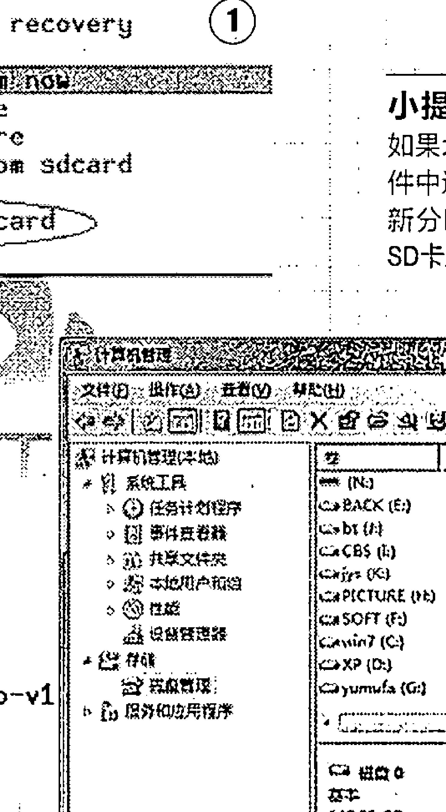

> **小提示**
>
> 如果划分分区后需要重新合并分区，只要在磁盘管理组件中选中所有分区，右击选择“删除”，删除分区后再重新分区为FAT32分区即可。要注意的是这样操作后会将SD卡上的所有数据删除。

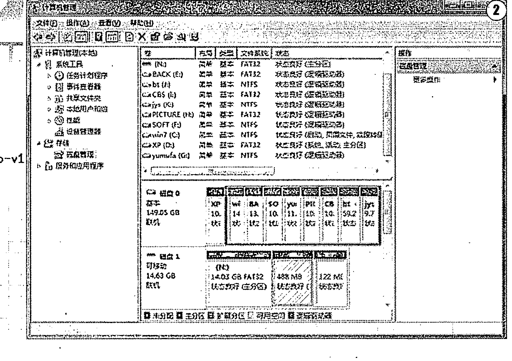

为什么会出现这个现象？这主要是由于安卓设计所致，为了提高程序运行速度，即使安装在SD卡上的程序，程序对应的优化文件也是保存在手机内存中（这也是安卓系统最为骄傲的地方，就是优化文件做得好，使小内存手机可以运行大体积程序）。这样即使你拥有32GB的SD卡，多安装几个程序后仍然会提示手机内存不足（因为程序的优化文件填满了手机可用空间）。

怎么解决这个问题呢？当然是为手机内存扩展空间，不过手机内存都是固化在手机里面，我们无法手动扩展。

但是我们可以通过分区的方法，将SD卡部分空间划分为EXT3分区，把它作为手机内存的扩展空间，从而提高手机系统运行效率。这样当我们在手机SD卡上划出EXT分区后，安卓系统就会在手机的内部存储创建一个“符号链接”（Symbolic links）到SD卡的EXT分区上。这个符号链接类似Windows 7下的硬链接，当我们安装软件到内部存储的时候，安卓会自动将程序安装到SD卡上的EXT分区上（包括所需的优化文件和运行必需的数据），从而有效地节省你手机的内部存储空间。

节省手机内部存储空间是SD卡分区的一个理由，此外EXT3分区引入了“日志”（Journal）功能。日志功能最大的好处，就是当你的操作（如对SD进行读取或者写入的过程中）因为意外原因被打断（比如突然断电），那么，有日志功能的EXT3分区上的文件就不容易受到破坏。当我们每次开机时，手机界面上总是提示“正在准备SD卡”。每次都提示正在准备，这其实是系统在后台检查FAT32格式是不是损坏，EXT3分区则不会出现类似提示。所以对SD卡进行分区，并且将程序安装在该分区可以有效保护程序文件。

另外，SD卡分区还可以拓展其他应用，比如分了多个区之后，可以将其中一些分区进行加密用以存放私密文件，这样即使手机借给他人使用（或者丢失），也不用担心隐私暴露。

## 怎么规划——分区规划篇

上面介绍了对SD卡分区所带来的好处，那么应该怎样对SD卡进行分区规划，每个分区应该怎么划分才是科学的呢？

安装过Linux系统的朋友都知道，在分区规划的时候都会要求我们规划一个SWAP分区以提高系统运行效率。安卓系统同样需要SWAP分区以提高效率，不过我们买的手机系统已经安装好，SWAP分区可以在SD卡上划分出来。因此在SD卡分区前做好下列的规划即可。

- 1. Fat32主分区：普通的SD卡空间，主要用于文件存储，比如保存电影、音乐等文件。
- 2. Ext3主分区：用于APP2SD，即将应用程序安装到SD卡而非手机内存。
- 3. Swap主分区：用于解决系统内存不足的问题，系统自动调用此分区。

那么每个分区大小应该怎么划分？分区大小主要应该根据自己手机性能进行划分，主要是EXT3和SWAP分区大小，剩余空间则划分为FAT32分区。

| 手机类型 | EXT3分区 | SWAP分区 |
| :--- | :--- | :--- |
| 手机内存256MB用户 | 256~512MB，程序控用户可以划分512MB | 64MB |
| 手机内存512MB用户 | 512MB | 128MB |
| 手机内存1GB以上用户 | 512MB~1024 | 可以不要划分 |

## 如何分区——SD分区实战篇

确定手机分区的规划后，在下面的操作中我们就可以对SD卡进行实际分区，根据SD卡是否需要保存数据，可以自行选择下面的方法进行分区。不管采用何种方法，在操作前一定要将重要数据预先做好备份，以防止误操作导致数据丢失。

### 方法1: 格式化重新分区

使用工具: 安卓自带的Recovery组件

适用: 存储卡上没有数据的新卡

如果你的SD卡是新买的数据卡，那么可以使用安卓的Recovery组件进行三个分区的自动划分。

关机后重启，按手机说明书介绍操作进入Recovery界面，成功加载SD卡后，选择菜单中的Advanced高级菜单。进入高级菜单后，选择Partition SD Card对SD卡分区（图1）。

首先出现的是Ext Size选项，在这里选择EXT分区大小，根据需要选择合适的键值后确认。接着出现Swap Size选项，这里选择内存缓存区的大小，设置合适的键值后确认，这样系统会自动将SD卡格式划分为EXT、SWAP和FAT32三个分区。重启后进入系统磁盘管理，选中手机SD卡分区即可看到前面划分的分区了（图2）。

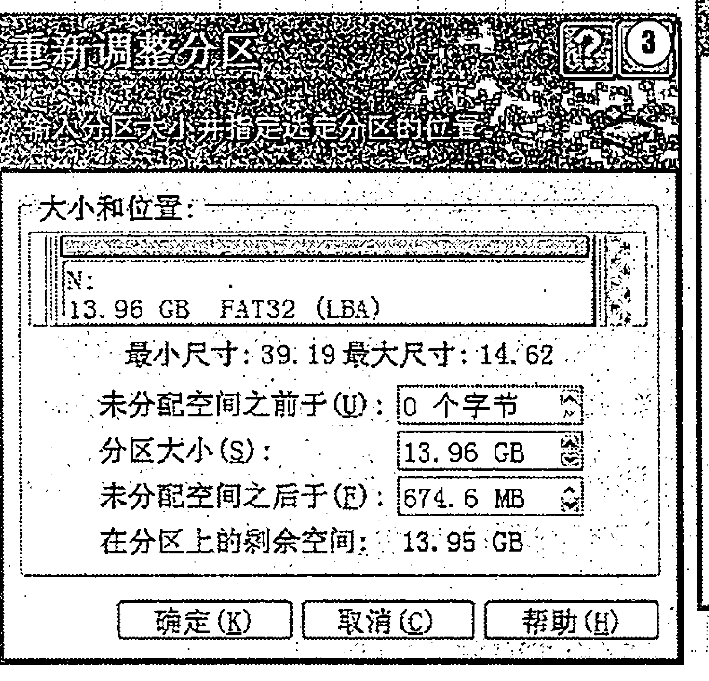

### 方法2: 无损数据分区

使用工具: Acronis Disk Director Suite

适用: SD卡上已经保存大量数据的用户

- 第1步: 将手机连接到电脑中，然后设置为“磁盘驱动器”模式，使得计算机可以识别SD卡。接着以系统管理员身份启动ADDS后选择手动模式，进入程序主窗口，在硬盘列表中选中SD卡，右击选择“重新调整”。
- 第2步: 此时程序会自动锁定SD卡并进行扫描，然后要根据自己实际划分的空间选择容量，比如EXT3和SWAP分区总计容量是512+128=640MB，则将滑块往左侧拖动，划分出大约640MB左右的空间（不一定精确，大概数值即可见图3）。
- 第3步: 点击“确定”后返回程序窗口，此时在SD卡上就会出现划分的空间。选中这个空间，右击选择“创建分区”，文件系统选择EXT3，创建为主分区，容量为541.3MB，点击“确定”即完成EXT3分区的创建（图4）。
- 第4步: 操作同上，在剩余空间上创建主分区，文件系统为Linux交换空间，再创建SWAP分区，接着返回程序主界面点击“操作→提交”，完成SD卡分区的创建。

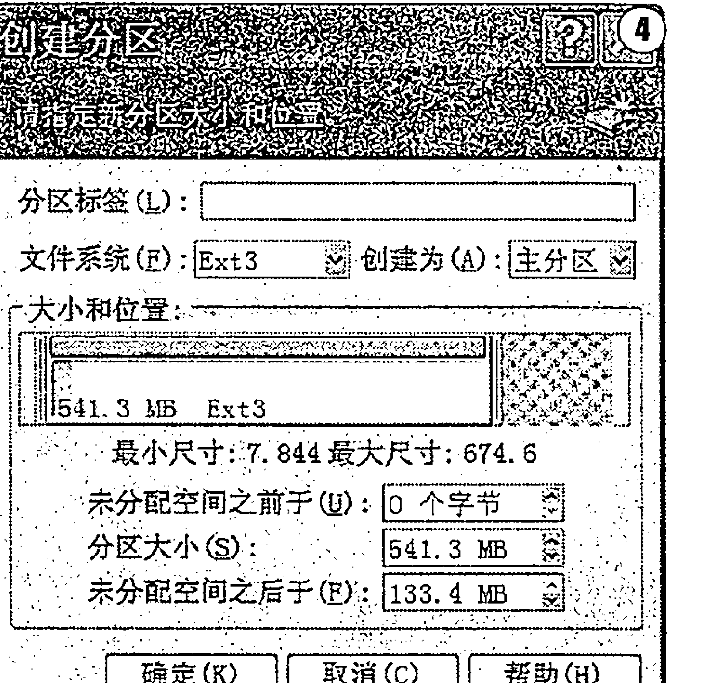

# 将旅游进行到底

常规的酒店预订、火车票预订、地图导航等应用，貌似已经能够满足我们的基本需要，不过，我们还需要更多另类的、实用的应用相帮！就如以下旅游达人所荐……

文|飞雪散花

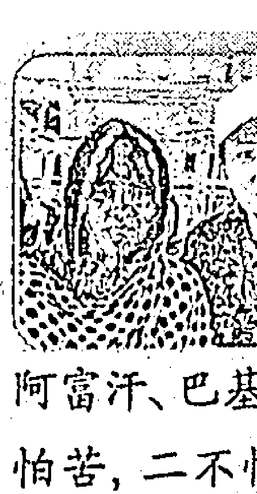

梁子，自由摄影师。摄影、DV、文字、旅行一锅烩。非洲、伊朗、阿富汗、巴基斯坦、印度乱溜达。一不怕苦，二不怕死，三不惜力。喜欢原始、自然又便宜的地方。

推荐应用：全国景点团购、QQ酒店返现 推荐理由：方便、省钱

## 全国景点团购

以前去了景点都是排队买票，费时间耽误功夫，现在使用该应用不但能随时订到票，而且还是团购价。当然，光有票进了园区没有地图也不行，现在软件不光有景点介绍，还有网友发布

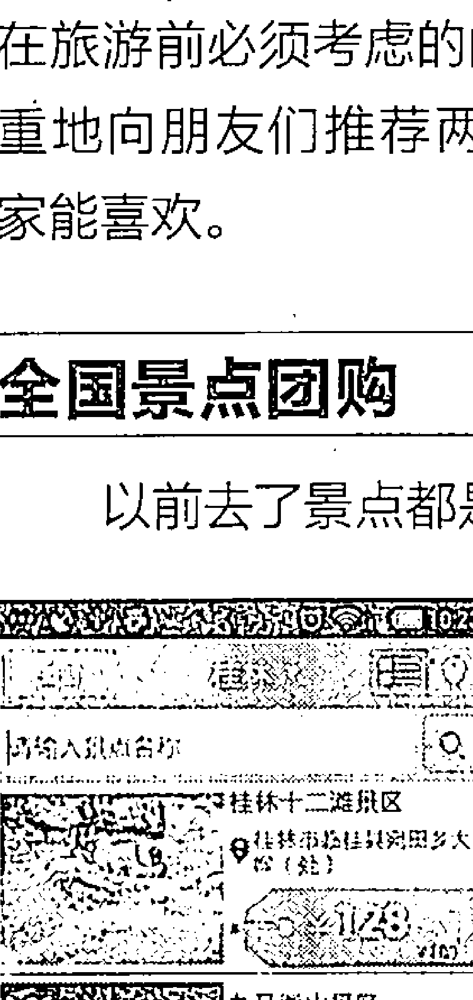

## QQ酒店团购

旅游难免住店，不过，同样是酒店，有的提供了相当不错的返现服务，而有的则没有，相比之下，当然找一家有返现的更为实惠，“QQ酒店返现”恰好能满足这一需求。它提供了全国各主要城市所有有返现优惠的酒店信息，返现金金额一目了然。这样，当我成功预订并入住后，返现金额就会自动打到我的财付通或指定的银行卡中，玩的

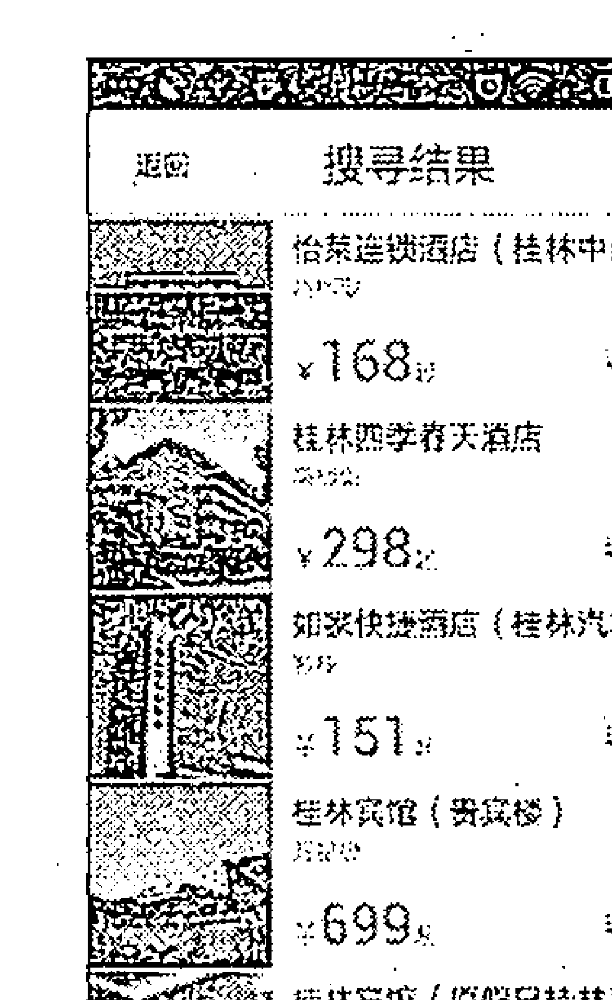

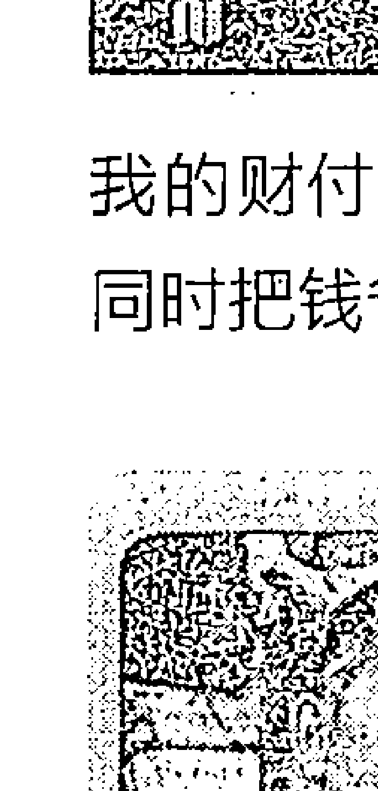

黑剑，一个疯狂行走于世界的人，从2000年至今已经走遍了世界上的56个国家和地区，并且黑剑会一直走下去，他的下一个目的地是伊拉克。

推荐应用：国际租车、旅行翻译官 推荐理由：在国外旅行，汽车租赁和语言沟通非常重要

## 国际租车

无论是去美国、澳洲、法国、德国、英国、西班牙、意大利、加拿大还是其他上百个国家旅游，都可以用该应用轻松地租到自己喜欢的车型，而且租赁过程相当简单，只要选择好取车的国家和城市、最近的取车门店和取车时间等信息，再按提示输入英文或拼音组成的个人信息并付款即可，非常简单。

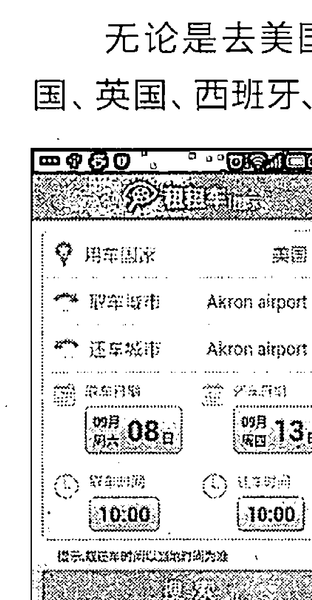

## 旅行翻译官

看过一个笑话，一个外国人去美国，想点一个鸡蛋做午餐，结果说了半天，对方硬是给他端上了公鸡、母鸡。其实我在国外也遇到过不少类似的情况，苦恼之余，我安装了“旅行翻译官”这款应用。它支持多国语言和多种国内方言，这样，以后再遇到自己无法

看了这么多旅游达人的推荐，是否让你有眼前一亮的感觉？其实还有更多的好应用等待你在旅途中去尝试和发现。

Jenny，自由撰稿人，职业旅行家。其作品常见于《时尚旅游》、《新旅行》等时尚旅游杂志。从2006年至今，Judy的足迹遍及泰国、马来西亚等26个国家及地区。
**推荐应用：** 户外追踪、酷盘
**推荐理由：** 用旅游演绎生活，用图片诠释足迹

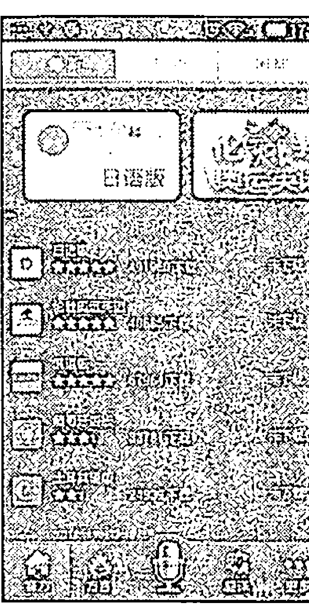

沟通的情况，我就会打开它，然后根据需要选择好交通、问候、银行、购物、娱乐还是餐饮等场景，再选择好要说的话，手机就会替我说出，实用而好玩。

也许是出于女性细腻天性的缘故，在旅游的过程中，我喜欢用文字和照片随时记录下自己的足迹，回家后会细细地欣赏、回味，或将其上传到网上与朋友们分享。这里我为朋友们推荐的应用是“户外追踪”和“酷盘”，因为这两款应用适合于我，相信它们也会同样适用于各位朋友。

## 户外追踪

以前外出旅游，最常用的方式是用相机拍下沿路的风景，然后将感受写到小本子上，注明时间、地点，回家后再行整理，比较麻烦，而且不直观。现在有了户外追踪，一切就变得简单了。只要开启它的记录轨迹功能，然后点击界面下方的“便笺”和“拍照”按钮，就可将心得和照片记录在与路程对应的地图上，非常直观。此外，它还支持实时定位等功能，这样就不会迷路了。

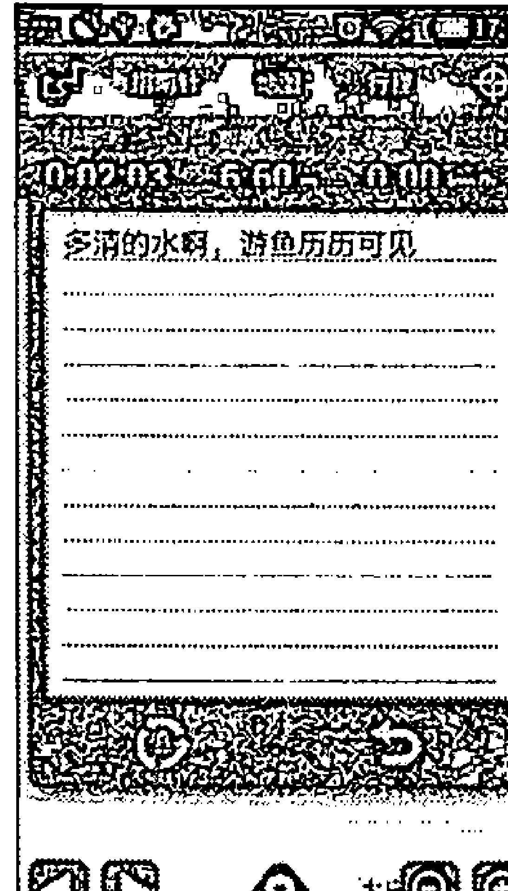

## 酷盘

使用酷盘缘于一个偶然的机会，去年和几个朋友在外面旅游，恰逢手机的SD卡满了，这就意味着在接下来的旅途中，我无法继续用手机留住胜景了。一个朋友介绍我通过3G网络下载安装了酷盘，这东东会自动检查手机中存在的或新增的图片，并将其上传到服务器中，这样，我手机中的图片就可以随时删除了，而服务器的图片依然存在。我觉得该应用非常适合于喜欢拍照但SD卡容量不是很大的朋友使用，所以推荐一下。

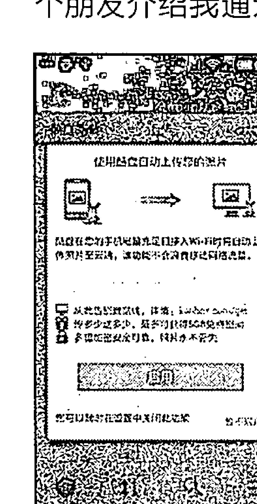

红杏，著名人文地理摄影师、旅行作家，澳大利亚昆士兰艺术学院摄影硕士。近10年来，红杏多次深入西北、西南地区进行采访、拍摄，完成了“茶马古道”、“中国活佛”、“中国康巴”等大型系列专题的图片及DV的拍摄与研究工作。
**推荐应用：** 街旁、墨迹天气
**推荐理由：** 美需要发现，生活需要品质

都没有好处。此外，旅游也要讲质量，因此，不揣冒昧为大家送上两款应用，如果能对大家有一丝益处，那就是我最大的快乐了。

## 街旁

“生活中不是缺少美，而是缺少发现美的眼睛”，旅游也是如此，所以在旅游生活中，我非常重视去发现身边那些能让人口齿留香的小吃铺和具有浓郁地方色彩的小卖店等，并会利用“街旁”这款应用，简单写下我对该地方的感受，为它们打上“Judy到此一游”的印记。不是自恋，而是因为我的发现，也许有利于后来者继续发现这个地方。我喜欢的应用，真心希望我的朋友们也能喜欢。

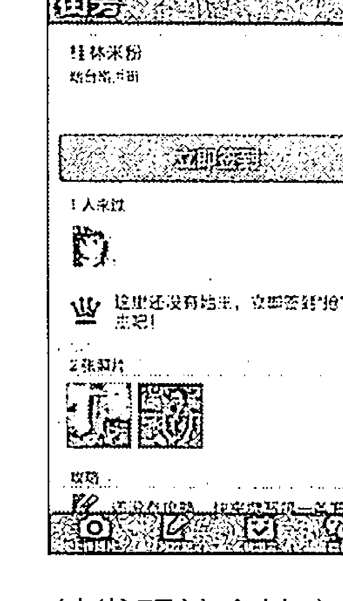

## 墨迹天气

小时候父母就告诉我们，出门早看天，防止大雨浇。此外，户外活动还得讲究空气质量。如果当日污染严重，可吸入的颗粒太多，对健康不利，还不如呆在酒店房间里来得安全。因此，这里我为大家推荐的第二款应用是“墨迹天气”。该应用除了会准确告诉我们当日和翌日的天气状况外，还提供了当日的空气污染指数，方便及时查询，及时做出旅程调整。

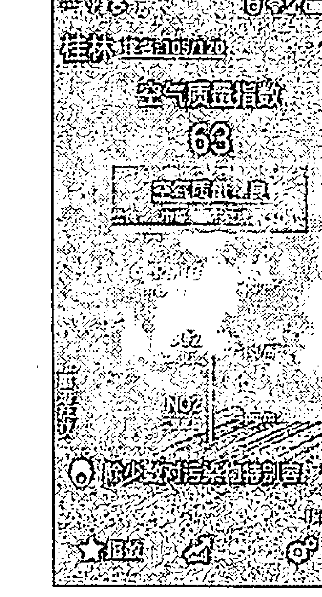

很纳闷有些朋友旅游时竟然不会记住那些有特色的地方，这样对人对己

# 挖掘潜力 玩转手机传感器

现在手机中都带有传感器，除了可以感应光线之外，如何让传感器在一定场合派上更大用场呢？

文|无忧

距离感应器可以让我们在打电话手机贴近皮肤时屏幕熄灭，以节约手机的电量，光线感应器可以根据外界光线的强弱自动关闭和打开手机的键盘灯。除了这些基本用途之外，笔者经过探索、挖掘潜力，发现了手机传感器的几个新功能。

## 锁屏控制音乐播放

很多像笔者这样的音乐控都有这样的烦恼：用手机听歌，如果想换歌或者碰到有人说话想暂停音乐时，不得不先按手机电源键，再解锁手机，才能进行操作，很麻烦。我们可以用Wave Control Pro这款手势控制软件通过手机的距离传感器来控制音乐的播放、暂停（一般在手机听筒旁边），在前方挥手即可执行设定的操作。

先下载Wave Control，安装后直接运行进行简单的设置，点击MAIN面板，在HOVER栏中选择PLAY/PAUSE，设置把手停留在距离感应器上进行音乐的播放和暂停。在“1 wave”栏下拉菜单中选择NEXT表示传感器前方挥手一次让手机播放器播放下一首音乐（图1），同样的方法设置挥手两次为播放上一首歌曲，挥手三次禁用/启用Wave Control Pro感应功能。

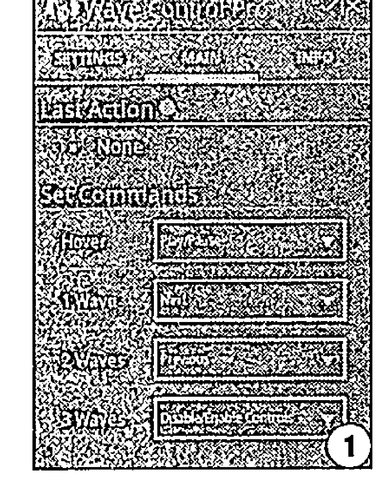

除此以外，还可以设置增大音量、减小音量的感应手势动作，然后点击SETTINGS进入设置界面，点击Choose可以选择手机中安装的音乐播放器（图2），其他的使用默认设置即可。

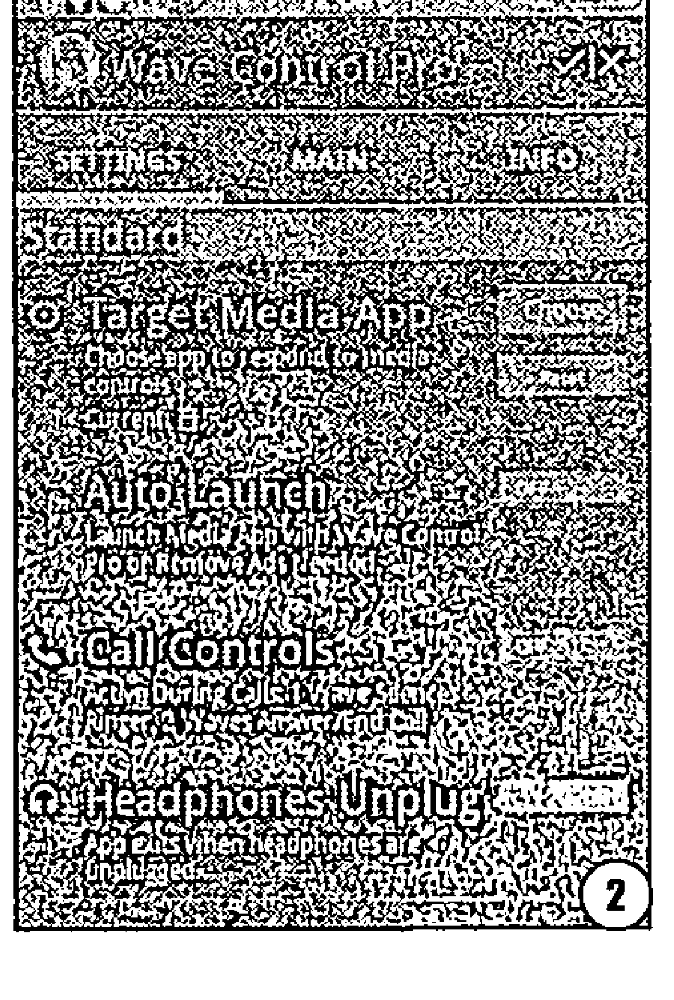

设置完毕后，当我们听歌需要使用感应器来控制播放时，先要运行Wave Control Pro，然后就可以锁定手机屏幕，把手停留在手机的距离感应器上，手机就会自动运行手机中的音乐播放器进行音乐的播放，接下来就可以按照事先设置好的感应手势动作来控制播放和暂停、换歌以及调节音量大小等操作了，完全不需要解锁。

经过试用，感应还是很准确灵敏的，而且有电话来时，软件会自动停止歌曲的播放，不会影响电话的接听。如果是喜欢把手机放在口袋里用耳机听歌的话，在设置界面中把Pocket Mode设置为On状态，开启口袋模式，就同样可以用感应器来操作播放器了。并且把Headphones Unplug设置为On，这样只要拔掉耳机，Wave Control Pro软件就会自动关闭，同时音乐播放器也关闭。

## 给手机养只防盗狗

不少人都有丢失手机的经历，尤其是在公车、地铁等场合，稍不注意，口袋里或者背包里的手机就会被小偷给顺手牵羊偷走了，笔者去年就在公车上丢失了一台手机，想起都心疼。这回好了，利用手机的光线传感器给手机打造一只忠实的防盗狗，让防盗狗来时时刻刻保护手机的安全。当用户将手机放在包包、口袋等地方时，如果被小偷盗出或不慎掉出时，光线感应器就能感应到光，马上播放报警铃声提示用户注意。

先下载安装防盗狗软件，运行后，先勾选“启用防盗狗”启用软件的防盗功能（图3），然后在“报警铃声”中选择自己喜欢的铃声，软件提供了小狗、藏獒的叫声，还有警笛声音，当然也可以点击“自定义”，选择自己手机中的音乐文件作为报警声，一般要选择音量比较大的，这样在比较吵闹的环境中更容易听到。然后设置报警持续时间，一般设置为30S或者60S即可，其他的设置采用软件的默认设置即可。

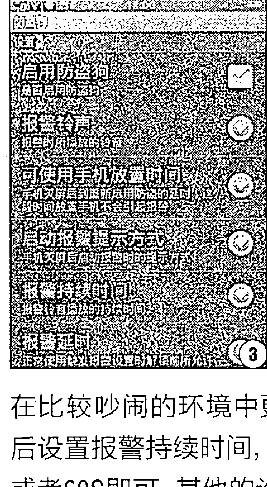

当自己来到公车、地铁等容易遇到小偷的场合时，就可以运行防盗狗软件，开启防盗功能，手机锁屏2秒钟会听到嘀的一声，表示防盗功能开启了，这样把手机放在口袋里或者包包里就比较放心了。只要小偷把手机拿出，在设置的时间内没有把手机屏幕解锁的话，手机马上发出刺耳的报警铃声，倒霉的小偷就等着被抓吧。

# 炉灶重生 让应用如我所愿

现在的Android手机应用真是鱼目混杂，如果你能忍善忍也就算了，但如果你是一个挑剔的玩家，那就无需再忍，自己动手吧。

文|孙敏

## 给应用换张面孔

应用安装到手机后，它的名称、图标，相当于自己的一张脸。名称辞不达意，或是图标不够精彩，那就需要给它们美化一下。只是手机不比电脑，想改应用名称或图标，必须借助相应工具才行，而且只能从APK安装包下手。APK已经安装的话，那就先卸载掉吧。

- 第一步：提取APK包。以更改应用名称为例。运行“RE管理器”，找到需要修改的APK文件后，长按文件名称，在弹出的菜单中选择“提取全部”选项，将其中的文件提取到SD卡的SpeedSoftware\Extracted文件夹。
- 第二步：修改软件名称。用“APK编辑器”打开文件夹中的resource.arsc文件，点击搜索按钮，在文本框里输入APK原名进行搜索。搜索完后，在原名称下方的文本框里输入新的名称，然后点击“返回”键返回到前一界面。
- 第三步：重新打包。保存完成后，在“APK编辑器”中长按提取的文件夹名称，选择“压缩为Zip文件”选项，对提取的文件夹重新打包，这将得到一个ZIP格式的文件，然后退出“APK编辑器”即可。
- 第四步：用ZipSigner2签名处理。运行ZipSigner2，点击Choose In/Out按钮，选中建立的Zip压缩包，然后在屏幕的第二个文本框中，把扩展名改为APK，单击Sign The File按钮完成签名处理，最后，把APK重新安装到手机，应用的名称即会改变（图1）。

APK图标的修改过程与此类似，只需用一张png格式的图片（大小不限）替换原有的图标就可以了。关键是找对APK的图标文件。一般来说，APK的图标存放在res\drawable文件夹下，大家可以在替换完后，按上述操作重新进行打包、签名处理。

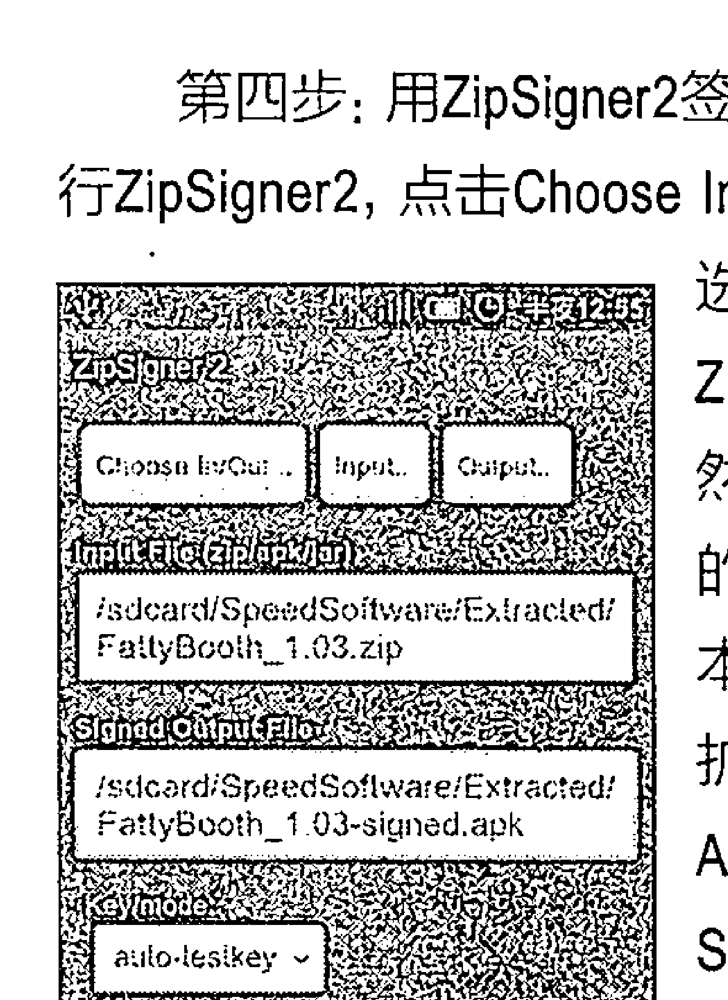

## 和“坑爹”权限说Bye Bye

应用的名称、图标，说到底只是视觉感受问题，无伤大碍，真正可气的是有些应用暗藏吸费陷阱，会在暗地里发短信、打电话，让你蒙受损失。对于这样的内鬼不能客气，必须让它们改邪归正。

- 第一步：找到不良应用。“权限掌门人”这款软件可以帮我们找出手机里所有具有不良权限的软件，更值得一提的是，该应用无需ROOT即可使用，非常适合在非定制手机上使用。运行“权限掌门人”，切换到“自定义”标签，选中那些有吸费嫌疑的权限，比如“直接拨打电话号码”、“发送短信”等，随后点击“扫描程序”按钮，那么所有具有不良权限的应用，就会出现在屏幕上（图2）。


- 第二步：修改权限。处理的方法有两种，如果应用无关紧要，从列表中点击应用名称，在打开的屏幕右上方点击“卸载”按钮卸载即可。假如想继续使用，也可以只删除不良权限。点击选中某个应用，在屏幕上的权限列表中，勾选该应用有威胁的权限，点击“删除选中权限”按钮，被选中的权限便被删除（图3）。


- 第三步：刷新应用。删除权限后，会重新生成应用安装包，而新安装包与已安装的应用无法共存，必须重新安装。在屏幕上点击“卸载”按钮卸载原应用，再按提示把应用安装到手机，我们便能得到一个毫无危险权限的应用了。

# 音乐发烧友的手机生活

中国好声音异常火爆，让喜欢音乐的我们也跃跃欲试。除了听歌、练歌、K歌外，还有怎样的方法才能打造出好声音呢？让我们听听音乐达人的意见。

文/贺全荣

《中国好声音》异常火爆，一群原本不知名却怀有音乐梦想的歌手深深吸引了观众的眼球，正是这样一个火爆全国的节目，掀起了一股狂野的听歌和K歌热。说到K歌可能很多人会想到去KTV，但这样需要邀好同伴，而且还要破费，不妨让我们来看看以下几位音乐达人是如何用手机随时随地享受音乐带来的快乐，好声音是如何打造出来的吧。

**阿豪：公司白领，由于坑爹的房价，在远离市中心的地段买了房子，每天上班下班都要坐长达1个多小时的公交。**

- 推荐的应用：天天动听、QQ音乐
推荐理由：管理本地歌曲方便、QQ音乐与电脑连通

什么最动听？不是甜蜜的情话，不是啼鸣的鸟语，是喜欢的旋律，是美妙的歌声。我是一个天生的音乐爱好者，对自己喜欢听的音乐简直就是百听不厌，尤其是每天的上下班坐公交的时间，就只能在手机上听音乐来打发无聊的时间了。好的播放软件才能让歌曲更动听，经过实践，我还真找到2款非常不错的音乐软件，可能大家非常熟悉，但是我的用法可能和你不同哦。

一款是天天动听。使用过其他音乐播放器的朋友都知道，有的播放器要么不能自动扫描音乐文件，要么就把所有的音乐文件都添加进来。天天动听则自动搜索手机存储卡内的所有音乐，而且自动过滤60秒以下的歌曲，这样就不会把我手机里收藏的铃声、提示音等音频文件也添加进来，而且它可以按照不同的歌手名、专辑名、文件名等方式进行分类，让我更加方便地选歌。在歌曲播放的同时显示同步歌词，可以让我在听一些不太熟悉的新歌时经常对照同步歌词进行跟唱学习，但声音可别太大了，免得影响周围的人了。

此外，用天天动听也能直接在“网络曲库”中在线听音乐，但需要流量，除非有免费Wi-Fi，这个功能我一般很少用，还是省点钱还房贷吧。

另外一款就是QQ音乐，像我们这些天天与电脑打交道的人使用最多的就是QQ了，而QQ音乐则可以和电脑的QQ音乐连通，我在办公室或者家里电脑中用QQ音乐收藏的好听歌曲，在手机QQ音乐中进入“云端收藏”，用自己的QQ号码登录，就可以同步显示出来。有几次我在电脑中收藏了新歌，在手机上直接用QQ登录就同步了我在电脑中收藏的歌曲，免去了我在手机上重新搜索的烦恼，当然，在手机QQ音乐里收藏的音乐，在电脑里也可以同步显示。

遇到自己非常喜欢的歌曲时，在QQ音乐里可以直接把该歌曲设置为手机铃声，点击歌曲名称后面的箭头图标，弹出菜单，选择“设为手机铃声”。我的手机铃声一天可能都变N次，为此还被同事们戏称为铃声王子，也搞过几次恶作剧，记得一次我故意把铃声设置为和身边在等男朋友电话的MM一样的铃声，当我的铃声响起时，她急忙在包里翻手机，拿出来看了一下，一脸茫然，我在旁边实在忍不住笑了出来，结果自然是被一顿狂揍，我心里暗想这样的野蛮女也有人要。

**Julie：自由职业，超级宅女，喜欢音乐，没事的时候可以几天不出门，在家里看电视、手机上看小说，尤其喜欢穿越小说。**

- 推荐的应用：豆瓣FM、QQ音乐电台
推荐理由：不用自己选歌、海量歌库

我没事的时候可以连续宅在家里好几天都不出门，电视上没什么好看的节目时，就躺在床上用手机看小说，同时听歌，尤其是喜欢发现一些好听的新歌，但喜新厌旧。自己收集的歌听多了以后，也烦了，又不知道现在还有哪些歌曲好听，最近又出了什么新歌，干脆用音乐电台听歌，不用自己选歌、换歌。使用电台听歌和听收音机不一样，毕竟是为了音乐而去听的，所以得选几个专业点的。我最常用的就是“豆瓣FM”。

打开豆瓣FM自己什么都不用管，也不用选歌曲，专心地看小说吧，说不定还能遇到很好听的以前没有发现的歌曲，点击“红心”把它收藏起来下次听。除了收藏功能，豆瓣FM的最大优点就是音乐台非常丰富，点击左上角的图标，根据自己的喜好切换音乐台。

此外，QQ音乐电台也不错。QQ音乐电台集成在QQ音乐软件中，省去了我另外安装软件的麻烦，手机中软件安装多了也影响速度。打开QQ音乐，点击左边栏中的“电台”，我一般选择“新歌”和“欧美”频道听，手机上的音乐电台一般是走流量的，不是像收音机那样通过无线电波，如果GPRS流量吃紧就最好不要用了，还好我是通过Wi-Fi免费上网的，流量对我来说毫无压力。

丽丽：大学生，在学校学的是播音主持专业，业余时间也喜欢音乐，尤其喜欢K歌，外号麦霸。

- 推荐的应用：K歌达人、唱吧
- 推荐理由：卡拉OK录歌 智能评分、上传评价

我虽然学的不是音乐专业，但还是非常喜欢音乐的，尤其喜欢K歌，平时也经常邀同学去K歌，但高昂的费用让我这个学生难以承受，好在发现了几款不错的手机K歌软件，不用出门，不用花钱，就能随时随地K歌。第一个就是最近很火的“K歌达人”。

我觉得喜欢音乐的人都是快乐的人，K歌达人让我最喜欢的一点就是其内置的智能评分功能，唱歌录音的时候通过内置的智能评分功能打分提示，知道自己哪句唱得好，哪句有点走调，及时帮助我发现唱得不好的地方，再反复重录，唱完后保存录音并上传，与网友分享。不过，K歌达人有部分歌曲是要收费才能下载使用的，这点让我很不爽。有的歌曲很想唱，但又下载不了，所以现在渐渐开始使用“唱吧”更多一些了。

现在的软件很多功能都很相似，就拿唱吧来说，它也有评分功能，而且里面的歌曲都可以免费下载，比K歌达人更让我喜欢的是上传歌曲还能得到网友的评价和送花，相信很多人都会因为这个功能得点小小的满足感。需要说明的是运行唱吧后，点击下面的话筒图标，点击“演唱”开始唱歌录音时，手机尽量离嘴巴近一点，这样效果才更好，而且录音过程中有得分提示可以让我随时根据得分来发挥，省得没唱好还在傻傻地继续录，到最后浪费时间还浪费感情，呵呵。

当然，除了自己唱歌，唱吧里有个音乐K歌排行榜，里面的达人可多了，我觉得很多人唱的真不比明星差，看来中国的好声音还真是很多啊，像我这种水平的也只能算是中上游吧。

强子：教师，喜欢音乐，中国好声音铁杆粉丝，几乎每期都看，遇到自己喜欢的歌曲，第二天便要把它下载到手机里，但有时候为找歌犯愁。

- 推荐的应用：音乐雷达、你唱我猜
- 推荐理由：搜歌神器、娱乐好玩

以前搜索歌曲就是去搜索引擎上根据歌词或歌名来搜索，但是像“中国版阿黛尔”郑虹唱的英文歌，我不但名字不知道，连歌词都没听懂，就是觉得曲子好听，像这种情况以前根本就找不到这首歌了，也就慢慢放弃搜寻了，但是现在有了手机里的好应用，情况就不一样了。我只要依稀记得其中的一两句，对着手机哼唱一下，很快就能找到喜欢的这首歌曲。而且有空时，我还会和朋友玩玩音乐类的益智游戏，比如说最近很火的你唱我猜，不但知道了很多歌曲，还学会了不少英文歌呢。

说到搜索歌曲就不得不提到“音乐雷达”了。一般的搜索歌曲的软件，都要知道歌曲名或者歌手名，如果只会哼唱一句或者一小段，就得用音乐雷达来帮忙了。运行后，点一下界面上的“以”字标记，弹出“正在聆听”提示，然后对着手机话筒唱出自己会唱的那一句歌，便可搜索到完整的歌曲信息。唱歌的时候最好是普通话，用方言的话，那成功率就很低了，还有一点就是千万别跑调哦。

还记得当初红极一时的“你画我猜”吗？那时候我和同事每天中午的休息时间都在一起“大展身手”一番，没想到现在竟有了我画你猜的姐妹版“我唱你猜”。对于热爱音乐的我来说，没事的时候就和同事、网友用你唱我猜来玩音乐游戏，对于这种全新的语音对唱游戏方式我想大家肯定会喜欢的。

就拿软件的使用来说，进入选歌界面选择自己要唱的歌曲，然后对着手机唱10秒钟就等对方猜歌名，对方猜对以后获得积分奖励，是不是很像以前电视综艺节目里的竞猜环节。现在不是有很多电视台都有记歌词或对唱类的音乐节目吗？不参加节目你也可以天天体验竞猜的乐趣了。

看了本期达人的音乐秘籍，你是否感悟到了什么？天生有一副好嗓子很重要，但是如何利用好嗓子唱出最美的声音更值得我们学习和关注。

# 省心省力 打造手机维护盘

平时生活中我们经常要对系统进行维护，以前都是拿U盘或光盘进行操作，现在有了智能手机，何不把手机打造为随身携带的系统维护盘呢。

文|平淡

对于很多经常帮助别人修电脑的朋友来说，他们经常要携带维护光盘或优盘。不过光盘/优盘总不可能经常随身携带，何不把你的安卓手机“改造”为可启动维护盘？这样要使用维护盘时，随时掏出你的手机就可以进行系统维护了。

## 手机维护盘 有什么好处

- 1.安全性高。用手机数据线连接启动电脑，存在双重驱动和电源保护控制机制，所以更安全可靠。常规U盘容易产生读写文件和磁盘出错，例如启动盘蓝屏F4、Windows延缓写入失败、无法读取$MFT表等缺点。
- 2.携带性更好。手机作为每个人必备的通讯工具，基本上都是随身携带的，而一般朋友是不可能随时带着U盘的。
- 3.使用方便。手机维护盘既可以使用手机数据线启动，也可以拔下SD卡，通过读卡器启动使用。

## 小知识 手机是怎么启动电脑的

大家知道启动U盘之所以能够启动系统，主要是现在主板BIOS中已经集成USB驱动，可以在电脑启动后识别USB设备。对于安卓手机，由于可以在进入刷机模式后加载SD卡的USB驱动，这样手机其实就相当于读卡器，通过刷机模式提供的驱动，BIOS就可以将其识别为USB设备，从而实现手机启动电脑。

## 制作手机维护盘

通过上面的介绍我们知道了手机启动原理，手机维护盘的制作实际上和常见启动U盘的制作大同小异，首先要激活SD卡上主分区，接着准备维护系统并配置SD卡引导记录，最后在手机上加载USB驱动即可启动系统。本文是以ISO格式老毛桃PE系统为例，为了便于理解，大家只要根据流程图按部就班即可制作其他类型维护系统（图1）。

## 激活SD卡主分区

- 1. 由于启动维护盘需要SD卡上有活动主分区，因此我们首先要将SD卡格式化为FAT32格式主分区。主分区制作借助Diskgenius（下载地址：http://www.diskgenius.cn/）即可，将手机连接到电脑上并设置为U盘模式，启动Diskgenius后在磁盘列表选中当前SD卡，如果SD卡已经是FAT32格式主分区，则右击选择“激活当前主分区”将其激活，如果是其他格式分区，请将其删除并重新建立为FAT32格式主分区（图2）。
- 2.激活分区后将其格式化（为了文件的简洁，后续的维护系统我们使用的是ISO格式的PE系统，ISO文件的启动需要文件保存在连续空间中）。接着到http://dwz.cn/cfan15下载bootice.exe，启动程序后在磁盘列表选中SD卡，依次点击“主引导记录”和“分区引导记录”，将其引导方式更改为GRUBDOS格式（图3）。

> 小提示 本文选择的是ISO格式的PE系统，有些电脑由于兼容性的原因可能无法成功启动。对于这类电脑，引导模式可以设置为NT5.x（适用于PE1.0）或NT6.x（PE2.0以上系统），我们可以到网上下载GHO格式的PE维护系统，然后使用Ghost32.exe将下载到的GHO恢复到SD卡上，制作常规模式启动的SD卡。

对于SD卡已经划分多个分区的用户，只要将第一分区制作作为FAT32格式主分区并激活即可。如果SD卡全部是EXT格式分区，可以不用更改分区类型，直接选择精简Linux作为维护系统。

## 准备所需文件并配置启动

- 1.到http://dwz.cn/201234下载Grldr并将其复制到SD卡根目录下，接着到网上下载老毛桃PE系统（只要任意ISO格式可启动维护系统即可），将其重命名为maotao.iso也放置在SD卡根目录下。
- 2.启动记事本，输入下列的代码并将其保存为menu.lst，放置在SD卡根目录下：

```
timeout 3
default /default
title PE ISO
find --set-root /maotao.iso
map /laomaotao.iso (0xff) || map --mem /laomaotao.iso (0xff)
map --hook
chainloader (0xff)
savedefault --wait=2
```

- 3.完成上述的操作后，将前面备份的SD卡上文件重新复制到SD卡上，这就完成了维护系统的准备和配置工作。由于这是直接使用ISO模式启动维护系统，真正核心的维护系统只是一个ISO文件（为了文件的安全还可以将其属性设置为“隐藏”），文件结构比较简洁，方便大家在SD卡存放其他手机所需的文件。大家可以根据自己的需要多准备几个ISO系统，参照上述代码自行添加启动项即可。

注释：这里使用两种模式启动，map /laomaotao.iso 是使用仿真光驱的模式加载ISO。类似虚拟光驱加载ISO启动，适用于体积较大的维护系统（一般大于512MB），加载速度较快，但启动成功率较低。map --mem /laomaotao.iso 则以内存加载模式启动系统，维护系统文件会被加载到内存中启动，加载速度慢（但是进入系统后运行的速度快），兼容性较好。大家可以根据自己准备的维护系统选择启动方式。

## 加载手机USB并启动系统

- 1.重启手机进入Recover刷机模式，这里以HTC Vision手机为例，重启按住音量减小键+电源键，进入刷机模式后按音量下选择Recovery菜单，按下电源键确认（图4）。
- 2.在出现的Recovery模式菜单中，按音量下选择Mounts and Storage菜单，按下电源键确认后，在出现的菜单选择mount USB Storage，这样Recovery模式就会自动加载SD卡驱动，手机SD卡就会被识别为USB设备（图5）。
- 3.成功加载SD卡驱动后，在手机屏幕上会显示SD卡分区的信息。然后进入BIOS模式。在BIOS设置中进入启动顺序设置，将手机作为系统的第一启动，这样退出BIOS并保存后，电脑就会从手机上的SD卡启动了。现在很多主板都可以在开机时按F12调出启动选择菜单，一般只要在启动设备选择菜单中，选择类似HTC Andriod phone 0100的手机设备启动即可（图6）。
- 4.在BIOS中成功识别手机后，剩余的操作就和U盘启动类似，只要在GRUB的多种启动菜单中选择“PE ISO”，成功加载老毛桃PE后就可以进入PE系统进行具体的维护操作了（图7）。

> 小提示 ISO文件启动要求ISO文件本身没有碎片（即连续存放在SD卡上），如果SD卡经常增删文件，可能会造成启动失败。此时可以到http://www.onlinedown.net/softdown/57316_2.htm下载WinContig，启动程序后导入需要整理的ISO文件进行整理即可（图8）。

# 不要迷信手机屏幕

现在不少低端手机都开始宣称配备“IPS材质”屏幕，但其效果和同样采用IPS屏幕的iPhone 4却有着天壤之别。在小小屏幕的背后，到底隐藏着多少不为人知的秘密呢？

## 屏幕材质知多少

我们经常能在网上看到某款手机采用了IPS、SLCD、Super AMOLE等“屏幕材质”的报道，这也让我们在潜意识里形成了“IPS屏幕”=“IPS材质屏幕”的答案。实际上，目前手机屏幕的材质理论上应该被划分为LCD和OLED两大类，上面那些只是不同材质的衍生分支而已（表1）。

就笔者的经验，AMOLED材质屏幕的特色在于高可视角度和艳丽的色彩表现（甚至有些夸张），还有就是黑白纯色时的感觉更干净。只要手机采用的是AMOLED系列屏幕，不同品牌和型号之间的显示效果差异不会很大。而LCD材质屏幕的特色则在于真实，在可视角度方面是

表1：两种屏幕材质下的衍生分类和各自特色
| 屏幕材质 | 衍生分类 | 显示特色 | 代表机型 |
| --- | --- | --- | --- |
| LCD材质 | TFT | 最常见的屏幕，效果中规中矩，不同产品的显示效果和可视角度相差很大 | 摩托罗拉和索尼的中低端机型，如Defy、Z1i、LT22i等 |
| LCD材质 | IPS | 俗称Super TFT，具备接近180°的可视角度，色彩通透、亮丽 | 苹果iPhone 4S、华为Ascend D1、海尔超级战舰等 |
| LCD材质 | SLCD | 色彩表现和可视角度接近OLED屏，色彩还原比较真实，不会偏色 | 以HTC为主，如G11、G18、One X和One V为SLCD二代技术 |
| OLED材质 | AMOLED | 三星第一代的AMOLED屏幕，早已停产 | 诺基亚早期旗舰，如N86、N8等 |
| OLED材质 | Super AMOLED | 屏幕色彩饱和度高，显示艳丽，但由于采用P排列，颗粒感较强 | 如三星i9000、Nexus S、诺基亚Lumia 800等 |
| OLED材质 | Super AMOLED Advanced | 分辨率有所提升（960×540像素），一定程度上缓解了画面的颗粒感 | 如摩托罗拉XT910、HTC One S、华为P1等 |
| OLED材质 | HD Super AMOLED | 分辨率达到720P或以上级别，屏幕颗粒感有了明显改观，基本不可见 | 如i9300、Galaxy Nexus、i9220等 |
| OLED材质 | Super AMOLED Plus | 由P排列方式改为传统RGB排列方式，显示无颗粒感，但存在一定的偏色问题 | 如三星i9100、诺基亚900、OPPO Finder |

## 好材质≠好效果

不同材质屏幕间的差别主要体现在色彩的表现和可视角度上，理论上肯定是越高级越好，但是我们也不能迷信这一说法。比如当你看到某款手机的参数上标注“IPS屏幕”，不能指望它就可以媲美iPhone 4S的显示效果。因为高端手机往往不会吝啬成本去采购良品率和显示效果较好的屏幕面板，而小厂商为了控制成本，则可能会选择档次稍低的屏幕面板。

即使是iPhone和iPad自己，也曾因屏幕面板供应商和生产批次的不同，出现显示效果差异明显的案例。比如iPad 2内地行货版的屏幕普遍亮度偏低且色彩偏黄，但水货版屏幕却一切正常。实际上，很多出货量巨大的热门手机，光屏幕面板就存在不同的供应商，不同出厂批次的液晶面板就可能存在不同的冷暖色问题，一样的IPS不一样的显示效果，这就是问题所在。

## 为屏幕技术把把脉

索尼LT26i明明是TFT屏幕（如图），为什么显示效果和很多采用IPS或HD Super AMOLED屏幕的手机相近？这就涉及到额外的显示技术了。还是以LT26i为例，虽然采用的是先天资质一般的TFT屏幕，但是却加入了BRAVIA ENGINE图像引擎技术，通过技术手段修饰图像信号从而获得更佳的视觉体验。

## 表2：目前主流的手机屏幕技术特色对比

| 显示技术 | 特色 | 代表产品 |
| :--- | :--- | :--- |
| ASV | 由夏普推出的一种用来提高图像显示质量的技术，可以增加屏幕的亮度、可视角和对比度 | 魅族 M8、M9、MX |
| CBD | 由诺基亚推广的一种通过降低屏幕光线反射来提高视觉影像效果的方法，有助于提高屏幕的可视角和对比度，令屏幕色彩显示更加生动，屏幕看起来也就更鲜艳 | 诺基亚 C6-01、N8、N9、Lumia 800 |
| NOVA | 由LG主打的显示技术，优势是在相同亮度下耗电量更低、可达到更高的亮度，可以精确显示黑白原色，显示效果更纯。 | LG P970 |
| Retina Display | 视网膜技术，是一种基于IPS面板的显示增强技术，ppi超过肉眼识别的界限，使手机屏幕的显示效果实现印刷级别 | 苹果 iPhone 4/4S，New iPad |
| BRAVIA ENGINE | 索尼主推的显示增强技术，其工作原理为在将数据转换成图像的过程中就对信号进行一系列的优化，使屏幕显示出来的图像效果就显得更加鲜艳、锐利、细致，层次感更强。 | 索尼 LT18i、LT26i、LT28i |

表2是目前常见的和手机屏幕相关的显示增强技术，可以用于弥补不同材质屏幕先天的显示效果。但是，显示技术的作用是“改善”而不是“改变”，而且效果如何对厂商的优化功力要求更高。还是以BRAVIA ENGINE图像引擎技术为例，已经被很多高手移植到了其他品牌手机的身上，但最终的表现效果却远不如索尼自身的手机明显，而且还可能还会引起额外的耗电问题。

### 健圣有话说

同样的TFT屏幕，1500元的手机就是要比500元的可视角大，色彩精准度更高，这涉及到屏幕材质的先天体质问题。在不加入任何显示技术的前提下，IPS和SLCD优于TFT是肯定的，但为TFT加入某项显示技术后还是有机会实现反追，这又涉及到了软硬件的优化水平。总之，无论是屏幕材质还是显示技术都属于文字无法描述的感官体验范畴。当你看好某款手机时，健圣还是建议你亲自到手机卖场去体验一番，让自己的眼睛告诉你答案。

## 国产手机的崛起

虽然小米手机的期货营销备受争议，但不可否认的是，自从小米1开始，国产手机的确已经咸鱼翻身，成为真正性能价格比的代言。但是，总有一些用户依旧非国际大品牌不娶，而且还对国产手机持有偏见。

恰好健圣在tomrda论坛看到一则为国产手机鸣不平的帖子，感觉不错，拿到这里与大家讨论一下。

- 有一种手机叫国产，它们以小米、oppo、华为、中兴、魅族为代表。
- 有一种人叫“见人”，他们见不得国产好，见不得国产比三星苹果贵。
- 有一种人，当他看见OPPO Finder外观的时候，他会说好丑，当他看见苹果外观的时候他会说“碉堡了”。
- 有一种人，当苹果不可拆卸电池，他觉得那是酷，当魅族MX不可拆卸他就觉得是垃圾。
- 有一种人，当i9100的屏幕是Super AMOLED PLUS时他会说这是最牛的屏幕，当Finder用这种屏幕时，他会说这是远古时代的分辨率。
- 有一种人，明明高通APQ8064比三星Exynos 4412好，他非不承认，哪怕Adreno 320的GPU比Mail-400MP4确实强。
- 有一种人，说刀锋很牛叉，却从不说刀锋摄像头的优化问题。
- 有一种人，一边骂miui一边刷miui。
- 有一种人，魅族售后换机他骂，苹果售后换机他欢喜地说“苹果售后真爽”。
- 有一种人，看见有不少人小米返厂，尽管他没用过小米，同样骂，我敢说但凡有一个人去过苹果官方售后点的，如果平均每天少于10人请骂我。
- 有一种人，不仅是“见人”，为了自己那么一点点利益，他非要跳出来骂某杂粮。
- 有一种人，不必与他争论，他都不晓得手机中国代工多少年了，但凡设计没有问题，材料扎实，质量根本就是不用考虑的东西。
- 有一种人，尽管是“见人”，但是我们每天还是要面对！

没错，国人的潜意识中自古就存在些许“崇洋媚外”的思绪，当然我们不可否认德国的汽车质量最好，瑞士的名表手工一流……但在手机的设计与制造方面，无论是性能还是做工，哪怕是系统层面的优化，国产手机真的已经不再处于劣势。

## 兼容还是不同用

### 手机充电器的那点事

小李出差忘带手机充电器了，只能借用同事小黄的。但小黄的充电器是5V-1.5A的，而小李的是5V-1A的，都是USB接口的手机充电器，到底能否通用呢？

如今无论是手机还是平板电脑都选用了充电器和数据线（充电线）分离的配件形式，这意味着如果以家庭为单位，谁家里都至少会有2个以上的充电器。问题来了，这些充电器的输出电流和电压各有不同，但都可以通过USB接口和手机相连。在找不到原装充电器的情况下，这些充电器之间可以混用吗？

### 了解最关键的参数

大家可以找找手机充电器上的铭牌，上面肯定会标有输出电流和电压，比如“DC5V-1A”，这组数字由充电器PCB板上的电源控制芯片决定，其中输出电压一定要配合要求，要求输出多少伏就是多少伏。好消息是，目前几乎所有充电器的输出电压都是5V/5.3V（通用），但输出电流的差别很大，最小的可能仅有450mA，最大的则可达2.1A。而输出电流的大小将决定能否为其他品牌的手机或数码设备安全充电。

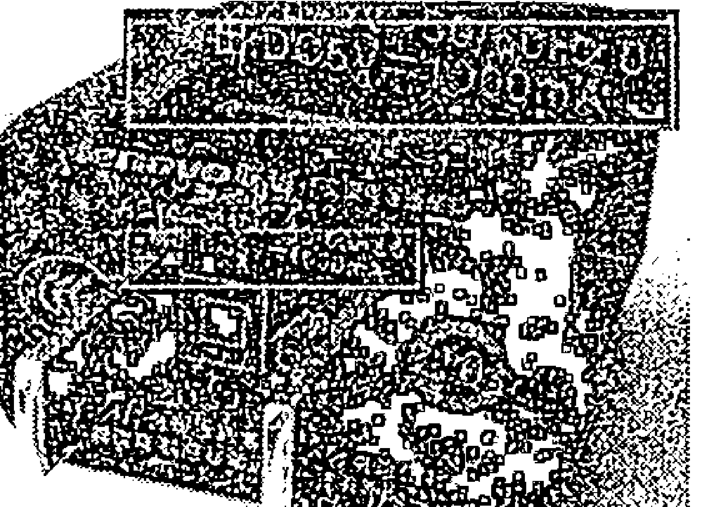

### 混用得看输出电流

假设手机原装充电器的输出电流值为A，另一个充电器的输出电流值为B，最理想的状态是A=B或A≈B。当A>B时会出现充不上电或导致充电时间被大幅延长的问题，如果两个电流值相差太大，时间久了还会烧坏充电器。

反之，当A<B时就没有问题了。比如5V-1.5A的充电器完全可以替代5V-1A原装充电器，而且可以大幅缩短充电的时间（类似快充）。但是，如果输出电流相差太高（比如你用5V-1.5A的替换5V-450mA的）则会引发手机电池过热的隐患，要知道高温是锂电池寿命的最大杀手。因此，如果你这么做了，尽量控制好手机的充电时间，等电池充满后记得赶紧拔下充电器，还能避免设备长时间接电可能引发的因电压或电流突变造成损坏的风险（用原装充电器时也应该避免此类情况）。

### 如何检查是否安全

用非原装充电器给手机充电时，大家可以注意一下充电器的发热情况。只要接电充电器的表面都会发热，这个和充电器结构、散热还有充电电流都有关系。如果温度太高，说明充电器品质相对要差些，至少在散热设计方面考虑得不是很好。如果达到了烫手的级别，就一定要注意充电时不要再对手机进行操作了（手机在一边充电一边玩游戏时需要更大的输入电流支持，会引发更严重的发热问题）。

此外，大家还可以在充电时测试一下手机屏幕的触控功能，如果屏幕出现了漂移（就是无法正常识别你的手指，触控识别出现了偏移的现象），就说明充电器的滤波没有做好，严重影响到触摸屏的正常工作，这个现象多出现在给小电流设备充电的过程中（比如你用5V-1.5V充电器给5V-800mA手机充电）。如果充电时发热适中且没有屏幕漂移，恭喜你，这个充电器可以放心用在你的手机上。

结合文章开头的故事，小李可以安心使用小黄的充电器给手机充电。

> **健圣寄语**
>
> 健圣不好数码狂人，但多年来家里也积累了不下10个充电器，可见资源浪费的严重性，看来国家要求统一充电器接口标准还是很有必要的。言归正传，只要充电器接口相同其实都是可以通用的。只要大家记住一点，如果输出电流小会导致充电时间变长，充电器本身更热，严重时会烧毁充电器；如果输出电流大会缩短充电时间，此时手机电池的温度会有所增加。□

## Android手机拨号软件该选谁

智能手机按说已经很智能了，但这其中也会出现部分手机系统设置不够人性化的缺点。就拿用户最常使用到的“拨号”功能来说，有的安卓手机就会出现拨号繁琐，查找联系人不方便等情况。所以诸如GO拨号、触宝拨号、QQ通讯录、点心通讯录等具有拨号功能的软件出现在我们面前。在这些软件中哪款软件让人使用起来更顺手呢？这些软件又具有哪些独门秘籍适合特立独行的你呢？

说到拨号软件，大体分为两类。一类是简洁型，功能简单实用，除了拨号就只剩下拨号了。另一类就是功能型，除了拨号外，短信、通讯录管理、云备份样样精通。所以我们将按不同类型来分别推荐。

### 简洁型

#### 编辑推荐1. EX拨号

**推荐理由：模仿MIUI**

使用过MIUI系统的人 都会喜欢上那个清晰简洁 的拨号面板，所以与MIUI拨 号界面相似的EX拨号就受 到人们的热捧。如果你是 一个喜欢简洁并不追求过 多功能的使用者，EX拨号 是你不错的选择。软件的 最大特点就是未接来电或 者拨出电话都是中文标注， 比起某些软件使用红绿箭 头符号来表示，看起来直 接明了多了。

#### 编辑推荐2. 点心拨号

**推荐理由：支持用户自定制**

很多人喜欢在众多的 拨号软件中挑选最适合自 己的那一款，评判的标准 很简单，按键符合自己的 手指宽度，在拨号按键时 不能因为键盘的过大或过 小而有太多的误操作。如 果你是比较关注键盘大小 的人，那点心拨号是你不 二的选择。软件特有的键 盘大小自定义功能，能让 你定制出完美适合自己手 指宽度的拨号键盘。

#### 编辑推荐3. 桌面拨号

**推荐理由：带有桌面插件**

现在拨号软件大都具 有一键拨号功能，但是再 简单的功能也需打开拨号 器。对于常用或者紧急救 助的电话我们完全可以像 QQ那样将常用联系人放到 桌面。桌面拨号软件可以 将常用联系人列表甚至拨 号盘以插件的形式显示在 桌面，对于家里的老人来 说，当有危机情况时，一个 按键就能拨出电话那才是 真正的既快捷又方便。

> 每次调查前，小编会在官方微博放出有奖转发微博活动。精彩点评不但能刊登在杂志上，更可以获得由杂志社送出的精美纪念品，快来晒晒自己的感受吧！新浪微博：weibo.com/cfan 腾讯微博：t.qq.com/ourcfan

### 功能型

#### 编辑推荐1. 触宝拨号

**推荐理由：功能强大，附加功能丰富**

说到触宝拨号相信很多人都在 用，原因很简单，功能太丰富了。在通 讯方面，触宝就有手势拨号功能，联系 人按号码自动分组等实用功能，而在 附加功能方面，触宝拨号更是能实现名 片交换和支付宝手机转账功能，实在 没有理由不推荐甚至不安装这样一款 “不务正业”的软件，有了它很多别的 软件都可以不用安装了。

#### 编辑推荐2. QQ通讯录

**推荐理由：广大的用户群**

手机丢失后手机上的联 系人号码必然也会随之丢失， 所以很多人都会将通讯录备份 在云端。如果你正在使用云端 工具备份通讯录，那不如直接 使用QQ通讯录来得实在。QQ 通讯录软件在“个人中心”功 能中提供了“通讯录备份”这 一简单而又实用的增强功能， 通过该功能的帮助，用户可以 联网备份手机号码防止悲剧发 生。同时该功能还支持QQ邮 箱、电脑QQ、WAP网络便捷管理，让用 户可以随时下载回手机，做到通讯录永 不丢失！如此实用的功能加上QQ的广 大用户基础，不用QQ通讯录用谁呢？

#### 编辑推荐3. GO拨号

**推荐理由：主题丰富，换一种主题 换一种心情**

GO系列软件在用户中有着很好的 口碑，无论是桌面、短信、联系人都能 看到它的系列产品。喜欢GO产品的人 都是看重了它的一大特点，那就是主 题丰富，大量的官方和个人自制的主题 让你的手机界面永远是那样的与众不 同。拨号作为手机的主要功能，当然也 要有它个性的一面，当你心情大好或 者心情郁闷时，换一种拨号面板的主 题换一种心情，让手机随心而变，岂不 是更好？

- 杨小仙2012：点心拨号（10月23日 15：26）
- 想念不入小组：Go拨号，就是能换主题（10月23日 15：24）
- 记忆：现在使用的是miui自带拨号，很方便！（10月23日 15：21）
- 诊断：正在使用的就是MIUI的手机拨号软件，很好的，可以自由匹配主题。地址：http://www.cfan.com.cn（10月23日 15：14）
- 生活太寂寞：占座（10月23日 15：07）
- 小飞Khalil：miui自带拨号（10月23日 15：07）
- Janson tu：friendcaller地址：http://t.cn/zjm4GGs（10月23日 15：05）
- 夏娃娃的宝贝☆：我一直用的momo OS默认拨号器，个人认为拨号软件只要能拨号和方便的近处就够了，太多功能反而累赘的说。（10月23日 15：04）

## 那些让MM Hold不住的手机游戏

别以为游戏是男孩子的专利，MM们除了爱逛街、吃零食、打扮外，手机游戏也是生活中必不可少的休闲活动，下面就让不同性格、不同职业的MM们给大家讲讲自己的手机游戏经历。

文|贺全荣

### 爱做梦的小姑娘：自由撰稿人，一位超级喜欢三国的MM，不同版本的三国电视剧都没有放过，尤其是原著三国演义更是百看不厌，其中的各个情节都烂熟于心。

我喜欢三国，一方面是喜欢里面各个利益集团之间运用各种计谋明争暗斗的情节，对自己的工作、生活都有指导意义，最重要的是喜欢里面各种性格类型的武将，对他们的武力和综合能力排名有自己的见解，帅气且智勇双全的赵云是我的最爱。当年我在电脑上就玩过很多三国题材游戏，如三国群英传、三国志，不过最近这些经久不衰的题材在PC机上逐渐被冷落，但是在手机上，三国还是一个炙手可热的游戏题材。在众多的三国题材游戏中我非常喜欢玩《三国来了》，因为它不仅趣味性强，还可以很方便地用QQ号码登录，QQ号码一般人都有，这就给游戏带来了很好的群众基础。

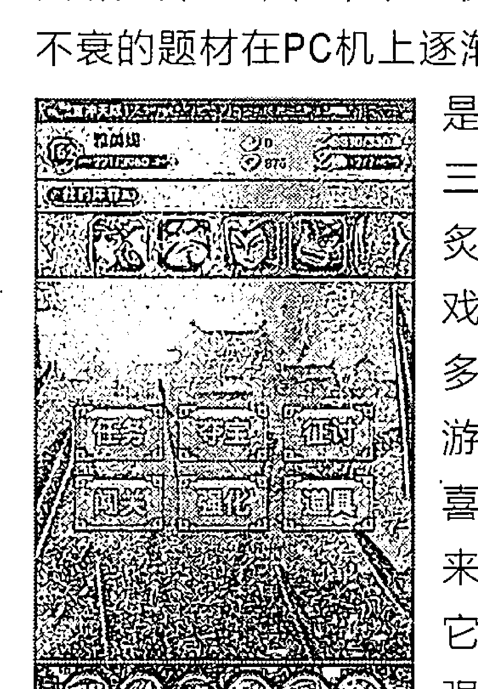

### 疯丫头：父母亲都是铁路职工，从小在铁路系统长大，住在铁路旁，长大后对火车还是有特殊的感情。

我虽然不在铁路系统上班，但对铁轨火车还是有特殊的感情，有时候也希望自己能成为一名铁路工程师，设计火车的信号指示和调度，控制铁轨让火车有条不紊地运行，还好发现了火车危机这个游戏，让自己指挥火车的梦想在游戏里实现。


游戏刚开始比较简单，越到后面越难，经常出现撞车事故，反复实验、研究才能顺利过关。我不禁感叹现实中负责火车信号灯和调度的人真的不容易，责任重于泰山，不仅要事先设计规划好，而且运行过程中也不能出一点点纰漏。可以说这个游戏非常考验我在危险、紧急时处理问题的能力，不得不说这是一款“碉堡”了的游戏，通过它可以让你更加懂得如何去分配时间与任务，如何分清主次缓急！虽然游戏画面和音效很让人震撼，不过游戏除了调度火车之外，没有别的任务，也没有别的机友前来与你一同对战，有的只是满腹寂寞与空虚！

### 丽丽：中学教师，不爱运动的丽丽喜欢在手机上静下心来玩益智类的游戏。

**推荐的游戏：鳄鱼小顽皮爱洗澡**
**推荐理由：益智休闲**

我是一名教师，上课、备课之余喜欢一个人静下来玩手机游戏，尤其喜欢一些益智类的游戏，如植物大战僵尸。最近发现鳄鱼小顽皮爱洗澡这款游戏非常不错，其亮点不仅在于它的休闲益智，更重要的是在体验度上，可爱的2D画面、简洁的操作、欢快的音乐，这对我来说都是一种愉悦的享受。

简单来说，这个游戏就是某只特立独行有洁癖的奇怪鳄鱼，虽然住在下水道这种鬼地方却喜欢洗澡，结果招来其他多数人（多数鱼）的不爽，一怒之下断了这位异类的水源。游戏目的就是把不知从哪冒出来的一滩清水，经过千回百折千难万险，送给这位处于上甘岭般断水状态的鳄鱼，满足它天天洗澡的奢侈需求……

见这个游戏的第一感觉是，怎么这么像切绳子，之后的游戏也确实和切绳子有些类似，同样的纵向游戏，同样的卡通画风（当然由于发生在地下，比切绳子稍微暗了一些），一般都是从高到低，都是借助重力以及一些机关（挖地道、喷口/绳子、气泡），把某个东西（水/糖果）送到目的地（喷头水管断口/嘴里），中途碰到一些奖励要素（橡皮鸭/星星），都以可爱的小怪物为卖点，就连界面也很相似。给我的大体印象就是——这是把糖果变成液体版的切绳子。

但与很多劣质山寨不同的是，它不是单纯的模仿，正像切绳子充分发挥了能控制糖果运动的各种道具，比如绳子、气泡，以及各种障碍如钉板等，它也利用了与水相关的各种道具，如喷口、水藻、污水等等。特别是它吸收了流体控制游戏的一些优势，把“水”这一核心要素的各种特性发挥到了极致。

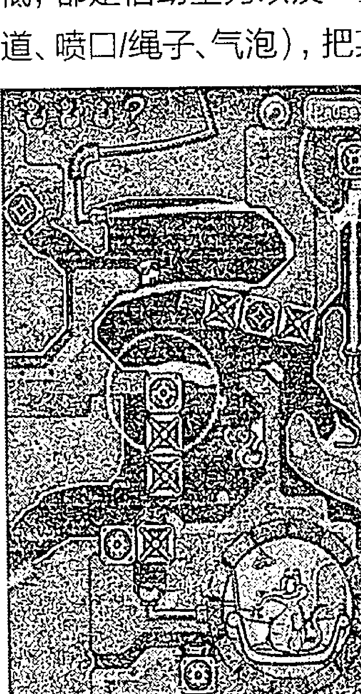

### 娟子：报社外景记者，活泼可爱的娟子非常爱好运动，手机游戏也非常喜欢那些动作竞技类的。

**推荐的游戏：铁路跑酷**
**推荐理由：操作性强**

在跑酷游戏大量充斥市场的今天，用“泛滥”一词来形容其数量绝对不为过。如果一个游戏开发商想要迈进这个基本饱和的市场，他只有一个办法——创新。曾经有人说，《神庙逃亡》之后再无跑酷，这句话现在看来基本是错的。特工跑酷的面世让人们知道，只要足够用心，同一题材的游戏依然会有突破。而当我玩了《地铁跑酷》再一次验证了这一点，因为它让我看到了创新的力量。

这个游戏最大的亮点就在于色彩了，至于画面嘛，不是高清，但是卡哇伊的造型弥补了这一点，充满童趣的色彩反而让不甚清晰的画面带点可爱。当时不太喜欢神庙逃亡的一点原因就是色彩太晦暗，一屏幕的土黄，跑到有水的地方还要好点。而今天这个游戏就一路灿烂，让我玩起来很有心情。

一般的跑酷游戏因为题材都事关生死，所以选择整体颜色的时候都很阴沉，但地铁跑酷一改压抑的画面风格，大胆地采用了极为鲜艳的色彩，一进入游戏便牢牢地抓住玩家的眼球。这种鲜艳的色调削弱了跑酷游戏的紧张气氛，即使一个不小心撞到墙壁也不会非常懊恼。游戏的音效以活泼欢乐为主，丰富性实属一般，但玩跑酷游戏的时候，大家都紧盯着面前的障碍，谁还有时间去欣赏音乐呢。

游戏的背景是一个少年因为在火车上胡乱涂鸦而被铁路警察狂追，而少年需要沿着铁路狂奔来脱离讨厌的胖警察。虽然同样是逃亡，但是神庙里那样紧张压抑的神秘气氛已经在这里烟消云散了，我们可以跑跑跳跳、收集道具，甚至攀上车顶来享受逃亡的快感。

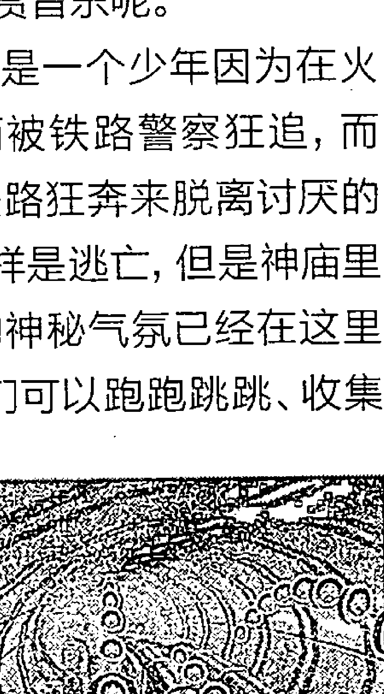

看了本期几位MM的游戏经历，你是否感到震惊，没想到在美貌的背面她们还有着非凡的智慧。如果你也是一位手游爱好者，把你的游戏也投稿分享一下吧。

从涂鸦背景菜单到逃旅中路过的色彩斑斓的车厢，游戏利用大面积的颜色向我们展现了一个生动而颇具亮点的跑酷类游戏。如果你正因为玩《神庙逃亡》神经压抑太久，那不妨来试试这样一款思路相同，但是画风丝毫没有逃亡的紧张气氛，反而因为逃亡而充满无限欢乐的街头涂鸦风格的跑酷游戏《铁路冲浪》。

## 当汽车遇上智能手机

现如今，无论是开车还是租车，有些手机应用还真是必不可少。来听听以下朋友对手机应用的见解吧！

文/飞雪散花

当今出行离不开交通工具，看看满大街的汽车就知道。可是你知道吗？当汽车遇上智能手机，它俩竟然也能“摩擦”出火花。无论是自驾车、租车还是打车，有些手机应用还真是必不可少。理由很简单，因为凭借它们，我们可以让自己的出行更方便。以下朋友对此的理解当然也不例外……

王飞，公司主管，自驾车历史9年。最喜欢说的话是“干嘛呢”？最爱吃的菜是小葱拌豆腐，最爱做的事是上网、玩手机、自驾车出游。

- 推荐的应用：高德车友汇、NaviDog导航犬

推荐理由：加油、导航、违章查询等琐事，这两款工具轻轻松松就给办了。

自驾车出行，最让人懊恼的事是什么？不是车辆损坏、半路抛锚，而是车到半路没油了，而更更更丢人的是，明明附近就有一个加油站，自己却不知道，仍一个劲站在路边，傻乎乎地打手机向朋友求救。其实像加油这种小事，一款名叫“高德车友汇”的应用就轻松搞定了，有了它，附近何处有加油站，何处有停车场，加油站和停车场的价格是多少，就明明白白显示出来了。此外，它还提供了当前天气状况、洗车指数、当天限行情况、注册车辆违章查询及语音播报、代回短信等功能。

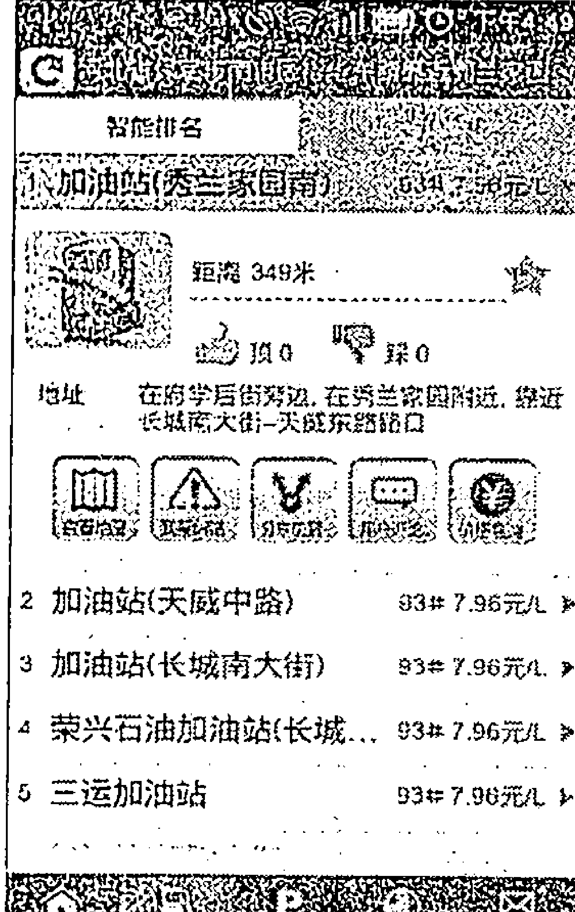

这样，当我一不留神觉得有违章嫌疑后，便无需费心劳力亲自到交通部门排队查询了，只需按下其中的“违章查询”按钮，再输入自己的车牌号，相应的信息就出现了，十分方便。

我要推荐的另一款应用是“NaviDog导航犬”。凡是自驾车去过陌生异地的朋友都知道，人生地不熟那路难走啊，有时为了到达目的地，我不得不反复打听，时间浪费了不说，还往往因为语言方面的差异，搞得南辕北辙、直中求曲。所以后来我干脆在手机中安装了“NaviDog导航犬”。这玩意支持文字和语音两种导航形式，只要告诉它要去的目的地，它就会指出正确路线，并在导航的过程中，用语音的形式随时提醒我目前到了什么位置，接下来的路应该直行还是左、右转弯等。此外，它还提供了周边搜索功能，如附近哪里有酒店、银行、邮局、医院等，查一下就知道了，非常不错。

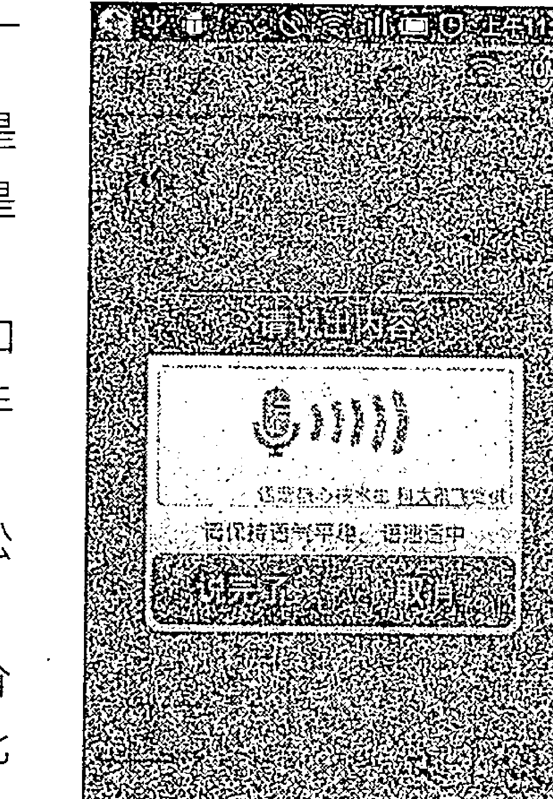

刘伟林，网站CEO，毕业于加拿大西安大略大学，同时在理查德艾维商学院获得荣誉工商管理学士学位。经常出差，并因为出差，与租车结下了不解之缘。

- 推荐的应用：一嗨租车、特价租车查询

推荐理由：租车好，能租到较便宜车更好。

经常到千里外的异地出差，这时，我觉出自驾车有多不现实了，期间千山万水都要一一翻越，一路下来，受的那个罪就甭提了。后来经一同事指点，悟道了，咱们为什么不能到了目的城市再租车呢？这样，既享受了自驾车的自由，又可免去长途自驾车的辛苦，同时又可省去需要临时打的的麻烦。不过，租车也有学问。怎么才能方便地租到车呢？其实简单，用“一嗨租车”呗。它提供70多个城市汽车租赁服务，而且租赁方法也相当简单，注册登录后，点击主界面中的“自驾租车”按钮，然后依次设置好“取车门店”、要租赁的“车型”、“租车时间”、姓名、身份证号码及是否需要GPS导航仪、地图等增值服务等信息，完成付款操作，一切就OK了。接下来，我们只需在指定的时间上门提车，或等待门店将车送到指定地点就可以了。

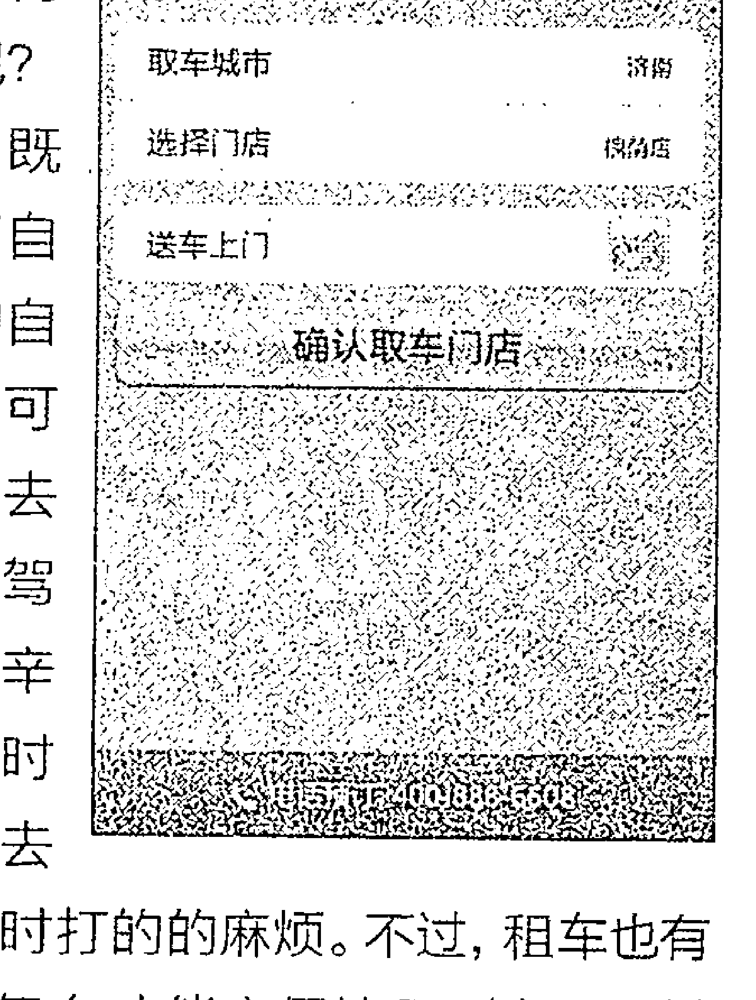

此外，“特价租车查询”也很不错。这款应用表面上和“一嗨租车”的作用相似，但它有一个优势，就是可让咱们租到便宜车、特价车，覆盖的城市包括北京、上海等全国几十个主要城市。看到这里也许有朋友说了，同样可以租到车，但“特价租车查询”往往可以租到便宜车，为什么上面还要推荐“一嗨租车”呢？其实原因蛮简单，两者提供的车源范围并不一样，有时一款可以租到的，用另一款并不一定租到，因此两者互补是很必要的。

看了这几位朋友的使用经验，对你有什么样的启发？也许在生活中你有比他们更具创意的应用方法，不妨投稿来说说吧……

薛文辉，自由职业者，最喜欢的东西是钱，最缺的东西也是钱，曾经一夜之间游遍故宫、九寨沟、西湖、西藏、印度、阿尔及利亚等76个国家和地区，醒来后发现红日高照，自己在床上做长途跋涉状。

- 推荐的应用：嘀嘀打车、出租车计价器

推荐理由：屌丝，打车是常态，能方便地租到车且不被忽悠是王道。

对于“屌丝”来说，自驾车暂时只是一个梦，常常租车也不实际，为啥呢？差钱呗。于是到了一个地方，能搭上公交车或地铁最好，如果不能，偶尔打打车也不错。不过打车是个技术活，特别是在北京这种人口密集、车辆如潮的一线城市，靠站在路旁招手停车，估计胳膊晃残了也没人理你。所以，我强烈推荐下面两款应用，有了它们，估计咱们这辈子打车基本上就不用愁了。

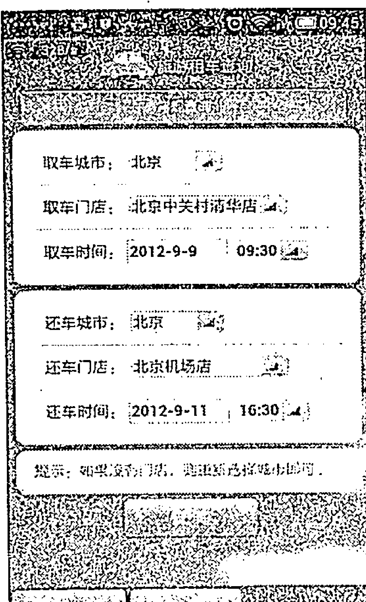

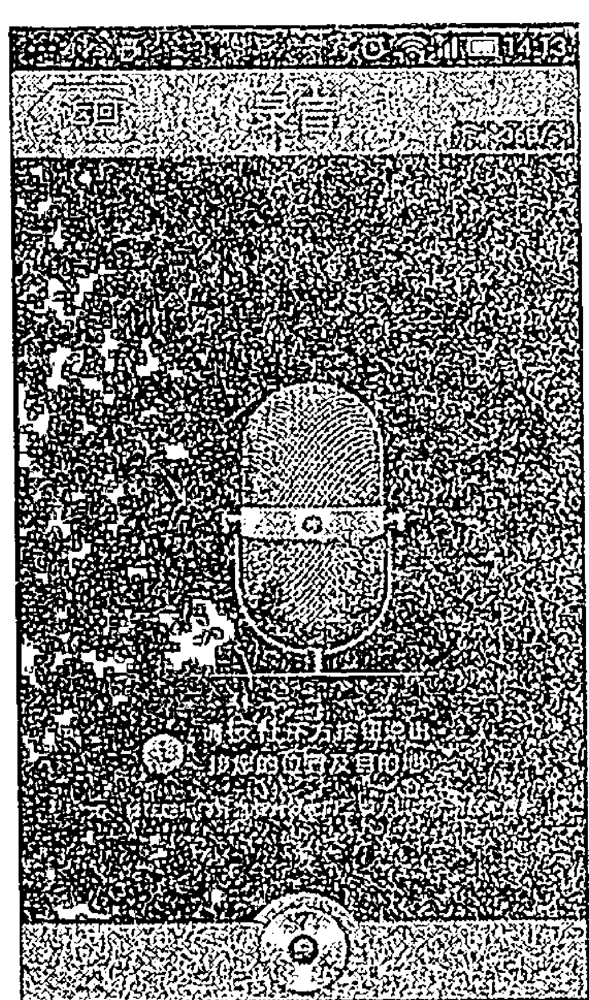

一是“嘀嘀打车”。无需拨打人工电话，打开它就能看到周围行驶的出租车，对着手机说出自己当前所在位置及要去的目的地，就会有空闲的司机进行回复，同时，有关该司机的车牌、电话及所属公司等信息就会出现在界面中。接下来没说的，想好接头暗号等着坐车吧。

二是“出租车计价器”。记得有一次到新疆玩的时候，一不留心就坐上了一辆黑车，明明只有几公里的路，却非得收我二十多公里的钱，幸亏当时我的手机中安装了该应用，当车辆开动时，我偷偷按下“开始”按钮启动了它，随后，该应用就会根据GPS定位，准确地计算出行驶距离，并根据当前所在区域的车费数据，计算出应交纳的车费（含起步费）。于是，正义战胜邪恶，“屌丝”获胜。经常打车外出的朋友，千万不要忘了装该应用。

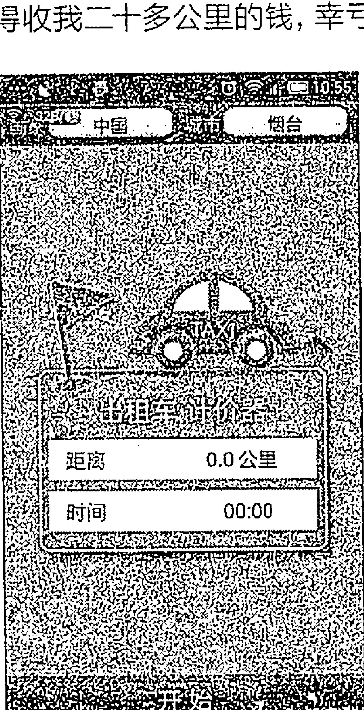

李亚朋，网店店主，平生为人豪爽，爱喝酒，爱驾车，爱结交朋友并很愿意把自己当成一名深沉的“护花使者”，最爱的名言是：“喝酒不误开车，开车莫忘赚钱”。

- 推荐的应用：e代驾、我搭车

推荐理由：喝酒时开车很安全，空车时搭载可赚钱。

很多朋友把我自创的“喝酒不误开车，开车莫忘赚钱”的名言理解错了，觉得我这个人自甘堕落，可能已经不知做过多少次马路杀手了，或者非常爱财，总是鬼鬼祟祟地搞无证运营，赚黑心钱。其实我这个人很阳光，也很守法，我这里说的“喝酒不误开车”，不是自己开，而是指喝后找代驾；而“开车莫忘赚钱”是指顺路带个朋友，为自己省点油钱，同时也为他人带来方便，也就是大家都熟悉的拼车。因此，我喜欢的与车相关的应用是“e代驾”和“我搭车”。

其中前者可在我酒意阑珊后，显示出离自己最近的代驾师傅的信息（当然前提是你已启动了程序），其中包括这些师傅的驾龄、代驾次数和当前是否有空等，这样，我就可以根据自己的需要，方便地呼叫代驾师傅来送我回家了。

而另一款，则能显示出当前城市的拼车信息，我很容 易从中找到一 位和我同 路而拼车 时间又合 适的朋友来 做 我的搭 档。如此 一来，油 钱有人分 担了，而他人同时也得到了便利，何乐而不为？

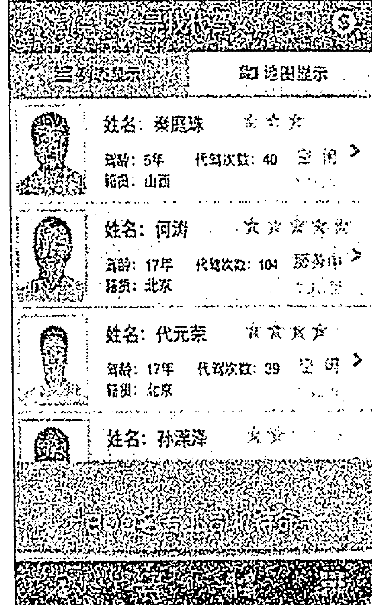

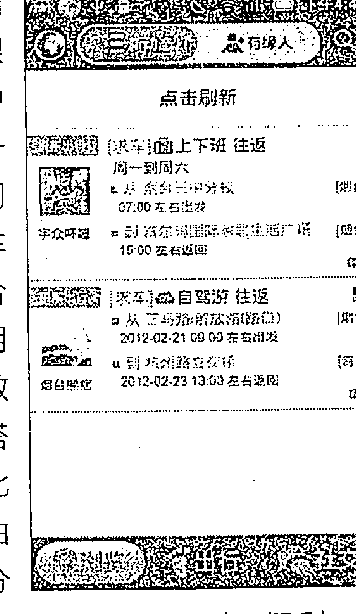

## 手机看电影的奇思妙法

自从有了智能手机，电影也跟着火了起来，无论是新片、旧片统统都能在电影客户端中找到。在生活中，智能手机对电影的贡献可不仅仅是这么简单，以前只能在影院办的事，现在智能手机照样搞定！

文|付易

近日来，各大新电影陆续上映，课余时间也逐渐增多，宿舍舍友遂对手机的娱乐问题开始头脑风暴！老大是考研预备生，坚决不拿手机打游戏；老三作为骨灰级的手游玩家，每天不打打游戏简直就是不顺畅！看来只有在手机看电影的问题上达成了共识，今天的卧谈会有点意思了……

- **登场人物:** 老大
- **所属派别:** 怀旧派
- **杀手锏:** 爱奇艺
- **绝技:** 怀旧老片同步看

老大作为宿舍考研第一人，一向喜欢看老片，“越老越香”是他的口头禅！也正因为如此，老大低调沉稳不跟风的作风迅速得到了室友的认可！老大总觉得现在拍的片子缺乏灵气，而那些老片经过时间的洗礼，煞是经典！老大拿出自己的安卓机，运行爱奇艺应用，搜出自己最喜欢看的金庸武侠——《天龙八部》。“我看电影就用它，反正我就喜欢看老片，用这玩意搜老片还真搜不出来的时候！并且观看效果还不错！”

> “离线观看”这个功能我很欣赏，可以把我观看过的网络视频缓冲保存到本地，方便下次继续观看，这样也免得我单独跑去下载，一边看一边就下载好了，方便！另外这玩意的同步播放记录功能可不容忽视，虽说我经常带着手机，可是回到宿舍在有电脑的前提下咋也不会用手机看的，那么之前在手机上面看过的视频同步到电脑上接着观看就更爽了，也不用担心切换终端忘记了视频的名字。我就是在手机版的爱奇艺一直登录我的账户，之后在电脑爱奇艺客户端上面登录我的账户，就出现了之前在手机上面看过的视频，再方便不过了！”说着说着老大开始看《天龙八部》萧峰聚贤庄大战群雄了……

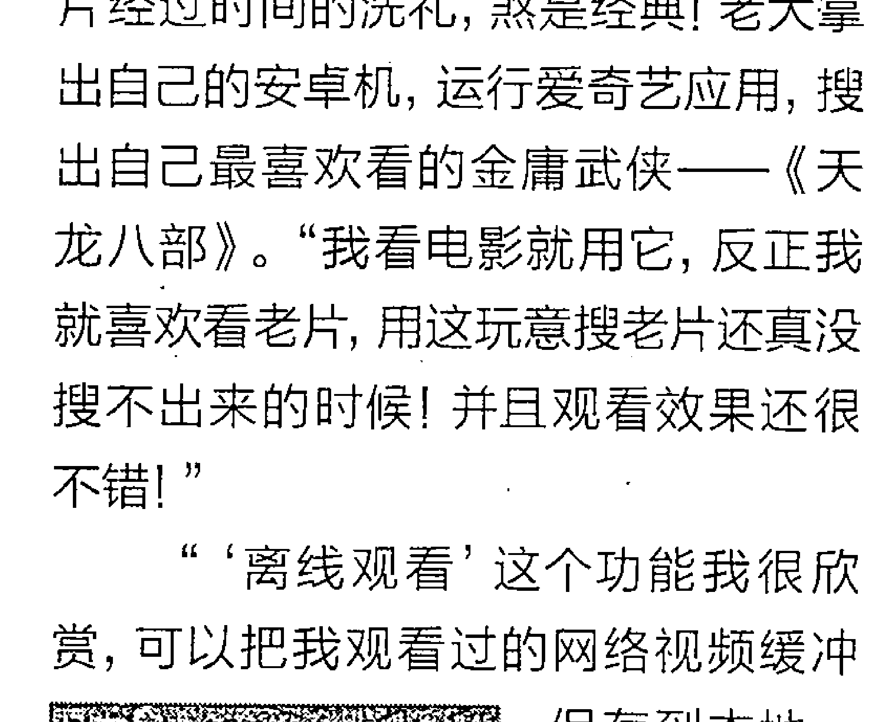

- **登场人物:** 老二
- **所属派别:** 跟风派
- **杀手锏:** 迅雷看看手机版
- **绝技:** 视频本地传输

一听到老大提到“离线下载”功能，向来都是以摧枯拉朽之势扫荡热播大剧的老二这次来瘾了！为了满足自己的影音欲，老二不惜重金购买迅雷白金会员，这次又来分享经验了。“大哥，敢问目前互联网上面的‘离线下载’有哪个能跟迅雷媲美的？以前没有安卓机的时候，只能在电脑上面体验迅雷会员视频加速的威力，这次借助迅雷看看手机客户端也可以体验啦。登录自己的会员账号后，用它看视频就会启动会员加速通道，速度蹭蹭的，哈哈！”

“你以为谁都跟你一样是高富帅啊？这么花钱买迅雷会员？”“嘿嘿，亲们别这样说，它除了视频加速功能之外，视频分类的法子想必你们都会喜欢的，比如这个‘全球票房top10’的分类，很像百度上面的音乐排行榜！百度那个功能能迅速帮我们找到好听的歌曲，相信迅雷看看这个功能能帮我们迅速确定好看的电影呢！其他的视频播放功能跟老大说的爱奇艺区别不是很大，但是有几个功能我保证亲们还会喜欢！最神奇的就是可以把本地视频通过Wi-Fi传输到所有通过路由器连接的电脑，当然，你的手机也得连接这个路由的Wi-Fi。反正咱宿舍都是通过路由上网的，这点也就OK啦！老大手机上面的英语讲解视频挺多的，日后咱考四六级也得用用啊！老大每天晚上睡觉前都看，何不共享下呢？”老大摸了摸头，“嗯，不错的想法，只要你们肯学习，我绝对分享！快给我装一个！”

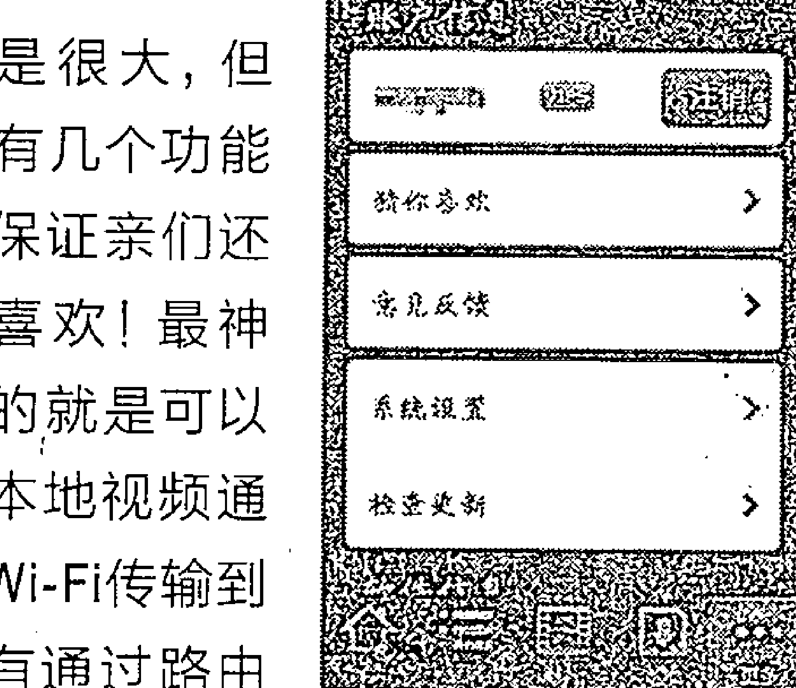

- **登场人物:** 老三
- **所属派别:** 屌丝派
- **杀手锏:** 时光网影讯查询，PPTV手机版，优酷手机客户端
- **绝技:** 电影影讯抢先看

老三听老大说看老片，并且还是N年前的老片，老三也按捺不住了，立刻开始嚷嚷：“我说大哥啊，都神马年代了，还看那么老的片子，思想都停留在了20世纪……前段时间你还叫我帮忙给你找对象，要找对象啊，思想首先得新，得Modern！”老三拔下正在充电的安卓机，运行时光网影讯查询，“多看些新电影，以后跟女孩子聊天就有话题了。我经常用安卓版的时光网影讯查询，还记得我之前老跟你说的《蝙蝠侠3：黑暗骑士崛起》吧，影评影讯这上面说的可多了，能迅速帮助你确定下是否该去看看。你再看看这个‘查影讯’功能，可以立刻知道这部电影在离自己最近的哪个电影院里面播放，时间、票价一应俱全。大哥啊，转变下思想，多看看新片吧！

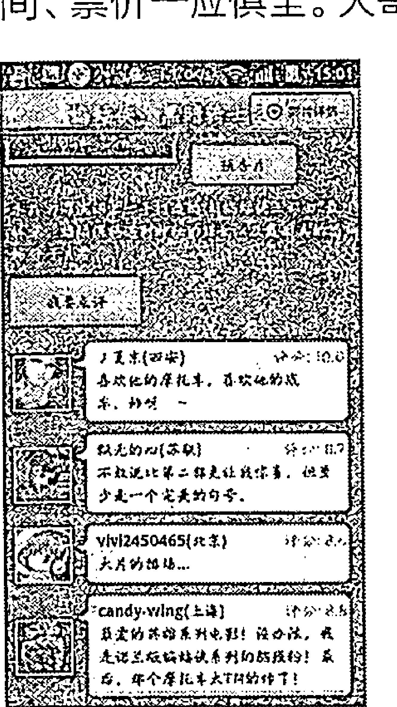

刚说完，老二立刻夺过老大的手机，在老大手机上面装了个PPTV，“兄弟们，让咱花钱在宿舍装闭路电视，那简直就是扯淡，咱就用PPTV看直播吧，它收集了很多电视台，也省去了弄电视的麻烦……嘿嘿嘿，我的江苏卫视《非常了得》快开始了，你们继续哈，我先看直播喽……”

宿舍顿时只有手机的外音，只见老四老五还在那跟对象“墨迹”着打电话……

- **登场人物:** 老四
- **所属派别:** 玩酷派
- **杀手锏:** QQ电影票
- **绝技:** 热门影票轻松订

电话终于打完了，老四喝了口水开始炮轰老三了：“我说老三啊，老大叫你帮他找对象那简直就是见鬼了，你自个到现在还是个棍子！就拿你说的法子做吧，难不成跟对象看电影就拿个小屏砖块看？哪有去电影院看电影自在？况且老大还是要考研的，你还叫他这么玩手机！看我吧，在有限的时间里跟对象高效地沟通，要看电影就跟对象去电影院看电影，那才叫氛围，有利于增进感情！”

老三嚷道：“神马玩意这么NB，有我的免费看电影软件好？”

“免费不敢当，不过花这么几个钱同对象培养出来的感情，远比你跟你未来的对象用手机看电影多！”只见老四立刻在手机上面运行了QQ电影票，“你们应该还记得我那次陪对象去看《敢死队2》吧？就用这玩意搞定的！点击‘排期购票’后，可以看到有很多影院上映，要注意那些带有‘券’的电影院，那可是能够很便宜买到票的，我就点击带有‘券’的电影院，再点击‘立刻购票’，所用的账号就是你的QQ号码，就出现支付界面，填写好接收电子券的手机后，就会进入付款的界面，支持财付通，银联等主流付费方式！”

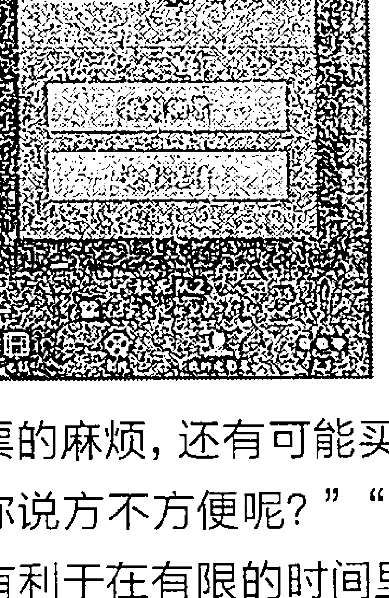

听老四在这里传经，老大立刻跑到老四身边，“到时候直接拿着电子券去电影院兑换票就是了！省去了排队买票的麻烦，还有可能买不上呢！大哥，你说方不方便呢？”“嗯，老四的法子有利于在有限的时间里培养跟对象的感情！不错！”

- **登场人物:** 老五
- **所属派别:** 富帅派
- **杀手锏:** 瓦格拉@电影
- **绝技:** 订票选座一招鲜

老五沉寂了一会，笑道：“老四啊，你买到电子券后，去电影院兑换票的时候需不需要排队？”“当然需要啊，就像你网购火车票一样，还是得去换成纸质票，只有部分是不需要换的，凭电子券入场！不过话说回来，有时候人多的时候，就算买到了电子券，也极有可能没坐，毕竟是去现场选座的，选不到心仪的座位跟对象坐一起那是经常的事情！”

老五立刻起床，道了句，“爱她，就别叫她排队，就叫她坐在最好的位置！为了实现这一点，我用瓦格拉@电影直接把订票的事情给办了，懒得去排队兑票！你那招不行，一去就直接看电影不爽啊？”所有的人都围到老五身边了！

“那次跟她去看《危险关系》这部电影，前期购票流程跟老四说的QQ电影票差不多，关键在后面，点击‘排期购票’，选择好放映时间，就进入选座环节，红色代表‘已售位置’，粉色代表‘情侣座’，绿色代表‘已选位置’，当时我就把座位选在角落，好跟女友交流，你们懂的！接下来点击‘确定’进入付款界面，登录自己的注册账号，填好手机号码以便接收取票密码，一切就是这么简单，所用的支付方式都是主流的银联还有支付宝之类的！我跟女友温馨浪漫的氛围就是这么Easy地塑造出来了。老四那招还可能选到的座位不在一起，那么跟对象去电影院就白去了，我这招能万无一失地跟对象坐在一起，哪个更帅？”

还是老五厉害！富帅派的实力果然不容小视！不过还是得看情况，喜爱免费的嘛，就学老大老二老三，而有经济实力的，老四老五的法子的确不错，有利于增进感情！这次的卧谈会真是不错，不仅增进了舍友的感情，还让我们多了很多利用手机看电影的法子，没想到手上的板砖用途还真大！呵呵！

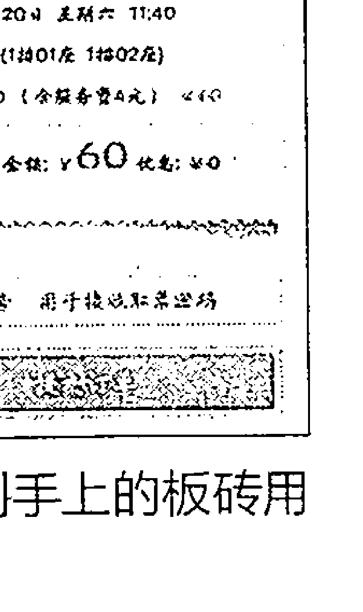

“等等，小六，咱五个都说了半天，你呢？半天没见你挤出几句话！”“啊？呵呵，我嘛，就把你们说的法子综合起来为我所用，还是多谢亲们分享经验啊！哈哈！”

看了宿舍这几位老兄的经验之谈，你是否又学了一招呢？如今，智能手机的应用已经越来越庞大，你身边有哪些使用的经典案例不妨也来说说吧。

## 手机浏览器该用谁

智能手机除了智能外，上网方便也是一大特色。说到上网就不得不用到手机浏览器，现在的手机浏览器都宣称自家的产品速度更快、内核更先进、功能更强大，果真如宣传的那样好用吗？除了浏览器速度、流量控制方面，还有哪些功能更实用、更符合广大手机控的需求呢？本期我们就根据不同的适用人群，来给大家推荐一下。

### 读者声音

> 就移动设备来讲，个人认为天天浏览器的云穿越功能比较不错，可以把PC端浏览的内容传到移动终端上，比较方便，还有稍后阅读功能也比较实用。现在的手机浏览器大同小异，特色功能不多的情况下，选择何种浏览器主要还是因人而异的。

> 当选Chrome。界面简洁、速度极快，配合插件使用，安全性、去广告、购物比价等等使浏览器增色不少。

> 当然是UC了。排版稳定，排版方面是最好的。性能稳定，也是比较强的。操控体验也是很好，特别是手势操作。它已经是个老牌的国产货啦！怎么能不支持！

> 我最喜欢的浏览器就是谷歌Chrome浏览器，自从用了Chrome就很少用IE了，别的浏览器也都卸载了。喜欢这个浏览器的原因就一个字，快！

> 我最喜欢的浏览器就是Chrome，拥有简约的界面和先进的技术。快速、流畅是我这种急性子所需要的，而且还有你想要却找不到的东西。

### 编辑推荐

#### 1.Opera mini浏览器
适用人群：长期固定浏览某些网站的用户

首先推荐Opera mini浏览器，因为它最早以九宫格快速导航作为主页面的浏览器，连现在的PC端浏览器都开始使用这种快速导航界面作为主界面，让我们不得不佩服欧朋先进的设计理念。九宫格的界面除了简洁明了之外，就是高自由度的自定义。确实如此，与其将常去的网站放入收藏夹，真的不如打开即显示来得直接，不过由于只有九个位置，对于喜欢四处游荡的手机控来说并不适合。而Opera mini浏览器的另一大特色就是在地址栏旁边的搜索栏，搜索引擎可以根据用户的需要进行更改，甚至可以将搜索栏变为在线字典。如果将搜索引擎设置为淘宝搜索引擎的话，那么搜索结果将会变为淘宝商品，这种设计很方便，也很值得赞赏。

#### 2.UC浏览器
适用人群：对浏览器功能要求较多的用户

无论你以前是Windows mobile用户还是塞班用户，在很多人心中一提到手机浏览器就会首先想到UC，作为老牌的浏览器，在适用新系统方面我们不得不说UC做得真的很棒。无论是浏览器打开速度、界面图片加载、常用网址导航、手机下载等等各个方面，UC的功能都排在其他浏览器的前面，而UC浏览器独有的屏幕截图分享功能，不但可以选择截图区域而且支持涂鸦，这是其他手机浏览器所不能比的。新版本的UC浏览器还新增了阅读模式，更加便于浏览网页。比如说浏览微博时，UC浏览器会自动加载并显示出下一页的内容，在浏览完本页的内容后，你会发现下一页的内容已经被拼接在本页内容下方，无需翻页就可以继续浏览，很贴心啊。可以说，在手机功能推陈出新方面，UC至今都走在前列。

#### 3.Chrome谷歌浏览器
适用人群：学生一族

之所以给学生一族推荐Chrome谷歌浏览器就是看重了它丰富的插件功能，Chrome谷歌浏览器的打开速度大家都有目共睹，但是你知道它丰富的插件和快速地打开可以让身为学生的你挤进繁忙的选课系统吗？如果你是学生，下次选课不妨试试Chrome谷歌浏览器，一定会有意想不到的惊喜。其实，对于chrome谷歌浏览器我们无需多说，对它的评价也只需要一个字，那就是“快”。

#### 4.海豚浏览器
适用人群：喜欢时尚尝鲜的用户

现在的手机屏幕越来越大，想单手操作也越来越困难，所以很多软件都开发出了手势功能，虽然UC也有手势功能，但是作为手势浏览器的鼻祖我们不得不提到海豚浏览器。一个手势就能直达预设网站，一个手势就能实现常用操作，这就是海豚浏览器的魅力之处。在通过手势功能一举成名之后，海豚浏览器又开启了语音与网页内容交互的先河，浏览器特有的智能语义识别，则让上网浏览更自然，按下语音按钮对着浏览器说出网站名就能打开你想要的网站，是不是很神奇呢？

每次调查前，小编会在官方微博放出有奖转发微活动。精彩点评不但能刊登在杂志上，更可以获得由杂志社送出的精美纪念品，快来晒晒自己的感受吧！
新浪微博：weibo.com/cfan 腾讯微博：t.qq.com/ourcfan

## 10块钱DIY手机微距镜头

手机镜头因为自身条件所限，微距效果往往很差。本文的方法让你花不到10块钱，即可拥有一个超级手机微距镜头。

文|奇思

用手机拍微距的朋友一定感觉到，当手机离得太近的时候，图像一片模糊，稍微离远点又没有了微距的效果。其实，只需一个不到10块钱的废弃门镜，及发夹、橡皮筋、小刀、废卡片等等工具，就可以自己打造一个微距镜头。

### 何处找透镜

凸透镜具有放大的效果，所以制作手机微距镜头的关键是先要找到一个大小合适的凸透镜。最方便的是花不到10块钱，去建材城淘一个防盗门的猫眼（门镜），拆开后即可得到一个凹透镜（四周厚中间薄）和一个凸透镜（中间厚四周薄），留下凸透镜备用。

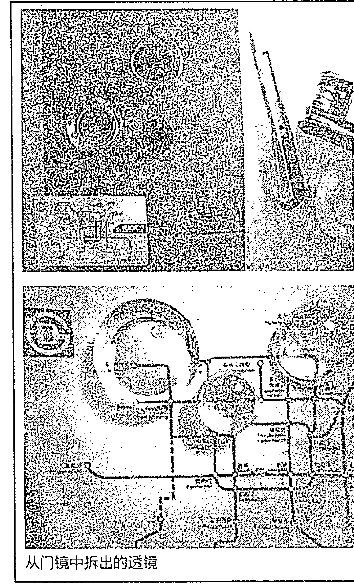

凸透镜中间越厚，放大的倍数越高，微距的效果就越震撼。除了门镜外，还可以从小手电（一般效果不是太好）、放大镜、废旧DVD光驱，甚至废弃的相机或摄像头中找到凸透镜。

### 简易微距镜头制作

找到适用的凸透镜后，接下来就是如何固定镜头了，因为我们总不能每次都捏着透镜来拍摄，那可太不方便了。下面介绍几种简便易行的方法，朋友们大可举一反三。

### 临时翻拍发夹快速固定法

翻拍图书资料，只是想临时使用微距镜头，可以如图所示，将凸透镜夹在发夹上，然后将透镜对正镜头再以胶带将发夹固定在手机上即可。

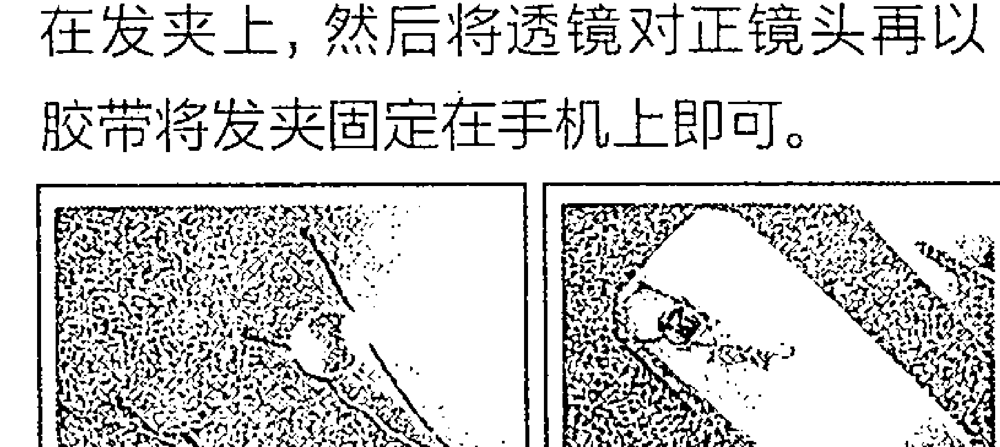

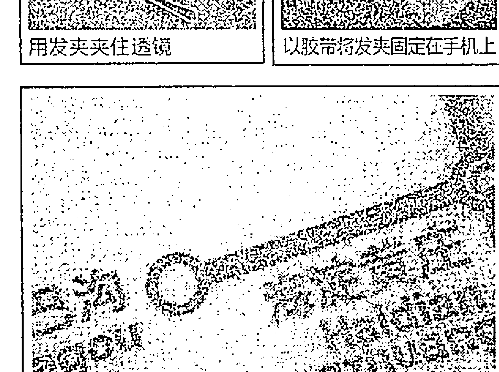

### 橡皮泥快速固定法

许多人小时候都玩过橡皮泥，它具有一定的粘性，并且可以捏制成任意的形状。利用这一特性，我们可将它用于临时固定微距镜头。

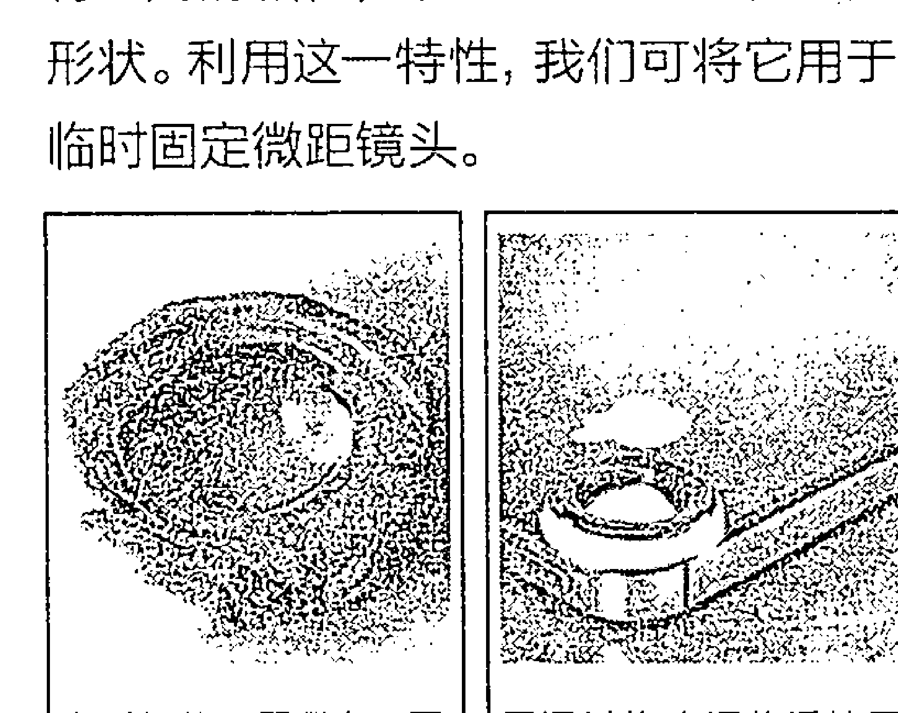

### DIY淘宝Easy-Macro微距腕带

淘宝上可以找到一种Easy-Macro的腕带，它上面嵌入了一个透镜，平时可以戴在手腕上或装在口袋里，出去玩要用手机拍微距照片时，取出来套在手机上，把透镜对准手机镜头就行了，非常方便。淘宝上，这种腕带一般在40~60元之间（国外进口的会更贵），其实我们自己制作的话，也就10来块钱。

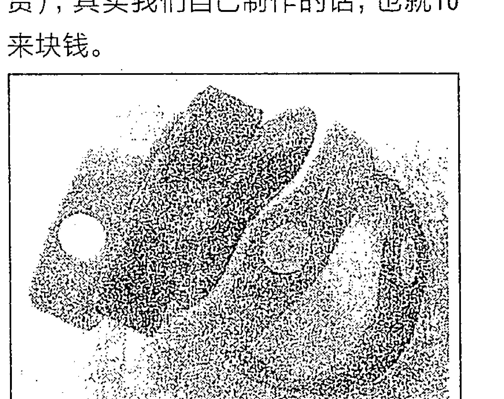

同上方法先找到一个透镜，另外再准备一个宽一点的橡皮筋，在橡皮筋上剪出一个圆形的小洞（要比透镜的面积小一点）。使用的时候，将橡皮筋套在手机上，剪的洞对准手机镜头，再把透镜塞进去固定好，就可以轻松拍摄了，同样很方便。

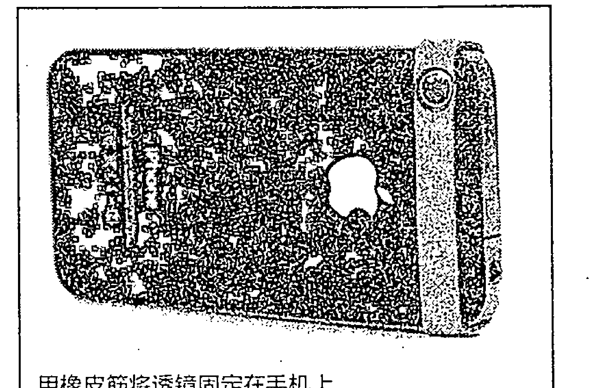

## 疯狂升级的Android系统

“Android系统一声吼，千百厂商跟着走”，没人会怀疑 Android 的影响力。但是，如果你的手机无法跟上 Android 的升级步伐，那使用体验无疑会大幅缩水。

短短的一年间，Android系统就经历了从2.3→4.0→4.1→4.2的四次升级过程，频繁的升级在带来了炫酷的新功能和更为流畅的操作体验的同时，也再度将厂商的更新策略推向风口浪尖：到底有没有责任为用户提供最新的升级ROM（固件）？

> 小知识
Android手机升级的重要性
苹果的iOS系统只能用在iPhone和iPad等少数几款设备身上，但Android系统却可以用在成千上万款不同品牌和配置的手机或平板电脑上。为了兼顾不同档次的硬件，这就导致Android系统存在先天性的低效率（相对iOS）和稳定性缺陷。因此谷歌每推出一个版本的Android系统，都会加入更多功能、改进Bug、提升操作体验。

### 厂商增设升级门槛

我们都知道Android 4.x比Android 2.x好，所以才会有优先购买预装Android 4.x系统手机的冲动。但现实的问题是：可能你今天刚买了4.0版的手机，下个月谷歌就发布了4.2系统。如果你想感受新系统的魅力，摆在你面前的只有2条路：

- 1. 不差钱，换一款预装4.2系统的新手机；
- 2. 老老实实在地等待手机厂商推出适合你手机的4.2版升级ROM。

精明的用户肯定会选择第2条路，但这并不符合手机厂商的利益。虽然手机和电脑一样，都是由外壳+主板+处理器+周边芯片组成的，但安装系统可不像电脑先装Windows再装驱动那么简单，需要对所有硬件进行匹配优化，为每一款手机开发新版系统的ROM都需要耗费大量的财力、人力和时间资源。何况Android手机厂家基本都在推行“机海战术”，旗下都有N多新品在卖，谁也没有足够的资源给所有手机开发新版的ROM。

但是，厂商的确又需要借助新系统的噱头赚银子，因此厂商都喜欢在新系统发布之际推出高价新品来吸引用户眼球。同时，为了在老用户中赚个好名声，厂商也不得不对刚上市不久的机器提供系统升级服务，只是为了避免因给老产品提供最新系统的ROM而影响到新品的销售，于是在手机厂商里就慢慢形成了3种潜规则：

- 1. 延缓为老产品的系统升级时间，确保不会影响新品的销售，周期从1个月到半年不等；
- 2. 只给最热销的几款旗舰或明星产品提供升级ROM，不会在冷门产品上瞎耽误工夫；
- 3. 以老产品硬件“不符合标准”为借口搪塞用户。

于是你会看到，即便已经上市三年的iPhone 3GS，现在也能升级到最新的iOS6系统，虽然无法使用Siri等新功能，但也算得上是“与时俱进”了。反观Android阵营，能为一年前上市的“过气的高端手机”提供官方4.1.1升级ROM的却是凤毛麟角。50%以上的Android手机从诞生到消亡可能都未曾享用过升级服务，最多也就是修复Bug的系统更新而已。

### 提供升级是厂商的义务

如今的智能手机已经等同于我们的“随身电脑”，如果不能及时升级跟上日益丰富的个人需求，存在还有何意义？这就好比在Windows 8盛行的年代，谁还愿意买一款预装Windows 98且不允许自行更新的“残机”？在Android手机已被卷入硬件规格同质化严重的漩涡后，厂商对旗下产品所提供的系统升级速度和质量的重要性显露无疑。小米手机之所以受到如此关注，除了性价比的确出色以外，持续不断的系统升级、免费为用户提供更多功能的后续服务也是值得传统手机厂商学习的。

总之，系统升级应该成为每一款智能手机的捆绑套餐，而不是需要额外附属条件的奢侈甜点，无论3999元还是699元的手机，都有权利享受免费且及时的系统升级服务。对咱们消费者而言，手机一年一换并不现实，但借助及时的系统升级，则可缩短与新品手机之间的功能差异，最大限度延缓手机落伍的时间。在这个谁都能做手机的时代，口碑的重要性不言而喻。而能否为老用户提供持续的增值服务，不就是讨好用户的最好手段吗？

> 小提示
多关注第三方ROM
如果你的手机迟迟不提供官方的ROM升级，大家不妨多多关注一下类似机锋、安卓、安智等论坛的相关板块。很多热门手机会有民间的个人或组织开发的第三方ROM，无论是系统版本还是稳定省电等效果都要比官方ROM更出色呢。不过升级第三方ROM要严格遵守刷机教程，存在一定的危险，建议在有经验的朋友指导下进行。

## **手机随身带 生活随处拍**

现在的手机，除了要有大屏、高频外，对手机摄像头像素的追求也让人们纷纷丢掉手里的卡片机，做起了手机拍客。虽然手机相机的拍摄效果不能与专业的单反相机相媲美，但是通过一些照相软件的处理，在美化效果方面甚至不输给单反相机。

什么叫手机拍客你知道吗？手机拍客就是手机里相机软件越多越好，而且外观要漂亮，功能要强悍，滤镜要丰富，设置要专业，你要是只用系统自带相机都不好意思跟别人打招呼。不过话说回来，软件再多，最常用的就那一两款。如何根据自己的需求选出最适合自己的软件呢？不妨来看看编辑和粉丝们的推荐吧。

### 编辑推荐

- **推荐1：相机360 适用人群：新手、普通用户**
提到手机相机就不得不想到相机360，这款“老”软件，不但老当益壮，而且有越活越年轻之势。在满足大众用户的拍摄需求下，特色功能也是不断推出，特有的“趣味相机”、“情景相机”、“移轴相机”、“移色相机”，不但让我们拍摄出妙趣横生的合成照片，更让生活在不经意间充满欢乐。使用它绝对能让你感觉到，原来做一个摄影大师是这么简单。

- **推荐2：美人相机 适用人群：自拍族**
使用相机自拍是很多MM喜欢做的事情，以前自拍完后，为了让自己的相片更妩媚，免不了要动用修图软件。现在好了，POCO美人相机就是针对美女们开发的手机拍照软件，绝对是自恋级手机拍照神器。美白嫩肤、智能美形、自动彩妆，这些针对MM自拍的特色功能，让你做到想瘦哪就瘦哪，想怎样美就怎样美。如果你是喜欢自拍的MM，你能Hold住？

- **推荐3：专业相机CameraFV-5 适用人群：专业拍客**
俗话说得好，这年头干啥都得有点专业精神。做手机拍客最需要的就是抓拍精彩瞬间，如何抓拍呢？手机相机启动得快吧，照片得能快速连拍吧，如果不具备这些那都是浮云。而在手机相机界，就有这样一款专业级的软件，启动快、能连拍，更具有长时间曝光、单反取景器等专业单反相机的功能。如果你想做专业拍客，不用它都不好意思对外说自己是拍客。

- **推荐4：腾讯Q拍 适用人群：QQ空间用户**
手机拍完照片你会怎样处理？很多人会发到微博或空间分享吧。发到微博不是啥新鲜功能，是个拍照软件都能做到，但是把照片自动上传到QQ空间就不得不用到腾讯自家的产品了。支持云同步功能的Q拍，可以帮我们安全快捷地同步照片，再也不用担心照片会丢失，更能远离忘带数据线的烦恼，让我们真正享受随时随刻秀大片，随时随地存储生活点滴的乐趣。

每次调查前，小编会在官方微博放出有奖转发微活动。精彩点评不但能刊登在杂志上，更可以获得由杂志社送出的精美纪念品，快来晒晒自己的感受吧！
新浪微博：weibo.com/cfan 腾讯微博：t.qq.com/ourcfan

### 粉丝观点

**星火come：** 当然非Camera360莫属了。它可以辅助用户拍摄出独具风格的照片，弥补手机镜头成像质量不理想、层次差、感光范围弱等缺点，增强照片的视觉冲击力和层次，为不同环境的照片提供不同的风格化处理，增加照片的艺术性。

**幸运的来丁：** 很难说最喜欢哪款，因为完美的照相软件尚未出现。最近因为要合影自拍，偏爱拍手声控相机clapmera，简单易用方便。

**liujuanpp4：** 推荐UCam,支持炫酷的触摸对焦功能，支持拍照美化，省了安装美图秀秀。而且UCam利用防抖、动态聚焦等技术可以帮助我们拍出高质量的照片。时间戳、连拍、全景、相片格和背景等功能可以带给你我不一样的体验，更有安全的隐蔽模式。

**勤奋的_梦在前方：** 我用的是camera Fv-5。启动快，操作简单，参数设置也方便，相片质感和色彩都很好，很棒的一个照相机软件。

**黄小光先生：** 我用的是超级相机！2秒内启动相机，1秒快速对焦，快门零迟滞，内置六种特效，群拍智能换脸技术，同时识别5张人脸，一次拍摄5张照片，完美合并5个人最美的笑脸！自拍模式可以用后置摄像头，语音提示很方便，还有美颜功能，适合女生，一秒变白富美！

**Leezewind：** 试试PowerCam吧，有些人因为它冷冷的头像和偏欧美风格的UI设计而忽略了它，其实它是国内少见的技术上非常给力的拍照APP。首先，它的特效非常多，而且支持实时特效拍摄，也就是拍摄前就能看到特效，很多特效偏文艺范，受到广大文艺小青年的喜爱。

## 寒冷冬季 手机养生有绝招

寒冷冬季，气温变化以及早晚温差，无一不在影响着我们的身体健康。如何在饮食、穿衣加以注意，尽最大可能避免头疼脑热类的流感病侵蚀，高人自有高招。
文|盖述功

**陈彤**，中学教师，年近不惑，平生注重养生，自谓善饮善食乃健康第一要义。平时最喜欢看的书是李时珍的《本草纲目》，常说此中有真义，非读万遍不能晓其义。
**推荐的应用：** 美食杰家常菜谱、喝水宝
**推荐理由：** 药食同源，饭为药中王，水是命之源，兹事体大，不注意怎么行？

病从口入，民以食为天，我们不仅要吃饱吃好，更要吃的健康、营养。这不仅是对生活的享受，更是对家人负责。因此长久以来，我都会根据自己的身体状况，制定一个合理的饮食计划，在这方面，“美食杰家常菜谱”帮了我不少忙。有了它，无论我想了解菜谱、健康饮食知识、烹饪技巧以及各地特色小吃都可轻松搞定，尤其是其当中收录的1500篇精选家常图文菜谱，足够让我搭配出适合家人胃口的饮食，而其提供的“药膳”标签，更是可以让我很好地在营养和健身方面找到一个均衡点。“药疗不如食疗”，广大人民在千百年中总结出来的养生经验，其实应该得到我们的重视。

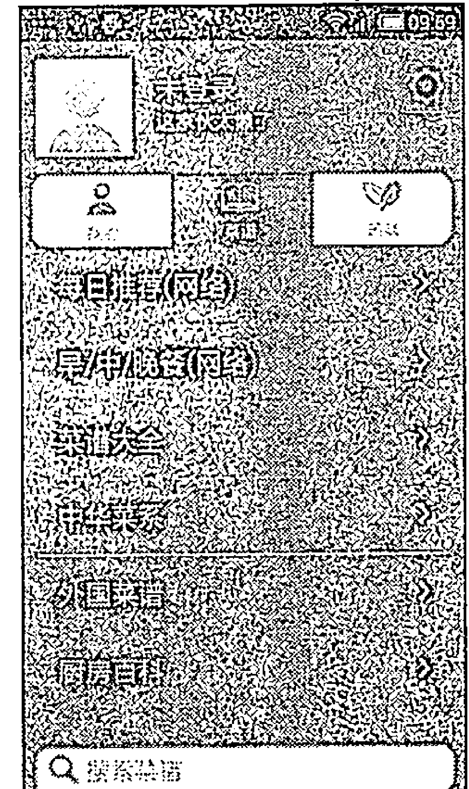

我推荐的另一款应用是“喝水宝”。现代医学证明，每个人每天必须要喝满八杯水，这样才能满足机体的需要。不过，由于工作和习惯的关系，真能坚持每天喝上八杯水的朋友并不多，而能坚持下来，并知道应该在什么时间喝效果才最好的人就更是凤毛麟角。“喝水宝”恰好能解决这一问题，它能根据我的体重，判断出我每天应该喝多少水、用什么杯子、在什么时间段里喝才合适。这样，水分足了，秋冬干燥的气候自然也不会对我的肌体造成伤害了。

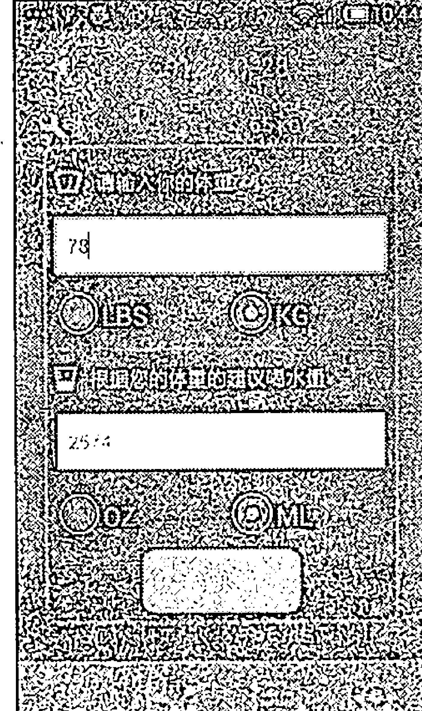

**冯娅群**，女，27岁，网站健康频道的资深编辑。最喜爱的时光是晚饭后和家人一起到公园散步，最爱做的事是早晨起来约三两好友沿护城河跑步，最爱说的话是“有健康才有生活”。
**推荐的应用：** 咕咚健身、用药安全
**推荐理由：** 生命在于运动，用药务求安全。

运动方式分很多种，有的朋友可能喜欢早起跑步，有的喜欢散步。但大多数人可能因为工作原因，根本没有时间健身，或者根本没有健身的概念，这其实非常可怕。因此我们很需要一些辅助健身的软件来了解一下自己每天的运动量，比如我个人比较喜欢的“咕咚健身”。它基于3D传感技术，可以实时记录下我每日的运动步数（包括走、跑、跳等），并由此测量出每天运动所消耗的卡路里。这样，每天运动量多少，我心中自然就有数了。如果运动量较小，我会努力补上，如果较多，就自我表扬一下，也算是劳逸结合了。

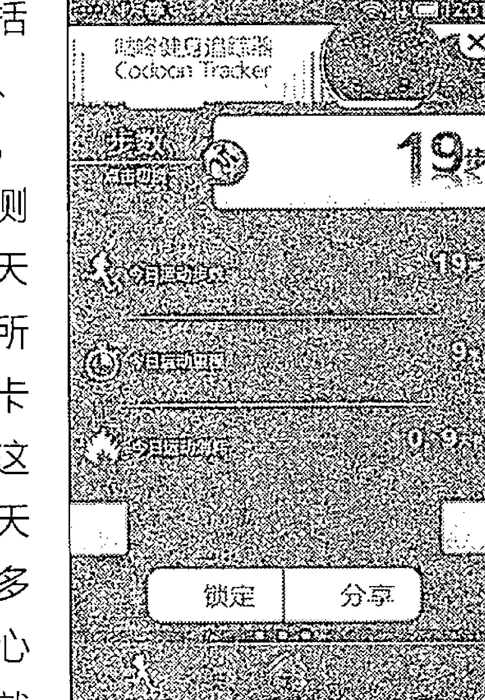

此外，我比较喜欢的有助于健康类的工具还包括“用药安全”。俗话说得好，是药三分毒，即使是医生，对各种药的药性与禁忌也不可能完全了解，通过这款软件，我可以轻松地了解10000多种常见药品的说明书，并可通过病症或者药名来查找各类用药，以及对症了解相应的饮食禁忌、实用偏方等，相当于为自己请了一位家庭药理师，何乐而不为？不过，该应用毕竟只能作为参考之用，如果真正病了，强烈建议大家还是抽时间到正规医院诊治一下，以免延误病情，错过最佳的治疗时机。

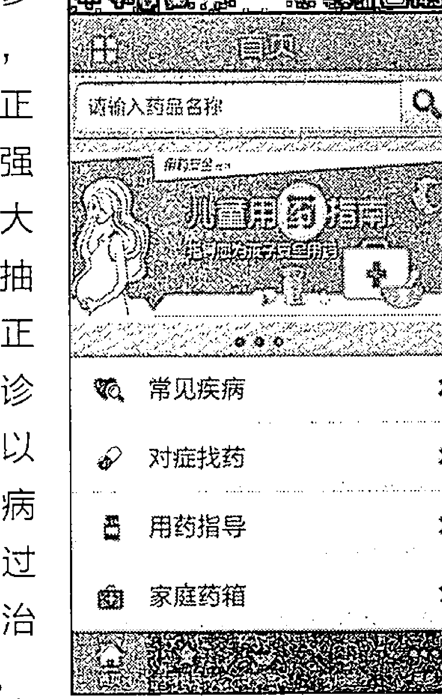

真没想到手机还能养生，看着高人的高招，你不妨也跟着学习一下，寒冷冬季用手机养生真是既时尚又实用。

**张英伟**，船员，32岁。多年来受海风爱抚，练就一身黝黑糙皮，再加上不太爱用某宝，所以更加对不起那张脸。喜爱的东东是冲浪、玩手机、上网，由于“魅力四射，但是已婚，因此建议对其有好感的异性朋友只有来生续约了”。
**推荐的应用：** 天气通、深睡眠高级助手
**推荐理由：** 根据天气添衣服，睡眠保健康。

保证睡得香呢？吃安眠药自然不是上策，所以我个人比较青睐一种更为有益的音乐催眠法。目前此类应用较多，而“深睡眠高级助手”则集成了目前流行的所有音乐催眠模式，如“Spa音乐疗法”、“α波潜意识法”、“5倍深睡眠”等，这样，我可以根据自己的情况，选择一种比较合适的催眠模式。不管别人对音乐催眠怎么看，反正我个人觉得在使用一段时间后，我的睡眠质量的确有了改善，因此这里推荐出来，希望大家不要向我吐槽。

说到预防疾病，首先要注意的就是天气的变化。由秋入冬，温度降低了，昼夜温差也随之增大了，如果我们的身体不能及时适应这种变化就难免会生病。如何适应？就是根据气温的变化随时增减衣服。因此这里我要为大家推荐的第一款应用是“天气通”。有了它，我不但可以及时地了解连续五天的天气、气温等信息，点击界面下方的“指数”按钮，在出现的界面中，我还可同时了解到相应的生活指数，如是否需要增减衣服、是否容易引发感冒、是否适合运动等。此外，它还有一个我非常喜欢的天气闹钟功能，有了它，我就可以在得到起床提醒的同时，听到当日的天气预报了，非常体贴。

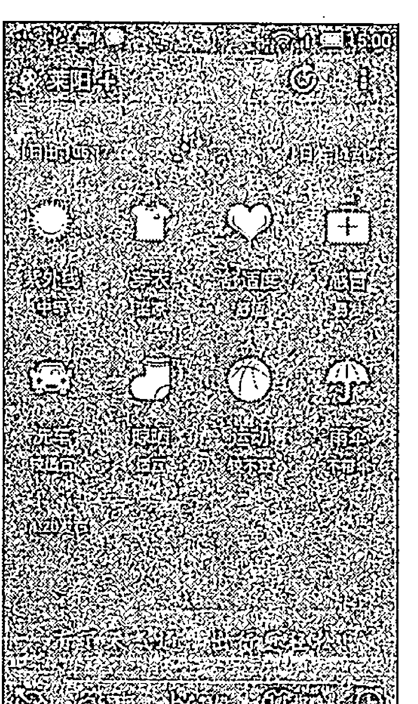

我要和大家分享的另一款应用是“深睡眠高级助手”。原因很简单，充足的睡眠是保证身体健康、提高人体免疫力的重要基础。那么，如何才能

样通过偏方、食疗和按摩的方法来防治感冒，我会向他们推荐“感冒伤风完全手册”这款应用。该应用讲了许多与此相关的知识，如“孕妇感冒食疗妙方”、“中医治疗感冒特效偏方”等，由我自己的经验来看，总体的防治效果还不错，值得一用。

家庭感冒伤风拉 让宝宝远离感冒 甲流与普通感冒区别 孕妇感冒食疗妙方 家庭治疗感冒中成药物 选择感冒药的注意事项 中医治疗感冒特效偏方 中医按摩法治疗感冒

**李晓春**，某医院医疗副院长、心脏内科主任。从事心血管内科专业十七年，对心血管系统常见病、多发病及疑难危重患者有较丰富的临床经验。
**推荐的应用：** 感冒伤风完全手册、颈椎病自疗按摩法
**推荐理由：** 常见病，掌握点自疗知识很重要。

此外，秋冬交替，气温降低，一些较懒的朋友喜欢宅在家里，上上网或看看电视啥的，如果坐的时间短本无大碍，如果坐的时间较长，颈椎病往往会随之而至。虽说目前对于该病的诊断已达到很高水平，但治疗效果却不太令人满意，原因在于人体的骨质血流量极少，现有的治疗产品大多需经肠胃吸收、血液循环才能到达病变部位，所以口服很难发挥作用。而我国传统的针灸和按摩法却可以通过长期活动筋骨，使该病得到治愈。按摩方法很多，如刮痧、脚底按摩、鞋带牵引等，这些，都可以通过“颈椎病自疗按摩法”了解到，相应的操作方法很简单，我这里就不惹人讨厌过多啰嗦了。

感冒是秋冬季节最常见的疾病之一。经常有亲戚朋友问我，是不是每次感冒，都需要到医院进行治疗？我的回答是要视情况而定，如果感冒后并无发高烧、低烧的症状，而仅仅是鼻塞、流涕、打喷嚏、咳嗽或咽部不适，有时根本无需吃药、打针，完全可以用一些简单可行的办法将其治愈，如偏方、食疗或按摩等。而这种方法，其实也是我自己最乐意采用的。如果亲友们并不知道怎

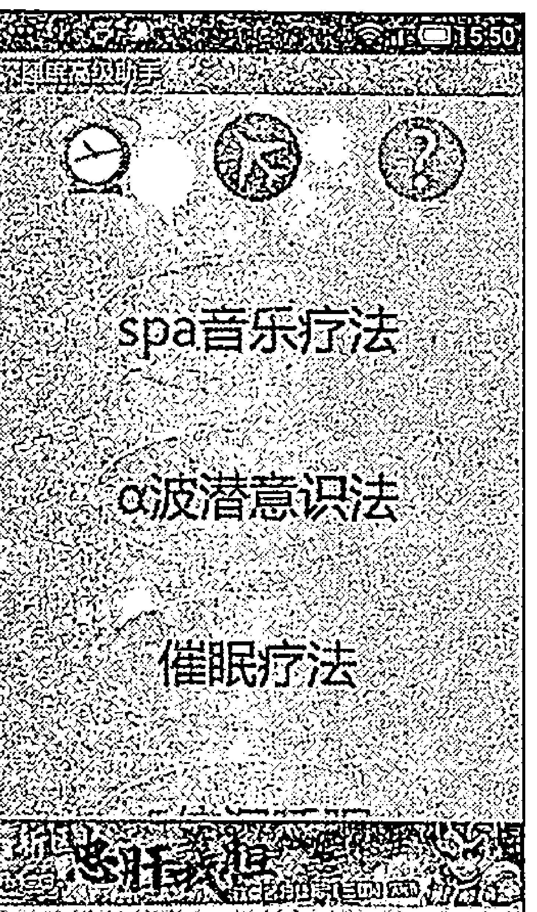

## 把图书馆搬到家

免费看书的方法。只需缴纳少量押金，书还会免费送到你的家中。

读方式。虽说如今网络资源很丰富，但从品种、方便性和阅读体验上还是不能取代传统的图书。郁郁这次要和大家分享她的免费看书的经历：轻点鼠标，选中想要借阅的图书，几天之后，快递人员就会将书送到自己手中，看完之后，网上提交归还申请，快递人员会再上门取书。如果不喜欢借阅的图书，可以通过网站免费归还图书，整个过程不收取任何费用。坐在家中即可享受图书馆借书、实体店看书的乐趣。有这种天上掉馅饼的事吗？这听起来有些理想化的场景其实已经实现了。

结束。郁郁选择“乔布斯：苹果禅”后点击，状态栏显示此书在馆，所需阅读尺码为M（后文解释），郁郁点击“我要借阅”后，确认地址、电话等信息无误，两天后一个可爱的棉布环保袋送到郁郁家中，里面正装着郁郁订的那本书。

## 借阅流程

下面郁郁就带大家一起体验一次免费借书之旅。首先给大家介绍两个免费的在线借阅平台，一个是青番茄，一个是知阅网，两个网站都可为全国用户提供免费的在线借阅及上门送书还书服务。要享受免费服务很简单，以青番茄为例，首先登录网站注册→填写个人详细信息，注册成为会员后，需要缴纳一定的会员费才可以激活借阅功能，这个会员费是随时可以退还的，但换来的可是永久免费借书哦。郁郁通过支付宝在线充值了110元，就可以开始借书了。

点击导航栏的“资源检索”，页面上显示了各种图书分类，郁郁要借的是乔布斯相关传记，在搜索栏输入“乔

两个网站的借书流程类似，这里就不详述了。要注意的是注册时的地址和电话必须是准确的，否则图书会无法送达哦。

有时一些热门的图书很可能已经借出，比如郁郁关注的另一本书——林徽因传《你若安好便是晴天》，状态栏显示“不在馆”，那么可以点击“图书预借”，当图书归还后你会收到通知的。如果网站上没有需要的图书，也可提出需要，只要不太冷门，青番茄都负责购买，然后再借给读者。

最后别忘了在规定日期内还书，如果没有读完，可以申请续借服务。

还书时在“我的借阅卡”页面点击“我要还书”。按照提示点击“确定”进入下一步，填入准确的取书地址后，快递会上门取书，整个过程不用再花一分钱。

知阅网的借阅流程
| 用户注册\充值阶段 | 免费注册 | ——注册邮箱作为找回密码唯一通道，请正确填写并长期保存 免费注册>> |
| --- | --- | --- |
| | 填写个人信息 | ——个人电话及地址必须正确，以便图书及时到达；平台保证每一位用户的信息安全 |
| | 在线充值 | ——依据个人借阅需求，选择对应借阅等级，通过支付宝或网银进行押金充值 借阅卡申请要求>> |
| 用户借阅阶段 | 选定借阅书籍 | ——可通过搜索、分类查询、推荐等通道选定，图书等级及数量必须符合个人借阅等级 了解用户及图书借阅等级>> |
| | 点击借阅/确认个人信息 | ——可通过直接借阅或借阅车（适用于多本图书同时借阅）进行借阅，必须保证个人电话、地址正确 了解借阅规则>> |
| | 知阅免费送书上门 | ——知阅会通过物流以最快速度把图书送到您手中，江浙沪地区一般在1-3天送达，其他知阅网开通地区3-5天送达，让您轻松愉快的享受阅读。 验货签收说明>> |
| 还书阶段 | 点击还书/填写书评 | ——在读完书后（可申请10日的续借），请拨打申通快递电话，快递公司会上门取件（请先垫付快递费用，知阅网会按知阅快递标准在收到书后3个工作日内将快递费打还您的知阅网账户上）；同时请在“我的书房”点击“确认还书”，按步骤点击归还图书（您归还图书时间以点击“还书”为准）。 还书说明>> |

## 借阅平台比较

刚才说到阅读尺码，现在解释一下。青番茄和知阅网都需要一定的押金或会员费（可以随时退还），大家可根据自己可能借阅书籍的数量来进行不同的充值。根据费用的不同，可以借到的书的等级以及还书时间也不同，高等级可借阅低等级图书，低等级不可借阅高等级书籍。以青番茄基础会员为例，郁郁充值110元，阅读尺码为M，可借M型图书，每次可借两本。不同尺码的读者不能借阅超过自己尺码的图书，像XL尺码的读者只能预借XL及XL以下尺码的图书，其他尺码依次类推。

### 青番茄阅读权限及押金

| 阅读尺码 | 借阅数量 | 借阅时间 | 押金（元） |
|----------|----------|----------|------------|
| M        | 2本      | 14天     | 110        |
| L        | 4本      | 21天     | 210        |
| XL       | 6本      | 28天     | 310        |
| XXL      | 10本     | 56天     | 510        |

### 知阅网借阅等级及押金

| 借阅等级 | 借阅数量 | 借阅时间 | 押金（元）起借金额20元 |
|----------|----------|----------|------------------------|
| 童子志学 | 2本      | 20天     | 120                    |
| 胸藏点墨 | 4本      | 40天     | 220                    |
| 才高八斗 | 6本      | 60天     | 320                    |
| 博古通今 | 10本     | 100天    | 520                    |

两个平台开通的城市不同，所存书目及一些借还款细则也不尽相同，大家可根据自己的具体需要比较后做出选择。

## 购书优惠

在知阅网借阅了一本养生方面的书后，郁郁很想把它买下来以便随时查看，但郁郁希望以比书店更便宜的价格买到这本正版书，怎么办呢？郁郁使用了知阅网的借阅待购买功能，只要在“我的借阅”管理模块中点击“我要购买”，就可得到想要的书了。知阅网依据图书新旧程度给予折扣优惠，一般保证3~7折（全新图书保持在7折左右），比大多数购书平台的价格要优惠。

如果要购买一些流行的期刊杂志，郁郁会选择青番茄的果实推广活动。参加方式有两种，如果已经成为青番茄的会员，可通过“我的借阅卡”中的专属推广链接方式去邀请新用户注册并充值。如果不是青番茄的用户，点击“阅读实践”中的“果实计划”，即可进入果园参加果实推广。输入邮箱和密码后就可以申领青番茄种子了。邮箱在每个播种周期内，也就是15天内只能领取一次青番茄种子。在此周期内，郁郁要将全部种子撒播给其他爱阅读的朋友，如果他们注册并充值成功，那么郁郁和新用户就都能收获青番茄的积分果实。

比如郁郁通过推广链接地址邀请她的同学注册并充值成为M码用户后，她和她的同学均可获得5粒青番茄果实。如果是XXL码用户，可获得30粒青番茄果。果实数量达到50以上就可以兑换《周末画报》、《男人装》、《21世纪商业评论》、《钱经》等多种期刊杂志。除了借书、购书外，两个平台上还有很多活动，比如青番茄的“漂书”，可把家中闲置的书捐出来，换一些代金券、电影票等小礼物。还有更多有意思的服务，等待各位爱书之人细细发掘。

## 两个借阅平台对比

| 项目 | 知阅网 | 青番茄 |
|------|--------|--------|
| 网址 | http://www.52zhiyue.com/index.html | http://www.qingfanqie.com/ |
| 开通城市 | 全国(除西、北地区) | 深圳、北京、上海、广州、天津、南京、杭州、苏州、珠海、无锡、宁波、常州、成都、武汉、连云港、石家庄、西安、长沙、中山、江门、东莞、佛山、绍兴、惠州、株洲、重庆、台州共27个城市 |
| 运送时间 | 预计图书借阅后2~5天内送达 | 3~5个工作日内 |
| 运送费用 | 暂定广西、云南、山西、海南、重庆、四川、贵州、吉林、黑龙江、辽宁、青海、内蒙古、宁夏、甘肃、西藏、新疆等西北省份只开通单程运费支付，还书的物流费用由用户自行承担 | 送书及还书均免费 |
| 押金 | 120~520元不等 | 110~510元不等 |
| 支付方式 | 支付宝/网银方式 | 支付宝/网银方式 |
| 续借 | 可申请10日的续借 | 每本图书每次可以续借一次 |
| 滞还金 | 0.1元/本/天 | 0.20元/册/日 |
| 其他 | 如未能搜索到要借阅的图书，可通过在线客服或量身订阅进行图书申请 | 如果所借的书缺货可进行预借，在青番茄服务区域，借阅的书籍可以通借通还 |

# 找工作SNS助你一臂之力

如果你在找工作时，面对智联、中华英才网为你提供的重复信息感到头疼，不妨转换下思路，到职业社交网站上去找工作。

文|小丸子

在中国找工作，人脉是个重要因素，熟人之间的介绍会给用人单位知根知底的感觉，可是中国人向来在社交方面显得弱势些，一些SNS的求职网站会帮你解决这些问题。

## 职业社交网站的鼻祖

提供招聘通道的SNS网站又叫职业社交网站。习惯了在智联、中华英才网等这样的网站找工作的你可要注意了，职业社交网站的本质是SNS。打个比方，智联之类的招聘网站好比新浪这样的门户网，而职业社交网站好比开心、人人这样的网站。

SNS网站的核心是六度人脉关系，这个想法是美国的一位社会学家提出的。通俗地讲，“你和任何一个陌生人之间所间隔的人不会超过六个，也就是说，最多通过六个人你就能够认识任何一个陌生人。”

六度人脉关系的核心应用在网站上，主要是以你认识朋友的朋友为基础，在网络上你可以看到你朋友的朋友，网站也会推荐你认识，朋友的朋友的朋友也能够进行推荐，以此类推，你的朋友在这样的关系网络中将会越来越多。

举个例子，假如你用自己的QQ号注册某个SNS网站，几乎你所有的QQ好友都会成为你在这个网站上的朋友，你还有机会认识你QQ好友的QQ好友，你的人脉在这个空间中得到扩展。

美国的社交网站Facebook的核心是六度人脉关系，在美国，将六度人脉关系应用在招聘领域的网站叫LinkedIn，它目前是公认的“全球职业社交网站的鼻祖”。

创立于2002年的美国LinkedIn是目前全球最大的职业社交网站。最新数据显示，LinkedIn在全球200多个国家拥有1亿多名用户，世界500强企业均为其网站的注册用户。2012年在美国的受访公司中，有超过五分之四的职位将通过社交网络来招聘，职业社交网站LinkedIn已经取代报纸成为新职位的信息来源，73%的财富100强公司通过其进行人员招聘。

Facebook的成功引起国内的诸多模仿者，开心、人就在那样的背景下

## 小链接

职业社交网站的地址

- 天际网：http://www.tianji.com/home
- 若邻网：http://www.wealink.com/
- 举贤网：http://www.juxian.com/
- 优仕网：http://www.ushi.com/

诞生。同样，LinkedIn的成功也在国内有模仿者，这就是天际网、若邻网、举贤网、优仕网等。如果你现在面对智联、中华英才网为你提供的重复信息而感到头疼，不妨扩展下思路，到这些职业社交网站上去找工作。

## 职业社交网站如何找工作

好了，一口气为你推荐了这么多的职业社交网站，你可能会问，怎么在这些网站上让更多的人力资源经理关注到自己啊？

值得注意的是，天际、若邻、举贤、优仕这样的网站虽然定位略有不同，然而其运作原理都是来自职业社交网站的鼻祖LinkedIn，所以万变不离其宗，把握本质才是关键。本文约请几个在天际网上找到工作的过来人说说他们的经验，供你参考。

### 用户1：Jerry Li

简介：从事公关工作

#### 求职攻略：你不能把天际网当做娱乐平台，如果你真的希望在天际网上获得有价值的东西，那么你必须认真对待，这里谈谈我的一些经验。

首先，你必须把个人信息做得尽可能完善，天际网提供了完善的“职业档案”，你要尽可能地把你的闪光点和对你求职有用的信息写进去。

接下来，你可以多写写日志，日志的主要内容也必须和你的工作相关，写日志的目的是为了展示自己的才华，以赢得更多网友的支持。在持续写了一个月的日志之后，我发现粉丝量已经猛增，后来机会终于来了，一家企业主动联系我，希望我加盟他们的公司，待遇优厚。所以，我的体验是，在天际网上你需要尽可能地主动展示自己的能力，让外界对你有充分的认识，这样可以增加你成功求职的砝码。

### 用户2: Mark Wang

简介: 从事IT技术工作

### 求职攻略: 在我看来，天际网所提供的人脉圈是一个非常不错的平台，利用好了，可以帮助大家获得更好的发展机会。以我为例，之前在另外一个公司做技术，不太理想，本来也打算跳槽，但一直没机会。后来加入了天际网的IT技术人脉圈，在这个圈子里；我结识了很多同业者，他们为我提供了很多帮助，包括我后来的跳槽。

值得一提的是，天际网不仅提供了线上的人脉圈，也提供了线下的活动栏目，在这个栏目；你可以组织或者参与某些线下活动。有时候，线上并不一定能满足我们所有的需求，因此，适当地组织或者参与线下活动，也可以获得很多机会。

## 更专业的职业社交网如何玩

找工作如果能够按照专业细分会增强针对性，这也是招聘网站设计的一个思路。

曾经在智联这样的网站大行其道之时，有一个招聘网站对于人脉的划分方式就是按照专业而来，比如传媒人才、广告人才、计算机人才等都有细分的频道进行推荐。

在职业社交网站上，除了天际、若邻等这样的综合性网站外，还有一种更加细分的职业社交网站，据了解目前这样细分的网站做得成功的不太多，金融圈网算是其中的佼佼者。

金融圈有“中国Linkedin金融版”之称，是从事金融工作的你找工作的一个渠道。如果想在上面找到工作，我们结合一些“圈友”的经验总结了如下三条攻略，供你参考。

### 攻略一: 建立职业品牌是基础

职业品牌是个人在商务社交网站或职业社交网站“生存”的基本要素。作为一个创业者或求职者，要建立你的职业品牌，你首先需要在中国知名的职业社交网络上创建和更新你的职业信息。在职业社交网络你可以遇见许多同行，获得前沿的产业信息或者从商业领袖那里受益。

你在职业社交网络上的职业信息应该包括你所有的工作经历、教育经历和专业技能。

首先，清楚地陈述事实，特别是你的工作经历；其次，不仅要添加你过去所取得的成绩，还要描述你精通的领域；第三，让你的前同事在职业社交网络上写出对你工作经验的认可，这些会成为你自身职业品牌的发光点。

> **小链接**
金融圈: http://www.jrq.cn

同时，作为个人的“脸面”，不要忘记上传一张你自己的好照片作为你的头像，这是你的品牌很重要的一个部分。你可以看下成功创业者的个人信息，他们的照片通常都是高质量且有个性的，这样才能给别人留下深刻的印象。

### 攻略二: 分享专业的智慧和资讯

一般来说，在职业社交网站上，你可以找到你信任的专业人士所提供的智慧分享。例如，在金融圈网，基金经理的金融讯息、证券经纪人的销售之道、股票分析师的行业动态，都是你可以从网站上挖掘的财富。

有些职业社交网络有微博、群组、活动等服务，你不仅可以与你相关行业的人士分享，也可以在其他社交媒体上共享。在分享的同时，你的个人品牌将会得到更多的曝光，你看起来会像是社区中的中坚力量或活跃分子。

事实上，职业社交网络的用户领域，覆盖了诸多的风险投资和私募资本行业，一些投资人正是注意到了用户分享的信息，才会有线下一对一的会面，最终促成真正的投资，这也是职业社交网站对于创业者的贡献。

### 攻略三: 尽量多结识“精英”

职业社交网站是你人脉拓展的平台，你需要花精力和时间在平台上发展高品质的商务联系网络。俗话说得好：重要的不在于你知道的事，而在于你认识的人。人们的常识是：精英阶层会引荐你认识精英，而一般阶层的人则会把你介绍给更一般的人。花更多的努力和时间去结识精英，这是极其重要的。认识到这一点，你需要有更多的耐心和远见。

当然，精英阶层并不一定意味着强大、超级成功或是很有经验，或许有时只是在于他们的人脉：认识很多其他的精英，或者层层的人脉关系网络，才是你经营职业社交平台的关键财富。

# 突破140魔咒玩转长微博

小微玩微博受到一些小困扰，经常有事还没说清就已超过微博140字的限制，要么苦思竭虑删文字，要么分割成好几条逐一发送。其实这些困扰，用长微博即可解决。

文|小薇

所谓长微博，就是借微博可以附加图片的功能，将超出140字的内容转成图片显示出来而已。在百度中搜索“长微博”，可以直接调用百度应用中的长微博工具。点击“长微博工具”图标进入应用，根据提示粘贴文字可自动生成长微博并分享到微博中。

不过小微对网上的类似工具却感觉不满足，比如文字的字体、颜色不能随意改变(大部分长微博工具不支持同一博文中使用不同的颜色字体)，图文的布局无法随意调整，总之无法个性化。而这些在Word中可以轻松实现。Word可以轻松排出风格各异的优美版式，何不就把它打造成长微博工具呢。

## 定制Word长微博版式

Word如何排出优美的版式不是本文重点，重点是如何将Word文档转换成适当的长微博。首先第一个问题，微博图片不能太宽，否则生成的图形会被挤压而变形。Word默认的版面是A4纸大小，显然不适合微博，一般来说，长微博图片的宽度在12~14厘米之间为宜。

启动Word，点击“纸张大小→其他页面大小”打开页面设置窗口（图1），将宽度改为12厘米即可，高度则可以随内容多少而调整。为了不让长微博有割裂的感觉，长微博的所有内容应在同一页中，内容多时，可将高度适当增加。

暂且不要关闭设置窗口，切换到“页边距”标签中，默认的页边距为2.5厘米以上，这样会导致长微博的白边太大，既不美观也浪费空间，可将上下左右的边距都设置成0.4厘米为宜。

修改完边距后，还会发现文档上下还是有很大的白边，这个需要在页面设置窗口的“版式”标签中来去除，将页眉和页脚都设置为0即可。

## 存为模板长期调用

设置完毕，按Ctrl+S键保存，保存类型选择“Word模板”，文件可取名为“长微博模板”，保存在C:\Users\当前用户名\AppData\Roaming\Microsoft\Templates文件夹下（Windows 7系统）。

以后，随时启动Word，新建文档的时候，选择“我的模板→我的模板→长微博模板”，即可建立一个设置好的微博版式文档而无需重新设置了。

上面只是建立了一个空白的模板，其实你还可以加入自己的Logo及其他标志或装饰，这样，你以后发的所有长微博都会有一个统一的风格，将显得非常专业。

## 文档转成长微博图形

页面设置好之后，按自己的需求排出图文并茂的博文。然后，按Ctrl+A键全选文档，按Ctrl+X键剪切掉文档，再按Ctrl+Alt+V键进行选择性粘贴，将弹出对话框（图2），选择“图片（Windows图元文件）”或“图片（增强型图元文件）”，确定即可。

此时，Word页面中的内容还是原来的内容，但实际上已转为图片了，右击，复制，在画图中粘贴出来然后保存即可。此时发微博，附加此图片，一个自制的漂亮长微博就完成啦。

- ★如果长微博内容不是很多，无需滚屏，一屏就能显示出来，此时可直接用QQ的截屏工具截取成图即可。不过要注意的是，截屏前最好先单击左上角的Office按钮，打开“Word选项”，在“显示”中取消对“段落标记”的选择，这样可隐藏段落符号，使截的图更美观。
- ★安装有SnagIt软件的朋友，Word中会有SnagIt的截图按钮，使用它可以快速完美地将Word文档转换成图片。

## 【绝对挑战】一键发送图片到微博

上面我们介绍了如何利用常见的软件Word自制风格各异的长微博，但是也有一个小问题，使得这一解决方案不尽完美；网上的长微博工具，可以将生成的图片一键发送到指定的微博上，那么我们如何将在本机上生成的长微博图片，也一键发送到指定的微博上呢？

题目编号：20121301 积分赏金：30元

小编点评：欢迎各位高手应战，我们将挑选最佳方案给予发表，除稿费外还有积分赏金哦。

投稿邮箱：zc@cfan.com.cn (请标明“绝对挑战”)

280

电脑爱好者 合订本·2012## 看评论搞定网购

在没有亲自接触和体验物品的情况下，凭什么能决定是否该下单购买某件商品，从而敲定一桩交易呢？其实，看评论就能让你决定一切！

文|刘英

我们以在京东商城购买数码产品为例，看看这其中有什么门道。

## 好评度 群众的眼光？

购物网站上给出的产品好评度能说明什么，到底有没有水分，你该不该相信这个百分比？

菲菲准备在京东购买一款9.7英寸的安卓平板，她经过价格权衡和阅读产品介绍，最终把范围缩小到购买A或B两款产品上，但最后在阅读用户对产品的评价时，菲菲犹豫了，不知到底该买哪一款为好。菲菲在网上看到A平板目前已有3050个评价，好评度为81%(图1)；B平板目前已有6个评价，好评度为100%(图2)。那么，是不是B平板就一定比A平板好，B平板更适合于菲菲呢？同事小朱告诉她一些网上购物的经验，这让菲菲对这个“好评度”有了一个清醒的认识。

小朱告诉菲菲，虽然人们在确定网购某产品时，首先要参考购买者对该产品的评价所形成的好评度指标，好评度高的产品往往更受购买者的青睐。但是，这个参数也不是绝对可靠的，要参考这个参数还需要具体问题具体分析，不看具体评价，光凭这个好评度不能决定一切。

首先，这个参数要基于足够的数量才比较可靠。如果目前只有6名用户购买该产品，并全部给出好评（好评度100%），与3050名购买该产品、2478名给出好评（好评度81%）相比，你觉得哪个更有参考价值呢？显然是后者。

前者获得100%的好评度，好评度如此之高，但也并不意味着该产品的质量就真实可靠；后者好评度相对低了不少，但也不能表示该产品就不值得购买。如果在评价中掺杂了厂商人为抬高好评度的作弊成分，问题可能就更复杂了。

产品好评度是衡量产品好坏的一个比较可靠的指标，但这个指标是由评价的数量所决定的。参与评价的用户数量越大，这个参数相对来说就更可靠。即便是有水分或偏见在里边，也会被庞大的群众观点所稀释，最终的参数基本能反映出该产品在用户中的认可程度。如果是刚刚上架的产品，参评的用户数量尚少，只有两位数甚至是个位数，更或兼有厂家自己的评论，那么这个参数就不能客观地说明产品质量问题。这时，如果你要选择这款产品，就需要更加谨慎，即便要买也最好从别的渠道多了解一下该产品，不要贸然决定。

小提示
好评度是否有水分
不排除一些厂商为了提高产品的销量，在产品上架销售之后，安排内部人员或发动各种关系“购买”自己的产品并故意一律给出好评，以便提高产品的好评度。这样的作弊行为对评价数少的产品的评价结果影响极大。试想，如果只有6个评价，而这6个评价正好又全是公司内部所为，那么这些评价信息对后来用户的误导作用是多么的恶劣。反之，如果卖出的产品是3050个而不是6个，并也获得了相应数量的3050个评价，那么其中的6个内部评价相对于这上千个用户评价来说是多么微不足道，其评价的含金量也就不言自明。

在产品好评度选择上，建议在购买一款产品时，不妨从若干同类产品中筛选出用户总评价数多的几款产品，并优先考虑好评度高的产品。这样挑选产品，保险系数会更高。切不可只看好评百分比，不看评价数量。

## 看差评 找你在乎的

不少客户在决定购买一款产品前，总要看看已经购买了这款产品的用户对该产品的总体评价，当看到评价不够高时，往往会很快决定放弃对该产品的购买。这样一来，前期辛辛苦苦地对该款产品的关注就全然放弃，挑选准备工作因此半途而废。

实际上，产生差评的原因多种多样，或许该产品产生如此差评的原因与你无关紧要呢。如果你能仔细阅读差评用户对产品的评价，或许会重新促成交易。

不要光凭某一指标来确定购物的可行度，综合各项指标并参考具体评价和个人需要来抉择才是上策。


笔者曾在选择一款手机时，看到这款手机的总体好评度只有79%。起初给我的第一感觉，肯定是该产品的质量太差，用户不满意。但在查看了其用户差评留言之后发现，产生差评的原因不是产品质量问题，而是集中到某地因为过节，快递送货慢而引起用户不满得到不少差评。

由于条件的限制，各地的送货快慢会存在不小的差异，服务质量也有所差异，如果你确定这个差评区域不在你所处的区域，而且你的区域不存在物流问题，那么这样的差评完全不应该成为影响你购买这款产品的拦路虎。

类似的例子还有许多。比如，我曾要购买一块硬盘作为资料存储仓库之用，我的希望是使用时静音、性能稳定，对存取速度没有过高的要求，我更看中的是这款产品的价格低廉。这时，我正好看到京东商城在搞促销，一款2TB的西数硬盘只卖525元。但我看到许多用户给出了差评，当时有点犹豫。但当我再深入研究用户给出差评的理由，发现多数理由是作为系统盘来用速度太慢。实际上，别人的这些差评对我来说不应该构成影响，我不用它来做系统盘，我用不着那么高的速度，它不应成为阻挡我购买这款产品的因素。

但是，如果换了另一个不了解这些情况的用户，只是以人们对该产品的差评为依据，断定这款产品不值得购买，那么也就失去了一次以低廉的价格入手最适合自己使用的产品的好机会。

任何产品都不可能完美无缺，关键是要找到你在乎或不在乎的东西。如果一些别人很在乎的差评对你来说无关紧要，那么它们不足以成为影响你购买该产品的因素。人云亦云的随大流习惯不是最好的习惯。

### 看好评 淘宝小卖家的流量解决之道

在购买产品前，用户往往最先参看的是网站对产品的说明。俗话说，王婆卖瓜，自卖自夸，没有一个商品介绍中说自己产品是不好的，看了这些介绍，你会觉得这东西好像到处都是亮点。到底是否如此，看看用户的评价要比听商家自己忽悠管用得多。

我们以购买一块国产安卓平板为例来说明。这是一款不知名的安卓平板，商品说明中介绍的亮点似乎与其他同类商品看不出什么两样，厂商说得头头是道，但从评价总数高达5081条的最后评价中，我们可以一眼看出其总的好评度仅为84%（图3）。

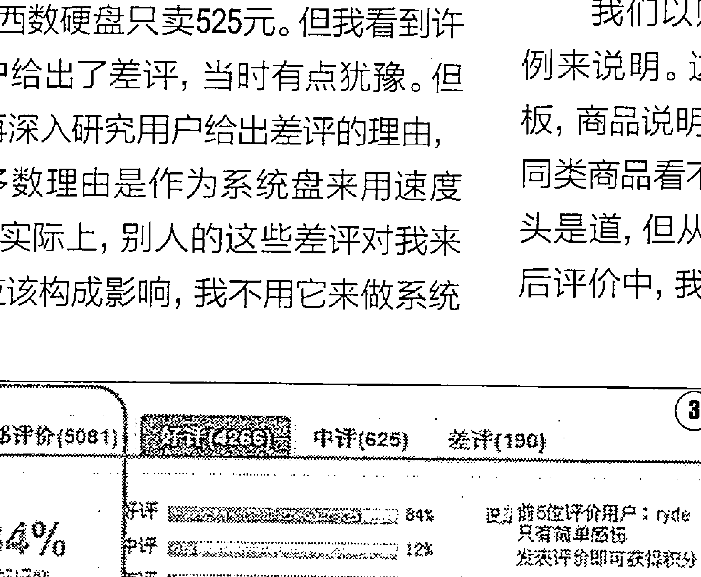

可以说，这样的好评度不算很高。以不高的好评度赢得了这么大的订单，除了价格低廉外，这款商品究竟有什么亮点，值得有这么多的用户为它埋单？我们还是进入用户评价看个究竟。

进入用户对该产品的好评页面，我们不时地可以发现，用户对该产品的好评之一就是该产品的续航能力特别强，有的用户称它为“核动力”，有的用户称赞它“续航能力超强”，比自己的iPad的续航能力还强（图4）。大家知道，续航能力弱是许多平板电脑的不足，许多时候大家都在为平板续航能力不足而自己又不能随便换备用电池而纠结，这款平板正好弥补了这个短缺，因此可以说这是这款产品的一大亮点。而在官方的产品介绍中，我们却没有看到有关续航能力的特别炒作，反倒是用户的眼睛雪亮，替官方作了总结宣传。

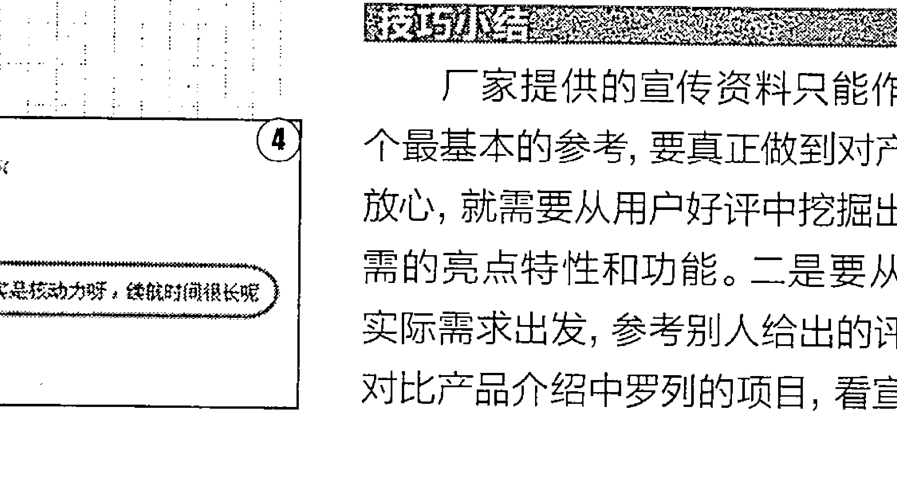

此外，对于一款不知名的平板电脑或手机来说，用户对屏幕的使用流畅程度也很关心，而厂商的介绍中说的屏幕类型或操作流畅度等都是千篇一律，也难以置信。因此，我们不妨也从大众好评中进行挖掘，看能否得到答案。我们在浏览用户评价的过程中，发现不少用户用不同的表达方式表达了对该产品屏幕使用流畅度的认可，有的用切西瓜软件和自己手机上的切西瓜软件做对比，有的用别的游戏和另一块平板的相同游戏操作加以对比，大家对屏幕的操作流畅度一致认可，这进一步说明了厂家的宣传没有失实。

### 选购小结

厂家提供的宣传资料只能作为一个最基本的参考，要真正做到对产品的放心，就需要从用户好评中挖掘出你所需的亮点特性和功能。二是要从你的实际需求出发，参考别人给出的评价，对比产品介绍中罗列的项目，看宣传与实际相比到底有何出入；一是挖掘你目前尚不知晓的惊喜亮点，这些亮点有可能连厂商也没有发现，但最后被用户挖掘出来的，有些是用户将厂商的概括性宣传通过实例做了具体化的详解，看了评价就让你踏实。

## 看问答 搜寻你所惑的

或许你对一款产品并不完全了解，只是出于某种原因才打算购买的。比如从众效应、别人推荐、急于使用等等。或许现在你对这款产品还存在许多疑惑，到哪里可以寻求问题的答案？答案是就地寻找。我们可以从产品下面的用户提问留言和专家或网友的解答中得到问题的答案。

比如，你刚刚购买了一款摩托罗拉ME525手机，为了能在手机上存储更多电影大片和连续剧在上班的地铁上观看，你打算给自己的手机配置一块32GB容量的微型SD卡。在确定了目标产品并看过产品介绍以及好评度后，你觉得某款SD值得购买。但是，产品说明书中并没有明确罗列出哪些品牌的哪些型号手机可以使用该存储卡。你开始怀疑自己的手机能不能很好地支持这块存储卡的使用，万一买回来后开封安装了卡片，手机不能支持，而厂家以产品不存在缺陷为由不能退货该怎么办？这时，你不妨从产品页面的下方浏览一下用户咨询的内容，里边或许已经有人问了同样的问题并有人给出了完美的答案（图5）。

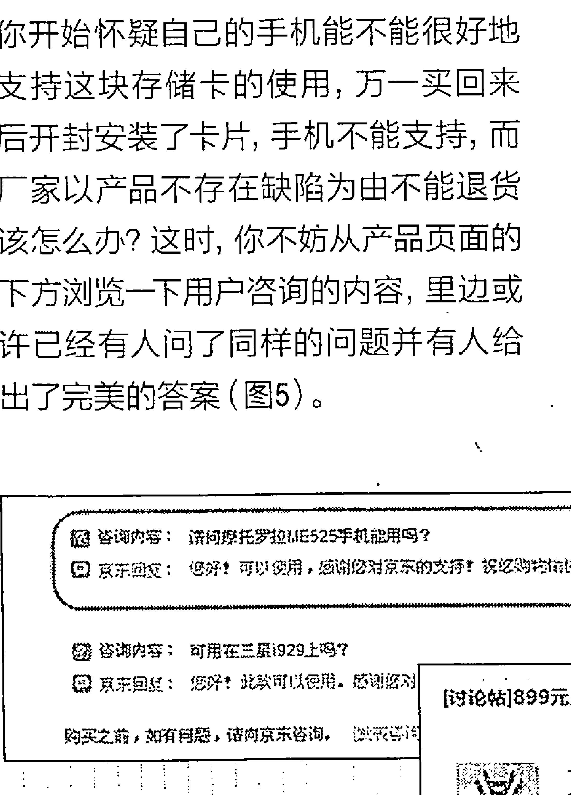

也许你对即将要购买的产品存有一些疑惑尚未得到解决，但很有可能在此之前，其他人已经也遇到同样的问题，帮你提前问到了，也有人帮你提前做了解答。在用户的其他问题当中，也许有些疑惑连你都还没有考虑到，但别人已经遇到或考虑到了，看到大家的提问和其他人给出的答案你才恍然大悟，这对于你决定是否购买该产品很有实际参考价值。

## 进圈子 更深入地了解

如果说，从上面说的好评或差评以及用户问题咨询中了解产品的好坏只是一些零散的信息来源，那么参与“讨论圈”则是更加专业一些的信息获取渠道。

网友讨论圈是京东商城等为用户评论商品开辟的一个更加自由的小社区。在这里，用户可以以“晒单”的方式发表购买产品后对该产品使用心得的帖子。可以发表图文篇幅不受限制的内容；可以在“讨论帖”中讨论关于当前产品的任何技术和使用问题；可以在“问答帖”中提出存有的疑惑或对自己知晓的问题给予解答；在“圈子帖”中则是一个高手达人关于产品或技术的讨论精华内容。对于一款产品的评价，在该讨论圈的相关主题里，你也许可以发现更专业的评价内容。以一定积分为鼓励措施，吸引更多的用户将产品使用心得以图文并茂的形式上传到晒单区域，提供充分的空间让更多的用户参与讨论，这些评论正好又可以作为准备购买这款产品的用户的最有力、最形象直观的参考资料。

**实例：** 同事小刘在购买了一款平板后，发现待机耗电量比较大，在该产品的官方网站论坛中也没有找到解决该问题的具体办法。但是，在京东讨论圈关于该产品的讨论帖中，他无意中发现通过升级到2.3系统可以很好地解决待机耗电量大的问题（图6）。显然，讨论圈作为用户答疑解惑或提高产品使用技能的一块特殊领地，有着重要的意义。

## 决定权 还在于你自己

总体好评度也好，各种具体好评或差评也罢，到底什么是决定用户最后是否下单的因素？

实际上，最终的决定因素不完全在于百分比的高低或好评差评的多少上，是否购买该产品还要靠你根据自身的需求来综合衡量，不能完全以别人的标准来衡量自身的需求。要知道，总的好评度只是一个大体指标，具体评价中有实际技术含量的东西也只是每个用户针对自己实际情况所列出的使用感受。别人的需求终归是别人的，只供参考，只有符合你自己需求的才是最合适的。

科学结合几方面的因素，同时紧密结合个人需求决策，应该才是上上之选。


- 1. 899元买的；
- 2. 价格便宜电池惊人；
- 3. 现在已升级到2.3系统，解决了待机耗电大的问题。

# 淘宝小卖家的流量解决之道

对淘宝小卖家而言，站内流量固然重要，站外引入流量更省钱，如果能双管齐下就更好了！这些流量都是能够进行交易的前提。

文|小丸子

达人档案：
**淘宝店店主：小红**
**开店时间：三年**

7月26日，淘宝网再次修改搜索功能，正式对网站中“人气排序”位置进行调整。对此次调整，淘宝方面解释为，此前人气部分流量展现和点击太过集中，调整后希望让更多优质的大中小卖家的宝贝都有展现机会。

经营母婴用品一年多的淘宝卖家小红对本刊表示，与淘宝的“自然排名”相对应，人气排名也是淘宝最重要的排名方式，以前可以通过参加天天特价、试用中心、淘金币甚至聚划算等淘宝活动打造爆款（指在一定时间内销量很大的商品），再配合直通车，就可以循环打造人气很高的商品，从而在淘宝搜索排名中每天都有较高排名的宝贝排在搜索的前几页。

通过淘宝首页的搜索寻找商品，是消费者购买的主要途径。此次淘宝通过修改人气排名的方式，把人气排名的权重降下来，也就是说以后爆款的作用没那么大了。

## 别样打造爆款

小红打造爆款的方式与前面提到的不太一样。

小红研究生毕业没多久就发现自己怀孕了，2010年辞职待产，闲来无事便决定做淘宝小店。起初只是想玩一玩，没想到天时地利人和，一款服装的火爆销售让她的小店迅速升级，良性循环，现如今已经做到了五皇冠。

起初，小红开淘宝小店也遇到了一周多无人访问的尴尬，她自己也不想花钱在淘宝直通车上进行推广。一天，她到自己常常泡的一个母婴论坛上发现一个版块在组织团购，能否从这里开始引导网友们到自己的淘宝小店上交易？她忽然灵机一动，随即想到一个朋友早些时候说过他认识一个童装厂家，就跟朋友联系，朋友当即就答应帮她做“中介”。

进一步跟厂家联系后，小红知道，那家服装厂生产的童装很多，究竟使用哪款适合团购呢？小红决定亲自去“验货”。果然有一款服装无论是款式还是价格很让小红中意，她想就这款做团购产品吧，接下来便在那家母婴网站组织团购。

对于参加团购的妈妈们，小红认真地回复，她认为态度诚恳是做淘宝小店的基础，每一单团购品都承诺有小礼物赠送，这是促销的小手段，会让消费者觉得在她这儿买东西很值。同时，她对参加团购的人提出了个小要求，每件团购商品必须从自己的淘宝小店上拍，小红觉得自己的淘宝小店目前还是零交易，不如就从这单开始，累计更多的交易信息。

这些泡论坛的妈妈们因为孩子小，没有太多的时间去逛街，许多东西都是通过网购完成，她们买东西的地点自然是淘宝，所以从母婴论坛上成交还是从淘宝上完成交易对她们来说没有什么区别。很快，小红的第一次组织团购就达成了100多条交易，虽然赚钱不多，但这让小红尝到了甜头。

此时，她也开始摸出了淘宝网页的排序规律。

小红发现，通过论坛这种方式引来的销量为站外流量，而淘宝网自身也有站内流量，在无钱参加直通车的前提下，淘宝网展示商品的排序原则之一是根据剩余时间的多少来决定，这意味着剩余时间越少的宝贝越能让买家看到。一般来说，7天为一个周期。小红依据这个小规律，刻意在某周六晚九点左右开始将那款团购的产品进行展示，到了第二周的周六九点，剩余时间不多了，淘宝网将这款商品的展示位置提前，这时，无数的人在这个时间看到这个宝贝，当天的销量忽然增长。

就这样，小红的淘宝小店在两周内迅速升级，她之前做团购的产品竟然成了爆款。这是在没有参加淘宝任何站内推广的前提下完成的，至今仍 是她对朋友津津乐道的一点。

## 不让直通车烧钱的秘密

小红在自己的淘宝小店迅速升级不久后花钱参加了淘宝直通车，为小店冲钻奠定了基础。小红说，要让淘宝直通车少花钱带来流量，关键要做好以下几点：

**1.一定要尝试**
很多人说直通车烧钱，其实加入直通车就像小马过河，水的深浅要靠自己去尝试。对于不同的卖家、不同的店铺或不同的商品，使用直通车的效果也各不相同，因此，必须自己亲自试一试。

**2.设置关键词最重要**
在直通车后台搜索时，假如看到别人设置了2元的一个竞价词，为了排在前面，你可能需要出更高的价格。但很多时候，你可以设置一些精准的长尾关键词，竞争小，点击成本低，转化率反而更高。例如，不设“女装”而设“春季显瘦连衣裙女”。小红建议，关键词的设置要不断测试和优化，保留效果好的，删除花费高但无转化的。

**3.选择宝贝最关键**

做直通车的宝贝必须具有以下三个特点:

- 一是良好的成交记录。例如一个月累计销售100件以上，买家会认为东西一定不错，就会有购买的欲望。
- 二是有良好的评价记录。如果大多数商品评价都不错，说明宝贝质量过关。
- 三是要写好宝贝的描述，让买家一看就有购买的冲动。写宝贝描述时，可以把买家的好评和交易记录等截图到宝贝描述中，这样更有说服力。


## 引入更多的淘宝站外流量

到了今年，小红明显感觉到自己小店的流量开始减少。以前一天200单，现在锐减到一天20单。小红认为，这是京东、苏宁这样的网站分流所致，他们今年的促销攻势相当猛烈，当网购人数增长到了一定程度的时候，便会出现增长缓慢的态势，所以京东、苏宁们分流网购流量的实质是从淘宝分流。

小红认为，如果现在做网店过多关注淘宝站内流量的话，是不能给自己的小店带来流量的。一是因为淘宝网自身的流量在下降，所以分到每个店铺的流量也是下降的。二是淘宝线上广告费用激增，直通车关键词的价格飙升，热门词2012年比2011年涨了一倍，以前几毛钱的相对热门关键词，现在也涨到了一块多。所以通过直通车拉流量，除非你开车(直通车)的技巧极高，否则就真的是在给淘宝打工了。

一单生意，赚的钱给了平台，卖剩的货囤积在仓库，这是许多小卖家的真实写照。摆在小红面前的问题是，淘宝站内自然流量越来越少，直通车做广告又越来越贵，小卖家如何给自己做流量自救呢?小红请教了相关人员，相关人员给了如下解决方案:

- 一是可以把眼光投向专业论坛。对于卖母婴用品、旅游用品、数码器材等专业品类的卖家，这些品类都有一些人气很高的专业论坛。在这些专业论坛上发一些广告，那么转化率还是很高的。例如母婴类论坛：北京妈妈网，每天都有大量的准妈妈和刚生宝宝的妈妈在上面吐槽；摄影类专业网站：色影无忌，每天也有大量买卖镜头的交易。
这一招是小红发家之初就已经尝试过的，因此，她打算“重操旧业”。
- 二是可以关注58同城等生活类网站。对于一些售卖二手品的商家，58同城这类网站还是很有流量的，大家图的就是一个同城+便宜。
- 三是可以尝试关注QQ空间的广告投放。QQ空间渠道指的是投放在QQ空间个人中心左下角广告位的直通车广告。腾讯QQ每天同时在线人数超过一亿，这个流量是巨大的，而且，每天也都有无数的同学群、老乡群、协会群等等在上传图片，维护自己的QQ空间，而这个流量目前还没有引起中小卖家的足够重视，应该还是一片蓝海。
- 四是尝试微博营销。现在微博红了，用户正在激增，因此，小红听取专人的意见，决定建立自己的官方微博。包括腾讯微博和新浪微博，这两个微博的用户群差异也是很大的。新浪微博的用户群比较成熟，适合做品牌营销和口碑营销，不适合直接发垃圾广告信息。而腾讯微博的用户群80后90后比较多，实际上看中的商品是更舍得花钱的，适合直接推销商品，但微博内容不要写的只是广告，要有好的商品介绍。

小红说，她还会不断尝试新的方式，努力让自己的淘宝小店做得越来越好。

## 微博营销工具小链接

- 1. PP时光机
- 2. 时光机
- 3. 淘推微博助手 (http://fuwu.taobao.com/ser/detail.htm?service_id=27183)
这两个小工具的优点是稳定可靠，内容库丰富，有心灵鸡汤类的文字、图片、段子和笑话等，设定好发送时间后，自动维护微博。
如果大家对心灵鸡汤之类的文字已经厌倦的话，不妨试下淘推微博助手，这是一款专门针对淘宝卖家的微博辅助工具，定时发，支持新浪、腾讯等两个平台，还支持淘宝直接下载的图片。此外，该工具还支持微博发送来源自定义，如卖家的店铺名称等。

# 阅读电子书DIY

不提供整本下载的限制，只要愿意，我们完全可以自力回来并制作成电子书。

目前，很多网站的读书频道都提供了精美的图书供我们欣赏。不过，这些图书只允许在线阅读，而不提供整书下载。这样一来，嗜读者的收藏好梦便破灭了。其实求人不如求己，只要愿意，我们完全可以将其章节瞬间下载下来，然后再通过简单的方法，制作成电子书，以便放在电脑或手机、平板等便携设备中欣赏。

## 专门工具下载与制作

网站虽然不提供整本下载，但小说或图书的名称我们总该知道，这时，我们可以利用“小说阅读下载器”这款工具将其请回家(下载地址: http://www.skycn.com/soft/31821.html)。

## 搜索并下载图书

安装后启动程序，在其主界面右上方的搜索框中输入要下载的图书名称，回车或单击“搜索”按钮，相应的结果即会出现在“搜索小说”窗口的列表中(图1)。在列表中选中图书，单击“下载”按钮，将其下载到本地。

## 制作电子书

在“小说列表”中右击图书名称，选择“制作电子书”，打开“制作电子书”对话框。根据自己的需要，选择要制作的电子书类型(如TXT、CHM和PDF等)。确认后，相应的电子书就生成了，放在移动设备中欣赏即可。

## 另辟蹊径下载制作

上述方法可搜索到大部分图书，但对于一些最近新出的图书却无能为力。这时，我们不妨利用下面的方法，将其章节下载下来，然后再制作成TXT格式的电子书。

### 下载章节内容

在网站支持使用迅雷、快车等多线程下载工具下载所有链接的情况下，我们可以用这些工具达成目的，否则，可以利用WebZip完成相应工作。

安装后运行程序，在其主界面的地址栏中输入书籍目录所在网址并打开，待该网页出现在界面右侧后，单击工具栏中的“下载”按钮，在出现的菜单中选择“保存网页+→所有页直到2链接深从这页(保持在站点内)”，打开“新建方案”对话框，在其中设置好下载网页的保存路径和文件名等信息，单击“立即下载”按钮，相关的图书章节即会被下载到指定的目录中(图2)。

### 转换格式并制作电子书

不过，此时下载回来的文件是HTML格式的且分别单独保存，不利于将其制成电子书，我们还需要利用TextForever这款工具，将它们统统转换成TXT文件并合并为一个文件。

第一步：解压后运行程序。切换到Html→Text标签，单击“转换选定文件夹”按钮，在出现的对话框中选择已下载的图书目录所在文件夹，单击“确定”按钮，该文件夹中的所有HTML文件即可被转换为TXT文件。

第二步：切换到“文件合并”标签，单击“合并文件”项右侧的“选择”按钮，在出现的对话框中选择好合并的TXT文件并确认，然后单击“选择合并后的文件”项中的“选择”按钮，打开“选择输出文件”对话框，在其中设置好合成后文件的保存路径及文件名。确认后，返回上级界面，单击“开始合并”按钮(图3)，稍等片刻，文件的合并工作结束了。最后，用记事本打开该TXT文件，对其进行必要的编辑，一本自行打制的电子书就出炉了。

# 网上阅读自建文摘库

网上信息丰富，鱼龙混杂，我们对网上信息自然要有所选择。本文提供多种方案供大家参考，选择适合自己的方案，助你有序有效收集整理资源。

文 | 江苏 樊旭峰

现在看纸质书的人少了，大家基本上都是在网上阅读。网上信息量丰富，所以我们要有所选择。另外，网上的一些资料有可能莫名其妙就消失，所以对有用资料也需要预先保存。因此我们要建立自己的文摘库，在看到有用的信息时，随时进行收集整理，以备不时之需。

# 临时文件的快速保存

对于常用Office的用户来说，如果在网上看到一些临时需要的文档，可借助OneNote 2010快速保存文档资料。

在浏览网页的过程中看到需要的资料，在页面上右击选择“发送到OneNote”弹出对话框，选择临时文件保存位置，单击“确定”按钮即可保存到OneNote中(图1)。保存在OneNote中的资料还可以直接发送到Word中进行编辑处理，在“资料列表”中选中所需文件，选择菜单“文件→发送→发送到Word”即可。

# 重要资料分类存网络

网络时代，很多人并不满足将资料保存在本机上，因为使用时不便，因此将文摘库云存储就显得比较重要了。借助国产软件“麦库”，可以分类收集资料，并将其保存到麦库提供的网络空间上。麦库提供了安卓、iPhone、Symbian等版本的软件，便于我们随时随地查看收集的资料。

第一步：下载安装麦库 (http://note.sdo.com)，注册账户并登录 (图2)，在左侧的分类列表中右击选择“新建分类”命令，根据需要创建不同的分类目录，用来存放不同的资料。

第二步：在需要保存资料的页面右击选择“保存到麦库”会弹出对话框，选择资料的保存分类，单击“保存”按钮即可。如果仅仅需要保存网页中的一部分文本图片，可选中这部分文本图片，再右击选择“保存到麦库”，这样就只保存需要的部分。

第三步：打开并登录麦库，单击“同步”按钮会将网上的资料同步到本地电脑中。对于网络上某些无法直接保存的文档资料 (如百度文库、道客巴巴)，可单击“截图”按钮选择网页中无法下载的文档，将其以图片的形式保存到麦库中，这样以后需要时也能随时查看。麦库中的文本资料都可以直接进行编辑、添加或删除里面的文字图片，还可以在手机上登录麦库 (图3)，随时查看里面的资料，非常方便。

# 精彩网文批量下载

有时我们在一些网站上，发现某个页面中包含了多个链接，这些链接中的资料都是自己需要的，这些网页如果一个个进行保存是很麻烦的，此时借助老牌软件——Webzip (http://www.onlinedown.net/soft/19648.htm)，可以批量下载网页。

打开WebZip，选择菜单“文件→新建方案”，输入方案名，在“开始链接”中粘贴首页网址，在下方选择保存文件的目录，切换到“后续链接”选项，设置下载链接为2层，单击“立即开始”按钮就会自动下载所有预设的页面。下载结束后进入保存文件夹，双击其中的Start文件就可以打开首页，此时就能离线阅读这些网文了。这种方法也是下载在线小说的良方。

# 网络钟点工走红

网络是个人才辈出的地方，同时也催生出许多新兴的职业，职业差评师、微博刷粉师等都让我们眼前一亮，今天让我们走近最近颇为红火的网络钟点工。

文|小丸子

一如十年前网络游戏爆发的时代曾经催生了大批职业的游戏代练，如今忙碌的生活让人空不出时间来做其他琐碎小事，“网络钟点工”这种新兴的职业正在应运而生。

网络钟点工的服务方式与传统意义上的钟点工相似，区别在于，他们是在网上完成服务或者通过网络完成交易，或以分钟、小时为单位，或以事件为标准，以低廉的价格“销售”自己的时间，为买家提供琐碎细小的日常服务。

根据服务内容的不同，网络钟点工也有分类，如有的通过淘宝旺旺跟人聊天，当一名倾听者，必要时还会提供些有的专门帮助别人搜集文本资料；有的帮忙代打电话、代发邮件等等，包罗万象。根据本刊记者的调查，大致发现以下三种类型的网络钟点工具有代表性：综合型、术业专攻型和聊天解忧型。

### 达人档案1

- **网络钟点工：** 小图
- **职业：** 公司白领
- **网络钟点工的服务范围：** 网络偷菜、整理资料、代打电话等
- **从业时间：** 三个月左右
- **代表类型：** 综合性

已是下午4点，北京的白领小图拨通了一个手机号，对方接电话的环境有点嘈杂，按照约定，小图告诉对方，单位有要事处理，很快，对方应答了几句，便挂断电话。

其实，小图并不认识这个打电话的人，她更不是对方的什么同事，她是个白领，闲暇之余做了网络钟点工。对方是在中午到了她的小店拍下这项服务的，在约定好时间、约定好打电话的内容之后，对方通过支付宝付了20元钱，这便是小图打那个电话的劳务费。

很显然，打电话给小图的人是为了应付社交，但自己手中可能有更重要的事情要处理，不得已才想出此招。小图说像这种代打电话只是其中一种类型，还有一种是类似于提醒对方重要事件的服务。

从业三个月，小图目前淘宝小店上的成交量为528件，她服务得最多的是代打电话、代发邮件和中英文录入。

在小图的小店里，记者看到她的服务范围很广，从挂QQ、旺旺到给帖子发评论，从中文字文录入到代发邮件，给淘宝卖家编辑宝贝描述，还包括稿子的修改等，这些对她来说都是小菜一碟，自己的工作时间也不算太满档，闲暇之余赚点钱还是不错。

**附: 小图提供的服务**
1.  挂QQ旺旺等1元/天，长期面谈价格优惠(0.2元/两小时);
2.  踩空间(0.1元/次);
3.  给帖子发评论(0.1~1元，根据具体内容详谈);
4.  农场收菜(0.1元/次)，农场及牧场偷菜(0.5元/次);
5.  中英文文字录入(3元/500字);
6.  代发邮件(0.2元/封，数量多价格再行商议);
7.  音乐下载(1元/首);
8.  客服、网上接单、网上销售(20元/时或底薪5元/时加提成，提成另议);
9.  查找资料/资料整理(8元/篇);
10. 编辑宝贝描述、上架、改价、网店首页维护、正常网店维护等(1元/项);
11. 稿件校对兼修改稿件和小说等(10元/千字，根据具体情况长、短而异)。

**网络钟点工 代挂QQ/Q+/QQ管家/YY/旺旺wangwang/QTalk/微博任务只要一元/天**

**QQ代挂业务：**
单挂QQ电脑管家5元/月
单挂Q+或单挂QQ在线五小时5元/月
同时挂QQ与Q+在线五小时10元/月
单做微博全部任务6元/月
金装QQ等级加速任务，以上几项全包18元/月

**YY代挂业务：**
不进频道：5元/月
进频道：10元/月

我们提醒所有代挂业务的亲们，无论是否使用我们的服务，都请将QQ号码的安全设置好（如绑定密保、QQ令牌或手机令牌、手机动态验证等），以免发生不必要的纠纷。

像小图这种利用零碎时间进行兼职的小白领，她所从事的事情比较杂乱，技术门槛并不高，因此以量取胜赚取利润是这个群体的写照。可以说，她是网络钟点工综合型的代表。

### 达人档案2

- **网络钟点工：** 木木
- **职业：** 大四学生
- **网络钟点工的服务范围：** 搜集资料、代写论文
- **从业时间：** 一个月
- **代表类型：** 术业专攻型

“亲，你要的论文资料找好咯，大概2万字左右，主要涉及文献有《xxx》、《xxxx》……等12本，已经按照亲的提纲内容分类了。如果满意的话请给好评哦，以后有需要还可以找我。”

将整理好的压缩文件包发到对方邮箱里，又在淘宝旺旺里写下以上留言，木木静静地等待对方回应。

10分钟后，对方的旺旺亮了起来，“收到了亲，整理得很好啊，我可以开始写论文啦，正在确认付款，谢谢亲，下次有事还找你哦。”

不一会儿，旺旺系统信息显示对方已经确认付款并作出评价，木木轻轻舒了口气。

木木是个在读大学生，已经保研的她在大四这一年里非常轻松。

“我在平时总是闲逛在论坛里，看到有个会员发了一张帖子，说是现在打各种电话、电话提醒、文档修改、下载歌曲和电影等等都可以找人代办，同城的尤其方便，收费也不贵，推荐大家试一下。”

“我觉得挺有意思的，就在淘宝上找个‘网络钟点工’的聊了一下，对方也是学生，在上海读书，平时开销比较大，就想找办法赚零用钱。听她说了自己做的几笔生意，我觉得挺简单的，也不用花很多时间。反正找上门的买家们其实都能做就是没时间，正好我们什么不多就是时间多，也就一拍即合。”

谈到从业经历，木木这样说道。

“入行一个月来，木木已经做成了15笔业务，‘因为我是学中文的，所以帮人整理文件资料比较多，这种生意接了5笔。’”

“有两笔生意很有意思，虽然我是文科生但也是个3C狂人，苹果系列的数码产品我都有。因为特意强调过电脑方面的强项，所以有个白领MM找到我，让我教她苹果MacBook Air的使用。”

据木木介绍，由于操作系统和普通电脑不同，很多新接触苹果笔记本的人都会感到头疼，“一般拿到电脑城之类的地方，让别人帮忙装系统要四五百块呢，正好我一个学计算机的朋友自己做了一个关于Air的使用教程，我又把自己的一些常用软件打包发给了她，轻轻松松赚了50元。”

在交谈中，木木表示对这份新兼职的满意度非常高，“如果没有出行计划的话，我还会继续做下去。按现在这个行情，一个月赚个五六百的零花钱是没问题的。嘿嘿，9月份开学前的旅游开销就靠它了”。

木木仅提供两种服务：搜集资料、代写论文。

木木知道自己的优势，他所赚的钱其实跟自己的专业背景有一定的关系，学习中文阅读能力是基础，那么围绕同一个主题搜集资料显然是他的专长，因此，无论是搜集论文资料，还是围绕着苹果产品的搜集资料，对他而言都不是难事。他可以算是网络钟点工中的专业专攻型。

### 达人档案3

- **网络钟点工：** 叶红兵
- **职业：** 心理咨询师
- **网络钟点工的服务范围：** 聊天、聆听、出点子
- **从业时间：** 一个多月
- **代表类型：** 聊天解忧型

“很多人都曾问过我：真正的幸福到底是什么？我觉得：幸福是一种想法，一种氛围，一种念，一种感觉；只要我们每个人心中充满爱，心存感激，我相信，——幸福就在我们的左右。”

聊天是解除人们心结的方式，尤其是心中有疙瘩需要排解的人，更需要一个倾听者，有时候解除了思想包袱心里就会感到轻松。网络钟点工叶红兵所从事的就是这种让人们解除烦恼、感受到幸福的事情。

一位跟她聊过天的顾客评价：“她的倾听是耐心的，她还会告诉你她自己的经历和一些励志小故事，这非常有利于缓解我的焦虑。”

她的交易过程先是让对方拍下交谈时段，交款到支付宝后，便开始借助淘宝旺旺聊天。今年7月以前，叶红兵还在一家心理咨询机构里当咨询师，她发现互联网上有更多的人需要专业的心理辅导后，便离开那家单位，将所有的时间都投入到网络心理咨询师的行业来。

目前，叶红兵的旺旺聊天收费是八元钱一小时，这远远低于心理咨询的小时价，但是她告诉记者：“尽管市场上能够赚得更多，但是我还是很满意现在的工作，我能帮助人们解除焦虑、获得勇气，对我来说这就是人生的意义。”

一个多月过去了，叶红兵的交易达到132笔，交易额为1000余元。

其实叶红兵也是术业有专攻型的网络钟点工，网络给了她一个更大的舞台，让她去发现更多的心里上需要帮助的人。她说自己所从事的职业是帮助人们找回内心的平衡，提高幸福的能力，倾听、解忧是他们职业能力的基本功。在网上，这样的服务已经成为一个不小的群体。

# 六步DIY垂直搜索

上网搜集资料，常用的百度搜出的结果许多是不相干的网站。如何只在某几个特定网站中精确搜索？就让我们DIY一个垂直搜索引擎吧。

文/平淡

怎么打造？准备工作细细做。
谷歌的自定义搜索可以使用代码的形式发布，只要在任意支持HTML的空间放置自定义代码即可显示。因此我们只要预先申请好空间，然后生成并放置代码即可，空间可以使用Dropbox提供的免费网络硬盘，它就支持HTML代码。这样在谷歌生成各种自定义搜索的代码，然后在Dropbox的目录下生成一个index.html首页文件，在首页文件中设置相应的搜索分类指向对应的自定义搜索代码即可。

第1步：在浏览器地址栏打开http://www.google.com/coop/cse/，使用自己的Google账户登录后点击“新建搜索引擎”。在打开的页面搜索引擎名称输入自定义搜索的名称如“网盘专用搜索”，在“选择一些网站”下输入查找资源的网盘地址如华为网盘http://www.dbank.com/(每个网盘网站一行，同时输入多个常见网盘的网址，见图1)。

**小提示**
搜索的网站可以使用语法进行筛选限制。比如需要加大对360网盘的搜索范围，网址写为“360.cn”则表示在整个360网站搜索。

第2步：完成上述操作后勾选“我已阅读并同意接受服务条款”，点击“下一页”创建自己的搜索引擎。以后，只要登录自己的Google账户，然后点击“自定义搜索→我的搜索引擎”，就可以看到你创建的搜索了，试试看搜索效果不错吧(图2)。

第3步：操作同上，可以输入视频网站专门制作一个视频搜索引擎，输入电子书网站制作电子书引擎。完成自定义搜索引擎的制作后，为了方便自己使用，可以将多个自定义引擎整合在一个页面中，只要将每个引擎页面链接到Dropbox的首页文件即可。
第4步：按提示申请Dropbox账户，并在本机安装Dropbox客户端。然后使用Word新建一个文件，依次输入“网盘搜索”、“电子书搜索”、“影片搜索”三个自定义搜索的名称，接着将文件保存为index.html，放置在Dropbox安装目录的Public子目录下。

第5步：登录自己的Google账户，然后点击“自定义搜索→我的搜索引擎→网盘专用搜索”，打开搜索页面后点击下方的“将搜索引擎添加到你的博客或网页中”，然后在打开的网页复制其中的代码，同上依次复制所有自定义引擎的代码备用(图3)。

第6步：使用写字板打开index.html，然后依次在“网盘搜索”、“电子书搜索”、“影片搜索”下粘贴上述得到的代码。这样完成所有代码粘贴后，同上进入Dropbox网盘获得index.html的在线链接地址，有域名的用户将这个地址和域名绑定，没有域名的用户则可以使用短网址服务。以后只要打开https://dl-web.dropbox.com/get/Public/index.htm?w=b8b208b1 (可以使用短网址替代)，点击相应的搜索就可以打开不同的自定义搜索按钮了(图4)。

**小编有话说：** 这只是一个设计简陋的页面，爱美的同学可以自行准备素材，设置网页背景和字体等，把自己的搜索引擎设计得更为专业、漂亮。

# 我的Email你收到了吗

发出邮件之后，最怕的就是对方没有任何回音，对方到底是不想理你还是根本就没看到邮件？让我们一探究竟。

文/江苏 蒋小春

电子邮件作为日常重要的交流沟通工具，给我们提供了极大的便利。可不足之处也很明显，就是我们发出的邮件，不知道对方是否收到。我们如何在第一时间，获悉对方是否阅读了我们的邮件呢？本文就传授给大家一些简单的“邮件追踪术”。

## 邮件收到 自动回执

小春最近和一位哥们闹了点误会，当面解释又不好意思开口，于是决定发送一封邮件给那位哥们。为了能在第一时间获悉对方是否看过邮件，小春决定使用QQ邮箱。

登录QQ邮箱，撰写邮件后，单击下方的“其他选项”显示菜单，勾选“需要回执”项（图1），再发送邮件。这样对方在收到邮件后，会提示是否发送回执，只要他单击“发送”按钮，就会自动向小春的邮箱发送一份回执，表明他已经读过。


如果不能总坐在电脑前等候，还可以在“其他选项”中同时勾选“短信提醒我”项，系统将会提示你临时改用你的手机QQ邮箱来发信（如果没有会要求你注册），确定后，一旦有回执，无论你在何处，手机上都会收到提醒短信。

其实回执功能现在基本是邮箱的“标配”功能了，比如国内广泛使用的126邮箱，同样可以设置：撰写邮件后，勾选下方的“已读回执”选项即可。为了尽快让好友获知来了新邮件，还可以勾选“免费短信”选项，然后输入好友手机号码，这样邮件发送后会自动发送手机短信，提示好友某某人给他发送了邮件，让他尽快查看。

其他邮箱也基本都有此功能，只不过名称和位置会略有不同，比如搜狐邮箱是“要求回执”，新浪邮箱是“回执”等。

## 邮件被读 追踪获悉

回执功能虽然简单易用，但还是需要对方点击按钮确认，如果对方故意不点击，你还是不知道他到底有没有看。比如小春经常给一些报社投稿，有些录用了的稿件都没有回执（CFan例外），而某些稿件一个多月了都没有任何消息，也不知道是被毙了，还是编辑没有看？此时我们可以对发出的邮件进行“技术处理”：只要对方一打开邮件，我们就能收到消息，这可以借助“阅否”来实现。

- 第1步：打开“阅否”，单击右上角“注册”免费注册一个账户（虽然不注册也可以进行追踪，但是不能记录追踪信息）。登录后单击“追踪”选项（图2），在“邮箱”中输入接受追踪信息的邮箱，默认是注册时的邮箱，可修改为自己用来接受邮件的信箱。在“邮件主题”中输入要撰写邮件的主题，在“图片”中选择一个与邮件比较相符的图片，在下方设置阅读期限，如30天内没看邮件，就发出通知。最后单击“开始追踪”按钮，将会在下方生成一个图片，右击图片并复制以备用。


第2步：在撰写新邮件时，可以将复制的图片粘贴到邮件中的合适位置（图3），这样邮件发送后就可以被追踪。用注册的账号登录阅否，在“消息”和“报告”选项中可查看邮件被阅读的情况。另外在接受追踪信息的邮箱中，也可以获悉邮件的是否被阅读。


小提示 阅否还可以对群发邮件进行追踪，可将图片标记粘贴到邮件中，然后将邮件设置为“分别发送”，这样对方在收到邮件后，可以分别获取信息，不足之处是无法获悉发往哪个邮箱的邮件被阅读。不过，如果你对代码比较熟悉，可以通过代码来跟踪邮件的被阅读情况，具体可参阅：http://url.cn/8wwQeB。

# 鼠绘达人的涂鸦生活

从一个业余爱好者到成为网络达人，潘强自己也没有想到，而耐心和兴趣是发生这种转变的奥秘。

文|mh

### 达人档案：潘强

标签：150万点击量，草根明星，80后

潘强给人的印象很乖很安静，目前在上海工作的他是淘宝商城一家电器公司的市场策划部主管，负责平面设计。最近，各种营销和市场活动让他有些焦头烂额，不过，一提起鼠绘，他就又兴奋起来，因为这是一个让他能够感到平静和舒服的事情，或许这也是吸引众多鼠绘迷的原因所在。

鼠绘，即使用鼠标借助图形图像处理软件来进行创作——简单地说就是用鼠标画画，鼠绘是手、鼠标、软件工具三者的结合。鼠绘因其低门槛低投入的特性，吸引了无数爱好者，自2004年至今逐渐形成了一个新的技术体系，同时也涌现了一批推动鼠绘技术发展的教程和鼠绘高手。

从一个业余爱好者到成为网络达人，潘强自己也没有想到。目前，他在网上公开发布的11幅鼠绘作品都被国内各视频网站所推荐，仅在优酷的点击量就已经超过150万。微博发展迅速，潘强的新浪微博和腾讯微博都得到了名博认证，他的鼠绘视频在新浪微博和腾讯微博上被大量转载。

### 初识鼠绘

> > “我从小就对绘画有很浓厚的兴趣，课余时间没事就喜欢涂涂画画。”

第一次萌发鼠绘的想法是在2010年夏天。潘强浏览YouTube时，无意中看到一个外国手绘视频，感触很大，没想到Photoshop可以拿来绘画！不用颜料不用笔，太方便了！潘强即刻就想尝试这种绘画方式。但是搜索相关资料发现，这种绘画需借助一种叫做数位板的设备，价格不菲。当时潘强还是一名大二的学生，买一块数位板的价格要花掉他几个月的生活费。

他却不死心，心里想着如果不借助数位板是否也可以在Photoshop中作画？不久后就是暑假了，有大把时间，于是，潘强开始尝试用鼠标进行绘画。


新建画布，一个一个画笔尝试效果，画了又改，改了又画，最终断断续续画了2天左右终于画出一幅还算像样的作品。

潘强对平面设计以及影视制作软件都很感兴趣，在琢磨Photoshop鼠标绘画的那段时间，刚好也在研究一款叫Camtasia Studio的屏幕录制软件。当他开始第二幅鼠绘作品《迈克尔杰克逊》创作的时候，用软件录制下了整个绘画过程。


暑假结束回校后，潘强用会声会影将此段绘画过程进行了视频制作，缩短了时间，添加了背景音乐，并传到了优酷视频空间。当时的他只是想作为学习历程的一步记录下来，没想到的是，视频上传到优酷后不久，点击量就一直飙升。


> > “几天后优酷的原创频道编辑联系我，说希望将我的作品《迈克尔杰克逊》推荐到优酷首页，征求我的同意。”

第二天，作品放到了优酷首页，网友反响很大，作品很受欢迎！这幅作品先后上了优酷原创首页、优酷首页、网易视频首页、网易首页、网易视频风云榜、56首页、土豆原创首页等。

毕业之前半年，机械工业出版社市场策划部的一个领导在网上看到了潘强的视频，邀请潘强去他们出版社实习工作，潘强在那里实习了2个月，期间受优酷邀请，到优酷的总部参观了2次。


“不过后来我觉得我不太适合出版行业，所以实习2个月后我又回到了学校。毕业之后我来到上海，并拥有一份自己比较喜欢的工作——平面设计，而这份工作也是因为我的鼠绘，老板在网上看到我的作品视频后联系我，直接录用的。现在我是公司的平面设计主管，可以说鼠绘给我带来了荣誉和工作机会。”

### 玩转鼠绘

据潘强介绍，因为视频在网上的点击量比较高，找他的人也比较多，其中也有不少人付费进行鼠绘。“我接过差不多10个单子，1幅鼠绘作品的价格从700元到1500元不等。”

“目前鼠绘爱好者开始越来越多，网上出现的自己制作鼠绘的视频也越来越多，不过就我所了解，目前网上出现的鼠绘作者，和我一样，基本上都还是业余爱好者。我也认识不少这一领域的高手，他们都是和我一样，都有自己的工作，只是在业余时间才玩鼠绘。鼠绘需要耐心和兴趣，花费时间较多，效率比较低，目前用来赚钱不太现实，我想可能这是很少有人专职鼠绘的主要原因。”

鼠绘不仅需要慢工出细活式的耐心和专注力，而且还需要对于具体物象的感知与理解。艾薇儿的头像，潘强就整整花了9个小时。看了潘强鼠绘的视频，有网友惊叹之余评价说，“明白了Adobe为什么不出类似Painter的专门的绘画软件了。”

色块打型、颜色混合取色、钢笔发丝勾勒、颜色覆盖修改……相对于其他绘画方式，鼠绘的技巧很多。

说到鼠绘的技巧，潘强介绍，以Photoshop为例，目前比较常见的是：

- 主要用画笔工具画，就和在纸上画画差不多，画出来的作品比较自然一些，艺术感通常比较强一些（画笔+橡皮擦）。
- 主要用钢笔勾勒路径配合加深减淡工具来绘图，这种方法画出来的图一般质感比较强（钢笔+加深减淡）。
- 前两种方法配合一起使用。

“我比较喜欢采用画笔+橡皮擦+一个图层来模拟现实中的纸笔绘画，当然其他工具偶尔也会使用到：加深减淡工具、钢笔、液化……例如画头发我会经常用到钢笔。”

一直以来，潘强的鼠绘方式来源于《C程序设计》里面的编程方法，结构化设计、自顶向下、逐步细化。以绘画人物为例，先用色块打型，粗略画出整幅画的整体色调以及大致的人物轮廓。接下来，需要做的是判断出五官的位置并粗略画出，再对脸部轮廓作简单修整，这是为了让脸型更接近于被画人物。在接下来很长的时间都将是花在对人物五官位置及脸部轮廓的修饰中，可能要花3~5小时来修饰好。

潘强说，鼠绘（鼠标绘画）和板绘（数位板绘画）的差别是很大的。首先二者在技术上就有着天壤之别：数位板有压感，鼠标没有压感。其次它们在用法上也是完全不同的：鼠标是点击操作，数位板是用手移动操作。鼠绘有很多绘画技巧，只要掌握好技巧，就一样可以艺术创作，画出美妙的作品。

### 涂鸦心情

据了解，目前互联网上的游戏人物和场景全部都是专业数位板画出来的，因为鼠绘花费时间长、效率低，投入产出实在不合算，目前还没有合适的商业模式。“不需要复杂昂贵的设备，仅仅只是鼠标而已！随时可以鼠绘创作。相对于商业价值，鼠绘更偏向艺术价值，它可以陶冶情操，以独特的方式诠释绘画艺术。”

“鼠绘并不是说简单地对着照片进行绘画，那样我感觉没有太大的意义。我觉得要加入自己的情感和想法，有自己的思想，进行适当的创新，这样完成的作品才不只是简单的一幅画，而是一件作品，一件艺术品。”潘强说。

可以说人人都可以鼠绘，但不是每个人一开始就可以做好。玩转鼠绘的前提是要有美术基础和Photoshop软件基础，还要有十足的耐心才行，因为一幅满意的作品经常要画上10个小时左右甚至更长时间，没有兴趣和耐心是没办法完成的。


对于初学者，如果没有美术基础的话，潘强建议先学一下美术，特别是素描，鼠绘说到底考验的是美术功底，Photoshop说到底也只是工具而已。掌握好了美术基础和Photoshop软件操作后，就可以尝试进行鼠绘创作了。

“刚开始鼠绘可能画得很难看，不要觉得没脸见人，这是很正常的，毕竟你拿的是鼠标，刚开始操作确实不太好掌握。这个时候千万不要失去信心半途而废，鼓足勇气，将一幅画画完，这样才有进步。学习鼠绘，兴趣和信心最重要！”

CFanBoundEdition·2012

# 大块网页广告 就爱小清新

文|江苏海安 彭海红

现在的网站，对广告的放置越来越离谱。对于这些广告，仅仅利用浏览器本身的拦截功能并不能去除它们，如何重新获得小清新页面？

## 搜狗使用ABP广告过滤插件

屏蔽手段：通用规则+自定义规则

### 屏蔽所有广告

ABP过滤插件是搜狗浏览器专用的过滤插件，它支持丰富的自定义规则，只要使用好规则即可有效屏蔽漂浮广告。

#### 订阅规则 屏蔽大部分广告

很多网友已经为ABP制定各种通用的规则，这些规则基本上可以屏蔽大部分网站的广告。首先打开http://dwz.cn/cfan3下载并安装ABP，安装后它会自动显示在搜狗工具栏。点击工具栏的“广告过滤”，在弹出的菜单点击“订阅过滤”规则(图1)。接着在打开的窗口，按提示勾选推荐的规则库，这样广告过滤即可生效了。这里以http://www.tianya.cn/publicforum/content/free/1/258375.shtml网页为例，看看启用广告过滤前后的效果对比，广告过滤后是不是清新多了(图2)。

#### 手动添加 广告一网打尽

订阅的毕竟是通用规则，有些网站广告还是无法屏蔽的，对于这些网站我们还可以使用自定义规则将其屏蔽。
这里以中国电信http://fj.189.cn/cms/udw/0591/index.php页面为例，启用默认规则后，每次打开页面，页面顶端仍然会先显示天翼广告，整个页面仍然有4处广告。对于这类广告，我们使用自定义规则就可以将其一网打尽(图3)。
第1步：打开上述页面后，将鼠标移动到广告1处，右击选择“审查属性”，可以看到这是一张图片，路径是http://fj.189.cn/cms/udw/images/common/189.jpg。


> **小提示**
这里广告文件使用的是相对路径，对于很多漂浮gif广告，点击“广告过滤→手动过滤”，然后将鼠标直接移动到广告处，此时选中的广告页面会变为黄色，在页面点击即可在弹出的窗口直接添加指定图片规则，然后对规则稍加修改即可屏蔽同类广告。

**第2步：** 点击“广告过滤→选项”，在打开的窗口切换到“自定义过滤规则”，然后在规则输入框输入http://fj.189.cn/cms/udw/images/common/*，规则的意思是屏蔽common下的所有文件。由于网站一般会将广告放置在一个固定目录下，这样以后它放置在同一目录下的所有广告就可以自动屏蔽。

因此屏蔽的主要操作就是找到广告目录并将整个目录下的文件屏蔽。注意的是屏蔽规则一定要准确, 可以多选择几个广告, 然后找出广告目录的精准位置进行屏蔽。

第3步: 操作同上, 依次找到其他广告元素所在目录, 然后使用*通配符将所有广告屏蔽即可, 这是最终屏蔽效果(图4)。

> 小提示
广告根据它在页面的存在, 主要有GIF、JPG图片和SWF动画类, 这类广告大多存在网站服务器一个固定目录下, 打开网页时会随机显示其中内置的广告。

## 火狐使用adblock屏蔽

火狐一个重要的功能就是插件丰富, 广告屏蔽插件也不例外。启动火狐后点击“工具→附加软件→获取扩展”, 接着在新打开的页面右上角的搜索栏里输入Adblock_Plus, 然后单击“立即安装”即可。安装成功后火狐页面的右上角会出现一个红色圆形的ABP按钮, 表明此拦截插件已正常启用。

Adblock_Plus已经内置了丰富规则, 启用该插件后打开大多数网站就可以屏蔽了。对于需要手动屏蔽的页面, Adblock_Plus也提供了简单的自定义添加规则。这里以屏蔽http://www.you85.cn/广告为例。

- 第1步: 在火狐打开上述页面后, 在广告图片上右击选择“查看图片信息”, 在打开的窗口可以看到这些广告图片均位于http://www.you85.cn/2下, 我们只要对这个目录下的文件进行屏蔽即可(图5)。


第2步: 右击任意广告图片选择“过滤图片”, 接着在弹出的窗口中会自动弹出规则, 点击“添加”即可。不过默认的是屏蔽http://www.you85.cn/2下所有文件, 如果还要浏览网站该目录下其他文件, 则可以将规则改为“||you85.cn/2/*.gif”(软件支持多种规则屏蔽), 仅仅屏蔽gif广告图片。

- 第3步: 完成规则的添加后, 在浏览器窗口右击选择“重新载入”, 看看广告图片是不是全部屏蔽了呢。其他网站广告屏蔽操作类似(图6)。

## IE9跟踪保护功能屏蔽广告

对于IE用户, 浏览器本身已经自带跟踪保护组件, 它可以有效屏蔽广告。

- 第1步: 启动IE后, 点击“工具→跟踪保护”, 在打开的“管理加载项”窗口中, 单击“跟踪保护”, 然后单击“您的个人列表”, 最后再单击“启用”(图7)。

第2步: 打开记事本, 将下列语句: javascript:window.external.msAddTrackingProtectionList('http://easylist-msie.adblockplus.org/chinalist+easylist.tpl', 'chinalist')输入文本并将文件保存为“aa.html”, 然后使用IE9打开上述文件, 在打开的窗口点击“ChinaList+EasyList”。当弹出是否添加列表到保护列表时, 点击“是”, 这样就可以达到广告拦截的目的了(图8)。

```
javascript:window.external.msAddTrackingProtectionList('http://easylist-msie.adblockplus.org/chinalist+easylist.tpl', 'chinalist')
```

第3步: 上述列表实际上也是Adblock提供的自定义规则, 这个规则针对国内网站进行了优化, 可以屏蔽大多数国内网站的广告。比如启用追踪保护后, 打开新浪首页看看是不是清新多了呢。


# 让快盘速度“快”起来

随着频繁使用和资料的增多，自己的“快盘”越来越慢了，是什么拖了快盘的后腿，如何让快盘快起来？

文｜王海萍

许多人在申请了快盘空间后，欣喜之余，一股脑将自己的资料统统放入海量的快盘中，并和自己的电脑设置了同步，但在日后的使用过程中，发现同步工作越来越慢，连电脑也越来越慢了。其实，这并不是快盘本身的缺陷造成的，而是使用上不当所致。那么如何让“快盘”真正地快起来呢？

### 补课！一些必须了解的事实

快盘里不能存太多文件。快盘的同步算法虽然经过多次升级作了大量的优化，应付5GB~10GB的文件不是问题。但是，如果文件太多，快盘就会因为硬盘本身的速度限制，不能及时地知道什么地方有文件变动，导致同步时间过长。你可以试一下复制10GB文件，或者含有大量小文件的文件夹，可以看到，Windows本身也会花费大量的时间在这上面。

向快盘里放入一个文件，也需要一些时间才能响应。快盘并不是简单地监测文件变化并告知服务器，而是有一套规则来保障文件在各个地方都能同步成一致的。这个规则受到文件数量的影响，所以推荐你不要将太多的小文件放入快盘里。

要了解一下“选择性同步”的概念。你可以想象“云端”的服务器上有你所有的文件夹，但有些时候，你只希望下载其中的某些文件夹，“选择性同步”功能就是用作这种用途的。在“选择性同步”功能中被取消同步的文件夹，不管它在硬盘上怎么变动，甚至删除它，快盘程序都不管它了。因为每台电脑上需要同步的文件夹可能都不相同，因此这个功能是需要在各台电脑上分别使用的。


2. 对于长期不再改动的文件，可以先将它复制出来，再进行上面的步骤。

3. 可以用下面将要介绍的“选择性同步”，选择不同步这里的文件夹。

### 共享文件拖慢系统的解决方案

如果有人给你共享文件，会出现一个共享文件夹图标（图1）。如果里面的文件太多了，也会影响快盘速度，你可以这样处理：

1. 对于不再需要的共享文件，可以在上面点右键，选择“退出共享”（这个文件会被删除）。

### 大量文件拖累系统的解决方案

太多的文件数量会影响同步速度（图2）。图中所示的这个文件夹体积不大，但里面的文件比较多。当快盘里的文件达到数万个时，就可能会让快盘运行缓慢。所以，把数量非常多的小文件放到快盘中同步是不合适的。

例如你的C++代码，如果一套程其他网盘的使用也有类似情况，你可根据具体情况规划自己的快速网盘。


1.  平时使用快盘时，可按照使用频率将文件进行分类，分两个文件夹进行分类保存，例如“备份”文件夹里的照片、电子书、软件安装包都是一些不常用的文件，“工作文档”文件夹存常用的文件(图3)。这样，那些不常用的文件就不需要保存在硬盘上，也就可以不同步它们(不上传也不下载)到硬盘上，提高快盘的速度，当需要的时候再下载也不迟(图4)。“工作文档”需要经常用，所以保持同步(图5)。

2.  设置“选择性同步”。首先请在文档管理页面上确认一下，你不想同步的文件夹(例子中的“备份”文件夹)里的文件，是不是都已经上传完成了。从菜单里选“设置”(图6)，进入设置窗口，在“同步”选项卡下找到“选择性同步”按钮(图7)，把“备份”前的钩取消，点“确定”(图8)。此时，“备份”文件夹下的文件，不管有什么变化，快盘都不会管它们了。

3.  删除电脑中的文件夹。这时候可以看到“备份”文件夹上的图标有变化了，文件夹上的绿色对钩变成了灰色的减号图标(图9)，这说明快盘的同步程序不会管这个文件夹了。“备份”文件夹里面的文件也有同样的图标(图10)。你可以把电脑中的这个文件夹删除了，提高快盘速度(图11)。但务请注意：必须确认这些文件已经上传到网上了，才能删除。


序涉及到成千上万个代码文件，你用TortoiseSVN之类的代理管理工具来管理它们会更合适。

再比如你积累的含有数万个图标的图标文件夹、QQ表情爱好者收集的大量表情库、音乐爱好者收藏的大量MIDI音乐等等，这类小文件适合于在打包之后再进行同步，这样速度就会快很多。

# 如何选择性同步重要文件

不把所有文件都保存在硬盘上。如果你的快盘里文件非常多，导致硬盘被占满了，可以使用“选择性同步”功能，将不需要保存在这台电脑上的文件删除掉(网上的文件不会被删掉)。

实践证明，快盘里有5GB~10GB文件时性能最佳。把不常用的文件保存在网上，不下载下来，常用的文件才同步就可以了。


## 先看后下 在线文件预览

我们经常要从网上下载文件，现在可以在下载之前对在线文件进行先期预览，以免下载无用文件而浪费时间精力了。

文|平淡

### 在线电影轻松预览

虽然现在很多视频播放网站都提供在线电影的播放，但是由于版权和带宽的限制，很多视频只能在某个网站有版权播放，或者虽然多个网站提供同一影片，但是分辨率和清晰度却不相同。这样我们要播放这些影片时，就不得不在多个网站间来回切换。而对于谷歌浏览器用户，借助“豆瓣看电影”插件，我们可以轻松预览各个网站提供的在线电影，从而做出适当选择。

谷歌用户打开Chrome应用商店，然后输入“豆瓣看电影”搜索并安装插件。这样在Chrome浏览器中打开豆瓣电影页面时，上述插件就会将支持该视频的所有在线网站全部显示出来，点击其中的播放即可打开不同的网站进行在线预览（图1）。


> 小提示
对于支持直接下载的视频文件，我们还可以借助迅雷的“边下载边看”功能（只要右击正在下载的视频文件选择该菜单即可），在文件下载一部分之后就能预览播放，以确定是否需要继续下载。

### 常见多媒体文件在线预览

很多朋友都通过网盘来共享文件，现在借助Filesap提供的在线服务，我们就可以在下载共享文件之前提前预览文件。

比如某个网友提供的视频共享页面是http://fileslap.com/Fg/cat-laser-bowling，在浏览器中打开此共享网址，打开的页面就是一个带播放器的网页（如果是文档则为文档内容的预览页面），下载之前我们只要点击播放按钮即可预览视频。如果预览满意需要下载，点击页面上方的Download按钮开始下载即可（图2）。


Filesap支持常见图片、视频、音乐、Office文档的在线预览。任何用户都可以将文件上传到Filesap并获得文件链接地址，因此对于需要共享的文件，我们可以将其上传到Filesap，然后将链接地址发布，任何需要共享的朋友都可以打开先行预览后再下载。

> 小提示
由于网站还支持PSD格式预览（Photoshop专用格式图片，一般电脑需要安装庞大的PS软件才能预览），因此如果你的电脑没有安装PS软件，还可将PSD文件上传到上述网站进行预览，而无需安装任何软件。

### 邮件附件预览后下载

对于商务用户来说，很多客户资料都是通过邮件附件传输的。不过现在垃圾邮件很多，而且很多邮件还有病毒，因此对于需要下载的邮件附件可以先行预览。

很多邮箱都支持邮件附件预览，比如QQ邮箱，进入收件箱后打开收到的邮件。如果邮件有附件，点击其后的“附件预览”即可，如果是常见的Office文档、PDF文档，可以直接在新页面中打开预览；如果是压缩文件，可以在新页面中预览（压缩包中文件是文档的话，还可以继续打开预览）。这样下载附件之前心中是不是更有数了呢（图3）？


当然，如果你使用的邮箱不支持附件的预览，我们还可以借助邮箱的转发功能，将收到的邮件转发到QQ邮箱（不占用本地带宽），在QQ邮箱中预览后再确定是否需要下载。

在线预览比较有用的是两大类，一类是Office文档或特殊格式的文档预览，这样在任何电脑上不用安装特定软件即可查看文档内容；另一类是对压缩文件的预览，这类文件一般较大，预先了解压缩包中的内容，可避免做无用功。关于在线压缩包预览，本刊已有过不少介绍，其实如果你是火狐用户，还有一个更简单的工具，就是安装ArchView插件，它能让你在浏览器中直接预览需要下载的压缩文件。

# 网页上的下载小诀窍

如果你要下载网页上的内容，用点击或另存的办法没能得到自己想要的东西，本文也许可以帮你的忙。
文|水兵

### “另存”网页有诀窍

如果你有一个网页、一张图片或一个软件要保存下来，最方便的办法就是用“另存为”命令。但另存也是有技巧的，请看案例。

#### 案例：把网页打包成一个文件保存

如果要把一个含有众多元素的、图文并茂的网页保存成一个文件，总比保存一大堆文件要易于管理。该如何保存呢？
用任意一款IE内核的浏览器打开该网页，在欲保存的当前网页上选择“文件→另存为”菜单命令，选择要存放网页的文件夹，接下来选择网页的保存类型为“Web档案，单一文件(*.mht)”类型（图1），这样保存下来的网页只有一个扩展名为mht的文件，但这个文件中包括了所有文字信息和网页中出现的图片信息。这种方法适合于要参考网页的全部图文信息但不希望有许多文件的情况。


#### 案例：通过网页源码保存信息

如果我们需要下载网页中的某些文字信息，但该网页页面上又限制了选择和复制文字的功能，这时，我们该如何保存该网页？
我们可以用查看并保存网页代码的方法将网页代码保存下来，然后再从网页代码文件中提取我们需要的文字信息。
下载网页代码文件的方法是，在页面单击鼠标右键，选择快捷菜单中的“查看源文件”，或者直接从IE浏览器的“查看”菜单中选择“源文件”命令，即可用记事本打开网页代码。接下来，你可以将网页代码中最前端的一段用来限制保存的代码（一般为JavaScript代码段或noscript等语句的段）删除掉，然后用记事本保存为HTML文件，再用网络浏览器打开，原来不能复制的内容就变得可以复制了。

### 批量“下”图有诀窍

靠IE浏览器自带的下载功能完成普通的点击下载，虽然能满足单个文件的下载需求，但如果要把一大批下载任务同时交给它并行工作，它就显得心有余而力不足了。这时，我们就需要安装具有较强管理功能的多线程下载工具来帮忙。

#### 案例：成批文件统统拿下

假如在一个页面中直接连接了许多文件，而你又希望只要其中的所有JPG类型的图片文件。这时，你可以借助于FlashGet之类工具的批量下载功能来下载。
在下载页面中单击鼠标右键，选择右键菜单中的“用网际快车下载全部链接”，在接着出现的“选择要下载的URL”窗口中点击“选择特定”按钮，在出现的“选择连接”窗口左侧选择服务器，在右侧选择文件类型，这里选择jpg类型，然后经过两次确定之后，系统便弹出“添加新的下载任务”对话窗口。在该窗口中选择下载目录然后经过两次确定即可完成成批任务的下载列表提交，最后在FlashGet窗口中点击“开始”按钮即可开始你的成批任务下载了（图2）。


### 流畅看片有诀窍

优酷、土豆之类的电影是直接在网络浏览器中观看的，但需要比较大的网络带宽，如果在带宽不足的环境下欣赏，会造成播放不流畅的情况，影响收看心情。为了看个爽，我们不妨将其下载观看。有的网站（如土豆、优酷等）提供下载按钮，可以按提示安装下载插件后直接下载到本地欣赏。
但是，也有不少网站并不提供下载按钮。遇到这种没有直接提供下载的视频网站，我们可以依靠下载器（如维棠下载器）来下载：先复制视频所在的网页链接地址，然后启动下载器，将复制的地址提交给下载工具，点击“下载”按钮由下载工具来完成在线资源下载到本地的任务。

# 保护隐私堵住6大安全缺口

近来，一系列因为隐私泄露而闹出的各种风波，让大家对隐私安全问题越来越重视。本文将给出一个全面的隐私安全的保护方案。

文|平淡

无论是前几年这个“门”那个“门”事件，还是前段时间刚发生的CSDN的用户数据库密码泄露事件，关于隐私的新闻就从没有间断过。不过在很多人的印象中，隐私泄露似乎只和明星有关，其实就在我们不经意之间，你的诸多隐私可能已泄露出去了。

### 人才网注册带来的烦恼

小张是大四学生，为了找到好工作，前段时间在多个人才网站注册了自己的求职信息，在网站留下包括个人手机、住址、邮编、身份证等隐私信息。令人想不到的是，没有接到几个真正招聘企业的电话，倒是收到一大堆骚扰电话。

有理财服务商打来的，说是看到小张简历中有参加模拟期货的介绍，询问他是否需要他们公司提供的理财服务。有电信客服发来的催款短信，说是他在从来没去过的某地购买的手机卡已经欠费了，请及时缴费，否则后果自负（想都不要想，是有人借自己身份证号码盗办了电话卡）。有XX公司发到自己家庭地址的中奖信件，说小张抽到了大奖，请速汇2000元领奖。

诸如此类的骚扰信息让小张烦不胜烦，到底是谁泄露的呢？思来想去，小张最近只是在人才网站留下了这些信息，显然隐私就是从这里泄露的。其实类似这样的隐私无故泄露案例，在我们生活中随处可见。那么在日常的生活中，有哪些操作容易泄露我们的隐私，又该如何进行防范？

### 日常电脑操作带来隐私泄露

在日常电脑操作中，很容易留下各种隐私，比如你浏览的网站记录、本地文件搜索记录等，一不小心，这些隐私就可能被使用我们电脑的人截取。

防范措施：借助History Sweeper（历史清道夫，试用下载：http://www.skycn.com/soft/14005.html）定期清理。History Sweeper可以清除计算机中的无用文件和历史记录，如注册表无用项、文档、运行、查找记录等。只要定期启动程序，然后勾选需要扫描的选项，扫描完成后点击“确定”清除即可。


### 电脑送修带来隐私泄露

几年前冠希同学的电脑维修带来的烦恼想必路人皆知，随着笔记本电脑的普及，如何在电脑送修时保护个人隐私成了大家关注的话题。

防范措施：Windows 7用户，可使用系统自带的“BitLocker加密”。首先将个人隐私文件全部保存在一个分区，假设为D驱动器，打开资源管理器，右击D盘选择“启用BitLocker”即可激活BitLocker加密，然后按照加密向导选择“使用密码解锁驱动器”即可。成功完成驱动器的加密并重启后，BitLocker加密就自动激活了，下次如果要访问加密分区，系统则会弹出BitLocker解密窗口，要求我们输入指定的密码才能访问该驱动器，只要自己密码不泄露，即使本本在他人手中（比如送修），也可有效保护隐私的安全（图1）。

### 网上求职带来隐私泄露

就像上述介绍的实例，由于我们（特别是当前大四学生）求职时需要在人才网站填写详细的个人信息，这样那些规模小、不正规的人才网站经常会将我们的个人信息贩卖给他人，导致自己隐私的泄露，造成不必要的麻烦。

### 防范措施

-   填写个人信息时，关键的个人信息要保留。求职信息主要是自己的教育、工作经历等招聘企业感兴趣的信息，对于类似家庭婚姻状况、身份证号码、家庭住址等信息尽量不要留在网站，因为这些信息对招聘企业来说是无关紧要的，填写了反而容易泄露，给自己带来不必要的麻烦。
-   选择正规、大型的人才网站。比如中华英才网（chinahr.com）、前程无忧（51job.com）、智联招聘（zhaopin.com）、中国国家人才网（newjobs.com.cn）等权威性的招聘网站。
-   过期简历及时删除或者更改。正规的人才网站大多提供简历删除或者编辑功能，因此在找到一份稳定的工作后，可以登录人才网删除自己的简历，减小隐私泄露的风险。以中华英才网为例，登录之后，点击“编辑”按钮，将自己的隐私信息删除即可（图2）。

### 网购带来的隐私泄露

现在越来越多的朋友使用网络购物，不过每一次的购物活动都可能带来隐私的泄露。比如被打着低价、低折扣、抢购的钓鱼网站欺诈，泄露自己的网银账号；贪图便宜，被免费试用吸引，通过收货地址泄露自己的实际家庭住址等。怎么防范网络购物带来的风险？

### 防范措施

-   专款专用，为网购设置专用账户。为了自己资金的安全，为网络支付设置一个专用银行卡账户是必需的。现在网络支付大多支持工、中、农、建四大银行，我们可以在这些银行开立一个专用账户，然后根据自己的网络购物消费，定期存入适当的金额。当然还可以设置限定的支付限额，比如中行用户登录自己的账户后，切换到“电子支付→网上支付→交易限额设置”，根据自己的需要设置合适的支付额度（图3）。
-   加强支付账户的安全措施。现在很多支付账户都提供强大的安全措施，我们应该尽可能使用。比如支付宝提供数字证书，申请数字证书之后，如果在当前的电脑中没有导入数字证书，那么只能进行账户的查询，而无法进行支付等操作，即使他人进入我们支付宝账户也无法窃取财物。

为了保证账户的安全，一定要为自己的账户设置强劲的密码。可以参考防盗密码七原则：密码不得少于8位数原则；密码采用各种符号穿插原则；密码采用无意义组合原则，避免使用易被获取的个人信息；密码避免使用单词、派生词、衍生词原则；不同账户使用不同密码原则；建立规范定期更新个人密码原则；切勿将密码立档保存并告知他人原则。
-   设置合适的收货地址。网购大多需要留下详细的收货地址，为了防止泄露自己的家庭地址，对于有固定单位的用户，强烈建议使用公司地址作为收货地址。

### 论坛、博客文章泄露隐私

现在很多朋友都喜欢在论坛或者博客发表自己的文章，为了增强文章的可读性，常常在文章里图文并茂，很多截图一不小心就容易泄露自己的QQ、银行账号、邮箱等隐私信息。

防范措施：使用画图工具遮掩敏感信息。在每次发表文章之前，详细检查图片是否包含隐私信息，如果有，先将其在画图中打开，然后点选橡皮擦工具，在隐私信息上擦除这些信息即可（图4）。

### 手机上网或丢失导致隐私泄露

除了电脑上的操作，现在手机上也保存越来越多的个人隐私信息，手机丢失或者通过手机上网时也极易造成个人隐私的泄露。我们可以通过一些专业软件来保护手机上的隐私资料。比如手机照片的保护。

防范措施：使用360安全卫士的“照片保险箱”。启动360安全卫士后，点击“隐私保护”标签，按提示安装“照片保险箱”，启动保险箱之后点击“图片”，再点击添加图片，保险箱会自己引入手机图库里的图片，在那里选择我们要加密的图片即可。

小提示
现在手机功能越来越强大，可以使用手机支付、手机银行、QQ聊天等，这些都会带来各种隐私的泄露。我们要根据具体操作加以防范。比如在UC浏览器中使用手机银行用户，可以设置UC不记住银行账户密码，以免手机丢失后给自己带来不必要的麻烦，并且根据自己的需要尽可能少开通手机相关服务。


# 网海泛舟要上哪条“渡船”——五大双核浏览器评测

如今网络上叫得上名字的浏览器差不多近百款，令人眼花缭乱，作为普通用户，我们该选用哪一款？本文的测试为你提供参考。

文|CFan软件研究室

### 测试平台

操作系统: Windows 7/32位版
处理器: Intel Core i3 M330 @2.13GHz
内存: 2GB
带宽: 2MB

### 参评软件

此次参评的浏览器是这样选出来的: 首先根据第三方数据统计机构(CNZZ)发布的8月份国内主流浏览器的统计报告进行初选，然后以双核为标准筛选，再通过编辑个人对各浏览器的市场潜力做评估，最后筛选出5款浏览器(官网下载，以正式版为准，截止至2012年11月1日):

-   360安全浏览器超速版
    http://se.360.cn 35.9MB
-   搜狗浏览器
    http://ie.sogou.com 29.6MB
-   傲游浏览器
    http://www.maxthon.cn/mx3 24.4MB
-   QQ浏览器
    http://browser.qq.com 29.5MB
-   猎豹浏览器
    http://www.liebao.cn 37.6MB


启动慢、打开网页更慢，这是最令人不能容忍的。入选的这几款浏览器，虽然都是基于IE和Webkit内核，但因为二次开发的技术有所不同，必然导致速度也有所差异。

本轮测速采用的是Browser Speed Test (http://www.browser-speed-test.com) 在线工具，加载的同一网页 (http://www.youku.com)，5个浏览器并列全开，几乎在同时点击测试按钮。括号内为重新测试时得到的时值，此时网页文件已经在缓存中，等同于从本地加载文件，已很少受网速影响了。

速度测试
| 浏览器 | IE内核（毫秒） | Webkit内核（毫秒） |
| :--- | :--- | :--- |
| 360浏览器超速版 | 12443 (4365) | 7083 (1479) |
| 搜狗浏览器 | 12500 (6901) | 6581 (1958) |
| 傲游浏览器 | 13922 (5608) | 16265 (2380) |
| QQ浏览器 | 11760 (5604) | 18500 (1941) |
| 猎豹浏览器 | 12810 (4523) | 18873 (1455) |

可以看出，双核浏览器拼速度全靠Webkit内核，兼容性则靠IE内核。IE内核下大家的速度相差无几，而在Webkit内核下则高低有别，360和搜狗的成绩非常抢眼，速度极快。

### 谁最勤劳不“装死”

浏览器的第二大问题就是假死。相信许多朋友都遇到过这样的情况，打开多个网页正查资料，浏览器却突然假死，甚至连累整个系统崩溃，这时我们人也会跟着崩溃吧。

假死曾经是多标签浏览器的致命通病，不过现在已经明显好多了，打开80个左右的网页后，各浏览器基本上都能坚持“不死”，对普通用户来说，已经足够用了。不过，虽然可以“云同步”的概念，说白了，就是通过网络让两处或更多处的数据保持一致，比如大家都在用的网盘，实际就是云同步。

保持假死，但是各浏览器的效率却不太一样，QQ浏览器在打开50个网页后，明显有点力不从心，非常之缓慢。傲游在打开70个网页后也开始反应巨慢，猎豹在打开70多个网页后光标滑过标签还能显示网页略图，而搜狗和360安全浏览器在打开近80个网页后，还能轻松调出右键菜单，效率确实非凡。

除了打开的页面过多会导致假死外，少数网站的网页编制有BUG，比如网页中的脚本、Flash等元素超负荷运行，也是导致浏览器假死的一大元凶。在搜狗提供的防假死测试页面，搜狗、360、猎豹、QQ浏览器顺利过关，而傲游不幸挂掉了。比较离谱的是，在傲游自己提供的测试页上，其他浏览器通过了测试（可以顺利关闭假死的标签），而傲游自身在假死状态时却无法进行关闭操作。

# 你的浏览器安全吗

| 浏览器 | 风险提示 | 可信网站 | 云安全 |
|--------|----------|----------|--------|
| 360安全浏览器 | √ | √ | √ |
| 搜狗浏览器 | √ | √ | ? |
| 傲游浏览器 | × | √ | × |
| QQ浏览器 | × | √ | × |
| 猎豹浏览器 | √ | √ | √ |

当我们无意中进入到一个有木马的网站或者钓鱼网站的时候，浏览器拦截并给出提示，这是非常有用的。不过，风险网站提示主要基于已有的数据库，但是新的钓鱼网站层出不穷，防不胜防，这时可信网站审核机制就非常有效。虽然我不知道哪个网站有风险，但是我能知道哪个网站是真正的官方网站，那么风险就又降低不少。本轮测试中的云安全，则是指依赖于云技术实现的文件下载前扫描。

# 云同步特色功能

现在铺天盖地“云同步”的概念，说白了，就是通过网络让两处或更多处的数据保持一致，比如大家都在用的网盘，实际就是云同步。再比如你在单位电脑的浏览器中收藏了一个网页，打开家中电脑的浏览器也自动有了那个收藏，这也是云同步。那么，现在各大浏览器争相打出的云同步，都能做哪些事呢？最主要的是收藏夹（书签），然后还有访问历史、账户密码、广告过滤、快速拨号，甚至浏览器的使用配置（如鼠标手势及皮肤设置等），以及安装的第三方插件。云同步最终的目的是实现用户所有数据都在云端，让我们在任意一台可联网电脑上都可以用到专属自己的浏览器。

# 特色功能列表

同质化倾向使得各浏览器的竞争越来越白热化，大家各出奇招，所以每个浏览器都或多或少有些自己的独门武功，下面试着列举一些，供参考。

| 浏览器 | 特色功能 |
|--------|----------|
| 360安全浏览器超速版 | 对HTML5的支持比较全面。“无痕/小号浏览”模式上网，实现多账号同时在线。 |
| 搜狗浏览器 | 提供多套网速提速方案，包括特色的教育网全网加速。新增消息盒子，添加关注某个微博，可即时获取更新消息。 |
| 傲游浏览器 | 资源嗅探器可嗅探出页面中视频、音频及图片等地址并下载。分屏浏览可同时对比多个网页。 |
| QQ浏览器 | QQ农场闹钟，如果是农场的忠实Fans，这个功能相当实用 |
| 猎豹浏览器 | 一拖即存，不管是图片还是文件，一拖链接即可自动下载保存。历史日历、历史访问过的网页，像日历一样按序排列。 |

通过上面的综合测试，小编心中已有了初步选择，无论是速度、效率及使用方便性，我都比较看好360安全浏览器超速版以及搜狗浏览器。另外，猎豹浏览器发展潜力较大，可以继续关注它。好了，那么朋友们，你们会如何选择呢？欢迎大家在CFan微博、论坛上共享自己的体验哦。

# 快速炼成离线下载达人

如果想下载冷门资源就免不了要用到离线下载，可是级别过低无法拥有离线空间。如何能在短时间内提升下载等级，快速炼成离线下载达人呢？
文 | CFaner

## 用好免费服务 尽享离线下载

出于推广服务的需要，一些厂商的离线服务提供免费体验服务。此外，还有不少厂商提供免费的离线下载服务。

1.  QQ旋风。只要是QQ8级-31级用户，登录 http://act.vip.qq.com/xuanfeng/act.html 后点击“立即领取试用资格”，即可享受到2G离线空间、90天试用期离线下载服务。
2.  迅雷管家（下载地址：http://dwz.cn/cfan37）也提供免费离线下载服务，启动软件后只要切换到“离线下载”，然后粘贴下载地址提交，离线下载完成点击“取回本地”即可。
3.  百度网盘。百度网盘用户没有任何限制，登录自己的百度网盘后，点击“离线下载→新建离线下载任务”，然后将下载地址粘贴到文本框，点击“确定”后即可享受离线下载，文件会被自动下载到百度网盘，下载后就可以使用迅雷等专业工具高速下载网盘里的文件（图1）。


## 自己刷积分 享受准会员服务

上述免费离线下载服务，有的有时间限制，有的则比较小众。相比之下，QQ旋风、迅雷提供的离线下载服务当然是比较专业。不过默认情况下，需要QQ旋风8级用户才有免费离线空间。由于积分是通过下载文件获取的，因此只要快速将自己的积分提高到QQ旋风8级，就可以享受到免费离线下载服务了。

### QQ旋风——自己搭建服务器

升级思路：根据QQ旋风的升级规则（链接：http://xf.qq.com/help/012.html#a01）：微博分享10个文件（=100积分）+每天24小时挂机（=240积分）+每天下载完成一个3G（3072M）的文件（=200积分），每天累计的最高积分是100+240+200=540积分，LV8至少需要22001积分。因此对于旋风新手只需要每天下载一个3GB文件，微博分享10个文件、每天24小时挂机，40天左右即可获得离线空间，快速成为离线下载达人。

升级方法：微博分享和挂机操作很简单，前者打开 http://fenxiang.qq.com/ ，然后申请开通免费空间，并在此空间用腾讯微博分享自己喜欢的资源即可，后者进入系统后将QQ旋风设置为自启动即可。

常规下载累计积分的方法虽然简单，不过对于很多还在使用ADSL的用户，一是无法完成每天3GB文件下载的要求（由于网速的限制需要太多时间下载），二是不好找这么大的文件下载（需要完全下载才能获得积分）。不过腾讯的规则是：只要是通过QQ旋风下载文件即可获得积分。因此我们可以在自己的电脑上建立下载服务器，然后用QQ旋风下载本地文件。这样不仅下载速度快（实际上是将文件从一个目录复制到另一个目录），而且文件也好找（只要在自己的电脑上准备好3GB文件即可）。

具体操作：
第1步：在本机找一个大小为3GB的文件，如果没有可以使用7Zip、WinRAR等自制一个。接着到http://dwz.cn/cfan38下载WebFileShare，启动程序后单击“共享目录”，然后选择自己准备好的3GB文件保存目录，假设为“J:\旋风积分”。返回程序窗口，点击“开始服务”，最后在程序窗口选中“旋风积分”，右击选择“打开URL”，使用浏览器打开WebFileShare本地服务器的首页文件（图2）。

第2步：在打开的浏览器窗口可以看到打开的页面地址是http://169.254.31.7:6000/旋风积分（169.254.31.7:6000为本地网卡自动分配的IP地址和端口），这里有我们已经准备好的3GB刷积分文件（图3）。

第3步：启动QQ旋风并使用自己的QQ账号登录（将QQ账号和旋风关联），成功登录后点击窗口左上角的用户图标，在弹出的浮动窗口记下自己当前的积分（以便和下载文件后增加的积分比对）。点击QQ旋风的设置按钮，在打开的设置页面切换到“任务属性->文件存储”，设置下载文件的保存目录为桌面的“新建文件夹”（方便我们随时查看和删除，因为这里“下载”的实际上是本机文件，仅仅作为刷积分使用，每次下载后可以随时删除，方便第二天继续下载）。

第4步：返回浏览器窗口，右击刷积分文件选择“使用QQ旋风下载”。可以看到这里的下载速度达到惊人的“12.2MB/s”。实际上由于这个下载只是将文件从“J:\旋风积分”复制到桌面，“下载”速度当然很快了（图4）。
完成文件的下载后旋风的积分则自动增加，再次点击QQ旋风窗口的账户图标，在弹出的浮动窗口可以看到自己的积分已经上升（图5）。每次完成文件的下载并确认积分增加后，将下载完成的文件删除。第二天继续重复上述的操作即可。

小提示
为了提高“下载”（实际为复制）速度，可以将原位置和目标位置设置在同一个分区，并且在下载之前对文件所在的分区进行磁盘扫描和磁盘碎片整理，同时下载时不要运行其他无关程序（如杀毒），这样可以大大加快文件传输速度。

文中介绍的免费服务只能在短期内有效，如果想长期拥有离线空间，就不得不通过刷分的方式来提高会员等级，虽然操作过于重复和繁琐，但对于以后使用更有保证。

### 迅雷——请个助手赚积分

升级规则：迅雷的升级规则和旋风类似，主要是由在线时间和下载文件累计积分，当然也可以使用上述方法下载本地文件获取积分，不过迅雷在线时间每天最多得20积分，下载文件每天最多得50积分（只要大于10个文件即可）。

升级方法：由于迅雷挂机会在后台上传文件（占用大量系统资源和带宽），而且其对下载文件大小没有要求，因此使用上述方法并不合适。迅雷用户使用“迅雷助手”可以自动实现升级，它可以模拟下载和模拟在线，帮助我们自动赚取积分。
具体操作：启动迅雷7，然后点击迅雷账户图标，在打开的个人用户窗口记下自己的当前积分数据。接着到http://dwz.cn/cfan40下载迅雷助手，在用户设置框输入自己的迅雷账户和登录密码，勾选“一键启动”下的“完成后自动退出”。在一键启动设置下勾选所有选项，最后点击“一键启动”，这样程序会自动帮助我们模拟下载文件和模拟在线，同时还会自动执行官网签到操作，这样无需开启迅雷即可自动增加自己的积分（图6）。
退出迅雷助手后再次启动迅雷，看看你的迅雷积分是不是自动增加了呢？

小提示
由于程序会模拟在线和模拟下载，当我们使用迅雷下载时请不要开启迅雷助手赚取积分，否则会造成迅雷账户退出，即不要同时启动迅雷和迅雷助手两个软件，以免造成数据紊乱！


# “双十一”另类赚钱的一群人

当“双十一”电商大战硝烟渐渐散去，人们都在计算着某家营业额多少、某家店主销量几何的时候，你是否注意到背后另类赚钱的一群人呢？

“双十一大战”各家店铺除了商品和价格格外吸引人外，店铺的装修也与以往有所不同。而在这背后，就是一群不用敲墙动土也不用木材油漆，而是用漂亮的图片、Flash和音乐为网店提供“装修”的人。对于对网购了解的人来说或许已不陌生，他们就是“网店装修师”，网购时代的新兴职业。

有视觉冲击力的店铺招牌、方便的商品筛选功能、醒目的促销活动入口，消费者直观看到的这些细节背后，凝聚着网店装修师的劳动成果，而这个群体的工作状态也证明——互联网掘金，充满无限可能。今天就让我们走进网店装修师严林夫妻的生活，看看他们在网店装修师之路上的辛酸苦辣。


## 开店没赚钱 店标却火了

“2005年淘宝网刚开始火，我媳妇也赶潮流，工作之余花1000元进货，在网上开了一家银饰品店。一个月下来，一盘算，不但没赚钱，还亏了700元。不甘心就这样关门大吉，学计算机出身的我没少琢磨网络营销的“伎俩”。后来发现，店铺门面好看、夺人眼球，也是吸引点击率的因素之一。”就这样，从小就喜欢设计，虽然不会用Photoshop，但是在严林的强化训练下，仅用7天，严林的妻子就跨过了这道门槛。她闭关研究了一周，就鼓捣出一个新鲜的动态店标。图标上店名和图案都会轻柔地闪动，店标上的蝴蝶还一开一合地扇动翅膀，好似翩翩起舞。这在当时淘宝网上一堆“静若处子”的店标中，显得很抢眼。

店标上线，店铺销量一时没有多大起色，但浏览量明显上升。许多人在旺旺以及论坛上打听“这会动的玩意儿是谁设计的，我们也想弄一个”。当时著名的“闪客”形象“火柴人”的设计者特意在线等了两小时，就为了和严林说一句“你这个技术实现很简单，但是想法真的特别棒，那么多人喜欢的就是好设计，加油！”

随着咨询的人越来越多，严林夫妻俩意识到网店视觉形象设计是一个空白的市场，俩人决定转型从事网店装修。妻子每天大量学习关于网店的知识，寻找能把传统设计转化为最适合网店设计的灵感。他们利用Photoshop、Dreamweaver等图片、网页制作软件，通过精美图片、Flash动画及音乐等处理，将店铺装修得美丽诱人。

## 漂亮不顶用 消费是王道

客户不断增多，但大家反馈的问题也集中起来。“光漂亮了，流量是提升了，可是转化不够，销售量变化不大。”IT出身的严林开始大量摸索一个页面的构造。他曾经多次用几百个计数器对一个促销页面进行评测，查看每个像素点的点击率，然后由妻子进行设计，摸索店铺装修如何能够引发客户的购买行为。在不断研究以及与客户和业内同行不断交流中，他们对电子商务的理解更加透彻，对电商流行趋势的判断和行业时尚元素的运用也更加得心应手。

宝贝在店里如何摆放，图片信息怎么样，直接决定商品的销量，经过严林妻子设计或改版的页面，不但绚丽多彩，更重要的是刺激了消费，销量提升最高的提高三倍。

在为一家著名服饰类企业改版店面时，严林提出，原页面首屏文字太多，且不见店铺促销活动以及商品图片，客户跳失率高。改版后的首屏文字缩减为清晰整齐的三个小区域，促销活动和图片非常醒目。在商品陈列和搭配促销方面，从只见上装到改版后可见上装、下装、鞋帽、配饰等，位置合理安排，大大增强了销售关联几率。

## 高端定制 客户遍网络

刚开始两人的收入不是很稳定，但随着大型商家进驻电子商城，网店装修需求越来越大，装修价格也是一路水涨船高。除了自己的收益外，两人还能负担起一个团队的开支了，于是下决心组建了公司。

在最辉煌的时候，公司每个月能有四五十万元进账。大型商家不会购买店铺里为小店主制成的现成模板，都是指明要求高端定制。尽管花费精力更多，但大商家肯花大价钱，5万元一个模板的回报非常丰厚。

“经常有企业跟我们一签就是两年，期间店面维护、更新、改版以及各种促销都由我们一手承包。”严林说，还有企业会将全年销售收入按比例分给他们。“浙江一家电商有一年销售了4.2个亿，你就能想到我们能分多少了。”说到这里，严林嘴角挂着自豪的笑容。

## 平均每天工作超12小时

由于严林选择的是走高端路线，他们设计的风格功能多，表现力强，定价相应也高。而另一部分装修师希望薄利多销，只针对扶植版或标准版旺铺推出模板，功能简单，定价只有三五十元。“其实还是挺辛苦的。”晚上9点多的办公室里，严林点上一根烟，略显疲惫地靠在椅背上，独自感慨道。他指了指正在远处理头编写代码的公司员工说，平时他几乎跟妻子说不上一句话，他妻子早晨6点上班，他还没起床，半夜回到家，妻子已经睡着了。

“虽然实际制作一套模板的平均时间在10天左右，但前期需要收集、评估大量创意，后期要做持续的客户服务，很多事情要做，平均每天的工作时间超过12个小时，忙起来就忘了吃饭。”有时，电商平台看到市场上缺乏某一类商品的装饰模板，会从一批做得好的设计师中挑选，弥补市场空白。为了抢到订单任务，“我们就得熬通宵，争取脱颖而出。”

## 拼的是创新和客户体验

做店铺装修，同样是动动鼠标、写写代码，同样是通晓Photoshop和“网页三剑客”软件，为何其中一部分人设计的作品广受欢迎，越卖越好，另一部分人却苦于找不到销路？答案是不断翻新花样。

严林打开装有大量素材的硬盘，里面除了密密麻麻的按照行业分类的文件夹外，还包括很多细分的风格设计。比如他想到了借鉴年轻女性所熟悉的时尚杂志，创作了“Vogue风”、“昕薇风”、“vivi风”等5款女装类装修风格。“Vogue风”偏重欧美范儿，大气，模板字体的竖笔部分像针一样细，而“vivi风”的诉求是可爱甜美的日韩系，模板色彩粉嫩。“别人可能没分这么细，只有时尚系这样一个笼统的叫法。我们的风格推出后，市场上马上就有模仿的了。”

“除了视觉，还要在功能上创新，比如在装修店铺时特别设计了一个分享模块，店主就能知自己的某个宝贝或店铺被顾客分享到了哪些平台上，是微博还是QQ空间，一天中哪个时间段的分享量最高，被分享后别人点击进店的回流量是多少，哪些城市的买家分享过等，这就给店主的精准营销提供了数据支持。”

网店装修从视觉上是为了取悦顾客，此外还需要对消费者的购买习惯和浏览偏好进行统计。比如某个模块是放在页面左边点击率高还是右边高，页面的访问深度、顾客停留时间等都要通过用户数据的反馈来完善设计。这就好比装修房子一样，除了美观，也强调功能上以人为本，为人们的生活提供便利。

目前，严林公司业务中为大客户进行的高端定制占7成。在目前的经济环境下，除去给员工发薪外，两人一年的利润也有百万元左右。在过去的两年的网商大会上，公司蝉联最受网商信任的“十大外包服务商”。打拼几年，公司积累了10万客户，遍及京东、当当、一号店、腾讯拍拍等电商平台。

严林还有一个更大的“野心”，未来他想把公司做成一个电商行业的视觉营销平台，除了自家擅长的店面装修外，还将淘摄影、淘女郎等电商离不开的各种新行当招募进驻平台，为客户提供全方位的视觉前端解决方案。

## 新闻链接

2010年11月，淘宝网推出了一个“卖家装修市场”平台，招募网店装修师，提供各种装修模板，供卖家购买使用。目前该平台上的设计师数量为4100余人，而其他网店平台以及尚未入驻该平台的设计师则远大于这个数字。除了入驻该平台外，不少网店装修师直接选择在淘宝上开店，所卖商品就是装修服务。在淘宝上搜索“店铺装修”，相关店铺超过8000家，涉及商品近12万件。

目前从事网店装修师行业的大都是年轻人，一般月薪在4000元左右，部分装修高手的月薪能达到上万元。业内人士指出，随着网购平台对页面模块的限制越来越少，网店装修师有了更多发挥空间。如今的网店装修师，内涵丰富，服务外延也有了扩充。不仅要让网店美观，还要能将买家吸引进店。由于技术门槛不高，因此网店装修师的行业竞争十分激烈。


# 普通U盘变身双效U盘

大容量U盘越来越便宜，很多人在使用8GB、16GB的U盘。若这些大容量U盘仅用来数据交换，显然会让很多存储空间闲置。何不划出一部分空间打造一个“加密+启动”双效U盘！

文|发哥

打造目标：U盘具有启动PE系统功能，而且PE系统在加密分区，用户无法通过格式化、删除等方法破坏启动系统。

## 方法1：自建加密引导分区

使用工具：DiskGenius
下载地址：http://www.onlinedown.net/softdown/9570_2.htm
适用：普通U盘

默认情况下，在Windows只能访问U盘其中一个分区，因此我们只要使用DiskGenius将U盘分为两个分区，并且将第二分区设置为启动主分区即可。

## 制作Win7PE隐藏启动U盘

第1步：以管理员身份启动DiskGenius，在左侧磁盘列表选中当前U盘，单击“分区→删除当前分区”，按提示将U盘分区删除（注意：删除前一定要做好数据备份）。接着单击“分区→建立新分区”，分区类型选择“扩展磁盘分区”（不要直接创建主分区，否则Windows只能显示主分区），大小选择所有空间，然后单击“确定”。完成扩展磁盘分区的创建后，按提示在扩展分区创立2个逻辑分区，两个分区大小根据自己的实际需要设置。比如8GBU盘，前面分区设置为6GB（作为普通数据交换使用），第二个为1.5GB（用作启动分区）。

第2步：分区完成后单击“保存更改”并完成分区格式化操作。接着选中1.5GB分区，右击选择“转换为主分区”，按提示将分区2转换为主分区并激活。现在Windows就只能识别6GB分区。

第3步：右击1.5GB分区选择“格式化分区”，然后在打开的窗口勾选“建立DOS系统”，单击“格式化”即可制作DOS启动盘。如果要制作Win7原版PE启动盘，只要将下载好的PE文件复制到1.5GB分区内即可。首先使用WinRAR打开准备好的Win7.iso文件，将全部文件解压到E盘备用。接着启动命令提示符，输入下列命令将U盘引导记录更改为NT60格式：

```
E:\boot\bootsect.exe U: /nt60 /all
```

第4步：在DiskGenius窗口选中1.5GB主分区，切换到“浏览文件”，然后在其中右击选择“新建文件夹”，依次建立boot和sources文件夹。接着打开boot文件夹，右击选择“复制文件到当前分区”，将解压到E盘的boot文件夹中的文件复制过来。最后打开sources文件夹，复制E盘sources文件夹中的boot.wim文件到此。

小知识
“启动+加密”是一些高端U盘才具有的特色卖点，不过对于普通U盘来说，我们只要了解其中的原理即可自行实现“加密+启动”功能。加密是借助一些特殊分区软件，将U盘部分区域分割为Windows无法访问的分区格式，启动功能则是在U盘写入可以引导的代码和维护系统文件。因此要实现双效U盘，我们只要利用分区软件和维护系统即可实现。

小提示
由于在Windows资源管理器无法访问1.5GB分区（格式化U盘也不会删除该分区数据），因此这个分区有加密功能，同样可以通过上述方法将自己的私人文件保存在这个加密分区。如果要提取加密分区的文件，在上述窗口选中文件，右击选择“复制到桌面”保存即可。


加密的隐含分区不仅可以存放系统文件，还可以存放自己的隐私文件，既安全又保险。

## 方法2: 彻底隐藏启动分区

使用工具: FbinstTool

下载地址: http://www.xiazaiba.com/html/4256.html

适用: 任何U盘，特别是使用兼容性较差主控芯片的U盘，通过FbinstTool制作的启动盘有非常好的兼容性。

虽然通过DiskGenius就可以制作出双效U盘，但是有些U盘兼容性较差，


### 制作老毛桃PE隐藏启动U盘

第1步: 由于FbinstTool启动代码和维护系统设置比较复杂，我们可以先借助‘一键U盘装系统V3.2’获得启动模板。插入U盘后以管理员身份运行‘一键U盘装系统V3.2’，启动模式选择USB→HDD，单击‘一键制作USB启动盘’完成制作即可(图1)。

使用上述方法制作出来的启动U盘可能无法成功启动。比如‘飚王(SSK)K1’ 8GB U盘(使用DM8261主控芯片)，笔者使用很多启动工具制作出来的启动U盘都无法使用，最终通过FbinstTool才成功。

##### 小提示

如果U盘已经使用过其他软件分区(或者U盘显示的容量和实际容量不符)，则操作前需要使用DiskGenius将原来分区删除。没有安装DiskGenius的用户则可以在命令提示符下依次输入下列命令重置U盘(命令会删除U盘所有数据):

```
Diskpart
Select disk 1(假设只有一块硬盘和U盘，disk 1是U盘磁盘编号)
Clean
```

第2步: 完成启动U盘的制作后，以管理员身份启动FbinstTool，在磁盘列表选中U盘后就可以看到‘一键U盘装系统V3.2’的文件结构，单击‘数据管理→备份UD到fba文件’，按提示将当前系统备份为fba.fba，放置在桌面备用。

第3步: 返回FbinstTool窗口，单击‘启动设置→格式化’，在弹出的窗口勾选‘强行格式’、‘UD扩展分区’(这是隐藏启动分区，具体大小根据自己的要求设置，假设为800MB)，单击‘格式化’即可创建隐藏UD分区(图2)。

第4步: 单击‘数据管理→导入fba文件’，导入上述导出的fba.fba文件，这样我们的隐藏UD分区容量就变成800MB大小，现在可以自行添加其他PE文件到UD分区。以添加老毛桃PE为例，将准备好的老毛桃PE改名为minipe.iso备用。接着在FbinstTool窗口展开UD\PE，右击其中的minipe.iso选择‘删除文件’，然后再右击选择‘导入文件(扩展分区)’，将老毛桃PE导入到UD分区中(图3)。

第5步: 完成上述操作后加密启动U盘就制作好了，它使用的UD格式加密分区，用户同样无法通过Windows直接访问(只能借助FbinstTool访问)，而且UD分区在磁盘管理显示为‘未分配’空间，数据非常安全。以后使用这个U盘启动系统时，在出现的多重启动菜单中选择2即可引导到老毛桃PE，当然还可以使用其他维护系统(图4)。

##### 小提示

实际上通过‘一键U盘装系统V3.2’制作好的启动盘就可以使用其自带的PE和其他维护系统，但是这个软件制作的UD分区只有110MB，而且无法更改容量。上述‘导出/导入’操作实际上是自定义UD分区的容量，同时利用‘一键U盘装系统V3.2’已经生成的启动菜单作为模板，添加自己的PE系统到UD分区中。同样的可以使用‘导入文件(扩展分区)’功能将自己的私人文件保存在UD分区中。


# 天下无贼 DIY家庭监控系统

对于治安不好的小区，我们可以利用摄像头自己搭建家庭监控系统，这样一旦有小偷进屋就可以快速查看并截图留下证据。

文|平淡

小张所在的小区近来发生多起入室盗窃案，而他家白天没人在家，怎么办呢？在同事的帮助下，他用平常聊天用的摄像头搭建成一套监控系统，这样一旦有小偷入室，小张就可以及时发现。

### 设置影像捕捉

本方案中用到的监控软件为SupervisionCam（也可使用其他类似软件替代），可从http://www.onlinedown.net/soft/6871.htm下载。SupervisionCam的最大特点是在监控范围内发现动态物体时可以自动拍照，只要设置将照片保存在快盘中，利用快盘自动同步功能，即可在任何联网电脑或者手机上查看监控拍摄的图片了(图1)。

启动SupervisionCam，在弹出的设置窗口切换到Configuration1→Image Source（配置→图像源）。在右侧窗格Type（类型）下拉列表选中当前电脑摄像头，接着按自己的需要点击Video Format（视频格式）和Video Sources（视频源）设置摄像头捕捉图片大小和对摄像头进行设置。此时在下方的预览窗格可以看到摄像头捕捉到的实时图像，由于是要对入室小偷进行监控，因此需要调整摄像头对准大门位置，并且摄像范围尽量覆盖整个房间(图2)。


Configuration1→Capture Setting（配置→捕捉设置），将监控照片保存位置设置为“J:\快盘\家庭监控”（图3）。

切换到Send message/mail（发送信息/邮件），勾选Send a mail when a motion，使用一个支持SMTP邮箱（如163邮箱）作为发送邮件服务器，Address（邮箱地址）可以使用QQ邮箱，Subject（主题）输入“家里有贼啦！”

切换到Time Scheduled（定时设置），去除周六、周日的勾选（以免双休在家时监控到自己家人走动），监控开始和结束时间设置为自己的上下班时间，这样到了指定的时间软件就会开始自动监控。

### 捕捉照片的网络传送

在电脑上安装快盘客户端（http://www.kuaipan.cn），设置好快盘目录，假设为“J:\快盘”，进入快盘目录并在其中建立一个名为“家庭监控”子目录。再在SupervisionCam的设置窗口切换到

### 发现异常动静就捕捉

返回程序主界面，本软件有抓取单幅照片、定时抓取画面及全程监控三种工作模式，由于小张只要定时监控活动图像，所以点击中间眼睛形状的图标，软件便开始监控目标物体了。当摄像范围内有人（或家中宠物）走动，即静态画面中发生变化时，软件就会自动对其进行抓取保存。最后单击Configuration→Save（配置→保存）保存上述设置的方案(图4)。


##### 小提示

- ★由于照片会自动同步到安装快盘的电脑上，为了保护自己的隐私，还可以切换到设置窗口，选择Motion Trigger→Mask，接着在显示的视频画面上为需要保护的地方添加上马赛克(不要影响监控小偷活动效果即可)。
- ★还可以利用手机上网查看监控照片。以安卓手机为例，在手机上启动快盘客户端并登录后，按提示打开保存监控照片的目录查看即可。

# 电脑做中枢 手机平板看电影

老爸老妈用上了平板电脑，生活丰富了很多，如何能让平板电脑实现更多的功能呢？看看我给老爸老妈设计的方案吧。

文/飞天小猪

老爸和老妈退休后，就研究起了养生和老年健身舞，经常还会搞一些视频资料存放在电脑里。可是总不能让两个老人一直坐在电脑前观看吧，所以我就给他们买了平板电脑，让他们把视频拷到平板电脑里看。可是因为视频格式、码率和平板容量的限制，每次转到移动设备上都麻烦，所以我就给平板上安装了一款叫做Air Playit的流媒体播放软件，有了它就可以摆脱那些烦恼，直接在移动设备上观看电脑上保存的视频了。

Air Playit软件包括两部分，一个服务器端和一个客户端。服务器端有Windows和Mac两个版本，根据电脑操作系统安装相应的服务器端到PC或者Mac上；客户端有iOS和安卓两个版本，根据系统不同安装相应的客户端到手机或平板上。若想通过手机或平板远程看视频，必须保证电脑和移动设备上都安装了Air Playit软件，最后确认电脑和移动设备均已连接Wi-Fi。

运行电脑上的Air Playit软件，主页


面上会自动显示系统当前IP和程序使用的端口（图1）。在主界面上点击“文件共享”按钮，依次选择“添加共享→浏览共享文件夹→确定”，即可添加共享的音频和视频文件夹并设置相应的浏览控制权限（图2）。除此之外，软件还支持从iTunes的资料库中直接导入各种媒体资源，依次选择“文件共享→共享iTunes播放列表→浏览选择文件夹→确定”即可搞定。


接下来运行移动端Air Playit软件，它会自动找到本地Wi-Fi网络中的Air Playit服务器，将之添加到本地服务器（图3）。如果连接失败，还可以手动输入IP地址进行连接或者关闭防火


墙，还可以手动输入IP地址添加远程服务器。

添加完服务器后，就完成了设备和服务器端的连接。此时，设备上会显示服务器上共享的所有音频视频文件，点击“播放”缓冲片刻就可以直接观看了（图4）。目前，软件支持1080P及1080i分辨率影片，并且支持MKV、M2TS、AVCHD、TP、MPEG-TS、AVC and MOD、MPEG1/2、WMV、ASF、AVI、MOV、RM/RMBV、FLV、MP4、H.264、M4V、WTV、WebM等多种格式的音视频播放。


除了远程视频播放外，软件还支持程序内下载，可以将电脑上的音视频直接下载到手机上，方便离线观看。在线观看结束后可在移动设备端直接关闭作为服务器端的电脑，是不是非常方便啊！

# 不安全的服务 不用就关掉

对于一些不常用的并可能存在安全隐患的系统服务，禁用之后既可以提高安全性，又可以让系统运行更高效。

文|王占平

系统启动之后，通过 “我的电脑→管理” 右键菜单进入 “计算机管理→服务于应用程序→服务” 可以看到，有许多驻留的服务 (Services) (图1)。经常听电脑玩家说，不需要的服务就应该关闭，如果不关闭，黑客可能会利用其存在的漏洞，影响计算机安全。然而，面对服务列表，哪些服务可能存在漏洞，哪些服务有用，哪些服务该关闭？这些问题对于一般用户来说很难理解，更难上手操作。本文就帮你分析和解决最常见的几个影响系统安全的服务。


### 小知识: Services (服务)

Services (服务) 是微软从Windows 2000开始引入的一个概念。它们是一种后台处理或者后台帮助程序，主要用来协助调整系统的某项或某些功能（比如网络、打印等）。一般用户都不会对服务进行设置，因为服务对系统的稳定运行有很大的作用，稍有不慎就会导致系统产生莫名其妙的问题甚至崩溃。正是这个原因，导致了我们在给系统做安全防护时忽略了重要的一块，那就是系统的服务安全。

### 剪贴操作可能泄露隐私

我们进入系统目录的system32文件夹，在其中会发现一个名为clipbrd.exe的可执行文件，这就是“剪贴簿查看器”，双击运行后我们能够在其中看到当前剪切板的内容。想必有很多用户都不知道系统中还存在这样的一个小程序，也很少有人会利用到这个“剪贴簿查看器”，更别说提供给远程用户使用了。

但是，对木马较为熟悉的朋友都知道，很多木马都有一项功能叫做“剪贴簿内容查看”，其实这项功能就是依赖于ClipBook服务的。在我们上网的过程中，不少用户嫌输入一长串密码太麻烦，就会把密码剪切粘贴以便输入，如果这时黑客利用ClipBook服务对用户的剪贴簿进行查看，那么我们的密码内容就暴露无疑了。

以上就是利用了系统服务ClipBook。该服务的作用是启用“剪贴簿查看器”存储信息并与远程计算机共享，可以让远程用户查看本机的剪切板内容。如果此服务终止，“剪贴簿查看器”将无法与远程计算机共享信息。

关闭服务：进入“控制面板→管理工具→服务”，在ClipBook服务上点击右键，如果该服务的“状态”标注为“已启动”，那么我们可以选择“停止”将其关闭。然后双击该服务，出现该服务的属性面板，将其中的“启动类型”改为“已禁用”，这样这个服务以后就被彻底禁止了(图2)。


### 消息发送方便但麻烦多

现在我们聊天都用QQ，其实在没有QQ之前通过局域网，靠Windows本身的功能就能聊天，这就依赖于Messenger服务。Messenger服务通常用于局域网中的简要讯息传播。如果服务处于开启状态中，处在网络中的计算机能够通过net send命令互相发送消息。

假设网络中一台计算机A的IP地址为192.168.1.1，计算机B的IP地址为192.168.1.2，那么我们在计算机A中点击“开始→运行”，输入命令“net send 192.168.1.2 过来喝茶！”并回车，那么在计算机B上就会弹出一条消息“过来喝茶！”。

Messenger服务虽然能够便于我们进行信息传播，但是其带来的危害却比如果服务关掉之后，以后又需要使用该服务，可用同样的方法进入服务窗口开启该服务。

### 注册表不能轻易被人改

运行“注册表编辑器”，点击“文件”菜单，选择其中的“连接网络计算机”，在这里我们只要输入远程计算机的管理员账号密码就可以修改远程计算机的注册表设置了（图3）。远程用户通过IPC管道与本机进行连接后，就可以设置本地计算机的注册表内容。这项功能对网络管理员比较有用，可以方便网络管理，而对于我们普通用户而言是没有丝毫用处的。
以上功能是由Remote Registry服务控制的，作用是让远程用户通过简单的连接就能修改本地计算机上的注册表设置。
但是，Remote Registry Service也是经常被木马利用的服务之一，木马中修改远程计算机注册表是最基本的功能，而这项功能就是依赖于Remote Registry服务的。因此对于我们普通用户来说，可以毫不犹豫地将其关闭。
关闭服务：方法同上，进入“服务”，将Remote Registry服务项的“启动类型”改为“已禁用”彻底禁止这个服务。

### 打印共享不用就别开着

系统的默认共享功能，即使我们将之关闭，而系统重启后还是会将默认共享打开，这是因为Server服务在起作用。而很多用户的计算机都存在弱口令漏洞，通常没有设置管理员账户密码就直接上网，黑客可以通过你的计算机弱口令，利用Server服务开启的IPC$共享管道进行连接，上传并运行木马程序，其结果就是你的计算机沦为黑客的肉鸡。
Server服务的作用是支持此计算机通过网络的文件、打印和命名管道共享。如果我们的计算机处在局域网中，那么Server服务的作用是相当大的，很多时候我们共享文件夹、共享打印机以及远程连接都需要用到Server服务。这些功能都是依赖于Server服务的，一旦Server关闭，这些功能将都无法使用。
但是，我们许多家庭用户的计算机不在局域网中，或者在局域网中而不需要这些共享服务，在这种情况下，我们完全可以将Server服务关闭。
关闭服务：方法同上，进入“服务”，将Server服务项的“启动类型”改为“已禁用”彻底禁止这个服务。


### 终端服务不见得完全体贴

“输入法漏洞”是Windows系统最早的漏洞之一，这些存在“输入法漏洞”的计算机清一色都开启了终端服务，黑客通过输入法漏洞可以轻松绕过终端服务的账户检测，直接进入系统获取目标计算机的最高权限。因此正是终端服务造就了“输入法漏洞”。还有一种情况是，当你的计算机存在弱口令，并开启了远程桌面功能，那么黑客可以通过远程桌面登录你的计算机，就像操作本地计算机一样操作你的计算机。
以上功能就依赖于系统服务Terminal Services。该服务允许多位用户连接并控制一台机器，并且在远程计算机上显示桌面和应用程序。这是远程桌面（包括管理员的远程桌面）、快速用户转换、远程协助和终端服务器的基础结构。
Terminal Services对不同类型的用户都有一定帮助，例如菜鸟用户可以通过远程协助功能邀请老鸟帮助。办公一族可以通过远程桌面在家完成公司未完成的工作，而网络管理员则可以通过终端服务维护计算机，不必为设置不同的计算机而东奔西跑。
但是，如果你平时根本就不需要这些功能，为了安全起见，完全可以关闭这项服务。
关闭服务：方法同上，进入“服务”，将Terminal服务项的“启动类型”改为“已禁用”彻底禁止这个服务。

# 系统文件夹不再“藏污纳垢”

系统文件夹可谓是系统的大本营，其重要性是不言而喻的。正因为如此，它们也成了病毒、木马等恶意程序最喜欢的“栖息地”。如何赶跑它们呢？

文|郭建伟

对系统文件夹进行有效监控，及时发现并驱逐这些不请自来的“不速之客”，对于保护系统的安全性可谓意义重大。这里就简单介绍几种常用的方法，帮助我们保卫系统文件夹的安全！

### 巧设卫兵 自动清除恶意程序

如果在恶意程序进驻系统文件夹的时候，就将其自动清除，无疑可以大大提高系统净化的效率。使用Keep It Safer这款独特的软件，就可以为系统文件夹设置警戒功能，轻松干掉非法入侵者。在Keep It Safer主窗口工具栏中点击带有照相机图标的按钮，在Folder guard窗口中点击Add按钮，选择系统文件夹（例如C:\Windows），将其添加到监控列表中。同理，也可以添加其他系统文件夹。

之后在Keep It Safer主界面工具栏中点击菜单Mode→Start按钮，激活其监控功能。当来历不明的文件或者子文件夹出现在系统文件夹后，Keep It Safer会自动将其删除。当系统文件夹中出现文件名称异常变化时（例如恶意程序非法修改系统文件名），它会自动恢复对应文件的原始名称。当发现系统文件夹中的文件被删除，或者其内容发生变动时，它会将其记录下来存放到日志中，帮助你迅速定位可疑文件，将害群之马清理出去。下载地址：http://www.riasc.net/Files/KeepItSafer_v1.1.zip

对于那些顽固不化的恶意程序，最好放置到黑名单中禁止其运行，让其无法实施破坏行动。在主界面工具栏上点击红色按钮，创建禁止运行程序列表。在弹出窗口中点击Add按钮（图1），导入目标程序。也可以点击Process按钮，从进程列表中直接导入程序。


### 缜密审核 找出害群之马

Windows系统自带了严格的审核机制，通过使用它我们可以快速发现潜伏很深的恶意程序。这里以监控C:\Windows\system32系统文件夹中的drivers子文件夹为例。

在Windows的“文件夹选项”窗口的“查看”面板中取消“使用简单文件共享”项，在开始运行中执行gpedit.msc命令，在组策略窗口左侧依次展开“计算机配置→Windows设置→安全设置→本地策略→审核策略”分支，在右侧窗口中双击“审核对象访问”项，在弹出窗口中勾选“成功”和“失败”项（图2），点击“确定”按钮保存配置。


在Drivers文件夹的属性窗口中打开“安全”面板，点击右下角的“高级”按钮，在弹出窗口中的“审核”面板中点击“添加”按钮，在账户搜索窗口中选中Everyone用户，在审核项目窗口的“访问列表”中的“遍历文件夹/运行文件”栏中勾选“成功”和“失败”项（图3）。当然，也可以选择其他的审计项目，包括写入数据、删除、读取权限等。这样，对Drivers文件夹的操作就会被系统列入审核的范围内。


之后可以随时打开Windows事件查看器，在窗口左侧选择“安全性”项，点击菜单“查看→筛选”项，在弹出窗口中仅仅勾选“成功审核”和“失败审核”项，这样就大大缩小了搜索范围。如果发现有用户对Drivers文件夹进行了访问，就说明有可疑程序对系统驱动程序进行了改动。之后使用杀毒软件对系统进行彻底扫描，清除深度潜伏的害群之马。

# 开机经典故障排除

开机启动阶段，也是电脑相对比较“脆弱”的阶段，相当一部分的电脑故障都发生在此期间。让我们抽丝剥茧——解析启动故障，赢在起跑线。

文|一页

每天按下计算机的电源按钮，然后沏上一杯茶等待，很快，系统进入Windows桌面，于是我们开始一天的工作。从按下电源开关到进入桌面这段“黑暗”时间内，系统到底都做了哪些事？让我们首先了解一下系统详细的启动流程，后面才好对各种启动故障对症下药。

## 电脑开机详细流程

当刚刚按下电脑开关接通电源，此时电压还不稳定，主板控制芯片组一边发出并保持一个Reset信号让CPU复位（等同于按住电脑面板上的Reset键），一边等待电源的Power Good信号（简称PG或POK）。电源开始稳定供电后发出PG信号，芯片组便撤去Reset信号（等同于放开Reset键），CPU便立即从基本内存读取第一条指令，这条实际只是一个跳转指令，跳转到BIOS真正的启动代码位置。

### ★本阶段常见故障

- 【故障1: 电源正常开机却不显示】
- 【故障2: 启动不了或频繁重启】

BIOS是Basic Input/Output System（基本输入输出系统）的简称，是固化在主板芯片中的一组程序，它首先要做的是进行POST（Power On Self Test, 加电自检），对电脑的所有硬件设备依次进行“体检”，大致过程为: 加电→CPU→ROM→BIOS→System Clock→DMA→64KB RAM→IRQ→显卡等, 这些是关键部件。接下来是64KB以上内存、I/O口、软硬盘驱动器、光驱、键盘等非关键部件的检测。

### ★本阶段常见故障

- 【故障3: 开机黑屏】
- 【故障4: CMOS电池失效无法开机】
- 【故障5: 每次按F1键才能继续】

POST正常后，BIOS的工作将告一段落，它将执行最后一项任务: 根据我们指定的顺序，从软盘、硬盘、光驱或USB磁盘开始启动。一般情况下都是从硬盘启动，BIOS将把硬盘最开始处（0柱面0磁头1扇区）的主引导记录（MBR）读入内存，并将控制权交由MBR。

### ★本阶段常见故障

- 【故障6: MBR丢失导致无法开机】

MBR由三个部分组成: 主引导程序、硬盘分区表DPT（Disk Partition table）和硬盘有效结束标志（55AA）。MBR检查硬盘分区表找出活动的主分区（一般为C盘），然后读取该分区的分区引导记录（PBR），PBR再搜索分区内Windows 7的启动管理器文件BOOTMGR（相当于XP下的NTLDR）并将控制权交给它。BOOTMGR检查是不是休眠状态，如果是就直接运行Winresume.exe，否则它将读取\boot\bcd（启动配置数据，相当于XP下的boot.ini）。如果存在多个操作系统，此时会显示选择菜单，选择运行Windows 7，BOOTMGR将搜索装载启动盘WINDOWS\system32\winload.exe并将控制权转交。Winload.exe加载Windows 7内核然后陆续加载Hal.dll、读取注册表信息、加载驱动程序、启动Windows会话管理器（Smss.exe）等等，直到显示登录窗口。一个完整的启动过程就结束了，虽然很复杂，但实际时间也就是几十秒。

MBR从何处搜索引导系统，一般由用户自己来设置，以笔记本电脑为例，BIOS中一般有一个独立的BOOT（启动）菜单，进入后，会有硬盘（HDD）、光驱（CDROM）、USB（优盘）等的启动顺序，根据需要将要优先启动的设备移到第1位即可。

BIOS菜单一般都是英文，操作时要注意正确理解意思。比如退出时有多个选项，Exit Saving Changes是退出并保存改变，而Exit Discarding Changes退出但并不保存改变。两者区别还是很大的。

## 见招拆招解决启动典型故障

前面我们详细分解了电脑启动的整个流程，下面就按照先后顺序，列出不同时段易发的故障，并给出判断技巧和解决方法。再遇到启动故障时，大家就可以“按图索骥”查找解决方案了。

### 故障1：电源灯不亮无任何显示

电源故障处于最前端，一旦电源出现问题，后面的工作电脑也就无法继续了。一般来说，电源灯不亮、风扇不转、有烧焦味或声音异常等，很容易判断电源出了问题，换一个电源就是了。但如果遇到电源正常运行而电脑却无任何反应时，就很难进行故障定位了。

#### 故障解决：

这可能与PG信号有关。即使电源的各路直流输出正常，如果不能输出PG信号，或者PG输入的Reset信号延迟时间不够，主板将没法工作（因为没有得到明确的开工命令），造成开不了机。开机后用电压表测量PG的输出端，如果无+5V输出再检查延时元器件，如果有+5V输出则更换延时电路的延时电容即可（新手勿试）。另外也可能是电源与主板的兼容性不好造成的，购买电源之前注意询问相关的兼容性信息。

### 故障2：启动不了或频繁重启

电脑开机后启动不了，或者频繁自动重新启动，这也是非常讨厌的开机故障。

#### 故障解决：

开不了机，除了上面所述的现象外，还可能是因为电源允许输入的电压范围太小所致。有些地方的电网电压不稳，还有就是用电高峰期，或者是跟电脑在同一插座上接有其他耗电量大的电器，都有可能造成开机后电源没有PG信号输出，主板没法正常工作而开不了机。而如果PG信号不稳定，时有时无，就会导致电脑频繁重新启动。解决的方法，可移走耗电量大的电器试试，也可换一个宽幅电源（电压值较一般电源的范围更为宽泛）试试。还有一个较为典型的情况，不少人在升级显卡、硬盘等硬件后出现开不了机或重启现象，这一半是因为新增设备耗电增加所致，可更换大功率电源来解决。

### 故障3：开机黑屏

BIOS进行POST自检时，显卡之前的过程检测的是关键部件，如果出现异常电脑将不能继续运行（挂起），所以一般称之为核心故障。核心故障的一个典型反应是黑屏，显示器上无任何信号，让人摸不着头脑。此时，可通过BIOS报警的喇叭声进行故障判断（专业维修人员可通过诊断卡获取POST代码来定位故障）。

#### 故障解决：

如果黑屏但不伴随报警声，可先根据上面的介绍排除电源故障引起的黑屏，其次排除显示器自身的故障原因，重新插好显示器的接线，有条件的情况下可以换另一台显示器试试。如果是显示器坏了，只能维修或换新的了。如果黑屏并伴有报警声，可据此声音代码来判断，以常见的AMI BIOS为例：

1长3短表示内存有错误，一般是金手指氧化造成内存条接触不良所致，可拔下内存条以橡皮擦拭金手指再重新插上，或者换新的内存试试。1长8短表示显卡测试错误，同样也可重新插拔显卡或更换新显卡试试。另一常见的原因是主板故障，比如系统时钟出错，声音代码为4短声，只能维修或更换主板了。

更多更详细的BIOS声音代码，可参阅http://baike.baidu.com/view/951180.htm。

## 故障4: CMOS电池失效导致无法开机

有不少开机故障看起来莫名其妙，有时可能只是简单的原因引起。曾有网友的电脑突然出现无法开机的现象：按下机箱电源开关，光驱、硬盘指示灯长亮，但是光驱不能出仓，硬盘也无读盘声，显示器黑屏，长按电源开关也无法关机，只能拔掉电源插头才能关机。连续开关机几次后又可以启动，并显示CMOS Checksum Error。

### 故障解决:

开机黑屏故障，有报警声时一般多为内存、显卡等的故障，可根据报警声特征进一步判断，如果是无报警声黑屏，则多为电源、主板、CPU等的问题。此故障中，开关几次后又能显示CMOS Checksum Error (CMOS校验和错误)信息，显然与主板相关，主板芯片中保存的CMOS数据丢失或出错。保存CMOS数据的是一块可读写的RAM芯片，它通过主板上的CMOS电池供电，这样即使关机后其中的数据也不会丢失，如果这块电池失效，就会导致CMOS数据的丢失。这种情况，换一块CMOS电池就可以了，也不是很贵。

如果是CMOS电池故障，并不伴随黑屏现象，一般会直接看到CMOS battery failed (CMOS电池失效)的提示，这时也是换一块电池即可解决。

## 故障5: 每次都能通过的硬件监视

POST在显卡之后检测出的问题一般称之为非关键性故障，64KB以上内存、I/O口、软硬盘驱动器、光驱、键盘、即插即用设备、CMOS设置等，此时电脑还能开启，屏幕上能够显示检测报告，如果发生故障也会有信息提示，无需再用喇叭报警了。

比如这阶段常见的一个故障，就是BIOS自检过程突然中止，屏幕显示Hardware Monitor found an error, enter POWER MANAGEMENT SETUP for details, Press F1 to continue, DEL to enter SETUP (BIOS厂商不同，提示信息会略有不同，但大致问题差不多)。

### 故障解决:

上一段信息的大意是：硬件监视发现出错，BIOS设置中可查看详情，按F1键继续启动，或者按DEL键进入CMOS设置。现在很多主板都具备硬件的监视功能，用户可以设定主板与CPU的温度监视、电压调整器的电压输出准位监视和对各个风扇转速的监视等，当上述监视功能发现异常，就会显示上述信息。按提示既可以按F1键忽略它继续启动系统，也可以按DEL键进入CMOS设置，对相应项进行检查调整就可以了。

这类有屏幕提示的故障，因为比较容易查出问题所在，所以解决起来相对容易，本文就不再多举例了。

## 故障6: MBR丢失导致无法开机

BIOS完成准备工作后会调用MBR (主引导记录，保存在硬盘的第一个扇区)以便调用Windows，如果这部分数据损坏，系统将无法启动。本来MBR故障的几率并不是很高，但是各类操作系统 (Windows、Linux等)安装时都会重写MBR的内容，这就导致安装多系统的电脑较易出错而无法启动。

### 故障解决:

Windows XP下一般使用fdisk /mbr命令来修复主引导记录，而在Windows 7下使用的工具和方法则有不同 (修复有风险，请将本机所有重要文档做安全备份之后再作尝试)。

1.  将Windows 7安装光盘插入光驱中，然后启动计算机。
2.  选择语言、时间、货币、键盘或输入法，然后单击“下一步”继续。
3.  单击“修复计算机”。
4.  单击要修复的操作系统，然后单击“下一步”。
5.  在“系统恢复选项”对话框中，单击“命令提示符”，在此模式下执行bootrec /fixmbr命令，接着再执行bootrec /fixboot命令，重启后即可恢复本机原来安装的Windows 7启动模式了。

/fixmbr选项将与Windows 7兼容的MBR写入系统分区，此选项不会覆盖现有的分区表。当必须解决MBR损坏问题或必须删除MBR中的非标准代码时，可使用此选项。

/fixboot则是修复启动扇区及恢复Windows 7启动的。

启动典型故障其实还有不少，本期只是介绍了一部分，后续我们还会有更多的介绍，敬请关注。

# Win7经典启动故障排除

上一期主要介绍的是BIOS启动阶段的故障，大部分为硬件故障，而在接下来的系统启动阶段，系统和软件故障的比例大大增加了。

文|平淡

## Windows 7启动详细流程

上一期文章介绍到了加载MBR，成功加载MBR后，电脑会根据MBR记录开始查找活动分区，对于大部分电脑来说活动分区就是我们常说的系统分区（即C盘）。接着根据活动分区的引导记录去查找对应的引导文件。

### ★本阶段常见故障
- 【故障1: 找不到活动分区】
- 【故障2: 活动分区引导记录被改变】

如果系统分区的引导记录正确（Windows 7系统分区的引导记录是NT60格式），接下来电脑就会根据NT60格式引导记录去查找对应的引导文件Bootmgr，Bootmgr则会加载“系统分区\Boot\bcd”启动配置文件，然后根据BCD配置文件在屏幕上列出操作系统选择菜单。如果菜单的配置正确，电脑会在一定等待时间后自动加载默认的操作系统。

### ★本阶段常见故障
- 【故障3: Bootmgr文件丢失】
- 【故障4: BCD文件丢失】
- 【故障5: BCD菜单配置文件错误】

成功读取BCD配置文件后，电脑自动加载默认操作系统（假设为Windows 7系统），接下来根据BCD文件提示开始加载C:\windows\system32\winload.exe，然后通过其加载Windows 7内核和必需的硬件和服务，显示登录界面，用户输入正确的用户名和密码后登录系统，最后显示桌面并在后台完成其他必需的系统进程，等待用户开始操作系统。至此完成Windows 7的整个启动过程。

### ★本阶段常见故障
- 【故障6: 系统内核文件出错，或者硬件、服务配置出错导致蓝屏】

## 对症下药解决Windows 7启动故障

下面我们将根据启动先后顺序为大家分析这些故障出现的原因，以及对应的解决方案。大家以后再遇到类似故障时就可以“按图索骥”查找解决方案了。注意：系统故障的排除具有一定的风险，所以在操作之前，一定要将电脑中的重要数据资料预先做好备份。另外，本文中的方法仅为参考，各人电脑具体的问题还要具体分析解决。

上一期我们介绍到，BIOS启动完毕，寻找MBR并将控制权转交给MBR，MBR则开始查找可用的操作系统，可以是Windows 7，也可以是XP、Linux等其他系统。本文以当下最流行的Windows 7系统为基础进行介绍。

Windows 7的启动是个系统工程，其中任何一个环节出错都可能导致系统无法成功启动。因此我们首先要了解Windows 7启动的详细流程，接下来才能根据故障的提示寻找相应的解决方案。

## 故障1: 找不到活动分区

活动分区是计算机系统分区，启动操作系统的文件都装在这个分区。对于常规安装Windows 7系统，在安装过程中会自动将第一主分区（即C盘）激活，而对于很多预装Windows 7（或者在新硬盘安装Windows 7）的品牌机来说，Windows 7系统自动分出200MB系统保留分区用来存放操作系统必需的启动文件，此分区即为活动分区，并且这个分区没有分配盘符。如果电脑开机时提示Invaild system disk（没有可用系统盘），这就是典型的找不到活动分区的提示。

### 故障解决:

该故障的出现大多是由于自己使用分区管理工具错误对系统分区活动属性进行更改所致。比如预装Windows 7品牌机，它的活动分区是硬盘第一个隐藏分区，很多朋友为了回收空间，常常擅自为该分区分盘，这样重启后就会导致上述故障的出现。

既然是活动分区属性被改变，解决的方法自然是重新激活系统分区。系统分区的属性可以借助Diskgenius完成，不过由于无法进入系统，分区属性的更改需要借助PE系统完成（如果误删系统引导文件，还需复制必需的引导文件到系统分区）。首先到http://www.xdowns.com/soft/softdown.asp?softid=28430下载Diskgenius，将其解压到U盘PE中备用，使用U盘启动到PE系统后运行Diskgenius，在硬盘列表选中系统分区，右击选择“激活当前分区”即可。

## 故障2: 分区引导记录被改变

不同版本Windows使用不同的引导文件，比如Windows 2000/XP是NTLDR，Windows 7/8则是Bootmgr（但是文件版本不同），加载程序根据分区引导记录查找相应的引导文件并加载对应的操作系统。比如NT60分区引导记录是查找Bootmgr，然后启动Windows 7/8系统。如果Windows 7系统分区引导记录被更改为NT52，启动后则会去加载NTLDR，但是Windows 7系统分区中又没有该文件，于是屏幕就会出现“NTLDR is missing，Press Ctrl+Alt+Delete to restart”的提示。

### 故障解决:

一些Windows XP用户为了快速安装Windows 7，在网上下载好Windows 7的GHO系统后，使用PE快速将GHO覆盖到原来的Windows XP分区。由于原来系统分区引导记录是NT52，这样Ghost完成后重启，电脑仍然去寻找NTLDR启动，从而导致上述故障的出现。

分区引导记录的更改可以借助Windows 7安装光盘来完成，使用安装光盘启动电脑到PE后启动命令提示符，接着输入L:\boot\bootsect /nt60 c:/mbr（其中L为光盘的盘符），当屏幕提示Bootcode was successfully updated on all targeted volumes.则表示成功更改分区引导记录。

## 故障3: Bootmgr文件丢失

系统分区引导记录没有错误，在每次启动时却出现BootMGR is missing，Press Ctrl+Alt+Delete to restart的提示，这就表明Windows 7的引导文件Bootmgr已经丢失。

这种故障的出现大多是由于用户误操作或者病毒感染删除Bootmgr所致。

### 故障解决:

解决方法是重新将Bootmgr复制到系统分区，同上可以使用Windows 7安装光盘启动到PE，然后将安装光盘根目录下的Bootmgr文件复制到系统分区即可。需要注意的是，新版本Bootmgr可以引导旧版本Windows，反之则不可以。因此对于Windows 7+8双系统用户，如果使用安装Windows 8之前的Windows 7备份系统恢复系统，则会导致启动后提示Bootmgr引导签名错误，无法引导Windows 8启动，此时使用Windows 8安装光盘下的Bootmgr覆盖同名文件即可。

##### 小提示
- Bootmgr文件的丢失还可能是由磁盘错误导致的（文件实际还在硬盘），比如有的朋友使用Diskeeper对MFT碎片进行整理，开机的时候也出现了这个提示。这种情形下，可以进入PE系统运行一下chkdsk /f扫描磁盘以修复上述故障。如果开机提示BOOTMGR is compressed（Bootmgr被压缩），则是由于用户错误将系统分区进行压缩，解决方法是运行C:\windows\system32\compact /u /a /i /s c:\*进行磁盘解压缩。

## 故障4: BCD文件丢失

BCD是Windows 7系统的启动配置文件（类似Windows XP的boot.ini），Bootmgr文件加载后它会读取BCD中的配置信息并列出操作系统选择菜单，如果BCD文件丢失，Bootmgr将无法读取配置信息，从而无法启动系统。

BOOTICE可以非常方便地添加WinXP、VHD、Grub等系统到BCD中，因此对于多系统用户，如果BCD配置出现错误，可以通过它添加菜单进行修复。

该文件丢失则无法列出选择菜单（多系统用户就无法进行系统选择）。

#### 故障解决：

BCD文件丢失大多也是用户误操作或者病毒感染所致，解决方法是重建BCD文件。

同上使用Windows 7安装光盘引导进入PE后启动命令提示符，然后依次输入下列命令进行BCD文件的重建即可（以下假设只是Windows 7单系统，系统分区为C盘，各人需要根据各自的实际情况调整）：

```
Bcdedit /createstore c:\BCD
Bcdedit /create {bootmgr} /d "Boot Manager"
Bcdedit /set {bootmgr} device boot
Bcdedit /set {bootmgr} locale zh-CN
Bcdedit /create /d "Windows 7" -application osloader
```

执行上述命令后，此时屏幕会返回一个GUID值，使用返回的值替换下列命令中的{ID}：

```
Bcdedit /set {id} osdevice partition=C:
Bcdedit /set {id} device partition=C:
Bcdedit /set {id} path \windows\system32\winload.exe
Bcdedit /set {id} systemroot \windows
Bcdedit /displayorder {id} -addlast
```

### 故障5：BCD配置文件出错

如果BCD配置文件出错，虽然可以显示操作系统选择菜单，但是选择后会出现找不到XX文件提示（实际上文件仍在硬盘），无法成功引导所选择的系统。

#### 故障解决：

这种故障的出现大多是由于用户对BCD进行错误的编辑，或者用一键还原等软件对BCD文件进行更改所致。

解决的方法是使用bootice.exe（下载地址：http://js.oyksoft.com/201106/bootice_0.9.rar）进行正确的编辑。如果Windows 7还可以进入（无法进入则使用PE引导），进入系统后以管理员身份启动bootice.exe，接着切换到“BCD编辑”标签，单选“系统BCD”，单击“查看/修改”，在弹出的编辑窗口选中错误的BCD菜单（也可以直接单击“新建→Vista/7/2008启动项”，按下列参数新建启动项），然后按照下列设置编辑成正确的启动配置：

- 启动磁盘：当前硬盘
- 启动分区：C盘
- 菜单标题：Windows 7
- 启动文件：\windows\system32\winload.exe
- 启动路径：\windows
- 启动语言：zh-CN

最后单击“保存当前系统设置”和“保存全局设置”退出重启即可。


### 故障6：系统内核文件出错、启动关键的服务配置出错导致蓝屏

在上述环节中如果没有故障，系统就开始加载Windows 7的内核和各种硬件、服务配置（加载的顺序由注册表中的对应键值决定），这一阶段最常见的故障是蓝屏。

#### 故障解决：

出现故障的原因大多是由于病毒的侵袭，或者安装不兼容的硬件（如虚拟光驱）造成的。

如果上述组件出现故障，首先尝试使用系统“安全模式”解决。重启后按F8键进入高级启动选项，然后选择“最近一次的正确配置（高级）”，启动进入系统后看看是否再次出现类似故障。

如果故障仍然存在，再尝试进入“安全模式”，根据屏幕提示卸载不兼容的硬件。如果仍然无法解决问题，可以选择“修复计算机”进入WinRE，尝试使用“系统还原”恢复系统。上述手段都没有效果的话，还可以使用重装的方法来解决问题，这当然是不得已而为之了。

至此，Windows 7启动过程基本完毕，就可以开始一天的工作啦。

# 巧做卡拉OK遮罩字幕

不少网友自己制作MV，但网上许多作品声音和歌词不同步，更没有字幕滚动效果（我们平常所说的遮罩效果），这不能不说是一种缺憾。

文|刘曙光 王鹰

## LRC歌词编辑器做字幕

在网上下载“LRC歌词文件转换器”这个软件，安装到本地磁盘，打开这个软件，然后在软件中打开原创歌曲的LRC歌词文件或者是文本格式的歌词文件，直接转换成会声会影支持的UTF格式的字幕文件（图1）。


然后，在会声会影软件中插入这个UTF格式的字幕文件，看歌词字幕出现的时间是否与声音相吻合，把个别不合适的地方做一下调整。注意，这个轨道的字幕不要设置动画效果，而且字的颜色尽量要用浅色的，或者添加字的外形轮廓，这是为了方便我们在下一步对其进行遮罩和逐字覆盖。

接下来我们要在轨道管理器中再增加一个字幕轨道2，然后把轨道1的字幕复制粘贴到轨道2中（图2），把这些字幕都修改为深色的字幕，但不要改变其他的字体格式设置，还要为这些字幕设置动画效果（图3），选择淡化效果。


我们可以随时进行预览播放，逐句进行校对，找出不合适的地方修改完善就可以得到一个有遮罩效果的字幕了。

如果转换的utf字幕字体和字号比较合适，我们在标题轨2中直接插入utf字幕文件即可，就可以省却对字幕轨1的复制粘贴操作了。

## 傻丫头精灵做精准字幕

如果你想把字幕做得更精准，而且还想在视频的开头加上指示灯效果，使你的卡拉OK显得更专业一些，那么傻丫头字幕精灵软件就完全能胜任这些工作。

让我们追寻这个“傻丫头”的脚步，看“她”是如何打造精准字幕的吧！

第一步：启动傻丫头字幕精灵软件，在软件中导入歌词文件和声音文件，设置字体、字号、颜色，文字对齐的方式等。

第二步：单击录制按钮，设置录制的速度，选中“逐字录制”和“自动填充空白时间”选项，单击“确定”开始录制，录制时出现哪个字就按一下空格或其他键，实现字幕遮罩效果（图4）。录制完成以后我们可以播放一下，检查有没有不同步的地方，如果有，我们可以在任意的一句随时进行修改，最后核对无误以后就可以保存为kaj格式文件，准备在会声会影中使用。


第三步：在会声会影软件的视频主轨道上拖入需要用到的视频，然后把上一步制作好的kaj字幕文件加载，并插入到覆叠轨中，调整为全屏。在音频轨道上插入MP3歌曲，在“效果”中进行整体预览，看是否达到了同步的效果。

最后，利用会声会影的“创建视频文件”功能来生成视频，这样，一个带有指示灯效果、有精准字幕遮罩效果的卡拉OK音乐视频作品就诞生了！

##### 小提示

我们需要把傻丫头字幕精灵软件目录下host文件夹中的两个文件复制到会声会影的安装目录下VIO和vfx_plug这两个文件夹中，这样才能在会声会影软件中调用kaj字幕文件。还要在“参数选项”中关闭会声会影的“智能代理”功能，否则在插入kaj字幕文件的时候会出错，导致软件不能正常使用。

# 按下Win+L键 玄机来了

我们都知道，按下Win+L键，可以锁定系统。如何能打破常规，推陈出新，赋予该热键更多实用功能呢？

文|邵丹鹏

按下Win+L键，锁定系统，这是大家耳熟能详的操作。在我们的传统印象中，Win+L键除了为系统加锁之外，似乎没什么大用。这无疑是对于该热键的一种偏见，如何才能打破常规，推陈出新，赋予该热键更多实用功能，使其更好地为我们服务呢？这里就向大家介绍一些相关技巧，希望对你有所启发！

## 按下Win+L键 本本不怕盗

在某大学图书阅览室，一位PLMM带着一款精巧的本本款款而入，她连上电源线后打开本本开始浏览相关文件。稍后PLMM点击了Win+L键将本本锁定，之后到远处的图书架上查找资料，而把本本“孤单”地丢在桌子上。这引起了某梁上君子的“兴趣”，当其想拔掉本本的电源线试图盗取本本时，本本突然发出了尖利的报警声，吓得他赶紧溜之大吉了。原来PLMM使用了LaptopAlarm这款安全软件，避免了本本被盗的“杯具”。

下载地址：http://www.syfer.nl/download-laptop-alarm

LaptopAlarm最大特点是和系统实现了紧密集成，只要按下Win+L键锁定系统后，即可自动激活LaptopAlarm防盗功能。当然，前提是必须为系统设置密码，同时将本本电源线连接好。在系统托盘中双击LaptopAlarm图标，在其设置窗口左侧点击Sound项，在右侧窗口的Please select an alarm列表中选择报警音乐，如果选择custom项，可以自定义报警音乐文件（图1）。在其下拖动滑块，调整报警音量大小。如果勾选Also sound system speaker项，在触发报警动作时，本本喇叭也将为你“助威呐喊”。

此外，我们还可以设置成当进入警戒状态后，如果有人试图拔下电源线，拔下其他设备（例如优盘等），或者执行关闭/休眠动作时，LaptopAlarm就会发出刺耳的报警声，吓退小偷，同时引起你的注意，回到本本的身边来（图2）。


## 音乐播放 要看锁屏“脸色”行事

小范喜欢一边听着动听的音乐，一边在电脑上忙活别的事，对于小范来说，这简直是一种享受，娱乐工作两不误嘛！当小范正在使用Windows Media Player聆听最近下载的MP3时，忽然想起有件事要办，于是他按下Win+L键，电脑顿时静默下来。当小范回来后，为电脑解锁，WMP自动从断点处继续播放音乐，小范又回到了属于自己的音乐氛围中。原来小范使用了Automuter这款独特的软件，可以让WMP在锁屏时自动暂停静音，解锁后恢复正常播放。

下载地址：http://www.onlinedown.net/soft/71571.htm

在系统托盘中双击Automuter图标，在设置窗口中的Basic面板中勾选Mute sound when workstation locked项，表示当锁定系统时自动静音，当解锁时恢复正常音量。在Media players面板中勾选Winamp、Windows Media Player、iTunes项，可以激活针对上述播放器的自动静音控制功能（图3）。

这里以Windows Media Player为例进行说明。在Media player actions栏中勾选Pause when do automatic mute和Resume when unmuting项，表示当点击静音热键后，可以自动暂停WMP播放操作，当再次点击静音热键恢复音量时，可以自动让其继续播放。此外，Automuter还具有定时静音、设置静音热键等更多功能。

当你登录Windows时，可以设定Logon Screen Rotator按每次登录、每天、周期性地自动更换Windows 7系统登录界面。就像Windows 7的壁纸自动更换一样，让你每次登录系统都有新的心情！


## 锁机关屏齐步走 把节能落到实处

姗姗喜欢低碳节省的生活，处处都把节能放在优先位置。在操作电脑时，也保持着这一好习惯，例如当其暂时离开电脑时，为了防止别人随意操作本机，会点击Win+L键锁定系统，之后随手将显示器关掉，避免无谓的电能浪费。不过锁定加关屏的动作显得比较费事，如果在锁定系统时自动关闭屏幕，不就省事多了，而且可以避免显示器按钮的磨损。其实，我们完全可以使用几行代码实现上述功能，这需要使用Autohotkey和NirCMD这两款免费工具的助阵才行。

Nircmd是一款绿色软件，其实际上一款功能强悍的命令行工具，我们这里主要使用到其锁定屏幕和关闭显示器功能。将解压后的nircmd.exe程序复制到系统路径（例如C：\windows等）中，就可以将其作为系统内部命令来使用。之后在选定的文件夹空白位置点击右键，在弹出菜单中依次选择菜单“新建→AutoHotkey Script”，新建一个AutoHotkey脚本文件，将其改为合适的名字（例如Lockandoff.ahk）。在该文件的右键菜单中选中Edit Script，打开脚本编辑器，在脚本编辑器窗口开头处按回车键另起一行，输入以下脚本：

```
#l::
Run nircmd.exe cmdwait 1000 monitor off
Run nircmd.exe lockws
Return
```

之后在该脚本文件的右键菜单上点击Compile Script项，将其编译为EXE文件。启动Lockandoff.exe程序，按下Win+L键，就可以将系统锁定和关闭屏幕动作一气呵成了。

Autohotkey下载地址：www.onlinedown.net/soft/39219.htm
NirCMD下载地址：http://www.nirsoft.net/utils/nircmd.zip

## 让每次锁屏都有新“面孔”

小丽最近决定告别古老的Windows XP，将系统升级到Windows 7。Windows 7强大的功能、华丽的界面深深吸引住了小丽。使用久了，小丽对Windows 7呆板单一的锁屏画面感很不满意。如果在每次按Win+L键锁定系统时，都能欣赏到不同的锁屏画面，那么Windows 7将变得更加华丽多姿。其实，借助于Logon Screen Rotator这款独特的软件，实现上述想法可谓非常简单。

下载地址：http://www.lukepaynesoftware.com/lsr/updates/4.1/setup.exe

在Logon Screen Rotator主窗口的Images面板的右键菜单中点击Add Image项，添加所需的图片。当然，也可以在Folders面板中点击Add Folder项来导入目标图片文件夹。在Settings面板的Change Interval列表中选择Each Computer Lock项，表示当每次锁定系统时，随机使用导入的图片作为锁屏画面。当然，也可以选择手动，每次登录系统时，每天、每次锁定或者登录系统时，随机更改锁屏画面。在Image location列表中选择图片显示模式，包括拉伸和居中显示等。之后每次按Win+L键，都可以看到不同的锁屏画面。如果需要恢复默认的锁屏画面，点击Revert to default链接即可（图4）。

### 小知识

AutoHotkey是一款免费的Windows平台下开放源代码的热键脚本语言，是为游戏操纵杆和鼠标创建的热键，理论上来说属于外挂。但是你只要有想象力，它可以完成很多工作。而NirCmd则是一套免费的命令列指令，提供许多控制Windows的参数，让你运用命令列的方式，来执行一些常用的动作，例如开启或关闭光驱、增加或减少计算机音量。让你在执行一些常用的动作时，可以更加有效率。


# 当XP访问Win7遇阻之后

为了便于共享资源，提高工作效率，公司组建了局域网。但是各用户访问共享主机时，经常出现各种连接故障。不同故障类型该如何处理解决呢？

文/江苏 仲勇

## 让网卡不再自作聪明

小峰今天刚上班，就有一位员工来找他。说自己的Win7出现了一种奇怪的现象，当电脑刚启动时，其他用户可以正常访问本机上的共享文件夹，但是只要一段时间内没有操作，系统处于空闲的时间一长，其他的客户就无法访问本机了。听了同事的描述，小峰也觉得有些奇怪，于是对该机进行了仔细查看。系统配置没有什么问题，对网卡检测也没有什么异常。不过小峰毕竟经验丰富，觉得问题肯定出在网卡设置上。于是进入设备管理器窗口，在设备列表中打开“网络适配器”节点，双击网卡名称，在网卡设备属性窗口中分别打开不同的面板，对各项配置进行仔细检查。当进入“电源管理”面板（图1），小峰发现了问题所在，原来这和Win7的电源管理特性有关，系统默认当空闲的时间达到预设值之后，就会智能切断网卡设备的供电。于是小峰取消“允许计算机关闭此设备以节约电源”项的选择，问题得以彻底解决。


## 让远程控制畅通无阻

在日常网络维护中，远程桌面是小峰的得力助手。这天，小峰想复制市场部某台主机上的文件，因为事先已知该机的管理员密码，于是打电话让市场部同事开启该机的远程协助功能。之后在XP中执行mstsc.exe命令，启动远程桌面连接工具，却怎么也连不上该机。在电话里无法说明情况，小峰只好跑了几层楼，来到市场部对该机进行检测。该机安装的是Win7系统，小峰很快找到了问题所在，原来是Win7的网络级身份验证功能在“捣乱”。在系统属性窗口的“远程”面板中左侧点击“远程设置”项，在弹出窗口中选择“允许运行任意版本远程桌面的计算机连接”项（图2），小峰终于可以远程控制该机了。

## 让IPv6发挥更大威力

同现行的IPv4网络协议相比，IPv6协议功能要强悍得多。小峰觉得应该赶上潮流，让单位的局域网也与时俱进。于是在XP等老系统中安装了IPv6协议，而安装了Win7的电脑因为已经默认安装了IPv6协议，所以小峰只是为这些电脑设置了不同的IPv6地址。方法很简单，打开网络和共享中心，在对应的网络连接属性窗口中双击“Internet协议版本6”项，手动设置所需的地址即可。协议版本升级后，网络访问的速度顺畅了不少。可是有的Win7用户反映无法正常访问公司内网网站，这让小峰有些奇怪，为什么有的Win7系统可以访问，有的就不能呢？经过一番研究，小峰找到了答案，原来这些出现问题的主机都没有开启“IP Helper”服务，该服务主要负责IPv6地址的分析和连接。于是在这些主机上运行services.msc命令，在IP Helper服务名称的右键菜单上点击“启动”项（图3），将其激活后，故障得以解决。

XP和Win7系统的计算机通过局域网互联时，经常出现安装XP系统的计算机很难在网上邻居中找到安装Win7系统的计算机的情况，反之也一样。具体表现就是网上邻居中可以显示计算机名但无法访问，或者根本找不到对方的计算机。

## 找出Ping检测失败之谜

小峰在例行网络检测时，使用自己的本本对办公室的一台Win7电脑进行Ping检测时，XP却提示出现故障，无法测试该机的在线状态。实际上该机一直在线，究竟是什么原因让Ping检测无功而返呢？这引起了小峰的兴趣，小峰在该机上打开控制面板，点击“系统和安全”链接，在弹出窗口的右侧点击“Windows防火墙”链接，在防火墙管理窗口左侧点击“高级设置”项，在高级设置窗口中逐一查看各项配置，很快小峰就发现了问题所在，原来Win7开启了对PING检测的限制。

只见他点击窗口左侧的“入站规则”项，在右键菜单上点击“新建规则”项，在向导窗口中选择“自定义”项（图4），在下一步窗口中选择“所有程序”项，在下一步窗口中选择IPv4协议，选用所有端口等项目，在下一步窗口中让本规则应用于任何IP地址，在下一步窗口中选择“允许连接”项，之后依次输入本规则的名称、描述信息等内容，点击“完成”按钮完成规则创建操作。之后再次对该机进行PING检测，顺利返回各种检测数据。


## 扩大凭据范围 融入域环境

为了提高局域网管理效率，整合各种共享资源，小峰在局域网中创建了域结构，将所有的主机全部添加到域中，大大提高了局域网管理效率。不过当小峰将某台Win7主机加入到域环境之后，却发现当使用自己的XP主机的远程桌面连接程序连接该Win7主机时，却无法正常登录了。

在该Win7主机加入域结构之前，自己的XP主机是可以正常登录到该Win7主机的。小峰仔细研究了该故障，发现当远程登录时，系统总是会提示凭证无法工作的信息。经过查阅资料，小峰找到了解决方法。原来这是由于Windows 7对本地主机的凭据分配功能不合理造成的。

在该Win7主机上执行gpedit.msc命令，在组策略窗口左侧点击“计算机配置→管理模板→系统→凭据分配”项，在右侧窗口中双击“允许分配保存的凭据用于仅NTLM服务器身份验证”项，在弹出窗口选择“已启用”项（图5），点击“显示”按钮，在弹出窗口的“值”列中输入“termsrv/*”，保存配置后，终于可以让XP顺利登录到该Win7主机中了。

## 调整加密位数 实现深层访问

当小峰使用XP访问某Win7主机时，虽然可以查阅到该机提供的共享资源，但是却无法对其进行复制粘贴操作，这让小峰看到有些郁闷。难道需要自己拿着优盘，每次都跑到该机面前复制数据吗？一开始，小峰以为该问题很简单，不就是共享权限不足引起的吗？

在该机上小峰调整了共享权限，但是问题依然存在。看来，还得另想办法。这难不倒细心好学的小峰，在“网络和共享中心”窗口中小峰发现了问题的根源。在窗口左侧点击“更改高级共享设置”项，在弹出窗口的“文件共享连接”栏中选择“为使用40或56位加密的设备启用文件共享”项（图6），点击“保存修改”按钮后，再次执行访问操作，终于可以顺利复制粘贴文件了。原来Windows 7默认使用128位加密功能，对低版本Windows系统的共享行为进行限制，才导致了以上故障的发生。

# 就地取材改装Flash动画

先从网上获取精美的Flash作品，然后再改装一番加进去自己的个性化元素，即可事半功倍完成自己的作品了。

文|海陵中学 王艳

同事的女朋友要过生日，他不知道该送什么礼物好，我帮他出了个主意：不如送她一个浪漫的Flash贺卡，别有一番情调。可同事却很为难，因为他不是很精通Flash的制作。不精通没关系，可以“拿来主义”，先从网上获取精美的Flash作品，然后再改装一番加进去自己的个性化元素，即可事半功倍完成自己的作品了。这个方法，还可以拓展到做Flash课件、Flash演示等上面，非常实用。

### 获取素材 强行下载Flash

网上Flash大多数嵌入在网页中，一般无法直接下载，我们可以借助外部工具帮忙，比如FlashSaver (http://url.cn/4rAC2T)。

FlashSaver的探测功能非常强悍，可以找出网页中Flash的真实地址。启动FlashSaver，单击Continue (继续) 按钮进入主界面 (图1)，单击工具栏上的URL按钮弹出对话框，将Flash所在的网页地址粘贴到URL中，然后点击Detect (探测) 按钮，稍后会列出当前页面中的所有Flash动画 (SWF格式)。单击网址，右下角会显示动画供预览，右击网址选择Copy URL命令可以复制Flash的地址。


FlashSaver自身具有下载功能，但不是很好用，可联合专业下载工具完成下载，比如迅雷、快车、QQ旋风等。这里以迅雷为例，单击“文件”按钮选择“新建下载”弹出对话框，粘贴网址后单击“继续”按钮选择Flash保存文件夹，最后单击“立即下载”就可以了。


在IE浏览器中播放完Flash动画后，打开Sothink SWF Catcher，单击IE Cache按钮即会搜索出临时文件夹中的所有Flash文件 (图2)，单击Size按钮可以将动画按照大小进行排序，这样便于我们找到自己所需要的Flash，因为Flash课件、Flash贺卡等体积都会比较大一些。选中自己所需的动画，单击Save to按钮将动画保存到指定的文件夹中即可。因为非注册版无法直接保存动画文件，不过可以单击Copy URLs按钮复制动画的真实地址，再使用下载软件下载。


> ★方法拓展: 缓存中快速找Flash
Flash动画播放完后，一般会自动缓存到本机的临时文件夹中，可以直接从系统临时文件夹中提取。这一方法非常有效，不过在大量缓存文件中寻找需要的Flash非常不便。这里推荐大家用Sothink SWF Catcher (http://url.cn/6h1hlf) 自动搜索临时文件夹中的Flash。

### 将Flash动作打回“原形”

网上Flash动画大多数是SWF格式文件，无法进行后期编辑。所以，要想修改原Flash动画中的元素，还需要将SWF文件转换成FLA格式的Flash源文件，这可以通过“硕思闪客精灵” (http://url.cn/38pPtW) 来完成。

#### SWF转存FLA文件

打开硕思闪客精灵，单击“继续试用”进入软件主界面 (图3)，在左侧的“资源管理器”打开SWF文件所在文件夹，在下方会显示SWF文件 (本例为浪漫邂逅.swf)。选择文件后中间预览窗口会播放动画，在右侧勾选“浪漫邂逅.swf”，单击“导出FLA/FLEX”按钮弹出对话框，在“导出路径”中选择FLA文件保存文件夹，在“导出版本”中选择Flash源文件的格式。如果本机上安装的是Flash 8.0，则需要导出为Flash8格式。高版本的Flash软件兼容打开低版本的Flash源文件，所以尽量将源文件保存为推荐格式，这样能确保源文件的各项功能正常。


#### EXE转存SWF文件

除了常见的SWF格式的Flash，还有一种EXE格式的Flash，它实际就是将Flash播放器捆绑到SWF文件中，以便在没有Flash播放器的电脑中也能正常播放SWF动画。所以，在EXE格式的Flash还原成源文件前，必须先将它转换成SWF文件。打开闪客精灵，切换到‘工具’选项（图4），单击‘EXE - SWF转换器’按钮打开工具，单击‘导入EXE文件’打开EXE格式的Flash文件，此时会自动生成多个版本的SWF文件，单击‘提取’按钮即可输出SWF。接下来按上面的方法，使用闪客精灵将SWF转换成FLA就行了。

### 全方位改装Flash动画

至此已万事俱备。下面我们就可以使用Flash CS5对源文件进行编辑修改，主要的改装方法是替换库中的文件，修改照片、文字、背景音乐等。

在Flash CS5（以下简称为CS5）中打开上面转换所得的FLA源文件，此时一般会提示‘字体映射’，这是因为系统中缺少源文件所用的字体，单击‘确定’按钮即可进入CS5主界面。打开文件后，可能没有显示整个场景，选择‘显示全部’可预览整个动画场景，在下方的‘时间轴’上只有两个层，使用了遮罩效果，单击‘锁定’按钮查看遮罩效果。

#### 用自己的照片替换背景

按Ctrl + L键打开库（图5），单击Image文件夹会看到Flash中的所有图片，为减轻工作量我们只替换主要图片，单击图片后在上面可以预览。这里我们替换其中的人物图片（image88），右击文件后选择‘属性’弹出对话框，可以获知图片的尺寸，准备一张大小相同的图片，格式为PNG，这样白色背景可自动透明。单击‘导入’按钮打开准备好的图片，这样就替换了原有的图片，此时舞台上的图片也会自动进行替换。

#### 添加自己的文字祝福

对于Flash中的文字，我们也需要替换成个性化的文字。在库的text文件夹中就包含着Flash中的所有文字，不过我们如果进行一一替换，工作量会很大，最好是直接删除这些文字再重新制作。按住Shift键选中所有文字，然后右击选择‘删除’将文字全部删除。插入一个新图层，在需要添加文字的帧处按F6键插入关键帧，然后使用‘文字工具’输入文字，并对文字进行修饰即可（图7）。

#### 用自己的歌声做Flash动画背景

对于音乐文件，我们可以事先录制好自己唱的歌曲，保存为MP3，然后采用类似替换图片的方法，将原有的音乐文件替换掉即可。注意，在以上的替换操作中，对库中Shape、Sprite文件夹中的素材，不要随便删除。

修改完毕，按Ctrl + 回车键可预览动画，效果满意后，选择菜单‘文件→导出→导出影片’出现对话框，‘文件类型’设置为SWF，输出Flash动画即可。如果要将Flash输出为EXE格式的可执行文件，选择菜单‘文件→发布设置’弹出对话框，切换到‘格式’选项，勾选‘Windows放映文件（exe）’选项，单击‘发布’按钮就可以啦。


## 清除广告 让视频变单纯

很多人会在闲暇时打开视频网站消遣，但是慢慢地我们发现，以前只有电视上才会长时间出现的广告已经蔓延到网络。如何能让视频变得单纯一些，让广告走开呢？

文|孙志杰

### 软件大神出手

现在能实现屏蔽视频广告的软件很多，“疗效”最好的应该属于“视频网广告屏蔽工具”了。软件为绿色软件，直接运行即可。软件提供的屏蔽方式有两种，一是从列表中选择需要屏蔽的视频网站，然后单击“屏蔽”按钮，弹出“屏蔽成功”窗口后，重新启动浏览器，打开屏蔽的视频网站后，再观看上面的视频，就不再有广告骚扰了（图1）。


另一种屏蔽方式是一键屏蔽所有视频网站广告，依次单击“一键功能→屏蔽所有视频网广告”，弹出“全部屏蔽成功”窗口，这样，所有主流视频网站（包括搜狐、百度、新浪等）中的视频广告均被屏蔽。需要恢复屏蔽的话，再依次单击“一键功能→还原默认hosts文件”即可。

你一定会好奇，这是如何实现的呢？软件里的“还原默认hosts文件”是什么意思呢？这个就得从软件的代码编写分析了。其实这款软件就是一个hosts文件修改器，通过hosts文件来实现对各大视频网站广告的连接屏蔽。如果你想自己加入一些视频屏蔽网站，可以通过打开hosts文件自行修改，修改方法为：

XP系统：打开C:\Windows\System32\drivers\etc这个文件夹，里面有一个文件名为“hosts”的文件，无扩展名，右键选择用记事本打开它。

Win7和Vista系统由于UAC权限问题，方法如下：开始→搜索程序和文件→输入notepad→以管理员身份运行→打开C:\Windows\System32\drivers\etc 这个文件夹里面的文件名为hosts的文件。

### 自己动动手

虽然上面的方法可以屏蔽一些视频网站的广告，但是对一些比如PPTV、PPS之类的视频客户端还是没有效果，视频客户端的广告该如何屏蔽呢？

Hosts文件打开了，如何自己修改呢？你只需按照下面的格式，把相关视频网站的视频地址输入进去即可。

```
#奇艺
127.0.0.1 afp.qiyi.com
127.0.0.1 focusbaiduafp.allyes.com
#CNTV
127.0.0.1 a.cctv.com
127.0.0.1 a.cntv.cn
127.0.0.1 ad.cctv.com
127.0.0.1 d.cntv.cn
127.0.0.1 adguanggao.eee114.com
127.0.0.1 cctv.adsunion.com
```

#### 去除PPTV广告

PPLive广告主要分为三部分：视频未播放时的播放窗口广告、软件下方的滚动式文字广告和桌面右下方的弹出式广告。下面介绍的方法能够完美去除这些广告。具体方法如下：

- 1. 将系统设置为“显示隐藏的文件和文件夹”，因为这几个是隐藏文件夹。
- 2. 进入系统盘的ProgramData\PPLive目录，再进入Cache文件夹中，看到Pluginad文件夹，仅保留此文件夹中的AdConfig.ini和AdList6.Xml这两个文件，其余全部删除。
- 3. 用记事本分别打开上面保留的两个文件，删除其中的全部内容后保存，并将属性都设置为“只读”(图2)。
- 4. 退回至Pluginad文件夹，将此文件夹属性设置为“只读”。
- 5. 进入Cache目录下的PPVA文件夹（与Pluginad处于同一目录下）。仅保留其中的CONFIG文件夹，删除其余所有文件，退回PPVA文件夹，将其属性设为“只读”。
- 6. 如果你安装的是新版的PPLive，还会发现在系统盘的ProgramData\PPLive目录下还有一个名为PPTV的文件夹，进入PPTV\cache\pluginad目录中，仅保留6_9999_3.xml、AdConfig.ini和AdList6.Xml这三个文件，其余全部删除，用记事本打开这三个文件，删除其中全部内容后保存，将属性均设置为“只读”。退回这个Pluginad目录并将其属性也设置为“只读”。
- 7. 进入ProgramData\PPLive\xml目录下，看到Framegallop.xml和Playctrlgallop.xml这两个文件，分别用记事本打开，删除其中全部内容后保存，将属性设置为“只读”。至此，广告去除完毕。


另外，如果你还安装有PP加速器的话，它会建立一个名为FavoriteVideo的文件夹用来存放视频缓冲文件，但是，此文件夹中有的不仅仅是视频缓冲文件那么简单，其中还有一个名为InvisibleFolder（不可见文件夹）的文件夹，默认情况下是隐藏的（费尽心机啊），里面的文件全部是SWF格式的Flash广告（这就是为什么运行PP加速器时也会在桌面右下方弹出广告的原因了）。我们当然不能放过它，找到这个名为FavoriteVideo的文件夹（图3），将其中InvisibleFolder文件夹中的内容全部删除，再将InvisibleFolder的属性设置为“只读”。

#### 去除QVOD快播广告

- 1. 首先找到快播的安装路径，一般默认是安装在C:\Program Files\QvodPlayer。
- 2. 找到安装目录的根目录（C:\Program Files\QvodPlayer），删除Viewdata文件夹里面的几个Flash文件，如节目推荐.swf、热门游戏.swf、网上购物.swf等（图4）。
- 3. 找到Playlist文件夹，修改几个文件，找到QvodSearch.xml右键用文本文档方式打开，只保留里面的内容为：
- 4. 修改Text.xml文件，也是用文本方式打开，里面只保存内容为：
- 5. 修改Qvodhash.xml，还是用文本方式打开，里面只保存内容为：
- 6. 删除Viewdata文件夹里面的文件即可。

```xml
<?xml version="1.0" encoding="UTF-8"?>
<QvodSearch>
</QvodSearch>
```

```xml
<?xml version="1.0" encoding="UTF-8"?>
<QvodPlayer>
</QvodSearch>
</QvodPlayer>
```

```xml
<?xml version="1.0" encoding="UTF-8"?>
<Qvodhash>
</Qvodhash>
```


#### 去除PPS的广告

去除PPS的广告前我们需要先做准备工作。首先，打开“我的电脑”，在上面点“工具”按钮，选“文件夹选项→查看”，找到“显示所有文件和文件夹”，选中后把“隐藏已知文件类型的扩展名”前的钩去掉，点“确定”。

进入“我的电脑”，在C:\Documents and Settings\Administrator\Application Data可以看到PPS的文件夹ppStream，进去找到Adsys这个文件夹，把它给删掉，然后新建一个文本文件，什么也不用写，把名字改成Adsysa。这时，原来的adsys文件夹就被我们人为地换成了一个电脑无法识别格式的名为Adsys的文件（重命名时不要保留后面的.txt）。

然后用同样的方法把Banner、Tipxmls、Snapshoots、Clcache、Notice这几个文件夹都干掉，用新建文本文档的方法换掉。最后也是最关键的一步，用360的文件粉碎机将刚才改的那些文件粉碎，但粉碎前一定要勾选“防止恢复”和“防止文件再生”选项（图5）！


完成后，你就会发现下面烦人的广告没了，连缓冲时的广告也一起消失得无影无踪了！

通过自己动手给视频网站做“手术”并不是很麻烦。此外网上会有一些视频广告去除软件，效果一般，还是自己动手效果更好。

# 成批巧补丢失的文件序号

本文讲述如何用编辑软件的特殊替换命令，构造文件成批自动更名指令组，从而实现为批量丢失序号的文件名添加对应序号的方法。

文|刘英

小丽从网上下载了一部系列纪录片《故宫100》，但是，从一个BT种子自动下载到的这100个视频文件，名称只用了各集标题名，文件名中没有序号（图1）。这样，在播放时还得先搞清楚第1集是哪个文件，接下来第2集又该是哪个文件……如此一来就无法通过播放器的自动连续播放功能实现连续播放。她虽然也从网上搜索到了带有剧集序号的100个视频的顺序列表（图2），但是，要给磁盘中的这100个文件一一对应加上序号，不是轻而易举的事情。手工一一更名显然是太笨的办法，可行但不可取。用更名工具软件似乎也无法办到。小丽希望我帮她找到一个更快的办法。

从目前已有资料的情况来看，已从网上找到的剧集列表文件TXT中显然既包含有文件名，又包含有剧集的序号，以此为基础一定能够找到给磁盘中的文件加上序号的办法。但该怎么做才能实现呢？

我的想法是从已有信息中提取和重组关键字，构造一个能实现自动更名的命令，并用文字编辑软件EmEditor对命令进行成批处理，最后形成一个自动判断和重命名的批处理程序，以此来解决问题。

### 命令构造思路

假如下载到的视频文件其中的一个文件名为“天地之间.RMVB”，而顺序列表TXT文件中涉及该文件的一行记录为“01集：天地之间（紫禁城）（1月1日首播）”，这时，只要想方设法构造如下命令：REN 天地之间.RMVB 01集：天地之间（紫禁城）.RMVB 然后，依此类推快速构造出其余99条命令，即可实现对100集文件的自动更名（图3）。 要实现成批快速构建命令，需要利用EmEditor的列选择技巧和成批内容消除、成批内容添加等技巧相结合来完成。

### 成批消除多余内容

从网上获得的剧集名列表中每条记录靠后的括号内标示的首播日期，如（1月1日首播），这显然不是我们需要的内容，可将其统统删除。 我们通过灵活使用EmEditor的特殊替换命令来完成成批删除任务。具体思路是将行尾之前括号及其中的内容统统替换为空串。难点在于这个串的长度不固定，该如何构造呢？ 用快捷组合键Ctrl+H，进入EmEditor查找替换窗口，在“查找”文本框中输入“）.*$”，在“替换为”文本框中输入“）”，同时保证窗口中的“使用正则表达式”处于被选中状态，“仅在选定范围内”处于未被选中状态，然后点击“全部替换”按钮完成替换（图4）。 参数说明：查找框中的参数“.*”代


构造的批处理文件要和所有剧集文件处于同一个文件夹中。

表查找从此开始的任意长度的字符串，$代表查找到行尾为止。

### 成批添加相同文件名

在我们设想的REN命令行中，前段要出现一次不带序号的文件名。但网上得到的剧集列表TXT文本中的每一行记录都只给出一次带序号的剧集名，如何在它们的前面统一快速加上同名但不带序号的文件名呢？

我们用EmEditor的列选择和列复制技巧来实现。

具体方法是，在EmEditor中打开剧集TXT文本列表，在按下键盘Alt键的同时，用鼠标选择只含有文件名的列块（图5），选好之后执行复制命令。然后再新开一个文本文件，将刚才复制的内容粘贴进来。最后用全文查找“\n”并替换为“.RMVB\n”的办法给这个新的文件列表添加扩展名RMVB。


返回到剧集列表文件中，用同样的列块选择的方法选择列表中的所有内容，不管文件长短，统统选择。然后执行复制命令。

返回到新建的文本文件，将光标置于第一行的末端并按几次空格，执行粘贴命令，将刚才复制的列块追加到已有列表的右侧（图6）。


### 成批添加RMVB扩展名

在复制过来的不带序号列表的文件名后，文件名不带扩展名。但是，要实现自动更名，必须在命令中包含完整的文件扩展名，这样更名后得到的文件才能正常被播放器自动识别。那么如何成批添加命令尾部的RMVB扩展名？

我们同样用EmEditor的特殊替换技巧来实现。只需要将每行末尾的回车换行符号替换为.RMVB加回车换行，扩展名就自动添加上去了。


具体操作是，进入EmEditor查找替换窗口，在“查找”文本框中输入半角符号组“\n”，在“替换为”文本框中输入“.RMVB\n”字符串，然后点击“全部替换”按钮完成替换（图7）。

### 成批添加REN命令

还需要在每条命令的前面都加上一个REN命令关键词，同时，还需要在后面紧接着加一个半角空格，才算完成一条完整命令的构造。

我们依然用EmEditor的特殊替换命令来实现，不过，这次添加的是最前面的内容。


我们只需将列表各行末尾的回车换行符号成批替换成回车加REN再加一个半角空格，即可实现这一目的。

进入EmEditor查找替换窗口，在“查找”文本框中输入半角符号“\n”，在“替换为”文本框中输入“\nREN ”（注意后面有一个半角空格），然后点击“全部替换”按钮完成替换（图8）。


### 进行成批序号添加

经过如上操作，就完成了成批命令的构造。接下来，我们需要将此新建的TXT列表文件存盘，然后在资源管理器中将该文件的扩展名改为BAT（需要先从“文件夹选项”中去掉文件的扩展名隐含属性）。

文件更名后，执行得到的以BAT为扩展名的批处理文件，就可以得到带有序号的剧集了（图9）。

此后，只要将第1集文件添加到视频播放器（如QQ影音、迅雷看看等）中播放，播放器就会根据文件序号自动识别出其余各集，并自动添加到播放列表中，按先后顺序自动连续播放各集内容。

# 免费使用迅雷离线下载

迅雷的离线下载功能对于网络用户非常有用，可是这样的功能需要花钱，于是我希望能找到免费使用离线下载的方法。

文|万立夫

功夫不负有心人，这个方法居然被我找到了。独乐乐不如众乐乐，今天我就将这个方法告诉大家，让大家和我一起体验免费离线下载的快感。

## 安装插件以及脚本

既然我们想免费使用迅雷离线下载功能，当然按照通常的方法是行不通的，所以我们事先需要进行一些准备设置。

首先通过谷歌浏览器或者谷歌浏览器的修改版，进入到“Chrome网上应用店”。通过应用商场左上角的搜索框，搜索查找Tampermonkey这个插件。找到这款插件后，根据提示进行安装操作就可以了。


该插件安装完成以后，还需要安装一个功能脚本。在浏览器的地址栏里面输入http://userscripts.org，回车后就可以登录到一个专业的脚本发布网站。在网站的搜索框里面输入cross- cookie关键字，查找到以后在脚本的介绍窗口点击Install按钮(图1)。接下来会弹出一个是否执行脚本的提示框，连续点击“确定”按钮就可以完成安装。

输入自己的谷歌账户进行登录。登录成功以后谷歌网站会询问用户，loli.lu网站请求提供一些谷歌账户的信息，直接点击“允许”按钮同意请求就可以了(图2)。这样就可以利用自己的谷歌账户成功登录到loli.lu这个网站里面。

## 提交文件下载链接

准备工作结束以后就可以开始进行离线下载的操作。

首先在浏览器的地址栏里面输入https://loli.lu/，回车后就可以登录到一个网友制作的离线下载分享网站。

点击网页右上角的“Google OpenID登录/注册”链接，在弹出的网页窗口输入自己的谷歌账户进行登录。登录成功以后，谷歌网站会询问用户，loli.lu网站请求提供一些谷歌账户的信息，直接点击“允许”按钮同意请求就可以了。

现在点击网页右上角的“获取离线地址”链接，在弹出的对话框里设置文件的下载链接地址，这里支持常见的电驴格式、磁链接、HTTP或FTP链接。


不过这个网站不支持迅雷、腾讯等专用链接，因此需要在使用之前将专用链接通过转换工具转换为普通链接格式。如果使用的是BT种子的话，那么点击对话框中的“种子上传”按钮，在弹出的窗口选择要下载的BT种子，再点击“提交”按钮就可以将BT种子上传到这个离线下载的网站服务器中(图3)。

## 成功完成离线下载

当下载文件的链接提交以后，稍等片刻网页中会出现“正在尝试写入 Cookie，请稍后...”的提示。这是脚本在替换本地系统的Cookie文件，这也是免费使用迅雷离线下载的关键，必须等待成功写入Cookie文件信息后才可以继续操作。当Cookie文件替换完成以后，就可以成功看到离线下载的链接。


现在点击离线下载窗口中的“批量下载”按钮，在弹出的菜单里面选择“自定义”命令，这样就可以看到这个下载文件的详细信息(图4)。将“links[0].url”参数后的链接复制到剪贴板中，然后随意运行一个常见的下载软件，点击“新建”按钮将链接粘贴到下载栏，最后点击“确定”按钮就可以开始离线下载操作。

# 自己动手 调出妙曼之音

MP3是最流行的音乐文件格式，网上下载的MP3音乐质量参差不齐，要想聆听纯美的MP3音乐，则要对其进行一番细心调教方可。

文|郭建伟

小谭是一个音乐发烧友，只要有空闲时间，小谭都会带上耳机，陶醉在属于自己的音乐世界中。不过时间长了，小谭发现网上下载的MP3音乐质量参差不齐，音质优良的MP3音乐让人流连忘返，而音质粗糙的则让人不敢恭维。看来，还需要自己动手，对其进行一番细心调教。

## 听音乐 保护听力不能少

作为音乐迷，不管小谭走到哪里，耳朵里都塞着耳机，特别是在一些比较嘈杂的场合（例如公交车上等），小谭还喜欢使用大音量播放音乐。时间长了，小谭觉得自己听觉有些下降，看来，长时间使用耳机听MP3音乐，对听力的伤害真的不容忽视。难道为了避免听力受损，非要和MP3播放器说拜拜吗？其实不必因噎废食，有了A123 Health Mp3这款免费的MP3优化工具，配之以良好的使用习惯，完全可以避免听力受损的悲剧。

下载地址：http://www.a123soft.com/download/a123-health-mp3-converter.exe

为了避免伤害听力，小谭采取降低播放音量、控制使用时间等常规方法。不过，小谭经过深入了解，认为MP3文件自身是否“健康”对听力也有相当重要的影响。而A123 Health MP3不仅可以提高MP3音乐的音质，将其编码率提高到192Kbps，让音乐更加清新和优美，听起来让人感到悦耳动听。而且其还采用人体工程学技术，按照人耳对音乐节奏的感受程度，来调整MP3音乐的品质，让耳朵在收听音乐时感到舒适自然。

在其主窗口点击Add按钮，导入需要优化的MP3音乐文件（可以多选），在文件列表中显示导入的所有MP3文件。在Output Folder栏中点击浏览按钮，选择输出文件的路径。之后点击Convert按钮，A123 Health Mp3即可对导入的文件逐一进行优化处理，将优化后的优质MP3文件导出到目标文件夹中（图1）。通过试听优化前后的文件，感觉其音质有了明显变化，优化后的音乐听起来更加柔美了。


## 剔除“杂质” 只听完美音乐

小谭经常使用酷我音乐盒、酷狗等工具从网上下载MP3音乐，时间长了，在电脑中堆积了数以千计的MP3文件。其音质存在很大的差异，有的音质优美，有的则比较糟糕。如何从中挑选出音质良好的MP3文件，而将音质较差的清理出去呢？借助于EncSpot这款MP3专用分析工具，小谭毫不费力地筛选出了高质量的MP3文件。

下载地址：http://www.duote.com/soft/10195.html

在资源管理器中选中包含MP3音乐的文件夹，在其右键菜单中点击View with EncSpot项，EncSpot即可对其中的MP3文件进行彻底分析。在EncSpot主窗口左侧显示文件夹列表，在窗口右侧显示MP3文件的分析报告，其中包括MP3文件的名称、编码器、比特率、结构、长度、大小、损坏的最后结构，质量等信息（图2）。

在其中的“质量”列中以不同的颜色区分对应MP3文件的优劣，如果显示为绿色，表示该MP3文件质量极好；如果显示为黄色，表示该文件质量不错；如果显示为红色，表示该文件质量较差。小谭在报告列表中选中“质量”栏显示为绿色或者黄色的文件，之后在其右键菜单中点击“复制”项，然后打开MP3播放器保存文件夹，按Ctrl+V键，将挑选出来的文件粘贴到MP3播放器中。


# 双拼双打 输入腾飞的秘诀

用拼音输入汉字，要达到像五笔那样轻松实现每分钟80个字的速度不太容易。但是，只要方法得当，实现这个速度也不是梦想。

文|张楚华

目前，使用拼音输入法作为汉字输入工具的人越来越多，各类好用的汉字输入工具也在不断涌现，智能技术的加入使目前的拼音输入汉字的速度越来越快。但是，与五笔字型之类的专业输入法相比，拼音输入法可以达到的最高输入速度还是难以望其项背。原因何在？

不是输入法不先进，也不是因为你比别人笨，使用不得法是最主要的瓶颈。实际上，80个字的录入速度，对于一个正常人来说不算什么，即使不用五笔，不用目前最先进的输入法，只用系统自带的非常原始的智能ABC拼音输入法，如果能配合一套科学而完整的方法和高级技能体系，完全可以达到这样的录入速度。这其中有何技巧？秘诀何在？

五笔输入法之所以能够快速录入，主要原因就是其取码的数量少，且比较固定，没有那么多按键需要选择。因此，如果使用拼音输入法想要提高速度，也必须朝这个方向靠拢。目前常用的拼音打法有全拼、简拼、混合、双拼等几种，但能够达到以上几项优点兼顾的输入方法非双拼莫属。简拼虽然看似取码少，但因重码太多，选择费时，所以实际效果不佳。全拼虽然可以在一定程度上减少重码，但因击键次数太多而大大影响输入效率。而双拼以其每字两键的取码，配合词组和智能组词，在某种程度上可以和五笔一决高下。

> **小提示**

**基本功不容忽视**

正确的指法与利用盲打是进行高速录入的前提。如果你没有养成正规的指法盲打习惯，或者你刚刚开始学习电脑，那么一定要花一些时间严格按照键位区域划分和十指的分工来加以练习。最好使用一些专用的软件（如“金山打字”软件）来练习，这样会取得事半功倍的效果。缺少这一课的朋友，需要首先补上，这样才有资格继续奢谈接下来的技法。

双拼键位对照表

| 键位 | Q | W | E | R | T | Y | U | I | O | P |
| :--- | :--- | :--- | :--- | :--- | :--- | :--- | :--- | :--- | :--- | :--- |
| 定义 | ei | ian | e | iu, er | uang, iang | ing | u | i | uo | uan |
| 键位 | A | S | D | F | G | H | J | K | L | |
| 定义 | a | ong, iong | ua, ja | en | eng | ang | an | ao | a | |
| 键位 | Z | X | C | V(u) | B | N | M | | | |
| 定义 | iao | ie | in, uai | ou | un(uen) | ue(ue) | | | | |


### 解密双拼编码的方法

双拼是给每个汉字赋予一组由两个字母组成的拼音代码。相应地，双打是每个字只用两键即可输入的打法。双拼是组码方法，而双打是这种组码方法对应的打法。

具体来讲，“双拼”的意思是，不论你要输入汉字的汉语拼音字母串有多长，每个汉字统统用键盘上的两个字母来代替。前面一个字母代替声母部分，后面一个字母代替韵母部分，整套方案需要记忆的代码只有三十多个（图1）。例如，要输入“皇上”这个词，按一般的全拼输入法，要输入huangshang十个字母，而用智能ABC的双打输入，只要输入htvh四个字母即可（其中的t代替huang，v代替sh，h代表ang），这样立即便可节省输入六个字母，其输入效率可想而知。

> **小提示**

**只有韵母的汉字如何双打**

有些汉字只有韵母，双打输入方式中称这种汉字的音节为“零声母”音节。拿智能ABC输入法来说，它规定了这种音节的输入方法为：奇次键入“o”字母（o被定义为零声母），偶次为韵母。虽然击键为两次，但是在屏幕上显示的仍然是一个汉字规范的拼音。例如，要输入汉字“啊”，则只要输入代码“oa”即可。

### 双拼编码方案该选哪种

双打代码有许多种方案，每个人学习的双打代码方案可能不尽相同。由于各种双拼开发的时间和标准没有统一和严格的规定，因此造成了目前多种双打方案并存的现状。目前常见的双拼编码方案有紫光双拼、智能ABC双拼、拼音加加双拼、微软双拼、自然码双拼、小鹤双拼等。各种方案的编码方法差别很大，你不要寄希望于同时学习多套方案，那样可能会乱套。我们也不能说哪种方案最好，选择哪套只是习惯而已。定准哪套，就一门心思地去熟悉这套方案即可。

在“词库设置”一项中挂接与个人从事领域相关的词库，设置个人网络账户并保持登录状态，可以为实现高速录入创造条件。

你可以专门去记忆一下确定下来的这套方案的代码，也可以在使用过程中打开代码提示功能，边输入边记忆，慢慢记忆，非常随意就能学会。

# 打造自己的双拼方案

目前主流的拼音输入法大多提供了多套双打代码集可供选择，例如紫光拼音、搜狗拼音、百度拼音、腾讯拼音等均提供了常见方案。但是，有的输入法却没有提供这么多的方案，例如Office 2010办公软件所附带的微软拼音输入法就只提供了一种微软双打代码。如果你以前曾学过一种别的双打代码，那么如果转到这个输入法后，直接进行双打输入，就会输出乱套的结果。

这时，我们可以借助微软提供的双打代码接口，非常方便地定义自己习惯的双打代码方案。如此一来，不管微软双打之外还有多少种双打代码，微软拼音输入法统统都能兼容了。这是一种以不变应万变的解决之道。

例如，你习惯于使用拼音加加方案的双打代码，你可以自己手动，通过如下方法将其改造为自己所熟悉的拼音加加双打方案。

首先在任何一个输入环境下（如Word编辑环境），用Ctrl+Shift将输入法切换到“微软拼音-新体验2010”或“微软拼音-简洁2010”状态。在输入法工具条上的微软拼音输入图标上单击鼠标右键，在弹出的菜单中选择“设置”命令。

在随后出现的“文字服务和输入语言”窗口中选中“微软拼音-新体验2010”或“微软拼音-简洁2010”，点击“属性”按钮。

在出现的2010输入选项设置窗口中，选择“常规”选项卡下的“双拼方案”按钮（图2）。

在随后出现的“双拼方案”窗口中点击“自定义方案”按钮。这时，下面的键盘键位示意图的代码立即全部消失，变成只有键位字母的键盘（图3）。


点击一个键位，选择下面的选项“允许韵母重复定义”，然后在窗口中部的三个选择框中选择该键位所代表的对应声母和韵母代码（图4）。注意，有的键位可以同时代表一个复合声母和一到两个复合韵母（如V键就代替zh声母和ui、ü两个韵母）。

然后设置另一个键位，以此类推，一直到设置完成所有键位的代码。

最后点击“另存为”按钮，将自定义的双打代码进行保存，定义一个名称（如“我自己的方案”），点击“确定”按钮保存（图5）。

设置完毕后，将“双拼方案”选择为你刚才定义的方案“我自己的方案”，点击“关闭”按钮关闭输入法自定义窗口。

回到编辑环境下，切换到微软拼音输入法，这时就可以用你所熟悉的双打方案来实现高速输入了。

# 移动设备也能用双拼

如今，移动设备大行其道，尤其是安卓平板的盛行，那么能不能在移动设备上使用双打方案进行高速录入呢？

要将在小小的移动设备上录入汉字的速度提高到极限，要求该移动设备上能够使用双拼方案是必备的条件。在选择移动设备拼音输入法的时候，这一条应该是考核该输入法是否合格的首选条件。

由于苹果系统对汉字输入法的垄断性，一般不能安装其他种类的拼音输入法来输入汉字。而安卓平台上可以使用的汉字输入法软件很多，但是因为很少能有提供双打方案的品种，因此目前这方面的选择余地还比较小。

但我们欣喜地发现，百度输入法在安卓版输入法当中，也支持汉字的多种双打方案。而且，这个方案是以自由开放的方式留给用户来定义的。这样，不管你原来用的是哪一种双打方案，只要自己定义一下并保存下来，以后就可以在任何一款移动设备中重复使用自己熟悉的双打方案了。

> ### 小提示
**安卓系统如何自定义双打方案**
进入安卓平台移动设备的百度拼音输入法设置，在双打方案定义窗口中根据你所熟悉的编码方案，自定义双拼方案。具体方法和上面介绍的微软双打方案的定制大同小异。别忘了最后将方案导出来一份，以便在今后重装系统或在其他设备上复制使用。

# 打造完美的移动Win8

Win8的“Windows To Go”可以制作出移动Win8，但是该系统有不少限制，我们该如何突破这些限制呢？

文 | 平淡

随着Win8 RTM的正式发布，Win8的“Windows To Go”让很多朋友可以实现操作系统随身走。不过要实现这个功能还是有些限制，首先你要有一个32GB以上的U盘，并且需在Win 8企业版下，装载原版的Windows 8 RTM企业版ISO安装镜像才能进行制作。而且制作出来的移动版Win8的恢复环境（Windows Recovery Environment）不可用。这些限制是不是让大家很纠结？其实我们可以自己动手突破这些限制，打造完美的移动Win8。

大家知道从Vista开始，操作系统使用Wim映像文件的方式封装，多个不同版本的系统封装在一个install.wim镜像文件中。系统安装实际上是由激活主分区、更改引导记录、解压install.wim中指定映像文件到指定分区这三个步骤组成的。在Win8启动“Windows To Go”时，这个程序就是在移动存储设备上完成上述三个步骤。因此即使没有Win8，我们也可以通过第三方软件来完成上述操作，制作出移动Win8系统来。

## 突破环境限制——在Win7下制作移动系统

- 第1步：首先下载好Win8企业版安装镜像备用，下载好后使用虚拟光驱软件加载备用，假设其盘符为N:。
- 第2步：准备一个容量至少20GB以上的移动存储（U盘或者移动硬盘均可）。因为需要通过移动设备启动系统，因此需要将设备主分区激活，对于U盘只要将其格式化为NTFS即可。如果是移动硬盘，请将第一分区划分为主分区并激活。激活操作很简单，只要启动系统磁盘管理，然后在移动存储主分区上右击选择“将分区设置为活动分区”即可（如果菜单已经显示为灰色，则表明主分区已经激活，见图1）。

| 卷 | 标 | 类型 | 文件系统 | 状态 | 容量 | 可用空间 | 可用百分比 |
| :--- | :--- | :--- | :--- | :--- | :--- | :--- | :--- |
| 新加卷 | 基本 | NTFS | 状态良好（主分区） | 9.77 GB | 3.89 GB | 40% |
| 新加卷 | 基本 | FAT32 | 状态良好（主分区） | 9.99 GB | 8.24 GB | 82% |
| 新加卷 | 基本 | NTFS | 状态良好（逻辑驱动器） | 10.00 GB | 3.18 GB | 32% |
| 新加卷 | 基本 | NTFS | 状态良好（逻辑驱动器） | 14.65 GB | 4.84 GB | 33% |
| 新加卷 | 基本 | FAT32 | 状态良好（逻辑驱动器） | 10.00 GB | 2.78 GB | 28% |
| 新加卷 | 基本 | NTFS | 状态良好（逻辑驱动器） | 11.72 GB | 8.11 GB | 69% |


- 第3步：启动“WTG辅助工具”，点击“选择其中Sources目录下的install.wim”下的“浏览”，选择上述加载到虚拟光驱中的“N:\sources\install.wim”文件，选择安装到的U盘或移动硬盘，选中上述激活的主分区，最后点击“开始写入”（图2）。
- 第4步：按屏幕提示完成移动设备的格式化，程序会自动将移动Win8写入到移动硬盘，完成文件的写入后即可制作出移动Win8。以后我们只要将包含移动Win8的移动设备插入任意支持USB设备启动的电脑，然后在BIOS中设置USB设备为第一启动即可使用了。


## 突破组件缺失——添加WinRE启动到Win8

默认情况下使用Win8的“Windows To Go”制作的移动Win8，启动后是无法使用WinRE修复环境的。大家知道如果系统出现严重问题时，我们经常要进入WinRE修复环境进行修复，这个组件的缺失给我们的系统维护带来极大的不便。何不自己动手将其添加到移动Win8中呢？

主板BIOS支持USB设备的启动后，通过USB启动和本地硬盘启动并没有多大的区别，对于移动Win8来说，系统只是在注册表中开启USB设备启动键值（Win7系统USB启动需要手动开启），可以在加载硬件驱动时，让系统内核将USB设备识别为本地硬盘，从而可以成功启动系统。由于WinXP没有相应的键值，因此简单将WinXP安装到USB设备会导致启动蓝屏。因此我们可以像在本地硬盘添加PE启动的方法在移动Win8中添加WinRE启动。

- 第1步：使用上述制作好的移动Win8启动到系统，对于已经安装了Win8系统的用户，修复环境是C:\Recovery下子目录中的文件，打开类似C:\Recovery\f96a9c4d-5126-11df-88ce-9c36a58ca458的目录（不同电脑名称不同），然后将其中的boot.sdi和winre.wim文件复制到C盘（即移动设备第一分区）根目录下备用（图3）。


- 第2步：到下载Bootice.exe，然后以管理员身份启动程序，切换到“BCD编辑”标签，单选“系统BCD”，然后单击“查看/修改”。在弹出的编辑窗口单击“添加→新建WIM启动项（Ramdisk），接着选中新建的启动项，然后依次执行下列操作（图4）。


启动分区选择：C盘（即移动设备第一主分区）
设备文件：\winre.wim
菜单标题：Win8RE
其他的选项采取默认设置，最后依次单击“保存当前系统设置”和“保存全局设置”退出。

- 第3步：以后在启动移动Win8时，我们只要在多重启动菜单选择Win8RE即可启动到WinRE修复环境。

## 突破驱动缺失——自动集成驱动

由于移动Win8需要在不同电脑上使用，每次在新的电脑上使用都需要安装一次驱动，很多时候移动Win8上可能没有目标电脑上的驱动，这就给我们的移动使用带来不便。不过电脑的驱动大多可以从网上下载，因此我们可以使用DISM命令手动在移动Win8上集成常用的网卡驱动。

- 第1步：到驱动之家等网站下载常见网卡的驱动（驱动要包含.inf文件和.sys文件），然后将不同网卡驱动复制出来保存在对应目录中。这里以集成一款网卡驱动为例，假设网卡驱动保存在E:\802。
- 第2步：在Win7电脑上插入移动Win8，假设系统为移动设备分配的盘符为J:，下面的操作就是将网卡驱动集成到J盘中。以管理员身份启动命令提示符，输入“dism /image:j: /add-driver /driver:e:\802\oem5.inf /ForceUnsigned”集成网卡驱动，屏幕会提示“驱动程序包成功安装”，则表明成功集成了驱动（图5）。


oem5.inf指上述提取的网卡驱动安装配置文件，DISM命令可以用下列命令同时集成多个网卡驱动（网卡驱动保存在C:\test\drivers下）：

```
DISM /image:j: /Add-Driver /driver:C:\test\drivers\1.inf /driver:C:\test\drivers\2.inf /driver:C:\test\drivers\3.inf
```

- 第3步：这样这个移动Win8插在其他电脑上使用时就会自动安装网卡驱动，由于可以上网了，下载其他驱动就简单多了，大大提高了移动Win8的适用性。

## 移动Win8 期待官方更完美的解决方案

要让操作系统能够在移动存储设备上安装和启动，从技术上来说并非什么大难事，Ubuntu等Linux系统早就实现了类似功能。只不过囿于版权的限制，微软在Win7之前的版本一直没有开放系统在移动设备上的使用。Win8发布后，微软终于引入了“Windows To Go”，让我们可以实现操作系统的随身携带。不过微软还是对移动系统做出的各种限制，我们当然希望能够有官方的解决方案，让移动Win8使用起来和本机安装的系统没有任何区别。十月正式发布的Win8会给我们带来惊喜？让我们拭目以待吧。

# 不用外援三招修复IE

目前，使用IE内核浏览器的用户占多数，大家常遇到一个难题，那就是网是通着的，但就是无法浏览网页或使用浏览器的一些功能。这个问题该如何解决？

文 | 孙文盛

网络没问题，可就是看不了网页；网页打开速度奇慢；总莫名其妙地崩溃；浏览器某些按钮突然失灵……遇到一些不知道原因的IE故障怎么办？必须得安装一个什么工具软件来解决吗？但已经上不了网了，又如何下载工具？到底该先做什么，后做什么？
别着急！其实，不用安装什么工具软件，只靠你目前所用系统中已有的功能，来个有机组合，就可以解决问题。你不妨试试我为你提供的这三招简单易行的解决办法。我们以使用人数最多的IE8.0浏览器为例来说明。

## 外因排查

有很多浏览器问题是病毒或者木马、流氓软件引起的，这是外部因素引起的。依靠杀毒可以解决一些由这种原因引起的问题。

不管你是购买的专业杀毒软件还是下载的免费杀毒工具，最好重新启动电脑并进入安全模式下进行杀毒，这样杀毒效果会更彻底。

如果连杀毒软件运行也有问题，那么，你可以用一个带有杀毒软件的PE启动光盘或优盘启动系统，用它来查杀你的启动盘，查杀之后再用硬盘启动电脑看网络故障是否已经修复。

## 自身重置

这招有点类似手机或者数码相机的“恢复出厂设置”，其实就是把IE的各种设置恢复到初装状态。

点击IE浏览器上方的“工具”按钮，选择“Internet选项”，在“高级”标签内，点击“重置”（图1），然后按照提示依次点击重置窗口中的“重置”按钮（图2）以及下个窗口中的“关闭”按钮（图3），然后重新启动IE即可。


如果你的浏览器已经完全无法启动，则可以在开始菜单中找到IE图标，点鼠标右键选择“Internet属性”，其他操作方法同上述。

## 系统重置

如果前几天浏览器用得没有什么问题，今天突然出现了问题，那么可以选择把系统还原到前几天没有问题的那个时间点。当然，用这种方法的前提是你已经建立过系统还原点。有鉴于此，为了安全，建议牺牲一点磁盘空间，养成建立系统还原点的习惯。

使用“开始”搜索“系统还原”，在系统还原对话框中，你可以选择系统推荐的还原点，也可以自己选择合适的还原点（图4），之后根据提示点击“下一步”，然后再点击“完成”即可完成系统还原。

我们不可能要求人人都是电脑高手、电脑达人，但是，遇到不能浏览网页的问题，只要记住这简单而有效的三招，一定可以帮你解决不少IE问题。经历了这一过程，你也就变成一个IE修复达人了。


# 时光倒流找回过去的文档

在平时的工作、学习中我们经常会由于误操作“删除”一些重要文件中的部分内容，如何找回这些数据？

文 | 木木

在日常的操作中，我们经常会遇到这类问题，比如修改Word报告保存并关闭后，突然想要找回上一版中的某段重要内容。对于这些“误删除”的文件，常规的恢复软件是无法找回的。不过我们还有另类后悔药帮助你找回这些文档。

## 用好快盘 找回旧版本文件

如果你的文档平时是保存在金山快盘，那么利用快盘的历史版本功能可以快速找回上一版本的内容。比如Word用户，启动Word后可以点击“工具→选项→文件位置”，将保存位置定位到快盘本地目录。这样以后一旦需要恢复上一版本的文件，打开快盘本地目录后，右击需要恢复上一版本的文档选择“快盘→查看修改历史”。接着在打开的窗口选择上一版本的文件，点击“还原到此版本”或者“下载到本地”即可打开上一次修改的文件。

> **小提示**
>
> 快盘提供类似回收站的功能，对于在快盘中已经删除的文件，进入快盘目录后在空白处右击选择“快盘→找回已经删除的文件”，然后在打开的窗口就可以恢复已删的文件。

## 利用Win7的以前版本功能

如果是Windows 7系统并且已经开启系统保护，那么利用其集成的“以前版本”功能，也可以随时将文档恢复到上一版本。Windows 7以前版本作为还原点的一部分被自动保存，同时系统自带的自动备份也可以作为历史版本保存。所以要使用“以前版本”来恢复到上一次版本，可以使用Windows 7的系统保护和备份来实现。


## 借助系统保护创建还原点

系统保护的“以前版本”功能是借助创建的还原点来实现的，因此需要定期创建系统还原点。为了操作的方便，可以到http://down.tech.sina.com.cn/page/46561.html下载QuickRestoreMaker，下载后将其解压到桌面备用。

- 第1步：假设文档默认保存在“我的文档”，首先打开“控制面板→所有控制面板项→系统”，在左侧窗格中，单击“系统保护”。接着在打开的窗口选中C盘，点击“配置”，将系统保护设置为“还原系统和以前版本的文件”。为了能够保存多个文件版本，拉动下面的磁盘空间使用量滑块，设置5GB左右的空间（图1）。
- 第2步：完成上述设置后，我们只要定时（如每小时）运行一次桌面的QuickRestoreMaker，这样即可快速创建还原点。以后如果我们要恢复文档到上一次版本，打开“我的文档”右击选择“属性→以前的版本”，在打开的窗口我们就可以根据创建时间选择要恢复的版本，点击“打开”找到其中需要恢复的文件版本即可（图2）。


## 借助系统自动备份

系统保护需要我们手动创建还原点才能够恢复到上一次版本，如果要让系统自动保存历史版本，可以借助系统备份还原来实现。

- 第1步：依次展开“控制面板→系统和安全→备份和还原”，然后单击“设置备份”。启动备份向导后单选“让我选择”，备份目标选择C:\Users\当前用户\Documents\新建文件夹（假设为默认保存文档目录）。
- 第2步：按向导提示完成自行定义保存备份的位置，最后在“计划”设置下单击“更改计划”，设置好备份的时间，比如设置自每天17:00（下班前），这样每天17:00系统都会自动备份上述目录。
- 第3步：以后需要还原历史版本文件时，打开上述目录找到需要恢复的文件，右击选择“属性→以前的版本”，点击“还原”，按自己的需要进行还原即可。

# 电脑桌面扩展到移动手机

文 | 阿发

很多时候我们都会在电脑上执行多项操作，比如在看电影的时候也要聊QQ，这时候是不是觉得屏幕不够用？使用双显示器可以轻松解决这个问题，但是许多人并没有第二台显示器。现在平板电脑这么普及，何不将身边的平板（手机也可以）变成电脑的第二个显示器？

iDisplay就是一款可以将移动设备（手机或平板）变成电脑第二个显示器的软件，下面以安卓版本为例介绍如何扩展你的电脑屏幕。

- 第1步：首先到http://dwz.cn/cfan3下载iDisplay的手机端（支持iPad和Android）和电脑端（支持MacOS、WinXP、Win7）软件，然后在平板和电脑上分别安装。由于iDisplay是使用Wi-Fi和电脑连接，因此需要无线路由器，确保平板和电脑都是连接在同一无线网络。
- 第2步：在电脑上启动iDisplay，电脑端的iDisplay启动后会最小化到任务托盘，将鼠标移动到任务托盘程序图标上，确保iDisplay可以识别到当前电脑的IP地址，并且连接端口显示为53422。如果无法显示上述信息，则在电脑已经成功连接Wi-Fi后再次启动iDisplay（图1）。
- 第3步：在平板上启动iDisplay，此时程序会自动搜索需要连接的电脑，当然也可以点击“手动输入”，直接输入上述电脑端显示的IP（内网地址）和连接端口，然后点击“连接”。成功连接后，右击电脑端程序图标选择Show virtual monitor windows（显示虚拟监视器窗口），在电脑桌面上就可以看到扩展的平板桌面了。

小提示
对于没有路由器的用户，可以参考前几期的文章将无线网卡变为无线热点，然后平板开启Wi-Fi连接到这个热点即可。

- 第4步：在电脑桌面空白处右击选择“属性→设置”，此时在监视器设置选项中可以看到系统新增了一项“2.SHAPEServices iDisplay上的（默认监视器）”，这个就是扩展出来的平板屏幕（图2）。
- 第5步：现在我们就像真正使用第二监视器一样，电脑的桌面会自动扩展到手机屏幕上。比如在电脑桌面打开一张图片，使用鼠标往右侧拖动，看看是不是图片也可以在手机屏幕上显示呢（图3）。
现在你就可以好好利用这个扩展的屏幕了。比如要一边在电脑上编辑文档，一边在平板上播放电影，那么只要在电脑上启动Kmplayer播放影片，然后将播放窗口拖到平板屏幕上播放，你可以继续在电脑屏幕上编辑文档。


## 另类扩展秀

iDisplay的分屏仅仅是显示电脑原来桌面的内容（无法在平板上对电脑进行任何操作），比如播放视频时声音仍然是电脑音箱发出的。如果要在平板上对电脑文件进行访问或编辑，将电脑桌面“真正”扩展到平板上，下面还有更多扩展软件供你选择。

- 1. ES浏览器（适用安卓平板）。在电脑上设置共享后，使用ES浏览器就可以通过Wi-Fi直接访问电脑共享目录，实现在平板上编辑共享目录的文档、播放影片等。
- 2. Win8 Metro Testbed（支持iPad和Android）。通过远程控制的方法，直接在平板上操作电脑，Win8用户还可以使用平板触摸体验Win8。
- 3. AVPlayer（iPad使用）。可以通过Wi-Fi连接，直接在平板上播放保存在电脑上的多媒体文件。

# 两条命令打造移动版Win8

只用两条命令就能在不破坏原有磁盘格局的情况下安装好移动版Windows 8系统，这样简单的事情你相信吗？

文 | 老鱼

本刊曾介绍过用Win8的Windows To Go功能以及借助专用的WTG辅助工具制作移动版Win8的两种方法。然而，这两种方法对移动设备的空间有20GB~30GB的限制，或要求有Win8环境，还要借助工具，稍显复杂了点。

其实，有更简单的方法可实现低门槛安装移动版Win8。不借助于任何外部工具，只要有一块10GB剩余空间的优盘或移动硬盘（建议用移动硬盘，以保证速度），准备好Win8安装包，两条DOS命令就可以实现移动Win8的安装。

## 移动设备初始化

我们需要的原始材料不多，首先准备好Win8安装镜像文件包，将其解压到当前使用的Windows 7电脑硬盘的空闲分区空间中，或用虚拟光驱软件虚拟解包备用也可。

安装Win7自动安装工具包，从安装目录C:\Program Files\Windows AIK\Tools\amd64或C:\Program Files\Windows AIK\Tools\x86中找到Imagex.exe文件（或直接从网上下载）。

准备好你的移动硬盘或优盘，容量10GB足矣！因为我们的目标是通过移动设备启动系统，因此需要将设备主分区激活。如果我们使用的是U盘，需要将其格式化为NTFS；如果是用移动硬盘，需要将第一分区划分为主分区并激活。激活操作很简单，只要启动系统磁盘管理，然后在移动存储主分区上右击选择“将分区设置为活动分区”即可。如果菜单已经显示为灰色，则表明主分区已经激活。


## 自动提取系统文件

在硬盘空闲分区中建立一个工作文件夹（如：E:\TEMP），用来存放系统安装所需的文件。将上面准备好的Imagex.exe文件拷贝到这个文件夹中，然后再将Win8安装光盘映像文件中source文件夹下的install.wim文件也拷贝到这个工作文件夹中。这个文件比较大，一般有2GB多。

以管理员身份运行“命令提示符”，进入我们准备的工作目录，执行`imagex /apply install.wim 1 F:\`命令（图1），耐心等待，数十分钟后就会完成系统文件的自动提取。这个等待时间与你使用的电脑配置以及移动设备的类型有关，如果是用优盘，可能要花费更长的时间，移动硬盘花费的时间相对要短很多。

必须说明一下，上面这条命令中的参数1表示移动设备是电脑中的第2块存储设备，是假设你的电脑中已有一块硬盘的情况下来说的（默认为0号），这时你插入的移动设备序号为1。以此类推，如果电脑中有两块硬盘，则参数要改为2方为正确。参数中F表示你插入的移动设备的盘符，具体使用时要根据电脑显示的盘符变更。


## 自动添加启动信息

经过上面的操作之后，现在的系统还没有启动信息，我们需要为移动Windows 8设备加上启动信息。

依然还是在命令提示符窗口中，执行命令`bcdboot F:\windows /s F:`（F为移动硬盘盘符）（图2），稍候片刻，即可给优盘或移动硬盘的系统分区加上启动文件。

## 配置与首次启动Win8

启动前，先进入BIOS设置，将移动硬盘设置为第一启动设备。然后开启电脑电源，很快就会出现安装画面，接着就是系统自动准备设备、准备系统、重启电脑，输入Win8产品密钥（有的版本不需要输入密钥），再输入账户和密码，就可进入全新的Win8系统了。

> 小提示
若无法启动，只需在BIOS中屏蔽其他硬盘，一般就能够用移动设备正常启动。

# 找回失落的EFS加密文件

系统自带的EFS加密功能你用过吗？使用EFS加密应该注意些什么问题？丢失了密钥和证书又该如何解决处理呢？来看看小梁和老徐的经历吧。

文|郭建伟

小梁想保护自己的一些重要文件，听别人介绍系统自带的EFS加密功能强悍实用，于是小梁决定采用此法保护数据。经过实际使用，果然觉得EFS加密方法很好用。过了一段时间，小梁觉得系统运行速度明显降低，于是重新格式化并重装了系统，可是当其操作之前的EFS加密文件时，却无法进行正常访问了。这可急坏了小梁，他赶紧向技术部的老徐求救，老徐问小梁：“您先导出了证书和密钥文件了吗？” “什么证书密钥啊！” 看着小梁一脸的迷茫，老徐好笑又无奈地说：“没有密钥和证书，EFS加密文件几乎无法恢复！”。

找回EFS加密文件，总体来说必须拥有以下三个条件。其一是必须获得公钥和公钥证书、私钥和主密码文件，也就是上述三个文件夹中的所有文件，其二是必须使用原用户的账户和密码，其三是使用原账户的SID和RID身份标识信息。” “什么是SID和RID啊？” 小梁发问到。“SID是Security Identifiers安全标识符的缩写，是标识用户、组和计算机账户的唯一的字符串号码。RID即相对标识符，本地账户的SID由计算机的SID和附加的RID（相对标识符）组成。”

看着小梁着急上火的模样，老徐不紧不慢地说：“办法嘛，还是有的，就是比较麻烦！要想找回加密文件，还得从EFS加密原理说起！”

## 浅析EFS加密原理

老徐告诉小梁，EFS采用的是基于公钥和私钥相配合的加密策略。其实际操作过程比较复杂，简单地说，当加密文件时，Windows会根据当前用户密码派生出密钥，系统使用该密钥对公钥进行加密，之后使用该公钥对私钥进行加密。而且在初次使用EFS加密时，系统会随机产生私钥。

小梁好奇地问：“公钥和私钥究竟是些什么文件，它们深藏何处呢？” “问得好！” 老徐接着说：“加密后的私钥文件保存在C:\Documents and Settings\账户名\Application Data\Microsoft\Crypto\RSA\SID文件夹中，注意，其中的‘账户名’表示使用EFS加密的账户名称，例如Administrator等。SID表示系统标识符，实际上就是一串字符，不同的电脑其SID可能不同，例如S-1-5-21-842925246-1580818891-682003330等。对应的，公钥文件和证书保存在C:\Documents and Settings\Administrator\Application Data\Microsoft\SystemCertificates\My\Certificates文件夹中。”

“有了公钥和私钥，就可以找回加密文件吗？” 小梁问道。老徐接着说：“当然还不够，还需要找到EFS主密钥文件，其保存在C:\Documents and Settings\账户名\Application Data\Microsoft\Protect\SID文件夹中。” “哦！原来解密EFS文件，还需要这么多密钥的紧密配合啊！” 小梁如有所悟地说。“NO！有了这些密钥还是不够的！” 老徐补充道：“要想顺利

## 找回所需的密钥文件

老徐继续说：“从EFS加密原理分析，只要恢复了相关的密钥文件，创建与原账户同名同密码的账户，再根据原账户信息对其SID和RID进行修改，就可以找回这些EFS加密文件了！” “这么复杂啊，有点晕！” 小梁面有难色。“其实操作起来并不复杂！” 老徐一边说，一边拿出优盘插到小梁的电脑上，“这是WinPE优盘，里面有不少反删除工具，找回密钥文件全靠它了。” 老徐使用WinPE优盘引导系统，进入Windows PE环境。

之后随手启动了Easy Recovery这款强悍的恢复工具。“Easy Recovery很好用，恢复文件很给力！” 老徐满脸自信地说。老徐在Easy Recovery主界面左侧点击“数据恢复”项，在右侧窗口中点击“格式化恢复”按钮（图1），在向导界面左侧选择目标磁盘，这里为C盘，点击“下一步”按钮，Easy Recovery即可对C盘进行深度扫描，寻找可以恢复的格式化之前的文件。


当扫描完成后，Easy Recovery会列出所有可以恢复的文件信息。看着数量众多的文件信息，小梁有点不知所措。“不急，我们可以根据和密钥文件相关的关键字，顺藤摸瓜找到所需的密钥文件。” 老徐毕竟经验丰富，他在文件恢复窗口中点击“查找”按钮，在搜索窗口中输入RSA、Certificates、Crypto、Protect等关键字信息，很快就搜索到了与之相关的一些文件夹。老徐勾选所有找到的文件夹，将其恢复到正常状态。之后经过简单的甄别，从中找到了上述三个密钥文件夹，将其完整复制到优盘上，作为恢复EFS加密文件的依据。“注意，从这些文件夹中我们可以读取SID和RID值。”老徐提醒小梁，“你看，对于C:\Documents and Settings\Administrator\Application Data\Microsoft\Protect\S-1-5-21-842925246-1580818891-682003330-500文件夹来说，其显示SID为S-1-5-21-842925246-1580818891-682003330，RID为500。

顺便提一下，在恢复上述文件夹的过程中，需要一定的耐心哦。除了使用Easy Recovery搜索功能寻找目标文件夹，也可以手工搜索这些文件夹。一种恢复软件不行，可以更换另一种反删除工具继续尝试，不要轻易放弃哦！”老徐如数家珍地说，“例如Easy Recovery、Finaldata、Easy Undelete、R-Studio等，都是很好用的反删除工具。”

“哈哈，终于找到了这些可爱的密钥文件，我的加密文件有救了！”小梁几乎要欢呼起来，“赶快将这些密钥文件复制到C盘，我要拥抱我的加密文件。”

“急什么，事情没那么简单！如果只是将这些密钥文件夹简单复制回来，是无法正常打开原来的EFS加密文件的。我们必须构建一个解密账户，才能顺利找回EFS加密文件。我们已经知道了原账户的SID标识符，因此，首先需要让当前系统的SID值和原系统‘看齐’才行。”老徐一边说一边运行了Newsid这款小工具，在其Choose a SID窗口中选择Specify SID项，输入获得的SID字符串，点击Next按钮，完成SID的修改操作（图2）。


“修改RID值有点复杂，需要拥有SYSTEM账户权限，还要我有PsExec这个好用的小工具！”老徐经常倒腾系统，对这些操作早已十分熟悉。只见他将Psexec.exe复制到系统文件夹中，之后在CMD窗口中执行命令“psexec -i -d -s %windir%\regedit.exe”，回车后自动打开注册表编辑器。“看，咱们已经使用SYSTEM账户的身份运行注册表编辑器了。”

老徐在其中展开HKEY_LOCAL_MACHINE\SAM\SAM\Domains\Account\Users\Names分支，“小梁你看，RID标识符为500，将其转换成16进制就是1F4，前部补零后为01F4。数据在磁盘存储应该翻转归来，实际数值就变成了F401。在上述注册表分支右侧窗口双击F键值名，在弹出窗口的“数值数据”栏中找到“0048”偏移量，将其数值更改为F401就OK了（图3）。


“终于搞定了，你的加密文件就要重见天日了！”老徐高兴地说，“因为您前后使用的都是Administrator账户，操作起来就简单多了。”“以前的登录密码记得吗？”老徐问小梁。“当然记得。”老徐很快将Administrator密码进行了修改，使其与以前的密码完全一致。之后老徐随便对一个文件进行了EFS加密，同时将恢复好的三个密钥文件夹复制到对应位置。

重新启动系统后，使用原密码登录系统后，小梁终于可以顺利地读取这些宝贵的EFS加密文件了。老徐告诉小梁：“如果是非管理员账户，必须先在管理员账户环境中完成对应账户的创建操作，之后使用该账户登录系统，使用EFS加密技术随意加密一个文件。然后注销并更换到管理员账户环境中，将上述恢复的三个密钥文件夹复制到对应位置，重启电脑并使用该账户登录系统，才可以正常访问原先的EFS加密文件。”

最后，老徐语重心长地告诫小梁：“使用上述方法虽然找回了加密文件，不过只是无奈之举，存在很大的风险。这一次还算咱们的运气比较好，总算恢复了密钥文件。否则的话，EFS加密文件是无法恢复的。切记，使用EFS加密文件，一定要事先做好证书和密钥的导出操作，这样即使重装系统，也可以快速导入密钥，顺利访问加密文件，再也不必费时费力地折腾了！”

# 练好声音 打造家庭KTV

《中国好声音》的大火，又激起大家K歌的热情，上电视露面不容易，何不自己打造家庭KTV在家练歌。

文|平淡

《中国好声音》是最近颇为流行的一台音乐选秀节目，得到很多音乐爱好者的青睐。不过能够上台的演员毕竟少之又少，想去KTV练歌，又需要太多的时间和金钱。其实对于我等普通大众来说，借助电脑和平板，利用常见的软件就可以打造家庭KTV，让好声音随时响起来！

## 电脑K歌方案

**方案配件: 电脑+酷我K歌+手机**

K歌首先要有音乐素材，现在的宽带这么普及，在线歌曲数不胜数。只要有个麦克风，利用“酷我K歌”软件就可以轻松K歌了。当然要K得更欢，把手机作为电脑点歌遥控器是必不可少的，这样坐在沙发、床铺上就可以轻松K歌了。借助“掌控爱米”可以轻松实现安卓手机遥控电脑。

- 第1步: 登录http://www.ime-sky.com/ 分别下载电脑端的“爱米智能桌面”和手机端的“掌控爱米”。在手机上完成安装后，还要到http://dwz.cn/cfan13下载Adobe Air并在手机上安装。现在在电脑上启动“爱米智能桌面”，手机通过无线路由连接上电脑网络，在手机上启动“掌控爱米”，然后在提示框输入电脑内网IP地址(即路由器分配的地址)。点击“连接爱米”，成功连接后就会在手机屏幕上显示爱米桌面。切换到“鼠标”，在手机屏幕上移动手指，看看电脑桌面上的鼠标是不是也同步移动，选择某个软件后点击即可启动该软件，这样躺在沙发上就可以启动电脑上的任意软件了(图1)。
- 第2步: 在手机屏幕上移动鼠标，然后启动电脑上的酷我K歌，插入麦克风并切换到“点歌台”，根据自己的喜好将歌曲添加到歌曲库。选中需要K歌的歌曲点击“录歌”，然后切换到“伴唱”即可开始K歌了(图2)。
- 第3步: 完成歌曲的录制后，按照屏幕的提示点击“保存”，程序会自动对录制的歌曲进行后期处理，只要按照屏幕提示完成操作即可。保存完毕还可以将其上传到网站和其他网友PK一番(图3)。

**小提示**
酷我K歌没有提供MV下载功能，不过程序缓冲完成的歌曲全部保存在C:\Program Files\KWSING\bin\Temp下(程序关闭后会自动删除)，大家可以在酷我K歌提示缓冲完成后到上述目录将其中的MKV文件提取出来，以便日后随时用Kmplayer等播放或K歌。


**小提示**
如果要让自己K歌更有水准，还可以借助麦客疯、mic大评委等专业工具对自己演唱的歌曲进行评判。比如mic大评委可以精确地检测演唱者的音高、节奏和音准，从而给出科学的演唱评判。其实时的字幕滚动显示方式，可以直观地告诉演唱者歌词、音高、发音时间长短等要素，可以即时在屏幕上显示演唱者每一段歌词与原唱在音高、节奏和音准上的相似度从而给出相应的评价。

## 家庭K歌房

**方案配件: 平板+PC+液晶电视+Splashtop**

现在液晶电视日益普及，对于K歌爱好者来说，在大屏幕电视上K歌那才过瘾。借助Splashtop Remote Desktop(以下简称SRD)可以轻松实现类似KTV包厢里的K歌效果。

经常去KTV唱歌的朋友都知道，它的K歌系统是由小屏幕点歌和大屏幕视频展示组成的。SRD是一款可以在平板上同步操控电脑屏幕的软件（功能类似系统自带的远程控制），这样我们可在平板上点歌，在大屏液晶电视上显示视频，轻松打造属于自己的家庭K歌房。SRD支持iPad和安卓平板，下面以iPad操作为例。

第1步：将电脑和液晶电视连接，然后将平板和电脑连接在同一无线网络中。接着到http://down.tech.sina.com.cn/page/53764.html下载PC端软件，iPad客户端请到苹果商店下载安装。在电脑上安装并启动RSD，按提示先创建一个Splashstop用户，输入相应的注册信息后点击“创建账户”即可，以后在平板上也可以直接使用这里创建的账户登录使用。

第2步：切换到“设置”选项，勾选“启用声音重定向”，这样iPad连接到电脑上时可以直接在平板上播放电脑上的视频，声音则使用平板自带的音响设备，方便在沙发上等点歌时欣赏视频。再切换到“高级”，按提示创建一个安全密码，这样在平板连接到电脑上时可以保护连接的安全。

第3步：在iPad上开启WLAN并连接，接着在平板上启动RSD客户端，启动后按示输入上述设置的安全码登录，然后点击“继续”，此时平板上的RSD客户端会自动开始扫描连接的电脑。成功连接到电脑后，在iPad屏幕上就会显示电脑桌面，对于Windows 7/8系统可以直接使用触摸操作，试试在iPad上直接启动电脑上的“酷我K歌”开唱好歌曲吧。

由于是无线连接，我们端着iPad坐在沙发上就可以轻松在平板上点歌、切歌了，感觉是不是有些像是在KTV包厢呢？


## 平板移动K歌方案

### 方案配件：平板+K歌软件

现在平板越来越普及，对于经常需要出差的爱歌一族来说，还可以使用平板随时随地K歌。根据是否需要联网，我们可以选择不同方案进行K歌。

### 方案1：K歌达人

第1步：K歌达人支持安卓平板和iPad，这里以安卓平板为例。到http://dwz.cn/cfan14下载K歌达人并安装，在平板上启动程序后，我们可以根据自己的需要下载需要K歌的歌曲，下载完成后点击K歌或者导唱即可开始K歌了，在屏幕下方还会显示每句K歌的得分（图4）。

第2步：由于默认情况下K歌达人需要联机下载K歌的歌曲，因此为了节省流量，我们可以在家时使用电脑的Wi-Fi网络下载歌曲，这样以后在平板上K歌时只要切换到“我的下载”，然后选择需要K歌的歌曲即可。

### 方案2：平板共享电脑歌曲

由于K歌达人不支持导入本地歌曲进行播放，很多K歌达人经常将自己喜欢的歌曲保存在电脑上。对于那些喜欢躺在床上或沙发上使用平板K歌的用户，还可以使用“ES文件浏览器”直接在平板播放电脑里保存的本地歌曲（当然对于经常出差的用户，可以直接将MKV文件传输到平板上）。

第1步：K歌资源可以使用酷我播放器下载，启动酷我选择MV格式歌曲播放，按照屏幕提示完成全部文件的缓冲。此时酷我会将MV歌曲保存在C:\Program Files\KWMUSIC\bin\temp\KMusic下，其中很多以数字命名的.mkv文件，这些就是酷我保存的MV文件（图5）。

第2步：在资源管理器选中上述目录，右击选择“属性→共享”，接着单击“共享”，在打开的窗口输入共享的用户为everyone，同时设置其权限为“读取”。这样在安卓平板上就可以共享读取这些文件了。

第3步：在安卓平板上下载QQ影音（用于播放MKV文件），接着启动ES浏览器，单击菜单“新建→服务器”，然后按提示输入局域网电脑的IP地址（内网）、访问用户名和密码，单击“确定”新建服务器。此时在局域网共享的列表中就可以看到上述建立的服务器。双击新建服务器，按提示输入访问的用户名和密码，连接成功后就可以在平板上看到电脑里的共享目录了（平板需要通过Wi-Fi连接到电脑网络）。在安卓平板上按提示打开电脑上的影片共享目录，长按其中需要播放的歌曲，开始播放后，点击菜单切换到“音轨2”（伴唱模式），这样就可以在平板上开始K歌啦。

不同的条件有不同的解决方案，大家按需选择，最后祝大家K歌愉快。

想优化编辑录制好的卡拉OK音频，一般常用CoolEdit，后来有些朋友发现此软件一直不更新了。其实不然，此软件被Adobe收购，已经改名为Audition。

# PDF电子书减肥全程方案

页码并不多的一本PDF电子书却有上百兆大，用减肥软件减肥后发现效果并不明显。PDF电子书减肥到底有什么好办法？本文将详细向你讲述PDF减肥秘诀。

文|王祖根

因教学研究需要，我常看各类电子书。为了体验原汁原味的作品和不至于误入歧途，我喜欢看扫描版的PDF电子书。根据以往的经验，一本数百页的PDF扫描版电子书占用几个MB的空间就够清晰的了，但我下载到的一本只有一百来页的PDF电子书居然占据了114MB硬盘空间。我意识到这本书含有水分，一定能够通过减肥使其大大缩水。但在使用了网上推荐的一款PDF处理软件PDF-Tools Portable的减肥模块优化之后，发现减肥后的文件大小为112MB，只减了2MB，效果微乎其微。是软件的问题，还是书中另有玄机？


于是，我一头扎进读书论坛，听高手们讲述关于PDF电子书减肥的种种方法和高见。综合大家的意见来看，PDF减肥不能一概而论，要根据书的类型采取相应的减肥措施。通过四款软件的联合使用，基本上可以搞定常见PDF电子书的减肥任务。

## 扫描版PDF减肥“三步曲”

对于扫描版的PDF电子书，由于其组成成分是一幅幅的图片，因此减肥工作主要是对页面图片进行优化。但是，由于这些图片已被编译到PDF文件中，一般的图像处理软件或图片优化工具对其无能为力，因此，我们必须想法将PDF文件进行反编译，得到单一图片系列文件，然后再做优化、重组工作。

并非我们日常使用的Acrobat Reader阅读器，它是带有编辑功能的专业版工具。

单击“保存”按钮将PDF导出为选定的文件格式JPG。在默认情况下，采用了追加了文件类型的源文件名作为文件名，而且导出的文件被保存到相同的文件夹中。由于以图像格式保存PDF时，每一页将另存为单个图像文件存储，这样我们就得到了单一的图像文件序列。

### 图书拆解

我使用PDF专业编辑工具Adobe Acrobat Professional V8.1来进行PDF的反编译。注意，这里使用的Adobe Acrobat

首先启动Adobe Acrobat Professional V8.1，打开要处理的PDF电子书。

在“任务”工具栏上单击“导出”按钮，然后选择文件格式（或选择“更多格式”，也可选择“文件→导出”抑或选择“文件→另存为”），然后选择文件格式为JPG。

单击“设置”，根据自己的需要来设置转换选项，如灰度和彩色的JPEG质量级别，选项设置好之后，单击“确定”应用设置（图1）。也可以在“从PDF转换”首选项中编辑转换设置。这些转换设置与“导出所有图像”命令所使用的设置分开存储。

### 图片优化

说起图片优化，可以胜任这项工作的软件可以说是多如牛毛，但我要用最快最方便的方法得到适合于自己的图片，因此必须选择方便实用的工具。

这一步我选择ComicEnhancer Pro作为批量图像处理工具，它能够批量调节指定目录下所有图像文件的曲线、亮度、对比度、高亮度等，即使是扫得很烂的电子版漫画或图片也能向完美版的方向转化，获得更好的效果和更合理的体积，使之更适合于收藏。先用ComicEnhancer Pro一次性或分次打开要优化的图片文件，在操作面板上设定各项参数，主要是JPG质量、切边、亮度、缩放等（图2），设置很简单，用滑块拖动即可。参数设好之后，单击“另存为”按钮保存优化后的图片。或用“文件→批量转换”直接大批量转换也很方便。

为了检验压缩前后的效果，可以对压缩前后的某些页面进行抓图比较，以此来衡量并调整参数，将其设置到一个合适的范围。

### 图书重组

图片优化之后，最后的工作便是用优化后的图片重新生成PDF文件。这一工作同样要讲求效率，我选择方便好用的绿色小工具FreePic2Pdf。启动FreePic2Pdf，根据界面上的数字提示，只要4步即可完成文件转换（图3）。首先，点击金黄色的文件打开按钮，导入上面我们得到的图片系列文件。如果导入的文件顺序排列有问题，可以用工具栏上面的四个箭头按钮来调整顺序。在“转换结果”一栏下选中“全部存入一个PDF文件”和“使用固定文件夹”，并为输出文件命名。最后，点击“开始转换”按钮进行转换。转换之后发现，得到的PDF文件为12MB，体积缩小到原来的十分之一，减肥效果十分可观。

小提示：通过“参数设置”按钮，我们还可以进一步对页面的尺寸和图像的分辨率进行设置。这就意味着，它给我们提供了第二次压缩的机会，通过减小图片文件的分辨率，可以进一步减小PDF文件的尺寸（图4）。

## 一软搞定图文版PDF减肥

如果我们手头上的PDF电子书不是图片扫描版的，那么就应该考虑下面这种方案了。这是一种解决图文版PDF减肥的方案。网上一些给PDF减肥的软件一般是针对图文混排版PDF而设计的。下面，我们通过专用减肥软件PDF Shrink来实现对一本图书的减肥。启动PDF Shrink后，在软件给出的4种方案中根据实际需求进行选择。采用Email方式压缩后方便作为邮件发送，压缩率为1:10；用Print方式压缩后可用于打印，原文件依然保持较好的清晰度，压缩率为1:2；Smartphone方式则表示可用于手机或移动设备上阅读；Web方式主要用于网页中查看，压缩率最大，为1:13左右。具体选择哪一种要根据所用场合来进行（图5）。比如，我要优化的这本书需要打印出来看，所以我选择使用“Print（打印模式）”进行压缩减肥。接下来点击Process PDF按钮或将需要瘦身的PDF文件直接拖放到主界面的对应项目，瘦身工作自动开始。窗口中Status显示当前的工作状态，Name下面的空白处显示的是压缩的进度，Settings则表示所选择的压缩模式（Print打印）。结束之后，下栏会显示出减肥的比率Shunk（图6）。如果对软件自身所提供的上述4种方案默认设置不满意，就需要使用自定义方案。点击主界面工具栏中的绿色+号按钮，软件会弹出一个设置向导，根据向导，我们可以一步一步建立一套属于自己的方案。点击界面图中的Advanced进行更多的设置，包括分辨率、压缩比例等。其中Unchanged表示不改变原有的分辨率；如果需要更清楚地看到图片，可以设为150DPI或200DPI；Compression quality用来选择压缩的比例，通过下拉列表或下面的滑动条选择一个合适的压缩级别即可（图7）。由于不同类别的PDF文档中夹杂有不同种类的无用信息，我们只要用该工具中提供的选项就可以去除它们。例如，可以去掉原PDF文档私有信息、METADATA等。但要注意，由于在尚没有经验的情况下，我们不能保证一次优化就取得满意结果，因此，在减肥之前最好先对原文件进行备份。


# 硬盘伤不起 内存盘助力

如果你正为系统太慢、垃圾越来越多、内存量多却用不上而纠结，本文的综合解决方案正好可以帮你解围。

文|周顺风

笔者的笔记本是去年6月购买的惠普g4_1012TX 32位i3一代笔记本（已停产）。一年多了，渐渐感觉力不从心，硬盘偶尔还有杂音。笔者不想每天清理垃圾，又想保护硬盘，更想加速笔记本，而又不想花人民币，所以找到了一位“高人”——“内存盘”帮忙。内存盘是通过使用驱动软件将内存模拟成硬盘来使用的一种技术。内存盘的特点是速度快，与内存的速度是等同的，但是断电后数据会丢失。而这种特性刚好可以用来存放临时文件，关机时自动清理垃圾。另外32位操作系统最大可识别4GB内存（实际检测是3GB多，笔者的电脑是2.4GB），多余那部分会因为不能识别而浪费，而内存盘刚好可以使用这部分内存，变废为宝。


### 安装RamDisk

以笔者的笔记本为例，首先在网上下载RamDiskV1.1绿色版。下载完成后，解压，双击Ramdisk.exe运行软件。第一次运行会安装内存盘驱动，杀毒软件有警告的话允许即可。等待片刻后，单击安装内存盘，然后根据电脑的内存选择磁盘大小。2GB内存可以设置成512MB，4GB内存可以设置成1GB。然后选择磁盘盘符，设置为默认的R:即可，选择磁盘类型，设置为“硬盘”，点击“确定”（图1）。等待片刻，内存盘就安装好了。

对于32位操作系统而使用4GB或4GB以上的内存的电脑，可以在网上下载Ramdisk4g版。在运行Ramdisk.exe前，运行ram4g.reg，确认导入注册表，然后同上执行RamDisk.exe。安装完成后内存盘将自动变为系统无法使用的内存大小，例如笔者的4GB内存，电脑使用2.42GB，内存盘使用1.37GB。对于64位操作系统，可以直接在网上搜索“RamDisk 64位”，下载适合自己电脑的版本。

### 用内存盘装系统垃圾

内存盘，首先必然要能装系统垃圾。以Win7为例，单击开始菜单，在“计算机”上点击鼠标右键，单击“属性”。弹出系统属性窗口，然后单击左侧的“高级”系统设置，点击“环境变量”，在上方的“用户变量”和下方的“系统变量”中找到TMP和TEMP，全部改为R:\TEMP（图2）。至此，环境变量就设置好了。重启电脑，感受一下电脑有没有变快吧。

### 用内存盘做IE缓存

上面我们只是设置了一般的系统临时文件目录，而浏览器的缓存路径并没有改变。下面我们一起将浏览器的缓存放内存盘。以IE内核浏览器为例。首先打开IE，点击菜单栏上的“工具→Internet选项”，在“浏览历史记录”中点击“设置”，然后点击“移动文件夹”，选择R:\TEMP（图3）；点击“确定”，重启计算机，完成修改。以后浏览器产生的垃圾也会在内存盘里自动清理了。

如果觉得以上的步骤很复杂的话，也可以使用超级兔子帮我们完成以上的工作。首先下载好最新版的超级兔子2013，安装完成后，双击桌面上的超级兔子加速王。在软件的主界面上，点击开启加速。第一次运行时需要安装内存盘的相关驱动，如果有相关提示，允许即可。驱动安装完成后点击重启电脑。重启后再次运行超级兔子加速王，点击设置，设置好内存盘的大小，并且勾选“加速系统访问临时文件”以及“加速IE访问临时文件”，点击“确定”即可（图4）。这样，超级兔子就为我们设置好了临时文件目录和IE缓存目录，就不用我们自己动手修改环境变量了，是不是非常方便？


### 设置其他浏览器缓存目录

对于以IE为核心的浏览器，缓存目录都是一样的，不需要我们更改。而对于像Chrome（谷歌浏览器），以及使用IE和WebKit双核心的搜狗浏览器和360高速浏览器，我们如何把它们的缓存也放在内存盘呢？以搜狗高速浏览器为例，默认的WebKit缓存路径在%AppData%\SogouExplorer\Webkit\Default\Cache里，大家可以按Win+R，在运行框里输入以上内容查看。现在只要把这个路径修改成R:\TEMP就好了。笔者的解决方案是路径链接。首先需要删除原来的缓存路径。确认关闭搜狗浏览器后，按Win+R，输入%AppData%\SogouExplorer\Webkit\Default，删除Cache文件夹。然后按Win+R，输入cmd，在黑漆漆的窗口里输入mklink /d "%AppData%\SogouExplorer\Webkit\Default\Cache" "R:\TEMP"，链接WebKit的缓存文件夹到R盘。当然我们也可以新建一个文本文档，输入以下内容：

```
rd /s /q "%AppData%\SogouExplorer\Webkit\Default\Cache"
mklink /d "%AppData%\SogouExplorer\Webkit\Default\Cache" "R:\TEMP"
```

将其保存为“搜狗浏览器缓存路径链接.bat”，双击运行即可。以后搜狗浏览器的所有缓存都会放在R盘下的TEMP目录中了。其他浏览器只要找到缓存的路径，依照上面的方法修改即可。


### 将系统页面文件放在内存盘

我们同样可以将系统虚拟内存产生的页面文件放在内存盘里，加速系统运行。以Win7为例，单击开始菜单，在“计算机”上点击鼠标右键，单击“属性”，弹出“系统属性”窗口。然后单击左侧的“高级系统设置”，点击“性能”框里的“设置”，然后点击“高级”选项卡，点击“虚拟内存”框里的“更改”。依次将所有驱动器选为无分页文件，注意每次选择后点击“设置”（图5）。最后将页面文件设置为指向内存盘R，并将所用空间设置为自定义大小，可以设置为内存盘大小的1/3到1/2左右，例如1GB的内存盘可以设置为512MB。也可以设置为“系统管理的大小”，最后别忘了一路点击“确定”。完成后重启就OK了。

## 隐藏数据 轻松快捷不露痕迹

对于保存有重要信息的机密文件，为了防止别人随意接触和浏览，最好的办法是将其隐藏起来，让别人无法发现其踪迹。除了软件加密还能怎样另辟蹊径？

文|刘景云

当想加密隐藏指定类型（例如Word文档等）的文件时，一般的加密软件就无能无力了。使用Hide Files这款独特的软件，可以轻松化解上述难题。

### 隐藏指定类型文件

在其主窗口中点击菜单Security→Set Password项，设置保护密码，没有该密码将无法使用Hide Files。在工具栏上点击第二个按钮，在弹出窗口的File mask栏中输入需要加密隐藏的文件类别，例如*.doc等。当然，也可以隐藏指定路径中的文件类别，点击Browse按钮，选择目标路径，之后手工添加具体的文件类型即可。例如输入d:\\文档\\*.txt，可以隐藏D盘“文档”目录下所有的文本文件，点击OK按钮可将其添加到隐藏列表中（图1）。同理，可以隐藏任意多个文件对象。


虽说现在的加密软件多如牛毛，但是使用起来都比较麻烦，尤其是一旦遗忘了加密密码，恐怕连我们自己也无法打开机密文件了。实际上，现在我们使用的几乎都是NTFS磁盘格式，使用NTFS文件流技术，可以轻松快捷且不露痕迹地隐藏机密数据。

### 隐藏机密文本信息

这里首先举例说明，如何快速隐藏机密信息。在“开始→运行”中执行cmd.exe，在CMD窗口中切换到任意NTFS磁盘中，之后输入命令“echo 我的银行卡号和密码 XXXXXXXX >> 1.txt:2.txt”，其中的“XXXXXXXX”代表机密信息，回车后即可在当前路径下生成1.txt文件。但奇怪的是该文件的长度为0，而且双击该文件，打开后发现文件的内容为空（图2）。


实际上，这就是NTFS文件流技术的“杰作”。本例中的“1.txt:2.txt”就是流文件，其中的“1.txt”可以存在，也可以不存在，可以是文本文件，也可以是其他任何类型的文件（例如图片、程序、文档等），最重要的是其中的“2.txt”，它是虚拟文件名，当然其后缀也可以是其他任意文件类型。在NTFS格式的磁盘中是看不到其完整的文件名的。例如在本例中只能看到“1.txt”文件，而不是“1.txt:2.txt”。如果需要查看隐藏的数据时，必须打开CMD窗口，切换到对应路径下，之后执行命令“notepad 1.txt:2.txt”，即可在记事本中看到隐藏的数据了。例如在CMD窗口中执行命令“echo 我的银行卡号和密码 XXXXXXXX >> a.pdf:b.doc”，这里的a.pdf已经存在，b.doc为虚拟文件名，双击a.pdf文件，就直接打开PDF阅读器浏览原文件，根本发现不了“a.pdf:b.doc”文件，以及隐藏在其中的“我的银行卡号和密码 XXXXXXXX”等内容。只有执行“notepad a.pdf:b.doc”，才可以看到隐藏的数据。

### 隐藏机密文件

使用echo命令只能编辑少量的文本数据，实际上，完全可以利用NTFS文件流技术来隐藏任何机密文件，其格式为“type 文件名+后缀 >> 任意文件:任意文件名+源文件后缀”，注意其中的“后缀”和“源文件后缀”应该相同，否则可能出现无法打开的故障。


例如执行命令“type mypic.bmp >> hello.def:ly.bmp”，就将mypic.bmp图片隐藏到了hello.def:ly.bmp中，当需要查看时，只要执行“mspaint hello.def:ly.bmp”即可。

## 截杀进程 告别简单模式

经常会遇到系统进程突然增多的情况，当看着别人熟练地关闭一些非必要进程的时候，你是不是很崇拜？别羡慕了，其实截杀进程很简单。

文|曹春华

系统运行速度突然如蜗牛爬行，或者桌面窗口出现“假死”症状……在许多非正常运行情况下，我们一般都会想到打开任务管理器，一一查找非正常进程并予以绞杀。如果进程数量一下子猛窜到近百个，这种方法效率就十分低下，可能你也就没有耐心一路杀下去了。如何快捷高效地管理电脑中的进程呢？

### 一键优化进程

平时试用新软件，往往会滋生大量进程，笔者有次在试用新软件时，突然接到上级命令，立即编辑一份紧急通知，可偏偏这时运行Word如同死机，打开任务管理器，哇，八十多个进程！一一选中再杀死，得多长时间。能不能一键绞杀所有无关进程呢？软件“进程截杀器”（下载地址：http://www.uzzf.com/soft/29002.html）非常不错。

软件运行后，在“可以结束的程序”列表中，所有打上钩的进程为该软件智能分析出的、影响系统运行速度的进程，我们可以根据自己的实际情况再勾选其他不必要进程，然后单击“开始优化”（图1），优化完成后，将弹窗提示“共提升可用内存XXXMB”，系统速度会得到明显改善。


在“智能分析”模式下，会自动保留QQ、AliIM等进程，如果你还有其他有用进程需要放在免杀之列，可以单击“功能”菜单，选择“手动添加必备进程”，然后从进程列表中选择加入，这些加入的进程，在以后的智能优化方式下，将不再被勾选。

如果觉得智能优化方式还不够彻底，可以选中“极限模式”，然后单击“开始优化”，这种优化方案中，所有非系统进程都会被默认选中，但可以放心的是，截杀敏感进程之前，会逐一弹窗提醒用户，是否将其结束（图2）。


### 顽固进程加入黑名单

有些顽固进程被杀死后，还会死灰复燃，这类进程，通过普通的绞杀方法行不通，我们可以记录下这些顽固进程的名称，然后加入到黑名单之中，来达到阻止它反复运行的目的。软件IDProcessManager（下载地址：http://www.skycn.com/soft/41807.html）就可以实现对指定进程的封杀。

软件安装运行后，首先设置操作软件的密码。单击Options按钮，在右侧窗口的ShutdownPassword栏中输入两次密码，并单击Set，这样当其他用户试图退出IDProcessManager时，就必须输入该密码。

如何添加进程黑名单呢？在ProcessName列表中显示当前的所有进程，在该列表中勾选禁止运行的程序，然后单击MovetoDenied按钮，即可将它们发送到黑名单之中，对于未在当前进程列表显示的进程，可以单击DeniedProcesses按钮，然后通过单击Add按钮，把它们添加进来（图3）。


下面就该激活保护功能了，单击窗口左下角的ProtectionON按钮即可激活，以后，当有黑名单中的进程试图运行时，系统就会弹出“Windows无法访问指定设备、路径或文件。你可能没有合适的权限访问这个项目”的提示，从而有效地阻止它们的运行。

小提示：如果进程优化后，出现了意想不到的情况，想回到优化之前的状态，可以通过“功能”菜单中的“恢复到上次优化前”来实现。

# 成就高手 掌握多重技巧

条条大路通罗马。当一条路被堵死之后，如果你只知道这一条道，走到黑，这条路最终对你来说只能是“死路一条”。但如果你还知道别的路，希望就在向你招手。用电脑又何尝不是如此？

文|菲菲

高手与菜鸟的区别之一就在于，当遇到一个问题不能解决的时候，菜鸟马上会因自己仅知的一种方法失效而陷入困境，而高手们会绕道行走，很快找到问题的解决出路。我们以使用人数最多的Windows XP为例，讲几个简单的案例。

## 进不了资源管理器之后

进入资源管理器的最常用方法就是双击桌面上的“我的电脑”，忽然有一天，一位计算机老师的桌面被学生以一个假桌面图片所代替，真正的桌面图标都被同学们隐藏起来了，老师死活也不能通过双击桌面的“我的电脑”进入资源管理器。

但是，老师毕竟是老师，几次尝试不成功后，他换用键盘，按下Win键盘后又按了一个E字母键，资源管理器就启动了。这让同学们大跌眼镜。

其实，启动资源管理器的方法不止上面这两种。方法还有许多，以下列出几种：

- 在“开始”按钮上单击右键，从右键菜单中选择“资源管理器”命令启动资源管理器。
- 在任务栏上用右键启动任务管理器，通过“文件→新建任务”命令，创建新任务Explorer.exe，也可以启动资源管理器。
- 通过“开始→运行”，输入Explorer.exe启动资源管理器。

## 文件操作中的拖动戏法

说起复制文件，你一定知道“复制”和“粘贴”菜单命令，你也应该知道Ctrl+C和Ctrl+V这两个快捷键。但你常用拖动复制的方法吗？把一个文件用鼠标左键从D盘的一个文件夹拖动到D盘的另一个文件夹，与把这个文件从D盘拖动到F盘的效果一样吗？如果没试过，你或许就不能回答。

我来告诉你，在同一个分区用左键拖动，结果是移动文件，而如果在不同分区间用左键拖动，则结果是复制文件。如果想在不同分区间用拖动的方法复制文件，方法是在按下Ctrl键不放的情况下进行左键拖动。

还有一种拖动操作文件的方法更灵活方便，那就是按下鼠标右键后选择文件进行拖动。这种操作会出现一个选择菜单，你可以从菜单中灵活选择是复制文件还是移动文件，或者是创建文件的快捷方式。

## 系统组件的调用另有他途

系统组件的普通调用方法是从开始菜单或桌面上选择图标运行。但是，有时这些快捷图标可能被删除或被病毒修改，无法启动你需要的程序。这时该怎么办？

掌握用命令行的方式启动系统组件就成了“高手”的拿手绝活儿。具体做法是，在“开始→运行”窗口中输入命令，启动相应的系统组件。下面列举一些实用组件的调用法：

- cleanmgr——磁盘垃圾整理
- devmgmt.msc——启动设备管理器
- diskmgmt.msc——启动磁盘管理
- explorer——打开资源管理器
- ipconfig——查看网络连接信息
- logoff——注销用户
- Msconfig.exe——启动系统配置实用程序
- mem.exe——显示内存使用情况
- notepad——打开记事本
- calc——启动计算器
- sndrec32——启动录音机
- Nslookup——启动IP地址侦测器
- regedit.exe——启动注册表编辑器
- sfc /scannow——扫描系统错误并复原系统
- taskmgr——启动任务管理器
- tsshutdn——执行60秒倒计时关机
- winmsd——显示系统基本信息
- winver——检查Windows版本
- syskey——系统加密，保护Windows xp系统的双重密码
- dvdplay——DVD播放器

## 不修改注册表也能成高手

人们都知道可以通过修改注册表对系统进行各种设置，因而编辑注册表之类的技巧很是火爆。但是，修改注册表有很大的危险性，尤其是对于初学者来说，修改不当很可能会造成系统故障，自己又无法再让系统复原。

事实上，对于一些常用的修改项目，我们完全可以不直接用注册表来实现我们的目的。在“开始→运行”窗口中输入gpedit.msc运行，这样就可以进入组策略窗口，我们可以用选择菜单的方式来修改注册表，达到我们对系统进行设置的目的。而且这里的说明非常详细，每个项目都有解释，你一定不会弄错，即便是弄错了，再从这里设置回去也很容易。

以上只是冰山一角，这样的案例还有很多很多，如果大家感兴趣，我们今后将陆续提供。也欢迎读者朋友们把自己知道的各种“罗马大道”信息拿来共享。

# 相片光盘 离线看图有绝招

查看素材光盘或相片光盘时，总要反复插入光驱一张张地查看，何不试试给图片光盘做个信息数据库？

文/杨兴平

搞平面设计的朋友手头都有大量的图像光盘，使用ACDSee查找自己需要的图像，需要把光盘插入光驱，如果光盘很多，反复插入取出光盘显然是一件非常麻烦的事。能不能不插入光驱就浏览这些光盘上的图像呢？来看我的解决方法。

# 制作光盘镜像文件

制作光盘镜像要用UltraISO软件。首先，把光盘插入到光驱；在UltraISO的工具栏上点击“制作光盘映像”按钮（图1），选择正确的光盘驱动器和镜像保存位置，并选择“.ISZ”格式，点击“制作”开始制作镜像文件。


有人说为什么不选择ISO格式呢？ISO格式是一种无压缩格式，用这种格式保存光盘，还不如直接把素材光盘上的图像复制到硬盘上保存。ISZ格式是ISO格式的一种姊妹格式（大多数虚拟光驱都支持该格式），具有很大的压缩率，你可以事先在“配置”对话框（选项→配置）上设置它的压缩模式（图2），如果选择了“重压缩”，它的压缩率可达到50%以上（4GB的DVD，压缩后还不到2GB）。如果你有很多光盘需要在硬盘上保存，这种格式就是你的最佳选择。


# 制作“相片光盘”

ACDSee可以将光盘或其他可移动媒体中图像的缩略图和信息保存为“相片光盘”。这样，即使光盘不在光驱中，也可以浏览这些图像的缩略图并查看信息。这一步，我们用镜像代替物理光盘来把光盘上的图像信息保存为“相片光盘”。


点击UltraISO工具栏上的“加载到虚拟光驱”按钮（图3），选择光盘镜像文件，点击“加载”，该镜像文件就被“插入”到了虚拟光驱。在ACDSee菜单栏中选择“新建→相片光盘”，ACDSee弹出对话框显示虚拟光驱中光盘的序列号及卷标，为即将要创建的相片光盘输入一个名称（图4），然后点击“确定”。ACDSee显示光盘上的目标结构，选择含有图像的目录，点击“确定”，ACDSee就开始往“相片光盘”中添加选择目录中图像的信息。信息添加完毕后，在“文件夹”面板的“离线媒体”中会添加一个目录（图5），这就是“相片光盘”。现在，即使你从虚拟光驱中取走了虚拟光盘，光盘上图像的缩略图等信息仍然保存在“相片光盘”中。


现在，任何时候你都可以通过点击“离线媒体”中的“相片光盘”查看光盘上的图像了。但需要说明的是，这种查看，你只能浏览图像的缩略图、分类、等级、Exif等信息（图6），如果你通过缩略图找到了需要的图像并准备提取时，还需要在虚拟光驱中插入虚拟光盘。


# 一个Win8 架设多重系统

如果厌倦了在物理机上直接安装多系统，同时又担心第三方虚拟机会存在兼容性问题，我们完全可以使用一种更好的方式实现多系统共存。
文|盖述功

在PC中安装双系统甚至多系统方法有两种：一是将多系统直接安装在物理机中，每个系统都能实现单独引导；二是只安装一个系统，然后通过虚拟机安装多个系统。很明显，这两种方式各有弊端。其实，如果你使用的是Win8专业版的话，完全可以利用其提供的Hyper-V功能来实现多系统并存。


## PC是否支持Hyper-V

Hyper-V虚拟平台说白了就是微软虚拟机Windows Virtual PC的改进版，也可以理解成是Win8中的XP模式。不过，使用该平台有个前提，那就是PC的CPU必须支持硬件级虚拟模式，那么，我们怎样确定自己的PC是否支持呢？最简单的办法就是用SecurAble来检测一下（下载地址：http://download.pchome.net/system/diagnose/detail-170655.html）。
下载解压后运行程序，在其主界面中，查看一下Hardware Virtualization文字上方显示的文字是否是YES（图1），如果是，说明支持；如果为NO或Locked Off，说明不支持，或者虽然支持，但BIOS中未开启虚拟化技术，我们可以进入BIOS设置界面中，将VT（Virtualization Technology）设置为Enabled，然后再看一下。如果仍然显示为NO或Locked Off，说明CPU不支持硬件级虚拟模式，下面的文章你也就无需继续阅读了。


如果PC硬件支持，接下来我们就可以开启该功能，并利用它来创建虚拟机了。
第一步：将鼠标移动到桌面右下方，待出现“开始”按钮后，右击它，选择“程序和功能”，打开同名窗口，选择左侧的“启用或关闭Windows功能”项，然后在出现的对话框的列表中，勾选Hyper-V项，单击“确定”按钮（图2）。重启系统。
第二步：进入Win8风格界面，单击新添加的“Hyper-V管理器”图标，进入“Hyper-V管理器”窗口。在左侧的“Hyper-V管理器”项下，单击以我们的计算机名命名的服务器，在右侧的“操作”栏下，单击“新建→虚拟机”，打开“新建虚拟机向导”窗口，单击“下一步”按钮。
第三步：在接下来的窗口中，依次设置好虚拟机名称、虚拟机所在的路径、虚拟机所用的内存大小、网络配置、连接虚拟硬盘和安装系统等项。其中网络配置、连接虚拟机硬盘两项保持默认值即可，而“安装系统”项，我们需要根据现有的系统安装介质，选择是“从引导CD/DVD-ROM安装操作系统”，还是由“映像文件(.iso)”中安装（图3）。选择完毕，将安装光盘插入光驱，或单击“浏览”按钮，指定好映像文件所在的路径。接下来依次单击“下一步”和“完成”按钮，完成虚拟机的创建工作。创建后的虚拟机将出现在“Hyper-V管理器”界面中间的虚拟机列表中。

以这种方式运行的虚拟系统由于是共享主机内存资源，故运行效率要低于物理多系统下的运行效率。

## 安装操作系统

不过，现在的虚拟机还不存在任何操作系统，接下来，我们还需要将相关系统安装到该虚拟机中才行。目前Hyper-V支持的系统包括Windows的全部、Linux以及FreeNAS等。

在“Hyper-V管理器”界面的列表中选择刚才创建的虚拟机，单击菜单“操作→启动”启动虚拟机。虚拟机会根据我们上面选择的安装方式自动安装系统。安装完毕，单击菜单“操作→插入集成服务安装盘”，为虚拟机“安装Hyper-V集成服务”（图4）。


该服务是一个驱动程序和增强程序的集合包，安装后，会很好地解决鼠标从虚拟机桌面跳转到本地桌面比较“困难”的问题。

## 配置网络

和Windows Virtual PC、VMware和VirtualBox等虚拟机使用虚拟网卡的形式来连接到网络的方式不同，Hyper-V采用了一种内置虚拟交换机的方式，这种连接方式的优点在于，不论我们在虚拟机中安装了多少系统，只需简单地为其指定相应的虚拟交换机，即可实现共享上网。而要达到这个目的，我们必须为虚拟机创建一个交换机。

第一步：在“Hyper-V管理器”界面的左侧选择本地服务器，然后在右侧的操作列表中选择“虚拟交换机管理器”，进入相应的界面，选择左侧的“新建虚拟网络交换机”项，同时选择虚拟交换机类型为“外部”，单击“创建虚拟交换机”按钮。

第二步：在出现的界面中，设置好虚拟交换机的名称（如Lan），在“连接类型”栏的“外部网络”项的下拉菜单中，选择好要将虚拟交换机连接到哪个网卡（如果物理机中只有一个网卡，可直接选择该网卡）。同时勾选“允许管理操作系统共享此网络适配器”项，单击“确定”按钮（图5）。


第三步：在“虚拟机连接”窗口中，选择菜单“文件→设置”，打开相应的对话框，单击左侧的“网络适配器”项，在右侧“虚拟交换机”项的下拉菜单中，选择我们刚才新建的虚拟交换机（如Lan），确认后，虚拟机中的操作系统就可以顺利地连接外部网络了。

## 共享文件

在Windows Virtual PC虚拟机中，我们可以通过一种非常简单的方式，让虚拟机共享物理机中的文件。但在Hyper-V中，该共享方式已不复存在。但共享的方法还有许多，其中最为简单的一种方式，就是利用虚拟机中和物理机同处于一个内网的特点，利用设置共享文件的方式来实现共享。

假如虚拟机中安装的操作系统为Win7，可以这样操作：

在Windows 8的资源管理器中，右击要共享的文件夹或文件，选择“共享→特定用户”，打开“文件共享”对话框，单击“共享”按钮。进入虚拟机所在Win7的资源管理器中，单击左侧的“网络”按钮，然后在右侧的“计算机”栏中，单击以物理机名称命名的图标，按提示输入用户名和密码，物理机中共享的文件即会出现（图6），直接访问或编辑即可。

用类似的方法，我们也可以方便地让物理机共享虚拟机中的文件。

> 小提示
为防止虚拟机中的系统出现问题，我们可以在虚拟机主界面的菜单栏中选择“操作→快照”，在出现的对话框中，按提示为系统建立一个快照。以后系统出现问题时，我们只需在菜单栏中选择“操作→还原”，即可将其还原。


# 安装Win8后必做的优化

很多人安装Win8后并没有感觉到超越Win7的那种性能和启动速度，为什么呢？看了本文也许你会找到答案。

文|平淡

Win8正式发布后，相信很多朋友都迫不及待开始投入Win8的怀抱。可是真正安装Win8后，网上传说的Win8性能和启动速度超越Win7的感觉却一点也没找到。Win8怎么会不给力？其实关键的原因是你没有对Win8进行优化。

# 优化1：开启 Hybrid Boot (混合启动技术)

**优化效果：加快Win8启动速度**

Win8的一个重要特性就是新增了混合启动技术，它可以让Win8的启动速度更快。虽然它的设置是默认启动的，但是很多网友制作的Win8版本可能会将其关闭，或者你的Win8没有开启。我们可以手动将其开启以提高Win8启动速度。
进入桌面后在开始菜单处右击选择“控制面板”，接着依次展开“所有控制面板项→电源选项→选择电源按钮”。点击“更改当前不可用的设置”，接着勾选关机设置下的“启用快速启动（推荐）”即可（图1）。


### 更多加快Win8启动优化

1.  取消锁屏图片显示。Win8在启动系统进入用户登录界面之前都会显示一张锁屏图片，我们现在借助组策略取消锁屏图片显示以加快启动速度。启动组策略编辑后，展开“计算机配置→管理模板→控制面板→个性化”，双击“Do not display the screen”，然后选择“启用”即可。
2.  取消图形化显示。Win8使用图形化界面启动，但是对于Win7+Win8双系统用户，选择Win7后需要再次启动才能进入Win7。现在只要进入系统启动系统配置实用程序（msconfig.exe），接着切换到“引导”标签，选中Win7系统，然后点击“设置为默认系统”。这样重启后即可取消图形界面的显示，加快系统启动速度。
3.  关闭开机画面（GUI引导）加速开机启动速度。同上启动系统配置实用程序后在引导标签勾选“无GUI启动”，这样再次重启后就不会显示开机画面，加快系统启动速度。

## 优化2：关闭IPv6特性

**优化效果：降低开机后系统未响应或假死状况，节省系统资源**

IPv6是新一代Internet协议，但是目前IPv6网络在国内还远远未普及，而且对于那些较旧的网卡，Win8默认开启的IPv6特性可能会导致开机后系统未响应或假死（因为Win8默认会为其分配IPv6地址）。
我们可以手动将其关闭以节省资源，右击任务托盘的“网络共享中心”，在打开的设置窗口点击“更改适配器设置”，选中“本地网卡”，右击选择“属性”，接着在打开的窗口去除“Internet协议版本6（TCP/IPv6）”前的勾选即可（图2）。


### 更多节省资源的优化

1.  关闭视觉特效。Win8的界面主题都已经是反璞归真，取消了Win7的Aero磨砂效果，因此我们还可以对Win8视觉效果进行更多自定义设置以节省系统资源。打开系统属性设置窗口，依次点击“高级→性能→设置”，然后关闭其中的淡出淡入效果。这样在Win8打开文件夹、运行小软件可以有更快的响应速度。
2.  关闭磁盘碎片整理：计划。Win8默认会创建任务计划在后台对磁盘碎片进行整理，不过由于Win8使用NTFS格式，日常的操作并不会产生多少碎片，我们一般手动定期进行整理即可，可以关闭这个后台服务以节省系统资源。打开资源管理器后右击磁盘，选择“属性→工具→对驱动器进行优化和碎片整理→优化→更改设置→取消选择按计划运行”即可。另外，如果你使用SSD固态硬盘的话，那么可以使用一些诸如SSD Fresh免费固态硬盘优化工具再优化一下。

Win7下很多优化措施仍然可以在Win8下继续使用。大家如果有什么更好的优化技巧，欢迎来稿与我们分享。

# 优化3: 关闭家庭组

**优化效果: 降低磁盘占用**
家庭组可以方便用户更好地共享家庭网络之间的电脑文件，默认情况下，首次连接到网络后，Win8就会要求我们设置家庭组。不过很多网卡驱动可能和家庭组不兼容，在Win8启动家庭组后，后台磁盘占用就会显示占用100%（启动“任务管理器→性能→磁盘”即可查看），严重影响系统运行速度。

如果磁盘占用经常莫名其妙达到100%，只要在桌面右击开始菜单选择“运行”，输入services.msc，启动服务管理组件后依次将HomeGroup Listener和HomeGroup Provider服务设置为“禁用”即可（图3）。


# 更多服务优化设置:

1.  设置好Superfetch。Win8的Superfetch（超级预读）可以有效提高系统运行效率，为了避免Win8启动时Superfetch对硬盘的频繁访问，在上述服务设置中，将其“启动类型”设置为“自动（延迟启动）”即可。
2.  关闭一些不需要的服务。Win8默认开启的服务都是针对大多数用户需求而设置的，我们可以根据自己的实际需要禁用某些不必要的服务。

# 优化4: 合理设置Win8自带的杀毒软件

**优化效果: 节省系统资源**
为了更好地保护系统安全，它内置了MSE杀毒软件，只要我们按下Win，接着输入Windows defender即可启动内置MSE杀毒软件。Win8安装后它默认开启实时监控和自动升级。

没有安装第三方杀毒软件用户，可以对MSE进行设置以节省资源，在MSE切换到“设置→排出的进程”，将比较安全的进程如Explorer.exe添加到排除列表，这样在启动资源管理器时MSE就不会自动扫描，加快系统运行效率（图4）。

当然，对于习惯使用其他品牌杀毒软件的用户，由于MSE默认开启实时监控，并且其病毒库更新是和系统更新同步，它会占用不少的系统资源。我们可以在安装第三方杀毒软件后禁用MSE，只要在MSE主窗口切换到“设置→管理员”，取消右侧窗格“启用Windows Defender”前的勾选。然后在服务管理组件中将其中的Windows Defender Service设置为“禁用”即可彻底关闭MSE。


# 优化5: 清理Windows.old文件夹

**优化效果: 节约硬盘空间，提高运行效率**
为了推广Win8系统，对于Win8的安装方式，如果是在Win7系统中激活安装，那么默认的安装方式就是升级安装到Win8。不过原来旧的Win7系统会保存在C:\windows.old文件夹内。因此对于使用者来说无论何种方式安装的Win8系统，它的系统分区就有一个至少15GB（原来Win7系统目录所占的空间）左右的windows.old文件夹，使得很多朋友系统分区没有足够的可用空间运行其他程序。

如果你打算不再使用原来的Win7系统（或者已经使用杂志前几期介绍过的方法恢复了Win7），则可以在Win8中打开资源管理器，右击C盘，依次选择“属性→常规→磁盘清理”，启动磁盘清理组件后，点击“清理系统文件”，然后在打开的列表勾选“以前的Windows安装”复选框，最后点击“确定”进行清理即可（图5）。


> **小编有话说**
Win8作为新的系统，大家在开始的使用中肯定有些不习惯。对于Win8的优化，一方面我们可以了解其新特性设置，有针对性地进行优化。另一方面，Win8毕竟也是在Win7基础上进行改进的系统，以前Win7下很多优化措施仍然可以在Win8下继续使用。大家如果有什么更好的优化技巧，也欢迎来稿与其他读者们共享。CF

### 软件方案

# 巧用内部命令实现文件管理

在Windows资源管理器中，对于一些条件复杂的文件或文件夹操作，我们往往需要用鼠标键盘选择命令的方式进行多次操作才能完成。而如果用Windows内部命令，也许会更简单。

文/如云

### 文件夹结构复制

某公司上年度在服务器中形成一个部门员工工作资料目录，其结构是一个由各级部门和员工组成的多层文件夹。新年即将来临，公司需要建立同样的文件夹结构，但不需要其中有任何数据。这个任务该如何完成？

假设该部门2012年的工作目录为F盘的“2012工作总目录”，2013年的新目录准备命名为F盘的“2013工作总目录”。复制目录结构的方法如下：

在F盘的根目录中用记事本建立一个文件（如Make2013.TXT），在其中输入如下一条命令（图1）：

```
XCOPY F:\2012工作总目录\*.* F:\2013工作总目录 /E /T
```

存盘之后，将文件的扩展名改为BAT，得到Make2013.BAT文件，双击该文件，在“2013工作总目录”目录中便自动生成了各级部门和员工的空文件夹。

说明：以上命令中的两个参数中，/E 参数表示复制所有子目录，包括空目录。/T 参数表示只复制子目录结构（即目录树），不复制文件。要复制空目录，必须用/T 参数和/E 参数联合使用才能发挥效力。这就是命令参数合理搭配的技巧所在。


### 将某类文件带结构一同复制

还是上面的这家公司，假设在一年之中，各部门员工文件夹下形成了许多种类的文件，而文件名中带有“汇报”字样的文件是某部门领导关心的文件，该领导需要一套这样的资料，并且要保留完整的部门文件夹结构。该如何拷贝出来呢？

依然假设该部门2012年的工作目录为F盘的“2012工作总目录”，领导要的新目录准备命名为F盘的“给张经理”。复制目录结构的方法如下：

在F盘的根目录中用记事本建立一个文件（如MakeZhang.TXT），在其中输入如下一条命令（图2）：

```
XCOPY F:\2012工作总目录\*汇报*.* F:\给张经理 /S
```

存盘之后，将文件的扩展名改为BAT，得到MakeZhang.BAT文件，双击该文件，在“给张经理”目录中便自动生成了张经理需要的、包含各级部门但仅包含“汇报”字样的员工汇报文件。

说明：在以上命令行中仅用到一个参数/S ，它表示复制非空的目录和子目录。如果省略 /S，XCOPY将在一个目录中工作，不会包含各级子目录。其中的“*汇报*.*”是采用通配符来描述所有含有“汇报”字样的文件，不管“汇报”字样出现在文件名的什么位置，都符合要求。

### 删除各级文件夹下的隐含文件

我们经常在硬盘或移动硬盘中进行Word文档操作或者下载一些资料，在操作过程中Word可能会产生一些隐含的临时文件，而下载软件也可能会将一些种子文件以隐含文件的形式存储在磁盘当中。这些文件都要占有一定的磁盘空间，日积月累会侵蚀我们宝贵的空间资源。那么如何一次性将这些我们看不到但对我们来说没有用的文件清除掉呢？

假如我们存放Word文档的文件夹为D:\个人文档，只要用记事本在该目录下建立一个含有如下内容的批处理文件(图3)，双击执行一下就可以了。

```
DEL D:\个人文档\*.* /AH /S/F/Q
```

命令行中的参数说明如下：
/F表示强制删除只读文件；/S表示从所有子目录删除指定文件；/Q表示以安静模式删除，不要求确认；/A表示根据属性选择要删除的文件，后面紧跟属性说明(R只读文件、S系统文件、H隐藏文件、A存档文件)，这里因为要删除隐含文件，所以指定为H。/AH与/F联用，表示即使隐含文件具有只读属性，也一样删除。如果要删除具有系统属性的隐含文件，那么再加一个/AS就可以了。

用内部命令可以完成桌面上鼠标键盘可完成的所有操作，且更简捷方便，我们应该逐步深入了解和学习。

### 按时间点更新目录中的文件

我们可以用内部命令按时间更新文件，也就是说，只将一个文件夹中某日期之后产生或修改过的文件备份到另一个文件夹，其他文件不做复制处理。比如，要用硬盘D:\Rawdata目录中2011年12月29日后更改的文件更新移动硬盘I:\Reports目录中的文件，则只需要在命令提示符下执行如下命令即可(图4)：

```
xcopy D:\rawdata I:\reports /d:12-29-2011
```

要更新上例中\Reports中存在的所有文件而不考虑日期，将命令行改为如下即可：

```
xcopy D:\rawdata I:\reports /u
```

如果只想获得前述命令要复制的12-29-2011日期后更新的文件列表而不复制文件，命令行改为如下：

```
xcopy \rawdata \reports /d:12-29-2011 /l > xcopy.out
```

执行之后，文件Xcopy.out中列出了要复制的所有文件。


### 备份某盘中的系统和隐含文件

磁盘中含有系统和隐含属性的文件都非常重要，一般不允许我们随便删除或改动。但是，某些病毒或恶意程序往往会改变或删除它们，造成系统或程序“危机”。为了在危急关头能恢复其中的某些或某个文件，我们有必要将这些文件备份下来(比如备份到移动硬盘I中的某目录HideBak中)。那么，如何实现快速备份呢？

假设我们要备份C盘中的所有系统和隐含属性的文件，用上面的方法通过记事本构建一个批处理程序COPYHIDE.BAT，具体内容如下(图5)：

```
XCOPY C:\*.* /S /H I:\HideBak
```

命令行中的参数/H表示复制具有隐藏和系统文件属性的文件。在默认情况下，XCOPY命令是不复制隐藏或系统文件的，这里我们是用了该命令的一个特殊情况。

### 一次生成多个分区的文件清单

假如某员工办公室电脑的D、E、F硬盘分区中存有大量工作资料，该员工经常在家加班，常常需要查询办公室电脑中是否有某个文件名的文件，这时如果有一份办公室电脑D、E、F盘的资料清单是很必要的。那么，如何快速生成这样一份清单呢？

只要用上面的方法建立一个小批处理程序并双击执行，即可得到一份清单文件LIST.TXT。批处理文件内容如下(图6)：

```
DIR D:\*.* /B/S E:\*.* /B/S F:\*.* /B/S >LIST.TXT
```

命令行中D:\*.* /B/S即E:\*.* /B/S和F:\*.* /B/S三组参数中间用空格隔开，最后一个>LIST.TXT表示将前面的显示列表的输出路径从屏幕显示改为输出到文件LIST.TXT。


这样，我们只要将这个列表文件LIST.TXT拷贝到家中的电脑上，用记事本结合F3功能键就能用关键词查询办公室电脑三个分区中的文件名称了。

## 领先一步 路由器上拦广告

所有的网络连接都是通过路由器完成的，如果在路由器上就把广告拦截掉，拦截效率会不会更高、效果更好呢？

文|CFANer

### 屏蔽运营商DNS广告

对于每个喜欢上网的朋友来说，几乎登录每个网站都会遭遇各种各样的广告轰炸，即使你输入错误的网址，运营商的DNS拦截也会强行推送广告。虽然我们可以通过浏览器的拦截广告插件对广告进行屏蔽，不过在广告侵入电脑时才进行拦截是不是有些亡羊补牢的意味？何不利用路由器的设置，将广告直接拦截在“窗”外？

使用电信、联通上网的用户都知道，很多时候我们访问一些网站会无故跳转到电信的广告页面上，或者在访问不存在的网址时自动跳转到运营商的广告页面，这些就是典型的DNS广告劫持。现在借助路由器设置可以轻松屏蔽它们。下面以屏蔽电信DNS广告劫持为例，路由器使用的是Tplink WR541G/542G。

- 1. 使用IE浏览器进入路由器设置，接着依次展开左侧窗格的“安全设置→防火墙设置”，勾选其下的“IP地址过滤”，缺省过滤规则中选取“凡是不符合已设IP地址过滤规则的数据包，允许通过本路由器”。继续勾选“域名过滤”并保存（图1）。
- 2. 在右侧设置窗格，切换到“安全设置→域名过滤”，点击“添加新条目”，按提示添加如下域名（不要输入http://www.格式）：search.114.vnet.cn 114.vnet.cn
- 3. 启动命令提示符，输入下列命令获得上述域名的IP地址并记下：
    ```
    ping search.114.vnet.cn
    ping 114.vnet.cn
    ```


将这些DNS广告域名全部过滤，生效时间为“00~24”（即每天），状态为“生效”（图2）。

每种运营商广告域名并不相同，只要在浏览器输入一个不存在的网址如www.lokdhhgjdfds.cxm，此时跳转到的页面就是运营商的广告网址，在地址栏记下它的域名并添加到域名过滤列表即可。


接着在右侧设置窗格，切换到“安全设置→IP地址过滤”，单击“添加条目”，然后在弹出的窗口中，在“广域网IP地址”输入框依次填入上述获得的IP地址（如果广告网址是一个网段，则输入起始IP地址段即可），其他参数选择默认设置，确定之后重启路由（图3）。

这样再次上网后，由于运营商的广告域名和IP地址全部被自动过滤，浏览器就再也不会出现DNS广告劫持了。一旦运营商增加了新的广告，操作同上继续添加到域名和IP地址过滤列表即可。同样的，对于常见的危险域名和网址，使用同样的方法可以在路由器中进行屏蔽。


#### 小知识：路由器是怎么拦截广告的

使用过浏览器hosts文件拦截广告的朋友都知道，hosts是通过域名转向（将常见广告域名都指向127.0.0.1）功能实现广告屏蔽的。路由器拦截广告类似，它借助路由器上广泛存在的Dnsmasq服务以及路由器内置的IP地址过滤、域名过滤组件，使广告网址在路由器就转向到127.0.0.1，从而实现广告的屏蔽。

路由器的拦截设置是保存在路由器芯片上，一次设置终身享用，不受操作系统、用户账户、设备种类的限制。不像浏览器广告插件，系统重装或者还原后都需要重新设置。

如果设置不当（比如将防火墙规则设置为“凡是不符合已设IP地址过滤规则的数据包，禁止通过本路由器”）可能会导致无法上网，此时只要再次进入路由器设置，选择“恢复出厂设置”，或者对路由器物理清零，再根据教程进行正确的设置即可。

### 屏蔽常见网页广告

上述方法只能手动添加需要过滤的域名和IP地址，因此只适合屏蔽少量、典型的广告网址。对于网上数量庞大的广告页面，我们不可能手动全部添加，如果你的路由器支持刷入DD-WRT，那么利用DD-WRT可以轻松拦截各类广告。

DD-WRT是一种可用于某些无线路由器的非商业的第三方固件，支持多种品牌的路由器刷入。它的功能强大而且具有友好的Web管理/配置界面，可以提供很多“原版”路由器不支持的功能，具体支持的路由器品牌可以登录http://www.dd-wrt.com/site/index查看。普通的路由器刷入DD-WRT后就可以利用其自带的DNSMasq服务屏蔽大多数广告页面。

- 1. 进入DD-WRT路由设置页面，依次展开Services(服务)→Services(服务)，在页面下方的DNSMasq设置选项中，将DNSMasq和 Local DNS (本地DNS) 均设置成 Enable (启用)，然后保存设置（图4）。
- 2. 到http://dwz.cn/cfan28下载所需的脚本文件，使用记事本打开后复制所有内容。返回DD-WRT路由设置页面，继续展开页面上方的Administration（管理员）→Commmands（命令行），在Command Shell（命令行外壳）后的文本框粘贴上述复制的脚本文件，粘贴完成后点击Save Startup，将其保存为开机启动项目（图5）。

上述脚本的作用实际上是实现每次启动路由器自动下载Chinalist（著名反广告扩展Adblock Plus使用的针对国内广告的ChinaList Lazy过滤包，它会定期更新广告列表），下载后转换生成dnsmasq配置文件，再告知dnsmasq调用。

- 3. 继续展开Administration（管理员）→Management（管理），在右侧窗格找到cron选项，将其设置为Enable（打开），接着在下面Additional Cron Jobs文本框输入“* 1 * * * root /tmp/.rc_startup代码，最后保存退出即可（图6）。


完成上述的设置后，以后我们每次启动路由器，它都会自动下载Chinalist并被路由器调用，屏蔽的效果就类似于浏览器安装的Adblock Plus插件，大家可以自行比较一下。

对于无法刷DD-WRT的路由器，我们可以利用Chinalist提供的域名列表，只要在浏览器地址栏定期输入http://easylist-msie.adblockplus.org/chinalist+easylist.tpl，在打开的窗口手动将其中的域名添加到路由器的域名过滤列表，也可以实现同样的效果。

### 多管齐下防范广告网页

俗话说：道高一尺，魔高一丈。在我们探讨使用各种方法屏蔽广告的同时，网站广告主也在想用各种更高明的方法向我们推送广告。虽然在路由器上屏蔽广告的方法很好，但是面对层出不穷的广告页面，仅仅使用路由器还是远远不够的。路由器设置操作较为复杂，为了更好地屏蔽广告网页，我们可以结合浏览器的hosts文件，手动添加广告网址到屏蔽列表。此外还可以安装著名反广告插件Adblock（适用IE、搜狗、傲游、火狐等多款浏览器），并且定期更新和手动添加屏蔽规则，这样就可以有效防范各种网页广告。

面对烦人的网络弹窗广告和网页广告，我们总是在想办法对付他们，如果你觉得路由器拦截广告对你的操作有难度，不妨看看2012年第18期刊登的《清除广告 让视频变单纯》和2012年第19期刊登的《大战网页漂浮广告 就要小清新》。


# 多方支援用好Win8

Win8变化很大，本文介绍如何借助多款工具软件让大家更快地熟悉Win8。

文|俞木发

Win8号称是史上变化最大的操作系统，因此很多初次使用Win8的朋友总觉得有各种不习惯。比如Aero界面没了、传统开始菜单没了、开机必须通过Metro界面等，这些为平板优化的“亮点”，可苦了我们还在使用传统PC的用户。何不请些外援，让我们更快地用好Win8系统。

### 轻松使用第三方Metro应用

Win8的一个重要特性就是在开始菜单屏使用漂亮的Metro应用，不过必须通过应用商店安装的Metro程序才能整合到开始菜单屏。现在应用商店可用的程序并不多，而网上第三方Metro应用却数不胜数。何不对Win8进行“越狱”，轻松使用第三方的Win8 Metro应用。

首先到http://dwz.cn/cfan25下载Metro developer（安装需要.net framework 3.5的支持，运行会自动提示下载安装.net framework 3.5，然后重启），启动程序后点击“注册开发人员许可证”（图1）。

这样在其他网站下载的Metro应用，Win8就会误认你是Metro程序的开发者，从而可以让第三方Metro应用轻松集成到开始菜单屏（需要自行注册Windows LiveID账户）。比如可以到www.20080502.com下载“大嘴天气”安装，安装后就可以自动集成到开始菜单屏。


### 开机直接进入桌面

Win8新增了开始菜单屏，每次进入系统后首先显示的就是Metro界面的开始菜单。不过对于很多用户来说，看到开始菜单屏后第一件事却是点击“桌面”应用重新进入桌面，然后在桌面开始执行其他的操作。

现在借助Skip Metro Suite，它能让Win8在开机时跳过开始菜单屏，直接进入桌面，还可以一并屏蔽Win8的几个热区（Switcher、Charms Bar），不过并不会屏蔽热区所对应的功能，仍可以用热键来呼出它们。

首先到http://winaero.com/request.php?33下载Skip Metro Suite，启动程序后勾选Skip Start Screen，下面的选项是选择是否屏蔽桌面热区，可以根据自己的需要选择性地屏蔽，完成设置后点击“save setting”，这样重启后开始菜单屏会一闪而过进入桌面，就像使用Win8之前的系统（图2）。


### 使用Metro风格的资源管理器

虽然很多朋友对Metro风格的开始菜单屏并不感冒，不过Metro风格的设计还是让人感到耳目一新。如果你不习惯Metro风格的开始菜单，但是又希望感受Metro风格的操作，借助Immersive Explorer可以让Win8资源管理器也Metro化。

### 使用Win8原生自带的MSE

其实作为微软自带的杀毒软件MSE，它的功能全面，和Win8的兼容性好，并且病毒库更新可以和系统更新同步进行，已经足够满足一般用户的安全需求。如果你对捆绑的杀毒软件不满意，则可以将其卸载，同时启用Win8自带的MSE。

以管理员身份启动命令提示符，输入services.msc启动服务管理组件，在服务列表中选中Windows Defender Service将其设置为“自动”。接着按下Win键，输入Windows defender即可启动内置的MSE杀毒软件。在MSE主窗口切换到“设置→管理员”，勾选右侧窗格的“启用Windows Defender”即可。

### Win8激活备份不求人

由于Win8使用全新保护机制，即使是正版Win8用户，在重装系统后都需要重新激活。其实我们完全可以将激活信息备份起来，这样重装系统后就可以快速激活。

首先到http://dwz.cn/cfan26下载Windows 8 Activation Backup，启动程序后点击“Backup”按钮即可将当前Win8的激活信息备份到默认文件夹（图3）。重装系统后再次运行该程序，点击“Restore”按钮即可恢复激活。

# 软件方案

对于Win8，一方面我们可以在刚开始使用时利用一些工具软件的帮助，使得大家可以更快上手Win8；另一方面我们还是要逐步适应Win8新特性。

必须重新激活系统。如何备份好已经激活的Win8系统？借助“Windows 8激活信息备份还原工具”（它只能备份、还原已经激活的Win8，并且还原只能用在同一台电脑上）可以轻松做到。

到 http://dwz.cn/cfan27 下载“Windows 8激活信息备份还原工具”，接着以管理员身份启动程序，打开Win8激活备份还原工具之后，根据提示输入“A”，即可进行“备份激活信息（Backup）”。备份成功之后，程序会将Win8激活信息放在桌面上的kmsbak文件夹里。以后如果要再次激活，同上再次运行程序后，输入“B”即可完成Win8的激活（图4）。


# SkyDrive用起来更顺手

SkyDrive是很多朋友在使用的网络硬盘，Win8首次将SkyDrive集成到了系统之中。由于Win8支持使用Windows Live ID作为系统账户，这样如果SkyDrive和系统账户使用同一个账号，那么每次登录系统后就自动登录SkyDrive。不过虽然SkyDrive已经集成到了开始菜单屏，但是要将本地文件发送到网络硬盘还是有些麻烦。我们可以将SkyDrive集成到右键菜单的“发送到”，这样使用起来就方便多了。

首先打开“C:\Users\当前用户名”，找到其中的SkyDrive文件夹，右击建立快捷方式并命名为“我的SkyDrive”。接着按Win+R，在弹出的运行框输入 shell:sendto，把建立好的SkyDrive快捷方式复制到“C:\Users\当前用户\AppData\Roaming\Microsoft\Windows\SendTo”文件夹即可。以后在任意文件上右击选择“发送到→我的SkyDrive”，即可将文件上传到SkyDrive（图5）。


# 别让应用商店缺货

Win8在操作系统中内置了“应用商店”组件，为用户提供一站式的下载服务。我们需要安装应用时，只要点击“应用商店”，在打开的页面就可以非常方便地查找或者购买软件。不过为了方便不同语种的用户选择，微软在这里加入了一项智能筛选机制，即默认情况下只显示与自己语种相一致的Metro应用。这样如果是简体中文的用户，显示就只是符合中文的应用。其实我们还经常需要下载其他语种（如英语）的应用。

现在只要对Win8稍加设置即可让“应用商店”显示更多的应用。打开应用商店，按动快捷键Win+I调出设置快捷栏。接下来打开“首选项”，将“更容易找到与我的首选语言一致的应用”和“更容易找到包括辅助功能的应用”分别由“是”改为“否”。再次返回应用商店，你就会发现很多类别下的应用列表都长了许多（图6）。


在Win8中，由于更改其他浏览器导致网络环境的改变最终导致应用商店无法连接网站的情况时有发生，如果遇到这种情况，可以在桌面按Win键+X，点击命令提示符（管理员），用管理员身份启动命令提示符后依次输入下列命令：

```
输入netsh并按回车键
输入winhttp并按回车键
输入import proxy source=ie并按回车键
最后关闭命令提示符窗口并重新启动计算机即可修复。
```

# 用手势操作应用

大家知道Win8是针对触屏设备特别优化的新系统，Win8的Modern界面（即之前的Metro界面，Win8正式发布后已改名为Modern）更是支持使用各种手势来执行日常的操作，比如只需要把应用拖拽到屏幕底部，就可以关闭Metro应用。开始菜单屏上的应用并没有关闭按钮，这给我们的使用带来不便。不过如果你使用的是笔记本电脑，那么借助触控板也可以完美体验Win8的手势操作。

到 http://dwz.cn/cfan36 下载Synaptics（它是一款笔记本触摸板通用驱动），安装Synaptics后它会自动接管原来的触摸板驱动。由于Synaptics支持多点触摸以及最新的手势控制技术，现在启动Win8的Modern界面上的任意一个应用，选中后在触摸板使用手指往下拖动，看看这个应用是不是被自动关闭了？

##### 小提示

- 1. 从触摸板左边中点向右划，会切换应用。
- 2. 从触摸板右边中点向左划，会开启Charm栏，如果你不松手，Charm栏出来后手指上下划，会在五个选项间切换。
- 3. 在开始菜单的IE10里从上边（可以不是中点）往下划，会弹出右键快捷菜单（相当于按下鼠标右键）。更多手势说明可以登录http://microsoft-news.com/microsoft-details-windows-8-touchpad-gesture-support/查看。

# 解放双手电脑操作更方便

在不方便用手操作键盘鼠标时，我们还可以用声音、视频来对电脑进行操作，让我们的双手解放出来。

文 | 俞木发

平时电脑的操作我们大多借助手来操控键盘或者鼠标，不过在很多时侯用手操作并不方便，比如家里的老爸老妈记忆力不好，使用键盘输入文字就比较吃力。其实对于那些不方便用手的操作，我们可以借助其他工具实现类似的功能。

## 不用手语音控制电脑

年轻人可以使用鼠标快捷地对各种程序进行操作，但对于手脚不便的老年人来说就没那么方便了。对于这些老年用户，除了双手我们还可以使用麦克风实现语音控制常用的程序，Windows 7用户系统已经内置语音控制组件，我们只要准备一个麦克风即可轻松实现语音操控。

依次展开‘控制面板→所有控制面板项→语音识别’，点击‘设置麦克风’，然后按照向导的提示完成设置。返回控制面板，点击‘学习语音教程’，按照教程的提示完成设置，接下来就可以使用麦克风语音操控电脑了(图1)。


返回控制面板，点击‘开始语音控制’，此时屏幕上会出现一个语音控制图标，点击麦克风图标将其激活，现在对着麦克风说出你想要的操作即可，比如可以说出‘单击开始菜单’，这样即可打开Windows的开始菜单(图2)。


## 不用手嘴巴也能打字

随着宽带的普及，家中老爸老妈们也开始上网，不过由于年龄的原因，即使是大家认为很简单的拼音输入法，老爸老妈们记忆起来也颇有困难。其实对于类似网站搜索这类输入文字少的网络活动，老爸老妈们可以使用讯飞语音输入法，这样只要会说话就可以输入文字。

登录http://dwz.cn/cfan31下载‘讯飞语音输入法’，解压后直接运行其中的‘iFlyVoice-语音输入.exe’，按向导的提示完成配置后即可使用。为了方便爸妈的使用，在程序窗口右击选择‘设置’，在打开的设置窗口切换到‘基本设置’，勾选‘开机自启动’和‘创建桌面快捷方式’，这样每次开机都可以自动启动。以后爸妈需要语音输入文字时，只要将鼠标定位到输入框(如百度搜索框)，点击开始说话下的麦克风按钮，然后开始说话，完成后点击‘结束说话’即可语音输入文字(图3)。


## 不用手摇摇头就能控制电脑

我们在看电影的时候经常距离显示器有段距离，如果需要对影片进行快进、倒退或者换片操作，此时就得离开座椅到电脑跟前操作。如果你有摄像头，借助Switch Viacam（下载地址：http://dwz.cn/cfan32），通过对摄像头做动作，比如向左摇头，或向右摇头，就可以达到按空格键、光标键、各功能键的效果。

程序启动后会自动识别摄像头，使用鼠标调整视频窗口中的矩形图标，将其扩大使之覆盖住当前视频头部。接着勾选Sensor1下的Enable sensor，然后在Event Type列表下设置摇头关联的热键即可，比如可以设置摇头关联F2键，此时对着摄像头摇头，下方的Motion detected就会进行感应(图4)。


完成上述设置后，以后如果要控制视频的播放，我们只要将F2键关联到播放热键即可。以暴风影音设置为例，启动程序后点击‘高级选项’，在打开的设置窗口中切换到‘常规设置→热键设置’，然后将右侧窗格的‘下一个’设置为F2键。这样我们在暴风影音中观看电视连续剧时，如果需要观看下一集时，只要摇摇头即可切换到下一集视频了，方便吧(图5)。


# 视频处理讲技巧 玩出精彩咱有招

随着DV的普及，很多人都习惯随手拍，可是该怎样处理让视频更完美呢？来看下面的解决方案吧。
文 | 郭建伟

近来，小唐迷上了DV摄像，但是按下快门录制视频没什么难度，不过要想用好管好这些视频文件，可就没有那么简单了。经过一段时间的探索，小唐找到了一系列的批处理软件，经过在实际中的灵活使用，大大提高了其处理和管理视频文件的能力。如果你也是一个视频的初级爱好者，不妨来看看小唐的一些操作心得。

# 视频巧“美容” 瑕疵全赶跑

小唐有次参加同学聚会，遇到了很多多年不见的好友，大家别提有多开心了。小唐当然要拿起DV，将动人的情境记录下来。不过，由于是晚上聚会光线较暗，加之小唐拍摄经验不足，造成拍摄的视频看起来昏暗不清，噪点比较严重。好在小唐使用了Movavi Video Editor这款强大的视频修复软件，让该视频重放光彩。下载地址：http://www.movavi.com/download-videoeditor。

在Video Editor主窗口右侧点击Import按钮，在弹出面板中点击Open Media File按钮，导入对应的视频文件。在Media面板中将该视频文件拖动到窗口底部的编辑栏中。在Effect面板中的Autofilter类别中选择Magic Enhance按钮（图1），即可快速修复常见的各种视频问题，该方法针对视频画面的每一帧进行自动最优化调整，范围包括色彩平衡、亮度、对比度、色彩表现等级等项，自动纠正画面上的任何瑕疵，让画面的效果近乎完美。


# 视频切割 我有“快刀”

在编辑一个视频文件时，小唐发现该视频比较长，而且其中有几段比较杂乱的内容，小唐决定将其删除，让视频更具观赏性。剪裁视频，当然离不开锋利的“剪刀”。借助于Free Video Dub这款免费软件，视频切换简直是手到擒来。下载地址：http://dvdvideosoft.com/download/FreeVideoDub.exe。


在Free Video Dub主窗口左上角的“输入文件”栏中点击浏览按钮，导入目标视频文件，点击空格按钮，播放该视频文件（图2）。点击Home或者End键，可以跳至视频开头或者结尾。为了更加精确地选择剪切点，可以点击Left或者Right键，来向前或者向后逐帧播放视频。当到达需要剪切的起始位置后，点击N键，即可在当前位置设置起始剪切点，当到达需要剪切的结束位置后，点击M键设置终点剪切点。选择好需要剪切的视频段后，点击Delete键，Free Video Dub即可将其从整个视频文件中剪除。在“输出文件”栏中点击浏览按钮，选择输出路径，点击窗口底部的“保存视频”按钮，得到处理后的视频文件。

# 视频转换 格式任我选

小唐将拍摄的视频文件全部剪辑好后免不了要给老同学发去剪辑好的视频文件，可是文件太大传输起来很麻烦，而且老同学使用的移动设备也不一样，有的是在宽屏平板上观看，有的可能会在手机上播放，如何能将视频按老同学的要求，将视频按宽屏和各种格式转换好，并且视频文件变小更利用传输呢？这就要用到格式工厂这款“神器”了。

软件运行后，如果对视频进行格式转换的话，点击软件左侧功能列表视频即可。在其功能选项中我们首先要选择输出的移动设备，然后再设置所要转换的视频尺寸大小。软件对格式转换的支持非常丰富，不但能选择移动设备的品牌，更可以按设备支持的分辨率来选择是普屏还是宽屏。选择好输出的设备类型后，就要选择输出的文件类型，软件提供了多种可以转换的格式类型，像主流的有AVI、3GP、MPG等格式类型，如果没有适合自己的设备，可以选择移动设备兼容的MP4格式（图3）。


此外，还可以在输出配置中，点击窗口处的选项菜单对视频窗口进行选择裁剪，当裁剪时，画面中会显示红色方框，框内区域即为裁剪后的视频区域。这样视频中一些不想显示出来的或者无用的元素就会被裁掉，保证让裁剪后的视频更完美。

# 见招拆招 Win8使用无忧

很多人在使用并不熟悉的Win8时会遇到各种难题，如何解决这些难题呢？来看看下面的解决方案。

文|王志军

由于Windows 8刚刚发布，在使用过程中，可能会不时遭遇一些尴尬的问题，从而影响你的正常工作。有些难题出现的概率极高，看看我们提供的解决方案，你就不用担心什么了。

## 解决QQ“并行配置”问题

如果你是全新安装Windows 8，那么当你兴高采烈地准备使用QQ时，却意外发现应用程序无法启动，系统提示说应用程序的并行配置不正确，这样就导致QQ根本无法正常加载，反复重启并多次卸载安装仍然无效。不过如果是升级安装的话，那么这个问题则不会出现。

其实，这是由于系统缺少VC运行库的原因所致，下载安装VC2005的运行库组件即可解决。VC++ 2005 X86的官方下载地址为http://download.microsoft.com/download/7/9/8/798325b7-8993-4ef9-9148-8db9ff4187fc/vcredist_x86.exe, 注意VC运行库的版本不能太高 (图1)。


## 实现驱动的本机级更新

微软建议在Windows 8完成安装之后，对系统进行一次全方位的更新，其中自然包括驱动程序的更新。不过如果你的设备过于陈旧，那么即使在线更新可能也无法获得相应的驱动程序，这样势必会影响硬件性能的正常发挥。其实，如果你的计算机同时安装了多个操作系统，那么可以从其他的系统中实现驱动更新。

打开设备管理器，右击相应的设备，打开驱动更新对话框，选择“浏览计算机以查找驱动程序” (图2)，指定另一个系统的系统文件夹，单击“下一步”，根据提示操作即可。通过这一途径几乎可以解决所有的驱动问题。


## 为Win8添加功能

如果你的Windows 8是专业版本或更高的版本，那么可以为它添加Media Center功能，而且还完全免费。访问http://windows.microsoft.com/zh-CN/windows-8/feature-packs, 提交可用的邮箱，建议提交Gmail、Live、Hotmail等国外服务器的邮箱，24小时之内会接收到一封包含Media Center Key可用密钥的邮件。

进入Windows 8的系统信息界面，选择“向Windows 8添加功能”，选择“我已有产品密钥”，输入已经获取的WMC密钥，接下来Windows 8会自动在线下载相应的文件并进行安装 (图3)。这里可能需要比较多的时间，安装结束之后会重新启动系统，按照提示激活即可，可以看到原有的专业版已经成功添加Media Center功能 (图4)。


## 确认删除 这个Win8必须有

不少人在使用过程中都有这个疑问，为什么在Win8中删除文件，不会像以前的系统那样弹出确认删除的提示框呢？那以后如果误删文件，回收站又被自己误清空，岂不是损失惨重？其实这种情况还是可以避免的，通过设置让确认删除提示框在Win8中重新出现即可。

首先在桌面上鼠标右键单击“回收站”，并在弹出的快捷菜单中选择“属性”命令。这个时候会出现“回收站 属性”对话框，将下方的“显示删除确认对话框”勾中，最后点击“确定”按钮退出便行了 (图5)。往后再在Win8中删除文件，就会像以前的操作系统那样弹出“是否确认要删除文件”提示对话框了，最大程度上减少误删除事故发生。


对于Win8使用中产生的困惑，一方面我们可以利用一些工具软件来解决，另一方面我们还是要逐步适应Win8新特性，毕竟Win8很有可能成为日后的主流系统，作为用户我们只能去适应操作系统。

# 解决Win+X快捷键失效

微软在Win8系统里面，清除了常用的开始菜单，但是又增加了一个Win+X快捷键，通过它可以快速地打开一些系统里面常用的控制命令。可是有的时候我们会发现，Win+X快捷键突然失效了，那么如何才可以解决这个问题呢？

Win8系统之所以出现这样的问题，主要是优化软件导致的。它错误地把注册表关键值给删掉了，所以我们只需要手工将其加入就可以啦。首先按快捷键Win+R打开“运行”框，输入regedit命令后回车打开注册表编辑器。依次展开注册表左侧的项目到如下的位置：HKEY_CLASSES_ROOT\lnkfile（图6）。接着在注册表的右侧窗口中，点击鼠标右键并选择菜单“新建”中的“字符串值”命令。通过鼠标右键中的重命名命令，将键值名称命名为IsShortcut。然后重新启动一下系统，Win+X快捷键就这样恢复了。


# 自动清除磁贴的历史记录

正在使用Win8的用户，都对磁贴非常了解了吧。不过磁贴会实时动态地显示相关的信息，比如电子邮件的内容简介以及最新的QQ消息等，这样就非常容易泄露个人的隐私信息。所以我们最好在系统关机的时候，自动清除磁贴中的历史记录。

首先按快捷键Win+R打开系统的“运行”框，输入gpedit.msc命令后回车启动组策略编辑器。通过鼠标展开“用户配置”中的“管理模板”，发现了一个名为““开始”菜单和任务栏”的命令（图7）。这时在右侧窗口中可以看到一个名为“退出系统时清除瓦片通知和历史记录”的选项。双击该选项打开配置窗口，在弹出的窗口属性里面选择“已启用”选项（图7），设置完成后点击“确定”按钮退出即可。这样用户在注销时将会清除磁贴中的所有缓存信息，当我们重新登录以后磁贴信息将显示其默认内容。


# 更改优化驱动器优化计划

电脑的硬盘在使用一段时间后，随着删除文件和写入文件的增加，使得文件不能存在连续的扇区类。这样增加了磁头的来回移动，降低了磁盘的访问速度，所以定期整理碎片是很有必要的。但是Win8默认是每周整理一次，对于普通用户来说有些过于频繁了，那么如何才可以对其进行优化呢？

Windows系统中以前的“碎片整理程序”，在Win8中已经改名为“优化驱动器”。首先双击桌面上的“计算机”图标，在磁盘列表中的任意一个盘符上点击鼠标右键，在弹出的右键菜单里面选择“属性”命令。接着在弹出的窗口选择“工具”标签，点击“对驱动器进行优化和磁盘整理”后的“优化”按钮，这样就可以打开“优化驱动器”窗口。然后在磁盘列表中选择要定时整理的产品，再点击窗口中的“更改设置”按钮，最后在设置窗口将“频率”设置为“每月”（图8）。接下来按照同样的方法，对其他的磁盘进行优化操作，这样就可以使硬盘的读写速度保持在最佳状态。


# 找回Win8的七日天气预报

使用过Win8预览版的朋友都记得Win8天气中显示为七天的天气预报，而正式版只显示三天了，并且先前那个很有特色的实时气温也不见了。问题出在哪里？实际上这都是我们所选择的“国家与地区”作祟，如果将地域更改，一切问题就会得到解决，而且同时你会发现，Win8的天气预报还增加了若干信息。

将鼠标移到右上角下拉打开Charms菜单，选择“设置→控制面板”打开控制面板，依次选择“时钟、语言和区域→区域→更改位置”，然后在出现的对话框中，将“当前位置”选择为“美国”并确认（图9）。

现在再进入Win8风格界面的“天气”看看，我们熟悉的那个七日天气预报是不是又回来了？如果没有回来，说明你先前已经打开过“天气”应用，我们首先右击它，然后在下方出现的工具栏中选择“关闭动态磁贴”，将其强行关闭，然后再选择“启动动态磁贴”，重新将其打开才行（也可通过注销或重启系统，令设置的天气效果生效）。


# 正确刻录可启动系统盘

系统启动光盘的刻录，既不能将ISO文件解压刻录，更不能直接将ISO文件拷到光盘上，而应该采用专门的方法刻录，制作出来的光盘才能启动电脑。

文|方襄礼

身边不少的同事说，从网上下载了ISO格式的系统光盘映像文件，刻录到光盘上，试了好几张光盘，都不能启动系统，于是问如何将这种映像文件刻录成可以启动的系统光盘，是解压以后再刻上去还是直接把ISO文件刻上去？实际上，这是因为没有了解可启动光盘的特殊性，选择刻录方法不当所致。

### 用Nero软件刻录

Nero作为一款专业的刻录软件，以前的版本必须注册才能使用，新推出的版本有免费版，基本能应付日常使用，刻录启动系统盘的任务也不在话下。首先需要准备好要刻录的镜像文件和一张空白刻录DVD-R光盘。


启动Nero Burning Rom软件，弹出建立“新编辑”窗口。因为我们不是要建立新编辑，而是要刻录系统光盘镜像，所以直接点击“取消”按钮取消当前操作（图1）。

接下来，从软件的“刻录器”菜单中选择“刻录映像文件”命令，定位到镜像文件所在的文件夹，选择要刻录的镜像文件，点击“打开”按钮。

从弹出的“刻录编译”窗口中选择“刻录”标签，选中“写入”和“结束光盘（不可再写入）”复选框，选择写入速度为8速，写入方式为“光盘一次刻录”，然后点击“刻录”命令（图2）。


刻录开始，经过等待，提示刻录成功之后，这张光盘就可以启动和安装系统了。

> 小提示：有的镜像文件下载之后是RAR或ZIP格式的，切不可直接使用，必须从其中解压出ISO文件，方能使用。

### 用UltraISO软件刻录

UltraISO也是一款常用的光盘刻录和映像文件制作软件。用UltraISO刻录系统光盘更具特色，它可以把系统映像文件写入到软盘、硬盘、光盘、优盘等不同类型的介质中，做成可以启动系统的各种类型的系统盘。下面以刻录启动光盘为例。

首先启动UltraISO刻录软件，选择“工具→刻录光盘映像”命令，或者在打开软件后直接用功能键F7开启刻录光盘映像窗口。

在刻录光盘映像窗口中选择刻录速度，速度不可过高，建议选择8速比较安全。接着选择写入方式为“光盘一次写入”，然后点击“映像文件”文本框后面的按钮，选择需要刻录的映像文件（图3）。最后选择使用的刻录机。一切就绪之后，点击“刻录”按钮开始刻录（图4）。


> 小提示：刻录从网络上下载的ISO格式的系统文件，如果解压后再刻录，会丢掉启动信息，刻录的光盘将不能启动。刻录镜像文件，速度不宜过高，最好设置在16速以下，推荐8速更保险一些。因为系统盘中一般包含有成千上万个大大小小的各种文件，如果速度设得过高，一旦因为光盘质量或缓冲等出现问题，导致一个文件出现问题不能读出，将可能影响到整个安装过程，安装过程就不能顺利进行。

这里需要说明一下，为保险起见，下载的ISO文件最好先要验证MD5值，看是否和网上的MD5值一样，如果不一样，最好还是重新下载。因为验证不符的ISO或者有数据错误，刻了也不能用。或者是经过别人修改后又上传的，别人做过手脚的ISO系统映像文件，其安全性可能存在问题。笔者曾测试过一次，用验证MD5和原文件不一样的映像文件安装了系统，结果刻录后系统也能安装，但装完系统后，有几个软件不能使用。网上有专用于MD5验证的工具软件，如MD5值校验工具V3.26绿色版、Hash MD5校验工具1.0.4中文绿色版等。

# 本本摄像头充当安全卫士

现在的本本大多自带摄像头，而台式机配置一个摄像头也不贵。本文介绍如何利用摄像头监控办公室座位，随时随地查看。

文|CFANer

对于很多办公一族来说，自己的办公位总是有些隐私。我们当然不希望他人随意翻阅自己办公位的东西，可是自己不可能总是呆在位置上，比如中午吃饭，或者临时有事离开座位时怎么监控？此时将本本自带的摄像头变为安全卫士，帮助我们监控办公位上的一举一动。SupervisionCam就是一款摄像头监控拍摄软件，它的最大特点是在监控方位内发现移动物体时可以自动拍照，这样我们只要在自己本本上安装这个软件即可。

第1步：到http://dwz.cn/cfan41下载SupervisionCam并安装，程序启动后首先会弹出设置窗口，依次点击Configuration1→Image Source（配置→图像源）。在右侧窗格Type（类型）下拉列表选中当前电脑摄像头，在视频预览窗格调整本本摄像头位置，使之可以捕捉整个工作位置（图1）。


第2步：为了方便在外出时使用手机、iPad查看监控拍摄的图片，可以申请一个百度云盘并在本本和手机上分别安装百度云盘客户端，然后将拍摄照片位置定位在 “C:\Users\当前用户\Documents\百度云\我的照片”。百度云盘会自动将照片同步到网络硬盘，这样我们没有电脑也可以随时查看监控照片。

第3步：返回SupervisionCam设置窗口，切换到Send message/mail，然后在侧窗格勾选Send a mail when a motion is dete项。接着设置一个接收邮箱，建议使用139邮箱，并设置发送邮件服务器（具体设置请参考139邮箱的说明）。这样一旦有监控照片，程序就会将邮件发送到139邮箱，139邮箱可以绑定我们的手机并发送短信通知，使用手机就可以随时知道是否有他人接近我们的工作位了（图2）。


第4步：完成上述设置后返回程序主界面，可以看到程序界面的左侧有三个图标，最左边照相机形状的是抓取单幅照片，可用来捕捉单幅照片；中间眼睛状的是定时抓取画面，可以在发现画面改变时，抓取画面；最右边的是全程监控图标，可作网页直播使用。

由于我们只要定时监控活动图像，首先调整摄像头的位置，以保证可以看到需要监视的物体，然后点击中间眼睛形状的图标，软件就开始监控目标物体了。当目标发生变化，即画面发生变化时（比如有人经过），软件就会自动对其进行抓取保存，最后单击Configuration→Save，保存上述设置的方案（图3）。


后，接下来对本本进行设置。展开“控制面板→所有控制面板项→电源选项”，在左窗格中，单击“选择关闭盖子时所进入的功能”，将其设置为“不采取任何操作”，这样即使不小心合上本本，SupervisionCam也会仍然在后台进行监控。

好了，完成上述的设置后，现在离开办公室时，只要将本本摄像头对准自己的工作位，然后将SupervisionCam最小化到后台运行就可以了。一旦有他人在我们的位置乱动，SupervisionCam就会自动拍摄操作者的照片并自动保存在“C:\Users\当前用户\Documents\百度云\我的照片”下，你可以在回到办公室时随时打开查看。

当然如果是外出，SupervisionCam会自动发送邮件到139邮箱，通过手机短信也可以随时知晓。如果你使用的是安卓手机或者iPad，也可以在移动设备上随时访问，比如安卓手机启动百度云盘客户端后，只要展开“图片”目录即可查看SupervisionCam拍摄到的照片（图4）。


# 用控制台命令RAR实现灵活备份

WinRAR提供了一个使用简单但工作效率极高的压缩控制台命令RAR。深入了解和应用这个鲜为人知的功能，可以灵活打造复杂的压缩备份方案。
文|刘英

大家常用WinRAR备份文件，通常的做法是右键单击一个或多个文件（或文件夹）进行压缩（或解压）操作。但是，如果遇到一次要处理多个压缩任务的情况，图形界面操作起来就比较费周折甚至难以实现。好在WinRAR压缩软件提供了一个控制台命令程序RAR，我们可以借助它灵活地自行创建复杂的备份方案。

### 案例：打造一键多任务备份

#### 任务描述

现有放置于不同分区的几个文件夹：“D:\工作文档”“E:\电子图书”“F:\精美壁纸”“F:\精选音乐”，这些文件夹中收藏了一些个人资料或下载的精品内容，每隔一定时间需要压缩备份到移动硬盘上，以防丢失。

最近，根据实际需要，我计划要备份“D:\工作文档”文件夹下的所有DOC文档、“E:\电子图书”文件夹下的所有PDF电子书、“F:\精美壁纸”文件夹下的所有图片和“F:\精选音乐”文件夹下的所有MP3类文件。

如果按照通常的做法，我需要到不同的分区逐个选择文件夹进行压缩，然后将生成的RAR压缩包逐个拷贝到移动硬盘的备份目录中，但这样操作起来显然比较麻烦。

> **小知识**
控制台RAR命令行说明：
RAR <命令> [-<开关>] <压缩文件> [/@列表文件..] [<文件..>][<解压路径>]
其中最关键最灵活的是命令行选项（命令和开关），它提供了使用RAR创建和管理压缩文件的丰富的控制方法。
命令是一个字符串（或单个的字母），命令RAR去执行一个相应的操作。开关被用来改变RAR执行操作的方法。其他参数是压缩文件名或被压缩的文件名。
列表文件是一个包括处理的文件名的纯文本文件。第一列应该以文件名开始。可以在//字符后添加注释。

那么，有没有效率更高、更灵活方便的方案可以实现这个任务，并且在今后可以方便地变更备份任务呢？

#### 实现思路

借助于WinRAR的压缩控制台命令RAR，只需要编辑一个备份任务的列表清单TXT文件，然后用一个备份控制台命令RAR调用这个清单文件，就可实现成批任务的一次自动备份，而且任务的增删修改和维护也极其简单，只需用记事本修改TXT列表文件即可。

#### 基本方案构造

- 1. 准备压缩控制台

首先，我需要用到一个压缩控制台命令程序RAR.EXE，该程序位于WinRAR安装目录中（一般为C:\Program Files\WinRAR文件夹下）。将该程序拷贝到目标备份文件夹下（比如移动硬盘的某文件夹下或硬盘数据备份分区的某文件夹中）。也可以选择不拷贝该文件，但需要将该文件加入系统的路径搜索环境变量中（后面讲到）。

- 2. 构造备份列表

接下来，用记事本编辑一个包含下列4行字符串的列表文件backup.lst（//及其后面的字符为说明部分，均可省略）（图1），将该文件存放在要备份的文件所在文件夹中。

D:\工作文档\*.DOC  //只备份DOC文档
E:\电子图书\*.PDF  //只备份PDF文件
F:\精美壁纸\*.*  //备份所有文件
F:\精选音乐\*.MP3  //只备份MP3文件

注意，存盘时选择文件类型为“所有文件（*.*）”，文件名设为backup.lst方可正确存盘（图2）。或者用传统的办法先将文件保存为backup.txt，然后在“文件夹选项”中取消对文件扩展名的隐藏，再将文件扩展名改为lst。


- 3. 构造批处理文件

最后，在存放备份文件的磁盘文件夹中，用记事本建立如下内容的批处理文件Backup.bat文本文件（图3）。

```
path c:\program files\winrar;%path%
rar a -r My-backup.rar @backup.lst
```

批处理内容只有如上两行，下面作出具体解释。

因为我们要调用压缩控制台程序RAR.exe，要求在系统的环境路径中能找到该程序，因此需要用path c:\program files\winrar;%path%命令为系统添加搜索路径。这条命令中，分号之前的path c:\program files\winrar表示添加新路径，分号之后的%path%表示追加原有系统路径。如果已经将RAR.EXE程序拷入目标目录中，则该行命令可以省略不写。

第二条命令rar a -r My-backup.rar @backup.lst则是执行批量压缩任务的核心命令，其中的参数a表示添加文件到压缩文件中，-r选项开关表示连同各级子目录一同扫描处理压缩，@backup.lst是指按backup.lst列表中指定的文件夹逐个进行压缩处理。

#### 执行一键备份

经过如上操作，我们在备份目标目录中建立了两个文件，一个是列表文件backup.lst，一个是批处理文件Backup.bat。在需要备份的时候，只需双击执行批处理文件Backup.bat，即可在目标文件夹下获得一个压缩备份文件My-backup.rar，完成备份任务（图4）。其中含有所有我们需要的所有备份文件。

#### 方案变更方法

我的工作任务或收藏文件夹不可能一成不变，很可能在以后会增加或减少项目，或者改变一些项目。那么，当需要备份的项目发生变化时，压缩方案的改变麻烦吗？还需要重新构造程序吗？别担心，非常简单！


- 1. 去除备份项目

如果你的压缩方案中有项目需要减少，例如，需要将对“F:\精选音乐”文件夹的备份取消，那么，你只需用记事本打开Backup.lst文件，将“F:\精选音乐\*.MP3”一句删除并将文件存盘即可。

- 2. 添加新的备份

假如，你目前新增了一个备份项目，如在“G:\MyDOC\Excel”文件夹中建立了很多表格和数据库需要备份，那么只需在Backup.lst文件中增加一行“G:\MyDOC\Excel\*.*”即可。

- 3. 修改备份项目

除上述情况之外的，任何对备份项目的修改，都可以随时用记事本打开Backup.lst文件，对其进行编辑。这样一来，项目的更改就变成对一个文本文件的简单编辑工作。而备份项目的执行方式永远不变，始终都是直接执行那个批处理文件Backup.bat，这个文件不需要改动。


### 案例：是否包含子目录的压缩

#### 任务描述

假设要把Bitmaps文件夹中的文件全部压缩到Pictures.rar文件中，如何用以上介绍的压缩控制台命令来指定包含还是不包含各级子文件夹呢？

#### 实现过程

通过灵活配合运用参数、开关、路径和通配符，就可以实现希望的目标。具体到这个问题，下面的命令会把Bitmaps目录和它的子目录中的所有文件添加到RAR压缩文件Pictures.rar中（图5）：

```
rar a -r Pictures.rar Bitmaps\*
```

因为如果目录包含文件掩码或以反斜线结尾，将会应用普通的规则，普通规则中是不默认包含子目录处理的，这时如果你要连同它的子目录一同处理，需要指定-r开关。

```
rar a Pictures.rar Bitmaps\*
```

但是，作为一个特别的例外，如果目录名Bitmaps被作为参数指定并且不包含文件掩码和以反斜线结尾，即使没有指定-r开关，目录和子目录的所有内容都会被添加到压缩文件中。具体用下面这条命令来实现（图7）：

```
rar a Pictures.rar Bitmaps
```

##### 小技巧

如果希望了解关于压缩控制台程序RAR的详细参数和选项，可在命令提示符窗口中执行RAR /?命令获得。如果要将显示的命令列表存入文件，可用RAR /? > RAR-hlp.txt命令将显示列表存入RAR-hlp.txt文件中（图8）。


# PC玩安卓——一样很精彩

没有安卓手机？没有安卓平板？安卓设备配置太低？不过，这并不代表玩不到好玩的安卓应用，PC也是可以运行安卓应用的。

文/张徽颢

小安是高中生，为了不影响学习，父母还不让买安卓手机。可是小安最爱的游戏出了手机版，而身边只有PC一台，没有安卓机难道就玩不到了吗？不少人和小安一样都有过想在PC上玩玩安卓应用的想法吧！可是苦于找不到好用的模拟器，比较流行的安卓模拟器有YouWave以及Android SDK Emulator，但前者收费，后者需要Java环境支持且安装极其麻烦。何不试试便捷的免费软件Bluestacks呢？它看起来更适合我们大众，通过它，我们很容易就能在PC上体验各种安卓应用。

### 简单三步 PC玩上安卓应用

第一步：下载安装最新版Bluestacks (http://www.bluestacks.com) 后，软件会提示与本机的APK文件进行关联，这样当我们下载了APK应用后，双击APK程序就可以用Bluestacks打开文件，而在通知区域也会有Bluestacks图标。

第二步：除了运行本机APK文件外，我们可以选择在Bluestacks里的App Stores中下载我们喜欢的应用，使用方法就跟在安卓手机上操作一样（图1）。就拿小安喜欢的“逃离神庙”来说，在Bluestacks中打开浏览器，输入http://as.baidu.com，在百度移动应用里搜索游戏名字，在打开的页面点击“直接下载”。


第三步：安装应用完成后，打开BlueStacks主界面里选择“My apps”可以看到已经安装的所有应用，然后单击“逃离神庙”即可。按照这种方法就可以下载各种我们喜欢的应用和游戏了。

Bluestacks除了可以在 PC 上玩玩安卓应用外，还可以把应用导入手机。在设定中点击“云连接”，按步骤填好联系方式，随后将获得一个连接密码，按发来的电子邮件或短信中的说明来操作即可完成连接（图2）。


### 固定到Win8开始界面

如果你安装了Win8操作系统的话，你还可以把安卓应用固定到开始界面成为“砖块”中的一员，就可以像启动Win8应用一样启动它。我们要用到OblyTile (http://t.cn/zl1Wa6h) 这个软件和两张png格式的图片，其中一张大小建议在150×150左右，不要过大或太小，另外一张大小必须为30×30。

- 1. 以管理员身份运行OblyTile，在Title Name中输入应用标题，字数不能超过20个且不支持中文，我们可以勾选右边的Hide Title Name来决定是否隐藏应用的标题（图3）。


- 2. 打开库“Apps”，查看想要固定到开始界面的应用的快捷方式属性，复制“目标”中的程序路径到 Program Path一栏，复制程序配置至下一栏 Program Arguments (Optional) 中。例如，小安的应用“愤怒的小鸟太空版”快捷方式“目标”为"D:\Program Files\BlueStacks\HD-RunApp.exe" Android com.rovio.angrybirdsspace.ads com.rovio.ka3d.App，那么程序路径就是 D:\Program Files\BlueStacks\HD-RunApp.exe，程序配置就是Android com.rovio.angrybirdsspace.ads com.rovio.ka3d.App。

- 3. 最后，我们选定好大图、小图、背景颜色，点击Creat Title，你的安卓应用就乖乖地呆在了开始界面上（图4）。

## 字幕“生存” 再好的戏也不精彩

平时观看影视，尤其是美剧日剧等国外剧，都离不开字幕。本文总结各种典型的字幕故障，并给出相应的解决方案。

文|平淡

KMPlayer及暴风影音是国内非常流行的两款影音播放器，下面就针对它们，就乱码、位置偏离、字幕声音错位等典型的字幕故障，给出解决方法。

## 故障1：字幕与影片不同步

这是字幕故障中最为常见的，具体表现为字幕与人物对话不同步。

解决方案：

这里以调整《偷来的人生》（Stolen Lives）字幕为例，我在使用KMPlayer播放时，字幕总是比影片对话慢半拍。首先确定字幕显示和影片时间差具体是多少。字幕编号为1的时间，一般是影片中第1句话开始的播放时刻，隐藏时间则是该句话的结束时刻。可以多参考几个时间段，确定同步时间差，本例假设为0.2秒。

Subtitle Tool是一款可以快速调整字幕时间轴的软件。启动它后打开视频文件及其对应的字幕文件，然后调整方向选择“提前”（表示让字幕延迟显示，反之亦然），在后面输入框中填入“0.2”秒，点击“应用”保存就可以了（图1）。

暴风影音的字幕选项里，字体选项设置应该根据具体语言选择合适的编码，对简体中文来说，语言编码应为GB2312，对繁体中文字幕来说，应为BIG5。

## 故障2：字幕显示为乱码

现在的字幕乱码现象已没有以前那么严重了，基本上是由于简单的软件设置所致。

解决方案：

很多人用KMPlayer挂载中文字幕时显示乱码，这是因为它的字幕选项里的字体默认为韩语，只要进入KMPlayer选项设置，将字体显示改成“宋体”即可。

如果只是字幕中一小部分语句显示为乱码，可以借用上述的Subtitle Tool，打开字幕文件后切换到“编辑”，根据提示对乱码字幕进行手动编辑并保存即可（图2）。

## 故障3：无法显示双字幕

很多美国大片通常提供多语种字幕文件，但有些播放时却只能显示其中一个字幕。

解决方案：

影片包含多种语言版本的字幕，借助VOBSUB可以随意调用。暴风影音已经内置VOBSUB，稍加设置即可。在暴风影音中打开影片文件，暂停播放，右击并选择“字幕选择”，勾选“开启次字幕”，接着切换到“次字幕”，选择第二字幕文件即可实现双字幕显示了（图3）。

## 故障4：PC上正常而平板上无法显示

很多朋友喜欢将下载到的视频移到平板上播放，可是在使用平板上的软件播放时却无法显示字幕。

解决方案：

由于外挂字幕需要播放器加载，很多平板播放器默认无法加载字幕文件，因此解决方法是使用支持字幕挂载的播放软件。

对于iPad用户可以使用yxplayer（支持iOS 3.2及以上固件，需要越狱后安装），只要将影片和字幕文件放在同一个文件夹里，播放后影片和字幕就会自动合并，显示字幕。

对于安卓平板用户，则可以下载MoboPlayer（支持srt和ssa两种格式的字幕）。同样将影片和字幕文件放在同一个文件夹里，启动MoboPlayer后就可以自动加载了。还可以随时按下“菜单键→字幕设置”，对字幕进行字体大小、颜色、字符集等设置。

## 故障5：字幕不显示

不同播放器对字幕加载有不同的要求，因此对于很多自行下载的字幕，会由于播放软件的设置不正确，导致字幕文件无法正确地显示。

解决方案：

一般来说，字幕文件首先要和影片保存在同一目录，并且文件名要相同。字幕文件命名一般为“影片名.语言名.srt”的形式。比如影片名为cfan.avi，中文字幕文件应为cfan.chs.srt。

小提示

如果自己下载的影片没有字幕文件，可到射手网（http://www.shooter.com.cn）等去搜索下载。射手网还有自己的播放器软件，通过它播放影片时可自动搜索下载字幕。

# 让“撤销”无处不在

在Word中编辑文档时，通过Ctrl+Z键可以撤销对文档的多次修改，这项功能非常实用。但对于其他程序的操作，比如误关了某个窗口、文件夹、网页等，能不能实现快速撤销呢？

文|曹春华

### 恢复误关程序

在桌面上打开较多程序窗口时，匆忙之中可能会误关一些重要程序，再去打开这些程序就会浪费时间。软件UndoClose（下载地址：http://www.pcdown.net/soft/46677.htm）会在后台默默记录所有关闭的程序窗口名称，需要恢复时，只需按下指定的快捷键即可。

软件运行后，图标自动驻留于系统托盘之中，这时它便在后台进入监控状态，一旦发现有程序窗口关闭，它将记录下它们的名称，需要恢复程序窗口时，只需按下快捷键Ctrl+Shift+A即可。如果关闭了多个程序窗口，多次按下快捷键，将按关闭窗口的先后顺序进行恢复。

我们也可以有所选择地恢复需要的程序窗口，单击托盘中的软件图标打开软件窗口，从Recently Closed Apps列表中双击某个关闭的程序即可恢复。在这里，也可以修改恢复快捷键，最好勾选Run on system startup，让软件随系统启动（图1）。

### 恢复误关文件夹

整理文件时，常常要打开多个文件夹，有时也会出现误关文件夹的情况，如果在整理前，打开“凌云资源管理器”（下载地址：http://www.onlinedown.net/soft/96575.htm）这款软件，就不必担心了。

软件运行后，打开多个文件夹，然后单击“刷新”按钮，这些文件夹将被收录到窗口列表中，勾选需要防止误关的文件夹，这些文件夹将处于被保护之中。如果不小心关闭，再次单击“刷新”按钮，就可以打开（图2）。

### 恢复误关网页

许多浏览器对误关网页的恢复，做得都非常周到，我们以常见的几款浏览器为例。

在360浏览器的右侧，有一项“恢复”图标，单击该图标右侧的下拉按钮，即可看到最近被关闭的网页，既可以从这里单击选中恢复，也可以按下Alt+Z按照关闭的先后顺序来恢复（图3）。

傲游浏览器做得就更为直接，只需单击工具栏上的“撤销”按钮，即可恢复最近一次被关闭的网页。当然，也可以单击该按钮右侧的下拉按钮，从下拉列表中选择其他被关闭的网页，同样可以用Alt+Z来实现恢复。

### 增加记事本的撤销次数

用记事本编辑文档，只有一次撤销动作，如果编辑的是重要文档，可能就会造成无可弥补的损失，用软件EmEditor Professional（下载地址：http://www.xiazaiba.com/html/533.html）来代替的话，可以实现多次撤销动作。

软件运行后，编辑文档过程中，既可以通过上方的撤销按钮进行撤销，也可以通过快捷键Ctrl+Z、Alt+Backspace来实现。在“工具→当前配置属性→常规”中，可以看到最大撤销次数为10000次（图4），相信这么多的次数，对任何人来说都是够用的了。

### 不被重视的撤销功能

如果你删除了某个文件，突然又想恢复的话，不必打开回收站进行还原，只需右击桌面空白处，选择“撤销删除”即可让删除文件恢复到原处，当然，也可用熟悉的Ctrl+Z来实现。同样，如果你重命名了文件名，删除、复制、移动了某个文件，都可从右键菜单中或通过快捷键来实现“反悔”。

# 巧取PDF所需内容

如何将多期PDF杂志中有用的页面内容提取出来，处理后单独保存，再将它们制作成一个PDF文件呢？

文|王琳

同事喜欢阅读电脑杂志，他从网上下载了好多PDF格式的电脑杂志，在这些PDF杂志中都有一些他喜欢的文章，于是想将它们单独提取出来，并将这些好文章制作到一个PDF文件中，方便保存和随时查阅。

使用Foxit PDF Editor绿色汉化版和PDFBinder这款PDF合并工具免费版这两个工具，就能完成整理任务。

### 删除页面无关内容

第一步要做的工作就是要将需要收藏的杂志页面中的无关内容删除掉。

首先下载Foxit PDF Editor V2.2.1 build 1102 绿色汉化版，解压运行，在其界面中使用打开按钮将需要处理的PDF文档打开。

点击状态栏的页码切换按钮，切换到需要提取的PDF文件页面，在页面上双击，出现Foxit工具条，从中选择“矩形选取框”工具，在页面上拖选不需要的区域，选择后按下键盘上的Delete键，将不需要的部分删除掉。同时还可以将其他页面需要的内容剪切整理到一起（图1）。

期号、页码或必要的注释等）。

Foxit PDF Editor支持中文字体，在添加中文文本内容前，需要导入中文字体。可从主菜单或右键菜单中选择“添加文本对象”项，点击出现对话框中的“对象属性→导入Windows字体”命令，然后选择想要的中文字体，确定后，在“添加文本对象”对话框中输入需要添加的中文文本内容，确定即可（图2）。

> **小提示**
> 如果是从Word或WPS文档直接转换的PDF文档，在这个小工具中还可以方便地编辑其中的文字，只需双击相应文字，即可进行编辑。

### 提取有用的PDF页面

处理好需要提取的页面后，从“文档”菜单中选择“导出页面”命令，打开“导出页面”对话框，点击“目的”后的按钮，选择设置好提取导出的PDF文件名称和保存位置，在“原始页面范围”中选择“当前页面”项，同时在右侧“源文档预览区”中可查看当前页面内容，最后点击“确定”按钮，将当前页面提取出来成为一个单独的PDF文档（图3）。

### 合并提取的PDF页面

将需要的每本PDF杂志页面提取后，最后的工作就是合成为一个最终的PDF文件。

打开PDFBinder这款PDF合并工具，点击工具栏上的Add file按钮，从弹出的对话框中选择所有要合并的PDF文件，将它们添加到列表中，再点击Bind按钮，在弹出的“另存为”对话框中，设置好保存位置和文件名称，点击“保存”完成合并任务，随后会调用PDF阅读器打开合并后的PDF文件（图4）。

> **小提示**
> 如果需要提取出多个有用页面组成一个PDF文档保存，也很方便，只需在“导出页面”对话框中的“原始页面范围”选择“页面”项，再在下方文本框中，根据例子样式输入需要提取的页码或页面范围，即可将PDF文档中所有有用的页面提取出来，保存到一个PDF文档中。

Foxit PDF Editor V2.2.1 build 1102 绿色汉化版
http://www.orsoon.com/Soft/4865.html

PDFBinder (PDF合并工具) 1.2免费版
http://www.xiazaiba.com/html/3135.html

## 保护电脑安全 你用什么杀毒软件

随着木马、病毒的日益泛滥和人们对安全的要求越来越高、越来越重视，杀毒软件成了装机必备的软件。而每到年底，各大安全厂商都会推出自家的最新产品，那么作为普通用户，我们该选用哪一款？

文 | CFan软件研究室

### 测试平台

操作系统: Windows 7 32位版
处理器: Pentium Dual-Core T4300 2.1G 双核
内存: 2GB
带宽: 2MB

### 参评软件

说起杀毒软件，一般来说分为两大阵营，一类是免费软件，这是很多网友的最爱，免费的午餐大家很难拒绝；另外一部分是收费软件，部分网民觉得杀毒软件也不贵，花点钱买可靠的杀毒软件是值得的。所以这次评测筛选出使用人数较多的5款杀毒软件，3款免费的，分别是360杀毒、金山毒霸、MSE，2款收费的诺顿和卡巴斯基，其中诺顿免费试用15天，卡巴斯基免费试用30天。

360杀毒获得了迄今为止国内杀软参测AV-C的最好成绩

| 杀毒软件 | 快速扫描 | 全盘扫描 |
| :--- | :--- | :--- |
| 360杀毒 | 2分49秒 | 35分钟 |
| 金山新毒霸 | 4分47秒 | 38分钟 |
| MSE | 5分50秒 | 42分钟 |
| 诺顿防病毒软件 | 3分01秒 | 38分钟 |
| 卡巴斯基安全部队 | 3分09秒 | 40分钟 |

| 软件名称 | Red Hat Enterprise Linux February 2012 | Windows XP April 2012 | Windows Server 2008 R2 June 2012 | Windows 7 Professional August 2012 | Windows Server 2003 R2 October 2012 |
| :--- | :--- | :--- | :--- | :--- | :--- |
| Qihoo 360 | ■ | ✗ | ■ | 100 | 100 |
| Microsoft Security Essentials | ■ | 100 | ■ | 100 | ■ |
| avast! | 100 | 100 | 100 | 100 | 100 |
| Kaspersky AV | ✗ | 100 | 100 | 100 | 100 |
| Kaspersky IS | ✗ | 100 | ■ | 100 | ■ |
| Symantec | ■ | ■ | 100 | ■ | ■ |
| Tencent | ■ | ■ | 100 | 100 | 100 |
| ESET | 100 | 100 | 100 | 100 | 100 |
| escan | 100 | 100 | 100 | 100 | 100 |

在2012年10月公布的VB100测试报告中国产杀毒软件全部通过检测

各杀毒软件的官网、测试版本和软件大小如下：

360杀毒4.0
http://sd.360.cn/，14MB

金山新毒霸SP1
http://www.ijinshan.com/duba/newduba.shtml，10.6MB

MSE 4.0
http://www.microsoft.com/zh-cn/security/pc-security/mse.aspx，9.6MB

诺顿防病毒软件2012
http://cn.norton.com/antivirus/，153MB

卡巴斯基安全部队2013
http://www.kaba365.com/，158MB

毒，那么扫描的速度是大家比较关心的，太慢的扫描速度肯定是很多人不能忍受的。下面是在关闭其他无关程序的情况下，对这几款杀毒软件的快速扫描和全盘扫描速度分别进行测试，看看谁的扫描速度最快。

### 扫描病毒谁最快

发现电脑异常，疑似电脑感染病毒或者木马后，一般就需要用杀毒软件来扫描整个电脑，搜索病毒和清除病毒。

结论：一般快速扫描只扫描系统和磁盘的关键、核心区域，速度较快；而全盘扫描要扫描整个系统和所有文件，费时较多。从这5款杀毒软件的表现来看，免费产品中，360杀毒的扫描速度是最快的，而在收费产品中，扫描速度相差并不大。

### 杀毒能力谁最强

除了扫描速度，用户最关心的还是杀毒软件的查毒、杀毒能力。杀毒能力测试方法：准备一个病毒样本压缩包，并将该病毒包放入U盘内，为了排除干扰，每款杀软测试完卸载掉，重启后安装其他参测软件，然后将U盘中的测试病毒包拷贝入计算机本地，用杀毒软件来扫描病毒样本包，测试软件发现病毒和清除病毒的数目，每次测试完毕后重新把有病毒的样本压缩包从U盘拷贝到电脑中测试。病毒包里有A-Z开头的病毒样本，其中约8000多个文件，包含病毒约4000个左右。

通过对比可以发现收费杀毒软件比免费杀毒软件的查杀率要高，而在免费杀毒软件中，360杀毒不但具有高查杀率，同时也拥有较高的误杀率。

| 杀毒软件 | 发现病毒数 | 清除病毒数 |
| :--- | :---: | :---: |
| 360杀毒 | 3652 | 3605 |
| 金山新毒霸 | 3366 | 3316 |
| MSE | 3502 | 3501 |
| 诺顿防病毒软件 | 3987 | 3981 |
| 卡巴斯基安全部队 | 3968 | 3962 |

结论：从查毒和杀毒的能力来看，收费软件总体上强于免费软件，而免费软件中，MSE表现很不错，查杀率接近100%，360杀毒以较高的病毒查杀数也领先于其他两款免费软件。

### 谁最精确 误杀率小

我们都希望杀毒软件具有强悍的杀毒能力，但有时候杀毒过程中把一些不是病毒的正常文件也误当病毒处理了，导致文件损坏。本部分我们将要进行杀毒软件的误杀率测试。

测试方法：准备100个非病毒文件（包括Windows系统文件、无毒exe、txt文件等），混入到前面提到的病毒测试包里一起进行扫描查杀，测试被误杀的文件数。

| 杀毒软件 | 误杀数 |
| :--- | :---: |
| 360杀毒 | 3 |
| 金山新毒霸 | 1 |
| MSE | 1 |
| 诺顿防病毒软件 | 1 |
| 卡巴斯基安全部队 | 1 |

结论：通过测试，发现这几款软件的误杀率都非常低，除了360误杀3个文件外，其他杀毒软件的表现一致。应该说360杀毒的误杀与它的高查杀率有一定的关系，在2012年10月权威安全软件评级机构AVC发布的杀毒软件测试结果中，奇虎360的病毒检测率位居全球首位，但与此同时，误报率也是世界第一。虽然哪款杀毒软件也不能保证100%正确查杀，但我们还是希望不要因为误杀带来不必要的麻烦。

### 谁最不影响系统运行速度

经常用电脑的人都有这样的感觉，电脑装了杀毒软件后，系统会变慢很多，尤其是对一些本来就配置比较低的电脑影响更大，很多高手都宁可裸奔也不想系统变慢。杀毒软件对电脑系统资源的占用如何，对系统运作速度的影响有多大？下面测试这几款参测杀软的详细资源占用情况。

| 杀毒软件 | CPU占用 | 内存占用 |
| :--- | :---: | :---: |
| 360 | 1% | 3000K |
| 金山新毒霸 | 1% | 4200K |
| MSE | 1% | 5100K |
| 诺顿防病毒软件 | 1% | 15000K |
| 卡巴斯基安全部队 | 9% | 82000K |

结论：从测试结果看，CPU的占用率是卡巴斯基最高，其他的都差不多，从内存占用情况来看，也是卡巴斯基最大。而始终将降低对系统资源的占用作为产品的优先指标之一，在技术架构上针对降低系统资源占用做了特别设计的360杀毒表现很不错，相较其他免费产品，360杀毒果真具有轻巧快速不卡机的特点。

### 挂马网站拦截谁更强

现在大部分病毒、木马是通过网络传播的，当我们不小心打开这些挂马网站时，就会感染病毒，所以杀毒软件拦截这些挂马网站的能力就显得尤其重要了。下面测试这几款杀毒软件对5个挂马网站的拦截能力。

| 杀毒软件 | 能拦截的挂马网站数 |
| :--- | :---: |
| 360杀毒 | 0 |
| 金山新毒霸 | 5 |
| MSE | 0 |
| 诺顿防病毒软件 | 0 |
| 卡巴斯基安全部队 | 4 |

结论：通过测试，金山新毒霸、卡巴斯基安全部队的挂马网站拦截效果不错，另外几款软件没有挂马网站拦截功能。这也很正常，这几款软件都是杀毒软件，而一般厂家都把挂马网站拦截功能做到其网络防火墙产品中，如诺顿的网络安全特警、360的360安全浏览器，而MSE不能拦截，只能监控和查杀浏览器缓存里的病毒和木马。

### 特色功能

杀毒软件越来越多，竞争日益激烈，大家除努力提高自己软件的杀毒能力外，也各出奇招，给软件添加了各种各样吸引用户的特色功能。下面列举一些重要特色，供读者参考。

| 杀毒软件 | 特色功能 |
| :--- | :--- |
| 360杀毒软件 | 隔离沙箱功能，在沙箱中运行风险程序不感染真实系统。 |
| 金山新毒霸 | 手机杀毒，大部分手机杀毒软件，都需要把软件安装到手机，运行后进行查杀，金山新毒霸的手机杀毒可以直接在电脑上对连接的手机进行杀毒。 |
| MSE | 云清洁修复功能，能从云端下载清洁版本的系统文件来修复被感染过的系统文件。 |
| 诺顿防病毒软件 | 下载智能分析功能，对下载的应用程序文件在安装之前通知这些应用程序是否有害，保护电脑免受危险应用程序的侵扰。 |
| 卡巴斯基安全部队 | 安全支付，可添加受保护的网银和购物结算地址，确保网银、网购的安全。 |

结束语：通过以上几个方面的综合测试，大家对5款杀毒软件各个方面的性能有了大致的了解，在选择的时候还得根据个人的需求和喜好选择最适合自己的杀毒软件。毕竟电脑感染病毒，轻则影响系统速度、破坏系统，重则泄露隐私、破坏数据，重要的账号密码被盗。所以选择一款安全可靠的杀毒软件，无疑会给我们的电脑添加一个好的保护伞。

# 为Win7减负 C盘减肥我有招

C盘是传统的系统分区，本文介绍如何为C盘调整出更多的剩余空间，加快系统运行速度。
文|平淡

大家知道系统使用一段时间以后，C盘的剩余空间就会逐渐变小，这样会导致系统运行效率降低。那么到底是哪些东西在占用C盘的空间，我们又该如何为C盘减肥？

## 上篇 火眼金睛找出C盘占用文件

在日常的使用中，C盘的可用空间会变得越来越小。空间的占用主要由两方面的因素引起，一是系统本身，一是应用软件引发。

### 系统自身越来越“虚胖”

#### 系统更新占用的空间

大家知道Windows 7默认情况下，系统更新是自动开启的，这样只要你的电脑联网，Windows 7就会自动下载补丁并安装。成功安装了补丁后，Windows 7并不会删除下载的安装文件（默认保存在C:\Windows\SoftwareDistribution\Download），安装的补丁多了以后，就会占用大量的系统空间。比如我的这个文件夹就占用了909MB空间（图1）。

#### 自动更新版本文件占用空间

为了提高系统兼容性（也为了便于回滚到旧版本），微软从Windows XP开始便推出了WinSxS（位于X:\windows下），用于存放各个版本的Windows组件（比如SP1、SP2、SP3等版本）。这样每次系统更新都会在其中添加新版本的文件，WinSXS目录就会占用大量的系统空间。比如我的Windows 7电脑上的WinSxS就占用5GB左右的空间（图2）。


#### 注册表文件

大家知道注册表是Windows的神经中枢，高效简洁的注册表是Windows 7高效运行的根本。但是日常系统更新、驱动安装/升级、应用程序安装/删除都会在注册表中留下大量的垃圾键值。时间长了就会造成注册表文件的臃肿，直接降低系统运行效率。

### 日常使用软件生成垃圾

#### 用户文档、下载文件占用空间

Windows 7默认情况下，保存个人文件的“我的文档”等目录都是在C盘，保存文件多了以后会占用C盘空间。比如Windows 7的“C:\Users\当前用户\Downloads”是系统默认的下载路径，如果你经常使用IE下载文件，上述目录就会变得很大。

#### 安装应用软件

默认情况下，很多朋友都是将程序安装在C:\Program Files下，安装的软件多了以后就占用了大量的C盘空间。

**小提示**
为了避免以后程序继续安装在C盘，可以运行注册表编辑器，依次展开HKEY_LOCAL_MACHINE\SOFTWARE\Microsoft\Windows\CurrentVersion，然后将右侧窗格的ProgramFilesDir，将原数值更改为D:\Program Files。以后再启动安装程序就会自动安装到D盘了。

#### 其他文件

除了上述介绍的文件外，很多软件也会在C盘留下大量的文件。比如默认情况下迅雷、酷我等软件默认的下载文件保存目录、杀毒软件的隔离目录，QQ聊天记录及接收文件（保存在“我的文档”），迅雷看看、PPS、快播等播放软件的缓冲文件也是保存在C盘。时间长了以后这些文件会占用大量的硬盘空间。为了更方便大家查找，这里列出其他常见文件类型供大家参考（附表）。


### 常用应用程序占用C盘空间一览

| 文件类型 | 文件后缀 | 减肥方法 |
| :--- | :--- | :--- |
| 杀毒软件隔离区带毒文件 | 比如江民的kvback.vir | 直接删除 |
| 磁盘扫描文件（每次异常关机后扫描文件） | .found | 直接删除 |
| 虚拟内存页面文件 | pagefile.sys | 使用系统设置到非系统分区 |
| 系统休眠文件 | hiberfil.sys | 以管理员运行CMD，输入“POWERCFG -H OFF”删除 |
| 临时文件 | *.???~*; *~; *.tmp | 直接删除 |
| 日志文件 | *.---; mscreate.dir | 直接删除 |
| 磁盘检查文件 | *.log | 直接删除 |
| 临时备份文件 | *.chk | 直接删除 |
| 旧备份文件 | *.bak | 直接删除 |
| 丢失簇的恢复文件 | *.old | 直接删除 |
| Word备份文件 | *.diz | 直接删除 |
| Excel备份文件 | *.wbk | 直接删除 |
| \WINDOWS\Installer下的文件 | 使用 Windows Installer 技术制作的安装程序会在 Installer 目录里面添加一个备份的安装文件 | 直接删除 |
| \Windows\System32\DriverStore\FileRepository下的文件 | 系统驱动文件备份 | 系统已经安装所有硬件并运行正常（要选择性删除） |
| 播放软件的视频缓冲文件 | 如PPS缓冲文件ppsds.pgf | 直接删除 |
| C:\Users\当前用户\AppData\Local\Microsoft\Windows\Temporary Internet Files | 上网缓冲的临时文件 | 直接删除 |

## 下篇 对症下药为C盘减负

通过上面的介绍，我们已经知道哪些文件会占用C盘的空间。接下来我们就根据文件类型的不同使用不同的方法来将其移除，为C盘腾出更多的可用空间。

### 方法1: 直接删除

适用类型：对系统运行没有任何影响的“准垃圾文件”
对于很多文件如系统升级文件、上网缓冲的临时文件、杀毒软件隔离区带毒文件等这些“准垃圾文件”，可以直接使用删除的方法将其移除。不过要注意的是，C盘很多文件的删除需要系统管理员权限。如果需要删除的文件很多且分布在多个目录，我们还可以制作批处理，结合DEL命令实现文件的批量删除。
对于无法直接删除的垃圾文件（如注册表冗余键值），则可以到 http://www.downxia.com/downinfo/2271.html 下载WinASO Registry Optimizer进行清理。启动程序后单击“立即扫描”，扫描完成后点击“继续”，然后在打开的窗口点击“修复”即可将所有错误键值删除，减少注册表文件对C盘的占用(图3)。


### 方法2: 手动转移

适用类型：用户日常使用生成的个人文件
对于类似我的文档、收藏夹、下载文件、QQ聊天记录等个人用户生成的文件，可以使用手动转移的方法将其移动到非系统分区。比如个人文件的转移。警告: 是否为垃圾文件视具体情况而定, 如bak、diz、wbk等等, 当你文档丢失需要从备份文件中恢复, 此时它们就不是垃圾文件而是有用数据了。所以大家操作前要先做好鉴别。

可以使用“个人资料转移(Windows 7版)”转移个人文件到D盘。


首先在D盘新建一个“用户目录”文件夹。再从http://www.pc6.com/softview/SoftView_49584.html下载“个人资料转移(Windows 7版)”, 并以管理员身份运行, 按提示将各种个人文件转移到“D:\用户目录”即可(图4)。

### 方法3: 文件夹映射

适用类型: 系统所需文件, 或手动移动后会对日常操作带来影响的文件

对于类似WinSXS这类系统运行必需的文件, 我们无法将其直接移动, 则可以使用文件夹映射的方法将其链接到非系统分区。


第1步: 到http://technet.microsoft.com/en-us/Sysinternals/bb897556.aspx下载PendMoves和MoveFile, 然后将下载的文件全部解压到系统目录(Windows\system32下)。接着以管理员身份启动命令提示符输入下列命令:

```
cd \windows
mklink /j winsxs.link winsxs.moved
```

第2步: 由于WinSXS是系统文件夹, 对其移动需要获取管理员权限, 手动提权操作比较麻烦。可以到http://www.kuaipan.cn/file/id_3237430383608212.html下载管理员权限注册表文件并导入系统, 接着右击Winsxs文件夹选择“管理员取得所有权”(图5)。同上继续在命令提示符输入下列命令:

```
movefile c:\Windows\winsxs c:\Windows\winsxs.moved
movefile c:\Windows\winsxs.link c:\Windows\winsxs
```

**小提示**
由于Win7使用严格权限保护, 在移动或者删除文件(夹)时提示权限不足, 只要在没有权限的文件(夹)上右击选择“取得管理员权限”即可。

第3步: 完成文件夹及文件的重命名工作后, 接着重新启动系统, 再将C:\windows\winsxs.moved文件夹下的所有内容复制到D:\Windows\winsxs (需要预先在D盘建立上述目录)。

第4步: 同上继续在命令提示符输入下列命令, 最后再重启系统, 将C:\windows\winsxs.moved文件夹删除即可。

```
cd \windows
rmdir winsxs
mklink /j winsxs D:\windows\winsxs
```

如果不小心把Winsxs删除了, 可以在命令提示符里输入sfc /scannow命令进行修复(修复时需要预先将安装光盘中install.wim中的镜像加载到某个目录下, 这样才能提取其中的系统文件)。Windows XP用户可以使用JUNCTION.EXE(下载地址: http://download.sysinternals.com/Files/Junction.zip)对占用空间大的文件夹建立硬链接。

实际上, Windows 7自带的Mklink可以对C盘任意目录进行移动并增加链接而不会影响原来程序的运行。比如很多用户在日常使用中就将巨大的游戏安装到了C盘, 此时可以使用上述方法建立链接, 然后再将游戏文件移动到非系统分区, 即可为C盘腾出可用空间。

除了使用文件夹映射外, 对于很多占用C盘空间的系统组件, 还可以利用Windows 7内置的命令进行设置。比如虚拟内存文件, 可以在“高级系统设置”下将其设置到D盘, 休眠文件则可以使用“POWERCFG -H OFF”命令删除。

### 方法4: 为C盘扩容

使用工具: Acronis Disk Director Suite (简称为ADDS)

现在硬盘的容量越来越大, C盘可用空间的不足主要是由于安装系统时分区规划不够科学导致的。比如很多朋友的硬盘有1TB, 但却只为C盘分配了20GB空间, 这就为日后的使用带来诸多不便。对于这些大硬盘用户, 还可以借助无损分区软件为C盘扩容。

以系统管理员身份启动ADDS后选择手动模式, 进入程序主窗口, 在硬盘列表选中当前C盘, 右击选择“重新调整”。然后在打开的窗口中向右拉动滑块, 根据自己的实际需要扩至合适的容量即可(图6)。

注意: 本文的方法涉及对系统的修改, 有一定风险, 所以在操作前, 请一定先把重要数据备份好之后再进行。

# 玩转Win8应用商店

Win8的应用商店让我们在电脑的使用上有了新的体验，但是你知道吗，要想用好应用，玩转应用商店，也是需要技巧的，不信就来看看吧！

文|王志军

小徐不久前安装了专业版的Win8，与以往的Windows系统相比，Win8最主要的特色之一就是增加了应用商店。虽然小徐已经有智能手机的使用经历，但毕竟她的智能手机并非WP系统，因此在操作Win8应用商店的时候，还是有那么一些茫然……

### 内置管理员账户访问应用商店

要访问Win8的应用商店，必须使用Microsoft账户，否则将无法访问。但小徐觉得使用Microsoft账户太麻烦，而且在隐私的操作方面也有一些问题，毕竟她的计算机在某种程度上可以说是一台公用的计算机，那么可以按照下面的方法进行操作。

首先启动本地Administrator账户，登录系统，打开“运行”对话框，输入gpedit.msc命令，进入本地组策略编辑器，依次选择“计算机配置→Windows设置→安全设置→本地策略→安全选项”，在右侧窗格双击“用户账户控制：用于内置管理员账户的管理员批准模式”策略项，将其设置为“启用”状态（图1）。


注销Administrator账户，重新登录以启用新的策略，现在就可以正常访问“应用商店”。不过，使用Administrator账户可能导致系统安全性降低，因此请慎重使用。

### 提高应用商店的下载效率

通常情况下，小徐都是进入应用商店安装应用，如果遇到网络状态不佳，那么下载速度可想而知。其实，小徐可以使用Fiddler手动捕捉应用商店与Microsoft服务器之间的请求以获取下载地址，当然更简单的方法是从网络直接获取网友上传的Apps文件，这里以安装word search.appx为例进行说明。

```
以管理员身份运行Powershell（其路径为C:\Windows\System32\WindowsPowerShell\v1.0\powershell.exe），进入之后运行如下代码：Show-WindowsDeveloperLicenseRegistration
```


上述代码的作用是安装“开发者许可证”，按照提示输入Microsoft账户和密码，很快就可以获取一个开发者许可证（图2），接下来运行Add-AppxPackage *.APPX安装应用。如果需要对下载的Apps包进行代码修改或二次封装，那么可以运行MakeAppx unpack /p *.appx /d F:\output，这样可以直接进行操作，而不需要在安装之后进行手工提取。

### 提高应用商店的应用数量

Win8用户可以从应用商店下载自己的应用，不过小徐觉得这里提供的应用数量无法满足自己的需求。其实，小徐可以通过更改应用商店首选项的方法进行操作。

打开应用商店，按快捷键Win+I调出设置栏，选择“首选项”，在这里可以更改浏览应用商店的首选项，我们需要将“更容易找到与我的首选语言一致的应用”和“更容易找到包括辅助功能的应用”都设置为“是”（图3），设置之后返回应用商店，此时会看到各个类别提供的应用数量已经增加许多。


当然，如果你仍然觉得应用商店的应用数量不够，那么可以考虑更改区域位置，进入“控制面板→时钟、语言和区域→更改位置→位置”对话框，将当前位置更改为“美国”并重启系统即可。

### 调整应用的存储位置

在使用Win8一段日子之后，随着时间的增长，尤其是小徐经常从应用商店下载一些新奇的应用，系统磁盘的可用空间可以说是直线下降，虽然可以通过第三方工具软件解决这一问题，但小徐并不想使用这些方法。其实，她可以尝试更改应用商店的默认下载路径。

打开“运行”对话框，输入regedit进入注册表编辑器，依次跳转到HKEY_LOCAL_MACHINE\SOFTWARE\Microsoft\Windows\CurrentVersion\Appx，在右侧窗格双击PackageRoot打开对话框，在这里将默认的C:\Program Files\WindowsApps路径更改为其余位置（图4），小徐自然是选择一个可用空间比较充裕的分区即可。

由于上述操作需要获得相应等级的权限，因此首先需要右击Appx，从快捷菜单选择“权限”，打开“Appx的权限”对话框，在列表框找到TrustedInstaller用户组，点击对话框底部的“高级”按钮，打开“Appx的高级安全设置”对话框，单击上面的“更改”按钮，打开“选择用户或组”对话框，单击左下角的“高级”按钮，查找到自己登录的用户名，确定之后将它的访问权限修改为“完全控制”，然后就可以对PackageRoot的数值进行修改了。


再次从应用商店下载应用时，相关文件会自动保存到刚才修改的位置。

### 在移动硬盘上使用应用商店

出于移动办公和节省硬盘存储空间的考虑，小徐同时还在移动硬盘上安装了Win8，不过准备访问应用商店下载程序时，却看到“不支持Windows to go”的提示，这可让小徐犯难了，总不成再重新在台式机上安装一次Win8？其实，她只需要更改组策略设置就可以解决这一难题。

打开“运行”对话框，输入gpedit.msc，打开本地组策略编辑器窗口，依次选择“计算机管理→管理模板→Windows组件→应用商店”，在右侧窗格双击“允许应用商店在Windows To Go工作区上安装应用”，打开属性对话框，修改策略为“已启用”就可以了（图5）。


### 不让应用更新提醒丢失

小徐安装了不少有趣的应用，很多时候，她已经在相关网站了解到某些应用已经发布了最新的版本并且已经提交到应用商店，但自己却很少收到所安装应用的更新提醒，这可令她相当的郁闷！

解决的办法很简单：打开应用商店，按下Win+I组合键激活Charm菜单，选择“应用更新”，在这里将“自动为我的应用下载更新”设置为启用状态。切换到“首选项”界面，将“更容易找到与我的首选语言一致的应用”和“更容易找到符合辅助功能的应用”两个选项设置为“否”，以后小徐就可以在第一时间接收到相关的应用更新提醒。

### 任意文件驻足Win8风格界面

在安装程序之后，相应的快捷方式会自动进入Win8风格界面，可执行文件的右键菜单也提供了“固定到开始屏幕”的选项。不过，小徐想让某些特殊文件放到Win8的风格界面，例如每天需要访问的Word文档，这又该如何操作呢？

由于Win8的“开始菜单”并没有真正消失，仍然可以在系统目录下找到相应的Start Menu文件夹，此时可以采取手工的方法实现上述要求。

按下Win+R组合键打开“运行”对话框，输入shell:start menu，回车之后打开“开始菜单”，进入“程序”，建议在这里新建一个文件夹，例如“每天访问”。复制希望在Win8开始屏幕显示的Word文档，右击“每天访问”选择“粘贴快捷方式”即可（图6）。

完成上述操作之后，按下Win+Q组合键，搜索刚才粘贴的文件名，在搜索结果列表右击，此时会在屏幕下方看到相应的功能按钮，单击“固定到“开始”屏幕”就可以了（图7）。现在你会发现相应的Word文档已经正常驻足Win8的风格界面，很有趣吧？


### 后记

经过一段时间的摸索，小徐已经基本上将Win8的应用商店玩起来。不过，她听说微软已经为Office 2013提供了相应的Office Store，这里同样有很多非常好的应用，例如Excel 2013可以下载必应地图，这样在处理包含地理位置的工作表时，就可以直接链接到相应的地图。最特别的是，只要使用Microsoft账户登录Office 2013，那么所有的应用都可以同步，小徐的心这下又开始折腾起来了……

## 调查测评 摄像头轻松统计

每到年中单位测评，做统计工作的小王都很苦恼，但是今年小王用上了法宝，统计工作很快就轻松搞定了。

文|一月

笔者好友小王在市政府工作，经常进行市各单位的民意调查测评，然后统一把答题卡收上来统计得分，分析结果，这样的苦差事小王每次都逃不掉，面对数千份调查答题卡，统计得分，每次都要忙活几天。直到发现了电脑阅卷王摄像头版后，事情变得简单多了，在电脑上用摄像头扫描答题卡，不到半天时间就轻松搞定。

电脑阅卷王摄像头版不需要购买昂贵的专业设备，在电脑上使用普通摄像头即可，确保摄像头拍摄的图像没明显的“桶状变形”，然后到官方网站http://www.luotech.com免费下载软件安装，软件有摄像头版和扫描仪版，小王的答题卡比较小，可采用摄像头版，扫描速度快，如果是尺寸比较大的答题卡建议用扫描仪版。另外还需要一个类似化学试验用的铁架台或者三脚架来支撑固定摄像头(图1)，方便扫描。

### 设置答题卡

使用电脑阅卷王摄像头版来批改评测答题卡，需要专门的答题卡才能识别，答题卡可以到官网上根据实际测评情况下载，网上有70多种应各地用户要求定制的答题卡和考评卡，选择的时候关键看有多少个答案选项、测评单位的多少等。小王这次评测有11个单位参加，进行3个方面的评测，每个方面有3个选项，分别为“好”、“较好”、“一般”，对应的分值分别为“好”计1分/票，“较好”计0.9分/票，“一般”计0.8分/票，最后得分为三项的平均值，所以选择了评测类型的答题卡。下载后其中的文字可以根据自己的情况修改，然后可以自己打印，再用普通的纸张大量印刷，分发到参评人手中按照要求填涂(图2)。

| 序号 | 处理状态 | ... | 姓名 | 编号 | 多选 | 1_1 | 1_2 | 1_3 | 2_1 |
|------|---------|-----|-------|-------|------|-----|-----|-----|-----|
| 1    | 已处理  |     |       |       |      | 0.8 | 1.0 | 1.0 | 1.0 |
| 2    | 已处理  |     |       |       |      | 0.8 | 0.9 | 1.0 | 1.0 |
| 3    | 已处理  |     |       |       |      | 0.8 | 1.0 | 1.0 | 1.0 |
| 4    | 已处理  |     |       |       |      | 0.8 | 1.0 | 1.0 | 1.0 |
| 5    | 已处理  |     |       |       |      | 1.0 | 0.9 | 1.0 | 1.0 |
| 6    | 已处理  |     |       |       |      | 0.8 | 1.0 | 1.0 | 1.0 |
| 7    | 已处理  |     |       |       |      | 0.8 | 1.0 | 1.0 | 1.0 |

### 导入答题卡模板

评测结束把所有答题卡收集后就可以开始批改统计了，运行电脑阅卷王摄像头版，点击“导入模板”，选择与9613评测答题卡配套下载的模板TPL文件，然后选择“用于测评”，再单击“导入”即可。然后单击“设置参数”，由于是用于评测，不需要像阅卷那样设置“答案”和“名册”，在“读卡方式”中选择“单步”防止重复扫描读卡，其他的采用默认设置，最后单击“确定”完成。

### 扫描答题卡

准备工作完成后，开始扫描评测答题卡，先单击“开始预读”，调整摄像头和答题卡位置及距离，要求拍摄的答题卡跟红色参考框基本重合，当软件能顺利识别答题卡后即调试完成，单击“开始读卡”正式扫描。一般在答题卡里设置了类似准考证号码这种唯一标识的情况下，同一张卡只批改一次，当前一张卡批改完毕，立刻取走，下一张卡会被自动批改。但评测一般是不记名评测，没有设置唯一标识，一般采用单步方式读卡，扫描一张成功后，单击“开始读卡”，拿走答题卡，扫描下一张，识别成功后，在软件中会出现识别的序号和分数结果(图3)，依次把所有评测答题卡扫描完毕。

| A   | B   | C   | D     | E   |
|-----|-----|-----|-------|-----|
| 1   | 1   | 1   | 合计得分 |     |
| 2   | 1.1 | 1.2 | 1.3   | 2.8 |
| 3   | 0.8 | 0.9 | 1     | 2.9 |
| 4   | 0.8 | 1   | 1     | 2.8 |
| 5   | 0.8 | 1   | 1     | 2.9 |
| 6   | 1   | 0.9 | 1     | 2.8 |
| 7   | 1   | 0.9 | 1     | 2.9 |
| 8   | 1   | 0.9 | 1     | 2.9 |
| 9   | 0.8 | 0.96| 1     | 2.84|
| 10  | 2.1 | 2.2 | 2.3   | 合计得分 |
| 11  | 0.9 | 0.9 | 0.9   | 2.8 |
| 12  | 0.9 | 0.9 | 0.9   | 2.8 |
| 13  | 0.9 | 0.9 | 0.9   | 2.8 |

##### 小提示

为了防止电脑因意外崩溃导致扫描结果丢失，可以单击“预存记录”，把识别结果保存到阅卷记录文件中，遇到问题后可以单击“打开记录”命令恢复。

## 函数助力 考试服务一条龙

Excel函数能够在考试分场、分数录入、成绩统计等方面发挥其自身的强大功能，帮助教师从繁重、琐碎的工作中解脱出来。

文 | 马震安

学校每学期都要进行若干次大型考试，无论是年级的阶段考试还是整个学校的大型期中、期末考试，如果光靠手工加计算器的方式对考试情况进行分析统计，这项工作是多么繁重、烦琐。借助Excel这个重要工具，我们只需几个函数就能左手茶杯、右手鼠标，轻松完成从考试分场、分数录入到成绩统计等整个考试过程。

### 考试巧分场

考试分场通常的做法是确定每场人数后，在Excel中将学生按某个字段（如总分等）排好序，从上到下按每场人数一场一填充。试想如果有几十场，这种操作是不是非常费时费力？有没有比较简单的方法呢？

实例：在有1646条记录的表中填上为学生分配的考号及考场号，50人一个考场，学生的考号由考场号+座位号，其中12代表高一年级第二次考试（图1）。

笔者的做法是在工作表中的C3、D3位置输入图中的公式，然后双击圆圈处的向下填充柄进行填充，这样就为每个考生按照命名规则分配了考号。

CONCATENATE函数的功能是将多个文本字符串合并成一个，它的语法是CONCATENATE(text1,text2,...)，在这个公式中它是把“12”、考场号和座位号合并在一起。

TEXT函数的功能是根据指定格式将数值转换成文本，其语法是TEXT(value,format_text)，value指的是数值，format_text就是转换后的格式，具体在公式中两个TEXT分别将考场号和座位号转换成“00”格式，即01、02、03……

IF函数的功能是判断一个条件是否成立，如果成立返回一个值，如果不成立则返回另一个值，它的语法是IF(logical_test,value_if_true, value_if_false)，其中logical_test指的是判断条件，value_if_true指当条件成立时返回的值，value_if_false指条件不成立时返回的值。

本例中第1个TEXT包括的IF函数的作用就是当前行号减2除以50后，如果整除则返回1，如果不整除再判断。如果当前行号减2除以50后取余数，如果余数是0，则返回整数商，否则返回整数商加1。这样设置的目的是每50个人分配一个考场号，考场号依次加1。同理，根据当前行号减2后除50取余数，如果余数是0，分配座位号50，否则座位号就是余数，即1、2、3……49。至于为什么行号减2，就是因为表头占去了两行，需要填充考号的单元格不是从第一行开始的。

INT函数的功能是将数值向下取整为最近的整数，其语法是INT(number)，number指的是被取整的数值。

MOD函数的功能是返回两数相除的余数，其语法是MOD(number,divisor)。

LEFT函数的功能是从一个文本字符串的第一个字符开始返回指定个数的字符，其语法是LEFT(text,num_chars)。

| 考号 | 班级 | 姓名 | 语文 | 数学 | 英语 | 物理 | 化学 | 生物 | 政治 | 历史 | 地理 | 总分 | 名次 |
|------|------|------|------|------|------|------|------|------|------|------|------|------|------|
| 120101 | 14 | 杨秋硕 | 108 | 144 | 131 | 118 | 117 | 66 | 70 | 79 | 76 | 909 | 1 |
| 120102 | 13 | 赵苒彤 | 109 | 137 | 114 | 118 | 109 | 77 | 67 | 71 | 76 | 878 | 4 |
| 120103 | 23 | 崔雪冰 | 98 | 138 | 114 | 110 | 116 | 79 | 69 | 72 | 75 | 871 | 6 |

```
=CONCATENATE("12", TEXT(IF(INT((ROW()-2)/50)=0, 1, IF(MOD(ROW()-2,50)=0, INT((ROW()-2)/50), INT((ROW()-2)/50)+1)), "00"), TEXT(IF(MOD(ROW()-2,50)=0, 50, MOD(ROW()-2,50)), "00"))
```

```
=LEFT(C3,4)
```

```
=SUM(D3:L3)
```

```
=RANK(M3,$M$3:$M$1648)
```

```
=AVERAGE(IF(D3:D$1648>0,D3:D$1648))
```

看似一个并不复杂的函数，如果你能将它们灵活嵌套使用，那么可以发挥想象不到的作用和威力。

### 成绩录入巧锁定

由于大量的录入工作不可能是一个人完成，所以我们可以把考号复制粘贴到一个新表中，注意：复制粘贴的时候，要选择“编辑→选择性粘贴”菜单，选择“数值”。在进行成绩录入时，一般都是教师根据考号按考场利用数字小键盘进行盲打录入，由于人数众多，录入难免有出错的时候，为了尽量减少出错，录入分数时不超出范围，比如满分为150分，如果比150分多或是小于0分就报错，需要将分数限制在一定的范围之内。我们可以选定需要录入的分数列，比如语文列，然后选择“数据→有效性”，在弹出的窗口中进行分数范围设置（图2）。

### 平均分、分数段人数巧统计

分数汇总、排名及各科平均分统计。我们把分场表中的数据复制到一个新表中，注意复制粘贴的时候，要选择“编辑→选择性粘贴”菜单，选择“数值”。将录入完成后的各科成绩汇总到这个表中。然后，用SUM、RANK、AVERAGE、IF函数对表中数据进行成绩汇总、排名及求各科的年级平均分（图3）。

各班各科平均分及分数段人数统计。统计各班各科平均分及分数线人数，一般采取的方法是一个班一个班地自动筛选或是分类汇总或是手工计算。在整个年级成绩库中做这些工作确实很麻烦、很烦琐，笔者设计了两个公式能够轻松搞定上述任务，把你从繁重的工作中解脱出来。

如果统计各班各科平均分，首先新建一个表，设置好表头、班级、科目，在需要统计平均分的位置输入公式（图4）。上述公式也属于数组公式，所以输入完后也要按住Ctrl+Shift+Enter组合键用{}将其组合。其表示为返回班级等于A列中指定班并且分数不等于0的单元格的平均值。公式中为了进行向下或向右填充，所以不能将单元格区域设置成绝对区域。如果统计各班的分数段人数，也需要建立一个新表，设置好表头、班级和所需分数线，在需要统计分数线人数的位置输入公式，道理和求平均分是一样的（图5）。

### 成绩分析巧统计

考试成绩的分析对于任课教师来说是特别重要的，尤其是优秀率、及格率和低分率的统计。如果在年级成绩汇总表中一个班一个班的、一个学科一个学科地统计，我们的工作量是可想而知的，但是如果利用SUMPRODUCT函数就可以使我们的工作化繁为简、轻松自在了。

首先建立一个新表，输入如表头及班级，并把要填写数据的单元格设置为百分比格式，然后在相应单元格中输入公式（图6）。使用SUMPRODUCT可以进行多条件计数，其语法是=SUMPRODUCT((条件1)*(条件2)*(条件3)*...(条件n))，作用是统计同时满足条件1、条件2到条件n的记录个数。这下，你能够看懂图中的含义了吧？当然，不同学科优秀率、及格率、低分率的分数也都不一样，并且各学科在成绩汇总表中所对应的列也都不一样，这都需要你在公式中修改。但是，我们只求一个班的，其他班的直接填充就可以了。

```
=AVERAGE(IF((成绩汇总!$B$3:$B$1648=$A3)*(成绩汇总!D$3:D$1648<>0), 成绩汇总!D$3:D$1648))
```

|   | 班级 | 语文 | 数学 | 英语 | 物理 | 化学 | 生物 | 政治 | 历史 | 地理 | 总分 |
|---|------|------|------|------|------|------|------|------|------|------|------|
| 1 | 1    | 94.22 | 107.94 | 95.97 | 82.02 | 77.66 | 75.00 | 54.43 | 58.88 | 59.17 | 706.28 |
| 2 | 2    | 93.28 | 107.35 | 93.17 | 78.62 | 75.57 | 74.26 | 53.81 | 58.36 | 57.65 | 692.07 |

```
=COUNT(IF((成绩汇总!$B$3:$B$1648=$A3)*(成绩汇总!$H$3:$H$1648>=B$2), $H$3:$H$1648))
```

|   | 班级 | 850 | 750 | 720 | 710 | 700 | 690 | 680 | 670 | 650 | 600 |
|---|------|-----|-----|-----|-----|-----|-----|-----|-----|-----|-----|
| 1 | 1    | 1   | 23  | 33  | 36  | 39  | 43  | 44  | 46  | 49  | 59  |
| 2 | 2    | 0   | 20  | 33  | 37  | 38  | 41  | 44  | 49  | 53  | 61  |

```
=SUMPRODUCT((成绩汇总!$B$3:$B$1648=$A4)*(成绩汇总!$D$3:$D$1648>=100))/SUMPRODUCT((成绩汇总!$B$3:$B$1648=$A4)*(成绩汇总!$D$3:$D$1648<>0))
```

|   | 班级 | 语文 优秀率 | 语文 及格率 | 语文 低分率 | 数学 优秀率 | 数学 及格率 | 数学 低分率 | 英语 优秀率 | 英语 及格率 | 英语 低分率 | 物理 优秀率 | 物理 及格率 | 物理 低分率 | 化学 优秀率 | 化学 及格率 | 化学 低分率 | 生物 优秀率 | 生物 及格率 |
|---|------|-------------|-------------|-------------|-------------|-------------|-------------|-------------|-------------|-------------|-------------|-------------|-------------|-------------|-------------|-------------|-------------|-------------|
| 4 | 1    | 18% | 74% | 31% | 5%  | 80% | 25% | 3%  | 68% | 37% | 2%  | 71% | 34% | 15% | 66% | 38% | 9%  | 88% |
| 5 | 2    | 29% | 74% | 26% | 3%  | 83% | 17% | 0%  | 70% | 30% | 1%  | 71% | 29% | 9%  | 62% | 38% | 6%  | 90% |
| 6 | 3    | 26% | 67% | 35% | 3%  | 88% | 14% | 2%  | 68% | 33% | 6%  | 79% | 23% | 9%  | 71% | 30% | 5%  | 88% |

##### 小提示

在图中的求年级平均公式中，在D1650单元格中输入：=AVERAGE(IF(D$3:D$1648<>0, D$3:D$1648)), 表示返回D3:D1648区域中不等于0的数值平均分。注意，输入完后，要按住Ctrl+Shift+Enter组合键用{}将它组成数组公式，方能得到正确结果。数组公式执行多个计算而生成单个结果。

## 自编全能版毕业纪念册

本方案讲述如何将图文声像或其他类型的素材合成一个可以独立运行的EXE文件，并制作成可自动运行的多媒体光盘或优盘。

文 | 王柯宇

临近毕业，师生们在一起学习生活了多年，有许多值得留恋的东西，大家希望将以往积攒的图文声像素材合成一份个性化的多媒体作品，并制作成能够自动演示的光盘或优盘，分发留念。这个任务如果用PPT完成，对某些特殊类型媒体素材的支持实现起来比较麻烦，往往需要使用插件或VBA编程来实现。而如果用Flash制作，又需要一定的技能。

其实，有更简单但比较专业的方法，可以不编程、不装插件，就能轻松实现制作效果比较专业的多媒体纪念册。完成后的作品是一张插入光驱就能自动演示的多媒体光盘，不依赖于任何工具软件环境便可独立运行。

本案例我们要制作的纪念册光盘主要内容包括“老师寄语”“生活影集”“班级频道”“活动录影”“班长作品”“历史珍藏”等多个部分，每个部分所展示的媒体类型各不相同。

### 前期材料准备工作

首先安装多媒体设计工具Multimedia Builder（简称MMB），接下来准备好建立多媒体演示作品所需要的原始素材，包括文字、图片、录音、视频、Flash作品、EXE可执行文件作品等。

- 图像文件。需要BMP、JPG、PCX、PNG、TIFF等常用格式。如果手头上的图像文件不是这些格式，要用图像转换工具（如SnagIt、ACDSee、XnView Shell Extension等）转换。
- 视频文件。可用的视频文件包括AVI、QT、MOV、MPG、MPEG、M1V、ASF、WMV等常用格式。如果现有视频文件不是这些格式，用视频格式转换工具（如格式工厂）转换为以上格式即可。
- 网页文件。现成的HTML网页格式文件以及已有的远程网络地址均可。
- Flash文件。对于已有的Flash作品，请准备好SWF格式的Flash文件。
- 可执行文件。若有EXE可执行作品文件，或想把某个系统小工具集成到多媒体作品中，准备好这些EXE文件即可。

### 建立媒体工程文件

启动MMB软件，系统默认载入一个扩展名为MBD的多媒体工程文件，文件名为Media1.mbd，为便于辨认和保存，最好给工程起一个合适的文件名，例如“毕业纪念册.mbd”，并将文件存盘。

### 设定工程样板参数

点击MMB系统菜单命令“方案→方案设置”，弹出“方案设置”窗口，定义好窗口尺寸。考虑到目标用户的屏幕可能有大有小，为了顾及到大多数用户，这里可以设置一个比较适中的窗口尺寸，比如1024×768。此外，还可根据需要设置好窗口的其他特性（图1）。

### 作品主菜单布局规划

设计的第一步是布局多媒体作品的主控菜单。在设计窗口的最底部出现的页面栏中，默认出现的只有“页面1”一个页面，我们需要用“页面→添加页面”命令，添加足够多的页面。点击“页面1”，然后用左侧工具箱中的“文本按钮”工具给该页面添加功能按钮，并将按钮调整到适当的位置，双击该按钮，给按钮命名（比如：“老师寄语”）。以此类推，给主菜单中要...除了直接集成图、文、声、像、Flash、EXE文件外，MMB还支持用户脚本，实现更灵活的控制。具体参见软件说明。

出现的所有模块添加功能按钮，例如“生活影集”“班级频道”“活动录像”“班长作品”“历史珍藏”等，作为装饰还可添加一个封面图片。这样，主控菜单项目就设计好了。

### 各级功能模块的设计

主控菜单设计好之后，接下来就是设计各级功能模块。

#### 1. 老师寄语致辞

老师寄语是以文字方式存盘的资料，因此这里我们要设计一个展示文字的页面。点击“页面2”，从左侧工具面板中选择“创建文本框”按钮，接着选择“创建段落文字框”命令，在页面中加入段落文字框（图2），然后将老师寄语文字复制到该文字框中。拖动边框设置好文本框在页面中的位置。

接着建立菜单按钮动作链接。返回到主控菜单“页面1”，双击“老师寄语”按钮，在弹出的窗口中点选“动作”组下的第一个按钮，接下来在弹出的动作窗口中设置触发操作为“鼠标点击时→跳至某页（标签）”，页面选择为“页面2”（图3）。这样就为主控菜单的第一个按钮建立了点击后转到相应页的链接。

#### 2. 生活学习影集

生活影集主要是展示老师和同学的一些优秀摄影作品，素材是各类图片，因此这里我们要设计图片展示页面。

首先在页面2之后添加足够多能容纳照片的页面并用位图工具按钮给每个页添加一幅照片。

接下来用上面介绍的类似方法为主控“生活影集”按钮与第一张照片建立链接，同时建立各张照片的点击动作为跳转到下一页，完成生活影集部分的制作。

#### 3. 校办特色频道

为了将同学们自己制作的校办特色网站频道置入多媒体作品中作为留念，我们需要将HTML网页文件及其涉及到的所有相关文件集成到多媒体作品之中。

首先添加一个页面，作为频道页面。点击“网页”工具按钮，在添加的空白页中画出网页出现的位置，双击对象设置好网页文件名或网页地址（图4）。

接下来为“班级频道”主控按钮与频道页面建立链接，方法同上。

#### 4. 活动录像视频

在校期间的许多活动都是视频文件，如何将这些视频文件集成到多媒体工程文件之中呢？

首先添加视频系列缩略图页面，然后插入要展示的视频缩略图片，再添加一些空白页面作为每个视频的放置页面，并用“视频”工具按钮给每个视频页面添加一个相应的视频文件。

最后建立“活动录影”主控按钮与视频缩略图页面的链接，方法同上。

#### 5. 班长获奖作品

班长曾经在全国Flash游戏大赛中获奖，为班级争得了荣誉，把他的Flash作品集成到多媒体作品中也很有意义。那么如何实现呢？

对于Flash作品的导入，MMB软件专门提供了Flash导入接口，我们只需先设定好Flash放置页面，然后用Flash工具按钮置入已有Flash文件即可。

#### 6. 珍藏EXE文件

还有一些有意义的文件是以前班里部分同学的软件作品，这些作品都是以EXE可执行文件的方式存在的。那么如何将这些文件也集成到多媒体作品中呢？

对于EXE类文件的导入，我们需要用捆绑对象的方法来解决。首先点击“捆绑对象”按钮，在屏幕上画出对象所在区域，双击区域设置捆绑对象EXE文件（图5）。

以上两步也需建立主控按钮与本页面的链接，方法同上。此外还需建立各页面的跳转，方法也类似。

### 将作品编译并刻盘

每个模块设计之后，通过“方案→调试”命令反复调试并修改设计，满意之后，就可以将作品编译成可以独立运行的EXE文件了。

点击“文件→检查并发布”命令，弹出编译发布窗口，在窗口中输入编译文件的输出路径，选择编译的质量为“最佳质量”，确定之后稍等片刻便可获得可以独立运行的多媒体文件。

编译的同时会产生一个Autorun.inf文件，如果我们把这个文件连同编译所得的EXE文件一并刻录到光盘上或拷贝到优盘的根目录中，那么这张光盘或这个优盘就变成了一个可以自动运行的电子纪念册。


## 巧用替换 规范试卷格式

不少学校的期中期末考试都是由出题老师提交试卷，然后统一排版，但因格式五花八门给排版造成麻烦。

文—吴以林

每到期末考试前，笔者都要用Word统一制作（排版）几十至上百份试卷。各任课教师交上来的试卷文档格式五花八门，给笔者出了难题，如何快速地把每一份试卷整理成格式规范统一的试卷？

任课教师交上来的原始试卷文档存在的主要问题有：各选项（字母）后的标点符号（有顿号、逗号、英文句号、冒号、空格等）；字符与字符之间多余的空格；段落不连续（有空行）；各选项间隔不统一甚至没分开；判断题作答括号的位置放在题后影响美观；作答用的括号大小不一等等（图1）。那么如何高效地规范客观题存在的这些问题格式呢？这里以Word为例。


### 规范选项后的标点符号

选择要替换的内容或者不选默认为全文，再选择“编辑→替换”（或者按下Ctrl+H），打开“查找和替换”对话框，在“查找内容”右边的下拉框里输入“([A-D])[:. ^32]{1,}”（注：双引号不要输入，下面做法也一样），在“替换为”右边的下拉框里输入“\1、”，再点击对话框下面的“高级”按钮，勾选“使用通配符”，然后点击“全部替换”（图2），即可快速地把选项（字母）后的标点符号统一替换为顿号。


相关解释及说明：“查找内容”框里输入的“([A-D])[:. ^32]{1,}”，[-]代表指定范围内任意单个字符；[A-D]为各选项的备选项为A至D四个选项，如果有E或F选择项等，可把[A-D]中D改为E或F；[:. ^32]为原稿选项（字母）后的标点符号，有（.英文句号）、（：冒号）、（，逗号）、（ ^32代表半角空格）；“替换为”框里输入“\1、”，\n代表要查找的表达式，使用时需要勾选“使用通配符”复选框。

具体来说，\1代表查找框中输入的第一个表达式，\2代表查找框中输入的第二个表达式，以此类推。而本例里只有一个表达式所以用“\1”，而“、”表示选项（字母）后的标点符号都统一替换为顿号。

### 删除字符间多余空格

选择要替换的内容或者不选默认为全文，按下Ctrl+H组合键，打开“查找与替换”对话框。在“查找内容”框中输入“^w”，“替换”框中什么也不输，然后点击“全部替换”即可。

相关解释及说明：^w代表文档中所有的半角空格(^32)、全角空格、不间断空格(^s)（是通过Ctrl+Shift+Space输入的）以及制表符(^t)（通过按Tab键输入）的任意组合。

### 不连续段落的删除

选择要替换的内容或者不选默认为全文，按下Ctrl+H组合键，打开“查找与替换”对话框。在“查找内容”框中输入“^p^p”，“替换”框中输入“^p”，然后点击“全部替换”，如果空行太多，多点几下“全部替换”，直到显示替换结果为0即可。

相关解释及说明：^p代表段落标记符，^p^p表示两个连着的段落标记。

其实这种情况多来自网页复制的内容。如果在复制网页文字的时候，在粘贴到Word中时，使用“选择性粘贴→无格式文本”，这样当有大量文字的时候也不会造成Word假死，复制速度比直接粘贴时也快得多。

巧妙利用Word提供的成批替换命令，可以快速实现试卷不规范文本的规范化工作

### 规范各选项的间隔

经过前面的操作步骤之后，选项(字母)后的标点符号统一变成了“、”，再来处理各选项的间隔就方便多了。
选择要替换的内容或者不选默认为全文，按下Ctrl+H组合键，打开“查找与替换”对话框。在“查找内容”框中输入“^$、”，在“替换”框中输入“^&”，再点击本对话框下面的“高级”按钮，不要勾选“区分全/半角”，然后点击“全部替换”即可(图3)。
相关解释及说明：^$代表任意英文字母，^$、代表后面带顿号的任意英文字母，^&代表查找的内容，“  ^&”这里在^&前面加上4至5个空格来分开各选项。

### 规范作答括号位置

在规范判断题作答括号的位置之前，先要了解文中的括号“()”可能有英文状态下输入的，也有中文状态下输入的，所以要注意。先把它们统一为半角，按下Ctrl+A组合键，全选全文，选择菜单“格式→更改大小写”命令，这时会弹出“更改大小写”对话框，选择“半角”单选框，再按下“确定”按钮即可。接下来再来规范判断题作答括号的位置。
第一步：删除判断题原有的作答括号。选择要替换的内容(即所有判断题)，按下Ctrl+H组合键，打开“查找与替换”对话框。在“查找内容”框中输入“()”，在“替换”框中什么也不输，然后点击“全部替换”即可。
第二步：在判断题题号前加作答括号。选择要替换的内容(即所有判断题)，按下Ctrl+H组合键，打开“查找与替换”对话框。在“查找内容”框中输入“([0-9]{1,})”，在“替换”框中输入“()”，再点击本对话框下面的“高级”按钮，勾选“使用通配符”，然后点击“全部替换”即可。

### 规范作答用括号大小

经过前面的操作步骤之后，作答的括号大小统一变成了“()”，那么如何让其变成正常的“( )”作答括号呢? 选择要替换的内容或者不选默认为全文，按下Ctrl+H组合键，打开“查找与替换”对话框。在“查找内容”中输入“()”，在“替换”中输入“( )”，然后点击“全部替换”即可。
说明：这里的第一个“()”中间什么都没有，第二个“( )”中间输入了4至5个空格扩大为作答用。
如果平常经常用到以上操作甚至操作量大，可以把以上的每次“查找和替换”编写成宏命令。如果不会编写宏命令，可以用录制宏的方法录制命令，保存在“所有活动模板和文档”中，以后使用直接点击运行宏即可，省去每次都要录入的麻烦。本文只起一个举一反三的作用，其实运用范围可以根据实际应用大大扩展。下面给出一个规范选项(字母)后的标点符号的宏命令：

```
Sub选项后的标点()
Set myRange = IIf(Selection.Type =
wdSelectionIP, ActiveDocument.Content,
Selection.Range)
myend = myRange.End	'取得待区域的结束位置
With myRange.Find
.MatchWildcards = True	'勾选“使用通配符”
Text = "([A-D])[., ^32]{1,}"	'([A-D])[, ^32]{1,}为“查找内容”框里输入的内容
.Execute replacewith:="\1、",
Replace:=wdReplaceAll	'\1、为“替换”框里输入的内容
End With
End Sub
```


## 播放幻灯片不‘善’罢甘休

不同的幻灯片播放方式可以满足你在不同情况下的需要。本文就教大家用多种方式播放幻灯片，让幻灯片播放变得多姿多彩。

文—秦小红

### 脱稿讲解有门道

演讲时通常需要一边讲，一边播放演示文稿，有时还需要看看讲稿。其实我们可以将讲稿内容也添加到幻灯片的备注栏中，然后通过演讲者视图播放幻灯片，这样台上台下会看到不一样的幻灯片，台上演讲的人看到的是带有备注的幻灯片，而台下的听众则只能看到纯幻灯片。演讲时如果有遗忘的地方，只要瞄一瞄备注就行了，方便又隐蔽。

第一步：打开幻灯片后，选择要添加备注的演示文稿页面，在页面的下方可以输入当前文稿的备注(图1)。切换到“幻灯片放映”选项卡，勾选“使用演示者视图”选项，这样可让电脑屏幕和投影仪上显示不同的内容。

第二步：用VGA数据线将笔记本连接到投影仪，播放幻灯片后可以看到笔记本上显示的是带备注的幻灯片，并且会显示幻灯片停留时间，而投影仪上却只显示幻灯片上的画面(图2)，这样在讲解时就无需看讲稿啦。

**小提示**
在与别人分享幻灯片时，如果只想让对方正常播放幻灯片，而不能编辑修改幻灯片，可将幻灯片保存为放映文件，选择菜单“文件→另存为”弹出对话框，选择“保存类型”为“PowerPoint放映(*.ppsx)”，最后单击“保存”按钮会生成一个ppsx文件，该文件可以正常播放，却不可以打开编辑。另外我们还可以根据需要，将幻灯片保存为PDF电子书、图片等。

### 电视也能播幻灯

正常情况下幻灯片都是在电脑上播放，那么是不是离开了电脑，幻灯片就不能播放了呢？比如：笔者学校的教室只有电视机，平时上课该怎样播放PPT课件呢？客户电脑没有安装PowerPoint，怎样给他播放产品说明呢？其实很简单，PowerPoint 2010中可以将幻灯片保存为视频文件，这样就可以通过MP4、手机等播放。如果将视频文件刻录成DVD，那么也就能在电视机上播放。当然了，现在很多电视都可以直接播放U盘中的视频文件，这就更方便啦。

第一步：打开幻灯片后，选择菜单“文件→保存并发送”，单击“创建视频”按钮(图3)，选择视频的清晰度，“计算机和HD显示”选项是输出高清视频。如果幻灯片录制了计时和旁白，也就是幻灯片配解说。如果没有录制计时和旁白，则可以设置每张幻灯片放映的时间。这里笔者建议在将幻灯片输出为视频前，最好让幻灯片能够自动播放，这样幻灯片才会显得更加完整。单击“创建视频”按钮将文件保存为WMV格式的高清视频。

第二步：并不是每台电视机都可以直接播放视频，因此将视频刻录成DVD视频光盘还是有必要的，我们可以直接使用Windows 7自带的Windows DVD Maker来刻录DVD。打开软件后，单


击“选择照片和视频”按钮切换界面，单击“添加项目”按钮选择视频文件，单击“下一步”按钮选择一种菜单样式（图4），最后单击“刻录”按钮刻录DVD视频光盘。

### 远程广播幻灯片

除了现场演示幻灯片，PowerPoint 2010可以通过网络远程播放幻灯片，网络的这一端演示幻灯片，网络的另一端则能同步收看，这样就能满足我们的一些特殊需求，比如远程实时教学，我们就需要在讲解的同时，让学员在不同的地方也能观看同步的幻灯片。

第一步：打开幻灯片，切换到“幻灯片放映”选项卡，单击“广播幻灯片”按钮弹出对话框（图5），单击“启动广播”按钮会自动连接服务器。

第二步：连接正常后会自动出现在线播放链接，将链接复制发送给其他用户，他们只要打开这个链接就可以接受远程广播幻灯片，单击“开始放映幻灯片”按钮开始播放幻灯片，此时接收端的用户也会同步播放幻灯片。

### 换成网页播幻灯

最近学校进行了PowerPoint制作课件大赛，校长要求把所有的课件都上传到学校网站上，并可以预览观看。为了保护版权，不允许将课件作为附件供下载，因此最好是将PPT转换成网页，再发布到学校网站上。使用Adobe Captivate正好可以满足校长的要求，它可以将PPT课件转换成网页。

第一步：打开Captivate，单击“录制或创建一个新项目”按钮弹出对话框，切换到“其他”选项，选择“由Microsoft PowerPoint导入”选项（图6），单击“确定”按钮后选择PPT课件自动导入并出现预览窗口，单击OK按钮后开始导入。

第二步：导入结束后，单击“发布”按钮弹出对话框（图7），在“项目标题”中输入名称，单击“浏览”按钮选择网页课件保存文件夹，勾选“输出选项”下的“导出HTML”选项，“Flash Player版本”选择为Flash Player9。单击“首选项”按钮弹出对话框，在这里还可以设置图片质量、背景色等，最后单击“发布”按钮输出网页。

第三步：发布成功后我们会看到四个文件，其中有两个swf文件，“信息与信息技术.swf”就是Flash版的PPT，“信息与信息技术_skin.swf”是控制课件播放的文件，而htm文件其实就是插入了Flash文件的网页文件。打开网页文件（htm文件）后可以播放课件，并且下方包含了交互控制功能，简单而实用（图8）。


> **小提示**
如果幻灯片文件保存的是PPTX格式，可以用PowerPoint 2010打开后另存为PPT格式。将PPT课件转换成网页，其实是让PPT课件从单机型转成网络型，也就是成了网络课件，一举两得。
Adobe Captivate绿色版下载网址：http://url.cn/3Oh3VZ。

这些幻灯片播放方法，不一定每种都适合于你，但当你有某种需求时，这种方法就显得至关重要了。

## 借助Excel 练习试卷轻松做

借助Excel的基础函数对学生的答案进行自动判断，从而可大大减轻教师批改作业的工作量，还有助于提高学生的学习效率。

文—马震安

用Excel制作一份电子练习试卷：选择题5题，每题正确答案可能有1或2个，完全正确得4分，如果有2个正确答案，学生只选择了1个且正确，得2分，其他均不得分；判断题5题，判断正确得2分，反之不得分。

### 电子练习试卷版面设计

这个过程主要完成对练习试卷内容及版面的制作。首先，启动Excel，设计好试卷的标题、姓名、班级、总得分等，然后将题号、题目、标准答案等内容输入到相应的单元格中。选中表中的第5行，选择“窗口→冻结窗口”菜单，这样整个表头就会冻结不动，下面的题目可以进行滚动（图1）。


**注意**：在单元格中输入文本，如果文本太多或太长需要换行，可以通过下面两种方法来实现：

- 1. 选中需要换行的单元格，选择“格式→单元格”菜单，在弹出的“单元格格式”对话框中选择“对齐”标签，将“自动换行”选项勾选，确定返回即可。经过这样的设置后，如果单元格中填入超过列宽的内容，系统会自动换行。如果调整列宽，系统会自动调整单元格中各行的字符数量（图2）。
- 2. 如果想在某个字符处强制换行，请将光标定在相应字符的右侧，然后按下Alt+Enter组合键即可强制换行。


### 利用函数进行答案判断

这个过程主要是利用函数对学生输入的答案与标准答案进行对比，根据对比的结果给出相应的分数。首先，选中I6单元格（即选择题第1题的“得分”单元格），输入公式：=IF(H6=J6,4,IF(OR(H6=K6,H6=L6),2,0))，自动计算第1题的得分情况。然后选中I6单元格，将鼠标移至该单元格右下角的填充柄处，完成其他选择题的得分公式的填充（图3）。


**注意**：如果将上述公式修改为：=IF(H6="","没做",IF(AND(H6<>"",H6=J6),4,IF(AND(H6<>"",OR(H6=K6,H6=L6)),2,0)))，那么当本选择题只有1个正确答案时，不需要在K、L列对应的单元格中填入内容，并且当“答案”单元格对应的单元格为“空”时，提示该题“没做”。

选中I12单元格（即判断题第1题的“得分”单元格），输入公式：=IF(H12=J12,2,0)，自动计算第1题的得分情况。

**注意**：如果将上述公式修改为：=IF(H12="","没做",IF(H12=J12,2,0))，那么当本判断“答案”单元格对应的单元格为“空”时，提示该题“没做”。同理，选中I12单元格，双击“填充柄”将上述公式复制到I13至I16单元格中，完成其他判断题的得分公式的填充。

最后，选中F2单元格（整个练习试卷“总得分”单元格），输入公式=SUM(I6:I10,I12:I16)，自动计算整个练习试卷得分情况。

### “总得分”值单元格设置

这个过程主要完成对“总得分”值单元格显示格式的设置。如果总得分低于及格线则显示为红色，如果高于及格线则显示为蓝色。首先，选中F2单元格，实现这一过程的核心技术是利用函数对学生输入的答案与标准答案进行对比判断。

选择“格式→条件格式”菜单，在打开的“条件格式”对话框中，单击“介于”右侧的下拉按钮，在随后出现的下拉列表中，选择“大于或等于”选项，并在后面的方框中输入数值“18”。然后按“格式”按钮，打开“单元格格式”对话框，将字体颜色设置成“蓝色”，当然颜色的选择可根据你自己的需要，确定返回。再按“添加”按钮，仿照上面的操作，添加一个“小于”18为“红色”的条件格式，最后单击“确定”退出。经过这样的设置以后，当得分大于或等于18分时，分数字符以蓝色显示出来，反之以红色显示出来(图4)。

当然，为了这个电子练习试卷的美观，你还可以对需要美化的单元格或区域进行字体、字号以及单元格填充色的设置。如果不进行这些设置，并不影响练习试卷的使用。

### 隐藏标准答案及保护工作表

这个过程主要是完成对可输入单元格的锁定及对标准答案的隐藏，并利用保护工作表使学生只能在姓名、班级及答案处输入数据，而其他地方如试题题目等都不能进行更改。首先，选中B2单元格，再按住Ctrl键，然后分别选中D2、H6至H10、H12至H16单元格，选择“格式→单元格格式”菜单，在弹出的单元格格式对话框中选择“保护”标签，将“锁定”选项前面复选框中的钩去掉，确定返回(图5)。

然后，同时选中J至L列，右击鼠标，在随后弹出的快捷菜单中，选“隐藏”选项，将选中的列隐藏起来(图6)。

接下来就设置对工作表的保护，使以上的设置起到作用。选择“工具→保护→保护工作表”菜单，在弹出的“保护工作表”对话框中输入密码，在进一步确认密码后，点击“确定”返回(图7)。

注意：如果你需要修改练习试卷，请先选择“工具→保护→撤销工作表保护”菜单，输入密码(如果没有设置，可以不需要密码)，解除对工作表的保护，再进行修改，修改完成后，再保护一下即可。

为文档取名保存，电子练习试卷制作完成，现在我们就看看它最后的效果吧(图8)！

我们可以将练习试卷通过网络、移动存储设备等分发给学生练习，学生在Excel下打开相应的文档，将自己的答案填入相应“答案”的单元格中(填入的字母不需要考虑大小)，并可随时知道自己的答案是否正确，了解自己的得分情况，非常方便。

有了这样一份电子练习试卷，不但大大减轻了教师的工作量，而且学生的学习效率也得到了极大的提高，真可谓是一箭双雕！


## Excel操作题也能自动评分

快速判断学生做Excel操作题的对错，一直是很多老师头疼的问题。经研究发现，可以利用VBA实现对操作题的自动评分，及时反应学生对Excel的掌握情况。

文|马震安

我们分析一下，做Excel操作题目，实际上是对Excel文件的某些内部属性值进行设置，如字体、颜色、对齐方式等。如果能够通过某种方法获取这些属性的变化情况或变化值，再借助VBA编程来做出判断，就可以为Excel操作题目进行评分了。究竟这些属性的变化情况如何获取呢？

- 1. A1:E1内单元格跨列居中，字体设置为黑体、18磅、蓝色；
- 2. 按公式：学期成绩=期中成绩*30%+期末成绩*70%，计算学期成绩；
- 3. 表格数据区域单元格格外边框红色双线，内边框蓝色双线，水平、垂直居中，底纹为黄色。

要求：在Sheet1工作表中操作题目能够清楚显示，有“交卷评分”按钮，并能自动反馈对答题结果的评价情况及具体分数。

| 序号 | 姓名 | 期中 | 期末 | 学期成绩 |
|------|------|------|------|----------|
| 1    | 张三 | 80   | 85   |          |
| 2    | 李四 | 90   | 92   |          |
| 3    | 王五 | 84   | 93   |          |
| 4    | 赵六 | 92   | 94   |          |
| 5    | 陈七 | 86   | 90   |          |
| 6    | 马八 | 98   | 92   |          |
| 7    | 李九 | 94   | 90   |          |

| 序号 | 姓名 | 期中 | 期末 | 学期成绩 | 按钮1 |
|------|------|------|------|----------|-------|
| 1    | 张三 | 80   | 85   |          |       |
| 2    | 李四 | 90   | 92   |          |       |
| 3    | 王五 | 84   | 93   |          |       |
| 4    | 赵六 | 92   | 94   |          |       |
| 5    | 陈七 | 86   | 90   |          |       |
| 6    | 马八 | 98   | 92   |          |       |
| 7    | 李九 | 94   | 90   |          | 交卷评分 |

### 题目及评分结果显示区域设计

这个过程主要完成如何在Sheet1工作表中显示题目、显示评分结果。首先，在Sheet1工作表中插入一个文本框，将操作题的题目输入或粘贴到文本框中。由于插入的文本框无背景而影响显示效果，所以我们可以对文本框的格式进行设置。在文本框的边框处击右键选择“设置文本框格式”，在弹出的“设置文本框格式”窗口中选择“颜色与线条”选项卡，对文本框的边框与填充色根据需要进行设置。同理，我们在这个文本框的下面再插入一个比其高一些的文本框，同样对它进行边框与填充色的设置，并在其中输入“评分结果”，将字体设置大些，颜色为红色。调整好两个文本框与工作表中数据的位置关系（图1）。

### “交卷评分”按钮设计

这个过程主要完成如何在Sheet1工作表中插入一个“交卷评分”的按钮。首先，在Sheet1工作表中选择“视图→工具栏→窗体”菜单，在弹出的窗体工具栏中选择“按钮”，鼠标变为“十”，然后在工作表的合适位置按住鼠标左键画出一个按钮。这时，会弹出一个“指定宏”的窗口，这是为按钮指定一个事件，即单击按钮时触发什么事件。由于还没有编辑评分事件，我们可以先选择“取消”按钮。将该按钮的标签改为“交卷评分”，最后在工作表的空白处单击一下即可（图2）。

### 利用VBA编写评分过程

首先，我们选择“工具→宏→Visual Basic编辑器”菜单，这时就会弹出Microsoft Visual Basic程序窗口，也就是VBA的编辑器，在左侧可以看到“工程”和“属性”面板，右侧则是代码编辑区域。如果没有这些窗口，你可以选择“视图”菜单来调出这些窗口，并且可以拖这些窗口的边框将窗口放大或是缩小。在窗口左边双击Sheet1，这时在窗口右边就会出现代码编辑区域，我们可以尝试着输入图中代码（图3）。

看着这些代码，你有些摸不着头脑了吧？没关系，看了解释，你就会豁然开朗。在这段代码中用了Sub…End Sub定义一个事件过程，过程的名字是“评分过程()”。

核心思想是利用宏录制。在宏录制代码中得出正确的属性变化情况或变化值，再用VB编程获取做题文件相应的属性变化情况或变化值并与正确值进行比较，得出评分结果。

在代码中首先用了一个名为zf的变量用来记录得分，并把它的初值设置为0。

一个工作簿由若干个工作表构成，一个工作表又由若干个单元格构成，像工作表、单元格等这些都是一个事物的构成元素即对象，每个元素都有它的属性、方法，比如单元格的文字大小、底纹颜色属性。代码中用With…End With来操作一个元素，用“.”表示一个元素所具有的属性。Range()代表某一单元格、某一行、某一列、某一选定区域。用Range("A1:E1").HorizontalAlignment来表示A1至E1范围单元格的水平对齐方式值，如果值与xlCenter Across Selection相等就给分，否则不给分，并用一个变量(xsh)来记录每一步的评分显示内容。

If（条件）Then…Else…End If这个语句就是用来进行判断的，表示如果条件成立就怎么样，否则就怎么样。代码中的Chr(10)代表换行，也就是在每条评分结果后要换行。代码最后.Shapes(2).TextFrame.Characters.Text表示第二个文本框中的文本内容。

也许你要问怎么知道某个元素的属性是什么，每个属性的代码又是什么呢？不要着急，我教你一个轻松获取元素属性的方法。

### 用宏录制策略获取VBA代码

这个过程主要教你如何轻松获取元素属性的VBA代码。如果你不知道如何编写判断一个题目做得对错的代码，你可以自己先做一遍正确的并录制下来。这怎么做呢？这就需要用到VBA的神秘助手“录制宏”。首先，我们打开Excel做题文件，选择“工具→宏→录制宏”菜单，然后开始按照题目要求进行操作。操作完毕后保存文件，停止宏录制。再选择“工具→宏→Visual Basic编译器”菜单，展开模块，双击模块项即可得到宏录制代码。比如我们录制一下设置实例第3题的过程（图4）。

代码中的Range("A2:E9")就代表设置的区域，.Borders(xlEdgeLeft)就代表设置区域的左边框，.LineStyle = xlDouble代表边框线型，.ColorIndex = 3代表边框颜色代码是3。其他的相信你能够看懂的。你只需把这些代码复制到If这个语句中进行相应的修改就可以了。如判断区域左边框的线型和颜色是否符合要求,可以把代码改写为:

```
If Range("A2:E9").Borders(xlEdgeLeft).LineStyle = xlDouble and Range("A2:E9").Borders(xlEdgeLeft).ColorIndex = 3 Then
```

这样你编写VBA代码还用发愁吗？

### 给按钮赋予评分过程事件

这个过程主要是按钮指定“评分过程”这个事件，当单击它时能够为Excel自动评分，并显示结果。我们只需要右击“交卷评分”按钮选择“指定宏”菜单，在弹出的窗口中选择“评分过程”，点击“确定”即可。

### 代码的运行

我们可以通过网络教室的软件把这个Excel文件发送给学生，为了能够使VBA代码起作用，我们还需要要求学生设置本机Excel宏的安全性。选择“工具→宏→安全性”，在弹出的窗口中将宏的安全性设置为“低”，保存后，再次打开，这样才能够使VBA代码顺利运行。学生按照题目操作完后，点击“交卷评分”按钮就能自动评分了。CF

| 序号 | 姓名 | 期中 | 期末 | 学期成绩 |
|------|------|------|------|----------|
| 1    | 张三 | 80   | 85   |          |
| 2    | 李四 | 90   | 92   |          |
| 3    | 王五 | 84   | 93   |          |
| 4    | 赵六 | 92   | 94   |          |
| 5    | 陈七 | 86   | 90   |          |
| 6    | 马八 | 98   | 92   |          |
| 7    | 李九 | 94   | 90   |          |


## 活用受限制区域做试卷

利用Word的“编辑受限制区域内容”功能可以防止学生在试卷中随意修改，限定在答题区域内正常作答。

文|马震安

### 试卷编写

在文档中录入试题，然后为试题添加选项按钮。选择“视图→工具栏→控件工具箱”菜单，在每个选择题后面添加“复选框”，并右击复选框选择“属性”，在“属性”窗口中更改Caption（即按钮标题）为A、B、C、D中的一项，更改Font选项设置标题字体及字号，最后调整按钮大小，其他按钮也这样设置，你可以复制已经设置好的按钮，只需更改标题即可（图1）。


### 试题设置

按住Ctrl键同时选择多个不连续的试题后，单击“工具→保护文档”菜单，打开“保护文档”设置项。将“编辑限制”项中的“仅允许在文档中进行此类编辑”选中，并设置为“未做任何更改(只读)”（图2）。


选中需要学生填写答案的部分，同样也可以利用按住Ctrl键同时选择多个不连续的部分，接着将“例外项”中的“每个人”设置项选中（图3）。单击“启动强制保护”，设置好密码，保存，然后发给学生就可以了（图4）。


### 设置宏的安全性

让控件起作用，能够正常答题，必须提醒学生选择“工具→宏→安全性”菜单，把本机宏的安全性设置为“低”。


## PPT轻松实现随机抽题

单位举行知识竞赛，参赛队做必答题时，在备选题目中随机抽取题目做答，这样才公平，可是如何实现随机抽取和题目实时显示呢？

文|王琳

### 设计抽题界面

打开PPT2010，将演示文稿保存成启用宏的PPT演示文稿格式（即.pptm格式，包含宏代码的演示文稿，必须保存成这种格式）。在第一张幻灯片中设计抽题界面，先插入三个文本框，写上必要的文字，通过“开发工具”选项卡，插入三个命令按钮控件。在这些控件上右击，选择“属性”命令，打开它们的“属性”对话框，在“名称”后将命令按钮名称分别修改为：开始、停止和打开抽取的题目，在Caption后填写按钮上显示的名称（可随意大写，我这儿设置的与按钮名称相同），并对字体、字号、背景颜色、样式等进行设置。


再插入三个文本框控件，同样在“属性”对话框中，修改它们的名称为：抽取框、结果框和已抽题目。把“抽取框”放到“开始”和“停止”命令按钮控件之间，把“结果框”放到“您抽取的是 号题”文本中，将“已抽题目”拖至适合大小，放置到下面（图1）。

接着新建一张幻灯片，设计好被抽题目放置界面，并在其上设计一个返回到抽题界面幻灯片的链接。将该幻灯片复制多份，将相应题目录入相应各幻灯片上，第二张幻灯片放第一道题目，第三张幻灯片放第二道题目，依次类推。

### 编写宏代码

接下来，按Alt+F11组合键，打开VBA宏编辑窗口，双击左侧的Slide1，将以下代码复制到右窗格中并保存。

```
vba
Private Sub 开始_Click()
停止.Enabled = True '停止按钮当前有效
Dim a As Integer
Randomize
Do
a = Fix(Rnd * 10 + 1) '使用随机函数
抽取框.Text = a
结果框.Text = ""
DoEvents
Loop
End Sub
Private Sub 停止_Click()
结果框.Text = 抽取框.Text
已抽题目 = 已抽题目 + 抽取框 + " # " '题目标记用#分隔
停止.Enabled = False
End
End Sub
Private Sub 打开抽取的题目_Click()
ActivePresentation.SlideShowWindow.View.GotoSlide Val(抽取框.Text + 1)
End Sub

```

### 随机抽取题目并打开

抽取题目时，放映幻灯片，点击第一张的“开始”按钮，此时其后的文本框中就随机快速滚动显示1到10这十个数字。点击“停止”按钮后，数字停止滚动，并显示出抽取的题号，同时在上方给出“您抽取的是X号题”提示，在下方“已抽题目”中显示出所有抽过的题目标号。点击下方的“打开抽取的题目”按钮，切换到抽取题目幻灯片。选手做完题目后，点击返回链接，回到抽取题目页面，继续为下一个选手抽题（图2）。


##### 小提示

在幻灯片放映状态下，可以选中三个文本框控件中的文本，删除它们，达到清零的目的。

##### 代码样例文档下载地址

http://115.com/file/bex9lyoc

# 让Excel图表告别“山寨”面孔

Excel默认表格有许多先天不足，例如它的布局松散，它没有副标题功能，没有尾注功能，颜色还很难看。怎样弥补这些先天不足，使你的Excel表格告别“山寨”面孔？

文|梓歌

Excel有强大的数据处理能力，相信常用Excel的你能够了解到。Excel还有一个特别好的功能就是自动生成图表，鼠标轻点某个按钮就可生成饼状图、柱状图、折线图和散点图等。
相信很多人都在使用这样的功能。但是如果你想让你的图表看起来更为专业，就应该慎用这种自动生成的功能，原因很简单，Excel自动生成的图表有许多先天性的缺陷，对于专业人士而言，这样的图表在他们面前就好像山寨产品一样，使你的图表表现力大打折扣。
Excel默认生成的表格问题多多，下面一一为你剖析。

## 布局松散

Excel默认图表的布局太过松散，空间利用率不高，这不仅仅是美观的问题，松散的图表还会占用更多的版面，你把材料送给客户或者老板看的时候，要是稀稀拉拉的一两个图表霸占了将近整页的A4纸，他们对报告的第一印象就难免大打折扣，连版面都那么不用心，里面的内容可信吗？
举个例子，图1是某电脑公司2011年的电脑销售图表，用Excel自动生成的方式生成一幅柱状图，图柱默认的间距过大，整个图表显得不紧凑。
我们只需要进行相关的修改，得到的效果使版面更为紧凑，主题更突出（图2）。

> 如何让柱状图表看起来更紧凑
将鼠标置于图表区，点击鼠标右键，打开“数据系列格式选项”，选择“选项”项，在弹出的对话框中将“分间距”的默认值从150调整为适当数值，本例子调整至80，确定即可。

除了让布局更为紧凑之外，修改后的图表还有一个好处，就是阅读者读图表时，视线不用长距离地移动，就能清楚了解图表中各个项目的含义。而阅读Excel默认布局的图表时，视线经常要在图表左右来回跳跃。当每天都要看很多图表的时候，谁都会对这种眼球马拉松运动深恶痛绝，你的老板也不例外。所以我们在做图表时应该尽量让布局紧凑，减少阅读者的负担。

## 缺少副标题

五官长得好不好，影响的顶多是人帅不帅、漂不漂亮，但是五官要是少了那么一官，给人的感觉就很诧异了。人是这样，图表也是同样的道理。Excel默认图表之所以会给人以不专业的感觉，就是缺少一些专业图表所需要的元素。
那么专业图表所需要的完整元素有哪些呢？
主标题、副标题、绘图区、图例和脚注（图3）。原则上除了图例在某些时候可以不用之外，其他元素都是必不可少的。
而Excel自动默认的图表没有副标题和脚注。
副标题是Excel默认图表所缺少的


Excel制表是个复杂的过程，其中有很多规范，近期品鉴堂栏目将会陆续奉献出Excel制表的一些常见思路、常见问题以及解决之道，敬请期待。


第一元素，我们来分析一下副标题的意义。我们知道，每个图表都有一个明确的主题，告诉读者一个事实或者观点，例如，销售额从3月份开始稳定增长，第二季度产品C的销量大幅超过产品A和产品B，这些都是明确的主题。

但是只有主题是不够的，在销售额从三月份开始稳定增长这一主题中，什么产品的销售额？哪里的市场？哪一年度的销售额？我们有必要在图表中告诉读者更为详细的信息，这就是副标题的意义。

销售额从三月份开始稳定增长
——金星VOD系统2012年上半年华南区销售业绩。

这样的图表标题，带给观众的信息显然更加完整。我们再来看几个从流行财经周刊上摘取的一些图表标题。

自备土地建筑物的负责人逐年下降
——7-Eleven连锁店各类合约店铺的比例

> 俄罗斯外汇重度依赖石油
——俄罗斯外债、外汇与油价走势

### 如何给Excel默认图表加入副标题

主标题是在图表默认生成过程中“标题”选项里输入相关的内容，但是Excel的标题选项中没有看到副标题的添加位置，该如何添加？

将鼠标点中图表区域中的标题部分，随即看到激活的标题框，回车，光标转到下一行，输入副标题，此时副标题的字号与主标题一样大，刷黑副标题部分，点击鼠标右键，在弹出的对话框中字体、字号项选择恰当的字号，确定（图4）。


## 缺少脚注

除了副标题，Excel默认图表还缺少一个重要的元素——脚注。

脚注位于图表的底部，用来对图表做必要的补充，包括图表的相关背景资料、图表中出现的内容的解释说明、图表的数据来源以及图表的作者信息等等。脚注非常重要，却又是制作图表时最容易忽略的部分，我们判断一个图表是否专业，其中一项就是看它有没有脚注。99%的商务图表都有脚注，而99%的普通图表都没有脚注。

即使没有其他内容需要用到脚注，至少你得标上图表数据来源，这是你的图表说服力的基础。你去跟老板说，我们的产品已经占据了80%的市场份额，老板当然很高兴听到这样的消息，但他一定会问你，这个80%是怎么来的，是经销商的反馈、独立咨询机构调研结果、网上调查问卷的结果，还是你自己自吹自擂？总之你必须告诉你的读者，图表的数据从哪里来，他才能判断你的结论是否可信。

### 如何给Excel默认图表加上脚注

1.  选择绘图区域，将鼠标置于下边缘处，当指针变为双箭头时，向上拖拽腾出可容纳标题的空间。
2.  选择“图表→图表选项”，选择“标题”项，打开对话框，在“分类(x)轴”项输入脚注，确定，即可完成脚注的添加。
3.  调整脚注的位置，本例置于图表的左下侧（图5）。

除了这些，Excel默认图表还有很多小问题，比如所用的文字及色彩搭配不当、绘图区与其他部分的比例不协调等，种种因素加在一起，让你的Excel默认图表构成了“山寨”脸孔，而我们要做的，就是赶快给这样的脸孔进行整容。

# Excel数字‘假’变‘真’

因为表格中某些看似数据的内容其实不具有计算属性，是不能参与计算的假“数值”，因此我们需要想办法把它们变成真数字。

文|王利生

在Excel进行表格计算时，我们有时会发现部分计算结果不正确，翻来覆去检查，最后才发现某些数据根本就没有按我们的意图参与计算。实际上，这些数字看上去是数字，但根本不是数值格式。那么，如何才能将这些不能参与计算的数字格式变成能够参与计算的真正数字格式呢？这要分三种情况来处理。

### 单个或相邻区域单元格

如果只转换一个单元格中的数字，或者转换相邻单元格区域中的数字，可以用下面的方法。

首先单击“Microsoft Office按钮”，然后在弹出菜单的下部单击“Excel选项”。

接下来在Excel选项窗口中单击“公式”选项卡，然后在“错误检查”下，确保选中了“允许后台错误检查”复选框。在“错误检查规则”下，确保“文本格式的数字或者前面有撇号的数字”复选框处于选中状态，单击“确定”（图1）。

在工作表中，选择左上角有错误指示器的任何单个单元格或相邻单元格的区域。注意选择的所有单元格必须相邻。

在所选单元格或单元格区域旁边，单击出现的错误按钮，然后单击“转换为数字”。


### 不相邻区域单元格

如果是在多个不相邻单元格或单元格区域中出现这种类型的数字，又该如何一次性转换呢？

首先，选择一个空白单元格，并验证其数字格式为“常规”。方法是，在“开始”选项卡上的“数字”组中，单击“数字格式”框旁边的箭头，然后单击“常规”。

在此单元格中键入1，按Enter键。选择此单元格，然后在“开始”选项卡上的“剪贴板”组中，单击“复制”（也可以按键盘快捷键Ctrl+C）。

选取包含要转换的存储为文本的数字的不相邻单元格或单元格区域，在“开始”选项卡上的“剪贴板”组中，单击“粘贴”下的箭头，然后单击“选择性粘贴”。在“运算”下，选择“乘”，然后单击“确定”（图2）。

在所有数字都成功转换之后，选择上述步骤中临时单元格中键入的内容，按Delete，删除该临时单元格内容。


### 负号在后的数据如何处理

此外，还有一种变态的负数显示情况。某些财务程序显示负值时负号位于值的右侧（如156-），这样的数字直接拿来不能参与计算，需要变成正常的格式（如-156）。

若要将此文本字符串转换为可参与计算的数值，必须返回除最右侧字符（即负号）以外的所有文本字符串字符，然后将结果乘以-1。例如，如果单元格A2中的值为“156-”，以下公式可将文本转换为值“-156”（图3）。

```
=LEFT(A2,LEN(A2)-1)*(-1)
```

# 给Word增加一个计算器

文|黄海峰

有时候，我们在Word文档中会插入一个简单的数值表格并进行一些简单计算，虽然说Word也支持引入函数进行数值计算，但一般人并不了解，对于一些简单的计算，人们宁愿启动计算器软件计算后填入计算结果。但是，启动计算器软件还得到埋藏很深的系统附件中去找。如果能在Word工具栏上安置一个启动计算器的快捷按钮，遇到需要简单计算的情形，启动计算器就方便多了。


如何在Word工具栏中添加计算器程序快捷启动图标？我们以大家最熟悉的Word 2003来说明实现过程。

单击“工具”菜单下的“自定义”命令，选择“命令”选项卡下的“插入→超链接”命令，并将其拖动到Word工具栏上，形成一个“插入超链接”按钮（图1）。


# 网页表格清白进Word

文|金仓

有时我们会复制表格内容到Word中，如果选择直接复制过来，可能会带来很多无用的框架或垃圾信息。因此大家通常会在复制之后执行“选择性粘贴”命令，将它们以纯文本的形式粘贴到Word文档中进行编辑排版。但是，这样的复制方法会丢失原来的表格结构，看起来又不直观。那么，有什么更好的办法能将网页表格“清清白白”地复制到Word中呢？


我们以从网上复制一个学生成绩表为例来说明，具体操作步骤如下。

首先，用“选择性粘贴”的方式将网页中的文字无格式粘贴到Word 2007中（图1），调整好格式，然后用鼠标拖黑选中要建立成表格的文字。


# 千份通知书一次自动打印

要将序号各不相同的上千份入学通知书交给电脑来自动打印，写一小段代码、做一个小按钮就能解决问题。

文|胡国

新学年开始，领导把入学通知书的准备工作交给了我。通知书需要在存根、中缝、学生留存部分的相应位置上标有相同的三个注册码，且每张通知书之间的号码是连续的。往年的老师为了完成这项任务，需要用机械打号机在每一张通知书上手工打出，除工作量大以外，打出号码的位置也不准确，影响美观。我想到让Excel来帮我完成这项任务，以帮助我节约大量的宝贵时间。

### 建立一小段代码

使用Excel，按要求的格式，录入入学通知书内容。注意：在需要注册码的位置留出独立的单元格。

单击菜单“工具→宏→宏”，出现宏界面，在“宏名”处填写“通知书打印”（宏的名字），在“位置”处选默认设置“所有打开的工作簿”，最后点击“创建”按钮（图1）。

在代码窗口的“Sub 通知书打印()”和“End Sub”之间输入如下语句（后面的汉字为注释说明，不需录入）：

```
For i = 1 To 1200 '页码范围（根据实际需要设定）
x = 20120000 + i '注册码的年份加序号
Sheet1.Cells(7, 7) = x '第一个注册码在电子表格中的位置（行、列都用数字表示）
Sheet1.Cells(10, 5) = x '第二个注册码在电子表格中的位置（行、列都用数字表示）
Sheet1.Cells(17, 7) = x '第三个注册码在电子表格中的位置（行、列都用数字表示）
Sheet1.PrintOut
Next i
```

录入完成后点击“保存”（图2）。

### 创建“打印”按钮

执行“视图→工具栏→窗体”命令。点击“按钮”图标（图3），在电子表格中自己选中的位置画出一个按钮（图4）。在“指定宏”这个对话中指定刚刚建立的宏“通知书打印”，然后点击“确定”按钮。

编辑按钮：右键单击按钮图标，选择“编辑文字”，然后输入“通知书打印”，把按钮命名为“通知书打印”。

完成上面的操作，再经过细心的调试，就是你所要的入学通知书了。点击“通知书打印”按钮试一下吧，精美的带着注册码的入学通知书就会呈现在你的眼前了！


# 巧做两圆内切动画

文|王彦博

制作数学类的教学课件，老师们常常使用比较专业的工具，比如几何画板。其实，许多工作PPT就能帮你办到，两圆内切动画就是一例。

### 创建对象

打开PPT2010，切换到相应幻灯片，在“插入”选项卡下，依次点击“形状→基本形状→同心圆”，根据需要，在幻灯片中画好一个适当大小的同心圆，用鼠标左键按住内圆上的黄色操控点不放，向内拖成一个小圆点，释放鼠标，将其当作圆心，这样得到的圆心很准确。根据圆心位置做出圆的半径，并将它们组合起来作为大圆。再使用同样的方法制作一个小圆，让大圆的半径为小圆的2倍。用矩形工具绘制一个矩形，在其上添加文字“演示”，使用它作为动画的触发器，随后将三个图形的位置摆放合适。

### 设置动画效果

### 设置小圆沿大圆内侧环绕

选定小圆组合，切换到“动画”选项卡下，单击“添加动画/其他动作路径”，在出现的对话框中选择“圆形扩展”动画效果，此时可以看到小圆的运动路径是一个圆。选定该圆，对它的位置和大小进行调整，将其调整到圆心位置跟大圆相同，半径正好是大圆半径的一半。这个调整的过程需要一点细心和耐心，调整过程中注意Shift、Ctrl和Alt键的灵活使用。


在“动画窗格”中，点击添加的“圆形扩展”自定义动画，从中选择“效果选项”，打开“圆形扩展”设置对话框，单击“效果”标签，将“平滑开始”和“平滑结束”两个选项全设置成0。切换到“计时”标签，将速度设置为10秒（直接在里面输入10即可），单击下方“触发器”按钮，在“单击下列对象时启动效果”中选择绘制的矩形，按“确定”关闭对话框（图1）。

### 设置小圆自旋效果

仍选定小圆组合，为它添加“陀螺旋”强调动画。随后打开“陀螺旋”设置对话框，切换到“效果”标签，单击“数量”后的下箭头，勾选顺时针，在“自定义”后输入1440度后回车。再切换到“计时”标签，将“开始”设为“与上一个动画同时”，这样就能让两个动画效果同步演示，在“期间”中输入10，将其速度设置为10秒（与上一个动画效果时间相同），同样将触发器设置为矩形（图2）。


制作好后，按F5放映幻灯片，点击“演示”按钮，就可以看到最终的效果了。由于使用了触发器，在实际使用时，可以反复播放动画，有利于学生进行仔细观察。

# 让PPT图表动起来

通过对自定义动画的运用，可以实现在PPT中让柱形图慢慢长起来、折线图慢慢画出来的动态效果，演示效果更加直观。

文|马震安

为了加强PowerPoint演示文稿的说服力，我们常常会在幻灯片中使用图表，以通过图形化的方式展现数据的走势和统计分析的结果。如果使用图表后再为它设置一下序列动画，让数据演示也动起来，则通常能达到吸引观众注意力、强化演示说服力的良好效果。接下来，笔者就以展示丰南一中近3年高考数据变化分析为例，实现柱形图和折线图动起来的效果。

### 为幻灯片添加图表

打开Excel文件将图表选中，选择“编辑→复制”菜单，然后打开需要插入图表的幻灯片页面，点击“编辑→选择性粘贴”，可以看到在“选择性粘贴”中有二个选项：“粘贴”和“粘贴链接”。“粘贴”选项是将Excel中的图表复制到演示文稿中，复制完毕后与Excel源文件没有任何联系，任意一方进行修改都不会影响到其他文件；

“粘贴链接”则是将图表复制到演示文稿中后，与Excel源文件建立了链接，这样无论修改演示文稿或Excel中任意一方的图表，其他一方都会根据修改一方进行更改。

当然，也可以利用PowerPoint中自带的图表工具为幻灯片中添加图表。选择“插入→图表”菜单，在幻灯片中插入一个“柱形图”。编辑方法与Excel中的图表编辑相同。

### 为图表设置序列动画

**让柱形图慢慢长起来**

选中要设置动画的图表，右击选择“自定义动画”，在“自定义动画”任务窗格单击“添加效果”按钮，在弹出的菜单中选择“进入→擦除”效果。将方向设置为“自底部”，速度为“慢速”，再单击“自定义动画”列表中的“对象1”的下拉箭头，在下拉菜单中选择“效果选项”命令。在弹出的“擦除”对话框中选择“图表动画”选项卡，然后单击“组合列表”框右侧的下拉按钮，在弹出的下拉列表中选择“按序列中的元素”项，单击“确定”按钮后就可以预览动画的效果了（图1）。

**让折线图慢慢画出来**

为了验证折线图慢慢延伸的效果，我们可以双击PPT中的图表，使图表处于编辑状态。然后右击它选择“图表类型”，选择“折线图”，最后在空白处单击，图表类型就转换完成了（图2）。

在“自定义动画”任务窗格将方向设置为“自左侧”，速度为“慢速”，再单击“自定义动画”列表中的“对象1”的下拉箭头，在下拉菜单中选择“效果选项”命令。在弹出的“擦除”对话框中选择“图表动画”选项卡，然后单击“组合列表”框右侧的下拉按钮，在弹出的下拉列表中选择“按序列”项，单击“确定”按钮后就可以预览动画的效果了。


# 自制Q版卡通照

所谓Q版头像，就是大头配上小身子，从而显得幽默可爱。本文将教会大家制作真人头像的Q版，以及纯卡通漫画版的Q版。

文|梦寻

网上经常看到名人们的Q版头像，那些都是“好事”的画家帮忙制作的。但我们不是名人，没有人会主动来“奉承”，看来要想有个性，只能自力更生自制Q版卡通照了。

### 移花接木完成Q版头像

在搜索引擎中，以“Q版”为关键字搜索，可以找到各种风格的Q版本例是一个Q版超人（图3）。打开超人图片，再将刚才选取的头像复制粘贴过来即可。这里有一个小技巧，可以切换到移动工具（Move Tool），然后直接拖动头像到超人图片中，即可自动将它复制过来。

首先准备一些自己的照片，最好是大头照，为方便演示，本例选用了一张电影的海报照片。然后在Photoshop中，选取出照片中所需的头像。新版Photoshop中抽出滤镜已被取消，替代它的是功能更为强大灵活的调整边缘工具。

打开照片（图1），先用套索工具（Lasso Tool）简单勾选出人物头像轮廓，不用十分精确。接着点击菜单Select→Refine Edge（选取→调整边缘）调出调整窗口。这时照片中仅显示出圈选出来的头像。因为初步圈选不精确，此时可拖动Smooth（平滑）、Feather（羽化）、Contrast（对比）、Shift Edge（位移边缘）进行调节。调节好后，点击OK返回，可看到头像已被完美独立地选取出来（图2）。


复制好头像，按Ctrl+T键，头像四周会出现一个调整框。拖动调整框四周的锚点可以随意调整头像大小，在调整框内按住鼠标左键不放并拖动可随意调整头像位置，将光标移到调整框外再按下不放，此时拖动可以随意旋转头像。设置好适当大小和位置，再将原图中多余的部分擦除掉，你自己的个性Q版卡通就完成啦（图4）。


### 真人照转手绘风格Q版卡通

上面的Q版，采用的还是真人照片，如果想进一步个性化，可以将真人头像转成手绘风格的卡通头像，感觉会更酷。当然，我们大多数人没有练习过绘画，所以下面的方法尽可能简单，大家基本上都能做到。

Photoshop中提供了多个卡通效果的滤镜，但是效果不是特别理想。这里我们通过其他的方法来实现。在Photoshop中打开一个人物图片（图5），然后在图层面板中将原图多复制两个图层（将背景层拖到下方新建图层按钮上即可复制）。


选中最顶层，点击菜单Image→Adjustments→Threshold（图像→调整→阈值），显示阈值对话框，此时当前图层变成纯黑白图，拖动滑钮可调节黑白阴影的大小，确定后返回。再将本图层的透明度设置为50%左右，卡通效果便显示出来了。此时再选中下一个图层，执行命令Filter→Pixelate→Facet（滤镜→像素化→小平面），然后连续按多次Ctrl+F键重复，效果将更好（图6）。

如果稍有点手绘的功底，可以先行在软件中对照片进行初步处理，然后再勾勒一些线条进行修饰修正，那手绘的效果就更强烈了（图7、图8、图9）。

> 小编有话说
在研究了多个软件及在线的卡通生成工具之后发现，它们的原理基本上就是将相近的颜色色块化，制作出的效果有点假。好一点的工具，则会加上一些随机化笔触的处理，更真实一些（推荐软件Photo to Cartoon及其在线版http://tinyurl.com/ctadqr8）。其实最好的照片变卡通效果，还是软件制作的基础上加上手绘处理。

# 公司在PPT中的神技

以往在Photoshop中才可以完成的绝活，如今在PPT中就可以完成。精美的手镯、完美的抠图，看看这些案例你就会明白的。

文|石峰

### PPT雕出3D美玉

增强的图形绘制功能及3D格式能模拟出不输给专业图形制作软件的效果。下面笔者将演示如何用PPT2010制作出一枚3D玉手镯。

新建空白幻灯片并在“插入”选项卡中的“形状”菜单下选择“同心圆”基本形状（图1）。按住Shift键并在幻灯片中拖动鼠标，绘制出一个同心圆。拖动黄色滑块来调整同心圆环形区的宽度（图2）。对其右键单击，选择“设置形状格式”。将“线条颜色”设置为“无颜色”，将“填充”设置成“图片或纹理填充”，点击“纹理”下拉菜单，选择“绿色大理石”纹理（图3）。

切换到“设置图片格式”菜单下的“艺术效果”选项，选择“虚化”效果，辐射量设置为5，这样，纹理就变得柔和。接下来选择“图片更正”选项，适当调高亮度及对比度，使图形颜色更接近玉质（图4）。这样，我们就选好了“玉材”，下面来慢慢雕琢。

切换到“三维格式”选项，将棱台“顶端”和“底端”全部设置为“圆”，将顶端、底端的高度和宽度全部设置为30（图5），这样棱台会变得十分圆滑。将“材料”设置为“金属效果”来增加材料质感（图6），将“照明”设置为“平面”来提高表面光泽（图7）。这时，我们的玉手镯就完成了（图8）。

接下来，我们切换到“三维旋转”选项，自由设置X、Y、Z轴的旋转角度，可以看到不同视角下的玉手镯宛如艺术品般浑然天成（图9）。最后我们再加一个古香古色的背景，3D美玉手镯就新鲜出炉了（图10）。

### PPT抠出人物头像

以前做幻灯片时，如果我们想加入人物头像，往往需要借助专业的图片处理软件进行抠图。如今PPT2010增强了删除背景功能，让我们制作幻灯片时不再需要另开一个软件了。插入一张带有背景的人物图片（图11），切换到菜单栏的“格式”面板。单击“删除背景”，我们发现图片被一层粉紫色的蒙版所覆盖，这层蒙版包含了大部分的背景，也是图片即将被删除的部分（图12）。有时人物衣着与背景相似也有被蒙版覆盖的风险，这时我们选择“背景消除”下的“标记要保留的区域”按钮（图13）。

回到画面中来，鼠标指针变成了铅笔样式，拖动鼠标用铅笔在误被抠出的部分画上一条直线，那么PPT2010会自动把直线周围颜色相近的部分保留下来。重复几次，直到人物没有被紫色蒙版覆盖（图14），单击“保留更改”完成。同样，如果有背景部分没有被紫色蒙版选中，我们就选择“标记要删除的区域”进行勾选，如果不满意，我们还可以删除标记重新勾勒。

要删除背景后的图像，我们也可以对其右键单击执行“另存为图片”操作，保存为PNG格式能保留透明信息，可以用在其他地方。PPT2010增强的图形绘制和三维格式功能不仅可以制作玉手镯，还可以做出金币、银质勋章、金属按钮等多种立体形图形。加强的图片处理功能也不仅仅局限于删除背景，大家可发挥想象，放手去干，丰富自己的PPT制作技巧吧！


# 快速提升外语听力

提升外语听力水平一定要买MP3、多媒体手机、平板吗？笔记本能胜任这项工作吗？看了本文你就会有信心。

文|曹春华

新学期开始，外语听力成了一门非常重要的科目，为快速提升听力水平，许多同学购买了专门用于视听的播放设备，比如具有复读功能的MP3、平板等。其实，我们只需要利用身边的笔记本，外加QQ影音这款软件，就能搞定听力提升。

### 实现音、视频复读功能

训练听力初期，对于长篇听力音视频，反复听其中某一段的读音是常用方法，这时复读功能必不可少，在QQ影音中可以实现。

播放到这一段的起点，按下组合键Ctrl+1，在播放进度轴上可看到一个“A”字符，再播放到该段的另一点，按下组合键Ctrl+2，在播放进度轴上会看到一个“B”字符（图1），这样就会在A、B两点间实现复读，直到按下Ctrl+3取消。


### 中、英文字幕同时挂

有这样一些影片，既有中文字幕，又能找到英文字幕，对于初学者来说，在播放视频时如果能同时挂上两种字幕，进行比较阅读，感觉一定不错。同时挂载两个字幕并不麻烦，播放视频时，通过Ctrl同时选中两个字幕文件，拖放到播放窗口松开即可（图2）。


对于双字幕，我们还可以改变显示字幕的上、下位置，英文显示在下方，中文显示在上方，通过以下设置可以使它们的位置互换。右击播放画面，依次单击“字幕→字幕选择→双字幕设置”（图3），改变主字幕与次字幕的顺序即可。


### 遮挡字幕练听力

听力练习到一定程度，还可以把屏幕上的字幕遮挡掉，来考查自己的听力水平。

右击播放画面，依次单击“字幕→遮挡字幕”，然后按住Alt键，用鼠标左键在字幕区域拖出一个方框，则该方框部分将做马赛克处理，字幕当然就不能看到了。按住Alt并双击鼠标左键即可还原。


### 字幕不影响画面

有时加载的英文字幕，即使我们把字幕位置调节至画面最底部，播放画面上的色彩可能依然会影响字幕的观看。使用过暴风影音的用户可能会知道，其中有把字幕加到黑边上的功能，那样就不影响字幕了，这在QQ影音中也可实现。

单击右上角的“主菜单”，依次打开“设置→播放器设置”，在“字幕”项中（图4），勾选“字幕加载于影片黑边上”，确定即可。

### 快放慢放任意调

听力提升到一定程度，可以提高播放语速来训练自己的反应速度。提升语速有两种方法，一是按下快捷键Ctrl+Up，每按下一次，提升一次速率；二是单击播放进度条右侧的双三角按钮（图5）。

相反，按下快捷键Ctrl+Down为减速，或者单击播放进度条左侧的双三角按钮。


# PowerPoint巧做连线题

制作连线题PPT课件一定要用VBA编程吗？不见得！本文就给你提供一种绕开VBA实现连线课件制作的方法。

文|周建峰

用VBA编程制作连线题PPT课件，这对于大多数老师来说，难度有些大了。其实我们还有一条捷径：就是使用高手制作的课件源程序，让其为我所用。本文就以制作连线题为例，为各位老师介绍修改和使用现有课件源程序的方法。


### 按需定制实用型连线题

连线题是课件中的常用题型，由于学生回答时可能出错，连线情况是随机的，因此必须具有交互性。这里直接使用网上提供的PPT源程序（http://url.cn/2QgI8N），来修改定制自己的连线题。

源程序下载解压后有两个文件，打开“连线题.txt”（图1），[ColorID]是文字颜色，数字越小颜色越深，具体可根据以后课件中的色调来设定。如果增加或删除题目数量，则修改[shpID]数值，如6道题目，则改成6。在[content]下修改题目和答案，注意题目和答案一一对应，也就是第1条题目的正确答案对应第1条答案。如果题目较多时，则要将[fSize]下的字号改小一点。

打开源程序中的“连线题.ppt”文件，第一页是标题按钮，可以修改上面的文字、样式和位置，但不要删除这个按钮，因为它包含了VBA代码。第二页用来显示连线题内容，无须进行修改，最后播放课件即可进行任意连线，单击“结束”按钮可获悉题目完成情况（图2）。

### 让连线题完美融入课件

在自己的课件中使用连线题，如果直接复制到课件中，交互性会丢失，也就无法实现随机连线。而我们将课件分为两个文件（连线题和课件），分别播放，又会导致课件使用中断，显得不完美。那么如何将连线题与课件完美融合起来呢？经过摸索，笔者终于找到了较为完美的解决方法。

打开“连线题.txt”，根据需要创建自己的题目，然后打开“连线题.ppt”，切换到“设计”标签，将连线题中所用的模板修改成课件所用模板，让两者在风格上大体保持一致，最后将两个文件（连线题.txt和连线题.ppt）复制到课件所在文件夹。

打开课件，插入一张新幻灯片用来显示连线题，切换到“插入”标签，单击“对象”按钮选择“由文件创建”，然后单击“浏览”按钮选择“连线题.ppt”，再选择“链接”选项，单击“确定”按钮将连线题插入到当前课件中（图3），最后调整连线题的大小和位置，让其与课件完美融合在一起。当课件运行到连线题时，单击标题按钮开始做题，完成后单击“结束”按钮会返回连线题初始界面，按任意键则继续运行课件。


## 赔钱赚钱 预测有妙招

小企业的财务人员、老板或管理人员，甚至是个人做小本生意，除了提高经营能力和把握市场外，做好盈亏平衡点测算也至关重要。

文|王兰富

现在有些从事经营的朋友经常头疼，就是某些业务明明觉得赚钱，但是结果往往却赔了，有的时候甚至赔大发了，其中一个很重要的原因就是除市场变化等不可预测因素外，就是没有做好赔钱赚钱的预测。这种预测一般也叫做盈亏平衡点测算，也就是在什么情况下能够做到保本。盈亏平衡点测算无论对于老板、管理人员还是财务人员来说都非常重要，准确预测盈亏平衡点，就能够在很大程度上控制成本费用。其实盈亏平衡点计算起来非常简单，利用手中常用的Excel中的散点图，就可以非常轻松地实现，而且能够动态显示。

### 明确自身条件 有的放矢

无论是从事什么经济业务，无论是开公司、商店还是办工厂，都需要耗费人力物力，比如设备、人员、资金等，这些都是已知的，通常这些也叫做成本费用，这些成本费用有些是固定不变的，比如销售费用、管理费用，有些是变化的人工、材料等，而盈亏平衡点就是建立在这些已知条件上的，其计算公式为：盈亏平衡点产量=固定成本÷（单位产品销售收入-单位产品变动成本）。

既然有了公式、已知数据，就可以动手了。启动Excel 2010，新建一个名为“山东滨州××公司产品盈亏平衡测算明细”的工作簿，固定成本、单位产品销售收入、单位产品变动成本等数据信息，一方面可以从企业的财务软件ERP中导出为Excel文件，另一方面可以利用基础数据，在Excel中直接整理而成。比如某公司的固定成本由管理、财务等费用组成，每月共计471000元，每件产品的单位变动成本为2000元，由直接人工、材料等组成（图1）。

### 山东滨州××公司产品盈亏平衡测算明细
**单位：元、件**

| 项目 | 金额（元） | 项目 | 金额（元/件） |
| ---- | ---- | ---- | ---- |
| **固定成本费用包括** | | **单位变动成本包括** | |
| 管理费用 | 150000 | 直接人工（每件） | 300 |
| 销售费用 | 90000 | 直接材料（每件） | 1500 |
| 财务费用 | 230000 | 其他变动费用（每件） | 200 |
| 其他固定成本费用 | 1000 | 变动成本小计 | 2000 |
| **固定成本费用小计** | 471000 | | |

| 每月固定成本费用 | 每件产品所需变动成本 | 最大月产量 | 销售市场单价 | 预计销售收入 | 总成本 | 盈亏平衡点-销售量 | 盈亏平衡点-销售额 |
| ---- | ---- | ---- | ---- | ---- | ---- | ---- | ---- |
| 471000 | 2000 | 2500 | 2500 | 471000 | 942 | 942 | 2355000 |
| 471000 | 2000 | 1200 | 2500 | 3000000 | 2671000 | | |

公式：`=A13/(D13-B13)`

### 计算盈亏平衡点

在前面的基础数据上，就可以计算盈亏平衡点了。需要提醒的是，在后面需利用散点图动态分析盈亏平衡情况，而在散点图中，需要固定成本、销售收入、总成本、盈亏平衡点等数据系列，因此需要一个计算表格来确定这些数据。

在A11:H11单元格中输入列名，如每月固定成本费用、每件产品所需变动成本、最大月产量、销售市场单价等（图2）。


### 盈亏平衡图表更直观

使用散点图表达盈亏平衡很简单，选中前面计算盈亏平衡点表中的A11:H14数据区域，单击“插入”菜单，选择“图表”组中的“带平滑点的散点图”选项，右击新添加的散点图，从快捷菜单中选择“选择数据”命令，在弹出的“选择数据源”对话框中，将其中的图例项“系列”全部删除，然后依次单击“添加”按钮，添加新的4个系列（图3），用来显示固定成本、收入等，分别为：固定成本费用，X轴值为C12:C13，Y轴值为A12:A13；销售收入，X轴值为C12:C13，Y轴值为E12:E13；总成本，X轴值为C12:C13，Y轴值为F12:F13；盈亏平衡点，X轴值为G12:G14，Y轴值为H12:H14。

需要注意的是，图表中的盈亏平衡点系列，默认情况下其与X轴、Y轴的连线是曲线，为方便直观查看盈亏平衡情况，可改为直线。选择盈亏平衡点连接线，从弹出的快捷菜单中选择“设置数据系列格式”命令，在弹出的对话框中，将“线型”中的“平滑线”选项清除，单击“确定”按钮。将图表制作完毕后，再修改下图表的线型、颜色、背景，加上标题，一份比较标准的盈亏平衡分析图就出来了。在图中总成本与销售收入的交叉点就是盈亏平衡点，而且会有直线与X、Y相连，直接能够查看到对应的盈亏平衡时的产量以及销售收入（图4）。

### 静态变动态 盈亏显示更快捷

市场是每天都变化的，成本费用也不是一成不变的，如果市场价格、成本费用发生变化，就需要重新计算盈亏平衡点，原始的手工调整太麻烦了，而使用几个简单的微调窗体按钮，就可以轻松解决这一个问题。比如变动成本的人工、材料用量就有可能变化，这时候单击“开发工具”菜单，选择“控件”中的“插入”按钮，在弹出的“表单控件”列表中选择“数值调节钮”，然后在盈亏平衡图表的下方画出一个微调按钮。

然后右击此按钮，在弹出的快捷菜单中选择“设置控件格式”命令，在随之出现的对话框中，单击“控制”选项卡，在其中将“单元格链接”设置为上面成本费用列表中人工成本所在的单元格E4，单击“确定”按钮（图5），在其左侧输入提示文字“调整直接人工：”。采用同样的方法，为直接材料也建立一个微调按钮。

最后在D38单元格中输入公式“="测算结果提示：当直接人工="&$E$4&"元/件，直接材料="&$E$5&"元/件时，盈亏平衡点产量="&$G$13&"件，销售收入="&$H$13&"元"”，这样根据成本费用变化情况，只需要单击微调按钮，在图表中即可显示变化情况，而且在下面的D38单元格中，会以文字的形式直接显示准确盈亏平衡测算数据，比如显示“测算结果提示：当直接人工=302元/件，直接材料=1500元/件时，盈亏平衡点产量=945件，销售收入=2364457元”（图6）。

通过上面的实例，大家可以看出散点图在盈亏分析中的强大作用，实际上散点图还可以广泛应用在成本、效益、项目分析等各个领域，这就需要大家在实践中充分挖掘其潜力了！


# 用几何画板制作课件

制作光学演示课件是物理老师的一项日常任务。不用Flash、VB编程，用几何画板就可以轻松制作出我们常用的《光的折射》课件。

文|吴廷永

几何画板（The Geometer's Sketchpad）具有丰富而方便的创造功能，你只要熟悉几何画板的简单使用方法，即可自行设计用来实现自己教学思想的教学课件，而不会像Autherware、Flash、VB那样要求用户必须具有一定的编程基础。所以说几何画板是最出色的教学软件之一，它为我们提供了一个通用的数学、物理教学环境。下面就让我们通过《光的折射》课件的制作，一起来体会几何画板的神奇吧。


### 课件实现的效果

课件完成后，可以修改介质1和介质2的折射率n1、n2，可以拖动入射光线AO在360°范围内旋转，反射光线、折射光线相应发生改变，屏幕动态显示入射角、反射角、折射角及发生全反射时的临界角，发生全反射时折射角显示为“未定义”，当光线从光疏介质射入光密介质时，临界角显示为“未定义”。最令我满意的地方是：三条光线都只绘制了一次，涉及到的计算公式都是包含多种情况的统一公式。

### 课件的制作方法

#### 制作课件基本界面

选择线段工具，按住Shift键，画一条水平线段。选择这条线段的两个端点，构造一条直线作为两种介质的分界面，隐藏线段的两个端点（防止使用者旋转表示分界面的直线）。新建两个参数n1、n2，为了下面制作的方便，暂时把n2的值改为2（新建参数的默认值为1），把n1、n2分别移到界面的上方和下方，即界面上方介质的折射率为n1，界面下方介质的折射率为n2。在表示界面的直线上任取一点O作为入射点，过O做界面的垂线作为法线。

任意画一条线段GH，选择O与线段GH，画出一个以O为圆心、GH为半径的圆，并在圆上任取一点A，连接AO，AO就是入射光线（先不标表示光线传播方向的箭头）。

当课件完成时拖动A点可以改变三条光线的位置，拖动G或H点可以改变三条光线的长短。

#### 画出反射光线

选择法线，执行“变换”菜单中的“标记镜面”命令，单击A，执行“变换”菜单中的“反射”命令做出A点以法线为对称轴的对称点B，连接OB，OB就是反射光线。

#### 画出折射光线

把A点先拖到界面的下方，此时（图2）。


不要把几何画板理解为一个简单的绘图软件，它在制作理科课件方面的功能可不简单呢。

折射光线在介质1中，所以只要在法线的上半部分找到一个点N'，再让N'绕O点旋转一定角度，得到折射光线OC上的一点T，这个角度的绝对值等于折射角，只要计算出这个角度就可以画出折射光线了。

找到这个特殊的点N'。为了使折射光线、反射光线可以随着入射光线的改变而改变，我们可以这样找到N'：连接AB与法线交于N，隐藏线段AB。再做出点N以界面为对称轴的对称点N'(图1)。

度量、计算出下列数据，这里要用到“度量”、“计算”两个菜单。折射角只能为正值和0，在计算机中角度可为负值，顺时针旋转得到的角的度数为负。入射光线可以在法线的左、右两侧，入射光线可以在介质1中，也可以在介质2中。为了创建一个统一的公式计算N'绕O点旋转的角度，我们要使用符号函数sgn(参数)，参数为正，其值为1，参数为负，其值为-1，参数为0，其值为0。度量、计算出下列数据：

A和O点横纵坐标xA、xO、yO、yA (度量坐标时，会出现坐标轴、网格线，要把它们隐藏)
入射角∠NOA，反射角∠NOB
N'绕A点旋转的角度：Arcsin(sgn(yO-yA).sgn(xA-xO).(n2/ n1)sgn(yO-yA).sin(∠NOA))
折射角：abs(Arcsin(sgn(yO-yA).sgn(xA-xO).(n2/ n1)sgn(yO-yA).sin(∠NOA)))，即折射角等于上面那个角度的绝对值。
临界角Arcsin((n1/ n2)sgn(yO-yA))

这里仅以度量∠NOA为例说明角度的度量方法：依次选择N、O、A三点，执行“度量”菜单中的“角度”命令即可，注意第二个选择的点为角的顶点。

执行“数据”菜单中的“计算”命令，在弹出的“新建计算”窗口中动动鼠标就可以完成这些复杂公式的输入(图2)，注意“乘方符号”是那个“三角”。


在完成的图中(图3)，其中的sgn(xA-xO)是对入射光线AO在法线的左侧还是右侧进行判断；sgn(yO-yA)是对入射光线AO在介质1中还是在介质2中进行判断。

把N'绕O点旋转得到折射光线上的T，画出折射光线。选择计算出来的Arcsin(sgn(yO-yA).sgn(xA-xO).(n2/ n1)sgn(yO-yA).sin(∠NOA))执行“变换”菜单中的“标记角度”命令。双击O点，选择N'，执行“变换”菜单中的“旋转”命令，直接点“确定”就可以得到折射光线上的一点T。依次选择O、T，执行“构造”菜单中的“射线”命令得到射线OT，OT与圆交于C点，连接OC，OC即是折射光线，隐藏射线OT。

改变两种介质折射率的大小关系、拖动A点，测试一下课件是否达到预期效果。

### 课件界面的进一步完善

此时课件已达到预期效果，剩下的工作就是对课件界面的美化了。

把上面用到的那四个角度值的标签修改一下，隐藏那些复杂的公式。

可以改为：入射角∠NOA、反射角∠N'OA、折射角∠N'OC、临界角，注意∠不要使用几何画板的文本工具栏输入，要从Word中复制一个∠，在标签窗口按Ctrl+V键粘贴，直接输入的角符号∠在文件打包后会变成m∠。

把不需要显示的对象隐藏，分别右击B点、分界面直线、n1、n2，选择“属性”命令，在打开的对话框中，取消“可以被选中”选项，禁止对B点、参数n1和n2的选择(可以修改参数的数值)，防止用户拖动这几个对象，需要调整时再勾选“可以被选中”即可。

给三条光线加上表示传播方向的箭头。以给AO添加箭头为例说明：选择线段AO，执行“构造”菜单中的“中点”命令画出线段AO的中点K，鼠标指向左侧那个三角(图4)，按下左键不松手，过一会儿会弹出一个快捷菜单，选择一种合适的箭头工具，依次单击A、K两点，就会给入射光线加上箭头。同样再把反射光线OB、折射光线OC加上箭头，把三条光线的线型改为实线。

到此为止，一个简单的光的折射课件制作完成(图5)。

## 文档图片 随手批量提取

以往如果想提取文档中的图片，一般会采用“另存为”方法来操作，如果图片较多或是多个文档，该如何操作才能提高提取图片的效率呢？

文 | 盖述功

“把上个月为配合上级调查使用的图片整理一下，二十分后我要用！”听到这个指示，吴凡立马晕了，因为与此相关的几百张图片，分别用在了与调查有关的Word文档、Excel表格和PDF电子书等几十个文件中。要在这么短的时间内完成图片的提取操作，显然并非易事。不过，有同事老王的指点，吴凡最后只用了五分钟便大功告成。

### 多文档图片瞬间提取

经过询问，老王得知吴凡保存的Word、Excel文档格式分别是docx、xlsx，他说这种情况，完全可以用Office Image Extraction Wizard这款工具（下载地址：http://www.pc6.com/softview/SoftView_59003.html），瞬间完成多文档图片的提取工作。

下载解压后双击OfficeWiz.exe运行程序（Win7用户需右击选择“以管理员身份运行”）。程序运行后，在其主界面的Document（文档）项中，单击右侧的文件夹状图标，打开相应的对话框，选择好要提取图片的文档，然后用类似的方法，在Output folder（输出文件夹）项中，设置好图片的输出路径，单击Next按钮（图1），勾选Batch Mode（批处理模式）项，单击Add Files（添加文件）按钮，将要提取图片的文档逐一或批量添加到Documents to process（处理文档）列表中。然后在Output folder（输出文件夹）栏中，选择第二项，并单击右侧的文件夹，选择好图片输出路径（如果选择Same as input folder项，程序会将提取的图片存放在文档所在路径，如果选择的文档来自于多个文件夹，最后提取的图片保存目录会很乱，不建议选择），设置完毕，单击Next按钮（图2），多文档图片的提取工作就完成了，的确是非常方便。


### PDF图片也不放过

除了Word、Excel等常规文档外，为了防止一些比较重要的报告被同事误改，吴凡还将这些文档转换成了PDF格式的电子书。对此，老王强烈建议他用Some PDF ImagesExtract来完成提取工作（下载地址：http://www.xiazaiba.com/html/3276.html）。


解压并运行程序。在其主界面中单击“打开文件”按钮，将要提取图片的PDF文档（可多选），全部添加到界面列表（如果你要提取的PDF文档位于同一目录中，可以单击“打开目录”按钮，直接添加整个文件夹），然后根据自己的需要，在右侧设置好输出目录、图片格式（如JPG、BMP或PNG等）、图片质量和亮度等项，单击“开始转换”按钮，文档中的图片即全部被提取到指定的目录中（图3）。

### 知识扩展

#### 如果要提取的文档为doc或xls格式

目前OfficeWiz支持的文档格式包括docx、docm、pptx、pptm、xlsx、xlsm、odt、ods、epub和cbz等Office 2007文档格式，那么，如果我们要提取的文档格式为doc、ppt等该怎么办呢？
很简单，我们除了可以将相应文档复制到安装了Office 2007或2010的电脑中，将其另存为docx、xlsx等格式再如法炮制外，还可以将文档另存为“网页（*.htm;*.html）”文件。这样，文档保存之处会多出一个文件夹，我们需要的图片都保存在其中。
后一种方法，一次只能提取一个文档中的图片，所以只适合在文档不多的情况下使用。

# 不付费实现内部断网通信

文|武文利

即便是处在同一公司的员工，在线沟通也常用QQ/MSN之类的通信工具，但是，虽说是在内部，沟通也需要在外网接通的情况下进行，如果断网了又不方便通话和面谈该怎么办？难道非得付出手机短信费用吗？其实，这时我们可以借用工作簿来实现断网沟通。

以使用Excel 2003为例来说明。首先，新建一个工作簿文档并命名，比如取名为“工作总结.xls”后保存。

执行“工具→共享工作簿”，打开“共享工作簿”对话框，选中“允许多用户同时编辑，同时允许工作簿合并”选项，确定返回（图1）。

将上述工作簿文档保存在局域网上某台电脑的一个共享文件夹中。

交流双方同时打开上述工作簿，约定好输入的单元格位置，如A用户在A列输入内容、B列输入时间；B用户在C列输入内容、D列输入时间……

需要沟通时，一方选定相应的单元格（如A1），将沟通内容输入到其中，再选中B1单元格，按下【Ctrl+Shift+;】组合键输入系统当前时间。单击工具栏上的“保存”按钮（或用Ctrl+S组合键），保存上述输入内容。

对方只要也按一下“保存”按钮，即可看到上述输入的内容。如此往复，可以看到各自输入的内容（图2）。


# Excel中也能打印条形码

文|王勇

有时我们需要在一些工作表中添加条形码，这种情况下，我们常常要借助于能够生成条形码的软件来实现。其实，用Excel也能完成这项任务，而且插入条形码更方便。

首先给Excel安装一个Microsoft Barcode Control 9.0控件。

接下来，执行“视图→工具栏→控件工具箱”命令，在弹出的控件工具栏中单击“其他控件”选项（图1），在出现的命令选项列表中选择Microsoft Barcode Control 9.0，屏幕上又出现一个控件面板（图2）。

这时，你只要在Excel页面中用鼠标画框，就可以在工作表中插入一个条形码（图3）。

若要修改条形码下端的数字，只需右击插入的条形码，从弹出的快捷菜单中选择“属性”命令，在弹出的“属性”设置对话框中，对Value值进行修改，在其中输入需要的条形码数字，然后将工作表保存后退出。再次打开该工作表时即可看到修改后的条形码了。


# PPT制作翻书效果不逊色

在使用PPT制作演示文稿时，把图片或文字做成翻书的效果会更吸引人。怎样才能达到这个目的呢？

文 | 马震安

### 添加并调整自选图形

这个过程主要是向幻灯片中添加自选图形，目的是形成书的单页。打开PowerPoint 2003，新建一个空白幻灯片。首先，分别插入自选图形中的一个矩形和一个平行四边形。拖动平行四边形的黄色调节点，调整平行四边形的形状，利用绿色旋转柄调整平行四边形的角度，调整好矩形和平行四边形的位置关系（图1）。

### 设置自选图形填充效果

这个过程主要是在自选图形中添加图片或文字。双击矩形，在弹出的窗口中选择“线条和颜色”选项卡，在“填充→颜色”处选择“填充效果”，在新弹出的窗口中选择“图片”选项卡，选择你所需要的图片即可。如果需要你还可以向自选图形中添加文字，比如在平行四边形中添加文字，右击它选择“添加文字”，输入所需文字并设置属性（图2）。

### 自定义动画巧设置

首先，从右边的平行四边形开始动画，右击它选择“自定义动画”，在自定义动画中选择“退出→层叠”，开始设置为“单击时”，方向为“到左侧”，速度为“快速”。然后，设置左边的矩形自定义动画为“进入→伸展”，开始设置为“之后”，方向为“自右侧”，速度为“快速”。再为矩形添加自定义动画为“进入→渐变”，开始设置为“之前”，速度为“非常快”。

### 复制自选图形并调整层次关系

这个过程主要是向幻灯片中插入其他图形以形成各个书页。首先，复制粘贴左边的矩形，在这里笔者粘贴3个，并更改成自己所需要的图片。如果你想要哪张图片最先显示，需要把哪张图形放在底层，可通过右击图片选择“叠放次序”来进行调整，依次类推。然后，复制粘贴右边的平行四边形，在这里笔者也粘贴3个，去掉文字更改成自己所需要的图片，只不过要把最先显示的放在最上层，依次类推。这里有个小窍门：比如矩形中的图片，第一张显示的，可以右击它，叠放次序选择置于底层；第二张显示的，可先把它置于底层，然后再上移两层；第三张显示的也是先置于底层，再上移3层，依次类推。平行四边形中图片的层次调整和矩形的类似。

### 调整自定义动画顺序

这个过程主要是根据你的翻书需要来进行自定义动画顺序的调整。在自定义动画窗口，利用鼠标拖动的方式来进行动画顺序的调整（图3）。

### 排列图片统一位置

这个过程主要是把各个矩形和各个平行四边形进行统一的排列。首先，选取所有的矩形，然后点击“绘图→对齐或分布”，分别选择菜单里面的“垂直居中”和“水平居中”。同理，平行四边形的对齐也是这样操作。然后，调整好矩形和平行四边形的位置关系。

## 效果演示

上面的操作过程都完成之后，就可以播放观看翻书的效果如何。注意在播放时，如果没有达到你所需要的图片顺序，请在编辑状态下通过右击选择“叠放次序”来调整图片的层次或更改图片的自定义动画顺序（图4）。


# 巧用Excel控件制作动态图表

通过对Excel窗体控件的设置应用，可以轻松地构造出动态图表。
文|马震安

某家用电脑用品店要统计五种产品（显示器、机箱、键盘、鼠标、整机）的每月销售情况并制成图表显示。按照通常的思路，我们要为五种产品分别设计图表显示，显得有些繁杂。其实更专业的办法是只用一个图表，由用户通过下拉列表来选择图表要显示的月份，图表自动发生相应的改变。

### 数据的提取

这个过程主要是把这五种产品的某月的销售数据提取到工作表的另一个工作表中（当然也可以是当前工作表的另一个区域），以便创建图表。由于图表是基于提取出来的数据创建，而不是基于原始数据创建，我们将能够方便地切换提取五种产品的某月的销售数据，也就是切换用来绘制图表的数据。

在Sheet2工作表的A3单元输入=Sheet1!A3，然后拖动A1单元格的填充柄把它复制到A4:A7。我们将用Sheet2工作表的A1单元的值来控制要提取的是五种商品哪个月的销售数据（也就是控制图表要描述的是哪一批数据）。现在，在A1单元输入1，在B2单元输入公式=OFFSET(Sheet1!A2,0, $A$1)，然后拖动B2单元格的填充柄再把它复制到B4:B7。

OFFSET函数的作用是提取数据，它以指定的单元为参照，偏移指定的行、列数，返回新的单元引用。在本例中OFFSET(Sheet1!A2,0, $A$1)函数的意义就是：找到同一行且从A2(B2)偏移一列的单元，返回该单元的值（图1）。


### 图表的制作

这个过程主要是在Sheet1工作表中以Sheet2工作表中A2:B7的数据为基础创建一个标准的簇状柱形图。首先在Sheet1中选中任意空白单元格，选择“插入→图表”菜单，选择的图表类型为“簇状柱形图”，点击“下一步”。然后在数据区域处点击红色箭头，选中Sheet2工作表中A2:B7区域，再点击红色箭头将窗口还原，这时你就能预览到一个簇状柱形图，最后点击“完成”按钮，这时就会在Sheet1中插入一个图表。

检查一下，A2:B7和图表是否确实显示了五种商品1月份的销售数据？如果没有，检查你是否严格按照前面的操作步骤执行。把A1单元的内容改成2，检查A2:B7和图表都显示出了五种商品2月份的销售数据。

### 为图表添加下拉列表组合框

在Sheet1工作表中选择菜单“视图→工具栏→窗体”（注意不是选择“控件工具箱”），点击工具栏上的“组合框”按钮，再点击图表上方的空白位置，在图表上就添加了一个下拉组合框，我们可以拖动组合框来改变它的位置，还可以拖动它的控制点来改变它的大小（图2）。

右击这个组合框，选择“设置控件格式”，然后选择“控制”选项卡，把“单元格链接”设置为Sheet2!$A$1单元格。

由于组合框控件的数据区域只能选择列区域，所以我们可以在Sheet2中的一个空白列处（如D2到D7单元格）输入1~6月，然后设置组合框的数据区域为Sheet2!$D$2:$D$7，即Sheet2工作表中的D2:D7区域。

点击一下图表上按钮之外的区域，然后你就可以点击下拉列表，根据当前选择的月份自动地显示对应的图表了（图3）。


# 制作自己的Word实验工具箱

利用Word中的宏录制及VBA代码，可以轻松地实现自动录入用户自定义的图形或分子式等。

文|马震安

在实际工作中，很多理科教师都用Word进行教学设计或编写试卷、试题，一些图形、分子式、实验器材等会反复用到。如果每次用到时都要重新画、重新输入或是找到以前的Word文件粘贴过来，那都是很费事的。笔者想到了一个办法，就是把我们经常用到的东西植入到Word模板中，把它们作为菜单或工具栏，随用随调，方便快捷。

### 图形的生成

这个过程主要是利用自选图形和宏录制来完成图形的自动生成。现在，我们以化学试验中的“平底烧瓶”为例来说明图形的生成。

首先，我们打开Word 2003建立一个空白文档，选择“工具→宏→录制新宏”菜单，在弹出的“录制新宏”窗口中输入宏的名字，选择将宏保存在“所有文档(Normal.dot)”，确定。然后，利用自选图形“线条”工具中的“直线”、“曲线”等工具来绘制“平底烧瓶”，绘制完成后进行线条粗细、颜色等的设置，并利用绘图工具栏中的“选择对象”按钮将这些线条全部选中，选择“绘图→组合”菜单将这些线条组合成一个整体，并利用控制柄调整图形的大小。最后，点击宏录制的“停止”按钮，停止宏的录制（图1）。

> 小提示
如果在选择了“录制新宏”后，不能使用绘图工具，你可以选择“工具→选项”菜单，在弹出的窗口中选择“常规”标签，在这个界面中把“插入自选图形时自动创建绘图画布”前面的钩去掉，点击确定关闭窗口。

“工具→宏→宏”菜单，在弹出的窗口中就显示我们刚才录制的宏，选定它，选择“编辑”按钮，就会出现代码编辑窗口，里面有Word自动录制的绘制过程代码。

在绘制图形时不可能一次就非常顺利地完成，免不了要进行修改、删除，这些操作都会被宏记录而生成相应的代码，这些代码对我们来说都是没用的，我们可以把这些代码删除掉。

为了能重复使用这段代码，我们还需要对这段代码进行少许修改。

在它的最前面添加“Documents.Add DocumentType:=wdNewBlankDocument”表示新建一个空白文档，目的是在新文档中进行画图。把代码中的“ActiveDocument.Shapes.Range(Array(…) Select”这句话替换为“ActiveDocument.Shapes.SelectAll”，意思是选中文档中的所有图形。在代码最后再增加


```
Sub 平底烧瓶()
' 平底烧瓶 Macro
' 宏在 2012-7-31 由 我用户 录制

Documents.Add DocumentType:=wdNewBlankDocument '新建一个文档

ActiveDocument.Shapes.AddConnector(msoConnectorStraight, 277.5, 140.25, 0#, 96#).Select
ActiveDocument.Shapes.AddConnector(msoConnectorStraight, 309.75, 140.25, 0#, 96#).Select
With ActiveDocument.Shapes.BuildFreeform(msoEditingAuto, 277.5, 236.25)
    .AddNodes msoSegmentCurve, msoEditingAuto, 262.5, 252#
    .AddNodes msoSegmentCurve, msoEditingAuto, 248#, 257#
    .AddNodes msoSegmentCurve, msoEditingAuto, 236.25, 284.25
    .AddNodes msoSegmentCurve, msoEditingAuto, 237#, 316.5
    .AddNodes msoSegmentCurve, msoEditingAuto, 246#, 333#
    .AddNodes msoSegmentCurve, msoEditingAuto, 250.25, 348#
    .ConvertToShape.Select
End With
With ActiveDocument.Shapes.BuildFreeform(msoEditingAuto, 309.75, 236.25)
    .AddNodes msoSegmentCurve, msoEditingAuto, 326.25, 251.25
    .AddNodes msoSegmentCurve, msoEditingAuto, 344.25, 267#
    .AddNodes msoSegmentCurve, msoEditingAuto, 351.75, 284.25
    .AddNodes msoSegmentCurve, msoEditingAuto, 353.25, 299.25
    .AddNodes msoSegmentCurve, msoEditingAuto, 351.75, 316.5
    .AddNodes msoSegmentCurve, msoEditingAuto, 343.5, 333#
    .AddNodes msoSegmentCurve, msoEditingAuto, 327#, 348#
    .ConvertToShape.Select
End With
ActiveDocument.Shapes.AddConnector(msoConnectorStraight, 287#, 140.25, 51#, 0#).Select
Selection.ShapeRange.Line.Visible = msoTrue
Selection.ShapeRange.Line.Weight = 2.25
Selection.ShapeRange.Line.Visible = msoTrue
Selection.ShapeRange.Line.Style = msoLineSingle
ActiveDocument.Shapes.AddConnector(msoConnectorStraight, 260.25, 348#, 67.5, 0#).Select
ActiveDocument.Shapes.AddConnector(msoConnectorStraight, 260.25, 348#, 67.5, 0#).Select
Selection.ShapeRange.Line.Visible = msoTrue
Selection.ShapeRange.Line.Weight = 2.25
Selection.ShapeRange.Line.Visible = msoTrue
Selection.ShapeRange.Line.Style = msoLineSingle
ActiveDocument.Shapes.SelectAll
Selection.ShapeRange.Group.Select
Selection.ShapeRange.ScaleWidth 0.5, msoFalse, msoScaleFromTopLeft
Selection.ShapeRange.ScaleHeight 0.4, msoFalse, msoScaleFromTopLeft

Selection.Copy
ActiveWindow.Close (False)
Selection.Paste
End Sub
```

```
Sub 甲醇()
Selection.TypeText Text:="CH"
Selection.Font.Subscript = wdToggle
Selection.TypeText Text:="4"
Selection.Font.Subscript = wdToggle
End Sub

Sub 乙醇()
Selection.TypeText Text:="C"
Selection.Font.Subscript = wdToggle
Selection.TypeText Text:="2"
Selection.Font.Subscript = wdToggle
Selection.TypeText Text:="H"
Selection.Font.Subscript = wdToggle
Selection.TypeText Text:="6"
Selection.Font.Subscript = wdToggle
End Sub

Sub 丙醇()
Selection.TypeText Text:="C"
Selection.Font.Subscript = wdToggle
Selection.TypeText Text:="3"
Selection.Font.Subscript = wdToggle
Selection.TypeText Text:="H"
Selection.Font.Subscript = wdToggle
Selection.TypeText Text:="8"
Selection.Font.Subscript = wdToggle
End Sub

Sub 丁醇()
Selection.TypeText Text:="C"
Selection.Font.Subscript = wdToggle
Selection.TypeText Text:="4"
Selection.Font.Subscript = wdToggle
Selection.TypeText Text:="H"
Selection.Font.Subscript = wdToggle
Selection.TypeText Text:="10"
Selection.Font.Subscript = wdToggle
End Sub
```

不单是教师制作课件可用这种方法，工程技术人员绘制草图时用这种方法也是不错的选择。

### 常用化学分子式的建立

这个过程主要是如何把输入常用化学分子式的过程转化为VBA代码。用同样的方法，在开启“录制新宏”的同时，输入你经常使用的化学分子式，它也会生成VBA代码（图3）。

### 生成自定义工具栏

这个过程主要是生成自定义工具栏，将以按钮的形式调用VBA代码。试想一下，我们想调用这些VBA代码，还要选择“工具→宏→宏”菜单，调出有宏列表的窗口选择相应的宏才能运行，很是麻烦。如果我们利用常用的工具栏按钮形式，相应的按钮对应相应的宏名称，岂不是方便快捷吗？

首先，我们选择“工具→自定义”菜单，在弹出的窗口中选择“工具栏”标签，点击“确定”按钮，在新弹出的窗口中输入工具栏的名称，比如“化学工具箱”，这样就建立了一个工具栏。

由于化学图形或分子式有很多，我们需要对它们进行分类，所以需要选择“命令”标签，在类别处选择“新菜单”，在命令处选择“新菜单”，将它拖动到新建的“化学工具箱”这个工具栏上，并右击更改标签名。

用同样的方法，你想分几类，就需要拖几次“新菜单”，更改相应的标签内容就可以了。

小提示：要想使用这些宏代码，你还需要选择“工具→宏→安全性”菜单，把宏的安全性设置为低。

### 工具栏的显现与隐藏

这个过程主要是自定义一个菜单用来显示或隐藏你所建立的若干工具栏。工具栏多了，如果都一起在Word窗口中显现，那会显得窗口特别繁乱。这时，我们可以自定义一个菜单来控制工具栏的显现。

首先，为了打开Word时不显示我们新建的工具栏，我们需要编写一小段代码。选择“工具→宏→Visual Basic编辑器”，比如笔者建立了“常用符号”、“化学工具箱”、“物理工具箱”这3个工具栏，在左面窗口中展开“Normal”工程下的“Microsoft Word对象”，并双击“ThisDocument”对象，在右面窗口中输入图中的代码，这段代码的意思是把这3个工具栏隐藏起来。然后，我们选择“工具→宏→宏”菜单，在弹出的窗口中，输入一个宏名字如“打开化学工具箱”，点击“创建”按钮，在窗口中输入图中代码，这3段代码的意思是显示相应的工具栏（图4）。

接下来，我们还是选择“工具→自定义”菜单，在弹出的窗口中选择“命令”标签，在类别处选择“新菜单”，在命令处选择“新菜单”，将它拖动到Word窗口的菜单空白处，右击这个新菜单并更改标题。再在类别处选择“宏”，将这3个宏分别拖到新菜单下，并右击更改标签标题（图5）。

这样，就可以利用菜单来显现相应的工具栏了。工具栏显现后，你可以点击上面的按钮进行图形的自动绘制、公式或分子式的自动输入。

这样的方法对于你的重复输入是不是很方便快捷呀？还等什么，赶快试一试吧！

```vba
Private Sub Document_Open()
    CommandBars("常用符号").Visible = False
    CommandBars("化学工具箱").Visible = False
    CommandBars("物理工具箱").Visible = False
End Sub
```

```vba
Sub 打开化学工具箱()
    On Error Resume Next
    CommandBars("化学工具箱").Visible = True
End Sub
Sub 打开物理工具箱()
    On Error Resume Next
    CommandBars("物理工具箱").Visible = True
End Sub
Sub 打开常用符号()
    On Error Resume Next
    CommandBars("常用符号").Visible = True
End Sub
```


# Excel源数据表的制作误区

在Excel中，源数据表是自己看的，它的正确使用是Excel进行后期统计、运算生成分类汇总表的基础，然而却在源数据表中存在着诸多的误区。

看惯了纷繁复杂的Excel表格，你认为它一定很复杂，其实可以这样说，在Excel中，只有两种表格：一种是源数据表格，另一种是分类汇总表。

什么是源数据表呢？假如一家公司的人力资源部在Excel中录入员工信息，包含姓名、性别、学历、部门、职位等信息，这些信息没有任何汇总、计算、排列、组合等，也就是没有经过进一步加工，这张表格就叫做源数据表。

而如果我们对Excel表格进行了一系列的计算，哪怕是最简单的一项求和，都已经属于分类汇总表了。

换句话说，源数据表自己看，分类汇总表是上报给领导、公布给大家看的。

于Excel，建立源数据表如同打地基，如果没有正确的源数据，搞什么数据分析都是扯淡。但是在工作中，我经常发现，知道源数据表重要的人不多，而一些看似“正确”的操作，则把Excel的源数据破坏殆尽。

### 多余的合计行

由于混淆了源数据表和分类汇总表的概念，很多人一边记录源数据，一边求和。对他们来说，这两种表你中有我，我中有你，已经无法区分。可是，这违背了Excel的做法，我这里要强调，只用做一张正确的源数据表，其他的汇总表，是在源数据表的基础上变来的，因此，不要急于在此刻进行合计（图1）。

看看Excel工作的步骤：
1.  录入数据（导入）；
2.  数据处理；
3.  数据分析。

对应的操作：
1.  输入（导入）数据；
2.  整理数据（函数等技巧）；
3.  对数据进行分类汇总。

对应的工作表：
1.  源数据表；
2.  源数据表或其他新建工作表；
3.  分类汇总表。

按照这个流程，就应该知道完全不需要提前做合计的工作。因为对于复杂而庞大的源数据，制作这些合计行本身就是力气活儿，此时，只需要删除这些合计项即可。


### 一个单元格里记录了复合属性

Excel作为数据处理工具，看重的是数据的属性。属性的特点是一是一、二是二，就好像聊天软件，账号和密码一定要分开写一样。

图2中既然是请假明细，表明请假状态的属性必须清楚，但是原表中，B列包含两个属性——姓名和请假类别；F列中包含两个属性——扣款天数和扣款金额。要还原成正确的源数据表，就需要将不同的属性分列（图3）。


### 做标题抢地盘

先给大家看一张表（图4）。坦白地讲，如果不把这张表格作为源数据表来看时，它没有任何问题，但是作为源数据表，它存在着不妥之处，这个不妥便是标题。


在Excel默认的规则里，连续数据区域的首行为标题行，空白工作表首行也被默认为标题行。需要注意的是，标题行和标题不同，前者代表了每列数据的属性，是筛选和排序的字段依据；而后者只是让阅读该表的人知道这是一张什么表，除此之外，不具备任何功能。所以作为源数据表，一般不要用标题占用工作表首行。

源数据表是一张明细表，除了使用本人，一般不需要给别人看到。那么，如果想要提醒自己，将工作簿名称设定为“2010年员工请假明细”就行了（图5）。

就算这个标题不能代表整个工作簿，但总能代表某个工作表吧。


### 颠倒顺序

在设计表格的时候，我们也经常犯这样的错误。一不小心，就做出张顺序颠倒的表格来，不仅影响录入人员的正常思维，还在输入时浪费大量宝贵的时间。

之所以这样，是因为设计Excel时忽略了填表流程和工作流程之间的关系。我们在Excel的动作中，尤其是在做源数据表时，必须与工作顺序保持一致（图6）。

就拿请假这件事来说，了解员工请假信息的顺序通常是：今天是什么日期？请假的是谁？请的什么假？请几天？转换成Excel字段，就变成日期、姓名、请假类别、请假天数。

只要把这些字段从左到右以此排列，就能得到顺序正确的源数据表。所以只要在设计之前想清楚工作流程，排个顺序还不是小事一桩（图7）。


源数据的录入过程，应该像生产线上的产品制作过程，从开始到结束一气呵成。现代社会提倡人体工学，翻译成白话就是让人用着舒服、不累。


### 慎用“合并居中”

在源数据表中合并单元格，是最常见的操作。可这种看似让数据更加清晰可见的方式，对表格的破坏性却远远大于前面几例。

这里需要提醒广大制表人员的是，Excel中的“合并及居中”在用于打印表格时可以多多使用，但是在制作源数据表时千万别乱用，甚至应该全面禁用，即使任何情况下都不需要出现合并单元格。

源数据表里的明细数据必须有一条记录，所有单元格都应该被填满，每一行数据都必须完成并且结构整齐。

合并单元格之所以影响数据分析，是因为合并以后，只有首个单元格数据，其他的都是空白单元格。

例如，在我们的眼中，图8中C10:C21的数据内容是“年假”，但其实只有C10有数据，C11:C21对于Excel来说都为空，这和我们眼睛看到的是有区别的。所以，按请假类别筛选所有“年假”的数据明细，只能得到一条记录（图8）。

另外，合并单元格还造成整个数据区域的单元格大小不一。所以在对数据进行排序时，Excel会提示错误，导致排序功能无法使用。


不仅如此，由于我们人为地将Excel搞得逻辑混乱，也就别指望它可以在分类汇总时为我们提供任何便利。要想得到统计表，只好手工打造，除此之外别无他法。

# 让Excel帮你自动审查数据

输入数据的时候，如果Excel能提醒你对错，那要比等汇总出错了后再返回头找错误要省事得多。这要靠给Excel添加自动审查条件来实现。

文|清风

许多设计好的Excel工作表往往不止是供给一个人操作和录入，由于使用者对表内单元格要求输入的内容熟悉程度不同，往往难免发生这样的那样的输入差错。默认情况下Excel系统对用户输入的数据不具备对错识别功能。

如果我们能给Excel装上一双“火眼金睛”，让它自动识别用户输入的数据的合法性，错误的发生就会降低到最低程度。本文将通过一些实际的操作案例讲述自动审查数据的实现方法。


### 身份证位数输入的检查

身份证输入在Excel表格处理中常常遇到，而且也很容易出错。实际工作中我们常常见到某个人的身份证少了一位或多了一位的情况，有时很难判断哪一位出了问题。如果在输入时系统能提醒，这样的错误一定不会发生。

身份证号码只能是15位或18位，我们可以通过设置让Excel具备这方面的审核能力。

假如Excel工作表B列录入的是身份证号码，B2是输入身份证号码的起始单元格。需要将该列全部选中，单击“数据”菜单下的“有效性”命令。打开“设置”选项卡（图1），在“允许”下拉列表中选择“自定义”，然后在“公式”框中输入“=AND(COUNTIF(B:B,B2)=1,OR(LEN(B2)=15,LEN(B2)=18))”。

该公式检查B列中与当前数据完全相同的单元格个数，如果返回的结果等于1，则“=COUNTIF(B:B,B2)=1”返回结果TRUE，否则返回结果FALSE。接下来“=OR(LEN(B2)=15,LEN(B2)=18)”中的LEN函数检查输入B列B2、B3等单元格的数据长度是否等于15或18，只要三个LEN函数中有一个满足条件，OR函数就会返回TRUE。当COUNTIF和OR函数同时返回TRUE时，AND函数才能返回TRUE，Excel允许用户输入数据。如果单元格中的数据发生了重复，或者输入的长度不等于15或18，AND函数就会返回FALSE，Excel立刻予以制止（图2）。

### 编号前缀正确性自动检查

有时我们会对来自不同地区的人群或产品信息赋予不同的地区号前缀。为了避免录入这种类型的数据时发生输入不在编号范围内数据的差错，可以设置对数据的前缀进行自动检查。

假如三个地区的产品编号前缀分别为012xxx、017xxx和019xxx，可以按上面介绍的方法选中数据所在的列（假设F1是输入数据的起始单元格），然后打开“数据有效性”对话框的“设置”选项卡。在“允许”下拉列表中选择“自定义”，然后在“公式”框中输入“=OR(LEFT(F1,3)="012",LEFT(F1,3)="017",LEFT(F1,3)="019")”。

上述功能设置完毕以后，只要录入的考号前缀不是012、017或019，立即显示警示提示。

上述公式的工作原理是这样的：LEFT从当前单元格（例如F1）中取出三个字符，看它们是否等于012、017或019，只要三个LEFT函数关系中有一个成立，OR函数就会返回TRUE，即允许用户输入，否则立即提示超出范围。

如果输入更多数量的数据前缀，只需在公式中增加类似“LEFT(F1,3)="012"”这样的语句就可以了。

### 限定在有效范围内输入数据

录入的数据一般都有一个合理范围，但工作表并不知道数据是否超限。

Excel可以完成的数据审查功能远远不止这些，你可以根据自己的实际需求去自行构建更多的条件。

### 自动判断无效记录并制止输入

例如，在录入成绩时，要求只能输入规定长度的数据，且大小不能超过一定范围，例如限定只能录入整数，且小于等于100。但你录入213这样的分数，系统也不会认为你错，这时可以用如下方法限定条件。

假设D2是数据输入的起始单元格，可以单击“数据”菜单下的“有效性”命令，打开对话框的“设置”选项卡。在“允许”下拉列表中选择“自定义”，然后在“公式”框内输入“=AND(D2<=100,OR(LEN(D2)=1,LEN(D2)=2,LEN(D2)=3))”。

该公式中的LEN函数检查输入D列D2、D3等单元格的数据长度是否等于1、2或3，只要满足其中任意一个条件，OR函数就会返回TRUE。而“D2<=100”检查输入的数据是否小于等于100，当上面两者同时满足时AND函数返回TRUE，Excel允许用户完成输入。如果单元格中的数据长度不等于1、2或3，或者输入的数据大于100，AND函数就会返回FALSE，Excel会制止用户输入数据。

对工资表之类的工作表来说，后边一列数据的存在价值与主要关键字有密切关系。例如，如果一条含有“房补”“奖金”的记录里面没有“工号”和“姓名”，“房补”“奖金”就变得没有意义。我们可以让工作表对这类记录自动作出判断。

假设工作表B列存储“工号”、C列存储“姓名”，当B列中的某一单元格为空值时，其右边的单元格不允许输入“姓名”。利用Excel可以采取如下措施加以制止。

打开“数据有效性”对话框的“设置”选项卡，在“允许”下拉列表中选择“自定义”，然后在“公式”框内输入“=COUNTA(B2)=1”。确定以后如果B列中的某一单元格为空，那么它右边的单元格就不能输入数据，即使输入了数据Excel也会出面加以制止，直到在B列输入有效数据才能操作。

### 输入顺序错误的自动提醒

某些情况下，我们对数据录入的顺序有严格的要求，比如按日期排列处理，前面的任务没有处理完，不允许后面的任务，必须按照由小到大的顺序录入，一旦出现输入违规应当立即停止输入。如何实现？

选中将要录入数据的区域或列（如D列），再按上面介绍的方法打开对话框。在“允许”下拉列表中选择“日期”，在“数据”下拉列表中选择“大于或等于”，最后在“开始日期”框内输入“=MAX($D$1:$D1)”（图3）。

关闭对话框后，如果从D1单元格录入的数据是“升序”的，Excel就不会警示，否则就会提示操作非法。

如果日期必须按由大到小的顺序录入，只需在“数据”下拉列表中选择“小于或等于”，在“开始日期”框内输入“=MINA($D$1:$D1)”（“$D$1”是第一个数据所在的单元格）就可以了（图4）。

### 重复数据带颜色自动提醒

有时候，同一项目的输入中如果出现重复的数据，可能预示着输入有错误。

比如，正在输入的领奖人姓名上面已经输入过了，这时可以让系统用红色显示来提醒输入者判断。比如，C列出现数据重复，则以红色提醒用户注意。

实现方法为：单击“格式”菜单下的“条件格式”打开对话框，在“条件1”下拉菜单中选择“公式”，在对话框内输入公式“=COUNTIF(C:C,C2)<>1”（图5）。然后单击“格式”按钮打开对话框，在其中选择一种合适的“提醒”方式（例如选择红色字体）。

此后只要COUNTIF函数在C列中发现与当前单元格相同的数据，即“=COUNTIF(C:C,C2)<>1”成立（为“真”），则当前单元格中的数据就会自动以红色字体显示。


# 巧用Word编题库

文|胡文举

题库建设是教育资源建设的重要组成部分，同时也是中小学一线学科教师日常教学研究和考试研究的重要途径和抓手。本文讲述Word 2010技巧在编写题库中的具体应用。

### 巧用导航窗格组织文档

绝大部分题库管理软件都是按“学科知识体系→教材内容框架→知识点→考点”的层次结构来汇编试题的。这种汇编试题的做法有利于一线学科教师深入钻研教材、教学和考试，十分值得借鉴。在Word 2010中，如果我们巧用导航窗格组织文档，也可以十分方便地做到这一点。以“华师大版高中历史课程”为例，我们根据教材内容，按“学科→主题→单元→课→题型→试题”的结构顺序，通过复制、粘贴、修改文字的方式，就可以搭建起整个题库文档的框架结构（图1）。对于学科题库这样的长文档而言，利用导航窗格和文档结构图来组织文档，既能够保证题库文档格式的规范统一与整洁美观，还能够极大地方便试题的录入添加以及学科教师间的协同工作。利用“导航窗格”，点击文档结构图的任何部分，我们就可以在题库长文档中快速移动，从而十分方便地将试题添加到相应的位置上去。同时我们还可以通过建立“文档部件”的方式来减少重复劳动，提高工作效率（图2）。


### 巧用文档部件提高效率

中小学教师在日常编制学科试卷的过程中，常常要在中英文和大小写之间来回切换，重复输入选择题“A. B. C. D.”选项，工作效率大受影响，而且“A. B. C. D.”选项的对齐效果也难以精确控制，严重影响试卷的整洁美观。在Word 2010中，我们可以通过“制表位”来精确控制“A. B. C. D.”选项的对齐效果，确保题库文档的整洁美观。建立好“文档部件”以后，在录入选择题时，如果该题的答案是A，我们只要在“插入→文档部件”下拉菜单中点击“1.【年卷】（ A ）”的文档部件，就可以实现题号“1.”（实际题号可随时随地修改，不用Word自动编号功能主要是为了题库文档的整洁美观）、“【年卷】”（用来标注试题来源）、“（ ）”（答案A隐藏在括号中）以及“A. B. C. D.”选项的一次性输入。如果选项文字较长，按“Tab键”或回车，我

-   1. 打开“显示/隐藏”标记→输入“1.【年卷】（ A ）”→在“字体”对话框，将答案A设置为“红色、隐藏”。
-   2. 光标置于（ A ）前→单击鼠标右键→选择“段落”→点击“制表位”→在制表位对话框，设置制表位位置为34.79字符→“确定”→按Tab键后，（ A ）对齐到制表位。
-   3. 插入一行四列表格，依次输入选项“A. B. C. D.”，按制表位将表格转换成文字，首行缩进2字符，均匀分布各选项。
-   4. 全部选中，点击“插入→文档部件”→“将所选内容保存到文档部件库”→“名称”“1.【年卷】（ A ）”→“保存位置”→“Building Blocks”→“确定”。
-   5. 依次建立答案分别为B、C、D的文档部件，如右所示。


用好Word自身的一些功能便可以满足试卷编写或题库建设，Word的基本功能值得老师挖掘。

我们同样可以利用制表位实现选项两行或四行精确对齐的效果。剩下的就只要在题干和选项的相应位置录入具体内容文字了，工作效率大大提高。

### 巧用隐藏功能隐藏答案

中小学教师在日常命制试卷的时候，要么是把参考答案或评分标准附在整个试卷的后面，要么是另建一个参考答案或评分标准的文档。这两种解决方案都不适合于学科题库这样的长文档。

Word 2010“字体格式”中的“字体颜色和隐藏效果”功能能够让我们将每一道试题的参考答案或评分标准与试题紧密结合在一起，并且当我们打开或关闭“显示/隐藏编辑标志”时，参考答案或评分标准就相应地显示或隐藏起来了。在打印题库文档时，我们也可以在“文件→Word选项→显示→打印选项”中，通过选择是否“打印隐藏文字”，来控制是否打印题库文档中隐藏的参考答案或评分标准。具体设置步骤如下：

如果参考答案或评分标准是纯文字的，我们可以直接选中输入的参考答案或评分标准，单击鼠标右键打开“字体”对话框，把字体颜色设置为“红色”、同时选中“效果”中的“隐藏”选项并“确定”。

如果参考答案或评分标准中含有图形、图片，我们可以在文档中需要输入参考答案或评分标准的位置，点击“插入→文档部件→插入域”，选择“域名”框里的AutoText和“域属性/自动图文集名称”框内的“空白”后“确定”（图3）。这样，文档相应位置就会出现一个“文本域”，在其中输入文字并插入图片，最后选中整个“文本域”，在“字体”对话框中把“字体颜色和效果”设置为“红色”“隐藏”，这样参考答案或评分标准中的图形、图片和文字就一并隐藏起来了。


### 延伸阅读：协同编题库

学科题库建设是一项十分繁重的工作，需要学科教师间集思广益、通力合作。在实际工作中，学科教师间即便是通过统一的“题库文档模板”分工合作，最终协调题库文档多个版本或副本的工作仍然十分辛苦繁琐，而且效率低下。

Word 2010通过SkyDrive“云存储”技术，可以有效地解决题库建设中同一文档、多位作者间协同工作和同步更新的问题。

具体方法是，单击Word 2010“文件”选项卡下“保存并发送→保存到Web”，使用Microsoft账户（Hotmail或Messenger）“登录”Microsoft SkyDrive，选择其中的一个文件夹，你就可以把文档保存在SkyDrive中了。若使用Windows 7以上系统，还可将SkyDrive安装在自己的电脑上，通过将新文件拖动到SkyDrive文件夹中，快速地将这些文件添加到SkyDrive，实现电脑和SkyDrive.com之间保持同步（图4）。


在SkyDrive.com中，还可以授权题库建设合作者“查看和编辑”文件夹中的内容。右键单击SkyDrive文件夹中你希望共享的文档，选择“共享→获取链接→查看和编辑”，获取指向该文档的链接。这样你就可以通过电子邮件、MSN、QQ或微博等方式发送指向该文档的链接（而不是发送附件），轻松地与他人共享该文档（图5）。

题库建设的合作者均可在Web浏览器中使用Office Web Apps查看和编辑这些文档。但若要获得Word软件最全面的编辑功能，需要选择在“Word软件中打开”来编辑文档。编辑完成后保存，对文档的修改就会在SkyDrive中自动同步更新了。


# 让PPT图表排版不再头疼

图表排版是很多人做PPT感觉头疼的事情：PPT重在以精炼的图文来表达，可是有时图表里涵盖的内容太多，PPT中的图表过于简洁又觉得表达欠缺……怎么办？让PPT专家秋叶教你几招。
文|秋叶

## PPT图表排版的三个误区

在工作型PPT图表制作中有几个常见的误区：

- 1. 堆积太多图表，只有数据，要么没有观点，要么把观点写在最后。实际上投影状态下没有人会认真看图表上的数字，顶多看一看图表的趋势走向，如果没有清晰的文字说明，他就是看到几个图而已。这样的PPT设计完全对沟通没有帮助（图1）。


这样的图表如果没有时间大调整，至少应该用一个表达观点的标题引导大家阅读和理解，比如换个标题，图表要支持的主题就清楚了，哪怕下面的图表没有时间仔细看清楚，图表要表达的最重要的结论也已经传递给读者（图2）。


- 2. 有的PPT上的图表又过于简洁，只能强化某个观点，没有提供更详细的信息，比如这个PPT，一页PPT只有这样一个简单的图表信息量就显得少了一些（图3），完全可以补充一些文案，解释为什么得到了提高，这恰恰也是人们关心的话题。


如果配上一些文字，那么这个PPT信息量和要传递的信息就饱满得多，也对沟通有意义得多。很多时候大家不是关心图表的数字，而是关心你是通过怎样的手段得到这样的数字，下一步你准备怎样做，这才是PPT要呈现的内容（图4）。


- 3. PPT图表配色被滥用也是一个大问题，要么背景色太杂乱，要么强调色五颜六色，导致图表可读性降低。这样的图表即使看上去专业，也会因为配色失败而毫无意义（图5）。


其实可用简简单单的配色方案，去掉影响阅读的背景色，强调一下重点线条和关键节点。我这里的方法是加粗关键线条，加上强调节点，图表的可读性就会变得更好（图6）。另外我建议，越是这种复杂专业的图表越不提倡使用，因为很多人未必能看懂这种图表，容易变成孤芳自赏，或者仅仅是炫耀自己掌握了一种图表表达方式。让听众看不懂的图表，如果不是为了装饰自己的专业形象，还不如考虑大家都能理解的图表表达方案。


不过，像上面提到的各种图表能否有办法做得更酷一点呢？下面就用我的朋友李旸旸的图表设计做案例为各位分享全新设计PPT图表的方法。

## 一个成功的案例

我们前面说过在企业中设计图表汇报型PPT最麻烦的一点是需要在一页PPT上放很多图表，容易堆积，看不清重点。在工作中，我们往往很难在简洁和展示海量信息中取得平衡，但李旸旸的图表设计能够兼顾美感，核心内容也能做到清晰可读，这是很难得的。

我们还是先用他的一个作品来说话（图7）。


这个模板主色调是食品饮料行业最喜欢的红色，假如大家注意观察的话，大部分食品饮料行业的Logo中都包含红色。所以在图表和文字中都巧妙利用红色字体或红色颜色来强调重点，用小圆圈和箭头突出图表来表达重点数据或数据趋势是很好的方法。

特别要提醒的一点，当主色调很鲜艳时，用灰色字体是个不错的选择，让视觉受冲击的时候有一个相对柔和的缓冲，可以淡化不重要字体对重要字体的阅读干扰。

来看第二个作品（图8）。


这个图叫旋风图，很多朋友可能不知道这个图的用法，所以最值得我们学习的是李肠肠对图表的解释性标注。很多图表虽然提供大量基础信息，但没有提供观点，李肠肠的处理方式大大方便了我们对图表信息的理解。

就我个人的实际体会，大部分中国人的汉语文字阅读理解能力都没过关，更别说准确深入解读数据的能力。在PPT上提供大量图表信息却不提供明确的观点或者注释，就是拿数据“耍流氓”。

再看第三个作品（图9）。


一页PPT最好放一张图表，但是很多时候你真没有办法这样设计。比如这张PPT，如果一页一个图表，那得做至少5页。处理的技巧很简单，突出结论，淡化图表的色彩，只强调一点关键信息。

很多人堆积图表时顺便堆积花花绿绿的图表颜色，结果你们都懂的。但李肠肠在如下图表中的处理方法就不错（图10）。


在李肠肠的图表中，色彩协调感很好，在阅读时，他有意控制阅读的中心点，比如先突出文字，当你看懂文字的观点，再去阅读图表、理解图表会清晰得多。

把折线图这样表达我原来也不知道，真是不错，但是最关键的是提供了文字说明后，我第一次阅读这样的折线图依然可以理解作者要表达的主题（图11）。


## 几组好的PPT图表设计排版

- 1. 这个PPT的版式是4:3还是16:9？作者在此基础上做了什么处理？在这个主题中选择这种版式的好处是什么？
- 2. 你认为哪些图片和图表搭配得好，哪些不好？你的理由是什么？

图12选择非常好，图片颜色相对一致，图形简单，和白色图表对比鲜明，既突出图表核心信息，又不至于让图片分散对图表阅读的注意力。


图13也能很好呼应图表的主题，但是也有一点点分散对图表阅读的注意力，总体仍然是一张成功的设计。


图14巧妙用渐变矩形挡住了左边，使图表能放在黑色背景上被强调，否则右边的图片就太抢眼球了。


图15固然漂亮，但是不是感觉到已经漂亮到让人很难注意图表了？这样的话，是否依然要采取这样的图片配图就值得考虑了。


现在可以回答我们前面的问题，普通PPT是4:3幅面，李肠肠采取宽屏设计16:9可以更充分利用视觉宽度，为设计排版留下更多的空间，而且电影是宽屏的，让PPT有电影感，也符合他的媒体定位。

## 技巧体会 快速找出流动学生

将Word的比较与合并文档、Excel的自动筛选两个功能巧妙结合，可以轻松地把一个学年中增加和减少的学生从几千名在校生中挑选出来，不但提高了查找的精确性，而且也大大提高了工作效率。
文|胡国

## 数据文件准备

首先，为了比较精准，必须把从教育平台中导出的学年初和学年末的Excel数据，严格按着相同的字段、相同的条件各自进行排序。其次，把两个文件中需要比较的数据分别粘贴到Word中。粘贴的方法：点选菜单栏中的“编辑→选择性粘贴→无格式文本”。最后把两个文件进行保存，文件名分别为“年初数据”和“年末数据”。

## 进行数据比对

为了能清楚地看出增加和被删除了的学生，需对“审阅”工具栏进行部分设置。
添加“审阅”工具栏。方法为：打开“年初数据”文件，点选菜单栏中的“视图→工具栏→审阅”，添加“审阅”工具栏。
设置去掉“批注框”，用双下划线标注增加的学生。方法为：点击“审阅→显示→选项”打开修订界面，在修订界面中，将“使用批注框”选择为“从不”，在“插入内容”右侧选择“双下划线”。然后点“确定”退出（图1）。
设置完成后，开始比较。点选菜单栏里的“工具→比较和合并文档”，出现“比较和合并文档”对话框。在对话框中去掉“查找格式”前的小钩，在“精确比较”前选上钩，接着选择需要比较的文件“年末数据”，最后点“比较”按钮。
这时就可以看到比较的结果了（带删除线的是减少的学生，带双下划线的是增加的学生）。为了以后使用方便，把文件保存为“比较后数据”。

## 生成流动学生上报名单

打开Excel，在新工作表中依据数据内容建立相应的列标题学号、姓名、性别、出生年月。把标题字的颜色设为红色，以方便后面的筛选。将“比较后数据”文件的内容粘贴到刚建好的新工作表中。
使用Excel的“替换”功能，用字母A替换掉没有变化的学生信息以方便下一步操作（这个字母可随意选择）。方法为：点选菜单栏中的“编辑→替换”，出现“查找和替换”对话框，在这个对话框中，首先点选“选项”按钮展开选项内容，接着点选“查找内容”后的“格式”按钮，出现“查找格式”对话框，点选此对话框左下角的“从单元格选择格式”按钮，然后在工作表中用鼠标拖动选择任意一名没有变动的学生的信息（字体为黑色），包括学号、姓名、性别、出生年月。选择好后界面将自动返回到“查找和替换”对话框。最后在“替换为”后的文本框中填上字母A。点击“确定”按钮，此时所有没有变化的学生的信息都被替换为A。
用Excel的“自动筛选”功能选出“姓名”列中含有字母A的内容后，全部选中进行删除行操作，完成后取消自动筛选。
增加“流动形式”列并将带删除线的学生标注为“减少”，将带双下划线的学生标注为“增加”，删除文件中的下划线和删除线，并将文字的颜色改为“黑色”。方法为：选中工作表中所有数据，点选菜单栏中的“格式→单元格”，出现“单元格格式”对话框。在对话框中点选“字体”选项卡，在“下划线”处选择“无”，在“颜色”处选择“自动”，去掉“删除线”前面的钩，然后点“确定”退出（图2）。
将最终处理好的文件保存为“流动学生名单.xls”文件，用以打印上报。


# 利用VBA实现大批论文格式整理

为实现统一汇报格式和统一存档，学院要对某专业的几十份Word论文电子文档统一修改正文的字号、行距。如何实现？
文/王东晓

按照传统的方法，我们只能一一打开Word文档，按规定的格式对标题和段落进行格式化处理。这样做显然效率太低。如果使用VBA录制宏，给Word加入多文件处理的相关代码，便可实现对同一目录中的Word文件进行自动整理。本文以Word 2010为例。

## 录制格式替换的宏

- 1. 打开Word程序，按Ctrl+H，调出“查找和替换”对话框，点击“更多”，勾选“使用通配符”；
- 2. 在“查找内容”中输入*(意思为任何内容)，点击“格式”，选“样式”，在“查找样式”中选“正文”(图1)；
- 3. 在“替换为”中输入^&(意思为查找到的内容)，点击“格式”，选“字体”，在此设置新的字号，如5号字(图2)；
- 4. 点击“格式”，选“段落”，设置好新的行距，例如1.5倍行距(图3)；
- 5. 不要关闭对话框，点击Word主窗口中的“视图”选项卡，点“宏”按钮下的三角形按钮，选“录制宏”，点击“确定”(图4)；
- 6. 点击“查找和替换”对话框中的“全部替换”，点击“确定”；
- 7. 点“宏”按钮下的三角形按钮，选“停止录制”。

## 加入多文件处理

- 1. 点“宏”按钮，选择刚录制的宏(如宏1)，点击“编辑”；
- 2. 在第一行“Sub 宏1()”后，加入代码如下：

```
Application.ScreenUpdating = False
Dim myPas As String, myPath As String, i As Integer, myDoc As Document
With Application.FileDialog(msoFileDialogFolderPicker)
    .Title = "选择目标文件夹"
    If .Show = -1 Then
        myPath = .SelectedItems(1)
    Else
        Exit Sub
    End If
End With
myPas = InputBox("请输入打开密码:")
Set fso = CreateObject("Scripting.FileSystemObject")
Set oFolder = fso.GetFolder(myPath)
Dim oSubFolder, oFile
For Each oFile In oFolder.Files
    Set myDoc = Documents.Open(FileName:=oFile.Path, Passworddocument:=myPas)
```

- 3. 在最后一行End Sub前加入代码如下：

```
    myDoc.Save
    myDoc.Close
    Set myDoc = Nothing
Next
Application.ScreenUpdating = True
```

## 格式整理

按F5键，运行程序，选择Word文件所在文件夹，点击“确定”，若没有打开密码，就直接点击“确定”。
（注：使用时，不能打开要整理的文件。）


# 简历：外企向左 国企向右

又到一年求职季，简历的准备是一个模板打天下好呢，还是要有针对性？职场专家建议：有针对性地投递。

好的简历，一定要针对性极强，从排版、语言风格到内容本身，都是针对所应聘的单位做了精心修改的。在招聘的企业中，因为企业性质的不同会对人才的需求不同。举个小例子，国企可能对英语的要求不太重视，但外企就对此要求很高。本文通过两个实例来讲解应聘国企和外企的简历制作要点。

## 请出我们简历的主角：

- - 简历1（图1）基本情况：汤巧，管理学硕士，应聘某高校教务管理岗位。
- 简历2（图2）基本情况：唐伟斌，农业管理学硕士，应聘四大会计事务师。

## 个人信息

外企：简单的个人信息，如姓名、性别、地址、E-mail、电话等。

国企：丰富的个人信息，除了基本的联络信息，还要提供民族、政治面貌、婚否，甚至是身高、体重等信息。

这里需要指出的是，外企大多不会关心政治面貌和婚姻状况，所以在唐伟斌的简历中，就没有与此两项相关的内容。但是在国企的简历当中，这几乎就是必填项，为保证信息完整，必须填写。

## 教育经历

外企：学校、专业、班级排名(或者GPA)。GPA即Grade Point Average，意思就是平均成绩点数(平均分数、平均绩点)，美国的GPA满分是4分，即A=4，B=3，C=2，D=1，如果你刚从国外留学回来，在简历中亮出GPA会为你加分。

国企：通常要求罗列主要的专业课程和成绩，有时需要在简历之后附加成绩单。另外，对于研究生师从著名导师也是一个加分因素。

外企比较关心的通常只是GPA或者班级排名(可选择一个更“好看”的)，而国企通常会要求附加成绩单和罗列主要课程。


外语证书：国际化标准英语考试证书(TOEFL/IELTS等)的说服力要强于大学四、六级证书，在唐伟斌的简历中，其获得的上海市高级口译证书也是很有分量的外语证书，在沪的外企中也具有较高的认可度。

计算机技能：注重实际操作，除Office系列软件之外还可能要求诸如SPSS或者PS之类的操作能力。

国企：一般通过大学四六级即可。外语证书：一般通过了大学英语六级考试就满足了国企简历筛选的语言要求(要求低的甚至只要四级)。

计算机等级证书：国家计算机等级考试二级或者三级证书。

其他资格证书：如普通话等级证书或者教师资格证，在投向国企的简## 实习经历

**外企:** 简历中非常重要的项目，根据应聘者过去的经历判断其是否具备需要的素质和能力，并判断其个性特征是否符合企业文化。要求用详细的文字或数字化的语言描述在实习中的具体工作及成果。并不强求需要实习经历和应聘职位有很强的相关性，在其他行业的实习经历只要能体现个人能力即可。

例如在唐伟斌的简历中，虽然应聘的是“四大”，但是在咨询公司的经历也是加分项。

**国企:** 与申请职位相关度很强的实习经历是一个重要的加分因素，例如在汤巧的简历中，“信息管理相关经历”和“科研教学相关经历”对于应聘高校教务管理岗位都是很有帮助的经历。

在撰写实习经历时，有几点需要提醒大家：

- 不要弄虚作假。一些毕业生总是夸大甚至虚构自己的实习经历，以期博得招聘单位的注意和好感。其实，这样的行为完全没有必要，毕竟给你们进行面试的面试官在经验和资质上要远高于你，辨清简历上呈现的实习情况也不会很难。即使你得到面试机会，细心的面试官开口一问，很容易就能辨别出你是否在弄虚作假。因此，在实习经历上弄虚作假只会弄巧成拙、尽失良机。

- 实习经历要突出重点。在撰写简历时最好根据所投职位的相关职能将自己的实习经历进行重点突出介绍，而其他不相关的则可以一笔带过，甚至干脆省略掉也无所谓，忌按照时间顺序报流水账。因为，将相关的实习经历放在最前面并突出自己在实习中的工作亮点，这样比较容易引起HR的兴趣。

- 忌过分修饰。就简历而言，当然是越精简越好。即使写在简历上的实习经历都是真实的，特别忌讳过分修饰，因为个人是否诚实对于面试官来说也是择才时相当重要的一个条件。

## 校园活动

**外企:** 作用略低于实习经历，只有校内活动的简历很难让外企满意。关注在某个职位上的工作而不是职位本身。

**国企:** 国企最为看重的部分，重要的学生干部会受到青睐。一般关注职位的高低，而不是具体工作内容，可惜的是汤巧的简历中没有着重强调这一部分。

## 采用STAR技巧细化经历

无论是校园活动还是实习经历，这些都是在向用人单位展现你的工作经验，虽然不是真正意义上的那种经验，但是足够证明你的实力就行了。

这样的经历如何更好地展现呢？在这里我介绍一种STAR技巧。STAR即Situation(背景)、Task(任务)、Action(行动)、Result(结果)四个英文单词的首字母组合。根据这个技巧，大学生在撰写实习经历和校园活动时，最好包括所从事的工作特点、环境，具体做了哪些工作，采取了哪些行动，这些行动是如何帮助你完成任务，结果如何等方面，并且对这些方面作详细说明。对企业HR来说，详细的实习经历和校园活动是他们最为关注的。

唐伟斌的个人简历很好地利用了这个技巧，分析一下：

- S: 上海交大安泰经济与管理学院团委组织部部长。
- T: 安泰经管学院新生歌手大赛。
- A: 由唐伟斌组织举办。
- R: 获得5000元赞助，成功举办。

最后，唐伟斌会给HR传达出这样的信息：在上海交大安泰经济与管理学院任团委组织部部长期间，组织并举办了该院的新生歌手大赛，同时获得5000元赞助。

## 学术活动

**外企:** 一般不看重，仅作为学习能力的一种印证。

**国企:** 十分关注，一般明确要求在简历中注明发表的论文、参与的学术研究项目。借此评价应聘者的专业素养和文字表达能力。有相关的学术论文发表会让企业产生极大的兴趣。

## 奖励

**外企:** 不仅关注奖励本身，更关注获得奖励的难易程度，比如在一个班级里有多少人可以获得，评奖的标准是什么。

**国企:** 一般来说，奖励越多越好。

## 简历语言

**外企:** 必须同时提供中英文简历。

**国企:** 可以只提供中文简历。

## 结构要求

**外企:** 基本固定的格式：联络信息、教育经历、工作经历、奖励、英语计算机水平等。

**国企:** 格式不固定，不同的企业有不同的要求，在具体撰写的时候可以参考本文所给出的实例。

> **总结**
>
> **国企喜欢的简历**
> 格式美观大方，看起来舒服；内容全面，覆盖所有的重点内容；具有丰富的与申请职位相关的实践经验，展现应聘者深厚的专业能力；突出的文字水平。
>
> **外企喜欢的简历**
> 完善的教育经历，从国内外知名大学毕业；丰富的实践经历，拒绝书呆子；优秀的个人素质，具备领导的潜能；突出的性格品质，为企业带来鲜活的源动力。

## 触类旁通 玩转特殊替换

办公类文章（特别是Word）中，经常涉及到特殊类型的替换，但都是就事论事，似乎从没有系统地说明。有读者在评刊时建议能结合案例做一个比较系统的介绍。

文/飞云

Word的特殊替换由于涉及一些特殊控制符号，许多朋友知其然不知其所以然，若要触类旁通就比较困难。特殊替换博大精深、灵活多变，由它可能滋生出的实际应用恐怕连Office作者们也始料不及。但如果我们能选择一些活生生的、大家都可能用到的实例来讲述它们，就易于理解，抛砖而后引玉，读者朋友们自然就能渐渐通晓其中的奥妙。


在Word文档编辑过程中，我们最常用的替换是内容替换，比如将“有没”替换为“优美”，将Englich替换为English等。这些替换方法大家很熟悉，不必讲解。这里需要强调的是，无论普通替换还是特殊替换，操作进入的路径是一致的，大家最好记住用Ctrl+H快捷键快速启动“查找和替换”窗口这招技巧。


### 版面格式替换

在排版过程中，我们可以搜索、替换或删除字符格式（删除格式其实也是一种特殊替换，将有特殊格式替换成无特殊格式），以便提高排版效率。例如，将指定的字词或段落成批替换为不同的颜色；将使用某类字体的段落一次成批替换为另一种字体；查找指定的格式（如加粗）并删除或更改它。

**案例：** 将全文的宋体字替换成雅黑字体，同时设置为加黑、斜体。

**实现方法：** 执行“编辑→查找”菜单命令（或Ctrl+F快捷键），在“查找和替换”窗口中删除“查找内容”文字框中的所有文字，单击“格式”按钮（如果看不到“格式”按钮，请单击“高级”按钮），选择“字体”命令，然后选择所需格式为“宋体”。

选中“突出显示所有在该范围找到的项目”复选框以查找满足条件的所有实例，然后通过在其下的列表中单击来选择要在其中进行搜索的文档部分，这里选择“主文档”。

单击“查找全部”，满足条件的所有实例都被突出显示出来了。单击“关闭”按钮关闭查找窗口（图1）。

单击“格式”工具栏上的按钮进行格式更改，选择字体为“雅黑”，单击“加粗”按钮，再单击“倾斜”按钮，所作的更改应用于所有被选中的符合条件的突出显示文字上。

设置完毕后，在文档任意处单击可去除文字的突出显示。

**案例：** 将全文的宋体字“刘德华”替换成雅黑字体，同时设置为加黑、斜体。

**实现方法：** 在“查找内容”框中输入“刘德华”，其余设置同上例。

总要用到诸如跳格制表符、段落标记、换页标记等特殊分隔标记；在长文档或图书的排版过程中，我们常常又会用到分页符、分节符等特殊分隔标记。常见到排版工作人员在遇到需要合并或改变分隔类型的情形时，总是手动一个一个变更。其实，这类变更也可以用替换的方式来完成。

**案例：** 一本已经排版的图书Word文档分节发生错乱，现在需要将全文现有的分节符去掉，以便重新规划版面。

**实现方法：** 单击“编辑”菜单中的“替换”命令。在“查找内容”框中，直接键入代表分节符的代码^b。保证

### 版面标记替换

在普通文档的排版过程中，我们

##### 小提示：

##### 可用的版面标志

可以在“查找内容”或“替换为”框中使用的版面标志代码有如下几种：

- 若要指定段落标记，键入^p（选中“使用通配符”复选框时在“查找内容”框中无效）或键入^13。
- 若要指定制表符（或称跳格符），键入^t或键入^9。
- 若要指定手动换行符，键入^l或键入^11。
- 若要指定分栏符，键入^n或键入^14。
- 若要指定分页符或分节符，键入^m（替换时，插入分页符）。
- 若要指定手动分页符，键入^m（当选中“使用通配符”复选框时，还将查找或替换分节符）。

### 单词形式替换

如果你在改写一篇英文文章的过程中涉及到不同数量、不同比较级别、不同时间点的更换问题，就会涉及到文章中某些名词的单复数形式的成批替换，形容词原级、比较级、最高级的成批替换以及动词各种时态之间的成批替换。在这种情况下，手工一个一个单词地处理一篇长文档是多么可怕的一件事情。这时，同样可以采用成批替换的方法。

案例：按词性成批替代。

例如，有关名词的单数和复数形式成批替换：在将文章中涉及到的apple替换为orange的同时，你还希望将文章中出现的apples替换为oranges。

再例如，有关形容词形式的替换：在将文章中出现的worse替换为better的同时，也希望将全文的worst替换为best。

再举一个例子，有关动词词根的所有时态替换：在将sit替换为stand的同时，也希望将全文的sat替换为stood。

实现方法：用Ctrl+F或Ctrl+H快捷键启动“查找或替换”窗口。如果看不到“查找单词的所有形式”复选框，请单击“高级”按钮。选中“查找单词的各种形式”复选框。

在“查找内容”框中输入要查找的文字，比如上面三个例子中的apple、worse、sit。

在“替换为”框中输入替换文字，如上面三个例子中的orange、better、stand。

小提示：以上英文单词的替换，执行替换操作时最好使用“替换”按钮，而不要用“全部替换”按钮，这样可以确认每一处替换，以免发生错误。查找和替换文本时，应使用相同的词性和时态，例如，可以搜索see，并将其替换为observe（两者都是一般现在时的动词）。

### 通配模糊替换

有时候我们要替换的内容只是一个指定范围的内容，而不是固定的内容。例如，我要将所有“”内引用的内容替换为某个格式，因为文章中涉及到的“”内的内容不一定只有一处，因此，这时的查找框中不能输入具体的内容，只能输入一个模糊的表达式。这个表达式只有一个字符*。我们可借助星号*通配符搜索字符串，如使用s*d找到sad和started之类的单词，或者使用“*”表达式找到任何含有对话内容的中文标记语。

案例：对话版统一改。

一个很实用的例子就是，在某篇小说写作完成之后，排版时需要将小说中凡是涉及到主人公对话的内容均设定为某种指定字体显示。例如，要将全文双引号内的内容都设为仿宋、鲜绿色。因此，只能使用通配符*，因为每个双引号内的内容肯定不同。

实现方法：用Ctrl+H启动“查找和替换”窗口，切换到“替换”选项卡，在“查找内容”中填入“*”（含双引号），在“替换为”中点击鼠标，再点击“高级”选项按钮，选择“格式”按钮，选择“字体”命令，将字体设为仿宋、鲜绿色，并在“使用通配符”前打钩，之后单击“全部替换”按钮即可（图4）。

小知识：可使用的通配符的类型和举例如下：

- 键入?表示匹配任意单个字符。例如，s?t可查找sat和set。
- 键入*表示匹配任意字符串。例如，s*d可查找sad和started。
- 键入<表示匹配单词的开头。例如，<inter查找interesting和intercept，但不查找splintered。
- 键入>表示匹配单词的结尾。例如，in>查找in和within，但不查找interesting。
- 键入[]表示匹配指定字符之一。例如，w[io]n查找win和won。
- 键入[-]表示匹配指定范围内任意单个字符。例如，[r-t]ight查找right和sight。必须用升序来表示该范围。
- 键入[!x-z]表示匹配中括号内指定字符范围以外的任意单个字符。例如，t[!a-m]ck查找tock和tuck，但不查找tack和tick。
- 键入{n}表示匹配n个重复的前一字符或表达式。例如，fe{2}d查找feed，但不查找fed。
- 键入{n,}表示匹配至少n个前一字符或表达式。例如，fe{1,}d查找fed和feed。
- 键入{n,m}表示匹配n到m个前一字符或表达式。例如，10{1,3}查找10、100和1000。
- 键入@表示匹配一个以上的前一字符或表达式。例如，lo@t查找lot和loot。

除此之外，可使用半角小括号()对通配符和文字进行分组，以指明处理次序。例如，可以通过键入“<(pre)*(ed)>”来查找presorted和prevented。

可使用\1通配符搜索表达式，然后将其替换为经过重新排列的表达式，例如，在“查找内容”框键入(Newton)(Christie)，在“替换为”框键入\2\1，Word将找到Newton Christie并将其替换为Christie Newton。


# 90后在工作中成长

90后踏入职场，这个群体的进步和不足都在职场里体现得淋漓尽致。

进入10月，各企业到高校进行校园招聘，他们面对的求职群体已经不是80后了，而是90后。

有人说2012年是90后的职场元年，对于这个群体，他们踏入职场有太多的困惑和疑问。本文的归类，是把90后在职场中的一些典型表现总结出来，这些案例好比一面镜子，使站在职场起点的你看清镜子里的自己，也找到未来的方向。

## 进步和不足的90后

对于刚入职场的90后来说，大部分人没有沉重的家庭经济负担，因此在择业时，薪资未必是首要考虑因素，更多的是在考量工作环境和发展机会，思考工作是否真的适合自己，是否是自己的兴趣所在。从职业规划的角度来看，90后是进步的一代，因为他们能通过思考、探索自己的能力特长和兴趣爱好，来选择适合自己的职业方向。

然而，90后身上也普遍存在影响他们职业发展的不足和弊病。

## 心浮气躁 过于主观

A学的是机械工程，进到一家中等规模的公司做技术员。因为是新手，所以他的工作比较基础，外出工作时只能打打下手。可A觉得这些工作没什么意思，感觉不能让他有施展才华的机会。业务还没有完全上手，也没做出啥成绩，到第五个月他就辞职了。

> > 慎重考量发展机会和发展平台没错，然而，对于新人来说，踏实学习的心态更重要。很多90后对于眼前的挫折、委屈、不顺利缺乏承受力，还会不自觉地放大问题的严重性，常以“感觉不合适”、“感觉不好”、“看着没发展”、“没多大意义”等理由不停地变换工作。根本原因是他们的职业定位和职业目标不够清晰，缺乏中长期的个人职业生涯规划。

## 个性太强 不懂妥协

B进到一家小电子商务公司做网页设计师，自己在技术上有点功底，最喜欢做那种特炫的网页引人眼球。但工作中，客户总会说他的设计不好，提一些他认为“土得要死”的要求，让整个设计变得不伦不类。他因此和客户起了不愉快的争执，老板“教训”了他，让他要懂得与客户沟通交流的基本规则，可他完全不这么想，认为是对方欣赏水平有问题。就因为这样，他没忍多久就辞职了。

> > 很多成功学的书告诉我们：“个性能让自己脱颖而出、与众不同，这是取得成功的关键因素之一。” 不少新人“只知其一，不知其二”。一份好的工作，也源于一份好的妥协。满怀梦想和冲劲的90后，不愿受职场规则、企业管理制度、企业文化、办公室文化等因素的约束，只凭个人想法做事，忘了服从团队的意志和规则，因而屡屡碰壁、受挫。

## 想法很多 经验太少

C在大学参加一次大学生创业创意大赛时获了三等奖，获奖给C带来的巨大信心也延伸到了工作中。他一直坚信自己的策划书是写得相当不错的，但实际工作中，他写的策划书几次被上司打回来重写，说是让他好好琢磨清楚市场需求。可他始终还是感觉自己的创意很好，对上司提出来的意见多有反感和抵触。


> > 90后是在网络时代成长起来的一代，每天所能接触到的新事物和新信息，比之前任何一代人都多，所以他们的想法和创意很多，这是他们的优势。然而，这些想法和创意往往又停留在书面或理想状态里，一旦遇到现实问题，能力和经验马上就捉襟见肘了。

## 规划不清 惯性跳槽

D在物流公司做内勤工作，虽然这个行业现状不错，但他觉得自己对这个工作完全不感兴趣，做了3个月就辞了。可自己到底对什么感兴趣，他心里也没谱。家里催着他回去，说在老家给他安排一个银行的工作，但他也完全不感兴趣。工作就这样被悬在空中，到底怎么办他也不知道。

一份好的工作，也源于一份好的妥协。满怀梦想和冲劲的90后，不愿受职场规则、企业管理制度、企业文化、办公室文化等因素的约束，只凭个人想法做事，忘了服从团队的意志和规则，因而屡屡碰壁、受挫。

“我到底适合什么工作？”这个问题是90后新人的头等难题。毕业头几年似乎就是在“试错”中度过，甚至不少人毕业不到一年就已换了两三份工作。部分职场新人表示自己并不情愿频繁换工作，但因为不知道自己到底适合做什么，不清楚目前的职业发展阶段应该注意什么重点，所以总是左右摇摆。这种不能控制的跳槽行为，如果不及时解决，就会演变成“习惯性跳槽”或“强迫性跳槽”，对个人职业生涯发展有严重影响。

## 专家这么说

对于90后的职场新人，他们该怎么做才能够摆脱上文提到的诸多表现，本刊记者采访了相关专家，来听听他们对90后职场新人的建议吧。

### 专家小档案1：

张斌，全球职业规划师，大学生求职辅导专家，中国科学院心理所管理者心理资本研究生。

对于初入职场的90后，我用几个词来说吧。第一个词叫“眼高手低”。意思是你的视野一定要打开，你在职场里你的思维一定要改变，不能说我还在学校的那套方式，因为你在学校里接触的都是学生，而职场里都是些老江湖老油条，你跟比你大那么多的人接触，你的视野能不能开阔很重要。为什么要手低呢？你不要说眼高手也高，“这种脏活累活我不愿意干！”这是要不得的，还是要踏踏实实低调地从最开始做起。但凡是伟大的人都是从小角色做起的，比尔·盖茨是从程序员做起的，李开复也是，所以不积跬步，无以至千里。第二就是说心态要好。作为90后要学会理解职场潜规则，在这种规则下遇到不公平的待遇、不顺心的事儿，是避免不了的，每个人都会有，否则你不会有成长。这时候有的人就会很积极很乐观，有的人就崩溃了，要么辞职消极怠工之类，这种人心态就不太好。所以要针对职场的变化形势及时调整自己的心态。第三我觉得还是要谦虚，虚怀若谷。因为毕竟你是一个新人，要多向前辈学习。我经常说“听在眼，说在简，馈在慢。”不是拿耳朵听吗？不是，是要多观察，先别着急，看看别人是怎么做的。如果你拿不准的话，模仿是最好的办法。假设你跟领导去吃饭，你不知道点什么，就让领导先点。观察模仿，是最简单的。说在简，就是说话要简洁。这个人，有些领导就希望下属说得多一点，表达你的观点，但有的领导“你就一针见血就行”，所以“说在简”。馈在慢呢，别人给你一些意见或想法，你先别急着反馈，先消化消化想想他这么说有没有道理，就是人和环境的匹配。所以事情发生了以后，结合当时的情境有没有可行的地方，先分析一下，不要急着反馈。总结一下就是，不要冲动。90后可能个性比较强，但不能轻易跟领导顶嘴对吧？

### 专家小档案2：

王虹，国内著名管理咨询公司任高级咨询顾问。

对于这群90后职场新人，我有两点建议：

- 1. 在发展自己兴趣和人际关系的处理上做到平衡。90后有个最大的资本，即他们比较注重自己个性和兴趣的发展，这是未来事业发展强有力的基础，因为在你喜欢的事物上隐藏着你的人生秘密。他们不压抑自我，能够在喜欢的事情上投注精力，并且富有创造性。长久下来不仅能取得事业上的成功，更能取得人生的成功。
- 2. 注重财商和个人形象品牌的打造。职场的工作技能会随着我们的工作实践慢慢提升，大家不要着急一下子就怎么样提高，而是在财商和职场个人品牌这些陪伴我们整个职业生涯的事情上需多下功夫。工作了，拿工资了，势必会涉及钱的问题，而我们在学校里接触的财商教育几乎空白，需要我们在进入工作后补课。很多人在职场工作了几十年都很难有积蓄，问题不在于不努力，而在于财商知识的缺乏。对于个人形象品牌的打造需要在着装搭配和提升品位上下功夫。职场新人不能说刚毕业就可以穿着随便，而是要穿适合自己的年龄、适合职场身份又符合经济条件的，至少让人看起来觉得是那么回事。对于一个专业人士，至少要穿得很职业。很多职场新人一直穿着学生装，或者在着装上不注意，其实职场还是一个很注重外在的地方，没有好的着装品味，就是后期再向上发展，也会受到限制。

## PPT与Excel完美结合做练习

在PPT中，利用VBA能够轻松调取Excel中的数据，通过一张幻灯片就可以做若干习题。
文 | 马震安

在课堂上，许多老师都是用PPT进行课堂练习。一般情况下，有多少道练习题就用多少张幻灯片。这样的做法存在一个弊端：就是要想将幻灯片中的试题修改成统一的字体或字号，需要一张一张地去修改。如果试题所用的幻灯片少了，这样的方法还行，但是，试想一下，有几十道、上百道练习题，如果要一张一张地修改，那实在是一件很麻烦、很费神的事。

笔者经过不断研究，终于想到了一个非常行之有效的方法：就是将你所需要的若干试题存放在一个Excel工作表中，然后在PPT中利用VBA读取Excel工作表中的数据到幻灯片中，这样只需要一张幻灯片就可以练习若干道习题了。要修改的话，只需要修改这一张幻灯片中的文本框就可以了。如果你想知道这种方法是怎么实现的，就请跟我来吧！

## 准备工作表和幻灯片

这个过程主要是准备好存放试题的Excel工作表和显示试题的幻灯片。

首先，准备好一个Excel文件，在Sheet1工作表中存放好所需要的试题，并将这个Excel文件和PPT文件放在同一文件夹中。然后，打开PowerPoint 2003，插入一张空白幻灯片。在这张幻灯片中先插入两个文本框，它们的作用一个是用于存放试题题目，一个用于存放正确答案（在存放试题题目的文本框中可先输入一个提示性语句，在存放正确答案的文本框中可先输入一个空格）（图1）。

最后，选择“幻灯片放映→动作按钮”菜单，在幻灯片的合适位置插入5个动作按钮。可右击相应的动作按钮为它们添加相应的文字（图2）。


## 添加VBA代码

这个过程主要是编写控制Excel工作表和PPT幻灯片中文本框的VBA代码。
一提到编写代码，你可能就有些犯晕了。其实，程序代码也没那么神秘，在这里你可先将我的代码输入或复制到你的文件中，然后看看我给你的解释，一切就简单多了！
首先，我们选择“工具→宏→Visual Basic编辑器”菜单，这时就会弹出Microsoft Visual Basic程序窗口，也就是VBA的编辑器。选择“插入→模块”菜单，这时在右侧可以看到空白的代码编辑区域，我们可以尝试着输入图中代码（图3）。
在上述代码中，首先用Public定义了xlApp、xlBook、xlSheet、i这4个变量，前3个是用来控制Excel工作表的，i是用来表示当前Excel工作表中的行数的。
然后，用5个“Sub…End Sub”定义了5个事件过程，VBA中的事件都是放在Sub和End Sub之间的，每个过程都有一个相应的名字，如“打开题库()”、“下一题()”等等。
现在我们来说明一下“打开题库()”这个过程：
Set xlApp = CreateObject("Excel.Application")是用来建立一个Excel控件；
xlApp.Visible = False表示这个控件不可见，即隐藏Excel，不让它显示在当前窗口；
Set xlBook = xlApp.Workbooks.Open(CurDir() + "\book1.xls")表示让Excel打开名字为book1.xls的文件，CurDir()表示当前目录；
Set xlSheet = xlBook.Worksheets(1)表示把控制工作簿中的第1个工作表即Sheet1的权限赋给xlSheet；
ActivePresentation表示当前激活的演示文稿；
.Slides(1)表示演示文稿中的第1张幻灯片，.Shapes(1)表示幻灯片中的第1个文本框；
.TextFrame.TextRange.Text则表示文本框中的文本。
我们把它们连接起来即ActivePresentation.Slides(1).Shapes(1).TextFrame.TextRange.Text，表示当前演示文稿中第1张幻灯片中第1个文本框的内容。
xlSheet.Range("a" & i)表示Sheet1中单元格的值，现在i=3，就获取了A3单元格的值。
Replace函数的作用是替换，Chr(10)代表换行符，Chr(13)代表回车符，Replace(xlSheet.Range("b" & i), Chr(10), Chr(13))表示把B3单元格中的换行符替换成回车符。
&这个符号起到连接的作用，可用来强制连接不同类型的值。
而整个语句ActivePresentation.Slides(1).Shapes(1).TextFrame.TextRange.Text = xlSheet.Range("a" & i) & "、" & Replace(xlSheet.Range("b" & i), Chr(10), Chr(13))表示将工作表Sheet1中单元格A3的值加上“、”，再加B3中将换行符替换成回车符后的值一起赋给幻灯片中的第一个文本框。
在“下一题()”这个过程中，i=i+1表示将工作表中当前行下移一行，即现在是第3行，i+1后就可以取第4行的值了。
这个过程应用了IF语句进行条件判断，判断是不是已到题库尾，如果xlSheet.Range("a" & i) 的值不是空，就取相应的值赋给题目文本框；否则，用msgbox()函数进行消息的提示。同时为了不提示显示正确答案，ActivePresentation.Slides(1).Shapes(2).TextFrame.TextRange.Text = ""表示让幻灯片中的第二个文本框即正确答案文本框显示为空格。
解释了这么多，这下你明白些了吧？那么其他的过程和它的意思都是大同小异的。

```vba
Public xlApp, xlBook, xlSheet
Public i As Integer
Sub 打开题库()
Set xlApp = CreateObject("Excel.Application")
Set xlBook = xlApp.Workbooks.Open(CurDir() + "\book1.xls")
Set xlSheet = xlBook.Worksheets(1)
i = 3
ActivePresentation.Slides(1).Shapes(1).TextFrame.TextRange.Text = xlSheet.Range("a" & i) & " " & Replace(xlSheet.Range("b" & i), Chr(10), Chr(13))
End Sub
Sub 下一题()
i = i + 1
If xlSheet.Range("a" & i) <> "" Then
ActivePresentation.Slides(1).Shapes(2).TextFrame.TextRange.Text = ""
ActivePresentation.Slides(1).Shapes(1).TextFrame.TextRange.Text = xlSheet.Range("a" & i) & " " & Replace(xlSheet.Range("b" & i), Chr(10), Chr(13))
Else
MsgBox ("已到最后一题了！")
End If
End Sub
Sub 上一题()
i = i - 1
If xlSheet.Range("a" & i) <> "" Or xlSheet.Range("a" & i) <> "序号" Then
ActivePresentation.Slides(1).Shapes(2).TextFrame.TextRange.Text = ""
ActivePresentation.Slides(1).Shapes(1).TextFrame.TextRange.Text = xlSheet.Range("a" & i) & " " & Replace(xlSheet.Range("b" & i), Chr(10), Chr(13))
Else
MsgBox ("已到第一题了！")
End If
End Sub
Sub 正确答案()
ActivePresentation.Slides(1).Shapes(2).TextFrame.TextRange.Text = xlSheet.Range("c" & i)
End Sub
Sub 关闭题库()
xlBook.Close (False)
xlApp.Quit
Set xlApp = Nothing
End Sub
```


本文涉及到的代码请到如下地址下载: http://iask.sina.com.cn/u/ish?uid=1704202287.

## 为按钮添加事件

这个过程主要是给各个按钮添加相应的事件，即过程。
比如给“正确答案”这个按钮添加事件，我们可以右击它，选择“动作”设置菜单，在弹出的“动作设置”窗口中选择“运行宏”，单击其右侧箭头选择相应的过程，最后点击“确定”即可。其他按钮事件的添加和它的道理是一样的（图4）。

## 激活VBA代码

要想使这些事件即VBA代码起作用，我们需要调整宏的安全性。选择“工具→宏→安全性”，把宏的安全性设置为“低”，这样你才能顺利地运行VBA代码（图5）。

## 效果演示

以上的工作完成之后，我们就可以放映幻灯片了。
在使用时，我们先点击“打开题库”按钮，这时就会呈现出题库中的第1题，只有点击“正确答案”按钮时才会显示相应题目的正确答案。如果点击“下一题”按钮，题目就会进行切换，而下一题的正确答案也不会显示。
如果你觉得题目或正确答案的字体、字号、颜色等不是太满意，你只需要设置相应的文本框格式就行了。
看看，这个方法是不是特别爽呀！使用这个方法，你有多少题都没关系的（图6），还不赶快试试！

# 巧用代码实现简洁查找

在查找替换窗口中输入一两个简单的代码实现查找替换，往往要比层层选择菜单方便得多。
文 | 飞云

虽然在Word的查找替换窗口中也提供一些特殊字符和格式替换的菜单命令，但操作起来并不怎么容易，需要点击多次菜单命令或按钮才能构造出一个条件。根据经验来看，记住一些常用的替换代码，以直接输入一个简单代码的方式进行的查找替换，反而比在菜单中挑挑拣拣构造条件要方便得多。

## 文字成批换成图片

写作过程中，希望在一些重点段落前均插入一个小图标。但因为要插入的段落较多，如果每次都用复制粘贴的方法来解决比较麻烦。这时不如先用输入一个特殊字串的办法来代替这个图片（例如输入888）（图1），到最后录入完成之后，统一将888替换为那个图标。具体如何实现呢？

首先，在第一段前插入这个图片，然后点击该图片并用Ctrl+C快捷键将图片复制到剪贴板中。

用Ctrl+H启动“查找和替换”窗口，点击“替换”选项卡，在“查找内容”框中输入要查内容888，在“替换为”框中输入^c（对应的传统方法是点击“替换”标签下的“高级→特殊字符→剪贴板内容”）（图2）。

之后，单击“全部替换”，则所有的888内容全部被复制到剪贴板中图片所替换，整个版面中需要出现图片的地方均排上了图片（图3）。


## 网文空格一次删除

从网页上拷贝文章到Word中，原来显示好好的段落可能会多出一些空行，很难看。对于文章中的空行，手工删除是一件很麻烦的事情，其实空行的实质也就是多个“段落标记”连在一起，因此我们用Word的替换功能就可删除文章中的空行。

在“查找与替换→替换”对话框中，把光标定位在“查找内容”框中，输入^p^p，在“替换为”框中输入^p，然后按下“全部替换”按钮，即可删除单行的空行。对于多行空行，多次按动“全部替换”按钮，可进行重复替换，直到删除全部的空行为止（图4）。

## 强行断行一次连接

从网上复制的小说或文章粘贴进Word文档后，有时你会发现，每行在不该换行的时候都有硬回车，参差不齐，看着难受。如何快速删除这些硬回车呢？

首先用复制粘贴的办法在每段的真正段尾处加上文章中没有的一个特殊标记如999999999，然后打开“查找和替换”对话框，切换到“替换”选项卡，在“查找内容”框中输入^p，在“替换为”框中输入^s，接着点击“全部替换”按钮，所有硬回车都没有了。

最后，再在“查找内容”框键入999999999，在“替换为”框中输入^p，点击“全部替换”按钮，为全文的自然段添加段落结束标记。

经过如上操作，全篇的段落“硬伤”就被全数“医治”成功。

## 一次删除脚注或尾注

Word中的“脚注和尾注”功能可以让我们方便地给文章添加注释，但是要把添加的注释删除掉就有些费劲了。其实用替换功能就可以轻松实现。

打开“查找和替换”对话框，切换到“替换”选项卡，在“查找内容”输入框中输入^e（代表尾注）或^f（代表脚注），在“替换为”输入框中什么也不输入，再点击“全部替换”按钮，就可以把文中添加的脚注或尾注删除了。

## 忘记防改密码 文档照常编辑

Word文档可以设置防修改密码，防止他人修改。不过要是忘记了密码，那麻烦可就大了。但学会下面的三招，你就不会为丢失密码而犯愁了。
文 | 王昌红

李老师为了防止其他人修改自己的Word文档，特意对文档加了防修改密码。但时间一长，把密码忘掉了，打开文档后，文本不能被选定，多数快捷菜单选项都是灰色的，不能进行复制、粘贴操作，也无法对文档进行任何修改操作。

最后，还是微机室的电脑老手小王帮李老师搞定了加密的文档。他向李老师介绍了三种行之有效的办法。下面我们就一同看看他用了哪些方法。


## 另存与重建文档法

这种方法操作比较简单，适合于菜鸟族使用。但如果我不指出，你或许不会想到用这么简单的一种方法就能解除锁定。

首先，用Word 2010打开那个加密文档。

依次单击窗口的“文件→另存为”菜单，单击“另存为”对话框右侧的“我的电脑”，再选中列表中的某数据分区（如G盘）。单击“保存类型”右侧的下拉列表箭头，拖动滚动条，找到“纯文本 (*.txt)”选项后选定，单击“保存”后完成操作（图1）。

然后，打开G盘中刚才保存的TXT文档，按下Ctrl+A组合键选中页面中的全部文档。新打开一个Word 2010空白文档，将刚才复制的内容粘贴到这个新Word 2010空白文档中。这样，就可以对它进行编辑操作了。

## 使用Word工具箱

我们还可以借助于专门的Word工具箱来完成任务，喜欢玩破解的“童鞋”可以试试。

先在网上下载“Word工具箱”软件（下载地址：http://idc218a.newhua.com:82/down/WordTool.zip），双击下载的WordTool.EXE文件开始解压操作，自动进到“Word必备工具箱”窗口中。

接着，单击窗口下的“安装”后，在Word菜单栏中生成“工具箱”的菜单项。

然后，双击那个加过密的文档，依次单击菜单栏的“工具箱→Word必备工具箱”。

单击工具箱的“破解”选项卡后，再单击“轻松去除‘保护文档’密码”（图2），就能移去文档中的密码。


## 修改代码法

对于高手来说，用编辑代码的方法，操作起来可能会更简单一些。

首先，打开该加密文档，依次单击“文件→另存为”菜单，打开“另存为”对话框。先单击一下右侧的“桌面”，再单击“保存类型”右侧的下拉列表箭头，拖动滚动条，找到“Word XML文档”选项后单击该选项，再单击下方的“保存”按钮进行保存。

接着，打开记事本程序，依次单击记事本“文件→打开”菜单。在“打开”对话框中找到刚才保存的Word xml文档，单击“打开”按钮打开该文档。然后，依次单击记事本“编辑→查找”菜单，在“查找”对话框的查找内容中输入unprotectpassword，单击“查找下一个”按钮，找到该关键字（图3）。如果是Word 2003文档，就把unprotectpassword后面的=40D9fc99修改成=00000000，再把enforcement=on改成enforcement=off。如果是Word 2010文档，则把enforcement=1改成enforcement=0。

最后，单击记事本的“文件→保存”菜单进行保存操作。这样就能把刚才修改过的Word xml格式文档用Word程序来打开，可以对文档进行编辑操作了。


```
<w:documentProtection w:edit="forms" w:formatting="on" w:enforcement="on" w:unprotectPassword="40D9FC99"/>
```

## SSD硬盘 4K要对齐

随着SSD硬盘的逐渐流行，我们经常会看到一个词“4K对齐”。为什么以前没有听到这个词？为什么SSD硬盘需要4K对齐？不对齐又有什么问题？又该如何对齐？
文 | 邹民

### 4K对齐的基本常识

#### 4KB的由来

机械硬盘从很早以前扇区大小就被定义为512B(字节)，而最新的先进机械硬盘终于把物理扇区提高到4KB(4096字节)，而现在正在流行的SSD（固态硬盘）扇区大小也是4KB，这就是4K的由来。

#### 分区对齐的好处

一个标准的硬盘分区被分割为多个物理扇区，每个扇区大小为512字节。下面是一个简化的分区系统，第一个分区占有所有硬盘空间和扇区。这种情况下，第一个物理扇区被合理对齐，即分区的起始位置与第一个扇区的起始位置相对应（图1）。

分区包含逻辑单元（即集群），以一个简化的分区为例，一个逻辑集群对应两个物理扇区，这种情况下，当从一个逻辑集群中读取数据，实际上存储设备是从两个物理扇区中读取数据。这里分区同样被合理对齐了，也就是说分区的起始位置与第一个扇区的起始位置相对应，即所有分区都是扇区对齐，这样硬盘操作的速度就会很快（图2）。


#### 未对齐存在的问题

新一代的硬盘拥有4096字节（取代512字节）的物理扇区，因为较大的扇区尺寸将减少硬盘中错误修正代码和磁头定位的数量，因此获得了更佳的读写性能并增加了硬盘容量。但是对于包括IDE和SATA在内的硬盘而言，扇区大小必须“模拟”512字节，因为操作系统只针对512字节的扇区而设计。如果位置是对齐的，所需读、写操作的数量是最小的，所有的磁盘操作都会有最佳的性能表现。如果对齐出现错误，那么所有的逻辑集群都与两个实际大小为4K的扇区相连，所有的读写操作都是双次的。在此情况下，整个系统的性能表现都将减弱，因为对每一个集群的数据而言，不得不…在两个扇区中进行两次操作（图3），而不是在分区对齐情况下的一次操作。

### 怎样判定4K是否对齐

用软件AS SSD Benchmark可以查看分区是否4K对齐。启动软件，查看左上角的文字，第一行表示产品型号，第二行表示固件版本，第三行表示是否正确开启AHCI（显示绿色的OK表示已经开启），第四行表示是否对齐。这里显示红色的31K-BAD（图4），表示分区没有对齐。如果第四行显示绿色的OK，这里显示2048K-OK，就表示分区已经对齐。

### 4K对齐的几种方法

照理说，Vista之后的操作系统不会有4K的问题。是的，如果使用Vista、Win7系统自带的功能格式化的话确实如此。但实际上很多时候并非如此，因为很多朋友并不喜欢使用系统自带的格式化功能。那么，遇到不对齐的情况，如何实现4K对齐呢？

#### 用系统自带的功能分区

如果还没有安装系统，最好的办法就是用系统自带的分区功能进行分区，这样得到的分区4K就是对齐的，可以避免以后需要对齐而带来的麻烦和要说明的是，有些朋友由于升级硬盘，把原来的所有分区都克隆过来。如果原来的硬盘没有4K对齐，恢复过来的硬盘也不会4K对齐，可以采用本文的方法来对齐。

数据丢失的风险。
要说明的是，用Win7光盘安装系统的时候，用自带的功能进行分区会产生一个隐藏分区用于存放页面启动文件（安装Win8会产生一个350MB的隐藏分区），这一点有些朋友可能不太喜欢。

#### 用Disk Genius分区和对齐

如果不想用那个隐藏分区，就需要用第三方的工具软件分区，推荐Disk Genius（3.7以后版本都行）。如果已经分区了，就删除所有分区（数据需要提前拷贝出来）。如果还没有分区，就点击“新建分区”，系统分区的分区类型必须选择“主磁盘分区”，文件系统类型要选择NTFS，再选择新分区大小，一定要勾选下面的“对齐到下列扇区数的整数倍”，扇区数要选择2048。点击“详细参数”，右侧会显示详细的分区情况（图5）。
再对其他分区进行上面的分区和对齐的操作，所有分区4K就对齐了，再安装Win7或Win8就不会出现4K对齐的问题，也不会出现隐藏分区。
要说明的是，安装系统最好使用Win7的安装盘进行安装，而不要使用Ghost的方法。如果不想要隐藏分区，还有一种方法，就是将这个硬盘挂载在安装系统为Win7或Win8的电脑上分区，这样4K会自动对齐。

#### 无损对齐

如果已经分好区，可以使用工具软件进行无损对齐，推荐Paragon Alignment Tool。
Paragon Alignment Tool需要安装，安装后启动软件，会出现两个选项，第一个选项是问操作时是否受保护，默认设置为最大数据保护，这将需要更多的时间完成对齐操作，但是你的数据将在发生以下情况时受到保护：进行对齐操作分区中的文件系统错误和电源中断或其他原因引起的中断。如果有了UPS，可以考虑选择无保护。第二个选项是文件系统完整性检测政策选项，有“从不”、“一次”和“一直”三种，默认是“一直”。选择需要对齐的分区（可以单选或多选），一路确认即可。
要说明的是，如果分区有任何文件被打开或正在被打开，程序将会重新启动，操作以安全的方式进行。如果对系统分区进行对齐操作，系统肯定会重启。
重启后开始对齐操作，具体时间视分区中数据多少而定。如果数据很多，时间会很长，要有思想准备，一旦完成对齐操作，将会重新进入Windows系统，随后显示对齐状态信息，会显示分区已经成功对齐。

### 补充说明的内容

为了防止对齐过程中出现停电等意外，除了准备好UPS外，还应该准备好应急光盘。软件提供了一个名为Paragon Alignment Tool RCD的可执行文件，双击它，可以生成可应急光盘（需要刻录机和可刻录光盘），也可生成应急光盘的ISO文件，后者方便在有刻录机的电脑上刻录。
因为对齐时，分区会从分区列表中删除，一旦出现电源中断，所有的数据都会被保持原样，但是电脑无法查到该分区。如果没有其他分区被创建、移动或超过被删除之前分区所占据的空间，该分区还是可以恢复的。选择恢复已删除的分区（Undelete Partition），按照提示操作即可恢复丢失的分区，然后继续进行对齐操作。
应急光盘还有很多修复硬盘的实用功能，如查找系统安装错误、修正MBR、修正分区启动记录、启动参数、修改分区参数等。
从性能测试来看，4K对齐后的得分会高于对齐前的得分，尤其是随机读写方面的差距比较大。当然，4K不对齐造成多大的影响也要看SSD的固件算法，有些品牌影响很大，有些品牌影响较小，不可一概而论。我们还是推荐使用系统自带的功能进行分区，或者使用第三方分区软件，一开始就解决好4K对齐的问题。到了以后要对齐，需要付出的时间可能会很长，也存在调整时可能造成数据丢失的风险。


# 大硬盘和系统不兼容探秘

文|俞木发

现在TB级硬盘逐渐普及，可是常规32位Windows系统却无法完全识别2.1TB以上容量，本文就对其中原委进行解密。

随着内存的大降价，很多朋友都知道32位Windows系统最大只能识别3.25GB的内存。不过大家可能不知道，32位Windows系统最大只能识别硬盘2.1TB以下的容量。为什么会出现这个限制，我们又该如何解除这个限制？

## LBA寻址方式限制硬盘容量

硬盘容量和Windows的纠结并非只有2.1TB这个坎，实际上自1980年开始，过去30年间存储业内至少发生过十多次的硬盘容量限制问题，最为人们熟悉的可能就是528MB、2.1GB、8.4GB、137GB的硬盘容量限制。当然这些限制已经解决，但是由于LBA寻址方式的限制所致，2.1TB再次成为Windows和硬盘容量的新一道门坎。

LBA是指Logical Block Address（逻辑块寻址），48bit现在主流的寻址方式，理论上支持寻址的扇区数为281474976710655（2的48次方），可支持的硬盘容量就达到了281474976710655 × 512=144115188075855872字节（LBA默认每扇区的容量是512字节），大致相当于144PB=144000GB的容量，硬盘容量结构见图1所示。


因此仅从48bit寻址方式上，系统是可以识别2.1TB以上容量的，但是现在主流的Windows系统是32位，所以对硬盘的寻址自然最大也只有32位，它最大支持寻址的扇区数为2的32次方，亦即4294967296。所以支持最大容量就是4294967296×512=2199023255552Byte，折算后的容量大约是2.199TB。这就是2.1TB容量限制的由来。

另外一方面，32位寻址方式限制还存在于目前硬盘采用的MBR分区方式，这种方式也是限制硬盘容量的关键因素。MBR最多可支持四个主分区或三个主分区、一个扩展分区的组合。这一方案采用4个字节来存储分区的总扇区数，最大能表示2的32次方扇区个数，按每扇区512字节计算，这样每个分区最大容量不能超过2TB。

## 让系统识别2.1TB以上的容量

从上面的描述我们知道了2.1TB容量限制主要是由于32位寻址造成的，一个是32位操作系统本身的限制，另一个则是传统MBR分区采用32位寻址的限制。因此要让系统完整识别2.1TB以上的容量，就必须解决上述的两个限制。

### 32位系统换装64位操作系统

Windows支持寻址的扇区数=2的寻址位数次方，因此只要增加寻址数即可增加支持的扇区数。由于64位系统支持64位寻址数（理论值等于2的64次方），因此乘以扇区数后就轻松突破2.1TB的限制。要完整使用大硬盘的所有容量，首先就必须使用64位操作系统。

### MBR分区改为使用GPT分区

即使使用了64位系统，由于MBR分区方式的限制，我们仍然无法使用2.1TB以上的硬盘，还需要使用GPT分区格式才能完整地识别。

### 32/64位系统都用上大硬盘

#### 只是用于数据存储

我们知道，32位Windows 7是支持GPT分区的，只不过由于寻址方式的限制无法识别2.1TB以上的容量。如果仅为了一块大硬盘就去换装64位系统显然不太现实。因此为了让32位系统也能使用上3TB硬盘，主板厂商华硕、微星、技嘉已推出破解方案，硬盘厂商希捷也推出类似补丁软件，它们可以让32位Win7使用上无法识别的容量（将其虚拟为磁盘）。

#### 用于系统分区

因为32位系统并不支持从GPT分区启动，因此如果要将3TB硬盘作为系统盘，我们必须使用64位系统+GPT分区，而且主板必须支持EFI/UEFI启动（近两年来发布的主板大多支持）。要判断自己的主板是否支持EFI/UEFI启动，只要启动电脑时进入BIOS启动顺序设置菜单，看看是否有UEFI启动项即可（图2）。


# 炎炎夏日应对有招
解析笔记本散热困局

你的笔记本有没有出现过异常发热的现象？面对因笔记本散热异常而引发的各种死机、重启和速度变慢，我们应该如何应对呢？

## 散热难题如影随形

随着酷暑来临，笔记本也将面临更大的散热压力。那么，是什么原因导致了笔记本频繁发热？当笔记本出现异常发热现象后我们又该如何处理？为什么笔记本总是无法摆脱过热的“诅咒”呢？带着这些问题，今天我们就来全面剖析一下笔记本所面临的发热困局。

## 关于散热 读者有话说

**用户：王鑫**
服役笔记本：ACER 5750G

我的笔记本买了一年不到就出现散热异常的现象，CPU开机温度就达到65度(还是省电模式)。以前自己也帮同学的笔记本除过灰尘，本以为照着网上的教程一步步操作即可，没想到这个系列的机器拆机相当困难，需要先将笔记本背部的螺丝全部拧下，再撬开键盘并拧下隐藏其中的固定螺丝后才能彻底拆开D壳看见风扇，权衡了一下自己的技术选择了放弃。还好机器尚在一年的保修期内，联系客服中心进行了处理，虽然免费，但送修却耗费了我半天时间……按照一年除灰一次的频度，看来今后每年都得给维修中心上供了……既然清灰是个周期性工程，厂商为啥不能设计得简单一些呢？

**用户：刘欣**
服役笔记本：东芝L800

我的笔记本是东芝L800，家里的环境很不好(主要是养了两条小狗，掉毛伤不起啊)，每隔几个月散热鳍片的缝隙就会被夹杂着灰尘的狗毛堵住，玩游戏时掌托和通风口的温度那叫一个烫手，鲁大师“嗷嗷”报警。每次出现过热的现象时，我都得找楼下的GG帮忙清理，频繁到连男友都吃醋了，没办法，男友电脑技术不好，送到维修站还得花钱，只能就地取材啦。

**用户：焦俊**
服役笔记本：联想F41A

我的笔记本是联想F41A，人品不好恰好赶上当年NVIDIA GF8000M显卡缺陷门的那批机器。本以为这种小概率事件与我无关，在笔记本出现掌托特别热且偶尔重启时也没引起我的重视，没想到去年年初的一次突然自动关机后就再也没有“醒过来”。同学帮忙拆开机器，指着堵满灰尘的散热片对我说，这机器都堵成这样了还能坚持到今天，你的人品大爆发了啊！我昏……


这三位读者的经历都是笔记本用户们可能面临的潜在问题。那么，为什么全新的笔记本散热一点问题都没有，使用一段时间后就会频频出现散热困局呢？

## 笔记本缘何发热

笔记本的散热方式很简单，就是CPU和显卡芯片上有一层散热片，它们所散发的热量会随着连接散热片的导热管移动到散热鳍片上，然后由散热风扇排出（图1）。但是，散热风扇在吸入冷空气的同时也会无差别地从空气中收纳无数漂浮的灰尘颗粒和各种毛发（图2），当它们完全堵住鳍片缝隙时，你与笔记本的蜜月期也就结束了，随之而来的则是无数的困扰。

##### 小提示
CPU温度过高会降频自保

英特尔SNB和IVB处理器都支持睿频加速技术，即在TDP和温度允许的范围内对CPU进行一定幅度的超频，比如i5-2410M可以从2.3GHz加速到2.9GHz。但是，在CPU温度过高的情况下，不仅睿频加速会失效，CPU的主频还会出现不升反降的现象（图3）。这也是部分游戏玩家反映，有些笔记本在长时间玩大型3D游戏时会出现频繁卡顿的原因。

##### 火速链接

2011年18期P88《破解因CPU降频引发的“血案”》这篇文章详细报道了酷睿i5-2410M因过热而导致睿频加速失效并引发降频，导致游戏卡顿的现象和解决方案，感兴趣的读者可以参考阅读。

##### 小提示
治标不治本的散热技术

很多笔记本厂商也有自己的散热技术，但这类技术普遍仅是优化笔记本内部发热硬件的布局。比如将CPU显卡移动到机身偏后位置，让用户经常触及的腕托和键盘部分持续低于人体平均温度。实际上这些硬件的发热量并没有改变，属于治标不治本的方法。

## 笔记本发热“三宗罪”

当笔记本散热鳍片和风扇积累足够多的灰尘异物后，CPU和显卡在全速工作时的温度将大幅度提升，此时笔记本可能会出现系统无故变慢，玩游戏变得非常卡顿，这些是某个部件温度超标后出现降频延时自保的反应。如果瞬时温度再高一些，笔记本则可能直接出现黑屏死机或者重启，得等硬件完全冷却后才能正常开机。如果你的人品不好，过高的温度会直接烧毁CPU或显卡芯片，甚至引起主板电容爆浆，造成永久性的硬件损坏，这个时候你可能就需要为此花费数千元的维修费用了。

> “笔记本热点就热点呗，大不了拿到客服中心处理，反正还在保修期内呢！”面对越来越热的笔记本，很多用户都有这种心理。实际情况果真如此简单吗？笔记本厂商愿意为用户的除尘需求而埋单吗？

## 厂商调查 除尘收费为哪般

无论我们平时多注意桌面的清洁，笔记本的散热风扇和散热鳍片都很难避免灰尘的侵袭，当笔记本正常使用一年左右后，散热模块所积累的灰尘必将影响空气的流通，如果不及时进行灰尘的清理，笔记本的温度势必直线上升。既然风扇和散热鳍片会累积灰尘是笔记本的“通病”，各大笔记本厂商们又是如何为用户考虑的呢？是尽全力免费帮用户解决散热困扰还是借机生财呢？下面我们就来了解厂商们是如何处理的吧。

笔者通过电话咨询各大笔记本厂商的维修或售后中心，大致问题是“还在一年质保期内的笔记本异常发热，能否帮忙进行风扇和散热鳍片的清尘处理？”没想到大家的答案均倾向于收费服务(表1)。

| 品牌 | 官方客服电话 | 本次调查电话 | 散热模块除尘策略 |
| :--- | :--- | :--- | :--- |
| 海尔 | 400-699-9999 | 400-699-9999 | 1年内免费，过保每次40元 |
| 同方 | 400-610-5888 | 82613778 | 2年内免费，过保每次50元 |
| ACER | 400-700-1000 | 82699680 | 1年内免费，过保每次80元* |
| Gateway | 400-700-9888 | 82698131 | 1年内免费，过保每次80元* |
| 索尼 | 400-810-2228 | 82697676 | 1年内免费，过保每次100元 |
| 方正 | 400-770-1000 | 82697082 | 每次50元 |
| 联想 | 400-810-8888 | 88271480 | 每次80元** |
| 惠普 | 800-810-3888 | 82698031 | 每次80元 |
| 戴尔 | 400-881-1852 | 62509375 | 每次80元 |
| ThinkPad | 800-990-8888 | 51195935 | 每次80元** |
| 华硕 | 400-600-6655 | 52399595 | 每次100元** |
| 三星 | 400-810-5858 | 51287761 | 每次100元 |
| 东芝 | 800-820-2048 | 62509074 | 每次140元 |
| 富士通 | 400-820-8387 | 82698300 | 每次200元 |

+   * ACER和Gateway在中关村鼎好的维修中心可以享受1年内免费除尘
** 工程师会就发热问题进行判断，如发热会引发异常则可免费除尘，反之则需收费

根据各品牌客服中心的反馈，笔者总结了以下几个结论：
绝大多数厂商都将笔记本除尘列入了保养项目，和保修是两个概念，因此需要用户付费；
同一品牌，不同地区维修中心有一定权限的自主定价权，在除尘费用上可能存在差异；
如果是因为CPU风扇故障而引起的发热异常，在保修期内可以免费更换风扇，顺带除尘。
索尼、海尔和同方的处理方案相对合理：保修期内的笔记本都可享受免费的除尘服务，超过保修期则需要按次计费。但是，他们承诺免费除尘的时间还是偏短，毕竟笔记本在使用一年后才是灰尘作祟的高发期。而其他品牌都将除灰定义为收费的保养服务，无论笔记本是否在保都需要支付每次50元~200元不等的费用，站在厂商的角度貌似无可厚非，但从用户的角度来看厂商则缺乏足够的人性化关怀。

需要指出的是，ACER和Gateway官方客服将除灰定义为收费“保养”，但笔者在致电位于北京中关村鼎好客服中心电话时，客服人员则表示在该店ACER用户可以享受1年期的免费除尘，只要携带购机发票即可，而其余ACER客服中心可能就需要付费了。由此可见，同品牌在不同地区或不同的客服中心对除尘操作的态度不同，大家可根据自己所处的城市，联系距离最近的维修中心咨询详情。

> **小提示**
**报修有技巧**
以联想和华硕为例，工程师会对客户的笔记本现状进行判断，如果笔记本因为过热已经引起了频繁死机、重启等问题，在保修期内可以进行免费的除尘以解决故障问题。但如果工程师认为问题并非风扇或散热孔堆积引起，只是客户单方面需要进行除尘，无论机器是否在保都需要付费。因此在我们报修时可以强调笔记本因散热不畅引起的不稳定现象，争取走维修的流程而不是保养的流程。

## 自己动手 合理设计最重要

俗话说得好“自己动手丰衣足食”，既然厂商普遍将散热模块的清灰视为收费服务，那我们自行解决不就可以了吗？话虽如此，实际操作却没有想象的那么简单。为什么？首先就要从笔记本底部(D面)的模块化设计谈起。

## 笔记本模块化设计分类

自行为笔记本除尘的难度取决于笔记本D面拆解的难度，不同品牌的不同型号笔记本不尽相同，必须做到具体问题具体分析。对此，我们可以将笔记本D面分为三大类。

### A: 一体化整体设计

一体化的背板可以保证机身的强度，但缺点就是拆解困难，无论是升级内存还是除尘清灰都需要找到并拧下所有螺丝（可能还有隐藏在键盘内部的螺丝），找到固定卡扣并使用巧劲儿才能将D面背板整体移除（图4）。这对普通用户而言难度过高，如果你的笔记本“不幸”采用了这种设计，还是乖乖拿到官方维修中心进行处理吧。


### B: 半模块化设计

针对内存和硬盘提供专门的扩展仓，方便用户升级更大容量的内存或硬盘（图5）。但处理器和风扇等部件仍隐藏在余下的一整块D面背板内，想手动清灰还是需要拧下所有固定螺丝，操作难度依旧很大，建议普通用户还是拿到官方维修中心进行处理。


> 小提示
保修期内需谨慎
笔记本厂商对CPU和主板的保修时限都很长（普遍为2年），而散热模块上往往会贴有质保标签，如果我们自行拆卸以清理风扇则会面临失去质保的危险。因此在保修期内是找厂商付费清灰还是自己动手，就需要大家自己权衡了。


### C: 全模块化设计

内存、硬盘、处理器和散热模块均设有独立的扩展仓，拆开相关的挡板就能看到整个散热模块（图6）。相对而言这种设计最易自行清灰，只要再拧下固定风扇和散热片的螺丝就能取下连接着导热管的散热鳍片，利用工具就能轻松打理（图7）。


无论如何，自己为笔记本拆机清灰都是存在一定危险系数的。即使你的笔记本采用了最易操作的全模块化设计，笔者也推荐动手前先上网搜索一下相关机型的详细拆机教程，有了前人的经验会让你后面的操作事半功倍。最后，如果你取下过覆盖在CPU表面的散热片，在重新安装回去前一定要重新均匀涂抹导热硅脂；在拆机前切记一定要断开电源并取下电池！

### CFan推荐设计形式

以富士通LIFEBOOK LH772为例，在产品背部的散热孔上覆盖了一层通风的防尘网，可以避免毛发和大颗粒灰尘的侵入。在对应散热鳍片和散热风扇的中间部分还额外添加了清灰槽，只需将上面的挡板取下就能看到风扇扇叶和散热鳍片（图8-9），借助工具可以轻松除尘而无需进一步拆机，即使是普通用户也能自行操作，这种人性化的设计值得各大笔记本厂商借鉴。

总之，为笔记本除尘是一件技术活，普通用户自己几乎是无法处理的。最让人揪心的就是那些散热设计不合理的产品，除了拆解异常困难外，还会收取相当高的除尘费用，对平时不注意卫生的用户来说，频频找客服除尘和“变相被抢劫”又有什么区别呢？
厂商将除尘清灰视为收费服务没有问题，但前提条件是散热模块的结构设计必须合理，每隔几个月就必须清灰一次的周期谁也伤不起，而且收取的费用超过百元就显得过于黑心了。我们希望厂商能够重视用户对笔记本提出的“正当”除尘需求，可以像汽车厂商一样提供几年内免费保养的服务（比如提供3年内免费的3次除尘服务，超过时限或次数后才收费），或者在设计上就考虑到后期除尘维护的情况，让拆机清灰变得更为容易，真正做到以人为本。

## 散热底座 外援解决散热难题

虽然除尘清灰可以帮笔记本找回“年轻时”的散热活力，但在炎炎夏日和大型游戏面前依旧面临着严峻的散热考验。如果你想缓解笔记本的散热压力，不妨考虑引入散热底座这种“外援”，辅助笔记本战胜“热老虎”。

### 散热底座的工作原理

散热底座可以让笔记本倾斜以增加底部的空间，从而加强笔记本底部的空气流通，提高散热效率（图10）。如今更多的散热底座还会加入额外的散热风扇，这些数量和大小不等的风扇会持续向上方笔记本底部的散热孔送风，加强笔记本内部的空气流通，从而提升散热效率。
由此可见，散热底座的主要工作就是改善笔记本所处环境的空气流通，我们在挑选散热底座时需要留心以下几处细节。

### 散热底座选购须知

- 尽量选择和笔记本尺寸相近或大一号的散热底座；
- 金属材质虽好但不是必需，因为笔记本底部只有凸起的防滑脚垫与散热底座表面接触，结构设计是否合理比单纯的材质更重要；
- 散热风扇尺寸越大越好，大风扇可以在相同风量的前提下实现更低的噪音，多组小风扇也不如一组大风扇；
- 散热底座的倾斜角度会影响敲字时手腕的舒适度，支持倾斜高度调节的散热底座可以帮用户获得更舒适的使用姿势和视觉效果（图11）；
- 散热底座的表面要有孔隙，保证底部的空气流通，纯平面的散热底座不能要；
- 散热底座最好支持USB Hub（最好两组以上），一个用于自身风扇取电，其余则可连接其他外设，弥补笔记本自身USB接口数量不足的缺陷；
- 尽量选择品牌散热底座，廉价的山寨产品往往面临做工粗糙和风扇噪音问题。
总之，大家在挑选散热底座时最好可以现场体验一下。比如让商家拿款笔记本放在上面测试，看看与笔记本接触后会不会打滑，使用键盘时手腕会不会出现悬空等情况。此外，现在还可以调整风扇位置的散热底座，用户可以根据笔记本散热孔的位置移动风扇（图12），这种设计也是值得推广的。

##### 小提示
不太推荐散热垫

现在还有一种结构柔软的笔记本散热垫，其工作原理是利用呈颗粒晶体状的高分子化合物吸收热量（图13）。当温度达到25℃以上温度时，颗粒晶体会迅速吸收热量并慢慢变成液体，当温度降至25℃以下液化又慢慢变成晶体。周而复始，循环使用。但很多低价散热垫内部填充的是水而非高分子化合物，除了散热效果很难保证外，一旦散热垫表面破损渗漏时，对笔记本而言绝对是灾难。由于品质参差不齐，笔者不太推荐这类产品。

##### 拓展阅读

如果你没有购买散热底座的预算，不妨找两本《电脑爱好者》杂志将笔记本底部后端垫起，增高散热孔与桌面间的距离，同样可以提升空气流通效果。在众多笔记本产品中，三星Q470笔记本在机身底部加入了可以活动的支架设计（图14），打开后就能将笔记本背部翘起以改善散热环境，这种设计值得其他厂商借鉴。

作为我们日常办公和娱乐的贴身伙伴，笔记本已经承担了够多的运行压力，在酷暑时节也将面临严酷的散热考验，而我们平时不注意桌面清洁和卫生的坏习惯更是助长了灰尘入侵笔记本散热模块的嚣张气焰。在一系列偶然和必然因素的影响下，笔记本则会以异常发热来“报复”我们，如此循环反复，直至寿终正寝。
想避免这种循环，首先需要笔记本厂商的努力，在散热模块上多引入一些人性化的设计，将笔记本除尘清灰纳入正常质保服务的项目中，尽可能降低用户后期的维护成本。此外，作为用户的我们也需要反思，养成良好的用本习惯，并通过周边外设改善笔记本的散热能力，尽可能堵截灰尘入侵笔记本的渠道。

##### 火速链接

笔记本散热除了依靠硬件以外，借助很多软件也能取得不错的效果。感兴趣的同学请参考2011年14期P88《软硬兼施 让夏日的笔记本更清凉》这篇文章。

## 鸟枪也能换炮
## 开普勒显卡起步攻略

在Fermi时代，GT525M简单超频就能达到GT550M的级别。而开普勒显卡引入了自动超频功能，那我们还能手动超频以获得更强悍性能吗？

文 | 杨扬 Yang Yang

NVIDIA开普勒架构独显很有意思，低端的GT640M LE和高端的GTX660M的流处理器数量完全一致，各型号间主要差别只在核心/显存频率上（表1）。根据以往的经验，只要简单超频，GT640M LE就能变成GT650M。但是，很多读者却反映很多常用的超频软件和方法在开普勒显卡面前不再适用，难道喜欢游戏的我们就只能花大价钱选择配备仅仅是频率更高的显卡吗？

想给笔记本上的开普勒显卡超频，必须满足三个条件：安装NVIDIA官方正式版驱动（不是品牌自己的）、修改驱动中的INF配置文件、使用最新版微星Afterburner超频软件。只要你搞定了以上三个条件，实现GT640M LE向GT650M的华丽变身也不是不可能。下面，笔者就以自己的惠普DV6-7014nr笔记本（GT650M）为例，浅析一下为开普勒独显超频的经验。

### No.1 寻找驱动之旅

目前支持惠普DV6显卡的驱动主要有三个版本，分别为惠普官网的295.93版、NVIDIA官网的304.79和301.42（表2）。根据笔者的测试，只有NVIDIA官方提供的301.42版可以提供最稳定的超频，但想将其安装在DV6身上还需要我们对驱动文件夹中的.inf文件添加一些信息。

**小提示**
在NVIDIA官方显卡驱动的安装目录中存在多个.inf格式的文件（可以用写字板打开），其中记载着不同品牌、显卡的身份信息。每个笔记本品牌都有唯一对应的.inf文件名称。因为笔者的笔记本是惠普的，所以需要修改名为nvhm.inf的文件。其他笔记本品牌与.inf文件的对应关系请参考表3。

**表3**
| 品牌 | 对应inf | 品牌 | 对应inf |
| :--- | :--- | :--- | :--- |
| 宏碁 | nvac.inf | 华硕 | nvam.inf |
| 联想 | nvlt.inf | 戴尔 | nvdm.inf |
| 索尼 | nvszc.inf | 惠普 | nvhm.inf |
| LG | nvlo.inf | 苹果 | nvao.inf |

### No.2 修改INF配置文件

我们接下来所要做的，就是打开295.93版驱动中的nvhm.inf文件，将其中和惠普所用的GT650M显卡有关的身份信息，复制到301.42版驱动中nvhm.inf文件内的对应位置。
首先我们要保证两个驱动的版本统一（都是Win7 64位或都是32位），先进入295.93版的显卡驱动文件夹，用记事本打开nvhm.inf文件，按下Ctrl+F搜索包含自己显卡型号的条目。比如笔者搜索“GT650M”，立刻就找到了如下四行字符串：

```
NVIDIA_DEV.0FD1.181A.103C = "NVIDIA GeForce GT 650M"
NVIDIA_DEV.0FD1.181B.103C = "NVIDIA GeForce GT 650M"
NVIDIA_DEV.0FD1.181D.103C = "NVIDIA GeForce GT 650M"
NVIDIA_DEV.0FD1.189A.103C = "NVIDIA GeForce GT 650M"
```

复制这四行信息，然后粘贴到301.42版解压后的Display.Driver文件夹下nvhm.inf里的相应位置（图2）。此时大家需要留意加红加粗的181A、181B、181D和189A四组号码，它们是惠普GT650M的4种硬件ID。

接着返回295.93版驱动nvhm.inf里的靠前部分，在[NVIDIA_SetA_Devices.NTamd64.6.1]栏目的记录里（其中NTamd64表示64位系统，6.1代表Win7），复制上面提到的包含181A、181B、181D和189A四种硬件ID的所有条目（可用搜索功能快速定位），同样粘贴到301.42版相应位置（图3），保存之后就可以顺利安装301.42版驱动了。

最后装驱动的时候，一定要记得先装集显，再装独显的顺序。并且笔者推荐先装一遍品牌机官网最新的集显驱动，再装修改后的301.42版独显驱动。经过笔者测试，以前修改显卡驱动文件可能会出现的调亮度、自动超频自动降频失效等问题都没有出现，日常使用及玩大型游戏都一切正常。

### No.3 超频还得找Afterburner

笔者尝试了无数超频软件，发现只有最新版微星Afterburner和NVIDIA官方的最新版NVIDIA Inspector可以正确识别频率和超频。类似华硕GPU Tweak、影驰魔盘K和NVIDIA的System Tools都存在很多问题。综合来看，笔者更推荐使用Afterburner对开普勒显卡进行超频。

**表1: 开普勒独显规格对比，主要以频率区别低中高档**
| 核心 | 核心代号 | 流处理器 | 核心默认频率 | 纹理单元 | 光栅单元 | 显存类型 | 显存位宽 | 机型举例 |
| :--- | :--- | :--- | :--- | :--- | :--- | :--- | :--- | :--- |
| GT640M LE | GK107 | 384 | 500MHz | 32 | 16 | GDDR5/DDR3 | 128位 | 富士通LH772, 索尼S15 |
| GT640M | GK107 | 384 | 625MHz | 32 | 16 | GDDR5/DDR3 | 128位 | 戴尔XPS15 / 戴尔灵越14R Turbo |
| GT650M | GK107 | 384 | 745/835MHz | 32 | 16 | GDDR5/DDR3 | 128位 | 惠普dv6-7002tx / 神舟K580S |
| GTX660M | GK107 | 384 | 835MHz | 32 | 16 | GDDR5 | 128位 | 联想Y580N, 华硕G55VW |
*不同品牌和不同产品可能会在默认频率的基础上适当超频或降频

**表2: 三种驱动测试，可见驱动的版本很重要**
| 驱动版本号 | 超频效果 |
| :--- | :--- |
| 295.93版 (惠普官网，正式版) | 超频软件调节频率后，设定频率无效 |
| 301.42版 (NV官网，正式版) | 可稳定超频，只需修改INF文件就能安装 |
| 304.79版 (NV官网，测试版) | 可以超频，但Bug非常多，不推荐使用 |
*301.42版和304.79版之间还存在很多测试版，同样不太稳定

**小知识**
如何查看自己电脑显卡的硬件ID
右键计算机->管理->设备管理器->显示适配器，找到NVIDIA显卡，双击打开其属性页->详细信息->硬件ID，留意其中的SUBSYS字段后面的八位数字字母混合项。比如笔者的是181B103C，181B是该显卡硬件ID，103C是惠普的厂商代码（图1）。

| 显卡状态 | 默认频率（核心/显存） | 超频后频率（核心/显存） |
|----------|----------------------|------------------------|
| 最低频率 | 135MHz/203MHz | 135MHz/203MHz |
| 默认频率 | 745MHz/1000MHz | 880MHz/1500MHz |
| 最高频率 | 835MHz/1000MHz | 970MHz/1500MHz |

开普勒显卡除了性能提升外，最大特性就是加入了自动超频的机制。在使用Afterburner手动超频之前，笔者笔记本所用的GT650M可以从默认的745MHz自动超频到835MHz。手动超频后，核心频率无论是默认状态还是自动超频都提升了135MHz（图5），最高可达970MHz（较835MHz提升了16%）。而显存频率也达到了设定值（Afterburner是按照2倍显存频率来加设定值的，所以设置是超1000MHz，而其实反映在GPU-Z里应该是超500MHz）。

> > 在安装独显驱动时会有提示“驱动未经数字签名”，这时请选择仍然安装。放心，即使没有了数字签名，而且不用来超频，这个修改版驱动也和原版驱动一样稳定，不会对正常使用造成任何负面影响。

## 性能提升明显 散热压力不大

超频后笔者进行了一系列测试（表5），所有的测试项目都出现了明显的性能提升（图6~图7）。由于GT650M本身的频率就很高，所以可能性能提升幅度多在15%以内，但如果换成GT640M这种默认频率较低的开普勒显卡，无论是可超频的幅度还是最后所提升的性能无疑会更为抢眼。

**表5：超频前后性能对比**
| 测试项目 | 超频前 | 超频后 |
| :--- | :--- | :--- |
| 3DMark06 (1366×768) | 15446 | 17618 |
| 3DMark11 | P2360 | P2671 |
| 3DMark Vantage (总分/GPU) | E30632/36109 | E33621/41525 |

可能很多同学会担心超频后电脑的稳定性和散热，笔者用AIDA64实时监测了超频前后在运行测试软件时的温度，发现超频后温度基本无变化，电脑也没有任何异常。事实上，得益于28nm新工艺，这一代开普勒显卡的发热控制非常给力，笔者就了解到有玩家给同样GK107核心的台式机GT640显卡核心大幅超到1336MHz，却发现温度仍然控制在70度以下，运行也很稳定。
截稿时，NVIDIA仍然没有发布比301.42版更新的正式版驱动，因此目前给开普勒笔记本显卡超频的驱动还是得靠用户自己修改inf文件，所以目前的超频方法暂时只适用于动手能力强的用户。不过最后笔者还是忠告一句，超频仅是为了探一探硬件实力，最好别拿来长期使用。开普勒显卡本身已经很厉害，不超频也足够日常使用了。对本本，我们还是多一份爱惜为好。

> **小提示**
> 通过此法超频不会影响到显卡的自动降频（就是同样节能），比如超频后笔者的GT650M在低负荷下仍然可降到135MHz/203MHz的核心/显存频率。需要注意的是，不同品牌和产品的开普勒显卡的超频潜质不同，建议大家优先超频核心频率，显存频率则不推荐超太多，以免出现不稳定的情况。

## 新APU 推动市场新变数

6月下旬AMD在北京发布新一代APU，面向主流笔记本、超轻薄笔记本以及入门级笔记本电脑。新产品不但提升了整体性能，同时也令笔记本电脑市场产生了微妙的变化。

### 384个流处理器堪比独显

在新品当中最为引人注目的就是A10-4600M和A10-4655M这两款处理器（表1、表2）。两款处理器分别采用了HD7660G和HD7620G这两款核芯显卡，均提供了384个流处理器。由于在移动版独显领域，超过320个流处理器便可以称之为“游戏本”。因此，上述两款A10处理器忽然间让中低端独立显卡“压力”很大。

而根据AMD的官方命名来看，HD7660G核芯显卡的性能似乎已经超过了HD7650M独立显卡。之所以会得到这样的结论，是因为前者的命名编号刚好超过了后者。但是令人奇怪的是，HD7660G核芯显卡只具备384个流处理器，而且还没有独立显存。HD7650M独立显卡则拥有了480个流处理器，而且还具备了独立显存。唯一的明显差别就是，前者采用了更先进的32nm制造工艺，而后者则采用了相对落后的40nm制造工艺。所以在未经对比测试之前，很多业内人士都认为AMD在命名规范上偏袒了新一代APU。

为此，国外媒体在发布第一时间便进行了比较详尽的对比测试，但最终的测试结果让业内人士改变了偏袒新一代APU的观点。因为无论是在3DMark11还是3DMark Vantage的测试当中，HD7660G核芯显卡的性能表现均全面超越了HD7650M独立显卡（表3）。除此之外，国内媒体也对HD7660G核芯显卡进行了测试，同样也证实了新一代APU的强大性能。这款核芯显卡不但顺利超越了HD4000和HD6630M这样的一代名将，甚至在性能表现上还接近了HD6650M和GT630M（表4），不但成为了最优秀的中端游戏本，甚至在表现上接近于高端游戏本的性能（图1）。而之所以会在流处理器数量处于劣势的情况下性能占优，自然还要得益于更先进的32nm制造工艺。

正因为得益于更先进的32nm制造工艺，一同发布的A8、A6系列处理器的游戏性能也同样并不含糊。A8-4500M采用了HD7640G核芯显卡，A6-4455M采用了HD7500G核芯显卡。这两款核芯显卡均提供。

**表3：**
| 测试项目 | 测试分辨率 | HD7660G | HD7650M |
| :--- | :--- | :--- | :--- |
| 3DMark 11 - Performance | 1280×720 | 1142.5分 | 1068分 |
| 3DMark 11 - Performance GPU | 1280×720 | 1056分 | 958.5分 |
| 3DMark Vantage - P Result no PhysX | 1280×1024 | 4570分 | 4540.5分 |
| 3DMark Vantage - P GPU no PhysX | 1280×1024 | 4176分 | 3928.5分 |

**表4：**
| 显卡类别 | 处理器/GPU显卡型号 | 参考分数 |
| :--- | :--- | :--- |
| 集成显卡 | AMD Trinity APU A10-4600M (HD 7660G) | 7943 |
| | 上一代APU A8-3500M (HD 6620G) | 5649 |
| | 第二代HD Graphics 3000 | 4346 |
| | 第三代HD Graphics 4000 | 6007 |
| 独立显卡 | NVIDIA GeForce 610M | 5736 |
| | NVIDIA GeForce GT630M | 8972 |
| | AMD Radeon HD 6470M | 4223 |
| | AMD Radeon HD 6630M | 7113 |
| | AMD Radeon HD 6650M | 8045 |

**表1：AMD A系列主流笔记本电脑APU**
| APU型号 | AMD Radeon 品牌 | TDP | CPU内核 | CPU频率（最高/基准） | AMD Radeon 核心数量 | GPU频率（最高/基准） | L2缓存 | 最大DDR3 |
| :--- | :--- | :--- | :--- | :--- | :--- | :--- | :--- | :--- |
| A10-4600M | HD 7660G | 35W | 4 | 3.2GHz/2.3GHz | 384 | 686MHz/497MHz | 4MB | DDR3-1600 DDR3L-1600 DDR3U-1333 |
| A8-4500M | HD 7640G | 35W | 4 | 2.8GHz/1.9GHz | 256 | 655MHz/497MHz | 4MB | DDR3-1600 DDR3L-1600 DDR3U-1333 |
| A6-4400M | HD 7520G | 35W | 2 | 3.2GHz/2.7GHz | 192 | 686MHz/497MHz | 1MB | DDR3-1600 DDR3L-1600 DDR3U-1333 |

**表2：AMD A系列超轻薄笔记本APU**
| APU型号 | AMD Radeon 品牌 | TDP | CPU内核 | CPU频率（最高/基准） | AMD Radeon 核心数量 | GPU频率（最高/基准） | L2缓存 | 最大DDR3 |
| :--- | :--- | :--- | :--- | :--- | :--- | :--- | :--- | :--- |
| A10-4655M | HD 7620G | 25W | 4 | 2.8GHz/2.0GHz | 384 | 497MHz/360MHz | 4MB | DDR3-1333 DDR3L-1333 DDR3U-1066 |
| A6-4455M | HD 7500G | 17W | 2 | 2.6GHz/2.1GHz | 256 | 424MHz/327MHz | 2MB | DDR3-1333 DDR3L-1333 DDR3U-1066 |

## 中低端独显‘杯具’了

曾几何时，超轻薄笔记本要想玩游戏，就只能配备独立显卡。但是配了独显之后，散热又成问题，电池续航也会受到影响。所以消费者并不买账，厂商也很难进行取舍。而新一代的APU则充分考虑了这个问题，超轻薄本依靠核心显卡，同样可以拥有不错的游戏性能。比如说前文提到的A10-4655M处理器，其实就是专为超轻薄笔记本设计的低功耗处理器。HD7620G核心显卡拥有了384个流处理器，与前面提到的HD7660G规格相同，频率略有降低而已。至于整个处理器的TDP功耗，则可以更为省电，TDP功耗只有25W。无独有偶，A6-4455M则采用了HD7500G核心显卡，具备了256个流处理器，整个处理器的TDP功耗更是低至只有17W。相比传统的超轻薄笔记本来说，不但游戏性能大幅提升，而且散热也不会受到明显影响，电池续航能力更是不成问题。得益于第三代的AMD智能超频技术(AMD Turbo Core)，新一代APU不但处理器可以动态超频，而且核心显卡亦可动态超频。以A10-4655M处理器为例，CPU的基准频率只有2.0GHz，动态超频却可以高达2.8GHz。与其搭配的HD7620G核心显卡，GPU基准频率只有360MHz，动态超频却可以高达497MHz。在空闲时，有效延长超轻薄笔记本的电池续航时间。并在运行负载较高的游戏时动态超频，发挥最大性能，从而获得更加流畅的游戏体验。这无疑对配备了中低端独立显卡的笔记本电脑造成不小的打击。

## 异构计算的魔力

所谓异构计算，其实就是不同类型指令集或体系架构协同运算的一种技术。目前最常见的，就是CPU+GPU的协同运算。现如今，CPU的主频极高，但核心数量最多只有4个，再加上散热和功耗的限制，所以性能提升已经遭遇到了瓶颈。而与此同时，GPU内部却拥有了好几百个流处理器，虽然主频较低，但却像多核处理器那样拥有并行计算能力。再加上GPU的“性能-功耗”比值明显高于CPU，因此富余下来的性能更加应该被有效利用。本刊记者采访了AMD全球副总裁王启尚先生，他表示：“CPU和GPU是很不一样的东西，CPU像开跑车，跑得很快，一次最多坐4个人。GPU像什么呢？像大客车，一次可以载四五十人，开得比较慢，但是到终点的话可以很多事情一次性做完。这两种很不一样的交通工具，怎么样能够很完美地结合在一起？”利用的就是异构计算，从而实现了CPU+GPU的协同工作。除此之外，AMD还全面公开了自家的异构架构，这样一来便简化了程序员的工作难度。让他们自己进行架构分析，做程序员自己想做的事。而不是隐瞒架构，花费很多时间，告诉程序员这部分要给CPU做，那部分要给GPU做。程序员不用去伤这个脑筋，所以异构计算可以快速成熟。

## 记者手记

目前来看，市面上已经推出了超过100种支持APU加速的应用和游戏。新一代APU具备异构计算加速技术，它对于Adobe的PDF、FLASH等软件都具有加速功能，体验相比于以前来说更为出色。同时，IE9和Office 2010同样具有加速效果，APU可以为IE9的速度带来3倍提升，Office 2010的速度提升2.4倍。无论是硬件还是软件，新APU似乎都准备得非常稳妥，至于未来发展，还要经受市场和用户的考验。而新品所带来的核心显卡性能无疑对中低端独显笔记本产品是一次“重创”，相信品牌厂商也会相应调整自身的产品策略。竞争是残酷的，就如同谁能够最先做到异构计算，谁就能占领市场先机，而落后的那方自然会感到“神经阵痛”。对于用户来说，坐看花开花落就好，厂商竞争的结果必然是推出更好的产品，带来最佳的应用体验。

# 白菜价的平板手机要小心

Galaxy Note的意外成功让手机和平板厂商嗅到了平板手机这种跨界产品的商机。而联发科的搅局则让平板手机“白菜价”成为了可能。但白菜价的平板手机真的好吗？

## 平板厂商也来掺一脚

联发科的方案成本低廉，拿来即用，一度成为国产山寨手机崛起的基石。随着消费者对超大屏幕“平板手机”的青睐，就连传统的平板电脑厂商也忍不住借联发科的新方案在手机领域分一杯羹，于是你会看到当前手机和平板厂商同台竞技的热闹场面。

## 联发科方案的性能有多强

目前市场上常见的联发科方案包括MT6573/MT6575/MT6577三代产品，而它们的主要竞争对手则是高通旗下的MSM7227A（用于HTC和华为等品牌的低端手机）和MSM8225（北斗小辣椒）。接下来我们就通过实测的数据，看看这5款芯片的性能差异。

从测试成绩来看，除了早期的MT6573不给力以外，联发科MT6575/MT6577方案的性能还是比较理想的（表1）。其中MT6575的综合性能已经超越了高通MSM7227A，而MT6577更可完胜高通最新的主流双核MSM8225。只是因为联发科方案多被山寨厂商选用而获得了“山寨王”的外号，但这回“山寨王”的性能着实不低，至少流畅驾驭Android 4.0系统已不是问题。对喜欢玩大型游戏的玩家来说，联发科方案的兼容性也无需过多担心，只需下载针对德州仪器处理器（GPU也是PowerVR SGX系列）优化的数据包即可。

表1：常见联发科方案和其竞争对手的性能对比

| 型号 | MT6573 | MT6575 | MT6577 | 高通MSM7227A | 高通MSM8225 |
| :--- | :--- | :--- | :--- | :--- | :--- |
| 架构 | 单核ARM11 | 单核Cortex-A9 | 双核Cortex-A9 | 单核Cortex-A5 | 双核Cortex-A5 |
| 指令集 | ARMv6 | ARMv7 | ARMv7 | ARMv7 | ARMv7 |
| 制程 | 50nm | 40nm | 40nm | 45nm | 45nm |
| 二级缓存 | 不明 | 512KB | 1MB | 256KB | 不明 |
| 主频 | 650MHz | 1GHz | 1GHz | 1GHz | 1GHz |
| GPU | PowerVR SGX531 | PowerVR SGX531 ultra | PowerVR SGX531 ultra | Adreno 200 | Adreno 203 |
| **综合性能：安兔兔测试软件，分数越高代表综合性能越给力** | | | | | |
| 总成绩 | 1800 | 3526 | 5263 | 2786 | 4370 |
| **CPU性能：测试CPU浮点性能，分数越高代表运算能力越强** | | | | | |
| Linpack单线程 | 8.5 | 47.307 | 38.002 | 22.42 | ---- |
| Linpack多线程 | 7.43 | 40.63 | 62.193 | 24.98 | ---- |
| **GPU性能：测试集成图形芯片的性能，分数越高代表游戏越流畅** | | | | | |
| Nenamark1 | 26.9fps | 38.2fps | 45.9fps | 43.5fps | ---- |
| Nenamark2 | 15.7fps | 18.5fps | 22.8fps | 19.1fps | ---- |
| Neocore | 48fps | 51.5fps | 68.5fps | 59.5fps | 58.1fps |

*部分成绩来源于网络，仅供参考

MT6575/MT6577在低价手机领域算是性能尚可，但和搭载晶晨Amlogic 8726-MX和瑞芯微RK3066方案的低价平板相比性能就逊色很多了，后者在安兔兔测试中可轻松突破7000分的总成绩。

##### 小提示

### 联发科方案的优势

联发科方案最大的优势在于高度的整合。以MT6577为例，在一枚芯片中就集成双核Cortex-A9架构处理器（负责日常运算）、3D图形处理器（负责图形渲染）以及3G/HSPA Modem芯片（负责通讯上网，支持WCDMA+GSM双模双待），还可以与联发科四合一无线连接解决方案搭配，支持双频802.11n Wi-Fi、BT4.0、GPS和FM。不仅成本低廉，还省去了硬件制造商研发和不同芯片间的调试兼容性问题，拿来即用。

### MT6573垄断白菜价平板手机

值得大家关注的是，手机厂商普遍会选用MT6575或MT6577，以较高性能和超大屏幕作为宣传的重点，但千元以上的价位却和白菜价扯不上半点关系（表2）。而传统平板电脑厂商则倾向淡化具体方案，只以“支持双模双待”的平板电脑作为噱头，用老迈龙钟的MT6573换来了白菜的价格。以蓝晨PhoneOne蜂王（799元）和优择F5豪华版（1099元）两款新品为例，在宣传中主要突出了WCDMA(3G)+GSM(2G)双模双待和高可视角度的屏幕，但对其选用的MT6573方案却避而不谈。

因此，在挑选大屏平板手机时，我们要避开搭载MT6573方案的产品，老旧的架构导致其性能表现非常一般，很难保证平板电脑或手机的流畅度，而且对视频的兼容性和支持极差，甚至不支持网页Flash播放，除了价格优势以外再无亮点。对这类产品而言，再白菜的价格也要谨慎选择，毕竟使用体验才是王道。

如果你对使用体验要求较高，那MT6577方案肯定是首选。可惜的是目前该方案刚刚量产，首批供货将主要用于4.5英寸或以下的千元手机。如果你等不及，现阶段搭载MT6575方案的产品也可以考虑。只是搭载这两个方案的平板手机沦为白菜价还需再等待一段时间。

### 你要平板还是手机

手机领域是联发科方案的主战场，只是被手机/平板厂商嗅到了跨界产品的商机，才会染指5英寸甚至7英寸的平板电脑市场。平心而论，即便是最新的双核MT6577，其性能也远不如平板电脑专用的低价双核方案，主要表现在高清视频格式的兼容性（兼容的视频编码格式有限）和上网体验上。

因此，如果你想选购一款兼顾手机功能的平板电脑，那搭载联发科方案的手机平板可能会令你失望。但是，如果你想选择一款兼顾平板功能的手机，那这类产品则能在相对较低的价位上提供包括蓝牙、GPS、双模双待等一揽子功能的打包解决方案。

##### 小提示

MT6573不支持Flash，意味着无法像优酷、土豆这样的视频网站直接在网页上观看视频。如果你不幸购买了此类产品，可以考虑通过下载安装优酷、土豆、爱奇艺这些视频网站的手机客户端来观看网络视频。

> 就手机厂商推跨界的平板手机而言没啥好说的，只是对产品线的补充。但平板厂商推平板手机，往往会给人一种感觉：是在原有平板电脑性能的基础上，额外加入了通话功能，是1(平板)+1(手机)的强强联手。但是，联发科方案不像主流的平板方案，无法做到全格式兼容网上的高清视频、整体性能也是相对不足，在平板方面的功能有所缺失，只能算是0.5(平板)+1(手机)的联合。如果你真的期待白菜价的平板手机，MT6577应该是最基本的前提，现在我们要做的就是继续等待吧。

表2：部分平板手机产品规格

| 品牌 | 蓝晨PhoneOne蜂王 | 优择F5豪华版 | HKC G705 | 昂达Vi30W双核 | 联想乐Phone S880 | 万利达Z500 |
|------|-------------------|--------------|----------|---------------|------------------|------------|
| 屏幕 | 5.3英寸 800×480 | 5英寸 800×480 | 5英寸 800×480 | 6英寸 854×480 | 5英寸 800×480 | 5英寸 800×480 |
| 方案 | MT6573 | MT6573 | MTK 6573 | MT6575/MT6577 | MT6575 | MT6575 |
| 内存 | 512MB | 512MB | 512MB | 512MB或1GB | 512MB | 512MB |
| 摄像头 | 30W/500W | 130W/500W | 130W/500W | 200W/800W | 30W/500W | 30W/500W |
| 电池 | 不明 | 2200mAh | 1900mAh | 2800mAh | 2250mAh | 2200mAh |
| 系统 | Android2.3 | Android2.3 | Android2.3 | Android 4.0 | Android4.0 | Android2.3 |
| 价格 | 799 | 1099 | 1199 | 1299/1499 | 1899 | 2389 |

## 驯服迷你路由 Wi-Fi无限

迷你无线路由器的设置，一定要根据有线宽带的类型和所用移动设备区别进行，不能迷信广告中说的“接上就能通”，否则你会遇到麻烦。

文|王卫华

迷你无线路由器是一个只有火柴盒大小的无线上网设备，无论你处于家中、办公室还是酒店中，只要把它插在有线网上，就可以借助这个小东西让你的多部笔记本、平板、手机等移动设备同时轻松上网。因其轻便实用，所以迅速在网上推开。

但是，并不完全像一些产品广告中声称的那样，迷你无限路由器无需设置即可轻松上网。随着使用环境的不同，你会发现，带着平板在酒店、家里或公司，想通过这个“火柴盒”来连通网络，可能要大费一番周折。路由器默认提供的是AP模式的上网，但很多酒店和公司采用固定IP地址、固定子网掩码、固定默认网关的方式实现无线上网，因而AP模式具有较大的局限性，这给用迷你路由器加平板或手机实现Wi-Fi上网增加了难度。

笔者在经历了两次迷你路由器联网设置难题之后，将经验总结出来与大家分享，希望你少走弯路。我使用的是迅捷FW150RM，以前曾帮同事设置过TP-Link的WR700N，功能与设置基本一致。其他型号的路由器设置原理上也大同小异，只是界面会有所不同。由于我们一般都使用AP模式和Router模式，因此着重讲述这两种模式在不同网络状况下的设置。

### 在家庭中使用迷你路由

一般情况下，家庭是用运营商提供的账号和密码连接宽带的，对应于无线路由器的Router模式，相对来说设置要简单点。

但是，由于无线迷你路由器出厂设置是AP模式，而手机或平板又由于未启动DHCP服务而无法登录管理界面，因而刚买来的迷你路由器必须连接笔记本或台式机，登录管理界面，方可将AP模式修改为Router模式。

登录界面后选择“设置向导”，选择Router模式（图1）。点击“下一步”，按照自己的需要设置SSID和PSK密码。SSID是设置一个昵称，便于识别；PSK是设置安全密码，以防止恶意蹭网。

接着点击“下一步”，这是关键的一步，选择上网方式。很多情况下，在家中联网不成功，都是因为这一步没有设置正确。如果运营商为你提供了账号和密码上网，则应该选择第一项“PPPoE（ADSL虚拟拨号）”的方式（图2），并在下一步填写上网账号、密码（图3），保存后会重启路由器。

经过这样的设置之后，打开平板电脑，点击该Wi-Fi信号，就会提示输入PSK密码，输入密码后片刻就可以上网了。

当然，家庭模式的设置过程也可以在管理界面左侧通过选择“工作模式”和设置网络参数中的“WAN口设置”来实现。

### 在酒店使用迷你路由

迷你无线路由器是家庭、办公、差旅等环境下上网的好选择，建议优先选购带3G功能的迷你无线路由器。

AP模式，很适合在酒店等场合运用。不过与设计者宣称的‘无需任何设置就可以上网上’不完全相同的是，在安卓平台的平板、手机上连接Wi-Fi，利用出厂设置一般是无法上网的。

因为AP模式的出厂设置默认关闭DHCP功能，而DHCP具备自动分配地址池的功能，手机、平板电脑不能漫无目的的满天下找IP，必须在一定的范围内尝试有限的IP地址。因而，当你发现信号满格，能够顺利打开无线路由器管理界面，但手机、平板却一直在寻找IP地址时，就必须用笔记本或装有无线网卡的台式机登录无线路由器的管理界面，在‘DHCP服务器’一栏点击‘启用’（图4）。这样，手机和平板电脑会快速锁定IP地址，实现联网。

### 在公司连接迷你路由

很多人以为在单位只要像在酒店那样打开AP模式就可以了，况且产品说明书也是这样说的。正是这个误导折腾了我3天才搞通了在单位实现迷你无线上网。

在有些单位，你会发现手机或平板电脑可以顺利打开管理界面，信号也满格，但就是打不开网页，Wi-Fi信号格也是灰的。实际上，很多单位不是采用类似于酒店的自动获取IP地址的方式，而是网管给每台计算机、每个端口都严格设定了静态的IP地址，以便于管理和定位单位里的计算机。笔者所在的单位就是这样，不仅固定了IP地址、子网掩码、默认网关，连DNS服务器也有限制。

如果利用单位的端口设置Wi-Fi网络，首先必须获取某端口的TCP/IP协议中的各项设置，同时还要获取该端口的MAC地址。

具体方法是：先用笔记本或台式机打开‘本地连接’中的属性设置项，抄写下该端口的IP地址、子网掩码、默认网关以及DNS服务器等各项数据，然后用右键点击‘本地连接’，选择‘状态’项，在‘支持’项中选择‘详细信息’，第一行即为该端口的MAC地址（图5），将详细地抄录下来，这是一串12位的16进制字符（该地址也可在CMD命令窗口通过ipconfig/all命令获取）。

接着，连接好迷你无线路由器，打开管理界面，选择‘设置向导’，选择Router模式，前几步都与家庭模式设置类似，在‘上网方式’界面中一定要选择‘静态IP’模式，并在接下来的界面中仔细输入刚才抄录的各项数据（图6），保存后再点击界面左侧的‘网络参数’，打开‘MAC地址克隆’选项，填入刚才抄录的MAC地址（图7），保存后就可以实现Wi-Fi上网了。

### 小知识

#### 3G迷你无线路由器

上面介绍的是普通迷你路由器，随着3G网络技术的发展和推广使用，市面上出现了越来越多的3G迷你无线路由器。3G迷你无线路由器是在普通的迷你无线路由器上设置了USB接口，只要在USB上插上3G无线网卡和上网卡，用随身携带的笔记本USB接口或后备充电电池给路由器供电，即便是你处在荒郊野外，也可以让你携带的笔记本、平板、手机等多种设备同时无线上网，只要有3G信号的地方就行，更加方便实用。

# 自己动手增益无线网络

家里的无线路由器因墙壁阻隔或距离远等原因信号不好，致使处于部分位置的设备不能上网。这时我们可以通过各种增益无线信号强度的办法解决问题。

文|于正青

### 天线的改装

为什么要改外置天线？内置天线往往由于发射功率较小而无法完全发挥出路由器的全部性能，造成的结果就是无线网络覆盖范围小、信号强度差。

这里要提醒大家一点，改装后的无线路由器所发出的信号不会影响健康，但是加装无线放大器可能会对健康有影响。

我现在用TP-Link 703n这款路由器为大家做演示。

该路由器是一款3G路由器，由于使用了内置天线导致信号很差，我们可以通过更改天线接口从而增加外置天线。需要的工具有：普通卡片一张、电烙铁、剪刀、SMA接口一个、刀子一把。

- Step1: 先用卡片把路由器上面的蓝色盖子撬开，由于采用了无螺丝设计，所以不用担心有“暗桩”。

- Step2: 取出硅板，找到内置天线。只要把原来的天线拆除，焊接SMA接口即可。把原来天线的两个引脚用小刀划断。注意：划的时候应尽可能远离元件，小心不要把元件碰掉。原来的天线一定要切断，否则会像短路一样而使外置天线没有效果。划断引脚后，我们要在剩下的部分先焊上一部分焊锡。


- Step3: 焊接好后，我们的SMA接口就要登场了，这种接口在无线器材店都能买到（图1），价格也比较便宜。现在我们要在原来内置天线的基础上焊接SMA接线。在路由器内置天线上，往靠近电阻的天线引脚可以用来焊接SMA的芯线，芯线在无线发射中起决定性作用，往往会在接芯线的线路加装电阻来容错。在SMA接口上我们很容易就找到了芯线（中间的那根线）和屏蔽线（包在芯线外面的一圈线），剩下的就是焊接了（图2）。这里很考验你的焊接技术，提醒一下，千万不要把烙铁头长时间放在板上，否则会烫坏其他元件的。

- Step4: 检查我们刚才的焊接点有没有把切开的部分焊上。确认无误后，用剪刀在路由器的盒子上钻个洞，能让SMA螺头正好放进就好，不要太大。拧紧螺头，把硅板放进去，“关舱”，大功告成！剩下的就是到市面上购买一个外置天线，建议大家购买8dB的全向或8dBi的定向天线，这样的增益效果最好。

- Step5: 作简单的测试。这里我们用路由接收的信号作为评测标准，我们在路由器中选择扫描基站，测试得知，外接8dB的全向天线竟然搜到了24个信号，而没有改装过的路由只搜到了9个信号，看来外置天线的增益效果确实不错。

市面上自带天线的无线路由器也可以改外置天线，仅需要把原来焊接天线的接头焊接上SMA接头（需拆除原来的天线），再购买外置天线接上即可。增益效果十分明显！

### 刷第三方固件

为什么要刷第三方固件？第三方固件往往有着更强大的功能，有着较强的宽带控制能力，能够实现高级路由器的功能。提醒一下，目前并不是每一台路由器都能刷第三方固件，有的路由刷第三方固件是要更换路由的ROM和RAM，市面上有相当一部分路由器可以直接刷，购买前一定要到网上查清楚。

那么有哪些第三方固件？我该怎么选择？

DD-WRT是一个基于Linux的无线路由软件，起源于2003年，DD-WRT提供了许多一般路由器的软件所没有的功能。

OpenWRT是基于Linux开发的一款固件，是由Linksys释放WRT54G/GS的源代码改写而来。该固件最大的特点就是能够自由装载源代码，实现一些一般路由没有的功能，如电信多拨、脱机下载、挂载摄像头等。

Tomato dualwan是由HyperWRT研发团队中的一员开发基于Linux平台的路由器固件，Tomato管理设置响应速度快，更适合对网络管理要求高的用户。在稳定性方面Tomato表现也要好过DD-WRT。其最大的特色就是多网络合并，让两根网线合并成一根网线，但目前支持Tomato的路由器少之又少。

其他的固件大多基于Linux开发，多为出厂预置固件，这些固件稳定性较好，但是在高级路由功能的实现上效果不尽人意。

下面我用TP-Link 703n这款路由器来刷DD-WRT。
在附件中找到TP-Link 703n的固件，应该会找到两个，将这两个固件拷贝到电脑上备用。现在我们将电脑连接至路由器，找到固件升级，先用名为factory-to-ddwrt.bin的固件进行升级，升级成功后，连接至路由器，在浏览器中登录192.168.1.1，会出现界面提示你更改口令，默认用户名是root，密码是admin。这些完成后，再到Administration里找到Firmware Upgrade，在里面选择要更新的固件，这次我们选择tl-wr703v1-webflash.bin，点击“升级”，5分钟后，DD-WRT就刷好了。
注：带有部分3G网卡的OpenWRT，刷机方式和上述方法一致。

### 用DD-WRT进行网络中继

网络中继是用两台路由器，一台能够连接至互联网，另一台用来中继，从而使网络的覆盖范围扩大。以下的方法同样适用于中继CMCC、ChinaNET等公共网络热点。

1. Step1: 打开中继路由B的管理界面，更换语言，在Administration里找到Management，再找到Language，选择“简体中文”，单击Apply Settings即可。
2. Step2: 设置能够接入网络的路由A，正常设置就行，不过在加密选项中建议选择WEP或者“不加密”，WPA在中继时掉包严重，中继网速大打折扣。我在这里将A路由的名称设置成CFan，密码设置成1234567890，加密方式是WEP。
3. Step3: 回到中继路由B，找到“状态→无线→基站勘查”，在这里搜到了我原先设置的CFan，点击“加入→继续”，在弹出的界面中选择中继网桥，再点“保存设置”，接着在虚拟接口中，点击“添加”，在这里的SSID的名称自己任填，然后再单击“保存”（不要点击“应用”，否则会自动重启）。
4. Step4: 找到“无线→无线安全”，在物理接口中选择WEP加密方式，在下面填入密码1234567890（如果没有加密则选择禁用），虚拟接口就是你自己设置的网络，这里我选择禁用，也就是不加密（图3）。再找到“无线→高级设置”，找到传送功率一栏，我们在这里把功率调到最大，251mW，以保证中继信号的质量。最后点击“应用”，连接时连接自己设置的SSID的网络。这样就完成了中继工作。


### 刷回原厂固件

如果不喜欢第三方固件怎么办？
TP-Link 703n是一款3G路由，如果刷入了DD-WRT，那么很多无线上网卡将不能够正常使用。现在我来教大家如何刷回原厂的固件。
下面我用DD-WRT为大家做演示，其他的固件可先刷成DD-WRT，再按照下述方法刷回。

1. Step1: 如果你是Win7系统，请到“控制面板→卸载程序→打开和关闭windows功能”，安装Telnet客户端。再到官网上下载对应的固件，保存备用。下载hfs软件（请在附件里找）。
2. Step2: 打开hfs软件，将下载好的原厂固件拉进去，找到它的网络地址。通过“开始→运行→CMD”输入telnet 192.168.1.1，显示用户名密码，输入root和admin，这里我们使用默认的口令和密码，自设的口令和密码没有成功过。
3. Step3: 执行wget命令，如wget http://192.168.1.12/wr703n.bin（网络地址是从hfs里面复制过来的，不是固定不变的）。提示下载成功后，执行mtd-r write wr703n.bin linux命令（中间的wr703n.bin因固件命名的不同而不同）。过一会，telnet丢失主机，路由器自动重启，成功刷回原厂固件（图4）。

附件下载：http://115.com/file/e7c6uw47#附件.zip
CFanBoundEdition · 2012 459

```
bash
BusyBox v1.19.4 (2012-03-19 11:36:35 CET) built-in shell
Enter 'help' for a list of built-in commands.

root@CFan:~# mtd -r write wr703n.bin linux
Unlocking linux ...
Writing from wr703n.bin to linux ... [ok]
Rebooting ...
root@CFan:~# wget http://192.168.1.12/wr703n.bin
Connecting to 192.168.1.12 (192.168.1.12:80)
wr703n.bin          100% |*******************************|  1234567  00:00:00 ETA
root@CFan:~# mtd -r write wr703n.bin linux
Unlocking linux ...
Writing from wr703n.bin to linux ... [ok]
Rebooting ...
root@CFan:~# 
Lost connection to host.
C:\Documents and Settings\Administrator>_
```


# 降温才能让电脑“冷静到底”

炎炎夏日，电脑常因高温而产生莫名其妙的故障，电脑降温到底有没有行之有效的方法……

文 | 许小汤 宝秀

通过硬件降温，不但需要极强的动手能力，还需要破费购买一些散热设备，不适合非专业的用户。软件降温效率要差些，但相对易操作，总比束手无策强。

### 软件如何检查温度

在一些系统工具软件中，可以检测电脑中主要硬件的当前温度，它们是如何做到的呢？看似神秘其实很简单。因为电脑的主板自带了温度计，硬件的温度是由传感器传入BIOS，第三方软件则是通过读取BIOS的数据再显示出来的。

### 软件的降温原理

软件降温，其根本上还是通过节能来实现的，软件会根据系统的运行情况，适当降低硬件的“工作量”，从而达到降温的目的。比如CPU温度超过预定数值，降温软件就会暂停系统中运行的一些线程，同时不断向CPU发送“空指令”，让其降低工作频率，这样CPU的温度就会有所降低，不过电脑的性能也会相应降低。

### 电脑降温很简单

平时我们用的台式机或笔记本该如何降温呢？通常有两种方式，一是修改系统设置，二是借助综合性的软件来设置。

很多时候，我们的电脑只是用来处理文字、上上网，并不需要硬件进行高负荷工作，在Windows中可通过调节电源来实现降温节能。进入控制面板，打开“电源选项”，在“电源计划”下选择“节能”即可。因为提高CPU、显卡的性能，通常是通过加大电压来实现的，所以降低电量也会降低硬件的工作量，从而达到节能降温的目的。

手动修改系统设置不是非常全面，我们还可以请“鲁大师”来帮忙，打开鲁大师 (http://www.ludashi.com)，切换到“温度检测”选项可查看电脑主要硬件的工作状态，选择“启用高温报警”选项，单击“设置”按钮还可以手动设置自动报警时的温度。另外在这里还经常更新一些降温小知识，供用户学习使用。

切换到“节能降温”选项，可采用“智能降温”和“全面节能”来实现降温节能。“智能降温”是在CPU、显卡等温度过高时采取的保护措施，“全面节能”则特别适合笔记本电脑，大幅延长笔记本的续航时间。另外还可以调低显示屏亮度、降低待机时间、禁用屏保以及禁用彩色壁纸等达到节能降温的目的。

### 调节BIOS给CPU降温

由于不同主板的BIOS略有不同，


这里简单介绍一下操作方法，大家具体还要参考自己电脑的说明书而定。开机时根据提示按下Del或F1键进入BIOS，找到类似Hardware Monitor、PC Health或Power Hardware Monitor的选项，可以查看CPU的空载温度。温度如果在5分钟内就攀升到60度以上，一般情况下都可以判断CPU散热存在问题，因为大多数CPU的空载运行温度约为50度上下，超过60度就比较危险了。很多主板采用了Smart Fan技术，用户可以在BIOS中自主设置CPU和主板的温度限制，当风扇通过PWM脉冲判断温度超过所设限制，就会自动运转，并可根据所产生的热量大小调控转速。反之当温度未超过设定的限制，风扇则会适当休息，免做无用功。在CPU Fan Speed Control中选择Enabled, Start Up Temperature是设置智能风扇开启时的起始温度, Start Up PWM是当温度达到设定值时开启风扇, Slope Select PWM/℃是设置智能风扇曲线的斜率, 当温度变化1℃时，PWM值会随着此斜率相应增加或减少。注意: BIOS设置有一定风险, 非专业人士不要尝试。

## 小投入大提升 给HM77芯片组笔记本提速

还在羡慕超极本那极致的响应速度吗？只要你的笔记本采用了HM77芯片组且具备mSATA接口，借助英特尔智能响应技术也能实现速度上的飞跃，而且成本也颇为低廉呢。

文|hans

### 速度、容量和成本的矛盾

想为笔记本提速最理想的方法就是将硬盘换成SSD固态硬盘，并将操作系统装入其中。但目前大容量SSD价格较高，小容量SSD还必须占用笔记本的光驱位（使用光驱位的硬盘托架）。问题来了，很多用户还是想要保留光驱或者自己的笔记本根本就没有光驱，而且手上也没有过多的预算，于是就在系统运行速度、硬盘容量和价格这三者之间陷入无限的纠结。

好消息是，随着IVB笔记本的普及，让更多的笔记本有机会享用英特尔智能响应技术（图1），只需借助一块小容量SSD硬盘就能让系统运行速度得到质的提升。


### 了解英特尔智能响应技术

英特尔智能响应技术可以允许用户添加一块容量相对较小的固态硬盘作为缓存来给现有的机械硬盘加速。这项技术可以划分最小18.6GB、最大64GB的SSD固态硬盘容量作为高速缓存，如果用户的SSD固态硬盘容量超过了64GB，那么剩下的容量仍然可以正常使用。

英特尔的独特算法会从加速中最大受益的I/O数据块高速缓存至SSD。例如，我们经常使用的软件、游戏和操作系统数据。这一特性会区分多用途或高价值数据（如应用、用户和启动数据）和低价值数据（如后台任务访问的数据）。低价值数据通常对响应速度的提升没有好处，所以不会放到高速缓存中。这种选择性有利于更高效地使用可用的高速缓存容量，并保持最佳的稳态性能（即使当系统停机或重启时）。

### 提速的前提条件

想启用英特尔智能响应技术，首先就要求笔记本必须选用HM77或QM77芯片组的主板。其中HM77芯片组可以算是超极本的“标配”，所有采用SSD+HDD组合的廉价超极本在出厂的时候均开启了英特尔智能响应技术（这也是为啥超极本的反应速度这么快的原因）。除了超极本，不少IVB平台的笔记本新品也选用了HM77芯片组主板，比如联想V480、B480、K29、K49、Thinkpad E430、惠普dv4、dm4 Beats Edition、dv6、Envy4、Envy6等等（以上是笔者整理的今年采用HM77芯片组并且可以方便加装mSATA SSD的一些推荐机型）。

很多笔记本为了节省成本会选择相对便宜的HM76芯片组，这类笔记本是无法实现智能响应技术的。还有部分产品虽然选用了HM77芯片组，但mSATA接口是空焊点，希望大家注意。想了解自己笔记本选用的芯片组型号，可以借助AIDA64等第三方软件查看（图2）。


除了芯片组必须为HM77以外，在安装英特尔智能响应技术之前，请确保你的笔记本符合下述全部条件：处理器必须为英特尔酷睿i系列，系统BIOS中SATA模式设置为RAID，系统必须安装在机械硬盘上，安装英特尔快速存储技术软件10.5或更高版本，固态硬盘容量大于18.6GB，操作系统必须为Vista或Win7。

### mSATA接口不可少

可能会有同学会问mSATA接口是个啥？就是标准SATA的迷你版本，接口外形和mini PCI-E一样（但mini PCI-E接口是不支持mSATA接口的SSD，仅支持3G、蓝牙或Wi-Fi等无线模块）。很多笔记本内部都会提供一组已经使用的mini PCI-E（插着无线网卡和蓝牙模块）和一组空闲的mSATA接口，而后者则刚好可以用于安装mSATA接口的小容量SSD硬盘（图3）。


开启英特尔智能响应技术流程图


### mSATA SSD超值购

有了mSATA接口，接下来就是如何选购这种接口的SSD硬盘了。笔者推荐大家去淘宝购买32GB的散装三星mSATA SSD，只需200元左右，很划算。不放心的朋友也可以去大型商城购买正品的32GB mSATA SSD，不过价格就得要400多元了。安装很简单，关机状态下取下电池，打开笔记本D面的后盖，找到空的mSATA插槽（图4），安装上即可（至少要安装一颗固定螺丝）。


红框所示的位置为mSATA SSD安装位置

### 如何解除加速模式
要解除加速模式，只需在软件界面的加速配置中点击“重置为可用”，程序完成缓冲之后便可安全地拿下SSD固态硬盘了。

### 启动英特尔智能响应技术

以笔者的笔记本为例，开机按F2进入BIOS设置找到Configuration→SATA Controller working mode选项回车并选择RAID模式，同时下面的Intel Rapid Start Technology也要处于开启状态（图5），完成设置后按F10保存并退出。进入系统安装英特尔快速存储技术驱动（某些厂商在官网驱动中已经有下载）。
Win7 64bit: http://tinyurl.com/c6mdoyr
Win7 32bit: http://tinyurl.com/dx46ajl


笔记本BIOS设置不可少

再次开机可能会进入Raid卷设置界面，这里不需要建立Raid卷，直接退出就好。如果你是首次安装系统，一定要注意将系统安装在机械硬盘中！

安装完驱动重启计算机打开英特尔快速存储技术界面，点击“启用加速”即可看到设置界面（图6）。笔者推荐大家将SSD所有32GB的容量都作为高速缓存，并开启最大化加速模式（默认为增强模式）。


英特尔快速存储技术界面## 实战测试 速度明显提升

最后就到了大家最为关心的测试环节了，笔者分别测试了未开启智能响应技术、增强模式和最大化模式三种状态的磁盘和响应性能。在开启最大化模式的时候，软件会提示“在硬件被移除或发生故障的情况下，高速缓存的数据可能丢失”（图7），其实只要注意要在取消加速模式的情况下才能移除SSD就行了。

### CrystalDiskMark软件测试


### HDTune软件测试


### 其他测试

| 测试项目 | 未开启智能响应技术 | 增强模式开启 | 最大化模式开启 |
| :--- | :--- | :--- | :--- |
| PCMark Vantage HDD分数 | 4284 | 14358 | 14925 |
| Photoshop开启时间(s) | 6 | 4 | 2 |
| 魔兽争霸III地图读取时间(s) | 34 | 17 | 15 |

可看到，在开启英特尔智能响应技术之后机械硬盘的性能有了明显的提升，在最大化加速模式下性能提升的幅度最理想。
最后笔者还要澄清一点，英特尔智能响应技术对笔记本磁盘性能的提升还是不如直接将操作系统装入SSD硬盘明显。但购买一款64GB以上容量的SSD硬盘要多少钱？本文的方法只需200元出头，从性价比方面考虑显然更适合普通用户。

## 测试总结

当笔记本开启了智能响应技术之后，无论是理论测试还是各项日常应用的性能均出现了大幅度的提升，在开机速度方面也能接近SSD的水平。不过需要注意的是，这项技术需要根据用户的使用习惯有个适应的过程，所以在刚刚开启加速的时候并不能马上感觉到系统响应速度的提高。在使用一段时间后，经常使用的数据都会被存储在SSD固态硬盘中，加速的效果便会越来越明显。
总的来说，用较少的投入能换来如此明显的性能提升还是非常值得的，安装和搭建的过程也十分简单。搭载HM77芯片组又有多余的mSATA接口的笔记本用户不妨尝试一下！

## 编者有话说

现在很多同学在选购笔记本时都会把注意力集中在具体的配置规格上，比如处理器非IVB架构不选，独立显卡非NVIDIA开普勒不嫁。诚然，当顶级硬件结合后的确可以换来更为强悍的性能，但是你有没有想过，你的笔记本在一生中有多少时间处于“火力全开”的状态？
没错，笔记本的性能在绝大多数时间里都处于性能相对过剩的状态，而此时更快的响应速度才是最影响我们实际体验的。有人会选用昂贵的SSD硬盘来替换机械硬盘，还有人会借用光驱位安装第二块SSD硬盘，但很少有人会留意自己笔记本的芯片组、主板上有无预留的mSATA接口。
实际上，智能响应技术只是英特尔笔记本平台的特色技术之一，还有WiDi无线显示(需要内置英特尔品牌的无线网卡)、vPro博锐等多种技术，希望大家今后在购买笔记本时可以多加留意这类特色技术，善加利用说不定能在日常使用中让你获得更给力的体验呢。

## 四核手机 性能不是唯一亮点

双核手机性能够用，四核根本没用；双核手机就够热了，四核手机会更热！在四核手机相继面世的今天，类似的“多核无用论”充斥耳旁。那么，事实果真如此吗？

## 性能真的过剩吗

和手机更新换代的速度相比，我们钱包的进账速度就要逊色几筹，因此绝大多数用户更换手机的周期都在2年以上。我们可以回忆一下，2010年的这个时候，HTC Desire（G7，搭载QSD8250单核处理器）算是Android阵营的旗舰，如今，这款手机还谈得上运行流畅吗？2011年的这个时候，摩托罗拉Atrix 4G（ME860，搭载NVIDIA Tegra2双核处理器）热销，如今，在玩《都市赛车6》等最新3D大作时就已经出现了一定的卡顿感。今天，三星Galaxy SIII（i9300，搭载三星Exynos 4412四核处理器）大卖，明年的这个时候，你敢保证它还能轻松驾驭所有Android系统中的游戏和应用环境吗？所谓的“多核无用论”仅能在某个特定的时期成立，但就手机技术的革新速度，以及Android系统和最新游戏对硬件资源的消耗也在水涨船高，提前选择多核新品也算是对未来的投资（图1）。当然，笔者也不推崇盲目消费，咱们也玩不起高帅富们5999元的新品刚上市不眨眼就拿下的游戏，但是如何才能从现有产品中挑选最具性价比的多核新机，这一点还是值得学习的。此外，随着小米360等一大堆互联网企业进军手机市场，你会发现四核即将进入普及价位，花一样的钱，为啥不选规格更高的机器呢？


## 多核不见得多热

摩托罗拉Atrix 4G，HTC G14（Sensation Z710e，搭载高通MSM8260）等第一批上市的双核手机都被扣上了“火炉”的帽子，稍微玩会游戏就会出现背部烫手的现象。随后小米手机在发布之初就大肆宣传采用了石墨散热技术（图2），目的也是为了打消用户对双核处理器发热的顾虑。无论如何，过于“热情”已经成为双核手机的代名词。


## 四核手机怎么选

当你看到这篇文章时，市场上可以见到的四核手机应该以Tegra 3、Exynos 4412和APQ8064为主，在性能上APQ8064最优，Exynos 4412次之，而Tegra 3垫底。可惜高通将面临严重产能不足的问题，搭载APQ8064的新品想大批量上市估计要等到第四季度。好在这3颗四核处理器在实际体验上的差别不大，我们只要选择自己喜欢的品牌和产品即可。

| 处理器 | NVIDIA Tegra3 | Exynos4412 | 高通APQ8064 | 海思K3V2 |
| :--- | :--- | :--- | :--- | :--- |
| 制程工艺 | 40nm | 32nm | 28nm | 40nm |
| 核心架构 | Cortex-A9 | Cortex-A9 | Krait | Cortex-A9 |
| GPU | Geforce | Mail-400MP4 | Adreno 320 | 16个GPU单元 |
| 主频 | 1.5GHz | 1.4GHz | 1.5GHz | 1.2~1.5GHz |
| 代表产品 | HTC One X<br>天宇V8<br>LG 4X HD | 三星Galaxy SIII<br>魅族MX四核<br>联想K860 | 小米2代 | 华为Ascend D1 |
| 性能测试 | Quadrant: 4906<br>安兔兔: 11030<br>CF-Bench: 13233 | Quadrant: 4454<br>安兔兔: 11960<br>CF-Bench: 13110 | Quadrant: 7698<br>安兔兔: 13975<br>CF-Bench: 18219 | ----<br>----<br>---- |

> 扩展阅读

大家还记得Pentium D（奔腾D）吗？作为英特尔首款双核处理器，奔腾D在性能提升的同时，其夸张的功耗和发热也给我们留下了深刻的印象。究其原因，就是因为奔腾D时代晶体管的技术（制程工艺）还停留在90nm，必须使用夸张的散热器才能镇住这颗“火炉”。如今，晶体管技术已经步入22nm时代，以英特尔IVB架构的第三代酷睿处理器为例，在提供数倍于奔腾D性能的同时，无论是功耗还是发热都大幅降低。

手机所用的多核处理器也在经历类似的过程。无论是最早面世的NVIDIA Tegra 2还是稍晚现身的德州仪器OMAP4430都采用了40nm或45nm的制程工艺，在全速运行时不热才怪。当改用32nm或28nm制程工艺之后，芯片的漏电率与发热量可以得到有效控制，这也让依托于新工艺设计的四核处理器有机会实现性能提升而功耗和发热却大幅降低的蜕变。

### 小米2

小米2最大的亮点就是搭载了高通APQ8064四核处理器，拥有最为强悍的理论性能，再结合2GB内存和16GB的存储空间，堪称当前配置最顶级的智能旗舰。系统方面，小米2预装基于Android 4.1的MIUI（米柚）系统，同时加入了小米自家的云系统服务和语音助手功能，新MIUI还支持自由桌面。小米2还将屏幕升级到了4.3英寸IPS 720P规格，改用了背照式2代的800万像素摄像头，并加入了DC-HSPA+网络制式、智能双系统和MHL等功能。唯一可惜的就是小米2正式版10月份才会预售，希望届时不要再搞什么饥渴营销了。


> 健圣有话说

摩尔定律告诉了我们一个简单的道理：集成电路芯片上所集成的晶体管数量每隔18个月就翻一番，同时性能×2，成本÷2。这意味着，我们今天花1000元买的手机A，18个月后只需500元就能买到性能2倍于手机A的新品。这就是制程工艺的升级给我们带来的福利。我们可以将“多核无用论”作为阻止我们盲目消费的理由，但它不应该成为妨碍我们接受最新技术的枷锁。

### 华为i·享

华为i·享搭载了国人研发的海思四核处理器，内建16核GPU用于并行处理2D和3D图形图像数据，并引入A.I.PS（智能功耗管理系统）控制功耗，解决多核心高主频所带来的发热和功耗问题。这款产品采用4.5英寸720P屏幕，内置1GB RAM和8GB机身内存，拥有800万背照式高档光学镜头和杜比5.1环绕立体声音效的双扬声器设计。华为i·享预计将于9月份接受预定，最早10月份上市销售。现在值得我们关注就剩两点了，其一是海思四核GPU对游戏的兼容性如何，以及具体的上市价格。


### 天宇大黄蜂II四核

天宇大黄蜂II四核（V8）搭载了NVIDIA Tegra 3四核处理器，并将价格控制在了2000元以内，应该是目前性价比最高的四核新品。该产品采用美国康宁玻璃打造的屏幕，背照式摄像头的拍照效果较前代产品有了明显提升。值得关注的是，大黄蜂II四核弃用了备受争议的阿里云OS，而选用了小幅优化的Android 4.0原生系统，无论是流畅度还是程序兼容性都更为理想。

| 参数对比 | HTC one X | 天语V8 | 三星Galaxy SIII | 魅族MX四核 | 小米2 | 华为享 |
| :--- | :--- | :--- | :--- | :--- | :--- | :--- |
| 屏幕 | 4.7英寸 | 4.5英寸 | 4.8英寸 | 4英寸 | 4.3英寸 | 4.5英寸 |
| 分辨率 | 1280×720 | 1280×720 | 1280×720 | 960×640 | 1280×720 | 1280×720 |
| 处理器 | Tegra 3 | Tegra 3 | Exynos 4412 | Exynos 4412 | APQ8064 | 海思K3V2 |
| 内存/存储 | 1GB/32GB | 1GB/16GB | 1GB/16GB | 1GB/32GB | 2GB/16GB | 1GB/8GB |
| 摄像头 | 130W/800W | 100W/800W | 190W/800W | 30W/800W | 200W/800W | 不明/800W |
| 电池 | 1800mAh | 1800mAh | 2100mAh | 1700mAh | 2000mAh | 2200mAh |
| SIM卡类型 | 小卡 | 标准卡 | 小卡 | 小卡 | 标准卡 | 不明 |
| 重量 | 130g | 152g | 133g | 139g | 145g | 不明 |
| 参考价格 | 4999元 | 1999元 | 4499元 | 2999元 | 1999元 | 不明 |


# mSATA笔记本的好伙伴

很多笔记本从买来到退休，其内置的mSATA插槽处于闲置状态。其实只要善用此接口，笔记本也能获得媲美武装昂贵的SSD固态硬盘后的性能呢。

## 为什么选择mSATA

如今的笔记本又有英特尔Ivy Bridge处理器，武有NVIDIA开普勒独显，在不断刷新性能纪录的同时，其在存储性能方面的表现却没有太多突破。当然你可以选择昂贵的SSD硬盘来替换机械硬盘，但并非所有用户都有充裕的资金支持。好消息是，2010年之后的笔记本大都配备了mSATA接口，我们无需替换原有硬盘，也不用占用光驱的位置，只需一块mSATA硬盘即可让笔记本的存储性能实现质的飞跃。

### 小知识 MSATA和mSATA不一样

mSATA和MSATA的英文发音都一样，但它们却是两种标准的接口。其中MSATA是MicroSATA的非官方简称，也就是我们常说的1.8英寸硬盘（台式机标准硬盘为3.5英寸，笔记本标准硬盘为2.5英寸）。而mSATA则是mini PCIE SATA的官方简称，是mini PCIE卡扩展槽的mini SATA硬盘，大小和一张名片类似，也是本文讨论的主角。

mSATA硬盘其实也是SSD硬盘的一种，同样拥有数倍于机械硬盘的读写速度的巨大优势，但尺寸却极为小巧（图1）。而绝大多数笔记本也预留了此接口的扩展位，非常便于用户自行安装升级。


3.5英寸、2.5英寸和mSATA硬盘大小对比

## mSATA硬盘怎么选

mSATA硬盘的竞争远比传统机械式硬盘激烈，虽然缺少了我们熟悉的希捷、西部数据和日立等厂商的身影，但却涌现出包括Intel、金士顿、镁光、威刚、OCZ和建兴等在内的更多品牌的角逐（因为闪存介质存储设备的门槛相对较低），容量普遍在30GB~256GB之间，而接口标准则以3Gbps（SATA2.0）和6Gbps（SATA3.0）为主。


### 小知识 mSATA硬盘的组成

mSATA硬盘的结构很简单，就是由一小块PCB板以及嵌入其上的闪存芯片、主控芯片和缓存芯片组成（图2）。其中闪存芯片决定硬盘容量，目前流行的规格为25nm MLC NAND颗粒；主控芯片影响mSATA的速度，3Gbps还是6Gbps就靠它；缓存芯片就好似传统机械硬盘的DDR缓存，主要用于固态硬盘在高速读写的状态下提供数据交换Cache功能。正是由于mSATA的结构并不复杂，也成为假货的重灾区（机械硬盘就鲜有假货，因为生产工艺太复杂），因此大家在选购mSATA硬盘时尽量选择京东、新蛋一类B2C的网上商城或信誉好的本地商家。

相信大家买mSATA硬盘最大的初衷就是用于安装操作系统，因此在选购此类产品时30GB是最基本的底线（只要将软件和游戏装在其他硬盘分区即可，30GB装Windows 7绝对够用），而更大的容量则可帮你实现类似英特尔的智能响应技术（需芯片组支持）并让软件的启动速度更快（将常用软件都装入mSATA硬盘），容量的取舍主要在于你的预算。

至于是否选择高速mSATA硬盘还得看你笔记本上的mSATA插槽标准。目前Ivy Bridge笔记本的mSATA接口都支持SATA3.0，而Sandy Bridge笔记本所用的H65芯片组虽然原生支持SATA3.0，但部分产品只有主硬盘位是SATA3.0接口（光驱位和mSATA插槽标准仍为SATA2.0），更早期的笔记本99%也都是SATA2.0接口。

就笔者的经验，SATA2.0和SATA3.0在实际体验中的差别不是很明显，后者向下兼容，大家也没有必要太过纠结。现在30GB SATA2.0标准的mSATA硬盘普遍在350元左右，而部分64GB SATA3.0标准的mSATA硬盘已经降到了500元以内（图3）。还是那句话，听你钱包的话，没有必要勒紧裤腰带过日子。


目前性价比最高的mSATA硬盘

## mSATA硬盘如何装系统

考虑到很多用户在mSATA硬盘上安装系统时都出现了各种问题，笔者也将自己的经验分享一下，基本可保证100%安装成功。

1. 在笔记本关机的状态时取下电池，拆开背部挡板安装mSATA硬盘。目前绝大多数的笔记本都为mSATA插槽预留了扩展仓，只需拧下几颗螺丝拆开挡板就能看到mSATA插槽了（图4）。mSATA硬盘的安装方法非常简单，它的金手指有防呆设计，只要对准方向轻轻一插即可，比安装内存还要容易。
2. 装好后开机，看看mSATA硬盘是否被系统识别。如果正常识别，请利用Windows系统自带的格式化功能将其格式化（NTFS格式），mSATA硬盘可自动4K对齐，确保充分发挥性能。
3. 关机，拆下笔记本自带的机械硬盘后再开机，根据提示进入BIOS并将硬盘模式修改为AHCI，在优先启动设备中将mSATA硬盘调整到第一位。接下来就可以安心安装系统了，光盘、U盘安装的方式都可以。
4. 系统安装后关机，再装上之前拆下的硬盘，重新开机。如果出现了两个Windows的启动项，进入刚才安装的版本即可（在mSATA硬盘的系统中可以格式化原硬盘上的任何数据）。

> 小提示
想充分发挥mSATA硬盘的性能一定要用Windows 7系统，它会自动检测磁盘系统是否为SSD而作出优化。此外，其实无需拆下原硬盘也能直接在mSATA硬盘上装系统，但有很多用户都碰到过无法引导或是安装系统时选错了硬盘盘符的诸多问题，上面的方法虽然麻烦了一点，但却是最靠谱的方法。

## mSATA硬盘速度有多快

首先需要说明的是，mSATA硬盘虽然也算SSD，但其性能还是略逊于直接安装在笔记本标准硬盘位的2.5英寸SSD，当然这也仅限于理论的测试，在实际的体验中依旧远远超过机械硬盘（图5）。比如开机时间可以轻松突破20秒大关、各种运行流畅。


| 项目 | Read | Write |
| :--- | :--- | :--- |
| Seq | 489.66 MB/s | 109.17 MB/s |
| 4K | 17.41 MB/s | 33.93 MB/s |
| 4K-64Thrd | 260.87 MB/s | 94.64 MB/s |
| Acc.time | 0.159 ms | 0.354 ms |
| Score | 327 | 139 |
| 总分 | 620 |  |

6Gbps mSATA测试成绩，已经非常接近2.5英寸SSD了

考虑到它不会占用笔记本的原有硬盘和光驱位置，在保持原有扩展性和超大存储容量的同时，以“外援”的身份来提升笔记本的运行速度，无疑是未来一段时期内笔记本提速的最佳方案。

> 火速链接
如果你的笔记本采用了英特尔HM77芯片组，在添加mSATA硬盘后还可以实现英特尔智能响应技术哦，具体的设置方法请参考本刊18期95页《小投入大提升 给HM77芯片组笔记本提速》这篇文章。

# 随您怎么称呼

mSATA硬盘其实并非什么新鲜的事物，但随着笔记本将其视为标配，而且大容量mSATA硬盘逐渐降至合理的价位后，这种好东东也终于从高端专用“沦落”为大众技术。以前我们想为笔记本提速时，要么花几千大元选择128GB以上的SSD来替换原硬盘，要么把光驱拆下换成硬盘托架，安装一块额外的SSD辅助提速。而mSATA的魅力就在于开销不大，而且不会影响笔记本原有的结构，大硬盘依然在，没有光驱位也不怕。

## 小补丁大功效
## 免费为USB2.0设备提速

USB2.0理论的数据传输速率明明可达60MB/s左右，但实际使用中却始终徘徊在30MB/s左右。本文就将指导大家如何打开限制USB2.0设备速度的枷锁，获得免费的速度提升。

如今的笔记本都已将USB3.0视为标准配置，看着10倍于USB2.0的传输速度（理论值），让我们这些仍在使用老款笔记本的同学情何以堪？如果告诉你有一种方法可以让USB2.0设备获得免费的速度提升，你有没有兴趣学习一下呢？

这就好比一条公路(USB2.0)，最高限速为60公里(理论传输速率)，但想通过此段公路的司机(U盘等外设)还需签署一份临时管制协议(BOT协议)，保证以最高不超过30公里的速度行驶。而司机自然不爽，便投诉给公路管理局(微软)，于是管理局开始发放全速通行证(补丁)，但前提是只有到册登记的司机才能使用(添加INF信息)，这就是麻烦之处。

### 速度被限制的USB2.0

我们都知道，USB2.0的理论带宽是480Mbps(60MB/s的数据传输速率)，但当我们在使用移动硬盘拷贝电影时所能实现的最高实际传输速度却仅能徘徊在30MB/s左右，只能达到理论带宽的一半，而这个尴尬则是落后的协议和编码方式造成的。

USB2.0使用了串行传输模式的NRZI编码，传输连续的0、1字符串，在传输过程中需要频繁强制插入0以保持发送端和接收端的频率同步，从而造成USB 2.0传输带宽的浪费。此外，USB2.0还采用了传统BOT协议，将操作系统下的区块限制为最大64KB，而持续数据块大小为128KB，BOT区块会因为串行处理而浪费大量等待时间。在NRZI和BOT的双重限制下，USB2.0的有效传输带宽能剩下50%左右还算不错呢。

> **小知识**
> **USB3.0为啥很快**
> USB3.0所用的UASP协议新增了两组数据总线，支持多命令并发执行和NCQ队列功能，这样就可以发挥出5Gbps的高速带宽优势。同时USB 3.0还采用了时下流行的8b/10b编码方式，有效数据利用率为80%，因此速度自然不是USB2.0可比的。

### 小补丁为USB2.0提速

由于USB传输底层NRZI编码方式是无法修改的，而剩下可行的方法就是扩大BOT协议的区块大小来增加USB带宽利用率了。好消息是微软已经提供了名为Windows6.1-KB2581464的升级补丁(下载地址: http://tinyurl.com/3g7nyrw)，它可以将Usbstor.sys驱动程序中的最大传输值从默认的64KB增加到2MB。

坏消息是这个补丁属于HotFix热修复补丁，需要我们自己下载安装，而且还需要手动将需要使用的USB外设的INF信息添加到Usbstor.sys下面。

### 提速“实战”看结果

在微软官网下载Windows6.1-KB2581464补丁后解压安装，根据提示重启系统，接下来就需要我们手动添加USB外设的INF信息了。

以笔者手上的U盘为例，插入笔记本的USB2.0接口后鼠标右键点击计算机，依次进入“属性→设备管理器→磁盘驱动器”找到你的U盘，鼠标右击它进入属性窗口的详细信息界面(图1)。在属性下拉菜单中，选择“父系”，这时在“值”的对话框中就会出现一串字符。其中“VID_xxxx&PID_xxxx”就是USB2.0存储设备唯一的INF设备标识(图2)，笔者的U盘显示为“VID_0781&PID_556B”，所以这个U盘的INF设备标识就是“0781556B”。

在开始菜单的运行窗口输入regedit进入注册表编辑器，依次展开HKEY_LOCAL_MACHINE\SYSTEM\CurrentControlSet\Control\usbstor。在usbstor下新建一个“0781556B”的项（图3），在该项的窗口右边的空白处右击新建一个名为MaximumTransferLength的DWORD值，然后双击它并把十进制值改为“2097120”（图4），对应的十六进制数值为“1fffe0”，也就是2MB。保存后重启系统（一定要重启后才有效果哦）。


在指定位置新建项，名称是USB设备的INF值

新建DWORD值并修改数值数据

接下来就是实际的测试环节了。笔者尝试用8GB的SanDisk U盘和320GB东芝移动硬盘分别在添加INF信息前后进行了测试。

如果你身边有很多需要经常使用的USB设备（比如U盘、移动硬盘甚至是手机），都可以将它们的INF设备标识添加到注册表内的Usbstor.sys下面，别怕麻烦，这可是一劳永逸的妙招哦。

通过测试可见，无论是U盘还是移动硬盘，在添加INF信息后都出现了读写速度的提升（和存储设备的体质也有关系），其中移动硬盘的幅度更为明显，已经突破了实际传输速度仅有30MB/s左右的“诅咒”。可能对已经用上带USB3.0接口笔记本的用户而言这种速度不算什么，但对笔者这些仍在使用旧款笔记本或台式机的用户来说，这种提速方法却极具实用价值，可以明显缩短拷贝大量文件时的等待时间，何况还是建立在免费的前提下，何乐而不为呢？

> **健圣有话说**
> USB2.0存储设备依旧是当前市场的主流，通过小小的补丁和简单的设置就能获得免费的提速，至少对健圣这种还在使用2009年购买的笔记本的用户而言还是蛮靠谱的。而且USB3.0设备也能利用此方法进一步提升读写性能，感兴趣的同学可以尝试一下。

| 测试项目 | SanDisk 8GB U盘 | | 东芝 320GB移动硬盘 | |
| :--- | :--- | :--- | :--- | :--- |
| | 修改前 (图5) | 修改后 (图6) | 修改前 (图9) | 修改后 (图10) |
| **ATTO Disk Benchmark** | | | | |
| 最高写入速度 | 2.76MB/s | 3.84MB/s | 13.8MB/s | 18.6MB/s |
| 最高读取速度 | 26.9MB/s | 30.2MB/s | 26.7MB/s | 43.2MB/s |
| **AS SDD Benchmark** | 修改前 (图7) | 修改后 (图8) | 修改前 (图11) | 修改后 (图12) |
| 连续写入速度 | 2.76MB/s | 3.76MB/s | 13.68MB/s | 16.23MB/s |
| 连续读取速度 | 17.51MB/s | 24.59MB/s | 25.38MB/s | 40.84MB/s |


## 一台变两台 电脑也分身

很多家庭都会有这种情形：家里只有一台台式电脑，到了休息日电脑便成了家人争抢的对象。一台主机该如何简单配置变成两台使用呢？来看看电脑分身术吧。

文/飞雪散花

### 前期准备

说干就干，马上上网搜索，结果立马呈现：使用拖机软件，再配一台显示器、键盘、鼠标就能把电脑变成两台。

## 选择拖机方案

由于我的电脑较老（赛扬2.66，1GB内存，FX5200显卡），配置较低，之前非常担心一拖二之后运行不够流畅，不过该配置在XP系统下，在进行一般的办公、上网、小游戏看视频等操作时，运行速度很快，几乎感觉不到迟滞，与单机使用时没有区别，完全可以应付一般家庭的使用需求。所以在拖机工具的选择上，我花了一番心思。以前使用过Betwin和Hishaer，但是效果不佳。倒是Aster这个后起之秀，既有不错的双3D性能，安装、设置也比较简单，比较适合我。


## 连接硬件设备

接下来的工作是把各个硬件和主机连接起来。就我来说，显示方面，我采用的是单显卡双输出，也就是利用一块显卡的两个输出口，各接一台显示器，这样能节约一块显卡。鼠标和键盘一般只有PS/2口和USB口，分别把它们连接到主机上就行。如果USB端口不足的话，不妨再买个USB扩充设备扩充一下（图1）。

## 后期设置

硬件连接完后，表面上看，就有了两台电脑，我们称之为两个工作站。接下来在电脑上安装Aster软件，之后我们还需要进行一些设置，以便把两套显示器、键盘、鼠标等新添加的硬件分配给各个工作站。


### 分配显示器

一般说来，Aster安装后，就已经自动进行了硬件分配，但这种在分配很多时候并不符合我们的要求，必须进行更改。从开始菜单选择“Aster control→显示器设置”，在打开的“软件设置”界面的设备图标右侧，分别单击与两个显示器对应的空白单元格，把显示器标记给不同的显卡接口就OK了。分配完后，单元格中标记为圆形图标。重启电脑后，各显示器便被分配给指定的接口（图2）。

### 分配键盘鼠标

随后来分配键盘和鼠标。现在我们有两组键盘和鼠标，需要指定给两个工作站。我所用的软件版本最多能够支持四个工作站，因此界面会出现四个Place（工作站）选项。当然，我只需要两个就足够了。从开始菜单选择“Aster control→设备管理器”，打开Device manager程序界面，可以看到，键盘、鼠标等设备图标上都有数字标号，表明设备所属的工作站。先去掉Enable auto-assignment选项的勾选，再从上方根据标号选中设备，在下方选中使用该设备的工作站即可，比如Place 1为第一台电脑（主工作站）。全部设备分配完毕，单击OK按钮关闭界面，至此，一拖二的设置便全部完成（图3）。


以前我们设置电脑一拖二大多是用BeTwin等国外软件，而且操作起来无法实现更多的功能，有了Aster这个后起之秀，电脑分身也变简单了。

### 开始使用

现在，我们已经把一台电脑变成了两台，以最小的代价换取了最大的便利。那么，这个一拖二系统以后该怎样使用呢？下面给大家介绍一下。

### 操作互不干扰

当你打开电脑时，只有主工作站可以使用，其他工作站则没有动静。这是因为Aster此时并未启动。想让其他工作站开始工作，必须从开始菜单选择“Aster control→启动ASTER”，此时工作站2才会启动，并显示出与主工作站同样的桌面。

这样就可以在两个工作站上，执行不同的操作了。比如一台工作站用来办公、玩游戏，另一台则用来看新闻、看视频，完全可以独立操作，互不干扰。为了方便起见，大家可以从开始菜单中选择“自动启动控制”选项，在打开的对话框中勾选“自动启动ASTER”选项，单击“关闭”按钮完成。这样每次系统启动后，Aster就会自动启用所有的工作站（图4）。

### 账户独立配置

现在还有一个问题，两台工作站虽然可以独立使用，但采用的是同一账号，两者间没有秘密可言。为保护个人隐私，大家还需要麻烦一下，为每个工作站分派不同的账户。

首先，在主工作站上打开Aster的“控制面板”，打开“用户账户”界面，按需要的数量创建账户、设置密码。一拖二的话创建两个账户便可。

账户测试无误后，从开始菜单选择“用户名和密码”选项，打开“用户名和密码”程序界面，创建的账户会出现在用户列表中。单击“工作站选择”右侧的下拉箭头，在弹出的菜单中选择一个工作站名称，再从用户列表选中对应的用户名，单击“应用”按钮，这样就给工作站指派了用户名。最后单击OK按钮完成设置（图5）。

这样一来，以后启动电脑，在各个工作站上会显示出登录界面，使用者只有输入密码，才能登录各自的工作站，与Windows中的多账户相似，不同的是把其他账户分配到了别的工作站上。当某个工作站不再使用时，在自己的工作站上注销用户并关闭显示器即可。

### 轻松建立局域网

现在网络非常盛行，像我这样的电脑迷当然不会落后，经常要架设局域网搞些试验。既然现在已经有两台电脑，连成局域网在家试验，不是更方便吗？

用Aster架设局域网，与真正的两台电脑没有区别。在主工作站上打开“网络连接”界面，打开本地连接的“属性”对话框，选择“Internet协议（TCP/IP）”中的属性选项，然后进入“高级”界面添加多个IP和子网掩码，接着从开始菜单选择Aster的“IP地址设置”选项，在打开的界面中，把各工作站的IP地址输入其中即可完成（图6）。

## 体验感觉

本次架设一拖二系统，我采用的是单显卡方式，用S端子线连接另一显示器，同时给电脑加了一块很老的PCI声卡，以便实现音频信号的双路输出。输入设备用的是USB键盘和鼠标，可以说非常精简。

因条件所限，没有进行3D游戏的测试，不过现在大家的电脑动辄双核或多核，性能比我现在的电脑高好几倍，我想，在一拖二系统上打开双3D，应该不成什么问题。

# 笔记本不要忽视电源管理

小张和小李的笔记本型号和配置完全一致，但小张却郁闷至极：为啥看电影时小李的本本续航时间会更久？外接电源打游戏，小李笔记本流畅而他的笔记本却频现卡顿呢？

## 电源计划惹的祸

原来，小张笔记本的问题全部源于不合理的电源计划，在高性能模式下看电影，在节能模式下跑游戏，自然会出现续航时间和游戏卡顿的问题。这个答案是小张始料未及的，以前用台式机时从来不关注什么电源计划，但笔记本为啥对其如此敏感呢？

## 电源计划的秘密

在Windows 7系统中提供了节能、平衡和高性能三种电源计划模式，除了亮度、进入待机时间存在差异外，不同模式下对处理器的主频和散热方式的定义不同（图1）。笔者用自己的笔记本在不同模式下进行了实际测试（表1），总体结论是节能模式下功耗和发热最低，但速度下降；高性能模式下速度杠杠的，但功耗和发热量最高；均衡模式在二者之间。


这就解决了困扰小张的问题，玩游戏最容易引起笔记本“过热发烧”，CPU的温度一高就会触发系统降频，根本就没有机会达到100%的性能，自然会出现游戏卡顿、系统反应变慢的问题。

问题来了，无论是节能模式还是高性能模式，在外接电源时处理器的最高主频都能达到100%，为什么在节能模式下还会出现游戏卡顿、性能下降的问题呢？答案是系统散热方式不同。通过表1的对比大家不难发现，系统散热方式拥有主动和被动两种，二者区别如下：

主动：当CPU温度超过设定值时，系统会提高风扇转速，提升散热效率降低温度。被动：当CPU温度超过设定值时，系统会降低CPU的主频，用牺牲性能的方式降低温度。

## 善用电源管理吧

看到这里，相信你已经对Windows 7的电源管理有了初步认识，我们应该养成平时外接电源时选择均衡模式、外出时选择节能模式、只有游戏时才打开高性能模式的习惯。此外，笔者推荐大家可以尝试自定义电源计划：依次进入“控制面板→硬件和声音→电源选项”，点击“创建电源计划”，创建后进入“更改高级电源设置”界面，对处理器电源管理部分进行调整（图2）。


**表1：不同电源计划的对比**

| 电源模式 | 使用模式 | 节能模式 | 平衡模式 | 高性能模式 |
| :--- | :--- | :--- | :--- | :--- |
| **处理器最低主频** | 使用电池 | 5% | 5% | 5% |
| | 外接电源 | 5% | 5% | 100% |
| **处理器最高主频** | 使用电池 | 100% | 100% | 100% |
| | 外接电源 | 100% | 100% | 100% |
| **系统散热方式** | 使用电池 | 被动 | 被动 | 主动 |
| | 外接电源 | 被动 | 主动 | 主动 |
| **待机功耗** | | 20W | 24W | 26W |
| **网页浏览功耗** | | 33.6W | 35.2W | 38.9W |
| **在线视频功耗** | | 34.9W | 35.5W | 39W |
| **1080P高清功耗** | | 36.9W | 38.1W | 40.9W |
| **3D游戏功耗** | | 45.5W | 48.3W | 57.1W |

测试平台：i7-720QM+4GB内存+500GB硬盘+GT335M独显+Win7 32位系统，使用外接电源

##### 小提示

不同笔记本品牌往往也会给自己家的本本安装特有的电源管理软件，并提供很多更人性化的状态方案。高级电源选项的位置在“控制面板→硬件和声音→电源选项→编辑计划设置”，点击不同电源计划界面中的“更改高级电源设置”选项即可。

## Windows 8 你必须了解的三件大事


Windows 8带着全新的触控特性走到了我们身边，如果你想第一时间投入它的怀抱，不提前做好功课说不定就会吃亏上当呢。

10月26日，传说中的Windows 8系统终于正式揭开了其神秘的面纱。与传统Windows相比，Windows 8引入了全新的触控革命，对用户界面进行了大刀阔斧的改革，利用色块状的按钮和触摸手势加强了与用户的交互体验。而电脑厂商也纷纷在这一旁呐喊助威，并借此机会全新推出了一批支持触控功能的笔记本、超极本、一体机和平板电脑。但是，面对层出不穷的Windows 8设备，有三件事你是必须要了解的，否则即使花了钱也得不到预想中的体验。

**小提示**
Windows 8不会对14英寸以上尺寸的笔记本造成选购上的困惑，因为这类产品都会预装X86版的Windows 8。但对于10英寸和11英寸这种超轻薄笔记本、超极本或平板电脑的键盘底座形态的产品而言，就会面临系统版本不一和售价高昂的问题了。本文就主要以这类小尺寸Windows 8设备为主，告诉你最容易忽略的几件事。

## 第一件事 X86和RT傻傻分不清楚

面对传统的PC（笔记本）和新兴的平板电脑市场，微软采用了“两手抓，两手都要硬”的战略方针，将Windows 8系统一分为二（图1），也就是我们现在所见到的Windows RT和Windows 8（Pro）。

## RT版 平板电脑的代名词

RT版是Windows家族的新成员，也是微软首度为ARM架构处理器（比如NVIDIA Tegra 3）量身定制的操作系统。该系统不零售，微软只卖给平板电脑生产厂商，仅预装在采用ARM处理器的PC和平板电脑上。由于RT版采用的是ARM处理器，这意味着你电脑上现有的任何.exe程序都无法在RT版的系统上安装和运行，当你想使用新软件或玩某个新游戏时，必须在Windows应用商店中下载。RT系统对硬件的要求不高，主打的是高效和持久续航。

换句话说，Windows RT是一套全新的系统，完全不兼容现有Windows XP/7/8的程序，微软希望凭借它可以与iPad和Android平板展开角逐。正因如此，Windows RT系统的平板也只能像iPad一样满足日常娱乐和轻度办公的需求。

**各种版本的Windows 8对比**

| 功能特性 | Windows RT | Windows 8 | Windows 8 Pro |
| :--- | :---: | :---: | :---: |
| 新的、针对触摸优化的界面设计，你可以轻松地自定义。 | ✓ | ✓ | ✓ |
| 包括了邮件、日历、通讯、SkyDrive和社交应用，可通过Windows应用商店获取更多应用。 | ✓ | ✓ | ✓ |
| 包括Internet Explorer 10，可进行快速和安全的浏览。 | ✓ | ✓ | ✓ |
| 支持新的功能，例如全新的Windows 8手势，例如从屏幕边缘滑入。 | ✓ | ✓ | ✓ |
| 支持加密，以便保护你的工作数据。 | ✓ | ✓ | ✓ |
| 包括Windows Defender，Windows防火墙和Windows Update，帮助你保持安全和更新。 | ✓ | ✓ | ✓ |
| 远程桌面，以便从其他设备访问。 | | ✓ | ✓ |
| 使用组策略，以便管理你的设备。 | | ✓ | ✓ |
| 通过Windows To Go，你可以在U盘中运行Windows。 | | ✓ | ✓ |
| 包括Office 2013家庭和学生RT预览版，让你在移动中也能工作、创作。 | ✓ | | |

# Windows RT的困局

微软通过Windows RT染指ARM领域的思路是对的，但现在它却面临着诸多困局。Windows RT、Windows 8和Windows Phone 8是三套独立的体系，应用互不兼容。给人的感觉是微软内部各个部门没很好地统一协调起来，手机部门不带桌面系统部门玩，桌面系统部门也不理睬手机部门……开发人员为了同时兼顾三个平台，需要将程序制作成三个版本。当同时拥有三套设备的用户想使用某款软件时，需要购买三次不同版本的软件，有钱也没有这么花的。

此外，Windows RT似乎又走上了Windows Mobile的老路：明明是为手机定制的系统，却非要加入开始菜单、控制面板，要将使用电脑的习惯带入到手机中来。而Windows RT也一样，既然是为平板电脑定制的系统，却仍然加入了传统PC的界面，微软可能是想借助这种熟悉的感觉来吸引更多用户买单，但却无法让这个界面相似的系统兼容传统Windows下的软件。可以预见的问题就是，有用户刚买来Windows RT电脑后就去售后投诉：

> > 这个Win8电脑怎么不能装PC版QQ2012啊？
>
> “大姐，这是平板，不是PC，只能用商店下载的……”
>
> “不是说插上键盘就是笔记本吗？”
>
> ……

# X86版 我们熟悉的Windows

不带“RT”字母的Windows 8才是真正意义上的新一代Windows系统，它适用于搭载传统X86架构的处理器（比如各种型号的Atom、酷睿、奔腾、赛扬、APU等等）。由于Windows 8提供了对触控功能的深度优化，所以该系统也会被应用在部分平板电脑或变形超极本身上，从而容易与预装RT版系统的设备产生混淆。它们都采用了可插拔或可拆卸的键盘设计，但Windows RT设备只能用于简单的办公应用。借用国外媒体评测Surface RT（微软自己品牌的预装Windows RT的平板电脑）的观点：“它像是50%的平板加上50%的笔记本（图2），而这种切换反而增添了麻烦，并没有使一切变得更简单，这种分裂感也许是因为微软做了太多的妥协。”

## 第二件事 你要的是上网本还是超极本

都是Windows 8系统，都是11.6英寸触控屏幕，但两种设备的性能却有着云泥之别。一款可以流畅玩《英雄联盟》，可以跑《极品飞车15》，另一款却仅能勉强运行《魔兽争霸3》，这就是现在Windows 8笔记本所能带来的两种极端体验。

### 帮派不同性能不一

目前在X86版Windows 8系统的设备中存在两大帮派，分别为搭载英特尔Atom处理器的凌动派以及搭载酷睿（包含奔腾）在内的酷睿派。下表是两大“帮主”的参数对比。

| 参数对比 | 凌动派 | 酷睿派 |
|---|---|---|
| 代表处理器 | Atom Z2760 | i3-3317U |
| 功耗 | 1.7W | 17W |
| 集成显卡 | PowerVR SGX545 | HD4000核芯显卡 |
| 性能等级 | ★☆ | ★★★★★ |
| 优点 | 功耗低，成本低 | 性能强劲 |
| 缺点 | 性能一般 | 费电，发热 |

简单来说，凌动派的成员拥有更薄的身材（10mm以内）和更持久的续航能力（10小时左右），而且价格更为实惠。但是该派现在仅有Atom Z2760一款处理器可用，而Z2760主打的又是超低的功耗，所以只能以牺牲性能为代价了（图5）。大家可以关注一下现在那些搭载Atom N2600/N2800的上网本，它们能玩什么，Z2760就能玩什么。

酷睿派的成员必须采用相对更厚的外壳来安装辅助的散热风扇模块，续航时间也会相应缩水，但凭借和超极本一样的17W处理器，该派成员的性能还是非常给力的（图6）。换句话说，超极本能干啥，它们就能干啥。

> 小知识
如果你想了解更多有关Atom Z2760处理器的介绍，请参考本刊技术解码栏目的相关内容。

### 办公娱乐泾渭分明

我们可以将凌动派视为上网本的触屏进化版，它们虽然可以安装现有Windows系统中的软件和游戏，但其性能仅适合日常办公和早期3D游戏的体验，在这里可以套用当初上网本的市场定位：凌动派可以作为你家中的第二台Windows 8系统电脑。至于酷睿派，我们则可将其视为超极本的触屏改进版，运行主流级别的大型3D游戏不是问题，只要你不是游戏发烧友，酷睿派基本可以胜任家中唯一一部PC的角色。

以三星刚刚发布的Smart PC智能平板电脑为例（图7），同样为11.6英寸平板电脑+键盘底座的设计，4999元的Smart PC 500T1C搭载的是Atom Z2760，而搭载酷睿i5的Smart PC Pro 700T1C则达到了7999元。二者都是Windows 8，如果你觉得上网本的性能就够用了，前者自是你的超值首选；如果你没事时还想连上显示器玩WOW或暗黑3，那只有后者才能满足你。

总之，在选购Windows 8设备时，我们更应关注自己的实际需求：上网本和超极本的性能，哪一个更适合我？如果你已经做出了选择，先别急，因为你还得面临一个更现实的问题。

### 你要关心的几件事？

除了前面讲到的三件大事，Windows 8还有几件事是你可能关心的。

#### Windows 8产品指南

微软这次很照顾用户，推出了《Windows 8产品指南》，感兴趣的朋友可以下载研读一下：http://tinyurl.com/9l6wcz

#### 小尺寸Windows 8平板

微软Windows业务总监，同时也是财务总监Tami Reller表示，在回答记者提问时，微软还没有计划推出小尺寸Windows 8平板。其实不只是微软不看好小尺寸Windows 8平板，而是现在这类产品的市场前景还不明朗。如果微软也能卖到和小尺寸平板，微软肯定也会盯着这块肥肉不放的。此外，类似东芝的平板，也很适合Windows RT系统，和ARM处理器组合的平台。因为它们无法安装现有的X86程序，只能运行Metro程序（小尺寸、低性能、低功耗）。

#### 如何才能升级到Win8

从即日起至2013年1月31日（含），Windows 8 Pro在国内的零售价格为248元，在微软官网就能下载购买。如果你的电脑（笔记本）是2012年6月2日之后购买且带有有效的Windows 7 OEM标签和密钥的新电脑（笔记本），只需98元的优惠价就能升级到Windows 8系统。无论是248元还是98元，在历代Windows系统中都是超值的特惠了。

## 第二件事 你要1+1还是2合1

Windows 8系统的最大特色就是引入触控功能，因此各大PC厂商也抓住了用户“Win8笔记本没有触控都不好意思和别人打招呼”的心理，无所不用其极地为传统笔记本和超极本赋予触控的能力。虽然这类产品的外观更炫了，功能更酷了，但后遗症同样明显：价格更贵了。

环顾近期发布的Windows 8新品一圈之后你会发现，一部搭载Atom Z2760的Windows 8设备的价格可以买一部搭载Atom N2800的上网本+千元级别的双核国产Android平板；一部采用酷睿i5的Windows 8设备可以换同规格的超极本+iPad。这是最简单的1+1与2合1的问题。

如果你是对价格敏感的普通用户，偶尔才有长途旅游的计划，那1+1组合方案是最合理且最具性价比的。但如果你是需要经常出差或跑业务的商务/销售人士，一部2合1的Windows 8设备可以尽可能降低你出行的负担，随时都能对PPT方案和报表进行修改，便于给客户演示。只是现在2合1的设备才刚刚上市，都处于价格虚高的阶段，除非你迫不及待想去体验或者不差钱，否则还是再静等一段时间为上。

### 健圣有话说

现在一提到Windows 8大家马上就会想到触控，但触控并不是Windows 8的全部。对绝大多数普通用户而言，如果你需要的是一部笔记本或台式机，那触控的意义真的不大。咱们不提游戏，就是日常操作，使用鼠标键盘时我们可以惬意地靠在椅子上或躺在沙发上操作。如果换成触控，我们必须抬起手臂在屏幕上划来划去，时间久了对胳膊是种摧残。此外，X86版的Windows程序讲究的是精准的点选操作，你的手指再纤细也不如鼠标点击得精准吧。

健圣认为，触控的真正意义其实是对平板电脑或各种变形笔记本/超极本而言，是那种可以一只手托着机器、另一只手在屏幕上指点江山的感觉，在未来可以随时随地控制家里的PC、电视、洗衣机等智能电器。只是现阶段这种Windows 8设备还不完美，既有RT和X86的版本之争，又缺乏足够吸引人的应用程序。

但是，微软的历代产品都属于慢热型的，何况这种产品的用户体验主要取决于软件，而这恰恰是微软所擅长的。我们喜欢Windows 8为PC带来的各种新酷创意，但更希望PC厂商可以解决创新和成本的关系，在中国，好用和便宜才是硬道理。

# Windows 8来了 你要怎么变

Windows 8触控操作的引入和特色功能后，必然会引发新一轮的“军备竞赛”，无论是传统笔记本、超极本还是平板电脑，都会因Windows 8而改变固有形态。至于大家会怎么变，我们不妨从下面几款新品中管窥豹。

## 传统式：ACER Aspire S7

既然Windows 8主打触控屏，那么屏幕直接换成触控的就是最简单解决方案，而且也最容易被用户接受。但传统式触控本也衍生出两个极端，其中ACER Aspire S7走的是高端路线，可180度翻开的1080P触控屏幕，仅11.9mm厚度/1.3kg重量，在13.3英寸的同类产品中堪称一流。还有一种是主攻亲民派的产品，比如更换屏幕而其他不变的华硕VivoBook系列，定价仅2999元。

## 跟斗式：戴尔XPS Duo

如果说联想Yoga的秘密在于转轴，那戴尔XPS Duo的秘密则在于屏幕边框，利用类似于翻跟斗的原理，实现了边框不离屏幕的有趣方式。平时它是触屏超极本，屏幕翻转固定角度后就是平板电脑。

## 侧滑式：东芝Satellite U920t

还记得滑盖手机吗？东芝Satellite U920t便将滑盖元素融入了传统超极本身上，当键盘处于收纳状态时就是平板电脑，而后将液晶屏掀起，键盘部分将会展现出来，用户可以得到和普通超极本一样的操作体验。

## 分体式：惠普Envy X2

HP ENVY x2属于分离式PC的代表，配备一个可拆卸屏幕，拆下键盘后能变成一个功能齐全的平板电脑。屏幕通过金属卡扣与键盘连接到一起。该产品可以提供长达7小时的高清视频播放，而加上扩展坞之后，高清视频回放的时长将达到12.25小时。ENVY x2采用11.6英寸触控屏，Beats Audio，高清前置摄像头、800万像素后置摄像头以及NFC技术。用户只需轻触一下，就能便捷地分享包括图片、联系人、URL等内容。

## 瑜伽式：联想Yoga

联想Yoga有着与普通13.3英寸的超极本迥异区别，但其可360度旋转的金属转轴却打破了超极本和平板电脑之间的界限。可以通过瑜伽姿势实现笔记本式、平板电脑式、站立式以及帐篷式四种实用模式。

## 双面式：华硕TAICHI

华硕TAICHI同时拥有超极本和平板电脑的外观，同时创新地加入了内外双屏的概念，将传统的A面变成了IPS触控式屏幕，可以采用合盖或者开盖模式进行显示，闭合状态就变身平板电脑。

# Wi-Fi不给力 不妨升级笔记本无线网卡

如果你的笔记本Wi-Fi出现问题，或是希望可以在不占用USB接口的情况下获得蓝牙功能，那升级无线网卡就成为了最佳选择。

小W神舟精盾K470P性能还很不错，但唯一可惜的就是Wi-Fi信号不是很稳定，而且还不支持蓝牙功能，家里的蓝牙鼠标就此闲置。于是小W就有了给笔记本改装Wi-Fi+蓝牙二合一无线网卡的想法，并在淘宝花38元买了英特尔Wireless N-130无线网卡，支持802.11n、蓝牙V3.0和英特尔My WiFi技术。

更换无线网卡的方法也很简单，首先需要在系统中卸载老无线网卡的驱动，然后关机并取下笔记本的电池，拆开笔记本后盖，拧下原无线网卡的固定螺丝并取下天线，即可将网卡从Mini-PCIE插槽上拔下来了（图1）。接下来按照相反的流程，将新买的无线网卡替换即可。最后只需登录英特尔官网下载Wireless N-130网卡的驱动，安装后你就会发现蓝牙图标出现在任务栏右下角了，并可提供Fn+Esc的快捷键开启或关闭蓝牙功能。

小W的无线网卡升级过程非常顺利，但并非所有笔记本升级无线网卡之路都会一帆风顺，仍有许多值得我们留意的问题。

## 更换无线网卡莫盲目

升级无线网卡必然需要拆机，有些笔记本没有在机身底部提供便于拆卸的扩展挡板，需要将整个底壳都拆下来，存在一定的危险性。因此，笔者不建议大家盲目升级更换，除非你遇到了以下几种不得不换的问题：

- 无线网卡坏了；
- 无线信号不稳定，经常掉线，更换无线网卡驱动、优化路由器设置无效；
- 希望可以获得蓝牙功能，但又不喜欢会占用宝贵USB接口的蓝牙适配器；
- 想将笔记本标配的802.11.b/g网卡升级到802.11n标准，实现更高速度；
- 希望体验英特尔WiDi无线显示等新技术。

## 蓝牙标准不是越高越好

很多无线网卡都支持蓝牙功能，但根据定位和价格的不同，支持蓝牙的版本也从V2.0到最新的V4.0不等，可能不少同学都看迷糊了。其实大家只需记住，V3.0是V2.1+EDR的马甲，二者速度差不多，只有后缀为HS的“V3.0+HS”才是速度的保证，而V4.0+HS的最大改进是传输距离更远和更为节能省电，速度并无明显改进。总之，对绝大多数普通用户而言，蓝牙最大的作用就是帮咱们和蓝牙键鼠、耳机配对，如果你只有这种入门的需求，就不必苛求无线网卡所支持的蓝牙版本，便宜够用即可。如果你已经用上了iPhone 4S或支持V3.0+HS以上标准的手机，偶尔会有无线传输文件的需求，此时更高级别的无线网卡才有用，当然前提是你需要花费更多。

> **火速链接**
有关蓝牙技术不同版本的差异，请参考2011年23期第88页《“牙”好功能才够强教你用好笔记本的蓝牙功能》这篇文章。

## 老本升级需先测“身高”

无线网卡有半高和全高之分，不同规格的网卡和机器会出现螺丝接口不对位的问题（图2）。理论上全高机器配半高网卡是可行的（需要想办法固定），但半高机器装全高网卡是不可行的（因为主板空间不够）。还好，除了比较老迈的笔记本之外，近两年上市的笔记本大都以半高网卡为标准。

如今笔记本几乎都为半高的无线网卡

以联想笔记本为例，安装不兼容的无线网卡开机BIOS会报错

## 无线网卡的兼容性怪圈

别看笔记本的无线网卡都采用标准的Mini-PCIE接口，但其兼容性却远远比不上内存等硬件。其中，一些采用SIS和VIA芯片组的老款笔记本对无线网卡的兼容性最差，使用AMD芯片的笔记本和使用原ATI芯片的笔记本对英特尔生产的无线模块兼容不佳，原因当然众所周知。而联想、ThinkPad和惠普旗下的笔记本对无线网卡的要求最高，这类产品会在BIOS中加入对无线网卡的自检功能，如果碰上非官方认证的无线网卡会出现无法开机或报错的现象（图3）。换句话说，如果你的笔记本隶属于上述三大品牌，想更换无线网卡必须购买品牌指定的型号。

此外，有些无线网卡想安装在某些笔记本本身上还需屏蔽掉金手指上的一个针脚。比如英特尔 Wireless-N1030无线网卡在ACER 4750G、神舟A560/A460/K480/K580、索尼VGN-Z35笔记本本身上就需要屏蔽针脚。别害怕，这只是极小概率事件，绝大多数英特尔平台的笔记本（基于PM/GM45或以上级别芯片组设计的产品）对无线网卡的兼容性还是很不错的。

目前笔记本无线网卡主要以英特尔、Atheros和Broadcom三大品牌为主，如果你的笔记本采用了英特尔平台，笔者建议优先挑选英特尔自己品牌的无线网卡，预算有限的可以考虑Wireless N-130（50元左右），注重速度的则可选择Wireless 6235AN-HMW（110元左右，支持蓝牙V4.0+HS）。如果你的笔记本采用的是AMD平台，则可优先考虑Atheros新出的QCA9565（50元左右，支持蓝牙V4.0+HS）。

> **小提示**
联想、ThinkPad和惠普也可以使用非官方指定的无线网卡，但前提是需要修改BIOS，将其他型号的无线网卡信息刷入到BIOS的“白名单”中。网上有很多相关教程，大家可以自行查阅。但是，这种刷入白名单的方式危险系数极大，普通用户莫要尝试。

## 升级网卡多用“问字诀”

大家可以在淘宝购买Mini-PCIE无线网卡，但一定要优先选择信用好、销量高的店铺（图4）。下单前需要善用“问字诀”，提供你笔记本的详细型号和配置信息，通常卖家会帮你判断兼容性，如有必要会帮你屏蔽针脚，还会提供相关驱动的下载地址，以及告诉你Fn组合键是否还有效等等常见问题。此外，淘宝卖家基本都会提供退换货的承诺，如果无线网卡安装后无法点亮，只要用户承担运费寄回是可以退款的。

这类商家的经验普遍丰富，而且在宝贝说明中会注明可能出现的兼容问题

> **健圣有话说**
“健圣以前曾帮一个朋友更换过无线网卡，感觉拆卸和安装的操作流程还是比较容易的；唯一值得留意的就是采购环节，一定要和卖家确认无线网卡和自己笔记本的匹配问题。就拿这位朋友的笔记本为例，更换网卡后Wi-Fi和蓝牙一切正常，只是无法通过Fn+快捷键关闭蓝牙功能（一直处于打开状态），不用时只能在设备管理器中手动禁用。因此，大家在选购无线网卡升级前，不妨多去专业论坛逛逛，看看有没有网友100%完美升级网卡的案例，参考对方购买的型号。”

## 散热模组 笔记本冷热全靠它

笔记本玩游戏发热是尽人皆知的事情，但你知道是谁让笔记本更容易“发烧”吗？笔记本的这个坏毛病到底有没有解决的可能呢？

## 谁在影响散热

“我和朋友的笔记本配置接近，为何他玩XX游戏时CPU温度只有80度，但我的笔记本却突破了95度大关呢？”相信所有笔记本用户都曾有过类似的疑问。硬件相同发热量也应该相同才对，但最后落实到不同的笔记本本身上，总有几款更容易出现“发烧症状”，这究竟是怎么回事呢？

在回答这个问题前，我们先来复习一下笔记本散热的原理：CPU和显卡等芯片在工作时会发热，这些热量会被覆盖在芯片上的导热板所吸收，并由导热管传递至散热孔旁边的散热鳍片上，最终通过风扇将热量吹出去。OK，现在再来回答问题。当你在玩游戏时，进入满负荷运转的CPU和显卡芯片的发热量会激增，当增幅超过散热模组所能承担的消化峰值后就会导致热量的堆积，最终出现过热甚至死机等现象。

小提示
散热模组是由给笔记本内部CPU和显卡散热的风扇以及覆盖在芯片上的导热板、导热管和散热孔处的散热鳍片组成的（图1），是一整套散热元器件的组合。


## 体质源于品质

每款笔记本都有属于自己的散热模组，但并不是每个散热模组都具备足以“镇压”自身硬件发热的能力。如果说每个人对发烧感冒的抵抗力取决于自身的体质，那散热模组的散热能力就取决于自身的品质了。

简单来说，散热风扇口的径和转速、导热板的材质（铜＞锌＞铝）和面积、导热管的数量和宽度、散热鳍片的数量和材质（铜＞铝）等等都会影响到散热模组的散热能力。由于不同组合方案的成本和设计难度不同，笔记本厂商也会根据自身的需要加以取舍，而这也是导致相同硬件不同型号的笔记本发热程度不一的根源所在。下面我们就依次看看四款典型的散热模组对比，从中找出品质优劣的原因所在。

A型号的散热模组最“简约”（图2），覆盖在芯片上的导热板面积很小，仅由一根导热管贯穿（显卡芯片底下还有一根，但是很短），二者的热量很容易出现堆积，而且散热鳍片的材质也是铝，发热量不高那才怪呢。

B型号相对好点但有限（图3），由两根导热管分别传递CPU和显卡的热量，但覆盖显卡上面的导热板面积太小，而且散热鳍片也是铝制的材质，散热能力也大打折扣。


C型号较B型号又有所改进（图4），虽然也是两根导热管，但它们学会了共同作战，一起贯穿CPU和显卡芯片的表面，而且导热板和散热鳍片也为纯铜的材质。可惜两根热管几乎是连在一起的，也容易引起热量的堆积。

D型号就要好很多了（图5），CPU芯片表面的导热板面积很大，而且由两根导热管传递热量。显卡芯片有额外的一根导热管，三根热管间距较大，不容易堆积热量，散热风扇也提供了两个通风孔来排除热浪。

看到这里，相信你已经明白了。有些笔记本可能采用了高端处理器和显卡，但却覆盖很小的导热板，再由一根导热管贯穿散热，你觉得效果好得了吗？除了成本更低以外，这种设计简直是“坑爹”。换句话说，只要厂商肯多花点钱，把导热板的材质换成纯铜并加大面积，再多用几根导热管连接，散热效果自然更为出色。


## 民间改造完爆官方

现在有一种观点：只要是笔记本就不能“特别凉快”，因为笔记本受到自身紧凑结构的制约，散热模组不可能太过“夸张”。事实真是这样吗？网友小路通过自己的改造告诉我们：散热模组可以更夸张！小路充分利用笔记本内部的结构布局，自己买材料给纯铜的热导板切割打孔，在散热风扇内部也加入了帮显卡导热管散热的紫铜翅片，将整个散热模组的材质都换成了纯铜，并最大限度地增加接触面积。历经复杂的切割、打磨和焊接过程后，替换掉整个原官方标配的散热模组，改造前后的温度差值超过了24度！（图6~图9）

> 小提示
小路的改造涉及到笔记本的深度拆机，以及各种铜质散热片的切割、焊接，需要极强的动手能力，而且笔记本拆装过程也存在很大风险。如果你没有相关的专业知识请勿模仿，仅限于扩展大家的思路。此外，更换散热片和导热管时要根据主板芯片的位置和可用空间精确测量长宽比和厚度，确保主板和散热模组可以重新完美装回笔记本内部。这需要对材料进行多次打磨和切割，耐心是少不了的。


> 小路改造前后的散热模组对比，是不是DIY的更夸张呢

> DIY改造散热模组结构解析，全部更换成纯铜的散热材质

值得一提的是，想实现最理想的散热效果需要不停的调试，比如小路最初只在风扇内部加入了两小块给显卡散热的紫铜翅片（图10），发现散热效果不明显后才改造成最后的一整条紫铜翅片。总之，DIY的乐趣在于过程，每降低一度都是成功！

要知道，小路笔记本的硬件是公认的发热大户（得益于最新的生产工艺，如今的CPU和显卡发热问题已经有所改善），就连这种发烧王的温度都能被镇压，我们有什么理由怀疑笔记本的散热能力没有可继续提高的潜质呢？

### 健圣有话说

谁都知道纯铜材质、更大的导热板、更多的导热管对散热有好处，但对笔记本厂家而言，成本才是最关键的，因此对散热模组的下限就是达到“合理散热水平”（不会烧坏硬件的程度）即可。这种介于临界点的散热模组很容易被堆积的灰尘所击溃，从而引起各种不稳定的问题。通过小路的改造让我们认识到，再发烧的硬件也是可以降服的，只是没有厂家愿意为实现这种极致的散热效果而埋单而已。

如今笔记本越来越便宜，为了满足用户对高性能的需求，厂商在塞进更高端的CPU和显卡之际，散热模组很容易成为被精简的单元之一以节省成本。如果你是游戏爱好者，在挑选笔记本时一定要多多考量产品的散热效果。如果你的笔记本已经出现了发烧的症状，除了学习小路的极客精神之外，也可以参考本刊2012年13期第86页《炎炎夏日 应对有招 解析笔记本的发热困局》这篇文章。CF

## 半月健谈

### 未来：手机也要装风扇？

苹果又申请了一个颇具前瞻性的专利：“移动电子设备的冷却系统”，也就是针对iPhone和iPad这类便携式设备所研发的机械风扇。

从专利图可见，这个散热模组将振动装置、马达、离合器、风扇和耳机插孔等部件集于一身以节省空间。一边是来电振动的电机，另一边是风扇，既可以单边工作也可以同时工作。如果这个专利最终付诸实施，的确可以解决iPhone和iPad的发热问题。但是，如果在手机里加入风扇和空气流通的空间，如何才能解决风扇工作时的噪音震动以及进灰问题呢？

健圣认为，苹果这个专利可能是意在沛公：我自己不一定用上风扇，但却可以借此专利阻止其它手机或平板的进步。比如搭载英特尔X86处理器的手机和平板都会面临更大散热的压力，如果苹果占据了内置风扇的专利制高点，必然会以此打击各路竞争对手。那么，你同意健圣的看法吗？


## 起死回生 U盘修复我也行

你手头上有不能使用的旧U盘吗？很多时候，其实自己就能将它修复一下，让旧U盘起死回生。

文 | 王翔

如今移动存储设备跟我们的电子生活息息相关，因误插拔U盘，拷贝数据时的文件系统错误，山寨扩容盘的质量问题、病毒等而导致U盘无法读取数据或无法访问，属性显示变成了0字节，总是提示格式化，或是容量变小了这些问题，排除硬件因素外，很多情况下我们都可以自己用软件工具修复。


### 别拿Windows不当干部

本着循序渐进的原则，有时候Windows自带的命令、程序说不定也会有奇效。

U盘、闪存卡不识别，可以更改USB插口，查看BIOS设置是否USB接口被禁用，亦或在设备管理器中卸载USB大容量存储设备驱动后重新识别。

盘符被隐藏，可以通过Windows磁盘管理重新指定分配盘符。不行的话可以看看注册表中HKEY_CURRENT_USER/software/Microsoft/Windows/CurrentVersion/Policies/Explorer分支下有无NoDrives键值，若有则删之，然后注销后重新登录。

移动存储设备无法格式化，可以在DOS下运行format命令格式化试试。善于利用Windows可移动磁盘属性对话框中工具选项卡下的查错选项，也能修复大部分的文件系统错误。笔者朋友的40GB移动硬盘，虽然能正常存储读取数据，但每次插入电脑总提示格式化，用此方法修复完以后再也不弹出那烦人的对话框了。


### U盘修复工具多管齐下

当Windows无法帮你修复移动存储设备时，下面几个软件可就派上用场了。虽然U盘（对各种闪存卡同样适用）无法格式化的情况千差万别，只要不是硬伤，大多都有解决的方式。大家不妨逐一尝试。

- U盘烧录修复（PortFree Production Program）：先将U盘插入USB接口，之后进入程序点“选项”，然后点“低格”，再选中容量，退出，点“运行”，然后耐心等待即可（图1）。
- 万能U盘修复工具（mformat）：运行程序后应该显示蓝色的status-ready和write-ready。点击这一行前面的C按钮开始格式化（图2）。
- 制作启动盘工具（USBboot）：如果前面两种方法无法识别或格式化U盘，利用制作启动盘的方式清空分区表再重建，也能使U盘起死回生。运行程序选中U盘，用HDD方式进行格式化，按照提示拔下再插入U盘，最后完成启动盘制作，然后在Windows下格式化即可（图3）。
- 万能低格工具（HA-LLFTOOL）：这是一个万能的低格工具，本来多用于U盘量产失败后的修复，但也支持硬盘、移动硬盘、内存卡、U盘等存储设备的低级格式化。在软件中选择U盘对应的盘符后点击下一步，在低级格式化选项卡中选择格式化这个硬盘。进度条过后低格完成，最后用DiskGenius等分区软件对U盘重新建立分区（图4）。

### 游刃有余 祭出U盘量产大法

如果以上软件对于我们的移动存储设备也毫无办法时，只能请量产工具出山了。本文所述方案仅限非硬件故障，若是电路或元件的故障，则不在本文讲述范围内。

经常制作USB-CDROM启动盘的达人可能并不陌生，但对于没怎么接触过的朋友可能会觉得软件操作复杂，参数设置不当会导致U盘损坏。但我们本来就抱着尝试的态度不是么，况且我们仅仅是为了修复U盘而已，量产工具的默认参数已经够用了。

所谓量产工具是针对U盘主控芯片进行操作的由厂商开发的低层软件，我们可以把它想象为给U盘重新做一遍系统，不同的硬件对应不同的系统，所以我们得用ChipEasy芯片无忧软件查看U盘的主控芯片是什么，这样才好下载对应量产工具（图5）。

插上U盘打开软件，从图上可以看到：芯片制造商：迈科微；芯片型号：MXT8208/MXT8209/MW8219。

对照此型号从U盘之家网站下载与型号对应的量产工具。识别工具偶尔出现识别错误的情况，造成量产工具不识别U盘，可试试ChipGenius软件检测芯片型号，如果还是检测不出，这时候只能拆开U盘，从主控芯片上查询芯片型号了。另外，量产工具版本的不同，Windows操作系统不同的缘故，也有可能造成量产工具不识别U盘。

然后打开量产工具，一切采用软件默认设置即可，量产工具会自动识别U盘容量，大多数山寨扩容盘此时会原形毕露，出现容量跟标称不符的情况。如果你自己还是不太确定，可以用U盘扩容检测工具MyDiskTest查看U盘真实容量（Win7系统下此软件无法使用，可以试试360安全卫士自带的U盘鉴定器查看是否扩容）。容量设置妥当后，点击“全部开始”软件就自动量产了（其余芯片型号的量产软件操作基本大同小异）（图6）。

经过如此般长时间的折腾，想必大多数U盘基本上都能焕然一新，如若还出现拷入大文件失败或U盘显示字节数为0，可能就是山寨扩容盘自身太过偷工减料，修复软件已经拿它无能为力了。

以上主要讨论了简单实用的修复办法，修复成功是主要目的，对于移动设备内的数据无法挽回，如果U盘上有珍贵数据的话，还是请专业数据恢复公司帮忙。另外，如果U盘、闪存卡内部硬件出了问题，虽然有时候电脑也能识别，但本文中的方法无能为力。

本文提到的所有软件均可在U盘之家网站搜索后下载得到，所有软件Windows XP下亲测可用，部分量产工具会有某些杀毒软件误报。


## 知识拓展

> 上文提到U盘检测软件ChipEasy芯片无忧检测到的芯片闪存类型，SLC指的就是此U盘Flash芯片所采用的技术方式。常见的还有MLC、TLC两种。
- SLC 利用正、负两种电荷，一个浮动栅存储1个bit的信息，速度快寿命长，价格超贵（约MLC 3倍以上的价格），约10万次擦写寿命。
- MLC 利用不同电位的电荷，一个浮动栅存储2个bit的信息，速度一般，寿命一般，价格一般，约一万次擦写寿命，偶尔会有大厂的某个批次的U盘或定位中高端的U盘采用此技术。
- TLC 利用不同电位的电荷，一个浮动栅存储3个bit的信息，速度慢寿命短，价格便宜，约500~1000次擦写寿命，市面上绝大多数U盘采用此技术。


# 视频画面不抖动

朋友们有过这样的经历吗？兴致勃勃举着相机录了半天，回头看视频时却发现屏幕摇摇晃晃，越看越不爽。下面就让不停摇摆的画面重归宁静！

文 | 石峰

## 启用跟踪器

解决原始画面抖动的方法相对较少，也没有针对这一问题而专门开发的软件。Adobe出品的After Effects是专业级的视频处理软件，对于After Effects这样的航母级软件来说，解决画面抖动根本不成为问题。首先让我们请出防抖专家——跟踪器。跟踪面板可通过点击“窗口”菜单下的“跟踪”来启用（图1）。


新建合成并导入抖动视频，点击跟踪面板里的“稳定”，创建一个跟踪点（图2）。跟踪点由两个矩形框构成：内框用来追踪目标对象（目标对象是由用户选定的要跟踪的事物），外框是用来确定抖动区域的（即目标对象最大的抖动范围）。两个矩形框均可调节，大小视素材情况而定。

## 选择跟踪点

实现跟踪的原理是通过软件分析每一帧中目标对象的位移情况，重新调整跟踪点位置，从而达到一直追踪的目的，稳定的物理原理其实就是相对静止参考系的转变。原始素材是以画面的四个顶点作为静止参照物进行播放的，稳定之后的视频是以画面中需要稳定的事物作为参照的，通俗讲就是：你动我不动，我动你不动。

所以，我们需要选择一个物理上相对静止的点，而且最好是与周围环境区分明显的点（比如亮度明显、对比度分明、颜色不同的点）。这里我选择屏幕的右上角，拖动内框，会发现方框像一个放大镜似地扩大了框中范围，这有利于目标对象的精准确定（图3）。将中心对准直角的边缘，适当扩大外框的范围，数值不要太大，否则一是计算时间过长，二是有可能混入其他相似的点导致丢失跟踪目标，大概保证目标对象在其中即可，因为跟踪点会根据目标对象的移动而重新定位。


## 再建一个跟踪点

下面我们考虑这样一种情况，即拍摄画面可能会绕着目标对象旋转，这时，一个跟踪点就不足以保证视频的绝对稳定。为保守起见，请勾选跟踪面板中的“旋转”选项，再新建一个跟踪点，会发现新的跟踪点与第一个跟踪点建立了联系而不再是孤立无援的（图4）。将新建的跟踪点定位到离第一个跟踪点稍远的物理静止点，把它固定在大屏幕的右下角，这样就万无一失了。


## 分析并跟踪素材

选点工作结束，下面把分析任务交给After Effects。单击跟踪面板中的“向前分析”按钮（图5），让After Effects分析素材并进行跟踪，将看见两个跟踪点随着屏幕的晃动而不断调整位置，但仍十分精确地定位在屏幕的两个角。等待时间轴滚动到最后一帧，分析完毕。跟踪点画出了一条曲线，其实就是镜头晃动的物理轨迹。


接下来，就是见证奇迹的时刻了。单击跟踪面板下的“应用”，在弹出的对话框中选择“X和Y轴”，点“是”。重新回到了合成窗口，素材层下多了好几层关键帧，其实就是每一帧画面的位移点。预览观看，奇迹出现了：大屏幕不再抖动，而是稳稳地固定，好像拍摄时使用了三脚架一样！

## 细化完善

防抖工作完成，下面进行细化完善。由于稳定后的视频不断调整画面的位置，以求画面中的目标对象相对静止，致使画面出现偏移出合成窗口的现象。我们当然不希望看到整个画面抖动的视频，所以只需要稍稍放大素材，将其完全覆盖到合成窗口上即可。最后渲染合成，不发抖的大屏幕演示新鲜出炉了！

# 花鸟鱼虫中也要拍出意境

花鸟鱼虫及人物景观是日常最普通的题材，但普通不等于乏味，看大师们情景交融、韵味无穷的作品，是不是也想试试？那就看看如何能拍出意境。

文|凡鱼

## 花卉的拍摄技巧

色彩缤纷的花卉是大家最喜欢的，也是日常拍得最多的题材。面对着花朵，人们都会情不自禁地按下快门，但要想拍出特色和意境，需掌握些拍摄技巧。

图1是拍摄单朵玫瑰花的，正常情况下拍摄单朵花会觉得单调，所以可选择主花附近有花蕾的，此图就是选择众多的花蕾相衬的，同时也平衡了画面，丰富了主题内容。

拍摄时主花置于画面靠左些（一般情况下不要放在中间），采用侧拍，稍露花蕊。要注意光线的方向，这也是画面的“气窗”，要不整个画面就太堵了。拍摄时采用大光圈、近距离、长焦端拍摄，这样可以最大限度地晕化背景，净化画面、突出主体。聚焦点在花蕊，对着花朵取光，这样整体画面就虚实相间，主体和背景相互呼应，体现了雨后的玫瑰花娇艳欲滴又带有朦胧含羞的感觉，画面意境也就体现出来了！


图2是路边拍摄的小野花，采用俯拍，聚焦画面中的几朵小花，稍靠右些。拍摄时采用大光圈长焦端拍摄，使得背景绿色的叶片虚虚实实，光影效果也好，看起来很通透。中间几朵小花就有万绿丛中一点红的感觉，突出了主体，整体的意境氛围也出来了。


图3拍摄的是多花效果，稍带俯拍，聚焦1/3处的那朵主体鸡冠花，采用大光圈拍摄。大家在面对着一片花海时是否会觉得眼花缭乱呢？这时候反而要冷静下来寻找花型比较好的、稍高一点的作为主花，作为画面中的主体。此图中的主花就是位于画面1/3处最高的那朵鸡冠花，其附近还簇拥着几朵虚实相间的鸡冠花，远处则是渐次晕化的鸡冠花。这样整体有纵深感，色彩也比较协调，意境效果自然得到了体现。


图4拍摄的是雨中石榴的花蕾，画面中的主体自然是红色的花啦，不过亮点却是花蕾下面欲滴的水珠。这张是在雨中拍摄的，大家也可以自己人工喷水。拍这类题材最好选择逆光拍摄，背景可以选择稍暗色的，这样水珠才会显得晶莹剔透，再加上红石榴的花蕾娇艳欲滴，袭人眼球。此图也是采用大光圈晕化简洁背景，聚焦在石榴花蕾和水珠上，靠右上些构图，下部留空，让水珠有下滴的空间，整体的意境也就出来了。


## 水禽类的拍摄技巧

水禽类的拍摄要突出水面的倒影，善用光影效果，这样才能拍出较好的意境。同时也要使用大光圈、快速度拍摄。拍摄时采用跟踪对焦构图，注意运动的方向的空间要相对留得大些，要选择形态最优美时迅速按下快门（图5），像这类抓拍的都可以使用连拍装置，以获得最理想的瞬间。


## 鲤鱼拍摄的技巧

相信大家对鲤鱼并不陌生吧，鲤鱼是在水中游动的，所以拍摄的速度要尽量快，光圈可以采用F2.8~5.6。

## 蜂、蝶的拍摄技巧

蜂、蝶也是大家比较喜欢的拍摄题材，由于蜂、蝶都是动态的，所以拍摄的速度要放在第一位，原则上速度越高拍得越清晰，当然要结合当时的光照条件来决定曝光组合。拍摄蜂、蝶通常都是跟花朵组合的，否则单单拍摄蜂、蝶就好像标本似的显得很单调，更谈不上画面的意境了。

由于蜂、蝶并不是每时都能看到的，在看到有蜂、蝶在花间飞舞时就要进入准备状态。首先按照当时的光照条件大致设置好曝光组合，光圈可以调大些，这样不但可以晕化杂乱的背景，而且组合的拍摄速度也会尽可能快。接着就开始跟踪蜂和蝶的位置了，边跟踪边对准目标聚焦，焦点在蜂、蝶的头部和脚部。这

## 打破常规提升意境

人景交融指画面中以景物为主，而人物被深度晕化，作为画面的点缀。图9是在江边的桥上取景的，前景是藤本的黄色喇叭花，处在画面的1/3处，这是主体。采用大光圈对焦该主体，使得背景深度晕化，依稀可见桥栏以及一对相偎而过的恋人，白色和黑色的衣服在画面中也比较和谐，整体画面给人感觉很朦胧也很温馨。

在日常的生活中顺光、侧光拍摄得比较多，如果善用逆光拍摄则可以产生特殊的意境效果。除了拍摄剪影效果外，还可以对半透明的叶片进行拍摄，使之有意想不到的光影意境效果。这类拍摄一般都是采用大光圈、近距离甚至微距逆光拍摄，可以对着主体采光，然后适当地把曝光组合调低一档，即使天空过曝也不要紧的（图11）。

大家在日常拍摄中要善于发现美、寻找亮点。有些东西看起来毫不起眼，但是拍起来却别有一番韵味。

## 盲拍让你拍摄自然人像

街拍人像听上去是一件简单的任务，但在喧哗的街上想拍摄出好照片特别是自然的照片，并不是一件容易的事情。而盲拍方式就可以让你捕捉最自然的瞬间。

文|李婧同

我们知道街拍人像最讲究自然，如果告诉对方你在拍摄，势必影响拍摄效果。最好能在不引起注意的情况下尽量接近别人，可以令你在不被打扰（同时也不打扰别人）的情况下拍摄周围的世界，这就要用到盲拍技巧了。

什么是“盲拍”？顾名思义，就是“盲人拍摄法”。这不是指闭着眼睛拍摄作品，而是指拍摄时，摄影者的眼睛无法透过相机的取景视窗观看被拍摄的人物或风景，只能凭着感觉手持相机直接拍摄，所以称为“盲拍”。

盲拍人像总有意外收获，这种拍法不会给对方造成压力，视角变化也大大增加，常常会取得超乎寻常的视觉感受！盲拍虽然需要一定的摄影技巧，比如掌握好镜头的方向、角度及范围，但多练习才是真谛，按下快门的那一刻蕴藏着种种的可能，也许是一张非常糟糕的照片，也有可能拍出一张你会珍藏一辈子的照片。下面分享几个盲拍的方式。

- 1. 两手交搭，将相机挂在脖子上，把一只手的手指放到快门上，同时用另一只手作为遮挡。准备拍摄时把身体向着对方倾斜，同时把相机镜头对准对方，然后可用手指悄悄地按下快门拍几张照片，之后就走开，好像什么事也没发生过。

- 2. 装上一条快门线，将按钮藏在口袋里，把相机大大方方挂在胸前。机身装上广角镜头，因为广角镜头拍摄范围广，最近对焦距离短，只要不把相机拿到眼睛处对焦观察，对方不会感觉你在拍摄。

另外，拍摄时最好选择腰部以下等较低的位置靠近拍摄，这样人会显得很高并且能充满整个画面，给照片增加了力度，同时也能摄入更多场景。盲拍出的照片通常很杂乱，所以后期的剪裁处理很有必要，尽量裁去不必要的部分，让照片的主体充满整个画面，这样显得主题更突出。

最后澄清一个概念，盲拍不等于偷拍。两者性质不同。前者是指一种摄影技巧，后者是指一种摄影行为。偷拍者并不盲目，他可能持着望远镜头，用眼睛凝视着取景窗，从远处偷偷拍摄景物；盲拍时，被摄影者或许不知道你在拍摄，但也可能清楚知道你正在拍摄。

- 3. 在餐厅、酒吧等盲拍时，可把相机放到桌上，把镜头稍垫起，冲着拍摄对象，利用书、餐具等作为遮挡，根据感觉选择拍摄时机。

- 4. 在街上行走时，可把相机以45度角放在身前，在垂直与水平方向的中间，同时手指放在快门上。这样遇到突发事件时能迅速举起相机就位，在别人反应过来之前就开始拍摄了。

## 补光让照片“重放光彩”

不管摄影技巧有多高，在光线暗淡的条件下拍摄的照片质量总会大打折扣。本文就通过一款软件来为照片营造完美真实的光照效果。

文|刘景云

今天介绍一款叫Urban Lightscape（简称UL）的独特软件，它可以为照片精确补光，并营造出更加完美真实的光照效果（下载地址：http://www.indii.org/files/urbanlightscape/releases/urbanlightscape-latest.exe）。

## 创建亮度控制点

为了充分说明UL的独特“功效”，我们通过具体的实例加以详细介绍。在UL主界面工具栏中点击第一个按钮，打开一张实例图片。该图片是在博物馆拍摄的，其中摆放着桌椅、花瓶等物品。拍摄者想突出花瓶这一主体，因此将拍摄视角选在靠近花瓶的位置。但是因为房间的光线较暗，加之相机镜头拍摄角度偏低，不仅造成花瓶的色彩暗淡，而且造成其他物体的亮度值偏低，让整张照片显示有些阴暗沉闷（图1）。

如果使用PS等工具直接调整其亮度，会造成花瓶的亮度更加失真，无法达到突出显示花瓶的目的。为了更好地编辑图片，可以点击工具栏中的放大按钮，对图片进行适量放大。首先在花瓶左侧适当位置双击鼠标，创建名称为“1”的亮度控制点（以下简称控制点）。双击该控制点，之后在不释放鼠标按键的情况下，向上拖动鼠标，该点周围的亮度会逐渐增加。相反，向下拖动鼠标，该点周围的亮度会逐渐降低。当然，也可以将该点拖动到图片的任意位置。这里我们向上拖动鼠标，可以看到，花瓶瓶身逐渐变亮。

## 添加周边控制点

当感到满意后，释放鼠标按钮即可。当瓶身变得亮丽之后，我们会发现在该光亮点的映衬下，附近的地毯和桌椅看起来更加昏暗。于是在距花瓶稍远的第二个和第三个椅子之间的地毯上双击鼠标，添加名称为“2”的控制点，双击该点并向上拖动鼠标，为其周围增加合适的亮度。

在第二个椅子左侧附近双击鼠标，添加名称为“3”的控制点，按照同样的方法增加其周围的亮度值，让碧绿的花瓶、嫩黄的地毡、古朴的椅子看起来更加光亮融洽（图2）。

花瓶瓶身虽然变得光亮可人，但是瓶颈部分还是显得偏暗。于是在瓶颈中部位置双击鼠标，创建名称为“4”的控制点，双击该点并向上拖动鼠标，增加瓶颈部分的亮度，使其和瓶身完美“对接”，使整个花瓶显得光彩照人。

## 让整张照片更光鲜

不过，远处墙壁上的壁画还处于昏暗之中，影响了整张照片的美观，于是在墙壁壁画中部双击鼠标，创建名称为“5”的控制点。按照上述方法，增强该点周围的亮度，壁画的内容终于清晰地显示在我们面前（图3）。

通过为照片添加五个控制点，不仅突出了花瓶的主体地位，也让其他拍摄对象摆脱了暗淡无光的平庸感。为了进一步亮化照片，在Light settings面板的Spread栏中拖动滑块，使其适度向右移动，增加其参数值。Spread参数的作用是优化各个控制点的光亮度。当增加该参数值时，会增加各个控制点光照的半径，让其影响的范围更大。相反，减小该参数值，会降低各个控制点光照的半径，消弱其影响的范围。

这里我们通过扩大各个控制点光照的半径，让整张照片看起来更加“光鲜”。当调整好照片的亮度后，点击菜单File→Save项（或者按Ctrl+S键），保存图片即可。UL支持将图片导出为BMP、PNG、JPG、TIF、PCX、XPM等格式。

# 把毕业册包装成个性图书

每年夏天都是一个离别的季节，作为我们青春印证的毕业纪念册如何才能与众不同呢？下面就和大家分享我用PS将毕业纪念册包装成图书效果的经验。

文 | 凡鱼

## 封面、封底的制作

1. 在Photoshop中新建一黑底文件，尺寸自定。新建一透明层，用选框工具拉出一长方体的选区，填充淡黄色。打开“菜单→滤镜→杂色→添加杂色”，增加纸张的质感。按下快捷键Ctrl+T即可找到中点位置，再用矩形选框工具拉出书脊的选区，用渐变在书脊选区里从左到右拉出深黄道浅黄的渐变颜色(图1)。

2. 在封面的上部输入文字“青春”，这两个字我做成有个性味道的涂鸦效果。这种效果做法有多种，这里介绍的是用画笔直接涂鸦。用方正毡笔黑简体输入“青春”两个字，按住Ctrl键同时点击文字层，即可得到文字的选区。新建一透明层，用深黄色描边选区，宽度为2个像素(图2)。

3. 按快捷键Ctrl+D删除选区，或者保存在通道里。新建一层，用一个像素的铅笔工具在文字上面斜线随意涂鸦(图3)。

4. 调出文字选区，然后点击图层面板下面的“添加图层蒙版”图标，为涂鸦层添加蒙版。用白色画笔涂抹文字边缘，使斜线边缘参差不齐，显得更随意些，这样文字的涂鸦效果就做好了(图4)。

5. 在“青春”的右边添加两个文字“飞扬”，用方正粗倩体。把照片拉进来，调整好大小位置，并把图层混合模式设置成“正片叠底”。给该图层加个蒙版，从上到下拉个渐变效果，这样就能更好地与背景相融合。

6. 把枫叶素材拉进来，把枫叶勾出来放在合适的位置，图层混合模式设置为“正片叠底”，这样跟背景色彩比较融合些。在封面的下部和书脊处分别添加文字“毕业纪念册”，封面就基本制作完毕(图5)。

7. 把另一个枫叶素材拉到左边的封底处，调整好大小、位置，图层混合模式为“正片叠底”，不透明度降低为50%左右。为该图层添加蒙版。设置前景色为黑色、背景色为白色，从右下向左上方对角线方向拉个渐变蒙版，这样就做好了封底的背景图案。

8. 把其他两张照片拖进来，对原照进行常规调整并增加白边，以便在画面中体现照片的效果。把处理好的两张原照调小尺寸，并采用叠加放置在画面中合适的位置，图层不透明度都降低为50%，图层混合模式都设置为“正片叠底”。在下部添加两行白色小字——“青春是激情燃烧的岁月，是定格人生花样年华”，既起了点缀的效果，也是对主题的诠释。最后添加前面用到的两片枫叶点缀一下，这样封面、封底的效果就全部制作完毕（图6~图7）。

路径工具做出添加文字说明的区域，可以有些小变化，比如搞个卷边的效果增加趣味，最后输入所需的文字。

- 2. 再把其他合影拉进来，常规调整并添加白边效果，把两张照片错开放置，显得更自然随意些，这样扉页也制作完毕（图8）。

## 扉页的制作

- 1. 纸张的制作和封面、封底的制作是一样的，用墨水滴溅类的笔刷做出斑驳的效果，再用路径描边或线条笔刷添加些小饰品。用矩形选框工具做出放置照片的选区，填充红褐色。用

因篇幅所限，更多的图片请访问：http://bbs.cfan.com.cn/thread-1573128-1-1.html浏览、下载。

# 如何拍照才上相

拍照是件很复杂的事，本来就和肉眼看不一样。关掉闪光灯，距离远些拍，多按几次快门……让你上相的方法很多。

文 | 春华

“为什么照镜子时觉得自己长得还行，但是照片里却难看得一塌糊涂？”

照镜子时，图像仍然是三维的，因为你仍然是双眼在看。照片拍下来，图像就变成了平面，这和照镜子是完全不同的视物方式。

解决方案1：要想照片拍得好看，摄影者应该离你远一点。拍近照也是，宁可把镜头拉近了拍，虽然这会让镜头抖得更厉害。

“每次看照片都觉得这个丑八怪死胖子是谁啊！”

此外，由于焦距和镜头距离，可能会产生几何畸变（失真），比如，如果焦距很短、相机离人很近，那么就会出现近似于鱼眼镜头的效果，如果是头部照片，就容易把鼻子和前额变大了（图1）。

解决方案2：大多数人在拍照片的时候光线都不好。在现实生活中你看东西时，你的大脑会自动补上环境光照缺失造成的种种影响，但是在看照片的时候，照片中的光照状况是没有环境参照物的，因此诸如肤色等

“第二代身份证上的照片是我看起来最顺眼的一张……”

假如你也曾经有过上述例子中任何一种疑问，那么下面的回答会让你有所收获。

# 视像达人

等，看上去就没现实中那么好。

解决方案2：要想照片拍得好看，请保证理想的光照。最适宜的光照是在室外、日出或日落时段、阳光侧对你脸的时候，并且最好能够坐在一件淡色物体的前面（比如一本打开的书或白色的桌子），这样反射的光线会让你脸上的阴影变得柔和。阴影太强烈，就会让皱纹、粉刺等瑕疵变得明显，专业摄影师在给模特儿拍照的时候，都会用到白板（图2）。

> 许多照片都是用相机的闪光灯照的，一般来说，你的皮肤会在闪光灯下显得油腻，而且脸部表面的小突起都会变成“浮雕”拉出长长的阴影。另一个问题是相机闪光灯的色温要比钨光灯乃至日光都要来的冷，冷光下人的皮肤通常好看不到哪儿去。

解决方案3：正规的摄影师会选择使用散光罩或者让闪光灯打在摄影对象附近的平面上，直接用相机上的闪光灯是不行的。假如你没有相应的器材设备，那还请关掉闪光灯，按照之前所说的寻找适宜的光照环境（图3）。

> 镜子里你的距离是你到镜子的两倍，如果在拍照时也用相同的思维去考虑相机距离，那肯定会多出来很多不太如意的细节，因为靠得近了嘛。

解决方案4：请拍低分辨率的照片，请离远一点拍，或者稍微失焦一点。要知道在Photoshop出现之前，照片和电影摄影师们有时会用尼龙袜覆盖住镜头或在镜头上涂凡士林来模糊焦点。当然，最好还是像之前说的那样利用光来柔化细节（图4）。

> 很多人在拍照时会摆出一个“照相职业笑容”或奇怪的表情，这时面部的肌肉就会让他们的脸看上去很不自然。

解决方案5：别这样，放松就好。就算真想摆出个笑容，也请摆得真一点：自然的笑容会牵动整个面部，让眼角“起皱”，只有一张嘴动的笑容永远是假的。请学着运动整张脸的肌肉，不然就偷偷想点好笑的事（图5）。

> 在现实生活中，你的大脑会将他人不断变化着的面部表情自动组合出一张“平均”的脸孔出来，因此在你脑海中某人的脸其实是一张处理过了的脸。

而相机捕捉到的往往是不到数十分之一秒的瞬间，这时拍到的面部表情几乎一定会与之前的平均印象有所偏离。这么多所谓名人出丑的照片也就是这个道理：没有别的原因，我们在连贯的观察中，自动忽视了那些其实十分频繁的“走形”和“丑态”而已。

解决方案6：请选一款有快速连拍功能的相机，正规相机一般都有，拍照时连续拍下许多张。在很多张照片里找到一张与“平均表情”差别较小的，可能性就大大提高啦。如果拍照时只拍一张，那八成会抓拍到不好看的。

> 当你在现实中看见一个人的脸时，你的参照物是其他在现实中见到的人脸；而当你看到一张照片中的脸时，你参照的却是其他在照片上见到的脸——广告、模特儿、歌星影星等等。

哪怕不考虑长相本身，他们的照片往往也是有专业人士在长期准备下拍摄并处理的。这么一比较，你怎么比得过人家？

解决方案7：少看明星照片，多看凤姐。

# 让海景照告别失衡

夏季去海边出游的人越来越多，去海边旅游自然要拍摄海景。但看上去一望无垠、波澜壮阔的碧海蓝天，拍成照片却常常画面失衡，看上去平淡无奇。

文|吴晓华

其实由于机身镜头的特性，我们用傻瓜相机拍海景照比单反相机更“胜”一筹，清晰度的范围更大更广。只要拍摄时注意画面的平衡点和构图，小卡片机也可以完胜海景照。

## 保持海平面的平衡

拍摄海景最重要的一点是找好画面上的平衡点。不少海景照以海滩上的礁石、太阳伞、沙滩椅、海面上的轮船、弧行的海滩作为参照物，这样拍出的照片画面往往是倾斜的。其实最不容忽视的是海平面的位置，也就是海天相接处的那条水平线，一定要注意水平线的位置。如果海平面是倾斜的，那么整个画面都是不平衡的。只要拍摄时保持海平面的水平，那么整个画面就是稳定的、平衡的。

## 构图法则

找好了平衡点，如果要让画面更稳定，想把大海拍得美，还要在画面构图上下功夫。这里所说的构图，指的是大海和海边景色的结合。最简单的方法就是以水平线构图为基础，充分运用构图的三分法配置水平线，从而得到比较平衡的构图。

传统上的三分法则构图按照天、海、地各占三分之一的构图，遵循“三分法”的黄金分割比例。这种构图方法非常稳妥，但太中规中矩，没有新意。如果要突出大海的广阔，可以选择海占2/3，地占1/3，也就是远景占2/3，近景占1/3。还可以让地平线置于画面三分之一甚至更少的位置上，弱化分割感，也可以多多尝试其他的海天比例，会有不同的效果。

构图时一般不采用二分法则构图，也就是海水和天空各占一半，这样容易造成画面被一分为二的感觉，我们要尽量弱化海平面的分割点。二分法则构图适合用超广角焦距镜头或鱼眼镜头拍摄，以克服画面的严重畸变。

# 打造360度全时空图片

很多朋友都喜欢全景图，不过全景图只能以水平角度展示。如果能将景物的前后、左右、上下不同视角融合在一起，就将获得一幅风格独特的全时空图片。

文|刘景云

这里我们使用PonyFullDemo这款独特的图片处理软件，无需高超的PS技术，就可以快速打造视角独特的全时空图片。软件下载地址为http://www.onlinedown.net/soft/98434.htm。

下面我们以长城上拍摄的照片为例，通过合成全时空图来展现长城的雄伟壮丽。拍摄者站在长城上某个位置，从前部、左侧、右侧、顶部、后部等视角分别拍摄了五组照片。为了体现不同的效果，每组又分别包含三张照片，每张照片的拍摄高度有些许不同。当然，根据实际需要，也可以针对不同的拍摄角度，拍摄更多张照片。

然后在指定的文件夹中，分别创建名称为Back、Front、Left、Right、Top、Bottom的文件夹，以存储从后部、前部、左侧、右侧、顶部、底部拍摄的图片。因为本例没有从底部拍摄照片，因此Bottom文件夹为空。为了便于管理，每张图片最好加以合适的编号，如andy_b_0000.jpg、andy_b_0001.jpg、andy_b_0002.jpg等。

在PonyFullDemo主窗口中按Ctrl+S键，在设置窗口（图1）Shift栏的Face列表中选择拍摄的方位数，本例中选择5，表示从左侧、前部、右侧、后部、顶部视角拍摄的图片合并为单张图片。如果选择6，表示在上述基础上将底部视角拍摄的图片也合成进来。在Upper dir栏右侧点击Browse按钮，选择照片存储路径。PonyFullDemo可以自动从中读取并导入不同方位的照片。在Format列表中选择图片的格式。在窗口底部的Format列表中选择图片输出格式，在Frame栏中选择All frame项，表示包含所有的图片帧。在Resolution栏中设置输出图片的宽度和高度。其余的设置为默认，点击Accept按钮保存配置信息。

最后点击Begin按钮，在输出路径中可以得到合成后的全时空图片。可以看到，我们得到了三张内容稍有不同的全时空图片，打开对应的图片，就得到了界面独特、视角宽阔的长城照片（图3）。


# 三维室内效果图DIY

买了新房要装修，想预先看到装修后的房子是什么样的吗？无需专业软件，在线就可渲染出三维室内效果图。

文/甘肃 段晓东

提起三维效果图，街道、电视、杂志铺天盖地，尤其对于出手购房的人来讲，它的直观易懂是简单的二维户型图所不能比拟的。作为一个业余设计师，能否也像专业的设计公司一样设计出美妙的室内三维效果图呢？没问题！

### 前期准备

首先要拿到室内二维平面设计图样，如果你有一点CAD的基础，可以自己动手绘制。这里假设我们已经拿到了设计好的图样（图1）。


### 创建户型

打开美家达人网站（http://www.meijiadaren.com/home），单击“开始设计”，进入它的在线设计系统。首先它会显示向导窗口，可点击“取消”进入主界面，然后在“文件”菜单中选择“上传房型图”，选择上面我们已准备好的图样文件。

接着选择户型图的起点与结束点（即窗口的蓝色与红色图钉样的两个小按钮。算出房间的长度，本例是4.4+3.3+2.75+0.85米=10.3米（图2）。点击“确定”进入正式的设计编辑窗口中。


在左侧“基本房型”中，拉出“方形房间”覆盖到厨房的上面，由于所添加的图形是透明的，所以很容易调整厨房原图与添加图形的大小，利用水平与垂直调节按钮很快将大小调整为一致。在左边的“构造修改”中选择“墙洞”拖放到厨房的玄关处，依次放好餐厅、卧室、书房的上层透明图。选择餐厅中的出口墙，在弹出的菜单中选择第四项“拆除墙”，在基本构造中选择“门”，拖放到卧室与书房（选择室内门）。

其余的两个卫生间、客厅、主卧室和前面是一样设计的，只不过因为在主卧室的前面有一个阳台，所以在“房型修改”中选择“方形区域”放置到主卧室的墙上。同时，删除多余的墙体线条（图3）。最后给客厅和阳台添加上窗子。切换到3D视图，验证户型图是否合理再修改。


铺设地板、设置墙面、布置家居。在装饰设置栏，选择“墙面”，在墙纸中选择“乡村风格的墙纸”，房间布置得素雅清新些。再切换到3D视图，拖动墙纸图片到房间的各个墙壁，系统会自动完成剩余的工作，不需要关心诸如坐标、位置对齐材质等问题。在铺设地板砖或地毯时仍然回到2D视图，拉动需要的素材就可以了。

下面，在浴室放置浴缸、抽水马桶，客厅安放一张沙发、一个电视柜；卧室一张双人床；书房一张写字台、一台笔记本。然后呢，客厅与阳台放上窗户。现在可以看看你的杰作了（图4）。


### 照片渲染

如果是要求精度较高的场合，在系统的“快照和效果图”中，设置照相机的位置，单击左面“新创建”，系统会将设计图发送到云渲染服务器上，而你只要静静地等待几分钟或者干别的事，完成渲染后会邮件通知你取效果图的。

不过系统的360全景图则渲染时间会长些，相当于房间的整体渲染，一次会得到多张效果图。

### 分享成果

做好效果图后要成为别人心目中的装修达人，在主菜单选择“分享”将你的成果放到人人网、新浪的微博。

从上面的制作过程看，难点在于户型图的创建，这里要用好“拆墙”、“墙洞”、“冲突检测”，只要多多练习，几天之内你会成为设计高手的。

# 让你的网页告别“失焦”

文|梓歌

网页是一个图文并茂的文本，当我们打开网页，会以怎样的方式去浏览这个网页呢？一项研究表明，浏览者在打开网页后，会按照F型的浏览路线阅读网页（图1）。


这个名叫“眼球追踪研究”的项目由一位美国专家发起，他最后得出结论，要想让网页上的文字传播更有效，就不能照搬报刊等印刷体的文章。

### 如何聚焦文字

先来说如何做网页文字的视觉焦点设计。一位朋友的网站想给一家企业做宣传，提交了文本，生成文字页面（图2）。


这是一篇推广文，乍看之下，一般人的第一反应都是，整个屏幕一片模糊，不知从哪里开始看，不知道文章写点什么，对象是什么，对自己有没有用。


“中国密度板门户”几个字上面。但相信到此为止，大脑对于阅读整篇一看就知道不好玩、纯广告的文字仍有抗拒，推广目的仍没有达到。

这类网页的文章对于读者来说从来是不会逐字逐句地阅读，而是跳跃地扫视，因此，我们一定要将关键信息高亮显示出来更易于读者把握重要信息。在这次的修改中网址被突出显示，希望能引起有兴趣的读者可以复制这个网址去网站看看。

小提示：这种处理方法可以用在合影照片中，你想突出某个人，就将某个人加框，或者不加，然后再放大。


### 如何让图片传达焦点信息

在一个网页上，与文字相比较，图片更为重要，但是现在很多网页上的图片都是“失焦”设计，如何让图片更为聚焦，以引导浏览者知道你想要强调什么目的。我提供以下思路。

#### 方法一：适当给图片添加圆形

也许你会问我，为什么不添加方形、平行四边形、三角形，而偏偏要选择圆形？我可以告诉各位读者，圆形是由极其细小的边角组成，在变化当中图形会变得越来越有乐趣，圆形在几何图形中具有平滑流畅的边缘，会更让人感觉轻松、愉悦。设计需要增加乐趣的时候，我们可以多运用流畅线条的图形来让页面活跃起来。在图5这个瑜伽培训机构的页面，如果美女穿着一身白色的瑜伽服加上白色的背景，会让她和背景无法分离，整个画面没有立体感，当然美女其实本身就是一个很重要的视觉焦点，当我们给美女加了圆形边框后，视觉焦点就转移到圆形边框包括着的美女上。最后将圆形填充，视觉焦点就转移到填充色的圆形的美女上。同样地，在一家销售童装的网站，有一个五个儿童的合影，原始的图片让人觉得整体画面平平，人物排列没有层次，视觉上给人感觉很散。如果我们给中间那个小男孩添加个圆形边框进行处理，会让你想表达的图形首先进入用户眼球。到了这一步其实还不够，我们再进一步将所要强调的人物进行变大的处理，这样就使这张图片主次分明，焦点突出，画面活跃立体（图6）。

#### 方法二：剪切、配色及加线

在化妆品网站上，我们可以看到美女特别多，但是美女多了也有麻烦，看了美女而忘记看要介绍的化妆品，这种做法有点得不偿失，在这类网站中，图片的视觉焦点尤其显得重要。原始图片是一个漂亮的外国妞，而经过处理后，制作者只用了眼睛部分，在文字色彩的选用上，用了美女眼睛颜色最接近的颜色（图7、8）。在一个口红厂家的网页上，他们选用一个美女给他们代言，但是，原始图片的问题很大：图片很香艳，与口红没有半毛钱的关系（图10）。制作者如果像上文一样把这个图片剪切了，会很可惜，所以他巧妙地在嘴唇区域添加了两条曲线（图11）。这两条曲线所形成的区域并没有破坏原始图片的美感，而且还进一步对想要强调的区域增加了表现效果。

制作小贴士：启动PS，在RGB模式下打开图片，剪切；用吸管吸取头发的颜色（黑色），将背景填充为黑色；用吸管吸取眼睛的颜色（蓝色），用于制作文字部分（图9）。


# 大片大场景我也能做

蓝绿屏技术可以轻易实现草上飞、水上走之类的特效，更可以将个人视频融入到世界各地的名胜古迹中……现在，你需要的就是创意了。

文|江苏 樊旭峰

对于普通用户来说，要制作出精彩震撼的视觉特效，使用蓝绿屏技术绝对是一条捷径。可我们怎样拍摄蓝绿屏视频呢？专业的摄影棚价格过于昂贵，不太适合业余爱好者。我们可以自己动手搭建简易的拍摄设备，同样可以拍摄出比较专业的蓝绿屏背景视频。

### 自己拍摄蓝绿屏视频

第1步：准备一块蓝色或绿色的厚棉布，将其悬挂在支架上，并且要延伸一部分至地面，留作人物的站立位置（图1）。如果没有支架，也可以将幕布固定在墙壁并延伸至地面。一定要保证布匹不起皱，因为这些皱纹在抠图过程中会比较麻烦。对于还原性不强的布，使用时用电熨斗熨一下会更平整。在淘宝等网店上也有相关的设备供选购，搜索“绿屏抠像”会得到很多相关信息，一般在80~300之间。如果墙壁可以刷成绿色，那也可以购买油漆进行粉刷，粉刷时厚度要均匀，与墙壁相邻的地面也必须为绿色。


第2步：蓝绿屏背景准备好之后，还要注意灯光的使用。我们需要用平光将绿屏均匀照亮，千万不能用点光源，通常我们使用日光灯，发出的光线均匀且柔和。根据背景幕布的尺寸，确定应该使用多少根日光灯。至于拍摄物的照明，我们采用100W~500W的工作台便携台灯即可。如果是在室外拍摄，就要找个光线均匀的地方，背景上千万别出现影子，最好是在阴天，阳光过于明媚反而不太好。

第3步：物品的选择和位置都很重要。如果是绿屏背景，那么参与拍摄的物品就不要有绿色，衣服领带的颜色尽量不要包含绿色，尽量不使用透明或易反光的物体，如玻璃杯、不锈钢轮廓的桌椅等。物品的位置要尽量远离绿屏位置，以尽量减少物品染上反射的绿光。不过这需要大面积的绿屏幕布，增加了拍摄成本。


### 湖面曼舞的美女

在具备了蓝绿屏背景的视频后，我们就可以制作出一些匪夷所思的大片特效了。下面就使用会声会影X4制作一段“湖面上跳舞的美女”，素材是一段湖面视频和一段蓝屏背景的美女跳舞视频。

第1步：打开会声会影X4，单击“导入媒体文件”按钮弹出对话框，选择准备好的两段视频素材（湖面和美女跳舞）加载到素材库中（图2），单击“轨道管理器”按钮弹出对话框，勾选“覆盖轨 #2”和“覆盖轨 #3”选项，最后单击“确定”按钮即可。

第2步：将“湖面”视频拖放到“覆盖轨#1”，然后在预览窗口中，拖动四周的小黄点调整其大小和位置，让其覆盖整个预览窗口。将美女视频拖放到“覆盖轨#2”，调整其大小和位置。

第3步：选中美女视频，单击“选项”按钮弹出设置面板，单击“遮罩和色度键”按钮切换面板，勾选“应用覆盖选项”，单击“取色笔”，再在视频的蓝色部分单击，则会看到蓝屏背景被扣除了。如果蓝色背景不是很纯，可调整“相似度”的数值，确保蓝色部分被完全清除。

第4步：在扣除背景后，双击“覆盖轨#2”上的视频，根据湖面的情况调节美女的位置和大小。我们还可以导入一段舞蹈音乐，拖放到音频轨道上，这样合成后的特效会更逼真。最后选择菜单“分享”，单击“创建视频文件”，将湖面上跳舞的美女输出为影像文件（图3）。


# 数码相机拍摄人工防抖术

不要以为拍摄清晰的照片很简单，也不要过分迷信相机的防抖功能，相信每个人都曾拍出过一些模糊不清的照片。掌握了下面的方法，将会让你100%不留下遗憾。

文|流言

周游世界归来，想把旅游途中拍摄的照片拿出来炫耀，却发现这些照片模糊不清，那将是怎样的心情。所以，摄影的首要追求，就是拍摄出——清晰的照片！而要拍出清晰照片，相机防抖又是第一要务。

拍摄时因拿相机的方法不正确而造成的抖动，可能自己都感觉不出来。而正是这种不易察觉的抖动，是造成照片影像模糊的一个很重要的原因。防抖动最好的办法是使用三脚架，不过像旅行这样的场合，带着三脚架实在是不方便，所以学习如何拿稳相机的技巧还是很有必要的。


一般情况下，右手持机，持机时肘部靠紧腋下，左手支住镜头，相机后背靠紧鼻子，取景器靠紧额头，形成稳定的四个支点，从而有效地减少机震，大幅度增加拍摄照片的清晰度，尤其是在弱光摄影的时候。不过，大多数消费类DC没有反光镜，相机无需贴近面部，可稍远一点距离，眼看液晶屏。


我们可以在小布口袋里装上黄豆之类的粒状物，自制一个万能小沙包。野外拍摄，在没带或者不方便使用三脚架时，有时需要把相机放置在树桩、石头之上，这些物体既硬又不规则，相机不容易放稳，有了自制的小沙包，就可以轻松垫平它了。


许多数码相机在按下快门按钮后就完成曝光拍摄的过程，这时一直按着快门按钮也不会有什么影响，所以按下快门后不妨暂时保持，等曝光完成再松开，这样可以避免在曝光过程中由于松开快门按钮而产生的震动。


> 小编有话说：为什么说相机防抖功能不可靠？因为相机防抖技术，一般是通过高ISO来实现的，而ISO越高，容易产生较高的噪点，影响照片质量。所以，是否有防抖技术，仅作为购机时的一项参考就可以了。

# 五彩缤纷免费“滤光镜”

专业摄影设备中，滤光镜也是一笔不小的开支，而对于普通家庭用户，完全没必要购置，一些专业滤光镜的拍摄效果，后期也能实现。

文|暗香

滤光镜实际就是一块玻璃片或者塑料片，拍摄时安置在相机镜头前端，改变外来光线的属性从而改变最终成像的照片色彩或外观。滤光镜有很多种（图1），不同的滤光镜能达到不同的效果。不过对于家庭用户，没有必要破费去购置，通过Photoshop等软件，我们同样能实现许多专业滤光镜的效果。


### 星光镜——点亮梦幻的星光

星光镜（Star filter）又叫光芒镜或散射镜，它实际是一块无色的光学玻璃，表面有规则地蚀刻一系列线条。用星光镜辅助拍摄时，场景中的发光点就会产生衍射作用，从而形成光芒四射的效果，它是拍摄舞台或夜景时常用的效果镜（图2）。


由图中看出，普通的地铁一景变得如此梦幻。下面我们来看看，没用星光镜拍摄的照片如何也能星光熠熠。本例中使用的是一张普通的大陆桥夜景图片（图3），在Photoshop中打开它后，按Ctrl+J键，将自动复制出一个图层。这个新图层，我们将它作为光源来用，选中它后，执行菜单命令Image→Adjustments→Levels（图像→调整→色阶）调出色阶对话框，在“输入色阶”中，将中间的灰色滑钮尽量拖向右侧白色滑钮一边（或者直接在中间的输入框中输入数字0.1，图4）。此时图片会变成一片黑，只剩下其中的亮点。为了最终的星光效果不至于太凌乱，可通过画笔工具调成黑色，擦掉一些杂乱的亮点（图5）。

接着将此图层的模式设置为Screen（线性减淡），并按Ctrl+J键复制此图层。现在有了两个变黑的仅剩下亮点的图层了，任选其中之一，然后执行菜单命令Filter→Blur→Motion Blur（滤镜→模糊→动感模糊）打开动感模糊对话框，将角度设置为45度斜角，距离设置为180像素（图6）。确定后，再次打开色阶对话框（快捷键为Ctrl+L），将中间灰色滑钮拖向左侧，或在中间输入框中输入2.65左右的数值（图7）。确定后，就

滤光镜品种繁多，基本上可以分为两大类：一类是用来校正照片色彩的，比如防止照片过曝，改变照片色调等；一类是为照片添加特殊效果的，如本文介绍的星光镜、彩虹镜等。

可以看到十字星光镜的效果了。如果希望星光长一点，可连续按Ctrl+F键重复刚才的操作。

接下来如法炮制，对另外那个亮点图层进行同样操作，不过在做动感模糊时，角度要设置为-45度。按需要连续按Ctrl+F键重复，最终将得到一个超级酷炫的结果(图8)。


星光镜分2线、4线、6线、8线、16线等，星光效果有一字、十字、米字、雪花等。上面我们实现的是十字镜效果，其实用同样方法添加多个图层并旋转不同角度，我们可以模仿出任意星光镜的效果来。

### 彩虹镜——彩练当空舞

彩虹镜(Rainbow filter)通过透镜玻璃表面上不同角度的刻槽，对入射光线进行扩散，从而在画面上形成彩虹效果。有了它我们就不用再在雨后苦等机会，而是随时获取到彩虹效果了。现实中遇到真正的彩虹，拍摄时借助偏振镜等滤光镜，往往能拍出感觉不一样的照片(图9)。而在Photoshop中，创意没有限制，你能在任意需要的地方制造出彩虹来。

在Photoshop中，打开准备好的图片(图10)。然后创建一个新的空白图层，可以随意命名，比如叫Rainbow(彩虹)图层。从工具箱中选择渐变工具(快捷键为G)，接着从上方工具栏中点选径向渐变模式，并单击渐变选择按钮，弹出渐变编辑器，点击其右上角的小三角按钮，从下拉菜单中选择Special Effects(特殊效果)，点击Append(追加)添加到当前渐变编辑器中，选中其中的Russell's Rainbow(罗素彩虹，图11)。

在图片的底部，由右至左绘制渐变(图12)，即可得到一个炫丽的彩虹效果了(图13)。不过，此时的效果不够真实，还需要进一步处理。首先是将彩虹图层的模式设置为Screen(滤色)，然后再通过高斯模糊滤镜对彩虹采取适当模糊处理，与背景更好地融入(图14)。


> 小编有话说

Photoshop可以完成一些滤光镜功能，尤其是各种特效滤光镜的效果。但是滤光镜的有些效果则是Photoshop所无法达到的，比如UV镜、偏振镜、中性密度滤光镜等的一些效果。因为，滤光镜是通过光学原理改变拍摄现场的光线，而后期处理则是在已经固化的照片中改变像素。

(本文内容编译自：http://tinyurl.com/mbgmks、http://tinyurl.com/9b8vod5)

视像达人

# 剪裁的力量

读图时代，大量的文字信息不如一张好图片传达的内容直达人们的内心，正因此图片是一个重要的因素，本文所谈到的是图片剪裁的一些技巧。

文|韩聪

我们在PPT、宣传手册、会刊等载体上会应用到图片，在这些宣传材料中，过多的文字不如一张使用得当的图片，但是不是随意一张图片就能够解决问题的。如何使用图片才能够给人留下深刻的印象？剪裁图片是每个遇到类似设计的人都要解决的问题。剪裁是一门技术活，它也有技巧。让图片更有表现力，有时我们不是不会用PS这样的工具，而是缺少如何去剪裁这些图片的思路。下文将带你走近这些思路，让你体会剪裁的力量。

### 让杂乱的肖像变得有序

曾经有一家公司让我给他们修改年度报告，并提供了相关人员的肖像(图1)，它们都是一些标准照，我想，怎样把这些看起来毫无起色的照片排版才好看呢？设计从这里开始。


首先对这组照片进行比例处理及定出中心。要做到的仅仅是使这些照片都有同一个尺寸，而且让它们看起来都像在拍照的时候是以相同距离照出来的。

这一点并不难做到，在PS中，你可以拖动尺寸引线使人物的额头、眼睛或下巴都基本处于同一位置，然后再拖动垂直的一条引线放在他们的中间(图2)。大多数男性的头部都基本一样大，但女性的头部相对要小一点。而中线一般就是焦点所在的地方。


接下来，就可以进行剪切，我选择“纵切”，然后配合文字排版，一页宣传册便完成了(图3)。

无论是在年度报告中、研讨会的宣传册中、公司管理人员简介中、会议介绍单张中，都可以这样应用。它们使用了相同的尺寸，这样对肖像的处理使得整个画面充满力量，不仅仅是省出了空间给文字，而是使整个画面更容易引起别人的注意。这样处理照片不仅能够给人留下深刻的印象，而且还使里面的人物充满一种无言的自信——这就是剪裁的力量！不知你是否注意到，上述剪裁的宽度是刚好与人物眼睛对齐的。另外，大标题的处理应该非常谨慎，请留意上图最右中的标题处理方式。图片不但大小一样，而且所放的位置也是一样的。最后，文字的排版一定要协调一致，这些在设计中都是非常重要的，否则会削弱你整个画面的效果。

### 照片突破空间限制

照片很难像镜头那样呈现多样动感的感觉，但是有时候，能让静态的图片“动”起来也会增强图片的表现力。我在这里要介绍另一种剪切的方法，使照片能够突破照片本身的空间限制，这种设计能够吸引人的注意，很好地强调了图片中某一部分的高度、动感及深度。

现在有一张建筑物的图片(图4)，设计师要重新对图片进行处理，增加图片的冲击力。可以看到，在这张图中，那座高耸的塔楼是一个吸引人的元素，但我们还想更突出这个元素。解决的方法是使云端的界线低于塔的高度，使塔楼与天空产生一种“欲与天公试比高”的效果。

这里有一个注意的地方，在原图中，上方天空有一些白色的云彩，如果我们在云中部分剪切后，会留下一条比较生硬的边界。在此，我们需要做点处理，使得背景变成一个单纯的背景。在PS中，你可以用一些印章或其他一些手段来处理，这样出来的效果更自然。

### 制作小贴士

#### 怎么做这种照片呢

在PS中，打开一张图片，然后复制它的图层，在复制的图层中将你不需要的部分去掉（可以用钢笔工具勾出）。然后在原图层中剪切出一个你认为合适的高度。你还可以继续建立一个新层，拖到底部去，然后在这个图层上填充你想要的任何颜色。

所要做到的只是把照片中的塔突出来（图5）。可以看到这种剪切使得塔身有呼之欲出的视觉效果。


### 小空间里的大相片

一张图片式的网页横幅能够很容易地美化你的网站及博客网页，但网页的横幅尺寸总是非常极端：又宽又细。既然尺寸极端，那我们在剪切时也要来个极端。其结果会让你自己都很惊讶，这种大胆的剪切出来的效果很惊艳！(图6、7)

在这样的剪裁中，如何在原始图片中寻找到合适的区域？

在选择区域时，我们应该选择那个尽可能包含更多元素的区域来进行剪切。在上图中，我们选择同时包含了针线、纽扣、皮尺等元素。而且这些不同的元素之间的颜色对比又比较强烈（红、黄、白、黑），使得每一个元素都能够清晰可见。

这种剪裁方式还很适合报刊杂志的排版，图8是一张选好的配在文中的图片，可是图片太大，要用整张照片显然不合适，所以进行剪裁。来看看设计过程中是如何剪裁这张图片的（图9）？

剪裁思路是选择图片中最传神的部分，剪裁后的图片传递了很多信息：他们的年纪、他们的性别、他们的头发、他们的衣服、他们的表情和他们之间的关系（图10）。通过剪裁后的小图片选择的是大图片的精髓，传达出丰富的信息，而这正是我们所需要的。最后，合成到文章的排版中（图11）。


# 家庭级布光拍出专业级大片

大部分人拍的照片之所以平淡无奇，很大一个原因就是不太会布光。布光，并不是摄影师的专利，平凡的我们同样能轻易实现。

文|梦寻

### 采光和布光

没有光就没有摄影，光是摄影师手中的画笔，可绘制出五彩缤纷的世界。对一般人来说，只是简单地利用自然光或灯光，拍出的照片效果往往只能“听天由命”。而对摄影师来说，他们会通过自制光源、闪光灯、遮光板、滤光镜等等工具，主动对光线进行各种调节，以达到自己心中理想的结果。当然，我们也无须将布光看得有多神秘，本文即教大家一些简单易学的布光方法，同样能让你拍摄的照片不同凡响。

摄影中的采光，一般指对已有光源的利用，主要是对太阳自然光的利用（也可以是对路灯这样固定光源的利用）。同样一处风景建筑，上午、中午、下午、傍晚，随着采光时间的不同，拍出的照片也大异其趣。布光（也有人称之为打灯）则是指人为主动地去布置及调节光源的位置、强弱、色彩、方向，以达到某种特定的效果。

无论是采光或布光，光线的方向是必须考虑的重要因素。根据摄影中光线方向，可以将光分为顶光、顺光、侧光、逆光、底光等。其中，根据侧光的角度大小，又可细分为1/2侧光、3/4侧光、1/4侧光等。

不同角度的光线，效果大不相同。比如，顺光（光线正面照在被摄物上），拍出的照片光亮明朗，但是缺乏阴影，照片显得太平。而侧光（光线侧面照在被摄物上，图1）则能制造阴影，显示出很强的立体感。再比如逆光（光线照射在被摄物的背面），虽然被拍摄的主体处于阴影中因而显示不清，但是被拍主体的周边容易产生光晕，从而形成一种特别浪漫的感觉（图2）。

### 经典的三点布光法

如上所述，不同方向的光线，有着不同的优缺点，所以布光的时候经常会组合两种以上的灯光进行互补。比如，以顶侧光勾勒被拍摄人物的立体感，但是阴影部分可能会很黑，这时可再补充一些底光让阴影部分稍微亮一点，让人能看清一些细节。

下面展示的人物照片的效果（图3），它有一个主光源，从顶侧照在人脸部，下方则有两个反光板，反射主光源的部分光线到阴影部分，成为一个间接光源，起到补光的作用（图4）。普通用户没有专业摄影灯具，可临时以家用的一些灯具（如台灯）替代主光源，反光板则可以在文具店购买白色衬纸再在其单面粘贴银色纸或铝箔自制。


侧光人物有很强的立体感


逆光中的人物拍摄效果


主光源和反光板的光线作用


更经典的做法是增加一个背景光，构成一个三点布光（three-point lighting），让前景跟背景有所分别，增强三度空间纵深的幻像（图5）。

三点布光是摄影中最常用的传统布光方法，它分别由主光、辅助光、背光组成（图6）。主光的灯是最亮的，用来建立主要的照明效果。


三点布光示意图

本文部分实例编译自 http://tinyurl.com/6g7v7wd (21 Photographs And Lighting Setups For Every Occasion), 其中共搜集了21个简单布光的实例。

### 两盏灯点亮的奇迹

布光可以很复杂，也可以很简单，比如只有两个光源的布光，巧妙运用，也可以得到奇幻般的效果。下面这张色彩斑斓的照片（图7、图8），初看起来似乎是装有彩色饮料的玻璃杯“倒影”，但实际上它们却是通过背光灯照出来的“投影”。

接下来我们看看照片的作者是如何实现的。他靠着白色墙壁搭起一个简易工作台，在工作台边再搭起一个简易的架子，并在其上安置了一个背光灯（木架的具体搭法见http://tinyurl.com/9csekfj）。接着，他在地板上也安置了一个灯，向背景墙壁打光。最后得到的效果令人惊叹。


### 书房里拍出的“广告大片”

善于布光，往往能化平凡为神奇，比如下图的阿夫利赫姆啤酒的照片，绝对够得上广告级别的品质（图9），但实际上它就是在普通的书房中拍出来的，你们都能简单实现。

作者将啤酒放在一个透明的塑料盒中（盒中垫了一些随意揉皱的白纸），再将其放在用书本简单搭起的架子上。上面的主光用了一个罩着柔光箱光源，塑料盒下方也放置了一个光源（图10）。最后拍出的照片效果，非常晶莹通透。


### 自制柔光箱下的红叶情

在专业摄影师的工作室内，处处可见柔光箱的踪影。柔光箱因其能柔化生硬的光线使光质变得更加柔和而得名，它的原理是在普通光源的基础上通过一两层的扩散，使原有光线的照射范围变得更广，使之成为漫射光。这种光特别适合室内拍人像艺术照片和静物（图11）。

普通用户可以自制柔光箱，非常简单。红叶照片的作者，就是通过一个空的纸箱子及白纸，制作出一个简易柔光箱，拍摄出细节清晰的红叶（图12）。制作方法参见http://tinyurl.com/nwm32f或者http://tinyurl.com/ybsujv。


由上面的例子可以发现，非专业摄影师巧用身边的一些资源，同样可以有精彩的布光，从而拍摄出高品质的图片。本文部分实例编译自http://tinyurl.com/6g7v7wd (21 Photographs And Lighting Setups For Every Occasion), 其中共搜集了21个简单布光的实例，有兴趣的朋友可以去看看。

# 完美定格晶莹雪世界

雪景看起来很美，但我们拍出的照片往往不尽如人意。本文帮你分析雪景的特点，教你如何更好地拍雪景。
文|奇迹

### 如何拍好雪中佳人

拍摄雪景中的人物，往往面临两难选择：如果照顾到雪地背景，人物就会曝光不足而变得灰暗；如果照顾到人物，那么人物鲜亮了而雪地背景则变得一片惨白，缺少层次细节。下面的技巧，可以让它们适当中和一下。

首先在安排人物位置时，最好采用30～60度角顺光（光线正面照向人物）。如果碰不上这么适合的光线，比如不得不逆光拍摄时，最好通过反光板等给人物适当补光。当然也可以通过相机的闪光灯补光，但闪光灯拍出来的会有些不自然。


冻美人（如果只想突出人物，白雪仅作为简单背景，可以人物脸部为主要测光部位，采用大光圈小景深模糊雪地背景，取得一种梦幻般的效果）


雪中梦幻

拍摄前，先用相机对着自己的手背进行测光，因为手背上的肤色跟人物脸部肤色比较接近。测好光之后，在此基础上加上-0.3左右的曝光补偿（可多试几个数值试拍比较找出最佳点），这样拍出的照片，在雪景与人物之间就会有一个较好的平衡了。现在家庭用的便携式数码相机，也可以进行“手动”测光。对着景物中适当亮度的位置，半按下快门进行对焦测光，测好后一直按着快门不放，这时再重新对着景物进行构图，最后完全按下快门拍照即可。

### 如何拍出雪的晶莹

雪的最大特点是晶莹剔透，但是不少人拍出的雪景照片，给人感觉灰蒙蒙的，这主要是曝光不正确所致。数码相机一般是依赖景物的反光来确定测光值的，雪地的反射光比较强，数码相机测出的光线强度会稍微偏高，这样拍出的照片就会比较灰暗。这时可适当增加曝光补偿以取得正常曝光，一般在测好光的基础上增加1档左右。

可能有朋友问，前面测完光之后，是-0.3档，这里怎么是增加1档？前面我们对着手背测光，是对暗处测光，相机测出的是弱光，它就会调大光圈延迟快门以增大进光量，所以会导致过曝，拍出的雪地惨白而没有了质感和层次。而此处我们是对着雪地测光，相机测出的是高光，它会调小光圈加速快门以减小进光量，所以会导致光线强度不够，拍出的照片就会一片灰暗。曝光补偿正是要反其道而行，所谓“白加黑减”，从而修正相机测光的误差。


欠曝与正常曝光的对比


晶莹的雪


玉树琼枝飞鸟鸣

还有一点要注意，雪看起来是白的，但随着一天中不同时段阳光的变化，它的颜色其实也是在变化的，要想拍出雪的纯洁无瑕的感觉，也要设置好白平衡（WB）。数码相机中一般都是“自动白平衡”，但有很多选项供我们选择，它们一般都形象化表述为“阳光”、“荧光灯”之类的术语，根据具体所处的环境选择就可以了。

### 如何拍出飞舞的雪花

除了静态的积雪，飞舞的雪花也是相当美的，不过要拍飞雪就更不容易了。

拍摄飞雪，最好要有较深的背景衬托，因为背景太亮的话雪花易被掩没，另外可运用逆光或侧光，这样可突出漫天飞舞的雪花。

选好了背景，还要将相机的快门速度设置得慢一点，一般采用1/60秒的慢速快门，就可以拍出风卷雪飞的流动感（雪线），如果快门太快，则可能只能拍下稀疏细小的几个雪点。

普通数码相机不能手工调整快门速度，其实大可不必沮丧。现在的数码相机，一般都预设了好几种场景模式，比如人物肖像、运动、室外风景、夜景、烟花等，其中的夜景、烟花等模式，预设的就是慢快门，拍摄风回雪舞时，可借用这类模式。不过需要注意的是，慢快门会使图像抖动得厉害，最好用三脚架稳定相机。

### 雪景中如何利用光影

雪景中最好不要采用正面光或顶光拍摄，雪地本来就有些单调，正面光更掩盖了雪地的明暗层次，使得物体失去立体感。

雪景拍摄中，侧光或者侧逆光最能创造出诗意的境界，并能很好地表现出雪景的明暗层次及雪粒的透明质感。在远景拍摄中，侧光还能产生更深远的气氛。所以拍摄雪景，最好是在雪后初晴的清晨，光线最佳，其次夕阳时的光线也很不错。

（本文所有图片皆源自网络）CF# 带着手机去旅行（一）

随着手机摄像头质量的提升，越来越多的人旅行时，不再携带笨重的传统相机，而是喜欢拿手机随时抓拍。当然，说简单也不简单，手机摄影也是有技巧的。

文|流言

Instagram之类的应用一夜爆红，从侧面证明了手机摄影的流行。iPhone作为摄影手机的代表，在国外甚至出现了一个专有名词iPhoneography（iPhone摄影）。不过手机与专业相机比起来毕竟有一定差距，如何用简单的手机拍出专业级别的照片呢？为此，视像栏目推出系列教程，陆续为大家介绍各种手机的拍摄技巧。

## 方法：引导线快速构图

构图是决定照片优劣的一个重要评判标准，再高档的相机，构图不好也拍不出好照片，而一般质量的手机，只要构图创意巧妙，同样能获得一片掌声。所以手机摄影要想赢过专业相机，创意构图是一个最好的出发点。

所谓构图，说白了，就是怎么安排画面中人或物的位置。对于一般人来说，关键是找不到构图的意识和构图的感觉。这里教大家一个简洁明了的方法——引导线快速构图法。

点构成线，线构成面，线条是结构画面的重要元素。我们无论是看一幅画、一张照片，或是观看一片真实的风景，很容易发现各种各样的线条，我们可以称之为引导线（Leading Lines），通过引导线的参考来进行布局。


最常见的是直线引导，多条纵向斜线向一点汇聚能产生一点透视的效果，增强景深。这张照片中，连续的木桩、萋草的小路、电线杆等等，近于垂直的几条直线汇聚到前方，感觉景色深远。(by Tim Haynes)


水平线给人以安稳平静的感觉，常常被用作拍摄水面倒影时的构图方法。不过，水平线缺少方向引导的作用，有些人为了让画面增加动感，喜欢倾斜角度拍摄，或者搭配其他的线型。(by Dennis Flood)


曲线的灵动让照片显得活泼，最常见的曲线构图，有S型的性感美女、林间小路、山泉河水等。

## 法则：三分之一黄金点

当我们有意识地去观察时，就会发现各种各样的线条，直线、斜线、曲线等等。线条是构图布局最好的框架，但一般不会成为照片主体，照片的重心往往是一个点，人是一个点，一棵树也是一个点，一朵花也是一个点，而线条的构图作用，就是要将我们的视线引导至关键的兴趣点上。

这个兴趣点在照片中的位置，一般不会放在正中心，而是放置在照片偏三分之一的地方，称之为黄金分割点，也称之为摄影中的三分之一法则。


将一个画面分成九宫格，如果照片的主体是点状，一般可放在四个交叉点的附近；如果照片的主体是条状，一般可放在四条线的附近。(by Trey Ratcliff)


手机的拍照软件一般都有显示辅助线(Grid)的功能，很方便地将画面划分成九宫格，协助我们构筑画面。

## 窍门：放低放低再放低

我们平时所看到的世界已没有什么新鲜的了，但如果你换一个角度，将会发现世界大不同。因小巧玲珑容易操作，比起数码相机来，低角度拍摄可算是手机拍摄的一大优势。


蹲下来拍摄，才发现路可以这么远。 (by jellyspoon)


仰望可以看到一个不一样的世界。 (by Tony Taffinder)


路过草丛的一只小猫可能看到的就是这样的影像吧。 (by Ben Yoder)

# 带着手机去旅行（二）

手机小巧玲珑便于携带，加上手机摄像头的质量飞速提升，大有替代普通数码相机之势，成了旅行必备工具。当然，手机摄影不只是按下快门那么简单，也有很多技巧。

文|流言

在第22期中，我们介绍了手机摄影的构图方法，那是最基础的内容。今天为大家介绍的一些技巧，将会给你的手机摄影锦上添花。

## 光晕

一般来说，为了让拍摄的照片清晰，不建议逆光拍摄。不过在一些特殊的情景下，采用逆光可以形成很好的光晕效果。比如下面这幅可爱的小女孩照片，背景中的光晕斑点，增加了照片浪漫的意境。这张照片的拍摄有这么几个要点：首先是采用了逆光；其次是采用了微距拍摄模式，这样背景中的光点因失焦而晕化成半透明的光斑；还有一个就是选景，背景中一定要有很多很多的小光点，才会达成梦幻般的意境。


手机摄影还能产生十字镜那样的光晕效果，非常适合拍摄各种灯光下的场景（路灯、舞台等）。方法出奇的简单，只要掌握两个要点即可：一是镜头要对着强光（侧逆光），一个是用手指抹镜头。这个光晕的方向是可以控制的，横向抹镜头时得到的是垂直光晕，反之垂直方向抹镜头得到的是横向光晕，斜抹则得到斜线光晕，交叉擦抹能得到十字光晕效果。


看似神奇，其实原理很简单：皮肤上多少有些油渍，再加上指纹，抹镜头时会产生均匀的纹理，如同蒙上了一层滤镜。


## 色彩

手机摄影构图中，大多数人对形状构图比较敏感，线形、三角形、圆形等等，很容易被发现，但是不少人对色彩构图常会视而不见。色彩是照片重要的构成元素，如果搭配不好，效果会很失败。

这里首先要理解两个最基本的色彩概念，冷色调和暖色调。顾名思义，冷色调是给人以凉爽感觉的青、蓝、紫等色彩，比如森林、大海、蓝天等。暖色调则是给人以温暖感觉的红、橙、黄等色彩，比如太阳、火焰、漫山红叶等。

手机摄影中的色彩构成一般有三大类：相似色、对比色、渐变。相似色能给人比较统一、和谐的感觉；对比色因为有反差，更容易突出主体；而渐变则有一种律动的感觉。


# 静态图片“动”起来

在我们的PPT、海报或者网页制作中有时需要一种视觉冲击力，让静态的图片动起来是一个特别有效的方法。

文|韩聪

承载图片的空间是平面的，如何才能在平面化的空间中让图片显示出动感？其实在静态的图片上，我们可能通过营造透视效果、重复、色调、透视、版式等等来产生动感。

## 营造透视效果

我们先来感受一下静态的设计及动态的设计之间的不同。


从上图可以看出，没有经过调整前，整齐排列的杂志封面虽然能够完整地向读者展现杂志，这是基本的目标，但是因为整齐划一的排列，让图片缺乏美感。经过修改后，仅仅是改变杂志封面的排列方式，就让我们产生了一种透视感，传达出另一种不同的感觉，表现出更多的动感。

## 创造连续场景

这种技巧是用图片元素动感地真实呈现一系列的动作或事件，通过这种手法可以让你的读者注意到某些东西是如何演变的。

你的读者可以很仔细地观看在练习高尔夫球中是如何挥杆的，或者如何在健身中锻炼三头肌。这里不需要“后退”或“快进”等按钮。留意干净空白的背景使读者的注意力能够更加放在整个系列动作上。


在健身中锻炼三头肌。这里不需要“后退”或“快进”等按钮。留意干净空白的背景使读者的注意力能够更加放在整个系列动作上。

## 使用层次渐变

这种手法类似于前面的连续情景，通过不同层次的渐变营造出“从这里到那里”的感觉。


这幅图片很好地讲述了一个故事，通过不同图片的透明度的设置，我们就像在讲述一个环环相扣的故事。留意上图中老人图片的透明度由淡至深的渐变。

## 重复使用图片

你可能在一些影音商店特别是电视机的销售柜台里看过这样的情景——同样的一个图像在不同的十几个屏幕里同时出现。无论你往哪个方向看，它都无所不在——这其实是充满能量的一种效果，我们的眼睛总是喜欢重复的东西。

首先我们要选择简单的图片，这非常重要。


上图中的左图，因为有背景影响，显得非常复杂。而右图仅仅展示面部，效果很好，因为它产生了一个焦点元素。

重复使用图片还可以将图片平均分布排列，填满空间即可。

最后一种方法是横扫，一排玻璃杯很自然地使你的眼睛由左向右移动。杯子及里面的酒的高度都是一样的，这加速了动态的效果。


## 强化动感

如果图片本身就已经具有动感的效果，我们可以通过对背景的剪切进一步强化。


上图从左到右，第一张本身就有动感，但受制于四周的框框，这种动感是受到压抑的。切掉一半背景，产生一种驶出背景及进入背景的感觉，后两张的动感得到了强化。

如果还嫌以上的处理动感不够，可以将整个图片下方的三分之一切掉。

经过处理后，这幅图给人一种轮子转得更快的感觉，而摩托车像是跳到了前景中。处理后的图片增强了水平线的效果，由于水平线的方向与摩托车的方向是一致的，这使得速度感进一步得到加强。


## 使用弧线

弧线具有强烈的动感。弧线给人一种快速的感觉，多条趋向一致的曲线在一起产生更快的视觉效果。

左图中，两束弧线的集合点形成版面的一个自然焦点。所以在这个地方放上其它的元素，没有人会忽视它的存在。


图中，垂直线给人静止的感觉，当形成弧线，我们的视线会不自觉地跟着它移动，从而“延伸”成动感。其实弧线可以是平静的，也可以是充满动感的，这取决于弧度大小，弧度越大，动感越强。

## 形成角度

倾斜的线条天然具有一种不稳定的感觉，这种不稳定便产生了一种能量。无论是文字还是线条，角度都增加了动感、紧张及兴奋的效果。

如果是水平线摆放，就算是一辆急速行驶的汽车，仍然给人一种稳定的感觉，因为它不会“掉下来”。而倾斜就营造了紧张及不稳定，同时也形成了一个“坡度”，给人一种上升或下降的动感。


只有角度及曲线，富于冲击力的图片形成了角度及倾斜线，这辆跑车向着远处的消失点狂奔。同时与图案呼应的文字是一种简洁、非衬线体的斜体。


## 亲密接触

就像在一个狭窄空间中有一群人在跳舞，或者一群人相挤照相一样，当对象挤在一起时就形成了一种紧张感，而紧张感等于动感。


选择一种简单的、粗壮及非衬线字体效果最佳。像上图一样，字母粗壮肥大，就算是重叠时也很容易阅读。而下面的几个示意图，太细的字体给人杂乱的感觉，太复杂的字体形成了一些奇形怪状影响阅读。结构过于相似的字体或太拥挤的堆放已经让人无从阅读。


## 模糊及摇晃

模糊或摇摆的处理形成了一种动感的效果。


在PS里进行模糊处理：PS里的动感模糊可以轻易实现，我们这里的图是水平放置的，距离设为50，不同的图片及不同的角度需要不同的设置。

## 出位

将图片元素移出原来的框框，传达出动感，增加了版面的层次且形成焦点。


原图中，学生的姿势仿佛依靠在图片的边缘上，而通过去掉刚好处于他眼睛下方的部分背景，可以说打破了原来的框边，形成了一个水平边缘，产生了动感的效果。事实上，这种剪切是在版面上增加了第三个层次。

这里需要强调的是，线条越多，动感越强，学生的视线得到加速，因为其周围的水平线条强化一种方向感及运动感。那些元素之间的纤细留白空间同样形成了线条感，发挥了相同的作用。

# 普通相机拍摄专业特写

一些网上开店的店主，需要拍摄特写镜头来充分展现商品的细节。一般人只有普通相机，如何才能拍出专业的特写照片呢？

## 特写拍摄必备课

准备拍摄特写时，先要做些简单的准备工作。首先是将相机设置为“微距”模式，并关掉闪光灯；其次是安置好三脚架，或者将相机安置在桌面或一些托架上，确保相机的稳定；然后将要拍摄的东西放置在镜头前方适当的位置固定好。设置完毕，最后按快门拍摄即可，不过要注意，相机处理图像会有一个延迟，这时如果相机动了，拍下的照片就会变得模糊，按下快门后不用着急放开，而是保持这个动作一两秒钟，这样可减少振动。（编译自：http://tinyurl.com/orn5cs by bloomautomatic）

## 10块钱自制“微距镜头”

使用普通家用级别的数码相机，或者使用手机拍摄特写，镜头挨得太近的时候，图像就会失焦而变得模糊。其实这个问题很好解决。在建材城中，花十几块钱就可以买到一个普通的防盗门镜，将其拆开，可以看到它是由一块凹透镜（物镜）和一块凸透镜组成，我们只需留用凸透镜（中间厚四周薄）即可。将凸透镜平面的一面紧贴在相机或手机镜头上，想办法固定，这时再去拍特写镜头，就会发现不但图像被放大了，而且镜头可以比原来贴得更近也不会模糊，效果非常好。注意，一分钱一分货，这种“微距镜头”在翻拍图书、文字特写的时候效果极好，但是拍摄其他实物效果一般，物体边缘有时更模糊。


设置为微距拍摄模式，一般相机上可以看到微距按钮（玫瑰花图标），按下后进行设置，现在不少相机则将此项放置在屏幕的菜单中。微距拍摄距离太近，闪光灯会太亮，所以最好关闭，闪光灯按钮为闪电图标，这也可能移到菜单中。


微距拍摄特写不适合用闪光灯，但是在光线不好的环境下，光源还是必要的，可以用闪光灯选用柔和的台灯来替代。


本例通过一个笔帽垫起相机后面，使其平稳放在桌面上并有一个很好的角度，而要拍摄的硬币背面则通过一个图钉进行了固定（方法有很多，比如也可以用橡皮泥做支撑等）。


在用微距拍摄特写时，景深会非常窄，也就是说只有很小的一段距离内物体是清晰的，超出这个距离之外影像会很模糊。上图中斜放的钉子只有中间清晰，前后端都模糊。下图中让钉子与镜头水平放置，整个钉子都清晰可见了。


利用相机原有的镜头功能拍摄，景深很小，很多模糊的部分。


覆盖一个凸透镜后拍摄，整体图像都非常清晰了。