# 电脑爱好者2013合订本（上）第一部分

- 工作生活轻松应对
- 软件硬件完美掌握
- 手机网络尽情玩用
- 看尽风云故事
- 一览业界关注点

计世传媒 荣誉出品
ISSN 1005-0043

# E-3LUE宜博

设计因你心动

酷炫闪耀前行，精彩永不落幕

延续经典，注入时尚，融合用心，堪称“经典与炫酷的完美结合”。炫彩灯效，熠熠生辉，闪耀前行。不管是白天，还是黑夜。敏锐的时尚触觉和极致的个性魅力都令人心醉神往，让精彩与酣畅永不落幕。

更多信息请致电 4008-790-990，或登陆宜博官网 www.e-3lue.com

# 电脑爱好者
## 合订本·2013上半年

# 《电脑爱好者合订本》2013年(上)

主管 中国科学院
主办 北京《电脑爱好者》杂志社
中国计算机世界出版服务公司
编辑出版 《电脑爱好者》杂志编辑部
顾问 郭传杰

董事长 洪京一
名誉董事长 P.McGovern
副董事长 熊晓鸽
总裁 万鹏远
业务运营总裁 黎争
副总裁 梁继有 覃超
社长 葛程远
出版人 梁继有
总编辑 许伟明
副总编辑 西浩铭

办公地址 北京市海淀区翠微中里14号楼4层
通信地址 北京123信箱（《电脑爱好者》杂志社）
邮编 100036
网址 http://www.cfan.com.cn
总机 010-68130909
发行总代理 北京爱好者文化传媒有限公司
读者服务部 手机短信：13801293315 电话：010-88230549
（发行） （周一至周五 9:30~11:30 13:30~17:00）
零售 全国各地邮局（所）
国内发行 北京报刊发行局
邮发代号 82-528

中国标准连续出版物号 ISSN1005-0043
CN11-3248/TP

印刷 北京汇林印务有限公司
广告许可证 京海工商广字第0055号
法律顾问 周涛律师
网站：www.zt148.cn 电话：13366185341

本书如有印刷或装订质量问题，我们负责调换。E-mail: publish@cfan.com.cn
图文版权所有，未经同意不得转载、翻印
全套合订本（正文+配套1DVD） 定价：39.8元

# CONTENTS
## 电脑爱好者2013（上半年）合订本
## 特别报道

- Office 2013 WPS 2012 谁是你的Style ........................... 8
- 网购黑洞 防不胜防..................................................... 18
- 2012中国好软件...................................................... 25
- 玩转Wi-Fi的不传之秘................................................... 35
- 千元级国产平板崛起时................................................... 45
- 隐形欺诈时代的3·15.................................................... 55
- 当生活撞上云同步...................................................... 63
- 超极本之演进百态...................................................... 70
- 创意无限 U盘竟可这样用................................................. 78
- 抽丝剥茧识移动电源.................................................... 87
- 办公那些事儿 可以更简单................................................ 105
- 致我们终将失去的毕业季.................................................. 123

## 身边事件

- “手游”吸费 APP 已被“侵蚀”............................................... 134
- 龟速 伤不起的小区宽带................................................... 136
- 活着 中小网店逆境求生................................................... 138
- 警惕“团代” 下单要谨慎................................................... 140
- 垃圾短信缘何屡禁不止.................................................... 142
- “黑”苹果居然官方“洗白”.................................................. 144
- 看清！存话费送的不一定是礼................................................ 146
- 选中国邮政递送？不靠谱！................................................ 148
- 混战4G 高通和苹果成天平砝码.............................................. 150
- 3B大战第二季.......................................................... 152
- Cookies 可爱的洪水猛兽................................................... 154
- A5变A9 矩力陷虚假宣传漩涡................................................ 156
- 微信收费 情“理”何在.................................................... 158
- 认清你手机里的那些“流氓”................................................ 159

## IT神话

- 鲍岳桥：演绎UCDOS和联众传奇.............................................. 163
- Java之父“高司令”...................................................... 165
- 谷歌“偷师”苹果？...................................................... 167
- 杜国楹的品牌造富流水线.................................................. 170
- 共享与自由 一个黑客的非正常死亡............................................. 173
- 改变世界的条形码....................................................... 175
- 贪吃蛇必须死........................................................... 177
- 陆兆禧 从端盘子干起的CEO................................................. 179
- 戈登·摩尔：IT最老兵..................................................... 181

## 技术解密

- Do Not Track真的有用吗................................................... 183
- 防不胜防 看看钓鱼邮件的新花样............................................... 185
- 摄像头里的秘密 蓝玻璃滤光片............................................... 186
- 亚马逊如何猜你喜欢..................................................... 187
- 木马病毒也爱白加黑..................................................... 189
- 无线破解出新招 一键加密成帮凶.............................................. 190
- 揭密微软语音翻译软件内幕................................................. 191

# 《电脑爱好者》·合订本 { 目 录 }

Cortex-A15的大小核战略 ................................................................. 193
声纹 让“芝麻开门” 成现实 ................................................................. 194
深入揭秘EXE程序的内幕 ................................................................. 195
知识图谱：谷歌打造未来搜索 ................................................................. 197
简单一扫 开启不简单的历程 ................................................................. 199
定位快慢为哪般 GPS的那些事 ................................................................. 200
虚拟现实 假作真时真亦假 ................................................................. 201
看越狱黑客如何大战iOS系统 ................................................................. 203
笔记本的“显存无用论” ................................................................. 204
中国移动网络“三英” 战4G ................................................................. 205
Kinect体感系统 游戏迷的福音 ................................................................. 207
RSS如何将信息“推”给你 ................................................................. 208
我用眼球控制你 ................................................................. 210
纳米防水 让手机与水绝缘 ................................................................. 211
谁“吃”了手机存储空间 ................................................................. 212
浏览器内核揭秘 ................................................................. 213
关于Ultrapixel技术那点事 ................................................................. 215
数据恢复背后的秘密 ................................................................. 217
了解处理器的第一站 ................................................................. 219

## 移动天地

手机相帮 让母爱无处不在 ................................................................. 220
实用至上 智能机变身老人机 ................................................................. 222
车在旅途 “机” 不可失 ................................................................. 224
手机管理 谁会成为真正的助手 ................................................................. 226
家有宝贝不再烦 手机变身贴身保姆 ................................................................. 228
别被手机信号格欺骗 ................................................................. 229
联机对战 手机更给力 ................................................................. 230
卡奴的幸福生活 ................................................................. 232
掌中看视频 在线本地两相宜 ................................................................. 234
为Android手机找个市场 ................................................................. 235
远程遥控手机 我看行 ................................................................. 237
开心春游 小心手机 ................................................................. 238
没有它们 别说你是学习达人 ................................................................. 240
TF卡三件宝 保你数据安全 ................................................................. 242
iPhone提速 垃圾清理少不了 ................................................................. 243
五一话出游 省钱最实惠 ................................................................. 244
智能手机 让耳朵不再寂寞 ................................................................. 246
iOS怀旧游戏Top10 ................................................................. 248
Android热门游戏Top10 ................................................................. 250
保护iPhone按键 从滑动做起 ................................................................. 252
Android手机密码忘记了怎么办 ................................................................. 253

## 网络生活

微博中奖创收 吃喝玩乐不愁 ................................................................. 254
锁定12306 抢票也要有妙招 ................................................................. 256
赶超皇冠 一个淘宝新手的逆袭 ................................................................. 257
巧施妙手解救客服妹子 ................................................................. 258
百度文库资源这样据为己有 ................................................................. 259
榜单有猫腻 刷榜疯狂时 ................................................................. 260
淘宝购物 返利不打折 ................................................................. 262
玩转DNS 上网提速更方便 ................................................................. 263
两种另类需求的资料下载法 ................................................................. 264
网购无忧 安全损失有人赔 ................................................................. 265

# 软件方案

- 婚纱照巧变精美视频 …………284
- “四大天王”你选谁 主流拼音输入法实用评测 …………285
- 文件要共享 传输有妙招 …………288
- 四招玩出音乐高手 …………289
- 请谁把大象塞进冰箱 五大流行压缩软件评测 …………290
- Win8有“后门” 绕过密码登录 …………292
- 隐藏文件 安全便捷两不误 …………294
- 修复U盘中的带毒Word文档 …………296
- 快速搞定不合适的音视频 …………298
- 嘘！现在应该静音 …………299
- 无需再激活 完美移动Win8 …………300
- 操作更简单 简化Win8备份与恢复 …………302
- 轻松打造多系统启动U盘 …………304
- DLL巧注册 系统更随心 …………305
- 分区误合并 数据回生有术 …………306
- 再学几招 玩转酷狗音乐 …………307
- 抓图高手的编外技巧 …………308
- 微云 改变工作生活 …………309
- 赏片、下片随心所欲 主流视频客户端软件评测 …………310
- 文件共享 不走寻常路 …………312
- 自己动手构建HIPS安全墙 …………314
- 告别短板 硬盘性能提升我有招 …………316
- 杀掉进程 随心所欲 …………318
- 中国好声音 打造家庭KTV …………319
- 挑选最贴心的“翻译官” 五大词典翻译软件评测 …………320
- 系统不给力 注册表里寻捷径 …………322
- Win7账户 管理有高招 …………324
- 简单三招 影音下载无难题 …………326
- 三款软件轻松解决U盘问题 …………327
- 不怕听力差 老外说话能“看”懂 …………328
- 微信 为你的办公“微”加速 …………329
- 不装360 Win7安全照样有保障 …………330
- 文件备份 XCOPY随心所欲 …………332
- 不惧锁定 让程序“越界飞翔” …………334
- 让EmEditor腾飞的10种插件 …………336
- 以协同工作的名义聊聊天 …………338
- 到底谁能搜得更好 主流搜索引擎实用评测 …………339
- 专业清理软件做不到的那些事 …………342
- 手机打印 可“有”可“无” …………344
- 打造文件自动搬家的下载机 …………346
- 从路由器“问回”宽带密码 …………347
- 巧施妙招 绕过UAC拦截 …………348
- 图片版PDF制作方法多 …………349
- 邮箱泄密 应对有招 …………350
- 找回MSN 用消息打通人脉 …………351

# 《电脑爱好者》·合订本 { 目录 }

实而不“虚” 三大王牌虚拟机评测 …………352

老路由也玩文件共享和脱机下载 …………354

有网络没距离 远程访问有高招 …………356

一键实现WinRAR复杂备份 …………358

双系统 和谐相处有高招 …………359

细数那些免费的离线下载资源 …………361

Reader退休 RSS阅读谁接班 …………362

Tasker给手机智能“升级” …………363

磁盘空间大小轻松搞定 …………364

中文数字“〇”输入方法多 …………365

失而复得靠良将 四大数据恢复软件评测 …………366

DIY安卓手机隐私防火墙 …………368

自架“上网行为”服务器 …………370

迅雷下载的另类方法 …………372

网络不稳 应对有法 …………373

软件管家二“牛”斗法 两款主流软件管家工具评测 …………374

谢绝透明 莫把隐私当儿戏 …………377

双剑合璧 应用程序随意禁 …………379

自建有偿共享的无线网络 …………381

滤除杂质 清爽在线看电影 …………383

秘笈全献 收藏网页不再难 …………385

不是光驱胜似光驱 虚拟光驱大比拼 …………387

文件挪走 本地照样查 …………390

清晰打印·有赖内外双修 …………391

兼顾升级和管理 三大主流驱动工具评测 …………392

# 办公应用

Excel跨工作表数据排序 …………395

利用Excel生成二维码 …………396

用PPT创建动态sin函数图像 …………397

轻松实现考试评级一条龙 …………398

新概念PPT版式设计 …………399

合并文档原来如此奥妙 …………401

电子学籍信息一站采集 …………403

用PPT设计个性贺卡 …………405

Excel中VBA批量改名更轻松 …………407

符号混乱让人急 高级替换解难题 …………408

电子教室快速成批装软件 …………409

查看docx格式文档全攻略 …………411

分类数据选择录入效率高 …………412

利用条形码管理校藏图书 …………413

职场老手教你构思工作总结PPT …………415

利用VBA轻松制作文件目录 …………417

使用触发器制作奖励笑脸 …………418

精彩投影三部曲 …………419

用VBA实现课堂语音点名 …………420

巧用拼音首字母输入人名 …………421

Excel打印台签跟我做 …………422

山寨主义 制作课件短平快 …………423

机房轻松批量安装软件 …………424

节能降耗 双面打印方法多 …………425

在Excel中制作自适应下拉菜单 …………426

PPT版式的虚实相间大法 …………427

相同格式电子表格数据汇总 …………429

“数据有效性”几点妙用 …………430

- PPT操作题也能自动评分 …………431
- 针对图片特点设计PPT版式 …………433
- Word表格中的那些事儿 …………435
- 实现PPT点小图看大图效果四法 …………437
- 排序加自动筛选 成绩随意查 …………439
- 参赛选手巧抓阄 …………440
- 巧用Word制作字音连线题 …………441
- 巧删表格重复任务 …………442
- 轻松实现员工网上调查 …………443
- 学校成绩统计 教你轻松搞定 …………445

# 硬件通家

- 应时而变一键调整显示器 …………447
- 摄像头、手机变身台式扫描仪 …………448
- 自己动手 超薄本变身超极本 …………449
- 低价换视野 笔记本1080P换屏攻略 …………451
- 为你的上网本插上3G翅膀 …………454
- 手动为笔记本加装触控屏 …………455
- iPhone 5耳机真假识别 …………457
- 三星手机换屏自己搞定 …………459
- 1元钱搞定 DIY手机触控手套 …………461
- 让IDE老光驱继续服役 …………462
- 老版电视卡应战数字电视 …………462
- 废旧CF卡变身USB3.0 U盘 …………463
- 低成本实现手机无线充电 …………464
- iPhone 4自己换屏省千元 …………466
- SSD 老本咸鱼翻身的必杀技 …………468
- 尝试修复液晶坏点 …………471
- 笔记本热管改造：没那么简单 …………472
- 备战酷暑 显卡散热改造实录 …………474
- 让睿频功能“听话” …………476
- 笔记本退烧 首选抽风式散热器 …………477
- 低成本壁挂攻略 …………479
- 缓存硬盘 老本提速新方案 …………480
- 乐趣在于创意 酷乐宅的初体验 …………482
- 手机充电接口的妙用 …………485
- 打造智能生活 让你的“盒子”更听话 …………487

# 视像达人

- 拍出晶莹冰世界 …………489
- 小工具巧治宠物“怪眼症” …………490
- 六步让南方也能玩雪景 …………490
- 因势利导拍出大场面照片 …………491
- “纸魔术” 拍出五彩节日夜景 …………492
- 新年喜拍大团圆 …………493
- 烟花烟花满天飞——烟花拍摄 …………495
- 旅行拍摄中的模糊美 …………497
- 用照片“烧”出好菜 …………499
- 摄影中的色彩世界 …………501
- 发掘身边的创意摄影 …………503
- 春天里的花朵 …………505
- 创意摄影 光影的奇迹 …………507
- 360度全景摄影攻略 …………509
- 找准摄影中的平衡 …………511

# Office 2013 WPS 2012 谁是你的Style

Microsoft Office、WPS是大家常用的两大办公软件，总是有人会问：办公软件到底该用哪个？本期我们就从这两款软件的新版本入手，分析一下它们之间存在的差异，看看这些差异又能给我们的日常办公带来哪些便捷。

策划 | 《电脑爱好者》编辑部   监制 | 洛博   撰稿 | 王志军 飞雪散花

## 走进Office 2013

为了配合Win8， Office 2013最大的改变也许就要算是外观了。Office 2013采用了全新的界面设计风格，从安装过程开始已经可以感受到Office 2013界面风格上的改变。不过再美的软件，我们还是要看它的功能， Office 2013最值得炫耀的并不是Office 2013界面本身，而是它的在线整合，包括SkyDrive服务和Office 365以及社交功能。

在一台计算机上编辑、保存文件，然后当你在另一台电脑上登录时，就可以看到你刚刚编辑的内容。在默认情况下，Office 365会将数据自动存储到SkyDrive云端（图2）。实际上，Office 2013采用的许多功能和技术已存在已久。例如，将本地文件同步到云上的SkyDrive Pro服务其实就是Groove的升级。相信骨灰级Office用户都还能够记得，Ray Ozzie为微软带来的创新产品Groove。

## 整合SkyDrive

Office 2013与微软SkyDrive网盘服务紧密结合，到处都可以看到SkyDrive或者Windows Live账号的身影。有了SkyDrive同步功能，我们就可以将文档保存到云端，或者登录https://skydrive.live.com/从云端打开文档进行编辑（图1），真正做到Office 2013演示短片所展示的：无论在何时何地，都可以使用Office 2013处理各种文档。相信这个功能让很多因为快盘而使用WPS的用户看到了回归的希望。

## Office 365

注册一个Office 365账户后，我们就能随时访问在线文件和共享网站。它还能在计算机之间同步设置，包括最新的文件和书签等。这样你只需

## 社交功能

Office 2013集合的社交功能，可以通过邮箱链接，邀请同事或好友共同编辑文档。只要填入好友的邮箱链接，然后选择交给好友的权限（可编辑或只读），就可以将邀请链接发送给好友（图3）。

好友进入邮箱点击邀请链接后，就会以浏览器打开SkyDrive，用Office的在线模式查看文档，如果你给予了好友可编辑的权限，那他就可以用在线编辑或者打开Word来编辑文档了（图4）。好友可以用在线版的Office查看或编辑文档，

## Word 2013秘技篇

### 秘技1： 查看编辑PDF文档

**秘技简介：** 可以无视系统中是否已安装PDF文档查看和编辑工具，直接用Word 2013搞定。

**秘技招式：**
由于工作关系，秦英每天都会接收到大量的邮件，其中一些重要的附件多采用PDF格式，虽然很多第三方软件可以支持PDF文档的浏览，但支持编辑PDF文档的免费软件却不多，价值不菲的Adobe Acrobat自然更不在考虑之列。现在好了，Word 2013提供了PDF文档的查看和编辑功能，可以轻松地查看、编辑PDF文档。用秦英的话说：“安装个Microsoft Office就等于同时拥有了免费的Adobe Acrobat，这买卖看上去很划算。”
右击任意一个PDF文档，从快捷菜单依次选择“打开方式→选择默认程序”，选择“Word(桌面)”作为PDF文档的默认打开方式。以后，只要双击要编辑的PDF文档，该文档就会被自动载入到Word中，然后按照个人的意愿进行查看、编辑并另存为Word文档即可。

**秘技点评：**
Word 2013提供的PDF文档编辑功能，能给我们的日常学习、工作带来极大的便捷，但在实际的使用过程中我发现，该功能其实并非是万能的。比如用幻灯片转换的PDF文件，用Word打开后，将只能得到一幅图片，而不能对其中的文字进行修改。

### 秘技2：触摸模式

**秘技简介：** 可以瞬间放大屏幕菜单选项和按钮尺寸，让各个命令之间的间距同时放大。

**秘技招式：**
现在的显示屏越来越大，但是软件上的按钮还是以前的大小，而Word 2013中触摸模式的出现，很好地解决了按钮大小一成不变这一问题。
第一步：单击快速访问工具栏右侧的倒三角按钮，在出现的菜单中选择“触摸/鼠标模式”，相应的按钮（手指状）即会出现在快速访问工具栏。
第二步：点击它，然后在出现的下拉菜单中选择“触摸”或“鼠标”，即可在两种模式间进行切换。如果选择前者，不仅可以瞬间放大屏幕菜单选项和按钮尺寸，而且可以让各个命令之间的间距同时放大（图5），从而帮助你实现精确点击。

**秘技点评：**
Excel 2013、PowerPoint 2013其实都提供了该功能。不过，正像聪明的你所想象到的那样，该功能其实完全是针对平板电脑或其他触摸屏设备而设的，以防止那些粗手指的哥哥姐姐们因按钮或菜单命令项太小，而出现误按现象。

### 秘技3： 在文档界面直接完成搜索

**秘技简介：** 借助Bing News Search，可以在Word文档界面即时完成搜索操作，也可以将相应的搜索结果直接插入当前文档。

**秘技招式：**
最近单位正在送审一份重要的报告，领导要求徐彬将报告中涉及的部分关键词插入详细的释义，以便他进行检查，这可让徐彬犯难了，总不成再另外搞一份大部头的解释文档吧？幸好，Word 2013可以通过嵌入Bing News Search让搜索结果实时嵌入Word文档。
在Word 2013中，切换到“插入”选项卡，依次单击“应用程序→Office应用程序→查看全部”，这里自然需要使用Windows Live ID登录。如果是第一次使用，那么请选择“在Office应用商店中查找更多应用程序”，随后会在浏览器上打开http://office.microsoft.com/en-us/store/?redir=0页面，搜索Bing，按照提示下载Bing News Search。
完成安装之后，重新切换到“插入”选项卡，选择“应用程序→Office应用程序→查看全部”，刷新之后可以看到这里有一个名为Bing News Search的应用程序，点击右下角的“插入”按钮将其插入当前文档。此时，当前文档的右侧会出现一个名为Bing News Search的窗格，用户并不需要进行任何复杂的操作，复制、粘贴的操作都可以省略，他只需要在文档中拖拽选择相应的字、词或句子，中文、英文都行，所选定的内容会同步出现在右侧的搜索框，搜索结果也会同步更新(图6)。如果觉得某一项搜索结果不错，那么只需要点击“+”按钮，即可将其添加到Word文本的相应位置。

### 秘技点评:

虽然需要将文档转换为Word 2013特有的文档格式，但借助Bing News Search，却能够让用户非常轻松地实现“搜索所见所得”的效果，用户的心情自然相当愉悦，也总算让徐彬松了一口气!

### 秘技4: 文档中插入网络图片和多媒体

### 秘技简介:

支持来自Office.com、Bing、SkyDriver中的图片和视频插入到文档中。

### 秘技招式:

为了让客户能直观地了解产品的性能，领导责令张鹏在编辑产品说明时(DOCX格式)，最好能将已存放在SkyDriver上的某段产品视频直接编辑到其中，这样，客户在接到该说明时，可以通过双击直接播放该视频，从而加深对产品的了解。在以前，如果要完成这一任务，那么张鹏首先需要从网站下载视频，然后再将其作为一个链接插入Word文档，操作既繁琐而且也很不直观，浪费的时间和精力也是相当可观。而现在即可利用Word 2013提供的插入联机视频来实现。

第一步: 在保证联网的情况下，将光标定位到要插入网络视频的位置，然后在Word上方的功能区中，切换到“插入”标签，单击“媒体”工具栏中的

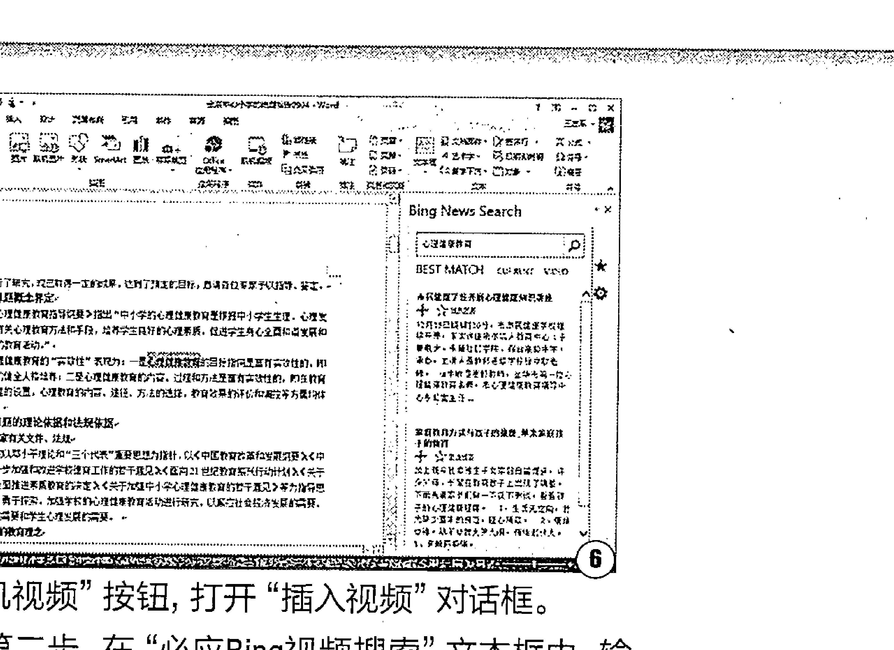

“联机视频”按钮, 打开“插入视频”对话框。

第二步: 在“必应Bing视频搜索”文本框中, 输入要搜索的视频名称, 单击右侧的“搜索”按钮, 与此相关的视频就会出现在列表中, 选中要插入的视频, 单击“插入”按钮, 该视频的缩略图即会被插入到文档中。以后阅读者想令其播放的话, 只需单击它即可。

用同样的方法, 在“插入”标签的“插图”工具栏中单击“联机图片”按钮, 可在文档中插入由Bing搜索到的网络图片。

### 秘技点评:

Word 2013的可插入网络视频功能, 极大地丰富了文档内容, 加强了文档的表现力。同时其提供的插入网络图片功能, 也给我们的日常编辑操作带来了诸多便利。这其中最直观的感受是, 插入网络图片的过程被大大地简化了。

#### 秘技扩展:

Word 2013的插入网络视频功能, 只支持DOCX格式的文档, 如果你将文档保存成了Word 97~2003的DOC格式, “媒体”工具栏中的“联机视频”按钮会变成不可用的灰色, 这时只需将文档另存为DOCX格式, 再进行编辑即可。

# Excel 2013秘技篇

## 秘技1: 填充、拆分、合并全自动

### 秘技简介:

可以实现数据的自动填充、自动拆分、自动合并，大大地提高了工作效率。

### 秘技招式:

好不容易将本学期期末考试成绩总表编排出来，交给领导审阅时，得到了两个意见:最好将表格中的“姓”、“名”两列，合并为一个“姓名”列，即学生的姓和名不需要单独列出;二是修改速度要快，争取在二十分钟内解决问题。

这两个看上去十分简单的意见，却将小王愁坏了，因为他并非Excel高手，无法使用Excel的一些高级功能，快速完成领导交给的任务。如果采用手工一一修改的方式，光是全校五个级部一千多名学生的姓名，也够他忙半天的。不过，幸亏小王使用的是Excel 2013，这样，他利用其中的“快速填充”功能，只需几秒钟就将上述操作快速搞定了。

快速填充功能的特点在于，它能智能分析用户的操作，并可在用户需要的时候，快速地把这些操作应用到相应的单元格中。

## 特别话题

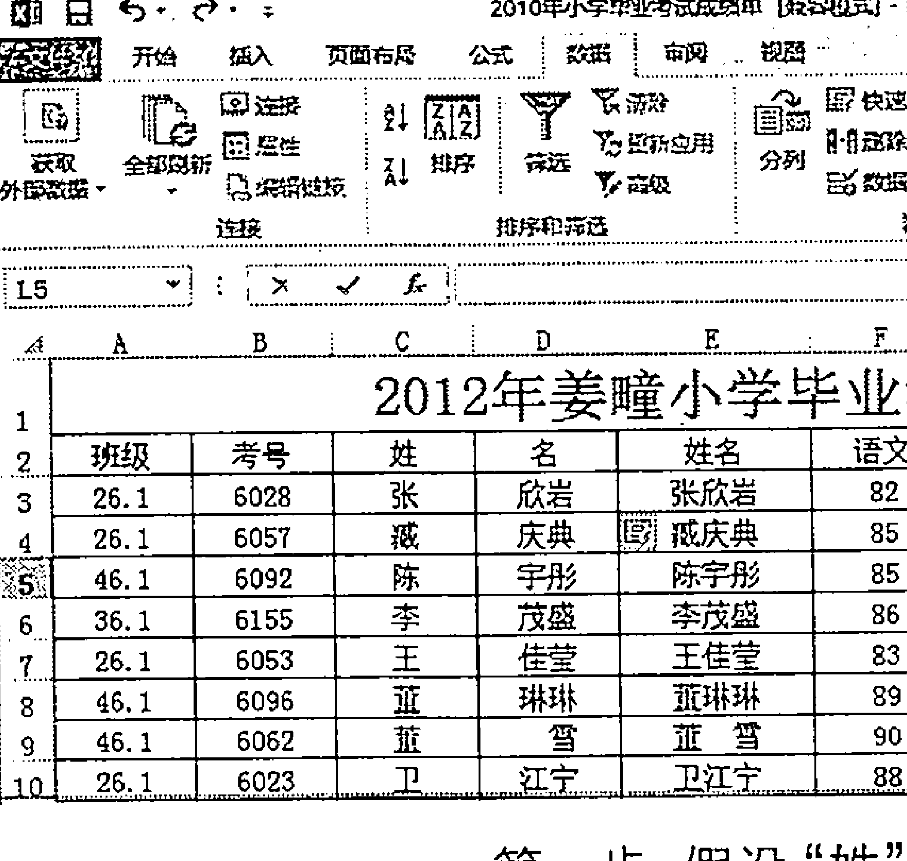

第一步: 假设“姓”、“名”两列分别对应C、D列，在D列右侧插入一列E，将其标题设置为“姓名”，然后在该列的前三个单元格中，分别输入对应姓、名合并后的学生姓名。

第二步: 选中第三个单元格以及其下所有需要输入学生姓名的单元格，在Excel主界面中，切换到“数据”标签，在“数据工具”工具栏中，单击“快速填充”按钮，所有学生的姓名将自动输入到所选单元格中(图7)。输入完毕，再将C和D列删除，“姓”、“名”两列的合并工作就完成了。

### 秘技点评:

Excel 2013的快速填充功能，可帮助我们快速实现很多操作，比如将几列中的数据自动合并成一列，或从某列中拆分出相应信息并形成单独列，以及将先前单元格中的公式瞬间应用到所选定的单元格中等等。当然，这些还只是快速填充功能的一小部分，更多的功能，还需要我们在日常的使用过程中，自行学习、探索。

## 秘技2: 数据分析 瞬间可就

### 秘技简介:

集中了格式、图表、汇总、表、迷你图等五大功能，可以一键调用，帮助我们在最短的时间内完成相应的操作。

### 秘技招式:

考试成绩录入完成后，领导要求李东将成绩为60分及以下的单元格，应用某种方式突出显示，以便领导能更好地了解全校学生的“瘸科”情况，从而督促相应教师制订出切实可行的辅导方案。其实领导的这一意图，利用Excel 2013可轻松完成。

比如此例中，小王想对学生成绩进行分析，并对60分及以下的单元格进行标注，可以这样操作。

第一步: 选中各科成绩所在的单元格并右击，在弹出的右键菜单中选择“快速分析”，打开相应的对话框，切换到“格式”标签，单击“大于”按钮(图8)，打开“大于”对话框。

第二步: 在“为大于以下值的单元格设置格式”文本框中，设置数值为60，然后单击“设置为”项右侧的下拉箭头，在出现的下拉菜单中选择一种自己喜欢的标注方式(如用色块填充单元格或赋予文字以不同颜色等，图9)，确认后，所选区域所有大于60的数值即会被标注上指定的格式。反过来说，由于不大于该数值的单元格不会发生变化，所以也就非常容易识别了。

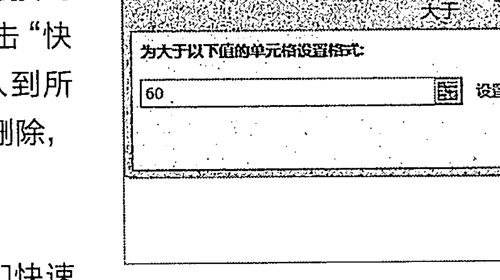

### 秘技点评:

和快速填充功能相比，Excel 2013的快速分析功能更强大，利用它，我们可快速为所选单元加上相应格式，或者在表格中插入相应图表、应用各种汇总公式等。由于其中分析功能都由程序自行完成，我们要做的就是选择合适的格式或图例即可，所以即使是Excel菜鸟，也可轻松打造出十分专业的表格。

## 秘技3: 插入应用程序

### 秘技简介:

可根据自己的需要，为Excel表格插入一些收费或免费的应用程序，比如Gauge、Docstoc Premimn、Dictionary Merriam和Bing Maps等。

### 秘技招式:

为了突出公司的人性化管理，准确而直观地了解每个员工的籍贯信息，老板向赵霖提出一个看似苛刻的要求，能否在员工名单表格中添加进一幅地图? 具体要求是，当他在表格中选定某员工的地址时，该地址会同步显示在地图上。老板的这一看似荒唐的要求，被赵霖利用Excel 2013提供的插入程序功能轻松地搞定了。

打开员工信息表，切换到“插入”标签，单击“应用程序”工具栏中的“Office应用程序”按钮，然后在出现的菜单中选择“查看全部”，打开相应的对话框，单击“Office应用商店”按钮，屏幕上就会出现相关的站点。使用Microsoft账户登录，在搜索框输入Bing Maps进行搜索，点击Add按钮将其添加到Excel 2003（图10）。

莱阳市姜疃二中教职工名单
| 序号 | 姓名 | 工作部门 | 职务（职称） | 籍贯 | 序号 | 姓名 | 工作部门 | 职务（职称） |
|---|---|---|---|---|---|---|---|---|
| 1 | 许培进 | 院办 | 十二月提前离休 | Chongqing | 49 | 王建中 | 图书馆 | 会计师 |
| 2 | 李晓华 | 院办 | 副教授 | Guiyang | 50 | 吕淑云 | 图书馆 | 职员 |
| 3 | 杜文娟 | 院办 | 讲师 | Changde | 51 | 陈继东 | 图书馆 | 馆员 |
| 4 | 赵洪斌 | 院办 | 副教授 | | | | | |
| 5 | 毛建国 | 院办 | 副教授 | | | | | |
| 6 | 梁立力 | 院办 | 副教授 | | | | | |
| 7 | 杨建民 | 院办 | 助理研究员 | | | | | |
| 8 | 孙华芬 | 院办 | 主任(正科级) | | | | | |
| 9 | 韩建林 | 院办 | 助教 | | | | | |
| 10 | 周荣华 | 院办 | 讲师 | | | | | |
| 11 | 王华 | 院办 | 高讲 | | | | | |
| 12 | 张丹月 | 院办 | 助教 | | | | | |
| 13 | 赵鑫 | 计财处 | 处长(会计师) | | | | | |
| 14 | 丁国文 | 计财处 | 工会主席 | | | | | |
| 15 | 赵树山 | 计财处 | 助理会计师 | | | | | |
| 16 | 姜伟 | 计财处 | 助理会计师 | | | | | |
| 17 | 金燕华 | 计财处 | 助理会计师 | | | | | |
| 18 | 王建文 | 计财处 | 助理会计师 | | | | | |
| 19 | 孙丽 | 计财处 | 合同职工 | | | | | |
| 20 | 张俊庆 | 党办 | 主任(高讲) | | | | | |
| 21 | 李红 | 阅览室 | 处长(讲师) | | | | | |
| 22 | 张天一 | 教办、团委 | 书记(讲师) | | | | | |

以后，无论是老板在浏览员工信息时，还是在赵霖要输入员工籍贯时，如果他们想让地图自动定位到相应位置，都可以在“Office的应用程序”窗口找到并单击已经安装的Bing Maps应用程序，加载Bing地图。这样，当老板想查看某员工在地图上的位置时，他只需选中该员工所在的城市或地区，相应的位置就会出现在Bing地图上。

同样，赵霖在输入员工籍贯时，也会随着输入的信息，自动定位到相应位置（图11）。

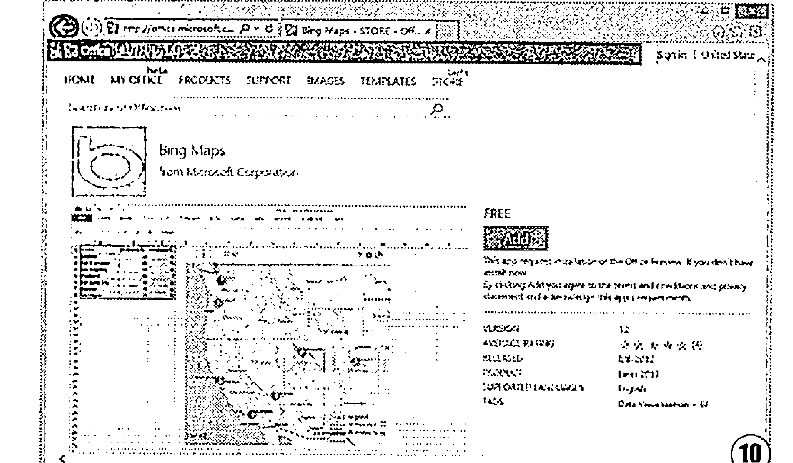

### 秘技点评：

Office 2013提供的插入应用程序功能，在一定程度上丰富了表格功能，而且Office应用商店中的程序数量还在不断的增加中。不过略微遗憾的是，迄今为止，商店中还没有为中国用户设计的程序，所有程序皆为英文，而且适用范围也和国内用户的需求有一定差异。比如上面讲的Bing地图，就存在服务器反应缓慢、对中文支持不好等缺点。所以在使用Bing地图来定位地名时，最好使用相关城市的汉语拼音，否则定位结果可能会令我们失望。

# PowerPoint 2013秘技篇

## 秘技1：一键更换主题

### 秘技简介：
这里所说的一键换主题并不是指PowerPoint的皮肤，而是文档的主题。只要一键即可为整个演示文档更换各种内置主题，轻松而方便。

### 秘技招式：
由于推广的需要，张佳需要在多个产品发布会上演示同一个幻灯作品，但这样一来，问题就出现了，因为有许多入会人员，是出于想全面了解该产品的愿望，反复参加了多次发布会，很显然，对于这样的用户来说，一成不变的幻灯模式，并不能引起他们的最大注意（至少没有新鲜感了嘛）。于是张佳想，能不能让同一个演示作品，在不同的发布会上，都能以一种全新的面貌出现呢？以前张佳要达到这一目的，唯一的办法就是对作品重新设计，并将它们逐一保存。不过现在好了，因为他使用了PowerPoint 2013。借助于它提供的一键更换主题功能，他可以在瞬间让作品改头换面。

演示时切换到“设计”标签，在其中的“主题”工具栏中，我们可看到程序提供的11大主题，选择其中任何一个，演示文稿中的所有元素（包括颜色、字体、效果、布局、文本属性、段落属性、设计元素、照片和纹理等）就会发生改变，非常方便（图12）。

### 秘技扩展：
除了可直接应用程序内置的主题外，高级用户还可以通过单击“主题”工具栏右侧的下拉箭头，在出现的下拉菜单中，对主题的颜色、字体、效果和背景等项进行修改。修改后的主题可以直接保存，方便下次调用。

### 秘技点评：
一款设计精良的主题，能给我们的演示加分不少，而新版Office 2013中加入的这个一键更换主题的功能，从很大程度上减轻了用户的操作强度。


## 秘技2: 通过超链接发送给其他人共享

### 秘技简介:
可以将编辑完成的演示文档通过超链接发送给其他人查看, 而查看的用户不需要在自己的电脑上安装PowerPoint或任何其他产品。

### 秘技招式:
周林忽然接到老板的电话, 让他把最近编辑完成的《公司发展规划》演示文档火速发送到老板的PC中, 以便老板能在即将召开的企业会议上播放。考虑到老板的PC中并未安装Office或WPS办公套件, 如果单纯传文件过去恐怕无法实现演示, 所以周林灵机一动, 用传递超级链接的方式最终完美地完成了任务。

第一步: 打开编辑完成的文档, 在主界面中单击“文件”按钮, 切换到相应界面, 选择左侧的“共享”项, 然后在中间的“共享”栏中选择“联机演示”, 此时界面右侧会出现一个“联机演示”窗格, 根据自己的需要, 确定是否要勾选“启用远程查看器下载演示文稿”(如果勾选该项, 远程演示该文档的用户可以直接将文档下载到本机保存), 单击“联机演示”按钮(图13)。

第二步: PowerPoint会自动将该文档上传服务器, 上传完毕, 会生成一个链接地址(图14), 接下来周林只需单击“复制链接”按钮复制该地址, 然后将其通过QQ或邮件的方式告诉老板, 老板点击后, 即可在打开的IE浏览器中看到“正在等待演示开始”的字样。这时, 周林只需单击“启动演示文稿”按钮, 老板PC的浏览器上就会出现相应画面, 演示结束, 周林再单击“结束演示文稿”按钮(或按下ESC键), 结束演示即可。

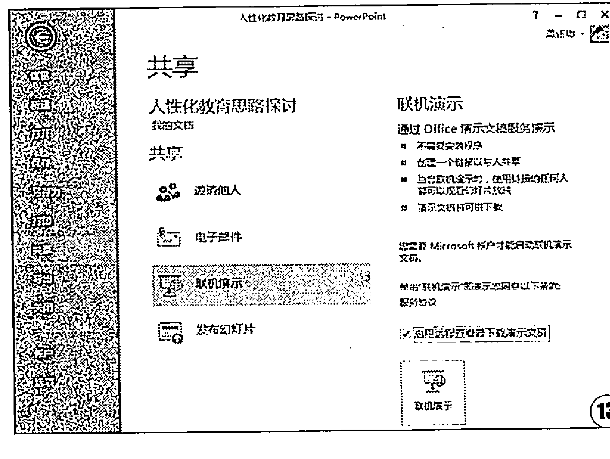
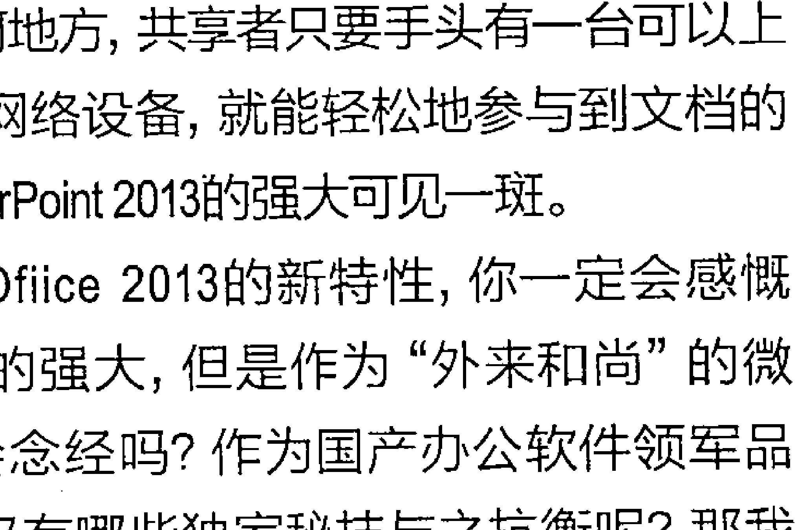

### 秘技点评:
通过PowerPoint 2013的“联机演示”功能, 我们可以发送指向幻灯片的链接给共享者, 或者启动完整的演示。

# WPS 文字秘技篇

## 秘技1: 反片打印 个性T恤我设计

### 秘技简介:
反片打印又叫镜像打印, 就是打印出来的字和图像都是反的。该打印方式在印刷行业中广泛使用, 但这种打印功能通常需要专业的PS（Postscript）打印机才可以实现。

### 秘技招式:
过几天就是丽丽的生日了, 丽丽的男友小孙一直纠结于不知给女友送什么样的礼物才好。一次偶然的机会, 小孙想到可以为女友设计并制作一件印有她名字的个性T恤。在制作时小孙却发现自家的打印机不支持“反片”打印功能, 于是他想到了WPS中提供的反片打印功能, 动手试了一下, 完美的反片图案出现了。接下来, 他只需将该图案转印到T恤衫上即可。

在WPS中打开要反片打印的文档, 单击工具栏中的“打印”按钮, 打开“打印”对话框。在其中设置好所用的打印机, 勾选“反片打印”项, 然后确认即可(图15)。

### 秘技点评:
WPS的反片打印功能很好地弥补了大部分打印机不支持反片打印的不足, 使得低端打印机也能轻松完成这貌似“高档”的工作。虽然从使用频率来说，它的出场频度并不高，但一旦啥时要用到，我们就会发现它能带来的便利远远超过想象。

因为借助它们，我可以在几秒的时间内，完成一篇网摘资料的整理工作，而不管这篇网摘有多长、先前粘贴时的格式形式有多杂乱。这一点，即使是目前最新版的Office 2013也无法做到。

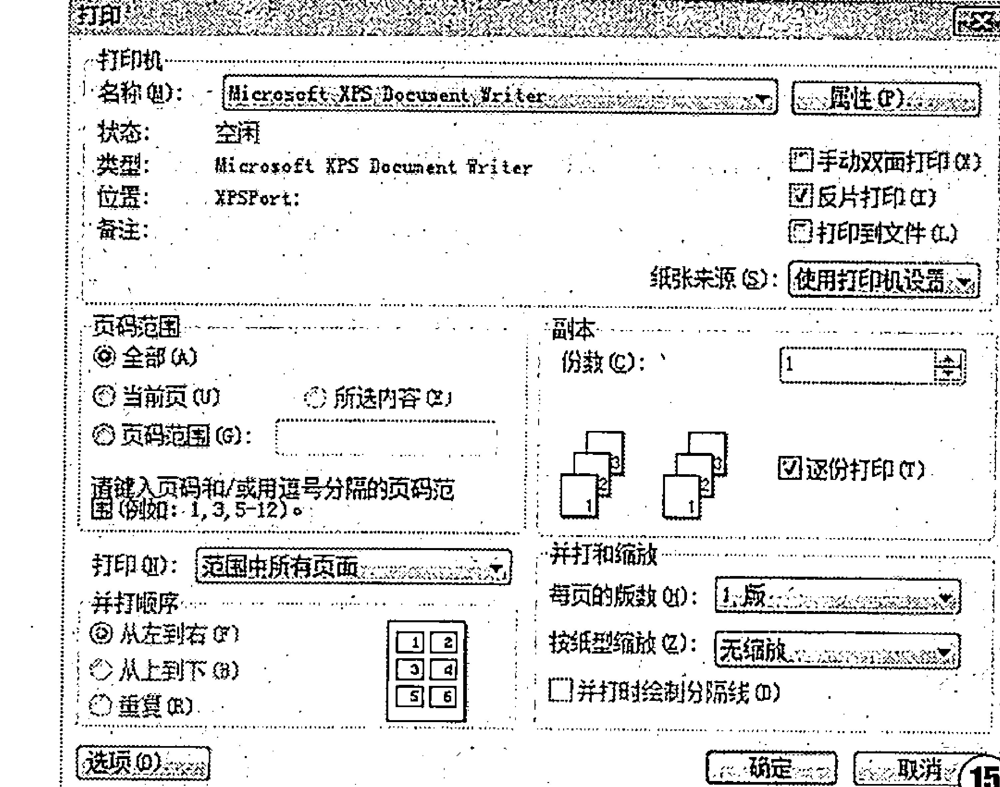

## 秘技2：网摘不愁 段落自动化调整

### 秘技简介：
轻点鼠标，即可快速删除文档中的硬回车并重新调整段落。

### 秘技招式：
阿呆从网上复制了一些资料，粘贴进WPS后才发现，这些文本居然是以硬回车的方式来表示换行的，这样不仅使得文档显得凌乱，段落繁多，而且也不利于编辑。那么，阿呆怎样才能快速地消除这些硬回车，同时还能够完整保留文章原有的段落格式呢？其实简单。

在WPS主界面中切换到“开始”标签，单击“工具”工具栏中的“文字工具”按钮，打开相应的菜单，选择“段落重排”(图16)，WPS就会删除段中的硬回车，将文本组合为正确的段落形式。

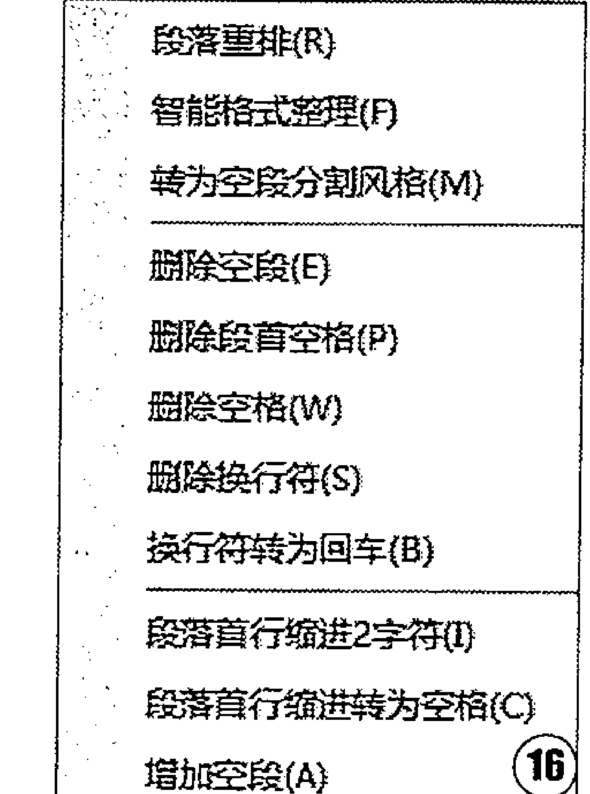

### 秘技扩展：
除提供了段落重排功能外，WPS文字还提供了“删除空段”、“删除段首空格”、“删除空格”等实用的功能，通过它们，我们只需轻点鼠标，即可轻松地完成空段及空格的删除工作。而在Office Word中，要达到同样的目的，我们必须借助较为麻烦的替换方法才行。此外，值得一提的是，除了上述功能外，WPS还提供了一个“智能格式整理”功能，选择该功能，我们可同时完成段落重排、空段和空格删除等操作，相当智能。

### 秘技点评：
在WPS文字诸多特色功能中，段落重排和智能格式整理功能是我最喜欢也是最常用的功能之一。

## 秘技3：多标签显示 方便查看

### 秘技简介：
可以像IE9、Chrome及傲游浏览器一样，以多标签的形式显示打开的多篇文档。

### 秘技招式：
在WPS文字打开多篇文档，文档标题即会以多标签形式显示在编辑区域上方，方便我们即时切换。这一功能不只存在于WPS文字中，同时还存在于WPS表格和WPS演示中。

当然，如果你不太喜欢这种模式，想让它像Office Word一样以多窗口模式显示文档也简单，只需在主界面中切换到“视图”标签，单击“窗口”工具栏中的“重排窗口”按钮，打开相应的菜单，然后在其中选择一种喜欢的排列方式即可。这些方式包括水平平铺、垂直平铺和层叠等（图17）。

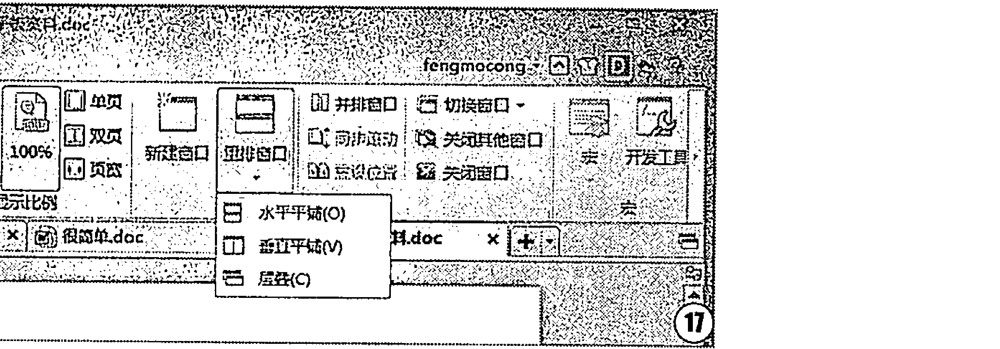

### 秘技点评：
对于像我一样经常要同时打开多个文档工作的朋友来说，WPS提供的多标签功能蛮实用，但如果你只是偶尔用用，或者从来不会用到，那么该方式可能会让你觉得白白浪费了一行空间。所以在WPS论坛上，有朋友强烈建议能提供一个设置项，让用户自行选择是否使用该模式。但直到现在为止，该设置项尚未出现，这不能不说是一大遗憾。

## 秘技4：添加斜线表头

### 秘技简介：
可在WPS文字中插入带有斜线表头的表格。

### 秘技招式：
大学课程繁多，为了让自己不忘记任何课程，造成挂科的恶果，所以陈飞在踏入校门的第一天，就想用在Word文档中插入表格的方法，为自己设置一个课程表，但在设计第一个带有斜线的单元格时他犯愁了，因为对于像他这样一个对表格不是很精通的人来说，要在划完斜线后，再在各斜线界定的区域内输入相应的课程名称，实在是一件困难的事。

## WPS表格秘技篇

### 秘技1：直接输入长数字

**秘技简介：** 无需进行额外的设置，即可直接在表格中输入长数字，如身份证和手机号码等。

**秘技招式：** 以前在Excel表格中，如果我们输入的是身份证号、证件号、学号等长数字，Excel通常会自动把输入数字的最后三位变为“0”，要解决这一问题，我们一般需要通过将单元格的数字分类设置为“文本”才行。而在WPS表格中，我们完全不用提前设置，直接输入长数字就能正常显示。当然，如果你想让WPS中的某单元格以其他格式（如货币、会计专用和科学计数等）显示也简单，只需选中该单元格并右击，在出现的右键菜单中选择“单元格格式”，打开“单元格格式”对话框，切换到“数字”标签，然后在“分类”列表中选择相应的格式并确认即可（图19）。

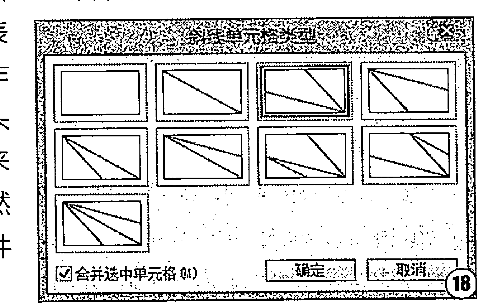

**秘技点评：** 对于经常做表格需要多次输入长数字的朋友来说，这个功能减掉了不必要的操作步骤，不但缩短了工作时间，还优化了用户体验，非常符合国人的习惯。

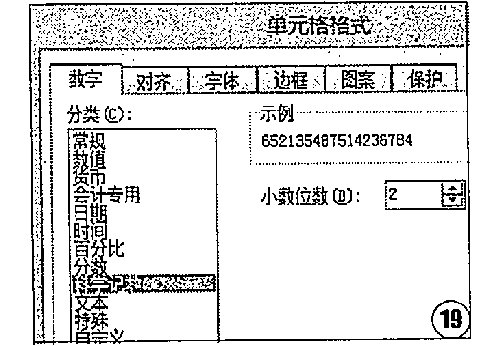

### 秘技2：一键提取生日和性别信息

**秘技简介：** 可在单元格的身份证号码中快速提取生日、性别信息。

**秘技招式：** 本着人性化管理的原则，公司领导让小王充分了解该单位职工的出生日期，以便在生日到来之际有所表示。对于领导布置的这一任务，小王面有难色，因为就本单位员工的数量来说，5000多个员工要逐一提取绝对不是一件易事。后来，小王在WPS高手老张的指导下，只用几秒钟就轻松完成了任务。由于本单位员工的信息表格中，已含有身份证号码，所以老张告诉小王，只需借助WPS表格提供的生日提取功能，就能瞬间搞定这一任务。

第一步：用WPS表格打开含有身份证号码的员工信息表，新增一列，将其命名为“出生日期”。

第二步：在WPS表格主界面中，切换到“公式”标签，单击“函数库”工具栏中的“fx 插入函数”按钮，打开“插入函数”对话框，切换到“常用公式”标签，在“公式列表”中选择“提取身份证生日”项，单击“插入公式”按钮。

第三步：在“参数输入”栏中，单击“身份证号码”右侧输入框中末尾处的小图标，此时，屏幕上会出现一个“插入函数”对话框。不管它，用鼠标选中身份证号码所在列的第一个含有身份证信息的单元格，单击对话框右侧的小图标，返回上级对话框，单击“插入公式”按钮（图20），一个出生日期便提取成功了。

第四步：接下来，利用WPS表格中的自动填充功能，单击选中已生成出生日期的那个单元格，拖动右下角的填充柄沿列下拉填充，其他人的出生日期便可依次提取了。

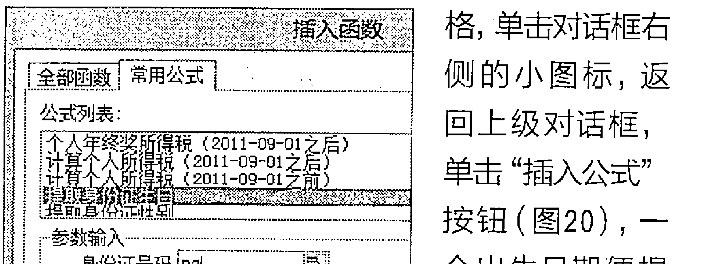

**秘技点评：**

在Office Excel中，用输入公式的方式，也可轻松地提取身份证中的出生日期和性别等信息，不过，其中的公式需要自己手工输入，操作起来比较麻烦，也容易出错。WPS表格简化了这一过程，将繁复的公式变成了一个基本功能。

### 秘技3：同时插入多个工作表

**秘技简介：** 允许用户一次性在当前表格中插入多个工作表。

**秘技招式：**

每次全校考试后，王芳必做的一件事就是要将全校各个班级的考试成绩，逐一输入到表格中存档。此时，WPS表格提供的可一次性插入多个工作表的功能的作用就显示出来了。因为利用它，王芳无需像使用Excel那样，要一次次去单击工作表下方的“新工作表”按钮，即能将全校15个班的工作表一次性建立完毕。接下来，她只需再利用这些工作表结构相同的特点，在一个工作表中完成必要的输入，并令这些输入同时应用到各个工作表中即可。

以王芳要建立一个名为“2012年第二学期期末考试成绩”的表格，且要在该表格下插入“一年级一班”、“一年级二班”、“二年级一班”……等工作表为例。

- 第一步：新建一个表格并将其保存为“2012年第二学期期末考试成绩”，然后右击编辑区域下方的Sheet1标签，在弹出的右键菜单中选择“插入”，打开“插入工作表”对话框。根据自己的需要，在“插入数目”文本框中，输入要插入的工作表数量并确认。
- 第二步：依次右击表格下方的Sheet1、Sheet2等标签，将其重命名为“一年级一班”、“一年级二班”……然后右击任意一个标签，在弹出的右键菜单中选择“选定所有工作表”，最后在任意一个工作表中设置好要输入的共用数据（如学科名称），这些数据就会同时应用于所有工作表中，从而免去了重复劳动的麻烦，节约了宝贵时间。

**秘技点评：**

“大处着眼，小处入手”，可一次性添加多工作表这一功能看起来并不起眼，但它却再一次彰显了WPS这一深受国人喜爱的办公工具历来秉承的“让办公更轻松”的设计理念——能让用户操作更简单，所谓“积沙成塔，集腋成裘”，您说呢？

## WPS演示秘技篇

### 秘技：支持文件打包

**秘技简介：** 该功能可以将PPT文件以及文件中加入的音频、视频等一起打包保存到文件夹中，这样当我们需要在其他电脑上播放PPT时，只需直接将文件夹拷贝过去即可，所有的链接文件都不会丢失，非常方便。

**秘技招式：**

文档编辑完毕，在WPS演示主界面中切换到“插入”标签，然后单击“媒体”工具栏中的“文件打包”按钮，在出现的菜单中可以看到两个命令：打包成文件夹、打包成压缩文件（图21）。根据自己的需要选择一种，即可将该演示文档涉及到的所有元素打包为文件夹或压缩文件，方便在其他PC中使用。

**秘技点评：**

以前的WPS演示和老版本的PowerPoint相比，本来是有着许多优异之处的，比如可将演示文档输出为防篡改的PDF格式文件和易于传播的Flash文件，可在文档中插入Flash动画等，不过，后来随着PowerPoint版本的不断更新，相应功能已出现在PowerPoint中，不为WPS所独有。

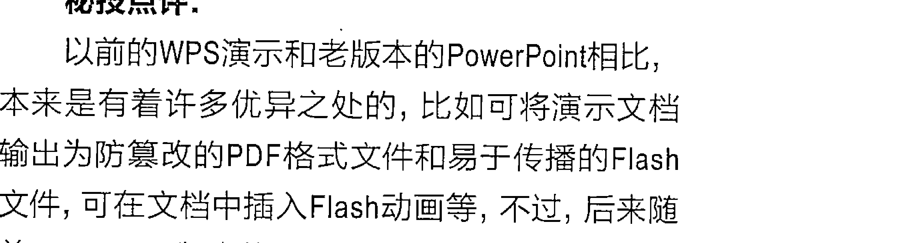

## 移动办公软件篇

经常外出的办公人士，当然不会忽略用手机或平板随时办公的优势。目前移动平台的Office软件有很多，从常见的Quickoffice到国产的WPS Office，可以说琳琅满目，它们又有哪些吸引人的地方呢？

### WPS Office

**软件秘技：** 界面简洁，文档兼容性不错，有强大的网络存储功能。

这是知名的老软件了，PC端的可与微软Office媲美。手机端的虽然年轻了些，但基于金山深厚的技术实力，所以推出后就广受手机用户的喜爱。至于你问我到底是喜欢它的哪个方面，比较多。

比如它的界面简洁，只由界面上部的工具栏和下面的编辑浏览窗口组成，点击工具栏内的功能按钮，会出现第二级工具按钮栏，二级工具按钮栏包括了所有功能的操作按钮，并可以左右拖动。这样的设计，在很大程度上节省了屏幕空间，减轻了选择难度。简易就是美，我喜欢（图22）。

最后，还有最重要的一面，就是它优异的网络存储功能。WPS Office可以和金山快盘关联，这样，只需在电脑、平板和手机中同时安装金山快盘，并且将编辑后的文档保存在快盘中，就可以在任何能上网的地方（包括宽带网络、Wi-Fi和3G网络等），利用手头任意一部设备访问并编辑其中的文档了，很方便。

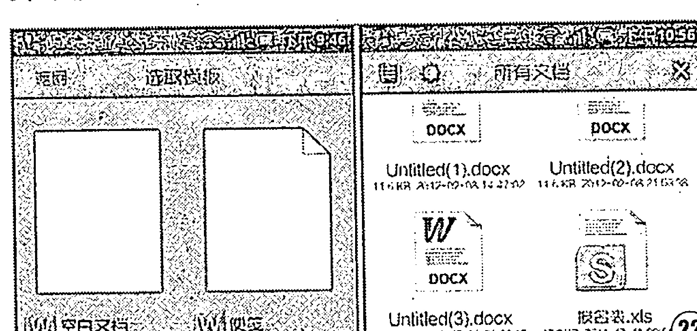

### Documents To Go

**软件秘技：** 功能强大，易用为王，支持Google账户中的文件同步。

从界面布局来说，它的色调沉稳（蓝灰色），具有浓厚的商务感。而且其初始界面基本采用了列表形式，点击不同的功能栏进入其下级页面，在进入二级页面时，工具栏会以动态方式显现，看起来很酷，使用起来也顺手（图23）。

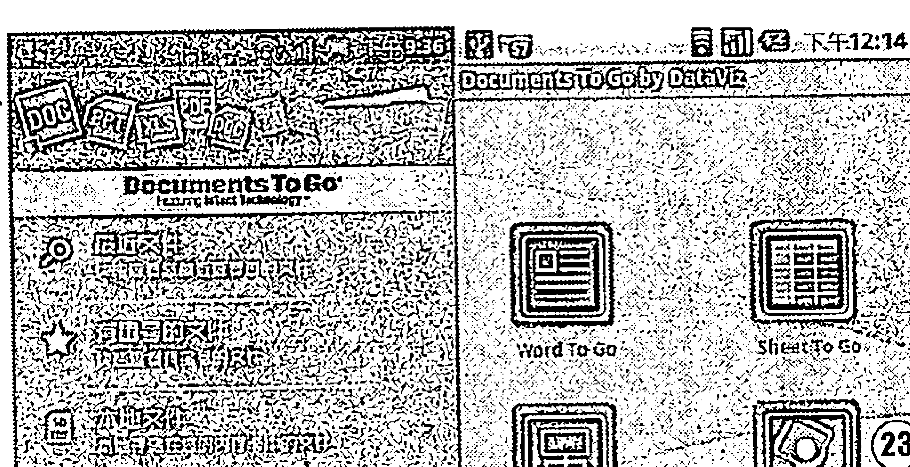

此外，Documents To Go支持创建微软Word、Excel及PowerPoint文件，并能浏览PDF文件，这一点要比WPS强大一些，因为WPS不支持创建PPT文档。不过，Documents To Go不支持打开TXT文本文档，这一点显得比较诡异。

### Quickoffice Pro

**软件秘技：** 该有的浏览和编辑功能都有，同时支持关联10个网盘账户。

说到移动办公工具，实际上目前我们在网络上能见到的，在功能方面都大同小异，而界面设计上则各有千秋。比如我一直在用的Quickoffice Pro，其初始界面就采用了图标排列方式，界面除标题栏之外，其余全部为设计精美的图标按钮，直观而且便于点触选择。

同时，在文件兼容性方面，Quickoffice Pro也比Documents To Go和WPS强大，支持创建微软Word、Excel及PowerPoint文件，同时支持浏览TXT、PDF格式文件。

而在网络存储方面，Quickoffice Pro则同时支持关联10个网盘账户，其中包括Google、Dropbox和Box等（图24），不过，这些网盘的服务器都在国外，同步速度较慢，而且有些已经被封闭，要正常使用必须翻墙才行，使用起来不太方便。它和Documents To Go以及WPS相比，不仅支持创建PPT文件，而且能打开TXT文件，而这两点在编辑过程中经常用到，所以还蛮方便的。

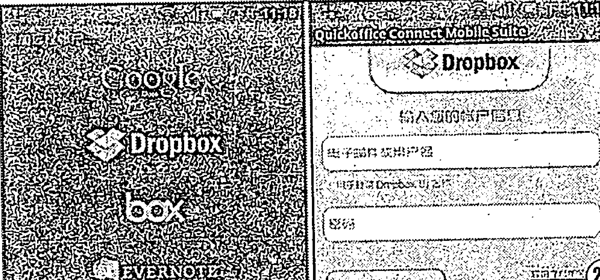

## 网购狂欢 防不胜防

2012年下半年的“光棍节”让我们领略了电商促销的疯狂，消费者为商品大幅降价雀跃的同时，电商们也尝到了甜头，什么“双12”、“末日狂欢”、“圣诞抢购”，一直延续到即将到来的蛇年春节……然而电商们在一轮轮促销后，消费者逐渐开始不买账，甚至怨声载道，几乎电商每发动一次狂欢就遭遇一次信誉危机。而电商巨头们似乎也陷入了恶性竞争的怪圈。气势汹汹的京东被爆出商品先提价后降价、同类商品鲜有打折，低价的真实性有待考证。天猫“双11”过后，巨量订单发货延时，海量售后问题至今尚未解决等等。产品质量和服务与所谓的“狂欢”距离甚远，不仅令电商们的信誉遭受质疑，同时也令消费者逐渐失去了信心。

策划 | 《电脑爱好者》编辑部 监制 | 严威川 作者 | 严威川、丁宁、龙诗思、张倩

### 促销狂欢后的阴影——2012年11月11日以后

天猫商城多款产品直接五折促销，这对于一向只降价不打折的电子产品来说是相当的实惠。然而想要获得这种实惠并非易事，商家一般会限定产品数量，同款机型同一小型号仅提供几十到上百台不等的库存，以供消费者五折抢购。为了获得这些实惠，不少消费者在双十一到来之前就早早地将选中的产品添加至购物车或者收藏夹中，并在10日晚上就守在电脑前，希望能够赶在11日0点开卖之后第一时间抢到这些超值机型。然而，即使下单成功并且成功支付后也不能保证消费者就可以买到这些产品。

#### “超卖”原来可以不卖

“双十一抢购到一款半价笔记本，之后几天联系卖家就没了动静，产品不发货也不告诉我原因，直到一周后才通知我因为发生超卖现象订单无效，让我申请退款。”来自广州的李女士在接受采访时告诉记者。

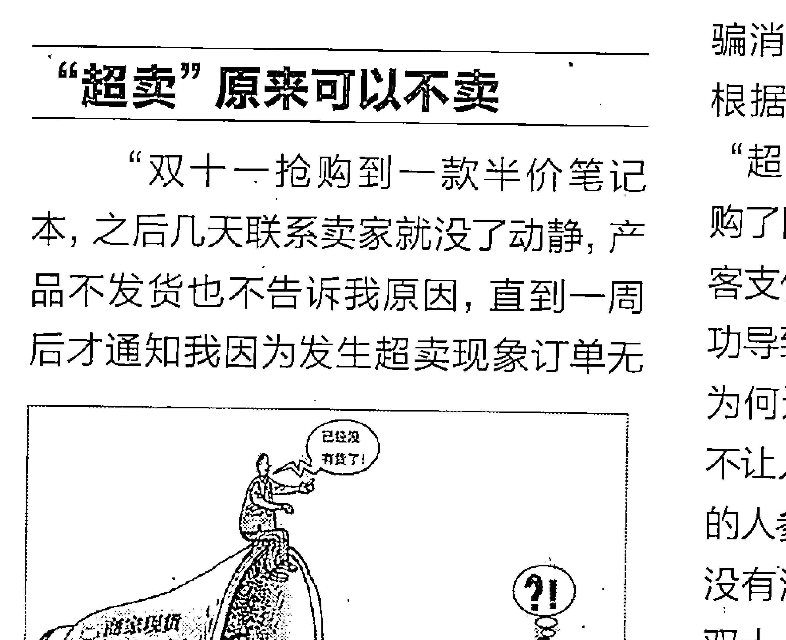

像李女士这样因“超卖”被商家取消订单的消费者不是少数。同样有此遭遇的还有一位河北的孙先生，在双十一过后接到了天猫商城的短信，“亲爱的消费者，您在双十一的订单发生超卖，我们一直尝试为您调货但未能成功，因此请您尽早申请退款，确保权益。由于当日天猫订单火爆，超卖情况商家无法控制，不属于缺货赔付范围。”

“超卖”这个现象的出现究竟是电商自身技术上的漏洞，还是为其欺骗消费者虚假促销而想出的新借口？根据淘宝对于“超卖”现象的定义，“超卖”是指多名顾客在同一时刻选购了同一件产品并支付了货款，导致顾客支付的数目超过了库存量，订单不成功导致交易失败。既然下单不算成功，为何这些记录还是存在呢？这就不得不让人产生怀疑了。淘宝每天有那么多的人参与秒杀和其他形式的抢购，为何没有消费者遇到超卖现象？而在今年双十一这种现象却频繁上演，且超卖数额如此之多，涉及到的商家和消费者范围如此之广。对于规定库存数量的商品，照理说在库存范围内的买家拍下之后，超出库存范围的买家根本连拍的机会都没有，怎么可能成功下单还能够付款完毕呢？更让人难以理解的是超卖这个现象在淘宝规则内是合法的。如果超卖不是淘宝为卖家虚假促销而提供的手段，那么就是淘宝在技术上无法避免这种现象的存在。既然无法规避，那么就应该取消或者试图改善这种现象，而不是一味地让买家承担这样的后果。

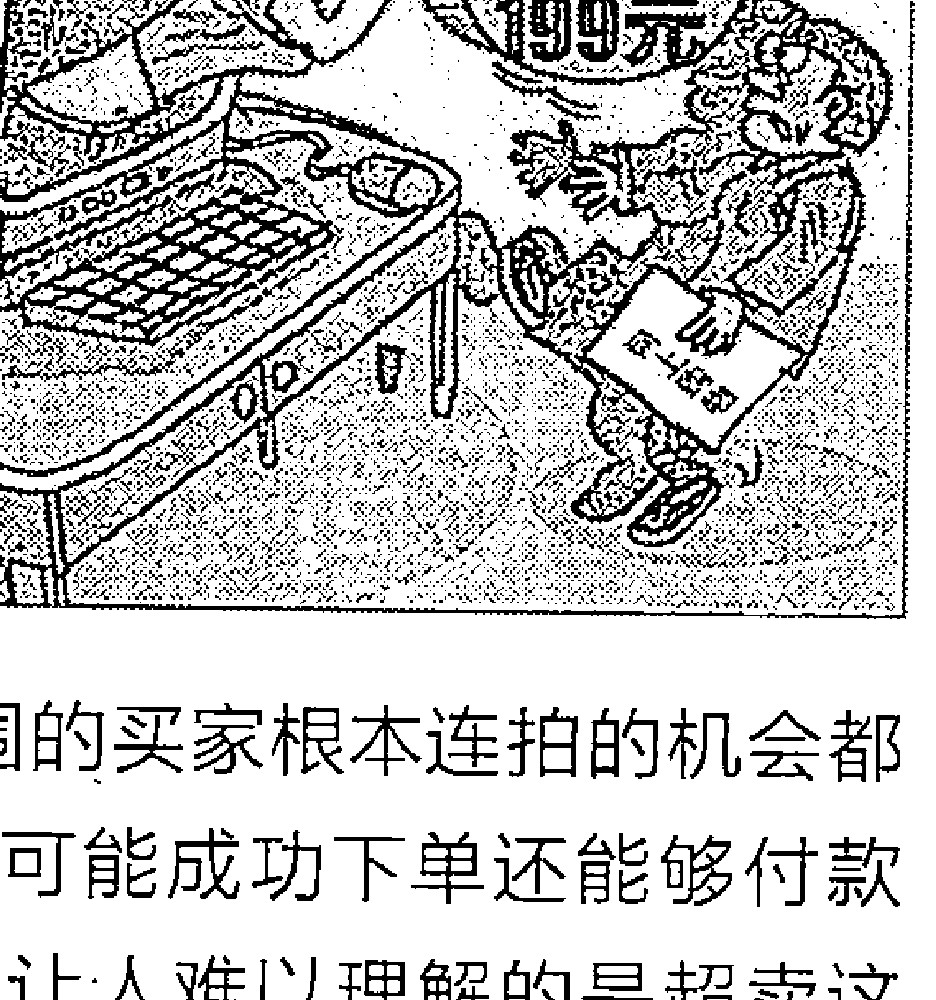

#### “0点刷价”背后的玄机

当然，利用“超卖”搪塞买家仅仅是冰山一角，各种伎俩在“双11”层出不穷。“看中宝贝先收藏，0点刷价直接付款”这条广告语或者类似内容在任何一个电商平台上都出现过，而产品极低的价格令买家们不得不先收藏，然后静等付款。从事健身教练工作的肖锋在“双11”的时候盯紧了天猫几家知名运动品牌直营店，并且看准了几个自己心仪的产品收藏起来。但实际上，0点刷价后却呈现另一番景象。

举一个很简单的例子，一家直营店在宣传时打出价格399元，承诺0点后将以199元价格卖出，但是0点更新，该宝贝原价立马涨至599元，双十一半价则变为299元。再看其消费记录，买家大多也以300元左右的价格买入，也就是说，所谓的半价销售，虽然比原价格低廉，但卖家也绝对不会亏本售出。“其实商家大可不必这样，直接降价促销就行了，搞这么多弯弯绕，这对他们的信誉度绝对有影响。”肖锋很无奈地对记者说，最后他还是买下了这款产品，毕竟自己喜欢也用得上。

除了改价之外，以次充好也成为消费者受害的重要方面。其中最为严重的当属3C产品，由于3C产品价格较高，网上购物无法亲自验明真假，许多店铺打出的“正版行货”广告下，实则以水货、二手货等产品欺骗消费者。对于3C产品的维权，由于很大部分消费者没有清晰的理论知识，很可能直到产生故障才发现问题，而卖家则以自己使用造成为由拒绝退货。在“双11”促销中，一些消费者买到了“拆装机”也是不争的事实。

#### 低价机等于“缩水机”

家住北京通州梨园的龚小姐在促销期间为自己的父母买了一台戴尔的笔记本，商家是淘宝上口碑不错的商家。货到之后，系统是Windows XP，并且里面还有拷贝的几部动画片，这令龚小姐很诧异。按照商家页面上的介绍，这台机器应该预装Windows 7系统，并且开机会出现相关激活和设置界面。于是她立即给商家打电话，得到的回复是由于笔记本属于低价促销，所以不提供正版系统，Windows XP还是他“好心”给装的。这个答复显然令龚小姐很不满意，于是将笔记本带到单位，经IT部门的同事鉴别，得到的答案是笔记本曾经被拆过，硬盘已经被更换，并且内存也从4GB缩水到2GB。

愤怒的龚小姐打电话给商家，说如果不退货就报警，对方在推诿周旋了半个小时之后，答应退货。“这也就是我较真儿，其实笔记本外观基本很新，开机速度和性能如果让老人用一点问题也没有，但是凭什么低价就一定要买二手货呢？”虽然事隔多日，龚小姐对记者谈到此事的时候依然非常愤怒。

### 超低价格原来是诡计——2012年12月12日以后

“卖爆了！一元包邮的正品耐克鞋，支持专柜验货！12月21日就是世界末日了，我们不计成本1元包邮，再不买就来不及了！”就在不久前淘宝上出现了大量1元包邮的产品，小到袜子球鞋大到电视冰箱，而看看这些产品的成交记录也都是密密麻麻的好几页，令人咋舌的低廉售价和数以万计的成交量也让不少消费者跃跃欲试。但是，你能相信这是真的吗？真的能1元钱买到与店主描述相符合的产品吗？

浙江的王女士就在不久前尝试购买了这种“神奇”价格的产品，她向笔者介绍，12月14日早晨听到公司同事惊呼“耐克运动鞋1.23元包邮！太便宜了！”她赶紧向这名同事要了链接并也跟随他一起拍了一件。随后，她又在QQ群里向其他同事朋友转发这一消息，引起一片哗然，也有不少朋友都购买了这款产品。

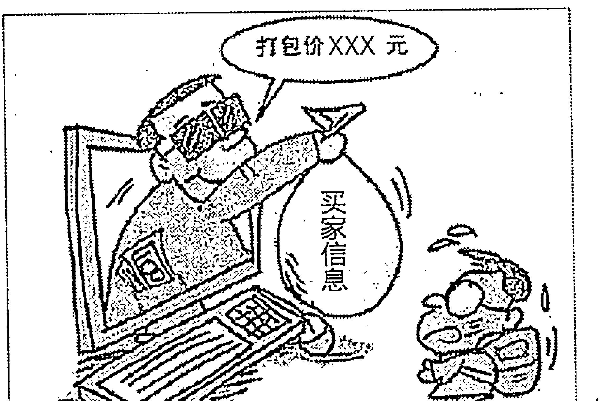

紧接着，王女士发现这款产品已经下架，而过了半天时间却再次上架，只不过价格调高至549元。而在当天晚上，王女士再次进入这个产品页面时，出现了新的成交记录，几名买家以549元的价格拍下了这款产品。王女士认为自己真是赚到了。然而在付款后的很长一段时间里，卖家都没有发货，联系卖家也没有反应，最后只能申请退款。

卖家正是利用“双12”和所谓的“末日促销”等营销幌子，将贵重产品以1元的价格包邮促销，并承诺在下个月或者月底才会发出。同时，卖家在各大论坛或者微博QQ群等地方大力宣传，让消费者产生购买欲望并主动推荐给朋友同事。这样的操作能让单款产品的日销量突破20000件。之后调高产品价格，利用淘宝的搜索规则，成交量靠前的产品可以顺利排在首页。

#### “神奇价格”平淡收场

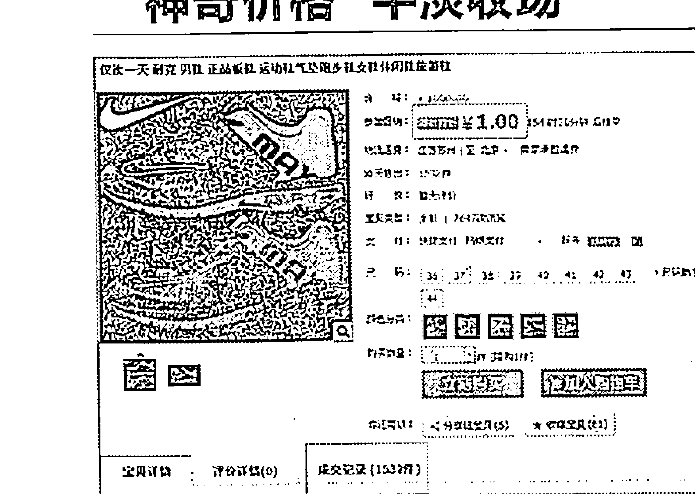

之前一元价格拍下的产品当然是不会发货的，这些消费者如果申请退款

### 抢购后遗症

据调查，在“双11”和“双12”以及所谓“末日狂欢”促销之后，消费者退货率攀升新高，很大原因之一便是商城为了鼓励顾客购买以及宣扬商家产品品质推出的“无理由退货”渠道。由于顾客可以因为不喜欢等单纯的主观原因退货，使得电商的退款率急速飙升。但事实上，不少商家退款的原因主要是由于货物送达等问题。

> “在网上买了一件衣服准备给爸爸当做生日礼物，但是过了2周都没有送货，眼看到了爸爸生日，只好去商场买了一件。这样的网购效率完全失去了便捷性。”一位姓王的女士说到。

“快递公司不可信，现在市场上以茅台为招牌的假酒太多，而仿真的程度甚至打防伪电话都无法辨别。我们在运输真酒的过程中根本不能走快递，因为一定会被调换。对于快递公司将高价值商品‘狸猫换太子’的行为，我们早已见怪不怪了。”一位经销茅台的经理说到。

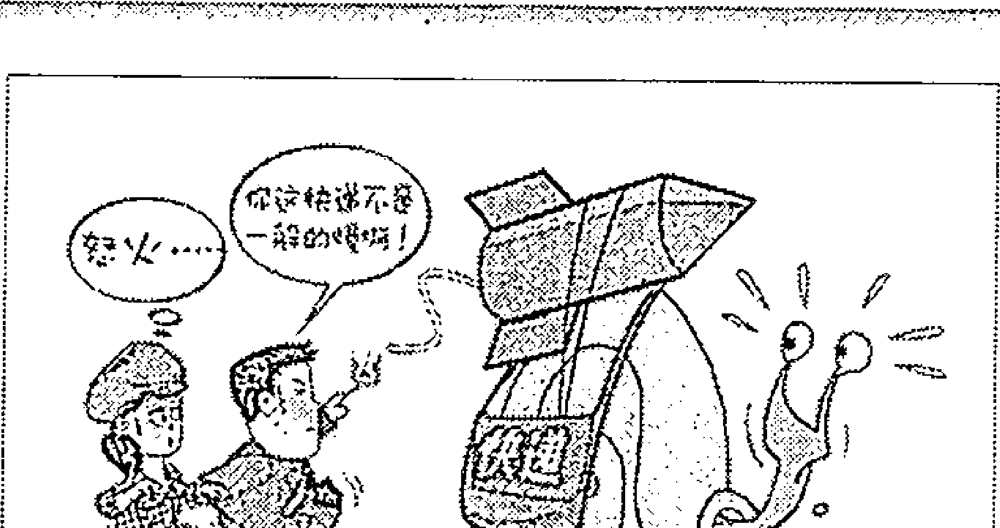

由于网购时通常是由卖家选择与哪家快递公司合作，买家自己选择快递公司的机会并不多，而快递公司的纷乱情况，送货失误、调换商品、延期到货等，加上管理不善等原因，甚至有快递公司失火造成货品大规模损失等情况的发生，使得消费者对于网购的耐心降低了许多，退货现象也逐渐增加。

此外，除了接下不能送货地区单据造成退货等原因之外，卖家为了防止恶意竞拍造成的库存减少等问题，刻意将库存量调高，实际上却无法兑现货款的数量，也造成了不少消费者拍下商品却无法得以兑现。

### 欺诈难防 达人谈经验


从以上的各种促销中可以看出，低价必然伴随着各种消费不理想。而从以往的经验总结来看，如果商家一开始就想刻意欺诈，那么消费者很难进行防范，也没有什么很好的经验识破这些欺诈。但是对于在促销内容中设立的“小陷阱”，只要消费者细心分析，还是能够做到防微杜渐的。

客观地说，在网购过程当中都会或多或少遇到一些优惠促销当中存在的“小陷阱”，而此类小陷阱，并非是真的陷阱，而是一些商家或商城暗设下来的伏笔。所以说，这样的“小陷阱”并不是严格意义上的欺诈，但消费者似乎又很难加以防范。为此，本刊记者特地见面约谈了网购达人“阿拉丁”以及业余网络买手“宁宁”，分别让他俩介绍一下自己的经验以及亲身遇到的消费“小陷阱”，以免消费者遭遇到“哑巴吃黄连有苦说不出”的下场。

> 在“双11”和“双12”这样的网络促销季抢购商品，最重要的就是严格遵守电商制定的“游戏规则”。只有详细了解游戏规则，才能不被忽悠。

比如“苏宁易购超级0元购”活动，就有很多小陷阱值得注意。其中最为重要的，就是一定要在活动规定的时间内下单，才能享受到返券活动。比如说，2012年9月19日那天，就规定“每日10点后下单并支付完毕的顾客方可享受0元购返券资格”。这个条件虽然并不苛刻，但却被很多网购菜鸟所忽略。热门商品虽然可以在10点之前成功下单，但却肯定无法获得返券资格。如此一来，除非订单能够顺利取消，否则就只能空欢喜一场了。


所谓“超级0元购”，我们肯定要坚定一个观念，那就是商家不可能免费给你产品，而且这类促销肯定有很多


# 防恶意购买公告

尊敬的苏宁易购会员：

苏宁易购自正式运营一年多以来，无论网站流量、销售业绩还是注册会员均在快步增长。在此，感谢广大会员的关爱和不断支持！

苏宁易购为继续保持快速发展的状态，日常期间不断开展优惠促销活动回馈关爱我们的会员朋友，尽量让每一位会员都能享受苏宁易购带来的实在优惠。但是，在过程中我们发现极少不良买家为满足其私人利益，采用非正当的方式进行恶意购买，让其他普通顾客无法享受这些优惠。对此苏宁易购坚决予以拒绝，现对相关内容做如下强调：

为了给予支持我们的网民更多的实惠，苏宁易购特此推出团购绿色通道：凡有顾客需购买同一型号（包括彩电、空调、冰箱、洗衣机、厨卫、数码、手机、电脑、生活电器、百货、化妆品、图书、办公设备等）3台及3台以上者，请您务必与苏宁易购团购部门（联系方式：tuan@cnsuning.com）取得联系，将您的姓名或公司名、电话、商品型号及数量、收货地址等有效信息发至该邮箱，我们会根据您的需求进行处理，如：及时安排送货，开具增值税发票等完善的团购服务。对于数量及金额较大的团购需求，我们会根据实际情况给予一定的优惠。

为保证更多的会员正常参与我司的优惠活动，建造一个公平公正的购物环境，对未按上述要求的购买行为，我司将保留取消相关订单或服务的权利；对提供虚假信息或进行恶意购买，损害广大普通会员权益，扰乱我司正常经营秩序的购买行为，我司将保留取消相关订单及追偿的权利。

感谢您的理解与配合！苏宁易购希望与您携手共同发展！

“游戏规则”。对于“菜鸟”来说，不要一看到“0元”就兴奋，详细了解规则才是王道。

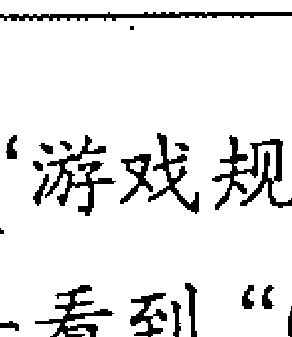

除了促销页面上详细写出的“游戏规则”之外，网购买家还应该关注电商网站的各种公告。在这里仍然以苏宁易购为例，就存在一个《防恶意购买公告》。这个公告明确规定，凡有顾客需购买同一型号（包括彩电、空调、冰箱、洗衣机、厨卫、数码、手机、电脑、生活电器、百货、化妆品、图书、办公设备等）3台及3台以上者，请务必与苏宁易购团购部门取得联系（联系方式：tuan@cnsuning.com），并申请团购服务。否则的话，就会被苏宁易购判定为恶意购买，从而被取消订单。在这里需要注意的是，同一收货地址也算是恶意购买。比如说苏宁易购的论坛上，就有一个公司的多位同事购买同一产品的现象，最后被判定为恶意购买，从而取消了订单。


恶意购买是普通消费者经常犯的错误，一看到价格便宜就蜂拥而上，并且订购几件甚至几十件，这种临时性的大规模订购在任何电商网站都有可能被判为恶意购买。


如果是购买IT产品，其实还要考虑到瞬息万变的产品售价。尤其是购买CPU、内存、硬盘这三种价格“一天一变”的IT产品时，最好选择像京东商城那种提供“价格保护”服务的电商。这样一来，即便你买的IT产品因为冬季雨雪的问题而在途中耽误了很多天，也可申请“价格保护”退还IT产品降价之后的差价。

不过在这里需要注意的是，价格保护最好选择货到付款或上门自提，且最好不要选择在线支付。因为如果选择前两种方式支付，那么订单付款签收之前都可以申请价格保护，而且是“在用户取货或收货时扣减相应的货款”，相当于直接以现金形式退了差价。而如果选择在线支付也就是先款后货，那么差价就只能以积分形式退还了。这个积分虽然再次消费时就能使用，但显然不如现金形式来得实在。另外，套装、分期付款、包含赠品、抢购活动、满赠满返活动、团购、机票、彩票、充值、点卡、合约计划、厂商直送、海外订购、第三方卖家商品也不享受价格保护。

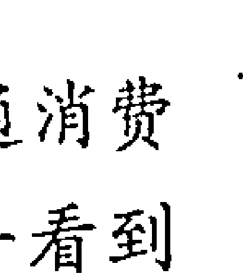

我属于业余买手，遭遇过“小陷阱”，提醒广大读者注意吧。其中，网购中最常遇到的，就是“先斩后奏”。我曾经在淘宝网上秒杀过9.9元的包包套装。包含了1个零钱包、1个化妆包、1个收纳袋、1个手拎包，当然最中意的就是PU亮皮外观的化妆包。可是收到货之后，却发现PU化妆包换成了1个小钱包，里面还夹着一张小纸条。上面写着：“亲，您要的PU化妆包已经缺货了，我们给您换了一个更高档的小钱包。要是不满意的话，也可选择退货哦。”最后只能签收，还能为这不到10元钱的东西退货？忍了！

| 图标 | 商品描述 | 价格 | 数量 | 操作 | 小计 |
| :--- | :--- | :--- | :--- | :--- | :--- |
| ![1] | 可批发两面拉链 透明多用途 外贸 单层包 牛津布 尺寸 24*19cm 颜色分类:琥珀色 | 0.60 | 1 | 申请售后 投诉卖家 | 9.90 (运费0.0) |
| ![2] | 外贸 超美 PU亮皮 化妆包 收纳袋 牛津布 带拉链 颜色分类:琥珀色 | 23.00 | 1 | 申请售后 投诉卖家 | |
| ![3] | 多功能大包 时尚 手提包 收纳袋 牛津布 颜色分类:琥珀色 | 25.00 | 1 | 申请售后 投诉卖家 | |
| ![4] | 外贸 金属 出口 韩版 牛津布 手提包 3色 颜色分类:如图 三天内发货 | 29.00 | 1 | 申请售后 投诉卖家 | |

# 价格保护

## 什么是价格保护？

京东商城的商品价格随市场价格的波动每日都会有涨价、降价或者优惠等变化。如果下完订单后价格发生了变化，您可以在此申请价格保护，申请价格保护，经京东客服人员审核通过，我们将如数退还多付货款或返还相应的积分到您的账户。查看详细说明

## 如何操作价格保护？

| 先款后货订单<br>第三方或京东<br>送货上门 | 商品降价 | 申请价保<br>商品签收之前 | 审核通过 | 还与降价额<br>相当的积分至<br>用户的京东账户 |
| :--- | :--- | :--- | :--- | :--- |
| 货到付款或<br>上门自提订单 | 商品降价 | 申请价保<br>商品签收之前 | 审核通过 | 在用户取货或<br>收货时扣减相<br>应的降价货款 |

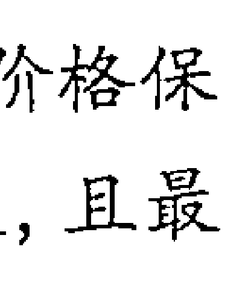

宁宁碰到的这种“先斩后奏”还有升级版。比如说你在淘宝网上买一双鞋，平时穿37码的，网上买担心鞋号偏小，就定了一双38码的，没准你收到的就是39码的。并且通过旺旺联系卖家，给你的理由还不是他那边的38码缺货，而是告诉你，他们的鞋号偏小，所以担心你挤脚，直接发个39码的。这下子，大两码的鞋子穿上，即便加上厚厚的鞋垫，小脚丫还在里面逛荡着呢。所以说，签收快递时，最重要的就是验货。如果货不对板，一定不能签收。也不要不好意思。

# 新一轮促销在即

2012年底各种促销“狂欢”热度未退，新一轮春节促销正在整装待发，经历了前者“洗礼”之后，得到什么收获呢？通过与“阿拉丁”和“宁宁”的见面约谈，本刊记者了解到，网络购物时的“小陷阱”还是数不胜数的。网购达人“阿拉丁”也向记者表示，由于淘宝这样的电商开始大面积推广“保证金”制度，商家在开店期间最少需要缴纳1000元。所以只要消费者在网购时选择缴纳保证金的商家或正规电商，通常都不会遭遇到恶意欺诈。但是虽然没有恶意欺诈，却有可能存在各种各样的“小陷阱”。所以说，网络购物时的消费导向应该是服务第一、产品第二、价格第三。

如果你在网上买了一件衣服，并投保了0.8元运费险，后来因为色差的原因而选择退货，那么就可通过申请运费险而获得12元的退货运费。

而如果你是一个宅男宅女，连买个日用品都喜欢在网上的话，那么苏宁易购的无门槛免运费服务就是最好的选择。客观来说，自从卓越亚马逊将免运费的门槛提高到与当当网持平的29元之后，苏宁易购就成为了几大电商当中无门槛免运费的唯一“独苗”。虽然从某种角度来说，当当网和卓越亚马逊的满29元订单免运费，以及京东的满39元订单免运费都不算太苛刻的要求。但是不得不说的是，苏宁易购的无门槛免运费更多的是一种态度。也就是说，哪怕你只是在苏宁易购上购买了价值一两元钱的商品，苏宁易购仍然可以免费给你送货上门，彻底免去了“凑单”的烦恼。

除此之外，诸如当当网的上门退现金服务、京东商城的“价格保护”、淘宝网的72小时发货和先行赔付，都是值得称赞的服务。但是需要注意的是，这些服务普遍都需要买家自行申请，否则的话就无法得到任何的经济赔偿。更为重要的是，包括苏宁易购、京东商城、国美电器在内的B2C电商，都提供了付费延保服务。诸如智能手机这种保修只有1年，但更换周期却为两三年的随身产品，最好购买延保服务更为稳妥。

# 服务体系要健全

首先需要明确的就是，服务其实也是价值之一，它包含在整个价格体系之中，并且与产品价值1:1。如果你是一个完美主义者，并喜欢在淘宝购物，那么淘宝网和天猫商城联合推出的“运费险”就是很好的选择。只需很低廉的投保，即可针对网络购物看不见实物这一问题提供最大的保障。举例说明，

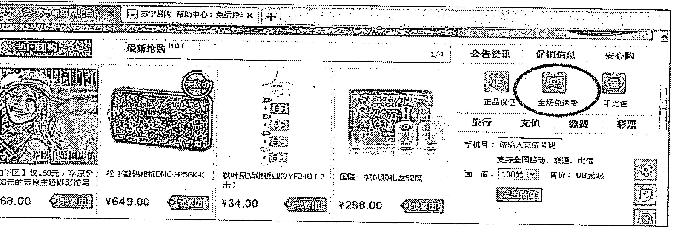

其次需要说明的是，既然春节购物季即将到来，那么注重产品也是不容忽视的。现如今，包括淘宝网在内的很多商家，都提供了诱人的“包邮”服务，甚至就连9.9元包邮的产品也比比皆是。再加上网购花的只是银行卡中的“数字”，而并不是现实生活中实实在在的人民币。所以说，进入包邮时代的网络购物就如同给消费者注入了一种“精神鸦片”，让其对网购欲罢不能。否则的话，也就不会有妻子因为网购而自断手指的新闻出现。

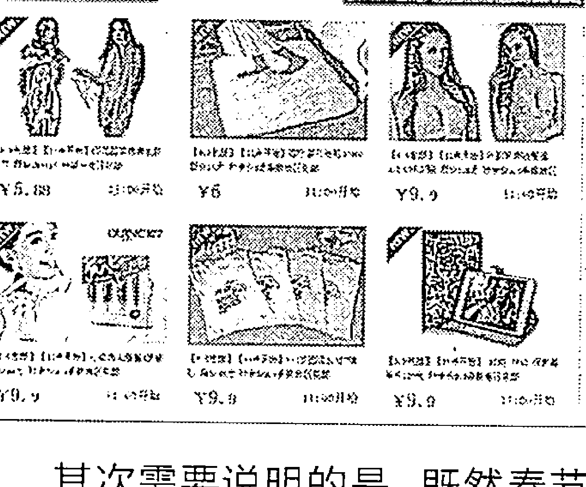

# 慎用“秒杀”

因此，网购之前，应该首先考虑自己是否需要。如果不需要的话，最好还是理性消费。买回去的不见得都能用上，有的使用频率很低的也未必非得要买。否则的话，跳蚤市场里也就没有那么多二手价转让全新品的卖家了。

除此之外，网络购物的服务虽然日趋完善，但却充斥着各种口碑很差、价格低廉的产品。网购菜鸟宁宁就曾经反馈过，在网上买了一个“现代”品牌的键鼠套装，以为是韩国大品牌，结果坏了才知道是授权贴牌，在当地根本就没有保修。返修还得自己出运费，相当的不划算。所以说，产品的品牌口碑，你是一定要考虑的。

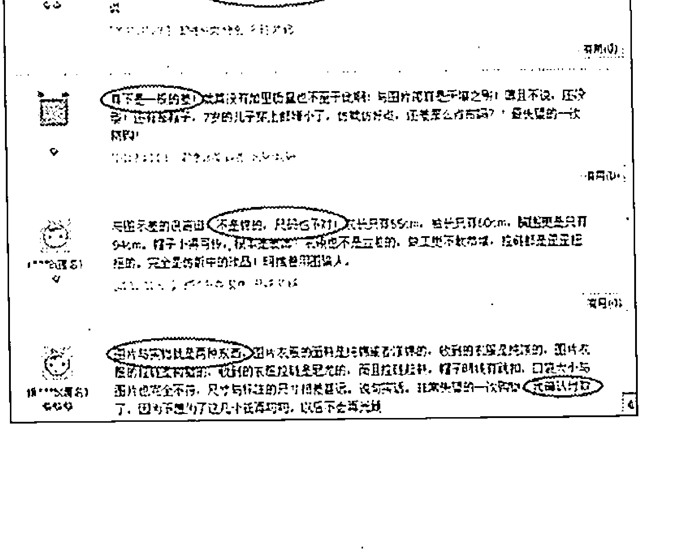

考虑了服务和产品之外，最后应该考虑的则是价格了。以网购平台领域个人商家最多且最不规范的淘宝网为例，在网购时一定要小心。首先需要关注的，就是促销价格是否在合理范围，并且遇到极度优惠一定要警惕。“秒杀”的产品可以先抢拍下来，但是别急着付款，多看看买家的评价，如果负面评论很多，就一定要经过深思熟虑后再付款。

遇到了限量秒杀的产品，如果过了一两个小时还有存货的话，要么就是“无限量”供应，要么就是价格其实并不优惠，要么就是产品质量有猫腻，一定要特别小心。

另外网购达人在这里提醒广大读者，如果是C2C淘宝平台，那么一定要购买缴纳了保证金的商家。而如果是B2C电商平台，那么最好选择天猫商城、苏宁易购、京东商城、国美电器为代表的本土品牌。诸如新蛋这样的海外电商，由于已经逐步边缘化了，所以为了避免突然退出中国市场而给买家造成损失，最好选择货到付款服务，从而做到一手交钱、一手交货。

# 一些不合理促销例证

## 199元库存全新P43主板

库存全新的P43主板，只要199元，绝对全网最低价。但必须在收货后24小时内放款，否则拒绝后续服务。

全新的主板，却只给24小时检测时间，说是为了小店资金周转。可不要轻信，小心主板是返修货，可能有暗病，所以卖家才对自己的产品那么心急。

## 59元的乐迈R95蓝牙耳机铁盒装

参加苏宁超级0元购活动，当日10点之后下单并付款成功后，即可获赠等额的59元现金返券，相当于买一赠一。

拜托，这款蓝牙耳机平时才卖30元。虽然超级0元购相当于“买一送一”，但折算下来也要卖到29.5元，比平时只便宜了5角钱，没啥意思。

## 富士Z90全新带发票

富士Z90触屏相机，承诺15日内全网最低价。提供正规发票，品质值得信赖。

Oh My Lady Gaga! 富士Z90可是港行，也就是水货，内地行货相同产品的型号是富士Z91。都水货了，要你的发票有啥用，你说有啥用？

## 格来德WWK-1501S电水壶

格来德WWK-1501S电水壶，食品级不锈钢无锰水壶，全钢设计。全国包邮，一年免费换新呦。

亲，货已经收到了，电水壶的外包装上明明写了送一包除垢剂的，我的咋没有了呢？亲，是不是给倒卖出去了呀？

## 当当网图书满200元再送100元图书券

当当网13周年店庆，图书音像全场满200元再送100元图书券，活动结束后15日内发放。

翘首以盼等了15天，100元的图书券终于到账了。仔细一看，竟然是满300元才能使用。投诉客服之后就会发现，活动细则里已经标明了，谁让你没仔细看呢？

## 回馈老客户免费赠送10元现金券

为了回馈老客户，免费赠送10元现金券。本店商品最低9.9元全国包邮，每个账户限购一个，让你购物爽到家。

掌柜的，您给我的10元现金券已经收到，很感谢。但仔细看了下，这张现金券必须订单满10.01元才能使用。而您的店铺里，除了9.9元全国包邮的特价商品外，其余都是百元以上的商品。我勒了个去，您是我的冤家派来玩我的吗？

## 团购满100人三诺音箱69元全国包邮

三诺音箱超值团购，满10人72元全国包邮，满100人69元全国包邮。限量特卖，售罄即止。

正所谓众人拾柴火焰高，在我和另外99个阶级弟兄的共同努力下，终于满了100人团购了，付款之前再看看这家网店的其他商品。什么？另外页面也有这款商品，而且还是68元全国包邮，并且还没有团购满100人的说法。1元钱虽然不算啥，但团购价格比平日价格更贵，就有些太伤人了吧。

## 苏宁易购圣诞摩天轮百万礼品赚不停

苏宁易购的每个手机捆绑用户，均可参与圣诞摩天轮0元购活动，每天5次机会。中奖用户享受抽中商品0元购资格，买多少返多少全场通用券。

感谢铁岭TV，感谢辽宁TV，将来还有可能感谢CCTV。我十分幸运地抽中了博洋家纺七孔纤维冬被，以498元购买后，还可以返给我498元的全场通用券，相当于5折购买。但是，付款之前我去京东看了一下，人家这款冬被直接打5折，仅卖249元。我在这里抽奖，不是白白浪费了感情吗？

前天你促销，号称购买这款99元激光游戏鼠标赠送1个鼠标垫。昨天你又促销，赠送了2个鼠标垫。今天你再促销，赠送了3个鼠标垫。我的猜测是，要么你就是有大量鼠标垫压在手里卖不出去，要么就是你干脆不在乎老用户的情感和评价。反正明天我还来，但就是不买，看看是不是变成赠送4个鼠标垫了。

# 对消费者有话说

“按需购买，勿因为低价而消费”这是我们给消费者的忠告。在本刊记者采访的众多“网购”消费者中有一个较大的群体属于不理性消费群，以女性用户居多，她们也是电商们发动一轮轮低价促销的原动力。

“买三家包邮，或是满599送围巾，所以莫名其妙地去凑单；包包比原价便宜一半，所以热血沸腾地加入购物车；买了双鞋还需要搭配裙子跟外套，所以再去败几件……不知不觉就被网购这个空洞吸了进去。等到买回家看着一屋子的衣服跟鞋子，其实用得上的不过30%，再后悔、再发誓，等到下一个假日营销还是会不知不觉买很多东西……”从事广告行业的岑小姐如是说，而对此，她仍然表示毫无办法，“就是没有抵御能力，心情好也买，心情不好也买。”相信每一位读者的朋友圈中都有岑小姐的缩影，她们也是电商最喜欢的消费者。

这样的例子随处可见，消费冲动的产生往往是一时的行为，而过后深思熟虑引发后悔，等到下次消费时冲动仍然无法避免。而对于产品质量，该女子表示，“大部分时候会看看评价，看看人们的反应如何再选择是否购买，而有时候，由于卖家打出限时抢购或者大规模降价等吸引眼球的招数，确实会盲目购买，事后后悔情况也比较多。”

由此可见，消费者需要认清自己的需求，而不是看到促销商品都盲目购买，就像微博中调侃的“找女朋友一定要先看淘宝等级，那些上了钻的，一定要三思而行”一样，盲目购买已经成为部分消费者的通病。

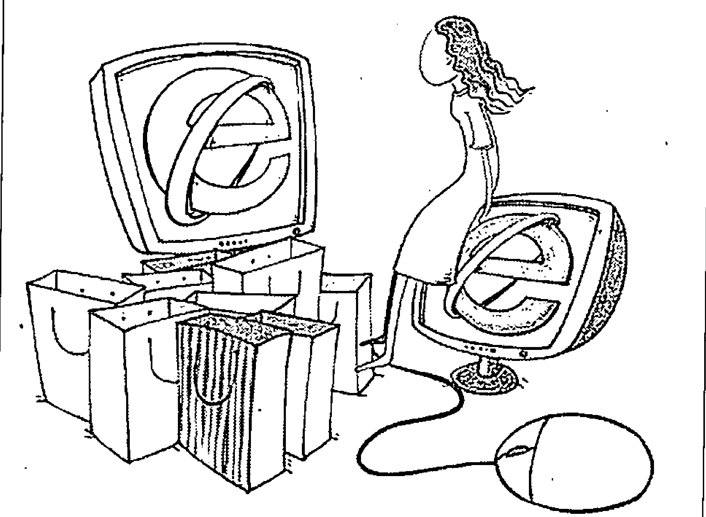

### 写在最后

微博上流传着一个段子，淘宝买家给了卖家一个差评，认为卖家服务不好。其原因是卖家可能比较忙，所以在淘宝旺旺上每次回复不是“嗯”就是“好”，买家感觉太不尊重人了，所以给了个差评。卖家解释：呸。

这虽然是一个无伤大雅的笑话，但从侧面反映了消费者希望被尊重、希望商家提升服务体验的心声。“顾客就是上帝”在电商们的促销活动中被一次次缩水，消费者不耐烦和厌恶的情绪也逐渐攀升，更何况在销售过程中还存在欺诈和“小陷阱”，这无疑是火上浇油的行为。价格打折了，但是并不意味着服务就要打折。从几个大型促销活动来看，个别电商价格打折显得格外不真诚的同时，却真诚地将服务打了折扣，这确实有些“揣着明白装糊涂”。

花钱买罪受，这种赔了夫人又折兵的事情，相信没有人愿意做。所谓消费，享受的很大一个层面就是服务。回顾那些做得较为成功的店家，从咨询到销售，从售后到退货，人员齐备各尽其责，一口一句“亲”，让消费者即便没有买到东西，也觉得自己享受到了服务。

# 2012中国好软件

2012年软件圈子里发生的事情多而复杂，但却有一个共性：不尊重用户，忽视用户体验，最终会被用户所抛弃。“3Q”大战和“3B”大战究竟谁是最终赢家，用户们并不关心，真正抓心挠肺的不过几个深陷其中的软件厂商而已。塞班系统谢幕、MSN无言的结局、12306的“神奇”……虽然领域不同，但它们的共同点都是对用户需求熟视无睹，长期忽略应用端存在的问题，失败的祸根早已深种。回顾全年，品评成败，接下来我们给读者点评一下2012年软件圈里的几宗典型事件，并且一如既往地为大家推荐年度最佳软件。

策划 | 《电脑爱好者》编辑部  监制 | 严威川  作者 | 严威川 陈荣贵 王健 殷鹏斐 安世伟 丁明明

# 2012年软件圈子那些事儿

## 优酷&土豆 亲密敌人“结婚”记


2012年3月13日，优酷和土豆宣布将合并为优酷土豆股份有限公司，而土豆网将退市。根据双方签订的协议，合并后，优酷股东及美国存托凭证持有者拥有新公司71.5%的股份，土豆股东及美国存托凭证持有者拥有新公司28.5%的股份。土豆将继续保留品牌和平台的独立性。

昔日势同水火“宿敌”，如今却突然“神仙眷侣”，微博众多网友大呼“我们又相信爱情啦”。从2012年年初，优酷和土豆摩擦和口水仗不断，为了版权曾各自发起维权行动，指责对方侵权，并索赔数亿元。然而每一次对决都最终不了了之，现在看来所谓摩擦不过是“约会”中的争吵，而相互叫嚣攻击其实是最终联姻的“前戏”。两者之间，土豆势微，优酷想一统江湖。前者为了能更好地生存，只能委身于后者，而优酷得土豆则稳坐视频领域第一把交椅。

关键在优酷和土豆“结婚”后形成了一个相对垄断的局面，能够得到更多话语权，同时“身价”也相应提升，广告和各类合作提价仅仅是时间问题。完全没有爱情的婚姻不一定不幸福，优酷和土豆证明给我们看。

## 暗黑3：“跳票王”强势回归


“暴雪表示绝不跳票，只是被上帝阻止发售了。”是的，从2000年《暗黑破坏神2》至今，暴雪已经用各种跳票吊足了玩家们的胃口。12年过去了，当年热血的玩家如今都已经成为了中年大叔，《暗黑破坏神3》真的存在吗？

2012年5月，《暗黑破坏神3》就这么来了。或许是为了缅怀逝去的青春，或者游戏本身拥有强大的吸引力，游戏上线之后登顶多个国家网游排行榜前列，“暗黑”的死忠和新注册用户不断投靠“毁灭之王”旗下。并且暴雪内部都出现了“相煎何太急”的局面，《暗黑破坏神3》推出之后直接造成《魔兽世界》用户的大量流失。这时人们才恍然大悟，原来这货不是“跳票王”，是“万人迷”才对。

## iOS 6: 优缺点明显的矛盾体

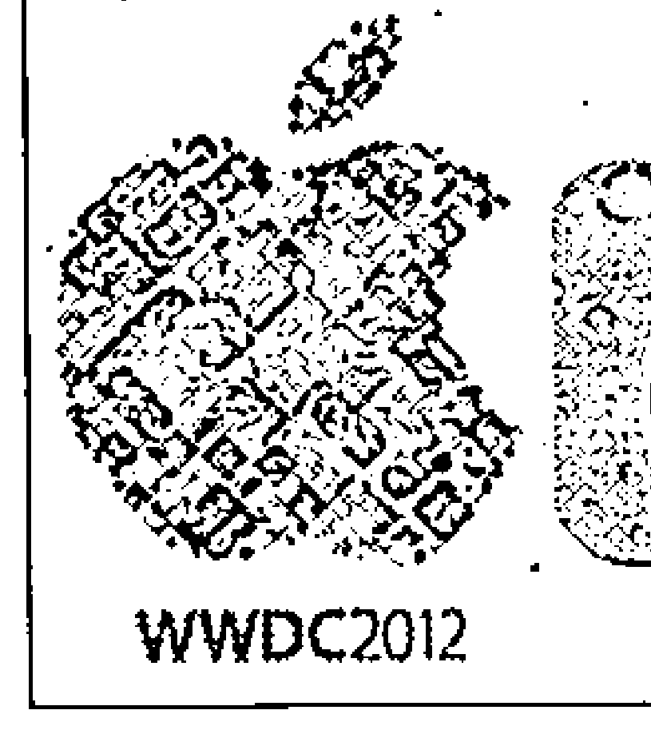

2012年6月12日，苹果在WWDC大会上发布了iOS 6操作系统，这个系统拥有200多项新功能，首次为用户免费提供在车辆需要拐弯时进行语音提醒的导航服务。对于中国用户来说，直到iOS 6才真正领略到本土化操作，因为系统中的输入法更加完善，内置了对热门中文互联网服务的支持。

## 输入法

网服务的支持。用户可以混合输入全拼和简拼，甚至不用切换键盘就能在拼音句子中输入英文单词。iOS 6支持30000多个汉字，手写识别支持的汉字数量增加到两倍多。并且系统更加“坚不可摧”，著名的“越狱”团队绿毒的前任负责人就越狱问题在twitter上留言，称iOS 6的防护程序实在是太强大了，严密性超过想象，要想完成越狱工作需要很长时间。不过，苹果在iOS 6中引以为傲的地图却在应用中“掉了链子”。不少用户在使用之后开始抱怨地图无法提供公共交通信息，有时搜索城市内目的地时会得到完全不同城市的结果，有时错把农场当作机场，3D模式图像较差等。2012年10月，苹果公司宣布iOS移动软件高级副总裁Scott Forstall将于2013年离职，零售部门主管John Browett已经离职。前者离职的主要原因是苹果地图出问题，遭到大量用户投诉，但是Scott Forstall并没有因此低头，在苹果公司公开道歉之后，他拒绝在道歉信上署名。

## Office 2013：行走在“云端”之上

2012年7月，微软推出了Office 2013预览版，正式进入了云时代（2012年12月4日，企业用户可以通过微软批量许可购买Office 2013以及诸如Exchange Server 2013、Lync Server 2013、SharePoint Server 2013、Project 2013和Visio 2013的相关程序）。微软在云服务上下足了功夫，家庭用户可以把文档存储在微软的SkyDrive云存储服务里，企业用户则可以使用微软的SharePoint产品。Office 2013通过云服务让用户在任何一台电脑上使用一个完全个人设置、全功能版本的Office，并且在操作过程中完成文档内容同步。虽然微软在iCloud和Google Drive之前就推出自己的云存储服务，但它既混乱又分散，而且还不易于使用。在Office 2013中，文档和设置可以存储在云中，而且这些应用程序可以传输到Windows 7和Windows 8桌面上。这是跳出传统Office版本的巨大一步，但它采取的方式是把体验放在第一位，把复杂的技术推到幕后。移动应用的普及意味着云技术在办公领域越来越重要，微软虽然步伐慢了一些，但至少借助Office 2013迎头赶上了。

## 115网盘不分享了

2012年8月7日，115网盘官网发布了一则关闭大众分享的公告，其内容大致是：“因115网盘为用户提供的大众分享功能存在政策隐患及版权争议，即日起，115网盘将不再提供面向外网用户的文件大众分享服务。” 不分享，但不等于不玩了。网盘停止分享的同时，115“圈子”悄然上线，它是基于115云存储平台的群组化私密社交网络。这个“圈子”能否成功，现在还不得而知，倒是以前的用户被酷盘、99网盘大批吸收是不争的事实。以往，115网盘给其忠实用户带来的欢乐太多了，个人空间、灵活注册以及各种资源共享…… 但全民欢乐的背后却隐藏着政策、隐私、版权等风险，并且还伴随着不良信息与违法内容与日俱增。关闭分享功能可以看成先退后进的策略，先建立健康合法的平台，再进一步谋求转型发展。115网盘不分享显然不是一意孤行背叛用户，而是选择了一条风险颇大的重生之路。

## Flash“移动”之殇

2012年8月15日，Flash正式从Google Play应用商店下架。此举不仅意味着Flash退出Android平台，也表明Adobe放弃了Flash在移动设备领域的竞争。其实早在2012年6月29日，Adobe便已经宣布停止为Android 4.1“糖豆”系统开发及测试Flash Player。 Flash退出移动平台与塞班的没落如出一辙，Adobe和诺基亚的共同错误就是认识到了问题，但是不解决问题。Flash的安全性低下已经是长期存在的问题，并且成为了黑客最容易敲开的“后门”。而更明显的缺陷在播放视频时，移动设备必须使用硬件解码视频，这直接导致耗电增加，很大程度缩短了电池的续航能力。并且Flash是为桌面PC使用鼠标控制设计的，在触屏方面存在很多缺陷，其最直接的体现是绝大多数Flash网站为了支持触摸设备都需要重新编写。
目前，HTML5俨然成为网页新标准，相对于Flash，前者更有利于开发和维护，一定程度上解决了移动设备电池的续航问题。另外，开发者可以利用HTML5为多个平台开发完全兼容的产品，用户只要打开浏览器就能使用程序。这里要明确一点，HTML5并不是Flash“封喉”之刃，Adobe是被自己打败了。

## 3B大战：挟用户以搏底线

2012年8月28日晚间，很多用户发现通过360综合搜索服务访问百度知道、百科、贴吧等内容时页面均自动跳转到了百度首页。也就在这一刻部分警觉的用户恍然大悟，原来在2012年8月16日奇虎360推出综合搜索后，用360安全浏览器的他们已经在不经意间成为了其搜索业务的首批用户，变成了“3B”大战的第一批被绑架的“炮灰”。
其实战争说起来并不复杂，360推出了综合搜索，一直在国内处于垄断地位的百度感到了威胁，并且采取了上述的处理措施。而360随后展开反击，用户在360浏览器中使用360综合搜索时，点击来自百度相关服务的搜索结果，会被直接带至“网页快照”页面。真正倒霉的是不明真相的用户，就在“3B”明争暗斗的同时，应用端体验急剧下降，搜索结果变得莫名其妙。

酣斗不亦乐乎，“3B”双方都觉得自己是“窦娥”。百度表示在Robots协议（这个协议需要搜索引擎自觉遵守，但并不具备法律效力）中写明不允许360搜索抓取，这也就意味着，百度旗下的所有内容服务如音乐、百科、贴吧等，在遵守Robots协议的前提下，均不可能出现在360搜索页面上，而360对这个协议视而不见。另一方，360则斥责百度垄断，令用户没有选择。
微博热议“3B”大战时经常看到这样的评论：“平时说用户是爹！用户是妈！用户是上帝！关键时刻用户都是拿来牺牲的！”难怪坊间有云：中国互联网企业拼的不是技术、创新和产品，而是底线。

## 方舟子“闹”360

2012年10月11日，方舟子搜狐微博发表博文表示，“长期以来IT业界人士、媒体一直在批评奇虎360公司的一些做法，特别是自2010年以来，对360浏览器、360杀毒软件采集用户隐私数据上传服务器的做法的质疑、批评更是引起了我的关注。但是此前我对此都没有发表公开评论。直到10月9日下午我注意到司马南的新浪微博显示是用‘360安全浏览器’发的，我才作为朋友发了一条微博提醒他：360浏览器已被媒体揭露一点都不安全，会悄悄收集用户的隐私资料，包括各种上网密码！像司马这样的敏感人物尤其要注意上网安全，尤其对做‘流氓软件’起家的人搞出来的东西要警惕。（注：著名的‘流氓软件’3721是奇虎360公司董事长周鸿祎开发的。）”

随后，10月12日奇虎360董事长周鸿祎在新浪微博发表了一篇长微博反击方舟子，他表示，“给360安全浏览器泼脏水的，方舟子不是第一个。有好多个朋友告诉我，不要理睬方舟子，一旦被他咬住没法摆脱。我们也犹豫过，但是当我们看到方舟子再三以不实材料污蔑360安全浏览器，而且背后有明显的操纵痕迹，我决定必须正面痛击这个疯子，并揭露他幕后的黑手。”

## 二维码 老树开新花

二维码突然成了年轻用户的新宠，阿里巴巴、腾讯、新浪众多IT巨头已开始推出相关应用，抢占二维码入口资源。包括淘宝、支付宝在内，阿里巴巴旗下的多款手机应用均提供了二维码“扫码”功能。2012年8月23日，支付宝还与百货连锁品牌上品折扣达成战略合作，消费者能以手机拍摄商品二维码的方式在商场购物。

其实二维码真不是什么新鲜事物，早在2006年就已经在国内应用，其技术发明源于日本，为什么2006年就进入国内的技术在2012年才“井喷”式地走红呢？其原因在于当时智能手机应用率不高、上网资费昂贵、移动应用远不如今天普及等等，各种因素制约了二维码的发展。

2012年移动智能终端普及速度加快，并且伴随着移动电商生态体系逐渐成熟，二维码的消费方式将在2013年越演越烈。

## “散漫”的MSN 无言的结局

MSN的没落并非偶然，其进入中国后一直发展得漫不经心。尤其是在功能增加上更是跟进缓慢。例如早期无法支持离线留言和离线文件功能，而QQ总是在用户需求方面领先MSN一步。如果仅仅是功能上落后，还不足以令MSN“堕落”，其真正的“祸根”在2006年12月已经埋下。当时台湾附近的海域发生了地震，造成海底光缆的严重损坏，中国1500万MSN用户在数天内无法登录，焦躁的用户通过各种途径了解到MSN服务器并不在中国，不信任感与日俱增，其结果是一天内QQ同时在线人数比平时多了几十万人，并且申请注册QQ号码的用户激增。
另外，在2011年11月24日下午，很多MSN用户表示自己的账号无法登录并一直显示密码错误，有很多人收到垃圾广告。而有相当一部分人的MSN好友、MSN备注名丢失，导致大家都在不停地询问谁是谁，为什么MSN列表里没有你等等。
有众多微博用户发帖称自己的账户被黑客盗取，黑客利用盗取的MSN账户向MSN列表里的好友发送信息，请求帮忙购买电话卡、网游点卡甚至汇款等。
MSN的没落归结为发展“散漫”其实很给微软面子了，更直接的原因就是对用户欠尊重，忽视用户需求，功能研发滞后，且观念固执，明知道服务器放在美国会受到自然性灾难的影响，却依然一意孤行。

## 12306 一个神奇的网站

铁道部耗资1.99亿元升级的12306订票系统在十一黄金周经历了近15亿次点击之后崩溃了，无法订票的消费者和网友开始了各种愤怒的吐槽。铁道部则解释为其日点击量达到14.9亿次，在网上发售客票超过今年春运最高值。
12306网站升级后新增了提交订单排队的功能，即旅客在提交订单时就要按照提交时间进行排队。而排队功能在实际应用中显得非常“无厘头”，消费者对此叫苦不迭。“以前买票，没有票就没有票了，我就改买其他车次或者改买汽车票去了。现在非让我排队少则半小时，多则数小时，排完来一句余票不足，直接崩溃。因为这时候其他车次也没票了。”
12306购票网站虽然进行了新一轮升级，但是升级后用户购票可能会被强制排队，由于系统存在多处漏洞，排队后购买失败的概率变得很大。难怪众多网友在微博上发出感叹，“12306，真是一个神奇的网站。”

## 塞班谢幕 一个时代终结

“亲爱的开发者，感谢你为我们带来的改进意见，不过塞班系统目前已经处于维护模式，并且在没有充分理由的情况之下，不会有继续的功能升级。不过我们已经将你的想法记录了下来，如果以后还有机会有新的功能发布。祝好，诺基亚开发人员支持团队。”这段话出现在诺基亚给开发人员的邮件中。
诺基亚要感谢塞班，这个操作系统成就了一段手机传奇。国内用户应该还记得（甚至现在有人还在使用）诺基亚E71，当年人们对它的痴迷一点不亚于现在的苹果iPhone，而“街机”一词也是从那个时候衍生出来的。但是塞班也有无法忽视的缺陷：对硬件配置要求过高、响应速度过慢、程序打开过多容易死机、应用过少、安装应用程序时复杂的证书问题……。随着苹果和安卓的崛起，这些缺陷变成了阻碍其发展的致命瓶颈，当诺基亚意识到危险的时候一切已经晚了。
放弃塞班，投靠微软，这也许是诺基亚最好也是最快的自救方式。如今搭载Windows Phone 8系统的诺基亚Lumia 920强势回归，它能重现当年塞班机的辉煌吗？

## PC端软件懂你榜

### 音乐播放——酷狗音乐 官方网站：http://www.kugou.com/

酷狗音乐是一款专业的P2P共享音乐软件。推介酷狗音乐的第一个理由是该软件对高清音乐的支持表现非常突出。许多次，当我用别的播放器播放一种高清格式音乐不能如愿时，用酷狗音乐播放器都可以播放。第二个理由是，再也不用为好不容易找到一首歌却发现它制作粗糙声音混乱而烦恼。因为该软件最先提供正版音乐在线试听功能，方便用户进行选择性下载，避免下载不喜欢的歌曲。此外，还有它的其他一些实用功能也是值得推荐的理由。比如：娱乐主页每天会提供大量最新的音乐，以及欧美、中文和日韩的最新大碟，单曲排行下载让你轻松掌握最前卫的流行脉动。开放了音乐酷吧，让喜欢同一个歌手的歌迷们聚在一起。强大的网络连接功能，支持局域网、外网等各种网络环境，支持断点续传，实现超高速下载。具备聊天功能，并且可以与好友共享传输文件，让聊天、音乐、下载变得更加互动。

> 由于音乐是人们生活中不可或缺的一部分，因此，此类软件的开发也是如火如荼。除酷狗音乐外，还有不少优秀的音频播放软件，如多米音乐、QQ音乐、酷我音乐、虾米音乐、天天动听、千千静听和百度ting等，它们虽然在主流功能方面表现出越来越多的同质化，但还是有各自的强项和亮点，有时候要分出优劣还不是那么容易的事情，而且由于侧重不同，所以孰优孰劣也不能一概而论。最好的选择方法就是亲自参与体验，在使用过程中根据自己的需求和体验感受进行淘汰，留下最适合自己的产品。

### 词典翻译——金山词霸 官方网站：http://ciba.iciba.com

新版金山词霸，界面清新，看起来非常舒服。而在这漂亮的界面背后，则是它强大的翻译功能。金山词霸完整收录旗舰版《柯林斯词典》，权威专业。除了在线翻译，金山词霸还提供有多部离线词典，包含《简明英汉/汉英词典》(加强版)、《行业词典》、《词典例句》、《现代英汉综合大词典》等无需上网也能查词。金山词霸真人发音，能让我们听到地道的英语，单词本、精彩词条、每日一句等，则是英语学习的好助手。当然，新版金山词霸尤其让小编眼前一亮的，则是它的全文翻译功能，翻译结果非常灵活，对有一定英语基础的人来说(有些地方会语句不通，对不太懂英语语法的用户来说，可能就莫名其妙了)，可用度已经相当之高。所以小编在此毫不犹豫推荐它为首选。

> 金山词霸是相当老牌的词典翻译软件，但也曾一度沉迷不前（可能与金山业务转向有关），这给其他词典软件提供了机会，其中网易有道词典可谓是黑马，取得了相当快的发展，已可与金山词霸鼎足而立。另外谷歌、必应提供的在线翻译功能，也非常强劲，对不想装软件的用户来说，它们也是不错的选择。

### 图形图像——美图秀秀 官方网站：http://xiuxiu.meitu.com

美图秀秀的口号是“1分钟就学会，比PS简单100倍……”好用正是它鲜明的特色之一。当然仅仅好用是不够的，还要能做事。它提供的图片特效、美容、拼图、场景、边框、饰品等功能，加上每天更新的精选素材，让我们能快速制作出影楼级照片，这才是它最吸引人的地方。本次我们将美图秀秀作为首选，还在于它的与时俱进，当下网络上的最新应用，能被很快融入到软件中。比如它对时下最流行的微博的支持，让我们能一键发微博，充分体验到玩图的乐趣。

> 图形图像类的可选软件其实很多，各有侧重点，Photoshop自然是专业人士的不二之选，不过对普通用户来说，它的技术门槛偏高，而美图秀秀的胜出，恰恰是从易用性上进行突破。与美图秀秀并驾齐驱的，非光影魔术手莫属，它曾是国产图形图像软件中的佼佼者，只是近年渐被同类软件赶超，需要再加把劲了。其他如可牛影像、QQ影像等，也都不错，只是功能相对单一了一些，需要更丰富。

### 云盘——百度云盘

官方网站：http://pan.baidu.com/

小编曾经以免费方式申请过不少网盘并一直在并行使用，但目前轻易获得免费空间最大的是百度云盘，已经有115GB之巨，这是推荐它的第一理由。云盘是百度公司系列云服务的核心产品，强大的空间实力和资源实力是其核心竞争力的保证，也是可以让人信赖的基础。百度云服务的对象包括开发者和个人用户两大群体。普通用户注册之后可通过各种方法扩容，轻松获得15GB大空间，开发者更可获得100GB以上的超级空间。第二个推荐理由是百度云多元化存储模式，既包括图片、音频、视频等文件数据，也包括通讯录、日历、浏览器书签、游戏进度等结构化数据。对于专业开发人员来讲，最值得推介的是专业的全方位开放API功能，允许用户授权第三方应用使用和编辑个人数据。

云存储已经成为个人或企业资料备份和共享的趋势。早在百度之前，就有多家网络公司涉入这一领域，并有许多优秀的产品推出，这些产品中以115网盘、金山快盘、酷盘、华为网盘、360网盘等为代表，种类不胜枚举。它们除了常用基本功能多有雷同之外，主要的区别在于提供的免费空间的大小和获得更多免费空间的难易程度，以及其他个性特色功能各有侧重等方面。用户选择也不能一概而论，要根据自己的需求进行选择，想清你需要空间还是需要某种功能，或者是需要哪几种的组合。在云盘选择方面，小编有一个建议：乘着免费的“春风”，你不妨同时选择多家的产品，这样就可以获得更多的网络存储空间，以存储不同类型的资料，今后在使用过程中也有更多的选择和备份应急的余地。

### 输入法——百度输入法

官方网站：http://shurufa.baidu.com/

小编使用的是智能拼音输入法，每出一款输入法新品小编都会先行体验试用，好用则留，感觉不好就放弃。最终，百度拼音输入法没有被淘汰。分析其原因，一是因为它的输入准确度高，百度输入法基于业内领先的分词技术设计，拥有超大规模智能词库，输入精准，这是它能够打赢的基本保证。第二个吸引我的理由是它的广泛适应的双拼支持。我的习惯是双打输入，但在安卓移动平台端找遍所有的拼音输入法，最后才发现只有百度拼音能够支持双打代码和自定义，这是其他输入法所无法企及的。再一个吸引我的原因是，它支持电脑和手机间词库同步，让我可以随时随地使用个人专属词库。此外还有许多，这里只列出最亮的几点：百度输入法的动态纠错功能，自动帮你纠正漏打、多打、错打，根据你的聊天环境分析拼音匹配度，输出最佳语句。百度输入法同时还能进行双拼全拼混输，忘记双拼码表也照样能打。

以知名网站为依托，以已有的庞大用户群为基础，各大搜索引擎和门户网站争相推出完全免费的智能拼音输入法，以便笼络更多的忠实用户。在这些输入法当中，百度输入法后来居上，赢得用户的青睐。然而搜狗输入法、QQ拼音输入法等先前推出的输入法，由于其开发推广力度强大以及技术的积淀，也是非常有竞争力的优秀拼音输入法，实用功能也很多，如QQ拼音丰富的附加工具、搜狗拼音的云端高效识别功能等，许多特色功能较之百度输入法毫不逊色。读者朋友可根据自身的实际情况作出合理选择。

### 杀毒——诺顿360全能特警

官方网站：http://cn.norton.com

赛门铁克旗下的诺顿系列产品一直是深受用户喜欢的安全防护软件。作为最新版的屡获殊荣的核心安全产品，诺顿360全能特警同样致力于保护个人用户的重要资产，而且范围涵盖了数字生活的方方面面。诺顿360不仅针对个人电脑和移动设备技术提供了一系列的安全解决方案，更可以提供实时技术支持服务和在线备份功能。诺顿360全能特警作为一款新品在防御功能方面不但可保护个人用户在使用社交网络时免于受到攻击和被骗，其独有的防诈骗功能更可提醒用户注意存在潜在风险的站点，从而使用户可以确保银行账户或登录数据等个人信息的安全。

随着平板电脑和超极本等设备在个人用户中的日趋普及，如何缩短开关机时间和改善电池电量也变得日益重要。以前，安装了杀毒软件会对开关机时间产生影响，而诺顿360产品在做好安全防护的工作外，对缩短开关机时间、减少耗电量、延长电池使用寿命，以及加快从系统睡眠和休眠状态响应的速度进行了优化，真正做到有无诺顿360开关机一个样，有无诺顿360安全防护不一样。

最新版的诺顿360产品不但提供了强大的社交网络防御、防诈骗功能，更创立了新的防护和性能标准。相比Windows 8自带的Windows Defender更安全、更快速。可以说，经过精心设计和优化的诺顿新品不但具有更高的安全性和易用性，而且还提升了新操作系统的速度和性能。

## 办公——WPS Office

官方网站：http://www.wps.cn/

之所以推介这款国产办公软件，是因为小编在长期的使用实践中发现，它在日常实用功能方面完全可以替代微软Office办公软件，甚至在许多方面超越微软Office而独具个性，让自己这个老微软Office用户近乎要背叛微软投靠金山。第二个理由就是它完全免费，对于个人来说我们可以不用再背着盗版的名声，名正言顺地使用它干任何事情。值得称道的是，WPS Office在核心上做到低层兼容、“引擎”级兼容，从文件读写、操作界面到二次开发都满足了用户对已有微软Office文档全面兼容的需求，这样一来，从微软Office转向免费的WPS易如反掌。此外，印象最深的几个亮点：文字工具可以快速轻松地清除掉多余的软回车、空格，让你爱不释手。PDF是进行电子文件发行和数字化信息传播的理想文件格式，WPS Office在支持PDF输出的基础上，应更多用户的要求，新增了PDF阅读功能，这一点比微软要领先了好几年。

小编点评：在办公软件方面，微软Office一向以霸王的身份位居老大的位置。但对于用户来说，尤其是中国的用户，免费和实用也许比是不是老大更具有吸引力。金山WPS以其原有的DOS版庞大用户基础和轻巧实用为家底，以不断学习和不断创新为动力，迎合中国用户的需求，成为越来越多国人的办公新选择。但是，这并不表示我们要排斥微软Office，微软套件的强大专业功能是金山暂时还无法替代的，对于一些专业的企业用户来讲，它仍然是首选。

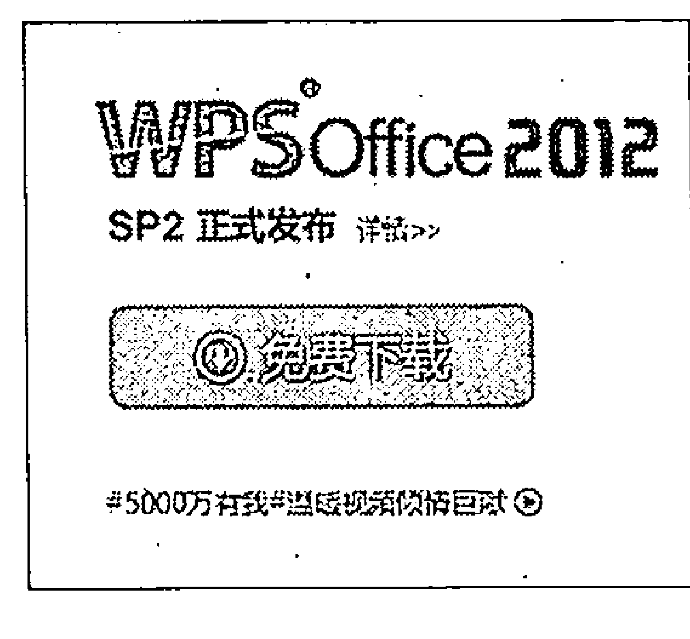

## 压缩——2345好压

官方网站：http://www.haozip.com

2345好压支持包括ZIP、RAR、7Z等超过50种压缩文件格式，完美支持ZIPX格式解压，并对Windows XP直至Windows 8的系列操作系统有着完美的支持。经过CFan软件研究室的测试，它在压缩率、速度、兼容性上也有着不俗的表现，尤其是附加的多种特色功能，如虚拟光驱、压缩包内查看图片、批量修改文件名等，让我们对压缩包的管理、使用更方便。还有一点值得赞赏的，就是它的可扩展性，通过插件能支持更多功能。所以我们将它列为本类软件的首选。

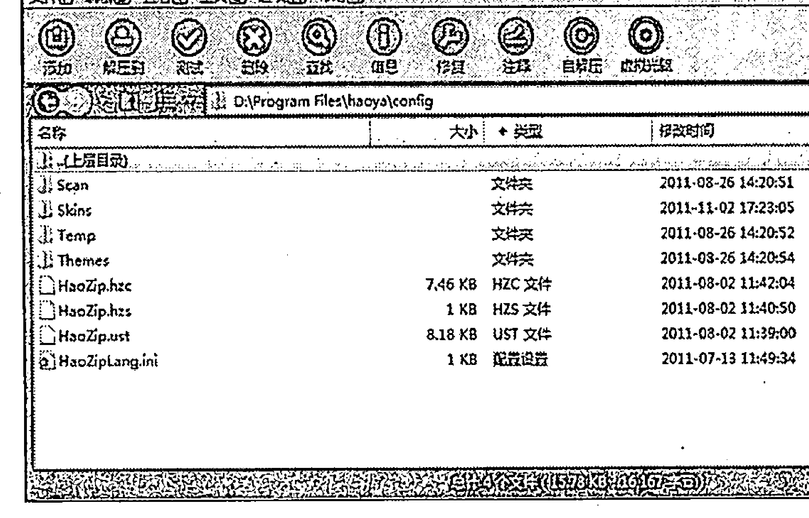

小编点评：随着各大软件厂商的介入，压缩解压缩软件市场呈现群雄逐鹿的景象，其他压缩软件也多有不俗的表现。其中7-Zip的表现非常突出，它是几款流行压缩软件中最干净的，而且它自创的7Z格式压缩率极高，并广为其他压缩软件所采用。7-Zip在资源的提取上，更是技高一筹。7-Zip是专业人士的好帮手，不过对一般用户来说，它的易用性及特色功能方面，还可以更进一步完善。作为老牌压缩软件WinRAR，近几年来的发展乏善可陈，并且依然坚守着收费策略，而在功能上与其他免费软件的距离已越来越小，竞争力着实堪忧。

## 视频播放——射手影音播放器

官方网站：http://www.splayer.org/

推介射手播放器基于两点理由。首先它是一款开源播放器，字幕功能无人匹敌。智能化网络字幕匹配，只要一人播放过且同意共享，全球人都可在启动播放的同时下载到恰好匹配影片的字幕。双字幕显示，同时显示中英双语。被分割为多段的视频，可以直接使用未分割的字幕来播放。射手网十年字幕积累，无需上网搜索、下载匹配字幕，播放器智能根据版本下载最优质的中英文字幕。第二，它特有画面增益，高清格式支持全解码，应对日常播放需求绰绰有余，我不再需要其他播放器即可播放手头上所有的视频格式。此外，我的老电脑上用它照样表现突出，能够满足我的要求，因为它采用最新DirectX硬件加速技术。

小编点评：视频播放软件在经历了以暴风影音为代表的本地视频播放为主的发展阶段之后，随着网络视频的普及，兼容网络和本地视频播放的播放器成为主流，暴风影音不再是一枝独秀。快播QVOD、QQ影音、百度影音、PPTV、PPS等优秀的双料播放器不断涌现，而射手播放器以其字幕见长的特性，成为看外文大片的首选。其他的播放器则各有所长，有的侧重于视频清晰度优势，有的是片源比较丰富，有的则是下载离线观看比较方便。具体选择哪款，用户还要根据自己的需求来决定，不能一概而论。

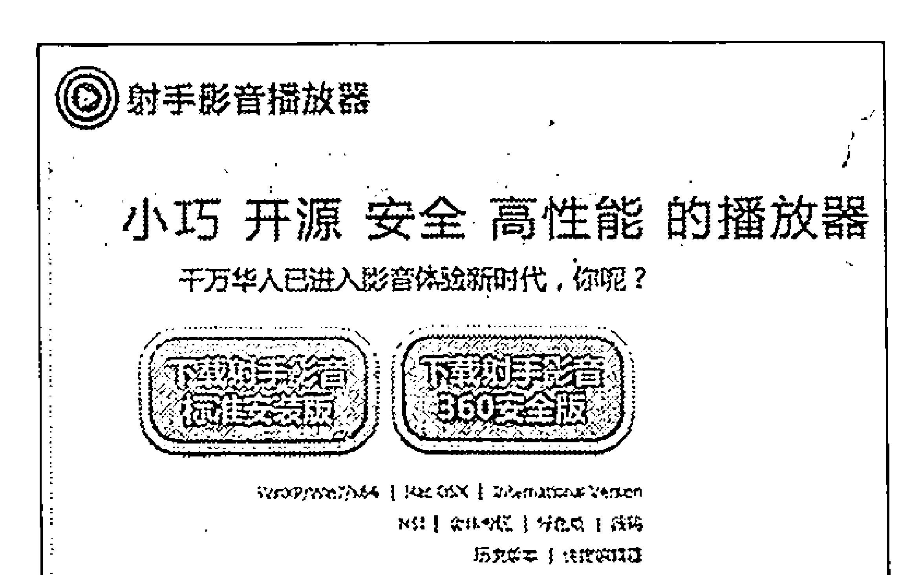

## 浏览器——百度浏览器

官方网站: http://liulanqi.baidu.com

百度浏览器近来又有了全新升级；新版本更加贴近用户的浏览需求，新增智能划词解读、网址直达、老板键等贴心功能，以最简单的使用方法快速帮助用户得到最贴心的浏览体验。

值得一提的是，百度浏览器整合了百度自有产品，对百度文库、百度贴吧进行强大支持，而百度的这些产品正是我们平常常要用到的。使用百度浏览器下载百度文库文献可获赠“财富值”，再也不用为没“钱”下载而着急（这一点尤其受小编欢迎）。使用百度浏览器上贴吧，贴心的马甲功能让用户享有分小号窗口同时多账户登录、不同账户消息提醒、截图后直接粘贴发帖等等便利，可谓是贴吧达人的绝对利器，同时用其他小号玩游戏也方便多了。另外，百度浏览器的图片死链替换、自带云盘服务、网页智能助手、小说宝库等功能，也是极其实用。

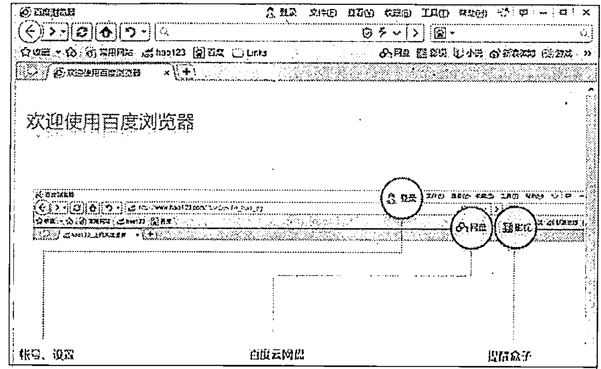

IE、Firefox、Chrome、Opera，为何这些浏览器没有被推荐？IE的不好用已是业界闻名，不必细说了；Firefox在中文网站、易用性及兼容性也略有欠缺；至于Chrome，它所用的Webkit内核，其实国内双核浏览器，包括百度浏览器，都有集成；Opera快速为大家所公认，但它对中文的兼容性也是几款浏览器中较弱的。

## 安全防护——腾讯电脑管家

官方网站: http://guanjia.qq.com

作为腾讯公司出品的免费专业安全软件，在与金山毒霸合作后，推出了全新的二合一杀毒版，而新版版本更是集“专业病毒查杀、智能软件管理、系统安全防护”于一身，开创了“杀毒+管理”的创新模式。

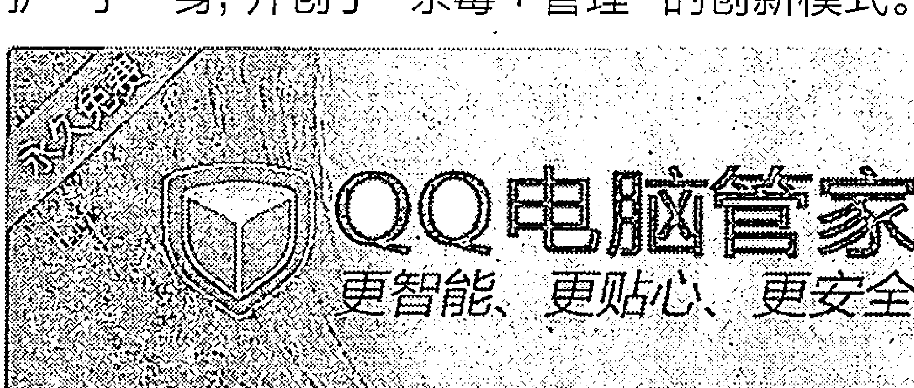

在模式推新的同时，电脑管家带来的是更加强悍的16层实时安全防护，具体包括：6层上网安全保护、4层应用入口保护、6层系统底层保护。也许你对这16层并不是很了解，但是开启16层实时安全防护的好处却是人人受益，因为它可以对网购安全、搜索保护、网游安全、网络下载、QQ安全、网页防火墙等易感染病毒及遭受恶意网址侵扰的途径进行严密监控，从系统底层防御病毒入侵。

在日益恶劣的网络环境面前，人们都希望在上网安全方面得到更多保护，而电脑管家正好继承了腾讯在反网络钓鱼、打击恶意网址方面十余年的安全防护经验及基因，产品在国内安全防护软件中一枝独秀。目前，腾讯电脑管家运营着全球最大的恶意网址数据库，同时掌握智能恶意网址识别等多项专利技术。在识别恶意网址、防止“恶意网址”危害方面，我们有信心相信电脑里的这位管家。

## 手机管理——豌豆荚手机精灵

官方网站: http://www.wandoujia.com

豌豆荚手机精灵作为李开复创新工场首个公开项目，从发布到最新的2.0版本，每一次更新都拉近了用户手机和电脑之间的距离。使用了豌豆荚手机精灵你会觉得它不再仅仅是一款电脑软件，更是一款Android用户必备的手机套件。而豌豆荚手机精灵所具有的清新界面和容易上手、安全稳定的特性，更是让其用户数在一年间不断攀升。

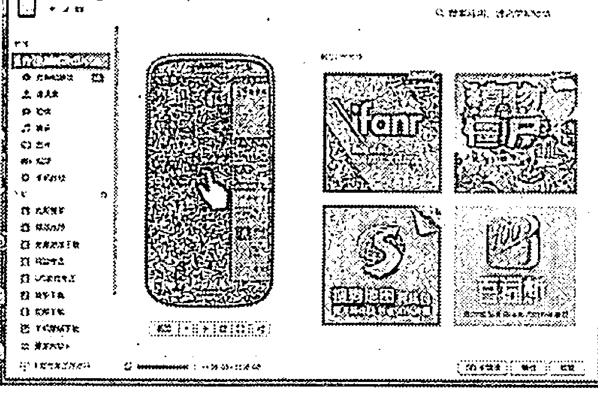

软件除了具备手机截屏、联系人管理、在电脑上收发短信、数据备份等手机PC套件常见功能之外，还能够帮助用户用最省流量、最快捷方便的方式获取安卓应用、音乐、视频、电子书等网络资源，并轻松灌进用户的Android手机。软件所支持的USB数据线连接、Wi-Fi无线连接和离线三种模式更是全面支持市面上各种主流的Android手机。

豌豆荚从出生开始就面临着强大的竞争者，但豌豆荚用自己的优势及应对策略在茁壮成长着。豌豆荚开发团队秉着“如无必要，勿增实体”的设计理念，对用户最关注的应用下载、联系人和短信备份以及视频下载和转换等功能完美地体现出来，给用户带来了最大的方便。正是这些不断推出的新功能，让我们坚信豌豆荚手机精灵必定越来越火、越来越强大。

## 移动端软件推荐榜

## 安全防护——360手机卫士

官方网站: http://shouji.360.cn/

360手机卫士延续了PC平台安全卫士的简洁高效，界面风格也引入了Windows 8的设计元素，看起来颇有一种小清新的感觉。这款软件的功能可谓强大，而且多数功能仅需一键即可实现，哪怕你是第一天接触智能手机也能搞定。

360手机卫士最大的特色就是功能总在不断的完善中。比如针对近期很多第三方Android程序都存在偷发短信和查看短信记录等隐私数据等安全隐患，360便在最新版手机卫士中加入了隐私行为监控功能，自动帮你把手机内所有软件的权限进行分类汇总。如果你担心有恶意APP会偷偷发送吸费短信，就可以在发送短信等监控服务中禁止可疑的程序。此外，安装APP后能在桌面添加一键清理进程和调出快捷方式的小插件，在屏幕下拉框还能实时显示流量数据。

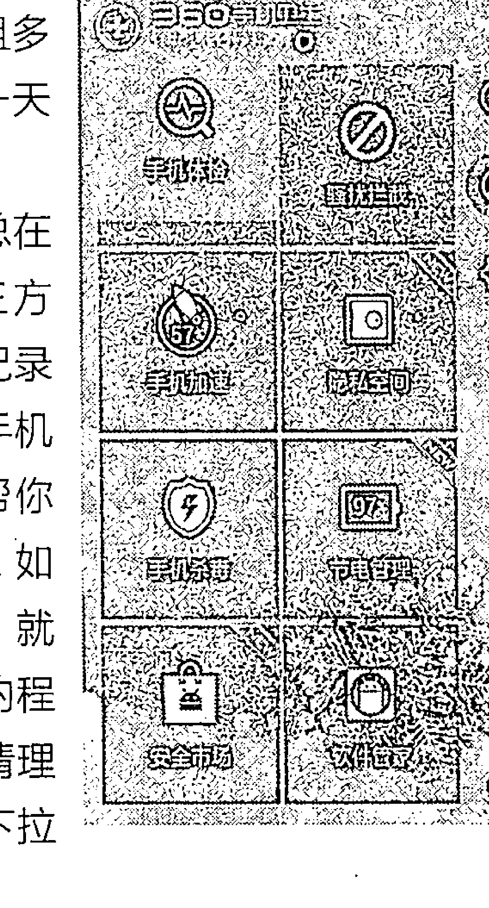

小编点评：如果你用过PC平台的360安全卫士，安装360手机卫士之后应该能找到一种熟悉的感觉，菜单依旧简洁，操作依旧方便。和同类软件相比，360手机卫士最突出的优势就是功能更丰富，对系统资源占用的控制也很理想。功能虽多，但360手机卫士的菜单结构合理清晰，无需用户有多么高深的专业知识，属于最适合普通用户使用的安全防护软件。另外，LBE安全大师也是可选之一，该软件的特色源于API主动拦截技术，可以手动对具体APP的权限进行监控、管理，适合有一定玩机经验的用户选择。

## 视频播放器——暴风影音

官方网站: http://shouji.baofeng.com/

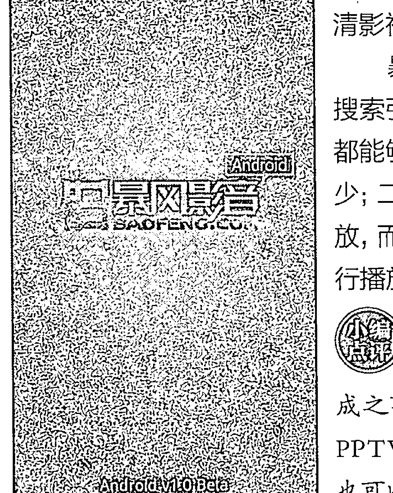

暴风影音拥有全网最新、最热的海量高清影视资源。

暴风影音优势：
- 一、暴风影音具备先进的搜索引擎技术，像影院上映不久的一些新电影都能够通过暴风影音找到，比同类软件要快不少；
- 二、暴风影音支持常见的各种格式视频播放，而且不需要进行转码，下载资源可直接进行播放。

小编点评：在拥有PC端视频播放器开发经验的前提下，暴风影音进军手机圈成为水到渠成之事。该软件拥有来自优酷、奇艺、乐视、PPTV、搜狐、腾讯等站点的海量影视内容，也可以通过一键下载轻松享受离线影视。

## 导航——百度地图

官方网站: http://shouji.baidu.com/map/index.html

Android平台的地图导航软件非常丰富，但综合实力最出色的还要数百度地图。最新V4.3版的百度地图更是加速了从工具到平台的转换，附件按钮采取了全新的“拉帘式”设计，这相当于在地图中提前了LBS生活服务搜索的入口位置，将大大改变地图单一导航功能的定位。

新版百度地图还对语音导航、搜索按钮设置、定位罗盘状态等多个功能进行了优化和升级，比如语音导航支持关闭电子眼和超速提醒、增加横屏导航模式，对导航路线也进行了优化。在定位罗盘上增加了东南西北方向标识，可自动根据我们的朝向旋转地图，提升真实感。此外，百度地图提供全国377个城市高清卫星图、3D图，支持离线地图下载，在导航的同时最大限度节省流量的开销。

小编点评：虽然上线比谷歌地图晚，但百度地图却是最懂国内用户的地图导航工具。除了精准定位、检索公交、驾车、步行导航路线等常规功能之外，软件还加入了更多贴近生活的元素，囊括餐饮、娱乐、购物、餐饮、酒店优惠券等生活信息。总之，百度地图现在已经不再是单一的导航软件，还是生活中的好帮手。此外，如果你经常自驾游，需要精准度更高的专业导航软件，那老牌导航品牌凯立德的Android客户端应该是你的不二之选。

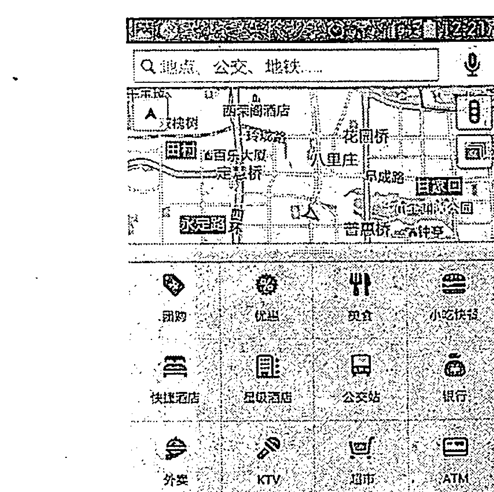

## 手机浏览器——UC浏览器

UC优视是加入Chrome和Firefox等全球自有内核浏览器阵营、拥有全部内核能力的首个中国浏览器公司。

UC浏览器优势：
- 1. UC浏览器打开网页速度极快，小编在之前的常用浏览器对比测试中发现，UC浏览器打开新浪首页的速度明显要快于其他浏览器；
- 2. UC浏览器拥有低能耗的优势，像小编这种微博控使用UC浏览器比其他浏览器看网页的时间能延长至少两个小时的待机时间。

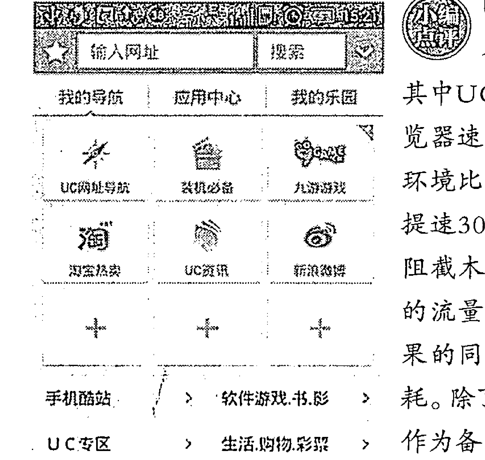

UC浏览器在2G、3G、Wi-Fi各种赛道上都保持速度领先，其中UC8在3G网络下比其他手机浏览器速度平均提升超过50%，Wi-Fi环境比其他自有内核手机浏览器平均提速30%。此外U3内核可从源头层面阻截木马攻击，及阻止自动联网造成的流量消耗，在获得完美PC浏览效果的同时，实现更低的流量、电量消耗。除了UC之外，欧朋浏览器也可以作为备选之一，它采用了自主研发的Presto内核，内置多个搜索引擎，还可对搜索服务进行随意添加，搜索简单且人性化。

## 输入法——百度手机输入法

和竞争对手相比，百度手机输入法的APP体积最小，运行时对系统资源的占用也最低，哪怕是最低端的Android手机也全无压力。针对每个用户都有不同的手指大小和操作习惯，百度手机输入法加入了自定义设置按键大小、功能布局的功能，可以帮我们打造出只适合自己的输入格局，从而提高输入效率。

最新版的百度手机输入法采用了“三代内核+三维词库”设计，12万的超大词库（云端更高达220万）基本覆盖了生活中的方方面面，而三维词库功能也保证了在网络环境不佳（比如只有GPRS低速网络）时也能大大提高云识别的速度和准确率，保证用户在输入整句时也不会有任何延迟的感觉。此外，新版百度手机输入法引入了智能语音输入和多媒体输入两大新功能，前者在动口不动手的前提下更省流量，后者则能将你的涂鸦、随写或位置添加在短信、信签纸或文档中，打破传统的输入方式，让沟通不再只是苍白的文字，位置、涂鸦、笔迹都成为一种交流的方式。

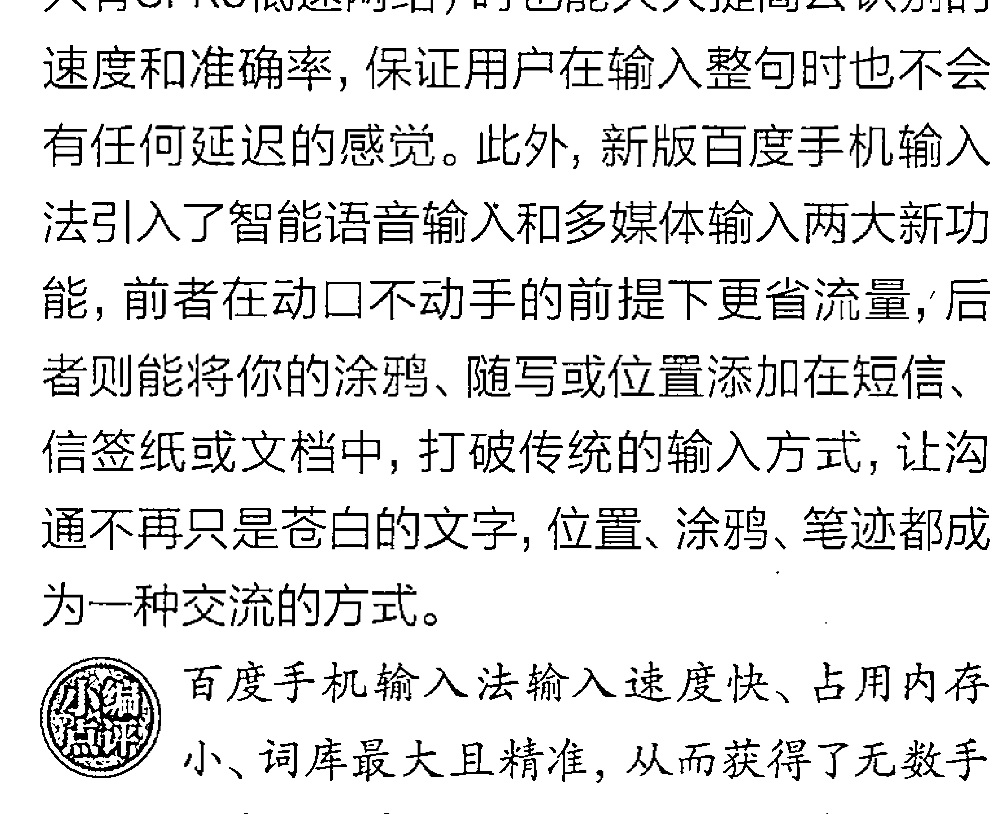

百度手机输入法输入速度快、占用内存小、词库最大且精准，从而获得了无数手机用户的青睐。举个例子，Android安装输入法后需要到设置中手动开启再切换，对初次接触Android系统的用户很不友好，而安装百度手机输入法后软件会自动进入一键切换输入法的界面，从而提升用户的体验。此外，百度输入法的创新也令人印象深刻，无论是Pad版输入法、语音输入还是多媒体输入，都走在了竞争对手的前列。如果你希望输入法的皮肤更个性，则可以考虑搜狗输入法，Android版延续了PC端百变皮肤的特色，在确保输入效率之余还能借助个性皮肤让你始终保持愉悦的心情。

## 音乐播放器——天天动听

天天动听是一款功能强大、完全免费的手机音乐播放软件。

天天动听优势：
- 1. 天天动听播放器支持大家平时能够见到的各种音频格式，小编尝试下载了APE、FLAC、AAC等不常见的格式，天天动听也能够直接播放；
- 2. 天天动听拥有非常多时尚漂亮的皮肤，可以随心更换，而且在播放音乐时拥有非常绚丽的播放效果；
- 3. 此外该软件占用手机内存不大，整个软件大小不超过5MB。

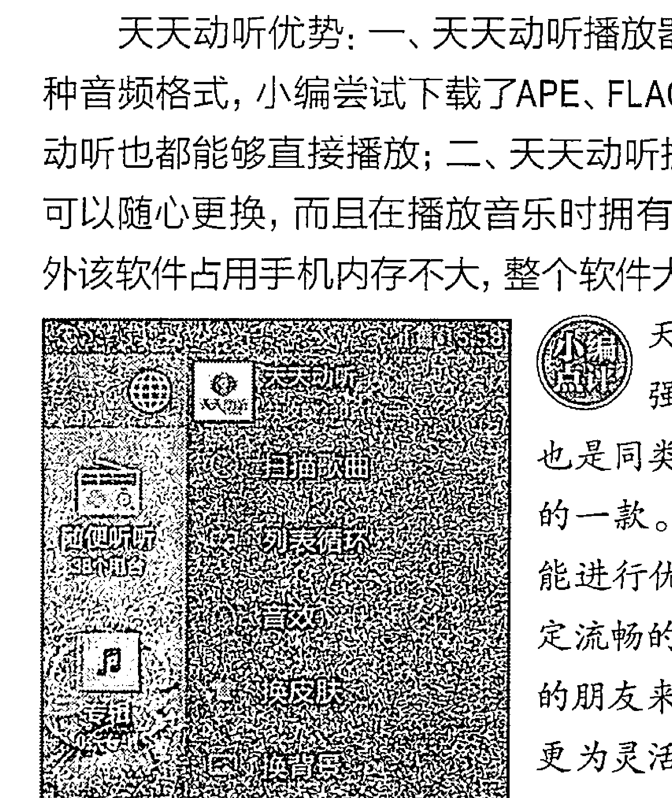

天天动听音乐播放器具有非常强的个性化定制的特点，该软件也是同类播放软件中占用手机内存较小的一款。此外天天动听不断对程序性能进行优化，以保证为用户提供最为稳定流畅的使用体验。对于喜欢在线音乐的朋友来说，酷狗音乐播放器在操作上更为灵活、简单，它是一款很受欢迎的音乐下载免费播放软件，功能强大，可自动下载歌曲、在线播放、下载后播放，支持多种格式的音乐，只是和天天动听播放器相比要占用更多的手机内存，这点有待提升。

## 玩转Wi-Fi的不二之法

人们已经习惯了Wi-Fi网络所带来的随时随地畅享网络的精彩生活。所谓心有多大，舞台就有多大，怎样挖掘Wi-Fi网络的强大功能，实现以前听说过但没见过的Wi-Fi网络新生活呢？本期就让我们一起玩转Wi-Fi，让生活精彩“无限”！

策划 | 《电脑爱好者》编辑部 监制 | 殷鹏斐 作者 | 平淡 飞雪散花

## 娱乐也玩转

有了Wi-Fi网络我们就能畅享网络带给我们的精彩了。不过，如果你简单地认为Wi-Fi网络只能上网浏览一下新闻，欣赏一下在线视频和歌曲，那就太OUT了。诚所谓心有多大，舞台就有多大，只要你敢想敢实践，Wi-Fi网络能带给我们的精彩就远远不止那些。

1. 让手机直接共享PC中的视频
PC中保存了若干精彩大片，想在手机中观看，不过，苦于手机SD卡“肚量”太小，有些体积庞大的高清片便无法复制到其中观看。于是忽发奇想，能否让手机直接共享并播放PC中的视频文件？这样，不但解决了SD容量太小的问题，而且也免去了每次都要复制视频的麻烦……
对于小文件共享，我们完全可以用酷盘、快盘等网盘来解决。只要手机端和PC端同时安装同一网盘，并在PC端设置好同步的文件夹，就能在手机端轻松地共享其中的文件。不过像视频这样的大文件，用网盘共享并不实际，原因有二：一是网盘的容量通常不大，保存这些大块头并不经济；二是文件需要先上传到网盘服务器中，这在网络带宽普遍不高的唐朝，难免费时费力。因此共享大文件的最好办法是自力更生，架设私有云，即把PC打造成数据服务器。这样，手机或平板电脑可直接访问其中的文件，上面使用网盘实现共享的种种不便自然也就烟消云散了。
PC端需安装Bdrive（下载地址：http://www.bdrive.com/en/），手机或平板端需安装Bdrive Classic（下载地址：https://play.google.com/store/apps/details?id=com.bdrive&hl=zh_CN）。

电脑端配置
要想使用Bdrive把PC打造成数据服务器，我们首先要开启路由器的UpnP功能和Windows系统中的SSDP服务。

下面我们以TL-WR740路由器和Windows 7系统为例讲解开启方法。

1.  在浏览器地址栏中输入http://192.168.1.1，回车，在出现的登录界面中，输入路由器的用户名和密码（默认都是admin），回车，进入路由器设置界面。单击展开左侧的“转发规则”项，选择其下的“UPnP设置”子项。在右侧单击“开启”按钮（图1）。然后选择左侧的“系统工具/重启路由器”项，在右侧单击“重启路由器”按钮，重启路由器，路由器的UPnP功能即会被开启。
2.  启用SSDP服务。在Win 7的“开始”菜单的搜索栏中，输入“服务”，回车，打开“服务”窗口。双击右侧的SSDP Discovery，在出现的“Discovery的属性”对话框中，切换到“常规”标签，将“启动类型”设置为“自动”，单击“确定”按钮（图2），即可启用系统的SSDP服务。

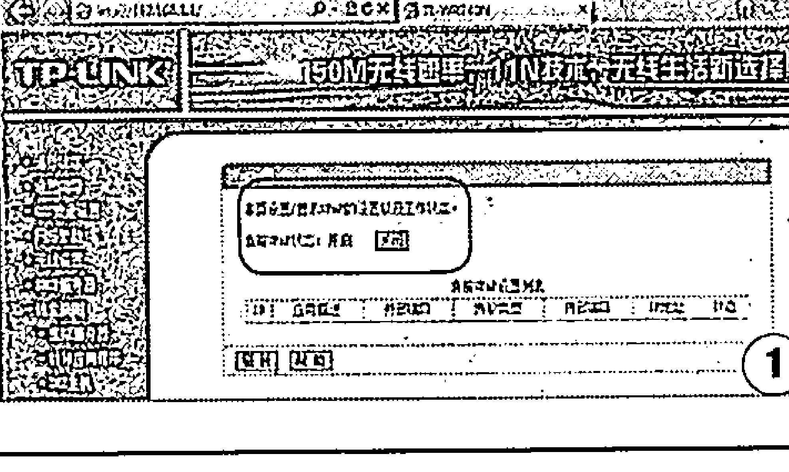

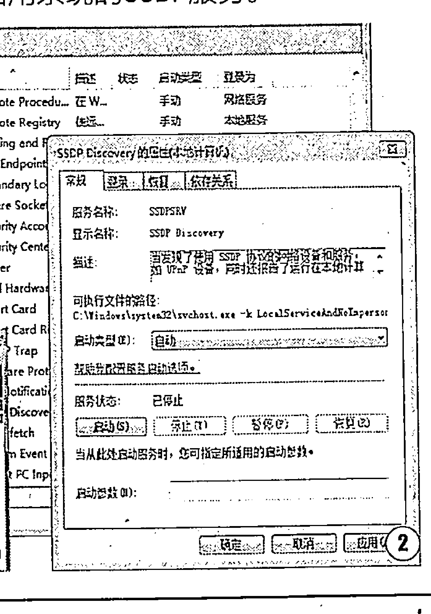

## 安装并设置Bdrive

- ① 在PC中安装Bdrive并重启系统。系统重启后，运行Bdrive程序，在出现的Initial Setting（基本设置）对话框中，输入邮箱地址，单击OK按钮。在Network Adapter对话框中，选中我们目前所用的无线网卡（一般程序会自动检测到，保持默认值即可）。单击OK按钮，进入程序主界面。

- ② 指定要共享的云端资源。我们可以共享某硬盘分区中的所有文件，也可以指定只共享某些文件夹，比如此处我们架设云服务的主要目的，是要共享PC中的视频文件，可以直接指定共享视频所在的文件夹。以指定E分区为云端资源为例。


在主界面中，切换到Folders（文件夹）标签，单击Add（添加）按钮，打开“浏览文件夹”对话框，选中E盘，单击“确定”按钮。然后在出现的Set Password（设置密码）对话框中，为云端资源设置一个共享密码，以后其他设备，只有输入该密码才能访问这些资源，当然，也可不设置。设置完毕，单击OK按钮（图3），共享资源的添加工作就完成了。

- ③ 设置权限。返回主界面，刚才添加的资源会出现在列表中，记下列BID列中的字母或数字（每个共享资源对应一个独立的BID），以后其他设备必须输入该BID才能访问云端的相关资源。默认情况下，程序赋予每位用户的权限都是可读写（Read /Write），如果我们架设服务器的目的并不单单是自己使用，而是想将其同时共享给其他朋友，那么这一权限明显地是过于“宽大”了。这时，可以在Permission（权限）列中，单击当前的权限，然后单击其右侧的下拉箭头，在出现的下拉菜单中，将权限选择为Read Only（只读）。这样，既可保证所有用户可顺利地访问其中的资源，又可防止他们利用手中的权限，对文件进行修改或删除，可谓两全其美，何乐而不为？

## 设置手机端

接下来，我们还要对手机或平板端进行设置，以便让它们能轻松地访问其中的资源。在手机或平板端安装并运行Bdrive Classic，进入Bdrive Test Server（测试Bdrive服务）界面，单击屏幕下方的菜单按钮，在出现的菜单中单击Add BID（添加BID）按钮，打开相应的界面，输入我们要访问的云资源所对应的BID（图4），单击Add（添加）按钮，返回上级界面，我们会发现该资源已出现在列表中。单击它，然后在出现的对话框中输入访问密码，即可像使用本机文件一样，对其进行播放和访问等操作了。


> 小知识
什么是UPnP和SSDP？UPnP是一种分布式的、开放的网络架构，它能让各种各样的智能设备、无线设备和个人PC等，通过对等网络（P2P）相互连接起来。而后者则是一个“简单服务发现协议”，该协议定义了如何在网络上发现网络服务的方法，设备接入网络后，要利用它向网络广播自己的存在。所以无论是控制点还是UPnP设备，工作中都必然用到SSDP服务。

## 手机媒体文件在电视中播放

梦想简述 手机屏幕太小了，这样，当我用手机欣赏视频、图片时，眼睛经常会出现酸酸的感觉。同时用手机播放音乐时，手机那小功率的喇叭，也震撼不起咱这高水准的耳朵。现在我的梦想是，能否让手机中的视频直接在电脑屏幕或智能电视中播放，以充分利用大屏的优势呢？手机中的音乐，能否在这两种设备中播放，以便借用一下它们的音箱呢？

圆梦思路 显然，上面这位“童鞋”的梦想有个最简单的实现方法，那就是可以直接在电脑或智能电视中欣赏视频或音乐，这样一来，所有麻烦都省了，也免得咱这个圆梦专家在这里啰嗦了。不过，如此一来，该同学的嘴角可能会不自觉地浮出一丝鄙夷的微笑。因为从他的梦想来看，他的需求其实还有另外一层意思，那就是可用手机控制视频、图片或音乐的播放进度，以便能在寒冷的冬夜，躲在被窝里即能畅享休闲的甜美。所以，他的梦想，实际上要借助目前很流行的DLAN才能实现。

圆梦工具 imediashare Lite（下载地址：http://android.d.cn/software/21750.html）所谓的DLAN，说白了就是家庭娱乐网络，它通过网线连接和无线连接两种方式，将家中现有的数码设备（如智能电视、电脑、平板和智能手机等），组成一个网络，各设备间可以共享图像、音乐及视频影像，比如，我们可以在手机中播放视频，而让其在智能电视或电脑屏幕中播放。实现DLAN功能需要几个必要的条件：一是硬件设备必须支持DLAN功能；二是要确保各设备间已经处于同一个Wi-Fi网络中；三是电脑的操作系统应为Win7或Win8，XP系统因缺少必要的组件，无法实现该功能。由于相对PC来说，目前使用智能电视的朋友尚在少数，所以此处我们仅以在PC屏幕中播放手机中的多媒体为例，说说实现方法。

## 特别话题

## 设置PC端

- 1. 打开Win7的“服务”窗口，用上面介绍的方法，将SSDP Discovery和Windows Media Player Network Sharing Service项的“启动类型”设置为“自动”。


- 2. 单击“开始→所有程序→Windows Media Player”，打开Windows Media Player播放器。在其主界面中，单击工具栏中的“媒体流”按钮，在出现的菜单中选择“允许远程控制我的播放器”项（图5），打开“允许远程控制”对话框。

- 3. 单击“允许在该网络上进行远程控制”项，返回Windows Media Player主界面，在“媒体流”菜单中选择“打开媒体流”，打开相应的窗口。单击“启用媒体流”按钮，然后在出现的“媒体流”窗口中，查看一下列表中各项的状态是否为“已允许”。如果不是，可单击项目右侧的下拉箭头，在出现的菜单选择“已允许”。设置完毕，单击“确定”按钮（图6）。至此，PC端的设置工作便告结束。


## 设置手机端

在连接到Wi-Fi网络且已启动PC中的Windows Media Player播放器的前提下，启动手机中的音乐播放器、视频播放器和图片查看器，看一下相应界面的右上角是否已出现一个无线图标。如果有，说明该手机除提供了硬件方面的支持外，还内置了相应的软件支持。这时，我们只需点击这个无线图标，然后在出现的菜单中选择Windows Media Player，接下来再用手机播放视频、音乐和图片文件时，相应的播放界面即会出现在PC中的Windows Media Player中，其效果和用Windows Media Player播放PC中的多媒体文件相同（图7）。目前DLAN支持播放的图片格式有JPEG、PNG、GIF、TIFF，音频为LPCM、AAC、AC-3、ATRAC、3plus、MP3、WMA9，视频为MPEG-2、MPEG-1、MPEG-4、AVC和WMV9等。

在播放的过程中，我们可用手机中的播放器，直接控制文件的播放进度，如快进、下一首、上一首、暂停和停止等，非常方便。


上面的方法虽然简单，不过，有些朋友却可能在系统自带的音、视频播放器和图库中，找不到有关DLAN的选项（即没有我们上面所说的那个无线图标）。这是否说明他们的设备硬件不支持DLAN功能呢？其实未必，因为近两年来生产的智能手机和平板、智能电视等基本上都支持该功能，之所以他们的手机中未显示，很大可能是由于手机内置的应用中并未提供相应的软件支持，这时，我们可以利用Imediashare这款工具来令其支持。

和手机内置的软件支持相比，Imediashare不仅支持在PC系统的Windows Media Player播放手机里的多媒体文件、视频、音乐和图片外，而且还支持用手机直接播放WMP媒体库中的文件。

- 1. 在手机安装Imediashare应用并启动。程序会自动扫描周围可用的DLAN设备，扫描完毕，将进入主界面，其中在PERSONAL（个人）栏中，我们会看到三个图标，它们分别是My Videos（我的视频）、My Photos（我的照片）和My Music（我的音乐），其作用分别是选择手机里的图片、视频和音乐等文件在WMP中播放。由于这三个项目的播放方法大同小异，下面我们仅以播放图片为例，简单地说一下。

- 2. 在界面中点击第一个图标（即My Photos），手机中的图片目录就会显示出来。点击相应目录，打开图片列表，点击要查看的图片，然后在出现的界面中选择播放设备为“XX XX（XX-PC: Windows Media Player）”（其中XX为你的计算机用户名，图8），所选择的图片就会同时出现在手机屏幕和WMP播放器中。查看的过程中，我们可随时通过用手指滑动手机屏幕的方式，切换当前要查看的图片，的确是非常方便。

> 上面这位同学的要求其实并不高，实现起来也绝不复杂，我们借助一款应用即能轻松搞定。该应用除了可满足该同学的所有要求外，还能及时地发送掌声，充分烘托现场气氛。

> KTV点歌系统（PC端下载地址：http://www.yyasp.net/upload/filedownload/vod.rar，手机端下载地址：http://www.yyasp.net/upload/filedownload/net.yyasp.vod.apk）


除了支持让手机中的多媒体文件在PC中播放外，Imediashare还支持用手机播放Windows Media Player媒体库中的文件，播放方法很简单，只需在界面的PERSONAL栏中点击Local Network（本地网络）图标，待Windows Media Player媒体库中的文件列表出现以后，再用与上面类似的方法播放即可。此外，如果你想在PC中用Windows Media Player直接播放手机或平板电脑中的多媒体文件也容易，因为连接到DLAN网络后，同在一个Wi-Fi网络中的设备会出现在Windows Media Player主界面的左侧（图9），直接双击它，这些移动设备中的多媒体资源就会出现，根据自己的需要，选择播放即可。


> 小提示 实际上除了用上面的方法建立DLAN以达到各智能设备间共享多媒体资源外，目前有些手机和平板应用程序，也直接提供了对DLAN的软支持，这其中最典型的一个例子是Android版的PPTV客户端。当我们在该应用中选择播放某节目后，屏幕上会出现一个“播放设备”对话框，其中就包含两个选项：“本机播放”（即在手机或平板中播放）和“XX（XX-PC: Windows Media Player）”。如果你想在PC中的Windows Media Player播放器中播放该视频，只需选择后者即可。

## PC端设置

要想享受该应用带来的便利，我们首先要在PC中安装并配置好相应的客户端。

- 1. 下载后解压程序，然后双击运行其中的“_自动配置VOD点歌系统.reg”文件，将相应键值导入注册表，然后右击“冰河VOD点歌系统.exe”文件，在弹出的右键菜单中选择“以管理员身份运行”，运行程序。

- 2. 在出现的界面中（图10），单击“更改”按钮，选择好MTV文件所在文件夹（最好是dat或mpg格式，其他格式将不能切换声道）。


- 3. 在“控制面板”中选择“网络和Internet/网络共享中心/Windows防火墙”，将右侧几个防火墙项全部关闭。至此，PC端的设置工作便告结束。

## 配置手机端并点歌

- 1. 在手机中安装手机客户端。安装完毕启动程序，在“请输入电视屏幕上的地址”文本框中输入网址，点击“连接”按钮，进入程序主界面，点击“点歌”按钮，PC中指定目录中存在的MTV文件就会显示在列表中。选中要OK的文件，在出现的“询问”对话框中，选择“预约”或“优先”，即可将该歌曲添加到播放列表中。

- 2. 点击“主页”按钮，返回程序主界面，点击“切歌”按钮，该MTV即会在PC屏幕上播放。

## 开心OK 让手机变成点播机

闲暇之余，我喜欢约几个朋友到家中OK一曲。不过，平时用电脑K歌，我需要在每一首歌唱完，再坐到屏幕前手工选择第二首，不仅操作麻烦，而且非常浪费时间。现在我的愿望是，能让手机变成点播机。


## 让手机变身游戏手柄

爱玩游戏，时常坐在电脑屏幕前鏖战，时间一久，腰酸背疼，我都怀疑自己是否患上了颈椎病。于是想起健康的重要性，开始克制自己玩游戏的热情，不过，虽然我已决心疏远游戏，但游戏那可耻的诱惑力总是在无情地撕碎我无比坚定的决心。现在我的梦想是，能否让鱼与熊掌兼得，在畅玩游戏的同时，保证身体的健康？当然最好是能通过玩游戏锻炼身体，可让我在玩游戏的同时锻炼身体（嘿嘿，这愿望不高吧）。

善良地建议该同学提高一下自己的意志力，抛开屏幕，多出去与大自然亲近一下，当然，考虑到实际情况，该同学的意志力可能已达到极度脆弱的程度，所以这里为你提供一种折衷的办法，基本上能满足你的愿望，即在游戏的同时让身体得到锻炼。而该办法，就是目前许多朋友听起来还稍嫌陌生的AIWI体感游戏。

AIWI客户端（下载地址：http://www.aiwi-game.com.cn/）

## AIWI体感游戏

顾名思义，体感游戏就是用身体去感受并操控的电子游戏。2006年，日本任天堂公司首次推出具有该功能的Wii游戏机，其后微软和索尼也在自己的部分游戏机中加入了该功能。不过，此时的体感游戏是建立在固定硬件的基础上的，而且其中的游戏也需要用户购买，花费不小。

后来，随着智能设备的日渐普及，一款新兴的、可将Android/iPhone/iPod Touch等智能手机当作游戏手柄来控制计算机游戏的软件诞生了，这就是AIWI。利用它，用户只需将计算机和Android/iPhone/iPod Touch等智能设备，通过蓝牙、Wi-Fi等方式连接起来，即能像打网球一样，通过操控智能设备来操控电脑中的游戏。

和传统的通过鼠标、键盘来控制游戏的方式相比，该方式的好处在于，它除了可让游戏者获得更强的临场感与真实感外，还能在潜移默化当中起到强身健体、缓解肩周炎等特殊效能，是一种十分健康的新型游戏方式。

> > 预约和优先点歌方式的区别在于，前者无需手工干预，即会在上一首唱完，自动切换到下一首，而后者在上一首唱完后，必须在主界面中点击“切歌”按钮，才能继续播放下一首。

## 运动与游戏合二为一

要想畅享到体感游戏带来的全新体验，我们需要在电脑和智能手机中同时安装AIWI客户端。进入http://www.aiwi-game.com.cn/页面，切换到“下载专区”标签，在页面左侧，按提示下载并安装电脑和手机客户端。

- 1. 安装完毕，启动电脑客户端，在出现的登录界面中，单击“免费注册”按钮，打开“AIWI会员注册”对话框，输入电子邮箱、用户密码和真实姓名等信息，单击“注册”按钮，完成注册过程并登录。

- 2. 启动手机客户端并登录。此时，电脑客户端会自动侦测目前已安装了AIWI客户端的智能设备，接下来，在出现的连接向导界面中，按照提示，一步步完成手机客户端与电脑客户端的连接工作（图12）。

- 3. 连接完毕，在电脑客户端的主界面中，单击左侧的“游戏大厅”项，在右侧，我们可看到AIWI目前支持的体感游戏，其中包括AIWI自制的“AIWI游戏”、Flash网页游戏和一些大型单机游戏等，需要玩哪种类型的游戏，可通过切换到“AIWI游戏”、“网页游戏”和“支持的游戏”标签进行选择。随着你的选择，相应的游戏将出现在下方的列表中（图13）。


- ④要想畅玩某游戏，只需单击游戏名称下方的“开始”按钮，有关该游戏的详细介绍、操作方法和按键说明就会出现。熟悉掌握一下，然后单击“开始游戏”按钮。接下来，我们就可以抛弃鼠标和键盘，站起身来，用富含运动的操作来控制游戏了。需要说明的是，当前玩的游戏不同，手机客户端中控制的界面也有所不同。利用这一界面，我们可以完成以前需要借鼠标和键盘才能完成的所有操作。而且更为有趣的是，在游戏当中，当你被对手击中或碰撞到障碍物时，手机还会以振动来予以提醒，现场感非常强烈。

在没玩游戏而登录了AIWI客户端的情况下，AIWI客户端可轻松地将我们的手机变成无线鼠标和键盘，其使用方法为：在界面上方区域滑动或点击手指，可代替鼠标实现文件的选择及单击、右击等操作。

## 梦想5 无需网络联机游戏开心玩

情景描述 春节将到，寒假将临，这当然是天大的好事，不过，想到漫长的旅途中要单调地坐上几天火车，又让人心里郁闷。唯一的消遣方式是和一路同行的几位同学玩联机游戏。不过，游戏好玩，3G流量咱可消耗不起啊，而且旅途中也别指望有什么Wi-Fi网络可供使用。于是，愿望自然而然地就出来了，我如何在没有任何外部网络的前提下，和朋友们畅玩联机游戏呢？

圆梦思路 该同学的梦想其实有两种实现思路，一是如果你的手机中有支持多人同时玩的游戏（如CS），并且你和其他几位同学的手机都支持Wi-Fi直连功能，你们完全可以用Wi-Fi直连功能来实现。不过，几位同学的手机都支持Wi-Fi直连，这一条件貌似过于苛刻，因为直到目前为止，真正支持Wi-Fi直连的手机并不多。二是可使用一些专门的软件来实现，这些软件提供了类似于Wi-Fi直连的功能，且一般程序内已内置了一定数量的游戏，你们完全可以使用它来达到在无网络的情况下联机畅玩游戏的目的。

圆梦工具 快牙（下载地址：http://www.mumayi.com/android-109390.html）

## Wi-Fi直连联机游戏

不管具有Wi-Fi直连功能的手机有多么稀少，为照顾那些一不留神就拥有该法宝的朋友，能轻松地利用该功能在手机间互传文件、畅玩游戏，我们这里仍要介绍一下。以三星LG P970为例。

单击屏幕左下方的菜单按钮，在出现的菜单中

> 小提示
如果要将手机变成无线键盘，可以往左滑动界面，调出键盘界面然后根据自己的需要输入即可。不过，遗憾的是AIWI提供的键盘只支持英文输入法，而不支持汉语输入法。

点击“设置”按钮，打开相应的对话框，选择WLAN Direct（WLAN直连）项，然后在出现的“WLAN Direct设置”对话框中，勾选Wi-Fi Direct项，即可开启手机中的Wi-Fi功能，这时，如果其他手机也支持该功能且已将其开启，LG P970就会自动搜索该设备并将它显示在“设备名称”项中。然后我们就能通过单击“设备名称”右侧的下拉箭头（图14），在出现的下拉菜单中选择“上传文件到其他设备”、“下载文件到其他设备”、“与其他设备建立连接”等项，完成文件的传输或游戏联网对战等操作。


## 利用快牙完成对战

快牙最大的特点是只需几部手机同时安装该工具，便可无视任何外部网络环境、无视2G/3G和SIM卡，相互间轻松完成电影、音乐或其他文件的传输工作，而且收发内容比普通下载快10倍，高速传输速度可达2M/s。同时，工具本身还内置了三国跳跳、扔纸团和冰球对战等多款游戏，所以不论是朋友间相互传输文件，还是枯燥旅途中几人对战，它都可以轻松搞定。

- * 安装后运行程序，进入“设置头像和名字”界面，在“在此处输入名字，方便朋友认出你”文本框中，输入自己的名字，并选择一个头像，点击“下一步”按钮。

- * 在出现的界面中点击“创建连接”按钮，点击的目的是要将自己的快牙信息广播到网络中，以便让周围同样使用快牙的朋友能迅速找到自己（其他安装了快牙的朋友也必须创建连接，才能让其他人找到自己）。创建完毕，点击“搜索加入”按钮，快牙会自动检测周围是否存在使用快牙的朋友，如果有，会把他们的昵称显示在列表中。我们只需点击相应的昵称，即可与该朋友建立连接。

- * 接下来，我们就可与朋友互传文件了，这些文件包括应用、影音、照片和其他文件等。传输的过程很简单，以传输图片为例。在界面下方点击“照片”按钮，本机中存在的所有照片便会出现（图15）。选择要传输的照片，然后轻甩手机，文件的传输工作即会开始。快牙会向所有已建立了连接的朋友传输该照片，具体传输的时间取决于文件的大小。一般来说，一个几百MB的文件，大约只需一二分钟即可。

④ 那么，如果我们要和朋友进行游戏对战又该如何呢？同样Easy! 先用上面所说的方法与朋友建立连接，然后点击界面下方的“应用”按钮，进入相应的界面。

切换到“游戏”标签，在列表中点击要玩的游戏，然后在出现的菜单中选择“下载”，下载安装该游戏（其他与自己对战的好友也必须下载安装该游戏）。安装完毕，再次点击该游戏并选择“开始”启动游戏，此时，屏幕上会出现一个对话框，让我们选择是单人修炼还是多人对战（图16）。我们只需选择后者，就能与已建立连接的朋友对战了。

## 设置管理篇

俗话说好马配好鞍，要想玩转Wi-Fi网络就要保障Wi-Fi网络的畅通和安全。面对无线蹭网、无线网内网速不稳定、空间过大造成的无线信号偏弱等情况，我们该采取怎样的措施？又有哪些新奇的硬件设备可以保障我们的无线网络畅通又高效呢？

## 学前扫盲班认识Wi-Fi和WLAN

有很多人搞不清Wi-Fi和WLAN的关系，那么两者之间到底是怎样的关系呢？

事实上Wi-Fi就是WLAN（无线局域网联盟）的一个商标，该商标仅保障使用该商标的商品互相之间可以合作，与标准本身实际上没有关系，但因为Wi-Fi主要采用802.11b协议，因此人们逐渐习惯用Wi-Fi来称呼802.11b协议。从包含关系上来说，Wi-Fi包含于WLAN中，属于采用WLAN协议中的一项新技术。

Wi-Fi连接首先要有热点，对于家庭用户热点主要通过无线路由器生成。不过很多朋友在自建Wi-Fi后，却发现网速经常莫名地变慢，怀疑有人蹭网，此时该怎么解决这个问题？

查看当前连接到路由器或无线宽带猫中的设备。如果列表中出现了“未知设备”，就需要提防了，如果该设备不是自己的电脑、手机，那就是蹭网的“小偷”（图17）。

## 轻松查看有无设备蹭网

开启无线网络后，如果发现自己网络莫名其妙变慢，十有八九的原因是有人在蹭网。要查看是否有人蹭网，使用安全卫士可以轻松查询到蹭网设备。

到http://www.onlinedown.net/soft/50671.htm下载程序并安装。运行程序后在主窗口右侧找到并打开“流量防火墙”，选择“防蹭网”选项卡，直接单击“立即启用”按钮。这样程序自动检测所有无线连接到路由器或无线宽带猫中的设备。

## 把好大门——路由器防蹭设置

如果发现自己的网络被人蹭，说明你的网络设置存在安全隐患。借助路由器的安全设置可以有效防止他人蹭网。

+   ① 设置强劲密码。大部分无线网络被蹭，主要原因是没有为自己的网络设置一个强劲密码。进入路由器设置界面后，依次展开“无线参数→基本设置”，将右侧“允许SSID广播”的勾选去除，勾选“开启安全设置”，安全类型选择WPA-PSK/WPA2-PSK，然后在下方文本框输入设置的密码（最少8位，最长63个字符），最后点击“保存”即可（图18）。

| 选项 | 设置 |
|------|------|
| 开启无线功能 | 已选 |
| 允许SSID广播 | 已选 |
| 开启Bridge功能 | 未选 |
| 开启安全设置 | 已选 |
| 安全类型 | WPA-PSK/WPA2-PSK |
| 安全选项 | 自动选择 |
| 加密方法 | 自动选择 |
| PSK密码 | 最短为8个字符，最长为63个字符<br>（例如：ashjkdfhdgw） |
| 组密钥更新周期 | 30 (单位为秒，最小值为30，不更新则为0) |

经过上述的设置后，我们的无线网络就不会在Wi-Fi设备扫描时出现在热点列表上，其他人就无法连接到我们的无线网络了。如果自己的设备需要无线上网，比如安卓手机，进入无线网络设置后，点击“菜单→添加Wlan网络”，然后按提示输入SSID名称、加密选择WPA-PSK/WPA2-PSK，并且输入上述设置的密码，以后只要选择这个添加的SSID，点击“连接”即可接上自己的无线网络。

+   ② 自定义路由设置入口。隐藏SSID的方法虽然有效，但是因为SSID名称和密码在路由器设置中均是明文保存，为了阻止蹭网者进入路由器设置窗口查看这些信息，我们可以更改路由器默认设置入口和登录密码。

进入路由器设置界面后，展开“网络参数→Lan口设置”，将原来默认192.168.1.1更改为其他地址如192.168.0.31即可。继续展开“系统工具→修改登录口令”，然后将原来默认的用户名、密码（一般均为admin）更改为自定义用户名和密码，这样可以有效防止其他人进入路由器设置界面。

## Wi-Fi信号不强怎么办

无线信号由于是通过射频发送，在日常的使用中会由于距离等因素的干扰造成信号的衰减。如果信号不够强，我们可以手动增强无线信号。

### 设置路由器增强模式

很多路由器都支持多种模式，我们可以进入路由器设置开启最强模式。比如笔者的路由器就支持11M和54M传输模式。进入路由器设置界面后，依次展开“无线参数→基本设置”，选择模式为54M带宽的802.11g模式(兼容802.11b)。这样就可以充分发挥路由器带宽效率。

### 启用802.11N模式

现在很多无线网卡也支持多种协议，我们可以进入无线网卡属性设置窗口，然后切换到“高级”选项卡，将属性下拉列表的“2.4频带的802.11n信道宽度”设置为自动即可。

> 小知识
易拉罐Wi-Fi信号增强器原理：易拉罐的内表面反射了无线电波，加强了天线的发射和接收信号的能力。相当于把分散的信号集中到一个方向。但易拉罐的背面相对应地减弱了部分信号，将天线放在易拉罐的正中心位置就能使反射效果达到最佳。套上易拉罐之后，将无线信号往易拉罐的凹面集中，易拉罐后面的电磁波就少了。

### 自己动手 增强信号

如果通过上述的设置仍然无法增强信号强度，我们还可以通过易拉罐制作Wi-Fi增强器。

+   1. 准备一个喝完了的易拉罐（必须是铝罐），常见的可口可乐、听装啤酒罐即可。接着拔除易拉罐的拉环，使用剪刀将易拉罐底部进行环切，将易拉罐的整个底部切除。
+   2. 继续对易拉罐顶部进行环切，但不必全部切除，只需留下开口部分，然后沿着罐体往下裁剪。最后展开易拉罐铁皮即可制作完毕，现在将路由器天线穿过罐口，使用液体胶固定易拉罐底部即可(图19)。

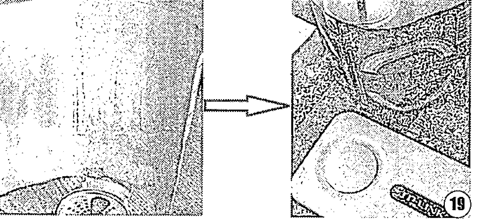

### 无线路由中继

很多朋友是和邻居们共享宽带，路由器并没有安装在自己家中，大多是通过一根网线将宽带连接到自己的家中。这样即使邻居使用的是无线路由器，在自己家收到的信号也是很弱。对于这种情况的用户，我们可以通过自购路由器，通过路由器中继，在自己家中建立热点。

+   1. 准备无线路由器一个，并将从邻居家接入的网线插到路由器的WAN口。接着进入路由器设置界面，依次展开“设置向导”，然后按照向导的提示，上网方式选择“以太网宽带，自动从网络服务商获取IP地址（动态IP）”（图20，因为共享宽带用户大多使用自动分配IP地址方式）。
+   2. 剩下的操作按屏幕提示开启无线路由，这样家里的其他设备就可以通过自家路由器的热点无线上网了。由于热点信号在自己家里，信号强度自然强了。

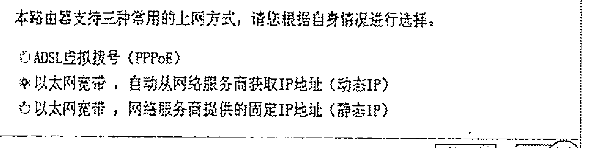

### 多人合用WiFi如何确保网速

由于无线网络不需受线束的束缚，现在很多家庭用户都在合用无线网路。不过连接的用户中总有些不自觉的，不是整天开着在线视频，就是彻夜下载。

#### 限制各设备所占带宽

进入路由器设置界面后，展开IP带宽控制，接着勾选右侧窗格的“启用IP带宽控制”，按提示输入自己的宽带类型速率，然后根据自己的实际情况设置指定电脑享受的带宽。比如邻居用户很不自觉，设置如下规则（图21）：

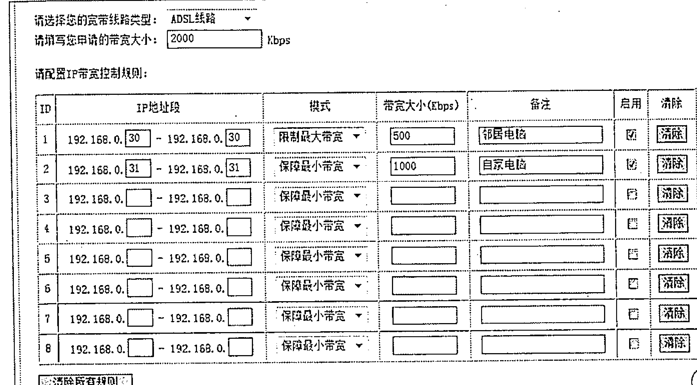

规则1：
IP地址段：输入192.168.0.30-192.168.0.30（这个地址要在路由器“网络参数→Lan口设置”中的设置范围内）
模式：限制最大带宽（即设定该IP电脑使用最大带宽）
带宽大小：500Kbps
备注：邻居电脑

规则2：
IP地址段：输入192.168.0.31-192.168.0.31
模式：保障最小带宽（即设定自家电脑使用最小带宽）
带宽大小：1000Kbps
备注：自家电脑

切换到“DHCP服务器→客户端列表”，左侧窗格就可以看到所有连接到该路由器的客户端，在这里复制邻居家电脑网卡IP的MAC地址，再切换到“IP与MAC绑定”，点击“增单个条目”，然后将邻居家电脑网卡IP的MAC地址粘贴并勾选绑定，IP地址设定为192.168.0.30，这样邻居电脑连接到我们的网络时就会绑定分配192.168.0.30（即上述限速的IP地址，图22）。

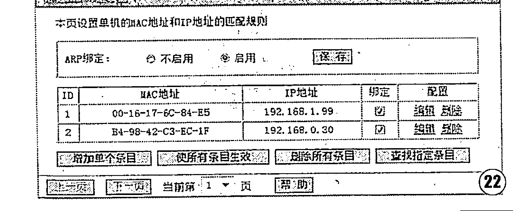

同上，添加新条目，绑定自家电脑网卡的MAC和IP地址，这样自己的电脑连接时就可以享受至少1M带宽，而邻居家则至多有512K带宽，有效解决了带宽分配的难题。

#### 设定允许连接设备

通过上述的方法只能限定指定MAC和IP的设备限速，如果邻居使用其他设备连接就无能为力了（否则连接一个设备必须重新绑定MAC和IP）。现在可以接入Wi-Fi网络的设备很多，比如平板电脑、安卓手机等。为了有效阻止这些设备连入网络占用带宽，我们可以手动设置允许连接到网络的设备。比如，我们希望MAC地址为00-0A-EB-00-07-BE的主机可以访问（假设为自己电脑），MAC地址为00-0A-EB-00-07-8A（假设为邻居家电脑）的主机使用128位WEP密钥2F34D20BE2E54B326C5476586A来访问，而其他主机均不能访问本无线网络。

进入路由器设置界面后，展开“无线参数→MAC地址过滤”，单击“启用MAC地址过滤”按钮。接着在过滤规则选择“禁止列表中生效规则之外的MAC地址访问本无线网络”，然后确认访问控制列表中没有任何生效的条目，如有，将该条目改为“失效”，删除该条目或删除所有条目。

点击“增加新条目”按钮，添加MAC地址为00-0A-EB-00-07-BE，类型为“允许”，状态为“生效”。继续点击“增加新条目”按钮，添加MAC地址为00-0A-EB-00-07-8A，类型为“128位密钥”，密钥为2F34D20BE2E54B326C5476586A，状态为“生效”。这样除了上述设置的主机，其他电脑都不能连接到我们的无线网络了（图23）。

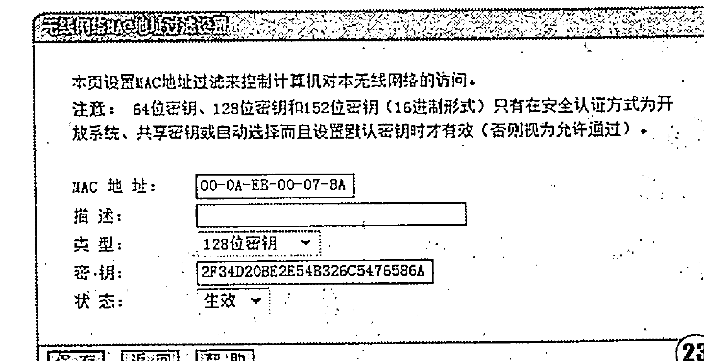

如果你开启了无线网络的MAC地址过滤功能，并且过滤规则选择了“禁止列表中生效规则之外的MAC地址访问本无线网络”，而过滤列表中又没有任何生效的条目，那么任何主机都不可以访问本无线网络。

小提示
如果将过滤规则设为“允许列表中生效规则之外的MAC地址访问本无线网络”，那么MAC地址为00-0A-EB-00-07-5F的主机仍然不可访问，但MAC未在列表中出现的主机变成可以访问。

## 《电脑爱好者》·合订本{特别话题}

## 设备采购篇

看过上面的文章，相信各位同学对如何玩转Wi-Fi已经胸有成竹了，不过，且慢，最后还有一个最为重要的问题，那就是构建Wi-Fi所需要的几种硬件你都具备了么？如果没有也没关系，接下来我们就推荐几款具有不同特点的、实用的建网设备，相信其中定有一款适合你。

### 无线路由器类

#### TENDA 837R 300M无线路由器
参考售价：75元
万能中继，轻松扩展无线网络
837R支持无线WAN功能（WISP），只需单方面扫描上级无线路由器信号，便可轻松地扩展无线网络覆盖范围。


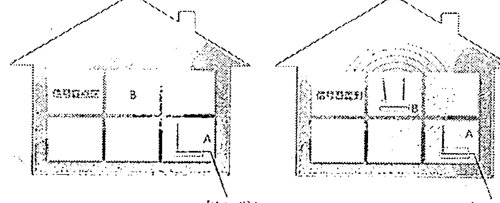

#### TP-LINK WR2041N 450M无线路由器
参考售价：229元
3根天线。具有Turbo按键功能，可一键增强覆盖面积。

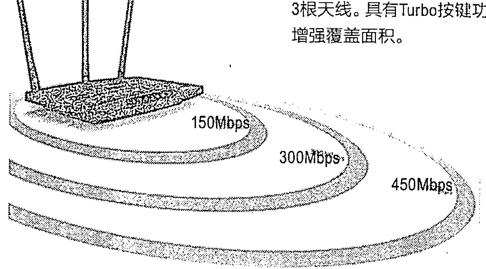

### 无线网卡类

#### TENDA W311Ma 150M mini无线网卡
参考售价：45元
外置5dBi全向天线，在开放环境能够使无线信号传输距离更远。同时支持软件AP功能。

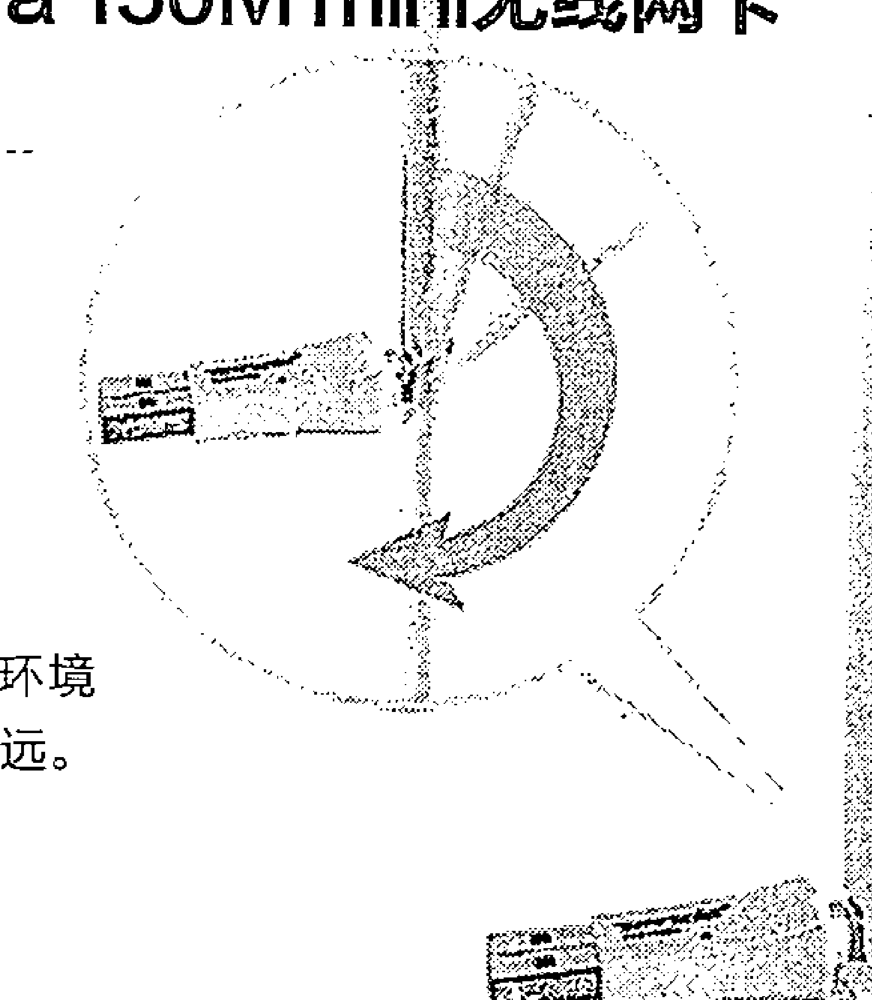

#### 磊科NW360 300M USB无线网卡
参考售价：45元

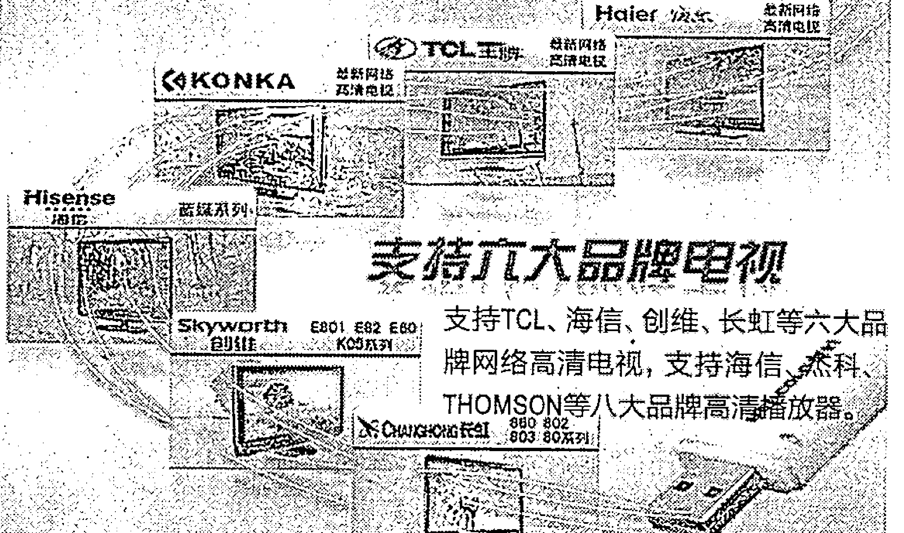

支持六大品牌电视
支持TCL、海信、创维、长虹等六大品牌网络高清电视，支持海信、杰科、THOMSON等八大品牌高清播放器。

### 奇葩产品类

#### 华美 MPR-A2 5200mAh Wi-Fi移动电源
参考售价：178元

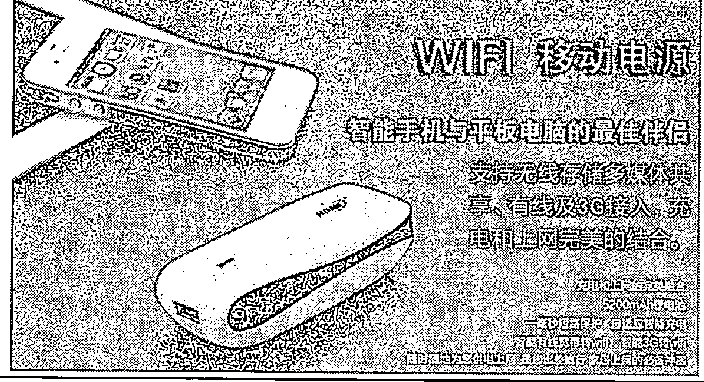

#### 忆捷 A30 Wi-Fi共享3000mAh移动电源
参考售价：799元

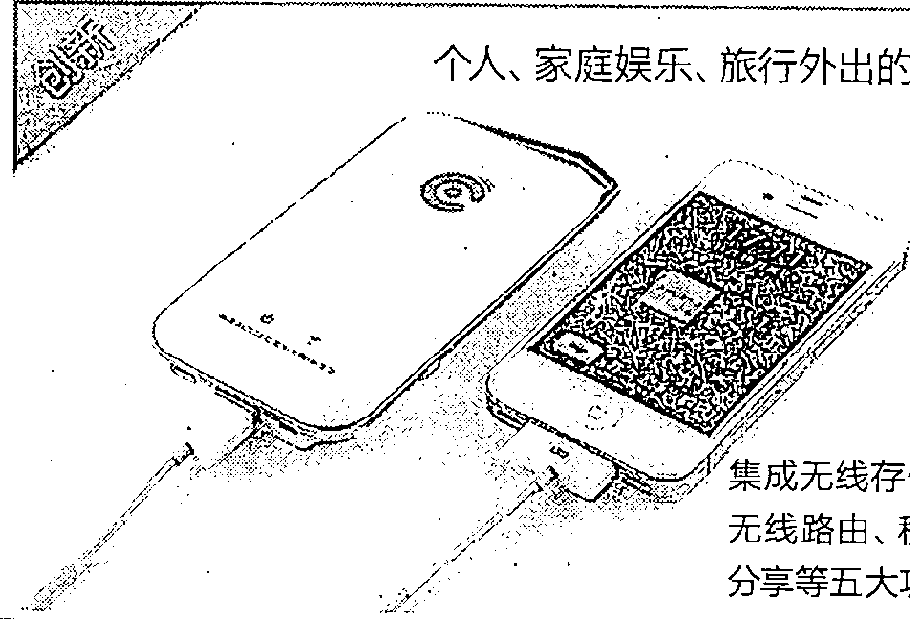

个人、家庭娱乐、旅行外出的超值之选
集成无线存储、移动电源、无线路由、移动存储、网络分享等五大功能。

## 千元级国产平板崛起时刻

四核、Retina、一体化金属机身……这些曾经代表‘顶级’的参数都将成为2013年国产平板电脑的标配。不要怀疑，国产平板的‘翻身战役’已经打响。那么，这类产品在新的一年中真的有资格入驻我们的包包里面吗？看过本文，你就知道了。

策划 | 《电脑爱好者》编辑部 监制 | 王健 作者 | 王健 Hiker

### 国产平板崛起时刻
关键词: Android、国产、低价格、实用

> 平板电脑市场的火爆引发了以苹果、微软和谷歌为代表的平板军团内战，但是真正能将平板电脑价格做到极致的却仅有以国内南方中小平板电脑品牌为代表的Android阵营。一千元左右的价格，堪比数千元产品的性能和品质，让你无需太多开销就能体验平板电脑应有的全部功能，这就是国产平板的生存之道。在2013年中，国产平板电脑将彻底摆脱低价低质的历史，无论是外观做工、核心硬件还是娱乐功能方面都会有所突破，让你以极低的开销就能获得昔日只有国际品牌旗下产品才能拥有的良好体验。

2010年1月27日，当乔布斯手持iPad出现在美国旧金山欧巴布也那艺术中心的那一刻，谁也不会想到这款‘大号iPhone’能开创全新的平板电脑时代。36个月后的今天，平板电脑已经不再是俊男靓女的时尚点缀，而是已被融入到当下社会的基因中。市场研究公司NPD预测，2013年全球平板电脑销售量将会超过笔记本达到2.4亿台(笔记本预计销量则为2.07亿台)，可见在2013年谁也无法阻止平板电脑前进的步伐了！

从初试啼声到一鸣惊人，平板电脑‘日闯三关夜夺八寨’的魄力无人能及。究其原因，还是平板电脑刺中了消费者真正的需求痛点：小巧、便携、高效、强悍、实惠。结合越来越多的办公APP应用，平板电脑基本可以实现70%传统PC的功能，在打发碎片时间的能力方面远远将笔记本甩在了后面。因此，无论是街头巷尾、酒吧咖啡厅、公交地铁、机场大厅，平板电脑的曝光率足以秒杀笔记本。

### 平板三国杀

在苹果、微软和谷歌为代表的军团内战中，微软凭借Windows 8高调挥师，无奈应用匮乏、版本混乱、价格高昂。虽然我们知道新款iPad的味道最好，但真正有能力入手的用户相对还是少数。反观谷歌，玩起了众人拾柴火焰高的游戏，依靠Android开源的优势吸引以前卖电脑的、卖家电的、卖MP4的、卖手机的……等无数企业涉足，从299~3999元的价位区间都有Android平板的身影。可以预见，在2013年中Android才是国内平板电脑市场的绝对主力(表1)。

### 国产平板的逆袭

最令人振奋的是，曾一度以低端示人的国产平板电脑，在经历几年的试炼之后，无论是整体质量、性能还是功能都已经逐步逼近国际品牌旗下的产品，成为国内平板电脑市场的中坚力量。在今年，无论是让New iPad和iPad 4引以为豪的视网膜屏幕、素以高端自居的四核处理器、曾经让人羡慕不已的2GB超大内存，乃至标榜身份的3G/4G联网，这些当初想都不敢想的新酷技术都将被国产平板消化吸收，并以千元左右的价格‘挑逗’每一位消费者的欲望神经。

今天，就让我们将目标锁定在最受普通用户关注的千元级国产平板电脑阵营，看看在2013年它们将呈现哪些全新的特色，值不值得成为你的随身装备！

表1: 2013年国内平板电脑市场分类

| 定位 | 系统 | 特色 | 代表厂商 | 价位区间 |
|------|------|------|----------|----------|
| 高端 | Windows 8 Pro | 超极本的性能，平板的便携 | 微软、华硕、ACER、三星等 | 6500元以上 |
| 高端 | Windows 8 | 搭载Atom处理器的Windows 8平板 | 华硕、三星、联想、惠普、戴尔等 | 4500元以上 |
| 高端 | iOS | 依旧是平板领域的标杆 | 苹果 | 2500元以上 |
| 中端 | Windows RT | 搭载ARM处理器的Windows 8平板 | 微软、华硕、联想、戴尔等 | 3500元以上 |
| 中端 | Android | 做工和功能不逊于iPad系列 | 华硕、ACER、三星、华为、联想等 | 1500元以上 |
| 主流 | Android | 性能强、功能多、价格低 | 昂达、艾诺、智器、蓝魔、酷比魔方等 | 1500元以内 |

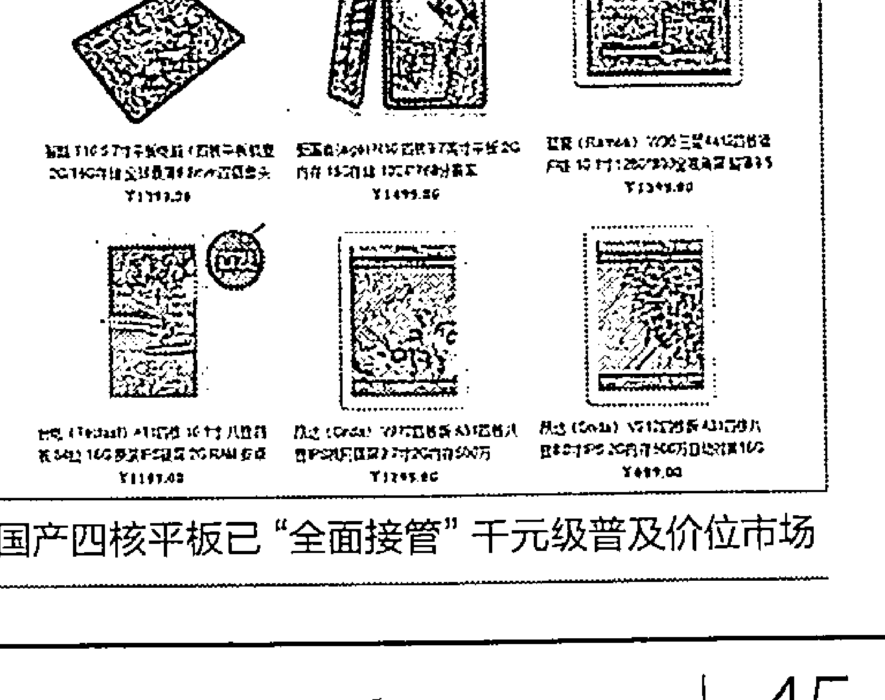

## 四核从未如此普及
关键词：四核, Cortex-A7, Cortex-A9

技术总是不断向前推进的，双核只是2012年的标准，而四核才是2013年的绝对主流。打开京东或淘宝的平板电脑销售页面，你会发现搭载全新四核处理器的国产平板清一色都定位在千元左右，甚至还有仅卖699元的。请不要忘记，这些可是刚刚出炉的新品，等这股“热乎劲儿”过去之后，599元甚至499元的四核平板即将来袭。因此，大家不要以为“四核”是多么厉害的技术，2013年中你会发现四核从未如此普及！

### 从此只谈四核

为了应对更高分辨率的屏幕和系统版本的升级，Android平板唯有不断提升硬件才是王道。而四核处理器就是2013年平板市场的主旋律，也是保证产品可以在所有应用场景中保持流畅的前提条件。何况现在四核新品的价格已经逐步跌破千元大关，我们还有什么理由不举手欢迎呢？

问题来了。国产四核平板越来越多，谁都说自己的产品才是最牛的，对缺乏足够专业知识的普通用户而言，如何才能准确锁定最适合自己的那款产品呢？

### 国产芯异军突起

判断平板电脑的性能高低其实很简单，就是从“芯”开始。对平板电脑而言，只要屏幕分辨率一致，在搭载相同型号处理器的情况下，它们的性能、游戏兼容性和功能几乎都是相同的。

需要注意的是，真正能掀起四核平板普及风暴的，并非在Android手机领域叱咤风云的高通、三星，而是来自国产芯片厂旗下的四核新品。

为了便于理解，我们需要针对产品的定位和销售市场，将ARM处理器分为国内和国际两大阵营，它们的队伍和特性如下：

#### 国际品牌芯片商：
英特尔、高通、三星、NVIDIA、华为等

NVIDIA、三星、高通和华为旗下的Tegra 3、Exynos 4412、APQ8064和K3V2都是目前主流的四核处理器。它们的特色是兼容性出色、性能强大，但高清视频的硬解码能力略有不足（很多格式的视频都需要CPU软解），成本也较国内芯片厂的更高。而且产品设计、优化和升级都得靠平板厂商自己完成（开发难度较高），这也就限制了它们在千元级平板电脑市场的普及。换句话说，搭载国际芯的国产平板价格今年可能很便宜，但架不住国产芯产品会更便宜。

#### 国内品牌芯片商：
联发科、全志、瑞芯微、晶晨、炬力、新岸线、君正等

想把四核平板拖进几百元的主流市场，还得靠“体恤民情”的国产芯片商在2013年主推的全新四核处理器。除了性能不逊于Tegra 3外，这类新品几乎可以做到兼容99%格式的高清硬件解码功能，实现4K级别的高清播放（联发科除外）。最关键的是，国产芯片商通常可以提供从研发、生产到后续升级一条龙的贴心服务，对平板厂商的研发能力没有太大要求，芯片采购成本更是低廉，极大降低了生产门槛。

### 国际芯平板推荐

#### 纽曼Newpad Q10
1499元
屏幕：10.1英寸IPS (1280×800)
处理器：三星Exynos 4412 (1.4GHz)
内存/存储：1GB/16GB
摄像头：200W/200W

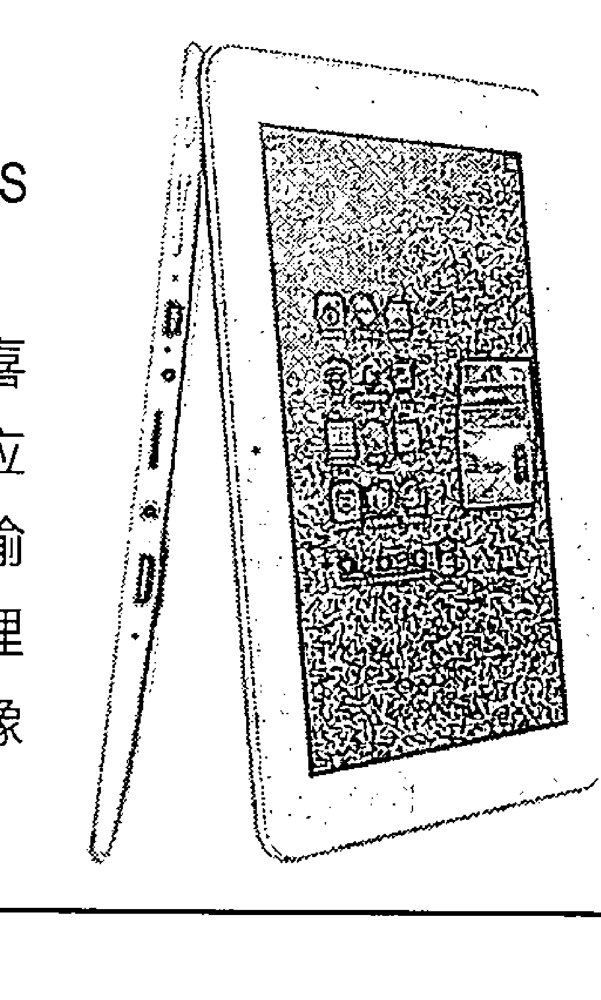

Newpad Q10采用了10.1英寸IPS屏幕，白色外观的设计颇为清新，前后都是200W像素摄像头，对喜欢视频聊天或自拍的用户来说应该算是好消息。Q10配备了HDMI输出接口，这在搭载Exynos 4412处理器的国产平板还是比较少见的（像蓝魔W30系列就没有提供HDMI）。

#### 影驰GALAPAD 7
999元
屏幕：7英寸IPS (1024×600)
处理器：NVIDIA Tegra 3 (1.3GHz)
内存/存储：1GB/8GB
摄像头：前置200W

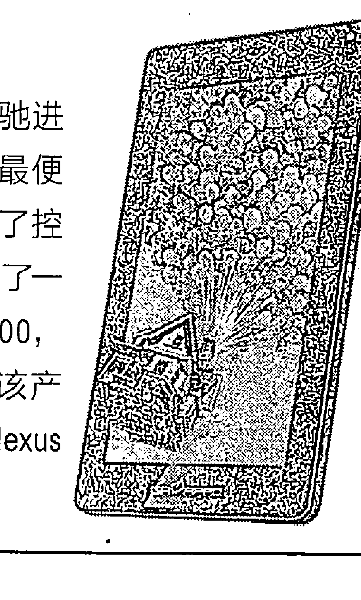

GalaPad 7是传统板卡厂商影驰进军平板市场的第一款产品，也是最便宜的Tegra 3四核平板之一。但为了控制成本，GalaPad 7在配置上也作了一些妥协：屏幕分辨率降到1024×600，内置的存储空间仅有8GB。好在该产品支持存储卡扩容，不会出现像Nexus 7那样空间不够用的情况。

## 国产四核有多强

所谓一分钱一分货，国产芯价格便宜，那性能究竟能否Hold住呢？接下来我们就来简单认识一下已经上市或曝光的国产四核新品。

## 全志A31

全志A31是首款量产的Cortex-A7架构四核处理器，也是目前国产平板厂商眼中的“香饽饽”。虽然全志A31依旧采用了相对过时的40nm工艺，但借助Cortex-A7自身架构优势和最新AXP221电源管理芯片，在功耗上可以和28nm工艺的Cortex-A9媲美。但是，目前所有搭载全志A31处理器的平板电脑都将默认主频设定在1GHz，无形中拉低了A31的跑分成绩（主要是CPU性能）。从SetCPU软件来看A31的理论最高主频应该在1.5GHz左右，希望全志后续可以推出更稳定的优化固件，进一步提升A31的默认主频来提升性能吧。

全志A31最大亮点是放弃了逐渐落后的Mali400系列GPU，改用集成8颗渲染引擎的PowerVR SGX 544MP2，而内存位宽也从主流处理器所用的32bit提升到了64bit位宽的双通道DDR3内存，在玩未来的大型3D游戏时也能做到游刃有余。此外，基于A31处理器设计的平板都能实现一秒10连拍、4K (4096x2160) 超高清的视频解码与输出、四屏显示等功能。

## 炬力猫头鹰

继全志A31之后，代号“猫头鹰”OWL系列的炬力ATM7029应该是正式量产的第二颗国产四核处理器。与A31相比，ATM7029基于主打性能的Cortex-A9架构设计，因此在CPU性能上占据优势。但由于其延续了40nm左右的工艺（官方没公布准确资料），在功耗的表现上略显不足，因此首批上市的平板电脑都将频率设定在1.2GHz（理论最高1.5GHz）。除了4K级别的高清播放和10连拍以外，猫头鹰四核处理器还加入了Fast boot快速启动功能，可明显缩短平板电脑重启的时间。

让人不解的是，这颗处理器的GPU模块竟然选用了Vivante GC1000 Plus，和瑞芯微RK2918和华为海思K3V2处理器的GPU同一系列，性能至多和两个核心的Mali-400MP2持平，这意味着它可能很难满足1080P高分屏幕以及未来Android系统最新3D大作的需求。但是，炬力ATM7029的采购价却是最低廉的，有望成为最早跌破价格底线的四核处理器。

## 瑞芯微RK3188

作为RK3066的升级版，瑞芯微RK3188改用了28nm的Cortex-A9架构设计，成为国内首家采用领先28nm制程工艺的芯片，可以很好地解决A9高性能与高功耗之间的矛盾。得益于更先进的制程，RK3188的主频有望得以进一步提升，在CPU性能方面值得期待。可惜的是，RK3188的GPU依旧沿用了Mali-400MP4，虽然将GPU频率提升到了533MHz，但依旧是整体机能的短板所在。受限于28nm工艺的产能，瑞芯微RK3188在CES2013大展上才刚刚发布，具体产品问世可能得等到3月份之后。

## 国产芯平板推荐

## 昂达V812

899元

- 屏幕：8英寸IPS (1024×768)
- 处理器：全志A31 (1.0GHz)
- 内存/存储：2GB/16GB
- 摄像头：30W/500W

昂达V812采用了8英寸IPS屏幕，一体化的铝合金材质背壳再结合G+G钢化玻璃面板，坚固又轻薄。除了A31这个亮点之外，V812还配备了高达2GB的内存容量，同时后置的500W摄像头还支持自动对焦，堪称功能最全面的国产四核平板。

## 艾诺神话四核

699元

- 屏幕：7英寸IPS (1280×800)
- 处理器：炬力ATM7029 (1.2GHz)
- 内存/存储：1GB/16GB
- 摄像头：30W/200W

NOVO7神话四核采用了7英寸IPS屏幕，还提供了多种颜色外观可选。虽然机身小巧，但该产品还是提供了HDMI、OTG等丰富的扩展接口，并添加了最容易被低价位国产平板“阉割”的振动反馈模块，而699元的价格也堪称最便宜的国产四核平板之一。

## 《电脑爱好者》·合订本 {特别话题}

| 型号 | 猫头鹰 | Tegra 3 | 全志A31 | Exynos 4412 | RK3188 | APQ8064 |
|---|---|---|---|---|---|---|
| 工艺 | 40nm | 40nm | 40nm | 32nm | 28nm | 28nm |
| 架构 | Cortex-A9 | Cortex-A9 | Cortex-A7 | Cortex-A9 | Cortex-A9 | Krait |
| 主频 | 1.2GHz | 1.3GHz | 1.0GHz | 1.4GHz | 1.8GHz | 1.7GHz |
| GPU | GC1000 Plus | Geforce ULP | SGX 544MP2 | Mali-400MP4 | Mali-400MP4 | Adreno320 |
| 测试平台 | 艾诺NOVO10四核 | Nexus 7 | 昂达V812 | 蓝魔W30 | PiPo M9 | Nexus 4 |
| 测试环境 | 1280×800 | 1280×800 | 1024×768 | 1280×800 | 1280×800 | 1280×768 |
| 测试主频 | 1.2GHz | 1.3GHz | 1.0GHz | 1.4GHz | 1.6GHz | 1.5GHz |
| CPU整数性能 | 3610 | 3602 | 2887 | 4246 | 4973 | 4413 |
| CPU浮点性能 | 2842 | 2700 | 1844 | 3180 | 3596 | 2131 |
| 2D绘图性能 | 919 | 808 | 1041 | 1202 | 1415 | 1596 |
| 3D绘图性能 | 1771 | 3020 | 4512 | 2804 | 3988 | 5583 |

CPU性能越高，意味着日常操作越流畅，系统反应速度越快。2D/3D绘图性能影响游戏表现，特别是3D部分的分数越高，在玩大型3D游戏时也就越流畅。

最后再让我们看看上述四核处理器的性能对比，以安兔兔V3.0.3测试软件为例，考察它们的CPU和GPU之间的性能差异。

通过成绩分析可见，全志A31受主频过低的拖累，在CPU性能部分的表现一般，但靠最新的SGX 544MP2却在图形测试中打了漂亮的翻身仗，远远超越了Mali-400MP4，对游戏玩家而言绝对是利好消息。炬力猫头鹰的CPU表现抢眼，但GC1000 Plus GPU的表现却是最差的。而RK3188的表现则相对均衡，配合超频后Mali-400MP4综合实力已经战胜了三星Exynos 4412。

可见，国产芯片的性能相较2012年已经有了质的飞跃，让极低价位的产品也能获得媲美三星Galaxy Note 10.1等高端四核平板的体验。

性能虽然已经迎头赶上，但国产四核处理器依旧存在一些缺陷，其中对用户影响最为明显的就是软硬件的优化调试环节。举个例子，高通APQ8064刚刚上市时其稳定性和游戏兼容性就很好了。但国产芯片厂为了赶进度抢市场，在上市初期总存在一些Bug，比如对部分游戏的兼容性不佳、偶尔停止响应甚至重启、性能表现忽高忽低等问题，往往需要数个月不断的优化调试后，才能通过升级固件的形式加以解决，发挥应有的最大性能。

# 小结

从全志、炬力、瑞芯微等最新国产四核处理器来看，差异化的苗头已经初步呈现。全志A31主打Cortex-A7低功耗并强化GPU性能，炬力ATM7029主打性价比而弱化了GPU性能，瑞芯微RK3188则采用了中规中矩的平衡之道，也算各有特色吧。

虽然最近Cortex-A15架构处理器被炒得火热，但想让这类新品入驻千元级价位的国产平板中，至少得等到2014年的春节之后，现阶段只是普通用户眼前的“海市蜃楼”。因此，对绝大多数普通用户而言，反而不如将眼光就放在众多Cortex-A7和Cortex-A9架构的四核新品之上。随着全志A31、炬力猫头鹰和瑞芯微RK3188等四核新品的普及，国产四核平板电脑的价格也将进一步跌破冰点，1000元配视网膜、600元配IPS的四核新品指日可待。

细心的同学肯定发现了，以全志A31为代表的新一代四核处理器都强化了集成GPU的规格。除了可以提升玩游戏的流畅度，更高级别的GPU还有什么用途呢？别着急，咱们继续往后看。

小提示：据悉，2013年初晶晨和新岸线也将推出全新的四核处理器，从已知的资料来看，它们可能都会选用28nm的Cortex-A9架构设计，但GPU可能会选择性能一般的Mali-400MP4。希望最终上市版可以换成更给力的GPU吧，否则凭Mali-400MP4是很难驾驭未来超高清的屏幕规格的。

通过不断的固件升级提升性能和稳定性，是每个购买国产平板的用户必须面对的事实。

## 视界从未如此惊艳

关键词：1080P、1600P、视网膜(Retina)

如果说2012年国产平板电脑的“视界”还停留在TN（可视角度低）与IPS面板（可视角度高）、标清（800×480、1024×600）与高清（1024×768、1280×800）的较量上。当你拿到本期杂志时，“视界之战”的战火则已经蔓延到了“超高清”级别，曾经代表最高端的1080P FHD（1920×1080/1200）都成了主流水准，视网膜（Retina）概念的普及将让你由衷地感叹：视界从未如此惊艳！

## 视网膜无人能挡

首先我们需要明确两个概念，对10.1英寸以下的平板电脑来说，只要屏幕分辨率达到了1080P标准，我们就能将其称为“超高清”屏幕；而当分辨率达到或超过1536P时，才能将其称为Retina屏幕。超高的分辨率可以让你在看高清视频、漫画、PDF浏览，阅读、网页浏览等常规应用中获得无与伦比的视觉体验。

当然，现在还有不少人都在质疑为平板电脑武装超高清屏幕的必要性。但笔者想说的是，无论是Android平板还是手机，都处于紧张的军备竞赛中，有没有意义是次要的，别人有了你没有就是落后了，所以必要性问题根本无解。何况在9.7英寸四核Retina平板新品逐步降到1000元左右价位的今天，我们还有什么理由去排斥它呢？借用一句改编的广告词：“接受他，可能你就会爱上他。”

但是，并非所有实惠的超高清平板电脑都值得选择，因为想完美驾驭1080P以上分辨率的屏幕，对平板电脑的硬件也提出了更高的要求。

## 如何驾驭视网膜

喜欢玩游戏的同学肯定清楚，玩电脑游戏时分辨率设置越高游戏速度也就越慢，平板电脑也是如此。从表面来看，1280×800到2560×1600、1024×768到2048×1536仅仅是4倍的数字提升，但背后却隐含着机能消耗的问题。那么，如何才能确保可以完美驾驭Retina屏幕呢？

我们可以回忆一下苹果是怎么解决的。New iPad是首款配备Retina屏幕的平板电脑，为了解决更高分辨率带来的资源消耗，苹果只对处理器进行了“小手术”，将GPU从SGX543MP2（双核）升级到了SGX543MP4（四核），而处理器的架构和主频没有任何变化。

表3：国产平板屏幕的常见规格

| 屏幕尺寸 | 标准 | 分辨率 | PPI |
|----------|------|--------|-----|
| 10.1英寸 | 800P | 1280×800 | 149 |
| 10.1英寸 | 1080P | 1920×1200 | 224 |
| 10.1英寸 | 1600P | 2560×1600 | 300 |
| 9.7英寸 | 768P | 1024×768 | 132 |
| 9.7英寸 | 1536P | 2048×1536 | 264 |
| 8英寸 | 768P | 1024×768 | 160 |
| 7英寸 | 600P | 1024×600 | 169 |
| 7英寸 | 800P | 1280×800 | 216 |

可见，Retina屏幕对GPU和内存的依赖是极高的。在国产平板电脑即将全面进入四核时代的今天，我们无需过多考虑CPU自身的性能，而1GB起步的内存容量也不存在太大的瓶颈，能否完美驾驭Retina，GPU的规格将成为最重要的指标。

## 如何看懂GPU的参数

GPU好似PC上的显卡，品牌和型号众多，但我们只要掌握“三角形输出率”和“像素填充率”这两大参数，基本就能判定该GPU的性能等级了。简单来说，三角形输出率主要负责描绘图形，也就是建立图形的模（比如绘制出魔方的轮廓）；像素填充率主要负责把绘出的图形填充颜色（比如依照魔方轮廓上色）。对平板电脑而言，屏幕分辨率越高，单位时间需要GPU渲染的像素数也就越复杂。如果需要用数据量化，要想以没有任何卡顿感地驾驭Retina屏幕，需要GPU至少提供100M/s左右的三角形输出率以及2500M/s以上的像素填充率。

小提示：ARM处理器的特色就是相对开放，芯片制造商只要得到了ARM指令集授权，可以任意搭配不同品牌的GPU。所以只要掌握了GPU本身的性能，今后无论它被哪个处理器所装备，我们都能判断出其最基本的游戏性能。不同GPU之间的差别还在于支持的纹理压缩格式（决定游戏兼容性）、API接口和一些节能方面的特色，本文就不赘述了。

接下来，我们就来看看不同GPU品牌之间的性能对比，2013年所有你能看到的ARM处理器都会采用其中之一作为自己的GPU，了解了它们的性能，就能知道谁能跑动Retina屏幕了。

## PowerVR SGX家族

作为苹果御用的GPU品牌，PowerVR SGX的特色就是性能强悍，游戏兼容性出色。如果以New iPad所采用的SGX543MP4为标杆，能驾驭Retina屏幕的只有SGX544MP2或以上级别的型号。

## Geforce ULP家族

Geforce ULP是NVIDIA Tegra系列处理器专属的GPU品牌，其中Tegra 3的三角形输出率非常高，基本可以保证在1080P分辨率下的体验，但想搞定Retina基本就没戏了。

## Adreno家族

Adreno是高通处理器的专属GPU，其中Adreno320的性能表现仅次于苹果A6X处理器集成的SGX544MP4，面对Retina屏幕应该毫无压力。

## ARM Mali家族

Mali GPU是ARM自己制定的标准，其中Mali-400系列应该是近年来最热门的GPU。

表4：两代iPad参数对比

| 型号 | iPad 2 | New iPad |
| :--- | :--- | :--- |
| 分辨率 | 1024×768 | 2048×1536 |
| 处理器 | 双核A5 (1GHz) | 双核A5X (1GHz) |
| 内存 | 512MB | 1GB |
| GPU | SGX543MP2 | SGX543MP4 |

表5：PowerVR SGX家族GPU性能对比

| GPU型号 | 三角形输出率 | 像素填充率 | 代表处理器 | 代表产品 |
| :--- | :--- | :--- | :--- | :--- |
| SGX543MP2 | 67M/s | 2000M/s | 苹果A5 | iPad 2 |
| SGX543MP4 | 133M/s | 4000M/s | 苹果A5X | New iPad |
| SGX544@300MHz | 55M/s | 1600M/s | 联发科MT6589 | TCL Y900 |
| SGX544MP2 | 110M/s | 3000M/s | 全志A31 | 昂达V812 |
| SGX554MP4 | 340 M/s | 5100 M/s | 苹果A6X | iPad 4 |

GPU型号@后面的数值为GPU的核心频率，有些处理器厂商会通过集成高频后的GPU来提升性能，本章节的参数来源于网络，数据仅供参考。

表6：Geforce ULP家族GPU性能对比

| GPU型号 | 三角形输出率 | 像素填充率 | 代表处理器 | 代表产品 |
| :--- | :--- | :--- | :--- | :--- |
| Geforce 12sp | 71M/s | 1200M/s | Tegra 2 | 摩托XOOM |
| Geforce 16sp | 120M/s | 1600M/s | Tegra 3 | Nexus 7 |

表7：Adreno家族GPU性能对比

| GPU型号 | 三角形输出率 | 像素填充率 | 代表处理器 | 代表产品 |
| :--- | :--- | :--- | :--- | :--- |
| Adreno225 | 130M/s | 760M/s | MSM8960 | Lumia 920 |
| Adreno320 | 200M/s | 3200M/s | APQ8064 | LG Nexus 4 |

## 超高清平板推荐

## 蓝魔W30HD

1599元

- 屏幕: 10.1英寸IPS (1920×1200)
- 处理器: 三星Exynos 4412 (1.4GHz)
- 内存/存储: 2GB/16GB
- 摄像头: 30W/200W

蓝魔W30HD采用了10.1英寸全高清屏幕，铝镁合金机身结合窄边框设计，纤薄便携。为了驾驭超高清的屏幕，W30HD采用了高端的Exynos 4412处理器，在绝大多数的游戏中都能保证流畅运行。为了提升竞争力，蓝魔还为这款产品添加了蓝牙功能，唯一可惜的就是价格较高。

## 昂达V972

1299元

- 屏幕: 9.7英寸IPS (2048×1536)
- 处理器: 全志A31 (1.0GHz)
- 内存/存储: 2GB/16GB
- 摄像头: 30W/500W

昂达V972四核版将铝合金背壳的工艺扩展到了整块背壳及框架上，手感更加扎实。这款产品配备了和iPad 4一样的Retina屏幕，显示效果非常出众。得益于A31集成的SGX544MP2和2GB超大内存，依旧可以流畅体验《狂野飙车7》这类3D大作，而V972的官方报价更是低至1299元，非常适合注重视觉体验的用户选择。

小提示：理论上只有PPI超过300才能被称为Retina屏幕，但在平板电脑上这个概念已经出现了些许缩水。比如New iPad的屏幕PPI只有264，但仍被苹果称为Retina，所以在这里我们也没有必要太较真。

## 扩展阅读

- 《向谷歌看齐 分辨率平板成趋势》——详见2012年18期
- 《标清对高清 7英寸平板该选谁》——详见2012年19期
- 《IPS屏幕终于来了 8英寸平板这回“可以有”》——详见2012年20期
- 《便携平板 选7英寸还是8英寸》——详见2012年22期

其Mali-400的性能实属一般(表8)，想靠其搞定Retina屏幕还有一定困难，最多也就可以勉强驾驭1080P的超高清标准。

# Vivante GC家族

Vivante GC属于比较偏门的GPU，对大型游戏的兼容性比较差，综合性能与Mali-400系列相似(表9)。其中只有最高端的GC4000可以驾驭1080P以上的超高清分辨率屏幕，其他型号最多也就是玩玩720P了。

看过上面的分析，可见目前仅有极为少数的GPU具备驾驭Retina屏幕的资质，如果具体到实际的产品，国产芯片中只有全志A31一款处理器及格(集成SGX544MP2)。瑞芯微RK3188选择固守Mali-400MP4，但GPU频率被超频到533MHz，理论上体验1080P不是问题。而炬力ATM7029则选择了性能略逊的GC1000，基本上等于放弃了应用超高分辨率屏幕的权力。

此外，市场上还有很多搭载瑞芯微RK3066处理器(集成Mali-400MP4)就配备Retina屏幕的产品，属于典型“小牛拉大车”的性质。即便现在这类设备已经跌到了900元以下，笔者也不太推荐购买，毕竟体验流畅才是第一位的。

# 视网膜应用有待提高

分辨率变得这么高，那还能兼容现有的游戏和软件吗?请放心，绝大多数Android新应用都支持自适应屏幕的功能(自动全屏)，但如果你想马上就体验到专为1080P或更高分辨率优化的游戏可就没那么容易了，毕竟超高清的Android设备刚刚处于起步阶段，游戏开发商还得将主要精力放在最主流的设备上。好消息是，这次我们可能无需等待太长时间。

回顾历史，但凡由谷歌官方出面推广的屏幕标准，都能引起其他品牌跟风，并加速Android系统游戏的进化过程。比如Nexus One (2010年)的出现，让Android手机和最新3D游戏的标准迅速从480×320过渡到800×480；而随着Galaxy Nexus (2011年)的诞生，则让1280×720屏幕和游戏成为了主流。

如今，作为Android阵营平板的最新标杆，Nexus 10已经将分辨率提升到了2560×1600，相信该分辨率很快也将从噱头转向实用。

# 小结

如果从需求出发，可能你根本用不上Retina屏幕，但这并不妨碍这种超高清屏幕的普及进程。何况随着新一代四核处理器的普及，让千元级国产平板驾驭Retina屏幕变得更为简单，超高清已经有了真正的意义。也许在2013年的春节过后你便会惊喜地发现，大屏幕平板已经告别了1024×768和1280×800的时代，1080P和Retina才是今年的主旋律！

但是，在2013年中阻碍你买到Retina屏幕平板的可能并非价格，而是产能。国产平板电脑厂商没有苹果那么强的议价和影响力，所采用的Retina显示面板多以苹果相关生产线中的富余产能为主，产量随时可能面临波动。此外，当谷歌Nexus 10所采用的1600P屏幕面板产能过剩后，这种2560×1600分辨率的顶级屏幕也将成为国产平板厂商分食的对象。如果苹果iPad mini 2能用上Retina屏幕，那距离国产8英寸平板武装Retina屏幕的日子也将不再遥远。总之，Retina能否在2013年彻底普及，就得看屏幕工厂给不给力了。

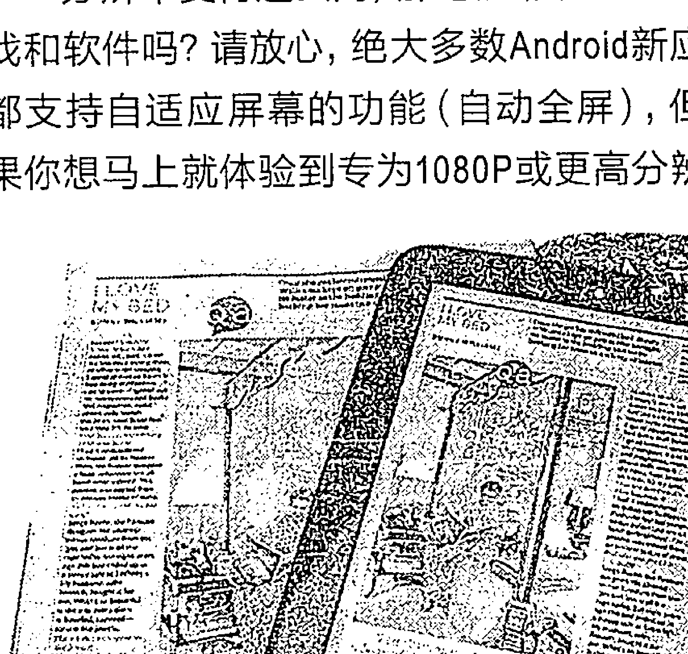

共同期待谷歌Nexus 10的2560×1600分辨率成为主流吧

# 表8： ARM Mali家族GPU性能对比

| GPU型号 | 三角形输出率 | 像素填充率 | 代表处理器 | 代表产品 |
|---|---|---|---|---|
| Mali-400MP2 | 40M/s | 800M/s | 晶晨AML8726-MX | 昂达V811 |
| Mali-400MP4@275MHz | 30M/s | 1100M/s | 三星Exynos4210 | 蓝魔W21 |
| Mali-400MP4@400MHz | 44M/s | 1600M/s | 三星Exynos4412 | 蓝魔W30 |
| Mali-T604MP | 不明 | 不明 | 三星Exynos5250 | Nexus 10 |

# 表9： Vivante GC家族GPU性能对比

| GPU型号 | 三角形输出率 | 像素填充率 | 代表处理器 | 代表产品 |
|---|---|---|---|---|
| Vivante GC1000 | 50M/s | 650M/s | 炬力ATM7029 | 艾诺Hero II |
| Vivante GC2000 | 100M/s | 1250M/s | 飞思卡尔i.MX6 | 驰为V90 |
| Vivante GC4000 | 200M/s | 2500M/s | 华为海思K3V2 | 华为Media Pad 10 FHD |

Vivante GC支持Geforce ULP一样的纹理压缩格式，可兼容绝大部分为NVIDIA Tegra处理器优化的游戏。

# 联发科功能即将普及

关键词： 3G， 4G， 双卡， 联发科

平板电脑的“电脑”决定它的智能特性，但脱离了网络的平板根本不是电脑，这就体现出随时随地联网的重要性。虽然平板电脑标配Wi-Fi功能，但无线热点在国内的普及率相当低下，如果你真的想随时都能发挥出平板电脑100%的效能，3G功能必不可少。幸运的是，联发科已经迈入了平板市场的大门，由此3G也将成为2013年国产平板电脑的一大趋势。

# 下一站 3G

更强的性能和更清晰的视野固然重要，但当我们置于没有Wi-Fi网络的环境时会发现平板电脑的可玩性大打折扣。国产平板厂商自然不能放过如此庞大的潜在需求，而且已经找到了可以帮3G+通话功能的产品做进1000元内的合作伙伴。可以预见，继四核处理器和超高清屏幕之外，3G功能也必将成为2013年国产平板的“新标签”，而且也会直接跳进普及价位。

# 普及3G的催化剂

想为平板电脑赋予3G功能并不容易，背后涉及到复杂的调试和优化过程。比如对平板电脑外壳材质和结构进行改良，确保信号的收发灵敏度等等，让研发实力普遍偏弱的国产平板电脑厂商耗费大把的时间和金钱推广3G平板显然是不靠谱的。好消息是随着联发科在2012年底正式挥师平板领域，终于让低价3G平板成为了可能。2012年底，市场上出现了多款1000元左右支持3G和通话功能的7英寸双核平板，这些产品有着共同的特色，就是都搭载了一颗名为MT8377的处理器(表10)。没错，MT8377就是联发科首款试水平板市场的芯片，也就是其在手机领域主打的MT6577双核处理器的“平板优化版”。MT8377延续了联发科“交钥匙”模式的优点，无需平板厂商自己搞研发，买了MT8377就能实现3G和通话功能，轻松让平板电脑变成“平板手机”。

# 国产平板的江湖

联发科的“交钥匙模式”虽然没有任何技术门槛，但国产平板电脑市场是讲究“江湖”的。如果说联发科靠“交钥匙”服务笼络人心，那瑞芯微、全志和晶晨等芯片商(或方案商)则属于更贴心的“保姆式”，几乎承担了从芯片周边电路、Android系统的匹配优化再到后续的升级服务的全部工作。如果我们仔细回顾一下国产平板的历史，不难发现绝大多数品牌都是伴随这些芯片商的历代产品而不断成长的，长久的合作已经产生了某种默契，派系分明且形成了自己的“江湖”。比如很多瑞芯微的合作伙伴都不会贸然尝试全志的方案，这也是为啥只有联想和纽曼等少数知名品牌才会第一时间推出搭载联发科MT8377方案的平板电脑(它们从手机时代就和联发科合作了)，而更多的MT8377方案产品都是来自类似智想、金星、灵韵先锋等不太知名品牌。

表10： 2013年联发科主力芯片

| 型号 | MT6575 | MT8377/MT8317 | MT6589 |
|---|---|---|---|
| 制程 | 40nm | 40nm | 28nm |
| 架构 | Cortex A9 单核 | Cortex A9 双核 | Cortex-A7 四核 |
| 最高主频 | 1GHz | 1.2GHz | 1.2GHz |
| 最高分辨率 | 960×540 | 720P | 720P |
| GPU | PowerVR SGX531 Ultra | PowerVR SGX544 |  |

MT8317的规格和MT8377相似，也是由MT6577微调而来，目前已经...该芯片应该仅支持2G通话。

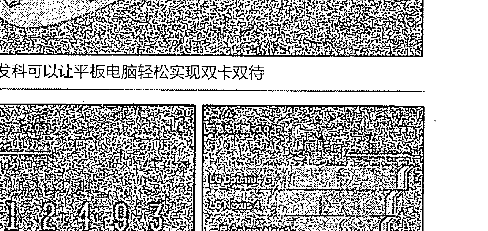

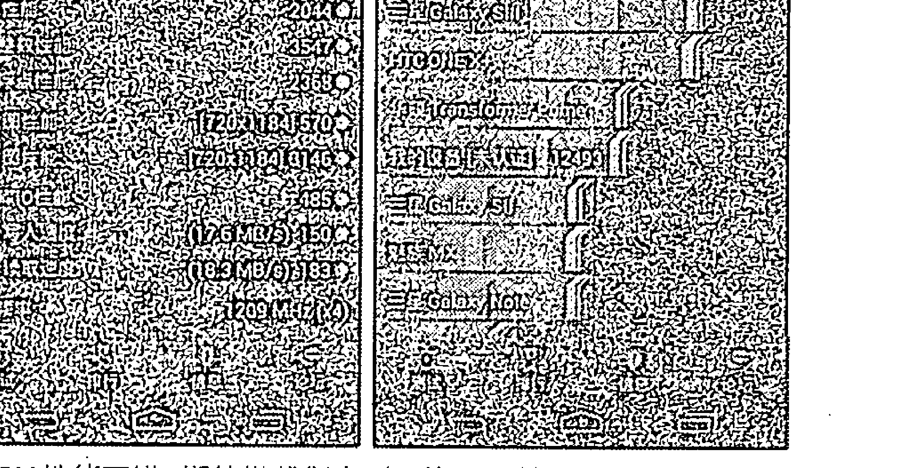

> 小提示
联发科“交钥匙”模式是非常经典的营销案例。简单来说，联发科的芯片就像精装房，业主收拾几件衣服就可以住进去。联发科芯片靠着极高的整合度，将“拿来即用”的精髓发挥到了极致。就MT8377处理器而言，它内置CPU和GPU模块之外还整合了WCDMA/HSPA+的基带芯片，支持3G通话和双卡双待。此外，联发科还准备了自家四合一的MTK6288芯片，可以轻松实现GPS、蓝牙及FM接收功能。

小提示
为了和联发科MT6589竞争，高通在2013年也会推出四款28nm普及型四核处理器：MSM8225Q/MSM8625Q(Cortex-A7架构，集成Adreno203 GPU)以及MSM8226/MSM8626(骁龙S4架构，集成Adreno306 GPU)，它们都内置基带芯片，非常适合用于主流价位3G平板的设计。如果不出意外，2013年下半年的国产平板中或许就能看到它们的身影了。

联发科的影响力和号召力毋庸置疑，MT8377之所以没掀起太大波澜，除了平板江湖的影响之外，其自身性能的不足也是无法回避的问题。待最新MT6589四核处理器衍生出平板优化版后，相信会受到更多的国产平板电脑厂商的青睐，届时也会出现更多不仅限于7英寸的“平板手机”。

# 小结

经过MT8377的试水之后，联发科2013年的平板路应该更好走，也将进一步推进1000元价位四核3G平板电脑的普及进程。可能这些产品无法承载1080P或视网膜这种超高清的屏幕，但就实用性而言已经达到平板“电脑”的高度了。
除了联发科，来自瑞芯微的RK3188也值得我们期待。据悉，RK3188内建高速InterChip USB接口，可以优先用于4G(LTE FDD/TD-LTE)模块，从而实现最高100Mbps下载速度的4G上网。但由于4G模块属于RK3188的选配，所以能否被应用在具体的产品上，还得看最终的成本。不过，待全志A31和瑞芯微RK3188两大阵营全面开展之后，出于差异化竞争的理念，RK3188+4G模块的普及速度可能比我们想象的更快。

# 2013 细节决定成败

关键词：一体机身、大猩猩、AF摄像头

四核的普及让699元的平板也能获得昔日1999元产品才有的性能，视网膜和1080P屏幕的兴起也给了我们更多放弃昂贵iPad的理由。联网功能受到重视也可让平板变成真正的“电脑”。在这些硬件技术革新的背后，2013年的平板还会出现一大趋势，就是从硬件竞赛回归人性体验，从大而全模式过渡到个性定制。因此你会发现，这一年的国产平板从未如此关注细节。

# 细节设计有所突破

除了我们熟悉的10.1/9.7/8.7英寸以外，今年国产平板电脑还会涌现配备全新13.3英寸、9.4英寸和8.9英寸等品类，而且都属于宽屏标准，从而构建了丰富的产品矩阵。但是，目前能实现Retina标准规格的只有9.7英寸屏幕，而1080P标准暂时只有10.1英寸和7英寸，如果你追求更细腻的画面，新兴的屏幕规格可能很难吸引你。

借助最新处理器的春风，国产平板厂商往往会选择新模具与之搭配，由此也引发了国产平板新一轮的做工升级。首先是机身用料的改进。虽然过去一年中就出现了一些引入金属材质的国产平板，但这些产品的金属元素多限于机身背盖部分，与屏幕之间通常还夹杂着一条塑料边框，三者夹杂在一起很容易引起接缝过大、翘边或按压时的咯咯声。

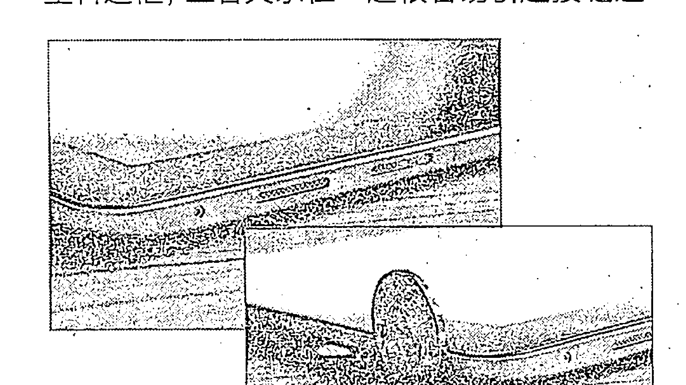

如今，价格稍高一点的国产平板就会改用将金属材质扩展到整块背壳及框架上的一体化设计(如昂达V972)，保证了机身结构的坚固性并极大地提升了手感。

除了机身之外，国产平板的屏幕也正走在国际化的征途之上。比如以酷比魔方U20GT为代表的部分产品已经将康宁大猩猩屏幕作为标配；触屏一体化工艺(将显示屏、触摸屏和微型芯片封装在一块玻璃基板上)也已经被PiPO和普耐尔等品牌所采纳，从屏幕开始进一步缩减平板电脑的厚度。请放心，这两种技术即将在2013年普及，为更多实惠的国产平板所用。

此外，2013年的国产平板将更注重娱乐性，四核处理器的普及为1080P视频录制、高速连拍等炫酷功能奠定了性能基础。因此你会发现只卖几百元的新品都会配备500万像素起步的AF摄像头，一些千元左右的机型甚至会选用背照式摄像头。虽然我们不能指望它们可以拍摄出媲美同级别手机的效果，但至少在规格上已经令人振奋了。

总之，在硬件配置上很难拉开差距的现在，国产平板厂商都清楚只有差异化竞争才是博得用户关注的筹码。因此大家的新品在保持价格优势的同时还会加入更多细节上的优化定制，对我们用户来说绝对算是好消息。

# 差距到底在哪里

虽然在性能和功能上已经赶上了国际品牌，但国产平板电脑依旧存在些许不足。

1.  **系统优化能力**： Android需要针对具体硬件组合进行深度的匹配优化才能保证运行的稳定。比如有些国产平板的屏幕总出现触控太过灵敏的问题，这就是优化经验不足引起的。因此，国产平板电脑出现程序报错和重启死机的几率相对更高，这就要求我们需要经常留意厂商的系统更新信息，及时升级解决已知Bug。
2.  **特色功能开发**： 三星、华硕等平板厂商会针对当前系统进行深度的优化，并安装定制的个性化软件和服务(如三星的S Note)。而国产平板厂商普遍还停留在预装第三方软件上(如优酷客户端、微博QQ等)，仅仅是节省了用户自己下载和安装的步骤，并没有太多实质性的改进。
3.  **优质资源有限**： 国产品牌在议价和资源调度方面不及国际品牌(类似LCD、闪存等优质资源，生产商都会先紧着大品牌)，这就导致部分国产品牌所采用的硬件可能为良品，导致不同生产批次的质量存在差异。2012年7月曾出现过某品牌的“换屏门”事件就是最好的例子。
4.  **售后渠道不一**： 只有昂达等少数品牌有能力在全国主要城市覆盖维修网点，而更多生产Android平板的三、四线品牌则没有足够的售后渠道，这意味着产品一旦出现质量问题，需要将产品寄回厂商原址才能维修。

所谓一分钱一分货，国产平板电脑能在1000元就实现别人2000元产品的性能和功能，这1000元的价差自然会体现在上面的几类缺陷上。不过，国产平板的品质和服务始终在往更好的方向发展，只要尽量不要图便宜选择不知名的山寨平板，就能最大限度避免出现问题。

国产平板电脑的销售渠道相对狭窄，在选购时大家也不必局限在实体卖场或京东等大型的网上商城。多关注这些品牌的淘宝旗舰店，或者多关注大型论坛不定期举办的团购、试用等促销信息，说不定可以帮你节省更多的开销呢。

# 全文总结

2013年，国产平板电脑将以四核为原点，在提供足够强悍性能动力的同时，结合更酷更炫的功能在更低的价位上与iPad和高端Android平板展开竞争。作为数码产品，平板电脑技术的更新换代速度很快，让我们能以最小的开销就能获得出色的使用体验，这就是千元级平板电脑正在做的事情。

当然，尽管产品总在不断推陈出新，但是硬件发展的脚步是永远追不上的。因此理性的购买还是应该在当前的产品中选择最符合自己需要的产品。都知道Cortex A15架构代表最强性能，但等到它普及可能就是明年这个时间了。结合自己的预算和需求，在不同型号的四核处理器、屏幕分辨率和细节功能上加以取舍才是王道。

无论如何，2013年的国产平板电脑市场将呈现出无比繁荣的盛世景象：Retina成主流、四核满天飞、品质变突出、价格更极致。当你拿到本期杂志时，集上述优势功能的新一代国产平板应该已经全面铺货，手握压岁钱或年终奖的你做好迎接它们回家的准备了吗？

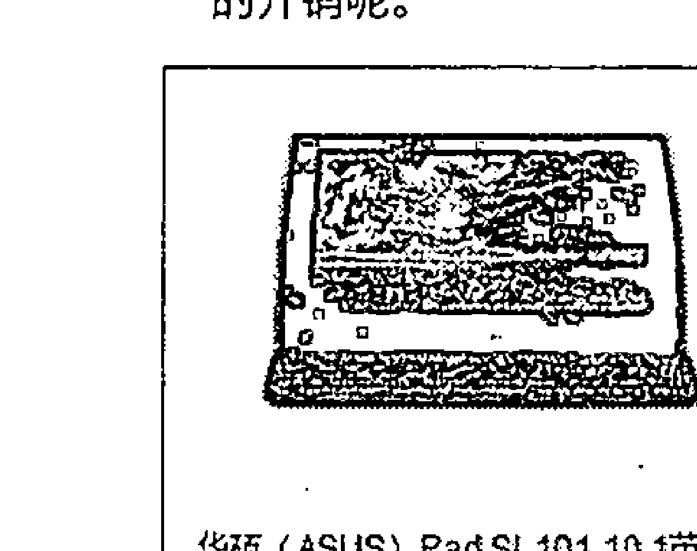

华硕(ASUS) Pad SL101 10.1英寸滑盖平板电脑(Android 4.0 1G 16GB WIFI) ¥1699.00

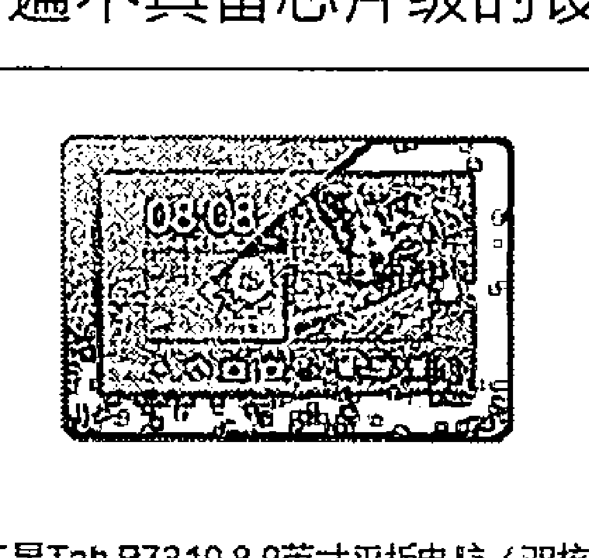

三星Tab P7310 8.9英寸平板电脑(双核 16G存储 内置GPS 蓝牙 wifi 迷你HDMI) ¥1699.00

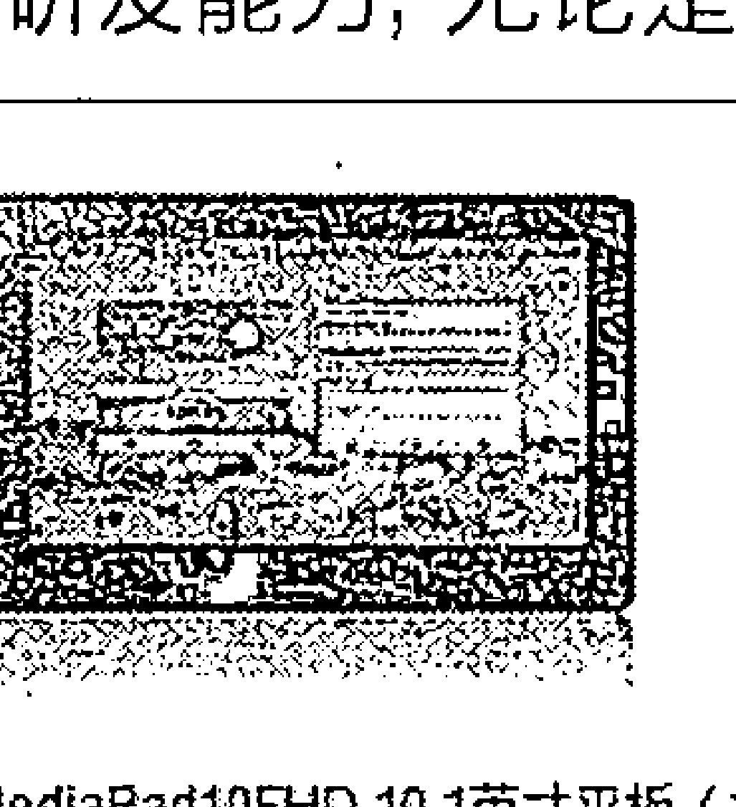

华为MediaPad10FHD 10.1英寸平板(1920*1200IPS 四核CPU+十六核GPU) ¥1999.00

国际品牌的多核产品越来越便宜。

# 隐形欺诈时代的3·15

每年3月15日，全世界消费者都会迎来自己真正的节日——国际消费者权益日(International Day for Protecting Consumers’ Rights)。在中国，3月份也是国内外企业和品牌最紧张的日子，因为他们要接受所有消费者的审核和评价，优秀者将得到认可并且会长足发展，而失败者也将面临巨额损失甚至消亡。术业有专攻，我们无法关注所有消费领域，只在IT圈论事。这个圈子紧随科技前沿，令消费者目不暇接。当然，除了感受最新技术和产品的同时，也同时会遇到越来越多的消费陷阱。每逢3·15，消费者们投诉无门、维权低效等问题就会浮出水面。尤其在网络购物时代，买卖交易根植于纷繁的以电子代码构建的虚拟空间内，商家的“消失”或“隐形”仿佛让网络消费成为了无根的浮萍，更增添了消费者们内心深处的不安。我们能够做的就是将IT圈子中遇到的新问题、新陷阱一一汇报给各位读者，让大家引以为戒，并且利用我们的影响力为消费者讨个说法。

策划 | 《电脑爱好者》编辑部 监制 | 严威川 作者 | 严威川 王健 于晓煜 殷鹏斐 柳絮飞 丁明明

# 硬件篇

# 独立显卡 马甲几时休

读者小黄在2012年11月买了一款采用酷睿i3-3110M + G610M独立显卡的笔记本，商家表示G610M是NVIDIA在2012年最新推出的6系显卡型号，性能比上代GT550M还强。而小黄买回家后才发现，用G610M玩游戏的速度竟然还不如i3-3110M处理器所集成的HD4000核芯显卡，这块被商家称为高端型号的独立显卡纯属鸡肋！早知如此，还不如直接选择没有G610M独显的低配版，还能省下400多元呢。

赵本山宋丹丹早年的春晚小品《钟点工》有句经典台词：“小样，你以为穿了马甲就不认识你了？”如今，这种令人捧腹的“穿马甲”现象，已经被NVIDIA和AMD两大显卡厂商学到了精髓，每年都会上演一番“马甲舞会”。

表1： 桌面显卡马甲型号对比

| AMD桌面显卡 | NVIDIA桌面显卡 |
|---|---|
| HD8350=HD5450 | GT610=GT520 |
| HD8400=HD6450 | GT630=GT430 |
| HD8700=HD7700 | GTX560=GTX460 |

对于不是直接焊死在主板上的笔记本而言，马甲显卡可是会伴你终生的(无法升级，只能直接换本)。可悲的是，马甲显卡在笔记本领域已经乱到一塌糊涂了。

举个最简单的例子，NVIDIA刚刚推出的G710M其实就是上一代GT620M的马甲，而GT620M还是上上代GT525M的马甲。换句话说，G710M也是跨越了三代之久的“经典马甲”。此外，NVIDIA最新的GT730M也只是GT640M的超频版而已。AMD方面也好不到哪去，HD7300M也是跨越三代的马甲(表2)。除了HD7700M，以下级别的型号也均是HD6000M系列的马甲。

表2： 笔记本显卡马甲型号对比

| AMD笔记本显卡 | NVIDIA笔记本显卡 |
|---|---|
| HD7600M=HD6700M | G710M=GT620M=GT525M |
| HD7400M=HD6400M | GT635M/GT630M=GT550M/GT540M |
| HD7300M=HD6300M=HD5400 | GT730M=GT640M/GT650M |

马甲显卡泛滥成灾，我们先将目光放在桌面显卡领域，AMD刚刚发布的Radeon HD8000家族可谓马甲泛滥，几乎都是Radeon HD7000系列的换名版本，其中HD8350的规格竟然和多年前的HD5450一般无二(表1)……NVIDIA方面也好不到哪去，也是马甲横行，如果你没有相关的知识很容易被商家忽悠，用新产品的价格买到重新包装的老产品。

总之，马甲显卡好似隔夜饭，总被显卡厂商炒来炒去。偶尔吃一两次还好，但如果你天天吃隔夜饭，哪怕放了鲍鱼鱼翅，从本质来看依旧是隔夜饭。

## 《电脑爱好者》·合订本 {特别话题}

**扩展阅读**
NVIDIA G92被公认为马甲显卡的“达人”（首发GeForce 8家族）。当年G92的竞争对手是AMD旗下的HD2000/HD3000，但因后者表现不佳，NVIDIA通过改名的方式就完成了从8800GT到9800GT，再从9800GTX到GTS250的三代显卡的升级工作。一个GPU核心横跨三代显卡，马甲的威力可见一斑。

> **编辑点评**
显卡厂商之所以常年贯彻“马甲精神”，归根结底还是市场竞争不够激烈。说白了，就是当某款显卡本身足够出色，而竞争对手的新品不给力时，就会导致老显卡披新马甲并继续服役。马甲本身并不可怕，可怕的是有人会借机卖高价。在这里我们要感谢英特尔（还有AMD最新的APU），从2011年的Sandy Bridge到2012年的Ivy Bridge，其内部集成的核芯显卡已经足以媲美同时期NVIDIA和AMD旗下的入门级独立显卡。据悉，将在2013年面世的Haswell所集成的核芯显卡（移动平台的GT3版）将拥有现役HD4000的四倍以上性能，甚至可以比肩NVIDIA GT650M！
事实上，NVIDIA和AMD也感觉到了来自英特尔的压力，所以纷纷提升了新一代显卡中入门级别型号的规格。如果英特尔没能将核芯显卡融合到CPU内部，可以想象今天的入门级独立显卡将是多么的孱弱。希望Haswell可以惊醒NVIDIA和AMD，不要再让马甲显卡在我们面前晃悠了。

# ❖ 平板 深陷换屏风波 ❖

**█ 事件回放 █**

酷比魔方在2012年8月初进行了双核豌豆U30GT降价999元的促销活动，无论是媒体的宣传还是官方给出的参数都显示U30GT采用了10.1英寸IPS屏幕。很多网友慕名下单购买后才发现，这一批次的很多U30GT屏幕颜色暗淡，整体偏冷、偏淡，发灰，特别是可视角度与此前媒体评测的版本差别很大。

屏幕显示效果是平板电脑的灵魂所在，而IPS屏幕又是保证显示效果的前提条件，因此很多消费者在选购平板电脑时都将“IPS”视为最关键的参数之一。然而，有些平板厂商也抓住了用户的这一心理，在2012年中上演了一出“换屏门”的烂戏。

有网友分析发现，这一批次的很多U30GT都改用了MVA面板，并非官方宣传的IPS，由此引发了很多受害网友的声讨。随后，酷比魔方官方发出声明，称U30GT一直采用两家供应商的屏，大约40%采用的是瀚宇彩晶的10.1英寸IPS屏幕，大约60%采用的是友达光电（AUO）的10.1英寸MVA屏幕。同时用“目前业界均将采用IPS技术的和采用MVA技术的都统称为IPS广视角技术”的观点解释此次“换屏门”事件的无辜。

问题是，既然U30GT有60%的批次都是MVA，为何在宣传上却以IPS作为卖点？而且IPS和MVA面板根本就不是一种东西，所谓IPS=MVA的“业内惯例”，实在让人贻笑大方。虽然酷比魔方后来提供了免费换屏的服务，但由此引发的平板电脑换屏风波至今仍在发酵。

CPU/GPU影响着平板电脑的响应速度，但屏幕的好坏决定着平板电脑的使用体验。自从iPad将IPS视为标准并推广进平板电脑市场的3年后，我们很欣慰地看到如今绝大多数600元以上的国产平板都用上了IPS屏幕。但是，去年的“换屏门”事件却让我们清醒地认识到：有时候此IPS非彼IPS！

就平板电脑“换屏门”事件，酷比魔方不是第一家，但也绝不是最后一家。希望大家能以此为戒，今后再碰到类似事件要学会维护自己的权益。

> **编辑点评**
客观来讲，任何厂家都会在产品定型之后不断修改产品以降低生产成本，但这是需要建立在维持原产品主要性能参数不变的原则前提下。如果产品的修改幅度已经使主要参数性能发生变化，那产品就该重新命名，比如在型号后面加上“豪华版”、“简化版”的后缀。对平板电脑的屏幕而言，如果从三星的IPS面板换成LG的IPS面板，属于同级别供应元件的改变，即使LG的IPS面板成本更低，效果稍逊也在情理之中。但有些厂商却用MVA面板替换IPS面板，并在宣传上偷换概念的做法就实属不该了。所有在没有重新命名的情况下，更换屏幕材质后再以原产品型号继续生产销售，就是欺骗消费者的诈骗行为。国内平板电脑市场的竞争非常激烈，在频繁价格战的压力下，平板内部的组成元件随价格波动而进行调换难以避免，但我们也希望平板厂商可以站在消费者的立场考虑。消费者就是上帝，如果你们连上帝都敢坑，后果很严重。

**小提示**
“屌丝卡”之所以流行，是因为NVIDIA这代GeForce 600系列价格非常坚挺，至今都未降价。

# 超值“公版”显卡

### 事件回放

NVIDIA这代GeForce 600系列显卡自从推出以来就很受欢迎。这时，淘宝上一批低价格公版显卡十分引人注目，凭借公版做工就能满足显卡的散热需求。不过在淘宝上购物始终在质保层面要差上一些，店家也只给出一年的质保周期。淘宝上的这批公版显卡后来被玩家们称为“屌丝卡”，它们拥有不亚于正规显卡的性能。很多购买到“屌丝卡”的用户拿到产品后揭开贴纸，甚至可以在显卡PCB上发现海外品牌的LOGO，可见这批显卡的货源并非正规渠道。

顶着公版散热器、内部元件却缩水的“公版”显卡已经过时了。现如今的“公版”显卡就连DIY老手都难辨真伪。

如果说在淘宝上购买产品质保没什么保障的话，那么大型电商京东商场的口碑就要好很多了。点开京东商城的显卡页面，选择NVIDIA的GTX 680，你会发现销售量第一的是一款盈通GTX680-2048GD5 HA豪华版。打着“纯公版制造，性能卓越，用料扎实，性价比高，用过才知道”广告的这款显卡只卖2999元，比旁边的华硕、技嘉显卡便宜了上千元。

有性价比的产品就是卖得快，这款显卡自从以2999元开卖以来销量扶摇直上，而盈通同样打着超低价公版卖点的GTX 670、GTX 660Ti和GTX 660显卡在京东商城的销量也是名列前茅。不少用户购买后用“最便宜的GTX 680”和“平民法拉利”形容自己的显卡，叫好又叫座。

### 编辑点评

盈通这些显卡基本上都有一个特点，就是显卡金手指部分有一张贴纸，上面大字标注了显卡型号。这张在显卡市场里并不多见的贴纸引起了用户的注意，一部分玩家随手揭开了这张碍眼的贴纸。奇迹发生了，藏在贴纸上面的LOGO是著名的海外品牌EVGA的标志。一个品牌的产品上出现其他品牌的LOGO，是一件非常不可思议的事情。之前在淘宝上出售的“屌丝卡”就曾经有过EVGA的标志，不过那些产品并非走正规渠道，很多用户就是图便宜，也不在乎显卡的来源。但是京东上的商品理应都是正品行货，EVGA虽然是海外大品牌，但是在中国地区并没有任何加工或零售业务。虽然来源可疑，但是显卡毕竟还是很有性价比。虽然心里不舒服，但多数用户也就睁一只眼闭一只眼了。也有些用户喜欢刨根问底，就此事询问了京东商城和盈通客服，得到的回复均是官方的机械式回答：“您好！此为纯公版显卡，NVIDIA官方显卡等等。”至于盈通显卡怎么就变成了EVGA呢？看来也只有官方自己知道了。

# 无良商家赚钱有“道”

### 事件回放

小耿喜欢大屏手机，经过多方衡量后他看上了三星GALAXY Note 2，然而苦于行货价格太贵，所以小耿决定入手价格便宜1000多元的水货韩版机器。之后，小耿发现新买的三星GALAXY Note 2手机待机时间有时候连一天都撑不住，用了几个月后他发现机器电池越来越不耐用，无奈之下只好再花100元购买了移动电源。

很多玩手机的朋友都喜欢追逐最新的机型，一旦国外新机上市就急不可待，而这时候流入市场的水货手机变成了他们的第一选择。虽然能够及时“尝鲜”，但是遇到的质量问题也非常多，主要集中在手机电池上。

### 编辑点评

虽然说目前智能手机的待机时间短已经是众所周知的事情，可一天充电两次还是有点夸张。而小耿这种情况极有可能是中了无良商家的“偷梁换柱”之道。现在手机价格越来越透明，很多无良商家想要在手机本身谋取暴利越来越难，所以就开始动起手机配件的歪脑筋，像更换手机原装电池就是最为常见的手段。因为更换电池在用户验机过程中很难发现异样，所以无良商家的这种手段也是屡屡得手。此外除了更换配件外，克扣原装配件的情况也很常见，像韩版GALAXY Note 2机器本身都是标配双电双充，而且还会配备原装手机皮套，但用户购买手机基本都是单电单充，皮套也不见踪影，而多出的电池和充电器以及皮套就是被商家扣下单卖了。另外需要提醒大家的是，偷换配件的手段在手机维修时也常有发生，很多私营手机维修店会在客户不注意的时候将机器原装的电池或者主板等主要配件更换为高仿货，将更换得到的原装配件单独出售，所以建议大家在维修手机时最好找官方客服维修店。如果是在私营维修店维修手机，一定要监督维修人员的整个操作过程。

# 淘宝篇

## 揭秘利用“退款”来行骗

### 事件回放

在某家商铺，买家看中了一款手机，成交价2000元，买家拍下后付款。此时，卖家突然说手机赠送的配件缺货，可以给买家优惠200元，需要马上申请退款200元。面对不需要赠品而可以优惠200元的优惠，相信很多人会动心，马上会去申请退款，如果你这样做了，那你就步入了卖家设计好的欺诈陷阱之中。

一个正常的淘宝交易，无非就是拍下商品→付款→卖家发货→买家收货→双方好评这几步。对于交易中可能出现的因为商品不齐而发生退货或退款等流程不了解，而这也给行骗者留下了可乘之机。

要想了解这个欺诈的内情，首先我们得了解支付宝的退款步骤，通过退款页面我们可以看到，退款时首先会让买家选择是否收到货。

当然还会有另一种情况，卖家突然又说，这个缺的配件可以调货补齐，如果你确实想要，那我帮你放到包裹里去，你撤消退款吧！于是买家撤消退款，货款自动打到卖家账户，卖家拿到货款2000元逃之夭夭，买家一分钱都没剩下，货物也没有收到，被骗2000元。

如果你选择未收到货，理所当然的要全额退款，页面中没有退款金额的自由选择项。而如果你选择了已收到货，那卖家确认退款，货款就会自动打到卖家账户。卖家拿到货款1800元逃之夭夭，买家拿到退款仅有200元，被骗1800。

> > **编辑点评**
>
> 仔细想想，就能想出来骗子的行骗手段了：你既然亲手选的已经收到货了，申请退款一部分，剩下的款当然会打给卖家了。也就是说你确认收货了。所以，买家在货物还没影的情况下就申请“收到货，但要求退款”这一步，就是把自己逼进了死角。
>
> 在“退款”诈骗的案例中，骗子的骗术其实也不怎么高明，不过就是利用大部分人都不怎么了解退款这一程序。其实付款之后价格要再变动，还有很多其他的方法，比如东西拿到手之后再申请退款（有诚信的卖家都会推荐这个方法），或者制作一个页面让对方拍下，或者关闭这个交易另外发起一个交易。总之一句话：只要按照淘宝的交易原则，就不会“钱货两空”！
>
> 不过既然受骗了，当然还是要尽力去维权。

- 1. 到“我的淘宝→已买到的宝贝”，找到对应交易后点击“投诉维权”，然后在跳出页面发起“未收到货”维权。
- 2. 到“消费者维权中心”点击“我要发起维权”按钮，在跳出页面找到对应交易后点击“投诉维权”，然后选择“未收到货”维权。
- 3. 如果数额比较大，建议最好是电话联系一下淘宝客服，能马上冻结骗子的支付宝最好，然后再慢慢维权。

最后切记：如果交易需要选择部分退款，一定是在收到货以后再操作！！！

# 网购低价要注意

淘宝搞促销的时候，经常看到商家搞一元“白菜价”包邮秒杀之类的活动。当然有真的，但是更多的是商家的一种欺诈行为。诸如0.01元包邮、1元包邮等等，虽然产品价值不高，但稍微动一下脑子，物流、人力、产品、包装等加上去都是成本。卖一件，就亏几块钱，要是1千件、1万件呢？他们图的是什么呢？首先来看看怎样识别商家的这些招数。

1.  价格必须离谱，连邮费都不够，“白菜”到一种境界。

2.  商家信用通常为个位数，当然也有少量不是个位数的例子，因为带钻的店铺也是可以用很低的价钱买到的。

3.  销量必须巨大，评价很可能为0。

4.  商家一定会说，发货别催，月底发货，不能等者勿拍，旺旺爆了，没时间回复。

最后，总结一下，如果你发现了，或者被发现了这样的“白菜”神价，还是离远一点吧，记得天上不会掉馅饼就好。

也许读者会好奇，卖家这么做图的是什么呢？说到底无非就是数据和营销手段。先说套取买家数据。其中就有这样一个店铺，店铺只有一个宝贝：一件印有保钓字眼的T恤。标价2元秒杀，短短一小时内，各大卖家群传播沸沸扬扬。看热闹的去拍，真心要的去拍，研究店铺的也去拍。人气、排名上去了，很多正常买家也去拍，1万件销量很快就出来了。3小时不到，销量已过了8万件。之后，之后店铺就没了。很显然，卖家肯定是不会发货的。这不是重点，重点是有8万多拍下付款买家。

这意味着什么？意味着这个卖家3个小时可以导出8万多买家资料，而且这顾客资料是很精准的。姓名+旺旺+地址+区域+电话+性别等，再细分一点，利用软件还可以分析出买家购买力。这8万多买家至少他会上网，至少他有淘宝账号，至少他属于网购人群。这对于做营销资料分析来说，很是精准了，总比那些给我打电话让我买生育险的强不知多少倍。有了精准数据，不管你是卖资料还是自己消化，都是钱。想想你办了信用卡，是不是发现广告短信、电话多了？哈哈，一个道理。要是我一天做一个这样的营销？一天做十个呢？太可怕了。

接下来再谈谈侥幸心理吧。对于8万多单，而且还是低价，诸如几元甚至1元。很多顾客可能会忘记申请退款，而卖家在店铺没封之前就点发货或者即使封了，用支付宝也可以发货。我们知道，淘宝实物在十天之后是自动确认收货的，很多人忘记有效期内申请退款，钱也就到卖家支付宝账号了。店铺被封了，没事。店铺多，不缺这个，支付宝安全就行。

再说说不发货，积攒人气吧。也可以说算是一个比较高级的刷单形式。分为两种形式：一种是“主动”找人刷，一种是低价“被动”让顾客刷。主动找人刷销量，其实就是自己产品本身就有一定销量，找人刷个自己所需要爆款成型的剩余销量。这个要根据自己的流量、转化、打算做爆款的销量需要来做。然后不发货，不发货没人投诉是没有问题的。现在销量有了，然后随着自然流量和广告投入，正常销量慢慢上来，然后之前刷的销量慢慢去退款，总的销量慢慢抵退（总销量、比例控制），这个自己去核算，然后就没有然后了。自己领悟，目的已经达到。方法人想，思路就是这个。

而低价“被动”让顾客刷，其实这个营销很多正规店铺也做，而不是一锤子买卖，只能说是走淘宝Bug。做这个火了就等于做一次给力活动嘛。先从淘宝规则开始说起。我们知道，集市店不发货，淘宝5%处罚。100元东西，我1元做秒杀，5%处罚多少钱，你们知道。再说销量，顾客拍下付款，单品就有了销量记录，对吧。销量够了，人气上去了，排名也达到自己想要的效果。够了，此时恢复折扣价继续热卖，这时候就是回报的时候。

这种玩法，要把握尺度，尺度不够，被淘宝玩；尺度够，玩淘宝Bug。这个就要你好好策划咯，我只知道有个线下品牌的天猫旗舰店成功做过一次。对于这种，淘宝小二也坦言没有办法。充其量就是退款率上升。我们知道，现在退款率已经对店铺没啥影响了，包括官方活动申报、搜索排名。

这个核心因素就是要控制顾客投诉率，事前做好准备，顾客拍下付款后要与顾客一一沟通。找缺货、实体店售罄啥的，理由合适，这个也是可以解决的。就算你投诉，自己核算好，前多少名发货，或者怎么的。事在人为，再说缺货顾客还有补偿，虽然不多，但从心理学上讲，一般顾客会找到心理平衡的。

当然这种活动，难免会碰上职业差评师。这个风险和其他活动一样，都是存在的，只是概率问题。相信一般卖家会有对策，该付出代价就付出代价。这个是普通现象，不是个别现象。

- 首先网友们会说，这种白菜价值得尝试，原因包括：
    1.  有支付宝作为保障，钱即使付出去了也不会到卖家手里，我能亏什么？
    2.  即使亏也就是几块钱，不怕搏一下。
    3.  卖家不发货，我投诉到底，看你能不能折腾过我。但实际情况要恶劣得多。

众所周知，淘宝的搜索结果排序与商家的销量有关，同一件产品，哪家卖的多，哪家就容易排在前面。这样很容易形成良性循环，卖得多的会卖得更多。无疑双12会给淘宝带来巨大的流量，这些商家在双12之前，通过设置极低的价格，带来一波海量销量，待排到前面后，再把价格提上去，后来的网友仅能看到“哇，这货卖了这么多，看起来很不错”，而未必会去查询或能够查询到之前卖出的价格。这样可以带给商家一批巨额利润的订单，而这批订单的多寡，将决定卖家最终是否能给之前的白菜价发货。来看最理想的情况A。

> 一个成本5元的指甲刀，发货成本5元，实际成本10元。卖家在初期以1元的价格卖了1000件。销量冲上去后，再设定价格为20元，又卖了1000件。这样这2000件总共成本为20000元，而卖家获得了21000元，理论上这个商家是不亏的，有可能前面那1000位网友就赚了。

而实际上，情况A是很难发生的，因为现在互联网传播渠道广泛，类似的1元白菜很容易被迅速传播，而且很多网友一个订单就是几百上千份，这样很可能前期比后期订单量更大。根据前面的算法，后期卖家通常要几倍的成本，才有可能完成这个操作，这时候即使淘宝有流量也未必能转化成销量。因此更多的是情况B。

> 一个成本5元钱的指甲刀，发货成本5元，实际成本10元。卖家在初期以1元的价格卖了5000件。销量冲上去后，再设定价格为20元，又卖了1000件。这样这6000件总共成本为60000元，而卖家获得了25000元，商家会采取如下操作，将前面的5000件全部拒绝发货并退款，后面1000件发货，并用10000元的成本得到了20000元的销售收入，纯赚10000元。

当然也有可能结果更极端一些，会发生情况C。

> 初期即产生海量的订单，商家已无法控制后续操作，直接关店了之，网友得到了退款，但便宜一点都没赚到，空欢喜一场。

或者是情况D。

> 商家未发货，但把所有商品都点击发货，然后会有很多网友忘记了这回事，等到收货确认期截止，订单自动确认付款。商家仅靠这批粗心的网友也能获得几百上千个有效完成订单。

如果仅是以上几种情况，对网友们来讲还算是幸运，因为，很可能最终的结果是情况E。

> 一部分不良商家会用这样的办法，以包邮白菜价获得海量的订单，用户支付宝付款后，卖家可以获得海量（几千条甚至几万条）准确有效的用户收货地址，虽然后面交易取消款项退回，但这批用户名、地址、电话就被不良商家白白得到了。后面的事情就不是用户能控制的了，个人信息可是会被卖来卖去的，哼哼......

所以，上面网友们自欺欺人的三个原因都不成立，首先即使有支付宝，你的钱没有损失，但信息会损失。第二小钱可能会带来大损失。第三卖家有可能直接撤了。切记一点，天上不会掉馅饼，Bug价连大电商们都不得不砍单，何况淘宝卖家呢？要实现上面的情况A，得有多少不明真相的群众高价上当，才能成就前面的好事，这现实么？

此类行为，似乎严密无缝、滴水不漏！但是搅黄了淘宝的声誉，欺骗了消费者，绝对属于不正当的市场行为，我们只能希望淘宝能及时发现并且及时处罚此类店铺。

## 软件篇

## 找不到下载的下载网站

如今网页上比较流行的一种骗点击的方法，就是下载欺骗，主要有四种方式。

### 方式一
鱼目混珠

这是最典型的一种方式，在下载页面中布满了陷阱，到处是似是而非的下载按钮或链接提示，点击后才大呼上当。我们以国内知名的下载网站“天空下载”（http://www.skycn.com）为例，打开它的首页，非常清新干净。接着，随便查找一款软件，比如我们搜索“goldwave”，可以搜索到4条相近的结果。至此还算顺利，随便挑选一个结果点击链接（本案例中为：http://www.skycn.com/soft/1882.html）进入下载页。

面，迎面一个大按钮显示“立即下载”。不过仔细看一下，才会发现左侧有不明显的提示，这其实是另外一个软件的下载按钮，右下角一个突出的“立即下载”，如果翻页就会发现它也是其他的软件下载。

往下看，才有一个不起眼的“下载地址”按钮，点击后，跳转到下载地址列表，左侧依旧能看到其他软件的大大的“立即下载”提示。

像天空下载这样国内主流的下载网站，还算有所顾忌，虽然将一些无关下载做得特别显眼，容易误导用户，但毕竟最终还能正常下载到软件。而更多的一些无名小网站，还会在毫无提示的情况下直接误导下载者，令人防不胜防。

### 方式二
关闭打开
广告页

国内另一大下载网站“华军软件园”（http://www.onlinedown.net），同样也有类似的“鱼目混珠”的问题。在测试时还发现另外一个问题，打开下载页面后，首先会弹出一个广告窗口，并显示倒计时，暗示不想看广告的人可以手工提前关闭它，但是在点击其上的关闭按钮（X图标）后，它反而会弹出一个新广告窗口。

作为知名下载网站，华军软件园还不算太过份。现在网上充斥着大量的这种显示可关闭而实际会在关闭后打开其他网页的做法，尤其是各类网游广告横行。

有些网站，利用人们迫切寻找某款稀有软件的心理，为了骗点击，故意制作一些下载链接，等用户下载完之后才发现根本不是自己所需要的软件，甚至还是恶意病毒软件，令人防不胜防。

### 方式三
李代桃僵

这也是一种骗点击的常用方法。大的下载站有所顾忌，一般的做法是让用户通过多次点击才能达到最终的下载页面。而有些小网站，因为无所顾忌，有时会采用非常恶劣的循环跳转的方式，在用户点击跳转了N次之后，发现又回到原始位置，根本就没有可下载的内容。

### 方式四
循环跳转

## 手机病毒防不胜防

### 事件回放

春节前李女士看到自家楼道墙上贴着一张二维码图，上面写的是只要用手机扫描二维码可以获得家乐福购物优惠券，使用该优惠券在春节前去任意一家家乐福超市购物可以享受7折优惠。
看到如此好事，李女士不加思索就掏出手机扫描了墙上的二维码，结果刚扫描结束手机便出现了自动重启现象，等机器重新启动后李女士便收到运营商发来的短信，提示自己的手机话费余额不足，需及时充值。李女士这才意识到自己上当了，手机里的100多元话费已经不翼而飞。

### 编辑点评

Android手机系统的开源提升了娱乐性和便捷性，同时也为一些不法人士提供了敛财的平台，他们通过手机病毒骗取用户的手机话费甚至造成用户手机无法使用。
李女士也是想要贪小便宜所以才中招了，楼道墙上所贴的二维码信息根本不是所谓优惠券，而是恶意吸费软件，李女士扫描后手机便自动安装了该吸费软件，然后通过手机的重新启动使软件运行从而达到吸费的目的。这种通过二维码的方式在用户手机上安装病毒软件是目前比较新鲜的，除此之外，不法开发者还可以通过在刷机包内内置手机病毒或者将第三方Android市场中热门的应用进行篡改从而将手机病毒内置。
对于普通用户来说，笔者建议大家不要随意刷手机第三方ROM，也不要在第三方手机市场下载安装应用程序。大家最好使用手机自带的系统，安装软件也从谷歌市场或者厂商内置的官方电子市场下载应用安装。此外，李女士的事件也再次提醒大家，天上不会掉馅饼，小心贪小便宜吃大亏。

### 写在最后

3·15不仅仅是为消费者讨说法，而且是鼓励每一位消费者变成监督员，对企业、品牌、商家时刻监控。这并不是刻意的找茬，而是培养消费者分析和维权的意识。其实相信很多读者已经意识到，多数损害消费者利益的伎俩和陷阱并非有很高的技术含量，只不过很多是因为人们认为是“小事”而被忽略，从而逐渐衍生成为坑害消费者利益的大事。我们本期挑选的一些事件和案例都具有很强的实效性，那些每年都在不断重复的案例在这里不过多赘述，因为新鲜案例是今后维权的重点。这里也希望各位读者为我们积极提供事件线索、维权经历等一手资料，我们会第一时间进行报道，并且尽我们最大的努力为消费者讨个说法。

## 当生活遇上云同步

大多数人认为云计算离我们的日常生活很远。其实，云计算已经渗透到我们生活和工作中的方方面面，尤其是云同步，更是目前必不可少的应用技术。我们每天都可以用云同步软件做什么?又有哪些你未曾想到过的环境可以使用云同步呢?不妨跟着聪明的一休一起去看看他的解决方案吧。
一休是著名的动漫人物，以头脑聪明、善于解决疑难问题而著称，不少朋友从《聪明的一休》上见识过他的风采。但你知道吗?一休的聪明劲儿也与时俱进，不仅能解决日常生活中的问题，而且就连电脑、智能手机这些现代化设备中经常出现的问题，他也一样能解决。不信?请往下看。

策划 | 《电脑爱好者》编辑部 监制 | 殷鹏斐 作者 | 盖述功 俞木发

### 第1集 将军的日程同步

军务繁忙的将军足利义满为了便于日程管理，在手机安装了一款日程管理软件，不曾想这款应用只能在单一设备中查看日常安排，无法在手机和PC间实现日程同步，于是便屈尊向一休请教来了。

这个问题用Google日历、365日历都能解决。不过，由于Google日历实现起来比较麻烦，且服务器远在国外，同步速度较慢且不稳定，所以这里我推荐使用“365日历”这款手机应用来解决。

#### 电脑端使用

这款工具需要分别在手机和电脑中进行设置。先说手机端设置。安装后运行程序，在出现的登录界面中单击“注册”按钮，进入相应的页面，按提示输入相应的信息注册成为其用户并登录，然后在其主界面中，点击“新建日程”按钮，打开相应的对话框，在这里，可以对日程的执行时间、内容、是否为全天事件及具体的提醒时间等进行设置。设置完毕，单击“完成”按钮（图1），当前日程的编辑工作就完成了。

以后到了指定的时间后，程序就会以声音和提示文字两种方式予以提醒了。而如果我们新换了PC或在用他人的电脑上工作也没关系，我们只需在该PC重新安装程序并以同样的用户名登录，相应的日程就出现了，非常方便。当然，如果不想重新安装程序的话也简单，我们可以登录到http://www.365rili.com/网站查看相应的日程安排信息，或者对日程进行编辑和修改（图2）。

#### 手机端使用

目前，365日历支持的智能操作系统包括Android和iOS等，换句话说，只要我们在PC端、智能设备端同时安装该软件，并用同一个账户登录，就能轻松地在各设备间实现日程同步。

安装并启动程序，在出现的主界面中，点击屏幕下方的菜单按钮，选择“点击登录”项，打开“账号管理”对话框，在其中输入365账号和密码等信息并登录，我们在PC端或网页中设置的日程就会同步到手机365日历中（图3）。

在手机端，我们同样可以通过点击“+”按钮，方便地添加新的日程，或通过点击插件管理按钮，打开“插件管理”界面，选择下载安装相应的插件，以便能让程序更好地为我们服务。比如，我们可以选择安装“待办”插件，以实现待办事项的添加和编辑功能，或者安装“活动”，以实现活动事项的添加和编辑等（图4）。

### 第2集 秀念与音视频同步

一休的大师兄秀念上传了N多自拍的视频到网盘，希望引起网友的关注。没想到各路网友并不买账，观者寥寥，秀念的心情变得异常郁闷。

#### 用网盘实现在线视频点播

至于百度和115网盘哪一个更适合，我们先来比较一下。百度网盘和115网盘都提供了在线视频点播功能，同时支持WEB端和Android端视频点播，而且使用方法极其简单。以在百度网盘的WEB端点播为例，我们只需下载安装百度影音作为其WEB端播放视频的必备插件，以后就能像观看优酷网或土豆网中的视频一样，通过双击网盘中的视频进行观看了（如果是在Android手机或平板中点播，需要在点播视频后手工指定要使用的播放器）。

#### 百度网盘和115网盘视频点播的差异对比

| | 百度网盘 | 115网盘 |
|---|---|---|
| **WEB端** | | |
| 是否需要安装播放插件 | 需要 | 不需要 |
| 对于上传的文件是否需要转码 | 不需要，可即传即看 | 需要，否则不能正常观看 |
| 视频清晰度 | 原画品质，十分清晰 | 由于需要后期转码，所以在清晰度方面则相对较差点 |
| 点播服务是否免费 | 免费 | 收费，10元/月 |
| **安卓端** | | |
| 点播机制 | 采用了断点式缓冲方式，所以缓冲速度较快，缺点是进度条跳转功能基本上会失效 | 采用了类似于迅雷云点播的点播模式，可任意调节进度，但相对而言，加载的时间要略长 |
| 视频清晰度 | 十分清晰，特别是其提供的原画模式，更是可以直接在手机上播放高清视频文件 | 清晰度略差，有待提高 |

通过上表我们不难看出，115网盘的视频在线点播功能，相对于百度网盘来说要稍微弱一点，特别是10元的收费，数额虽然不大，但对于习惯了享用免费午餐的朋友来说，仍然是阻碍他们在视频点播方面向115靠拢的一个重要因素。

其次，115网盘对于刚上传的视频，需要先转码然后才能正常点播的这一设计，也成为了它的一个明显短板，因为在实际使用的过程中我们不难发现，该转码过程并非瞬间完成，而是需要一定的时间，这在视频文件较大的情况下尤其突出。同时，如果用户在相近时间内上传的视频文件较多的话，后来者上传的文件需要排队等候处理，极其不便。

所以至少就目前来看，我们在选择视频在线点播网盘的时候，应更倾向于百度网盘，而不是115网盘。当然喜好因人而异，我们这里所说的仅为一休的一家之言而已。

#### 播放列表及进度云同步

“那么，我能不能把网络电视、网络音乐盒播放列表中的内容同步分享给朋友，让他们也能观看这些内容呢？”解决了一个问题，秀念又提出问题。“这个问题很简单。”一休说，“目前我们常用的音视频在线播放器中，都提供了播放列表同步功能，只要愿意，我们可以随时将其分享给朋友，或者在手机端、PC端和平板电脑中同步观看。”

先说视频播放器，无论是PPTV、暴风影音还是PPS影音，其实都在其PC端、Android端中提供了同步播放列表及进度功能，当然，前提是我们已注册成为其用户，并以同样的账号登录了相应的客户端。由于这几款网络电视的云同步功能及操作相似，所以下面我们仅以PPTV为例来说明一下。

启动PPTV，单击界面左上角的PPTV徽标按钮，在出现的菜单中选择“请登录/注册”命令，打开“登录”对话框，单击“我要注册”文字链接，按提示输入相应信息注册成为其用户并登录，以后，我们添加到播放列表中的视频文件及当前的观看进度，就会自动同步到PPTV的服务器中，具体的列表详情，可通过单击界面左上方的用户名按钮，打开“我的视频”页面，然后切换到“观看记录”标签来查看(图5)。

同样，在Android端中登录PPTV，点击界面下方的“个人中心”按钮，打开“个人中心”页面，选择“最近观看”，在出现的界面中切换到“网络记录”标签，我们同样可看到最近看过的视频记录。这当中就包括PC端的播放列表、播放进度以及在手机端欣赏过的视频、进度等（手机端欣赏过的视频及进度等也将同时同步到PC端）。而且比PC端的“观看记录”更为人性化的是，在这里除了可看到视频名称及进度外，还可看到该视频先前所用的观看设备，是来源于PC客户端还是来源于手机端等（图6）。

### 音乐播放列表同步

音频播放器也大都提供了同步播放列表功能。目前比较流行的几款音乐盒（如酷狗、酷我和QQ音乐等），都可实现不同客户端的音乐同步功能，不过，和酷我音乐盒、QQ音乐盒不同的是，酷狗音乐盒除了可同步网络音乐列表外，还可同步本地音乐列表，功能比较强大，特别是当我们在手机端或PC端的存储设备中收藏了什么比较冷门的、不易找到的音乐资源时，这一功能就显得相当有用了。所以我们下面就以它为例，说说基本的操作方法。

首先我们要在酷狗音乐盒的主界面中，点击左上方的“登录”按钮，打开相应的对话框，然后单击“注册账号”文字按钮，注册成为其用户并登录。接下来，我们就可以将喜欢的音乐列表添加到“网络收藏”中，以享受惬意的云同步服务了。

在酷狗主界面中切换到“网络收藏”标签，右击列表空白处，在弹出的右键菜单中选择“新建收藏”，在列表中添加一个收藏，并根据自己的需要为该收藏命名，如“古典音乐”或“流行歌曲”等。最后右击该收藏，在弹出的右键菜单中选择“添加歌曲”或“添加本地歌曲文件夹”（图7），即可将选择的音乐添加到该收藏列表中了。

以后如果要在手机中欣赏“网络收藏”中的音乐，只需用同样的账号登录程序，然后在主界面中向右滑动手指，调出相应的侧边栏，依次选择“我的音乐→网络收藏”（图8），相应的收藏就出现了。接下来没说的，选择好要听的收藏，戴上耳机静静地欣赏即可。

### 搜狐视频播放记录同步

首先应该指明的是，搜狐影音为PC端和Android、iPhone、Windows Phone等手机端提供的客户端名称并不一样，其中PC端为“搜狐影音”（下载地址：http://tv.sohu.com/app/），而手机端为“搜狐视频”（下载地址：http://tv.sohu.com/app/）。二者之间可以轻松地实现播放记录同步。

启动搜狐影音并登录（不是搜狐注册用户的朋友，可单击主界面右上方的“登录”按钮，然后在出现的登录界面中单击“注册账户”按钮进行注册。除支持搜狐账户外，搜狐影音还支持以新浪微博、QQ及人人等账户直接登录），以后我们在搜狐影音欣赏过的在线节目列表及进度，就会自动同步到搜狐服务器中。

这样，当我们在其他PC中想继续欣赏先前看过的节目时，只需在该PC中安装搜狐影音并以同样的账户登录，然后在程序主界面中单击“播放记录”按钮，打开相应的列表并切换到“云端记录”标签，相应的节目就会出现，双击播放即可（图9）。

同样，在手机端的主界面中，点击左下角的“个人空间”按钮，打开“个人空间”界面，选择“播放记录”项，在出现的“云记录”界面中，可看到播放记录，选择要欣赏的视频，该视频即会从上次观看到的地方继续播放了。

> 小提示
除了播放列表及进度同步外，搜狐影音还提供了一个“上传”同步的功能，利用它，我们可轻松地将本地PC或手机中的视频上传到搜狐服务器中，然后在任何一台可上网的设备点播欣赏。上传的方法很简单，以PC端为例，在程序主界面的上方单击“+”按钮，然后在出现的菜单中选择“上传”命令，切换到相应的界面，单击“上传视频”按钮，选择好本地视频并确认即可。出于对个人隐私的保护，对于上传的视频，我们可选择共享给所有人，也可以选择只允许自己观看。

### 第3集 小叶子与闹钟数据同步

小叶子是一休的好朋友。小叶子的爷爷身体不好，她便给爷爷买了一个手机，设置闹钟提醒他按时吃药。可爷爷在操作手机时，经常因误操作修改了闹钟设置。无奈之下，小叶子找到一休，让他帮助解决这个问题。

小叶子的这个愿望很简单，我们只需借助一款能够将数据同步到云端的闹钟应用就可以了。

整个操作分为三步。首先安装并启动正点闹钟，在出现的界面中点击“进入我的闹钟”按钮，进入程序主界面，点击右上方的头像按钮，在出现的界面中点击“注册”按钮，按提示注册成为其用户并登录，然后在接下来的“我”界面中，开启自动同步功能。

接下来在正点闹钟设置提醒的方法。比如，我们要设置一个起床闹钟，可以在程序主界面中点击“添加新提醒”按钮，然后在出现的菜单中选择“起床闹钟”，最后在出现的设置界面中，根据自己的需要设置好闹铃时间、响铃周期、铃声和闹钟标题等信息，再点击“保存闹钟”按钮即可（图10）。同样，如果我们要设置一个提醒吃药或看电视剧的闹钟，也只需在“添加新提醒”菜单中点击“自定义”，然后在程序主界面中添加新闹钟，用与上面类似的方法设置即可。

从此以后，我们在闹钟中的相关设置，即会自动同步到正点闹钟服务器中。当我们新换了手机或刷机以及修改设置后，只要在某一手机上重新安装该应用并以同一账号登录，那么相应的闹钟数据就会同步到新手机或新系统中，小叶子再也不担心爷爷修改手机闹铃设置了。

### 第4集 桔梗店老板与多网盘同步

桔梗店老板经常通过放高利贷谋取暴利，做梦都担心有人把那些欠账单偷走，为此不惜下大功夫，把每张欠账单拍成照片，上传到网盘上保存。又担心一个网盘不牢靠，便申请了多个网盘。这样一来麻烦出现了，每天要同时上传文件到多个网盘。

把文件同时同步到多个网盘，可以用ES浏览器来实现。它支持包括快盘、百度网盘、酷盘、SkyDrive等多个网盘。比如在旅行中使用手机拍摄时，就可以使用它的多网盘同步功能实现多云聚集。

在手机上安装ES浏览器后，在地址栏切换到网盘，然后点击“菜单→新建”，可以看到按提示选择自己需要的网盘，如快盘和SkyDrive，点击登录并授权，即可成功在ES浏览器添加多个网盘。

以后如果我们要将出门在外的照片同步到网盘，在ES浏览器界面切换到本地SD卡，按提示选择需要上传到网盘上的照片，长按选择“复制”，然后打开添加的网盘依次进行“粘贴”即可（图11）。

这样我们回到家里后，就可以打开快盘和SkyDrive直接查看其中的照片，轻...又到了樱花盛开的季节，一休的妈妈十分想念儿子。以往二人都是靠网络相册互享照片，如今妈妈萌生了一种前所未有的想法——找一种工具将数码相机或手机中拍的照片自动上传到服务器中，并可轻松与一休分享，达到类似于即拍即传、现场直播的效果。

## 自动上传数码相机或其他USB设备中的照片

在PC端安装酷盘客户端并启动，以后当我们想将数码相机、U盘或SD卡等移动设备中的照片上传到酷盘中时，只需将这些设备插入PC，酷盘就会自动检查其中是否有照片存在。如果有，则会弹出对话框（图12），此时，我们只需单击“导入酷盘”按钮，里面的照片就会被上传到酷盘的“导入的照片”目录中。

项进行设置（图13），比如，我们可以让酷盘只在电量不低于80%和Wi-Fi环境中上传照片。

## 轻松与好友分享照片

照片上传到酷盘后，如果我们想将其和好友分享，无论是在手机端还是PC端中，都可通过简单的操作来实现。以PC端为例。

由于酷盘和快盘的操作方法相似，所以下面我们便以酷盘为例，说说具体的操作流程。

在酷盘主界面的文件列表中，选择已上传的照片所在的目录（酷盘默认为“导入的图片”），然后单击“分享”按钮，相应的共享链接即会出现在对话框中。我们只需单击“复制链接”按钮，将该地址通过QQ或邮件、短信等方式告诉好友，以后好友就能通过访问该链接轻松地查看该目录中的照片了（图14）。

而且如果愿意的话，好友也可对我们共享出来的照片进行编辑或修改等操作，比如美化，或将会自己拍摄的照片上传到该目录中，以便能和我们分享等。由于酷盘能自动检测手机中新增的照片并将其上传到服务器中，所以我们与好友间分享照片的过程几乎是实时的，相当于现场直播。

## 上传手机中的照片到酷盘

同样，在手机端安装酷盘后，酷盘也会自动将其中新增的照片同步到酷盘中。同时为了防止因上传照片而耗费过多的网络流量，我们可以在程序的主界面中点击右上方的“设置”按钮，进入“设置”界面，选择“自动上传照片”项，然后在出现的界面中，根据自己的需要，对“设置电量”、“网络设置”等进行设置。

> 松实现数据在多个网盘之间的同步。
文件复制和粘贴实际是将文件从手机上传到网盘，这个过程需要耗费手机流量，同步操作强烈建议在Wi-Fi条件下进行，否则可能会消耗大量上网流量。此外，如果我们要在PC端实现多网盘同步的话，最好的方法是利用“AsLocal 网盘本地管理专家”来完成。由于该工具同时提供了对包括百度、盛大、网易网盘、腾讯中转站、115网盘、SkyDrive、华为网盘等多款流行网盘的支持，所以我们只要按提示将拥有的网盘添加到其中。要同步时，只需将文件拖拽到这些网盘中，同步工作即可完成。

> 小提示
为了以后上传简单，我们可以在对话框中勾选“下次自动导入可移动设备的照片到酷盘”项，让酷盘在发现此类设备插入后，自动导入其中的照片而不再询问。

## 第6集 弥生小姐与聊天记录同步

生性傲慢、骄横的弥生小姐同时拥有多个QQ号，她的最大愿望是，能够像QQ会员那样，随时随地在其他任何一部可上网的PC中，查看自己与好友的聊天记录。

妙用网盘同步聊天记录。

对于弥生小姐的第一个问题，我们完全可以用网盘来解决。由于QQ提供了自定义聊天记录保存位置的功能，所以只要结合网盘，完全可以轻松达到聊天记录可异机同步查看的目的。

第一步：在一台电脑的QQ面板中，单击“打开系统设置”按钮，打开QQ的“系统设置”界面，切换到“文件管理”标签，勾选“自定义”选项，单击“浏览”按钮，把聊天记录的保存路径设置到某网盘的同步文件夹中，单击“确定”按钮，完成数据的迁移工作（图15）。

第二步：数据迁移完毕，在其他电脑中，按同样方法把QQ聊天记录的保存位置设置到同一网盘。如此一来，两台电脑的聊天记录就被保存到网盘文件夹中。当聊天记录更新时，数据也会实时被同步到网盘的网络服务器中。这样，以后弥生小姐在任何一台电脑上打开QQ，就可以看到其他电脑中的聊天记录了。

## 第7集 一休哥给你带来更多新奇‘云’妙用

### 公益当先——参加公益分布式云计算

大家知道现在个人计算机硬件的发展日新月异，性能应付日常的应用已经绰绰有余，对于一般用户来说使用的只是计算机10%~20%的性能，我们可以利用剩余的性能参加一些公益性的分布式云计算以贡献我们的力量。

因为现在很多大型项目需要海量的计算处理能力，但是并非每个机构都有实力购买超级计算机。比如SETI@home（在家搜寻外星智慧即地外文明，也就是我们常说的“外星人”），它是一个通过互联网利用家用个人计算机处理天文数据的分布式计算项目。该项目数据基数很大，超过了千万位数。目前已有一百六十余万台计算机加入了此项目（在中国大约有14000位志愿者参加）。对于这些大型项目，我们可以在空闲时间加入这些公益云计算。

首先到http://t.cn/zY84qFx下载Boinc客户端，启动Boinc后会弹出参加项目的向导，只要选择自己感兴趣的参与项目即可。比如可以选择上述介绍的SETI@home项目，然后按向导的提示参加项目即可。成功添加项目后返回到Boinc主界面，程序会在后台自动下载所需的数据，现在你要做的只是每天联网后启动Boinc即可参与云计算了（图16）。

### 通讯录云同步——找回丢失手机

相信很多朋友都有丢失手机的经历，手机丢了当然是尽可能地找回了。不过窃贼盗取了手机，大多会停用我们的手机卡，我们通常无法通过拨打原号码的方法找回。现在可以借助蜡笔提供的云同步功能，在线同步手机通讯录，然后通过被盗手机拨打的号码找回丢失的手机。

首先到http://www.labi.com/下载适合自己的手机客户端。在手机上启动蜡笔，注册并绑定自己的手机号码。这样如果你的手机丢失了，只要窃贼没有卸载蜡笔，那么蜡笔就会在后台自动将被盗手机的联系人同步到蜡笔网站。

在自己电脑上登录http://www.labi.com/后，使用前面注册蜡笔的用户端登录，接着切换到“联系人”，点击“新建联系人”，然后按提示建立一个名为“手机主人”的新联系人，联系号码输入自己的手机号码。完成新建联系人后，以后如果自己被盗手机是在联网的状态，只要选中“手机主人”这个号码，然后点击“拨打电话”，这样被盗手机就会自动拨打电话给我们了，赶紧联系窃贼要回手机吧（图17）。

> 小提示
如果窃贼不肯归还手机，那我们只能报警处理了。此时可以在电脑上登录蜡笔网站后，在网页上方的“工具”功能下选择“查找我的手机”进行位置搜索。这个功能可以根据手机的基站定位手机位置，为警方提供线索。

### 自动云服务——天气变化为女友发送关心邮件

对于热恋的男女来说，天气变化了发封问候邮件一定会让对方感到很温暖。不过大家学习、工作都比较忙，哪有那么多时间去关注对方城市的天气？现在借助ifttt提供的云服务，我们只要设定一个激活动作，剩下的问候操作就可以交给ifttt去做了。

第一步：登录https://ifttt.com/join，按提示注册一个ifttt用户。使用注册的账户登录后，点击右上角的Create和字母组合中蓝色的“this”，进入可以当做触发器的频道。接着选择一个频道，例如Weather，点击Active激活，然后选择MM所在的城市如Fuzhou，点击Active激活即可。

第二步：返回设置界面，然后点击Choose a Trigger（选择一个激活条件），比如MM怕冷，那么选择Current temperature drops below（当前温度在指定值之下），接着设置指定温度是10摄氏度，这样如果MM当前天气的温度低于10摄氏度就自动激活。

第三步：点击蓝色That设置激活动作，然后选择Gmail，按提示登录Gmail账户并且授权，授权完成后按提示选择MM邮箱，并设置发送邮件的主题、内容。这样一旦ifttt侦测到了MM所在地方的温度低于10摄氏度，ifttt就会自动使用你的Gmail邮箱向MM邮箱发送一份设置好的邮件，提醒MM注意增减衣服了（图18）。

### 云路由——随时踢掉可恶蹭网者

现在越来越多的朋友在使用无线路由上网，由于无线信号是开放性的，即使我们使用加密方法保护无线网络，仍然会有很多蹭网者。常规的无线路由，我们一般需要在连接路由的电脑上才能查看当前连接用户，并且只能通过IP限定的方法来禁止蹭网者的连接。现在使用Dlink的云路由，我们可以在任意联网电脑上对自己的路由器和连接用户进行控制。下面以Dlink605L操作为例。

首先进入路由设置界面，接着点击下方Mydlink账户下的“设置“，按提示注册一个Mydlink账户并将账户设置为“开启”。这样以后我们即使在上班，在公司电脑登录https://tw.mydlink.com/entrance?lang=zh_CN，然后按提示输入自己的dlink账号登录，在打开的页面就可以看到家里的路由器。点击路由器进入设置界面，切换到“路由器状态”，在下方的“连接列表”就可以轻松看到当前连接到网络的设备。如果发现可疑的蹭网者，选中需要停止连接的设备，拖动后面的图标将其设置为“阻止连接”，这样蹭网者就无法再连接到你的路由器上了（图19）。

> 小提示
通过Mydlink云端界面，你可以随意断掉终端设备与路由器之间的连接。如果你是在外地出差或者身边没有电脑，Dlink也提供安卓、iOS客户端，我们通过手机的无线网络也可以实现随时随地的云控制。

## # 超极本之演进百态

从2011年6月诞生至今，作为PC行业的弄潮儿，超极本马上就要迎来两周岁生日了。从发布之初的曲高和寡，再到过去一年中的攻城拔寨，超极本正在逐渐改变着传统笔记本市场的格局。那么，现在的超极本是否成熟，能否成为让我们信任的移动伴侣呢？

策划|《电脑爱好者》编辑部 监制|王健 作者|hiker CFan热心读者

2011年，英特尔为超极本定制了“三步走”计划。第一步是借Sandy Bridge平台，将高性能、低功耗和轻薄的设计理念统一到产品里。目前英特尔正在靠Ivy Bridge行走在第二步的阶段，即实现了笔记本与平板电脑间的转换，可以实现触控操作。稍后，英特尔将以Haswell平台作为跳板，推出全新的第三代超极本。英特尔全球副总裁、中国区总裁杨叙表示，新一代超极本将实现触控功能和超越想象的形态创新。触控界面为用户带来更趋自然、直观、人性化的人机交互。在超极本三步走即将收官之前，我们对超极本现存的问题，以及Haswell平台可能对超极本的影响做个简单的梳理，希望能对大家的选购提供帮助。

> > 从用户回顾谈起 近一年来超极本的发展可谓跌宕。经历了最初形态的演进和价格的洗礼，也经历过普通用户为之捧场。俗话说，时间才是检验真理的唯一标准。超极本到底好不好，只有用过的用户才有发言权。

### ## 超极本普及的“后遗症”

超极本的初衷是为了更好地满足移动办公的需求，但初期中庸的性能、单一尺寸的外形和高昂的售价并不被市场接受。随后逐渐衍生出了大屏超极本、独显超极本、装触超极本以及各种变形超极本。可惜，这些超极本的衍生版过于“着急了”，折射出了不少超极本为了普及而在转型过程中所暴露的问题。

张宇 超极本型号：联想U410 入手价格：5399元（鼎好联想专卖店） 一句话点评：做工媲美MacBook，散热效果超级好 发现问题：超极本无法玩大型游戏

很多国内消费者在骨子里都隐藏着一股“独显情结”，认为只有配备了独立显卡的电脑才能搞定游戏，特别是对以牺牲性能换取纤薄的超极本而言。因此，厂商要想将超极本打入消费级市场，“不得不”在主板上焊上一颗独显芯片。问题是，越高端的独立显卡，在全速运行时的发热量和功耗越高，考虑到超极本内部紧凑的空间布局，其散热模块很难解决高端独显引发的散热难题。

> 扩展阅读 超极本搭载了英特尔17W的低功耗处理器（如i5-3317U），以牺牲主频的方法换来了更低的功耗，好在17W处理器所集成的核芯显卡并没有明显缩水。如果你想了解超极本和普通笔记本的内芯差异，请参考本刊第4期《18W差在哪 认识IVB的两种芯》这篇文章。

因为女友的笔记本是联想U310，为了体现我俩情侣的关系，我最终还是选择了大她一号的U410超极本。之所以买U410，是看中了其内部所谓的“高性能独立显卡”（U310只有集显），但买回家后我才发现，用U410玩游戏时，其内置的G610M独显和集成的HD4000核芯显卡真的是相差无几，特别是用MediaCoder软件在把电脑上的高清视频转换成iPad支持的格式时，独显的转码速度竟然比集成显卡还慢。在我看来，G610M无疑是U410最大的败笔！ 女友的U310入手价格不到4600元，我买U410时却花了将近5400元，这800元的价差换来的只是一个更大的尺寸和“内置独显”的噱头，越想越吃亏。还好我家里还有额外的台式机，U410只是拿到学校宿舍和同学打打Dota和LOL等网游。我觉得联想要么提高U410的显卡级别（最好能达到GT630M以上吧），要么取消独显把价格再做低点，否则肯定会引来很多口水的。

虽然U410的游戏性能没有达到我的预期，但除此之外的其他设计都挺让我满意的。首先就是做工真的非常棒，一体化的合金外壳和MacBook Pro相比也是不差分毫，而且这款机器的散热效果不错，不玩游戏使用一天CPU温度也很少上55℃，再有就是续航时间也不赖，上网+看视频等常规应用时，断断续续可以坚持5个小时左右。

> 笑笑
超极本型号: ACER M5-481G
入手价格: 5299元(京东)
一句话点评: 做工出色, 性能非常给力, 键盘背光非常实用
发现问题: 超极本的升级难度太高

于是，笔记本厂商妥协了。办法是随便找一颗成本低、功耗小的独显芯片，而NVIDIA旗下入门级别的G610M自然成为了大家的首选方案。问题是，G610M的性能却仅和i3-217U（超极本所用的17W处理器）集成的HD4000核心显卡基本持平（图1-2），读者张季所遇到的就是这个问题：G610M独显能玩的游戏，集成显卡也能玩；集成显卡跑不动的游戏，G610M独显也没戏，独显本身竟然变成了诱导我们消费的噱头。

HD4000在3DmarkVantage测试中比G610M的分数还要高！

从理性的角度分析，如果你平时只玩《魔兽世界》、《英雄联盟》级别的游戏，核芯显卡就已经足够，完全没有必要挑选配备额外独显的超极本。反之，如果你喜欢玩《战地3》、《古墓丽影9》级别的游戏，低于NVIDIA GT630M或AMD HD7650M级别的独立显卡也就不要考虑了。

总之，如果可以解决散热问题并不牺牲便携性，我们当然希望超极本可以配备额外的独立显卡来满足用户日常的游戏需求，但同时也希望笔记本厂商不要“为了独显而独显”，用入门级显卡来应付差事，除了徒增功耗和发热量之外，还成为了给产品提价的理由。

> 小提示
如果你是游戏迷, 在选择超极本时请优先考虑配备NVIDIA GT640M/GT730M, AMD HD8750M或以上级别独显的型号。

ACER M5-481G给我留下的最深刻印象就是性能很给力，可以在最高画质下流畅玩《暗黑破坏神3》，在超极本中应该算是名列前茅了。但是，这款产品最让我头痛的就是升级难度太高了。

配置不到位 升级成问题

前不久参加了某论坛的活动赢得了一条三星黑武士8GB笔记本内存，欢天喜地地想把它塞进M5里，但在网上搜了一下拆机教程，顿时冷汗就出来了。需要拧下M5笔记本底部全部的螺丝，取下光驱。再用卡片一类的物品沿着C面和D面的缝隙撬开，既要防止暗藏的卡扣受损还得小心有几根与主板相连的导线。权衡了一下自己的动手能力后只能放弃，致电ACER北京浩天中关村服务站，售后人员称帮忙客户加装内存需要收取50元的拆机费。

以前在DIY攒机或购买普通笔记本时，我们都喜欢遵循“够用就好”的原则。比如某款机型2GB内存+320GB硬盘的版本卖3999元，而4GB+500GB的版本则卖4599元，相信不少玩家都会考虑先买低配版，后期再自行升级。但是这条自我升级的道路，在超极本上有时并不好使。

根据升级难度的差异，目前超极本可以分为三类。其一是在产品底部预留了独立的扩展仓，只需拧下1~2颗螺丝撬开挡板就能直接更换内存和硬盘（图3）；其二是产品采用了一体化设计的底壳，需要拧下全部的固定螺丝，然后沿着边将整个底壳（D面）拆开就能升级（图4）；ACER M5属于第三种，拆机方法和第二种类似，只是还需要拆下键盘掌托所在的C面，因为涉及到各种连接排线（图5），所以难度相对最高。

还好我身边有个搞电脑维修的发小，用了一碗刀削面的开销，让他帮我装上了内存顺便重新涂抹了CPU和GPU芯片上的硅脂。不得不说M5原装的硅脂很一般，换上新硅脂后玩游戏时温度至少下降了3~5℃左右。我说怎么感觉M5的散热效能还不如ACER以前的3820TG呢，看来可能就是硅脂惹的祸吧。

> 纪旭
超极本型号: 神舟UN47
入手价格: 4499元(亚马逊)
一句话点评: GT645M显卡的性能不是盖的，还算物有所值
发现问题: 续航时间只有3小时左右; 发热问题突出

研究了很多媒体的评测，最后还是选择了神舟UN47。原因很简单，因为它采用了i7-3517U和GT645M独显的组合，而且价格不到4500元(貌似现在更便宜了)。在玩《极品飞车》和《战地3》等大型游戏时，UN47比我同学的联想Y470还要快，这一点让我非常满意。但除了性能很强大以外，UN47的缺点也是非常明显的。

首先，续航时间本应该是超极本的卖点才对，但神舟仅给这款机器配备了2600mAh的锂电池，即使在显卡控制面板中屏蔽了独立显卡只用来普通的上网，UN47的续航能力也就3小时多一点，还是50%左右的亮度。其次，我发现这款机器在玩游戏时的发热量很大，CPU经常毫无征兆就突破90℃了，键盘中心和触控板部分的温度很高，为此我还特意花了90元买了一个抽风式的外置散热器，还使用了外置键盘，总算解决了玩游戏烫手的问题。

所以类似笑笑这种有升级需求却没有升级能力的用户不在少数，而类似ACER M5这种需要较为深度拆机才能更换内存硬盘等配件更是不少超极本的“潜规则”。究其原因，还是厂商为了保证纤薄的超极本足够坚固，从而选择了一体式的外壳设计，无法为产品提供单独的扩展仓位。

除了升级难度较高外，很多14英寸以下的超极本普遍还采用了板载2GB内存+2GB内存的组合(内存插槽)。如果你想升级内存只能替换内存插槽上的那一条，也就是2GB+4GB或2GB+8GB的组合形式。此外，超极本的硬盘也有7mm和9.5mm之分，目前7mm硬盘的最大容量只有500GB，这一点也值得我们留意。

> 小提示
超极本的处理器都采用了BGA封装形式(直接焊在主板上无法更换)，所以可供我们后期升级的只有内存、硬盘、光驱(如果有)和mSATA硬盘这四大部分。如果你想让超极本速度获得质的飞跃，笔者建议大家选择大容量的mSATA SSD硬盘替换到原厂的小容量SSD(图6)，并将操作系统安装其中。

对绝大多数消费者而言，想购买配置“一步到位”的超极本并不现实，而且一旦买了，3年内再换新本的可能性也不高。从这个角度来看，后期为超极本升级以满足未来的应用环境所需无疑是必然要做的事情。因此，希望厂商们可以最大限度为消费者考虑一下，比如几年内可以为用户进行免费的换件升级(当然硬件由用户自己购买)，免去所谓的拆机费，是不是更能体现以人为本的售后理念呢？

### 电池成为瓶颈，续航多缩水

英特尔在推出超极本时，针对续航时间制定了严格的规范要求: 不低于5小时。但到目前为止，越来越多的高配超极本却与这一规范渐行渐远。就拿读者纪旭使用的神舟UN47这种低价高配的超极本为例，为了控制成本，它们放弃了可任意塑型的聚合物锂电池，而是采用了传统笔记本常用的可拆卸式电池，这种由几颗18650圆柱电池组成的矩形结构的电池注定无法容纳太大的电量，比如UN47的电池就只有38Wh。

发热太高让人不爽的问题。

就我的感觉而言，神舟UN47比较适合不追求大牌，对价格非常敏感的用户，在相同价位UN47可以提供最强的性能。但是，同时你必须能接受随之而来的质量一般、电池不给力、发热明显的缺陷，否则我还是建议你换个品牌吧。

> cooper
> 超极本型号：华硕S550X3317CM-SL
> 入手价格：5999元（苏宁易购）
> 一句话点评：触控功能很好玩，整体性能令人满意
> 发现问题：太重了，便携性优势消失殆尽

我是冲着15.6英寸大屏幕和触控功能而选择了这款超极本，应该说Windows 8+触控屏幕的组合还算是珠联璧合吧，用手指玩《植物大战僵尸》和《祖玛》一类的游戏还是非常爽的。现在包括京东在内的很多网站都推出了针对Win8优化的触控式界面，按照这个发展趋势，我觉得未来触屏会成为趋势，虽然S550比华硕S56（S550的非触控版）超极本贵了一些，但就当是给未来投资吧。

最近有几个同事也加入了超极本的行列，选择的都是14英寸或13.3英寸的产品。不比不知道，用手掂过这几款机器的重量后，此时我才发现当初选择15.6英寸的S550实在有些冲动了。S550虽然厚度只有22mm，但重量也达到了2.6kg，和普通的15.6英寸普通笔记本没啥区别。此外，S550的电池容量也不大，只有2950mAh，开Wi-Fi看电影（音量70%，性能模式）大概1个半小时就没电了，普通操作的话至多3个多小时。

令我欣慰的是S550的性能

（2600mAh）的容量（图7），续航时间甚至还不如普通笔记本，超极本所必须具备的续航优势就在这类产品上消失殆尽。

如今主流价位的超极本都在拼谁的配置更高，在尽可能降低因配备了高端硬件而导致成本激增的过程中，也就只剩下压缩电池这个看似不痛不痒的组件了。无奈的是，已经濒临淘汰的光驱却依旧被很多14英寸以上的超极本所保留，如果能将光驱的空间和成本留给电池，相信续航时间将不再是这类超极本的难题。没办法，光驱的成本远远低于改变机身结构和塞进更大容量聚合物锂电池的价格（图8）。所以，“高性能独显+内置光驱”始终是厂商们宣传的重点，哪怕用户一年也不见得用上几次光驱。

可见，超极本在价格趋于主流的同时，并没有贯彻落实英特尔曾经三令五申的“5小时续航时间”标准，特别是在一些配备高端独立显卡的低价产品身上。我们都知道想在超极本那纤薄身材中容下独立显卡甚至光驱模块很辛苦，但也希望笔记本厂商不要以牺牲超极本最大优势之一的续航能力为代价。

看着超极本变得越来越强、越来越便宜，我们也不奢望什么“全天候续航”，就请大家严格按照英特尔最初对超极本制定的规范执行即可，5小时真的有那么难吗？没有足够的续航能力，整天背着电源适配器找插座，再纤薄的超极本又有什么意义？

总之，如果你需要的是游戏之余还能充分保证长途外出时的工作需求，在关注超极本的配置有多么强悍之余，还是再考察一下续航能力方面的指标吧。

> > **小提示**
> 超极本官方参数所提到的最长续航时间多是取自低负荷运行时的理想成绩，其实际续航时间肯定会有所缩水。这就好像现在的智能手机，如果你平时不上网不玩游戏，待机2天不成问题，但如果你持续打游戏看电影，3小时可能就会耗光电力。

## 机身纤薄便携仍不易

英特尔对超极本的厚度下达了严格的定义规范（14英寸以下不得超过18mm，14英寸或以上不得超过21mm），唯独缺少对重量的限制，而这也为超极本现在的“薄而不轻”埋下了隐患。值得我们警惕的是，就厚度这一标准，对不少新款超极本的约束力也在渐渐降低。

超极本型号：索尼VAIO Duo11
入手价格：9699元（京东）
一句话点评：媲美Surface Pro的Windows 8“平板电脑”
发现问题：性价比真的不高

本来我是很想买Surface Pro的，但由于迟迟没有在国内发售，又恰巧公司可以提供一定的购机补贴，最终还是购买了这款索尼的VAIO Duo11。9699元的价格真的不便宜，要知道我买的还是i3的低配版。

我觉得Duo11最大的优势就是滑开屏幕就能露出键盘，不会像分体式超极本那样，带上键盘就臃肿不堪了。此外，Duo11自带RJ-45网线插孔，出差时再也不用担心碰到没有提供Wi-Fi网络的酒店了。

虽然Duo11不赖，但至今我仍在纠结于9699元的开销是否值得。我在出差的路上看过很多使用MacBook Air+iPad mini组合的人，忽然想起2合1的感觉也不错，毕竟现在Windows 8下的触控应用太少了，从消磨时间的角度来看，iPad无疑还是最佳选择。而且Duo11的待机时间还不到4.5小时，我现在外出时都不太敢用Duo11看电影，就是怕需要做正经事儿时没电了。总之，我现在觉得包括Duo11在内的所有变形超极本都存在两个迫切需要解决的问题：一是降低价格，二是提高续航时间，但估计短期内没戏。所以除非你预算充裕，或是有好公司帮你报销，不妨再观望一段时间看看吧。

还是以神舟UN47为例，官方参数显示这款产品的体积为340mm×240mm×21mm，但UN47的最厚部位的实际厚度却已经达到了22mm左右（图9），已经超过英特尔对14英寸超极本厚度规范的上限，理论上讲它其实已经不属于超极本的范畴了。还好，UN47的重量最终被控制在了1.8kg，比传统14英寸笔记本的平均2.2kg体重轻了不少，算是挽回了超极本应有便携特性的面子。

而读者cooper所使用的华硕S550超极本的情况则比较特殊。这款产品其实是华硕S56超极本的触控版，二者的外观、接口和配置完全一致，只是S550加入了支持10点触摸的电容触控屏幕而已。但就是这面触控屏，导致S550的厚度和重量较S56分别提高了1mm和300g（图10），22mm的厚度不仅超过了超极本应具备的21mm规范，2.6kg的总重量也谈不上什么便携性了。换句话说，S550也许可以更轻松地塞进你的电脑包里（因为薄了，普通15.6英寸笔记本至少要33mm厚），但外出时却不会帮你节省太多体力。

类似的情况也出现在ACER M5-481G和M5-481PTG上，M5-481PTG也是M5-481G的触控版，重量和厚度分别出现了不同程度的提升。原因很简单，触控屏幕背后涉及到相关的电路改造，而且屏幕表面还需覆盖一层防划的玻璃材质，由此必然会导致屏幕顶盖部分加厚来容纳这些多出来的元器件。正如cooper所说，如果你看中了超极本的纤薄便携优势，那就请放弃15.6英寸，特别是支持触控功能的15.6英寸大屏超极本，还是踏踏实实选择14英寸或以下尺寸的轻薄兼顾的产品吧。

| 项目       | 神舟UN47 | 华硕S550 | 华硕S56 |
|------------|----------|----------|---------|
| 厚度       | 22mm     | 22mm     | 21mm    |
| 重量       | 1.8kg    | 2.6kg    | 2.3kg   |

## 变形超极本 为何价格高

> 变形超极本，通过翻转、滑动、旋转，集笔记本与平板优势于一身，让您一举两得。

随着微软2012年10月推出Windows 8，“变形超极本”也从概念变为了现实。以下是英特尔的描述：“变形超极本，通过翻转、滑动、旋转，集笔记本与平板优势于一身，让您一举两得。”

虽然变形超极本可以带来平板电脑+超极本二合一的使用体验，但其价格也足够同时购买同规格超极本+类似iPad的这种高端平板电脑了。要知道，读者陈魏使用的索尼VAIO Duo11还不是最贵的变形超极本（图11），同属日系品牌代表的富士通旗下的Q702超极本售价更是高达19999元。

无论是索尼VAIO Duo11、东芝U920T（滑动式）还是华硕TAICHI 21（双屏式），凡是采用非传统结构的变形超极本都存在成本极高的困扰。为此，联想改造了屏轴，推出了支持360°旋屏的Yoga 13，将价格控制在了7000元以内；ACER则采取了分体式结构，在适当降低规格后将ICONIA W700超极本的起价达到了5999元。可见，简化机身的物理结构是控制变形超极本成本的最有效方案。

总之，虽然距离变形超极本上市已近半年，但目前这类产品依然仅适合追求个性、手头宽裕的用户尝鲜。对绝大多数普通消费者而言，不妨将注意力集中到即将到来Haswell平台超极本身上：花同样的钱，可以买到更完美的超极本。

| 项目       | 内容                     |
|------------|--------------------------|
| 笔记本型号 | Pavilion14-b024TX        |
| 入手价格   | 4350元（淘宝）           |
| 一句话点评 | 买错了，把超薄本当成超极本了 |
| 发现问题   | 型号命名不规范           |

去年很多媒体都在炒惠普Pavilion14超极本，而我也能抵御诱惑，在淘宝订购了一款型号为Pavilion14-b024TX的产品。但收到货之后，发现机器的启动速度、唤醒速度和普通本没啥差别，几经询问后才知道，我买的这个型号其实是“超薄本”，并非我理想中的超极本！为此我和卖家交涉了很多次，卖家最开始也以店铺是以超“级”本（也没说是超“极”本）来宣传为由搪塞。但禁不起我差评+投诉的折腾，最后以特惠价格卖给了我一款散装的32GB mSATA SSD，让我自己升级安装。在这里要感谢CFan在今年第1期介绍的《超薄本变身超极本》的文章，按照此文顺利在SSD上实现了快速存储技术。通过这件事希望所有CFan读者能留个心眼，有SSD的才叫超极本！同时也希望惠普可以给没SSD的Pavilion14改个名儿，比如Pavilion14s等等，不然太容易成为商家忽悠小白的借口了。

### 设计差异超极变超薄

虽然媒体不断强调，有SSD的Pavilion14才是超极本，没有SSD的那叫超薄本，但对很多普通用户而言，想让他们理解其中的原因还是有些难度的，因此才会出现像焦鹏这种吃亏上当的同学，将商家口中的超级本当做了超极本。简单来说，笔记本厂商也知道超极本的高成本会阻碍销路，因此便在超极本的基础上，衍生出了适当放宽厚度标准、取消内置SSD硬盘的折中型号，也就是我们常说的超薄本了。除了Pavilion14以外，目前比较热门的超薄本还包括ACER V4-471G、联想S300/S400、华硕VivoBook S300以及三星370R等等。

但是，并非所有超薄本都能像Pavilion14-b024TX这样换上SSD就能变成超极本的。比如ACER V5-471G内就没有提供mSATA接口，也就无法采用SSD+HDD的混合存储方案了。总之，超薄本总比配置接近的超极本便宜500~1000元，拥有更高的性价比，但在选购时一定要小心卖家的忽悠。在接下来的一段时期内，超薄本将成为消费级超极本最大的竞争对手。

在去年这个时候，超极本所面临的问题是有部分没有配备SSD固态硬盘（缺少SSD意味着超极本将无法实现快速响应和唤醒的功能）的笔记本也被冠以超极本的身份，因此面临很多媒体和玩家的口诛笔伐。如今超极本所面临的问题则多是一些因成本或新功能而做出的无奈妥协，虽然合情但不合理。希望类似问题能够引起笔记本厂商的重视，在随后的新品中尽量避免这种妥协。

每年新旧技术平台交替的前期，都是最让消费者头疼的关键时间点。是等待“遥遥无期”的新品呢？还是选择“正值壮年”的老将？随着Haswell发布日期的临近，纠结的时刻终于到了。那么，作为Ivy Bridge的接班人，Haswell能为超极本带来哪些改进？等还是不等？

## Haswell超极本的喜与悲

“Tick-Tock”是英特尔长期坚持的芯片发展策略。2012年的Ivy Bridge处于“Tick”阶段，即生产工艺的革新（从Sandy Bridge的32nm变成了22nm），而Haswell则恰好处于“Tock”阶段，也就是在维持相同工艺的前提下，进行微架构的革新，从而获得更给力的性能。从理论上讲，Haswell的出现应该是件令人高兴的事，为何它却令现在的超极本“悲喜交加”呢？

### Haswell延期引尴尬

据业内人士分析，由于Windows 8系统无法刺激PC销量，消费者推迟升级PC导致各大笔记本厂商库存积压，英特尔将原计划于2013年4月发布的Haswell推迟到5月27日到6月7日的范围内（恰逢台北电脑展Computex 2013）。Haswell的无奈延期，再加上笔记本厂商的很多新品已经借2012年底Windows 8的“东风”提前发布，这就导致大家对2013年上半年超极本的出货规划转趋缓（近期内新品数量会很少），而消费者也在观望Haswell能为超极本带来哪些改变，继而推迟购机和换机计划。

### 来自Haswell的消息

与延期相比，相信Haswell能为超极本带来哪些改变才是更多用户关心的话题。根据现有的资料汇总，笔者想告诉大家三个好消息和两个坏消息。

#### 第一个好消息：

Haswell可提供更高的主频和睿频加速频率，整体功耗也有了进一步的降低，可以为超极本搭建节能高效的硬件平台。Haswell好似变形超极本的兴奋剂，厂商可以将它塞进更纤薄的机身中，无需增加电池容量也能获得更长的续航时间。

#### 第二个好消息：

Haswell所集成的核芯显卡性能更强了，此前有消息称新一代核芯显卡最多可以达到NVIDIA GT650M的性能！强悍的新核芯显卡将彻底把入门级独立显卡扫地出门，无需独显也能玩《战地3》级别的大型3D游戏。

#### 第三个好消息：

微软Windows Blue系统针对Haswell进行了特别的优化。据悉，Windows Blue系统中引入了一种“功耗模型”（Power Model），可以根据移动设备的不同性能输出进行适应的调整。这意味着Haswell与Windows Blue结合后，超极本可以获得类似Android和iOS系统的省电特性。当你打开笔记本盖子，你的邮件几乎是瞬间就能实现同步。

#### 第一个坏消息：

不同型号的Haswell所集成的核芯显卡规格不一，比如Core i5-4200U集成的是HD4400，i5-4250U为HD5000，而i5-4288U则为HD5100。其中HD4400可能拥有20个EU单元，研发代号为GT2。HD5000/HD5100代号GT3，拥有40个EU单元。Haswell衍生出了太多的核芯显卡版本，对普通用户而言如何辨别和选择将成为一大难题。

在截稿之前，从产业链传出了英特尔对第三代超极本的基本规划。简单来说，第三代超极本将基于Haswell平台，屏幕将从11.6英寸到15英寸不等，WiDi无线显示、4GB DDR3内存会成为标准配置。值得关注的是，英特尔终于对超极本的重量提出了最新要求：不得超过2.5kg。此外，英特尔还将其细分为三个价位区间：

**599~798美元：** 这类超极本采用传统开合式的机身结构，搭载Core i3处理器、集成HD Graphics 4400核芯显卡、500GB混合硬盘（配小容量SSD），电池续航时间大约8个小时，待机可达1周。这类超极本的价格和普通笔记本相似，只是上市日期会比较晚。

**799-998美元：** 该级别的超极本既可以是传统的，也可以是分体式设计的，能拆成平板机加底座使用的产品形态。规格上会搭载Core i5处理器、HD Graphics 5100核芯显卡、128GB固态硬盘，并配备高清摄像头、高清扬声器、双阵列麦克风和传感器。对普通用户而言，这个级别的超极本无疑是最佳之选。

**999美元以上：** 和上个级别类似，但可以搭配Core i7处理器、HD Graphics 5100核芯显卡、256GB固态硬盘。如果不出意外，6月份上市的第一批超极本应该就会定位于这个区间。

小提示 在Haswell正式发布前，其核芯显卡的规格还存在变数。如果你想了解更多与Haswell相关的消息，请留意《电脑爱好者》的后续报道。

#### 第二个坏消息：

第一批发布的Haswell仅限高端版本（比如只有酷睿i7级别的处理器），其他定位主流的Haswell处理器可能要延迟到第四季度。这意味着，在冬季来临之前，Haswell超极本可能只会盘踞在绝对的高端市场，难以推动普通用户的换机潮，从而扭转PC行业颓势。

但是，目前大尺寸触控屏幕的良品率不高，除了会使触控超极本的成本大幅增加以外，还会使这类产品陷入严重的短缺。在Haswell处理器6月份量产时，触控屏幕的产能将决定触控超极本的标准化能否成立。无论你需不需要，触控技术终将成为今年下半年超极本必须具备的功能标签。英特尔的意图很明确，给消费者足够的换机理由，并借此抵御传统平板电脑等移动互联终端的冲击。但是，这一次英特尔似乎更加心急，要将触控“强制性”地追加给超极本们，而且并没太多地考虑成本因素。

### Haswell成触控催化剂

根据产业链传出的消息，英特尔已经对OEM伙伴下达了Haswell超极本必须加装触控屏幕的通知，而配备触控屏也将成为获取Haswell处理器补贴的条件。换句话说，英特尔已经将Haswell与触控屏幕“强行捆绑”在了一起。而笔记本厂商们也在全力配合着英特尔，上至联想三星，下到神舟，近期推出的新品均已经用上了支持10点操作的触控屏幕。而触控功能也渐渐变成了大家眼中的救命稻草（图12），成为了刺激产品创新和促进销量的最有效方法。

总之，2013年的超极本都将围绕Haswell展开。喜的是，Haswell给了超极本彻底放弃独立显卡的理由，并有效解决超极本续航时间逐渐缩水的现状，提供最高9小时的不间断电池续航能力，还能让触控功能成为超极本的标配，让超极本更好玩。悲的是，当Haswell发布之后，超极本的价格仍然会居高不下，很多普通消费者可能要等到年底才能“买得起”。但是，我们仍然有理由期待新一代超极本的到来，因为超极本就是笔记本的未来。

## 如何看待2013年的超极本

首先我们要明确一个观点，英特尔虽然将“超极本”单独划分成有别于传统笔记本的全品类，但我们认为具备超纤薄+快速响应能力的产品其实就是笔记本发展过程中的必然趋势，超极本的诞生只是加速并规范了这个趋势。

超极本的出现，终结了传统笔记本多年始终保持单一产品形态和操作模式的历史，让聚合物锂电池、触控屏幕、7mm超薄硬盘、SSD固态硬盘等昔日都属于高端的玩意被有机地聚集在一起。

虽然超极本在过去的2年中并没有达成英特尔的既定目标，而且在普及化的进程中也出现了不少“违规”现象，但我们也不能否认笔记本不断向轻薄、便携、高效、节能发展的趋势。超极本现在迫切需要解决的是，如何将自己的轻薄和高效树立成PC产业标准，而并非只有高端用户才能享用的专属工具？从这个角度来看，现有的Ivy Bridge超极本还不完美，而Haswell超极本短期内也仅属于高端用户的装备。什么时候Haswell超极本的价格能杀入主流市场，距离英特尔提出的40%市场份额也就不远了。

## 创意无限 U盘可以这样用

U盘是大家最常使用的交换存储设备，值此《电脑爱好者》创刊20周年之际，本刊特为广大订阅读者免费赠送具有PE系统维护功能的爱好者限量纪念U盘。除日常文件存储与系统维护功能外，它们还有什么样的新奇玩法呢？本期专题将会为您详细介绍使用U盘的精彩之处！

策划 | 《电脑爱好者》编辑部 监制 | 殷鹏斐 作者 | 俞木发 飞雪散花

## 谢绝平庸 我们的U盘要个性

千篇一律的图标、谁都能用的温和特性，让U盘几乎丧失了有别于他“盘”的个性，但有一些不甘平庸的人，发明出了一些调教U盘的手段，借助于这些手段，我们很容易就为自己的U盘插上个性的翅膀。

### 个性我的U盘很尊贵

**适用场景:** 如果你厌烦了千篇一律的U盘图标，想将女友的靓照作为U盘背景，想在插入U盘的同时，让耳边响起美妙的音乐，那么自己动手吧。通过下面的方法，我们很容易让自己的美梦成真。

**所需工具:** 记事本、AutoFlash、MP3TOEXE

**实现效果:** 更换U盘图标、背景图片、文件夹名的文字颜色并让它插入后自动播放音乐。

第一步: 进入http://sc.chinaz.com/tubiao/页面，下载一个自己喜欢的U盘图标（图标扩展名必须为ICO），将该图标复制到U盘中，然后在U盘中新建一个文本文档，并在其中输入以下内容：

```
[autorun]
ICON=XXX.ico,0 (xxx.ico就是你想要的图标文件名称，含扩展名)
```

第二步: 输入完毕，将文件另存为autorun.inf（注意：一定要另存为INF格式的文件，而不是原来的TXT，见图1）。重新插拔U盘，这时，我们会发现，U盘图标已变成我们想要的图标了。

**小提示**

- 实例2中IconArea_Text=0x000000FF代码的作用是设置文件夹名的文字颜色。其中0x000000?为黑色；0x00FF0000为蓝色；0x0000FF00为青色；0x000000FF为红色；0x00C000C0为紫色；设置的时候，根据自己的偏好，在“IconArea_Text=”后输入对应的代码即可。

### 实例2: 更换背景图片和文件夹名字颜色

更换这两者的方法与更换图标相似。

第一步: 将喜欢的背景图片复制到U盘（图片格式必须是JPG），并在U盘根目录下新建一个文本文档，输入以下代码（图2）：

```
[ExtShellFolderViews]
{BE098140-A513-11D0-A3A4-00C04FD706EC}={BE098140-A513-11D0-A3A4-00C04FD706EC}
[{BE098140-A513-11D0-A3A4-00C04FD706EC}]
Attributes=1
IconArea_Image=XXX.jpg （其中XXX.jpg为喜欢的背景图片名称，含扩展名）
IconArea_Text=0x000000FF
[.ShellClassInfo]
ConfirmFileOp=0
```

第二步: 将编辑完成的文件另存为Desktop.ini，然后刷新一下，U盘图片背景和文件夹名字就会变成我们想要的样式了。

### 实例3: 添加背景音乐

添加背景音乐的目的是为了让U盘在插入PC后，自动播放我们指定的音乐。要达到这个目的，我们需要请AutoFlash（下载地址: http://mydown.yesky.com/soft/utilitie/others/396/431896.shtml）和MP3TOEXE（下载地址: http://www.duote.com/soft/96.html）这两款工具帮忙。

其中前者的作用是能让U盘中的多媒体文件自动播放，而后者的作用则可以将MP3、WMA、MID、WAV等类型的音频文件，转换为EXE格式的可执行文件。

第一步: 下载完毕运行AutoFlas.exe文件，在出现的界面勾选“在运行本程序时自动运行闪存”项，然后单击“安装”按钮，完成程序的安装工作。

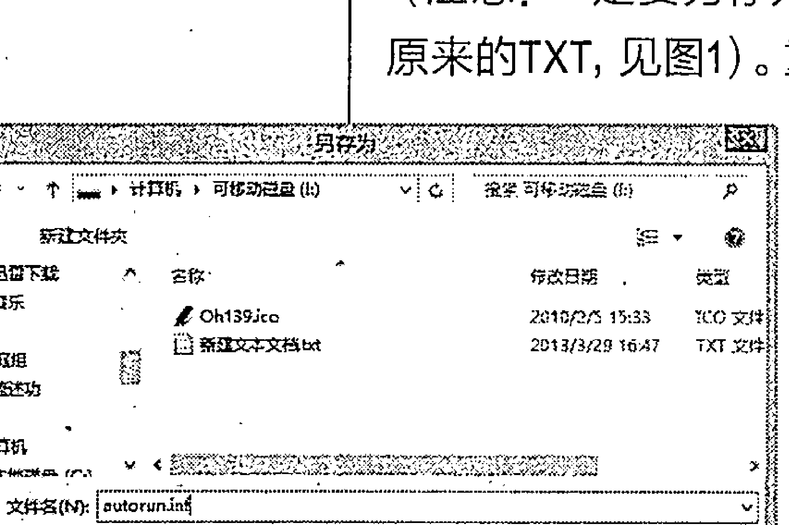

## 个性U盘，想播就播

- 适用场景：不想被人窥视U盘特定的文件。
- 使用工具：优易U盘加密软件
- 实现效果：访问U盘加密区需要使用密码。

第一步：到http://www.onlinedown.net/soft/41347.htm下载程序，并将程序复制到U盘。接着在U盘上以管理员身份运行（一定要以管理员身份），切换到“配置”选项卡，勾选“启用U盘加密功能”，然后拉动调整滑块，设置合适的容量作为加密区（图5）。

第二步：单击“使配置生效”，此时弹出设置进入加密区域密码设置，接着程序会自动格式化加密区域。格式化完成后我们就可以使用加密区域来保存私人文件了，在程序主窗口切换到“登录”，按提示输入上述设置的密码，单击“登录加密区”，此时就可以打开加密区域，如果输入错误的密码则无法登录（图6）。

第三步：成功登录后可以在资源管理器看到新增了一个本地磁盘，这就是U盘加密区域，保存完文件后切换到程序主窗口单击“登出加密区域”，此时会自动关闭上述新增磁盘，其他人就无法看到加密内容了。由于程序就保存在U盘，查看者必须输入密码才能看到加密区域。

此外，对于加密区我们还可以重新配置达到隐藏文件的目的。这里的隐藏功能只是一个比较简单的解决方法，分为加密区普通隐藏和深度隐藏。

普通隐藏相当于文件夹选项中的“隐藏文件和文件夹”选项，而深度隐藏是指让用户在文件夹选项中对是否显示隐藏文件的修改不起作用，因此使用一般方法是看不到加密区文件的。如果选择了深度隐藏，普通隐藏也会自动被选中。

为了数据安全，我们还可以在加密后将加密程序删除，然后将这个程序放置在自己的网盘上面，以后在其他电脑上需要访问加密文件时，再从网盘下载使用即可。

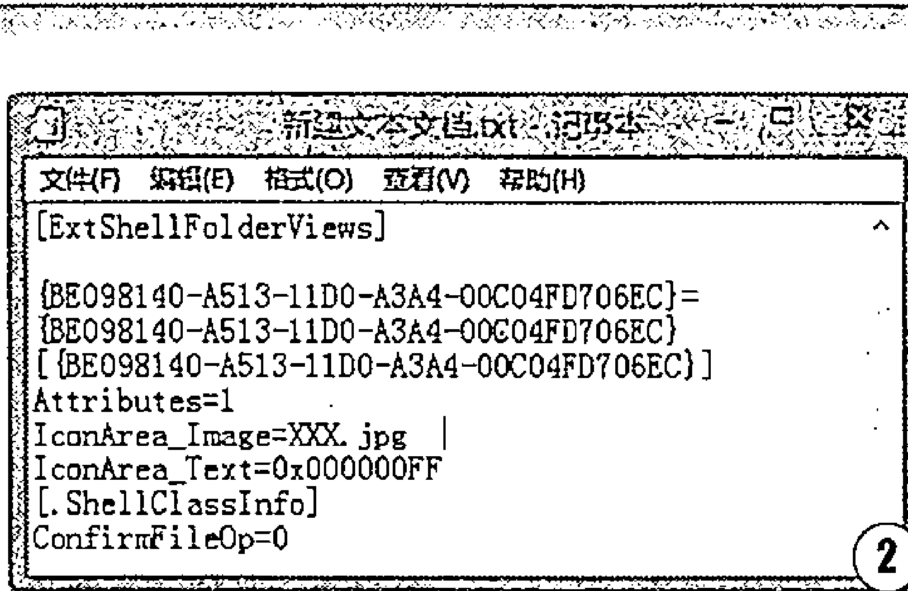

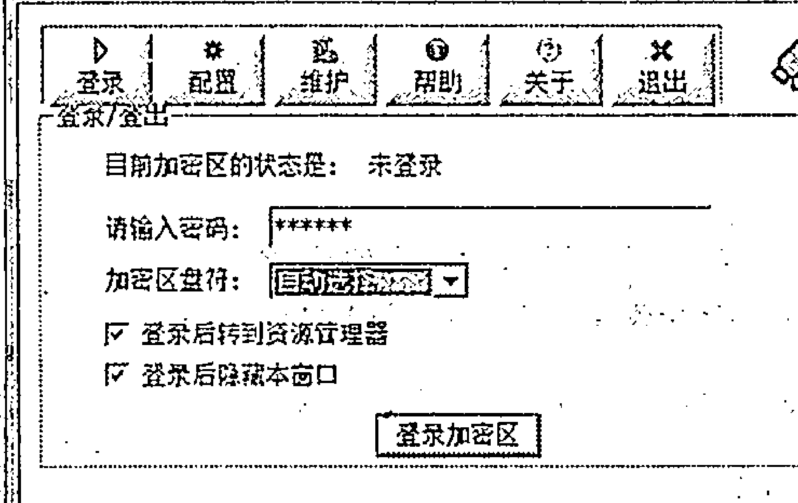

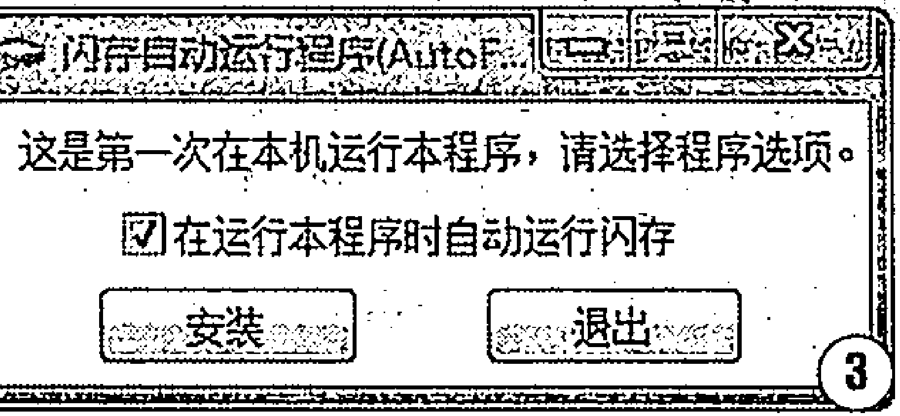

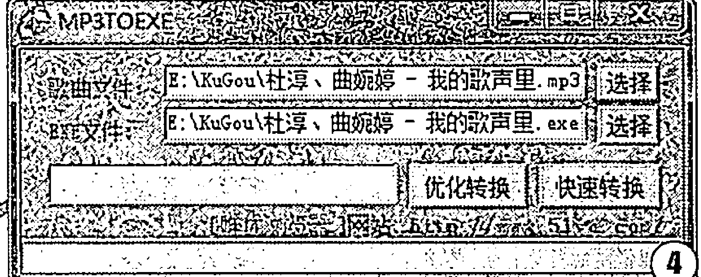

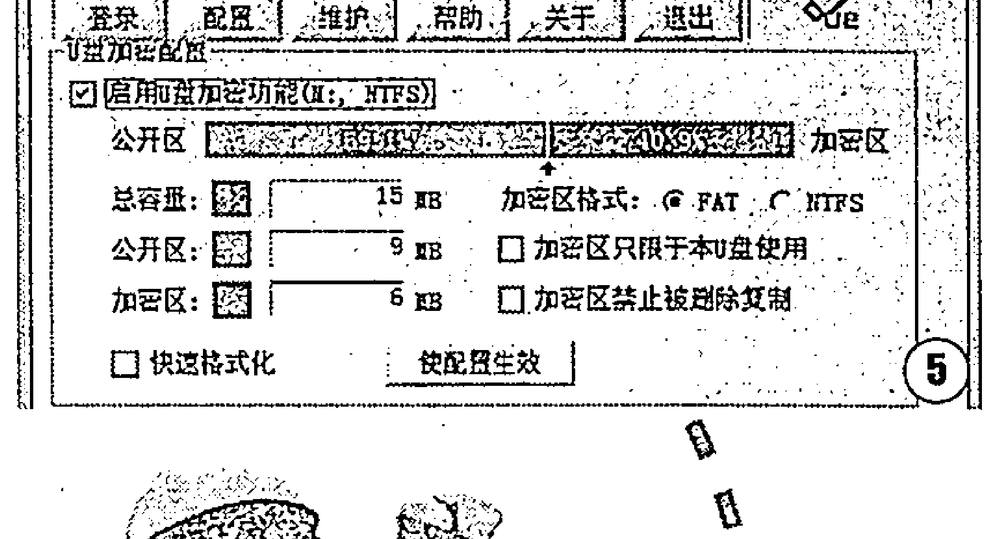


```
Open=XXX.exe （其中XXX为转换后的音乐文件名称，含扩展名）
```

> 小提示
为了防止自己或他人因误删而造成上述文件缺失，我们最好将上面涉及到的文件属性统统设置为隐藏。

## 为虎添翼 U盘还可这样用

上面我们讲了使自己的U盘更个性的一些方法，细心的朋友也许已经察觉到了，这些方法其实都未脱离开U盘的基本使命——存储数据。那么，除此之外，难道U盘就没有别的玩法了？当然不是，所谓好戏才刚刚开始，接下来，我们也许会惊喜地发现，原本老实本分的U盘，原来有这么多不安分守己的精彩！

## 小知识
U盘如何实现开机

大家知道Win7的引导记录是NT60格式，开机时首先去查找系统分区下的Bootmgr，接着读取“C:\boot\bcd”文件，然后开始加载系统。如果系统分区没有Bootmgr，则出现“BOOTMGR is missing.Press Ctrl+Alt+Del to restart.”的提示。因此如果我们把Win7的启动文件删除或者改名，然后将系统所需的启动文件移动到可启动U盘，从而造成系统无法启动的“假象”，要启动系统则只要插入U盘，从U盘的启动文件加载系统即可。

### 精彩1：把U盘变成开机钥匙

**适用场景：** 存放在宿舍、办公室等公共场合的电脑经常会被其他人使用。虽然电脑BIOS和Windows都可以通过设置强健的密码来进行保护，不过即使再强健的密码也难防住宿舍哥们的双眼。现在借助U盘，我们可以打造一个无需密码的开机钥匙。

**使用工具：** bootice

**实现效果：** 只有插入U盘才能开机。

第一步：到http://dwz.cn/cfan011下载所需的文件并解压到C盘备用，插入U盘，运行下载到的“BOOTICE.EXE”，然后在目标磁盘选中插入的闪存，单击“主引导记录”，然后选择“GRUB for DOS 0.4.4”，单击“安装/配置”，将U盘引导记录更改为GRUB引导（图7）。

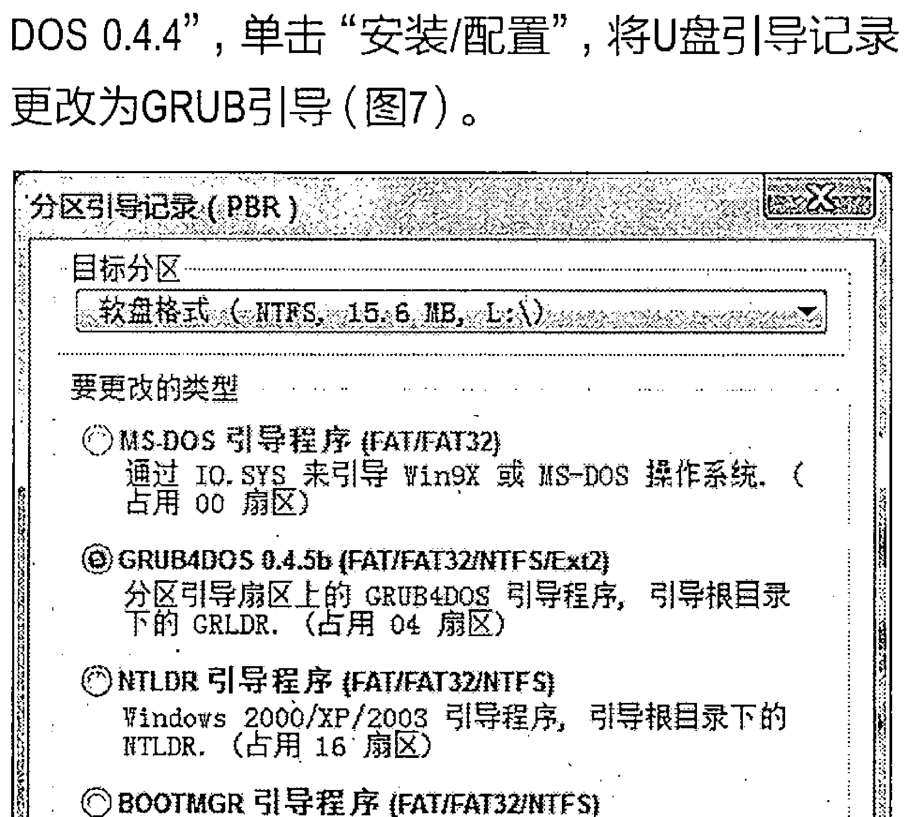

第二步：打开资源管理器，将C:\bootmgr文件重命名为C:\cfan，接着启动记事本新建一个menu.lst文件也放置在C盘根目录下备用，代码如下：

```
timeout 3
default /default
title win7
root (hd1,0)
chainloader /cfan
```

代码注释：
root (hd1,0)表示启动本机第二硬盘（即本机硬盘）的第一主分区，因为通过U盘启动时，第一硬盘是U盘。chainloader /cfan则表示启动第二硬盘的第一主分区下的cfan启动文件（我们自行改名的bootmgr）。对于WinXP系统，则将NTLDR改名为cfan，可以实现同样的效果。

第三步：这样由于Win7原来启动文件被更改了，重启后就会出现“BOOTMGR is missing.Press Ctrl+Alt+Del to restart.”提示，根本无法启动电脑。如果要启动电脑，只要插入上述制作的U盘并在BIOS中设置USB为第一启动，就可以通过U盘来启动Win7系统了。

**小提示**
如果自己的U盘丢了怎么启动系统？

如果自己的U盘丢了怎么启动系统？因为在上述操作中，我们已经将引导文件更改为cfan，所以取消U盘启动，只要准备任意一个PE系统，引导后将c:\cfan重新更改为bootmgr即可。同样的对于Win7+Win8双系统，如果不希望其他人使用Win8系统，我们同样可以在BCD中删除Win8启动，然后将C:\bootmgr和C:\boot目录复制到D盘（假设为Win8安装分区），在U盘中设置启动D盘的bootmgr，从而实现只有插入U盘才能启动Win8系统。

### 精彩2：娱乐为你的电视大屏

**适用场景：** 家有旧电脑，并且购买大屏幕液晶电视，喜欢在电视上欣赏电脑视频的用户。

**使用工具：** Geexbox

**实现效果：** 在客厅使用U盘系统欣赏电脑视频。

电脑更新换代的速度很快，很多朋友家中都有配置较低的淘汰电脑。如果你的客厅购买了大屏幕液晶电视，将旧电脑和电视连接起来就是一套很好的家庭娱乐系统。只不过旧电脑的配置较低，如果安装Win7之类的系统，电脑运行起来就慢如蜗牛。现在我们可以通过U盘安装Geexbox打造廉价的客厅娱乐系统。在U盘安装GeeXboX后，不仅不会破坏原来旧电脑的系统，而且可以给我们带来精彩的娱乐体验。

第一步：到http://www.geexbox.org/下载GeeXbox，下载后使用WinRAR解压到D盘，然后运行其中的“generator.exe”进行如下配置：

1.  切换到Interface标签页，Menulanguage（菜单语言）选择Chinese Simplifiled（简体中文），勾选Override subtitle font（字幕字符集），单击下方的的Change依次选择D:\geexbox-generator-1.2.4.i386.glibc\i18n\fonts下的字体。比如可以将本机XP系统的宋体（即“C:\WINDOWS\Fonts\simsun.ttc”）文件改名为“simsun.ttf”放置在上述“i18n\fonts”目录，这样进入GeeXbox后菜单就显示为宋体了。
2.  切换到“Audio”标签页，普通声卡用户选择“ALSA Soundcard ID”默认的“0”。GeeXbox支持模拟音频和SPDIF数字音频两种输出模式，并且有2声道、4声道环绕和5.1声道环绕（可以根据实际情况选择）。如果你使用的是SPDIF输出，可以采用“AC3/DTS”，这样家庭影院的功放可以完成AC-3和DTS解码，声音的效果更为出色。
3.  切换到“Video”标签页设置分辨率，勾选“HDTV (X.org)”，分辨率选择电视支持的高清分辨率如1920×1080，其他参数默认。
4.  切换到“Packages”标签页，展开左侧的解码器（Codecs），勾选全部解码插件，展开字体，勾选“Chinese Simplified - GB2312”，然后点击“Download”开始下载。

**小知识**
GeeXboX是一个专门用来播放多媒体数据的Linux发行版本，它本身是一张可以自启动的Linux系统，支持的视频格式包括DivX、XviD、H.264、MPEG等常见的格式。GeeXboX和常见Windows相比还有如下优点：
1.  稳定性好：它默认启动的是Mplayer播放器界面。由于没有终端存在，除了文件播放，用户无法执行其他任何操作。
2.  操作简单：Mplayer播放器界面设计得很简洁，所有播放操作都可以通过键盘完成。
3.  扩展性强：GeeXboX本质上是Linux系统，因此只要集成相应解码器就可以播放任何格式的多媒体文件。

第二步：完成上述所有操作后，单击“compile!”，程序会自动生成ISO文件，默认为“D:\geexbox-generator-1.2.4.i386.glibc\geexbox-1.2.4-custom-zh_CN.i386.iso”。接着到http://www1.geexbox.org/releases/win32-installer/0.22/geexbox-win32-installer-0.22.exe下载GeeXbox制作工具，启动程序后在“Select the installation type you wish to use”步骤选择“Install to drive/partition dedicated GeeXbox”，然后插入U盘，按提示选择上述制作好的ISO文件，将GeeXbox制作到U盘即可。

第三步：作为客厅影音中心，自然离不开多媒体资源。这些资源可以从网络获取，为了方便GeeXbox播放，可以在D盘新建“电影”、“音乐”、“MTV”文件夹，分别用于存放影视资源、音乐和音乐MTV文件。

完成视频文件的准备后，我们只要重启电脑，然后插入U盘并进入BIOS设置从U盘启动，接着在开机菜单选择“Start GeeXboX for HDTV”。成功加载GeeXboX后可以看到它的界面极为简洁，我们只要使用键盘上的上、下键控制即可（图8）。

第四步：如果要使用GeeXbox欣赏电影，定位到“播放->打开文件”，找到“SATA #1 DISK D: (2)”（表示第1硬盘第2分区，U盘则显示为USB #2），再进入其中的“电影”目录，然后按下P键（播放整个目录文件），或者按下U键（将目录所有文件添加到播放列表），现在就可以在大屏幕液晶电视上欣赏影片了。

**小提示**
对于经常用U盘来维护电脑的朋友，我们同样可以将常用的PE系统、Win7安装文件量产到U盘，这样使用U盘启动时就可以直接在BIOS中选择USBCD启动电脑。


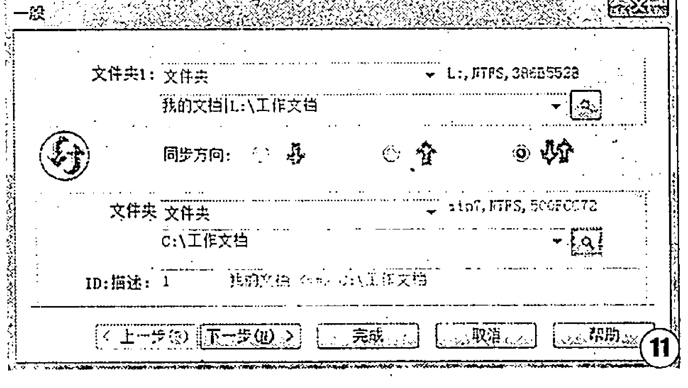

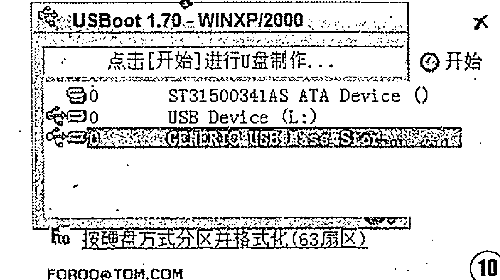

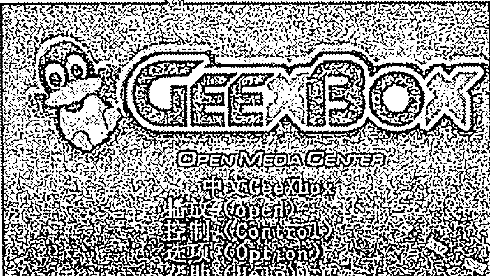

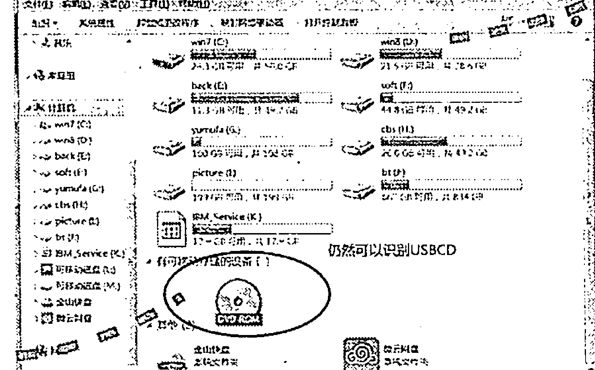

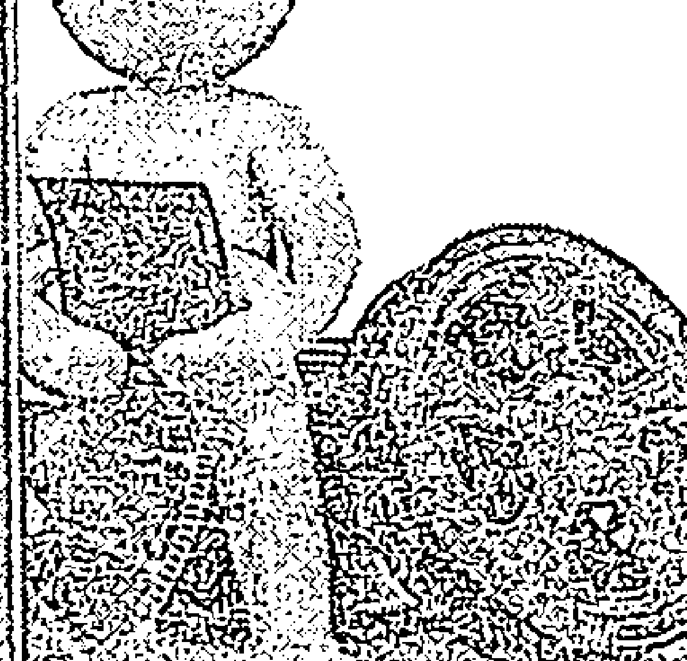

### 精彩3：U盘变身游戏光盘

**适用场景：** 为了保护电脑安全，很多学校或者网吧电脑通过特定的软件屏蔽U盘的插入，默认情况下插入U盘后，系统并不会提示发现新硬件。如果我们要将U盘文件复制到电脑上就无法实现。不过大多数软件只是屏蔽U盘识别，对于USB光驱、USB键盘则没有屏蔽，因此我们只要将U盘量产为USB光驱即可突破屏蔽。

**使用工具：** 量产工具

**实现效果：** 突破屏蔽从U盘复制文件到电脑。

-   第一步：启动ChipGenius，然后把U盘插上，ChipGenius开始检测U盘芯片组，接着记下自己的U盘芯片型号。接着到http://www.seekxiu.com/software.aspx?id=1369下载适合自己U盘的量产工具。这里以金士顿DataTraveler G3（芯片型号为SSS6691）为例。
-   第二步：启动量产工具后选择第一个模式，意思是量产成2个分区，接着把需要量产的游戏文件或者PE维护文件（ISO格式）放置在D盘下备用。点击“浏览”选择上述ISO文件，将其量产到U盘的CD区，最后点击Start开始量产。完成量产后插入U盘，现在在那些屏蔽U盘的电脑上就可以自动识别量产的USBCD，按提示打开USBCD，将其中的游戏文件复制到电脑上即可突破限制了(图9)。

**小提示**
实际上借助批处理，我们可以让U盘实现很多的自动操作。比如可以制作一个U盘PE，然后在其中安装免费的“ClamWin Portable”杀毒软件（支持命令行杀毒），制作一个“ClamWin Portable”杀毒批处理即可实现在PE下自动杀毒。提取Ghost的自动还原脚本，则可以将U盘变为自动还原盘。

### 精彩4：BIOS刷新我当助手

**适用场景：** 大家知道升级主板BIOS可以提高主板性能，不过，大多数主板BIOS的升级需要在DOS下进行，而且必须输入众多的命令行软件才能完成。这让很多新手望而却步，现在只要制作一个DOS启动U盘，并且结合其自带的批处理即可实现BIOS的自动升级，省去那些繁琐的手动操作。

**使用工具：** USBOOT+批处理

**实现效果：** 插入U盘自动升级BIOS。

以顶星主板操作为例。

-   第一步：启动USBOOT后在检测列表选中需要作为升级盘的U盘，根据自己主板支持的USB启动方式，然后点击“开始”即可制作支持DOS启动的U盘（图10）。
-   第二步：完成启动盘的制作后，登录顶星公司产品列表页面http://topstar1.com/productlist.asp，找到对应的机种，进入该机种页面后点选左边下载列表中的BIOS，下载要更新版本的BIOS文件，下载后解压得到升级文件（.bin格式），假设为biosfile.bin，接着下载BIOS刷新程序awd866.exe，将它们全部放置在U盘根目录下备用。
-   第三步：启动记事本，新建一个批处理autoexec.bat也放置在U盘根目录下，代码如下：
```
awd866 biosfile.bin /py /sn /cc /r
```
-   第四步：重启电脑并使用上述U盘启动电脑，这样进入DOS模式后会自动执行上述批处理，刷新完成后会自动重启，再次进入BIOS设置就可以看到刷新后的BIOS版本了。

### 精彩5：文档备份同步全自动

**适用场景：** 常将U盘文件备份到电脑的用户。

**使用工具：** Bestsync

**实现效果：** 插入U盘，文件复制到电脑。

在日常工作中，很多白领经常要将工作拷贝到U盘带到家里继续加班，这样每次回到家都要及时将文件复制到电脑中。每天都要重复这个动作是不是觉得很累？现在借助UMON可以实现插入U盘，电脑就会自动将U盘文件复制到电脑上。

-   第一步：到http://www.cr173.com/soft/23810.html下载程序，启动程序后在弹出的向导中，文件夹1选择U盘上“工作文档”目录，文件夹选择本机硬盘C:\工作文档目录，同步方向选择双向同步，然后点击“下一步”（图11）。
-   第二步：剩余的操作按屏幕提示完成，在“日程”这一步，勾选“在媒体插入或者网络连接时，启动本任务”、“文件一旦变化，立即同步变化的文件”，这样确保可以及时将文件同步备份（图12）。

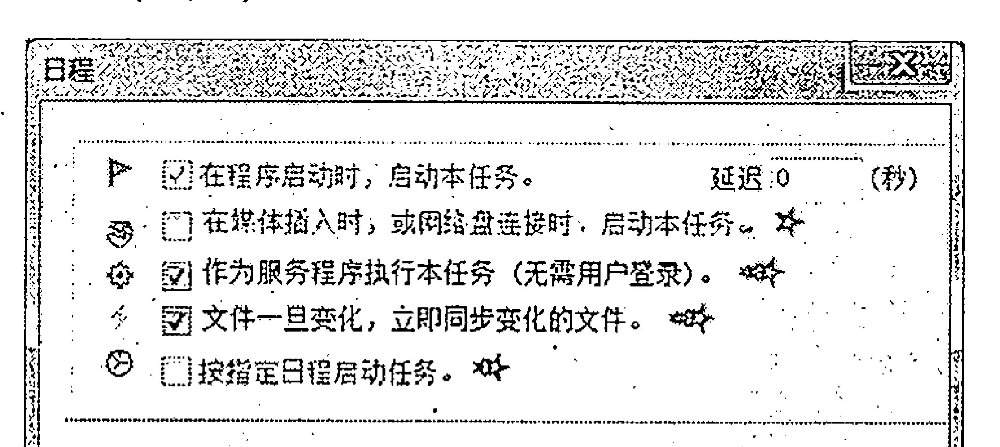

-   第三步：返回程序界面就可以看到程序开始自动同步指定的文件，与我们设置实时双向同步，这样在电脑上对文档所做的任何修改，## 精彩6：远程取文件 随到随用

适用场景：经常外出，并经常需要在任何一部能联网的PC中，远程控制单位或家中的PC，以达到远程访问并下载其中文件的朋友。

使用工具：GigaRunner

实现效果：在任何一部可联网的PC中插入U盘，即可轻松调用指定PC中的文件。

移动办公，许多朋友喜欢用网盘来完成文件的异地同步，这一方法非常简单、实用。但有时我们也会遇到不愿意将文件保存到网盘的情况，比如该文件十分重要，保存到网盘中有可能导致数据泄露。此外，就算有时保存在网盘中，也可能会出现因网盘所在的网络故障，导致网盘无法访问的情况。

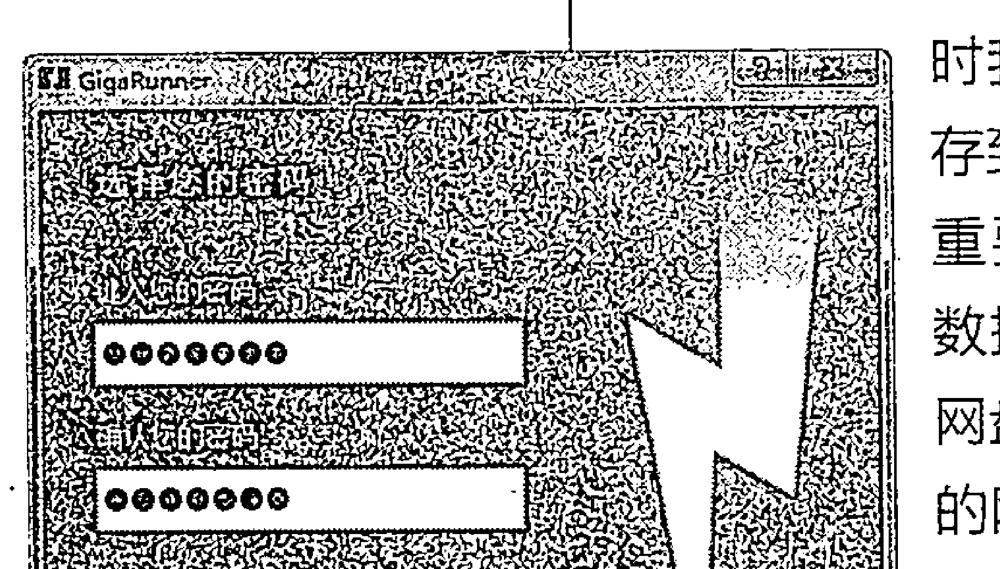

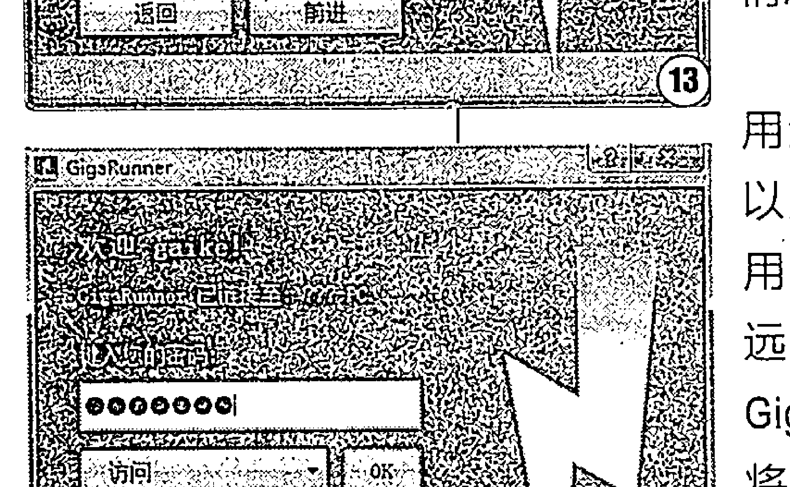

### 实例1：设置目标主机

假设笔者想使用U盘对家中的PC实现远程操作，家中的主机即为目标主机。现在我们首先要让U盘中的GigaRunner程序与该主机建立起连接关系。

- 第一步：将U盘插入目标主机，把下载的GigaRunner.rar文件解压到U盘根目录，双击运行其中的GigaRunner-Windows.exe文件。此时，屏幕上会出现一个欢迎界面，单击“立即连接”按钮。程序会将自身安装到目标主机中并默认跟随系统的启动而启动。只有这样，才能完成两者之间的远程连接。

- 第二步：安装完毕，在随后出现的用户名对话框中，设置好用户名，单击“前进”按钮。在“选择您的密码”对话框中，设置好相应密码（图13），单击“前进”按钮，在出现的“恭喜”对话框中，单击“OK”按钮。此时屏幕上将出现一个含有“选项”和“退出”两个按钮的对话框，如果你想删除连接，或者想更改用户名和密码，可以单击“选项”按钮，然后在出现的对话框中实现。如果不想更改，可以单击“退出”按钮，直接完成目标主机的设置过程并卸载U盘。

### 实例2：实现远程连接

以后要对目标主机实现远程连接时，可以将U盘插入当前主机，然后按下面的方法操作。操作前，请确保目标主机已经启动并且已经连接到网络。

- 第一步：在U盘中，运行GigaRunner文件夹中的GigaRunner-Windows.exe文件，程序会自动通过网络查找与之建立连接的目标主机，并在查找到后，自动和该主机建立连接。连接成功，将弹出“GigaRunner已连接至X”的提示（其中X为目标主机的完整名称），在“键入您的密码”文本框中，输入上面我们设置的密码（图14）。

（如果连续三次输入错误，GigaRunner会自动冻结该用户访问权限24小时）。输入完毕，单击“OK”按钮。GigaRunner就可以将相关的硬件ID、软件ID、账户名和密码提交给远程主机进行认证。远程主机上的“GigaBase”程序在取得这些认证信息，并确保正确无误后，即可和U盘上的GigaRunner-Windows.exe程序建立起数据传输通道。

- 第二步：在随后打开的远程控制窗口中，我们可看到目标主机的所有分区列表，双击某分区，可以看到其中存在的所有文件和文件夹。要下载某文件，只需双击它，该文件即可被下载保存到U盘GigaRunner文件夹的Downloads目录下，接下来我们到该目录中打开它，或者对其进行编辑即可。

如果你的系统中存在多个用户账户，设置完用户名和密码后，屏幕上可能会出现“运行身份”对话框，让你选择要使用哪个账户运行程序，一般选择当前登录账户，再单击“确定”按钮即可。

由于在数据传输的过程中，GigaRunner会使用AES 256高强度算法对其进行加密处理，所以我们丝毫不用担心数据会被第三方人员窃取，在安全方面有很大保障。

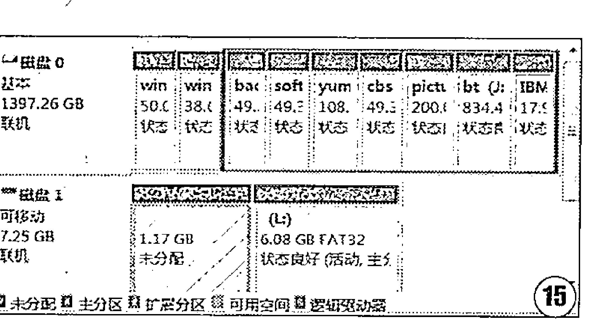

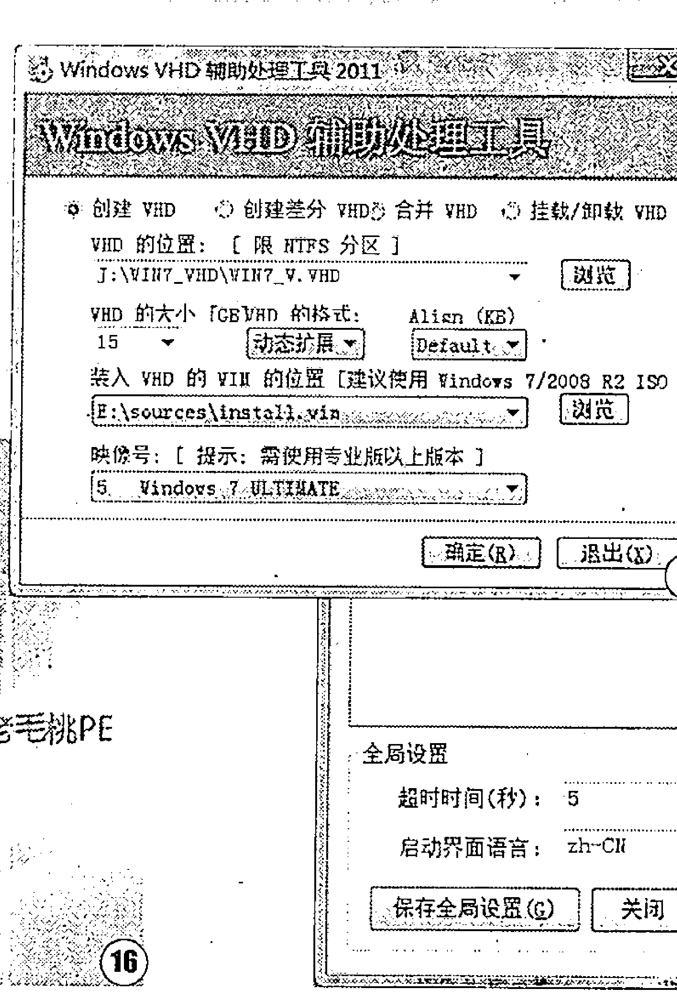

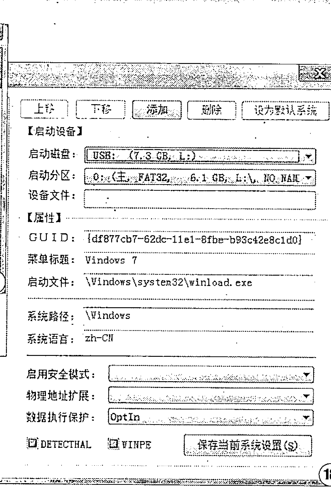

## 精彩7：打造安全 系统维护也隐身

适用场景：很多朋友都喜欢使用U盘作为系统维护盘，在里面安装一个PE系统后就可以在任意电脑上进行维护了。不过常规的维护系统在U盘中是可见的，这样如果U盘需要经常借给朋友们使用，很容易导致维护系统文件丢失。现在借助“一键U盘装系统”可以打造出完全隐身的系统维护盘，而且制作出来的维护盘启动兼容性更好。

使用工具：一键U盘装系统

实现效果：将U盘插入电脑后，无法看到隐藏的维护系统，格式化也不会删除。

- 第一步：由于程序已经内置多个维护系统，但是仍然支持自定义添加启动文件。这里为了能够让系统维护盘功能更强大，我们可以自行添加维护系统。比如可以自行准备网虫PE系统文件，下载后将其改名为wcpe.iso放置在E盘备用。插入闪盘后以管理员身份（否则无法识别闪盘）运行“一键U盘装系统”，单击程序界面的“自定义启动项”。接着在打开的窗口按提示输入自定义显示菜单名称和PE文件的具体路径（可以添加多个自定义菜单引导不同的ISO文件），单击“添加”即可将这个菜单添加到启动闪盘的内置菜单里，在后续的制作中会将指定的ISO文件复制到隐藏启动分区中。

- 第二步：返回程序界面，启动模式选择“USB-HDD”，接着单击“一键制作USB启动盘”，程序就会开始自动对闪盘分区，并将指定的启动文件复制到启动分区。

- 第三步：成功制作好启动盘后，打开资源管理器访问闪盘，其中并没有任何文件，只是查看属性后会发现闪盘的容量少了几百MB（减少的容量就是维护系统所占用的容量）。现在打开“计算机管理→磁盘管理”，选中制作好的闪盘，可以看到有部分未分配的空间，这就是程序生成的UD分区，维护系统就保存在这个未分配的隐藏分区中（图15）。

- 第四步：现在将上述闪盘插入任何一部支持USB启动的电脑，成功激活闪盘后，在弹出的启动菜单中就可以选择合适的维护系统进行系统维护了，试试看这个启动闪盘的兼容性是不是很好（图16）。当然这样制作的维护系统插入任何Windows版本中都无法看到其中的文件，即使格式化U盘也不会删除其中的维护文件。

## 精彩8：变身电脑 操作系统随身带

适用场景：现在网络安全形势越来越严峻，很多网吧、宾馆电脑都暗藏各种木马病毒，对于那些经常出差的朋友，如果需要在这些电脑上执行诸如在线支付、网购的活动，资金安全就会受到很大的威胁。现在借助U盘，我们可以打造一个随身携带的操作系统，这样不管在哪里都可以使用自身携带的安全系统。

使用工具：Windows VHD 辅助处理工具 2011

实现效果：可以在任何一部电脑插入U盘，使用U盘里的移动系统。

由于Win7支持VHD系统启动，所以我们只需要准备好一个VHD系统并复制到U盘中，以后就可以随时随地使用了。

小提示：如果U盘已经使用过其他软件分区（或者U盘显示的容量和实际容量不符），则可以单击程序界面的“归还U盘容量”初始化闪盘。也可以使用这个方法找回U盘丢失的容量。

小提示：Win7占用的空间比较大，如果你没有大容量的U盘，我们可以使用诸如Ubuntu之类精简Linux随身系统，它们同样可以在U盘启动并执行大多数常见的操作。

- 第一步：使用虚拟光驱加载Win7安装镜像（需要专业版、旗舰版镜像才能支持VHD启动）。接着到http://dwz.cn/cfan100下载“Windows VHD辅助处理工具2011”并解压到D盘。以管理员身份运行其中的“VHD_OneKey_2011_51 – Shortcut”，单击“创建VHD”，然后按下列的提示创建VHD系统（图17）：
    - VHD位置：选择一个NTFS格式，空闲空间较大的分区建立“win7_vhd”目录用于存放VHD文件，名称使用默认设置
    - VHD大小：设置为15GB，动态扩展类型
    - 装入VHD的WIM的位置：选择加载到虚拟光驱中的“sourcesinstall.wim”文件
    - 其他选项选择默认设置，单击“确定”即可将Win7安装到虚拟VHD文件中。

- 第二步：完成映像的释放后，返回程序界面切换到“挂载/卸载VHD”，VHD位置按提示选择上述创建的VHD文件，BCD中启动项目的名称按提示更改为“Windows 7”，然后单击“向BCD中添加VHD项目”即可完成VHD系统的制作和启动配置。

- 第三步：按提示重启并选择进入VHD系统，然后安装在线支付所需的证书、网购所需的各类插件等。接下来的操作只要将这个VHD文件移动到USB设备，并且配置好Win7启动参数即可。重启进入原来的Win7系统，接着准备一个大小为32GB的U盘，启动“BOOTICE.EXE”，启动程序后在“目标磁盘”选中当前U盘，然后单击“主引导记录”，按提示选择“Windows NT6.x默认引导程序”，最后单击“安装/配置”，将U盘引导记录更改为NT60格式。

- 第四步：打开C盘，将其中的“BOOT”目录、“Bootmgr”文件和上述制作好的VHD文件全部复制到U盘的主分区下。接着返回到“BOOTICE.EXE”程序界面，切换到“BCD编辑”标签，单选“其它位置的BCD”，选择“L: \\boot\\bcd”文件（这里L:为U盘主分区的盘符），接着单击“查看/修改”，在弹出的编辑窗口单击“添加→Windows NT 6.x VHD启动项”，接着选中新建的启动项，然后依次执行下列的操作：
    - 启动磁盘：当前U盘
    - 启动分区：U盘主分区
    - 设备文件：\\win7.vhd
    - 菜单标题：Windows 7
    - 其他使用默认设置，最后单击“保存全局设置”退出，这样我们就顺利完成随身系统的制作（图18）。

以后如果出差在外，我们只要在宾馆或者网吧电脑里插入U盘，并在BIOS中设置USB设备为第一启动即可使用这个随身Win7系统了。

## 精彩108招：U盘变身路由器

适用场景：想让多部PC同时联网，但手头没有路由器却有一个闲置不用的老U盘，同时拥有双网卡或一个集线器的用户。

使用工具：DD-WRT X86 VGA版、physdiskwrite

实现效果：可以将小容量的老U盘变成路由器（U盘有16MB或以上的容量便足够了），方便地实现多机共享上网，并且同真正的路由器一样，可以通过简单的操作，对QoS、限速、限连接数等项进行设置，或者通过轻松地管理操作，封杀BT、电驴、迅雷等网络应用。

U盘容量太少，扔了可惜，留着没用，这时，不妨废物利用，对其进行必要的改造，借助一款名叫DD-WRT的路由器固件（下载地址：ftp://www.dd-wrt.com/stable/dd-wrt.v24%20SP1/Professional/X86/public/dd-wrt_public_serial.image），和一款名为physdiskwrite的路由器IMG写盘工具（下载地址：http://www.onlinedown.net/softdown/93900_2.htm），把它变成一台功能强大的路由器，方便我们在没有路由器的情况下，和其他PC共享网络。

DD-WRT固件的容量只有11MB左右，这样，大小在16MB以上的U盘就完全可以容纳得下它，所以丝毫不用担心会出现空间不足的问题。

### 实例1：安装固件

- 第一步：在任意非系统分区的根目录下新建一个名为1的文件夹（如：F:\\1），解压physdiskwrite 0.5.2.zip文件，并将其中的Physdiskwrite.exe文件复制到该文件夹中，同时，剪切或复制dd-wrt-public-vga.image文件到该文件夹。

- 第二步：按下“Win+R”组合键，打开“运行”对话框，输入cmd，回车，打开命令提示符窗口，在其中输入以下命令（注意，每输入一行命令都要回车，其中括号中的内容为命令行注释，无需输入）：

```
F:（切换当前盘符为F：）
CD 1（切换到1目录）
Physdiskwrite.exe -u dd-wrt_public_vga.image
```

- 第三步：此时程序会自动检测当前系统中的硬盘及移动存储设备，并显示出所有存储设备的序号及相关参数。其中的详细内容，我们可在“Information for\.\.PhysicalDriveX”（其中X为0、1、2等数字）项中查看（图19）。一般来说，如果机器上只有一个硬盘，那么PhysicalDrive0表示的就是该硬盘，而PhysicalDrive1显示的则为U盘序号；如果本机有两块硬盘，则U盘序号应为2，以此类推。

- 第四步：检测完毕，命令提示符窗口中会显示出“Which disk do you want to write?”的字样，即要求我们输入目标U盘的序号，注意不要选错了，否则所选磁盘中的数据会被覆盖，造成不必要的损失。输入U盘序号后回车，屏幕提示，确认是否正确，是否真的写入，输入Y，确认写入，回车，稍等片刻，DD-WRT固件即会写入指定的U盘中。写入成功后，屏幕上会出现“11534336/11534336 bytes written in total”的提示。

小提示：physdiskwrite.exe -u dd-wrt_public.vga.image命令中的“-u”参数，主要是在目标硬盘或U盘大于800MB时使用，如果存储设备的容量小于该值，可不使用此参数。

### 实例2：设置路由器

- 第一步：将两个网卡都插上网线（或者将单网卡中引出的网线接入集线器中），用刚才制作好的U盘引导重启PC，此时，我们会看到刚才刷入的DD-WRT已经接管了系统引导。引导成功后，DD-WRT会自动检测当前的网络环境和硬盘设备，并自动进行网络设置，开始提供路由服务。

- 第二步：在IE浏览器的地址栏中输入路由器的默认IP地址“http://192.168.1.1”，回车，打开登录界面，按提示输入用户名和密码（默认用户名为“root”，密码为“admin”）。确认后，进入路由器设置界面（图20）。不过，此时界面上默认显示的文字为英文，我们可以切换到“Administrator”（管理）标签，将“LanguageSelection”（语言）设置为“ChineseSimplified”（简体中文）。

小提示：目前，有许多ADSL MODEM也支持WEB方式管理，它们的IP地址的出厂默认值一般也是“192.168.1.1”，为了不让它们相互间发生冲突，我们可以在刚才的“网络设置/路由器IP”项中，将“本地IP地址”修改为其他IP地址，例如“192.168.1.110”。当设置生效后，路由器的局域网IP地址即可变为“192.168.1.110”，以后要访问并设置路由器时，只需在浏览器地址栏中输入该IP地址并登录即可。

- 第三步：接下来，我们还要设置ADSL路由器上网。普通网络接入方式可能是ADSL拨号、固定IP或动态IP，此处以ADSL拨号为例，其他的接入方式可参照进行。在设置界面中切换到“设置/基本设置”标签，在“Internet连接类型”中选择“PPPOE”，输入ADSL账号及密码。然后在下方的“网络设置/路由器IP”项中，设置好当地运营商提供的DNS服务器地址，同时在下方的“网络地址服务器设置(DHCP)”项中，启用DHCP功能。至此，路由器的设置工作便已大功告成，以后其他PC就可以通过该机顺利地连接到网络了。

### 实例3：其他PC连接到网络

比如我们要让一台安装了Windows 7系统的PC通过该路由器上网，可以这样设置：

- 第一步：右击系统托盘区中的网络连接图标，在弹出的右键菜单中选择“打开网络和共享中心”，进入相应的窗口。选择左侧的“更改适配器设置”项，然后在出现的窗口中，右击该机网卡，选择“属性”（图21），打开“以太网属性”对话框。

- 第二步：切换到“网络”标签，在下方的列表中，选择“Internet协议版本4(TCP/IPv4)”项，单击“属性”按钮，打开相应的对话框。切换到“常规”标签，然后将“自动获得IP地址”和“自动获得DNS服务器地址”两项选中，单击“确定”按钮（图22），接下来，该机就可以通过这一特殊的路由器，顺利地连接上网了。

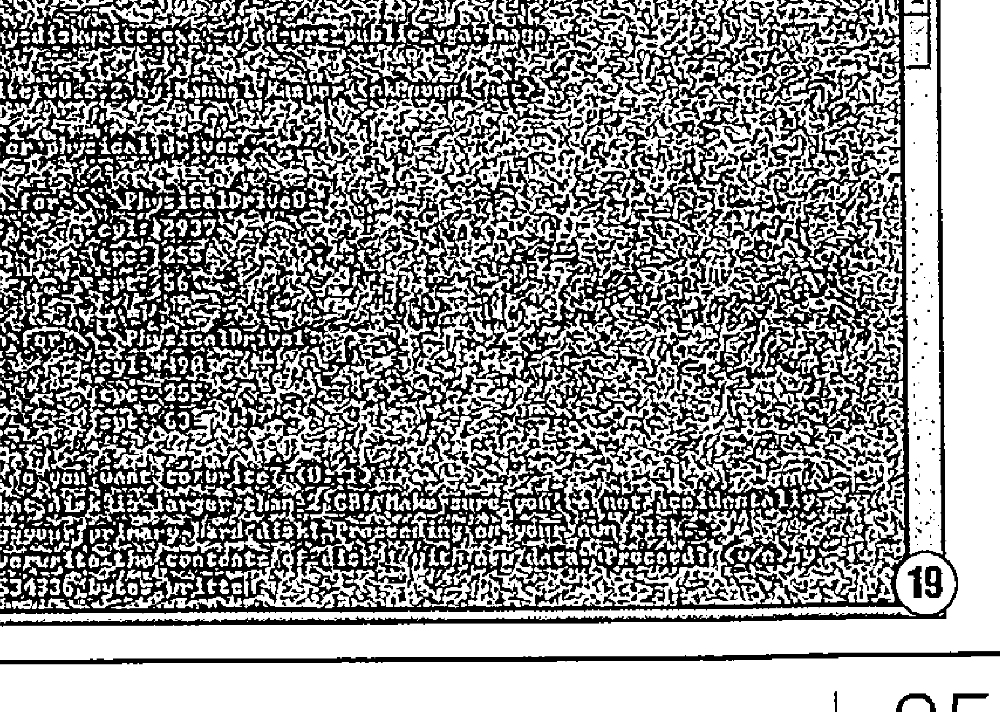

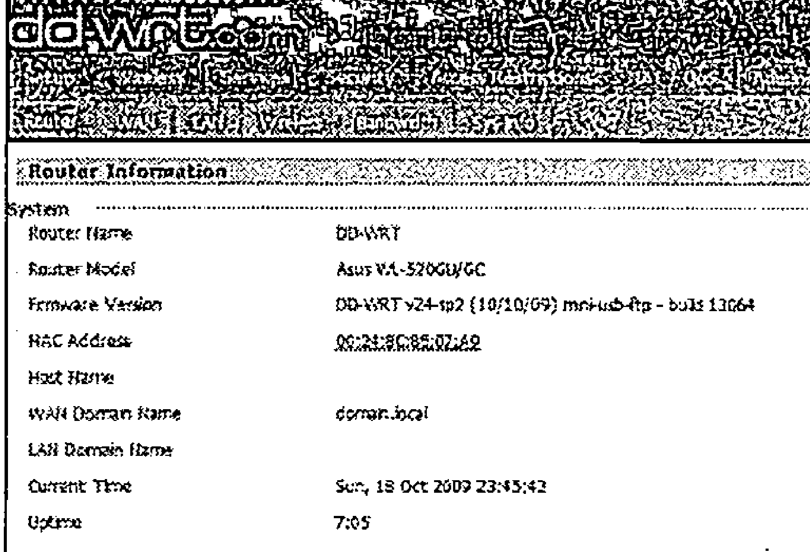

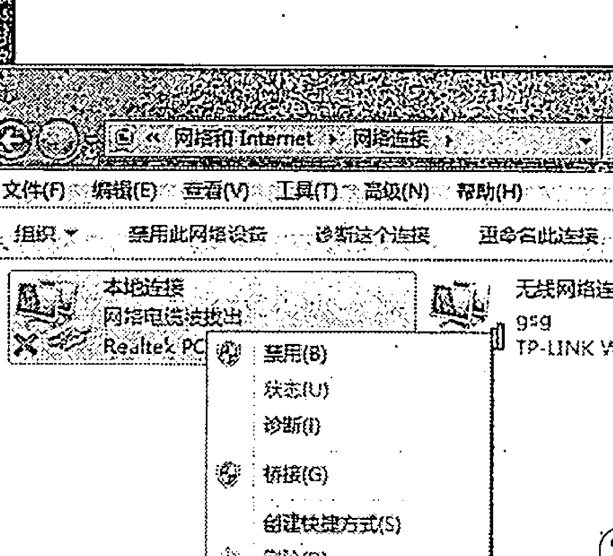

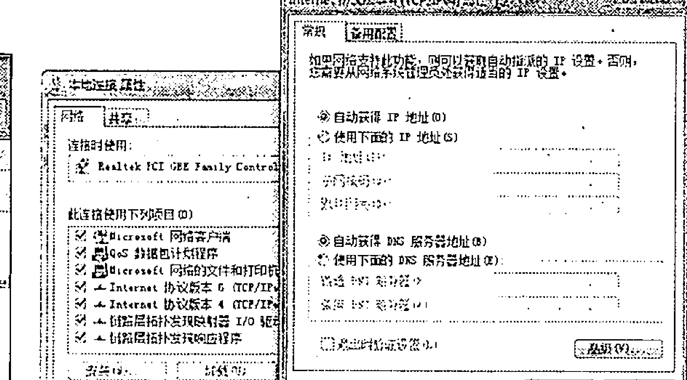

## 粉丝须知：移动电源

借助智能手机和平板电脑的这股“东风”，移动电源产业也进入了爆发式的发展阶段。但是，在激烈的市场竞争中，有人选择品牌与口碑的建设，有人则以赚取快钱为目的，也因此让移动电源市场呈现出了表面繁荣但暗藏杀机的局面。对普通消费者而言，想选出一款品质过硬的移动电源，首先就要了解这种设备的基本结构，以及与之相关的参数原理，而这正是本文的目的。

本刊将持续关注移动电源市场的趋势与变化，也会尽微薄之力曝光产业背后的“潜规则”，揭露假冒伪劣。希望读者朋友们也可以一同参与并监督移动电源市场，如果你所使用的移动电源，或你所了解的某些产品存在质量、虚标、安全和售后等方面的问题，欢迎发送邮箱到wangjian@cfan.com.cn这个邮箱（注明“移动电源曝光”），我们会不定期汇总整理并加以曝光。

### 移动电源缘何兴起

文|hiker

移动电源的崛起，很大程度上要感谢以当前智能手机为代表的各种手持设备待机时间的不给力。在智能手机纷纷陷入“堆硬件”的漩涡而不能自拔之际，移动电源就成为了“快、薄、炫”这三大卖点的受益者。

#### 无奈的“一天一冲”

随着苹果iPhone以及Android系统的流行，智能手机已然成为每一位普通消费者出门必带的标准装备。无论是公交地铁还是街头巷尾，到处都是微博、微信、QQ以及各种游戏的提示音效，在诸如此类APP的“摧残下”，任你的手机配备了多大容量的电池，都能在几小时之内消耗殆尽。

还好，这还不是最要命的，只要你不拿iPhone当“智能手机”用，平时只是打电话发短信，一次充电用个2、3天还是不成问题的。但现实的问题是，越来越多的智能手机都陷入了“硬件至上”的误区，即使你很少联网或玩游戏，也不得不面临一天一冲的窘境。

#### 快、薄、炫的受益者

无论你是否需要，国产手机都已经踏上了“堆集硬件”的道路。1080P+四核处理器注定是2013年下半年中高端手机的主旋律，除了具备更强悍的性能的同时，这些新品往往也会具备更纤薄的外观和炫酷的功能。咱们先来看看几款手机的参数（表1）：

表1：当前低、中、高端市场的代表手机参数对比
| 型号 | 尺寸 | 处理器 | 卖点 | 电池 | 售价 |
| :--- | :--- | :--- | :--- | :--- | :--- |
| 卓普小黑C2 | 5英寸1080P | 联发科MT6589 | 1300W摄像头<br>阿里云系统 | 2000mAh<br>（可更换） | 1399元 |
| nubia Z5 | 5英寸1080P | 高通APQ8064 | 1300W摄像头<br>7.6mm机身 | 2300mAh<br>（不可更换） | 3456元 |
| HTC One | 4.7英寸1080P | 高通骁龙600 | 410W摄像头 | 2300mAh<br>（不可更换） | 4999元 |

上面三款手机分别属于低、中、高端手机的代表，配置确实抢眼，但也从中透露出了一些问题。像卓普小黑C2虽然可更换电池，但2000mAh的容量实在太小，而nubia Z5和HTC One最大的问题则是电池不可更换，而且容量也没大到哪去（图1）。如果你关注过近期手机市场的动向，不难发现越来越多的新品都倾向于采用不可更换的锂电池设计，而且电池容量始终在2000mAh左右间徘徊。硬件越来越耗电，电池容量没有明显变化，续航时间只能越来越短。

小提示：大屏幕高规格的手机并非不能解决待机问题，比如华为6.1英寸的Mate手机就依靠4050mAh的超大容量电池，抵消了巨大屏幕所产生的额外电力消耗，因此续航时间并不逊于一些4英寸的小屏幕产品。

我们再来看看诺基亚是如何解决的。针对Lumia系列手机无法更换电池的缺陷，诺基亚推出了自主品牌的移动电源DC-16（图2），用于客户在长途外出时为Lumia补充电力。可见，包括诺基亚在内的正牌手机制造商已经将移动电源视为帮助手机延长待机能力的最佳选择之一。换句话说，移动电源就是包括手机、平板等手持设备“快、薄、炫”的受益者。

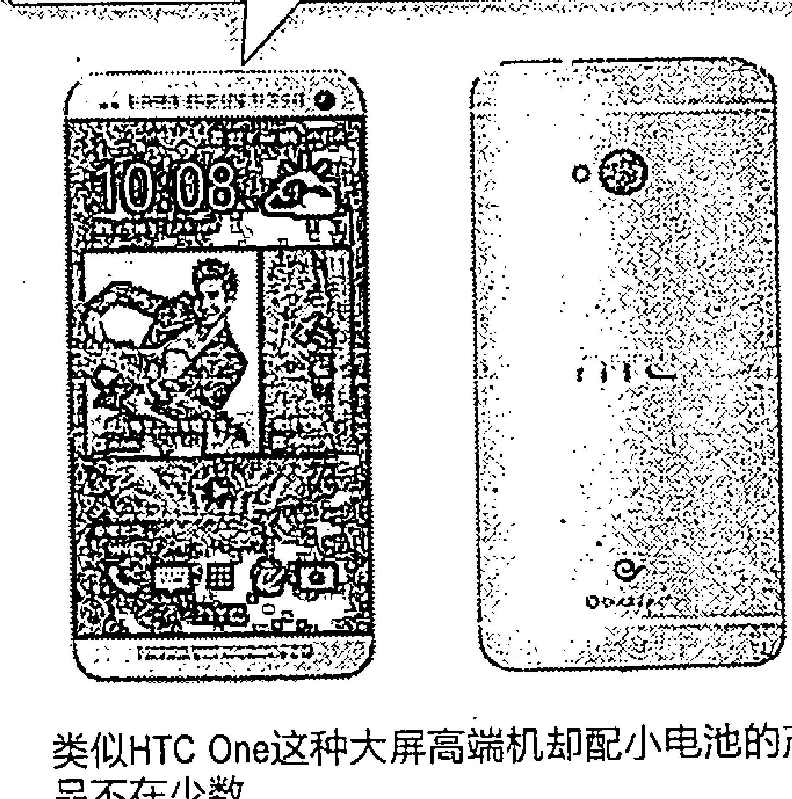

诺基亚DC-16的价格不算便宜

## 一切从“芯”开始
文|hiker

在选购笔记本时我们会经常用到“一切从‘芯’开始”的大标题，其实在辨别移动电源这种设备的优劣时，一切从“芯”开始的黄金法则同样适用，只是这一次的“芯”并非CPU，而是移动电源内部用于储存电力的“电芯”。

### 大牌也“虚标”

不过，从诺基亚DC-16身上我们又发现了一个有趣的现象：作为一款售价高达169元的移动电源，DC-16竟然都无法给Lumia 900 (1830mAh)和Lumia 920 (2000mAh)充满一次电力(如图3~4)。要知道，DC-16可是标称2200mAh的移动电源！可见，就连诺基亚官方出品的昂贵设备DC-16都存在“不靠谱”的现象，那些非一线品牌生产的移动电源的品质更是可想而知。

- 综合评分：电量不足
- 优点：小巧一点而已
- 不足：电量严重不足
- 心得：用它来充920电池60%左右
- 购买时间：2013-02-24
- 综合评分：中看不中用，连一次都充不满
- 优点：好看是最大的优点
- 不足：根本就不起作用，一次都充不满
- 心得：电池大部分用来发热了，给手机最多充60%的电，我是900
- 颜色：白色
- 购买日期：2013-04-07

接下来，我们就来抽丝剥茧，看看类似DC-16这种移动电源为什么会出现貌似电量虚标的问题，以及整个移动电源产业所存在的“潜规则”吧。

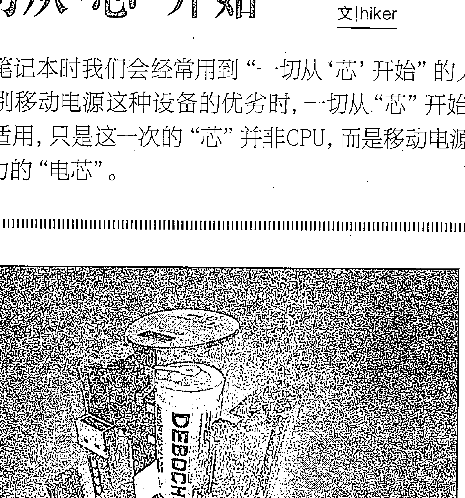

某款移动电源内部结构示意图

### 唯“芯”主义的重要性

移动电源并非什么高科技，它的组成结构甚至可以用“极为简陋”来形容，拆开华丽的外壳之后，内部基本只有两个组成部分：电芯和电路板（图5）。如果我们将移动电源比作汽车的动力系统，那其中的电芯就好似油箱+发动机，也就是移动电源的动力源泉。至于电路板，就好像汽车内部的控制系统，负责动力的分配和转换，实现电压、电流控制、输入和输出控制等。由此可见，电芯在移动电源中扮演着最核心的角色，唯“芯”主义被视为这个领域的“信仰”。

由于AAA镍氢充电电池已被淘汰，因此目前移动电源所武装的电芯普遍为锂离子电池，只是根据电池内部电解质材料的差异，锂离子电池又可细分为液态锂离子电池（LIB）和锂聚合物电池（LIP）两大类（表2）。二者的主要差异在于正极材料（表3）和电解质的材质，这就导致两种锂离子电池拥有不同的性能表现和外观结构。下面，我们就来具体了解一下当前移动电源市场最常用的两种电芯：18650电芯和锂聚合电池的特色和差别。

## 18650电芯的中坚力量

关注移动电源的读者肯定听说过“18650”这组数字，前面提到的“液态锂离子电池”就能被打造成一种直径为18mm，长度为65mm（图6）的圆柱体电芯，而这种形状的电芯也就被行业内称为“18650电芯”。18650电芯一般采用圆柱金属壳包装，内部锂离子呈液态，在容量上主要以2200mAh、2400mAh、2600mAh和2800mAh四种规格为主，普遍以多颗18650电芯并联的方式被塞入移动电源中（如图7）。

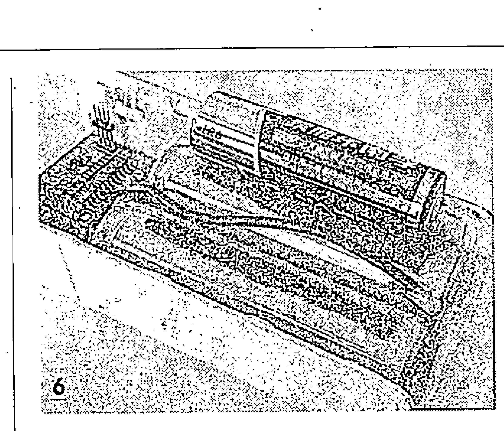

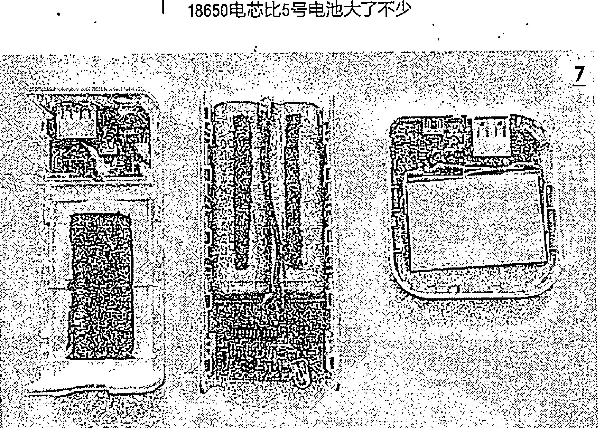

目前18650电芯主要以层状结构的钴酸锂作为正极材料，该材料的优点是工作电压较高（平均3.7V），充放电电压平稳，技术成熟且制造成本低廉。但钴酸锂的缺点也很明显，比如循环使用寿命只有300次左右，存在爆炸隐患，废弃后对环境有污染。当然，18650电芯中也有使用镍钴锰材料的，只是这类电芯的价格会更高。

### 表2：两类锂离子电池的参数对比
| 参数类型   | 液态锂离子电池(LIB) | 锂聚合物电池(LIP) |
|------------|---------------------|-------------------|
| 正极材料   | 钴酸锂、镍钴锰、磷酸铁锂材料 | -                 |
| 负极材料   | 石墨                 | -                 |
| 电解质     | 液体电解质           | 固体聚合物电解质   |
| 电芯形状   | 圆柱状或方形铝壳     | 方块软包形状       |

### 表3：三种正极材料参数对比
| 性能对比   | 钴酸锂(LiCoO2) | 镍钴锰(LiNiCoMnO2) | 磷酸铁锂(LiFePO4) |
|------------|----------------|---------------------|-------------------|
| 比容量     | 145mAh/g       | 100mAh/g            | 125mAh/g          |
| 能量密度   | 380Wh/L 430Wh/L | 210Wh/L 250Wh/L     | 140Wh/L 160Wh/L   |
| 循环寿命   | ≥300次         | ≥500次              | ≥2000次           |
| 充电电压范围 | 2.8V 4.2V     | 3.0V 4.2V           | 2.0V 3.8V         |
| 充电速度   | 慢             | 较快                | 非常快            |
| 自放电     | 较高           | 较低                | 低                |
| 成本       | 低廉           | 高                  | 非常高            |
| 环保性     | 含钴           | 含镍和钴            | 无毒              |
| 安全性     | 一般           | 良好                | 优秀              |

## 移动电源的前世今生

了解移动电源内部结构的人会发现，它最核心的部分实际就是电池，之所以被冠上“电源”二字，是因为它比一般电池多出了输出电流的功能而已。所以广义地来说，移动电源的萌芽可追溯到1800年伏特发明的第一块电池。伏特把锌片、银片以及用盐水浸湿的纸片（电解质）交替堆叠在一起，构成所谓的伏打电堆，当用金属线连接电堆两极的锌片和银片时，电流便产生了。伏打电堆堆叠的层越多，产生的电压就会相应变高。


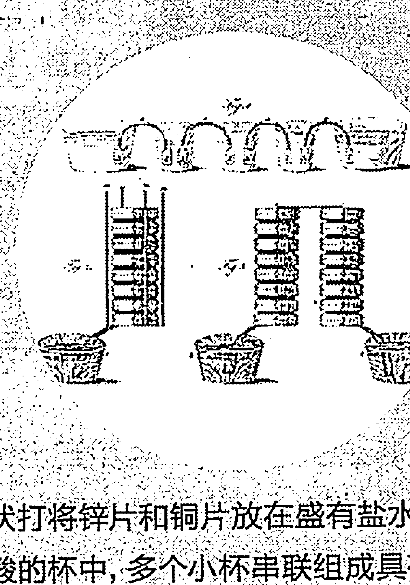

对当下移动电源产生最直接影响的，应该是蓄电池的发明，它具有储电功能，是移动电源必备的功能之一。电池发明之初，都是一次性电池，一旦它所包含的化学物质全部起了化学作用后，便不可逆转，不能再提供电能。1859年，法国的普兰特解决了这一难题，他用铅做电极发明出一种特殊的电池，当用过一段时间后，可以通过外部电源让电池内的化学物质逆向反应，恢复到原先可供电状态。因为它能储存外部电力，因此称之为蓄电池，又因为它能循环使用，所以又称之为可充电电池或二次电池。以上所述两种类型的电池工作原理，一直延续至今。不过开始电池基本上是用液体电解质，所以也称之为“湿电池”，只适用于固定场所（如电报或门铃供电装置），对手电筒这类随时运动中的物体则几乎无法使用。1887年，英国人赫勒森解决了这一问题，他发明了“干电池”，它同样属于伏打电堆，只不过电解质是不能流动的糊状物，不易泄漏，便于携带。这类电池，现在我们生活中随处可见（如遥控器、收音机中）。警告：切勿解剖电池，更不可将其置于火上灼烧或炙烤，危险！

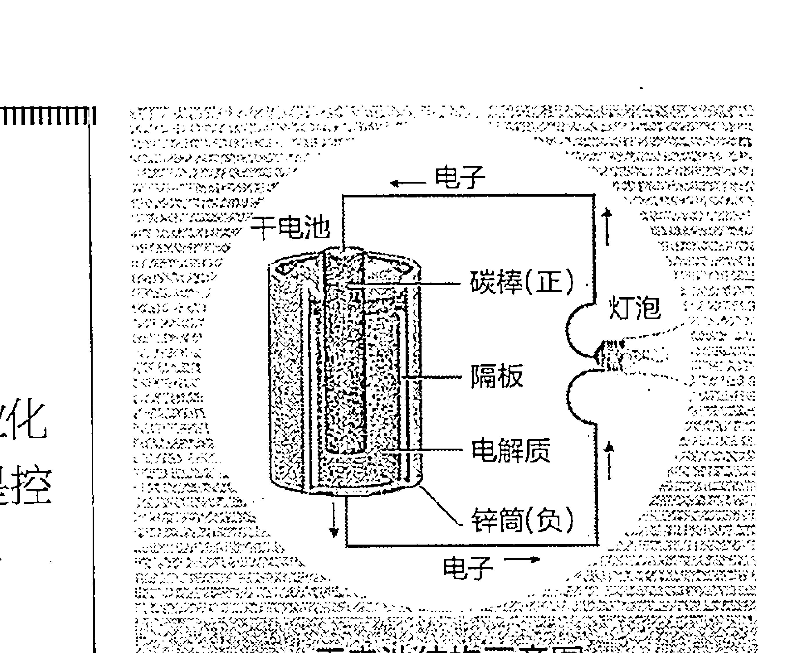

小提示：
液态锂离子电池还可以被打造成方形铝壳的形状（只是这种电池成型后整体是硬的），也就是早期手机上所用的电池，只是没有保护板和外包装（现在的新机，比如iPhone都已用上了锂聚合物电池）。目前单芯容量最大的18650已经达到了3400mAh，只是成本太高。

总之，18650电芯是目前移动电源市场的中坚力量，成熟的工艺和低廉的成本吸引了国内外很多企业都在生产制造，只需4节～5节18650电芯就能打造出10000mAh以上容量的移动电源，这是锂聚合物电池所不具备的优势。但是正因为门槛过低，以及18650电芯自身产业的不规范，也为基于其设计的移动电源存在各种虚标和不安全问题埋下了隐患。

## 聚合物 未来的发展趋势

和18650电芯只能被打造成圆柱形或方形铝壳的形状不同，锂聚合物电池最大的特性就是外观的可塑性更强（因为是软包结构）。这类电芯普遍使用铝塑膜，中间的锂物质为胶态，因此可以根据设备内部的空间走势而任意塑形，比如做得更薄或更长。

锂聚合物电池的正极材料主要以钴酸锂和镍钴锰（又称“三元材料”）为主，后者以镍盐、钴盐、锰盐为原料，镍钴锰的比例可以根据实际需要调整。用该材料做正极的好处就是安全性和循环寿命更长，而且不存在爆炸隐患（最多就是燃烧），只是成本相对更高，废弃后污染环境，大电流充放电性能较弱。

得益于可塑的外观和安全优势，锂聚合物电池正逐渐被中高端的移动电源所接纳，并大有取代18650电芯的趋势。基于锂聚合物电池设计的移动电源不必受圆柱形外观的18650电芯制约，可以做得更为小巧精致（如图8）。


但是，受制于较高的成本，相同容量的锂聚合物电池的价格要明显高于采用18650电芯的产品。

作为移动电源的两种内“芯”，18650电芯和锂聚合物电池各有特色。那么，在选购时要如何辨别两种芯谁更适合你呢？这个答案其实很简单，只要你选择的是正规品牌生产的移动电源，无论是18650电芯还是锂聚合物电池的安全性都在可控的范围内，如果你喜欢轻薄便于携带的移动电源，那锂聚合物电池自是首选。如果你的预算有限或追求超大容量，那短期内只有18650电芯可以办到。

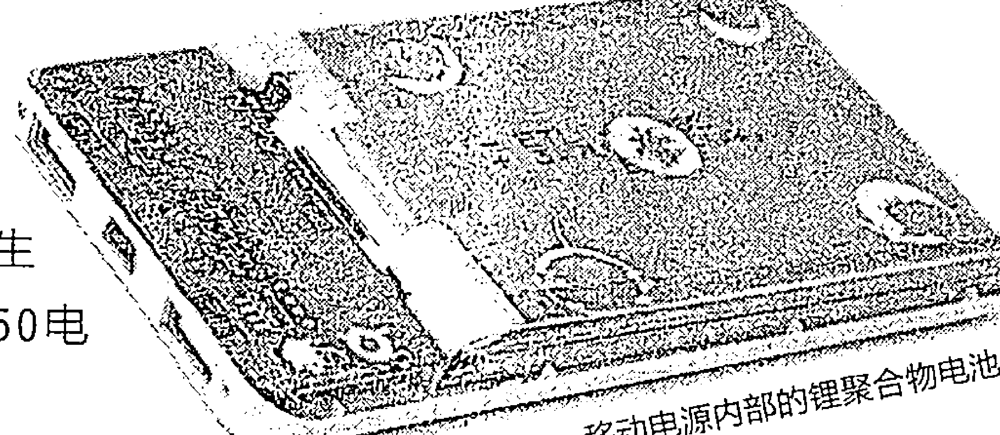

扩展阅读：
磷酸铁锂是近几年新兴的一种很有潜力的正极材料，与钴酸锂和镍钴锰相比，其最大的差别就是在正极加入了铁元素，它在环保、安全和循环寿命方面是其它材料无法比拟的。可惜磷酸铁锂成本很高，而且每升能量偏小（想做大容量需占用更多的体积），所以鲜有厂商涉足。但随着这种技术的成熟，未来的发展应该一片光明。

## 不容小觑的电路板
文|hiker

一切从芯开始之后，就轮到电路板登场了。电芯是一种标准化、产业化的商品，拿来即用。但真正决定移动电源好用与否的核心部件，则是控制电芯发挥力量的控制系统，也就是那片不起眼的小小电路板。

### 小身板大功能

和庞大的电芯相比，电路板在移动电源的组成部分中只能算是“小身板”的配件，但你可千万不要小看它（图9）。就好比相同的发动机分别被奔驰和奇瑞的车型所配，但实际的驾驶性能肯定还是奔驰完胜于奇瑞，这就是汽车内部负责动力分配和转换的控制系统的功劳，而移动电源的电路板就在扮演着这种角色。

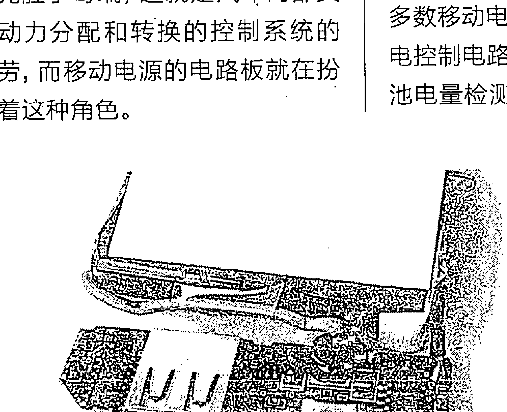

### 当电芯充电时

当你给移动电源充电时，输入充电控制电路就开始发挥功效了。它主要的工作就是根据电池电压的变化，对充电电流进行控制，也就是多段式的充电方案。比如：当电池电压<3V时，充电电路将进行涓流充电，也就是依照100mA的电流对电芯充电（保护过度放电后的电池）；当电池电压>3V时，充电电路将切换到恒流充电，用1A（移动电源最大输入电流）的大电流对电芯充电；当电池电压≈4.2V时，充电电路将改为恒压充电，直至充电电流降到100mA左右时停止充电。

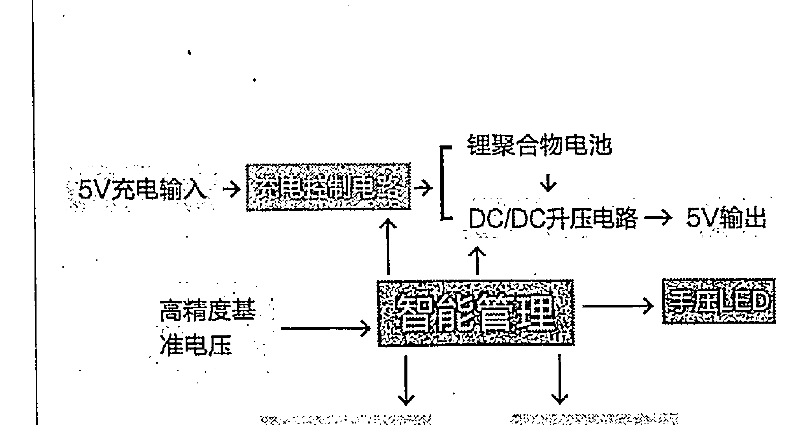

## 《电脑爱好者》·合订本 {特别话题}

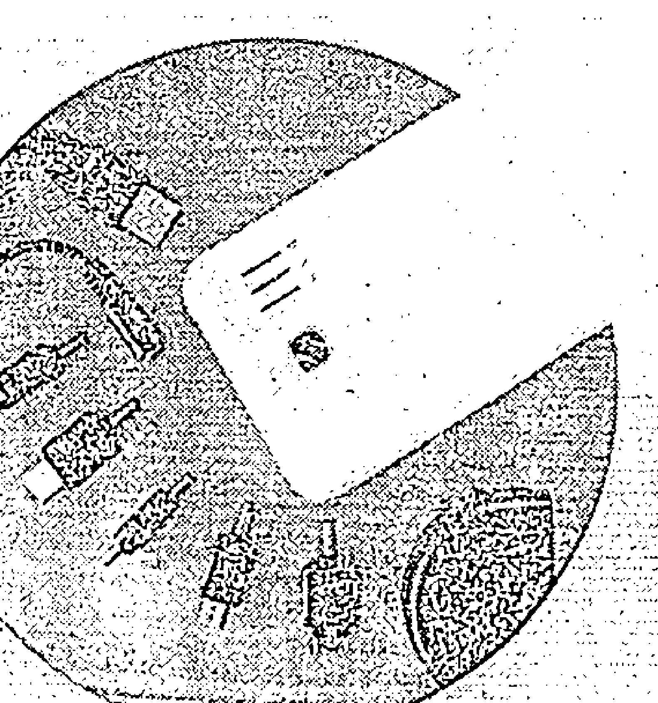

配备不同的接头移动电源可以为不同的设备充电

电池一路发展基本原理没有多大改变，主要就是各种材质的不断优选及电池结构的改良。不过随着数字移动设备的普及，这些设备自带的电池动力已远远不够使用，比如在外出差或旅行，紧急时间手机没电，或者拍摄正酣时数码相机停电罢工，这些事屡见不鲜。这时移动电源应运而生了。

移动电源又称外置电池、后备电池等，或称之为行动电源。它最早出现在2001年CES展览会上，当时有一个学生展示了最早的移动电源概念产品，他通过一个控制电路将几节AA电池拼凑在一起，用来给其他数码设备供电，引起一些参展商的关注。不过在2001~2003年之间，移动电源产品一直处于概念阶段，技术不成熟，也没有形成有效的市场。

随着数码移动设备的普及与多样化，用户对移动电源的要求越来越大，各大厂商开始迅速切入，市场逐渐成熟起来。与之相呼应的，移动电源的相关技术也得到飞速发展。当下移动电源的核心电池技术，与前面介绍的电池原理基本相似，不过整体设计上功能更加全面，比如为了系统安全可靠地工作，增加了充电管理系统，为了给其他便携式设备充电增加了升压系统等等。

有问有答

问：为什么用电脑的USB接口给移动电源充电的时间往往会更久呢？答：USB2.0接口只能提供500mA的电流，远不如移动电源自配充电器的1A（或更高）。因此，当你给移动电源，特别是大容量的移动电源充电时，尽量使用原装充电器。

### 当电芯放电时

锂电池的平均电压多在3.7V左右，但类似手机、iPad等移动设备的充电电压均以5V作为标准。因此当移动电源与其它设备相连的一瞬间就会触发输出DC/DC转换电路启动，将电芯在3.0V-4.2V间浮动的电压转换成5V给这些设备充电。

移动电源的输出电流越大，意味着兼容性和通用性越强。比如某些手机的额定充电电流为1A，但移动电源的输出电流最高只有500mA，此时充电时间会延长一倍，而有些移动电源的输出电流可达2.1A，意味着它们可为iPad等平板电脑进行快速充电。需要注意的是，手机在充电时会自己控制输入的充电电流，比如iPhone的额定充电电流为1A，用2.1A输出能力的移动电源给其充电，实际的充电电流也只有1A而已。

有问有答

问：移动电源的充电器能给手机充电吗？答：没问题，因为手机额定充电电流是固定的。目前绝大多数移动电源和手机的充电接口都是MicroUSB标准，因此以后我们出门时只需携带一套充电器+数据线（充电线）就能兼容移动电源和手机这两种设备。

### 人性化的功能

为了便于用户使用，很多移动电源还会配备电池电量显示电路以及电池保护电路（图10），这些电路都是通过单片机实现。其中前者可以通过不同颜色或数量的指示灯来显示当前的电量，而后者则可在电池出现放电时过流、放电时电压过低、充电时电压过高这几种异常情况下关闭电池与外部的连接，保护电池的安全，避免爆炸、燃烧等危险情况的出现。

至此，相信你已经对移动电源内部的这个“小身板”有了足够的认识。电芯固然重要，但如果没有靠谱的管理者，再大的容量也是枉然。

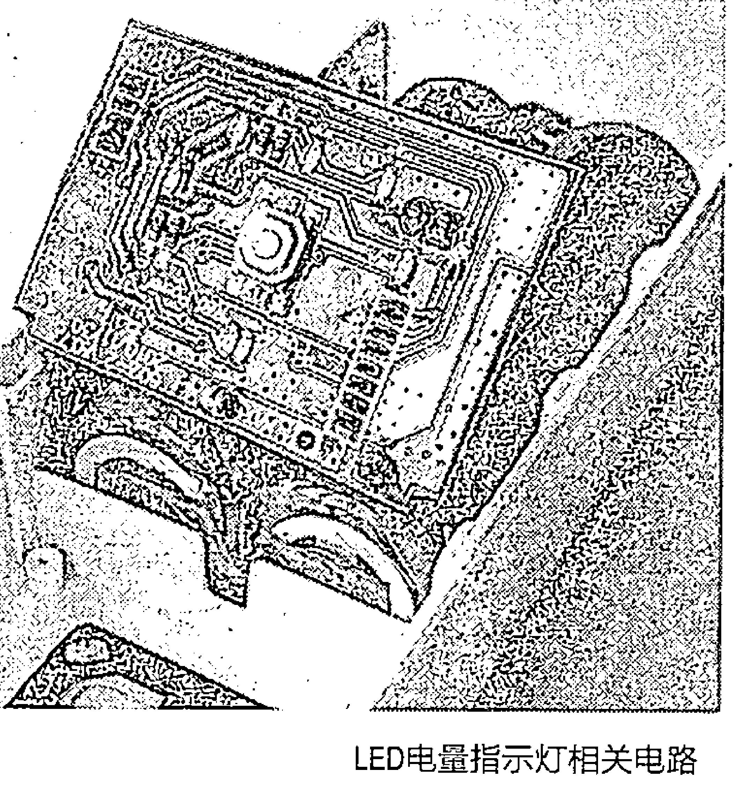

## 重新审视虚标问题
文|hiker

由于缺乏监管，虚标几乎已经成为移动电源领域的“潜规则”。一款标称5200mAh的移动电源，最多只能给一款1800mAh电池的手机充满两次电，那余下的电力跑哪去了？如果你想加入移动电源的行列，那就不得不正视虚标问题。

### 无法回避的转化率

前文我们提到过，移动电源内部的电芯（18650和锂聚合物）标准的电压多为3.7V（平均值），但是手机等数码设备的标准输入电压为5V，充电时需要电路板的DC/DC转换电路进行一次升压的操作。问题就在这里，根据能量守恒定律，升压的同时必然伴随着电量的耗损。

还是以诺基亚DC-16为例，它实际就由一颗18650电芯（2200mAh）构成的产品。通过2200（mAh）÷ 1000 × 3.7（V）这个公式可以计算出该电池的总能量为8.14Wh。在经过DC/DC转换电路升压到5V之后，由于电池总能量是固定的，因此此时电量也就变成了8.14（Wh）× 1000 ÷ 5V = 1628（mAh），这就好比我们将一杯3.7升的水倒进了5升的杯子里，原本2200mAh的电量就只剩下原来的74%（1628mAh），而这1628mAh就是诺基亚DC-16实际能提供给手机充电的电量。

问题是，移动电源在给手机充电的过程中还会有进一步的电量耗损。其中主要表现在电池发热（散发的热量就是内置电池的能量）、各种电路板和导线的电阻耗损（同样会因发热而耗费电池能量）、电池因电压的变化而引起的转换率耗损（电池安全放电的电压是在2.7V 4.2V之间浮动的，在不同范围里的耗损率也是有差别的）。此外，当我们给手机充电时，手机本身也在消耗移动电源的电量，如果你充电时还在打游戏，肯定会导致电池可用电量的进一步缩水。

小提示：
小米手机的电池为2000mAh，笔记本电脑的电池普遍在4400mAh左右，但二者的体积却相差数十倍。由此可见，“mAh”（毫安）只能作为电池充、放电的指标，真正反应电池所储能量的单位则是“Wh”（瓦时），二者的换算公式为“Wh = mAh/1000 × 电压”。

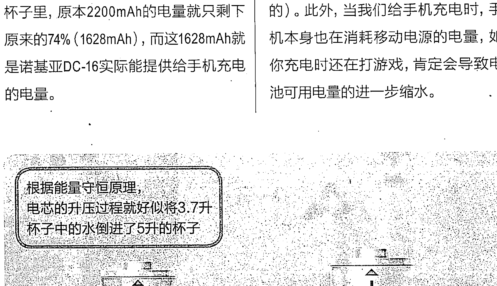

### 拓展阅读
行业内其实有计算移动电源转换效率的标准公式，即：（实际放电容量 × 平均放电电压）/（电芯容量 × 3700mV）= 转换效率。可惜普通用户是没有条件获得具体产品实际放电容量和平均放电电压这两个参数的（需要用专业设备）。因此，本文所提供的计算实际转换效率的方法只是一种从原理出发的计算思路，仅供参考。

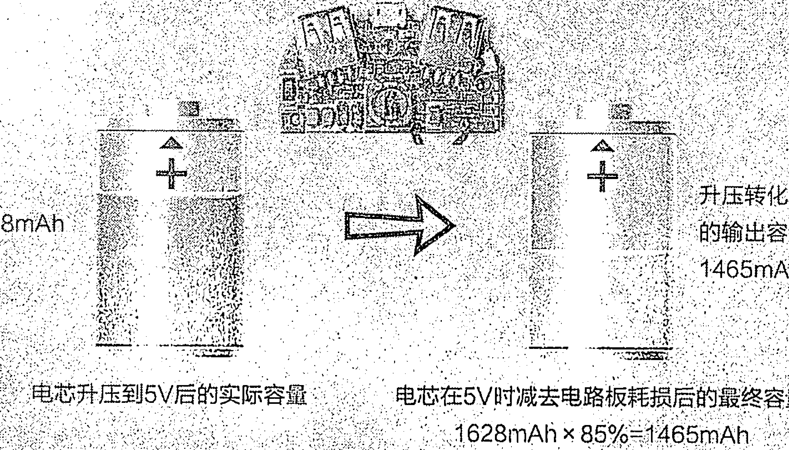

经过一番各种元器件的耗损后，DC-16真正能到达手机电池中的电量也就只剩下1628mAh可用电量的85%左右了，也就是1465mAh。由此可见，DC-16的电池从2200mAh的标准电量到1465mAh的实际输出电量，实际转化效率只有62.9%，自然充不满Lumia 900所配备的1830mAh电池了。

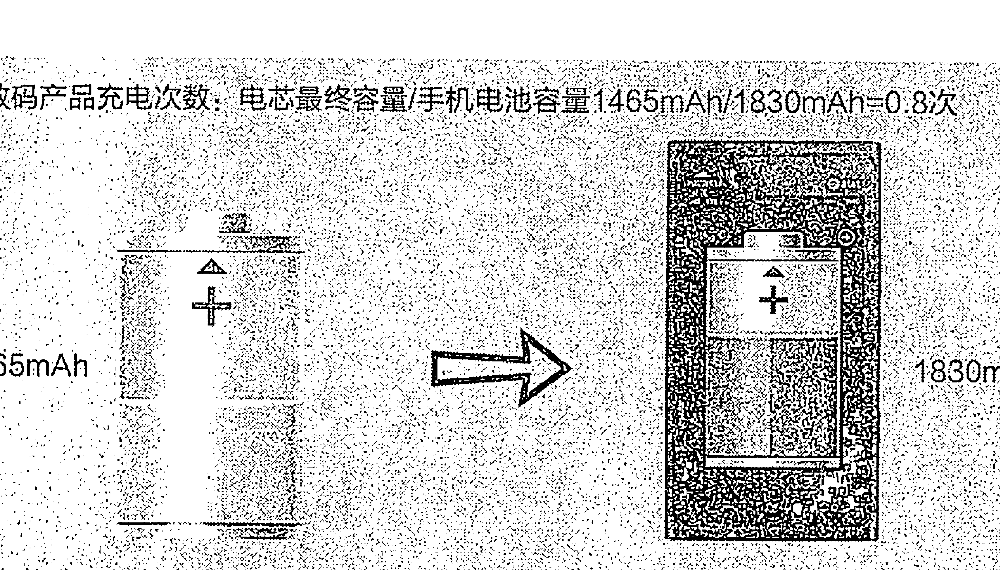

所有移动电源在为手机充电时都要面临转化率的耗损，而这部分的消耗量主要取决于电路板和相关线材的品质（比如内阻大小、电路的优化等等），一般只有知名品牌可以将实际转化率做到65%以上（升压损耗+电路板耗损）。总之，由转化率而引发的移动电源实际电量缩水属于正常现象，并非我们俗称的“虚标”。那么，真正让人深恶痛绝的虚标问题到底体现在哪里？

**小提示：**
很多移动电源都会提供电量指示灯或数字来显示当前的电量，但大家不要太过迷信这些所谓的电量信息。因为电芯只有在4.2V时的放电效率才是最高的，到3.3V就基本停止了，转化的容量肯定是前面多后面少，虎头蛇尾。如果充满一次手机才显示消耗了移动电源20%的电量，千万不要以为还可以再为手机充满4次，这些指示灯和数字信息只是用线性的东西尽量模拟曲线。

### 理应严打的恶意虚标

真正的恶意虚标，主要体现在电芯和移动电源宣传时所标称的容量参数上。

### 电芯制造商

首先是电芯制造商，目前只有三星、三洋、松下和少数国产电池厂家可以做出2800mAh甚至3000mAh的18650电芯，而绝大多数国内电池厂家的18650还停留在2000mAh左右。为了迎合大家的需要，设计容量仅有2200mAh的18650电芯却被贴上了2400mAh甚至2600mAh标签已经成为了行业内的潜规则。

此外，做到2600mAh或以上容量的国产18650电芯的正极材料都是钴酸锂，而镍钴锰（三元材料）只能做到2400mAh。再有就是18650电芯不存在2300mAh和2500mAh的型号，A品的18650电芯往往会将容量高于2500mAh的电芯归类到2600mAh，而低于2500mAh的则归到2400mAh，这是默认行规，也是正常现象。

电芯虚标主要会损害那些喜欢自己买电芯和电路板，自行DIY移动电源的用户，影响力相对有限。而来自移动电源制造商的虚标现象，则应该引起我们的高度警惕与排斥了。

## 移动电源商

出于利益的驱使，很多移动电源制造商都喜欢夸大宣传，玩起了虚标容量的文字游戏。比如内置4节18650电芯的移动电源，电芯实际容量明明是2200mAh（总容量为8800mAh），但还是贴上了10400mAh的标签，这种虚标案例是最多的。实际上，“就近归类”已经成为了移动电源产业的一条不成文规矩，像4400mAh为了好听就往上一个档次标注为5000mAh，11000mAh的再努把劲儿标到15000mAh等。需要注意的是，除了18650电芯以外，采用锂聚合物电池的设备也存在虚标的问题，比如高漫G6600这款移动电源，明明采用了两块2500mAh的锂聚合物电池（图11），但却以6600mAh的容量宣传。类似的情况还出现在iPower i520（标称/实际：6600mAh/5800mAh左右）、品能PN-906（5600mAh/5400mAh左右）、泓能N2642（4200mAh/3900mAh左右）等等。

> **小提示：**
> 除了容量上的虚标以外，有些移动电源还存在输出能力的虚标上。比如参数上写着支持5V/2.1A的输出，但在提供2.1A输出电流时的输出电压却还不到4V，无法在其标称参数下提供充足的输出能力，实际的结果就是无法给iPad充电或充电缓慢。

相对而言，知名品牌的虚标现象会少一些，但对那些在淘宝等电商销售的不知名甚至山寨品牌，则是虚标的重灾区，而且虚标的幅度往往令人瞠目结舌。如果你想了解如何辨别移动电源是否虚标，请关注本专题后面的内容。

虚标固然可恨，但它最多只会影响到移动电源的实际充电效率。但与虚标问题相比，移动电源的安全性才是最应该引起我们关注的话题。

移动电源爆炸、自燃的现象并不鲜见，而导致这一切极端问题的根源就是劣质电芯。由于锂聚合物电池的生产有一定的技术门槛，所以品质要相对可靠些。99%移动电源“事故”主角都是基于18650电芯设计的产品，因此，这里我们主要以18650电芯为主加以介绍。

## 安全始终排第一

文|hiker

作为蓄满电量的“能量体”，移动电源在为移动设备提供不间断动力输出的同时，在极端情况下可能也会出现严重的质量事故。因此，“安全第一”的重要性不言而喻。那么，究竟哪种移动电源才算得上安全呢？

## 18650电芯的ABC

一般来说，三洋、三星、松下等知名品牌生产的18650电芯都是有品质保证的，可惜这些一线品牌的原装电芯成本较高。为了尽可能降低成本，绝大多数移动电源厂商更倾向于采购国内电池厂生产的18650电芯。我们都知道，任何电子产品在生产的过程中都存在“良品率”这个概念，18650电芯自然也不能例外。问题就出现在这里，正规电池公司会对生产出来的18650电芯进行分类：

- A品：电芯容量、电阻值等参数全部达标，采购价格相对最高;
- B品：容量、电阻值等某些参数不在标准内，采购价约是A品的1/3;
- C品：基本就是废品，甚至会论斤开卖。

有些缺乏操守的移动电源厂商会点名采购B品18650电芯，这就导致了生产出来的产品存在严重虚标或使用寿命偏短的问题。而少数山寨厂商甚至专卖C品电芯，出现爆炸或严重事故的产品就是C品电芯的受害者。此外，现在从洋垃圾中回收18650电芯也已经开始了产业化的运作，如将废旧笔记本电池中的电芯拆出来放在移动电源里（图12），这种拆机电芯的品质介于B品和C品之间，价格也就1元到2元一节。

除了电芯以外，洋垃圾中拆出来的电路板、水口料的外壳（就是拆的垃圾粉碎了再用的）等劣质材料也是不少山寨厂商钟爱的选择（图13），当这些“极品”元器件结合在一起，厂商再精简了保护电路，你觉得这种产品不爆炸还等什么呢？

## 考验品牌良心

由于电芯是深藏在移动电源内部的，普通消费者只能从产品的参数列表中窥探电芯的基本参数，毫无甄别A、B、C品电芯的能力。但移动电源制造商则不同，他们有足够专业的设备检测所有批次电芯品质的能力，所以一旦出现采用B品或C品电芯的现象，绝对是该品牌的良心问题！

看到这里，相信你已经对移动电源有了初步的认识，并也掌握了选购此类产品的最基本常识。当然，光有理论知识还不够，接下来你将看到产业专家解读移动电源市场，以及更详尽的选购经验。

## 破解猫腻 见招拆招识山寨

文|caoxl830323

在淘宝上，50元就能买到10000mAh的移动电源，你相信吗？借助电商平台，很多山寨品牌都靠五大绝招吸引客户，以次充好。那么，我们又该如何破解这些所谓的招式呢？

### 第一招：偷换概念

招数说明：都知道18650电芯便宜，锂聚合物更安全。因此不少商家就将两类产品融到了一起，并以“18650聚合物电芯”作宣传。

破解思路：在18650电芯里装锂聚合物可谓是电池行业里的笑话。18650电芯就是一种圆柱型的电池体，而锂聚合物都是扁平软包的形式。这就好像你到卖糖三角的店铺和老板说：“我要个糖三角（18650），里面要肉馅（锂聚合物）的”。请问，那你为什么不直接买个肉包子呢？

点评：请记住，18650电芯没有锂聚合物的。所以，想自己DIY移动电源，或是某款移动电源以内置“18650聚合物电芯”为卖点宣传的产品，请隔离它们。

### 第二招：夸大宣传

招数说明：都说大容量和便携不可兼得，那我就给你兼得一回。20000mAh的320g，30000mAh的才330g，可是相当便携啊。

破解思路：每颗18650电芯的重量大约在45g左右，即便你使用的是3000mAh的18650电芯也需要10颗才能组建30000mAh的容量（何况国产18650电芯最高只能做到2800mAh左右）。问题来了，单就10颗18650电芯的重量就已达450g，再算上电路板、外壳，怎么可能只有330g呢？此外，18650电芯直径为18mm，10颗就是18cm，怎么可能被塞进13.5mm的机身里面呢？

点评：你相信有哪个厂商会“缩小术”，能在只能容纳6颗电芯的空间里塞进10颗电芯吗？不相信？那就对了。

### 第三招：狸猫换太子

招数说明：看某款移动电源卖的不错，那就采购一批和该产品一样的外壳，然后上演一出“狸猫换太子”的大戏，将A品电芯换成C品，价格不就下来了吗？

破解思路：这属于“绝户技”，普通消费者根本无法从外观分辨两类产品的真假，只有拆来才能看到电芯。有点良心的可能会替换成B品电芯来造假，缺德的可能会塞进随时都爆炸的C品或拆机电芯。更有些极品商家会在原本能装6颗电芯的壳子里只装一颗电芯，然后用相同重量的铁棒卡在里面来充数。需要注意的是，此招并不仅限于18650电芯，聚合物锂电池也同样存在类似的问题，在硕大的空间里仅放一块小小的聚合物电池软包。

点评：此招无解，只能莫贪便宜。请牢记：天下没有免费的午餐，羊毛总会出现羊身上。

### 第四招：广告好评轮番上

招数说明：消费者都是善良的，一则带有足够诱惑性言语的广告就足以让其埋单。因此，很多商家就利用淘宝直通车，长期霸占首页最好的广告位，让你不信也信了。

破解思路：不要太过迷信淘宝某些广告位上推荐的产品，特别是夹杂着夸张宣传词汇的信息。1000次充电，iPhone的电池也没有这么长的寿命啊。此外，很多商家都会在产品的介绍页上贴上好评信息，但有些一看就是刷出来的，所有好评的内容基本一致。因此，在选购不知名移动电源时，一定要多参考中评和差评，这里才能体现出产品真实的产品质量。

点评：就移动电源而言，不要太善良了，什么广告都信，多看看一些反面的评论，说不等能让你眼前一亮。

### 第五招：不可思议的低价

招数说明：低价，始终是最具“杀伤力”的武器，而这也是很多山寨移动电源火爆热销的核心秘诀。一款12000mAh的品牌移动电源卖199元，一款无牌但号称高品质的移动电源则卖50元，谁的吸引力更大不言而喻。

破解思路：50元做出12000mAh的移动电源纯属开玩笑。我们可以分析一下移动电源的成本，即使是便宜的国产2600mAh容量的18650电芯（A品）也在12元-15元之间，要做到10000mAh至少需要4颗也就是48元-60元（此时还严重虚标），这还不包括包装、外壳、PCB板、数据线等物料成本。想做到50元还有利润，那就只能用B品或C品电芯、PCB板用拆机料、胶壳用水口料。同理，当某款移动电源的价格远低于相等容量产品的市场价时，往往都存在电芯和用料的缩水，极大增加严重安全事故的发生几率。

点评：便宜没好货，好货也不会太便宜，这是真理。超大容量的移动电源如果品质不过关，那就是一颗随身的炸弹啊！

小结：抛开正牌厂商不谈，就各种山寨移动电源现在仍处于一个劣币驱逐良币的市场环境，只要消费者仍有盲目追求超大容量和超低售价的需求，就很有可能陷入不良品牌或商家暗藏的陷阱之中。本文提到的五个绝招只是骗人秘诀的冰山一角，而且卖家总比买家精，我们唯有抛开占便宜的心里，才能有机会占据上风。

## 移动电源选购指南

### 从需求出发

文|hiker

和虚标划清界限。以BG微络斯Pow-Core移动电源为例，这款产品内置两块由ATL公司（东莞新能源电池有限公司，苹果电池供应商）生产的最低容量为1530mAh的锂聚合物电芯所组成，实际容量在3060mAh左右。不过这款产品在参数中的标注容量值却定在了3000mAh，可以算是实际容量大于标注容量的代表。

与其类似的还有航嘉PBA5200（图1），这款由两块2600mAh锂聚合物电芯组成的移动电源实际容量甚至超过了5600mAh，较5200mAh的标注容量提高了400mAh!

与没有品牌的山寨产品相比，品牌移动电源厂商的自律性普遍较高，很少有采用B品或C品的问题电芯，很多产品电芯的实际容量甚至还要高于标注容量。因此，如果你注重品质，想购买一款靠得住的产品，一定要从品牌移动电源中选购。随着各大专业媒体不断加大对移动电源市场的关注度，绝大多数正规品牌都越加注重口碑的建设。因此，如果你没有足够的基础知识，无法辨别淘宝中无数低价产品的真伪，那就不要犹豫，投入品牌移动电源的怀抱吧。

> **小提示：**
> 品牌移动电源当然也存在虚标的现象，比如去年上市的品能PN-906、iPower i5200和高漫G6600等少数型号就出现了不同程度的虚标问题。不过与前文提到的山寨产品相比，这类产品的虚标幅度基本都在10%左右。
> 除了与虚标划清了界限之外，品牌移动电源大都会采用A品的电芯和优质电路板，转换效率和输出电压/电流的稳定性也有所保障。虽然在同等容量下这类产品的价格会略贵一些，但安全和稳定才是第一位的，不是吗？

### 容量本着够用就好

如今不少智能手机自带的电池容量都超过2500mAh了，那像诺基亚DC-16这种只有2200mAh容量的移动电源（图2），还有什么存在的意义？但从实际的销量来看，很多3000mAh以内的移动电源依旧受到追捧。这就是一种理性消费的表现。比如，有些用户就希望手机可以提供一整天的持续游戏、上网、社交的电力。可惜只靠手机自身的电池总差那么几小时，此时一款小容量移动电源刚好弥补余下的时间，而更大容量的产品就有浪费之嫌了。但是，对于那些需要经常远途出差，或是工作环境没有可用电源插座的用户而言，一款大容量的移动电源则可以免去为手机补充电力的后顾之忧。因此，容量的大小要结合我们的实际需求。此外，对于是18650电芯好还是锂聚合物电芯好的问题，在容量和便携性方面，一般来说，容量越小体积越小，锂聚合物电芯要比18650电芯更容易做薄做小。

### 便携才是应尽职责

继续前面的话题，一些小容量的移动电源备受追捧，与其在便携性方面的优势密不可分。请不要忘记，容量永远和重量成正比。5000mAh以下容量的移动电源大都可以控制在100g到150g之间（图3），而10000mAh的产品普遍会超过250g，而且体积也会成倍增加。在临近夏日的当下，超大容量的移动电源显然不适合与我们一起顶着烈日外出吧？

因此，2013年的很多新款移动电源都更青睐用锂聚合物电芯来打造更为轻薄的身材，而在相同容量下比拼重量，也将成为下半年移动电源产品的竞争方向，毕竟移动电源中的“移动”两个字才是核心卖点。

### 基础参数不容忽视

如果你家里没有iPad一类的平板电脑，那就没有必要选择输出参数为5V/2.1A的产品，5V/1A的标准输出参数就足够了。反之，如果你家里有平板或计划购买平板电脑，那就必须选择输出电流高于2A的移动电源了（否则会充不上电）。

在购买大容量移动电源时一定要留意产品本身的输入参数，也就是给移动电源自己充电的输入电流。目前绝大多数移动电源的的输入参数多为5V/1A，如果电源容量为16000mAh，那就意味着需要至少16个小时才能给移动电源充满电。因此，如果你计划购买大容量产品，就请优先考虑输入电流达1.5A或2A的产品。

### 功能特色莫贪多

现在很多移动电源都会加入类似手电筒、电量提示灯甚至3G路由等功能。在保证移动电源基础功能的前提下，在相似的价位上能提供的功能自然是越多越好，但大家千万不要因为可以贪图某些功能而牺牲移动电源的本职工作。

### 养成正确使用习惯

在给移动电源充电时，尽量使用移动电源自身标配的专用充电器，特别是10000mAh容量以上的产品。对配备两个USB输出接口的移动电源，尽量不要长时间为两款手机同时充电，否则可能导致电源内部的电芯过热。此外，用移动电源给手机充电时，尽量让手机处于待机状态，不要在充电的途中还进行游戏或上网等操作，否则会大幅降低充电效率。

移动电源对温度环境有一定的要求，通常在－15℃到60℃之间，温度过高或过低都可能对电芯造成不可逆的损坏。因此，冬天外出时尽量将移动电源装在包包的深处（注意保暖），夏季时切记不要将其放在太阳下直射或留在无人看护的汽车内（温度突破锂电池承受上限容易引起爆炸或起火）。

## 编后记

毫无疑问，移动电源已经走进了我们的生活。只是，现在移动电源市场的混乱程度已经初步呈现出当年MP3时代的混乱氛围了。高需求、低门槛的产业特性，甚至就连个人都能加入到移动电源的生产制造中，标准和监管的缺失，则进一步加剧了移动电源在安全方面的隐患。在这种市场环境下，将品牌、口碑视为优先选购条件就显得尤为重要了，而出于自身的实际需求理性挑选最适合自己的产品，不就是追求“性价比”的真谛吗？

## 移动电源安全吗

文|深度

移动电源越来越普及，安全性成了许多人关心的话题，毕竟网络上经常会出现一些因移动电源而起的事故讨论。当我们对移动电源的结构及工作原理有所了解后，对它的安全性问题也就明了了。

### 移动电源结构剖析

移动电源一般由电芯、电路和外壳等几部分组成。电芯是移动电源的核心，其实就是电池，常用的有聚合物锂电、18650锂电、AAA镍氢电池等。电路部分主要包括升压系统和充电管理系统等，用来充电和放电管理。外壳一般有塑胶壳、金属壳等，虽然它是附属品，但要靠它来保护电芯和电路，方便人们的使用，所以也是必不可少。

为了既享用锂电池的性能又尽可能避开它的风险，人们对锂电池进行了一些改造，一方面在锂电池中添加了能抑制锂元素活跃的成份（如钴、锰、铁等），另一方面则用胶态聚合物电解液替换原来的液体电解液。胶态电解质因为不会像液体电解质那样受热沸腾产生大量气体，从而大大减少了剧烈爆炸的可能。不过需要注意的是，虽然聚合物电池增强了安全性，但并不能保证万无一失。

### 移动电源为什么会爆炸

这是不少人关心的问题，事实上也确实发生了一些移动电源爆炸的事故。那么某些移动电源为什么会爆炸？问题主要出在电芯上（也就是电池）。部分不法的移动电源生产商，采用劣质廉价的“垃圾电芯”，也就是那种已经使用过的老化了的废弃电芯，配以简陋的电路板，装入外壳后即行出售。这类劣质电芯频繁使用往往会产生非常高的热量，电芯在高热环境下膨胀，从而导致燃烧或爆炸。

其实对所有锂电池来说，一直都有这样的风险，因为锂是一种非常活跃的化学物质，很容易燃烧。电池在放电、充电时内部会持续升温，另外在过充情况下锂离子生成的锂枝晶可能会刺穿隔膜形成内部短路，这会产生过大的电流从而释放出巨大热量，而高温又会导致电解质被电解产生气体，于是电池内部的膨胀压力升高，就有可能挤破外壳产生漏液，最终导致氧化燃烧甚至爆炸。

### 什么样的电芯才安全

电芯作为移动电源的核心部件，它不但直接影响着移动电源的性能，同时也攸关移动电源的安全。据前面的分析，锂电池具有较大的风险，与之相比，镍氢电池的安全性相对要高一些。不过，镍氢电池的效率无法与锂电池相比，而且在过充、过放、过流、短路等异常情况下，镍氢电池同样也会产生过热而存在出事的可能。

### 保护电路的工作原理

上面分析了移动电源中电池存在的风险，其实如果使用正规品牌厂商、质量合格的产品，再加上正确的使用方法，那么事故发生的概率实际上是极低的，几乎可以忽略不计。

移动电源的安全中，厂商对电池本身的选择起着非常关键的作用，除此之外还需要通过专有的电路系统对锂电池进行有效保护，比如当发生过充、过放、过流、短路等异常情况时，系统能自动关闭电池与外部的连接，从而保护电池的安全。

在电池保护电路的芯片中，会置有相应的控制程序，一般会包括状态判断、数据采集、均衡处理、数据显示等多个模块协同工作。

保护系统中的数据采集是一个非常核心的功能，大部分操作要依据它的信息进行后续处理。比如通过采集电流信息，才能判断出当前是充电、放电还是闲置状态，以及是否有过流现象。采集电压数据并进行分析后，系统才能确定是否启动均衡处理，以及是否有过充、过放等现象。采集温度数据，则能依据它判断温度是否过高，是否启动过温保护等。

各类数据的采集，可通过一些专有元件来实现，比如对电流的采样，可以通过霍尔电流传感器来完成，这一传感器的工作原理基于霍尔磁平衡式。大家都知道，当电流通过一根导线的时候，会在导线周围产生磁场，该磁场大小与流过导线的电流大小成正比。这一磁场可以通过软磁材料来聚集，再通过霍尔器件进行检测，由于磁场的变化与霍尔器件的输出电压信号有良好的线性关系，所以利用霍尔器件测得的输出信号，能够直接反映出导线中的电流大小。传感器采集到的信息，被送往管理系统进行分析，再根据分析结果给出下一步的处理操作。其他如电压、温度、过充、过放等，也有相应的元器件进行信息采样，处理的流程大同小异。

### 移动电源呼唤行业标准

平板电脑、智能手机等高耗电设备的流行，让移动电源也随之红极一时，成为国内配件产业最重要的产品线之一。由于技术门槛较低，市场需求量大等诸多因素，目前国内移动电源品牌数不胜数、乱象纷呈，产品质量良莠不齐，安全问题更是备受关注。但令人遗憾的是，在这样的大环境下，移动电源依然没有建立起行业标准，普通用户的利益无法得到保障。没有行业标准的约束，无疑会破坏这个行业的健康发展。一个好消息是，国家质检总局、国家计量院这两家国家级官方标准制定机构，正在对移动电源产品进行评估，将推出相应的行业标准。移动电源产业将面临新一轮洗牌，让我们拭目以待吧。

## 下个十年的新型移动电源

## 移动电源路在何方

文/流言

从右图的比较可以看出，国外用户从2004年即开始高度关注移动电源，一直比较平稳。而国内用户，直到2011年下半年才开始发力，到2012年7月达到了一个高峰，是一种爆发式的增长。与之相呼应的，是国内移动电源生产厂商的崛起，大品牌厂商几乎全都在中国。

从2001年CES上简陋的概念，到如今形形色色五彩纷呈的产品，移动电源一直呈现稳定的上升趋势。当我们通过谷歌的工具进行趋势分析的时候，会发现一个非常有趣的现象。在谷歌趋势 (http://www.google.com/trends) 中分别搜索英文Mobile Power及中文“移动电源”，分别得到如下两幅趋势图。

不过令人担忧的是，国内生产的移动电源，技术含量普遍并不高，真正质量过硬的也是屈指可数的几家。可能正因为技术门槛偏低，才导致移动电源厂商泛滥，鱼龙混杂，让市场有些混乱。希望国内厂商能在核心技术上持之以恒地投入更多力量，而不仅仅是满足一时的市场需求，或者仅仅是在外包装上下功夫。

移动互联网的发展带动了移动电源的强劲需求，大容量、小体积、便携易用、时尚新颖以及更多附加功能，是移动电源的总体发展趋势。另外还有不少技术，虽然并非最新发明，但限于条件仍然没有普及开来，这些技术也许就是未来移动电源发展的一些方向。

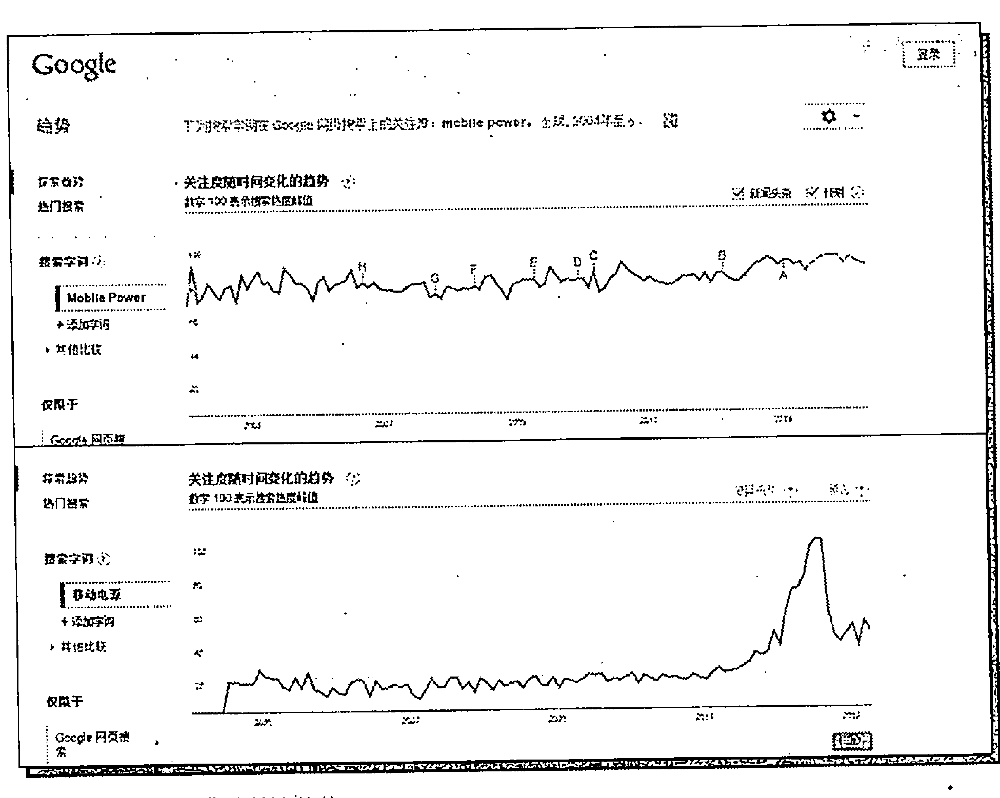

### 薄膜太阳能电池

移动电源要想做到既要容量大而且体积小，最关键的是电池的改进。传统的电池材料，其功能大部分已发挥到极致，于是人们开始着手开发全新的材料，其中薄膜电池技术就是令人瞩目的亮点之一。

薄膜电池全称薄膜太阳能电池（Thin film solar cell），它使用极薄的玻璃、塑料、陶瓷、石墨或金属片等材料作为基板，与能够产生光伏效应的材料（如单晶硅、多晶硅、非晶硅、砷化镓、硒铟铜等）一起制作而成，可产生电压的晶体厚度仅达几微米，大大节省了硅晶等原材料，降低了成本。薄膜电池接受太阳光就可以发电，节能环保。

薄膜电池的发电原理其实与晶硅差不多，当太阳光照射到薄膜电池上时，电池吸收光能产生“光生电子-空穴”对，在电池内建电场的作用下光生电子和空穴被分离，空穴漂移到P侧，电子漂移到N侧，从而形成光生电动势，当外电路接通时就会产生电流。

上面所称的P侧N侧，是指P型晶体硅经过掺杂磷可得N型硅，形成P-N结，P侧指P型硅，N侧指N型硅。

薄膜电池的优势是成本低，可以随时随地利用接触到的太阳能。不过现阶段来说，它的转换效率不高，稳定性也有待改进，应用到移动电源中并进入实用阶段，还有一定的距离。

### 压电材料技术

除了薄膜电池，压电材料技术也渐受青睐。所谓压电材料，就是在压力作用下两端面间会出现电压的晶体材料。1880年，法国物理学家居里兄弟就已经发现压电现象了，他们在实验中发现把重物放在石英晶体上面时，晶体表面会产生电荷，电荷量与压力成比例，这一现象被称之为压电效应。后来他们又发现，如果反过来施加电压，则会产生机械应力，这被称之为逆压电效应。生活中的打火机就应用了压电技术，它的点火部分就装置有压电陶瓷。

压电材料大多数为铁晶体管，另外还包括石英、硫化镉、氧化锌、氮化铝等晶体。这些压电材料之所以会有压电效应，是因为这些晶体内原子间的特殊排列方式，具有应力场与电场耦合的效应。

压电材料可以快速地将机械能与电能进行互换，是非常理想的新能源材料，随着研究的深入技术的发展，它将为未来的移动电源提供最方便的电力，比如你走路时产生的热能，甚至脉搏产生的动能，都可以方便地转化为电能储存到移动电源中。

### 无线充电技术

前段时间，诺基亚在推销Lumia 920时，无线充电便是它的一大卖点，但是除了美国的一些地铁、机场拥有无线充电器外，其他许多地方并没有相应的无线充电设施，所以这一技术目前来说只是一个噱头。不过，无线充电的方便性是显而易见的，它的普及势不可挡，未来或有可能成为手机、移动电源等的标准配置。

无线充电的硬件由两部分组成，一个是插座上的发信器，另一个是电子设备（如移动电源）上的接收器，它利用电磁感应的原理，在充电器与设备之间的空气中传输电能，一定的范围内电源可以瞬间实现有效传送。

- 1. 发送器。插在墙上的电插头，会发送安全而低电压的无线电电波。
- 2. 无线电电波。撞到物件或墙壁会改变频率。
- 3. 接收器。安装在用户的电子产品上，仔细分辨原来的电波频率，可捕捉多达70%的无线电信号能量，然后转化成直流电。

## 你所不知的几大移动充电发明

智能手机等设备的最大缺点就是电，电池续航时间短，是令许多人苦恼的问题。国外研究人员为此提出不少解决方案，下面列举几项比较有意思的发明。其中有几项，使用的就是压电材料及太阳能发电。当然，它们还只是初级研发阶段，还不能真正走进生活中。

- 1. 超级快充，1秒完成手机充电。美国伊利诺伊大学科学家最新研制，充电速度比传统锂电池快1000倍，而且厚度仅与信用卡相当。
- 2. 呼吸充电面罩。巴西科学家拉斐格利亚日前发明了一种神奇面罩，能够将使用者在呼吸过程中产生的风能利用起来，为手机等小型电器充电。
- 3. 骑车给手机充电。沃达康公司展示的一款全新的充电装置，仅有字典的大小。通过该装置可以进行太阳能充电，同时也可以跟自行车相连给手机充电。
- 4. 摩擦起电为手机充电。美国佐治亚理工学院的研究人员开发的一款原型产品，能利用运动，例如手机在口袋中晃动产生的静电给手机电池充电。
- 5. 能发电的野营火炉。据果壳网报道，BioLite公司推出一款新的野营火炉，通过炉子上自有的USB接口，可以给任何具有USB充电接口的设备与其连接，进行充电。
- 6. 小便也能充电。国外一家工作室发明的杯子泥盆，它有红蓝两面，不需要任何外接电源，使用时可以将一杯热饮放在红色面，或将一杯冰饮放在蓝色面，即可提供为手机充电的电能。
- 7. 摇一摇，iPhone动能充电器。据国外媒体报道，Infinity Cell公司推出一款全新的iPhone动能充电器，用户只需晃动该设备，就能为iPhone充电。
- 8. myFC PowerTrekk充电器，有水就发电。据国外网站Geek报道，myFC PowerTrekk可以用来发电，电量虽小，但可以满足手机等小型移动设备的充电。

## 办公那些事儿可以更简单

随着科技的发展，办公软件功能越来越强大，办公设备的更新换代也让办公变得更加轻松。作为职场一员的我们，虽然工作岗位各不相同，但都有着你所未知或闻所未闻的办公小技巧、办公新方式。这不，在这个季度总结大会上，我们公司的几位优秀员工就根据他们的工作岗位总结了不少精巧、实用的办公诀窍。

## 资深文员

作为公司的文员，我主要负责整理公司日常文档，同时还要做好每次公司会议记录。经过多年的工作磨练，我掌握了不少文档处理技巧。

### 文档正规我有一套

### 轻松玩转文档页眉页脚

为了推进公司档案管理正规化，同时为了文档美观和便于归类、查看、归档，公司要求2013年所有会议文档必须加上页眉，内容是“公司Logo+2013会议纪要”，页脚则为页码。这对我来说是小菜一碟。

### 事半功倍 批量添删页眉和页脚

一篇文档无论是否设置页眉页脚，它们都是存在的，只是有时是空白的而已。在Word 2013中，页眉页脚的使用非常方便。

打开Word 2013，切换到“插入”选项卡，在“页眉页脚”选项组中可以插入页眉页脚。为了美观，页眉不但要设置字体美化，还要加入公司Logo，这时就可以选中页眉中的文字，切换到“开始”选项卡，设置文本的字体字号颜色、居中等常规样式。然后选择“插入”选项卡，将公司Logo以插入图片的形式加到页眉中。设置好了页眉，为了以后使用方便，可以将页眉添加到自定义页眉库中。

以上所述只是保证新建的文档可以套用页眉页脚，如果需要对之前的文档也批量添加上类似的页眉和页脚，我们可以借助“页眉页脚修改器”（下载地址：http://url.cn/9OCMkk）来帮忙。首先将公司的所有文档都复制到同一个文件夹中（可通过搜索的方法集中文档），然后打开软件，按提示输入页眉和页脚文字内容，再单击“浏览”按钮选择文档所在目录，最后单击“批量修改”按钮即可。

> > 小提示
> 如果文档是DOCX格式，可借助“Batch DOCX to DOC Converter”（http://url.cn/DGLs6w）这款小工具，将DOCX文件批量转换成DOC格式，再批量添加页眉页脚。

### 文档打印 随“机”应变 无线打印平板文档

日常操作中少不了文档打印，普通文档的打印倒是简单，麻烦的是老总平板里的商务文档。常规的方法是使用数据线将平板连接到电脑，不过，对于这类移动平板设备的打印，我借助的是SambaFilesharing，它可使用Wi-Fi实现无线打印。电脑里的普通文档我使用常规打印，移动设备则使用Wi-Fi打印，做到文档打印随“机”应变。

首先下载SambaFilesharing并安装在平板上。在平板上启动程序后点击“菜单→Setting”，打开设置界面，然后依次点击Password和Username，分别设置访问Android平板的密码和用户名。完成上述设置后点击“菜单→Enable”，程序会设置Android平板上SD卡和内存盘的共享，成功完成设置后，在平板界面会出现“Enabled→Running”以及共享IP（图1）。在电脑上启动资源管理器，地址栏输入手机屏幕显示的IP地址（或直接输入\\android），类似\\192.168.0.32的形式，回车后按提示输入上述设置的用户名和密码（即访问平板共享资源的用户和密码，而不是PC上的用户和密码）即可打开平板上共享目录，SD卡对应共享名为Sdcard（平板内存盘对应share2）。现在展开\\192.168.0.32\sdcard，右击选择要打印的文档后选“打印”，按提示进行打印即可（图3）。

> > 小提示
> SambaFilesharing使用的是SMB协议（它可以轻松实现不同系统之间的共享），这样无需在电脑上安装任何软件即可远程访问平板内容。除了无线打印，我们还可以用于电脑和平板之间互访，比如直接在PC上利用高速有线网络下载平板所需的软件。如果是iPad平板，则可以在电脑和平板上都安装91手机助手，在电脑和平板上启动手机助手，然后使用Wi-Fi方式连接，成功连接后即可使用Wi-Fi方式访问和打印平板文档。

## 办公答疑解惑

### 使用宏设置Excel工作表实现编辑自动保存

对于一些重要文档，可以利用Excel的宏实现文档一编辑就自动保存，打开Excel后按Alt+F11打开VBAProject，在需要保护的表里写入如下代码：

```
Private Sub Worksheet_Change(ByVal Target As Range)
    ThisWorkbook.Save
End Sub
```

保存，关闭，设置允许宏运行，这样保护的工作表只要一进行编辑就会自动保存。

### 自动保存的文件丢失如何找回

我在使用Word 2007编辑一份公文时，突然遇到停电事故，重新启动电脑并运行Word 2007时，在里面怎么也找不到关机前自动保存的文件了。最后在网管员的协助下用如下办法解决了问题：通过资源管理器进入系统安装分区（一般在C分区）。找到并进入Documents and Settings文件夹，进入以系统登录用户名命名的文件夹。依次进入Application Data\Microsoft\Word文件夹，从该文件夹下找到断电之前Word自动保存的文件。如果在编辑文件之前，将自动保存时间设置为几分钟甚至更短，就可以最大限度地减少因断电或其他突发故障引起的文件内容损失。

### 记事本也要自动保存

因为小巧、快速、占用内存小，记事本是我们记录文字的常用工具。系统自带记事本无法自动保存，如果希望自动保存文档，到http://www.xker.com/page/d2009/0723/73870.html下载“记事本自动保存工具”，启动程序后会跳出提示窗口，提示软件会在系统后台等待20秒，在这20秒内激活欲保存的记事本文本。点击“是”打开软件，新建记事本文本。点击“自动保存位置”栏后的“…”按钮选择文本自动保存位置并且命名。在“间隔(秒)”栏内输入自动保存的时间间隔，默认为10秒。这样每10秒就会自动保存记事本内容。

### 安全为上 文档自动保存有高招

在日常处理文档时，我最怕的就是突然断电、死机、辛辛苦苦撰写的文档丢失。幸好Word、Excel都有自动保存文档功能，以Word 2003设置为例，启动Word后点击“工具→选项”，切换到“保存”选项，勾选自动保存时间间隔，设置为5分钟，这样每5分钟文档就会自动保存。Excel设置也是如此。

### Excel表格文件无法启动怎么办

我电脑中的Excel旧文件无法通过双击直接打开，只显示标题栏和工具栏，不显示文件内容。但通过启动Excel图标用“文件”中的“打开”就能正常显示。我修复和重装过Office，但都没用，而Word没有任何问题。后来发现，是因为我误选了Excel选项中的“忽略其他应用程序”，这样Excel会忽略掉其他应用程序的打开请求，所以当通过资源浏览器来打开 Excel文件时，Excel并不会执行打开命令。恢复设置的方法是：启动Excel，在主界面的菜单栏用鼠标单击“工具”选项。然后依次选择“选项→常规→设置”。将“忽略其他应用程序”的选择取消，保存退出后就可以直接双击Excel文件来打开文件了。

## 业务精英

作为公司的业务员，我的主要工作是管理公司产品的销售和市场反馈。我经常要使用Excel制作图表，由于经常在外出差，如何快速、高效实现和公司电脑互联，这些是我在工作中经常遇到的问题。如何有效应对？我的工作经验如下。

员工代表——董胜（业务主管） 服务部门：公司销售部

### 有的放矢：利用下拉列表显示动态图表

在制作图表时，往往只是利用单纯的数据进行创建，如果数据繁多，并希望每条数据都有图表出现，制作多个图表？这并不是个好方法，我们可以通过制作动态图表来表现每条数据内容。当点击下拉列表中的某品牌时，图表中就会显示相关产品的具体情况。

以某品牌电视销售统计为例。首先，选择A14单元格，单击“数据→有效性”菜单，在打开的对话框中选择“设置”选项卡，在“允许”的下拉菜单中选择“序列”，将光标放在“来源”位置上，选择或输入来源位置“=$A$3:$A$12”。此时A14单元格出现下拉菜单。接下来，选择B14单元格，在公式编辑栏处输入公式“=VLOOKUP($A$14,$A$3:$F$12,COLUMN(),0)”，拖动填充柄将公式填充到C14至F14。此时通过下拉菜单选择不同的产品，会看到此产品具体的销售数量。然后，选择A14:F14区域作为图表的数据源插入一个数据点折线图。当创建好了折线图，只需在下拉菜单中选择不同产品，即可获得动态的图表样式。

### 销售图表 动静相宜

### 轻松制作产品销售动态图表

作为业务员，我经常要制作产品销售图表，由于产品销售是动态变化的，自己制作的报表自然也要实现动态变化，这样才便于老总实时掌握产品的销售动态。如何制作输入新数据时自动更新的图表呢？

首先，选择“插入→名称→定义”菜单，在打开的“定义名称”对话框的“在当前工作簿中的名称”下方输入框中输入“日期”和“销量”，在“引用位置”下方输入框中输入公式，单击“添加”按钮，点击“确定”按钮关闭对话框。接下来，以现有数据为数据源制作一个柱形图，激活图表并选中数据系列，可以看到在编辑栏中的未更改公式是这样的：

`=SERIES(Sheet1!$B$1,Sheet1!$A$2:$A$11,Sheet1!$B$2:$B$11,1)`

将公式中的引用替换为：=SERIES(,Sheet1!日期,Sheet1!销量,1)，更改后的公式中可以看到先前定义的名称日期和销量。做完以上工作，当我们输入新数据时，图表会自动更新。

```
=OFFSET(Sheet1!$A$2,0,0,COUNTA(Sheet1!$A:$A)-1)
```

```
=OFFSET(Sheet1!$B$2,0,0,COUNTA(Sheet1!$B:$B)-1)
```

OFFSET函数中引用的是第一个数据点（单元格A2）并且用COUNTA函数来取得A列数据点的个数。因为A列中包含一个非数值数据“日期”，所以在公式中减去1。

## 隔空取物 在外连接公司电脑获取数据

作为业务人员，出差在外需要向客户展示资料时，我使用的大多是随身携带的Android平板。不过由于出差在外，万一需要更多的资料，免不了要与公司的电脑进行一下连接。我使用的是“Android远程桌面Remote Desktop”（http://www.downxia.com/downinfo/22013.html）来远程访问公司电脑。

- 第1步：出差之前在公司电脑上新建一个标准用户CFAN并设置密码。接着右击桌面“计算机”选择“属性”，然后在打开的窗口单击“高级系统设置”，接着切换到“远程”标签，单选远程桌面下的“允许运行任意版本远程桌面连接（较不安全）”（这样方便其他操作系统如Windows XP等用户访问），最后单击“选择用户”，按提示添加“CFAN”为访问远程桌面用户（图1）。

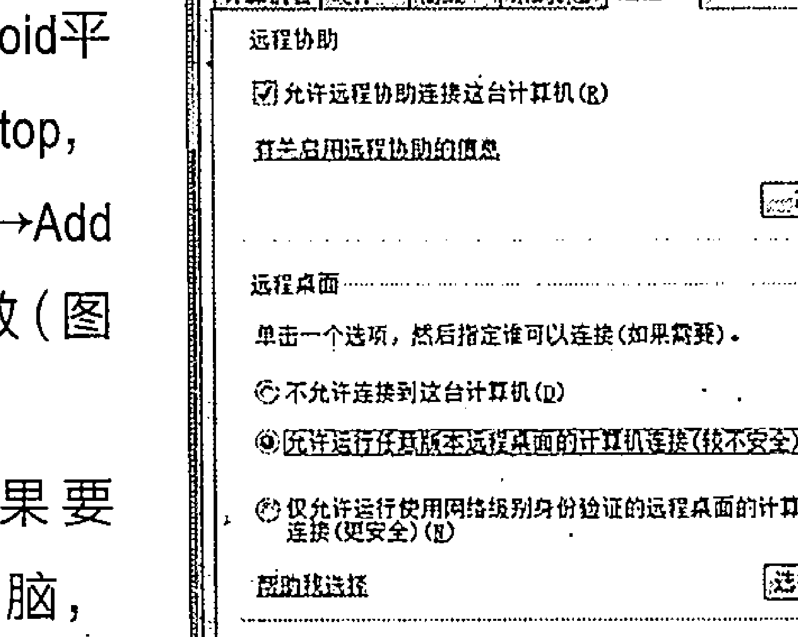

- 第2步：接着在Android平板上安装Remote Desktop，启动程序后点击“菜单→Add server”，依次设置参数（图2）。

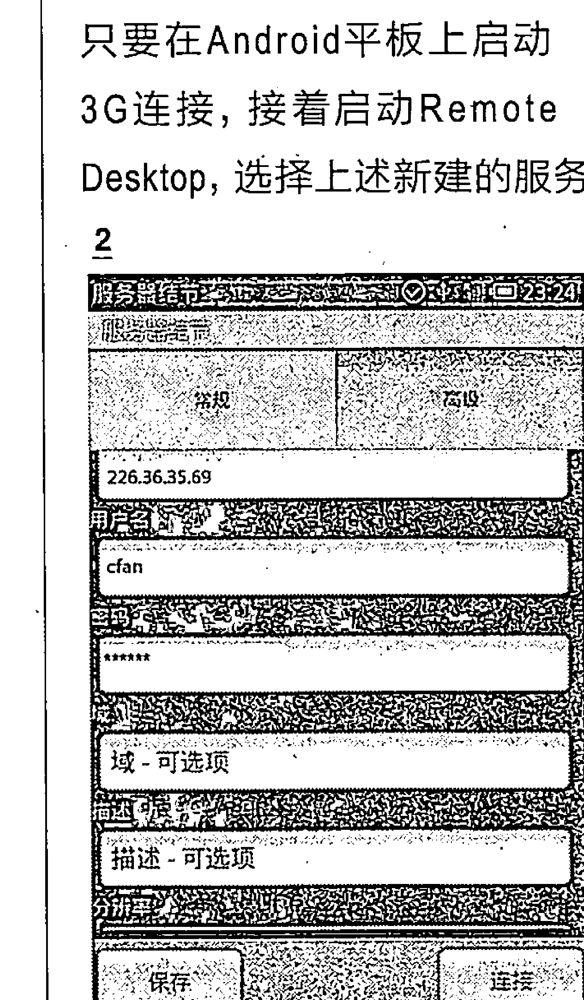

- 第3步：以后如果要在平板上访问公司电脑，只要在Android平板上启动3G连接，接着启动Remote Desktop，选择上述新建的服务器，点击Connect（连接），成功连接后就可以看到电脑桌面。现在我们在Android手机上就可以直接操作电脑了，具体操作就类似Windows之间的远程桌面连接，只不过我们可以使用Android手机的触摸功能来完成操作。

- 第4步：完成连接后，我就可以随时提取电脑文件到平板上了，比如可以直接启动电脑的邮件客户端，将自己所需的文件作为附件发送到平板上。

## 邮箱随身 重要邮件不遗漏

除了利用远程的方式可以获取邮件外，我还会给移动设备安装QQ邮箱客户端。因为有时网络不给力，远程容易出现连接失败或卡屏的情况，对于重要邮件如果不能及时收取和回复，那就会给销售带来损失。所以在经过筛选后我最终选中了QQ邮箱。一是因为大家都使用QQ，不必再去申请注册，此外，很多同事和客户也是通过QQ联络，收发邮件比较方便，更为重要的一点就是，QQ邮箱支持一些公司的企业邮箱，这样我就可以方便地管理邮件了。不过要想通过QQ邮箱收取其他邮箱的邮件也是需要经过设置的。首先，在电脑上登录QQ邮箱，进入“设置→账户”。然后，找到设置项并打开POP3等服务，点击“其他邮箱→添加其他邮箱账户”，设置你的企业邮箱账号和密码，确定即可。经过以上设置，移动设备登录QQ邮箱，不但可以收到QQ邮箱的邮件，也能收到公司内部的企业邮件了。

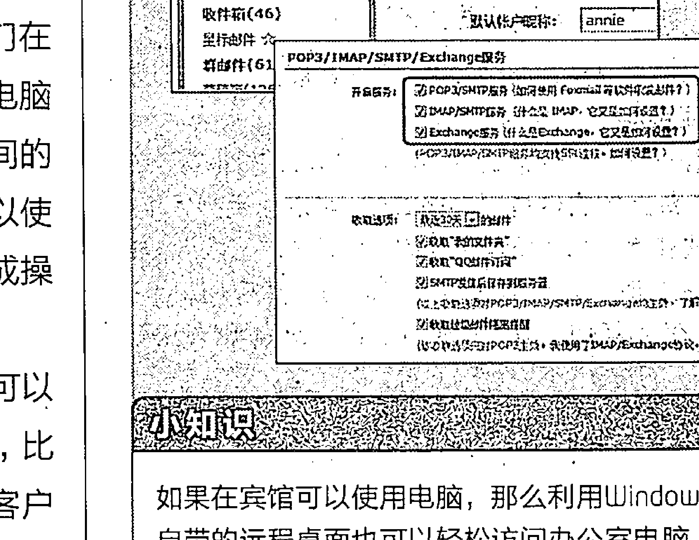

## 小知识

如果在宾馆可以使用电脑，那么利用Windows 7自带的远程桌面也可以轻松访问办公室电脑。在办公室电脑启用远程桌面访问，以后在宾馆电脑单击“开始→所有程序→附件→远程桌面”，启动该组件后按提示输入公司电脑的IP地址和访问用户名，单击“连接”并输入密码连接即可。

## 办公答疑解惑

## 数据实时汇报 销售数据及时让总部获知

为了及时掌握公司销售状况，老总经常会电话通知我报告实时的销售数据。作为经常在外出差的业务人员，如何及时传输数据到公司总部？我使用的是金山快盘的同步功能。

首先在公司电脑安装快盘，并在其中建立一个“销售数据”目录，平时销售数据汇总文件就存放在这个目录，然后右击快盘任务栏图标选择“设置”，在打开的设置窗口勾选“开机后自动启动快盘”，这样每次开机就会自动激活快盘自动同步功能。在自己的Android平板上安装WPS Office组件，如果是出差在外，则直接在平板上启动WPS Office，点击菜单栏上的“金山快盘”按钮，按提示输入自己的快盘账号和密码登录。成功登录后打开“我的文档→销售数据”，按提示直接打开保存汇总数据的文档即可。这样程序会自动将快盘里的文档下载到平板SD卡保存并打开，完成数据的编辑后，单击“文件→另存为”，按提示点击“金山快盘”，将文件直接保存在快盘当中。这样编辑完成的数据会自动同步到快盘中。由于快盘的文件会在服务器和PC之间自动同步，所以不管我在哪儿编辑销售数据，只要有网络就可以保存在快盘中。公司的老总就可以随时打开公司的电脑，同步查看我编辑的销售数据了。

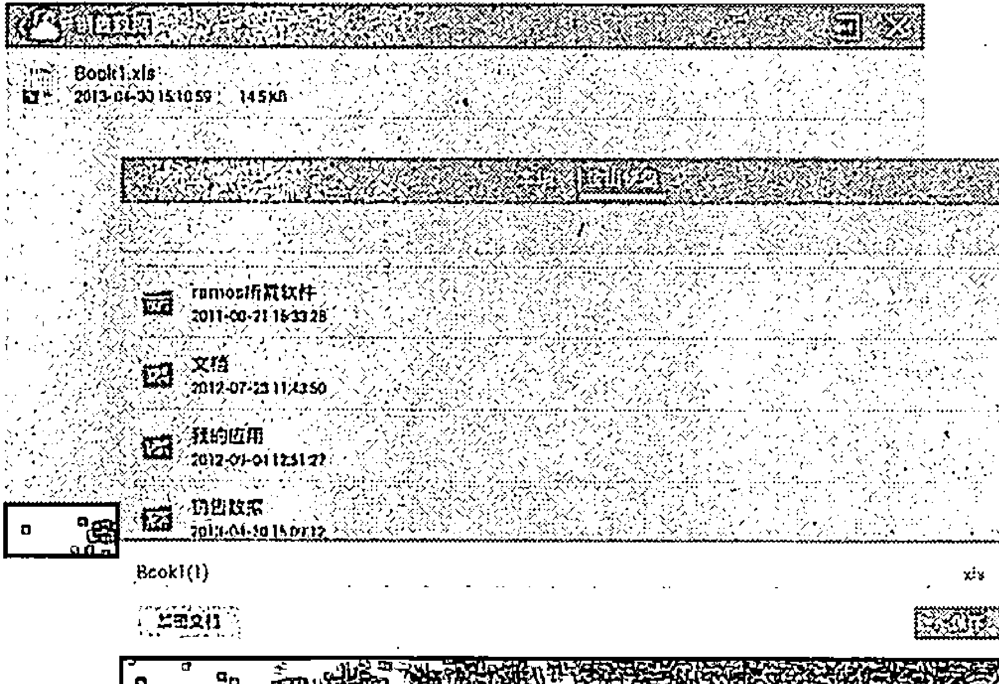

## 幻灯片插入视频 为何总是失败

向客户宣传公司形象或产品要制作PPT，制作PPT有时需要插入视频文件，但插入视频之后制作好的PPT常常会发生无法打开视频的情况。

虽然PowerPoint 2007支持视频插入功能，但如果操作不当就会发生视频打不开的情况：第一种是视频格式使用不当。PowerPoint支持的视频格式很少，如果手头上的文件是其他格式的，可以先用视频格式转换软件将视频格式转换为PPT兼容最好的wmv后再进行插入。格式工厂、暴风转码等免费软件均可以进行这样的格式转换。如果不进行格式转换直接使用其他格式，播放时很容易出现黑屏或只有声音而没有图像的情况。PowerPoint插入视频后，在播放幻灯片时，是从你插入视频的文件夹内找到该视频文件并进行播放的，所以如果视频发生更名、移动、删除等情况，就不能播放了。因此要想正常播放，必须保留视频文件的存储位置。

## 如何节约用纸 打印幻灯片

在外到处跑业务，现场不一定有条件放映幻灯片，这时候我就需要将PowerPoint幻灯片大纲打印出来提供给客户参考。但是，常规的办法一张纸往往只能打印出一幅幻灯片，浪费纸张。那么如何才能将多幅幻灯片打印在一张纸上呢？

单击PowerPoint 2007的Office按钮，再依次选择“打印→打印”菜单命令，或直接按下Ctrl+P组合键。将“打印内容”一栏中的参数设置为“讲义”，然后再设置一下右边的其他参数，如每页打印幻灯片数、打印顺序、是否加框等，右边有小图预览打印排列效果，设置好后，单击“确定”按钮即可打印。

## 部门经理

作为公司部门经理，我需要统管整个公司的销售，制定销售策略、管理销售网络和销售人员。因此如何做好整体销售报表和人员管理，提高销售效率，对我来说就显得比较重要了。

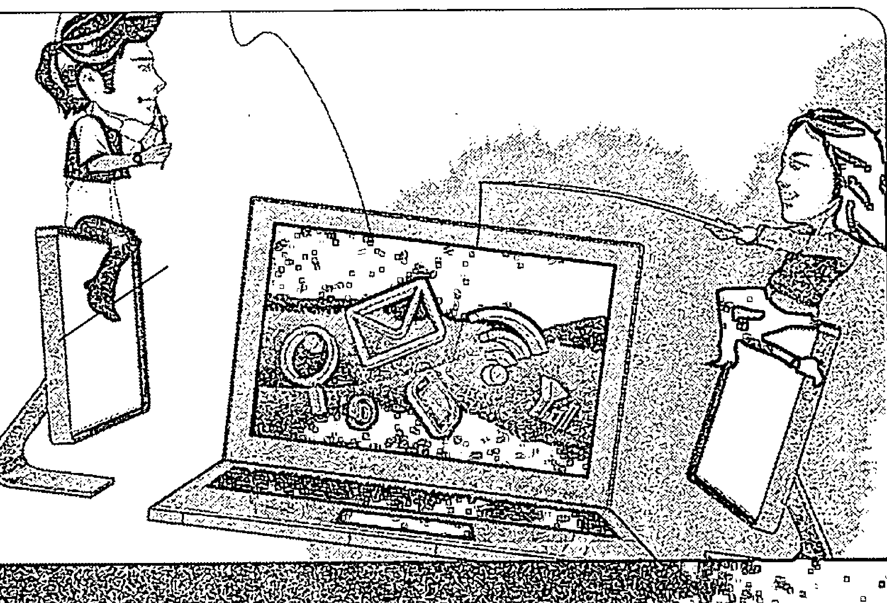

员工代表：王宏（销售经理）服务部门：公司销售部

## 随自动筛选而变的图表

想具体分析每个业务员的季度销售业绩情况，如果把每个员工的季度销售业绩都做成图表，那图表太多了。完全可以只做一个图表，而当选择不同员工时，这个图表只显示这个员工的季度销售业绩情况。我借助的是自动筛选来实现这种交互式的图表。由于筛选结果中的隐藏行数据在默认的情况下不会绘制在图表中，正可以利用此特性来创建可以和自动筛选联动的交互式图表。

首先，单击已制作好的图表，再单击菜单栏上的“工具→选项”菜单，在弹出的“选项”对话框的“图表”选项卡中勾选“只绘制可见单元格数据”复选框，然后单击“确定”按钮关闭对话框。然后，选取工作表中数据区域的任意一个单元格，单击菜单栏上的“数据→筛选→自动筛选”菜单完成对数据区域的自动筛选设置。单击B1单元格右侧的下拉箭头，筛选“员工C”，此时数据区域仅显示B列中值为“员工C”的行，图表的显示内容也会随之改变，这样就制成了一个简单的动态柱形图。

表格截图：显示了一个Excel选项对话框，标题为“空单元格的绘制方式为：”，选项包括“○不绘制（留空距） □以零值代表(Z) ○以内部联接(I)”，下方有一个复选框“□只绘制可见单元格数据(C)”。

简单的动态柱形图。

## 数据也能图文并茂

## 销售报表更直观

我负责管理三个部门，马上就要制作2013春季销售报表。这次我用Excel统计分析销售情况，为了让三个部门的业绩情况更直观地显示，只要通过Excel的“图表向导”，将数据转化为图表就可以获得直观的体现。

要统计集团旗下商场三种电器的前三季度销售情况，电器销售数量对应着各个商场、电器名称和季度等三级分类。制作图表时若需要在分类轴标签上使用三级分类，使得图表显示的信息更完整，那该怎么办呢？

首先，选中数据工作表中的D2：D19单元格区域，单击“常用”工具栏中的“图表向导”按钮，在弹出的对话框中选择“图表类型”为“柱形图”，子图表类型为“簇状柱形图”。

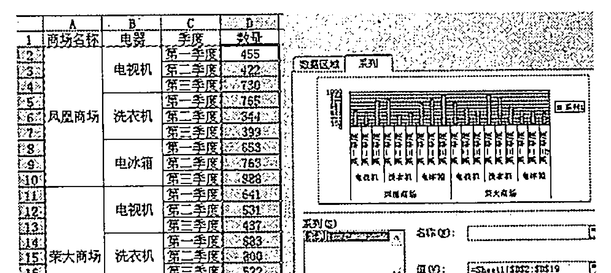

然后，单击“下一步”按钮，在弹出对话框中的“系列”选项卡中用鼠标选取单元格区域，设置“分类（x）轴标志”的源数据引用为“=Sheet!$A$2:$C$19”，然后单击“完成”按钮即可在工作表中插入柱形图。删除图例并适当地设置图表格式，制作完成的多级标签的图表如图所示。

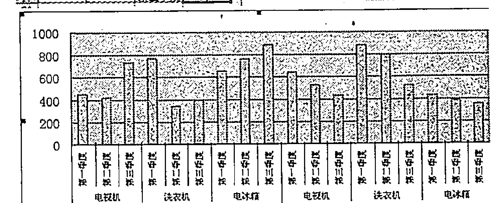

## 齐心协力

### 轻松实现各分公司的协作

作为业务经理，制定公司销售策略是我的主要工作。公司的产品马上就要进入旺销期，根据老总的指示近日就需要制定一份产品促销计划。公司的业务部在全国好几个地方，制定促销策略需要各地分公司业务主办们参与。我借助Skydrive的共享功能，就能轻松解决促销计划的协作制定。

第1步：首先登录https://skydrive.live.com/，按提示注册一个Skydrive用户，由于我使用的是Windows 8系统，直接使用内置的Skydrive组件即可。登录Skydrive后点击左上角的“创建→Word文档”，按提示在线新建一个名为“促销计划.doc”的文档，完成自己编辑部分后点击“共享”，勾选“收件人可以编辑”，然后按提示输入分公司负责人的Windows Live ID作为收件人账号，点击“共享”，完成邮件的发送（图1）。

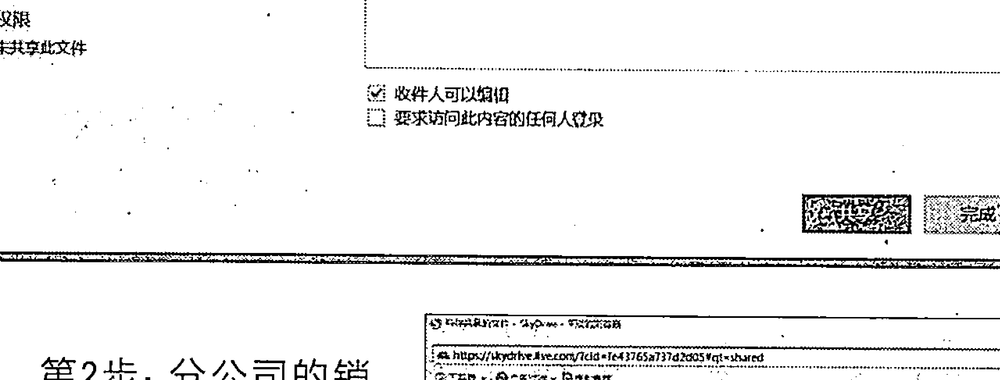

第2步：分公司的销售人员收到邮件后可以得到一个Skydrive链接，用户也可以直接登录自己的Skydrive，在“共享”目录就可以看到我共享的协作文档，按提示打开即可在线编辑保存。同样的，其他分公司销售人员也可以打开编辑，这样很快就可以完成整个销售计划的制作了（图2）。

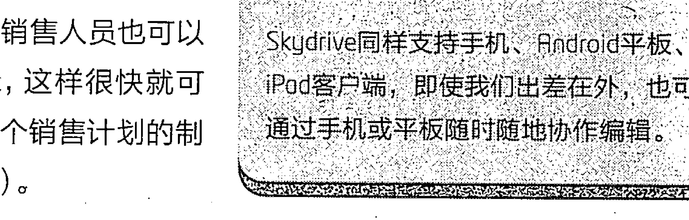

小贴士：Skydrive同样支持手机、Android平板、iPod客户端，即使我们出差在外，也可通过手机或平板随时随地协作编辑。

## 移动办公 云输入更方便

业务员常年在外，使用的设备也不一定是固定的一台电脑。随着地点的改变，可能要用不同设备上网搜索内容，这样输入汉字就不可避免。其实根本就不需要装本地输入法，用云输入法是最好的选择。

### 向浏览器添加云输入

首先，在自己的浏览器收藏夹内收藏一个搜狗云的网址http://pinyin.sogou.com/cloud/，便于随时轻松调用。具体方法是在搜狗云输入页面中，用鼠标右键点击搜狗云按钮，选择右键菜单中的“复制链接地址”，然后手动添加书签，名称可填写“启用搜狗云输入法”，地址粘贴以上复制的内容。或者直接将搜狗云输入法按钮拖到浏览器的书签栏实现收藏。

注意：启用搜狗云输入法，部分浏览器在操作中可能给出不安全的警告，请点击允许通过。

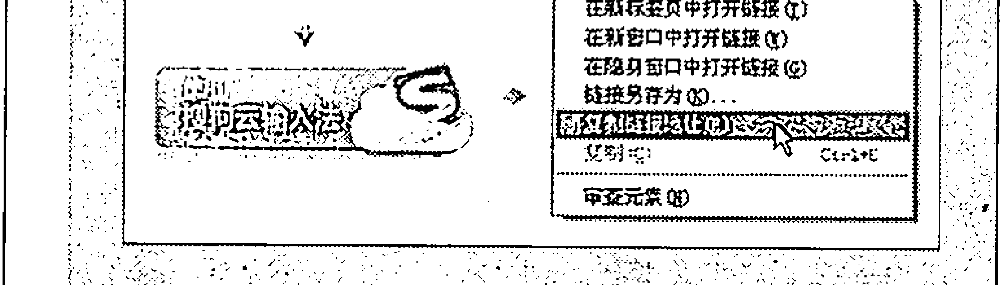

今后通过网络浏览器浏览其他页面需要输入汉字时，点击浏览器收藏栏中的“启用搜狗云输入法”，页面右下角会浮出云输入法的状态栏，即可在该页面使用云输入法输入了。

## 办公答疑解惑

## 天涯比邻 轻松组织远程会议

作为销售经理，我经常要组织各个分公司业务骨干开会。由于大家都不在一个地方，因此经常使用远程会议软件。我平时使用最多的是QQ群功能，它可以实现群语音交流。利用它即可轻松实现远程会议。

- 第1步：建立一个群，然后将需要参加会议同事全部添加到同一个人群中，打开群聊天窗口，点击“进入群语音”，在打开的窗口中用户只要点击参与即可接入到群语音中，大家即可在一起语音聊天了。
- 第2步：如需邀请不在一个群的好友同时参加语音交流，还可点击“新建语音讨论组”，然后邀请不在一个群中的好友参加语音交流。此外，如果要发送或者传达文本信息，我们可以借助群邮件实现文件的群发，借助群共享发布共享资料。

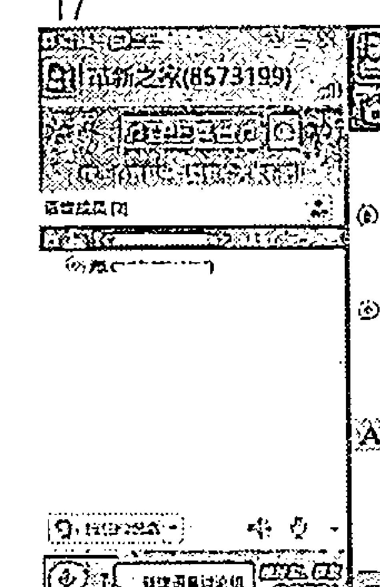

## 紧急时刻如何快速生成幻灯片

作为部门经理，虽然做个幻灯片对我来说不成问题，但有时候因为时间很紧急，短时间制作图文幻灯片有困难。这时，手头上有大量的现成资料图片，就可以快速生成幻灯片。但是，PPT 2007做幻灯片，一张张地插入图片很麻烦，如何一次插入多张图片，并让图片分别显示在多张幻灯片中呢？在这种紧急情况下，PPT 2007中的相册功能可以实现我的要求：启动PPT 2007，在主界面上点击“插入”选项卡。单击“相册”命令打开相册窗口，单击“文件/磁盘(F)”按钮，在打开的窗口中定位并选中所有要插入的图片，单击“插入”按钮，返回相册窗口。在“相册中的图片”列表中会显示插入的所有图片名称，逐一选中后进行顺序调整、色彩调整，旋转或删除不要的图片等。在相册窗口选中“标题在所有图片下”复选项，从“图片版式”下拉列表中可选择每张幻灯片中显示的图片张数，还可在所有图片下显示图片文件名。设置完成后单击“创建”按钮即可将选中的所有图片一次性生成幻灯片。

## 解决图表多增删修改的麻烦

去年年底的总结报告有数百页，里面的各种插图也有近百张，起草的过程中我将插图都标上了“图1”“图2”之类的编号。老总审查之后，希望在某些图之间插入一张新图。这样一来，后面所有图号都要手动顺延1个数字，图号更新的工作量可想而知有多大。后来经过咨询专家才知道，看似这么大的工作量，其实主要原因是由于我对Word功能不够熟悉造成的，只因我在为图片编号时采用的方法不正确。正确的方法应该是在插入图片或者表格之后，按回车键另起一行，然后设置与图片或表格同样的对齐方式，接着手工输入所有信息。对于图片的编号，将图片插入文档后，用鼠标右键单击图片，选择“插入题注”，此时在“题注”一栏显示的是插入后的题注内容。“标签”下拉菜单可用于选择题注的类型，插入的是图片，可选择“图表”，或根据插入的内容类型选择“表格”、“公式”。如果觉得Word自带的几种标签类型不太贴切，单击“新建标签”按钮即可新建自己插入内容的标签。随后在“位置”下拉菜单选择题注出现的位置，可选的位置是项目的上方或下方，可根据实际需要选择。经过上述简单的设置，单击“确定”，Word就会自动创建好题注。对于表格的编号，选中整个表格，用鼠标右键单击表格，出现同样的选项，按上述的操作步骤做就可以了。


## 财务人员

从进入公司到现在已经有五年了，这期间我主要负责公司的财务工作，说实话，做好这门工作可真不容易啊，除了细心、勤劳和无休无止的加班对账外，还必须熟练地掌握好Excel工具才行。


### 没你想的那样难 快速排序有绝招

#### 按关键字进行排序

表格数据最常见的是按关键字进行排序，比如，在我的日常工作中，就常会把员工表格按“科室”、“姓名”等关键字进行排序，这时，我可以这样操作：选中数据表格中任意一个单元格，执行“数据→排序”菜单，在打开的“排序”对话框中将“主要关键词”、“次要关键词”分别设置为“科室”、“姓名”，并设置好排序方式（“升序”或“降序”），单击其中的“选项”按钮，在打开的“排序选项”对话框中选择“字母排序”选项，确定返回到“排序”对话框，单击“确定”按钮（图1）。

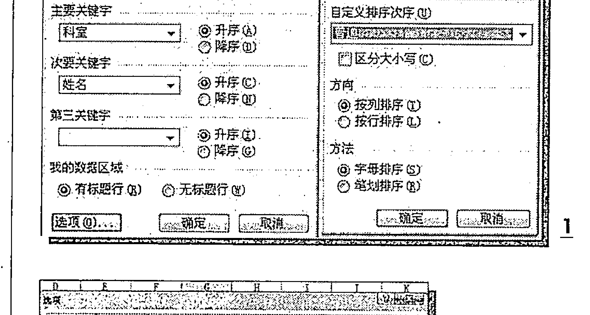

#### 按照特定的顺序排序

把表格的数据按数字或字母顺序进行排序时，Excel的排序功能能够很好地做到，但是如果我希望把某些数据按照自己的想法进行排序，Excel就无法胜任了。不过，同样Easy，因为我可以用自定义序列来解决。比如，我想将职工信息统计表中的数据，按职称中的“初级”、“中级”、“高级”的顺序进行排序，可以这样实现。第1步：选择“工具→选项”菜单，在弹出的“选项”对话框中选择“自定义序列”选项卡，在“输入序列”处按顺序输入所需职称序列，或者先把相应的职称序列按需要排序的顺序输入到相应的单元格区域，如L2至L5，在“从单元格中导入序列”右侧的方框中输入“$L$2:$L$5”，也可以用鼠标选择输入，然后单击“导入”按钮，将相应的序列导入到系统中（图2）。第2步：序列导入后，原来N2至N18区域中输入的数据可删除，导入的序列在其他Excel文档中均可直接使用。然后，选中数据区域任一单元格，选择“数据→排序”菜单，在打开的“排序”对话框中主关键字选择“职称”，单击其中的“选项”按钮，在打开“排序选项”对话框中按“自定义排序次序”选项右侧的下拉按钮，在随后弹出的下拉列表中，选中上述导入的序列，确定返回到“排序”对话框，按下“确定”按钮即可。

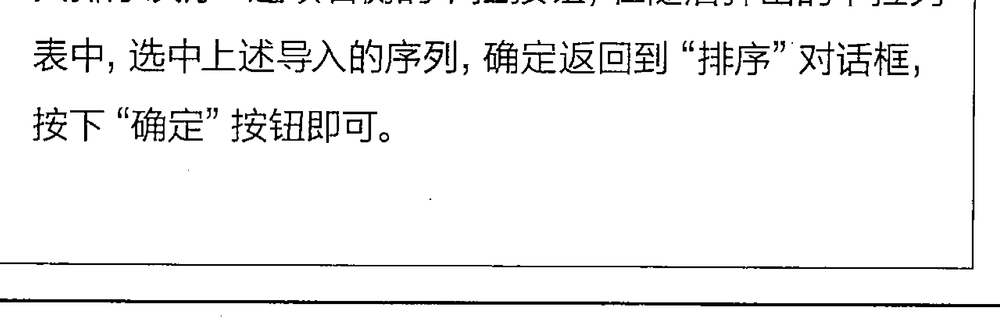

## 移动办公更轻松 小规模数据的掌上管理

当我出差在外或者下班回家时，有时会忽然接到老板电话，说先前制作的某一表格中可能存在某些错误，这时，我该怎么做呢？总不能马上搭飞机或放下做了一半的饭返回公司吧？所以，我会立即拿起手机和平板等便携设备，查看相应表格，并在找出错误后快速地对其进行修改。

如果你也要达到这一目的，我认为，你至少得具备两个必要的条件才行。

## 你需要功能强大的移动版办公套件

符合这一要求的办公套件其实有很多，比如Documents To Go、Quickoffice Pro和国产名牌WPS Office等，都能轻松打开、编辑和创建微软Word、Excel及PowerPoint等类型的文件，兼容性相当好。不过，就使用感受而言，我还是比较喜欢Documents To Go，原因很简单，它界面清爽，易于操作，而且默认使用的文本字体较大，更利于编辑。

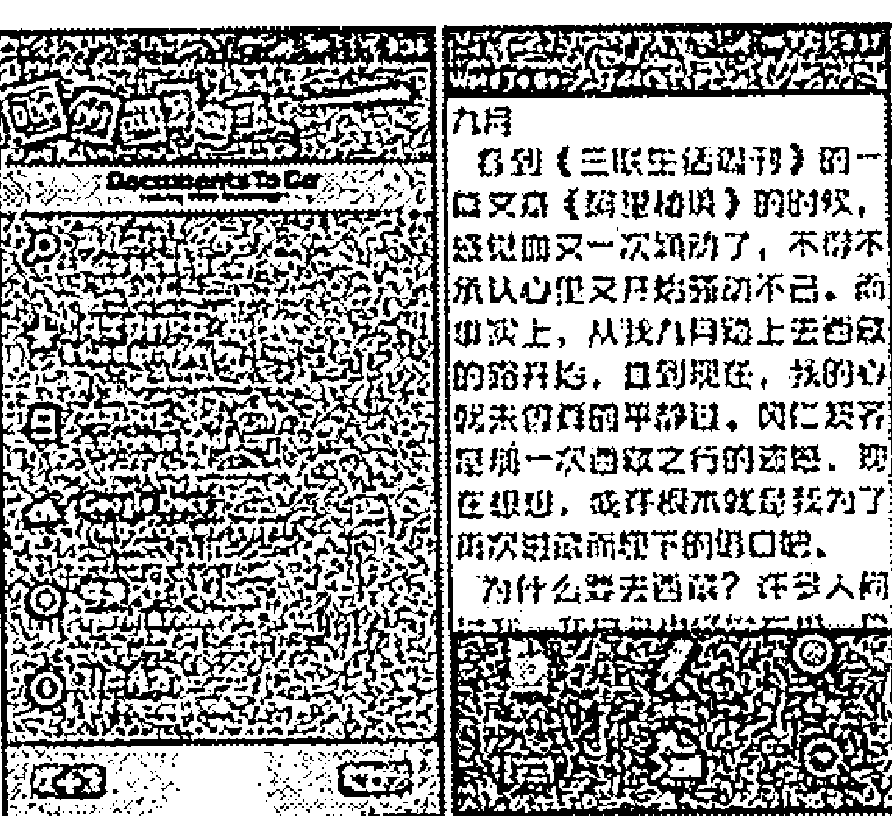

## 你需要快速安全的云存储平台

现在的网盘很多，我最常用的是快盘。在PC中安装并启动快盘，然后按提示进行注册登录，同时指定要同步的目录为表格所在的目录。这样，我的PC的“计算机”磁盘列表中，就多出了一个“我的快盘”系统文件夹（图1），其中的内容，就是我指定的要同步的目录。

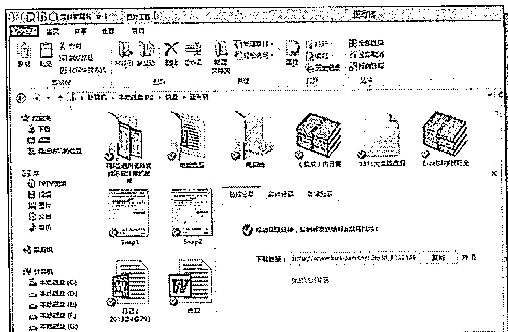

以后，不论我在该目录中做了什么操作，如新建或删除文件，或对其中的文件进行了修改等，相应的结果就会忠实地上传到快盘服务器中。这样，我只要在手机和平板电脑等移动设备端中也安装快盘客户端并用同样的用户名登录，同步目录中的文件就会显示在移动设备端中。所有牵涉到单位的文件，特别是财务数据，最重要的一点就是要确保它们的安全，不然，数据泄露，往往会给公司和自己带来许多不必要的麻烦和损失。那么，又该怎样来保证手机端快盘数据的安全呢？其实方法很简单，只需在快盘中启用“密码锁”功能，这样，由于每次访问其中的文件都必须要输入设定的密码才行，因而可在很大程度上提高文件的安全性。启动快盘，在主界面中点击“个人设置”项，进入“程序设置”界面，点击“高级设备”中的“密码锁”项，然后在出现的界面中开启“密码锁”功能，并在接下来的界面中设置一个四位数的密码（图2），以后，只有输入密码才能访问快盘中的文件，所以安全性相当有保障。

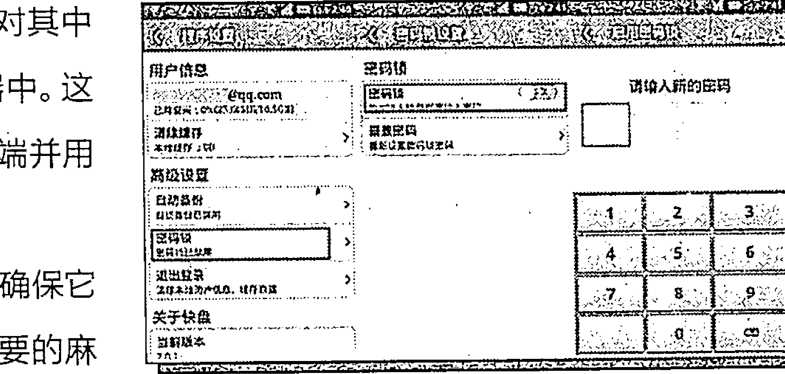

## 办公答疑解惑

## 财务表格如何设权限使用

作为财务人员，我经常需要给大家一些表格填写，但有的员工无意中会对其中一些不需要改动的数据进行改动，给我的工作造成一些不必要的麻烦。我想寻求在Excel中实现对整个表格的保护，或只允许对表格中的部分区域进行保护，部分区域可以编辑。

保护表格的方法很简单，就是把这些单元格设成“只读”。选定不需要保护的单元格，单击右键选择“设置单元格格式”，将保护标签中的锁定复选框清除，然后对该工作表设置保护。此时，锁定的单元格是只读的，刚才已被清除锁定复选框的单元则可以正常输入。当然，如果你连某些单元的内容也不想让别人看到，在确定这些单元保护标签中的锁定复选框是选中的情况下，再选择隐藏即可，这样将不显示这些单元格中的内容。

但是你必须对工作表或工作簿实施保护后，你的保护和隐藏才有效。要保护整个工作表，可依次选择“工具→保护→保护工作表→选择密码”，输入密码后，文档就被加密了，要打开只有输入密码才可以。

## 高版本能否多页打印预览

我们财务部刚换下了一批老电脑，新电脑中都安装了Office 2007。财务人员在使用以前的Word版本编辑财务报告文档的时候，进行打印预览时都习惯于使用一个多页按钮，可以通过点击这个按钮拖出若干分割页面进行显示。而到了Word 2007版本却没有了这个按钮。

那么，在Word 2007中如何才能实现多页预览？首先点击Office按钮，在弹出的菜单中选择“打印→打印预览”菜单命令，弹出打印预览对话框。在“预览”组中单击“下一页”和“上一页”按钮在不同页面间转换，在“显示比例”组中可点击“单页”和“双页”按钮在预览时显示一页或两页。如果要在预览时显示更多的页数，单击“显示比例”按钮，弹出显示比例对话框。在对话框中点击选择“多页”单选按钮，点击“确定”按钮，此时Word就会自动将文档中所有的页面以缩略图的形式显示，并且无论文章有多少页，Word 2007都会全部显示出来，不用像以前版本需要自己估算页数才能显示全部内容。

## 一张大表如何分成两部分打印

接到总部发来的一份Excel表格，里边数据很多，用一张纸打印出来看不清楚，需要分成两部分打印，并且希望每一部分都要有表头。

分页打印要解决的主要问题是需要在打印设置中指定表头，表头指定后，不管分几页打印，每页都有相同的标题了。具体操作方法如下：启动Excel打开表格文件，单击“文件”菜单，选择其下的“页面设置”。在弹出的“页面设置”对话框中单击“工作表”选项卡。在“打印标题”下单击“顶端标题行”右边的图标。出现闪烁光标后，在Excel表中用鼠标左键选择表头所在行，然后单击弹出的对话框右侧的图标，再单击“确定”按钮即可。

## 网络技术人员

做网管几年来，遇到最多的问题就是远程维护。我觉得除了本地维护外，还要学会如何用远程控制的方式完成对系统及网络的维护和监管工作。不然，每次网内的PC出现故障，都要跑去当面解决，岂不要把腿跑折了？

员工代表：李建(网管员) | 服务部门：信息系统部

## 远程维护也轻松

### 远程启动服务器中的终端服务

我对服务器进行远程管理与维护都是借助服务器中的终端服务，如果该服务被操作人员错误关闭或者停止，就会给日常维护带来很大不便。现在借助联网电脑，即可远程重启终端服务。

首先选择一台安装了Windows 2000以上版本系统的工作站作为远程登录服务器的终端，单击“开始→运行”，输入MMC启动打开该终端工作站的系统控制台窗口，接着按Ctrl+M键，在随后出现的界面中单击“添加”按钮，按提示添加公司远程服务器，这样我们就能在管理列表中看到服务器系统的服务列表了。点击Terminal services选项，在弹出的选项设置窗口单击“启动”，同时启动类型设置为“自动”。这样通过该服务就可以开始对服务器系统进行远程管理与维护了。

### 巧妙对服务器远程重启

在日常操作中我经常要在服务器中远程安装程序，如果安装的程序需要重启，但在操作过程中某个系统进程阻止了服务器重启的话，服务器的重启操作就无法顺利完成。此时我们只要设置服务器系统强行关闭当前运行的应用程序或系统进程，就能实现远程重启。以Windows 2003为例。

首先使用远程桌面连接功能建立与服务器系统的连接，连接成功后如果发现服务器无法重启，则在服务器系统上点击“开始→运行”，输入cmd.exe启动命令提示符，输入“shutdown -r -f -t 1”，这样1秒后服务器就会自动重启了。

```
C:\WINNT\system32>shutdown -r -f -t 1
```

### 对远程连接数量进行限制

服务器的负载能力是有一定限制的，如果公司有太多的电脑同时连接到服务器，就很容易造成服务器的宕机。因此为了保证服务器的运行稳定，我对服务器同一时间内的远程连接数量进行一定控制。

首先以超级管理员身份登录终端服务器，单击“开始→运行”输入Regedit启动注册表编辑，依次展开HKEY_LOCAL_MACHINE\SOFTWARE\Policies\Microsoft\Windows NT\Terminal Services，在右侧窗格找到MaxInstanceCount(如果没有则新建一个该名称的DWORD值)，双击打开后选中“十进制”选项，将其值设置为15(表示同时连接的电脑为15台，请根据自己公司的实际情况设置)，重新启动一下终端服务器系统即可实现限制。

## 好工具在手 远程控制不再愁

系统自带的远程桌面和QQ内置的远程协助，都无法满足我的要求。后来我逐一试用了不少远程工具，最后把目标锁定在“向日葵”上。这款软件的特点是，它除了能满足我的所有要求外，还具有其他同类工具所没有的两大功能，即同步剪贴板和屏幕白板功能。

### 连接设置

-   第1步：向日葵远程桌面虽然免费，但需要注册成为其用户并获得相应的“葵码”才能达到控制目的。完成注册过程并通过邮件激活护照即可使用。
-   第2步：在出现的页面中，单击上方的“我的控制台”项，进入控制台页面。单击“添加主机”文字链接，然后单击“立即添加主机”按钮，打开“主机名称”文本框，在其中输入客户端名称，设置完毕。进入“设备列表”页面，在这里，可以看到刚才设置的客户端已出现在列表中。用同样的方法，单击“添加设备”按钮，将网内需要远程控制的PC都添加到该列表中。

### 远程连接

客户端程序启动后，以后我就可以通过浏览器和主控端软件两种方式连接客户端，并对其进行控制了。

进入http://www.oray.com/sunlogin/页面并登录，在“我的控制台”客户端列表页面中，可看到所有在线或不在线的客户机。勾选要控制的在线客户端，单击“远控”按钮（可同时选择多部），打开“访问密码登录”页面，输入客户端的访问密码，单击右侧的“→”按钮，进入“向日葵远程控制台”界面，客户端桌面就会显示在面前。接下来像使用本机一样，对其进行控制即可。

利用浏览器进行连接，需要进入相应网页，并进行一些操作才能实现，实现起来有些麻烦，其实还有更简便的控制方法，那就是利用其提供的向日葵主控端工具来实现（下载地址：http://sunlogin.oray.com/zh_CN/download/remote-client.html）。

### 远程控制之外有惊喜

除提供了强大的远程桌面控制外，向日葵同时还提供了远程文件和命令行功能，利用这两个功能，我们可轻松地达到在主控端和客户端中实现文件的传递。

在“向日葵主控端”列表中，选择要操作的客户端，单击工具栏中的“远程文件”按钮，进入相应的界面。左侧“本地主机”栏中显示的为主控端的文件列表，右侧“远程主机”栏中显示的则为客户端的文件列表。

假设要将主控端“G:\常用软件”中的某文件发送到客户端的“E:\”目录中，可以在界面右侧的“远程主机”中，单击右侧的下拉箭头，选择盘符为“E:”，并在其下方的文件列表中选择目录为“软件”，然后以类似的方法，在左侧的“本地主机”栏中选择盘符“F:”，在列表中选择好要传输的文件目录及文件，然后单击“传输”按钮。

## 有的电脑在公司为何无法上外网

小红同事小江的笔记本在公司用网线上网，桌面右下角也显示已经连接，可就是上不了网。告诉他把IP改成和他所用的台式机一样，可还是上不了网。

这个问题的根本症结不在自己的电脑上，而在于连接内外网的那台设备。一般来说这类设置是指服务器或者路由器，是针对网卡的MAC地址而非IP地址设定上网权限。MAC地址是网卡唯一的序列号，全球每一块网卡的MAC地址都不会相同。而这是网管的事，网管给你上网权限才行。或者设法修改笔记本的MAC地址，修改MAC地址的方法比较多，最简单的办法就是利用专门修改MAC地址的工具，比如K-MAC、MAC MakeUp等等，另外超级兔子魔法设置也可以修改MAC地址。可以点击本地连接“属性→状态→支持→详细信息”，从“实际地址”一栏查看台式机的MAC地址，修改笔记本的MAC地址和它一样就能上网了。

## 不同版本操作系统为何无法互访

某部门员工向我求助：在Windows7系统环境下访问一台Windows XP的电脑时，如果XP系统不设置密码可以正常访问，但若设置了密码后就无法访问，但其他Windows XP系统可以正常访问。该如何解决？

问题在这台XP系统电脑的设置上。通过“开始→运行”启动运行对话框，输入gpedit.msc命令并按回车键打开组策略编辑器，依次展开“计算机配置→Windows设置→安全设置→本地策略→安全选项”，找到“网络安全: LAN管理器身份验证级别”，将其设置成“发送LM和NTLM响应”，保存设置重新启动系统即可。

## 新买的路由器为何就无法访问

业务部新购置一台无线路由器，但打开浏览器无法连接路由器的配置页面。如何正确设置才能连接路由器？

首先将路由器硬件恢复出厂设置，再按说明书中标注的出厂IP登录。另外要特别注意查看电脑网卡的IP地址是否和路由器LAN端口为同一网段，比如路由器LAN端口IP为192.168.1.1，那么网卡IP地址一定要设置成192.168.1.x，这样才能正常连接。

无法连接无线路由器还有可能是下述原因；比如网卡无法正常工作，可以在操作系统中通过故障检查Ping命令来检验一下无线网卡能否正常工作。如ping 192.168.1.1 -t，或者ping 127.0.0.1，判断网卡及TCP/IP有没有问题，一般不通的话都是由网卡驱动或网卡协议安装不当造成的。如果该地址无法Ping通，则表明本机TCP/IP协议不能正常工作，可删除原有TCP/IP协议后重新安装。如果还不能解决问题，可以重新安装网卡驱动程序。

## 如何限制局域网内的疯狂下载

最近许多员工反映公司的内网上网连接速度很慢，也有人怀疑是不是有人在用P2P工具私自下载电影等大文件。作为网管员的我，希望用一个简单而又可行的办法或工具来限制一下。

对于通过路由器进行连接上网的局域网环境来说，可以直接在路由器中对网中每台电脑的流量进行限制。现在很多路由器都内置了控制流量的软件功能，可以在路由器设置界面上直接进行各种管理操作。

还有一种办法，就是用专门的工具软件控制流量，如网络执法官、P2P终结者等，推荐选择P2P终结者，它占用的系统资源较少。通过P2P终结者查看内网中各台电脑的网络流量，当某台电脑占用的网络流量太大时，直接用P2P终结者断开该电脑和外网的连接。借助P2P终结者还可部署限流系统，只要在局域网中的任意一台电脑上安装该软件，即可管理整个网络。用此软件可以管理十余种P2P下载应用，通过制定各种过滤规则来实现对局域网内每台电脑的流量控制。

## 公司老总

作为老总，最让我烦心的是传统的通过邮件群发来传达和共享文件的方式过于低效。后来，经过高人传授，我掌握了几招，轻松地化繁为简，不但效率提高，管理也高效了。

## 文件共享、项目管理这点事 玩着就做了

### 共享传输 快盘搞定

快盘提供了通过外链、邮件和微博等来分享文件的方式，可以帮助我快速将通知或文件分享给指定的人群。但总的说来，最简单的分享方式还是莫过于根据各部门的职能，为他们分别申请一个不同的快盘账号。

比如财务部门，可以申请一个专门用于该部门的快盘账号（假设该账号为caiwu@163.com），那么，我以后只要将想与该部门共享的文件或与之相关的通知，放在该快盘中，然后将账号和密码告诉财务部门，他们就能通过登录快盘，快速了解通知内容并共享其中的文件。而我要做的就是在需要的时候，切换到不同的快盘账号而已。

切换的方法很简单，启动快盘，右击系统托盘区中的程序图标，然后在出现的右键菜单中选择“切换账号”，打开相应的界面，单击“使用一个新账号登录”，然后在接下来的界面中，输入相应的账号和密码并登录即可（图1）。

### 公司管理 尽在掌握

企业嘛，难免要跟各种项目打交道。从项目的指派、分工到执行、交流，任何一个环节出现问题，都会影响项目的完成周期。那么，我该靠什么来提高公司的管理水平呢？答案很简单，用“今目标管理”。

运行“今目标管理”，按提示输入相关资料进行注册，随后获取超级管理员账号、密码，同时会获得10个员工账号的免费使用权限。接下来，用管理员账号和密码登录http://web.jingoal.com，按提示在系统管理员、部门经理和员工栏中，编辑好员工姓名等信息，这样拥有三种不同权限的用户就完成了。随后就可以把账号分配给企业员工使用。

建立好了管理体系，企业员工就可以通过“桌面今目标”进行方便快捷的沟通，普通员工可以根据自己的日记，快速了解当前任务的完成情况。以后，如果我需要了解项目进度时，只需通过查看员工日记即可。查看操作是通过“桌面今目标”登录“网页今目标”来实现。

在“桌面今目标”程序面板，单击菜单栏中的“工具→今目标平台概览”，打开“今目标管理→平台概览”界面，单击“工作日志”选项中的“评阅部门工作日志”文字链接，便可以通过浏览器打开“网页今目标”的管理平台网页，在页面左侧勾选想要查看的某员工名称，然后从右侧单击某个员工的名称，则该员工的日记、工作计划、工作小结就会出现在页面中（图2）。

## 出差无忧 用移动设备解决外出那些事

**一嗨租车**
国内租车很方便

轻轻一扫获取软件

“一嗨租车”是中国最大的连锁租车服务提供商之一，提供70多个城市汽车租赁服务，所以借助它，我足不出户，即能搞定车辆的租赁工作。

以后无论出差到什么地方，想租车的时候，只需要点击“自驾租车”按钮，然后根据自己的喜好，设置好取车城市、取车门店、相应车型等项，再点“确定并提交订单”按钮并完成付款操作，车辆的租赁工作便告结束，而我只需要在指定的接车地点接车即可，很方便（图1）。

身为老总，出差洽谈业务或开会交流是常事，有时客户来了，酒席桌上免不了也要应酬一下，这样问题来了，出门在外，如何能方便地租到车？酒席桌上喝高了，又如何能安全地驾车回宫呢？其实要解决这些问题也简单，我只要在手机上安装几款相应的应用即可。

**e代驾**
醉酒“驾车”也安全

轻轻一扫获取软件

醉酒及饮酒后都不能驾车，这是小孩子都知道的道理，所以我饮酒后，会利用“e代驾”这款应用，为自己找一个代驾送我回家或回公司。这样，客人陪了，同时又保证了自身的安全，何乐而不为？

“e代驾”启动后，会显示出离自己最近的代驾师傅的信息，其中包括这些师傅的驾龄、代驾次数和当前是否有空等，接下来直接找个自己中意的呼叫即可（图2）。

## 公司老总健康养生

考虑到老总平日工作繁忙，一般没有运动习惯，更兼营养过剩，时不时以拉面、方便面等即食食品充饥，特献妙方如下。

**膳食处方：** 少食动物内脏，吃拉面时不要将面汤一起喝光，炒菜时少放油和盐，可以用辛辣香料改善菜口味过淡的问题。少食腌鱼、腌肉、香肠，尽量少吃味精、酱油，以减少钠的摄入。

**运动处方：** 每日以步行代替乘车上班。每日快走30-40分钟，达到1万步（佩戴记步器）。周末参加球类或登山运动。

**戒烟限酒：** 烟应逐步少抽，直至完全戒除。在交际应酬时，如果一定要喝酒，建议喝干红葡萄酒。而且，总量不要超过四两。

**按摩处方：** 每天晚上睡前用拳头敲击脚底，可消除一天的疲劳，促进全身血液循环，增强内脏的排毒功能，促使体内血管畅通无阻，加快燃脂速度。具体做法是，以脚掌为中心，有节奏进行，以稍有疼痛感为度，每只脚100次左右，运动完成约2分钟。

## 办公答疑解惑

### 作报告前遇到生僻字怎么办

作为公司老总，领导能力没的说。但在Word 2007中阅读一些报告或资料时，我难免也会遇到生僻字，不知道如何读。查字典不方便，而为这个生字去问下属，又显得丢面子。有什么办法能不脱离Word 2007编辑环境用电脑快速找到字的读音？

首先用鼠标选中生僻字，单击窗口左上角的“开始”按钮。在“选项卡”里选择“拼音指南”，随后会弹出“拼音指南”窗口，里面就有此生僻字的拼音和音调。如果使用低版本的Word，只需在选中文字后，用鼠标依次选择菜单中的“格式→中文版式→拼音指南”，就能看到读音了。

### 幻灯片配个人旁白更显领导魅力

放映幻灯片时，如果使用自己录制的声音作为旁白，可以增强演讲的魅力。那么该如何实现呢？

准备并连接好话筒，执行“幻灯片放映→录制旁白”命令，出现“录制旁白”对话框。若是首次录音，要对话筒进行相应设置，单击“设置话筒级别”按钮，按提示设置话筒音量级别和录制声音的级别和属性。设置完毕后就可以开始录音了。

若要作为嵌入对象在幻灯片上插入旁白并开始录制，直接在“录制旁白”对话框中单击“确定”。若要作为链接对象插入旁白，选中“链接旁白”复选框，再单击“确定”开始录制。

### 保存网络表格中数据的一个难题

有时想将网上的一些有用表格数据复制粘贴在Excel中使用，但粘贴后发现所有的数据都集中到同一个单元格中了。如何才能正确引用呢？

办公室的网管员告诉我两种方法：

通过文本文件获取数据。先将网络中获取的数据粘贴到一个TXT文本文件中。然后在Excel中选择“文件→打开”命令，“文件类型”选择“文本文件”，这样就可以从打开的文本文件中获得所需数据了。但用这种方法导入数据有一个缺点，那就是一旦数据进入Excel后，就无法与该文本文件同步了，也就是说，即使文本文件中的数据进行了更新，Excel也不会同时进行刷新的，必须重新导入才可以。

另一个方法是用“数据”菜单中“获取外部数据→导入文本文件”命令来获取文本文件中的数据，用这种方法，在导入数据的同时，Excel会将其作为外部数据区域，这样就可以在需要的时候刷新数据或者定期对数据进行刷新。这是较之第一种方法的优势所在。

### 解决幻灯片播放没声的尴尬

有时在自己电脑上做好的幻灯片，拿到一个新的地点使用现场的电脑演讲的时候，发现幻灯片没了声音，很让人尴尬。如何解决？

幻灯片中加入的声音如果在其他计算机上不能正常播放，一般来说问题出在PowerPoint声音对象含有的盘符和路径上。在将文件复制到其他电脑上后，声音文件的路径发生了改变，因此就会出现找不到声音文件而无法播放的情况。为了避免这种情况的发生，只要在打包PPT的时候将声音文件和演示文件放在同一文件夹下，这样打包后再解压，得到的演示文件中的声音文件的属性就不含路径，也就不会出现找不到声音文件的问题了。

## 致我们终将失去的毕业季

## 把毕业经历延伸为一生的经验

## 毕业季之财产篇
大学生如何处置资产

大学四年我们除了学到了知识，交到了朋友，期间也会不知不觉地积累出很多以手机、电脑为代表的个人“资产”。如果你能合理安排它们的归宿，说不定也能成为帮你在这个城市立足的“第一桶金”呢！

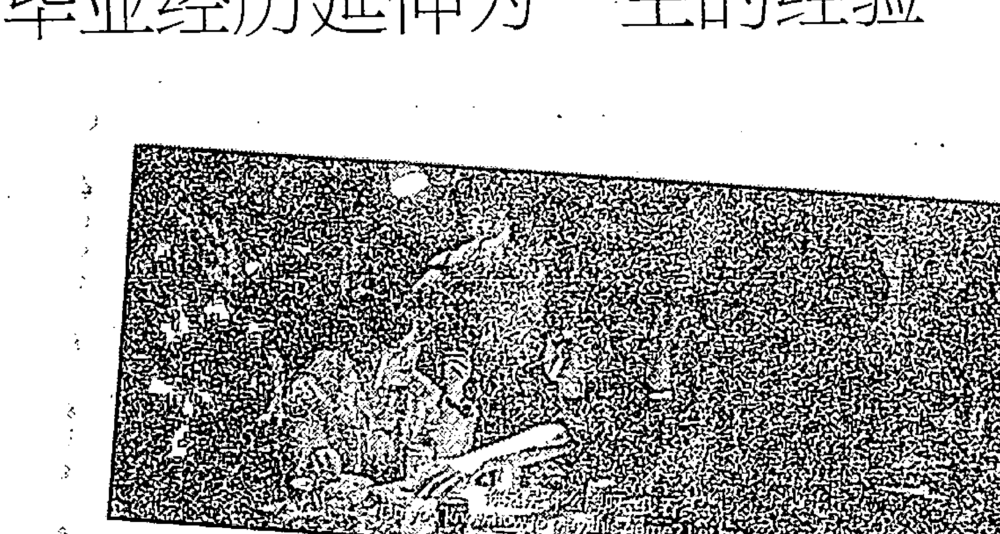

> 杜薇：最讨厌同学在宿舍里打牌了，乱糟糟的！
杜飞：别小看打牌，比尔·盖茨就靠打牌赢得人生第一桶金。
杜薇：哥，你不要教坏小朋友好不好！
杜飞：好好好，玩物丧志，咱不学坏的。不过，资产管理的意识还是要有的。
杜薇：我们大学生有什么资产啊？
杜飞：四年学校生活，多多少少积累了一些资产吧，电脑、书籍、各种生活用品，不都是么。
杜薇：这些旧的谁要啊，不如扔了。
杜飞：别扔啊，挂到网上卖，能值不少钱呢。我带你去见一个人，看看他是怎么处理自己的在校资产的。
杜薇：好！

Hiker，2003年毕业，二手交易达人

## 不要忽视身边的资产

你可以是“净身”走进的大学校园，但你绝不可能“净身而出”，大学期间谁都会积累出不同程度的“家底儿”。甭说别的，就四年来学过的各种教材，堆起来也得有一人多高了吧？再加上这几年淘汰下来的手机、平板、电脑配件，以及各种生活用品……将它们整理出来后是不是看着就“头大”？扔了可惜，拿走又不方便，怎么办？答案很简单，那就是将它们转让出去换钱。在Hiker毕业时还是56kbps Modem拨号上网当道的时期，很多同学甚至连eBay（易趣，当年可比淘宝火多了）都没听说过呢。因此，我们在处理家当的时候都会找辆三轮车，一起组队骑到学校或中关村周边的跳蚤市场吆喝叫卖。我清楚地记得当年我用一块升级换下的盈通Radeon 8500LE卖出了2个月的房租，还用赛扬300A和别人换了一套全新的双飞燕键盘和2.1声道的木质音箱……当然，现在的学生已经幸福多了。连20mbps光纤都快普及了，而且大量的二手交易网站林立，足不出户就能将家当折现，这让我们这些过来人情何以堪啊。
言归正传，下面就让Hiker分享一下如何借助网上的二手交易平台处理闲置的物品，将它们折现为“第一桶金”。由于版面有限，在这里我们主要就是分享一下当我们作为买卖双方时的思路，以及提高交易成功率、避免受骗风险的经验。

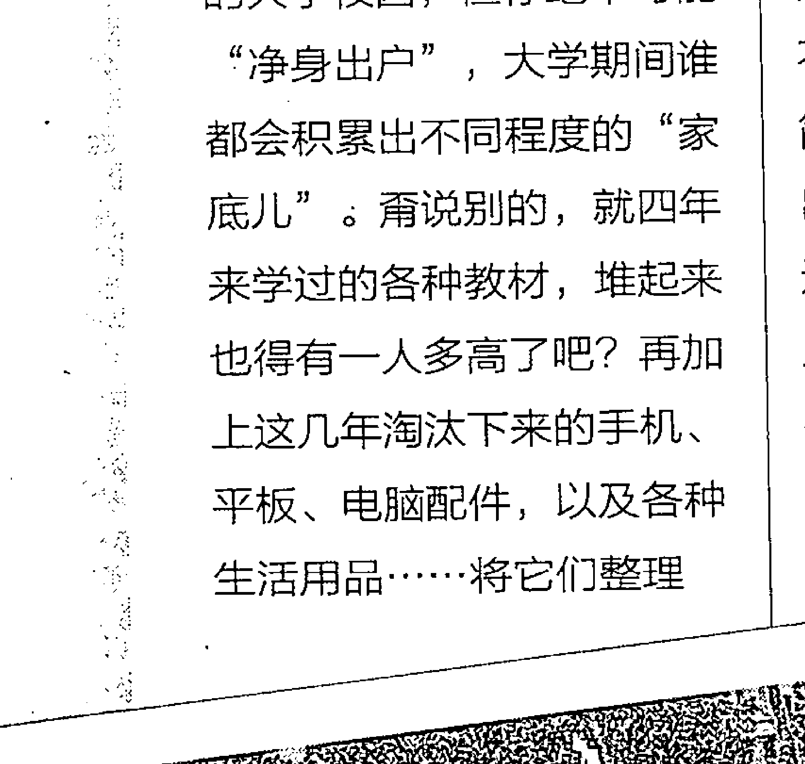

看到现在的跳蚤市场，有没有唤起80后和70后的回忆呢

## 数码菜鸟的财富之路

### 交易平台 快速成交的根本

网上二手交易的平台很多，但每个平台都有相对固定的浏览对象。比如威锋论坛的二手交易板块中90%以上都是苹果的数码产品，而机锋论坛的二手板块则多以Android设备为主。因此如果你有一款类似夏新大V级别的中低端二手Android手机，肯定是在机锋、塞班论坛更好卖一些。反过来说，喜欢苹果的玩家都不差小钱，如果你有一款Galaxy Note2级别的高端手机，也不妨在威锋发帖出售，由于缺少竞争对手，可能成交的速度会更快呢。总之，找准适合处理家当的交易平台非常重要，如果卖PSP等游戏机就在电玩巴士，有不想要的教材、衣物和自行车之类的就在赶集或58，以此类推。

| 网站名称 | 网址 | 推荐宝贝 |
| :--- | :--- | :--- |
| 威锋二手数码市场 | http://dwz.cn/8jyaB | 苹果设备，比如iPad、iPhone、MacBook |
| 机锋二手数码市场 | http://dwz.cn/8jyd1 | 以Android手机为主 |
| 塞班个人闲置数码交易区 | http://dwz.cn/8jyCy | 以Android和WP、塞班手机为主 |
| tompda数码交易平台 | http://dwz.cn/8jyFk | 综合性，以电脑类和数码产品为主 |
| 电玩巴士电子产品交易区 | http://dwz.cn/8jyJv | 电玩产品、智能手机 |
| 赶集网 | www.ganji.com | 综合性，什么都有 |
| 58同城 | www.58.com | 综合性，什么都有 |

### 商品描述 引人关注的武器

如果你想提高交易的成功率，那就千万不要忽视对商品的描述，包括标题、卖机原因和成色的描述以及实拍图片等等。以出售Lumia 920为例，下图最能引起我们关注的就是加了红框的两款。简单分析不难发现，它们都具备吸引眼球的最基本元素：价格（够低）、版本（行水）、颜色等等。好的标题往往能起到先声夺人的作用，如果内文再附上详细的产品介绍（包括成色、配件、保修、换机原因等等），再加上清晰的实物图片，想不吸引人关注都难。一样的产品，一样的价格，有人当天就能成交，有人半个月都无人问津，这就体现在商品描述的文字功底上了。

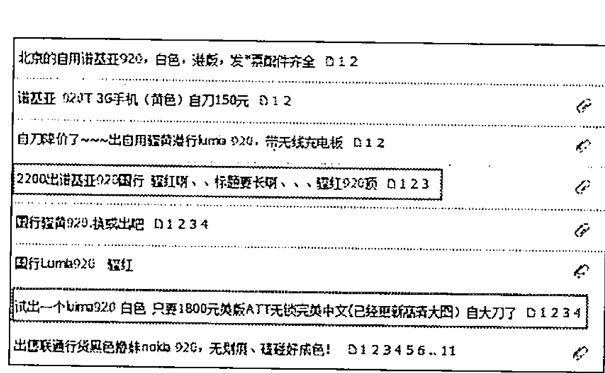

### 自取交易 保护自己的权益

为了尽快折现，很多同学都喜欢到最近的二手回收店铺去处理淘汰的手机等数码产品，但我想告诉大家的是，除非你真的特别在乎成交时限，否则一定要避免与职业商家打交道。
原因很简单，职业商家都是要靠一买一卖之间的价差吃饭的，所以“有良心”的商家会极力压价，用低于市场二手均价的价格回购你的机器，明明值2000元的手机可能对方只出1500元。而“缺良心”的商家会给你发诱惑短信，说“我愿意多出200元，麻烦你送到我店里来吧！”当你乐颠乐颠跑到指定地点时，对方又会以验机为要求强行拆机，然后又以各种理由说你的机器是翻新机或维修过。此时你可就被动了，机器已经被拆开了（拆过的机器就不值钱了），想据理力争时又会发现商家旁边站着很多膀大腰圆的伙计，只能“哑巴吃黄连”，让商家以“捡破烂”的价格回收了。

因此，想确保自己的权益和安全，尽量选择本地自取交易。让对方来找你，或是找一个折中的地理位置见面。凡是肯花时间找你看机器的买家基本都是有心要买的，可以最大限度避免被“放鸽子”的可能。

## 出售时机 亏盈的关键时间点

数码产品一定是越来越贬值吗？全新产品可能是，但对二手市场而言可就不一定了，决定二手商品价值的关键得看某个时期的供求关系。举个例子，Hiker在2012年11月曾在机锋网淘到了一款二手的港版三星Galaxy Note 2，当时的买入价是3200元（此时全新机约3650元）。在春节期间，我发现水货Note 2因缺货而出现了大幅涨价的现象（此时全新机一度超过3800元，还买不到），所以就借此机会以3500元的价格将Note 2转让给了其他网友，小赚了300元。等4月份Note 2供货稳定价格下调之际，我又在论坛重新花2700元买了一台Note 2。如果我没有经历这番折腾，那就等于现在我已经亏了500元。

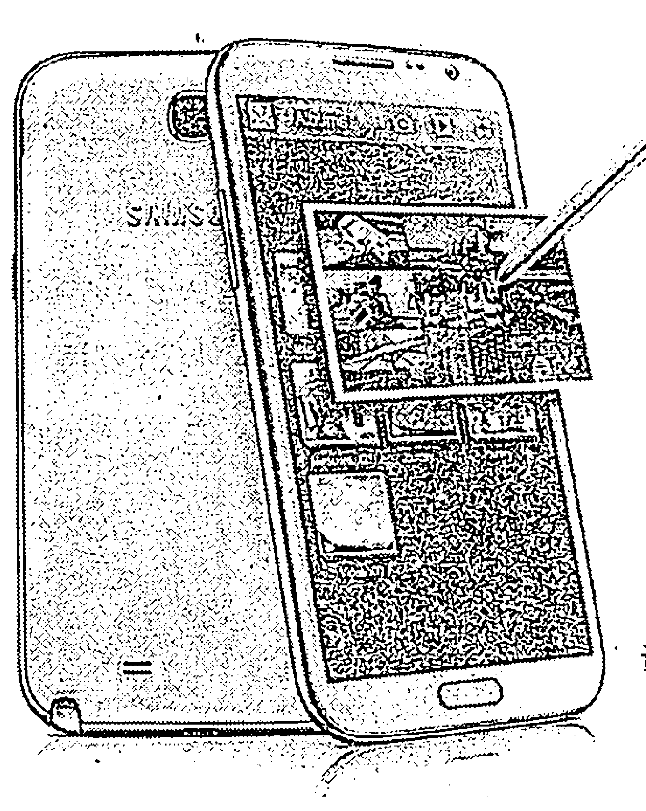

细心的同学不难从中看出门道和商机。买全新的产品必然亏本，但如果一开始就买低价的二手产品，并在适当的时期出售还能盈利！Hiker现在就非常热衷于“倒买倒卖”，在供大于求的时期低价买入心仪的二手手机，等用腻了之后再找准时机将其卖出，虽然不能保证每次都能赚到钱，但至少不会亏本。当然，如果你现在用的就是小米2，为了避免亏本，尽量要选择在7月下旬之前把小米2卖掉。此外，不出意外小米3将搭载高通骁龙800和5英寸1080P屏幕，而且价格还是1999元。此时我们就需要做出判断了，如果你手头有类似OPPO Find5、中兴Nubia Z5等配5英寸1080P屏幕的二手机器想出手，那就一定要赶在小米3正式发布之前，否则人家的新机配置高还便宜，为什么要买你的二手机器呢？

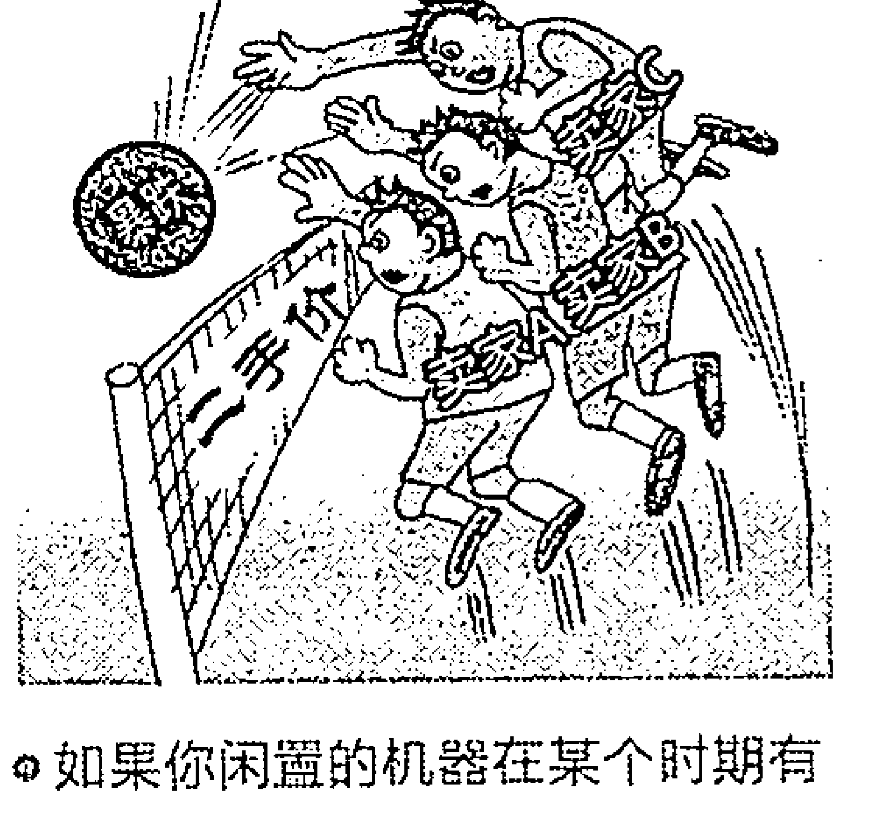

同理，最近这个时期英特尔Haswell平台的新款笔记本/超极本即将批量上市，如果你手头刚好有旧机器，那就尽可能趁着新机价格虚高的时期赶紧把旧机器卖掉，否则也会因新品逐步降价而陷入不得不卖得更便宜的窘境。

> 短信内容：你好，我在网上看到你有卖华为mate，能送到我店里来吗？我有个客户刚好想买这款机器。我愿意再加200元就当是交通费了，我在木樨园，到了请给我电话。

想提高借此盈利的机会，就必须对整个行业有个大概的了解。比如小米2去年刚上市时因为奇货可居，哪怕是16GB的二手机也能卖到2200元。随着小米2供货的稳定，现在旧机器就不可能卖得比新机贵了，16GB的二手机平均也就1700元。根据惯例，小米将在8月中旬发布小米3，与此同时小米2必将大幅降价。所以如果你

> 类似的短信请千万不要相信！商家可不傻，怎么可能以高于市场价的价格买你的机器呢？

> 小提示：理论上，支持异地交易可以再度提升交易的成功率。但即使是通过支付宝，恶意买家还是能依靠漏洞骗你于无形，让你财货两空。因此，如果你没有鉴别异地买家身份的经验，尽量还是选择本地交易才靠谱。

本章节虽然是以毕业学生为例，但这种将闲置的资产折现的思路和方法，却适用于所有不同年龄和身份的用户。因此，当你打算换新数码设备时，不妨也让淘汰的“古董们”发挥出最后的光热吧，毕竟这也算是一种绿色环保的生活方式呢。

> 小提示
现在很多论坛都开放了高级搜索功能，我们可以按照“北京”（你所在的城市）为关键词，锁定本地出售的二手交易板块内容，这样能帮你迅速找到心仪的目标。

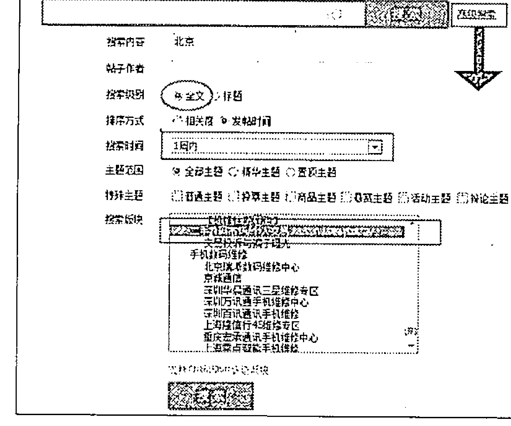

利用搜索功能可以节省很多找机器的时间

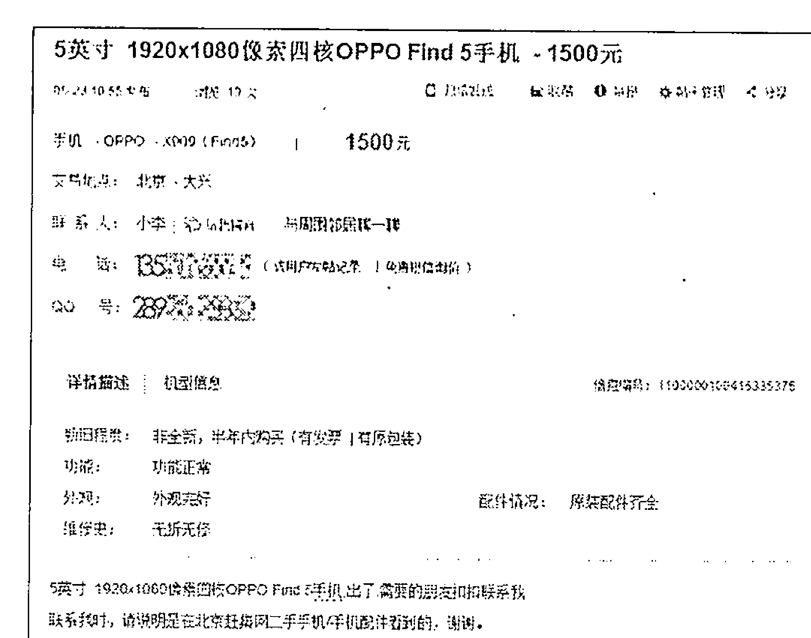

1500元的二手Find5，怎么可能？

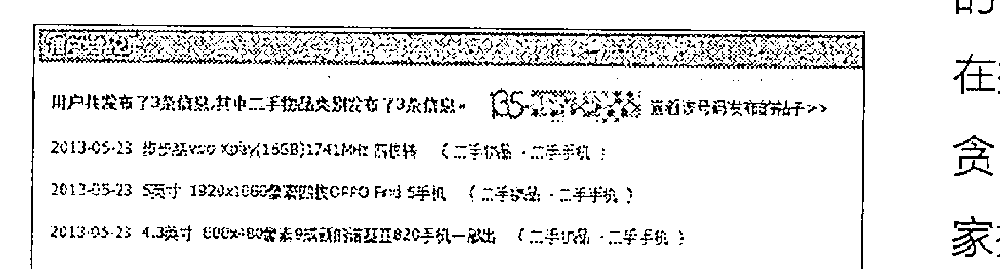

在赶集58买机器要留意该账号和手机号近期的其它交易记录，如果频繁以低价卖不同型号的机器，基本就是骗子或商家无疑

毕业后除了要处理多年来积累的家当，同时也要面临各种新设备的采购。比如根据新公司的规定更换不同网络制式的手机、需要自己提供工作用的电脑等。对家里不差钱的同学而言这些都不是问题，但对家境一般，或是希望靠自己能力打拼的“有志青年”，不妨利用之前折现的“第一桶金”，再通过二手交易的渠道购入自己所需的设备，一旦淘到了品质出色的精品二手产品，那不就是赚到了吗？

当我们作为买家时，同样可以参考前文的交易思路：避免与商家交易，确保机器是真实的个人自用“一手机”；尽量选择本地面交，必要时可以找个懂行的同学一起去验机，如果真的需要异地交易，一定要找可靠的论坛中介。最关键的是，在挑选二手设备时千万不要贪图便宜，而且要学会从卖家提供的文字和图片资料中找出“猫腻”。

那么，卖得贵的就靠谱了吗？答案自然是否定的。这回以支持双卡双待的三星Galaxy Note2 N7102为例，图片上的卖家出售的是所谓的“欧版”N7102，3200元则属于正常偏低的价格。问题是，N7102是三星和联通定制的版本，不存在什么所谓的欧版和港版，而且这个机器的图片明显有问题，N7102屏幕与返回键的间距很短，而图片上的机器比例明显不对，100%是采用联发科方案的山寨高仿机。由此可见，骗子真是无处不在，而且也不再局限于靠低价来“钓鱼”了。如果你打算选择更便宜的二手装备，甄别真实个人卖家与商家、正品与高仿的功课可不能落下。

相对而言，类似机锋、威锋等论坛形式的二手交易平台，由于开放网友的回复和评论功能，如果有骗子卖机的帖子通常都会有人曝光，只需多多留意其他网友的评论信息即可。而类似赶集和58同城，表面上每天新增的二手交易量巨大，但其中却暗藏了大量的骗子。
以某用户发布的出售OPPO Find5的信息为例，1500元的价格可谓诱人（Find5的二手均价约2200元），而且联系电话也是北京的，难道真的是急需钱才被迫低价卖机的冤大头？如果真是这样，买到就是赚到了！别着急，点击该用户的发帖交易记录，还能看到一则出售步步高Xplay手机的消息，此时马甲就露出来了：Xplay明明是5月初才发布，5月底才出货，但卖家却说是4月份购入的？典型的骗子嘛！对这类骗子而言，就是抓住了某些用户贪图便宜的心理，一旦你与其联系对方就会要求支付宝交易，或是用高仿手机骗人。

## 资产管理—精打细算不可少

精打细算，是现在年轻人最缺少的理财观念。渴了就买听可乐，饿了就吃顿大排档，没事再买几件衣服……不经意间就会掏空你的口袋。在这里Hiker就分享一下自己的理财经验：我现在税后月薪大概5000元，其中有1000元会孝敬父母，1000元会固定存入银行的定期账户，2000元存入活期账户，钱包里只放1000元现金。无论怎么花，每月至少也能存下1000元。此外，还推荐大家借助“挖财”一类的手机端软件记录每笔开销，比如我还会把倒腾手机的盈亏也记录在案，没事看看支出汇总，基本就能控制盲目消费的欲望了。

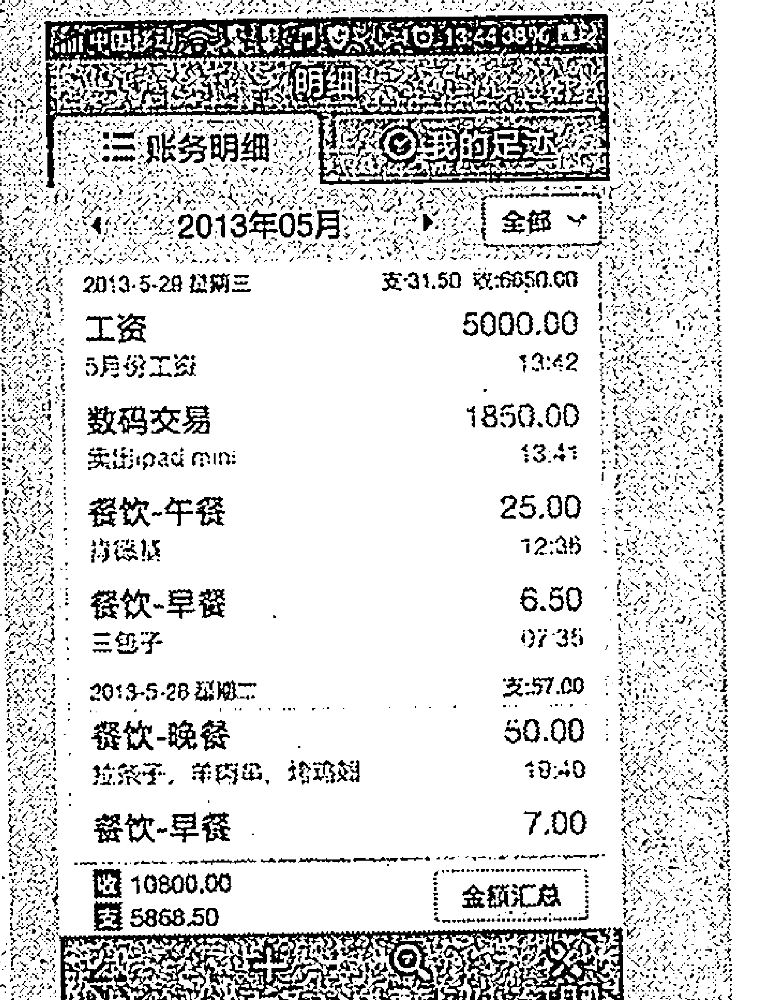

步步高vivo Xplay(16GB)1741MHz四核机 -1500元
手机 -步步高 1 1500元
交易地点：北京-大兴
联系人：小李 与周围朋友1V1
电话：135*** （该用户未认证 | 免费验证机）
详细描述：非全新，半年内购买（有发票|有原包装）
功能：功能正常
外观：外观完好
保修：原机保修
线材：无拆无修

o这个骗子显然对新品行情不熟嘛，不过也因此让我们掌握了确凿的证据

三星Note2 N7102双卡双待 二道贩子勿扰
买手机的这些是骗局
价格：3200元 欢迎来电
北京哥们非二道贩子 诚心出手机用到礼品真有朋友送的，应该是欧版，机器没中文，绝对小白不埋边。面交就好。

o类似N7102这种机器只有联通定制版，没有港行和其它国家的版本，无论是描述还是图片细琢磨就能品出猫腻

个人三星note2转让 - 2800元
手机-三星 -N7100 (Galaxy Note2) | 2800元 非诚勿扰
交易地点：北京-海淀-牡丹园
联系人：肖先生 与周围朋友1V1
电话：182*** （该用户未认证 | 免费验证机）
手机为白色 配件齐全 手机保护膜完好 无任何划痕 有发票 当场验货
联系时，请说是在北京社区网二手手机配件看到的，谢谢。

o看出来了吗？这个2800元的Note2也是高仿机，从屏幕的细腻度和顶部的信号栏图标就能看出来了

## 火眼金睛

想靠“倒腾”二手设备赚钱还得靠你的砍价技巧，而且还得避免遇到各种骗子和有潜在质量隐患的机器。有关更多二手交易过程中砍价、抬价和验机注意事项，请参考本刊2012年第1期P82《学淘客 低开销玩转天下手机》这篇文章。

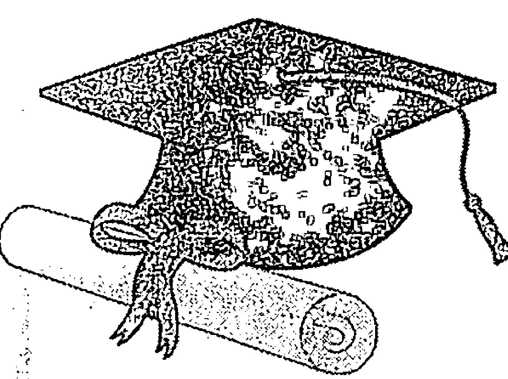

如今，笔记本和手机已经成为了生活必需品，而且更新换代的节奏也是越来越快。对于喜欢尝鲜的当代年轻人来说，如果没有一定的经济基础，想始终走在科技的最前沿肯定是不现实的。不过，如果你可以接受二手设备，并有闲暇的时间和精力去“折腾”，至少在智能手机、平板电脑这类“小件”上可以实现与时俱进，而且不用花费太多的开销呢。

## 特别话题
### 致我们终将逝去的青春

> >“一个人的成功更多地不在于我们究竟会什么，而是我们认识谁。”虽然这句话有些讽刺当今社会风气的意味，但遗憾的是，这是事实。

对初入社会的学子们而言，同学介绍你去面试的成功率永远要比你自投简历的成功率更高，这就是人脉的重要性。那么，人脉来自何处，又该如何维护？在讨论人脉的建立方法时，杜飞和杜薇产生了分歧。


- 杜飞：小薇，曾毓把公派留学名额让给陈孝正，这事你怎么看？
- 杜薇：她太阴险了吧，自己得不到，也不让别人得到。
- 杜飞：我不这么看。
- 杜薇：啊？！
- 杜飞：其实，这从侧面说明了人脉关系的重要性。成千上万的毕业生在竞争，陈孝正凭什么脱颖而出？人脉！
- 杜薇：最终他输了爱情。
- 杜飞：但是不可否认，在事业的发展上，他成功了。
- 杜薇：……


## 80后和90后的异同

杜飞的大学时代正处于手机和宽带全面普及的前夕，那时QQ还没现在这么霸道，至少当初还有类似ICQ等软件与其抗衡，而他们最常见的社交平台主要以论坛和ChinaRen的校友录为主。在论坛上会认识很多攒机高手，校友录则会发现早已失去联系的小学同学，要来E-mail、QQ和手机号后就能保持联系了。

而以杜薇为代表的90后的人脉圈可就远比80后丰富了。校友录被人人网和开心网等社交网站取代，而微博和微信的兴起则进一步扩展了朋友圈的范围，很方便就能认识来自全国各地的志同道合的朋友。此外，女生们会在淘宝买衣服时认识更多同样爱美的姐妹，而男生们则能在《英雄联盟》、《魔兽世界》等游戏中结交热爱游戏的朋友。总之，90后和80后在人脉积累上的最大差别就是，后者可以通过各种社交APP和网络游戏，认识更多有着共同爱好的人，而这是80后当时所欠缺的。也正因此，90后将面对比前辈们更为庞大和复杂的人脉资源。那么，如何管理这些资源呢？

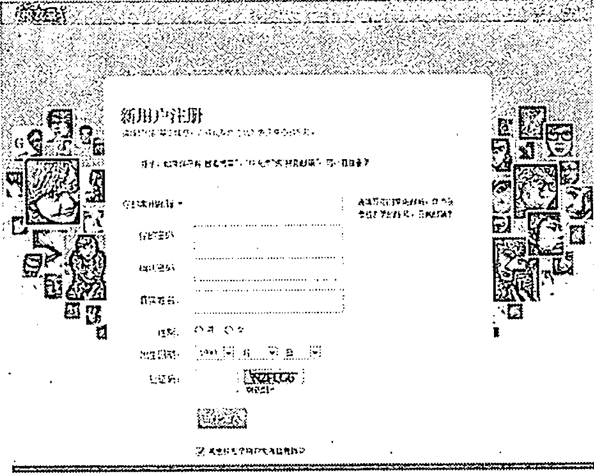

> 小提示：社交网站和APP的兴起，让我们有机会接触到更多“陌生人”，但其中不乏骗财骗色的坏人。因此，当你初次与人接触时，千万不要透露个人的隐私（如真实姓名、住址等），特别是女生在了解对方的底细前要尽量避免线下见面。

## 通讯录 最终的落地平台

虽然现在的同学们可以根据爱好而结交更多的朋友，但请记住，建立在虚拟平台（比如游戏中的好友列表、公会组织的代号等等）都不算是有效的人脉资源。举个最简单的例子，杜飞有个同事，一次旅游时与当地人发生了冲突，给当地的朋友一个电话后，纠纷就被妥善地解决了。如果你只有所谓朋友的QQ号，在紧急时刻又该如何联系？因此，请从现在开始，记录下你所有朋友的手机号码吧，将人脉资源都汇总在手机的通讯录上。虽然微博、微信等社交APP可以方便地与他们保持互动，但这只能算是简单的维护关系而已，任何时候，一个问候电话，永远比一条短信、一则笑话，或一条好友动态的评论更具亲和力。

当联系人足够多时，可能又将面临一个问题：管理起来很不方便，而且总有一些工作上的事情会占用你的休息时间。此时又该怎么办呢？有条件的同学可以购买两部手机（或支持双卡双待的机型），两张SIM分别保存亲友家人与工作上的联系人数据，然后根据自己的作息时间选择开关机。如果你不想因此破费，可以利用智能手机的联系人分组功能，将同事、朋友、亲友合理分类，比如晚上24点后就把同事设置为黑名单，上班前再批量改为白名单即可。

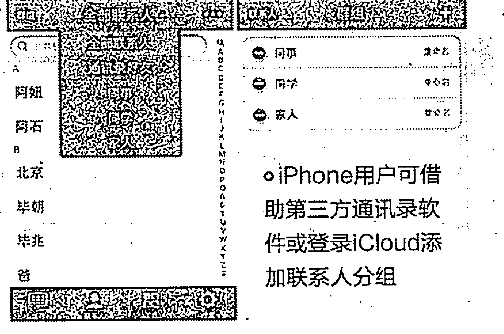

> 小提示：和处理联系人的方法类似，像微博和微信等社交平台你也可以注册两个账号，分别用于亲友圈以及工作圈。在亲友圈的账号中，你可以随意透露你的位置，发表心情（确保安全）；而工作圈的账号则可积累更多的人脉资源，提升自己在圈中的知名度，说不定就会对日后的跳槽有所帮助呢。

## 如何管理人脉资源

相信很多同学都遇到过这种问题：不同的好朋友有些只有微博账号，而有些则只有MSN的联系方式，如何将这些分散的人脉资源汇总呢？就人脉汇总而言，微软的Windows 8/WP8无疑是最为强大的，我们只需在“人脉”应用中以Hotmail邮箱（你的MSN账号）登录，系统就会自动将MSN中的好友导入到人脉中，而好友的即时消息也会在消息应用的动态磁贴图标上显示。

除了MSN，Windows 8的人脉应用还可添加其它社交软件的账户。以新浪微博为例，只需在添加账户中选择新浪微博，根据连接向导的提示一步一步操作即可将你在微博中关注的人自动加入到人脉列表中。此外，谷歌账户（Android系统）也可以导入到人脉资源里哦。

当然，在Windows 8系统普及之前，我们则可利用第三方软件管理手上的人脉资源。在这里推荐QQ同步助手，分为PC端和手机端两个部分。其中手机端（下载地址：http://pim.qq.com/）支持包括iOS、Android、WP8、塞班和Java全系统平台，在手机上安装后可以用QQ账号登录，之后就可以将手机联系人、短信等数据上传到云端服务器。当你更换手机或手机不慎丢失，可以轻松将以前备份的数据恢复到新手机上。

QQ同步助手的PC端其实就是一个网址，登录 https://ic.qq.com/pim/ 后就能在PC上浏览之前备份的联系人等数据。借助PC上便于操作的优势，我们可以更为方便地批量编辑联系人数据，还能将联系人按照CSV或VCard格式导出到本地，便于被其它名片管理软件调用。

其实还有更简单的同步方法，就是微信客户端自带的“通讯录安全助手”，其实这就是嵌入到微信中的QQ同步助手简化版；经过微信同步的数据也会出现在PC端的QQ同步助手页面中。

联系人列表表格（示例）

| 序号 | 姓名 | 电话 | QQ号 | 分组 |
|---|---|---|---|---|
| 1 | 张三 | 138... | ... | 同学 |
| 2 | 李四 | 139... | ... | 朋友 |
| 3 | 王五 | 137... | ... | 同事 |
| ... | ... | ... | ... | ... |

> 小提示

类似豌豆荚、91手机助手等帮助手机与PC连接的客户端软件也能管理/备份手机上的联系人和短信数据。如果你担心将人脉资源存储到网络的云端不安全，则可以利用手机自带的联系人导出功能，将通讯录保存在手机或电脑中。

由于“人脉”这个词太过文雅，让很多同学都误认它是多么高级的圈子。其实，所谓人脉就是朋友圈，管理人脉就是将你所有相识的朋友统一汇总、分类，以便于第一时间检索。总之请记住，人脉在于经营和维系，不要小看你身边的任何同学和朋友，所谓“30年河东30年河西”，谁也不能预测每个人未来的成就。

## 城市立足篇

对于即将毕业的大学生们，摆在眼前的第一个问题就是：“明天我该去向何方？”有些同学会选择回家建设家乡，而更多的人会考虑背上行囊迈入陌生的大城市闯荡一番。为此记者也特意采访到了两位在北京工作的比较有代表性的北漂族。

> > 杜飞：考你个问题。到一个陌生城市生活，最难的是什么？
> 杜薇：吃穿住行。
> 杜飞：不完全对，其实最难的是住和行，吃穿什么的反而容易应付。
> 杜薇：……

### 人物

- 北漂工作：产品经理
- 工作时间：6年
- 目前月薪：15000元
- 祖籍：山东烟台
- 毕业学校：青岛大学

即将毕业的你是否也对明天感到迷茫

胖子是个不折不扣的北漂族，从最开始的初进京城到如今月薪过万已经有六年光景，回想起过去的六年时光，其中既有能够成功在北京立足的自豪，更多还是昔日刚迈入这个陌生城市的酸楚。2005年大学本科毕业之后，和大多数大学生一样，胖子也非常迷茫，首先是不知道自己能干什么，其次是不知道哪里有适合自己的工作。整整一年也没有找到合适的工作，除了到处投简历、面试碰壁外，就是不断寻求身边朋友的指点，希望有人能够给自己指条明路。在朋友的建议之下，胖子简单收拾下铺盖带上几套衣服和2000块钱，抬着高昂

### 解决住宿是头等大事

第一次来到首都，处处都充满了陌生感和新鲜感，胖子来到同学家后首先需要解决的就是住房问题，毕竟同学和女朋友在一起，他不可能拆散人家，当天下午就开始了寻房路。在小区门口胖子很快找到一个中介公司职员，在职员的帮助下看好了几处价格合适的房间。经过近三个多小时的看房，最终胖子选择了一个租金700元的房间，房屋被隔断出了8户，一个100多平米的房子住了10多个上班族。挑好房间要签合同时胖子又傻眼了，原来房屋需要押一付三，也就意味着要一次交四个月的房租2800元，可自己只带了2000块钱根本不够交，就算够了日后吃饭也没着落了。无奈只能和租房职员商量，一顿软磨硬泡后对方终于答应第一个月可押一付一，但过了第一个月就得按季付房租了。

> 经验分享 对于初次进入陌生城市的同学，要根据自己的经济能力选择住房。以北京为例，便宜的房源大多是隔断房间或者半地下室房间，一间10平米左右的隔断房间在五环外六环内租金基本在600元以上，而半地下室房间租金在500元以内，房间基本只有一张可以睡觉的床。其他城市房租会便宜点，但对于刚毕业的大学生，在没有找到工作前，要做好住宿条件差的心理准备。

虽然是解决了住房问题，可是后期胖子要搬家时却遇到了麻烦，由于自己找到的是一家黑中介，结果因为房子合同未到期，中介公司不给退押金。无奈之下胖子只好白扔了700元钱，搬到离公司近的地方住了。

> 经验分享 在北京这样的大城市里应该说找个住的地方不是很难，几乎每个小区的四周墙壁以及地铁周边都能看到各种租房小广告。要提醒刚来北京的毕业生，不要单纯地指望这种小广告，最好还是直接找我爱我家、链家等正规中介公司租房，而路边很多小广告都是一些黑中介，日后房屋租赁合同到期会遇到很多麻烦事，诸如押金不退、提前收房、随意涨房租等。

在交完房租之后，胖子兜里只有600元资金了，在没有收入之前，显然要合理分配自己仅有的余款，保证粮草不能断，这时候合理控制花销显得尤为重要。除了要控制开支之外还要养成良好的记账习惯，要保证自己的每一笔钱都花在刀刃上，

> 经验分享 每个只身外出工作的人在没有经济来源时都必须要学会合理分配自己手中的资金，虽然有的同学可能会多带，也有同学还没有胖子带得多，但是不管多少都首先要控制自己的花销，要知道自己远走他乡不是为了游山玩水，要对自己的开支做出合理的规划，保证在有工作收入之前不会弹尽粮绝。

每天晚上回到住所后胖子都要将自己一天的花销记在本子上。在严格的控制之下，每天的花销基本都能够控制在10元左右，这样一个月只需要300多元，自己手头的钱起码能维持两个月的生计，所以只要在一个月时间内找到工作，那么就能够顺利熬到发工资的那一天。

现在智能手机已经普及，多数大学生在校期间就有了智能手机，所以在理财上也不需要像胖子当年那样用小本记录，只要在手机中安装理财软件就可以了。

↘理财软件推荐 挖财 http://www.wacai.com/ 挖财软件是一款设计非常人性化的理财工具，用户可以根据自己的经济状况设置预算，并对自己每天的开支做出记录，当开支超出自己的当月预算时，挖财软件可以进行短信提醒。如果大家觉得每天用手机打字记账有些麻烦，挖财软件还为大家准备了语音记账的功能，只要开启语音，就可以直接进行口述记账理财，非常方便。

### 人物

- 求职人：文超
- 北漂工作：网页设计
- 工作时间：试用期
- 目前月薪：3500元
- 祖籍：江苏徐州
- 毕业学校：中国传媒大学

和胖子初入北京找工作不同，文超是从上大学时就来到北京，对这个城市不会感到太陌生。目前他还没有毕业，所以可以继续住校，而找到一份合适的工作成为第一时间要做的事情。从今年寒假回来后，文超就忙于在北京找一份合适的工作，在寻找工作面试途中文超还是遇到了不少意想不到的麻烦。

### 陌生城市寻路难

由于自己大多数时间都是在校园内度过的，北京错综复杂的路况加上鳞次栉比的高楼大厦还是让文超非常头疼。为了尽快找到工作，文超每天几乎都会有三到四个面试预约，虽然自己已经提前在网上看好了行车路线，可多数时候使用百度搜索到的公交线路都只能够提供就近的行车路线，下了公交车之后少则步行几分钟，多则步行半小时的情况都会遇到。有时候自己想要找的面试公司大楼就在眼前，自己却不知道，还在周围乱转。无奈之下只能自己见人就问，直到在好心人指引下走在面试公司的门口。

文超几乎每次都是走到腿脚发软，终于在今年三月份找到了一份3500元的工作，这也许会和很多毕业大学生的预期相差甚远，但文超自己感觉还很满意，先找到适合自己的工作，慢慢积累工作经验才是最重要的。

> **经验分享**
现在很多毕业大学生会存在高不成低不就的情况，大家在刚找工作的时候不要要求太多，多数公司在招人时对工作经验很看重，大家不要想着一开始就能找到一份肥差，放低自己的身段先找到一份稳定工作，等自己有了工作经验之后，工资自然会上涨到让自己满意的数字，正所谓“是金子总会放光”。

文超在找到工作开始试用后发现自己住宿还是太远，有诸多不便，坚持了一个月后，最终决定在公司周围找一个合适的住所。文超从Android官方市场下载了58同城客户端，然后在搜索栏中输入合租房，按照租金和房屋所在区域条件进行详细定位，很快找到了让自己满意的住所。

### 导航软件推荐

#### 百度地图

http://url.cn/HLBGYq
百度地图是一款定位非常准确的软件，大家只需要将自己的目的地输入到搜索框，点击搜索后百度地图就会为用户提供最方便的行进路线，而且可以切换到2D模式显示，非常直观。点击地图的左下角，百度地图会提供具体的行走路线，每个路口转弯都介绍得很详细，直到用户达到指定的地点，导航过程才会终止。

### 租房软件推荐

#### 58同城

http://url.cn/GT7m3N
58同城对于陌生城市租房的同学非常管用，该软件能够提供给大家所在城市的所有常用信息，租房就是其一。这里面不仅有大量的房东的直接租房信息（可以免去中介费），而且有很多该城市的打工一族寻求合租的信息，这些都能够为大家节省一笔不小的住房开销。此外58同城很好地将用户所在城市租房信息进行细致分类，大家可以根据自己的条件和需求找到适合的房源。

> **温馨提醒**
在和房东或者中介签订租房合同时大家一定要仔细查看协议，注意房屋合同中是否需要自己交付物业费、水电费以及取暖费等，虽然这些钱不会太多，但对于刚开始出门工作的毕业生来说还是不小的负担，另外要看清合同上是否有甲方有权调整房屋租金一项，以及退房需要如何办理手续。

本文主要是以北京地区为例，对于毕业大学生来说，无论初入哪个陌生城市都会遇到上述问题，想要在一个陌生城市立足的前提条件就是要找到一份合适的工作，有稳定的经济来源。如今在科技不断进步的时代，我们身边的手机、电脑等设备都能够为我们立足一个陌生城市提供诸多的便利。

## “手机”吸费APP已被“侵蚀”

“想知道跟他/她的缘分么？编辑姓名短信至10XXXX，解析你们的前世今生……”几年前，SP（全称Service Provider，即服务提供商）广告席卷了人们的手机，而如今它们变成了山寨APP……

文|严威川

### 暗度陈仓 披着APP皮的SP

“近日以来话费总是不够用，直到去查才发现被莫名其妙扣了很多钱，自从在第三方平台下载了《小鸟爆破》以后，每个月几乎都无端被扣费，根本没有任何迹象和通知。”一位名为V_force的网友说到。

这种隐形扣费成为近期APP市场上较为常见的现象，SP利用扣费代码嵌入游戏或应用，打包成为汉化版或者加强版等“山寨应用”在第三方平台提供用户下载，只要用户点击便会产生相应的资费。

SP厂商更是大张旗鼓地“售卖”该技术，“只需花2.5万元购买一个计费平台，便会在服务端获得一个扣费插件，将此插件添加到游戏或者应用后，再把它放在第三方应用市场上去做推广，只要有用户下载使用，这个插件就会暗中扣费。”而这样的技术，一个初级的JAVA工程师或Android工程师便可以办到。

另外，此类添加了扣费代码的APP十分不易察觉，因为研发商会通过不断更改签名的方式，欺骗一般的杀毒软件或手机安全软件，在用户手机里安然运行。据悉，此类扣费渠道的APP下载量跟扣费率相当高，数据显示，某项SP吸费通道的APP总下载量为5769，而扣费成功为5047，成功率高达87%。

### 盈利背后 用户“被消费”

当智能机逐渐代替功能机成为市场主导的同时，手机游戏也以迅雷不及掩耳之势占领市场，作为APP中数量最庞大的部分。普通手机用户经常搞不懂，手机游戏究竟如何赚钱？

不同于国外iOS用户，国内用户的付费习惯尚未形成，加上Android开放平台的大量免费应用，国内生厂商纠结于植入低廉的广告还是沿用网游的道具收费模式。然而，这两种模式都有缺陷。一方面，内置广告使得应用很不专业，用户游戏时不小心点击到广告页面跳转，大大影响了用户体验；另一方面，手机游戏作为用户消耗碎片时间的产品，能产生的用户粘性并不比网络游戏，肯花钱在上面购买道具的用户更是少之又少。所以，国内手机应用研发商想赚钱绝非易事。近年来，由于受到来自智能机应用以及第三方平台的打压，SP逐步面临被淘汰的局面，而通过寄生方式隐藏在APP中的SP业务简直是被逼出来的赚钱方式。并且，由于SP打包业务的技术难度低、利润很高，将插件打包到APP中，可以在短信PUSH或者网盟平台去推广，情况理想的时候下载量能到数万。不少应用开发者已经将目标转移到了暗中扣费的APP制作上，并已经形成一个相对完整的产业链。SP公司负责扣费代码和渠道，而开发者负责添加插件和推广，在该应用产生信息费之后，双方各获得20%左右的利润提成，而针对游戏应用的分成会相对更高一些。

此外，SP公司现在也开始涉入APP的原创开发工作，通过在一些知名度与下载量较大的游戏中加入付费插件，再以汉化版、破解版等名义推出到第三方市场，用户每下载一次，第三方市场也会获得相应的费用。

记者电话采访了一名深圳手机游戏公司的资深Android工程师，他表示目前手机游戏中存在暗中扣费的现象已经非常普遍，并且没有相关法律可以进行约束，SP公司及开发者心照不宣。其实受害的还是手机用户，在游戏的过程中“被消费”，很多粗心的用户甚至被扣费半年都没有察觉（有些产生的费用比较低，容易被忽视）。并且这类游戏和软件很难防范，普通用户更是无法辨别，只能是看到可疑或者来路不明的程序包尽量不要下载。

| 排名 | 软件名 | 感染用户 | 感染比例 |
|------|--------|----------|----------|
| 1 | 手机QQ | 1605 | 18.5 |
| 2 | 屏幕水雾 | 754 | 13.9 |
| 3 | Documents To Go | 322 | 5.9 |
| 4 | 超级电池 | 301 | 5.8 |
| 5 | Bluetooth File Transfer | 295 | 5.6 |
| 6 | Winter Fantasy Live Wallpap | 283 | 5.2 |
| 7 | CamScanner | 249 | 4.6 |
| 8 | 中国眼 | 157 | 2.9 |
| 9 | BatteryLife | 153 | 2.8 |
| 10 | NFS Shift | 148 | 2.7 |
| | 其它软件 | 1152 | 32.3 |
| | **总计** | **5420** | **32.3** |

对于手机病毒以及嵌入式收费，1500元以下的千元智能机感染比例达到43%以上。

### 保证用户利益 国外有成型模式

根据网秦最新发布的《第三季度全球手机安全报告》表示，对于手机病毒以及嵌入式收费，1500元以下的千元智能机感染比例达到43%以上，感染途径包括内置ROM和通过第三方商店下载，其中强行订购SP业务的吸费软件占到了相当程度的比例。
无论是应用开发者、SP公司或是第三方平台，都对于一本万利的内嵌扣费SP的APP制作乐此不疲。由于可以通过更改签名绕过安全软件扫描，使得用户被扣费也有苦说不出。
相对于国内杂乱无章的市场，国外市场相对规范许多。虽然GooglePlay本身也处于一个放任无序的状态，大量充斥着各种盗版和垃圾APP，但诸如Vcast等先审核再上传的平台，对开发和上传者强制要求实名制和ESRB分级标准，为树立行业规范起到了很大的作用。
用户在Vcast上传应用必须有营业执照以及相应的实名注册，而且会与账户绑定纳入信用体系之中，一旦账户出现不良记录，便无法继续上传应用。ESRB是指按应用和游戏的内容进行年龄段的强制分级，比如分成PG-13、PG-15、PG-18等年龄适用。这样的监管下，SP这样铤而走险的业务模式便没有滋生环境，消费者权益得到了一定保障。

### 整顿APP 才刚上路

国内方面，APP的杂乱环境使得有关部门开始酝酿一套行业整顿规划：建立一个长效的评估体系，对智能手机应用程序、内置软件进行评估和抽查……并将第三方平台纳入管理，成立要备案，运行要监管。
从政策上施压固然好，但目前iOS和Android平台的合计应用数量已经达150万，算上塞班、WP等平台，应用数量超过200万，整顿很难理清头绪。而新应用审批方面，如果一个应用从推出到审批，再到推出上市，需要经历两三个月的时间，对于游戏开发者来说无疑是很大的噩耗。因为同样题材的作品在国外市场快速推出，国内的滞后性会带来不可小觑的损失。
这对于国内的创意人才来说，也是一个巨大的打击。如果按照一套统一规定治理，在见到成效的同时也会打击开发者的积极性。对于国内缺乏创新人才的大环境来说，有效地正确引导自主革新是必不可少的环节，但怎样合理打击SP等不良行为，有效整顿手机市场环境，这才刚刚上路。

## 扩展阅读

#### 昔日繁荣的SP

SP，全称Service Provider，即服务提供商。早在手机刚兴起的时候，SP的出现填补了移动网络速度慢、资费贵、内容欠缺的市场，通过短信的资费模式向用户提供铃声、图片、新闻、游戏等等服务。
由于技术要求低、产值大、利润高等特点，SP业务疯狂的发展速度造就了行业的许多暴发户，也滋生了例如“SP专业投诉”等不务正业的门路，专业组织通过对SP业务的恶意投诉获得赔偿谋生，团队成员甚至可以获得每月5000元的“工资”。
在这样的乱象下，2006年开始，“二次确认、动态密码、逻辑问答、三次确认、工信部拨测、运营商拨测、315曝光、投诉排名淘汰”等一系列针对SP业务的整顿措施实行起来。整个行业逐渐缩水，一批使用SP计费来做正规业务的手机游戏平台公司也受到了波及，以诺基亚贪食蛇为首的手机游戏逐步兴起，SP逐渐失色于蓬勃的手机游戏浪潮中。
如今随着智能机的普及以及第三方应用的突起，SP业务受到极大冲击，即便是在这样不景气的日子，黔驴技穷的SP公司也能找到吸金的途径：炮制山寨APP，通过用户下载进行恶意收费。

## 龟速伤不起的小区宽带

“我们是XX宽带，独享4MB，海量下载，年费仅XXX元”，相信每个住宅小区的用户都会遇到类似的推销，然而宽带真如宣传上所写的能让用户独享网速吗？

文 | 严威川

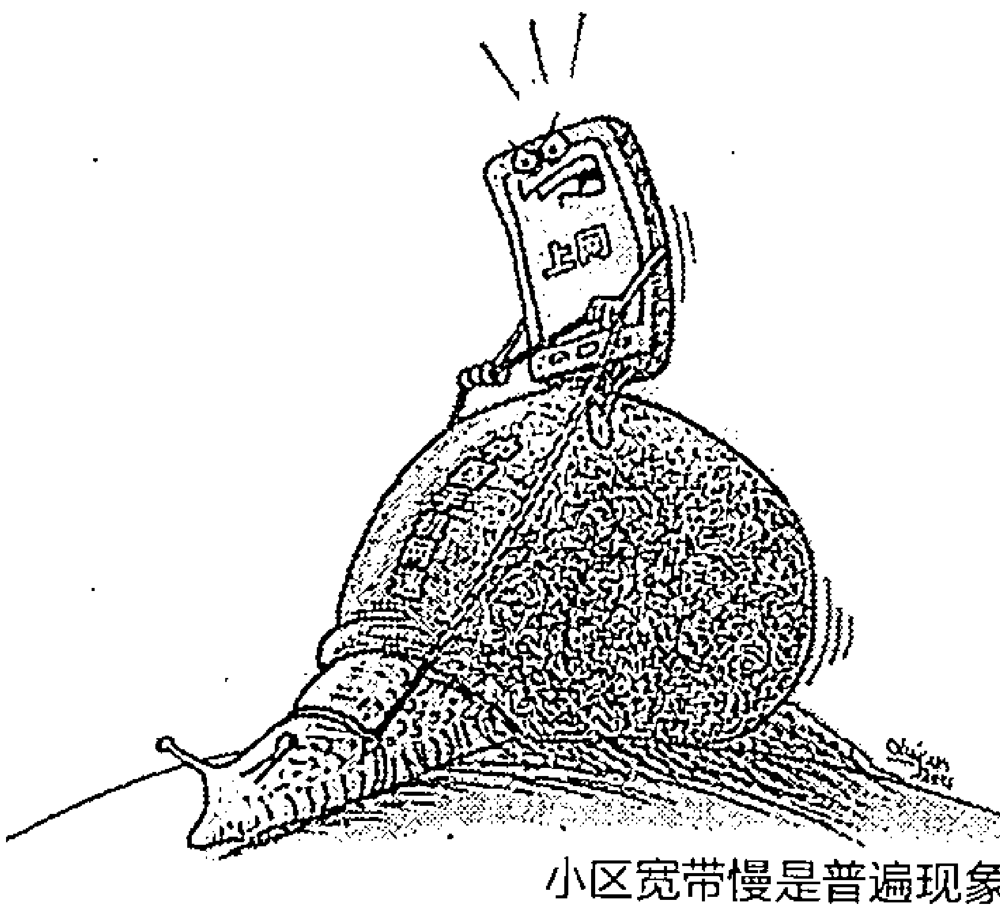

宽，现在别说下载了，晚上看个在线电视剧有的时候都卡。给他们客服打电话，告诉我高峰期有些时候会出现这种现象，说尽量避开高峰期。白天不是高峰期，我不用上班吗？”韩先生说到这里情绪明显开始激动。当记者问及为什么选择方正宽带时，韩先生叹了口气，说到：“被忽悠了呗，年费不到1000元，还能独享宽带。我没什么爱好，就是看电视剧和大片，当时一听这么快的速度，想都没想就办了。”

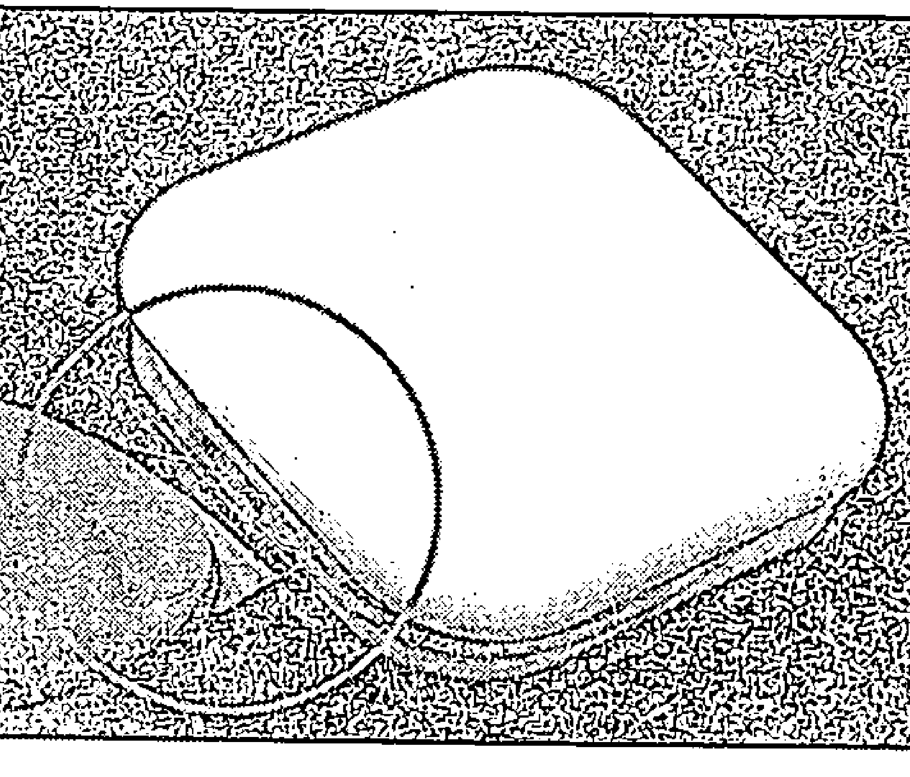

## “独享”等于幻想

“唉，我们老俩口不懂下载什么的，就是用QQ和在美国的女儿视频聊天，看看外孙女。”家住北京芍药居某小区的江女士提到自家安装的歌华宽带就不住地叹息。江女士夫妇都是退休职工，女儿一家三口移民美国，他们每天最重要的事情就是晚上按时在电脑前和女儿一家三口QQ视频。但这些乐趣总被不稳定的网速搅乱，有些时候干脆拨打国际长途以解思念之苦。

江女士对记者表示，当初安装宽带的时候根本没有选择，物业推荐的就是歌华。并且在介绍资费的时候，感觉年费还比较合理，并且也是急着使用，没经过太多考虑就安装了。安装最初情况还可以，白天上网速度正常，QQ视频和MSN均正常。然而过了一段时间，周六、周日两天从中到晚上，平时晚上7点以后，网速变得非常不稳定，严重的时候QQ都登录不上。“有的时候看到那只小企鹅来回左右摇摆可真心烦！”江女士非常后悔当初没有多了解一下其他种类的宽带。

与江女士的懊悔相比，家住北京东五环外周家井某小区的韩先生简直可以用暴怒来形容，他家入户的是方正宽带。“当初跟我说的是独享10MB带宽

以上两个案例绝非个案，记者随后采访的几名用户也反映了同样的问题。上网高峰期网速下降、不稳定甚至有时刷不开页面成为了众多小区宽带共有的“通病”，更讽刺的是在它们的宣传材料上，这些缺点无一例外地变成了优点和卖点。相信很多使用过小区宽带的用户都明白一个道理，所谓“独享”其实无异于幻想。

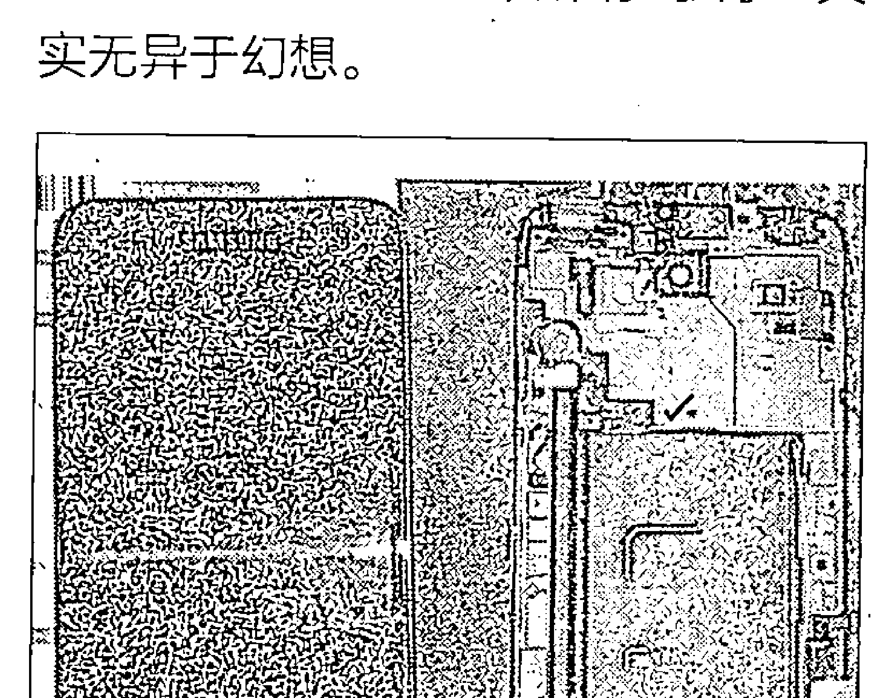

## 画地为牢 用户“被宽带”

小区宽带如此不理想，却为何能够生存至今呢？答案是：没有其他宽带接入选择。据记者了解，例如上面提到的韩先生所在小区，已经被方正宽带“拿下”，意思就是其他形式的宽带根本无法进入小区。而如果其他宽带想要进入小区，需要运营商和开发商以及物业进行商谈才有可能，但是这种可能性微乎其微。韩先生向记者表示曾经咨询过物业，是否能够换其他宽带，物业工作人员也很无奈，说是哪家都是物业集团领导谈下来的，决定是哪家就是哪家，没有第二家选择。

随后记者也对几位小区宽带用户进行了咨询，发现他们所在的小区基本都被划分了“势力范围”，方正宽带、歌华宽带、宽带通、长城宽带等等如跑马圈地般把新兴和成熟的小区归为自己的“地盘”。几乎每个小区都仅有一种宽带接入形式，为何没有第二种选择就不言而喻了。

随即，记者以购房者的名义拨通了回龙观一个新建小区售楼处的电话，以买房的名义咨询新房的基础设置，宽带入户是首要问题。售楼处工作人员表示每个户型就预留了LAN接口，入住之后就能够上网。当记者提出自己喜欢ADSL，希望能够另行安装，售楼人员表示有一定难度。记者又提出有没有其他类型的小区宽带可选，工作人员则表示没有选择，并且表示宽带入户是开发商谈妥的，不可能根据一个用户进行更改。随后又表示，网速能够保证，没有太大问题。

由此可见，不但成熟社区的居民小区宽带其实都是二、三线运营商在操控。

存在宽带不宽的问题，就连准备买房的消费者也早已提前“被宽带”了，在购买新房的同时很自然地落入了宽带运营商的“手心”。而开发商与物业在宽带问题上沆瀣一气，反正“生米已成熟饭”，事实上确实也没有选择，用户不忍也得忍。

## 不理想源于“超载”

某小区宽带在资料页上宣传“高速云下载，网速大于20MB，买6个月赠6个月网时”，资费比联通20MB包年的光纤入户便宜了近600元。对于一些精打细算过日子的消费者来说无疑是巨大的诱惑，不但能够省钱，而且还有很多赠品，例如鼠标、小优盘、屏幕清洁剂等等。而正是这些优惠的价格和“小恩小惠”的赠品让不少用户选择了本末倒置，完全没有考虑到今后的应用体验。

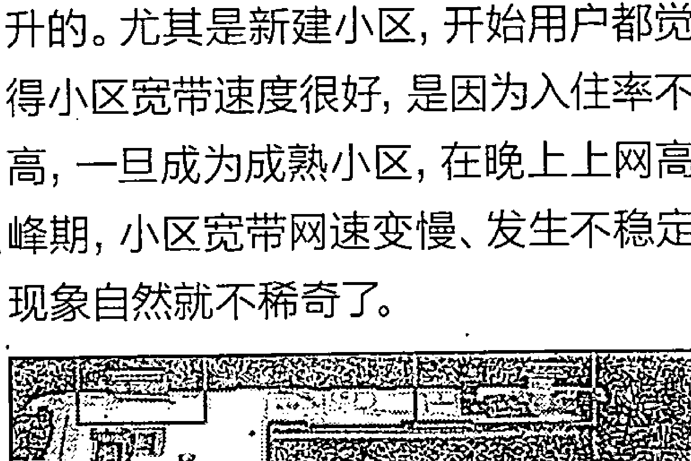

只要消费者理解了小区宽带的原理就能够明白为什么会使用得那么不理想了。其实就是整个小区共享一根数据源（光纤），做个不太恰当但很形象的比喻，整个小区就是一个局域网，而数据源就是这根光纤，一个人用的时候，如果是10MB，那自然独享10MB。但是一旦100个人用，情况就可想而知了。资源是固定的，但是人数可能是不断上升的。尤其是新建小区，开始用户都觉得小区宽带速度很好，是因为入住率不高，一旦成为成熟小区，在晚上上网高峰期，小区宽带网速变慢、发生不稳定现象自然就不稀奇了。

当然，目前并非小区宽带都是“天下乌鸦一般黑”，例如长城宽带，记者走访两个小区，在高峰期网速还是有一定保证，基本实现了光纤资源和用户购买后的资源成正比。在线视频由于和迅雷合作，所以观看比较流畅。不足的是网络游戏掉线率比较高，并且20MB网速承诺下载2MB，这个在高峰期是无法达到的。

小区宽带其实都是二、三线运营商在操控，他们基本没有什么实质的东西，无非是从联通和电信租用带宽。而作为一线运营商，联通和电信一直处于卖方市场地位，给小运营商的租赁价格很高，所以一旦得到带宽，赢利才是这些小运营商的最终目的。

应该说小区宽带宣传资料上倒没有弄虚作假，他们承诺的10MB、20MB甚至25MB都是存在的，但是却忽略了用户人数。从上面讲到的小区宽带原理来看，100人同时用一根数据源和300人同时使用肯定效果不同，而目前小区宽带体验不理想的用户，所在小区必然是用户“超载”。

## 相关链接

工信部通信发展司司长张峰表示，前三季度通信业的发展情况良好，工信部将发力整治“假宽带”，近期会公布用户端到接入端测速标准。张峰透露，此次制定完成的是测速标准中的第一阶段，主要用于指导测试用户端到接入端的网速。该部分已由工信部、研究院所及企业共同研究编制完成，已在全国进行了4个月的大规模基础测验并将于近日发布。而对于第二阶段用户“端到端”的网络测速标准仍在制定中。

> 记者后话
目前，工业和信息化部已经开始着手治理涉嫌虚假宣传的小区宽带。对于用户来说，一旦自己签约的小区宽带在应用体验上与宣传严重不符，应该首先拿起法律的武器维权。虽然目前维权的手段和途径比较繁琐和复杂，但用户们不要因此而退却，选择谩骂或者隐忍非常不明智，只要更多的人能够站出来合理合法的争取自己的权益，那么随着相关法律法规的进一步完善，宽带不“宽”的现象一定能被遏制。

## 活着 中小网店绝境求生

据统计，国内每天约有10000家网店被迫关掉。但是每天依然有更多的人梦想摆脱上班的束缚，拥有自己的网店……

文|严威川

### 伤不起的“保证金”

淘宝网曾经是成就中小型网店店主梦想的平台，而现在随着淘宝网天猫商城频道的出现，淘宝网却一下子成为了中小网店发展乃至生存的最大阻力。

记者的一位朋友就是无数挣扎在生存线上中小型网店店主的缩影。他们夫妇两人经营的是厨房及生活小家电店铺。初始运营资金只有1万元，并且由于涵盖的品类众多，所以资金上一直捉襟见肘。但是要想在淘宝网上卖货，却并非易事。除了要上传繁琐的身份认证之外，同时还要缴纳1000元的保证金。否则的话，每次“发布宝贝”的时候，就只能选择二手频道，作为闲置物品来销售。

而更为重要的是，淘宝网的二手频道干脆就没有任何销量。由于无法在新品频道发布商品，所以新店开张的前两个月，淘宝网上几乎没有一单成交。

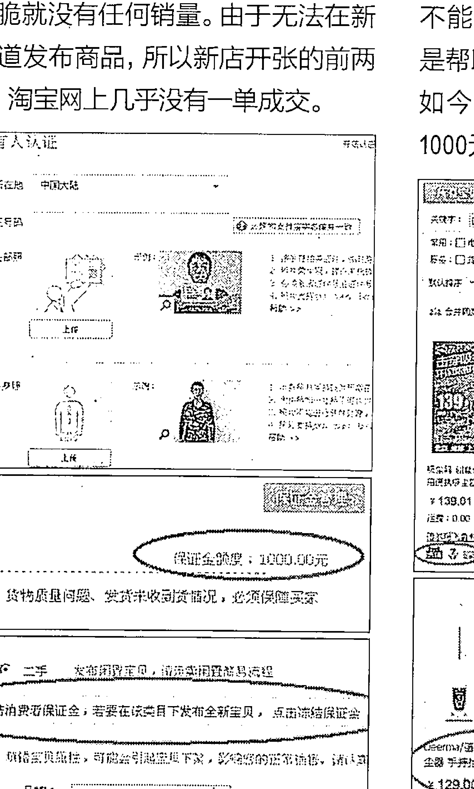

### 交钱依然办事难

由于前两个月，自己的淘宝网店既没有成交量也没有多少浏览量，夫妇两人最后狠狠心，缴纳了1000元的保证金。但是在淘宝搜索引擎当中，却仍难找到自己的商品。

以店主销售的一款德尔玛DX116C吸尘器为例，本店的销售价格为129元，而且还全国包邮。但是如果以“德尔玛” + “DX116C” 为关键词进行搜索，就会发现第一页的前几位都是天猫商城的店铺，只在搜索第二页才能看到受访店主的商品。而如果按照最低价排序时，却发现排在第一位的售价竟然高达136.01元，同时还自动隐去了129元全国包邮的受访店主的商品。

对于此种现象，记者的朋友始终不能理解。淘宝网的最低价排序本来是帮助消费者寻找最低价商品的，奈何如今却成为了有名无实的摆设？难道1000元的保证金就这样白交了？

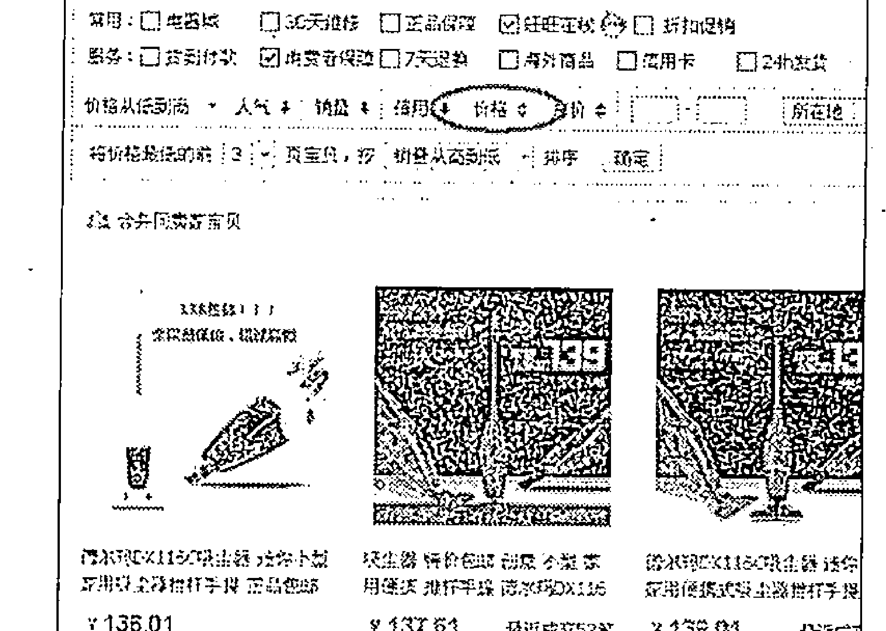

### 并不受保护的“保护费”

在进一步和几名中小型店主联络沟通当中，本刊记者了解到，虽然受访店主敢于保证他们店里的产品有80%都是全淘宝最低价，仅以微利来销售产品，以期获得店铺的快速发展。但是即便如此，由于淘宝最低价排序时自动隐去的问题，这些店主店铺的商品仍然无法第一时间被消费者关注，销售前景凋零。

由此不难理解，淘宝网如此设置可谓一举两得，既保证了自己商品的受关注度和销售量，同时依然可以继续收取中小型店主的各种费用。而店主们明知道这是一笔坑人的“保护费”，但是为了店铺持续性发展，也只能默认这个事实。

而本刊记者针对这一问题，也进行了亲自搜索试用，发现淘宝网的搜索引擎当中，有一种叫作“个性化定制”的功能。不过即便关闭了个性化定制，并去掉“旺旺在线”这一设置，却仍然无法找到受访店主的129元全国包邮德尔玛DX116C吸尘器。最低价排序的第一位售价已经拉低至130元，但所有低于这一价格的同款商品却仍然被自动隐去。

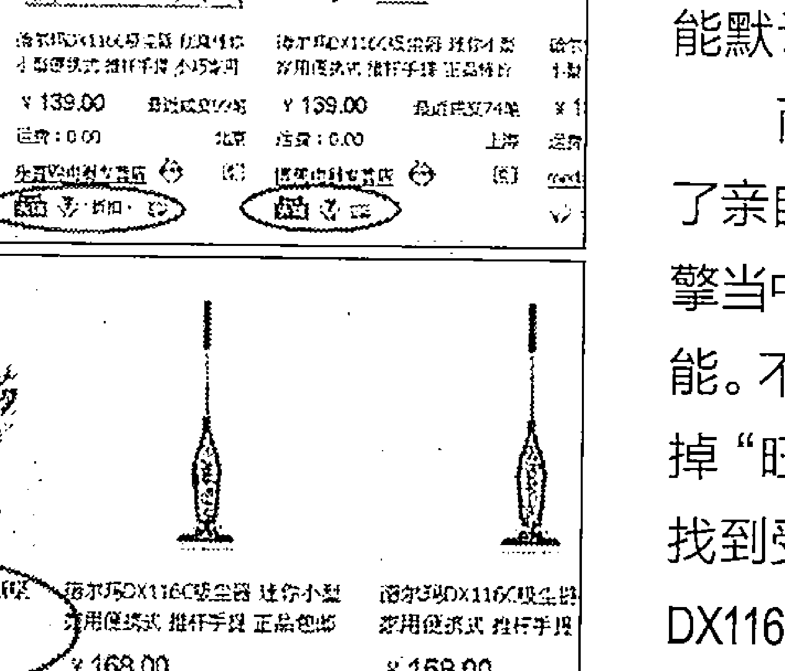

除了要上传繁琐的身份认证之外，同时还要缴纳1000元的保证金。否则的话，每次“发布宝贝”的时候，就只能选择二手频道，作为闲置物品来销售。

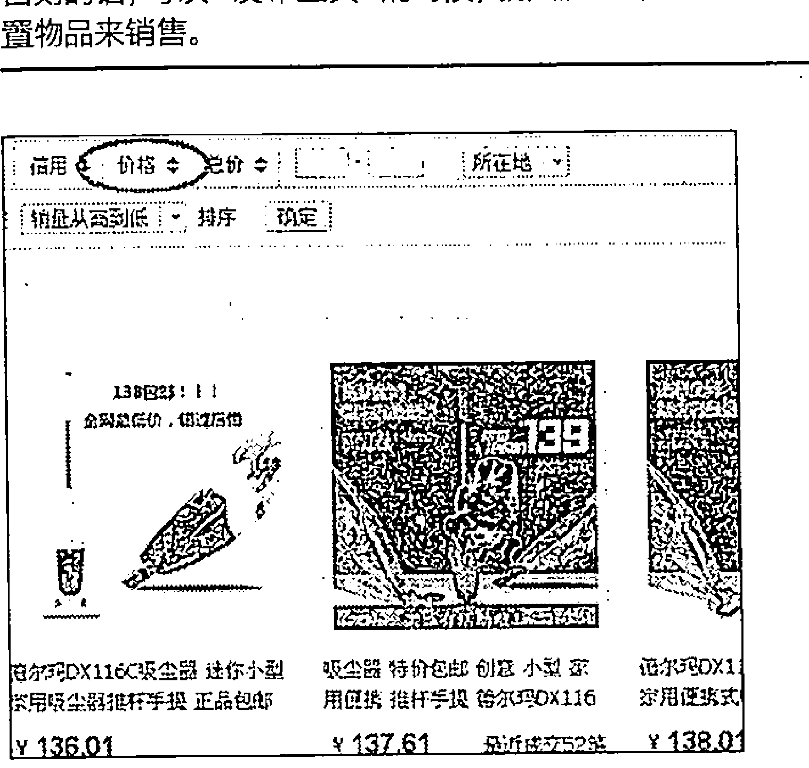

实她也知道这种经营风险更大，但是和纷乱不堪的网络卖场相比，她认为实体店能让她把控的事情多一些。

| 快递公司 | 运费标准 | 价格 | 备注 |
|----------|----------|------|------|
| 全峰快递 | 09:00 - 18:00 | 7.0元 | 无保价<10，每加1.0公斤4.0元 |
| 韵达快递 | 09:00 - 18:00 | 小于1.0公斤8.4元 | 每加1.0公斤2.8元 |

与“玫瑰茄”相比，几个经营小家电的店主更提心吊胆，并且他们还受到快递公司的压榨，淘宝提供给卖家的网上下单快递优惠价形同一张废纸，各大快递也不执行。一名店主告诉记者，例如首重8.4元、续重2.8元的淘宝签约运费，快递员上门取货时，就会变成首重12元、续重4元的自由定价。而这样的运费价格投诉到淘宝，也没有任何用处。

所以说，如果是同城买家，店主甚至甘愿自己送货。除了快递费太贵之外，一旦货物途中因为运输损毁，大多数情况要淘宝店主自己承担，投诉快递公司从来都是有始无终。

### 内忧无解 外患更甚

如果仅仅是缴纳了“保护费”就完事，那还算小店主们的幸运，其实真正的烦心事几乎每天都伴随着他们。受访的几名网店店主有个共识——生于淘宝、伤于淘宝、死于快递。

经营漫画生意的店主“玫瑰茄”告诉记者，自己通过渠道辛苦从美国、日本购置的原版漫画进行销售，买家非常踊跃，但是交易几次屡屡被中评、差评，原因是漫画到达买家手里不是显得破旧，就是外观有不同程度的损毁，有一次甚至在退货中发现漫画封面被溅了很多油渍。

对于这种情况，“玫瑰茄”曾经投诉过合作的快递公司，对方也只是换了快递员了事。“估计以前那个快递员也是个漫画迷，每次都自己先欢乐之后再送到买家手里。”提起这事，“玫瑰茄”也只能给自己找这么一个哭笑不得的理由。近期，“玫瑰茄”已经和朋友准备在北京天通苑一代经营实体书店，其实她也知道这种经营风险更大，但是和纷乱不堪的网络卖场相比，她认为实体店能让她把控的事情多一些。

魏东东是一家开了7年网店的店主，主要销售玻璃器皿。虽然玻璃器皿属于高盈利产品，但是毁损率也非常高，对于小本经营的店主根本无法承受。淘宝店的订单多是外地买家，尤其量大的单子成交，寄送过程对于魏东东来说是一种煎熬，因为一旦货物在运送中损毁率达到一定数额，就意味着生意不赚钱，还要搭上网店的推广费，铁定赔钱。无奈之下，只能将一部分生意“搬”到58同城和赶集网，虽然订单数量少，有时候甚至买家只买几个玻璃杯，但是多是同城上门提货，属于稳赚不赔，这才得以将网店支撑下来。

魏东东最近正在看沃尔玛超市创始人山姆·沃尔顿的自传，他对山姆·沃尔顿非常欣赏，非常推崇这名商业巨子在赚钱的同时，坚守为广大消费者提供低廉价格和优质服务的原则。他和很多网店店主的信念一样，只要还有条件，依然会把微利网店坚持下去。“虽然每天有上万家网店关闭，但我不想成为万分之一。”魏东东在结束采访后对记者表示。

> 扩展阅读
2011年10月10日，淘宝网公布2012年淘宝网新规则：2012年向商家收取的年费将从现行的每年6000元调整到3万元或6万元两档，大部分商家作为服务信誉押金的消费者，保证金将从现行的1万元，调整到5万元至15万元不等。11日，“反淘宝联盟YY在线”就已经汇聚7000多人同时在线，这些人利用淘宝商城的交易规则，对商城上有影响的大卖家采取批量拍货再申请赔偿，或宣称要以收货、给差评、再申请退款的方式进行“攻击”，希望以此逼宫淘宝。小卖家以“拍爆”大卖家的极端方式，对抗天猫商城，使得那些颇具知名度的大卖家们很受伤。事件发生后，有数十家大型天猫商城店铺，如韩都衣舍、优衣库、韩都七格格、品尚红酒等，被网民“攻陷”，部分或全部商品被迫多次下架。

### 夹缝生存 无奈前行

淘宝的恶劣环境令中小店主举步维艰，拍拍网、易趣网又不成气候，赚钱早已不敢奢望，生存才是最重要的。

“如果没有58同城和赶集网，我可能早就关闭网店，踏踏实实找一份朝九晚五的工作了。”魏东东是一名经营四年网店的店主，主要销售玻璃器皿。虽然玻璃器皿属于高盈利产品，但是毁损率也非常高，对于小本经营的店主根本无法承受。

其实此次记者采访的几名店主几乎都是广大中小网店店主的缩影，他们可谓是在黑暗中前行，不断看见希望，但是总被现实问题所伤害。然而很有意思的是，受访店主们虽然很困扰，但是普遍信心十足，对将来的发展普遍乐观。

## 商场‘团代’ 下单要谨慎

如今团购网站一批批倒下去，但是随之衍生出的消费纠纷却接踵而来。

文|严威川

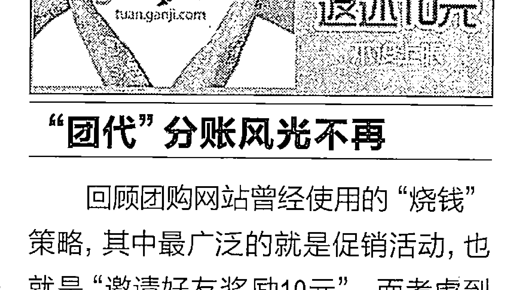

### ‘团代’分账风光不再

回顾团购网站曾经使用的‘烧钱’策略，其中最广泛的就是促销活动，也就是‘邀请好友奖励10元’。而考虑到普通消费者根本没有精力注册多个‘马甲’来获得10元奖励，因此也催生出了团购网站的代购业务。

客观来说，这种代购业务主要以淘宝为平台。普通消费者如果看中了团购网站的某一商品，则首先通过淘宝进行交易，再由淘宝上的代购店铺通过‘马甲’下单。至于最后获得的10元奖励，则通常由消费者和淘宝代购卖家均分。也就是说，消费者每一单都可以省下5元钱，而淘宝代购卖家则每一单都可以赚到5元钱。

如今，随着团购网站不断倒闭，‘邀请好友奖励10元’的促销活动已经寥寥无几，‘团代’分账基本已经结束。

### 赚小利‘团代’不择手段

然而曾经依靠代购业务而赚得盆满钵满的淘宝卖家，却有很多不甘愿放弃‘团代’。在他们当中，有些老实本分的淘宝卖家则依靠代购累积积分来继续维持微薄的利润。有些则不满足于现有的微薄利润，从而走上了为消费者设置陷阱的歧途。

张龙鑫近期有过一次非常不愉快的‘团代’经历。本来打算与女友来一顿浪漫午餐，习惯‘网淘’的他找到了一个千品网的淘宝代购卖家。当时千品网的代购行情通常是95折，这个代购卖家的报价则是9折，所以打动了小张，并迅速在淘宝网上下了订单。但是到了餐厅小张却发现，前一天刚刚团购到的服务密码已经被退款。好在小张用手机对商家的电脑进行了拍照取证，并上传了照片要求淘宝客服介入。否则的话，肯定让骗子诬陷为‘吃了又来退款的无赖’，并让其骗取了不义之财。

而更为值得注意的是，淘宝平台虽然有支付宝作为中介体系，但却同时有一个9天时间自动放款的规定。因此，与小张遭遇到了相同骗子但却未能在9天之内及时去消费的消费者，则普遍自动放款给了代购骗子。除此之外，很多证据不足的淘宝买家，也同样无法维权成功。虽然没有经济上的损失，但小张懊恼的是，女友感觉在餐厅失了面子，和他大吵一架，好事弄巧成拙。

小张的经历引起了记者注意，继续探访中发现被‘团代’伤害的消费者并非少数。宋雨是本刊的读者，她来信讲述了自己的见闻。当时她以‘美团+代购’为关键词在淘宝网进行搜索，就遇到过这样的卖家。

> 其店铺里宣称：‘掌柜最近经常出差，暂免费公开内购方法，请老客户自助领取。内购每月可获赠美团面值18元代金券优惠券和100元礼品卡1张，内购地址：http://www.meituan.com%2eur17%2e%6d%65/5RLg。1.淘宝不支持外链，请复制打开，每月每账户限领一次。2.建议收藏内购地址，每月数量有限，发完即止，节假日会有额外礼品卡相送。3.目前市面礼品卡都是内购券，漏洞随时有可能修复，请尽快激活！4.内购码：NG697XFA59H（已更新），已免费公开，无须拍下，掌柜回来后恢复原价5元一张。’

而实际上，团购网站早已停止了相关活动，即使真的有漏洞也不可能是18元代金券和100元礼品卡这种有整有零的状况。况且从各个方面来看，上述内购地址和内购码无非是一个团购网站的邀请码而已。这样一来，就可能欺骗消费者下单，而淘宝代购卖家则获得相应积分。

另外，据记者了解，套取消费者手机号码也成为了一种常见的欺诈行为。利用套取的手机号，卖家给自己制作几个‘马甲’，以方便日后业务的广泛开展。根据几名淘宝买家的叙述，以前的正规代购卖家，只需要消费者提供一个手机号，以方便接收团购网站发送的密码短信。而存心欺诈的代购卖家，则会给消费者发送一个6位验证码的短信，并通过旺旺索要这个6位验证码。

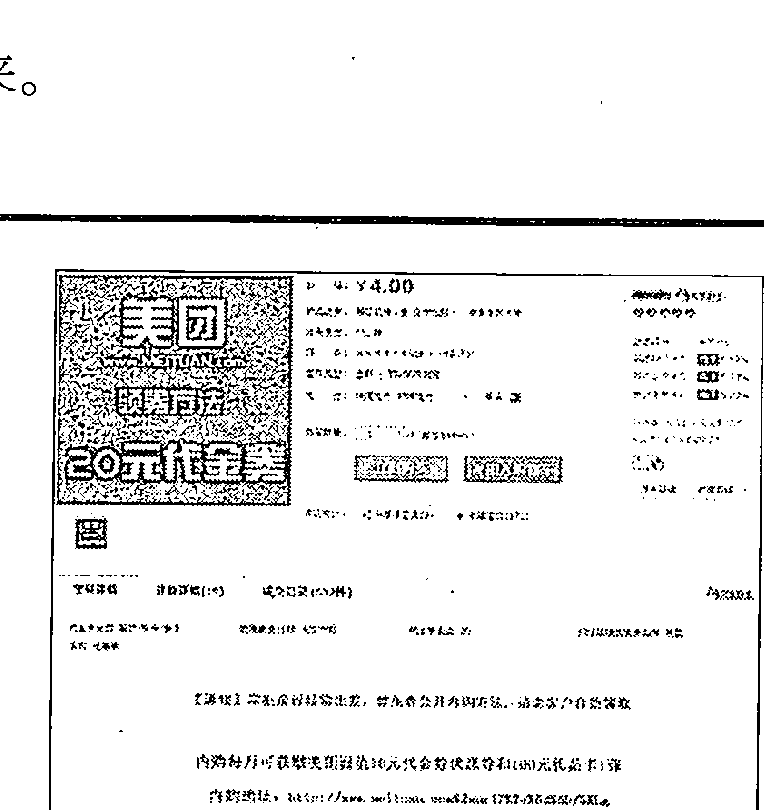


套取消费者手机号也成为了一种常见的欺诈行为。利用套取的手机号，卖家给自己制作几个“马甲”，以方便日后业务的广泛开展。

这其实就是代购买家在用买家的手机号注册团购网站，以便多捞一个“马甲”（因为很多团购网站只给邀请好友首次购买的奖励10元）。

今，由于团购网站在经营上对于商家的依赖，便造成了很多提供团购的商家不但欺客，而且到了欺负团购网站的地步。

至终商家的服务态度都不让人满意。
而这个团购订单，小胡本来是请朋友去的，结果弄得朋友十分不耐烦（美团客服介入用去了十多分钟，前后等了1个小时），也导致小胡本人很是被动，以至于当天回到家之后心中仍有怒火。而查看美团网站，小胡则意外地发现了“不满意免单”服务，于是便进行再次申诉。

对于初级买家或者不经常团购消费者来说，遇到“团代”尽量小心一些，一旦被骗应该及时保存证据，并要求淘宝客服介入。即便淘宝客服的效率不高，也只是“输了时间不输钱”。并且仔细查看代购买家的信用评价，并寻找那种几乎都是好评的卖家。考虑到淘宝网还有先行赔付的服务，所以最好选择那种已经缴纳保证金的卖家。这样一来，即便遇到了骗子，甚至还可双倍索赔。

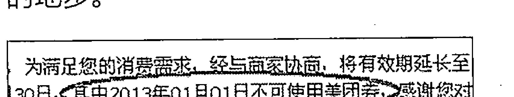

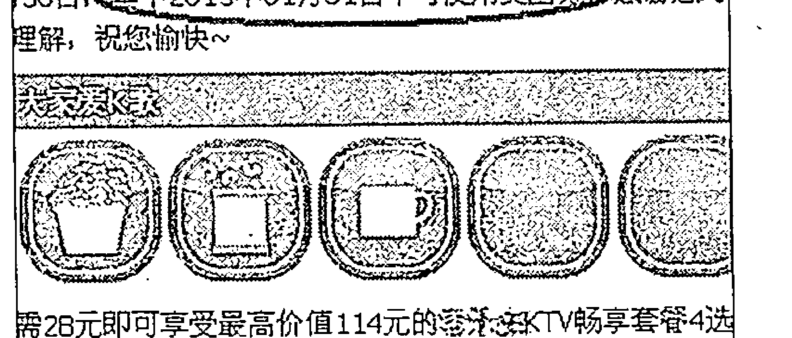

| 团购券 | 套餐内容 | 原价 |
| :--- | :--- | :--- |
| A套餐 | 周一至周五：3小时包房费+1份冰粥 | 114元 |
| B套餐 | 周六至周日：3小时包房费+1份冰粥 | 94元 |
| C套餐 | 周一至周日：午夜场8小时 | 88元 |
| D套餐 | 白天超值：爆米花1份+软饮1份+送片1份 | 47元 |
| A套餐 | 周日至周四：黄金场3小时 | 264元 |

小胡是在2012年12月31日参加美团网站推出的某商家“28元KTV畅享套餐4选1”团购活动的。网页上注明，2013年1月1日不可使用美团券，其他时间并没有特殊规定。周一至周五，如果选择阳光场，那么便可得到“5小时包房费+1份冰粥”。周六至周日，如果选择阳光场，那么便可得到“3小时包房费+1份冰粥”。

虽然美团的客服强调，当时当地小胡已经同意了调解方案，所以不能提供“免单”服务。而小胡的理由则是当时朋友在场，已经骑虎难下，所以只能暂时接受。况且本应5小时的卡拉OK“缩水”到了3小时，最起码也应该完成订单总金额的2/5退款。而这样的一种理由，似乎也确实说服了客服。经过客服与领导沟通之后，终于完成了订单总金额2/5的退款。

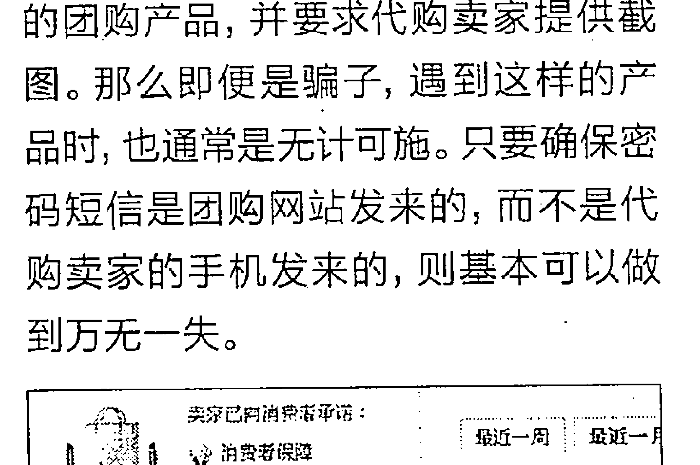

还有一点就是选择那种无法退款的团购产品，并要求代购买家提供截图。那么即便是骗子，遇到这样的产品时，也通常是无计可施。只要确保密码短信是团购网站发来的，而不是代购买家的手机发来的，则基本可以做到万无一失。

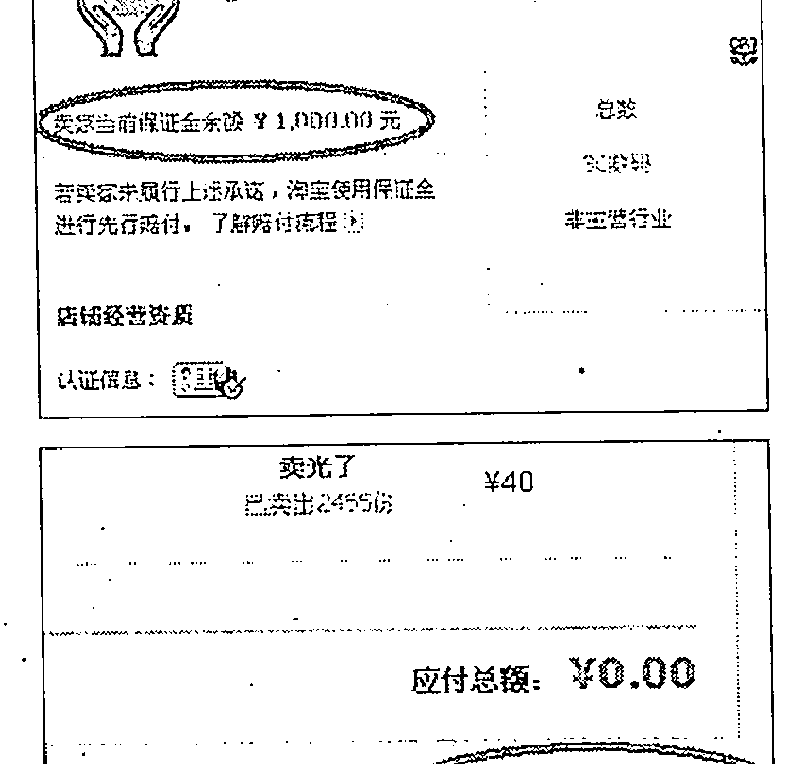

小胡由于已经考虑到了元旦假期，所以12月30日提前给商家打了电话，说是要1月2日去，选择“阳光场”。而对方电话则答复，由于1月2日是周三，所以可以唱5小时（网页上也是这么写的）。可是1月2日去了之后，却被商家告知仅能唱2小时，之前的电话答复不算数了。虽然当时当地，小胡请求了美团客服介入。结果也仅仅延长为3小时，并且自始

## 扩展阅读

根据数据调查，2012年上半年国内团购网站数量为2976家，而2011年则为5058家。从2012年开始，团购网站单期成交额和购买人数双双下滑。团购巅峰已经过去，大批员工选择离职或者被辞退。

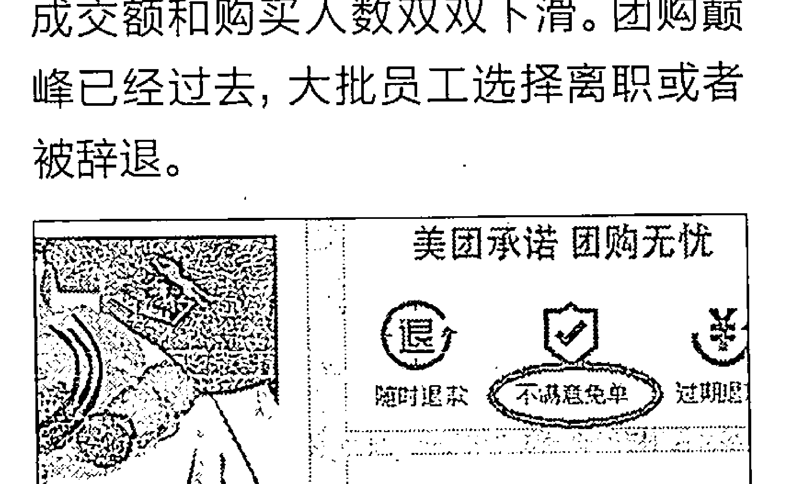

### 商家店大欺“团”

应该说目前国内团购网站的发展已经到了有史以来最困难的时期。也正是因为如此，在团购时代还没有开始的时候，商家只能店大欺客。而现如今，由于团购网站在经营上对于商家的依赖，便造成了很多提供团购的商家不但欺客，而且到了欺负团购网站的地步。

## 记者后话

团购网站生存越来越艰难，为了持续发展，在和商家合作的过程中并不严格审查商家资质，致使一些品行不良的商家甚至骗子介入了团购网站，令消费者受骗上当。并且这些网站在购买流程和申诉上都存在或多或少的漏洞，一旦纠纷发生，维权非常不易。对于消费者而言，越是优惠的团购或者“团代”越要小心，除非自己有需求，切勿因为价格便宜而轻易下单。

## 垃圾短信缘何屡禁不止

“你好，本公司可以开增值税发票”、“我是房东，请缴纳3个月房租，账户：XXXXXX 姓名：XXX”……相信很多读者都收到过类似的垃圾短信，既愤怒又无奈。

文|严威川

## 企业是信息漏洞基地

为什么企业和用户的信息能够到不法分子手里，让他们如此肆无忌惮地发布垃圾短信和诈骗信息？其实信息意外泄露并不是主要原因，真正漏洞还是出在商业机构和企业。

2012年的5月，某法制媒体报出上海市闸北区人民法院一审宣判了一起利用新技术及以无磁交易方式实施的信用卡诈骗案，以朱凯华为首的13名被告人通过网购银行卡主信息、猜密码以及网上代缴公用事业费转账提现的方式，进行空手套白狼。到被抓获时，已造成多名银行卡用户损失达300多万元。此案背后，则是多家银行的员工公然非法贩卖银行储户信息，企业和个人信息遭泄露现状可谓触目惊心。

涉案人员当中的胡斌，原是某知名银行信用卡中心的工作人员。他从2010年11月起，在互联网上以“战无敌”、“夜光杯”等网名发布可以提供银行信息查询的广告。胡斌收到朱凯华发来的银行客户身份证号码、姓名之后，利用银行内部网络系统进行违规查询，并将查询所获的银行客户个人征信报告、银行账户相关情况等信息，以每条几十元至100余元不等的价格出售给朱凯华，共出售300余条信息，非法获利两万余元。

另一名信息“供应商”曹晓军，原系某知名银行客户经理，网名“四一人生”，他在2011年2月至6月期间，通过中介向主犯朱凯华出售个人征信报告多达2318份，非法获利23180元。除此之外，向主犯朱凯华出售个人征信的还有某知名银行员工董婕和某知名银行客户经理陈荣哲。

以上仅仅是众多案例中比较典型的，类似和新发案例层出不穷，但是都有一个共性，因为信息泄露而引发的经济损失几乎都来自企业内部。而这些企业和用户的信息一旦落入不法分子手里，就会以各种诈骗短信的形式发送出去，有些是有意向的，有些是随机的，最终达到谋取暴利的目的。

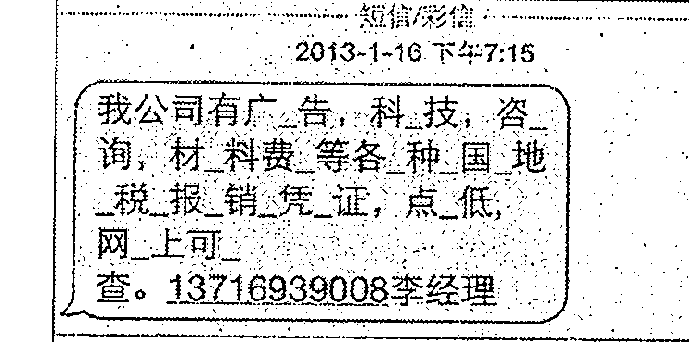

## 发达国家早有相关政策

实际上，针对垃圾短信问题，发达国家早有应对策略。以美国为例，2003年12月，其全国性反垃圾邮件法案规定，电话和手机用户可以通过热线或政府网站，将自己的电话号码免费列入“全美不接受电话推销名单”中，之后即可合法避免垃圾广告信息的骚扰。

同样是2003年，德国推出了《联邦反垃圾邮件法案》，该法案规定，向用户推销商品和服务的广告短信必须要征得手机用户的书面同意。德国对于滥发垃圾短信者，会处以最高5万欧元（约合人民币55万元）的罚款。

至于亚洲近邻日本，则更是在2000年推出了《关于特别商务交易的法律》和《特定电子邮件法》。该法律规定，手机用户有权拒绝接收不需要的短信，而一旦这些短信遭到用户拒绝，则禁止再次发送，否则将以妨碍电子邮件通信罪论处。

澳大利亚管制机构对垃圾短信发送者予以1000万澳元的罚款。而韩国在垃圾短信治理上更加彻底，其管制机构针对手机广告短信泛滥出台了一项严厉措施：广告商在发布手机短信广告时，必须注明“广告”字样和发送者的单位、电话及手机号码，必须有可拒绝标签，用户可选择拒绝接收，并且短信广告在晚9点至早8点之间不能发送。同时对于滥发垃圾短信者，个人可处以最高8500美元的罚款。韩国采取了一户一网、机号一体的手机号码入网登记制。韩国人买手机时必须出示身份证，然后由售货员将顾客的身份证号码、住址等信息输入电信运营商的中心数据库，这种从源头上管理手机的办法十分有效。

新加坡则是这些国家中处罚力度最厉害的，2012年新加坡国会通过的个人信息保护法案，禁止向个人发送市场推广类短信等垃圾信息，违法发送垃圾信息的机构或个人可能会被重罚100万新元（约合514万元人民币）。

据统计，国内垃圾短信中打折促销、发票假证、地产中介、美容保健、移民留学、金融理财等广告服务类垃圾短信占比高达76%，而冒充亲友欺诈、中奖钓鱼诈骗、虚假慈善捐款等恶意欺诈类短信比例也达到了24%。除了利益驱使之外，不法分子的发送技术也在与时俱进，低频、多卡令发送过程更加隐蔽，并且利用含有木马的手机软件控制用户手机发送垃圾短信等等，这些无疑增加了警方追查的难度。

虽然相关部门已经出台关于治理垃圾短信、规范短信市场的政策文件，但是针对实际情况，政策方面有很多不完善的地方。

## 监管运营商才是根本

追根溯源，运营商才是真正的“病根”。为了达到盈利目的，他们连违法违规短信也照发不误；除此之外，“金融行业的汇票、银行当时兑现，手续简单。代开增值税发票、车房抵押、小额贷款”等信息，居然可以以拜年的形式来发送。

运营商和其代理商们即便不是垃圾短信的罪魁祸首，也是最大帮凶。即使手机实名制之后，治理垃圾短信也需要很长的时间，但至少有追责和惩戒的手段。例如诈骗短信一旦群发成功，不但要追溯机主责任，而且还应该追溯运营商的责任。类似代开发票的违法违规短信，因为隐蔽性更强（把发票打成“发漂”），所以暂时可以运营商免责、机主追责。至于广告短信，由于危害性最小，所以可以最后解决。

总而言之，除了实名制之外，加大对运营商的监督才是根本，否则最终只能治标（追查机主），却不能治本（无法监管运营商）。

其实无论是使用运营商提供的短信端口，还是私设的短信群发器，垃圾短信都必须通过运营商提供的短信网络平台这一环节，才能最终到达手机终端用户。因此，运营商作为短信通道的提供者，完全可以通过自身的业务优势地位，规范发送商的相关业务，从而承担起社会责任，为用户提供通畅、安全的短信服务。归根结底，运营商应该对垃圾短信的治理负起责任。

很多发达国家的电信企业在控制垃圾短信方面，将处置垃圾短信的主动权交到了手机用户手里，规定用户可以要求将自己的电话号码免费列入免骚扰名单中，可大大减少垃圾信息的骚扰。运营商应当加强对垃圾短信的围堵，建立相应的隔离和保护措施，使用用户免受垃圾短信的滋扰。

众所周知，电信行业主要被中国移动、中国联通和中国电信三家企业垄断。除了盈利之外，对手机用户负责，保护企业和个人不受垃圾短信骚扰，保证信息传播内容合理、合法以及信息传播环境的洁净、有序，也是三大运营商应尽的义务。

虽然相关部门已经出台关于治理垃圾短信、规范短信市场的政策文件，但是针对实际情况，政策方面有很多不完善的地方。例如，运营商保护用户信息安全与隐私的“义务”或者“责任”尚且处于道德范畴，并不具备法律效力。现行条例对于垃圾短信的界定尚不明确，个人隐私的立法保护尚不健全，短信运营市场的监管尚不到位。而运营商正是看到了很多政策中的“空白区”，对垃圾短信睁一只眼、闭一只眼，面对日进斗金的丰厚利润，责任感、义务以及用户就显得不是那么重要了。

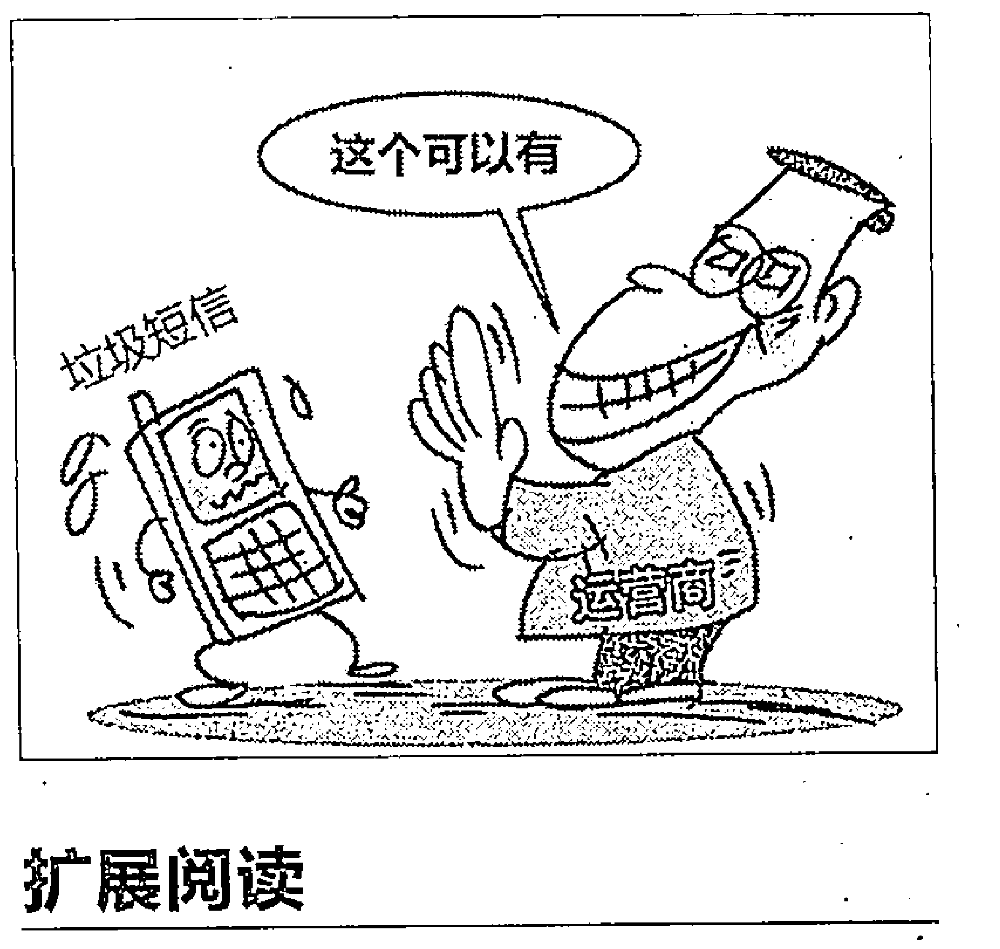

## 扩展阅读

治理垃圾短信的口号喊了很多年了，每年都在讨论如何治理，但是却越治越多，原因为何呢？难道技术上真的无法实现拦截和屏蔽吗？答案当然是否定的，真正的的原因解释起来无外乎“天下熙熙，皆为利来；天下攘攘，皆为利往”罢了。首先企业尤其是中小企业对于短信群发情有独钟，费用少、宣传面广、回报高。对于不法分子来说，群发短信没有任何技术含量，方便快捷、覆盖面大。并且运营商眼里的利益大于责任，治理可以理解为治得通情达理，小治一下，然后对垃圾短信的存在更加通情达理地认可。

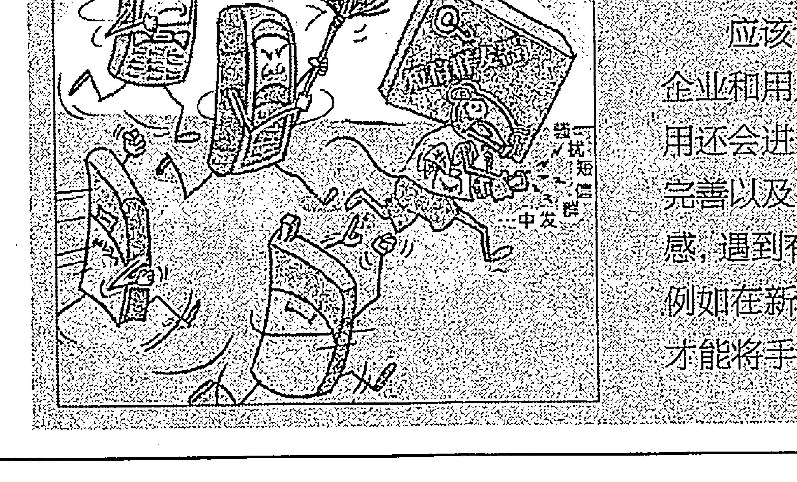

## 记者后话

应该说手机实名制仅仅是一个制度，它的执行对于清除垃圾短信、保护企业和用户信息安全的作用很有限，在各种人为和利益的因素面前，这种作用还会进一步缩水。如果让实名制发挥更大的效力，除了法律法规的进一步完善以及监管部门加大监督力度，更多的是我们每一个手机用户也要有责任感，遇到有危害的垃圾短信及时通报，利用各种渠道曝光垃圾短信发送端。例如在新浪微博就发起了“一人曝光一条垃圾短信”活动，依靠大家的力量才能将手机实名制从单纯的制度转化为有效的手段。

## “黑”苹果官方“洗白”

被偷的苹果手机转眼进入苹果授权维修点被“洗白”，听起来匪夷所思但却真实存在，这到底是怎么回事呢？

文 | 严威川

## 小手机 大联盟

关注被盗苹果手机官方“洗白”事件是一个很偶然的机会，起初记者仅仅是听朋友抱怨一台苹果手机被盗且报警无果的牢骚，最后朋友说加入了一个名为“i丢了Phone北京丢友联盟”的QQ群引起了记者的兴趣。在QQ上进行搜索，相关群达到了17个，人数近5000人，简直是一个被盗手机用户大联盟。

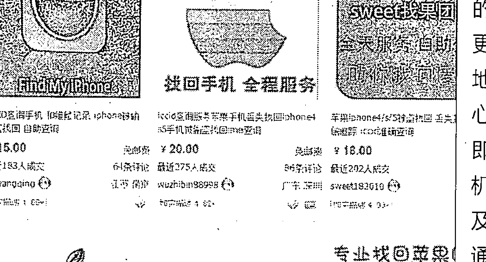

机卡所对应的一串20位的数字，固化在手机SIM卡里，是手机卡的身份标识。通过查询ICCID，可以知道手机目前的所在地。如果手机被盗，可以立即查询，一旦定位，立即报警，有可能找回手机，并且几乎是找回手机的唯一线索。而记者搜索了淘宝，类似帮助追查ICCID的店铺不胜枚举，从侧面反映了目前手机被盗率是非常高的。

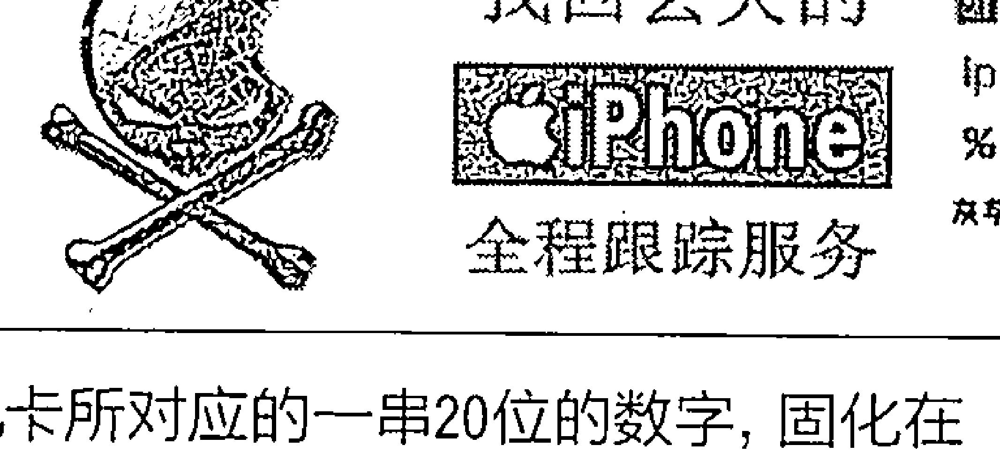

## 技术与漏洞 相互博弈

然而ICCID也并非万能，“丢友联盟”中真正找到手机的消费者并不多，因为小偷的手段更高明。一位名为“索芙特”的网友在北京丢失的iPhone手机，而查询ICCID发现在南京苹果服务点，难道小偷是出于好心帮她去修手机了？当然不是，他的手机已经被维修点回收，小偷拿着换来的新机早已溜之大吉。

原来，作为赃物的iPhone手机虽然也可当作二手来销售，但利润却并不大。因此，为了让手机卖出更高的价钱，从小偷手里收购iPhone的手机贩子，通常都会找到维修手机的专业人士，并用技术手段造成iPhone的硬件问题，到苹果服务点更换新机。而之所以选择异地保修，最大的原因就是担心失主追讨。这样一来，失主即便查到了被盗的iPhone手机去向，也几乎都是鞭长莫及。并且，送修的iPhone手机通常都会享受换新服务。这样一来，手机贩子便得到了一部全新手机，不但序列号是全新的，而且身份也是全新的。更换完毕之后，手机贩子再拿去出售便既无“赃物之忧”，也能卖个好价钱了。

根据调查，iPhone手机在苹果授权维修中存在一个现象，那就是“不看保修卡只看序列号”。记者也亲自证实，拿着自用iPhone 4去苹果授权维修站进行检测，整个过程技术人员并没有要求出示任何保修证明。而这种看似便捷的服务虽然方便了部分用户，同时也给小偷留下了可乘之机。应该说被盗的iPhone手机被官方“洗白”如果归罪于苹果，显然有些牵强，只能说这是维修流程中的漏洞，并且被小偷利用了。

## 苹果“中枪”谁之过

我们之前报道手机相关事件，十之七八都和苹果手机相关，即便是说其他品牌手机，也会捎带提一提苹果，简直是躺着都“中枪”。主要是iPhone手机本身相对保值，并且被众多用户所喜爱，其产生的利润更是惊人，自然成为不法分子最青睐的目标。至于iPhone手机在官方维修“洗白”虽然和苹果授权维修没有太直接的关系，但是却是严重的流程上的漏洞。

那么其他品牌手机维修是否也存在这种漏洞呢？记者为此特意采访了某品牌的手机售后服务中心，对方的答复是虽然在流程上也是“不看保修卡只看序列号”，但却通常只针对需要维修的手机。而如果遇到了需要换新的手机，虽然并不需要用户提供销售凭证，但却必须提供原厂外包装和原厂充电器。即便外包装丢掉了，全套的原厂充电器也必须提供，这样才能获得全套的换新手机。如此看来，除非手机贩子拿到的是入室盗抢的手机，否则就很难进行“洗白”。

由此看来，并不是所有品牌手机都会沿用“不看保修卡只看序列号”的服务流程。或许苹果公司认为这是一种很人性化的服务方式，但现在看来结果并不美好，不但自己背了“黑锅”，还给小偷提供了一个堂而皇之的生财之道。并且这种服务流程如果不及时纠正，类似事件将会愈演愈烈。

还有一个关键问题就是部分手机维修店主助纣为虐，明知道是违规操作，却因为眼前利益而成为了小偷的帮凶。记者在电子卖场中随便找了一家手机店铺，经过一阵寒暄之后，向店主暗示了想把iPhone 4搞坏换新机的想法，不出所料，店主直接表示没问题，并且还嘱咐记者到了授权维修点应该怎么应对问题，搞坏手机收费200元。这之后，记者又走访了几家店面，发现这样的“技术活”几乎每家手机维修店铺都能做，只不过有些比较高调，有些遮遮掩掩罢了。

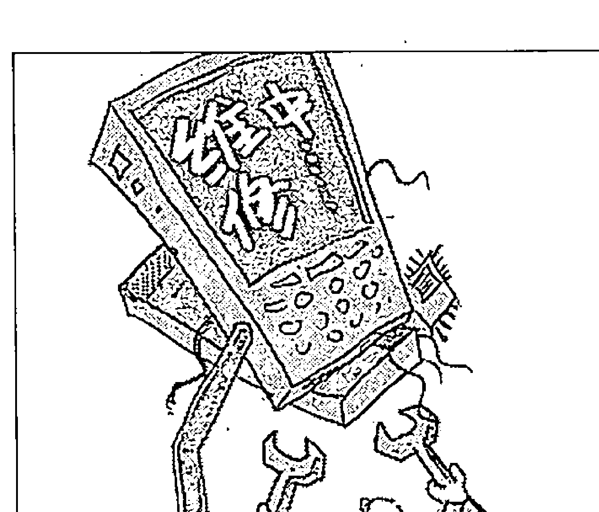

## 做好自我防护

被盗iPhone背后的利益链错综复杂，普通用户能做的就是做好自我防护。除了外出或者就餐让iPhone尽可能不离开自己的视线外，利用手机本身的功能可以起到一定程度的防护作用。iPhone中有一项“查找我的iPhone”功能，它能够在Google地图上定位你的iPhone位置，还能发送消息、远程锁定或者远程擦除，帮忙找回iPhone，即使找不回也能删除iPhone里的隐私信息，将损失降到最低。首先确认系统已经升级到iOS5，在“设置”中的“iCloud”开启“查找我的iPhone/iPod”服务，并且用浏览器登录网址www.icloud.com，在iCloud主页输入iCloud账号并登录。点击“查找我的iPhone”，iCloud会自动获取你的地理信息，然后显示在Google地图中。建议所有iPhone用户都打开iCloud的“查找我的iPhone”和照片流功能，一旦丢失（有些情况是不一定被盗）可以查到大概位置，锁定手机等。如果碰到小偷不太会用手机，用手机拍照或者自拍，都有可能成为追踪的重要线索。

总而言之，预防被偷，不如不丢，任何防护措施都抵不上谨慎小心。尤其是春节前后，更是偷盗的高峰期，使用iPhone尤其是iPhone 5的用户一定要小心。

## 扩展阅读

iPhone手机丢失可谓是有人欢喜有人愁，随着被窃手机数量增加，查询ICCID俨然已经成为近期淘宝上非常火爆的生意，一些有心的淘宝店主还在自己店铺随时更新通过查询找到的手机数量，例如“已经协助找到iPhone XXX台”。记者对几个店铺进行了解，查询服务收费少则20元，多则50元。

更令人惊异的是，很多店主都承诺这是苹果售后的内部系统查询，并且如假包换。难道是这些淘宝店主和苹果公司建立的合作关系？显然不太可能。据记者了解，苹果公司确实曾经提供过查询ICCID的服务，然而目前已经终止了这项功能，具体原因不明。那么淘宝店主们是怎么进入苹果内部系统的呢？记者电话咨询了苹果授权维修，得到的答复是无可奉告。

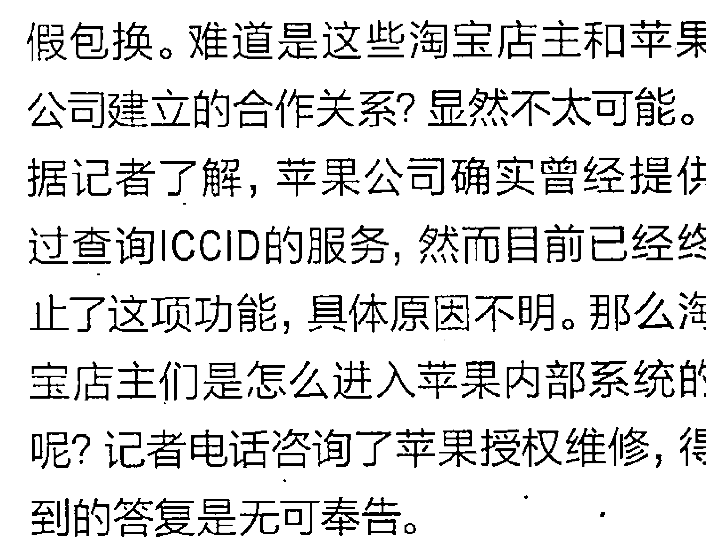

## 记者后话

应该说“i丢了Phone北京丢友联盟”这样的QQ群仅仅是手机被窃现象的冰山一角，这里到底有多少“黑”苹果被官方“洗白”呢？我们不得而知。目前只能说如果消费者的iPhone被盗，应尽可能在最短时间内报警和查询ICCID，或许还有找回的可能。至于那些被“洗白”和正在“洗白”的iPhone，希望苹果授权维修能够及时弥补自己流程上的漏洞，验证一下用户的保修卡有那么难吗？

## 看清! 存话费送的不一定礼

存话费送礼品，相信大多数人都能够在各大运营商的营业厅看到相关的宣传彩页或者都收到过相关内容的短信，然而这些所谓的“礼”并不一定都是实惠。
文/严威川


当天回到家后，记者查找了一下山寨电饼铛的批发价（阿里巴巴）。万万没想到，号称价值150元的电饼铛，批发价竟然可以低至55元。相比正规品牌的电饼铛批发价整整便宜了一半，可见其利润的丰厚程度。
除此之外，部分商家在客户存话费的时候，还会进行一次神秘操作。那就是拿走客户的手机，并在接收一个短信后，在纸上记下一组数字，然后就立刻把短信删掉。记者调查了很多用户都碰到过类似情况，一名业内人士道出了其中玄机，这其实是有些存话费送礼品的背后是电信运营商推出的“存话费送超市购物卡”活动。查看客户短信的时候，实际上是把运营商发送的超市购物卡密码拿走了。所以说，客户最终得到的是山寨品牌的赠品，而商家得到的则是几乎等同于现金的超市购物卡，并从中赚取差价。


## 赠品等于没保修

各大电信运营商之所以送礼不断，无非是在笼络老客户，争取新客户，而存话费送礼品的活动最立竿见影。包括街头巷尾的小门市或者大型超市的一个小角落，都能看到存话费送礼品的身影。例如预存150元话费，便可获赠价值150元的电饼铛；预存300元话费，便可获赠价值300元的电压力锅等等活动层出不穷。
不过需要注意，这些存话费送的赠品虽然种类繁多，但却几乎都是不知名品牌的山寨产品。据记者实地调查，预存了150元话费，将获赠价值150元的电饼铛。等交完钱拿到赠品即将离开的时候，才想起电饼铛保修问题。于是咨询工作人员，得到的答案竟然是没有保修。经过几番交涉，商家才给开了一张信誉卡，并且只答应保修一个月。如此看来，就连商家自己都对山寨产品的质量没有信心。期间商家还向记者表示，白得一个赠品就不错了，言外之意就是赠品就别要求那么多了。不但是商家，就连一些消费者也是这个想法。但是逆向思维一下，赠品的质量就应该没保障吗？电器万一出了故障，危及到人身安全，谁负责？

| 订货量(台) | 价格 |
| :--- | :--- |
| 1-9 | 61.00 元/台 |
| 10-99 | 55.00 元/台 |
| >=100 | 55.00 元/台 |

## 送手机瞬间变“山寨”

除了赠品之外，存话费送手机也是运营商推出的比较普遍的促销活动。比较知名的就是中国联通早年间推出的存话费送iPhone手机的活动，一经推出便大获成功，并一直延续至今。而为了吸引消费者，并赚取差价，不良商家开始在这一领域动起了歪脑筋。最常见的就是把套餐里的品牌手机拿出来，之后再换成一个山寨手机。这样一来，就可以从中赚取差价。在这里，有一个行话叫作“拆包”。其实就是把品牌手机的串码刷入到山寨手机当中。这样一来，运营商就无法识别出品牌手机已经被偷梁换柱，而消费者则更是被蒙在了鼓里。
目前来看，这种销售山寨手机的做法主要出现在户外的流动摊点，至于门市则很少见到。所以说，广大读者尽量避免流动摊点即可。

## 存话费送话费更费劲

还有一种是存话费送话费活动，很受到商务人士欢迎。因为此类人群的话费高，并且每个月的话费也可以轻松超过运营商规定的最低消费，所以绝对是一举两得的美事。
然而上述这类活动，有些其实是存话费送手机“拆包”出来的话费，所以根本无法出具发票。以记者的朋友张先生为例，就参加过存240元赠400元的促销活动，等到交了240元，促销业务办妥之虽然那些宣传彩页上将“送礼”、“免费”等关键词刻意展现给消费者，但其实在礼品没送之前，运营商们早把盈利多少计算在前面了。

## 赠礼并非适合所有人

目前市面上存话费送手机的活动非常多，而且赠送安卓智能手机越来越多。这个活动本身没有什么问题，但是这个“礼”并非适合所有人。

刘先生向记者提到了一个近期看到的存399元赠送酷派8050手机的活动。这个手机办理成功后立即返还39元，剩余360元，则分15个月返，每月返还24元，每月最低消费为40元。刘先生的父母对这个活动非常中意，但是精明的刘先生经过琢磨，认为这项活动对于长期在家中的老年消费者并不适合。

例如他父母家里有宅电，所以每个月话费只有10元钱。如果没办理这个活动，那么15个月的话费就是10元×15个月=150元。如果办理了这个活动，40元×15个月=600元。也就是说，如果是老年消费者群体参加活动，相当于话费600元-150元=450元购买了这款低端智能手机，比起零售版的售价还贵了一百多元，反倒不是很划算。

除此之外，运营商对智能手机还会要求机卡至少每个月产生5M流量，这对很多老年人简直是不可完成的任务。刘先生的父母都是老花眼，平日看短信都费劲，对于手机QQ和微博更是一窍不通，根本没有手机上网需求。

而刘先生表示，他父母说商家在跟他们介绍活动内容的时候根本没有提过什么流量的事情。但如果这些老人参加了活动，每个月又达不到运营商的苛刻要求，理应到账的话费返还或许就会戛然而止了。

## “馅饼”没有免费的

谁都知道“天上掉馅饼”是不可能的，运行商的“礼”也绝不是轻易送出的。虽然那些宣传彩页上将“送礼”、“免费”等关键词刻意展现给消费者，但其实在礼品没送之前，运营商们早把盈利多少计算在前面了。

最直接的体现就是消费者在接受“礼品”之前要与运营商签订一份协议合同，内容一般是履行合同日期以及每月返话费的明细。然而在这个合同期内，无论你能否打完规定的话费都要将钱乖乖地交给运营商，并且号码在合同期内无法过户、停机等等（大多数情况下）。消费者虽然在存话费之后得到了馈赠礼品以及每月返还话费，看似实惠，实则进入了一个消费者怪圈。

上面提到的存话费送手机，这类“馅饼”即使送的不是山寨机，同样也会难以“下咽”。因为这类送手机的活动中，运营商和消费者签署的协议合同中都有个最低消费，例如每月最低消费为100元，但这个月只消费了90元话费，运营商依然会按照最低消费扣费。很多消费者在这类活动中往往没有考虑自己是否能够达到最低消费，而眼睛只盯着白送的手机，殊不知日后这份看似美味的“馅饼”会如鲠在喉。

所以这类活动的协议合同上绑定套餐的种种要求才是关键，否则再智能的手机用起来也别扭。

| 最低消费 | 返话费明细 |
| :--- | :--- |
| （表格内为具体消费和返还细则） | （表格内为具体消费和返还细则） |

## 记者后话

由于市场竞争日益激烈，各大运营商推出的促销活动越来越多。应该说促销活动本身并没有太大问题，有些确实能够惠及消费者。但是这些活动在一些中小代理商的操控下逐级“变味”，拼价格、拼实惠、抢客户的同时，服务质量也在逐渐下滑。存话费送礼本身是活动的亮点，但同时也成为不良商家赚利的漏洞，他们抓住消费者喜欢实惠的心理，用“礼品”转移了用户的视线，并将一些小伎俩神不知鬼不觉地埋下了伏笔。

我们建议消费者一定要参加正规代理商的相关活动，并详细询问最低消费、话费返还、每月流量等信息，从而做到心中有数。赠品永远是锦上添花，合理消费才是最终的实质。

## 选中国邮政快递？不靠谱！

“都说民营快递这不好、那不好，但我没有选择呀，选择中国邮政更不靠谱。”简先生接受记者采访的时候表示出了自己的无奈。文|严威川

### EMS标准版价高量不足

曾几何时，在顺丰速运还没有出现之时，EMS标准版可谓是国内快递业当中的“高帅富”。虽然价格昂贵，但是收发速度非常快。但随着顺丰等民营快递的崛起，EMS标准版开始落伍了，并且收发速度也开始不尽如人意。简先生就是近期使用了EMS标准版收发件，从北京市发货到辽宁沈阳市区，竟然整整7天都没有音信。投诉到11185，报了单号，电话客服的答复竟然是送货时家里没人，所以才会这么久。可简先生的父母退休后基本都在家中，除了晨练之外，日常很少出门，并且简先生的父亲表示从来没有接到过任何送货电话。经过几番交涉后，电话客服才承认是EMS的责任，并于当天下午送件上门。但是由于中间耽搁时间太长，物品中本来有一件给亲戚孩子的生日礼物都迟送了，因为人家已经在两天前过完了生日。简先生以“EMS不送件”为关键词在网上查找，投诉差评多如牛毛。家住上海的小秦也曾遭遇过类似情况，网购促销的时候他从福建的一个商家处购买了6件服饰，并且指定EMS递送。货物包裹于2012年12月13日对方递出，但是到了20号还没有收到。小秦开始怀疑自己遇到了骗子，质问商家，对方非常委屈，为了证明自己店铺没问题，商家答应打折卖给他一件饰品，并且货到付款，采用了商家合作的民营快递。没想到下单（2012年12月21日寄出）第三天（2012年12月23日到货）就收到了，而就在同一天，EMS的“快件”也到了。小秦立即电话EMS官方客服，得到的答案是可能在运送过程中受到天气和环境因素的影响，所以耽误了日期。再继续追问，客服来回说的就是这套理由。这令小秦非常气愤，他向记者表示：“十多天才收到货，这也能叫快递？因为经常听到民营快递不好的传闻，才选择了EMS，毕竟是国营的，正规些，没想到是这么个结果。”

### EMS经济版服务堪忧

作为EMS标准版的衍生品，EMS经济快递在价格上更有优势。尤其是在其他快递公司运力不足的偏远地区，其价格也非常有优势。以辽宁沈阳到内蒙古鄂尔多斯运送3公斤的包裹为例，EMS经济快递就有很大的价格优势。不但价格可以低至20元，而且相比快递公司当中最低价的申通E物流，也整整便宜了8元钱。不过这种价格优势仅仅是表面现象，其实要想使用EMS经济快递有很多限制。首先，EMS经济快递无法使用11183下单，只能通过淘宝之类的B2C平台下单。其次，虽然是快递公司当中最廉价的选择之一，但是送货体验也几乎是最差的。据记者了解，在快递服务体验方面，顺丰属于第一阵营，几乎可以保证送货上门；申通、圆通、中通属于第二阵营，即使不能上门，也至少可以送货到楼下；而记者调查了五名选择EMS经济版的消费者，均表示收货时EMS只送到小区门口。

### 邮政小包 歧视中小消费者

除了EMS经济快递，中国邮政旗下“物美价廉”的还有一个“邮政小包”新生业务。目前来看，邮政小包几乎是所有快递中最低价的。在这里同样是以辽宁沈阳到内蒙古鄂尔多斯运送3公斤的包裹为例，邮政小包的价格可以低至18元，甚至比EMS经济快递还要低。但是作为新生业务，邮政小包却天生就会歧视中小卖家。首先，邮政小包最初只送1公斤包裹，日后才改为3公斤限重。其次，中国邮政不但没有利用优势吸引更多的消费者，还因为价格降低的同时将服务也降低了一大截，长此以往，降价带来的竞争力很可能被抵消得荡然无存。

### 邮政小包只给发货量巨大的卖家发货

而且还必须签约保证发货量。当然最为重要的是，邮政小包仍然以慢著称。邮政小包淘宝上的投诉几乎比比皆是 (http://bbs.taobao.com/catalog/thread/567766-259988072-1.htm?spm=0.0.0.167.R8RiF7)，绝对是让人目不暇接。

诺，中国邮政是不需要负责任的，但是却又得到了保价费，这是个什么道理？！

### 平邮包裹限制更多

在网购时代的初期，中国邮政的平邮包裹可谓是巨大的中坚力量。虽然需要卖家到邮局寄货，买家去邮局自取，但是由于价格超便宜，速度也不算太慢 (相比当时的快递公司)，所以也是颇为受人欢迎的。

但如今，平邮包裹却进入了一种让人难以理解的状态。同样以辽宁沈阳到内蒙古鄂尔多斯运送3公斤的包裹为例，平邮包裹只需要13元。但是如果邮寄的是电子产品，如智能手机、数码相机、厨房小家电等物品，则拒绝邮寄。拨打11185客服，则宣称电子产品一律不接。

为此，记者特意询问了邮局工作人员，得到的答复则不只是电子产品，任何易损的物品都不接。因为怕赔偿，而且利润低，所以干脆不接。实际上，只要用户签字承诺，损坏不要求赔偿的话，电子产品其实也是可以邮寄的。不过，这样的邮寄条件还必须为物品“保价”才行。

说到这里，读者们是不是感觉到有一点矛盾？没错，用户已经签署了免赔承诺，为什么还要继续缴纳保价费呢？如果物品在运送途中损坏，按照免赔承诺，中国邮政是不需要负责任的，但是却又得到了保价费，这是个什么道理？！

除此之外，全国各地的邮局还针对平邮包裹制定了各种无厘头规定来实现“盈利创收”。据记者调查，在用户收到平邮包裹通知单的时候，很多地区的平邮包裹单后面都会印有逾期收费的字样。只不过有的3天，有的5天，有的7天 (http://blog.sina.com.cn/s/blog_4b70470d0100fzdu.html)。逾期收费的标准也五花八门，有的每天0.5元，有的每天1元，有的每天2元。这样的收费是谁规定的？如果正规的话，为何不能有一个统一标准？这些问题，都无从找到答案。

## 扩展阅读

通常这项业务针对的是那些非紧急货物递送要求的消费者，价格相对于标准版也更经济实惠，但运输时间上比标准版要晚1~3天。在记者调查的消费者中，很少有人分得清EMS标准版与经济版。其实后者经济实惠的原因在于邮件采用全程陆路运输，全程时限比现有国内EMS时限略有延长，但其他服务标准一律比照国内特快专递邮件现行标准执行。

对交寄经济快递邮件的客户，邮政速递部门将提供专人专车上门揽收服务。价格方面，经济快递邮件资费按邮件重量计算，起重和续重计费单位为1千克，不足1千克的按1千克计费。这么计算下来，肯定比现有的EMS收费要便宜，并且经济快递主要定位国内物品类市场。不经常使用EMS的消费者在办理相关业务的时候一定辨别清楚，按需选择，可以节省不少费用。

| 无法投递 | 原件无法投递，按抛弃处理 | 保价费 | 元 |
| :--- | :--- | :--- | :--- |
|  |  | 回执费 | 元 |
|  |  | 总计 | 元 |
| 您的签名意味着您理解并接受“使用须知” |  |  |  |

> 2012年9月份，EMS开始下调价格，民营快递“攻城拔寨”式的争夺市场份额已经让长期“高高在上”的中国邮政产生了压力。另一方面，网购消费形式已经逐渐成为主流，递送需求大增，这同样令中国邮政不可能坐视不理，下调价格只是市场争夺战的“提前一枪”而已。然而对于消费者来说，仅仅靠价格降低还不能满足需求。除此之外，服务态度、递送速度、覆盖区域都能直接影响到消费者下单的选择。
> 
> 其实客观上，EMS比民营快递更具备优势，因为其能够配送到村一级单位，而其他民营快递一般只能配送到镇一级。但实际情况是，中国邮政不但没有利用优势吸引更多的消费者，还因为价格降低的同时将服务也降低了一大截，长此以往，降价带来的竞争力很可能被抵消得荡然无存。
> 
> 我们经常在网络或者电视上看到曝光民营快递的各种不合理现象，很多人视这些快递为“洪水猛兽”。但即使是这样，为什么还有更多的人选择了民营快递呢？因为是真的没有其他选择！作为国营的中国邮政本该成为民营快递的榜样，然而在服务体验上却每每滞后于民营快递，支付和价格上也更为僵化，从而导致在消费者意识中，中国邮政成为了万不得已才使用的末选项。
> 
> 其实最纠结的还是广大消费者，被民营快递伤害过，选择了中国邮政或许被伤得更深，看来以后我们选择快递服务只能靠人品和自求多福了。GF

## 混战4G 高通和苹果成天平砝码

就在国内众多手机用户才刚刚弄清楚3G究竟是怎么回事的时候，却发现4G时代已经悄然而至。这背后是中国移动、中国联通、中国电信为代表的国内三强运营商的积极备战。

文|严威川

### 牌照未发 中移动强推4G业务

所谓4G，其实是第四代移动通信及其技术的简称，是在3G基础上发展起来的一种最新移动通信标准。相对于3G标准来说，拥有了速度更快、带宽更高的特点。一旦拥有了4G网络，那么即便是以前令人望而却步的高清电影，也可通过手机进行下载。

目前来看，国内的4G标准将分为两种，分别是TD-LTE和FDD-LTE标准。其中，中国移动将肯定升级至TD-LTE标准，为我国自主研发的4G技术标准。至于中国联通和中国电信则很有可能统一升级至FDD-LTE标准，是一种已经在国际上广泛流行的技术标准。虽然从技术角度来说，我国自主研发的TD-LTE标准仍然不敌FDD-LTE标准，但是两者之间的差距已经不像3G时代那么明显，并且我国自主研发的TD-LTE标准还拥有着不少差异化的竞争优势。因此，在3G时代一直吃亏的中国移动，自然是更有动力推广4G业务。

另据2012年8月份的数据来看，中国联通和中国电信在3G用户市场份额的占比，已经分别达到了33.1%和29.4%，较之前的7个月正在逐步提升，而中国移动则下滑至37.5%。更为重要的是，中国移动的3G用户渗透率仅10.4%，而联通、电信的3G用户渗透率则分别高达28.2%、37.8%。也就是说，中国移动的手机用户仅有一成在使用3G网络，而联通和电信的用户却有接近三成和四成使用3G网络。如此看来，中国移动在3G时代的竞争当中还是颇为吃亏的。

也正是因此，早在2011年开始，浙江移动便在杭州市人口密集区域投建了几百个4G试验基站，并于2012年6月率先开通了4G网络体验，其目的就是为了在4G时代先发制人，抢夺制高点的竞争优势。有鉴于此，中国移动在牌照未发的情况下强推4G业务，也就不难理解了。

中移动如此卖力地强推4G业务其实也有自己的隐痛。3G时代，国内的牌照主要发给中国移动、中国联通以及中国电信三大运营商，其对应的标准则是TD-SCDMA、WCDMA以及CDMA2000这三种技术标准。由于3G时代国内提倡自主研发，所以中国移动承担了这一“重任”，并主推TD-SCDMA这一“国产”3G标准。但是相对来说，中国联通和中国电信所主推的毕竟是国际标准，所以在速度上一直很有优势。根据当时权威媒体的评测，中国移动的3G下载速度只有67.39KB/s，中国电信的3G下载速度则提高到160.27KB/s，中国联通的3G下载速度则更是高达541.01KB/s。如此一来，即便中国移动的资费更占优势，但是真正希望体验高速3G的消费者，却仍然选择中国电信和中国联通。

### 手握好牌 联通、电信不着急

与中国移动相比，中国联通和中国电信则一直受益于相对优质的3G牌照，因此对4G发牌兴趣不是很大。在2012年8月23日的中国联通半年业绩发布会上，中国联通董事长常小兵表示：“目前谈发展4G技术言之尚早，联通会继续留意发展步伐。”中国电信董事长王晓初也表示“目前关于4G并无具体计划”。而在去年十八大会议期间，王晓初和常小兵则首次在十八大会议期间透露了两大运营商的4G进展。王晓初说：“关于4G的基站，我们在一部分城市也进行实验，像上海、南京、广东这些地方都在做一些试验。”常小兵则表示：“联通将逐渐建设4G移动网络，无论是早是晚，我相信这都是一个正确的决策。”

根据上述的发言来看，中国联通和中国电信在4G发展的规划上，其实还并没有确切的时间表。如此看来，手握好牌的中国联通和中国电信其实并不着急。

### 竞争天平 高通和苹果成砝码

客观来说，中国移动之所以在3G时代比较吃亏，还在于缺少了高通和苹果这两家美国公司的支持。虽然高通公司本身也握有TD-SCDMA的部分专利权，但在3G时代，这家智能手机芯片生产商却对TD-SCDMA并不热心。但在4G时代，这种情况有望全面改观。因为从2012年年末的数据来看，在中国移动首次TD-LTE终端产品招标当中，虽然总共有10家芯片商参与竞争，但高通一家就占了40%的市场份额。这在很大程度上也表示了中国移动与高通达成了某种默契，同时也增强了中国移动对TD-LTE终端的信心。

至于与苹果公司合作，则同样是中国移动的“软肋”。由于苹果公司的主流iPhone手机仅支持中国联通和中国电信的3G标准，所以中国移动与苹果公司的合作方案迟迟无法敲定。有消息称，中国移动的地方公司已在2012年年末推出了iPhone 5套餐，合约价格5880元，每月最低消费只要39元。虽然中国移动目前并未与苹果达成正式销售合同，但中国移动仍然可以通过苹果开放渠道获得行货iPhone 5。但是不得不说，这些iPhone 5用户却只能使用中国移动的2G网络，对于3G网络却只能望尘莫及。而到了4G时代，一旦中国移动能够与苹果公司合作，那么以往失去的iPhone手机高端用户，将非常有可能再次夺回。

### 用户买单 资费最关键

不可否认的是，先发制人的中国移动很可能在4G时代扭转颓势。但是能否真正吸引用户，其实还要看资费的高低。虽然从技术角度来说，4G标准完全有实力让手机这样的移动平台替代PC平台，实现高清视频及海量数据的高速传输。但是如果资费太贵的话，消费者仍然会驻足在PC平台。根据中国移动在杭州和温州两地的试点来看，每月2G流量的费用为50元，相比3G时代的2G流量80元来说，降幅并不明显。一部1080P的高清电影，没有100元是搞不定的。如此看来，考虑到国内的平均收入，以及国内流量费过于昂贵的现实。4G时代对于普通用户究竟有没有实际意义，还要看三大运营商在资费的降价方面到底有没有诚意了。

## 扩展阅读

### 移动要拉电信入伙？

前文已经说过，中国联通和中国电信都很有可能在4G时代统一升级至FDD-LTE标准。但在前不久，中国移动的某高层曾提出了“五个不希望”和“五个希望”。其含义就是不希望TD-LTE只由单一运营商运营，而是希望像FDD-LTE一样成为全球多数运营商的选择。而更为重要的是，根据美国高通公司的技术规划，中国联通将铁定升级至FDD-LTE标准，但是中国电信则有些模棱两可。如此看来，一旦国家工信部支持中国移动，那么中国电信便很可能被拉入伙。

## 记者后话

毫无疑问，4G的推广令移动互联网进入了一个新的篇章。从4G开始才真正做到了名副其实的移动互联。现在智能终端，例如大屏手机在很多方面已经可以媲美电脑，无论是处理速度、存储能力、显示能力、对各种应用的承载能力，都能够达到一般用户的日常需求，而2G/3G带宽不足的瓶颈已经日益凸显。中国移动总裁李跃在“海峡两岸TDD移动宽带技术发展与合作高峰论坛”表示，移动时代已到来，不过，2G、3G时期，几乎不可能形成移动互联网时代，只有4G时期，当人们面对百兆带宽的时候，这个伟大的时代到来了。应该说，互动性是移动互联网吸引用户的因素之一。如果智能手机仅仅是在封闭的环境中进行操作，那与非智能手机无异。对于用户来说，当智能手机连接公共服务系统，与周围的社会关系建立联系，操作内容丰富的应用才能体验智能的乐趣。而这些都是建立在大数据流量的基础之上，目前来看，只有4G能够完全满足移动互联的需求。

# 3B大战第二季

3B大战是一场持久战，从与即刻搜索合作，到布局移动互联网，周鸿祎打击李彦宏的每一招都是对方的软肋。这场持久战也在2013年再掀高潮。
文|沧海


3B大战没有结束，反而在2013年掀起第二波高潮。
前不久，“红衣教主”周鸿祎密会搜狗王小川，想拉拢这场战役中的这颗关键棋子，王最终没有买账，因为他清楚地知道，在目前乃至未来，搜狗的真正敌人是360。

同样，周鸿祎也视李彦宏为自己的“敌人”，并一度让“百度市值蒸发100个亿”。面对360的挑衅，李彦宏积极应对，今年初，百度联手阿里打算收购新浪微博；投资金山网络，建立“搜索安全实验室”；和马化腾联手等。

去年8月，由周鸿祎掀起的3B大战，在2013年将会继续深化，因为这是一场关系到移动互联网、影响到未来市场的关键战役。在周鸿祎看来，当下，“基于PC的搜索在用户体验和商业模式上存在颠覆式创新机会，无线互联网的兴起也意味着搜索可能会被重新定义。”
这是洗牌的最佳时机；谁都会为自己争取机会。

# 搜索大战的主角

3B大战是中国搜索市场里老大和老二的战争。
自谷歌退出中国后，搜索市场相对平静，百度的霸主地位凸显，占到七成左右。去年，360以“鲶鱼”的姿态进入这个市场，凭借入口，很快拿下10%的市场份额。第三位的搜狗大约在7%~8%之间。剩下的市场为谷歌、搜搜、必应、有道、即刻、盘古、云云、中搜等瓜分。

谷歌在中文搜索市场继续萎缩。2012年8月前，360的默认导航是谷歌，这为它带来了不少流量，然而，360搜索推出后，谷歌的中文搜索流量迅速减少一半。更为严重的是，导航站流量恰恰是最优质的一部分流量，来源于其他地方流量的用户对广告的接受度较低，使得谷歌的中文广告总收入和转化率都受到大幅度的影响。

不得不承认，谷歌的技术是出色的，然而最近两年谷歌在中文搜索的品质和用户体验上也几近停滞，这对需要“积累大量数据才能做出优化搜索”的搜索引擎产品来说是致命的。

搜狗这几年一直致力于产品品质的提升，其质量丝毫不比百度差，甚至有超越的地方。在2012年，搜狗发布了号码通、语音助手和壁纸等新兴产品；在传统产品中，搜狗搜索的知立方和分类搜索，均是业内技术创新的典范。
重视品质，也让近几年的搜狗在收入上连续保持近30%的季度复合增长率，年收入翻倍，成为继百度之后，第二个实现了盈利的搜索引擎。

尽管这样，百度的霸主地位依然难以撼动，因为产品质量是一个方面，用户习惯也是获得市场的另一个重要因素。资深互联网人士洪波认为，“从历史的经验来看，用户对搜索品质并不敏感，用户习惯才是根本。搜索品质能否真正成为抵御进攻的重头戏，还是存在一定的疑虑。”

搜索引擎目前在技术上趋向于成熟，而搜索结果本身是普通用户敏感性并不高的产品。在洪波看来，搜狗的搜索品质与百度不相上下，但市场份额差距如此之大，这其中根本的原因就是用户习惯。


# 合众连横

面对百度的反攻，周鸿祎也在搞串联，他最先想到的是搜狗。
业内已经达成共识，“2013年中国布局移动互联网正是周鸿祎的另一个野心，而这个却是百度的软肋。3B大战将何去何从，各位看客拭目以待。

搜索市场的棋局如何变化，取决于搜狗。”一旦搜狗与百度合作，360的位置非常危险，这也让周鸿祎最先想到搜狗。但这二者过去一直有冲突，2011年岁末，360阻击搜狗浏览器的“漏洞门”，双方从公关战一直打到弹窗互相攻击，甚至打到了监管部门那里；百度屏蔽360后，360音乐搜索一度悄然指向搜狗。

360和搜狗产品的同质化很难让这二者达成共识，在浏览器领域，搜狗浏览器对阵360浏览器；在搜索领域，搜狗搜索和360搜索都严重依赖浏览器为入口，搜狗的王小川也觉得未来360才是自己最大的竞争对手。

洪波认为，在2010年，搜狗就拒绝了奇虎360的收购或入股协议，现在更不可能合为一体。“周鸿祎与王小川的谈判只要达成一点，不互相屏蔽就足够对360有好处。”

反过来说，搜狗不会跟百度联手，3B大战给搜狗很好的发展机会，“PC端提升变现能力，输入法尝试商业化；无线端则加速布局，圈用户。”日前王小川接受媒体专访时，如此阐述2013年搜狗策略。

搜狗的一位内部人士称：“搜狗最先挑战百度，360模式学搜狗，搜狗怎么可能参与？我们要独立发展。靠借势他人效果有限，也不是正路子。”3B大战给了搜狗机会，其去年整体营收同比增长108%，达到约1.3亿美元。

与搜狗暂时“两不相关”之后，周鸿祎继续“串联”，这一次是国字号的即刻搜索。尽管在国内搜索引擎市场上，即刻的份额小得可怜，但其政府背景的身份，让他们在去年9月开始独家和国家食品药品监督局展开合作。目前即刻搜索“药品类网页搜索”已经收录了国家药监局2008年以来所有网络药店认证信息和18.8万余条药品信息，消费者只需在搜索框中键入制药企业或
药品名称，便可查询到官方认证信息，非法制药企业和伪劣药物一查便知。

2月21日，360宣布与即刻搜索达成战略合作，合作完成后，这些数据将会引入360搜索的结果页面当中，方便消费者进行查询、辨识药品真伪。

互联网分析人士李忠存认为，即刻搜索的技术相对比较薄弱，360选择与即刻搜索进行合作并不是业务产品层面的需要，而是看中了其“搜索国家队”的官方背景，联手围攻百度，让百度不好过分还击。此外，最重要的是，百度搜索的弱点在于虚假医药广告泛滥，而即刻搜索恰好有网络医药曝光台，双方合作正好能击中百度的软肋。

李忠存指出，目前国内搜索市场百度一家独大，360、搜狗等凭借一己之力不可能撼动百度的地位，而互相结盟围攻百度，才有机会蚕食百度的市场份额。

在与即刻搜索完成联盟前不久，周鸿祎还宣布启动开放联盟策略，目前已与有道、云云等多家搜索引擎公司展开不同形式的合作。

# 移动端的战争

其实只要仔细分析，搜索市场上10%的360怎样合众连横也无法撼动70%的百度。周鸿祎自己也承认，“在PC端的综合搜索市场，百度的地位无法动摇。”周鸿祎打持久战的真正野心在哪里？

众所周知，周鸿祎一直有做搜索的“心结”，在过去奇虎一直积累着搜索技术，分析认为，360的安全产品现在有大量的用户，但却无法变现，周鸿祎寄望于浏览器、导航条以及搜索。在搜索大战中，颠覆式创新一直是周鸿祎的说辞，他在湖南卫视的节目上一再表
述，挑战垄断、颠覆权威是他最想做的事情。

“360全站推自主搜索引擎以来，流量增长远远超出预期。这说明中国用户已经被培养了在浏览器和导航站上使用搜索的习惯，用户对已有的搜索相当不满意，我相信只要持续改进，360搜索就会成为一个非常重要的参与者。”

此外，移动互联网也是周鸿祎的另一个野心，而这个却是百度的软肋。

360手机卫士目前已经占到70.2%的份额，主导了手机端的安全市场，这款免费软件是一个重要的用户入口，2013年，奇虎360加大招募移动端技术人员的数量，专注于开发移动浏览器、云和移动搜索功能。周鸿祎说，“人们问我，什么将会瓦解奇虎360，我想它是用户从计算机向移动设备的迁徙。”

而百度在移动互联网上的布局却被认为是“历史性的下拐通道”，除了云端优势，百度在移动端还没有一个像样的入口。一位业内人士表示，就算没有360挑战，百度在移动端已经四面楚歌。

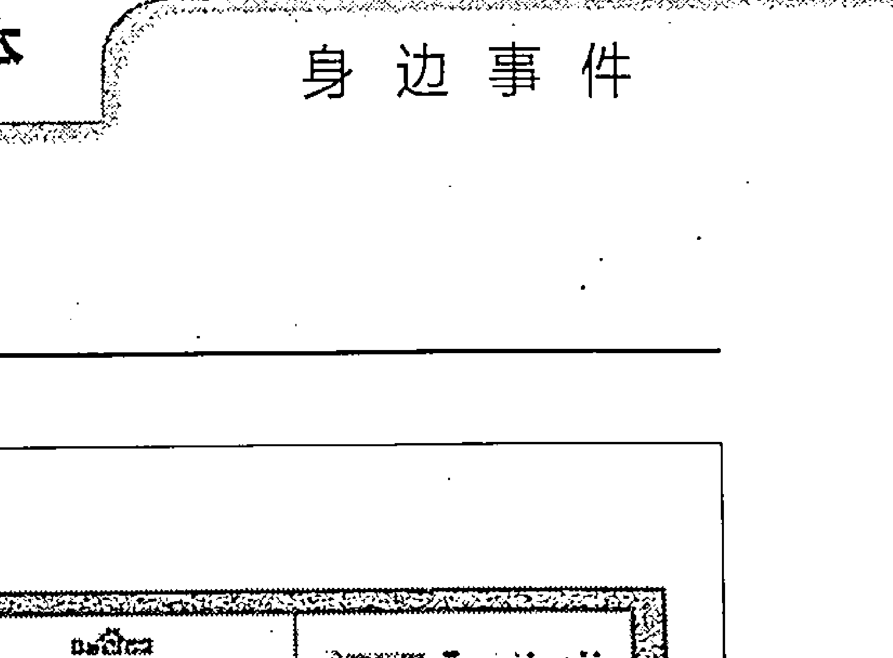

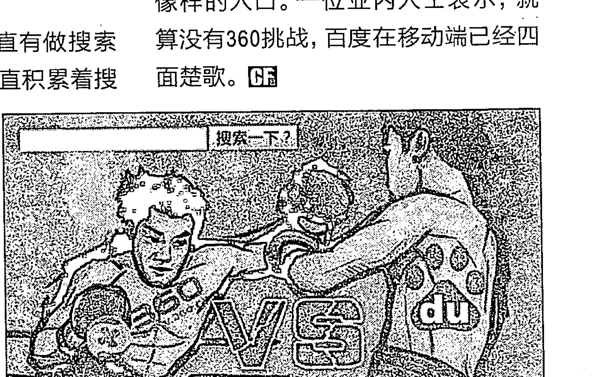

# Cookies 可爱的洪水猛兽

央视3·15晚会一下让大众知道了Cookies这个网络技术名词，并把其作为窃取用户隐私的罪魁祸首。事实是这样吗？ 文|沧海

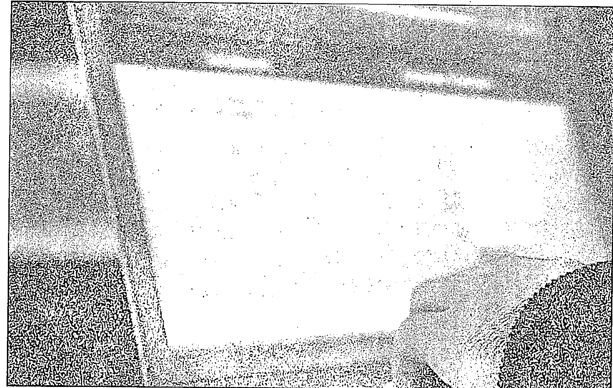

央视3·15晚会，Cookies一词走进人们的视野。一时间，对于公众而言，它已不是英文中的“小甜饼”，而是侵犯互联网隐私的“洪水猛兽”。业内人士却认为，Cookies是互联网发展的基石，其初衷是为了让用户上网更为便利。 Cookies有那么可怕吗？还是像业内人士那样“淡定”对待？它真正的危害在哪里？没有了Cookies，互联网会怎样？

## Cookies本无罪

Cookies被视为互联网最早的“标配”之一，1993年，由美国网景公司的一名员工发明，它被发明的目的也是为了提升用户的上网体验。 一位网页工程师向记者描述，人们在登录邮箱时，网站提示“记住登录状态”；浏览购物网站后，网站会将你感兴趣的商品列在首页向你推荐；打开带有网址大全的浏览器首页，它会把你常访问的网站链接罗列出来……这些功能都是通过Cookies实现的。

“简单地说，Cookies就是服务器暂存在你计算机上的一笔资料，好让服务器用来辨认你的计算机。当你浏览网站时，Web服务器先送一个小小的资料放在你的计算机上，Cookies把你上网时输入的文字或一些选择记录下来。下次你再访问同一网站，Web服务器会先看看有没有它上次留下的Cookies资料，有的话，就会依据Cookies里的内容来判断使用者，送出特定的网页内容给你。”

> > “Cookies无罪，它好比一把菜刀，有人用来切菜，也有人用来杀人，工具无罪？” 北京邮电大学信息安全中心副教授辛阳

博客中国副总裁谷龙介绍，谷歌最新的浏览器已经提供关闭Cookies功能，但负面效果是上网变得非常慢，需要反复确认用户身份，带来了种种不便。 “Cookies是互联网的基石，当我们在享受互联网革新带来的多种个性化定制服务时，我们已经越发不能离开Cookies。”上述网络工程告诉本刊记者。

## 罪魁祸首

这原本改善用户上网体验的一个功能，为什么会被指责窃取用户隐私呢？这背后的“罪魁祸首”是跨站 Cookies。 Cookies发明之初有一个特性：专属性，即A网站存放在Cookies中的用户信息，B网站没有权限直接获取。但是现在一些第三方广告联盟用一种技术可以跨站截取用户的Cookies信息，这就是著名的“网络臭虫”技术。 据了解，该技术在一些访问量巨大的网站植入一段“臭虫”代码，这些“网络臭虫”就能收集访问该网站网民的Cookies数据。这些包含着诸如网页浏览器、停留时间、购物商品等个人偏好的Cookies信息，被这些企业统计分析后，卖给其他互联网公司牟取暴利。如果一个被植入“网络臭虫”的网站一天一个页面有1000万人访问，那么这个试图窃取的公司一天就获取了1000万份个人信息。 一位业内人士向本刊透露，收集Cookies的行为在互联网领域很常见，尤其在搜索引擎公司。

> > “以百度为例，他们先向其他网站嵌入跟踪代码，当用户打开这个网站时，这段嵌入的代码会向百度服务器发送信息，让用户的上网记录上传到服务器，这些记录可能涉及甚至泄露用户的隐私。”

> > “百度联盟目前拥有超过60万站点的会员。即使网民从未使用过百度服务，百度联盟的网站也会在我们毫不知情的情况下收集其浏览行为。”

> > “品友互动就像蜘蛛网一样，不管用户在哪里，都可以抓得到。”据称，品友互动目前可以捕捉到互联网上5.7亿的Cookies；被曝光的易传媒则号称拥有3亿多互联网用户Cookies数据；悠易互通、艾维邑动号称拥有5亿网民Cookies数据；传漾公司和亿玛在线均号称拥有9亿Cookies。

这些公司获取用户Cookies，与搜索引擎公司一样，几乎都是通过“网络臭虫”技术来实现。那么，互联网企业又为什么会“不择手段”地搜集网民的个人数据？这与互联网广告的精准营销有很大的关联。

它能够记录你的浏览偏好、点击广告的次数等等，却不知道你的姓名、电子邮件地址、住址和电话号码等私人信息。只有当你在网站上填写表格、下单购买东西时，Cookies才会有机会存储你的个人资料，但这些信息会被加密并根据最严格的行业准则进行存储，收集该信息的机构不能够在没有用户的同意下向第三方机构透露、转让用户的任何信息。”

且网站必须合理处理这些数据，不得将其进行售卖跟扩散。”

同时，为了让民众逐渐地接受互联网广告，必须拥有一个良好的行业环境，所有身处其中的企业都要把“不作恶”当做恪守不渝的准则，这才是问题的关键所在。知名知识产权律师姚克枫说：“互联网企业应该加强自律，自己获取信息自己保存，不要泄露也不要给第三方。而只有行业自律了，把Cookies、隐私保护上升到一定规模，关于隐私的法律标准才好制定出来。”

# 背后的商业驱动力

> 谷歌、百度现在正在为成千上万的网民提供免费服务，但天下真没有免费的午餐，他们首先是网络广告商，会根据用户账号的注册信息进行深度挖掘和分析，再针对性投放广告获利。其他一些企业如亚马逊、Facebook的成功也得益于对用户行为的收集和分析，才能拿出合适的商业体验，这也是互联网广告颠覆传统媒体“广告主知道有一半广告费用被浪费掉，但他不知道浪费掉的是哪一半”的核心竞争力。

Opera中国区总经理宋麟也表示：“Cookies中保存的用户名、密码等个人敏感信息通常经过加密，很难将其反向破解。第三方Cookies仅记录网站上的用户点击了哪些广告、看了哪些网页，并判断用户的消费习惯，是没法获得用户姓名、行业、手机号等详细信息的。”

在美国有一个不成文的规定：一切关于PII (Personal Identifiable Information个人识别信息)的信息是坚决不允许使用的。比照美国，国内的大环境的确不容乐观。曾在谷歌任职的创新工场CEO李开复就曾对此提出建议：“第一，告知用户哪些信息被使用了；第二，保证不滥用信息；第三，提供DNT (Do not Track，不被追踪)选项。”

在国内，阿里巴巴、京东开发大数据也依赖Cookies支持。很多商业网站普遍采用跨站跟踪和Cookies跟踪等手段收集、分析用户上网行为的数据，以实现广告的精准投放。

“由于Cookies记录下了一套完整的用户行为，所以根据每个浏览习惯，会给用户打上各种不同的标签，标签数据越多，分析会越准确。这种数据分析的结果，对广告投放来说，是很有价值的。”

据了解，DNT是W3C (万维网联盟) 发布的一个草案标准，欧盟和微软相继宣布支持，根据该标准草案，用户可以选择禁止被网站跟踪。也就是说，用户有权选择是否被Cookies记录。

> 未来，互联网广告的精准营销是大势所趋，爱点击的CEO薛永康表示，Cookies对网络营销非常重要，“作为一个电商广告主，为了吸引流量，分别在三个网站上投放一万元的广告，结果你流量升了60%，订单也多了30%。你当然非常高兴，但是问题是究竟是哪一个网站给你带来了额外的流量及订单呢？Cookies的追踪让你了解到用户在下订单前，究竟是点击哪一个广告而进入你的网站。”

“通过Cookies，互联网公司知道你喜欢什么，但并不知道你是谁。”这也许是对Cookies及其在精准营销上的应用最恰当的描述。

此外，《商业价值》杂志主编张鹏认为也要避免把Cookies和个人隐私直接划等号，最后成为企业间恶性竞争的借口，“还要谨防个人隐私问题成为企业互相扔的板砖，因为如果按照现在尚不清晰的标准，也就是个人信息就等于隐私，全世界互联网企业都可以拉去批斗。”

> 薛永康同时认为，Cookies即使被窃取，公众也不要太紧张，因为这是一个“不可被识别的个人信息”（即Non-Personally Identifiable Information）。“对服务器来说，你只是一个编号，

# 亟需规范

其实，Cookies的问题不是原罪，而是第三方营销机构在不经网民同意的前提下，用其私人信息谋取暴利。那么，是谁给他们这样的权利？该怎样杜绝？怎样才能营造良好的Cookies生态？

大成律师事务所高级合伙人商建刚认为，从严格意义上来说，用户的浏览记录应该属于个人隐私范畴，搜集用户信息时，网站必须有着非常清晰的隐私条款跟标识，“用户信息的适用范围、具体用途都应该提前告知用户，而

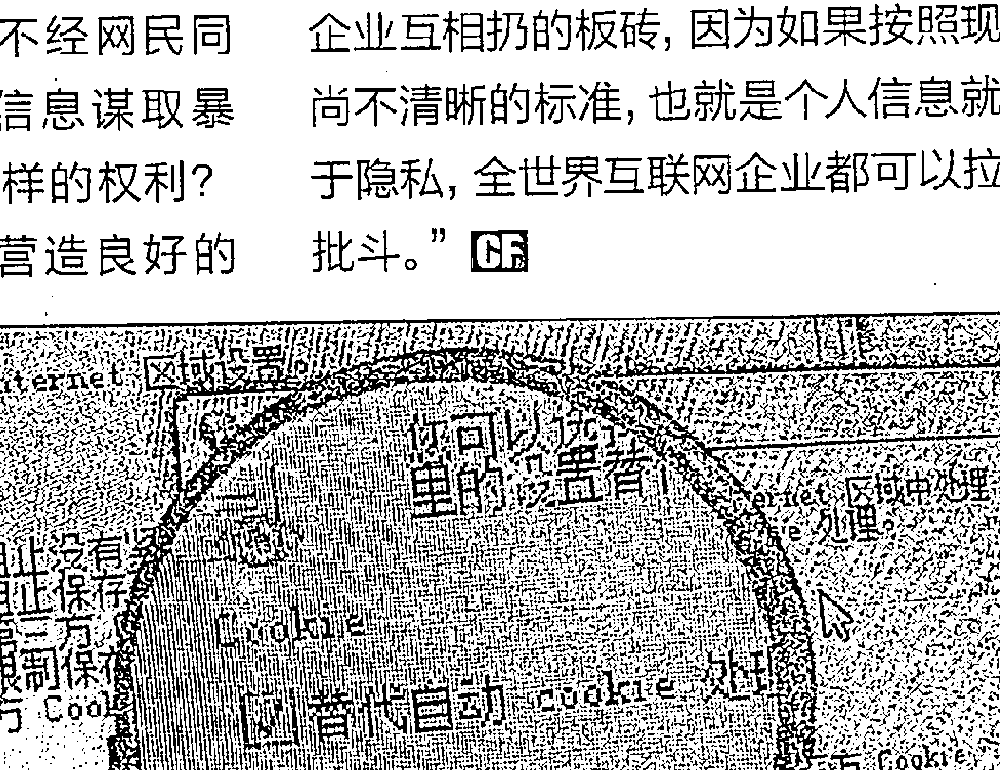

# A5变A9 炬力辟虚假宣传漩涡

作为第一批量产的国产四核芯片，炬力“猫头鹰”ATM7029本应成为鼓舞士气的里程碑，但却因以“Cortex A9”自居的标签，陷入了挂羊头卖狗肉的虚假宣传漩涡之中。

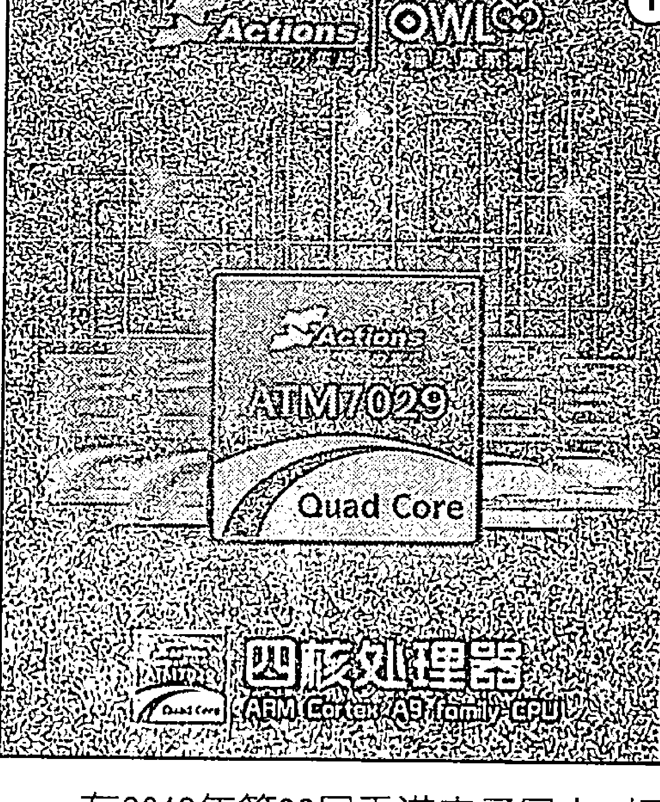

在2012年第32届香港电子展上，炬力正式发布了旗下首款四核芯片：代号为“猫头鹰”的ATM7029，并以高性能的ARM Cortex A9 Family架构作为主打卖点（图1），博得了业内一片赞誉。然而，待2013年实际产品面世后我们才忽然发现，这颗A9四核芯片的性能甚至还不如很多A9双核芯片！由此，ATM7029挂羊头卖狗肉的宣传策略慢慢浮出了水面。

# 官方参数露马脚

ATM7029不是Cortex A9架构吗？为什么跑分成绩还不如三星Note等双核手机呢？如果真是所谓的Cortex A9四核，那其性能至少也应该达到NVIDIA Tegra3的水平吧？带着这个疑问，笔者在炬力官方网站找到了有关ATM7029的描述。

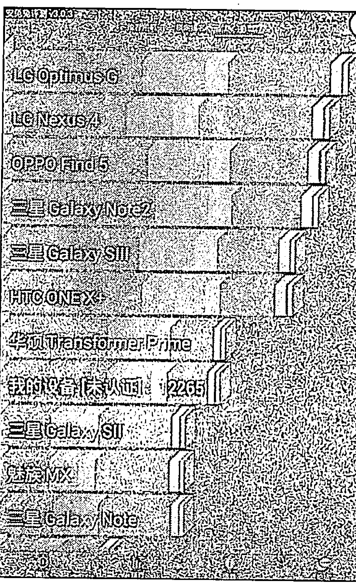

从截图可见，至少自本文截稿之前（4月9日），炬力官方还将ATM7029定义为Cortex A9 Family。但是在具体特性的描述上，竟赫然出现了一条“Supporting VFP v4(Vector Floating Point v4) architecture”（支持VFP向量浮点计算v4架构）的参数（图4）。问题是，根据ARM对Cortex Ax系列芯片的定义规范来看，Cortex A9架构最高仅能支持到VFPv3向量浮点计算标准，并不支持炬力对ATM7029描述中的VFPv4。难道炬力竟然有如此强悍的研发能力，能自己把VFPv4技术塞进Cortex A9架构的芯片中？

# 这个Cortex A9真失望

2013年1月，在网络中的几轮广告和无数宣传稿件的诱惑下，网友inskys购买了一款搭载四核Cortex A9架构芯片的国产四核平板。但使用一段时间后才发现，这款售价仅千元的产品竟然还没有朋友所用的国产双核平板流畅。在升级最新版固件后，流畅度虽然有所提高，但同时也让他发现了一个更严重的问题。

答案自然是否定的，别说是炬力了，即便是三星和NVIDIA等别芯片制造商也不具备这个实力，那VFPv4又是从何而来呢？

以安兔兔测试软件为例，inskys在刚买平板时还是V3.0.3版，此时他的平板可以跑到12000分左右（图2）。但在将安兔兔升级到V3.1.1后，inskys却惊愕地发现跑分狂降到了7000分（图3）。如今V3.2.x版本的安兔兔软件更是已经测不出成绩了。在网上相关的讨论有很多，绝大多数的玩家都觉得是炬力在最初的固件版本上对安兔兔软件进行了特别的优化，随着测试软件的更新优化失效，ATM7029芯片的真实性能也就显露出来了：也就是高端双核处理器的水平！

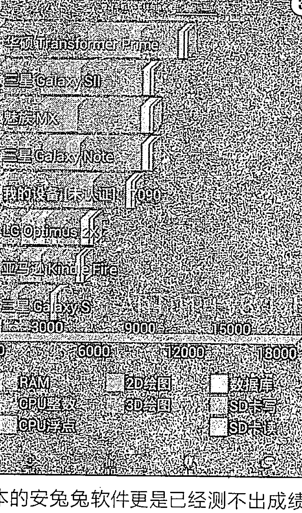

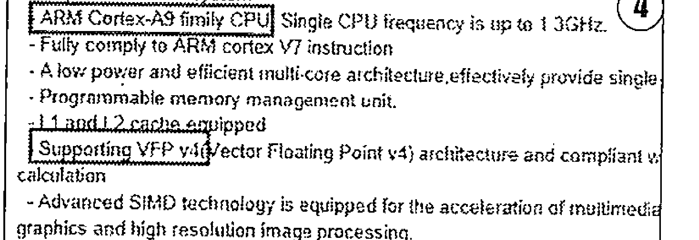

# 披着A9马甲的A5芯片

在ARM庞大的家族系谱中，目前支持VFPv4的架构仅有低端的Cortex-A5、中端的Cortex-A7以及顶级的Cortex-A15。因此，从理论上来讲，炬力ATM7029的真实身份应该是上面三种架构

## 为何不以Cortex-A5示人

对此国外slatedroid论坛有网友对该现象进行了透彻的分析(更详细的分析请参考: http://dwz.cn/7eXSN)。首先我们先来看看几款国产平板常见的主控芯片的基本参数。大家可以关注一下图片中加框突出的部分信息，除了前文提到的VFPv3和VFPv4指令集以外，在“CPU part”(供软件识别CPU信息的二进制码)一行所列的参数就是该款处理器真实的架构信息。

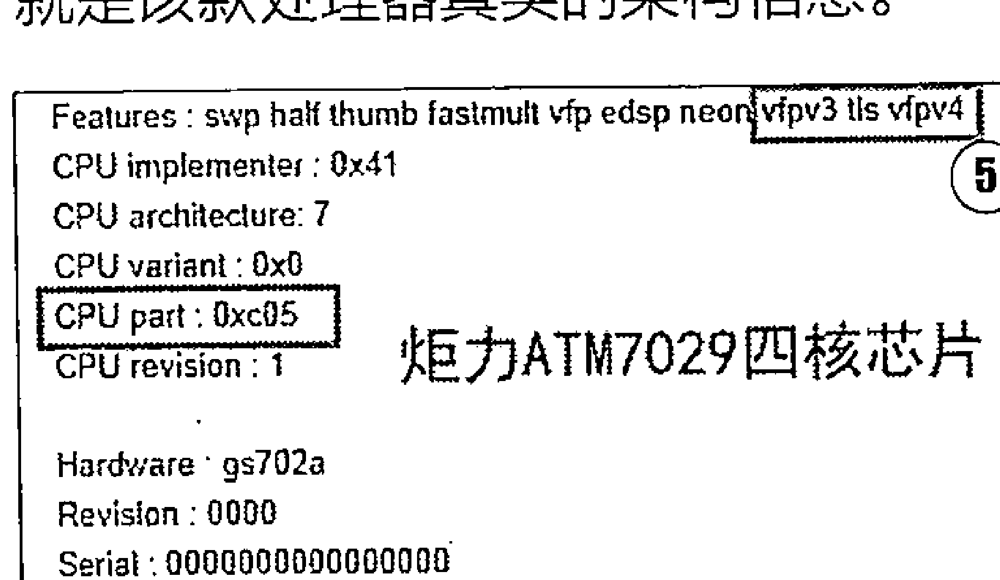

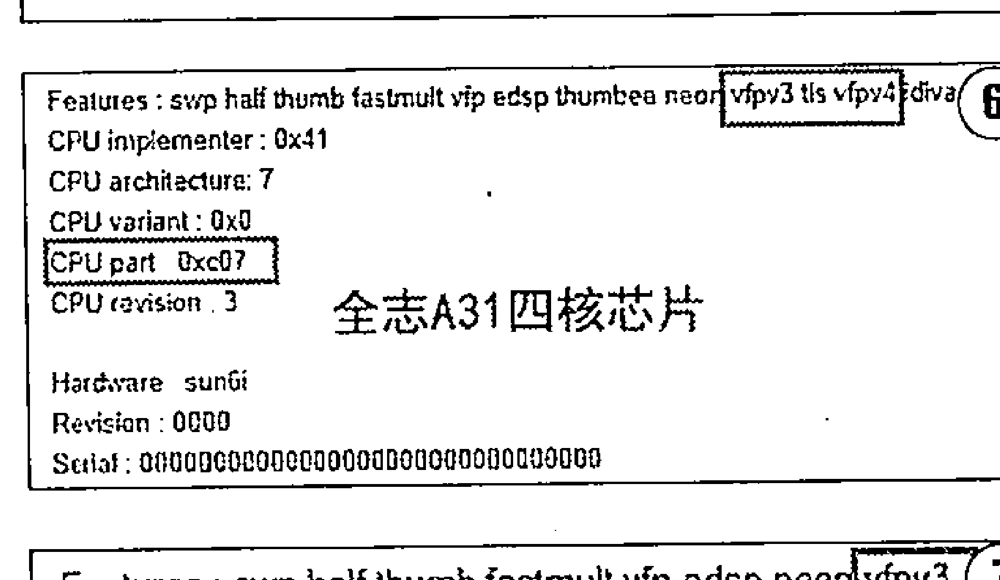

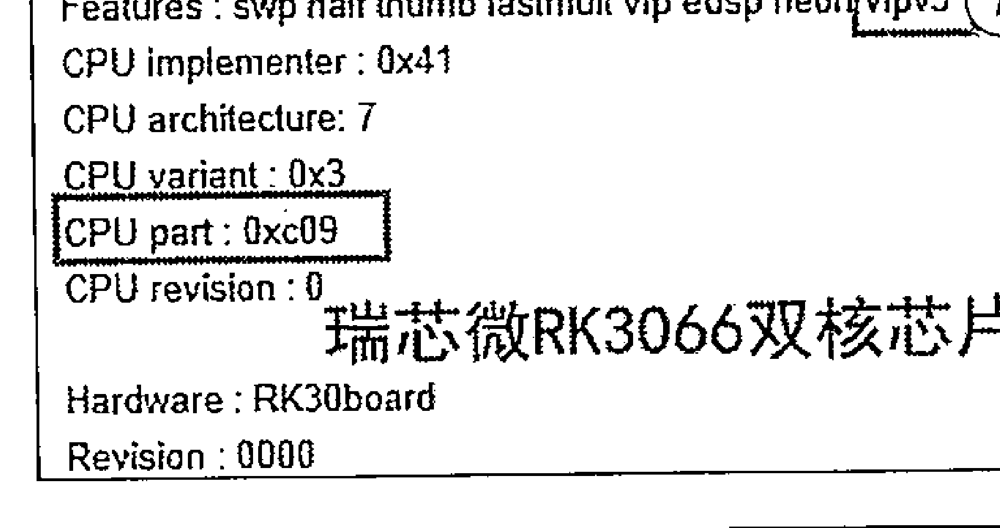

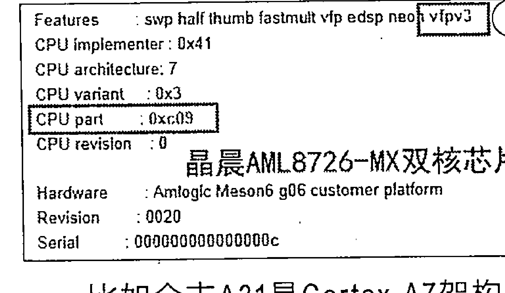

比如全志A31是Cortex-A7架构，所以该行信息就是0xc07，瑞芯微和晶晨的两款双核芯片均为Cortex-A9架构，所以是0xc09。而炬力ATM7029的检测结果却为0xc05，由此可见，这颗所谓的Cortex A9 Family四核芯片其实就是Cortex-A5架构。据很多网友反映，某些搭载ATM7029处理器设计的平板电脑，已经在固件信息中将“CPU part”一栏的参数移除置为空白，而且在相关产品的介绍页上也删除了有关Cortex A9的信息，这种行为的动机不言而喻。

炬力为何不光明正大地将ATM7029以Cortex-A5架构示人呢? 这主要就是源于Cortex-A5本身的低端属性。简单来说，Cortex-A5是ARM用来主打低成本和低功耗的入门级市场的产物，四核A5的性能基本和双核A9持平，但同时却可以做到更为省电节能，也算是一款性能和功耗折中的产品吧。

但ATM7029有些生不逢时，与其同期发布的还有全志A31和瑞芯微RK3188。其中A31主打集成的PowerVR SGX544MP2 GPU，RK3188则属于100%的高频版Cortex-A9芯片，而炬力ATM7029的GPU却是非常冷门且低端的GC1000plus，如果再告诉大家芯片是主打节能的Cortex-A5，必然会在国产芯片的交锋中败下阵来。因此，用Cortex A9 Family来推广ATM7029，既能提高芯片自身的影响力，又能成为日后宣传败露时用于“解释”的理由，也许这就是炬力的如意小算盘吧。

至此，事实已经很清楚了，炬力ATM7029本质上就是一颗Cortex A5架构的四核芯片，只是此次炬力打了一个擦边球，官方参数在Cortex A9的后面加上了“Family”，翻译过来就是跟Cortex-A9架构是同一家族的，从道理上貌似也讲得通。但是，如果这种说法成立，那还不如直接叫Cortex A15 Family呢，更能吸引小白用户的关注了。毕竟和Cortex-A9相比，Cortex-A15才是Cortex-A5的“近亲”(都支持VFPv4指令集)。

## 记者后话

由于国内相关法制的不健全，在与国产平板有关的芯片上都曾出现过各种夸大性能、混淆GPU核心概念、偷偷超频/降频等虚假宣传的手段。但是，上述这些伎俩至少还是“偷偷摸摸”进行的，而且对产品的真实性能不会产生过于明显的误导。但此次炬力靠“Family”一个单词之差就将ATM7029以Cortex A9宣传，而且还是官方性质的，实在是国产芯片历史中的登峰造极之作。

在竞争激烈的国内平板市场上，虚假宣传的确可以起到立竿见影的营销效果，让不明真相的消费者为之埋单。但是，消费者也不是傻子，在网络发达的今天，任何潜在的虚假信息都有可能被发现并深入挖掘，一时的小聪明很可能会断送掉来之不易的口碑，进而失去用户的信任，最终让合作伙伴转投到其他芯片供应商门下。炬力ATM7029宣传涉假的消息已经在玩家中间发酵，而绝大多数平板电脑厂商在宣传搭载ATM7029芯片设计的产品时也不再突出架构这个参数，只能用“ARM四核处理器”来形容了(图9)。

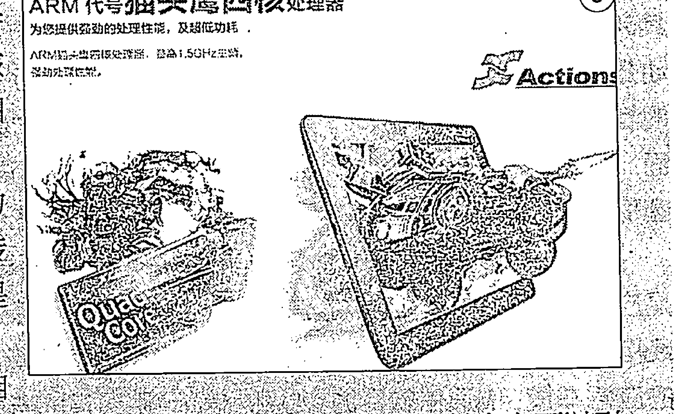

无论如何，在炬力导演的这场虚假宣传大戏中，消费者无疑是最大的受害者。但是，大家又该如何维护自己的权益呢? 在这里，我们希望以炬力为代表的国产芯片供应商可以引以为戒，今后不要再用这种挂羊头卖狗肉的方式来糊弄信任你们的消费者了。GF

## 微信收费 情“理”何在

一石激起千层浪，中移动要对微信开征“OTT”服务费的传闻引发了社会的强烈关注，那么，微信收费“理”何在呢？

文|辽宁 蓝色海岸

### 你动了我的“奶酪”

三大运营商之所以公开向腾讯发难，是因为微信“你动了我的奶酪”。微信的短信、语音业务极大地吞食了三大运营商的业务。

举一个例子：微信的语音业务每秒消耗0.9KB~1.2KB的流量（为方便计算，取1KB），以0.3元的价格购买运营商1MB（按1000KB计）网络流量，可以使用微信通话17分钟，而用该手机拨打电话，0.3元通话也就是一二分钟。

换句话说，微信以0.3元的流量费换到了至少2.25元（通话17分钟，每分钟按0.15元计算），有7.5倍的价差。

由此可见，微信的语音业务已经动了三大运营商的奶酪。天下熙熙，皆为利来，天下攘攘，皆为利往，三大运营商向腾讯发难也就在情理之中。

### 你占了我的“信道”

仅仅是别人动了你的奶酪，你就对别人发难，肯定是站不住脚的，毕竟商业无时无刻不存在着竞争。三大运营商发难的理由是你占了我的“信道”。中国移动就曾公开表示，微信已经占用其60%的信令资源，但仅带来10%的移动数据流量。至此，“微信收费”之争的焦点，已从市场层面被转移到技术层面。那么，何为信令呢？不妨先来看一些形象的比喻。

比喻一：“通信网是行车道，信令是应急车道。”信令是无线通信网的神经指挥系统，类似于环路上最右侧空着的应急车道；IM通信软件的“心跳”信号就像频繁占用应急车道，会对整个道路交通带来灾难。

比喻二：“信令是服务员。”“微信的手机用户就像KTV里的顾客，频繁地喊服务员进来，每次都只要一份爆米花，结果把服务员忙得团团转，而微信就相当于N多客人都这样干。”

通过上面的比喻我们就能知道所谓的“信令”是一种专门用于控制电路的信号，负责用户呼叫的建立、解除、计时、计费等。平时两个用户之间进行信息传输，无论是通话、短信、语音、文字或者是视频，要到达对方都需要一个“带路人”，将信息安全、可靠、高效地传送到目的地，这个“带路人”就是信令，也被称为“心跳信号”。

可容纳信令的信道资源是有限的，一般情况下，当信令指明“正确道路”，信息已沿着正确道路传输后，信令就不再占用信道资源。但是，微信为了保持永远在线，会频繁发送信令，即使不传递任何信息，也会发送信令，时刻提醒对方“我在这里呢，我马上准备和你讲话了”，这样“六车道”的信道就被微信“频繁喊话”的信令挤占了4车道，指引语音、短信以及其他数据业务的“带路人”都拥堵在剩下的两个车道上，从而导致网络连接无法建立，引发网络拥塞甚至产生雪崩效应。

如果微信用户并不庞大，这种对专用通道的占用也许还不会引起运营商的激烈反应。但事实是，微信用户已经在一年时间里从零激增到超过3亿户。数亿用户每几分钟就发出一次“心跳信号”，这对运营商的信令通道来说，是一个很恐怖的现象，而由这种“信令风暴”引发的网络瘫痪也将在所难免。

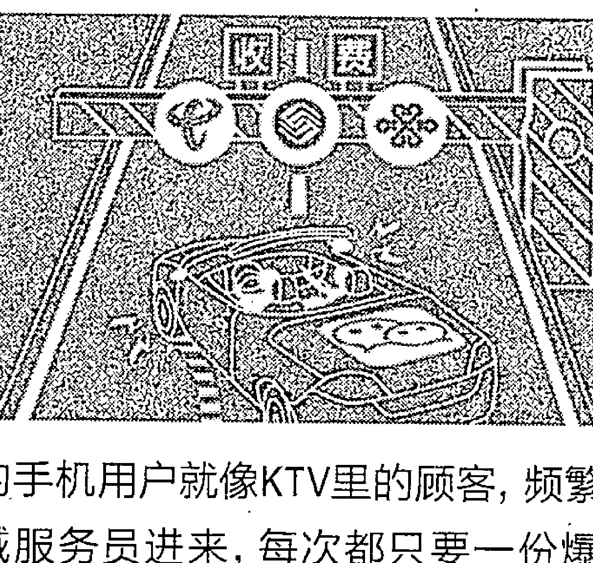

### 你过了我的“顶”

既然信令通道是运营商为保障用户正常使用网络而设置的用于管理的专用通道，那么，微信又是如何免费强用的呢？这就不得不提名为OTT的业务了。

OTT是英文“Over The Top of Internet”的缩写，这个词汇来源于篮球体育运动，原本是“过顶传球”的意思。而如今，OTT是指互联网公司越过运营商，发展基于开放互联网的各种语音、视频以及数据服务业务。OTT以一种全新的业务发展模式颠覆了传统电信包括广电等运营商的信息服务模式。它的特征就是利用传统运营商的通信管道，直接向最终用户提供内容和应用服务，而无需像以前那样必须捆绑运营商的业务平台或代收费渠道。

在OTT业务的冲击下，传统电信、广电运营商依赖于业务与网络捆绑而构筑的堡垒正在趋于瓦解。OTT已经覆盖了话音、数据和图像三大基础通信业务市场，以微信、米聊的OTT业务让电信运营商大为光火，“增量不增收”的趋势愈加明显，短信语音业务营收量迅速见顶回落。

最后，本文还需要向读者说明的是，尽管微信收费引发了舆论的强烈关注和网民的强烈反对，但关于微信收费的这场争论，许多媒体从一开始就弄错了目标。所谓微信收费，指的是运行商向腾讯公司收费，纯属企业之间的成本分担或者利益再分配，与用户并无直接关系，用户不会被收费，大家尽可放心。

## 认清你手机里的那些“流氓”

文|镜花水月

前不久央视新闻在微博上曝光了连连看、捕鱼达人秀、泡泡龙、地下城勇士等近500款热门免费游戏被植入恶意扣费代码的消息，Android手机的安全问题再度浮出水面。

> 应该说这些游戏自身没有问题，那是谁上“天使”变成了“恶魔”？在背后又有哪些“黑手”在支招呢？

央视新闻V:【当心！500款热门游戏被扣费代码！】某手机杀毒软件系统最近监测发现近500款热门安卓游戏被植入恶意扣费代码，其中不乏连连看、捕鱼达人秀、泡泡龙、地下城勇士、塔防战争等热门游戏。据估计，这些被植入扣费代码游戏已安装到约10万部安卓手机上。快截图看看你的手机中招了吗？@公安部打四黑除四害

### SP盯上APP

在非智能手机时代，很多SP运营商曾因毫无操守的恶意短信扣费成为各大媒体口诛笔伐的对象。随着短信定制业务的衰落，SP也开始向智能手机时代转型。智能手机的特性是什么？随时联网、可以安装无数好玩的应用。就是这两个特性，让SP改造成了新的掘金点。

他们以免费开放的Android系统作为舞台，依靠暗藏吸费陷阱的APP

### 一款游戏引发的悲剧

小陈下载了一款名为《植物大战僵尸》的破解版游戏，几天内就被扣除了近百元手机资费，经过查询才知道是手机在他毫无察觉的情况下自动订制了多条增值业务短信，而且在运行期间产生了数十兆的上网流量。游戏本身是免费的，但却带来夸张的费用支出，这就是很多Android手机用户都经历过的悲剧。除了游戏以外，很多知名应用也都被爆出过恶意吸费的事件。在这些“吸血鬼”的背后，我们再度看到了昔日无线增值业务吸金者：SP的身影。

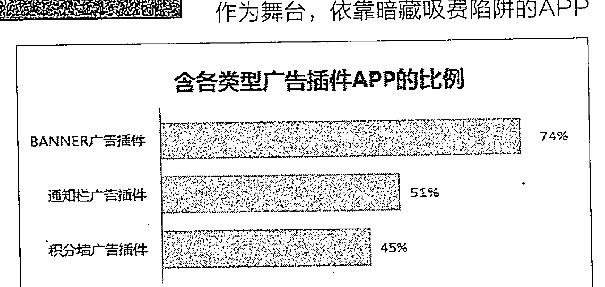

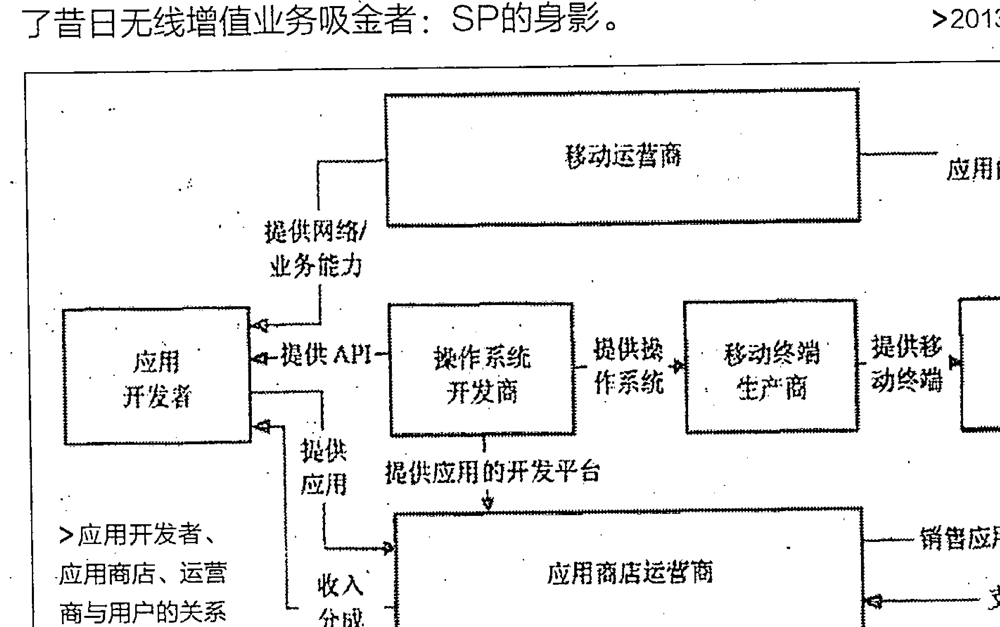

>2013第一季度APP广告分部

应用，重新建立了一条集SP公司、应用开发者、第三方应用市场为一体的灰色利益链。

看清了电信运营商的真实面目，

也许你会费解，带“毒”的应用是如何被制造出来的？如果大家都不去安装不就不会掉进“陷阱”了吗？可是你知道吗？现在不但是“制毒”容易，流氓手机软件的入侵方式更是多种多样，让人防不胜防。

## 软件制毒太容易

iOS官方的应用商店审核严格，所以程序大都是相对安全的“官方版”。而对于Android用户来说，他们更习惯在机锋、N多等第三方应用市场下载程序。而更多的普通用户，甚至还停留在先“百度一下”，再从不知名的小网站或论坛下载程序。这些缺乏监督机制的下载渠道，就为有毒的APP开通了便车。

“既然小公司开发的游戏可能不靠谱，那选择大公司开发的知名游戏，不就能保证安全了？”这是很多Android用户的第一感觉。而这条灰色利益链的成员就是抓住了用户的这一心理，从而拿知名软件开刀。例如，我们随便找个应用商店搜索“植物大战僵尸”会出现多个版本的游戏。如果你在百度搜索该游戏，还会出现更多的所谓破解版和修改版，殊不知其中的很多版本可能就已被下毒，暗藏各种机制的吸费功能了。

据某SP运营公司的员工透露，很多SP公司都对外提供计费平台，客户只需花费几万元购买就会免费得到服务端的扣费插件（内涵SP扣费服务代码和通道），将该插件添加到某款热门游戏或软件的APP中就能拿到网上或应用商店进行推广了，只要有用户下载并运行就会暗中扣费。最关键的是，此类插件不易被杀毒软件查杀，一旦被曝光，只需给插件换个签名就能躲开。简单来说，SP公司负责扣费代码和渠道，开发者负责添加插件，而第三方应用商店则负责推广，共享利润分成。

“给现有Android应用扣费添加插件非常容易，稍有Java常识的Andriod工程师就能搞定”。个人开发者小张透露，扣费插件通常会含有GPS定位、扣费代码、拦截通知、删除发送记录和拦截确认短信等功能，而Android应用都能用APKTool等专业工具进行反编译，添加插件只需重新编译就能生成全新的.apk安装包。接下来就简单了，只需找推广团队到各大论坛甚至第三方应用市场去推广传播这个.apk程序即可。“很多用户都喜欢第一时间尝鲜国外游戏大作的破解版或修改版，而这类经过重新编译的游戏，也是某些组织和个人最喜欢加入特殊代码的素材之一。”

### 打包党“四步法”简单嵌入广告代码

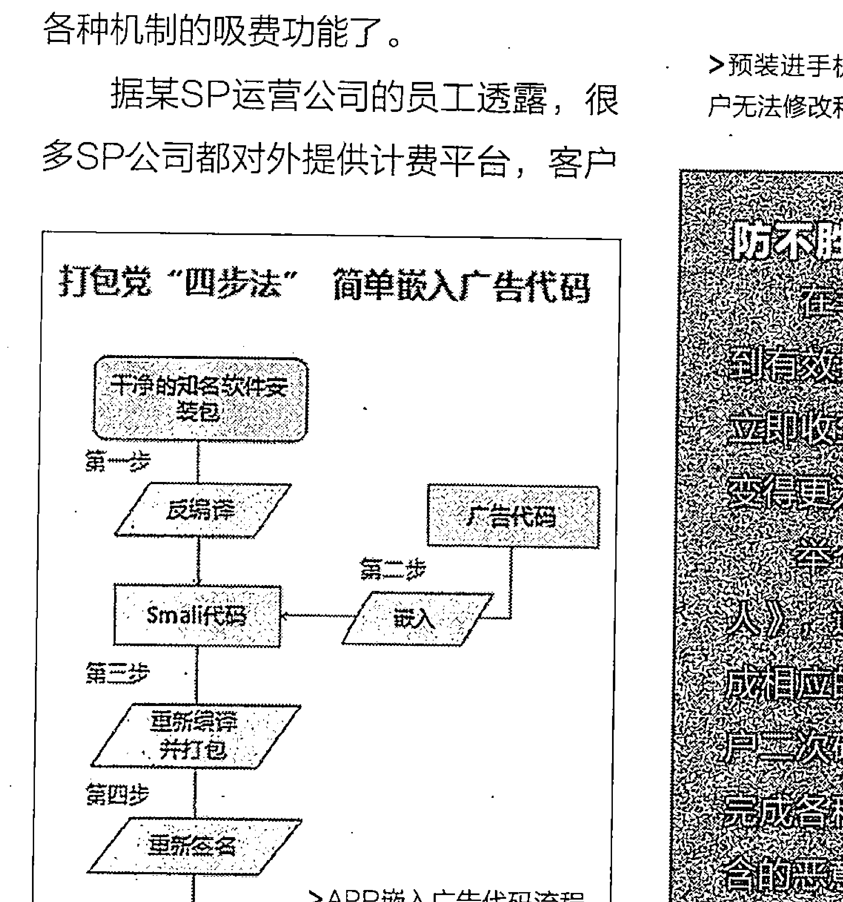

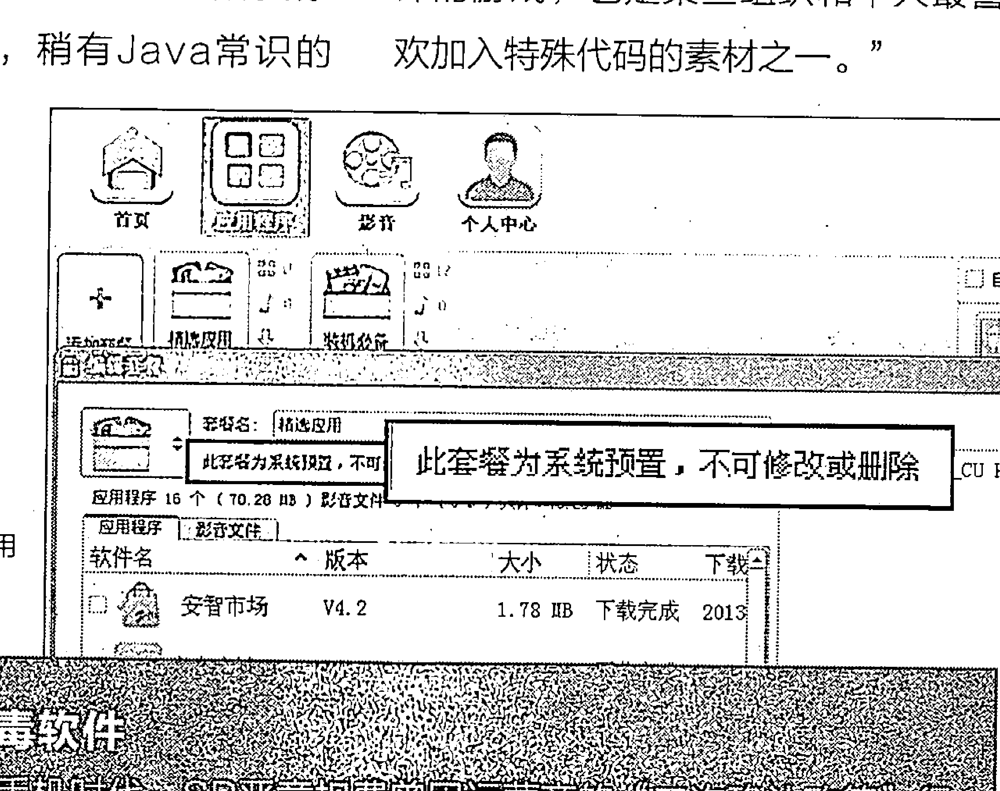

### 防不胜防的毒软件

在智能手机时代，SP恶意扣费曾因运营商的“二次确认政策”得到有效控制（需要在游戏中让用户接收二次确认信息才会扣费，而且会立即收到扣费信息短信，俗称“信码”）。但智能手机上的扣费软件也变得更为智能，可以轻松绕过二次确认政策的限制。举个例子，比如我们下载并安装了一款加入扣费插件的《捕鱼达人》，运行之后该游戏会自动调用你手机的GPS信息，根据地理位置生成相应的扣费代码用来订购不同地区的信息服务。此时系统返回需要用户二次确认的短信通道也会被插件拦截删除，让你在毫不知情的状态下完成各种收费服务的定制（这种不用通过用户审核便直接扣费的程序所含的恶意扣费代码俗称“黑码”）。更关键的是，SP为了快速运营商的监管和用户投诉，会不断从云端更换吸费通道，将每种收费服务的标准定在1元-2元，从而减少用户投诉。

## 手机厂商的潜规则

非智能手机出厂就会预装很多扣费软件，这一光荣传统也被带到了智能手机身上。去年11月的中国之声《央广新闻》曾报道，通过哈尔滨市手机经销商自查反馈确认的涉嫌“吃费”的手机厂商包括金鹏、天时达等数十个品牌，就连TCL、天语、长虹等知名品牌也名列其中。

“软件商付钱，硬件商预装，在手机还是一块芯片时，已经决定了未来它的用户使用怎样的软件。”这已经成为手机产业中的潜规则，在网上甚至可以轻松搜到类似的合同模本。

| 产品名称 | 产品类型 | 服务范围 | 服务渠道/限制 |
|----------|----------|----------|---------------|
| 中国移动视频客户端 | 软件 | 中国大陆 | 内置渠道、ROM刷机渠道 |

> > “甲方负责在手机里预装乙方的软件，乙方根据激活量支付费用”

> > 下载、解压、添加APP、添加签名、打包，简单五步，毒ROM就生产完毕了

### 入侵途径多种多样

既然毒软件这么危险，那用户在选择下载安装时多加小心是不是就可以躲过呢？对不起，你做不了主，因为你的手机本身就可能是“毒窝”。也许你不相信，那就让我们来见识一下“流氓”是如何入侵的吧。

### ROM捆绑软件

很多朋友喜欢刷机，当论坛里一个个新鲜出炉的ROM在诱惑你时，你是否心动呢？如果你心动了，那也正好掉进了心怀叵测的人的陷阱之中。

对ROM稍微了解的朋友应该知道，ROM通过解压缩编译是可以修改的，从网上下载到的以.zip为后缀名的ROM包，用解压缩软件解压到本地，然后双击打开system文件夹，可以找到APP文件夹，里面的APP可以任意添加或删除，添加完成需要集成到该ROM包中的所有软件后，再将签名文件保存放入ROM文件包，打包后一个新的ROM就产生了。当心怀叵测的人把它发布到论坛上，当你下载之后刷到手机中，这些流氓应用就会不知不觉地侵入到你的手机中了。

当你需要刷机，在网上寻找下载ROM的时候，应该尽量选择口碑比较好的论坛，在该论坛中寻找论坛官方ROM小组制作发布的ROM包，或者寻找纯净版的ROM包，这样就不用担心捆绑应用软件过多。当然最好的方法是下载ROOT过的ROM包，刷机完成后第一时间使用优化大师等软件将ROM自带的软件删除。

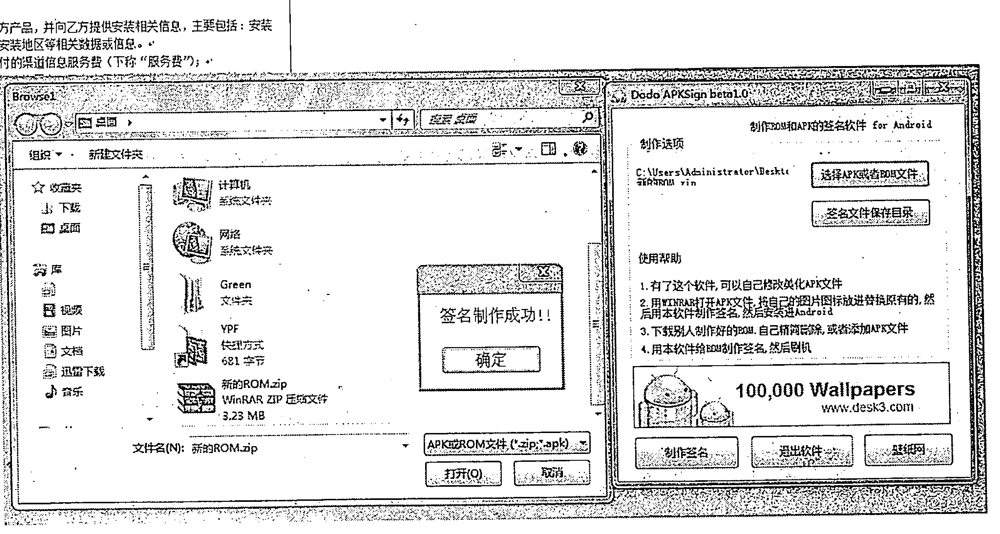

### 2 诱导用户安装

### 3 广告夹带下载

有很多应用在推广时使用的方法都是诱导用户来进行安装的，虽然安装后的手机软件有的确实是有一定的作用，但是大多数在使用过程中像鸡肋一样。比如：某用户在使用某款手机优化软件对手机进行优化时，软件提示手机电量只有75%，如果安装某款省电软件可以帮手机省电，于是用户就点击进入该选项，随后软件就会在后台自动下载所谓的省电软件，可是用户对该省电软件是否正规、使用是否有效并不了解，等想取消操作时，软件也许已经安装到你的手机里了，当安装上这款软件，诱导安装也就完成了。

软件当中加载广告，当联网时偷跑流量已经不是秘闻了，可是点了广告自动下载另外的软件，比广告偷跑流量更加可恨。在手机市场中搜索某款街机游戏，安装运行后每天只能获得一定数额的游戏币，用完之后，想要获得更多的游戏币，要么直接到指定的商城用现金充值，要么就要下载软件广告中推荐的其他APP，下载安装一个就能获得额外的游戏币。用这种方式来推广软件，可以说是非常流氓。而更流氓的是，有的软件一打开就会弹出广告，要想正常使用或者下载，不下载够多软件和积分就不能解除广告。

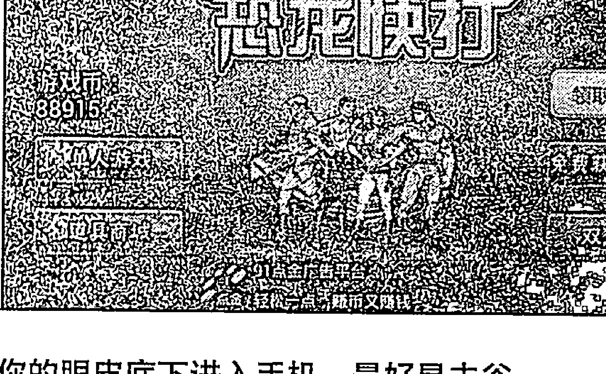

> >不点击广告，你是无法获取游戏币的，而下载的APP是否带有扣费代码用户无从知晓

> 对于这类诱导安装行为，关键字一般都有诱导性，不过实际安装到手机中的软件到底实用不实用，还要看你实际试用之后。有的软件安装后不但会搜集手机隐私信息上传，还会造成手机操作反应迟缓等问题。对于这类软件我们只能奉行一个字——删！

如果不想让流氓APP从你的眼皮底下进入手机，最好是去谷歌官方的电子市场下载游戏。想玩破解版的话，在下载时先看看用户的评论。此外，如果想要直接使用没有广告版的原版APP，可以试试豌豆荚手机精灵的“豌豆洗白白”来帮你甄别山寨APP！使用方法非常简单：扫描→清理→重新安装原版APP。当然如果这款应用不是非要联网才能运行的话，可以使用海卓上网大师等软件直接禁止它联网就好了。

### 免费背后还需自律

18助手产品定位：智能手机售后服务神器！

18助手产品使命：让智能手机销售门店服务更高效、更安全，服务过程还有钱赚！

针对手机软件应用市场的乱象，工信部发布了《关于加强移动智能终端管理的通知》，对移动智能终端的安全能力和预置应用软件提出管理要求，相信自2013年11月1日正式执行之后，手机预装恶意软件的现象将有所减少。所谓“魔高一尺道高一丈”，虽然Android系统的杀毒软件越来越多，但SP和APP开发者联手应对的方法也在不断地革新变化中，这种博弈还将不断延续下去。面对到处都是陷阱的APP和第三方应用商店，我们是不是应该重新审视那些免费的午餐？

### 高效批量装机

简单设置即可自动高效批量安装，让您轻松装机无压力。

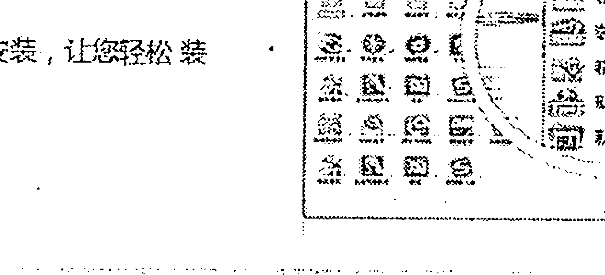

### 操作简单方便

灵活建立套餐，拖动应用，方便易用，高效快捷。

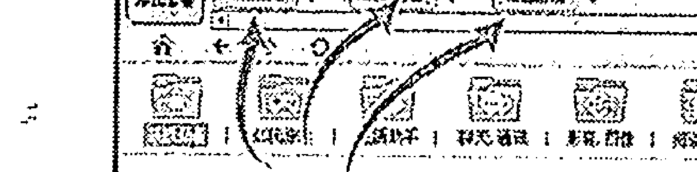

> >某款助手软件号称神器，而且能给手机批量预装应用鲍岳桥：演绎UCDOS和联众传奇

UCDOS、联众，这些PC刚兴起和互联网刚兴起时曾经辉煌一时的产品，你是否记得，作为背后的创始人，鲍岳桥的一生充满了激情和无奈，他无疑成为这个时代最具悲剧色彩的英雄。

文 | 姜洪军


开发了汉化版的操作系统。鲍岳桥在使用这些系统时，发现它们多有不便，于是决定自己开发一个汉字系统，这就是PTDOS。

开发成功后，他凑了1080元，那时他一年的工资加起来也不到这个数，到一家报纸上做了一个1/8版的广告。在把这笔"巨款"汇出的同时，他心里在揣测这笔钱是否能收回来。广告刊出后，很快有人就把钱给他寄了过来，两个月内，他收到二万多元钱。当时，鲍岳桥脸上洋溢着喜悦，好像被一道最纯净的阳光给照透了。

经常在QQ游戏中玩纸牌的网友不知道还有多少人记得联众，作为中国纸牌游戏的先驱，联众曾经承载着一代人的欢乐。而说到UCDOS，接触电脑较早的人还会有印象，因为Windows在中国铺开之前，UCDOS才是PC的"王道"。作为两个先烈产品的创始人，鲍岳桥成为了中国IT界最具悲剧色彩的英雄。

## 不聪明但非常投入

> > "我个人感觉我不是一个很聪明的人，但我是一个非常投入的人，我做一件事时整天脑子里就想着这一件事。我始终相信就算你笨一点，只要你投入的精力比别人多很多，就会比别人做得好。"鲍岳桥曾这样评价自己。

生于1967年的鲍岳桥，在考进杭州大学数学系后，在大学一、二年级迷上了下围棋，三年级以后则喜欢上了电脑。这两个爱好与他未来的职业生涯密切相关。

对于1988年前后的大学生而言，能够实地上电脑操作编程的上机时间是宝贵的资源，许多人一年里的上机时间加起来不过10个小时。要想多上一点就自掏腰包买机时，上机费为每小时3角左右。这对当时的学生来说是很贵的，因为那年月许多学生的一顿饭钱不过3角左右。鲍岳桥当时也囊中羞涩，为了能多上机操作，他想办法结识了管理机房的老头儿，和对方拉关系。后来到了上大四的时候，他就成了学校的机房管理员了，这样一来，每天就有五六个小时的上机时间了。痴迷于上机的他在这段时间打下了深厚的计算机技术功底。

1989年，鲍岳桥毕业后，进入了杭州一家橡胶厂。

工厂里呛人的橡胶味似乎没有影响他的心情，他在实习期结束后被分进厂里的电脑中心，可以时时地接触电脑了。

鲍岳桥逐渐动起了自己开发汉字操作系统的想法。当时在中国市场，主流操作系统仍是DOS，许多人围绕着它开发了汉化版的操作系统。

## 光荣与梦想

1993年10月，PTDOS改名为UCDOS。良好的产品加上希望公司强悍的市场推广能力，UCDOS迅速攻城略地，到了1995年，已成为市场上的龙头老大，有媒体称其市场份额已经达到90%。

虽然软件产权归希望公司，但鲍岳桥获得了UCDOS缔造者的光荣身份，一时影响深远。希望公司与鲍岳桥此时都走到了一个巅峰时刻。

不幸的是，他们的成功节奏与软件巨头微软的并不吻合。在中文DOS操作系统群雄逐鹿的岁月里，微软正努力开发完善自己的Windows，它对中文DOS操作系统不太在意，这给中文操作系统开发者留下了几年的发展空间。

1995年8月24日，伴随着滚石乐队振聋发聩的《Start Me Up》，微软发布了Windows 95。操作系统全面进入了图形界面系统时代，DOS操作系统辉煌的日子屈指可数了。1998年的一天，鲍岳桥经过一番抉择后决定离开希望公司。而离别总是伤感的，更何况他曾在此激情燃烧了5年的美好时光。

历史一向如此，它从来不会顾虑任何人的感受，它用它的残酷告诉所有人：第一意味着胜利，第二则什么都不算。

> 《人类群星闪耀时刻》的作者斯蒂芬·茨威格曾写道："历史一向如此，它从来不会顾虑任何人的感受，它用它的残酷告诉所有人：第一意味着胜利，第二则什么都不算。"

## 围棋名人赛

鲍岳桥刚从希望公司出来时，一天，鲍岳桥和两位朋友一边联网下棋一边讨论做什么，突然有人提出，可以做在线棋牌游戏。此时互联网方兴未艾，鲍岳桥很看好其发展前景。这个新成立的公司就是联众公司，坐落于北京郊外马连洼的一个只有两个房间的小屋里。为了提高效率，鲍岳桥弄了辆木兰小摩托，穿行于北京的车水马龙之间。

当时，鲍岳桥手上并没有什么创业资金，可是有一个人为他们无偿提供了启动资金，不是索取公司股份的风险投资，也似乎没有什么回报要求。这个人是江民公司的创始人王江民，后来鲍岳桥很快把这笔钱还上了。这是一段英雄惺惺相惜的故事，读来令人唏嘘。

1998年6月的一天，联众游戏上线开通，但反应平平。不过，围棋高手方天丰和马晓春的上线给联众带来了巨大的人气，鲍岳桥认识到名人的效应，因此主动地支付一些费用，请一些围棋高手到联众上来下棋。他随后发现，有些名人在这里下上了瘾，居然经常自发地过来下棋，并发展了自己的子弟。这样联众围棋逐渐名闻遐迩。

1999年5月，海虹控股旗下的中公网CEO谢文找到鲍岳桥他们，准备投资入股。双方见面，鲍岳桥对公司开价为500万元，谢文一口答应。谈了几次，双方就签了协议：中公网先花220万元买下联众44%的股份，之后中公网再投800万，占联众80%的股份。

有消息称，在协议签订一周后，有人找到鲍岳桥，认为联众值3000万元，想以这个价格来进行投资谈判。

> 针对鲍岳桥他们在这笔买卖中吃了亏的说法，鲍岳桥则很大度地说："很多人都说联众卖亏了，但这件事是不能这么判断的，当时国内根本就没有一次网站融资的典范，最早的四通利方也是以软件公司的形式融资的。我们当时搞不清楚那么多东西，很难说是吃亏了还是赚钱了，我们当时想的只有一点，就是必须先把这件事做起来。"

> 鲍岳桥还有一段话能很好地诠释其财富观："这个世界上有很多贫穷的人，也有很多富有的人，如果说从烦恼的总体构成成分上看，我觉得富人的烦恼会更多一些。你如果要快乐，就不应该拥有很多钱，我并没有太多财富方面的追求，有时真是身不由己。"

## 剃光头后的失落

> "剃个光头吧！"

2006年2月26日，鲍岳桥在自己常去的理发馆对剃头的师傅说。

鲍岳桥也许很想通过这一举动一扫压在他心头的阴霾，因为此前数年，联众内外交困。2004年下半年，运营商开始清理整顿SP市场，10月份左右，在被质疑涉及赌博游戏后，联众被迫关闭了一些有争议的游戏项目。受此影响，联众在线人数一度下降。

> 而在这一段时间里，腾讯的QQ游戏在摧营拔寨，直逼联众。有媒体称："腾讯从QQ2003II开始在QQ里加入了QQ游戏的功能，其中包括四国军棋、象棋、五子棋、升级、斗地主等，颇有些联众的感觉，这应该是近期腾讯QQ的一次重大升级，也令QQ迷们大呼过瘾。"

> 大象踩进了浴盆，原来的人唯恐避之不及。也许鲍岳桥就产生了这种感觉，感觉很不爽的他曾说："从QQ游戏平台上线那天起，联众的失败就已经注定了。"

当时，压力重重的鲍岳桥首先想到的是主动弯下身段，寻求与腾讯的合作。他亲赴深圳，约见腾讯掌门马化腾，但遭到了拒绝。

> "现在想来，那时候是太天真了。"鲍岳桥后来回忆，"与大型网游不同，棋牌游戏规则固定，没有技术门槛，玩家又与QQ用户高度重合，腾讯很容易模仿。"

QQ游戏平台出道一年左右，到了2004年9月，已将联众赶下了中国第一休闲游戏门户的宝座。除腾讯外，盛大、网易在这段时间也一路绝尘，给联众带去巨大压力。

> 鲍岳桥也没有将联众的失利全部归咎于外部因素，他坦承："联众在过去忽略了对休闲游戏的研发投入和创新，同时也没有把握住大型图形游戏的发展机遇，以至于没有在后来十分赚钱的大型图形游戏上有所作为。"

剃头明志的鲍岳桥决心在2006年里放手一搏，除更换公司标志和发布联众吉祥物外，他开始了合纵连横之路，联合了TOM、卓越网和雅虎中国等网站开展增值业务部分。联众当年的一个亮点还包括邀请人气正旺的超级女声周笔畅助阵宣传。

> "来而不可失者时也，蹈而不可失者机也。"此时的联众已错过了最重要的机遇发展期，个人的努力已无法扭转大势。

2006年12月29日，鲍岳桥在群发给公司员工的一封邮件中表露自己已正式辞去CEO一职。

此后数年，鲍岳桥成为了一名天使投资人。他说自己做投资的原则之一就是：只做腾讯不会做、不能做的项目。他曾投资一个医疗器械的项目。

不过，2011年7月的一天，联众游戏正式对外宣布：鲍岳桥正式回归联众游戏董事局，担任董事一职。

Java之父“高司令”

文 | 张书乐

作为世界上最流行的编程语言，Java赢得了亿万程序员的衷心追捧，同时被应用于数十亿移动设备和互联网服务器之上。不过，你可知道Java的成功多少有些“无心插柳”。


说起高司令的大名，很多人肯定会联想到地道战的经典对白“高实在是高”。不好意思，那是胡司令，这个高司令是个高鼻子、大胡子、金头发的老外。作为Java编程语言的共同创始人之一，詹姆斯·戈斯林被中国的程序员们膜拜的同时，人们也亲昵地用中文谐音“高司令”来表达出对他的多重敬意。

最终无论是硬件还是软件，主菜依然没个眉目，高司令反而弄出了个副产品，一种运行在虚拟机中的面向对象的语言。

这玩意有什么用呢？高司令不知道，麦克尼利也没想明白，既然弄不明白，高司令也没多想，就拿着自家窗外一颗叫Oak的树名给这个语言定了性。

可到了注册商标时，高司令却发现，连树名都被一家显卡制造商给抢注了，正好知道这个消息的时候，绿色小组正在咖啡馆里喝着印尼爪哇（Java）岛出产的咖啡，有一个人灵机一动说就叫Java怎么样，结果这个随便的产品就有了这么个随便的名字。

之后小组的研发继续不顺，数字家电到底给他们弄了出来，上万美元的样子决定了其市场前景的难堪，整个1993年，高司令和绿色小组们都在郁闷，跑路的跑路，旷工的旷工，上班玩游戏倒成了绿色小组的主业，高司令的胡子也蓄出来了。还好麦克尼利对这帮技术人员还算宽容，换了在中国，早集体吃上炒鱿鱼大餐了。

## 误打误撞的Java

高司令最显著的特征是他留了多年的大胡子。对于他的这个标志，高司令在2006年的一则博客中写到，他的妻子和儿子从来都没有看到他不留胡子。其实每到睡觉时，他首先要做的事情就是刮胡子，以免影响他睡眠过程中的正常呼吸。

胡子一直没有成为扼杀天才的凶手，否则我们将不可能见到Java，但却一度让另一个天才有窒息的感觉，那就是微软的盖茨。

高司令曾经供职26年的Sun公司创始人斯考特·麦克尼利曾经有个令人侧目的爱好——反对微软而被称为硅谷斗士。他甚至说：“不希望自己的孩子将来生活在一个只有微软的世界里。”而麦克尼利的底气则来自高司令和他的孩子“Java”。

上世纪90年代初，高司令在开发Java之初，压根没想过要和电脑、互联网扯上关系，这就是一种用在家用电器等小型系统的编程语言，来解决诸如电视机、电话、闹钟、烤面包机等家用电器的控制和通讯问题。

当时的高司令还远没有到可以发号施令的司令级别，在Sun公司之初，他就是个勤杂工，公司总是安排他去做一些为老系统写升级软件的琐碎工作。所以当麦克尼利要高司令去领导一个名为绿色小组的研发团队，开发数字家电产品时，高司令上任了。

几乎是傻儿司令的翻版，这个团队最初对自己到底要鼓捣出的东西是硬件还是软件都没弄清楚，开发小组的4个人就没日没夜地干了起来，结果

## Java的辉煌

1994年，网景公司推出Netscape浏览器，突然让蓄须不明志的高司令开了窍。Java天生就是一次编写、到处运行、可以适应于任何平台的东西，为什么不能让它上网呢。绿色小组残部立刻开始了针对互联网的Java应用，短短一年时间，Java借着网景浏览器，风靡了起来……

一个原本要用在家电设备上的语言，就这样无心插柳柳成荫地成了“网络版”。

胡子一直没有成为扼杀天才的凶手，否则我们将不可能见到Java，但却一度让另一个天才有窒息的感觉，那就是微软的盖茨。

高司令的春天成了微软的噩梦。比尔·盖茨看到了Java的威胁，他告诉微软浏览器部门的主管艾达姆：“这可把我吓坏了。我不清楚微软的操作系统要为Java的客户应用程序代码提供什么样的东西，而这些东西将足够让它取代我们的市场地位。” 盖茨的恐惧成为了现实，微软和Sun针对Java打了多年的官司，可还是没有阻止Java成为世界上最流行的电脑语言。 高司令这下真的成司令了。 使用Java的设备比地球总人口还要多。 “Java到现在一共亏了多少钱？”1995年下半年的一天，麦克尼利问他的首席技术官埃里克·施密特。 “大约100万美元。”施密特回答到。 “听着，”麦克尼利严肃地说，“把预算增加10倍，你要给我亏1000万才算完成任务！ 巨大的魄力让高司令和他的Java在伯乐的支持下深入到了互联网的所有神经末梢中，网景、IBM、甲骨文都表示支持Java。 高司令笑了，特别是当微软在权衡利弊后发现，Java可以在任何硬件、操作系统上运行，这绕过了微软的摇钱树：Windows操作系统。微软决定在自己的新版浏览器中支持Java。高司令的大胡子笑得分叉了。 可Java却并没有赚钱，尽管随后Sun借互联网泡沫的东风，靠Java带来的名气和自己的服务器、操作系统，让市值膨胀到了2000亿美元，可Java的授权费收益甚至连投入成本都没赚回来。 Java卖得太便宜了，各类企业使用Java需要向Sun购买使用授权，通常这些都是小钱。Sun的最大一笔横财是2004年微软以16亿美元一次性了结与Sun在Java上的恩恩怨怨。最抠门的要算谷歌了，它在手机操作系统Android中无偿使用了Java。 不过高司令赚了，钱赚得不多，但名气却大到出奇。“我从来没有想到Java技术会这么火。当我的老板问我它将达到多少次下载时，我说10000次。而我认为我太过乐观了。”高司令喜欢在外布道Java的时候引述这个小故事。 而高司令喜欢说的另一个故事则是：你知道巴西的税务系统、亚马逊的Kindle阅读器以及韩国的第一大镁板制造厂有什么共同点吗？这些系统同世界上其他100亿个设备共享一个元素，那就是Java。 诚然，除了iPhone，消费者几乎买不到没有Java程序的手机了。

不在外面讲台上做演员的时候，高司令和其他技术员一样，喜欢在自己所在实验室里去鼓捣点新玩意。 这毛病他从小就养成了，12岁的时候，他用报废的电话机和电视机中的部件做了一台电子游戏机。附近农民的联合收割机出了问题也常常找他修理。14岁时，他到附近大学参观，硬是记住了计算中心的门锁密码，从此开始偷偷地溜进计算中心，学习计算机编程。 这种不安分的性格让高司令在新世纪不断练习一个新的技能——跑路。 2009年4月，看重Java也为了网罗Sun的天才们，甲骨文风风火火地买下了Sun。可高司令对新东家显然有点不来神，甚至因甲骨文在新版Java中将公司名称字段从过去的Sun改为现在的甲骨文这一正常举措，造成了大量需要依靠公司字段识别虚拟机的老应用程序发生崩溃时，高司令还忘不了在博文中用一个笑翻了的表情来展现自己的幸灾乐祸。 果不其然，在甲骨文混了刚刚一年，2010年4月，高司令又发了博客：“离开的时候到了。” 新东家谷歌对高司令寄予厚望，不是谷歌的安卓平台一直免费用着Java吗？那就请高司令来，就可以避免安卓平台和甲骨文的专利争端。 可高司令不这么看，不到半年，他又发了篇博文《我又跑路了》，高调宣称自己将离开谷歌，因为他已经找到了更感兴趣的方向。 当然，频繁地发博文并不代表高司令立志要做个专职博客，他从世界最大的IT公司出来后，还留在硅谷，就在不远的一家叫Liquid Robotics的创业型小公司上班了，他为别人编了一辈子的Java程序，现在他要为自己的兴趣去编属于自己的程序。 “还能比什么是海洋机器人更酷的？”高司令意气风发之余，也让人觉得他有点疯了。 不过这家生产机动式、全自治的海洋研究机器人的小公司，还是给了高司令极大的发挥空间。作为该公司的首席软件架构师，他负责设计后端存储系统。为了海洋机器人在全球的舰船上收集的海量数据能够得到科学的管理和展示，供全球任何科学家、教育家和学者甚至公众使用，这个存储系统的任务不可谓不艰巨。 不过高司令目前的工作还是挺成功的，3月份，它创造了一项吉尼斯世界纪录，4台Wave Glider海洋机器人各自前进了6000公里，跨越了太平洋，沿着曲折的航线，从旧金山到达了夏威夷，比之前的纪录多了1370公里。高司令特别骄傲的是，这些海洋机器人不要任何燃料，不是低碳，是无碳。使用可再生能源的机器人探寻世界变化，用他的话说是，“酷毙了”。 又一次走在了别人的前面，高司令的大胡子应该又要笑得分叉了。

> “这可把我吓坏了。我不清楚微软的操作系统要为Java的客户应用程序代码提供什么样的东西，而这些东西将足够让它取代我们的市场地位。”

> “Java到现在一共亏了多少钱？”

> “大约100万美元。”

> “听着，”麦克尼利严肃地说，“把预算增加10倍，你要给我亏1000万才算完成任务！”

> “我从来没有想到Java技术会这么火。当我的老板问我它将达到多少次下载时，我说10000次。而我认为我太过乐观了。”

> “离开的时候到了。”

> “我又跑路了”

> “还能比什么是海洋机器人更酷的？”

> “酷毙了”。

谷歌“偷师”苹果？

乔布斯曾说“我要摧毁安卓，因为它是偷来的产品。我愿意为此发动热核战争。”如果你知道谷歌的“三驾马车”当年与乔布斯的亲密关系，你就不会奇怪乔布斯为何会发这么大脾气了。

文|姜洪军


> “谷歌的不作恶原则就是‘狗屎’。”

2010年2月的一天，苹果公司CEO乔布斯在一次大会上恶语相向。此语一出，舆论惊讶。因为在公众的心目中，他是谷歌CEO施密特的“老友”，与谷歌创始人拉里和谢尔盖更有一种师生之谊。

## 师生之谊

> “‘我可以帮助下一代铭记当下伟大企业的传统，以及如何将之发扬光大。硅谷养育和成就了我，我应该尽我所能做出回报。’乔布斯曾这样说。”

谷歌创立初期，拉里和谢尔盖曾打算邀请乔布斯来谷歌做CEO。《每日邮报》报道称：“乔布斯拒绝了邀请，但他看到了谷歌的潜力，同意指导拉里和谢尔盖，甚至分享看法。”

> “孟子认为‘君子有三乐’，其中一乐是‘得天下英才而教之’。”

拉里和谢尔盖经常去拜访乔布斯。当时，他们在附近的山间小路中边走边交流，这是乔布斯最喜欢的一种谈话方式。他们的交往一时传为美谈。

坎贝尔开始参与谷歌的管理，他是唯一参加谷歌周一全体高管例会的外人，还经常参加每周二举办的产品推广会，以旁观者的身份提出各种独到的见解。

坎贝尔弥合了拉里、谢尔盖和施密特这谷歌“三驾马车”间的裂缝，避免了公司在发展壮大时往往会产生内耗。在他的帮助下，他们三人制定了一项游戏规则，按照规则，三个人私下里寻找问题的解决办法，然后团结一致，坚定地支持最佳方案。

KPCB的合伙投资人威尔·赫斯特甚至表示是坎贝尔挽救了谷歌公司，“他不仅教会施密特应该如何管理好一个像谷歌这样完全不同于Novell的公司，而且告诉后者需要攻克许多艰苦的难关。他还与拉里、谢尔盖进行了长时间的对话，向他们解释了一个很酷的企业与一个充满智慧的企业间的差别，并且指导他们如何成功管理一个企业。”

> “坎贝尔非常鼓励创新，他说过：‘你必须小心不能让市场销售人员主导公司的工程师。发展是公司存在的目的，发展能让创新获得成功。创新能够使你成功拥有伟大的工程师，而不是伟大的销售人员。’”

这话听起来很像出自乔布斯之口，或者这种理念就是来自苹果公司，坎贝尔通过自己的口，传给了谷歌。

不仅仅是创新的理念，实际上苹果公司创立20多年来的经验教训，作为一种宝贵的知识，通过苹果元老坎贝尔的言传身教，源源不断地输送给了谷歌。

> “充满感激的拉里说：‘我们喜欢苹果公司，希望我们未来能与之合作。’”

有一段时间，谷歌CEO施密特和个性很强的拉里、谢尔盖产生了矛盾。乔布斯建议他们聘请苹果的董事比尔·坎贝尔作为企业教练，调和他们之间的矛盾。

## 谷歌为iPhone站台

在2007年1月9日的iPhone发布会上，施密特被乔布斯邀请作为苹果的合作伙伴，分享舞台。

两位CEO宣布，谷歌与苹果展开了紧密合作，将谷歌搜索和地图服务移植到iPhone上。施密特还开玩笑说到，他和乔布斯的合作是如此亲密无间，以至于可以将两家公司合并，称为“AppleGoo”。他还对乔布斯如是说：“恭喜你，这款产品必将热卖。”后者满心欢喜地接受了这一恭维。

接着，媒体的闪光灯继续打在乔布斯的身上，在此起彼伏的闪光中，乔布斯的身影忽明忽暗。苹果推出iPhone但苹果的保密‘大幕’却存在一个漏洞，那就是谷歌CEO施密特，他是苹果董事。

此前的一些场景，也像过电影般地闪现在施密特的眼前。

2006年，施密特当选为苹果董事会的董事，他以此为荣，这一职位使得他得以直接接触乔布斯。施密特的一位前同事说，他与乔布斯曾多次共同进餐讨论问题，乔布斯总是毫不犹豫地直接致电施密特，以表达他的看法。在这段时间里，乔布斯和他麾下的苹果公司在全力以赴地打造iPhone手机，智能手机是苹果董事会上的热点话题。

“无数杨花过无影。”iPhone的研发显然启发了施密特，谷歌也开始加快了安卓(Android)手机操作系统的研发进程。

谷歌显然洞悉了苹果的以iPhone为核心的移动互联网发展战略，但没有资料显示，在安卓推出之前，乔布斯是否知晓了谷歌的安卓发展蓝图。

《福布斯》载文称：“苹果以保密闻名。从事新产品研发的员工都有不同的代号，以避免泄露产品信息；泄露新产品信息的制造商和零部件供应商会受到严惩；披露苹果新产品消息的博客会收到律师函。但苹果的保密‘大幕’却存在一个漏洞，那就是谷歌CEO施密特，他是苹果董事。”

美国科技博客网站Business Insider曾评出乔布斯做过的10大蠢事，其中一件是长期信任施密特，“如今，谷歌已经将竞争的触角伸向了几乎苹果的每一个重要业务领域。谷歌与苹果目前都制造针对平板电脑、智能手机和台式电脑的软件产品。苹果让施密特担任苹果董事达三年之久，这种愚蠢的错误让谷歌非常轻松地掌握到苹果是如何运营那些业务。”

谷歌虽然从苹果学到了不少企业管理和战略规划理念，但两家公司的模式根本不同。谷歌是开放模式的倡导者和受益者，这种对开放程序、软件和网络的追求与推行，与苹果思维大相径庭。苹果致力于打造一个专属的封闭环境，对软件开发者社区和APP Store上销售的软件均实行严密控制。苹果的生态链越完整，对外界的依赖和需求就越少。市场分析师詹森·施瓦茨评论道：“苹果意在构建一个封闭的数字社区，从而形成一个‘自给自足’的苹果王国。”

曾任苹果CEO的斯库利称：“乔布斯从系统的角度思考设计，并且坚持对整个系统进行管理和掌控。他认为，如果开放系统，就会有人为之改变，而这些改变将会使用户体验大打折扣，乔布斯不会推出用户体验打了折扣的产品。”

苹果的iOS手机智能操作系统是和iPhone捆在一体的，不对其他手机厂商开放，而谷歌秘密研发的安卓手机操作系统则准备向众多的手机厂商开放。

iPhone在手机市场异军突起后，打得原来手机阵营里的手机厂商节节败退。但随后这些手机厂商开始稳住了阵脚，伺机向苹果发起反攻。它们手中多了一样武器，这就是谷歌研发的安卓手机操作系统。谷歌于2007年底把它向众多的手机厂商开放，而且还不收费。

## 乔布斯怒发冲冠

“乔布斯对施密特破口大骂”，科技博客Valleywag曾这样描写。文中还提到施密特后来向一位朋友表示：“乔布斯气坏了。天呐，他简直是怒发冲冠。”

而据Gawker网站报道，2007年底的一天，施密特带着女友在内华达州黑岩沙漠中驱车长途旅行。中途，他接到了乔布斯打来的电话，后者痛斥施密特欺骗了苹果，称谷歌“窃取苹果创意”推出安卓系统。一向镇定自若的施密特当时也无法沉住气，以至于“脸部表情出现了扭曲”。

市场分析师施瓦茨称：“谷歌要倒霉了……他们惹了不该惹的人。”

“谷歌开发安卓的弊要大于益，它将疏远谷歌与潜在合作伙伴的关系。”2008年1月，乔布斯这样表示，他说谷歌根本没有必要推安卓操作系统，因为谷歌在互联网领域已经实现了自己的目标。

乔布斯还告诫谷歌：“开发一款手机远比想象中困难，我们会看看它的软件质量、消费者的接受程度，以及业界的普及速度如何。”

《迷雾重重》的作者史蒂文·利维在书中提到：“更为糟糕的是，安卓操作系统开始向市场渗透。随着乔布斯逐渐察觉到曾被自己视为良性竞争对手的，实际上恰恰是iPhone的成熟替代品，乔布斯越发感到难过……在大家眼里，乔布斯为自己从商及看人的敏锐眼光感到自豪，因此他不愿意承认，特别是打心眼里不愿相信，他曾经一直试图指导的那两个年轻人最后背叛了自己。”

2008年夏天，乔布斯亲赴谷歌总部山景城，评判谷歌“欺骗”行为对其业务的危害程度。


## 乔布斯的衣钵

乔布斯表示如果双方保持良好关系的话，苹果会给予谷歌在iPhone上的入口，并在iPhone主屏幕上为谷歌放置一两个图标。他同时也威胁说，如果谷歌继续研发安卓并使用多点触控技术，他就会发起诉讼大战。说完他扬长而去，正是“恨如春草多，事与孤鸿去。”

拉里和谢尔盖虽然无法当面撄乔布斯之锋，但他们认为安卓的功能是基于业内早已长期存在的一些众所周知的创意而研发出来，安卓的原型早在iPhone推出之前就已经面世。而且进军移动互联网是事关谷歌未来生死攸关的战略，谷歌不可能为了得到iPhone上的一两个图标而放弃，也不能因为怕得罪乔布斯而退缩。

> 作家索菲亚·罗兰曾幽幽地说：“没有一宗友情是地久天长的。人们在你的生活里来去如流，有时，友情的过程是短暂的、有限的。”

谷歌继续开发安卓系统，谷歌一位高管站出来很强硬地宣称：“我认为谷歌不会作出任何调整，我们并没有侵犯别人的知识产权，谷歌不是一家会随意惧怕任何人的公司。”

双方关系急剧恶化，2009年8月，施密特辞去苹果董事职务。乔布斯就此表示“埃里克是苹果的杰出董事，他投入了宝贵的时间、才能、激情和智慧”，但由于谷歌涉足苹果的核心业务，引发双方可能存在的利益冲突，施密特不得不回避许多苹果公司的会议，“因此我们认为，现在是施密特辞去苹果董事的恰当时机。”

TechCrunch网站撰文称：“当敌人的敌人不再是朋友时，你会赶走他。谷歌已不再仅仅是微软的敌人，而已经变成以设备为中心计算旧模式的敌人，该模式的代表则是微软和苹果。乔布斯就把施密特列入了不受欢迎的队伍中。”

乔布斯不无偏激地说：“谷歌的产品，除了搜索引擎，其余的都是狗屎。”

2011年的一天，在家中病休的乔布斯，接到了谷歌联合创始人拉里·佩奇的电话，对方问能否前去拜会一下他。

此时的乔布斯正记恨谷歌安卓“剽窃”苹果iPhone，准备用生命中最后的气力组织苹果对谷歌发动“核大战”，摧毁安卓。乔布斯的第一反应是“去你妈的”，不过，他没有骂出口。

“我想向您请教一下如何做一个优秀的CEO。”电话那头的拉里毕恭毕敬地说。这是一个很讨巧的问题，拉里知道如何取悦乔布斯。

带领苹果重上巅峰的乔布斯，想和惠普联合创始人休利特、英特尔联合创始人诺伊斯一样，不仅仅在自己创立的公司上留下璀璨的印记，也在提携后起之秀、推进科技产业发展的历史上留下一个伟大的定位。乔布斯叹了一口气，“来吧!”

会面时，乔布斯向拉里谈及企业管理之道。他告诉拉里怎样才能打造一支可以信赖的团队，要避免让二流人才充斥公司，不要让公司变得过于松散。他着重强调了在企业发展战略里聚焦的重要性，“你要考虑清楚谷歌成熟以后的走向，谷歌现在摊子铺得太开，你应该想一下你核心的5个产品是什么? 你应该下决心把多余的都扔掉，因为那些会消耗你的资源，拖你后腿。这些会把谷歌变成第二个微软，结果你的公司只能造出符合要求的大路货，而不是伟大的产品。”作家Walter Isaacson曾在《乔布斯传》中记录了以上的对话。

不久，乔布斯将富可敌国的苹果权杖移交给了蒂姆·库克，也许他移交给库克的只是世俗意义上的权杖，而他的精神衣钵则已移交给了拉里。库克是个“萧规曹随”的人，但显然不像拉里那样有着内在桀骜不驯的创新与变革动力。拉里和乔布斯是一类人，库克不是。

“一旦你离去，你就属于整个世界。”乔布斯也许对拉里充满了更多的期许，虽然他是苹果公司未来最致命的对手。

拉里出任谷歌CEO后，开始效仿苹果的做法，加大对产品界面设计的投入，利用设计和技术的完美结合吸引更多用户。这种全方位的改版在谷歌13年的发展历史上，可谓首次。

“拉里喜欢雷厉风行的风格，所以他说，‘嗨，伙计们，你们能否在夏天之前完成谷歌界面的改版?’”谷歌搜索用户体验首席设计师乔恩·威利说:“作为设计师，我们感觉自己就像是追上了汽车的狗。”

拉里开始砍掉一些他认为价值不大的项目，此举让谷歌的一些人情绪激动，但拉里强硬地毫不妥协。谷歌另一位创始人谢尔盖解释了这种新思路,“诚实来说，我们曾推出了一些比较弱的服务。今天，我们不想留下一堆不错但不伟大的服务。”这个解释直接呼应了乔布斯给拉里当时提出的建议。

乔布斯去世后，《市场观察》杂志评出了5位可以媲美乔布斯的企业领袖，拉里赫然入列。

该网站认为:“对于外行而言，拉里仅仅是一个凭借自己在斯坦福大学的博士学位，与他人共同创建了谷歌的程序员书呆子。但是不考虑学位因素，拉里与乔布斯的创造力和基本经验非常相似……”


# 杜国楹的品牌生意流水线

1月9日，同方宣布以13.68亿元收购壹人壹本信息科技有限公司，持有壹人壹本46.22056%股份的创始人杜国楹将从交易中收益共计6.96亿元。而这早已不是杜国楹创造的第一个财富神话。

文 | 姜洪军

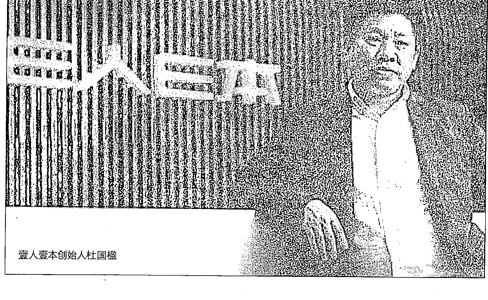

壹人壹本创始人杜国楹

> “我也完全可以破产，也可以赖掉，但我就是不服气。”

2001年，杜国楹赔光了第一次创业赚到的第一桶金，还背上了几千万元债，但他的手机24小时地开着，对债主说只要自己还活着，就一定会还钱。

## 涉嫌侵权的背背佳

“我的错误就是太相信杜国楹，什么都和他谈，使他窃取了我的商业秘密。”1999年年中的一天，河南省新乡市英姿实业有限公司老总毛相国一边情绪激动地说着，一边用拳头擂桌子。

事情起因是这样的，1993年，毛相国买下矫正青少年体型的英姿带专利权，就开始拓展这块市场，连续进行了两年的市场培育，到第三年才开始赚钱。

在英姿带走向全国的过程中，杜国楹成为该产品在天津地区的总经销商。此前，学中文出身的杜国楹曾做过两年的老师，每月薪酬150元，他不满足这个状态，选择了下海。据毛相国回忆，杜国楹的销售业绩还不错。

销售网络，只有一种管理机构，整个公司处于一种虚拟经营的状态。该公司先投放10万元播出第一条电视广告，接着委托代工厂制作1000条背背佳。广告播出一月之后，开始有了第一批回款。在天津市场启动以后，他们就请全国的经销商来天津感受一下该产品火爆的市场气氛。在激发经销商们的信心之后，杜国楹就开始出卖经销权，平均每家收取20万元左右，就这样当时一共收取了200万元。

从这年8月开始，当红童星关凌和“青春美少女组合”开始为背背佳做广告，其产品迅速在全国铺开。英姿带展开反击，针锋相对地请当时全国知名的健美教练马华充当了英姿带的广告代言人。

但在较量中，背背佳占了上风。“背背佳广告中的歌、舞、滑板的出现用以表现‘快乐健康’这一广告主题，‘青春美少女组’的舞姿让年轻的消费群体激动、欢愉。广告从开始到结束没有一句介绍背背佳功能的话，却能吸引观众。”当时为上海师范大学传播系教授的金定海评价。

背背佳攻城略地，据杜国楹自己称，背背佳第二年就占领了该领域80%的市场份额。英姿带则黯然失色。

> 《人类群星闪耀时刻》的作者斯蒂芬·茨威格曾写到：“历史一向如此，它从来不会顾虑任何人的感受，它用它的残酷告诉所有人：第一意味着胜利，第二则什么都不算。”

杜国楹赚了一个亿，少年得志的他开始膨胀起来，“我觉得我就是下一个李嘉诚。”

杜国楹随后的日子并不好过，愤怒的毛相国开始向法院起诉背背佳侵权，杜国楹则反诉。双方打起了连环套官司，一打数年。其间杜国楹又投资了三个项目，每次都是大投入，花费上千万元邀请当红明星代言，但结果是失利接踵而来，最终一败涂地，出现本文开头的一幕。

正是“一场愁梦酒醒时，斜阳却照深深院”。

## 凭好记星东山再起

“当时我长出了一口气。”杜国楹这样回忆自己在2003年9月还完所有负债时的感受。

转机来自半年前的背背佳集团董事副总经理蒋宇飞的一次打车之旅，当时他打车从常州到南京，途中听说苏州有一个叫“e百分”的英语学习机卖得很好，营销触觉也很敏锐的他立刻让司机调头，从南京赶往苏州。在此后三天，他仔细揣摩这款产品的营销，最后买了一台带回北京，拿给时任背背佳集团董事总经理的杜国楹看，一起研究其市场机会。

他们找来几个技术专家，发现类似的产品技术可以实现复制，并可进一步提升，就是说技术上没有太大的难度。而让杜国楹心动的是这个小小的电子产品所具有的巨大市场潜力，当时中国有2.6亿左右的英语学习者，且这个数字还在增加，有人预测中国的英语教育市场潜量不低于100亿元。而消费者群体稳定，许多父母期望儿女成龙成凤，舍得在这方面投资。

不过市场风险也是存在的，当时的电子词典市场在萎缩，品牌格局渐趋稳定，文曲星、好译通、记易宝等几家大品牌占据了主要的市场份额。此外，与电子词典相关的PDA市场在恒基伟业“手机、呼机、商务通一个都不能少”的广告狂飙之后也渐现颓势。

杜国楹对既有市场格局进行了深入的分析之后，发现当时电子辞典市场的竞争主要聚焦在“辞典版权”和“词汇量”上，也就是在解决英语单词的查询功能上打转转。他认为在英语学习中，最关键和最难的是记单词。而当时针对全国中学生进行的一项问卷调查结果验证了他的想法：86.3%的学生认为英语学习中最大的困难是“单词记不住”，91%的学生经常抱怨“英语学不好，主要是词汇量太少”。所有学英语的人都想扩大自己的单词记忆量。

杜国楹随即想明白了市场切入点就是词典的“记忆”功能，这也是消费者最需要的价值。因此新产品的定位应该是迅速提高学生对单词的记忆能力，从而提高词汇量。

> 美国著名经济学家熊彼特曾说过：“创新说到底不是一种智力活动，而是一种意志的体现。”

杜国楹的好记星词库与教材同步，其词库囊括小学、初中、高中、大学各年级的英语教材，并将各种版本教材分册、分课编排。还有一点，当时互联网已经普及开来，好记星提供了在线下载的功能，实现了词库和软件的同步及时更新。

为了和其他产品形成市场区隔，杜国楹说：“从上市的第一天，我们就告诉消费者，好记星不是复读机，不是电子辞典，也不是PDA，而是一个创新的英语学习工具，目前称之为‘英语掌上电脑’。”

2003年5月20日，杜国楹选择了济南作为好记星的试点市场启动，6月10日，好记星在济南市场盈利。杜国楹总结出应选择当地影响力最大的报纸媒体，要投放整版的证言广告，即通过使用者的语言来讲述该产品对他们记忆单词、迅速提高英语学习能力的帮助。

杜国楹接着选择武汉作为样板市场予以启动，好记星开始高度密集式的广告攻势，在当地总共投放了150个报纸整版广告。结果该市场月最高回款达到了400万元，曾有一天，上百个经销商的咨询电话打到了蒋宇飞的手机上。好记星后来还把广告做到了央视，并选择外籍演艺明星大山作为品牌代言人。

“茶烟一缕轻轻飏，搅动兰膏四座香。”武汉样板市场成功后，随即广告铺向全国。好记星日进斗金，杜国楹也在这一年9月还完了背背佳时期欠下的债务。

次年1月1日，杜国楹带着“好记星”、“背背佳”两个品牌入股橡果国际，成为这家公司的第三大股东，“那一刻我想这种合作可以让我好好做产品。”

杜国楹继续寻找和研究新产品，他喜欢通过逛商场来实现这一点，“能把老婆逛烦了。”到了国外，他也常常一

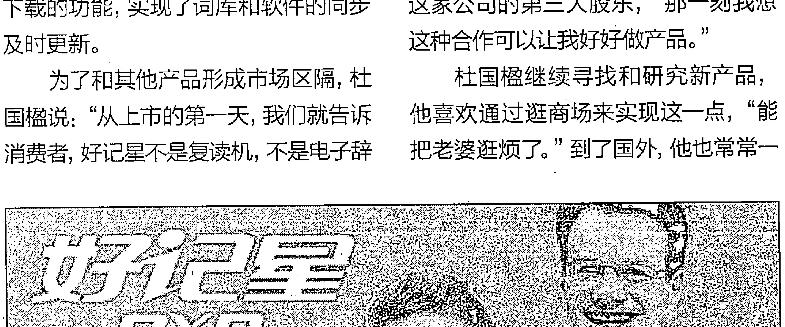

## 遭遇乔布斯

“我们一出门就遇上了大师傅。”杜国楹说。他说的“大师傅”就是乔布斯。

2005年左右，杜国楹开始考虑开发一个新产品，把记事本数字化，用一台类似于好记星那样的小设备代替纸和笔。据称，这个想法源自他自己的烦恼：他喜欢用纸质笔记本记事，多年来积累了好几箱，“舍不得扔，每次搬家都是一个负担。”

他的产品构想有些类似2001年盖茨提出的平板电脑(Tablet PC)的概念，可以实现数字化书写，“我们的内核始终是以书写为核心的。”

盖茨的平板电脑理念光开花不结果，没有在市场上形成突破。随后，乔布斯“接过”盖茨的枪，开始研发苹果的平板电脑，这就是iPad。但是，乔布斯的平板电脑研发理念和盖茨的不完全一样，不采用手写笔，乔布斯觉得手写笔完全是累赘，“上帝给人类的十根手指头就是最好的输入工具”，他认为多点触控将来才是计算机产业的未来，而且这个设想在苹果2007年推出的iPhone上得到了验证。

显然，杜国楹是不可能知道乔布斯的构想，他的壹人壹本公司继续走笔输入的模式。

第一款手写电子记事本开发出来之后，壹人壹本公司发现无线上网已成为一种潮流，而自己的这款产品不能上网，于是就雪藏起来，没有推向市场。随后市场上开始出现亚马逊的Kindle，壹人壹本又想增加电子书的功能。2009年6月，公司的模型产品面世，但其浏览器存在着一些问题，上网速度很慢。“找了微软亚洲研究院帮助我们解决这个问题。但是时间没赶上，那款的弱点就是上网慢。”杜国楹的合作伙伴蒋宇飞这样回忆。

2010年1月7日，历时数年、投资数千万研发出来的“E人E本”在天津首发，其名字为T1，售价3980元。天津是杜国楹事业兴起的地方，他想先在这里试水，等摸清了市场，再进军北京这样的大市场，希望“一个月打开”。

对于自己的产品，杜国楹信心满满，“我想全世界的厂商只有我们在做这一件事，模拟到跟纸笔的感觉体验最接近。”但结果是第一天一台产品都没有卖出去，杜感觉像“被泼了一身冰水”。失败的阴影再次笼罩在他的头顶。

三周以后，乔布斯在旧金山的芳草地艺术中心带来了一款改变IT产业格局的产品，这就是iPad。既然，乔布斯要动手切这块蛋糕，远在东方一隅的杜国楹还有什么戏？

> 杜国楹不这样认为，他自信自己比乔布斯更了解中国市场，他的目标消费者是这样一群人：生于1975年前，并不擅长使用电脑，其中，商务人士、政府公务员居多，他们对书写模式情有独钟，喜欢用笔录入的模式。他说：“我们知道这个人群的轮廓和特征，所以要求产品要傻瓜、傻瓜、再傻瓜，在交互上要傻瓜，使用上要简单。简单是产品的最高境界，我们还在不断摸索之中。”

2010年1月份，E人E本T1刚上市时反响平平，但随着iPad 4月份在全球上市，T1的销量猛增，最后卖出去3万台。这坚定了杜国楹发展平板电脑的信心。

> 法国作家维克多·雨果曾说过：“没有什么比时机成熟的理念更强大了。”

杜国楹认为，“iPad的定价是苹果历史上用得最彻底的一次。一个更高的硬件成本卖更低的价格，阻止了所有人的进入。”因此，E人E本不能往下走，只能往上攀。到了T3发布时，杜国楹把价格定为4980元。“我降不下来，一降下来就死。”

壹人壹本在广告里特意强调这样一句话：“大领导的小电脑”。杜国楹还花了2000多万元找葛优和冯小刚两人一起代言，“几乎是一分钱还价的余地都没有。斗争了半个月，公司觉得可以承受，就咬牙做了决定，签了他俩。”

> 面对苹果这个“神”一样的对手，杜国楹说要“弃其形、学其神”。“形千万别抄它，因为很难超越，谁仿，谁山寨。但是如何定义产品，把产品做简单，用户体验做好，这种精神是我们应该学习的。”

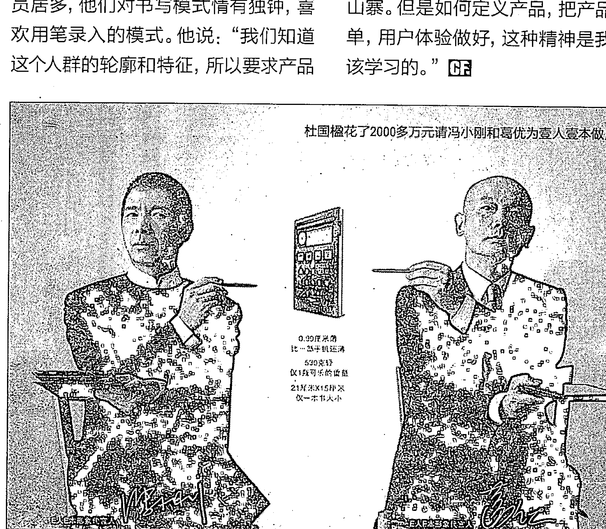

## 共享与自由 一个黑客的非正常死亡

1月11日，艾伦·施瓦茨以自杀的方式结束了自己年仅26岁的生命，他的死在互联网圈子里引起了震动，9000多人到白宫网站请愿。他到底是个什么样的人呢？

文 | 张书乐


《勇敢的心》中，当梅尔·吉布森饰演的华莱士在面对刽子手的刀斧斩首的那一瞬间，用仅剩的最后一口气大喊：“自由！”这一幕是戏说？还是真实再现？一直众说纷纭，而在1月11日，现实版《勇敢的心》却让我们感受到了实实在在的心灵冲击，年仅26岁的社交新闻网站Reddit联合创始人艾伦·施瓦茨（Aaron Swartz）在纽约的公寓里用一根皮带自杀，面对牢狱之灾的威胁与他心中憧憬的互联网的共享和自由，他选择了“尸谏”。

## 一个窃书贼的黑客史

作为一个顶级黑客，施瓦茨的罪状是因为偷书。当然，他也许是史上最成功的窃书贼。

2011年7月19日，施瓦茨因数字偷窃被捕，被指控从麻省理工学院（MIT）和科学杂志及学术论文存档机构（JSTOR）下载了大量学术论文，合计约有480万篇文档。

这不是施瓦茨第一次作案，早在2008年，他就盯上了美国法庭电子记录公共接入服务（PACER）。该服务提供联邦司法案件的存档，每篇文档收费10美分。一些社会活动家认为，这样的文档应免费提供给公众。施瓦茨随后编写了一个小程序，利用免费账号从该服务中下载了2000万页文档，占整个数据库的约20%，并开放给公众。

施瓦茨这一偷窃行为很快就被美国联邦政府发现，尽管政府很生气，但后果不严重，免予起诉的这一宽容，让施瓦茨的“贼胆”更壮。

胆壮归胆壮，吸取了上一次的教训后，施瓦茨盗窃JSTOR时变得非常小心谨慎。2011年1月6日，在他去“作案地点”——麻省理工学院地下室，取回放置在那里的笔记本电脑和用来储存下载数据的外接硬盘时，特意戴上了自行车头盔充当“面具”，并成功逃过了校警的拦截。

即使如此，联邦探员最终还是查出了他的身份，并对他进行了逮捕。这一次“惯犯”施瓦茨就没那么幸运了。尽管JSTOR无意起诉他，但联邦检察官却决不宽恕，2012年9月，施瓦茨被指控犯了13项黑客行为重罪，如果罪名成立，他将会面临最高35年的司法监禁和100万美元罚款。

对于早已在博客上公开自己患有抑郁症的施瓦茨而言，这是一件极其恐怖的事情，施瓦茨的家人在其自杀后就指责称，施瓦茨自杀，并非全是“个人原因”，还有一部分原因是美国司法体制“恫吓胁迫”和“指控过当”，他们认为是美国司法机构“逼迫施瓦茨走上了绝路”。

但施瓦茨的死并非毫无意义，就在他自杀前两天，JSTOR网站宣布，将把至少450万篇学术文章免费开放。而施瓦茨死后，麻省理工、美国司法部等相关机构的网站相继被黑。一大批黑客用这一“报复”来悼念自己心中的先行者。

一个黑客的非正常死亡，不是互联网共享和自由理想的终结，而是一个新的开始，人们开始思考，我们的网络要怎样才能让更多的人受益。

## 一个创业者的共享史

施瓦茨用一个黑客的身份终结了自己，也让许多人以为，他的形象应该是在黑暗的房间里，到处闪耀着屏幕点点光芒，眼镜片上折射着一行行高速滑过的0、1字符串的科技男。

然而，在4年前，施瓦茨还没有战斗在黑客第一线前，他有一个令人更加神往的称谓——成功的创业者。

作为公认的网络神童，他不可避免地在少年时代就展现出“神迹”。三岁就能玩电脑，不到十岁就写出程序解数独难题。由于家里早在互联网流行之前就已经接入网络，早慧的施瓦茨一开始就在头脑中深深植入了网络的免费共享精神。当一个小屁孩在家里大谈无基本成本的数字信息应该免费，并和父母就网络音乐、影视盗版问题大声争辩之时，施瓦茨的结局也就早已种下。

## 一个罗宾汉的抗争史

为了实现自己的共享之梦，在2001年，才14岁的施瓦茨就参与编写RSS 1.0，并因而在程式设计圈当中声名大噪。RSS是一种消息来源格式规范，用以发布经常更新数据的网站，例如博客文章、新闻、音频或视频的网站，读者只要下载RSS阅读器软件，就可以直接获得自己感兴趣的资讯和所订阅的文章。这一次程序编写，不仅仅为网民提供了一个快捷的信息共享渠道并成为大多数网站的标配，且也让施瓦茨下定了做一个‘互联网自由斗士’的决心。

因为RSS的成功，他很快进入到了互联网技术圈的核心领域，跟万维网之父蒂姆·伯纳斯·李爵士共同设计了排版语言Markdown，从而让网页内容的基础数据可以在不同的网络应用和项目中，得以共享并重复使用。尽管没有RSS那样为普通人所熟知，但其对互联网的共享之功却不亚于RSS。尽管这一系列创新，他收获的报酬几乎为零，但他和梦想走得更近了。可止步于当前不是施瓦茨的性格，他需要走得更远一点。他想到了自己在13岁的时候曾经用Wiki技术开发的在线信息百科全书，尽管之后这个网站被更优秀的dot.com所取代，但信息共享所能带来的巨大影响力却让施瓦茨有了新的创业冲动。为此，他从斯坦福大学辍学，创立Infogami软件公司，并用Wiki技术作为自己公司的核心架构。当时他就满怀野心地告诉论坛报：‘互联网的目的并不是广告，它是建立在开放标准和自由之上的。’

很快，新的机遇到来了，在投资商的支持下，2006年，Infogami与社交新闻网站Reddit合并，施瓦茨成为Reddit的三位创始人之一，这个网站的核心内容恰恰体现了他的共享原则，任何网民能够浏览并且可以提交互联网上的链接，或发布自己的原创或有关用户提交文本的帖子。其他的用户可对发布的链接进行高分或低分的投票，得分突出的链接会被放到首页。另外，用户可对发布的链接进行评论以及其他评论者，这样就形成了一个在线信息共享社区。很快，共享的号召让这个网站火了起来，并在当年底就被美国传媒巨头康泰纳仕集团收购。这时候的施瓦茨刚刚20岁。独特的共享理念让Reddit之后的发展如同高速列车一般，目前估值已经达4亿美元，就连奥巴马也忍不住在2012年来这儿开了个帖子‘随便问’，单篇就拿到了550万的PV。尽管在创业成就上，施瓦茨还不能和Facebook创始人马克扎克伯格、Twitter创始人多西等相提并论，但成功人士这个称谓早已实至名归地笼罩在了他的头上。

如果仅仅只是个‘偷书贼’，施瓦茨绝不会如此死后哀荣。在他的理念中，黑客行为只是一种技术手段，是推动互联网共享的一股非正常外力，真正要实现开放，他必须成为一个‘社会活动家’。恢复自由之身的施瓦茨很快运用自己求进同盟联合创始人的身份，全力推动互联网的共享和公平。他不断地通过这个组织向社会灌输一个信条：‘信息即权力。但是，与所有的权力一样，有人希望将这种权力据为己有。’他也在实践之，最大的战果就是去年对好莱坞支持的大名鼎鼎的禁止网络盗版法案(SOPA)进行抵制，并最终获得胜利。施瓦茨对抗的方法很简单——共享。通过共享对法案的抵制请愿，抗议开始通过互联网病毒式地传播。几十万人在请愿书上签名，这个在施瓦茨看来，只要有了法庭的允许，美国司法部长就能要求搜索引擎、ISP公司、在线广告以及支付公司停止与那些国外的侵犯知识产权的网站合作的霸王条款。也正因为如此，在此役中和维基百科、谷歌、Facebook等互联网大佬联手抗议的‘民间人士’施瓦茨被英国《卫报》冠以了‘数字时代的罗宾汉’称谓，也让他这个黑客有了完全不一样的光芒。尽管他最终为了自己的理想付出了生命的代价，但也唤醒了社会的觉醒。就在他死后，有近9000人在白宫网站请愿，要求奥巴马政府撤销对施瓦茨的指控。麻省理工学院校长赖夫也对他的死表达深切哀悼，称学校全体成员‘对这样一位极富前途的年轻人的去世感到极其悲痛’。一个黑客非正常死亡了，但他的共享和自由梦想却开始走向现实。悲剧的结局，或许是喜剧的开局……

## 改变世界的条形码

你是否用微信扫描商家的二维码以获取优惠？在二维码无处不在的今天，你是否知道它的前身条形码的历史呢？

文|TechKoala


### 条形码的由来

三十多年前的一天，一位名叫道森的购物者走进马什超市，购买了一包箭牌口香糖，扫扫条形码然后付钱。这在今天稀疏平常的事，当时却是标志性事件——由此，条形码迎来了它的里程碑，从此走到你我的眼前。

说到条形码，就不得不说它的发明者——伍德蓝德。他出生于新泽西州，从小便对技术发明具有浓厚的兴趣，具备非凡的动手能力。他生长在二战前后，战争期间，他不得不中断学业，参与研发原子弹的曼哈顿工程，这个看似八竿子打不着边的事，却使他对发明愈发迷恋。

二战之后，美国经济快速发展，规模宏大的超市面临着一个巨大的问题，他们无法精确掌握库存情况，唯一的办法是手工清理，但耗时又费力。于是他们向德雷赛尔大学求助，恰巧伍德蓝德得知，于是，伍德蓝德开始与自己的朋友苏沃一起研究这个解决方案。

蓝德本来是出于商业目的，但随着研究的深入，这项工作彻底改变了他的人生。类似历史上的诸多发明，开始时，蓝德遇到了许多次失败，但他没有放弃。他毅然辍学全心投入，坚信成功不远，但总差那么一层窗户纸。后来，他去了迈阿密的住所放松，那里有优美的居住环境、安静的思考空间，他期待能有灵感迸发。

老天不负有心人。有一天，他在沙滩坐定，苦苦思索：“如何才能给每件物品分类呢？编号？对！莫尔斯电码？可是这样太复杂了，一般人也没办法分辨。”想到此，他开始无聊地在沙滩上用手画沙子，一条一条，突然，一个神奇的图案出现在蓝德脑海——如果用粗细、间距不同的竖线构成图案，那就可以实现对商品编码。就这样，条码的原型在沙滩上诞生了。等到出现文章开头的一幕时，已经过去了三十多年，可喜的是，我们的主人公是一位有耐心的人。

### 条形码的标准与应用

与现在的条形码不同，蓝德发明的第一条条形码不是由线条构成，而是一组同心圆，通过光电扫描器读取。

它形如箭靶，美国人称其为“公牛眼”。遗憾的是，以美国当时的工艺和经济水平，他们还没有能力印制出这种编码。

后来，伍德蓝德加入了IBM公司，并把自己的专利卖给了IBM。然而，伟大的成果却并非属于IBM，几经转手，机遇来到了RCA公司。直到条形码大展宏图时，IBM公司里的人才知道：“哦，原来发明条形码的人就在我们公司。”

我们目前所知的第一个商用条形码出现于1966年，但人们很快就意识到应该为其制定出一个行业标准。

两年后的夏天，应国家食物连锁协会要求，Logicon公司开发出了食品工业统一码（UGPIC）。随后，美国统一编码协会建立了UPC码系统，并且实现了该码制的标准化。UPC码首先在杂货零售业中试用，俄亥俄州的Marsh超级市场安装了由NCR（IBM公司的前身）制造的第一台UPC扫描器，而第一个被收银员扫描的便是文章开头所说的标价69美分的十片装箭牌口香糖。

直到现在，我们都不可否认的是，正是零售业的成功应用才促进了条形码技术的发展。

目前，全球每天大约要扫描80亿次条形码。而普华永道公司的一项研究报告表明，条形码每年仅在超市和大众零售领域就能为客户、零售商和制造商节约300亿美元的成本。令人感到遗憾的是，伍德蓝德的朋友，条形码联合发明人苏沃并没有亲眼看到条形码的商业化应用，他在自己38岁的时候（1962年）英年早逝。而伍德蓝德则在1992年被当时的美国总统布什授予了国家科技奖章。

令人遗憾的是，前不久，伍德蓝德也不幸地告别了人世。据《纽约时代》报道，他于美国当地时间2012年12月9日在自己新泽西的家中逝世，享年91岁。蓝德的女儿苏珊评价父亲说：“他参与了整个系统的设计，从使用者的站立方式、激光扫描仪高度到如何保护人们的眼睛不受激光刺激，他是一个绝对的完美主义者。”

今天，条形码已经占据我们生活的每个角落，从超市购买的食品到手中握住的杂志，我们依靠条形码管理我们的生活，条形码技术也在不断进步。

## 条形码的未来

其实，如今风生水起的二维码也属于条形码，作为后起之秀，它比它的前辈更进一步。自从它出现以来，得到了人们的广泛关注，发展十分迅速。

二维条形码最早发明于日本，它是用某种特定的几何图形按一定规律在平面（二维方向上）分布的黑白相间的图形记录数据符号信息的，在代码编制上巧妙地利用构成计算机内部逻辑基础的“0”、“1”比特流的概念，使用若干个与二进制相对应的几何形体来表示文字数值信息，通过图像输入设备或光电扫描设备自动识读以实现信息自动处理。它具有条形码技术的一些共性：每种码制有其特定的字符集；每个字符占有一定的宽度；具有一定的校验功能等。同时还具有对不同行的信息自动识别功能、处理图形旋转变化等特点。

一维条形码虽然提高了资料收集与资料处理的速度，但由于受到资料容量的限制，一维条形码仅能标识商品，而不能描述商品，因此相当依赖电脑网络和资料库。在没有资料库或不便连网的地方，一维条形码很难派上用场。此外一维条形码有一个明显的缺点，即垂直方向不携带资料，故资料密度偏低。当初这样设计有二个目的：(1) 为了保证局部损坏的条形码仍可正确辨识；(2) 使扫描容易完成。

要提高资料密度，又要在一个固定面积上印出所需资料，可用二种方法来解决：(1) 在一维条形码的基础上向二维条形码方向扩展；(2) 利用图像识别原理，采用新的几何形体和结构设计出二维条形码。前者发展出堆叠式 (Stacked) 二维条形码，后者则有矩阵式 (Matrix) 二维条形码之发展，构成现今二维条形码的两大类型。

堆叠式二维条形码的编码原理是建立在一维条形码的基础上，将一维条形码的高度变窄，再依需要堆成多行，其在编码设计、检查原理、识读方式等方面都继承了一维条形码的特点，但由于行数增加，对行的辨别、解码算法及软件则与一维条形码有所不同。较具代表性的堆叠式二维条形码有PDF417、Code16K、Supercode、Code49等。

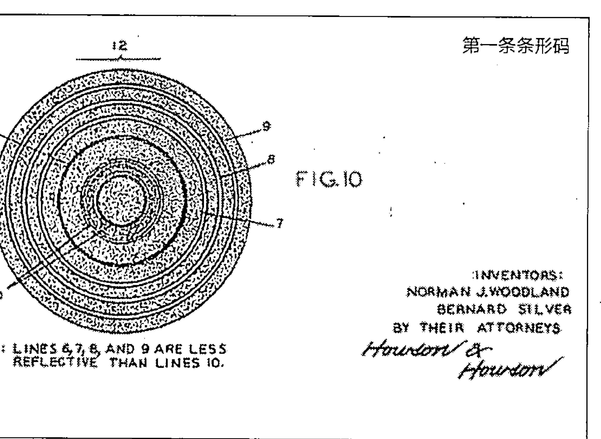

矩阵式二维条形码是以矩阵的形式组成，在矩阵相应元素位置上，用点的出现表示二进制的“1”，不出现表示二进制的“0”，点的排列组合确定了矩阵码所代表的意义。其中点可以是方点、圆点或其他形状的点。矩阵码是建立在电脑图像处理技术、组合编码原理等基础上的图形符号自动辨识的码制，已较不适合用“条形码”称之。具有代表性的矩阵式二维条形码有Datamatrix、Maxicode、Vericode、Softstrip、Code1、Philips Dot Code等。

二维条形码的新技术在1980年代晚期逐渐被重视，在“资料储存量大”、“资讯随着产品走”、“可以传真影印”、“错误纠正能力高”等特性下，二维条形码在1990年代初期已逐渐被使用。现在，几乎所有的社交软件都具备扫一扫的功能，对着抽象的图案一扫，迎来一个多彩的世界已经成为许多人的习惯。

> 马化腾在去年九月开幕的互联网大会的演讲中便说到：“从微信强化扫二维码的功能之后，我们希望把这个行为定义成更加普及，老百姓一看到码就去扫的概念。我们前几天还在网上看到一个新的名词，就是扫墓，看到墓碑有那个二维码，一扫描就看到这个墓碑的主人过去的生平介绍等等，这些都是非常典型的应用。”

或许，墓碑的例子有些夸张，但是，你不能否认，条形码越来越贴近我们的生活，不再只是局限于购物。也许未来，我们的一切都涵盖在那小小的方寸之间。

## 贪吃蛇必须死

蛇年到了，你是否想起了那个经典的游戏——贪吃蛇？作为功能手机时代最畅销的游戏，贪吃蛇一度风靡全球。

文|张书乐

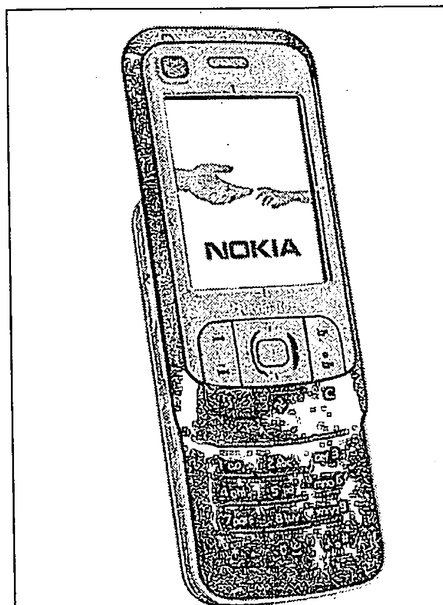

头好。在那个手机的主要功能仅仅是通信的时代，贪吃蛇可以说是唯一一个能够让大众娱乐起来的应用。

尽管它的玩法简单到了极限，玩家使用方向键操控一条长长的蛇不断吞下豆子，同时蛇身随着吞下的豆子不断变长，当蛇头撞到蛇身或障碍时游戏结束。这是一个让人神经高度紧张的游戏，一旦你稍有松懈，就极可能让你的小蛇咬伤自己或碰壁，但如果你一直全神贯注地去游戏，其结果也最终会因为吃太饱而撑满当时还很小的手机屏幕。

之后的贪吃蛇，随着手机的变化而变化，从黑白屏幕走向彩屏，从2D游戏变成3D。比如在1998年，诺基亚开发了贪吃蛇II，预装于诺基亚7110。除此之外，诺基亚在2000年发行的诺基亚9200中，预置了贪吃蛇EX，这是一款具有良好画质并且支持蓝牙与红外线对战的游戏，让手机游戏走出了单机的限制。

即使是在诺基亚已经从全球手机老大的位置跌落的今天，贪吃蛇也依然没有谢幕，安卓版本的贪吃蛇依然是一个热门下载，而在去年8月，当Kylinworks宣布即将推出一款《40+ Snakes》的游戏上架iOS之时，更是让无数蛇迷为之动容。

在游戏的世界里，打通关是一个游戏高手的标志，然而有永远无法终结的游戏，如俄罗斯方块，也就必然有任何高手都一定会Game Over的游戏，这其中的经典当数贪吃蛇（Snake）。在上个世纪90年代末，随着诺基亚手机旋风席卷全球的贪吃蛇就是一款必须死的游戏，谁让这条蛇贪吃呢！

但这款永远只有Game Over一个结局的小游戏，却可能是世界上拥有最多玩家的游戏。

### 席卷全球的蛇风暴

1997年，第一款贪吃蛇游戏预装于1997年11月10日发布的诺基亚6110中。当时这款手机还同时预装了Logic与Memory两款游戏。

毫无疑问，我们已经不记得后两款游戏到底是什么内容，但贪吃蛇怎么玩，却是绝大多数诺基亚用户的心好。

贪吃蛇和诺基亚手机几乎是相辅相成的风靡，在很多人看来，选择诺基亚手机的原因中，其一是它耐摔，其二是因为里面有贪吃蛇。

诺基亚估计，迄今为止，一共有大约3.5亿手机预装了贪吃蛇游戏推向市场，这也使它成为游戏史上传播最广的作品之一。当然，这仅仅只是诺基亚一家的估计，还有无数山寨版手机上也将贪吃蛇作为保留游戏。

也因此，贪吃蛇也被业内视为第一款真正意义上的手机游戏。

然而它的诞生，或许只能算一时兴起。作为贪吃蛇的开发者，诺基亚用户互动软件开发部门的设计工程师Taneli Armanto回忆到：“这其实是一个甜蜜的误会。我的兴趣爱好是传统的桌面游戏，并不是电子游戏。所以当诺基亚6110产品项目组找我为手机开发一款小游戏的时候，我不禁怀疑他们是不是弄错了。不过当时我也非常高兴能接受这个挑战。”

结果这个误会成为了今天繁荣的手机游戏的起点，也成为了诺基亚手机的一个标志。

### 贪吃蛇快满40了

> > 正如Taneli Armanto在获得移动娱乐论坛(MEF) 颁发的移动娱乐论坛特别认同奖之后所说：“1997年，我们就计划给手机用户带来娱乐的体验，但是从未想象它会成为一款经典的移动游戏。贪吃蛇游戏的成功向人们展示了手机上也可以创作好游戏。”

当时的人们可能无法想象手机游戏的存在。但贪吃蛇游戏证明了手机不仅能够给人们带来移动通话服务，更可以为人们带来更加丰富多彩的娱乐体验。它与手机短信一起，在移动电话对社会变迁的影响中发挥了重大作用。你能够想象没有它们的现代生活吗？

对于我们绝大多数人来说，贪吃蛇是手机游戏的起点，也是移动娱乐的开端，然而很少有人知道，这个游戏其实和吃豆人之类的经典游戏一样，是最古老的第一代电子游戏精品。

有人就如此评价到,幸亏始祖版的贪吃蛇还不会吃豆子,否则,也许后世就没有吃豆人这个游戏了,而是合二为一成为了吃豆蛇。

始祖版的贪吃蛇并不是叫Snake, 而是与蛇这个词汇八竿子打不着的Blockade (障碍物、封锁线), 由一位名叫Gremlin Industries的程序员设计。1976年, 当Gremlin公司推出了这款经典街机游戏, 整个世界也如贪吃蛇出现在诺基亚那会一样风魔了。

始祖贪吃蛇其实比后来手机上的版本要先进, 尽管大了20岁, 但这是一款真正的双打游戏。游戏中, 两名玩家分别控制一个角色在屏幕上移动, 所经之处砌起围栏。角色只能向左、右方向90度转弯, 游戏目标保证让对方先撞上屏幕或围栏。而这个角色还有后世贪吃蛇所没有的特异功能, 那就是它不用吃豆豆, 也能每走两步就长大一点, 相同之处在于, 比的还是谁后完蛋。请注意, 在这个版本里, 游戏角色是人而非蛇。

有人就如此评价到, 幸亏始祖版的贪吃蛇还不会吃豆子, 否则, 也许后世就没有吃豆人这个游戏了, 而是合二为一成为了吃豆蛇。可不管怎么样, 这家公司专门从事投币式街机的研制和生产的Gremlin创造了贪吃蛇, 却没有如同时代其他创造经典游戏的公司那样长盛不衰。

1984年, 这家公司倒闭, 不过他们的游戏依然生存下来, 之后又相继登陆了Atari 2600、TRS-80、苹果2等早期游戏机、计算机。由于这款游戏有多个拥有人, 所以几乎所有终端上都有自己的版本。

也许是因为没有版权问题, 所以诺基亚的“拿来主义”很成功, 经过改造之后的贪吃蛇也在它21岁的时候, 再次以极其接近原始状态的面目焕发生机。要知道, 和它同龄的那些游戏, 大多已经作古, 少数还活跃于游戏世界里的角色如吃豆人、超级玛丽等, 也早已做过无数次整形外科手术了。

## 贪吃蛇也有世界观

衔尾蛇可以视作是贪吃蛇的原型。这个自古代流传, 经常出现于阿兹特克文明、中东地区及美洲原住民, 以及其他古老地区的古老神话之中的蛇, 其形象大多为一条蛇正在吞食自己的尾巴, 结果形成了一个圆环。

在柏拉图看来, 衔尾蛇为一头处于自我吞食状态的宇宙始祖生物, 它是不死之身, 并拥有完美的生物结构。或许正是这个存在于全球大多数古老神话中的影响, 贪吃蛇的粉丝们才会在第一次接触它的时候, 就莫名地有一种亲切感。

而贪吃蛇的最高境界也是让自己咬上自己的尾巴。在贪吃蛇风靡的时代, 很多人发明了无数种贪吃蛇攻略, 想要获得最晚死的荣耀, 而最简单有效的方法则是让这条蛇按照“Z字形”路线前进, 如果顺利, 就有可能在占满屏幕时最终咬着自己的尾巴。

但大多数人都有同样的感慨, 贪吃蛇尽管简单, 但却鲜有拿下最高分的, 以诺基亚手机上初版贪吃蛇为例, 在一块20×11的长方形区域驰骋, 按照分数计算公式总分=屏幕点数(212)*关数(1~9)+100, 贪吃蛇第一关的最高分是312, 而第九关的最高分是2008。但即使是游戏设计师Taneli Armanto本人, 也只拿到过1125分。

为了实现贪吃蛇世界观里的最终梦想, 无数的人进行了挑战, 甚至在芬兰, 从1999年开始就举办贪吃蛇大赛, 想要在全球找到最后死的贪吃蛇玩家, 据说也还没有发现实现最高分的高手。其实也正因为要达成最后的Game Over难于上青天, 才让贪吃蛇这款简单却有世界观的游戏能够耐玩如此之久而不衰。

贪吃蛇甚至被它的喜好者从虚拟搬到了现实中, 2010年, 诺基亚在哥伦比亚举办了一次快闪活动, 他们在论坛里招募网友, 而乐意来参加活动的出奇的多, 因为这个活动是要爽一把真人版贪吃蛇。在活动中, 扮演食物的网友多得让贪吃蛇都有点吞不下了, 负责引领前进方向的贪吃蛇头部的几个人经过简单的培训。同其他快闪行动一样, 在贪吃蛇撞到自己身体导致Game Over之后, 这些网友解散回家。

这样的快闪往复循环了许多次, 就算是诺基亚收工了, 网友们也还是乐此不疲地继续找地方去快闪, 理由很简单, 这个游戏是挚爱, 能够有机会在现实中玩上一把, 那可是千载难逢的好机会。

作为全球发行量最大的游戏, 贪吃蛇没有如今移动游戏那么炫目, 但却长盛不衰, 并深得玩家所喜爱, 它的成功秘诀其实也很简单——简单。

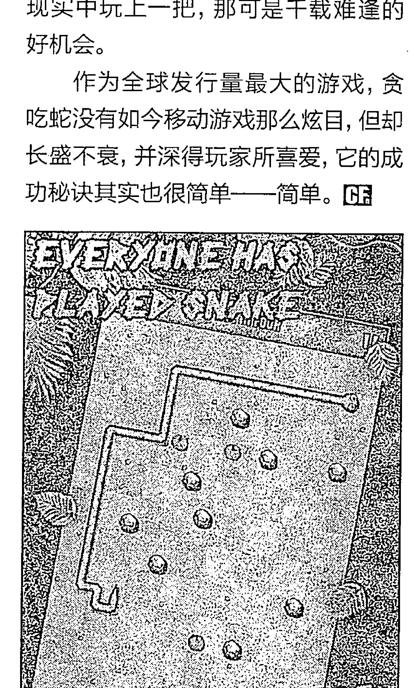

## 陆兆禧 从站盘子干起的CEO

3月11日，阿里巴巴集团宣布陆兆禧接替马云任CEO，不过，你可知这个互联网巨头的CEO最开始只是酒店的服务生，并且在阿里巴巴是公认的“救火队长”。
文 | 张书乐


从一个服务生到一个国内顶级上市公司CEO，有多远的距离？最新的励志大片显示是20年。这就是陆兆禧，1969年出生的他，将在2013年5月10日正式接替马云成为阿里巴巴集团CEO，但或许对陆兆禧来说，从一个“门童”到一个“掌门”的这20年间，他的角色并没有变化，他或许还将扮演那个活跃在幕后的“服务生”。

### 安静和火爆的“投机者”

对于外界来说，这个阿里巴巴新CEO陆兆禧最大的新闻价值是他的励志效果，而对于他身边的人来说，陆兆禧是一个极具个性的人。

从广州大学毕业后，陆兆禧的第一份工作是在一家四星级酒店当服务生。对于那个时代真正可以叫做天之骄子的大学生来说，这是一个很卑微的工作，但对于学酒店管理专业的他来说，专业对口就好。陆兆禧说：“大学毕业后在酒店端盘子，有时心里也不是个滋味。但转念想想，人生也和那条回家的小路有上下坡一样吧，总会经过顺流逆流，起起伏伏都是免不了的，要以顺流不骄、逆流不颓的心态去对待。年轻的时候多吃点苦没什么不好，挺一挺就过去了。”

短短几年时间，陆兆禧拾阶而上，大堂经理、客房经理、餐厅经理一个个纳入囊中，在当时的同行看来，他的前途已经让人十分羡慕，可陆兆禧却因为看不惯外籍老板对中国员工高人一等的姿态挺身而出，“辞职前我大骂了他一顿，让他应该先学习怎么尊重人。”

离职时，正是中国互联网刚刚兴起的时代。1997年，陆兆禧和几个朋友合伙成立了一家网络通讯公司，主要经营互联网长途电话业务，一下子从酒店管理纵身跳入了互联网这个八竿子打不着的新行业，可他却干得有滋有味，并击败了许多科班出身的对手，从零做起，重新学习，逐渐在圈子里做出了些名气。

“去和马云见见面。”一个在刚刚创办的阿里巴巴上班的朋友和在创业打拼中的陆兆禧说了这句话，改变了他的人生轨迹。他坦言，当时连阿里巴巴是干什么的都不太明白，但是跟马云一番谈话之后，“觉得马云这个人很不简单，十分投机。”

投机，这个词汇是典型的多义词，在陆兆禧看来，加盟阿里巴巴是人生的投契而不是命运的赌博。陆兆禧的内部员工号是129，即第129位加入阿里巴巴的员工。这让其成为了阿里巴巴创业的元老。

2000年10月，加入阿里巴巴不久的他被投机的马云派到深圳出任华南大区经理，主做B2B销售业务，据说，这经理职位是个光杆司令。

之后的互联网，虽然遭遇到了寒冬，阿里巴巴所奉行的电子商务策略却成为了过冬的利器，陆兆禧的职场生涯也可以用一帆风顺来叙述。2004年12月至2008年3月任阿里巴巴集团副总裁兼任支付宝总裁，陆兆禧硬是带着8个人，一手创建了支付宝。很快，支付宝成为中国第三方支付平台巨头，占有中国市场的半壁江山，市场份额超过50%。

2011年2月21日出任阿里巴巴执行总裁同时继续担任淘宝网CEO兼总裁及阿里巴巴集团执行副总裁，任期内，淘宝成交总额攀升了8倍。直到现在坐上阿里巴巴CEO宝座，陆兆禧完成了其人生的华丽转身，而细细品味不难发现，这一切，其实完全是一个陆兆禧酒店职场生涯的豪华版重现。

在陆兆禧上位后，凤凰科技做了关于“您是否看好陆兆禧出任CEO后阿里的发展”的调查，56.3%的网友表示“不看好，仍有很多棘手问题需解决”。而在阿里内部，却完全是一边倒的认同，理由很简单，外界不熟悉陆兆禧，因为他一直被马云的光芒所掩盖，然而对于阿里巴巴的员工来说，老陆是一个靠山一样的存在，而且还是一个沉寂期的活火山。

有文章称他是一个安静的执行官，可就如他当年怒斥老外那样，他的脾气并不安静，也有爆发的时候。有圈内传说，在当年接受一家媒体采访谈及淘宝盈利问题时，陆兆禧曾拍着桌子怒吼着发誓，“我骗你，老子不姓陆！”

### 执着且慷慨的“铁木真”

其实在朋友眼中，陆兆禧是一个很特立独行的人，不仅仅是安静中透着火爆，而且还有股子执着。

> 《申江服务导报》2009年在一篇报道中称：“人家打高尔夫多是为了交际，他是真的热爱，读中欧工商管理学院时，同学聚在一起到云南旅游，到了丽江，他一个人背着包去打高尔夫，也不管人家怎么想。”

对于陆兆禧来说，这种在生活中对于高尔夫的狂热和执着也体现在工作之中。

> 陆兆禧极度勤奋，每天要处理300多封邮件，有时马云劝他休息一下，他不肯。2008年冬天，时任淘宝网总裁的陆兆禧身体透支得很厉害，朋友劝他少花点时间工作，他说：“我不图名，钱嘛，也够花了，剩下的就是责任和人情了，为了这个，我可以连身体也不要的。”也正因为如此，在接受《金融时报》采访时，马云就说：“陆兆禧把90%的时间都花在了淘宝上，我没有理由认为我比他更懂淘宝。”

在阿里巴巴社交网站“来往”上面，陆兆禧为自己选择的头像是手扶腮帮，隐蔽在黑暗中呈沉思状。而一旦思考成熟，他就会立刻出手。2008年陆兆禧任还不赚钱的淘宝网总裁，正是中国电商大发展的前夜，如果错过了这班船，也就没有今天的阿里巴巴。而他谋定而后动，启动大淘宝战略，推出种种举措提高消费者体验，同时实行开放战略，联合商家、第三方合作商、物流等电子商务产业链上各个方面的伙伴，更好地服务消费者，并推出B2C淘宝商城。在他的领导下，淘宝网巩固了中国网络零售领导者的地位。

这或许是自己选择“铁木真”作为自己在阿里巴巴集团里的绰号的来由。陆兆禧曾在接受媒体采访时透露。阿里巴巴集团高层素有起武侠小说里名字的惯例，而《射雕英雄传》中的铁木真素来以“深沉而大略，用兵如神”著称。

> 根据阿里巴巴集团退市前的一份年报披露，在其2011年B2B公司高管年薪、花红及股票套现之中，陆兆禧以4757万元位居第一。可这个有钱的阔佬对自己却非常严苛，一直打单身的陆兆禧很喜欢淘宝，不仅仅是因为业务的需要，还因为生活上的需要。2012年4月以4757.4万元合计收入居上市公司高管年薪之最的他自诩：“常在淘宝上买一打5元钱一双的袜子，慢慢穿。衬衣都是没有品牌的，但一定要整洁，我每个星期自己烫衣服。”

> 但尽管对自己很抠门，对于员工，陆兆禧却决不是周扒皮。有一种说法是，马云在阿里集团的股份只有7%左右，大部分都分给了员工。在给员工分股权的事情上，阿里集团另一位大股东孙正义堪称“铁公鸡，一毛不拔”，所以，每次分配股权给员工，都是马云和管理层自己掏腰包散发。当然，穿5元一双袜子的陆兆禧每次都不吝啬，都会拿出很多自己的股份分给员工。

这成就了陆兆禧和员工之间的情感，即使是“铁木真”也是有感情的，就如射雕中和郭靖惺惺相惜那样，而这些执着和慷慨，也让员工们亲切地将他称为老陆。

### 年轻的老“救火员”

在平均年龄28岁的阿里巴巴，44岁的他确实老了点，老到每次阿里巴巴出状况，马云一定让老陆去当救火队长。

> 2011年2月，因阿里巴巴B2B部分供应商欺诈丑闻，CEO卫哲引咎辞职，陆兆禧成了救市的第一人选，很快铁木真的风范立刻呈现，别看他送股份那么大方，但对害群之马却绝不手软。

> 比起马云对卫哲“挥泪斩马谡”这样的大招，陆兆禧加大了淘宝打假的力度，运用狠招反腐，但这些招数却处处对准了自己的老同僚、老合作伙伴的切身利益，比马云的大招更加伤人，也容易被反噬。可陆兆禧没有迟疑，他在整顿完内务后，又一口气成功完成B2B由香港退市的任务，使股价长期低迷的阿里巴巴平稳着陆，未引起股市和投资人动荡。火灭了，消防队长又有了新任务。

2012年9月，在谷歌公开施压封杀阿里的手机操作系统云OS之后，作为首席数据官的陆兆禧转战新火场。移动互联网是阿里巴巴最大也是最新的蓝海，必须要重新规划、理清云OS的发展规划，避免与安卓的冲突，否则失去的就不仅仅是一个手机操作系统，不仅仅是和宏碁这样的手机厂商的合作，而是阿里巴巴在整个移动互联网的入口，毕竟占据智能机半数以上操作系统的安卓一旦认真起来，入口将被立刻减半。

来之能战、战之能胜，陆兆禧不负众望，迅速淡化了此事的影响，谷歌没有继续敲打阿里巴巴，火苗被熄灭于萌芽。这一连串的救火成绩，也成为陆兆禧这个IT“外行”成功地从其他几个IT“内行”中胜出并荣任掌门人的关键筹码，而且他也依靠“救火队”的角色扮演，无意中成为在几乎所有阿里巴巴现有业务都做过负责人的“知情人”。

当然成为接班人，外界还有一个猜测，那就是陆兆禧和马云足够互补，他能够读懂马云并知道如何与他共事。如果说马云是一个外扩型的领导者，那陆兆禧就是一个内敛型的实践者，他甚至给自己贴上了“内向安静”的标签。在创业和守成的转型过程中，阿里巴巴需要从外扩到内敛的平稳转变，而这最终成就了陆兆禧，也是一向天马行空、不按常理出牌的马云，为阿里巴巴未来发展打出的一张情理之中的安全牌。

> 陆兆禧曾经说过：“我们正处于快速变化的时代，压力和挑战并存，但我们必须牢记客户第一的出发点，延续‘平凡人做非凡事’的一贯风格，以开放、透明原则，向全社会分享阿里巴巴集团的资源。”

## 戈登·摩尔：IT最老兵

成功并不等于止步不前，1974年登上总裁和首席执行官宝座的摩尔给员工们提出了不亚于摩尔定律的口号——改变是我们终身的热爱……

文 | 张书乐


摩尔定律的发明人戈登·摩尔

你可能没听说过戈登·摩尔这个名字，但你可能听说过摩尔定律——当价格不变时，集成电路上可容纳的晶体管数目，约每隔18个月便会增加一倍，性能也将提升一倍。或许这样你也未必明白，那么换一个说法，你一定会觉得感同身受，即每一美元所能买到的电脑性能，将每隔18个月翻两倍以上。

如果这样都没明白，那你还真不是一个电脑爱好者了……

### 一个化学家的IT世界

如果不做IT行业，摩尔可能会成为一个化学家。
1929年1月3日，摩尔出生在加州旧金山的佩斯卡迪诺。作为一个不认真读书的坏学生，摩尔每天都在搞运动、搞发明，但成绩却没有因为“副业”而造成影响，竟然让他成功地考上了加州伯克利分校的化学专业，学士学位、博士学位一路下来，都顺利到手。按理，他应该去做化学家了，可出人意料的是，他却做起了时髦的半导体工作。

倒不算不务正业，在诺贝尔奖获得者、晶体管的合作发明者威廉·肖克利的邀请下，摩尔加盟了肖克利半导体公司，用自己的化学所长来研究如何让半导体更加“导电”，就是成果差点，摩尔管理的实验室，完全就是一个不出产品光吃工资的“废柴”。
不过，这个“废柴”日子没做多久，罗伯特·诺伊斯、布兰克、拉斯特等七个人就和摩尔一起组成了八大金刚，决定不和肖克利玩，不想总是笼罩在诺贝尔奖得主的阴影下，他们要自己组建公司玩转半导体，这下把肖克利气得够呛，怒不可遏地骂他们是“八叛逆”。
“八叛逆”出逃的日子也不是很好过，1957年的很长时间，没有一点知名度又被伯乐肖克利“封杀”的八个人，只做了一件事，手拿《华尔街日报》，按纽约股票栏目挨家挨户寻找合作伙伴，可这样上门去找风投，谁敢信任呢？果不其然，找了35家，有36家拒绝。有读者会问，咋多出了一家呢？其实多出的这家就是“八叛逆”自己，他们也开始对自己有点失去信心了。
不过真正的第36家公司却没让他们失望，纽约的仙童摄影器材公司老板拿出了3600美元给他们，让“八叛逆”创业，看来，八叛逆和36有缘，他们自己的仙童半导体公司开张了。
变身八仙的八叛逆立刻有了过海的神通，他们商议后的第一件事就是改变做半导体的原料，晶体管太大了，他们要用硅。说白了，摩尔其实还是在用化学家的思考在玩IT。
从此，硅谷的神话从这里开始传扬……

### 加盟英特尔的“仙童”

仙童是硅谷的起点，但它却没有看到硅谷的兴盛。
从IBM给仙童的第一张订单开始，硅就逐步成为了半导体的主要材料。此后，IT发生了天翻地覆的变化。其中主要发展应归功于将晶体管、电阻器和其他元件以越来越小的形式压缩到硅晶圆中。
八仙之一的摩尔就此成为了IT产业的规划设计师，甚至对他们恨之入骨的肖克利也在对他们的称谓升级到2.0版，从八叛逆变为八个天才的叛逆。
用上了硅的仙童半导体公司很快进入了它的黄金时期。到1967年，公司营业额已接近2亿美元，在当时可以说是天文数字。仙童就是硅谷, 硅谷其实就是仙童, 不过摩尔并没有满足, 他要指点江山, 因为1965年4月19日他在《电子》杂志上发表了摩尔定律并没有得到很好的执行, 且仙童公司一夜暴富, 让八仙中的好几个过了海以后, 自己带着一辈子花不完的钱, 去做富家翁或另行创业。

摩尔需要一个更能展示自己才华的舞台, 特别是他一米八的大个子, 在仙童已经碰到了天花板。1968年, 摩尔和诺伊斯两个仙童再次创业, 别看这次八仙就剩俩了, 但公司很快就拉杆子起来了, 最初两人一合计, 起了个名字叫“摩尔-诺伊斯电子公司”。但是英文里这个词汇和吵吵嚷嚷的发音非常相似, 摩尔和诺伊斯一商量, 改了吧, 既然两个都是“智慧”(Intelligence) 头脑, 做的又是“集成电子”(Integrated Electronics), 就用两者相似的头部“英特尔”(Intel)来替换吧。

一个伟大的公司就此开始了它的第一步, 而摩尔定律也可以毫无悬念地自由发挥。1969年, 英特尔推出自己的第一批产品双极处理64位存储器芯片, 代号为3101。第二年, 又推出第一个大容量(256位)金属氧化物半导体存储器1101。1972年, 又乘胜推出第一个容量为1KB的动态随机存储器1103。每一步都严格按照摩尔定律在运行, 摩尔的预言有了一个光明的未来, 同时, 硅处理器也彻底将磁芯处理器给杀得干干净净, 个人电脑革命呼之欲出。

成功并不等于止步不前, 1974年登上总裁和首席执行官宝座的摩尔给员工们提出了不亚于摩尔定律的口号——改变是我们终身的热爱。

但冲刺的路上难免有荆棘, 摩尔也不是圣人, 在不断的改变中, 英特尔接连失误。1975年摩尔曾开发过1500万美元的手表, 希望把这款手表打造成具有表、计算机和天气预报功能的设备, 配置有硬盘。摩尔对这款手表给予了太多厚望, 简直就是时下智能手机的翻版, 只不过太穿越了, 智能手表在微电子还不完善的时代, 只是一个天价的失败品。

甚至是硅处理器这块摩尔的自留地也开始遭遇危机。1981年, 英特尔才推出8087芯片, 还想好好地开拓下市场, 松下公司却用更低廉的价格和更高的可靠性推出了3200芯片, 英特尔迅速落败, 不仅美国市场没了, 自身芯片也从28美元跌到了6美元的白菜价, 可还是保不住市场。

英特尔怎么办? 硅谷导师摩尔怎么办?

### 转战CPU 最持久的科学论证

作为IT最老兵, 摩尔几乎见证了IT行业发展的所有大事, 而在当年, 生存或毁灭的抉择摆在他的面前时, 他再一次改变了IT行业的面貌。

目标刚刚兴起的个人电脑, 摩尔决定再次兑现自己的口头禅——改变。他要玩转CPU。从1985年起, 英特尔开始同康柏联合研制以80386微处理器为基础的新型计算机, 并于1987年成功地推出运算速度比IBM个人计算机快三倍的台式386计算机。在这之后的事, 大家几乎都知道了, X86、奔腾、英特尔几乎成为了一代人眼中个人电脑的代名词, 而摩尔则很淡定, 因为在他看来, 所有他在IT领域的成就, 其实都只是在给自己的摩尔定律做科学论证, 这个论证一做就是50年。

尽管在1989年, 已经60岁的摩尔选择了光荣退役, 但其实他依然雄心在, 毕竟作为英特尔公司的创始人之一, 他的地位已无人可居其右, 但他却并没有完全作为一个精神领袖去存在。比起乔布斯、盖茨这些后辈, 他的选择很特殊, 每周到公司上三天班, 继续作为老兵去战斗, 其他时间, 他选择拿起钓鱼竿, 到硅谷港区去, 和鱼儿玩一把老人与海现实版。很多时候, 许多年轻人会慕名到港区那里远远地眺望, 看看这个传奇人物在夕阳下垂钓的身影……

剩下的事情让后辈们去做, 摩尔知道, 老兵应该给新兵蛋子压些重任, 为此, 他曾时不时拿出一瓶拿破仑牌白兰地, 酒瓶上有1968年创办英特尔公司的一帮人的签名。这位业已退休的公司创始人之一兼董事长是在打赌中赢得这瓶酒的, 他曾打赌说, 1968年年底用于制造半导体存储器的所有设备都可到位, 并可开工生产。

新年之夜, 也就是水管爆裂涌出的水威胁到公司正常运转的一周之后, 在酒瓶上签名的那些人终于完成了基本工作。摩尔为打赌中的输方举办了一次聚会, 从此英特尔公司一路顺风、蒸蒸日上。他这么做, 只是要告诉接任的人们, 创业不易, 守成更需要战战兢兢。

然后, 其实也没有然后, 摩尔还做了点富豪该做的事, 做慈善, 老兵可不希望落个为富不仁的坏名声。

几乎每一年, 都会有人提出摩尔定律即将失效, 而摩尔也很坦然地承认, 这个定律已经管用了快50年, 它也该到寿终正寝的时候。只不过, 在大多数IT人的心里, 还有一个潜在的希望, 希望即使摩尔寿终正寝后, 摩尔定律依然作为他的传说存在。

老兵不会死, 他只是悄然隐去……

## Do Not Track真的有用吗

随Windows 8一并推出的IE 10，默认开启Do Not Track功能，舆论一片哗然。这一功能的作用是什么？它真的能保护我们的隐私吗？

文 | 深度

近日，谷歌发布的新版浏览器也加入了Do Not Track（以下简称为DNT）功能，至此，以IE领衔其他各大浏览器（Firefox、Opera、Safari、Chrome）持续跟进，这场DNT之争的大戏总算暂告一段落。且不论各厂商之间的利益是非，今天还是让我们来剖析一下DNT，保护隐私它真的有用吗？

### DNT是个什么东西

Do Not Track（DNT）实际是一个涉及隐私保护的协议，它是用户和网站之间的一个“君子协定”，通过此协定，用户可以允许也可以禁止网站搜集自己在网上的隐私踪迹，比如常去哪个网站、有什么购物习惯、经常搜索哪些关键词等。在用支持DNT功能的浏览器上网时，浏览器会将用户设定的DNT信息随HTTP请求一起发送给网站处理。

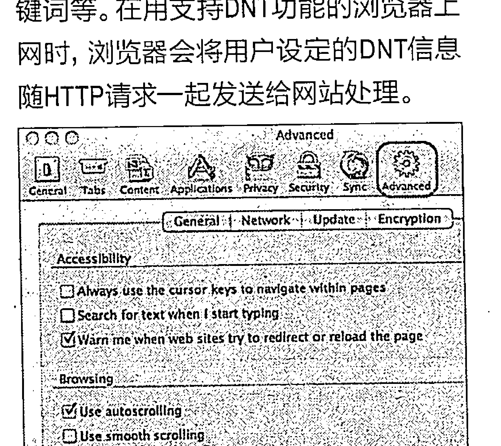

### DNT的来龙去脉

DNT最近闹出的动静挺大，不过追根溯源，实际上在五年前，也就是2007年就开始了，那时谷歌的Chrome浏览器都还没出世呢。

2007年，有一个民间的隐私保护团体缠上了美国联邦贸易委员会（FTC），要求他们针对在线广告商列出一份Don't track me（别跟踪我）的名单，指出他们在哪些领域利用浏览器的Cookies跟踪消费者。此事后来不了了之。

2009年，有几个研究员为Firefox开发了一个插件原型，其中第一次支持Do Not Track。2010年，联邦贸易委员会发表报告，呼吁建立一套系统，由用户自己控制在网络上的隐私信息。五天后，微软就宣布IE9将提供阻止第三方跟踪的黑名单，从而保护用户隐私（实际应该是争夺市场主动权吧）。随后Firefox、Opera、Safari陆续跟进，最后连主要以在线广告赢利的谷歌也不得不顺应潮流，在Chrome 23中提供DNT支持了。

### DNT是怎么进行工作的

当我们在浏览器中输入一个网址（URL）并按下回车键之后，将发生什么样的事情？这是一个典型的HTTP连接，一般会经历以下过程。

- 1. DNS Lookup（域名解析）：浏览器将网址传送到DNS服务器上，DNS将网址解析成真正的IP地址返回给浏览器。
- 2. Connection（创建连接）：通过IP地址，浏览器与所要访问的网站服务器建立连接（相当于架在两者之间的一个虚拟通道）。
- 3. Send（发送请求）：连接成功后，浏览器向服务器发送HTTP请求消息，一般包括HTTP头消息、POST或GET请求、Cookie（如果上次浏览该网站曾留下过Cookie的话）等。支持DNT的浏览器进行到上述的第3步，它在向服务器发出HTTP请求时，会在头信息中添加DNT字段。
- 4. Wait（等待响应）：等待服务器的响应。服务器分析HTTP请求信息，并且提取其中Cookie（如果有的话）记录的数据，如你的购物记录、个人喜好等信息。
- 5. Receive（接收数据）：服务器将所请求的资源（比如HTML文件和图像）传送给浏览器，浏览器下载并同步显示网页。

上面的过程，可简化理解为客户机（浏览器）向服务器发出请求，及服务器对客户机的响应。目前，DNT字段仅接受三个赋值：1，表示用户不想被第三方网站追踪；0，表示用户接受追踪；null（空值），表示用户不置可否，让网站自己看着办。服务器端除了响应HTTP请求外，还会根据DNT状态决定是否追踪用户状态或是放弃追踪。

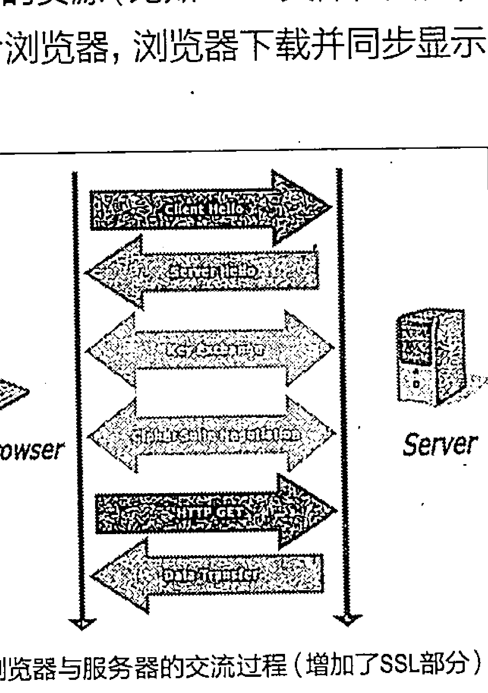

HTTP请求消息的结构主要由三大部分组成（响应的消息结构与之相似）：一个起始行，一个或者多个头域及指示头域结束的空行，一个可选的消息体。头域的格式为字段名加冒号加字段值，DNT就包含在头域中，比如用户选择了不允许网站追踪，则它为“DNT:1”。可以看出，增加一行头信息，对浏览器来说是轻而易举的事，而谷歌浏览器迟迟不加DNT功能，绝对不是技术原因，完全是因为广告市场的考虑。

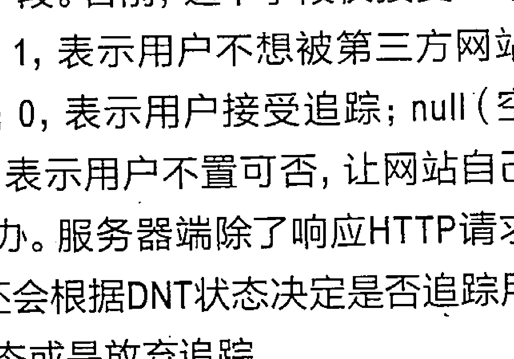

DNT字段目前仅接受三个赋值：1, 表示用户不想被第三方网站追踪；0, 表示用户接受追踪；null(空值), 表示用户不置可否, 让网站自己看着办。

```
GET / HTTP/1.1
Host: www.wikipedia.org
User-Agent: Mozilla/5.0 (Macintosh; Intel Mac OS X 10.6; rv:2.0.1) Gecko/20100101 Firefox/4.0.1
Accept: text/html,application/xhtml+xml,application/xml;q=0.9,*/*;q=0.8
Accept-Language: en-us,en;q=0.5
Accept-Encoding: gzip, deflate
Accept-Charset: ISO-8859-1,utf-8;q=0.7,*;q=0.7
Keep-Alive: 115
DNT: 1
Connection: keep-alive
If-Modified-Since: Mon, 23 May 2011 07:29:40 GMT

HTTP/1.0 304 Not Modified
Date: Wed, 25 May 2011 03:53:03 GMT
Content-Type: text/html; charset=utf-8
Last-Modified: Mon, 23 May 2011 07:29:40 GMT
Age: 7
X-Cache: HIT from sq73.wikimedia.org
X-Cache-Lookup: HIT from sq73.wikimedia.org:80
Connection: keep-alive
```

### 网站如何检测浏览器DNT

除了几大主流浏览器外，不少人使用的是第三方浏览器软件，它们是否支持DNT功能呢？通过一些网站提供的工具，一测便知。这里推荐一个比较好的测试网站http://donottrack.us/，只要在浏览器中打开它，右上角便给出结果。还有一个检测的网站是http://www.browserleaks.com/donottrack，它还提供了显示HTTP请求的部分信息。

这些网站是如何检测出浏览器是否支持DNT的呢？主要通过两种方法。一种是根据上面我们所分析的，检测浏览器发送过来的HTTP请求的头信息，查找它是否包含DNT字段从而做出判断。

另一种是通过DOM属性进行检测。DOM是Document Object Model的简称，即文档对象模型，它是W3C组织推荐的一种标准编程接口，提供了一系列的处理HTML或XML文档的常用方法，供浏览器调用。这一检测代码类似：

```
document.navigator.doNotTrack == "1"
```

这句代码可作为判断语句的条件来使用，大意就是：如果DNT的值等于1，那么如何如何，否则又将如何如何……

### DNT真能保护隐私吗

现在许多人都知道Cookie保存了我们的上网隐私，但大部分人并不知道Cookie是怎么产生的，它并不像我们所想象的那样是由本机的浏览器生成的，实际它是网站发送过来的，只不过是通过浏览器保存在了本机上。

首先服务器端在响应中利用Set-Cookie header创建一个Cookie(假设包含了你的账户名“小明”)，通过浏览器保存在本机。当你再次访问这个网站时，浏览器会将这个Cookie数据包含在HTTP请求的头信息中，返回服务器，服务器经分析后就能判断上次访问的“小明”又回来了，这也是你隐私被追踪的表现之一(可能你不想让人知道你回来过)。

上一节中介绍的检测DNT的方法，实际就是各网站服务器检测DNT的基本方法。遵守DNT协议的网站，一旦检测到用户不允许他们追踪的话(也就是DNT=1)，它将不会推送Cookie。但是，这只是“君子协定”，实际上并没有从技术上进行阻止。也就是说，如果网站我行我素，忽略DNT，用户隐私依然没有保障。

一个比较有说服力的实例就是，因为微软是默认开启DNT功能，这必然触及到许多人的广告利益。为了达到一种平衡，DNT标准的创始者之一就向Apache的HTTP服务器的源代码中加入了补丁，主动忽略由IE10用户发送的DNT字段数据。目前有不少网站使用的就是Apache服务器，IE10用户即使设置了DNT，访问这些网站时也形同虚设了。

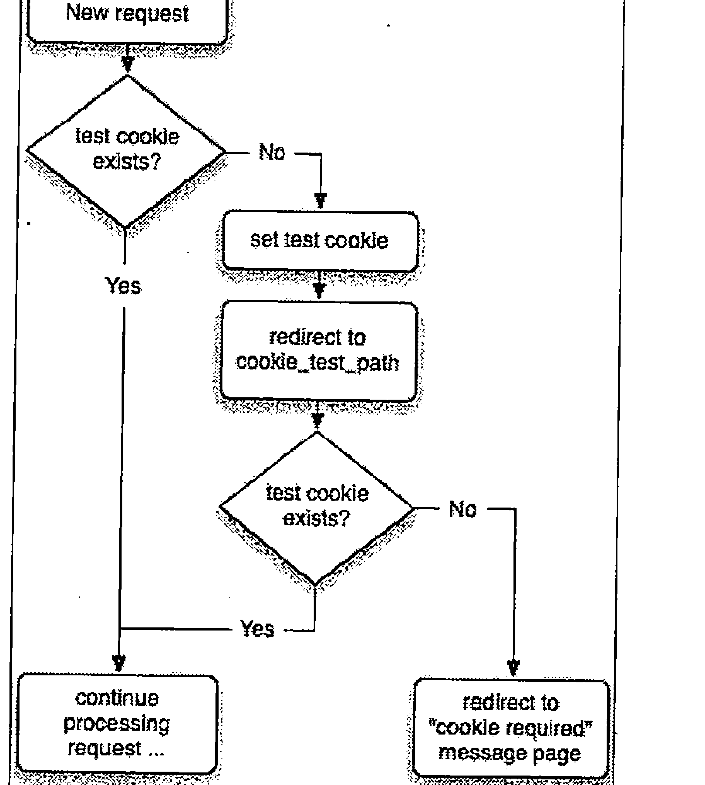

可见，DNT并不能真正保护隐私。而且，Cookie只是泄露用户隐私的途径之一，其他如病毒木马，甚至社交网站、LBS服务，都可能泄露隐私，绝不能指望DNT来一劳永逸地解决。不过话说回来了，多一种选择总是好的，只是不要过于迷信它就是了。

Windows 7下IE9的测试结果: 支持DNT(√), 但是没有开启(×)

### For users

Your browser supports Do Not Track ✓
You have not enabled Do Not Track x
How to enable: Firefox, Internet Explorer, Safari

184 | 电脑爱好者 合订本 · 2013

## 防不胜防 看看钓鱼邮件的新花样

每到年底，都是人们在网上采购的“黄金时间”。不法分子也没有闲着，不信来看看新花样的钓鱼邮件。

最近朋友收到一封钓鱼邮件，说是财付通账户资金异常。点开连接地址仔细一看，原来是一个钓鱼网站。朋友很奇怪，为什么显示的发件人邮箱和链接地址都是正确的，但还是进入了钓鱼网站呢？

### 搭建服务器显示任意发件邮箱

大多数朋友都是通过查看发件人邮箱地址来分辨钓鱼邮件，如腾讯官方的邮件地址是service@tencent.com，而有的钓鱼邮件是其他的地址，如service@tenoent.com。但是你相信么，发件人是service@tencent.com的邮件也有可能是假的。

现在通过本地搭建邮件服务器，可以实现发件人地址自定义。我们先来做一下实验。

到http://www.argosoft.com/RootPages/MiniMail/Default.aspx下载Mini Mail Server，安装后我们就能看到简洁的界面，全部设置保持默认(图1)。

接着，我们打开任意一款邮件客户端，本文以Foxmail为例。打开主界面，点击“工具→账号管理”，在打开的账号管理界面里新建账户，邮件地址填写service@tencent.com，点击下一步，密码可以自己填写，点击下一步，我们发现foxmail已经识别出这个邮箱的服务器地址及端口等信息，但是我们不是使用这个地址，而是使用本机作为邮件发送服务器。点击修改服务器，然后我们就可以使用这个地址发送邮件了，使用方法和使用客户端发送其他邮件是一样的。

接着我们就收到了那封邮件。我们现在可以看出来发件人等信息没有任何纰漏，和真实邮件一样(图2)。

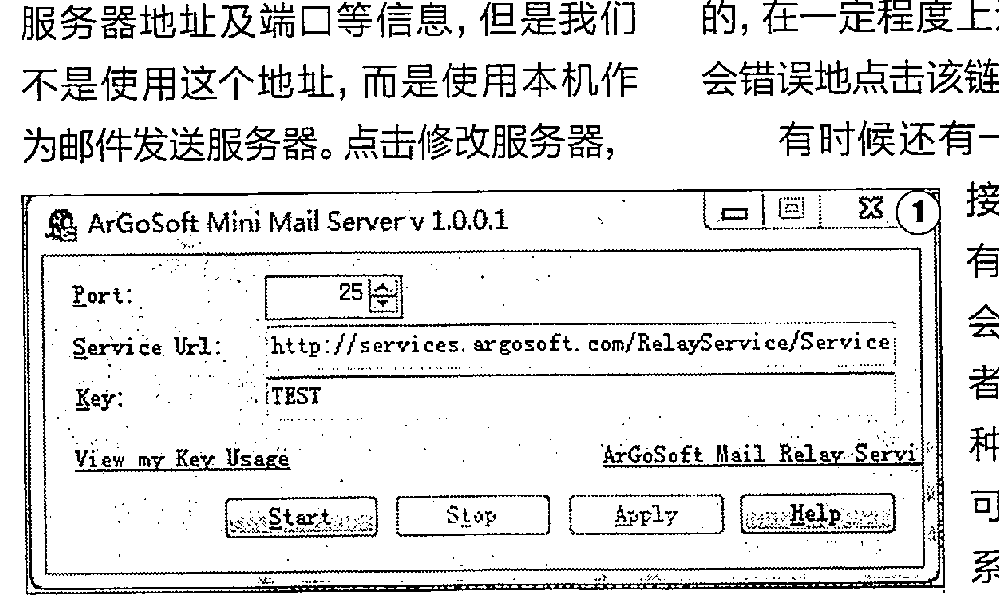

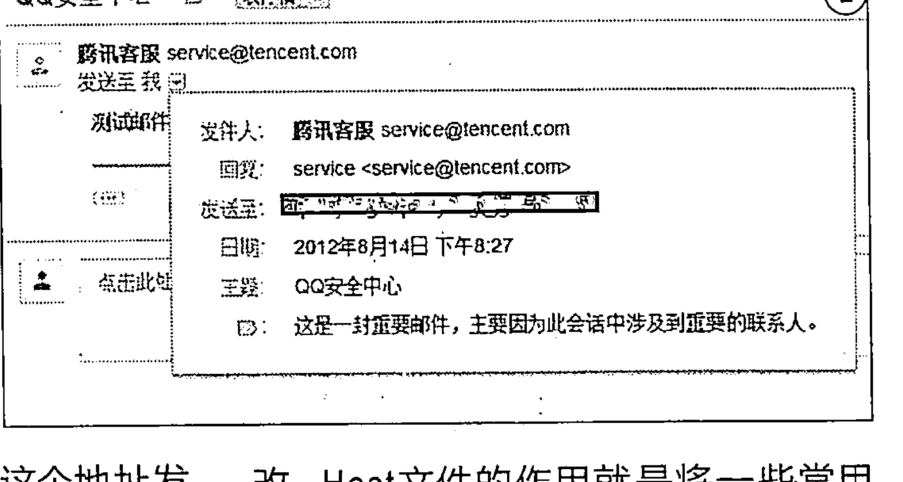

### 使用域名上做手脚实现迷惑

现在人们的防范意识提高了，点击链接的时候会自己看一下网址是不是官方的链接。但是判断一个域名要倒着看，比如www.B.com.A.com的域名不是B的，而是A的，通过这么分析的确可以识别一些网站。但是，大家看看这个http://www.tenpay.com%74%2E%63%6F%6D/，你能否确认这个网站的域名是什么？大家可以输入到浏览器地址栏看看，真实地址是什么。当然这个网是打不开的，因为这个地址是我造的，只是一个例子。这个网址后面的那些字符是经过UrlDecode的，在一定程度上迷惑了你，你有可能会错误地点击该链接。

有时候还有一种情况，明明是链接地址一点问题都没有，但是浏览器总是会打开错误的页面或者钓鱼页面，那么这种情况你的电脑很大可能就是中病毒了，系统的Host文件被修改。Host文件的作用就是将一些常用的网址域名与其对应的IP地址建立一个关联“数据库”，当用户在浏览器中输入一个需要登录的网址时，系统会首先自动从Hosts文件中寻找对应的IP地址，一旦找到，系统会立即打开对应网页。如果没有找到，则系统会将网址提交DNS域名解析服务器进行IP地址的解析。如果病毒把Host文件给修改了，那么你访问的网站就可能被重定向到别的IP地址上。

那么对于这些新型的钓鱼邮件诈骗，我们该怎么防范呢？

首先是要安装有效的安全软件，现在主流的安全软件都有网址安全鉴定的功能，可以帮助我们识别钓鱼网站，对于修改Host文件等高危行为也会提示或拦截。另外就是在涉及财产、隐私操作的时候一定要加倍小心，睁大自己的眼睛。在购物时最好使用一个单独的信用卡，有小额信贷的限制，而不是常用的借记卡，防止小偷访问你的重要账户。

“这个价格或者折扣简直太好了，简直都不像真的！”好吧，那它很有可能就不是真的！网络罪犯非常清楚地知道我们在在线都搜索了什么信息，他们知道我们期待着邮箱里能接到什么样的邮件。永远都要对来自未知者的邮件或者太过于慷慨的信息保持警惕。

## 摄像头里的秘密 蓝玻璃滤光片

如今高端手机在宣传摄像头时除了“背照式”之外，往往还会加入“蓝玻璃滤光片”这一卖点，下面就让我们一起看看这枚玻璃的作用吧。

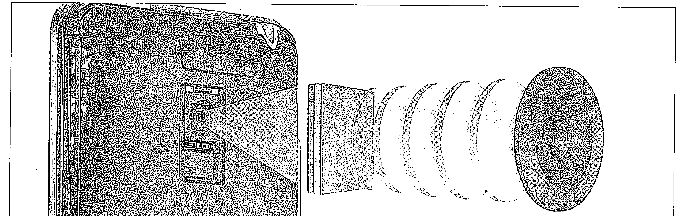

### 红外光影响成像质量

首先我们需要了解一些小知识：任何物体在大于绝对零度（-273°C）的环境下都会对外发射红外线；手机摄像头采用的都是CCD或CMOS传感器；CCD和CMOS传感器可以灵敏地捕捉到所有可见光区和部分红外光区。

根据光的折射原理和定律可得出：波长越长，折射率越小；波长越短，折射率越大。因此，当这些光线同时进入手机摄像头且被镜头透镜折射后，可见光和红外光就会在不同的靶面成像。其中可见光的成像为彩色图像，而红外光的成像为黑白图像。当我们将可见光所成图像调试好，也就是所谓图像聚焦和后焦调整，这时红外光就会在这个靶面形成虚像，从而影响图像的颜色和质量。

### 蓝玻璃滤光片的功效

想避免红外光引起的靶面虚像，目前最有效的手段就是通过IR Coating镀膜或加装滤光片来滤除红外光，还原物体的真实颜色，从而解决图像色彩失真的问题。

蓝玻璃与其他滤光片的区别是原材料不一样。作为本文的主角，蓝玻璃是以蓝玻璃材质作为原材料（普通滤光片都是一般的光学玻璃），它的功效就是靠“吸收”的方式来过滤红外光。

由于蓝色波长有较高的穿透率，比起红橙色的玻璃滤片有更好的穿透性，可过滤630nm以上的红外光（但允许从紫外到红外的很宽波段的其余光线通过），而且过滤得比较彻底。需要注意的是，蓝玻璃滤光片虽然过滤了红外光，但目前没有任何滤光片能让物体成像变得更明亮，因为所有滤光片都会吸收某些波长而使物体变暗。

> > **小提示**
> 镀膜的缺点
> IR Coating镀膜分真空镀膜和化学镀膜两种，能滤除650nm波长以上的红外光。但与蓝玻璃的“吸收”过滤不同，IR Coating镀膜是靠“反射”的方式滤掉红外光，而反射光容易造成干扰。此外，IR Coating镀膜需要针对不同型号规格的CMOS进行定制才能达到最佳效果，无论是效果还是通用性都不如蓝玻璃。

为此，蓝玻璃滤光片往往还需要加上名为AR Coating的镀膜（和前面提到的IR Coating镀膜不同哦），目的是增加透光率和反射红外光。我们都知道，光线在透过不同介质时会产生折射和反射，当加上单面AR Coating后，滤光片会提升3~5%的透光率，如果加上双层甚至四层AR Coating镀膜，滤光片可达到98%以上的透光率，让图像更清晰且让滤光片不容易起雾。反之，如果不加AR Coating镀膜会导致滤片的透光率低于90%，会大幅降低摄像头的感光度从而影响成像质量（画面非常暗淡）。

### 未来是蓝玻璃的时代

作为在手机领域引入蓝玻璃滤光片的始作俑者，苹果iPhone已经不再是 一枝独秀，小米2和魅族MX2等新机也 武装起五枚光学镜片加一枚拥有4层镀膜的蓝玻璃滤光片。随着用户对手机成像要求的不断提升，在CCD或CMOS的软硬件已经很难进一步优化的情况下，滤光片自然成为最简单也是最理想的提升拍照品质的解决方案，也许不久后我们就会看到嵌入双蓝玻璃滤光片的产品呢。

## 亚马逊如何猜你喜欢

在亚马逊等网站购物时，网站一般会自动给出智能推荐，而推荐的商品大部分可能正是你所想要的。那么，它们究竟是怎么“猜”中你心思的呢？

文 | 流言

因为工作需要，我们测试亚马逊网站在各个浏览器中的表现。网站不仅显示我们的名字表示欢迎，而且还给出一大堆的购物建议。其实在不仅是网购，像视频、音乐、社交网站等等，也都提供个性化的建议。网站针对每个人的建议都不相同，大部分正好是你所需要的，它似乎比你更了解你自己。这些个性化建议到底怎么产生的呢？它们实际来自一个“推荐系统”。

### 推荐系统的发展前景

上世纪90年代中期，还只有很少的几个人在研究推荐系统，如今这方面的研发人员数以百计，为各大高校、大型在线零售商及许多相关企业服务。推荐系统能帮助消费者选择喜欢的产品，同时也帮了零售商促销，所以蕴藏着巨大的商业潜力。

除了网购等网站上的应用，推荐系统在其他领域也开始大展手脚，比如高校使用它来引导学生课程，手机公司依靠它来预测用户有可能换到哪一家供应商，会议组织者通过它可以将不同主题的论文分发给最适合的专家来审定等等。

尽管亚马逊等公司对自己的推荐系统秘而不宣，不过因为我们在推荐系统刚开始起步时就研发，对它们的后台运行有深入的了解。下面基于观察和推理，我们就来为大家解析其中的技术细节。

### 关于作者

Joseph A. Konstan和John Riedl都是美国明尼苏达大学的计算机科学教授。Konstan还是Grouplens计划的领导者、IEEE高级会员，Riedl同为IEEE会员，他们协助创建了MovieLens推荐系统。

原文链接：http://spectrum.ieee.org/computing/software/deconstructing-recommender-systems

### 购物网站眼中的你

你有没有想过，你在购物网站亚马逊的眼中是个什么样子？真相有点冷：你只不过是网站巨大表格中的一行数据而已。这行数据记录了你在网站上看过哪些内容，点击过哪些链接，购买过哪些东西等。这个大表格中还有其他很多行数据，记录的是亚马逊其他数以百万计的购物者信息。你每次访问网站，表格中的数据会随之改变，反过来这行数据也会影响到你，比如它决定了你能看到什么，会收到什么样的优惠信息等。

推荐系统通过各种各样的方法收集和分析你的数据，目前的核心技术是“个性化协同推荐”。它们之所以能做到“个性化”的推荐，是因为它们跟踪了每个用户在网页上的行为，如浏览、购物、评分等，经过“协同”计算，找出你不一样的偏好，从而给出不一样的建议。它绝不是像传统的技术那样，仅仅通过分析关键字那么简单。

### 怎么找出不同人的相同偏好

Grouplens和Ringo都是基于一个称之为User-User（用户关联）的简单的协同算法。这种算法，根据两个用户之间有多少一致性的意见来计算他们的“距离”。例如，如果吉姆和简各给电影《Tron（电子世界争霸战）》5星，他们的距离就是0。如果吉姆再给电影《Tron: Legacy（创战纪，Tron续集）》5星，而简只给了3星，那他们俩之间的距离就拉大一点了。通过这种方法计算出来的口味接近的用户，称之为共享的邻域（Neighborhood）。

不过用户关联的方法不是很完善。首先形成“邻域”就不容易：一方面有些东西许多人很少甚至没有打分，而另一方面，像流行大片，大家又都一边倒式地都喜欢，这两种情况都无法得出他们的共享爱好。

另外，虽然用户在网站上浏览点击改变用户之间的“距离”很容易，但是用户关联算法需要即时计算却有着巨大的运算量，可能没等到返回准确的推荐结果，用户已经去做其他的事情了。

### 如何从物品之间找关联

上面用户关联的缺陷，可通过Item-Item（物品关联）算法来解决。物品关联计算的是书与书之间或电影与电影之间的距离，或者任何你依据相似度而关联在一起的用户之间的距离。比如，喜欢某甲的书的人给某乙的评分也很高，那么，某甲的书和某乙的书就可以归到同一个邻域中了。物与物之间的距离，可以从数以百万的用户评分中得出。

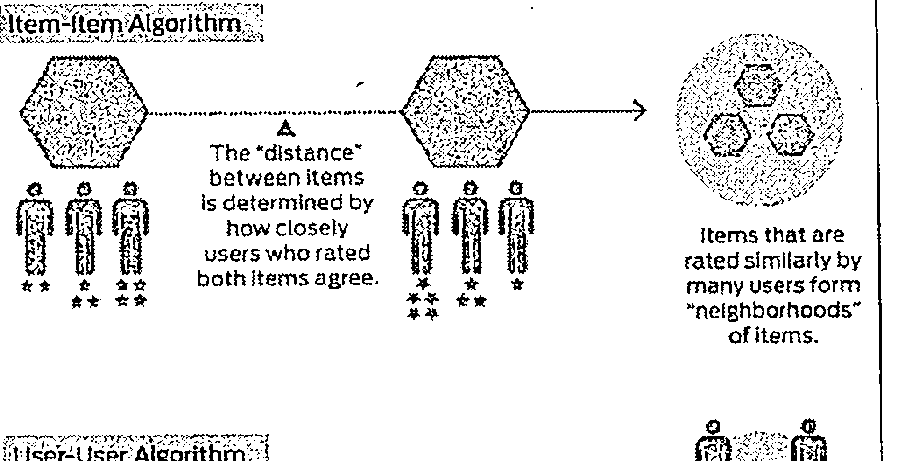《电脑爱好者》·合订本 技术解读

不是所有有相关性的东西都是值得推荐的，如果一个物品，无论推荐与否用户都会购买，那么就没有推荐的必要，这类物品，推荐系统将按照一定的准则排除。

相对来说有一个稳定的时间段（不会像用户关联算法那样变数太大），所以推荐系统可以预先计算距离和快速产生建议，对访问的用户来说，可能就感觉不出其中的延迟了。

亚马逊和Netflix公开表示他们使用的是物品关联算法的升级版，虽然没有透露更多技术细节，不过其中的原理应该大同小异。

## 化繁为简的降维算法

品味改变、心情改变、记忆淡化等，都可能造成评分的不确定性。上述的两种算法，在这方面的处理有点僵化。其实在十年前，研究人员就找出了一套更有效的方法，就是将类似因素归一的过程，称之为降维。只是它运算量巨大，所以一直发展缓慢。不过随着电脑性能越来越好、价格越来越便宜，这两年它开始有了很大进展。

先来了解降维是怎么工作的。这里以每个人对食品的口味为例。以一个巨型矩阵（超大表格）记录上百万人的口味数据，每个人的口味信息占据一行。在你的信息行中，你可能给烤牛排评5星、红烧排骨4.5星、炸鸡翅2星、冻豆腐卷1星、烤蘑菇5星、蒸毛豆4星，等等。

推荐系统使用这个矩阵，它不会真的在乎你针对特定食品的特定评分，它是想总结出你喜好的一般性规律，再通过它来推断你对任意其他食品的评价。

例如，从上面的评分，推荐系统可以推断你喜欢牛肉、咸的东西及烤制食品，不喜欢鸡肉及油炸食品，对各种蔬菜则不喜欢也不讨厌，等等。这些口味属性或者说维度，比起食品的数量就小得多了——可能也就50到100个维度的样子（但是食品则可能成千上万）。通过比对这些维度，推荐系统可以快速判断某种新的食品是否是你喜欢的口味——比如盐焗排骨，与你的口感维度比较（咸的、牛肉、不是鸡肉、不是油炸、不是蔬菜、不是烤的）。这种更一般性的表现，使得推荐系统能够更准确地识别出虽然不是同一群体但却有相似喜好的用户。它大大压缩了矩阵，使得推荐系统更有效率。

这是一个很酷的解决方案。但你如何找到这些口味维度？不要问厨师，实际上这些系统使用的是更精确的称之为“奇异值分解”的技术来计算维度的，它将原始的巨大矩阵分解为两大“口味矩阵”，一个包含所有用户和100种口味维度，另一个则包含所有的食品和100种口味维度，再附加第三个矩阵进行运算。

以数学的方式获取维度，既不形象也不直观，你无法识别数值代表着什么，比如说“咸”是什么味道。但是没关系，只要这些数值最终能形成一个准确的推荐就可以了。

## 通过网络跟踪补充推荐

现在我们对购物网站如何快速猜出你的口味有了一个基本概念。推荐系统还有两个引人注目的特征：首先，它在搞明白你与其他购物者有多高的相似度之前，它必须先找出你真正喜欢的东西。其次，这一系统按照商业规则操作，确保它所给出的推荐既能让你觉得有用，又能让商家有利可图。

例如，亚马逊网上艺术商店有近千万的印刷品和海报出售（我最近一次看到的数据为900多万），它们通过多种方法收集你的数据：它会让你按5星制为艺术品打分，并且关注你点击放大了哪些图片，反复看了几次，哪些放入了想要购买的清单，以及哪些真正买下来，它还会跟踪你在看一幅绘画的同时还看了其他哪些作品。依据你在网站上的浏览路径，网站会给出补充建议，并且结合你的购买记录及评分信息，为你创建一个长期的档案。

类似亚马逊这样的公司，收集大量用户的数据，在你登录网站后几乎所有的操作都会被它们保存下来以备将来之用。借助于浏览器的Cookies，他们甚至还记录下匿名的购物者，当匿名购物者注册登录后，他们就把当初匿名记录的信息补充到现有的用户档案中。

不过随着数据隐私的问题越来越被大家重视，这方面的发展还有待进一步观察。

## 推荐系统不会做的一些事

不是所有有相关性的东西都是值得推荐的，就拿香蕉来说，几乎每个去超市的人自觉都会买一些，如果还要向顾客推荐，既不能帮助到顾客，也不会增加香蕉的销量。这类物品，应该按照一定的准则，将它们排除在推荐结果之外。

总之，推荐系统研究还有许多方面需要突破，在已有系统上进行微调是不够的。但有一点是明确的：推荐系统只会变得越来越完善。

木马病毒也爱白加黑

春节快到了，新网购高峰也要来了。随之而来的就是那个老生常谈的安全问题。问题虽老，但是花样却很新。
文|李燕飞

最近网上出现一款名为“支付大盗”的网购木马。该木马利用百度竞价排名推广。当用户在百度搜索“阿里旺旺官网”等关键词时，会有一个推广链接指向一个木马网站，该网站页面与阿里旺旺真实官网非常相似，其下载按钮则指向“支付大盗”木马压缩包。如果你不慎运行了该木马，那么你的网银支付页面可能会被劫持，造成资金损失。

## 木马攻击流程分析

- 1. 当用户双击运行“阿里巴巴.exe”之后，它会加载执行ClientModule.dll，由后者释放RSA.dll、AES.dll、MouseKeyHook.dll等文件，以及alipay.ini配置文件；
- 2. RSA.dll木马行为：①当dll运行后首先会去木马制作者设定好的网址获取配置信息，用于配置木马盗取到的金额转向哪个第三方收钱账户；②监视浏览器访问的网址，当用户进行网上支付操作时启动劫持；③在用户支付表单将要发送出去的时候，木马截获表单数据的同时启动另一个在点卡购买网上几乎同步的游戏点卡交易，购买与中招用户付款金额几乎等值的游戏点卡等虚拟商品，再把交易中要求输入的验证码显示在中招用户面前，由用户自己辨识输入。这样木马就能得到验证码。最后，“支付大盗”把中招用户的交易金额转到了自己的账户，对木马作者来说，等于花别人的钱给自己买了游戏点卡，从而销赃获利。

可以说这是一个木马病毒利用可信程序进行破坏的典型案例。“白加黑”技术是一个方面，另一方面，整个过程与正常支付流程、界面更加相似，“用户体验”更加流畅、真实。

为了减少误报，杀软大多将含有有效数字签名的文件特殊对待。这些文件一般都是由可信的公司所发布。另外，许多含有数字签名的程序其实就是系统程序，而系统程序的权限高，行为复杂，更加难以和病毒行为区分开来。为了避免误报造成系统崩溃，安全软件对这类程序一般都是直接放行。

## “白加黑”入侵原理

这类病毒中可信程序一般被称为Loader，该类木马经常使用的Loader有老版本的好压和暴风影音等，病毒作者之所以选择它们作为病毒Loader，是因为它们在运行时会加载其对应的动态链接库，这个和DLL劫持又有相似之处。它们利用了Windows系统中加载DLL的一个特点。一个exe程序要加载DLL文件是在磁盘上搜索DLL文件，而不是按照指定路径加载。如果DLL文件被替换的话，可能会造成一定的问题，如犇牛病毒，软件目录下会出现大量的usp10.dll文件。
在现有防御体系中，究竟有哪些结构上的漏洞，导致“白加黑”的入侵成为可能？

另外最近出现了能自己导入数字签名根证书的病毒。这类病毒一般带有自己签发的数字签名，但是在系统中没有相应的根证书，所以该数字签名是不受信任的。而病毒自己导入根证书之后，木马文件的数字签名就变成有效的了，这又给安全软件出了个大难题。怎么才能平衡查杀率和误报，这是安全软件公司要考虑的问题。

同时我们发现这个支付大盗木马还采用了一种比较新颖的传播方式。记得第一次见木马使用百度竞价排名传播还是在2012年1月底。当时在百度上搜索下载Putty和WinSCP（两个Linux下的管理工具），第一条结果就是百度竞价排名的推广广告。这两个软件都是开源的免费软件，怎么还会有人在百度拿钱做推广呢？后来人们发现，推广链接下载的软件都带有后门，会造成服务器密码泄露。

近些年以来，百度的竞价排名广告备受争议，由此看来，百度的确应该规范一下自己的竞价排名机制的广告内容，切实把网民的利益放在心中。

无线破解出新招 一键力变成破解

WPS本是致力于简化无线局域网安装及安全性能的配置，如今却成了无线破解的漏洞。

文 | 钟锋

当今社会，生活节奏越来越快，一款网络设备是不是具有简单易用的特性，甚至决定了它的生存及竞争能力，对于无线路由器来讲也是如此。从起初的手动加密到现在主流路由都具有的一键加密，加密方式是变得简单快捷了，但安全性能是不是仍旧稳定可靠呢？答案不再是肯定的了。

WPS (Wi-Fi Protected Setup) 是Wi-Fi保护设置的英文缩写。WPS是由Wi-Fi联盟组织实施的认证项目，主要致力于简化无线局域网安装及安全性能的配置工作，是许多支持802.11n技术的无线路由器附带的新功能，但此功能却曝出了严重的安全漏洞，导致WPA/WPA2加密能够被轻松破解。

## 漏洞分析

对于一般用户，WPS提供了一个相当简便的加密方法。通过该功能，不仅可将都具有WPS功能的Wi-Fi设备和无线路由器进行快速互联，还会随机产生一个八位数字的字符串作为个人识别号码 (PIN) 进行加密操作，省去了客户端需要连入无线网络时，必须手动添加网络名称 (SSID) 及输入冗长的无线加密密码的繁琐过程。而WPS PIN码的第8位数是一个校验和，因此黑客只需算出前7位数即可。这样，唯一的PIN码的数量降了一个级次变成了10的7次方，也就是说有1000万种变化。

在实施PIN的身份识别时，接入点(无线路由器)实际上是要找出这个PIN的前半部分(前4位)和后半部分(后3位)是否正确即可。当第一次PIN认证连接失败后，路由器会向客户端发回一个EAP-NACK信息，而通过该回应，攻击者将能够确定PIN前半部或后半部是否正确。

换句话说，黑客只需从7位数的PIN中找出一个4位数的PIN和一个3位数的PIN。这样一来，级次又被降低，从1000万种变化，减少到11000 (10的4次方+10的3次方)种变化。

| 1st half of PIN | 2nd half of PIN | checksum |
|---|---|---|
| 密码组成有规律可循 | | |

因此，在实际的破解尝试中，黑客最多只需试验11000次，平均只需试验大约5500次就能破解。那么，黑客会用多长时间破解出使用WPS加密的PIN码呢？一起看看吧。

## 入侵实战

下面我们就来简单地演示一下整个破解过程。

- 第一步: 在Linux中安装好reaver1.4 (下载地址: http://code.google.com/p/reaver-wps/) 及其图形界面程序Inflator (下载地址: http://blog.ibeini.com/archives/597.html)，也可以下载网友制作的已集成这两个软件的Linux系统。
- 第二步: 双击桌面上的打气筒图标启动Inflator程序，在弹出的警告框中选择YES。
- 第三步: 在已识别的网卡上单击，使网卡前的小方框的颜色变为蓝色，同时Message里会显示Try to enable..当显示Monitor mode enabled...时便可点击Next按钮进行下一步了。注: 如果网卡列表里均显示N/A，那就代表网卡不被支持或者驱动未安装好 (指Linux中的驱动)。
- 第四步: 直接点击Scan for WPS enabled APs按钮，30秒过后就会显示扫描结果。单击一个信号强度好的AP (RSSI值越小的)，然后单击Next按钮。
- 第五步: 直接点击Run按钮，程序便开始不断尝试不同的PIN。一旦尝试成功，程序就会将无线路由器的PIN码和WPA密码都显示出来。

## 漏洞解决

目前各网络设备厂商对此漏洞均还没有发布任何解决方案，唯一的解决方法就是关闭WPS。关闭方法如下: 在浏览器地址栏中输入路由器的管理地址192.168.1.1 (一般均为此地址，若不是请输入更改后的地址)。然后在弹出的对话框中输入账号和密码 (一般均为admin，若不正确请查看路由器背板或说明书)。找到WPS (QSS) 设置，单击“关闭WPS”按钮并重启路由器即可。

简单判断路由器是否有WPS功能: 1.查看无线路由器背板是否印有PIN码，若有则代表路由器有此功能。2.按照关闭WPS功能的步骤进入路由器管理界面查看是否有WPS(QSS)设置项。

揭秘微软语音翻译软件内幕

随着技术的发展，不需要专业的翻译人员，讲不同语言的人通过语音翻译设备也可以直接交流沟通了。这些到底是如何做到的？

文|深度

2012年11月，微软发布了一段视频 (http://it.sohu.com/20121109/n357137973.shtml)，微软首席研究官瑞克·拉希德 (Rick Rashid) 在视频中演示了他们正在研发的语音翻译软件的使用。这款软件不仅能将拉希德的现场演讲实时转换成文本显示在大屏幕上，而且能同步语音翻译成其他语言。借助软件，拉希德现场大秀了一段还算标准的普通话，声音中保留了拉希德的口音、音色和语调，听上去就像拉希德本人亲口所说。这正是微软研究院正在下大力气研发的语音翻译软件。

我们知道，OCR识别可以将纸面上的文字转变成电脑可识别的文本，而语音识别与其类似，不过它是将人的说话语音转变成文本。人的语音是千差万别的，如不同的方言口音，说话时的重复、停顿、错误等，都增加了软件对语音的识别难度。人工神经网络是较好的解决方案之一。

人工神经网络技术包括学习和识别两个过程。其中的学习过程，就是使用者按要求念出指定的文本，经过话筒转化为已知的语音信号作为学习样本，经过语音分段，从中求取语音的特征参数（这个过程反复多次，所以也称之为训练）。识别的过程则是，将待测的语音（同样经过话筒）进行语音分段，提取出特征参数，按一定的规则与学习所得的结果进行比对计算，最后得出识别的结果。可以看出，学习和识别的过程中，最关键的是语音特征参数的求取。

微软本次演示的软件，在人工神经网络技术上更进一步，采用了“深度神经网络”（Deep Neural Networks, DNNs）技术。

语音识别系统的本质，实际上就是对语音组成单元（音素）进行建模，比如英语中表达发音方式的大约也就30个音素。而深层神经网络（DNNs）将音素进一步细分，分解成更小的元素（Senone），总数达到几千上万个。这项创新简化了大词汇量语音识别中的语音处理，大大降低了错词率。原理何在？其实从输入法的编码就可以想象得到，中文有几万字（相当于形式各变的语音），却只有26个字母键（相当于有限的音素）可用，于是造成了许多重码，输入时我们必须时时手工选择才不会出错。而如果用来编码的字母足够多，重码率肯定可以降低。

## 让机器像人一样识别声音

语音翻译（Speech translation）就是通过计算机系统实现持不同语言的说话人之间的话语翻译的过程，也称口语翻译或对话翻译。语音翻译技术一般包括三大部分：语音识别（输入）、机器翻译（转换处理）、语音合成（输出）。

求取特征参数的基本过程：
| 语音信号输入 | 语音信号分段 | 特征参数提取 |
|---|---|---|

如图所示，语音信号输入就是将人的声带发出的模拟波形语音转换成数字波形，这样才能被计算机处理，这跟OCR识别中先把文字扫描进电脑的道理是一样的。人说话时一般都是连贯的，语音信号分段，就是根据字与字之间、词与词之间极短的间隔（低音或无音），将话语分解成每一个语音段，最后通过各种算法对处理过的语音段进行分析。比如不少语音识别系统中采用倒频谱（Cepstrum）分析，将倒频谱参数作为语音的特征参数输入神经网络中。

## 不一样的语言里找出相似规则

语音到文本的问题解决了，接下来是更大的难题：机器怎么翻译？语言千变万化，两种语言之间很难一一对应。前人从此探索出很多方法，可以归结为两大类型：基于语言规则的机器翻译法（包括直接翻译系统、转换系统、中间语言系统等）和基于语料库的机器翻译法（包括统计法、实例法等）。微软的语音翻译软件中机器翻译的部分，采用的是多引擎翻译，即多种翻译方法的整合，所以这里我们在两大类型中各挑一个典型的翻译方法来介绍。

## 基于实例的机器翻译

简单来说，基于实例的机器翻译系统中，存有一个对照的翻译实例语料库，实例库主要有两个字段，一个保存源语言句子（比如英文），另一个保存与之对应的译文（比如中文）。当要翻译某个句子时，系统先把这个句子与实例库进行比较，找出最相似的句子，模拟这个句子相对应的译文，最后输出译文。

比如要翻译句子:
(E1) He bought a book on physics.
在语料库中查到相似的英语句子及其汉语译文是:
(E2) He wrote a book on history.
(C2)他写了一本关于历史的书。
比较(E1)和(E2)两个句子，我们得到变换式:
(T1)replace(wrote, bought) and replace(history, physics)
将这个变换式中的单词都换成汉语就变成:
(T2)replace(写, 买) and replace(历史, 物理)
将(T2)作用于(C2)，最后得到正确译文:
(C1)他买了一本关于物理学的书。

> (本文部分实例摘编自刘群《计算语言学》讲义)

## 协处理器群以小博大
### Cortex-A15的大小核战略

在上一期中，我们介绍了全球首款Cortex-A15架构处理器Exynos 5250所集成的GPU缘何如此强悍，本期我们将进一步解析Cortex-A15自身架构的先进之处。

### 改良架构大幅提升性能

虽然Cortex-A15和Cortex-A9的指令集均为ARMv7-A，但前者却凭借改进的架构实现了性能的大幅飞跃。首先，在ARM多核处理器中，单核心内所配置的解码引擎决定了每个时钟周期执行命令的效率。典型的A9架构每个核心配置了2个解码引擎，而典型的A15架构每个核心的解码引擎数量则提升到了3个，这意味着其每周期可以处理三条指令，指令解码效率比A9提升了33%。

浮点运算能力决定了处理器的多媒体性能。典型的A9架构的浮点单元都是由1个VFPv3浮点引擎和1个NEON多媒体指令引擎组成，而典型的A15架构则是由2个VFPv4浮点引擎（支持IEEE 754浮点规范，性能大约是VFPv3的2倍）和2个NEON多媒体指令引擎组成，这又是领先A9架构的优势所在。

此外，A15架构的指令宽度也从A9的64bit大幅度提升到128bit，可以支持8条指令分派（A9仅支持4条），而且还专门为VFP和NEON单元分别设置了指令分派端口，极大地改善了A9架构因分派端口较少而容易引发的浮点指令拥堵的情况。根据附表可见，A15所支持的ISA也要比A9更为丰富。

### 引入“大小核”战略

经过一番架构上的改良，让Cortex-A15的性能达到了3.5 DMIPS/MHz，较Cortex-A9的2.5 DMIPS/MHz提升了40%。但根据半导体不变的定律，在生产工艺不变的前提下，功耗肯定要和性能成正比。指望生产工艺从40nm/32nm快速过渡到28nm/22nm肯定是不现实的，于是ARM想出了“大小核”的战略，也就是所谓的big.LITTLE技术。

NVIDIA曾在Tegra 3处理器中引入了“4+1”的协核心技术，即除了4颗最高可达1.4GHz的Cortex-A9核心之外，还在CPU内部加入了一枚500MHz的协核心，在待机和音乐播放等低负载工作时关闭4颗主力核心，切换到协核心模式来节省电力。而big.LITTLE则是ARM官方提出一种类似Tegra 3的协核心技术的解决方案。但与Tegra 3不同之处在于，big.LITTLE已经从“协核心”概念过渡到了“协处理器群”（由多个处理器核心组成）的概念。

### 功耗就这样被降服

简单来说，big.LITTLE是一种可以将Cortex-A15处理器群和Cortex-A7处理器群打包在一个核心内的技术，二者拥有完全相同的指令、数据类型和寻址模式，并且它们能够产生相同的结果，并可以根据系统当前的负载情况进行快速的切换。未来的四核Cortex-A15处理器很可能都是由双核A15+双核A7组成，而八核Cortex-A15处理器则是四核A15+四核A7，其中A15就好比Tegra 3的主力核心，而A7就是Tegra 3的协核心。

小提示
Cortex-A7是由Cortex-A15架构简化而来，性能和Cortex-A9接近，但功耗却大幅降低。

打个比方，我们将汽车所用的汽油比作手机的电池，Tegra 3中的协核心好比汽车的电瓶，最多只够照明和听音响使用（不费油），但让汽车跑起来的还是耗费汽油的发动机（费油）。Cortex-A15引入的big.LITTLE技术就好比油电混合发动机，A15处理器群就是耗油的部分，而A7处理器群则是用电的部分，汽车在城市或跑高速时（上网、听音乐、看高清视频、玩普通3D游戏）靠电力驱动就足够了，只有爬坡或超车（玩大型3D游戏）等需要急加速时才会轮到汽油驱动，你说能不省油吗？

虽然ARM处理器的性能和英特尔X86处理器还存在非常大的差距，但在手机和平板电脑这类移动市场；即使是四核A9处理器都出现了性能过剩的苗头。但凭借big.LITTLE大小核战略，让Cortex-A15可以轻松实现高性能和低功耗的平衡。毫无疑问，2013年将成为“双核A15双核A7”或“四核A15四核A7”的天下，ARM以小博大的战争才刚刚开始。

| 主要参数对比 | Cortex-A9 | Cortex-A15 |
| :--- | :--- | :--- |
| 指令集 | ARMv7-A | ARMv7-A |
| 性能等级 | 2.5 DMIPS/MHz | 3.5 DMIPS/MHz |
| 多核 | 1~4核 | 可以实现多个处理器群 |
| ISA支持 | ARM<br>Thumb-2<br>Jazelle DBX 和 RCT<br>DSP扩展<br>高级SIMD NEON单元(可选)<br>浮点单元(可选) | ARM<br>Thumb-2<br>Jazelle RCT<br>DSP & SIMD 扩展<br>NEON 高级SIMD<br>TrustZone 安全技术<br>VFPv4 浮点<br>硬件虚拟化支持<br>大物理地址扩展(LPAE) |

## 声纹让“芝麻开门”成现实

随着具有声纹解锁功能的智能手机上市，《大话西游》中的“芝麻开门”成为现实，如此炫酷的语音识别功能，技术上是如何实现的？

文|深度

### 声纹解锁技术原理

实际上，声纹解锁的原理就是建立声纹和声纹识别。第一是声纹注册，也就是通过用户的互动，建立一个语音的身份证；第二就是声纹识别，通过既有的声纹模型与当前的用户语音对比，看看是不是手机真正的主人。

在声纹注册阶段，用户需要对着手机念一段文字或者数字，手机会要求用户重复输入同样的语音三次，这有点类似于我们设定密码中的两次输入。而这三次语音输入，对于手机里的语音识别系统来说就是学习和建立模型库的过程，从而实现语音特征的提取。

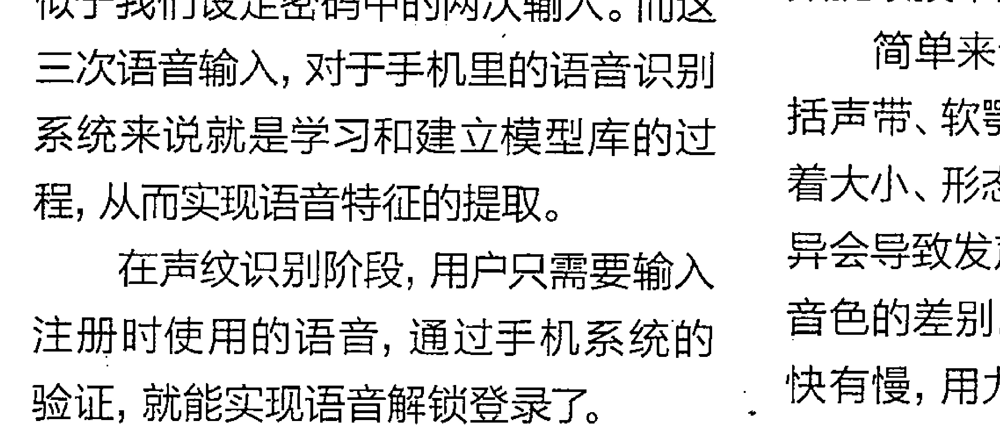

通过上面的讲解可以看出，声纹识别的关键技术在于语音预处理后的特征参数提取技术，那么语音特征参数是如何提取的呢？

目前常用的语音特征参数的提取技术主要有以下几种：

- 一是语音频谱参数。这种参数的提取主要是基于说话人发声器官，如声门、声道和鼻腔等的特殊结构而提取出说话人语音的短时谱特征（即基音频率谱及其轮廓）。它是表征说话人声音的激励源和声道的固有特征，可以反映说话人语音器官的差异，而短时谱随时间或幅度变化的特征，在一定程度上反映了说话人的发音习惯。
- 二是小波特征参数。这种参数的提取是利用小波变换技术对语音信号进行分析处理以获得表示语音特征的小波系数。小波变换具有分辨率可变、无平稳性要求和时域频域兼容表征等优点，能够有效地表征说话人的个性信息。因此，它在声纹识别系统中实际应用时体现出计算量小、复杂度低、识别效果好等特点，是近年来语音特征参数提取技术的热点。

简单来说，因为人的发声器官，包括声带、软颚、舌头、牙齿、唇等，存在着大小、形态及功能上的差异。这些差异会导致发声气流的改变，造成音质、音色的差别。此外，人发声的习惯亦有快有慢，用力有大有小，也造成音强、音长的差别。这些特征表现了不同声音的不同波长、频率、强度、节奏。而提取过程就是把声波的变化转换成电信号的强度、波长、频率、节奏变化，保存下来并建成语音模型库。

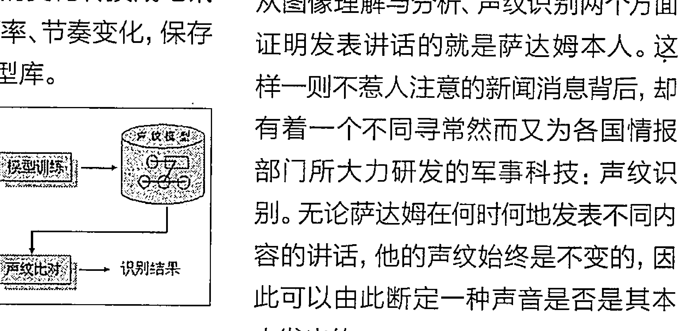

### 声纹解锁的绝招

你一定会有这样的疑问，如果声纹提取时是在安静的环境中进行，要在充满噪声的环境中使用声纹解锁，识别系统还能正常工作吗？这里就不得不提到声纹解锁的绝招：噪音处置算法。

大家知道，即便在嘈杂的环境中，我们人类还是有一种超能力——可以将噪音当做耳边风，将注意力集中在对方说话的声音上。但是手机相对伟大的人类来说，这种能力绝不是与生俱来的。

所以声纹解锁功能有两个超级的语音处理能力。第一个是使用语音端点检测算法，探测用户输入语音的起始和终止位置，也就是说，哪怕外面吵翻天，但用户可能一个字都没有说。这种算法可以精确探测到用户说话到底说了哪一段，因此分析起语音来可以有的放矢。第二个是使用信噪比估计算法，检测用户输入语音的质量是否满足需求。如果背景噪声太强，就会提示用户重新输入。

其实，声纹识别的使用在军事或刑侦上经常用到，就拿我们熟悉的美国对伊拉克的战争来说，在美国第一轮“斩首”行动之后，伊拉克总统萨达姆马上发表电视讲话，鼓舞士气，同时证明自己的存在。此时，德国科学家分别从图像理解与分析、声纹识别两个方面证明发表讲话的就是萨达姆本人。这样一则不惹人注意的新闻消息背后，却有着一个不同寻常然而又为各国情报部门所大力研发的军事科技：声纹识别。无论萨达姆在何时何地发表不同内容的讲话，他的声纹始终是不变的，因此可以由此断定一种声音是否是其本人发出的。

目前，声纹识别在生活中的应用才刚刚开始，也许在不久的将来，声纹识别技术会有新的玩法。可以预见，“芝麻开门”的故事将越来越多。

## 深入剖析EXE程序的内容

我们每天都在跟各种软件程序打交道，也知道程序文件里实际就是一条条命令或数据。但是软件到底如何运行，它在后台具体做了什么，你了解吗？

文|深度

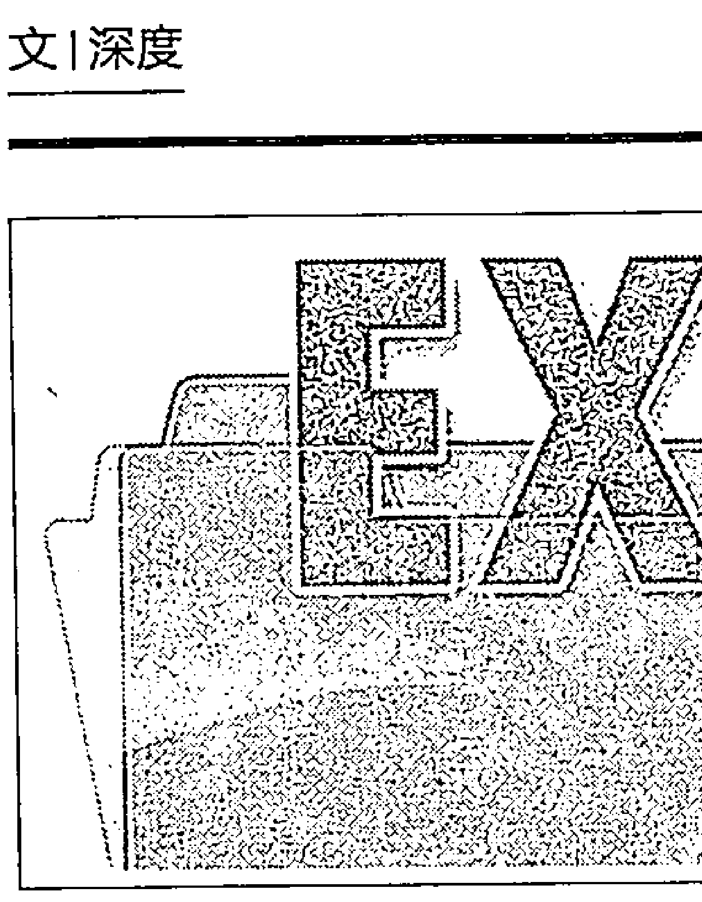

个人电脑上，Windows系统依然一家独大，而在Windows系统下，我们双击过无数次的EXE程序文件（或者链接到EXE的程序快捷图标）以运行各种软件。今天我们就来揭秘EXE程序的前世今生，以及它的内部运行机制，它的指令是如何传递到CPU中并带回结果。只有知己知彼，在各种软件出现状况时就能明了问题之所在，遇到病毒侵扰时也能很快找到头绪了。

病毒伪装成一个网址（如www.example.com）作为附件发给用户，如果不小心点击就会中毒；因为它不是网址，而是一个文件名为www.example的com病毒程序。

虽然文件扩展名同为EXE，但DOS下的EXE可执行文件主要为MZ格式，它的一个比较明显的标志就是文件头中包含一个ASCII字符串“MZ”（16进制中表示为4D5A，也称为“幻数”，它实际是DOS开发者之一的名字缩写）。Windows下的EXE主要为Portable Executable格式（简称PE），它是从Unix中的COFF格式修改而来，意为可移植的可执行文件。

PE格式可执行文件（除了EXE外，DLL、CPL、SCR、SYS、OCX等等也是PE格式），本文将主要介绍这方面的内容。

PE文件使用的是一个平面地址空间，所有代码和数据都合并在一起，组成一个很大的结构。

### EXE是个什么东西

电脑中的文件类型数以千计，令人眼花缭乱，但归纳一下会发现它们实际也就分三大类：一是如文本、图像、音乐、视频等以数据为主的数据文件；一是Windows、Linux等系统的可执行文件（即程序）或脚本；一是可以将不同类型文件打包在一起的压缩包文件。

Windows系统中的可执行文件，最主要的就是EXE文件（发音e-x-e），当我们双击一个EXE文件时，文件内置的自动执行代码便会被启动，接下来便可进行各种操作。

EXE的前身是DOS下的COM命令文件。COM文件结构比较简单，它的大小不能超过64KB，局限性太大，渐渐被更灵活的多段结构的EXE所取代。曾经有一段时间，一些电脑病毒编写者利用某些网民电脑知识的缺乏，将COM

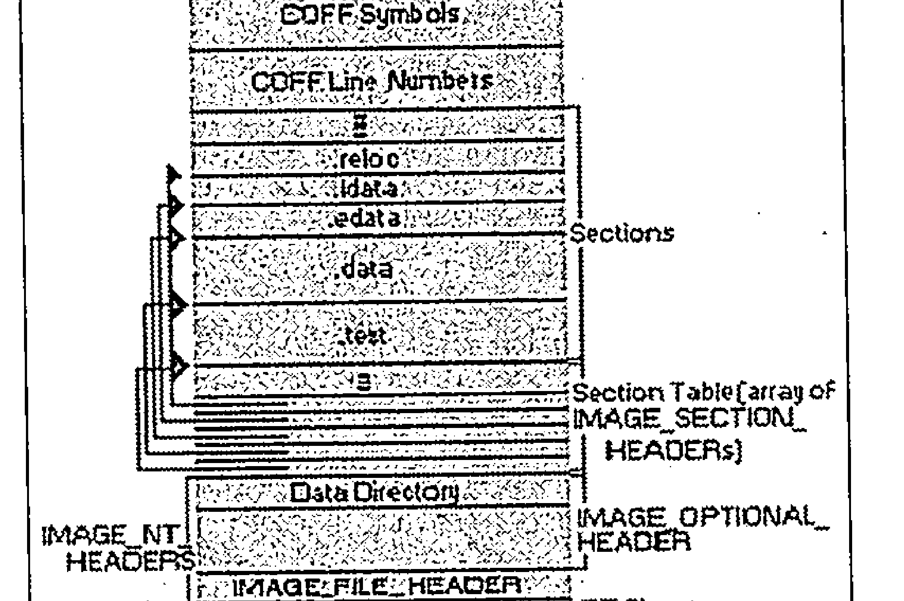

### 解剖EXE文件的结构

不管什么类型的可执行文件，一般都由两大部分组成：头部+代码主体。以DOS-MZ可执行文件格式为例，文件头部描述出文件的总体结构，包括各种说明数据，比如第一句可执行代码执行指令时所需要的文件入口点、堆栈的位置、重定位表等。操作系统根据文件头的信息把代码部分装入内存，然后再根据重定位表修正代码，最后在设置好堆栈后从文件头中指定的入口开始执行。

| MZ 标志 | MZ 文件头 |
| :--- | :--- |
| 其它信息 | |
| 重定位表的字节偏移量 | |
| 重定位表 | 重定位表 |
| 可重定位程序映像 | 二进制代码 |

Windows下所有PE文件都以一个简单的DOS-MZ头开始，在偏移0处（也就是文件最开始的位置）设置有“MZ”标志，一旦错误地在DOS下运行这一EXE程序，将会直接运行紧随DOS-MZ后面的DOS stub部分。DOS stub实际就是一个有效的微型EXE，它负责在不支持PE文件格式的操作系统中（如DOS），给出一个简单的错误提示。

许多人有过这样的体验，在DOS环境下运行一个Windows程序，会显示出类似This program cannot run in DOS mode（此程序不能在DOS模式下运行）的提示，这一提示就包含在DOS stub中。

紧接DOS stub之后就是PE自己的文件头了，在一个支持PE格式的系统上（Windows），PE装载器会跳过DOS-MZ和DOS stub部分，直接定位到真正的文件头PE header。PE header由三部分组成：字串“PE\0\0”（标志）、映像文件头、可选映像头。这几部分包含了PE装载器需要的许多信息，以便正确地将程序装载到内存中。

紧接着PE头部信息后面的是Section table（节表）。PE文件的内容是以Sections（节）来划分的，每节是一块拥有共同属性的数据，比如代码节（一般名为.text或CODE，每个PE文件必然都有此节）、数据节（一般名为.data或DATA）、引入函数节（一般名为.rdata）、引出函数节（一般名为.edata）、资源节等等。节表就是对本程序中节的属性、位置、大小等的记录。如果PE文件里有5个节，那么这个结构数组内就有5个成员。

### EXE怎么被装到内存中

EXE文件是不能直接运行的，它执行各种命令需要经过操作系统，它与各种硬件打交道也要经过操作系统。操作系统提供了一套接口供EXE调用。这套接口，就是所谓的操作系统的Shell，俗称为壳。Shell分命令行式和图形界面两种，Windows资源管理器（Windows Explorer）就是应用非常广泛的一套图形界面Shell。

当我们在Windows的资源管理器（以下称之为Shell）中双击一个EXE文件时，Shell调用CreateProcess激活此EXE，系统产生一个“进程核心对象”，并在内存中为此进程建立一个4GB的地址空间。

PE装载器检查DOS-MZ头信息，查询PE文件头的位置，找到后跳转到那里执行下一步操作，在检查PE头有效的情况下即跳转到PE头的尾部。接着将紧随其后的节信息映射到内存中，再处理引入表部分，如果此EXE调用了外部的动态链接库（DLL），还需要把涉及到的DLL也加载到进程空间中。至于EXE调用了哪些DLL，加载器根据idata节中的记录即可获取相关信息。如果没有找到相应的DLL文件，此时程序就会显示错误信息，即著名的“没有找到某DLL文件”。

代码、数据、相应资源加载完毕，这时系统将为这个进程建立一个主线程。注意，这个线程才是真正的程序，是CPU执行的单位。接下来即调用启动代码，调用EXE中的主函数WinMain，程序开始运行，此时便可看到我们熟悉的程序窗口了（如果此EXE有窗口界面的话）。

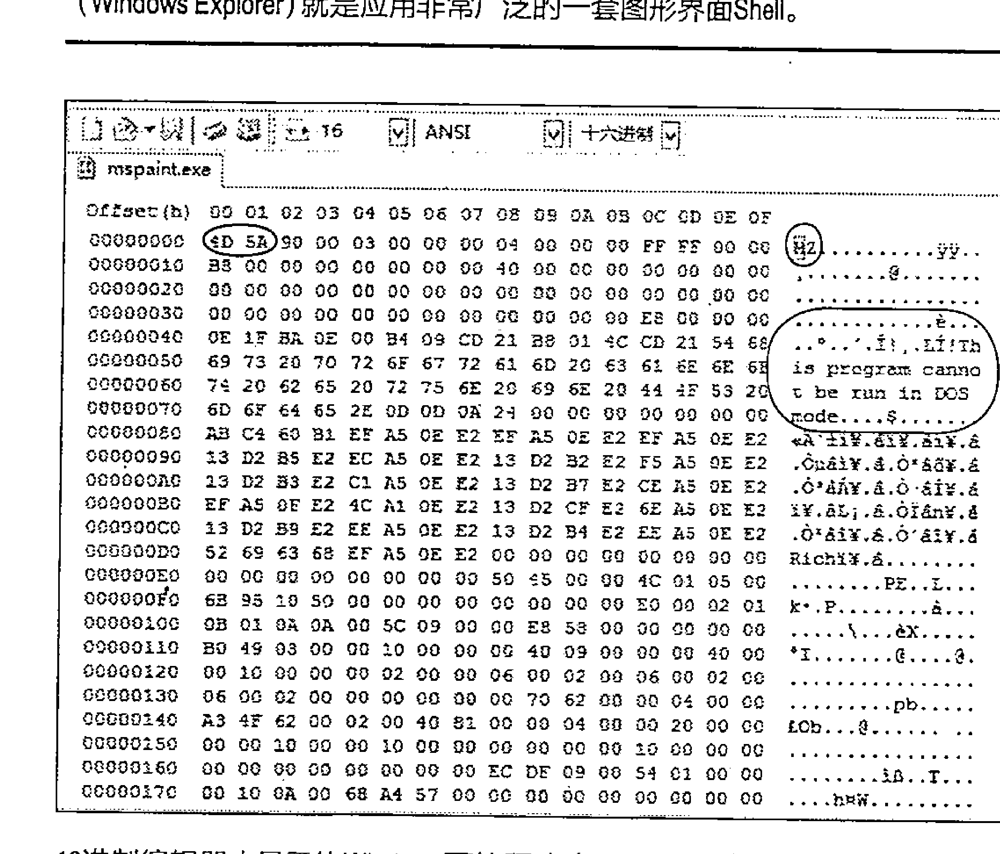

程序运行结束后，线程被结束掉，回到启动代码（Startup code），再返回系统，系统调用ExitProcess结束进程。

### PE病毒程序怎么回事

病毒实际也是程序，只不过它的目的是搞破坏或盗窃隐私而已。不过病毒是“老鼠过街人人喊打”，所以它要想方设法隐藏自己（比如没有前台界面，完全在后台运行），还要想办法运行自己，这就造成了病毒程序的独特性。

传统病毒由引导、触发、感染、破坏四大模块组成。病毒程序不能指望用户主动去启动它，只能依靠一些欺骗手段。比较典型的做法有两种：一种是通过修改注册表，将自己加到随机启动中，开机自动运行；一种是把自己寄生在正常的EXE文件中（即所谓感染），通过修改EXE文件的PE头信息，当用户运行被感染的EXE时，将被跳转到病毒引导模块中，偷偷加载完病毒代码后，再转向EXE的正常执行指令，从而在你毫不知情的情况下完成病毒的加载。

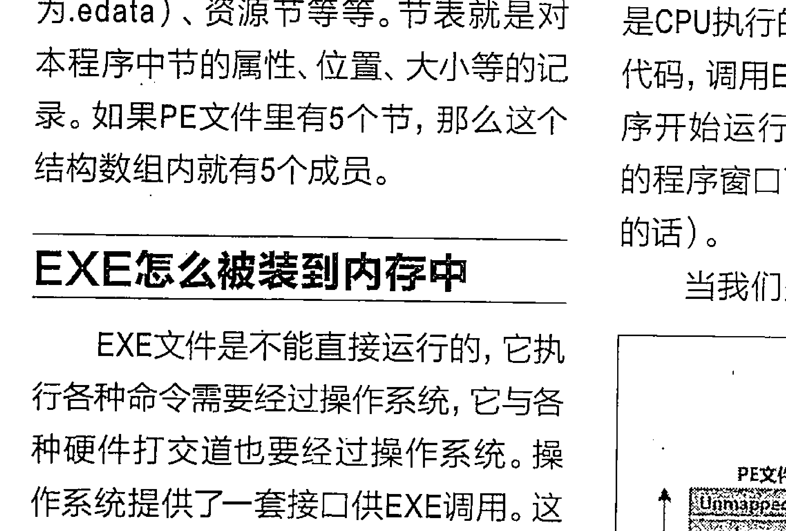

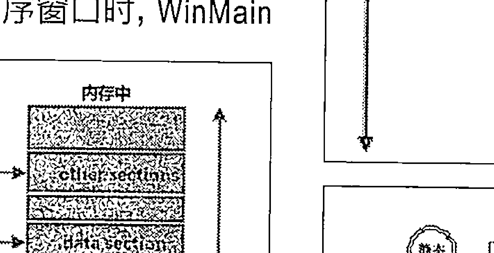

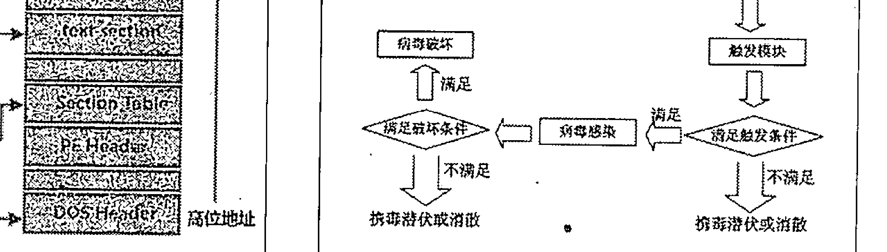

## 知识图谱：谷歌打造未来搜索

谷歌彻底改变了我们度假、购物、工作及娱乐的习惯，如今，谷歌的“知识图谱”再次计划颠覆互联网的搜索方式。知识图谱是什么？它们能做到吗？

文 | 深度

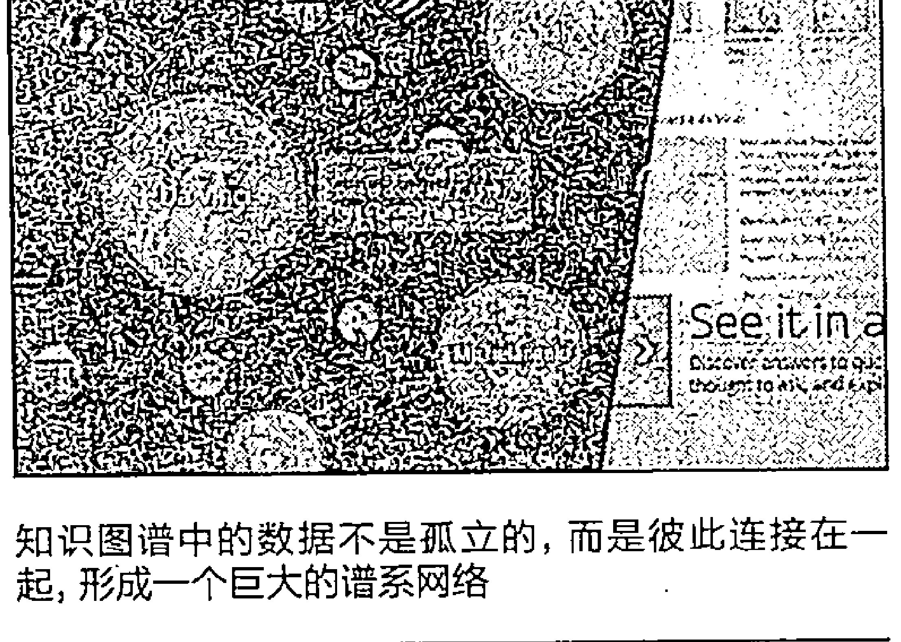

搜索技术日新月异，如今它不再是在搜索框中输入几个单词那么简单了，不仅输入方式多样化（比如越来越流行的语音输入），并且还要在非常短的时间内给出一个精准而又全面的答案。目前，谷歌给出的解决方案就是——知识图谱（Knowledge Graph）。

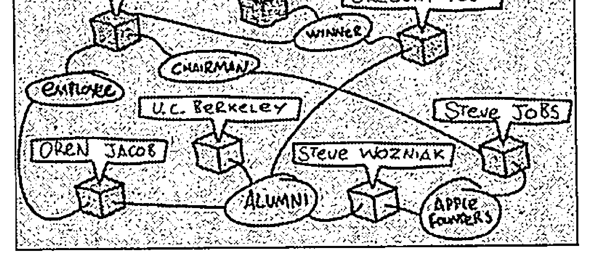

### 知识图谱能做什么

我们搜索的时候，不只是为了找到一个网页，其实更希望得到答案，并想对搜索的内容有更深的理解和探索。知识图谱想要做的，就是在不同数据（来自现实世界）之间建立联系，从而带给我们更有意义的搜索结果。

比如在谷歌中搜索一个关键词“达·芬奇”，右侧会显示达·芬奇的生平、背景、名画、雕塑、居住位置、图书等等相关信息。点击这些知识点，又可以深入进一步了解。这就是知识图谱，它不再是单一的信息，而是一个多元的信息网络（编者注：现在百度、必应上也可以体验到相似的功能）。

### 知识图谱的源头

知识图谱的雏形好几年前就已出现，一家名为Metaweb的小公司，将现实世界中实体（人或事）的各种数据信息存储在系统中，并在数据之间建立起联系，从而发展出有别于传统关键词搜索的技术。

| 第 1 次匹配 | s=cddcdc<br>t=cdf | i=3<br>j=3 | 失败 |
| :--- | :--- | :--- | :--- |
| 第 2 次匹配 | s=cddcdc<br>t=cdf | i=2<br>j=1 | 失败 |
| 第 3 次匹配 | s=cddcdc<br>t=cdf | i=3<br>j=1 | 失败 |
| 第 4 次匹配 | s=cddcdc<br>t=cdf | i=6<br>j=3 | 成功 |

谷歌认为这一系统很有发展潜力，于2010年收购了Metaweb。那时Metaweb已经存储了1200万个节点（Reference point，相当于一个词条或者一个页面），谷歌收购后的两年中，大大加速这一进程，现已有超过5.7亿个节点并在它们之间建了180亿个有效连接（这可是一个相当大的数字，维基百科英文版也才大约400万个节点）。

### 像人一样思考的搜索引擎

谷歌成立之初，组织互联网知识库的主要策略是Brute Force算法。Brute Force是一种暴力算法，也称之为“简单匹配算法”，它的基本思路就是：从目标串s的第一个字符起和模式串t的第一个字符进行比较，若相等，则继续逐个比较后续字符，否则再从目标串s的第二个字符开始，依此类推。

其实说白了，目标串s就是网页数据，模式串t就是我们搜索时输入的关键词，谷歌将关键词与网页数据逐个比对，如果网页中包含了关键词就是匹配成功，返回搜索结果给我们，如果网页中不包含关键词，则丢弃，再从其他网页开始。这种“傻干活”的模式是典型的计算机行为，绝不是人类的思维。

如果搜索How tall is Justin Bieber（贾斯汀·比伯有多高），谷歌会先做一个分词的预处理，单词is太常见了，几乎所有英文网页中都会包含，所以搜索它毫无意义，必须把它过滤掉（但在整句中会保留，搜索引擎会将整句完全匹配的优先显示）。即使如此，包含关键词How、tall、Justin Bieber的网页依然有很多，所以传统的搜索总是包含了成千上万的“垃圾”结果。

知识图谱首先要做的事，就是要像人一样理解用户查询时的用意，它不但需要明白这一句中Justin Bieber是绝对的主语，而且还要明白Justin Bieber和tall之间的关系。这就涉及到当下异常火爆的人工智能中的自然语言处理（NLP）技术。所谓自然语言，就是我们平时所说的话（包括语音或文字），但这些话计算机如何能“理解”？过程很复杂，下面是其中的几个关键步骤。

### 步骤1：词法分析及分词

英语中同一个词往往有多种形态，比如works、worked、working，都是work的变体，词法分析时要将其识别、还原。汉语在词法分析时还需要分词，比如“结合成分子”，可以是：结合、合成、成分、分子等词，需要算法进行正确切分。

知识图谱首先努力“理解”用户的真实想法，然后，它搜索知识库，通过千丝万缕的联系，把最贴近的答案从海量数据中捞出来，直接放在你我的面前。

### 步骤2: 词性标注

自然语言处理的难点之一，是词语的歧义性，比如本例搜索中的How tall is Justin Bieber，其中how既可以是副词也可以是疑问词，tall既可以是副词也可以是形容词，如果搜索引擎不能正确判断出词性，也就不可能理解它真正的含义。我们可以去http://nlp.stanford.edu:8080/corenlp/process试试这个在线工具，自动给英语句子进行词性标注。

### 步骤3: 句法分析

在词性标注的基础上，基于一定的规则（如CFG），或者基于大量语料库中的概率统计，确定词与词之间的关系，识别出句子的句法结构。

### 步骤4: 语义和语境分析

语义是在句法分析基础上确定句子所表达的真正含义，而语境则需要分析句子与句子之间的联系（即上下文关系）。

谷歌搜索的负责人辛格尔表示，早在2002年，基于路德维希·维特根斯坦的理论，谷歌对上下文语义分析有了很大改进。如果某个语义含糊不清无法判断，就通过该词的相关词汇进行查询，比如热狗，通过相关词“芥末”或“球赛”，就会明白它是一种快餐食物，而不是一只很热的狗。

谷歌准确的语义分析，还得益于每天亿万次访问谷歌的那些用户，时时向用户学习以给机器“培养思维”。一个简单的分析方法，就是通过用户在页面上的时间长短来判断，如果用户点击一个搜索结果后停留很长时间，则说明这个页面正是他所需要的，反之则可能是不理想的结果。通过这些反馈，一点一点改进搜索。

经过上面一系列处理，现在搜索引擎已经理解到，How tall is Justin Bieber，问的是贾斯汀·比伯的身高，而不是那些仅仅包含了贾斯汀·比伯这个关键词的网页。

**小知识**
关于计算机“理解”的标准，涉及一个有趣的图灵测试。测试人在与被测试者（一个人和一台机器）隔开的情况下，通过一些装置（如键盘）向被测试者随意提问，如果测试人不能确认被测试者30%的答复哪个是人回答的哪个是机器回答的，那么这台机器就算通过测试，并被认为具有人类智能了。

### 知识图谱直接给出答案

当计算机“理解”了我们的提问，它才有可能给出我们真正需要的答案。如今再在谷歌、必应等搜索引擎中搜索How tall is Justin Bieber，除了传统算法所带来的成千上万的搜索结果外，它们还会在页面最顶端直接给出明确的回复：这位欧美当红歌星的身高为5.7英尺（1米7）。

传统的搜索返回一堆结果，需要我们再次判断，决定是否点击进入。而知识图谱的终极目标，是搜索后直接给出答案。上面我们分析了知识图谱如何理解问题，接下来则需要知道，答案从哪里来？以贾斯汀·比伯为例，关于他身高的答案，数据源自freebase.com，它实际就是前文所说的被谷歌收购的Metaweb创办的网站。

Freebase跟维基百科非常相似，是个创作共享类的网站，所有内容都是由用户添加，数据可以自由引用。两者之间最大的不同，就是Freebase中的条目都采用结构化数据的形式，而维基百科就没有这么严谨了。

以贾斯汀·比伯的条目为例，其中的内容都是格式化的，一条一条像履历表，包括出生时间、出生地点、性别、职业、国籍甚至亲属等，还有就是前面我们所查询的身高资料。这套格式是固定的，所有人物条目都包含同样字段。所以，它实际上就是一个开放的在线数据库。

### 知识图谱并不神秘的秘密

看到这里，相信大家已恍然大悟，知识图谱并不神奇，它所有能给出的答案，实际上已经存在数据库中了。简单来说，知识图谱就是用“搜索+知识库”的方式来重新组织海量网络数据。

知识图谱首先努力“理解”用户的真实想法，然后，它搜索知识库，通过千丝万缕的联系，把最贴近的答案从海量数据中捞出来，直接放在你我的面前。

知识库中的数据不是孤立的，每个条目之间建立有深厚的关联，就以上面的贾斯汀·比伯的表格来说，它将比伯与数据库中其他的人、地点、事物，如比伯的父母姐妹、加拿大、妹妹们、歌手们等链接在一起，形成个人的一个网络。再比如，当你通过知识图谱查询“唐宁街10号”时，谷歌不是简单给出一个地名的答案，而是像生活中的路人一样给你更多的相关联信息。

从某种程度来说，知识图谱只是一个无穷无尽的工程的开始，谷歌在Metaweb原有基础上，将数据条目扩增到5亿以上，但这些还远远不够，因为人类的问题总是没完没了。

+   本文参考
-   卫报：http://tinyurl.com/a7fvc8w
-   纽约客：http://tinyurl.com/7u2l7zy

## 简单一扫 开启不简单的历程

二维码已经走进我们的生活，在杂志封面上、软件下载网站里、大街小巷的宣传广告中我们随处可见二维码。你知道二维码扫描背后的工作原理吗？

文/深度

我们已经习惯了拿着手机对着二维码轻轻一扫、软件自动识别的过程，可是你知道在这短短的几秒钟时间里，二维码是如何被定位识别的吗？

### 认识二维码

说起二维码，现在常见的二维码都是以QR码作为编码的码制，它是在一个矩形空间内，通过黑、白像素在矩阵中的不同分布来进行编码的。我们知道电脑使用二进制(0和1)数来贮存和处理数据，而在二维码中，用黑白矩形表示二进制数据，我们肉眼能看到的黑色表示的是二进制“1”，白色表示二进制的“0”，黑白的排列组合确定了矩阵式二维条码的内容，以便于计算机对二维码符号进行编码和分析。通过黑白表示0和1便于计算机读取，这就是二维码为什么都是黑白图形的原因。

### 二维码扫描定位流程

不过，手机拍到的照片都是彩色的，对于扫描的二维码也是一样，它默认也是彩色的，只不过颜色有深有浅而已，所以识别软件正是依靠颜色的深浅来完成对二维码识别的第一步。这一步叫做灰度化，也就是说颜色深的按深灰处理，颜色浅的按浅灰处理。

仅仅有了灰度的识别还是不够的，因为扫描时受周围环境的影响，会有噪声。这里所谓的噪声其实就相当于手机拍照时产生的噪点一样，也许照片上的噪点对照片并不会太大的影响，但是扫描时的噪声却容易引起扫描的分析错误，所以第二步就是去噪。

完成了上面两步，就进入至关重要的二值化流程。因为上面已经说过，计算机采用二进制，而将深灰和浅灰的图案转换成只有黑或白两种颜色，就是二值化处理的任务，在二值化处理时，二维码将会首先被解读成白色黑色的条码。然后根据解析公式和阈值运算将其转化成二进制信息，也许再深入讲解公式可能一般人不能理解，但是我们要知道，二值化是一个非常复杂而且需要相当准确的步骤。

结束了上面的三步，接下来就是寻找探测图形。什么是探测图形呢？

经常看二维码的朋友都知道，二维码上有三个方块，这三个方块有什么作用？代表了怎样的含义呢？其实它的准确叫法就是位置探测图形。有了这三个点，不管是从哪个方向读取二维码，信息都可以被识别。即使将二维码图形旋转，也可以识别。

每个位置探测图形可以看作是由3个重叠的同心的正方形组成，它们分别为7×7个深色模块、5×5个浅模块和3×3个深色模块。位置探测图形的模块宽度比为1:1:3:1:1。这种1:1:3:1:1的宽度比例特征在图像的其他位置出现的可能性很小，因此被作为位置探测图形的扫描特征。正是基于此特征，当一条直线上（也就是扫描时看到的那条红线）被黑白相间地截为1:1:3:1:1时，可以认为该直线穿过了位置探测图形。

此外，二维码上还有一些图形混杂在几何图形中，是肉眼看不出来的，比如定位图形和分隔符。定位图形就是图中连接三个位置探测图形之间的两根“线”，它的作用是决定二维码符号中模块的坐标，而分隔符的作用是将位置探测图形与符号的其余部分分开。也就是说，通过扫描能读取的数据信息在二维码中的位置是由定位图形和分隔符决定的。所以二维码上都有三个小方块，它的作用主要是方便识别和决定二维码符号中模块的坐标。

完成了上面灰度化、去噪、二值化和探测图形等四步，一个正常的二维码定位识别流程就结束了。

### 二维码译码与纠错

当得到了一个可识别的二维码后，接下来的工作就是译码和纠错。译码就是对二维码中所包含的格式信息、版本信息、数据和纠错码信息进行解码和比对，而纠错是在译码的同时进行的。其实，一个二维码除了上面讲到的探测图形外，还有各种译码信息被集成在二维码中，通过二维码包含信息示意图我们就可以对一个二维码所含的信息元素有大概的了解。

完成了译码，手机上从二维码的识别到解码的工作就完成了，剩下的工作就是联网传输数据，从而获得二维码的相关内容。也许你不曾想到，看似操作简单的二维码识别，没想到背后会涉及到这么多的步骤和公式计算，而这仅仅还是针对普通的二维码，如果是一个加密的二维码，其背后的工作可想而知。

## 定位快慢为何取决于GPS的努力

都是手机，为啥有些型号GPS可以实现秒定，但有些型号10分钟都搜不到一颗卫星呢？是什么在影响手机或GPS设备的定位能力呢？

### GPS定位系统的组成

GPS定位系统主要由覆盖全球的24颗卫星组成，其中包括21颗工作卫星和3颗备用卫星。这些卫星被平均分布在6个轨道平面内，犹如“人造星座”一般悬浮在距离地面2.02万公里的空中。它们每隔12小时围绕地球旋转一周，以确保在任意时刻、任意地点都能够观测到4颗以上的卫星。这些卫星任劳任怨地在预设的轨道上周而复始地移动，而且无时无刻不在通过卫星信号向全世界广播自己当前位置的坐标信息，同时还会附加上该数据包发出时的时间戳。

此外，卫星广播的信号中包含载波、测距码和数据码等信息，其中测距码分为粗码C/A码和精码P码。C/A码的精度约100米，主要用于民用设备，而P码的精度小于10米，仅为美国军方服务。这一点无需多言，大家都明白。

为了管理这24颗卫星，美国在全球各地建立了完善的GPS控制中心。其中包括1个主控站、5个监测站和3个注入站。卫星广播的信号首先会被监测站接收，以检测卫星运行状态、收集天气数据，并将这些信息传送给主控站。主控站在收集卫星数据之后，会计算出卫星的星历和时钟修正等参数信息（还能控制卫星，在卫星出现故障时可随时调度备用卫星），最后由注入站再将这些参数重新注入卫星。这种注入对每颗GPS卫星每天进行一次，并在卫星离开注入站作用范围之前进行最后的注入。

### GPS设备是如何定位的

前文提到过，GPS卫星广播信号的数据包中含有时间戳，当GPS设备（如车载GPS、智能手机）接收到数据包后，会用当前时间（GPS设备所显示的时间）减去时间戳上的时间，从而得到数据包在空中传输所用的时间值。根据我们在初中物理课就学过的“距离=速度×时间”计算公式，用这个时间值乘上它的传输速度，就是数据包在空中传输的距离，也就是该卫星到GPS设备间的距离了。

根据立体几何的知识，只要确定了GPS设备与三颗卫星之间的距离就能实现定位了。但实际上，GPS设备必须在搜到四颗卫星时才能正常工作，这是为什么呢？原来，GPS卫星广播信号的传输速度会受到空中电离层的影响而出现误差，为了确保定位的精准无误，必须加入一组额外的距离数据来进行校正，这也就是为什么必须有四颗卫星才能定位的原因。

### 谁在影响GPS定位速度

回到正题，GPS卫星的广播信号无处不在，影响手机定位速度的关键则是其对卫星广播信号的接收灵敏度，以及对数据包进行解码、编译的效率。可见，手机内置的GPS导航芯片和接收天线的设计才是核心。专业GPS导航仪的定位速度普遍优于手机，就是源于这类设备有足够的空间来优化天线，并采用了SiRF等高端品牌的GPS接收芯片。

为了尽可能提升定位速度，手机也有自己的杀手锏：A-GPS。借助其可以随时随地联网的特性，依靠下载网络服务器端所存储的最新星图（24颗卫星当前大致的轨道信息，48小时一更新），可提高靠GPS芯片自身接收、解码卫星广播信号中包含位置信息的效率。

很多网站上都有通过修改gps.conf配置文件（位于Android系统System/etc/目录）来提升GPS定位速度的教程。这个配置文件的作用就是优化A-GPS服务器的相关信息，从而更快地辅助GPS定位。但是，配置文件仅能起到辅助效果，如果手机内的GPS芯片和天线设计不给力，修改配置文件的效果也会大打折扣，而对那些定位速度本身就很快的手机而言，即便你将gps.conf文件删除同样可以实现秒定。

## 虚拟现实 假作真时真亦假

虚拟现实一度只是科幻作品的宠儿，但随着多种虚拟现实产品相继问世，它与我们的现实生活越来越贴近。那么虚拟现实背后到底有哪些深层的技术呢？
文 | 深度空间

2013年的央视春晚已落下帷幕，不出所料，网上对春晚内容是一片吐槽之声。不过整台晚会中科技感十足的舞台效果，却意外得到大家的交口称赞，这要得益于今年春晚对增强现实（AR）技术的全面应用。增强现实其实是虚拟现实（VR）的一个分支，下面就让我们一起来揭开虚拟现实的缥缈面纱。

### 虚拟现实溯源

计算机的发展，开始的时候是字符界面（如DOS），我们通过输入命令与计算机进行交流，接着是图形化界面（如Windows），让我们与计算机打交道时更加形象化。而下一代则是虚拟现实的3D立体交互的时代，我们与计算机的交流将更加人性化。

TED 2013的年度大会上，美国麻省理工学院研究生Lee Jinha展示了一款3D桌面环境SpaceTop，我们可以将手“伸”进屏幕中，直接用手“捏”出要处理的文档窗口，直接从一个文档中“捏”住文字拖到另一个文档中，相当神奇。这就是虚拟现实的一个很好的应用实例。

实际上要追溯虚拟现实技术的起源的话，它早在1965年就已经被人提起了，当时Ivan Sutherland在IEIP会议上作了题为《The Ultimate Display》的报告，指出人们可以把显示屏当作一个窗户来观察一个虚拟世界，窗口中的图像必须看起来真实，而且其中物体的行为也很真实。1989年，美国人Jaron Lanier正式提出Virtual Reality (VR)一词，用来统称各种借助计算机技术实现的模拟环境的概念，一直沿用至今。

### 虚拟现实的系统组成

虚拟现实的本质，说白了就是一种人机交互的界面，它与Windows界面本质上并没太大差别，只不过它是立体的而已，更加接近真实世界的感受。

虚拟现实具有三大特征：沉浸性（临场感）、交互性（互动）、构想性（创造性想象力）。它以模拟的方式创建一个能够实时反应的三维图像世界（还能包括听觉、触觉、嗅觉等），让人有沉浸其中的感觉，并且可以在其中漫游和互动。沉浸性的实例，比如我们戴着3D眼镜欣赏3D版《阿凡达》时，就会产生身临其境的感觉，不过它还不是完全的虚拟现实，因为这时我们只是旁观者，还不能进入到3D电影的环境中并与其中的人物交流或者操控其中的器物。

目前来说，虚拟现实技术主要分为四大类：

1.  桌面虚拟现实，主要以计算机屏幕作为虚拟环境的窗口，如上面所说的SpaceTop；
2.  沉浸式虚拟现实，利用头盔显示器等设备把用户的视觉、听觉和其他感觉封闭起来，让用户完全沉浸于计算机所营造的虚拟世界，比如一些3D驾驶游戏；
3.  分布式虚拟现实，比如大型网络游戏，可以让不同位置的人处于同一场景中；
4.  增强现实技术，实际上是一种混合现实，将真实环境和虚拟现实的景象结合起来的一种技术，如央视2013春晚所应用的舞台特效。

不管是哪一类虚拟现实，基本上要具备：虚拟环境产生器，产生三维环境，是VR最基础的部分；信号采集系统，由各种传感器组成，采集动作、位置、声音、温度、速度等信号；信息输出系统，如图形显示、声音输出、力反馈等。

虚拟现实技术主要分桌面虚拟现实、沉浸式虚拟现实、分布式虚拟现实及增强现实这四大类。一个标准的虚拟现实系统则由虚拟环境产生器、信号采集系统及信息输出系统等三大部分组成。信息输出系统，这是使操作者产生感觉的部分，如声音、触觉、动感等。虽然是看起来有实际上无的虚幻世界，但是它需要各种硬件设备来支撑。

### SpaceTop 3D桌面工作原理

SpaceTop保留了传统的操作方式（键盘和触控板），并融入了新的三维空间操作方式。它的三维实现主要靠一对纵深摄像头和一个透明的显示屏来完成。这个系统中摄像头是非常重要的传感器，它用来实时追踪手指在三维空间中的坐标位置以及识别手势动作（比如捏住窗口的标题栏拖动），然后把它转换为多点触控板可识别的手势动作（相当于我们用鼠标按住窗口标题栏移动它）。

另外还有一个纵深摄像头用来追踪用户的脸部，它的主要作用是识别脸部动作，确定用户的视线角度，以便实时调整三维界面视图，确保正看、侧看等不同角度下看到的是差不多的界面。

### 春晚增强现实是如何实现的

虚拟现实（VR）所展现的全部是虚拟的，增强现实（AR）则是虚实结合。央视2013春晚中所应用的AR技术，其实是在前期已经制作好多个虚拟影像，然后在电视直播的过程中，通过电脑合成到电视画面上。也就是说，现场观众是看不到这些AR效果的，只有电视机前的观众大饱了眼福。

央视应用AR技术其实已有些时间了，比如2010年世界杯期间央视五套的《豪门盛宴》节目就曾应用过。

电视画面是动态的，虚拟的图像如何才能与电视画面同步呢？否则，当电视画面改变之后虚拟图像还在原来的位置，就会穿帮了。

解决的办法之一，就是设置一个图像标记，比如《豪门盛宴》节目在演播室中央就有这样的标记。首先，摄像机拍摄现实场景；然后，通过计算机视觉技术捕获标记实时记录它的位置和方向；最后，将虚拟的3D对象叠加到这一位置，从而达到虚实融合。

### 虚拟现实与全息技术

虚拟现实（VR）最重要的特征就是它完全由计算机模拟生成，增强现实（AR）的主要特点则是有实有虚。另外与虚拟现实容易混淆的就是全息投影。

全息投影是一种不需要配戴3D眼镜就可以观看到的3D技术，观众可以看到立体的虚拟人物。近来一些大型演唱会上演的当代歌星与已经逝去的歌星同台合唱的影像，不少就使用了全息投影技术。

全息技术本质上是一种投影技术，所以与虚拟现实还是有区别的，它可以直接看到影像，而且必须通过一定的介质将影像投射到上面才能显现出来（一般介质为空气，现在较多使用纱幕等介质）。

AR和全息投影，应算是虚拟现实的分支或拓展，这三者虽然不尽相同，但经常被整合在一起，我们的生活也因此变得多姿多彩了。

## 看越狱黑客如何大战iOS系统

文|王志军

如果你是iOS设备的用户，那么“越狱”一词想必不会陌生，基于安全和利益的考虑，iOS设备作出了种种限制。不过，每次有完美越狱发布，在完美越狱的背后，你知道越狱是怎样完成的吗？

2013年1月25日，一个名为Evad3rs的新团队成立，其主要任务就是完成iOS6的完美越狱。令人惊异的是，Evad3rs团队仅仅只用了10天的时间，就完成了完美越狱工具的开发工具（后来还陆续发布了一些兼容性更新）。那么，Evad3rs团队是如何完成iOS完美越狱的呢？

此次iOS6.0的完美越狱主要是通过软件的漏洞进行破解。越狱主要包括了寻找漏洞、注入、提权、修改、欺骗系统等步骤。

### 需要多个漏洞才能完美越狱

黑客需要从iOS系统找到漏洞，通过这个漏洞将代码注入到缓存，并通过另外一个漏洞将此代码提权，也就是说黑客至少需要2个以上的漏洞才能实现非完美越狱。如果是实现不需要计算机引导的完美越狱，漏洞自然是越多越好。

### 借道Symbolic Link

Symbolic Link类似于Windows系统下的快捷方式，通过Symbolic Link，可以将连接转到某个特定的Socket中，让不同程序之间可以互通信息。整个iOS系统中的Launch Daemon后台进程的启动程序都存放在“/System/Library/LaunchDaemon”目录下，这里有许多.plist文件。这些程序会在设备启动时率先启动，也就是说具备Root权限，可以启动其他应用。从Mac OS 10.4开始，苹果就采用Launch来管理整个操作系统的Services和Processes。

Evasi0n通过Libimobiledevice发现了iOS系统的一个移动备份漏洞，可以进入某个本该无法进入的设置选项，并在这个Time zone文件插入一个Symbolic Link，它会连接到某个接口，使之可以与Launch Daemon进行交流。这就意味着，当iOS设备进行备份时，就会自动让所有程序和文件都能访问Time zone，这样就将系统中的访问请求转移到了其他指定的位置，由此将越狱程序通过Symbolic Link连接到Time zone，让所有程序可以连接Launch Daemon。

### 绕过Code-signing

苹果用户都知道，如果你的iOS设备没有越狱，那么是无法安装破解版本的软件的。这主要是iOS拥有一个名为Code-signing的安全保障机制，它可以阻止非授权应用访问Launch。

在iOS设备上运行的代码都需要通过苹果的审核，并附带上有效的签名。一般开发者开发的程序，在正式发布到App Store之前，都需要使用苹果颁发的证书进行进行签名，然后由苹果进行审核，审核成功之后，苹果会对程序进行一次签名。

Evasi0n创建了一个没有代码的新应用，当用户启动这个新应用，它会利用Unix的Shebang获取已获签名认证的应用代码，从而通过Code-signing的审查。此后，它就可以再调用上文提到的Launch执行Root级的命令了，Evad3rs通过这种方式，来对RFS（Root文件系统）的只读权限使用remount命令变为可写，从而达到每次启动设备时都可以运行更改后的程序命令，从而实现越狱的永久性，即完美越狱。

### 破解AMFID防护机制

在iOS的系统内核中，还有一层名为AMFID（Apple Mobile File Integrity Daemon）的防护机制，它是用来监测移动文件完整性的守护进程。AMFID会校验代码签名，防止非授权应用的运行。

### 通过异常处理向量萃取内核地址

除了内核级的应用签名之外，苹果为了防止黑客在内核级的内存中随意修改，iOS还有最后一道名为ASLR（Address Space Layout Randomization，地址空间布局随机化）的防护功能，当系统加载时，ASLR会利用随机方式配置资料地址，防止某些内容总是存储在内存的特定部分，不让攻击者寻找规律。

Evad3rs团队使用了ARM exception vector（异常处理向量）这个核武器，模拟出异常情况，等待ARM异常向量给出崩溃的内存地址，从而拿到足够的信息，即系统核心内存的配置信息，这样整个内核的内容也就被抓到了。

### 夺取内核控制权

搞定ASLR之后，Evad3rs利用iOS连接USB的一个漏洞，把内核内存的某个地址传给一个应用，而应用返回来的内容就可以用来改写这部分内存地址，这样Evad3rs就可以修改内核任何部分的内容了。对于Evad3rs这样的团队来说，当拿到内核的权限之后，整个系统自然就是一个不设防的城池……

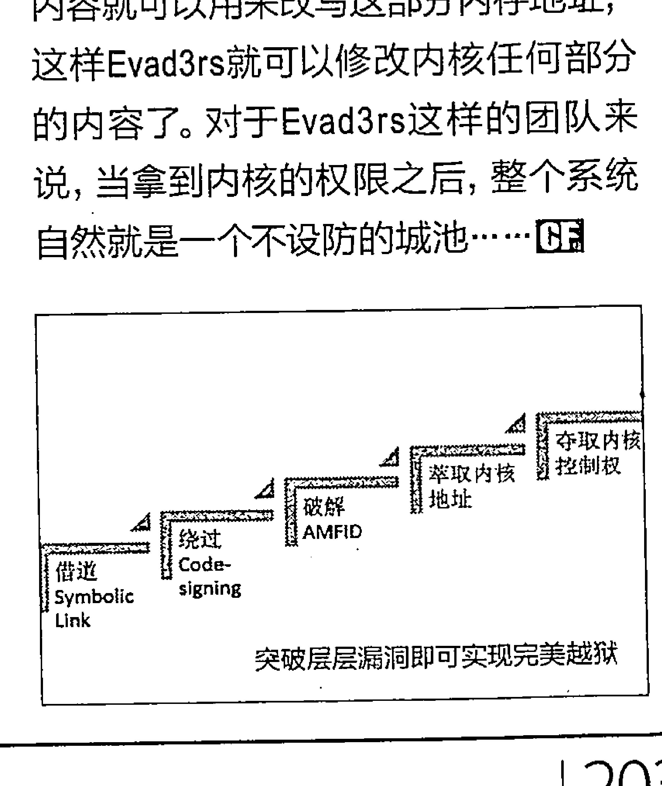

## 笔记本的“显存无用论”

最近有些笔记本的显卡已经开始武装起4GB的显存，容量甚至超越了主机本身的内存！那么，超大容量的显存可以改善游戏性能吗？大显存到底是噱头还是良药？

### 显存到底是“神马”东西

我们在显示屏上所看到的绚丽画面都是由一个个的像素点构成，每个像素点则是由4~64位的数据来控制它的亮度和色彩，而显存就是这些数据的存储中心，它会根据GPU(显卡核心芯片)和CPU的需求进行调配，最终把运算结果转化为图形输出到显示屏上。

总之，显存和内存类似，本身并不能对数据进行处理，它仅仅是用来存储GPU处理过或即将提取的渲染数据，这些数据通常包含如下内容：

- 1. 帧缓存 (Frame buffer)：我们实际将在屏幕上看到的内容，我们可以将其视为第1帧画面；
- 2. 后台缓存 (Back buffer)：又称第2帧缓存，即在屏幕上显示出当前帧缓存内容的同时，显存中所保存的下一帧画面。当后台缓存的内容显示时，帧缓存则写入第3幅画面……如此交替工作；
- 3. Z轴缓存 (Z-buffer)：记录像素到屏幕的距离，避免重复绘制相互重叠的像素以减轻GPU的计算量；
- 4. 纹理数据和几何数据：视具体程序的需求，无法定量计算。

上述渲染数据的大小取决于当前应用（比如某款3D游戏）的分辨率和具体的画质特效，比如像FSAA（全屏抗锯齿）、HDR、各种阴影渲染等最新技术一旦打开，显存的使用量就会节节攀升。

小提示：显存容量只能影响同一款显卡在游戏中的最低帧数，有助于降低游戏中出现短暂卡顿的现象。比如1GB显存的GT640M和2GB显存的GT640M在1080P画质下玩《战地3》都能跑到40fps，但1GB的版本最低帧数可能只有24fps，而2GB的版本则可达到30fps。

### 大显存的优势在哪里

虽然显存自身并不参与图像的计算和渲染，但显存依旧体现着不可忽视的作用。比如当某款3D游戏在高分辨率、开启全屏抗锯齿、各项异性过滤以及HDR的情况下所产生的纹理数据超过了显存自身的容量，此时系统要么清空显存后继续加载数据，要么调用速度较慢的系统内存充当显存，无论采用哪种方法都会对显卡性能造成影响，出现FPS下降或卡顿的现象。

换句话说，显存的容量大小体现在保存GPU渲染数据的冗余量上，在GPU芯片一定的情况下用“越大越好”来要求显存容量这一参数并没有错。但是，对两款采用不同GPU芯片的笔记本而言，刻意追求显存容量的大小就变得没有意义了。

### 显卡GPU芯片才是王道

首先，运行某款3D游戏时能跑到多少帧数和显存容量的大小没有线性关系，而是取决于GPU芯片自身的运算能力。我们不妨用2009年主流的GT130M独显(512MB显存)和2012年最新的G610M(2GB显存做个对比)，512MB显存的老显卡在3DMark06的得分可达6800左右，而2GB显存的新显卡却只有5500分左右(图1~2)！可见，在不同的独立显卡面前，GPU芯片自身才是王道，显存容量微不足道。

其次，目前90%以上的笔记本都以1366×768像素作为标准，在这个分辨率下进行游戏，哪怕你将画质特效调至最高1GB左右的显存也基本够用了，更大的显存容量颇有浪费之嫌。现在很多笔记本都喜欢用成本低廉的低端独立显卡+大容量显存作为噱头，在宣传中总会弱化GPU芯片而过分突出显存容量的优势，对小白用户的危害性极大。

### 编辑小结

总之，对独显笔记本而言，影响其游戏性能的参数排行顺序应该为：GPU核心型号>显存位宽>显存版本>显存容量。如果你陷入了显存至上的怪圈而忽略了显卡芯片自身的重要性，那就是拿钱打水漂了。

最后再总结一下我们什么时候才需要更大的显存容量：你的笔记本拥有1080P分辨率的屏幕（或是你喜欢外接显示器）、笔记本显卡型号为GT640M（GT730M）或以上级别、你喜欢在全高清最高画质下游戏。

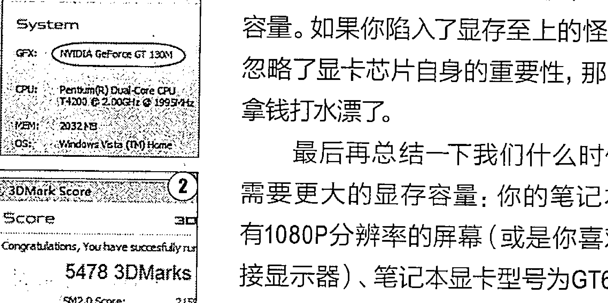

## 中国移动网络‘三英’战4G

近日工业和信息化部部长苗圩公开表示，4G网络目前6个试点城市已具备商用条件。那么什么是4G网络？4G又会给我们的工作和生活带来什么样的改变？

文|平淡

G是英文Generation(代)的缩写，4G就是第四代移动通信及其技术的简称，它集已有的3G技术与WLAN于一体，能够传输高质量视频图像，图像质量与高清晰度的电视不相上下。4G系统能够以100Mbps的速度下载，比拨号上网快2000倍，上传的速度也能达到20Mbps，就网速而言它已经超过目前主流的有线宽带！日后用户用上了4G，无论是视频聊天、在线游戏还是观看在线电影，都不会再受到网速的限制。

### 了解4G的前世今生

既然是4G，之前就有1G、2G、3G，其中的1G就是指第一代的通信标准，代表“人物”自然是大名鼎鼎的“大哥大”。2G则是指第二代的通信标准，从2G开始引入了GSM、CDMA两种模块技术，对应的由当时的中国移动和中国联通(合并之前的联通公司)执掌(CDMA现由中国电信运营)，自此移动通信市场告别中国移动独自垄断的局面。2G随后打上了2.5G和2.75G补丁，对应的我们可以在手机上使用GPRS、EDEG、CDMA网络实现无线上网和数据传输。

3G则是目前主流的第三代移动通信标准，其间国内通信企业进行了重组合并，国内三大运营商中国电信、中国联通、中国移动分别经营着CDMA2000、WCDMA、TD-SCDMA三种3G网络，自此移动通信市场三足鼎立的局面正式形成(图1)。

4G则是第四代移动通信标准，中国移动使用的是TD-SCDMA的升级版TDD-LTE，中国联通则是将当前WCDMA平滑升级到FDD-LTE。由于中国电信使用的CDMA2000目前还没有完全属于它自己的4G演进技术，而只能从FDD-LTE和TDD-LTE中去选择使用哪个4G技术。比如美国第一大移动运营商Verizon所运营的3G网络便是和中国电信相同的CDMA2000，Verizon目前选择了FDD-LTE作为自己的4G标准。

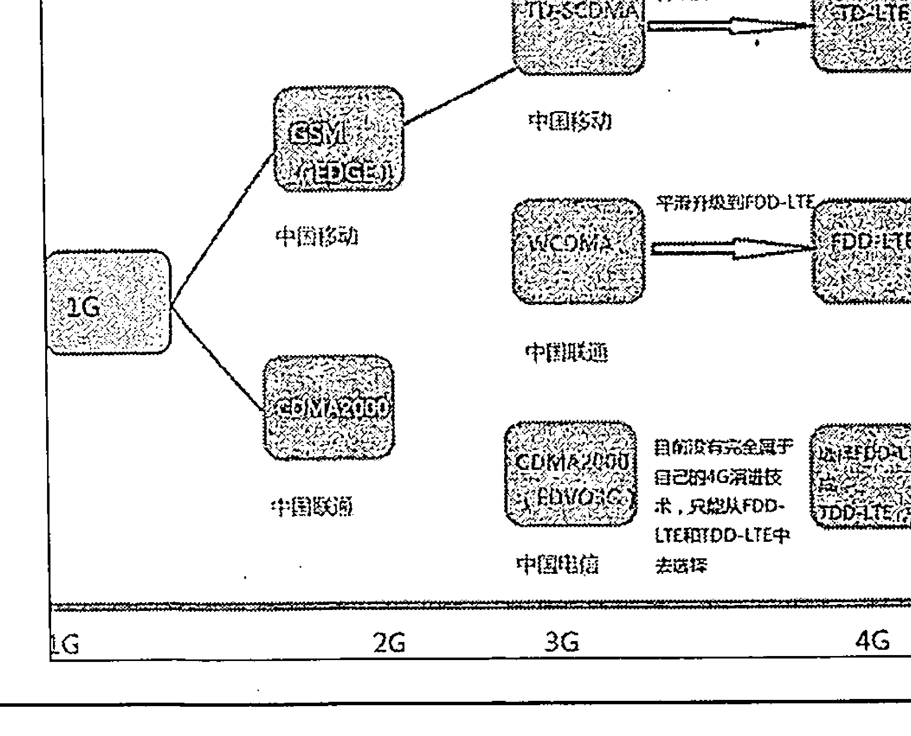

### 4G背后的博弈

从上面的介绍我们知道中国移动和中国联通分别都有自己的4G升级技术，它们都可以从目前的3G网络升级到未来的4G，省去网络重复建设的成本。中国电信由于目前还没有完全属于它自己的4G演进技术，因此在三家运营商中明显处于弱势地位。如何平衡好各大运营商的利益，这是目前工信部最为头疼的问题，这也是导致目前4G牌照迟迟未发放的主要原因。

TDD (时分双工) 是中国移动使用的4G技术，FDD (频分双工) 则是中国联通使用的4G技术。两者的数据传输模式不同，FDD-LTE模式下，频率是以成对模式分频使用的，一频用于下行带宽(DL Bandwidth)，另一频用于上行(Bandwidth)。在TDD-LTE模式下，频率的上下行配置是以时间作为分时配置，一部分时间安排下行数据，另一部分时间安排上行传送，在下行转上行的时候会有一段保护时间用于接收与传送间进行转换(图2)。

4G的LTE (Long Term Evolution，长期演进技术) 是3G的演进，它包括TDD、FDD两种双工模式。其中4G的高速传输可以为运营商带来极为可观的流量收入和附加应用扩展收入，它为各大运营商开辟了广阔的市场，中国移动、中国联通、中国电信这三大巨头自然都在对这个庞大市场虎视眈眈！

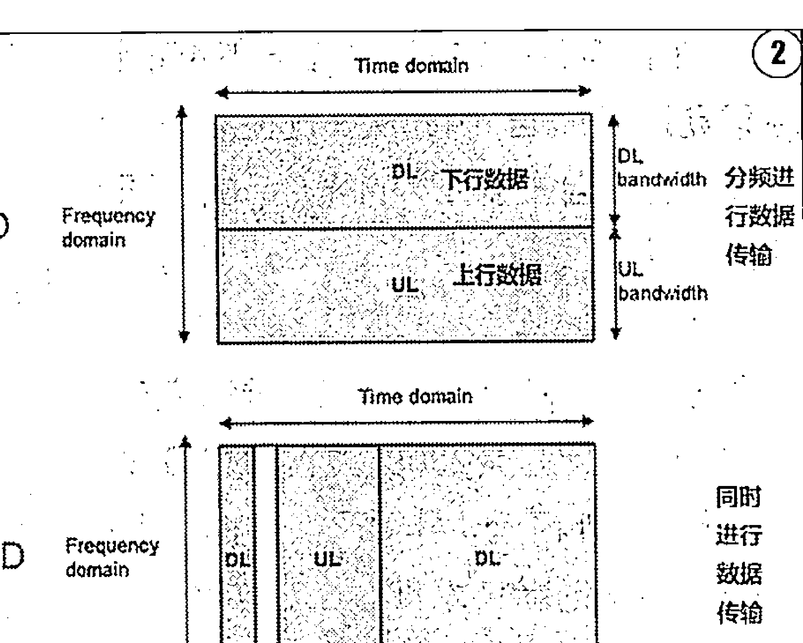

### 中国移动高调测试TDD-LTE

从技术上讲TDD-LTE和FDD-LTE各有优劣，不分伯仲。不过中国移动主推的4G技术即TDD-LTE，它是由阿尔卡特-朗讯、诺基亚西门子通信、大唐电信、华为技术、中兴通讯、中国移动等公司，所共同开发的第四代(4G)移动通信技术与标准，也是首个由我国主导的4G国际移动通信标准。

根据中国移动的规划，到2014年，中国移动TDD-LTE基站将达到35万个，届时我们就可以在手机上随时使用4G上网了。

由于TDD-LTE是我国主导的4G国际移动通信标准，因此从其诞生之日，它就头顶“自主创新”的光环，属于国家优先扶持项目。在3G网络建设方面，中国是世界上最晚上马3G的国家之一，为了等待自主创新技术TD-SCDMA的成熟，中国政府迟至2009年才发放3G牌照，落后国外将近十年。现在同样是为了扶持自主创新技术TDD-LTE，中国又可能成为率先发展4G的国家。因此虽然中国移动目前并没有获得4G牌照，但这丝毫不影响中国移动的TDD-LTE大规模建网与商用。政府对TDD-LTE的态度始终都是明确的——坚定扶持。

据媒体报道，目前发改委正在研究如何推进TDD-LTE的大规模发展，实现TDD-LTE在国内市场“三分天下有其二”的目标，让TDD-LTE成为中国主流4G标准显然是我国政府的主要目标。因此撇开技术面来说，TDD-LTE明显占有政策优势，这也让TDD-LTE在国内的推广具有得天独厚的优势。当然作为4G国际技术标准，它具备网络扁平化、物理共享宽带高、上行下行分时传输的优势。

在这种形势下，中国电信和中国联通陷入“两难”——上马4G，对刚刚投入巨资发展的3G网络是巨大的浪费；不上4G，移动明年就可能抢先商用TDD-LTE，电信、联通的3G业务将面临冲击。在4G上，中国移动占据了得天独厚的政策优势。当然面对中国移动咄咄逼人的攻势，联通和电信两大通信巨头也不会坐视不理。

### 中国联通低调布局FDD-LTE

中国联通使用的是FDD-LTE的4G标准，它和TDD-LTE相比虽然没有政策上的优势，但是它的优势是技术成熟，

就目前全球已在商用的4G网络来看，绝大部分国家的运营商都采用FDD-LTE的模式（图3）。

从全球移动通信产业发展趋势来看，绝大多数WCDMA运营商都选择了FDD-LTE作为演进方向，产业链已经非常成熟。因此从市场化、产业化的角度来说，FDD-LTE是有优势的，作为国际主流频段，1800MHz的FDD LTE已经获得从系统到终端的LTE产业链的广泛支持，包括苹果iPhone 5、三星Galaxy S3 LTE等终端也已支持该频段。

虽然4G牌照尚未发放，但是联通也早在4G布局上悄悄跟进。早在2012年4月上海联通总经理明确上海已成为联通LTE试验网城市，还有厂商透露西安已有LTE试验网，深圳、湖南长沙列入布网名单，只不过和TDD-LTE高调布局相比，联通公司4G布局显然要低调得多。

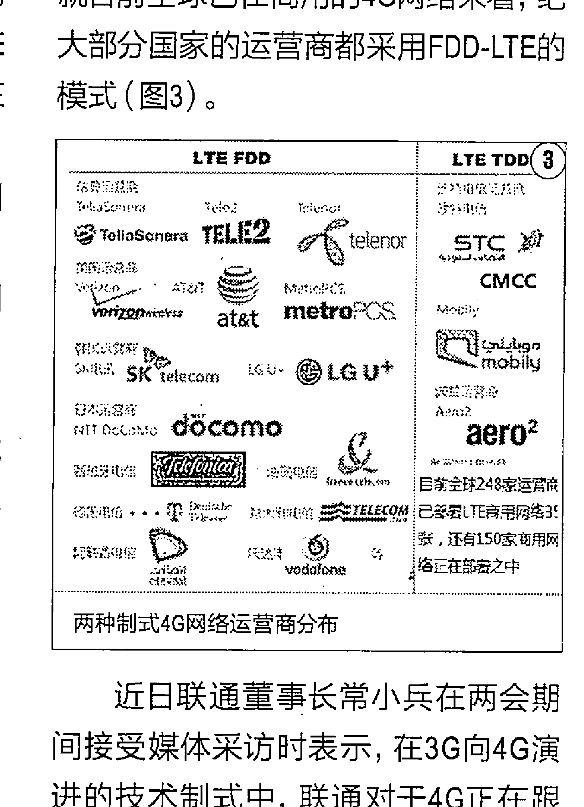

### 中国电信两手抓

对于中国电信来说，由于自己的网络目前还没有完全属于它自己的4G演进技术。因此在未来4G的布局上，中国电信该选择TDD-LTE还是FDD-LTE，这还是让其纠结不已。一方面从政策角度考虑，政府为了避免资源浪费和提高TDD-LTE市场占有率，自然是希望电信能够使用TDD-LTE技术。另一方面从市场角度考虑，4G推广除了网络建设外，用户终端的普及是很重要的一环，FDD-LTE成熟的产业链可以极大节约FDD-LTE推广成本，而且其全球4G用户众多，在全球一体化趋势下，可以为客户全球漫游提供很多便利。那么中国电信最终会选择哪种技术作为自己的4G规范？

4G技术标准就只有TDD-LTE和FDD-LTE两种，目前这两个技术标准正在互相博弈，就目前状况来说，中国电信采取的是“两手抓，两手都要硬”政策无疑是最保险的。据广东电信规划设计院的工程师称，中国电信目前国内约6个城市建设了LTE测试网络（涵盖TDD-LTE和FDD-LTE两种网络），为CDMA向FDD/TDD LTE过渡做了“两手准备”，并且已经完成了测试规范，网络设计规范也已出炉。显然对于日后该使用哪种规范，中国电信并没有最终确定，但是两手抓准备工作并没有放松，只要最终4G牌照发放，中国电信也可以立刻上马自己的4G方案！

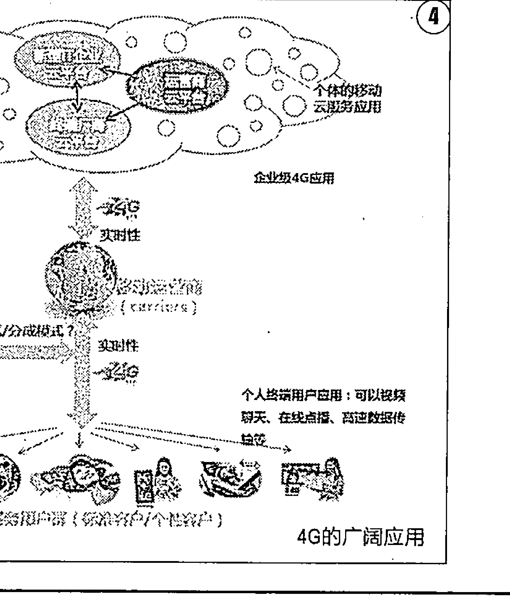

## Kinect体感系统 游戏迷的福音

对游戏迷而言，Wii当年带来的激动还历历在目，然而随着Kinect体感系统等设备的问世，这份游戏之外的悸动或许正成为连接未来的通道。

文|中国传媒大学 宋金宝

### Kinect学习我们的模拟世界

大家知道传统的的编程大多使用特定的规则来判断用户的使用习惯，比如通过非真即假来判断用户的行为, 用户的动作通过简单的是、否来对应1、0。这种简单的判断可以让我们通过编程快速制定相应的感知程序来判断。
不过在现实生活中，我们的动作远远不是是与否这么简单的动作，比如我们在使用体感系统玩足球游戏时，系统首先要计算游戏画面中足球的动态范围，接着判断你抬脚的幅度，如果脚部区域正好碰到足球，则再根据你的力度调整足球发送的轨迹。
所以Kinect学习系统要比传统的编程复杂得多。它一开始就使用一种全新的接近于人脑工作的方式来解决这一问题。它观察身边的世界，它注意观察你的动作。即使Kinect从来没见过你挥过手，也能很快地从它学习过的TB级数据中猜测出你所做动作的含义，从而判断你的动作来完成游戏的体感操作。

### Kinect的追踪处理

从上面的介绍我们知道，Kinect系统可以追踪人类复杂的动作。它的核心是一个CMOS红外传感器，这个传感器无论周围环境的光照条件如何，都可以让Kinect感知世界。该传感器通过黑白光谱的方式来感知环境：纯黑代表无穷远，纯白代表无穷近。黑白间的灰色地带对应物体到传感器的物理距离。它收集视野范围内的每一点，并形成一幅代表周围环境的景深图像。
传感器以每秒30帧的速度生成景深图像流，实时3D地再现周围环境。这样我们肢体的每一个动作都会被传感器实时捕捉。比如在体感足球游戏中，当我们抬脚踢游戏画面中的足球时，传感器会捕捉到我们的抬脚动作。当我们在屏幕面前抬脚的时候，Kinect会对景深图像进行像素级评估，来辨别人体的不同部位，以确定我们抬起的是脚。
此外，Kinect采用分割策略来将人体从背景环境中区分出来，即从噪音中提取出有用信号。Kinect可以主动追踪玩家的全身骨架，或者被动追踪最多四名玩家的形体和位置。在这一阶段，我们为每个被追踪的玩家在景深图像中创建了所谓的分割遮罩，这是一种将背景物体（比如椅子和宠物等）剔除后的景深图像。在后面的处理流程中仅仅传送分割遮罩的部分，以减轻体感计算量。比如我们在踢球的时候，抬起的是右脚，Kinect采用分割策略就会精确地判断出你的动作。

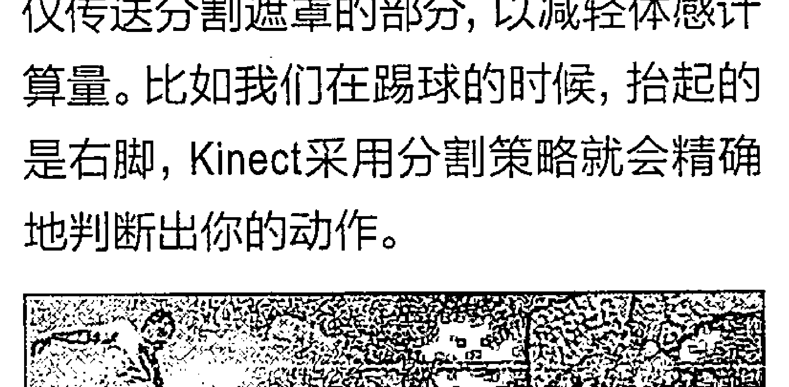

### Kinect的大脑

Kinect判断出你的动作后，它还要精确判断你的实际动作，因为对体感系统来说，我们的抬手或者抬脚动作非常类似。Kinect分割玩家图像的每一个像素都被传送进一个辨别人体部位的机器学习系统中。随后该系统将给出某个特定像素属于哪个身体部位的可能性。
比如，一个像素有80%的几率属于脚，60%的几率属于腿，40%的几率属于胸部。Kinect根据传感器捕捉的人体3D图像和机器学习系统，判断出这是你的抬脚动作（像素的概率接近于脚），然后将这个动作和游戏画面中的足球动态位置结合起来。这整个处理流程都是通过Kinect的学习系统完成的，它是体感系统的中枢。

### 模型匹配 完成游戏动作

Kinect判断出你的动作是抬脚后，处理流程的最后一步是使用之前阶段输出的结果，根据追踪到关节点来生成一幅骨架系统，然后告诉体感系统这是你的抬脚动作，这样体感系统根据你的抬脚动作和游戏画面中的足球位置（足球位置是固定的，根据游戏进程即可知道它的运行轨迹）。这样体感系统首先确定足球的运行轨迹，这样在足球运行到一定的位置时，体感系统的传感器捕捉到了你的抬脚动作，然后根据你的脚的位置是否碰到足球，如果碰到则足球会沿着你的动作力度，并按照原来游戏设计好的轨迹运行，这样你就通过体感系统完成了一个踢球流程。玩过愤怒的小鸟上的弹弓？当我们拉起弹弓的时候，小鸟就会像足球一样飞起来了。

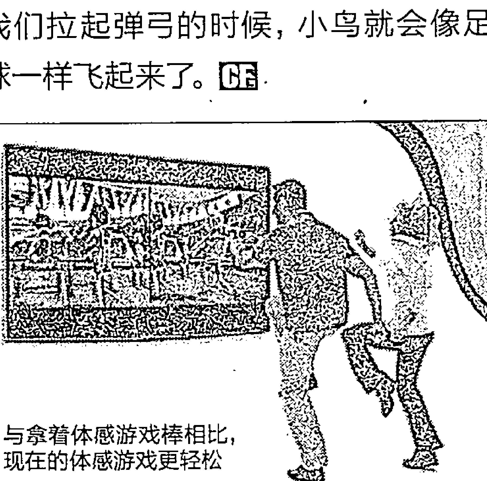## RSS如何将信息“推”给你

曾红极一时的RSS似乎已淡出人们的视线，而它最近一次的“火爆”，却是因为Google要抛弃它的新闻而起。谷歌放弃是否说明它不够好？RSS到底是如何工作的？

文|深度

2013年白色情人节的前夕，谷歌官方博客上宣布，其RSS阅读服务Google Reader将于今年7月1日关闭。这一消息在业界引起轩然大波，也引发了Reader用户的不满，甚至有部分民众在谷歌华盛顿办公室门前举牌抗议。那么，RSS是什么？它到底怎么了？

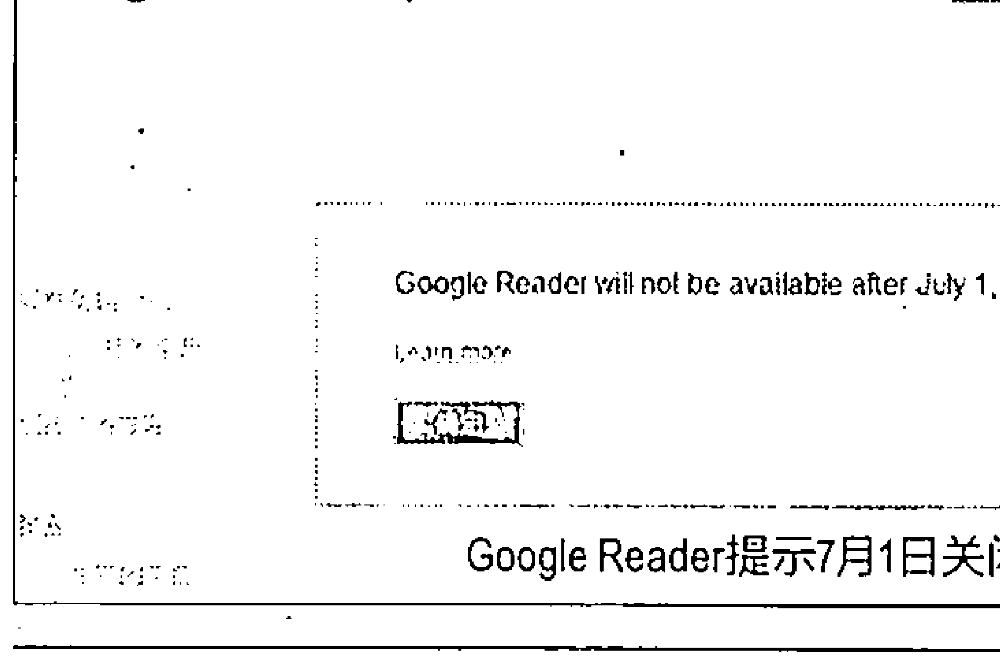

## RSS三种解释两个阵营

RSS实际上就是网站的一种数据交换规范。遵循这种规范的网站，给访问者提供了一种“订阅”的功能，这样网站即可主动将内容“推”(Push)给访问者，而不用麻烦访问者每次都要打开网站。

关于RSS这个简称的意思，主要有三种说法：

- Really Simple Syndication: 真正简单的聚合，RSS 2.0；
- Rich Site Summary: 丰富站点摘要，RSS 0.91/1.0；
- RDF Site Summary: RDF站点摘要，RSS 0.9/1.0，其中RDF又是Resource Description Framework的简称，意为资源描述框架。

早在1995年，苹果公司的Ramanathan V. Guha及其同事开发出的元内容框架(MCF)就已经初显RSS的雏形。Guha后来离开苹果进入网景公司，将MCF项目改用XML，创建了第一版的RDF(资源描述框架)，版本为RSS 0.9。

1999年，网景公司开发出新版本RSS 0.91，撤去了RDF header元素及合并了Dave Winer的scriptingNews许多特性(1997年)，并将此项目重命名为Rich Site Summary。网景公司后来停止了RSS的开发。其后几年间，则由Dave Winer(UserLand公司)主导对RSS有过多次重大改进，他们将RSS定义为Really Simple Syndication。

一个比较容易混淆的事情，就是RSS一系列的版本中，其1.0版完全由另外一个团队——Rael Dornfest领导的团队，于2000年在O'Reilly开发出来的。RSS 1.0版的格式使用了RDF和命名空间，与RSS 0.91版完全不同。这就导致目前的RSS被分化为RSS 0.9x/2.0和RSS 1.0两个阵营，不过RSS 1.0还没有成为标准化组织的真正标准。

## RSS的工作流程

RSS的工作流程主要分三大部分。首先，网站或者博客要提取出相应内容创建一个RSS源(RSS Feed)；其次，这个RSS源要发布到互联网上，具有一个可访问到的长久有效的链接；最后，RSS阅读器通过链接读取这个RSS源。实际上RSS源就是一个XML文件(扩展名可以是xml, rss, rdf等)，RSS阅读器读取它后将它转换成HTML网页在我们的电脑上显示出来。

网站创建RSS源一般有两种方法。一种是RSS链接直接指向一个XML文件，这个文件是由服务器程序预先创建好的。另外一种是RSS链接指向一个空内容的页面，当接收到访问请求的时候，它就会通过页面后台程序(如PHP)访问数据库获取内容，实时产生一个相应的XML文件。

第一种方法，因为访问时只是返回一个静态的XML文件，不需要访问数据库临时生成文件，所以访问效率相对较高。不过它在内容更新上相对要迟缓一些。第二种方法因为是动态产生内容，所以访问效率相对低一些，但是它的内容更新则非常及时。

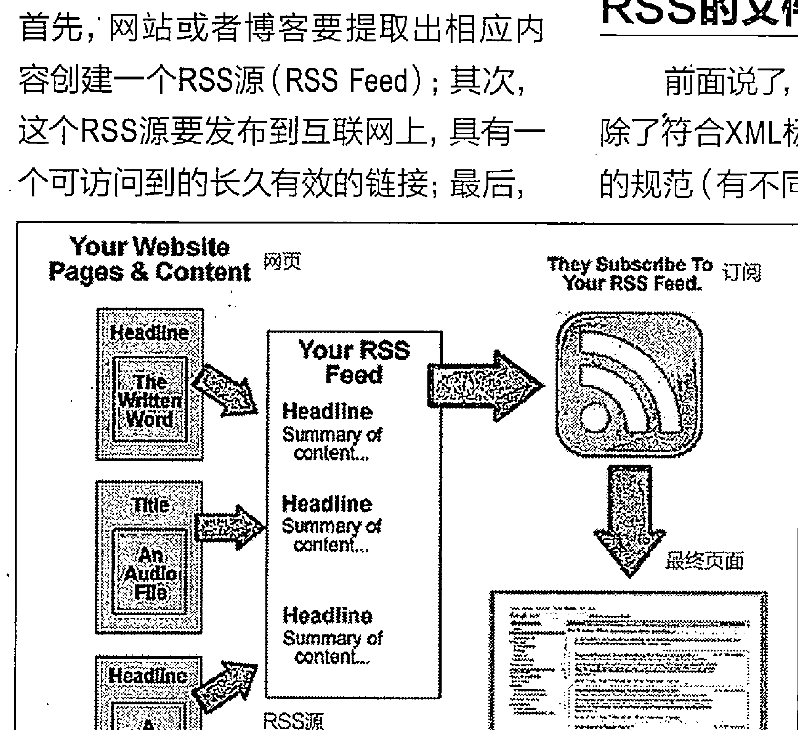

## RSS的文件结构

前面说了，RSS实际就是XML文件，除了符合XML标准，同时它也具有自己的规范(有不同版本)。一般来说，RSS文件是两级结构，一个Channel(频道，一级结构)下包含多个Item(项目，二级结构)。

打个比方来说，某一个人的博客就相当于一个频道，是一级结构，在这个博客下又包含了许多具体的文章，每篇文章就相当于项目，是二级结构。

每个频道至少要具备Title(标题)、Description（描述）、Link（链接）和 Language（语言）等四个属性。而每个项目也要至少具备Title、Description、Link这三个元素。根据需要可以增加其他的属性。下面是一个简化版的RSS文件示例：

```
xml
<rss version="2.0">
<channel>
<title>我的博客</title>
<description>记录我生活中的点点滴滴</description>
<link>http://www.cfan.com.cn/</link>
<language>en-us</language>
<item>
<title><!-- 项标题 --></title>
<link><!-- 项链接 --></link>
<description><!-- 摘要信息 --></description>
<!-- 可选元素 -->
</item>
<!-- 可多个<item>项目-->
</channel>
</rss>

```

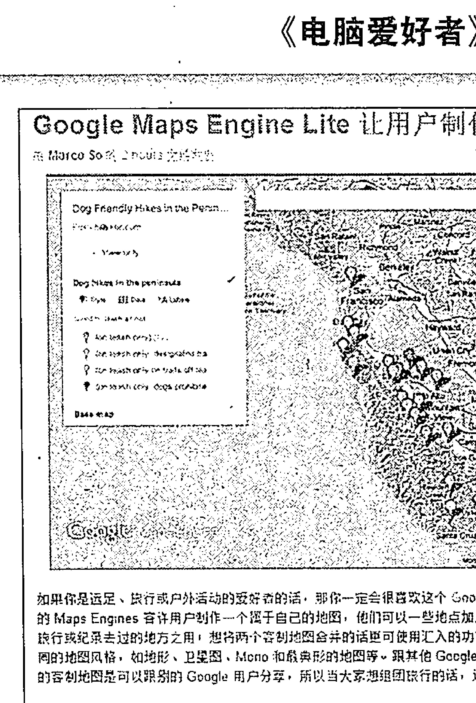

如果你是远足、旅行或户外活动的爱好者的话，那你一定会很喜欢这个 Google Maps Engine Lite。这个 Beta 版的 Maps Engines 允许用户创建一个属于自己的地图，他们可以向一些地点加入标记、画上路线或形状，适合计划旅行或纪录去过的地方之用。想将两个谷歌地图合并的话更可使用汇入的功能。Google 更为使用者提供了几款不同的地图风格，如地形、卫星图、Mono 和最典型的地图等。跟其他 Google 的服务一样，这个 Maps Engine Lite 的谷歌地图是可以跟别的 Google 用户分享，所以当大家想组队旅行的话，这个服务或许可以帮助计划哦。

> > 引用来源：Google Maps Engine Lite

> > RSS实际显示效果

### RSS阅读器如何显示RSS

订阅了这个RSS后，在RSS阅读器中看到的将是如上图所示的效果。

网站提供RSS支持，但是作为普通用户，并不能直接看到，我们还需要RSS阅读器软件的帮助。除了抓取与显示RSS内容外，阅读器一般还用来订阅和管理RSS。当前的RSS阅读器基本可以分成三类：一类是纯软件工具，如FeedDemon，它的界面跟邮件软件差不多；一类是在线工具，如Google Reader，其实我们常用的QQ邮箱中的“阅读空间”也是在线RSS工具；一类是嵌入在其他软件中的辅助功能，如傲游浏览器中的RSS功能、谷歌浏览器中的RSS插件等。

RSS阅读器一般都具备嗅探的功能，当某个网页中包含RSS源的时候，它就会发出提示，看似非常的智能，实际上非常简单。只要在网页源代码中搜索，如果包含有XML文件链接，基本就可以判断出来了。

在前面的示例代码中，第一句是<rss version="2.0">, 这表明当前RSS源采用的是RSS的哪个版本。不同版本有自己相应的规范，根据这些规范，将RSS文件中的内容对应转换成HTML代码，就可以显示出我们所看到的页面内容了。

### 谷歌为何关闭Google Reader

RSS技术让用户能快速地获取网站内容的最新更新，在不打开网站页面的情况下即可查看网站内容，非常方便。那么谷歌为何要关闭Google Reader呢？问题恰恰出在RSS的这些优势特点上。RSS让用户只关注自己感兴趣的内容，有利于专注和深度阅读，这就大大挤压了广告的空间，谷歌无利可图。另外，谷歌全面向社交网络转型，致力于Google+的发展，使得它没有更多资源顾及到Reader，也是它决定关闭此项服务的一个原因。

当然，RSS技术决不会因为谷歌的放弃而消失，实际上我们可以找到很多的替代者，比如国外的FeedDemon（离线）、Feedly（在线），国内的鲜果（在线）等，都是很不错的RSS阅读器。另外，RSS在移动端也有着极大的发展潜力，比如不少手机浏览器中就内置了RSS的功能，我们对RSS真是难说再见。

### 小花絮

今年1月份，美国著名计算机黑客Aaron Swartz在家中自杀，享年26岁。他在14岁的时候，就曾参与RSS 1.0规格的编写工作。英才早逝，令人惋惜。

```
xml
<rss xmlns:dc="http://purl.org/dc/elements/1.1/" xmlns:itunes="http://www.itunes.com/dtds/podcast-1.0.dtd" version="2.0">
<channel>
<title>Engadget 中国版</title>
<link>http://cn.engadget.com/</link>
<description>Engadget 中国版</description>
<image>...</image>
<language>en-us</language>
<copyright>...</copyright>
<generator>Blogsmith http://www.blogsmith.com/</generator>
<item>...</item>
<item>...</item>
<item>
<title>
<![CDATA[ Google Maps Engine Lite 让用户制作属于自己的地图 ]]>
</title>
<link>http://cn.engadget.com/2013/03/28/google-maps-engine-lite-beta-lets-amateurs-craft-their-own-pois/</link>
<guid isPermaLink="true">http://cn.engadget.com/2013/03/28/google-maps-engine-lite-beta-lets-amateurs-craft-their-own-pois/</guid>
<comments>http://cn.engadget.com/2013/03/28/google-maps-engine-lite-beta-lets-amateurs-craft-their-own-pois/#comments</comments>
<description>
<![CDATA[
<p>分类: <a href="http://cn.engadget.com/category/internet/" rel="tag">互联网</a></p><div style="text-align: center;"><a href="http://cn.engadget.com/2013/03/28/google-maps-engine-lite-beta-lets-amateurs-craft-their-own-pois/"></a></div><br /> 如果你是远足、旅行或户外活动的爱好者的话，那你一定会很喜欢这个 <a href="http://cn.engadget.com/tag/GoogleMaps/">Google Maps</a> Engine Lite。这个 Beta 版的 Maps Engines 允许用户创建一个属于自己的地图，他们可以向一些地点加入标记、画上路线或形状，适合计划旅行或纪录去过的地方之用。想将两个谷歌地图合并的话更可使用汇入的功能。Google 更为使用者提供了几款不同的地图风格，如地形、卫星图、Mono 和最典型的地图等。跟其他 Google 的服务一样，这个 Maps Engine Lite 的谷歌地图是可以跟别的 Google 用户分享，所以当大家想组队旅行的话，这个服务或许可以帮助计划哦。<br /><br /> 经由：<a href="http://www.engadget.com/2013/03/28/google-maps-engine-lite-beta-lets-amateurs-craft-their-own-pois/">Engadget</a>、<a href="http://google-latlong.blogspot.hk/2013/03/create-collaborate-and-share-advanced.html">Google Lat Long Blog</a><br /> 引用来源：<a href="https://mapengine.google.com/map/u/0/">Google Maps</a>
]]>
</description>
</item>
</channel>
</rss>

```

## 我用眼球控制你

在好莱坞大片《碟中谍4》中，有这样一个神奇的场景：特工在眨眼之间便将所需的机密文件拍摄下来……无需惊叹，无需吐槽，这一场景真的可以实现。

文|乔珊

在三星推出的新一代旗舰手机Galaxy S4中，内置的“眼球追踪”技术令用户无需触摸屏幕即可翻动页面。这一技术使得用眼球控制电脑、操作手机、进行摄影这些看似天方夜谭的技术正在成为现实。

### 神奇的“眼球控制”

眨眼拍照、眼睛翻页等一项项新应用相继落地，赚足了用户的眼球，难道是一夜之间我们的眼睛真的有了魔法，有了特异功能？非也！我们的眼睛与芸芸众生一样，还是普普通通的眼睛，并不能控制任何设备。相反，是设备中加入了一项名为“眼球追踪”的技术，如此这般设备就可以根据追踪到的眼睛变化做出响应，给人的错觉就是眼睛控制了设备。那么，何为眼球追踪呢？

“眼球追踪”是近两年比较热门的技术，应用该技术的设备能够实时追踪到眼睛的变化，并根据变化准确预测到用户的心理需求（如要翻页、关机、暂停视频播放等等），并实时进行响应，从而达到眼睛控制设备的目的，方便用户的使用，极大地提高用户体验。

现阶段比较成熟的“眼球追踪”技术大体有三类：一是根据眼球和眼球周边的特征变化进行追踪，二是根据虹膜角度的变化进行追踪，三是主动投射红外线等光束到虹膜来提取特征。

### 眼球控制原理揭秘

通过前面的介绍我们初步了解了“眼球追踪”这一热点应用，但是设备到底是如何实现对眼球的追踪，原理是什么呢？不妨让我们再做进一步的分析探讨。

众所周知，人的眼睛在不同的方向观看时，由于面部和眼球的方向变化，眼球、眼角会呈现出不同的特征，如瞳孔的大小、眼球的角度和位置、眼角的角度和大小等等。神奇的“眼球追踪”技术正是利用了这些众所周知的变化，通过眼球追踪设备捕捉、扫描到这些变化，再经过处理和运算，便可以将这些特征提取出来，用于判定人眼注视的方向和目标，从而根据目标进行相应的控制。“眼球追踪”设备在获取了眼球运动信息的前提下，眼球就如同手一样，通过注视、视线的移动实现手机、平板的触控操作。或者就像手握鼠标一样，通过指挥光标实现各种电脑、平板操作。

“眼球追踪”技术现阶段所使用的设备主要有红外设备、图像采集设备；甚至一般电脑或手机上的摄像头在软件的支持下也可以实现“眼球追踪”。当然，不同的设备在准确性、速度和稳定性上会有所差异。在精度方面，红外线投射的方式优势更大，大概能在30英寸的屏幕上精确到1cm以内的水平，并辅以眨眼识别、注视识别等技术，目前已可在一定程度上替代鼠标、触摸板、触摸屏等进行一些对准确度要求不是很高的操作，如上网浏览、播放器控制等。

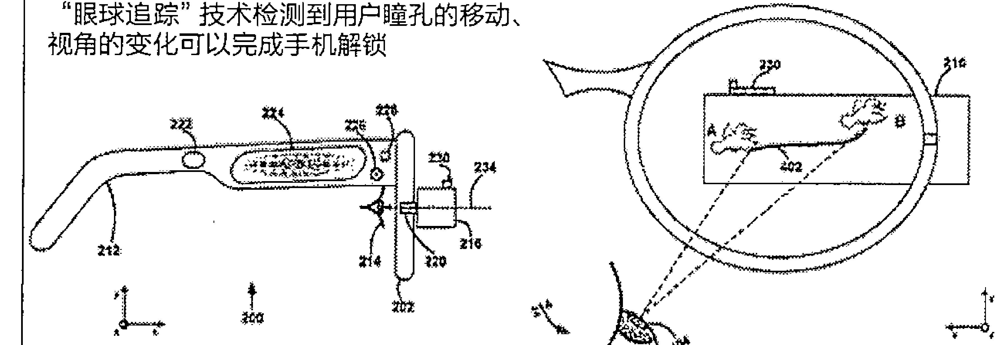

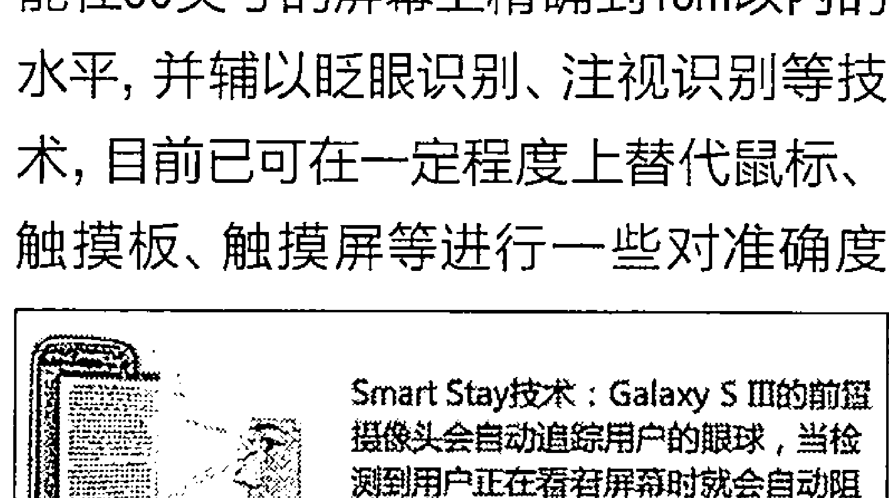

从以上的分析，我们不难发现“眼球追踪”技术是通过设备捕捉到的用户眼睛的变化进行相关控制的。“眼球追踪”设备可以敏感精准地捕捉到眼球运动信息，如当侦测到用户的眼球正在看手机屏幕时，就会自动阻止自动关屏幕，这样用户在看图书、视频时就不会因超时而自动关屏了。

用户正在播放视频时，如侦测到用户眼球并未注视屏幕时，就会暂停播放，待用户眼球注视方向重回屏幕时自动播放。这样当用户因琐事暂时无法观看时，就不会错过某些片段，从而令播放更为智能。还有，眼睛解锁也是利用了瞳孔的移动、视角的变化而进行。

了解了手机，回头再来看看电脑。眼球追踪设备被嵌入到电脑屏幕的帧中，利用LED来发射红外线，内置的相机会捕捉反射回来的光，经过图像处理，就能知道使用者眼球移动的角度和方向，达到用眼球控制电脑的目的。

通过非接触式传感器检测人的眼球运动，使一个新的和自然的非接触式的PC接口可以在例如屏幕缩放和滚动屏幕时进行跟踪寻找，新的界面会根据用户的寻找自动进行屏幕滚动或放大。

## 纳米防水 让手机与水绝缘

前不久小米科技联合创始人林斌在微博上展示了小米2的纳米防水涂层技术，着实让网友羡慕不已。其实，纳米防水技术并非小米2的专利，任何手机都可借助此技术获得最高IPX7级别的防水能力。

### 纳米涂层扮演荷叶表面

小米2获得了防水能力，自然得归功于其表面的纳米防水涂层。简单来说，纳米防水涂层就好像荷叶的表面，具有疏水、不吸水的表面，落在上面的液体会因表面张力的作用形成水珠。为了便于理解，我们不妨看看来自美国加州的Liquipel公司是如何为手机提供添加纳米防水涂层服务的。

首先手机会被放在一个内部真空的大型容器内，然后在低压状态下注入气态的防水（液体）纳米材料。当气流包围整台手机之后，该设备会放出等离子体帮助气体分子在装置的内部和表面聚合、凝固，大概30分钟之后涂层就完成了。由于在过程中可以通过调整阀门来控制气流的走向，所以说手机并没有拆开的必要，整个过程可以将手机表面和所有元件，包括内部元件都弄上一层纳米涂层。

正如前文所述，最终覆盖在手机上的涂层大约只有头发的一千分之一厚，除了具有较低的表面能以外也获得了纳米级别的粗糙度，从而模拟出了荷叶的疏水自洁表面。当有液体入侵后，受重力的作用它们会在手机表面成珠滚落，同时把灰尘带走，使手机保持干燥和清洁。由于产品表面的物理粘结达到分子层面，纳米涂层的寿命会与所保护的材料相同，不会在日常使用中逐渐磨损，而且不会对手机外观或触感产生任何影响。

### 纳米涂层为什么能防水

虽然我们不了解Liquipel采用了哪种纳米材料，但无非是一些具有抗渗透、减水、增强作用的防水剂（粉剂）。由于在纳米尺寸低凹的表面可使吸附气体分子稳定存在，所以在宏观表面上相当于有一层稳定的气体薄膜，使水无法与材料的表面直接接触，这时水滴与手机表面的接触角趋于最大值，从而使手机的表面呈现超常的疏水性。

总之，这些纳米材料肯定是小于水分子的，附着于手机表面后，可以像筛子一样让比孔大的水分子漏不进去。因此对耳机和充电接口一类的内电路的缝隙，涂上这种涂料也可完全防水。

### 纳米防水涂层并非无敌

需要注意的是，纳米防水涂层并非无敌的“金钟罩”，它只是提高手机面对雨天、雪天、浴室、桑拿等存在液体环境下的“存活几率”。因为不同手机的内部结构不同，纳米防水涂层所能带来的防水等级也存在差异（比如有些手机的防潮指数偏低，或纳米涂层无法覆盖机身内部的元件），Liquipel就给不同的设备划定出三种级别的“防水范围”。

- 一级，溅水保护：保护手机免受短暂、轻度的意外液体接触（比如说偶尔有水溅到了手机之上）。适用手机有HTC EVO 4G LTE和Atrix等。
- 二级，泼水保护：保护手机免受短暂、中度的意外液体接触（比如说手机被泼到了水、短时间掉入水槽之中等）。适用手机有Galaxy S3和Droid X2等。
- 三级，浸水保护：保护手机免受短暂、重度的意外液体接触（比如说暴露在倾盆大雨之下或掉入水池之中等）。适用手机有 iPhone 4S、One XL / One X AT&T、Galaxy Nexus和RAZR/RAZR MAXX等。

从林斌所演示的小米2泡水无碍的操作来看，小米2应该可以支持到类似三级防水范围的级别。有传言称该技术会加入到小米后期的新品中，如果消息属实，对马大哈类型的用户而言绝对是件好事。要知道，给手机做纳米防水涂层也不便宜呢。此外，国内品牌TCL已经在旗下大鲨鱼、小鲨鱼手机上应用过类似技术，感兴趣的同学可以关注一下。

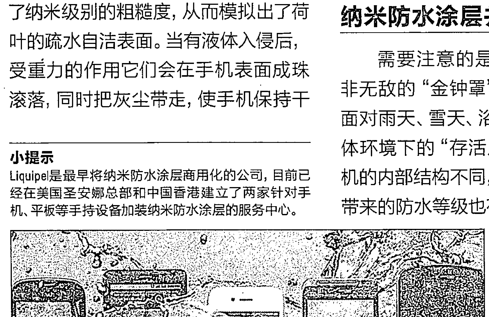

**小提示**
Liquipel是最早将纳米防水涂层商用化的公司，目前已经在美国圣安娜总部和中国香港建立了两家针对手机、平板等手持设备加装纳米防水涂层的服务中心。

### 期待全民防水时代来临

从Liquipel的收费标准来看，为手机加涂层的价格是449港币（约人民币370元），平板则为559港币（约人民币460元），也就只有用上iPhone和iPad的铁杆果粉可以接受吧。

随着类似Liquipel一类的公司进驻国内市场，纳米防水涂层肯定会渐渐为更多手机用户所接受。虽然这个也不是金钟罩，但能让人安心好多。最后就让我们期待纳米防水涂层技术早日普及，成为普通用户也能消费得起的增值服务吧。

# 谁“吃”了手机存储空间

文 | 镜花水月

一款号称内置16GB/32GB存储空间的手机，连接电脑后却只能识别出不到11GB/25GB的移动存储设备，这是怎么回事呢？本文我们就以不支持存储卡扩展的OPPO Find5为例，简单探讨一下内中缘由。

**小提示**

不同型号手机对“系统存储”空间的要求不一，比如三星Galaxy S4就要比S3多用1GB的“系统存储”空间，而一些低端手机可能只会占用不到1GB的“系统存储”空间。

## 二进制和十进制的博弈

出于十进制（1000MB=1GB）和二进制（1024MB=1GB）的差异，手机实际存储空间最多只有参数标注的93%左右。但即便以93%计算，16GB的理论可用空间应该也能达到14.88GB啊，为什么到了手机上却只剩下10.8GB，其余的将近4GB空间跑哪去了？

## 存储空间天下三分

以Find5为代表的Android手机都会在内置存储卡中单独划分出一部分空间用于安装应用程序。比如你通过豌豆荚往手机中安装了一款150MB的游戏，但你会发现这款游戏并没有占用那10.8GB的空间，而是被安装进了一个名为“应用程序存储”的空间内。在设置→存储信息界面下我们可以看到“应用程序存储”的容量约为2GB，你在手机安装的所有APK程序都会被保存在这个空间内，而那10.8GB容量则被归类到“手机存储”中（图1）。至此我们可以得出三个关键参数：

1. “手机存储”就是我们常说的内置SD卡，可以被电脑识别成U盘（图2），任由我们保存音乐视频、离线地图和大型游戏的数据包等文件。如果你安装了Root Explorer文件管理器，“手机存储”所对应的路径就是“/sdcard”，可以通过格式化清空该空间内的数据。

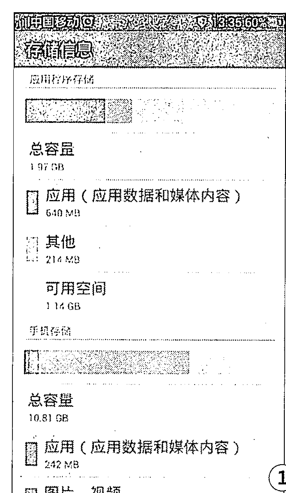

2. “应用程序存储”是系统从存储芯片中划分出来的专门保存APK程序的空间，对应的路径为“/data”，这部分空间是无法被电脑识别的。

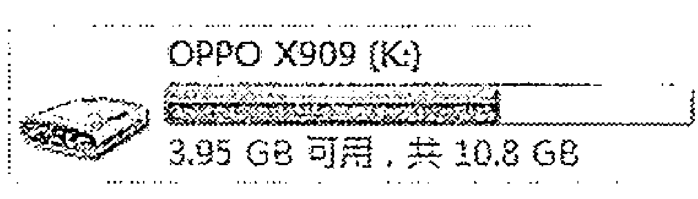

有时我们经常能听到“精简系统”，或“删除系统自带的垃圾程序”，其原理就是用第三方软件直接访问“/data”目录，并将里面的某些APK删除（相当于卸载）。需要注意的是，对“/data”目录进行操作需要手机获得Root权限，可通过恢复出厂设置或Recovery中的Wipe命令来删除这个空间内的数据。

3. 用16GB实际的14.88GB理论空间减去10.8GB的“手机存储”和2GB的“应用程序存储”之后，还剩下大约2GB的空间，而这最后的大约2GB空间会被手机厂商划分给Android系统本身和相关的缓存空间，通常会被挂载到“/system”、“/cache”等路径中，我们可以将其理解为“系统存储”，好像电脑C盘中的Windows文件夹，保存的都是关键系统配置信息，一旦删除或修改了其中某些文件就会导致手机系统崩溃，出现频繁死机或循环重启等问题。

**小结**

总之，Android手机都会把存储芯片划分成“手机存储”、“应用程序存储”和“系统存储”三大部分，由于后两者无法被PC识别，所以才造成了存储空间严重缩水的“假象”。

浏览器内核揭秘

市面上能叫得上名字的浏览器多达几十种，但这些令人眼花缭乱的浏览器软件，剥开它们华丽的包装后，你会发现它们其实大多数在共用着相同的核心……
文|技术宅

今年关于Opera的两条新闻颇耐人寻味，一条是二月份的时候，Opera宣布放弃自家的Presto引擎改用WebKit，而到了4月初，Opera又宣布紧随Google的脚步支持新的渲染引擎Blink。为浏览器更换内核绝非易事，Opera不同寻常的“频繁”更换，预示着浏览器市场可能要重新洗牌。那么，浏览器内核到底是什么，它是如何工作的，为何各大软件厂商在这上面要针锋相对呢？

## 浏览器内核的四大金刚

我们平时所使用的浏览器软件，一般来说可分成两大部分：Shell+内核（也称引擎）。Shell也就是浏览器的外壳，比如窗口、菜单、工具栏等等，说白了就是浏览器跟用户交互的界面，通过Shell，我们可以对浏览器进行各种设置，调用内核的各种功能。这就像汽车的外观、仪表、方向盘、导航等外围设备一样，用来使用和控制汽车。而内核才是浏览器的核心，它实际就是一些程序和模块的集成，为浏览器提供主要功能，主要负责取得网页的内容（如HTML、XML、图像、CSS）并进行分析、显示，执行网页中的Javascript脚本等。继续以汽车为比喻，它就如汽车的发动机引擎，是汽车运行的真正动力。

其实在浏览器发展初期，外壳和内核并没有明确的划分，它们的功能往往混合在一起。这种方式的缺点很明显，一旦某项功能有所改进，那么与此项功能相关的程序代码都要重新改写，费时费力。于是为了便于软件的升级和维护，引进了模块化的思想，渐渐将外壳和内核分开，这样一来，即使内核升级了，只要它保持向下兼容，那么原来在它基础上开发出来的浏览器软件，不用作任何修改，就能继续使用。

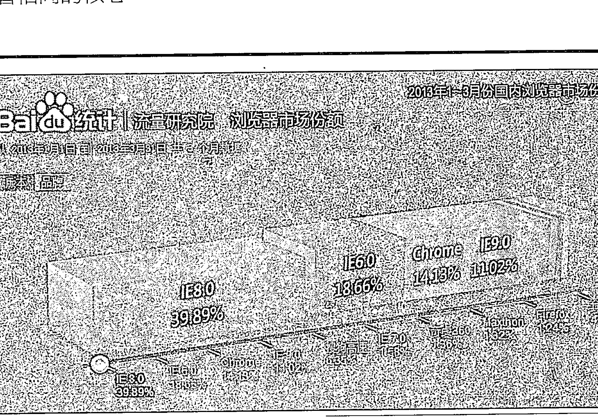

就像汽车生产厂商有很多而发动机厂商却很少一样，真正能提供浏览器内核的软件厂商也是屈指可数。当前主流内核有Trident、Gecko、WebKit、Presto四大家，其中Trident就是我们俗称的IE内核，Gecko是Firefox所用的内核，Webkit是苹果和谷歌所用的内核，Presto是Opera所用的内核。不过WebKit、Presto这两大内核现在的处境则有点微妙，谷歌决定单干，脱离Webkit转向自己的Blink内核（基于Webkit），而Opera也明确表示放弃自有Presto转向谷歌。可以预计，在未来的四大内核列表中，Presto的位置将由Blink取代。

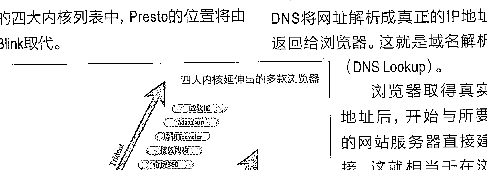

## 浏览器工作的基本流程

当我们在浏览器中输入一个网址并按下回车键，或者点击网页中的一个超级链接，浏览器将创建一个URL请求。浏览器首先在本地的缓存文件中查询，如果你之前已经访问过这个网页，那么该网页的相关数据可能已被缓存到本地了，浏览器找到这些数据后将直接读取它们，并返回结果显示网页。注意，此时显示的网页实际是上次的访问结果，不一定是最新的。

如果你不曾访问过该网页，浏览器在缓存中没有找到相关信息，它就会将URL请求发送到DNS服务器上，DNS将网址解析成真正的IP地址后，返回给浏览器。这就是域名解析阶段（DNS Lookup）。

浏览器取得真实的IP地址后，开始与所要访问的网站服务器直接建立连接，这就相当于在浏览器和网站之间架起一个虚拟通道，这是创建连接阶段（Connection）。连接成功后，浏览器向服务器发送HTTP请求消息，一般包括

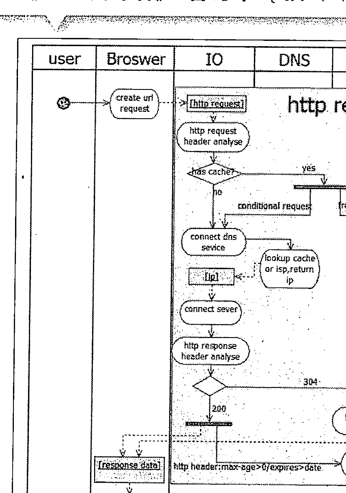

HTTP头消息、POST或GET请求、Cookies等，这是发送请求阶段（Send）。服务器对浏览器提交的HTTP请求进行分析处理，浏览器则等待服务器的响应（Wait）。服务器分析处理完毕，会将浏览器所请求的资源，比如HTML文件、XML文件、CSS文件、JS脚本文件、图像等，传送给浏览器，浏览器边接收这些数据边同步显示网页（Receive）。

## 浏览器内核做什么

上面简述的浏览器工作流程中，最后一部分，接收服务器端传来的信息，分析处理并同步显示网页，正是浏览器内核最繁忙、最主要的工作部分。浏览器的内核并非铁板一块，而是由多个模块组合而成，不同模块负责不同的工作。它主要包括以下几大部分：

- ★浏览器引擎：用来查询及操作渲染引擎的接口。
- ★渲染引擎：负责解析HTML、XML、CSS等，并将解析结果显示出来。

小提示
要想获取网页的最新结果，有时我们需要进行强制刷新操作，比如在IE浏览器中，可按Ctrl+F5键来实现，它将跳过缓存查找，直接进入下一步流程（即提交HTTP到DNS）。

- ★JS解释器：用来解释执行网页中的JS代码，是动态网页的必备内容。

其中渲染引擎又是浏览器内核中的重中之重，它主要负责网页的显示。以Webkit内核为例（即当前的苹果、谷歌浏览器内核），在读取HTML网页文件后，首先通过HTML分析器对网页进行分析，在此基础上形成DOM节点树，再与CSS样式表一起构建出Render树，Render树是由一些包含有颜色和大小等属性的矩形组成的，它按照一定的顺序显示在屏幕上，接着将确定每个节点在屏幕上的确切坐标。这些布局完成后，下一步就是绘制、显示网页了。

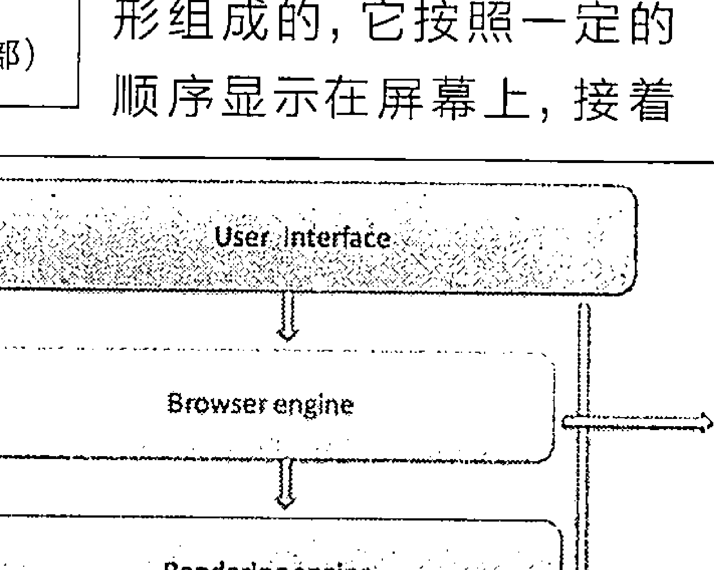

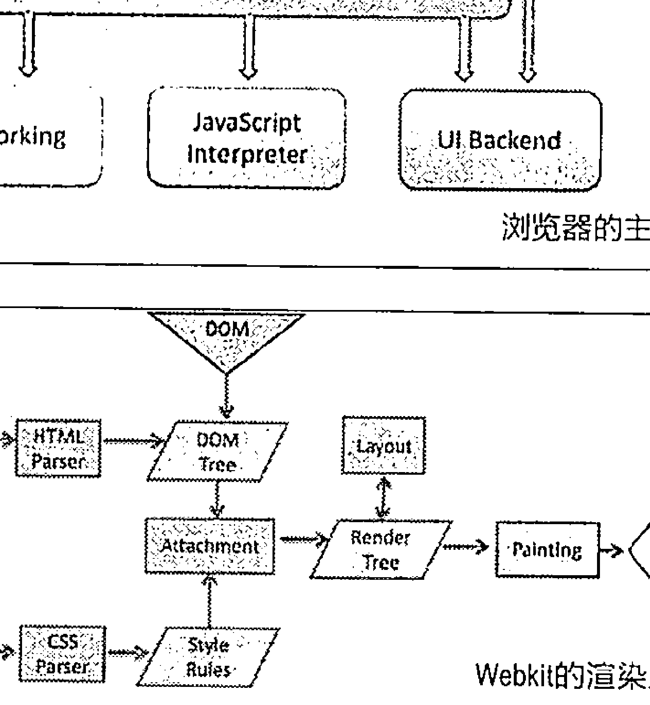

## 浏览器如何调用内核

网页渲染、JS脚本解析，这些需要很复杂的技术处理。不过一般的程序不用掌握这些技术，一样可以开发出自己的浏览器来。为什么？正如前面所说，多家软件巨头对外提供自己开发出的浏览器内核，这些内核已经解决了浏览器的大部分问题，一般程序员只要调用其中的功能就可以了。

打一个通俗的比喻，微软已经完成了网页显示的程序编制，它将此功能打包在IE内核中，然后假设它把这个功能编号为1。对于第三方浏览器的开发者来说，他就不需要自己再开发网页显示的功能了，他只需要将IE内核包含在自己的浏览器程序中，在需要显示网页的时候，简单地发出一条指令，直接调用内核的1号功能就可以了。这就如同MP3音乐播放器，不需要知道它的构造，只需知道按哪个键播放、按哪个键暂停就可以了。

国内的浏览器，如傲游、360、搜狗等等，都号称为双核浏览器，那么它们是怎么做到的？看似复杂，其实也很简单，它们只是把微软的IE内核和谷歌的Webkit内核都打包在自己的程序中。当需要以IE兼容方式显示网页时，就发指令到IE内核中调用相关功能，当需要以极速方式显示网页时，就发指令到Webkit内核中调用就可以了。

当然，浏览器内核只提供了基本的功能，第三方浏览器可以在此基础上添加更多功能，以形成自己的特色。比如国内各大浏览器，争取提供更漂亮的程序界面，以及网页保存为图片之类的其他实用功能等，而这些已与内核关系不大了。

## 谷歌为什么开发自己的内核

苹果和谷歌浏览器都是基于Webkit内核的，不过一直是苹果在主导。谷歌的收入来源基本上以网络为主，而浏览器又是网络的主要入口，所以谷歌对浏览器内核的期望非常之高。相比之下，苹果的主要收入来自硬件产品销售，对网络的兴趣肯定没有谷歌高，这就导致了两家公司对待Webkit发展的意见分歧，也是促使谷歌下决心开发自己主导的浏览器内核的动力所在。

# 400万>1300万？
## 关于UltraPixel技术那点事
文 | 宋金宝

正是因为有了它，HTC One那仅有400万像素的摄像头，几乎在一瞬间便拥有了让1300万像素的摄像头自惭形秽的资本。那么，“它”究竟为何物？

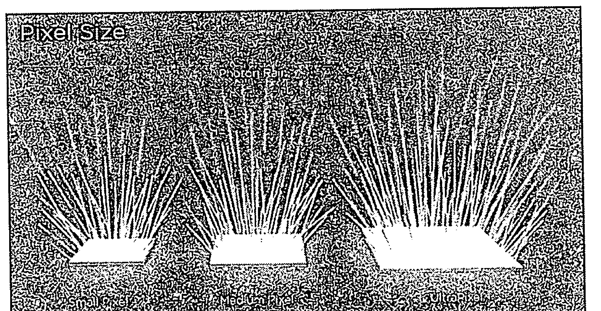

UltraPixel为何物
Ultra的中文意思为“超级的”，Pixel为“像素”，二者结合起来的意思是“超级像素”。在不久前的HTC One发布会上，宏达电不遗余力宣扬的卖点就是该技术。该技术使得HTC One摄像头每个像素点的感光面积明显增大，超过其他产品的3-4倍，因此进光量也与之成正比地达到了其他产品的300%，所以照片表现更出色。现在的问题是，UltraPixel究竟是依靠什么技术实现的？其最终效果真的有那么神奇？而要了解这些问题，我们需要从像素、CCD、CMOS几者之间的关系说起。

### CCD、CMOS与像素的关系

CCD和CMOS是数码相机和手机摄像头中最常用的两种感光成像部件（又叫图像传感器），其中前者的特点是成像质量好、制造工艺复杂、价格高，一般只用于专业相机中。而后者虽然在成像质量方面稍逊于CCD，但由于具有制造工艺简单、价格便宜、低能耗及低噪音等特点，所以被广泛用于中低端数码相机和手机摄像头中。

这其中不论是哪一种感光元件，影响其成像质量的原因无非有几点：一是感光元件的数量；二是感光元件的面积，三是感光元件的灵敏度和信噪比等。

一般来说，感光元件的数量越多，最终成像所蕴含的染色点就越多，其色板就会越丰富，这样，当我们将照片放大时，就不会因为染色点的缺失，而出现惨不忍睹的“马赛克”现象。同样，单个感光元件的面积越大，捕获的光子越多，感光性能越好，越容易在光线相同的情况下，产生更多的模数转换电路输出，也能在光照不足的环境中（如夜间或阴天）拍摄出质量良好的图像。


实际上，数码相机和手机摄像头感光元件的数量，正是用像素为单位来表示的。平时我们所说的某相机有1300万像素，其实就是说该相机使用了1300万个感光元件。当我们用像素来表示图片的分辨率时，实际上就是在表明拍摄该照片时，设备所使用的感光元件的数量。

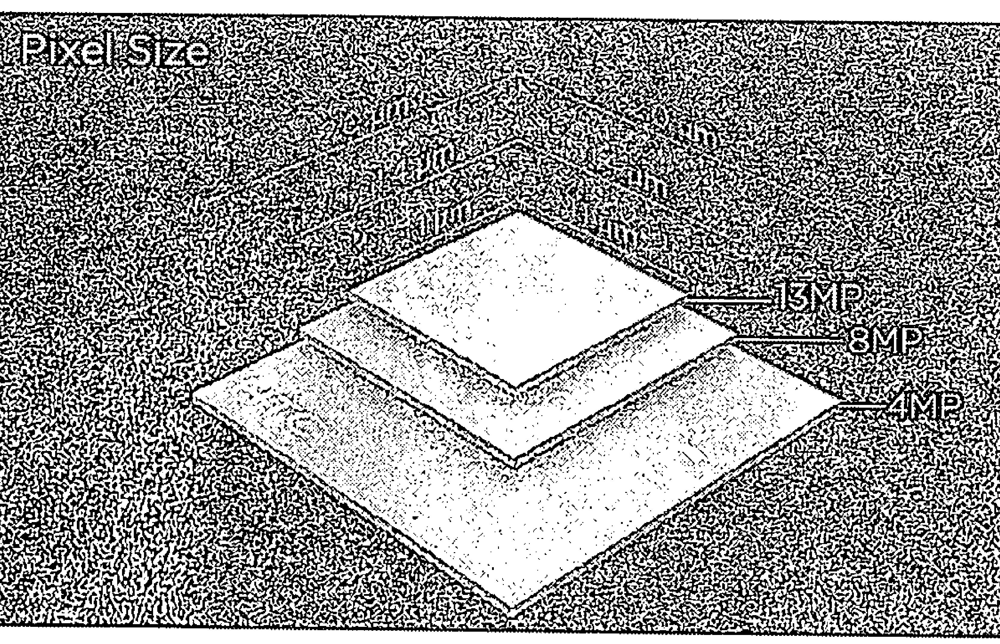

## 像素数量与面积是一对矛盾体

像素数量与感光元件的面积共同影响着相机或手机的成像质量，不过，它们之间的关系却是非常有趣的，既相辅相成又相互对立。

当感光元件总面积足够，既能容纳足够多的像素点，又能保证每一个点有足够的面积的时候，数码相机的成像质量在理论上可达到最好。实际上，的确有一些专业级相机生产商，正在用这一方法，不断提升着产品的成像质量。除此之外，去年刚发布的诺基亚808 PureView也在尝试用这一方法，提升摄像头的成像质量。

不过，诺基亚808 PureView的体积实在是太大了，这在所有人都追求极致轻薄的今天几乎是致命的缺陷。所以大多数的手机厂商们，更喜欢用一种迂回或者取舍的方式，在不增加感光元件总面积的情况下，通过牺牲感光元件数量或面积中的某一方面，来达到优化另一方面的目的。比如，通过牺牲像素的方式，来扩大单个感光元件的面积。这样一来，像素数量和面积之间的矛盾就凸显出来了。

## 高像素基本都是骗人的？

目前高端手机配置战已经越来越难以为继，厂家为了吸引消费者，已经给手机安上了四核处理器、2GB内存，甚至1080P的显示屏，消费者对于这些数据恐怕也已经有些麻木。因此不少厂家开始在摄像头的像素上做文章，采取的手段依然是“数字为王”的战略——不管实际有没有用，数字越大越好。不过，这些厂家永远不会告诉我们，1300万像素对于我们来说，究竟有什么意义？

其实说白了，像素只不过是用来计算数码影像的一种单位，它的作用是用来描述感光元件的数量和图片的最大分辨率的，换句话说，就是它可以告诉我们，我们能将图片放大到怎样的程度，才能保证图片不失真。

如果这么说你还不明白，那么我们不妨通过举个简单的例子来说明，假设我们要冲印一张像素为100万的照片，我们最多要将该照片冲印成多大尺寸，才能保证照片的图像质量不衰减呢？答案是5英寸（照片的长宽固定为3.5英寸×5英寸）。其中的算法很简单，根据照片需要的分辨率通常为240PPI，也就是说每英寸240像素这一点，乘上5英寸照片的长和宽，最后即可得出所需的像素数，即3.5×240×5×240=100.8万。所以，对于普通用户来说，数码相机或手机的像素如果达到400万~500万像素，就完全可以满足日常的拍照需要了，至于更大的像素，只不过有助于我们将照片冲印得更大而已。

## Ultrapixel不过是取舍的产物

Ultrapixel技术的实现，其实正是利用了以牺牲像素来获取较大的单个感光元件进光面积这一方式。或者换句话说，HTC One的开发者们，最终在像素与面积这对鱼与熊掌难以兼得的搭配身上，选择了面积。

目前主流手机采用的CMOS传感器一般有1/3.2英寸和1/4英寸两种规格，有效像素大约在800万到1300万之间，对应的像素边长大约有1.4um和1.12um两种。而HTC One直接舍弃了高像素之争，将像素降低到400万，这就使得它在保持感光元件总面积不变的情况下，很容易就扩大了单个感光元件的进光面积，因此相对于普通的1300万像素手机，UltraPixel相机每一像素的感光度会高出300%。

HTC One的这一特性，虽然可保证它在低光条件下能最大程度地解决因曝光不足而带来的画面灰暗、细节不清等问题，同时，也会因为各感光元件间相互干扰较少，较好地解决最后成像时的信噪比问题，但由此而带来另一个问题，即因为像素减少所引起的照片分辨率降低。

# 数据恢复背后的秘密

文 | 阿木

数据恢复技术可以帮助我们找回被误删的文件，而只有充分理解数据存储的原理后，我们才能更好地做好数据恢复和安全的工作。

> 日常工作中，不少人遇见过误删文件的情况，或者是被病毒等恶意删除文件，此时就会想到使用数据恢复软件来找回文件。那么，被删除的数据为什么可以恢复？哪些数据是不可以恢复的？在数据恢复的背后究竟隐藏着什么样的秘密？下面就让我们来共同探讨。

## 文件存储到磁盘的过程

硬盘需要经过一系列的处理，然后才能存储数据。首先是低级格式化，为硬盘划分磁道、安排扇区，硬盘出厂前基本已完成此工序。硬盘到了用户手中，一般还需要对它进行分区，相当于把一个房子再分隔成几个单间。分区程序会在硬盘开始处0柱面0磁头的1扇区中，写入硬盘的主引导记录MBR和分区表DPT，记录下各分区的信息（图1）。
分区后还要进行高级格式化，高级格式化程序将分区划分为目录文件分配区和数据区，就像我们看的小说，前几页为章节目录，后面才是真正的内容。文件分配表内记录着每一个文件的属性、大小及其在数据区的位置等。以上几步，原则上来说是一次性的，不用反复进行了。
经过分区、格式化，硬盘已经准备好了，可以向其中存储文件了。在向硬盘中存储文件时，系统首先会在文件分配表内记录下文件名称、大小，以及文件在数据区的起始位置，然后开始向数据区写入文件的真正内容，从而完成一个文件的存储。

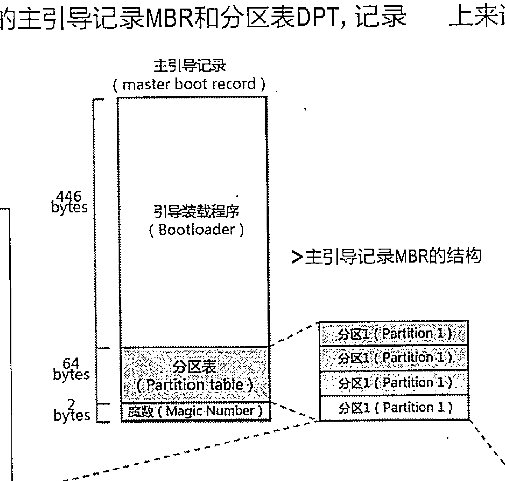

>主引导记录MBR的结构

## 分区丢失型的数据恢复

如果由于误操作或者病毒等因素破坏了主引导记录，就会导致硬盘分区丢失或者紊乱，从而造成整个分区的数据丢失。其实，这种情况下，损坏的只是分区记录信息（MBR和DPT），实际分区中的数据仍然存在。这如同一个人的档案丢失，造成一个人“失踪”了的假象一样。
如果能重新建立档案，恢复正确的MBR和DPT，即可将失踪的数据找回。很多专业软件，如Diskgen，只要启动程序后点击“工具→搜索已丢失分区（重建分区表）”，然后在弹出窗口中按提示进行搜索，即可自动修复受损的分区信息，找回所有丢失的分区表。

## 不同分区的相同原理

平时我们会遇到不同系统的分区格式，如Windows的FAT32、NTFS，Linux的EXT2、EXT3等。FAT32使用32位的空间来表示每个扇区的配置文件，NTFS分区以MFT文件作为文件配置文件，EXT2/EXT3则使用索引节点来记录文件信息（类似Windows的文件分配表）。这几种分区的格式虽然不同，但原理却是相似的，对于文件删除和恢复操作原理也差不多。专业恢复软件在扫描时，首先识别磁盘所使用的分区，再根据该分区的专有格式，对文件分配表进行恢复（NTFS对应MFT文件、EXT分区对应索引节点），从而达到恢复数据的目的。

## 一、误删除（格式化）型的数据恢复

当我们删除一个文件时，其实并没有真正删除文件数据，而只是系统在文件分配表中修改了该文件的相关信息代码（如同贴上“已删除”的标签），并解除对该文件所占空间的锁定，令其他文件可以挤占这一片空间。所以，在文件被删除后，文件内容实际还在。但如果此时写入其他新文件，新文件内容覆盖了被删文件的空间，那数据就彻底抹去了。

格式化操作和删除相似，都只是在操作文件分配表而已，不过格式化是将所有文件都加上删除标志，或干脆将文件分配表清空，系统将认为硬盘分区上不存在任何内容。格式化操作后，目录空了，但内容可能还在。

对于删除到回收站的文件，系统则没有加上删除标记，而是将目录区指针重新指向Recycle（从回收站还原文件时则修复指向到原位置）。

如果我们要恢复被删除（或误格式化）文件，实际上是借助专业软件（如FinData）将目录区中“已删除”标记去除，重新让系统可以正确识别出原来的文件（前提是没有新文件覆盖）。这就是为什么在文件丢失后，专家一直警告不要再进行任何读写操作的原因，就是为了避免新数据写入数据区覆盖原来的文件，那时将难以恢复。所以一般在误删文件后，最好立即退出当前系统，然后借助PE等第三方系统重启，再进行恢复操作。

| 卷 | 布局 | 类型 | 文件系统 | 状态 |
| --- | --- | --- | --- | --- |
| C | 基本 | NTFS | 状态良好 (启动, 页面文件, 故障转储) |
| D | 基本 | NTFS | 状态良好 (活动, 主分区) |
| E | 基本 | NTFS | 状态良好 (逻辑驱动器) |
| F | 基本 | NTFS | 状态良好 (逻辑驱动器) |
| System Reserved | 基本 | NTFS | 状态良好 (主分区) |
| Works (F:) | 基本 | NTFS | 状态良好 (逻辑驱动器) |

## 二、主流存储介质的数据恢复

目前存储技术主要分为三种：光存储，如CD、VCD、DVD等，通过激光刻录存储信息；磁存储，如传统的硬盘、磁带等，通过磁介质来存储信息（上面介绍的都是基于磁存储）；电存储，如内存和Flash闪存等。如今各式各样的便携式存储设备，如SD卡、记忆棒、MMC卡、SSD硬盘等都是基于Flash闪存技术的。

### 电存储的数据恢复

常见的优盘及SD卡、CF卡、SSD固态硬盘等，都属于电存储介质。它的存储原理是：计算机把二进制数字信号转换为复合二进制数字信号（加入分配、核对、堆栈等指令）经由USB芯片适配接口，存储到半导体芯片中。它们只是存储的介质不同，而文件操作的原理同样是借助索引的方式来完成，在执行文件删除操作时，也只是删除指向文件的索引信息而已。所以进行文件恢复的方法是一样的，只要恢复对应的索引文件信息即可。常用的FinData、EasyRecovery可以轻松恢复这类存储设备的数据。

### 光存储数据恢复

光盘存储是只读的，它的文件结构和数据一旦保存是不会变化的。由于无法直接删除（可刻录光盘除外）光盘文件，因此光盘文件的损坏大多是由于盘片物理损坏造成的，比如盘片刮伤，导致光盘上表示0、1的数据无法读取。不过光盘物理损坏大多是局部的，因此光盘数据的恢复是通过专业的软件将光盘数据区上没有损坏的区域，将其中的文件按照一个一个字节读取出来，并复制到其他存储介质上实现的。比如BadCopy、CD/DVD Data Recovery这些专业的光盘数据恢复软件都可以实现每字节的数据复制。

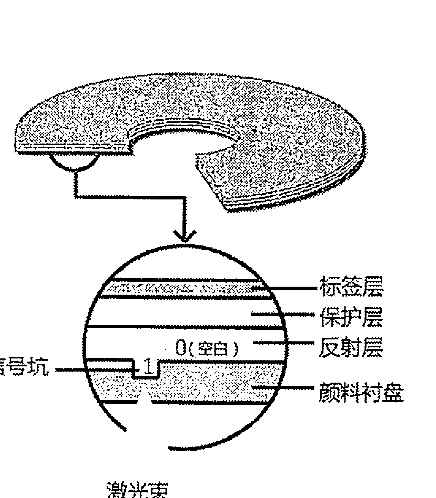

## 封装技术

### 了解处理器的第一站

文|曹操

随着Haswell的发布，移动和桌面处理器平台将同时存在PGA、LGA和BGA三种封装技术。掌握了不同封装技术之间的差异，有利于我们更好地把脉未来新CPU的定位和性能。

CPU性能强悍但自身却极为脆弱，即便是空气中的杂质和水分就足以对其造成毁灭性的打击（腐蚀电路造成电气性能下降）。

小提示：由于不同时期的CPU的接口规格不一且互不兼容，因此下文我们将LGA1150、LGA775等统称为LGA，rPGA988和rPGA988B等统称为PGA，以此类推。

### 封装技术三足鼎立

从Haswell开始，英特尔处理器将主要以PGA、LGA和BGA三种封装技术为主（见表）。其中PGA封装技术主要依靠基板底部的数百枚垂直的针脚与主板对应的插槽相连（图1）。随着金价的飙升，导致此种封装技术的成本也相对提高了1.5美元左右（针脚需要镀金），因此现在只有以笔记本为代表的移动处理器还在使用这种封装技术。

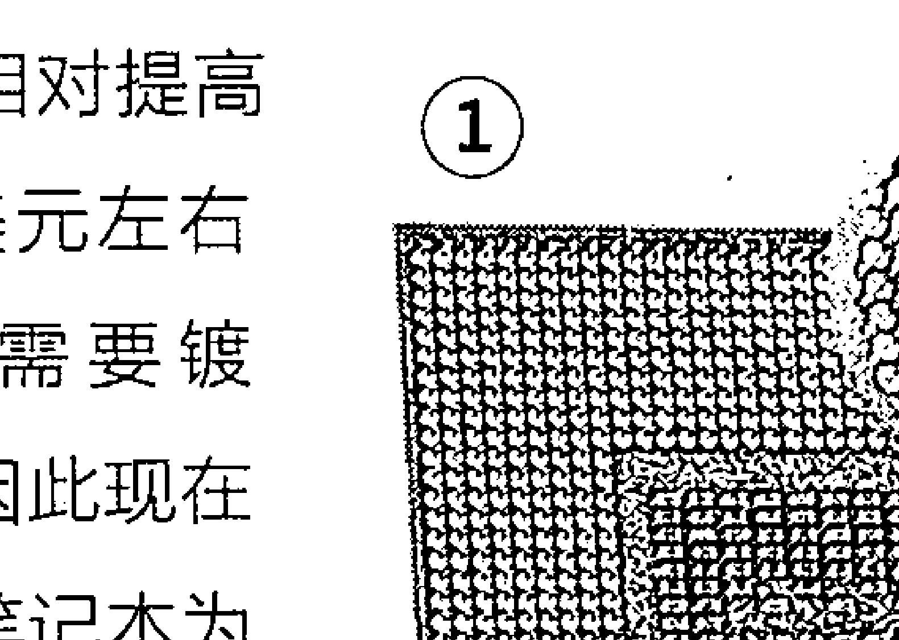

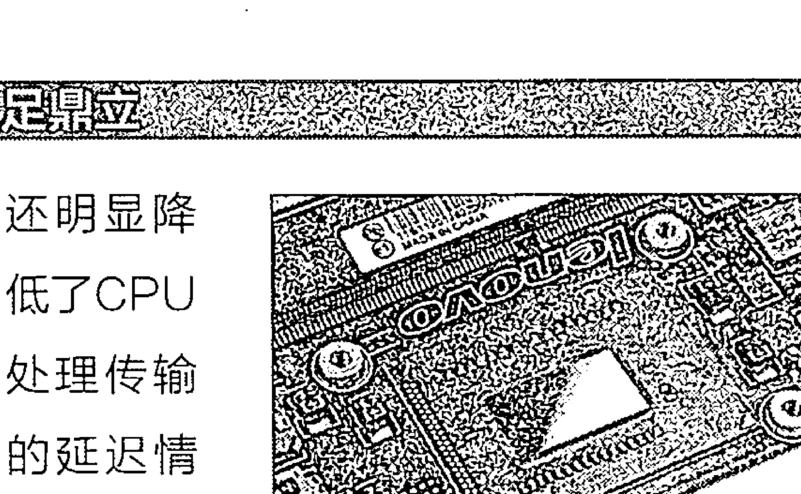

| 封装技术简称 | 英文全称 | 中文名称 | 对应应用平台 | 实例 |
| :--- | :--- | :--- | :--- | :--- |
| PGA | Pin Grid Array | 阵列引脚封装 | 移动处理器 | rPGA988 |
| LGA | Land Grid Array | 栅格阵列封装 | 桌面处理器 | LGA1155 |
| BGA | Ball Grid Array | 球栅阵列封装 | 移动桌面处理器 | —— |

*前文提到的rPGA封装中的“r”代表针脚间距较窄

LGA与PGA最大的差别就是用金属触点取代了以往的垂直针脚，除了解决成本压力，还明显降低了CPU处理传输的延迟情况，需要额外的安装扣架才能让CPU牢牢固定在主板接口那具有弹性的金属触须上。

BGA中的“B（Ball）”代表锡珠，它的原理和LGA类似，只是将解开扣架就能更换芯片的物理结构改为了用锡焊死（图2）。换句话说，BGA的CPU不单卖，而是和主板捆绑在一起的“套装”。用个不太恰当的比喻，如果我们将CPU比喻为手机中的电池，那PGA和LGA就好似三星Galaxy S3等手机，任何人拆开后盖就能更换电池。而BGA就好似无法更换电池的iPhone 5，电池会随手机一起“同生共死”。

### BGA开始玩跨界

虽然BGA无法升级，但借助没有插槽接口的特性，使得基于此封装的CPU可以做得更小，CPU+主板的厚度也要比其它两种封装薄数毫米。但同时BGA也因与散热器接触面积的减小，无法应对夸张的散热环境。因此，以前BGA封装一直被用在超极本/超薄本所用的低电压处理器（如i5-3317U）和搭载Atom的瘦客户端、HTPC、迷你机等特定设备上。Haswell的出现，则让BGA玩起了跨界，集成锐炬Pro核芯显卡的H系列移动处理器（比如i7-4950HQ）和R系列桌面处理器（i7-4770R）均采用BGA封装技术，终结了BGA与高性能绝缘的历史。今后，集成显卡的超薄笔记本和超薄一体电脑也能具备媲美GT640M独立显卡的游戏性能，而这背后就是BGA封装的功劳。

## 手机相簿 让母爱无处不在

俗话说儿行千里母担忧，不过，那是以前的事情啦。现在有了智能手机，无论多远，母亲都能实现几行千里母不愁。

文|楚留香

> 孟郊有诗曰：“慈母手中线，游子身上衣。临行密密缝，意恐迟迟归。”用近似直白的语言，深深地刻画出了母爱的伟大。本期我们邀请了几位母亲坐客“应用家”，希望能通过她们推荐的与母爱有关的手机应用，再次感受到母爱的伟大。

**刘仪：**超市收银员，32岁，女儿今年3岁。

**推荐的应用：**宝贝全计划

**推荐理由：**能在宝宝健康全面成长的同时，轻松地记录下她成长过程中的点点滴滴。

很多父母从孩子一出生就开始为孩子写宝宝日记，将来等孩子成人时作为礼物送给他。我也一样，因此这里我为大家推荐的是“宝贝全计划”，利用它，我可以及时地了解孩子的成长是否符合国际世界卫生组织标准，可以随时记下孩子成长过程发生的一些趣事，或者为她讲故事、玩游戏，打造营养均衡的健康食谱等。

-   第一步：启动软件，输入宝宝的相关资料，如身高和体重等，相应的信息就会生成。以后我只要定期输入孩子的身高和体重信息，一个标准的体格成长表就生成了。通过它，我可以随时了解宝宝的成长是否符合最新的国际世界卫生组织标准，体重过高或者过低都要引起注意。
-   第二步：记趣事。宝宝经常有些可爱的语言和举动，及时记录下来是件很有趣的事情，点击“今天记什么趣事”右侧的向右按钮，有一个“新建日记”对话框，有相机、相册、纯文字三项可选，在这里我们可以通过拍照和文字等方式，记录下这些趣事，方便以后回味。
-   第三步：听故事、玩游戏。宝宝大些后，就可以给她讲故事了。向右滑动手指，进入听故事界面，软件会智能判断某故事具体适合什么年龄阶段的宝宝。如果要播放，只需点击向右的按钮即可。当前的故事讲完，会自动播放下一个。每个故事缓冲5-10秒后，会被自动下载到本地，以后再听时，就不需要联网了。用同样的方法，可打开游戏界面，让孩子玩游戏。
-   第四步：打造营养食谱。均衡的营养是保证孩子健康成长的前提。进入Recipe界面，程序会根据宝宝的年龄，推荐早中晚三餐的食谱。如果不会做，可以点击相关食谱查看详细做法。有了这么耐心的老师，我要为孩子打造出几份色香味俱佳的菜肴也就不难了。

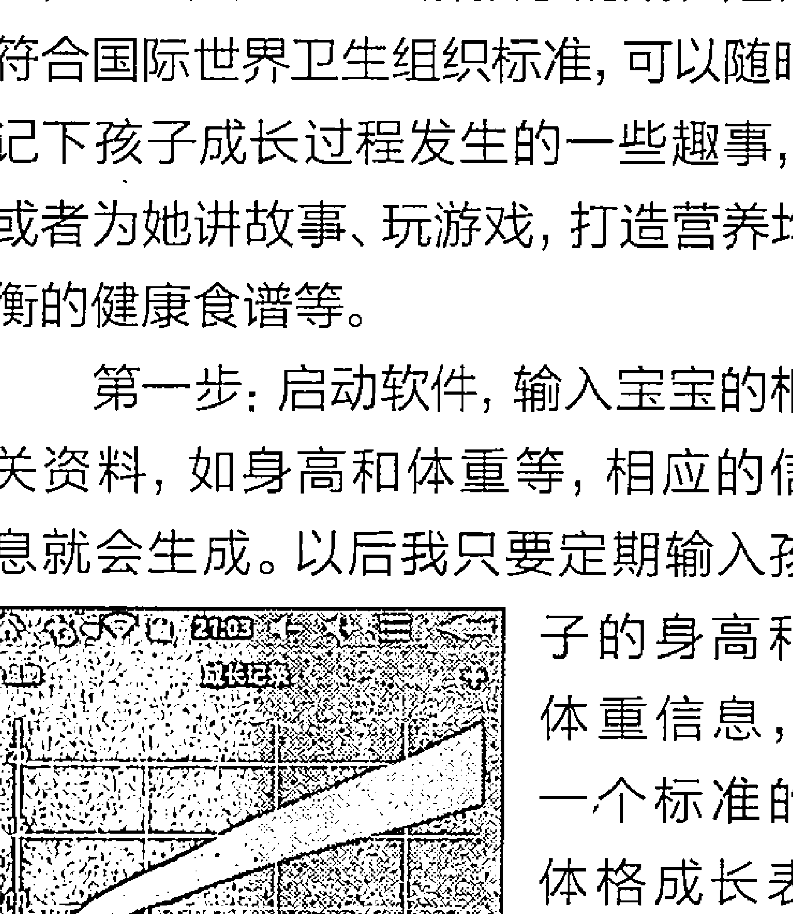

**张越：**平面广告设计师，31岁，儿子今年2岁。

**推荐的应用：**Wi-Fi手机摄像头

**推荐理由：**天涯咫尺，即使在单位上班也能看到儿子的一举一动。

休完产假后，孩子就一直由我妈来带，不过，母子连心啊，所以在上班的时候，我也希望能看到孩子的一举一动。一次偶然的机会，一位朋友告诉我，如果我有两部Android智能手机，有款名叫“Wi-Fi手机摄像头”的应用，能让我在手机中直接看到在家的孩子。恰好我真有两部手机，于是照方实行，现在终于可以在上班期间，随时查看孩子的一举一动了。

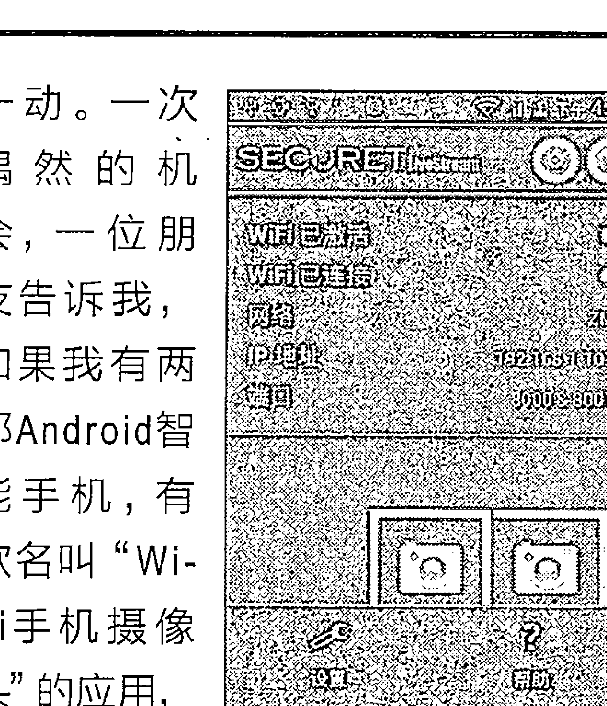

-   第一步：在放在家中的手机上安装“Wi-Fi手机摄像头”，安装完毕，程序会自动检测并连接到当前的网络，同时显示出IP地址和端口等信息。点击“开始”按钮。
-   第二步：在接下来的界面中，我们会看到两种访问方式：IE浏览器和Android设备。由于我的办公室中有电脑，所以一开始我选择了“IE浏览器”。选择完毕，在出现的界面中，记下显示出来的手机IP，访问端口和声音端口等信息。
-   第三步：以后我想上班期间观看孩子在家的影像时，只需在办公室的PC中打开IE浏览器，输入网址 http://192.168.1.101:8000，回车，家中的影像和声音就会出现，非常方便（PC系统中需要安装Java组件才会在浏览器中显示画面，如果没有安装，可以点击屏幕右下角的Install Java按钮下载安装）。
-   第四步：当然，频繁地用公司的电脑看Baby影响不好，所以更多的时间，...

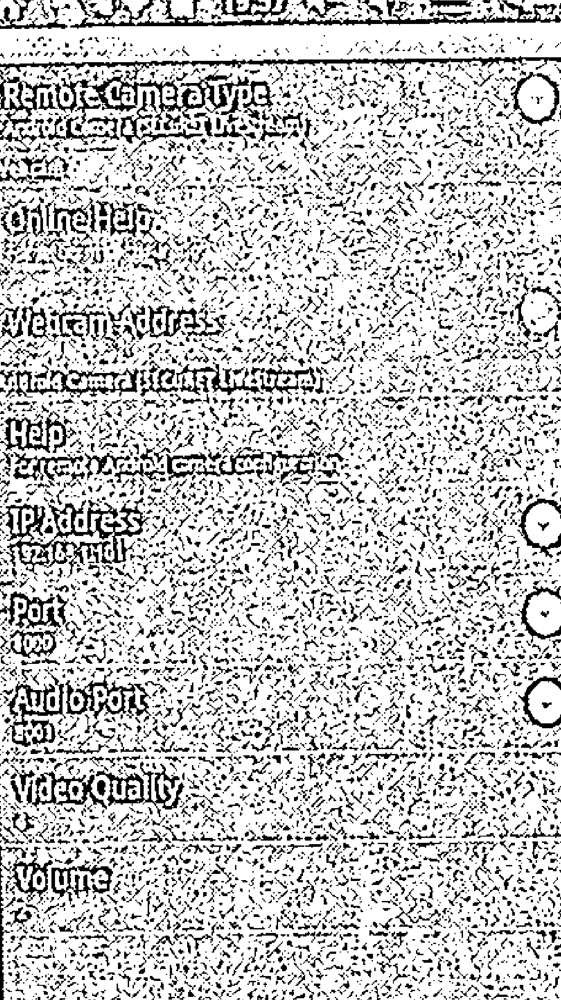

**赵丽英：**中学教师，42岁，儿子今年15岁。

**推荐的应用：**家长控制

**推荐理由：**孩子用手机，放任自流怎么行？

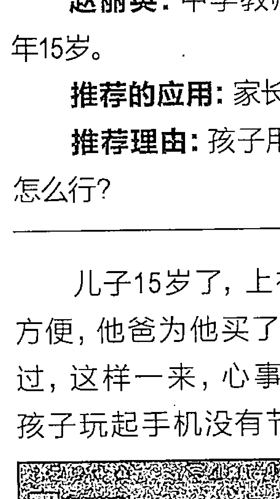

儿子15岁了，上初二，为了联系方便，他爸为他买了部智能手机，不过，这样一来，心事就大了，因为怕孩子玩起手机没有节制。后来，我在他的手机上安装了“家长控制”，问题得到解决了。现在无论孩子在手机上有什么举动，我都能随时了解，这下放心多了。

-   第一步：启动软件“家长控制”，可以看到软件有电话记录、短信记录、网页访问记录和应用锁四个方面。控制前要先设置一下，点击屏幕右上角的设置按钮，打开设置对话框，点击“设置数字密码”，完成密码的设置工作。然后进入“应用锁”，把不想让孩子使用的软件一一锁定（比如QQ和一些游戏软件）。

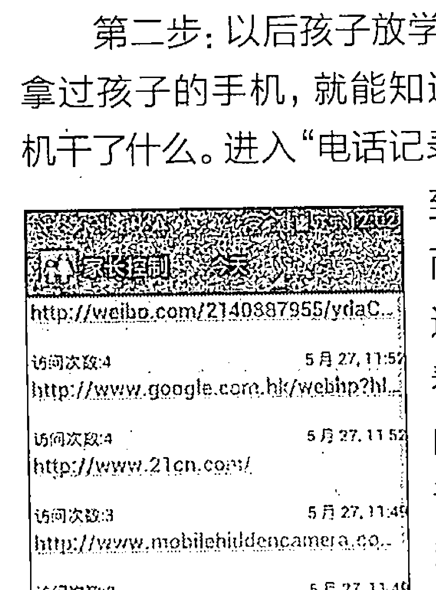

-   第二步：以后孩子放学后，我只需拿过孩子的手机，就能知道他都用手机干了什么。进入“电话记录”，可以看到总共打了两个电话。进入后可以看到详细的拨打电话的号码和时间。进入“短信记录”，可以看到所有发出和收到的短信。进入“网页访问记录”，可以看出孩子访问的网站以及访问网站的次数。孩子上网到底干了什么，我就心中有数了。

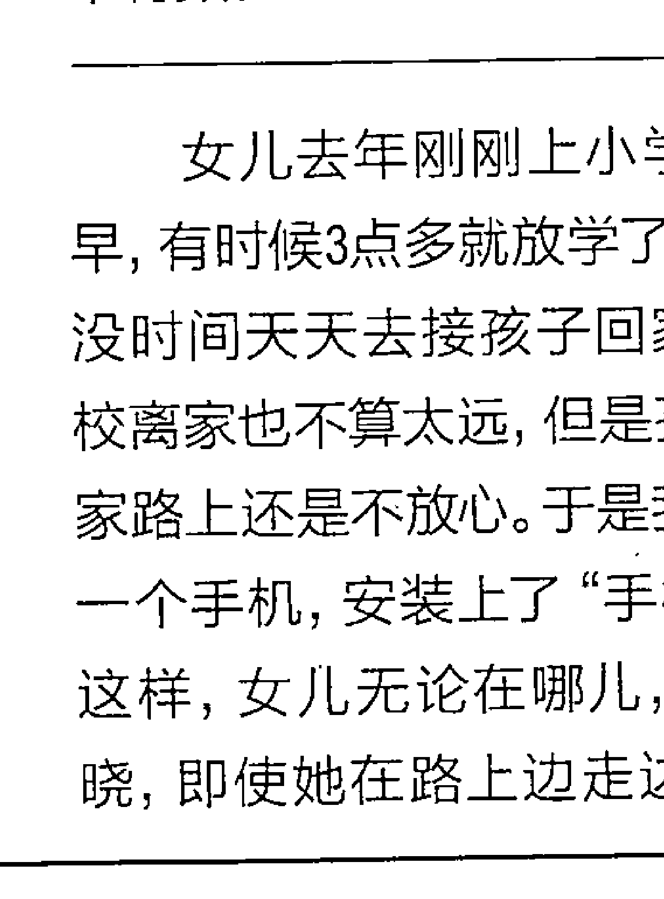

**卫淑芬：**自由工作者，37岁，女儿今年9岁。

**推荐的应用：**手机定位宝

**推荐理由：**准确定位，孩子去哪心中有数。

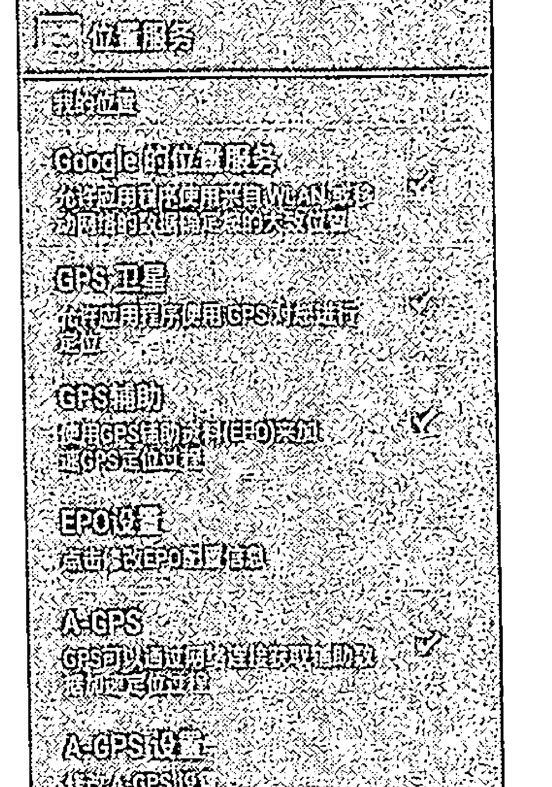

-   第一步：启动程序，在出现的窗口中点击“开启GPS”按钮，打开“位置服务”界面，勾选“Google的位置服务”、“GPS卫星”和“GPS辅助”等项。
-   第二步：返回上级界面，点击“连接到互联网”按钮，设置手机可以上网，然后点击“测试”按钮，测试一下GPS是否已经设置成功（如果成功，会显示“已定位”字样），点击“下一步”按钮，输入用户名（最好是手机号码），登录密码和手机昵称等信息。确认后，屏幕上会出现登录信息设置成功的提示，并告知从电脑或手机上访问的地址和访问方法。
-   第三步：调出菜单，选择“定位设置”，根据自己的需要，设置好定位时段和定位间隔（注意：定位比较耗电，因此，定位时段不要设置太长，定位间隔时间不要设置得太短。）
-   第四步：以后如果我想知道孩子在哪儿，只需拿出自己的手机，在浏览器中输入www.513gs.com（也可以在电脑上操作）并登录，孩子的位置就会显示出来。

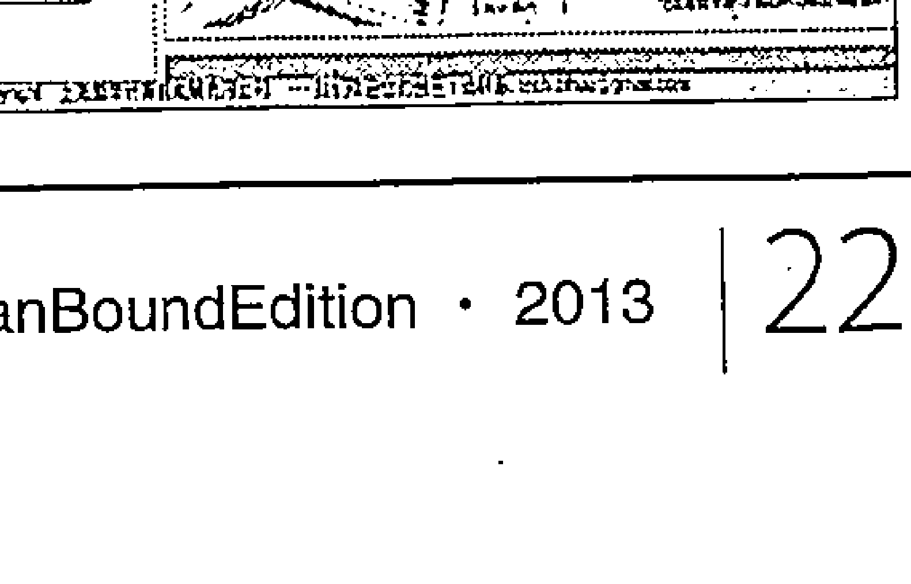

## 让智能机变身老人机

现在智能机更新换代快，人们换手机的速度也加快了。换下来的智能机直接给老人使用对他们来说也是个难题。如何改造让智能机变身实用的老人机呢？

文|飞雪散花

所谓孝道在于细节，下面，就让我们用几款简单的应用，把智能机改造成老人机，为老人解决一些实际问题。这也算是尽孝心的一种方式。

**张立伟：**男，42岁，某市环卫工人。在邻里街坊间素有孝子之称。

**推荐应用：**大桌面，快速拨号

**推荐理由：**大字体、大图标老人用着爽，此外，寻找常用联系人也方便。

本来想让老爸跟一下潮流，所以最近给他买了台Android智能手机，不想，老爷子不买账。原因是啥呢？很简单，系统默认的桌面字体太小了呗，他老眼昏花的看不清爽。

此外，默认的拨号工具也让他闹心，得带上老花镜翻半天才能找到要拨打的联系人。于是，我在他的手机安装了这两款应用，这下问题解决，老爷子高兴了，逢人就掏出他的手机炫耀一下。嘿嘿，人老了，有时真的会跟孩子一样天真。

-   下载安装大桌面，安装完毕，返回桌面，在出现的菜单中选择BIG Launcher，然后在接下来的对话框中，选择“允许”，进入程序的设置界面。
-   “√”按钮（以后每设置完一个项目，都必须点击这个按钮，才能进行下一步）；字体大小，我选的是“默认”，就是目前显示的字体大小。
-   当然，如果老人眼神很不济，还是看不清的话，我们也可以选择“更大”或“最大”；主题，默认使用的是“亮”，我们可以根据老人的喜好设置为“黑色”；主屏，选择“主屏”。至此，程序的设置工作就大功告成了。现在进入桌面看看，大字体、大图标，老人看起来是不是清楚多了？“拨号”、“联系人”、“收藏”、“拨打电话”、“图库”想用什么就选择什么，非常方便。

我推荐的另一款应用是“快速拨号”，这款应用的实用之处在于，它会用一个数字代表一个联系人，这样，老人想给谁打电话，只需按下这个数字即可。

-   安装完毕启动程序，程序会自动根据最近的通话记录，将经常联系的36位联系人显示在主界面中，并按照通话次数的多寡，用数字为其排序，其中通话最多的排在前面，同时还会显示出该联系人的照片。
-   当然，如果老人觉得默认的排序和主界面显示的联系人不符合自己的心意也没关系，我们可以手工为他指定常用的联系人及其序号。设置方法为：用手指长按数字，然后在出现的菜单中选择“选择联系人”项，再按提示在通讯录中选择好要使用该序号的联系人即可。
-   由于老人经常联系的人通常并不多，所以这款应用可以帮他们快速找到有关人员，并通过点击对应的数字或头像，快速拨打该联系人的电话。

**王芳：**女，39岁，医生。父母健在，皆为退休职工，王芳常常感到自己非常幸福。

**推荐应用：**吃药闹铃、定时开关机

**推荐理由：**可以提醒老人生病时及时吃药，当然还要保证手机处于开机状态。

老人年纪大了经常生病，再加上记性不好，吃药这事以往全靠我提醒，可我有时候也会忘记。后来我给老人安装了“吃药闹铃”这款应用，到了吃药时间，它就会自动提醒老人，我也不用再时时惦记着了。

-   安装应用后，首先设置吃药的提醒时间。运行应用，点击+按钮，在屏幕上输入吃药者姓名、病因等，再在“吃药期间”下方的设置吃药的时间范围。然后点击“闹铃时间”选项，在打开的屏幕上设置早、中、晚吃药闹铃的提醒时间，如果需要更多提醒，可以点击+按钮添加提醒。设置完后返回主屏幕，选择“闹铃声”选项，选择一个提醒音，随后点击“完成”按钮完成设置。这样一到吃药时间，手机就会自动发出提醒。

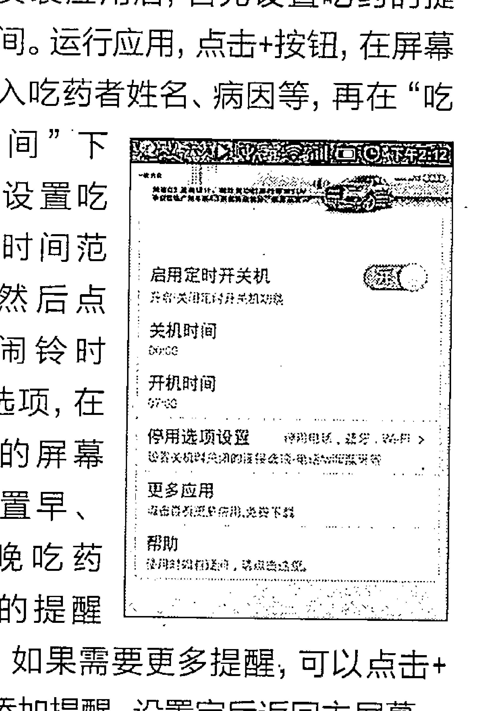

本以为从此不必再为吃药这事发愁了，哪想到后来又出了问题。原来是老人关手机后忘了开机，收不到提醒，药自然没吃。看来想伺候好老人，必须体贴入微才行。我又给他安装了“定时开关机”，这款应用和“吃药闹铃”相辅相成。前者保证老人不会错过吃药时间，后者则保证前者能正常发挥作用。

-   运行应用，首先弹出设置界面，将“启用定时开关机”选项切换为“开”状态。然后分别点击屏幕上的“关机时间”和“开机时间”两个选项，对手机自动开机和关机的时间进行设定。如果需要对蓝牙、Wi-Fi一同关闭，可点击“停用选项设置”选项，选择需要停用的项目。设置完毕返回到桌面即可。从此以后，手机就会在你指定的时候自动开机和关机，你再也不用担心老人忘记打开手机了。

**张自国：**45岁，的哥。最大的特点是爱乐。用他自己的话说：老人健康，家庭和睦，有啥不乐的。得乐且乐吧。

**推荐应用：**讯飞语音输入法、快说语音助手

**推荐理由：**接打电话、收发短信，无需动手。

一般来说，上了年纪的人并没有很好的拼音基础，所以如果他们要发短信，用我们常用的拼音或五笔输入法显然不行，因此，为了老爷子沟通方便，我在他的手机中安装了讯飞语音输入法。

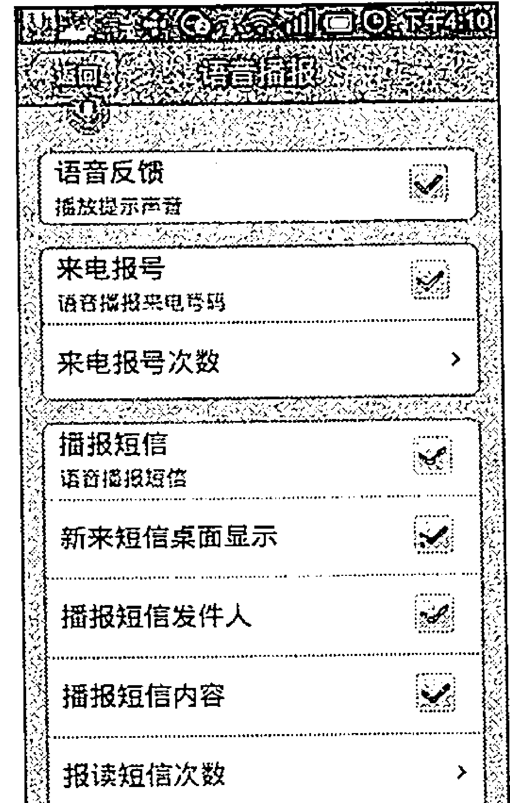

-   安装完毕，进入“讯飞输入法配置向导”界面，点击“打开系统输入法设置页面”界面，将其设置为系统默认的输入法。再对是否启用模糊音、自动联想等项，以及“界面设置”、“手写设置”和“语音设置”等项进行自定义。然后返回上级界面，点击“配置完成”按钮结束配置。以后老爷子想写短信时，只要先确保手机已连接到网络，之后调出该输入法，点击工具栏中的话筒状按钮，并对准手机说出要输入的内容，输入法就会自动把语音转换成文字，从而大大降低了输入难度。

看着老爷子兴致勃勃地用手机发短信，我心里也非常高兴。可没过一会儿，高兴劲儿就没了，因为别人回复的短信，老爷子根本看不清。不过这问题好办，因为老爷子虽然眼神不好，但耳朵不背，我就只要给他安装“快说”这款语音播报应用，让手机把短信内容及电话号码用语音播报出来就行了。

-   使用前先设置一下，开启来电号码和短信的语音播报功能。运行应用，呼出菜单，点击“设置”按钮打开设置界面。点击“语音播报”按钮，在打开的界面中勾选“来电报号”和“播报短信”两个选项即可完成。以后当接到电话或短信时，该应用就会自动把来电号码、短信发件人以及短信内容，用语音播报出来。如果老人听力稍差的话，还可以在设置界面设置播放次数，让该应用多读几遍。

**武菲：**女，43岁，其父患病，老人偶尔有些神智不清。

**推荐应用：**Life360、急救超人

**推荐理由：**实时掌握家人行踪

我父亲好像得了健忘症，出门后经常找不到家。爱人常出差，我工作又忙，不能时刻跟着他，上半年就走丢了好几回，多亏好心人帮忙，没出大事。可老这么下去也不是回事呀。最近好心的朋友建议我给他买了个智能手机，再装个Life360，这样我就能随时了解他在什么地方了。

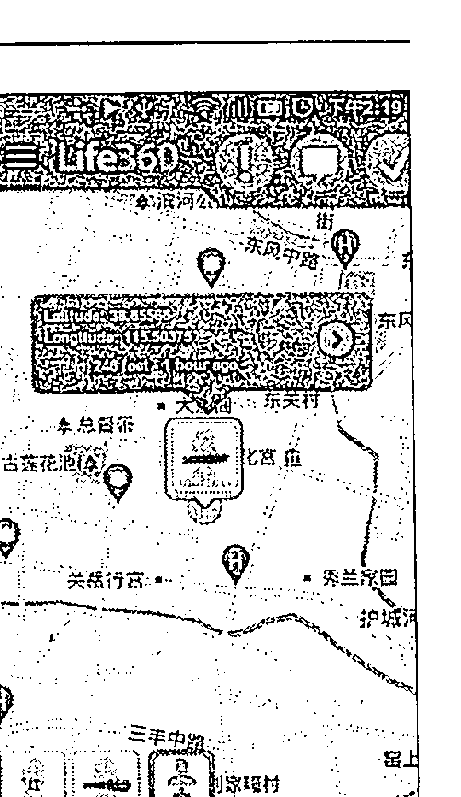

-   先在两个手机上安装Life360并注册账号。然后我用手机登录，点击屏幕底部的+按钮，从联系人列表中把老人添加进来。以后每次打开应用界面，都会自动切换到地图。从屏幕底部点击父亲的账号名，他的位置就会在地图上标注出来。这样无论他走到哪里，只要有网络，我就能知道得一清二楚。

我弟弟看我太累，提出帮我一起照看老人，可他只有普通手机，没有智能手机。我就想，网络不见得哪里都有，短信可是随时可以发送，便又安装了“急救超人”这款应用。

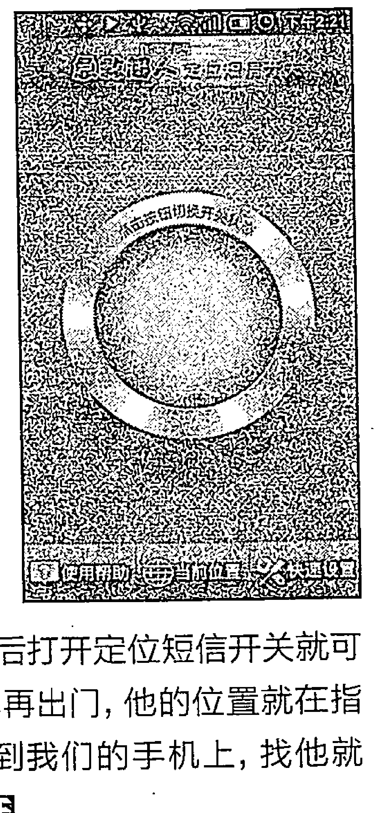

-   在父亲的手机上安装应用，运行后点击“定位短信”按钮，点击“快速设置”，再点击“联系人设置”选项，把我家人的号码添加到联系人里。随后返回设置界面，点击“发送时间点设置”，设置三个发送短信的时间。再点击“定位短信内容设置”，把短信内容设置为“当前位置信息”，确认之后打开定位短信开关就可以了。以后他再出门，他的位置就在指定时间发送到我们的手机上，找他就容易多了。

## 车在旅途 “机” 不可失

春节长假免不了要驾车出游或走亲访友，除了用到导航以及地图一些必备的手机APP外，还有哪些汽车辅助软件能让车主更省心、旅途更舒心呢…… 文|飞雪散花

又将迎来一年一度的新春佳节，在外打拼的朋友，除了要与阔别已久的家人欢聚一堂，还要借此机会走亲访友、游山逛水。七天长假的连续奔波，对人、对车都是个考验。怎样才能与爱车一起，平平安安度过这美好的节日呢？下面我们看看几位车友怎么说。

王彦方：男，31岁，机械设计人员，老家安徽，北漂一族。 推荐应用：高速助手、在路上。 推荐理由：快速找到高速公路，轻松记录沿途美景。

父母供我上大学很不容易，如今我年事已高，身体多病，所以每次一到节日，我都想以最快的速度回家看看。可是想搞到节假日的火车票比学会开火车都难。后来买了车就总是开车回家了。可由于平时回家次数很少，路况不熟，找高速路口成了最大的麻烦，路上的标牌一不留神就错过了。后来，我安装了“高速助手”这款应用，从此再也不用看马路标牌找高速了。

如果在车上，只要拿出手机运行应用，在屏幕底部点击“附近”按钮，就把附近的全部高速出入口及其距离标注出来。想去哪个入口时，就点击高速入口名称，这样，就能从地图上看到行车路线。有些高速会因事故、天气等原因关闭，对此可以在屏幕底部点击“查找高速”按钮，找到高速路，点击右上角的“订阅路况”按钮。这样一来，如果必经的高速出现意外事故，我只要通过底部的“我的高速”按钮就能及时获悉，以便更改路线。

晓晓：女，35岁，北京某公司会计，以精打细算、会过日子著称。 推荐应用：汽车账本、打折加油。 推荐理由：保你省钱到家。

每到一个新鲜地方，我还喜欢把当地的风土人情记录下来，好回家让爸妈也看看我回家路上的所见所闻。 这是我推荐“在路上”这款应用的原因。操作方法很容易，运行应用并注册登录后，点击底部的“记录”按钮，在打开的界面中点击相机状按钮进行拍照，再在文本框里输入文字，点击右上角的对钩按钮，就能把所见所闻发布到网上与好友分享。闲来无事的时候，点击“广场”按钮，看看其他好友分享的奇闻轶事，也是一种乐趣，你说对吗？

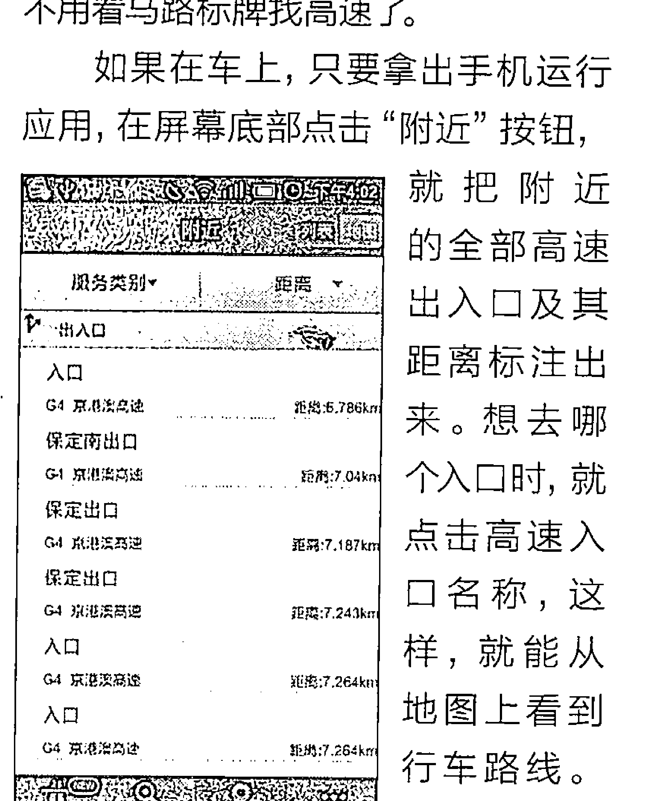

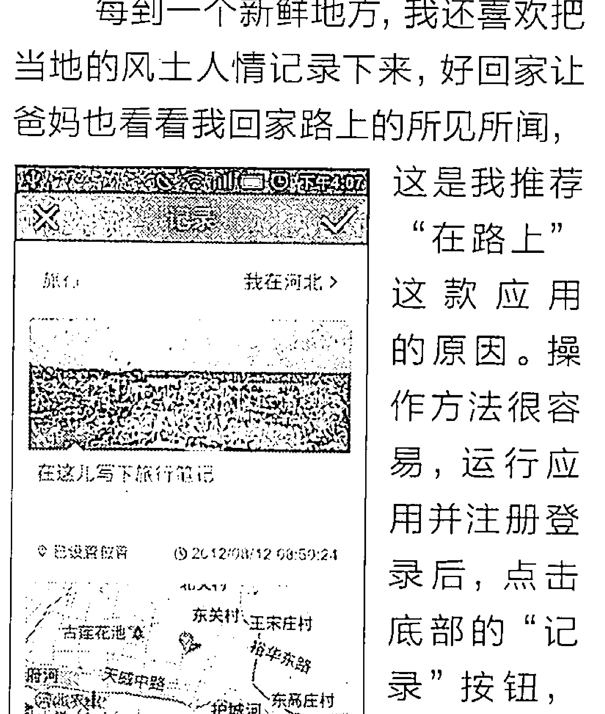

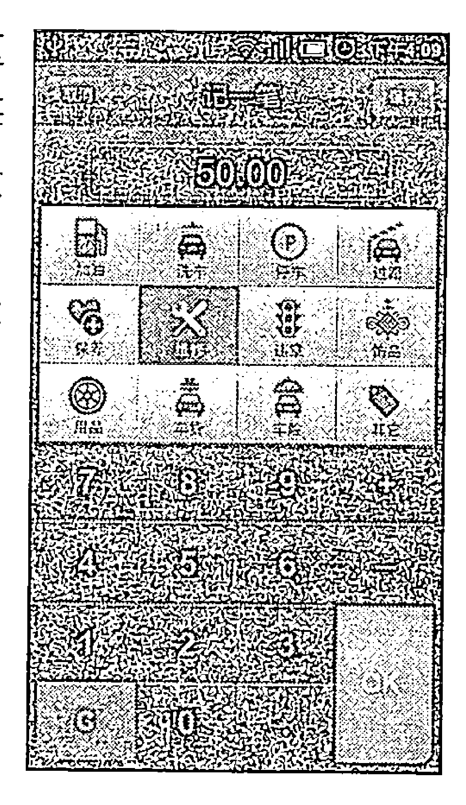

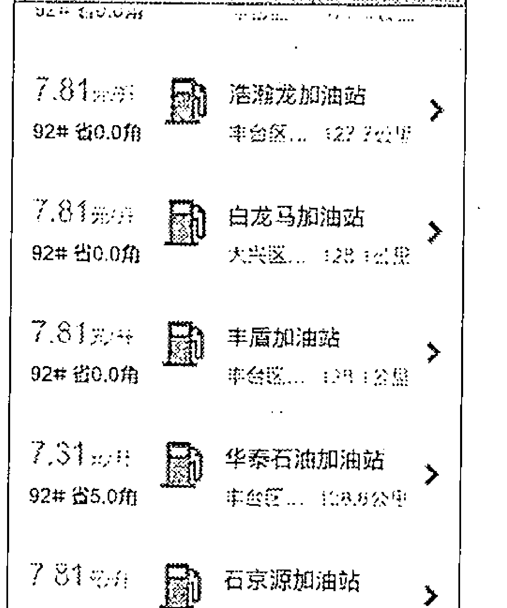

看来与汽车有关的APP还真是不少，如果能把这些工具运用好，不但能体验到驾驶的乐趣，还能感受到科技带来的魅力。

用，点击“附近”按钮，从屏幕上就能看到附近所有的加油站。其中每个加油站的汽油价格能帮你省多少钱，都显示得一清二楚。假如发现某个加油站在搞促销，那就直接点击加油站名称，在打开的屏幕上点击“查看地图”选项，通过地图找到加油站的位置加油即可。

刘强：男，29岁，退伍军人，家住沈阳，南京工作。 推荐应用：停车助手、GPS工具箱。 推荐理由：快速找到停车场，限制车速安全无忧。

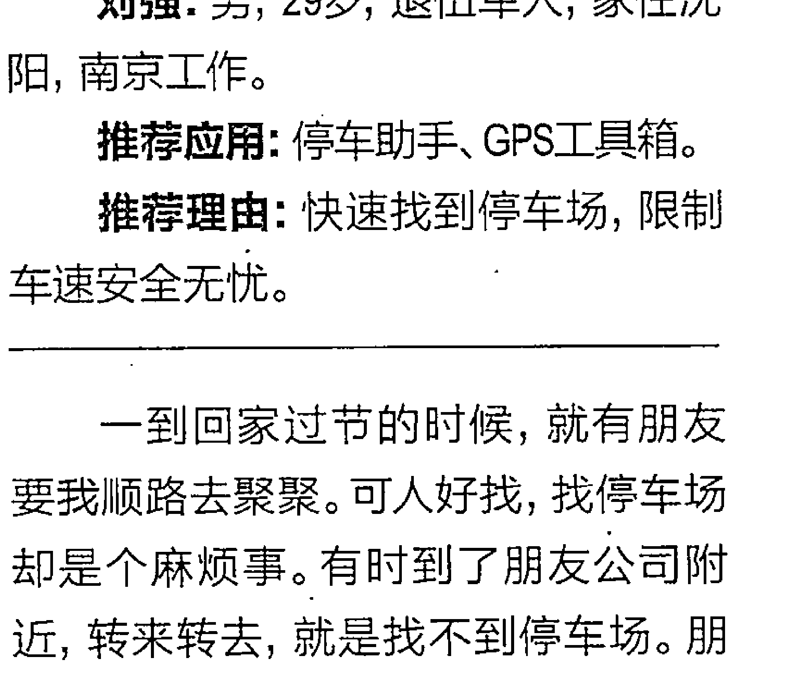

一到回家过节的时候，就有朋友要我顺路去聚聚。可人好找，找停车场却是个麻烦事。有时到了朋友公司附近，转来转去，就是找不到停车场。朋友说，你装个“停车助手”吧。我一试，这款应用还真带劲，轻轻松松就能找出身边的停车场。打开应用，屏幕自动切换到“停车场”标签，地图便会标记出附近所有的停车场，想停哪里，只要在地图上长按停车场图标，可以看到行车路线，方便吧？如果有好几个停车场，当然选择收费低、信誉好的，在屏幕右上角点击“列表”按钮，然后逐一点击停车场名称，就能看到每个停车场的车位情况、综合满意度和收费多少。有这么好的应用，还怕找不到理想的停车场吗？我这人有个毛病，平时爱喝点小酒，虽然每次等酒醒后才敢开车，可朋友还是怕出事，再三提醒我开慢点。我一想，干脆装个“GPS工具箱”，来限制自己开车的速度。先来设置要限制的速度。运行应用，点击“GPS测速”图标，然后呼出菜单，点击“参数设置”按钮打开设置界面，先点击“超速告警阈值”按钮，设置提醒速度，然后确保“超速后播放警示音”选项处于开启状态，点击“选择超速告警铃声”选项，选择一个MP3格式的音频文件完成。以后开车时，软件就会自动检测当前车速，当发现超过指定速度时，设置的报警就会响起，提醒你立即降速。降到指定速度后，报警声也就立即消失了。

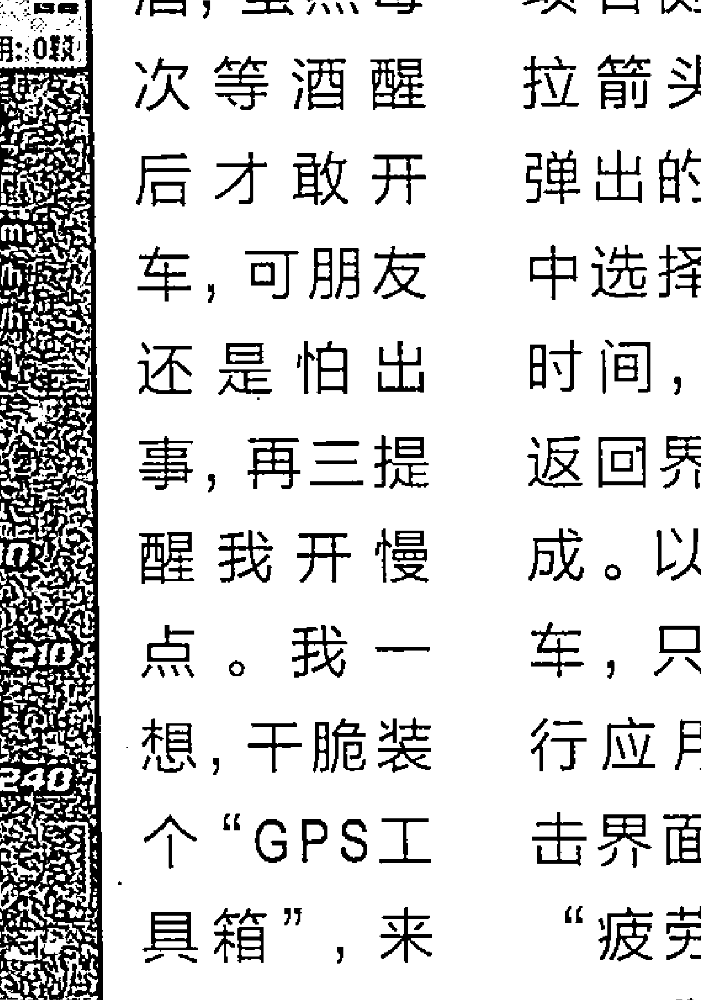

老李：男，44岁，家住武汉，出租车司机。 推荐应用：老司机、去哪吃。 推荐理由：吃饱休息好，开车才安全。

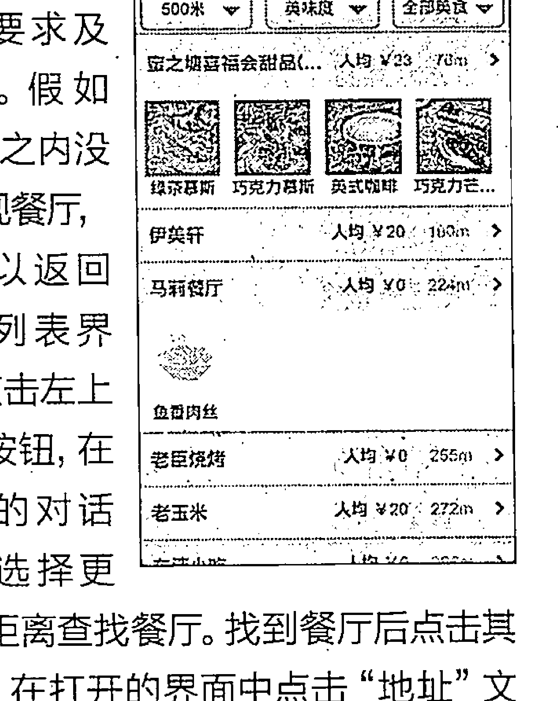

我平时的工作就是开车，如今岁数大了点，精力不济，开一天车觉得很累。每年我都要回湖南老家看望七十多岁的老父亲，老婆怕我路上出事，就让孩子给我安装了“老司机”这款应用，不为别的，就为它能每隔一定时间提醒我休息一会儿。运行应用后，首先设置提醒间隔时间。点击右下方的“设置”按钮打开设置界面，点击“疲劳驾驶提醒”选项右侧的下拉箭头，在弹出的菜单中选择提醒时间，然后返回界面完成。以后开车，只需运行应用，点击界面下方“疲劳驾驶提醒”文字右侧的三角箭头按钮，软件就自动开始倒计时，倒计时完成后，提醒音就会响起。“去哪吃”是我推荐的另一款应用，推荐的原因也跟我有关。我开车的时候，肚子一饿就心里发慌、眼冒金星，必须赶紧找饭店。为了尽早找到饭店，孩子给我安装了“去哪吃”这款应用，还说，不用我开车瞎转，问问它就能找到饭店。运行应用，软件自动开启GPS定位位置。点击“附近”按钮，便可看到四周500米之内的餐厅、人均消费要求及距离。假如500米之内没有发现餐厅，还可以返回餐厅列表界面，点击左上角的按钮，在弹出的对话框中选择更远的距离查找餐厅。找到餐厅后点击其名称，在打开的界面中点击“地址”文字右侧的图标，这时界面就会切换到百度地图，点击右上角的“查看路线”按钮，在地图上就会标记出从当前位置到餐厅的行走路线。

## 手机管理 谁会成为真正的帮手

手机助手能干什么？相信很多朋友都已经知道了。但是你知道到底哪款手机助手是功能最强大的，哪款手机助手资源最丰富，哪款手机助手最适合你吗？本期就帮大家来解开这个谜。

文 | CFan软件研究室

### 比功能 谁最全面

智能手机以其便捷、多能、时尚等特性深受青睐。当拥有一部智能手机之后，往往还要选择一款管理工具，从电脑上管理手机中的数据。目前人气较高的手机管理工具包括四款，分别是91手机助手、豌豆荚、360手机助手以及腾讯手机助手，既有前辈也有后生。它们各自有什么特点，该把哪一款请进自己的电脑呢？下面我们就来揭晓答案。

当我们想理性地选择一款助手时，还要考虑它的功能是否能满足自己的要求，比如能否借助电脑的优势，帮助我们更方便地管理手机联系人、通讯录、短信、媒体文件以及应用等。这一环节我们将选择几个最常用的功能进行对比。

测试平台1: PC
操作系统: Windows 8 64位专业版
处理器: 英特尔酷睿(Core)i5-2310 2.90GHz 四核
内存: 4GB (A-DATA DDR3 SDRAM 1333MHz)
带宽: 4MB

测试平台2: 手机
手机型号: MI-ONE-Plus
操作系统: Android 4.04; MIUI版本: 2.12.29
处理器: 1.5GB 双核
运行内存: 1.00GB

### 表1 四款手机助手功能对比

| 功能项目 | 91手机助手 | 豌豆荚 | 360手机助手 | 腾讯手机管家 |
|---|---|---|---|---|
| 联系人管理 | √ | √ | √ | √ |
| 短信管理 | √ | √ | √ | √ |
| 媒体管理 | √ | √ | √ | √ |
| 文件管理 | √ | √ | √ | √ |
| 应用管理 | √ | √ | √ | √ |
| 电子书管理 | √ | × | √ | √ |
| 手机体检 | × | √ | √ | √ |
| 应用升级 | √ | √ | √ | √ |
| 搜索能力 | 类别 | 全局 | 类别 | 类别 |
| 高级功能 | √ | × | × | √ |

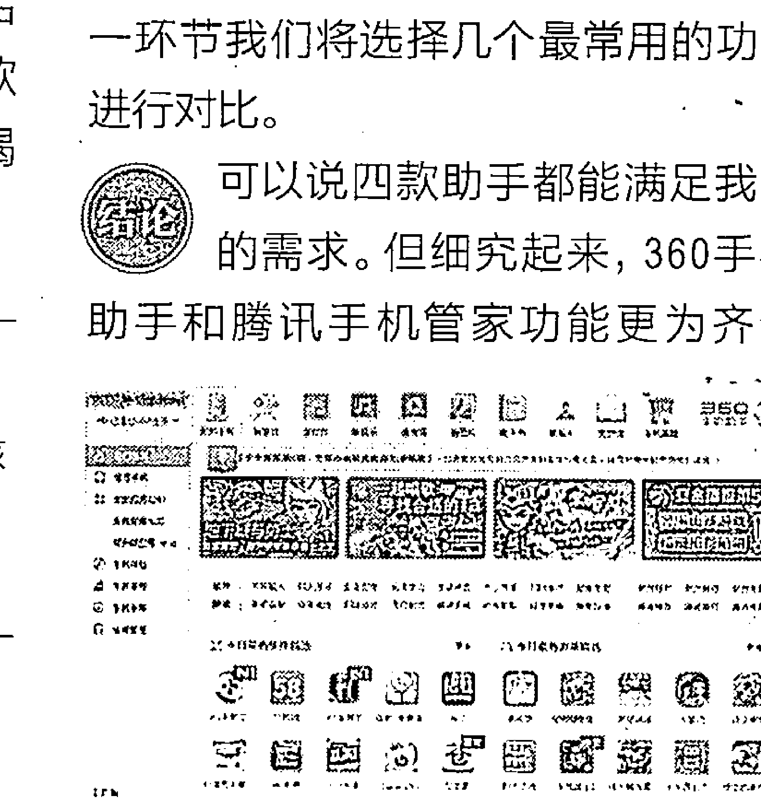

可以说四款助手都能满足我们的需求。但细究起来，360手机助手和腾讯手机管家功能更为齐全（图1），豌豆荚缺少电子书管理功能，爱看书的朋友不会关注。91助手缺少手机体检功能，对用户显得不够体贴。值得一提的是，91助手还提供有一键转机、一键ROOT、手机设置等功能，对高要求用户很有帮助。

### 论操作 谁最简单

软件的操作是否便利，直接决定了它的上手难度。无论导出联系人还是短信，还是执行其他操作，谁都希望以更简单快速的方式完成，不愿在操作步骤上花费精力。如果一款工具功能令人满意，但操作复杂，同样不会受到大家的喜爱。本轮，各款工具的表现如何呢？

本轮进行了一些常用的导出、截图、备份操作进行对比，发现对于导出联系人之类的操作，91手机助手需要经过多个窗口才能实现，360手机助手截图时每次都要设定路径，也比较麻烦。在安装应用时，91助手、360手机助手和腾讯手机管家基本是主界面辅以小窗口，显得干净利落。豌豆荚每次安装应用都要启动主程序，而不是以小弹窗形式安装，有些不可思议。在应用备份环节，豌豆荚和腾讯手机管家只备份了应用列表，没有很好的备份功能。另外，360手机助手提供了一个悬浮窗，可以快速拖动任意文件至手机，值得称赞（图2）。

### 表2 四款手机助手操作对比

| 操作项目 | 91手机助手 | 豌豆荚 | 360手机助手 | 腾讯手机管家 |
|---|---|---|---|---|
| 安装提示 | 弹窗 | 启动程序 | 弹窗 | 弹窗 |
| 操作步骤 | 复杂 | 简单 | 复杂 | 简单 |
| 反应速度 | 快 | 慢 | 快 | 快 |
| 应用备份 | 数据 | 无数据 | 数据 | 无数据 |
| 快捷通道 | 无 | 无 | 悬浮窗 | 无 |

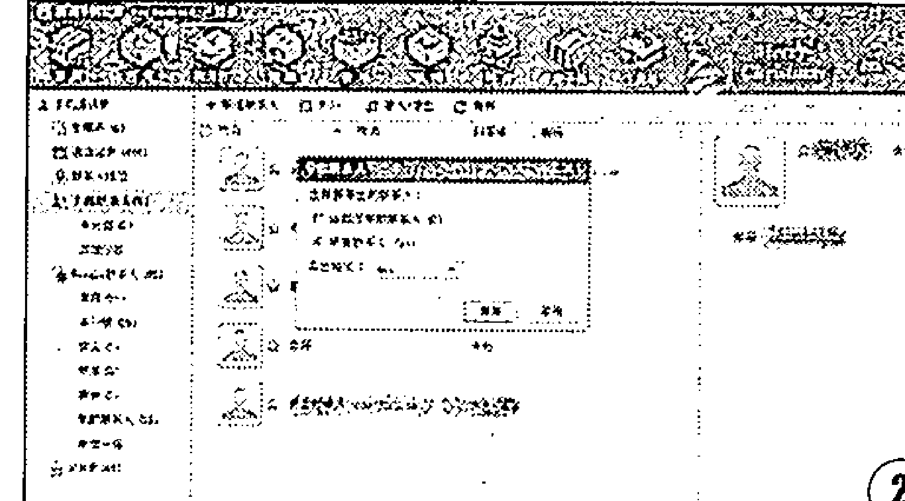

通过今天的对比，大家对各个手机助手的优劣有了更深的认识，现在看来，各个手机助手的表现还是有很大差异的，你更看好哪个呢？

### 拼内容 谁最丰富

仅凭与手机的简单连通，绝对算不得实用的助手，用户真正需要的是全面的体验，因此，对智能机而言，助手工具所携带的应用数量、种类等内容才是王道。在电脑里安装手机助手，通过它获取手机资源，能给用户省去不少麻烦。在这一环节，我们看看各个手机助手的表现。

豌豆荚在资源提供上占据绝对优势，内容涉及应用、音乐、图片、视频等，极其丰富。360手机助手虽出道不久，但亦有不俗表现。91手机助手出道较早，虽然声称拥有50万以上的游戏和应用，但总体看来发展势头不够强劲，在资源数量上处于下风，不能不说是个遗憾。腾讯手机管家除了应用，其他内容主要以自身产品提供，给人以画地为牢的感觉(图3)。

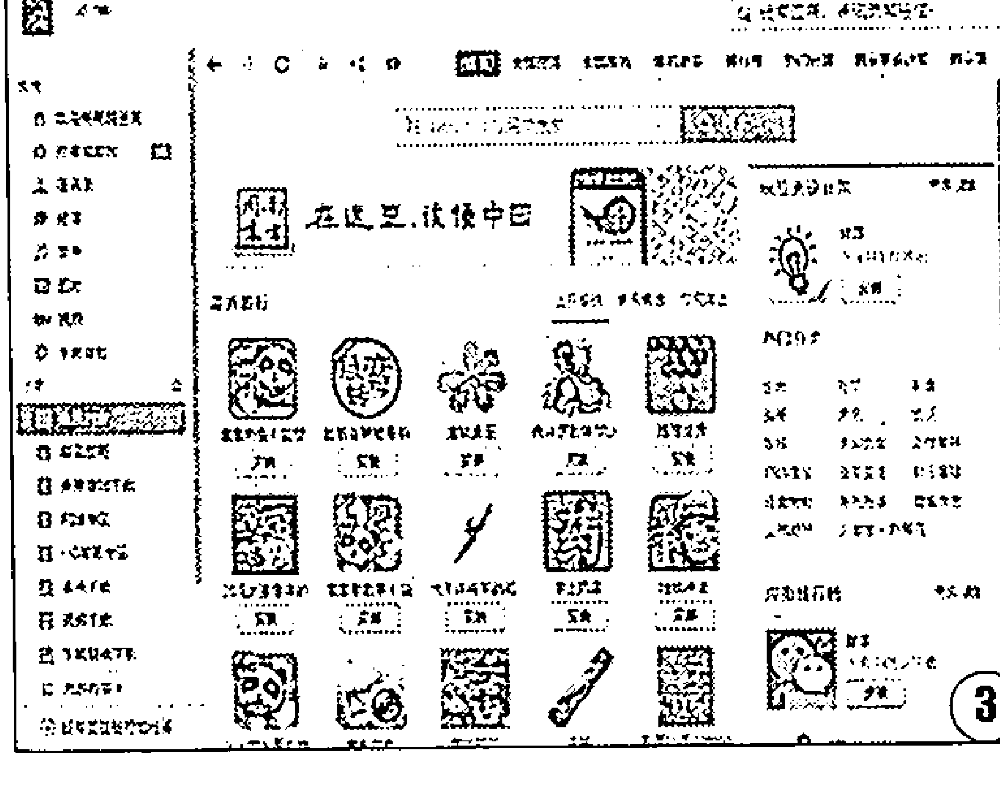

### 表3 四款手机助手内容对比

| | 91手机助手 | 豌豆荚 | 360手机助手 | 腾讯手机管家 |
| :--- | :--- | :--- | :--- | :--- |
| 应用提供 | 自家及安卓市场 | 35家 | 23家 | 15家 |
| 音乐 | 6家 | 16家 | 10家 | QQ音乐 |
| 图片 | 4家 | 16家 | 8家 | 无 |
| 视频 | 4家 | 24家 | 11家 | 无 |
| 电子书 | 熊猫看书 | 20家 | 18家 | QQ书城 |
| 应用数量 | 未提供 | 43万 | 10万 | 未提供 |

### 数认证 谁最全面

从电脑到手机，自从进入智能时代，安全一直是个永恒的话题。在电脑上曾经经历的种种噩梦，如今会不会在手机上重演，这是用户非常关心的事。那么，以上四款手机工具，能不能为手机保驾护航呢？下面我们来看一看。

其中豌豆荚拥有安全监测、豌豆荚认证、Google Play认证、敏感权限提醒等多方面的用户提示，大家可以根据提示提醒选择操作，比较放心。360手机助手对自身资源非常完善，但对开放平台提供的应用没有提供安全认证服务。腾讯手机助手和91助手对应用则缺乏足够的措施(图4)。

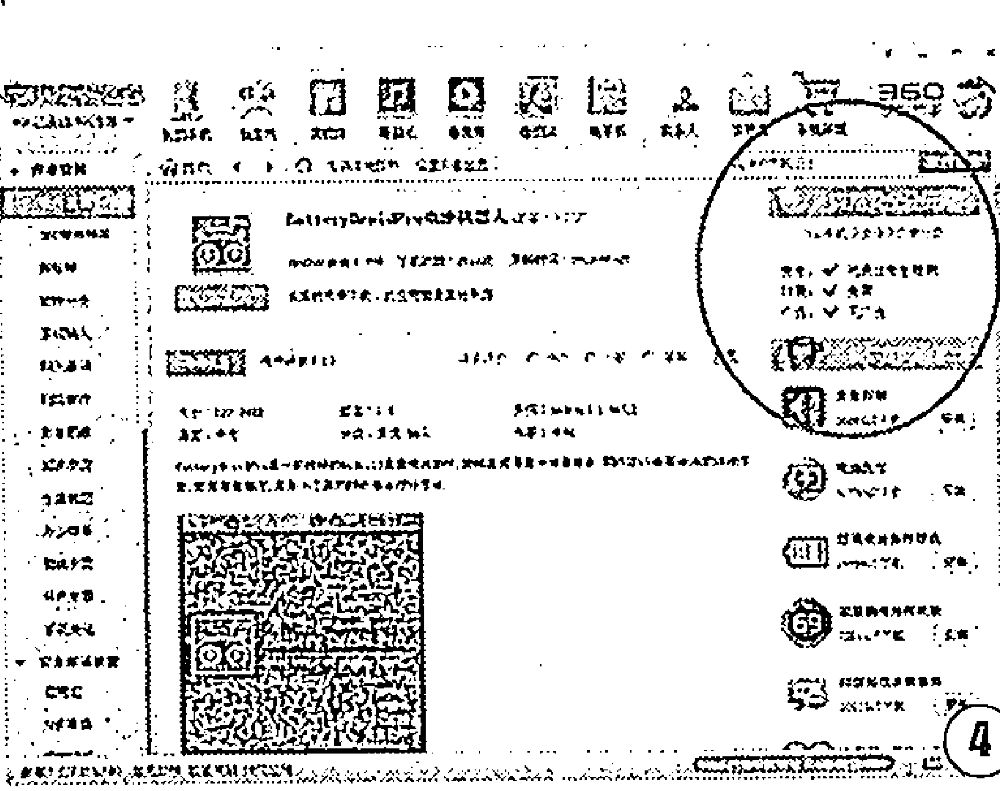

### 表4 四款手机助手安全认证对比

| | 91手机助手 | 豌豆荚 | 360手机助手 | 腾讯手机管家 |
| :--- | :--- | :--- | :--- | :--- |
| 安全检测 | √ | √ | √ | √ |
| 付费提醒 | x | x | √ | x |
| 广告提醒 | √ | √ | √ | √ |
| 权限提醒 | 无 | 敏感权限 | 所有权限 | 无 |
| 开发商认证 | x | √ | √ | x |

### 结束语

应该说，四款工具各有所长。豌豆荚在内容方面有着无法比拟的优势，腾讯手机助手在满足基本要求的前提下，以操作简单见长。360手机助手在应用安全性上表现突出。91助手虽看似表现不太突出，但它所提供的高级功能非其他工具能比。笔者看来，豌豆荚、360手机助手、腾讯手机管家三款工具，走的是大众路线，以满足一般用户为主。91助手则走专业路线，放眼在比较高级的用户身上。

如果要帮大家选择的话，笔者的建议是，如果你仅用来执行一般备份、管理，操作简单的腾讯手机助手不可错过。如果喜欢体验各类应用、游戏，豌豆荚绝对让你满意。如果你对手机安全比较看重，360手机助手是首选。如果你是相对专业的手机玩家，或者拥有多部不同系统的手机，91助手不会令你失望(图5)。

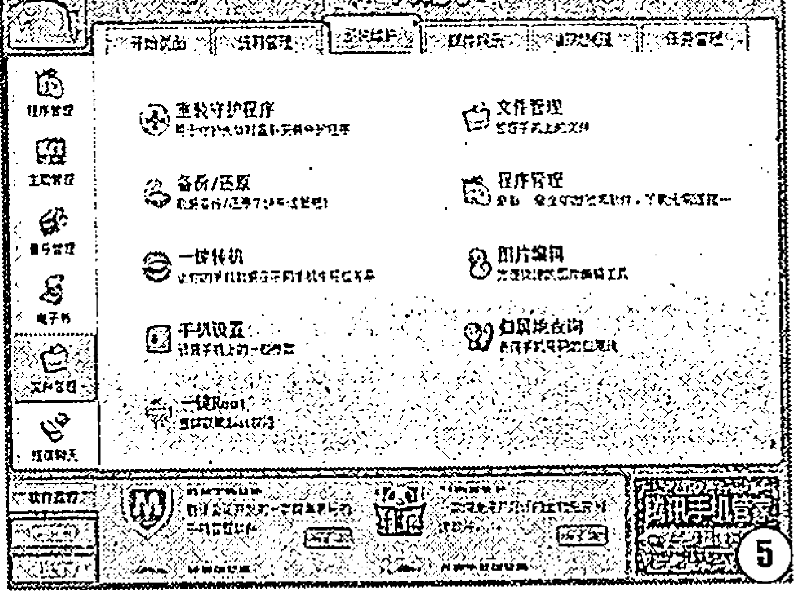

此外，在四款管理工具中，出道较早的91助手提供了全方位的解决方案，对WP、iOS、Android系统提供了全面的支持。360手机助手虽出道较晚，但依然提供了对Android、iOS两个系统的支持。

而腾讯手机管家虽然在手机客户端方面提供了对Android和iOS两大系统的支持，但PC端目前只支持Android手机，让人觉得很诡异。支持平台数量最少的是豌豆荚，仅支持Android系统。

也就是说，如果你用Windows Phone手机，91助手是唯一选择。对果粉而言，则可从91助手和360手机助手中二选其一。而对于Android用户来说，选择的余地就非常大了。

《电脑爱好者》·合订本 { 移动天地 }

## 家有宝贝不烦躁 手机变身贴身保姆

对于家有婴儿的年轻父母来说，除了孩子睡着了之外，自己几乎没有什么自由时间。本文介绍如何利用手机远程看护孩子。

文|木木

孩子醒着的时候需要喂奶、换尿布、洗衣服，只有在孩子睡着的时候爸妈们才能有空做其他事情，可是孩子的睡眠很浅，需要时时照看，怎么办？何不将手机变为孩子的贴身保姆，实现对孩子的全程呵护（下面以安卓手机为例）。

### 一哭就报 孩子睡醒早知道

孩子的睡眠一般很浅，即使把睡着的孩子放到床上，很可能5分钟过后就会醒来哭闹。怎么及时发现孩子醒了吗？借助Baby Monitor，只要孩子一哭就可以收到短信通知。

- 第1步: 首先到http://app.cnmo.com/android/110057/下载软件并安装, 启动程序后点击Baby alarm, 进入闹钟设置。Contact method设置下选择Send SMS (Call number则为自动拨打电话), 然后在上方输入接收的电话号码。
- 第2步: 点击Test sensitivity进行哭闹声音值的设置。因为孩子睡醒后看不见爸妈在身边就会哭闹, Baby Monitor正是根据周围环境声音值的变化来激活指定操作的。现在测试一下, 将手机放在婴儿床的旁边, 等到他睡醒以后对其哭声进行测试, 一般选择50%的值即可。
- 第3步: 设置好Sensitivity的检测值后, 以后你只需临时离开家时, 只要准备一部手机并启动Baby Monitor, 孩子睡醒后一哭你就会立刻收到短信通知了。

### 一报就看 全程监控孩子

通过Baby Monitor可以及时知道孩子已经睡醒, 可是你正在小区旁边的超市购物, 一时回不到家, 这时还可以借助手机的QQ视频聊天功能, 在超市里实现对孩子的全程监控。

- 第1步: 首先确认你的手机已经申请上网套餐, 如果是3G手机建议申请3G套餐, 可以更方便地实现视频的连接 (注意流量费用)。准备两个QQ账号A和B互加为好友, 假设家中电脑为A, 在其好友列表选中B, 将其备注名称设置为“手机B”, 接着进入QQ的“系统设置→基本设置→会话窗口”, 勾选右侧的“允许来消息时自动弹出窗口”。最后启动手机QQ, 向电脑QQ发送视频聊天邀请, 此时在电脑上就会弹出“对方视频邀请中”的对话窗口 (图1)。
- 第2步: 由于Baby是在家睡觉, 接下来操作就是设置电脑QQ自动接受邀请。可使用AutoHotkey来录制自动点击脚本。到http://www.orsoon.com/Soft/10516.html下载并运行AutoHotkey的AutoScriptWriter组件。单击AutoScriptWriter窗口的Are cord开始录制, 先用鼠标点击聊天窗口的“接受”。完成上述操作后按下Stop停止录制, 返回AutoScriptWriter窗口可以看到上述录制的整个脚本代码 (图2)。
- 第3步: 点击Save将其保存为cfan.ahk, 放置在当前电脑账户的启动文件下, 比如C:\Users\当前用户\AppData\Roaming\Microsoft\Windows\Start Menu\Programs\Startup下。这样家里的电脑启动后就会自动加载上述脚本。脚本的作用是, 在桌面弹出与手机B视频聊天时自动点击“接受”开始聊天。AutoHotkey录制的脚本会智能判断弹出窗口的标题, 只有弹出与手机B视频聊天才会点击“接受”, 而且脚本运行后会自动最小化到任务托盘。
- 第4步: 在电脑上测试一下脚本, 确认无误后, 如果你临时出门, 只要将电脑QQ开起来, 并将摄像头对准婴儿床。外出的时候, 如果要随时查看孩子的状况, 只要开启手机QQ的视频邀请, 一会儿就可以在手机屏幕上随时监控孩子了 (图3)。

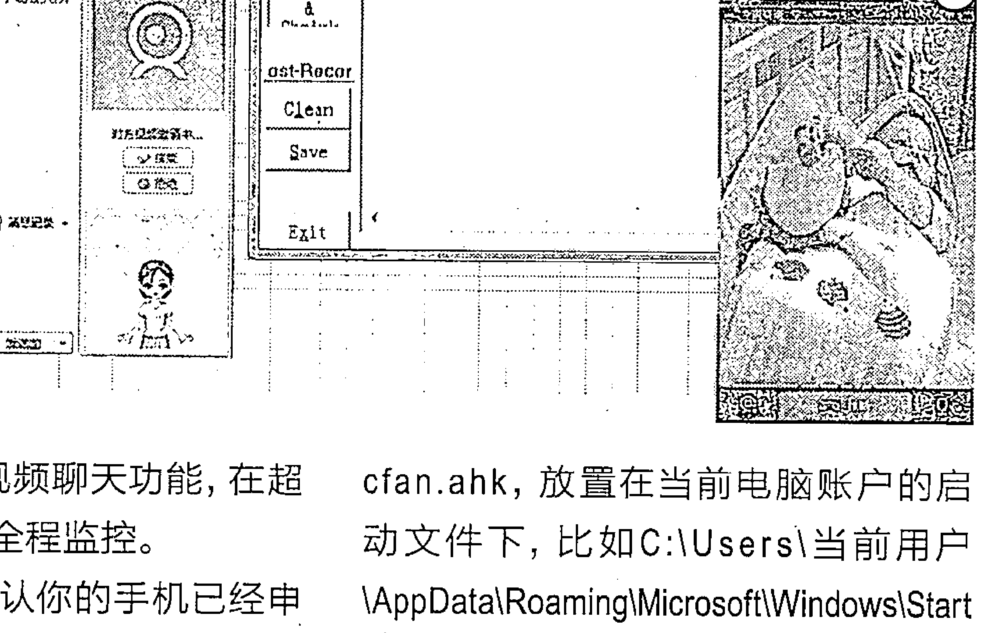

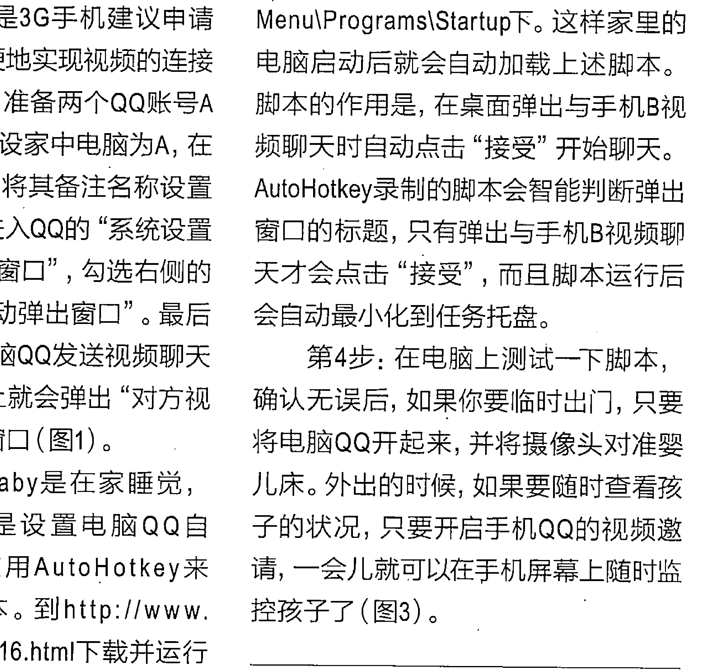

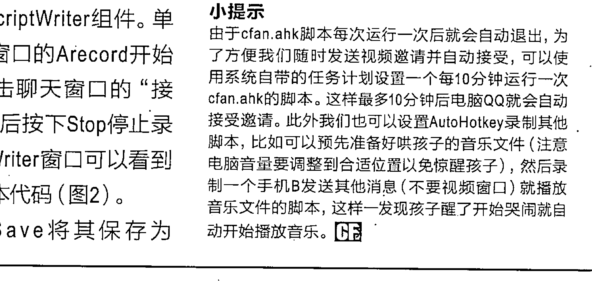

由于cfan.ahk脚本每次运行一次后就会自动退出, 为了方便我们随时发送视频邀请并自动接受, 可以使用系统自带的任务计划设置一个每10分钟运行一次cfan.ahk的脚本。这样最多10分钟后电脑QQ就会自动接受邀请。此外我们也可以设置AutoHotkey录制其他脚本, 比如可以预先准备好哄孩子的音乐文件 (注意电脑音量要调整到合适位置以免惊醒孩子), 然后录制一个手机B发送其他消息 (不要视频窗口) 就播放音乐文件的脚本, 这样一发现孩子醒了开始哭闹就自动开始播放音乐。

别被手机信号格数骗

每个人买手机必须要用到的就是通话功能，手机信号的好坏会直接影响大家的购买。手机的信号格显示是最直接的反馈，可是有时候手机信号格也会骗人！

搞不懂的手机信号格

用过诺基亚手机的用户一定还记得，早期的诺基亚手机在屏幕左侧上方会有一条长长的信号格，而如今诺基亚Windows Phone系列手机只有五格信号。虽然信号格数变少了，但并不会影响手机通话质量，信号格数只是从无线基站接收的信号分贝强度的一种表示方法，对手机的通话质量没有直接的决定意义。此外大家可能还会发现不同品牌的手机在手机信号格数相同的情况下往往通话质量会有很大的差距，这主要是因为各个品牌手机的信号格对手机信号强度的定义不同造成的。

另外大家还会遇到一种情况就是手机明明显示有一格信号，但是却无法正常通话，或者有时候自己用手机走在路上打电话手机会出现突然挂断的情况。这些其实都是由手机接收的信号强度所决定，手机接收的信号越强，那么通话质量就会越高；反之，手机就会出现信号不稳定甚至挂断的情况。

信号如何判断强弱

Android手机对信号定义了两个表示单位，一个是dBm，另外一个是asu，我们通常提到最多的是dBm的表示方法。在手机硬件没有问题的情况下，信号强度数值在-75dBm到-85dBm之间属于正常范围，该数值内手机接听拨打电话都不会出现问题；信号强度数值在-85dBm到-95dBm之间时手机信号格数往往就不再是满格状态，但手机通话还是没有问题；而数值在-100dBm到-110dBm之间时说明手机的信号已经比较弱，此时如果用户拨打电话恰好遇到从一个信号基站移动到另外一个信号基站时就会出现手机通话中断的情况；而在-110dBm以下手机基本处于无服务状态，拨打电话肯定会出现掉线情况。

既然我们知道了手机正常通话的数值范围，那么就要知道如何来查看信号强度。具体查看方法是打开手机到设置菜单中，选择“关于手机”，里面有一项信号强度，这里就可以看到手机信号的强度。另外也可以通过在拨号界面直接输入*#*#4636#*#*的方法查看手机的信号强度。


查看手机信号强弱

手机信号由谁决定

手机信号的强弱将直接影响到大家的日常使用，而手机的信号主要由两方面决定：一是手机自身软硬件水平；二是用户所选择的运营商。

很多人一定对昔日的iPhone 4手机信号门事件还记忆犹新，由于机器的设计问题导致用户用手握住机器上半部分时会使得信号格锐减，严重影响通话质量，被大家戏称为“死亡握”。手机信号除了会受手机自身的设计影响外，还和运营商的信号发射基站多少有关。

在国内有中国移动、中国联通和中国电信三大运营商，其中2G信号中国移动的表现最好，这也是为何使用移动手机卡拨打电话要比其他两家运营商更加稳定。但在3G无线信号中的表现移动却表现得不如另外两家，其中中国电信拥有3G信号覆盖广的优势，在三四线城市这种优势表现得尤为明显。而联通的3G信号强度是三家运营商中最强的，但和电信相比，联通经常会出现没有3G信号的情况。

> 编辑总结

对于消费者来说，不要被手机信号格数忽悠，那只是手机厂商自己定义的一种表示符号，购买手机时更多的是要看手机信号强度的dBm值。此外选择一个适合自己的运营商也很重要，平时打电话较多的用户建议选择移动运营商，而手机上网较多的用户则要通过自己所处的地域情况来选择中国联通或者电信。

手机对战 手机要给力

电脑网络游戏虽然早已风靡全球，但总坐在电脑前对战，实在不太方便。随着智能手机的兴起，无论单机游戏、网络游戏都可以通过手机来进行联机对战。

文 | 飞雪散花

蓝牙、Wi-Fi等手机游戏联网平台的出现，让玩家拿着手机自由自在地联机对战成为了现实。闲来无事，在旅途、候车厅或办公室，约上几个朋友，用各自的手机对战一番，你还会抱怨一个人玩游戏无聊吗？

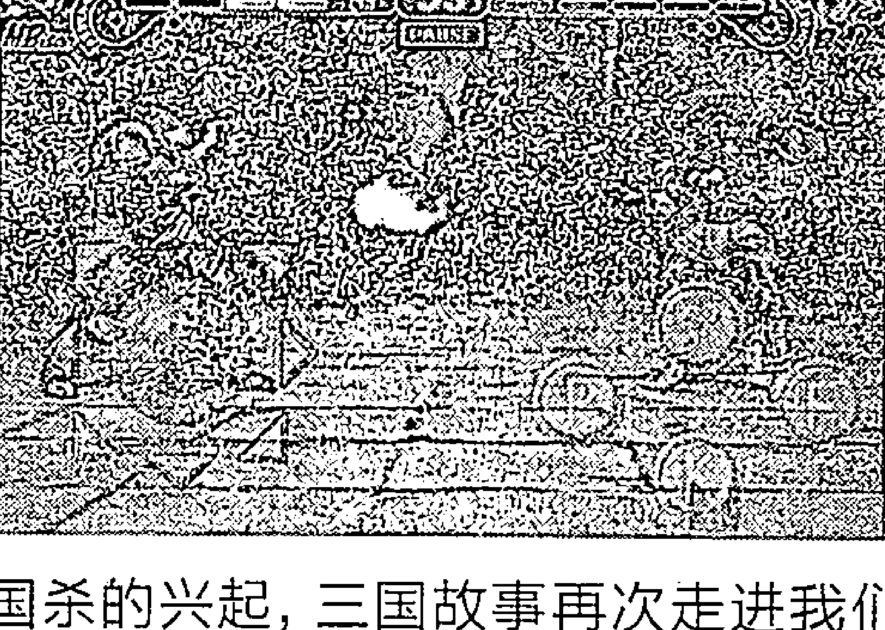

喜欢的游戏。工作后没时间打球，便把兴趣转到了游戏上。现实虽然残酷，游戏却可圆梦。这款游戏汇集了东、西部三十支顶级球队，采用各大赛场的真实场景，逼真度十足，通过独特的控制系统，可以自由地控制进攻球员的动作。

也许出于男人争强好胜的天性吧，我最大的愿望是在这款游戏里，把自己当成一位教练，通过游戏中的交易系统交易球员，把詹姆斯、科比、姚明、德里克这些NBA巨星召集到一起，打造一只属于自己的梦幻球队，在各大赛场上暴扣、远投、空中封盖等大招齐发，最终问鼎NBA总冠军。当然独乐乐不如众乐乐，玩这款游戏的时候，我最喜欢和过去的球友对战，这样每个人都是教练，每个人都有一只梦之队，通过手机联网对战，那才叫过瘾。

**张军：男，32岁。** 年少时常混迹于各大游戏厅，后参加工作、娶妻生子，仍对旧时光念念不忘。
**推荐的应用：** 街霸IV、三国杀。
**推荐理由：** 经典游戏入驻手机，随时重温儿时乐趣。

国杀的兴起，三国故事再次走进我们的生活。在这款游戏里，玩家可以扮演三国时代一位驰骋沙场的武将或运筹帷幄的文官。可以选择主公、反贼、忠臣、内奸四种身份。通过回合制出牌选择行动。

最怀念的就是小时候彻夜泡游戏厅打街霸的日子，现在既要工作又要忙家务，只好通过手机寻找乐趣。我推荐的第一款游戏是街霸IV。想当年，大街上每个游戏厅里都有这款游戏，如果你说没有玩过街霸，周围的人肯定会说你没有童年。红人、白人、青王、警察、小妞、瑜伽人，这些人物已经熟悉得不能再熟悉了。在手机玩街霸，方法和电脑一样简单，选中人物后，利用屏幕上的虚拟键盘出招就可以了，打斗画面还是那样经典。

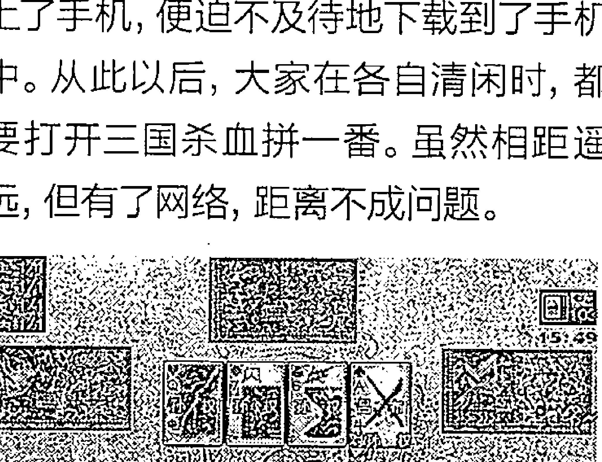

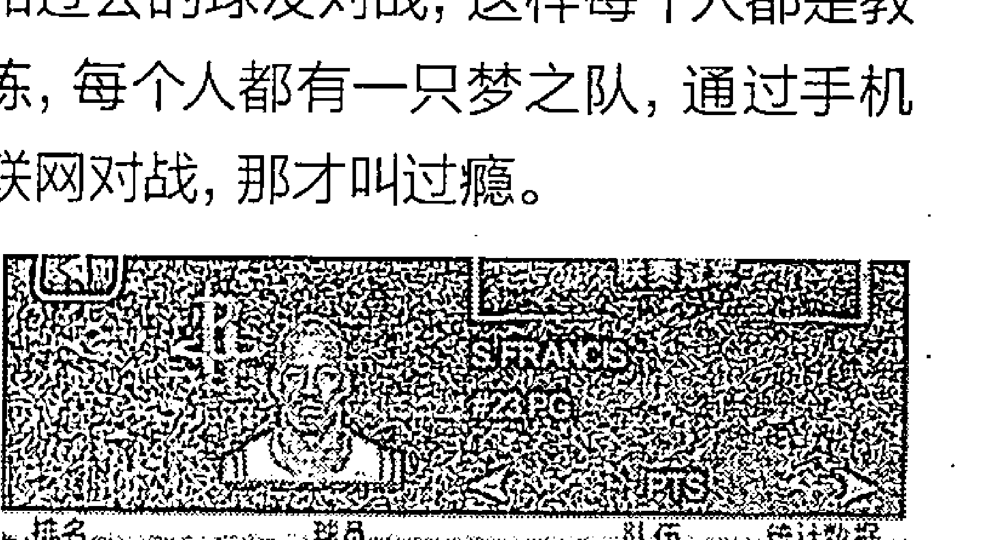

小时候非常喜欢这款游戏，长大后大家各忙各的，很少凑到一起，三国杀很少被提及。后来听说三国杀被搬上了手机，便迫不及待地下载到了手机中。从此以后，大家在各自清闲时，都要打开三国杀血拼一番。虽然相距遥远，但有了网络，距离不成问题。

更有趣的是，手机中的街霸可以通过网络与真人对战，比街机难多了，乐趣当然也太多了。就是在刚玩时需要先适应手机虚拟键盘。不过时间一长你会发现，虚拟键盘在组合发招时其实更简单，用手指的指面轻轻地点击相应的屏幕按键，很容易就可以发出大招。等熟悉了发招，沉迷于游戏，经常感觉自己似乎年轻了不少。

**刘宾：某公司经理，36岁。** 远近闻名的运动健将。曾是校篮球队的高中锋，足、篮、排三大球，样样拿得起放得下。
**推荐应用：** NBA2011、一起高尔夫3。
**推荐理由：** 在手机上也能过把运动瘾。

因工作关系，我和客户玩过几次高尔夫，没想到从此喜欢上了这种运动，感觉这是一项很高雅的运动，于是在手机安装了一起高尔夫3这款游戏，在没事的时候，可以通过这款游戏过过高尔夫这项运动的瘾。

我推荐的第二款应用是三国杀。三国的故事，在国内家喻户晓，根据这个故事制作的游戏也不计其数，随着三

篮球是我最喜欢的运动，NBA是我最爱看的比赛，因此NBA2011是我最

这款游戏采用不同地区场景的球场，斐济群岛、埃及、爱尔兰、中国、海底还有银河，都会成为游戏中球场的所在地风景。可以自定义游戏角色及服装，还能够让玩家打造有着自己风格特点的人物。游戏开始会有操作教学，能够让玩家很快地掌握。游戏分为比

用智能手机玩游戏，虽然屏幕比电脑小，但是获得的乐趣却是随时随地的。无论是单机游戏还是网络游戏，联机对战更给力。

杆赛、比洞赛、淘汰赛以及比近赛多种竞赛模式。另外，还可以通过调节性质的小游戏，来提升角色的能力。假如不想出门去打高尔夫，通过网络和世界各地的玩家对战，照样乐在其中。


冯志勇: 男, 29岁。十足的网游迷，自从发现手机也能玩网游后, 便手机不离手了。
推荐的游戏: 跑跑卡丁车、FIFA13。
推荐理由: 谁说网游离不开电脑。

打小儿我就是个游戏迷, 一回家就开电脑玩网游。跑跑卡丁车是我最喜欢的游戏, 虽然玩过很长时间，如今依然热情不减。这款游戏手机版和电脑版没多大区别, 分为道具赛和竞速赛, 道具赛中玩家们通过使用技能互相攻击来争夺最后的冠军。竞速赛中玩家通过漂移来增加氮气，然后全力加速冲过终点。人物依旧是无比可爱的卡通造型，游戏方式包括比赛和计时模式。

游戏的操作也与PC版相似, 如果在电脑上玩过这款游戏，那么在手机上上手并不困难。本以为在手机上玩跑跑卡丁车，操控性不会太好, 一试才知道，手机上的反应十分灵敏。唯一不足的是，漂移由于需要额外按下一个


漂移键, 使得操作上有一定的难度, 当然这只是对新手而言, 时间长了不会感到别扭的。有时间的时候, 准会与来自各地的车友一起飙上一把。

虽然我只能算个伪足球迷，但也很喜欢足球类游戏, FIFA这款游戏一直陪着我从电脑走进手机。之所以选择这款游戏，是因为它画面逼真, 动作、场地与真实场景无异, 乍一看仿佛是现场直播。以前玩FIFA 12, 操纵有些别扭, 动作也少, 现在装的最新版FIFA 13有了很大改进, 球员碰撞系统、停球和战术任意球得到改善, 在第一次触球控制、球员冲撞、完全带球、战术任意球、进攻AI等五个方面也有很大提高。

游戏中加入新的传球、进球庆祝动作以及新的守门员扑救等动作或方式, 玩起来有身临其境的感觉。这款游戏我最喜欢在清闲、人多的时候开战, 通过网络，与世界各地的玩家互相对攻, 真有点置身世界杯赛场的感觉。

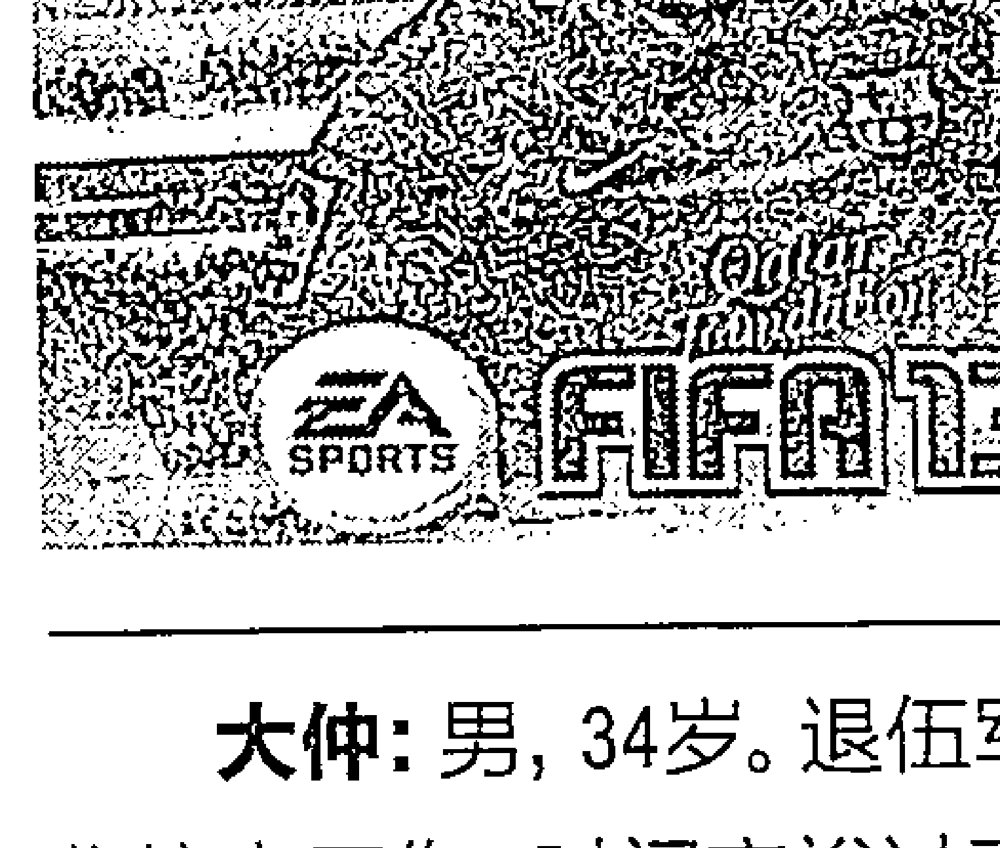

大仲: 男, 34岁。退伍军人, 某单位监控室工作, 时间充裕过于无聊，只能靠手机游戏打发时间。
推荐的应用: 兄弟连2、松饼骑士。
推荐理由: 单机游戏同样乐趣十足。

我的工作实在简单，就是守着监控室的监视器。由于单位不允许上网，手机也没办网络业务，只能靠单机游戏打发时间。我推荐的第一款游戏是兄弟连2, 我是退伍军人, 喜欢战争, 而这款游戏能虚拟出战场上的情景, 感觉很刺激。这款战争射击游戏，可以用三种不同的模式在5种不同的地图上作战，目标是操纵包括坦克、越野车和滑翔机在内的3种交通工具来干掉敌人, 或进行成功逃离。这款游戏的战争场面来源于真实的二战战场, 以细节丰富的3D效果呈现出来。机枪、火箭筒、狙击步枪及火焰喷射器等多种真实二战武器随手可得，甚至可以跳到车载炮塔后面用机枪来消灭敌人。唯一感到不足的是, 我的手机屏幕太小, 看来, 要想获得更真实的游戏感受, 我必须换个大屏幕的手机了。

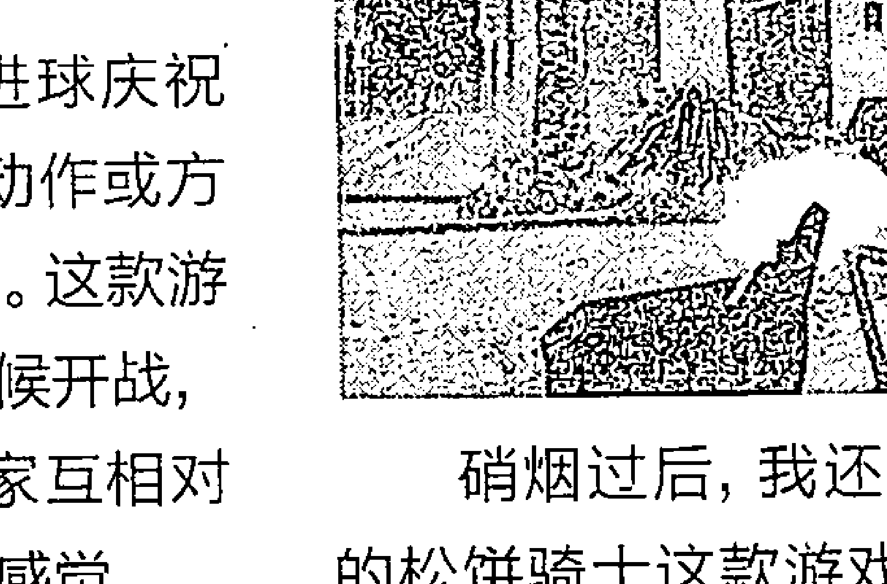

硝烟过后, 我还喜欢相对轻松点的松饼骑士这款游戏。这款游戏是说一个小男孩在返回魔法松饼森林的路上被施了奇怪的魔咒: 只要碰到松饼，就会变成不同的角色, 拥有不同的技能。游戏目的就是找全松饼, 挑战邪恶的熔岩王。游戏画面精美, 非常有趣, 每一次变身都会有不同的感觉。玩法也不难, 很像马里奥与大金刚, 水平很烂也可以慢慢收集松饼过关。可惜天下没有白吃的午餐, 天上落下的不仅有美味松饼, 还有会让你一触即亡的“凶残”小动物。这些动物在整个场景中都会给你不断添乱，你只能躲开或者消灭它们。能否取得最后胜利, 那就要看你的造化了。

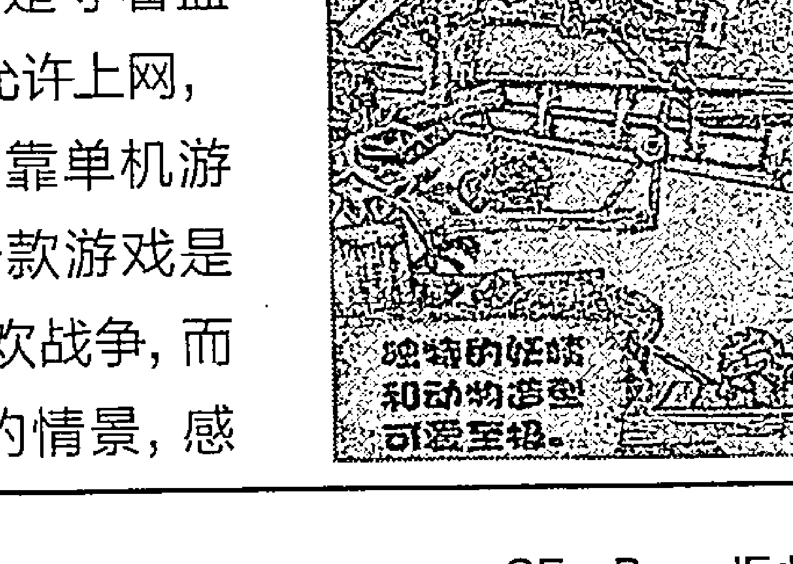

卡奴的幸福生活

存储卡、信用卡、会员卡、优惠卡……随便从口袋里一掏，总能掏出一摞。卡多了，看上去方便了，但其中也有麻烦，比如管理，比如花销记账。如何解决这些问题，卡奴们自有高招！

文 | 飞雪散花

**陈彤：**女，35岁，公司会计，由于长年跟账目打交道，自然也就养成了大小花销都要入账的习惯，生活中理财滴水不漏，不必要的钱坚决一分不花，因此常被老公称为“陈扒皮”。

**推荐的应用：**卡牛、随手记。
**推荐理由：**收支清晰，记账全自动。

不光我喜欢使用信用卡消费，我老公也喜欢。这样，记起账来就麻烦了。今天这个卡入账多少，明天那个卡出账多少，手工整理起来还不把人累死。于是，我在手机中安装了卡牛和随手记这两款应用，如此一来，事情就简单了，所有信用卡中的金额变动，都会实时地反映到账面上，完全不需手工干预，真的是十分方便。

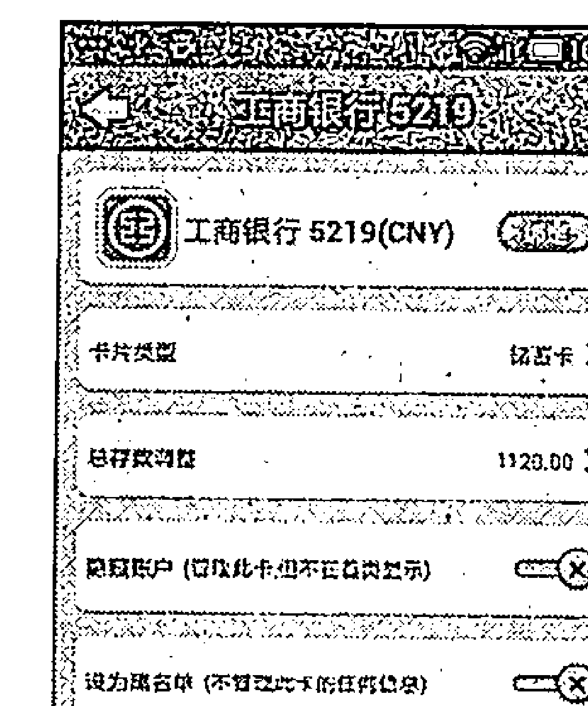

安装后启动程序，卡牛会自动扫描手机中来源是银行、内容是出账和入账的短信，然后将其中与信用卡相关的信息（如卡号、出账、入账金额等）提取出来，最后生成一个完整的信用卡管理目录，通过该目录，我们可以轻松地了解到该卡的流入和流出信息，当然也可以通过点击某卡，在出现的界面中，了解到更详细的收支信息。或通过点击流入、流出项目，对该卡的总存款量、显示有误的或未自动反映出的数量金额进行手工调整。

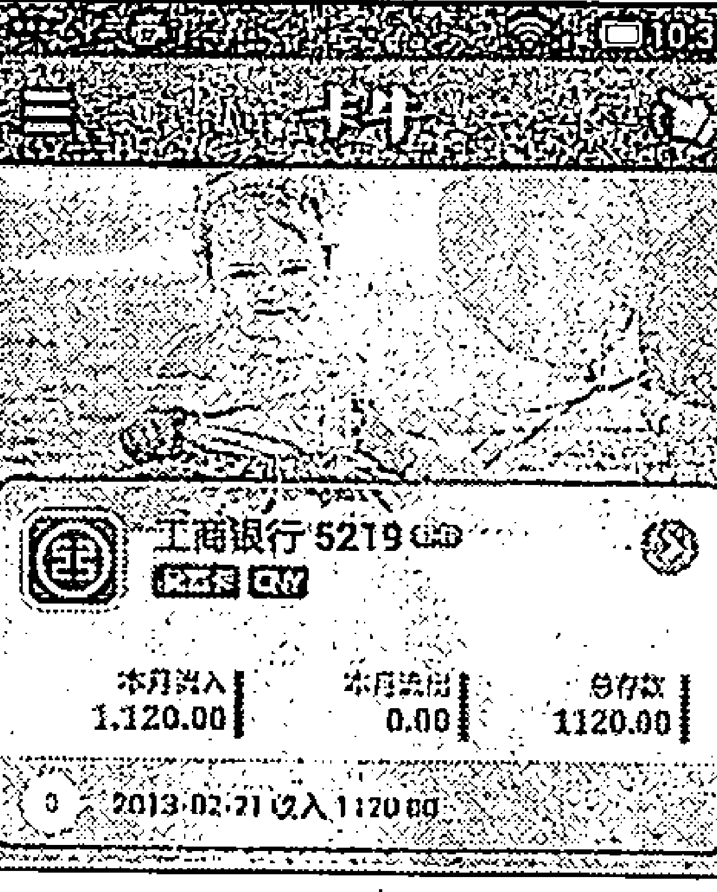

这里我之所以要推荐“随手记”，一是因为它是目前手机中最受欢迎的理财工具之一，利用它，我可以将日常的收支情况记录得一目了然，明确知道钱都花到什么地方去了；二是它和卡牛系出一门，两者可以结合起来使用。这样，我只需在卡牛的信用卡管理界面中，点击并进入某信用卡的编辑界面，然后点击“绑定”按钮，即可将该卡和“随手记”绑定，以后该卡中的收支信息将实时记录到“随手记”中，彻底免去了手工记录的麻烦。

**王凤林：**男，32岁，公交车司机，平时娱乐不多，特喜跳舞K歌，而且嗓子独特，与月夜狼嚎有一拼，最大的成就是一次上班时歌兴偶发，等唱完才发现车内寂寂，全车乘客除一耳聋者外早已集体晕倒。

**推荐的应用：**银联、支付宝。
**推荐理由：**还款、缴费、购物最方便。

工薪阶层，卡自然不是多得能当扑克牌玩，所以管理起来也没见得有什么问题。不过，仍然紧跟潮流，努力不让自己与时代脱轨，时间一久，居然养成了一些“小资阶级”的懒惰习气，喜欢足不出户，通过在手机中动动手指，用卡完成一些还款、缴纳水电费等操作。那么，是什么应用帮助我达到这一目的的呢？就是此刻我要向大家推荐的银联和支付宝。

银联的优势在于，我只需经过简单的认证，将自己名下的借记卡或者信用卡关联到银联在线支付账户上，就能便捷地完成诸如还款、缴纳水电费、为手机充值、预订酒店和购买机票等操作，而这当中完全不用管我认证的卡是否已开通网银服务，这样，就省去了我不得不去银行网点排队开通网银的麻烦。当然也不会再出现因为忘带密码卡或者USBkey而无法付款的情况。

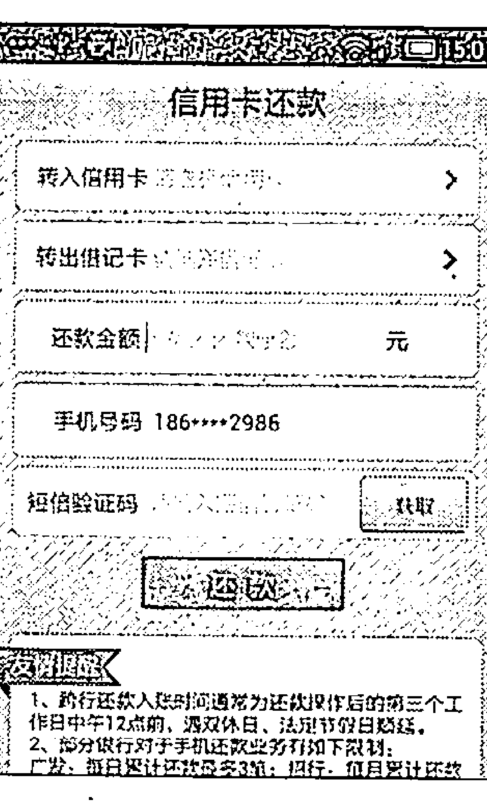

安装后启动程序，在其主界面中点击上方的“注册”按钮，注册成为其用户并登录。接下来，根据自己要完成的操作，在主界面中点击“便民服务”、“信用卡还款”和“手机充值”等按钮，然后按提示操作，即可完成相应的操作。
以信用卡还款为例。点击“信用卡还款”按钮，进入相应的界面，输入“转入信用卡”、“转出借记卡”卡号和“还款金额”等信息，点击“还款”按钮，还款工作便结束了。

同样，用支付宝也可完成信用卡还款和缴纳水电费等工作，不过，这款应用的操作方法比较麻烦，而且要付款或还款的银行卡必须开通网上银行才行，所以通常我不用它来完成上述操作，而是用它来完成诸如购物、手机转账和条码支付等操作。

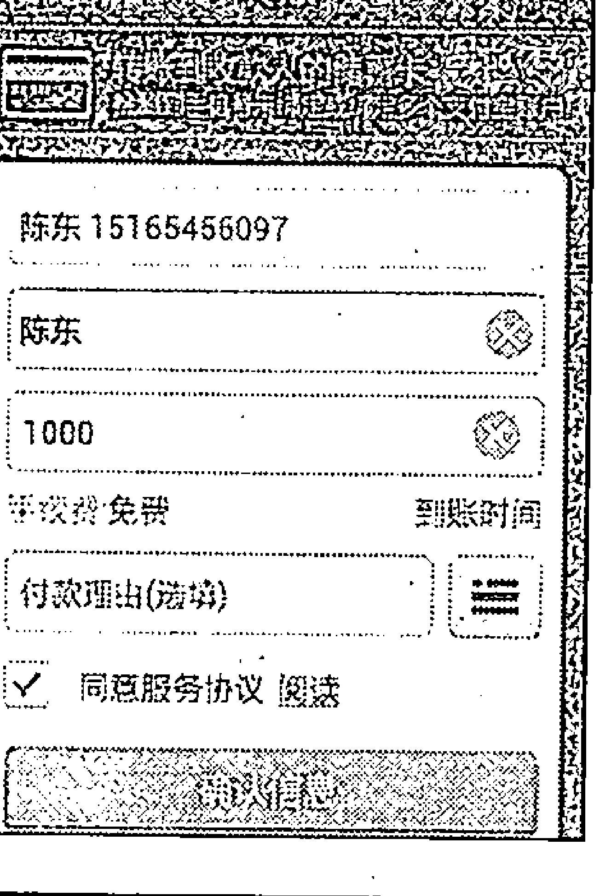

真没想到，利用相应的应用，卡奴们甚至能让自己的卡生蛋，为自己带来真金白银的实惠！

以手机转账为例。启动后登录支付宝，在其主界面点击“手机转账”按钮，然后在出现的界面中选择要转账的联系人，同时按提示设置好转账金额、支付宝付款密码及转出的银行卡卡号、转入的银行卡卡号等信息，转账工作就完成了，极其便捷。

后按提示拍摄下银行卡卡号，幸运的话，程序会自动识别该卡号，并自动完成银行卡类型等的填写工作。如果没有识别也没关系，我们可以手工输入。输入完毕，该卡即会被添加到管理界面中。以后我们就可以通过点击某卡，对其中的项目进行管理。比如修改收入和支出金额等；通过点击“一键短信”按钮，向银行查账单、额度等；或者在卡丢失的情况下，通过按下“一键电话”按钮，寻求人工服务，向银行挂失等。

-   推荐应用：e卡包、一卡易。
推荐理由：手指轻动，即可轻松申请到众多商家的会员卡和优惠卡。

李伟：男，39岁，公司高管，待遇优厚，口袋里从来不差钱，工行、建行、招行、交行等各大银行的信用卡、存储卡应有尽有，不过尽管如此，还是喜欢“有便宜就沾”，尤其乐意及时获取周围有关信用卡打折、促销以及优惠等信息，以便能在第一时间享受到实体商家的优质服务。

-   推荐应用：51银行卡保险箱、卡惠。
推荐理由：便于管理，能够在第一时间获知周围有哪些优惠营销和信用卡专属服务。

岁数一大，腿脚就懒了，明知道有些商家推出了极具诱惑力的会员卡或优惠卡活动，也懒得去申请了。后来，女儿在我的手机安装了“e卡包”和“一卡易”两款应用，从此，足不出户，便可以申请到自己需要的卡了。现将它们贡献出来，与大家共享。

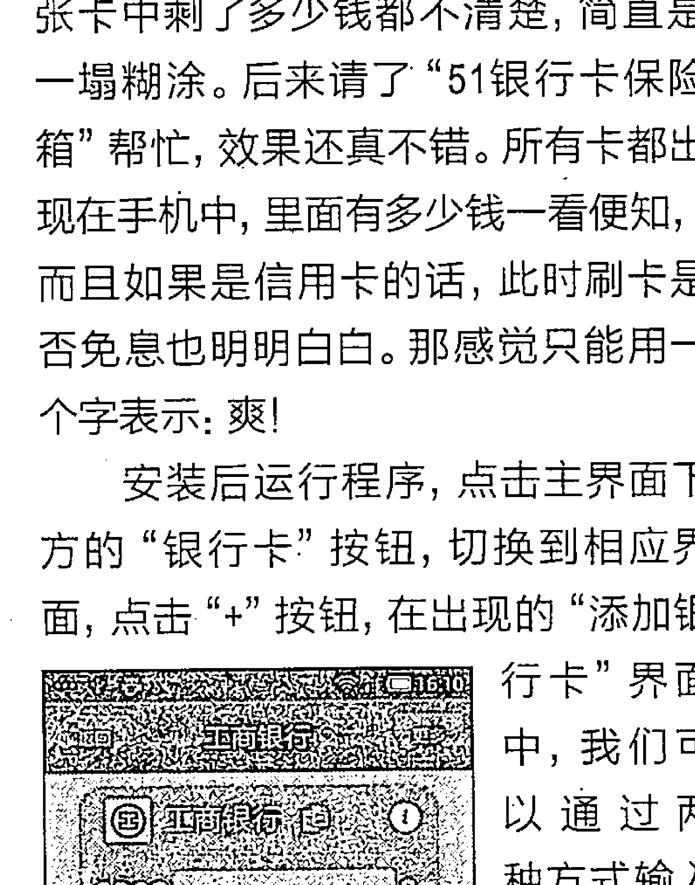

卡多了的确麻烦，有时甚至连哪张卡中剩了多少钱都不清楚，简直是一塌糊涂。后来请了“51银行卡保险箱”帮忙，效果还真不错。所有卡都出现在手机中，里面有多少钱一看便知，而且如果是信用卡的话，此时刷卡是否免息也明明白白。那感觉只能用一个字表示：爽！

这两款应用的作用其实大同小异，都可以让我们即时申请到所需要的会员卡或优惠卡，不过，它们针对的商家各不相同，能满足我们的不同需求，所以在手机中同时安装，互通有无，也就不算是浪费资源了。

安装后运行程序，点击主界面下方的“银行卡”按钮，切换到相应界面，点击“+”按钮，在出现的“添加银行卡”界面中，我们可以通过两种方式输入银行卡卡号和类型等信息。一是点击“卡号”右侧的相机状按钮，然后按提示拍摄下银行卡卡号，幸运的话，程序会自动识别该卡号，并自动完成银行卡类型等的填写工作。如果没有识别也没关系，我们可以手工输入。输入完毕，该卡即会被添加到管理界面中。以后我们就可以通过点击某卡，对其中的项目进行管理。比如修改收入和支出金额等；通过点击“一键短信”按钮，向银行查账单、额度等；或者在卡丢失的情况下，通过按下“一键电话”按钮，寻求人工服务，向银行挂失等。

下面，我就以“一卡易”为例说说基本用法。“e卡包”的用法与之类似，相信大家一用就会，我这里就不啰嗦了。

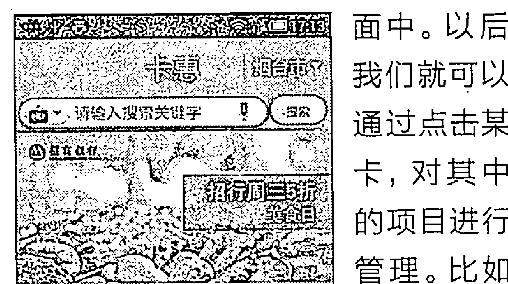

我推荐的第二款应用是卡惠，顾名思义，这是一款可以让我们通过银行卡获得实惠的应用。通过它，我们可以快速知道周围有哪个商家推出了刷卡打折服务，此时及时入手，自然就能省下不少真金白银。

安装后启动程序，在其主界面中点击“未登录”按钮，然后在出现的界面中点击“手机登录”，打开“会员登录”界面，按提示输入手机号码和验证码等信息，点击“登录”按钮。登录成功后，返回主界面，点击右上角的“+”按钮。进入“添加会员卡”界面，程序会自动定位到我们当前所在的城市（如果没有定位，也可点击右上角城市名称按钮，在出现的列表中手工选择），此时，该城市提供了会员卡的商家就会显示出来。点击感兴趣的商家，在接下来的页面中可以了解一下优惠力度，如果最后确定，只需点击“申请新卡”按钮领取会员卡即可。

张亚东：男，45岁，自诩岁数大了，对银行卡不感兴趣，不过，也正是由于岁数大了，经历过生活沧桑，所以也形成了近乎抠门的省钱之道，能花9分钱买到的商品绝不花到一角，因此特别喜欢寻找各种优惠卡、会员卡，以达到购物省钱的目的。

安装后启动程序，程序会自动定位到我们所在的城市，此时在其主界面的“首页”中，我们会看到诸如“找优惠”、“找活动”和“精品推荐”等按钮，如果我想购买到打折商品的话，只需点击“找优惠”按钮，周围商家与此相关的优惠信息就出现了。而如果我想买到打折的影票，吃到便宜的美食，也只需点击“找活动”按钮即可。

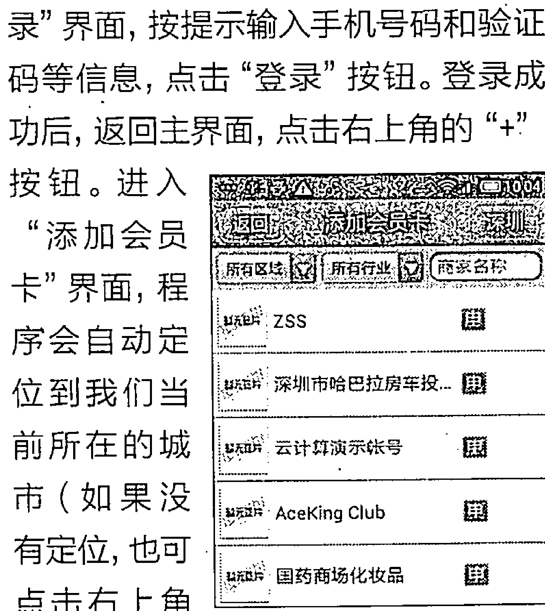# 掌中看视频 在线本地两相宜

对于很多对视频品质要求较高的朋友来说，普通的在线视频资源已经不能满足需求。正版资源丰富的新生代在线视频网站已成为新的选择，这些新生代网站的APP也成为用户移动设备中必备的软件。

文 | 空空

由于新生代网站业务定位和客户群的不同，他们所拥有的视频资源也有差别，你的需求是否与他们的定位相同呢？

## 乐视、爱奇艺 新剧热剧高清正版

即使你没有打开过乐视网站、使用过乐视APP，相信也一定看到过乐视TV的广告。作为中国最大的影视剧互联网发行门户，乐视手机客户端与众不同的一点就在于乐视网的视频版权优势，拥有最新、最热门的影视剧版权，用户不仅可以免费观看大量的短小视频，还能观看丰富高清的电影电视剧，当然如果喜欢还可以下载到手机中永久保存。正是基于此，乐视才有信心推出乐视盒子等硬件设备。

说到高清正版就不得不提到爱奇艺，爱奇艺视频客户端尽管并非以丰富的视频资源著称，不过其专注于正版高清视频的理念，并且打出“悦享品质”的口号，而且还有爱奇艺自家出品的视频节目，在视频资源的画面品质方面具有较好的口碑。

可以说，现在国内播放的电视剧网络版权基本上就掌握在乐视和爱奇艺两家之间，就拿最近火爆的《甄嬛传》和央视开年大剧《全家福》来说，在爱奇艺上无法找到的《甄嬛传》和乐视上无法找到的《全家福》，在对方的视频客户端中可以轻松找到。

浪漫色圣：乐视挺好用的。视频也大多是高清的，播放也流畅，下载的同时播放另一部影片都可以，而且还可以小窗口播放，一边上网一边看视频两不耽误。

52硬件：很不错，乐视可以下载高清视频。而且下载下来的电视剧都有编号排序，在电脑上播放很方便。

## 搜狐视频 美剧爱好者的大爱

当监管部门加强了对国外电视剧引进和播放的管理后，观看美剧的渠道突然间少了很多。不过，作为门户网站的搜狐却给广大美剧爱好者带来了福音，美剧爱好者大爱的《生活大爆炸》、《绯闻女孩》、《吸血鬼日记》等连播剧在视频客户端上都可以找到。而且客户端推出的第三方账号登录更是软件的亮点，无论是使用新浪、QQ、人人、百度还是淘宝等账号登录都可以实现播放记录云同步。一台设备上没看完的电视剧竟可以换台设备继续观看，人性化的设计体现得淋漓尽致。

西瓜吃空空：确实挺好的，能看最新的美剧跟TVB，还能缓存直接看，影音同步效果好。承认它资源不足，但是人还无完人呢，每款播放器有它自己的亮点就行了，这样网民才有自己的选择。

## 百度视频 视频资源大集合

百度搜索我们都用过，可是百度视频你使用过吗？正是基于百度强大的搜索功能，百度视频就是一款集视频搜索、播放于一体的APP。其主打的视频搜索功能，网罗了各大视频门户的热门视频(包括优酷、土豆、爱奇艺、酷6、凤凰、乐视、激动、腾讯等)，在这里可观看最齐全的视频资源。有了它，我们就无需再安装土豆、优酷等视频客户端，有了它，我们就无需再来回在程序间切换，而且搜索结果中很清晰地显示出视频是来源于哪个网站，并且可以选择流畅版视频或清晰版视频，是不是有点“众里寻他千百度，蓦然回首，那人却在灯火阑珊处”的意境？

血色♂柔情：平心而论搜到的视频还是很多的，但播放的效果不如人意，有的视频几乎隔几秒钟就要缓冲。不知道是看的人太多还是软件有问题呢？

## 快手 视频资源下载必备

提到快手，很多人首先想到的是快手看片，在智能手机刚刚出现的时候，通过手机看视频是一件奢侈的事情，受片源和流量的限制，很多人都会使用快手将视频资源下载到手机。如今动辄高清的要求，让快手处在了手机必备软件的边缘地带，不过，当需要为旅途中准备消遣用的视频或者对非高清的视频进行下载时，快手就派上了用场。而且快手也顺应了发展的要求，不断推出新创意，快手MV、快手公开课、快手导视等软件的推出，让我们相信快手即将开创和引领下一个视频风行的大潮。

LOVElaidudu：影片质量都挺好的、挺清晰的，是下载最快的一款软件，就是片子的更新速度再快些就更完美了！

杀手_绝恋：用过很多种视频软件了，还是这个最好用，资源丰富，更新速度又快！而且无论是用WIFI或者3G在线观看还是下载速度都很快，还可以把下载好的视频复制到U盘里在别的媒体播放器里观看。

# 精挑细选 为Android手机找个市场

如今的Android电子市场呈多足鼎立之势，为方便某些崇尚“拿来主义”的朋友能不费精力、快速选到自己满意的市场，本期我们就来精挑细选一下。

文 | CFan软件研究室

就近几年的发展来看，Android手机的持有量已远远超过iOS和其他系统的手机，因此，相应的电子市场也如雨后春笋般地蓬勃发展起来。不过，市场虽多，到底哪一个最优秀，哪一个才最适合你，本期我们就为大家解开这个谜题。

## 参评对象

安卓市场、机锋市场、应用汇、木蚂蚁市场。

## 测试平台

手机型号：MI-ONE-Plus
操作系统：Android 4.04
MIUI版本：2.12.29
处理器：1.5GB 双核
运行内存：1.00GB

## 比分类 谁更明晰

对于大部分用户来说，使用市场客户端的主要目的就是能方便、快捷、安全地找到和下载并安装上喜欢的应用，而要达到这一目的，就要求各客户端能够提供明晰的分类以及强大、准确的搜索功能，为初级用户提供尽可能详细的软件介绍、用户评论、排行榜和专题功能，同时为保证用户能放心地使用该应用，还应告知用户该应用是否内含广告、是否安全及具体的安装权限等。

从目前评测室测试所用的最新版本来看，各客户端在这方面做得还算不错，排行榜、搜索、软件介绍、用户评论等基本功能完全具备。当然，这其中也存在一些差异，而通过这些差异，我们或许能看出四大客户端在应用管理方面存在的差距。

> 分类的多寡能够让我们从侧面看出一款客户端在应用管理方面的明晰程度，分类越细，用户越容易找到自己喜欢的应用。从这方面来说，机锋市场表现最好，其次是木蚂蚁和应用汇，提供分类最少的是安卓市场。不过，安卓市场在介绍一款应用时，同时标明了该应用是否安全及是否内置广告，方便用户选择，不像其他几款客户端，只提供了安装权限，透明程度不够。此外还有专题，一个好的专题能够让用户更直观地了解某类应用的作用，在这方面，应用汇表现优异，文章、引言周到细致，而其他几款客户端则只简单地罗列了应用介绍，让人看上去有敷衍的嫌疑。

| 四大客户端应用管理差异列表 | 应用分类差异 | 游戏分类差异 | 专题介绍差异 | 安全标准差异 |
| :--- | :--- | :--- | :--- | :--- |
| 安卓市场 | 11类 | 6类 | 简单的软件列表，基本上只是将一些软件综合起来作为一个类别而已 | 标明应用是否安全、是否内置广告，同时指明了安装权限 |
| 机锋市场 | 24类 | 13类 | 同安卓市场。不过它有一个“达人推荐”栏目，会选登一些机友的软件推荐，比较有特色 | 仅指明安装权限 |
| 应用汇 | 16类 | 7类 | 不再是简单的软件列表，而是文章，有引言、详细介绍，能让玩家了解更多 | 仅指明安装权限 |
| 木蚂蚁市场 | 15类 | 10类 | 没有专题推荐类别 | 仅指明安装权限 |

## 比管理 谁最全面

本地管理主要是指对于已安装软件和下载软件的管理，此外还有是否能及时提示应用更新，那么，在这方面四大客户端表现如何呢？我们同样可从一个简单的列表中看出端倪。

> 应该说，在本地管理方面，安卓市场的表现接近完美，不但能让用户根据需要随心所欲地将安装在内存上的应用转移到SD卡中，同时还在软件列表中加入了字母索引功能，在排序方面则提供了三种不同的方式，方便用户按需切换。其次是应用汇，除未提供字母索引功能外，其他功能丝毫不逊色于安卓市场。表现最差的是机锋市场，作为一个在广大“机油”中颇具影响力的网站的客户端，它在本地管理方面的表现只能用诡异二字来形容。首先，尽管它在“已安装”列表的顶部提醒了可更新的软件数量，且指明“长按可忽略”，但无论怎么努力，评测室的小编们还是没弄懂究竟通过何种方式才能打开升级界面，当然也就无法确切地知道究竟是哪款应用该更新。换句话说，就是当我们在用手指点击更新提醒时，它没有任何反应。此外，虽然它能显示出本机安装的应用，但当我们用手指点击某个应用，试图了解详情时，却发现这些应用中的绝大部分，都会显示出“对不起，没有找到这款应用”的提示，令人大跌眼镜。

| 四大客户端本地管理情况列表（其中“√”为支持，“×”为不支持，“？”为未知） | 安卓市场 | 机锋市场 | 应用汇 | 木蚂蚁市场 |
| :--- | :--- | :--- | :--- | :--- |
| 是否支持管理已安装应用 | √ | √ | √ | √ |
| 是否支持管理下载 | √ | √ | √ | √ |
| 是否支持应用更新提醒 | √ | √ | √ | √ |
| 是否支持一键更新所有应用 | √ | ？ | √ | √ |
| 是否支持将安装在内存中的应用转移到SD卡中 | √ | × | √ | × |
| 应用列表中是否提供字母索引功能 | √ | × | × | × |
| 提供了何种排序方式 | 名称、最新安装、最占空间 | 名称 | 名称、大小、安装时间 | 名称 |

软件有好有坏，如何权衡利弊，选择合适的电子市场作为爱机的伴侣，小编此处就不做乱点鸳鸯了。我们希望各电子市场能够取长补短，不断地改进，发展成为读者满意的市场。

## 比特色 谁最个性

特色功能不但能为用户提供独一无二的便捷，同时它们还彰显了一款工具的特色，在这方面，四大客户端表现不一。每款软件都会具有它们自己的创意功能，电子市场作为一个下载平台，一定也少不了一些花哨的特色功能。除了上面介绍的功能外，安卓市场有面对平板电脑推出的客户端，并且支持用户通过“云推送”、“扫描二维码”、“电脑下载”等多种方式轻松获取平板应用。而机锋市场这个由人气论坛推出的应用市场，不但提供了上千款安卓中文应用，更能与谷歌Google Play接轨，甚至可以搜索机锋网用户上传分享的海量应用。应用汇的专栏推荐可以让用户体验到同一主题的多款应用，而分类里的交友社区，为用户提供了交流的平台。

| 市场名称 | 功能简介 |
| :--- | :--- |
| 安卓市场 | 通过教程，可以让用户能在使用游戏和应用的同时，深入了解到应用的功能和内容 |
| 机锋市场 | 机锋市场区别于其他市场的地方，通过选录机友的推荐文章、应用，增强了互动性；同时也弥补了市场专题推荐的不足，是非常不错的栏目 |
| 应用汇 | 丰富的资源和详细的介绍是这两个专栏的最大亮点。无论是新手还是资深玩家基本都可以在这找到自己感兴趣的东西 |
| 木蚂蚁市场 | 号称具有国内最全最新的汉化作品库，对英文不佳的机友来说，好处显而易见 |

## 比耗电 谁最节能

由于四大客户端都是手机应用，所以其电量的消耗也令人关注，这一部分，我们将对这一方面进行比较。比较的方法很简单，四大客户端分别运行5分钟，并下载同一款应用（手机QQ），最后计算其耗电量。

虽然只有5分钟的耗电量测试，但已经可以反映出一定的问题，耗电量最高的和最低的，相比竟在一倍以上。其中机锋市场无疑是四大客户端中的吃电大户，居然达到了2.10%；其次是应用汇，达到了1.4%。四款中耗电最低的是木蚂蚁，仅有1%，可见木蚂蚁在节能省电方面做得不错，值得表扬。

## 比流量 谁最省钱

尽管目前有不少朋友为了可以舒适地使用网络，已经选择了包月制，但仍然有不少差钱的朋友，依旧苦苦逗留在购买流量的拮据之旅中，平时上网冲浪必须要精打细算，所以四款客户端消耗流量的情况，自然而然就成了我们本次评测必须涉及到的项目之一。评测的方法与测试耗电量相似，分别运行5分钟，然后下载同一款软件（手机QQ，大小4.33MB），真是不测不知道，一测吓一跳，本以为应该差不多的流量消耗，在此次评测中却表现出了相当不同的结果，借用目前较为流行的一句话来说：“同样是电子市场客户端，差别咋就这么大呢？”

在操作应用的过程中，有些信息需要交互，流量的损耗是可以理解的。不过，在相同的时间、相同的环境、下载相同应用的情况下，应用汇所耗的流量竟然达到10.74MB，不能不让人怀疑它在实际运行的过程中，偷偷从事了某些可疑的操作。此外是机锋市场，虽然8.52MB的流量和应用汇相比是“小巫见大巫”了，但近9MB的消耗，仍然让人轻松不起来。其中表现最好的是木蚂蚁，6.23MB的流量可以说是中规中矩，可圈可点。

## 四大客户端缺点一览

- 安卓市场：应用管理分类稍嫌粗糙。
- 机锋市场：诡异表现太多，在耗电与流量消耗方面不令人满意。
- 应用汇：电量和流量消耗较大，在后续的版本中有望改进。
- 木蚂蚁：应用管理和本地管理方面表现中庸，专题栏目缺失。

# 远程遥控手机 我看行

手机忘在家里，快递员联系不上你，客户也联系不上你，遇到这种情况你一定会急得团团转。如果能远程控制忘在家里的手机，事情不就好办了吗？

文 | 郭建伟

小宇最近确实很忙，晚上加班修订销售合同，第二天清晨被闹钟吵醒，匆忙起床赶到了公司。当想掏出手机给客户打电话时，却发现手机忘在家里了。客户可能随时和自己电话联系，商场如战场，机会稍纵即逝。换成别人一定急得团团转，不过小宇却气定神闲。小宇究竟有什么秘密武器，让他如此自信呢？

## 在手机上安装WebKey

原来，小宇手机安装了WebKey这款有趣的安卓手机软件，可以对自己的安卓手机进行遥控操作。因为家里安装有无线路由器，手机可以时刻通过Wi-Fi热点挂在网上，小宇可以随时对远方的手机“发号施令”。注意，要使用WebKey，手机必须拥有Root权限。不过这对于玩机高手小宇来说，简直是小菜一碟。

### 小提示

- 第一次运行需配置WebKey参数。
- 第一次在手机上启动WebKey，在其主界面导航栏中点击Settings按钮，在设置界面中勾选“保持与webkey.cc的连接”项，让WebKey始终与远程服务器保持连接，保证可以随时对手机进行远程控制。勾选“允许浏览器中注册新用户”项，可以在远程控制页面中自由创建新的登录账户。

在“账户”栏中点击“添加用户”按钮，输入账户名称和密码，之后直接点击“保存设置”按钮，完成该账户的创建操作。其余设置保持默认，小宇在导航栏中点击Control按钮，在控制界面中点击“启动服务”按钮，激活WebKey远程控制服务。在WebKey主界面中部的“你的手机可通过以下地址访问”栏中显示手机远程控制网址，例如 http://webkey.cc/lysofterym 。可以看出，只要在网址 http://androidwebkey.com/ 后面加上手机昵称，就可以远程定位手机了。

## 隔山打牛 远程操控手机

上面说到小宇忘带了手机，于是在单位打开电脑，在浏览器中输入手机远程控制地址，在弹出页面中点击“登录”按钮，在认证窗口中输入预设的账户名和密码，进入WebKey手机远程控制页面。因为小宇需要获取手机中的联系人信息，于是在顶端工具栏上点击“导出”按钮，进入手机信息导出页面。在“导出”栏中可以导出目标，包括联系人、短信息、通话列表等。在其他栏中可以选择时间格式、时区格式、导出文件类型（默认为文本）、分隔符、换行符等。小宇选择导出目标为联系人信息项目，点击Export按钮，选择导出路径，手机中的联系人信息就乖乖地远程传输到指定的文件中了。

小宇迫切想了解客户是否已经给自己打了电话，于是在工具栏上点击“通话列表”按钮，在打开页面中小宇快速浏览了手机中的所有通话记录信息。果然不出所料，客户已经拨打了自己的手机，但是无人接听。小宇赶紧打开接收到的联系人文件，找到该客户的电话，使用单位座机拨通了客户的手机，进行了一番解释，消除了误会，并深入商谈了销售项目中的一些关键问题。

## WebKey的神奇妙用

在远程操作界面上可以看到，在工具栏上有GPS按钮，点了该按钮后在“GPS位置”栏中点击“在地图上显示”按钮，就可以在地图上精确定位手机位置。在“网络位置”栏中点击“在地图上显示”按钮，还可以查看服务商提供的定位信息。如果你的手机开着3G网络，不小心弄丢手机了，似乎找起来也容易一些。

# 开心春游 小心手机

风和日丽，草长莺飞，这样的天气，谁不想出去春游？可是春游的同时，除了要注意行李和钱包外，随身携带的手机又该怎样去防范身边的第三只手呢？

文 | 飞雪散花

闻闻大地的芬芳，感受大自然的气息，让疲劳多时的身心，在风与日的抚摸下重现活力。不过，出游的途中需谨慎小心，行李钱包自不必说，就是手机这宗目前几乎已非常普遍的通信用品，也难免会被贼惦记。于是，防盗高人涌现，准备在这里与我们聊聊有助于手机防盗的那些应用。

> **赵大保：** 男，35岁，山西人。都说山西人爱吃醋，但赵的表现比较另类，不仅不爱吃醋，而且南辕北辙，居然喜欢上了四川的辣椒，大有不可一日无此君之势。

**推荐应用：** 360手机防盗报警器、手机防盗狗。

**推荐理由：** 实时报警，利于防盗。

俺总觉得在手机中安装一款防盗应用不太安心，为什么呢？假如某一天，某款应用偷懒了、不报警了，是不是就失去防盗意义了？所以，俺喜欢在手机中同时安装两款防盗应用，就是俺上面推荐的这两款。应该说，目前手机防盗应用的原理大抵相近，或者是利用光线传感防盗，或者是利用重力感应器防盗。像俺推荐的“手机防盗狗”就是应用了这两大原理，而俺推荐的“360手机防盗报警器”则比较另类，它不但应用了这两大原理，同时还提供了音乐防盗模式，算是将防盗工作做到家了。

安装“360手机防盗报警器”并启动，在其主界面中的“首页”标签中点击警灯状按钮，即可开启防盗服务。默认情况下，程序会同时开启“口袋防盗模式”和“耳机防盗模式”，其中前者意味着当有人将我们的手机从口袋里摸出，程序会因为感应到了光和重力的变化而发出报警声；后者则意味着当我们用耳机听歌时，如果程序发现耳机和手机分离了，就会用外放喇叭大声报警，从而及时提醒我们。当然，如果你对此不满意的话，可以在主界面中点击“设置”按钮，切换到相应标签，然后根据自己的需要，任意关闭其中某种模式。

此外，程序默认的缓冲时间为3秒钟，即在发现有异常行为后3秒钟进行报警。如果你觉得该时间过长或过短，可点击“缓冲时间设置（3秒）”，在出现的“时间设置”界面中自行指定一个时间。

“手机防盗狗”提供的防盗模式与“360手机防盗报警器”的“口袋防盗模式”类似，不过，它在提供了手工开启防盗服务外，还提供了一个“时段设置”功能，利用它，我们可以让应用在指定的时段内自动开启防盗服务，从而免去要手工开启和关闭的麻烦。比如俺一般会在周一至周五的早上7:30~8:30这一时间段乘公交或地铁上班，这个时间段最易遭贼惦记，因此，俺就在程序的主界面中，点击“时段设置”按钮，打开相应的界面，逐一点选中周一到周五项，并且在“启动时间”和“结束时间”栏中分别设置时间为7:30和8:30，同时勾选下面的“危险”项，最后点击“保存”按钮。这样，程序就会在这些时间段中自动启用防盗服务，并在发现有人从口袋里盗取手机后，及时发出声音来提醒了。

> **王伟：** 男，37岁。一三星级酒店的厨师长，国家一级厨师。自诩心宽体胖，堪比神仙。

**推荐应用：** 手机防盗DroidRing、防盗拍照助手。

**推荐理由：** 亡羊补牢犹未晚，盗后找回也重要。

能提前预防固然好，但正像老话说的那样“防君子不防小人”，所以即使安装了防盗应用，也难免会出现“道高一尺，魔高一丈”的现象，偶尔出现手机让人盗走的情况。这时，如何找回手机就显得很重要了，所以我这里推荐的，就是两款以找回手机为目的的应用。其中前者会将当前手机所在的地理位置以短信的形式发送给我们，而后者则可以让我们知道偷盗者的真面目。

安装“手机防盗DroidRing”并启动，在出现的界面中设置一个密码，该密码将用于登录应用和发送命令短信。设置完毕，点击“下一步”按钮，在接下来的界面中，输入一个用于接收短信的手机号码（俗称安全号码），点击“完成”按钮。以后当手机丢失后，我们只需向自己的手机发送一条格式为“where*密码”的短信，就会收到当前手机所在位置的短信回复。如果手机被偷，小偷换了SIM卡也没关系，因为该应用会自动将新SIM卡的号码发送到安全号码手机上，让我们知道小偷的新号码。

安装“防盗拍照助手”并启动，在出现的界面中按照提示，设置一个用于接收照片的电子邮箱地址和一个密码，然后开启服务。以后当手机被盗后，只要用任意一部手机向被盗手机发送一条内容为“密码”的短信，手机前置摄像头就会悄悄启动，将小偷的尊容拍下来，并发送到我们指定的邮箱中。这样一来，小偷就无所遁形了。

手机里的通讯录和重要资料一定要及时备份，万一手机丢失无法找回，损失也会降低到最小。毕竟手机有价，资料才是无价的。

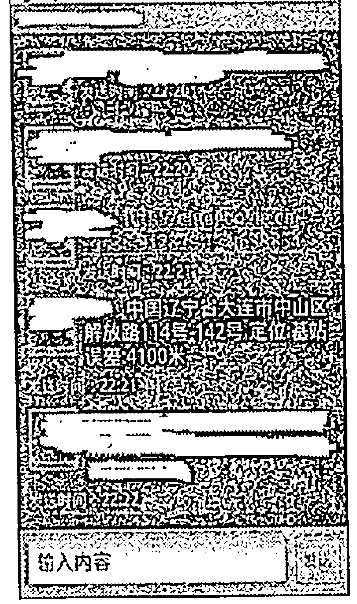

手机的地理位置信息，其中包括地图链接和街道地址。而发送短信“ring*密码”，则可以让手机以最大的声音响铃，而不管之前是否静音，这样如果小偷还没有走远的话，我们就可以循声找手机哦！那么，如果万一可恶的小偷在盗取手机后的第一时间便换掉了SIM卡，又该怎么办呢？

同样无需担心，因为在他换卡的一瞬间，一条包含着新电话号码和手机位置的短信，就会自动发到我们上面设定的安全手机里，便于我们按迹寻踪，将小偷绳之以法。

看到这里，有朋友就问了，如果在收到地理位置的同时，能知道小偷的长相，岂不是更有利于我们按图索骥，准确缉盗？嘿嘿，这就是我要在手机中安装第二款应用——防盗拍照助手的原因了。

一般来说，为了防止别人随便使用我们的手机，我们通常会为手机设置锁屏密码，这样，当手机锁屏后，必须输入正确的密码才能解锁。而“防盗拍照助手”的妙处就在于，它可以让我们设定输入锁屏密码的次数，这样，当小偷试图解锁的次数达到这一限制后，程序就会自动启动前置摄像头，将小偷的形象抓拍下来，并发送到我们指定的邮箱中。

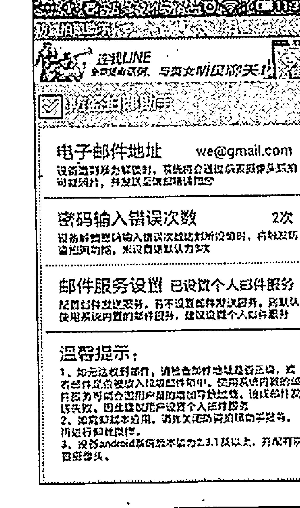

安装后启动程序，在出现的主界面中，分别点击“电子邮件地址”、“密码输入错误次数”（默认为3次）和“邮件服务设置”等项，设置好相应参数，同时勾选启用“防盗拍照助手”项，然后在出现的界面中点击“激活”按钮，激活拍照助手。以后当手机丢失后，我们就可以通过浏览指定邮箱中的邮件，迅速地知道小偷的长相了。

陈琳：女，34岁，公司会计，一向固执地认为，手机丢了可以再买，但里面的信息很重要，如果没有提前备份或被盗贼泄露事就大了。

- 推荐应用：蜡笔同步、360手机卫士。
- 推荐理由：被盗前可以利用前者自动备份通讯录等信息，被盗后可以通过远程删除信息，或直接将手机锁定。

对于我来说，手机存储的信息价值远远大于手机本身，毕竟信息带有隐私性，不能随便落入他人之手，也不能随便丢失，所以在手机被盗方面，我更加注重的是如何利用一种有效的方法，可在被盗前及时地备份通讯录和短信等信息，而在被盗后，又能远程控制，及时地销毁这些信息或锁定手机。为了达到上述目的，我在手机中同时安装了“蜡笔同步”和“360手机卫士”两款应用。

安装蜡笔同步并启动，在主界面中点击“注册”按钮，注册成为其用户并登录，以后程序就会默认将本机的联系人、信息、通话记录和日历等信息，同步到蜡笔服务器中（如果不想对某项进行自动同步，可在主界面中点击左侧的按钮，然后选择“设置”，在出现的界面中选择“同步设置”，将不希望自动同步的项设置为“手动同步”。这样，以后当我们的手机丢失，只需在新手机用同样的账户登录，相应的信息就会同步到本机。

同样，在未删除蜡笔同步的情况下，窃贼SIM卡中的相应信息也会同步到我们的账号中。在其中，我们会很容易发现他以及他的家人、亲人、朋友、同学、领导等各种关系的联系方式。相信有了这些依据，我们再要通过“威胁”的方式或报警的方式找回手机，也就不难了。

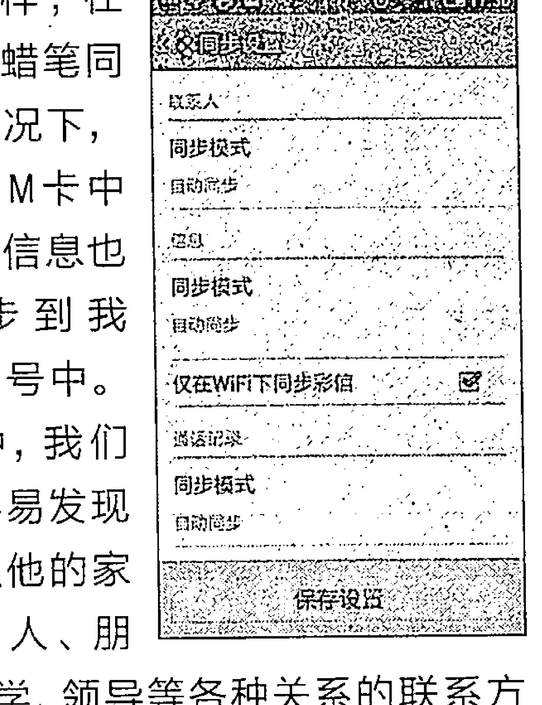

360手机卫士的使用方法同样简单。安装后启动程序，在其主界面中，通过滑屏，找到并选择“手机防盗”项，进入相应的页面，点击“开启防盗保护”项。然后在出现的界面中，点击“立即开启”按钮，最后按提示一步步设置好“防盗密码”、“安全号码”等项，点击“完成”按钮，360手机卫士的防盗功能即会被开启。以后当我们发现手机丢失后，只需用任意一部手机发送“shanchu#防盗密码”到自己的手机，即可将其中的所有信息（包括通讯录、通话记录、短信、彩信）远程删除。而如果发送短信“suoding#防盗密码”到该手机，则可直接锁定手机。这样所有的SIM卡显然也就没法用了，窃贼手中的赃物，似乎除了扔掉或找商贩处理掉外，基本没其他办法可想。

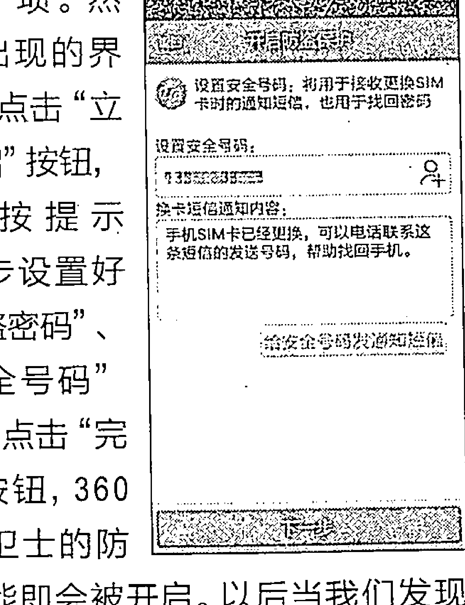

## 没有它们 别说你是学习达人

一天当中你可以不吃饭，但是不可能不用手机。随着智能手机越来越普及、越来越智能，我们应该思考的是，除了娱乐，手机是不是也应该更多地被应用在学习上面？

文|快乐鬼小威

这是一个全民学习、终身学习的时代，我们都不想落后于这个时代。在刷微博聊QQ的同时，爱学习的我们，更应当把手机当作一个移动学习工具，通过各类优秀的手机软件帮助我们增长知识，提高学习效率。

陈尚龙：男，21岁，在校大学生，喜爱英语，每天坚持背单词。
**推荐应用：** 拓词、扇贝单词。
**推荐理由：** 上瘾背单词，从背单词的过程中找到快感。

以前，我经常跟身边的同学和朋友说，学英语是一辈子的事。他们听了之后都是鄙夷地笑笑，心里肯定在想，这家伙吹牛不打草稿。后来，他们了解到我确实每天都在坚持背单词，而且都到了上瘾的程度，他们才开始对我刮目相看，称赞我“真神人也”。中学时代，我也觉得背单词是一件极其枯燥的事情，应试教育教会我们如何以最快速的方法来记住一个单词，但是同时我们也失去了对学习的乐趣，“终生学习”完全是一句空话。不过到了大学，我们都有了手机，一不小心接触到了“拓词”这款背单词软件，从此我的人生慢慢地就改写了。

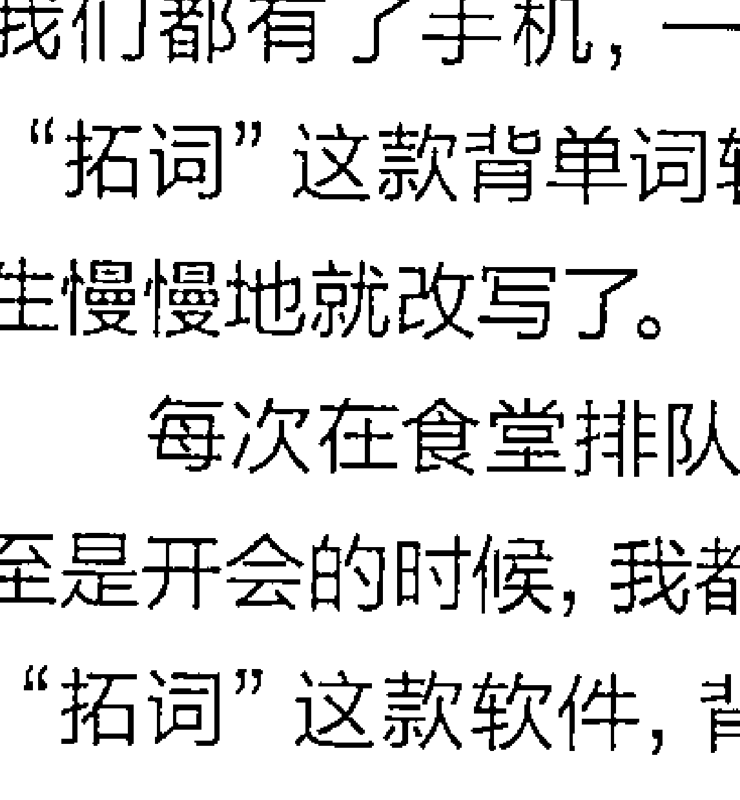

每次在食堂排队吃饭、等公交，甚至是开会的时候，我都会掏出手机打开“拓词”这款软件，背上几个单词。如果第一次用这款软件，需要在“设置”里“选择教材”，拓词的教材几乎包含了所有英语学习的教材，

选择你需要的教材后，点击“开始背单词”按钮，界面就会自动出现需要你记的单词以及四个选项。在规定的时间内，选择你认为正确的意思。如果选择正确，就会自动跳转至下一个单词；如果选择错误，拓词就会将这个单词的正确意思和对应的例句显示出来，记住意思后点“继续背”就可以了。你还可以下载语音包，这样在出现单词的时候，也会出现标准的读音，帮助你掌握单词的发音。坚持几天之后，你会慢慢发现你也开始学会主动学习了，也开始慢慢喜欢上背单词了。赶紧来试试这种上瘾背单词的感觉吧。


李双：女，29岁，会计主管。
**推荐应用：** 云词英语、AnkiDroid。
**推荐理由：** 最畅快地看英语原著，碎片时间记概念。

我平时喜欢看一些国外的著作，一般我都不会选择看国人翻译的版本，因为大部分中文翻译的都很烂，所以我情愿多花点钱在网上买英文原著来看。以前，看外文书籍的时候难免会碰到很多生词，那时我只能借助文曲星、好记星这类电子词典来查找生词的意思，很麻烦，并且也影响阅读体验。后来电纸书流行后，Kindle的E-ink电子墨水技术我特别喜欢，于是我也买了一个Kindle，感觉在查生词方面方便了不少，阅读的时候也流畅了不少。

可是，这些类似平板电脑的东西，毕竟不可以随身携带。我一直在寻觅一款手机看书应用，毕竟手机可以随身携带嘛，手机是最好的碎片时间学习工具。在体验过“淘宝读书”、“多看阅读”等读书软件之后，最终由于本人对英语读物的热衷，我选择了“云词英语”这款优秀的软件。

打开“云词英语”，再点击“云端词库”进行词库的选择，云词词库提供各类词典、名著、词汇等强大、丰富的内容，几乎将词库这个名词进行重新定义。词库中有很多外文读物，我非常喜欢“冰与火之歌”这本英文原著，就将其离线下载下来了。我一边看A Song of Ice and Fire的时候，遇到陌生的单词，只需轻轻点击一下那个单词，中文意思就马上可以呈现出来。

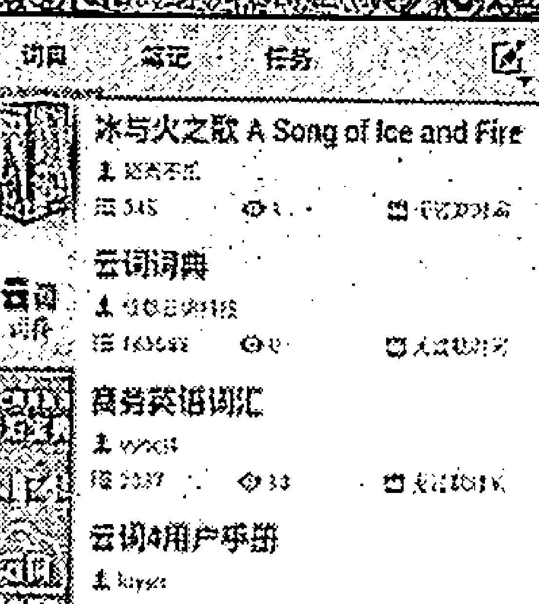

我也会把觉得重要的单词点击“+”号添加到笔记本中，以便以后进行复习。

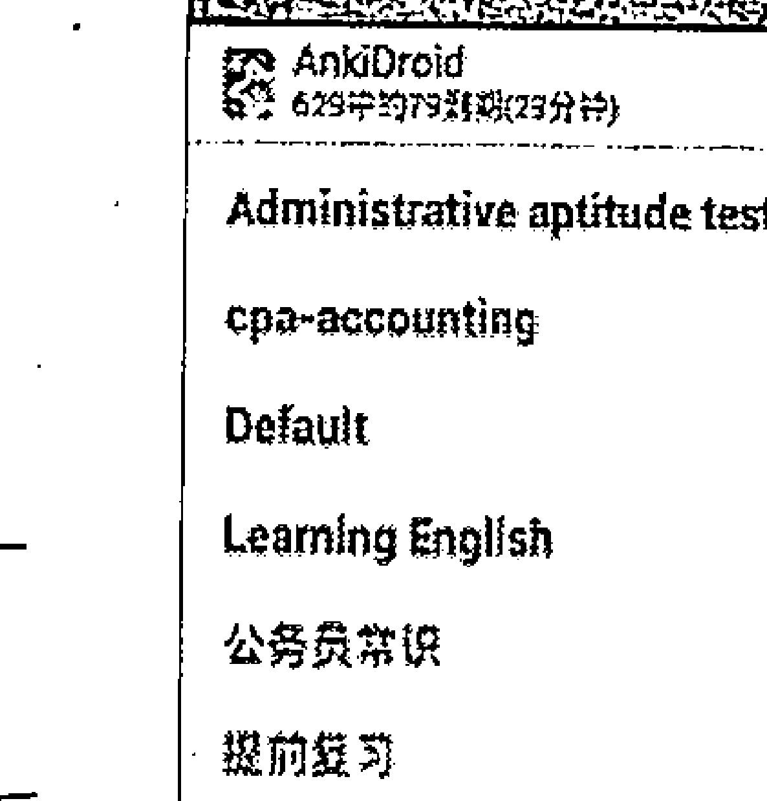

另外我是从事会计行业的，会计这行一生当中需要参加无数次考试，所以对知识的记忆我一直有研究。在知识记忆方面我想推荐AnkiDroid这款卡牌记忆软件，它可以帮助我们充分利用碎片时间。会计有很多理论知识、定义什么的也特别多，这时我就会用AnkiDroid将这些概念添加进去。打开软件，选择新建“新牌组”如CPA，点击进入CPA牌组进行记录的添加，将那些概念添加进去即可。这样你有空的时候打开应用，它会提醒你要复习哪些知识。更方便的是这款手机软件和PC端的Anki软件是可以实现云端同步的，由于PC端在打字方面会更快一点，所以我经常在电脑端把知识输入进去，然后同步到手机再进行记忆，节省了不少时间。

> 葛政：男，26岁，程序员。
推荐应用：印象笔记、为知笔记。
推荐理由：记录生活中的点点滴滴。

每天我都会浏览各类科技和技术类的文章，看到好文章好资料我会保存下来，以便以后再次学习。如果你也有相似的需求，需要将值得回忆的图片、声音、文字保存下来的话，我会推荐你使用一下当下流行的笔记类软件。

国产的笔记软件要属“麦库”和“有道云笔记”比较有名，但是我不是特别推荐这两款，因为这两款笔记软件相对于“印象笔记”来说开发得比较晚，在成熟度和实用度方面一定没有国外的“印象笔记”做得优秀。还有一个更加重要的原因，那便是做“印象笔记”的Evernote公司自家还有很多其他笔记周边类产品，可以与“印象笔记”进行互通和同步，比如“圈点”、“人脉”、“墨笔”等实用的周边应用。

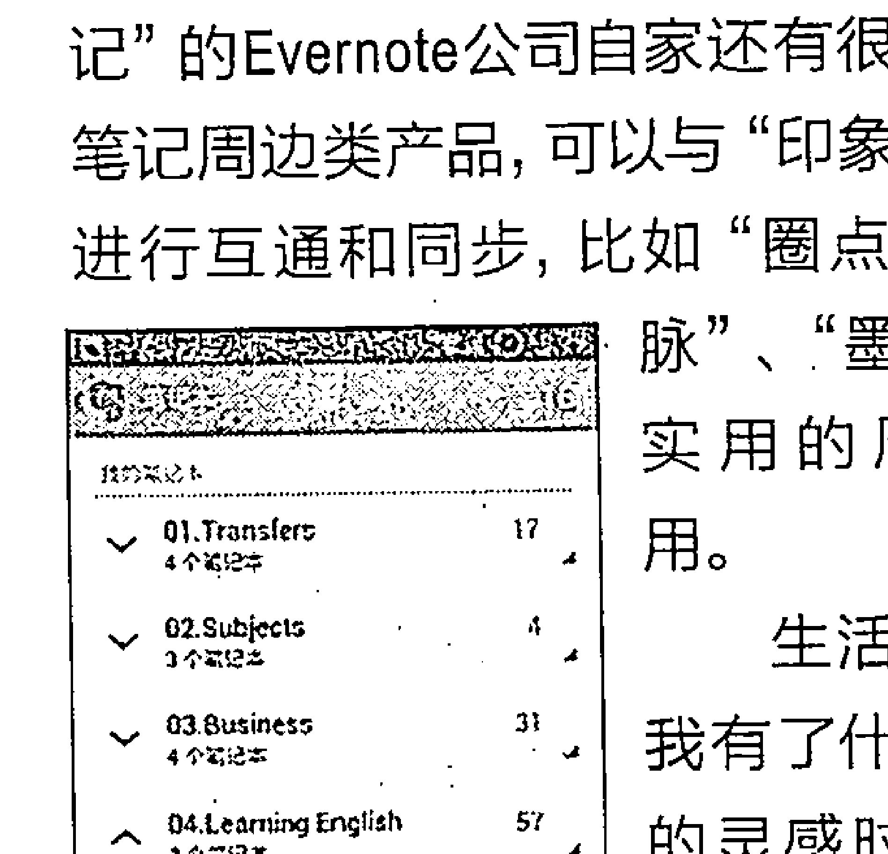

生活中如果我有了什么很棒的灵感时，我会立即打开“印象笔记”，点击“新建笔记”，以最快速的方式将灵感保存下来。行走在路上时，看到一张特别有创意的广告，我也会掏出手机，打开“印象笔记”，选择“快照”按钮，将创意保存下来。早上醒来，回忆起昨晚美妙的梦境，我会打开“印象笔记”，点击“录音”按钮，以最简洁的方式将故事叙述出来，以便以后回忆。因为它有云端同步的功能，所以你会感受到它无时不在，电脑上看到的好文章，保存到电脑端的“印象笔记”中，只需1秒，你的手机端“印象笔记”也可以轻松查看和编辑这篇文章了。

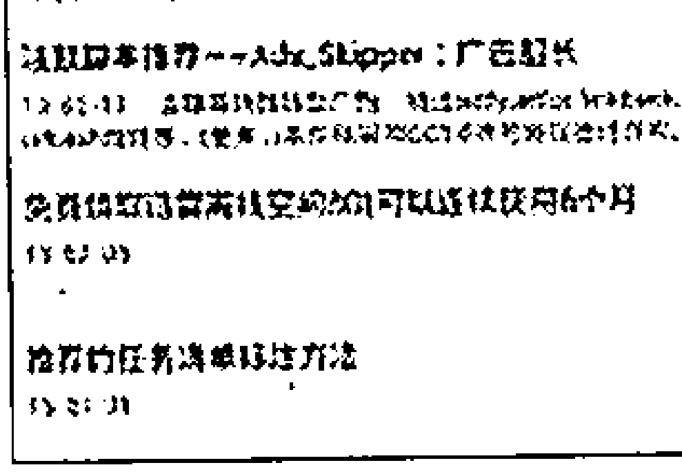

另外，由于我是程序员，所谓的“极客”，有时候会感觉“印象笔记”“不够极客”。所以，你如果像我一样，需要不停地敲代码的话，我还想推荐一款国人开发的优秀笔记软件“为知笔记”。为知笔记电脑端支持HTML编码也更懂代码，很适合技术宅的我。但是手机端的功能特别简单，只是记录和保存照片功能，这正符合技术人员的需求，因为我最需要它的是可以记录并且运行速度快。打开“为知笔记”，选择“铅笔”按钮添加文章，选择“相机”按钮进行拍照，选择“放大镜”按钮进行文章的搜索。

> 顾敏杰：男，35岁，教师，以知识渊博著称。
推荐应用：ZAKER、善听听书。
推荐理由：整合资讯，无处不学习。

我是一名伟大的人民教师，平时不上课的时候，喜欢读读书、看看新闻。我一直有这样的感受，多读书可能对你的升职没太多直接的联系，但是多读书绝对能让你更懂这个社会，丰富一个人的精神世界。

平时琐碎的时间，我一般会浏览最近的时事新闻。我很推荐各位使用ZAKER这款应用，它将微博、博客、报纸、杂志、网络新闻、图片、RSS、Google Reader等众多内容，按照用户个人意愿聚合起来，用户可根据个人意愿个性化定制阅读，同时支持离线下载功能。

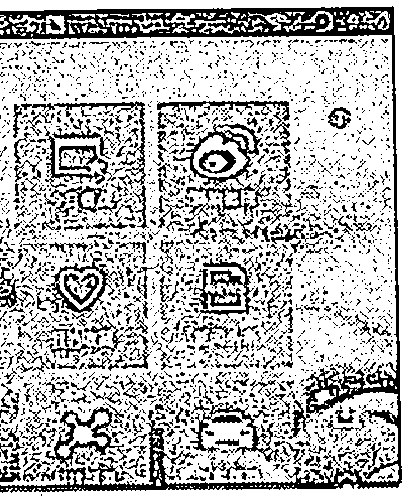

打开应用，点击“+”号按钮，选择自己喜欢的内容源点击“+”即可添加内容至软件界面。同时，点击新浪微博方框，可以将自己的微博账号与ZAKER进行绑定，这样做的好处就是我可以将原来的新浪微博客户端给卸了，再也不用看那些烦人的微博广告了。平时出差时，我会用离线下载功能将内容先下载到手机里，点击“离线下载”按钮，软件将自动进行离线下载。想看什么频道的新闻，就直接点击这个频道的方框，进入之后可以看到这频道最新的资讯新闻，点击你喜欢的新闻标题就可以开到文章内容了。

除了看书，我还会选择“听书”，我推荐的另一款软件便是“善听听书”。平时眼睛是我获取信息的最主要途径，不过作为一个用眼过度的人，有时候也需要解放一下我们疲劳的眼睛。让眼睛休息一下，让耳朵不再孤单，戴上耳机，听一章节小说，这真的是一个不错的选择。打开“善听听书”这款应用，点击“书城”，在“在线书城”中选择自己喜欢的小说，当然也可以通过“搜索”功能来找自己喜欢的有声小说。选择一本小说之后，进入“播放列表”，选择章节即可听到优雅的文字了。这款软件同样支持“离线下载”功能，出门前我会将想听的小说先下载到本地，然后带上耳机出门去挤公交，生活好不惬意。

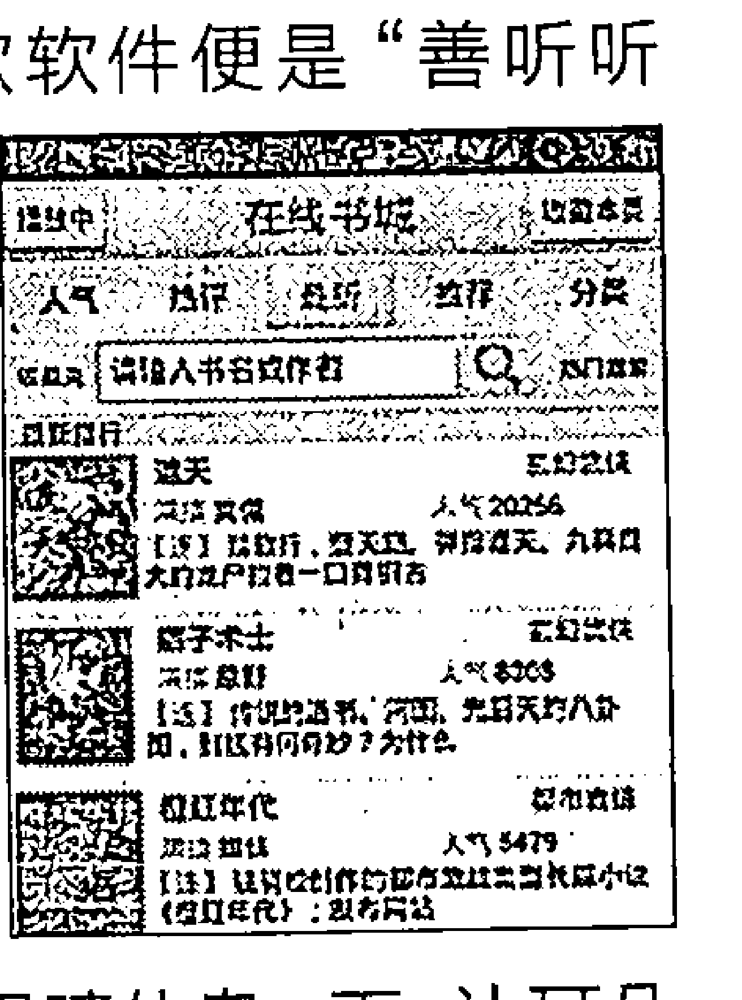

## 《电脑爱好者》·合订本 { 移动天地 }

## TF卡三件宝 保你数据安全

使用智能手机免不了用TF卡来扩充内存，一旦TF卡出现问题，不但影响手机的使用，更危及手机的数据安全。来为你的手机做个体检吧！

文 | 钟情

智能手机功能越来越强，好多功能都需要依赖手机TF卡来实现。TF卡容量也越来越大，随着使用，存入的数据也越多，一旦TF卡出现问题，手机使用体验极差。

那就使用手机TF卡的三件宝，为自己的手机TF卡做体检、保健康，恢复数据和起死回生，为手机TF卡保驾护航。

### 手机TF卡健康做到心中有数

手机TF卡使用时间一长，难免会出现这样或那样的问题，想知道手机TF卡是否健康，就使用USB Flash Drive Tester这款U盘医生，为TF卡做个定期体检，随时掌握TF卡的健康情况，防患于未然。

将手机TF卡插入卡托，与电脑连接（如果手机TF卡上有重要数据，请先移出），运行U盘医生软件，从“选择闪存盘/卡”下拉列表中选择手机TF卡，在“选择测试类型”下选择测试类型。软件提供了三种检测方式，包括“读取”、“写入”和“写入、读取和比较”，这儿选择“读取”项。最后点击“开始测试”按钮，软件就会帮我们进行读取测试。检测过程中在下方显示出测试进度，同时使用不同的颜色块标记测试的结果。用不同的颜色代表不同的状态，各颜色块的含意图例在下面，可以对比着看。如果全是绿色块，那就可喜可贺了，TF卡读取功能没有问题。假如有许多红色块的话，情况就不妙了，赶紧备份数据吧。

### 手机TF卡数据轻松恢复

如果手机TF卡不小心格式化或删除了一些数据，甚至已出现不能读取数据的情况，那如何找回数据呢？这个也不用怕，使用“手机内存卡修复工具”这款免费的文件恢复软件搞定吧。

安装好软件后运行，会出现操作向导，跟随它就可以很轻松地完成数据恢复。如果你是高手，就点击“取消”进入高级模式操作吧。在左上方选择手机TF卡盘符，再从右上的下拉列表框中选择需要恢复的文件类型（不选择则会恢复所有文件），再点击“选项”按钮，在“选项”对话框中切换到“操作”标签，在“扫描”区中勾选必要的选项，选择好后，点击“确定”按钮返回主界面(图1)。

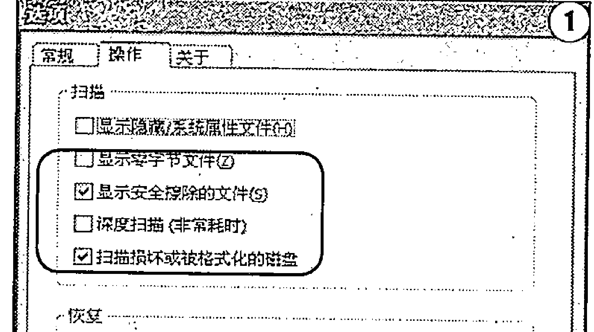

点击“扫描”按钮开始扫描能够恢复的文件，同时给出扫描进度和相关信息，扫描速度相当快。找到可以恢复的文件会列在界面左侧，勾选需要恢复的文件后，点击右下角的“恢复”按钮，在出现的“浏览文件夹”对话框中，选择保存恢复数据的文件夹，点击“确定”即可快速得到恢复出来的文件(图2)。

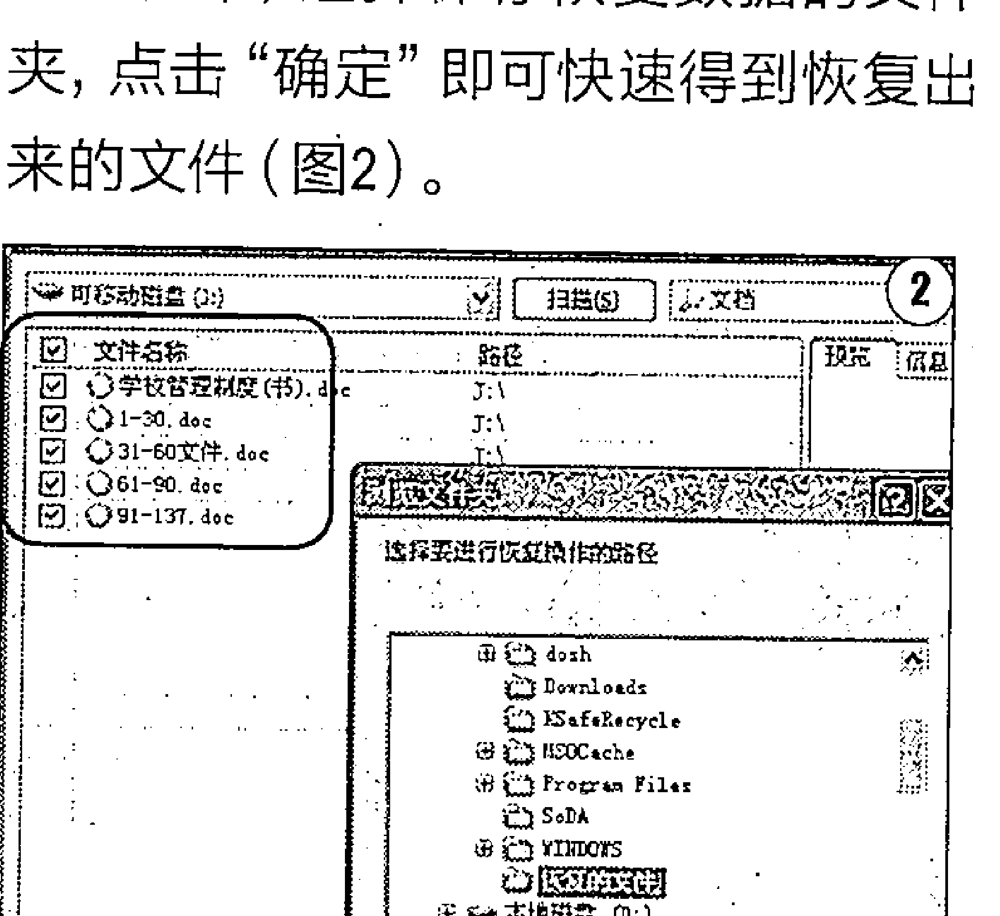

### 手机TF卡起死回生终极大法

手机TF卡死活不能用，只要电脑系统能识别，那就使用LLFTOOL这款磁盘低格工具将其修复好。

如果非常不幸，手机TF卡无法读取数据，也无法在Windows系统下正常格式化，使用U盘医生检测，发现有较多坏块时，那就得对其采取终极大法了。请出Windows环境下使用的HA-LLFTOOL这款可低级格式化硬盘、优盘、SD卡、TF卡和U盘的小工具，让休息许久的TF卡起死回生。

运行软件，从弹出的界面中选择需要低格的TF卡，一定要仔细辨别，千万不要选择错哦！点击“下一步”进入其操作界面，再次在“硬盘详细说明”标签下查看所选TF卡信息是否正确，以防选择错了造成误操作。再切换到“低级格式化”标签下，点击“格式化这个硬盘”按钮，就开始对所选TF卡进行低格，完成后给出提示，退出软件后，移出TF卡重新插入USB口，随后在Windows系统下对其格式化。对其进行读取、写入时，会避开坏区，能很好地延长使用寿命。这下就可以正常健康地使用了(图3)。

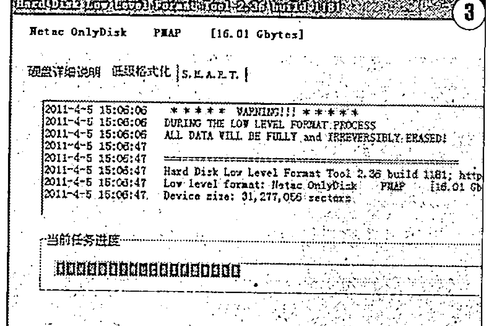

朋友们，快来选择适合自己的小软件对手机TF卡做个相应的操作吧，轻松掌握TF卡的健康状况，恢复数据保安全，修复TF卡，让其重获新生。

242 | 电脑爱好者 合订本 · 2013

## iPhone提速 垃圾清理少不了

时间长了，是不是觉得自己的iPhone剩余磁盘空间越来越少？办法是有的，快动用“大杀器”来给iPhone提提速吧。

文|付易

较为先进的iOS系统具有“自净”功能，不像Windows系统那样会残留很多垃圾文件，但还是会存在一些无用的信息和缓存不能被系统自动清理。到底有没有清理iPhone垃圾文件的工具呢？

### 电脑端

| 软件 | 上手指数 | 安全指数 | 干净指数 | 推荐指数 |
|------|----------|----------|----------|----------|
| Phoneclean | ★★★★★ | ★★★ | ★★★ | ★★★★ |
| iTools | ★★★★★ | ★★★★★ | ★ | ★★ |
| iCleaner | ★★★ | ★★ | ★★★★★ | ★★★★ |

Phoneclean

iTools清理垃圾的确不给力，不过好在电脑端还是有个犀利货——Phoneclean。软件打开后很简洁，点击“开始扫描”即可，稍等片刻软件就会分析出你iPhone上面的垃圾文件，主要是第三方应用的缓存（图1）。点击“清理”即可迅速为自己的iPhone腾出大量空间。

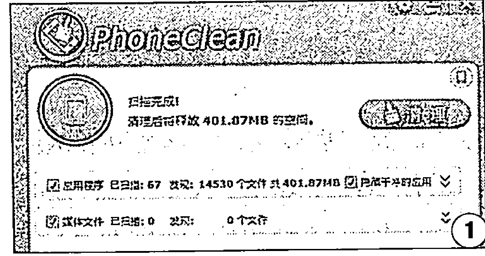

由此可见此款软件的操作较简单，清理垃圾文件也挺给力。那为何安全指数还不是很高呢？这里必须得注意，Phoneclean有时候会误删第三方应用的离线数据包。笔者的《有道词典》有多个离线字典，有一次清理时没注意，结果把这些字典给清理了，造成了损失，所以在扫描出垃圾文件的时候点击软件界面的上箭头图标，去除一些拥有离线数据包应用前的钩（图2），免得出现误删。

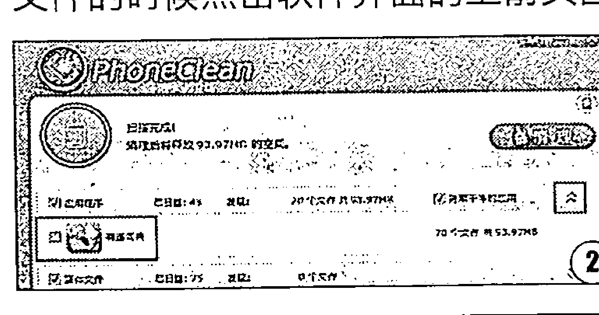

总体来说Phoneclean还是不错的，清理幅度挺大，不会删除手机上面的记录，诸如QQ聊天记录之类的！推荐使用这款软件清理垃圾。

iTools

iPhone若是越狱了，这个软件基本上是很多粉粉们必装的！此货的大部分用途是实现比iTunes更方便的管理手机功能，殊不知，它还能清理垃圾！软件打开后点击“高级功能”选项，就会看到不太明显的“清理垃圾”功能（图3）。直接单击这个按钮就可以清理垃圾了，并且速度很快。

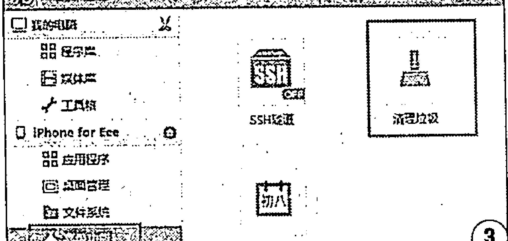

估计是iTools制作的目的就是为了方便管理手机，重点不在清理垃圾，所以这个功能很鸡肋。好在它不会深度清理系统，也就是不会出现误删的情况，基本上只是简单清理一些系统程序的缓存，第三方应用软件缓存根本清理不了。所以别指望它能清理更多垃圾！

### 手机端

iCleaner

越狱后的iPhone可以通过Cydia安装比较强大的软件，iCleaner就是一款非常厉害的手机端清理垃圾软件。

BigBoss源里就有免费的iCleaner，可以直接通过Cydia搜索获得。软件默认是英文，为了方便使用我们可以手动调成中文，下拉至Language Selection（选择语言）选择中文后，退出程序，双击Home键关闭iCleaner后台，重开就能看到中文版的iCleaner。

软件界面看起来非常专业（图4），拥有众多的清理项，一般采用系统默认配置即可清理大量手机垃圾文件。

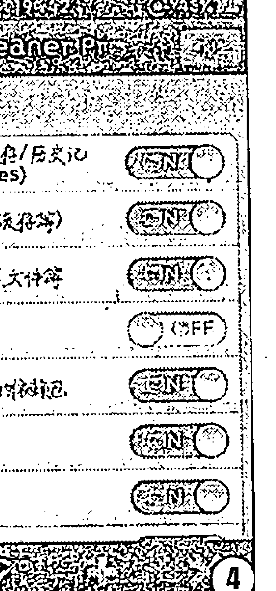

点击“分析”就可以先看看手机上面有多少垃圾文件，点击“清理”才会真正清理垃圾。完成清理后手机会自动注销，之后看看是不是多出很多空间啦！

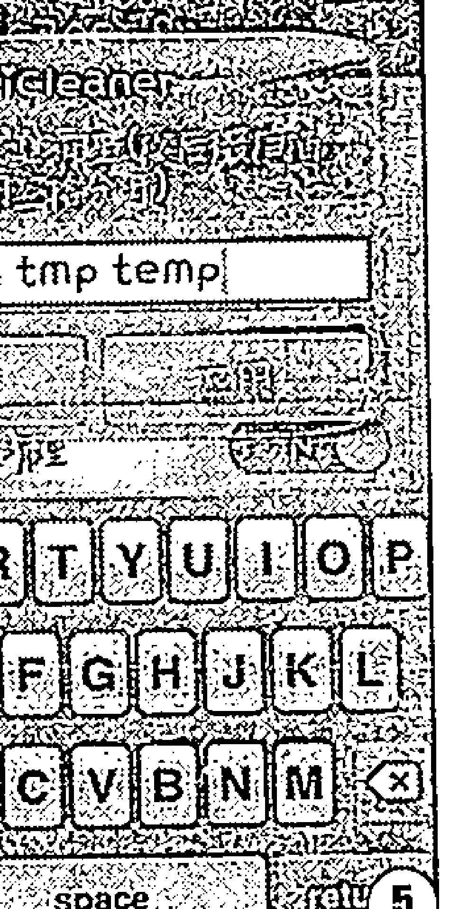

由于软件较为专业，所以推荐不是很熟悉手机系统的用户采用默认配置，免得出现误删。若是对系统较为熟悉，可以自己编写清理的垃圾文件类型（图5）。总体来说还是推荐使用这款软件！

通过上面的对比发现，Phoneclean跟iCleaner各有千秋！前者清理缓存较为方便，清理完之后不用注销手机；后者清理更彻底，不过不建议经常使用。不如两者结合起来，干活不累嘛！

## 五一出游 省钱更实惠

这年头，钱是好花不好挣。囊中羞涩的你，怎样才能让这三天假期过得经济又实惠呢？自己没主意不要紧，我们来听听省钱达人们的高招吧。

文|飞雪散花

### 刘涛：37岁
每到假期，都会带着老婆、孩子外出踏青，游山逛水，毕竟忙碌了几个月，放松一下才能更好地工作。不过苦于收入不丰，所以一向对省钱之道很在乎。

- 推荐应用：同程旅游、景点打折门票
- 推荐理由：打折旅游、经济实惠

我平时常备两款应用，“同程旅游”是其中的第一款，想出远门，可以让它把全国各地低价打折的酒店、机票、景区统统提供出来。举例来说，我们想逛逛“保定”的名胜古迹，只需打开应用界面，点击“景点门票”图标，在屏幕底部点击“旅游主题”按钮进入“景点主题”界面，先通过“我想去”选项选择要游览的城市名称，再从界面中点击“名胜古迹”按钮，该应用就会自动把所选城市打折优惠的名胜古迹全部列举出来。接下来点击想去的景点名称，比如“河北满城汉墓”，在打开的界面中点击“预订”按钮即可完成订票。要知道，该景点原票价为60元，而我们只需花费48元就能买到，此外在售票口取票时还能返还1元的现金，足足省了13元。

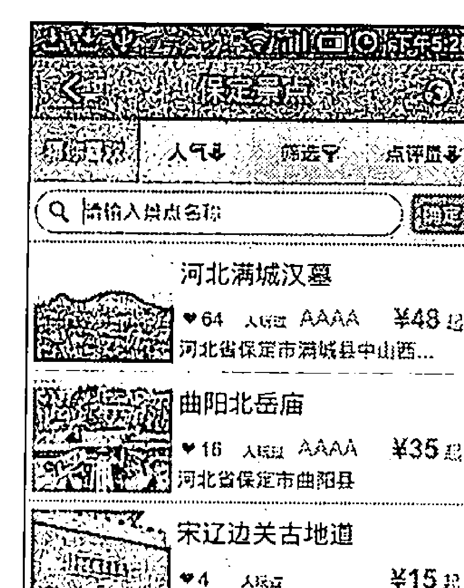

目前这款应用提供了全国300多个主要城市的2万余家经济型酒店、星级酒店，3000余家景点折扣门票预订，无论查询还是订票都非常方便。

我推荐的另一款工具是“景点打折门票”，想在近处旅游，这款应用必不可少，它能把四周景点的打折门票提供出来。想出游时，先运行应用，软件自动进行定位，定位完毕，从界面上方选择景区类型，比如“主题乐园”，再在右侧选择“优惠景区”选项，应用便可通过界面把所有门票打折的景点名称显示出来。点击某一景点后，可以看到该景点的介绍。想订票再简单不过了，点击“立即预订”按钮即可完成。该应用提供了全国313个城市6000家景点门票。景区现场付款，不方便的话可以随时取消订单。

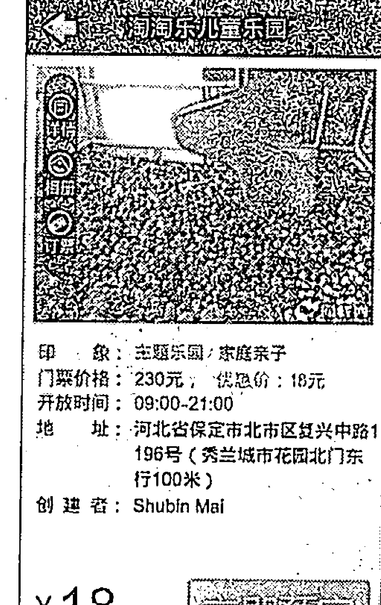

### 张杰：23岁
每到五一、十一，最期待那些诱人的电影和精彩的演唱会，自以为人生乐事，莫过于此。可每次买票都得出门，一来会花不少路费，二来还要排队等候，白浪费不少时间。因此在手机中安装了两款应用，从此订票买票轻松完成，再也不用排队苦等了，而且运气好的话，还能买到打折票。

- 推荐应用：票啦啦、QQ看演出
- 推荐理由：在家订票、买票打折

“票啦啦”是我看电影的订票工具，它提供了全国100座城市400家影院折扣电影票的购买服务、600家影院影讯信息，提供在线实时订座服务。应用运行后，从屏幕上就能看到正在热映的大片，喜欢哪一部，点击屏幕上的电影海报，在打开的界面中点击“排队/购票”按钮，然后按提示选择影院购票即可。特别值得一提的是，该应用提供兑换券购买服务，购票价格2折起，大家可以随时兑换想看的影片。支持支付宝、银联、网银、票啦啦电影卡等多种安全支付方式。

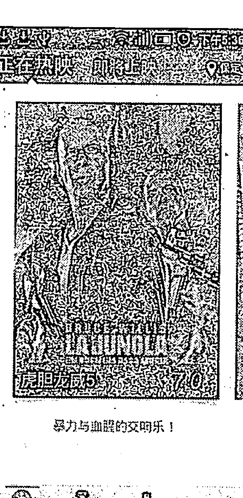

看演唱会、音乐会等演出时，“QQ看演出”就派上了用场，它会把各地演出信息及时提供给你。该应用把演出类型分为亲子家庭、体育赛事、音乐会、演唱会、话剧歌剧、戏曲曲艺等七个类别。想看哪类演出，可以先切换到“演出库”界面，然后从上方点击相应的标签，比如“演唱会”，再从屏幕上点击演出名称即可。在打开的“演出详情”界面，可以看到“立即购票”按钮，点击该按钮，按提示选择票价进行购票就可以了。值得一提的是，这款软件还会定期推出10元特价抢票活动，用它订票看演出，既经济又实惠。

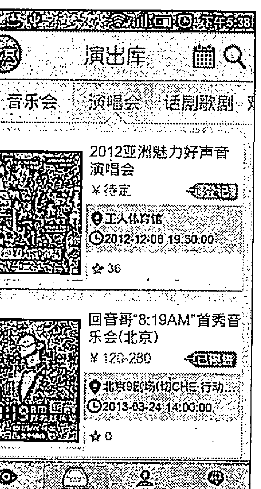

### 李红：22岁
最大的爱好是品尝美食，所以一年一度的五一游，就变成了名符其实的“美食游”。原价消费？算了吧，李红的信条是：吃，也要吃出实惠，绝不能瞎花钱。现在有不少打折的美食，这样的美食才是她的首选。若问她怎样找出打折的美食，很简单，女子不才，自有秘密武器在身。

- 推荐应用：淘宝券券、查周边
- 推荐理由：吃也能吃出实惠

我的第一个秘密武器是“淘宝券券”，这是一款淘宝应用，能把距离最近的美食店找出来。打开应用后，软件自动进行定位，先通过上方的标签选择类别，比如：“吃喝”，这样软件就能自动把四周打折的餐饮、美食定位出来。选择店铺进入后，点击“立即购买”按钮，登录淘宝付款就可以了。必须说明的是，该应用不仅可以找出四周围的吃喝优惠，还包括玩乐、生活等十几类商户。需要时大家通过上方选择对应的标签即可。假如找到不需要的宝贝，还可以通过底部切换到“搜索”标签，输入需要的类别，比如KTV，进行搜索。搜索到的宝贝全部支持电子码，即买即用，你说轻松不轻松。

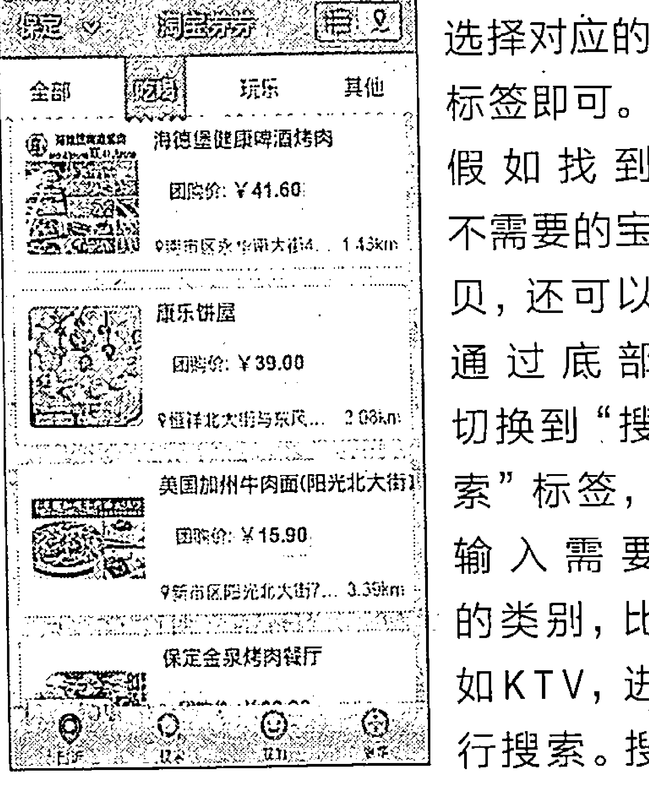

我的第二件武器是“查周边”，这是一个实体店搜索工具，能帮助你查周边的银行、找美食、订酒店、查公交地铁站等，找附近团购也没问题。比方想看看附近有没有美食店的团购活动，只需打开应用后，点击“团购”按钮即可看到，找到相关美食后，点击“去购买”按钮就可以了。这里告诉你一个小窍门，该应用支持语音输入，如果天冷，大家不用打字，点击屏幕上的麦克风按钮，然后对着手机说出要找的地方，比如“我要找餐厅”，就能迅速搜到结果。省事吧？

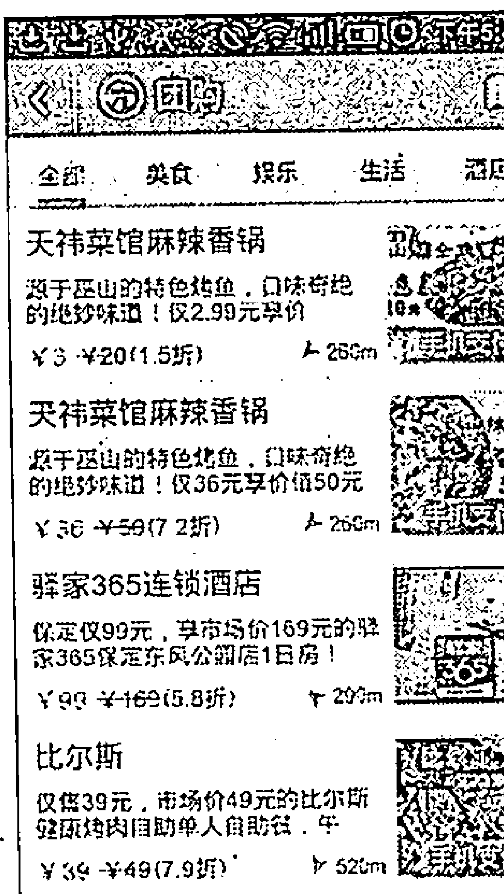

### 吴迪：26岁
摄影爱好者。平时放假，喜欢一个人带上相机到处走走，了解各地的风土人情。最常用的交通工具是出租车。在这几年的打车经历中发现，一是有些地方不好打，有时会打到黑出租。二是有的正规车司机为多赚钱，故意绕远。虽然没多花多少钱，但心里感觉别扭，有种挨宰的感觉。如今她通过两款手机软件，彻底地解决了这两个难题。

- 推荐应用：百米出租车、HiTaxi
- 推荐理由：陌生城市打车不被坑

“百米出租车”是我用来找出租的应用，它的好处是，无需你盯紧马路，它能自动帮你呼叫周围的出租车。进入应用后，“百米出租车”会自动开启GPS定位功能。在地图上识别出用户的位置后，我们可以点击“呼叫出租车”按钮，在打开的屏幕上输入目的地名称和人数，点击“提交”按钮进行智能打车。发出需求后，在司机端上，我们的请求会被附近的出租车司机接收，司机会根据乘客的位置安排路线前往，并根据用户的电话与用户展开沟通。同时我们也可以在地图上发现标有空车标志的汽车，也方便我们就近打车。

“百米出租车”不仅能够智能打车，还可以进行合乘用车，只需在“呼叫出租车”界面的“愿意合乘”选项中勾选“是”即可。合乘用车的好处是能让用户大幅降低乘车费用，同时也极大提高了打车成功率。

我推荐的另一个应用是HiTaxi。相信大家在打的的时候，经常遇到过出租车司机故意绕路的情况。出门在外，人生地不熟，没办法。现在有了这款应用，我们可以让它计算出行车路线和全程费用。使用方法很简单，来到陌生城市想打车前往某个地方，只需运行应用，点击放大镜状搜索按钮，在打开的界面中输入终点位置，点击“确定”后，该应用便自动把行车的里程和打车费用估算出来，并显示在屏幕上。在屏幕下方，我们还可看到具体的行车路线图。够详细的吧？若还不放心，大家还可以在开车后，点击屏幕上方的“地图跟踪”按钮，这将直接在屏幕地图上，显示出该出租车的行驶路线，借此，我们可以查看出租车行驶路线是否和预计路线一致。有此宝贝在手，司机想宰人，门儿都没有。

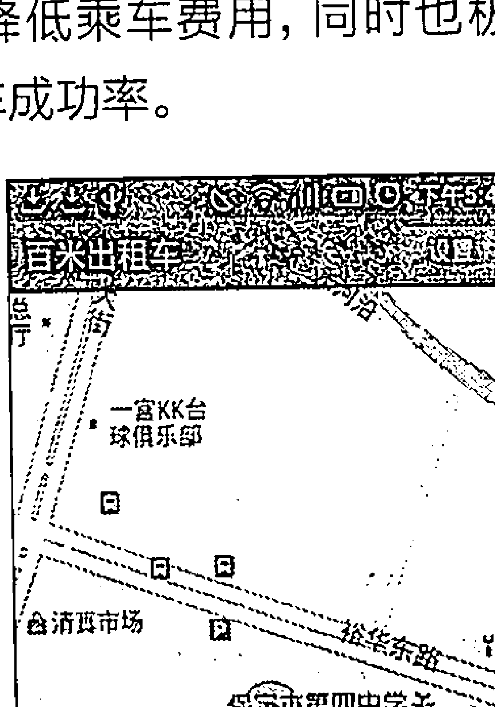

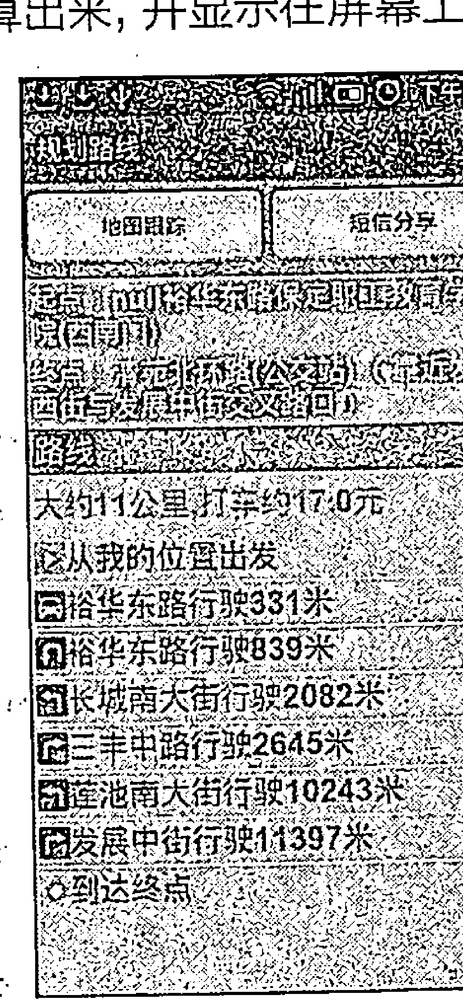

| 大约11公里打车约17.0元 |
|---|
| ①从我的位置出发 |
| ②沿华东路行驶331米 |
| ③沿华东路行驶639米 |
| ④沿城南大街行驶2082米 |
| ⑤沿丰中路行驶2645米 |
| ⑥沿池南大街行驶10243米 |
| ⑦发展中街行驶1197米 |
| ⑧到达终点 |

## 智能手机，让耳朵不再寂寞

文|快乐鬼小威

都说眼睛是心灵的窗口，当眼睛疲劳的时候，那就让它休息一下吧，因为这个时代的智能手机可以为我们做很多事。比如，一部手机、一个耳机、一个有声电台，闭上眼睛我们可以用耳朵感受这个世界。

### 俞静：女，30岁，全职太太，家有可爱女儿
- 推荐应用：乖宝宝听故事
- http://tinyurl.com/c9z69lk
- 推荐理由：孩子哭闹不肯睡觉？讲个故事给他听听吧！

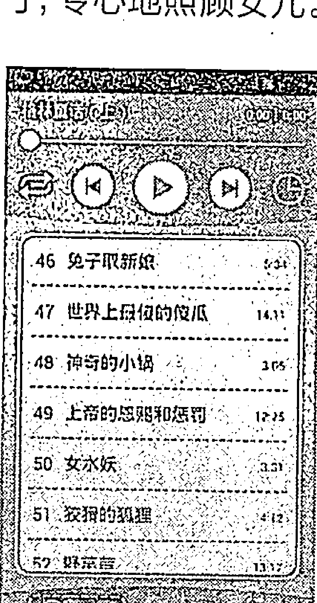

自从有了宝宝之后，我的生活也随着她的出生改变了很多。我把原来的工作也给辞了，专心地照顾女儿。现在对于我来说，看着她一天天地健康长大，就是我最大的心愿啦。后来有朋友告诉我，你平时累的时候或者宝宝晚上睡觉前，可以讲个故事给她听，而且现在的手机下个“乖宝宝听故事”软件就可以实现这个目的了。

首先点击打开“乖宝宝听故事”这个软件，软件界面非常简单，只需选择要播放的童话故事，软件即会用优美的声音将故事读出来，相信宝宝一定特别喜欢。软件可以选择播放模式，分别有“顺序播放”、“随机播放”、“单个循环播放”，也可以定时播放，选择在多少时间后停止播放，这个功能很实用。

### 谢印成：男，52岁，大学教授，喜欢看书，视力差
- 推荐应用：静雅思听
- http://www.justing.com.cn/
- 推荐理由：用耳朵获得智慧，休闲不忘充电


我是一个普通的教师，喜欢读一些人文社科方面的书籍和文章，不过现在人老了，老花加近视眼对于喜欢看书的我来说，真的是特别不方便。我也听说过有声小说之类的软件，感觉挺适合我，可是一直没找到自己心仪的有声小说，大部分的资源都是网络文学，不是我喜欢的类型。后来，我的一位学生告诉我，有一个叫“静雅思听”的软件可能适合我，尝试过后真的觉得很不错。

打开“静雅思听”软件，首次进入需要注册并登录。第一眼就觉得是一款比较有智慧的软件，软件名字我也很喜欢。我会点“分类”下的“栏目”，选择我比较喜欢的“历史”和“生活”两个栏目的文章进行收听。需要说明的是，“静雅思听”的部分文章是需要开通增值服务才能收听到的，收费也比较便宜，完全可以接受。如果你不愿意付费，免费的账户依然可以听到很多美文。

### 施腾：男，20岁，大学生，文艺青年
- 推荐应用：爱听FM
- http://tinyurl.com/cwgnmrr
- 推荐理由：给你的耳朵解渴灭火，享受完全不同于传统电台的收听体验

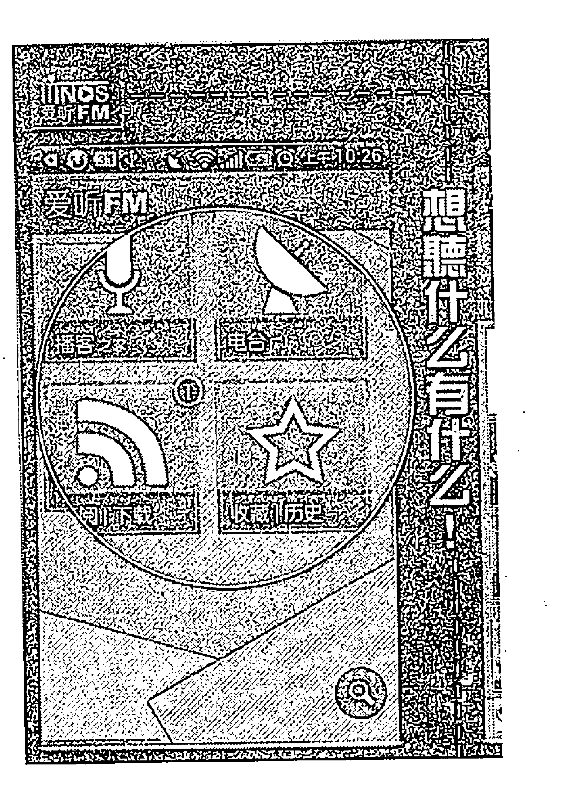

平时我不怎么爱听歌，其他同学用手机听歌，而我喜欢用手机听电台，就是现在慢慢开始流行起来的播客(Podcast)节目。这些有声电台也是占据我手机空间最多的东西，平时空闲的时候我会带上耳机，听听各类电台节目。电台主持人侃新闻、说笑话、谈人生，真是应有尽有，我一直觉得听有声电台比听音乐好玩多了。我想为大家推荐的应用名字叫“爱听FM”。

下载安装后，打开这款“爱听FM”软件，就可以看到当下最热门的节目推荐。首页主要是热点推荐，软件还分了两个版块，分别是“电台”和“播客”版块。两者的区别在于前者是属于直播类型的电台，数据来源于传统的FM广播，你可以搜索到全国各地的FM广播；后者属于网络电台，由个人或者一个小团队独立经营，更新频率都各不相同，一般都是一个星期更新一期节目，并且支持离线下载。

我经常收听的是“播客”版块，因为觉得这些节目话题更自由，更符合我们年轻人的价值观。

### 吴维：男，33岁，互联网公司职员，学习力研究者
- 推荐应用：Umano
- http://www.umanoapp.com/
- 推荐理由：听真人饱含热情地朗读书籍和新闻

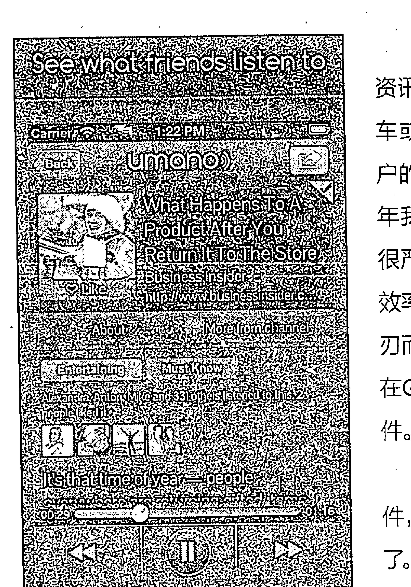

我喜欢阅读一些极客类、科普类的外文资讯，并且通常情况下，我的阅读都是在公交车或者地铁上完成的。以前，我是用各大门户的新闻客户端来获取信息的，不过最近一年我都是靠耳朵来获取资讯。公交车上颠簸很严重，低头看书很容易头晕目眩，导致工作效率降低，而如果选择听，这个难题就可以迎刃而解。我要推荐的应用便是“Umano”这款在Google Play上被选为最佳应用的听新闻软件。

打开“Umano”软件，这是一个纯英文软件，如果你的英文太烂的话，我只能说了。点击左上角的“umano”按钮，进入目录分类，进入你喜欢的分类目录，然后点击你喜欢的文章进行聆听。点击“View Full Story”可以查看文章的全文，点击“2X”按钮，软件就会以2倍的速度进行阅读。还可以长按文章标题将文章添加进入“Playlists”，并进行离线下载。

## 致我们终将逝去的青春 iOS怀旧游戏Top10

文 | 残香

如今游戏越做越华丽，却始终少了一丝童年在电视机前玩《超级玛丽》时的单纯快乐。游戏中的分支电子竞技已经成为正式的体育比赛项目之一，而号称电子竞技中的世界杯WCG赛事的颁奖曲目，依旧是经典的玛丽之曲。可见无论岁月如何变迁，就算现在《超级玛丽》再也无法给你带来欢乐，但它给你带来的则是永远的温暖，触及的是心中永远无可替代的柔软。

### 玛丽医生
玛丽医生算是类俄罗斯方块游戏中最成功的一款游戏，在FC时代风靡一时，也是同色块消除类游戏的鼻祖之一。虽然名气没有俄罗斯方块大，但是其游戏性却一点也不比俄罗斯方块游戏小，或者说更高。对战、挑战等模式都很值得琢磨。用不同颜色的胶囊药去杀灭细菌吧，少年！算上一部分FC情节，玛丽医生成功闯入排名怀旧APP榜单，位列第10位。

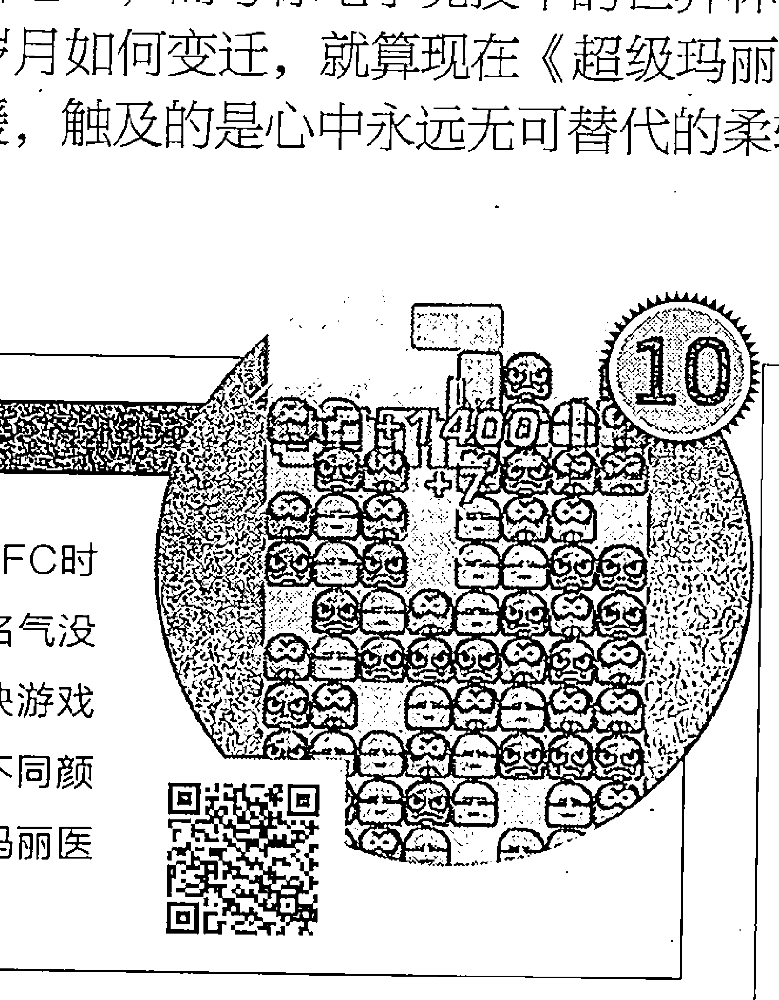

### 心跳回忆
还记得你当初第一次心动的初恋或者暗恋吗？有多少痴情少女把自己想成故事中的主人公？《心跳回忆》的名气可不只是在其粉丝中，对游戏稍微有些了解的人耳中也是如雷贯耳。不信你可以随便找个人问问他是否知道什么是养成类游戏，就算他从来没碰过也肯定可以说出个“心跳回忆”。经典的插曲与美到爆的画风加上让人心神荡漾的故事情节，排名怀旧APP榜单第8位实至名归。

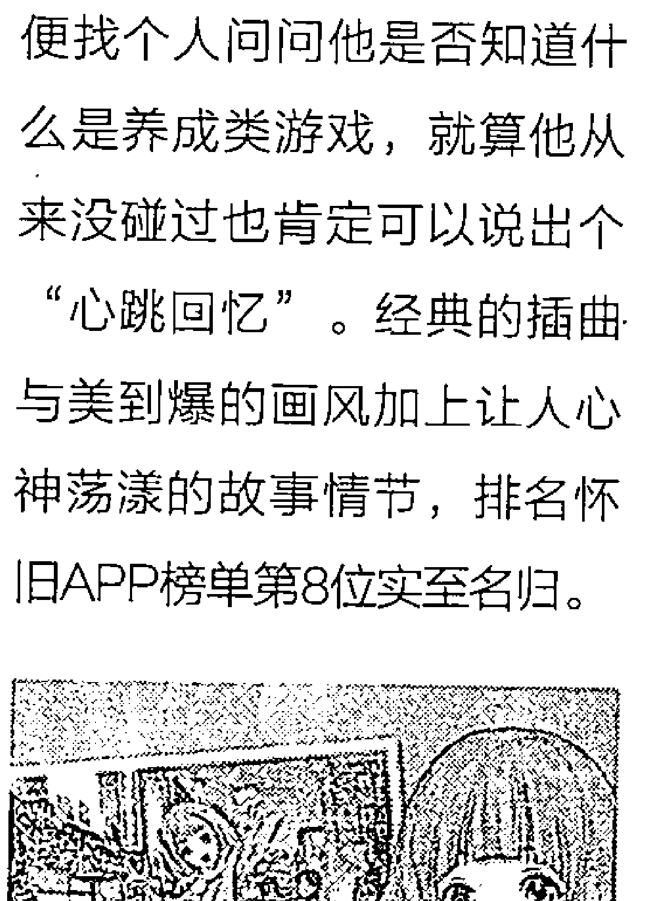

### 纸牌扫雷&萌猫
嗯……其实这款游戏与你认知中Windows内置游戏的区别与字面上的区别一样，那就是——萌猫，就是加入了一个类似猫咪养成类的小部分。在这款游戏中你可以通过玩各种的扫雷再扫雷、接龙再接龙中，收集到超过上百种的猫咪，当然还可以通过游戏获得的积分给喵星人购买各种给力道具，来增加你继续玩下去的耐心与勇气。经典自不用多说，但终归游戏性堪忧，故而排名怀旧APP榜单第9位。

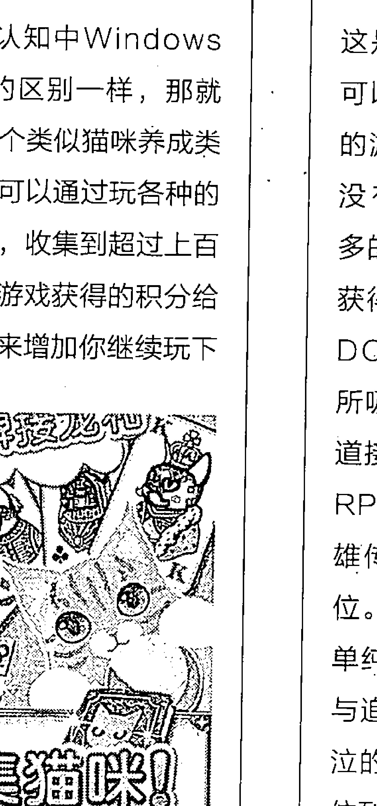

### 仙剑奇侠传系列
这是中国游戏界的骄傲，可以说这是中国自主开发的游戏中最成功的作品，没有之一。也是为数不多的以游戏背景深入到其他娱乐领域并获得成功的案例之一。十多年前，曾经DOS机上多少人被其玄妙的故事背景所吸引，一代又一代地玩下去只是想知道接下来的故事是怎样的。在很多中国RPG游戏粉丝中，仙剑甚至可比拟《英雄传说》系列这个RPG游戏至尊的地位。足可见这款游戏移植iOS平台不只是单纯的游戏延续，而是一种回忆的寄托与追寻。引人入胜的打斗情节与可歌可泣的爱情故事是它最大的杀手锏，最终位列怀旧APP榜单第7位。


### 大富翁MT大富翁
嗯……其实这款游戏是耍赖，它用了一款当之无愧的经典游戏的游戏模式，却抱上了全球历史上最好的一款游戏——《魔兽世界》其中的一个热门同背景漫画的大腿。所以怀旧经典与流行元素的结合，再加上《我叫MT》动画的强大粉丝团队，简单的主人公角色替换，而不影响任何游戏性的同时，把自己的人气拉高了一大截，可谓经典的合作战略案例。大富翁这种扔骰子走格买地收租子的游戏模式自不用多做介绍，多人休闲娱乐玩法是它的最佳选择。任何时候都不要小看Wower们的实力，经笔者反复斟酌最终排名怀旧APP榜单第6位。


### 合金弹头：METAL SLUG X
合金弹头，在当年它有个更响亮的名字叫做“越南战役”，但由于世界和平问题最终厂商还是抛弃了后者的称法。这款游戏是曾经双人闯关游戏中最过瘾的一款，画面内容极其丰富，以至于当漫天炮火飞舞的时候你根本无从躲避，只好拿着武器开枪不顾一切地向前冲，最后才发现这才是过关的真谛所在。这款游戏除了各种各样的枪械武器之外，最大的亮点在于很多关卡可以驾驶的不同坐骑了，最有趣的则是从沙漠骆驼到飞机坦克它们的攻击方式都是一模一样的。由于该游戏画面太过丰富，可以同时双人玩的游戏大多时间只成为了单人游戏，因为玩过这个游戏的人都明白，本来可以单人轻松通关的游戏，双人玩起来很可能第一关都过不去。互动性是它唯一的弱点，最终排名怀旧APP榜单第4位。


### 超级大叔加强版：Lep‘s World Plus
从名字的后缀你也许就能猜到了，这款游戏就是最经典的一版超级玛丽的复刻。如今任天堂还活跃在自己的掌机游戏平台上，而马里奥这位仁兄继续在缔造着各种各样的续集。想在iOS重温超级玛丽这款游戏的机会不大，不过还好这位大叔完美地复制了超级玛丽这款游戏的所有内容，就连细节也是一模一样。这款游戏有点打擦边球的味道，故而排名怀旧APP榜单第5位，如果是任天堂把超级玛丽搬到iOS上的话，排名远不止如此。


### 俄罗斯方块TETRIS
俄罗斯方块可谓是消除类游戏的鼻祖，多少风靡全球的后续游戏都是从它身上找到的灵感所在。简单的几种几何形状码放、消除，如此无限循环，却怎么也玩不腻。笔者还记得当年所拥有的一款掌机里面就只有一款游戏，那就是俄罗斯方块。经典，消除类游戏鼻祖，排名怀旧APP榜单第2位。

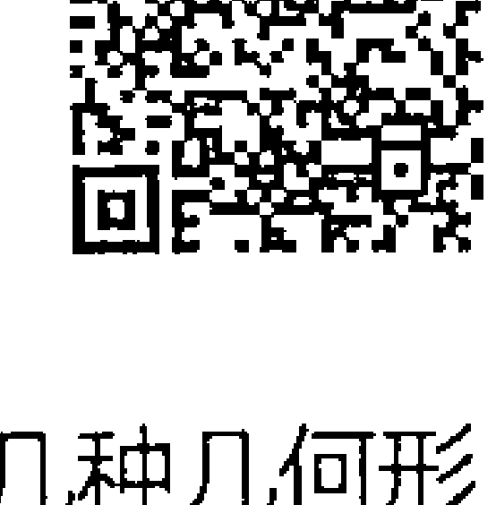

### THE KING OF FIGHTERS 1 2012
KOF，多少少年听闻这3个字母时热血沸腾？畅快淋漓的打斗与连续技让你应接不暇，就是不上手操作只看上2个小时你也不会觉得有任何无聊之处。上手容易成高手难，最早的电子竞技雏形就应该是KOF了，只可惜当时国外的正规比赛没有转播可看，也没有视频网站的普及，从而不知埋没了多少人间高手。由于该游戏的高手与菜鸟之间差距巨大，以至于玩家种类的覆盖面较为狭小，故而排名怀旧APP榜单第3位，逃课打街机同学心中最爱游戏榜单第1位。


### 魂斗罗进化革命
《魂斗罗》如果还需要介绍的话，那只能证明你根本没有童年。新版移植的iOS《魂斗罗进化革命》与传统FC不同的是它有两种模式选项：街机模式和任务模式。街机模式与在FC上玩的《魂斗罗》没什么区别，同样是靠着上、下、左、右、BABABA来打天下，三条命挂掉完事。而任务模式则固定了8个关卡，而且每个关卡都可以选择3种不同难度进行游戏，此外在游戏开始之前还可以自定义角色的武器装备，当然这需要你另行花钱。一款可与超级玛丽、俄罗斯方块齐名的经典中的经典游戏，不解释，排名怀旧APP榜单第1位。

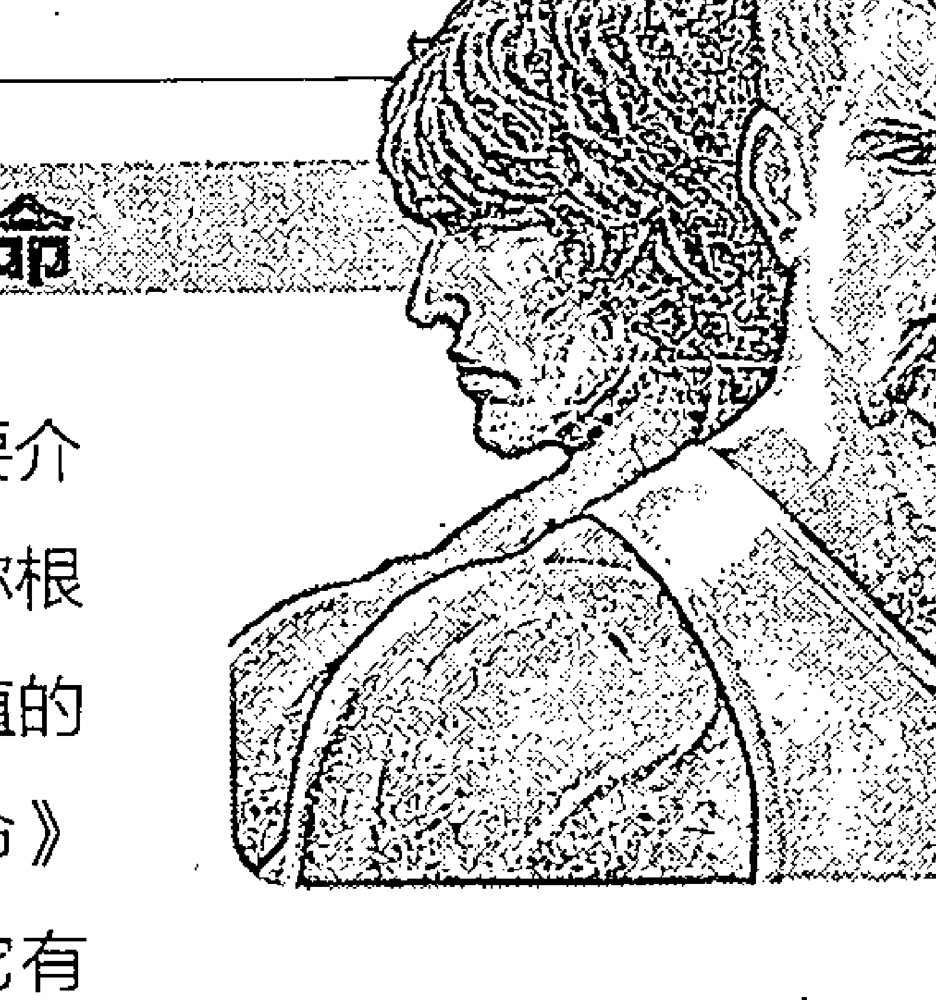

