# 电脑爱好者2013合订本（上）第二部分

## 迎新品做准备 Android热门游戏Top10

文 | 残香

2013年第二季度是Android智能平台爆发的时间，索尼L36h、三星GALAXY S4、HTC One、联想K900是这段时间最为耀眼的明星产品。当然，中低端机型也呈现出百花齐放的热闹局面。有了好的手机不玩游戏怎么行？本期就为你悉数这段时间最热门的10大Android平台游戏，让它们来迎接你的新手机吧。

### 百战天虫2: 末日浩劫

还记得N年前风靡PC平台的《百战天虫Online》吗？它又回来了，游戏开发商Team17宣布将这款游戏命名为《百战天虫2: 末日浩劫 Worms 2: Armageddon》移植到Android平台，可爱的画面、可流畅的操作是这款游戏的魅力所在，不知道经典的4方向按键游戏在触摸平台上操作是否还能保持一样的畅爽体验？当然，新的虫子角色与武器装备也是让你重新怀旧一把的理由之一。

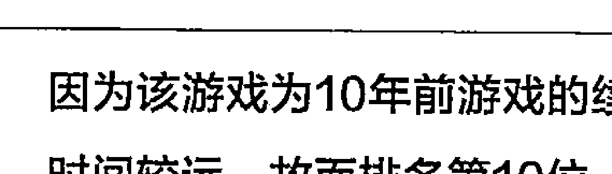


### 地牢传说

这是一款地道的奇幻RPG游戏，喜欢奇幻风格的玩家一定不要错过。《地牢传说》的剧情代入感很好，浓厚的奇幻氛围营造得十分出色，如果你喜欢了解剧情、体会场景的路数，那么它一定可以让你身临其中，感受那一段沉重的历史剧情，领略剑与魔法的魅力。

因为其游戏引擎的原因，与《掠夺之剑》等游戏风格相似，所以位列第9位。


### 合金装备: 外天堂2

《外天堂2》胜在操作简单，触控操作一直是动作+射击游戏玩家心中的痛，在3D式的场景下你很难控制视角问题，而这款游戏则简化了许多操作，让你可以更爽快地在战场上所向披靡。

简单、好玩、场面够过瘾，排名第8位。


### 海贼王

先别着急找投诉电话，你真的没看错，路飞它们真的把船开到Android平台上了。同名漫画为这个世界构建了一个庞大的故事背景，几乎每一位人物都有着可歌可泣的动人故事。在漫画之余玩玩游戏同样能够回味其中无数畅快的打斗场景，还等什么，赶快出航寻找One Piece吧！

凭借着百万的漫画粉丝，它至少稳坐第7把交椅。


### 找你妹

嗯，没错，就是这个游戏荣登本次榜单的冠军。其实它很简单，就是给你3个提示单词，然后根据提示在茫茫的图海当中找出正确的图标。而剧情模式也只是用无聊得不能再无聊的主线贯穿，给你一个继续找下去的理由。结果就是如此简单的游戏就像俄罗斯方块、贪吃蛇等游戏风靡了整个掌上游戏平台。公车上找你妹、地铁上找你妹、上班找你妹、吃饭睡前找你妹，闲了没事干，还是找你妹！

一款玩了就着魔的游戏，问鼎夺冠。


### 史诗塔防2：风之魔咒

塔防游戏一直有着一群风靡的爱好者，因为这种“被动”的快感也需要极大的智慧与反应能力才能享受其中的乐趣。《风之魔咒》不同于其他塔防游戏的是，它取消了金钱买“塔”这种惯有的规则，而是通过宝石掉落、合成、升级基础塔的形式来完成，当你在紧急情况的时候，还可以通过自爆宝石来保得一时之命。

游戏类型新颖，可玩性高， 难度大，名列第4位。

### 真实足球2013

“真实”是这款游戏的真谛，驾驭好一只俱乐部不仅仅是球场上的两下子，玩好《真实足球2013》也不是按键射门那么简单。在该游戏中，你不仅需要在场上踢好球，还要在外场经营好自己的球队。不仅球员需要训练、比赛，还要兼顾建设球场、医院等基础设施，最后千万别忘了给自己弄个豪华办公室。

比以往的足球游戏可玩性更高，排名第6位。


### 勇闯死人谷

不要看见僵尸就认为一定是射击游戏，这完全是一款3D跑酷游戏。当然，在体验的畅爽程度上一点也不落下风，当你进入游戏时会发现你立刻被僵尸大军围攻，你需要做的是通过重力感应来调整方向，然后——跑！当然，在逃亡的过程中你随身携带一些武器用于防身，但是紧张的游戏节奏好像并不允许你这么做。

游戏紧凑，音乐与画面很有压迫感，排名第5位。

### 侠盗猎车手3 十周年纪念版

很黄很暴力贯穿了这个游戏的主题，相信提起“侠盗”很多人第一个想起的就是其自由的游戏模式，没错，在游戏里面没有攻略、没有路线，有的就是肆无忌惮的烧、杀、抢、掠，以此提升你对警察的威胁，然后逃走，或者……反抗。在最新的第三代版本中，比之前作增加了不少角色和车辆，画面质量也有一定程度的提升。

大名鼎鼎的Rockstar North出手，必属精品，榜眼之位实至名归。

### 极品飞车17：最高通缉

在赛车游戏中，没有比它更可以称之为代表作的游戏了。EA将第17代产品的名字命名为《最高通缉》，也就是说在这部游戏中，你需要做的就是与警察叔叔们玩一场“猫和老鼠”的游戏，其中你需要发现各个隐藏剧情，然后击败对手，从而让你的悬赏……更高，升至第一位是每个赛车手最高的梦想，因为这是用生命去踩油门。

每一代作品都给力的游戏实在太少，《极品飞车》位列探花只低不高。


## 保护iPhone按键 从滑动做起

文 | 付易

敢问当今手机什么地方坏的频率最高？非按键莫属也！保护壳只能保护手机的外框，甚至屏幕，从来没有什么设备能保护手机按键。那就让咱们行动起来，救救那脆弱的实体键吧！

### 未越狱状态

iPhone自带一个名为Assistive Touch的小工具能够在一定程度上保护实体键。通过依次打开“设置→通用→辅助功能→AssistiveTouch”即可。打开后就可看到屏幕主界面的边缘地方多了个半透明的圈圈，以后就用这玩意来保护实体键了。这样一来就可以不用按实体电源键来锁屏了，起到了保护电源键的作用。

### 越狱后状态

通过上面的做法屏幕上多了个圈不仅妨碍视野，并且在保护按键方面也没有突出操作的简便性。越狱后的iPhone则可以在Cydia里面添加对应源，搜索安装Zephyr和Activator这两款插件来实现更加人性化的保护按键功能。

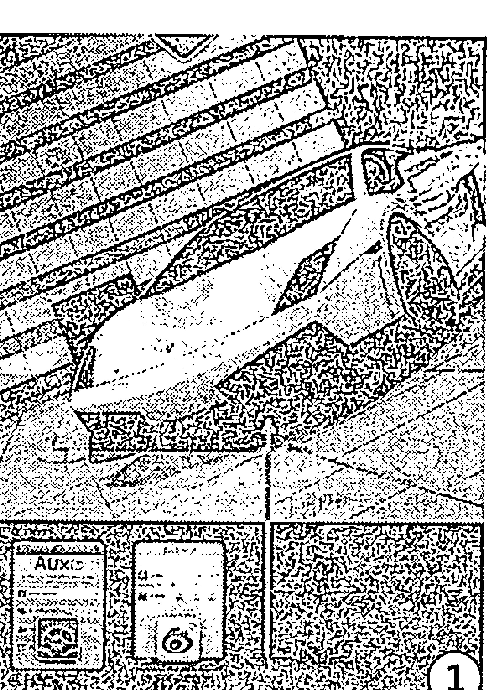

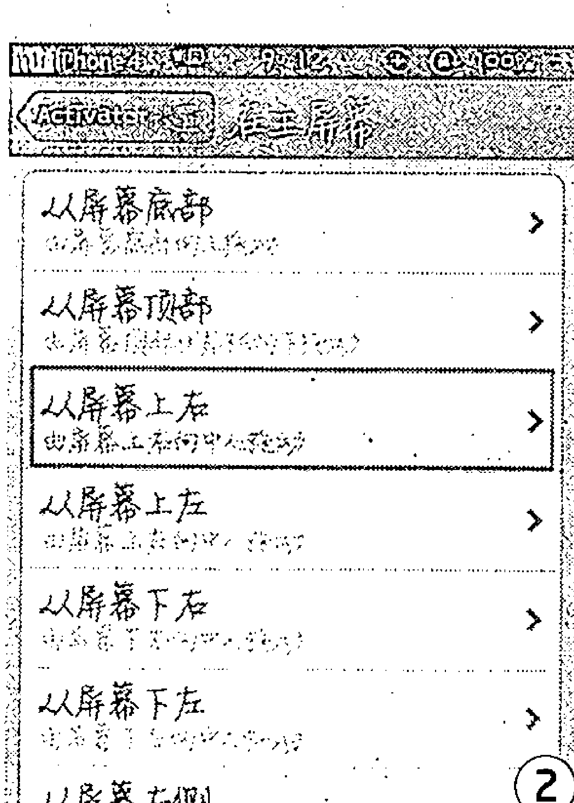

安装完Zephyr后，在手机“设置”界面下方就可以看到它。一般采用软件默认设置即可。在任何软件界面，从左右边缘往中间滑动即可在多个程序之间切换；从底部往上滑即可回到手机主界面；往上滑的时候停顿一会，就可以调出任务栏（图1）！整个过程中压根没用到实体Home键，只是轻轻一滑即可，是不是很方便？

刚刚说的是保护Home键，接下来该是电源键啦！Activator可以提供方便并且炫酷的保护方法。软件打开后可以看到具有较多的设置项，基本上涵盖了所有可能出现的情况。这里可得手动设置了，我们进入第二个选项“在主屏幕”，在出现的手势界面选择“从屏幕上右”（图2），然后下拉找到“锁屏解锁”选项，点击即可。退出软件后试试从屏幕主界面右上角往中心滑动，看看是不是锁屏啦！就是这么简单的保护电源键！

导致锁屏，前面的Zephyr已经可以很方便地滑动回到主界面，所以在主界面锁屏可以确定没有执行的任务，不会出现误锁屏现象。

前面的这两款插件都是手势控制插件，所以在设置的时候不要起冲突，比如Zephyr有从底部往上滑以及左右滑动的功能，那么就别在Activator里面设置类似的手势，否则冲突就会导致手机出现操作异常。这就是为什么上面的Activator设置的是从右上来滑动了。

接下来说说为什么这么设置吧！因为若是“在任意位置”选项里面设置手势，则在玩游戏的时候可能出现误滑动。

通过借助这两款小插件就可以轻松实现保护Home键以及电源键的功能，聪明的你也看到了，不光是保护，还可以实现更方便、更炫酷的功能，何乐而不为呢？

## Android手机密码忘记了怎么办

文 | 俞木发

Android手机启用设置密码功能后如果忘记密码，我们就无法再对手机进行操作，本文介绍如何手动解开Android手机密码。

> 大家知道Android手机设置里有项‘安全’设置，在这里可以启用数字或者图形密码保护。总有些手贱或者马大哈的用户，在启用密码保护后忘记密码，把自己锁在外面无法使用手机。不过Android密码保护并非无懈可击，我们可以根据手机状况，自己手动解锁被锁手机。

### 小提示

Wipe就是擦除用户数据程序的意思，wipe包括Wipe data factory reset（清除数据并恢复到工厂模式）和Wipe cache（清除系统缓存数据）。要注意的是执行该操作后包括联系人、短信等个人数据可能会全部被删除，所以操作之前一定要考虑清楚。

### 使用ADB命令删除密码文件

通过上面的介绍我们知道解锁的关键是删除加密文件，由于被锁的手机无法进行操作，因此需要通过USB和电脑连接，在电脑上删除手机的文件。下面操作以Windows 7系统，中兴ZTE U950手机（Android4.0系统）为例。

首先到http://dwz.cn/cfan036下载所需的ADB文件，下载后解压将所有文件全部复制到c:\windows\system32。接着以管理员身份启动命令提示符依次输入下列的命令（括号后为注释，见图1）：

-   Adb devices（查看连接手机，确保电脑已经正确识别到手机，如果无法识别手机，请在电脑上先安装手机同步软件）
-   Adb shell（进入Adb调试模式）
-   Su（取得最高权限，因为密码文件位于系统目录，默认只有读取权限）
-   rm /data/system/password.key（使用rm命令删除密码文件，图形密码则删除gesture.key）

完成文件的删除后，返回手机界面，输入任意数字就可以解锁了。手机会自动禁用密码锁定，使用手机原来默认的长按锁定。

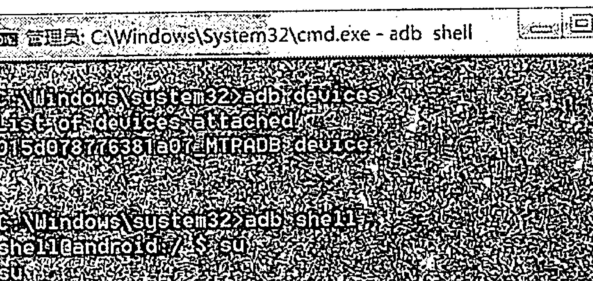

### 使用Recovery恢复手机默认设置

对于没有经常使用91手机助手、豌豆荚的朋友，他们的手机可能并没有开启USB调试。对于这些朋友，可以使用手机Recovery模式下的Wipe工具来清除密码设置。

重启手机然后按电源键和音量向下键进入Recovery模式，使用音量键选择‘wipe data/factory reset’，按下电源键确认。接着在出现的界面使用音量键移动到‘Yes delete all user data’，再次按下电源键确认（见图2）。

reset”，按下电源键确认。接着在出现的界面使用音量键移动到“Yes delete all user data”，再次按下电源键确认（见图2）。

完成上述的操作后返回Recover菜单，继续使用音量键选择“reboot system now”，按下电源键确认后重启即可清除密码保护了。

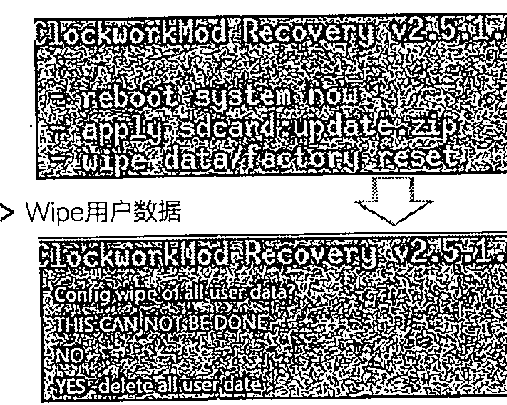

## 微博中奖创收 吃喝玩乐不愁

文/小瓢虫

上下班途中，工作闲暇之余，他们都会登录微博，搜寻微博上的有奖信息，转发并通知好友，然后坐等奖品收入囊中。他们就是‘抽奖控’。

### “抽奖控”女王——王小亚

在微博抽奖界，流传着一本重量级抽奖‘秘笈’，这本‘秘笈’曾经在豆瓣网上被数千名网友‘围观’，是一名叫王小亚的白领写的《新浪微博抽奖全攻略》。

在王小亚豆瓣相册，340多张照片晒满了这位抽奖达人近两年的‘战利品’：有化妆品小样、携程网的旅游卡、手机充值卡、玩具熊、时尚杂志、扑克牌、手表、红酒、名牌包等等，当然还有最让网友艳羡的iPad。

王小亚从盛大电子书Bambook活动开始参与微博抽奖，而且很幸运地第一次参与抽奖就中了。‘2010年9月底，看到有人在转发盛大Bambook电子书的抽奖信息，我也很喜欢电子书，随手转了下，竟然就这么中了，奖品还不便宜。’当时她对中奖并不抱希望，因为刚玩微博，没什么粉丝，也不相信这些活动，但就是这次无心插柳的中奖，开启了她的抽奖之旅，一发不可收。

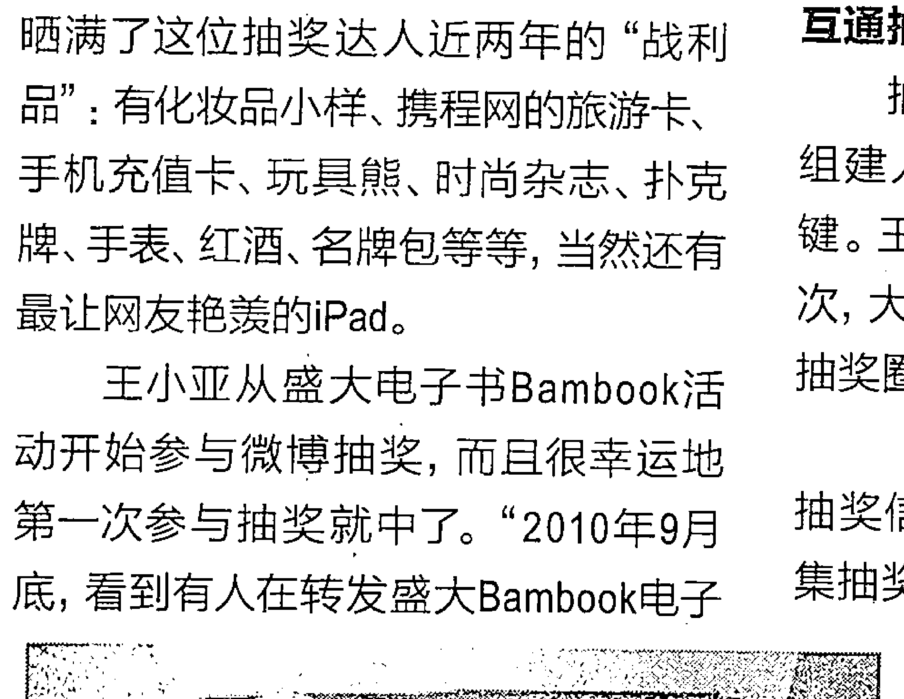

要提高中奖率，需要一个时间累积的过程。王小亚说，慢慢地自己中奖越来越多，到了2010年年底，她的奖品开始‘爆炸式增长’，‘那段时间财运特别旺，每天发个10多条微博，能中两三个小奖，最多的一天能中5次奖。’

王小亚说，运气‘爆棚’的时候连续两天中iPad，‘印象最深的是2011年淘宝‘双12’的活动，抽送360台iPad2，270台随机抽，其他90台给每场活动中粉丝数前5名的网友，我粉丝数有17万，很顺利地就中奖了。’

### “杀伤力”评论高中奖率

微博有奖转发一般走‘三步曲’：对活动微博加关注，转发抽奖信息并@数位好友，针对抽奖主题写两句感想。王小亚说，参与者一定要看清商家的抽奖要求，转发微博时勾选‘同时评论给××(商家)’，否则会被视为无效参与。

### 互通抽奖信息 分享抽奖奖品

抽奖达人们最看重什么？是圈子！组建人脉圈，抽奖消息互通有无很关键。王小亚的微博每天都会被@数百次，大多是有关抽奖转发信息的，她在抽奖圈子里经常联系的有50个人。

‘抽奖控们都会相互关注，共享抽奖信息。也有专门的微博群体会收集抽奖活动和转帖，比如，微博有奖活动中心、转发抽奖平台等，关注他们，或者参加微博抽奖群就能获得大量抽奖信息。’王小亚说，建立自己的抽奖圈，把抽奖信息转发给圈内好友，一般都会受欢迎，也能避免引起对抽奖不感兴趣的人的反感。

此外，服务微博抽奖的网站也应运而生。在一家名为‘我爱打酱油’的网站上，不仅有各种商家发布的抽奖活动，而且设有‘晒奖品’、‘奖品交换、出售、求购’、‘中奖经验交流’等版块，方便‘抽奖控’们交流互动。


‘当抽奖举办或揭晓名单日期临近你的纪念日时，比如生日、结婚纪念日、孩子生日等，你也要将这些内容巧妙地暗示商家，这样商家会认为你是目标受众，容易选中你。’王小亚指出，同城商家举办的活动，转发评论时要主动明示自己是本地的，突出自己是‘潜在顾客’。

用心写原创评论微博，表达对商品建议甚至帮商家出谋划策是王小亚最大中奖心得。她曾参加过一个网商联盟的微博活动，帮忙出谋划策，就中了一些奖品。‘学会换位思考，商家中意对产品钟爱度高、有购买意向的参与者，或者是微博活跃度高、有影响力的客户。比起一味地机械式转发的微博用户，他们更愿意把奖品给产品目标受众，拉拢潜在客户，实现最大传播价值。’

### 后起之秀——杨不悔

王小亚可以说是微博抽奖界的“老前辈”，受前辈的影响，后起之秀似乎更加生猛，大有长江后浪推前浪、一浪更比一浪强的趋势，而家住沙坪坝区小龙坎、网名叫“杨不悔”的18岁男生就是这样一位自称月收入不足2000元，但经常出入五星级酒店吃高档自助餐，时不时去咖啡馆喝价格不菲的现磨咖啡，每月影视大片可以一场不落的“传奇”人物。他做到这一切的手段都一样——转发微博中奖。

### 手机话费 全靠微博抽奖

初次见到杨不悔是在王府井百货旁的星巴克咖啡厅，他身材瘦小，穿牛仔裤、T恤、白色球鞋，看上去像高中生，但腋下夹了一个生意人常用的黑色手包，平添了几分老成。

问他喝什么，他略微思索后说：“来一杯卡布奇诺吧，加焦糖和鲜奶油，要不然太苦了，谢谢。”对咖啡这么熟，难道是富家子？杨不悔说，自己父母是普通工薪阶层，他已经两年没从家里拿生活费了。他没上学也没工作，大部分收入来自于投资朋友的一家小服装店，每月收入不到2000元。

“我之前对咖啡一窍不通，喝不起，今年通过转发微博抽奖获得了一家咖啡店免费试喝机会，后来老板只要有新品上市都让我去试喝，现在我不但什么种类都喝过，自己都会做摩卡和拿铁咖啡了。”杨不悔笑着说。

杨不悔的微博抽奖始于2010年，“那时为了抽Q币，在网上偶然看见转发微博抽Q币的信息，就试了一下，没想到真中了10元Q币，当时把我激动惨了。”“最明显的是手机话费，从2012年1月到现在，我就充过100元，其他都是‘靠微博抽奖抽到的。’杨不悔说。


### 出入五星级酒店成习惯

自从开始研究微博抽奖，杨不悔觉得最实惠的就是抽到各种免费试吃的机会。说起自己免费去吃过的地方，杨不悔掰着手指头如数家珍：“江北希尔顿逸林、喜来登、万豪、国贸格兰维，我都去免费试吃过自助餐，一般都接近两百元/人。”他说，这些地方之前想也不敢想去消费，刚开始去有些局促，现在则是“昂首阔步、如履平地”。

杨不悔算了一下，从2012年1月以来，9个月他已经获得了近100次免费试吃的机会，平均每个月有10次以上。最集中的一个星期，连续抽中了5次免费试吃，其中包括希尔顿、澳门豆捞等高档一点的场所，也有江湖菜。

### 免费川西游 大片不落场

除了是吃货，杨不悔也是个爱玩的人。最近他刚结束川西游回到重庆，行程一共3天，800元左右，旅游对他也是免费的——他8月中旬靠微博转发中了奖。主办方甚至悄悄买来蛋糕，在都江堰给他办了一个惊喜生日Party，庆祝他年满18岁。

平时，杨不悔的最大爱好是看电影。他从黑色手包里拿出一大叠电影票：“这两张是前几天去看的《听风者》，这两张准备最近几天去；这是通兑票，只要不过期，随时去随时看……”但杨不悔说，自己没有花钱看电影的习惯。

杨不悔算了一下，从2012年1月至今，他平均每个月抽中20张以上的电影票，所以即便他将今年的大片一场不落地都看了，电影票也还是用不完，用不完的电影票，有时候送给朋友，有时候太多甚至他还会忘记。

### 微博抽奖达人如何炼成

杨不悔研究转发微博抽奖从2012年开始，如何在这样短的时间里成为抽奖达人？

杨不悔说，他总结了很多办法，中奖率大大提升。更为重要的是，他发现不能只为了中奖而转发，而要注意跟商家搞好关系，没事多转发商家的微博，做一个专业的中奖者。“现在有些商家，没有搞抽奖活动时，我去了一样可以打折。”杨不悔说，从单纯转发到可以刷“脸卡”，这是一次质的提升。

经常参加抽奖活动，杨不悔发现还有其他人也跟自己一样热衷此事，久而久之，这些人形成了一个小圈子。现在他建了一个QQ群，里面有近100人，都是重庆骨灰级的微博抽奖达人。中奖后，大家经常在群里交流资源，或买卖或交换。杨不悔说，大家成为朋友后，有的活动自己没中奖朋友中了，朋友也会让他去。拿试吃来说，现在重庆的大部分试吃活动，他不管有没有中奖都有办法去，这才是质的飞跃。

### 小提示
达人教你如何多中奖

一、广泛收集抽奖信息。刚开始进军微博抽奖领域的新人，总是苦于无法找到足够多的抽奖信息，这就需要经常上微博搜索，看到经常转发抽奖信息的人，关注他，让他的信息为你所用。等掌握了足够多的信息来源，手里的抽奖信息就会丰富起来。这个过程只能靠慢慢积累，没有捷径。

二、合理运用转发技巧。对于一般抽奖信息，转发一个即可，但如果对奖品很动心，就需要合理的技巧。一般10分钟左右转发一次，每次都@不同的微博好友，让商家或者活动主办方感觉到你不仅仅是为了中奖而转发，而是用心在帮他们做宣传，这样可以大大增加中奖的概率。

三、不是中奖就结束了。中奖后不要一吃了之、一玩了之，吃了玩了，回家要认真总结自己参与活动的感受，图文并茂地写成微博，让自己的好友都来看。

# 锁定12306 抢票也要有妙招

每逢春节，有一件“大事”便进行得如火如荼，这就是让人们一直纠结着的“订票”。如今又到春运，怎样才能顺利踏上回家的路呢？其实，抢票也是有妙招的。

文/小飘虫

自从铁道部开通了网上订票官网，就有无数人守在电脑前，希望能成功订到回家的车票。无奈订票人数太多，登录、订票、支付都是困难重重。可是你知道吗？抢票也是有妙招的。

## 浏览器插件抢票

王云轩，老家在湖南怀化，在杭州一家公司从事开源技术的研究与应用。每逢节假日都要携妻儿回家探望父母。最信奉的一句话：科技改变生活，科技造福人类。懂网页语言的他在去年春运期间就利用Firefox浏览器和一个小工具做辅助，幸运地抢到了回家的卧铺票，他是如何做到的呢？

首先在电脑安装Firefox浏览器，完后打开浏览器，在菜单栏单击“工具→附加组件”，在打开界面的搜索框中搜索Firebug组件并进行安装。

安装完插件，约离开售半小时左右，打开浏览器登录www.12306.cn，查询车次后，单击“预订”按钮进入预订页面。这里需要注意的是，如果你想查询某车次3号的硬卧票，而3号的票还没开售，但1号的硬座票还有，那就直接查询1号的硬座车票。

查到结果后，接下来修改参数。在Firefox浏览器菜单栏单击“工具→Web开发者→Firebug→打开Firebug”，此时浏览器界面下方出现代码栏。先在网页上方右击“席别”文字下方的下拉列表，在弹出的菜单中选择“使用Firebug查看元素”选项，然后从代码栏修改硬座对应项的值，即将Value改为3（3对应的是硬卧）。随后在之前动态修改的HTML代码上找到ID为start_date的INPUT标记（默认为隐藏），将日期修改为想要预定的时间。以上操作必须在开售前完成（图1）。

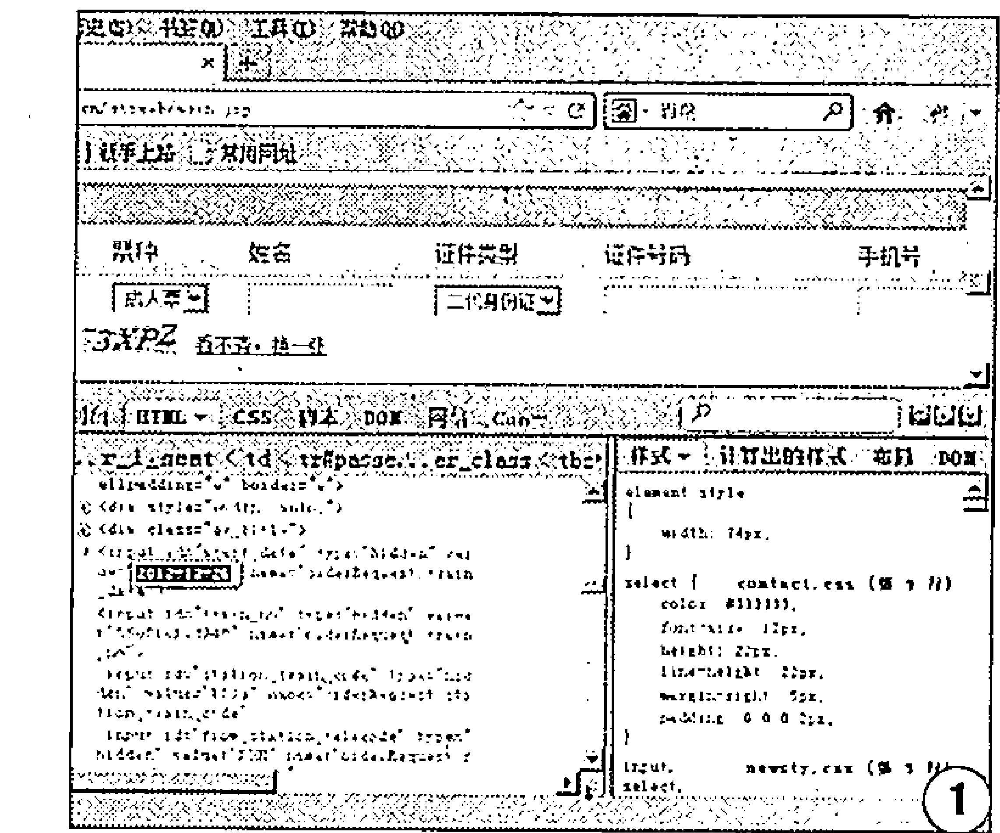

待离开售时间还有一分钟左右，在网页中单击“看不清，换一换”按钮刷出验证码并填好，然后在距离开始时间几秒钟时，单击“提交订单”按钮。

这种方法的好处是在别人还没有登录12306的时候，就完成了资料填写，速度当然比其他人快很多。但要注意的是，使用该方法订票，建议关掉电脑中的无用软件保证网速，其次是确保迅速完成修改参数的步骤，第三是提前在IE浏览器上登录系统，以确保Firefox订到票后及时用IE浏览器完成支付。

## 选择合适的浏览器很重要

目前支持刷票的浏览器有很多，除了Chrome浏览器和火狐浏览器外，剩下的都是针对国内上网环境设计的双核浏览器，分别是搜狗浏览器、傲游浏览器、360极速双核浏览器和猎豹浏览器。360极速浏览器有一款火车票刷票机，先安装浏览器，再安装火车票刷票机扩展即可。此外，猎豹浏览器还有抢票专版，安装12306.cn订票助手更方便。使用12306登录助手这个小插件后，登录网站点点鼠标就轻松完成了。

事实上，网上流传的购票攻略大多数都是教你选择合适的浏览器，这些浏览器通过一些登录、刷票的小插件，让原本只需“拼人品”的买票历程变得充满技术含量。如果你使用IE浏览器一次次尝试登录12306官网都被无情地拒之门外，不妨在更换浏览器后，再安装火车票刷票机插件应用，刷票应用能帮旅客自动重复登录网站，直到登上为止。在成功登录后，这些买票小插件还能帮你刷票，用弹窗的方式提示你把握住每一张退票、订票失败等回流的车票。

## 无网银也能购火车票

对许多尝试通过铁道部官方订票网站www.12306.cn买票的购票者而言，“网银”绝对是一个让人头大的问题。其实，中国银联早就在2012年1月11日发布提示，提醒广大网民使用“银联在线支付”在12306网站网购火车票无需网银。在购票进入支付程序后，点击“中国银联”的标识，即可跳转至中国银联在线支付页面。银联在线支付提供多种支付方式，并且无指定银行的限制。

此外，在“银联在线支付”网站（online.unionpay.com）单击首页左侧的“购买火车票”按钮，再单击“立即购买”按钮，便直接进入了铁路客户服务中心官网www.12306.cn。按正常步骤查询车票，进行预订即可。在支付环节，不用再多跳转网银页面，而是直接进入“银联在线支付”进行支付（图2）。

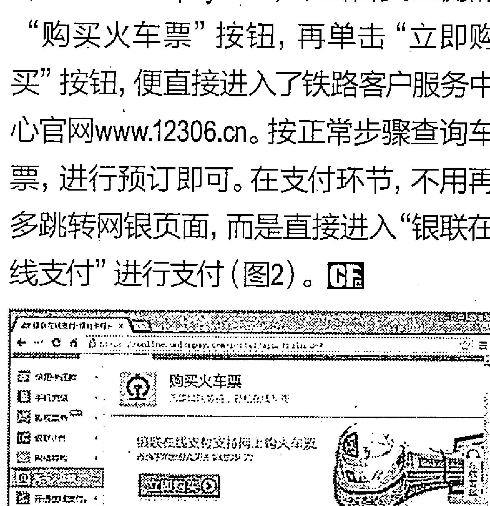

# 赶超皇冠 一个淘宝新手的逆袭

都说在淘宝上从新手做起不容易，不过，有一颗皇冠的心，比什么都重要。

文 | 似雪无痕

从在淘宝正式开始营业算起，到今天正好是一年，一年来小松实实在在体验到了小卖家的艰辛与成长。一年来经历过买家恶意的中差评，一年来“开车”烧过钱，一年来积累了一批买家和人气，一年来看到了N多店铺的兴起与衰败，一年——时间很短，但是小松的梦想很长。

趁着晚上十一点多顾客渐少的时段和小松聊了起来，在交谈中小松那种要赶超皇冠卖家的梦想一次次地从他口中流露了出来。用他的话说，他现在要做的就是逆袭，要从新手来一次华丽的转身。

## 小松的生意经

“如果说淘宝开店是一种艺术，那么新手卖家如何在竞争激烈的淘宝环境下脱颖而出更是一种美妙的艺术。”小松说如果这句话以前从他口中说出来，估计连他自己都不相信，但经过一年的磨练，他已经有了自己的生意经。

“很多新卖家就算降价出售乃至亏本，一样卖不出去，这是什么原因呢？我认为我们最重要的是心态没有摆正，一直都进入到一个误区，单纯地想着如何去卖而没想过如何去买。说到这有的朋友会问了，经营淘宝不是为了销售自己的商品么，怎么又提到买东西上去了？不知道朋友们有没有想过，我们买就是卖，卖就是买，买卖是可以相互转换的。”

“一般进入淘宝以后买家会搜索自己要买的商品，那我们何不试试在搜索中能否找到自家的商品？如果你的宝贝排名很靠后，或者找不到你的宝贝，那就需要想办法让你的宝贝在搜索中出现。”

“那你是如何让自己的宝贝排名尽量靠前的呢？”听完了小松滔滔不绝的道理之后，我终于有空能插一句问话。

“按照淘宝的人气排序规则，最重要的一条就是，要看你是否加入消保，加的总是在不加的前面。然后按宝贝售出量排序从高到低排列，假如售出量相同，那么则是按宝贝收藏人数和点击人数降序排列。为了提高收藏人气，我经常要去帮派看看，很多帮派每天或者隔天都有收藏活动，你只要准时报 名然后收藏别人的宝贝就OK，这样每天基本能使自己的宝贝和店铺的收藏人气增加100。”


“排名靠前了，那人气你是如何聚集起来的呢？” “因为我抓到了其他皇冠店铺的弱穴呗。”说这句话时，小松显得很自信。我知道，即使我不问，小松接下来也会“炫耀”他的发现。

## 小松的皇冠梦

“关于这一点，我想多说一些，因为我的感触是很深的，我以前生意不好的时候，几乎是天天在研究同行的店铺，任何细节我都不会放过，生怕错过很多重点。经过我一段时间的观察，还真的发现很多皇冠店铺的短板。皇冠店铺因为生意很好，客服都很忙，以一敌百说得可能有些夸张，但是一个客服和一个顾客这样1对1的服务几乎是

不可能的。在这些地方，我们新店就有明显的优势了。顾客的提问，我可以在10s之内给予最迅速直接专业的回答，而不是隔个2分钟再慢慢悠悠地答一句，所以，顾客会很容易地就来我店铺买东西。在热情这一点上，我们新店是完胜皇冠。”

“人气和销量都有了，那你怎样才能牢牢抓住这些客户源，你就不怕被别人抢去？”

“这个是有秘诀的，你得有意外惊喜！其实这也是我跟别人学的。”

“何为意外惊喜呢？举个例子，几个月之前，我在淘宝网给家人买了几件衣服，衣服拿到手的时候，感觉一般般，不是特别满意，当时我就想给个中评。在我收拾衣服时突然发现某一个袋子中放了一盒饼干，当时感觉很意外，和掌柜联系了一下，他说是送给我吃的。当时还蛮开心的，一盒饼干就把先前的不愉快完全抵消了。所以受到启发，我也开始这样模仿。以前卖东西时喜欢给顾客很多承诺，一般会答应送一些赠品，后来有时因为库存的关系，赠品会漏发，所以顾客在收到东西的时候，因为我的承诺没有兑现，很多人心里会有些不爽，严重地影响了顾客的2次光顾。那我现在会怎么做呢？在和顾客谈的时候，我对赠品的事只字不提，但是发货的时候，我总会多发一些东西给顾客，顾客收到东西之后，突然发现竟然多发了一些东西，他们就会特别惊喜。”

听完这些我已经感觉到，没有什么能阻止他向着皇冠梦想前进了，而他的最后一句话更是坚定了我的想法。“我觉得现在说的皇冠，更多的是指店铺内核部分，有了一颗皇冠的心，其实比什么都重要。”小松坚定地说到。 CF

# 《电脑爱好者》·合订本 {网 络 生 活}

## 巧妙手工解放客服妹子

春节要放假，谁来看网店？平时网店业务量大，有什么快捷方法增加效率？本文的方法可让你解放客服妹子，假日还能帮你值班。

文/平子

开网店的朋友都知道，我们每天需要在电脑面前回复大量客户的咨询，这其中很多是重复的信息。比如你那里支持哪些快递，我们的发货时间是XXX等。每天都要机械回复这些信息是不是觉得很累？何不利用一些专业软件来减轻客服妹子的工作量？

## 客服快手 信息回复更高效

客服快手（下载地址：http://kk.znb.cc/）是专门针对网店店主、客服、网络技术支持等需要与客户即时聊天的行业，将常见问题与回答事先录入，在客户询问时快速找到答案并回复。它可以自动跟随QQ、旺旺等聊天窗口，快速选择回复内容。

- 第1步：以管理员身份启动客服快手后按提示注册并登录快手。成功登录后点击“+”，按提示添加常用问题的解答，单击“新增”即可（图1）。此外还可以在网址、图片下添加对应的项目，这样需要回复商品图片、商品链接时就可以非常快速地选择。

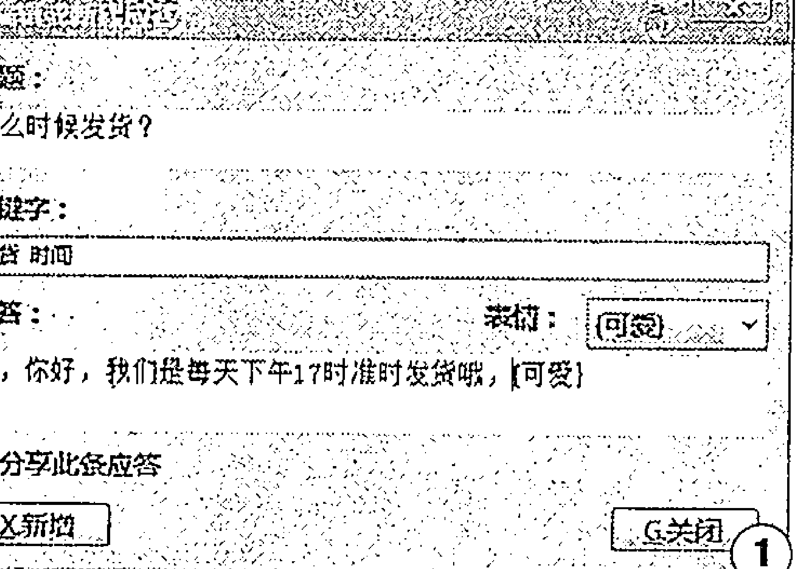

- 第2步：现在如果要快速回复客户的信息，比如拍拍卖家，打开QQ聊天窗口，客户咨询的信息如果在信息列表里，我们只要点击粘贴按钮，信息即可自动粘贴在对话窗口，点击“发送”即可完成信息的回复了（图2）。

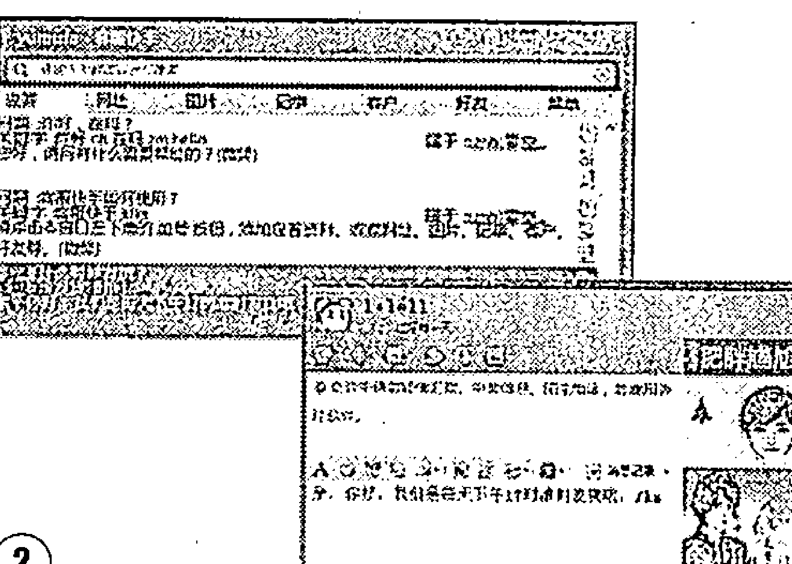

## 请个机器人假日值班

谁都不知道客户什么时候会上门，因此如果客服临时有事要离开，我们可以请个聊天机器人帮助我们看店。假日期间，同样能让它帮你值班。

- 第1步：到http://www.shareplan.net/wwrobot3.0.rar下载“依Q屋旺旺机器人”。运行软件后单击“系统设置”，然后输入旺旺账号和密码，在下方的客服旺旺账号下输入旺旺账号，单击“保存”。返回程序主界面，在运行模式下单选“自动发送”和“自动学习”，这样机器人就开始值班了。

- 第2步：现在我们只要开启旺旺登录，依Q屋旺旺机器人会自动帮助我们和来访的顾客交流，程序已经内置很多智能语句。如果有顾客在我们的店面单击“和我联系”，开启旺旺聊天窗口后，只要输入常见的语句如“什么时候发货？”机器人会自动回复预设的语句如“当天下午5点前的单当天发货，5点后下单统一到第二天发货”（可以根据自己的情况修改）。最妙的是，它还会自动学习，越用越顺手（图3）。

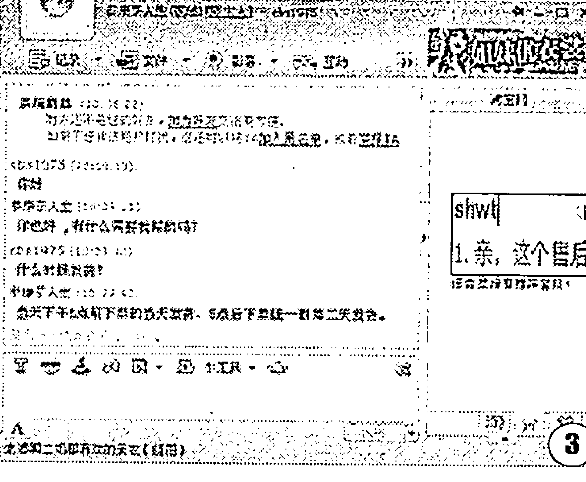

## 自定义短语快速回复

上述方法可以帮助客服快速回复信息，不过客户的询问千奇百怪，对于一些其他问题，我们还可以借助搜狗输入法的自定义短语来实现快捷回复。

- 第1步：进入搜狗输入法设置界面，切换到“高级→高级设置→自定义短语设置”，接着在弹出的窗口点击“添加新定义”，然后在打开的窗口输入缩写的英文字符，比如售后问题可以输入shwt，再在下方的文本框输入快捷回复内容如“亲，这个售后问题，我们已经收到反馈，最快会在24小时答复你。”最后点击“确认并添加下一个”（图4）。

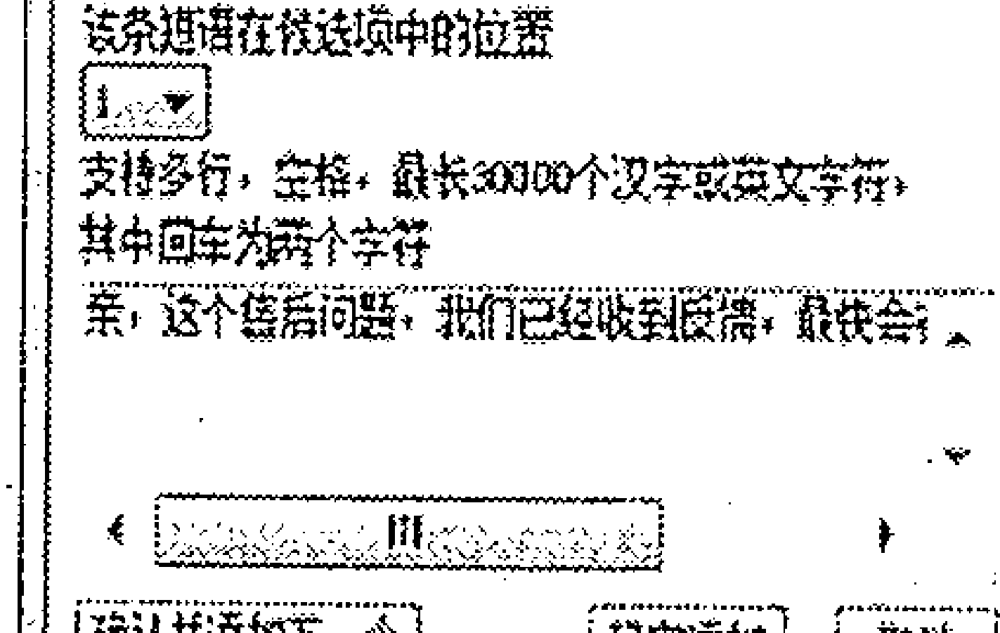

- 第2步：这样如果以后收到客户的售后咨询，我们只需调出搜狗输入法，按下shwt这四个字符并空格确认，立刻就可以快速输入上述设置的短语进行回复了（图5）。

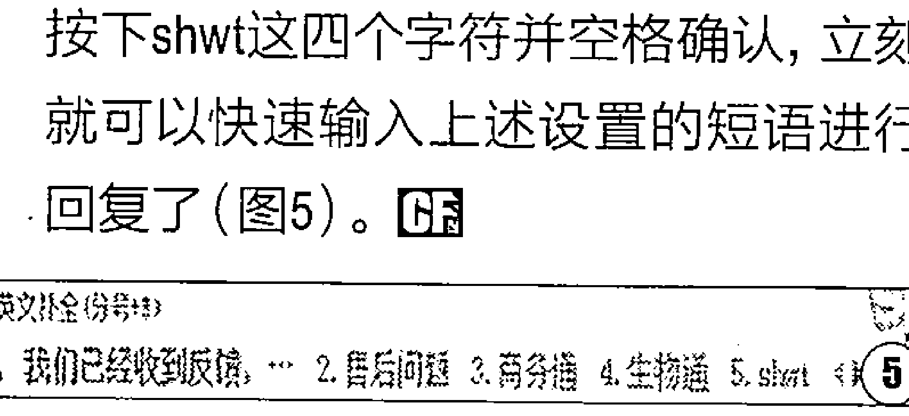

小提示
客服快手可以将我们的数据库保存在本机和网站服务器，因此不管在哪部电脑登录，都可以随时同步这些问答信息数据库。如果输入的信息数据较多，可以根据关键字进行检索。

小提示
如果觉得一句句输入麻烦，还可以直接点击“直接编辑配置文件”，按照输入法提供的格式，在配置文件中手动输入自定义短语。

## 百度文库资源这样搞定

百度文库资源非常丰富，可是需要下载一些资源时却因无足够的财富值无法下载，让人郁闷。那你就需要掌握一些方法了。

文|王彦博

不论是公司职员、教师还是学生，经常需要从百度文库下载适合自己使用的资源。如果能掌握下面几种获取百度文库资源的方法，就可解燃眉之急了。

## 巧用百度快照获取纯文字

领导让写一份工作计划，半天没写出几个字来，只好到百度上搜索相关文章参考，很快在百度文库里面找到适合的，使用百度账号登录后，发现该文档需要较多财富值才能下载，可财富值不够，没关系，使用下面的方法可快速获得文字内容。

切换到百度文库需要的文档资料页面，复制文章的题目，然后在百度搜索引擎页面搜索框输入：site:wenku.baidu.com+文章题目（site命令是指在规定的网站里搜索，这儿指定的是百度文库，另外加号两边要留空格，也可以用空格代替加号），然后点击“百度一下”进行搜索，在搜索页面中列出所有相关搜索结果。

百度搜索引擎都有网页快照，点击相关搜索结果后面的“百度快照”链接，打开百度快照页面后，看到以网页形式显示的百度文库正文内容，这里的内容和百度文库里的一模一样，不过只显示文字内容，不显示图片等其他内容，这些文字可随意复制，将需要的文字内容复制下来，粘贴到Word等文本编辑器中即可使用（图1）。

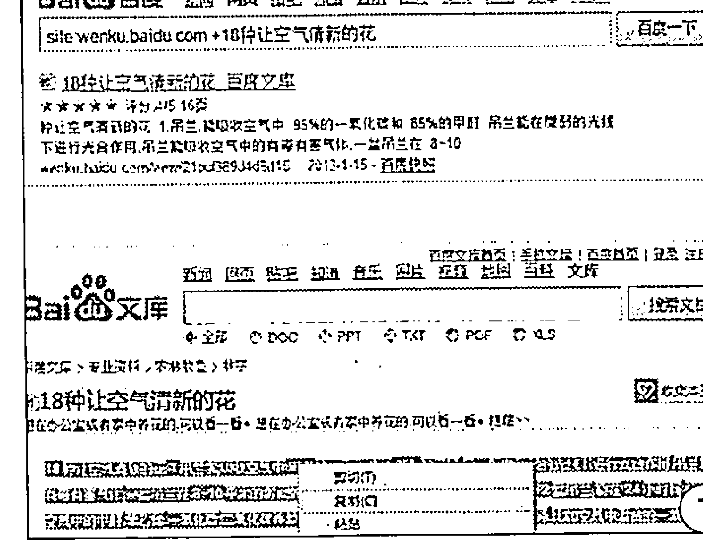

提示：虽然百度文库现在提供文字复制功能，但需登录，复制操作时选择文字不是很方便。而该方法简单又实用，不需要注册登录和安装第三方软件，更不需要财富值，只需记一个site命令就能搞定。但这种方法只能获得百度文库中资源的文字内容，其它形式的内容就无能为力了，同时也不能保持原文档版式。

## 利用冰点下载高清PDF

有的时候在百度文库中，找到内容适合自己的文档资源后，只是想将其下载回来，无需编辑，直接参考或打印出来。

这个要求使用“文库下载器”(http://www.onlinedown.net/soft/118797.htm)，无需财富值就能快速实现，并且会将下载的文档生成高清晰度的PDF格式文档，非常适合阅读和打印。

下载该软件解压后运行，将需要的百度文库资源页面相应的网址复制下来，粘贴到“冰点文库下载器绿色版”上方地址栏，点击“下载”按钮，软件开始分析并下载资源，不论百度文库资源的源文档是DOC、PPT还是XLS格式，下载后全都会转换成高清PDF格式，该PDF的版式与源文档一模一样，同时还会下载得到一个TXT文本文档，其中保存着该文档中的所有文字内容。

提示：这种方法在下载时，会将所有格式的文档全转换成PDF文档，不能二次编辑使用。虽然还能得到一个TXT文本文档，其中只有文字内容，虽然可编辑，但需要重新排版。

## 借力剑儿随意下载

多数情况下，在百度文库上找到文档资源后，我们都需要下载回来进行二次编辑使用。最好能下载到所需要的文档在百度文库上的源格式文件，如DOC、PPT或XLS等可编辑格式文件。

这时可借助“剑儿百度文库下载器”(http://www.jz5u.com/Soft/network/down/34572.html)这款工具来实现。下载该软件解压运行，在左侧勾选下载PDF、保留JPG、下载文本、下载源文档等项，将需要的百度文库文档页面地址复制粘贴到上方的文本框中，点击“开始下载”按钮，这时软件会自动下载该资源文档的相应格式文件，很快就可完成下载任务（图2）。

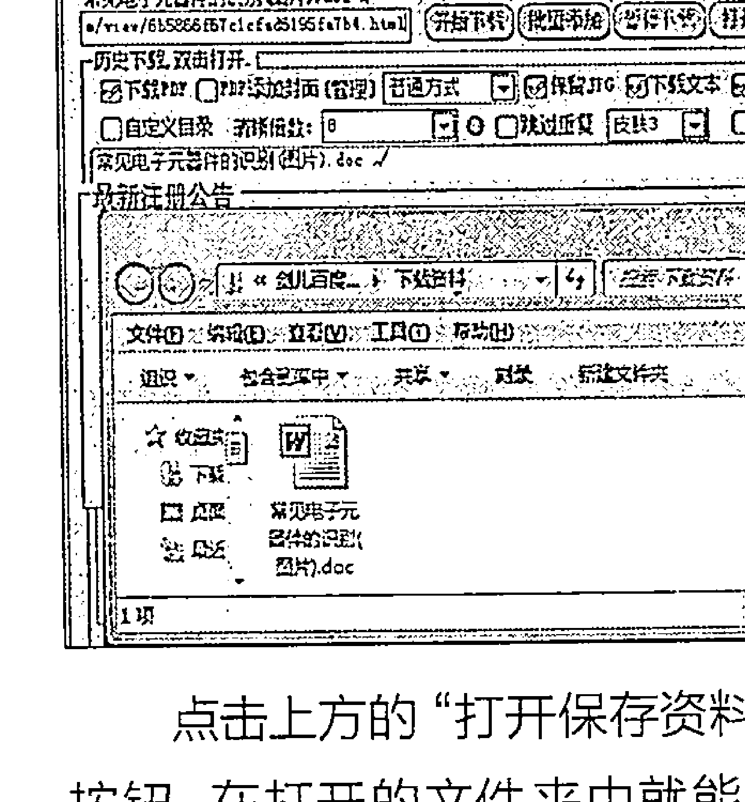

点击上方的“打开保存资料目录”按钮，在打开的文件夹中就能找到需要文档，特别是该文档在百度文库上是什么格式，软件就会下载到相应格式的文件，相当于使用积分下载百度文库文档一样，十分实用。

提示：这款工具十分强大，非常适合没有财富值积分，却需要下载百度文库上资源的源格式文件时使用。但是它是一款共享软件，功能有所限制。

## 榜单有猫腻 刷榜疯狂时

2012年2月2日，当人们还沉浸在龙年春节的余味里时，360公司在苹果应用商店的产品被全部下架，一时间舆论哗然。从那时起，“刷榜”两字深深进入了人们的脑海里。

文 | 逆天

如今一年的时间已过，在这期间我们好像并没有听到更多关于“刷榜”的声音，是产业链断裂还是在地底下偷偷地发展壮大呢？

下载量和评论数增长得很慢，但随着时间的推移，单位时间内的下载和评论数增长得越来越快。15:30，坐在一旁拿着iPhone在APP Store里查看效果的王宇兴奋地对吴枫说：“我们进Top100了。”两个人一直盯着疯涨的下载数和评论数，他们那股兴奋劲儿只在看世界杯时才有。狂热持续了6个小时，窗外已是华灯初上，吴枫的APP所向披靡，成功挺进Top10，而桌上的汉堡包早已冷掉。

### 惊心动魄六小时

在北京中关村某小区150平方米的民用住宅里，靠窗的两台苹果电脑前，分别坐着某iOS平台APP开发团队的CEO吴枫和CTO王宇。刚刚接到的一个电话让二人顾不上手边热乎乎的汉堡和薯条，他们的眼睛紧紧地盯着电脑屏幕上的数字。

一场APP Store的地下刷榜行动即将开始。

此前，吴枫的APP日均下载量只有60次左右，上线10天，仅积累了不到1000次的下载量。替他刷榜的“APP推广”公司承诺，可在12个小时之内刷出6~8万个下载。刚刚的电话就是“APP推广”公司的客服打来的，他提醒吴枫，五分钟后刷榜行动开始。

吴枫看了一下时间，11:55。在他的苹果后台开发者账号的页面上，他和王宇看到下载数900个，评论16条。二人无话，只有室内十多台计算机的散热风扇在运转着，发出轰轰声。

12:00一过，吴枫和王宇开始紧张起来。12:02，第一个下载出现了。12:04，增加了15个下载。12:10，40个下载，1条评论。到13:00，增加了1350个下载，10条评论。二人发现，刷榜刚开始时，

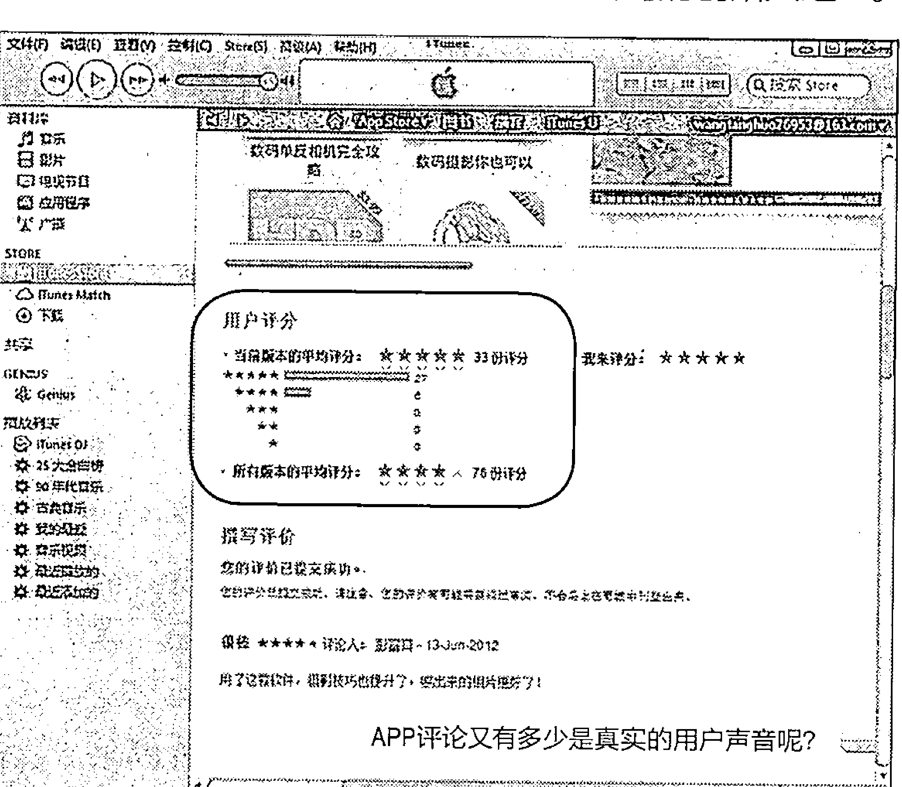

刷榜对于互联网那头的“APP推广”公司来说，只是一次日常工作。而完成这次刷榜任务的就是贺小松领导的一家公司。当我怀着好奇的心情见到贺小松和他的公司时，一切关于刷榜的疑惑犹如拨云见日一般彻底明朗了起来。

在北京中关村科技园区的一座办公楼里，我第一次见到了贺小松，很难想象装修如此豪华的办公场所能与见不得人的“刷榜”产业联系起来。而贺小松也毫不避讳地大谈特谈他们的“地下工作”，并强调他们是刷榜行业的领跑者和祖师爷。

贺小松是这家公司的创始人之一。


在2009年注册成立时公司只是一个五六个人的小作坊。做刷榜之前，一直在做网络营销，包括在论坛发帖灌水、写企业软文、在电商平台上刷好评等，也因此积累了众多客户资源。

“我们其实也有一些阳光的广告业务，但是当时PC端的正规广告代理，毛利不到20%。而做刷量业务的毛利可达40%~70%，所以这是我们最初主推的业务。”贺小松说，2010年之前，其PC端刷量的业务销售额一年达8000万元到1.2亿元。但是随着移动互联网的发展，PC端的销售额和利润都在下降，到2011年其业务下滑了40%。转型势在必行。

随着苹果2008年推出应用商店，贺小松和他的团队接触到越来越多的应用软件。他们发现这些APP在推广时各大榜单的排名起了关键作用，其中起决定作用的是下载量。

“2010年开始尝试APP刷榜业务。刚开始很多公司比较抵制。”贺小松说，“我们拿自己开发的应用软件的刷榜给他们看，看完后他们开始尝试小金额的操作，尝到甜头后开始签一些合作。当时的客户数虽然很少，但是毛利很高，能达到80%。我认为这个谈不上道德范畴，这就是一种商业操作。”

# 编外人员是主力

很快，贺小松发现“小作坊”式的操作无法持续，“我们没有名气，很难赢得客户的信任，结款上也出现很多赖账。”因此，2011年6月，贺小松的公司合并了另外两家在互联网上刷流量的工作室，开始公司化运作，“我们是可以开发票签协议的，正规向国家纳税。”

规模化之后的新公司以APP Store刷榜作为公司的主要业务，配备了6个核心技术成员，另外负责监控和调节系统的运营团队有6到7人，负责客户的销售团队有2到3人。目前，刷榜业务核心团队有20多人，在贺小松看来，刷榜是一种“劳动密集型”业务，其中人力成本占整个运营成本的30%~40%。

公司在核心团队之外建立了将近3万多人的编外团队。“我们的编外人员是全国残联的资源，从2009年开始就陆续在积累。他们刚开始接一些投票业务、网络水军和微博的业务，分布在全国各地。”对于这部分编外人员，贺小松称有专门的ERP系统进行管理。实际上，每个兼职人员按照每个月的业务量来算，平均收入仅为1000到3000元钱。

除去人力成本，还有50%~60%的账号和销售成本，以及10%~20%的坏账。硬件则被贺小松算在公司成本里，不计入具体项目，其实硬件基础都是从2009年开始做刷量时积累下来的。因此，做刷榜的实际成本并不高。“有人、电脑、服务器、VPN账号、IP和银行卡，刷榜就是流水化操作。”

在贺小松看来，规模化运作，更重要的是为了结款顺利，也让刷榜业务看起来“更可靠”。他还请了专门的律师事务所来做法律咨询，与客户签订保密协议，如果泄露了客户信息，公司需要赔偿10万元。“打死也不说”是刷榜行业固守的职业道德，刷榜公司都拒绝透露任何服务过的客户名字。

对于刷榜可能带来的下架风险，贺小松却有意轻描淡写。根据公司制定的刷榜合同，如果有应用因为刷榜业务而被下架，公司将赔偿100万元。“我们跟苹果有沟通，如果苹果下架我操作的产品，要对我进行赔偿，所以我们才敢肆无忌惮地这么操作。”

目前，公司的累积客户超过300个，月销售额达500万~600万元。由于竞争越来越激烈，现在刷榜业务的毛利开始降低。“最开始榜单前10名能卖到4万元以上，现在前10名能卖到2万元已经很不错了，但即便这样我们还是有利可图的。”贺小松说。

# 刷榜不是技术活

刷榜在技术上其实没有难度。登录一个苹果iTunes账号，在应用商店进行下载，然后更换计算机IP地址换一个账号再进行同样的操作。由于在美国区注册需要绑定信用卡，在中国区不用，因此中国区账号很容易泛滥。如果同一个IP地址下载过多的应用和做过多评价，苹果就会认为这个IP有作弊嫌疑。所以，刷榜的关键是拥有多个iTunes账号，刷榜时更换不同的IP，而采用VPN更换IP是个省时、省力的做法。

在贺小松的公司里，接到刷榜任务后，首先由ERP系统根据各地的兼职人员分配人力储备，同时在短时间内积累大量的有效账号。“我们了解服务器更新抓取有用数据的规律，会按照客户规定的时间，集中冲上去。”目前，影响iOS平台上榜单排名最核心的就是下载量数据。

如今，苹果更新了排名算法，刷排名已不如一年前那么迅速。目前APP Store榜单也存在众多变数，但贺小松仍充满信心：“需求量在那儿摆着，有排名的地方就有江湖。再说道高一尺，魔高一丈，苹果不管怎么变化，总有规则可循。2012年7月份的调整，我们在10天之内就攻克难关了，而且我们也大概了解苹果锁榜的时间，知道哪些时间段操作会更好、代价更小。”

# 有排名就有江湖

刷榜在iOS上疯狂生长的同时，Android Market和国内第三方应用市场也被刷榜产业缠身。但由于国内第三方Android应用市场达几十家，单刷一家对整体下载量影响不大，而且各家的排名算法也不一样，难度更大。同时，一些应用市场排行榜类似广告，是直接出售的。所以刷榜在iOS上更密集。

然而，贺小松却坚持，刷榜是一门正常生意。他计划未来把公司的刷榜业务量做大，设计新的商业模式，采取竞价排名的方式做刷榜，谁出的价格高位置会高一些。同时也要走向国际，开拓日本榜单、欧美榜单。他透露，公司开始接触国内一些VC，“单纯以刷榜这个业务去融资不是特别靠谱，需要包装，具体如何包装暂时不方便透露。但风投对我们的刷榜业务不提倡，也不反对。他们看重的是刷榜为我们带来的比较稳定的现金流。”

刷榜也有价目表

# 淘宝购物 返利不打折

现在很多人在淘宝购物都习惯通过返利网站来获取返利，可是你知道吗？你获取的返利已经被返利网站打了折扣。如何能绕过返利网站，让自己的返利不打折呢？

文|寻梦

70%的天猫店铺和淘宝卖家都设置有隐藏折扣，如果你不了解其中的窍门，购物时就会损失这部分折扣。目前已有一半以上的消费者开始利用淘宝返现省钱，精明的你怎能Out。

## 返利的由来

淘宝网商家为了加大商品的销售渠道，建立了一种付费推广机制，在收入中专门预留了一部分给推广者。每个人都可以成为推广者，只要通过淘宝联盟获取淘宝商品的推广链接（或者叫折扣链接），让买家通过你的推广链接进入淘宝店铺购买商品并确认付款，就能赚取由卖家支付的佣金，最高佣金达商品成交额的50%。

如果我们要购买的商品正好有卖家在推广，何不自己制作推广链接，自己购买呢？那样卖家也一样会支付佣金，获得高额的返利佣金，不就是省钱吗？

## 佣金如何获得

Step1: 进入淘宝联盟首页（http://www.alimama.com/），在右上角选择使用“淘宝会员”账户登录。

Step2: 登录后，右上角会显示你的用户名，点击“进入我的联盟”按钮（图1）。

Step3: 点击导航栏中“联盟产品”，选择进入“自助推广”栏目下的“立即推广”（图2）。

Step4: 进入“单品/店铺推广”页面，将你要购买的商品名全称复制粘贴到搜索框中进行搜索。并非所有商品都有推广佣金，所以可能会搜索无结果。如果有结果则会显示该商品的“佣金比例”、“佣金金额”。你也可以使用关键词搜索，比如搜“iPhone 5”，所有有佣金的商家结果都会展示出来（图3）。

Step5: 选择你中意的商品链接，点击搜索结果右侧的“立即推广”按钮。

Step6: 出现弹窗，点击“推广代码”，代码自动复制成功。开个新窗口或选项卡，将代码粘贴到地址栏里回车，打开商品页面，这时按照正常步骤购买即可（图4）。

## 查看订单是否跟踪到

下单完成后，点击“效果报表”按钮，再点击左侧的“淘宝客推广明细”选项，就可以看到刚刚跟踪到的订单，但此时订单为“新创建”的状态，显示佣金为0元（图5）。

## 确认收货查看返现收入

确认收货后次日，进入“淘宝联盟”后可以直接看到昨日、本月和上月的收入情况，也就是你获得的返现金。如果你的账户中有可用余额，点击“提现”按钮，即可把返现金提至支付宝账户（图6）。

### 小提示

自制淘宝返现链接和传统返利网的区别

自制淘宝返现链接和传统返利网返钱的原理是一样的，都是利用淘宝客来返利给大家。唯一不同的是传统的返利网站会从返利中扣下50%左右留给自己，剩下的50%才返还给消费者。所以说看起来是传统返利网站在给用户发钱，而实际上是从用户身上赚钱。了解了其中的奥秘，相信你下次在淘宝购物时一定会自己动手，制作返现链接，让自己的网购尽享折上折优惠吧！

# 玩转DNS 上网提速更方便

QQ能上网网页却打不开，下载巨慢，浏览网页如同蜗牛爬……这一系列的问题，有很多是DNS造成的。本文教大家玩转DNS，上网更快更方便。

文|沈澄

DNS是域名系统（Domain Name System）的缩写，由解析服务器和IP服务器组成。简单点说，DNS就是一台（或多台）在网络上的服务器，专门为大家上网时解析网址的IP地址。比如CFan官网地址www.cfan.com.cn，对应的IP地址是219.234.93.150，将网址转换成真正的IP地址，中间担当“翻译”的就是DNS，因此在某种程度上DNS服务器直接决定着网页浏览速度。

## 如何启用新的DNS

网络上有不少免费的DNS供我们使用，通常搜索获得后可直接在本机上进行设置，再通过清除本机DNS缓存，使新的DNS快速生效。打开“网络和共享中心”，单击“本地连接”弹出窗口（图1），单击“属性”按钮后双击“Internet协议版本4”弹出对话框，在“使用下面的DNS服务器地址”中输入取得的DNS地址，最后单击“确定”按钮完成设置。修改DNS后，打开命令行提示符，输入：

## 自动寻用最快的免费DNS

默认情况下DNS都是由网络运营商提供，比如使用中国电信的宽带，当拨号上网之后，它会自动分配一组由电信自己建立的DNS地址，所以无需手动设置DNS也可以正常上网。但如果这个DNS服务器本身出现故障或者繁忙的话，访问任何网址都会失败或者变慢。网络上有很多免费的DNS供我们使用，而使用DNS Jumper，则可以自动寻找免费快速的DNS服务器。打开DNS Jumper（http://url.cn/CeqX8W），在下方选择Chinese切换到中文界面（图2），在“选择网卡”列表中选择系统当前使用的网卡，然后从“选择一个免费的DNS服务”列表中选择所提供的DNS，其中包含常用的Google DNS和Free DNS等。单击“最快DNS”按钮会对提供的DNS服务进行测速，检测完毕显示最快的DNS服务，此时点击“应用DNS”按钮即可应用。如果需要在不同的网络环境下使用不同的DNS地址，可单击列表旁的+号按钮，分别设置DNS服务的名称和IP地址信息。以后当我们需要进行切换时，只需在DNS服务列表中选择它，再点击“应用DNS”按钮即可一键切换了。

## 修复DNS故障

有时，IE浏览器不能正常显示某个网站的页面内容，而系统中的QQ、MSN等聊天工具却能正常使用，这种问题多半是由于DNS解析不正确造成的。如果在尝试更换新的DNS服务器地址后，上述故障现象仍然存在的话，则有可能是DNS缓存导致新DNS未能起作用。这种情况，除了前面介绍的直接命令法外，还可以采用修复连接法。关闭已经打开的浏览器，打开“网络和共享中心”，单击“更改适配器设置”切换到网络连接界面（图3），右击“本地连接”，选择“诊断”命令，这样Windows 7系统就能自动刷新本地DNS缓存内容。（作者单位：江苏省如东县马塘小学）

# 两种另类需求的资料下载法

文/王俊文

除了大家经常使用的从网页上直接下载或通过聊天工具互传的方法下载资料之外，还有一些下载方法也会在某些场合用到。本文讲述另外两种需求的下载方法。

## 异地共享朋友硬盘中的文件

我想把自己电脑中的某些文件夹下的文件共享给远方的朋友，让他自己挑选着下载其需要的内容，我不想用上传的办法给他这些资料，那样太麻烦。而我们又处在不同的局域网中，用什么方法可以实现呢？

首先，双方电脑都安装RealLink软件，将对方加为好友。

在共享资料一方，进入“共享管理”窗口，从上方的“我的电脑”窗格中将需要共享的文件夹拖动加入到下端的“共享目录”中。选中共享资料，点击锁头按钮设定“限定共享”权限为“限定共享→限定用户”，将好友的RL号列为限定共享列表。

下载资料的一方，点击共享资料好友的头像，用右键菜单命令搜索好友的共享文件夹。从快捷菜单中选择“加入下载”，把对方的共享文件夹加入自己的下载列表。定位要下载的文件，单击鼠标右键并选择“开始下载”进行文件下载。如果你觉得速度不够快，可以点击该窗口工具栏上的“加速”按钮，增加线程数进行加速下载。

小提示：我们采用了这款软件交易平台工具来作为私人共享文件之用。虽然RealLink采用虚拟货币的下载机制，加入共享的资源都自动标了价格，没有“金元”的人无法下载，但是，只要你将价格标示为0，或者将好友加入到免费好友列表中，对方就可以不花钱而下载你共享的文件了。如果资料只是私人传送，不易公开，则可采用上述设置权限的方法。

## 网盘中转快速搜集网络资料

在新浪爱问社区，有许多自己喜欢的电子资料，有的需要积分，有的不需要，如何才能将自己需要的资料以最快速度下载到自己的电脑中，建立一个个人书库呢？

通过新浪微盘的本地同步工具，灵活配合微盘PC客户端的普通版和轻版两种版本，可以轻松实现个人免费书库的建设。

首先注册新浪通行账户，开通并获得新浪微盘空间。下载并安装新浪微盘PC客户端普通版和轻版两种版本。

用你注册的新浪通行证账户，登录新浪爱问共享资料社区（http://ishare.iask.sina.com.cn）。当搜索到自己想要的图书后，只需点击书名旁边红色的“保存到微盘”按钮，即可将该书保存在你的微盘网络空间中。下载不会扣除你的积分，是完全免费的。远程下载到微盘所需的时间几乎可以忽略不计，不管资料有多大，非常快速。

开启新浪微盘PC客户端之后，在你挑选下载到微盘的过程中，PC客户端会自动在后台将你下载到网络空间中的图书如数在后台默默地下载到本地的同步文件夹中。

需要注意的是，网上挑书和下载图书的机器可以分为两台不同的机器。如果是在办公室环境下利用闲暇时间下载，但又不能占用办公带宽，那么让你家中的私人PC处于开启状态和同步状态，而办公室的微盘PC普通版客户端处于关闭或暂停同步状态，这样下载的图书就会自动跑到你家中PC的同步文件夹中，不用等回家后再开启电脑而等待下载了。

如果是在网吧或办公室公用电脑环境下，带宽不允许或不方便下载，但你又有闲暇上网找书和为书籍分类，与此同时，你又不想开启家中的电脑费电。这时，可借助新浪微盘的网络版或PC轻版来帮忙（推荐用轻版）。新浪微盘PC轻版不具备与本地文件夹同步的功能，这恰恰可以为清净下载、免去带宽占用而创造有利条件。而且它在管理远程文件方面效率很高，我们可以利用它的这个优势来管理远程图书文件。

先关闭新浪微盘PC客户端普通版（或停止本地自动同步功能），然后再启动微盘轻版客户端工作。新浪微盘普通版不具有手动下载功能，可用网络版或轻版进行下载（建议用PC轻版）。在藏书目标电脑上启动微盘PC轻版，选择网盘上的分类图书目录或图书（可以成批选择），然后用右键命令将图书下载到本地硬盘。由于微盘轻版下载过程是多线程的，可以保证用最快、最稳定的速度将远程个性化书库尽快下载到本地收藏。

# 网购无忧 安全损失有人赔

网购因为安全问题而遭受损失，电脑里安装的免费安全软件埋单。有这种美事？是不是商家在忽悠人，可操作性强吗？就让我们走进“网购先赔”吧！

文|张思雨

## 请来保镖护安全

首先，你需要安装360保镖。如果电脑中有360安全卫士，可在其中选择安装加载此模块。如果不是360用户，可以先安装360安全卫士工具再进一步安装360保镖工具。打开360安全卫士的网购保镖界面，开启360网购先赔服务功能。成功开启之后，使用360安全浏览器或者IE浏览器购物即可享受360网购先赔服务。

## 给保镖分配任务

设置网购保镖功能，保证有效功能开启，方能实现安全保护。

在网购保镖页面右下角点击“设置网购保镖”，进入对网购保镖的功能设置。开启网银交易环境扫描提示，这样在访问网银时，系统会安全检测当前网银运行环境。开启购物网站官网鉴别提醒，这样在访问购物网站时，在浏览器地址栏显示官方网站标志。

选择网购保镖退出提醒，在退出网银或购物时，系统会提醒用户网购保镖退出，这样你就可以确认刚才的交易是在网购保镖的全程监护下完成的，让自己放心踏实。

## 开启网购先赔

开启网购先行赔付服务的步骤是：依次点击选择“360保镖→网购保镖→网购先行赔付”。

## 进入安全网购

通过“360保镖→网购保镖”进入支付入口页面，选择“安全支付”“安全网购”和“安全网银”三大片区中自己要进行交易的入口。如果没有自己要的项目，可通过“更多支付”“更多网购”“更多网银”按钮添加你自己需要的项目。

## 损失先赔证据保全

为了保护自己的权益和在发生问题时应对万一，首先需要用户保全一些证据，这些记录请务必保留。

当网购中招被骗，在你与360安全中心联系前，请保护好电脑现场，不要做清理垃圾、重装系统等操作。否则由于证据被破坏，取证不足可能会影响给你的赔付。当申请赔付后，360安全中心工作人员会通过电话或QQ联系你，获取相关信息，包括：

1.  你与骗子的聊天记录；
2.  网银支付页面截图；
3.  浏览器的浏览日志；
4.  360安全卫士日志、网购保镖网购先赔日志；
5.  系统状况及软件安装情况等。

## 网购先赔限制与注意

### 网购先赔记录哪些隐私？

在开启360网购保镖及网购先赔模式下，360安全中心将会记录下列信息作为产品日志：360网购保镖的开启时间和退出时间；用户在网络购物期间访问的网址以及在此期间所下载的所有文件；用户进入网络购物网站后文件的运行情况；360安全卫士软件在用户进行网络购物过程中的提示信息以及用户相应的处理方法。这些日志储存在用户的电脑中，当发现被骗的时候，需要提交这些作为理赔证据。

### 网购先赔推脱哪些责任？

你必须明白，不符合条件的案件，360是不会轻易赔付的。不予赔付情形详见《360网购保镖网购先赔服务用户服务协议》（http://xianpei.360.cn/agreement.html）。

### 注意网购先赔的时效性

网购遇到损失之后30天内申请赔付有效。在提出申请后的72小时内会有360工作人员与用户联系。

### 小提示

网购时必须开启网购模式，才能使用网购先行赔付服务。赔付的依据是用户填写的个人信息和用户进行交易的网购地址等信息，这些360都会有记录。因此，用户必须在软件中提前设置提交个人信息作为赔付依据，360有明文承诺不会泄露这些用户个人信息。用户在提交这些信息时要注意真实有效，这样可在必要时报警，作为提交给警方作为报案材料的依据。

# 创意赚千万 快递单上“会刊”

发传单是很多大学生都做过的兼职，然而一位聪明的90后美女却由此突发奇想——在快递单上投放广告。从去年6月创业至今，她已与十几家快递公司和数百家企业签约，成为合作伙伴。

文 | 李蕊娟

从创业至今，她已与十几家快递公司和数百家企业签约，成为合作伙伴。短短9个月就淘到了人生的第一桶金，而且吸引到一笔1000万元的风投。她是如何用智慧创造财富奇迹的？

## 闯荡成都 垃圾桶边发现商机

今年23岁的郭星，是个性格活泼开朗的川妹子。也许是小时候警匪片看多了，她做梦都想当一名威风凛凛的女警察，练擒拿格斗和射击，开着警车抓坏人，多带劲啊！所以长大后她就报考了四川德阳市的一所警官学校。尽管平时的成绩很不错，但大学毕业后因种种原因，女孩未能如愿成为警察。2012年夏天，她便来到成都，想在这个大都市里干一番事业。

在大学里，郭星曾在业余时间帮同学经营过淘宝店铺，这是件既困难又容易的事情。她们为卖货，简直到了“走火入魔”的程度，夜里常常忙到很晚才睡觉，就连上街办事的时候，也是在用手机挂旺旺。其间虽然也赚了点钱，但这时候女孩开始冷静思考，发现单一经营淘宝网店，并不是长久之策。

因为网上商场林立，传统商品买卖市场已经趋向饱和，她们即使拼命做，也只能赚些买衣服和化妆品之类的零用钱，绝对不可能做到顶尖。于是，郭星开始留意尚未开发的市场商机。

2012年6月的一天，她找到第一份工作，为一家公司散发广告宣传单。每天站在街边向路人发传单时，负责而又单纯的她却发现一个奇怪的现象，别人为了尽快完成任务，竟把多张广告单派发给同一个路人，而且将没有发出的传单随手丢进了垃圾桶，这样一来，公司广告单的有效受众数量就少了不少。

在之后的一连几天，郭星的脑海里一直在思考同样的问题，如何才能增加广告单的阅读量和最终实现宣传效果最大化。正当女孩苦思冥想却找不到出路时，也许之前经营过网店的缘故，她忽然灵光一现，就想到了当下最流行的网上购物。因为小郭每天都能看到快递公司的工作人员带着大量货物，穿梭在大街小巷和居民区，她想，如今喜欢网络购物的人有好几亿，仅年轻人每年花在这上面的钱就有上万亿。如果把广告印刷在快递公司的快递或送货单上，那么至少可以保证有两个人能看到或阅读广告，一个是送货或送件人员，另一个则是收货人或收件人。想想这个群体该有多大啊！而且，每份快递单都有一个独立的订单号，商家可凭订单号查询到投放广告单的有效数量，让其有保证感、信任感。

当天晚上，郭星找到同在成都的中学同学胡雪梅：“反正现在的好工作都比较难找，不如以此想法作为创业点子，再召集几个女同学，大家一起尝试创业，怎么样？”刚刚毕业于四川大学计算机系的胡雪梅，听她这么一说，觉得这个创意很不错。第二天，她们又各自找来了一名女同学，四个大学生姐妹心情高涨，一拍即合。

不几天，郭星在成都市成华区租了一套民房。在没有任何资金的条件下，一支由10多人组成的“快递单广告”创业团队组建起来了，并以郭星、胡雪梅为联合创始人和领头人。美女们很快被分成两个小组。一组的分工是，联系物流和快递公司，如果能在该公司的快递单上争取到广告位，印刷上一些广告，那么，她们将承担并免费提供物流送货和快递收件等各类单据；而另一组人员，去寻找愿意在快递单上做广告的客户，从而形成一条新的广告产业链和广告营销模式。

## 新鲜出击 2个月进账180万元

到了2012年6月底，虽然已有几家快递公司声称愿意合作，但却没有找到一个商家愿意在快递单子上投放广告。而且，所有快递公司也是本着节约成本而来，才愿意加盟。一个看似非常新颖、有潜力的创业计划，眼看就要中途夭折！

独特的创业模式被媒体报道后，不少大学生纷纷前来取经。她说创业能否成功，其实“创意”很重要。

那些日子，郭星坐在电脑前非常着急。一天，她忽然发现一家在网上售卖休闲零食的企业，觉得他们的产品和自己的广告非常“对路”，于是，女孩每天打电话给这家公司商谈投放广告的事，但都被对方以“领导不在我做不了主”等各种理由拒绝。怎样攻克眼前这个“坚固堡垒”呢？后来郭星急中生智，干脆把“快递单广告”的宣传资料放进快递信封内，再乔装打扮成快递公司的员工，直奔这家网店的公司而去，恳请前台工作人员一定把快件转交给相关部门领导。哪知，郭星在等待一个星期之后，“乐乐滋零食网”推广部经理刘兰，竟主动与她联系。

2012年7月初，双方面对面进行了沟通。郭星说，现在使用快递的大多数人是具有一定消费能力的白领和大学生等人群，而对方卖的是休闲零食，她投放的广告因针对性极强，效果肯定会很不错。听到这里，刘经理怦然心动，于是就抱着试试看的态度支付8000元，买下了快递单上的两个广告位。“快递单广告”创业团队终于收获第一笔订单，大家深受鼓舞，这8000元钱也就成了团队的创业资金。随后不久，郭星成功注册了自己的快递单广告公司。

一个月后，最初投放广告的“乐乐滋零食网”，因客户群针对年轻白领居多，广告受众精准，每天销售量以30至40个订单递增，产生了显著的市场效应。刘经理非常高兴，没想到花很少一点钱竟能产生这么大的宣传效果。后来她不仅和郭星又签订了后续合作协议，同商界里的朋友在一起吃饭时，还特意讲了这件新鲜事。

有一位房地产开发商说，过去他曾在报纸和电视上花重金投放过不少广告，不能说没一点作用，但效果真的远远无法达到自己的期望值。尤其是在本地电视台热播剧后插播的广告，花钱不少还常常遭人反感。就连朋友的儿子都跟他开玩笑说，您选的时间节点不对，大家都等着看下面的“悬念”情节，哪有心思关注广告呀，您就是“狂轰滥炸”也白搭！

“亲，晚上你也经常上网、加班吗？熬夜怕上火，就喝点某某某凉茶吧！”“爱我就送我一只某某口红、某某包！”如果中老年人看了这些有点矫情、甚至甜腻腻的广告语，大多会付之一笑，说现在的年轻人就喜欢搞怪，但并不会怎么买账。但那些时尚80后、90后就不同了，立马两眼放电，好奇心让他们恨不得马上尝试一下，自然会高高兴兴掏腰包。这也是“代沟”产生的不同“心理效应”。

商家做广告不在乎你是多有名气的室外平面媒体、书报或电视台，最讲究的是实效，能否为企业带来实实在在的真金白银。通过“先期吃螃蟹者”的口口相传，一些商家考察后，觉得“快递单”这种针对性强的新型广告媒体，对年轻人确实能达到“润物细无声”的宣传效果。于是，陆陆续续就开始有人买郭星快递单上的广告位。

就这样，郭星从一个快递单广告业务的创业点子，到创建团队、成立公司，逐步赢得不少商家客户的青睐。

## 让“快递单广告”成为上市公司

普通广告的投放，基本上都是“眉毛胡子一把抓”，看似“热热闹闹”，但针对性较差。而郭星他们的优势相对就比较明显，可以通过地域来进行人群分层，比如是送往大学校园的快递，可以投放针对大学生消费的商品广告；写字楼里的快递，自然要瞄准颇有消费能力的白领一族。因为宣传对象精准，效果自然非常好，很容易受到商家的认同和喜欢。

其实同郭星合作对快递公司也有非常大的好处。在接受采访时，申通快递公司高攀路分部经理罗彬告诉记者，该分部平均每天同城快递有2000多份，每张快递单成本3毛。使用郭星团队免费提供的快递单后，他们每天能节约600多元成本，一年算下来就是20多万元，相当于额外增加了这么一大笔利润。

对此，投资人沈达说：“郭星提供了一个非常独特的创业好点子，虽然她们都是90后和刚毕业不久的大学生，社会经验欠缺，但可塑性很强。我加入团队后，很快聘请专业人士对公司团队进行营销知识和公司管理等方面的培训，并于去年12月砸进1000万元风投资金，然后把这个创业主题打造成一个千万元级的公司企业。”

如今在成都和重庆等地，郭星的快递单广告已被不少老板作为商务活动的首选措施，其低廉的成本及极强的针对性、亲切感和真实性，受到企业经营者的青睐。

面对未来和预期，沈达说：近期，以郭星为创始人的快递单广告行业“中国快递联盟”，已逐步在全国各地展开和创建，公司的目标是，能够在未来5年内，让“快递单广告”成为一家上市公司，以拓展更加广阔的事业空间和领域。

谈到今天的成功，郭星说，她发现“快递单广告”也是来自一个突然间的灵感。其实平时每个人身边都会面临很多商机，就看你是否留心。若能及时发现并抓住它，也许成功的大门就会轰然洞开。人人都可以创造奇迹！

# 看潮女如何变身“网络包工头”

随着互联网的蓬勃发展，一种名叫“网络包工头”的新职业悄然而生。从业者只需拥有一台电脑，就能在网上承接一单单酬金不菲的业务。

文 | 王新同

但在人们的印象中，包工头往往是指那些和沙子、水泥打交道的工程承包商。但如今，随着互联网的蓬勃发展，一种名叫“网络包工头”的新职业悄然而生。从业者只需拥有一台电脑，每天品着咖啡敲敲键盘，就能在网上承接一单单酬金不菲的业务：小到为公司取名、企业LOGO设计，大到营销策划和房产项目，时尚“工头”们几乎无所不包。他们将揽到的业务，再通过网络分包给不同领域的高手去完成，每月就能稳赚上万元。作为这一行的佼佼者，戴欣月的经历为我们打开了一扇崭新的掘金之门。

## 失败威客要做“网络包工头”

25岁的戴欣月是一位容貌出众的太原女孩，虽年纪轻轻，在圈子里却颇有名气，堪称“中国网络包工头”第一人。举手投足间，戴欣月流露出与年龄不符的成熟精干，连语速都比常人快很多，由此可以联想到她的办事效率。2008年大学毕业后，戴欣月应聘到上海一家策划公司做文员，一年后，因职场压力和一段令人不快的“办公室恋情”，她黯然离开了那家公司。

在失业又失恋的落寞日子里，戴欣月偶然了解到做网络“威客”也能赚钱，个人和企业有任何需求都可以在威客网站上发布任务，并公布赏金数额，那些泡在网上等“活儿”的威客们看到悬赏后，就会蜂拥而至帮你完成任务。“威客”任务小到为宠物取名字、帮商家做市场调查，大到程序开发和楼盘宣传策划等，应有尽有。赏金也根据任务难度的不同，从几十元到几万元不等。

戴欣月对此很感兴趣，觉得“威客”职业太适合自己了：每天在家上班，既不用看老板的脸色，又能摆脱令人头痛的人际关系纠缠，多么轻松惬意啊！她很快就在“任务中国”、“猪八戒威客网”等几家著名的任务发布网站上注册了会员，并在个人介绍中表明自己是中文系毕业的，擅长撰写企业宣传、新闻策划、广告创意等各类文案。这位失意小白领，从此摇身一变成了网络“赏金猎手”。

但由于受金融危机的影响，当时的就业环境很不景气，网上威客的数量也在不断增多，这就造成了竞争激烈的局面。有时候一个诸如“新品征集广告词”的小任务，就有几百上千名威客踊跃竞标。“刚开始兴趣十足，但后来发现中标率实在太低了。”戴欣月说，她的“光荣”战绩是两个月内投标90多次，仅中标3次，赚到的钱只有1500多元，连生活费都不够。

同时她也发现：“有好多项目我只会做其中的一部分，仅靠一己之力根本接不下来，而且大多数任务的时限都很短，一个人做也来不及。”眼看着自己的网赚计划渐渐进入“梦醒时分”，女孩感到非常烦恼和不甘。

就在戴欣月打算放弃的时候，她偶然从报纸上看到一条新闻，说东北一位小老板，通过网络承包清理建筑垃圾的业务发了财。小戴深受启发：既然现实生活中包工头的存在十分必要，那么网络上是不是也同样需要“新型包工头”呢？如今，许多中小企业都喜欢把一些工作通过互联网外包出去，因为网上高手云集，而那些兼职达人的收费却比专业机构低很多，双方合作，无疑能让企业用最少的钱办最漂亮的事。

但“网海茫茫”，企业并不能一下找出最合适的高手去完成广告设计、商业企划之类的工作，只能将任务公布在网站上，让大家竞标，然后再从海量来稿中，沙里淘金般筛选出满意的方案。这样自然耗时费力，大大增加了企业的工作量。如果有专职的“网上工头”出现，承包下来那些公司的任务，并将其分段转包给合适的网上高手来完成，经工头把关后再完整地提交给企业，不就做到了有的放矢，省企业很多事吗？想到这里，戴欣月不由灵光乍现：何不干脆做一名“网络包工头”，为中小企业和身怀绝技的网友们穿针引线呢？

听了戴欣月的大胆想法后，一位在外企工作的朋友说，“网上大大小小的任务多如牛毛，却从没听说过有人牵头承包，再通过层层转包赚钱的，这是个很棒的想法！”一位在广告公司做设计的朋友也帮她分析说：“而且不需要付出什么成本，只要拥有一台电脑，通过网络输出你的知识技能和人脉关系即可。”同时她还表示愿与戴欣月合作，让小戴在网上做她的“技能经纪人”，业余时间自己也能赚点外快。朋友们的鼓舞，令戴欣月信心倍增。

由于热衷玩QQ，戴欣月组建有几个QQ聊天群，里面有她的同学、朋友和一些职场达人，其中身怀绝技者大有人在。她决定利用这些网络资源承包一些业务，再转包给各具特长的网友们去完成，自己从中赚取真金白银。

## “虚拟工作室”趟出新财路

但万事开头难，在戴欣月的“精英家族网络工作室”成立之初，她每个月只能赚到千元左右，接的都是些公司取名、企业LOGO设计、撰写软文广告之类的小活儿，她向往的大单一个也没有揽到。试想，哪家企业会放心把重要的任务交给一个不认识的网络团队去做呢？

小戴开始对自己网络承包商的身份进行大力宣传。精明的她充分利用网络上一切可以造势的平台，通过博客、业主论坛、商务交友社区、阿里巴巴等网站，不失时机地推介自己的团队。她还花不多的钱在百度买了几个搜索关键词，一旦那些有需求的公司在网上搜索“接任务”、“业务外包”、“网上包工头”等字眼，戴欣月工作室的信息就会跃然而现。

一番宣传攻势收到了立竿见影的成效，随后，主动向戴欣月咨询服务细节的公司渐渐多了起来。工作室开张的第二个月底，她终于接到了第一笔大业务——经过多次电话和MSN沟通后，乌鲁木齐一家新企业决定把宣传方面的任务全部承包给戴欣月。当对方将拟好的合作协议传真过来后，她激动得真想跑到东方明珠的顶层大声欢呼！这可是一个诱人的大单，包括为客户的公司制作宣传网页、宣传画册、产品附属礼盒的包装、手提袋设计等，共计8个项目。

心潮澎湃地接下这单生意后，戴欣月很快在网络上挑选出几位“下线”，并结合各人的特长，让搞计算机的校友为客户做宣传网页，让那位做广告设计师的朋友做包装设计，画册由一位当美术编辑的网友做，她自己则负责撰写全部的宣传文字。经过几个昼夜的奋战，戴欣月熬夜上网等来了所有人的初稿。经过一番简单的修改，她准时将设计交给了那家企业的老总。对方看后只对一个小细节提出了更改意见，其余表示很满意。

顺利完成任务后，戴欣月按约定拿到了1.2万元酬金，那家企业从此也成了她的老客户。她将其中的8000元支付给合作伙伴们，自己则在三天内净赚4000元，这相当于小戴以前在公司打拼一个月的薪水！当日，她跑到银行把这笔钱全部取出来，拿在手上激动地看着，更加坚定了做网络包工头的信心。而这一切都是通过网络来完成的，用QQ联络，用网上银行结算，她与客户以及合作伙伴连面都不用见，十分便捷。

由于戴欣月的文笔不错，撰写和编辑文稿是她的专长，文稿承包就成了主打业务之一。她经常会从一些财经、职场、时尚媒体那里揽到选题策划的活，每一个专题约2万字，承接任务后，戴欣月就把专题分拆成几块，分别转包给她的几个下线，限期完成。然后她将分散在下线手中的稿子组织起来，修改后完整地交给发布该任务的媒体。一般情况下，每接一单业务，戴欣月都能赚到总酬金的30%，其余的分发给手下的“雇佣兵”们。

虽说入行门槛并不高，但要想成为一名优秀的网络包工头，还是需要掌握些技巧的。2009年5月，戴欣月就因为冒失接活儿搞砸了一笔大业务。香港一家娱乐公司在网上发布任务，要做一套灯光控制软件，因抛出的酬金极为丰厚，戴欣月闻讯后当即与对方取得联系，并颇周折地争取到了这个项目。小戴之所以敢包揽这单业务，是基于她的两名下线都是做程序员的，虽然没有做过灯光控制软件，但他们对此产生了浓厚兴趣，表示一定能按时完成任务。

但由于对方要求的时间太短促，加之灯光控制软件有它的特殊之处，不同于一般编程工作那么简单，接下任务后，戴欣月督促着“网上雇工”整整忙活了10天，做出的软件却令客户大失所望，说纰漏太多，根本用不成。结果，戴欣月工作室的信誉大大受损不说，参与这个项目的下线还怀疑小戴骗了他们，侵吞了自己的劳动成果，在网上忿忿不平地发帖子诋毁她一番后，就离开了团队。

面对客户和下线的抱怨以及泄愤行为，“腹背受敌”的戴欣月委屈得直掉眼泪。可这又怪不得别人，谁让她被高佣金冲昏了头脑，没有冷静分析这单业务适不适合自己的团队呢？俗话说，不熟不做，隔行如隔山。没有把握的任务，哪怕开出的酬金再高也不能接，否则只会让自己的工作室蒙羞。明白了这个道理之后，戴欣月不敢再贸然揽活，而是结合“精英家族”的团队优势，找准了市场定位，把撰写文案、广告设计、制作网页、英文翻译、网络营销等当做主打业务去承包项目。

## 人脉变财富“工头”年赚40万

为了拓展“包工”领域，争取到更多的赚钱机会，2009年夏天，戴欣月又创建了一个“兼职揽活网”和一些QQ交流群，开始在网上广招贤才。她明白，作为一个纵横网络间的新型包工头，广积人脉就是广辟财源。

戴欣月把需求对象定位于3个方向：

- 一是在企业工作的白领。这些人往往喜欢在办公室之外接点“私活”，充实腰包的同时还能体现个人价值。并且，身在企业的他们也最了解需求方的要求，无需太多指导，就能完成较为高层的任务；
- 二是在校大学生。小戴深谙这一群体的优势，虽然没有经验，但充满工作激情，而且对薪酬要求不会太高。戴欣月通常会把一些基础性、难度低、完成周期充裕的工作，交给大学生去完成，当然她会在网上进行远程督导；
- 三是那些不需要技术性的任务，诸如打字、校对、为企业发帖子造势和做网上调查等等，戴欣月会将这种工作分配给有些文化的下岗女工、待业网友去做，因为这些任务只需要踏实肯干和按时交工。

招募进行得很顺利，一个月后，她麾下的“网络雇佣军”已扩展到500多人，从打字员到设计师，囊括了不同领域的各类人才。

正所谓人多力量大，集思广益的团队优势很快突显出来，戴欣月的业务承包量也开始不断攀升。以前是她泡在网上四处找活，给企业打电话、发邮件说尽了好话，如今随着知名度的提高，变成了业务追着她跑，很多老客户已经习惯了一些工作外包给她做，因为小戴的工作室收费合理，活干得又快又好。

2010年初，温州一家化妆品公司看中了戴欣月团队的“性价比”，慕名找到小戴，把新品推广的大任务委托给了她。接单后，戴欣月当即联系了几位擅长做网络推广的下线，让他们做方案。两天后，她在网上收到了4份不同的策划案，她挑出其中一份最满意的，稍做修改和完善后，果然得到了客户的认可。双方很愉快地签了合同，客户还把30%的预付款打入了小戴的账户。在此后的将近一个月内，她带领团队成员，利用各种网络渠道为客户的美容胶囊做推广。

这份策划案很有创意，用的是欲扬先抑的方法。先是在网站发新闻稿以及在论坛发帖，以“众人哄抢”为新闻热点提出对这款美容胶囊“神奇”功效的质疑。事实上，这款刚刚上市的产品虽然功效极佳，但当时还并不为人所熟知，而这种质疑的方式，显然更容易吸引公众的目光。

接着，戴欣月又安排上百名熟识的“网络水军”（指在网上有偿代人发帖子的人），把这个话题转移到国内知名的女性论坛，继续引导网络“论战”。随后是接连抛出部分证据：美容胶囊哄抢“现场”照片、当事人采访、公司发布的消息，并不失时机地发起了免费领取产品试用的活动。

之后，就是一个深度讨论的过程，也是把产品推向知名度高潮的过程：质疑讨论、再质疑再讨论，如此反复。最后请专家出场，从科学角度阐述该产品为何有这样的功效、是怎么做到的。结果就形成了一个口碑效应：“以内养外，每天两粒，美容胶囊让你拥有30年青春。”

在这为期一个月的推广季中，戴欣月要协调好各种渠道的关系——在网站上发新闻稿，是新产品做网络推广的必要形式之一，网站编辑必须要打理好，需按照300元/篇新闻稿的标准把报酬及时支付给对方；在此之前，她还要亲自执笔撰写新闻宣传稿件；根据合同的规定，在诸如百度贴吧、天涯社区、新浪、猫扑等国内大型论坛，必须要出现一定数量关于此美容胶囊的帖子，这就要依托于她雇用的那些网络水军去完成。

一个月之后，客户对于她的推广非常满意。尾款收到，一单完整的网络推广任务终于大功告成。这一单生意，让戴欣月足足斩获了3万元钱。当天，她兴奋地邀上几个朋友，驾车到郊外搞起了“野炊Party”，大家在怡人的风景中玩得畅快淋漓。

如今，戴欣月已经成为了圈内颇有名气的“网络包工头”，她的全部精力都投入到项目接洽和任务分解环节上，具体设计工作已经基本不做了，但是收入却强过不少建筑行业的小包工头。没有成本，也不用辛苦讨薪，每个月纯收入稳稳保持在3万元以上。涉足这一行仅年余时间，她已经收获了40多万元财富。

“我帮助企业用最低廉的成本得到了最满意的产品，同时也帮助下家把他们最擅长的技能，卖出了最满意的价格，自己还能获得不菲的报酬，何乐而不为？”谈及目前的生活状态，戴欣月手握咖啡杯笑得很开心，女孩说她很享受这份新职业，自由而多金，心里每天都溢满了自豪感！

# 新浪的哥 用微信“拉”出精彩事业

身穿质地考究的西装，平时蓝牙耳机不离耳朵，两只手机不离身，一个用来接电话，一个用来上网。谁能想到，这个数码潮人竟是位的哥。他招揽生意的方式非常独特——聊微信，织“围脖”。

文/临军

### 空载率高 尝试用微信拉活

很多人都在使用微信和微博，更多的人只是利用它们传送语音或抒发小情怀，而的哥蒋烨用它招揽乘客的做法，很多人都觉得非常有创意，还是头一次听说。

今年39岁的蒋烨，出生在杭州一个普通工人家庭，是位资深“的哥”。开了10多年出租车。过去蒋烨在一家出租车公司，一直都是开夜班，直到2011年6月份发生了改变：由夜班转开白班。“当时，白班生意不好做，原来的那个司机不干了。找不到人愿意开白班，我只能硬着头皮自己上。”开了两个月，因出租车空载率高，钱赚得并不多，这让原本不愁生意的蒋烨开始思考一个问题，“怎么拓展业务，增加收入？”

有一次，蒋烨在浙大紫金港校区载了一名乘客，上车后发现这名乘客拿着手机当对讲机一样跟朋友对话，他问对方这个软件叫什么？乘客说，这是和微博一样流行的社交工具——微信，好友之间不仅能够发文字和表情，还能用语音对话，更重要的是能够通过定位功能查找彼此的距离。最后一点让蒋烨特别感兴趣，如果用微信去寻找附近的乘客，做预约接送生意，比在网上发帖子强多了。微信具有定位功能，它可以准确地帮的哥了解所在位置附近的乘客情况，同时也可让调度了解司机的具体方位，一旦有乘客需要车子，可以就近安排。

2011年11月17日，蒋烨生日，老婆送了他一部三星P1000。有了这个新手机，他又尝试了新的办法——微信和微博。“一开始，我还不怎么会用这个东西，不知道如何让人知道我的存在，只能厚着脸皮找人介绍自己。”蒋烨会定位查找附近的网友，挑选一些后，和他们打招呼，“你好，我是出租车司机，想约车可以找我。”蒋师傅形容，在网上发微信，就像在网上隔空发名片，非常适合出租车司机这种流动性强的人之间沟通，很有意思。

过了一段时间，开始有一些微信网友主动联系他。“我记得，第一个主动找我的网友，就是觉得还有人在微信上找生意挺有趣的。虽然他最后没找我约车，不过却留下了我的联系方式，成了我的潜在客户。”后来，慢慢的还真有网友通过发微信，找到了蒋师傅约车。

### 创立“微信车队” 月入万元

蒋烨说，微信在保护乘客个人隐私（不需要手机号码）的同时又能交流，而且这种交流既可以实时又可以延时，还可以发送地理坐标知道对方在哪里，相比起运管所在每个车子上强行安装的叫车盒子方便了很多（原来的叫车服务只有上车地信息而无目的地信息，司机经常花了大量时间却只接到一些短途单子，导致电招生意司机不愿意接）。很快，“微信预约”火了起来，这种方式尤其受年轻人欢迎。考虑到很多乘客在车上喜欢上网，蒋烨办理了车内的无线上网套餐，免费为乘客提供无线上网服务。考虑到行车安全，他将微信接客的方式配上了专业“武装”——微信专用的耳机，只要轻松按键就可以收听和发送微信。

我们一起来看看，蒋烨平时是怎么做生意的：前一天晚上，他接到乘客约车去机场。早上6点蒋烨驾车驶向华星路的一个小区。停好车看了下手机，离约定的时间还有五分钟，他打开微信，“徐小姐你好，我是V车队1号蒋烨，我已经在你小区门口了。”发送完毕后，又重听了一遍作为检查。语调适中，不急不缓。

乘客徐小姐是第二次坐微信车队的车了，和上次一样，她还是打车去机场。“我是通过微博先知道的7号，今天他没空来接我，所以1号来了。”在微信车队里，只要吃进来的单子，总能以各种方式内部消化掉。从城西出发，一路畅通，蒋烨和徐小姐边聊边开，到萧山机场花了一个多小时，车费大约160元。最后两个人满意地去了各自的方向。

从机场回来，去滨江，接了一脚生意去市区。大约50多元。也就是说，等一些普通的哥早上8点上班的时候，蒋师傅已经有200多元的营业收入在手了。回到市区，他又做了几脚生意。大约12点接到一个乘客打来的电话，说要从三墩去省公安厅。当时他正好在附近，第一时间赶过去，把乘客送到目的地，车费是54元。送完乘客，他到望江门吃了一碗面。没过多久，又接到前面那个乘客的电话，再把乘客从省公安厅送回三墩。这样一脚生意下来，又赚了50多元。从早上6点开始做生意，到下午4点半交班，蒋烨一天的营业额大约有700多元。

有时候蒋烨也会碰到难题，比如在同一时段接到两个预约，怎么办？发现了微信的群功能后，他开始有意识地发展一些熟悉的车队好友加入，把几个技术和人品都挺不错的司机拉在一个群里，互相分享客源和订单。“我平时如果有生意忙不过来，就会在微信上喊一下，如果谁有空或者谁在附近，就会马上在微信上答复我。他们如果有生意忙不过来，也会呼我。”

同时，大家在拉客时，都会给乘客派名片，上面有他们的电话、微信号、微博。知道的人多了，生意的雪球自然而然越滚越大。

2012年3月3日，见生意日渐红火，为便于协调管理，蒋烨干脆成立了一个“微信车队”。现在，这个车队已经有100多个的哥、2个调度员。每个司机都有自己的代号，蒋烨作为车队队长，领的是1号。

因为他们的微信号上有出租车的Logo和字样，通过查看附近的人，很多找不到出租车的陌生朋友可以通过微信找他们约车。

2012年5月初，微信车队的网站成立，粉丝数量猛增。打车不用上路招手，点开手机里的微信，与“杭州预约出租车微信群”预约就行。这不是蒋烨在媒体上做广告，而是很多人议论的有趣话题。

“有人打车！”一个清脆的提示音响起。这是蒋烨手机里的一款新软件——快的打车。2012年6月，杭州一家科技有限公司找到了蒋烨，为车队量身定制了一套出租车预约抢单的软件。司机根据实际情况抢单，再与预约乘客点对点对接联系。按下“抢单”后，屏幕上弹出具体联络方式和信息。

“以前从来没想过出租车也可以这样开，现在每天上班前，打开微信就觉得心里很踏实。看着车队一天天壮大很欣慰，也很开心。”车队20号师傅在网站的日志里这样记录着。

现在的微信车队，在杭州已经打造成了一个新潮的品牌，他们的车都很极客：随时随地上网的Wi-Fi，智能手机、耳机、充电器，这些是每辆车的标配。蒋烨通过微信接受客人的预约订单，并且用微信调配车辆，不仅解决了乘客打不到车的困扰，也提高了司机的工作效率，司机们的整体月收入提高了50%以上。很多司机以前交完份钱后的月收入大约是3000至4000元，加入微信车队后，大家每个月收入至少6000多元，有部分司机月收入更是上万，堪称的哥中的“高富帅”。

### 小人物要解决打车难大问题

更令许多潮人惊叹的是，蒋烨的“微信车队”还能用支付宝收费。这事说起来挺有趣，一次，他送一个微信上的好友去机场，两人一路上聊天，聊到了支付宝的事。蒋烨说，现在打的费找零挺麻烦的，最怕客人拿出100元大钞付10多元的车费。这个熟客是IT人士，当时边聊天边在玩手机，就问他有没有支付宝，要不要试试看支付宝付打车费。

蒋烨是个喜欢尝试新鲜事物的人，说做就做，车里有Wi-Fi信号，他告诉乘客支付宝账号，进入“我要付款”的页面，等到了目的地，跳出140元的车费，乘客输入金额就付款了。不到3秒钟，他的手机就接收到钱到账的短信。

蒋烨觉得这种支付方式不错，就向大家推广。现在只要有乘客上车，微信车队的成员们都会问问他们手机上有没有装支付宝客户端。蒋烨觉得支付宝收钱最大的好处是不用找零钱，还有就是不担心会收到假钞。而乘客们也很喜欢这种新潮的付费方式。一位网友说：“打的费用支付宝，不就是说打车也能刷信用卡了？又多了一条增加信用卡积分的途径了。”

还有乘客给出更潮的建议：让微信车队的师傅们把支付宝账号做成二维码，贴在车上，乘客一扫，就可以付钱了，连打账户的手续都省略了。这个建议正是蒋烨下一步要考虑的，蒋烨说：“以前从来没想过出租车也可以这样开，很开心！”

目前，蒋烨约车平台承接的业务包括市区至机场接送、市区用车、市内包车、长途包车、酒后代驾、抢修服务等。

“但是接下来我们最想做的是拼车服务，这也是缓解打车难的最好方法。”他解释说，拼车的必要条件是出发时间相近、方向大致相同。蒋烨设想两组拼车人按各自从起点至终点正常打表的一定比例折算，例如拼车去机场，A打表140元、B打表110元，收费方案可按AB各收70%的费用，即95元+75元=170元执行。

“利用约车平台的最大益处是可以整合资源，哪些乘客可以配对拼车，可以通过调度来协调，避免目前拼车过程中，司机一路停过去耽误乘客时间。”蒋烨提醒，拼车需提供的信息包括用车时间、起终点、乘车人数及行李箱件数，赶火车、飞机的还需提供班次时间以免耽误行程。

有关专家说，央视曾多次报道北京市民打车难问题，尤其在高峰期，的哥反而休息不愿出车。除堵车严重外，主要是短途客多导致空载耗油较多，在这个时间段他们很难赚到钱。蒋烨却利用电子装备巧妙解决了出租车空载率高的难题，尤其是经过科学调度，使的哥收入大幅增加，出车率和积极性更高。如果其经验在全国得到推广，就能有效缓解都市人打车难的问题！

# “微博一日”的财富传奇

如今，“织围脖”已成为人们随时随地记录生活、分享社会新鲜事儿的最佳方式。与大多数“围脖控”喜欢在网上晒晒心情、发发感慨不同的是，有人竟通过玩微博收获了万千“粉丝”和惊人财富。 文|王新同

### 恋网主妇组团“织围脖”

肖俊丽是一个性格爽朗的川妹子，22岁时远嫁到了浙江温州农村。尽管在市区工作的老公很疼爱她，但由于两人聚少离多，加上她身边又没什么朋友，渐渐地，这位“宅妻”就迷上了网络。肖俊丽仅有的一点儿工作经验，也都来自互联网——带孩子之余，她做过有薪的论坛管理员，当过淘宝客(帮淘宝卖家在网上推销商品)。

儿子上初中寄宿之后，肖俊丽才走出家门，先后在一家制鞋企业和软件公司负责网络销售，但都不太顺心。后来她又做了几年个人网站，是国内第一批草根站长之一，虽没有赚到太多钱，待人真诚的她却在这期间积累了丰富的人脉。就在肖俊丽做的“红袖家园”会员数达到20万时，她却毅然关掉了这个花数年心血建造的网站。因为儿子即将面临高考，她不得不把主要精力放到家庭上，全心照顾和辅导他。

2009年，儿子去杭州念大学后，百无聊赖的肖俊丽又萌生了网络创业的念头，恰在这时，微博的出现把她带入了一个新奇世界。当年8月，新浪率先在国内推出了微博平台，热衷“尝鲜”的肖俊丽，当即以“酒红冰蓝”这个名字注册了微博账号。接触后她才惊喜地发现，微博支持手机登录，操作极为简便，而且每条不超过140字的内容竟包罗万象，果真是“既微又博”！在微博江湖里，你可以随时随地记录生活，与亲友分享心情；可以鲜衣怒马，点评时事；也可以火星地球，漫无边际。每天上网读几则妙趣横生的段子，消遣之余还能丰富见识，何乐而不为？不知不觉间，肖俊丽就变成了一个准“围脖控”。无论多忙，她每天都要花四五个小时泡在网上，频频更新微博，并及时回复网友的信息，玩得不亦乐乎。

肖俊丽对微博近乎疯狂的热衷，让家人无法理解，仅仅是娱乐而已，为什么每天要花那么多时间泡在微博上？面对老公的困惑，肖俊丽却有着自己的想法：“其实当时我也不知道微博有多大的商业价值，但做了8年互联网的经验告诉我，有人的地方肯定有商机，所以就坚持了下来，以最真实的面目去认识大家，交流了一年多。”结果，正是敏锐的嗅觉和这份坚持，为她赢得了后来的成功。

2010年初的一天，肖俊丽收到了微博“粉丝”小丁的求助信。这位刚从大一退学的河南网友，准备打工赚钱补贴家用，正在温州四处找工作，问她能否帮忙推荐。肖俊丽当即请小丁吃饭，以尽地主之谊。经过交流，她惊奇地得知，这个看似腼腆的男生很会玩微博，一直在个人微博上发“星座物语”主题的趣味信息，一年多时间里竟积累下了17万粉丝。“怎么会找不到工作呢？这17万粉丝就是你的资本啊！”做网站出身的肖俊丽知道，有流量就有钱赚。她当即表示：“我正想通过微博创业，要不你就跟着我干吧，想要多少月薪？”小丁腼腆地开价2000，肖俊丽给了他3000元。

男孩非常感动，当即就带着他的微博账号，投奔到了肖俊丽麾下。随后，她又从网上招募到5个年轻人，在温州成立了一个微博工作室。员工们每天的工作，就是在网络上“养”账号——通过精心打理，以最快的速度为肖俊丽交给他们的一些新账号发展粉丝。因欣赏小丁的专业才能，肖俊丽还大胆任命这个19岁的男孩为团队总编辑，让他带领着同事专业织起了“围脖”。

这时，随着微博在中国的蓬勃发展，目光敏锐的肖俊丽已经感觉到，它将会成为一个全民关注的新媒体，只要拥有庞大的粉丝群，其宣传效果不可估量。带着这份自信，她前往北京参加一个网络营销会议，希望能借机拉几个大企业在自家微博上做广告，以此赚取“真金白银”。

然而，在京城呆了23天，肖俊丽连一个订单都没有签下，人家都嫌她拥有的微博粉丝不够多。郁闷之际，小丁却打来电话说：“没事的冰蓝姐，我们在家给你做了很多粉丝。”肖俊丽以为这只是安慰她的玩笑话，没放在心上。

等她回到温州，一看报表，不由大吃一惊：就在自己去北京期间，“星座物语”这个主题微博的粉丝量，已经从当初的17万变成了29万！另外几个账号也同样“长势喜人”。而且，他们还告诉肖俊丽一个喜讯：“你不在的时候，天天有商家找我们，问愿不愿意在微博上帮他们转发一些产品广告，每条给几百元。”肖俊丽欣喜不已，这样算下来，每天只需发两条广告，就能赚回自己的各项开支了啊！

### “粉丝”创富 一个账号40万

就这样，肖俊丽在“养”粉丝的同时，开始零碎地接一些微博广告，工作室才运营了一个多月，就实现了营利。尝到甜头之后，肖俊丽不由信心倍增，她针对女性、瘦身、时尚、旅游、汽车、数码、招聘等潜力巨大的行业，一口气注册了几十个微博账号，每天早晨5点准时起床，带领员工们浏览上百个网站，把自认为有价值的资讯改成微博内容，按不同类型，分别发到自己旗下的“车主家园”、“星座物语”、“全球时尚”、“数码达人”等主题微博上。长期搜网页、改资讯的经验，让肖俊丽具备了一双慧眼……不管什么新闻，看一眼她就知道网友喜不喜欢。为了持续“养”粉丝，她连过春节都没舍得休息，家务是请钟点工做的。

肖俊丽把6名员工分成“原创维护组”和“扩散转发组”，前者负责把最新资讯和有趣的段子发到微博上，每个账号一天至少要发20条；后者进行转发。“一个账号刚注册出来是没有多少人知道的，我们就用已经很有影响力的老账号来转发，扩大新账号的影响力。”通过两个组的巧妙合作，她手上一些微博的粉丝数量，开始以每月10多万的惊人速度增长。注册一个新账号，最多一个月后就能拥有20万粉丝。若换成一般用户，三年也未必能做到。

与网上流行的“冷笑话集锦”、“精彩语录”之类的博客相比，肖俊丽定位准确的行业类账号，无疑更含金量，比如“全球时尚”，粉丝们都是年轻爱美的姑娘，很适合向她们推介服装、化妆品之类的产品；“车主家园”则适合推介新款车，以及汽车用品……见肖俊丽的行业微博普遍拥有超高人气，一些商家便蜂拥而至找她投广告。令她感到自豪的是，97%的客户是自己找上门来，之前四处揽业务看尽脸色的肖俊丽，终于体会到了什么叫扬眉吐气！

由于肖俊丽的微博针对性强，一些电子、数码、服装商家在她相对应的账号上推出广告后，每天的受众群高达几十万人，收效立竿见影。如深圳一家公司生产的掌上电脑，在传统媒体上投入巨额广告费后，销量并没有出现预想中的“井喷”现象。而在肖俊丽的“数码达人”微博上连续做了一个月广告后，销售额居然翻了近一倍！他们付出的宣传费，却还不到在电视台做广告的10%。

尽管生意兴隆，肖俊丽却不愿多接单子，她明白植入广告太频繁，微博粉丝们就会产生抵触情绪，甚至离她而去。所以，她要控制好投放数量。同时，肖俊丽也觉得仅靠在微博上发广告赚钱“太低级，没有技术含量”，她要探索出更多的创收模式。

很快，肖俊丽就在帮商家转发广告挣“零碎钱”之外，开拓出了几项新业务：一是为企业维护官方微博，这被她称为“外包服务”。“主要是用他们的官方账号发布一些活动、产品帖，让其账号拥有一定数量的粉丝，当然，这些粉丝都是他们的潜在客户。”用企业账号发布内容后，肖俊丽仍会通过自己的账号海量转发，以此带动企业微博的人气。由于深谙互联网语言，由她代理的企业“围脖”更容易博得粉丝好感。比如，在她代管的某省电信运营商的官方微博上，就亲昵地称呼粉丝为“亲”，在愚人节这天，还组织了“发糗事送手机”的小活动，这些都与电信运营商这个臃肿大公司通常给人的印象形成了鲜明对比。她和这些企业的合作基本为一年期，收费标准是一家企业每年5~8万元。

二是帮企业策划微博营销方案，一个成功策划就能带给她三五万元的收入。2010年12月，淘宝网在进行年底大促销前，主动找肖俊丽谈合作。考虑到很多淘宝用户在购买产品的时候，觉得调查店铺是否值得信任是件很麻烦的事，她就用微博账号，客观地列出了“参加促销活动最受欢迎的十大女装品牌”，这条信息在一天内被转发2万多次，为淘宝女装频道带去18000多个独立IP，接下来一周更是促成了2800多笔交易！她公司组织的一个微博营销活动，可以让企业的产品咨询电话在一下午就被打爆，或在一个月内卖出过去一年总量的手机套餐、汽车用品等。

此外，卖账号也是一种赢利模式。2010年8月，肖俊丽把一个累积了20多万粉丝的自学英语方面的账号，以40万元的价格卖给了国内一家著名的教育集团。但她直言：“一次性卖钱远不及留着账号细水长流地挣钱划算，当初买方对我账号的估价是每个粉丝价值1~2元，现在的‘市价’已经涨到5元了。”

截止到日前接受记者采访时，肖俊丽的公司已经拥有100多个专业类微博账号、800万粉丝。其中最大的账号是“全球时尚”（粉丝超过150万），粉丝十几万的微博账号有30多个。电子商务专家对这些账号的估价上千万，并称她的成功是“微博应用中的传奇”！

因为很看好专业微博强大的“聚粉”能力和商业价值，目前已经有风投机构主动找到肖俊丽，洽谈注资事宜。对于这份自己一手创办的事业，肖俊丽充满了发展信心，“我的期望是明年实现上千万的赢利，五年内争取上市！”谈及梦想，这位敢想敢做的奇女子显得野心勃勃。

# “课程格子” 课程表里创业的“鲁滨逊”

文 | 逐半坡

在移动互联网时代，有人在薄薄一张纸的课程表上激发出创业灵感，以大学里的课程表作为切入点，开发出一款基于“工具+社交”的移动互联网产品——“课程格子”。

2013年1月，“课程格子”已覆盖全国2500余所高校、200多万节课程数据，成为当下大学生的移动课程表，能够帮助大学生通过课程认识一起上课的同学。首轮融资，便赢得创新工场和日本风投IVP的投资。

现年27岁的“课程格子”创始人李天放，是一位在美国土生土长的美籍华侨。2010年他25岁时，只身回国，先后在李开复的创新工场和“计划FM”项目开发等转换多个职场角色，很快成长为创业团队负责人，也是回国自主创业者中最年轻的华裔美国人，被业界及媒体喻为课程表里创业的“鲁滨逊”。

### 切断后路，回国创业

在美国时，李天放就已经是一个有着成功职业经历和创业生涯的软件工程师。从华盛顿大学毕业后，22岁时的他就掘到了第一桶金，并拥有了自己的房子和车子。

大学期间，李天放热衷于编程技术，毕业后即进入世界知名的微软公司工作，成为一名微软的开发工程师，过着典型的中产阶级优裕生活。但他依然不感到满足，不甘心平淡，在微软工作3年后，毅然地退出微软，前往硅谷寻求发展，进驻到一家创业公司palantir的早期团队，从事数据分析平台的后台工程师。在硅谷创业氛围的影响下，内心原本就不安分的他一直渴望创业的激情。

2010年初的一天，外表沉静内敛而内心激情四射的李天放更加坚定了自己的信念，遂收拾行囊，朝着心中的方向启程回国，从此彻底改变了他的人生轨迹。为激励自己，不留后路，他甚至卖掉了在美国的所有财产，就连衣服也全捐给了慈善基金会，随身只背着一个背包，怀揣梦想，只身飞回到国内，先是在一位朋友的创业公司做顾问之职。

2010年10月，李天放所在的公司作为唯一一个有海外创业背景的团队加盟到了李开复的创新工场助跑计划，半年后，他从单一的软件工程师实现成为一个创业团队负责人的成功转变。

2011年上半年，他从创新工场毕业后，带领创业团队开发了一个叫做“计划FM”的互联网社交平台，开始单飞。“计划FM”是一个基于数据、人际、传播和分享活动的网站，就是用户可根据关注网上朋友的“计划”来找到志同道合的人，参与感兴趣的活动。

物以类聚，人以“课”分

李天放及其创业团队发现，“计划FM”网站在科技和创业圈内很受欢迎，但向其他圈子拓展却比较困难，并没有达到他们预期的目标，因此决定寻找新的启创项目。于是，“课程格子”便是他们在这种另辟蹊径的创想中寻觅到的新发现，即开发出更合适市场和用户吸引力的新产品，由此带出新一轮的创业契机。

李天放在没有发现“课程格子”设计理念的前期，就已经带领“计划FM”团队在做基于大学生课程表移动互联网的搜集、研发与应用，直到2012年7月，他把团队带出热闹的北京中关村创业圈，带到林丰木秀、空气清新、生态环境极佳的漓江呆了3个星期，以放松心态和休闲旅游的方式进行了一次头脑风暴。

“课程格子”的设计理念就是，把传统意义上的纸质课程表做成移动设备上的“一张纸”，只不过这张纸是以移动互联网为平台，并在此基础上开发出一款基于“工具+社交”的移动互联网产品，而整体布局则是采用格子的形式。3个星期后，以李天放为创始人的“课程格子”第N次版本终于做出来。“课程格子”应用上线10天后，没有任何前期推广，就获得了12万个注册用户下载量，已搜集并覆盖全国2000余所高校及其相对应的大学课程。

课程格子，格子里的好时光

校园是社交密度大、信任度高的良好社区。如今，越来越多的学生拥有了智能移动。

在“课程格子”点击具体课程后，学生就能看到了选择了同一门课程的所有同学，通过查看Ta的课程表，决定是否加Ta为好友，并能非常轻松地找到同院系的学友，或者在线聊天。

顾名思义，“格子”是课程的布局方式。“课程格子”就是通过学生个人信息，帮助学生促进和扩大社交，在课程中找到与自己志趣相投的朋友或者机会。更重要的是，此类产品的视觉功能美观大方，加入了很多So Show行为元素及效果，十分抢眼。

李天放及其“课程格子”正是结合了教育类资源，特别是在选择什么样的社交用语而设计关键词，能够使得大学生的生活连接瞬间紧密，而第一步就是告诉他们应该在什么时间、上什么课，他们的生活需求和校园活动也由此给了“课程格子”受欢迎程度的机会。

李天放对未来愿景充满自信，表示还有很多事情要做。他说：“‘课程格子’首先是一张课程表，随着发展和拓展需要，通过‘课程格子’是可以帮助他们找到更好的老师、朋友，之后再延伸到日历、实习机会或者人生道路等，当把‘课程格子’做到百万、千万用户级别时，就会找到适合自己的盈利模式，至少在目前，我们已看到‘课程格子’所带出的商机前景和巨大潜力。”

宅男发明“酷乐宅” 人人都成“魔法师”

文 | 张东亮

一台电脑，五只水杯，几根连接线，一块电路板，竟能演奏出美妙的乐曲。水杯怎么能发出声音？这都归功于一块叫做“酷乐宅”的神奇电路板，它还能将各种日常物品变成鼠标、游戏手柄、触摸板，甚至把香蕉变成键盘。

一节带着绿叶的小树枝可以用来当键盘；几个纸杯中倒进水就能弹出美妙的钢琴曲；切菜板上连几根铁丝立即变电吉他；甚至，你把导线连在身上，就能立刻“变身”为真人版超级玛丽！而它们的发明者85后“技术宅”林海，有着更神奇的创业经历。

奇妙创意 用触控改变世界

林海从小就爱动手“拆”东西玩，强烈的好奇心驱使他拆遍家里所有能拆的东西，尽管自己并不一定能装回去。记忆中最先被肢解的是家里的机械钟，可是钟内部的零件实在太小，还在上幼儿园的他还没有能力挽救机械钟的生命。幸运的是，林海的父母并没有责怪他，而是鼓励他想办法装回去。就这样林海拆东西的爱好愈演愈烈，小霸王游戏机、电子表，后来还有MP3等等都是他爱捣鼓的玩意儿。

2012年5月份，大学刚刚毕业的林海无意间在优酷网上发现一段视频——美国麻省理工学院媒体实验室的两位博士秀出一款他们刚刚开发出的神奇电路板，叫做MaKey MaKey。

这块电路板可以让任何物件成为你实现创意的工具：本子粘上橡皮泥就成了超级玛丽游戏手柄；一家人在一起可以组建一套架子鼓；要是键盘的哪个按键掉了，找个水果便可替换；只要你愿意，石头也能变钢琴……

面对这么潮的产品，林海激动不已。他想马上购置一件回家体验，结果发现MaKey MaKey还只是个躺在实验室里的预售产品，试生产还要等很久，在中国要想买到这款产品，估计更是猴年马月的事。

“让上肢残疾者也能像正常人一样使用计算机”，这是林海很久以前就有的想法。而有了这块电路板，岂不是那些失去双手的残疾人只要在地面贴上铝箔纸，接上电路板，就可以做成用双脚控制的“鼠标”、键盘；而对于那些全身瘫痪，只有几根手指能运动的残疾人，只要在椅子扶手上贴上铝箔纸，然后用手指轻触铝箔纸，就能操控电脑吗？想到这里，林海不再淡定，普通并带有点文艺气息的他决定“爆发下小宇宙”，自己把这个产品做出来！

不懈努力 创意终成现实

2012年6月初，林海开始反反复复地观看那段视频，并对其原理进行研究和分析。同时开始进行实验电路搭建和程序编写。把创意变成产品是件不容易的事。整个研发过程中，林海和他的团队面临着许许多多的问题：如何提高稳定性，如何兼容更多的操作系统或其他平台，如何降低成本，如何为未来的扩展应用预留接口，如何方便他人进行二次开发……这其中最大的困难要数解决产品本身的灵敏度和稳定性。在国内，很多电气的零线和地线接线不太规范，导致零线和地线有漏电流通过。这个非正常电流容易对“酷乐宅”物品连接回路中微小的电流造成干扰，从而影响产品的稳定性，造成触摸的误判。为了解决这个难题，酷乐宅团队做了无数次的实验。林海说：“自己随时想着如何改进产品，甚至躺在床上睡得很香时，半夜会突然爬起来到电脑前记录刚闪现的创意，把它变成程序代码。”经过不懈的努力，强大的技术宅们在软件中编写了一套抗干扰算法，通过大量的干扰实验测试，并对抗干扰算法进行反复修改和完善，使产品的灵敏度和稳定性都有了大幅度的提升，完美地解决了这个问题。

尽管酷乐宅的外观和Makey非常相像，但在具体实现上，它们却拥有一套自主开发的核心技术、独立开发的硬件电路、独立开发的软件、独立开发的板图，同时它们改善、增加了许多功能与特性，更加符合中国人的使用习惯。比如酷乐宅支持22个按键同时触发，支持通过软件调节灵敏度以适应各种恶劣的环境，支持鼠标滚轮、键盘组合键，可运行用户指令，支持开关信号输出等等，而这些功能都是Makey所不具备的。

广受好评 “技术宅”创业的成功范例

产品成型后不久，林海他们通过温州市残联协会找到了一位池大哥，并当场为他量身定做计算机输入设备。池大哥不能像正常人一样用双手点击鼠标，于是，林海将六片铝箔纸贴在两张A4纸上，然后连接酷乐宅，做成了一个特殊的“鼠标”，遨游了网络世界的池大哥非常激动！通过这样简单的方式，酷乐宅帮助了很多肢体残疾的朋友进行一些简单的电脑办公、游戏娱乐。受到鼓舞的林海团队与很多残疾人协会建立了固定联系，“今后，我们也将会按照残疾人朋友的需求开发出更多的产品。”

> “自己随时想着如何改进产品，甚至躺在床上睡得很香时，半夜会突然爬起来到电脑前记录刚闪现的创意，把它变成程序代码。”

> “今后，我们也将会按照残疾人朋友的需求开发出更多的产品。”

对于酷乐宅团队来说，这次对技术的狂热追求带来的不仅仅是作为技术宅的一种满足，更是让他们认识了各行各业的朋友，也让他们对创业有了更深刻的体会。而作为一个刚走出校园不久的大学生，林海无疑是幸运的，在短短几个月时间里，足不出户就“玩”成了富翁。同时，这个成功的范例，也让刚进入社会准备创业的“技术宅”们信心倍增！

看80后小伙如何打造网络户外烧烤第一店

文 | 临军

在上海市杨浦区翔殷路，有一个外墙被刷成红色、很醒目的迷你烧烤店，它就是有着“中国网络户外烧烤第一店”头衔的——“原始烧烤”。它到底是如何诞生和发展壮大的？

店里面只有两张小桌子，平时看不见油烟和顾客，但店主人却告诉记者一个惊人的销售数字。有时一天能做四五万元的生意，最高的一次卖了12.8万元，成为名副其实的“中国网络户外烧烤第一店”。这位有着淘宝“全球十佳网商”头衔的80后小老板，是如何创造这一奇迹的？

突发奇想 烧烤搬到网上卖

今年30岁的李烨，与同龄人一样对创业充满激情。2005年，他考进大学。有趣的是，小伙子并没有一门心思死读书。原来，李烨的父母是卖烧烤的，在夜市里面摆路边摊。因为长年累月地在路边摆摊儿，母亲患上了严重的关节炎，父亲的血脂是正常人的七倍。一个晚上，他们非常辛苦却只能挣到两三百元，就用这些钱养活一家四口。为了帮父母分担，李烨在上大学时就琢磨创业挣钱。他白天上课，晚上就外出打工，主要是帮助商家做电商服务。最让李烨骄傲的是，大二的时候，他去了当地一家经营游戏货币的网络贸易公司，有点类似于美国的Ebay网，这段经历给他的电商生涯打下了基础。

渐渐地，李烨观察到，父亲的烧烤摊经常会接待一些特别的客人。比如每个星期都会有一些白领及大学生对他父亲说：叔叔，你帮我们准备点货，我们要搞户外烧烤。这些户外烧烤定单，一般拿货都是几百甚至上千元。每当父亲接到这种生意就会非常高兴，而李烨就从这里面看到了商机。

一天他突发奇想，如果把烧烤搬到网上，那会怎样？他觉得网上卖烧烤不仅成本小，还可以招来更多客人。说干就干，经过一番筹备，2008年11月8日，他就在淘宝网上开起了第一家户外烧烤食材专业店——“原始烧烤”，销售各种烧烤食材、配料以及工具。

直到2009年2月28号，网店开张三个月后，第一笔生意才光顾这位年轻人。说起第一笔生意，至今李烨还略显激动。小伙子有些感叹地说，网店上线3个月都没有生意，信用度为零。有人敢下订单就意味着机会来了！当时李烨也没成立公司，选材、打包、发快递都是他一个人弄的，每个环节都反复确认，总怕自己一不小心弄错了。快递发出后，李烨还是有些不放心，一天之内共打了十几个电话给顾客和物流，直到确定对方拿到货物。

> > 创意来自于生活，而要将创意变成收益，除了要有经济头脑外，还要有责任心，要有对工作、对客户负责的态度，只有这样才会使未来有广阔的发展。

父子齐上阵 线上线下一起忙

搞户外烧烤，往往需要提前两三天做准备，很多肉类要提前一天买，蔬菜都要提前弄好后，串好放冰箱里面。烧烤当天有时还会有东西遗忘的情况，比如夹子或者一些调料忘带，而李烨正是认准了这一点，在满足顾客需求的同时，帮顾客节约时间和精力。

2009年5月的一天，一位顾客购买了两份羊排和两份牛排，结果两份羊排和一份牛排吃掉了，剩下最后一份牛排，吃了一半，就打来电话说提供的牛排不新鲜。而李烨的处理办法却是不仅把一份的钱退给了对方，还现烤两份，亲自驾车跑20多公里，把货送到顾客家里。虽然他知道自己的食品肯定不会有质量问题，但是创业初期和顾客僵持对自己的将来销售不会有好处。李烨的很多生意就是这么赔钱做的，而这样的结果是网店经营两年，没有一个差评，顺利进级两皇冠，这是淘宝网上比较高的信用等级。效果自然立竿见影，顾客不断增多，网店利润也在稳步上升。

为了发展事业，李烨父子俩齐上阵。慢慢地，李烨的部分同学也加入到他的创业队伍中来。2011年初，李烨团队把店铺搬到了上海翔殷路隧道附近。因为他知道这里靠近上海两个知名的户外烧烤点，而且，杨浦区肉类批发市场也都在门店附近，进货、补货比以前更加便利。

> > 创业的道路总是艰辛的，要想把生意做强做大，就要有忍受艰难困苦的精神。同时，要把握住市场机遇，能根据市场需求不断调整自我。

烧烤服务 极富创意的经营模式

2012年10月，李烨意外地接了个特殊定单。他万万没有想到，自从接下这个定单后，他的顾客规模迅速扩大。这天，烧烤店对面影楼的王小姐来到店里，她要组织一次200人的烧烤活动。因为他们没有人会烤，王小姐提出让李烨派人去提供现场烧烤服务。这个特殊要求，是李烨开店以来没碰到过的难题。

但李烨还是决定接下这单生意，事后，满意的王小姐在网上评价说：“烤的味道还蛮好的，是比较专业的那种，而且整个活动都安排得井然有序，大家都非常开心。”正是因为这条好评，很快，上海的一些企业组织大型户外烧烤活动时，都会找李烨。

此后，李烨从中悟出了门道，高薪聘请线下路边摊和烧烤店的烧烤师傅，很快就组成了自己的专业烧烤团队，专门为大客户提供烧烤服务，一些超过万元的大单子也随之不断“飘”来。

把传统的烧烤搬到网上卖，李烨的烧烤店成为互联网创业的经典案例。阿里巴巴集团公司副总裁梁春晓，对李烨这种极富创意的经营模式颇为欣赏。他说：比较小的企业规模的运营，能够同时实现客户比较高的价值，同时又能够为自己赢得比较好的经济收益，李烨的案例是一个这些年涌现出来的小而美的案例之一，它在一定程度上代表着电子商务发展的趋势。

> > 李烨创业的成功，不仅仅是创意的体现，更是服务模式转变带来的回报。李烨不仅有自己的物流团队，更有对顾客需要的分析和掌握，他甚至会告诉顾客烧烤当天的风向，建议顾客户外烧烤时面对的方向，建议顾客什么时候去会有位置不用排队，而这些才是隐藏在服务背后的真正价值的体现。

搜索 谁更懂你的心

三大搜索网站对比评测

文 | CFan软件研究室

在浩如烟海的互联网宝库中，快速找到自己需要的信息，是每一个冲浪者必备的技能之一。目前，国内常用的搜索引擎无非有三种：百度、360和搜狗，那么，究竟能给我们提供最贴心的服务？

参考网站

百度、360、搜狗

环境说明

操作系统：Windows 7 64位旗舰版
处理器：英特尔酷睿(Core)i5-2310 2.9GHz
内存：4GB(DDR3 SDRAM 1333MHz)

对比说明

通过对包括IT、购物、医疗、儿童和其他五大类在内的20个关键词进行搜索，最终找出其中的优胜者。对比项包括搜索结果前三条信息与搜索关键词的匹配度、前三条信息网站的规模度、搜索结果中广告所占的数量、个性化四项。

五大类20个关键词

| IT | 购物 | 医疗 | 儿童 | 其他 |
| --- | --- | --- | --- | --- |
| 超极本 | 牛仔裤 | 左旋肉碱 | 贝瓦儿歌 | 青歌赛 |
| Win8平板 | 海尔电视 | 罗红霉素 | 纸尿裤 | 梦之声 |
| 乐视盒子 | 淘宝 | 感冒 | 童话故事 | 原创文学 |
| 内存 | 浪莎袜子 | 协和医院 | 小儿诗词 | 中俄关系 |

匹配度对比

关键词匹配度是一项网页优化技术，匹配程度越高，越利于关键词排名，同时也利于我们在最短的时间内找到自己所需要的信息。如果这样说你觉得比较抽象，那么，我们不妨举一个简单的例子，来说明匹配度与搜索的关系。

以搜索“协和医院”为例，显然，我们搜索该关键词的目的是要准确地了解有关该医院的情况。这就要求搜索引擎能够在该医院拥有官方网站的情况下，直接将其官方网站的信息显示在搜索结果的前端，其他信息显示在较次的位置，如果该医院没有官方网站，也应该能将最匹配该关键词的信息反馈在前端。

评判标准：每个关键词为5分，20个关键词总分为100分。在搜索结果中，如果前三条信息的匹配度很高，为满分；如果只有一条高，其余两条不高，一条减一分；如果前三条信息中不包括任何高匹配度的信息，为0分。

| 统计 | 百度 | 360 | 搜狗 |
| --- | --- | --- | --- |
| IT | 18 | 17 | 18 |
| 购物 | 19 | 19 | 18 |
| 医疗 | 19 | 17 | 19 |
| 儿童 | 18 | 18 | 16 |
| 其他 | 19 | 19 | 17 |
| 总分 | 93 | 90 | 88 |

尽管三大搜索引擎的得分情况有一定差距，但这个差距应该说并不大，在使用的过程中，如果不是以量化的标准来评判，几乎不太可能感觉出来。而这当中，由于百度已有着十几年的行业历史，属于三大引擎中的“长老级”，得分略高一些也就不足为奇了。

规模度对比

搜索结果的规模度对比，旨在客观地评判一下各搜索引擎在搜索结果方面，是否会对浏览者产生误导。比如，先前由于竞价排名等原因，有些搜索引擎会把缴费最多的网站或公司排在搜索结果的前面，而把真正有实力且口碑良好的网站或公司排在后面。这当中最能说明问题的例子就是购物，当我们输入商品名称后，我们当然喜欢搜索引擎能把我们带到淘宝、京东和亚马逊等知名商城中，如果此时搜索引擎出来的结果列表中，一些个人或小规模的网店排在前端，就明显存在着误导用户的嫌疑那么，在这方面，三大搜索引擎的表现又如何呢？

| 分类 | 百度 | 360 | 搜搜 |
| ---- | ---- | ---- | ---- |
| IT | 19 | 19 | 18 |
| 购物 | 20 | 19 | 18 |
| 医疗 | 18 | 17 | 17 |
| 儿童 | 19 | 18 | 18 |
| 其他 | 19 | 18 | 17 |
| 总分 | 95 | 91 | 88 |

评判标准：在前三条信息中，如果搜索结果都是官网和规模较大的网站，得5分，否则一条扣一分；如果三条信息中不包含任何规模化网站，不得分。

> > > eFan观点
在规模度方面，百度以一定的优势胜出。不过，小编们发现一个非常有趣的现象，三大引擎都有一个共同的偏好，那就是非常乐意推介与自己相关的产品，比如牵涉到百科知识类的，百度搜索会首先把自己的「百度百科」贡献出来，而360则会优先推出自己的搜索问答。遇到购物时，搜搜会不失时机地隆重推介自己的拍拍网或QQ网购。

广告数量对比

客观而合理的广告推广，有助于我们的日常生活，但如果广告数量过多，甚至充斥着大量虚假广告，那就让人感到「恶心」了。因此，在这一部分，我们将对三个网络的广告植入情况进行评判。我们会在上述20个关键词中，每类选出一个，然后一一记录三个网络在各关键词搜索结果页面的首页中植入的广告数量（由于页面右侧的广告，对我们查看搜索结果影响不大，所以不在这次统计范围内），最终以数量最小者为胜。

| 关键词 | 百度 | 360 | 搜搜 |
| ---- | ---- | ---- | ---- |
| 超极本 | 6 | 2 | 2 |
| 牛仔裤 | 6 | 3 | 5 |
| 左旋肉碱 | 0 | 0 | 5 |
| 纸尿裤 | 6 | 3 | 5 |
| 梦之声 | 0 | 0 | 0 |
| 总计 | 18 | 8 | 17 |

> > > eFan观点
就广告数量而言，360相比百度、搜搜显然少了不少，通常页面中不会超过3条。百度中的广告最多，一般会维持在5至6条（列表的上方和下方都会出现）。这里很有必要一提的是医药类广告，由于此类产品，关乎到用户的生命健康，所以在这方面，360搜索和百度做的都比较谨慎。其中360搜索宣称「不接受任何医疗类搜索广告」（包括处方药和非处方药），并在搜索结果列表的上方，温馨地出现「请选择到工信部备案的正规网站购买……请谨慎选择」的提示。

## 个性功能对比

虽然就搜索引擎来说，产品同质化的现象想规避都难，但其中的个性化功能却万万不能少，不然，就是换个名字的同一个搜索引擎了。何况，产品的个性化功能，还能给我们带来一些不一样的惊喜。所以在这一项对比中，我们将毫不客气地就此开刀，让大选手自报家门，看看它们都有什么样的独家秘技，值得让自己骄傲，同时又能给我们带来不一样的便捷体验。

### ① 百度

我能智能纠错，这样，当用户输入错误的关键词时，我会温柔地在搜索结果上方显示相应的提示予以提醒。而360和搜搜虽然基本上也能呈现正确结果，但没有任何提示，很容易让用户觉得搜索引擎搞错了，起码从体贴、细致方面来说差远了。

此外，我很聪明啊。比如，如果用户输入“昨天几号”、“昨天星期几”，我会马上给他们一个正确的答案，而360和搜搜呢，只会给出一些包含该关键词的网页，根本不了解用户的心意。所以说，谁更懂用户？当然是百度搜索。


### ② 360

也许是我错了，我错了！不过，我以为，一个产品的个性，不能纠缠在这些看上去像小孩子游戏似的小节上，而应表现得大气一些，比如，我最近提供的“良医”功能，就很能满足朋友们求医问药的需求嘛。有了该功能，朋友只需简单地输入病症，我就会立即给出可治疗该疾病的医院，而且允许朋友们根据自己所在的位置，选择就近的省市。此外，我还会给出在此病诊治方面具有相当经验的医师，供朋友们选择、联系，当然，如果愿意，他们甚至可以在网上预约挂号，或者向中意的专家提出相关问题。所以，我觉得，这样的个性才叫个性，这样的功能才叫想用户所想、急用户所急，至于这算不算懂用户的心，我这里就不多说了，天下自有公道在。

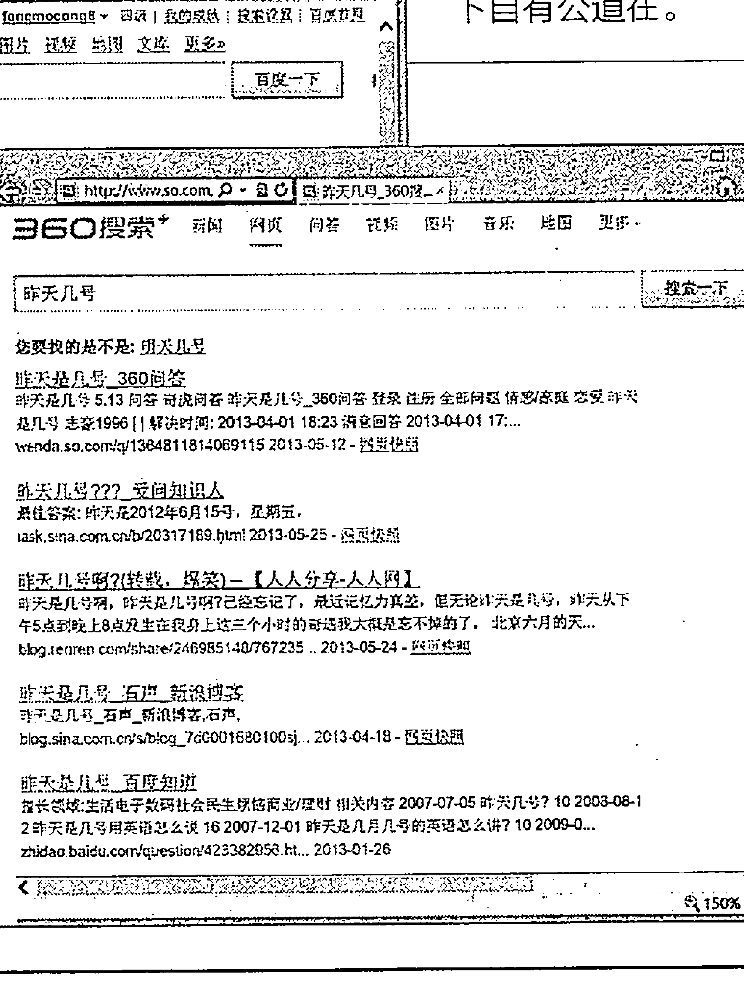

### ③ 搜搜

听了上面二位的话，我深感惭愧，因为知道我的个性不多，只有可和QQ结合，能帮助用户快速搜索聊天词语这一项，但即使如此，我仍然非常骄傲，因为全国有多少QQ用户啊。我这项前无古人、后无来者的功能，究竟能给用户带来了多少便利，嘿嘿，这个不用说大家也知道。

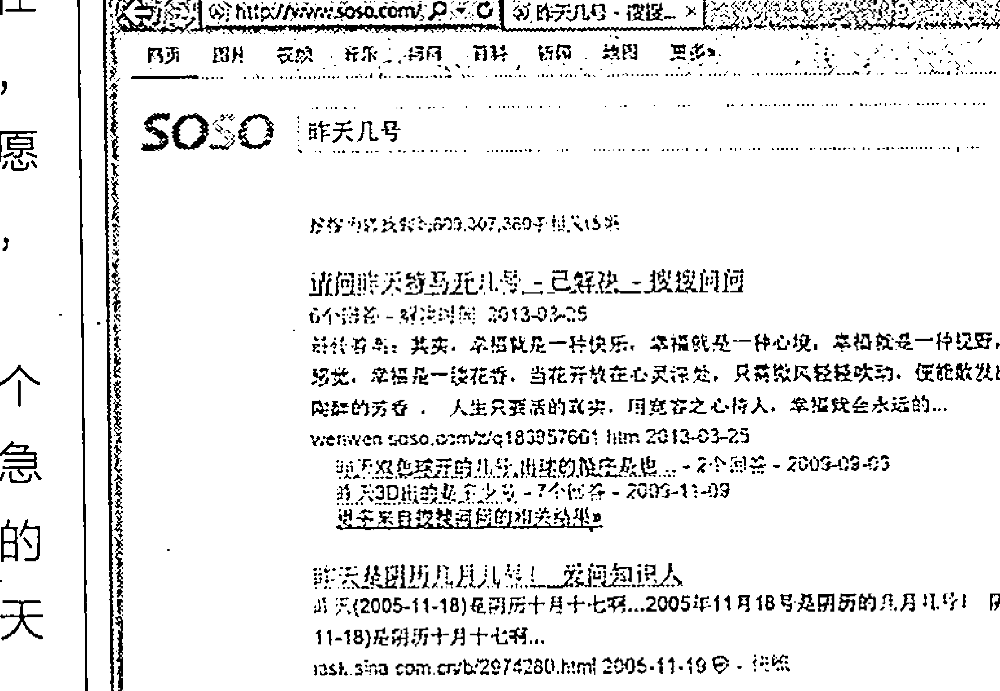

> CFan观点
尽管从总体表现来说，百度凭借十几年的经验，在关键词匹配度和规模度方面，占有一定优势，而且在个性化方面表现也不弱，但我们应该看到，这种优势其实表现得并不十分明显，或者说，360搜索、搜搜与它的距离正在进一步缩小，尤其是在广告数量的控制和方便用户就医方面，360搜索更是表现出了良好的态势。

# 婚照巧变唯美视频

将婚纱照做成视频来播放，若直接用“会声会影”制作效果不理想，那就换一种方法吧！
文|王彦博

朋友想在结婚宴请宾朋时，在大屏幕上以视频方式播放婚纱照。使用“会声会影”制作的效果不好。找来艺匠9iFlash Pro，利用它提供的众多精美的模板，将婚纱照制作成精美的超炫Flash动画，轻松诠释浪漫、温馨、时尚的内涵。最后再使用Zealot SWF2Video Studio小工具将Flash动画转换成视频，在大屏幕上播放。

## 制作精美Flash

## 添加模板

先使用照片处理工具ACDsee裁切照片，将婚纱照片按横向、竖向分开保存。下载“艺匠9iFlash Pro 绿色版”解压后运行，点击“1.Select Album(选择模板)”按钮，打开选择添加模板对话框，点击“浏览”按钮，选择添加需要的模板进来，点选“花好月圆夜”应用的模板，点击Open按钮打开该模板，这时会在主界面左下角的Flash播放框演示，很精美(图1)！

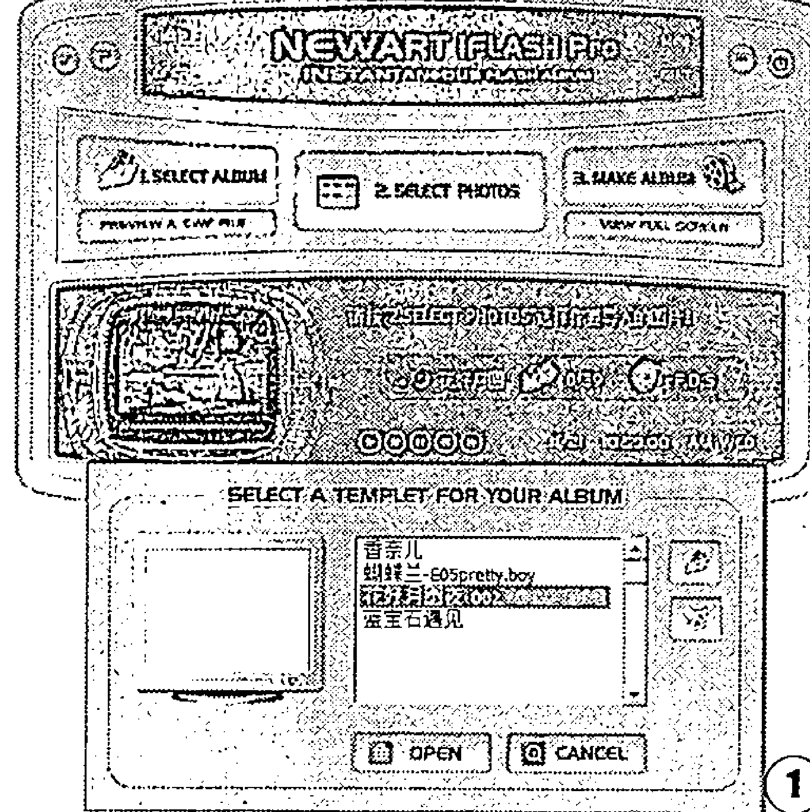

## 添加照片

再点击“2.Select Photos(选择照片)”按钮，在“浏览文件夹”中选择保存竖向婚纱照文件夹后，所有照片添加到选择照片框，点击“自动选择”按钮，将照片添加到下方，再点击“自动裁剪”按钮，让艺匠自动将照片裁剪好，点击“导入”按钮将照片添加到制作照片区，并返回主界面(图2)。

工具栏上的“添加文件”中的“添加文件”命令，添加制作的Flash动画到主界面左侧窗格，选中Flash动画后，点击右侧“播放”按钮预览动画，查看该Flash动画的宽、高、帧数等参数(图3)。

## 设置参数

单击工具栏的“选项”按钮，在“选项”对话框的左侧窗格中选择“常规”，在右侧“输出目录”下选择“使用下面的目录”并在下方设置转换后的文件存放文件夹，在“设置将被复合到视频的声音文件”下选择“使用当前SWF文件的声音”单选项。

为了让转换的效果清晰，单击左侧窗格中的“转换/合并为DVD”标签，在右侧的“TV系统类型”和“视频尺寸”中选择适合的参数，点击“确定”返回主界面。

## 一键转换

参数设置好后，点击“转换为视频”按钮中的“转换为DVD”命令，点击弹出的“开始转换”对话框中的“转换”按钮开始转换，很快完成转换，在设置的文件夹下找到转换好的视频，播放欣赏(图4)。

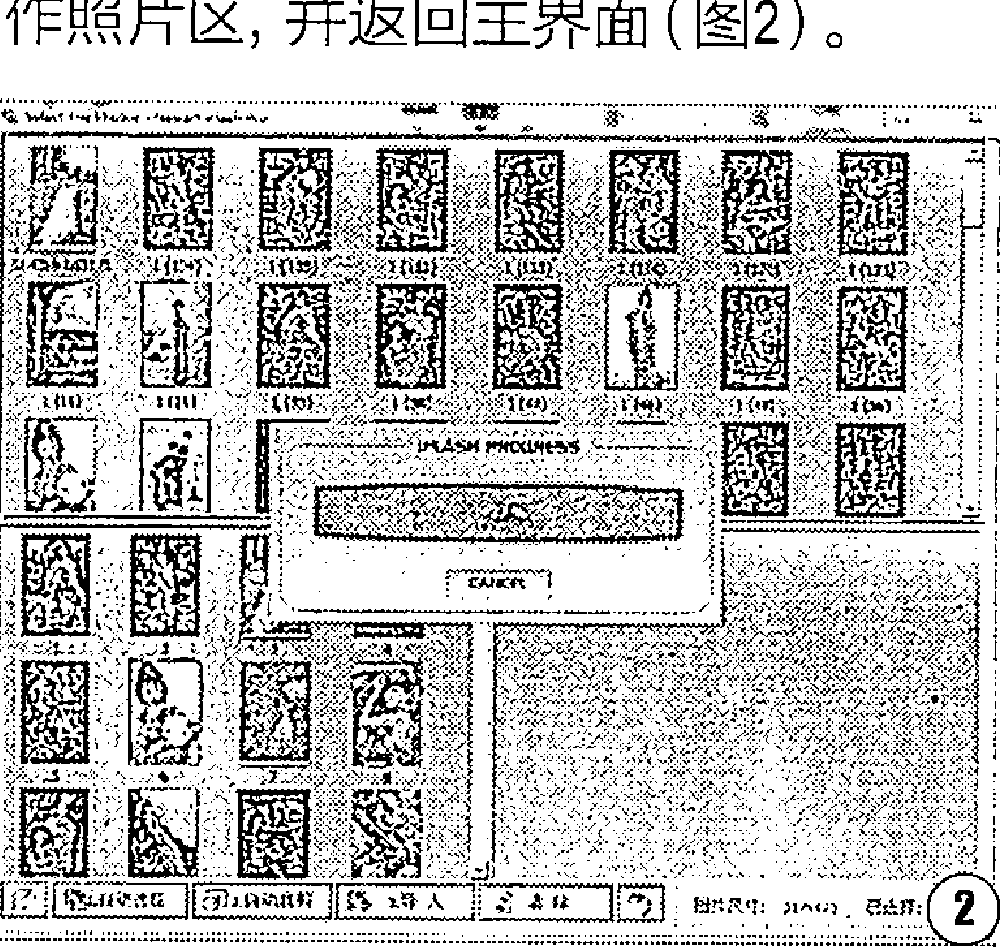

## 制作Flash动画

点击“Make Album(制作)”按钮，在弹出的对话框中设置好保存Flash动画文件夹和文件名称，点击“保存”开始制作，很快即可完成，找到保存的动画即可打开观赏。使用艺匠9iFlash Pro提供的众多精美模板，利用婚纱照片制作自己需要的Flash动画。

**小提示**
“艺匠”模板(扩展名为.mfd)只有使用“艺匠提取、播放swf文件工具”绿色小工具才能播放预览，将需要预览的“艺匠”的模板拖入其界面即可预览效果，在预览的同时会为模板生成一个swf格式的文件，方便以后预览。需要更多“艺匠”模板，可从http://www.luoan.cn/BBS/thread-106668-1-1.html下载。

## Flash转换成视频

## 添加Flash动画

下载“Zealot SWF2Video Studio1.7汉化绿色版”解压启动它，在主界面单击


Zealot SWF2Video Studio V1.7绿色汉化版
http://www.ouyaoxiazai.com/soft/txtx/109/11276.html
艺匠9iFlash Pro 绿色汉化版
http://www.uzzf.com/soft/1570.html

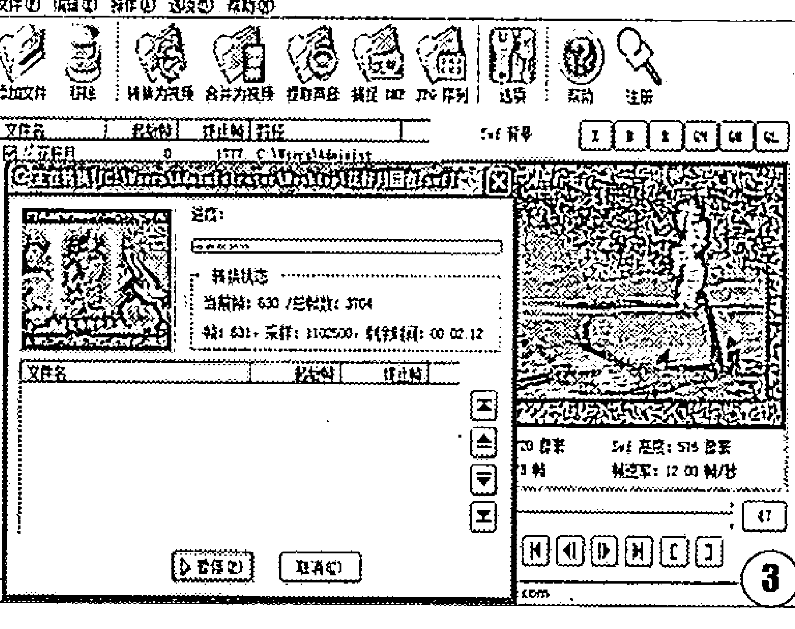

# “四大天王”你选谁

## 主流拼音输入法实用评测

在当今最热的4种输入法（搜狗拼音、QQ拼音、谷歌拼音、百度拼音）中，哪一种输入法最好？哪一种输入法最适合于自己使用？这是我们普通用户最为关心的问题。

文|CFan软件研究室

本文我们将选择这4款主流输入法在截稿时的最新版本，从用户需求出发，具体测试其主流功能的完备性和先进性，力图为不同拼音水平和不同需求的用户找到最适合于自己使用的输入法。

### 表1 参评输入法最新版本与官方网址
| 参评输入法名称与版本 | 官方网址 |
| :--- | :--- |
| 谷歌拼音输入法 2.7版 | http://www.google.com/intl/zh-CN/ime/pinyin/ |
| 百度输入法2.1版 | http://shurufa.baidu.com/ |
| 搜狗输入法6.5版 | http://pinyin.sogou.com/ |
| QQ拼音输入法传统版4.5 | http://py.qq.com/ |

### 调用与设置的方便性

在安装了多种输入法之后，尤其是当多人共用一台电脑时，大家都希望以最快的速度切换并调出自己所用的那种输入法。

由附表可见，在输入法主动性设置、被动性改变后找回设置方面，搜狗输入法做得最好，它不但可以保证用热键调用，还可以保证该输入法总是处于输入法列表的某个位置（如首位或第n位）。百度拼音、QQ拼音次之，不能调整顺序是缺憾，但有启动快捷键提供，也基本能满足用户需求了。而谷歌拼音在这方面做得最欠缺，除非系统中只有一两款输入法，否则调整起来比较麻烦。

### 表2 调用与设置的方便性
| 输入法名称 | 调用与设置的途径 | 是否支持 |
| :--- | :--- | :---: |
| 谷歌拼音输入法 2.7版 | 快速调用该输入法的快捷键定义 | × |
| | 输入法列表选择与顺序调整 | × |
| | 输入法管理(用系统自带的功能) | × |
| | 将自身设置为系统默认输入法 | × |
| 百度输入法2.1版 | 快速调用该输入法的快捷键定义【Ctrl+;】 | √ |
| | 输入法列表选择与顺序调整 | × |
| | 输入法管理 | √ |
| | 将自身设置为系统默认输入法 | √ |
| 搜狗输入法6.5版 | 快速调用该输入法的快捷键定义【Ctrl+,】 | √ |
| | 输入法列表选择与顺序调整 | √ |
| | 输入法管理 | √ |
| | 将自身设置为系统默认输入法 | √ |
| QQ拼音输入法传统版4.5 | 快速调用该输入法的快捷键定义【Ctrl+~】 | √ |
| | 输入法列表选择与顺序调整 | × |
| | 输入法管理 | √ |
| | 将自身设置为系统默认输入法 | × |

和最常用的输入方法有全拼输入法、简拼输入法、混拼输入法。对于追求速度的高级用户，又需要提供音形输入法、双拼输入法等高级输入方法。除此之外，对于一些非常规的特殊字符或图形符号的输入以及根本不懂拼音的人来说，如果要使用其进行录入，还需要提供笔形输入法、手写输入法、特殊符号检字输入法等辅助输入方法。

### 案例一：标准口音用户

晓明是一位小学二年级学生，家里刚添置了电脑，要学习输入汉字，他首先面临的问题是输入方法的选择。晓明的拼音基础顶呱呱。对于他这类用户来说，在练熟了指法之后，使用全拼输入方法（如输入“长城”的代码是changcheng）是最容易进入状态的，而且开始也不用记忆什么东西，可以最大限度地减少重码，速度上也完全可以应付日常录入。如果要从四款中进行选择，这四款输入法均提供全拼输入方法，对晓明来说选择哪款都可满足他的需求。只是在详细使用设置方面有细微差异，具体表现如下。

# 输入方法的全面体贴

作为一款优秀的、大众化的智能拼音输入法，必须具备服务于不同拼音水平人士的输入方法。我们大家最常见

百度的全拼设置中只提供了一个“全拼”选项模式。

谷歌的全拼设置中则多提供一种“简写时使用z,c,s代表zh,ch,sh”的选项，这样让简拼方式下输入时更加宽容。

QQ拼音在其全拼设置中则在谷歌的基础上又多了一种选择“超级简拼（如“byet”代表“b'y'e't”）。”

搜狗拼音输入法的全拼设置中提供的一项选择表达得更加明确——首字母简拼（如z表示zh等、a表示an等），这也是给使用简拼输入的用户提供方便而设的。

由此可见，在全拼功能的提供方面，各种输入法提供的设置功能多是

## ## 案例二：地方口音用户

四位分别来自湖南、四川、内蒙、山西的老兵，大家拼音基础都不好，还带有地方口音，有的是l和n、f和h、f和l不分，有的是卷舌与否不分，有的是前后鼻音不分。让他们学好普通话已经很难了，只能寻找捷径让他们最大限度地输入汉字。那就是使用简拼输入（如输入‘长城’用chch或cc代码）、混排（如‘长城’用changc或chongc代码），与此同时，根据不同人的口音条件选择开启必要的模糊音。这四款输入法都支持简拼混拼输入，而且方法也大同小异。我们看看这四款输入法在模糊音设置方面所能提供的条件。

百度拼音在模糊音设置方面只提供了6组声母模糊音和5组韵母模糊音。主要可分为是否卷舌、前后鼻音、l与n等南方口音、an和ang等口音的模糊设置。

谷歌拼音的模糊音设置则在提供字母匹配的同时，以汉字具体举出模糊匹配的案例。较之百度，它还多提供了一组k=g（库=顾）的模糊音。

QQ拼音在模糊音设置方面除了与百度拼音一样提供11组模糊音外，另外提供一个体贴的选择‘提示正确的拼音’，以帮助拼音不准的人逐步掌握正确的拼音代码。

搜狗拼音的模糊音设置设计得最为体贴，它除了提供必要的基本模糊音选择之外，也提供了‘开启智能模糊音推荐’的选项，除此之外，还提供了‘添加’按钮，用以添加特殊地区特殊方言的发音模糊设置，这等于给用户一个开放的接口，以应对更多的发音不准确的汉字输入需求。

由此可见，如果一个发音不准的人使用拼音输入法，从设置的人性化角度选择，无疑首选应该是搜狗输入法，QQ拼音输入法次之，其次才是谷歌和百度输入法。

## ## 案例三：专业录入人员

小凤是公司的秘书，她经常从事速度比较高的录入工作，许多时候都是领导在旁边出口成章来道白，她来录入，即所谓的‘听打’。这样的环境不适合五笔之类的古老输入法，小凤有拼音基础而且普通话基础又好，也没有必要学习五笔字型。但前面介绍的几种输入方案肯定不能满足她的要求，原因是全拼击键次数太多，简拼又重码选择太多。这种情况下，她可以考虑双打输入，甚至是双打加笔形辅助的音形输入法。

双打输入是使用双拼代码的方案。不论一个汉字的拼音串有多长，均分成声母和韵母两个部分，每个部分赋予26个字母之一的字母作为代码，没有声母的字声母部分由一个零声母代替。这样一来，每个汉字就固定为两码输入。例如：百bai，声母是b映射在b键上，韵母是ai映射在p键上，输入‘百’只要按下bp两个键就可以了。

双打成为编码较短的汉字输入法，它理论上是击键次数最少的中文输入方案。由于历史的原因，双拼方案没形成统一的标准，现在流行的双拼方案有七八种，所以允许每个人使用的方案各不相同。这样，输入法在设计时就得充分考虑这部分高级用户。下面我们来看看这四款输入法在此方面的表现如何。

百度拼音在双拼方案设置只提供了6种方案选择（紫光双拼、智能ABC、拼音加加、微软双拼、自然码、小鹤双拼），再无其他选择。万一某人熟悉的方案不在此列，则不得不放弃选择。

谷歌拼音则在以上6种方案选择的基础上，提供一个‘自定义方案’选项，这样就为用户使用双拼提供了无限的可能。

QQ拼音在双拼设置方面更加丰富。它可以提供双拼全拼互相提示选项，这样你可在用全拼的输入过程中自然而然地学习双拼代码。它还提供了直接辅助码输入的选项，可以让你以拼音加辅助码的方式来输入，重码率更低，输入更加精准。但是，与百度一样未提供方案自定义功能，无法应对万变。

搜狗拼音在以上6套双拼方案的基础上再增加一套搜狗独有的双打方案，提供自定义输入任意双拼方案，可以提供双拼展开提示，提供在双拼下同时使用全拼的功能，可谓体贴至极。

由上可见，搜狗拼音在双打设置方案提供的功能是最领先的，是高级用户的首选。QQ拼音和谷歌拼音次之，百度拼音最为简单。

## ## 案例四：不懂拼音的用户

奶奶是一位八十岁的老人，拼音一点不会，但汉字认识不少。对于她老人家来说，无论学拼音输入还是学五笔字型，都不现实。但她也有上网搜索的需求，需要输入汉字，怎么办？在这种情况下有两个选择，一个是只需要记忆横竖撇捺折五个代码的简单五笔画输入法（原始的智能ABC输入法已经有此功能），一个是用鼠标画字，或安装手写板来直接写字。我们提倡用鼠标画字或手写板写字的方案，因为这样最人性化。我们来看这四款输入法能否满足她的要求。

百度拼音在其输入法扩展管理窗口中提供了手写输入的扩展模块，点击选择安装，即可实现手写输入功能。有单字手写和多字连写选项，汉字有注音提示，有联想词组选择，标点符号、字母和特殊符号则由专门的三组按钮来实现选择。更有笔触、上屏、候选选项设置。此外，百度拼音还提供纯笔形输入，在全拼方式下按字母U键便可切换到笔画输入，每个笔画发音对应着相应的首声母，如横对应h、竖对应s，以此类推。

谷歌拼音未提供手写输入功能，但提供笔形输入功能。先按u进入笔画输入模式，然后使用代码h(横)、s(竖)、p(撇)、n(捺)、z(折)、d(点)依次输入该字的各个笔画。其中，n和d是相同的。例如，希望输入“谷”，则可以依次按下upnpnsh。

QQ拼音工具组中提供手写输入功能，需要安装方可使用。同样提供拼音提示和词组联想功能。选项中没有提供很多功能，但有两项很实用，一个是“自动更新手写识别数据文件”，一个是“用热键来启动手写板”。此外，QQ拼音还提供一个笔画输入器，供用户以选择笔画的方式输入汉字，有点类似于笔画查字。这对于偶尔输入生僻字来说很可行，但用来通常录入则不如手写来得方便了。在输入过程中，QQ拼音还可以使用U模式来用五个笔形横、竖、撇、捺（点）、折输入汉字，分别使用1、2、3、4、5来代替。最后，QQ拼音还提供有语音输入模块，但这类输入目前还不能达到令人满意的效果，尚待完善。

搜狗拼音在其扩展功能管理器中也提供了手写输入模块，点击“使用”按钮就能启用。这是最简单的一种方案，既没有提供联想词组，也没有提供详尽设置，只有单字选择和汉字注音。不过，作为偶尔写生僻字的用户已经足够用了。但对于用它来作为正宗输入法的不懂拼音的用户，这个手写板显得有点简单。此外，在输入过程中，搜狗拼音也可以使用U模式输入汉字。U模式主要用来输入不会读（不知道拼音）的字等。在按下U键后，输入笔画拼音首字母或者组成部分拼音，即可得到您想要的字。由于双拼占用了U键，所以双拼下需要按Shift+U进入U模式。

由此可见，如果是上文所述奶奶一类的人选择输入法，百度拼音的手写输入法应该是首选。此外百度还有个网络版的手写输入法，上网搜索可直接用它，看来手写输入是百度的强项。QQ拼音也应该是好选择。其次才是搜狗拼音输入法。至于谷歌拼音输入法，毕竟用笔形输入要更费事一些，不考虑也罢。

# 语句输入强力测试

强力测试语料来源：我们以搜狗输入法对其自身的两款拼音输入法（搜狗本地输入法和搜狗云输入法）测试时所采用的语料为依据，对我们选择的四款输入法进行输入测试。搜狗选择的预料包括现代文、古文、新闻、口语，用这些语料测试的是自家的产品，用来说明他们自家产的输入法的优劣，相信他们选料的科学性。而我们不妨拿来测试其他不同家的产品。所有测试均以标点符号为间隔，以短句或长句连续输入的方式进行。（为说明有更准确的输入方法，我们这里保留对搜狗云输入法的测试结果。）

详细测试数据表格见网上（下载地址：http://iask.sina.com.cn/u/ish?uid=1704202287）。

从测试情况可以看出，开启云功能后，搜狗拼音本地版、QQ拼音和百度拼音三款输入法，即使是第一选项没有出现正确的词句，也会在第二选项的云词汇位置出现正确的选择。谷歌的输入表现则是四款输入法中表现最差的，首屏输入错误后基本没有正确的候选项。带有云输入功能的输入法，其输入的正确率明显要高，而其中，搜狗云输入法由于采用了大容量的数据模型和语料库，其正确率是所有输入法中最接近完美的。但目前因该输入法没有更多设置，不支持双拼方案以及网络带宽影响输入速度等因素，因而还有待改进和完善，尚不能完全代替本地输入法。

# 输入特殊符号的条件

常见到有的用户因为一种特殊符号无法输入而到处寻找办法，特殊符号是输入者经常用到的一种汉字符号。因此，能否提供快速输入各种特殊符号的方法，是考验输入法是否体贴人的又一个标准。提供特殊符号输入的方法不外乎有三种：快捷键批量调用、软键盘选择和专用特殊符号管理器。

详细测试数据表格见网上（下载地址：http://iask.sina.com.cn/u/ish?uid=1704202287）。

可见，在特殊符号输入方面，QQ拼音和搜狗拼音都提供了丰富多彩的输入方法，百度拼音也基本可以满足需求，谷歌拼音表现最差。

# 云功能的强弱对比

结合云功能的设置和上面的强力测试结果就不难看出，搜狗、百度、QQ三款输入法因其云功能而大大提升了输入的准确度，给用户带来了很大的方便和效率。谷歌输入法如果不投入这方面的开发和服务，只能甘拜下风了。

# 其他附加实用功能

详细测试数据表格见网上（下载地址：http://iask.sina.com.cn/u/ish?uid=1704202287）。

综合评述：如果从用户个人需求出发，选择合适的输入法不一定要看其综合指标，只要与自己贴身需求最吻合的那款输入法即可。如果要从整体评价来看，搜狗拼音无疑是四款中最优秀的输入法，QQ拼音和百度拼音次之，谷歌拼音由于团队远离了内地，缺乏竞争参与力度，表现力最差。[口]

## 文件共享传输有妙招

文|伟良

### 文件共享 想用就取

在本机上设置一个文件夹共享，将要传给别人的文件存放在一个文件夹中，再将此文件夹共享，让别人复制去吧。估计这是很多人会想到的办法。

在正常情况下，设置完成即可使用，不过万一你的同事在其他办公室里，通过网上邻居找不到你的电脑，或者找到了你的电脑却无法打开，该如何解决呢？

如果遇到这种情况，你还必须在你的电脑上进行如下设置。

首先，打开“控制面板”，依次双击“管理工具”、“本地安全策略”，打开“本地策略”下面的“用户权利指派”。然后，在右边的窗口中，双击“拒绝从网络访问这台计算机”，删除里面的用户。确保“从网络访问此计算机”里有Everyone（即每个人）或Guest（来宾）。

这样设置后，别人就能访问你的电脑了。

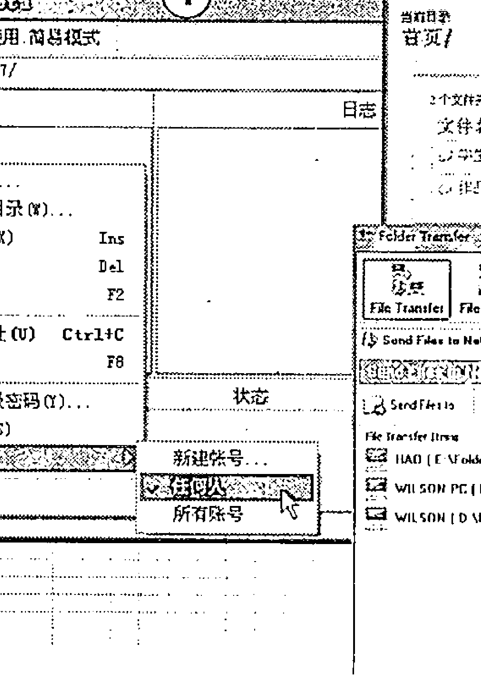

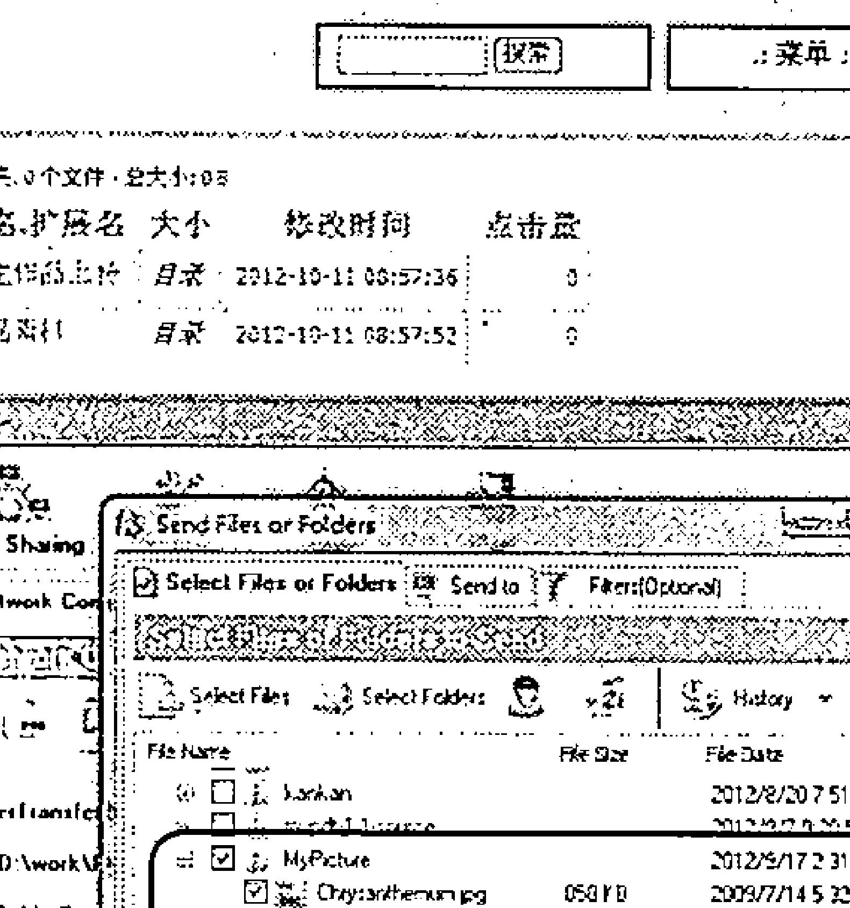

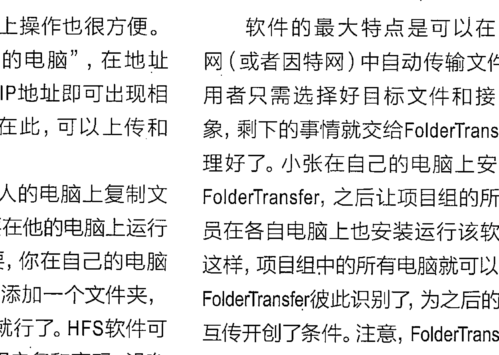

### 上传下载 共享更贴心

上面讲到的共享方法虽然不需借助任何工具，但是操作起来很麻烦，往往搞了半天，别人还打不开你的电脑，不方便。其实还有更简单易行、可靠性高的方法，那就是安装HFS软件（即HTTP File Server, http文件服务器）。

安装HFS运行后，你的电脑就变成了文件服务器。此时，把要传输的文件或文件夹添加到系统中即可（图1）。这个软件可以允许他人上传和下载文件。如果是让别人上传到文件夹，则一定要设置成“上传许可→任何人”。如果上传的文件不允许不相干的人查看，可以将文件夹设置为“不允许下载”。

而同事在电脑上操作也很方便。打开浏览器或“我的电脑”，在地址栏中输入服务器的IP地址即可出现相应的界面（图2）。在此，可以上传和下载文件。

如果你要从别人的电脑上复制文件，那么是不是也要在他的电脑上运行HFS呢？这个不需要，你在自己的电脑上运行了HFS以后，添加一个文件夹，并设置为允许上传就行了。HFS软件可以设置允许访问的用户名和密码，没有权限的人是不能进行上传和下载的。

### 文件快传 想给谁就给谁

技术部经理小张需要将一批资料文档分发给项目组的成员，按照常理，小张需要先将这批大块头的文件放到共享文件夹中，然后招呼大伙分别下载。不过小张可不想穿新鞋走老路，只见他稍加操作，就通过公司局域网，将相关的文件直接“扔”到了项目组每个成员的电脑中，如同神秘的太极推手一般快捷高效。小张当然不是什么武林高手，他依靠的是FolderTransfer这款独特的文件传输工具。

软件的最大特点是可以在局域网（或者因特网）中自动传输文件，使用者只需选择好目标文件和接收对象，剩下的事情就交给FolderTransfer打理好了。小张在自己的电脑上安装好FolderTransfer，之后让项目组的所有成员在各自电脑上也安装运行该软件。这样，项目组中的所有电脑就可以通过FolderTransfer彼此识别了，为之后的文件互传开创了条件。注意，FolderTransfer默认使用的是8585端口，如果安装有防火墙的话，需要开放该端口。

例如，小张需要向项目组的其他成员发送文件，只见他运行FolderTransfer，在其主界面工具栏上点击File Transfer按钮，在Send Files to Network Computers面板中点击Send Files to按钮，在文件传输向导窗口中的Select Files or Folders面板中展开资源列表，勾选需要发送的所有文件或者文件夹，发送给需要接收的项目组成员就可以了（图3）。这样，小张无需任何复杂的操作，就可以将文件直接发送出去，项目组的其他成员不费吹灰之力，就可以轻而易举地得到所需的文件了。

## 几招玩出音乐享受

从最基本的“播放”功能之外挖掘播放器的用途，才能真正玩转一个音乐播放器。

文 | 萌萌

说起千千静听，你一定对它并不陌生。也许你会觉得它用起来太简单了！但在看了下面的这些用法之后，你也许会对你手中的这份音乐播放工具另眼相看。

### 不解包也能听音乐

网上的一些音乐爱好者共享音乐专辑，许多情况下是通过将一个音乐专辑打包后上传的。在你下载了一个RAR或ZIP音乐专辑之后，你总是需要先解包以后，再加入到千千静听来播放。然而，你是否想到过，千千静听其实可以直接播放压缩包中的音乐。

启动千千静听，点击列表按钮，打开播放列表窗口。接下来，将你下载到的音乐文件压缩包直接拖放到千千静听播放列表窗口中。这时，你会看到，播放列表中已经出现了专辑的每一首歌曲的名字。像往常一样点击歌曲选择播放吧！

### 轻松肢解高清音乐

支持许多类型的高清格式的音乐，这是千千静听的一大特点。但是，有的高清歌曲专辑是包含在一个文件中的。例如：我下载的“李娜-青藏高原.APE”这个音乐专辑就包含有好几首歌曲。现在我希望将这些歌曲分离出来，保存成MP3格式，拷贝到手机里播放。怎么办？

不用借助传统的格式转换和音轨分离工具，我用千千静听就能很轻松地完成这些看似复杂的工作。

通常我们下载的APE等音乐专辑，不会是单单只有一个APE主文件，往往还配有一个CUE格式的同名文件，这个文件只有几个KB，因而常常被用户所忽视。许多初级用户往往因为看到它小，在播放时直接选择APE文件进行播放，甚至会干脆将CUE文件删掉。殊不知，在CUE文件中包含了专辑的列表信息，只有使用它作为播放的先遣“排头兵”才能正确地将音乐文件加入到播放列表中。因此，要播放列表，需要将此文件拖放到播放列表窗口中，而不是播放那个大的APE文件。

接下来，在播放列表窗口中，全选整个专辑的所有单曲，使用右键菜单的“转换格式”命令，进入格式转换窗口，设置好需要转换到的格式和各种参数之后，执行转换命令，就可以得到你所需要的分轨保存的单曲音乐文件了。

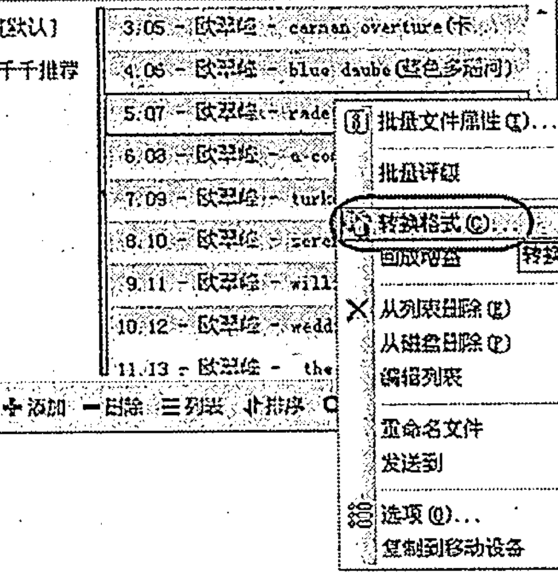

### 词不对调解决有窍门

当我们将一首歌曲或一个专辑加入到千千静听的音乐列表中之后，播放时软件会自动到歌词服务器上去提取与歌曲对应的歌词字幕文件，然后字幕会按设定的格式显示在屏幕上。但是，有时我们会发现，字幕和歌曲是不同步的，于是，有的用户就用千千静听提供的字幕提前或延迟命令来手动调节字幕的显示时间。但是，无论怎么控制，你都会发现，要调整到与唱词正好吻合的程度，真还不是那么容易的事情。

其实，大可不必去手动调整歌词进度。如今网络上制作歌词的爱好者许许多多，也许早就有匹配的歌词制作好了，只是你还没有遇到。尤其是一首很流行的歌曲出现后，想不配套都难！

你的歌词与字幕不能配套，很大程度上出在歌曲文件名上，软件自动按歌曲文件名中体现的歌曲名、演唱者、专辑名等信息到服务器或网上去搜寻歌词，如果你的歌曲文件名信息有所误差，就会造成找到的歌曲字幕与正在播放的歌曲牛头不对马嘴。

在这种情况下，你只需选择字幕窗口中的右键菜单命令“在线搜索”，然后重新定义准确的歌曲名称和演唱者名称，重新进行搜索，在搜索的结果上点击，即可看到正在演唱的歌曲是不是和字幕“对号入座”了。选择最合适的一个就是了。

### 消去原声实现真正的OK

千千静听本身不具有原唱消音功能，但我们可以为它安装一款专门的原唱消音插件DeFX v0.97来实现。这个插件为单独的一个dsp_DeFX.dll文件，将它保存到“千千静听”安装文件夹的Plugins中。然后打开“千千静听选项”面板，切换到“音效插件”窗口，点击“插件目录”框的“浏览”按钮并定位到Plugins目录，即可在下面的列表中看到DeFX v0.97选框，勾选这个选框即可弹出DeFX的操作窗口，点击“卡拉OK”栏的“启用”按钮即可进入卡拉OK状态。

此时用千千静听播放歌曲，就会对原唱的人声进行消音处理，由于千千静听具有自动搜索和显示同步歌词的功能，此时就可以一边跟着处理后的音乐，一边看着歌词唱卡拉OK了。

## 请谁把大象塞进冰箱

### 五大流行压缩软件评测

忽然之间，各大软件厂商都对压缩软件的开发兴趣盎然。在众多的压缩软件中，作为普通用户，我们该选用哪一款？本文的测试将为你提供参考。

文 | CFan软件研究室

很久之前，CFan就做过压缩软件的评测，那时基本上是国外软件当道。而时过境迁，国内软件商们突然如中魔法一般，纷纷进入压缩软件的领域。在这些琳琅满目的产品中，究竟哪一款更适合我们？试试便知分晓。

- WinRAR v4.20 (www.winrar.com.cn/)
- 7-Zip v9.30a (www.7-zip.org/)
- 好压 v3.1 (www.haozip.com/)
- 360压缩 v3.1b (yasuo.360.cn/)
- 快压 v2.6 (kuaizip.com/)

以JPG为主的图片及RMVB、WMV、MP4等视频的压缩微乎其微，因为这两类文件本就已经高度压缩了，所以对它们再压缩意义不大。不过当图片很多时，压缩软件可以起到打包的作用，传送起来方便。混合项的压缩效果最明显，因为其中包含了各类文本文件及BMP、TIF、PSD等未压缩过的图片。文本项主要包括PDF、DOC、TXT等文档，压缩效果也很不错。

### 测试平台

操作系统：Windows 8/32位版
处理器：Intel Core i5-2410M @ 2.30GHz
内存：6GB

### 参评软件

此次参评的软件，在综合多家软件下载排行榜的基础上，再通过CFan编辑对各压缩软件的市场潜力做评估，最后筛选出5款。以正式版为准，下载截止于2012年12月25日。

### 谁压得最小

通过QQ或者E-mail之类的工具在线传文件，或者上传文件保存，因为带宽的限制，一般都要将文件压缩。有时，我们需要用U盘传送文件，要在有限空间的U盘中存放大量文件，文件更得压缩。如今各类文件越来越大，影视、软件、游戏等文件，动不动就好几GB，甚至各类文本文档也变得越来越大，所以对压缩软件来说，我们自然希望压缩率越高越好。从表1的结果来看，各压缩软件对...

表1
| 软件\类型 | 文本(529MB) | 图片(1138MB) | 视频(1273MB) | 混合(1115MB) |
| :--- | :--- | :--- | :--- | :--- |
| WinRAR | 483/477 | 1107/1109 | 1234/1235 | 637/524 |
| 7-Zip | 482/104 | 1108/1106 | 1236/1232 | 620/424 |
| 好压 | 482/86 | 1107/1108 | 1234/1237 | 622/450 |
| 360压缩 | 482/86 | 1108/1109 | 1244/1234 | 620/419 |
| 快压 | 481/481 | 923/923 | 1235/1235 | 482/482 |

表2
| 软件\类型 | 压缩(ZIP/自有格式) | 解压(ZIP/自有格式) |
| :--- | :--- | :--- |
| WinRAR | 01:30.99/01:41.97 | 00:56.32/00:53.88 |
| 7-Zip | 01:04.59/03:08.10 | 00:51.06/00:49.50 |
| 好压 | 01:03.33/01:54.09 | 00:58.46/00:50.36 |
| 360压缩 | 01:06.86/05:07.34 | 00:59.93/01:05.02 |
| 快压 | 05:34.51/05:30.50 | 01:38.07/01:34.91 |

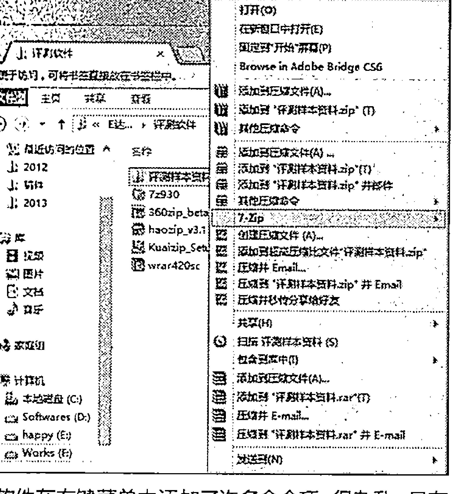

测试结果分两部分，前一个是压缩成标准ZIP格式，后一个是压缩成软件自有格式。其中好压和360压缩没有自有格式，所以用它们所支持的7Z格式代替（下同）。压缩率方面，三款国产软件的成绩非常优秀，好压和360压缩在文本压缩中尤其亮眼（文本文档压缩是平时最常用的，更为实用），它们所用的7Z压缩，竟然比该格式的创建者7-Zip还要高。快压的整体成绩最好，但奇怪的是，它自身格式和ZIP格式大小都一样，难道都使用相同的算法么？

根据本次的测试体验，我们更愿意向大家推荐7-Zip和好压。7-Zip是我们的首选，它是几款软件里最干净的，而且它自创的7Z格式压缩率极高，并广为其他压缩软件所采用。

# 谁压得最快

文件少的话感觉不出什么，文件多的时候，压缩速度最让人揪心，当你有急事要出门，看到慢腾腾的压缩进度，一定会急不可耐吧（小编在测试时就遇到这种情况，差点误了回家的公车）。

表2的测试，样本为混合文件，包括常见的文图格式，总大小为1115MB。测试结果中前一个为压缩ZIP的时间，后一个为压缩为自有格式的时间，计时使用第三方工具。360压缩有“速度最快”和“文件最小”两大选项，实际就是一个噱头，前者是ZIP格式，后者是7Z格式而已。

压缩/解压的速度最能体现软件对算法的优化，这是技术活真功夫。这轮测试中，7-Zip和好压的速度名列前茅，快压速度则比较慢。

# 谁格式最全

谁也不愿意同时安装两个压缩软件吧，所以压缩软件支持的格式是否全面非常重要。这里说的格式全，并不是指支持的格式最多，而是指最可能见到的格式。

从表3可以看出，老牌软件WinRAR支持的格式很不全面，而几款国产软件表现优异。另外，表中所列是解压的格式，对于压缩格式，几款软件除支持标准ZIP外还会支持自有格式，没有自有格式的则基本都支持7Z格式。其中，7-Zip和好压支持的压缩格式，相比其他软件更加丰富。

#### 特色功能展示

在软件同质化越来越严重的今天，软件往往要靠一些特色功能拼出一条血路。让我们看看以上各软件有哪些看家本领，是否实用。

- **7-Zip**: 超强的资源提取工具，各种EXE、DLL、快捷方式图标等程序或资源文件，它都可以解压出来，是高手的绝佳伴侣。

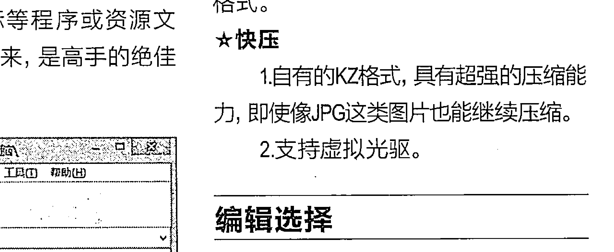

- **WinRAR**: 1.预测功能，未开始压缩前即可预测压缩后的大小及需要的时间。这对压缩较大的文件或文件夹非常有用，首先评估能压缩多少，另外看看时间够不够用，可避免做无用功。2.超强文件管理工具，可作为另类资源管理器使用，所有文件无处隐身，是清理病毒的绝佳辅助工具。3.超强修复功能，尤其是对RAR的修复。

- **好压**: 1.具有虚拟光驱功能，支持挂载ISO、MDS、MDF、CCD、CUE、IMG、UDF、URG等通用光盘镜像，方便娱乐和学习光盘的读取。2.具有丰富的插件扩展，可进行MD5校验、批量修改文件名等，还可以直接在压缩包内查看图片。

- **360压缩**: 不仅解压，在压缩时也支持RAR格式。

- **快压**: 1.自有的KZ格式，具有超强的压缩能力，即使像JPG这类图片也能继续压缩。2.支持虚拟光驱。

#### 编辑选择

首先，我们不会选择WinRAR，毕竟我们有更多免费软件可选，而且功能上也相差无几。其次，对电脑操作不太熟练的朋友；360压缩还算不错，它各方面性能较其他软件稍弱，但是在琢磨使用者习惯上还是很有一套，不过它也不是我们的选择。快压有着强大的压缩能力，但是它的速度实在是有点慢，而且软件里还夹带着太多无关压缩的东西，所以也不是我们的选择。

根据本次的测试体验，我们更愿意向大家推荐7-Zip和好压。7-Zip是我们的首选，它是几款软件里最干净的，而且它自创的7Z格式压缩率极高，并广为其他压缩软件所采用。7-Zip在资源的提取上，更是技高一筹，是专业人士的好帮手。国产软件方面，好压则是比较好的选择，它不但简单易用，而且功能非常全面，值得推荐。

表3
| 软件/类型 | ZIP | CAB | RAR | TAR | ISO | 7Z | IMG | TGZ | GZ | WIM | DEB | RPM | JAR |
|---|---|---|---|---|---|---|---|---|---|---|---|---|---|
| WinRAR | √ | √ | √ | √ | √ | √ | × | × | √ | × | × | × | √ |
| 7-Zip | √ | √ | √ | √ | √ | √ | √ | √ | √ | √ | √ | √ | × |
| 好压 | √ | √ | √ | √ | √ | √ | √ | √ | √ | √ | √ | √ | √ |
| 360压缩 | √ | √ | √ | √ | √ | √ | √ | √ | √ | √ | √ | √ | √ |
| 快压 | √ | √ | √ | √ | √ | √ | √ | √ | √ | √ | √ | √ | √ |

# Win8有“后门” 绕过密码登录

文|俞木发

有些人因为忘了系统密码，结果自己登录不了自己的电脑。不过也别着急，本文教大家几个破“窗”而入登录Win8的方法。

## 联机上网轻松重置密码

适合用户：新手

使用条件：使用Windows Live ID作为系统账户，并且开机后可以联网的局域网电脑（因为局域网电脑在Win8的登录界面即可自动联网，用于在线验证重置的Windows Live ID新密码）。

破解方法：通过任何可以上网的设备重置Windows Live ID账户密码。

Win8允许并且推荐用户使用Windows Live ID作为系统账户，因此如果你的Win8默认系统账户是Windows Live ID（实际上就是一个邮箱账号），那么在忘记账户密码的时候，我们就可以通过任何联机设备上网重置密码。这里以手机重置Hotmail账户密码为例。

1. 确保你的手机可以上网，打开浏览器进入http://login.live.com/，然后点击“无法访问你的账户”，接着在打开的“重新设置账户密码”页面，按提示输入你的Hotmail账户和验证码，点击“下一步”。

2. 在打开的页面选择“向我的手机发送代码”，在下拉列表选择“呼叫XX号码”（不要选择“发送短信”，因为会有延迟）。大约过3~5秒，你的手机就会收到一个号码为“001714-868-0”的语音来电，接听后输入其发送的语音代码，最后点击“提交”，剩余的操作按屏幕提示完成密码重置即可（图1）。

这里的XX号码是你的手机号码（是注册Hotmail邮箱时设置的验证手机），如果你没有设置手机请选择“通过电子邮件向我发送重新设置链接”。

不过由于Hotmail服务器不在国内，发送邮件会有延迟，所以建议使用“呼叫XX号码”，可以及时获得代码。

3. 完成密码重置操作后，返回Win8登录界面，确保左下角的网络连接图标已经连上互联网。接着按提示选择Windows Live ID账户，密码使用上述重置的新密码即可登录Win8了（图2）。

如果你的Windows Live ID被盗，被黑客恶意更改密码怎么办？其实Windows Live ID包含一些特殊的安全功能，可以检测你的账户是否被盗，如果发现账户被盗，则账户状态将更改为“已泄露”（限制账户功能），直到你使用之前设置的双因子身份验证功能（辅助证明）重新获得账户的控制权。而且你仍然可以使用原来的密码完全访问你的PC，进入Win8后重新进入http://login.live.com/重置密码。不过重置之后就需要使用新的密码来登录Win8了。

## 自己预留万能钥匙

适合用户：有一定电脑基础的用户

使用条件：需要有另外一个系统，如Win7+Win8，或者手上有PE启动盘的用户。

破解方法：通过另一个系统去更改Win8登录界面的辅助工具为cmd.exe，从而以SYSTEM身份进入系统更改原账户密码。这里以Win7系统为例，假设Win8安装在D盘，具体操作是将辅助工具中的屏幕键盘osk.exe替换为cmd.exe。

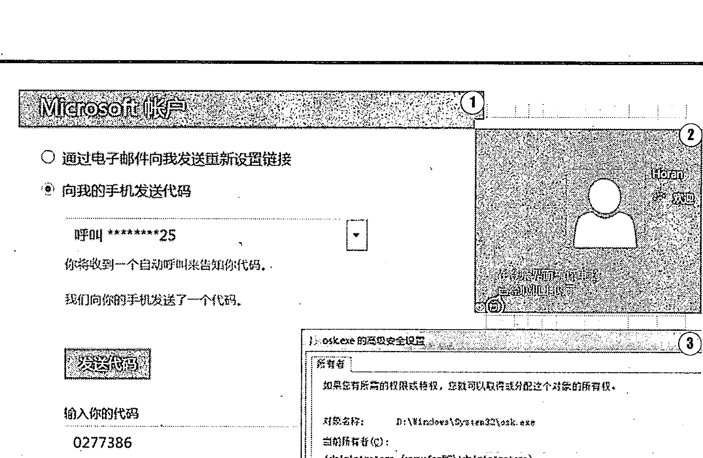

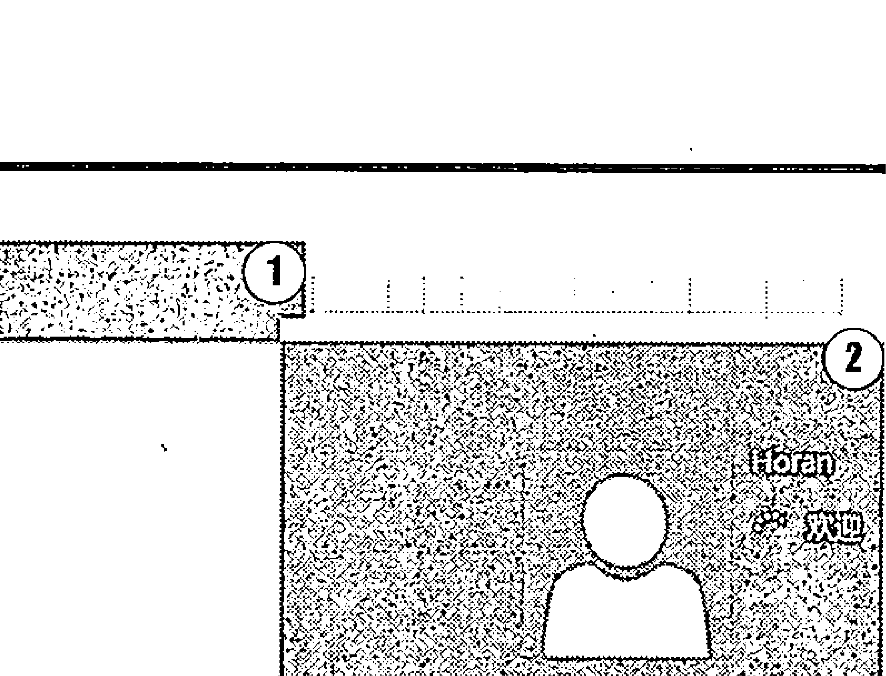

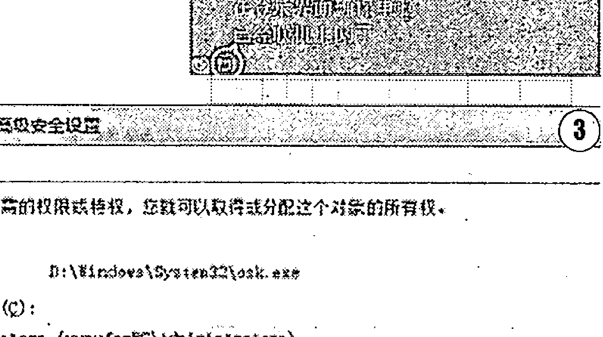登录界面的辅助工具还包括放大镜、讲述人、此外登录界面还可以激活粘滞键等程序，因此我们还可以使用cmd.exe替换这几个中的任意一个程序。

- 1. 由于替换的文件为重要系统文件，对其更改必须取得文件所有权和完全控制权限。进入Win7后打开D:\windows\system32，右击osk.exe选择属性，接着在打开的属性窗口中切换到“安全”标签。单击“高级”，在打开的窗口切换到“所有者”标签，点击“编辑”，在弹出的窗口选择当前计算机的Administrators，将其设置为osk.exe文件的所有者(图3)。

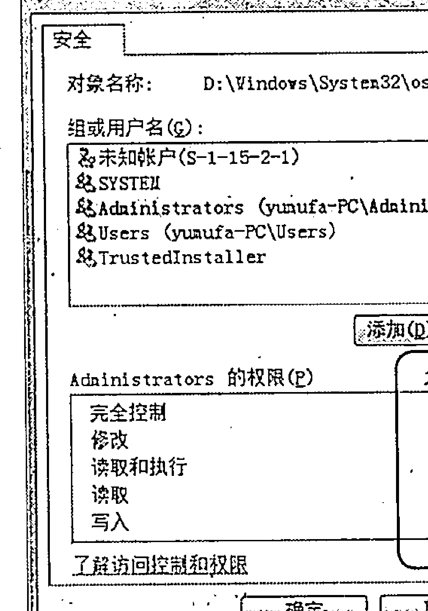

- 2. 依次点击“确定”退出，返回安全属性设置窗口，点击“编辑”，在弹出的窗口中将当前电脑的Administrators组对osk.exe权限设置为“完全控制”，最后点击“确定”退出(图4)。

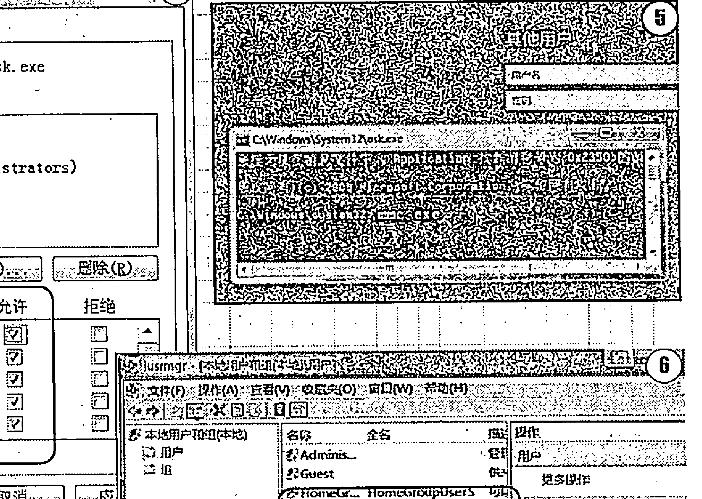

- 3. 完成上述设置后，返回资源管理器窗口，再对cmd.exe执行同样的操作。接着启动“命令提示符”依次输入下列命令(括号里的内容为命令注释，无需输入，本例中Win8安装在D盘):

```
Rename d:\windows\system32\osk.exe osk1.exe (将屏幕键盘程序重命名为osk1.exe)
Copy d:\windows\system32\cmd.exe /destination d:\windows\system32\osk.exe (复制cmd.exe并将复件命名为osk.exe)
```

登录界面的辅助工具还包括放大镜(%windir%\system32\magnify.exe)、讲述人(%windir%\system32\narrator.exe)、此外登录界面还可以激活粘滞键(%windir%\system32\sethc.exe)等程序，因此我们还可以使用cmd.exe替换上述任意一个程序。如果替换的是粘滞键，只要在登录界面按五下Shift键即可激活命令提示符，剩余的操作同上。

- 4. 完成上述的操作后启动Win8，在Win8登录界面点击左下角的辅助功能图标，接着在弹出的窗口点击“屏幕键盘”，这样就可以在当前登录界面打开命令提示符窗口了，按提示输入mmc.exe启动管理控制台(图5)。

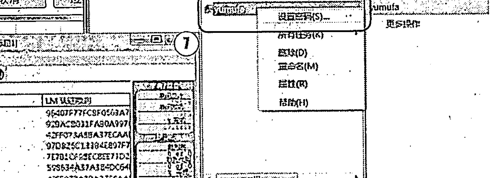

- 5. 启动控制台后，点击“文件→打开”，打开D:\windows\system32\lusrmgr.msc文件，依次展开“本地用户和组→用户”，在这里就可以任意对原来的账户进行密码重置，或者新建管理员账户直接登录Win8了(图6)。

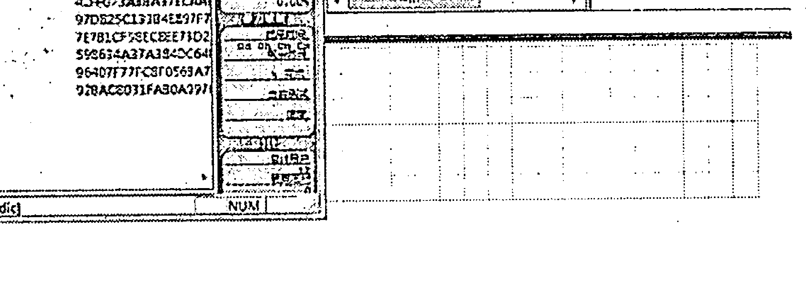

## 暴力破解

适合用户: 任意
使用条件: 通过软件工具来完成。
破解方法: LC5暴力破解

上述密码重置的方法虽然简单，不过如果你的账户在Win8中使用过EFS加密，那么并不建议使用密码重置，因为这样会造成EFS加密文件无法打开，造成数据丢失。对于这类用户可以尝试使用LC5来暴力破解。因为Win8账户密码是加密保存在“系统分区:\windows\system32\config\SAM”文件。

- 1. 到http://www.pc6.com/softview/SoftView_61048.html下载所需的软件，然后在另外一个系统(可以使用PE系统)提取Win8安装盘下的“系统分区:\windows\system32\config\SAM”文件。

- 2. 在任意正常电脑上启动LC5后，单击“会话→导入”，在打开的窗口选择从文件导入，单选“从SAM文件”。单击“浏览”选择提取到的SAM文件。接着返回程序界面，单击“会话→会话选项”，勾选所有破解设置，单击“确定”返回程序界面。此时程序会自动列出SAM文件中的所有账户，单击“会话→开始破解”，LC5就会开始暴力破解密码。破解成功后，使用破解的密码就可以登录Win8了(图7)。

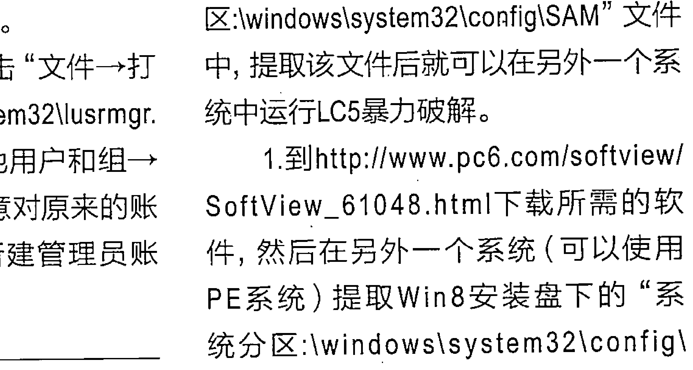

# 隐藏文件 安全便捷两不误

每个人电脑中都有些自己的秘密文件，藏好这些文件最好的方法当然是将它们保存在隐藏目录或者分区中。如何能在保密的同时，不给自己的操作带来不便呢？来看看达人的技巧方案。文|平淡

除了借助第三方工具以外，本机实现文件隐藏的方法其实很多。如果你以后想更换Win8系统，掌握这些技巧还是很有必要的。

### 巧妙废除文件显示项目功能

适合用户：“菜鸟”级用户 运行注册表编辑器，依次打开左边窗口的树状目录，进入HKEY_LOCAL_MACHINE\SOFTWARE\Microsoft\Windows\CurrentVersion\Explorer\Advanced\Folder\Hidden\SHOWALL，在右边的列表窗口里可以找到CheckedValue项，用鼠标右键点击该项，在弹出的菜单里选择“修改”，打开“编辑DWORD值”窗口，将窗口中的“数值数据”由原来的1修改为0，点击“确定”，然后关闭注册表编辑器即可。 设置完注册表，在“文件夹和搜索选项”中，点选“不显示隐藏的文件、文件夹或驱动器”后，已经设置为隐藏属性的文件就实现了深度隐藏，即使在“文件夹和搜索选项”中点选“显示隐藏的文件、文件夹或驱动器”，也无法显示已经隐藏的文件。 要想重新显示隐藏文件，必须再次打开注册表编辑器，修改HKEY_LOCAL_MACHINE\SOFTWARE\Microsoft\Windows\CurrentVersion\Explorer\Advanced\Folder\Hidden\SHOWALL的CheckedValue项，将该项的“数值数据”修改为原来的1。

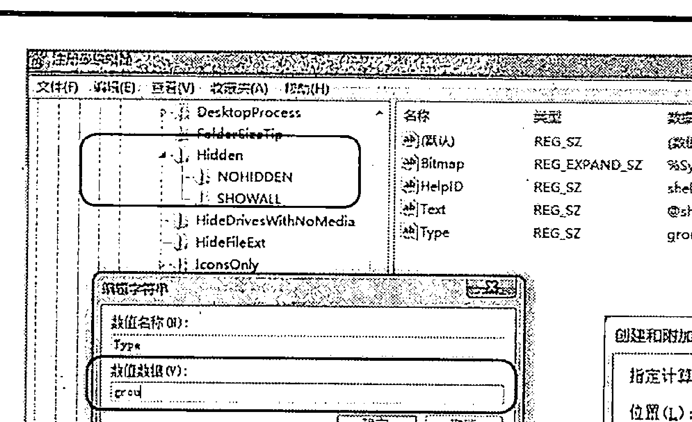

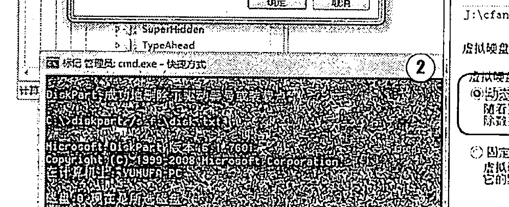

### 让文件显示项目彻底“隐身”

适合用户：“菜鸟”级用户 上面说的方法只是让显示项目功能消失，如果连显示项目选项一起隐身，岂不是更安全？ 仍然是打开注册表编辑器，进入HKEY_LOCAL_MACHINE\SOFTWARE\Microsoft\Windows\CurrentVersion\Explorer\Advanced\Folder\Hidden，在右边的窗口中修改Type项的“数值数据”，原来的值为group，用户只要去掉一个字母即可，比如可修改为grou（图1）。 设置完成后，已经看不到“不显示隐藏的文件、文件夹或驱动器”和“显示隐藏的文件、文件夹或驱动器”选项，更别说修改了。 要恢复这两个选项，重新打开注册表编辑器，修改HKEY_LOCAL_MACHINE\SOFTWARE\Microsoft\Windows\CurrentVersion\Explorer\Advanced\Folder\Hidden的Type项，将该项的“数值数据”修改为原来的group即可。 上述两种方法都是针对注册表进行修改来达到一定的隐藏目的。如果遇到对电脑注册表有所了解的人就无用了，那就需要接着往下看了。

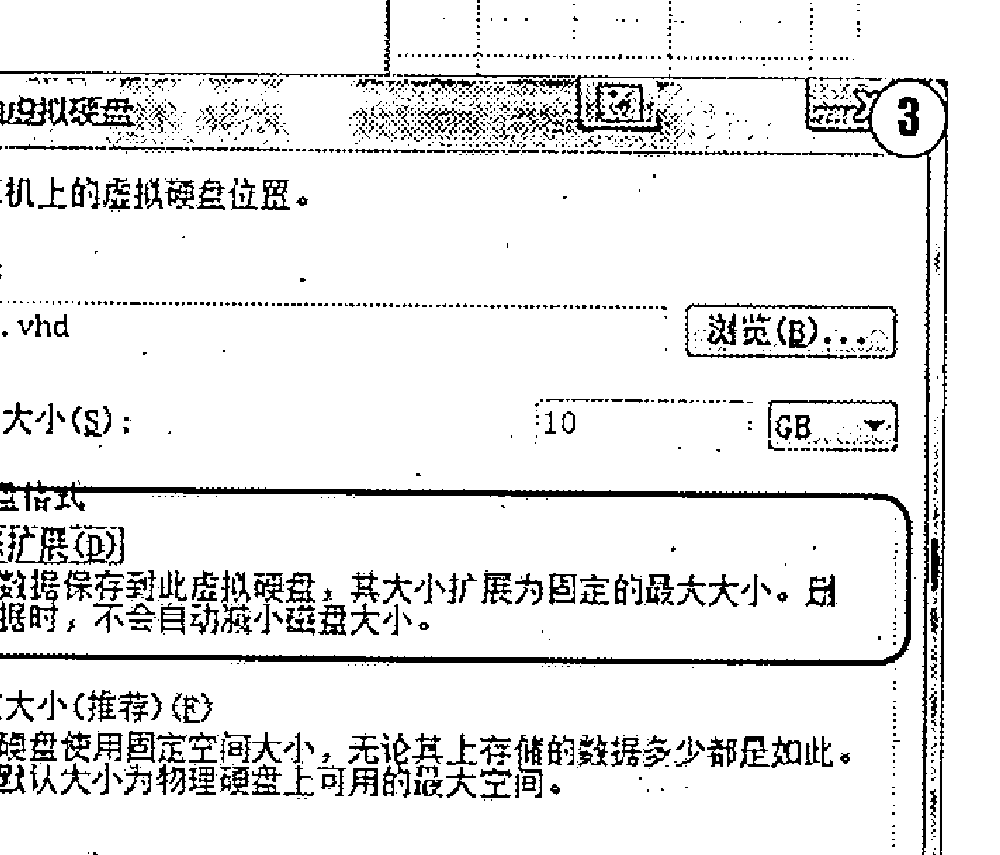

### 分区无盘符 访问随意加

适合用户：有电脑基础的“小虾” 平常访问文件都需要借助盘符，因此如果需要保护某一分区内的所有文件，可以在保存完文件后将其盘符删除。这样其他用户就无法访问其中的文件了。盘符删除很简单，进入“存储→磁盘管理”后选中需要删除盘符的驱动器，右击选择“更改驱动器号和路径”，在弹出的窗口点击“删除”即可。

### 快速访问工具：Diskpart批处理

分区没有盘符可以安全保护文件，不过每次访问时需要为其分配盘符才能进入。借助diskpart命令可以自动为分区分配和删除盘符。假设自己的文件全部保存在分区9，需要分配的盘符为K:。启动记事本依次输入下列文本并保存为disk.txt、disk1.txt、on.bat、off.bat，均放置在F盘。

```
1.disk.txt的内容如下：
select disk 0
select partition 9
assign letter=k
2.disk1.txt的内容如下：
select disk 0
select vol 8
remove letter=k
注意：因为卷的序号是从“0”开始（分区序号则从“1”开始），所以分区9的卷号是8
3.on.bat的内容如下：
Diskpart /s f:\disk.txt
4.off.bat的内容如下：
Diskpart /s f:\disk1.txt
```

这样当我们需要为分区分配盘符时，只要运行on.bat即可，访问完毕再次运行off.bat即可删除盘符（图2）。

### 无中生有 VHD分区快速访问

适合用户：有电脑基础的“小虾”
Win7支持VHD分区的创建和加载，因此对于很多分区较少的品牌机用户，如果希望将自己的隐私文件保存在某个分区，可以自行创建VHD分区来保护数据。VHD分区的创建很简单，进入系统磁盘管理，右击选择“创建VHD”，在空闲空间较多的NTFS分区创建一个名为cfan.vhd的文件，假设大小为10GB，类型为“动态扩展”，单击“确定”后即可创建一个大小为10GB的VHD分区，加载并完成初始化后就可以用来保存文件了（图3）。

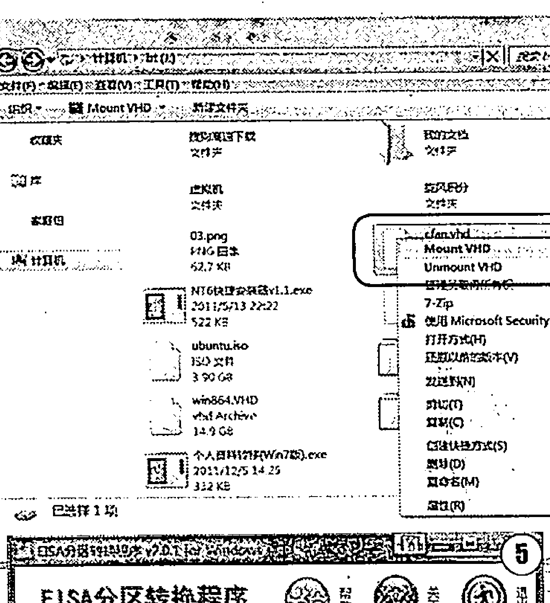

### 快速访问工具：右键菜单

保存在VHD分区的文件在VHD卸载后可以很好地保护其中文件的安全。不过自己访问时都需要在磁盘管理中加载。现在只要到http://dwz.cn/cfan12下载所需的注册表文件，下载后导入系统，导入以后要加载VHD分区，只要右击VHD文件选择mount或unmount，即可一键加载/卸载VHD文件（图4）。

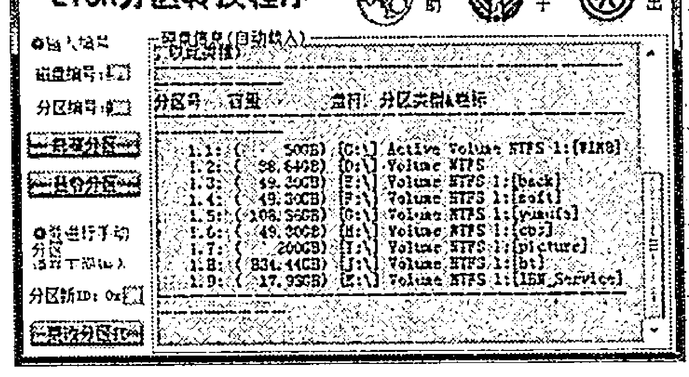

### 保护分区 无痕迹访问

适合用户：“大虾”级用户
大家知道为了数据安全，很多品牌机都是将本机驱动和初始备份放置在EISA分区（在Win7磁盘管理显示为“系统保护分区”）。这个分区在Windows中默认是无法直接访问的，可以很好地保护文件的安全。
对于本机没有EISA分区的朋友可以到http://dwz.cn/cfan69下载制作软件EISA-v2.0.1.exe。首先准备一个任意分区作为私人文件的存储目录，文件存储完毕，以管理员身份启动EISA-v2.0.1.exe，接着在程序界面中，磁盘编号输入1，分区编号输入9，单击“隐藏分区”，将该分区转化为EISA分区即可（如果要取消隐藏分区，只要选中隐藏分区，单击“显隐分区”），成功刷新后分区9就变为EISA分区了（图5）。


再次重启电脑后就无法在资源管理器中直接访问分区9了，打开磁盘管理可以看到新增一个OEM分区标示的隐藏分区，右击该分区只有“帮助”选项，无法在Windows中直接访问了。

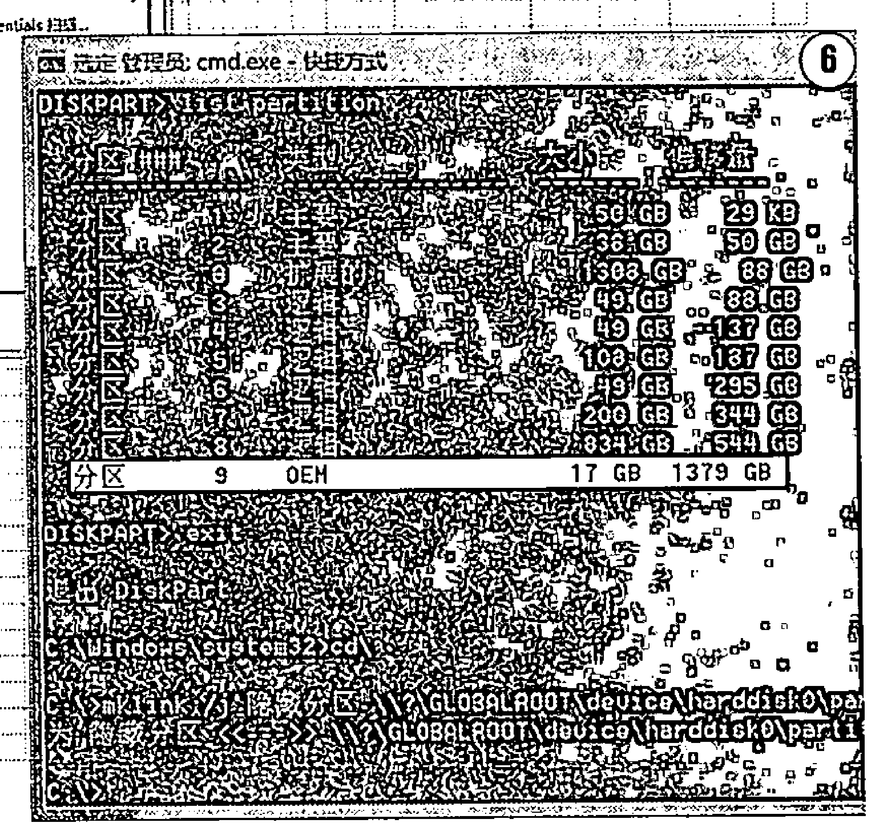

### 快速访问工具：Mklink命令行

默认情况下无法直接访问EISA分区，不过这个分区仍然可以被系统识别，只要借助Mklink命令，为隐藏分区创建一个链接即可为自己访问提供方便。
首先以管理员身份启动命令提示符依次输入下列命令：

```
Diskpart
Select disk 0
List partition
```
记住“类型”为OEM分区的序号，接着输入exit退出diskpart，继续输入下列命令即可在C盘下创建一个名为“隐藏分区”的链接（图6）。
```
mklink /j 隐藏分区 \?\GLOBALROOT\device\harddisk0\partition9\
```
命令解释：/j为创建目录链接，链接到\?\GLOBALROOT\device\harddisk0\partition9\，即第一硬盘的分区9。
以后如果要访问EISA分区的内容，我们只要打开“C:\隐藏分区”这个目录链接即可。

## 修复U盘中的病毒Word文档

文|王昌红

本人的工作机安装了Windows XP系统，小李准备在我的计算机上打印一份文稿，U盘刚插到计算机上，360杀毒软件就提示有病毒。当时也没在意，就按提示进行全盘杀毒操作了。等查杀完毕后，发现U盘上所有的Word文件竟然不翼而飞了。U盘上的文件没有备份，这可怎么办呀!

### 恢复隔离区中的文件

仔细回忆了杀毒过程，有可能是360杀毒软件把这些文档当病毒给清除了。马上启动360杀毒软件，单击“病毒查杀”选单，在该窗口下方的“隔离与恢复”处单击一下，进入360杀毒隔离区窗口。

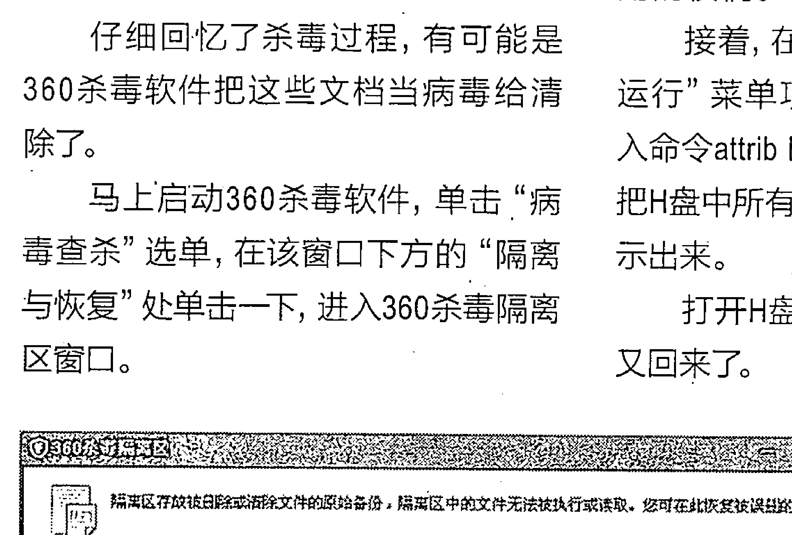

### 找出消失的Word文档

通过上述办法恢复出来的文件全是EXE文件格式，不是我们所需要的Word文档。也许病毒程序把Word文档给隐藏了吧，这是某些病毒惯用的伎俩。接着，在桌面处依次单击“开始→运行”菜单项，在“运行”对话框中输入命令attrib h:\*.* -h -s（图2），确定后就把H盘中所有的隐藏文件和系统文件显示出来。打开H盘后，那些失踪的Word文档又回来了。

```
attrib h:\*.* -h -s
```

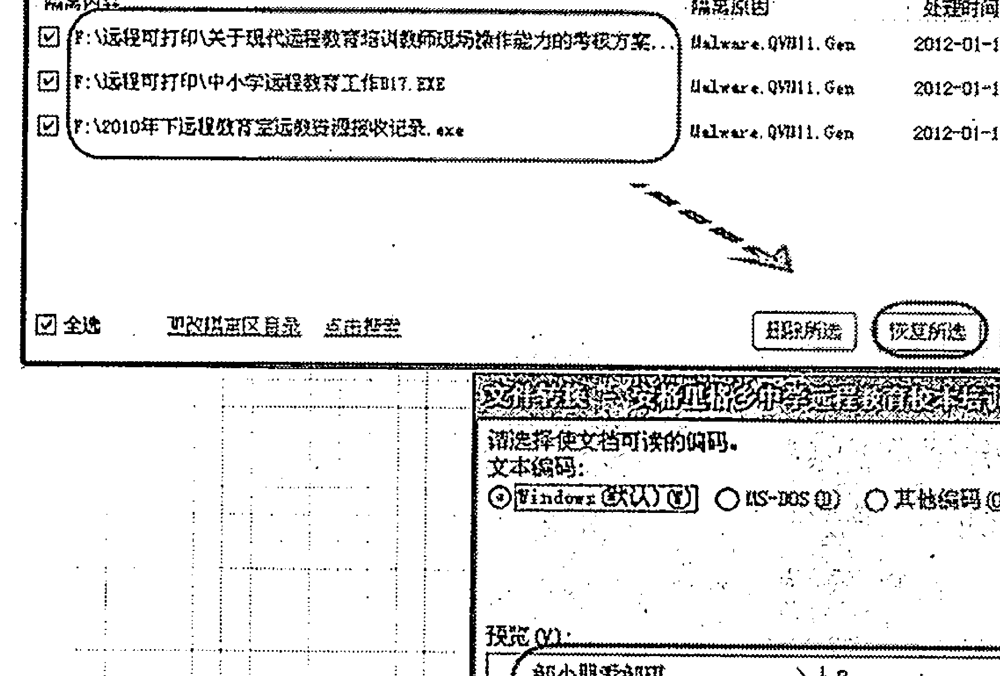

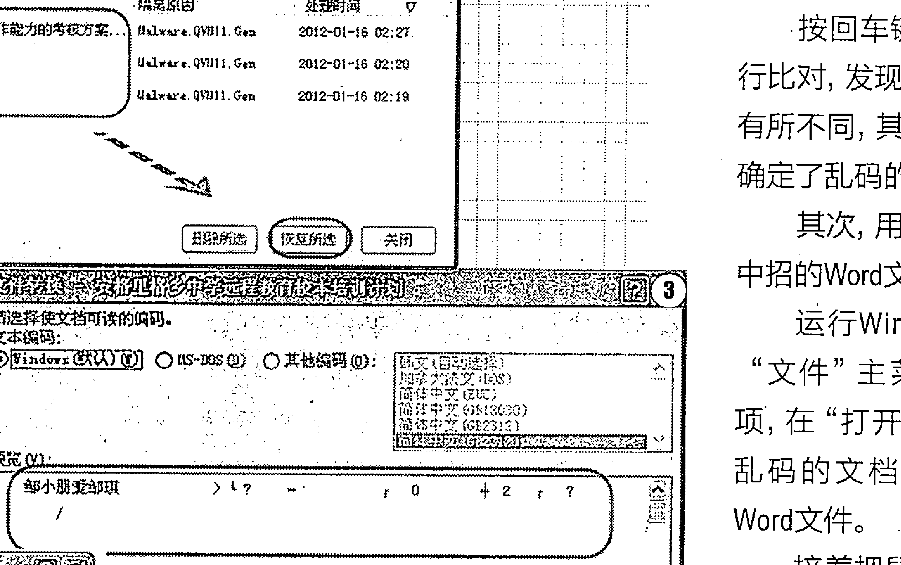

### 修复Word乱码

打开其中的一个Word文档，弹出提示“Word无法启动转换器mswrd632”的对话框，单击“确定”时提示选择文本编码，把编码文本设置为“Windows(默认)”后，打开的文档首行有“邹小朋爱邹琪”的文字，后面的内容则全是乱码（图3）。首先，Word文件头被木马病毒给篡改了，一定要找出乱码所在位置。把没有中招的同版本下的任意Word文档复制到C盘，同时把有乱码的文档改名后复制C盘中，使这两个文档处于同一目录下。接着，在桌面处依次单击“开始→运行”菜单项，在“运行”对话框中输入cmd命令，打开DOS命令窗口界面。然后在C:\命令提示符下输入命令：FC /B 中小学远程教育工作b23c.doc 中小学远程教育工作b23c1.doc 按回车键后开始对这两个文档进行比对，发现两个文档在前12行的代码有所不同，其余的代码都相同，这样就确定了乱码的位置（图4）。其次，用正常的Word文件头来修复中招的Word文件。运行WinHex程序，单击窗口下的“文件”主菜单，选择“打开”菜单项，在“打开”对话框中，把那个出现乱码的文档找到，双击即可打开该Word文件。接着把鼠标指针移到WinHex数据区的首行，在D7处按住鼠标右键向右拖动到F7位置处，总共选中24个字符。接着单击“编辑”主菜单，选择“填充选块”，在打开的对话框里

```
FC /B 中小学远程教育工作b23c.doc 中小学远程教育工作b23c1.doc
```

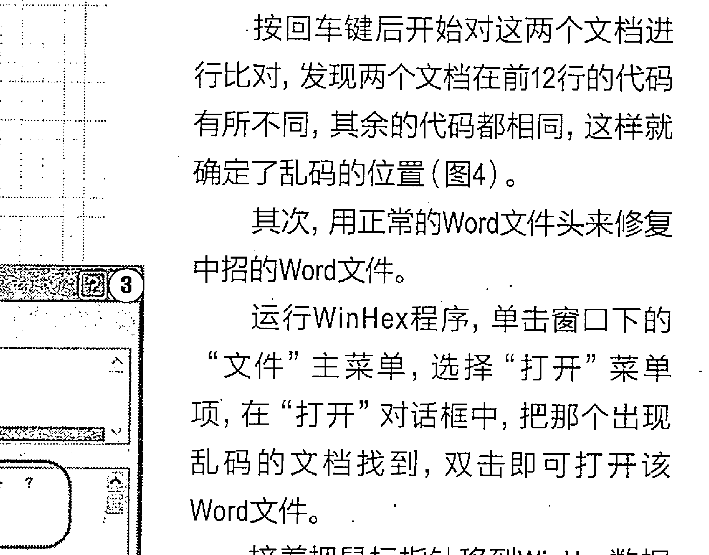

单击“填充十六进制数值”，在文本框中输入Word文件头的前24个字符“D0CF11E0A1B11AE100000000”，确定后就完成了Word文件头的修复（图5）。

这是一种在杀毒软件无法解毒情况下的应急解决方案。

再次单击“文件→另存为”菜单，在文件名处给修复过的文档重新命名，单击“保存”完成修复操作。

双击打开该文档，可以正常打开，修复成功了。

### 清除U盘系统中的Word病毒

- 1. 重启电脑进入Windows XP的安全模式下，插入U盘后，双击打开U盘。依次单击“工具→文件夹选项→查看”菜单，在“显示系统文件的内容”和“显示所有文件和文件夹”列表项上单击一下，把它们前面的选框给选中，同时把“隐藏已知文件类型的扩展名”前面的复选框给去掉，单击“确定”完成设置。

- 2. 这时可以看到U盘中每个Word文档都有两个文件名相同的文件。接着，把U盘中所有的exe格式的文件全部选中，右击选择“删除”菜单进行删除操作。

- 3. 在U盘中找到Recycled文件夹，删除该文件夹。否则，再次插入U盘后，该文件夹下的文件会自动运行，使“显示所有文件和文件夹”选项失效，文件又会被隐藏起来。

### 清除硬盘上的Word病毒

U盘中被感染的Word文件复制到硬盘中后，病毒就会在硬盘和内存中驻留，感染所有打开的Word文档，并且自动生成一个文件名相同的EXE文件。

也就是说，在Word文件复制过程中，它会自动产生另一个EXE文件复制到你的设备中，病毒文件就是这样进行传播的。

要想阻止病毒文件的传染，必须切断传染源。

首先，按Ctrl+Alt+Del组合键，激活任务管理器。单击“进程”选项查看正在运行的进程，发现两个进程文件Rundll32.exe和Svchost.exe同时存在（图6），其中Svchost.exe所在路径比较可疑，在该进程处右击“打开所在目录”，打开C:\Documents and Settings\All Users目录，而该文件一般是存在于C:\Windows目录下，断定这就是病毒源。

### 延伸阅读

一旦感染了乱码病毒，用常规的方法打开Word文档绝对是乱码。通过反复的试验，找到了另一种打开有乱码的Word文档的方法。

- 1. 关闭系统中的防火墙和杀毒软件，否则打开那些有乱码的Word文档时就会提示有病毒。

- 2. 第二步，双击运行那个EXE格式文件。因为中毒后会产生两个文件主名一样的文件，只不过一个是DOC格式，另一个是EXE格式，它们的文件大小都是90.5KB。当运行那个EXE格式文件时，它在加载病毒进程的同时，自动运行了与它同名的Word文档。虽然它的目的是欺骗我们用户，但也可以被我们所利用。

这个时候，在打开的文档中进行另存操作，把它保存到电脑的其他位置。然后再用杀毒软件或者手工方式进行杀毒，把系统中的病毒全部给清除。

再次打开那个另存的文档就不会被感染病毒了。

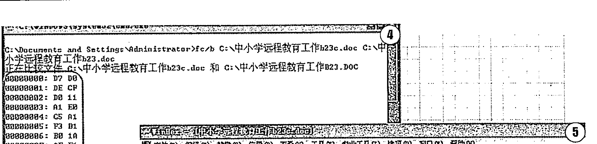

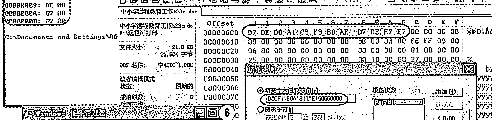

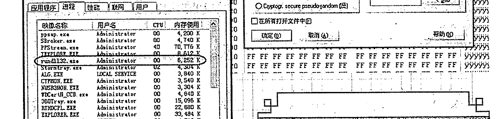# 快速搞定不合适的音视频

音频或视频文件不合适需要处理怎么办？如果你不是专家也没关系，让我们用最简单的办法一站搞定不合适的音视频处理。

文|东升

通常情况下，对于音乐或视频文件，我们都是拿来就用。但也有不合适的时候，听着不合适或看着不合适，这时，就需要用软件来处理。但音视频处理一般需要用到一些专业的软件或方法，因而一般用户有些畏惧感。在网络音视频社区我们常常可以看到有关音视频方面的问题，以下几个是读者最常问到的：

- 我珍藏的老CD怎么装在手机里播放?
- 借朋友的DVD光盘能装在平板里播放吗?
- 视频讲座能不能装手机里只听不看?
- 拍摄的片段录像如何合成一个连续文件?
- 如何给拍摄的风景录像配上解说词?

面对这些问题，网上的答复多数也是提供一种看起来很专业的软件处理方法。实际上，如果你能合理使用得力的工具和方法，你很快就能成为驰骋天下的音视频“处理能手”。格式工厂这个软件我想你应该知道，别以为它只是用来转换同类文件格式的。如果你能充分挖掘和合理利用它，就能够音视频处理的方方面面解决你所遇到的实际问题。

# CD装入手机听

家里藏着许多精品音乐CD，然而现在是数码移动设备盛行的时代，有谁还会怀揣着个CD播放机在大街上窜呢? 这种方式虽然过时了，但里面的声音却仍然是十足的原声，没有过时。那么，就用最简单的方法把它们取出来，装进你的MP3播放器或手机里吧。

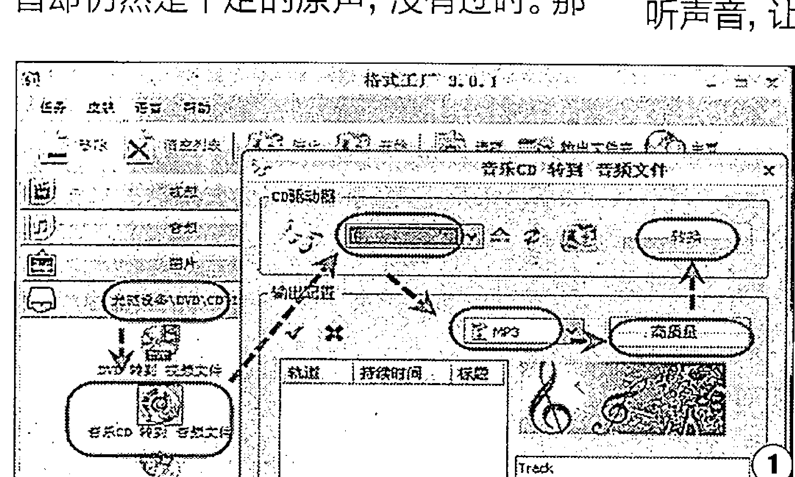

启动格式工厂，切换到“光驱设备”菜单栏，选择“音乐CD转到音频文件”一项，在弹出的窗口中设置好CD光盘所在的光驱位置，输出音频的格式和质量等，点击转换按钮即可完成CD到MP3或其他常见音频格式的转换(图1)。

# DVD大片进平板

市面上流行的多数正版大片以DVD光盘的形式存储，但我们现在流行的看片方式是手机或平板。那么如何将DVD大片装进手机或平板呢? 相信下面的方法不比你知道的任何方法复杂。

同样通过“光驱设备→DVD转到视频文件”进入转换窗口，选择DVD光盘所在光驱位置并设置好视频格式和输出质量，点击“转换”即可方便地获得需要的视频文件，拷入平板即可欣赏了。

# 视频也能变音频

不知你看没看过这样的讲座，一个专家坐在台上讲，画面自始至终基本没有什么变化，有用的信息只是其中的声音，你闭着眼睛照样可以掌握其中的精髓。这样的讲座，你完全可以把它们装在手机里，外出时在路上听。然而，如果把视频直接装在手机里面，你只听声音，让视频播放在那里白白消耗电力，那很不科学。其实，我们完全可以用最简单的办法将视频节目变成音频，装在手机里，关掉屏幕，省电收听。

我们只需要在格式工厂中选择“音频”一栏中的“所有转到MP3”或其他音频项，然后在转换窗口中将源文件添加为想要转换的视频文件，设置好参数，即可获得由视频中抽取的音频文件。

# 碎片文件巧合成

外出采访录音，或者在外面拍摄生活录像，有时为了节省存储空间，常常会将一个场景下的声音或画面分成若干个段落进行录制或拍摄。回来之后，为了做成一个连贯的节目，还得将这些音频和视频文件组合起来。一般情况下，人们多用一些专业的音视频合成软件(如会声会影)来进行文件合并。其实，有更简单的办法。

通过格式工厂的“高级”选项，选择“视频合并”或“音频合并”，选择所有的零碎音频或视频文件，设置好输出的文件格式和输出质量参数，确定之后即可实现合并，获得完整连贯的音频或视频文件。

# DV录像巧配音

有时，我们需要给自己已有的DV风景旅游录像配上自己录制好的解说词。这时也不需要专业的音频合成软件，用格式工厂同样能搞定。

选择软件的“高级→混流”命令，在窗口中分别选择已有的录像文件和解说词音频文件，设置好视频输出格式，确定即可获得配有解说词的旅游纪念视频文件了(图2)。

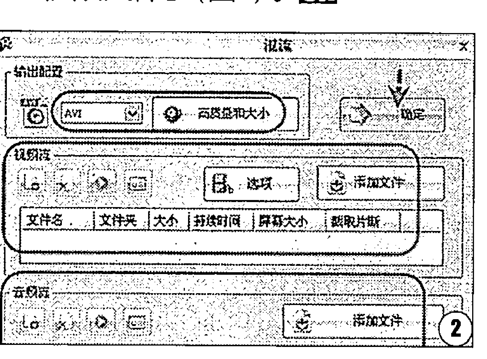

## 嘘！现在应该静音

在需要安静的公众场合使用笔记本，忘了手工调成静音，如何才能不让你的本本随便发出扰人的响声？
文|曹春华

有次笔者参加学术讨论会，旁边一位同事玩弄笔记本时，不小心关闭了本本，那关机时的音乐声显得特别“吸引”人。无独有偶，一位同事的本本因为长时间没有操作，进入了屏保，可屏保中偏偏也有声音飘了出来，搞得这位同事很尴尬。看来，在忘记手工静音的情况下，得让到处移动的本本该静音时就静音。

### 开关机 注销 屏保全静音

为防止笔记本在关机、重启等无意的行为中发出声音，可以用软件Auto Mute（下载地址：http://www.jz5u.com/Soft/system/Other/32459.html）来避免这种情况。

软件运行后，第一项Automatically run program on startup应该勾选，它表示软件开机自动运行。以下这三项：On logoff,sleep,suspend,and shutdown、If computer has been locked、When screensaver appears也应该勾选，分别表示注销、休眠、关机、锁定、屏保时均静音（图1）。

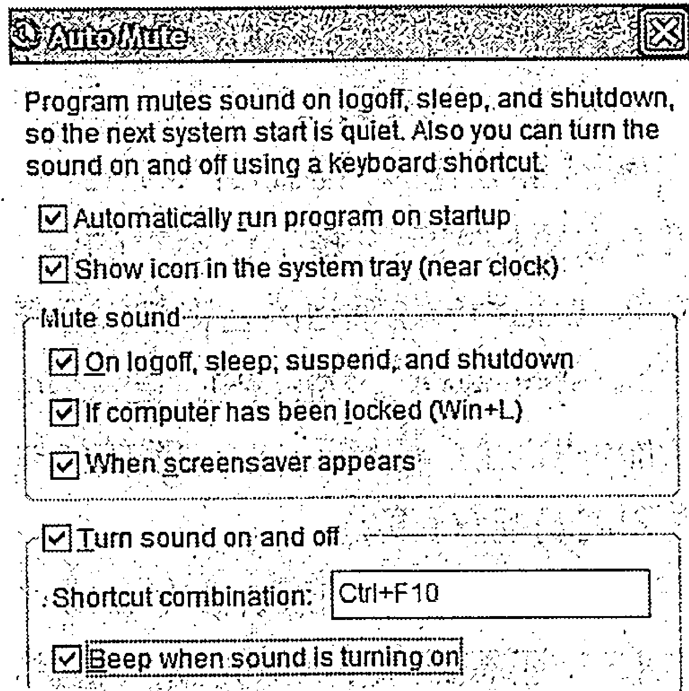

在静音状态下，可以通过快捷键Ctrl+F10关闭静音，再次按下又进入静音状态。

### 指定时段静音

深更半夜，或者午休期间，笔记本突然发出声音，舍友会以怎样鄙视的眼光看你？遇到这种情况，不妨用软件“系统定时静音控制系统”（下载地址：http://www.jz5u.com/Soft/system/Other/32459.html）来指定在多个不同的时段来实现自动静音。

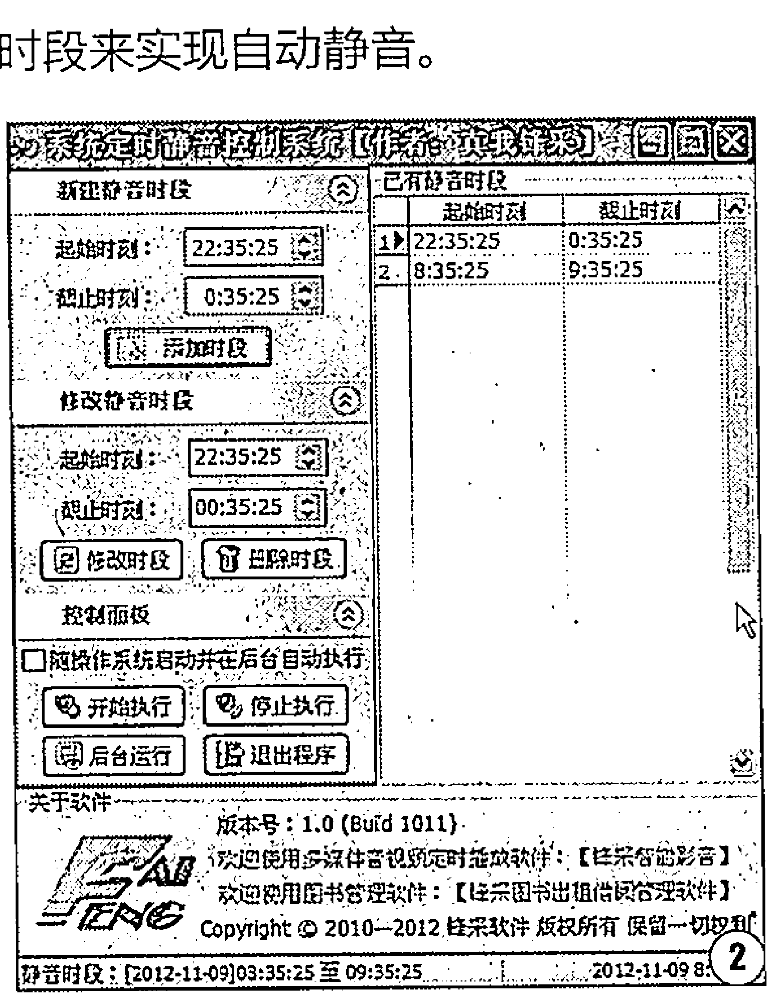

软件运行后，在“新建静音时段”中，指定静音的起始、截止时刻，单击“添加时段”加入到右侧时段列表中，可以通过这种方法加入多个静音时段，然后单击“开始执行”即可。这种情况下，即使系统音量图标未切换到静音状态，到达指定时段，都不能听到任何声音，直到我们单击“停止执行”方可恢复。为让软件每天都能自动运行，应该勾选“随操作系统启动并在后台自动执行”一项（图2）。

### 怕分神 听完音乐自动静音

闲暇之时，听上一段音乐，放松心情后再投入工作，效率会提高几倍，但专心致志于工作之时，电脑发出的声音可能就会分散我们的注意力了，能不能让音乐播放停止后，自动进入静音状态呢？完全可以，用软件den4b Shutter（下载地址：http://www.den4b.com/?x=downloads）可以轻松实现。

下载时，选择下载Beta版本。软件运行后，单击Event上方的Add按钮，弹出添加事件窗口（图3），事件动作选择Process Stops，Process name选择音乐播放器名称，比如使用QQ音乐播放器，则选择QQMusic.exe，默认为每隔5秒钟检查一次事件动作，可以自行设定，完成后单击Add返回到主界面。

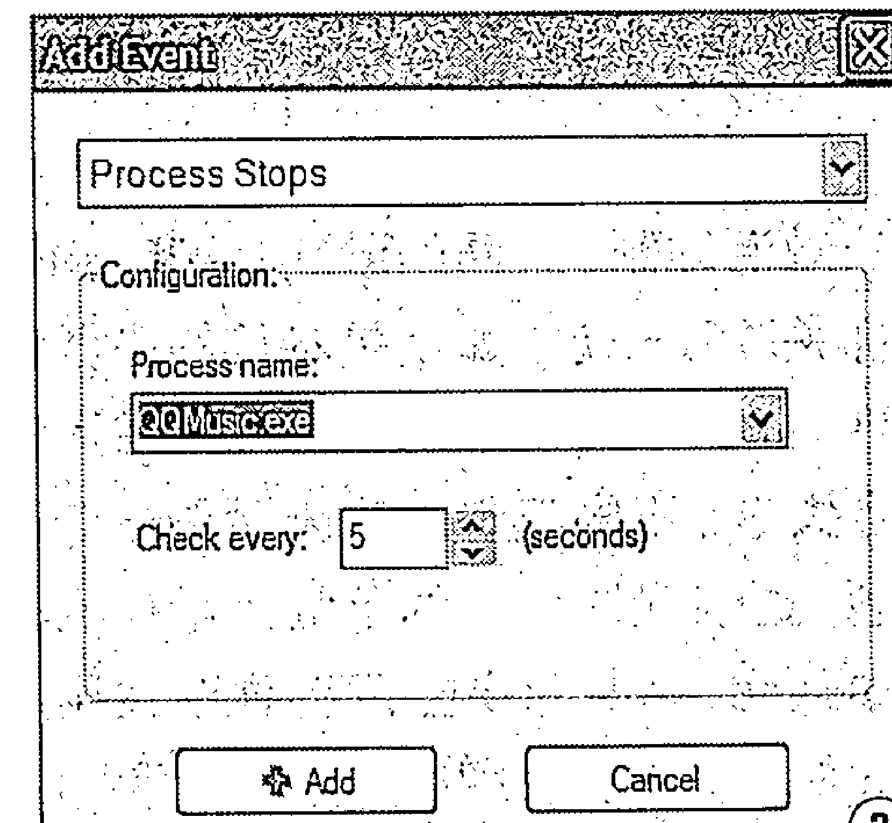

再单击Action上方的Add按钮，弹出添加动作窗口，动作选择Volume，类型选择Mute，单击Add返回主界面。

单击Start（图4），进入监控状态，一旦检查到QQ音乐播放器被关闭，将执行静音动作。为让软件随机启动，依次打开Options→Settings→General，勾选Autorun at windows startup即可。

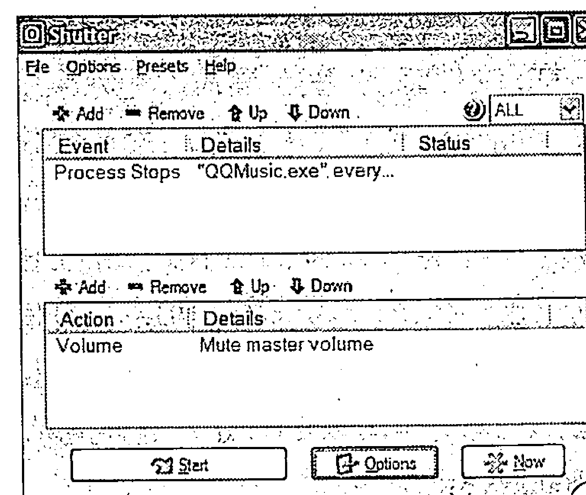

《电脑爱好者》·合订本{软件方案}

# 无重启激活完美移动Win8

虽然可以使用Windows To Go制作移动Windows 8，但是却有各种限制。本文介绍如何制作没有限制的完美移动Windows 8。
文/技术鱼

使用Windows 8的朋友都知道，通过系统内置的Windows To Go可以轻松制作出在U盘上运行的Windows 8系统。但是U盘移动系统需要在不同的电脑上使用（否则就没有意义了），由于硬件信息的不同，在其他电脑上使用时需要重新激活才能正常使用。如何制作出在不同电脑上都可以完美运行的移动Windows 8? 其实只要使用VHD版的Windows 8即可绕过这些限制。

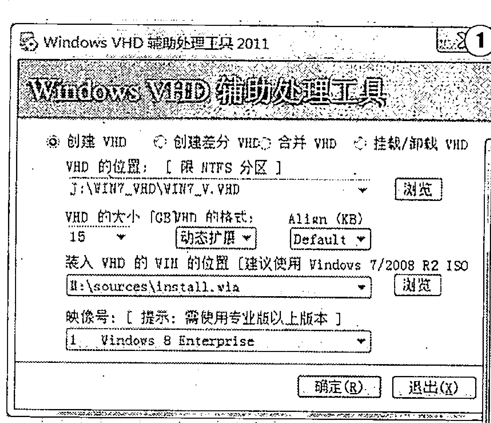

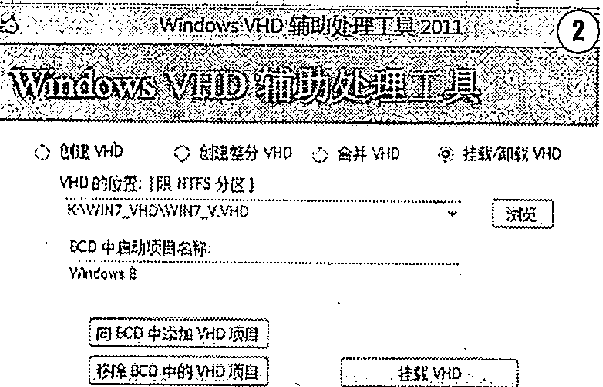

## VHD版Win8怎么绕过激活

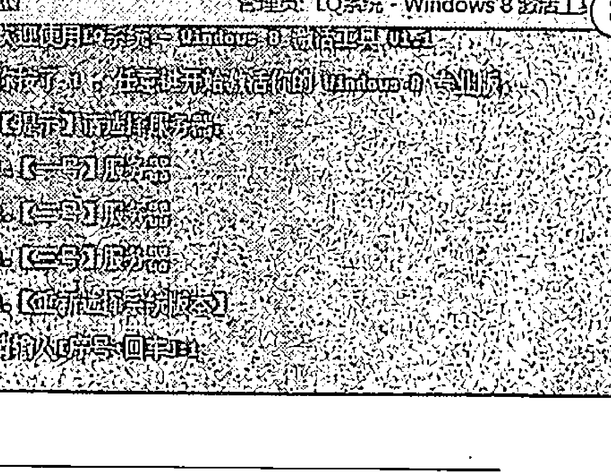

大家知道Windows 8使用更为严格的激活限制，普通的激活是和电脑硬件关联在一起，即使是本机的主要部件（如主板、硬盘）发生变化，激活也会失效。不同电脑上的激活是一个难题，更何况是在不同电脑上运行的移动Windows 8。不过为了方便企业用户的使用，对于使用KMS方式激活的系统，微软是允许这个移动系统在其他电脑上合法使用的，因为Windows To Go这个功能本身就是为企业用户提供的。对于使用KMS激活的Windows 8，它的激活状态只是封装在Windows 8系统中（和硬件并没有关联，但是最多每180天需要重新激活一次），因此可以实现在其他电脑上的正常使用。

Windows To Go制作的移动Windows 8，系统目录结构和本地Windows 8系统一样，文件繁杂，很容易被误删除系统文件而无法运行（因为移动设备经常需要和其他人交换资料）。而VHD系统就是一个完整文件，它可以保存在任何位置，所以在本机做好VHD系统并使用KMS激活后，我们将其复制到移动设备，这样制作出来的才是完美的移动Windows 8系统。

## 超简单制作VHD版Win8

CFan以前有过不少VHD系统制作的介绍了，不过方法有些复杂，对制作者的技术要求较高。所以这里我们介绍一种超简单的方法，通过“Windows VHD 辅助处理工具 2011”即可轻松完成。

第1步：使用虚拟光驱加载Windows 8安装镜像（专业版、企业版镜像才能支持VHD启动）。接着到http://dwz.cn/cfan100下载“Windows VHD辅助处理工具2011”并解压到D盘。以管理员身份运行其中的VHD_OneKey_2011_51-Shortcut，单击“创建VHD”，然后按下列的提示创建VHD系统（图1）：

VHD位置：选择一个NTFS格式，空闲空间较大的分区建立“win7_vhd”目录用于存放VHD文件，名称使用默认设置。

VHD大小：设置为15GB，动态扩展类型。

装入VHD的WIM的位置：选择加载到虚拟光驱中的sources\install.wim文件。
其他选项选择默认设置，单击“确定”即可将Windows 8安装到虚拟VHD文件中。

第2步：完成镜像的释放后，返回程序界面切换到“挂载/卸载VHD”，VHD位置按提示选择上述创建的VHD文件，BCD中启动项目的名称按提示更改为“Windows 8”，然后单击“向BCD中添加VHD项目”即可完成VHD系统的制作和启动配置（图2）。

第3步：对于当前系统是Windows 7的用户，还需要打开虚拟光驱，然后将光盘根目录下的bootmgr文件复制到C盘替换同名文件。最后重启电脑，在多重启动菜单中选择“Windows 8”即可完成VHD系统的安装。

300 | 电脑爱好者 合订本·2013

## KMS激活Win8

完成VHD系统的制作后，重启进入Windows 8就可以使用KMS方式来激活它了。KMS激活既可以使用局域网内的服务器，也可以直接使用互联网上的服务器。

### 小知识

### 什么是KMS激活

KMS激活是微软针对企业用户提供的一种批量授权的激活方式。在一个局域网中, 允许一台安装并通过微软激活(电话、网站都可)的机器被当作KMS Host使用。这样局域网内的其他电脑(包括实体机和虚拟机)都可以通过连接KMS Host, 通过这台KMS主机来激活Windows 8, 而不用通过微软的网站, 省去繁杂的正版验证步骤。

- 1. 直接使用专业工具激活。网上有许多KMS服务器，比如可以使用“LQ系统激活工具”，运行程序后将出现一个命令提示符窗口。首先，需要输入Windows 8版本，1是专业版，2是企业版，接着需要选择KMS服务器，我们只需输入序号按回车即可完成KMS的激活(图3)。
- 2. 借助命令行手动激活。KMS激活还可以借助slmgr命令完成，首先我们要准备好KMS的安装密钥、KMS服务器地址，然后以管理身份启动命令提示符输入下列的命令完成激活：
- 3. 完成KMS的激活后，在命令提示符输入“slmgr /ato”可以看到激活的结果，批量激活日期限制是180天，我们只要在180天内再次激活即可延长180天的使用期限(图4)。

```
slmgr /ipk 安装密钥
slmgr /skms KMS服务器地址
```

### 小提示

对于已经使用KMS激活的Windows 8系统，如果180天到了以后一时找不到合适的KMS服务器激活，可以在激活时间前几天，尝试使用命令行让激活机制彻底停摆。以管理员身份启动命令提示符后输入下列的命令即可：

```
takeown /F %WINDIR%\System32\sppsvc.exe
takeown /F %WINDIR%\System32\sppcomapi.dll
takeown /F %WINDIR%\System32\sppcomdlg.dll
icacls %WINDIR%\System32\sppsvc.exe /deny *S-1-1-0:F
icacls %WINDIR%\System32\sppcomapi.dll /deny *S-1-1-0:F
icacls %WINDIR%\System32\sppcomdlg.dll /deny *S-1-1-0:F
```

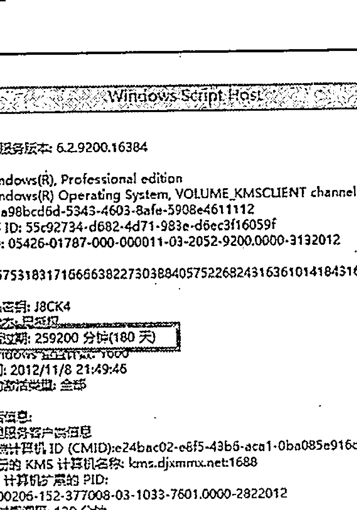

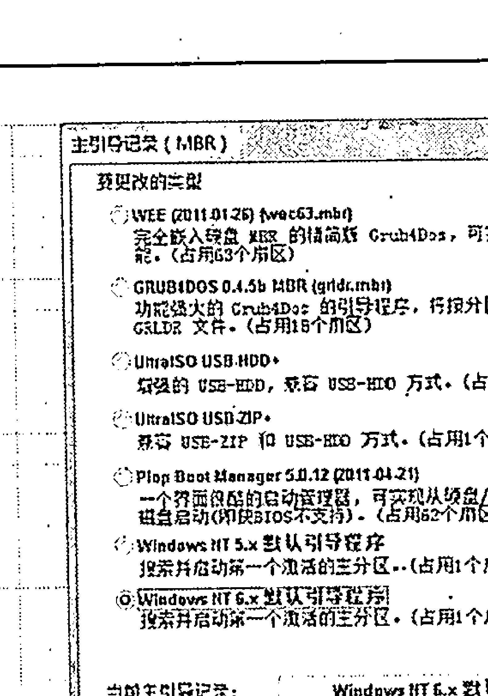

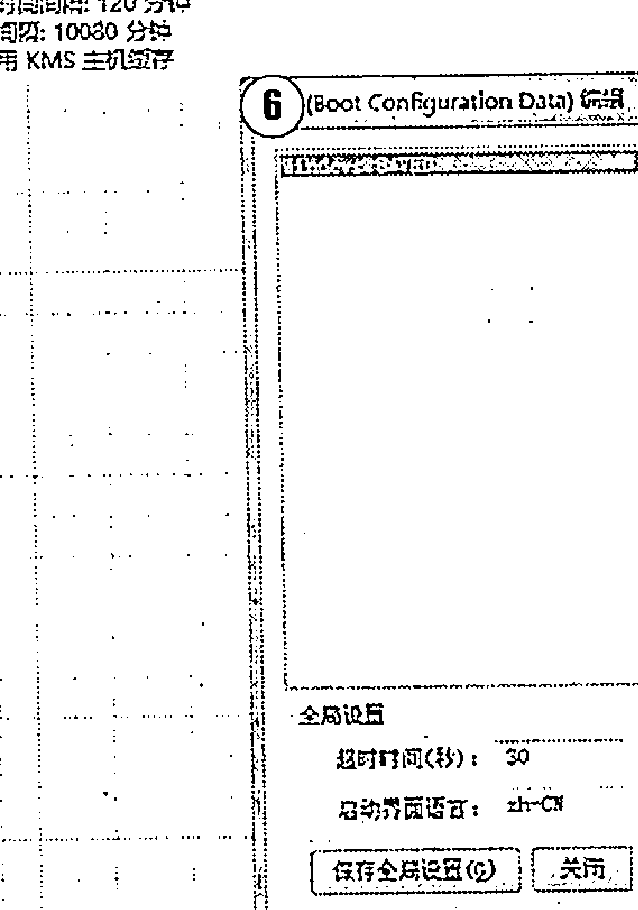

## 移动到USB设备中

通过上面的操作，我们已经制作好了KMS激活的VHD版Windows 8系统，接下来的操作只要将这个VHD文件移动到USB设备，并且配置好Windows 8启动参数即可。这里以移动硬盘操作为例。

- 第1步：退出VHD系统并进入另一个系统，准备一个包含活动主分区(NTFS格式)的移动硬盘，如果没有主分区，使用系统自带的“磁盘管理”，删除移动硬盘上原来分区，创建一个大小为20GB主分区并设置为“活动”即可。接着启动BOOTICE.EXE，在“目标磁盘”选中当前移动硬盘，然后单击“主引导记录”，按提示选择“Windows NT6.x默认引导程序”，最后单击“安装/配置”，将移动硬盘引导记录更改为NT60格式(图5)。
- 第2步：将Windows 8安装光盘下的BOOT目录、Bootmgr文件以及上述制作好的VHD文件全部复制到移动硬盘的主分区下。返回到BOOTICE.EXE程序界面，切换到“BCD编辑”标签，单选“其它位置的BCD”，选择L:\boot\bcd文件（这里L为移动硬盘主分区的盘符），接着单击“查看/修改”，在弹出的编辑窗口单击“添加→Windows NT 6.x VHD启动项”，接着选中新建的启动项，然后依次执行下列的设置。
  启动磁盘：当前移动硬盘
  启动分区：当前移动硬盘的活动主分区
  设备文件：\Windows 8.vhd
  菜单标题：Windows 8 VHD
  其他使用默认设置，最后单击“保存全局设置”退出，这样我们就顺利地在移动硬盘添加了VHD Windows 8的启动项，以后使用这个移动硬盘即可在其他电脑上完美使用移动Windows 8系统了(图6)。

# 操作更简单 简化Win8备份与恢复

Win8自带的系统刷新功能默认需要安装光盘的支持，有没有使用起来更简单更高效的办法呢？那就动手自己改造一番吧。
文|平淡

## 为什么要改造

从上面的描述我们知道，系统刷新是在卸载所有非Windows应用商店的程序后，使用安装光盘中Install.wim镜像快速重装系统。改造后有如下优点：

- 1. 使用方便。直接使用保存在本地电脑的恢复镜像，而不是默认安装光盘中的初始镜像，不再需要安装光盘的支持。
- 2. 恢复效果好。默认恢复是恢复到初始状态，自定义恢复镜像则是恢复到自己备份的状态，恢复后可以快速还原到备份前的工作状态。省去安装驱动、升级补丁等大量的后续操作。
- 3. 操作简单。改造的只是默认恢复镜像，具体操作仍然是通过控制面板的图形化菜单完成，即使是新手也可以轻松进行操作，效果就类似那些安装在本机的第三方Ghost软件。

### 小知识

什么是Win8的系统刷新
系统刷新实际上是“卸载程序（不包括通过Windows商店中的安装程序）+覆盖重装”两个操作。在我们执行这个操作后，Win8将保留个性化设置、个人文件以及通过Windows商店安装的应用程序，然后将其他应用程序全部删除，接着使用安装光盘Install.wim对应的镜像文件覆盖到系统分区。它的效果类似我们安装完系统并设置好Ghost备份的恢复。本文的改造就是自己定义本地WIM镜像，尽可能多地保留我们需要的程序和文件。

## 简单两步 自定义恢复镜像

为了方便用户制作自定义恢复镜像，Win8新增了recimg命令用于简化具体的制作步骤。

### 创建备份

制作备份之前对系统进行优化，卸载和删除不需要的程序，升级系统补丁和病毒库到最新状态。接着将鼠标移到屏幕左下角，在弹出开始菜单缩略图时右击选择“命令提示符（管理员）”，启动命令提示符后依次输入下列的命令制作自定义恢复镜像（图1）：

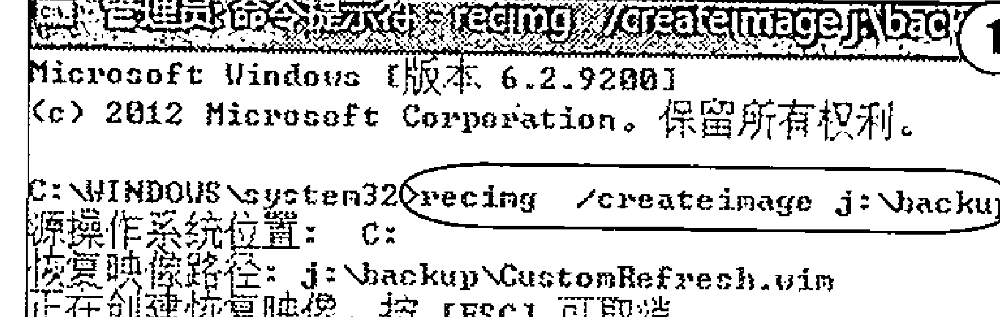

```
recimg /createimage j:\backup
```
命令解释：在j:\backup（需要预先在NTFS格式的J盘创建backup目录）创建自定义CustomRefresh.wim镜像（默认创建的恢复镜像文件名），同时将其设置为活动镜像。

```
recimg /showcurrent
```
命令解释：完成活动镜像的创建后，使用/showcurrent参数显示当前活动镜像的存储位置，确认活动镜像是上述自定义位置。

此外注意的是，recimg创建的只是用于恢复系统镜像，创建的并不是当前系统分区的完整镜像（完整镜像可以展开“控制面板→所有控制面板项→还原 Windows 7 备份”，单击左侧窗格的“创建系统镜像”完成）。因此不能在格式化C盘后，通过这里创建的镜像来还原系统。

### 恢复系统

完成上述的操作后，以后我们就可以使用创建的自定义备份来恢复系统了。

情况1：可以正常进入Win8
进入Win8系统桌面，在桌面将鼠标指针移到屏幕右侧，在浮出的菜单点击“设置→更多的电脑设置”，然后在打开的窗口依次选择“电脑设置→常规”，点击右侧窗格中的“恢复电脑而不影响你的文件”下的“开始”按钮（图2）。

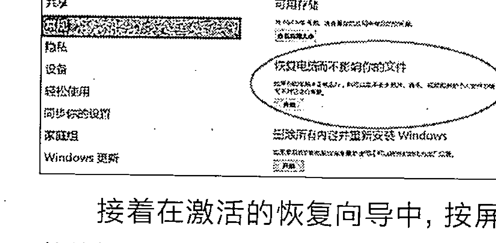

接着在激活的恢复向导中，按屏幕的提示操作，重启后就可以自动进行恢复操作，Win8会自动将系统恢复到上次备份的状态（个人文件不会删除），这样使用起来是不是很简单（图3）？

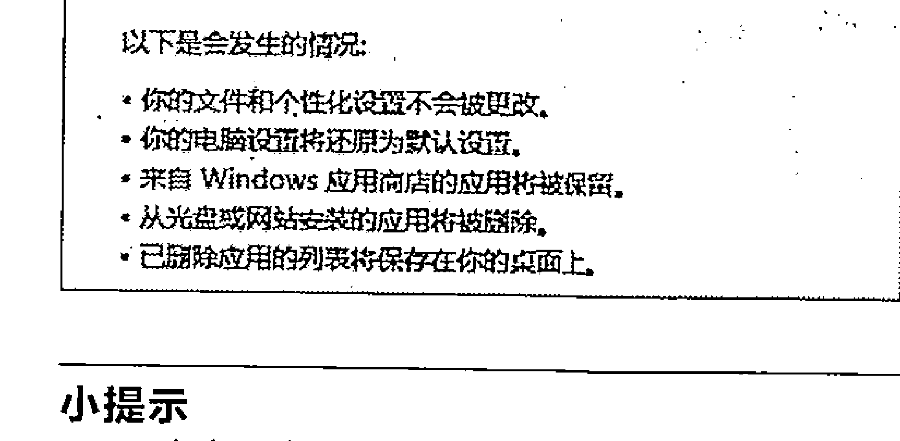

小提示
recimg命令还支持自定义选择哪个镜像作为当前活动镜像，因此我们可以在多个位置创建不同的镜像。比如每个月创建一个镜像，以后需要恢复系统时，可以使用/setcurrent <directory>参数，将活动恢复映像设置为<directory>所指定位置中的CustomRefresh.wim文件。比如设置为10月备份，这样恢复操作时就恢复到10月制作的备份。

为了解决用户系统备份和恢复的问题，Win8系统内置了多个组件供我们选择，大家可以根据自己需要选择合适的备份/还原方式。

# 情况2：无法进入Win8系统

上述的操作是在Win8可以正常进入的前提下进行的恢复操作，如果你的Win8已经无法进入又需要恢复系统怎么办？其实Win8的WinRE修复环境也自带了系统刷新组件，如果无法进入Win8系统，开机后在多重启动菜单选择Win8，然后按住F8进入WinRE修复环境，点击“疑难解答”，接着在打开的窗口点击“系统恢复”，这样即可激活系统刷新操作，剩余的操作和在Win8下是一致的。

## 自己动手 管理备份镜像

由于系统随时随刻在动态变化，即使完成系统镜像的备份后，我们仍然需要对备份镜像进行维护操作。比如添加新增硬件的驱动、升级病毒库等操作，这样下次恢复后就无需再执行同样的操作了。

### 实例1：使用DISM命令添加驱动

由于上述创建的是WIM格式的镜像文件，通过系统自带的DISM命令可以方便对其进行管理。这里以添加备份后购买的无线网卡驱动为例。

```
第1步：同上以管理员身份启动命令提示符，接着输入下列的命令将上述创建备份文件CustomRefresh.wim加载到 j:\win8目录：
dism /mount-wim /wimfile:j:\backup\CustomRefresh.wim /index:1 /mountdir:j:\win8
```

```
第2步：准备好网卡驱动文件（只要其中的.inf安装文件即可）。假设驱动文件为oem.inf，将其放置在K:\RTL8187下。继续输入下列的命令集成驱动：
dism /image:j:\win8 /add-driver /driver:K:\RTL8187\oem5.inf
命令解释：这里K:\RTL8187\oem5.inf是驱动文件存放的具体位置，此时屏幕会出现“驱动程序包已成功安装”提示。
```

```
第3步：完成驱动集成后，继续输入下列的命令卸载镜像并保存修改：
Dism /Unmount-WIM /MountDir:j:\win8 /Commit
```

### 实例2：升级病毒库

由于WIM格式镜像实际上是一个压缩文件，我们使用DISM命令加载后即可打开。这样我们就可以将新的病毒库文件自行添加到WIM文件中实现手动升级。

同上将CustomRefresh.wim加载到 j:\win8目录，加载成功后打开J:\win8目录，可以看到文件的结构就和系统分区大体是一样（USER目录缺少当前用户，所以刷新后不会丢失个人文件），我们只要把当前电脑已经升级的病毒库复制到病毒程序对应的目录下即可（图4）。

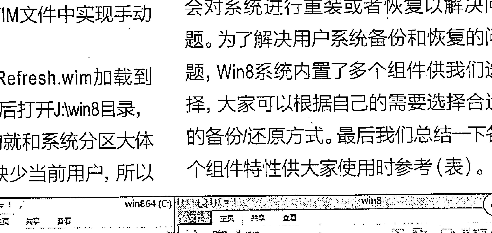

为了操作简单，可以直接复制全部文件，比如使用微软杀毒软件用户，只要将C:\Program Files\Windows Defender下的全部文件复制到 J:\win8\Program Files\Windows Defender下（系统提示正在使用的文件可以选择忽略），最后再卸载WIM文件即可完成升级。

系统使用一段时间以后，Win8总会出现各种各样的问题，这时很多朋友就会对系统进行重装或者恢复以解决问题。为了解决用户系统备份和恢复的问题，Win8系统内置了多个组件供我们选择，大家可以根据自己的需要选择合适的备份/还原方式。最后我们总结一下各个组件特性供大家使用时参考（表）。

**系统还原、刷新、重置区别一览表**

| 类别 | 适合用户 | 还原效果 |
| :--- | :--- | :--- |
| 备份和还原 | 新手 | 不会破坏个人文件，可以选择性还原备份文件 |
| 系统还原 | 新手 | 不会破坏个人文件，系统可以还原到指定还原点 |
| 创建系统镜像 | 有一定电脑基础的用户 | 彻底还原，系统还原到备份状态 |
| 系统刷新 | 有一定电脑基础的用户 | 不会破坏个人文件，但是会删除所有非应用商店安装的程序 |
| 系统重置 | 有一定电脑基础的用户 | 彻底删除所有文件，重新安装Win8 |

> 小编有话说
Win8作为微软寄予厚望的新系统，在系统维护和使用方面，微软为此增加了很多新的组件，比如上述介绍的系统刷新、recimg命令，以及Windows to go、系统重置等。不过这些新的工具在具体使用时，总是有多多少少的限制，其实对于技术达人来说都可以自己动手改造。关于Win8新组件的改造，在前几期的文章中我们也做过不少的介绍，大家可以举一反三对Win8更多组件进行改造，以便更好地使用Win8！

## 轻松打造多系统启动U盘

把多个常用的维护系统集成到一个U盘以方便使用是一个复杂的工作，本文将带你一同完成这一任务。

文 | 苏动轩

身为一名网管，经常要四处维修电脑故障，因此我手头上少不了几个维护系统。现在我手头上有几个常用系统的ISO文件，但如何将它们集成到一个U盘中却让我十分头疼。因为大家知道，多系统最麻烦的就是制作启动文件。我曾经尝试过GRUB4DOS、SYSLINUX等多种方式都不是特别成功，有各种问题：制作不够方便，启动界面不够美观……最终我发现了Xboot这款强大的启动制作软件。

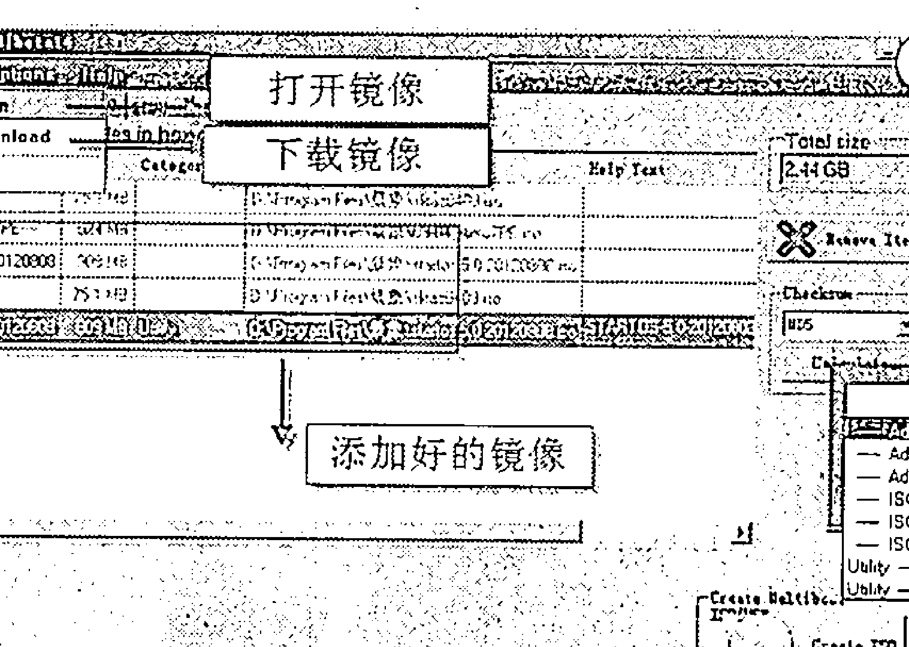

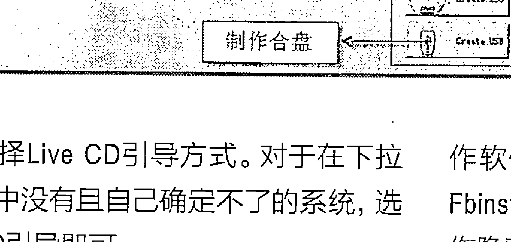

> > **小提示**
> 如果有些镜像不好寻找，可在Xboot主界面中点File→Download，在下拉菜单中选择要下载的镜像即可（图1）。

### 添加ISO文件

首先将U盘格式化。然后运行软件。在主界面中点File→Open，打开镜像，然后点Next，选择镜像类型。这是需要细分的一步，在这里可分为直接引导的ISO、可引导的Live CD、引导具体的Linux系统、引导杀毒软件等。对于PE，一定要选引导ISO，即在菜单中选择Add using gurb4DOS ISO image emulation。对于下拉菜单中有的系统如slax、slitaz、backtrack等，直接在菜单中选择对应的名称即可。

对于支持LiveCD引导的，在菜单中选择ISO files which support live media path kernel parmeter。但请注意的是对于雨林木风系统，即YLMF OS（Start OS），在下拉菜单中选择YLMF是成功不了的，应选择Live CD引导方式。对于在下拉菜单中没有且自己确定不了的系统，选择ISO引导即可。

### 将启动文件写入U盘

将各个系统全部添加好了以后，在主界面我们可以看到许多的系统名称（图2），选中一条后按F2即可将系统更名。所有的这些都做好了以后，便可以将合盘写入U盘：点击右下角的Create USB，在界面中选择U盘盘符，在选择引导方式时建议选择GURB4DOS，比SYSLinux好用，再点Next，便可以开始制作了。耐心等待后，U盘便制作好了。

### 界面美化

提示制作成功，这时退出程序，开始启动界面的美化：首先准备照片，找到图片后PS一下，将分辨率改成640×480，保存到U盘boot\syslinux文件夹下，删掉xboot.jpg，并将准备的图片改名为xboot.jpg。

### 制作隐藏启动U盘

启动U盘一旦感染病毒，启动文件也被改变。如果将文件写入隐藏分区则可以避免。通过对网上流行的PE制作软件的分析，我发现它们都是用了Fbinstool这款软件。下来就跟我一起制作隐藏分区的驱动U盘。

首先运行工具包中的Fbinstool，点击“数据管理→新建fba文件”，参数设置为主分区30MB，拓展区大小大于镜像之和。保存好fba包后，点击“选项→FBA关联”，关联fba格式，双击刚才生成的fba包，在软件的左侧Ud上点击右键，导入文件夹，将U盘中的两个文件夹导入。然后在软件右侧单击右键，选择“导入文件（主分区）”，将U盘中剩下两个文件导入，导入完成后，再点击“Fbinst菜单”，输入menu F1 grldr "grldr"，按Ctrl+S保存即可。至此，fba包已经做好了。下面将fba包写入U盘。先用系统自带的工具将U盘格式化，然后运行Fbinstool，点击“启动设置→格式化”，文件列表编码选择UTF-8，存档文件选择刚才制作好的fba包，点击“格式化”即可。到此，多系统启动U盘已经制作成功！

> > **小提示**
> U盘空间的还原
> 启动U盘制作好后，系统自带的格式化工具是不能格式化隐藏分区的，因此要还原U盘空间时，运行Fbinstool，点击“启动设置→格式化”，勾选重置磁盘和强行格式化，点击格式化即可。

## DLL巧注册 系统更省心

本文讲述用注册或反注册DLL库的方法屏蔽或修复系统功能。

文/江云林

Windows XP启动后，成百上千的DLL（动态链接库）文件在用户不知不觉中，一股脑儿地装进了内存空间，不管你用不用它。实际上，我们可以通过系统自己提供的反注册屏蔽和重新注册修复功能，定制我们系统中的某些实用功能，以减少系统资源占用或满足我们的某种特殊要求。

### 屏蔽Windows图片查看器

默认情况下，Windows XP默认的图片查看工具是“Windows图片和传真查看器”，但现在许多人都通过安装ACDSee或美图看看等功能更加强大的专业看图软件来查看图片，系统图片查看器就成了系统的累赘。我们可以释放这部分资源。
只要点击“开始→运行”，在运行输入框中输入regsvr32 /u shimgvw.dll，回车即可丢弃图片查看器，给系统减负。

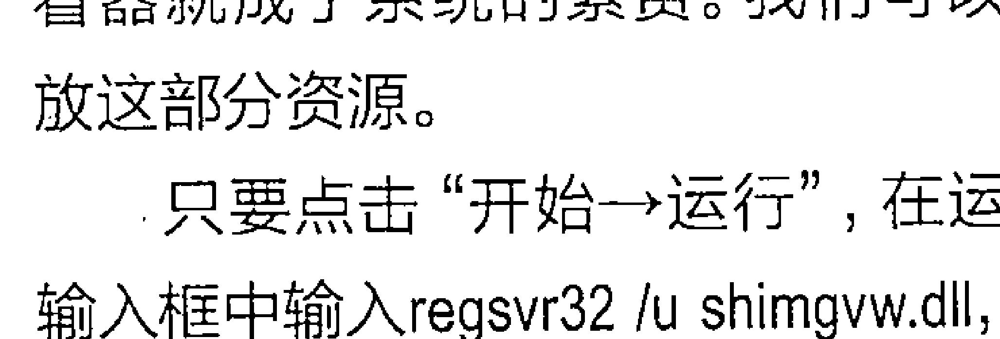

### 屏蔽无用的系统压缩支持

Windows系统早已内置了对ZIP文件的支持，不过微软似乎并不关心其功能，系统的ZIP功能也仅仅停留在把ZIP文件当成文件夹浏览、压缩等支持。如今，多数人都是用主流压缩软件WinRAR和好压等工具，Windows自带的ZIP浏览功能也成了闲置的一个DLL累赘。去掉它也可以给系统减轻负担。
在“运行”输入框中输入regsvr32 /u zipfldr.dll，回车即可。

同样，有了WinRAR等软件，如果不再想用系统自带功能查看CAB压缩包，可输入regsvr32 /u cabview.dll来取消对cabview.dll的注册。

### 屏蔽系统自带视频预览功能

每当用资源管理器选中一个视频文件时，Windows XP会在左侧面板预览显示，不过这对于较大的视频文件时，往往要读上半天。用户在大多数情况下并不需要预览视频，或早已取而代之以自己合心的视频管理工具。
禁止的方法也非常简单：在“运行”输入框中输入regsvr32 /u shmedia.dll，即可撤消视频预览。

### 恢复失效的系统“搜索”功能

有的用户因安装了不合适的软件发生冲突，或者因不合理的系统优化，造成Windows XP自带的搜索功能失效，界面一片空白。实际上，这是系统动态链接库文件urlmon.dll注册不正常所致。
解决方法也相当简单：在“运行”窗口对话框中输入regsvr32 urlmon.dll命令，回车后，重新运行搜索窗口，搜索功能即可恢复。

### 修复IE不能保存为mht网页

点击Internet Explorer “文件→另存为”命令菜单，在“保存类型”中选择“Web电子邮件档案（.mht）”格式后保存文件，可以得到整合图文的单一网页，便于资料收藏管理。但是，有时你会发现这个功能失效了。怎么恢复？
在“运行”输入框中输入regsvr32 inetcomm.dll，回车即可解决。

此外，如果在使用OE时提示“无法启动Outlook Express。应用程序无法创建字体缓存对象。计算机内容不足或磁盘已满。请与Microsoft支持部门联系以获取更多的帮助。（0x8007000E， 14000）”信息，点击“确定”后又弹出“MSOE.dll无法初始化，Outlook Express无法启动。Outlook Express可能没有正确安装。”的提示框，从提示的信息表面看，似乎是系统磁盘空间满了，但其实这也是inetcomm.dll没有正确注册导致的，通过同样的方法重新注册可以解决。

### 恢复失效的系统自动更新

有时，在使用Windows Update更新操作时，提示“IEXPLORE错误”，无法继续更新操作。我们也可以通过重新注册动态链接文件来恢复。
在运行输入框中输入regsvr32 /u wuv3is.dll反注册此链接库，接着进入X:\Program Files\Windows Update（X为Windows XP所在的盘符），删除wuv3is.dll文件。最后重新执行Windows Update操作，系统会重新生成wuv3is.dll文件，错误提示也不会再弹出。

### 小知识

#### regsvr32.exe的基本用法

regsvr32.exe是32位系统下使用的DLL注册和反注册工具，使用它必须通过命令行的方式，格式是：regsvr32 [/u] [/s] [/n] [/i[:cmdline]] DLL文件名
命令可以在“开始→运行”的文本框中执行，也可以事先在bat批处理文档中编写好命令。未带任何参数是注册DLL文件功能，其他参数对应功能如下：
/u：反注册DLL文件；
/s：安静模式（Silent）执行命令，即在成功注册/反注册DLL文件前提下不显示结果提示框。
/c：控制端口；
/i：在使用/u反注册时调用DllInstall；
/n：不调用DllRegisterServer，必须与/i连用。
单独运行regsvr32.exe程序，可以看到弹出No DLL name specified的错误提示框，并且可以看到参数原英文提示信息。
输入DLL文件名时，如果待处理的是非系统文件，必须在文件名前添加文件绝对路径，要注意的是文件路径不包含中文，否则很可能导致处理失败。如果碰到regsvr32不能正常执行时，很可能系统文件遭到破坏，因为使用regsvr32.exe时会调用Kernel32.dll、User32.dll和Ole32.dll三个文件，在DOS模式或其他系统替换正常文件即可解决。

# 分区丢失合并 数据回生有术

电脑Ghost时误操作，结果硬盘分区合并，变成一个C盘，原分区中的数据还有救吗？

文|马震安

实例描述：一天，体育组的小强老师打来电话说，他的电脑运行非常慢，由于没有光驱，他就用安装大白菜PE的U盘启动重装系统，并手动Ghost，将U盘上XP的gho文件恢复到电脑中。他的电脑有C、D、E、F四个分区，在D、E、F中存放着他多年的教案和日常用的材料。结果，由于误操作，还原完成后，他的电脑进行了重分区，D、E、F盘合并为一个大C盘，原来的那些数据、材料全没了。问笔者有没有什么办法恢复原来的分区，找回那些数据。

这种情况，笔者也是头一次遇到，也没有多大的把握。于是，笔者就利用别的电脑上网查找有关情况的解决办法。通过网上资料得知，重新分区只是调动了标记分区的标签，并没有对物理数据进行调动和更改，数据还在原来的位置。有网友说通过一款硬盘分区及硬盘数据恢复软件DiskGenius可以解决。

# 借“机”生蛋 数据起死回生

笔者想重新分区只是调动了标记分区的标签，并没有对物理数据进行调动和更改，数据还在原来的位置，那么找一个和这块硬盘分区一样的硬盘的分区表导入这块硬盘不就可以吗？于是，笔者问小强老师，这块硬盘重新分区没有？他说没有，和原来的一样。还好我们学校的教师机都是一批进的，系统和分区基本上都是一样的。于是，笔者将小强老师的硬盘挂到了同一批但没有重新分区的某台正常电脑上，将DiskGenius软件下载安装到正常电脑并运行它。在软件的界面中选中正常电脑的硬盘，选择“硬盘→备份分区表”菜单，将正常电脑的硬盘分区表备份到该电脑的D盘。然后，选择小强老师的电脑硬盘，选择“硬盘→还原分区表”菜单，在弹出的窗口中选择备份到D盘的正常硬盘分区表，点击“确定”。这时，小强老师的电脑硬盘上的四个分区就都显示出来了，各个分区上的数据也都正常（图1）。

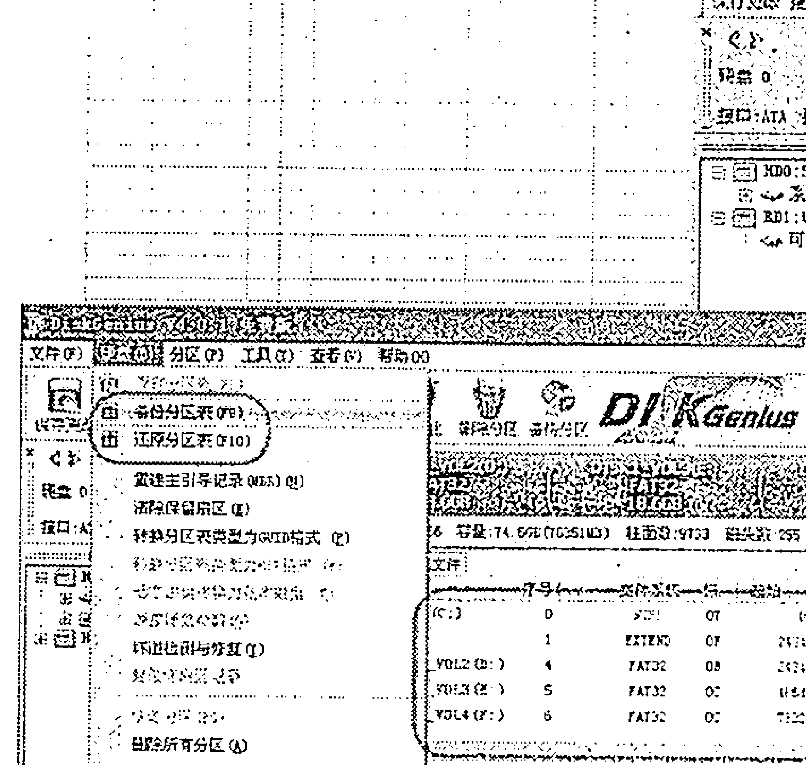

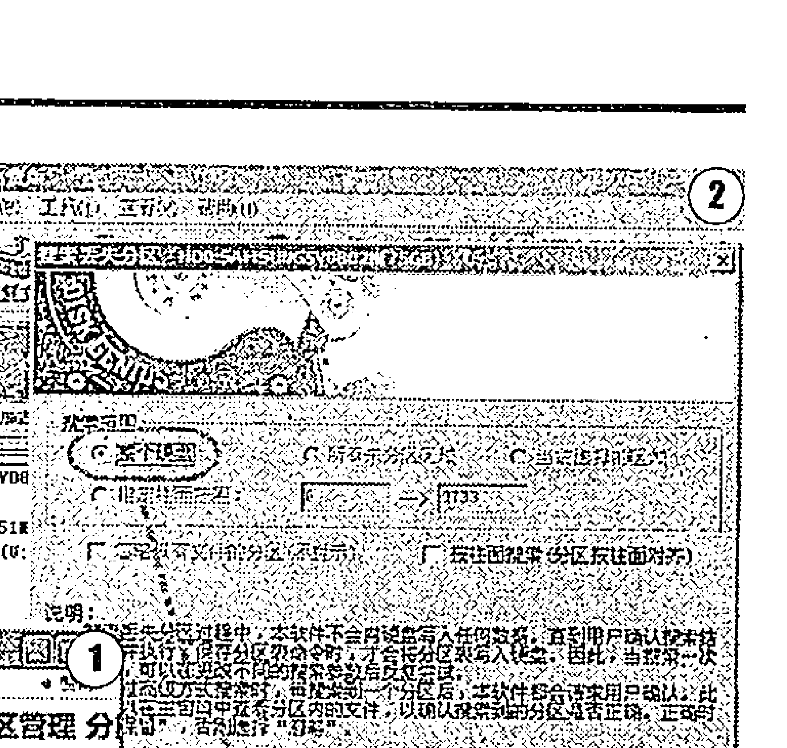

当然，笔者想的这种恢复分区数据的方法属个案。如果是家用电脑或其他的电脑，没有同类分区的怎么办呢？探索的欲望再次激起了笔者的“斗志”。我觉得这是一个很好的学习的机会、挑战自我的机会，让我能够放心大胆地尝试处理计算机系统的各种方法。于是，我找来一台电脑并将它的硬盘分区合并成一个C盘，然后仔细尝试在它本机上恢复各个分区数据的方法。没想到在它本机上也能利用DiskGenius软件进行分区及数据的恢复。具体恢复分区数据过程如下。

# 按“步”就班恢复数据

首先，利用安装大白菜PE的U盘启动电脑进入WinPE系统。然后，双击运行桌面上的DiskGenius程序，进入界面后选择“工具→搜索已丢失分区（重建分区表）”菜单，在弹出的窗口中选择“整个硬盘”，然后点击“开始搜索”按钮（图2）。

当搜索到分区时，窗口会提示是否保留，可以双击分区查看里面的文件、目录是不是自己所要查找的，核实后，点击“保留”，随即，软件又很快显示其他分区的分区信息，一直点“保留”，这样，除C盘以外，其他系统盘（D、E、F）的分区信息都被我们找了回来。

通过观察DiskGenius界面，我们发现一根横向放置的柱形条，除了标示C盘以外的其余所有盘的内部为蓝色填充，C盘部分为灰色。我们选择灰色部分。因为不需要C盘信息，所以右击灰色部分，选择“删除分区”删除C盘分区。然后选择灰色部分，右击新建分区。灰色区域变为蓝色，选择刚刚生成的部分（也就是蓝色柱体最左端的部分），右键单击，设置该部分分区为主分区，并且为激活状态，作为启动盘。点击保存分区表（F8），这样你的系统的分区表已经被改过来了。刚刚设置的C盘里面的东西全部丢失，而其他盘的数据没有改变。

# 酷狗几招 玩转酷狗音乐

酷狗音乐播放器以支持高清音乐、格式支持广泛而深受用户喜爱。你的电脑中也许已经拥有这款免费软件。除了用好音乐播放功能之外，下面的这些使用技巧也许对你玩转音乐会有帮助。

文|斐斐

### 让酷狗自动为你录制节目

忙碌的你往往会错过自己喜欢的网络广播的时间，没关系，可以让酷狗帮你录下来，等你闲暇时再欣赏。打开酷狗音乐2012版软件，在主界面右侧的应用工具栏中可以看到酷狗网络收音机的快捷方式，第一次进入酷狗网络收音机时会进行安装，所以启动要慢一些，以后你就可以直接用该图标启动酷狗网络收音机了（图1）。

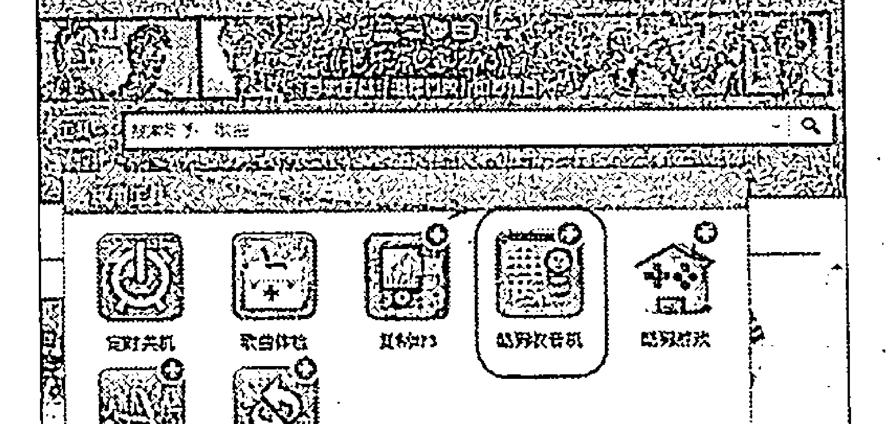

为了实现定时录制的功能，现在只要点击酷狗网络收音机主界面左上角的收音机Logo，在打开的菜单中就可以找到“录音计划”的功能（图2）。

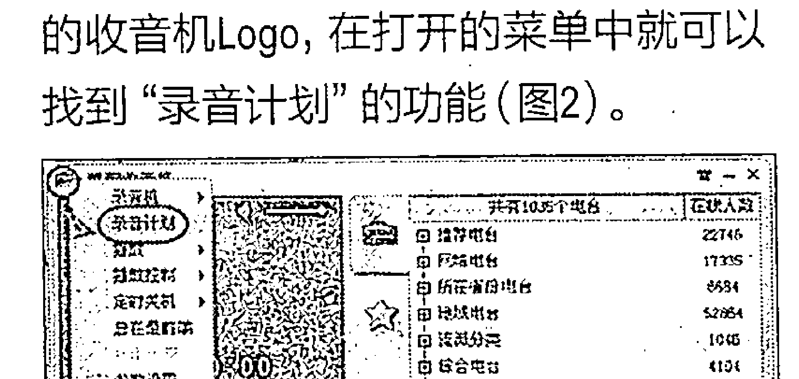

首先，在想要录制的电台上点击或者直接在“电台名”当中输入，然后在“频率”、“开始时间”和“结束时间”当中设定好你所要录制节目的频率、始末时间，接下来选择好该段录音的保存路径，点击“添加任务”按钮，就完成了录制的计划任务（图3）。

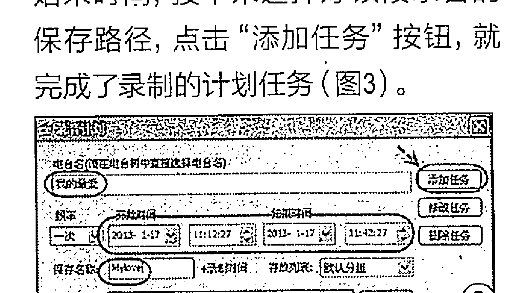

### 去除酷狗音乐2012的广告

酷狗音乐2012全新的MetroUI风格惹人喜爱，但是界面漂浮的一条大广告让人讨厌，不过，可以教大家去除酷狗这烦人广告的方法。首先下载酷狗2012去广告补丁V6.3软件，解压酷狗2012去广告补丁程序文件压缩包，执行之后，再开启酷狗2012，你会发现，界面漂浮的那一条大广告消失了。需要特别提醒的是，如果电脑上安装了杀毒软件或安全卫士之类的软件，那么请一律完全退出这些安全软件再使用补丁，否则补丁会被误报导致无法正常使用。此外，在Win7或Vista系统下，如果当前用户不是Administrator高级用户，请鼠标右击补丁软件，在右键菜单中选“以管理员身份运行”使用补丁软件。

### 快速找到完美歌词

酷狗音乐软件的一个最受用户喜爱的功能便是拥有专利技术的“逐字精准歌词技术”，通过这项技术可以让大家使用酷狗音乐软件足不出户体验到KTV的畅快飙歌感受，不同于传统的逐行显示歌词，酷狗逐字精准歌词让你能够真正根据歌曲节奏进行完美演绎。不过由于酷狗音乐的曲库有着超过百万首的庞大曲库，而歌词又多是由网友自助上传的，因此有些歌曲难免会出现匹配不甚完美的情况出现。现在教你一个小方法可以快速方便地找到完美歌词。当你播放一首歌曲的时候，会看到软件默认会显示逐字精准歌词，而如果你发现它在匹配或同步上出现了问题，那么只需要将鼠标浮至字幕之上就可以看到控制选项。点击“歌词不对”就可以针对当前歌词进行调整。另外在这个控制框中还有调整显示时间、改变字体及显示样式等多个功能，对于歌词显示的多个要求都可以在这里进行修改和调整。歌词不精准，主要的原因是歌手与歌词搭配出现不匹配所致。点击“歌词不对”后就会出现歌词搜索界面，只要在搜索框中填好精准的歌手和歌名，点击“搜索”后就会列出酷狗音乐歌词库中的所有匹配歌词文件，自行手动选择下载相应的歌词即可（图4）。

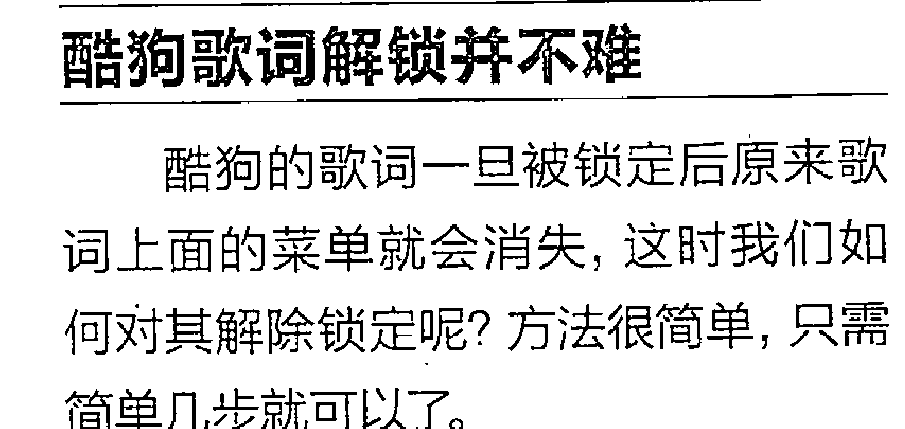

### 酷狗歌词解锁并不难

酷狗的歌词一旦被锁定后原来歌词上面的菜单就会消失，这时我们如何对其解除锁定呢？方法很简单，只需简单几步就可以了。打开酷狗，随便找一首歌曲播放。点击桌面右下角的酷狗图标，右击。在出现的酷狗设置选项页面中，有歌词解锁的选项，只需点击即可。

## 抓图高手的必备技巧

简单抓图是图文编辑过程中的一个基本功。在基本抓图功能之外，再掌握一些抓图技巧，会使你在图文编辑过程中更加得心应手。

文 | 如云

### 批量抓取网页图片

网页上有许多图片，如果要一次下载下来，需要借助于下载工具或插件。其实如果你安装有SnagIt抓图软件，就可以一次解决问题。 在工具栏上选中“网络捕获”工具，按下抓取热键(默认为Ctrl+Shift+P)，此时SnagIt会提示你要抓取的网站，你在其中输入网站的Web地址，点下“确定”按钮，SnagIt会从网站扫描图片，并会把找到的图片显示在窗口中，你可以选中要下载的图片，最后点下“完成”按钮，SnagIt会出现一个窗口让您选择放置图片的文件夹，选择后这些文件就会被放到相应的文件夹中了。

### 让SnagIt轻松抓自己

在使用SnagIt抓图工具时，最近遇到这么一件棘手的事情，用SnagIt抓取其他窗口图片非常容易，但想让SnagIt捕获自己的主窗口界面却是难上加难，只好借助别的抓图软件来抓它。后来发现，其实只需简单设置一下，就可让SnagIt抓图时不再隐藏。 打开SnagIt主界面，首先在窗口主菜单中选择“工具→程序参数设置”命令打开“程序参数设置”对话框。选择“程序选项”，取消“在捕获前隐藏SnagIt”的选择，按“确定”。经过这样设置以后，就能利用SnagIt截取自己的主程序窗口了。

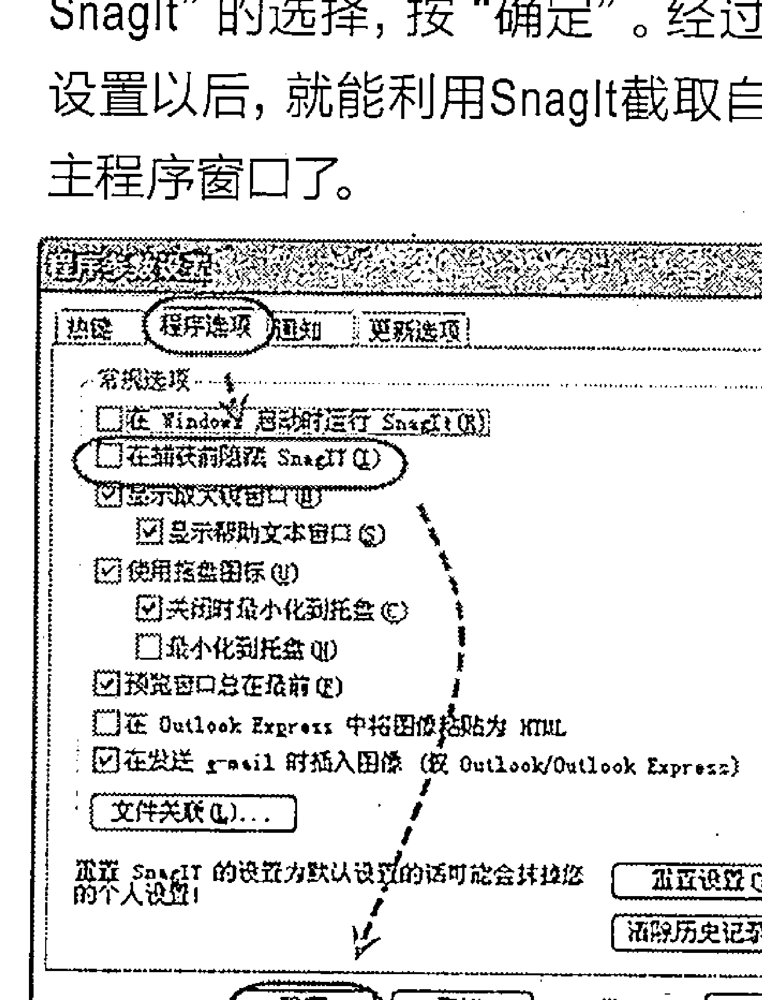

### 文字快速转换为图片

有了SnagIt软件，不用抓图，任何一种编辑软件中的文字内容，无论有多长，顷刻就可以变成一张图片。 安装完SnagIt后，启动一个Windows程序(如Word或记事本)，打开一个文档，再选择“文件→打印”命令，然后选择SnagIt打印机，按下“打印”按钮，Word中的所有文档就变成了图片并显示在预览窗口中，单击“另存为”按钮就可保存成图片。

### 多个窗口一次性抓取

如果想将桌面上打开的多个窗口内容都抓下来，那么利用SnagIt的抓取多重窗口功能，一次就能抓下多个窗口。 启动SnagIt，选择“输入”菜单下“窗口”单选框，同时选中“多种范围”复选项。按下“立即捕获”按钮或抓取热键，再移动鼠标到一个窗口上，此时相应窗口被一红色框框住，同时光标会变成一只小手带一个加号符号，表示把当前窗口加入抓取。如想抓取该窗口，则单击鼠标左键，此时该窗口会反相显示，表示被选中。接着再移动鼠标到另外的窗口，相应窗口会被红色框框住，同样单击鼠标左键选中被红色框框住的窗口。两个窗口已经被选中，此时只要右击鼠标，然后选择“完成”按钮即可把它抓取到SnagIt的捕获预览窗口中，按下“另存为”按钮即可把抓取的多个窗口图像保存起来了。

### 多层菜单一次性抓取

菜单是Windows中最普通的交互方式，有时为说明问题必须抓取一些程序的部分菜单，但有些菜单是层级的(即一级菜单下还有子菜单)，一般抓图软件无法抓取下来，就是使用SnagIt的默认设置也无法抓取。这时可选择“输入→属性”命令打开“输入属性”设置对话框，选择“菜单”标签，选中“包括菜单栏”和“捕获层叠菜单”项后就可以抓取层级菜单了。

### 超越视野的超长抓取

浏览网站时经常会遇到很多超过屏幕高度的窗口，这时要抓取它们，你也大可不必一屏一屏地进行。SnagIt可以让你把它们一下子抓取下来。 先选中“输入”菜单下“自动滚动”复选项，再选择“输入”菜单下的“属性”命令，在打开的窗口中选择“滚屏”标签下的“两者”单选按钮。接下来，按下抓取热键，把鼠标移到带有滚动条的窗口上，等鼠标变成滚动图标状时，按一下鼠标键选中滚动窗口，单击鼠标左键。SnagIt就会自动滚动，并把其中的所有内容都抓下来。

# 微云 改变工作生活

网盘见得多了，但是能在PC和手机间无缝连接、能够Wi-Fi传输、能够异地Ctrl+V粘贴的网盘，还没怎么见过吧？一起来体验一下“微云”生活吧。

文 | 何帅

相信不少朋友和我一样常会遇到这样的情况：下班时把写好的文档拷到优盘里，准备到家后再修改，但是到家后发现优盘忘拿了，甚至优盘损坏或丢失，这时就只能干着急了。今天向大家推荐的“微云”应用，则让你再无此类的困扰。

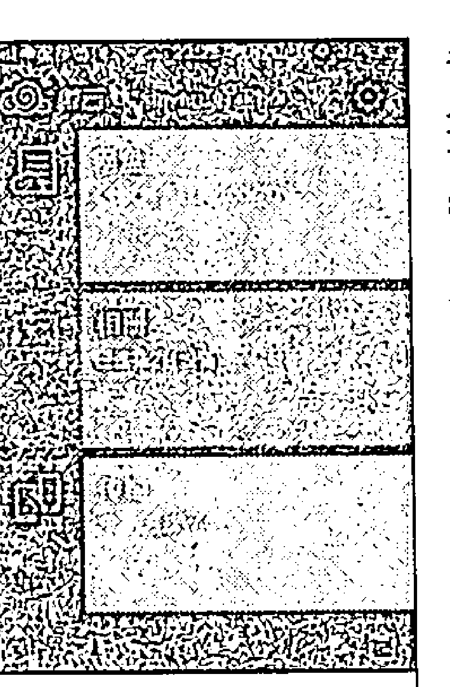

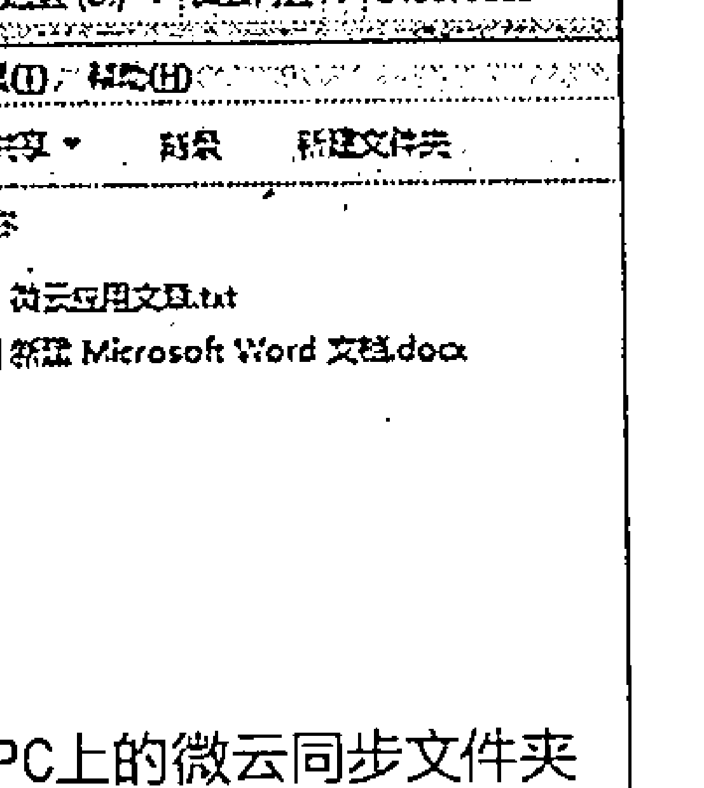

## 打通PC和手机真正移动办公

我平时的工作主要就是写稿子。首先我在办公室电脑的微云中新建记事本文档，写下标题《微云 改变工作生活》后开始疯狂码字，好不容易写完初稿，一看已是下班时间，于是直接Ctrl+S键保存，微云提示同步成功。我果断关闭电脑，然后打开iPhone连上公司的无线网络，打开iPhone微云网盘，点击左下角的“刷新”按钮，瞬间同步完毕，刚在电脑中写的稿件已出现在微云网盘列表中了。然后在文件标题的右侧点击下拉按钮，选择“离线可读”直到出现提示“已保存为离线可读文件”，证明文章已经缓存到手机上。我以最快速度收拾东西，飞奔去赶地铁。在地铁上打开手机，找到微云网盘里的稿件，尽管地铁里没有Wi-Fi，但是稿件已是离线可读，仔细将稿件阅读几遍，记下需要修改的地方。到家后，第一时间打开家中电脑，进入微云，先点击微云网盘右侧“立即同步”按钮（当然也可以选择微云自动启动，这样电脑开机连上网络后微云就会自动同步），提示同步完成后，点击微云网盘，我的稿子已经同步到本地了。我对稿件进行仔细修改，确定无错误后保存，等微云提示同步完毕，我放心地关机休息了。你看，有了微云，我的工作方便多了，随时随地工作生活两不误。多设备多平台同步，真正实现移动办公。

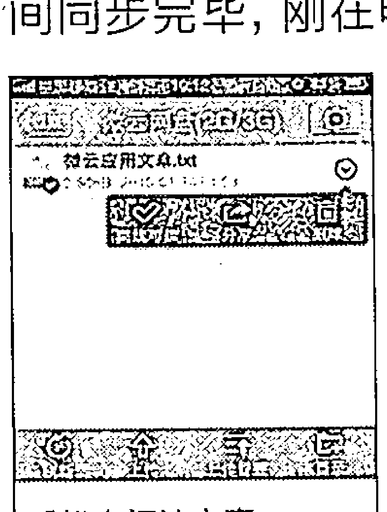

## 照片Wi-Fi同步快速省流量

周末被GF拉去逛街，每次看到漂亮的衣服她都要试穿并让给她拍照，逛完回来已是拍了无数的照片了。累了一天，到家后刚想休息，GF又催着把她的照片传到电脑上！我躺在沙发上，通过iPhone连接到Wi-Fi网络，打开微云，点击“传输”模块，在我的Wi-Fi局域网下出现了我的电脑设备“cf-steven”，点击进去之后屏幕下方出现扇形菜单，果断点击照片按钮，选择好照片后，直接向上滑动手指，照片就这样同步到微云相册中了。GF见我半天不起身，又过来催，我很傲慢地告诉她，打开电脑就可以了。GF不相信，打开家中电脑，开机后微云自动启动，提示有新照片下载，一会儿照片就下载完成。浏览照片，正是我们逛街的新作……GF满脸崇拜地望着我，而我已然进入甜美梦乡。微云相册，只在Wi-Fi下同步，也不用担心耗费手机流量，连数据线都不用，真是便捷。

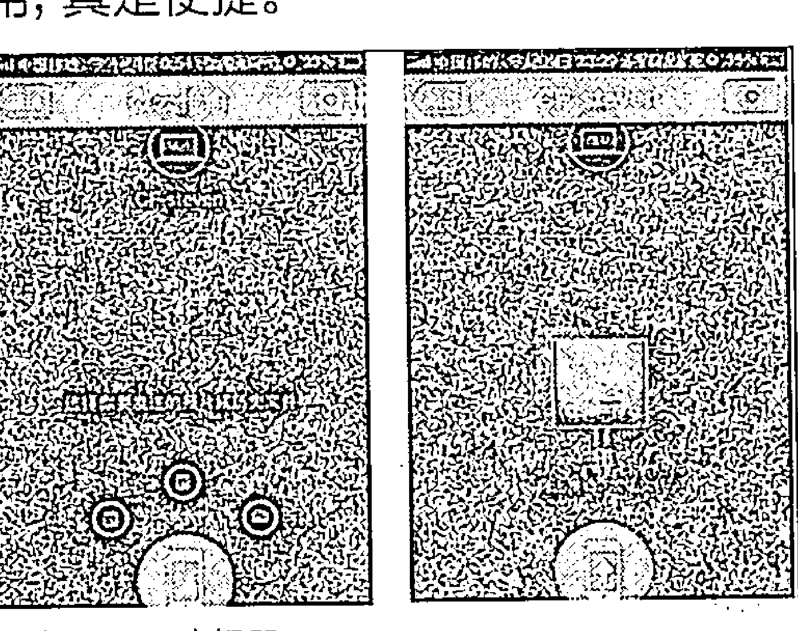

## 文件分享更方便

上面还只是雕虫小技，微云真正的杀手锏是文件分享。自从GF体验过微云的神奇之后也迷上了微云，现在她也给自己的安卓手机装上了微云。平常在家我们俩可以用微云的微传输相互传送照片、视频，也可以通过微云的分享功能把照片、视频通过短信、微信、E-mail、下载链接分享给其他好友，再也不用数据线来回折腾了！这个操作更简单，只要在微云里找到要分享的文件，下方就会有分享的按钮，点击一下，就会出现分享的选项，大家可以根据自己的情况选择相应的选项哦！

题外话：QQ2013 Beta2中已经支持微云发送，在传文件菜单下新增了一项“发送微云文件”，点击后进入微云面板，在你的微云网盘里选择要传的文件，然后你会惊奇地发现，可以直接秒传给你的QQ好友，QQ好友则以离线文件的形式接收。GF

# 赏片、下片随心所欲
## 主流视频客户端软件横向评测

在家通过宽带在线欣赏影视节目，在外用手机、平板等离线看片，这是目前电脑用户的热门需求。赏片、下片，用哪种视频客户端更爽呢？

文 | CFan软件研究室

到哪个网站看片，从哪里下载更合适？在经历了以往以论坛获取种子下载为主的历史阶段之后，目前的风向已经改变。时下最普遍、最流行、最容易找到的看片和下片目标，当然要数五花八门的在线视频网站了。欣赏影视节目可以说是轻而易举的事情，但因对使用技巧掌握的程度不同，每个人所能享受到的品质就有所不同。进一步，如果要从视频网站上轻易获得能在自己的移动设备上播放的视频文件，那就更有说道了，因为网上的视频不是你想拿下就都能如愿的。

本篇我们将根据编者作者们“深入实地”，亲身体验各家视频网站客户端后的感受，引导大家了解各类视频客户端，摸清到底谁家提供的服务最适合于自己，从哪家能很轻松地下载到可供我们移动使用的视频文件。

### 参评软件

根据目前视频客户端的生态发展现状，我们将了解到的比较热门的视频客户端软件分为如下四个大类，我们会按大类对其进行评测。每类中我们会选择最具代表性的一两款进行详细评测，而辅助软件则专门强调其具有特色的方面。

### 附：各类影音客户端及下载地址

| 客户端名称 | 官方下载地址 |
|---|---|
| 百度影音 | http://player.baidu.com/ |
| 优酷客户端 | http://tv.youku.com/cn/index |
| 奇艺影音 | http://app.iqiyi.com/pc/player/index.html?source=bofangye |
| 乐视网络电视 | http://pc.letv.com/ |
| PPTV客户端 | http://tv.pptv.com/ |
| PPS影音播放器 | http://dl.pps.tv/ |
| CNTV的CBOX | http://cbox.cntv.cn/ |
| 快播QVOD | http://www.qvod.com/ |
| 迅雷看看 | http://www.kankan.com/ |
| 暴风看电影 | http://bfvcenter.v.baofeng.com/ |

选择最具代表性的一两款进行详细评测，而辅助软件则专门强调其具有特色的方面。

- 第一类：资源汇集型。主要有百度影音、搜狐影音、腾讯影音、360影音等。
- 第二类：专业提供型。主要有奇艺影音、乐视网络电视、风行、优酷、土豆、PPTV、PPS、快播QVOD等。
- 第三类：广电行业型。主要有CNTV（中国网络电视台）、华数TV（广电宽带）等。
- 第四类：软件扩展型。主要有暴风影音、QQ影音、快乐影音、射手影音、迅雷看看等。

从用户对于视频客户端的主要四大需求出发，即：资源获取、播放需求、下载需求、转码需求，我们评测的重点也自然放在这四大项目上。

### 资源获取

在资源获取方面，第一类中以百度影音为代表的四种整合性资源客户端，其资源来源可以说是最为丰富的。因为其借助于自身搜索引擎的优势，加之与其他专业视频网站的合作，可以最大限度地满足用户对视频搜索的需求（图1）。但一个问题是，用它们搜索出来的视频资源可能是其网站独有版权的资源（如搜狐影音的某些美国大片），也可能是集合其他网站的资源（如利用百度影音搜索一部连续剧，搜索结果可能出现奇艺、乐视、CNTV、优酷等多家提供的资源），这样就要求用户有判断能力，知道哪家的资源有哪些特点，然后才能对要观看或下载的视频做到游刃有余。如果只是误打误撞地随便选择，那只能靠碰运气，不是科学的做法。

第二类中以奇艺为代表的专业视频服务网站，其视频来源都比较整齐划一。比如，奇艺视频以全部为站内正版资源、清晰度好、质量高、稳定著称。快播QVOD则以历史悠久、提供种子集成的片源或搜索站点丰富而给用户的选择更多。而土豆优酷则以其用户的广泛参与度（上传资源）而资源丰富赢得人们的青睐，但视频质量参差不齐。

第三类的两家则主打广电官方正版资源，资源绝对规规矩矩，但也就显得不够丰富多彩。由于版权和其他原因，片源显然不能和上两类相提并论。

第四类的几种则是刚刚涉足网络视频服务，它们在用户中的主要影响力仍然是其播放功能，资源方面不占优势。

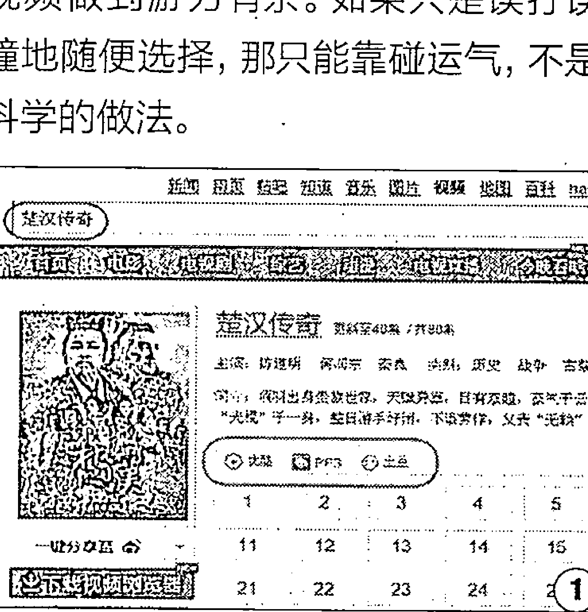

鉴于上述情况，对于用户选择片源方面，我们建议你不妨可以将百度影音作为首选，通过它来寻找自己需要的片源在哪些客户端上有提供。在此之前，需要提前学习了解一些关于其他各类客户端的特色的基本知识（下文将有分类评测可供参考），从而为你的最终决策提供依据。

具体选择哪款客户端，要在了解了这些客户端软件的特性之后，根据自己的需求和网络环境来灵活选择。

### 播放特性

在播放方面，大家最熟悉的优酷客户端提供“自动连播”和“跳过片头片尾”功能，播放片源可选择超清、高清和标清三种。优酷客户端具有视频播放自动加速功能。不仅如此，在播放非优酷网站视频时，我们也可以选择启动自动运行加速功能。此外，为了不影响网络带宽的共享使用，还具有智能带宽控制功能，使加速仅在有带宽空闲时使用（图2）。

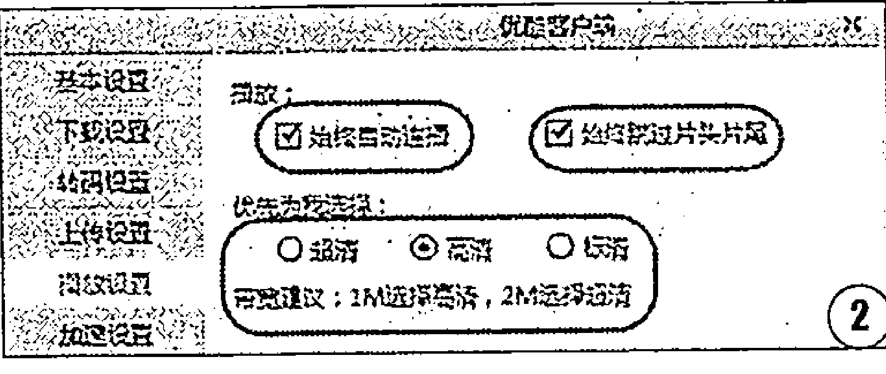

乐视TV播放可设置自动跳过片头片尾，画面可以自定义亮度、饱和度、对比度、色相等参数，清晰度可选高清和标清。与硬件实体乐视超清机、手机配合使用，可以实现电脑、手机、电视屏幕三屏互动功能。
奇艺播放器也具有类似乐视的设置以及多屏互动共享功能。
华数TV为无插件无客户端在线播放。CNTV客户端功能也比较单一。

就目前的情况和试用体验来看，目前的播放功能对于大多数客户端来说都基本能满足用户要求。但在网络带宽比较吃紧的情况下，选择具有加速和缓冲功能的客户端就十分重要了。优酷、百度、奇艺、乐视TV等都是首先考虑的好选择。

### 影片下载

百度影音下载自有格式资源，只能靠缓存文件来实现，下载的文件均保存在硬盘上，格式一般为RMVB或MP4。他方资源下载则需使用相关客户端，需要用户掌握多种客户端。
优酷客户端最多支持用户同时下载6个视频文件，下载画质可选标清、高清和超清三种。

风行客户端的批量实时添加下载功能是一个亮点。在播放器窗口的“下载列表”的底部，有“添加更多”按钮用来随时批量添加剧集，这对于正在播出的剧集的追加下载非常方便，你不用再去资源网站或本软件“影视库”中去找到该剧，然后再添加下载了。但风行为了保证观看流畅，对下载任务有所限制。

用奇艺播放器客户端可一次性选择下载一部连续剧，最多6个线程全速下载，但下载格式为专有QSV加密格式，不能换环境播放。
华数TV虽无客户端软件，但在网络端播放窗下有“下载”按钮，可将在播视频保存为MP4格式供移动设备使用，这一点值得称道（图3）。


如果要下载电影，支持下载功能的客户端都可作为选择对象，以在线试看清晰度为准，选择相对清晰的即可。但需要注意，如果要下载连续剧之类的多集作品，推荐使用风行、乐视和奇艺客户端。但奇艺客户端下载的视频因版权问题而不开放、不通用是个遗憾。

### 移动特性

百度影音播放器有提前预缓冲下载功能，没有格式转换功能，用户只能借助外部工具转换格式。
优酷客户端可以支持的转码格式包括可在电脑上播放的FLV、MP4、AVI，可在手机上播放的3GP，可在Apple上播放的MP4，可在索尼PSP上播放的MP4等格式。转码画面支持自定义任意分辨率大小。可同时转码的视频文件数最多为6个。

风行客户端支持的文件类型有RMVB和MP4两类，MP4可在苹果或PSP等移动设备上播放，这两种格式也是所有PC和多数移动设备支持的格式，所以具有普遍通用性。但无转码功能可选。

乐视下载的视频格式为FLV和MP4两种，基本可以满足移动设备的播放需求。

由于奇艺的视频使用一种名为QSV的不通用加密格式，导致其他播放器不能播放，很不方便，特别是对于喜欢在手机、MP4上看电视的朋友。这时，借助网友自编的转换器可将奇艺影音下载的离线视频转换为FLV格式。大多数手机和MP4都是支持这个格式的，但是注意这些FLV视频都是H264编码的，性能不好的手机可能不能流畅播放。

作为转码服务最优秀的选手，暴风影音有专用音视频转码器暴风转码1.2正式版（http://zm.baofeng.com/），可用来轻松转换格式为各类移动设备使用。它不光是服务于暴风视频，以上大多数视频文件均可用它来转换，可以看作是一个转码“活雷锋”（图4）。

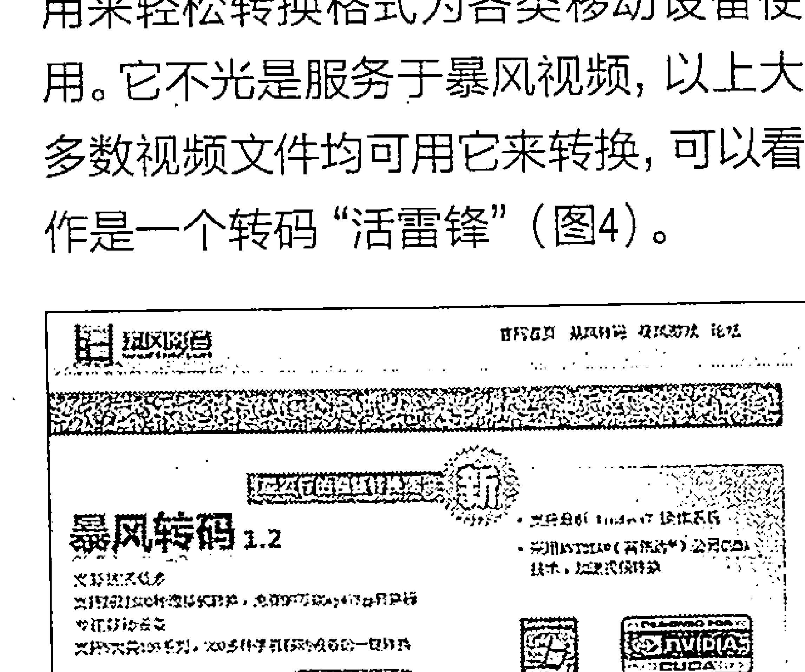

优酷和风行、乐视都是移动下载的好选择。对于其他客户端下载的视频，如果靠客户端自身的功能不能实现格式兼容和转码功能，那就找上面说的“活雷锋”解决吧。

# 文件共享不是件易事

文件的共享我们都会用到，可是面对复杂环境下的共享要求和文件安全该如何设置，共享文件又有哪些快速传输的诀窍呢？
文 / lysofer

如果有人问你，如何共享文件，你可能觉得这也太简单了，不就是让文件图标下面出现一只可爱的小手吗？小事一桩！但是，系统内置的文件共享方式并非完美无缺。在有些情况下，无法满足我们更高层次的需求。有没有一些独特的文件共享方式，让文件的共享既安全又高效呢？不妨来看看小刘和小李的方案。

# 巧用虚拟盘实现安全共享

小刘是公司网管员，对于共享资源的管理，小刘经常遇到这样的困惑——当多用户同时访问某个共享文件夹时，往往会产生数据冲突问题。如果能够将共享盘映射为每个用户的虚拟磁盘，让其都拥有独立的控制权，同时又不会对服务器上真实的磁盘造成任何影响，那该多好啊！借助于iFlyDisk这款独特的软件，小刘实现了自己的想法。

小刘在服务器上安装iFlyDisk，在安装界面Choose Components窗口的安装类型列表中选择Server项（客户端安装需要选择Clients项），完成服务器端程序的安装。假设服务器地址为192.168.0.9，共享盘为D盘。在iFlyDisk主界面中点击菜单“服务→创建服务”项，在弹出窗口的“服务类型”栏中选择“分区”（图1），在“源”栏中选择D盘，在“端口”栏中更改连接端口（默认为60000）。点击确定按钮完成虚拟共享盘的创建。

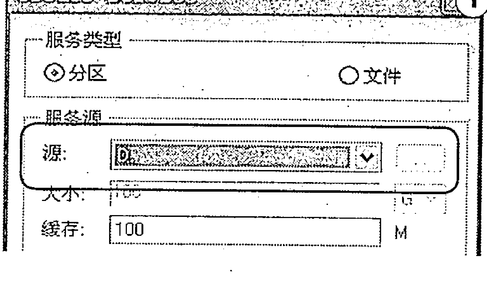

在iFlyDisk窗口左侧的Local Services节点下选择对应的虚拟共享盘，例如0.0.0.0:60000，表示允许所有的客户机通过本机的6000端口访问本共享盘。点击工具栏上的“启动”项，激活本虚拟共享盘，同时其名称变为红色。在Access Control列中显示Protected项，表示本虚拟共享盘处于保护状态。当客户机将其绑定为独立磁盘后，对其进行读写甚至格式化操作，都不会对服务器上真实的磁盘造成任何影响。

在客户机上运行iFlyDisk客户端程序，在其工具栏上点击Mount按钮，在弹出窗口的Type栏中选择Network项，之后在Parameters栏中输入服务器的IP（本例为192.168.0.9）和端口号，在Mount to Letter列表中选择绑定到本机的盘符，点击OK按钮，服务器上的共享盘就变成了本机的虚拟盘了（图2）。

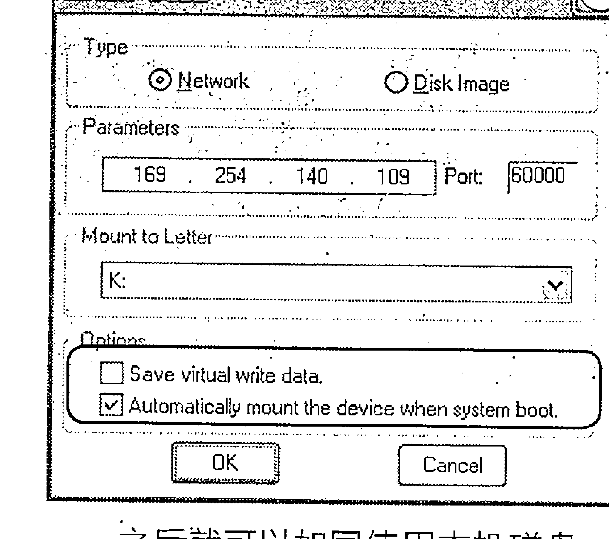

之后就可以如同使用本机磁盘一样访问该虚拟盘中的文件了。当使用完毕后，点击Unmount按钮，就可以卸载该虚拟盘了。

小刘的方法虽好，但是需要在客户机上安装客户端，对经常使用共享的用户来说也许不算什么，但是如果只是偶尔需要将本机文件共享出去，又不想产生多人同时访问数据冲突的问题，该怎么办呢？来看看小李的办法。

# 为文件共享找条“捷径”

小李想将多个文件夹共享出来，便于局域网中其他用户访问。小李想，如果能够简单快捷地将本机升级为文件共享服务器，不仅可以提高共享资源的管理效率，而且别人只需使用浏览器，就可以快速下载本机上的所有共享文件。当然，这需要KiBi-Share这款软件的大力配合。

本例假设本机IP为192.168.0.99，在KiBi-Share主窗口的Network面板中点击Change Port Number按钮，在弹出窗口中可以更改KiBi-Share的端口号（默认为80），本例将其更改为9993。在Internet IP Address栏中输入本机IP（图3）。

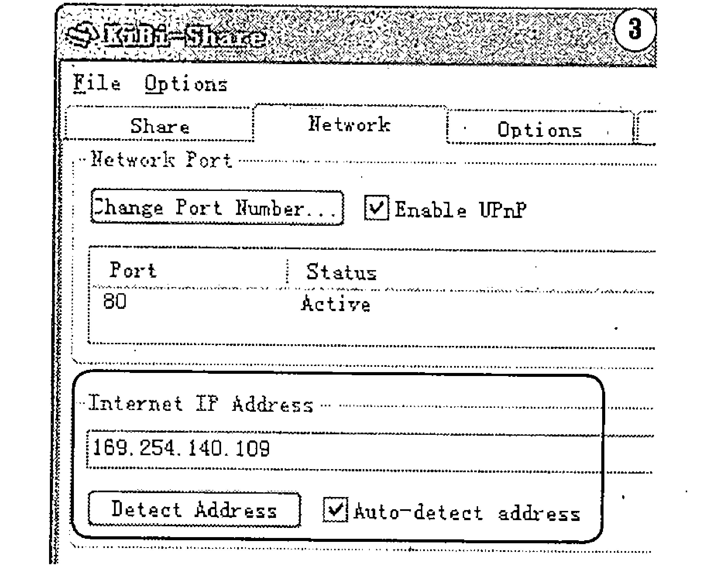

在Options面板中勾选Require Login to Access Share项，输入用户名和密码，为文件共享添加保护功能。勾选Enable KiBi-Share To Receive File项，点击Browse按钮，设置接收文件存储路径。在Share面板中的文件列表的右键菜单中点击Share Files项，添加需要共享的文件，点击Share Directory项，添加需要共享的文件夹。

之后将本机地址和访问端口（例如http://192.168.0.99:9993）发送给需要的朋友，对方只需打开浏览器，在地址栏中访问该地址，输入认证信息后，就可以浏览并下载共享文件了。

在局域网里共享文件本来是件惬意的事。但很多时候，打开网上邻居，点局域网上的其他电脑，却提示找不到路径，或没有访问权限。有了本文介绍的办法，文件共享不再是难事。

可以浏览和下载本机提供的所有共享资源了。当对方想向本机上传文件时，需要在你的Kibbi-Share共享服务器地址后面添加send_file_form项，本例中为http://192.168.0.99:9993/send_file_form/。当访问该地址时，就会出现文件发送页面，点击“浏览”按钮选择目标文件，之后点击Send Now按钮，就可以将文件上传到你的电脑中了。

我们都知道，共享文件的传输会占用本机的带宽，无论是上传还是下载，人们都想传输能够快点结束，传输共享文件又有哪些加速秘笈呢？

# 巧用P2P实现文件高速传输

同常规的下载手段相比，P2P下载方式可以让你体验飞一般的下载速度。那么在局域网中，能否使用P2P传输文件呢？使用File Transfer这款免费的绿色软件，就可以轻松实现上述功能。尤其对于大块头文件来说，传输速度可以成倍提高。

在你和好友的电脑上都安装运行File Transfer。这里为了讲述方便，将你的电脑称为服务器端，其他用户的电脑称为客户端。在服务器端打开File Transfer运行路径，在其中建立名称为Downloads的文件夹，用来存放从客户端发送来的文件。

在客户端电脑的FileTransfer运行路径中创建名称为Downloads和Uploads的文件夹，前者用来存储服务器端传送来的文件，后者的作用是上传给服务器端的文件。在服务器端的FileTransfer主窗口中点击Start Server按钮，激活服务器程序，FileTransfer即可监听数据传输端口（默认为14567），等待对方的连接请求。在客户端的File Transfer主窗口中点击Connect按钮，即可向服务器端的File Transfer发送连接请求，服务器端File Transfer响应该请求，并与之建立网络连接（图4）。

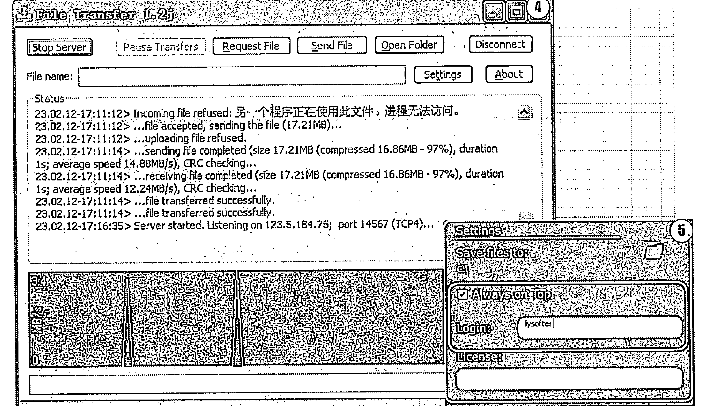

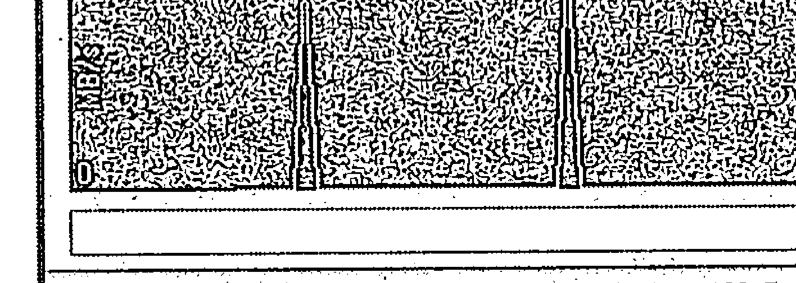

在服务器端File Transfer主窗口中点击Send File按钮，选择需要传输的文件（可多选），File Transfer随即将其发送给客户端的File Transfer程序，客户端将接收到的文件存储到同路径下的Downloads文件夹中。在服务器端的File Transfer主窗口的File Name栏中输入所请求的文件全名（不包括路径），点击Request File按钮，客户端的File Transfer根据收到的文件信息，会在Uploads文件夹中查找所需文件，如果该文件存在，File Transfer就可以将其上传给服务器端，服务器端接收到该文件，将其存储在同路径下的Downloads文件夹中。在文件发送和上传过程中，还可以实现断点续传功能。

# 在局域网中快传文件

当你想在局域网中将文件传送给别人，按照常规方式，需要将文件复制到网络共享文件夹中，之后对方才可以将该文件复制到本机上，倒腾几次才可以达到目的。能否打破常规，在局域网中快速传递文件呢？使用Sharea这款独特的软件，你只需轻轻地拖动文件，就可以将其快速传送给对方。

首先在局域网中相关主机上都安装好Sharea，之后在系统托盘中Sharea图标的右键菜单上点击Settings项，在其设置窗口中的Save files to栏中点击浏览按钮，选择文件存储路径，这样当该机接收到其他主机通过Sharea传送来的文件后，可以将其自动保存到指定的路径中。在Login栏中显示该机当前登录账户名，为了便于区分主机账户，防止名称重复，可以在该栏中自定义本机账户名，这样文件传送起来就会更加顺利（图5）。

Sharea运行后，会在桌面上出现独特的悬浮窗口。假设A主机上的lysofer用户需要向B主机上的jemy用户传送文件。A主机的lysofter用户将文件直接拖动到Sharea的悬浮窗中，之后点击该悬浮窗右下角的账户图标，在弹出菜单中显示局域网中所有运行了Sharea的主机账户名。

lysofter用户在其中点击B主机的jemy账户名，在弹出的短信息窗口中输入关于该文件的描述信息，之后点击Send按钮，该文件就会直接发送给B主机上的jemy用户。B主机上的jemy用户只需双击Sharea悬浮窗，在弹出窗口中会显示lysofter用户发来的短信息，确认后就可以自动接收A主机发送来的文件，并将其保存到预设的路径中。

注：上述所有相关软件已经打包，下载路径为：http://www.kuaipan.cn/file/id_58625289978118152.htm。

# 自己动手构建HIPS安全墙

网络的普及令计算机的安全形势很严峻，如何更好地保护自己的系统？本文介绍使用Windows 7自带的组策略构建“主动防御”的软件安全墙。

文/技术鱼

HIPS是Host-based Intrusion Prevention System的简称，即基于主机的入侵防御系统。和常规杀毒软件相比，HIPS是一款主动防御系统。它以进程为核心，通过编辑特定的规则，对进程行为，如运行、访问网络、访问注册表、访问文件等进行监控，发现异常即予以阻止，可以更有效地保护系统安全。适合Windows 7使用的HIPS类软件较少。其实，根据HIPS原理，运用系统组策略，我们自己也可以打造一个HIPS安全系统。

### 阻止恶意程序运行

现在很多恶意软件都是隐藏在C:\Windows和C:\Windows\system32下，这样一方面可以实现快捷启动(系统目录内程序可以通过命令行直接运行)，另一方面则可以达到鱼目混珠的目的，比如将文件名称伪装为系统程序，避免被用户发现。现在通过制定特殊规则即可有效阻止恶意程序的运行。

#### 阻止木马在系统目录下运行

- 第1步：分析目录状况。打开C:\windows，点击“查看→排序→按类型”，可以看到该目录下可执行程序并不多，我们常用的程序则只有explorer.exe (资源管理器)、regedit.exe (注册表编辑器)和notepad.exe三个，因此要阻止其他恶意程序在该目录下运行，我们只要制定一个禁止从C:\windows下运行任何程序(除上述三个之外)的规则即可。
- 第2步：创建限制策略。在开始搜索框输入gpedit.msc，按回车键启动组策略后依次展开“计算机配置→Windows设置→安全设置→软件限制策略”，然后单击菜单栏的“操作→创建软件限制策略”，新建一个策略。接着在“其他规则”上右击选择“新建路径规则”，在弹出的窗口路径框输入“%SYSTEMROOT%\*.exe”（即禁止该目录下运行任何应用程序），安全级别选择“不允许”（图1）。
- 第3步：继续新建规则，在弹出的窗口路径框输入“%SYSTEMROOT%\regedit.exe”，安全级别选择“不受限”，即允许运行注册表编辑程序。方法同上，依次添加自己允许运行程序的名称。通过上述设置后，以后如果有病毒程序藏身在C:\windows目录下试图运行，就会遭到软件限制策略的拦截而无法运行（自己设置不受限的程序不受影响），有效保护系统目录不再成为病毒、木马的藏身之处（图2）。

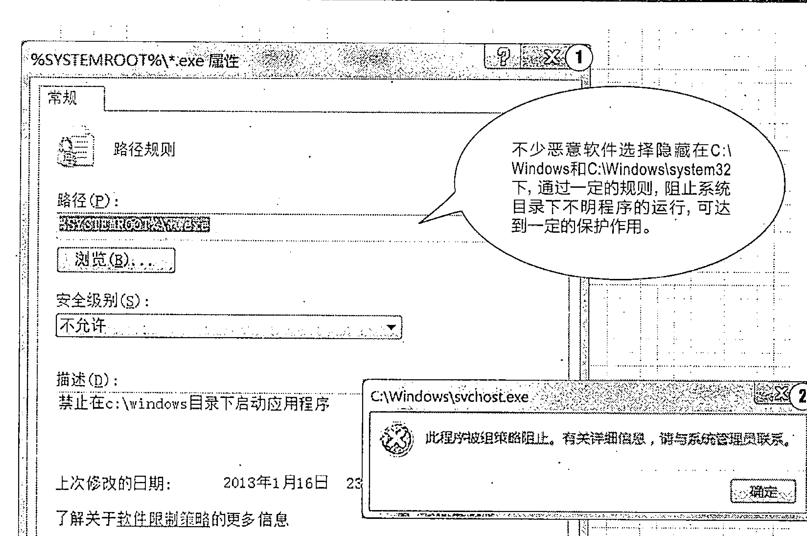

system32也是病毒木马喜爱的藏身之处。我们同样可以使用建立规则的方法阻止木马运行，并且可以对系统关键进程进行保护。比如很多木马是通过伪装成系统进程的名称藏身于此，伪装途径主要有两种：一是直接使用系统进程的名称如csrss.exe，但是藏身在system32下的其他子目录（因为同一个文件下不允许有同名文件）。二是使用类似win1ogon.exe（不是winlogon.exe，木马将l替换为阿拉伯数字1）名称藏身于system32。对于这些木马，我们可以首先建立一条允许规则，允许运行系统必需的正常进程如csrss.exe、ctfmon.exe（具体进程可以打开任务管理器，切换到“显示所有用户进程”查看）。接着再使用通配符建立不允许运行的进程，如限制csrss.*（* 表示任意后缀名，这样就涵盖了bat、com等等可执行文件的后续处理）。

### 保护系统关键进程

除了上述目录外，C:\Windows\System32下的许多系统进程也是木马重点伪装的对象。我们可以使用同样的方法建立规则进行保护。

### 拒绝非微软进程的运行

上述方法虽然简单，但是由于规则的限制，我们不可能将所有木马都拦截。因为木马的名称千变万化，仅靠简单的规则总是会有些新型或者变种木马漏网。对于系统安全有较高要求的用户，还可以利用应用程序控制策略创建规则，阻止所有非微软进程的启动。

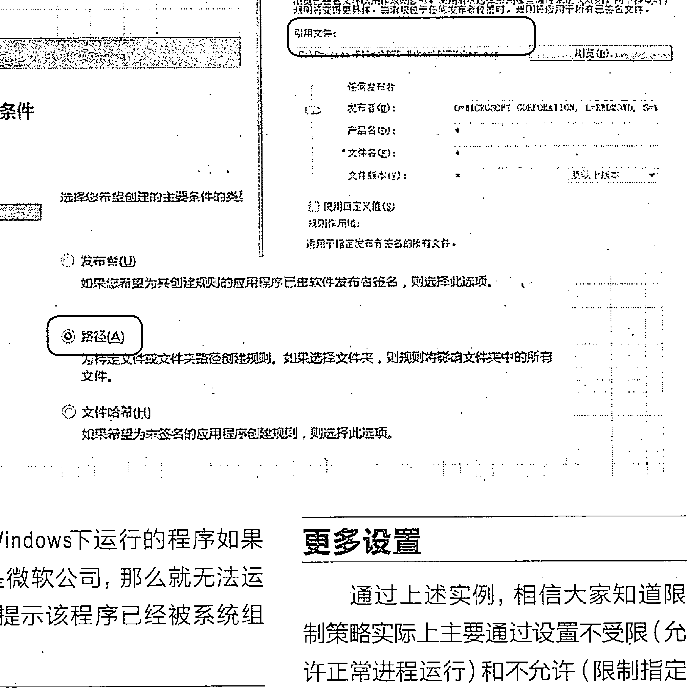

- 第1步：右击桌面“计算机”，依次选择“管理→服务”，找到Application Identity服务并设为自动启动。接着同上启动组策略编辑器，依次展开“计算机配置→Windows设置→安全设置→应用程序控制策略→AppLocker→可执行规则”，右击“可执行规则”选择“创建默认规则”。
- 第2步：创建默认规则后，继续右击“可执行规则”选择“创建新规则”，在打开的创建向导选择默认Everyone账户执行权限为“拒绝”，然后在“条件”选项选择“路径”，选择系统目录C:\Windows作为限制规则目录(图3)。
- 第3步：继续单击“下一步”，在添加“例外”下选择“发布者”，然后单击“浏览”选择任意一个系统自带程序如C:\Program Files\DVD Maker\dvdmarker.exe（只是从该程序提取例外签名信息），在例外设置中拉动滑块到“发布者”，也就是微软发布的程序是可以运行的(图4)。
- 第4步：剩下的操作按屏幕提示完成规则的创建即可，最后返回AppLocker界面，单击左侧窗格“配置规则强制”，然后在打开的窗口勾选“可执行规则”下的“已配置”，选择“强制规则”，重启后限制规则就开始生效了。

以后在C:\Windows下运行的程序如果发布者不是微软公司，那么就无法运行，系统会提示该程序已经被系统组策略限制。

### 小提示

启用上述限制后，本机所有需要以管理员身份运行的程序都会受到限制(不过由于“例外”设置的存在，系统自带程序是可以正常运行的)，对于非系统目录的受限程序，只要右击选择“以管理员身份运行”即可正常启动(但是系统目录的除外)。对于具体程序的限制，则可以使用文件哈希值进行限制。

### 更多设置

通过上述实例，相信大家知道限制策略实际上主要通过设置不受限(允许正常进程运行)和不允许(限制指定程序运行)规则来达到目的。因此大家可以根据自己的实际需要设置更多的规则来保护电脑。比如要防止U盘病毒的入侵，只要设置如下规则即可(其中问号为通配符，表示任意盘符)：

- ?: \autorun.inf 不允许的
- ?: \*.\* 不允许的

大家可以举一反三设置更多规则来保护自己的系统。

### 保护上网安全

木马病毒一个重要入侵途径就是借助网络，在浏览恶意网页时，病毒会首先下载到IE缓存以及系统临时文件夹中，并自动运行，造成系统染毒。这样我们只要设置一项规则阻止指定目录木马限制运行即可。操作同上，在软件限制策略添加下列目录内的程序不允许运行即可：

- %SYSTEMROOT%\Temp\**\*.exe 不允许的(系统临时文件夹，病毒经常下载到此目录运行)
- %USERPROFILE%\AppData\Local\Microsoft\Windows\Temporary Internet Files\**\*.exe 不允许的(这个是IE缓存、历史记录、临时文件所在位置，网上下载病毒藏身位置)

### 规则的重用与共享

软件限制策略的使用原理虽然简单，但是规则的具体设置却需要掌握一定的电脑知识，我们可以将自己电脑上设置好的规则文件和好友共享。完成规则的设置后，将C:\Windows\System32\GroupPolicy\Machine目录打包上传，使用者只要下载该文件后覆盖到上述目录替换源目录即可。其实，我们也可以保存好规则文件，如果有一天重装系统，直接调用这些文件，就无需再重新设置策略了，非常方便。

# 告别短板 机械硬盘性能提升我有招

在电脑所有硬件中，机械硬盘的性能已经成为电脑的短板。如何在现有条件下，通过软、硬件的设置提高机械硬盘的性能呢？

文 | 平淡

随着CPU、内存、显卡的更新换代，在电脑所有硬件中，机械硬盘的性能已经成为电脑的短板。虽然固态硬盘（Solid State Disk）的出现解决硬盘性能的不足，但是SSD价格仍然高高在上，朋友们普遍还在使用传统的机械硬盘。何不自己挖掘机械硬盘的潜力，手动提高硬盘的性能。

### 方法1：开启AHCI模式

大家现在使用的基本上都是SATA硬盘，SATA硬盘开启AHCI模式能够大幅缩短硬盘无用的寻道次数和数据查找时间，这样能让多任务下的磁盘能够高效地使用，从而提高硬盘性能。

根据统计，开启AHCI大约可增加30%的硬盘读写速度。不过由于兼容性原因，很多主板即使自带AHCI，硬盘在BIOS中默认设置也是关闭的（默认为原生IDE模式），从而导致SATA硬盘性能无法提高。下面我们就在Win7下手动开启AHCI，以Intel平台为例。

### 小知识

AHCI (Serial ATA Advanced Host Controller Interface) 是串行ATA高级主控接口/高级主机控制器接口)，是在Intel的指导下，由多家公司联合研发的接口标准，它允许存储驱动程序启用高级串行ATA功能以提高硬盘的性能。它的本质是一种PCI类设备，在系统内存总线和串行ATA设备内部逻辑之间扮演一种通用接口的角色（即它在不同的操作系统和硬件中是通用的），通过包含一个PCI BAR（基址寄存器）来实现原生SATA功能。

NCQ (Native Command Queuing) 是SATA规范支持的一种新功能，它通过对内部列中的命令进行重新排序实现智能数据管理，改善硬盘因机械部件而受到的各种性能制约，以发挥硬盘最高的效率、使延迟最小化的技术。

#### 开启AHCI的条件

要确认自己电脑是否可以开启AHCI，必须满足下列的条件：

条件1：主板芯片支持。AHCI实际上是主板南桥芯片上的一个控制器，因此要主板上有对应的芯片。一般只要进入主板BIOS设置，查看是否有AHCI选项即可。比如主板是Phoenix BIOS的电脑，进入BIOS设置后依次进入“Advanced-SATA Controller Mode”选项，查看是否有“AHCI”选项即可判断你的主板是否支持AHCI。

条件2：硬盘必须有NCQ原生储列功能，一般现在SATA2的硬盘都有这个功能。NCQ支持与否查看可以到http://www.crsky.com/soft/5904.html下载EVEREST，运行程序后依次展开“存储设备→ATA”，查看右侧的Native Command Queuing选项是否显示为“支持”（图1）。

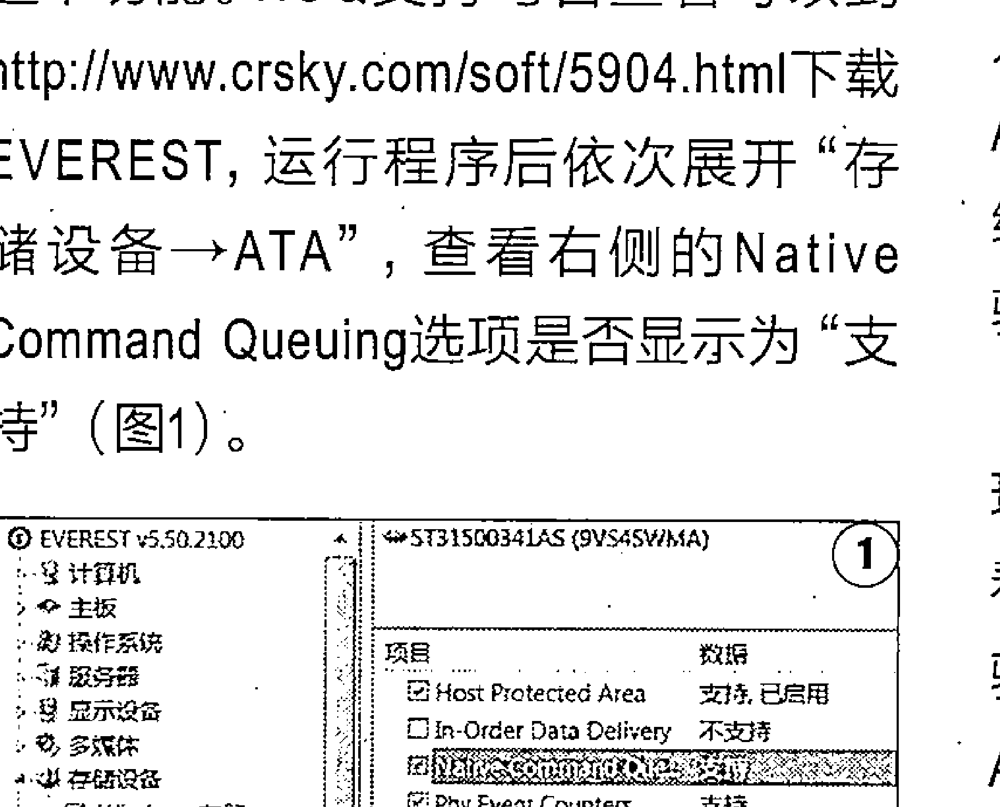

#### 手动开启AHCI

确认自己的电脑符合上述要求后，现在我们就可以手动在Win7下开启AHCI了。

首先以管理员身份启动注册表编辑器，然后依次展开HKEY_LOCAL_MACHINE\SYSTEM\CurrentControlSet\services\msahci，将右侧窗格的Start的参数由3更改为0。接着重启电脑进入BIOS设置，按照主板的说明开启AHCI，保存并退出后进入Win7，此时系统会提示发现新硬件，按提示安装好驱动（图2）。

完成驱动安装后，展开“设备管理器→IDE ATA/ATAPI控制器”，可以看到现在电脑上已经成功安装AHCI驱动，这就表明你已经成功开启AHCI了（图3）。

Win7自带的AHCI驱动比较陈旧，大家还可以到自己主板的官方网站去下载最新的AHCI驱动升级。此外因为芯片组不同，对于AMD平台还需要去主板官方网站下载Raid驱动并更新，最后到AMD网站下载安装AMD raid xpert才可以开启NCQ，剩余操作同上。

### 方法2：对齐4KB

长期以来机械硬盘在存储数据时，一直都是以512byte大小的扇区（Sector）为单位分割进行读写。随着硬盘容量的不断提升，这种古老的分配标准已经越来越不合时宜。

#### 为什么要使用4KB

随着技术的进步和硬盘容量的增大，512byte的扇区尺寸已经越来越不合时宜。因为一方面随着存储密度（Areal Density）的增大，磁头读取磁盘时的信噪比（SNR）会出现明显的下降，这样就必须加入ECC校验码来保证数据的可靠性。ECC校验在更大数据量的扇区尺寸下效率更高。比如，512byte的一个扇区需要40byte的ECC校验区，而4KB扇区只需要100byte，直接节省了40×8-100=220byte的存储空间。另一方面，更大的扇区还能让纠错时一次性更改更大量的数据，让“突发纠错”（Burst error correction）效率更高。那么为什么选用4KB而不是2KB、8KB来替代512byte扇区？这是因为4KB在计算机系统中的特殊地位。在x86架构中，通常情况下内存的分页（Page）容量即为4KB，而在磁盘文件系统中，包括NTFS、EXT3和HFS+格式的簇（Cluster）容量也同样为4KB。这样一来，用4KB的磁盘扇区中读取的数据可以正好装满一个内存页，也映射着磁盘分区中的一个簇，自然是最佳选择。

#### 查看硬盘是否已经对齐4KB

Win7安装光盘格式化已经支持4KB对齐，如果你原来使用的是安装光盘自带的分区软件格式化硬盘，那么安装好的Win7就已经是对齐了。进入Win7后可以在搜索框输入msinfo32.exe，启动“系统信息”组件后，依次展开“组件→存储→磁盘”，看看其中几处“分区起始偏移”的地址数值，如果能被4096整除，则为对齐的情况。如果不能被4096整除，则为非对齐的情况，需要进行高级格式化（图4）。

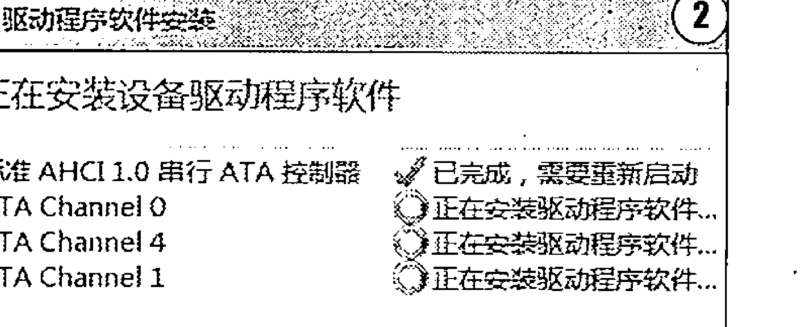

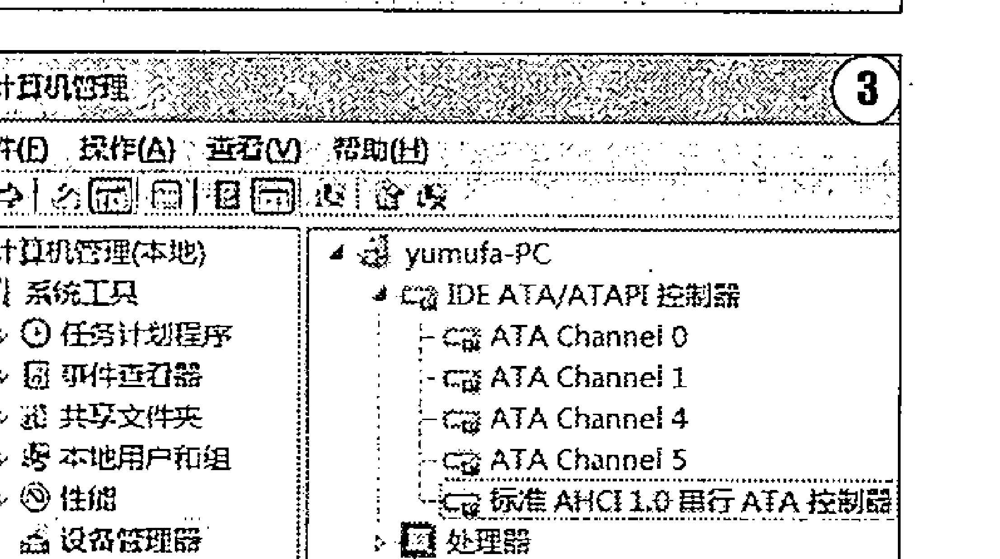

> 小知识
> 什么是先进格式化?
> 先进格式化（英文：Advanced Format）是由IDMEA（the International Disk Drive Equipment and Materials Association）2009年12月制定的格式化标准。IDMEA在2005年与Hitachi、Seagate、WD、LSI、Intel、Microsoft、Dell、HP、Lenovo等硬软件厂商制定出1024字节、2048位组和4096字节三种几种容量扇区配置，先进格式化是规范中的4096字节（4KB）配置。从2011年1月1日起，硬盘厂商新推出的产品，都将遵循Advanced Format（4KB）的设计。

#### 手动对齐4KB

如果你的硬盘没有对齐4KB，那么可以手动进行4KB对齐。

- 情况1：全新硬盘
  如果你的硬盘还未安装操作系统，那么建议使用Win7安装光盘来对齐4KB。使用安装光盘启动电脑后，在“Windows安装到何处”这步时，使用光盘自带的分区程序对硬盘进行分区和格式化即可（分区全部使用NTFS格式）。使用Win7安装光盘分区对齐是兼容性最好的方案，即使对于已经安装好系统的硬盘也建议使用这个方法。我们只要预先使用Imagex做好系统备份，然后在PE中进行分区、格式化，完成操作后再恢复系统即可。
- 情况2：已安装系统分区
  对于硬盘已经安装系统的用户，可以到http://dwz.cn/cfan101下载Alignment Tool。

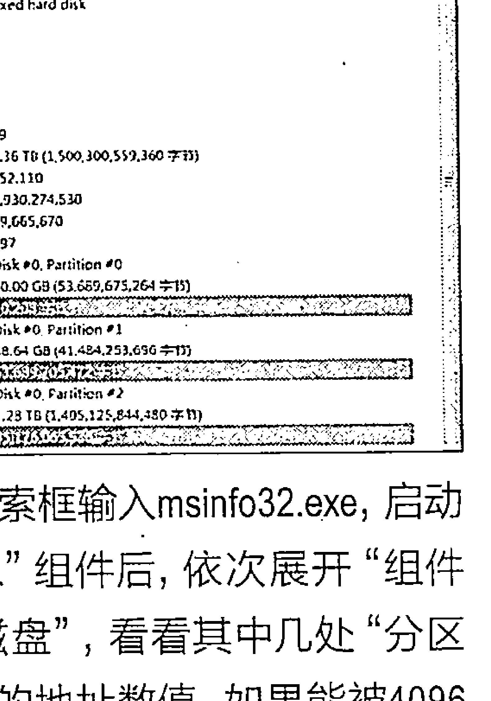

第2步：弹出一个简短的对齐进程窗口，完成后点击Restart Align，电脑会自动重启。重启后会跳转到DOS下进行对齐，对齐完成后自动重启。进入系统后会看到，分区的图标已经变成了绿色，而后面有一个Succeeded成功的标识，则表明硬盘的4K就对齐了（图6）。

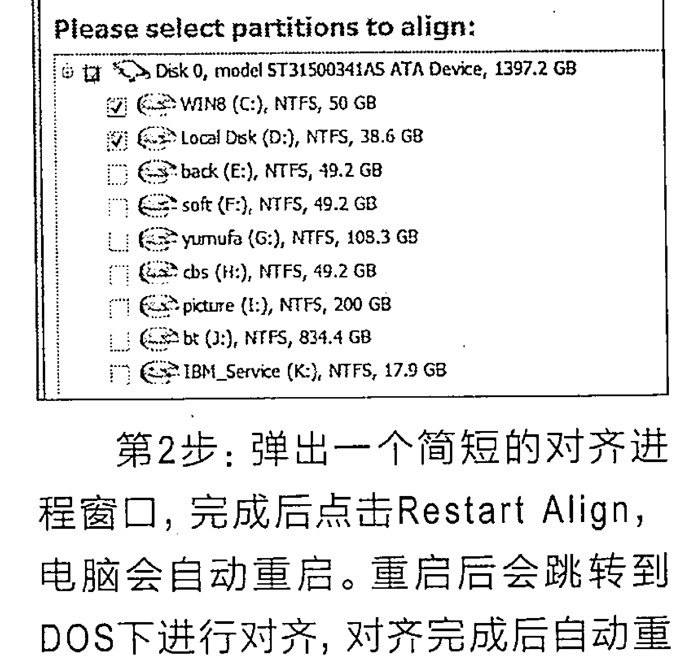

对齐时间由你的硬盘大小以及使用量而定，硬盘容量大而且文件很多，对齐所需的时间可能长达数小时。所以对齐过程中，电脑不要断电，对齐程序不要强制停止，否则可能会导致硬盘损坏！所以对于大硬盘的对齐，还是建议使用备份数据后，使用Win7安装光盘分区对齐。

对于西部数据硬盘可以无损对齐4KB。首先到http://support.wdc.com/product/download.asp?groupid=805&lang=cn下载AcronisAlignTool_s_cs_2_0_111.exe（需要注册）并安装。运行软件，在向导提示框中做好数据的备份。如果硬盘分区存在4KB扇区未对齐的情况，则在相应的分区图标上出现黄色叹号，按提示勾选需要转换的分区进行对齐操作即可。

虽说机械硬盘的性能比不了固态硬盘，但是通过开启AHCI、对齐4KB的方法也会让机械硬盘的性能有所提升。

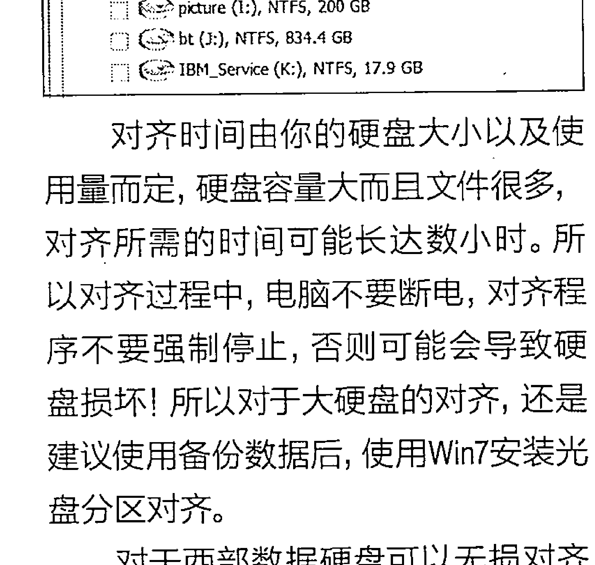# 杀进程 随心所欲

不用下载和安装进程管理专用工具软件，只用系统自带的几种功能就能轻松结束顽固的进程。本文将给你提供三种解决方案。
文|老俞

当恶意软件侵入我们的电脑，驻留内存时，有时我们在任务管理器里面却不能轻易结束它们的进程。此外，在我们卸载某些程序时，有时也遇到某些进程不能终止的情况。这时，如果学会用系统自带的功能或命令来控制进程，面对任何顽固进程都能随心所欲。下面我们以结束一个貌似资源管理器的恶意进程explorer.exe为例，来讲述如何结束进程的几种方法。

# 用system权限来结束进程

这种方法的根本思路是，用system的权限来运行任务管理器taskmgr.exe，取得system权限后就可以结束任何进程了。要用到at命令，具体方法如下：

- 1. 通过在“开始→运行”窗口中输入CMD进入命令行界面。
- 2. 输入“time /t”获得现在的时间，假设是16:03。
- 3. 输入“at 16:05 /interactive taskmgr.exe”命令，这样2分钟后就可启动运行任务管理器（图1）。
- 4. 在用at命令运行的任务管理器里，我们就取得了system的权限，也就可以结束那些无法结束的进程了。

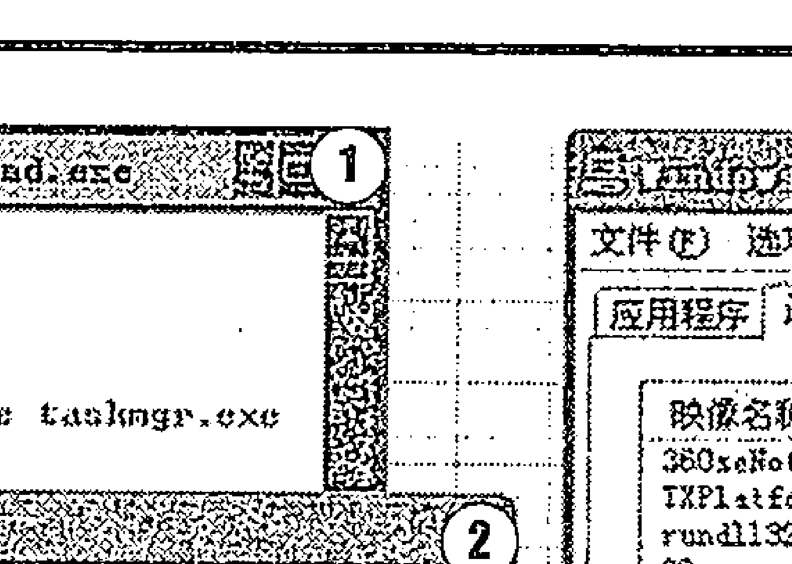

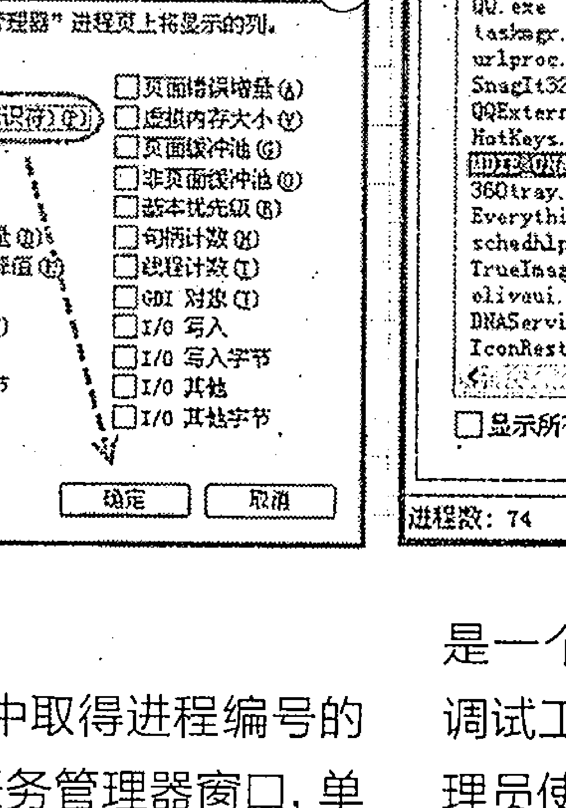

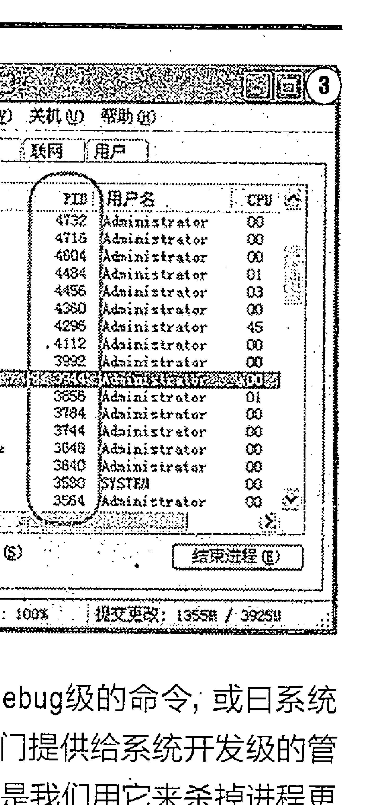

# 用taskkill命令结束进程

这种方法的思路是，在CMD模式下先用某种办法取得要结束掉的某个进程的标识符（也就是PID编号），然后用taskkill命令根据PID编号来结束这一进程。具体方法如下：

首先通过tasklist查找到相关进程的PID编号。

```
语法格式为：tasklist /svc
```

还可以从任务管理器窗口中显示进程编号，与taskkill命令显示的对应无误后就万无一失了。

在任务管理器中取得进程编号的方法是：打开系统任务管理器窗口，单击“查看”菜单项下面的“选择列”命令，在弹出的设置框中，将“PID（进程标志符）”选项选中，单击“确定”按钮（图2）。返回到系统进程列表页面中后，你就能查看到对应病毒进程或自己想要结束的具体进程的PID了（图3），把它记下来即可。

接下来通过taskkill pid命令来关掉相应的进程。假设用以上方法查得的explorer.exe的PID为1888，则结束该进程的命令为：

```
taskkill 1888
```

此外还可以用进程名来结束进程，语法格式为：

```
taskkill /im 进程名 /f
```

# 用ntsd命令结束进程

有一些高等级的进程，taskkill或许无法结束，那么我们还有一个更强大的工具，那就是ntsd命令。准确地说，ntsd是一个系统debug级的命令，或曰系统调试工具，专门提供给系统开发级的管理员使用，但是我们用它来杀掉进程更是不在话下。除了Windows系统自己的管理进程，ntsd基本上都可以杀掉。

假设用以上方法查得的explorer.exe的PID为1332，打开CMD窗口后输入以下命令就可以结束explorer.exe进程：

```
ntsd -c q -p 1332
```

说明：PID的分配并不固定，是在进程启动时由系统随机分配的，所以进程每次启动的PID编号一般都不会一样。

此外，ntsd也可利用进程名结束进程，格式如下：

```
ntsd -c q -pn exploror.exe
```

在以上命令中，参数-c表示执行debug命令，q表示执行结束后退出(quit)，-pn表示后面紧跟着要结束的进程名称。值得注意的是后缀名.exe是不可省略的，否则系统会提示“不支持此接口”。上一命令中的-p表示后面紧跟着要结束的进程对应的进程标识符PID。

### 小提示

ntsd作为Windows系统自带的进程调试工具，存在于system32目录下。ntsd的功能非常强大，但Windows中的System、SMSS.EXE和CSRSS.EXE不能杀。前两个是纯内核态的，最后那个是Win32子系统，ntsd本身需要它。此外，lsass.exe也不要杀掉，它是负责本地账户安全的。

## 中国好声音 打造家庭KTV

K歌系统并不神秘，一台电脑、一台电视、一部手机，利用客厅就能打造一个客厅KTV。
文 | 苏劢轩

春节期间，亲朋好友聚在一起，K歌倒是一个不错的选择，但如果去KTV的话，不光花费大，漫长的等待一定会扰了大家的兴致。何不利用客厅现有资源，大家一起动手打造属于自己的客厅KTV!

### 想K歌 硬件软件不可少

硬件准备：K歌系统并不神秘，主要由一台电脑、一台电视、一部手机组成。在这个系统中，电脑控制信号的输入与后台计算，手机控制播放，电视则是用来负责MV的播放。

软件准备：在软件方面我选择的是大名鼎鼎的XBMC（下载地址：http://ftp.sunet.se/pub/multimedia/xbmc/releases/win32/xbmc-11.0.exe），这是Xbox上最为强大的自制媒体中心软件，支持Windows、Linux、iOS甚至Android系统。XBMC支持的格式也是非常丰富，包括MPEG-1、MPEG-2、MPEG-4、WMV、VC-1、RealVideo、QuickTime、FLC、WAV/WAVE、OGG、WMA、JPG/JPEG、GIF、PNG等，可以说媒体文件格式通吃。之所以选择XBMC作为我们的点歌平台，一是由于它的界面大方美观，二是由于它还有许多周边应用，让我们能更加得心应手地操控。

本文中提及的软件我已经打包好了，这里是下载地址：http://pan.baidu.com/share/link?shareid=174028&uk=1613160299

### 软硬件巧设置 助力K歌

### 语言的设置

安装软件包中的XBMC并运行，进入时默认的语言是英文，首先我们要修改语言。滑动中间的菜单，找到System并点击进入。在左侧找到Appearance并点击，然后点击左侧的Skin，在右侧Fonts一栏点击三角按钮改为Arical based，按Ctrl+O保存，然后再选择左侧的International，在右侧的Language中选择Chinese (Simple)，按Ctrl+O保存即可。这时再返回主界面会发现已经可以正常显示中文了。

# MV的添加

配置好XBMC后，我们就要往里添加媒体文件来丰富我们的点歌平台。首先我们要下载自己喜欢的MV，我建议大家选择DVD格式的，画质较好。下载好了以后，运行XBMC，选择“视频→添加视频”，浏览硬盘分区并选择MV存放的路径，便可以完成添加。

## 远控K歌更轻松

想象一下，当你要切歌时，笑着在手机上轻触一下，便完成了切歌，一定会惊艳全场，吸引大家的眼球！提起用手机对PC端进行远控，大家一定会想到Splashtop streamer，其实完全不用动用这款神器，一些小软件反而用起来更顺手。XBMC是一款开源软件，所以有许多周边应用，这里推荐XBMC遥控器，在Wi-Fi环境中可以很便捷地控制XBMC。

首先要完成PC端的设置，在XBMC中选择“设置→网络”，选择“允许通过Upnp控制XBMC”“允许通过HTTP控制XBMC”“允许异地程序控制XBMC”三项，按Ctrl+O保存即可。并记录下界面中的设备名、用户名、密码和自己主机的IP地址。

然后是手机端的设置。安装并运行软件包中的官方XBMC遥控器-0.8.3-beta1.apk，点击菜单进入设置界面，选择Manage hosts一项，进入设置界面，在Name of this instance、Host of IP address、Username中分别填入刚才记下的设备名、主机的IP地址、用户名。填写完以后，确认即可。此时在PC端也会显示连接成功，这时就可以用手机对PC端进行控制。

### 硬件连接

PC端设置好了以后，接下来就要开始准备硬件上的连接。让我们看看硬件是如何连接的。电视使用HDMI接口与电脑相连。声音输出方面，可直接将电脑的音频输出与音响相连。音频输入方面，直接将麦克风与电脑相连即可。如果你有整套的家庭影院，可以直接将点歌系统整合到家庭影院中：将HDMI接口直接与功放相连，将音频信号通过功放解码后与音响相连，根据喜好通过功放转接到电视上即可。

至此，家庭KTV已经打造好了，还不快叫上你的好友，到家里K歌，见识一下家庭KTV的魅力！

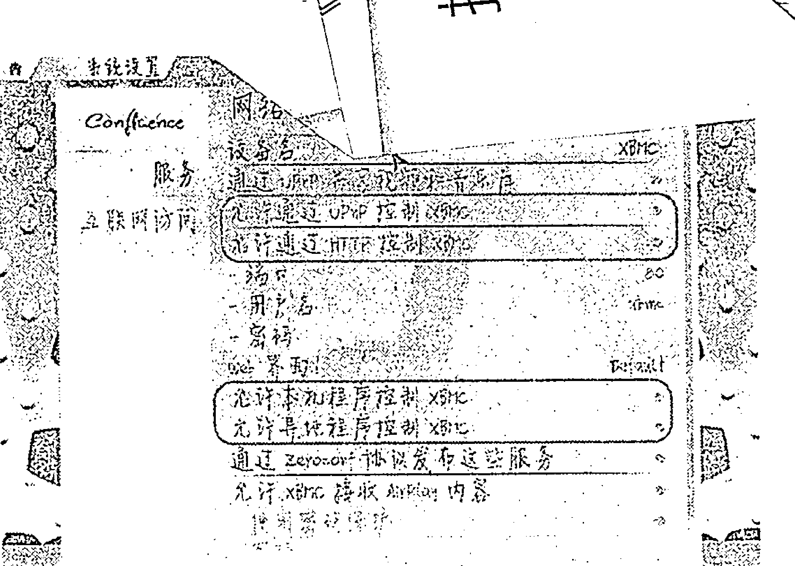

## 心的“翻译官”
### 六款翻译软件评测

如今市面上的桌面翻译软件有很多，那么在这些林林总总的翻译软件中，哪个最好用？哪个最适合你用？看完评测你就心中有数了。
文 | CFan软件研究室

网络的普及让我们有了更多的机会接触大量的外文资料，大部分人多多少少都学习过一些外语，但是在看外文资料时，难免会被生词卡住，于是各种词典软件应运而生。词典软件发展了很长时间后，随着竞争的白热化，各软件厂商开始拓展词典软件的功能，比如增加了整句翻译功能、学习功能等等。在这些令人眼花缭乱的功能中，我们要找的则是能用、实用、正合我用的软件。下面就让我们来一一检测。

### 测试平台
处理器: Intel Core i3 CPU M330 @2.13GHz
内存: 2.00GB (1.86GB可用)
操作系统: Windows 7 SP1/32位家庭版
网络带宽: 2MB

## 测试软件是这么挑选的
对大部分人来说我们接触最多的是英文资料，所以本次所选的软件以中英互译为主。翻译软件分词典翻译和全文翻译两大类，我们选择的都为词典软件，当然，它们现在也具备了更多的整句甚至全文翻译功能，但与真正的全文翻译软件还是略有不同。所选软件参考了各大下载网站的下载排行，选择了较为流行的5款。所有参测软件均从各软件的官网下载（截止日期2013年1月25日），各软件有多个版本，这里一律选择的是标准版。
金山词霸 (http://ciba.iciba.com/, 12.76MB)
有道词典 (http://cidian.youdao.com/, 5.32MB)
灵格斯词霸 (http://www.lingoes.cn/zh/, 5.1MB)
巴比伦 (http://chs.babylon.com/, 782.58KB)
必应词典 (http://dict.bing.msn.cn/, 20.27MB)

#### 专业人士——精确高效的词典

真正专业的翻译人员，他们对桌面词典软件的要求可能是最低的，也就是用它查查生词什么的（专业人员在完成大批量翻译任务时，也必须大力借助翻译软件，不过那主要是机器辅助翻译CAT，不在本次评测的范围）。所以，对这类人来说，软件所携带的词典多少及质量高低、软件的易用性、软件的兼容性（因为电子文档格式众多）、软件的运行效率等，才是他们比较关注的。
对于专业人士，我们力荐灵格斯，虽然它的易用性稍差，但是在多语种互译的支持上相当强悍，汉英词典的支持也是相当壮观。不过不知什么原因，这款软件在2012年中很少更新，所以作为另一个较佳的选择，就是金山词霸。金山词霸的词典数量不如灵格斯，但是它词典的综合质量更高。附表中，词典数量统计的是本地词典及可在其官网免费下载的在线词典。词典质量的评分，主要依据的是各软件所携带的词典的权威性及行业词典的丰富性，比如金山词霸中除包含比较权威的柯林斯词典外，还包含了不少行业词典。

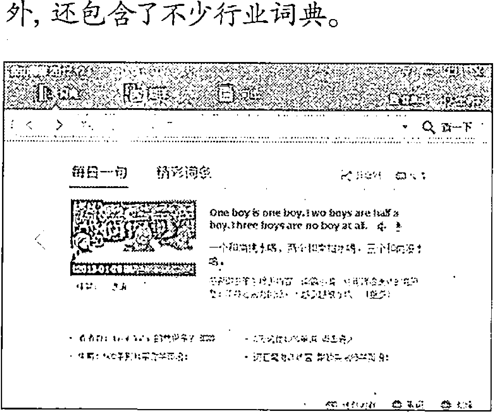

内存占用主要为测试软件的效率，为了公平起见，我们是在将所有被评软件全开的情况下，查看同一时间内它们的内存占用量（注意：同时开启多个即时翻译软件时容易导致系统故障）。其中有道和必应分别产生了两个进程，这里显示的是进程之和。如果你的电脑配置实在太低了，不妨选用低内存占用的有道或灵格斯。

| 软件项目 | 词典数量 | 词典质量 | 兼容性 | 易用性 | 内存占用(KB) |
| :--- | :--- | :--- | :--- | :--- | :--- |
| 金山词霸 | 15 | ★★★★☆ | 高 | ★★★★☆ | 43636 |
| 有道词典 | 不明 | ★★★★ | 高 | ★★★★☆ | 12204 |
| 灵格斯词霸 | 73 | ★★★★☆ | 中 | ★★★★ | 13948 |
| 巴比伦 | 33 | ★★★★ | 低 | ★★★ | 20960 |
| 必应词典 | 不明 | ★★★ | 低 | ★★★ | 32648 |

| 软件项目 | 真人语音 | 语音学习 | 阅读例句 | 单词本 |
| :--- | :--- | :--- | :--- | :--- |
| 金山词霸 | √ | √ | ★★★★☆ | ★★★★☆ |
| 有道词典 | √ | × | ★★★★ | ★★★★ |
| 灵格斯词霸 | √(单独下载) | × | ★★★ | × |
| 巴比伦 | √(收费) | × | ★ | × |
| 必应词典 | × | × | ★★ | ★★★★☆ |

金山词霸对于专业或非专业人士，它都是一个很不错的选择。它翻译的质量相对来说是这几款软件中最高的，而且提供了许多语法知识，可以更深入地学习英语。

#### 学生学习——丰富的学习资料

词典软件相互竞争的结果，就是各厂商想方设法拓展功能，其中最有成效的功能就是辅助英语学习，这对广大学生以及许多想要学英语的人来说，是一个福音。英语学习有几样基本功：听(语音)、说(朗读)、读(阅读)、写(写作)、记(背单词)。让我们看看各软件在这方面的表现。

> 针对英语学习这一方面，国产翻译软件更贴近国人的真正需求。这其中金山词霸和有道词典表现最为出色。金山词霸的例句，非常注重语法分析，与所查单词相关的例句中标注有“语法信息”，句库中更进一步给出所查单词的词形变化、搭配习惯、应用场景等，让我们对所查单词的用法有更深刻的了解。有道词典的例句，则侧重于实际场景的分类，有口语、书面语、论文之分，还搜集有大量真人音视频资料，现场感特别强。

灵格斯、巴比伦及必应词典，例句部分非常弱，基本就是网上搜集，缺少合理分类，实用性差。必应词典虽然号称真人例句发音，但小编感觉是真人语音合成，与自然发音有一点点的差距。

#### 白领办公——快速可用的全文翻译

对于办公室的白领来说，因为工作需要经常要接触到外文资料(主要是英语)，如外文网页、电子书及与外籍人士交流沟通的E-mail等。这时，我们往往需要的是快速了解文章的大意，有一个初步判断，然后再决定是丢到一边或是进一步细细研读。这时，全文翻译的准确性就显得很重要了。

| 软件项目 | 社会新闻 | 科技类 | 生活类 |
| :--- | :--- | :--- | :--- |
| 金山词霸 | ★★★★ | ★★★★ | ★★★★ |
| 有道词典 | ★★★ | ★★★ | ★★★ |
| 灵格斯词霸 | ★★☆ | ★★☆ | ★★☆ |
| 巴比伦 | ★★ | ★★ | ★★☆ |
| 必应词典 | ★★★ | ★★★ | ★★★ |

> 为了测试各词典软件的翻译功能，我们随机选择了一篇社会新闻 (http://tinyurl.com/bjtagmx)，以及在亚马逊网站上随机搜索到的科技类图书及生活类图书的内容介绍各一份，通过翻译的准确度进行打分。

使用过程中，发现金山词霸实际上调用的是百度翻译的结果，所以全文翻译时必须为在线状态，翻译结果相对此次测试是最好的，虽然还不是十分精确，但是在不对照原文的情况下也能看出文章的大意了。有道词典的全文翻译，效果要比金山词霸略逊，有些句子不知所云。不过它有一个很人性化的功能，光标无论在原文还是译文上滑过时，对应的句子会高亮显示，便于我们修改翻译结果。根据有道网页上的提示，还提供人工翻译的服务，不过是收费的，此项功能小编没有测试。

灵格斯的全文翻译功能收集自其他多个在线翻译服务，包括谷歌(经常不可用)、必应、百度甚至有道等，服务不是很稳定，而且译文的长度被截短了，极其不好用。巴比伦的翻译效果比灵格斯稍好一点，但它也存在译文被截短的问题，译长文时不是很方便。

必应词典没有将全文翻译功能分离开来，与词典翻译共享输入框，因此只能翻译一个整段(不能包括回行)，用起来不是很方便。

#### 特色功能展示

软件的同质化，逼迫各软件厂商挖空心思去开发一些附加功能以赢取更多的用户。本次测试的几款软件各有绝活，下面列举它们的特色功能。

| 项目\软件 | 特色功能 |
| :--- | :--- |
| 金山词霸 | 金山词霸的一个新增功能，软件每天会推出一个常用句子，除了给出朗读配音外，我们还可以录制自己的读音与之进行比较，找出自己发音的不足(需在线)。 |
| 有道词典 | 具有OCR取词功能，对图片上的文字也能进行识别与翻译。 |
| 灵格斯词霸 | 它的附录中带有许多特色工具，如汇率换算、手机号码查询、IP地址查询、万年历、邮编等等，非常丰富。 |
| 必应词典 | 语音合成几乎可以和真人语音相仿，所以它几乎所有的语句都提供有语音朗读。 |

#### 编辑选择

综合以上各项测试，小编可以毫不犹豫地向大家推荐金山词霸。对于专业或非专业人士，它都是一个很不错的选择。它翻译的质量相对来说是这几款软件中最高的，而且提供了许多语法知识，可以更深入地学习英语。稍嫌不足的是，它对资源的占用也是几款软件中最高的。当然有道词典和灵格斯词霸也值得推荐，尤其有道词典的例句库，大部分都配有真实的音频或视频，对学习英语语音相当有益。

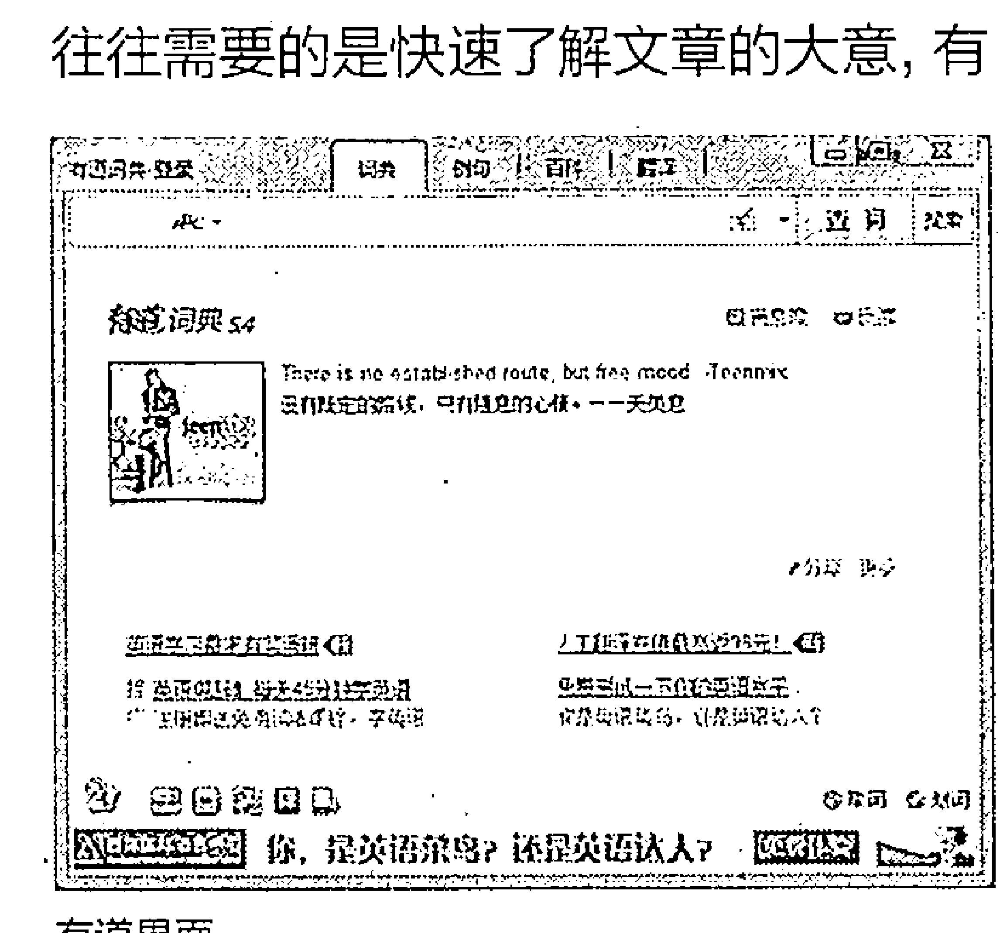


最后善意提醒一下大家，安装金山词霸或有道词典时，一定要选择自定义安装，以免误安装一些不喜欢的插件或选项。另外要注意，安装有多个翻译软件的，最好不要同时开启它们，尤其是同时打开它们的即时翻译功能，很容易造成系统的不稳定(小编评测时血的教训)。

# 系统不给力 注册表里寻捷径

出于安全和系统稳定的需要，Windows中有很多系统设置没有提供删除或者关闭选项，这给我们日常的使用带来诸多不便，有没有好的方法解决这些问题呢？

文|风浪子

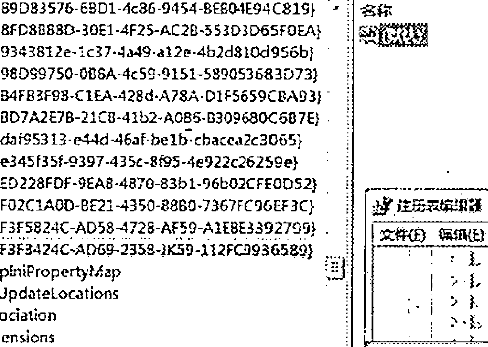

## 搜索键值 找到特定更改项

由于大部分系统设置都是和注册表关联的，因此通过注册表编辑器查找特定键值进行修改可以获得事半功倍的功效。实际上很多原来不可用的设置，通过删除键值的方法就可以实现手动修改。

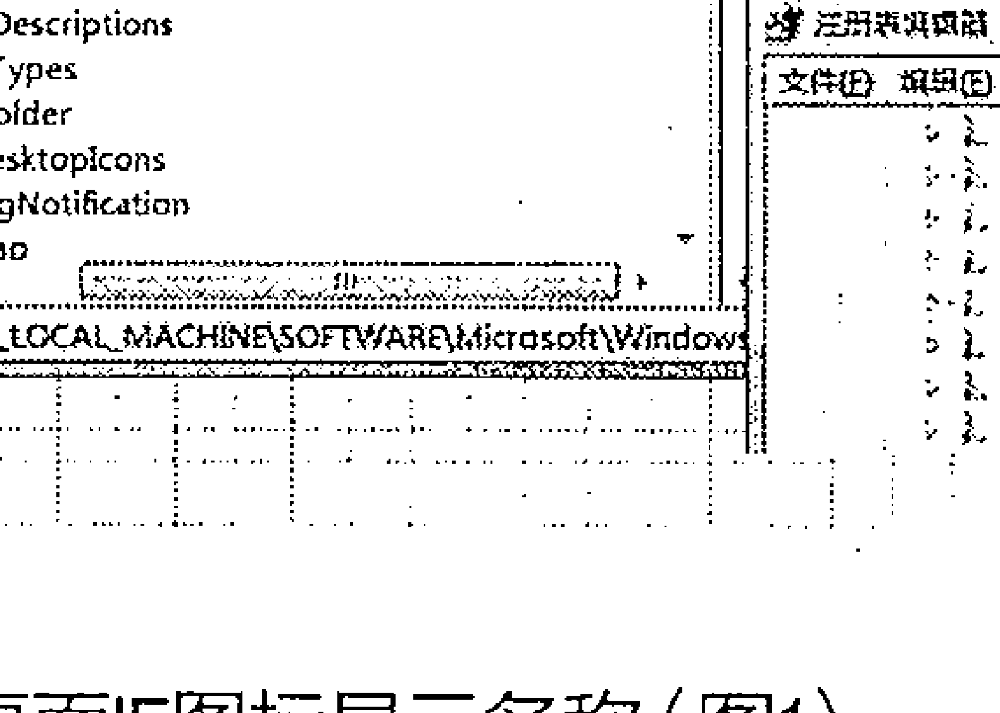

正是桌面IE图标显示名称（图1）。

现在可以尝试将这个默认值更改为CFAN，刷新后返回桌面看看，原来的IE图标名称是不是同步更改了？原来这些图标是通过类标识符方式在系统注册表中添加键值，让系统误认为是系统图标，从而给我们删除带来不便。删除方法很简单，同上展开注册表到上述键值后，右击选择删除即可。

### 实例：删除桌面顽固图标

#### 通过对比找键值

举一反三：通过注册表查找特定键值并进行修改是我们更改系统设置常用的方法，在日常操作中还有很多类似故障可以通过这种方法解决。

喜欢在一些不知名网站下载软件的朋友，安装某些软件后经常会在桌面上莫名其妙地多了几个IE图标，点击右键却没有“删除”菜单，拖动到回收站里也没有反应，点击这些图标则会自动打开一个不知名的导航网站，比如XX高清电影、精彩小游戏等页面。实际上这些图标是“伪”系统图标，虽然无法直接使用右键菜单删除，但是通过注册表则可以轻松删除这些顽固图标。

- 1. 病毒强行更改的首页，对应HKEY_LOCAL_MACHINE\Software\Microsoft\Internet Explorer\Main，右窗格中的键值为Default-Page-URL。
- 2. 无法显示隐藏的文件和文件夹，展开HKEY_LOCAL_MACHINE\SOFTWARE\Microsoft\Windows\CurrentVersion\Explorer\Advanced\Folder\Hidden\SHOWALL，将右侧窗格CheckedValue的值更改为1。
- 3. 无法复制BCD文件，展开HKEY_LOCAL_MACHINE\BCD00000000，单击“文件/卸载配置单元”即可。

系统所有变化几乎都会导致注册表键值变化，因此如果要捕捉系统特定的更改（特别是后台程序的更改），我们可以通过键值的前后变化快速找到指定的键值。

### 实例：让组策略限制因人而异

大家知道我们可以通过组策略设置很多限制来保护我们的系统，默认情况下组策略的限制是针对所有用户生效的。实际上组策略的限制大多是通过修改注册表键值实现的，因此我们只要捕捉到限制前后键值的变化，然后将变化前后的键值导出，通过特定用户启动导入限制键值，这样即可实现组策略限制因人而异。下面以“阻止访问命令提示符”策略为例。

> 小提示
上述键值下有很多是系统必需的组件，为了避免误删键值造成对系统破坏，删除之前可以将NameSpace键值导出为reg文件备用，删除键值后如果系统出现异常，再次导入备份文件即可恢复。

- 第1步：进入组策略编辑器，按提示启用“阻止访问命令提示符”策略，接着展开注册表HKEY_CURRENT_USER\Software\Policies\Microsoft\Windows\System，右击上述键值将其导出为cfan1.reg放置在C盘。
- 第2步：返回组策略编辑器窗口将“阻止访问命令提示符”策略禁用，再次进入注册表导出变化后的键值为cfan2.reg。
- 第3步：以后如果要对某个用户单独启用此限制，只要将cfan1.reg导入注册表即可，解除限制时导入cfan2.reg即可。

一般来说，对特定保护键值我们需要先取得所有权，接着才能进行编辑。有时需要提权（比如删除恶意程序锁定主页键值，需要获取完全控制权限），有时则需要降权，比如本文中的保护密码实例。

返回组策略编辑器窗口，同上展开上述键值，通过对比可以看到，当我们启用/禁用“阻止访问命令提示符”策略后，其中DisableCMD数值从2变为0（2为启用，0表示禁用策略，图2）。

第3步：再次将禁用策略后键值导出为cfan2.reg，也放置在C盘备用。接着启动记事本建立一个批处理stop.bat，放置在C:\Users\cfan\AppData\Roaming\Microsoft\Windows\Start Menu\Programs\Startup下，代码如下：

```
regedit.exe /s c:\cfan1.reg
```

第4步：同上建立一个regedit.exe /s c:\cfan2.reg批处理保存在C:\Users\当前用户\AppData\Roaming\Microsoft\Windows\Start Menu\Programs\Startup下，这样自己登录电脑时会导入“cfan2.reg”取消限制，当其他人使用电脑中的cfan账户登录后就会阻止命令提示符的访问，从而实现组策略限制的因人而异（图3）。

举一反三：通过监控注册表键值前后的变化也是我们捕获系统设置常用的方法，如果是复杂键值的监控和对比，则可以使用专业的软件如Process Monitor等来完成。如果之前你没有备份，还可以在正常电脑上导出对应的键值和故障电脑的对比。类似的操作还有：

-   1. 捕获病毒更改注册表键值。在测试病毒时，我们经常要查看病毒在注册表中添加键值，此时通过比较病毒样本运行前后键值的变化即可获得。
-   2. 取消隐藏驱动器。导出正常电脑的HKEY_CURRENT_USER\Software\Microsoft\Windows\CurrentVersion\Policies\Explorer，比较之间的不同即可，如果本机有隐藏驱动器，则右窗口中会有名为NoDrives的键值。
-   3. 系统中新增服务。比如有些病毒会通过驱动方式增加自启动服务，服务键值对应HKEY_LOCAL_MACHINE\SYSTEM\CurrentControlSet\Services，只要对比前后键值的变化即可。

## 通过权限控制键值

自Windows 2000开始引入权限的概念后，微软就在注册表中也添加了权限设置。通过对特定键值的权限限制来实现很多特定的功能。同样的，我们可以通过键值权限的自定义编辑实现系统设置的更改。

## 实例：无线密码不再轻易泄露

Windows 7无线网络连接属性的“安全”选项卡有一项名为“显示字符”的复选框，勾选此复选框可以将无线网络连接的密码以明文的形式显示出来。这样如果其他朋友在使用我们的电脑时就容易造成密码泄露。

第1步：同上启动注册表编辑器，展开到HKEY_CLASSES_ROOT\AppID\{86F80216-5DD6-4F43-953B-35EF40A35AEE}，右击该键值选择“权限”，接着在打开的窗口单击“高级”，在打开的窗口切换到“所有者”，将文件所有者设置为当前Administrators组。

第2步：依次点击确定返回权限设置窗口，在组和用户列表选中需要屏蔽该功能的当前账户，将其对该键值的完全控制权限设置为“拒绝”，这样当前账户登录后无法读取该键值（图4）。

第3步：完成上述的设置后重启系统，由于当前账户无法读取上述键值，从而无法选择“显示字符”的复选框（虽然可以选择但设置却无法生效，并且会自动恢复为未选中的状态），自然可以更好地保护我们的网络密码了（图5）。

举一反三：注册表权限的编辑是我们日常设置中经常用到一个方法。类似的操作还有：

-   1. 比如IE主页的键值实际上是由HKEY_CURRENT_USER\Software\Microsoft\Internet Explorer\Main\Start Page键值控制的，其右侧窗口中的StartPage值就是IE的主页。因此要锁定IE主页不被篡改，我们只要将当前账户对上述键值的权限设置为“只读”即可。
-   2. 查看特定键值，比如系统账户信息对应HKEY_LOCAL_MACHINE\SAM\SAM\Domains\Account，但是HKEY_LOCAL_MACHINE\SAM默认受到系统保护无法查看，只有获得SAM项的完全控制权后才能展开。类似还有HKEY_LOCAL_MACHINE\SECURITY（查看账户安全设置）。
-   3. 锁定自启动项，对应HKEY_CURRENT_USER\Software\Microsoft\Windows\CurrentVersion\Run和HKEY_LOCAL_MACHINE\Software\Microsoft\Windows\CurrentVersion\Run，HKEY_CURRENT_USER\Software\Microsoft\Windows\CurrentVersion\Policies\Explorer\Run和HKEY_LOCAL_MACHINE\SOFTWARE\Microsoft\Windows\CurrentVersion\Policies\Explorer\Run，设置相应的项任何人无法更改即可。

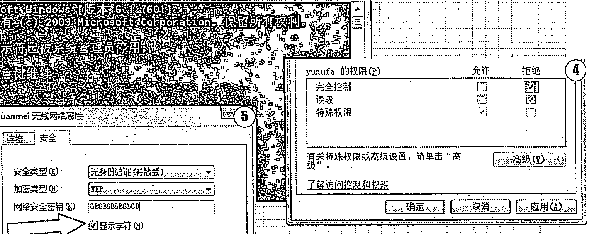

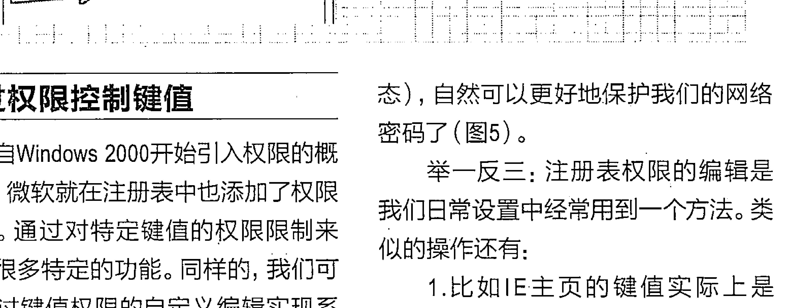

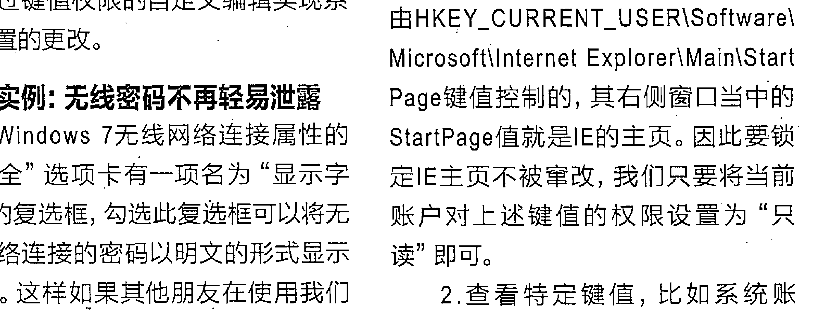

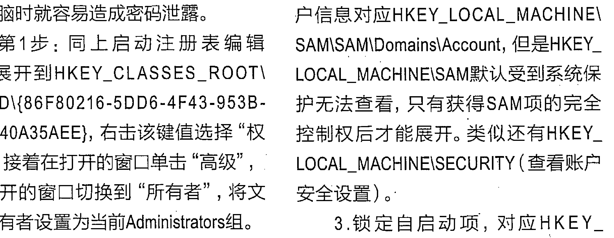

# Win7账户管理有高招

使用系统就免不了使用账户，如何使用好、管理好你的Win7账户？又有哪些新奇的账户管理功能？一起来看看账户管理达人有怎样的高招吧！

文|平淡

## 招数1:克隆账户

使用工具：注册表编辑器

账户作用：克隆当前管理员账户，方便在忘记账户密码时用它登录系统

实例解读：为电脑预留后门

虽然这个作用是给忘记账户密码的用户登录系统，可是每天都要输入密码登录谁会忘记账户密码呢？这个招数真正的作用就是给Win7建立一个隐藏克隆账户，方便不知道密码的用户使用它来登录系统。比如说，身为学生的你是不是很想在你父母设置了账户密码的情况下，继续使用管理员账户来操作电脑呢？

-   第1步：以管理员身份启动命令提示符，输入“net user cfan$ /add”（不含外双引号，下同），在系统新增一个名为cfan$的标准账户。接着启动注册表编辑器，依次展开HKEY_LOCAL_MACHINE\SAM\SAM，右击SAM键值选择“权限”，单击“添加”，将当前用户添加到列表并将账户对该键值的读取权限设置为“完全控制”。
-   第2步：返回注册表编辑器窗口，单击菜单栏的“查看→刷新”，刷新注册表后就可以展开HKEY_LOCAL_MACHINE\SAM\SAM\Domains\Account\Users\Names，这里可以看到本机所有的账户名称。选中上述建立的cfan$账户，在右侧窗格可以看到它的默认值是0x3ec，这个键值对应HKEY_LOCAL_MACHINE\SAM\SAM\Domains\Account\Users下的000003EC账户（图1）。

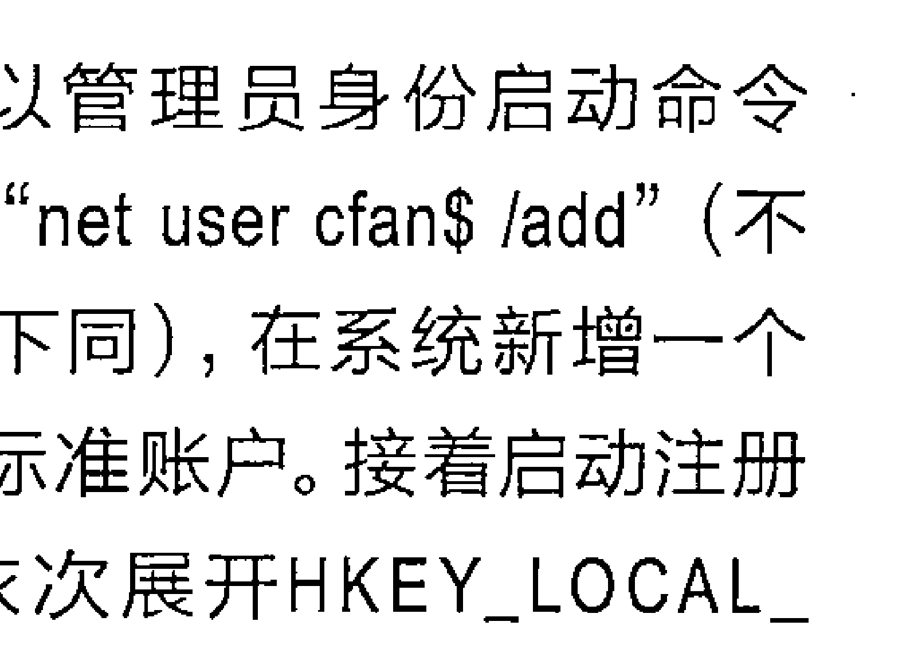

-   第3步：比如需要克隆当前管理员账户，我们可以假设当前账户对应上述Users键值下的000003EA，展开000003EA，然后复制右侧窗格的F值。同上展开到000003EC，将复制的值粘贴到其F值处。
-   第4步：右击000003EC和cfan$分别导出为3EC.reg和cfan.reg。现在将cfan$账户删除，最后再导入上述两个reg文件复原账户即可。这样重启后即可用cfan$账户（无需密码）登录，cfan$账户在本地用户和组看不到，但可以成功登录系统且具备当前账户管理员权限（图2）。

需要注意的是，现在很多黑客会使用克隆账户的方法在我们的系统中留下克隆账户。如果你不想预留后门，但是怀疑自己电脑有类似的隐藏账户，只要展开上述键值，然后选中Names下需要删除的账户，然后记住其右侧窗格默认键值，这个键值对应Users下的账户，按提示将这两个键值删除即可删除克隆账户。

要使用克隆账户登录，必须进入组策略编辑器，依次展开“Window设置→安全设置→本地策略→安全选项”，启用右侧窗格的“交互式登录: 不显示最后的用户名”，这样才可以输入cfan$账户登录。

## 招数2:定时登录账户

使用工具：Net User命令行

账户作用：限制用户在指定时间登录系统

实例解读：禁止用户在双休时间登录公司电脑

默认情况下建立的账户都可以随时登陆系统，不过对于企业用户，我们很多时候需要对账户的登录时间进行管理。比如为了公司文件的安全，

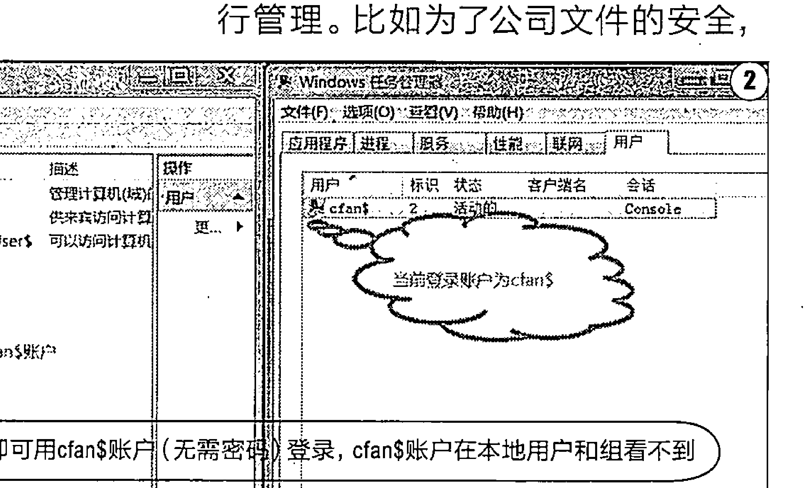

账户安全是系统安全的一个重要部分，本文介绍的如何管理系统账户的方法，是不是让你又多了几种选择呢？用Win7，用好Win7，更好更安全地使用Win7。

## 招数3:打造特权账户

使用工具：SC命令

账户作用：使用内置的System账户访问受限目录或者键值

实例解读：直接删除病毒文件、系统顽固文件

我们需要设置档案室的电脑账户，周六、周日不允许登录，其他正常工作日可以登录。

以管理员身份启动命令提示符，然后输入“net user cfan 123456 /add /times:M-F,8:00-17:00”。这样我们就在本机建立一个名为cfan的账户（如果要提升cfan账户的权限，将其添加到Administrators组即可），登录密码是“123456”，cfan只能在上述指定时间（周一到周五，8:00-17:00）登录系统，输入“net user cfan”可以看到该账户的详细登录小时数（图3）。

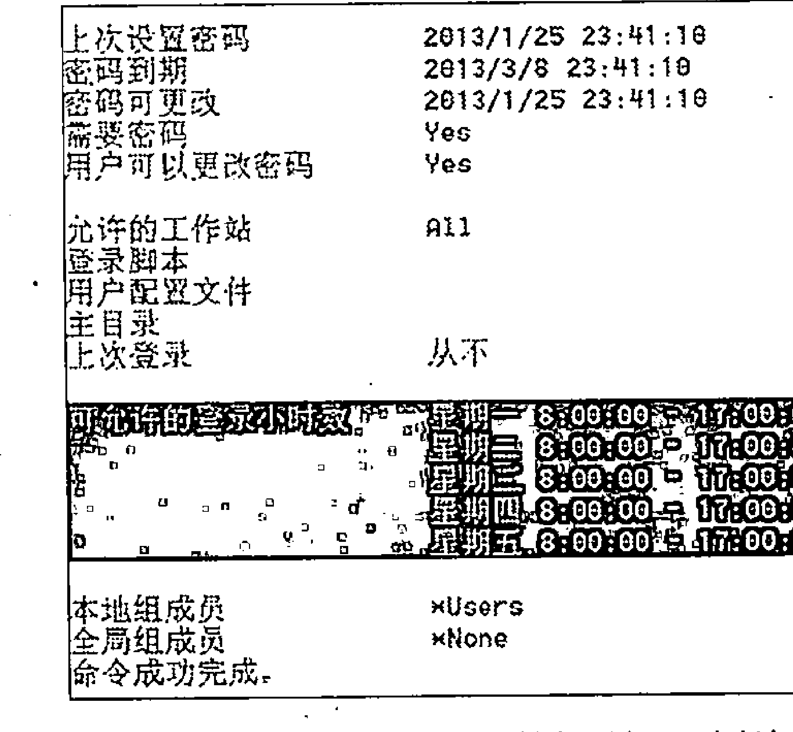

大家知道为了系统安全，Win7内很多设置默认只对System账户开放，比如上述注册表账户键值、C:\System Volume Information目录等，很多时候我们又需要访问这些设置，比如某些病毒就会隐藏在C:\System Volume Information目录。我们要访问这些只对System账户开放的设置，就需要更改这些目录或者键值的权限，如果完成操作后不及时恢复默认设置，会给系统安全带来隐患。现在我们可以直接以System身份启动桌面进程，这样就可以轻松访问上述目录（或键值），访问完成后再退出，这样既可以查杀病毒，又无需对系统默认设置进行更改。

第1步：以管理员身份启动命令提示符，输入“SC Create SuperCMD binPath= "cmd /K start" type= own type= interact”命令，在系统中添加一个名为SuperCMD的系统服务。

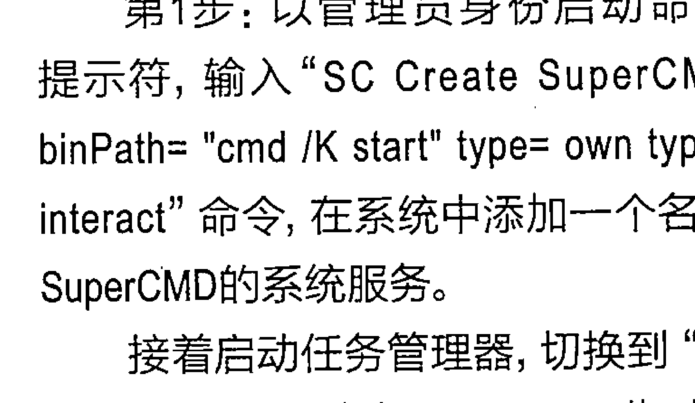

接着启动任务管理器，切换到“服务”标签，然后选中SuperCMD，此时系统会提示无法启动服务，但是桌面会弹出一个“交互式服务检测”窗口，点击其中的“查看消息”，这样会自动进入System账户桌面环境（图4）。

第2步：进入System账户桌面环境后，在其中的命令提示符下输入“explorer.exe”启动桌面进程，现在我们就可以看到类似当前用户的桌面环境，点击开始菜单即可看到现在登录的账户是System（图5）。

第3步：现在我们就可以开始以System身份杀毒了，不过由于配置文件问题无法直接打开资源管理器。这时可以使用WinRAR、7ZIP等压缩软件自带的文件管理器，在其中即可轻松打开C:\System Volume Information目录，按提示删除病毒文件即可。

> **小提示**
> SC命令创建服务的格式是：Create 服务名 binPath= 启动服务命令 type= 服务启动类型 type= 是否交互，注意命令中“=”后要用一个半角空格断开。

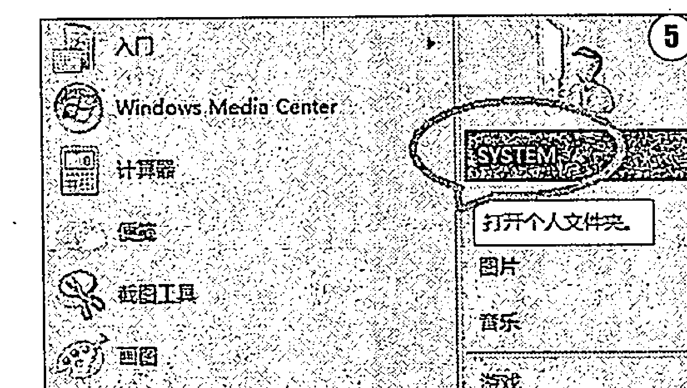

在这里，Time的增加值限制为1小时。对于Day值，可以用全称或24小时制缩写（即 M、T、W、Th、F、Sa、Su）。可以使用12小时或24小时时间表示法。对于12小时表示法，请使用AM、PM或A.M.、P.M.。All值表示用户始终可以登录，空值（空白）意味着用户永远不能登录。用逗号分隔日期和时间，用分号分隔日期和时间单元（例如，M,4AM-5PM;T,1PM-3PM）。指定时间时不要使用空格。现在把这个账户作为档案室的专用登录账户即可，这样其他同事试图在周六或者周日这些不允许的时间登录就会被拒绝，可有效保护电脑在非上班时间的安全。使用Win7自带的“家长控制”也可以方便控制用户，不过它只能对标准账户进行控制，上述方法则可以对任意账户进行控制。

当然，由于System是系统内置的高特权账户，我们也可以在此以System身份删除系统顽固文件等操作。Win7中还有一个名为TrustedInstaller（全名是NT SERVICE\TrustedInstaller）的高特权账户，很多系统文件只是对该账户开放。如果以System身份登录后，仍然提示需要TrustedInstaller权限才能对某目录进行操作。此时可以到http://www.kuaipan.cn/index.php?ac=file&oid=3237430383608212下载“管理员取得所有权.reg”，下载后导入注册表，现在只要再次选中上述文件，右击选择“获取管理员权限”，成功变更权限后即可去除TrustedInstaller权限的限制。

# 简单三招 影音下载无难题

我们上网下载视频，一般总需要注册一个账户或安装客户端，通常二者需要皆备。视频网站很多，注册多账户和安装多个客户端多有不便，还好我们有工具软件来帮忙。

文/张正文

### 方法一：地址解析

网上有很多下载器，它们使用地址解析的方法下载常见视频网站上的视频。笔者用的是硕鼠下载器 (http://www.flvcd.com/)。打开软件可以发现，其主界面被设计成了浏览器风格，因为软件的视频解析任务由官网在线完成，同时也方便我们浏览网页找视频。

下载一般视频：复制视频所在网页的地址，粘贴到硕鼠下载器默认页面的地址栏中，点击开始进行解析。如果是加密视频，则要输入密码才可解析。解析后的默认清晰度为标清，在解析结果页面中选择需要的清晰度，我们可以在偏好设置选择优先清晰度来免去选择画质的步骤。选择好画质后，点击“用硕鼠下载该视频”选择需要的方式下载（图1）。

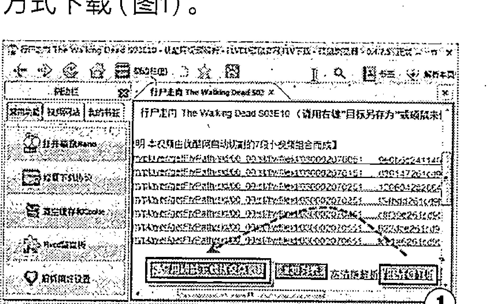

一些网站会将一个视频分成多段，我们只需在硕鼠下载界面中勾选“自动合并分段视频”即可。合并后的视频会保存在下载目录下名为“合并”的文件夹之中。

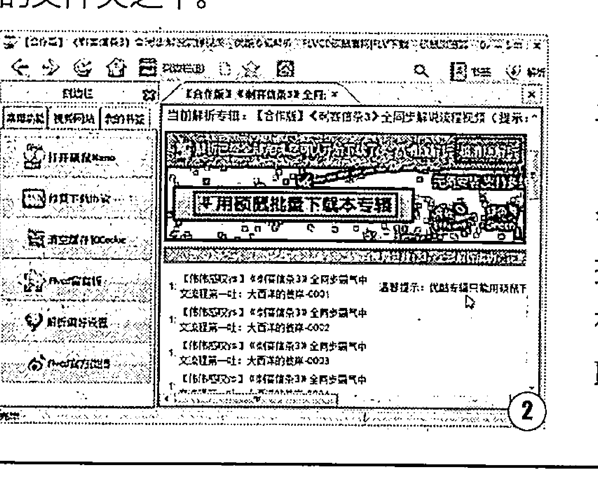

下载视频专辑：“一键”下载整个专辑是硕鼠下载器的一大特色，免去了人工的繁琐操作。复制专辑视频列表也可以是剧集列表地址到硕鼠中解析后选择需要的画质，点击“用硕鼠批量下载本专辑”按钮即可将整个专辑内的视频收入囊中（图2）。

### 方法二：资源嗅探

网页视频下载器支持的网站再多，还是有无能为力的时候，比如使用视频网站站外播放器或者使用自己的播放器的网页，就要用到嗅探工具了。

以傲游浏览器为例，打开视频所在网页并播放，将光标放在正在播放的视频上方，视频右上角将出现下载工具条，点击“保存”按钮，接着在资源列表下方点击“保存所有”，软件会自动给视频文件命名。我们也可以点击浏览器搜索栏右侧的放大镜按钮来打开资源嗅探器。点击“视频”选项卡，可以在列表中看到网页上被嗅探到的视频，勾选全部后点击“下载选中视频”下载，但这种方法不能自动命名。对于分段视频，我们使用视频合并工具合并它们即可。

除了傲游浏览器的资源嗅探功能外，类似的有迅雷、Realplayer等软件附带的浏览器资源嗅探插件，以及网际快车、Orbit等软件。

### 方法三：缓存提取

当我们在线观看视频时，浏览器会先将视频数据下载到缓存中，再由播放器播放。所以，我们可以用提取视频缓存的方法来获取视频。手工提取较麻烦，我们使用VideoCacheView (http://t.cn/zYKmRiS) 来帮助我们提取缓存。VideoCacheView支持IE、Chrome、Opera、Firefox以及基于上述内核的浏览器，如360安全浏览器、搜狗浏览器兼容模式均用IE内核，那么缓存位置就和IE相同。

打开浏览器，播放视频使其完全缓冲完毕。接着打开VideoCacheView，软件自动开始搜索浏览器缓存中的视频文件，根据刚才播放视频的大致时间，很容易就可以找到我们要的缓存文件（图3）。我们只要右击文件，在弹出的菜单中选择“拷贝所选文件到…”，保存视频文件即可。如果是分段视频，注意要把各分段保存起来。对于那些已经不在缓存文件夹中的视频，我们可以通过拷贝下载地址来重新下载。

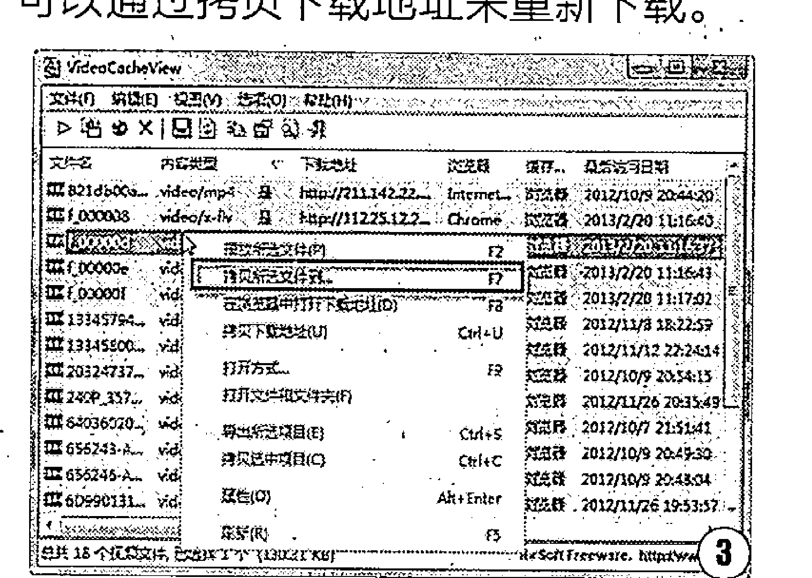

为了缩小搜索范围，我们可以在菜单中选择“选项→高级选项”，勾选我们使用的浏览器。或者选中我们不需要的缓存文件，在菜单栏中点击“文件→删除选中的缓存文件”，既清除了痕迹，又方便了我们寻找视频缓存。

### 方法总结

三种方法各有优缺点，我们可以根据不同网站的视频选择最佳方法。如果是从优酷、土豆、搜狐视频这些主流视频网站下载，那么使用下载器进行地址解析无疑是最方便的。而对于无法进行地址解析的视频，就要使用资源嗅探或缓存提取的方法了。

## 三款软件轻松解决U盘问题

U盘用来存储重要数据或安装系统，但市场上充斥着形形色色的扩容盘和仿冒产品，使许多人不敢轻易下手，数据丢失可是了不得的事情。有什么好工具、好方法可以解忧？

文|孟帅

### Mydisktest

当大家买回来一个U盘，首先担心的就是扩容盘。扩容是非常可怕的，尤其是一些用U盘来进行重要数据存储的人而言，简直就是一个定时炸弹，说不定哪天就会遇到重要数据打不开的麻烦，这时连恢复的可能都没有，因为超出容量是不会被写入闪存颗粒的。但是，所谓一物降一物，Mydisktest这款软件就是用来检测扩容盘的利器。

这款软件有两个功能三个模式可供使用者选择。快速扩容测试顾名思义就是较快时间内就检测完成，但是根据笔者的多次实验，这个快速测试不是很准确的。笔者曾经买了扩容U盘，快速测试后正常，而完整性测试却发现了问题，所以推荐大家使用数据完整性校验进行检测。它的原理是将文件不断复制不断写入并查看是否能读出，从而达到检验物理容量的目的，所以准确率也是极高的。读写速度测试也是检验一个U盘性能的重要依据，所以Mydisktest这款软件也集成了此项功能，并且软件大小只有不到100KB，也可谓是小而精悍的一款U盘鉴别软件。

笔者总结几次网购U盘的经历，向大家极力推荐几款检测扩容盘、修复U盘、恢复重要数据的U盘工具软件。

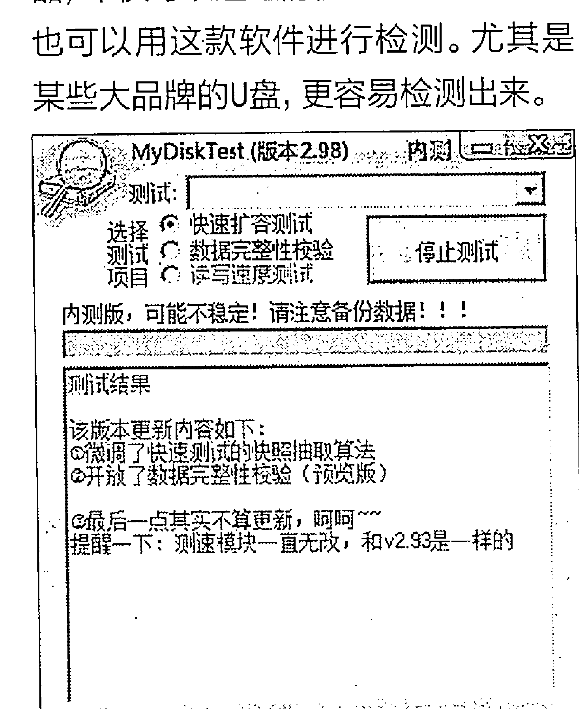

都显示出来，并且提供此U盘的量产解决方案的网址链接，方便使用者进行U盘修复和量产。它还独有一个评分系统，对U盘的整体性能进行评分，使得使用者能够很直观地了解自己U盘的整体性能。如果U盘购买者担心U盘不是正品，不仅可以通过防伪查询进行验证，也可以用这款软件进行检测。尤其是某些大品牌的U盘，更容易检测出来。

### 芯片无忧Chipeasy

如果说Mydisktest是扩容盘、数据检测的利器，那么这款由优盘之家技术团队打造的“芯片无忧”U盘芯片检测工具就是检测U盘芯片方面的“神器”。它同样具有短小精悍的特点，软件大小不到1MB，无需操作，插上U盘即可自动检测U盘，并将U盘的各种数据

### Diskgenius

说到U盘的检测，前面两款软件已经完美地解决了U盘的真假问题了。而第三款软件Diskgenius比之前面两款软件却是文件最大、功能最多、操作最复杂的一款软件。这款由易数科技开发的数据恢复软件有免费版和专业版两种。就笔者个人看来，免费版的功能就已经非常强大了，此软件能力非同寻常。

数据丢失和误格式化以及U盘无法识别等问题是我们经常面临的，也一度使我们灰心丧气，重要文件的丢失常使我们自责不已，而大多数数据恢复软件却是收费的，这让我们进退两难。而Diskgenius却完美解决了这一困扰我们的问题。Diskgenius这款软件最大的功能就是数据恢复，它可以找到所有未被覆盖或者已被覆盖的文件，并且可以将未被覆盖的文件进行恢复。不仅如此，它还具有格式化、分区、备份、硬盘坏道检测与修复、启动盘制作等几十种功能，在此不一一赘述。

笔者曾经网购了一个金士顿dt101g2 8GB的U盘，用Mydisktest和芯片无忧进行了检测，发现是仿冒的扩容盘。之后，U盘便无缘无故地无法打开，也无法格式化，经过上网搜索，许多人都说需要量产，于是笔者便下载了无数量产工具，并且将U盘拆开查看主控型号进行量产工具下载、都没有量产成功。但是一次偶然的机会，下载到了Diskgenius，也是好奇之余，将已经被扔在地上的U盘连接到电脑上，进行了一番乱试。结果，用Diskgenius格式化之后，U盘竟然奇迹般地可以用了，虽然还是个扩容盘，但这款软件令我如获至宝，所以才进行了细致的研究和使用并推荐给大家作为常用必备软件。

总结了一下，在鱼龙混杂的U盘市场上，要想买到一个令自己很放心、称心如意的U盘是存在风险的。因此，除了使用软件进行检测之外，更应当到正规的经销商处购买。另外，买U盘时最好选择大品牌的U盘，不仅质量好，防伪查询和主控查询也方便，便于识别真假。而一些二三线产品，本身销量不行，性能又不好，主控芯片也无太多人知晓，即使得到了，主控芯片的型号是较为劣质的，也无济于事。因为卖家只一句话：厂家生产的这款U盘就用的这主控，一句话就使你无从反驳。

# 不怕听力差 老外说话能“看”懂

如果外语听力较差，听不懂老外说的是什么，那不妨将声音识别成可读的文本，来“看”老外说话吧。

文/一页

为了学习充电，小云经常要看一些国外的视频资料，比如国外比较有名的大学公开课等。虽然有不少热心的网友和组织在做这方面的汉化，但有些视频资料，小云等不及或者根本就等不到字幕组的翻译。而小云自己的英语听力又比较差，根本听不懂，怎么办呢？下面是一个简单易行的方案。

## 从声卡中提取视频声音

本文的方案，主要是把视频中的声音转换成文本，这样不再需要听力，借助翻译软件就可以了解英文大意了。所以，首先我们要将视频中的音频提取出来。

通过麦克风录制声音会产生许多杂音，不利于后面的语音识别，我们可直接从声卡录制，尽可能保持原有的音质。这需要进行一些设置。在控制面板的“声音”中点击打开“管理音频设备”，切换到“录制”选项卡，然后在窗口空白处右击，选择“显示禁用的设备”，将会多出“立体声混音”项，右击它，选择“启用”（图1），并将它设置为默认设备。为防止混入麦克风的杂音，可暂时右击“麦克风”禁用它，等录制完毕再解禁。

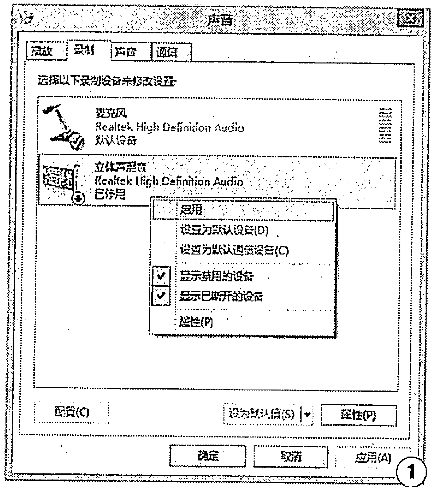

设置完毕，打开相应的视频播放，并使用任意一款带录音功能的软件，比如系统自带的“录音机”程序录制就可以。录制的声音可以在第三方软件中编辑处理，比如在免费的音频编辑软件Free Audio Editor（http://www.free-audio-editor.com）中打开上述录制的音频，选中前面的杂音部分，然后点击Delete删除等等。处理完毕保存即可。有些语音识别软件只支持WAV格式，此时可选择Save→Save file as将音频转存为WAV。

安装Free Audio Editor时如果选择安装了它的浏览器工具栏，它所带的Free Online Radio，不用进行设置可以直接在线录制网页中的声音，也很方便（图2）。

**小提示**
如果在声音中没有找到“立体声混音”项，可能因为你采用的是系统自带的声卡驱动。去所用声卡的官方网站下载升级到最新的声卡驱动，问题应能解决。
如果是已经下载好的视频文件，可以在Free Audio Editor中点击Import from Video，直接从视频中提取出音频。如果是英语光盘，可以选择Load CD，从光盘视频中提取音频。

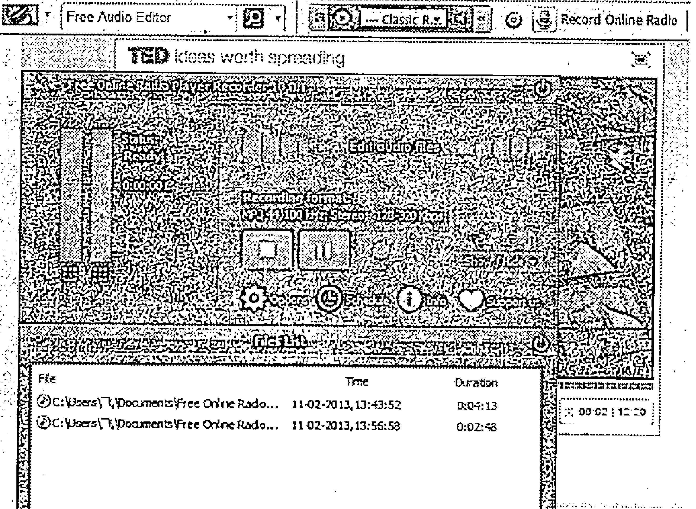

## 将声音转成文本

语音转文本的软件不太好找，我们可以试试一些在线工具。打开网站 http://www.voicebase.com/，点击右上角的Sign Up（注册），然后按提示填写简单的资料注册，选择FREE版（有多种限制），点击Get Free Account（获取免费账户）。打开注册时所用的邮箱，点击Voicebase发来邮件中的链接进入激活账户页面，点击Start Now（立即开始）按钮。

点击Upload Audio（上传声音），然后将上一步中录制的MP3音频文件（网站支持MP3、MP4、FLV、WMV等十多种流行的音视频格式）拖放到页面的Select files（选择文件）框中，点击Start Upload（开始上传）。上传完毕自动弹出对话框，选择FREE Machine Transcription（免费机器转录）项，语言为English（还支持德语、法语、意大利语、西班牙语等），最后点击Save（保存）就可以了，转录完成后网站会即时通知（登录网站查看Upload History，或通过邮件通知）。

> **绝对挑战**
本文中的方案，理论上还可以更完美一些。首先，Voicebase是一个收费的服务，免费版有着太多的限制（只提示一些关键词）；其次，如何让转录出来的文字与音频中的对话同步上，制作成字幕，这样学习起来更方便。
说实话，这个难度不小，欢迎同学们来挑战。一旦你的方案被我们选中，除了稿费外，额外还有100元的奖励哦。投稿邮箱zc@cfan.com.cn，邮件标题请标注“绝对挑战”字样。

# 微信 办公“微”加速

文/周建峰

当很多人还仅仅是将微信用来交友娱乐时，有的人已经更上一层楼，他们用微信跟客户沟通交流，收发邮件、安排日常事务……

## 重要邮件随时通知

舟舟每天的工作都要与邮件打交道，为了及时收取新邮件，他用QQ邮箱接管了其他邮箱，再启用微信的“QQ邮箱提醒”，随时获悉是否有新邮件，上班坐地铁时就可以回复邮件。选择“功能→QQ邮箱提醒”，选择“查看邮件”可收取邮箱中的新邮件（图1）。点击邮件可查看完整内容，点击右上角的“...”可回复或转发邮件。对于QQ邮箱接管的信箱，还可以根据需要设置是否提醒，选择“设置提醒文件夹”，可选择接管的信箱，确定是否接管。

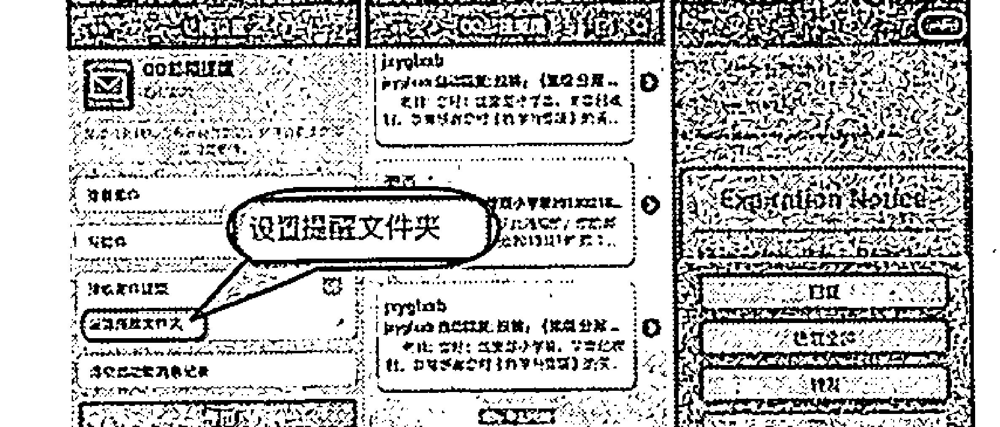

## 群发开会通知

在地铁上舟舟接到领导的一个电话，让他通知科室的同事8:30开会，这些同事都是他的微信好友，因此他直接使用“群发助手”给同事们下发会议时间和地点：进入“设置”选项，选择“功能→群发助手”，点击“开始群发”切换界面（图2），再点击“新建群发”，选择微信好友列表中的同事名单，点击“下一步”之后可以用文字、语音等形式下发通知，非常方便。

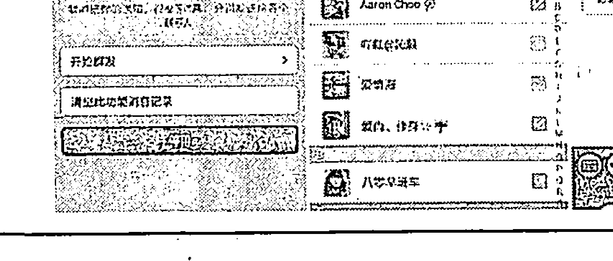

## 放下手机“隐身”用微信

到了单位后舟舟一般不会用手机微信，因为老是用手机，会让领导觉得工作不认真，而且手机毕竟没有电脑来得方便，因此他会使用网页版微信，这样交流时更加快捷。打开微信网页版（https://wx.qq.com），然后打开手机微信，点击“魔术棒”工具选择“扫一扫”，然后将手机摄像头对准网页上的二维码，识别后点击“我确认登录微信网页版”，这样在电脑上就可以登录微信网页版，收发信息更方便。

## 免费的贴身小秘书

有时由于一天的事务较多，舟舟会提前在微信中使用“语音提醒”，安排各个时段的工作。进入微信后，点击“语音提醒”切换到设置界面，点击“按住讲话”，然后口述提醒时间和事件，如：下午3点给某某打电话谈交易，明天上午9点把课表发给校长等。此时会自动识别语音为文字，并且在指定时间微信会自动提醒你，相当于免费配了一个小秘书。在工作生活中，舟舟常常会突发灵感，冒出一些想法，这些如果不及时记录，可能稍后就会消失，因此每次有想法，他会使用微信的“语音记事本”来记录。进入“设置”选项，选择“功能→语音记事本”，勾选“同步到QQ邮箱记事本”，然后点击“查看记事”，此时可以用文字、语音等形式记录下自己的灵感。语音记事本中的内容会自动同步到QQ邮箱记事本，在电脑上打开QQ邮箱后，单击左侧的“记事本”按钮，即可看到按日期排列的记事内容，这样就可以直接使用电脑进行整理，非常方便。

## 地图引领客户来聚会

下班后舟舟想约几个老客户去某会馆聚聚，他打开与某个好友的聊天对话框，点击“+”按钮选择“实时对讲机”（图3），待客户接受加入后，可以多人一起实时语音讨论，相当于召开电话会议。待商定聚会地点后，舟舟先去预定，然后打开好友聊天框，点击“位置”则会自动获取自己当前所在位置的地图，点击“发送”并发送给好友，他们收到并打开后会自动启用Google地图，这样就能很方便地找到聚会地点啦。

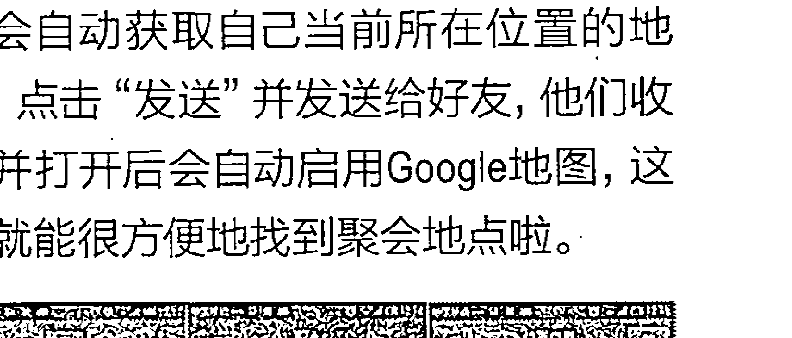

### 小提示

在新版微信中，给好友发送语音留言时，如果说错了不要松开对讲机，而是向上滑动对讲机，即可取消发送当前语音。

## 换手机聊天记录轻松转移

最近公司给舟舟等优秀员工更换了手机，微信上的聊天记录自然要迁移到新手机。选择“设置→通用→聊天记录迁移”，点击“上传”按钮即可保存到网络上（7天），在新手机登录自己的微信后，点击“下载”即可载入网络上的聊天记录了。（作者单位：江苏省如东县栟茶镇浒澪小学）

# 不去360 Win7安全同样有保障

360安全卫士可以很好地保护系统安全，不过不用借助第三方软件，利用Windows 7自带的防火墙也可以很好地保护系统的安全。

文/技术宅

360安全卫士是大家常用的一款安全软件，它的网络防护功能可以很好地保护Windows 7的安全。不过对于达人来说，安装第三方安全软件总是会占用不少的系统资源，而且容易带来兼容性问题。其实我们只要用好Windows 7自带的防火墙，系统安全照样有保障。

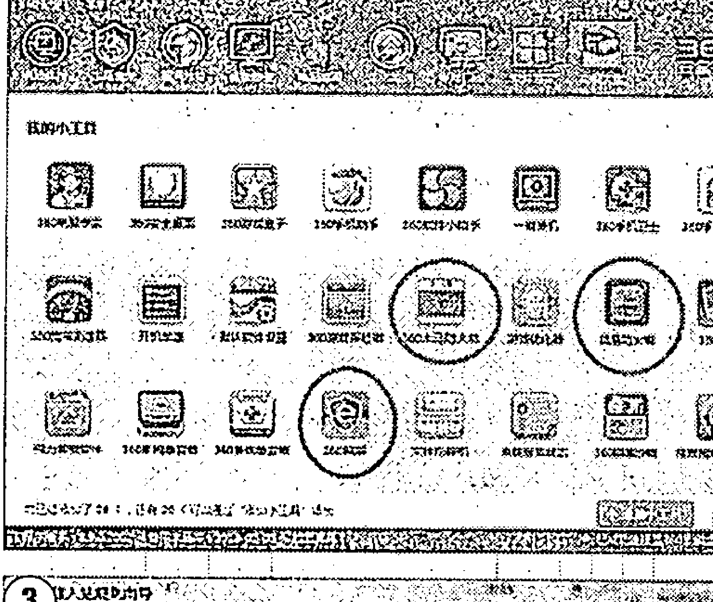

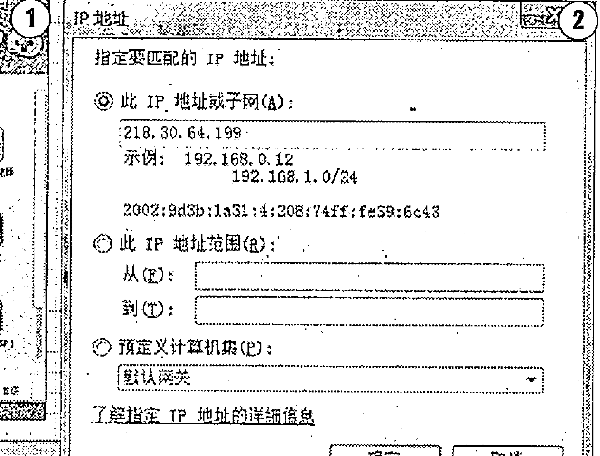

对于防火墙来说，它的主要作用是保护外来网络和本机访问的安全隔离。一方面阻隔外网对我们电脑的攻击，另一方面阻隔本机恶意程序对外的连接。360安全卫士的网络防护也主要是从上述两个方面进行防护，它的网络安全组件集成在“功能大全”中（图1）：

1. 组件1：木马防火墙。主要提供入口防御功能，拦截外来网络对本机的入侵，如恶意网页的防护、黑客入侵、局域网防护等。
2. 组件2：流量防火墙。主要对本机所有网络连接程序进行管理，如阻止特定程序连接网络、查看软件上传和下载速度等。
3. 组件3：360网盾。主要对上网进行保护，比如拦截欺诈网站、屏蔽广告网站等功能。

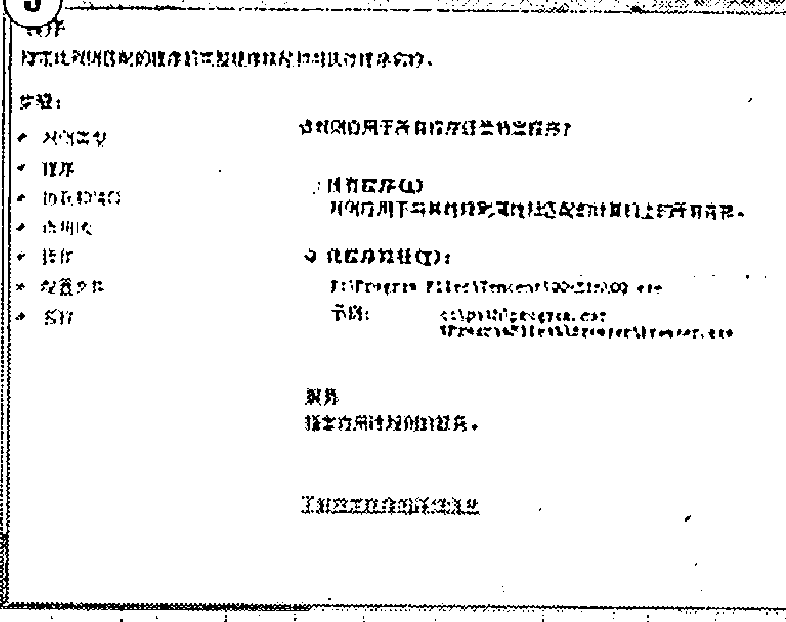

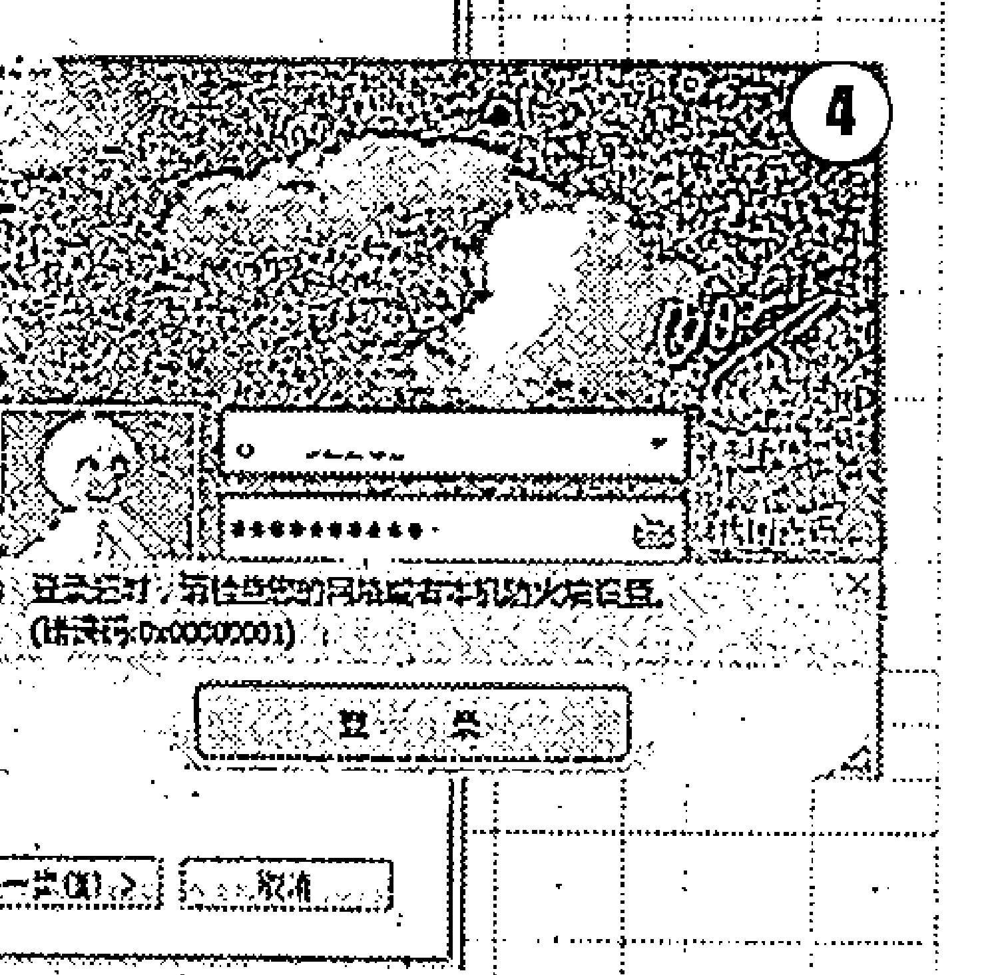

规则是其他人制作的，适用性肯定会受到一定的限制。其实Windows 7防火墙同样提供丰富的自定义规则，利用我们自定义的规则同样可以拦截绝大多数广告，而且拦截的效果更为精准。比如很多电信用户都会遭到114.vnet.cn网站的骚扰，下面就利用防火墙的自定义规则对其进行拦截。

有其他需要屏蔽的网址一并添加到阻止列表（图2）。

第3步：继续选择“操作”，选择“阻止连接”，配置文件选择全部设置，最后为规则定个名字，这样由于指定IP地址禁止接入我们的电脑，自然可以将广告网址屏蔽掉。

从上面的描述我们可以知道，虽然360安全卫士提供的网络防护功能比较全面，但是这些防护功能，Windows 7内置的防火墙大多可以胜任。下面我们就一起来看看如何使用内置防火墙实现类似的保护功能。

## 使用防火墙屏蔽运营商广告

360网盾提供上网防护和广告过滤防护功能，它的广告屏蔽主要是通过导入特定的规则来进行防护，不过这些

第1步：启动命令提示符，输入执行“ping 114.vnet.cn”命令获得该网站的IP地址，接着展开“控制面板→系统和安全→Windows防火墙”，打开防火墙后点击“高级设置→入站规则→新建规则”，在弹出的窗口中单击右侧窗格的“自定义”，点击“下一步”开始自定义规则。

> 小提示
有些恶意网站会申请IP地址段指向某一域名，这里可以选择“此IP地址范围”，将整个IP段地址全部添加。

## 阻止特定程序联网

360流量防火墙可以非常方便地阻止特定程序的连接，利用Windows 7防火墙的出站规则同样可以方便地限制程序的连接。比如公司的电脑不希望用户使用QQ，利用Windows 7防火墙即可进行阻止。

第2步：在左侧窗格单选“作用域”，本地选择任何IP地址，远程选择你想要屏蔽的IP，点击“添加”，将上述获得的屏蔽网址添加到列表，如果还有

第1步：同上，进入防火墙的高级设置后，点击“高级设置→出站规则→新建规则”，在弹出的窗口中单击右侧窗格的“自定义”，在左侧窗格单选“程序”，在右侧选择“此程序的路径”，然后点击“浏览”导入QQ.exe（图3）。

第2步：剩余的操作同上，选择“操作”，选择“阻止连接”，配置文件选择全部设置，最后为规则定个名字，这样用户下次试图再运行QQ时，系统就会提示遭到防火墙的拦截了（图4）。

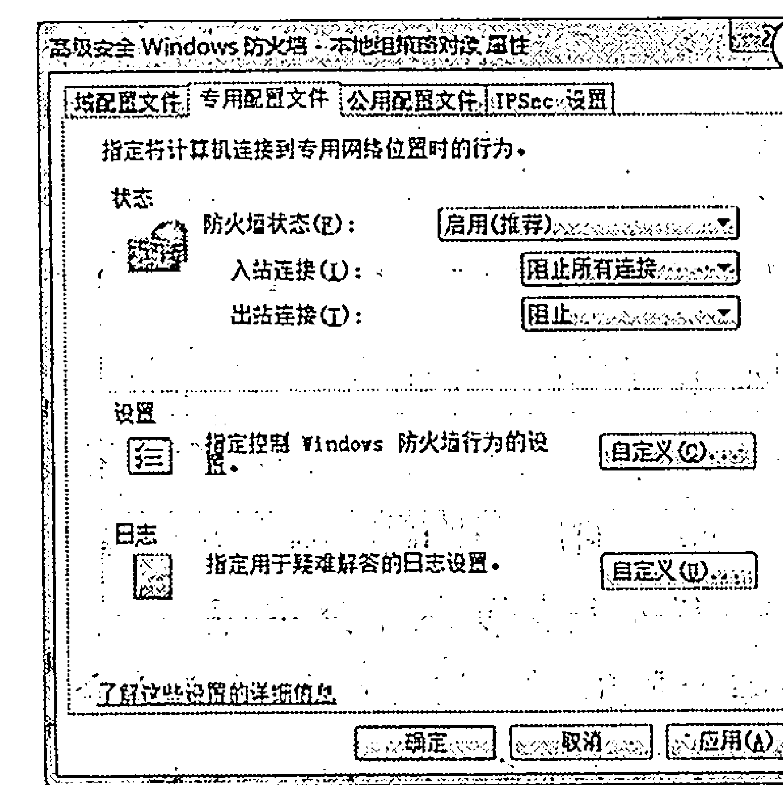

名称：允许IE访问互联网
程序和服务：%ProgramFiles%\Internet Explorer\iexplore.exe
协议和端口→协议类型：TCP
本地端口：1024-65535
远程端口：80
高级：公用
设置上述规则后，本机的IE浏览器就可以上网了，操作同上，根据自己的需要继续设置可以联网的程序即可。

> 小提示
由于防火墙高级设置需要管理员的权限才能更改，因此在公司电脑上只开放标准用户供用户使用，用户即使知道是由于防火墙设置导致故障，他们也没有权限进行更改。使用同样的方法我们可以阻止任何程序的联网，比如很多应用程序的弹出窗口、后台自动升级等程序。

第2步：完成上述设置后依次点击“确定”，这样本机就没有任何程序可以联网，外部也没有任何连接能够接入我们的电脑。接下来就可以自定义添加需要联网的规则。返回本地安全策略设置窗口，右键点“出站规则→新建规则”，在出现的向导窗口依次选择“程序”→下一步→在此程序路径中输入system→下一步→其后依次设为允许连接→名称中输入“允许system访问网络”→完成。

## 打造安全上网环境

360的木马防火墙可以提供入口防御功能，拦截外来网络对本机的入侵。不过现在木马、黑客技术越来越高超，360的木马防火墙在很多时候还是无法保证Windows 7的安全。灵活利用Windows 7防火墙的出站和入站规则可以打造出比360的木马防火墙更为安全的上网环境。比如我们可以设置只有特定程序才能联网（其他所有程序都无法联网，任何外来连接无法进入）的安全上网环境。
第1步：在开始菜单搜索框输入secpol.msc并按回车键打开本地安全策略对话框，依次展开“安全设置→高级安全Windows防火墙”，右击其下的“高级安全Windows防火墙”选择“属性”，在打开的属性窗口，依次将域配置文件、专用配置文件、公用设置配置文件做如下的设置（图5）：防火墙状态：启用（推荐）
入站连接：阻止所有连接
出站连接：阻止

第5步：完成上述的设置后，我们的电脑就只有自己允许的程序可以联网了，至于其他黑客、木马，由于我们的电脑根本就没有开放其他端口，即使中招了也无法实现外部连接，本机不允许任何外部连入，大大提高了本机的安全性。

第3步：操作同上，再建立如下两条规则：
规则1：名称：允许DNS
程序和服务→此程序：%SystemRoot%\System32\svchost.exe
协议和端口→协议类型：UDP
本地端口：1024-65535
远程端口：53
高级：公用
规则2：名称：允许回显
程序和服务：所有符合指定条件的程序
协议和端口→协议类型：ICMPv4
高级：公用

## 为不同环境自定义安全规则

用户在使用电脑的过程中，对安全性的要求是不同的，比如习惯带着笔记本的朋友会经常跑到公共Wi-Fi网络这样的地方去上网，这时就不希望任何外部连接接入自己的计算机；而在办公室或是家庭的局域网中，为了方便局域网内用户互相传送文件或一起游戏，则不喜欢有太高的安全规则。现在Windows 7防火墙可以针对不同的网络环境来分别进行自定义设置。同上打开防火墙的自定义界面，在这个选项卡中，用户可以分别对局域网和公网采用不同的安全规则，比如当用户进入到一个不太安全的网络环境时，可以暂时选中“阻止所有传入连接”，禁止一切外部连接，即使是Windows防火墙设为“例外”的服务也会被阻止，这就为处在较低安全性的环境中的计算机提供了较高级别的保护。

> 警告
安全上网环境设置仅仅适合对上网环境要求较高的用户，经过设置后可能会对你的其他网络活动如远程协助、网络电视带来影响。如果通过上述设置后对其他网络活动带来不便，一是可以自行添加允许规则，二则可以执行逆向操作取消限制。

第4步：完成上述的设置后，同上打开本地计算机上的高级Windows安全防火墙设置窗口，这里可以看到我们上述设置的出入站规则。接下来继续根据自己的需要设置允许联网程序规则。选择出站规则，新建一条规则：

Windows 7还有很多安全组件，如系统权限、EFS加密、组策略、UAC等，用好它们，完全可以在不安装360安全卫士的情况下也能得到有效的保护！

# 文件备份 XCOPY随心所欲

借助Windows系统自带的一个命令XCOPY，我们可以轻易地通过命令提示符窗口或记事本，实现在窗口环境下用菜单命令不便实现的文件复制或备份功能。

文/张楚华

按类备份文件时，有时会涉及到不同文件夹中的不同文件根据某种条件备份的问题，如果涉及到连同文件夹结构也一同备份，这种情况下，我们往往需要借助于一些专用的备份工具来实现，设置起来也比较繁琐。实际上，无论是低版本的Windows XP操作系统，还是更高级的Windows 7、Windows 8系统，均提供了一个强大的XCOPY命令程序，借助于这个命令，我们只需在命令提示符窗口直接输入一行命令，或用记事本写一句简单的BAT代码执行一下，就可以随心所欲地进行自己的文件备份，较之用窗口操作效率要高得多。

## 快速备份某一类文件

办公室的资料文件备份盘中分布着许多文件夹，在每个文件夹中随机地存在着数量不等、级别不一的子文件夹，在这些文件夹中存放有TXT、DOC、XSL、PDF等各种格式的文件。在整理备份文件时候，领导要求将所有的PDF文件都找出来统一处理为可编辑格式。如何快速找出这些分散在不同地方的PDF文件，并将找出的文件存放在一个新文件夹中呢？

借助于Windows自带的XCOPY命令，在命令提示符窗口下就能完成任务。我们假设存放目的地为E盘的MYPDFBAK文件夹。启动命令提示符窗口，在命令提示符窗口中输入CD加空格，然后将命令提示符窗口和资源管理窗口并

小提示 以上是复制一类文件的命令，如果希望迁移一批文件，而不是复制文件，那么只需在记事本中使用迁移文件命令MOVE就可以了。

列排放在桌面上，最后拖动资源管理器中的工作驱动器或工作文件夹到这个命令窗口（视情况看要备份整个驱动器还是备份某个文件夹），构成一条完整的进入该工作目标的命令。回车执行该命令，进入该工作驱动器或文件夹。

在命令提示符窗口中执行如下命令（图1）：

```
XCOPY *.PDF /S E:\MYPDFBAK
```

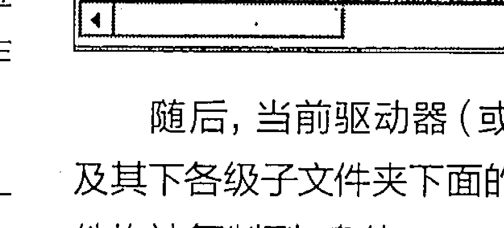

随后，当前驱动器（或文件夹）以及其下各级子文件夹下面的PDF类型文件均被复制到E盘的MYDOCBAK文件夹中了，而且保持原来的目录结构。其中，参数/S的意思是在复制指定类型文件时包含本级目录和各级子目录（空目录除外）。

## 按文件名中的关键词备份

某公司的文件名中要求均以含有“设备”“配件”“材料”的关键字分别标示物资的类型。如果只需要将某一类的文件（如“材料”）备份，该如何将这类所涉及的所有文件备份出来呢？假设该公司文档存储目录为F盘的“2012物资供应”，备份目标为F盘的“材料”。生成备份文件夹的方法如下：在F盘的根目录中用记事本建立一个文件（如“备份.TXT”），在其中输入如下一条命令（图2）：

```
XCOPY F:\2012物资总目\材料\*.* F:\材料 /S
```


存盘之后，将文件的扩展名改为BAT，得到“备份.BAT”文件，双击该文件，在“F:\材料”目录中便自动生成了所有材料类的文件。

说明：以上命令中“*材料*.*”是采用通配符来描述所有含有“材料”字样”的文件，不管“材料”字样出现在文件名的什么位置。

## 给系统重要文件留个备份

系统目录中有许多含有系统属性和隐含属性的DLL文件，这些文件都非常重要，它们一旦被病毒或其他程序破坏，轻者造成系统故障，重者造成系统不能启动。如果我们能事先将这些文件备份下来，万一遇到系统出现故障，就可以用PE启动系统，然后找到这些文件恢复系统了。这项备份工作同样可以用XCOPY命令简单地来实现。比如，我们要将位于C盘的Windows系统中的所有系统属性和隐含属性的文件备份到移动硬盘E:\中的某目录SYSFILEBAK中。具体实现过程如下：首先，我们用记事本构建一个批处理程序BAKSYSFILE.BAT，具体内容如下（图3）：

```
XCOPY C:\*.DLL /S /H E:\SYSFILEBAK
```

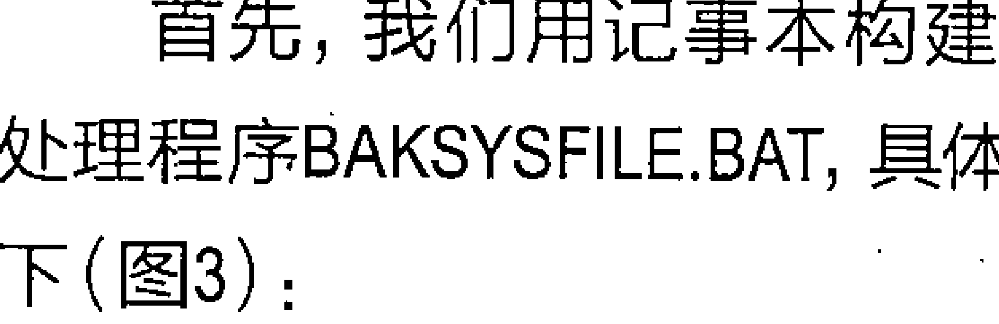

命令行中的参数/H表示复制具有隐藏属性的文件，同时也复制系统属性的文件。/S表示包含系统的各级子目录。*.DLL表示对C盘的所有文件进如果记不住XCOPY的具体参数的作用，或者想查看更多关于XCOPY命令的使用方法，请在命令提示符窗口中输入 XCOPY /? 命令。

行过滤筛选。
将该批处理文件拷贝到 C 盘的根目录中并执行，最后我们就会在 E:\SYSFILEBAK 文件夹中获得所有这些重要文件的备份了。

# 随时自动续传大量文件

如果想把大容量硬盘 E:\ 上所有文件复制到 F:\ 盘上，限于时间，不能一次完成，需要多次复制完成。或者是因为某种原因，上次没有复制完成，突然中断复制，目前又想接着复制。这种情况下，自己又记不住哪些文件已经复制，哪些没有复制，该怎么办？

很简单，在命令提示符下，执行 XCOPY E:\*.* F: /S /H /D /Y 命令即可（图4）。它能查出哪些文件是已经复制过去的，跳过复制；同时查出哪些文件还没有复制过去，立即进行复制。其中起作用的一个主要参数 /D:m-d-y 的意义是，复制在指定日期或指定日期以后更改的文件。如果没有提供日期，只复制那些源时间比目标时间新的文件。

# 自动跳过复制错误提示

还有一种备份的情况，我们经常也碰到的：不管是用窗口复制还是在命令提示符下操作，在复制过程中，因为复制某个文件出错或者这个文件在使用中，而停止了复制工作，如果我们这时不在电脑旁边，那么复制工作暂停并将一直等下去，直到我们人为干预。

如果我们事先想到这一情况，想让复制过程自动跳过某个出错的文件和某个正在使用中的文件而继续复制其他文件，可用下面的方法。

具体办法就是在 XCOPY 命令中加入参数 /C，也就是将命令行变成 XCOPY E:\*.* D: /S /H /D /C /Y 就行了。参数 /C 的作用就是，即使有错，也继续复制。

# 复制完毕自动关掉电脑

如果备份复制工作量很大，需要耗费很多时间，这时又正好到了下班时间，怎么办？需要加班等待吗？不用！我们可以用一个简单的批处理让 XCOPY 备份的过程变为自动复制，并且复制完成后关闭电脑。

新建文本文档，输入如下命令（图5），然后更名为 XCOPY.BAT。

XCOPY E:\*.* D: /S /H /C /Y
SHUTDOWN -S

```
1  ↓
2  XCOPY,E:\*.*,D:,/S,/H,/C,/Y↓
3  SHUTDOWN,↓-S↓
```

需要备份时，双击 XCOPY.BAT 运行它，你这时候可以出去玩或下班了。电脑会自己复制备份文件然后自动关机。

可以看出，这里是应用了 SHUTDOWN -S 命令和 XCOPY 命令联合使用的一个技巧来完成备份和自动关机操作的。

# 用好 XCOPY 的排除备份

XCOPY 可以排除不想要的文件或文件夹进行复制。不过这个命令用起来并不像 Windows 帮助里写的那么简单。我们先看看 XCOPY 的帮助是怎么写的：

/EXCLUDE:file1[+file2][+file3]...
指定含有字符串的文件列表。每一个字符串必须在文件的单独行中。如果有任何字符串与要被复制的文件的绝对路径相符，那个文件将不会得到复制。

例如，指定如 \obj\ 或 .obj 的字符串会排除目录 obj 下面的所有文件或带有 .obj 扩展名的文件。

看了这个帮助以及它举的例子，你会用了吗？我相信你也仍然是一头雾水！没关系！下面就让我们通过具体案例来说明。

我们假设有两个文件夹，一个名为 DATA，存放了如下所示的文件夹或文件。一个名为 BACKUP，是用作备份筛选结果的目标文件夹。

+   Z:\n│——DATA
│   ├──计划
│   ├──总结
│   ├──计划.TXT
│   ├──总结.TXT
│   ├──1.计划
│   ├──2.总结
│   ├──3.计划
│   ├──4.总结
│   ├──5.总结
└——BACKUP

假设我们的备份目标是把文件夹和文件拷贝到 BACKUP 这个目录里面，而排除标记了“计划”的文件和目录。

我们只需执行如下命令即可达到目的（图6）：

XCOPY /E /S /H /EXCLUDE:UNCOPY.TXT Z:\DATA Z:\BACKUP

```
1  ↓
2  XCOPY,/E,/S,/H,/EXCLUDE:UNCOPY.TXT,Z:\DATA,Z:\BACKUP↓
3  ↓
```

其中的文本列表文件 UNCOPY.TXT 里面，要包含我们想要排除的文件以及文件夹，这个文件需要我们另行编好保存，具体内容如下：

\计划\n计划.TXT
.计划

本例的用法还有一个很实用的应用场合：比如你硬盘上有文件损坏了，你又想备份硬盘，可以使用这个方法避开损坏的文件。

# 不想锁定 让程序“越界飞行”

我们都知道按下 Win+L 键锁屏后，电脑会处于锁定状态。可是在某些情况下，如果按下 Win+L 键锁屏后，可以运行指定的程序，说不准还能巧妙地避开某些问题。
文 | 郭建伟

小秦的儿子每天放学后都习惯在电脑上看会下载的动画片，可是却经常在父母不在身边时乱操作电脑。小秦突发奇想，如果在按下 Win+L 键锁屏后，运行儿子喜欢的程序，不就可以巧妙化解难题了吗？不过，如何突破常规，让程序在锁定界面中运行呢？小秦经过一番研究，找到了解决之道……

# 让程序在锁定界面“露脸”

小李的本本使用的是 Windows 7 系统，而儿子喜欢玩画笔程序，怎么才能让画笔程序在锁屏界面中运行呢？小李按下 Win+L 键，在锁屏界面中无意间按下左下角的“轻松访问”按钮，打开了轻松访问程序，在这里可以修改系统的辅助功能设置。这实际上启动的是 C:\Windows\System32 目录下的 Utilman.exe 程序。
小秦眼前一亮，能否对该程序改头换面，实现其他程序的运行呢？小秦决定试一试，不过，小秦可不想随意修改系统自带的文件。他想利用镜像劫持技术，来巧妙解决问题。映像劫持本是病毒常用的招数，不过小秦却想发挥其优点，让其干点正事。
只见小秦运行了映像劫持编辑器这款小工具，在其主窗口中点击“新建”按钮，在弹出窗口（图1）的“进程名称”栏中输入 Utilman.exe，在“映像路径”栏中输入暴风影音主程序路径，默 认为 C:\Program Files\Baofeng\StormPlayer\StormPlayer.exe 项，点击确定按钮，就成功地将 Utilman.exe 程“劫持”了。
当运行 Utilman.exe 程序时，启动的却是暴风影音。为了使用方便，小秦事先启动了暴风影音，将儿子喜欢看的动画片添加到了播放列表中。一切准备就绪之后，小秦点击 Win+L 键锁定系统，在锁屏界面的左下角点击“轻松访问”按钮，哈哈，暴风影音果然露面了。
这下，小秦再也不怕儿子在电脑上乱鼓捣了，当儿子想看动画片时，小秦就让暴风影音在锁屏界面上启动，儿子除了观看动画片之外，无法对系统造成任何破坏。当然，小秦也可以随时在映像劫持编辑器中选择 Utilman.exe 的劫持项目，点击“删除”按钮，恢复 Utilman.exe 的活力。当然，执行上述操作，必须拥有管理员权限才行。
下载地址：http://dl-sh-ctc-2.pchome.net/3n/2h/yxjc.rar

## 更多程序在锁定界面自由运行

小秦发现，上述方法虽然可行，不过存在一些不足。例如，只能让单个目标程序对 Utilman.exe 进行替换，如果想让多个程序同时活跃在锁屏界面中，就无法进行。此外，该方法只能针对 Windows 7 有效，对于 Windows XP 等系统没有作用。
不过，这难不倒聪明的小秦，因为他找到 Logon Screen Launcher（简称 LSL）这款有趣的绿色软件，可以轻松化解上述难题，让更多的程序自由翱翔在锁定界面中。
下载地址：http://logonscreenlauncher.codeplex.com/#
小秦打开下载好的 LSL 安装文件夹（本例为 C:\LogonScreenLauncher），注意到其中有一个名称为 LogonApps.xml 的文件，经过一番分析，发现该文件是 LSL 中很重要的配置文件，能否让程序在锁屏界面中运行，依靠的就是这个文件。
打开该文件，发现其内容其实很简单，在其中的 <application path="Sample Application.exe"> 栏中用来指明目标程序路径，默认状态下，使用了 Sample Application.exe 这个示例文件。因为想让画笔程序在锁屏界面中运行，满足儿子练习绘画的要求。于是将其修改为 <application path="C:\Windows\system32\mspaint.exe">，将程序路径指向画笔程序。其余的配置项目保持默认，之后保存该文件。
接下来小秦点击 Win+L 键，进入锁屏界面。有趣的事情发生了，画笔程序自动在锁定界面中运行了。
当按下了 Ctrl+Tab 键，在锁定界面中甚至可以呼出任务列表中，自由地切换程序。当解锁系统进入桌面后，却无法发现画笔程序的行踪。是被强制关闭了吗？当然不是，打开任务管理器，可以看到画笔程序 mspaint.exe 实际上以 SYSTEM 这一独特的账户身份在后台悄悄运行，而别人却无法在桌面上找到其踪迹。小秦想，这也算得上另类的隐藏程序活动痕迹的方式吧！这里要强调一点，在锁定系统之前，必须保证目标程序没有启动。也就是说，让 LSL 全权负责程序的启动操作。
当需要结束画笔程序时，只需进入锁定界面，按照常规方式将其关闭即可。当然，LSL 的强项是可以让多个程序在锁屏界面中活动，只需将上述以 <application path="Sample Application.exe"> 开始和以 </application> 结尾的程序段复制出来，将其粘贴到上一个与之相同的程序段后面，之后修改目标程序路径，就可以搞定了。想启动几个程序，就复制粘贴这样的几个程序段即可，操作起来极为简单。

例如，儿子喜欢使用千千静听欣赏儿歌，小秦想让画图程序和千千静听同时在锁屏界面中启动，这样儿子可以一边学画画，一边听儿歌了，于是小秦就将 <application path="Sample Application.exe"> 开始和以 </application> 结尾的程序段复制一份，添加在上一个程序段后面，之后将程序路径指向千千静听主程序即可。例如 <application path="C:\Program Files\TTPlayer\TTPlayer.exe">（图2）。

当然，事先要将所有的歌曲全部添加到千千静听播放列表中，这样欣赏起来就方便多了。这样，当锁定系统后，画笔和千千静听就可以同时自动运行了。通过对 LogonApps.xml 文件进行深入配置，LSL 实际上还可以让指定的程序在登录界面、注销界面、锁定界面等“特种环境”中自由运行。

下面提供本例中用到的 LogonApps.xml 文件的内容（在锁定界面中同时动画笔和千千静听）：

### LogonApps.xml 文件示例内容

```
<logon_screen_launcher>
<options sleep_milliseconds_after_logoff="5000"/>
<logging enabled="true" path="C:\Temp\_Logon Screen Launcher.log" />
<applications>
<application path="c:\windows\system32\mspaint.exe">
<start service_start="true" service_stop="false" logon="false" logoff="true" display_lock="true" display_unlock="false" />
<stop service_start="false" service_stop="true" logon="true" logoff="false" display_lock="false" display_unlock="true" />
</application>
<application path="C:\Program Files\TTPlayer\TTPlayer.exe">
<start service_start="true" service_stop="false" logon="false" logoff="true" display_lock="true" display_unlock="false" />
<stop service_start="false" service_stop="true" logon="true" logoff="false" display_lock="false" display_unlock="true" />
</application>
</applications>
</logon_screen_launcher>
```

上，还可以按 Ctrl+Tab 键，在锁定界面中呼出任务列表，直接切换到迅雷主界面中。有了 LSL 的大力协助，小秦不必费力地解锁系统，就可以一览无余地查看迅雷下载信息了。

# 深入探寻 LSL 功能

有趣的是，当解锁系统进入桌面后，却无法发现迅雷的行踪。是迅雷关闭了吗？当然不是，打开任务管理器，可以看到迅雷主程序 Thunder.exe 实际上是以 SYSTEM 这一独特的账户身份在后台悄悄运行，而别人却无法在桌面上找到其踪迹，这也算得上另类的隐藏程序活动痕迹的方式吧！当需要结束迅雷时，只需进入锁定界面，按照常规方式关闭迅雷即可。

也许有的朋友会问，如果想在锁定界面中启动多个程序，该怎么办呢？其实很简单，只需将上述以 <application path="Sample Application.exe"> 开始和以 </application> 结尾的程序段复制出来，将其粘贴到上一个与之相同的程序段后面，之后修改目标程序路径，就可以搞定了。想启动几个程序，就复制粘贴这样的几个程序段即可，操作起来极为简单。

例如，在本例的抓图操作中，就将 HyperSnap-DX 添加了进来，让其出现在锁定界面中，顺利抓取了演示图片。如果按照常规方法，HyperSnap-DX 是根本无法在锁定界面中活动的。

# 迅雷也能“越界”运行

当小秦不用电脑时，总需要启动迅雷疯狂下载，此时，也可以让迅雷听从 LSL 的“招呼”。首先保证迅雷没有启动，也就是说，不要手工启动迅雷。之后小秦只需按 Win+L 键，让系统进入锁定状态。神奇的事情发生了，迅雷在锁定界面中悄然启动。小秦启动所需的下载项目，迅雷就开始按部就班地执行下载了。当小秦关闭迅雷主窗口后，迅雷的悬浮窗依然浮现在锁定界面中，可以随时通过该悬浮窗进入迅雷主界面，查看下载进度信息。

# 让 EmEditor 腾飞的 10 种插件

文字编辑软件 EmEditor 的基本功能已经很强大，如果给它装上各种插件，那就像给它插上了腾飞的翅膀，效率会倍增。
文|陈智君

EmEditor 是一个功能强大的文字编辑软件，它的强大功能除了表现在软件自身提供的丰富命令和工具外，还有提供正则表达式和宏功能支持。但是，对于普通用户来讲，要使用正则表达式和灵活运用宏，不是一件轻而易举的事。好在，有人为我们用这两样东西开发了非常简单易用又广泛适用的插件，使用它就像是用一个工具栏按钮一样简单。本文我们就为大家介绍 10 款最实用的 EmEditor 插件及其应用场合。

## 与港台实现无隔阂沟通

内地人员与港台人员进行文字交流，在汉字的表达上有繁简的区别。如何将自己熟悉的简体字快速转换为繁体字，虽然方法有很多，用 Word、用专用工具软件都可以进行，但是，如果你手头上已经安装了 EmEditor，只需安装一个繁简转换的插件并在插件栏内激活其图标，在选中了需要转换的简体文字后，点击其中的“繁”图标，即可得到繁体字文章。反之，如果要将网上的或收到的繁体字文章转换为简体字，点击“简”图标即可（图1）。

## 写好网页代码就地预览

EmEditor 可以用来书写大约 20 种语言的源代码，网页代码也不例外。当你写好了一个网页的 HTML 代码后，想看一看网页的运行效果，一般的方法是用一种浏览器打开这个代码文件，然后才能预览到现实效果。其实，只要你事先给 EmEditor 安装一个使用浏览器预览的插件（包括 IE 等常规浏览器的预览插件）并激活（图2），在插件栏内便可能出现一个 IE 的图标。当你编好网页代码之后，点击一下这个图标，网页效果便可立即呈现。

开，不想显示时再点击一下即可关闭。有了这个插件，你的程序或文本在多少行多少列就一目了然了（图3）。

## 用行号和标尺把握位置

在用 EmEditor 处理一些文章或数据的时候，为了确定某个内容在文章中的位置，最好的方法是能知道其在文章的多少行、多少列。在这种情况下，你总不能从头到尾去数其所在的行列位置吧！一个最省事的方法就是使用别人为你编好了的纵向显示行号和横向显示标尺的插件。这两个插件是开关性质的，想显示时点击一下即可打开，不想显示时再点击一下即可关闭。

## 一键分割四个窗口编辑

对于一些长文章或代码，我们往往需要前后对照参考编辑，这个时候就需要将窗口分成四个部分，每个部分可以显示不同位置的内容。装上一个“分割窗口”的插件，点击一下，窗口便可分成四个部分。如果你只需要两个部分，则可以双击其中的一个分割线，将四个窗口变成两个窗口。双击横线留下纵向窗口，双击竖线留下横向窗口（图4）。此外，还可以选择安装另两个分割窗口的插件，一个是横向分割插件，一个是纵向分割插件。

## 字号行距一键可以改变

也许你会觉得在 Word 中改变行距和字号会很方便，EmEditor 中就麻烦许多。其实不然，只要你安装一个字号插件和一个行距插件，如果需要改变一下编辑环境的显示样式，甚至比在 Word 中更方便。只要点击这两个按钮，从下拉菜单中选一下就 OK 了（图5）。

注意，系统没有自带这些插件，需要自行下载并选择安装。

## 文件管理比 Word 更方便

在 Word 中，要寻找文件资料，需要从“打开”窗口中来回找，或者返回到资源管理器中去找。在 EmEditor 中，如果装上一个资源管理器的插件，点击一下插件图标，就会在编辑窗口的左侧开启一个树形的资源目录，你可以很方便地定位文件进行编辑了（图6）。

## 网文版式整理四大按钮

从网上复制的文章，比较不规范的地方大致有段前段后空格多、空行多、重复的多余字串多等。这些东西如果靠手工处理比较费事，如果用成批替换，也需要费点周折。但是，如果我们为 EmEditor 装上“删除空行”“删除重复行”“删除段前空格”“删除段后空格”等 4 个插件，那么，在选中要处理的段落后，只需点击相应的按钮，格式就整理好了（图7）。

## 文字统计只点一次按钮

在 Word 中有统计文章字数的功能，但是，你需要点击几次之后才能获得当前文章的字数。给 EmEditor 装上一个字数统计插件，则可以一键统计出所选字段或整篇文章所含的字数，而且可以按不同类别进行统计（图8）。

## 非打印字符让脉络更清晰

文章中除了可打印的一些字符外，还含有诸如空格、段落符号、跳格符号、其他控制符号等类别的不可打印字符。如果从文章的阅读角度来讲，这些字符没有什么作用，甚至显示出来会碍眼。但是，如果我们要处理文章的版面，或者对文章中的某些元素进行查找替换，那么将这些符号显示出来就非常必要了。给 EmEditor 装一个显示非打印字符的插件，就可以做到这一点。你只需点击这个插件按钮，就可以看到文章中的所有非打印字符，然后可对其进行相应操作了（图9）。

## 让版面跳格控制更灵活

我们常见到文章段首空格为两种类型，一种是 Tab 跳格，一种是人为多次按动空格键形成的段首空格。许多文章在这方面不统一。其实，正规的段首空格应该使用 Tab 跳格来实现。那么，在遇到不规范的文章跳格时，该如何快速处理呢？我们借助于 EmEditor 可用的几个 Tab 插件，就可以轻松解决这个问题。按动“改变 Tab 宽度”插件，可以轻松选择按下 Tab 后跳格的单位数量；“首行 Tab 符转换为半角空格”“首行半角空格转换为 Tab 符”两个插件，则可以轻松实现首行 Tab 跳格符和空格跳格符之间的转换和统一。选中一篇文章后使用这些符号，可以一次性将文章的跳格进行统一化处理（图10）。

## 插件包的下载地址

- EmEditor 71 个实用插件汉化版 http://www.onlinedown.net/soft/35609.htm
- EmEditor 中文插件 181 个 http://ishare.iask.sina.com.cn/f/6497448.html?from=like&udaref=www.baidu.com&retcode=0

插件的安装方法是：将下载的插件包中的 DLL 文件复制到 EmEditor 安装文件夹下的 PlugIns 文件夹中。重启 EmEditor，选择该软件“工具”菜单中的“插件→自定义插件”菜单命令，在激活的“自定义插件”窗口中选择所有要使用的插件，确认之后返回到 EmEditor 主界面，就会看到在插件工具栏上多出了刚才选择的各种插件的按钮图标。如果工具区域没有插件工具栏，则需要在工具栏周边空白处单击鼠标右键，然后选择快捷菜单中的“插件工具栏”即可让插件工具栏显示出来。

# 以协同工作的名义聊聊天

网络时代，一些项目需要多个人一起工作才能完成，有时项目中的各人身处各地，这时就可能需要协同工具让大家紧密地在一起工作了。
文 | 江苏 周建峰

有些时候我们需要多人一起编辑文档，比如一份计划书需要大家协同完成，一份大型的数据表需要多人共同输入……此时需要构建网络协作平台，对于小型企业或单位，这需要一定的资金和技术。其实借助微软的SkyDrive和Office，协作编辑文档就是一件轻而易举的事情。当然，偶尔我们也可以跳过公司的监管，在不让聊QQ的单位里，借协同工作的名义聊聊天。

## Office 2013多人协作编计划

对于已经用上了Office 2013的用户来说，协作编写各类文档非常简单，新版Office将SkyDrive集成在其中，下面我们以多人编写计划书为例介绍操作方法。
第1步：启动Word 2013并打开计划书，选择“文件”菜单，切换到“账户”选项，用自己的微软账户登录。然后切换到“另存为”选项，将文件保存到自己的SkyDrive网盘中。再切换到“共享”选项，单击“邀请他人”，输入协作人的电子邮件，并在后面设置权限：可编辑或可查看（图1）。也可以选择“获取共享链接”选项，可直接获取查看链接或编辑链接，将编辑链接复制给协作者就可以了。

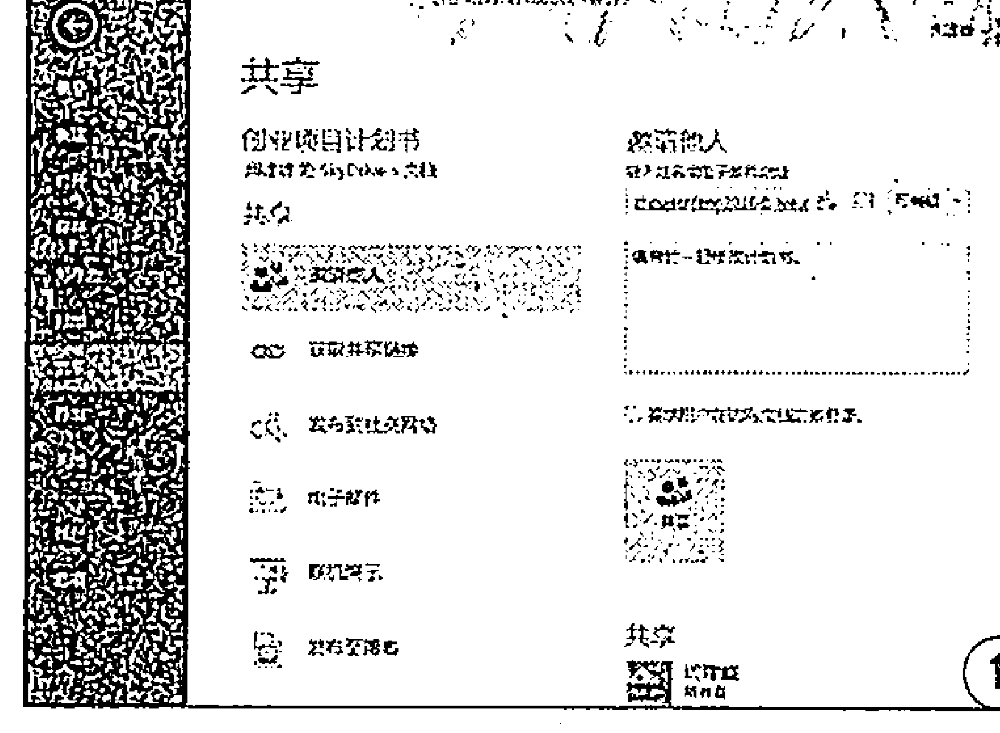

第2步：协作用户打开共享链接后在浏览器中会显示文档，选择“编辑文档”下的“在Word中编辑”则可以用本机上的Office打开计划书，此时两个人就可以同时编辑该文档了，在Word下方的状态栏中会显示共同编辑文档的用户数以及文档更新情况（图2），在修改过程中，如果下方的状态栏上显示“可用更新”，则说明协作者修改了文档，此时选择“保存”菜单（或者按Ctrl+S键），这样就能将其他用户的修改更新到当前文档中。

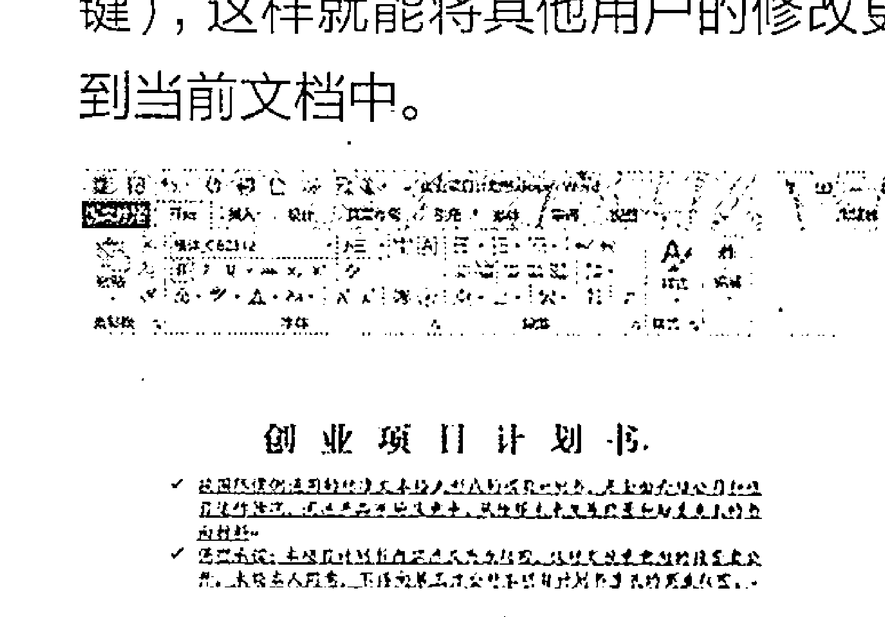

## 在线Office协同输入数据

Office 2013价格不菲，并不是每个用户都能安装的，微软也考虑到这一点，在SkyDrive中集成了Office网络版，我们只要注册一个免费账户，就能享用网络版Office，再将文件保存在SkyDrive，就可以借助在线Office进行协同编辑了。
第1步：免费注册微软SkyDrvie账户并登录https://skydrive.live.com，将Excel数据表上传到SkyDrive中然后打开Excel数据表，此时会自动启用Microsoft Excel Web App开启数据表（图3），选择“共享→与人共享”，然后再选择“获取链接”，在“查看和编辑”下选择“创建”按钮生成共享链接，并将链接复制发送给共同输入数据的用户。

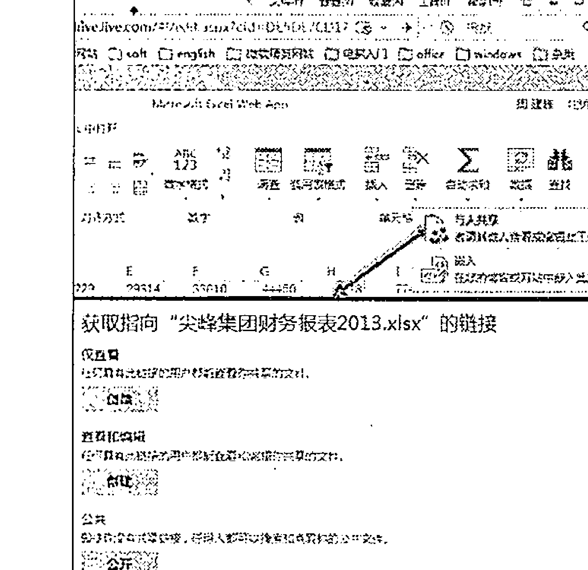

第2步：在浏览器中打开共享链接，选择“编辑工作簿”下的“在Excel Web App中编辑”，这样就能对数据表进行修改编辑（图4）。当然，编辑之前最好先大体进行分工，让参与者清楚自己在表格中的工作区域，这样可避免多人编辑同一单元格。

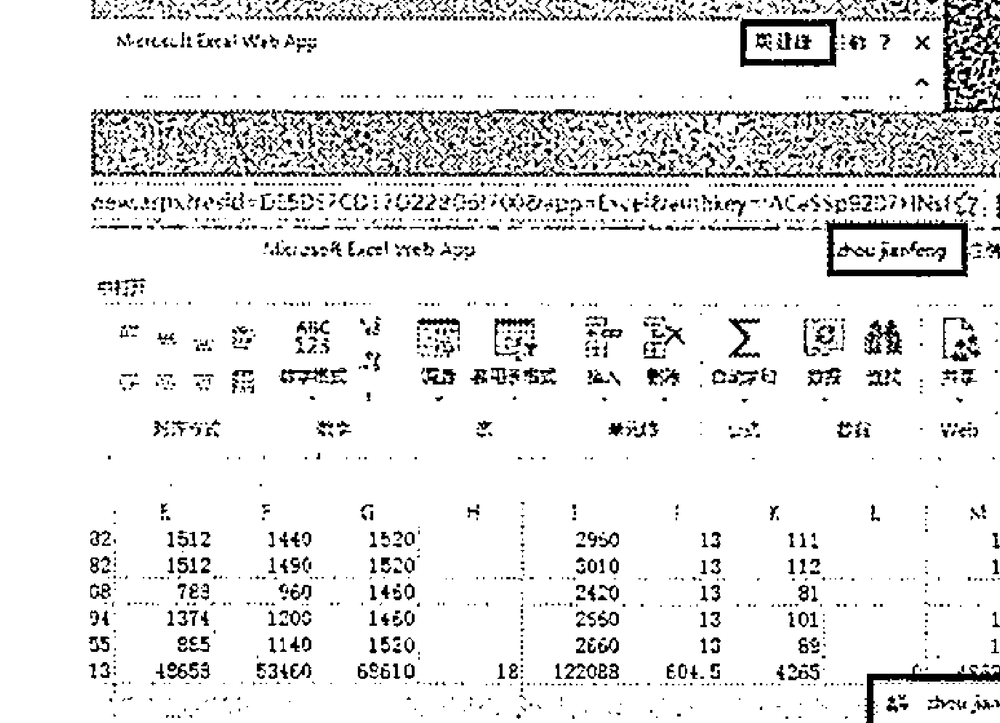

### 小提示

在编辑的过程中，任何一方更改了数据表，另一方无需进行任何操作即会自动更新另一方的数据表，这个过程是实时的。这一功能的“副作用”，就是在禁用QQ的单位里，几个人可以借协同工作为名，在这里进行秘密聊天。

Office的协作功能并不局限于Word文档和电子表格，我发现PowerPoint演示文稿也可以协作编辑，甚至OneNote、Publisher等文件也能共享协作，基本上涵盖了所有的Office文档。对于小型企业和单位，团队之间的协作几乎是零成本的，这无疑是微软赠送给大家的免费午餐。

## 到底谁能搜得更好
### 主流搜索引擎实用评测

如今，我们已经离不开搜索引擎，搜索引擎已经成为实力型网络公司争抢的一块“香饽饽”。作为广大的、最终端的用户，这些搜索引擎到底怎样，我们到底该听谁的宣传，最终又该用哪家的？

中国人有句话说得好“是骡子是马拉出去遛一遛”。明星葛优又有句广告也说得好“我看行”。那么，就让我们把这些搜索引擎拉出来“遛一遛”，看看它们到底行不行，到底谁最行。

#### 参评搜索引擎

可选的搜索引擎有很多，本次我们选择在中国内地使用人数较多的三款：百度、谷歌、360综合搜索。

- 百度搜索: http://www.baidu.com/
- 谷歌搜索: http://www.google.com.hk/webhp?client=aff-cs-360se&ie=UTF-8
- 360综合搜索: http://hao.360.cn/so/index.html

#### 竞价排名广告的干扰性

360进军搜索引擎市场，直面搜索之王百度，引起轩然大波。360直指百度搜索的第一个诟病便是其搜索竞价排名。

下面我们通过一些具体搜索实例，来看看竞价排名广告对网民的影响程度到底如何，各家的情况对比又如何。

传说吃方便面不好，为了详尽地了解关于方便面的知识和信息，我们以“方便面”为关键词，搜索一下关于方便面的知识信息。

开启百度搜索引擎窗口，输入“方便面”百度一下。从搜索结果页面中可以看出，确实有不少广告链接，在搜索结果的前三行，我们可以看到有明显的灰色背景阴影，且在此三个结果的右上角有一个明显的“推广链接”标记，因标志明显，一般也不至于引起误导。

再看右侧栏内关于“方便面”的信息，依然是带有明显“推广链接”标记的多条广告信息。无论从排列位置、形式，还是上面留有的各种电话和联系方式等，均可一眼判断出为彻头彻尾的广告信息。搜索者一般不会轻易陷入这些误区中。


最后我们再看除此之外的其他搜索结果。“方便面 百度百科”“方便面 百度文库”这些由用户维护的内容比较客观，推广的成分较小。“方便面 百度图片”的条目，则是以图像形式展示的搜索结果，从中我们看到康师傅方便面在首位，凭着食用经验来看，应该还是比较客观的结果。但其余几个结果是否含有排名因素在内，不得而知。

我们再以最可能存在广告信息的“男科”“人流”等热门词汇查询，发现前面的搜索结果基本上都是广告排名信息。好在链接的下方均标有“推广”字样，对于有这方面常识的人来讲，不会造成多大误导。但是，中国低水平的网民也比比皆是，谁敢说这样的搜索结果又完全没有副作用呢？

笔者曾多次受亲朋好友的委托，以一些药品的关键词在百度中进行搜索，希望买到亲友们认为可能有效的药品，但搜索结果中出现一些让自己无法辨别真假的信息。最后在国家医药管理权威网站上却没查到这些药物的注册或登记信息，说明此类广告完全是虚假产品的宣传广告。

对此类事件，百度也曾公开承认，有部分网站利用竞价排名服务推广其网站上的虚假医药信息，这是百度对销售运营体系的管理不善造成的，对广大百度用户、对其他竞价排名客户的感情造成了伤害，百度对此表示真诚的歉意。但是，不论这种不良影响是来自医药商本身还是百度的过错，最终利益受到侵害的是网民，找不到黑心厂商，百姓就会把怨气都撒在百度的头上，不管你百度认不认错，网民认为都是你的错。看来，对于百度来说，唯一的选择就是改善服务方式和提高服务质量，这才是硬道理。

多年来多方资料已经表明，百度搜索引擎确实一度存在明显的竞价排名现象和不正常推广信息，但目前来看，由于各方压力和百度的自省与自我改进完善，多数付费广告明显被排在了搜索结果的固定位置，不管这样的结果有多少，识别起来倒也不难。这也算是百度有了很大的进步吧。但那些暗含其中的，常常让网民莫名其妙但又觉得不对劲的搜索结果，以及让一些正当竞价排名者有苦难言的现实情况又进一步说明，百度搜索引擎应当改进和提高的空间还非常之大。

我们再来看看360综合搜索的结果如何。我们仍以搜索“方便面”知识为例。从搜索结果来看，我们并没有看出有多少关于“方便面”的纯洁的知识信息。满眼望去，一派商业气息，右侧栏也是明显的“推广”链接，没有比百度“高洁”的感觉。在正文搜索结果中，第一条结果便是各大商家的方便面销售信息，具体到了每包面多少钱。至于这些商家是否给了360回扣因而才能在此显著位置发放广告，是否属于竞价排名，我们不得而知。但至少关于方便面知识普及方面的内容，首页上找到的结果并没有比百度多了多少。一个“方便面 互动百科”的词条结果，类似于百度百科的结果，且算是对用户获取知识有帮助的一条信息吧。

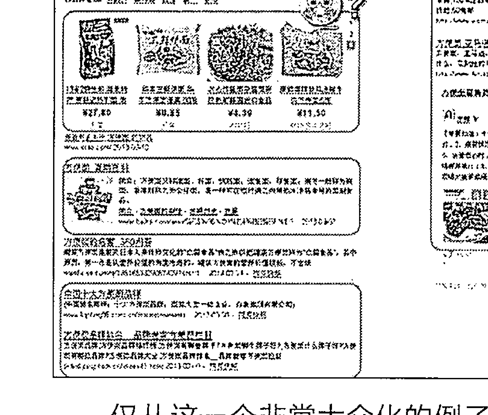

仅从这一个非常大众化的例子可以看出，360综合搜索在搜索知识方面一点也没有体现出它比百度的强势和纯洁，那些花花闪烁的商品广告反而也让这位“勇士”另有看法了。
跳过大洋彼岸，我们再看看谷歌搜索方便面的情况吧。从搜索结果中我们可以看出，在首页第一条信息和右侧均未看到广告或推荐链接，显然它是三款中广告气息最不浓厚的搜索引擎。再看看其他搜索结果中关于方便面的词条，是否夹杂着广告成分。我们看到“方便面 百度百科”“方便面 维基百科”“方便面 39健康网 健康百科”“方便面做法大全”“方便面 互动百科”等若干词条，这些词条可以说融合了上面两款搜索引擎所有的知识信息，还有更多的关于方便面与健康、方便面做法的知识信息，显然在知识含量上要远远胜过百度和360搜索引擎。

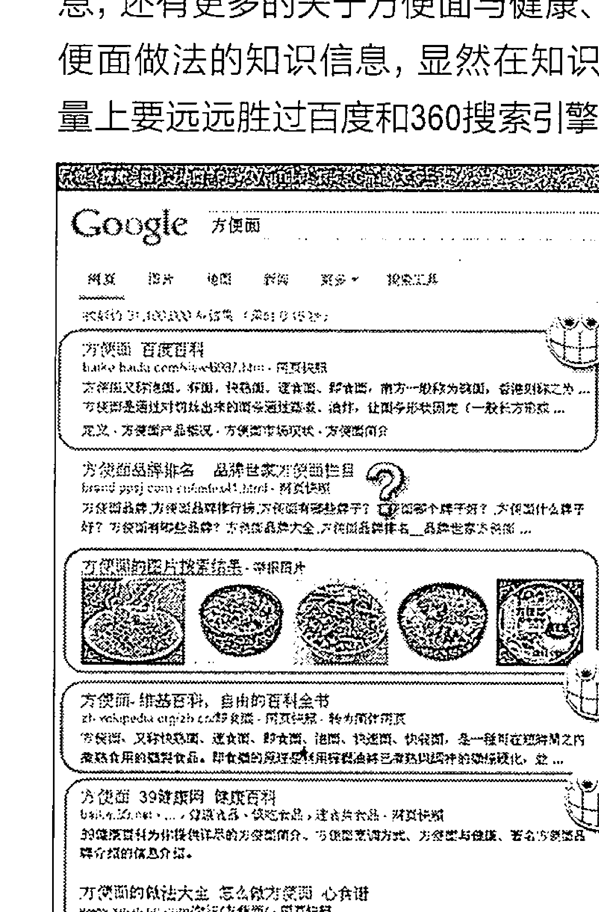

综上所述，从广告干扰信息和搜索结果的有效成分上来看，谷歌显然是最好的、最适合用户的搜索引擎。也许是谷歌站在百度和360战争的局外，更容易获得优势，但更多的是谷歌的天性所致——谷歌不是不喜欢钱，而是在赚钱的路上生财更有道，在巧妙做广告的同时不至于影响用户的体验。

由此看来，中国人虽然在几千年前就对“道”有充分的研究，但他的“后代们”反而落伍了，在搜索引擎之“道”上还不如外国人做得好。看来在搜索之道方面，“黄脸猴子”还需要向“毛脸猴子”多学习一下。

#### ## 《电脑爱好者》·合订本{软件方案}

#### 搜索结果的全面有效性

一个家长要给孩子报高考志愿，想了解一下“吉林大学”的基本情况和历年来的录取情况，他希望用最高的效率找到最全面有效的高校信息。
在百度中输入“吉林大学”，搜索结果中的第一页就出现非常理想的搜索结果。第一条是吉林大学的官方主页链接，进入后可获得最权威的信息。第二条则是中国教育在线关于高校的一个查询页面，不用进入，直接选择即可按考生所在地、文理科来查找到历年来该校各专业的录取分数情况。而下面的百度百科和百度地图，则可以很方便地了解到该校的概况和地理位置。

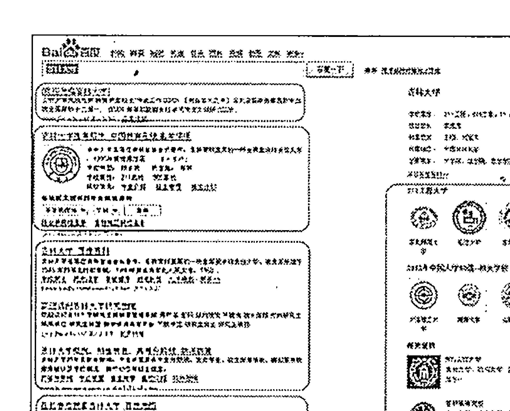

再看看右侧一般用来放置广告的位置上有什么信息。我们发现，这里出现的也是非常有用的信息。一是与该校相当的一些211工程大学的链接，还有就是与该校接近的中国50强大学排名，再有就是与该校性质相同的985大学的情况链接以及该校所在地吉林省高校的基本情况链接。
由上看出，百度只用一页链接，基本可以解决家长或孩子了解吉林大学的需求，可谓是非常人性化的结果。

再用360综合搜索进行搜索。一眼看出右侧出现一条推广广告，不过看了一下是吉林大学附近的酒店推广信息，这条信息对考生或家长来说还算有用，但不知推荐的内容如何，是不是只因为花了钱做了广告而不管其服务是否好就放置在这里了。搜索结果正文中的信息，首条的大学首页、中间的百科信息、末条的地图信息与百度大同小异。中间关于志愿和分数则需要点击进入才可查询，用的是另两个渠道的信息系统，感觉不如百度方便一些。关于院校相关方面的信息，则明显不如百度搜索出的结果丰富。

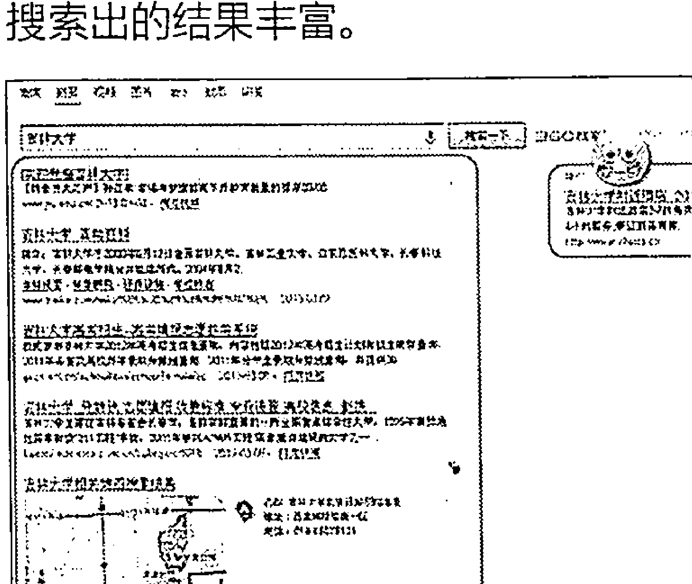

最后再用谷歌对吉林大学进行搜索。搜索结果的第一页依旧没有广告链接，但也没有大学地图链接，若搜索地图还得另外进行，其他结果也不是很丰富。综上所述，从本土化信息方面来看，百度提供的搜索结果更符合国人的要求。而360显然还未下足功夫，火候不到。谷歌的表现也非常一般，只能作为备用选择。

#### 获得有效信息的最短时间

外地人老李要到北京旅游，从来没有到过北京的老李，上车之前急着要从电脑中查找北京地铁的某个线路，需要上网查找北京地铁线路图。下面我们看看三个搜索引擎的具体表现。

百度搜索首先在第一位置给出一个非常标准的最新北京地铁线路图，由此一项即可快速满足老李的要求。在搜索首页下面的链接中，又给出一些相关的北京地铁线路图片，但这些图片就不一定是最新的了。然后还有一些链接也显示是最新版线路图，但是否可靠还待点击验证。如果不是第一条准确的信息，单靠后面这些信息让老李挑选，很可能会引起误导。

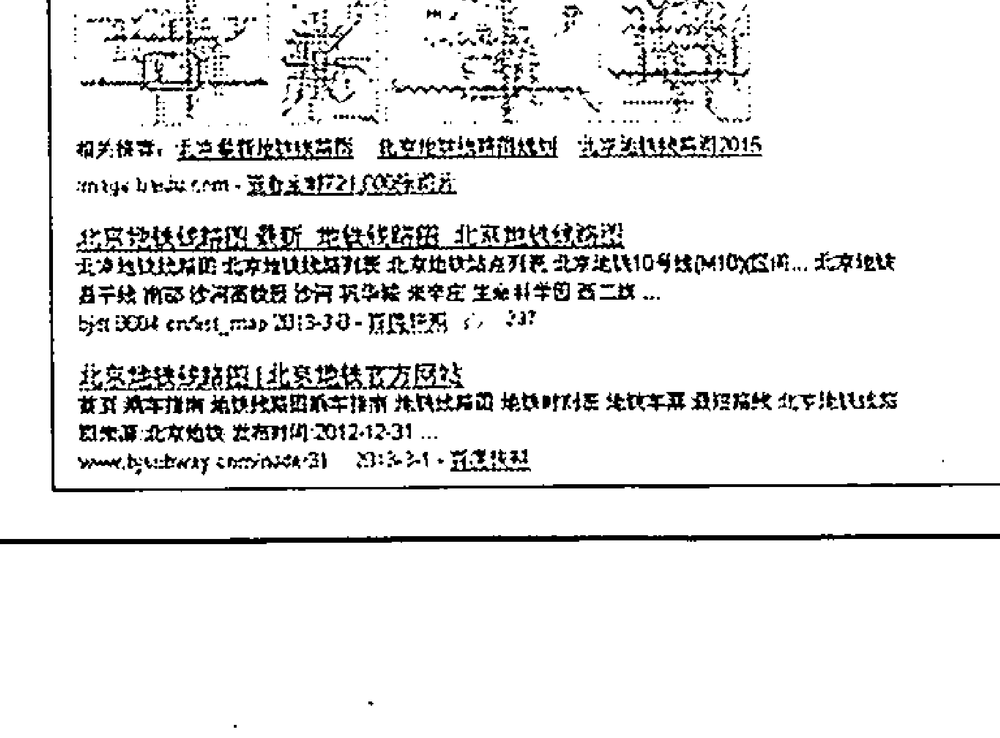

再看360综合搜索给出的搜索结果。结果看似很丰富，还有动态翻页显示地图，但里面的图片鱼龙混杂，还需要用户自己来判断才能选出最好的线路图。如果类似于老李这样的对此地的情况一无所知的生人，根本无法判断到底哪张图是最新的，显然不如百度的搜索结果人性化。

最后是谷歌的搜索结果，也给出许多图片让用户来选择，显然也是没有精挑细选就拿来一堆图给了读者。

从上面的这个例子就可以看出，在以最短时间查找地铁线路这个任务上，显然百度是下足了功夫的，给用户的体验也是最好的。360和谷歌就差一道火候了。

#### 二次开发对准确度的贡献

小王要从在线视频网站上下载一部连续剧《乡村爱情变奏曲》。土豆、优酷、奇艺、乐视、搜狐……那么多在线视频网站，到底哪个能提供这部电视剧？我们看看三个搜索引擎在下载连续剧搜索方面的表现。

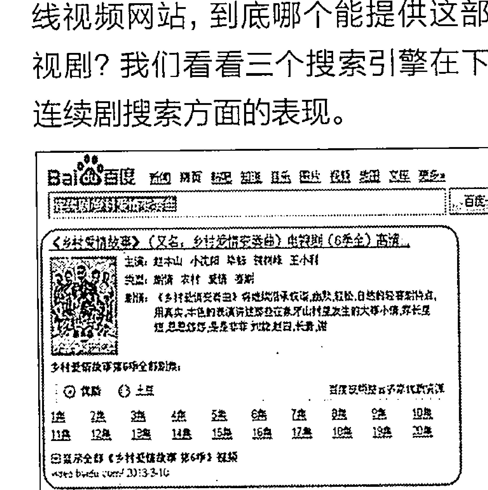

在百度中输入“连续剧 乡村爱情变奏曲”，在搜索结果的第一条中就可以很清晰地看到，有优酷和土豆两个网站可提供在线播放，并显示具体的剧集链接，不需要进入二级页面，只需选择相应的链接点击即可播放和下载。这是百度在普通引擎基础上二次开发百度视频项目的结果，它给用户的信息无疑是体贴和细致入微的。

再看谷歌用同样的关键词搜索的结果。我们看到的是该部连续剧播出时间、介绍和部分在线播放的链接。显然要下载的话还要进行二度选择和判断方可，还要浪费用户不少精力。

最后再用360综合搜索搜以上关键词。它给出的结果虽然可以进入一些在线播放网站，但如果你一个一个地点击进去查看，发现这些链接不一定是权威的专业网站提供的，可谓是鱼龙混杂。显然这种一次搜索做得比较粗糙，二次开发的功夫几乎还没来得及或没有付出就参与了战斗，用户要找到一个合适的下载链接，还需要付出相当的工夫。

由上面的比较可以看出，在下载一部连续剧这件事上，显然还是百度搜索更体贴人，能够做到一步筛选，精准定位。这与百度在二次开发方面所下的功夫是分不开的。搜索的二次开发，这不是一句话、两个口号、三天两头就能解决问题的，需要长期的技术和实践积累，360要赶超百度，显然还需要下一番苦功夫。

#### 简要总评

限于篇幅，我们不能举更多的例子来对这些搜索引擎做更加科学化的比较，但从上面几个最常用的需求已经可以看出优劣。

从360的雄心勃勃可以看出，它大有后来居上的冲动。这不是坏事，多方参与竞争，对于用户来说也是件好事。但仅从实用的角度来讲，目前360搜索引擎的使用体验还远远不能达到用户的期望要求，远远无法和百度搜索引擎抗衡。但这并不表示百度一定会永远领先，也许某一天，360搜索引擎的市场占有率会真的超过百度。

当然，我们更希望出现一个和谐局面——360、百度、谷歌等搜索引擎都不相上下、互相制约、互相提高，永远以鼎立之势、以最快的速度前行，展现给我们广大网民一种和谐共处、迅速发展的良好网络环境。

# 专业清理软件做不到的那些事

除了系统垃圾外，不同的应用程序也会带来不同的垃圾文件，对这些“非正规”垃圾文件，要如何清除？

文|鱼鱼

CFan前几期的文章中介绍过如何清理系统垃圾文件，不过有些读者反映，虽然照着操作之后系统变“瘦”了不少，但还是存在许多莫名其妙的垃圾文件，即使通过专业的清理软件也很难消除。今天就来分析一下常用的应用软件产生了哪些垃圾文件，又该到什么地方清除它。

## 专业软件如何清理垃圾

专业清理软件有不少，这里以金山卫士4.6的操作为例。启动它之后切换到“垃圾清理→清理垃圾”，勾选相应选项后点击“开始扫描”，扫描到所有垃圾文件后点击“立即清理”，即可将扫描出的文件删除掉。

从上述操作可以看出，专业软件清除垃圾文件的主要方式就是“扫描+删除”，其中的“扫描”，实际上就是“搜索”，根据设定的参数搜索出文件后，再删除就可以了。比如在金山卫士的扫描项目中勾选“其他常用软件产生垃圾文件→搜狗高速浏览器升级包”，扫描结果实际上就是列出%USERPROFILE%\AppData\Roaming\SogouExplorer\Temp下的文件，然后予以删除。如果我们自己手动执行del %USERPROFILE%\AppData\Roaming\SogouExplorer\Temp\*.*命令，效果其实差不多。

| 垃圾类型 | 具体文件 |
| :--- | :--- |
| 上网垃圾文件 | IE（包括IE内核的其他浏览器）的临时缓冲文件 |
| 看视频和听音乐产生的缓冲文件 | 使用Windows Media Play在线播放产生的缓冲文件，位于C:\Users\当前用户\AppData\Local\Microsoft\Media Player目录下 |
| 系统产生的垃圾文件 | 包括Windows临时文件、缩略图缓存、系统错误报告、回收站、用户临时文件、Windows更新补丁以及补丁安装后的残留文件、内存转储文件、字体缓存文件等 |
| 手机辅助类软件产生的缓存文件 | 如91手机助手、豌豆荚、手机管家等，手机使用这些软件和电脑连接后留下的缓存文件 |
| 其他常用软件产生的垃圾文件 | 金山卫士会内置一个常见软件列表，然后根据列表查找本机安装这些软件后产生的垃圾文件，包括Office安装缓存、金山卫士下载系统补丁、Apple软件更新包、WPS更新缓存、腾讯产品日志、Flash升级补丁等。 |

## 不留死角 自己手动再清理

专业清理软件的操作虽然简单，但是每个人的电脑环境不一样，它不可能针对每个人的系统进行面面俱到的清理，所以要彻底地清扫电脑，有时还是需要我们自己动手。下面列举的一些实例，是无法通过金山卫士等软件来完成的。

### 实例1：
一键清理QQ2013垃圾文件

QQ使用时间一长，个人文件夹会变得非常大，将导致QQ运行缓慢。QQ中最主要的垃圾，是聊天时自己或者Q友们发送的各种图片表情，尤其是有多个群的朋友，这些垃圾图片很快能达到几百兆甚至更多。

与之前的版本不同，在Windows 7/8系统下，QQ2013的用户文件默认不再在QQ的安装文件夹下，而是移到了系统文档库中（除非安装时你为它自定义了路径）。如果要清理其下的垃圾文件，一种方法是在QQ主面板打开QQ系统设置窗口，切换到“文件管理”，点击“立即清理”，再点击要删除的项目。在这里还可以设置当QQ个人文件超过多大（比如500MB）时让QQ提醒。

另一种方法更为便捷，可以让系统自动删除。先在记事本中输入以下命令：

```
echo y| del "C:\Users\系统用户名\Documents\Tencent Files\61727091\Image\*.*"
```

然后保存为BAT批处理文件，如“清理垃圾.bat”，以后随时双击执行这个批处理就可一键清理QQ2013的垃圾图片了。将上面的命令多复制几行，并将Image分别改成Audio、FileRecv，还可以自动删除QQ语音文件、QQ传送文件等。注意，视实际情况而定，可能对有些人来说这些是有用的文件。

这个命令中，系统用户名各人的电脑都不相同，请根据实际情况修改，其中“echo y|”的作用是让命令提示符窗口自动执行而不用弹出提示窗口，后面的命令用英文双引号括起来，否则执行时会报错。如果设置任务计划一周执行一次这个批处理，我们甚至都不用管理而让它自动执行了。

### 实例2：
删除视频播放软件缓冲数据

大家平时常用PPlive和PPS等软件欣赏在线视频，这些软件会在播放时缓存大量视频文件，这些文件动辄以GB计算，因此如果硬盘空间比较紧张，我们可考虑及时删除这些缓存文件以节省空间。

以PPS为例，为了简单起见，我们可以重新设定它的缓冲区位置：点击菜单“工具→设置→默认缓冲位置”，然后点击“浏览”自定义一个专门的目录，假设为D:\ppsdown。在已经建立的“清理垃圾.bat”批处理后面（也可以# 《电脑爱好者》·合订本 软件方案

Windows 7可以使用多个关键词进行组合搜索，关键词之间最简单的是并列关系，直接使用空格即可。另外还可以用=、+、>、[]等符号表达不同的关系。

单独新建一个）加入下面的命令：

```
del d:\ppsdown\*.pgf
```

PPS缓存文件的扩展名为pgf，所以这里只需删除这类文件即可。PPlive同样也可以自定义缓冲文件夹（工具→高级设置），在批处理中添加类似的命令，即可定期删除它的缓存文件了。

## 实例3：删除Photoshop缓存文件

Photoshop在进行大图片渲染时，会在电脑中保留一些超大的缓存文件，类似Photoshop Temp*****（*表示数字）。一般情况下，Photoshop正常退出时会自动清除这些临时文件，但如果出现死机等情况，这些文件则会被保留下来，占用非常大的空间。

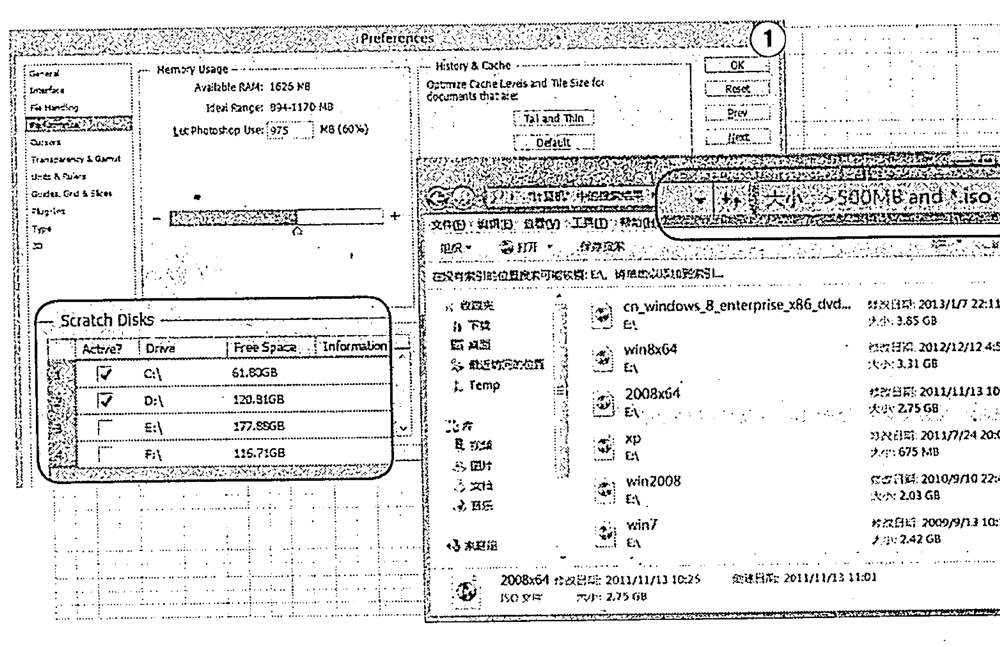

这些缓存文件一般保存在C:\Users\系统用户名\AppData\Local\Temp，C盘空间不够的话，可以将它移到其他盘中，点击菜单Edit→Preferences→Performance，在Scratch Disks中，勾选某个盘符即可（可多选），这里假设选中D盘（图1），重新启动后生效。不过这样一来，Photoshop产生缓存文件时，将保存到D盘。所以要想清理Photoshop的缓存文件，默认情况下可进入C盘上述的\AppData\Local\Temp中进行删除，如果修改过缓存位置，可在设置的分区根目录下找到这些缓存文件再删除。

## 实例4：清除杀毒软件隔离目录

杀毒软件为了保护数据安全，在发现一些可疑文件时，通常先将它们转移到隔离目录中，时间长了，隔离的文件可能会占用大量的硬盘空间。对于已经隔离一段时间的文件，确认没有任何用处时，不妨手动将其删除。这里以微软自带的MSE杀毒软件为例，它的隔离文件在C:\ProgramData\Microsoft\Microsoft Antimalware\Quarantine\Entries下，打开上述目录，点击资源管理器菜单栏的“查看→排序依据→修改日期”，将被隔离的文件按日期排序，删除一定时间之前的隔离文件就可以了。注意：C:\ProgramData\Microsoft\Microsoft Antimalware是隐藏、系统目录，并且当前用户默认没有访问权限，先要取得该目录所有权和编辑权限才能打开。

## 实例5：虚拟光驱和刻录软件缓存文件

经常玩游戏或者经常“折腾”系统的朋友，他们常要用虚拟光驱处理和刻录ISO文件，在处理ISO文件的时候，为了数据的安全，刻录软件常常会对当前ISO文件生成备份，这些文件动辄也是以GB计算。比如UltraISO在处理ISO文件时，在同名目录下就会自动生成一个和当前ISO文件同名的.UIBAK文件，对于硬盘紧张的用户，建议每次成功完成ISO文件的编辑后就手动删除备份的.UIBAK文件，可以节省不少的空间。

## 巧用搜索删除大的文件

为了节省硬盘空间，往往删除的主要是体积比较庞大的文件。在这方面，金山卫士提供“大文件管理组件”，可以扫描指定分区前100个大文件，我们可以根据扫描结果删除不需要的大文件。不过金山卫士只是机械地列出大文件，我们则可以借助系统搜索组合条件，自定义搜索大文件并对其进行管理。比如对于经常折腾ISO文件的用户，我们可以定期搜索下载或处理的ISO文件并将其删除以节省空间。

第1步：打开资源管理器，点击“组织→文件夹和搜索”选项，打开文件夹和搜索选项，切换到“搜索”选项卡下，勾选“使用自然语言搜索”项。这样我们就可以在资源管理器中使用自然语言来搜索大文件了。

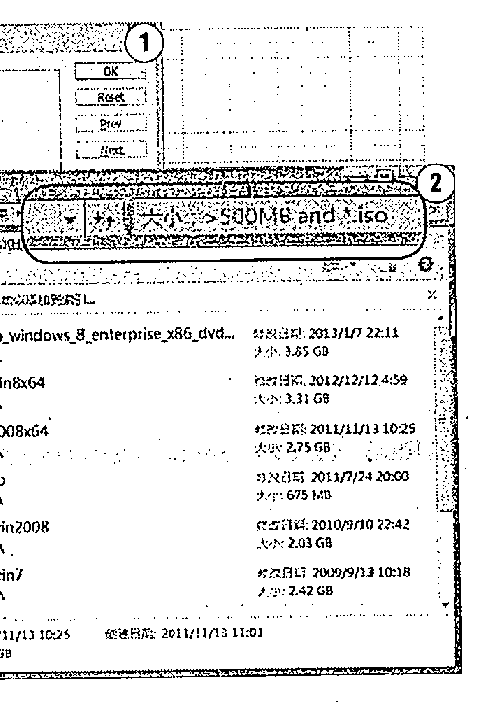

第2步：打开“计算机”，在资源管理器搜索框中输入组合搜索语法，比如输入“大小: >500MB and *.iso”，这个搜索条件就是在本地计算机查找所有大于500MB的ISO文件，这样很快就可以在本机找到所有大于500MB的ISO文件，确认哪些是没用的文件，选择删除即可（图2）。如果把“*.iso”改成“*.*”，则可以找出所有超过500MB的大文件来。

小提示：除了观看视频，很多朋友还在使用酷我、酷狗等欣赏在线音乐，这些软件也会在本地缓冲大量的音乐文件。比如酷我缓冲完成的歌曲全部保存在C:\Program Files\KWSING\bin\Temp目录下，同上，在批处理中加入删除命令，定期删除此目录中的文件即可。

CFanBoundEdition · 2013 | 343

# 手机打印 可“有”可“无”

现在智能手机的功能越来越强大，如果想将手机里的照片或文档打印出来，而你还在用复制拷贝到本地的方法那就太OUT了，看看手机打印的新玩法吧。

文|平淡

### 有线打印 无需电脑直接打印

- 适合用户：需要打印手机上的文件，却又不方便使用电脑的用户
- 所需条件：USB打印机+OTG数据线

什么是OTG数据线呢？OTG是On-The-Go的缩写，是近年发展起来的技术，2001年12月18日由USB Implementers Forum公布，主要应用于各种不同的设备或移动设备间的连接，进行数据交换。特别适合数码照相机、摄像机、打印机、手机、移动硬盘等USB设备之间的连接。它无需电脑就可以直接进行连接使用，比如可以通过OTG数据线将手机和打印机连接起来直接执行打印操作。大家可以在淘宝上购买适合自己手机使用的OTG数据线，一般只要10元左右。

1. 第1步：到http://dwz.cn/cfan201下载PrinterShare并在手机上安装，接着使用OTG数据线将手机和打印机连接起来。在手机上启动PrinterShare，接着点击菜单键→选择打印机，在弹出的窗口点击“附近-USB”（图1）。
2. 第2步：此时程序会自动搜索连接的USB打印机，由于文件打印需要下载驱动，选中找到的打印机后，程序会弹出下载驱动的提示。如果你的打印机可以自动识别，则会自动开始下载，否则点击“人工选择”手动开始下载打印机驱动。打印机驱动文件较大，第一次下载驱动可以使用Wi-Fi连接，或者直接使用数据连接电脑宽带共享下载，否则可能会耗费手机套餐流量！
3. 第3步：按提示选择相应驱动并安装成功后返回主界面，如果需要打印手机上的文档（需要保存在SD卡），则点击“文档”，然后按提示选择SD卡上的文件，同时好设置打印参数，最后点击“打印”，这样会自动激活打印机的打印作业，放入打印纸后就可以直接通过手机将文档打印出来了（图2）。

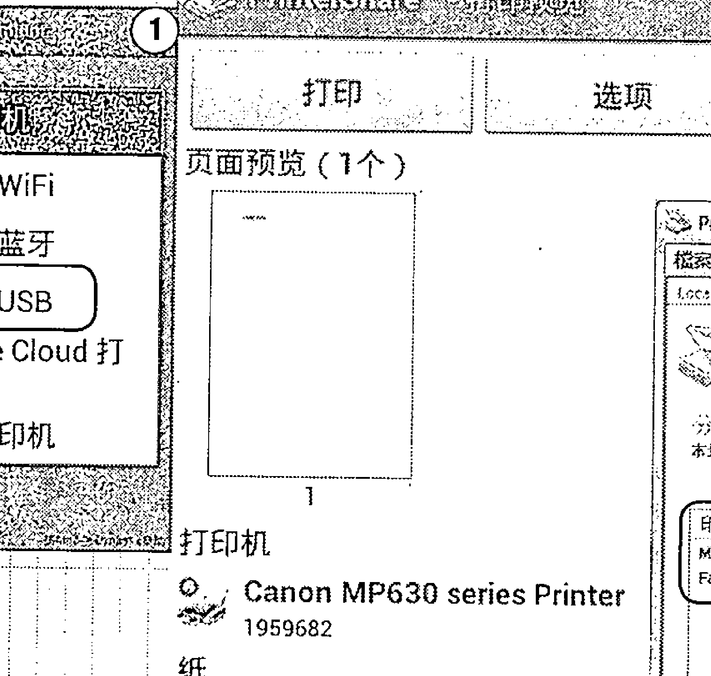

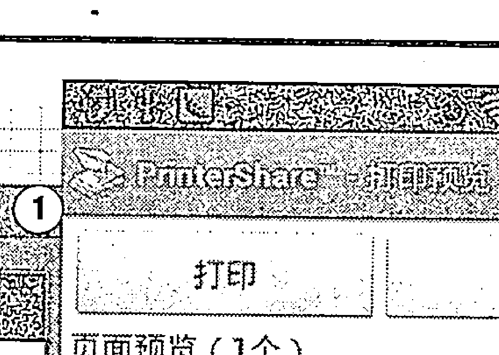

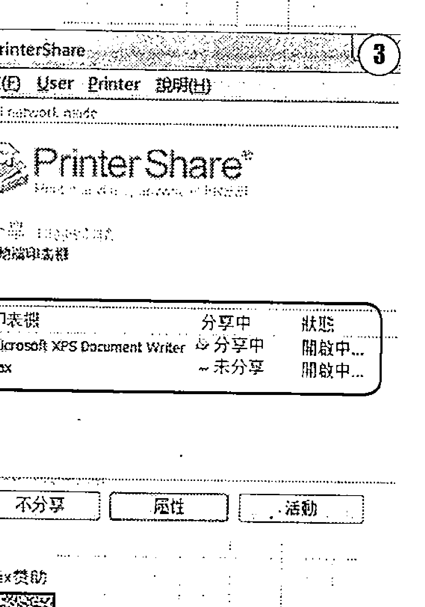

### 远程打印 云打印手机文档

- 适合用户：出门在外，身边没有打印机的用户
- 所需条件：公司打印机已设置共享

对于经常在外出差需要打印手机文档的用户，如果身边没有打印机，常规的方法是将手机文档传输到U盘，然后拿到外面商家去打印。其实我们还可以借助网络实现远程打印，这样既可以保护商业文档的不泄密，又可以在公司直接实现文档的远程打印。

1. 第1步：在公司电脑上到http://printershare.softonic.cn/download下载PrinterShare电脑客户端并安装。启动程序后点击File→Language→繁体中文，切换到中文界面，程序会自动识别本地安装的打印机，按提示选中打印机并点击“分享”，将其设置为网络打印机(图3)。

除了本文介绍的有线打印和Wi-Fi打印方式以外，还有红外打印、蓝牙打印，相信随着手机和打印机技术的发展，手机打印将成为主流。

小提示

为了方便，选中分享的打印机点击“属性”，按提示设置一个方便自己识别的名称。

第2步：点击菜单栏的Printer→Autonation，接着在弹出的窗口点击连接要求下的下拉列表选择“不需要验证”，这样手机上的文档传输到电脑上后就可以直接开始打印。

第3步：同上在手机上也安装PrinterShare客户端，启动程序后按提示点击“注册”，注册一个PrinterShare用户(用来接收和传输打印文档)。在手机上登录PrinterShare，然后在搜索打印机界面选择“远程打印机”，接着在搜索框输入自己打印机的名称，找到自己公司的远程打印机后，同上程序会提示需要安装驱动程序，按提示安装好打印机的驱动。

第4步：顺利安装打印机驱动后返回程序主界面，剩余操作同上选择需要打印的文档后，点击“打印”，这样文档会自动传输到公司电脑打印机上并开始打印，我们只要电话通知公司同事开始打印文档即可(图4)。

### 无线打印 使用Wi-Fi打印

适合用户：可以直接使用打印机的用户
所需设备：需要有Wi-Fi连接

上述手机的打印虽然方便，但是需要OTG数据线的支持，可能很多朋友手边并没有OTG。不过现在很多公司、家庭都有Wi-Fi环境，由于现在智能手机都支持Wi-Fi连接，这样只要将手机连接到局域网，然后在手机上利用Samba服务器设置共享，这样即可在电脑上轻松实现文档的打印了。下面操作以安卓手机为例。

第1步：首先将安卓手机连接到Wi-Fi网络，接着到http://dwz.cn/cfan203下载SambaFilesharing并安装在手机上。在手机上启动程序，接着点击菜单→Setting，打开设置界面，然后依次点击Password和Username，分别设置访问安卓手机的密码和用户名。

第2步：完成上述设置后，点击菜单→Enable，程序会开始设置安卓手机上SD卡和内存盘的共享，在手机界面会出现Enabled-Running以及共享IP地址(图5)。

小知识

> 什么是Samba？Samba是一个工具套件，在Unix上实现SMB(Server Message Block)协议，SMB协议可以轻松实现Unix系统和Windows系统之间的共享。由于安卓系统本身就是用Linux开发而成，所以安卓手机完全可以利用这个服务实现安卓手机通过Samba服务器与Windows共享。在手机上完成SMB共享设置后，我们在电脑上就可以轻松访问手机上的文件，具体操作就像是在本机打印局域网内其他电脑上的文件一样。

第3步：在电脑上启动资源管理器，接着在地址栏输入手机屏幕上显示的IP地址，类似\192.168.0.32的形式，回车后按提示输入上述设置的用户名和密码即可打开手机上的共享目录，SD卡对应共享名为Sdcard (手机内存盘对应Share2)，现在展开\192.168.0.32\sdcard，右击选择需要打印的文档选择“打印”，然后按提示进行打印即可(图6)。

### 更多无线打印方案

由于现在手机都支持蓝牙、红外线设备，对于蓝牙打印，我们可以通过电脑直接将手机和打印机配对，实现蓝牙无线打印。对于远程打印，我们还可以借助快盘等网盘工具，在手机和电脑上都安装快盘客户端后，以后出门在外时只要将手机上的文档上传到快盘，这样在公司电脑上直接选择快盘中的文档即可实现远程打印。

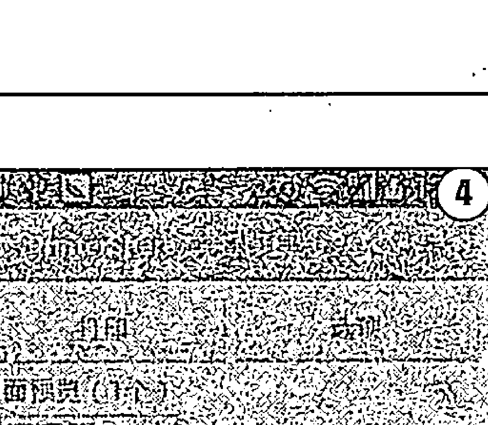


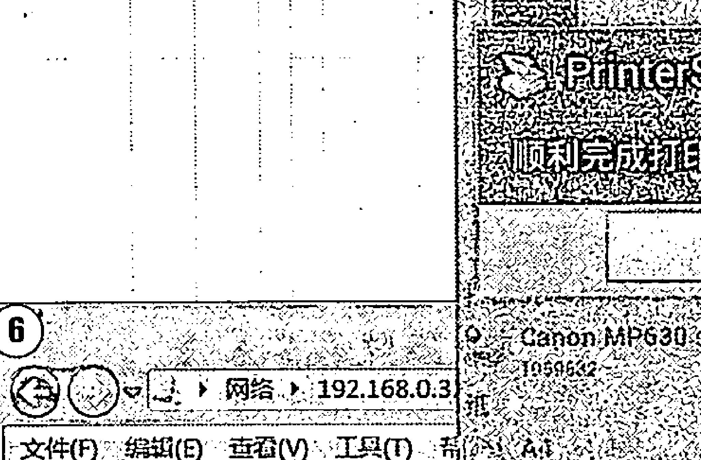

# 打造文件自动搬家的下载机

为防止大量文件下载爆满硬盘，通过编制简单的自动判断和文件转移程序，可以实现已下载文件的下载完成判断、非锁定状态捕捉和文件自动转移。

文 | 老俞

## 案例需求描述

网友A用自己的一台机器下载连续剧，而硬盘空间已经吃紧，存不了几部就会爆满，但他已经将获得的许多种子全都加入到迅雷的下载列表中并开始下载了。现在的问题是，大批电影下载任务加入下载列表，下载一段时间后很可能造成本地硬盘爆满，下载任务自动暂停。虽说身边的一台内网服务器有大容量存储空间可用来备份。但若是时不时地要去看下载任务，并将已经下载的影片移动到服务器上存储，又比较麻烦。
还有一个问题，那就是已经下载的文件的转移也不是轻而易举的。因为多数下载软件在文件下载完成后仍然承担着为别人上传这些文件的任务，因此这些已下载文件往往是被下载软件随机锁定的，只有当不锁定的时候才允许移动。如果想要强行移动，只能用解锁工具先解锁，或者等其闲置的时候移动。但判断某文件是否正在被锁定，手工的办法只能靠碰运气，能移动则说明未被锁定，不能移动则说明正在锁定。
那么，能不能想办法让电脑自动监控已经下载的电影文件，如果文件存在，就将其统统移动到服务器的存储空间，从而保证本地硬盘始终是“轻装”作业呢？

## 具体设计思路

#### 将服务器空间映射为本地盘符

首先，为了方便下载文件的转移，我们将服务器上可用来存储备份视频的文件夹映射为本地的一个盘符（例如本例我们映射为Z盘），这可以在我的电脑中用“工具→映射网络驱动器”命令来实现。

#### 用内部移动文件命令转移文件

为了移动文件，我们借助于操作系统的一个命令MOVE来实现文件的移动。将这个命令写入自动批处理文件中。

#### 判断文件是否存在和是否被锁定

这个批处理文件需要一直运行，循环不停，也就是说要编写一个死循环程序，一旦程序运行后就要不断判断是否存在已经下载好的文件并执行移动命令。

#### 编写简单的代码

根据以上思路，我们就可以设计出一个批处理程序。很简单，只需用记事本录入如图中的代码，并将文件以“自动转移.BAT”存盘保存即可（注意扩展名一定要是BAT而不能是TXT）。
在此之前，我们需要先在位于下载分区的磁盘上建立一个与存放下载文件的文件夹同级别的文件夹“电影仓库”，用来临时接纳下载好的文件。在服务器共享文件夹下（也就是本地盘符的Z盘中）也建立一个“电影仓库”文件夹，用来放置最终的电影文件。
程序的不断循环不但可以判断文件是否已经下载好，更重要的一个作用是能不断捕捉文件是否被锁定，虽然被锁定的文件不允许移动，但一旦文件被解除锁定，命令马上会将其移动到临时备份目录中供转移之用。

```
:START
MOVE *.QSV ..\电影仓库\
MOVE *.RMVB ..\电影仓库\
MOVE *.MKV ..\电影仓库\
MOVE *.FLV ..\电影仓库\
MOVE *.MOV ..\电影仓库\
MOVE *.AVI ..\电影仓库\
MOVE *.MP4 ..\电影仓库\
MOVE ..\电影仓库\*.* Z:\电影仓库\
GOTO START
```

#### 让程序投入运行

将以上批处理程序拷贝到本地存储电影文件的目标目录中，并给此批处理建立桌面快捷方式以便访问。
当下载任务开始后，执行一下该批处理任务，批处理进入死循环，不断判断下载目录中是否存在电影文件，并完成已下载文件向服务器空间的转移。
如果你怕忘记了执行该命令而造成硬盘爆满，则可将此批处理程序加入到系统“启动”组中，让其在系统启动后自动运行，迅雷的影视剧下载任务也可以设置成开机自动启动和下载任务自动运行状态。这样一来，所有下载任务就可以不用人管了。你只需提前加入十天八天的下载任务，其余的，只要机子一开，就由电脑自己去完成了。
至此，下载机打造完毕。你不需要再去看电影是否下载完成，只管到服务器空间收获已经下载好的片子去选择欣赏了！

小提示

仿造以上思路，可以将程序改造为任何类型资源的网络自动搬家下载机，你只需修改程序中MOVE命令行中的文件类型和目标地址即可达到个性化下载机定制的目的。也许有人会问，为何不直接下载到服务器中而选择搬家？我的理由是，如果在你刚刚开始下载时服务器就被人关掉了，那么你一个电影也下载不到，因此才选择此更稳妥的方法，这种方法至少可以保证即便服务器关机，也能先下满自己的硬盘。

# 从路由器“问”回宽带密码

当我们习惯了使用路由器自动登录网络的时候，宽带的密码往往会被我们遗忘。在这种情况下，有什么好的方法能让我们快速找回宽带的密码呢？

文|郭建伟

如果在使用路由器的时候忘记宽带拨号密码怎么办？下面的方法能让我们从路由器里把账号密码从我们的路由器里“问”回来。

这个例子使用TP-LINK TL-WR841N无线路由和IE9浏览器，根据路由器的不同步骤可能有所不同。

步骤1：在浏览器上禁用JavaScript。
禁用方法:打开IE→工具→Internet选项(图1)。

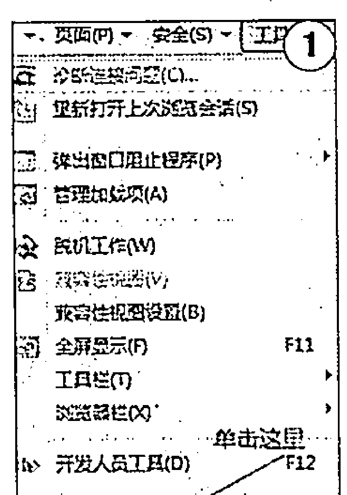

步骤2：单击Internet选项，然后找到安全选项卡，在选择要查看的区域或更改安全设置选择Internet后，再按下面的自定义级别按钮(图2)。

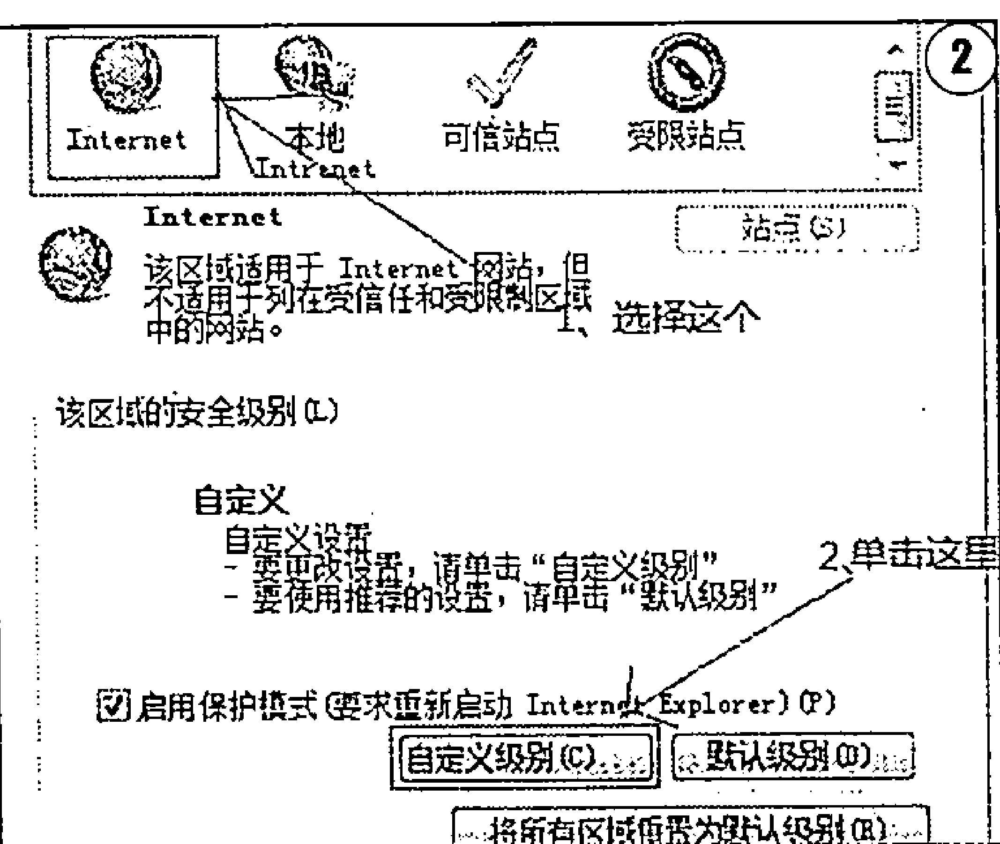

步骤3：往下找，找到Java小程序脚本和活动脚本，勾选为禁用，然后单击确定(图3)。

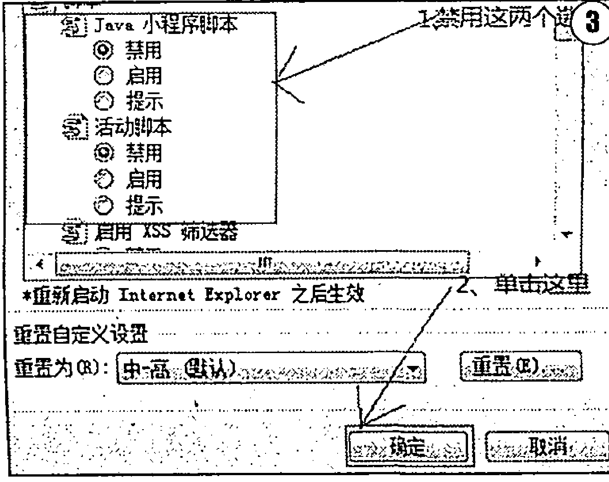

步骤4：单击确定后弹出一个窗口，同样单击确定。

步骤5：关闭以上步骤的全部窗口，除了浏览器，然后复制http://192.168.1.1/userRpm/PPPoECfgRpm.htm到浏览器的地址栏，输入登录路由器的登录名和密码(TP-LINK默认都是admin)，单击确定(图4)。
这个步骤根据不同的路由器和不同的设置就有所不同，192.168.1.1是路由器端口的默认IP地址，某些路由器的默认地址是192.168.0.1，若是改了路由器IP地址，则就按照修改后的IP，如何查看路由IP稍后补充。至于后面的userRpm/PPPoECfgRpm.htm，这是指向网络参数下的WAN口设置页面的地址，不同的路由器品牌和型号有所不同。

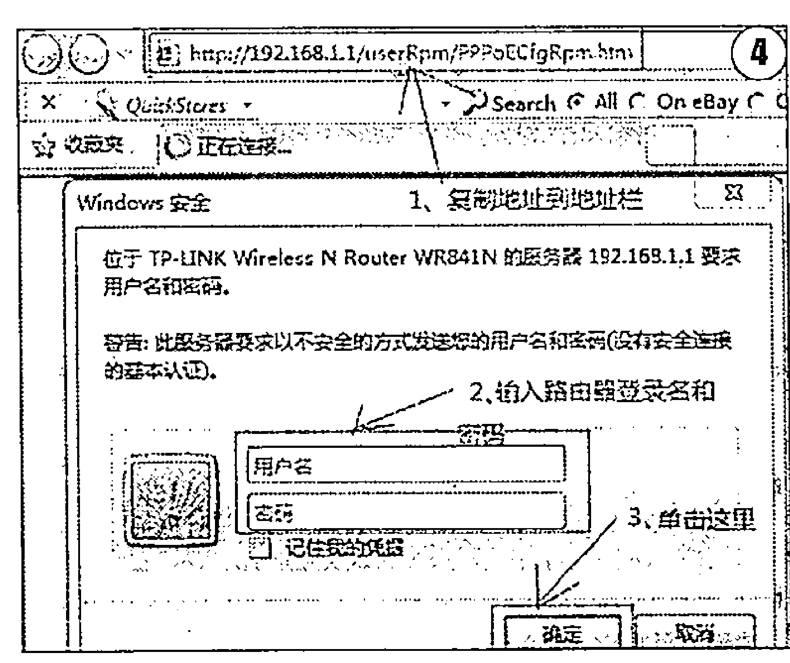

步骤6：进去后发现都是空的(图5)，但是我们真正想要的东西离我们不远了，往下看！

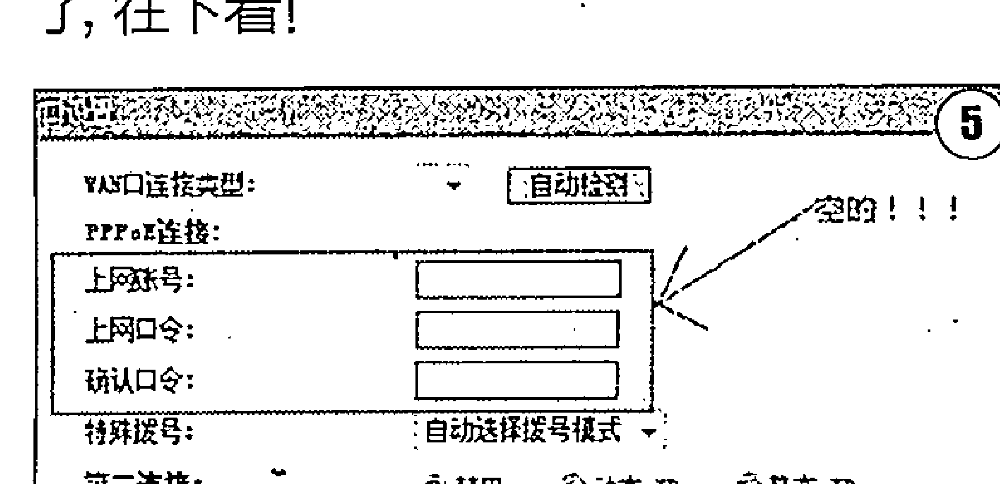

步骤7：查看网页源代码，页面→查看源文件(图6)。

步骤8：用你的纸和笔或者手机，或者复制粘贴，记下你的账号密码！它就在下面！在几排很短的字符串中突然很长的那两行就是你的账号密码，上面的是账号，下面的是密码(图7)。

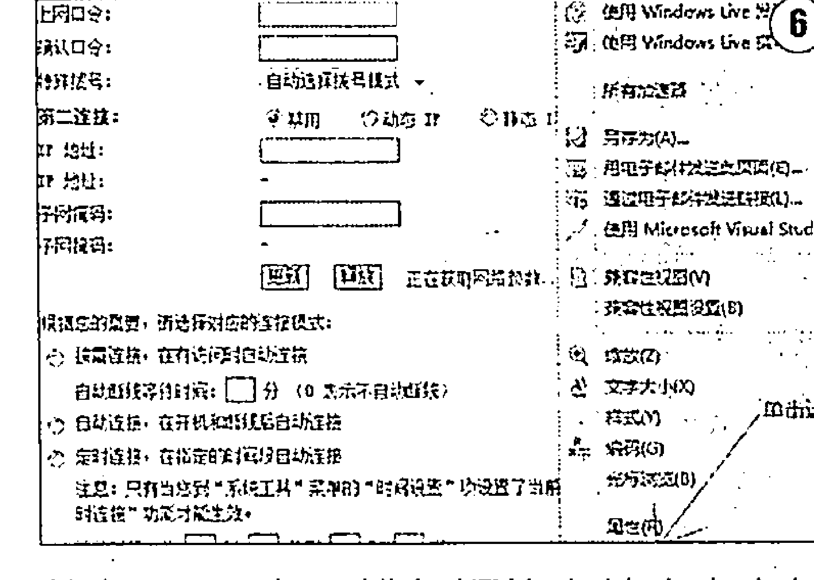

就在下面！在几排很短的字符串中突然很长的那两行就是你的账号密码，上面的是账号，下面的是密码(图7)。

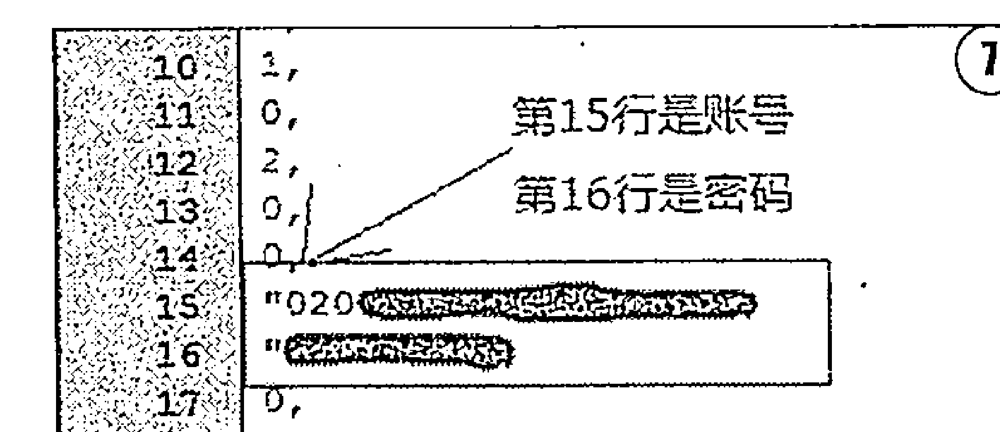

补充：如果改动了路由器IP地址，怎样查看？
开始→运行→输入CMD→输入ipconfig /all回车，得到结果(图8)。

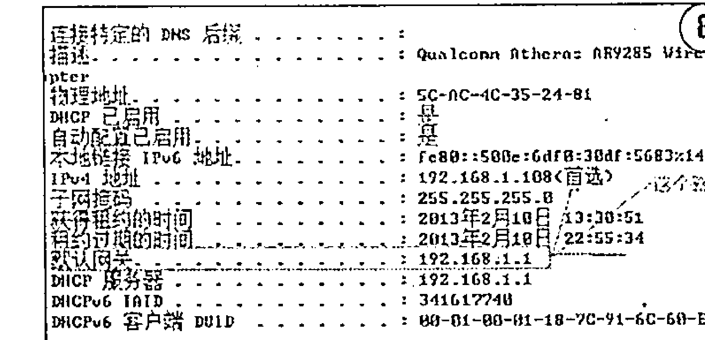

注：某些英文版本的CMD上写的不是默认网关，写的是：default gateway，对应的就是网关地址。

最后，笔者不得不提醒各位路由器用户，设置一个比较安全的WAP2加密格式的密码，千万不要再用WEP，这个加密格式已被证实很容易破解。另外在使用路由器的时候，记得要改掉登录账号密码，在笔者调查过程中发现90%以上的用户都没有修改登录路由器账号密码的习惯，这是一个很危险的漏洞。

# 巧施妙招 绕过UAC拦截

关闭UAC保护会降低系统安全性，开启又会给日常操作带来不便。我们该如何另辟蹊径，做到安全、便捷两不误呢？

文|俞木发

## 自动提权 让自启动不再被拦截

对于一些需要自动启动而我们确认无害的程序，可以通过系统任务计划启动它们。因为系统任务计划可以使用最高权限运行，这样即可绕开UAC的拦截。

- 第1步：在搜索框输入msconfig启动系统配置使用程序，切换到“启动”，查看需要设置为任务计划启动的具体命令，同时取消它的自启动。接着打开“控制面板→管理工具”，依次展开到“系统工具→任务计划程序”，点击右侧“创建任务”，在弹出的新建向导创建一个任务，按向导提示新建一个名为stopuac的在用户登录时运行的程序，运行的具体命令为上述“启动”中记下的运行命令。
- 第2步：在任务计划窗口打开新建任务，在常规选项下，运行“用户”，选择“本机管理员账户”，单选“只在用户登录时运行”，然后勾选“使用最高权限运行”，这样下次启动此任务时就没有UAC的拦截了。

在任务计划中如果选择“使用最高权限运行”，就是以系统管理员身份运行指定程序了，可以避开UAC拦截。由于UAC会阻断程序自动运行，因此对于需要自动运行的任何程序，我们都可以使用任务计划来安排程序的运行。

## 自定义UAC白名单

默认情况下，UAC会对所有带盾牌的程序拦截（即使是微软自己的程序）。很多时候如果自己认为安全的程序如regedit.exe，运行时不希望遭到UAC的拦截，对于这些确认安全的程序，借助Microsoft Application Compatibility Toolkit可以将指定程序添加到白名单中。

- 第1步：到http://dwz.cn/cfan001下载程序，安装后得到三个程序，我们需要使用管理员权限启动C:\Program Files\Microsoft Application Compatibility Toolkit\Compatibility Administrator (32-bit)\Compatadmin.exe，启动程序后展开Custom DataBases→New Database(1)，右击选择Great NEW→Application Fix。
- 第2步：接着在打开的窗口中，选中上述新建的Application Fix，按提示添加你信任的程序如regedit.exe，点击下一步，在弹出的窗口Additional compatibility modes列表下勾选RunAsInvoker选项。
- 第3步：剩余的操作按向导的提示完成。接着返回程序主界面，单击File→save，将其保存为sdb数据库，最后点击File→Install，这样就完成了UAC白名单的添加。设置完成后，虽然regedit程序图标上仍然会显示UAC图标，但是可以直接打开而不会弹出烦人的确认窗口。

一些程序只是部分功能需要管理员权限运行，比如网上很多绿色版UltraISO，如果没有选择“以管理员身份”运行，仍然可以启动UltraISO，但是需要使用它的虚拟光驱功能时就无法加载（因为需要加载虚拟驱动，它会被UAC后台自动拦截）。

对于这类程序，我们可以将其快捷方式发送到桌面，然后右击快捷方式选择“属性”，点击“高级”，在打开的窗口勾选“用管理员身份运行”，下次启动时就会强制以管理员身份运行，绕过UAC在后台的拦截。

## 小技巧 Win8中如何关闭UAC

在Win8桌面只要鼠标滑到右侧，在弹出的Win8超级按钮（Charm）中点击“搜索”，在弹出的搜索面板中选择“设置”输入UAC，用户账户控制设置就会出现在左侧窗口中，点击它UAC设置窗口就会打开。只需将滑块往下拖到底禁用所有通知，UAC就关闭了。除非你是愿意冒险试一试的PC用户，否则不推荐这么做。

# 图片版PDF制作方法多

将数码照片、扫描的原版书、抓图软件抓取的画面等制作成PDF电子书，这是一项很实用的日常需求。它可以通过不同方法来实现。

文/赵立忠

## 抓图之后生成PDF电子书

有时候我们需要用SnagIt抓图或360浏览器的另存为图片功能将一幅很长的网页保存为图片，但由于图片过长，打开和浏览多有不便。这时我们可以将其制作成分幅的PDF电子书。

如果是用SnagIt抓图，抓图之后直接进入SnagIt编辑器窗口。如果使用别的环境取得的图片，则可以先打开SnagIt编辑器，然后载入该图片。

接下来，在SnagIt编辑器窗口执行“文件→另存为”命令，在“保存类型”下拉框中选择PDF类型，紧接着点击右侧的“选项”按钮，在弹出的“文件格式选项”窗口中点击“PDF页面设置”(图1)，选择合适的页面尺寸，然后选中“图像版式”下的“允许跨越多幅页面”选项，确定之后保存文件，我们就可以获得由多页组成的图片版PDF文件。

## Acrobat制作PDF电子书

对于用扫描仪扫描而来的图书资料图片，或通过数码相机采集的数字照片，我们可以将其保存在一个文件夹下，依据一定的顺序给图片编号并按增序排列，然后用Acrobat方便地制作电子书。

首先需要安装专业版PDF创建工具Acrobat(注意不是我们常用的Acrobat Reader，那个只是一个阅读器)。安装之后在图片文件夹或图片的右键菜单中就会出现一个创建PDF的命令。

选中我们要创建PDF的照片或图片，执行右键菜单命令“转换为Adobe PDF”或“在Acrobat中合并支持的文件”，根据向导提示执行下一步操作，就会很快生成我们需要的图片版PDF电子书。

期间还可以对图片的顺序、图片的质量等进行调整。

## 看图软件生成照片PDF

如今的看图软件功能越来越强，比方说传统的看图软件ACDSee或FastStone Image Viewer，都具有创建图片版PDF的功能。

以用FastStone Image Viewer创建一个照片文件夹的PDF电子相册为例来说明。

启动FastStone Image Viewer，选择存放图片的文件夹，选中要制作成电子书的所有图片，执行“创建→建立多页文档”命令，在弹出的创建窗口中设置格式为PDF格式，设置好PDF质量，然后点击“创建”按钮创建PDF文件(图2)。

## WPS文字生成照片PDF

最新版办公软件WPS文字也具有创建照片版PDF电子相册的功能。具体操作办法如下：

首先新开启一个空白的WPS文字文档，然后在资源管理器内选中所有要制作电子相册的照片，将其拖动到WPS文档的编辑窗口中，这时图片会按自然顺序排在这个空白文件中。接下来我们要对这些图片的尺寸和居中、跨页等进行必要的设置。

最后，执行WPS文字的命令“WPS文字按钮→另存为→输出为PDF格式”即可。

**小提示**
在输出PDF的过程中，可以通过“高级”选项按钮进入设置界面，对PDF的输出选项，打开权限等进行个性化设置。例如，你可以设置PDF文件的打开密码，设置限制对这个PDF文件的打印操作等项目。

## 打印出来的照片PDF

编辑或浏览图片的软件或环境多种多样，但是我们可以找到一种办法来统一生成标准格式的图片版PDF。

借助一个小小的工具软件TinyPDF，我们可以在任何环境下打开图片或照片文件，然后用该环境自带的打印命令将打印结果发往TinyPDF所提供的虚拟PDF打印机上。

也就是说，在编辑环境中执行打印命令，打印生成的是一个PDF文件，而不是在实体打印机上输出。

例如，我们使用Word来管理一系列照片，在Word环境中直接选择打印命令，并选择打印机为TinyPDF，则“打印”得到的便是一个PDF文件了。尽管你用的Word版本不提供保存为PDF的功能，没关系，有TinyPDF配合，我们照样得到了自己想要的照片版PDF。

# 邮箱泄密 应对有招

你的网易邮箱有没有被盗过？如何防止邮箱被盗？有什么应对办法吗？看了本文关于邮箱安全检查与防范的技巧后你就会明白。

文 | 曹春华

### 查看登录历史

每次登录网易邮箱时，服务器都会记录下这次登录的详细信息，这些信息包括登录电脑的IP地址、登录时间，以及是通过网易Web邮箱登录还是通过网易手机邮登录，从这些信息中，很容易判断出你的邮箱登录是否正常。查看登录历史的方法是：登录网易Web邮箱，选中“首页”标签，单击页面右侧的“功能”按钮(图1)，可以看到“最近登录详情”，单击“详情”，即可查看到登录的历史记录了(图2)。

如果这些记录与你的登录情况相符，说明你的邮箱是安全的。若其中有不正常的登录时间或地点，那肯定存在问题，下一步就应该考虑如何让邮箱变得更为保险了。

### 近期活动
| 登录地址 | 登录产品 | 登录时间 (以北京时间为标准) |
| :--- | :--- | :--- |
| 江苏 (221.131.169.*) | 163邮箱 | 2013-03-04 10:26:31 (10分钟前) |
| 江苏 (221.131.169.*) | 手机邮 | 2013-03-04 10:26:26 (10分钟前) |
| 江苏 (221.131.169.*) | 手机邮 | 2013-03-04 10:15:56 (21分钟前) |
| 江苏 (221.131.169.*) | 手机邮 | 2013-03-04 10:15:54 (21分钟前) |
| 江苏 (221.131.169.*) | 手机邮 | 2013-03-04 10:12:33 (24分钟前) |
| 江苏 (221.131.169.*) | 手机邮 | 2013-03-04 09:16:28 (1小时前) |
| 江苏 (221.131.169.*) | 手机邮 | 2013-03-04 09:16:06 (1小时前) |

### 为登录设置第二道门槛

纯粹凭借密码这一关来登录邮箱，安全系数并不高，网易借鉴了某些品牌笔记本的人脸识别开机功能。虽然设置起来有点繁琐，但设置成功后，安全系数就会相当高。登录自己的网易邮箱，依次打开“设置→实验室”，找到“人脸识别应用”，单击“马上开通”，然后关闭邮箱页面再重新登录，依次打开“设置→账号与安全”，单击“人脸识别”，提示“您还未设置人脸识别功能”，再单击“马上设置”，在“温馨提示”窗口中，依次单击“开始吧”、“确定”，下载并安装人脸识别插件，安装插件成功后，重新启动浏览器并登录邮箱。再次进入“账号与安全”，单击“人脸识别”、“马上采集”，按照屏幕提示进行人脸采集。采集完成后，要求选择认证范围，有两种认证范围可选，一是“检测到异地登录时认证”，二是“每次登录时认证”，可以根据自己的安全需要进行选择。特别重要的邮箱可以选择第二种方案，一般用户可以选择第一种方案。选择后，要求关联自己的手机号，输入后单击“获取短信验证码”(图3)，再输入通过手机获取的验证码后，单击“完成设置”。以后，当检测到异地登录时，将弹出人脸识别窗口，与采集到的人脸对比，匹配成功后方可进入邮箱，若认证失败，还可通过手机短信验证码进入邮箱。

### 设置手机短信验证关

使用人脸识别虽然安全系数得到了保障，但离不开摄像头，这一点对某些用户来说显得不够方便。可以采用另一种安全方案，即手机短信验证登录，且短信验证不会收取任何费用。在“设置”中单击“邮箱登录二次验证”，输入邮箱密码后确定，再单击“手机短信”，同样要求选择是登录异常时进行验证，还是每次登录都进行验证。完成设置后，以后再次登录邮箱且符合验证规则时，会弹出提示窗口(图4)，单击“发送验证码到手机”，然后输入手机短信中的验证码后，单击“确定”方可进入邮箱。

# 找回MSN 用消息打通人脉

虽然微软已宣布全面停止MSN服务（中国内地除外），但庞大的MSN用户群微软怎么可能舍得丢掉？它实际以另外一种面貌潜回我们的生活。

文/一 页

## Windows 8中的新“消息”

想要找Windows 8的“消息”很简单，将光标移到屏幕右上角，从弹出的超级按钮中点击“开始”进入开始屏幕（或者直接按Win键），点击“消息”磁贴，就可以全屏打开它了。

点击左上角的“新消息”将打开“人脉”页面，如果你是以Hotmail邮箱（即MSN的账户）作为Windows 8的登录账户，就会发现之前的MSN所有好友全部出现在“人脉”中。点选某位好友，再单击下方的“选择”，即可返回消息页面，此时在下方的文本框中输入对话，按下回车键即可发送出消息。点击右侧的笑脸符，可以在对话中插入不同表情的笑脸符（图1），对方回复时马上就可以看到。

## 随时了解好友回复

我们使用Windows 8，一般都是在桌面环境下工作，当MSN好友有回复的时候，怎么看到呢？不用担心，我们可以放心地做自己的工作，一旦有回复，右上角会有弹窗提示。随时切换到开始屏幕，“消息”应用磁贴是动态的，也会实时显示是否有新消息。

另外在锁屏界面上，也可以实时显示是否有新消息。如果没有显示的话，可在超级按钮中点击“设置→更改电脑设置→个性化设置”，点击“锁屏应用”中的“+”号，选择“消息”就可以了。

## 打通“消息”和“人脉”

可以看出，Windows 8的“消息”和“人脉”息息相关。在开始屏幕中进入“人脉”应用，会发现系统依据你登录所用的邮箱，已经为你“联系”了一些人脉。尤其当你使用的是之前MSN账号的邮箱，系统还会导入你所有的MSN好友。另外，右击“人脉”应用页面，点击“新建”，可以添加更多的联系人。建立好人脉信息后，平时想要联系的话就方便多了。点击某位联系人后，我们至少有发送电子邮件和发送即时消息两种方法与对方联络。

## 添加微博人脉

除了Windows 8中通过微软建立的人脉关系，我们还可以将其他方面的好友链接过来。在“人脉”应用页面，点击右上角已经连接的微软账户，打开“账户”页面后单击“添加账户”，Windows 8支持Hotmail、新浪微博、谷歌等多个服务的导入（图2）。

这里以大家最常用到的新浪微博为例，点击“新浪微博”，弹出连接向导，首先是一个条款声明，如果同意，就点击“连接”继续，按提示输入新浪微博的账户和密码，单击“登录”（图3）。接着按提示点击“授权”和“完成”就可以了。Windows 8配置账户需要一点时间，完成后会显示通知，并且新浪微博的账户图标也出现在右上角，点击此图标可以对微博账户进行一些设置，而你在微博中关注的人将自动加入到人脉列表中。

## 特别的你特别的关注

在所有的人脉关系中，肯定有些人是你特别要关注的，这里有个特别的技巧，让你能及时了解所关注人的动态。在人脉应用中，点击打开要关注的人的名字，然后右击屏幕，在下方显示的状态条中点击“固定到开始屏幕”（图4），即可将他（她）以动态磁贴图标的形式嵌入到开始屏幕中，一有动态，马上就可以看到通知消息。

小结与启示

比起MSN，“消息”和“人脉”与系统的整合更加密切，与其他的Windows应用也能完美连接。如果“人脉”中记录的资料非常全面，比如留有网站，点击后将自动在浏览器中打开，如果留有居住地址，点击后将自动打开地图应用，直接在地图上定位。

# 实而不“虚”三大王牌虚拟机评测

有些特殊的操作往往需要在虚拟机中完成，不过虚拟机软件有不少，哪个功能更强大，哪个更适合我们使用？本期研究室对三大王牌虚拟机进行测试，让它们一较高下。

文/CFan软件研究室

虚拟机软件，主要就是在当前系统下安装运行其他系统，它的应用范围非常广。比如企业用户，他们可以在一台安装Windows 8的电脑上安装Linux系统，用于运行企业所需的Linux程序（而不需要额外购置一台电脑来安装Linux系统）。再如游戏迷，可以在Windows 7系统下安装Windows XP系统，用来运行那些和Windows 7不兼容的经典游戏。还有不少系统爱好者（包括软件开发者），则可以在当前系统下安装多个系统，用来测试软件或者尝鲜其他内核系统。下面我们就来评测几款流行的虚拟机软件。

- 测试平台
处理器: Core i3-2120 (双核3.30GHz)
内存: 4GB
硬盘: 希捷1500GB (7200转)
操作系统: Windows 8/64位专业版

## 测试软件是这么挑选的

虚拟机软件的开发，有相当高的技术门槛，所以与其他应用软件不同，市面上虚拟机软件数量要少很多，所以初选软件很好选择。目前常见的虚拟机有微软推出的Hyper-V、Oracle公司出品VirtualBox和全球第一大虚拟机软件厂商VMware推出的VMware Workstation（以下简称VMware）。

- VirtualBox (https://www.virtualbox.org/wiki/Downloads, v 4.2.10, 93.20MB)
- VMware Workstation (http://www.vmware.com/products/workstation, v9.0.2, 429.91MB)
- Hyper-V (Windows 8/64位专业版及企业版集成)

## 专业用户——高稳定高兼容

为了有效降低企业运营成本和简化企业网络维护工作量，现在越来越多的企业在推广和使用虚拟化策略。对于一个企业来说使用到的系统和软件可能非常多，比如很多数据库软件可能使用的是Linux平台，出于安全和减少升级带来的麻烦，很多产品管理和设计软件可能仍在使用Windows XP平台。对于多平台并存现状，此时使用虚拟机，在一台服务器上安装多个系统无疑是最佳的选择。对于这些专业用户来说，虚拟系统主要是用于商务，因此运行稳定、兼容性好、联网功能强大的虚拟机是他们的优先选择。

对于专业用户，我们推荐使用Windows 8集成的Hyper-V虚拟机。就兼容性和稳定性而言，Hyper-V出自微软之手，而且它已经作为Windows 8组件之一，兼容性和稳定性无疑是在三款软件中最好的。由于在虚拟机安装过程中，需要安装虚拟网卡和其他虚拟驱动，Hyper-V是Windows 8自带的组件，安装时只要展开“控制面板→程序”，点击“启用或关闭Windows功能”，然后在打开的窗口勾选“Hyper-V”，点击“确定”后，系统就会自动将上述组件添加到系统中，重启后即可开始使用。它所需的驱动都已经集成系统中，安装过程中没有任何提示，运行后也极为稳定。

VMware的驱动经过微软数字签名，安装过程也比较简单，运行起来也较稳定，但是其安装包体积庞大，默认安装的其他组件较多（默认启动后台进程多达9个）。启动后运行的稳定性就比Hyper-V逊色多了，在测试过程中就遭遇几次停止响应，不得不使用任务管理器将其进程强行终止。相比之下，VirtualBox就显得更为麻烦些，由于它的驱动未经微软数字签名，在安装虚拟网卡的时候，我们必须手动点击“允许”才可以继续安装，程序的稳定性也差些，在测试时就遭遇一次蓝屏。

表1：稳定及兼容性测试
| 项目\评测软件 | Hyper-V | VMware Workstation | VirtualBox |
| :--- | :--- | :--- | :--- |
| 兼容性 | 极好 | 好 | 一般 |
| 稳定性 | 极好 | 好 | 一般 |
| 安装过程 | 简单 | 较简单 | 需要手动点击“允许” |
| 驱动稳定性 | 好，内置驱动 | 较好，通过数字签名 | 没有通过数字认证，偶尔出现蓝屏 |
| 网络功能 | 好，设置简单，连接轻松 | 一般 | 一般 |
| 成本 | 免费、系统内置 | 商业软件，提供试用 | 开源、免费 |

总的来说，Hyper-V的定位更多偏向于服务器虚拟化。只要服务器配置强劲，我们可以在Hyper-V创建更多的虚拟桌面会话主机或服务器，用于发布和后台服务。Hyper-V的管理器就如同一个隐形的机柜，机柜中放置一组各式的服务器，平常没什么大问题时都可以利用3389远程桌面连接来调试服务。

务器，局域网内任何电脑都可以轻松访问Hyper-V创建的虚拟机，非常适合企业用户使用。

## 游戏爱好者——3D加速的虚拟机

现在很多朋友常用的系统大多是Windows 7或者Windows 8，这两个系统对于游戏支持并没有比Windows XP好。对于游戏迷来说，很多游戏还是要在Windows XP下运行才能有畅快的体验。因此在当前Windows 7或者Windows 8下使用虚拟机安装Windows XP作为专用游戏系统无疑是最佳的选择。对于游戏用户来说，最关心的自然是3D和DirectX 9，前者可以让游戏画面更为逼真，后者则是每款游戏必备API。

游戏用户推荐使用VMware。

VMware公司在虚拟化方面的技术绝对是一流的，它通过对虚拟显卡驱动的改进，对DirectX 9和OpenGL的3D性能提升都有了很大的改进（默认虚拟显卡设置开启3D），它支持DirectX 9 3D加速，基本上能流畅玩很多游戏。根据测试，VM的显卡能发挥出物理显卡约85%的性能，比如我的显卡是迪兰HD4870 1G，在虚拟机里测试的游戏是《波斯王子3》（虚拟系统为Windows XP SP3，1GB内存），游戏设置里效果全开，整个游戏过程中帧数维持在40~100之间，大部分保持60以上，整个游戏相当流畅。

VirtualBox虽然也支持3D加速，但是其表现要比VMware逊色多了，在同等虚拟机配置情况下，测试同一款《波斯王子3》，整个游戏过程中帧数维持在30~60之间，大部分保持在40左右，整个游戏比较卡。Hyper-V由于主要面向企业用户，游戏表现就更差了。

### 表2：虚拟机功能比较

| 软件/评测项目 | Hyper-V | VMware Workstation | VirtualBox |
| --- | --- | --- | --- |
| 新建虚拟机操作 | 较麻烦 | 一般 | 非常简单 |
| 虚拟机支持系统安装 | Windows全系列、Linux | Windows、MAC、Linux全系列 | Windows、MAC、Linux全系列 |
| 内存占用（加载同一虚拟系统） | 180MB | 150MB | 90MB |
| CPU占用（加载同一虚拟系统） | 15% | 35% | 10% |
| 3D加速 | 不支持 | 支持 | 支持 |
| 2D视频加速 | 不支持 | 支持 | 支持 |
| USB设备 | 不支持 | 支持，并且支持3.0 | 支持，但需要安装单独增强包后才能启用 |
| 网络共享设置 | 不方便 | 简单 | 内置“共享文件夹”用于共享 |
| 剪贴板共享 | 支持 | 支持 | 支持，而且支持拖拽 |

VMware的操作类似，但是默认直接支持的系统要比VirtualBox少，比如选择MAC安装文件后就不会自动显示MAC系统，需要手动更改，程序启动后占用的资源也比较多。相比之下，Hyper-V的表现就逊色得多了，不仅支持的系统较少（不支持安装MAC系统），而且启动后需要先连接主机服务器，接着才能启动新建虚拟机向导，即使安装虚拟系统后，上述两个系统都支持的3D、2D加速、USB设备也均无法使用。当然Hyper-V毕竟面向的是企业用户，这方面表现不好也在情理之中。

## 系统爱好者——功能丰富的虚拟机

作为系统爱好者，在当前系统上安装其他内核系统进行折腾是必不可少的。因此他们使用的虚拟机自然要求功能丰富，比如虚拟机本身能否跨平台运行，这样无论是Windows用户、Linux用户还是MAC用户都可以使用同一套虚拟机软件，在不同平台上都可以快速上手。

虚拟机支持安装的系统要多，比如可以在Windows 8下安装MAC系统、Ubuntu等，这样通过一个平台就可以直接体验或者测试多个平台系统。

系统爱好者（包括软件开发者）推荐使用VirtualBox，它不仅免费而且支持安装的系统众多。更为方便的是，VirtualBox在新建虚拟机时全程使用向导模式，无论是安装何种系统，我们只要在名称框里输入系统名称内置的下拉列表即可轻松选择。而且安装好后的虚拟机，实体机常用的3D、2D加速、USB设备、显卡、声卡全部支持，用于和主机共享资料的光驱、共享文件夹等也一应支持，虚拟系统的使用几乎和实体系统没有多大的区别。

实际使用中，还有许多用户并不在上述划分别中，为了方便用户的使用，我们最后对三大软件常见参数做个横向评测，供大家参考（见表3）。

### 表3：三大虚拟机特性对比

| 软件/评测项目 | Hyper-V | VMware Workstation | VirtualBox | 评测结果 |
| --- | --- | --- | --- | --- |
| 硬件要求 | CPU支持AMD-V或Intel-VT、支持64位、支持DEP技术 | 如果不是安装特定系统，没有特殊要求 | 如果不是安装特定系统，没有特殊要求 | 一般用户建议选择VirtualBox |
| 虚拟机软件安装后占用空间 | 启用后只会在系统中增加10MB左右空间 | 620MB | 132MB | 64位Win8专业版和企业版推荐使用Hyper-V。其他用户，如果硬盘空间紧张，则推荐使用VirtualBox。 |
| 上手难易度 | 较难 | 简单 | 很简单，全部使用向导方式完成 | 对于新手，建议使用VirtualBox |
| 资源占用 | 高 | 较高 | 一般 | 对于电脑配置较低用户，建议选择VirtualBox |
| 安装虚拟系统（测试系统为深度精简WinXP）速度/虚拟启动速度 | 30分钟/1分钟 | 48分钟/2分钟 | 42分钟/2分钟 | 硬件配置较高用户，如果仅仅将虚拟机用于测试其他系统，建议使用Hyper-V。作为系统组件，在虚拟硬盘读写速度方面有优势。 |
| 游戏、视频运行效果 | 差 | 好 | 一般 | 游戏用户建议安装VMware Workstation |
| 虚拟机支持虚拟系统 | Windows全系列、Linux | Windows、Linux全系列 | Windows、MAC、Linux全系列 | 不管什么平台都可以使用VirtualBox |
| 虚拟机软件跨平台运行 | 只能在Windows下运行 | 可以在Windows、MAC、Linux全系列下运行（需要下载对应程序） | 可以在Windows、MAC、Linux全系列下运行（需要下载对应程序） | Linux、MAC用户建议选择VirtualBox，官网有for Linux、for MAC版本下载 |

# 老路由器也能玩文件共享和脱机下载

市面上支持脱机下载的路由器大多都在300元以上，并且稳定性很差，尤其是BT下载。为了实现低成本稳定的脱机下载，可以通过改装普通3G路由器的办法来实现。

文|于正青

路由器的脱机下载是指电脑关闭后路由器可以下载文件，从而达到节约资源的目的。3G路由器一般都带有USB接口和网线接口，但不支持脱机下载。可不可以通过改造，在USB接口上接U盘，再通过家庭固网来实现脱机下载？答案是肯定的。

我选取了TP-Link wr703n（下称703n）这款路由器。该路由器使用了32MB的内存和4MB的Flash，机器本身的配置就能够安装OpenWRT。但要集成很多软件，所以4MB的Flash显得捉襟见肘。脱机下载占用较多的系统资源，32MB的内存会使系统的稳定性大打折扣。所以我打算升级内存至64MB，Flash升级至8MB。

通过测试发现，最新的V1.6版本的703n并不能刷上OpenWRT，原因是V1.6的Flash不兼容，但换成下面介绍的8MB Flash即可正常运行。建议使用V1.5版本。如果买不到较旧版本的703n，可以使用703n的替代品：FAST FWR171-3G、MERCURY MW151RM3G等。这几款路由器在硬件配置上同703n完全一样。

> 对配置达标但无脱机下载功能的USB口路由器的用户，可跳过改装部分。

### 703n的硬件改装及刷机

#### 硬件的选购

内存颗粒：703n原装的内存使用的是16位、32MB（256MBit）、400MHz的颗粒。我所使用的内存是海力士的HY5DU121622CTP-D43（图2），这款内存颗粒是从256MB的一代内存（四个内存颗粒）上拆下来的，是64MB（512MBit）的。市面上绝大多数一代内存都是使用8位内存颗粒，买之前一定要仔细核对内存颗粒的型号。

Flash芯片：要找的是8MB的SPI Flash芯片，我所使用的芯片型号是MX25L6445EM2I-10G。

编程器：需要能够编程的MX25L系列芯片编程器。编程器的作用是将固件写入到Flash芯片中，写好的芯片直接焊接在路由器上就能够直接使用，非常方便（图3）。

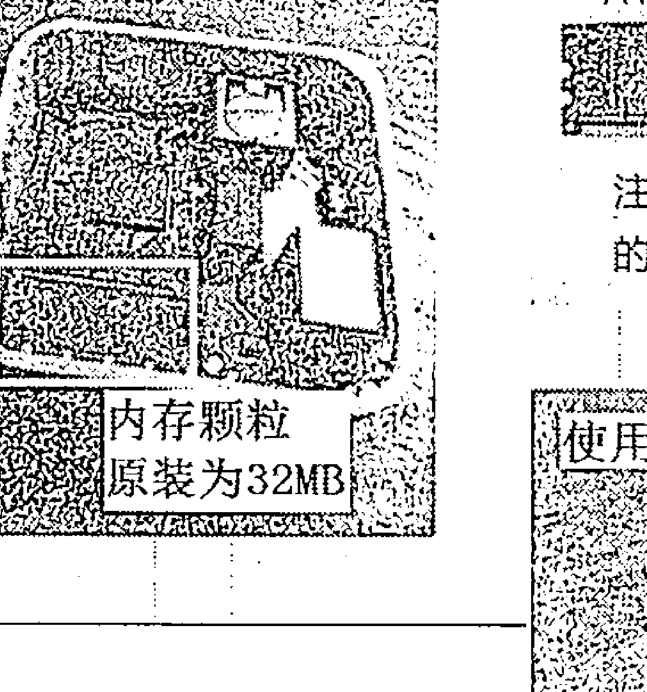

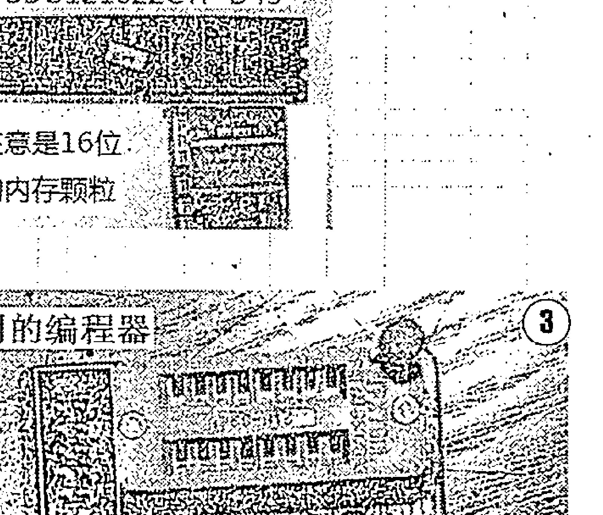

#### 挂载点

| 文件系统 | 挂载点 | 可用 |
|----------|--------|------|
| rootfs | / | 284.80 KB / 512.0 KB |
| /dev/root | /rom | 0.00 B / 6.00 MB |
| tmpfs | /tmp | 29.75 MB / 30.25 MB |
| tmpfs | /dev | 512.00 KB / 512.00 KB |
| /dev/mtdblock3 | /overlay | 284.80 KB / 512.0 KB |
| overlayfs:/overlay | / | 284.80 KB / 512.0 KB |
| /dev/sda1 | /mnt | 6.58 GB / 7.06 GB |

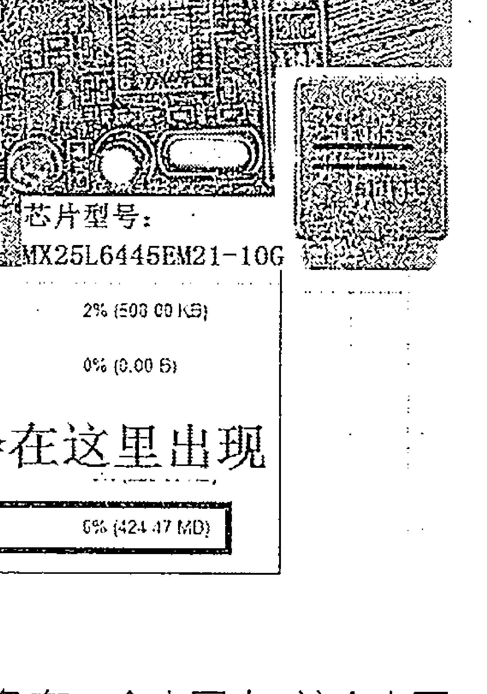

挂载成功后会在这里出现

Step1: 我们先把内存焊接上去。注意芯片的一角有一个小圆点，这个小圆点要和主板上的小圆点对应起来。

Step2: MAC地址为网卡的唯一识别字符，如果两台具有相同MAC地址的路由器在同一区域工作就会产生冲突。如果使用同一个编程器固件刷多台机器，那么所刷出来的路由器都将具有同一MAC地址。

只使用一台703n，不必修改MAC地址：将购买来的8MB Flash芯片放到编程器上直接把附件中的编程器固件刷上去。再将刷好的Flash芯片焊到路由器上。进入路由管理界面，用名为703n.bin的固件升级，勾选“不保留配置”。这样，升级完成。

使用多台703n，改MAC地址：这里给大家介绍使用编程器换MAC的办法。

Step3：改装外置天线，增益信号。详细的改装方案见本刊2012年17期52页《自己动手增益无线网络》。

## 配置软件实现共享和脱机下载

### 设置挂载 实现网络共享

Step1：先将U盘/移动硬盘格式化成NTFS的格式，再将格式化好的存储设备插到703n的USB口上。为方便挂载，建议大家把U盘/移动硬盘分成一个区。这里要提醒大家注意，703n自带的电源是5V/1A的，而移动硬盘的需电量较大，建议外接电源给移动硬盘供电。

Step2：在路由器的管理界面中，点击“系统→挂载点→修改”，在界面中勾上启用挂载项，在挂载点中改为/mnt，将文件系统改为“自定义”，在其中输入ntfs-3g。最后再点击“保存&应用”。

Step3：等待刷新完成后，点击“系统→挂载点”，在已挂载的文件系统的最后一项应该可以看到刚才插入到USB的U盘或者移动硬盘。如果没有看到请重启一次路由器即可（图4）。

Step4：在路由器的管理界面中，点击“服务→网络共享”。在“共享目录”一栏，名称改为download，目录改为/mnt，把“只读”的钩去掉，把“允许匿名用户”的钩勾上，在“新文件权限”和“新目录权限”都输入0777。点击“保存&应用”（图5）。

Step5：关闭路由器的管理界面，双击“我的电脑”，在地址栏中输入\192.168.1.1，就可以看到刚才设置的共享文件夹，默认的是Openwrt，双击就可以进去，也可以向其中传送文件。

Step6：以上五步就可以实现网络共享，接下来在我的电脑中添加网络位置。以下以Win7为例。在我的电脑中的空白处右击，在出现的对话框中选择“添加一个网络位置”，按提示做。在指定网站的位置中，输入\192.168.1.1\download，接下来按提示进行即可。建立成功后会在我的电脑中多出一个网络位置来，这里就是我们设置的插在703n上的U盘/移动硬盘。

### 实现BT/PT脱机下载

Step1：在路由管理界面，点击“服务→Transmission”。在“启用”一栏中勾上钩，将“配置文件目录”改成/mnt/transmission，在“文件位置”中找到“下载目录”一栏将其改成/mnt/download，在“RPC设置”中找到“启用RPC目录”把钩去掉。最后再点击“保存&应用”。

Step2：打开浏览器，输入http://192.168.1.1:9091，点击左上角的图标，在弹出的对话框中点击“浏览”即可上传BT种子，最后点击upload，系统自动开始下载。在左下角，第三个类似扳手的图标是设置图标，在这里可以设置网速、下载时段网速限制等。为了稳定，建议将下载速度进行限速。

Step3：待文件下载完成后，打开我的电脑，地址栏中输入\192.168.1.1，打开其中的文件夹，找到名为download的文件夹，里面就是脱机下载来的文件。

### 实现HTTP、FTP脱机下载

Step1：在路由器的管理界面，点击“系统→启动项”，在“本地启动脚本”中输入`aria2c --event-poll=select --enable-rpc --rpc-listen-all=true --rpc-allow-origin-all --dir=/mnt/download --file-allocation=none -c -D`。点击“提交”，然后再重启路由器（图6）。

Step2：安装Aria2c Remote（附件）。完成后不要打开该软件，将附件中的Aria2cRemoteControl_cn.qm拷贝到安装目录下的Languages文件夹中。打开Aria2c Remote，在菜单栏的Tools中选择Languages，再选择Chinese。点击“工具”，选择“选项”，在远程主机中填入路由器的管理地址，默认是192.168.1.1。在菜单栏中找到图标“添加HTTP/FTP”，然后在弹出的对话框中输入要下载文件的地址即可。

Step3：此时可以关闭该软件，路由器会自动为其下载。待下载完成后，在我的电脑的地址栏中输入\192.168.1.1，打开其中的文件夹，找到download文件夹，里面就会有你下载好的文件。

| 名称 | 目录 | 允许用户 | 只读 | 允许匿名用户 | 新文件权限 | 新目录权限 | 操作 |
| :--- | :--- | :--- | :--- | :--- | :--- | :--- | :--- |
| download | /mnt/download | | | | 0777 | 0777 | 删除 |

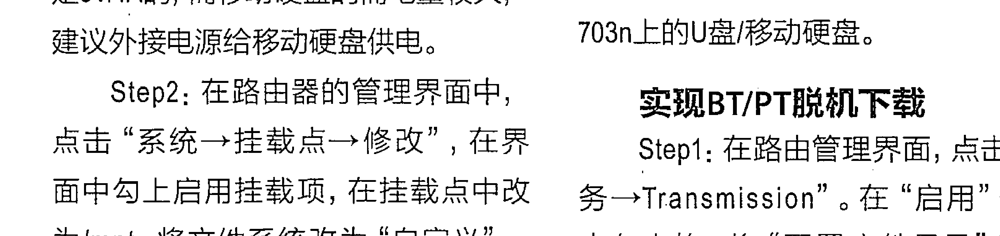

```

# Put your custom commands here that should be executed once
# the system init finished. By default this file does nothing.
aria2c --event-poll=select --enable-rpc --rpc-listen-all=true --rpc-allow-origin-all --dir=/mnt/download --file-allocation=none -c -D
exit 0
```

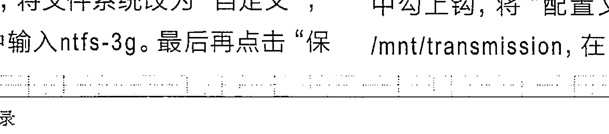

附件下载
http://pan.baidu.com/share/link?shareid=288401&uk=3425986022

## 有网络没网络 远程访问有高招

无论是外出实习还是旅游出差，我们总有在不同地方对PC进行远程访问的需求。针对不同的网络状况，我们该如何进行有针对性的访问？文|俞木发

现在我们的工作和生活越来越离不开网络，很多时候我们需要在不同地方对PC进行远程访问。比如在家或在外地需要对公司电脑进行访问；对于学生朋友，在外实习时需要对宿舍电脑进行访问以提取资料。不过不同地方的网络类型不同，访问的方法也不同。下面我们就结合常见的网络状况介绍都有哪些实用的远程访问方法。

### 情况1: 外网访问外网电脑

- 适合用户：互访的电脑都有外网IP
- 使用工具：系统自带远程桌面工具

### 实例解读: 在家里提取办公室电脑资料

对于很多白领们来说总是有干不完的工作，把工作带回家继续加班是很常见的事情。是不是经常到家了才想起来，需要加班的文档还保存在公司电脑里？现在借助系统自带的“远程桌面”，我们可以轻松在家提取公司电脑里的文档。

1.  公司电脑要保证开机和网络连接，这里以Windows 7设置为例。在公司电脑上新建一个标准用户CFAN并设置密码，右击桌面“计算机”选择“属性”，然后在打开的窗口单击“高级系统设置”，接着切换到“远程”标签，单选远程桌面下的“允许运行任意版本远程桌面连接(较不安全)”（这样方便其他操作系统如WinXP等用户访问），最后单击“选择用户”，按提示添加CFAN为访问远程桌面用户（图1）。
2.  完成上述设置后，以后离开公司时只要不关机，我们在家里上网后，单击“开始→所有程序→附件→远程桌面”，启动该组件后按提示输入公司电脑的IP地址和访问用户名，单击“连接”并输入密码连接即可（图2）。
3.  成功连接到办公室电脑桌面后，文件提取操作就像本机一样，只要打开具体文件夹，然后将所需的工作文档复制到家中电脑即可，完成后还可以顺手远程关机。

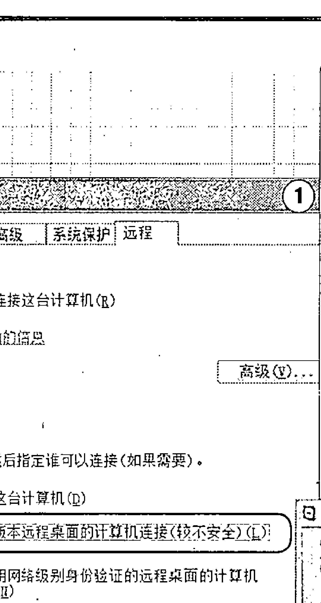

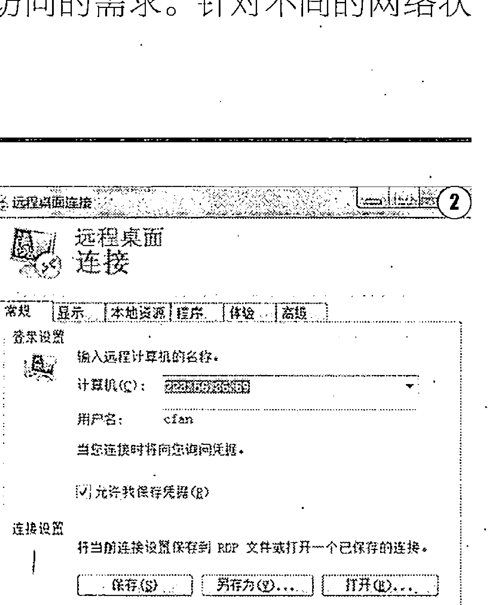

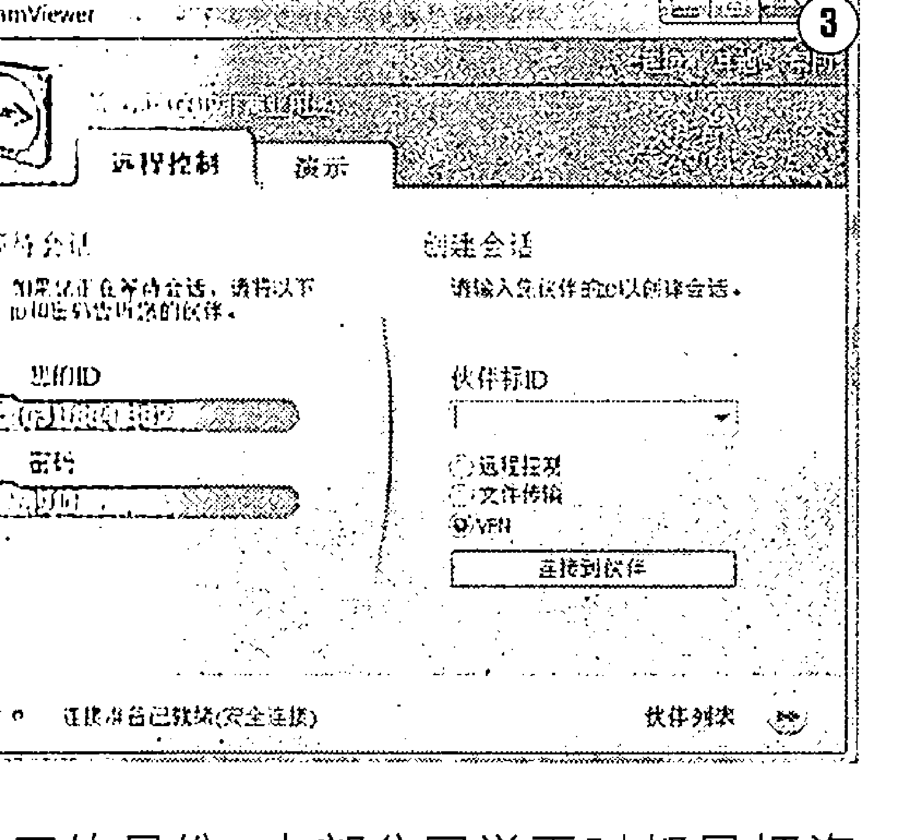

### 情况2: 内网访问内网电脑

- 适合用户：互相访问的都是局域网的电脑
- 使用工具：Teamview
- 软件地址：http://www.teamviewer.com/zh/download/index.aspx

### 实例解读: 在外实习时提取宿舍电脑的资料

转眼间又到了大四学生外出实习的月份，大部分同学平时都是把资料保存在学校宿舍电脑里。在公司实习时，有时是不是要找份资料才想起来资料保存在宿舍电脑里？此时利用Teamview就可以轻松访问宿舍局域网中的电脑。

1.  首先在实习公司电脑和宿舍电脑都安装Teamview，程序启动后会自动为当前电脑分配一个ID和密码，现在分别记住公司电脑和宿舍电脑的ID和密码，Teamview默认会随系统启动（图3）。
2.  在公司电脑上Teamview窗口的“伙伴ID”处输入宿舍电脑的ID，选择VPN服务，然后单击“连接到伙伴”。此时程序会自动提示安装虚拟网卡，按提示安装虚拟网卡后会在各自电脑上生成VPN拨号连接。

### 情况3：移动网络访问电脑

第3步：在宿舍电脑上将保存自己资料的目录设置为共享，以后如果要在公司电脑访问宿舍电脑，先打电话告诉宿舍哥们开启你的电脑并联网。接着在公司电脑上单击TeamViewer窗口的“连接到伙伴”，此时两台电脑都会自动激活VPN连接，成功连接后打开网络连接可以看到新增一个名为TeamViewer VPN的连接。

第4步：在公司电脑上按提示输入宿舍电脑ID对应的密码，成功完成连接后程序会自动弹出连接状态窗口，在这里可以看到宿舍电脑的VPN网络IP地址，即宿舍电脑在这个VPN局域网中的内网地址，类似7.101.136.154，记住这个IP地址。

第5步：在公司电脑打开资源管理器，然后在地址栏输入\7.101.136.154（即宿舍电脑的VPN内网地址），按提示输入宿舍电脑的账户和登录密码，连接后即可打开宿舍电脑进行访问了。具体操作和在公司访问内部电脑是一样的（图4）。

> 小提示
除了上述介绍的外+外和内+内外网络外，生活中常见的网络类型还有内+外（或外+内）网络的互访，这种网络同样可以使用TeamViewer实现互访。如果觉得TeamViewer的操作比较麻烦，我们还可以使用QQ自带的远程协助实现互访，只要准备好两个QQ并互加为好友，然后使用其自带的远程协助就可以访问对方的电脑了，具体操作在此就不赘述了。

- **适合用户**：身边没有电脑，但是有可以上网的手机或者平板电脑
- **所需软件**：安卓远程桌面Remote Desktop

下载地址：http://www.downxia.com/downinfo/22013.html

### 实例解读：在公车上使用安卓手机提取电脑资料到手机上

手机是每个人都会随身携带的通讯工具，现在智能手机的功能越来越强大，除了通话外我们还常用它来处理简单的公务。比如对于很多销售人员来说，他们就经常使用安卓手机向客户展示产品资料。不过是不是经常由于工作的繁忙，上了公车才想起来产品资料忘在公司电脑里？如果你使用的是安卓手机，借助Remote Desktop即可轻松远程访问你的电脑。

第2步：以后如果要在手机上访问公司电脑，只要在安卓手机上启动无线连接（3G用户建议使用3G网络），接着启动Remote Desktop，选择上述新建的服务器，点击Connect（连接），成功连接后就可以看到电脑桌面。现在我们在安卓手机上就可以直接操作电脑了，具体操作就类似Windows之间的远程桌面连接，只不过我们可以使用安卓手机的触摸功能来完成操作（图6）。

第1步：操作同上，在Win7电脑设置开启远程桌面并设置访问的账户和密码。接着在安卓手机上安装Remote Desktop，启动程序后点击“菜单→Add server”，然后依次设置下列参数（图5）：

- **IP地址**：输入公司电脑的外网IP地址
- **用户名**：远程桌面设置的允许访问的账户名称
- **Password（密码）**：远程桌面设置的允许访问的账户
- **Color Depth（色深）**：建议选择8位，因为是手机访问
其他选择默认设置，然后点击Save保存。

> 小提示
Remote Desktop支持触摸和键盘的操作，在程序界面点击“菜单→Keyboard”调出触摸键盘，可以快速执行翻页、上移、弹出开始菜单等操作。点击“菜单→Touch mode”，则可以对触摸的模式进行设置，选择Touch screen，可以实现触摸滚动窗口，对于Win8系统，Remote Desktop还支持Win8的触摸手势。由于Remote Desktop可以通过触摸方式远程操作电脑，我们在家时也可以通过Wi-Fi连接，在床上控制电脑或者直接播放电脑视频。

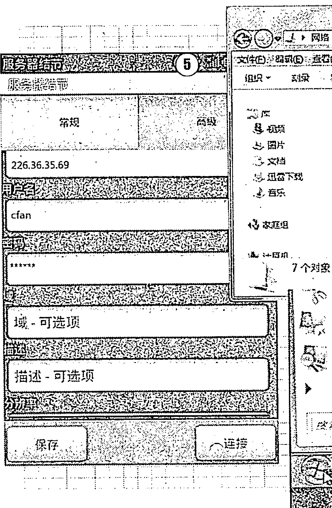

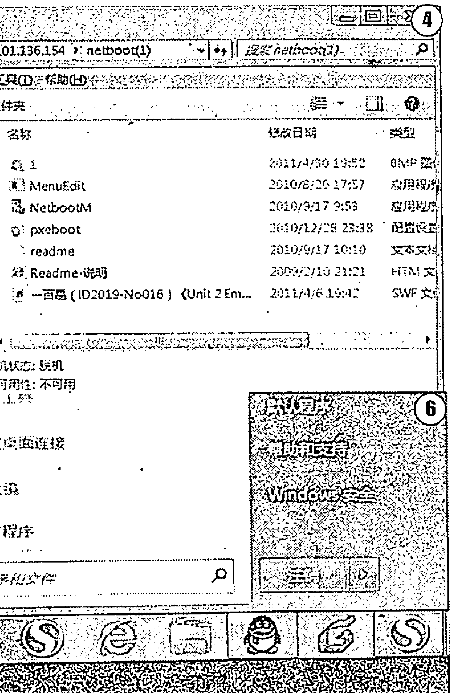

> 小提示
对于手机和PC的远程互访，如果它们在一个局域网内，我们还可以通过Wi-Fi连接实现无线互访。手机访问电脑资料，在电脑上设置好共享目录，通过手机上的“ES文件浏览器”即可访问。电脑访问手机资料，借助安卓版SambaFilesharing，在手机上设好共享，在电脑上即可直接访问。

# 一键实现WinRAR复杂备份

WinRAR功能强大，但对于一次备份多个分区或加密压缩备份等工作，需要多个步骤才能完成，比较麻烦。本文探讨WinRAR实现一键复杂备份的两个案例。

文|陈思远

# 一键实现多分区数据备份

职员小李的电脑硬盘为250GB，划分了4个分区，其中C分区安装了系统和应用程序，D、E、F三个数据分区作为个人资料存储之用。为了防止这块硬盘在使用中损坏而丢失个人数据，小李打算定期将这三个分区备份到一块2TB容量的移动硬盘中，并且希望将三个分区的数据打包成一个RAR文件以便于管理，与此同时，也希望备份工作能够一键完成。机房管理员小陈用如下办法解决了他的问题。

小陈借用WinRAR压缩控制台的一个后台命令RAR，用记事本编写一个只有一句代码的批处理程序，然后将这个批处理程序的快捷方式置于桌面上，需要备份的时候，小李只需点击运行一下这个批处理程序，备份工作就自动进行。

假如要将D、E、F三个数据分区中的所有资料备份到一个压缩文件BACKUP.RAR中，再假设小李的WinRAR安装在C:\Program Files\WinRAR文件夹下。具体实现方法如下：

首先，用记事本建立一个批处理文件BACKUP.BAT，在其中输入如下命令：

```
"C:\Program Files\WinRAR\rar" a -ep3 -r backup.rar d:\ e:\ f:
```

将此BACKUP.BAT程序保存在存放备份数据的移动硬盘中，并给此程序建立桌面快捷方式。

当需要备份的时候，点击桌面上的BACKUP.BAT快捷方式即可。

如果重新格式化了硬盘分区，或换了一块新硬盘且分了同样的四个分区，需要恢复数据区数据，可建立一个用来恢复数据的批处理文件RESTOR.BAT，其中包含如下一条命令：

```
"C:\Program Files\WinRAR\rar" x -ep3 backup.rar
```

将此批处理同样放置在移动硬盘中，并给此程序建立桌面快捷方式。当需要恢复数据时，插上移动硬盘，执行一下桌面上的该批处理程序RESTOR.BAT的快捷方式即可。

需要说明的是，以上两条命令中的-ep3参数扩展路径为包含盘符的完全路径，仅用于Win32版本。参数a表示添加文件到压缩文件，参数x表示用绝对路径解压文件，开关-r表示包含搜索子目录。此外，因为在路径C:\Program Files\WinRAR\rar的中间字符串Program Files中存在一个空格，因此在构造命令的时候，要用半角引号将其引起来，否则会出现错误信息，不能获得正确的执行结果。

# 一键实现加密压缩备份

通常情况下，我们进行个人资料备份多使用WinRAR压缩软件，为了保密起见，在压缩的时候会给RAR文件包加上一个访问密码。但是，设置访问密码的过程需要多步点击进入设置界面设置密码，然后再执行压缩操作，每次都这样做，相对来说比较繁琐。

我们个人设置的文件保护密码一般有一个或几个固定的密码，如果能让这种压缩变得自动化一些，甚至如果可以一键来完成，那么文件的加密压缩备份就会节省不少时间。

借助于WinRAR压缩控制台的加密压缩功能，可以轻松实现上述需求。假设我们要将D盘中的所有TXT类型的文件添加到压缩包secret.rar中，同时要用密码myhoney加密这个压缩包，我们可以采用如下操作方法。

用记事本建立一个批处理文件“文件加密压缩.BAT”，文件内容如下：

```
"C:\Program Files\WinRAR\rar" a -r -pmyhoney d:\secret d:\*.txt
```

将此文件保存在个人的优盘或移动硬盘中，备份时拷贝到D盘一份，执行一下此文件即可。备份完成后，为了防止别人由此文件获知压缩密码，将此文件删除即可。

说明：以上命令中用-p<p>参数压缩时，使用字符串<p>作为密码加密文件。密码大小写敏感。如果在命令行忽略密码，你会看到一个输入密码的提示。

使用如上方法压缩的压缩包，别人虽然不能看到里面的内容，但文件名和文件属性等信息依然可见，还是不够保密。为了更加安全，我们可以用如下命令对以上内容加以改造：

```
"C:\Program Files\WinRAR\rar" a -r -hpmyhoney d:\secret d:\*.txt
```

你会看到，两句命令仅有一个字母之差，但效果会大大不同。

参数-hp表示加密文件数据和头。这个开关和-p类似，但是开关-p只加密文件数据，而使文件名等其他信息可见。开关-hp则加密包括文件数据、文件名、大小、属性、注释和其他块等所有可感知压缩文件区域，所以它提供了更高的安全等级。在压缩文件中使用-hp加密，没有密码甚至不可能查看文件列表。

# 双系统和谐相处有高招

很多朋友都安装了Win7+Win8，如何让它们更好地相处？本文介绍如何取消默认共享和手动设置共享，让双系统相处得更好！

文|平淡

## 打造Win7、Win8独立启动

如上所述，双系统使用的是同一个引导文件和配置文件，这种默认共享方式在启动出现故障时，很容易导致两个系统都无法进入。比如错误对BCD配置文件进行编辑时，由于两个系统使用的是同一个配置文件，如果启动配置出错就会导致两个系统都无法进入。对于这种无需共享的配置，我们可以为Win7、Win8设置独立启动配置。Win7/Win8系统启动主要是c:\bootmgr引导文件和C:\boot引导配置目录，因此我们只要将这些文件复制到Win8所在分区并进行配置即可。假设双系统位置是C:Win7+D:Win8。

第1步：由于C:\boot\bcd文件正被系统使用无法复制。我们先要启动注册表编辑器，然后展开到HKEY_LOCAL_MACHINE\BCD00000000，单击菜单栏“文件→卸载配置单元”，在弹出的窗口单击“是”。接着打开C盘，然后将C:\bootmgr文件和C:\boot目录复制到D盘（两个均为系统、隐藏文件，需要先将文件夹查看方式设置为“显示所有文件”和“显示受系统保护文件”才能进行复制）。

第2步：到http://dwz.cn/cfan11下载所需的文件，下载后将其中的grldr和menu.lst文件复制到C盘根目录下备用。

接着以管理员身份启动下载的bootice.exe，启动程序后单击“主引导记录”，在弹出的窗口选择GRUB for dos 0.4.4 (2009-10-15)，最后单击“安装/配置”，最后在弹出的窗口单击“写入磁盘”，将当前硬盘主引导记录设置为Grub启动。

第3步：返回bootice.exe窗口，切换到“BCD编辑”选项卡，单选“其他位置的BCD文件”，单击“浏览”选择D:\boot\bcd文件，接着单击“查看→修改”，在弹出的窗口将原来的系统菜单全部删除，接着点击“添加→Windows Vista/7/2008”启动，按下列的提示添加Win8启动（图1）：启动分区：分区4（第一逻辑分区即安装Win8的分区，这里为D盘）名称：Windows8其他选项选择默认，依次单击“保存当前系统设置”和“保存全局设置”退出。

第4步：这样就完成双系统的独立启动，由于Menu.lst里设置的默认启动仍为原来的Win7，默认的启动和原来一样。如果现在错误编辑C:\boot\bcd导致Win8无法启动，我们只要在开机多重菜单选择Win8，这样grldr会启动D盘的bootmgr，然后读取D:\boot\bcd启动配置信息，启动D盘的Win8系统，改造前后比较见图2所示。

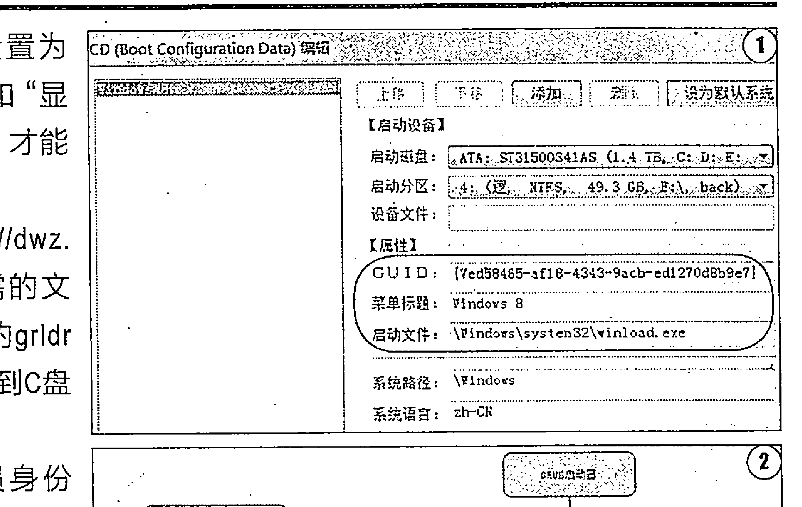

菜单选择Win8，这样grldr会启动D盘的bootmgr，然后读取D:\boot\bcd启动配置信息，启动D盘的Win8系统，改造前后比较见图2所示。

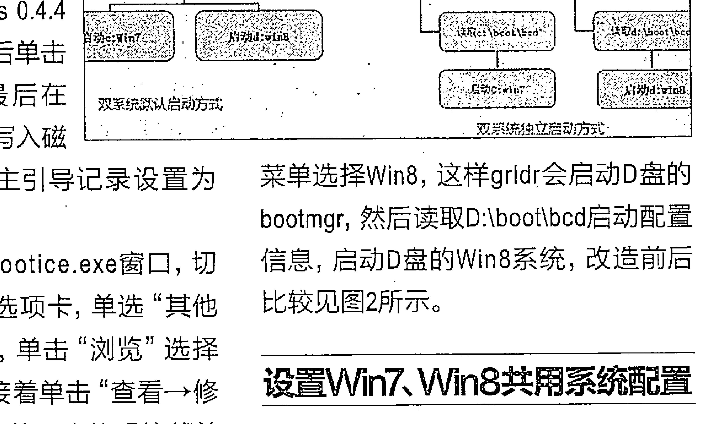

## 设置Win7、Win8共用系统配置

如上所述，作为相对独立的系统，两个系统分别拥有独立系统配置。这样一是占用系统空间大，比如笔者的电脑上每个系统的虚拟内存文件就达3.25GB，二是不方便管理，比如两个系统都有临时文件夹，在清理系统垃圾文件时需要同时对着两个目录进行清理。其实对于很多系统设置，我们可以让两个系统共用一个文件，既可以减少硬盘空间的占用，又可以更高效地对双系统进行管理。

### 共用虚拟内存文件

进入Win7后，右击桌面“计算机”图标选择“属性”，在打开的窗口单击左侧“任务”下的“高级系统设置”打开系统属性窗口，单击“高级”标签。单击“性能”选项下的“设置”，在打开的窗口单击“虚拟内存”下的“更改”按钮，接着在弹出的虚拟内存设置窗口去除“自动管理所有驱动器的分页文件大小”前的勾选，选中C盘，单选“无分页文件”，然后单击“设置”。操作同上，选中D盘后，单选“系统管理的大小”，将Win7的虚拟内存设置到Win8安装分区即可。这样两个系统就共用一个虚拟内存文件了（图3）。

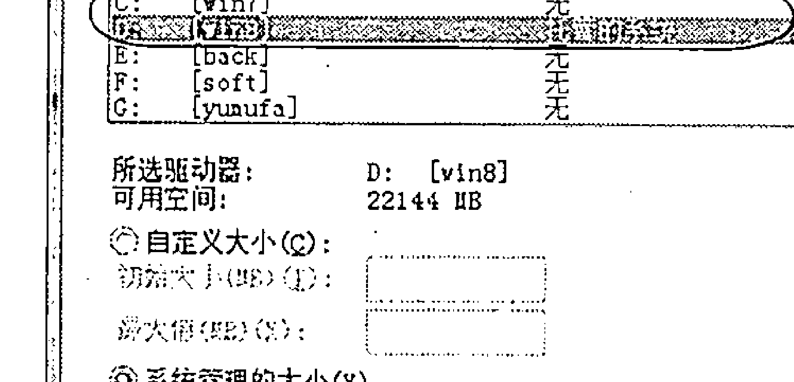

### 共用IE临时缓冲文件夹

为了方便清理缓冲文件，我们可以将双系统的IE临时缓冲文件夹指向第三分区。首先在E盘新建Internet目录，接着在Win7启动IE，单击“工具→Internet选项”，打开选项设置窗口后，单击“浏览历史记录”下的“设置”按钮，接着单击“移动文件夹”，把临时缓冲文件夹指向到E:\Internet。操作同上，进入Win8也执行同样的设置，这样双系统就共用同一个临时缓冲文件夹了（图4）。

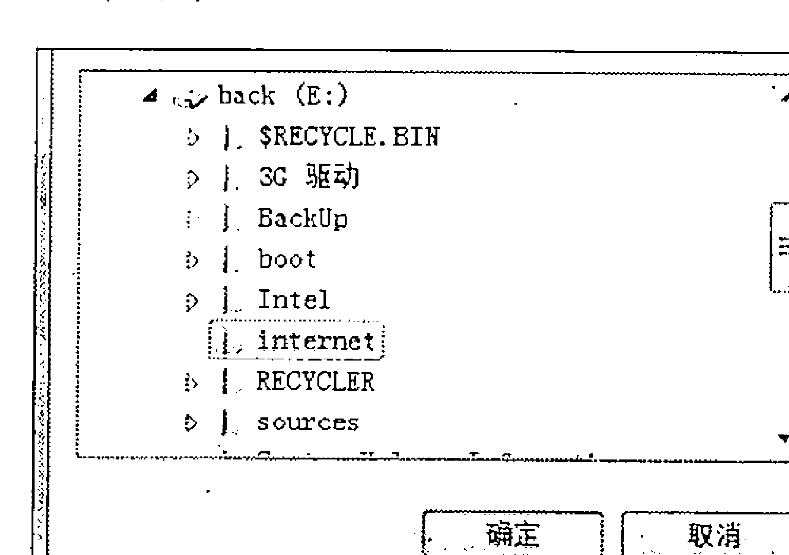

### 共用临时文件夹

临时文件夹存放着系统很多垃圾文件，我们可以让双系统共用一个临时文件夹，既可以节省系统空间，同时也方便清理垃圾文件。同样在E盘新建TEMP目录，进入Win7后，右击桌面“计算机”图标选择“属性”，在打开的窗口单击“任务”下的“高级系统设置”打开系统属性窗口，单击“高级”标签。接着单击窗口下方的“环境变量”，然后选中变量下的TEMP，单击“编辑”，将其位置设置为E:\temp。同样的进入Win8后，也将这个系统的TEMP位置设置为E:\temp即可（图5）。

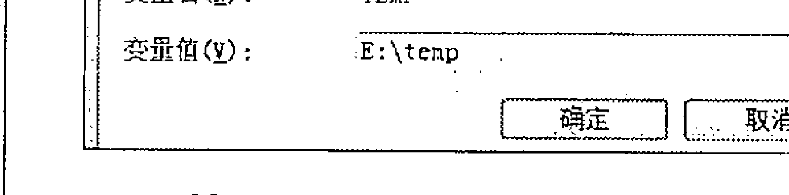

### 共用程序

为了方便使用，我们经常要在两个系统安装应用程序。其实很多程序在双系统都可以使用，这样在一个系统中安装即可让另一个系统调用。比如，在Win7装WinRAR后，进入Win8双击任意一个.rar文件，系统弹出“打开方式”窗口后，勾选“始终选用选择的程序打开这种文件”，单击“浏览”，选择C:\Program Files\WinRAR\winrar.exe打开.rar文件。这样在Win8中就可以使用WinRAR打开压缩文件。其他程序的共用操作类似，对于Maxthon、Foxmail绿色软件，在Win7中安装后进入Win8，只要在Win8桌面建立上述软件的快捷方式即可共用。对于与当前系统紧密结合的软件，则建议使用网友制作的绿色版。

### 更多共用设置

除了常见的系统设置和程序外，我们还可以根据自己的需要设置更多的共用设置。比如将两个系统中的迅雷下载目录设置为同一目录、将两个系统的IE收藏夹设置为同一个，将两个系统的个人账户目录均指向同一个目录，这样双系统使用起来更为方便。

## 双系统常见问题Q&A

> Q：为什么安装完双系统后，在使用Win7备份恢复系统后会出现无法启动Win8的故障？

A 这主要是由于两个系统使用不同版本的bootmgr所致，Win8的版本要比Win7高（但是向下兼容引导Win7）。在使用Win7备份恢复系统后，Bootmgr使用的是低版本引导文件，导致引导Win8会出现文件签名错误。解决方法一是进入Win7使用Win8安装光盘下bootmgr替换C盘同名文件，二是使用本文介绍的方法在系统正常时，将C:\bootmgr复制到D盘以实现Win8独立启动。

> Q：双系统都启用了系统还原，为什么进入另外一个系统后，原来系统的还原点就会消失？

A 这是因为，两个系统的还原点都存放在分区根目录的同一文件夹下，只要创建过还原点，另一系统相同分区的还原点就会被破坏。解决方法只能是暂时关闭其中一个系统的还原功能。关闭系统还原的系统可以使用Win7/Win8自带的“创建系统镜像”来备份系统。

> Q：在多重启动菜单选择Win7或者Win8时，为什么会出现提示加载winload.exe错误？

A 默认情况下选择启动菜单后会自动加载“系统分区\windows\system32\winload.exe”文件，出现这个错误的原因是由于BCD配置文件错误。比如电脑添加了新的硬盘，或者对分区进行了更改，导致BCD配置文件中指向的启动分区出错。解决方法可以借助bootice.exe对BCD进行编辑，重新指定正确的引导分区即可。

要让双系统和谐相处，首先是要了解各系统的引导方式，这样通过一些多功能引导器，我们就可以实现双系统的各自引导（比如GRUB也可以用于引导Ubuntu等Linux系统，通过安装变色龙可以引导MAC系统）。其次是要了解每个系统的设置，然后根据具体设置实现共享。比如Windows和Linux系统虽然系统分区格式不同，但是它们都支持FAT格式分区，这样对于这类双系统就可以设置一个FAT分区用于共享。

### 小提示

由于Win7、Win8均默认开启UAC防护，因此对于需要管理员权限运行的公用程序，在另一个系统第一次使用时，需要使用管理员身份运行一次。比如WinRAR、7Zip这类需要关联文件打开方式的程序，在另一个系统以管理员身份运行后才能完成文件打开方式的关联。

# 如何获取免费的离线下载资源

以迅雷为代表的离线下载服务确实能大大提高下载速度，但多数离线下载服务需要付费会员才能享受到。然而，天下也有免费的午餐。

文|彭家进

## 百度网盘

百度静悄悄地开发了百度网盘这个服务，它是一个做得不错的网盘。初始网盘大小为5GB，一般的下载任务都能胜任。其中最具有革命性的就是增加了离线下载的功能。

1. 打开http://pan.baidu.com，使用百度账号登录。无账号者需要先注册账号。

2. 登录后，将会有一个非常经典的网盘界面。而离线下载的按钮在右上角，将鼠标移动到该按钮上，会有“新建离线下载”的提示，点击之（图1）。

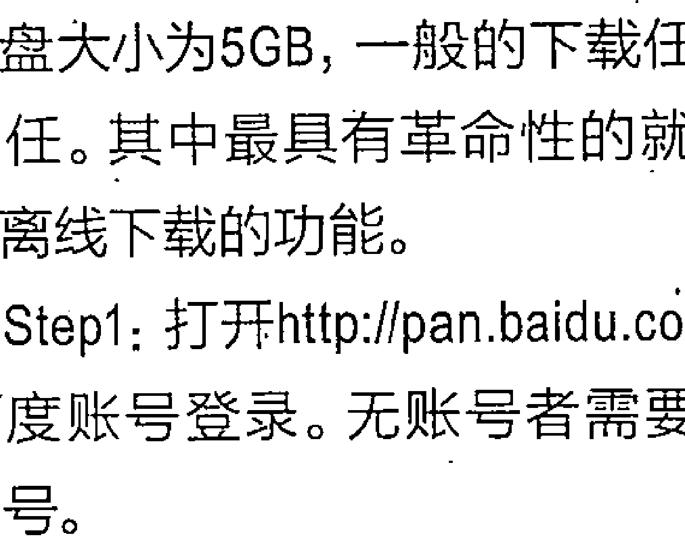

3. 弹出新建离线下载的窗口后，将要下载的文件地址粘贴上去并确定即可。

那么，如何找到文件的下载地址？

找到需要离线下载的文件后，点击下载，浏览器便会调用与其关联的下载工具进行下载。在下载工具的新建任务中就能找到下载网址。

迅雷的下载地址比较隐蔽，藏在标题栏里（图2）。QQ旋风则比较明显（图3）。其他的下载工具都大同小异。但是需要注意的是，百度网盘只支持HTTP/FTP的地址，这就意味着BT、磁力链接都不可以使用该方法下载。还有部分专用链接，则可以通过下载地址转换工具转换成HTTP的网址格式来下载。

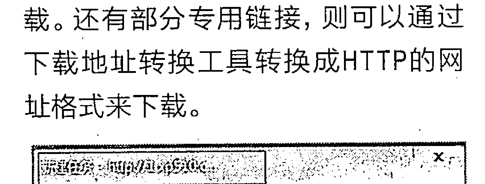

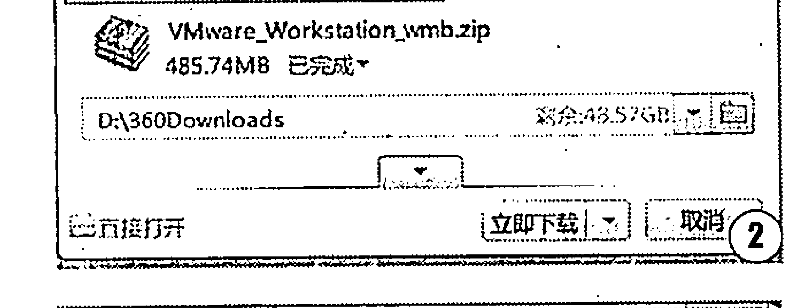

4. 等到百度网盘离线下载完成后，右键点击下载完成的文件，选择“下载”。

## 115网盘

115网盘的初始大小可以达到15GB。离线下载功能是新出的，使用时需要排队，但经过实测，排队时间并不长，对使用影响并不大。但是想下载快点的话还得使用优蛋来下载，否则只能用单线程下载。

1. 打开http://115.com/，使用已有账号登录或先注册新账号再登录。

2. 离线下载的按钮在“上传文件”的右边，点击之。

3. 点击“添加任务”，在添加离线任务的窗口中输入下载地址。当链接被检测为可用时，将可以离线下载。

## QQ旋风

相对于前面提到的，QQ旋风提供的是免费90天试用，离线下载有个要求，就是QQ等级必须达到8级。这个等级限制并不大。达到要求的都可以到http://act.vip.qq.com/xuanfeng/act.html申请。

1. 到http://act.vip.qq.com/xuanfeng/act.html申请资格，并下载QQ旋风。

2. 使用QQ旋风下载文件，在正在下载的文件里点击右边的离线加速按钮，即可进行加速。

上面说到的离线下载都是PC端上面的，那么“爪机党”岂不是被轻易地无视了？当然不是啊，都说今年的智能机销售数量可能达到两亿部，可以从此推断手机这高科技盒子越来越普及。要是手机的离线下载都没有，那怎么好意思说是全民离线下载呢？

## QQ浏览器

QQ浏览器的离线下载其实是与QQ网盘、中转站联系在一起的，离线的空间大小自然是中转站+QQ网盘的大小了。只是中转站的文件存储有期限，要搬回本地就要快点喽。

1. 点击要下载的文件，浏览器会弹出文件下载窗口，选择存至网盘。

2. 选择保存到网盘之后，会有提示“去网络硬盘提取文件”，然后你就可以到网盘下载文件了。

有了这些免费午餐后，全民进入全速下载时代，手机电脑都很忙！

# Reader退休 RSS阅读谁接班

Google Reader7月份就要彻底关闭了，但是还是有不少RSS用户，怎么办呢？其实同类软件或服务有很多，让我们帮你挑选最有潜力的替代者。

文|周蓓蓓

### QQ邮箱接管Google Reader

QQ邮箱中就有RSS阅读工具，只是很多用户没有留意而已。登录自己的QQ邮箱，单击左侧的“阅读空间”按钮切换页面（图1），单击“从Google Reader导入”按钮会自动连接到Google Reader，输入Google Reader的用户名和密码，连接后会自动从Google Reader中导入已有的RSS频道。单击“设置”按钮，切换到“订阅管理”选项可以分类管理RSS频道，切换到“导入导出”选项，可导入或导出RSS频道，非常方便。

### OutLook 2013也能订阅RSS

Outlook是很多办公人员必备的邮件收发利器，如果习惯在客户端订阅RSS，那么在Outlook中同样可以轻松完成。

首先登录Google Reader (http://www.google.com/reader)，单击“Download your data through Takeout”切换到Takeout，单击“存档”按钮切换到下载页面，单击“阅读器”下的“下载”按钮保存频道文件，打开频道文件压缩包，里面会有一个xml文件，这里面包含了Google Reader中订阅的频道，可以在一些软件中导入，从而实现RSS频道分享。

打开Outlook 2013，右击“RSS源”选择“导入OPML文件”（图2），然后打开导出的xml文件，单击“下一步”按钮全选所有RSS频道，再单击“下一步”按钮即可将RSS导入Outlook中了。

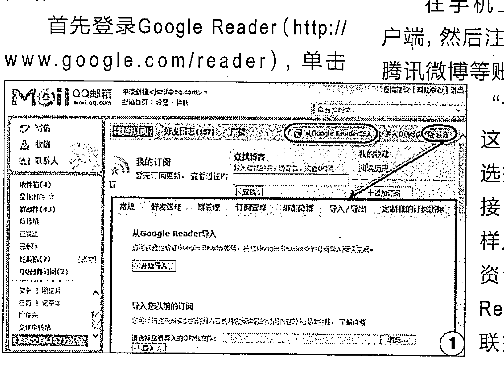

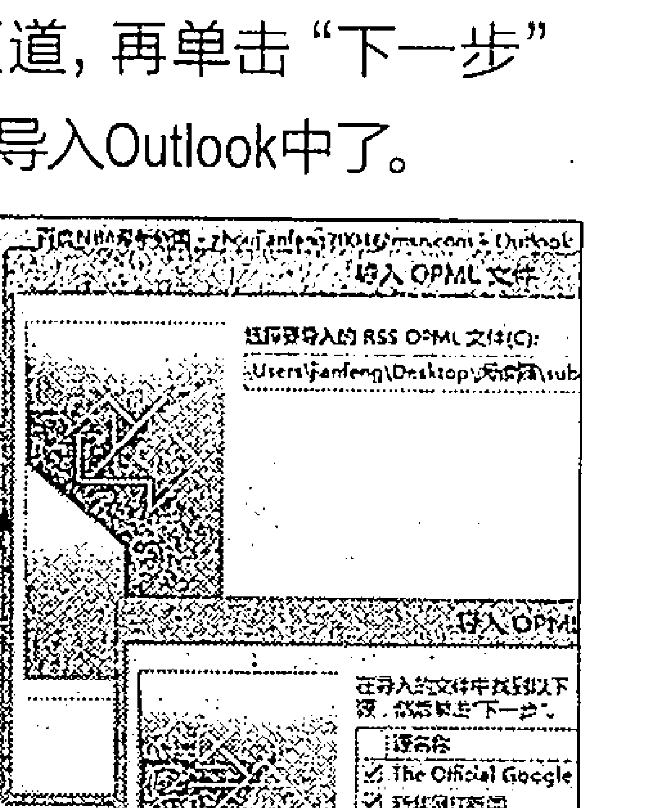

打开鲜果网页端http://xianguo.com/reader，可以直接导入Google Reader中的频道，也可以导入Google Reader输出的xml文件，跟上面两种方法非常相似。

### 常用RSS阅读工具对比

现在RSS订阅工具还有很多，下面我们为大家列出软件的一些关键功能，便于读者选择适合自己的工具。

| 测试项目 | QQ邮箱 | Outlook | 鲜果 | 有道 | 抓虾 |
| :--- | :---: | :---: | :---: | :---: | :---: |
| 第三方账号登录 | × | — | √ | × | × |
| 推荐订阅 | √ | × | √ | √ | √ |
| 频道分类 | √ | × | √ | √ | √ |
| 关键字检索 | √ | √ | × | × | √ |
| 导入或导出频道 | √ | √ | √ | √ | √ |
| 订阅博客或QQ空间 | √ | × | √ | × | × |
| 直接导入Google Reader频道 | √ | × | √ | × | × |

### 鲜果，在手机上订阅RSS

RSS同样可以在手机上订阅，相关的软件也有不少，鲜果就是其中佼佼者，它提供了网页端和移动客户端，可以同步里面的数据，非常方便。

在手机上安装“鲜果联播”客户端，然后注册账户或用新浪微博、腾讯微博等账号登录，选择右上角的“订阅中心”切换界面，在这里可以在分类中订阅，选择“订阅管理”，然后直接选择所需RSS频道，这样只要有网络就可以查看资讯了。如果要将Google Reader中的频道导入鲜果联播中，可登录鲜果网页端操作。

### 结束语

在我获悉Google Reader即将关闭之后，特地寻找和测试了一些RSS订阅工具和网站，结果不太乐观。跟以前相比，RSS的确正在走向没落，特别是电脑客户端软件，基本上都不再更新，究其根源还是因为无利可图。因此RSS阅读工具以网站为主，在线订阅可以给网站带来流量，从而获得收益。对于QQ或网易的用户来说，QQ邮箱和有道阅读使用还是方便的，对于那些常用Outlook来收发邮件的用户来说，则RSS订阅就无需第三方工具了，对于那些追求时尚的年轻人来说，鲜果在移动端的表现还是不错的，值得选择。

# Tasker给手机智能“升级”

文 阿木

智能手机的一个重要特性就是扩展性好，但前提是需要好的软件支持。本文介绍如何利用系统增强软件Tasker来提升安卓手机的智能性。

任何手机，我们都不可能百分之百的满意，毕竟手机是为了给大多数人使用的，不可能完全针对某一个人进行优化。但是，如果使用的是安卓手机，有了神器Tasker（试用下载：http://tasker.dinglisch.net/，网上有汉化版），我们就可以自己定制各种个性化的功能，从而方便自己的使用。

Tasker的工作原理说来简单，就是软件根据一定的条件（如打开或关闭特定程序、日期时间、位置GPS、来电、各种设备状态等），来自动执行一些特定的任务（如一键锁屏、静音等）。它没有编程软件那么复杂，但具备一些类似编程的功能。下面我们介绍一个实例，大家可以举一反三。

### 实战：会议时手机自动静音

参加会议时一般要将手机铃声设置为静音，但有时可能因为忙碌而忘记了设置，当老板正在讲话时，你的手机却铃声大作，那得有多尴尬！借助Tasker，我们可以设定进入特定位置（如单位会议室）时自动静音，你就不用担心开会时手机会响铃了。

第1步：首先开启手机数据连接，接着到会议室位置在手机上启动Tasker后切换到“配置文件”，点击“+”，按提示新建一个名为“会议室”的配置文件，接着在弹出的“第一条件”对话框中点击“位置”（图1）。

> 小提示 选择操作类别是指激活的任务，可以看到程序支持非常多的自定义任务，大家可以自己的实际需要设置多个同时运行的任务。比如会议室如果有Wi-Fi热点，那么可以选择其中的网络任务，实现在设置振动模式同时关闭手机数据连接，自动开启Wi-Fi连接会议室热点。

第2步：在弹出的谷歌地图窗口中，关闭GPS定位，仅启用基站定位，因为GPS在室内一般无信号。点击地图窗口右下角的定位图标，定位当前会议室的位置。由于软件使用基站定位，一般城区移动信号覆盖都在500米左右，因此半径大小设置为500米，最后点击Done（即绿色勾选图标）确定设置。这样下次如果你到了会议室所在位置，软件就会自动激活设置的任务（图2）。

第3步：在弹出的新建任务窗口点击“新建任务”，新建一个名为“自动震动”的新任务，接着在弹出的窗口中点击“添加”，再在弹出的“选择操作类别”列表中点击“音频”，然后在弹出的列表中选择“静音模式→震动”，完成上述设置后依次点击Done完成设置（图3）。

第4步：返回配置文件窗口，长按左侧窗格新建任务，在打开的窗口选择“添加退出任务”。操作同上新建一个“恢复铃声”任务，然后在“音频”列表选择“铃声音量→恢复正常音量”（图4）。

第5步：完成上述的设置后，Tasker所创建的任务会在后台静默运行（展开通知栏可以看到活动的配置文件）。如果我们参加公司的会议，只要走到会议室所在的基站半径，Tasker就会自动将手机设置为“静音”，一旦走出会议室所在的基站半径则又会自动恢复正常的音量，你的手机是不是智能多了呢？

上述只是一个简单的音量调整的例子，实际上Tasker可以设置出更多、更复杂的智能操作。比如为了节约流量，很多人在家里使用Wi-Fi上网，但是默认情况下我们需要到家后开启Wi-Fi连接才可以使用，现在只要在Tasker中设置一个家里的地理位置配置文件，执行的任务是“Wi-Fi→开启”，“数据连接→断开”，这样到家后会自动连上Wi-Fi，同时关闭数据连接。

还有，比如将距离感应器感应到遮挡、手机重力方向为直立和没有指定的程序在前台运行这三者作为“条件”，将加载“一键锁屏”作为“任务”，就可以达到手机竖直放进口袋时自动调用“一键锁屏”进行锁屏的操作，是不是方便许多？

更多的应用大家可以参考Tasker帮助，设置出更符合自己使用的新任务。

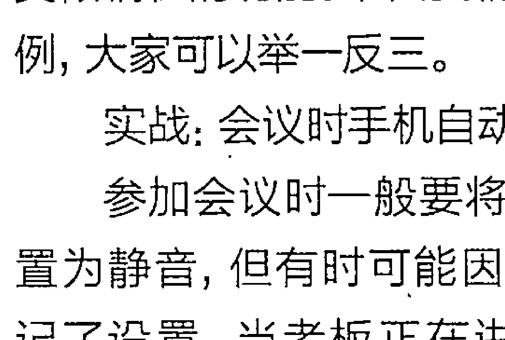


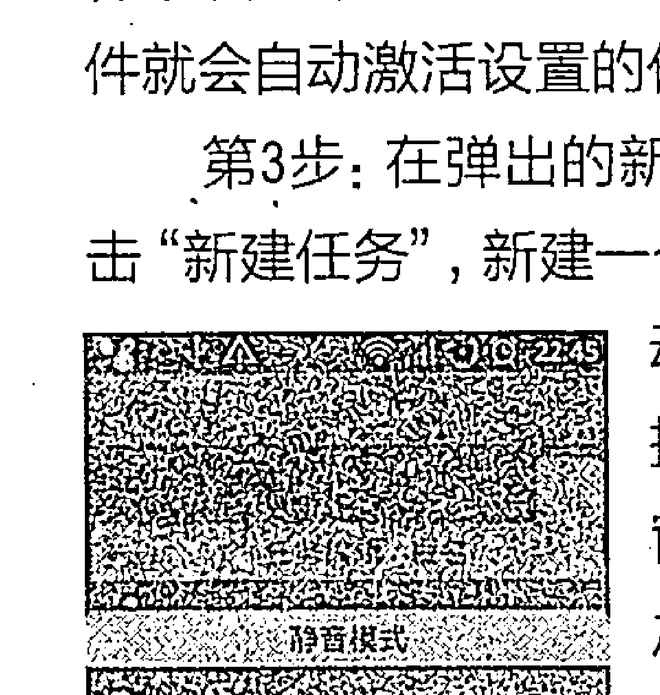

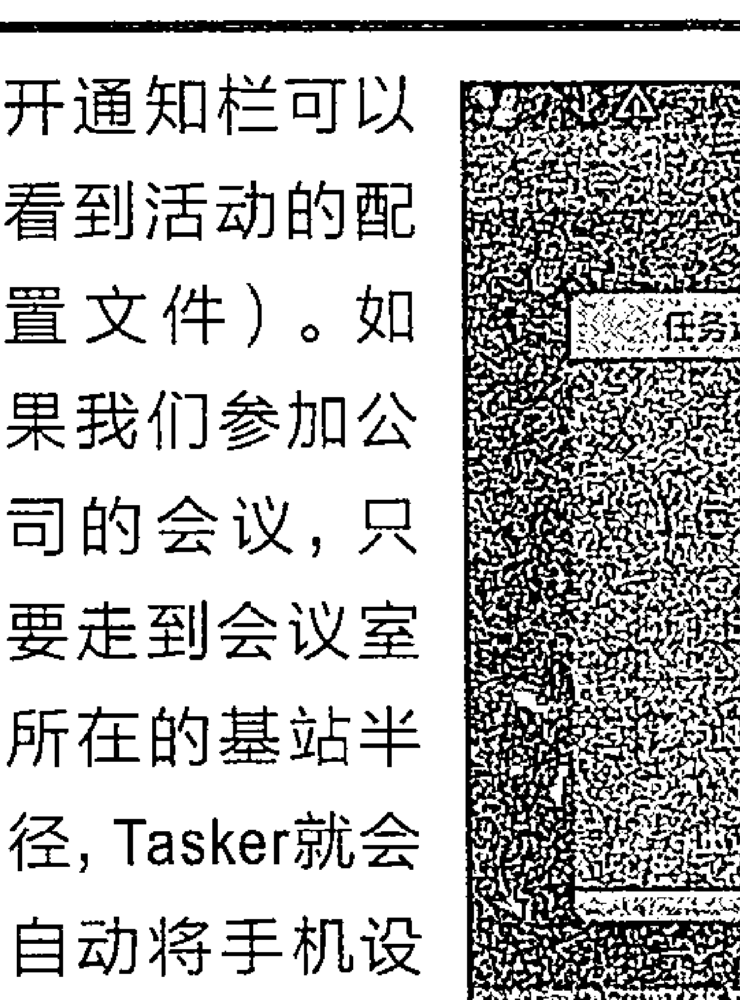

# 磁盘空间大小轻松搞定

有时你可能需要在保全数据的情况下对电脑各磁盘的空间大小进行调整，但很多软件都不能对C盘进行空间大小进行调整，不过使用“分区助手”可以解决问题。

文/马震安

同事小王的电脑硬盘分了4个分区，分别为C、D、E、F。C盘（29.3GB）主要安装操作系统和一些应用程序，D盘（114.75GB）存放了他日常收集的一些影视作品及MP3，E盘（114.74GB）存放了一些生活照片和个人资料，而F盘（206.96GB）则存放的是系统备份及常用软件备份。由于他安装应用程序时，一般情况下选择的都是默认安装目录，导致C盘的空间有些不足了，同时D盘空间也已经剩下几百MB了。因此，他想把F盘上的一些空间调整给C盘和D盘。

小王想到了大名鼎鼎的分区魔术师软件。说干就干，下载、安装、运行、调整。不行，分区魔术师对其他盘的空间还能调整大小，可是对C盘大小的调整就无能为力了。那怎样才能在不损坏F盘数据的情况下，将多余空间划分给C盘和D盘呢？

### 一步完成扩容分区选择

首先，从http://www.disktool.cn/download.html下载、安装并运行一个“分区助手”软件。若想把F盘的20GB调整给C盘，正常的步骤一般需2步：一是将F盘的20GB分离出来，二是再把分离出来的空间合并到C盘。但分区助手将此过程整合成一步来完成。

通过分区助手主界面一目了然地可以看到，C盘有29.3GB，而F盘还有181GB空余空间。现在要做的就是将F盘的20GB转移到C盘。

如果想将F盘的20GB空余空间移动到C盘，并且F盘和C盘上的数据都无损坏，直接点击分区助手左侧向导的“扩展分区向导”，这就是最关键的一步。“扩大选择”有两项，分别是“扩展系统分区”和“选择你想扩展的分区”。在这里我选择第二项，然后选择分区C，其实直接选择扩展系统分区也行（图1）。

然后，点击“下一步”按钮。因为我要把指定分区的部分空闲区域划分给C盘，所以在弹出的窗口中千万不要勾选“扩展分区的自动模式”。分区助手先问你要扩展什么分区，然后才问你挪用哪个分区的剩余空间，而不是先问你把哪个分区的剩余空间割下来。这里当然是选择还有181GB未使用空间的F盘，接着点击“下一步”（图2）。

### 任意调整磁盘空间大小

接下来，在窗口中输入C盘分区的大小，原来C盘是29.3GB，给它增加20GB，就成了49.3GB，当然也可以输入50GB。这也是分区助手比较人性化的地方，就是让你随意设定C盘的大小，只要F盘剩余空间足够多的话（图3）。

继续点击“下一步”按钮。到此，要做的操作已经基本上规划好。最后，只需要按“执行”按钮，所有的操作都是全自动完成，你只需耐心等待。等待一段时间之后，看看你的C盘空间是不是增加了呀？如果你觉得此次的无损分区不够完美，C盘的空间需要重新调整，那么这一步是最后的后悔药（图4）。

将F盘的多余空间划分给D盘的操作和上述步骤大同小异。

### 小提示

没有任何一个分区软件能100%保证做到安全无损分区，因为各种不测的风险总是会存在的。无损分区不成功导致硬盘数据全毁并非没有先例，因此无损分区的前提，最好先把原来硬盘上的重要数据备份好。

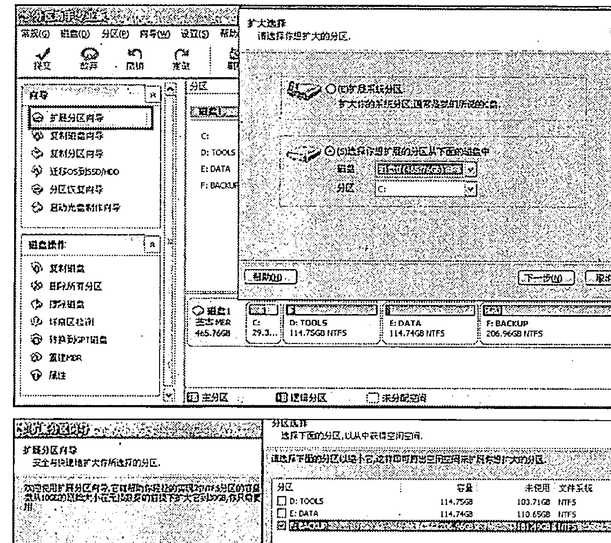

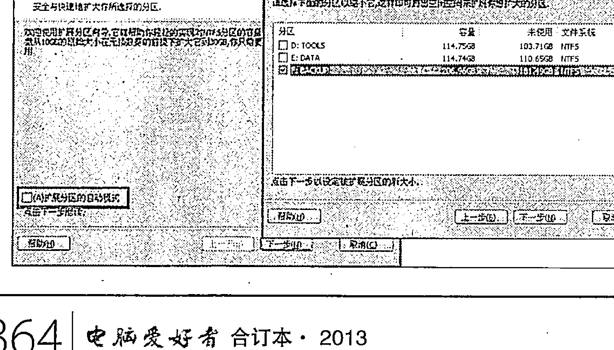

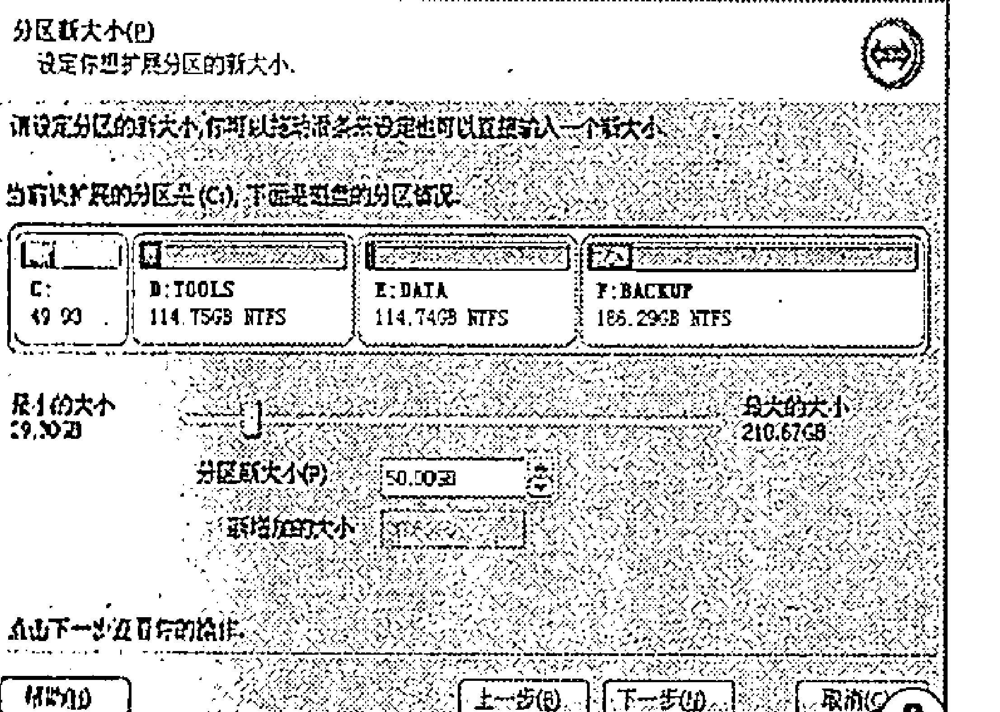

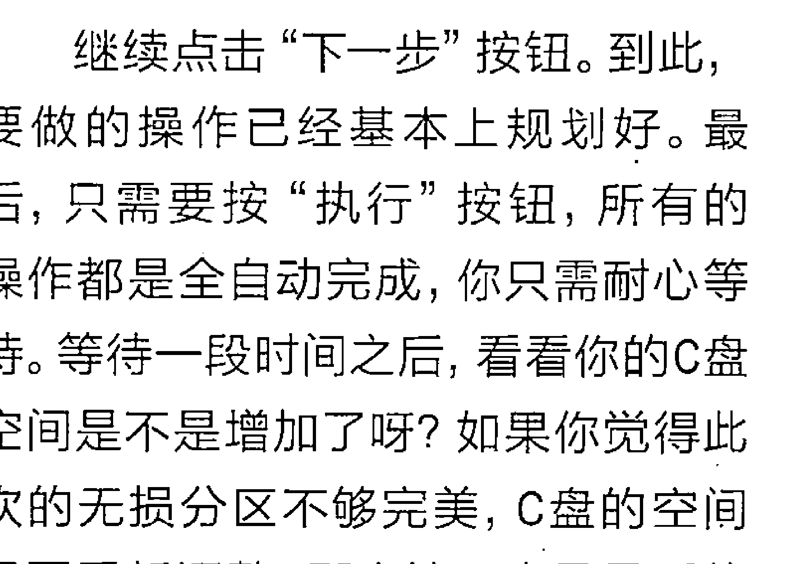

# 中文数字“○”输入方法多

中文数字“○”在许多场合都可以见到，然而版面排出来多为“四不像”，它掉在汉字堆里，或变成鸡蛋，或粗细不一，或大小不一。那么如何才能排出规范的“○”来？

文|王杰

在汉字王国里，原本是没有“○”字的。1973年出版的《现代汉语词典》作为词条之一，开始有了“○”字。从此，中文小写数字“○”被认定为是一个汉字，它要用在年份中，比如，二○一一年。然而，由于“○”字在电脑输入中的不便性，许多人在输入“二○一一”时就用阿拉伯数字“0”或字母“O”来取代“○”，这看上去有些别扭。在此，笔者就“○”字的输入方法做一简单总结。

### 软键盘法

要输入“○”字，大家应该首先选择这种方法，因为所有中文输入法的状态条上都有一个软键盘按钮，请右键单击该按钮，然后单击“特殊符号”（图1），在打开的软键盘中“T”对应的即是“○”字（图2）。

| PC键盘 | 标点符号 |
| 希腊字母 | 数字序号 |
| 俄文字母 | 数字符号 |
| 注音符号 | 单位符号 |
| 汉语拼音 | 制表符 |
| 日文平假名 | 特殊符号 |
| 日文片假名 | 用户符号 |

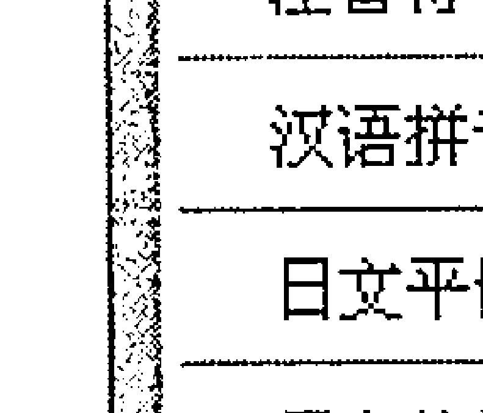

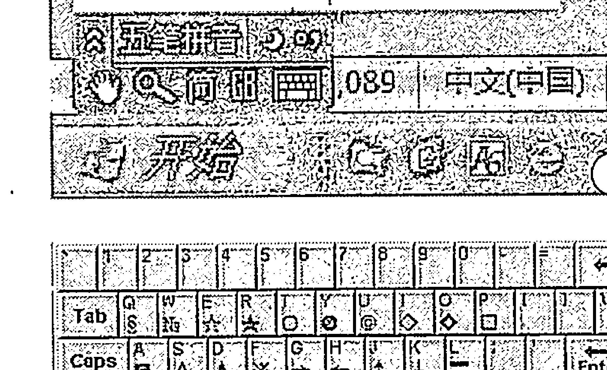

此时，单击软键盘中的“T”或按下键盘上的“T”键皆可输入“○”字。

输入完毕，单击输入法状态条上的软键盘按钮关闭软键盘。

### 拼音输入法

如果你不喜欢软键盘法，则第二选择当然是拼音输入法了。既然“○”的读音为“líng”，所以在许多拼音输入法，比如微软、紫光、搜狗等拼音输入法中，你可以直接使用拼音ling输入“○”字。当然，通常要往后翻页才能找到“○”字（图3），而且不是所有拼音输入法都提供这个“○”字。

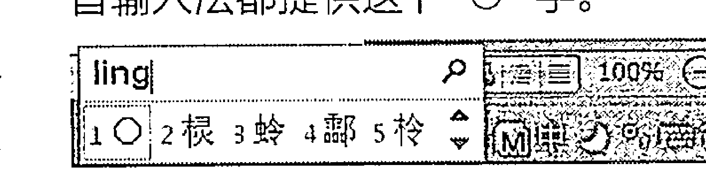

### 智能ABC法

Windows系统自带的智能ABC输入法是不少人喜欢使用的。在智能ABC输入法中，要输入“○”字，可以键入“i0”（0是数字）并按下空格键。而且，键入“i2011n”并按空格键可直接得到“二○一一年”。

### ASCII码输入法

每个字符在电脑系统里都有相对应的ASCII码，只要按下Alt键和它对应的编码的数字键就能把字打出来了。“○”字对应的ASCII码是41456，所以要输入“○”字，可进行如此操作：按住Alt键，再按数字小键盘上的41456（不能使用主键盘区中的数字键），松开Alt键。要使用数字小键盘上的数字键，需要NumLock处于打开状态。由于在Word中按下Alt键会激活菜单栏（Word 2003）或在当前视图中每个可用功能的上方都显示键提示（Word 2007/Word 2010），所以该法不能够在Word文档中输入“○”字。

### Word插入法

Word提供的符号集中就包含了“○”字，可以直接将它输入到文档中。比如，在Word 2010中要输入“○”字，具体操作是：

1.  单击“插入”选项卡，单击“符号”组中的“符号”，然后单击“其他符号”。
2.  单击“符号”选项卡，在“字体”框中，选择“（普通文本）”，在“子集”框中，选择“几何图形符”，然后在符号列表中，单击“○”（图4），最后单击“插入”按钮。


此外，如果要在Word文档中输入日期，可以如此操作：在“插入”选项卡中，单击“文本”组中的“日期和时间”，然后在“可用格式”下选择所需的日期格式（图5），单击“确定”按钮，即可按选择的格式将当前日期插入到文档中。

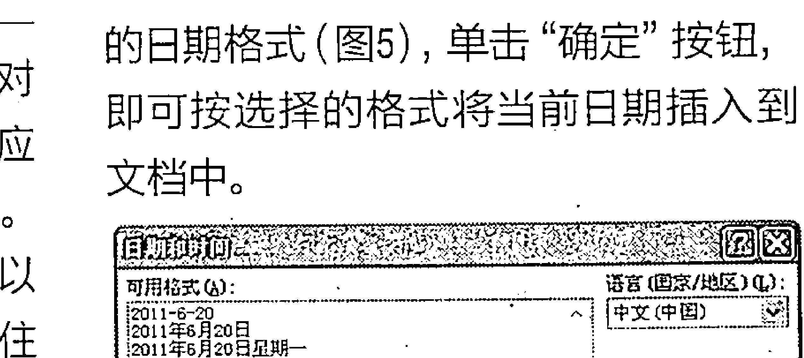

怎么样，以后要把汉字王国里的“○”字输入到电脑文档中，你不再为难，也不会再找替代品了吧？

# 失而复得靠良将
## 四大数据恢复软件评测

硬盘、SD卡或U盘等中的文件被误删或者分区损坏，我们最常用的办法是使用一些数据恢复工具来将其找回。究竟哪款才能成为我们查失缉逃的良将？让我们揭开谜底。

文 | CFan软件研究室

### 参评对象

EASY RECOVERY、Diskgenius、Final Data、金山数据恢复专业版

### 测试平台

操作系统: Windows 8 64位专业版
处理器: 英特尔酷睿(Core)i5-2310 2.90GHz 四核
内存: 4GB (A-DATA DDR3 SDRAM 1333MHZ)

### 测试方法

完整备份H分区、U盘和SD卡中的数据后，将其中的数据彻底删除再恢复；
往H分区、U盘和SD卡中复制备份文件，快速格式化后再恢复；
往H分区复制备份文件，删除该分区后再恢复。

### 硬盘: 西部数据1000GB

分区情况: C、D、E、F、G、H六个分区。其中H盘为测试分区，分区总容量为29.8GB，已用空间为7.9GB，在存储的文件中，包括EXE可执行文件，RAR压缩文件，BMP、JPG图片文件，TXT、DOC、CLX等文档文件，MP3、APE音频文件，WMV、RMVB视频文件和PDF图书文件等。

分区文件格式: NTFS

### U盘: 台电科技16GB

分区情况: 未分区，已用空间为3GB

### SD卡: 8GB

分区情况: 未分区，已用空间3.7GB

### 平台支持 谁最全面

这里所说的平台，是指存储介质和其所用的分区格式。目前常用的分区格式包括FAT、FAT 32、exFAT、NTFS、和NTFS5等，常用的存储设备则包括SD卡、U盘和移动硬盘等。如果恢复工具对平台支持不全面，无疑将在很大程度上影响软件的实用性，所以在本部分，我们将对四大工具的相应支持情况进行评测。

应该说，在此项评测中，四大工具的表现都非常不错，不仅完美支持所有的分区格式，而且同时支持恢复U盘和SD卡中的文件。特别是EASY RECOVERY和“金山数据恢复专业版”，直接在程序主界面的功能列表中，提供了与恢复U盘和SD相关的功能按钮（图1），所以不论是新手还是老手，都很容易上手。而Diskgenius和Final Data作为两款久负盛名的老将，虽然并未提供单独的介质恢复功能，但能正常识别接入的U盘和SD卡，并可扫描到其中消失的文件然后将其恢复，其操作方法也并不算麻烦。所以在该轮中，我们基本上可以认为四者战平，不相上下。

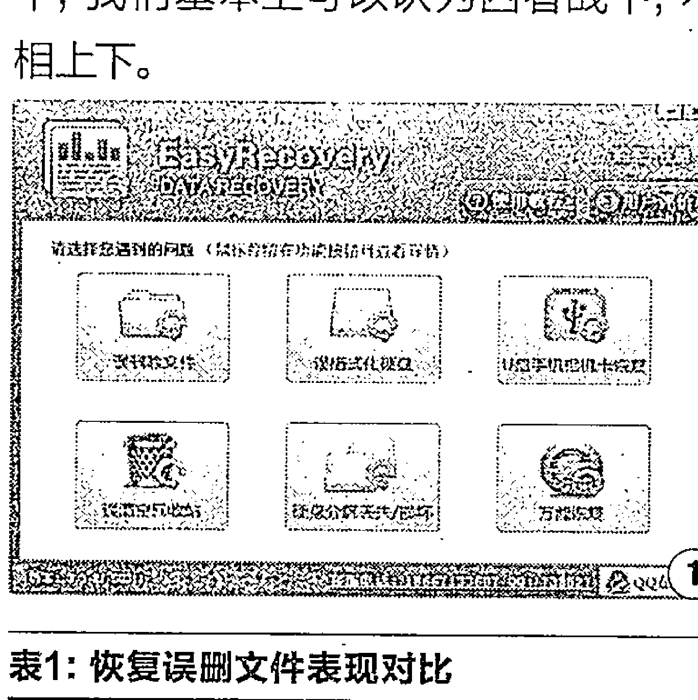

### 表1: 恢复误删文件表现对比

| 评测项目 | EASY RECOVERY | Diskgenius | Final Data | 金山数据恢复专业版 |
| :--- | :--- | :--- | :--- | :--- |
| 是否支持扫描分区的指定范围 | 不支持 | 不支持 | 允许指定簇范围 | 不支持 |
| 扫描用时 | 瞬间 | 瞬间 | 瞬间 | 瞬间 |
| 识别的文件数量 | 全部 | 全部 | 全部 | 全部 |
| 是否完整保留了原目录结构 | 是 | 是 | 是 | 是 |
| 是否支持按文件名、文件类型、大小和修改时间等对扫描到的文件重新排序 | 支持 | 不支持 | 支持 | 不支持 |
| 是否支持按文件名、通配符、文件类型、大小和修改时间等条件对文件进行搜索 | 支持文件名与通配符 | 支持全部 | 支持文件名、通配符、簇范围和修改时间 | 全部支持 |
| 是否支持文件预览 | 否 | 否 | 支持预览文档和图片类文件 | 支持预览文档和图片类文件 |
| 随机抽取的20个文件的恢复效果（完美恢复的个数） | 20 | 20 | 20 | 20 |

### 误删恢复 谁更给力

文件被误删，回收站被清空，是我们在日常用机的过程最易犯的错误之一，这就要求数据恢复工具能尽可能完美地找到其中误删的文件并将其恢复。那么，在这方面，四大工具又如何呢？由于在实际测试的过程中，我们发现这几款工具无论是在恢复U盘还是SD卡时，都表现出了与恢复硬盘数据类似的特性，所以为节省篇幅，我们这部分只写出与恢复硬盘H分区时的相关参数和感受，希望朋友们能举一反三，管中窥豹，从中领略四大工具在恢复误删文件时的风采。

通过表1我们不难看出，在整体表现方面，Final Data明显要略胜一筹，不仅全面支持这部分评测中的所有项目，而且除此之外，它还有其他一些亮点功能也值得一提。比如在显示文件列表的时候，它采用了与Windows资源管理器相似的方法，允许用户根据自己的需要，选择以超大图标、大图标、小图标、列表和详细等方式来查看文件。2），以便用户能更快、更方便地找到自己需要的文件。其次是“金山数据恢复专业版”，该工具除了不支持按条件重新排序外，其他功能可以说是一应俱全。同时，它还会在显示的扫描到的文件列表中，周到地显示该文件的恢复概率，如高、较高、较低或低等，这样，无需动手恢复，我们就已经对该文件可恢复的可能性有多大做到心中有数了。

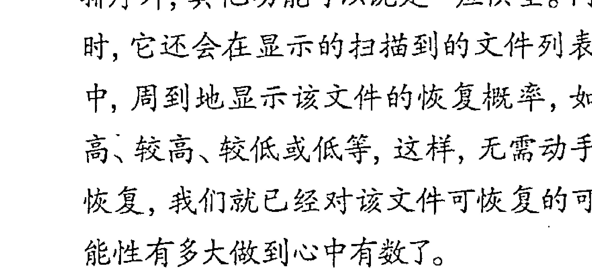

# 分区格式化 谁来拯救

我们这里所说的分区格式化，仅指快速格式化。其中的道理很简单，格式化（低格）是将硬盘重新分道分簇，其中的数据无法恢复，而快速格式化只是删除了分区中的文件，其中的数据可以恢复，这一点，与上面我们所说的误删文件非常相似。不过，尽管如此，为确保格式化后文件能尽可能多地找到，目前常用的数据恢复工具，都会对删除文件和格式化后的数据采用不同的扫描机制。比如对于误删文件，它们通常会采用快速扫描方式，而对于格式化和我们后面所说的分区损坏，则会采用更全面的深度扫描方式（该方式会对硬盘数据进行逐簇扫描，所以用时较长）。

在正式看列表前，有一个重要的项目我们必须说明一下，那就是关于找到的文件数量问题。本来这是我们此部分评测必须进行的重点之一，但在实际的扫描过程中，小编们惊异地发现，或许是由于计数方法不同，各工具显示出来的文件数量有很大差异，比如Diskgenius显示找到的文件数量为232863，Final Data为31520，而EASYRECOVERY和“金山数据恢复”由于并不显示找到的文件数量，所以我们最后的结果我们不得而知。

通过表2我们不难发现，在此轮评测中，Final Data的表现最好。该工具除了恢复效果出色外，还提供了一个极其有用的功能，那就是它会以文件类型（如AVI、BMP、JPG、ZIP）来显示找到的丢失文件，这样，如果我们记得要恢复的文件类型，可以很快达到目的。其次是Diskgenius，该工具的主要作用虽然是磁盘管理，但对于数据恢复来说也十分优秀。

# 分区损坏 谁挽狂澜

分区损坏的范围包括误删分区及重新分区后分区丢失，整个硬盘变为一个分区；分区无法打开，并提示未格式化；系统Ghost后，变为一个分区或自动划分成几个分区；双击分区提示需要格式化等。此外，还有一种情况，同样属于这一范畴，那就是硬盘分区表被破坏，硬盘无法引导系统。实际上对于这些情况，我们都有希望利用数据恢复工具对其中的数据进行恢复（包括恢复分区表）。那么，在这方面，几大工具的表现又如何呢？

参与评测的四款工具中，只有Diskgenius提供了只扫描“所有未分区区域”功能，所以用时很少，仅有14分钟。其他几款工具由于都默认扫描整个硬盘，因而用时很长，套用一句已经不再流行的话说：我等到花儿都谢了！此外，在完整保留文件原目录和文件的恢复效果两大方面，Diskgenius的表现也相当优异。除此之外，该工具还有一个其他工具所不具备的功能，那就是能轻松地新建硬盘中被损坏的或删除的分区。所以在此轮评测中，Diskgenius以绝对的优势胜出。而表现第二好的要属Final Data，它恢复效果良好，按类型显示文件的功能实用，什么时候都会体现出难以掩饰的大家风范。

|  | EASYRECOVERY | Diskgenius | Final Data | 金山数据恢复专业版 |
| :--- | :--- | :--- | :--- | :--- |
| 扫描用时 | 10分36秒 | 9分1秒 | 35分11秒 | 10分21秒 |
| 识别的文件数量 | 很多 | 多 | 很多 | 多 |
| 是否完整保留了原目录结构 | 基本破坏，原有目录及文件被统一的“DIRXXXX（其中XXXX为数字）”目录所替代 | 基本保留。其他丢失的目录和文件被统一放到程序的“丢失的文件”目录中 | 基本保留。所有找到的目录的文件，被分别暂存在“丢失的目录”和“丢失的文件”目录中 | 基本破坏，原有目录及文件被统一的“DIRXXXX（其中XXXX为数字）”目录所替代 |
| 随机抽取的20个文件的恢复效果（完美恢复的个数） | 16 | 18 | 19 | 16 |

|  | EASYRECOVERY | Diskgenius | Final Data | 金山数据恢复专业版 |
| :--- | :--- | :--- | :--- | :--- |
| 扫描范围 | 整个硬盘 | 未分区区域 | 整个硬盘 | 整个硬盘 |
| 扫描用时 | 157分钟 | 14分钟 | 212分钟 | 165分钟 |
| 识别的文件数量 | 很多 | 多 | 很多 | 很多 |
| 是否完整保留了原目录结构 | 基本破坏，原有目录及文件被统一的“DIRXXXX（其中XXXX为数字）”目录所替代 | 基本保留。其他丢失的目录和文件被统一放到程序的“丢失的文件”目录中 | 基本保留。所有找到的目录的文件，被分别暂存在“丢失的目录”和“丢失的文件”目录中 | 基本破坏，原有目录及文件被统一的“DIRXXXX（其中XXXX为数字）”目录所替代 |
| 随机抽取的20个文件的恢复效果（完美恢复的个数） | 15 | 18 | 18 | 16 |

文章看到这里，想必各位朋友对四大工具的表现都已经心中有数了。不过，为方便某些较懒的朋友能够快速找到自己满意的工具，小编还是不揣冒昧，努着嘴再多说两句：如果你使用此类工具的目的，只是要恢复误删或误格分区中的文件，那么Final Data肯定就是最好的选择；如果你使用的目的是要恢复损坏分区中的文件，Diskgenius一定就是不二之选。

# 本 { 软件方案 }

# 手机隐私防火墙

软件越来越多，很多软件会偷偷窃取我们手机上的秘密，如通讯录等。本文介绍如何打造手机隐私防火墙。

看过今年央视3·15晚会的朋友都知道，央视在晚会上曝光了安卓（Android）系统中的部分软件收集并泄露用户信息的问题。现在安卓手机非常普及，大家在安卓手机上安装的软件也越来越多，那么如何保护自己的手机隐私不被那些恶意软件窃取？其实，我们可以自己打造一个安卓手机隐私防火墙。

## 学前班：安卓权限扫盲

由于安卓是开放性系统，为了安全起见，Google需要给用户提供一系列的安全措施，所以Google在安卓框架内把各种对象（包括设备上的各类数据、传感器、拨打电话、发送信息、控制别的应用程序等）的访问权限进行了详细的划分，列出了约一百条安卓权限。应用程序在运行前必须向安卓系统声明它将会用到的权限，否则安卓将会拒绝该应用程序访问相关的内容。

不过Google并不会要求开发什么程序才能拥有对应的权限，理论上任何一个应用程序只要开发者在代码中做出相关声明即可拥有对应的权限。比如说搜狗输入法提供了一个智能通讯录的功能，可以在用户输入联系人拼音的前几个字符（或首字母）时，输入法就能自动呈现相关联系人的名字。为了实现这个功能，搜狗输入法必须声明它需要读取手机中联系人信息的能力，也就是在相关代码中加上声明`android.permission.READ_CONTACTS`对象。这样当我们安装搜狗输入法时，它会显示“读取联系人数据”权限，同时安装好后它就可以自动读取我们的通讯录了（图1）。

## 初级班：LBE隐私卫士后台控制权限

下载地址: http://www.lbesec.com/lite

适用: 已安装的应用，手机要ROOT

如上所述，应用程序只要在代码中做出声明，它就可以自动获取对应的权限（在安装时用户只能看到声明但无法做出权限的更改），所以很多恶意应用程序利用安卓这个漏洞，大肆在我们的手机中窃取隐私。有一些软件，虽然我们明知道它不应该读取手机中的某些内容（如读取通讯录），但是因为某种需要又不得不使用它，那么即使在安装时看到了它的所谓声明，我们也不得不安装。对于这类软件，我们可以在安装后使用LBE隐私卫士在后台控制它的权限。

### 实战：屏蔽搜狗的读取权限

对于搜狗输入法，很多人其实只是想使用它的快捷输入功能，对于和输入法无关的联系人数据、位置信息、短信记录等，我们自然不希望它在后台偷偷读取。现在如果要屏蔽它的读取联系人数据权限，只要在手机上启动LBE隐私卫士，然后切换到“主动防御”，接着在打开的窗口中点击“联系人记录”，最后再在打开的窗口中，在受监控的软件列表上长按选中“搜狗输入法”，将其读取权限设置为“拒绝”即可（图2）。其他权限的屏蔽方法与其类似。

完成上述的设置，以后如果在搜狗输入法输入联系人拼音的前几个字符，输入法就不会再自动呈现相关联系人的名字了，同时系统通知栏“LBE隐私卫士”会提示已经成功拒绝搜狗输入法读取联系人数据。这样即可屏蔽无关程序对自己手机隐私数据的窃取，有效保护隐私安全！


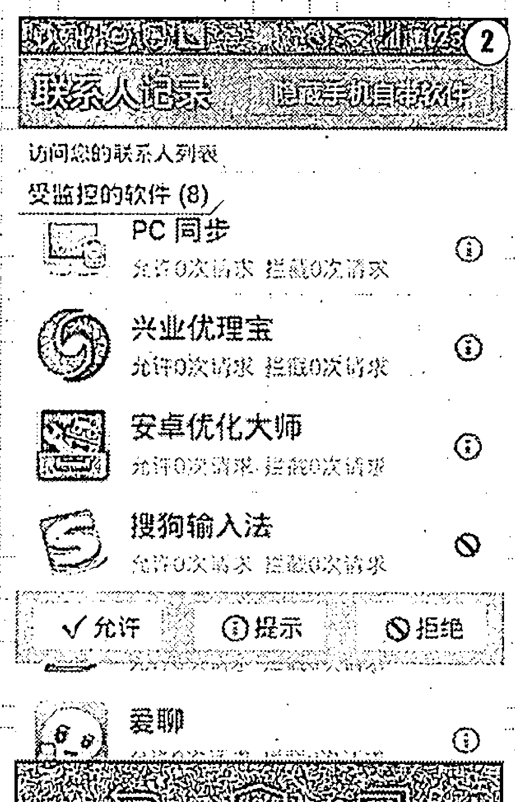

> **小提示**
很多恶意软件在窃取隐私后都是通过网络将信息发送到服务器的，因此为了彻底杜绝恶意软件发送通道，我们还可以使用LBE隐私卫士的“联网防火墙”阻止程序的联网。只要切换到“联网防火墙”，然后在程序列表中取消其使用网络的勾选即可。

## 高级班: 安装前修改应用的权限

下载地址: http://www.yingyong.so/app/7/3857.htm

适用: 未安装的应用

虽然LBE隐私卫士可以很好地对程序的权限进行控制，但是它控制的权限有限（读取短信、联系人记录、通话记录等9个权限）。我们还可以采取另外的方法，在安装前就将程序的权限废止，达到“御敌于国门外”的效果。“权限修改器”就可以对任意APK程序权限进行修改，它的原理是修改应用程序的APK安装包，删除其中AndroidManifest.xml文件内，用于声明权限的对应Android.Permission.*的条目，然后再用一个公开的证书对安装包重新签名（手机需要允许“未知源”），这样一来，应用程序就不会向系统申请原先所需的权限。当应用运行至相应的流程时，系统将直接拒绝，从而达到用户控制权限的目的。

### 实战: 移去搜狗输入法读取权限

为了方便起见，我们依然以搜狗输入法为例来说明。首先下载搜狗输入法安装程序，接着启动“权限修改器”，点击“直接修改APK文件”，然后定位到搜索输入法安装文件，程序会自动读取安装包的权限声明，按提示勾选需要删除的android.permission.READ_CONTACTS对象权限（图3）。点击“下一步”，程序会自动修改应用程序的APK安装包并且重新打包；完成权限的修改后点击“安装已修改的应用程序”，现在激活的搜狗输入法安装程序中，可以看到它的权限声明就没有读取“联系人数据”的权限了（图4）。

当然，并不是应用程序所有权限都可以删除，一些应用程序的权限是和程序本身紧密结合的，比如某些网络程序如果删除其联网权限，则可能导致安装后的程序无法运行，此时只要重新使用“权限修改器”进行修改即可，大家可以参照下表对号入座进行修改。

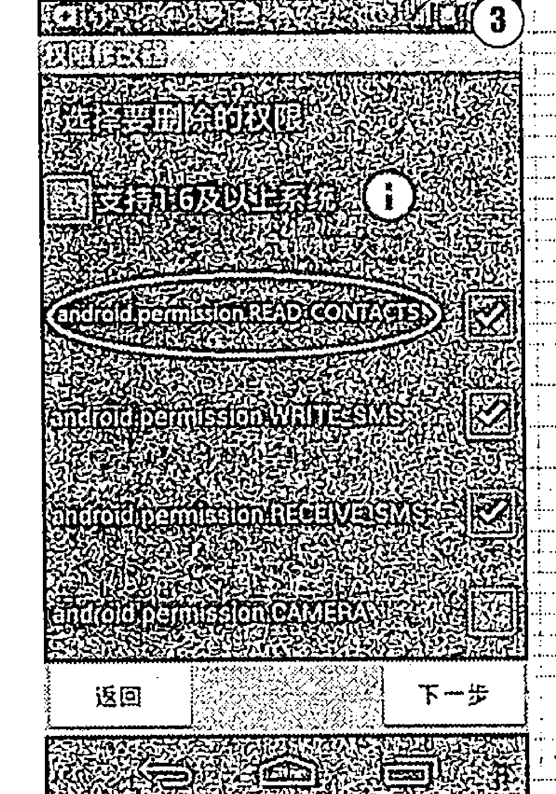

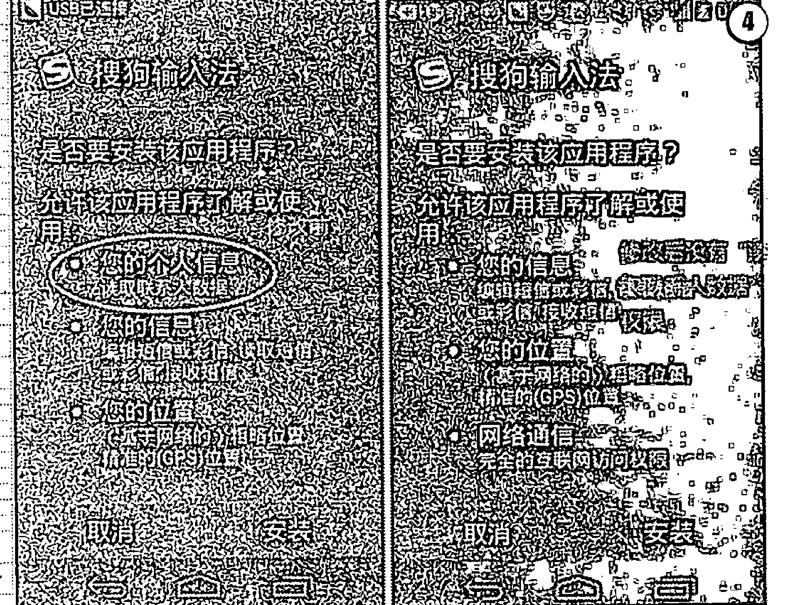

# APK程序代码中的权限声明

| 权限 | 代码及说明 |
| --- | --- |
| 获取粗略位置 | android.permission.ACCESS_COARSE_LOCATION, 通过Wi-Fi或移动基站的方式获取用户错略的经纬度信息, 定位精度大概误差在30-1500米 |
| 获取精确位置 | android.permission.ACCESS_FINE_LOCATION, 通过GPS芯片接收卫星的定位信息, 定位精度达10米以内 |
| 访问定位额外命令 | android.permission.ACCESS_LOCATION_EXTRA_COMMANDS, 允许程序访问额外的定位提供者指令 |
| 获取模拟定位信息 | android.permission.ACCESS_MOCK_LOCATION, 获取模拟定位信息, 一般用于帮助开发者调试应用 |
| 获取网络状态 | android.permission.ACCESS_NETWORK_STATE, 获取网络信息状态, 如当前的网络连接是否有效 |
| 获取Wi-Fi状态 | android.permission.ACCESS_WIFI_STATE, 获取当前Wi-Fi接入的状态以及WLAN热点的信息 |
| 使用蓝牙 | android.permission.BLUETOOTH, 允许程序连接配对过的蓝牙设备 |
| 蓝牙管理 | android.permission.BLUETOOTH_ADMIN, 允许程序进行发现和配对新的蓝牙设备 |
| 拨打电话 | android.permission.CALL_PHONE, 允许程序从非系统拨号器里输入电话号码 |
| 通话权限 | android.permission.CALL_PRIVILEGED, 允许程序拨打电话, 替换系统的拨号器界面 |
| 拍照权限 | android.permission.CAMERA, 允许访问摄像头进行拍照 |
| 格式化文件系统 | android.permission.MOUNT_FORMAT_FILESYSTEMS, 格式化可移动文件系统, 比如格式化清空SD卡 |
| 读取联系人 | android.permission.READ_CONTACTS, 允许应用访问联系人通讯录信息 |
| 读取电话状态 | android.permission.READ_PHONE_STATE, 访问电话状态 |
| 读取短信内容 | android.permission.READ_SMS, 读取短信内容 |
| 读取同步设置 | android.permission.READ_SYNC_SETTINGS, 读取同步设置, 读取Google在线同步设置 |
| 接收彩信 | android.permission.RECEIVE_MMS, 接收彩信 |
| 接收短信 | android.permission.RECEIVE_SMS, 接收短信 |
| 发送短信 | android.permission.SEND_SMS, 发送短信 |

# 架“上网行为”服务器

小公司的内部网、合租区的小网、学生宿舍区的小网，如果总有人不自觉，占用过多带宽拖慢网络，网主如何进行控制？

文|武金刚

公司网络管理员小王最近有点烦，单位网络慢得出奇，给单位办公带来很大麻烦，为此小王一连几次遭领导批评，于是无精打采地坐在电脑前。其实小王心里清楚，网络慢的原因是因为员工对网络应用不当造成的，如在办公期间一些员工浏览与工作无关的网页，下载最新电影或较大的软件，频繁使用QQ网聊，在线偷菜、打牌，私下乱改IP而导致IP冲突等现象。这样造成局域网处于一片混乱状态。如何还局域网一个安全、稳定的状态呢？

为了减少投入，提高网络管理效率，小王决定自己架设一个网络行为管理服务器。小王选择了“海蜘蛛路由系统”，这是一款基于Linux环境的免费路由器系统，系统本身提供了流量控制、端口封堵、网站过滤、软件控制、网络监察、IP绑定等众多行为管理功能。只要将它独立安装在任意一台电脑上即可使用。

## 服务器架设

“海蜘蛛路由”系统需要安装到一台独立的电脑上，安装系统需要256MB存储空间，运行时需要512MB内存即可。一般情况下，安装海蜘蛛路由系统的电脑需要搭载两块网卡，一块用来连接外部网络的Wan口，一块用来连接局域网交换机的Lan口。此外，该路由系统还提供了多Wan口绑定功能，可以使得多条宽带通过路由器进行绑定使用，这样我们就可以根据绑定的宽带的数量来增加网卡数了。小王考虑到单位申请了电信和联通两条宽带，于是在该电脑上安装了3款网卡，分别为Wan1连接电信宽带，Wan2连接联通宽带，Lan连接局域网的交换机。

首先登录到“海蜘蛛”官网下载其安装文件，服务商提供的是ISO镜像文件，我们需要将其刻录到光盘上才能进行安装。安装时，将光盘放入光驱并设为从光驱启动，启动电脑即可弹出一个运行界面，在此选择第一项“正常安装模式”，回车进入安装主界面。

使用上、下方向键选择“安装海蜘蛛路由器”并按回车键后，系统开始进行安装。在安装过程中系统会提示修改IP地址和端口号、子网掩码等信息，在此根据需要修改即可。值得一提的是，该服务器的IP地址就是该局域网内的网关地址。IP地址设置后，即可重新启动电脑，至此安装结束。

重启计算机，在程序的Login登录界面中输入用户名和密码进行登录，系统默认的用户名为root，密码为123456。进入到海蜘蛛控制台登录界面。

下面小王要做的就是从三块网卡中定义好Lan口网卡，首先将局域网交换机连接到三块网卡中的一块网卡上。此时在管理界面中可以看到局域网的连接状态显示为已连接，表示该网卡就是Lan网卡，如果局域网状态显示为未连接，说明当前网卡为Wan口网卡，这样我们即可轻松找到Lan网卡。

经过上面的一番折腾，小王找到Lan口网卡并将网线都插入到各个网卡。下面就可以对“海蜘蛛路由器”进行设置。

## 双Wan口绑定 上网快捷

如今国内网络出现“北联通、南电信”各霸一方的局面，这样导致电信、联通资源互访缓慢的现象。为了能让企业内网访问各个网络资源畅通无阻，小王决定将两条宽带绑定到路由器中，这样在访问网络资源时，会达到访问电信资源走电信线路，访问联通资源走联通线路的效果，从而加快网络访问速度。

绑定时，在IE地址栏里输入“服务器的IP地址”，在登录界面中输入用户名和密码即可登录到“Web控制中心”界面。系统默认用户名和密码为admin。

单击左侧导航栏中的“网络设置→网络接口设置→广域网（Wan）”选项，切换到Wan1界面，在“Internet接入方式”项下选择“PPPoE拨号（ADSL）”，在下面的电话号码和密码项中输入联通宽带的电话号码和密码，在“此网关作为默认路由”项中勾选“是（一般选上）”，并选择好“开机自动启动”。这样该线路即可作为默认线路。除电信资源外所有资源都通过该线路访问。

随后按此方法，设置好Wan2的宽带绑定，在Wan2界面我们无需勾选“此网关作为默认路由”选项。

切换到“多线负载及策略”项中，勾选“启用多线负载及策略”复选框，在“策略路由工作模式”项中选择“正常模式、掉线自动切换”。在下面的线路列表中选择好线路的类型、ISP运营商，在“激活”项勾选“是”，随后单击“保存设置”即可。

## 整治网络不良现象

通过上面的设置，海蜘蛛服务器已经搭建完成,下面小王就可以动手整治网络中存在的问题了。

## 速度再快也要分着用

通过双线绑定后,单位的网络速度提升了不少,这下可乐坏了经常玩游戏、下载视频的同事们,可是他们没有节制,疯狂地利用网络带宽也会影响网络速度,于是小王决定,对网络流量进行控制,以防止P2P等软件连接过大而堵塞网络。

限速时,在管理界面单击“流量控制→手工限制规则”,打开“限速规则设置”界面,首先需要新建一个限速规则,小王决定创建一个下载限速。单击“新增限速规则”打开新规则界面,在名称中输入“下载限速”,在“限制速度”项中输入限速范围,如100~250,这样,用户的下载速率就被限定在这个范围之间。“限速类型”选择“下载限速”,“带宽使用模式”,选择“独立带宽/单机分别限速”,“限速对象”中我们可以设置限制的IP地址范围,这样该IP段的计算机将受到限速规则限制,在该范围以外的用户将不受其限制。

在“时间”项中输入限速时间后单击“激活”选项,随后单击下面的“保存设置”按钮,完成此项设置。设置后,在界面中勾选“启用下载流量控制”,单击“提交修改”和“应用”按钮即可启用该限速规则。

## 将非法IP拒之网外

小王对网络进行限速后,感觉到网速确实稳定了不少,不过小王在管理界面的IP列表中发现很多陌生的IP,经过查看才知道,很多同事将家中的笔记本、平板、智能手机都拿到单位来上网。于是小张决定设置IP和MAC地址绑定,让外部电脑无网可蹭。

IP与MAC地址绑定时,在“控制中心”界面单击“防火墙→IP与MAC地址绑定”,打开“IP与MAC地址绑定”窗口。

在“未绑定记录”列表中,显示出当前没有绑定的电脑IP地址和MAC地址。单击“扫描导入”后系统扫描到的IP和MAC地址可以直接导入绑定列表中,导入完成后保存即可。导入后,我们可以在该列表中对不合法的IP地址进行编辑或删除。如果用户设置的IP不符合要求,我们也可以手工一一进行绑定。在“未绑定记录”列表中选择需要绑定的IP地址,此时在下面的备注项中输入该计算机的信息名称,单击“新增”按钮即可将该电脑绑定,随后显示在左侧的绑定列表中。

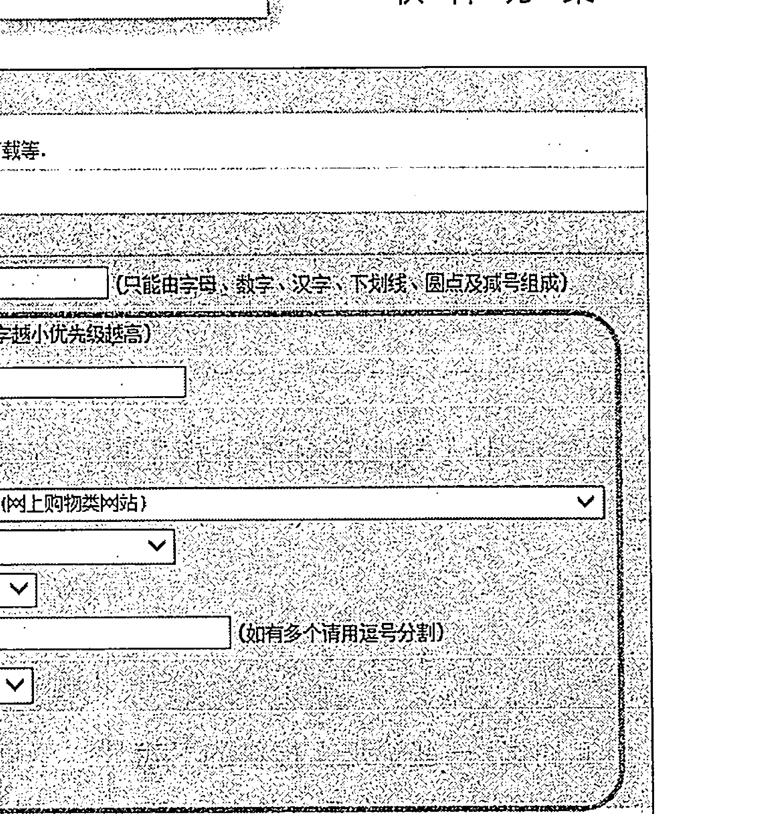

切换到“强行绑定”界面,在“强制进行IP/MAC地址绑定”项下勾选“是”,并勾选上面的“启用IP与MAC地址绑定”,这样只有添加到绑定列表中的电脑才可以上网,没有被添加的电脑无法上网。

## 屏蔽淘宝避免工作时间购物

最近领导发现很多员工在上班时间,电脑上总是打开淘宝,东看看西瞧瞧,有时候还三五成群讨论一些网上购物的事,严重影响工作。于是领导决定上班时间不准上淘宝,这边小王只好将购物类网站进行屏蔽,屏蔽前,先来添加哪些IP地址用户不允许购物。在“上网管理”中打开“预定义对象”界面,在此系统提供了多个预定义对象,在“IP对象”界面,单击“新增”,打开“预定义对象”新建窗口,在此输入预定义名称及IP地址或IP地址段,随后单击“保存”按钮即可。

接着定义不能上网购物的时间,在“时间对象”界面按此方法预定义一个时间段,如上午8:00~11:30,下午14:00~17:00等。

切换到“应用协议策略”中,在此单击“新增”按钮,打开“新增协议策略”对话框(见图),在此键入一个应用协议策略的名称,在下面的“控制对象”中选择预定义的屏蔽购物的IP对象名称,在“控制类别”中选择“应用”,并单击右侧下拉菜单,在此选择需要禁用的软件或网站,如在线购物类网站。在下面的“限制时间”中输入预定义的时间对象,在“动作”项中选择“丢弃”,单击“保存”即可。这样预定义的IP地址或地址段的用户在指定的时间内不能在线购物了。

在“应用控制策略”中提供了多种控制类别,包括游戏网站、QQ等聊天软件、下载软件等等,这样可以有效地对聊天软件、P2P软件,游戏网站等进行屏蔽。

# 迅雷下载的另类方法
文 | 金仓

迅雷是使用人数比较多的下载工具。安装迅雷后，点击资源链接即可下载，也可以通过右键菜单命令选择下载资源。但是，迅雷的下载方法远远不止这些。

### 列表拖动导入法

有时候，一些论坛上提供的下载地址不是以超级链接的形式给出的，而是以一个下载列表的形式给出，其中可能会有许多条下载地址。如果我们将 其保存为一个TXT文件，在迅雷的窗口中用“文件→导入下载列表”的方法不能找到这个文件。

这时有两种办法解决：一种方法是在打开的文件列表窗口中的文件名处输入“*.TXT”，这样就会显示出所有以TXT为扩展名的列表文件，选择含有下载地址的TXT列表文件并点击“打开”按钮即可导入（图1）。另一种方法是直接将保存有下载列表的TXT文件拖动到迅雷的下载窗口中下载。后一种方法更加快捷有效，因为在某些版本的迅雷中取消了导入下载列表的命令，用前法会找不到导入下载列表的入口。

由于迅雷导入列表窗口默认使用的格式只有.DOWNLIST和.LST两种文件，因此，建议在保存迅雷下载列表时，将文件的扩展名直接命名为LST类型为好，这样在进入导入窗口时第一时间就会发现这个文件了。

### 远程批量探测法

新版“迅雷”提供了一个非常好用的“FTP资源探测器”功能，它可以将FTP站点中的文件用树状目录的方式显示出来。你可以利用它更加快速地批量下载存在于FTP服务器中的资源。

首先在“迅雷”窗口中单击“工具→FTP资源探测器”打开“收藏夹”窗口，新建一个站点，在“站点”中输入FTP的域名或地址，注意前面必须带上“FTP://”，同时在后面输入用户名和密码，点击“确定”（图2）。

此后在资源探测器窗口中，选择登录这个站点，找到相应的文件，配合Shift或Ctrl键选择文件，右击鼠标选择“下载”，即可用迅雷批量高速下载FTP服务器上的文件了。

### 转道快传下载法

平时如果有文件想要分享怎么办？用QQ发送太慢了，非QQ会员又有诸多限制，而且接收方一旦点错了按钮，离线文件将永远消失。如果使用迅雷快传 (http://kuai.xunlei.com/)，就可以直接将自己的大文件与好友们快速分享。同时，上传资源可以有长达7天的下载时间，随时可以下载、多次下载，还能够通过迅雷7来加速下载。上传者把文件上传至迅雷快传，即可获取该文件的下载链接，非登录用户单文件大小限制为50MB，登录用户为100MB (100GB)，会员用户为100MB (100GB)，括号内为安装插件后的限制。一条下载地址可容纳多个文件。

其他人获取链接后即可下载。迅雷快传生成的下载地址末端的英文代码为提取码(如下载地址: http://kuai.xunlei.com/d/HXEEBEKHTOYE)。

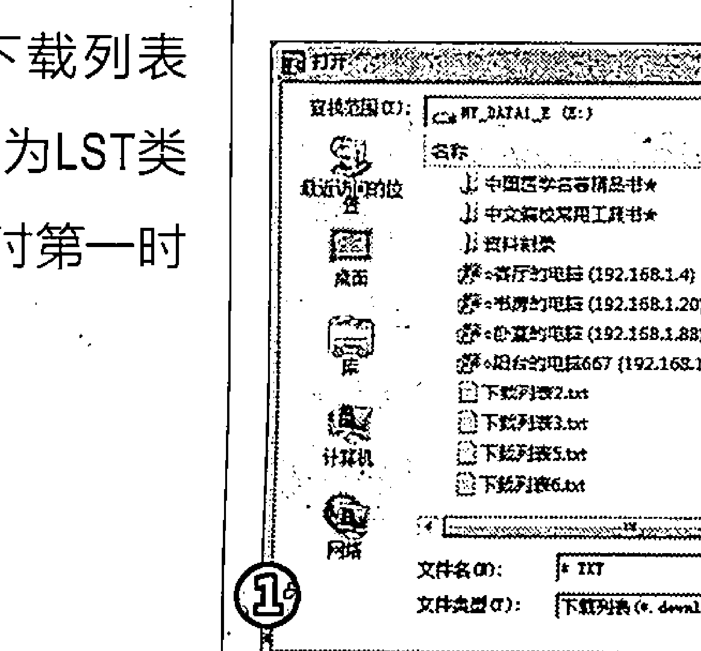

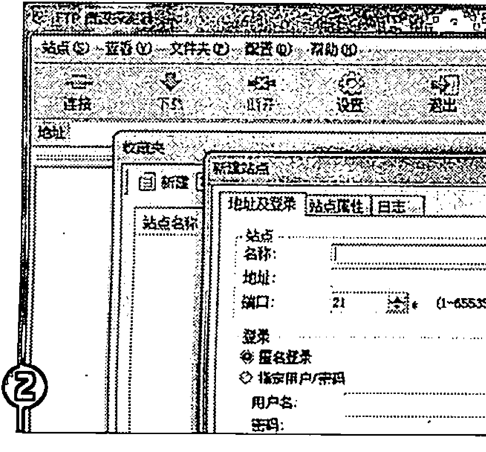

# 网络不稳 应对有法
文 | 丁香

最近，学生宿舍区的不少同学抱怨网络不稳定，上网速度时快时慢，而且有时还会莫名其妙地断网，登不了游戏。本文旨在分析网络不稳定的原因并给出具体解决办法。

### 网络不稳定原因分析

网络不稳定的原因有许多，除了线路硬件方面的因素之外（这种情况较少，应由电信部门排查解决），单从软件方面考虑，一般有如下几种原因。

- 1. 多台电脑共享上网，共享的网络中可能有电脑中了ARP病毒，对其他电脑发起攻击所致。
- 2. 多人同时使用音乐播放器在线播放歌曲，因为要获取歌曲和下载歌词，会占用大量的带宽。
- 3. 内网中有人在使用P2P下载软件，例如迅雷、网际快车、QQ旋风、网络视频加速器等。P2P的工作原理是在下载文件的同时，还要向主机上传数据，通过内容的自动下载上传，完成网友之间的资源共享。如果你的P2P软件设置成了开机自启动，一旦电脑开机就会自动上传数据（不管你是否在使用这个软件），上传数据越大，对玩游戏、传发邮件、浏览网页等网速影响也越大，从而在网友不知情的情况下默默吞噬着网络流量。

### 小提示

如果是断网现象，则可卸载并重装网卡驱动，若仍不能解决再按上述软件方案进行处理。

### 解决网络不稳的对策

网络不稳定，一般可以通过现成的工具软件来解决。目前比较好用的工具软件有金山卫士和360安全卫士等系统维护工具。

### 测定实际网速

首先了解你当前使用的网络环境是什么样子的。打开金山卫士主界面，运行“网络测速”，金山卫士会以精准的数据计算网速，并根据当前的网络情况提示目前网络适合哪些网络应用，如在线电影、网络游戏等。

### 查明谁占流量

如果你发现网络不稳定，立刻打开流量监控功能，首先查看自己使用的软件中，是哪些进程占用大量的网络带宽（例如你在使用P2P软件，如迅雷、QQ旋风等），然后对该进程进行限速。
打开金山卫士主界面，进入“流量监控”模块，找到占用流量比较大的程序进行流量限制。

### 拒绝内网攻击

如果你所处的网络环境是局域网的话，建议开启金山ARP防火墙，检查是不是存在ARP病毒，导致网络不稳定的。如果局域网存在ARP病毒攻击的话，金山卫士ARP防火墙会报警，提示某个IP的电脑对你的电脑发出ARP攻击，然后联系网管或网络中的该用户，使用杀毒软件对发起攻击的计算机进行查杀。
通过以上简单的步骤，一般可以解决网络不稳定的问题。
如果打开浏览器慢，可以先通过360安全卫士的“优化加速”功能进行网速优化，再通过360安全卫士的“系统修复”模块进行系统修复。
如果问题仍得不到解决，则可升级IE浏览器版本或者更换360极速浏览器。升级浏览器之前先卸载原先的IE浏览器。
卸载IE8：打开360软件管家，点击“软件卸载”，点击左侧的“浏览器”，在右侧找到IE8，然后点击右边的“卸载”按钮，在弹出的窗口中按照提示卸载IE8。

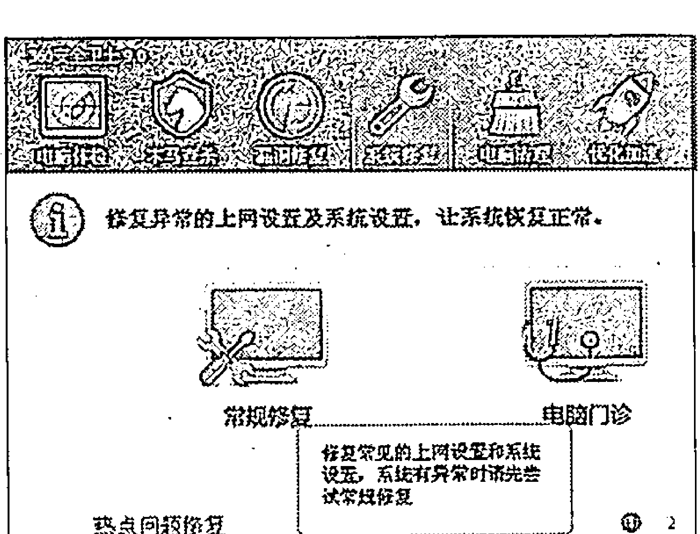

# 软件管家 二“牛”斗法
两款主流软件管家工具评测
文 | 刘英

软件管家类的工具曾出现过不少，但最出名的莫过于360软件管家和腾讯软件管理。我们对这两款软件亲自体验一番，看看它们到底有何本事，到底谁最强。

软件管家类的工具曾经出现过不少，许多知名软件或网络厂商均开发过此类产品，但竞争之下能坚持下来并做得好的不多，360软件管家和腾讯软件管理可谓其中的佼佼者。然而，对于这两款软件究竟哪款更好的说法，网络上的意见往往是各执一词，让你很难分辨优劣。因此，我们有必要就此两款软件亲自作一番体验，以正视听。

## 分类管理谁最清晰

下载软件的第一步工作当然是找到软件的链接。
360软件管家“软件大全”收录近15000款软件。软件宝库按类划分，用户可按这些类别进入浏览查询。每类中均标出这类软件目前收录的数量，一目了然。此外，还可以通过关键词，用窗口上方的“搜索”来直接搜索获取要下载的软件链接（图1）。

腾讯软件管理同样采用软件分类，也有搜索按钮。但软件排列方式上稍有不同，例如把输入法放得更靠前，把音频、视频放在相邻位置，这似乎要比360软件管家的排列顺序更科学一些。但腾讯软件管理中没有列出各类收入软件的数量，这让人心里没底——到底是更强还是更弱，从数量上来看是一笔糊涂账（图2）！

> 软件分类和数量管理方面各有优劣，各自都有人性化的体现，但分类科学性方面均有待提高。在数量管理方面360更加明确清晰。

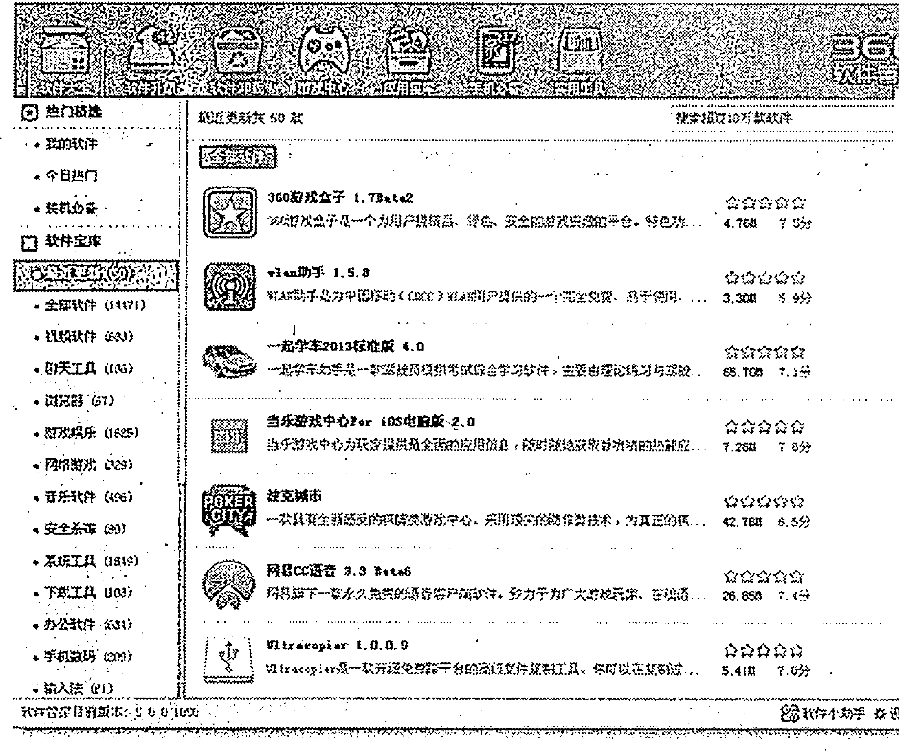

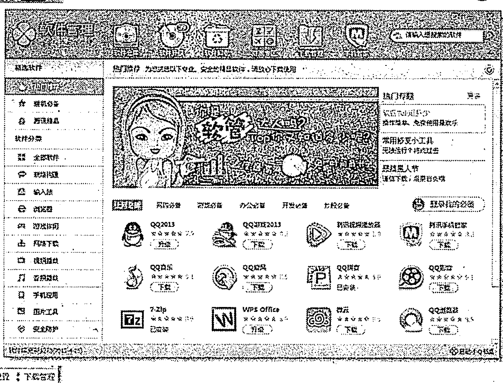

## 下载管理谁最贴心

下载是否方便，下载过程是否透明和好控制，下载位置是否可以由用户来定制，下载前是否能够知晓软件中是否含有各类无关插件，软件是否为收费软件，如此等等，是反映一款软件管理工具是否人性化的一个重要指标。

360软件管家下载窗口及时显示正在下载的程序，并显示已经下载程序的状态。如果已经安装，显示“已安装”；如果下载完毕但还没有安装，则显示“安装”，表示可以安装了（图3）。腾讯软件管理窗口则只有“正在下载”和“下载完成”两个子窗口，对于已经安装的软件也没有显示“已安装”图标，人性化稍差。

软件是否为免费、软件中是否包含有插件，这些都是软件下载者最关心的问题。360软件管家通过对收入的每一款软件进行专业测试，在下载前会通过提示软件是否收费、含有插件等信息，为用户提供放心的选择（图4）。我们只要通过“设置→下载设置”，将“下载提示”滑动开关滑动到“已开启”状态即可享用这项温馨提示功能。这一点是360依托其安全技术的强势项目，腾讯管理在这方面的工作没有做到位。

> 在下载管理方面，360软件管家在安全检测和已安装软件提醒方面表现出明显优势。腾讯软件管理也基本能满足用户需求。

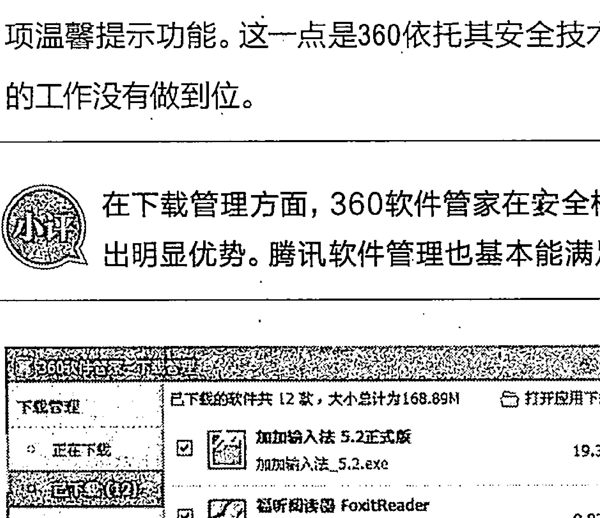

小提示：自动生成软件管家快捷方式

通过360软件管家的“设置→快捷设置”页面，我们还可以设置在桌面上添加“360软件管家”的快捷方式，这样当运行该软件后，桌面上就会产生一个“360软件管家”的快捷方式，便于以后直接进入该软件。腾讯软件管理也提供类似的选项可用。

## 升级管理谁最省心

软件下载之后选择手动执行安装还是自动安装，软件安装的过程有没有提示、过程是否复杂，软件安装之后有没有升级版可用，能不能做到自动检测提醒，所有这些又是考验管家软件在软件安装升级方面是否灵活高效的重要指标。

在360软件管家中，通过“设置→安装升级”选项卡开启“升级提醒”开关，智能升级提醒服务功能就在后台进行了。它会根据软件更新频率，智能调整软件升级提醒的内容和周期。软件升级的一切提醒工作均由软件管家来温馨提示，你只需随意按需选择即可。腾讯软件管理则只提供每天、每周、每月提醒或不提醒等4项选择。

在360软件管家和腾讯软件管理界面中，均提供一个“软件升级”模块，点击进入即可扫描到当前系统需要升级软件的列表。可以单个选择升级，也可以复选后点击一次升级选中软件的相关按钮完成一次性升级多款软件。可升级软件分免费正式版、免费测试版、收费版三类，后两类要小心选择使用。

> 就升级管理的设置和使用方面，360软件管家要略胜腾讯软件管理一筹，在自动化和智能化方面做得更加到位。

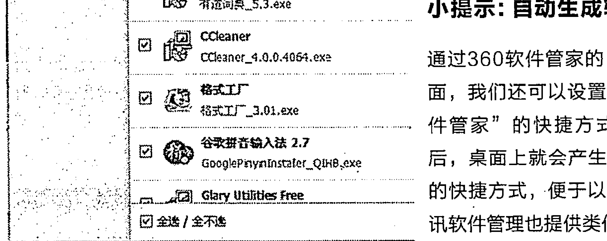

## 卸载管理谁最彻底

卸载也是软件管理中的一项重要功能，卸载是否方便、能不能彻底卸载干净是考验管理软件卸载管理功能的重要指标。

360软件管家的“软件卸载”模块将可卸载的软件按使用频率以“不常用”、几个月内、几天内用过的形式分别提醒。腾讯软件管理只有“3天内使用过”和“未知”两种结果，显然不如360更细致。

360专门提供设置卸载快捷方式的选项，通过“设置→快捷设置”，可在控制面板中添加一个“360强力卸载”图标以便彻底卸载掉不需要的软件，还可在开始菜单中添加“强力卸载电脑中的软件”的菜单项，更可以在桌面快捷方式的右键菜单中添加“强力卸载此软件”选项以方便地卸掉应用程序。腾讯软件管理则未提供此项体贴功能。

> 在软件卸载管理方面，腾讯管家显然不如360软件管家更加细致入微和人性化。

## 解决麻烦谁最厉害

软件装多了就会遇到麻烦，开机慢、图标多、默认打开权限被剥夺……诸如此类的麻烦事，管家软件能解决吗？

软件装多了以后系统难免会被拖慢。360软件管家附带的“开机加速”可以设置开机启动的程序，一键优化启动项目，提高开机速度。此外，通过“管理正在运行的软件”这个使用工具，可查看哪些程序正在运行以及它们占用了多少系统资源，借助它你可结束不需要使用的程序。腾讯软件管理中未提供此附带，但其管家套件中有此功能。

软件装多了以后，还会发生一个问题，那就是同类软件争抢资源。比如输入法、浏览器、播放器、看图软件和邮件工具等，都想将自己设置为默认打开此类资源的工具。在这种情况下，如果本该属于甲软件的权限被乙软件强占，设置回去也是个麻烦事。借助于360软件管家提供的“设置常用的默认软件”工具，可以轻松指定默认打开程序。腾讯软件管理无此功能。

对于系统中已经装了许多软件的PC来说，光靠开始菜单和桌面来管理这些图标，还是显得有些美中不足。360的软件助手和腾讯小Q书桌都能解决这一问题。从开始菜单调用程序或文档显得有些不方便，而将图标统统堆在桌面上又显得桌面杂乱，更会影响桌面背景图片的展示。这时，360软件小助手则可以体贴地帮你解决问题。有了它，你就可以将桌面上所有的图标都隐藏起来，尽情展示自己的个性化桌面背景图片了。腾讯软件管理也提供一个类似的工具“小Q书桌”，各项功能也大同小异。

> 在解决软件多、图标多的麻烦方面，显然360软件管家也要比腾讯软件管理更加功能强大。

小提示：快速获知升级软件数量

通过360软件管家“设置→快捷设置”页面，可以开启在“360软件管家”快捷方式上显示可升级软件数提示，这样我们就可以在进入软件之前方便地看到自己的电脑中目前有多少软件可以升级了。腾讯软件管理的“软件升级”图标中有默认也具备显示可升级软件数量的功能。

总评：综上所述，360软件管家在人性化、自动化、智能化方面要比腾讯软件管理更优秀一些。当然，腾讯软件管理也很优秀，尽管它还有一些不如人意之处，但同样也是一款优秀的管理软件。

至于到底该选用哪款，这要因人而异。我们的建议是，如果你电脑中的软件以360为主导，那么选择360软件管家为好；若你倾向于使用腾讯的各类软件，则使用腾讯软件管理为好。理由是，同一家的产品在相互之间的兼容性方面不容易出问题。当然，这不是绝对的，我们在评测过程中就同时安装了两款软件，尚未发现有不兼容的情况，但这并不表示没有潜在的兼容性问题。

# 拒绝透明 莫把隐私当儿戏
文 | 飞雪散花

隐私已经越来越被人所注重，细数隐私信息存在的场所，无非包括三个地方：本地电脑、网站、手机和平板等移动设备。那么在这三处重地，我们该怎样保护自己的隐私？

## 我的秘密你别看

### 防偷窥 私密文件锁起来

电脑里的私密文件，通常有两种保护方法，一是加密，二是隐藏。二者难说孰优孰劣，前者靠算法强力保护，后者凭机敏出奇制胜。具体使用哪种方法，大家可凭个人兴趣和需要选择。

先说加密。加密数据，大家一般会选择一些加密工具。但要注意的是，目前很多工具实际上采用的是伪加密，很容易破解。大家一定要选择比较牢靠的加密工具，比如Windows 7自带的BitLocker。

在Windows资源管理器中右击要加密的硬盘分区，然后在弹出的右键菜单中选择“启用BitLocker”，按照提示设置密码、保存密钥，即可完成加密过程。加密完成之后可以在控制面板窗口中看到原先的磁盘图标上多了一把锁。以后访问时，必须输入密码才可查看内容。BitLocker除了硬盘分区，也可以加密可移动的便携存储设备，如U盘和移动硬盘等。

### 防破解 我把文件藏起来

相比加密，隐藏也是一种保护隐私的方法，最大的好处是化有形为无形，让对方无从下手。这里提到的隐藏，当然不是Windows中的隐藏功能，而是让Windows也觉察不到的隐藏。推荐的工具是WinMend Folder Hidden，该软件隐藏的文件，在系统中无法看到。

WinMend Folder Hidden具有文件夹及文件的隐藏功能，打开界面，在右侧单击Hide Folder和Hide File按钮，指定要隐藏的文件或文件夹，当文件或文件夹图标显示为红色的Hidden状态，文件夹被成功隐藏。当我们自己需要打开时，只要在界面中将隐藏的文件选中，单击Unhide按钮，即可使其显示出来（图1）。

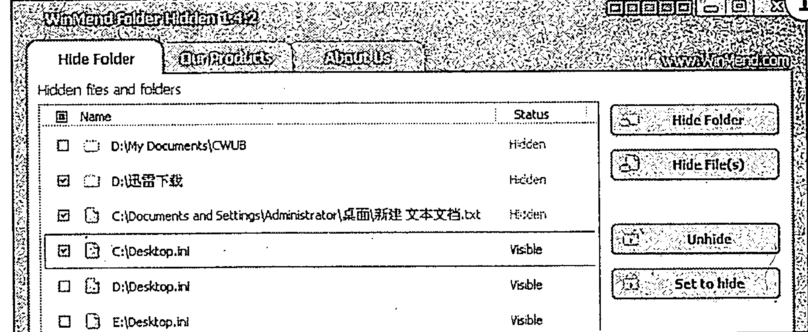

## 网络上的资料

网络虽然满足了人们四处留名、交友、购物的愿望，但凡事不能过度，因为在此过程中，一旦稍不留神，你的隐私就有可能被别人获取。

### 上网浏览用隐私模式

几乎所有人打开电脑，都会上网浏览网页、看看新闻，却在不经意之间，你所浏览的网页已经被记录下来，别人很容易发现你的兴趣所在。

新版IE10浏览器加入了“禁止追踪”功能。打开浏览器界面，单击“工具→安全→InPrivate浏览”，激活InPrivate浏览模式，当该模式处于激活状态时，我们可以在浏览器左上角看到Inprivate的图标，这样浏览网页的过程就不会被记录。其他浏览器也大都提供了相关功能，大家可以设置一下（图2）。

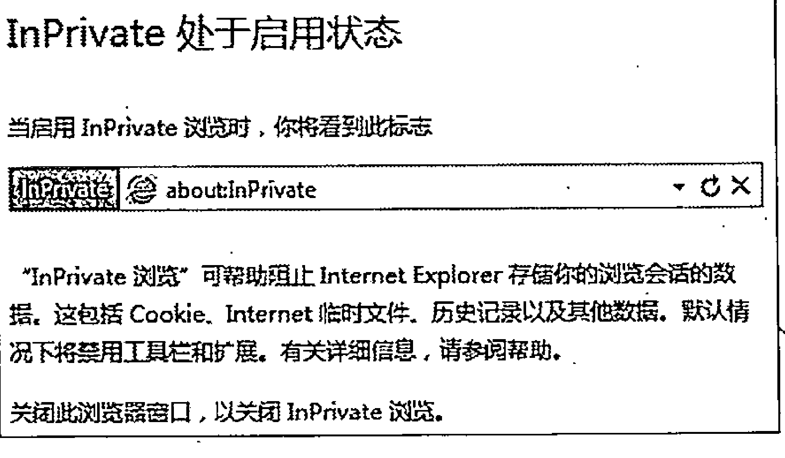

### 邮件内容加密保护

邮箱一旦密码泄露,里面的内容也会一览无余。可靠的方法是把邮件正常加密处理一下,这样即使别人进入邮件,也不会看到实际内容。

Encipher.it网站提供了邮件加密服务,大家可对常用邮箱进行加密。

登录https://encipher.it/网站, 把网页中蓝色的Encipher.it文字拖到书签栏, 使其以按钮形式存在即可。使用IE浏览器的话, 则把该文字添加到收藏夹里。

以后在邮箱写完正文后, 单击书签栏中的Encipher.it按钮打开密码输入窗口, 输入保护密码, 单击Encrypt按钮, 正文便成为乱码。随后发送邮件, 并把密码告诉接收者就可以了(图3)。

### 网络交易谨防上当

网购也许是骗子最为关注的对象, 这从钓鱼网站的数量就能看出。尽管购物网站不断加强安全措施, 受骗上当者却依然数量众多, 不仅损失了金钱, 而且泄露了隐私。骗子固然可恨, 但更多的原因却是买家对钓鱼网站的识别出了问题。

解决的方法并不复杂, 360安全浏览器的“照妖镜”功能, 可准确快速地将钓鱼网站拒之门外。

当用户登录购物网站, 如果该网站是安全网站, 那么360安全浏览器的“网站名片”会自动显示其身份, 通过地址栏左侧的按钮便能查看。当用户登录了安全性未知的网站时, “照妖镜”图标会自动显示在地址栏左侧, 大家只需单击图标, 在弹出的小窗口中单击“照妖镜鉴定”按钮, 再单击“上传网站信息鉴定”按钮, 结果便会立即呈现, 窗口会自动鉴别网站的安全性(图4)。

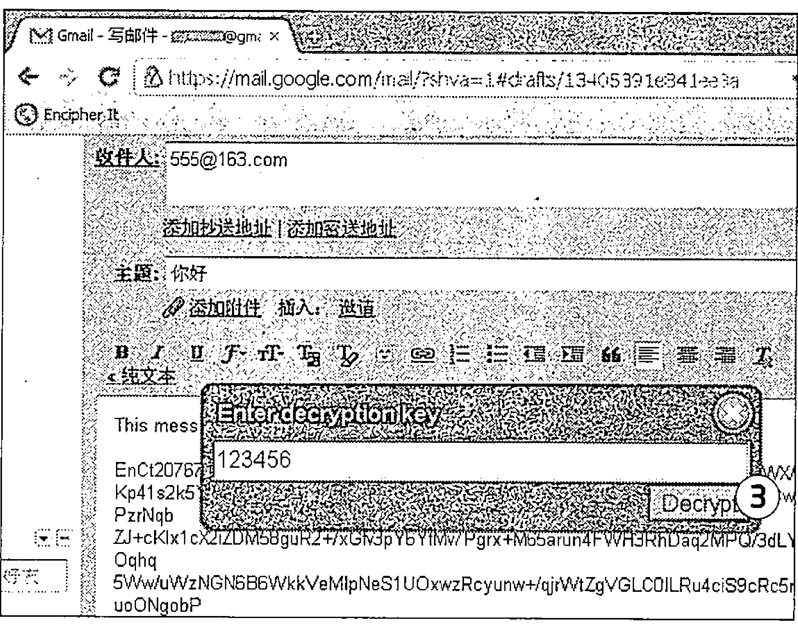

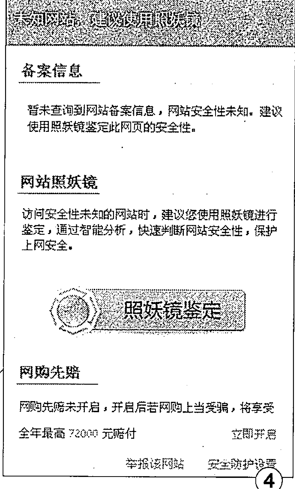

### 照片信息及时清除

不少朋友热衷于往网络相册中上传照片, 却不知照片中也可能包含图像拍摄地点、时间等隐私信息。通过这些信息, 别人很容易知道照片的拍摄地点, 为避免泄露这些信息, 最好在上传前, 利用Geotag Security这款软件, 批量删除照片中的地理标记信息。

先把打算上传的照片保存到一个文件夹里, 接着运行程序, 打开Geotag Security操作向导界面, 单击Browse按钮, 从弹出的对话框中选择照片所在的文件夹打开, 单击Start按钮, 软件便对当前文件夹进行扫描, 把照片中的地理标记信息清除干净, 此后就可以放心地把这些照片发布到网络了。

## 手机里的秘密

手机里面也有不少隐私信息。不少朋友都会安装“360手机卫士”这款应用, 而借助这款应用, 就能避免手机里的隐私泄露。

“360手机卫士”自带有“360隐私保险箱”, 在程序界面点击“隐私空间”图标进入隐私空间, 点击“立即设置”按钮, 按提示为隐私空间设置一个图形锁密码。

接着通过图形密码进入隐私空间, 选择“程序锁”选项, 在打开的应用列表中点击要锁定的应用名称, 该应用即被锁定。以后想运行该应用时, 就会弹出图形锁界面, 必须输入正确的图形密码才能运行应用。

对于那些重要的短信, 我们也可以在隐私空间界面选择“隐私短信”选项, 切换到“信息”标签, 选择某条短信内容, 即可将该信息保护起来。

## 双赢共生 应用程序速率

文 | 俞木发

出于安全或其他某种考虑，在多人共用的电脑上，我们经常要限制用户运行某些程序，现在借助系统自带的事件查看器和任务计划就可以实现灵活限制。

在日常操作中，为了保护自己的电脑，我们经常要限制用户运行特定的程序。虽然Windows本身已经提供诸如组策略、权限、注册表等限制工具，但是使用这些工具限制程序运行有不少缺陷。比如组策略，它的限制策略是对本机所有用户生效，即使自己使用电脑也会被限制；权限的限制则有明确权限不足的提示，这很容易被使用者通过权限的更改破解。很多时候我们希望程序的限制有更大的灵活性，比如你放在宿舍的电脑，如果经常被舍友用来没完没了地聊QQ，现在利用事件查看器和任务计划就可以限制指定QQ账号无法在你的电脑登录，但是这个限制并不会对自己的QQ生效，简单实现了限制的灵活性。下面介绍具体的操作。

### 限制原理轻松解读

大家知道每次登录QQ，输入特定的账号和密码登录后，QQ首先就会读取存放在本机以当前QQ账户为名的目录下的聊天记录文件Msg2.0.db。如果要实现限制特定QQ账号登录，只要开启Msg2.0.db的审核策略，系统的“事件查看器”会自动记录对该目录的审核事件。由于审核事件可以关联到任务计划，设置一个终止QQ.exe进程后台的任务计划，这样就能实现对特定QQ账号的登录限制。实际上这个技巧还可以扩展到任意文件（夹），可以根据操作流程扩展更多的应用（图1）。

- 1. 组策略开启审核
- 2. 设置审核对象
- 3. 设置审核项目
- 4. 查看审核事件
- 5. 关联任务计划
- 6. 设置后台任务
- 7. 实现限制效果

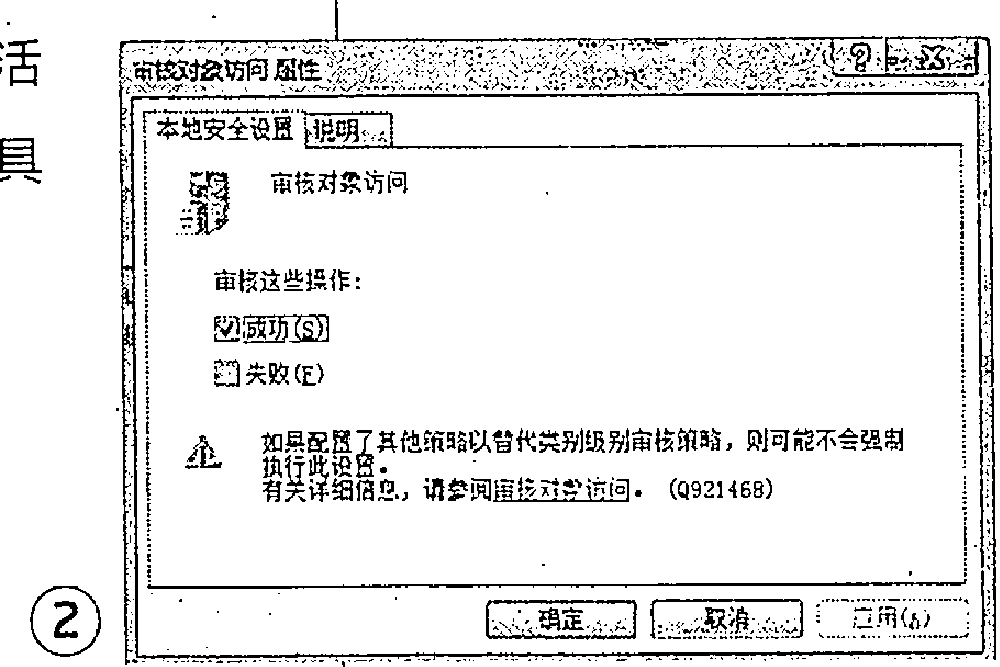

### 1 开启审核策略

单击“开始”，在搜索框输入gpedit.msc启动组策略编辑器。依次展开“计算机配置→Windows设置→安全设置→本地策略→审核策略”，双击右侧的“审核对象访问”，在打开的窗口启动审核策略（图2）。

### 2 设置审核策略

完成审核策略的更改后，就可以对指定的文件进行审核。假设现在要限制的QQ账号为12345678，QQ个人文件存放在F:\qq目录，打开F:\qq\12345678，找到Msg2.0.db文件，右键单击该文件选择“属性”。在打开的属性窗口单击“安全”选项卡，单击“高级”，在打开的高级安全设置窗口，切换到“审核”选项卡上，单击“继续”，在“选择用户，计算机或组”对话框中，添加要审核操作的用户名yumufa（即当前登录系统的账户名），最后在“审核项目”对话框的“访问”中，勾选“成功”选项下的所有选项（图3）。

### 3 查看审核记录

完成上述的操作后，这样指定的QQ账号登录后就会访问上述设置的审核文件，Windows 7的事件查看器则会自动记录各种成功审核事件。在开始菜单搜索框输入“事件查看器”，启动该组件后展开“Windows日志→安全”，在右侧窗格的审核事件中，可以看到事件ID为4663的记录，里面记录QQ成功读取“F:\qq\12345678\msg2.0.db”文件，读取的进程是QQ.exe（图4）。

### 小提示

如果事件查看器中审核的事件很多，可以点击右侧“筛选当前日志”，在弹出的窗口输入事件ID进行查找。

## 应用：阻止特定用户执行特定程序

实例：阻止特定账户在公司电脑运行炒股程序

很多公司严禁员工在公司使用炒股软件，我们只要先在公司的电脑设置一个专供员工使用的账户（假设为cfan），接着在上述设置审核的项目中，设置cfan账户对炒股程序启用成功审核。然后将审核事件关联到任务计划，执行“taskkill /im cfan.exe /f”（假设炒股程序为cfan.exe），这样只要cfan账户试图运行cfan.exe，系统就会在后台自动结束炒股进程的运行。同样，可以使用类似方法禁止特定账户执行任意程序。

### 关联任务计划

返回事件查看器窗口，选中事件ID为4663的记录，右击选择“将任务附加到此事件”，接着在打开的新建任务计划窗口，描述输入“限制指定QQ账号登录”，根据向导的提示单击“下一步”，依次设置任务执行的操作是“启动程序”，启动的程序是 C:\windows\system32\ taskkill.exe，参数是/im qq.exe /f（图5）。

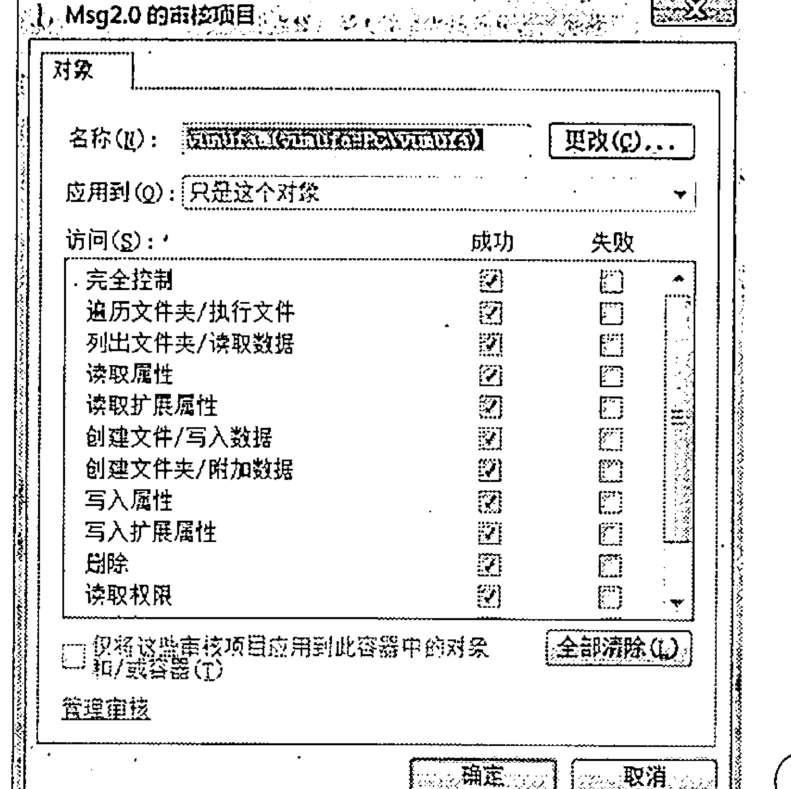

图3：Msg2.0的审核项目设置窗口

### 任务计划设置

完成上述的设置后，返回事件查看器窗口，依次展开“系统工具→任务计划程序→事件查看器”，在这里就可以看到上述创建的任务计划，双击新建任务计划，在打开的窗口切换到“常规”，勾选其下的“使用最高权限运行”和“隐藏”，这样指定的任务就可以以最高权限隐藏运行（不会遭到UAC的拦截），大大提高任务的隐蔽性。

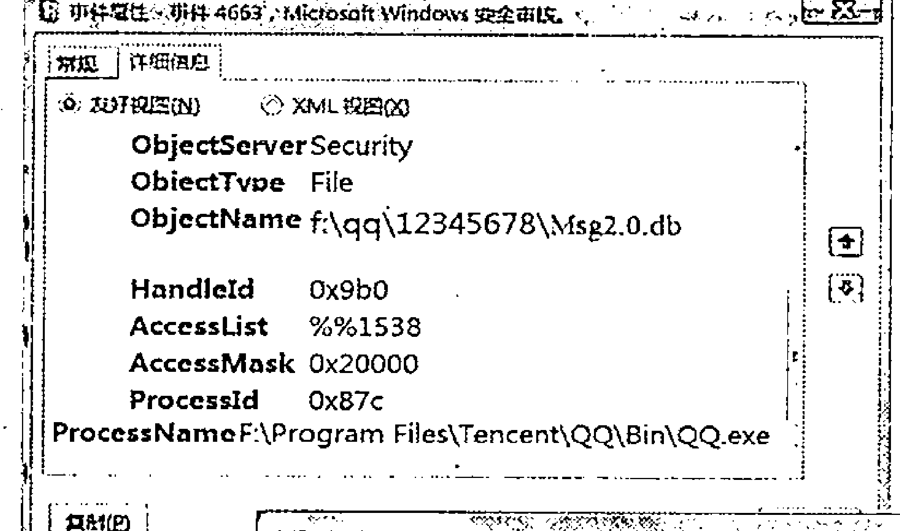

图4：事件查看器中记录的QQ.exe访问Msg2.0.db的事件详情

### 启用限制

这样在我们的电脑上一旦用户启动QQ，并且使用12345678这个账号登录，在成功登录QQ后Windows 7的“事件查看器”会立刻记录上述成功审核事件（即QQ.exe访问msg2.0.db文件），后台的任务计划就强制执行“taskkill /im qq.exe /f”，终止qq.exe的运行。上述操作都只是在后台运行（而且运行的是SYSTEM账户，不会受到UAC的拦截），用户看到的只是一个一闪而过的命令提示符窗口，接着QQ就会自动退出。当然使用自己的QQ账号登录时，由于自己账号的msg2.0.db文件并没有开启审核，使用起来没有任何限制。当然如果要取消限制，我们只要在任务计划删除创建的任务即可。

举一反三：挖掘事件查看器和任务计划结合的更多应用。如前文所述，实际上本文技巧对电脑任何程序（包括其他文件和文件夹）限制都是通用的。我们可以根据自己的实际需要加以变通，扩展出更多的应用。

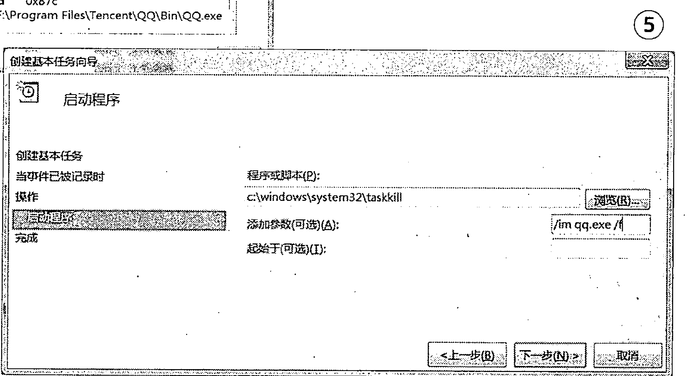

图5：创建用于终止QQ.exe的基本任务向导

### 小提示

这里为了操作简单，勾选所有审核项目。Windows 7的审核可以针对任何文件（夹），因此如果要限制的是其他项目，我们可以根据自己的需要选择性设置审核项目。

# 自建有偿共享的无线网络

随着网络的普及，越来越多的家庭拉上了网线，装上了无线路由器。如果把自己的无线路由器变成计费热点与其他人有偿共享，就能从中赚一笔了。

随着智能手机的普及，许多设备都能够无线上网。我们可以将其打造成一个计费热点。计费热点最适合于小型旅馆、饭店、宿舍等人口密集的地方。而普通家庭则可以通过无线网络来与邻居有偿共享网络。这样使用者可以通过共享网络在线支付网费并且随时使用该网络。

要解决Wi-Fi计费问题的关键是：(1) 要在网络上建立属于自己的登录主页并且建立付费体系；(2) 正确配置自己的无线路由器；(3) 较大的Wi-Fi覆盖范围。提醒：Wi-Fi网络的架设不能以非法盗取用户的个人信息为目的，更不能干扰正常运行的无线电基站。

## 配置自己的登录主页

Step1：建立热点登录界面。登录wiflap.cn这个网站，在页面右下角点击“免费注册”进行注册，注册部分按提示来即可。在“热点管理”中点击“新增”。在弹出的界面中除“热点描述”可以写一些提示自己的东西，其余默认即可。这样，热点就建立了。

Step2：配置热点登录方式、设定热点价格。在刚才建立的热点中点击“认证配置”，在“认证模式”中根据自己的需要自行填写。在“Web认证页面”中根据自己的需要自行填写。回到“热点管理”，进入“计费设置”，在这里根据自己的需要自行添加价格，其余的配置根据自己的需要自行配置。配置完成后，用户使用网络前是要注册账号的，注册完账号后会提示充值，充值可使用支付宝、财付通等方式进行网络费用的支付（图1）。

| 认证模式 | 认证方式：○ 不认证  ◉ 用户认证  ○ 微信认证  ○ 认证码认证 |
|---|---|
| 第三方登录： | □ QQ登录  □ 新浪微博登录  “此方式支持QQ/新浪绑定账号且免费登录，完全开放，非必须请勿开启。” |
| 登录成功后： | ○ 跳转到访问网站  ◉ 显示用户状态页(日志/充值)  ○ 跳转到指定网站 |
| 自动注册： | ○关闭注册  ◉ 注册私有用户  ○ 注册共用用户  (注册地址: http://c.wiflap.cn/user/reg.php?apid=1936) |
| 注册用户的类型： | ○ 一次性用户  ◉ 普通用户 |
| 套餐有效时间： | 小时(包时) : 0  * 用户在有效时间内可以重复上网（不消耗“可用时间”） |
| 套餐外可用时间： | 0  * 分钟  *套餐时间耗尽后的可用时间，如只允许注册后试用30分钟，则“套餐有效时间”为0，“套餐外可用时间”为30 |
| 绑定MAC： | ○ 不绑定  ◉ 绑定  “此功能只支持认证网关设备” |
| 注册后状态： | ◉ 生效  ○ 未生效  “需要管理员到[用户管理]人工审核才可生效” |
| web认证页面[效果预览] | 认证页面样式：企业模板A | [收起配置参数] |

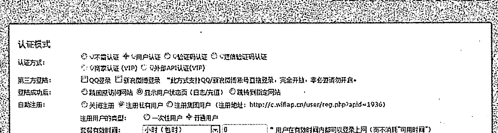

Step3：热点提现。这里要说明一点，WIFI热点收取的费用都统一地收进了这个网站的账户里，你需要通过此网站才能取出现金来。在“热点管理”页面的右上角有个“用户充值/提现”，点击它按提示操作即可。

## 正确配置无线路由器

## 刷上第三方系统

需要准备一台能够刷上DD-WRT或者OpenWRT的无线路由器。如果你已经能够刷上这两者中的一个，请跳过此步骤。

固件下载地址如下：
刷DD-WRT：到www.dd-wrt.com
刷OpenWRT：到downloads.openwrt.org.cn

## 配置路由器 出现认证界面

Step1：保存代码。在Wiflap网站的“热点管理”中点击“生成启动脚本”，在弹出的界面中，系统选择DD-WRT，其余默认，点击“自动生成脚本”，将下面产生的代码复制、保存。再选择OpenWRT，点击“自动生成脚本”，将产生的代码复制、保存。

Step2：将代码保存至路由器。要配置刷好的系统的路由器使其能够上网，设置方法和普通路由器方法一样，只是界面布局不同，并使其能够上网。在DD-WRT系统下，点击“管理→命令”，将刚才拷贝的DD-WRT的脚本复制在其中，并点击“保存为启动命令”，再重启路由器，这样就能看到自己的Wi-Fi认证页面了。在OpenWRT系统下，先安装Web管理界面和Wifidog（安装过程过难，不叙述）。进入Web管理界面，配置连接网络。再点击“系统→开机启动”，在弹出的界面中找到“本地启动脚本”，把拷贝的OpenWRT的脚本复制在exit 0命令的前面就行，再点击“提交”即可。重启路由器就能看到认证界面了。

## 设置路由器 上网优化

Step1: 下载限速。很多人喜欢下载，而下载会占用大量网络资源，进而影响到其他使用者的利益。进入路由管理界面，点击“访问限制”，点击“编辑客户端列表”，在弹出的界面中找到“输入客户端的IP范围”，这里根据实际情况填写IP范围，默认请填写：192.168.1.100-192.168.1.150，点击“保存设置”。再找到“已阻止的服务”并勾选“捕获所有P2P协议”，在下面选择bittorrent、edonkey、xunlei等，这样就限制了BT下载、电驴下载以及迅雷下载。

Step2: 设置无线名称及无线安全。设置好用的网络名称可以吸引更多的用户，而无线安全设置为“无”则会让使用者更加容易地进入有偿共享网络。登录路由管理界面后，点击“无线→基本设置”，这里我把无线网络名称改为了Payment Wifi，在“无线安全”选项中，设置安全模式为“已禁用”。

Step3: 设置自动重启。路由器长时间工作稳定性会下降，因此有必要设置定时重启来增加系统稳定性。点击“管理→保持活动”，找到“定时重启”一栏，选择“启用”，根据需要进行设置。

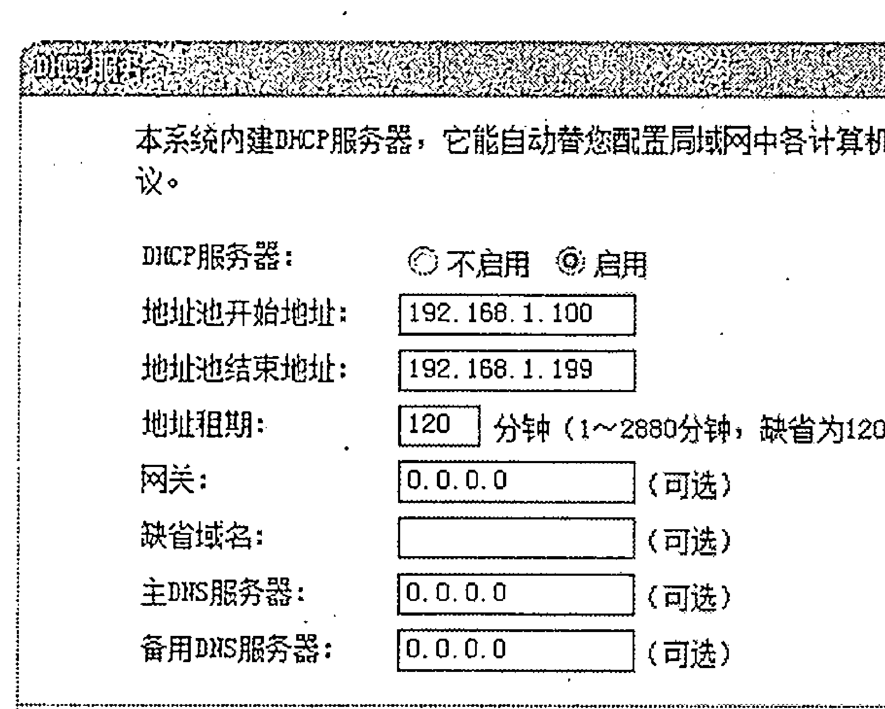

单的方法就是硬复位了,请慎用。

Step4: 关闭路由器的无线模块。关闭路由器的无线模块会减少路由器的负载而使系统的稳定性增加。点击“服务”，找到“SES/AOSS/EZ-SETUP/WPS按钮”一栏，选择“启用”，在弹出的选项中勾选启用时关闭无线网络。或者在管理界面点击“无线”、“高级设置”，找到“无限网络时间限制”，点击“启用”，再点击“总是关闭”即可。

Step5: 禁止登录管理界面。禁止登录管理界面会有效保护自己的路由器不被恶意用户破坏而使整个网络瘫痪。在“管理”中，在“Web访问”一栏中的“协议”，把HTTP和HTTPS前面的钩去掉，点击“应用”就能禁止登录Web管理界面。如果想启用登录，最简

Step6: 设置无线路由器做无线交换机。将无线交换机接在主路由上，可以轻松扩大无线覆盖范围。无线路由器本身就是一个无线交换机，且价格较无线交换机便宜很多。设置方法如下：（1）在普通路由器中先设置好无线网络的名称和加密方式等，我将网络名称设置成和主路由一样的名称和加密方式；（2）将网关改成不与主路由的网关相同的IP地址；（3）再将路由器的DHCP服务器关闭（图2）；（4）用网线把交换机路由的Lan口和主路由的Lan口连接起来。通过以上设置就将普通路由器设置成了交换机。路由器改交换机是不需要对路由器做特殊改动的。详细说明请参阅路由器的说明书。

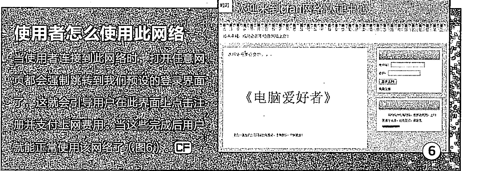

# 消除烦扰清爽在线看电影

文|俞木发

在线看电影是当前普遍的休闲方式，不过很多视频网站总是有各种各样的限制，我们该如何排除这些干扰，清清爽爽看电影呢？

视频网站对我们的干扰，表面可见的是插播广告，背后不可见的是偷偷上传数据，下面我们就有针对性地来解决它们。

## 只看正片不看广告

几乎所有网站在影片播放之前都会来段广告，借助专业屏蔽广告插件，可以轻松跳过这些广告画面。

1 IE用户(包括使用IE核心的其他浏览器)
使用工具: ADSafe广告管家
下载地址: http://www.ad-safe.com/2.5/Index.aspx
ADSafe广告管家内置对多家视频网站的过滤规则，运行软件后切换到“规则列表”，勾选最新的过滤规则。现在再打开优酷、爱奇艺之类的视频网站，播放视频时就不会再有广告了(图1)。

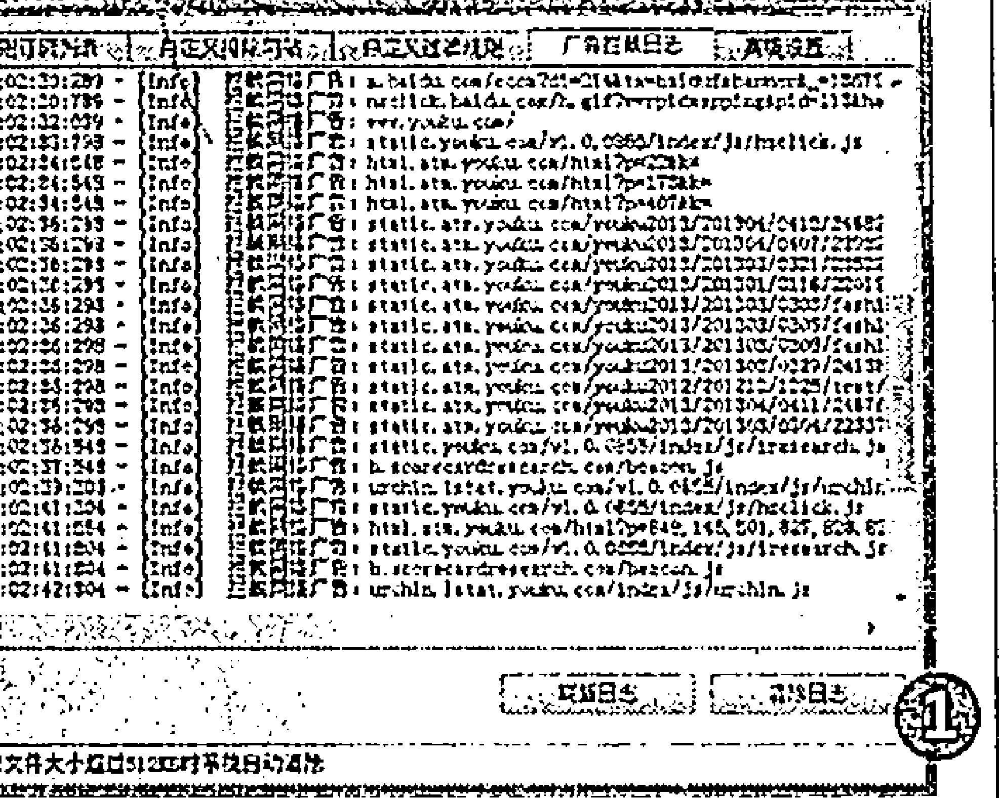

2 火狐浏览器
使用工具: Adblock
下载地址: http://dwz.cn/cfan302
火狐浏览器用户可以借助Adblock插件进行屏蔽, 点击“工具→Adblock Plus→过滤规则参数设置”, 在打开的窗口中选中内置的拦截规则, 展开“动作→更新过滤规则”, 将拦截规则更新到最新状态就可以啦(图2)。

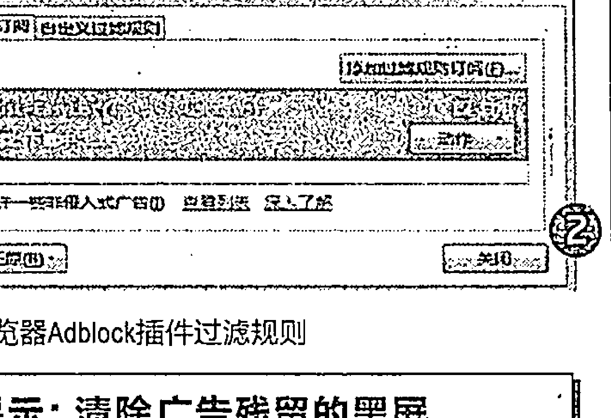

### 小提示: 清除广告残留的黑屏

如果插件屏蔽优酷广告时显示一个黑屏的画面, 还是要你等相同的广告时间。此时只要进入 “C:\Users\当前用户\AppData\Roaming\Macromedia\Flash Player\#SharedObjects\DABEG7K5” (DABEG7K5为随机目录, 请根据自己电脑的实际情况选择), 然后启动记事本新建文本文档, 将文件名包括扩展名一起修改为static.youku.com (即扩展名为com) 放置在上述目录, 这样Flash就无法正常读写SharedObjects, 从而解决优酷视频网站黑屏问题。Chrom浏览器用户可以到谷歌市场下载Adblock For Chrom插件, 具体使用方法类似。

## 禁止网站上传让看片更流畅

为了尽可能减轻视频服务器的压力, 视频网站许多都采用了对等协助网络功能, 也就是通常说的P2P, 这意味着你通过网页看视频时, Flash播放器也会偷偷上传数据, 占用网络带宽, 你可以自行将其关闭。

打开任意一个在线视频网站, 在其中的播放器上右击选择“全局设置”, 在打开的窗口中切换到“播放”, 单选“阻止所有站点使用对等协助网络”就可以了(图3)。如上述方法无效, Windows 7用户可以使用系统管理员身份启动命令提示符, 然后依次输入下列的命令修改mms.cfg文件即可屏蔽P2P上传:

```
echo RTMFPP2PDisable=1 >> %windir%\system32\Macromed\Flash\mms.cfg
echo RTMFPP2PDisable=1 >> %windir%\system32\mms.cfg
```

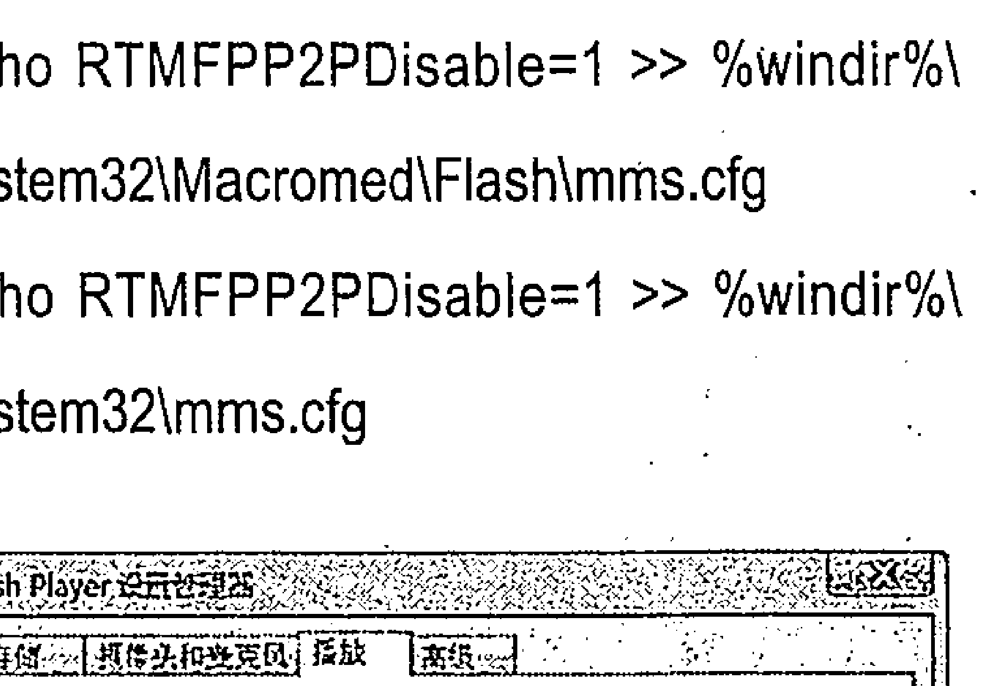

## 模拟移动客户端流畅看片

随着平板、手机等移动设备的普及，越来越多的视频网站专门推出针对移动设备播放的移动网站，不仅针对这些移动设备进行优化，而且配备专门的服务器。这可以让播放更顺畅，而且正片之前没有广告，播放界面也清爽得多。我们在电脑上是无法直接访问移动网站的，不过借助修改浏览器的UserAgent，让视频网站将电脑误认为是移动设备，即可获得更好的视频体验。下面就介绍如何将电脑伪装成Android设备。

### 1 用火狐的人

火狐浏览器的用户，可以使用UserAgent Switcher插件来完成修改。安装此插件后重启火狐，点击“工具→Default User Agent→Edit UserAgent”，在弹出窗口中新建名为Android的新UserAgent，UserAgent后的文本框输入“Mozilla/5.0 (Linux; U; Android 2.2; en-us; Nexus One Build/FRF91) AppleWebKit/533.1 (KHTML, like Gecko) Version/4.0 Mobile Safari/533.1”，其他使用默认设置（图4）。

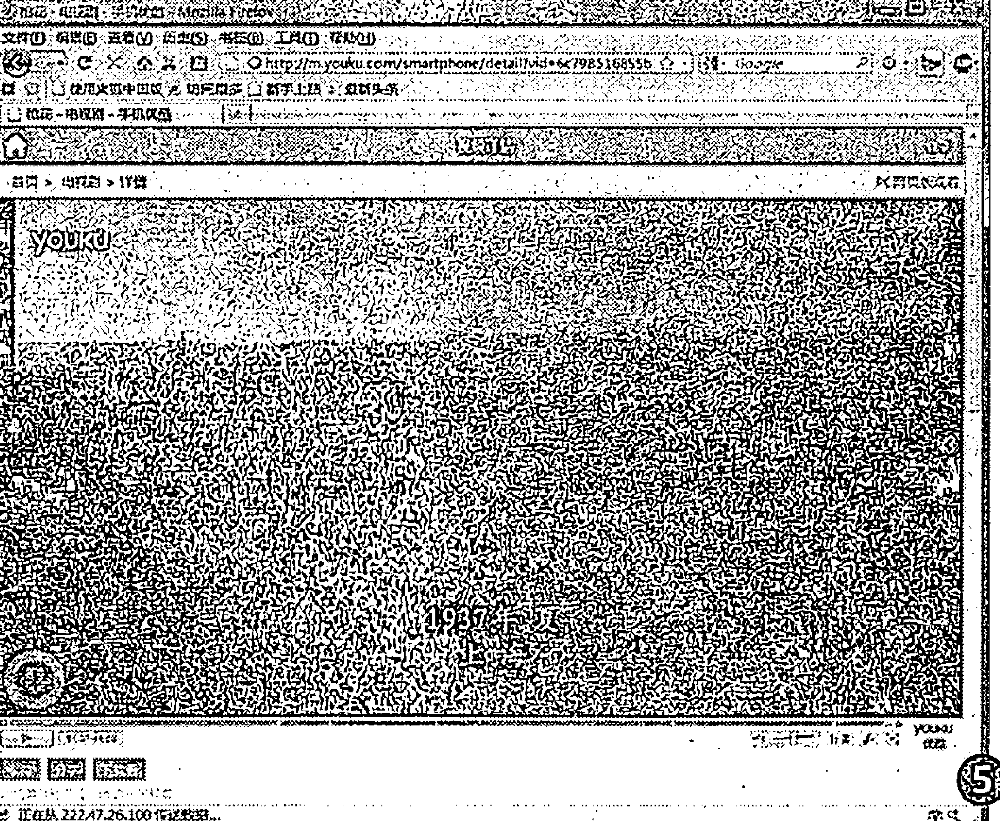

设置完毕，点击“工具→Default User Agent→Android”，切换到模拟Android设备。现在在火狐浏览器中访问m.youku.com，就可以像Android平板一样看电影了（图5）。

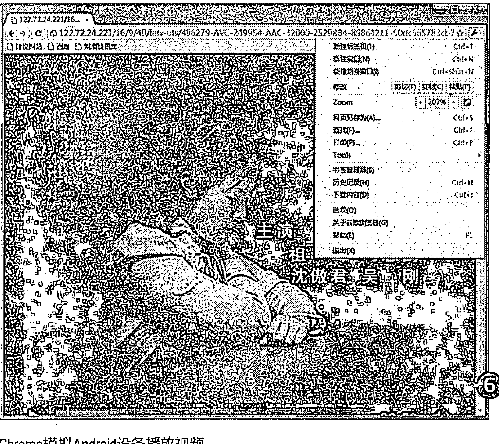

### 2 用Chrome的人

对于Chrome浏览器，只要在程序快捷方式添加上指定UserAgent即可快速变换。首先在桌面建立一个Chrome.exe快捷方式，接着右击新建快捷方式选择“属性”，在“目标”后添加上--user-agent="Android"（注意前面要两个“-”符号），类似C:\Users\yumufa\AppData\Local\Google\Chrome\Application\chrome.exe --user-agent="Android"形式即可（yumufa是本人的登录用户）。现在用这个快捷方式启动Chrome浏览器访问m.letv.com，它就会被网站误认为是Android平板，打开指定视频即可开始播放了。由于这是针对Android优化视频，如果觉得画面过小，只要点击“设置→Zoom”，将网页扩大到合适的比例即可（图6）。

# 秘笈全式 收藏网页不再难

文|金昌

浏览网页时没看完的网页要保存下来，怎么办？笔者根据经验，层层深入，总结出常用的八种收藏网页的方法，或许其中的一种或几种会对你有用。

## 收藏夹标签法

适用场合：
对于一次不能读完的网页，你可以用快捷键Ctrl+D收藏网页地址的方法，将当前阅读的网页收入浏览器的收藏夹以供下次继续阅读。这是大家最熟悉的方法，不用细述。

实现方法：
这种方法尤其适用于那些大型门户网站文章的阅读收藏。由于这些网站的内容稳定，其网页内容一般会在一个较长的时间内留存，因此一般不会影响你的接续浏览，没有必要下载保留。如果你浏览的是个人网站或某个不确定的网站，担心其内容会下线，则请用下面介绍的方法。

## 纯文字另存法

适用场合：
如果只需要网页中的文字信息，而不需要其中的图片、表格、视频或排版样式，则可以用这种方法。这在收集文字信息的时候会有用。

实现方法：
只需选择并复制网页内容，然后粘贴到记事本窗口中，稍加编辑，存盘即可。
记事本可以起到滤掉网页中非文字信息的作用，这就是简单的好处。反之，如果用Word等大型图文编辑软件来直接复制内容，则会连格式一起复制过来，处理起来比较麻烦。
所以，在收集网络文字信息的时候，不妨先将你熟悉的Word搁置一下，拿起记事本程序为你服务吧。

## 收藏夹脱机法

适用场合：
这种方式适合于一些不太重要但需要接续阅读的内容。如果担心网站内容下线不能阅读，或防备近期在不能上网的情况下阅读，可以用设置脱机保存的办法保存网页。设置脱机查看网页后，可以在计算机未与Internet连接时阅读网页的内容。

实现方法：
打开要脱机浏览的网页，先将该网页用上面的方法添加到收藏夹中，然后从IE“文件”菜单下单击选中“脱机工作”一项，这时候，网页内容就会同步到本地硬盘中。如果遇到断网，不在线的情况下也可以脱机浏览该网页的内容（图1）。

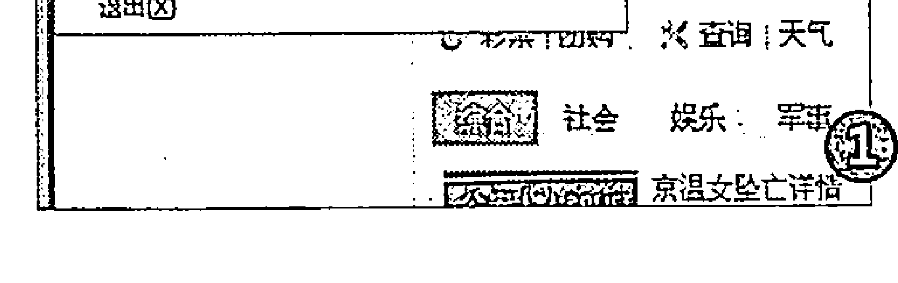

## 单文件另存法

适用场合：
对于常规的网页，不单单是文字信息，可能还会有表格、图片等重要内容在里边。如果你希望将一页信息完全留存，则可以将网页以打包的形式存为文件备用。

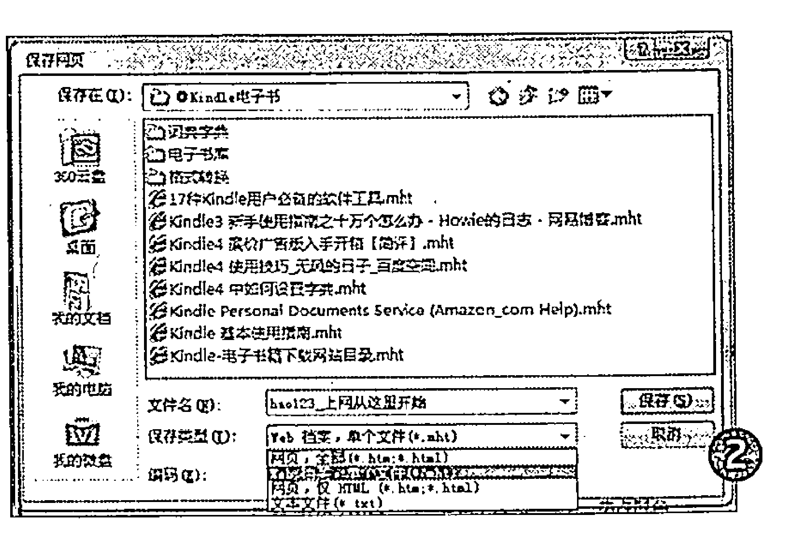

### 源代码另存法

适用场合：
如果你需要将某网页保存下来，但网页又限制了你用拷贝粘贴的办法复制文字，甚至限制了用一般办法保存网页，你可以试试这种方法。

实现方法：
在网页上面点右键，选择“查看源文件”命令，这时会自动在记事本中打开网页源代码（图3），去掉其中有关限制浏览的代码段（一般在文件的开头部分），把源代码文件保存为扩展名为.htm的文件，然后再用浏览器打开这个html文件，就可以选择其中的文字了。

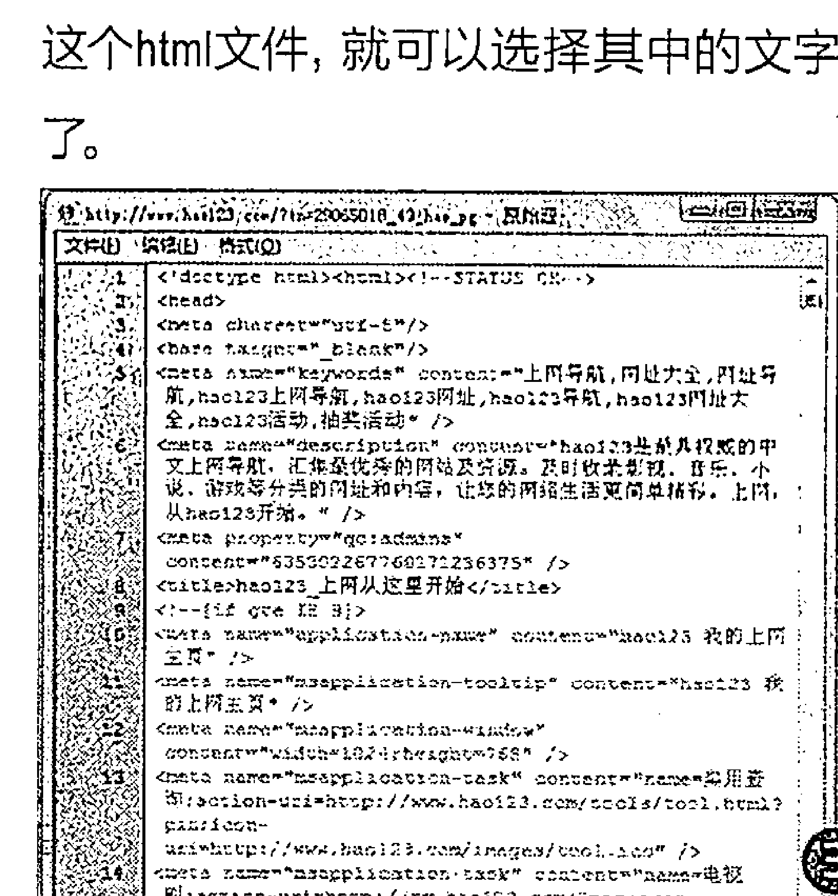

### 页面拍照另存法

适用场合：
如果一个网页无法用上面的方法保存下来，系统提示无法保存网页，这时可以考虑用某些浏览器提供的网页截图功能为网页拍快照，将网页保存为图片。

实现方法：
例如，使用360安全浏览器上网，该浏览器就提供了这样的功能，我们只需在其浏览器工具栏上选择“截图”按钮后的小三角，在下拉菜单中选择截图命令，截取网页中有的部分作为图片保存，或者直接按Ctrl+M快捷键，将当前网页保存为一张完整的图片（图4）。

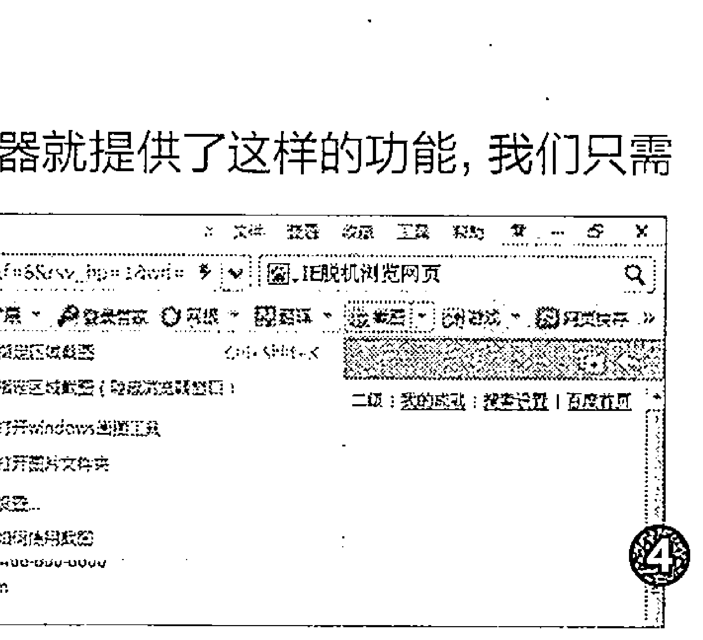

### 软件抓图另存法

适用场合：
360安全浏览器提供的网页截图功能只有截取整个网页和屏幕显示的部分区域两种方式，如果你需要截取大于一个屏幕但又小于整个网页的部分网页内容，上面这种方法就行不通了。这时，我们可以用抓图软件SnagIt提供的滚动抓图功能进行抓图。

实现方法：
以SnagIt 8.2为例，从SnagIt属性设置窗口中选择“输入→滚动”，选择“自动滚动窗口”，SnagIt将在捕获的同时从上到下滚动网页，使你能够获取一个屏幕到整个网页这个区间的任何一段内容，作为图片保存。

### 工具分类另存法

适用场合：
如果你要针对性地使用网页中的某类元素，如视频、动画、样式等，上面的方法就不行了，这时用SmartGrabber软件抓取法比较不错。软件可以保存图片、Flash动画、CCS样式表、Scripts、多种视频（Quick Time、RealPlayer、MediaPlayer等）。

实现方法：
安装SmartGrabber软件后，在IE浏览器工具栏中单击Grab工具按钮，弹出窗口，在左上角单击Grab活动工具栏，打开SmartGrabber的保存窗口，通过复选框选择要保存的类型。确定后，可以在location文件夹中找到需要的内容。

# 不是光驱胜似光驱

## 虚拟光驱大比拼

文|CFan研究院

网上可以找到许多虚拟光驱软件，它们的功能看起来相差无几，那么，到底哪一款更适合你？本期软件评测将为你提供有益的参考。

光驱逐渐淡出市场，导致虚拟光驱软件的盛行，连新版Windows 8也都集成了虚拟光驱的功能。不过，不同的用户对虚拟光驱的要求也不尽相同，比如有些人只需要能简单加载ISO文件，而有些人则需要能够读取加密的光盘数据。那么具有什么功能的虚拟光驱才符合你的使用需求呢？

- 测试平台
- CPU: Intel Core i3-2120 (双核3.30GHz)
- 内存：4GB
- 硬盘：希捷1.5TB
- 操作系统：Windows 8 专业版 (64位)

被测软件是这么挑选的
虚拟光驱的出现已经有很长一段时间，用户非常多，这是导致微软在最新的Windows 8系统内置虚拟光驱组件的原因之一。由于虚拟光驱是借助底层虚拟驱动文件模拟硬件，因此它对系统要求较高。这里选取的都是比较老牌的经典软件，技术成熟，而且可以在主流Windows 7/8下完美运行。

- 1. Windows 8自带组件
- 2. Daemon Tools: http://www.daemon-tools.cc/home
- 3. UltraISO: http://www.ezbsystems.com/ultraiso
- 4. Gizmo: http://www.techsupportalert.com
- 5. Alcohol 52%: http://www.alcohol-soft.com

## 稳定性/兼容性测试——比比谁运行得更好

虚拟光驱因为涉及到底层驱动文件，如果驱动文件设计得不规范或者存在BUG，就极易导致系统蓝屏。因此稳定性、兼容性应该是虚拟光驱需要考虑的第一要素，如果无法在主流的Windows 7/8下正常使用，即使功能再强大也是枉然。

| 软件/评测项目 | 自带组件 | Daemon Tools | UltraISO | Gizmo | Alcohol 52% |
| :--- | :--- | :--- | :--- | :--- | :--- |
| 兼容性 | 极好 | 一般 | 较好 | 较好 | 较好 |
| 稳定性 | 极好 | 一般 | 较好 | 较好 | 较好 |
| 驱动稳定性 | 好，内置驱动 | 一般，测试过程出现蓝屏 | 较好，测试过程出现停止响应 | 较好，测试加载VHD时遭遇蓝屏 | 较好，测试过程出现停止响应 |
| 操作难度 | 极低，通过右键菜单加载 | 较低，安装后会自动关联到右键菜单 | 一般，需要手动启动来加载虚拟光驱组件 | 较低，安装后会自动关联到右键菜单 | 一般，需要启动主程序手动来加载 |

Windows 8自带的虚拟光驱作为系统原生组件，就稳定性和兼容性而言无疑是最好的，而且使用起来也非常的简单，定位到ISO文件所在的位置，右击选择“装载”即可使用。至于其他四款虚拟光驱，它们的驱动程序都有开发公司数字签名，但是并没有经过微软WHQL认证，因此在日常的使用中可能会出现兼容性故障。在我们的测试过程中，Daemon Tools就经历一次蓝屏事故，Gizmo、UltraISO和Alcohol 52%在加载大文件时（4GB左右），偶尔出现停止响应的故障。

## CFan观点：普通用户首选

从本轮测试结果可知，Windows 8自带的虚拟光驱，稳定性/兼容性是最好的，且操作简单。不过它功能单一，只支持最常见的ISO文件，对于没有什么特别要求的普通用户，它算是最佳选择了。

## 性能比拼——看谁支持的文件格式多

虚拟光驱支持的文件格式越丰富，我们用起来就越方便，谁也不愿意为了支持不同文件而安装好几个同类型的软件。

表2：虚拟光驱支持格式数据

| 软件/评测项目 | 自带组件 | Daemon Tools | UltraISO | Gizmo | Alcohol 52% |
| :--- | :--- | :--- | :--- | :--- | :--- |
| 支持格式 | ISO | CUE、ISO、MB、CCD、BWT、MDS、CDI、VCD | ISO、BIN、CUE、IMG、CCD、NRG、BWI、CDI | ISO、BIN、CUE、NRG、CCD、MDS、MDF、VHD | MDS、CCD、BIN、CUE、ISO、CDI、BWT、BWS、BWA |
| 同时支持光驱个数 | 多个，每加载一个文件就增加一个光驱 | 31 | 1 | 10 | 31 |

ISO是最常见的虚拟光驱文件格式，被测的几款软件全部支持，并且Windows 8自带的虚拟光驱仅支持这一种。除此之外，还有BIN、CUE、NRG等常见的格式，各软件的支持程度就各不相同了。

## CFan观点：软件爱好者首选Alcohol 52%

从上述测试结果可以看到，Alcohol 52%支持的格式和同时支持的光驱数都是最多的，这对经常需要测试各种虚拟软件的朋友来说，绝对是最佳选择。并且，Alcohol 52%的刻录功能也很强大，从网上下载的CUE音乐镜像，可以直接用它加载刻录，极其方便。

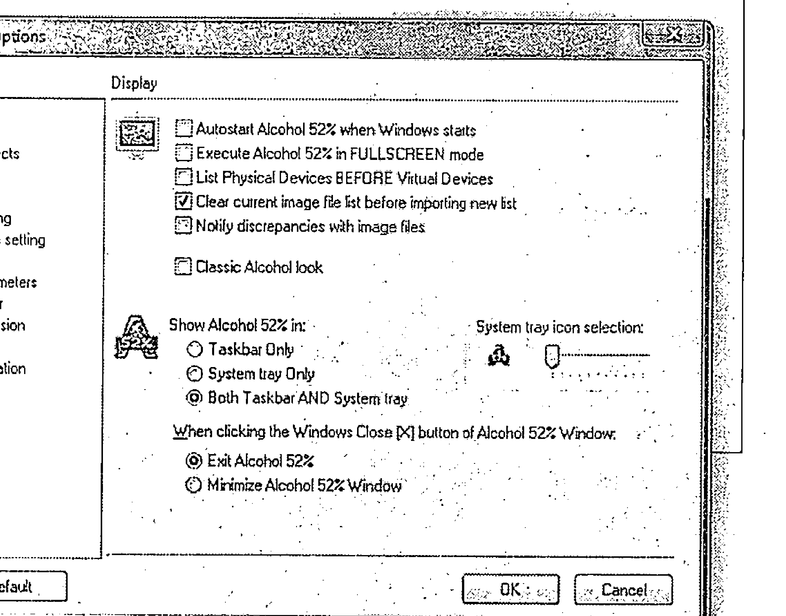

## 启动光盘制作测试

当前常见的引导方式中，除了硬盘引导外，光盘是引导功能兼容性最好，也是最安全的（因为启动文件只读），因此制作、编辑、刻录启动光盘或者启动镜像是很多朋友使用虚拟光驱的主要原因之一。

如果本身已经是可启动光盘镜像，如Windows 8安装镜像文件，那么5款软件都支持直接刻录为启动盘，操作也大同小异，只要载入ISO文件后选择“刻录”即可。不过经常制作启动盘的朋友都知道，对于已经是可启动镜像，我们经常还要加以编辑，比如整合多个WinPE启动镜像到一个启动文件中，或者直接新建启动镜像。这就要求虚拟光驱软件能够对启动镜像进行编辑，同时还要具备导入/导出启动文件的功能。这方面，UltraISO无疑是最突出的。

表3：虚拟光驱制作启动镜像光盘功能测试

| 软件/评测项目 | 自带组件 | Daemon Tools | UltraISO | Gizmo | Alcohol 52% |
| :--- | :--- | :--- | :--- | :--- | :--- |
| 支持直接刻录可启动镜像 | 是 | 是 | 是 | 是 | 是 |
| 支持编辑 | 否 | 否 | 是 | 否 | 否 |
| 是否支持启动文件提取和导入 | 否 | 否 | 是 | 否 | 否 |
| 支持制作启动盘 | 否 | 否 | 是 | 否 | 否 |

## CFan观点：系统爱好者的首选

从上述测试结果可以看到，不管是启动镜像的刻录、编辑，或是制作新的启动镜像，UltraISO都可以完美地支持，因此系统爱好者不可错过它。

## 谁的特色功能多

除了基本的虚拟光驱功能外, 不同用户对此类软件还有其他一些需求。比如大家知道, 有些游戏是需要插入游戏光盘才能正常运行的, 而且有些还采用了加密的形式制作。这时候, 我们就需要虚拟光驱具有能够读取加密镜像的功能。

| 软件/评测项目 | 自带组件 | Daemon Tools | UltraISO | Gizmo | Alcohol 52% |
| --- | --- | --- | --- | --- | --- |
| 加密镜像读取 | 不支持 | 支持 | 部分支持 | 不支持 | 不支持 |
| 重启Windows后是否自动装载 | 不支持 | 支持 | 不支持 | 支持 | 支持 |
| 读取速度 | 48X | 200X | 48X | 200X | 48X |
| 支持模拟蓝光 | 不支持 | 支持 | 不支持 | 支持 | 不支持 |
| 模拟MO光驱 | 不支持 | 支持 | 不支持 | 不支持 | 不支持 |
| 支持压缩 | 不支持 | 支持 | 不支持 | 支持 | 不支持 |

单从功能丰富性而言, Windows 8自带虚拟光驱无疑是最弱的。相比之下, 其他4款软件的功能就丰富得多了, 比如Gizmo加载时可以自定义盘符, 可以选择装载后是否自动运行, 还可以选择重启Windows后是否自动装载这个镜像, 甚至支持划出硬盘上的一个区域作为虚拟磁盘。Daemon Tools则可以完美支持加密光盘, 可以让游戏爱好者不再需要插入光盘即可运行游戏。

## CFan观点: 游戏爱好者的首选

从上述测试结果可见, 在5款软件中Daemon Tools功能最为丰富, 而且其特有的读取加密光盘（镜像）、高速的读取速度都非常优异, 是游戏爱好者的首选。

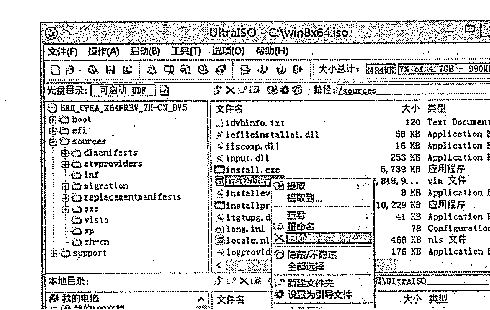

## 启动盘刻录技巧精选

### 技巧1: 为启动镜像减肥

Windows 8安装镜像已经自带WinPE维护组件, 但是默认Windows 8安装镜像大小至少在2GB以上, 一张普通CD光盘根本无法容纳。如果我们仅仅只是需要其中的WinPE维护组件, 则可以使用UltraISO对其编辑, 删除无关组件以减小镜像的体积。

启动UltraISO, 点击“文件→打开”, 打开准备好的Windows 8安装镜像, 在右侧窗格展开Sources目录, 将其中的Install.wim文件删除, 再将安装文件另存为Pe.iso, 即可刻录为WinPE启动光盘。

### 技巧2: 自制启动镜像

很多时候我们身边可能并没有合适的启动镜像, 这时可以根据自己的需要自行制作。比如现在很多朋友仍然喜欢使用Ghost一键还原系统, 我们制作好本机系统的GHO备份后, 就可以自制一张一键还原启动光盘。

第1步: 准备Windows 7安装镜像并用UltraISO打开, 单击“启动→保存引导文件”, 将引导文件另存为Win7.bif。新建一个启动光盘并导入上述引导文件, 然后将Windows 7安装镜像中的Bootmgr、Sources/boot.wim和Boot文件夹, 按提示添加到新建光盘中。

第2步: 准备好Ghost32.exe, 启动记事本新建一个一键还原批处理yjhy.bat放置在桌面, 然后将制作好的GHO备份、Ghost32.exe连同批处理添加到新建启动镜像的根目录下, 批处理代码如下:

```
G:\Ghost.exe -clone,mode=pload,src=g:\sys.gho:1,dst=1:1 -auto -sure -fro -fx -rb
```

这里G是本例中的光驱盘符, G:\sys.gho表示存放在光盘上的恢复镜像。如果制作的镜像较大, 超过光盘容量, 则可以放在本地硬盘如D盘, 只要将代码更改为src=d:\sys.gho:1即可。这样以后如果系统出现故障无法直接进入, 只要插入光盘启动到PE后, 直接输入“g:\yjhy”即可开始一键还原。这一方法同样适合Windows XP/7/8系统。注意: 系统恢复有风险, 操作前一定要完全确认, 以免覆盖到有用的数据区域。

# 文件搬走 本地照常查

文 | 王占平

一些大文件搬离本地硬盘，拿到了别的地方备份，日后如果要查找是否收藏有某个文件，是不是还得拿备份盘来进行搜索？不用！

> 由于本地硬盘空间有限，一般我们都是将电脑中备份的影视文件或其它有价值的资料，移动到移动硬盘中或刻录到光盘中收藏。但是，在日后需要使用这些资料的时候，我们不可能记得哪些资料存在哪个盘中，这往往需要某个资料的时候，如何得知我们是不是已经下载过这个资料？更进一步，这个资料具体在什么地方，便成了问题。本文介绍一种通过建立资料“影子”进行查找的行之有效之法。

# 留下影子 方便查找

为了方便查询，需要在本地留下这些备份文件的“影子”。也就是说，让这些文件所在的文件夹和文件名均保留，但要求保留下来的文件全部变成0字节以节省硬盘空间。

假设我下载的影视资料存放在D:\FunshionMedia文件夹中。现在，我要将这些资料转移到移动硬盘（比如我给这块移动硬盘起名“移动A号”），只要按如下步骤去做即可建立文件“影子”。

首先，在D盘根目录下建立一个文件夹“移动A号影子”，然后，在该文件夹下，用记事本建立一个TXT文件LS.TXT，在该文件中输入两行内容（图1）。

存盘之后，将文件扩展名改为BAT。双击执行LS.BAT文件，马上会在“移动A号影子”文件夹下自动生成一套与原文件夹D:\FunshionMedia结构完全相同的子文件夹。与此同时，该文件夹下还自动生成一个LIST.TXT列表文件，该列表文件中是原FunshionMedia文件夹中所有文件的名称列表（含路径）。

```
XCOPY D:\FunshionMedia\*.* /T/E
DIR D:\FunshionMedia\*.* /S/ON/B>LIST.TXT
```

接下来，在“移动A号影子”文件夹下建立一个文本文件AAA.TXT，里边不输入任何内容，存盘。

随后，用EmEditor文字编辑器编辑该LIST.TXT列表文件。进入“查找与替换”窗口，在“查找”框中输入“\n”，在“替换为”框中输入“\nCOPY AAA.TXT ”（注意TXT后有一个半角空格）。替换之后，参参照替换后的中间行格式对首尾两行做一下手动处理，使之统一格式。

再用成批替换的方法，将LIST.TXT文件中的所有FunshionMedia替换为“移动A号影子”，保存文件，并将文件的扩展名改为BAT。

最后双击生成的LIST.BAT文件，就会自动在“移动A号影子”文件夹中生成与原资料文件夹结构相同，且包含所有相同文件名的0字节影子文件（图2）。

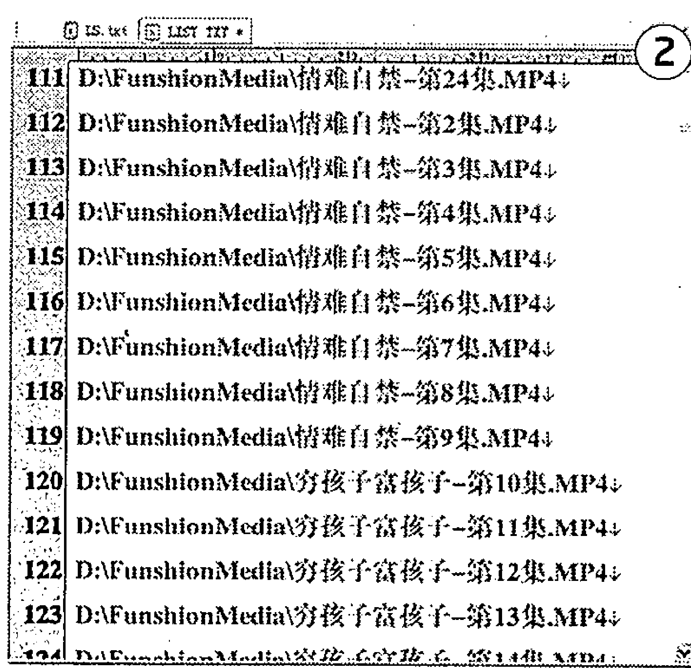

> 极速查找 所需所需，需要查找资料的时候，在电脑中用Everything工具通过文件名关键字来搜索，几乎不需要时间即可查出是否下载过这个资料，以及资料的具体出处。

上面的操作执行完毕，你就可以将D盘中的影视目录FunshionMedia连同文件一并剪切转移到移动硬盘中藏起来了。

清晰打印 有赖内外双修

文|方襄礼

现在电脑显示屏越来越大，分辨率也越来越高，然而在打印屏幕截图或用屏幕截图来做书报印刷的时候，就会出现字小图小看着费劲的情况。如何解决清晰度和画面大小的矛盾？

在保证设备提供的桌面显示最佳分辨率设置不变的前提下，从系统本身的特性来考虑修改，可以从如下两个方面着手解决问题。此外，还可借助于工具软件在抓图的同时辅助解决问题。

放大图标 清晰体现

对于仍使用Windows XP的用户，从‘运行’窗口中执行DESK.CPL命令，打开‘显示属性’对话框。在‘外观’选项卡中单击‘效果’按钮，打开‘效果’对话框，选择‘使用大图标’复选框，单击‘确定’按钮，再点击‘应用’按钮。这时你会发现，屏幕分辨率没有改变，但桌面上的图标变大了，这样抓出来的桌面图片印出来就会清晰许多。

如果使用的是Windows 7操作系统，具体设置方法：在桌面空白处单击鼠标右键，选择快捷菜单中的‘查看’命令，然后从中选择‘中等图标’或‘大图标’子命令；这样桌面图标在抓图印刷后，也将会体现得更加清晰。

放大字体 看清细节

仅仅是图标变大还不够，文字还要印出来能看得更清晰方可。

在Windows XP环境下使用，按如上相同方法启动到‘显示属性’对话框，打开‘外观’选项卡，在‘字体大小’下拉列表中选择‘特大字体’选项，点击‘应用’然后确定退出。这样一来，印刷出来的字体也会变大。

如果使用的是Windows 7操作系统，具体操作方法是：在桌面空白处点击鼠标右键，在快捷菜单中选择‘个性化’命令，在弹出的窗口左侧栏内选择‘显示’一项，然后在窗口右侧选择‘中等（M）-125%’或‘较大（L）-150%’，这样屏幕上的文本大小和其他项就会相应变大。

工具辅助 抓图放大

对于某些软件窗口部件中的图标或字体，也许不会因系统图标和字体设置的改变而改变，这时我还有另一个办法来解决。那就是适当升高抓图输出比例，让抓图软件在抓图过程中对抓取的画面自动作适当放大。

比如，用SnagIt抓图的时候，可以先通过‘滤镜→图像比例→调整图像尺寸’菜单命令来设置抓图输出的自动放大百分比。根据印刷的实践数据得知，这个比例在不高于130%的情况下，印刷出来的图片既能保证清晰度，又能保证元素尺寸的视觉效果令人满意。建议设置为120%，取得的效果最好。

保存格式 避免失真

截图后保存文件时注意，应尽量选择BMP和PNG格式保存。若选择JPG格式，因许多软件默认JPG保存质量远低于100%，低于90%的JPG图片打印时会出现模糊。因此，JPG格式存图需要慎用。

兼顾升级和管理
### 三大主流驱动工具评测
文|CFan软件研究室

借助驱动工具来安装驱动，可以为我们省去若干麻烦。不过，驱动工具并非一款，究竟应该选择哪款作为我们PC中的硬件管家呢？相信此次评测将给大家一个答案。

### 参评对象
- 360驱动大师、驱动精灵、鲁大师

### 测试平台
- 操作系统：Windows 7 64位旗舰版
- 处理器：英特尔酷睿(Core)i5-2310 2.90GHz四核
- 内存：4GB (A-DATA DDR3 SDRAM 1333MHz)
- 硬盘：西部数据1TB

硬件检测：谁最准确

驱动工具的基本功能是能为用户提供相应硬件的驱动信息，这就要求它必须能够准确而全面地检测到PC所使用的硬件类型及型号，否则，张冠李戴胡乱安装一通，势必会给我们的正常工作带来不少的麻烦。因此这部分，我们首先拿它开刀，看三大工具的临场表现如何。

### 硬件检测对比结果
| 项目 | 360驱动大师 | 驱动精灵 | 鲁大师 |
|---|---|---|---|
| 未检测到的硬件数量及名称 | 3个 光驱、和键鼠 | 1个 显示器 | 0个 |
| 显示出的硬件信息是否详细 | 不详细，只显示出了硬件名称、型号及简单参数 | 详细，可轻松地了解到硬件的型号、规格、性能、生产商、生产日期及已使用的时间等信息，而且如果愿意，用户可切换到“详细信息”标签，查看有关硬件的详细信息 | 详细，可轻松地了解到硬件的型号、规格、性能、生产商、生产日期、已使用的时间等信息 |

### CFan观点
单就硬件检测这一项来说，驱动精灵无疑最为强大。因为它显示的硬件信息最为详细，硬件的基本信息和技术参数一应俱全。其次是鲁大师，它显示的信息比较简略，但对于普通用户来说，已经足够了。其中最让人讶异的是360驱动大师，它显示的信息仅限于硬件的基本信息，而忽略了一些可以让菜鸟发晕的技术参数，所以比较适合菜鸟用户使用。

驱动管理 谁最强大

### 驱动管理功能对比结果
| 功能项目 | 360驱动大师 | 驱动精灵 | 鲁大师 |
| --- | --- | --- | --- |
| 是否支持检测驱动的完整性 | 支持 | 支持 | 支持 |
| 是否支持驱动更新 | 未知 | 支持 | 支持 |
| 找到可更新的驱动数量 | 0个，驱动体检100分 | 5个（包括） | 1个 |
| 是否支持驱动回滚 | 否 | 支持 | 否 |
| 是否支持驱动备份、还原 | 支持，可自定义备份路径 | 支持，可自定义备份路径 | 支持，可自定义备份路径 |
| 是否支持手工搜索驱动 | 否 | 否 | 否 |

> 我们尝试安装了N年前的Windows XP系统，且所有驱动皆源于系统，但360驱动最后仍然给出了100分的满分。

> 和360驱动大师一样，鲁大师也未找到任何可供升级的驱动。

> 在标准模式下，驱动精灵找出了2款驱动，且每款驱动都表明了更新日期和升级说明，非常体贴。

### CFan观点
在这一项目中，360驱动大师未找出任何可用的更新，驱动精灵找到5款，而鲁大师仅找到了一款。同时，驱动精灵还提供了一个其他工具没有的功能，那就是驱动回滚功能，借助它，我们可方便地将驱动恢复到先前的版本。

探究几款工具有如此差异的原因，应该是360认为当前硬件有驱动可用就是完美，所以懒得让用户再去升级了。而驱动精灵则是以及时汇报相应的驱动是否有新版本为己任，所以才会在显示驱动的最新版本、更新时间之外，同时显示出新版本改进说明，以方便用户根据自己的需要，确定是否需要更新。而鲁大师一向崇尚中庸，所以它才会老老实实地只显示那些版本相差较大的更新。

附加功能 谁最实用

附加功能不是越多越好，而是越实用、越个性越好，正是本着这一原则，我们对三款工具提供的附加功能进行了评估。

其中360驱动大师共提供了5大附加功能，分别为真假硬件识别、驱动损坏修复、USB设备管理、硬件损坏检测、驱动门诊。应该说，这五大功能都与硬件有关，而且具有很强的实用性，特别是当中的真假硬件识别、硬件损坏检测，可以帮助我们快速知道当前接入的硬件是否为假货，或PC中的某硬件是否已损坏。此外是驱动门诊功能，可以允许我们在硬件遇到问题时（如聊天时摄像头不可用、播放视频时没有声音等），通过故障描述的方式向“360电脑专家”求救（专家分为智能机器人和人工服务两种），以快捷地解决问题。

相比之下，驱动精灵提供的附加功能就要丰富得多，我们粗略计算了一下，大约有三大类型几十项。这三大类分别为系统补丁、软件管理和百宝箱。其中每一类下，都包括几个甚至十几个小的分类，内容从软件升级、系统提速、一直延伸到病毒查杀、数据恢复，所以我们完全有理由相信，驱动精灵明显就是一个杂货铺子，附加功能多而乱，不知是否有人会有兴趣查看并使用这些功能。只是一个打着驱动招牌的杂货铺，无论我们需要，只要在那货品累叠的柜台上翻一翻，或许都能找到相应的产品。不过目前的问题是，同样的产品在别家已经专卖，而且质量更好，驱动精灵这种大杂烩的做法能够讨得用户的欢心？答案明显让人怀疑！

最后说一说鲁大师。应该说，鲁大师在这方面的表现相当不错，它提供的五大功能除了“电脑优化”与硬件无关外，其余四大功能都能在一定程度上增加用户对硬件的了解和掌控。也算是术有专攻，紧紧抓住“硬件”这一范畴了。

### 总评
通过以上的比较，相信各位朋友对三款工具的表现已经心中有数了。其中360驱动大师比较适合菜鸟且非玩家朋友使用，理由很简单，它纯粹实用，虽然不会及时地向我们推荐最新的驱动更新，但至少可以保证我们的驱动够用，另外它提供的附加功能也能令菜鸟朋友省去不少麻烦。而驱动精灵则更适合于游戏玩家和电脑高手使用，因为游戏玩家对驱动（特别是显卡）的更新比较重视，而电脑高手除了会重视驱动的更新外，还能根据自己的知识正确地判断当前的驱动究竟需不需要更新。至于鲁大师，中庸的性格决定了其中庸的命运，如果你比较喜欢经常使用它的性能测试功能来测试整机的分数，那么选择它应当是一个不错的主意。此外，对于显卡的驱动更新，我们可以使用显卡驱动官方提供的用户控制中心来获取显卡的最新驱动，因为官方软件会对你的电脑配置进行分析，给出最适合你显卡使用的驱动程序。

Excel跨工作表数据排序

利用RANK函数不仅能够实现在一个工作表中的数据排序，而且还能够跨工作表实现多工作表中的数据排序。

文|马震安

实例描述：学校某个年级有3个班级，各班的学生成绩放在同一个工作簿中，但在不同的3个工作表中，工作表的名称为“1班”、“2班”、“3班”，在这3个工作表中要求计算出学生的班级名次及年级名次(图1)。

实例分析：每班为一个工作表，在每个学生的“班级名次”处用RANK很容易计算出班级排名，可是怎样计算出它的年级总排名呢？通常比较费事的做法是：新建一个成绩总表，把所有班的成绩都复制到总表里，在总表里用RANK进行年级排名，然后通过筛选把各班成绩连同年级名次利用选择性粘贴数值到各个班级的工作表中，再在各个班级的工作表中进行本班内的成绩排名。这种做法有一个显著的缺点，就是当更改某个学生的分数时，学生的年级名次不能自动更新。这怎么办呢？

有的人认为RANK函数只能在同一个工作表中使用，其实它也可以跨工作表进行数据的排序。接下来，我们就看一看利用RANK函数是怎样进行班级名次及年级名次排序的吧！

同一工作表内的班内排名

由于每个班级的成绩独占一个工作表，所以在一个工作表内利用RANK函数可以轻松地实现数据的排序。我们以计算“1班”工作表中各个学生的班内名次为例，看一看RANK函数在同一工作中的应用。

首先，我们打开存放数据的Excel文件，选择名称是“1班”的工作表，定位在“学生A1”的“班内名次”所在的单元格M3。然后在编辑栏输入`=rank(L3,$L$3:$L$10)`；接下来，拖动填充柄进行数据填充就可以了。其他工作表中的班内排名也是如此。其中，“$”是对数据区域进行绝对定位。

| 序号 | 姓名 | 语文 | 数学 | 英语 | 物理 | 化学 | 生物 | 政治 | 历史 | 地理 | 总分 | 班内名次 | 年级名次 |
|------|------|------|------|------|------|------|------|------|------|------|------|----------|----------|
| 1 | 学生A1 | 85 | 144 | 121 | 78 | 94 | 88 | 78 | 82 | 75 | 845 | | |
| 2 | 学生A2 | 93 | 139 | 120 | 74 | 79 | 73 | 78 | 78 | 78 | 812 | | |
| 3 | 学生A3 | 100 | 128 | 117 | 54 | 84 | 81 | 78 | 70 | 72 | 784 | | |
| 4 | 学生A4 | 88 | 122 | 109 | 62 | 70 | 70 | 73 | 59 | 57 | 710 | | |
| 5 | 学生A5 | 82 | 107 | 91 | 74 | 75 | 74 | 74 | 75 | 66 | 718 | | |
| 6 | 学生A6 | 92 | 92 | 111 | 33 | 64 | 60 | 72 | 64 | 61 | 649 | | |
| 7 | 学生A7 | 91 | 110 | 95 | 62 | 72 | 78 | 80 | 73 | 66 | 727 | | |
| 8 | 学生A8 | 79 | 136 | 85 | 44 | 66 | 66 | 77 | 72 | 64 | 689 | | |

跨工作表的年级排名

如何利用RANK函数统计各个工作表中学生的年级名次呢？前面咱们分析过，如果把各个工作表中的数据都合并到一个工作表中再用RANK函数统计太费时费力了。

其实，我们可以在每个工作表学生的“年级名次”处利用RANK函数照样可以统计该生的年级名次，并且当某个人的分数发生改变时，年级名次也进行自动的更新。

我们还是以统计1班学生的年级名次为例，看一看RANK函数是怎样跨工作表进行数据统计的。

首先，选择名称是“1班”的工作表，定位在“学生A1”的“年级名次”所在的单元格N3，然后在编辑栏输入`=RANK(L3,'1班:3班'!$L$3:$L$19)`，接下来，拖动填充柄进行数据填充就可以了。其他工作表中的年级排名也是如此。其中，“$”是对数据区域进行绝对定位。

| 序号 | 姓名 | 语文 | 数学 | 英语 | 物理 | 化学 | 生物 | 政治 | 历史 | 地理 | 总分 | 班内名次 | 年级名次 |
|------|------|------|------|------|------|------|------|------|------|------|------|----------|----------|
| 1 | 学生A1 | 85 | 144 | 121 | 78 | 94 | 88 | 78 | 82 | 75 | 845 | 1 | 1 |
| 2 | 学生A2 | 93 | 139 | 120 | 74 | 79 | 73 | 78 | 78 | 78 | 812 | 2 | 2 |
| 3 | 学生A3 | 100 | 128 | 117 | 54 | 84 | 81 | 78 | 70 | 72 | 784 | 3 | 6 |
| 4 | 学生A4 | 88 | 122 | 109 | 62 | 70 | 70 | 73 | 59 | 57 | 710 | 6 | 16 |
| 5 | 学生A5 | 82 | 107 | 91 | 74 | 75 | 74 | 74 | 75 | 66 | 736 | 4 | 12 |
| 6 | 学生A6 | 92 | 92 | 111 | 33 | 64 | 60 | 72 | 64 | 61 | 649 | 8 | 28 |
| 7 | 学生A7 | 91 | 110 | 95 | 62 | 72 | 78 | 80 | 73 | 66 | 727 | 5 | 13 |
| 8 | 学生A8 | 79 | 136 | 85 | 44 | 66 | 66 | 77 | 72 | 64 | 689 | 7 | 23 |

数据的自动更新

上述过程做完之后，当你更改任一工作表中的学生成绩时，学生的“班内名次”和学生的“年级名次”都会自动地发生相应改变。这比将各班数据合并在一起再求年级名次，然后用选择性粘贴数值到各班成绩表中的方法是不是更省时省力呀？怎么样？赶快试试吧(图2)！

注意：关于数据引用范围即$L$3:$L$19，在实际应用中，不可能每个班的学生数都是一样多，所以我们要引用各个班级成绩工作表中记录最多的那个工作表中的范围。

由于是测试，在本例中笔者在“1班”工作表存放了8条记录，在“2班”工作表中存放了4条记录，在“3班”工作表中存放了17条记录，所以数据引用的范围就是$L$3:$L$19。有关“1班:3班”的输入，你可以按住Shift键，用鼠标进行所需工作表的选取。

利用Excel生成二维码

二维码不光是在商品消费中被越来越多地采用，小公司或个人也可以用二维码来传递和识别特定信息。那么，如何制作二维码呢？

文|葛峰

目前大家生活中碰到的二维码应用最多的场合应该是各类电子票，一些旅游景点在网上购票后都会发送给你一条含有二维码信息的彩信，到了景区门口只要刷一下就能通过了，省去了取票的时间。此外，还有很多商品的外包装也印有二维码，只要你的智能手机上安装了二维码扫描软件，就可以知道这些二维码包含了什么信息。

二维码不仅可以广泛应用于企业和公共事业，小公司或个人也可以使用二维码传递和识别特定信息。那么个人如何制作二维码呢？这里就来介绍一下如何用Excel生成二维码。我们以Excel 2007和Windows XP系统为测试环境来讲述。

实例：公司生产线现场的工控系统数据只有特定人员可以查看，并且有不同的权限设置，只要输入预设的代码就能查看相应数据，但是工控电脑是不配备键盘的，只有扫描枪可以使用。鉴于二维码优于条码的诸多特点，以及为这些代码保密不被别人轻易看到内容，我们就可以用Excel来制作这些二维码。使用时只需要在A1单元格中输入代码，点击Print2D按钮，将生成的二维码截图保存为图片，并且插入到胸卡设计软件里（如果公司不配备证卡打印机，可以简单打印出来粘贴到胸卡上），直接打印出来，这样他们的胸卡上就有一个包含特定权限的二维码图片，他们只要在工控系统上扫描自己的胸卡就能进入系统。

1.  先要下载一个控件，地址：http://bbs.cfan.com.cn/thread-1611874-1-1.html
    下载回来的文件解压后，将QRMaker文件夹里的所有文件复制到c:\windows\system32下。通过“开始→运行”，在运行窗口里输入regsvr32 c:\windows\system32\QRmaker.ocx注册一下组件。
2.  打开Excel，因为之后要用到VBA，进入Excel选项，勾选“在功能区显示开发工具”（图1），切换到开发工具选项卡，单击Visual Basic打开VBA编辑器，选择“工具→引用→浏览”，找到c:\windows\system32\QRMaker.ocx，关闭编辑器。
3.  回到Excel中，在空白处插入一个命令按钮，右击该按钮选择指定宏录制，宏命名为print2d，停止录制宏。
4.  同时插入其他控件中的QRMaker Control，点“确定”后鼠标会变成十字，在空白区域画一个二维码控件（图2）。
5.  再次打开VBA编辑器，在左边找到模块1，双击后清空右边所有内容，输入以下代码：

```
Sub print2d()
    Dim QRString1 As String
    '定义变量
    QRString1 = Sheet1.Range("A1")
    '将A1单元格的值传递给QRString1
    Sheet1.Select
    Sheet1.QRmaker1.AutoRedraw = ArOn
    '启用QRmaker的自动重画属性
    Sheet1.QRmaker1.InputData = QRString1
    '将 QRString1 的值传递给 QRmaker1
End Sub
```

保存关闭VBA编辑器，回到Excel（图3），单击Print2D按钮就可以将A1单元格的内容生成二维码。制作完毕，就可以使用这个二维码了。用扫描枪在胸卡上扫描，即可对特定数据进行操作了。此实例在Excel 2010和Windows 7下面测试通过。

扩展阅读：二维码比较普通条码具备以下的优势：信息容量大、编码范围广；容错能力强，具有纠错功能，不会像条码一样只要其中一根打印不清楚就无法扫描；译码可靠性高，不大容易出现扫描出的内容和原信息不一致；可引入加密措施；成本低，易制作，持久耐用；条码符号形状、尺寸大小比例可变；可以使用激光或CCD阅读器识别。

# 用PPT创建动态sin函数图像

在PPT中利用控件及VBA代码可以轻松地画出动态sin函数图像。

文|马震安

### 向幻灯片中插入控件

这个过程主要是向幻灯片中插入VBA控件。首先，打开PPT2003，新建一张空白幻灯片，选择“视图→工具栏→控件工具箱”，选择“命令”按钮，在幻灯片上画出按钮，并右击更改它的Caption属性为“画坐标轴”，属性更改完成后，再复制2个按钮，将Caption属性分别改为“画图像”和“清除图像”（图1）。

接下来，我们还需要插入3个控件。选择“标签”并在幻灯片中画出该控件，并更改它的Caption属性为“A的值”，选择“文本框”按钮在幻灯片中画出该控件。接下来，选择“滚动条”按钮并在合适位置画出它，这个“滚动条”控件主要是改变文本框中的值，即用来设置A的值，设置它的Max和Min属性分别为0和20（图2）。

| 属性 | 值 |
|------|----|
| (名称) | CommandButton1 |
| Accelerator | |
| BackColor | &H8000000F& |
| BackStyle | 1 - fmBackStyleOpaque |
| Caption | 画坐标轴 |
| Enabled | True |
| Font | 宋体 |
| ForeColor | &H80000012& |
| Height | 34 |
| Left | 303.25 |
| Locked | False |
| MouseIcon | (None) |
| MousePointer | 0 - fmMousePointerDefault |
| Picture | (None) |
| PicturePosition | 7 - fmPicturePositionAboveCenter |
| TabIndex | 0 |
| TabStop | True |
| Top | 485.5 |
| Visible | True |
| Width | 113.75 |
| WordWrap | False |

| 属性 | 值 |
|------|----|
| (名称) | ScrollBar1 |
| BackColor | &H8000000F& |
| Delay | 50 |
| Enabled | True |
| ForeColor | &H80000012& |
| Height | 22.825 |
| LargeChange | 1 |
| Left | 584.125 |
| Max | 20 |
| Min | 0 |
| MousePointer | 0 - fmMousePointerDefault |
| Orientation | -1 - fmOrientationAuto |
| ProportionalThumb | True |
| SmallChange | 1 |
| Top | 485.5 |
| Value | 0 |
| Visible | True |
| Width | 141.75 |

### 为按钮添加VBA代码

这个过程主要是为每个按钮添加一段VBA代码，使按钮具有拖动功能。一提到编写代码，你可能就有些犯晕了。其实，程序代码也没那么神秘，在这里你可先将我的代码输入或复制到你的文件中，然后看看我给你的解释，一切就觉得“烟消云散”了。开始吧！

首先，双击第一个按钮，这时就会进入VBA的编辑器。在第1行前回车，输入图中代码（图3）。

为了能省去代码录入的时间，我将代码传到了网上，读者朋友们可以到新浪爱问空间地址http://iask.sina.com.cn/u/ish?uid=1704202287下载本文涉及到的代码，然后直接复制使用即可。

下面是对代码段中一些关键内容的解释：

在上述代码中，首先用Dim定义了a这个变量，它用来存放文本框中的值。在代码中运用最多的就是ActivePresentation.SlideShowWindow.View.DrawLine这个语句了。其中，ActivePresentation表示当前的演示文稿，SlideShowWindow.View表示该对象代表幻灯片放映窗口，而DrawLine表示画线。

其他的过程和意思都大同小异，相信你会理解和明白的。

```
Dim a As Double

Private Sub CommandButton1_Click()
    ActivePresentation.SlideShowWindow.View.PointerColor.RGB = RGB(255, 0, 0)
    ActivePresentation.SlideShowWindow.View.DrawLine 40, 300, 710, 300
    ActivePresentation.SlideShowWindow.View.DrawLine 710, 300, 710, 380
    ActivePresentation.SlideShowWindow.View.DrawLine 710, 300, 710, 380
    ActivePresentation.SlideShowWindow.View.DrawLine 370, 300, 370, 380
    ActivePresentation.SlideShowWindow.View.DrawLine 370, 300, 370, 380
    ActivePresentation.SlideShowWindow.View.DrawLine 370, 300, 370, 380
    With ActivePresentation.SlideShowWindow.View
        .PointerColor.RGB = RGB(0, 0, 0)
    End With
End Sub

Private Sub CommandButton2_Click()
    a = Int(TextBox1.Text)
    If a > 20 Then
        MsgBox "范围有限，振幅最大值只能为20！", vbInformation, "提示"
        a = 20
        TextBox1.Text = 20
    End If
    ScrollBar1.Value = 20 - a
    Dim i As Integer
    For i = 95 To 1400
        ActivePresentation.SlideShowWindow.View.DrawLine 1 + (i - 1) / 2, 300 - a * 10 * Sin((i - 1) / 30), 1 + i / 2, 300 - a * 10 * Sin(i / 30)
    Next
End Sub

Private Sub CommandButton3_Click()
    ActivePresentation.SlideShowWindow.View.EraseDrawing
End Sub

Private Sub ScrollBar1_Change()
    a = 20 - ScrollBar1.Value
    TextBox1.Text = a
    Dim i As Integer
    For i = 95 To 1400
        ActivePresentation.SlideShowWindow.View.DrawLine 1 + (i - 1) / 2, 300 - a * 10 * Sin((i - 1) / 30), 1 + i / 2, 300 - a * 10 * Sin(i / 30)
    Next
End Sub
```

## 激活VBA代码

要想使这些事件即VBA代码起作用，我们需要调整宏的安全性。选择“工具→宏→安全性”，把宏的安全性设置为“低”，这样你才能顺利地运行VBA代码。

现在，我们放映幻灯片并拖动按钮体验一下吧！

# 轻松实现考试评级一条龙

制作自动评分试卷，让成绩整理与评级实现一条龙。
文|周显胜

高中实行新课程改革后，要为每一位学生评定一个综合成绩，一个老师任十多个班的课，几百人的登分统计工作不能变成一个体力活。我有我的好办法。

### 制作自动评分试卷

首先按图示样式录入考试试题（图1）。接下来按如下步骤为试题添加相应的控件。

- 1. 首先执行“视图→工具栏”，打开“控件工具箱”面板，然后将光标移到“学号”后面，在“控件工具箱”面板中单击“文本框”按钮，接着单击“属性”，将默认名称TextBox1更改为xh。用同样的方法为“姓名”添加“文本框”按钮。
- 2. 在“判断题”和“单项选择题”的每一个答案前面添加一个“选项按钮”并更改“属性”中的默认名称和GroupName，同一道题名称不能相同，但GroupName要相同。
- 3. 为“多选题”添加“复选框”并更改“属性”中的默认名称和GroupName。
- 4. 为“填空题”添加“文本框”并更改“属性”中的默认名称。
- 5. 在试题最下面添加一个“命令按钮”并在“属性”中更改Caption为“答卷完毕，请点击这里交卷评分”。
- 6. 为了让学生能知道自己的考试成绩，再在下面添加一个“标签”用于显示成绩。
- 7. 双击前面添加的“命令按钮”，在VBA代码窗口编写如图所示的代码（图2）。

其中pd12即为正确答案选项按钮的名称，最后一段代码是将学号、姓名和总分写到IP地址为192.168.1.18计算机的“学生成绩”共享文件夹中的“成绩.txt”文件中。
最后关闭代码窗口，退出设计模式，保存文件。

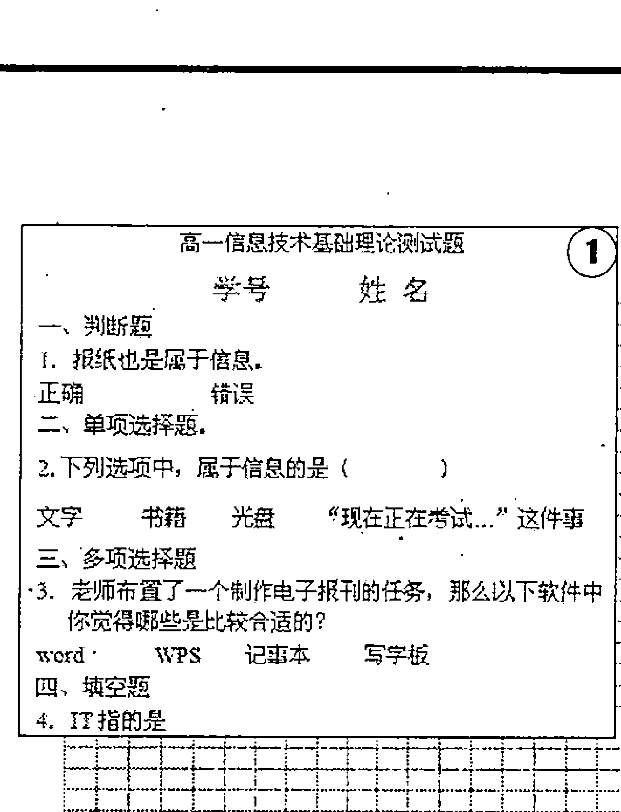

```
vba
Private Sub CommandButton1_Click()
    Dim xf As Integer
    Label1.Caption = ""
    If pd12 = True Then
        xf = xf + 2
    Else
        xf = xf + 0
    End If
    ' 第1题判断
    If xz24 = True Then
        xf = xf + 2
    Else
        xf = xf + 0
    End If
    ' 第2题单选
    If duox31 = True And duox32 = True Then
        xf = xf + 4
    Else
        xf = xf + 0
    End If
    ' 第3题多选
    If tiank1.Value = "信息技术" Then
        xf = xf + 2
    Else
        xf = xf + 0
    End If
    ' 第4题填空
    Label1.Caption = "本次考试总分60分，你的成绩是" + Str$(xf) + "分。"
    Set fso = CreateObject("Scripting.FileSystemObject")
    Set openFile = fso.OpenTextFile("\192.168.1.18\学生成绩\成绩.txt", 8, True)
    ' 0表示只读,2表示可写,8表示追加
    openFile.WriteLine (xh.Value + " " + xm.Value + " " + Str$(xf))
    openFile.Close
End Sub
```

### 设置考试环境

先在教师机（IP地址为192.168.1.18）的E盘中新建一个名为“学生成绩”的文件夹并设置“共享”，其权限为“完全控制”，接着在该文件夹中新建一个名为“成绩”的文本文件用来记录学生的成绩，并在文本文件的第一行添加“学号”、“姓名”和“得分”。
教师通过多媒体教学软件将“试卷”发到学生机上，当学生完成操作后保存并点击“交卷评分”按钮，此时不仅将操作的结果显示给学生，还自动将学生的得分记录到教师机的“成绩”文件中。这样，教师手中就有了这次学生测试的成绩了。

### 成绩整理与评级

成绩整理。待整个年级的学生考试完后，将“成绩”文本文件中的数据复制到Word文档中并转换为表格，再将该表格复制到Excel中。

成绩转录。由于缺考等原因，考试得到的学生成绩与教务处提供的学生名单不一一对应，这就要将考试得到的成绩转录到教务处提供的表格中。

- 1. 将考试得到的工作表（工作表名为cj）复制到教务处提供的工作簿（工作表名为“2014级评级”）中。
- 2. 在C2单元格中输入公式：
```
=IF(ISNA(VLOOKUP(B2,cj!B$2:cj!C$850,2,FALSE)),-1,VLOOKUP(B2,cj!B$2:cj!C$850,2,FALSE))
```
其中-1表示缺考，然后向下填充直到所有的学生成绩转录完。

评定综合成绩。在D2单元格中输入公式：
```
=IF(C2>=90,"优",IF(C2>=80,"良",IF(C2>=60,"合格","不合格")))
```

灵活应用上述方法，就可以实现考试评级一条龙，同时也使我们的工作变得轻松愉快。

> **小提示**
由于每台学生机都要访问教师机“学生成绩”共享文件夹中的“成绩”文件，建议教师机安装Windows server 2000及以上操作系统，并设置合理的学生机访问数。

# 新概念PPT版式设计

使用PPT本身所具有的功能就可以设计出漂亮精致的版式。

文|许江林

在一些PPT版式设计中，我们看到很多制作者不惜使用PS、AI、CD等大型图形图像处理软件来达到效果。但是这样的“大”制作却并非众多PPT使用者所能轻易掌握其技巧的。

其实，版式设计的关键更着重于设计思路，利用PPT已有功能是完全可以做出漂亮精致的版式的。

## 条形图片的延伸魅力

一幅表现职场的图片以原图的比例插入到PPT中，效果如图所示。如果强行给它拉大并铺满页面，势必出现变形或者图片精度下降的问题。

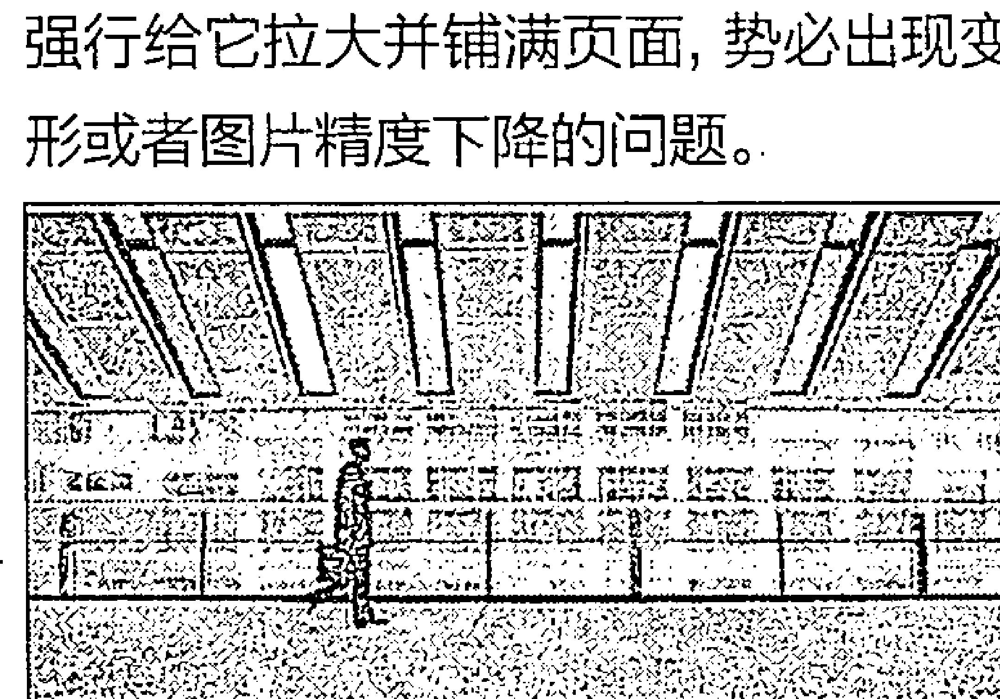

仔细观察此图，注意到图片有横向延伸的动态趋势，利用这一特点，我们用色块把图遮罩成为长条状，就可以充分发挥并彰显这种动态趋势。在使用色块时必须考虑的是：原图的色调以蓝色为主，配以黑、白色，整体商务感很浓，并传达出一种空旷的忧虑感和恐慌。依据原图所具有的配色特点和色彩感受，我们使用与之相关的白色、浅蓝、蓝色为遮罩色块，强化原图的风格和传递的感受。遮罩时注意，要把最具有横向延伸动态趋势的构图部分保留下来，走廊、顶棚不可缺少，而大块无明显横向延伸动态趋势的地面部分则可以大方遮掉。

先制作一个长度横跨页面的长条状矩形，复制两个，让三个矩形大小一致。把三个制作好的矩形分别放置于上方一个、下方并排两个。注意，这个时候可能由于制作的矩形的宽度不合适，遮罩的效果不够好，我们可以按住Ctrl键的同时选中三个矩形调整它们的宽度，再次调整遮罩位置，直到合适为止。

遮罩完成后，在上方色块和图片的结合处打上一个醒目的数字序号，表明演示的进度。下方紧靠图片的位置填写较大字号的标题，然后在下方的两个色块中分别填入较小字号的内容。

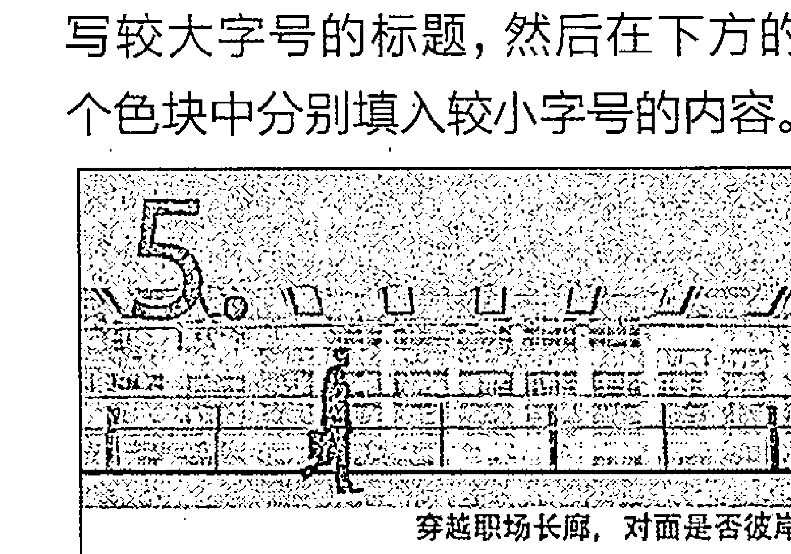

遮罩出的条形图片虽然没有占据整个页面，可是由于图片横向延伸的趋势及遮罩色块与图片的协调配合，使得图片和色块看起来已经完全融合成一个完整的图片了，色块中添加标题、内容看上去就非常自然。

## 圆弧切割图片的动感活泼

一个竖向的图片摆在页面中只占一小部分，就这样摆放那么它只是一个孤立的图片。如果能对它配以合适颜色的色块拼合图片，再进行看上去像裁切一样的遮罩，那么就可以让它和页面融为一体，不再孤单，图片的显示效果也将得到大幅提升。

首先，我们对这幅图设计一下裁切或者遮罩的样式，在顶部用椭圆遮罩，这时看起来就像是裁切一样，在图的左边用矩形色块与图片拼合，使图片与页面左边建立起关系。

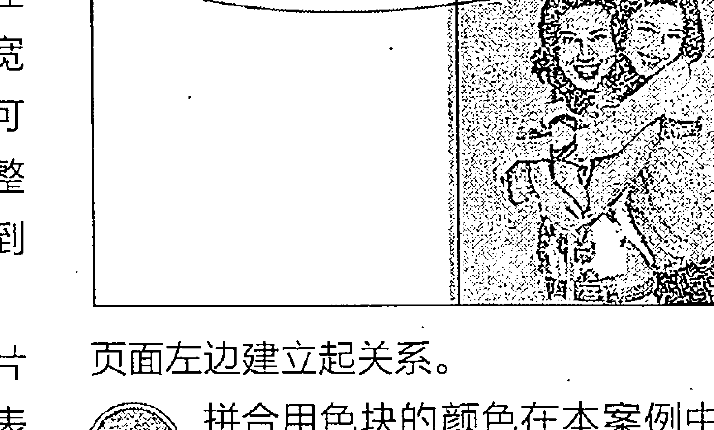

拼合用色块的颜色在本案例中依然要根据原图配色来选用。本图色彩较多，背景色也并非纯色，而是有黄、橙、绿色彩的渐变和融合。而有利于我们拼合的一个特点是：本图的背景虽然多色、渐变，但是却没有过多的层次。在这里，我们根据要表达的关于健康的内容，选用绿色的渐变填充。

怎么样才像是裁切的效果呢？通常我们认为被裁掉的部分应该是空白的，那么直观得到的颜色自然就是白色。所以，我们使用白色椭圆对图片及拼合的色块顶部遮罩，椭圆设置一定的旋转角度。

现在，看上去太过工整，不是很自然。怎么才会显得自然呢？犯错就会显得自然！比如裁歪了一点、有剪刀口痕迹。

制作两个新月形图形，填充绿色，然后拉长、旋转、移动到白色椭圆遮罩图片的边缘位置，新月形拉伸出的弧度接近于椭圆的弧度，然后调整两个新月形的位置，让它们交错重叠，露出空隙，这样就显得自然了许多。

最后，配上相应文字。左上端是标题。

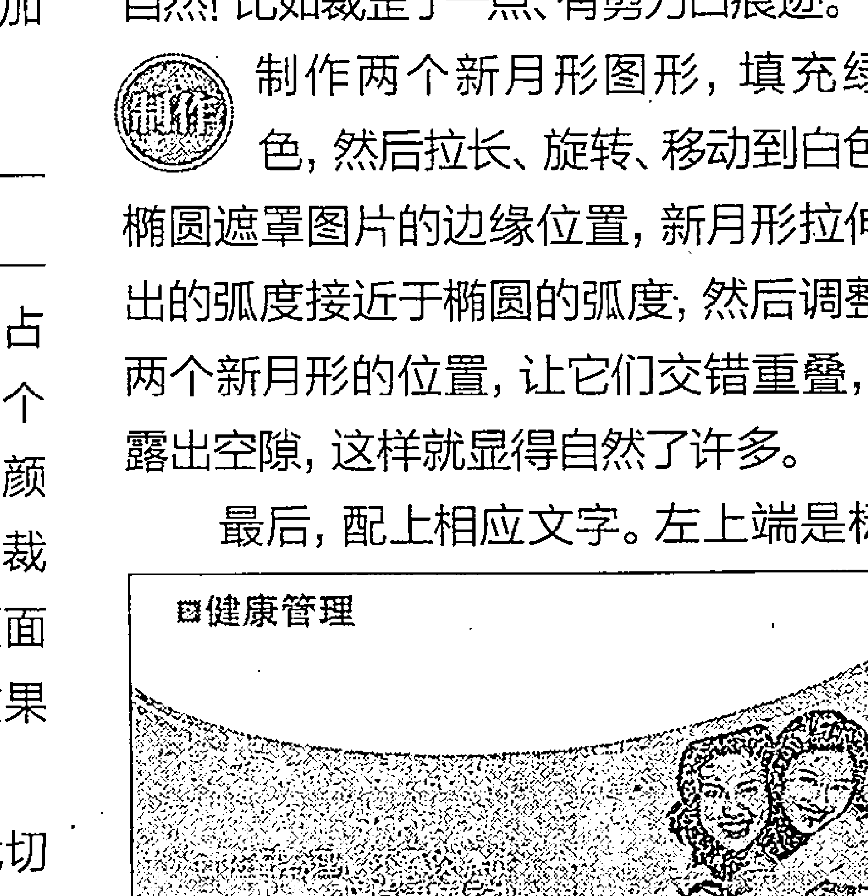

我们提出新概念PPT版式设计的含义就是：创新思路，利用PPT本身的功能，简单操作，达到优质效果。

题，拼合的渐变色块填入内容文字，在内容文字与图片之间拉一条竖线。内容文字向右靠齐，靠在竖线旁，这样的设置可以使文字的版式显得正，而且有力道。

用色块拼合图片，用遮罩表达裁切，使得孤单的图片完全融入页面。看起来随意的裁切效果使页面显得生动、活泼，新月形的点缀应用则体现了裁切的动感。

## 块状切割图片的神秘酷炫

这是一幅时尚而又略带神秘的图片，适用于表达时尚的主题。但是，图中作为主体的美女几乎占满图片的全部纵向尺寸，加上多层次的光线、背景，使我们在使用该图片时难度加大。本文前面所讲述的两个方法对此图都比较乏力，因此我们必须认真分析此图，找出对应方法。


思考本图中，处于前景位置的美女毫无疑问是绝对的主角，她身后的元素仅处于陪衬地位。因此，我们可以把次要元素遮蔽，进一步突出主角，保留场景气氛，减少干扰，配上适当的文字，表达我们的主题。

操作由于图片主体色调基本偏暗，所以我们制作三个浅黑色的矩形，下部用一个长条状矩形遮到鞋子的位置，上部用两个块状矩形分别把越野车和购物亭的大部分遮住。留出美女的全部图像和横向的条状图片。这样制作可以把不希望出现的元素遮蔽，同时还保持了原图片的场景氛围。此时，由于浅黑色块所占面积更大，使得我们视觉上会认为该图片被剪切成了“凸”字形，浅黑色的色块可以看作是空白的，能够起到承载文字的作用。

视觉上会认为该图片被剪切成了“凸”字形，浅黑色的色块可以看作是空白的，能够起到承载文字的作用。
针对此图被遮蔽后形成的样子很像一个岔路口，我们在每条“路”都标上箭头指示方向，并配上文字表明目的地。每个箭头和文字的搭配其实也就是我们在一页里的小标题设置了。主标题则放置于色块与图片的交接处，字号较大一些，一小段解释文字摆在长条矩形下方。这样从形式上可以有效引导观众首先看到美女，然后很快发现主标题，逐个看小标题，最后看解释文字。


用色块遮罩表现出裁切的效果，可以有效遮蔽不需要的图像元素，让场景复杂的图片能够为我所用。同时，由于留下了不会干扰主题的场景部分，所以图片本身的氛围保持了下来，没有被改变。

## 小圆图的灵动

这是一个已经做好文字排版的页面。在此页面中，从上至下是各个小标题和相应的解释文字，利用颜色明暗度的差别凸显出小标题，而主题文字一反常态地摆在最下面。这样设置的原因是：通过小标题的层层推导，最后得出我们所需要的主题，在情理上合乎思考、推导的过程，在版式上突破主题文字往往只能摆放在上端和中间部位的常态，造成比较新颖的效果。

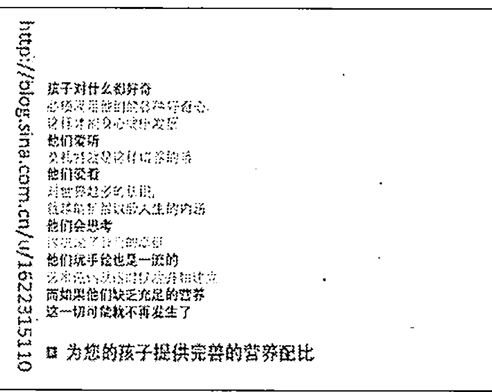

思考从文字的内容来看，如果只是使用这样的版式设计，文字的内涵就不能得到更好的彰显。这种情况我们就可以使用圆形小图来对应搭配文字，给每一个小标题增加活泼灵动的阐释。

操作首先，我们要找到对应文字内容的图片；其次，找到图片后，插入到PPT中，在PPT中，利用自带的截图工具先进行截图处理，把每一个图的重要部分截取成正方形，然后一个个另存图片，备用；然后，使用圆形工具绘制对应的大小不同的几个圆，拖放到各个合适的位置，再使用曲线工具绘制由小标题连接到圆形的曲线，在这里，圆的边线和曲线都使用天蓝色；最后，逐个选中圆形，对每一个圆使用“形状填充→图片”处理，填入相应的图片。


应用小圆图的方式能够非常灵活地表现文字所不能达到的直观效果，整个版面图虽多却不凌乱。对使用者的要求是：平常就要积累一些可能用得到的图片，在图片填充进圆形前，必须先对图片进行正方形截图处理。当然，也可以尝试使用椭圆形、矩形以及其他形状图形来填充图片，扩展设计方法和思路。

# 合并文档原来如此巧妙

### 文|王兰富

将不同的Word文档汇总到一个文档中，或者将不同修改意见的Word版本文档合并成一个文档，该如何完成快速合并？

日常工作中，有些朋友经常需要将一些Word文档合并起来。比如我，由于一直从事财务审计工作，平时需要合并的文档就比较多。早先的时候，就采用原始的合并方法，如复制、粘贴，插入文件的方法，有时候觉得非常繁琐，文档一多，就更加麻烦了。而且合并文档也分为多种情况，一种是将不同的文件合并在一个文件中，另一种是将不同版本的文件，通过比较分析，合并为一个文件。对于这些情况，如何处理呢？其实采用简单的VBA以及Word的比较合并文档功能，就可以将以上问题迎刃而解了！

## 使用VBA快速合并不同文档

将不同的文档合并成为一个文档是经常遇到的工作，比如下属各个公司的日、月、季度的报表、计划、工作情况等，就需要每天汇总成为一个文件，整理后上报相关领导。采用传统的方法太费时间了，还是请VBA来帮忙吧！有些朋友见到VBA几个字，觉得很怵头，其实使用VBA非常简单，按照下面操作就可以了！
将所有日常需要汇总的Word报表文件单独存放在一个文件夹中，如“F:\集团公司日工作汇报”，然后启动Word 2010，新建一个空白文件，按下Alt+F11组合键，在弹出的VBA窗口中，双击左侧工程中的ThisDocument选项，在右侧弹出的VBA编辑窗口中，输入以下代码(图1)：

```
Sub AutoOpen()
    Dim myDialog As FileDialog
    Dim i As Long
    On Error Resume Next
    Set myDialog = Application.FileDialog(msoFileDialogFilePicker)
    With myDialog
        .Title = "友情提示：请选择要合并的文件，可以选择多个文件！"
        .AllowMultiSelect = True
        .Filters.Clear
        .Filters.Add "所有 WORD 文件", "*.doc", 1
    End With
    If myDialog.Show <> -1 Then Exit Sub
    For i = 1 To myDialog.SelectedItems.Count
        Selection.InsertFile FileName:=myDialog.SelectedItems(i)
    Next
    MsgBox "本次共合并了" & i - 1 & "篇文档"
End Sub
```

在此段代码中，“Title = "友情"中的提示内容，在将来的选择合并文件对话框标题栏中显示，大家可以根据自己的需要进行修改，而“MsgBox "本次共合并了……"中，则在文档合并后，显示已经合并的文档数量。以上代码检查无误后，按下Ctrl+S组合键予以保存，然后关闭VBA窗口。

在默认情况下，Word宏是禁用的，因此为了以后顺利使用以上代码，建议启用宏。单击顶部的“开发工具”菜单，选择“代码”中的“宏安全性”选项，在弹出的信任中心的宏设置对话框中，将其中的“启用所有宏”、“信任对VBA工程对象模型的访问”两个选项选中，单击“确定”按钮即可。最后按下Alt+F+A组合键，将此文件另存为启用宏的docm文件格式，如“快速合并文件.docm”。

这样平常需要合并文件时，只需要启动“快速合并文件”文档，即可自动弹出一个提示窗口。在此窗口中，选择需要合并的所有文件（可以多选），单击“确定”按钮，即可将需要的文档汇总到一个文件中，而且合并完毕后，会弹出一个提示窗口，显示此次一共合并了

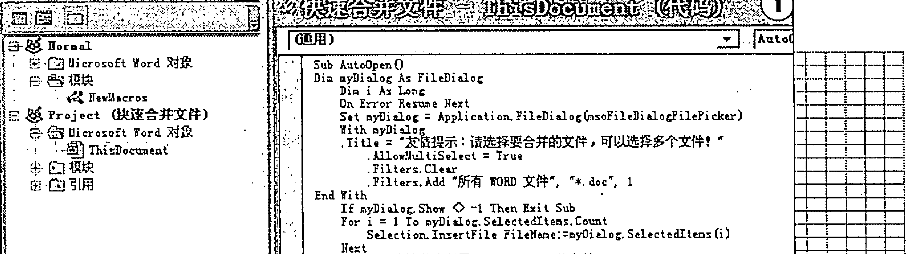

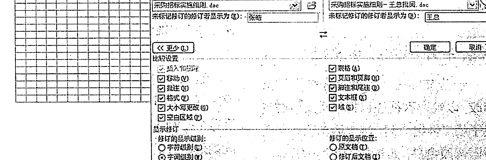

## 快速合并不同版本文档

一些文件往往需要上报领导批阅修改，以前大家往往是将纸质文件或者电子版文件给领导，修改后自己再手工对照修改合并，如果批阅人有好几个，意见也就格外多，这样非常费力费时。其实针对这种情况，利用Word的审阅中的合并工具，就可以非常巧妙地完成此项任务。比如一份采购招标实施细则，将电子版文件分别交上级领导王总、张工等批示返回后，就可以通过此工具，快速完成分析合并工作。

启动Word 2010，选择“审阅”菜单，单击“比较”选项，从弹出的下拉列表中选择“合并”命令，在弹出的“合并文档”窗口（图2），单击“原文档”右侧的“打开”图标选择源文件“采购招标实施细则”，单击“修订的文档”右侧的“打开”图标选择一个领导批阅后的文件，如“采购招标实施细则-王总批阅”，在下面“未标记修订的修订者显示为”文本框中，分别输入的原文档撰写人以及批阅人，如张皓、王总。设置完毕后，单击“确定”按钮，由于只能在最后合并的文档中保留一组格式修订，因此这时候有可能提示要保留修订提示框，单击其中的“文档（采购招标实施细则）”，单击“继续合并”按钮。

这样就会新建一个名为“合并结果”的新文件，将此文件予以保存，如“采购招标实施细则1”。由于还需要加上其他领导的意见，如张工等，因此将刚才合并的“文件采购招标实施细则1”与“张工批阅的文件”，按照上面操作，进行第二次合并，这样合并后的文件，即包括王总、张工的批阅意见了（图3）。

需要注意的是，为了能够在合并文件的编辑窗口中显示源文档以及修改后的文档内容，建议在“合并文档”窗口，单击左下角的“更多”按钮，从下面显示的更多选项列表中，在“修订的显示位置”下选中“新文档”选项，这样会在新文档显示所有的修改内容信息了。

在最后的合并文件编辑窗口中，最左侧会显示所有的修改统计情况以及每个批阅人的具体修改意见，而在中间则是合并的文件，右侧上部是第一次合并后的文件，而下部则是张工批阅后的文件。在中间合并的文档中，修改的内容会按照不同的批阅人，以不同颜色区别开来。

对于合并后的文档修改意见，可以视具体情况有选择地接受或者拒绝。比如王总在这份细则中，将“超过3万元以上的物资”修改为“超过1万元以上的物资”，而张工则修改为“超过0.5万元以上的物资”。根据讨论结果，当需要接受王总的修改意见时，选择王总所作的修改，单击顶部菜单栏中的“更改”中的“接受”按钮，从下拉菜单中选择“接受修订”命令即可，而对于张工的修改意见则选择“拒绝”。合并完毕后，最后将文件予以保存就可以了。

需要注意的是，如果批阅人在合并的文件中，修改意见比较多，就显得有点杂乱了。这时候可以单击顶部“修订”中的“显示标记”选项，从下拉列表中选择“审阅者”选项，在弹出的列表中，只选择需要重点查看的几个批阅人意见就可以了，比如王总、张工（图4）。

无论是将不同的文档合在一起，还是不同版本的文档进行比较合并，关键问题是提高效率，避免合并过程中的失误。以上的两个解决方案只是解决文档合并中的一些代表性问题，各有侧重点。对于遇到的其他合并问题，可以采取一些捷径，比如对于需要不同部门分工协作的大型汇总文档，使用主控文档就显得很轻松了！

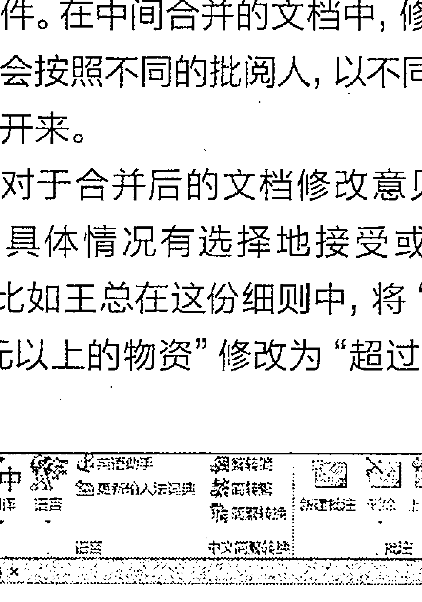

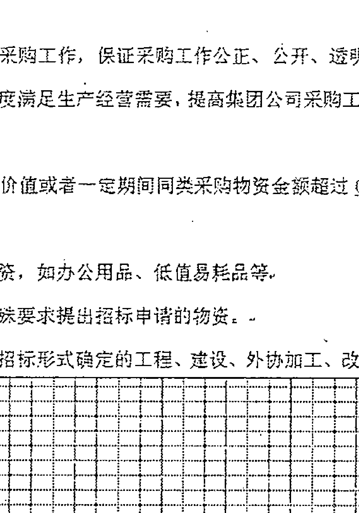

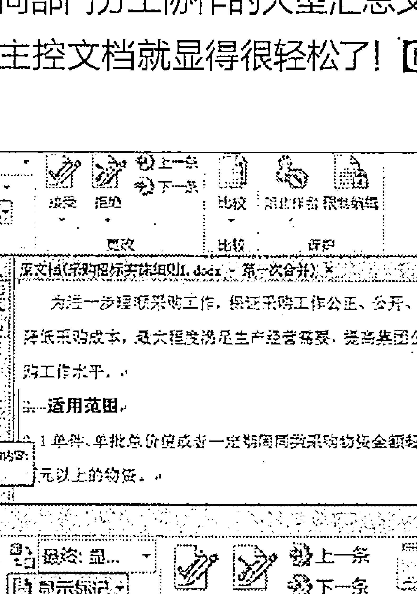

# 电子学籍信息一点采

海量信息收集汇总，直接用Excel来完成费时费力，那就制作个小型网站来采集吧！

文|韩佰利

我省实施学生电子学籍网上管理，要求学校采集每位新生的36项信息，再按系统的导入要求，将学生信息汇总到Excel样表，导入到网上电子学籍系统中。很多学校都采用让每位学生将自己的信息输入一个Excel表中，将这些Excel表格文件收集起来，再把它们中的信息复制粘贴到一起，这样不但工作量大得惊人，而且还会错误百出。

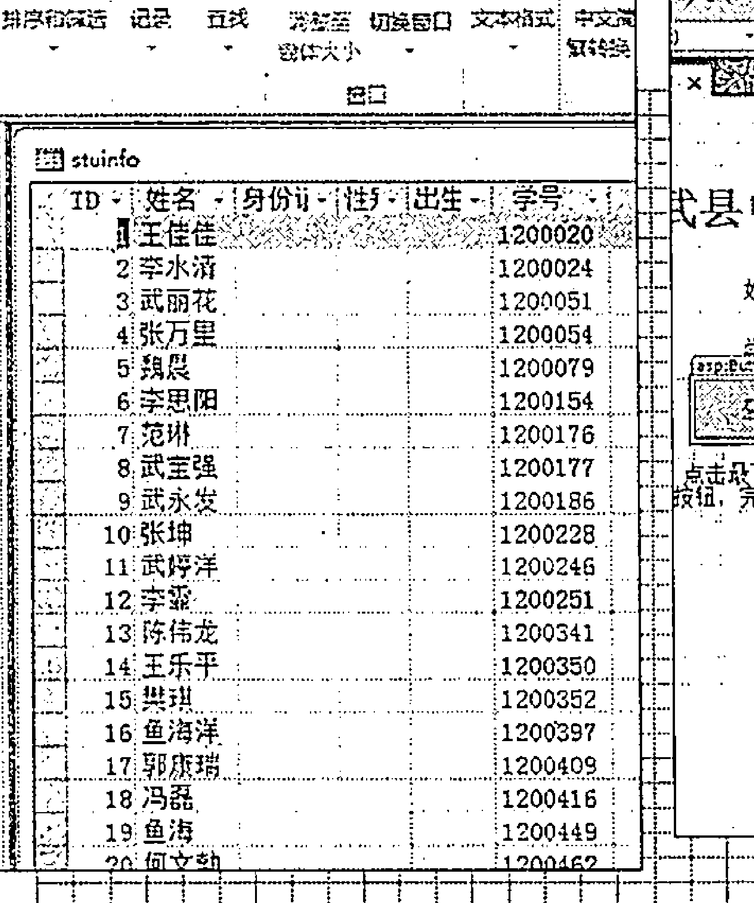

我校新生每年多达1100多，为减轻工作量，我制作搭建了一个简单实用的信息采集小型网站，让学生们在校内网同时访问，输入自己的信息，将信息保存到服务器数据库中，所有学生信息采集完后，将数据库中的信息导出到Excel中，完成信息采集。

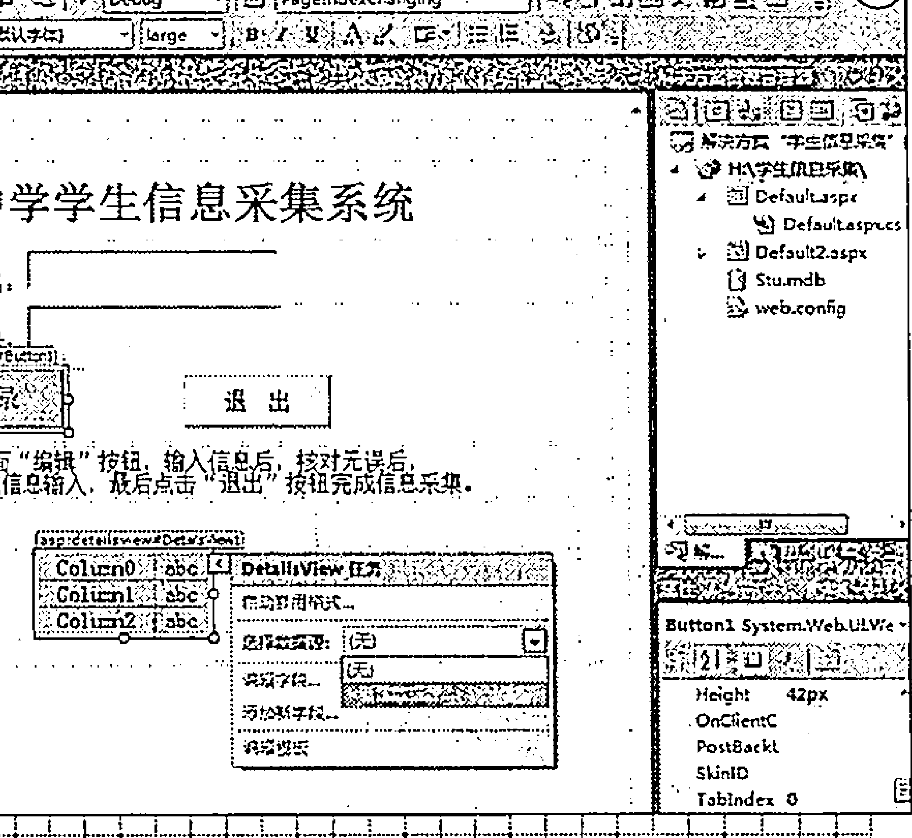

## 使用的工具软件：

- Microsoft Visual Studio 2010旗舰版
  官方中文版
- Microsoft .NET Framework v4.0 正式版

## 准备数据库

从省电子学籍网站下载数据导入使用的Excel格式模板文件，在其中复制粘贴新生姓名和学校分配给他们的学号。

打开Microsoft Access 2010，右击左侧数据表列中“表1”，选择菜单“导入→Excel”命令，从弹出的对话框中选择制作好的Excel文件，将其导入生成一张新表。导入时选择“第一行包含列标题”项，让Excel表的第一行表头作为数据库的各列字段名称，再选择“让Access添加主键”，让Access为数据库设置好主键（这一点非常重要，否则不能写入数据），并将表命名为stuinfo，最后将所有字段的数据类型设置为“文本”，保存数据库备用（图1）。

## 制作网站

将Access数据库文件复制到保存网站文件夹。启动网站制作工具Microsoft Visual Studio 2010，选择菜单“文件→新建→网站”，从“新建网站”对话框选择“ASP.NET空网站”，在下方选择保存网站文件夹，点击“确定”，创建一个空网站。

设计界面：从右侧“解决方案资源管理器”选择Default.aspx，点击左下角的“设计”按钮，切换到“设计”视图，选择菜单“表→插入表”项，插入一个适合的表格到设计界面，输入标题及相关信息文字，从左侧“工具箱”中的“标准”选项卡中，选择TextBox文本控件和Button按钮控件，向表格中各拖入两个，调节好它们的位置。分别选择添加的按钮控件，在右侧“属性”的Text中分别修改其名称为“登录”和“退出”（图2）。

配置数据源：从左侧“工具箱→数据”中选择拖入一个DetailsView数据控件到设计界面。点击DetailsView控件右侧的“(DetailsView任务)”按钮，从菜单中“选择数据源”下拉列表中选择“<新建数据源>”项，从“数据源配置向导”中选择“Access数据库”，点击“确定”。在出现的“选择数据库”中点击“浏览”按钮，选择准备的Access数据库文件，点击“下一步”配置数据源。

在“配置Select语句”中，点选“指定来自表或视图的列”项，从名称中选择数据库中的表，再在下面“列”中勾选需要的字段（勾选“*”表示选择所有字段，为方便说明，这儿只选择六项，一定要包括主键字段，否则不能编辑、更新数据）。点击右侧的WHERE(W)按钮，打开“添加WHERE子句”对话框，依次从列、运算符、源、控件ID下的列表中选择姓名、=、Control和TextBox1，选择好后，点击“添加”按钮，将设置添加到“WHERE子句”下方。使用同样的方法再添加学号条件语句，点击“确定”返回（图3）。

点击右侧的“高级”按钮，打开“高级SQL生成选项”对话框，勾选“生成INSERT、UPDATE和DELETE语句”项，点击“确定”。点击“下一步”来到“测试查询”界面，在下方给出了配置好的查询语句，检查无误后，点击“完成”按钮完成数据源配置。

请读者从http://cwczyb.ys168.com/下载制作好的网站，架设服务器就可使用。

设置DetailsView数据控件。在设置界面点击DetailsView控件右侧的“DetailsView任务”按钮，从菜单中勾选“启用编辑”复选框，这时DetailsView控件中出现“编辑”链接按钮。再点选菜单中的“编辑字段”，打开“字段”对话框，在“选定的字段”中选择ID这个Access添加的主键字段，点击中间的“X（移除）”按钮，让它不在DetailsView控件中显示出来。再点选“姓名”字段，在右侧“BoundField属性”框中“样式”下HeaderStyle的Width后输入适合的值，让字段名列占适合的宽度，如150。利用ItemStyle中的Width可为每个字段的编辑框设置宽度。最后调整好DetailsView控件大小（图4）。

**设置按钮功能**：双击“登录”按钮，切换到Default.aspx.cs代码界面，点击上方的标签切换回Default.aspx界面，再双击“退出”按钮，在Default.aspx.cs界面中，在对应代码区域中输入图4框中的简短代码。让打开网站后，输入焦点位于“姓名”后的文本框。点击“登录”按钮时，激活查询功能，在DetailsView数据控件中显示出相应的学生数据。点击“退出”按钮时，清空“姓名”和“学号”后的文本框内容，退出学生登录，DetailsView数据控件不显示任何信息，确保信息安全。

**测试网站**：保存所有操作后，在设计界面上点击右键，选择菜单中的“在浏览器中查看”项，调用浏览器打开网站，在姓名和学号后输入数据库中的学生姓名和学号，点击“登录”按钮，在下方显示出数据，点击下方“编辑”链接按钮，切换到数据编辑状态，在相应数据项后输入信息，点击“更新”链接按钮，并返回到数据显示页面，同时将数据提交到数据库保存，这样即可将一个学生信息添加到数据库。

**发布网站**：网站测试成功后，在右侧“解决方案资源管理器”中，右键点击保存网站的文件夹名称，选择菜单中的“发布网站”命令，打开“发布网站”对话框，在“目标位置”下设置好保存发布的网站文件夹，点击“确定”按钮，很快就发布完成，随后就可以在文件夹中查收制作的网站了。

## 架设网站

网站制作好后，就来架设网站，在作为网站服务器的Win7电脑上安装IIS系统组件、Microsoft .NET Framework v4.0，并将制作发布的网站所有文件复制到电脑的NTFS格式分区下的文件夹中。在该文件夹上右击，选择“属性”，打开其“属性”对话框，切换到“安全”标签，为该网站文件夹添加User和IIS_IUSRS用户，即可设置好网站文件夹的权限。

右击桌面“计算机”，选择“管理”打开“计算机管理”窗口，展开左侧“服务和应用程序”，点击“Internet信息服务（IIS）管理器”，在中部“连接”中依次展开“计算机名/网站”，在空白处右击选择“添加网站”，在弹出的“添加网站”对话框中，在“网站名称”下输入网站名，点击右侧的“选择”按钮，弹出“选择应用程序池”对话框，从“应用程序池”下拉列表中选择ASP.NET v4.0，点击“确定”返回。点击“物理路径”后的“浏览”按钮，选择保存网站文件的文件夹，再点击“IP地址”后的下拉列表，从中选择本机的IP地址。

## 信息采集

网站架设好，组织学生利用信息课时间进行信息采集，在机房中学生输入网站地址（如http://192.168.0.17），各自输入自己的姓名和学号，点击“登录”按钮，点击下方“编辑”链接，逐项输入信息，点击“更新”链接，完成信息录入，点击“退出”按钮。学生可多次登录，对自己的信息编辑修改。

## 导出数据

所有班级学生信息录入完成后，在网站服务器上打开Access数据库文件，导出表数据到Excel中，简单整理，复制后选择性粘贴到Excel导入模板，最后导入电子学籍系统。

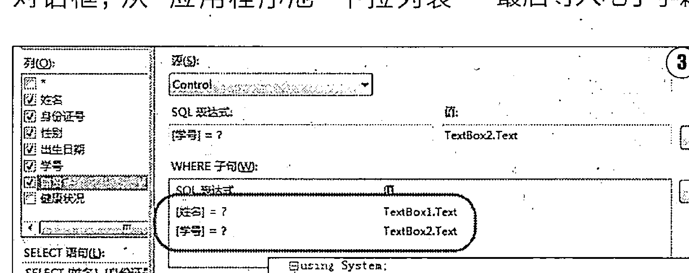

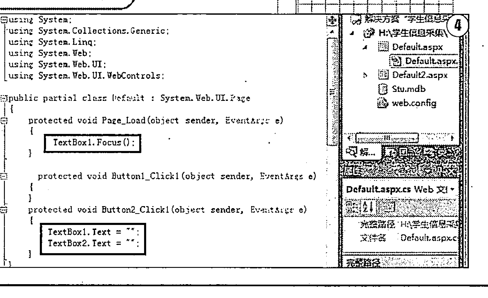

```
csharp
using System;
using System.Collections.Generic;
using System.Linq;
using System.Web;
using System.Web.UI;
using System.Web.UI.WebControls;

public partial class Default : System.Web.UI.Page
{
    protected void Page_Load(object sender, EventArgs e)
    {
        TextBox1.Focus();
    }

    protected void Button1_Click1(object sender, EventArgs e)
    {
    }
    protected void Button2_Click1(object sender, EventArgs e)
    {
        TextBox1.Text = "";
        TextBox2.Text = "";
    }
}
```

# 用PPT设计个性贺卡

文|许江林

过年过节，总免不了给亲朋好友发送贺卡，总用别人设计好的贺卡显得没有个性，那就自己动手设计吧！

辞旧迎新，年关临近，自制贺卡传送亲朋，岂不快哉！利用PPT自带功能制作贺卡，简单易行，效果很棒。下面就以三个贺卡为例，向大家介绍它们的制作思路及技巧。

## 道别2012

当大多数人在忙于工作和生活琐事时，不经意间，2012已悄然离开。以此为立意，找到当年的2012电影海报(图1)，加以一定的图像处理和搭配就可以完成一个向2012道别，向新年勇敢挺进的别致贺卡。


思路：电影海报显示的场景极其恐怖，带有强烈的视觉冲击力。然而，回过头来看，除了2012作为这一年的标记外，那些场景全都成了故纸堆中的幻象。于是在这张图片的处理上就突出2012这个标记，做旧场景画面。在网络上，对于“末日”的调侃，传播最广的就是“是芥末日”的谐音了；由于芥末是绿色的，所以给这个电影海报搭配上绿色的色块，增强“末日”概念的对比与调侃效果。接着，配上相应的文字表达辞旧迎新的祝愿。

剖析：将电影海报复制1个，对其中一个用PPT中的裁剪工具截取“2012”字样，并进行“图片样式”效果处理，做出画框效果(图2中的①)。对另一个复制的电影海报图片进行适当裁剪，裁剪要求是尽量保持大部分恐怖场面，然后再制作一个茶色矩形，设置透明度为57%，覆盖在裁剪好的图片上(图2中的②)。

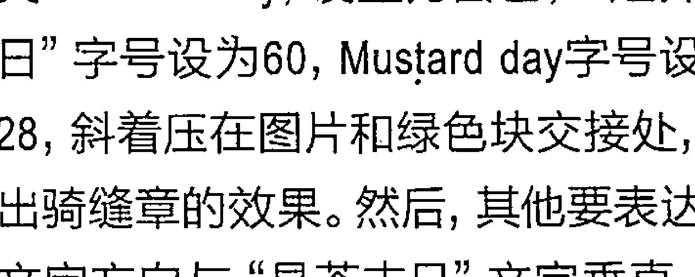

把上两步制作的两个图片效果进行拼合，然后保持比例缩小到横向只占1/2多一点的位置，摆在左边，竖向则摆在中间位置。摆好后，在图片右边对应高度做一个矩形，颜色填充为绿色，接着给两个图片都设置阴影。

制作“是芥末日”文字及相应的英文Mustard day，设置为白色，“是芥末日”字号设为60，Mustard day字号设为28，斜着压在图片和绿色块交接处，做出骑缝章的效果。然后，其他要表达的文字方向与“是芥末日”文字垂直，重点文字用白色，24号字体，最后一句用橙色，24号字体，其他文字用黑色，16号字体(图3)。

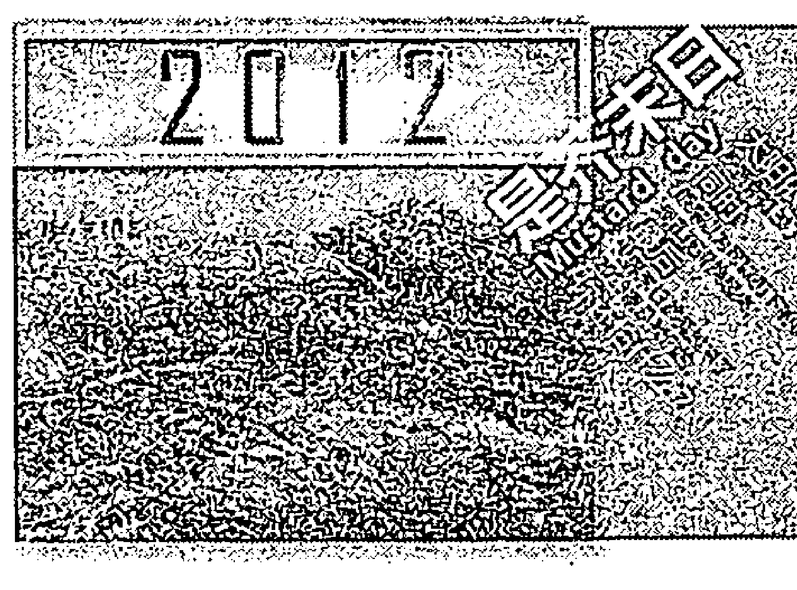

品鉴：我们最为常见的贺卡，通常都是千篇一律的漂亮图片加上千篇一律的祝福语言。作为应节的东西，“年年岁岁花相似”也是很正常的。但是如果自己制作贺卡，那就要有一些个性和与众不同的东西。在本贺卡的设计中，抓住“末日”这个概念做文章，把调侃和新年祝福一起送到亲友手中，既可以共同“缅怀”那个让人争论、怀疑或者纠结不安的日子，又可以会心一笑，坚强面对未来。在贺卡的制作中强调了图片中的“2012”字样，弱化了图片中的场景，暗示这仅仅只是平平常常的年代更换，“末日”是不靠谱的。搭配属于芥末的绿色块，则是为了加强调侃效果。使用骑缝章似的文字放置，把调侃和预言进行对接。

## 迎接“万物勃发”的新年

新年新气象，对所有人而言，在新的一年可以期盼各项事物都能得到良好的发展，获得各种美好的果实。那么“生发”、“发展”就是新一年的关键词。成长的树木、扩张的图形效果都可以很好地传达这个意愿。图中①分层次的树叶、②纷飞的箭头、③伸展的枝干、④带花纹的框子主色调都是绿色，都是为了体现“生发”的概念。这几个图可以在PPT中用PPT自带的绘图功能绘制出来，也可以从网络上寻找到相似的背景透明的图片以供使用(图4)。

思路：用绿色为主色调的各种图片固然可以表达出“生发”的概念，可是热闹欢腾的迎接新年的喜悦情绪却不能得到体现。如果弄个红灯笼之类的喜庆物件摆上去又会和绿色的主色调冲突。那么，我们可以用一些形态上能表达出“生发”感觉的图形来代替。比如，可以表达生长、扩张的箭头，可以表达开花结果的树枝纹理等。

个性的东西没有一个定式，本文的三个案例只是抛砖引玉，意在引导大家用类似的思路去拓展自己的想法和创意，做出更好的贺卡作品。

主色调不搭配，那么我们就从背景设置来解决。背景的色彩设置是最能烘托气氛、影响整体风格的，把背景设置为黄色、红色、紫红的射线状渐变效果就完全可以表达出热闹欢腾的喜悦情绪。

首先设置背景效果和设置参数（图5）。

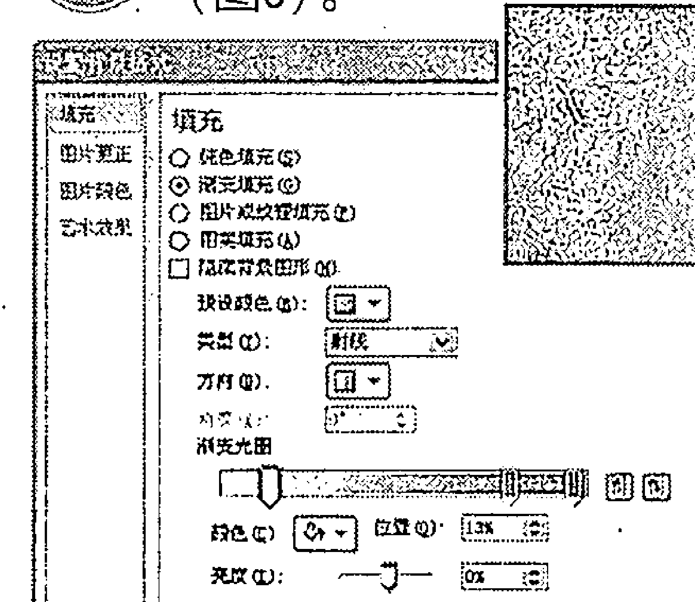

把①至④的元素进行调整摆放。在带花纹的框子中打上字，给文字也设置一些相应效果（图6）。


用背景的浓烈烘托气氛，像太阳的光晕，却用前景、中景的清新、蓬勃来表达旺盛的生机，使得浓烈与清新没有出现混杂的不适，反而相得益彰。植物的成长当然是离不开太阳的，从人的感知而言，这样的光晕则是表达热闹欢腾的喜悦情绪，符合迎新的喜庆。

## 最实在的期盼

人们总是在新年伊始前充满各种期盼。最实在的期盼莫过于期盼事业的发展、收入的提高、生活的安康、更多的旅游、还有力气狂欢等。表达这样的期盼当然可以有很直接的图片，但是太直接了也就少了乐趣。这里我们找了4幅瓢虫的图片，想办法把它们组合起来表达我们的期盼（图7）。

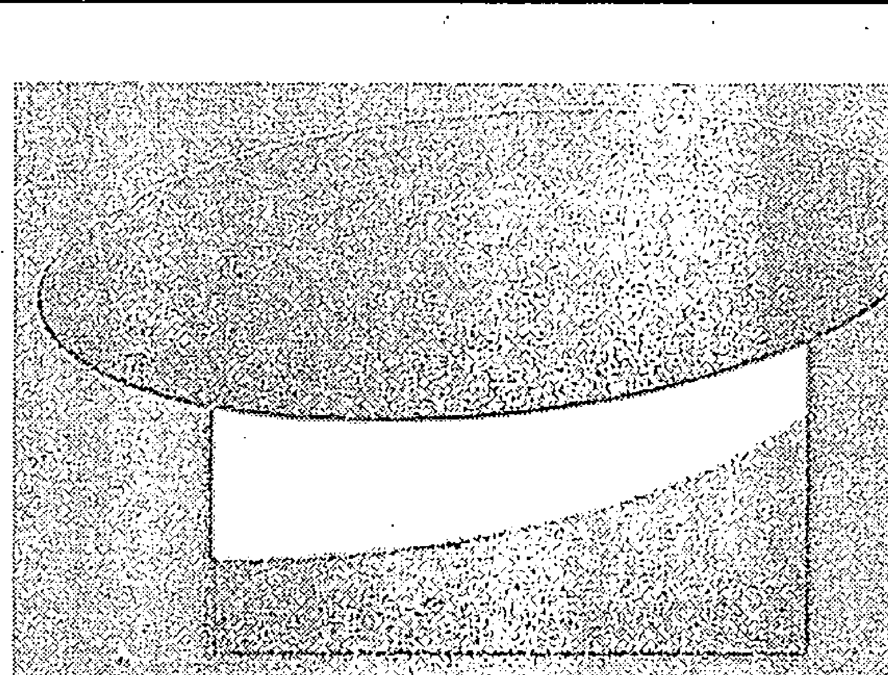

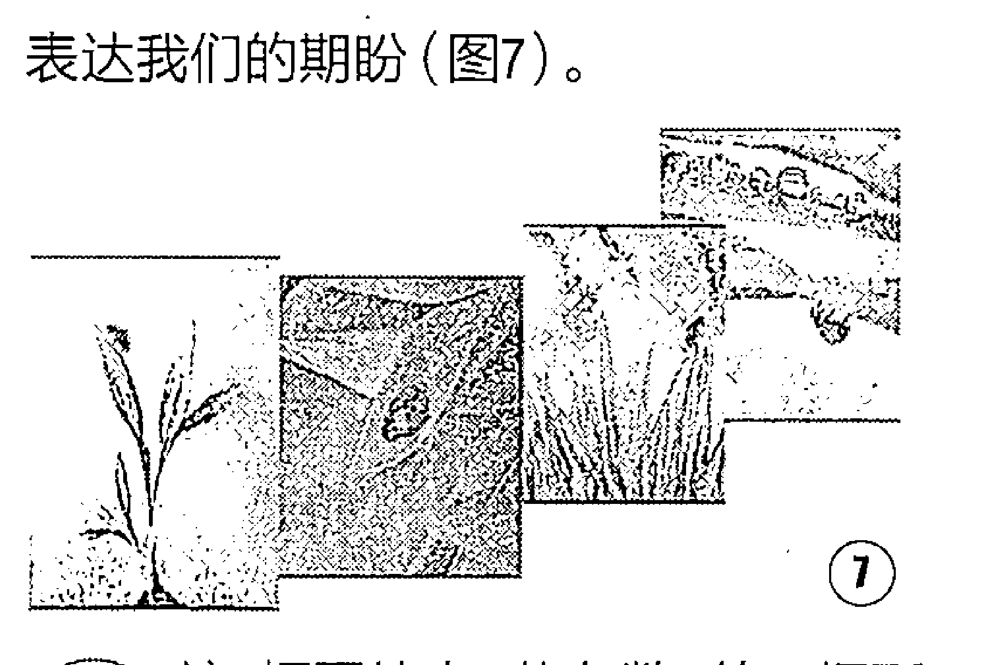

这4幅图片中，从左数，第一幅瓢虫站在叶子顶端，背景模糊，可以看出艰难登高的含义；第二幅瓢虫站在叶子中部，显得稳妥、安定；第三幅瓢虫也站在叶子顶端，背景为蓝天，似乎它是在一览美景；第四幅瓢虫倒着站在叶子背部，抵抗着地心引力，从人的角度而言是违反常规的。通过对这4幅图片的理解，我们把第一幅图与攀登事业高峰联系；第二幅图与舒适安康的生活联系；第三幅与旅游观光联系；第四幅与违反常规联系。这几幅图色彩都比较清朗、爽目，把这几幅图合理排列，再加以圆弧状的遮罩，可以看作是开了一个窗，看到了窗外的精彩。

首先用绘图工具制作一个椭圆和一个矩形，椭圆进行一定的大小和方向调整后摆在页面的上部，矩形则用右键单击选择“编辑顶点”，调整它的形状成为一个左低右高的圆弧坡状图形，调整大小后把页面下部覆盖住。同时选中椭圆和坡形，给它们添加图形效果，红框指明选用的效果（图8）。

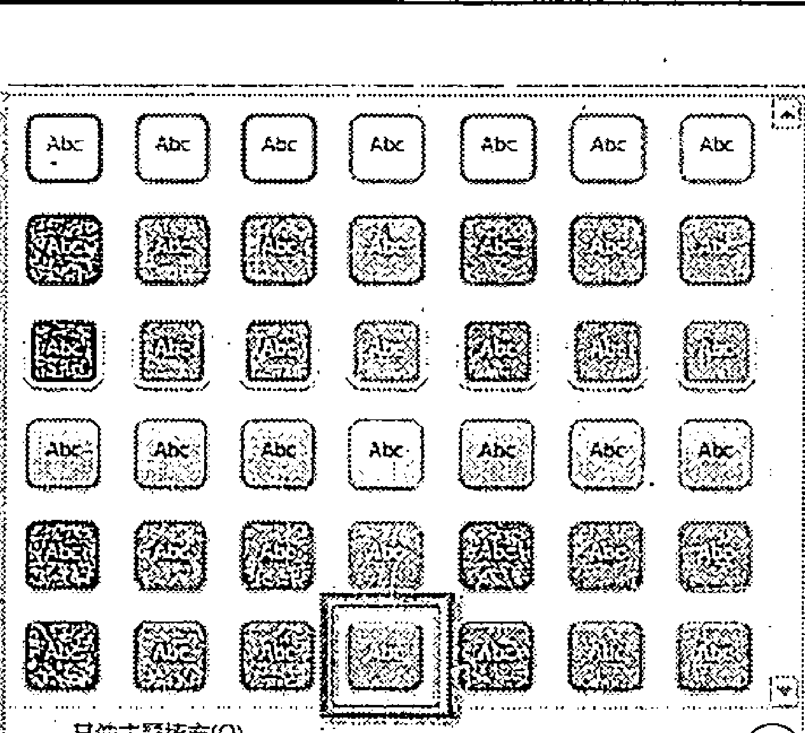

插入那4幅图，并且右键单击把它们全部“置于底层”，然后调整这些图片的大小和位置，直到合适（图9）。

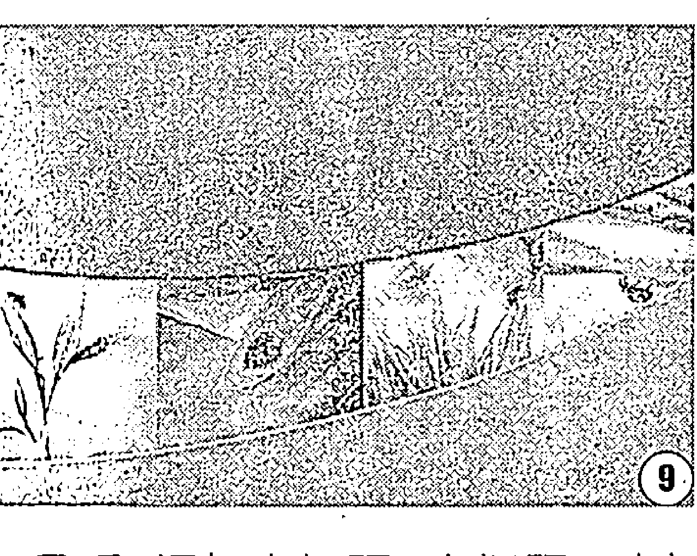

最后，添加大标题、小标题，对应在每个图下方添加一个红色圆点。大标题放在页面左上方的椭圆里，小标题对应放在每个圆点之下。大标题的“期盼”使用88号字体，“2013”使用44号字体，小标题使用20号字体。具体的字体效果可以根据喜好来设置（图10）。

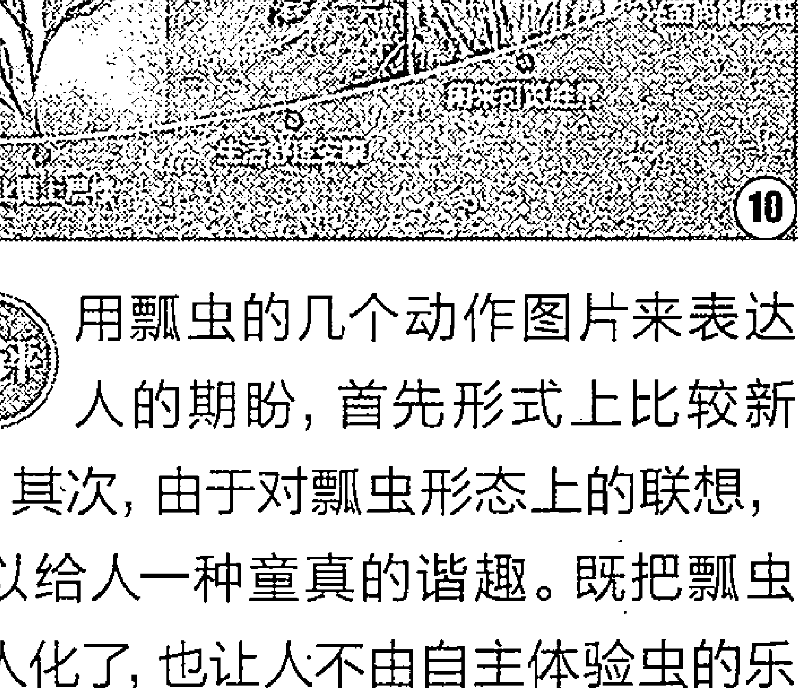

用瓢虫的几个动作图片来表达人的期盼，首先形式上比较新颖，其次，由于对瓢虫形态上的联想，可以给人一种童真的谐趣。既把瓢虫拟人化了，也让人不由自主体验虫的乐趣。用圆弧形的遮罩，只留出不太大的空间强化了“开窗”的效果，如同我们从里向外看一样。向外看实际上也就可以引申“向前看”，表达了对新年的期盼。

# Excel中VBA批量改名更轻松

在Excel中利用VBA可以轻松快捷地对批量文件进行重新命名。

文|李宝霞

实例描述：小姚是车间的计算机管理员，他有一项工作是负责给员工照相。最近，他接到了一个任务，要求他把在E盘的照片文件夹中存放的以员工档案号命名的员工照片根据Excel工作表中的记录以队组号加姓名的方式重新命名，并且按队组分好。

实例分析：在实例中有1000多条记录和1000多个照片文件，对于小姚的任务，如果我们对照工作表一个个在照片文件夹中更改，工作量是可想而知的。有没有什么办法能够轻轻松松的帮助小姚完成这项任务呢？当然有，我们只需在Excel中编写几句VBA语句，就可以在几秒钟内轻松完成任务。

```
vba
Sub 照片重命名()
    Dim oldname As String '旧文件名变量oldname
    Dim newname As String '新文件名变量newname
    Dim photopath As String '照片文件夹路径
    Dim nophoto As String '错误提示变量nophoto
    Dim i As Integer '循环变量
    With Application.FileDialog(msoFileDialogFolderPicker) '选择照片所在的文件夹
        If .Show = True Then
            photopath = .SelectedItems(1)
        End If
    End With
    If MsgBox("程序将重命名与本工作簿同目录下的所有照片文件，确认这样做吗？", vbYesNo) <> 6 Then
        Exit Sub
    End If
    For i = 2 To Worksheets("照相顺序表").Range("a65536").End(xlUp).Row '开始循环从“照相顺序表”工作表的第2单元格开始
        newname = photopath & "\" & Worksheets("照相顺序表").Range("a" & i) & Worksheets("照相顺序表").Range("b" & i) & ".jpg"
        oldname = photopath & "\" & Worksheets("照相顺序表").Range("c" & i) & ".jpg"
        If Dir(oldname) <> "" Then '判断旧文件名是否存在
            Name oldname As newname '存在则改名
        Else
            nophoto = nophoto & Chr(10) & oldname '不存在则将其赋值给错误提示变量并以回车分割显示
        End If
    Next i
    If nophoto <> "" Then
        MsgBox nophoto & Chr(10) & "图片不存在" '存在错误提示则弹出错误提示框
    End If
End Sub

```

| 名称 | 类型 |
|------|------|
| 01李明.jpg | Kankan JPEG 图像 |
| 02李华.jpg | Kankan JPEG 图像 |
| 03张伟.jpg | Kankan JPEG 图像 |
| 04王芳.jpg | Kankan JPEG 图像 |
| 05赵静.jpg | Kankan JPEG 图像 |
| 06刘强.jpg | Kankan JPEG 图像 |
| 07陈娟.jpg | Kankan JPEG 图像 |
| 08杨洋.jpg | Kankan JPEG 图像 |
| 09吴涛.jpg | Kankan JPEG 图像 |
| 10周杰.jpg | Kankan JPEG 图像 |

## 编写VBA代码

这个过程主要是在Excel中编写VBA代码，通过代码判断照片是否存在，如果存在则用Name命令对照片文件进行重命名。

首先，打开Excel 2003，点击“工具→宏→Visual Basic编辑器”菜单，这时就会弹出Microsoft Visual Basic程序窗口，也就是VBA的编辑器。在VBA编辑器窗口中选择“插入→模块”菜单，这时在右侧可以看到空白的代码编辑区域，我们可以尝试着输入图中代码（图1）。（下载地址：http://iask.sina.com.cn/u/ish?uid=1704202287）

在上述代码中，只用了一个过程“照片重命名”。在这个过程中，首先用Dim命令定义了oldname、newname、photopath、nophoto、i这5个变量，分别用于临时存放旧文件名、新文件名、照片文件夹、错误提示及循环变量。图中方框①处的作用是调出文件夹选择窗口，并把选择的文件夹赋给变量photopath。接下来，利用MsgBox函数进行了人性化的人机交流，询问是否对文件进行重命名，如果是，程序继续执行，否则退出过程。图中方框②处利用FOR…NEXT循环语句来读取工作表中的每条记录，Worksheets("照相顺序表").Range("a65536").End(xlUp).Row表示从A65536这个单元格向上的非空单元格，即工作表中所使用的总行数；Range("a" & i)表示单元格中的值。代码中用newname变量取得单元格的值，即新文件名，用oldname变量取得C列单元格的值，即旧文件名，然后用Dir函数判断是否存在以旧文件名命名的文件，如果存在则用Name命令进行重新命名，如果不存在则把错误信息给变量nophoto，最后用MsgBox函数显示错误信息。

## 为按钮添加事件

为了操作方便，我们可把上面编写的过程放到一个按钮上。首先，在Excel中选择“视图→工具栏→窗体”菜单，在“窗体”工具栏上点击“按钮”，按住鼠标左键根据需要拖出一个按钮。在弹出的“指定宏”的窗口中，选择过程“照片重命名”，点击确定后退出。最后，在按钮的标签处单击，修改按钮的标签，如更改为“文件重命名”。

## 激活VBA代码

要想使这些事件即VBA代码起作用，我们需要调整宏的安全性。选择“工具→宏→安全性”，把宏的安全性设置为“低”，这样你才能顺利地运行VBA代码。点击“文件重命名”按钮，就会发现“照片”文件夹中的文件名字已改成了队组编号加姓名的方式（图2）。

对照片文件夹中的文件重新命名之后，我们可以在文件夹中右击，选择“排列图标→名称”菜单，将文件按照名称重新排列，这时就会把同一个队组的文件放到一起了。我们可以把它们移动到相应的队组文件夹中，就相应地完成了按队组分类的任务。

# 符号混乱让人急 高级查换解难题

本文讲述在Word中用高级替换解决符号混乱问题的方法。

文|李鹏

版面中有时会出现成批的符号混乱问题，手工解决比较麻烦，而使用替换还是需要一些技巧的。

## 为完形填空添加下划线

在制作英语试卷的阅读理解时，最麻烦的就是在英语的文章中输入带下划线的数字了。常规的方法是用“格式刷”工具一个一个地复制格式。能不能用格式替换的方法来实现呢？答案是肯定的。

在输入这些带有下划线的数字时无需设置任何格式或在其左右添加过多的空格，输入完成后选中该段文本，按Ctrl+H组合键打开“查找和替换”对话框，切换到“替换”选项卡，单击“高级”按钮，勾选“使用通配符”复选框，在“查找内容”框中输入 `“[0-9]{1,}”`（该表达式表示1个以上的数字）；在“替换为”框中输入 `“^32&^32”`（即在查找到的数字前后各加一个半角空格，其中“^32”为半角空格，“^&”为查找到的数字（图1）。

单击对话框下方的“格式”按钮，选中“字体”命令，在弹出的对话框中选择需要的“下划线线形”，确定后返回替换对话框中，单击“全部替换”按钮就可以看到替换后的效果了。

> 小提示 当前操作是对选中的文本进行操作的，在替换完毕后系统会提示要不要查找文档的其余部分，此时应选“否”。

## 将数字间的句号改为小数点

在文本录入时经常会遇到将数字间的小数点误输入成句号“。”的情况，在替换时要注意如果句号出现在数字中间那就需要将其转换为小数点即“.”；如果句号出现在数字的末尾就无需替换。所以不能简单地查找句号然后再替换为小数点。

使用通配符查找的方法就可以轻松解决这个问题了。打开替换对话框，勾选“使用通配符”复选框，在“查找内容”框中输入 `“([0-9]{1,})。([0-9]{1,})”`，其含义是查找数字中间含有“。”的字符串；在“替换为”框中输入 `“\1.\2”`（其中“\1”和“\2”分别代表原数字字符串中“。”左右的两个数字表达式（图2），单击“全部替换”按钮，数字间的“。”就全部替换为小数点了。

## 删除中英文混排中的空格

如果遇到中英文混排的文档中有许多的空格，有时连续的空格还不止一个，如何去掉中文中的空格同时保留英语单词间的空格呢？由于涉及的条件比较复杂，一次替换的确有些困难，所以在多次尝试后发现用下面的两步替换就可以实现了。

首先要将文档中的多个连续的空格变成一个半角空格，方法是在勾选“使用通配符”的替换对话框中查找 `“^32{1,}”`（其含义是一个以上的空格），在“替换为”框中输入 `“^32”`，这样替换后连续的多个空格就替换为一个半角空格了。

然后将“查找内容”更改为 `“([!a-zA-Z])()([!a-zA-Z])”`（即查找非英文字符间的空格，其中“[!a-zA-Z]”的含义是除大小写字母以外的其他任意字符），在“替换为”框中输入 `“\1\3”`，单击“全部替换”按钮后就可以看到除英文间的空格保留之外，其余多余的空格都被删除了。

## 编后

Word中的通配符替换功能的强大，用好它可以帮我们解决日常办公中的许多难题。于是又想起了菜鸟们经常说起的一句话，高手就是把简单的软件应用到极致。日常办公中我们几乎每天都要用到的Word，它究竟有多少好用的功能我们还没有发掘出来呢？你在使用中发现了哪些不为人知的实用用法呢？我们希望你可以献出来与大家共享！

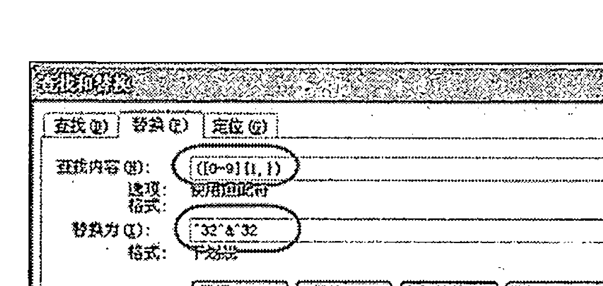

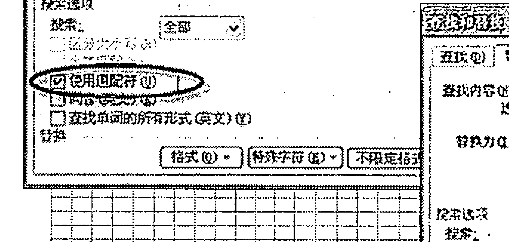

# 电子教室快速安装软件

本文讲述局域网环境下如何远程批量安装和配置软件的方法和技术。

文 | 远渡重洋

最近，学校要在网络机房中开设一节关于网络阅读的公开课，需要提前在所有的学生机上安装一个PDF阅读器，并设置IE浏览器的代理服务器为服务器的IP地址，以便于学生下载阅读指定的PDF图书。通过极域等网络电子教室软件的文件分发功能，可以将我们需要安装的PDF阅读软件快速分发到所有的学生机。通过远程运行功能，则可以同时运行所有学生机中的安装程序，但是单击“下一步”等按钮继续安装进程或者修改程序安装路径等操作，却需要我们逐一进行手工操作，而设置IE代理服务器的操作虽然很简单，但近百台学生机，起码要花费大半个小时。

正所谓“工欲善其事，必先利其器”，只要我们能够学会使用一款可以快速执行键盘按键操作的软件Autoit（下载地址：http://www.skycn.com/soft/2796.html），并配合使用电子教室的文件分发和远程运行功能，就可以让类似的软件批量安装与设置操作快如闪电，为我们节省下许多宝贵的工作时间。

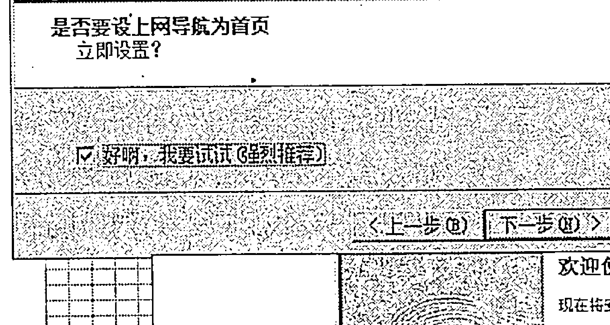

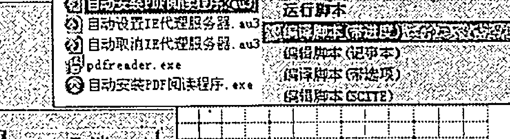

## 记录具体的安装步骤

这里先以自动安装一款PDF阅读软件到D盘的soft目录为例。首先运行其安装程序pdfreader.exe，通过按键执行并记录下所有的安装操作步骤：

- 运行PDF阅读器安装程序pdfreadere.exe
- 等待程序安装向导启动
- 按下键盘上的Alt+N组合键，相当于单击“下一步”按钮
- 按下空格键，取消修改上网导航页面设置
- 按下键盘上的Alt+N组合键，继续安装向导
- 设置程序安装目录为D:\soft文件夹
- 程序等待500毫秒，以便于系统自动输入安装目录
- 按下键盘上的Alt+N组合键，继续安装向导
- 按下键盘上的Alt+N组合键，继续安装向导
- 按下键盘上的Alt+I组合键，开始安装进程
- 等待安装向导完成界面启动
- 按下空格键，暂时不运行PDF阅读程序
- 按下键盘上的Alt+F组合键，结束安装进程

如果当前光标的焦点停留在某个包含快捷键的按钮上方，按快捷键和回车键是等价的。对于没有包含快捷键的安装窗口，我们还可以通过Tab键和回车键的密切配合来进行对应的安装操作。为了提高代码的编写速度和执行效率，能通过快捷键执行的操作应该尽量使用快捷键完成。通过不同网站下载的软件，尤其是汉化版软件，有可能包含不同的捆绑安装软件或浏览器首页设置等（图1），要取消类似的安装或设置，往往需要不尽相同的按键顺序，一定要按顺序记录清楚。

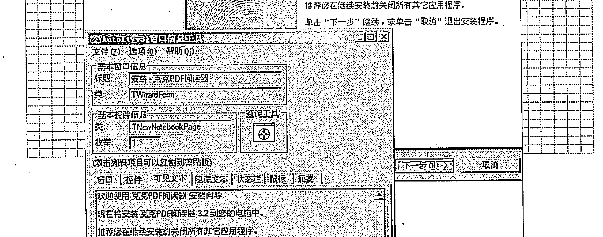


## 将安装步骤翻译成脚本

安装运行Autoit程序，将上述安装操作步骤逐句翻译成Autoit的脚本代码，并输入到SCITE编辑器窗口，将其保存为扩展名au3的自动运行文件，并和原来的安装程序保存在同一个文件夹下，双击该程序进行自动安装测试，确认脚本代码准确无误之后，右击执行“编译脚本（带进度）”或“编译脚本（带选项）”命令，需将AU3类型的文件编译成扩展名为exe的可执行文件，以便于离开Autoit软件环境也能够独立运行（图2）。

```
Run("pdfreader.exe")
WinWaitActive("安装 - 克克PDF阅读器","欢迎使用 克克PDF阅读器 安装向导")
Send("ln")
send("{Space}")
Send("ln")
Send("d:\\soft")
Sleep(500)
Send("ln")
Send("ln")
Send("li")
WinWaitActive("安装 - 克克PDF阅读器","克克PDF阅读器 安装向导完成")
send("{Space}")
Send("!f")
```

不同类型的安装程序，启动安装向导界面的时间往往各不相同，在执行某个安装程序之后，通常需要使用WinWaitActive函数，等待安装向导界面的启动。WinWaitActive函数的功能是“暂停脚本的执行直至指定窗口被激活（成为活动窗口）为止”，包含“窗口标题”、“窗口文本”、“暂停时间”三个参数，其中“窗口标题”为必选参数，“窗口文本”和“暂停时间”为可选参数。

执行“程序→Autoit_ACN→Autoit工具箱”命令，屏幕右下方会出现一个黄色心形的Autoit工具箱图标。右击该工具箱图标，执行“窗口信息工具[专业]”命令，通过“窗口信息工具”对话框，可以快速获取当前安装向导中的相关窗口信息（图3）。

翻译脚本代码时，一般使用Send函数（常用的参数如图4）来快速模拟键盘按键操作。由于系统的运行速度通常以毫秒为单位，比手工操作要快很多倍，因此在等待弹出窗口或输入字符时，要适当使用Sleep函数添加一点延时，例如Sleep(500)就表示暂停500毫秒。否则就可能会因为自动安装程序的运行速度太快，而错过某些设置窗口或者进行错误的操作，进而影响整个程序的自动安装进程。

## 分发并运行脚本程序

将该文件随同PDF安装程序一起分发到学生机的指定文件夹下，再通过电子教室的远程运行命令，在所有的学生机上同时运行该自动安装程序，就可以飞快地完成指定软件的批量安装操作。如果教学活动结束后还要删除这些软件，只需要找到并运行对应的卸载程序（这里为D:\soft\unins000.exe），参照上述方法编写运行对应的自动卸载程序，同样可以快速完成软件的批量卸载操作。

IE浏览器的代理服务器设置操作，同样可以使用Autoit软件来完成，首先找到IE浏览器对应的可执行文件位置，这里假设为C:\Program Files\Internet Explorer\IEXPLORE.EXE，然后根据具体的程序安装步骤，编写对应的脚本代码，检查调试无误后将其编译成可执行文件，分发到所有的学生机中并远程运行一下，就可以迅速对整个网络机房的所有学生机进行相同的IE代理服务器设置。将该脚本代码稍作修改，很快就可以编写出取消IE代理服务器设置的脚本代码（下载地址：http://iask.sina.com.cn/u/ish?uid=1704202287），这里不再赘述。

此外，我们还可以使用Autoit软件，对某些程序的运行进行监控，一旦某个指定的窗口出现，就立即将其关闭或执行关机操作等。例如，当我们运行Windows操作系统的磁盘碎片整理程序，并不知道它究竟要运行多长时间，如果想要使用计划任务程序来实现碎片整理操作完成之后的自动关机操作，通常只能采用“宁长勿短”的估算方法，设定几个小时后自动执行关机操作，并不能真正实现一整理结束就自动关机的目标。由于该程序执行完成之后，会自动弹出一个“已完成碎片整理”的对话框，利用Autoit的WinWaitActive函数，可以帮助我们监控该窗口的出现情况，一旦发现指定的窗口，就立即执行倒计时30秒的关机命令（图5）。

> **小提示**
为了保证自动安装程序的正确运行，需要确保操作系统的默认输入法为英文输入法，否则在输入英文字母进行程序安装目录等设置时，会自动弹出汉字输入法窗口，从而可能影响到程序的正确运行。右击输入法工具栏，执行“设置”命令，打开“文字服务和输入语言”对话框，在“默认输入语言”的下拉列表中选择“中文(中国)-简体中文-美式键盘”项，单击“确定”按钮，即可将默认输入法修改为英文输入法。

| Send命令参数 | 对应键盘按键 | Send命令参数 | 对应键盘按键 |
|--------------|--------------|--------------|--------------|
| {!} | ALT | {#} | Windows徽标键 |
| {+} | SHIFT | {UP} | 向上箭头↑ |
| {^} | CONTROL | {DOWN} | 向下箭头↓ |
| {SPACE} | 空格 | {LEFT} | 向左箭头← |
| {ENTER} | 主键盘区回车键 | {RIGHT} | 向右箭头→ |
| {BACKSPACE} | 退格 | {HOME} | HOME |
| {DELETE}或{DEL} | 删除键DELETE | {END} | END |
| {TAB} | TAB | {ESCAPE}或{ESC} | ESC键 |
| {PGUP} | PageUp | {PRINTSCREEN} | PrintScreen键 |
| {PGDN} | PageDown | {F1} - {F12} | F1-F12功能键 |

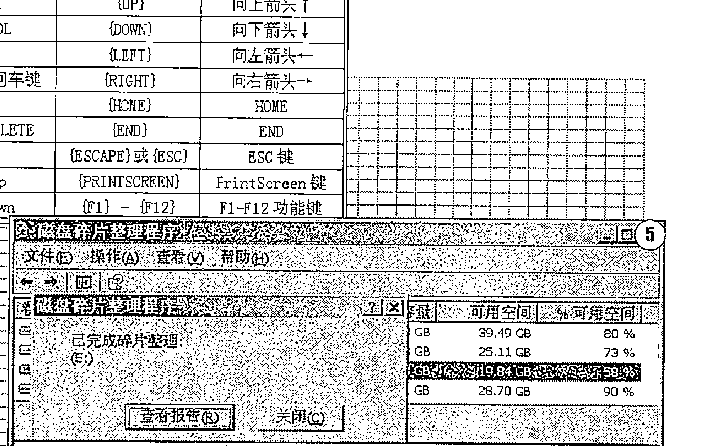

```
WinWaitActive("磁盘碎片整理程序","已完成碎片整理")
Run("C:\\windows\\system32\\shutdown.exe -f -s -t 30")
```## 查看docx格式文档全攻略

有时在低配置并只安装了低版本软件的电脑上，可能需要临时打开U盘里或者网上下载的docx格式的文档。有什么好办法？

文|郭萍

docx文档是Office 2007/2010所创建的格式。如电脑配置比较低，没有安装Office 2007/2010，甚至连Office 2003也没安装，有什么好的办法能迅速解决这一问题呢？笔者集中整理出了六种不同的办法，并对每种方法进行了简单解析，与朋友们分享。

### 软件升级安装法

全新安装Office 2007/2010或WPS 2010，这时你就能方便地打开docx格式的文档了。

**评价：** 软件升级安装法是最彻底的解决办法。但Office 2010文件系统比较大，达795MB，装起来很费时，而且对硬件条件有较高的要求，如果只是临时查看就显得有点多余。

### 补丁下载运行法

如果你的电脑只安装有Office 2003，可下载运行Office 2007/2010文件格式兼容包补丁程序，安装完成后重启电脑，你就可以在Word 2003中顺利打开docx格式的文档了。

Office 2007/2010文件格式兼容包补丁程序O2007Cnv.exe下载地址为：
http://download.microsoft.com/download/6/9/E/69EA942D-4636-4350-A526-0BFD9771A12A/O2007Cnv.exe

**评价：** 补丁下载运行法是最好的补救办法，既不需要重新升级安装Office，又能很好兼容docx格式文档，并能对其进行编辑。

### 工具软件拆解法

解压软件几乎是每台电脑上必备的工具，如果你的电脑装有WinRAR等压缩工具，你可将docx文件后缀改成rar或zip，此时，文件就变成了一个压缩包。用WinRAR将其解压到一个单独的目录中，你会看到有_rels、word和docProps三个文件夹，在Word文件夹下面有个document.xml文件，可以直接用记事本将其打开，文档的文本内容就在这个文件里。在media文件夹下面按顺序保存着该文档包含的所有图片文件。

**评价：** 工具软件拆解法是清晰、完整、批量获取Word文档图片内容的最好办法。但文档的文字和图片各自分开，且无法查看文档格式。

### 网络在线转换法

通过网络，你可在线将docx格式的文件转换为doc格式的文件，再用Word 2003将其打开。
你可进入以下网站进行格式的在线转换：
http://www.doc.investintech.com/
http://docx-converter.com/
http://docx2doc.com/

**评价：** 网络在线转换法的网站为英文界面，其可靠性和转换效率与文件内容、大小及网速有关。如果文件较大，内容较复杂，网络速度不快，其转换效率和成功率也会较低。

### 邮箱在线预览法

通过QQ或网易信箱的附件预览功能可查看docx格式文档。你可向你自己的QQ或网易信箱写一封信，将docx格式文件作为附件发送，稍后你将会收到这封邮件，在邮件的下方附件处有“下载”、“打开”、“预览”和“收藏到我的附件”四个链接，点击“预览”，在弹出的新窗口中能显示整篇docx文档的内容。这时你可对其中的文字与图片进行复制和粘贴，完整保存其中内容。

**评价：** 邮箱在线预览法作为应急措施是简单可行，但过程略显迂回，且必须有方便使用的QQ或网易信箱。

### 网络在线查看法

通过“网易文档查看”工具可以在线预览docx格式文档，不用安装任何软件。步骤如下：
访问“网易文档查看”（http://doc.163.com），进入“网易文档查看”主界面。主页默认打开的就是本地文件页面。勾选“我同意《网易文档服务条款》”，点击“浏览”按钮选择要打开的本地文档。
注意，“网易文档查看”不仅能查看“本地文档”，而且还可查看“网络文档”。不仅可查看doc、docx、ppt、pptx、xls、xlsx、pdf多种文档格式，而且可查看jpg、png、bmp、gif等多种图片类型格式。

**评价：** 网络在线查看法是通过网络查看docx文档最方便、最快捷的方法，且能查看docx文档以外的多种文件内容。文件越小，网速越快，加载和显示的速度也越快。

介绍了这么多查看docx格式文档的办法，你认为哪种办法更方便、效果更好呢？用了就知道，还是赶紧去试试吧！

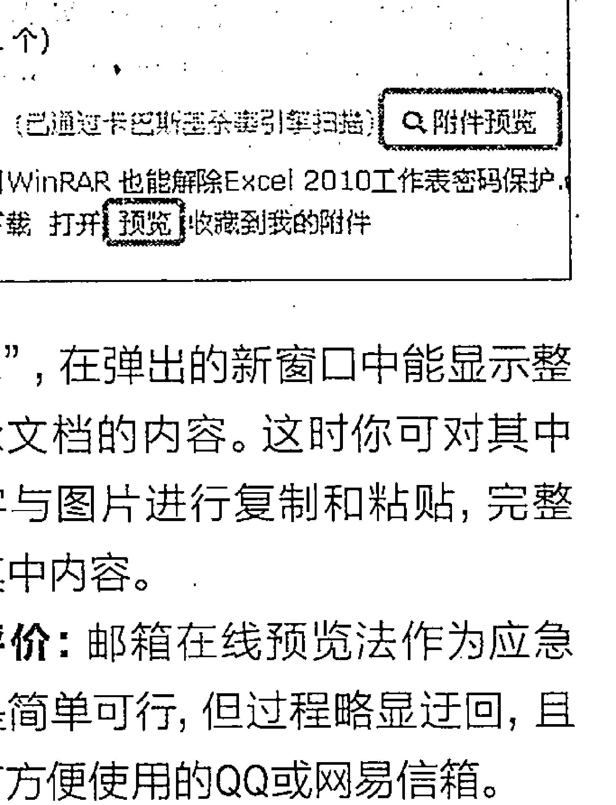

# 分类数据选择录入效率高

在Excel中用选单录入效率很高，但选单过长的话又会引起效率降低。本文介绍两种解决Excel中超长选单录入问题的方案。

文|仲勇

用Excel采集数据，在遇到某列中要采集几个固定的数据时，我们通常会设置该列数据的有效性，然后利用下拉菜单来选择并采集这些数据。但问题又来了，如果可供的选项过多会导致列表下拉过长，选择时会很不方便，反而会降低数据采集的效率。但如果这些选项内容之间可进行分类、分组，那就可以通过下面的两种方法来实现高效的数据采集了。

## 多次设置数据列的有效性

假定有两张工作表，其中用Sheet1来采集商品入库数据，并将其名称改为“商品入库”，在Sheet2（改名为“商品分类”）的A列中输入商品所属的分类，B列中的数据为具体的商品名称。为了介绍的方便，这里我只设置了三种商品分类，即“调味品”、“休闲食品”和“干货”。

## 定义商品所在单元格区域名称

选中“商品分类”表中所有调味品所在的单元格区域B1:B5，单击“插入”菜单中的“名称”，选择“定义”，此时弹出“定义名称”对话框，在“在当前工作簿中的名称”框中输入所定义的名称“调味品”（图1），单击“确定”按钮。

类似地，我们可以将休闲食品和干货等商品所在的单元格区域名称分别定义为“休闲食品”和“干货”。

## 设置数据的有效性

回到“商品入库”表中，选择要录入商品“所属分类”的C列，单击“数据”菜单中的“有效性”命令，在有效性条件的“允许”列表中选择“序列”，在“来源”框中输入“调味品,休闲食品,干货”（分隔符为英文状态下的逗号），单击“确定”按钮。

```
excel
=INDIRECT(C2)
```

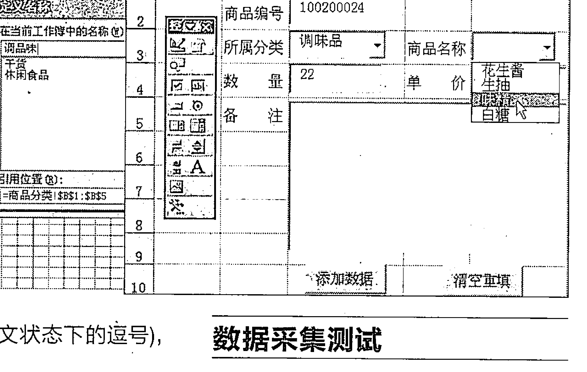

## 商品数据采集

采集数据时，我们首先从列表中选择商品的“所属类别”，然后单击该商品所对应的“商品名称”所在单元格右侧的下拉箭头，就可以从下拉菜单中找到需要的“商品名称”了。

## 用VBA编程实现

对于熟悉VBA的朋友，还可以使用下面的方法来实现。

在“数据采集”表中利用“控件工具箱”设计一个类似于数据采集的界面（也可以用窗体来实现）（图2），其中商品名称用两个组合框控件来采集，前一个（ComboBox1）用来采集商品所属的分类，后一个（ComboBox2）用来采集具体的商品名称。

两个组合框控件的代码可到http://blog.sina.com.cn/s/blog_78d89c4801018osx.html下载。

## 数据采集测试

录入商品入库数据时，首先选择商品所属分类，然后打开其右侧“商品名称”所在的下拉列表，就可以找到如图所示的商品名称了。

两种实现方法的比较：

第一种方法是通过多次设置数据区域的有效性的方法来实现数据的分类分组的选择性录入，由于没有涉及编程，所以实现起来相对来说比较容易，适合于初学Excel的用户。但如果需要向库中添加或删除商品信息时，必须重新定义所有分类商品所在单元格区域的名称，这的确是非常麻烦的一件事。

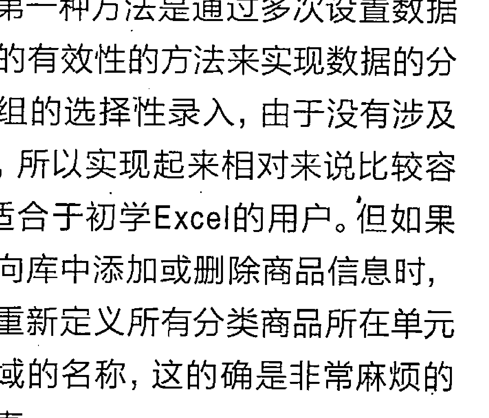

事实上，我们需要经常性地向商品分类库中添加或删除一些商品的信息，就这一点而言，使用第二种方法就更有优势了，但编程毕竟对许多用户来说还是有难度的。总之，两种实现的方法各有优缺点，至于选择哪种方法来实现，就需要根据你的喜好来决定了。

> 用该方法实现时，“商品分类”表中的商品信息无需按序排放，需要增减商品信息时可直接在库中随意添加或删除。

# 利用条形码管理校藏图书

本文主要介绍利用Excel的BarCode控件制作图书馆藏条形码，并用条形码来管理校藏图书的解决方案。

文|李宝霞

## 实例描述

老张是图书馆的管理员。最近，学校购进了一批新书进行馆藏，为了老师、学生借阅和归还时能够方便快捷地查找，他想给每册图书贴上一个条形码，通过扫描枪将条形码扫到电脑后，能够精准地查找到这册书的有关信息。那么，如何才能实现上述要求呢？

## 准备工作表

首先，要将有关新书的信息，如条形码编号、书名、定价、出版单位、馆藏位置、借出情况等录入到一个名称为“目录”的Excel工作表中，并为每条记录预留插入条形码的位置。在这里笔者设置每条记录的行高为55，条形码那列的列宽为35（图1）。

## 条形码的插入与设置

在Excel中制作条形码可以用控件的方法，本例主要在Excel 2003中用Excel内置的“Microsoft BarCode控件14.0”来制作条形码。

首先，选择“视图→工具栏→控件工具箱”菜单（或用鼠标在菜单栏上右击，在弹出的快捷菜单中选择“控件工具箱”），在弹出的“控件工具栏”中单击“其他控件”，然后在列表中选择“Microsoft BarCode控件14.0”。这时鼠标指针变成细十字形，在工作表中拖动鼠标绘制一个条形码控件并调整其位置和大小。

## 设置条形码

新生成的条形码有一个本身默认的数字，我们还需要让它链接到相应的单元格，使单元格中的值变为相应条形码的数学。首先，我们需要选择条形码的样式，这个操作可以在“Microsoft BarCode控件14.0属性”对话框中来修改属性。右击条形码，在弹出的快捷菜单中选择“Microsoft BarCode控件14.0对象→属性”，弹出“Microsoft BarCode控件14.0属性”对话框，可以根据需要修改其属性，例如样式、是否需要进行有效性验证、条形码的方向等。在这里笔者根据学校扫描枪的支持格式选择了样式7，即Code-128。

接下来，我们需要将该条形码控件与某个单元格形成链接，在这个单元格中改变条形码数字后可以生成相应的条形码。右击条形码，在弹出的快捷菜单中选择“属性”。在弹出的“属性”对话框中，在LinkedCell属性右侧输入单元格地址，如在此处输入B2，回车后可以看到其Value属性变成了B2单元格中的数值。当然，你可以在“属性”窗口修改全部控件属性，比如控件的样式属性就是Style属性，你可以在这里输入所需要的样式值。

完成属性设置后关闭该对话框。单击“控件工具箱”中的“退出设计模式”按钮。这一步很重要，否则当单元格中的条形码数字改变后，条形码无法自动更新。这时，“控件工具箱”中的“退出设计模式”按钮变成了“设计模式”按钮，条形码控件也变成不可选择的状态，如果要修改条形码控件属性，可以再次单击“控件工具箱”中的“设计模式”按钮。

打印条形码会出现不能自动刷新的问题，即当更改单元格中的条形码数字后，条形码会进行相应更改，但打印预览还是上一次的条形码。这个问题可能是该控件的一个Bug，遇到这种情况我们可以选择“文件→打印预览”，这时看到的就是更新后的条形码。

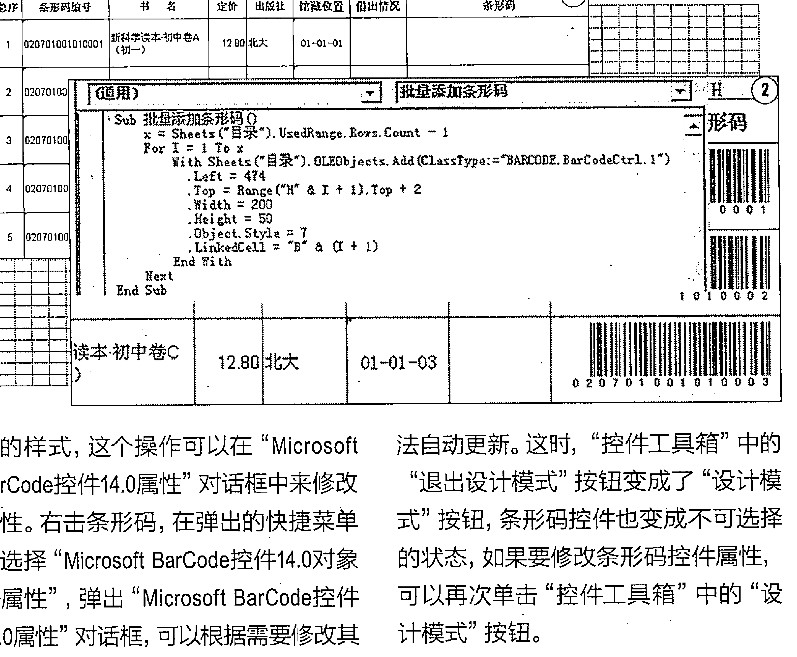

```
Sub 批量添加条形码()
    x = Sheets("目录").UsedRange.Rows.Count - 1
    For I = 1 To x
        With Sheets("目录").OLEObjects.Add(ClassType:="BARCODE.BarCodeCtrl.1")
            .Left = 474
            .Top = Range("H" & I + 1).Top + 2
            .Width = 200
            .Height = 50
            .Object.Style = 7
            .LinkedCell = "B" & (I + 1)
        End With
    Next
End Sub
```

| 总序 | 条形码编号 | 书名 | 定价 | 出版社 | 馆藏位置 | 借出情况 |
|------|------------|------|------|--------|----------|----------|
| 1 | 020701001010001 | 作文指导初中卷A (初一) | 12.80 | 北大 | 01-01-01 | |

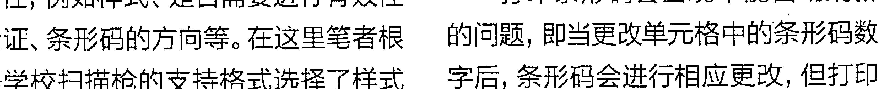

## 批量加入条形码

通过上面的操作你可能认为，那么多条记录如果一个一个地添加条形码将是多么费事、费时的工作呀。那有没有什么好的方法一次性地自动添加条形码呢？当然有，这时我们可以利用VBA代码来进行批量添加。首先，我们选择“工具→宏→Visual Basic编辑器”菜单，这时就会弹出VBA编辑器窗口。在这个窗口的左边双击VBA工程管理器中的“Sheet1(目录)”，在右侧就会出现代码编辑区，在里面输入代码（图2），将光标放在代码中，点击VBA编辑器窗口中的“运行”按钮，这时在当前工作表中就会添加好相应的条形码。那么，这时候就可以打印出条形码并粘贴在图书上了。

如果你觉得用VBA创建条形码控件太难，可选择“工具→宏→录制新宏”录制一个制作条形码的过程代码，把代码修改一下就可以。

## 查询窗体的制作

为图书目录插入条形码后，我们就开始制作显示图书相关信息的窗体了。首先，我们新建一张空白工作表，双击工作表标签，取名为“图书信息”，选择“工具→选项”菜单，在弹出的“选项”设置窗口中选择“视图”标签，在它上面将“网格线”的勾选去掉。这时，整个工作表一片空白。

## 添加窗体控件

首先，我们在这个工作表中选择“工具→宏→Visual Basic编辑器”菜单，进入VBA编辑器窗口。在VBA编辑器中选择“插入→用户窗体”菜单，我们调整所插入窗体的大小，在窗体属性窗口中可以设置窗体的标题、背景颜色、特效样式等。在本例中笔者将窗体的标题（Caption）属性和特效样式（SpecialEffect）属性进行了设置。如果窗口中没有属性窗口，可以选择“视图→属性窗口”菜单来调出它。然后，我们选择“视图→工具箱”菜单，在弹出的“工具箱”工具栏中分别选择标签、文本框和命令按钮，在窗体中画出相应的控件，并分别点击这些控件，在属性窗口设置它们的属性，如字体（Font）、文字前景颜色（ForeColor）等。我们把除了条形码文本框以外的其他4个文本框的Enabled和Locked分别设置为False和True（图3）。

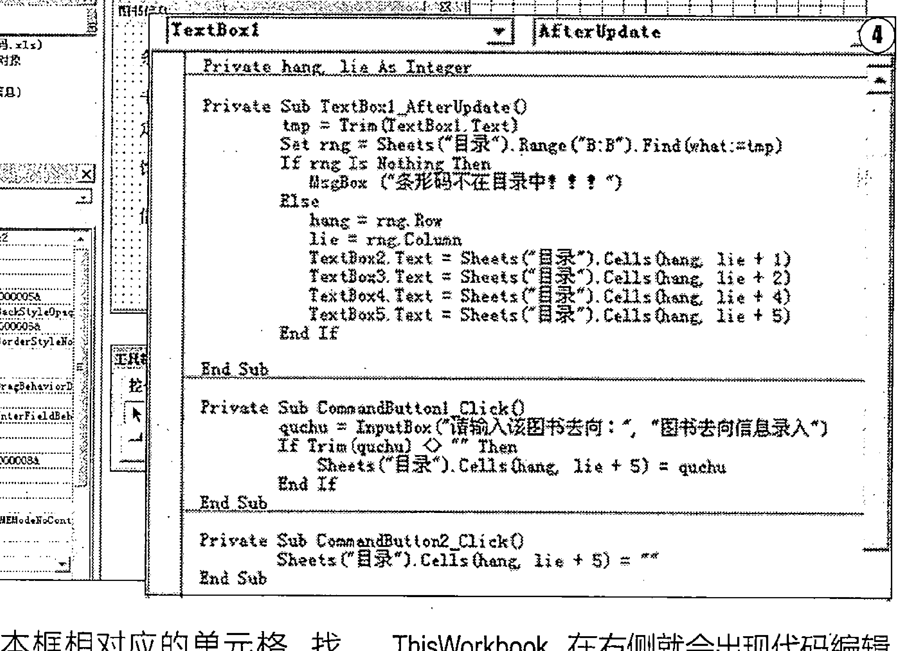

## 为窗体控件添加VBA代码

这个过程主要是给窗体上的控件编写VBA代码事件。利用VBA代码对条形码文本框进行判断，当通过扫描枪或手工录入的方式改变条形码文本框的值时，VBA代码就会在工作表中查找与条形码文本框相对应的单元格，找到后把图书的有关信息反馈到其他的文本框中。还利用VBA代码向单元格中添加借书情况，如果“外借”就在“目录”工作表相应的“借出情况”单元格中标注去向，如果“归还”就将相应的“借出情况”单元格清空。首先，我们在窗体上双击条形码文本框，在右侧的VBA编辑区，我们选择这个控件的AfterUpdate事件，并尝试着输入代码。在两个按钮控件上分别双击，在它们的Click事件中输入图中代码（图4）。

```
Private hang, lie As Integer

Private Sub TextBox1_AfterUpdate()
    tmp = Trim(TextBox1.Text)
    Set rng = Sheets("目录").Range("B:B").Find(what:=tmp)
    If rng Is Nothing Then
        MsgBox ("条形码不在目录中！！！")
    Else
        hang = rng.Row
        lie = rng.Column
        TextBox2.Text = Sheets("目录").Cells(hang, lie + 1)
        TextBox3.Text = Sheets("目录").Cells(hang, lie + 2)
        TextBox4.Text = Sheets("目录").Cells(hang, lie + 4)
        TextBox5.Text = Sheets("目录").Cells(hang, lie + 5)
    End If
End Sub

Private Sub CommandButton1_Click()
    quchu = InputBox("请输入该图书去向：", "图书去向信息录入")
    If Trim(quchu) <> "" Then
        Sheets("目录").Cells(hang, lie + 5) = quchu
    End If
End Sub

Private Sub CommandButton2_Click()
    Sheets("目录").Cells(hang, lie + 5) = ""
End Sub
```

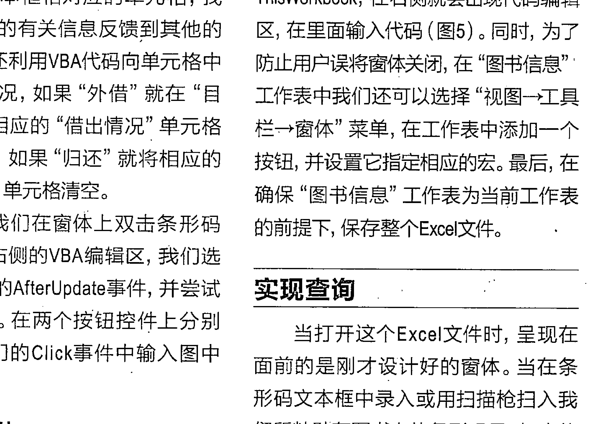

## 显示窗体

接下来的操作是怎样设置当打开工作簿时，即刻显示窗体。在VBA编辑器的左边双击工程管理器中的ThisWorkbook，在右侧就会出现代码编辑区，在里面输入代码（图5）。同时，为了防止用户误将窗体关闭，在“图书信息”工作表中我们还可以选择“视图→工具栏→窗体”菜单，在工作表中添加一个按钮，并设置它指定相应的宏。最后，在确保“图书信息”工作表为当前工作表的前提下，保存整个Excel文件。

```
Public Sub Workbook_Open()
    UserForm1.Show
End Sub

Public Sub 显示()
    UserForm1.Show
End Sub
```

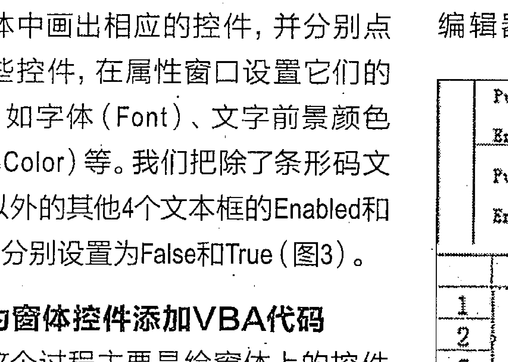

## 实现查询

当打开这个Excel文件时，呈现在面前的是刚才设计好的窗体。当在条形码文本框中录入或用扫描枪扫入我们所粘贴在图书上的条形码时，窗体就会呈现出有关该图书的相关信息（图6）。如果录入的条形码不存在，则提示相应的信息。

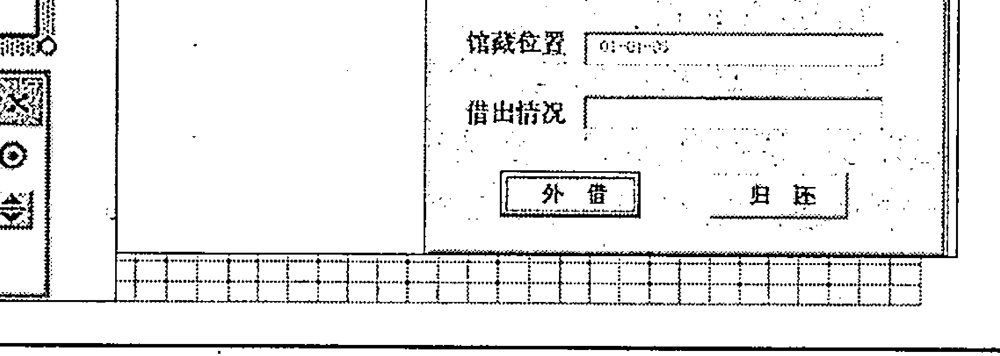# 职场老手教你构思工作总结PPT

把别人的模板拿来改一改就是自己的总结，这样写总结自然质量不高。今天就给大家分享写工作总结的七个关键思维，希望对各位今后写总结有所帮助。

文 | 秋叶

每到月末年底，最重要的工作在很多单位不是业务，而是总结。现在很多总结都需要用PPT汇报，做PPT总结，关键思维很重要。

# 明确定位：你给谁写

对内写工作总结也许是你写给领导，也许是你帮领导写总结材料给更上一级的领导。对外写工作总结，也许是给主管部门，也许是给外部专家，也许是服务的客户。

这些场合对工作总结的要求、文风、素材、框架区别都很大。很多人写总结习惯复制粘贴，但是汇报对象的评判总结的思维你复制粘贴了吗？

不同汇报对象感兴趣的内容点也许不同

| 汇报对象 | 感兴趣的内容侧重（举例） |
| :--- | :--- |
| 直属领导 | 想听听你对工作中发现的问题和解决思路 |
| 上级领导 | 想知道你对未来工作的目标和具体的措施 |
| 主管领导 | 想知道你们工作中可以借鉴推广的亮点 |
| 外部专家 | 想知道你们工作中的创新之处和具体成果档次 |
| 服务客户 | 想知道工作中出现问题的解决办法和配合要求 |

如果你给不同的人写汇报材料，就要学会从他们的角度来思考问题，从他们需要的高度来提炼材料，你的写作能力才能提高！

# 明确类型：你写哪种

仅仅知道工作汇报的对象还不够，还得了解自己汇报的类型。在内部汇报，我建议按基层、中层、高层分类考虑。基层往往侧重搜集材料，中层往往侧重提炼思路，高层往往侧重提出愿景，这些就决定了你写汇报的基调和选材必须有差异。

在单位里面，一种错位就是高层天天抓执行，这是中层的工作。基层天天提建设性意见，其实这是高层的工作。中层却在四处救火，这本来是基层的工作。这些往往也能体现在工作总结里面。

基层多写自己的岗位工作汇报，直白说就是没有功劳晒苦劳，都是差不多的工作，就比一比谁的份量足。一个弊端就是工作总结越写越厚，一般写得厚的工作就是做得比较多，写不厚的要么工作业绩太出色，要么的确没什么业绩好写。你的是哪一种？

但中层就有更高的要求，仅仅会哭还不够，还得会思考。中层一般都要探讨自己部门的工作思路，或者进行上一阶段的经营分析。这里面不能只是没有业绩凑亮点，而是要拼深度。

关于市场你怎么看？提多高的目标？为什么这个目标合适？准备怎么做？同行都怎么做？为什么我们要选择这样做？这样做有什么风险？做好风险应对措施了吗？如果万一没有完成会有什么后果？

这些问题都应该在中层的汇报里面系统考虑，但实际上，大部分经营分析汇报只有数据，没有分析，大家把精力都用在了整理数据或者美化PPT上去了。

比如下图的PPT，看起来工整规范，数据一目了然，但是问题是这些数据反映了什么问题呢？只能通过员工口头介绍？但是有几个人能做到文字都说不清的事情口头能表达清楚呢？

至于高层，更多是强调战略规划，有些人会嘲笑高层只会没有愿景画大饼，但是作为高层，反复让员工相信我们有能力看见行业未来的发展前景和空间，有信心抢占业务的制高点，是非常重要的激励团队士气的措施。这些不叫总结，叫总领。对高层而言，好总结不是比谁写得多，而是比谁看得远！

季度开柜汇总分析

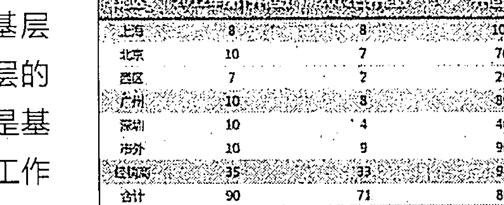

# 明确目的：为何要写

即便是一份普通的工作总结，在不同的场合，写的目的也是不同的。如果是年终盘点，你可能更多需要总结一年的得失，为明年做好规划。如果是项目总结，你可能需要预判风险，想一想万一风险来临你可以向哪里寻求应对之策。如果是新年规划，你的目标要得到保障，你需要哪些资源，这些资源在哪里可以争取。

如果一份工作总结只是一份工作流水账，那真的没有写的必要，毕竟你做的大部分重要的事情，领导都知道，要是领导都不知道，要么说明你的工作不重要，要么说明你的业绩不重要。明智的人不会仅仅在工作总结里总结，而是要通过汇报的机会争取各种资源，毕竟，工作总结是制度规定里面允许你和上级领导沟通的一种重要武器。

有的朋友工作业绩实在不够好。数据不行、趋势不利、业绩不够，即使写PPT总结，知道工作中的数据哪些不该说和知道如何把事说明白一样重要，这些事情要根据各自的情况把握，只能意会不能言传。

# 明确基调：何种写法

屡战屡败还是屡败屡战？一无所获还是积累经验？这不是玩文字游戏，这是态度问题！同样的成绩，不同的解读就会带来不同的反馈。在没有业绩的情况下，至少证明你一直在努力尝试，一直在试错中成长！其实多学学《新闻联播》也是有必要的，看看他们是如何传递正能量的。没有“下降”，只有“负增长”；没有“业绩平平”，只有“增速放缓”；没有“完成目标的40%”，只有“基本完成目标”；没有“严重问题”，只有“迎难而上”。

非两点：要么开源，要么节流。如果业绩不好、开源无能，那就说说为公司节约了多少成本，也可以变相突出自己任劳任怨、加班加点。把总结与领导关心的问题直接挂钩，至少说明你的存在还是有那么一点点的价值。基层写汇报，大致的思路不外乎于此。

C：全年任务全面达成…… 如果有一组不错的业绩数据，试试排比法也很给力。

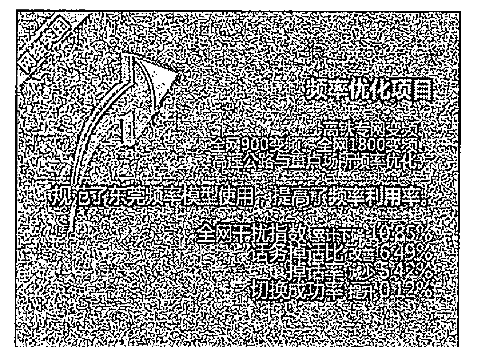

# 明确结构：何种框架

工作总结最忌讳形式化，或者写成一笔流水账，汇报工作要有一个框架。在中国，领导喜欢的汇报思维往往是以点带面还是面面俱到？一分为二还是抓大放小？实在没有办法就试试一个观点三个论据的结构，这就是所谓的“一个中心，三个基本点”的写作方法。

## 流水账如何出彩？

- 领导重视，部门支持，资产管理进一步加强
- 制定并下发笔记本电脑管理制度
- 1月份全面清理了现有资产，回收闲置资产
- 为新成立的服务支持组配备了电脑14台、电话6部、传真机1台、打印机1台
- 为信息部新进人员调配1台电脑
- 1台传真机、2台闲置电脑经维修后重新使用
- 将原来旧网站分析系统迁移到旧数字电视服务器上
- 18910号到期旧服务单台

## 试一试结构化表达？

| 项目 | 具体内容 |
|------|----------|
| 强化资产管理 | 制定并下发笔记本电脑管理制度；1月份全面清理了现有资产，回收闲置资产；为新成立的服务支持组配备了电脑14台、电话6部、传真机1台、打印机1台；为信息部新进人员调配1台电脑；1台传真机、2台闲置电脑经维修后重新使用；将原来旧网站分析系统迁移到旧数字电视服务器上；18910号到期旧服务单台 |
| 优化资源配置 | ... |
| 提高资产利用率 | ... |

# 明确数据：定性定量

在工作汇报中经常需要谈谈业绩指标，其实业绩指标未必就是数据，指标分定性考核和定量考核。定性指标往往弹性很大，谁能够概括得更给力、总结得更深刻就最出彩。比如大家都能完成的业绩，你加上用户、全面、突围等正面词汇，会显得更有力量。另外为你的工作想一个应景的标题也是抓住眼球的靠谱办法。定量考核比较难对付，但是也一样可以采取一些技巧，比如有三句话，你觉得哪种是完成情况良好，哪种是完成情况出了问题，哪种是为了反应自己的专业范。一切尽在掌握时说的话——

- A：全年任务基本完成……
- B：全年任务完成了92.1%
- C：全年任务全面达成……

# 明确风格：求新求稳

工作总结要不要形式出彩？这是一个很难有标准答案的问题。要知道在领导心目中，创新形式和形式主义只有一步之遥！这之间的转换又很有可能只是取决于你的工作业绩和别人对你工作的实际评价。比方说这种文艺调的工作总结，很多人喜欢，但真的能用在正式工作汇报中吗？

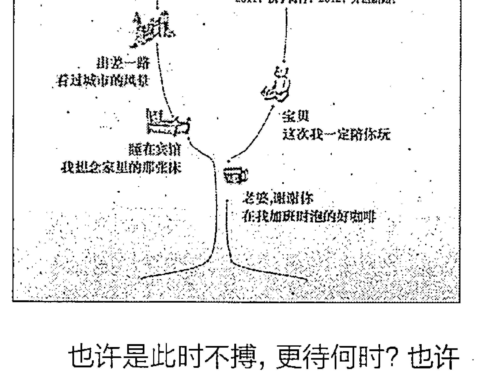

也许不是此时不搏，更待何时？也许不是不求出彩，但求无过！到底是哪种情况，你要斟酌，不要为了形式而形式，切记最好的年终总结还是“以成绩说话”、“用事实说话”。形式创新只是应急之需，绝不是长久之策。最后，以一句时髦的流行语结尾：写年终总结不难，难的是没业绩怎么写出好总结！

# 利用VBA轻松制作文件目录

在Excel中利用VBA能够轻松遍历文件夹中的每个文件，并能将获取的每个文件名添加到单元格中，制成文件目录。

文 | 马震安

## 实例描述
小张是一位影视作品爱好者，在电脑硬盘上分门别类地收藏了大量影视作品（图1）。他想将各个类别文件夹中影视资料的文件名制成目录存放到Excel工作表中。如果一个一个文件名去复制粘贴到工作表中，这样的工作量是可想而知的。那有没有什么好的办法来帮助小张解决这个难题呢？

## 实例分析
试想，既然不同类型的影片存放在不同的文件夹中，那么就可以遍历每个文件夹中的影视文件并获取它们的文件名，然后在不同的工作表中进行查找。如果工作表中已经存在，就不要添加了，否则就在相应的工作表中添加一条记录。那如何实现相应的任务呢？

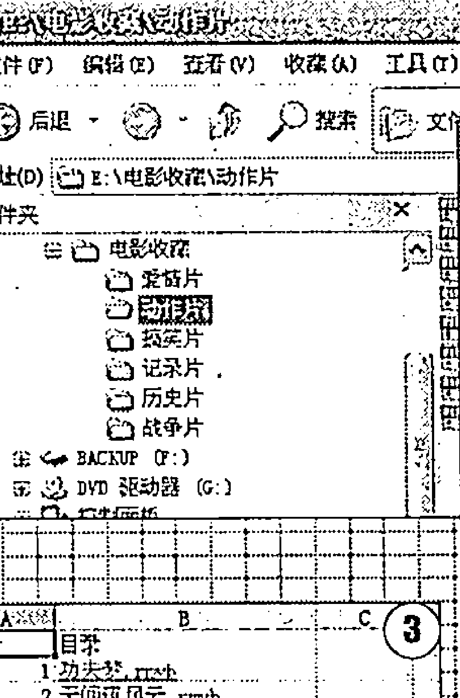

```vba
Sub FileList(Path)
    Set fso = CreateObject("Scripting.FileSystemObject")
    Set objFolder = fso.GetFolder(Path)
    Set objSubFolders = objFolder.SubFolders
    For Each objSubFolder In objSubFolders
        '...（中间省略部分代码）...
    Next objSubFolder
End Sub
```

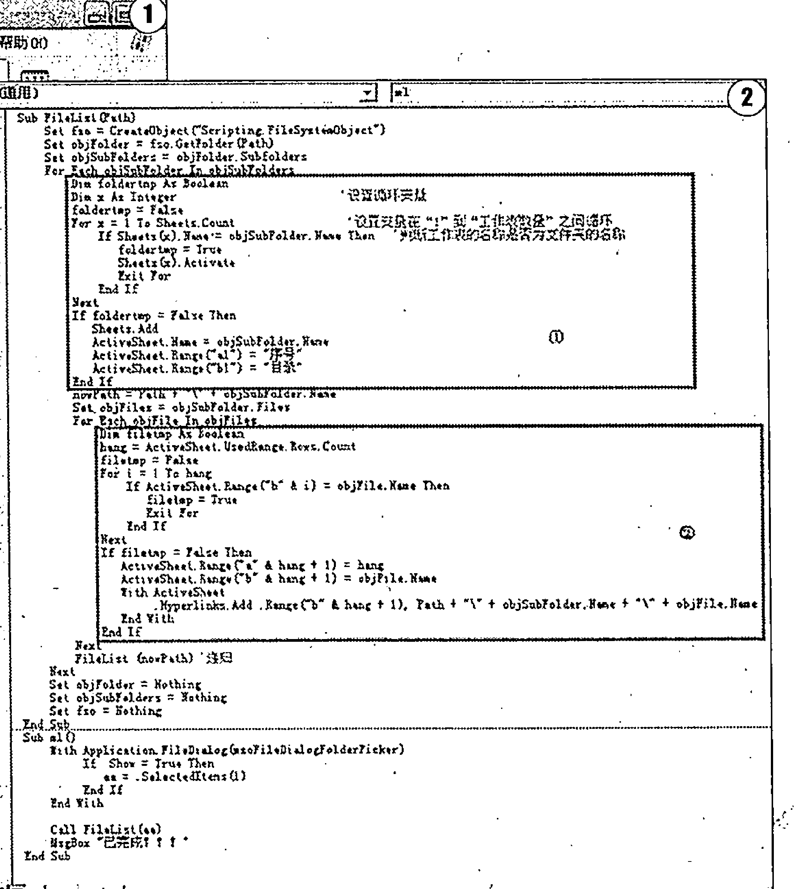

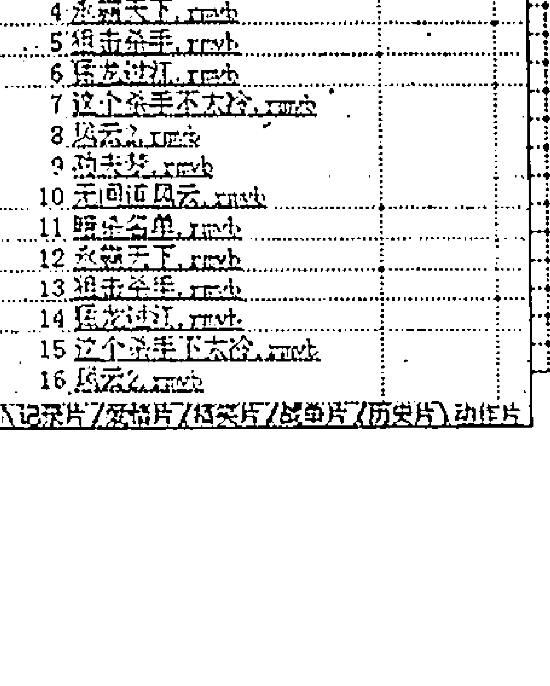

## 用VBA遍历文件夹

这个过程主要是在Excel中编写VBA代码，通过代码遍历文件夹中的每个文件并获取相应的文件名。一提到编写代码，你可能就有些犯晕了。其实，程序代码也没那么神秘，在这里你可先将我的代码输入或复制到你的文件中，然后看看我的解释，一切就OK了！

首先，打开Excel 2003，点击“工具→宏→Visual Basic编辑器”菜单，这时就会弹出Microsoft Visual Basic程序窗口，也就是VBA的编辑器。在VBA编辑器窗口中选择“插入→模块”菜单，这时在右侧可以看到空白的代码编辑区域，输入或贴入图中代码（图2）。代码下载地址：http://iask.sina.com.cn/u/ish?uid=1704202287

在上述代码中，共编写了两个过程，分别为FileList和ml。FileList这个过程的作用是遍历参数Path所代表的文件夹及其子文件夹中的文件，并把根据子文件夹的名字在Excel中建立工作表。其中，在FileList过程中，FileSystemObject的简称是FSO，当然也就是我们俗称的FSO组件了。

FSO，正如UFO般令人激动、令人神往，当然更多的是让人欢喜让人忧。君不见某空间服务商广告：100MB空间只要60RMB/年，支持数据库，支持什么什么……一问不支持FSO，立马泄气。该组件可以检测并显示出系统驱动器的信息分配情况，还能够创建、改变、移动和删除文件夹，并能探测一些给定的文件夹是否存在。若存在，还能提取出该文件夹的信息，如名称、被创建或最后一次修改的日期，等等。FSO还使得对文件的处理变得很容易。

正如其他组件的建立一样，FSO的引用也必须建立连接。通过语句：

```vba
Set fso = CreateObject("Scripting.FileSystemObject")
```

使FSO组件可以被FSO变量调用，即可以通过变量FSO来处理驱动器上的文件或文件夹。

## 制作便于操作的按钮

为了操作方便，我们可把上面编写的过程放到一个按钮上。首先，在Excel中选择“视图→工具栏→窗体”菜单，在“窗体”工具栏上点击“按钮”，按住鼠标左键根据需要拖出一个按钮。在弹出的“指定宏”窗口中，选择过程ml，确定后退出。最后，在按钮的标签处单击，修改按钮的标签，如更改为“生成目录”。

最后，点击“生成目录”按钮，就会发现工作簿中添加了以影视作品分类文件夹命名的工作表，并且每个工作表中都生成了相应的目录（图3）。

# 使用触发器制作实际效果

用好PPT的触发器功能，可以按需实现一些动感交互操作。本文中的竞赛题答对给出奖励笑脸，就是一个鲜活的实际应用案例。

文 | 烟锅

## 制作试题、组标志和笑脸

准备好试题内容后，为便于操作，将所有的试题制作在一个页面上，将各试题按顺序要求制作好，并为它们设置好对应触发器，控制它们的出现。接下来，在页面下部使用触发器功能制作各组奖励笑脸，由于各组学生答对题目是随机的，这样所得笑脸也是随机的，方便操作。

女朋友把所教学生分成了四组，她共设置了四道题，那么每组最多能得到四个笑脸。使用一个立方体和文本框的组合来表示每组的标志，调整好位置并组合。

## 为笑脸设置触发动作

从自选图形中选择“笑脸”，填充成红色。选中该笑脸，在“动画”选项卡中，为它添加“弹跳”。进入动画，点击“动画窗格”按钮，在窗口右侧打开“动画窗格”，在“笑脸1”上右击，选择“效果选项”。打开“弹跳”对话框，在“效果”标签下的“声音”中选择“鼓掌”，让笑脸出现时伴有鼓掌声音。再切换到“计时”标签，点击“触发器”按钮，选中“单击下列对象时启动效果”单选项，并在下拉列表中选择对应的第一组标志的图形组合名称。接下来，复制该“笑脸”图形，依次在每个组的标志上方粘贴四个笑脸图形。使用同样的方法，为第一组标志上方的其他笑脸都添加上一样的触发动作（图1）。

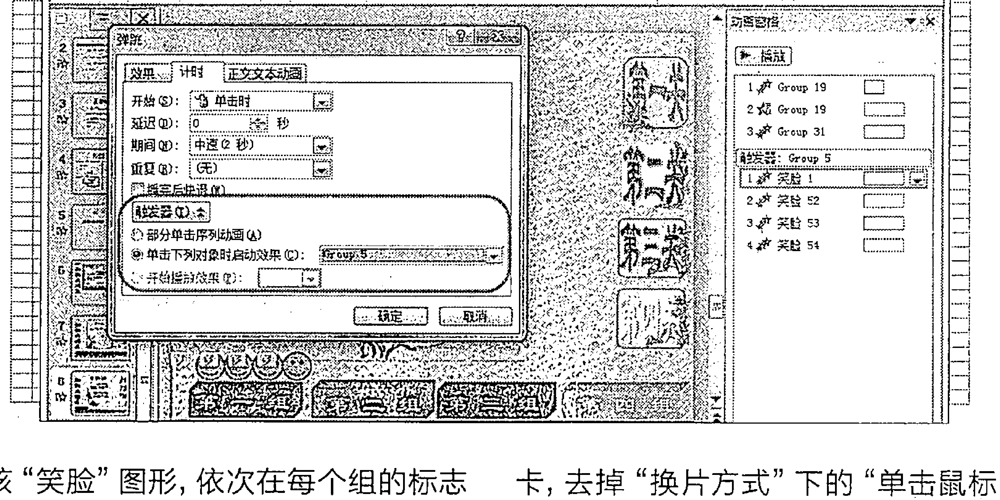

设置好后，就可以让第一个组标志触发四个笑脸对象的出现，每点击一次这个组标志就可以出现一个笑脸。测试成功后，再为其他的组标志也制作对应笑脸的触发动作。

## 更改幻灯片切换方式

幻灯片切换一般都是点击鼠标左键，但由于制作的交互式课件好多操作都需要点击鼠标左键，为了避免讲课时出现尴尬，可以点击“切换”选项卡，去掉“换片方式”下的“单击鼠标时”，这样就可以避免播放时，鼠标没有点击到相应位置，而是不小心点击到空白处，演示文稿就可能转到下一页幻灯片的问题。需要转到下一页时，可通过按键盘的空格键来实现，这样就不会出现操作失误的问题（图2）。

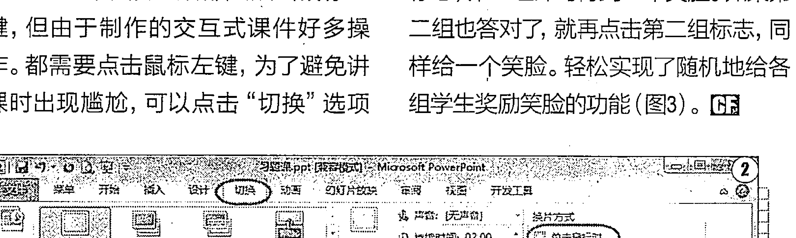

## 运行测试

制作好后，让女朋友模拟试用，如果第一组学生回答正确，那就点击第一组标志，第一组即可得到一个笑脸。如果第二组也答对了，就再点击第二组标志，同样给一个笑脸。轻松实现了随机地给各组学生奖励笑脸的功能（图3）。

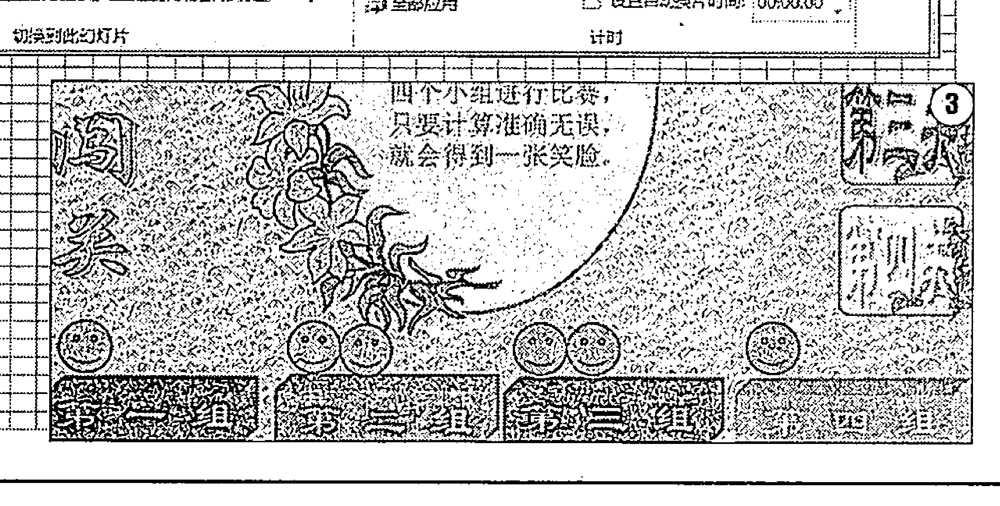

# 精彩投影三部曲

在“笔记本+投影仪”日渐成为大多数学校信息化教学环境标准配置的背景下，如何让投影演示更加精彩、高效，成为衡量教师信息化素养的重要指标之一。

文 | 胡文举

## 设置使用扩展显示模式

在Windows 7系统下，开启投影仪并将投影仪线缆连接到笔记本电脑的VGA视频端口之后，按下“Windows徽标键+P”，笔记本桌面上就会出现“仅投影仪”（即投影仪显示笔记本桌面，笔记本黑屏）、“复制”（即投影仪屏幕同步显示笔记本桌面）、“扩展”（即笔记本显示你所熟悉的桌面，而投影仪仅显示空白的桌面背景）和“仅计算机”（即笔记本显示桌面，而投影仪黑屏）四种显示模式切换窗口。

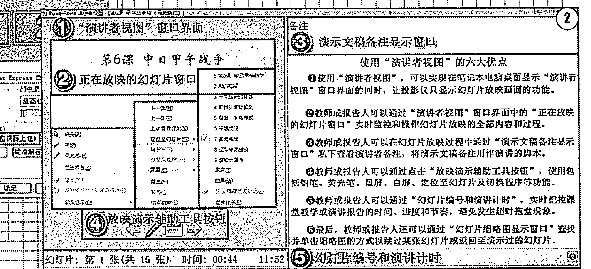

在Windows XP系统下，教师通过连续按“Fn+F3”组合键（注：F3键根据不同笔记本电脑品牌有所不同，一般其键盘上有电脑屏幕或投影仪屏幕标记）却只能依次在“仅投影仪”、“仅计算机”和“复制”这三种显示模式之间切换笔记本电脑和投影仪的显示模式。

在Windows XP系统下，要使用“扩展”显示模式，你必须设置双监视器并将Windows桌面扩展到第二个监视器上。

具体步骤是：在笔记本电脑桌面右键单击鼠标，选择“属性”，在“显示属性”设置菜单下，选中监视器2，并勾选“将Windows桌面扩展到该监视器上”，然后“确定”（图1）。这样，当你开启并连接好笔记本电脑和投影仪之后，再按“Fn+F3”组合键，“扩展”显示模式效果就直接出现了。

## 熟练使用“演讲者视图”

熟悉PowerPoint软件的教师可能都注意到了“幻灯片放映”菜单下的“使用演讲者视图”选项。要使用“演讲者视图”放映幻灯片有两个先决条件：一是笔记本要连接到投影仪或其他监视器（如数字电视或第二个显示器）；二是必须设置和使用“扩展显示模式”。

由于教师在笔记本电脑上利用PowerPoint软件备课、制作PPT演示文稿时，一般情况下很难使用到投影仪或第二个监视器，并且在Windows XP系统下，大部分教师在连接了投影仪之后只能熟练使用“复制”显示模式，不懂得设置“双监视器扩展显示模式”，从而使得PowerPoint软件中十分实用的“使用演讲者视图”放映幻灯片的功能长期“养在深闺人未识”。

在“扩展显示模式”下使用“演讲者视图”放映幻灯片可以让PPT投影演示更加精彩高效。“演讲者视图”窗口界面以及“使用演讲者视图”放映幻灯片有六大看点（图2）。

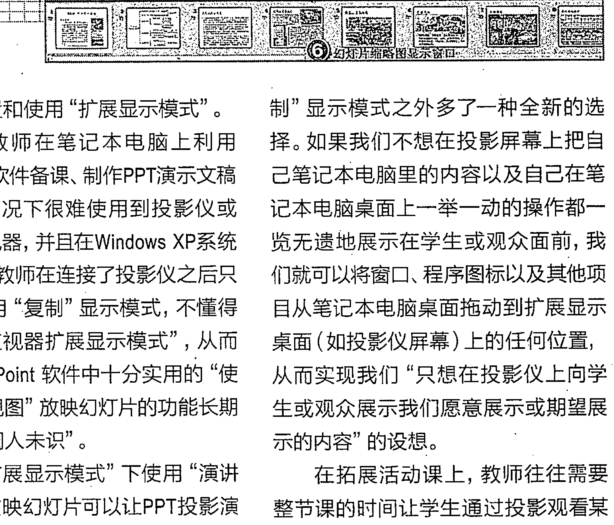

## 巧用扩展桌面播放视频

日常教学工作中，绝大多数教师大都使用的是“复制”显示模式——即投影仪屏幕同步显示笔记本电脑桌面，其优点是你在笔记本电脑桌面上一举一动的操作都可以在投影屏幕上原原本本地展示出来。

“扩展”显示模式让我们在“复制”显示模式之外多了一种全新的选择。如果我们不想在投影屏幕上把自己笔记本电脑里的内容以及自己在笔记本电脑桌面上一举一动的操作都一览无遗地展示在学生或观众面前，我们就可以将窗口、程序图标以及其他项目从笔记本电脑桌面拖动到扩展显示桌面（如投影仪屏幕）上的任何位置，从而实现我们“只想在投影仪上向学生或观众展示我们愿意展示或期望展示的内容”的设想。

在拓展活动课上，教师往往需要整节课的时间让学生通过投影观看某部电影或纪录片视频，能否有办法做到在学生通过投影观看视频的同时，教师还能够在笔记本电脑上备课、上网而互不干扰呢？

在“扩展显示模式”下，我们只需要将视频文件播放窗口拖放到“扩展显示桌面”——投影屏幕上，同时将鼠标移到投影屏幕上，将视频文件播放窗口最大化，点击“播放”按钮，视频文件就会在投影屏幕上开始播放了。与此同时，教师就可以在笔记本电脑桌面上备课或娱乐。

# 用VBA实现课堂语音点名

通过VBA调用Excel中的“文本到语音”功能，能让Excel将单元格中的数字或文本内容朗读出来。利用这一功能可实现课堂语音点名。

文/梁里宁

具体实现方法思路：制作一个点名页面，安排三个操作按钮，分别是“点名”、“缺”、“到”，并分别给这三个按钮赋予相应的VBA程序代码，完成相应的控制或记录任务。当开始点名时，老师点击“点名”按钮，让电脑按学生花名册信息自动语音点名，如果学生已到课，点击“到”按钮记录，如果学生缺课，点击“缺”记录。

首先要说明的是，Excel中的“文本到语音”功能不是默认安装的。打开“工具”菜单，选择“语音”项子菜单中的“显示文本到语音工具栏”命令，Excel会自动进行安装。安装好后，可以弹出“文本到语音”浮动工具栏。

以Excel 2003为例，具体实现步骤如下：

- 1. 在工作表Sheet2中输入学生的点名册信息(图1)。
- 2. 适当设置工作表Sheet1中单元格的格式，并在其上添加三个命令按钮，标题分别为“开始”、“缺”和“到”(图2)。
- 3. 为三个命令按钮“开始”、“缺”和“到”编写单击事件过程，输入具体的VBA代码：

```vba
Private Sub CommandButton1_Click()
'开始
With Sheet2
Cells(12,1) = .UsedRange.Columns.Count + 1
Cells(13,1) = .UsedRange.Rows.Count - 1
'记录点名人数
If Cells(13,1) > 0 Then
.Cells(1, Cells(12,1)) = Date
'记录点名日期
.Cells(1, Cells(12,1)).ColumnWidth = 10
CommandButton2.Enabled = True
CommandButton3.Enabled = True
CommandButton3.Activate
Cells(5,3) = .Cells(Cells(13,1)+1,1)
'显示学号
Cells(8,3) = .Cells(Cells(13,1)+1,2)
'显示姓名
Application.Speech.Speak Cells(8,3)
'语音朗读姓名
CommandButton3.Activate
End If
End With
End Sub
```

```vba
Private Sub CommandButton2_Click()
'缺
If CommandButton2.Enabled Then
With Sheet2
.Cells(Cells(13,1)+1, Cells(12,1)) = "缺"
Cells(13,1) = Cells(13,1) - 1
'点名人数递减
If Cells(13,1) = 0 Then
MsgBox "点名完毕！"
Cells(5,3) = "点名请单击"
Cells(8,3) = "开始按钮"
CommandButton1.Activate
CommandButton2.Enabled = False
CommandButton3.Enabled = False
Else
Cells(5,3) = .Cells(Cells(13,1)+1,1)
'显示下一个的学生
Cells(8,3) = .Cells(Cells(13,1)+1,2)
Application.Speech.Speak Cells(8,3)
'语音朗读姓名
CommandButton3.Activate
End If
End With
End If
End Sub
```

```vba
Private Sub CommandButton3_Click()
'到
If CommandButton3.Enabled Then
With Sheet2
.Cells(Cells(13,1)+1, Cells(12,1)) = ""
Cells(13,1) = Cells(13,1) - 1
'点名人数递减
If Cells(13,1) = 0 Then
MsgBox "点名完毕！"
Cells(5,3) = "点名请单击"
Cells(8,3) = "开始按钮"
CommandButton1.Activate
CommandButton2.Enabled = False
CommandButton3.Enabled = False
Else
Cells(5,3) = .Cells(Cells(13,1)+1,1)
'显示下一个的学生
Cells(8,3) = .Cells(Cells(13,1)+1,2)
Application.Speech.Speak Cells(8,3)
'语音朗读姓名
End If
End With
End If
End Sub
```

点名开始前，“开始”命令按钮是可用的，而“缺”和“到”命令按钮都是不可用的。单击“开始”命令按钮后，把“缺”和“到”命令按钮设置为可用，而学生的学号和姓名会逐一显示在Sheet1中。根据学生的出勤情况分别单击“缺”或“到”命令按钮，把出勤情况记录在Sheet2中。在此过程中，Sheet1中显示的点名人数会逐渐递减，直至最后为0，表示点名完毕。

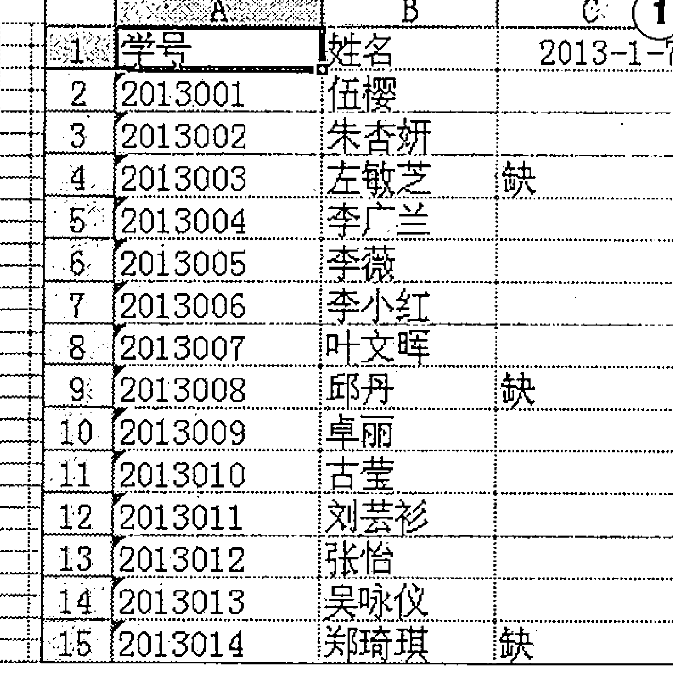

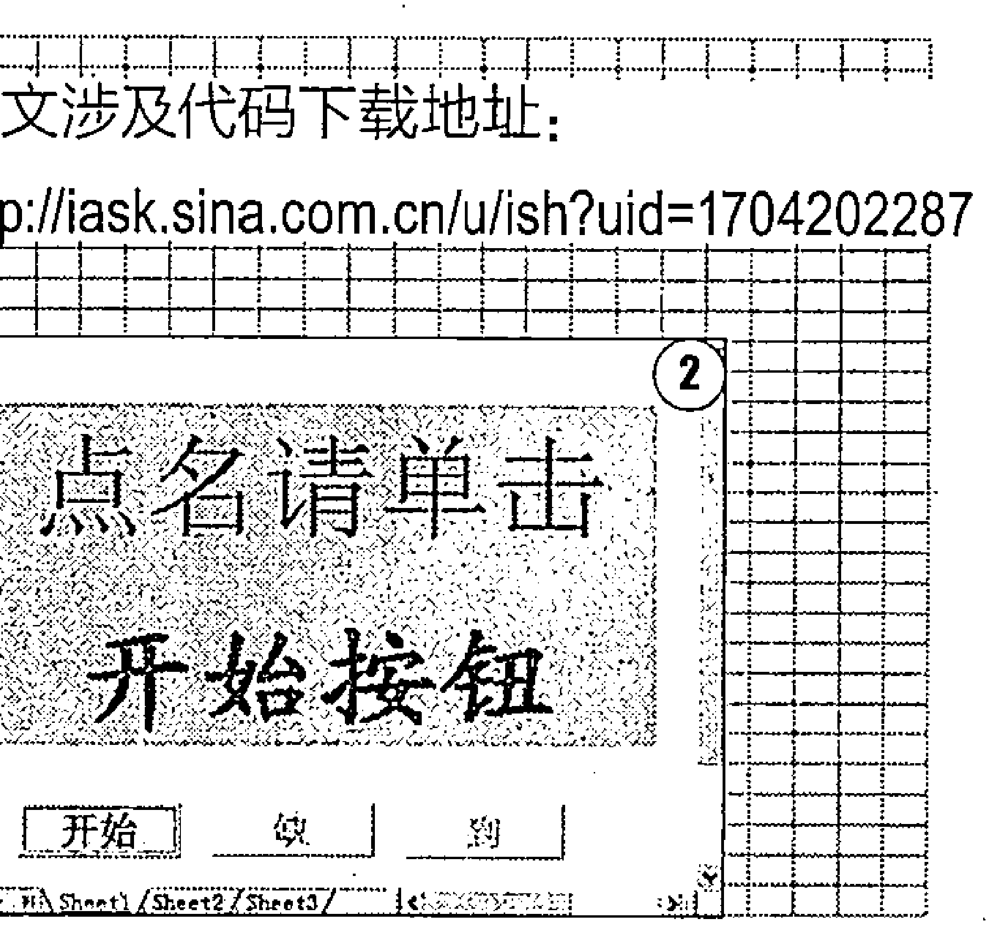

本文涉及代码下载地址：http://iask.sina.com.cn/u/ish?uid=1704202287

## 巧用拼音首字母输入人名

在极品列车时刻表中，查询车站名称，只输入站名的首字母即可。那么，能不能在Excel表格中只输入人员姓名的首字母，就迅速得到所需人名？

文 | 仲勇

刘姐是单位的仓库保管，每天负责单位办公用品的出入库登记，以前都是用手工来记载的，总是不能及时地统计出库存记录和逐月消耗的情况。每天办公用品的出入库数据多而繁杂，如果用电脑登记，对她来说最麻烦的就要数录入申领人的姓名了。刘姐的拼音又不太好，于是向我求助有没有比较简便的录入姓名的方法，我欣然接受了挑战。

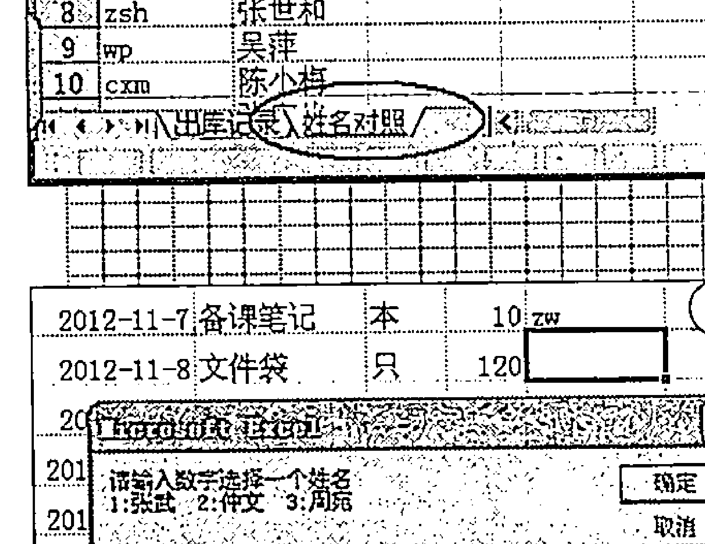

创建员工姓名库，新建一张名为“姓名对照”的工作表（图1），输入单位所有员工的姓名以及这些姓名所对应的拼音首字母。

### 编写事件代码

接下来在“出库记录”工作表中编写调用的事件代码。方法是：激活“出库记录”工作表，按Alt+F11组合键打开VBA编辑器，在工作表的Change事件中编写下面的代码：

```vba
Private Sub Worksheet_Change(ByVal target As Range)
    '判断当前是不是录入姓名所在列
    If target.Column = 5 Then
        姓名输入 target
    End If
End Sub
```

这段代码的作用是首先会判断当前活动单元格是不是在第五列（即输入姓名所在的列）。如果是则调用过程“姓名输入( )”，该过程的代码如下：

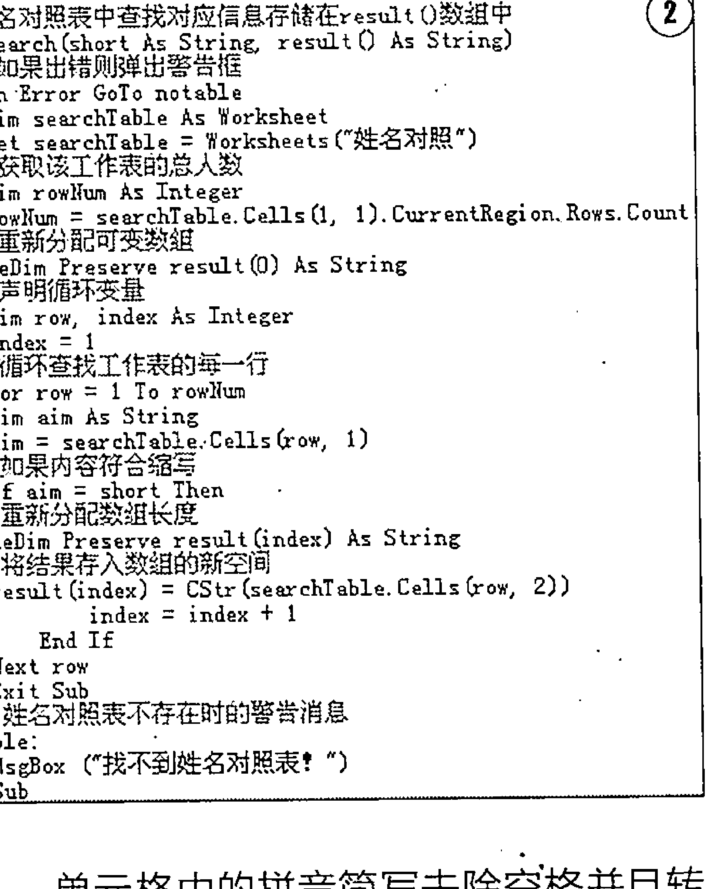

```vba
'输入姓名的主体函数
Sub 姓名输入(aim As Range)
    '清除单元格中的空格并将输入的字母转换为小写
    On Error Resume Next
    Dim short As String
    short = Trim(LCase(aim.Value))
    '声明动态数组，调用Search过程在姓名对照表中查找信息
    Dim result() As String
    Search short, result
    '如果查找到一个结果则直接写入单元格
    If UBound(result) = 1 Then
        aim.Value = result(1)
    '如果没有查找到则直接退出程序
    ElseIf UBound(result) = 0 Then
        Exit Sub
    '如果查找到两个以上的结果则等待用户选择
    Else
        '循环等待用户输入，直至输入正确
        Dim goOn As Boolean
        Do
            goOn = GetOne(result, aim)
        Loop Until (goOn = True)
    End If
End Sub
```

以上代码的含义是将用户输入在单元格中的拼音简写去除空格并且转换为它的小写形式，然后与“姓名对照”库进行比对，利用过程Search( )找到匹配的拼音首字母简写后保存在数组result( )中，如果查找到的拼音简称只有一个则返回其对应的中文名字，如果超过两个就显示输入框让用户选择输入（直到用户输入正确为止），如果没有查到则显示用户输入的拼音首字母简称。过程Search( )的代码（图2）可到下面的地址下载：http://blog.sina.com.cn/s/blog_78d89c4801019qbb.html

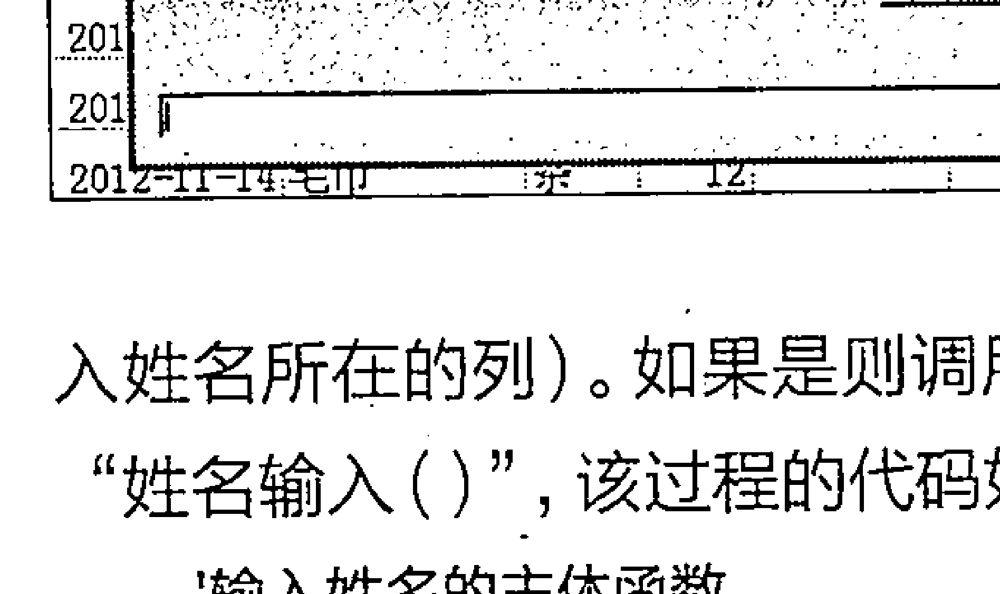

### 录入姓名数据

最后我们就可以测试一下运行的情况了。在“出库记录”工作表第五列中录入姓名时只需输入员工姓名拼音的首字母（不区分大小写）就可以输入与之对应的姓名了。如果遇到拼音首字母相同的姓名，系统会自动弹出提示信息，由用户选择姓名前相应的序号进行输入（图3）。对于姓名库中没有的名字可以直接录入中文姓名或在姓名库中先添加再用拼音首字母录入。

小提示

如果单位人数较多，也可利用VBA代码自动生成姓名所对应的拼音首字母，但不在本文讨论之列，读者朋友可参考网上的方法实现。

## 《电脑爱好者》·合订本 { 公司 校园 }

# Excel打印台签现学现做

会议人名台签看似很简单，但因为是双面印刷效果，排版打印起来也不是一件轻而易举的事情。此前介绍过Word制作法，现在再介绍一种用Excel制作台签的方法。

文|王卫华

单位会议室里准备开会，一排领导坐定，结果发现有个领导临时换人，但台签已经做好……火烧眉毛之际，你肯定在感叹：如果我电脑里有个台签模板就好了，可以在办公室临时打印一个台签！

我也遇到过类似的事情，并从中吸取了教训，经过一番摸索，发现最简便的方法就是用Excel设计一个台签模板，需要的时候只要改一下名字或单位名称就立马可以打印了。下面以通用台签盒为例来说明制作方法。

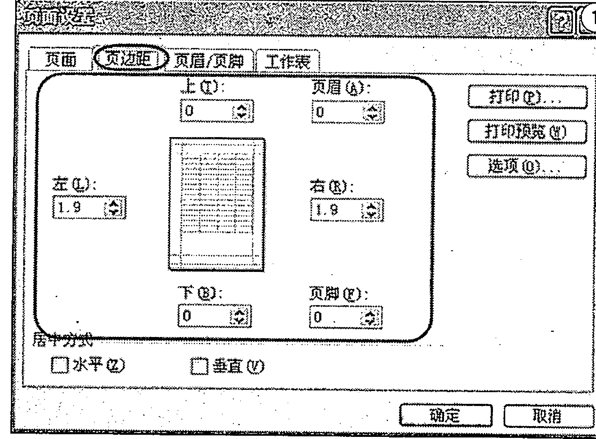

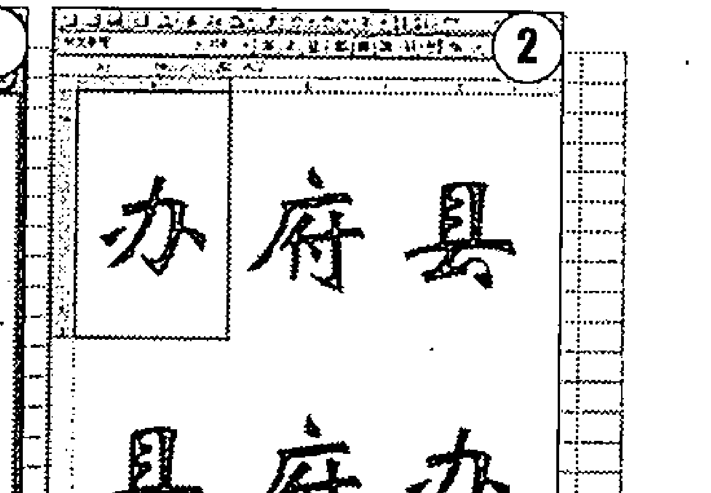


### 设置边距并选择纸型

由于台签需要两侧对齐，是A4纸的三分之二大小，因此需要把上边距、下边距、页眉、页脚全部设置为0，不留任何空间，这样可以确保折叠后完全居中(图1)。

至于纸型，只需选普通A4纸就可以，不过据测量，A4红纸要比台签盒宽1cm左右，有时间可以提前裁去，确实没有时间也无伤大雅了。

如果提前买到台签专用打印纸也可以，但是对于单位普通激光打印机来说，由于纸面光滑，不容易定影，需要在打印机设置中选择“卡片纸”或者“重磅纸”，并要根据不同打印机多摸索几遍。

为加快制作台签速度，我们可以先在第二行输入文字，然后将第一行用公式直接引用第二行相应的内容，如第一行第一格输入“=c2”，第二格输入“=b2”，第三格输入“=a2”，这样第二行输完，第一行文字已经对应显示出来了(图2)。

整个过程最难的一点是，第一行字体是倒过来显示的，一般的软件都没有快捷键，但可以通过以下两步来实现：

选定第一行所有文字，选择好字体(一般为魏碑体或行楷体等)，在字体名称前加“@”，这样就可以将字体旋转90度(图3)。然后打开单元格对话框，选择

### 设计模板

台签一般打印人名或单位名称，通常在2~4个字。打开Excel，选取三列、两行单元格(四个字的可以改变字体大小和列宽来实现)，根据台签盒设置行高，一般较大的台签盒行高设置成260mm。

“对齐”按钮，在“方向”选项中将拨盘往上拨90度，或者直接输入“90”(图4)，这样就可以把字体旋转180度了。

保存后，一个台签模板就做好了，打印后只需裁去下端三分之一的纸张(可以在第二行文字下加横线作为裁剪标记)，对折后就可以放入台签盒(图5)。

这样一来，无论开什么会，打印台签就不用专找打印店了，只要买点红色打印纸来就可以自己搞定，而且还节约了往返于打印店、广告公司的时间，绝对是响应中央号召、开源节流的好举措。

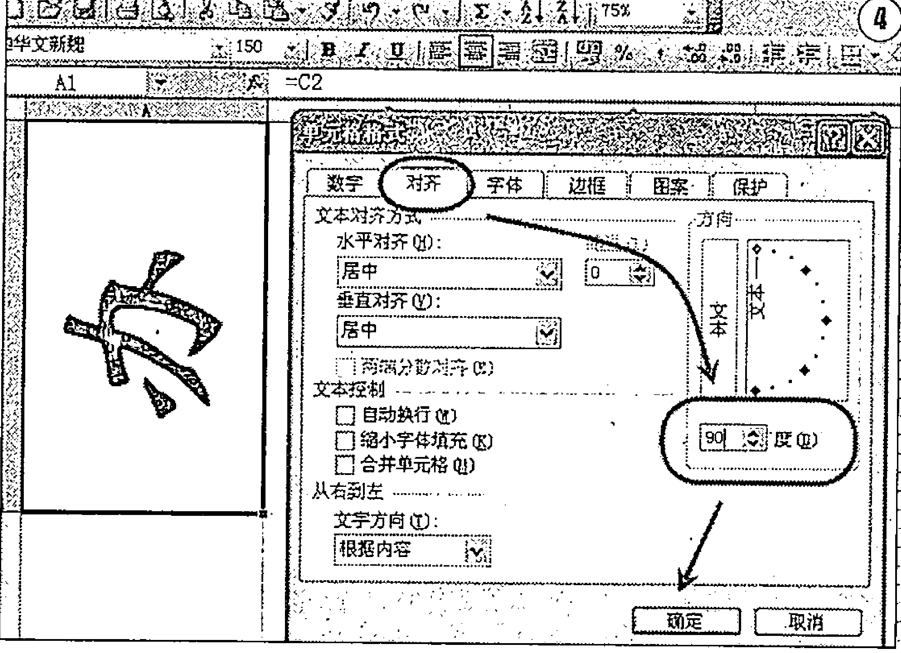


# 山寨主义 制作课件大串烧

课件制作，可实行“拿来主义”。如果有现成的模板可以套用，何不用一点“小聪明”来代替从头设计的“大聪明”呢？

文|曹春华

制作课件，精通PPT、Flash中的动画制作当然是最好的，但并非所有老师都熟悉这两种工具。那么，除此之外，有没有更省事的、门槛更低的办法能够实现课件制作呢？办法还是有的！如果你想让自己的课件精彩一点、课堂气氛活跃一点，不妨借用一些现成的模板，“山寨”出自己的课件。

## 连线题的制作

软件名称：连线题PPT模板
下载地址：http://ishare.iask.sina.com.cn/f/6774976.html

解压下载得到的模块文件，然后打开“连线题.txt”，根据连线题数量修改shpID数值，比如有6对连线题，就改为6。然后在content中输入连线题内容（图1），配对项目以“/”分开，配对题目与配对答案按顺序输入即可，实际展示时，会随机打乱，最后保存此文件。

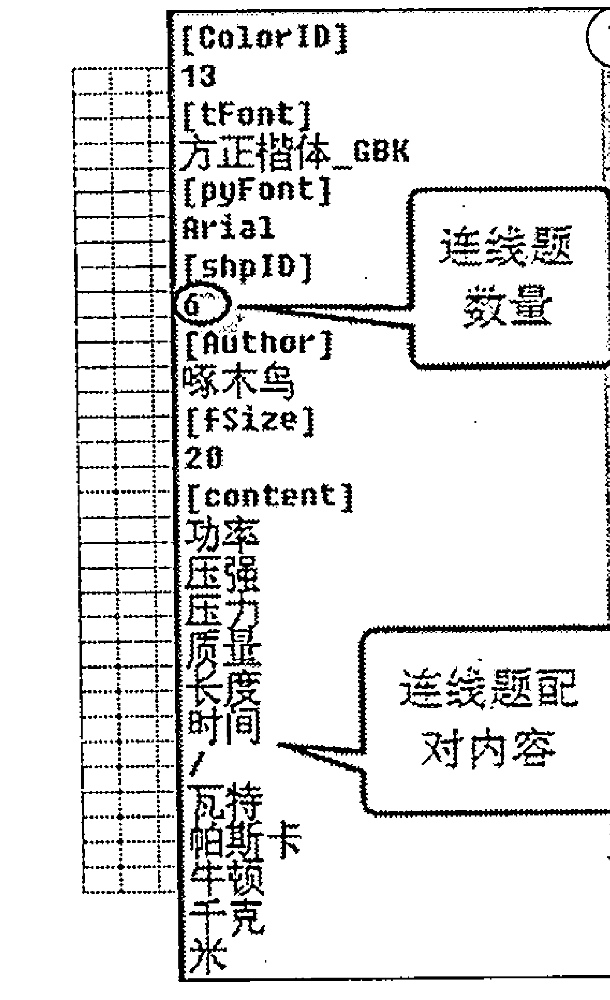

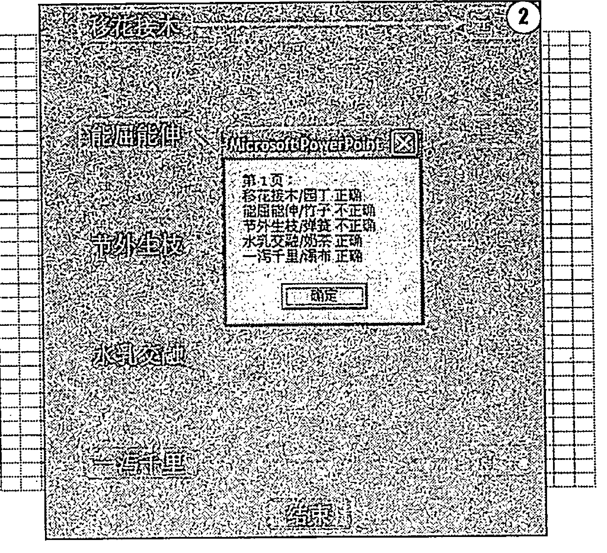

再运行“连线题.ppt”，由于模板采用了宏，如果弹出了“安全警告”对话框，应该单击“启用宏”按钮。

连线方法为：单击左侧某道原题，再单击右侧配对项，就会自动用连线连接（图2），连线完成后，单击“结束”，将弹窗显示答题结果。

## 单选题的制作

软件名称：单选题制作工具
下载地址：http://www.skycn.com/soft/44506.html#downUrlMap

这是一款制作单选题Flash文件的工具软件。下载软件后解压，用记事本打开question.xml文件（图3），设置每题分值、总分、答对与答错情况

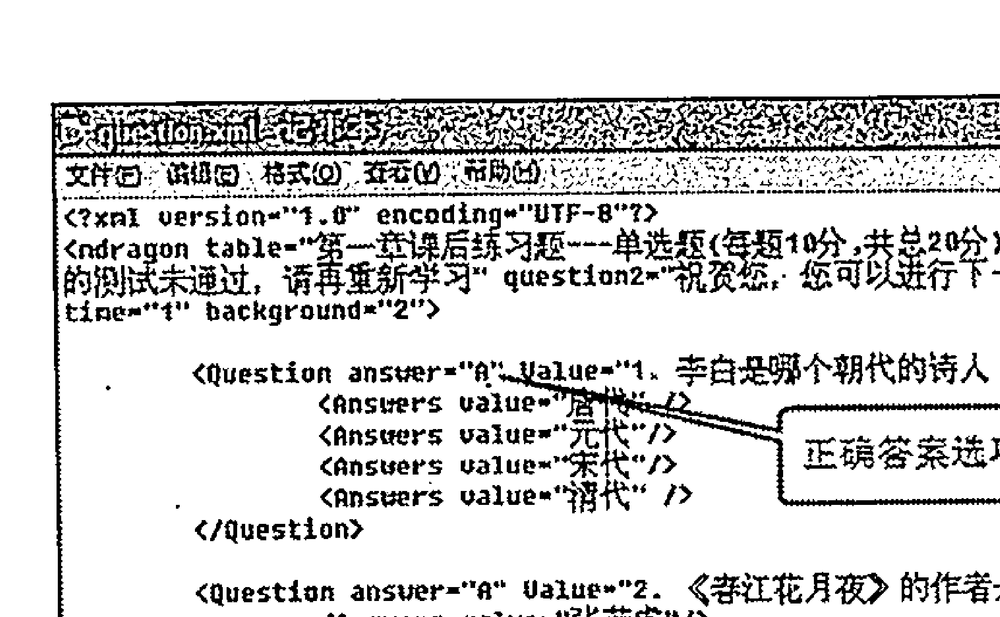

下的提示语言以及答题限定时间，默认每题限时1min，可以修改time后的数值。题目、选项以及正确答案的设置，只需要在原题上修改就行，需要添加题目，复制Question与/Question间的代码再修改。

完成后，运行question.exe即可看到答题界面（图4），第一题答完后会自动进入下一道题，答题过程中，会实时统计你的成绩。

## 问答题的制作

软件名称：问答题制作工具
下载地址：http://www.skycn.com/soft/44504.html

这款软件制作问答题的原理与单选题的制作原理相同，同样用记事本打开wenda.xml文件，修改其中的答案及题目，修改保存后，运行wenda.exe即可看到多媒体问答界面（图5），出示问题后，通过单击“看答案”来显示正确答案。

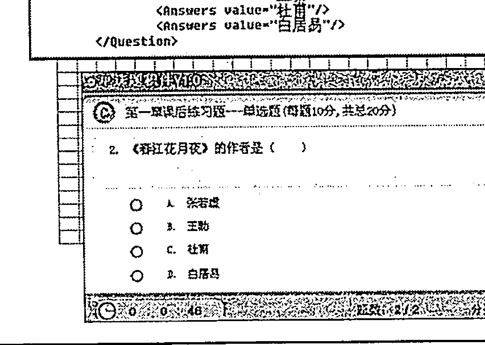

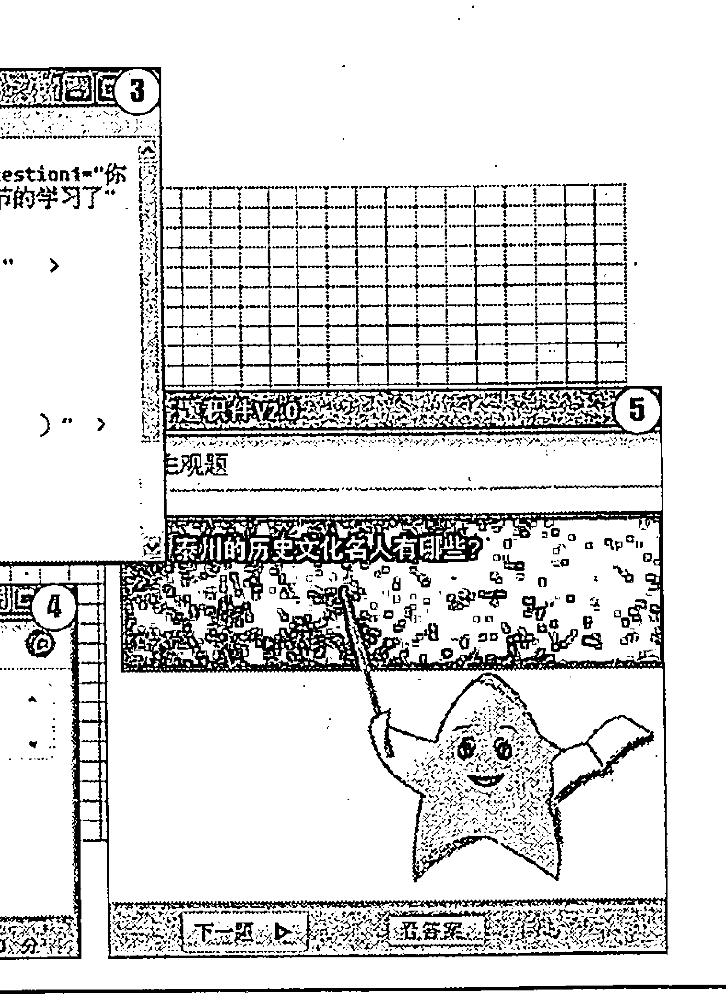

# 机房轻松批量安装软件

本刊去年介绍过一篇机房批量装软件的文章，之后有作者投来更为简单的实现方案，利用工具生成可执行的安装AI包，实现无人参与的安装过程。

文|李宝霞

实例描述：小李想在机房中的每台学生机上安装搜狗拼音输入法。他想通过凌波多媒体网络教室软件的文件分发功能，将搜狗五笔拼音输入法安装软件分发到所有的学生机，再通过远程运行功能，同时运行所有学生机中的安装程序，但是单击“下一步”等按钮继续安装进程或者修改程序安装路径等，需要逐一进行手工操作。机房中有60多台电脑，如果一台一台地手工设置，工作量太大!

这种情况下，利用Ghost AI Snapshot，可轻松完成任务。

准备Ghost AI Snapshot和多媒体教室软件。首先用Ghost AI Snapshot创建一个安装脚本。也就是说，要把安装向导和用户交互的产品序列号、用户名称、安装路径及安装类型等用户信息保存为一个文件。而一般的学校都有多媒体教室软件，可以利用其进行远程控制和机房管理。

## 生成自动安装程序包

AI Snapshot可以分析系统的情况，并监视软件安装的全过程，通过比较软件安装前后系统的变化情况，生成后缀名为.cfg的文件，然后用AI Builder将它打包成可执行文件。把它拷贝到其他电脑上运行，就可以完成软件的全自动安装了。

启动AI Snapshot，它首先要求读取你的系统，点击“选项”，选择要搜索的路径，为了减少读取的时间，我们可以只选那些因为应用程序的安装而可能引起变化的目录。我们要把搜狗拼音输入法安装在C:\Program Files下的相应目录中，所以这里选择“C:\”。

最好给AI Snapshot选择一个临时工作目录，因为AI Snapshot创建的安装脚本及AI包都放在该目录中的相应文件夹下。在读取系统前，为了确保文件和注册表的变化是因应用程序的安装引起的，建议关闭前台和后台运行的所有程序（最理想的状态是计算机只安装了操作系统）。

点击“下一步”，AI Snapshot开始读取文件系统及注册表。读取完成后选择要监视的安装程序（即Setup.exe文件），点击“监视”，搜狗拼音输入法安装向导启动，按照常规的方法依次选择安装路径、选择安装类型及程序文件等信息，点击“下一步”安装。完成后，在AI Snapshot中为将要生成的安装脚本及AI包指定名称（当然也可以使用默认的名称），并点击“比较”，AI Snapshot再次读取系统并比较文件和注册表的变化。

当出现“恭喜您”的对话框时，说明AI Snapshot已把比较结果保存为安装脚本了。点击“确定”，AI Snapshot准备生成AI包。我们可以直接点击“生成”自动生成一个AI包，也可以点击“修改”，根据自己的需要先修改安装脚本，然后再生成AI包。

因为AI包不会为自动复制的应用程序添加卸载命令，所以下面我们修改搜狗输入法的安装脚本，为AI包增加一个卸载命令。点击如图界面中的“修改”，AI Snapshot会调用AI Builder打开该安装脚本，在左窗格展开BASE INSTALLATION，选择UnInstall，在右边窗格中选择“添加”按钮，一个卸载命令就添加在屏幕右边窗格的安装脚本中了。用鼠标在代码区选中刚添加的代码行，如果需要的话可以在窗格中修改卸载命令的名称为“卸载搜狗输入法”，点击“修改”。最后，点击工具栏上的“生成”按钮，一个可执行的AI包就生成了。

## 远程命令与自动安装

在使用多媒体教室软件的远程命令之前，你需要把包含以上程序包的文件夹共享，然后在教师机上运行多媒体教室软件的教师端程序。以凌波多媒体网络教室为例，选中所有学生机，启动执行命令，在弹出的窗口中点击“新建”，在新窗口中输入名称，然后点击“程序”按钮，选择“网上邻居”找到共享文件夹中的程序包，保存后执行这个命令。这样所有的学生机都开始了自动安装过程，无需你进行任何干预。

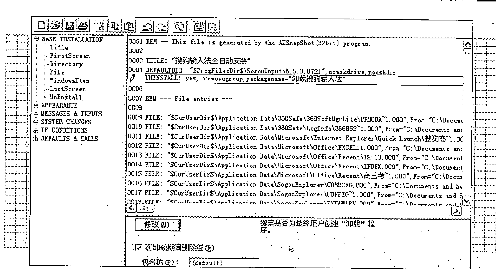# 节省纸张 双面打印方法多

在没有双面打印功能的打印机上，如何实现文本、表格等各种资料的双面打印以节省成本？方法有多种可选。

文|刘洋

自带双面打印功能的打印机为省纸打印提供了方便。但是，不是每家公司或每个人的打印机都具备这样的功能。因此，研究如何用普通打印机实现文字、表格、图片或其他资料的双面打印具有普遍的实用性。本文中，我们搜集整理了四种方法解决双面打印的问题。通过这些方法，你基本上就可以应对手头上的资料双面打印问题了。

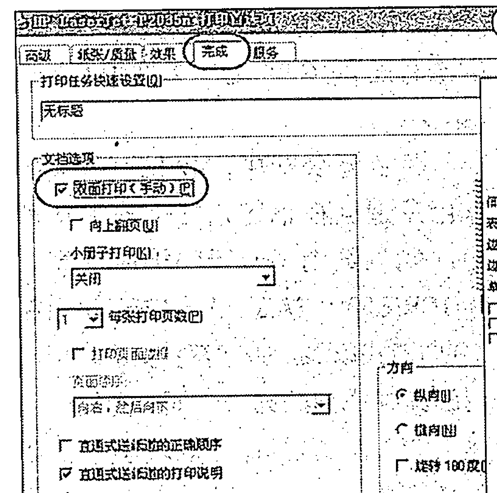

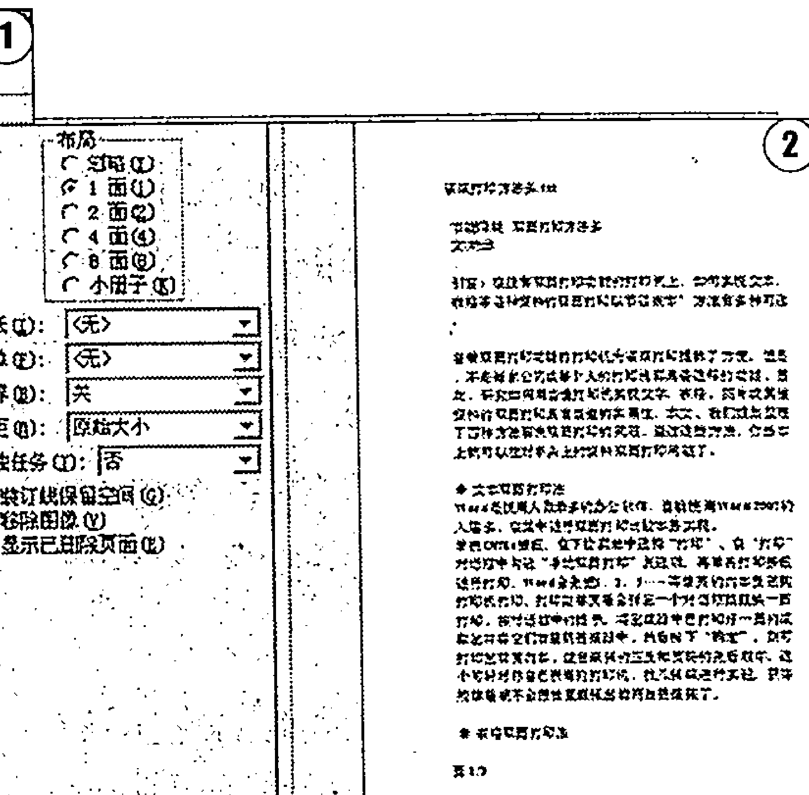

# 文本双面打印法

Word是使用人数最多的办公软件，目前使用Word 2007的人居多，在其中进行双面打印比较容易实现。

单击Office按钮，在下拉菜单中选择“打印”，在“打印”对话框中勾选“手动双面打印”复选项，再单击打印按钮进行打印。Word会先把1、3、5……等单页的内容发送到打印机打印，打印完单页后会弹出一个对话框提醒换一面打印，按对话框中的提示，将出纸器中已打印好一面的纸取出并将它们放回到送纸器中，然后按下“确定”，则可打印出双页内容。注意纸张的正反和页码的先后顺序。这个可针对你自己所用的打印机，找几张纸进行实验，获得规律后就不会因放置纸张出错而浪费纸张了。

# 表格双面打印法

有时候我们需要对一些连续的或多幅Excel表格进行双面打印。但是，Excel 2007并没有提供双面打印功能，要在Excel 2007中实现双面打印，需要先下载安装一个小插件ExcelPrinter。

安装ExcelPrinter后，再打开Excel 2007切换到“加载项”选项，你会发现比原来多出了“手动双面打印”和“打印当前页”这两项工具按钮。单击“手动双面打印”，效果就和Word中的双面打印一样，会在打印完单页内容后弹出对话框提醒你换一面，确定后再打印出双页内容。

# 驱动双面打印法

有些打印机的驱动程序中提供了双面打印的设置。我们可在控制面板的“打印机和传真”里调出安装的默认打印机，右键单击默认的打印机图标，选择“属性”，打开该打印机的属性窗口，在这个窗口中一般就可以找到设置双面打印的项目了。

例如，HP LaserJet P2035打印机的属性窗口“打印首选项-完成”选项下有一个“双面打印”复选项，选中此项即可进行双面打印（图1）。而佳能IP1600的双面打印选项则是在“页设置”选项下。

需要提醒的是，为了保证获得驱动级别的双面打印功能，一定要安装打印机随机提供的驱动光盘，使用Windows提供的默认驱动一般是不可能有这些特殊打印功能的。

# 工具双面打印法

除了某些打印机的驱动程序支持双面打印功能以外，我们还可以使用一些专门的打印工具软件来实现双面打印功能，比如用FinePrint来实现双面打印。

安装FinePrint后会在系统中添加一台名为FinePrint的打印机，可把这台打印机设置为默认打印机，或者在打印时选择使用FinePrint打印机进行打印。这样在打印时就会先弹出FinePrint设置窗口，把此窗口右下角的“双面”复选项选中，再单击“打印”按钮即可实现双面打印（图2）。

第一次使用FinePrint进行双面打印时，会提示获取你的打印机信息，你必须一步一步按向导提示完成设置操作后才能进行打印。

以上四种方法中，前两种明显针对文字文档或表格文档，而后面的两种方法则与所打印的文档种类无关，可谓是比较通用的双面打印法。读者朋友可以根据自己的实际情况，具体选择适当的方法。[CF]

# 在Excel中制作自适应下拉菜单

在Excel中，利用数据有效性与OFFSET、MATCH和COUNTIF等函数配合，可以制作出根据输入字符生成可选范围的自适应下拉菜单。

文|马震安

小王利用Excel“数据有效性”当中的“序列”功能在单元格内创建了一个下拉菜单，在进行输入时可以在下拉菜单中选择项目。这样的下拉菜单可以提高输入时的准确性和便利性。

但是，由于项目非常多，制作的下拉菜单也非常长，选择浏览时费事、费时。于是，小王对他的菜单进行了智能化改造。

改造后的下拉菜单可以根据用户在单元格里输入的字符，在下拉菜单的显示项目中自动筛选出以这些字符开头的项目，缩小下拉菜单中的项目选择范围，使目标更精准，方便用户选取。

小王的这种自适应下拉菜单是如何实现的呢？

## 对原始选择项目排序

这个过程主要是将需要作为选择项目的原始数据进行排序。首先，选中作为选择项目的数据区域，利用“数据→排序”菜单或“工具”栏上的升序、降序按钮都可以进行排序。排序以后，以相同字符开头的字符串将分布在连续的单元格中，便于创建数据有效性的引用序列（图1）。

## 利用数据有效性生成下拉菜单

这个过程主要是利用数据的有效性来生成下拉菜单。首先，我们选中需要设置下拉菜单的单元格，然后选择“数据→有效性”，在弹出的“数据有效性”对话框中，选择“设置”选项卡，在“有效性条件”的“允许”处选择“序列”，并且在“来源”中使用以下公式：
=OFFSET($A$1,MATCH(C2&"*",$A:$A,0)-1,,COUNTIF($A:$A,C2&"*"))

其中，A列是之前排过序的项目数据源所在列，C2 则是当前选中的单元格（图2）。

在上述公式中，MATCH函数的作用是返回在指定方式下与指定数值匹配的数组中元素的相应位置。MATCH(C2&"*",$A:$A,0)，这部分可以在A列中查找以C2当中字符打头的项目，返回其中找到的第一个项目的行号，其中“*”是通配符，可以表示一个或多个字符。

COUNTIF函数的作用是计算区域中满足给定条件的单元格的个数。COUNTIF($A:$A,C2&"*")，这部分公式在A列中统计以C2当中字符打头的项目的个数。

以图中的数据情况为例，如果我在C2单元格中输入“上”字，那么MATCH(C2&"*",$A:$A,0)就等于5，而COUNTIF($A:$A,C2&"*")则等于2，所以整个公式就等效于：
=OFFSET($A$1,5-1,,2)
而这个OFFSET函数公式的作用是形成一个引用区域，即以A1单元格向下偏移4行（A5单元格），以此单元格起始的2行单元格区域为引用范围。

由此不难看出，这个公式的整体作用就是在A列数据源中提取出以C2单元格当中字符开始的所有项目。以这个提取出来的区域作为数据有效性序列的引用源，就可以形成一个可以动态变化、自动适应单元格输入内容的下拉菜单。

## 去除错误提示

这个操作的目的是为了在单元格当中输入不完整的项目字符串时，系统不会因为数据有效性的错误警告而阻止用户的输入。

在“数据有效性”设置窗口选中“出错警告”选项卡，取消勾选“输入无效数据时显示出错警告”选项。

经过上面的设置，当C2单元格中输入“上”字后，点击下拉菜单，这时下拉菜单只有两个选项。选择范围缩小，这样操作更精准、更快捷（图3）。

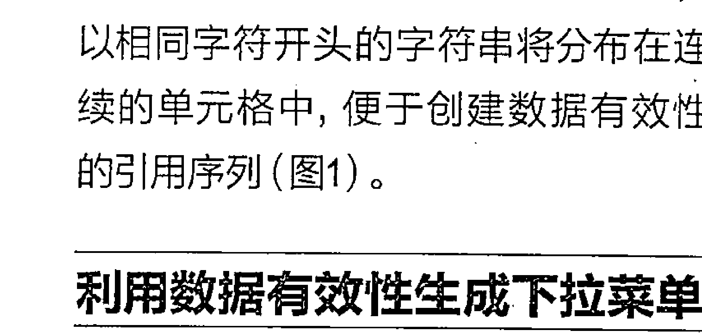

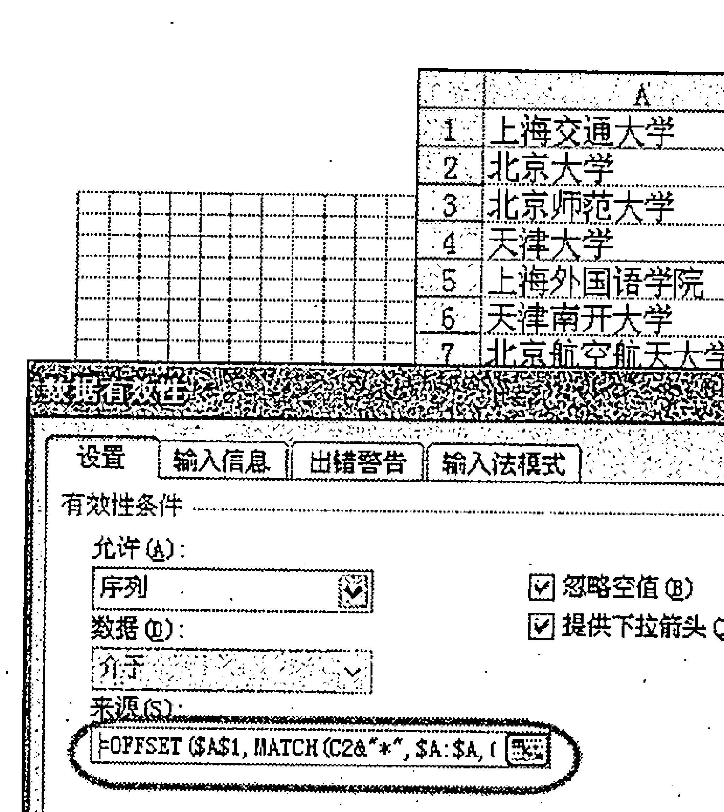


# PPT版式的虚实相间大法

版式的虚实相间在平面设计中应用得比较多，在PPT中实现这样的效果其实更为容易。因为制作这样的效果并不需要太强大的工具，使用PPT自带的工具就可以非常方便地完成。

文|许江林

在PPT版式设计中，我们可以根据图片的内涵和特点，对一个图片中的某些部分虚化，其他部分高光凸显，或者一组图片中的某几个图片虚化，而其他几个图片高光显示，能够制造出非常酷炫的版式效果，使主题文字与图片重点得到更加突出的相互映衬和展现。
下面介绍三种看了就会用、用了效果好的虚实相间应用方法。

## 栅格化图片的别样美丽

当我们把一个完整的漂亮图片均匀分段或者不规则分段，隔段设置虚化和高光显示，我们会突然发现这种断断续续的美，像精致的画框让我们能够留意更多的细节，得到更细致的体验。而竖长条形的“画框”更具有别致的形式上的美感。这些“画框”的存在使图片既是一个整体，又因为明暗的视差，令人体会到动态的视觉效果。
制作这个版式，我们需要这样一些素材（图1）：①一个精美的图片；②黑色矩形；③黑色矩形（由2复制而来）；④灰色矩形；⑤竖条状矩形；⑥配图文字。

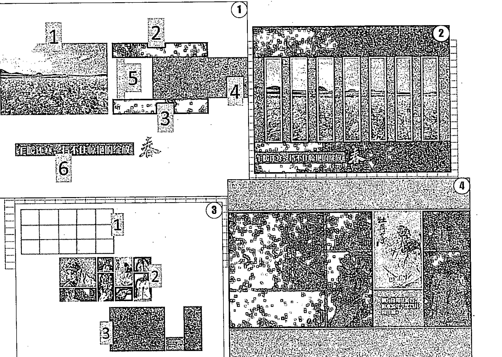

**制作方法：**
- 第一步：在空白页面右键单击，逐个选中“设置背景格式→图片或纹理填充→文件”，找到已准备好的图片的路径，把背景填充为图片。
- 第二步：制作覆盖边框的黑色矩形，矩形横跨页面，高度可以自己调试，把“形状轮廓”设置为“无轮廓”，做好一个后复制出另一个，分别放在页面上下端。接着制作灰色矩形，矩形的大小要刚好遮住两个黑色矩形没有遮住的空间，把“形状轮廓”设置为“无轮廓”，右键单击灰色矩形，逐个选中“设置形状格式→填充→纯色填充”，把里面的透明度选项调整为16%。
- 第三步：制作竖条状矩形，大小刚好能够连接两个黑色矩形，右键单击矩形，逐个选中“设置形状格式→填充→幻灯片背景填充”，这时，你会发现被灰色虚掩住的对应的背景部分露出来了。这一步是这个制作中很关键的一招，用这个方法可以随意透出背景来。接着给这个透出背景的矩形设置“形状轮廓”为白色，线条粗细为“4.5磅”，设置“形状效果”中的“内部阴影”效果，这个效果可以增强“开孔”的视觉感受。然后复制多个，均匀排列，不同位置的矩形会透出不同的背景部分。栅格化效果完成。最后，在下方的黑色矩形中配上相应文字（图2）。

**总结：** 应用“幻灯片背景填充”的功能可以在背景被覆盖的情况下，很简便地制作出多个“透出”的效果，而且，只要用于“透出”的框子移动位置，那么它就会对应这个位置原图的部分显示，省去了麻烦地一个一个与原图对齐的制作过程。PPT中的这一功能很值得学习应用，进一步深挖这一功能的潜力还可以做出很多非常炫的动态效果来，比如：拼图效果、多层变换效果等。在本案例中对背景的上、下方进行了遮幅式的处理，而实际运用中可以根据需要决定到底用不用这样的遮幅式的处理。

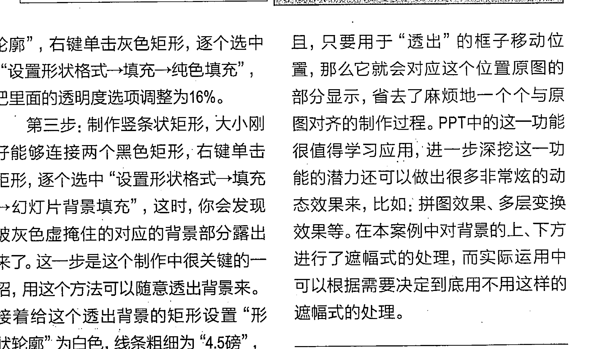

## 成组图片的明暗搭配

在多个以网格形式规则排列的图片中，根据需要以高光显示与主题相关的图片，而虚化其他图片，更换主题则相应更换高光显示的图片。设计思路类似交互式用户界面设计，能够增强PPT与使用者、观看者的交流互动。

**制作方法：**
- 第一步：在页面中先把网格做出来，网格可以占满整个页面也可以只占有部分空间（图3），做了3列5行共15个网格。
- 第二步：在添加图片的时候，以网格的整倍数面积来摆放，为了突出图片的边界，可以给每个图都添加‘形状轮廓’。
- 第三步：区分明暗。这里我们突出有‘牡丹亭’文字的那个图片，它下面那个图片完全用灰色块遮罩，用来配相应文字，而其他图片则使用具有一定透明度的灰色色块遮罩，起到虚化作用（图4）。

为了做出变换主题的效果，我们可以复制这一页幻灯片，然后使用与上述相同的方法把需要突出的另一图片露出来，它下面的图片用灰色块完全遮罩，用以配文字。其他图片使用具有一定透明度的灰色色块遮罩。当换页的时候，我们会看到原来‘亮’的图片暗了，另一个图片‘亮了’。我们的目光自然会跟随高光显示的图片变换焦点，同时还会在心理上产生要看看其他图片的欲望（图5）。

**总结：** 这个案例制作很简单，只需要会使用具有一定透明度的色块遮罩即可。同一组网格形式排列的图片，安排不同的突出显示，然后在换页时，把这种变化动态地表达出来。如果进一步，我们设置动画或者链接，就可以把这样的交互效果做得像网页及电子设备中的交互界面一样炫动、漂亮。

## 重点部分的高光、重复展现

对一个图片中的重点部分用‘透出’的方式高光显示，其他部分虚化，并且对重点部分制作多个小图，规则排列，重复展现。这样的版式设计整体表达效果强烈，完整的图片与局部显示的小图相互对应，对于重点的强化无以伦比，又可以轻易找到小图在完整图片中的位置。在很多平面广告中，常常把这种设计用于突出介绍某件产品。

下面这个案例的制作需要用到如下素材和软件功能（图6）：
- ①精美图片一张
- ②橙色色块
- ③具有一定透明度的白色色块
- ④需要使用裁剪功能
- ⑤眼睛局部图片
- ⑥配图文字

**制作方法**
- 第一步：把图片摆在页面左边，调整至占页面近一半的位置，剩下的空间用橙色色块覆盖。
- 第二步：复制图片，把复制的图片与原图片对齐，然后使用裁剪功能在复制的图片上裁出眼睛部分。裁切的形状可以有很多选择，这里我们就用简单的矩形。裁出眼睛后给这个小图片设置形状轮廓为‘白色’、‘6磅’，再设置图片效果为‘内部阴影’。
- 第三步：制作与原图片一样大小的白色色块，调整一定的透明度，完整覆盖在图片上。这时，刚才截取的眼睛图片也被盖住，我们可以先移开白色矩形，然后右键单击眼睛图片，把它‘置于顶层’，再把白色矩形摆回去，这时我们就可以看到‘开孔’透出的眼睛效果了。另外一个解决方法是逐个单击‘开始→排列→选择窗格’，这时在打开的窗口中排列着所有放在页面中的素材，可以把对应白色色块的那个项目的‘眼睛’关闭，然后把眼睛图片‘置于顶层’，再打开白色色块项目的‘眼睛’，效果是一样的。
- 第四步：复制9个眼睛图片，稍微拉大一些，把它们摆在页面右上方，运用‘排列’功能排成均匀的3行3列。
- 第五步：在眼睛图片的阵列下方配上文字（图7）。

**总结：** 与前面第一个案例使用框子再用‘背景填充’的方法不同，本案是复制原图、对齐，然后再裁剪出小图来。之所以这样处理，原因是第一个案例是要制作多个对应原图的小图，而这个案例则是制作一个小图，多次复制。效果都是‘透出’，采用的方法则要根据需要来决定。

另外，在本案例中提到了‘选择窗格’的应用。这是一个非常有用的功能，特别是在我们的PPT页面中放置了大量素材，一眼看上去眼花缭乱，而要找到需要进行调整的素材时，这个功能就发挥出了它强大的一面。它的应用就像PS中图层的显示一样，打开项目的‘眼睛’则该项目对应的素材可以看到，关闭项目的‘眼睛’则该项目对应的素材消失。这样一来，一个页面中就算摆了再多的素材也可以很轻松地找出来了。


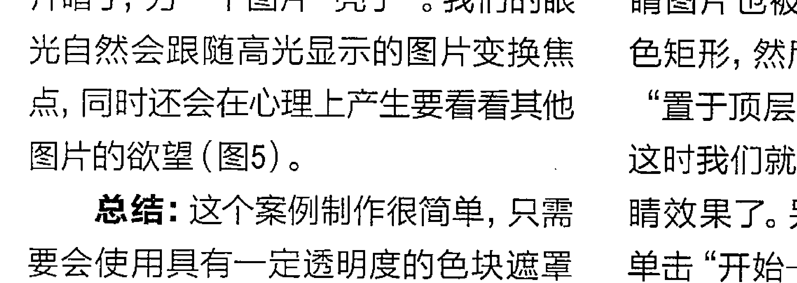

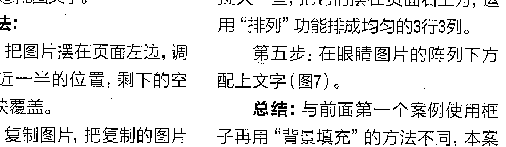

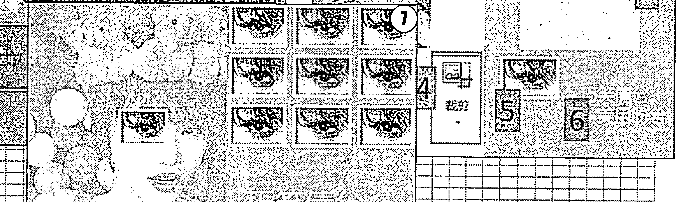

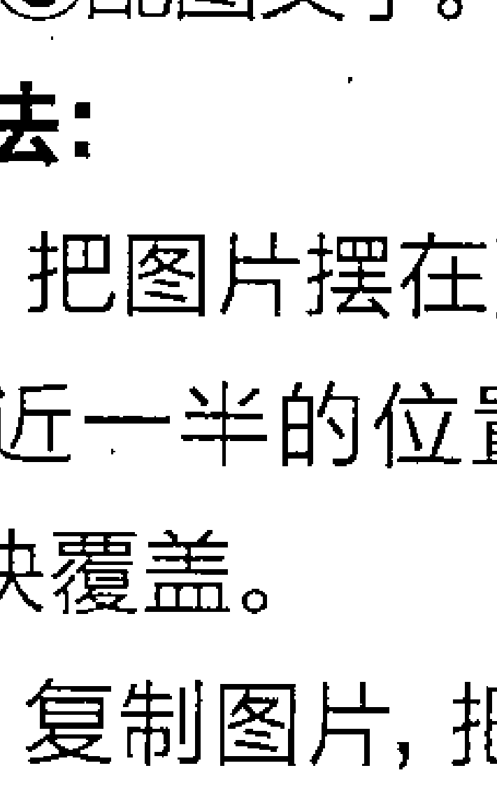

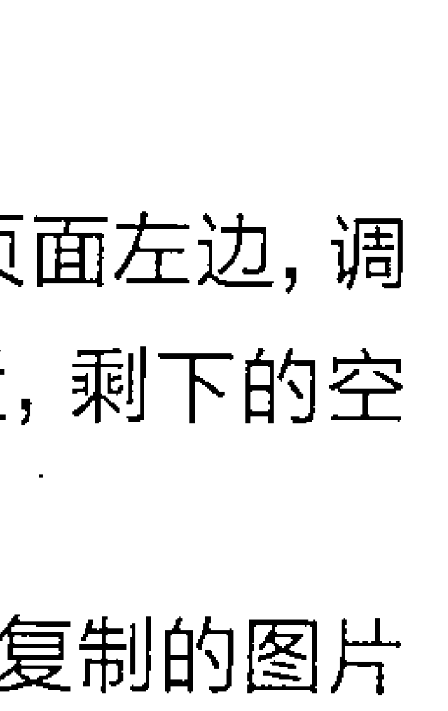

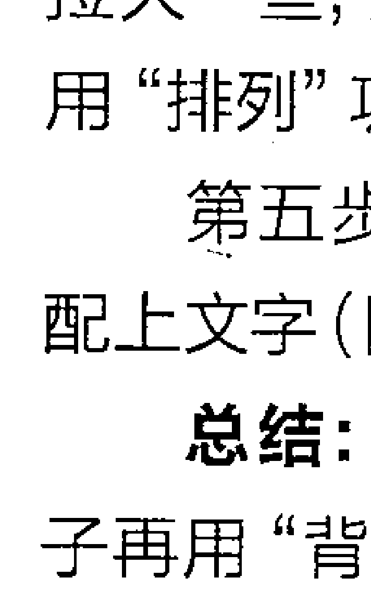

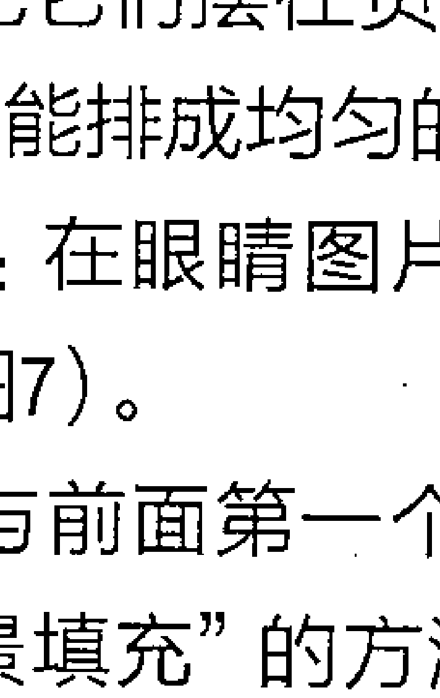

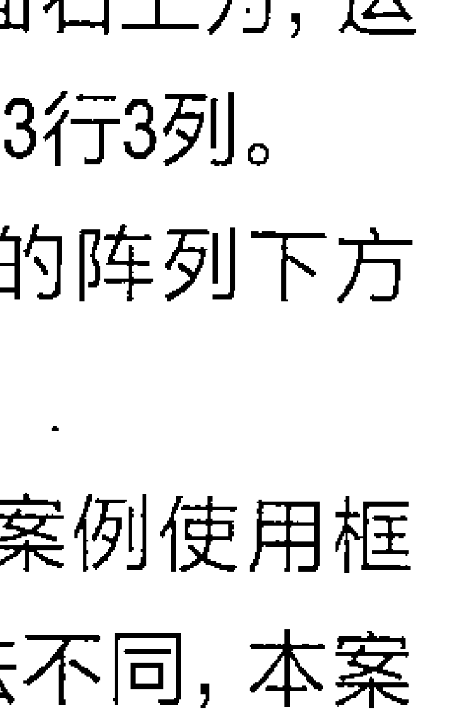

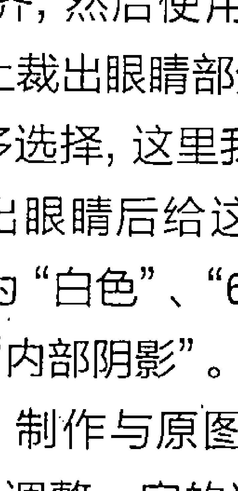

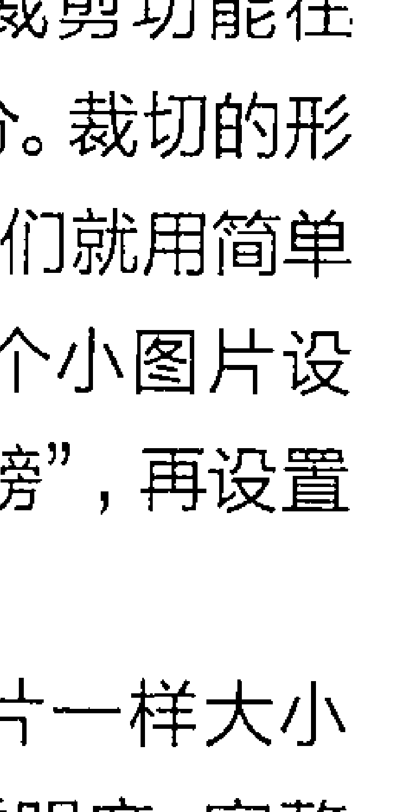

# 相同格式电子表格数据汇总

如何将相同格式的电子表格汇总到同一个工作簿或工作表中？本文以采集教职工数据为例，介绍统一格式的电子表格数据汇总的两种常见方法。

文|仲勇

张老师是学校的档案管理员，每年都要采集许多学生和教职工的基本数据。下发电子表格让大家填，可收集上来的表格还得一个项目一个项目地复制再汇总，工作量也很大。由于发放和收集的电子表格都是一样的格式，张老师想用电脑自动完成这些电子表格的汇总。

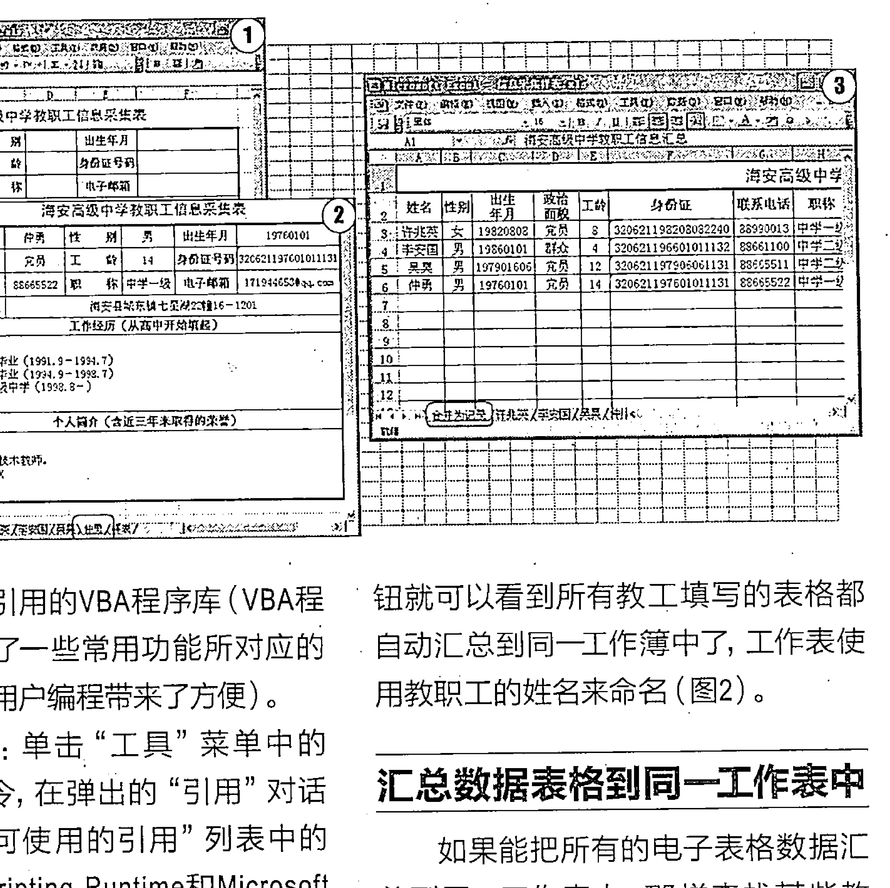

## 样表的制作和收集

样表的制作比较简单，只需把要采集的数据项目制作成表格（图1），删除无用的工作表，必要时可以设置只允许用户编辑的数据区域（可通过依次单击“工具”菜单中的“保护”，选择“允许用户编辑区域”命令来实现），以及在某些项目中设置数据的有效性以保证数据采集的便捷性和数据结果的准确性（可通过“数据”菜单中的“有效性”命令来实现）。

将电子表格文件“信息采集样表.xls”保存后放在FTP服务器上供教职工下载。完成表格的填写后只需将工作簿改为自己的名字，并在规定的时间内上传到FTP指定的文件夹中就可以了。负责汇总的老师把该文件夹下载到本地后即完成了电子表格文档的收集。

## 汇总数据表格到同一工作簿中

如果想把所有教工填写的电子表格汇总到一个工作簿中，可以用下面的操作来实现。

### 设置引用的VBA程序库

打开空白工作簿“信息采集样表”，按Alt+F11快捷键打开VBE编辑器。由于程序在执行过程中要调用“文件夹选择对话框”，所以首先要设置程序的运行环境和引用的VBA程序库（VBA程序库中存储了一些常用功能所对应的VBA代码；给用户编程带来了方便）。

方法是：单击“工具”菜单中的“引用”命令，在弹出的“引用”对话框中选中“可使用的引用”列表中的Microsoft Scripting Runtime和Microsoft Scripting Library两个VBA程序库，确定即可。

### 编写程序代码

插入一个模块，在模块中定义一个名为ins_sheet()的过程，编写代码。用GetPatch()函数获取下载的xls文件的路径，然后遍历指定该文件夹中的每个类型为“Excel工作表”的文档，同时调用MyCopy()过程将其复制并汇总到“信息采集样表”工作簿中。GetPatch()函数和MyCopy()过程均为用户在模块中定义的，具体代码请到http://blog.sina.com.cn/s/blog_78d89c480101a0wl.html下载。

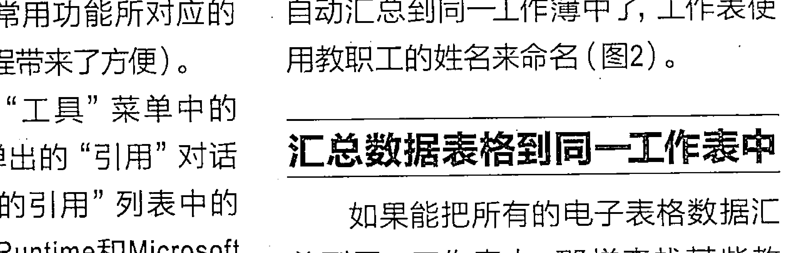

接下来使用“窗体”工具栏的“按钮”工具在“样表”工作表中绘制一个按钮控件，修改按钮上的文本为“合并工作表”，并将定义的ins_sheet()过程指定给该按钮。单击“合并工作表”按钮就可以看到所有教工填写的表格都自动汇总到同一工作簿中了，工作表使用教工的姓名来命名（图2）。

## 汇总数据表格到同一工作表中

如果能把所有的电子表格数据汇总到同一工作表中，那样查找某些教职工的信息就更方便了，同时也更加便于数据的分析和打印。实现的方法是：在工作簿的最前面插入一张空白的工作表，取名为“合并为记录”，设计需要汇总的项目名称，在“模块1”中定义一个名为hbjl()的过程并将其指定给该工作表的一个自定义的按钮控件，代码可直接在上面提到的地址中下载，运行后就可以看到表格中的所有数据都被以记录的方式合并到同一个工作表中去了（图3）。


需要注意的是，如果单位教职工人数超过了工作簿允许的最大工作表数，会导致工作表创建失败的错误出现，变通的解决方案是将教工数据合并到几个不同的工作簿中，或者是只将教工数据以记录的方式合并到同一工作表中即可。各位读者朋友可自行尝试代码整合的方法。

# “数据有效性”几点妙用

在Excel中，利用“数据有效性”不但能够限制数值输入位数、限定数值输入范围及避免数据重复输入等，而且还能够轻松圈出指定数据。

文|李宝霞

## 限制数值的可输入位数

实例描述：小王是办公室的文秘，她需要录入单位职工的基本信息。由于身份证号码多达15或18位，有时多输一位，有时少输一位，输入起来非常容易出错。如果对单元格进行限制，当输入的位数不对时，就给出提示，岂不是很好？其实利用设置“数据有效性”就可以达到上述要求。

首先，为了让输入的身份证号码能正确显示出来，需要输入身份证号码的单元格区域（如E3至E305），请将单元格设置为文本格式。然后，选择“数据→有效性”菜单，打开“数据有效性”对话框，在“设置”选项卡的有效条件“允许”处选择“自定义”，在出现的“公式”下面的方框中输入公式“=OR(LEN(E3)=15,LEN(E3)=18)”，再选择“出错警告”选项卡并设置一个“出错警告”，确定返回。这样，当输入的号码位数不正确时，系统会给出提示（图1）。

## 避免重复数据的输入

实例描述：小王在手工录入职工信息时，职工的身份证号码都是唯一的。由于需要录入的职工信息有300多条，很容易造成视觉疲劳，看错行，从而造成数据的重复录入。为了解决上述问题，可以通过“数据有效性”来防止数据的重复输入。

选中需要输入身份证号码的单元格区域（如E3至E305），同样选择“数据→有效性”菜单，打开“数据有效性”对话框，在“设置”选项卡的有效条件“允许”处选择“自定义”，然后在下面“公式”方框中可将公式修改为“=AND(COUNTIF(E:E,E3)=1,OR(LEN(E3)=15,LEN(E3)=18))”，其中COUNTIF(E:E,E3)=1就是为了防止数据重复录入的公式，确定返回。

以后在上述单元格中无论输入了重复的身份证号码还是录入位数发生错误时，系统会弹出提示对话框，并拒绝接受输入的号码（图2）。

## 限定输入数值的范围

实例描述：小郑是教务处的干事，需要输入学生的实验考查成绩，考查成绩通常介于0~20之间的整数。她对照成绩单用数字小键盘在Excel登记表录入成绩时，盲打但有时出错，输入的数值超过20。为了防止出错，可以利用“数据有效性”来设置一个输入范围。

首先，选中需要录入成绩的单元格区域（如C2:C1422），选择“数据→有效性”菜单，打开“数据有效性”对话框，在“设置”选项卡的有效条件“允许”处选择“整数”，在数据处选择“介于”，然后在下面分别输入最小值(0)和最大值(20)，切换到“输入信息”选项卡，设置提示信息。切换到“出错警告”选项卡，设置出错提示及处理方法。全部设置完成后，确定返回。以后再输入成绩时，当输入的成绩不在0~20之间时，系统会给出相应的提示，并拒绝接受录入的数值。如果不进行“输入信息”和“出错警告”设置，不影响此功能的使用（图3）。

## 圈出指定数据

实例描述：小李想把本班数学成绩不及格的学生在Excel表格中用红圈突出显示出来，以方便查阅。要想实现这样的要求，用Excel的数据有效性就能够轻松完成。

首先，选中数学成绩所在的单元格（如C2:C62），选择“数据→有效性”菜单，在弹出的“数据有效性”对话框中，在“设置”选项卡的有效条件“允许”处选择“整数”，在数据处选择“介于”，然后在下面分别输入最小值(60)和最大值(100)，点击确定。然后，选择“工具→公式审核→显示公式审核工具栏”菜单，在弹出的公式审核工具栏中单击“圈释无效数据”按钮。这样数学成绩在60分以下的学生就被圈上了一个红圈，起到了突出显示的作用（图4）。


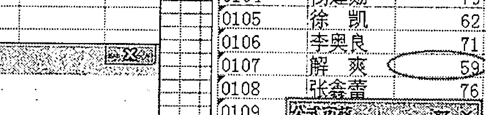


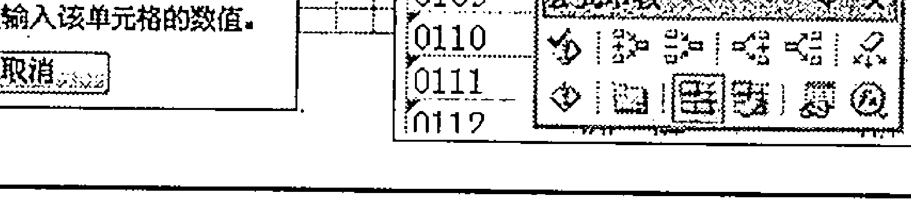

# PPT操作题也能自动评分

学生在课上做PPT操作题时，做得对与错不能及时反映出来，这一直是很多老师头疼的问题。经笔者研究发现，可以在PPT中借助VBA实现对操作题自动评分，及时反映学生的掌握情况。

文|马震安

实例描述：在文件名为PPT1的演示中完成如下操作。
-   （1）设置第一张幻灯片中图片的动画效果为“螺旋”，设置声音效果为“鼓掌”；
-   （2）为第二张幻灯片的背景设置填充效果为“双色、纵向”；
-   （3）设置第三张幻灯片的切换方式为“快速盒状展开”。

要求：在幻灯片中操作题目能够清楚显示，有“评分”按钮，并能自动反馈对答题结果的评价情况及具体分数。

实例分析：做PPT操作题目，实际上是对PPT演示文稿中每张幻灯片中对象的内部属性值进行设置，如幻灯片背景、动画效果、切换方式等。如果能够通过某种方法获取这些属性的变化情况或变化值，再借助VBA编程来做出判断，就可以为PPT操作题目进行评分了。

究竟这些属性的变化情况如何获取呢？让我们一起来做。

## 题目显示设计

这个过程主要完成如何在PPT的每张幻灯片中显示题目及评分按钮。

首先，打开PPT2003并新建一张空白幻灯片，选择“视图→母版→幻灯片母版”菜单，在幻灯片母版上插入一个文本框，其内容为实例描述中的题目。同时为了美观，可以对文本框进行“美化”修饰，右击该文本框边框选择“设置文本框格式”菜单，在弹出的窗口中，可以设置文本的边框颜色、粗细、填充颜色等，还可以设置文本中文字的颜色、大小等。

然后，选择“视图→工具栏→控件工具箱”菜单，在弹出的“控件工具箱”的工具栏中选择“命令”按钮，在母版的合适位置拖动鼠标画出一个按钮，右击这个按钮选择“属性”菜单，在它的属性窗口中，将Caption属性（即显示的标签）更改为“评分”，关闭属性窗口，最后关闭母版视图。

## 幻灯片及对象创建

这个过程主要完成的是创建学生的答题环境，即幻灯片中的对象素材。

在这个演示文稿中创建三张空白幻灯片并在其中插入操作题目所需要的对象，如图片、文本框等，并将文件名保存为PPT1.PPT。注意不要插入过多对象，满足题目要求即可，以免给编写评分代码带来麻烦。

当然，如果有现成的PPT1演示文稿也可以直接打开它，对它的母版进行编辑，然后调整一下每张幻灯片中对象的位置，使它们不要遮挡题目和按钮（图1）。

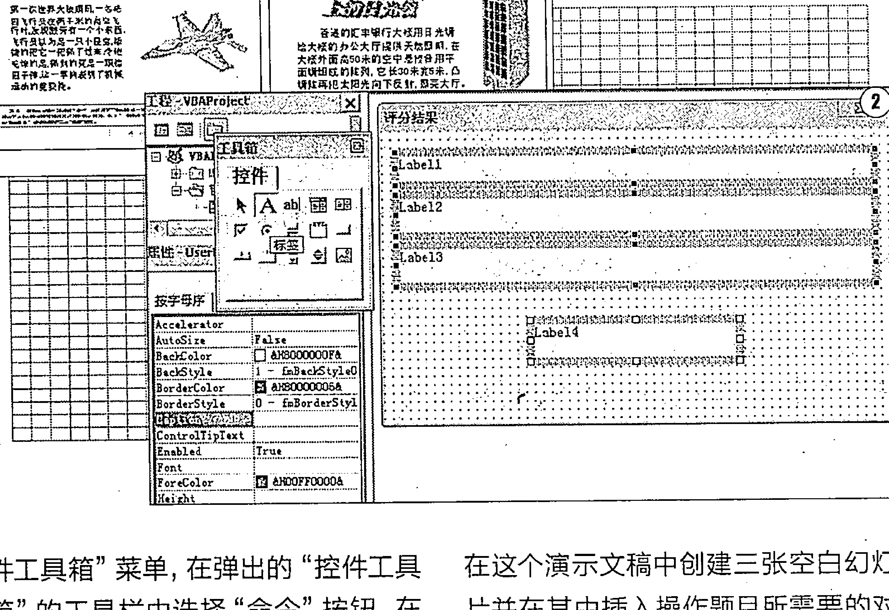

```
Private Sub UserForm_Activate()
'对第一题评分
fen = 0
Set tmp = ActivePresentation.Slides(1).Shapes(2)
If tmp.AnimationSettings.EntryEffect = 3357 Then
    tsh = "第一张幻灯片中图片动画效果设置正确；"
    fen = fen + 1
    If tmp.AnimationSettings.SoundEffect.Type = 2 Then
        If tmp.AnimationSettings.SoundEffect.Name = "applause.wav" Then
            tsh = tsh + "声音设置正确；"
            fen = fen + 1
        Else
            tsh = tsh + "声音设置错误；"
        End If
    Else
        tsh = tsh + "声音设置错误；"
    End If
Else
    tsh = "第一张幻灯片中图片动画效果设置错误；"
End If
Label1.Caption = tsh
'对第二题评分
Set tmp = ActivePresentation.Slides(2)
If tmp.Background.Fill.GradientColorType = 2 Then
    tsh = "第二张幻灯片的背景设置正确；"
    fen = fen + 1
    If tmp.Background.Fill.GradientStyle = 2 Then
        tsh = tsh + "方向设置正确；"
        fen = fen + 1
    Else
        tsh = tsh + "方向设置错误；"
    End If
Else
    tsh = "第二张幻灯片的背景设置错误；"
End If
Label2.Caption = tsh
'对第三题评分
Set tmp = ActivePresentation.Slides(3)
If tmp.SlideShowTransition.EntryEffect = 3073 Then
    tsh = "第三张幻灯片的切换方式设置正确；"
    fen = fen + 1
    If tmp.SlideShowTransition.Speed = 3 Then
        tsh = tsh + "切换速度正确；"
        fen = fen + 1
    Else
        tsh = tsh + "切换速度错误；"
    End If
Else
    tsh = "第三张幻灯片的切换方式设置错误；"
End If
Label3.Caption = tsh
Label4.Caption = "满分是6分，你的最后得分是：" & fen
End Sub
```

## 编写评分过程

设计评分结果窗体：首先，选择“工具→宏→Visual Basic编辑器”菜单命令，弹出Microsoft Visual Basic程序窗口，也就是VBA的编辑器。在窗口左侧可以看到“工程”和“属性”面板，右侧则是代码编辑区域。如果没有这些窗口，可以选择“视图”菜单来调出这些窗口，并且可以拖动这些窗口的边框，将窗口放大或缩小。

接下来，在这个窗口中选择“插入→用户窗体”菜单，这时在右侧窗口就会插入一个窗体，同时也会弹出一个标签为“工具箱”的工具栏，调整好窗体大小，在“属性”窗口将窗体的Caption属性即标题设置为“评分结果”。

在“工具箱”工具栏上选择“标签”按钮，在窗体上画出4个标签控件，选择窗体上的各个标签控件，在“属性”窗口分别设置它们的Font、ForeColor属性为所需要的值（图2）。

## 编写评分相关代码

这个过程主要完成利用VBA的编辑器来编写评分程序，即通过VBA来获取幻灯片中对象的属性值并判断这个值与正确答案的值是否一致，如果一致就对，否则就错。

首先，双击窗体控件，在弹出的代码窗口中选择窗体的Activate属性，在窗体的UserForm_Activate过程中输入图中代码（图3）。

在这段代码中首先用变量fen来记录得分多少，用变量tsh保存评分的详细过程。
-   ActivePresentation表示当前激活的演示文稿；
-   .Slides(1)表示第1张幻灯片，.Slides(2)就表示第2张幻灯片，.Shapes(2)表示幻灯片中的第2个对象元素；
-   .AnimationSettings.EntryEffect表示幻灯片中对象元素的特殊动画效果；
-   .SoundEffect表示声音效果；
-   .Background.Fill.GradientColorType表示对象背景填充的过渡颜色类型，.Background.Fill.GradientStyle表示对象背景填充的过渡样式；
-   .SlideShowTransition代表指定幻灯片切换的特殊效果；
-   Label1.Caption = tsh表示标签1所要显示的提示信息是变量tsh的内容。

解释了这么多，这下你应该明白些了吧？

也许你要问又怎么知道某个元素的属性是什么呢？每个属性的代码又是什么呢？

有关幻灯片中对象元素的属性，你可以下载Microsoft PowerPoint Visual Basic参考手册来查看幻灯片中对象元素属性的详细说明。

至于如何才能知道操作题目中有关对象设置的正确答案，你可以先按正确的操作做一遍题，接下来在VBA编辑器中用msgbox()函数来显示有关对象属性值，这个属性值就是所要的答案，然后用if判断语句对照正确答案进行判断就可以了。

比如，笔者把实例中的题按正确的操作做了一下，要查看第一张幻灯片中图片的动画效果的正确值，可以选择“插入→模块”菜单，在右边的代码区用msgbox(ActivePresentation.Slides(1).Shapes(2).AnimationSettings.EntryEffect)来显示动画效果的值，从而知道了正确操作的情况下这个图片动画效果的值是3357，然后在用VBA代码评分时，就可以用if语句进行判断了。

```
Private Sub CommandButton1_Click()
    UserForm1.Show
End Sub
```

## 让“评分”按钮发生作用

这个过程主要是让“评分”按钮来显示“评分结果”窗体。当单击“评分”按钮时，它能够调出“评分结果”窗体，并显示结果。

首先，选择“视图→母版→幻灯片母版”菜单，在母版视图状态下双击“评分”按钮，在它的Click事件下输入UserForm1.Show代码，UserForm1是窗体的名字，.Show表示显示窗体（图4）。

这就是单击“评分”按钮后显示“评分结果”的窗体。最后退出母版视图状态。

## 实现学生自动评分

通过网络教室的软件把这个PPT1文件发送给学生，为了能够使VBA代码起作用，还需要学生设置本机PPT宏的安全性，需要选择“工具→宏→安全性”，在弹出的窗口中将宏的安全性设置为“低”，保存后，再次打开，这样才能够使VBA代码顺利运行。

学生按照题目操作完后并放映幻灯片，在放映的过程中点击“评分”按钮就能自动评分了（图5）。

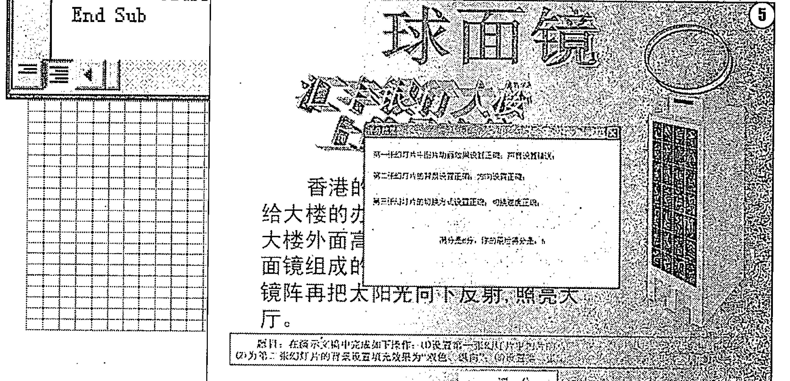

# 针对图片特点设计PPT版式

在PPT版式设计中，很多人被设计技巧难倒。可是如果仔细观察、思考页面所需要表达的内容和收集到的相应图片的特点，找到关键，针对这些关键点，进行突出设置，就完全有可能开拓出漂亮的设计思路。

文|许江林

真正困难的并不是设计技巧而是设计思路。简单的技术手段不等于做不出色的版式效果，而失败的设计思路却一定会导致糟糕的版式效果。下面就给大家讲述几个如何依靠优秀的设计思路，应用简单设计技巧来做出出色的版式。

在本文中将向大家介绍3种图片排列的版式设计。这些设计完全使用PPT本身功能，不使用外援软件。

## 以乱制胜的精彩

那一天，李娜夺得了大满贯，于是笔者在网络上找到了4张图片，想要用一页PPT版式表达一下（图1）。可是4张图片就这样摆放或者加个边框斜着放、叠着放似乎都不能体现出她的事迹及个性的精彩。

特点捕捉：人物本身具有多面性，各具精彩，同时又都结合在她身上，成为一体而多方位的表现。那么在图片的排列上就应该把这个“多位一体”的特质表达出来。另外，每一张图片有自己的主题表达，并非完全符合我们的需要，那我们就应该把不太符合需要的部分去除，而只截取最符合要求的部分。最后，要把“多位一体”的特质用图片的排列来表达出来，那就需要这些图片排列紧密，同时各个图片大小不一、位置不对齐则可以显示出多面性。

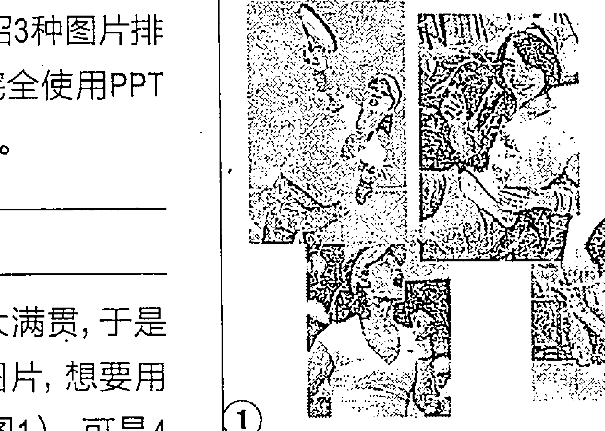

制作方法：首先，把4个图片进行裁切，在PPT2007版以上都有这个功能，双击图片就可在任务栏看到这个选项。鉴于几个图片纵向截取会比较容易去除干扰留下重点，所以主要采取纵向截取方法截图，获得纵向的窄长图片效果。裁切的要点是把最能突出图片内涵的部分留下，这就需要我们平常有细致的观察力，能抓得住重点。

截取之后在页面中偏上位置，用“矩形”绘图工具拉一条横跨页面的蓝色矩形，右键单击它，将它置于底层。然后，把图片横向紧挨着，高低错落地排列在这条矩形上。接着给后3个图片的顶部或底部搭配对应相同宽度的矩形，矩形的高度根据需要对齐或不对齐旁边的图片。


最后，给搭配的矩形配不同颜色，并配上简洁的文字，第一个图片就直接使用长条矩形露出的部分原配文字，长条矩形的右端写上一个“娜”字。至此整个制作完成（图2）。

总结：这样多个图片并排的版式要强调的是，各个图片的位置既要看上去不规则，而实际上又具有一定规律。在看似不规则中体会到精彩纷呈的效果。要表现图片的动态和琳琅满目的精彩，使用这样看似不规则的图片排列是非常有效的。但是，这样的规则与不规则之间该如何把握，需要具有一定的美感，在制作技巧上则难度不大。

## 图片与字母的美丽邂逅

用图片组合字母，甚至某种形态、图案、图像，在平面设计中并不少见，效果也很惊人。为了让大家能够快速了解这一技巧，在这里，我们讲解的是比较简单的应用：用图片拼出字母Y，然后用两个字母e与之配合，组成单词eye，在页面形成比较独特的版式效果。

特点捕捉：拼出字母Y需要几个图片？如果要拼得很细致，势必增加图片数量，每个图片都要缩得很小，肯定就只能看清整体图形，而看不清楚图片。这样设计本身也未尝不可，但如果我们需要把图片也看清楚就必须保持一定的大小。在这里我们选择使用4个图片，这样既能够使字母看起来比较伸展，每个图片又都得到足够展示。另外，拼合用的图片如果就保持原样去拼合，那么就会显得呆板，缺少灵气，这时只要稍稍对图片进行一点外形的处理即可。

制作方法：由于我们要拼的单词是eye，那么我们要对应地找一个眼睛的图片，其他3个图片只要是漂亮、悦目的也就符合要求了（图3）。

用“绘图”中的“平行四边形”工具绘制4个向右倾斜的、竖向条状的平行四边形，然后使用“形状填充→图片”，把4个原图分别填充进去，把形状轮廓设置为“无轮廓”。接下来就是拼合工作了，中间图片确定用眼睛那一张，其他3张分别作3个枝丫。这几个图片必须是边缘贴紧排布的，在不断调整位置及各图片的大小后，得到一个在页面中部偏右上的字母“Y”，然后用“矩形”工具制作一个淡绿色的长条矩形横跨页面，并右键单击它，将它置于底层。矩形的宽度要求是使字母“Y”看起来能够稳固地附着在矩形上。接着，在字母“Y”两旁分别添加2个字母“e”组合成“eye”，在矩形右下方配上主题文字“眼睛发现美”，“眼睛”两字字号要大一些，使用绿色，突出它（图4）。


总结：字母、文字与图像并非截然分割的事物，用图片的拼合来体现文字可以直接给予文字注释，并且以夸张的方式充分展示了文字的含义。作为版式设计，这样的方式则同时具有构图的美感和主题的放大效果，属于出奇而又大方的表达。

## 网页版式很实用

网页的版式设计需要兼顾构图、版式的美感和内容分块、链接功能的搭配，与PPT的设计具有很相似的地方，两者虽然有着很大的差别，但是对于网页设计的思路，我们完全可以借鉴。

比如我们打算制作一个以团队为主题的页面，首先收集到4张合适的图片（图5）。

特点捕捉：一个简洁的网站首页内容通常包括网站名称、少量图片、分块链接。网站名称在最上部，图片通常要整齐排列，并且具有一定的动态感，分块的链接也要整齐排列并且有明显的分割，排列的方式既可是横向的也可是纵向的。

制作方法：首先我们要给这个“网页”一个底色，这里选用咖啡灰，显得沉稳、低调而又有活力。用“绘图”中的“L形”工具绘制L形，形状轮廓选用白色，调整大小后给它旋转135度，使尖角对右边，然后大量复制、排列，组成两条粗线。用“平行四边形”工具绘制1个向右倾斜的、横向平行四边形，复制3个，形状轮廓选用橙色，然后使用“形状填充→图片”，把4个原图分别填充进去。给它们等距并排放置，让4个连成排的图片摆在页面的横向正中，使得中间两个完全展示，左右两个则超出页面。把之前做的两条粗线分别放置在图片的上下侧，接着在右上角打上主题文字“团队”。在图片下面粗线以下制作3个文字小标题，用竖直线均匀分隔开。在制作过程中要不断尝试各个构图元素的大小、摆放位置、相对位置，做到合适。这里可以用“排列→对齐”功能中的“下部对齐”和“横向分布”把相对位置和距离调准确（图6）。

总结：使用两条有尖角指向的粗线镶在图片上下侧，而图片使用橙色边框的平行四边形，能够使得本来静止的图片看上去具有一定的动态效果。用竖直线分隔小标题与网站中用竖直线分隔链接项，在设计思路上完全一致。因为在PPT中本身也具有制作链接的功能，所以本页完全可以制作成为该PPT的“主页”，要观看各个链接的“网页”只需单击“链接项”即可。

# Word表格中的那些事儿

很多人对编辑Word中的表格感到头痛，其实掌握一些编辑技巧就会发现，原来Word表格的那些事儿，也不是很难弄。

文|马震安

在Word使用中，经常会遇到对表格的编辑。原来我一直对Word表格的编辑非常头痛，甚至宁肯先在Excel中编辑好表格再复制到Word中，直到有一天我记住了一些编辑技巧。这时我才发现，原来Word表格的那些事儿，也不是很难弄的。

### 插入斜线表头

首先，把光标放在表格的任一单元格内，选择“表格→绘制斜线表头”菜单，在本例中我们在打开的对话框内选择样式二和字号小五，并输入相应的行标题、数据标题和列标题，单击“确定”。在许多情况下，当表头不够大的时候，此时会出现一个提示。不去管它，单击“确定”。好了，斜线表头已经初具雏形了，但有时文字大小和表头的大小不太合适，没有关系，这时可以做一些适当的调整。

接下来，我们分析一下表头的大小，然后选中新加入的斜线文字部分，可拖动这个组合体的8个控制点来调整它的大小。当然，如果选中新加对象单击右键，我们可以发现“取消组合”项是可用的，这就说明它是由线段和文本框组合成的一个对象，这样就可以对它动手术了。先取消组合，这时就可以单独设置其中的任何一个文本框或线段了，将其移到合适位置，最后按住Shift键把斜线和文本框一一选中，再重新组合起来。一个漂亮的斜线表头就完成了（图1）。

无论插入点位于表格的哪一个单元格中，使用“绘制斜线表头”命令，斜线表头都将出现在左上角的单元格中。如果组合对象的位置不佳，可以按住Ctrl键，同时利用方向键进行微移。如果组合对象不适合表格大小，可以按住Alt键的同时用鼠标左键对其高度和宽度进行微调。

### Word表格中行列轻松对调

在日常工作中，我们经常会遇到将Word表格行列对调的情况，但这个看似简单的要求在Word中却很难实现，因为Word本身并不提供这样的功能。不过，要解决这个难题也不是没有办法，今天笔者就给大家介绍一个利用Excel轻松互换Word表格的小技巧，希望对大家能有所帮助。

首先，打开Word 2003，复制需要进行行列对调的表格。然后，再打开Excel 2003软件，新建一个工作簿，用鼠标在空白单元格处右击并选择“粘贴”命令。在Excel软件中，将刚刚粘贴下来的表格再次选中，同样是右击执行“复制”命令，在空白单元格处再次右击并执行“选择性粘贴”命令，同时勾选上“转置”复选框后点击“确定”按钮，表格中的行列内容已经互换，将完成转置后的Excel表格选中，并粘贴到Word中，基本操作即告完成。最后，别忘了删除掉Word中的原有表格。至此，所有工作正式完成（图2）。

### Word表格中数据的计算

Word表格中的数据可以利用公式或域进行自动计算。首先，我们看一下如何利用公式进行计算。

首先，将光标置于存放运算结果的单元格中，选择“表格→公式”，在弹出的“公式”对话框中可以修改或输入公式，在“粘贴函数”组合框可以选择所需函数，被选择的函数将自动粘贴到“公式”框中，函数括号中的参数是求值范围，在求和公式中默认会出现“LEFT”或“ABOVE”，它们分别表示对公式域所在单元格的左侧连续单元格和上面连续单元格内的数据进行计算。在“数字格式”框中可以选择或自定义数字格式，此例中定义为“0.0”，表示保留小数点后一位小数。设置完毕后单击“确定”，对话框会立即显示计算结果。

### Word表格中数据的排序

Word中的数据排序通常是针对某一列的数据，它可以将表格某一列的数据按照一定规则排序，并重新组织各行在表格中的次序。

首先，将光标置于要排序的表格中，选择“表格→排序”菜单，打开“排序”对话框。然后，在对话框中选择“主要关键字”、“类型”、“升序”还是“降序”（如果记录行较多，还可以对次要关键字和第三关键字进行排序设置），根据排序表格中有无标题行选择下方的“有标题行”或“无标题行”。

确定后，各行顺序将按排序列结果相应调整。当然，还可以利用“表格和边框”工具栏中的“升序排序”和“降序排序”按钮进行排序，只需将光标放入到要排序的数据列中（任一个单元格中都可以），根据需要单击“升序排序”按钮或“降序排序”按钮即可（图4）。

### 重复显示文档表格标题行

当Word文档中表格的内容多于一页时，我们可以设置标题行重复，使其反复出现在每一页表格的首行或数行，这样更便于表格内容的理解，也能满足某些时候表格打印的要求。

首先，如果表格的第一行作为标题行，需选中第一行（全部或部分）或将光标置于第一行的单元格中。如果表格的开始连续数行作为标题行，需选中这些行（全部或部分）。

然后，选择“表格→标题行重复”菜单，即可在每页中显示表格标题。注意：要重复的标题行必须是该表格的第一行或开始的连续数行，否则“标题行重复”菜单将处于禁止状态。

### Word怎样禁止表格跨页断行

如果一个表格的行数过多，超过一页能够容纳的，那么表格就会跨页换行，那么怎么禁止这个功能来方便我们的编辑呢？

首先，在表格的左上角的一个小标志选中表格，右击表格在弹出的右键菜单中选择“表格属性”，在“表格属性”对话框中，我们点击“行”选项卡，在“行”面板中，我们取消勾选“允许跨页断行”，点击确定按钮就能保存设置（图5）。

### Word表格也玩自动填充

Excel中录入一些有规律的数据时可以使用自动填充功能来完成，而在Word中的表格里没有这么方便。不过我们可以变通一下，让Word表格也能自动填充，在这里笔者介绍两种方法：

-   (1)复制粘贴大法
比如要在表格中填写教师的职称，首先在表格中选中“中高”两个字复制，然后再选中准备填充“中高”这两个字的所有单元格，单击“粘贴”按钮，这样就能把选中的单元格一次性都填充上“中高”这两个字了（图6）。

-   (2)项目符号和编号法
比如我们要在一个成绩表的“考号”这列中准备填入考号0101、0102、0103……0144、0145，其中01代表班级，后边两位是学生座位号。这时我们可以选中“考号”这列下边所有的单元格，选择“格式→项目符号和编号”，在“项目符号和编号”对话框中选择“编号”选项卡，随便选择一种编号方式，然后点击“自定义”按钮。在“自定义编号列表”对话框中的“编号格式”框内把显示的原编号删除，然后输入“01”这两个数字，再到“编号样式”列表框中选择“01, 02, 03”样式，最后点“确定”退出，就会按照从上到下（或从左到右）的顺序从0101开始自动填充考号了（图7）。

### 表格转换成文本

有时，我们需要将表格转换成文本，比如从网页上复制内容到Word中往往都带有表格。将Word中的表格转换为文本的方法如下：

首先，如果要转化部分行，需先将这些行选定，如果要转化表格的全部，则需全选表格或将插入点置于表格中。然后，选择“表格→转换→表格转换成文本”菜单，在“表格转换成文本”对话框中指定文字分隔符，可以选择段落标记、制表符、半角逗号或者自定义其他符号。最后，点击确定就可以了（图8）。

看，有了这些技巧，操作Word中的表格还用发愁吗？赶快试试吧！[CF]

# 实现PPT点小图看大图效果四法

在一些多媒体演示作品中，我们常见到点击小图显示对应大图的动画效果。实际上，这种效果在PPT幻灯片中也可以实现。本文我们将给大家介绍在PPT中实现此效果的4种方法。

文|何世贤

在校园多媒体大赛作品或师生的PPT演示中，我们常常可以见到点击小图出现相应大图的演示效果，本刊前面也有过文章介绍。笔者总结了比较常见的点小图看大图的4种方法。

我们以PowerPoint 2003为测试环境，具体介绍这4种方法的实现过程。

## 触发器法

第一步：在幻灯片中插入两张相同的图片，并修改图片大小，在幻灯片上出现一张大图、一张小图的效果。

第二步：给大图设置进入、退出动作效果。本例大图的进入效果为“渐变”，退出效果为“渐变式缩放”。

第三步：为大图的进入、退出动作效果设置触发器。单击进入动作效果（动作1）右侧的下拉按钮，在打开的下拉菜单中选择“计时”命令，打开计时对话框，在计时对话框中选择“触发器”，然后选择“单击下列对象时启动效果”右侧的下拉列表（图1），第一个pic1是幻灯片中大图的名称，第二个pic1是演示文稿中小图的名称。因为要使用小图来控制大图的进入退出，所以这里选择小图的名称，即第二个pic1（因插入的图片名称不同，所以幻灯片中显示的图片名称不同）。

第四步：重复步骤三，为大图的退出效果设置触发器，并添加相应效果。

幻灯片放映时，单击幻灯片下面的小图时，大图出现；再次单击小图时，大图退出。

说明：触发器是PowerPoint中的一项动画控制功能，单击触发器时它会触发一个操作，包括声音、影片或动画的播放控制。利用触发器可以让PPT具有更多的交互功能。

## 动作设置或超链接法

第一步：添加幻灯片，幻灯片的页数由图片决定，图片有几张幻灯片就有几页，而且幻灯片要使用相同的模板。

第二步：在幻灯片中插入图片，每张小图幻灯片上都要插入，而且位置大小都要一致。按小图的顺序，在每一张幻灯片上插入对应的大图，同样，大图的位置与大小也都要一致。

第三步：设置超链接，选中第一张小图右击鼠标，在弹出的快捷菜单中选择“超链接”命令。在超链接对话框中，选择“本文档中的位置”，并在右侧的位置中，选择要链接到的幻灯片。

第四步：重复步骤三，为演示文稿中所有幻灯片中的小图设置超链接（图2）。当演示文稿放映时，单击小图后会链接到大图所在的幻灯片。

如果想要实现鼠标移过小图看大图效果，可以使用“动作设置”来实现。选中小图后右击，在弹出的快捷菜单中选择“动作设置”命令，在动作设置对话框中，设置当鼠标移过时要超链接到的幻灯片。当演示文稿放映时，鼠标移过小图时，则自动切换到大图所在的幻灯片。

说明：利用这种方法实现点小图看大图效果的缺点是所需要的幻灯片的页数较多，有几张图片就要有几页幻灯片。

## 插入对象法

第一步：在幻灯片中不要插入图片，依次单击“插入→对象”，打开“插入对象”对话框。单击“新建”，在对象类型中选择“Microsoft PowerPoint演示文稿”，单击“确定”按钮。

第二步：插入成功后，在该幻灯片编辑区里就会出现一个类似于“图片”的对象框，这就是刚刚插入的演示文稿。选中该对象框，可以看到幻灯片编辑区内有8个黑色的控制焦点，可以拖动它，调节其大小，再把该对象框拖动到合适位置。

第三步：双击嵌入的演示文稿，进入到嵌入演示文稿的编辑状态，然后为嵌入的演示文稿对象设置图片填充（图3）。

第四步：用同样的方法在幻灯片中添加其他的Microsoft PowerPoint演示文稿对象，填充需要的图片，直至把所有需要的图片都填充添加完毕。演示的时候只要单击幻灯片上的图片，就自动打开该图片的全屏清晰大图。

说明：利用插入对象实现方法与前面两种方法相比，使用触发器操作较难，一般不容易掌握；而建立多张幻灯片，会造成容量臃肿。插入对象法用最简单的方法达到同样的效果，值得一试。

## VBA代码法

VBA是微软专门为OFFICE开发的一个自动化语言。选择“视图”菜单→工具栏→控件工具箱”，当单击控件工具箱中的“命令按钮”时，在幻灯片上再单击一下，幻灯片上就多了个命令按钮。

选中它按鼠标右键，选查看代码，跳出了一个窗口，在窗口的左边，VBAProject(演示文稿1)中Slide1就是该演示文稿的第一页，如果有多页，就会有多个Slide。在窗口的右侧的代码窗口中就可以为选择的对象添加VBA代码了(图4)。

第一步：在幻灯片中插入图片。
第二步：利用“控件工具箱”，插入一个“命令按钮”，然后删除掉这个命令按钮。
第三步：单击控件工具箱中的“查看代码”按钮，在打开的Slide1(代码)窗口中，输入如下代码：

```
Sub fuwei()     '幻灯片恢复初始状态开始
Dim I As Integer
For I = 1 To 2
Shapes(I).Visible = True
Shapes(I).Top=80+(I-1)*70
Shapes(I).Left=60
Shapes(I).Width=80
Shapes(I).Height=50
Next
End Sub          '幻灯片恢复初始状态结束

Sub image_One()     '调用幻灯片初始程序
Slide1.fuwei
Shapes(3).Visible = True     '显示关闭按钮图片
Shapes(1).Top = 150          '图片位置(距离顶部)
Shapes(1).Left = 230         '图片位置(距离左侧)
Shapes(1).Width = 262        '图片大小(宽度)
Shapes(1).Height = 209       '图片位置(高度)
End Sub

Sub image_Two()
Slide1.fuwei
Shapes(3).Visible = True
Shapes(2).Top = 150
Shapes(2).Left = 230
Shapes(2).Width = 262
Shapes(2).Height = 209
End Sub

Sub close_Q()
Dim I As Integer
For I = 1 To 2
Shapes(3).Visible = False
Shapes(I).Visible = True
Shapes(I).Top = 80 + (I - 1) * 70
Shapes(I).Left = 60
Shapes(I).Width = 80
Shapes(I).Height = 50
Next
End Sub
```

在VBA代码中以Sub xxx()开始，以End Sub结束，xxx可以自己命名，但要符合VBA代码要求。Shapes表示演示文稿中幻灯片里的对象，本例中共有3个对象，2张需要展示的图片加一个关闭按钮图片。首先进入页面的对象就是Shapes(1)，第二进入的就是Shapes(2)……以此类推，如果你改变对象的层次，则Shapes也随之改变，也就是最底层的就是Shapes(1)。

第四步：单击关闭按钮，退出代码编辑状态。选中第一张图片，右击鼠标，在弹出的快捷菜单中选择“动作设置”命令，选择单击鼠标选项卡，在“运行宏”中，把Slide1.image_One选上就可以了。同样选中第二张图片，设置第二张图片运行宏Slide1.image_Two, 关闭按钮图片运行Slide1.close_Q。

需要注意的是：运行前，先打开“工具→宏→安全性”，将安全级别设置为低。

本例所实现的功能：当单击小图时，小图消失，大图出现，关闭按钮出现。单击关闭，大图消失，小图还原。

# 排序加自动筛选 成绩随意查

文|张楚华

在多记录的Excel表格中进行条件查询，用窗体控件做查询界面对一般用户有一定难度。其实，通过排序与自动筛选命令灵活结合使用，就能轻松实现自由查询。

## 锁定表头 便于滚动查询

将光标置于表头之下的第一行记录的任一单元格内，然后执行系统命令“窗口→冻结窗格”。之后，再上下滚动鼠标，你就会看到数据记录在移动，而表头始终固定在最上端。

## 灵活查询 开启自动筛选

首先拖动选择表格标题的所有单元格（包括“序列号”、“姓名”、“成绩”、“录取院校”），然后执行“数据→筛选→自动筛选”命令。这时，我们会发现在表头一行的每个单元格的右侧会出现一个向下的三角形图标，点击这个图标还会出现一个列表菜单。这正是我们要在下面用到的自动筛选窗口样式（图）。

## 组合查询 筛选排序联动

有了上面两项准备工作，也就具备了联合查询的环境条件。下面我们举两个实例说明自动筛选和排序的联动用法。

**案例：**老师A要找出表中考入“北京交通大学”的所有学生，成绩由高到低排列。

**实现方法：**首先点击“录取院校”表头顶的小三角图标，然后从下拉列表中选择“北京交通大学”。这时，表中除“北京交通大学”之外的所有学校被过滤掉并自动隐藏起来，窗口界面中只留下了北京交通大学录取学生的明细。接下来对自动筛选的结果进行排序，点击“数据→排序”系统命令，在弹出的排序窗口中选择“主要关键字”为“成绩”，排序类别选择为“降序”，然后点击“确定”。

**案例：**某家长希望获知考试成绩在600分到620分之间的学生都被哪些学校录取了。并且希望查询结果中同一学校录取考生的记录要排列在一起。

**实现方法：**首先点击“录取院校”下拉列表中的“全部”选项，还原上次筛选的结果。然后选择“成绩”下拉列表中的“自定义”项。在弹出的“自定义自动筛选方式”窗口中，成绩选择“大于或等于”，数值选择600，运算关系选择“与”，接着在下面选择“成绩→小于或等于”，数值选择620，然后点击“确定”。

这样就选出了所有成绩在600分～620分之间的学生记录。

接下来要对选出的按相同学校、成绩由高到低排序。选中筛选结果数据区域，执行“数据→排序”命令，在弹出的排序窗口中，“主要关键字”选“录取院校”，“次要关键字”选“成绩”，并将排序方法设为“降序”排序，所得到的结果便是只有600分～620分之间的按校、按分数由高到低排名的录取结果了。

# 参赛选手巧抓阄

文|周显胜

在学校的优质课比赛活动中，参赛选手的出场顺序一般采用抓阄来决定。巧用Excel制作抓阄程序并通过大屏幕展示，既能体现抓阄的公正和透明，又增加了比赛的乐趣。

## 制作抽签界面

打开Excel 2003，假设有15位参赛选手，在（B2:F4）单元格区域中依次输入数字1到15，接着执行“视图→工具栏→控件工具箱”，单击“命令按钮”，在下面插入两个按钮。右击第一个按钮，单击“属性”，在“属性”窗口中设置Caption选项为“开始”，名称选项为默认的CommandButton1；右击第二个按钮，单击“属性”，在“属性”窗口中设置Caption选项为“停止”，名称选项为默认的CommandButton2即可（图1）。

## 为按钮实现其功能

双击“开始”按钮，在打开的VBA代码窗口中输入下列代码（该代码中包含“停止”按钮的代码）：

```
Option Explicit
Dim flag As Boolean, i, j As Integer
Private Sub CommandButton1_Click()
    flag = True '初始化中断变量，当中断变量为真时执行抓阄
    zhuaJiu '调用抓阄过程
    MsgBox "恭喜你！你是第" + Str(Cells(i, j)) + "号选手", vbOKOnly, "抓阄"
    '显示被中断时选中的单元格（即被抓到的顺序号）
    Cells(i, j) = "已有选手"
    '将被选手选中过的单元格替换为“已有选手”
End Sub
Private Sub CommandButton2_Click()
    flag = False '中断循环 结束抓阄
End Sub
Private Sub zhuaJiu()
tiaozhuan1:
    For i = 2 To 4 '从第2行开始到第4行结束
        For j = 2 To 6 '从第2列开始到第6列结束 在没有被选中过的单元格中依次循环
            If Cells(i, j) = "已有选手" Then GoTo tiaozhuan2
            DoEvents '释放程序控制权 允许执行其它事件
            Range("b2:f4").Interior.ColorIndex = xlNone
            Cells(i, j).Interior.ColorIndex = 50 '为在循环中选中的单元格着色
tiaozhuan2:
        Next
    Next
    If flag = True Then GoTo tiaozhuan1
End Sub
```

关闭代码窗口，退出设计模式，一个抓阄程序就制作好了（图2）。

## 选手抓阄

当选手单击“抓阄”按钮时，在（B2:F4）单元格中轮流显示待抓的顺序号，当单击“停止”按钮时显示该选手抓中的顺序号，同时信息框也作相应的提示（图3）。

本文中的抓阄程序下载地址为：

http://t.cn/zT6kaMj## 巧用Word制作字音连线题

文：马震安

在Word中，利用“拼音指南”功能与记事本程序的配合使用，可以轻松解决老师或家长制作字音连线题的困难。

很多小学一、二年级的语文老师都会给学生布置字音连线的家庭作业，以加深对这些字的认识。一般来说，这些题都是由学生家长来出的。这可把有些家长难坏了，需要在纸的左边写上某课的生字，然后在右边写上字的拼音并打乱顺序。这对于文化程度高的家长来说，虽也不算难事，但也费事；对于文化程度稍低些的家长来说既费事又是难事，因为光拼音这一项就是个头疼的问题。那有没有更好的方法来用电脑完成这项工作呢？当然有。我们可以利用Word中的“拼音指南”轻松完成这项任务。下面，我们就以“图、梨、笼、浪、梁、燃、勤、劳”这几个字为例，说明如何制作字音连线题。

## 一、为生字添加拼音

这个过程主要是利用“拼音指南”功能为生字添加拼音。首先，打开Word，在空白文档中输入所需生字，如“图、梨、笼、浪、梁、燃、勤、劳”，每个生字占一行。然后将这些生字选中，设置适当的字号，如“一号”。接下来，选择“格式→中文版式→拼音指南”菜单，在弹出的窗口中直接点击“确定”即可。这时，每个生字就都会添加上拼音字母（图1）。

## 二、生字与拼音的分离

这个过程主要完成生字与拼音的分离。在上述过程完成后，每个生字与其拼音都是组合在一起的，如果我们用“绘图→取消组合”菜单是没有办法将字音分离的，所以我们需要另辟蹊径。首先，我们需要将这些全部选中并且复制，然后打开“记事本”程序，按Ctrl+V组合键粘贴到记事本中，这时字音就分离了（图2）。最后，我们将Word文档中的生字全部删除，将记事本中的文字及拼音剪切到Word文档中，并利用“查找替换”菜单，将文档中的“（”用若干空格替换，将“）”用一个空格替换。全部选中文字设置字号为“一号”。由于文档中的一些拼音与汉语中的拼音书写不一致，所以还要将字体设置为“Berlin Sans FB”（图3）。

## 三、利用记事本分离拼音

这个过程主要是将生字或拼音的顺序打乱，使它们不一一对应。我们可以利用鼠标拖动的方法改变拼音或汉字的排列顺序，使它们看起来是随机出现的，没有规律（图4）。

老师或家长朋友们，有了这种方法是不是大大减轻了你的工作负担？那就赶快试试吧！

# 巧删表格重复任务

文：陈智君

Excel表格中如果出现重复的条目，如何用最快的方法进行查找和剔除？本文给出Excel两种不同常用版本环境下的解决方法。

老师交给多名同学共同完成一项数据采集任务，因为采样的项目避免不了重复，因此采集成果合并到一张表中之后，出现了有部分条目是重复的情况。那么，如何快速将重复项标示出来并剔除掉，得到一张没有重复项的表格呢？

## Excel 2007实现方法

打开需要编辑的Excel表格，发现表格中的重复数据分布无规律，手动选择很费事并很容易漏掉。若将这些重复的数据用醒目的颜色标注出来，就好处理了。

首先，选中需要查找重复值的一列或区域，鼠标单击“开始”选项卡，依次选择“样式→条件格式→突出显示单元格规则→重复值”（图1），弹出“重复值”对话框，在“为包含以下类型的单元格设置格式”下，选择默认的“重复值”设置为“浅红填充色深红色文本”，点击“确定”。

这时再看Excel表格，你就会发现Excel表格中的那些重复值已经被标红显示了。

将这些重复值成功标红后，可对数据进行按颜色排序与筛选。具体操作步骤是：点击“数据”选项卡，执行“排序和筛选→筛选→按颜色排序”（图2），其后窗口中会将标红的重复数据集中显示在一起。这时根据个人需要，删除重复数据或对其做其他处理即可。

## Excel 2003实现方法

对于仍然在使用Excel 2003的用户来说，虽然不能方便地用颜色来实现筛选，但用高级数据筛选的功能也能实现重复数据的筛选。

具体操作步骤是：点击“数据”菜单，执行“筛选→高级筛选”命令（图3），弹出一个高级筛选对话框，选中“在原有区域显示筛选结果”选项，这样就会在原来的数据位置把重复记录删除。如果选择下面的一个选项“将筛选结果复制到其他位置”，这样会保留原来位置的数据。

接下来，点击“复制到”右边的彩色小按钮，选择复制到的位置。选中一个单元格就行，我们这里把它复制到原来表格靠下面一点的位置。

最后需要把“选择不重复的记录”勾上，然后点击“确定”即可。

以上方法不仅仅适用于校园采集数据这个案例，同样也适用于任何一张二维的Excel数据表格，只要同一张表格中有重复数据的情况，皆可用此种方法筛选和剔除。

# 轻松实现员工上网调查

文：马震安

将调查问卷做成网页进行发布，不但成本低，而且便于自动统计，而这一任务用Word就能够轻松实现。

近日，领导交给办公室主任老张一项紧急任务，要对公司内部全体员工进行问卷调查。公司的员工上千，这项统计工作以往得好几天才能完成，费时费力，老张犯愁了。我说可把调查问卷做成网页的形式发布在内网上，由员工在客户端进行选择提交，电脑自动统计结果，这样不是既省事又高效吗？老张听了很高兴。

## 网页调查问卷的制作

首先，打开Word新建一个空白文档，选择“视图→工具栏→Web工具箱”，在弹出的“Web工具”窗口上选择“提交”按钮，这时就会在文档中出现“窗体顶端”“窗体底端”及它们中间的“提交”按钮。将光标放到空行处，输入或粘贴所要调查的内容。接下来，将光标放到第一道调查内容的“【请选择：】”后，选择“Web工具箱”上的“选项按钮”在光标处插入一个单选按钮，在它后面输入大写的A，右击这个单元按钮设置它的HTMLName属性（即它在网页中的名字）为R1，Value属性（即它的值）设置为A。插入第二个单选按钮，在它后面输入大写B，设置它的HTMLName属性也为R1，Value属性为B，依次类推。在插入第二道调查内容的四个单选按钮时，需要将它们的HTMLName属性都设置为R2，其他设置和第1题的按钮一样，依次类推，直到添加完最后一道调查内容的四个单选按钮（图1）。

如果在调查内容最后想让员工填写对公司的其他建议，可以点击“Web工具箱”上的“文本区”控件，在页面中插入一个“文本区”控件，设置这个“文本区”控件的HTMLName属性为“yj”。右击“提交”按钮，将它的Action属性设置为“jg.asp”，即用户将各单选按钮的值都提交给jg.asp这个文件。

### 小技巧

为了轻松添加单选按钮，我们可以选择“工具→宏→Visual Basic编辑器”菜单，在弹出的VBA窗口中选择“插入→模块”菜单，在右边代码编辑窗口输入图中代码。回到Word文档窗口，选择“工具栏→自定义”菜单，在弹出的“自定义”窗口中选择“命令”选项卡，在“保存于”处选择这个Word文档名，在“类别”处选择“宏”，在“命令”处选择代码的过程名（如“插入单选按钮”），将它用鼠标拖到工具栏上，并右击重命名，关闭“自定义窗口”。此后，将光标放到需要插入单选按钮的位置，直接单击这个按钮，输入题号后确定，这时就会自动添加A、B、C、D四个单选按钮，无需再对其进行设置了。如果你不想输入题号而直接插入单选按钮，可以将代码中的第二行删除并用第三行代替，注意要把这行前面的“'”去掉。

### 小提示

要想使代码能够运行，还要选择“工具→宏→安全性”菜单，在弹出的窗口中将宏的安全性设置为“低”。最后将文档另存为网页文件index.htm。本文将index.htm保存在D:\123文件夹中。

## 编写接收文件

在编写接收文件前，还需要在D:\123文件夹中建立一个名称为“调查结果.xls”的Excel文件，在该文件中建立两个工作表，一个名称为“结果”，另一个名称为“建议”。其中，名称为“结果”的工作表中每道题的总人数、答A人数、答B人数、答C人数、答D人数处都必须先输入0，每题的选项比率都是由相应选项人数除以该题的总人数，格式为百分比样式。名称为“建议”的工作表用来存放员工对公司提出的建议（图2）。

接下来，就是编写接收代码了。我们可以先在D盘的名称为“123”的文件夹中建立一个文本文件，然后在这个文本文件中输入如下代码，最后把这个文本文件的名称改为jg.asp，注意扩展名也要更改。

```

<%
set strConn = server.createobject("adodb.connection")
strConn.open = "Provider=Microsoft.Jet.OLEDB.4.0;Data Source=" & Server.MapPath("调查结果.xls") & ";Extended Properties=""Excel 8.0;HDR=Yes;"""
for i=1 to 15
    tmp=request("R"&i)
    if tmp<>"" then
        da=tmp
    else
        da=""
    end if
    set rs = server.CreateObject("adodb.recordset")
    sql = "Select * From [结果$] Where 题号=" & i
    rs.Open sql,strConn,1,3
    if da="A" then
        rs("答A人数")=rs("答A人数")+1
        rs("总人数")=rs("总人数")+1
    end if
    if da="B" then
        rs("答B人数")=rs("答B人数")+1
        rs("总人数")=rs("总人数")+1
    end if
    if da="C" then
        rs("答C人数")=rs("答C人数")+1
        rs("总人数")=rs("总人数")+1
    end if
    if da="D" then
        rs("答D人数")=rs("答D人数")+1
        rs("总人数")=rs("总人数")+1
    end if
    rs.Update
    set rs=nothing
next
if trim(request("yj"))<>"" then
    set rs = server.CreateObject("adodb.recordset")
    sql = "Select * From [建议$]"
    rs.Open sql,strConn,1,3
    rs.addnew
    rs("序号")=rs.recordcount+1
    rs("建议")=request("yj")
    rs.Update
    set rs=nothing
end if
strConn.close
set strConn=nothing
response.write("<script language=javascript>alert('提交成功!!!');window.open('index.htm','_self')</script>")
%>

```

## 发布网页及员工访问网页

首先，要在机房的服务器上安装IIS管理工具。可以在网上根据服务器系统版本下载一个IIS安装压缩包并解压到一个盘上。然后，选择“开始→控制面板→添加或删除程序”，选择“添加/删除Windows组件”，在弹出的“Windows组件向导”窗口中勾选“Internet 信息服务(IIS)”进行安装。如果提示选取安装文件，就选择IIS安装包所在的文件夹即可。

安装完成后，单击“开始→设置→控制面板→管理工具→Internet信息服务”命令，在弹出的窗口左侧依次展开“本地计算机→网站→默认网站”，右击“默认网站”，选择“属性”菜单，在弹出的“默认网站属性”窗口中选择“主目录”选项卡上点击“浏览”按钮，选择index.htm所在的文件夹“D:\123”，勾选下面的选项“读取”“写入”。接下来，还需要选择“文档”选项卡，勾选“启用默认文档”，如果列表框中没有index.htm，需要点击“添加”按钮输入index.htm。最后点击“确定”按钮，关闭“Internet信息服务”对话窗口。

这个调查网页发布后，员工在各自电脑上打开IE浏览器，在地址栏输入机房服务器的IP地址，就能够浏览并在网页上答题了。员工完成调查提交网页后，调查结果的数据也都收集到了建立的Excel文件里（图3）。

# 学校成绩统计 教你轻松搞定

文：王彦博

进入6月份，无论是学校还是企业，都进了年中考核期，考核免不了要统计成绩，成绩统计有怎样的妙招可省时省力呢？来看看我的方法吧。

以学校成绩统计为例，成绩输入完成后，按要求需要统计年级总排表、各班成绩统计表等数据。同时在学校层面上，为了更好地了解学生的总体情况，要求统计各班各科均分汇总表、各名次段各班人数分布等。为了让自己以后操作更方便，我利用Excel的宏制作了一个小巧的成绩统计小工具，轻松搞定这些统计。（下载地址：http://cwczwyb.ys168.com/）

## 一、单项成绩要会拆分

其实这个工具就是包含宏的Excel文档，打开我制作的“成绩统计工具.xls”和录入好的学生成绩Excel文件，此时就会在“加载项”选项卡中找到“分表合表成绩统计”菜单项。将成绩录入工作表复制一份命名为“总排表”，将所有不需要的行和列删除掉，方便后续操作。

点击“分表合表成绩统计”中的“拆分”项，打开“拆分工具”对话框。在“单工作表拆分”区中下方“工作表”中选择需要拆分的工作表名称，再点选“拆分工作表”单选项，再在“分类字段”中选择分类字段“班级”所在的列，在“标题行”中选标题行的行号。这时就会在“可供拆分的数据”区中显示出该列可供拆分的班级名称，点击“全部添加”按钮，将班级名称添加到右侧“需拆分的数据”区中（也可以有选择地逐个添加），添加好后点击“确定”按钮，很快就将各班学生成绩按班分成各班级成绩工作表，工作表名称就是“总排表”中班级列中的班级标记。检查拆分无误后，点击“拆分工具”对话框中的“退出”按钮，关闭该对话框（图1）。

## 二、总排表要会统计计算

接下来计算各班各科的均分、及格率、优秀率和每个学生的总分等，并对各班级学生按总分排序。

从“分表合表成绩统计”菜单中选择“统一计算”项，打开“统一计算”对话框。在“选择计算工作表→可选择的工作表”框中，点选各班级工作表名称，再点击“逐个添加”按钮，将它们一一添加到“进行计算的工作表”框中。勾选“计算项目设置→计算各科项目”项，随后勾选总分、均分、及格率、优秀率等项，再勾选“计算各学生总分均分”和“排序”项，点选“在第一列中直接加名次→标题行”中选择表中的标题所在行号，在“计算数据开始列”中选择参与计算的开始列号。随后从“科目”中依次选择科目名称，在“满分值”中输入该科目的满分，方便统一计算各科的及格率和优秀率。各参数设置好，点击“确定”（图2）。

## 三、分档人数统计也方便

学校还需要统计各名次段中，各班分布的人数多少，方便掌握整体情况。从“分表合表成绩统计”菜单中选择“分档人数统计”项，打开“分档人数统计”对话框，在上方选择“总排表”工作表，在“表头及列设置”中设置好表头行、班级标记所在列号、统计科目起始列和终止列，再在“名次档设置”区中设置分档名次段。点击“确定”按钮，就自动统计出各科目下总分中名次段及各班人数分布，简单排版就可完成（图3）。

## 四、均分汇总也很轻松

平时制作均分汇总表，都是一个班一个班地复制均分到汇总表，这样操作很麻烦。我添加了一键复制各班均分到汇总表的功能，从“分表合表成绩统计”菜单中选择“复制各科均分”项，打开“复制各科均分”对话框，从左侧选择班级工作表，添加到右侧，在“均分开始列”中选择班级工作表均分所在列号，再在“均分所在行（倒数）”中选择均分在班级表中数据的倒数行，点击“确定”按钮，就自动建立一个名称为“班级各科均分汇总表”的工作表，得到各班均分，简单处理即可（图4）。

## 五、批量排版也很方便

所有工作表统计完成后，就要排版打印了。每个班级成绩、人数分布统计等格式相同的工作表，都需要设置页面、打印顶端标题行（科目字段名）、页眉（考试名称和班级信息）等。可是无论是Excel 2003或2010版中的“页面设置”功能，都不能对组选的工作表批量进行“打印顶端标题行”设置，那就使用“分表合表成绩统计”工具提供的“页面设置”功能来统一设置吧！

先将需要设置的工作表行列高宽设置至合适，再从“分表合表成绩统计”菜单中选择“页面设置”项，打开“页面设置”对话框。在“选择计算工作表”区中选择好进行设置的工作表，在“页面设置”区中从“纸张”中选择“16K”，并设置纸张方向和页面边距。在“打印顶端标题行”中选择好需要打印的顶端标题行号范围，再在“页眉”后选择设置页眉高度，在内容框中输入打印标题内容和班级信息，由于工作表名称代表班级信息，输入完成标题内容后，在需要插入班级信息的位置点击输入“[标签名]”（[]号必须是英文状态输入），再点选“插入后面日期”单选项，在其后的框中输入日期，最后点击“确定”按钮就会对所选工作表进行统一设置，稍等片刻所有工作表统一设置完成后，点击“退出”按钮。进入预览页面进行预览，就完成了Excel本身很麻烦才能完成的操作（图5）。

# 即时而变——一键调整显示亮度

笔记本电脑上一般都有快速调节显示器亮度的功能键，但是PC上就没那么方便了。本文介绍几个简捷易用的方法。

文|半页

随着周边环境的改变，显示器的亮度也要适当改变才行。比如白天看起来正常的亮度，在晚上就会特别刺眼，如果关了灯之后（关灯主要是为了不影响家人休息），就更令人受不了。
在笔记本电脑上，一般通过Fn+相应功能键（标有小太阳图标），直接调整屏幕的亮度。如果想通过鼠标来快速调整，可先按Win+X键调出Windows移动中心窗口，其中有“显示器亮度”项，用鼠标拖动其滑钮即可（图1）。

## 台式电脑也一键调整亮度

台式电脑上的显示器亮度调整可就没有笔记本那么方便了，一般得通过显示器上的多个按键来完成，先调用菜单（Menu）键，再切换到亮度，然后通过翻页键调整，非常麻烦。我们可以通过工具来简化操作。
首先从http://down.tech.sina.com.cn/content/52494.html下载软件，解压后双击运行其中的DarkDesktop.exe，软件将以图标形式显示在系统托盘中。此时，屏幕将自动变暗一点，你随时可以通过Alt+ +（增加亮度）或Alt+ -（降低亮度）来快速调整显示亮度，它可以将屏幕调整到全黑的状态，这是笔记本上的功能键也实现不了的。同样也可以通过鼠标操作，右击系统托盘中的软件图标，选择Config，然后拖动滑钮确定即可（图2）。如果希望软件随系统自启动，点击选中Start with Windows项就可以了。

## 调整更舒服的亮度

上面介绍的软件主要就是使用方便，如果你要求不高，它已足够使用了。不过大多数此类软件都是伪亮度调整，它们并非物理改变，仅仅是在整个屏幕之上覆盖了一层半透明的灰度而已，这种方法较容易出现错误，比如不支持全屏游戏等。而这里推荐给大家的Gamma Panel，则是从比较深层面的调整，完成后退出软件它的设置同样有效。
首先从http://www.onlinedown.net/soft/36528.htm下载Gamma Panel（这款软件主要针对Windows XP系统，在Windows 7/8下也能工作）。安装运行，软件可从灰度、亮度、对比度三个方面调整，这样调整的亮度，会更加自然、舒服（图3）。我们可以分别为早上、正午、晚上、关灯等不同情景设置好亮度，保存为不同的方案，并可在“热键”框中为每种方案设置一个快捷键（比如将正午的方案设置为Alt+1），以后只要按快捷键，即可快速完成亮度调整了。

## 智能调整缓解眼疲劳

按照上面的方法可以快速调整显示亮度，不过有些人一忙起来总是忘了调节，对这类“懒人”同样也有解决方案，那就是让电脑自动进行调节。
实验研究表明，每个人睡前持续在显示屏幕上阅读，他们的睡眠平均要被延迟大约一个小时，其中主要是蓝色光线产生的影响。F.lux（http://stereopsis.com/flux）正是基于这一理论，调整色温以大大降低夜间蓝光的刺激作用。
软件运行后自动在系统托盘中显示图标，点击即可打开主界面（图4），单击右上角的Change Settings（改变设置）按钮，然后单击Set Your Location下的Change，从打开的对话框中点击Locate，它将从浏览器中打开谷歌地图，获得你的允许后它将自动定位你的位置，将所获取的数据复制粘贴到对话框中，单击OK确定就可以了。以后，软件将根据你所在位置一天的时间变化，自动调节显示器的色温，确保显示屏适合你的眼睛。

# 摄像头、手机变身台式扫描仪

本文中的方法，教大家如何将摄像头或带拍照功能的手机变成扫描仪，这样在进行大批量的扫描任务时，就可以轻松完成。

文|流言

曾经红极一时的扫描仪基本上已退出家用市场，不过有时我们还是会遇到扫描的需求。如果只是一两页等很少量的扫描任务，直接拿手机翻拍就可以了，但是遇到大批量的扫描任务（比如要翻拍整本老相册或者整本书和杂志），这时手持翻拍就很费时费力。下面，让我们将摄像头或手机打造成台式扫描仪，工作起来就方便多了。

## 变身扫描仪之软实力

对于专业扫描仪来说，都会搭配相应的扫描软件，这样才能完成预扫、扫描、保存等一系列任务。其实摄像头的驱动程序中一般也都具备这些功能，甚至它们还可以调节焦距、亮度、对比度等，最后点击拍照按钮即可扫描保存。
但如果想让摄像头还能像扫描仪一样具备OCR识别的功能，就需要另外的工具了。大家常用的微软Office中就有，不过默认情况下并未安装此工具，需要在安装时选择自定义，并且勾选“Office工具”中的相应选项（图1）。安装完毕，从“开始”菜单中打开“Microsoft Office→Microsoft Office工具→Microsoft Office Document Scanning”组件，它提供彩色、黑白、灰度等扫描模式，如果是为了OCR识别则选择黑白模式，选择扫描仪时则选择摄像头的型号。设置完毕点击“扫描”就可以了，扫描结束会自动执行OCR识别，识别出的文字可导入Word中进行编辑处理。
微软Office不支持手机摄像头，不过幸运的是手机基本上都有自己的拍照软件，我们需要做的就是让手机与PC连接，以方便扫描操作。这方面的工具有很多，比如Pocket Controller Pro，它可以在电脑屏幕上同步显示手机画面，并直接对手机进行操控。

## 变身扫描仪之硬实力

如果只是安装些软件，那我们的这台“扫描仪”还不算完整。真正的扫描仪之所以使用方便，是因为它还有一个工作台，我们只需将要扫描的文档往工作台上一放就可以了。下面，让我们为手机扫描仪也制作这么一个工作台，方法极其简单。
这个手机扫描台的原材料是随处可得的纸板，有网友提供了一个模型制作的图样，可从http://tinyurl.com/b5uk9g2下载获取。这是一个EPS文件，在Photoshop中就可以打开。按图样中的尺寸大小在纸板上勾线（或者打印出来描在纸板上），然后按图示剪裁纸板，再将它们组装起来就可以了。具体可参看示意图（图2~5）。

### 小提示

Office 2010及其后的版本中不再包含Microsoft Office Document Imaging（MODI），如果想在新版本中添加此组件，可重新安装Office 2007，不过安装时仅选择安装其中的“Microsoft Office Document Imaging”项即可。除了手机拍照软件，手机上还有一些与扫描仪功能相近的软件，如handy scanner（有收费和免费版），它不仅提供了扫描功能，还可以将扫描的图片整合成PDF电子书。
注意，以上示例是以iPhone手机为基础制作的，不一定适合你的手机，而且高度也不一定适合你手机的焦距，各人只需参考他的方法，完全可以自己定制甚至大幅修改，还可以制作出更美观的样式。

# 自己动手 超薄本变超级本

现在没有内置SSD硬盘的超薄本很火，但有时当我们加入额外SSD硬盘后却发现开机和唤醒速度没有什么改变。如果你想让超薄本完美变身超极本，还需进行一番手动的设置呢。

文|Hans

2012年可谓是超极本元年，为了尽可能降低超极本的价格，采用小容量SSD固态硬盘+大容量HDD机械硬盘的“混合硬盘”概念的廉价超极本孕育而生。别看这类廉价超极本的SSD容量小，但依旧支持英特尔智能响应技术（快速开机），再配合英特尔快速启动技术（快速唤醒），同样可以获得高端超极本的唤醒和运行速度。
问题来了，很多用户图便宜，可能会更青睐“阉割”掉SSD的超薄本（和超极本就差一块SSD），待日后手头宽裕后再自行添加SSD（图1）。此外，还有些廉价超极本可能并没有开启这些技术，甚至不带操作系统。面对这类产品，我们又该如何启用这些超实用的功能呢？

只要你的超极本符合下述条件，相信看过本文之后，你自己也可以设置智能响应和快速启动技术，让超极本100%释放出应有的效能。
1. 你买的是没有内置SSD硬盘的“超薄本”，但后期自己添加了额外的SSD硬盘；
2. 没有预装操作系统的超极本；
3. 默认没有打开相关技术的超极本；
4. 因重装过系统而破坏了原有磁盘分区的超极本。

## 开启英特尔智能响应技术

我们可以将智能响应技术理解为快速开机（其实整个系统响应速度都有提升，只是超快的开机速度最让人印象深刻），其原理就是利用一个小容量的SSD和一个HDD组成Raid 0，用SSD被隐藏的代价给整个HDD加速，从而实现15s内的开机速度。
**英特尔快速存储驱动下载地址：**
Win7 64bit: http://tinyurl.com/c6mdoyr
Win7 32bit: http://tinyurl.com/dx46ajl
首先请确认操作系统安装在机械硬盘中，同时BIOS中硬盘工作模式为RAID模式。下载并安装英特尔快速存储驱动，重启计算机后打开英特尔快速存储技术软件，点击“启动加速”按钮后会弹出分配高速缓存内存大小的界面。
由于我们稍后还要开启英特尔快速启动技术，所以不能把SSD空间都划分为高速缓存，这里选择最小容量的18.6GB即可，同时将下面的加速模式设置在“增强模式”后点击确定即可（图2）。切换到加速选项卡，如果显示为数据卷和高速缓存卷就代表成功了（图3）。需要注意的是，在开启了加速之后，在Windows 7的磁盘管理中我们只能看到图片中的数据卷，高速存储卷已经默认被隐藏，这是正常现象。

> **小提示**
按照上述设置后再次开机可能会进入Raid卷设置界面，这里我们不需要建立Raid卷，直接退出就好。如果你是首次安装系统，一定要注意将系统安装在机械硬盘中。

> **火速链接**
如果你想了解更多有关英特尔智能响应技术的设置方法，请参考2012年18期第89页《小投入大提升 给HM77芯片组笔记本提速》这篇文章。

## 开启英特尔快速启动技术

我们可以将英特尔快速启动技术理解为快速唤醒，其原理就是在SSD中建立休眠分区，当超极本进入休眠状态后会将内存中的数据以镜像的模式保存在休眠分区中，借助SSD读写速度优势实现快速进入休眠状态，并且能快速从休眠状态唤醒（6s内）。与传统休眠不同，该技术不会出现“Windows正在恢复的界面”，给人的感觉是瞬间唤醒。
进行下面的操作前，请先找到BIOS中的Intel Rapid Start Technology选项，将内部能自行设置的选项都设定在Enabled状态，并检查IRST PARTITION STATUS是否处于ESTABLISHED状态，如果是则代表已经开启了快速唤醒功能，如果为INVALID则代表没有启动该功能，需要进行下面给SSD分区和详细设置的操作。
其实用命令提示符就能给SSD划分休眠分区，但这涉及到很多DOS命令，对普通用户笔者还是推荐选择分区助手（下载地址：http://www.disktool.cn/download.html）来实现分区。打开分区助手软件，在SSD的未分配空间条上面点击鼠标右键，选择创建分区，在弹出的界面中点击左下角的高级并勾选“SSD分区对齐”然后点击确定。
建立好分区之后，鼠标右键点击刚刚建立好的新分区，找到高级操作并选择改变分区类型。在分区类型ID菜单中选择0x84 Hibernation partition（休眠分区），然后点击确定和分区助手软件左上角的提交按钮（图4）。回到磁盘管理窗口，你就会发现休眠分区建立成功了（图5）。此时你再进入BIOS，看看IRST PARTITION STATUS是不是已经变成ESTABLISHED了（图6）？最后再下载安装Intel Rapid Storage Technology驱动（下载地址：http://t.cn/zIQlpAV）即可。
到此为止，超极本独有的特色都已经在你的本上实现了。你如果还想继续提高超极本的续航时间，还需做进一步的优化设置。

> 新建SSD休眠分区的大小可以由你自己决定，总不少于你的内存容量即可。如果是32GB已经被智能响应技术占去了19GB左右，剩下的空间可以全部划分为休眠分区。如果SSD在64GB或以上，那只需划出8GB的空间作为休眠分区，其余空间可以用来存放文件。

## 让休眠替代睡眠

很多用户不喜欢休眠，是因为休眠唤醒的速度没有睡眠快。而超极本借助快速启动技术可以迅速从休眠状态唤醒，如果有方法能用休眠替换睡眠，不就可以大幅延长超极本的续航时间了吗？
在任务栏右下角点击Intel Rapid Storage Technology的电源图标，点击进入后就能通过计时器设置从睡眠→休眠状态切换的延迟时间了（图7）。比如有时候我们突然需要外出开个会议，直接合上笔记本就装进包里走了，路程大概20分钟左右，到达目的地后打开笔记本的盖子，希望马上能开始继续刚刚的工作。这种情况下，笔者建议将计时器时间设置为30分钟，在这个时间之内笔记本一直是睡眠状态，可以随时瞬间唤醒。
但是如果睡眠的时间超过了30分钟，笔记本就会自动从休眠状态唤醒，将内存中的所有数据转移到休眠分区中，完成这个过程后便自动切断电源，进入零功耗待机状态。当我们过了几个小时甚至几天之后再次按电源按钮打开笔记本，大约经过6秒钟（这个时间取决于你的SSD性能和之前在内存中存储的数据量大小），就可以从休眠状态唤醒，继续完成之前没有完成的工作，此时你会发现电池的电量基本没有减少。
如果你不在乎6秒的休眠唤醒延时，不妨将计时器拉到0，当你合上盖子或者手动进入睡眠状态后，系统会迅速切换到休眠状态，最大限度地延长了续航能力。
到目前为止，你的超薄本已经完美变身超极本了。那些没有预装系统或重装过系统的超极本也能实现快速开机和快速唤醒的功能了，是不是很简单呢？

> 睡眠和休眠是PC的两种节能状态。睡眠时系统会将当前的数据保存在内存中，优点是唤醒快，但费电，睡眠状态的续航时间可以按天计算。休眠时系统会将数据从内存移到休眠分区，虽然唤醒时间不如睡眠的短，但休眠状态的0耗电却是前者所无法比拟的，续航时间可以按周计算。

| 磁盘  | 类型   | 大小     | 状态     | 分区             |
| :----- | :----- | :------- | :------- | :--------------- |
| 磁盘0 | 基本   | 11.22 GB | 联机     |                  |
| 磁盘1 | 基本   | 465.76 GB| 联机     |                  |
|        |        | 200 MB   | NTFS     | 状态良好（系统） |
|        |        | 50.00 GB | NTFS     | 状态良好（启动） |
|        |        | 415.56 GB| NTFS     |                  |

# 低价换视野 笔记本1080P换屏攻略

很多玩儿家都喜欢最清晰的“视界”，对1080P这一规格情有独钟。但对笔记本而言，标配1080P的机型价格太高。如果你预算有限，不妨发扬DIY精神自己为本本换上1080P屏幕吧。

文|肥象 hiker

如今笔记本电脑的性能是越来越强，但其显示性能却依旧没有太大改进，无论是3999元还是6999元的产品，都在坚守1366×768像素这一分辨率标准。对14英寸产品而言，该分辨率还算可以忍受，但对15.6英寸以上的机器来说，过低的PPI就会导致显示精度的严重下降了，而且多存在颜色泛白的现象。于是，更多的玩家开始青睐直接武装1080P屏幕的高端笔记本，但这类产品除了价格高昂之外，其屏幕本身也仅仅是普通的TN面板色彩显示很不理想。
好消息是，在淘宝上我们可以轻松买到不同规格的笔记本专用高清LCD屏幕面板(图1)，只要你有一定的DIY动手能力，只需很小的开销(最低可能只需300元左右)就能让笔记本完美进化至1080P高清标准，而且还具备广色域的显示效果呢。那么，在自行选购和更换高清LCD屏幕面板(如今笔记本都采用LED背光，所以也能称之为LED屏幕面板)时都需要注意些什么呢？

## 屏幕面板尺寸是关键

很多玩儿家都存在一个误区，比如联想笔记本就只能换用联想品牌专用的屏幕。实际上，笔记本厂商采购的LCD屏幕面板也分为不同批次，只要是标准的15.6英寸面板，就能装在绝大多数15.6英寸的笔记本身上。换句话说，屏幕面板是没有“门户观念”的。
但是，选购LCD屏幕面板时一定要严格以自己笔记本的屏幕尺寸为标准，早期宽屏笔记本屏幕均为14.1英寸和15.4英寸，属于16:10显示比例，分辨率普遍为1280×800/1920×1200像素。而现在宽屏笔记本的屏幕则以16:9显示比例作为标准，尺寸也变成了14英寸和15.6英寸，对应分辨率为1366×768/1600×900/1920×1080像素。虽然都被统称为14/15英寸笔记本，但16:10和16:9比例的屏幕面板却不通用。
需要注意的是，目前可以用上14英寸高清屏幕的机器并不多，绝大多数1600×900和1920×1080分辨率的高清屏幕面板均为15.6英寸和17.3英寸。因此，现阶段最值得DIY升级屏幕的笔记本基本都集中在15.6英寸的型号上。

## 不能忽视的面板技术

如果你决定给自己的本本换屏幕，除了屏幕尺寸这个参数之外，还需留意附表中的几大参数(表1)。其中LCD面板的品牌基本就决定了屏幕的显示效果，但LG、三星和友达旗下不同型号的面板显示效果也存在差异。

> **小提示**：本文作者的淘宝ID为“肥象”，感兴趣的同学可以到他的淘宝店铺去逛逛，或是询问更详细的选购建议。

| 需要留意的参数 | 举例         | 说明                                                                                                     |
| :------------- | :----------- | :------------------------------------------------------------------------------------------------------- |
| LCD面板品牌    | LG、三星、友达 | 色彩显示效果和漏光控制，LG的色彩好一些，友达对漏光控制得好一些                                           |
| 屏幕表面       | 雾面、镜面   | 镜面反光雾面不反光。反光率排序：镜面、釉面、精细雾面、雾面                                               |
| 色域表现       | 广色域、普通色域 | 体现在色彩饱和度，广色域显示效果更细腻，特别适合显示图片和制图                                           |
| 面板材质       | TN、IPS      | 体现在可视角度，IPS可视角度更高                                                                           |

### 小提示

现在流行的超极本算是一种特例，不同品牌采用的屏幕规格不一，有的会采用传统屏幕，和普通笔记本屏幕面板通用；有些会选用超薄屏，甚至还有特殊定制的屏幕，这类产品就很难找到匹配的屏幕面板了，即使有价格也相对昂贵。因此，笔者不建议超极本用户自行升级屏幕。

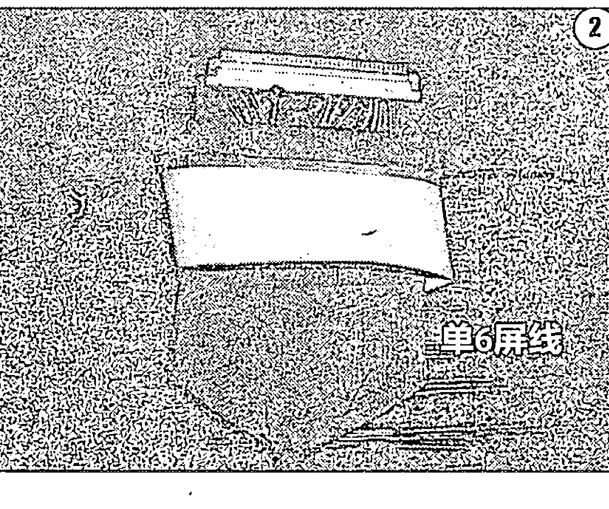

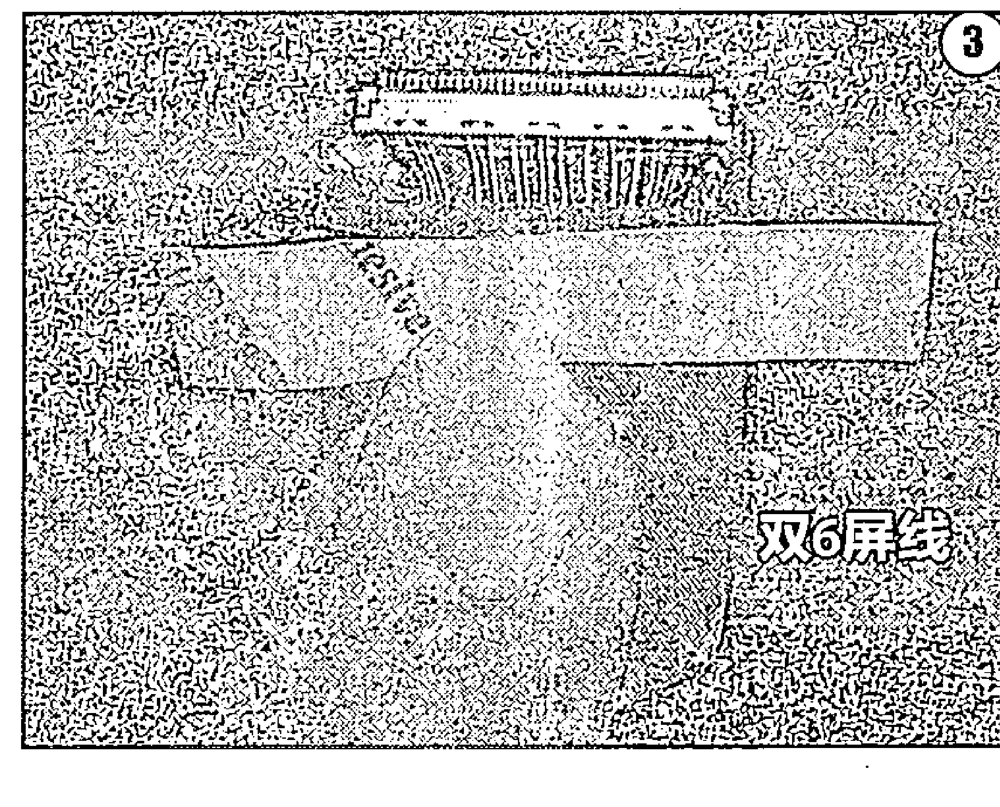

单6屏线和双6屏线对比

效果差异也很大，在这里也很难说清谁更好，属于很主观的表现。屏幕表面笔者更青睐雾面屏，毕竟1080P的分辨率，要是在反光的镜面下，长时间观看对眼睛是比较严峻的考验。

需要注意的是，广色域只是屏幕色彩饱和度的参数，不是屏幕的类型。屏幕面板按材质可以分为TN屏和IPS屏，可以是TN+广色域，也可以是IPS+广色域，规格越高价格越贵。但是，IPS+广色域只有惠普8540W和8560W等极少数产品可以换，这类面板需要特殊接口和解码板，普通机器根本用不了。所以，现在我们可以选择的大部分高清面板均为TN屏，大家也不必过于纠结，毕竟高分的TN屏，角度虽然比不过IPS的全视角，但是也比1366×768分辨率的原屏好多了，最高可达70/70/60/60度（左/右/上/下）。

目前显示效果比较理想的就是TN+广色域的1080P屏幕，面板价格多在450~550元之间，而非广色域的1080P面板则在350~450元之间。当然，广色域也不是一个万能的东西，色彩饱和度高在某些环境适合，某些环境就不适合。如果你经常与照片、设计和摄影打交道，这些就算是广色域适应的范围；如果你喜欢打游戏，特别是经常遇到阴暗场景（比如暗黑3和魔兽世界），过高的色彩饱和度有时会导致暗到玩不了，此时还是普通色域的高分屏更适合你。

## 重中之重的屏线

俗话说“万事俱备只欠东风”，在给笔记本升级屏幕的过程中，所谓的“东风”就是屏线。如果你的屏线不符合更换1080P高分屏的要求，那就需要涉及到更换屏线的复杂操作。

屏线，指的是连接笔记本主板和LCD屏幕面板之间用于供电和传输信号的线材（图2~3），分为单6屏线和双6屏线（俗称满线）。其中，单6屏线最高只能支持到1366×768像素，而双6屏线则可达到1920×1080像素且向下兼容。有些笔记本为了降低成本，就会选用单6屏线，这就导致更换了1080P屏幕之后会偏色（因为缺了4组8根信号线）。以联想Y580为例，美版机器由于有采用1080P屏幕规格的高配版，所以很多型号均标配双6屏线。反观国内行货版本的Y580，由于没有1080P的子型号，所以干脆就都换成了单6屏线（虽然主板输出都是一样的），这就要求玩家先换成美版高配机型上面的那根线才能升级高分屏幕。表2是笔者整理的部分品牌和型号是否需要换屏线的信息。

在淘宝上我们也能单独买到双6屏线，只需加装之后就能让本本完美升级到1080P屏幕。但是，更换屏线的难度取决于笔记本自身的设计。比如联想Y580和惠普DV6-6xxx系列，需要连主板都拆出来才能换线。如果你没把握进行如此复杂的拆机，可以等买回屏线和屏幕面板之后花点钱去电脑维修部（50~80元）或者品牌售后（150元左右）更换。

| 品牌 | 可直接换屏的型号 | 需要换屏线的型号 |
| :--- | :--- | :--- |
| 联想/ThinkPad | Y560A、T5x0系列、W5x0系列、E530、X220/X230（可换IPS屏，分辨率不变） | Y580、T420/T430（部分型号） |
| 惠普 | ---- | DV6-6xxx系列、DV6-7xxx系列 |
| 华硕 | N55系列 | N53系列、N56系列 |
| 神舟 | A550、A560、K580、K590S | A560P、K580S、K580N、K580P |
*目前ACER全系列不支持高分屏

## 买前多用问字诀

出于屏线的疑虑，大家在选购屏幕面板前一定要先和卖家沟通，报上自己本本的详细型号，让卖家帮助鉴定一下LCD面板是否匹配、屏线是否需要更换，避免买回来出现无法点亮屏幕的问题。此外，卖家通常还会对存在1~2个亮点/坏点的瑕疵LCD进行特价处理（1080P广色域面板大约300～400元），如果你觉得500元的1080P广色域面板还是贵，而且自己也没有什么完美情结，可以考虑这种略带瑕疵的产品。

最后再告诉大家一个好消息，很多淘宝卖家在出售高清LCD面板的同时还会回收用户升级换下的旧屏幕面板，回收价格主要看机器用的什么屏，还有当前的市场行情（通常在100～200元之间）。举个例子，如果你花500元买了1080P高分广色域面板，同时自己的屏幕还回收卖了180元，那你此次升级的成本就只有320元! 是不是很超值呢？

## 升级其实很简单

看到这里，相信大家已经学会挑选适合自己本的高清LCD屏幕面板了，接下来就是基本的手动安装思路，绝大多数产品都可参照这个教程更换屏幕，希望对大家的换屏之路有所帮助吧。

以神舟K590S为例，先抠开屏幕四个边角的橡胶垫脚，就能看到隐藏在里面的螺丝（图4）。将螺丝拧下后，从摄像头的位置（图5），用指甲或塑料片等坚硬且薄的物体，沿着屏幕边框的边缘一点点慢慢撬开，这里一定不能用蛮力，直到取下整个B面边框为止。

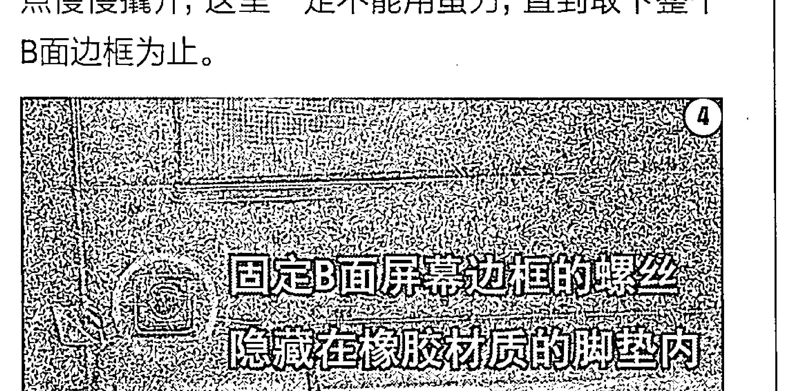

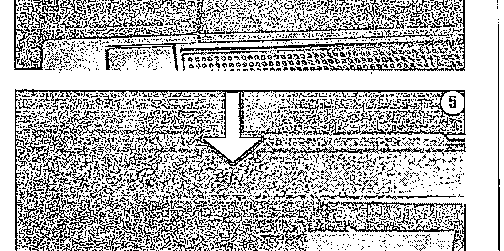

接下来我们就能看到固定LCD面板的金属框架了。先拧下固定金属支架的四颗红色螺丝，此时金属边框连带着LCD面板就能与笔记本A面内壳分离了。

> > 小提示
因为版面有限，本文只能提供详细的屏幕版面选购思路和简单的更换屏幕面板的教程。如果你打算为自己的本本换面子，可以提前在网上搜索一下该型号笔记本的网友换屏攻略，心里有谱后再自行更换。

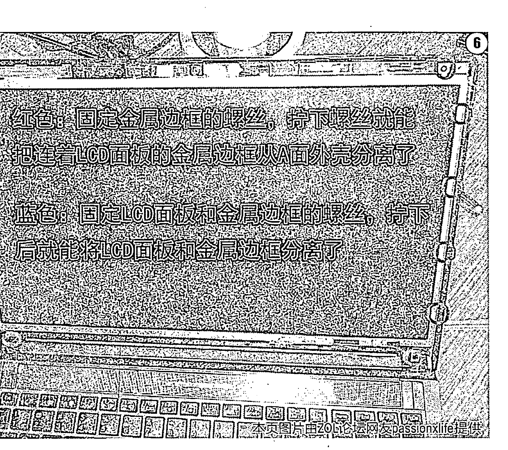

在金属框架两侧用蓝色圆圈标注的位置，我们还能看到固定LCD面板的八颗螺丝，拧下来后就能将LCD面板与金属框架分离了（图6）。在LCD面板背后我们还能找到用胶带固定的屏线，撕开胶带，慢慢拔出屏线就能将整个LCD面板和笔记本分离了。

最后，我们只需按照反流程，将新买的高清LCD屏幕面板替换再安装回去了。

> > 健圣点评
在2012年24期中，健圣曾提出莫让“1080P成为游戏笔记本的坑”的观点，但该文章的前提是建立在1080P笔记本价格昂贵的基础上。有了自行换屏的解决方案之后，只需很小的开销就能华丽升级高分屏幕，这就让1080P屏幕有了更为实际的意义。如果你有足够的动手能力，不妨也给自己的本本换个面子吧。

最后健圣再提醒一下大家，15.6英寸的机型可以选择1920×1080像素的分辨率，也可以选择1600×900像素的。现在Windows系统中有小部分的应用软件不支持字体缩放，如果你平时对文字的用途较多，也可以考虑1600×900像素的高清面板。这个分辨率下文字看着也舒服，不至于过小，色彩和可视角度也比1366×768像素的原装屏要好。可能有同学会说，那我用1920×1080的屏，分辨率也可以调成1600×900啊？但是，显示屏都有一个最佳分辨率，在最佳分辨率下显示才会清晰，如果调低了分辨率，屏幕是采用了抖动算法来实现的，试想一下，用一个半像素的点来显示一个点的内容，能清晰吗？

# 为你的上网本加上3G翅膀

上网本不给力，如果给上网本添加上实用的3G模块，让其拥有3G上网功能，则可谓是一种典型的废物再利用。本文就介绍一下笔者的经验，让广大读者的上网本也能再获新生。
文|宇宇

### 选配3G上网本 改造很简单

目前来看，最近几年推出的上网本，虽然普遍都不具备3G上网功能，但却在出厂时预先设计了“选配”功能。而对于此类3G上网本进行改造，其实还是非常简单的。

首先，就要找到上网本所预留的“选配”手机SIM卡插槽（图1）。接下来，只需要将支持3G网络的手机SIM卡插入到这个插槽中，即可完成前期工作。

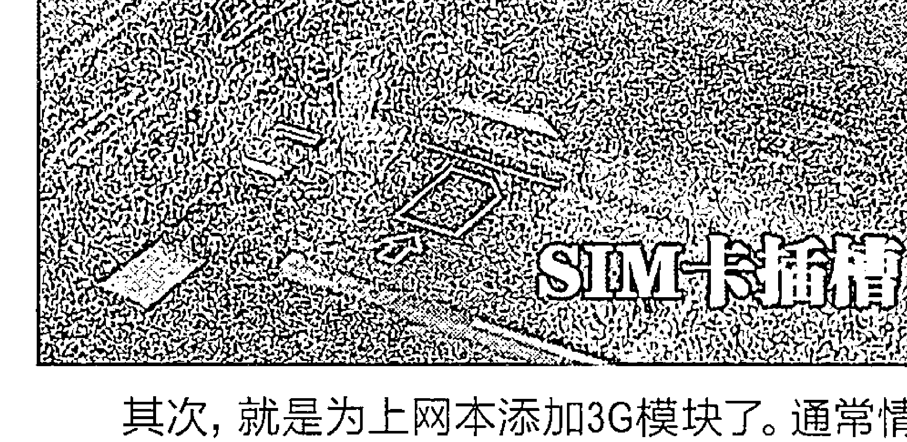

其次，就是为上网本添加3G模块了。通常情况下，3G模块可以在淘宝上买到，二手的售价还不到百元（图2）。在这里需要注意的是，3G模块必须与前面所用的手机SIM卡相对应才行。电信的对应电信，联通的对应联通，以此类推。

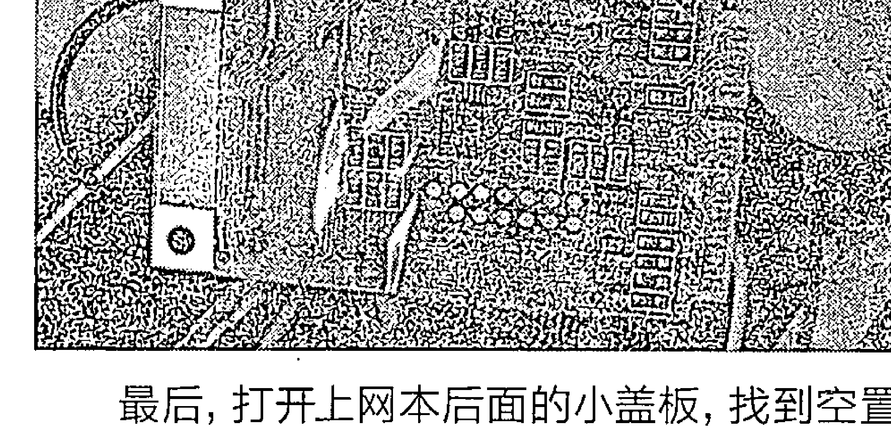

最后，打开上网本后面的小盖板，找到空置的Mini PCI-E插槽，并将3G模块插入进去（图3），硬件方面的改造即大功告成。需要注意的是，3G模块的插槽也是带有方向性的，而且还采用了防呆设计。所以只要细心且不使用蛮力，操作起来并不困难。

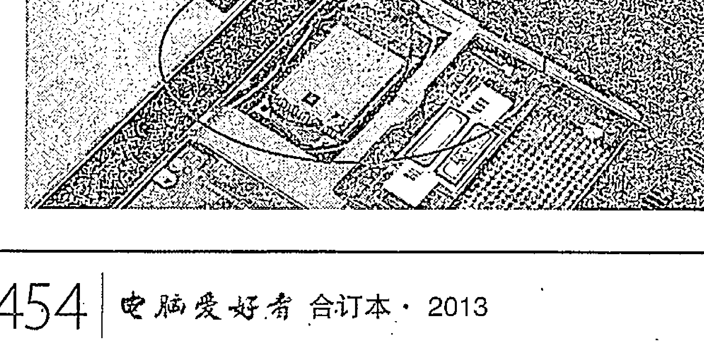

### “常规”上网本 改造有点难

如果是“常规”上网本，改造起来就有点困难了。除了购买3G模块之外，还要再购买一个手机SIM卡插槽的扩展模组才行（图4）。

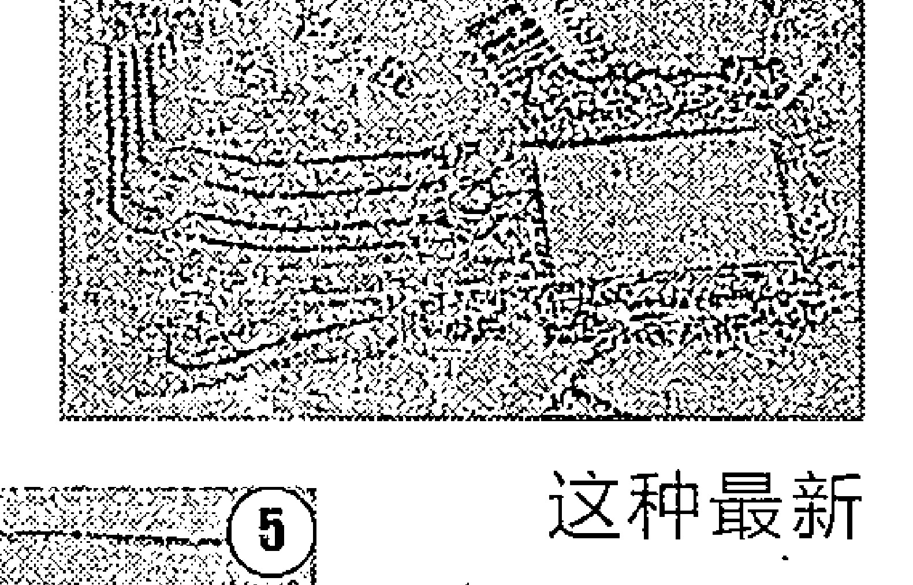

这种最新推出的扩展模组无须焊接，只需把扩展模组的尾端进行对折，并“套”在3G模块的金手指上（图5）。

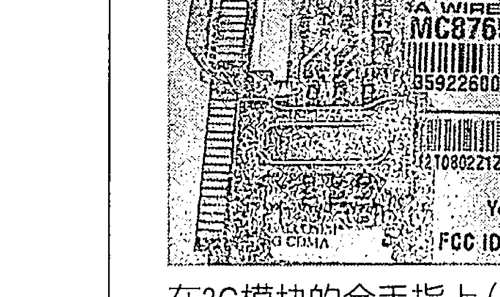

之后再把扩展模组和3G模块同时插入到Mini PCI-E插槽当中（图6），并插入手机SIM卡，改造就算大功告成了。

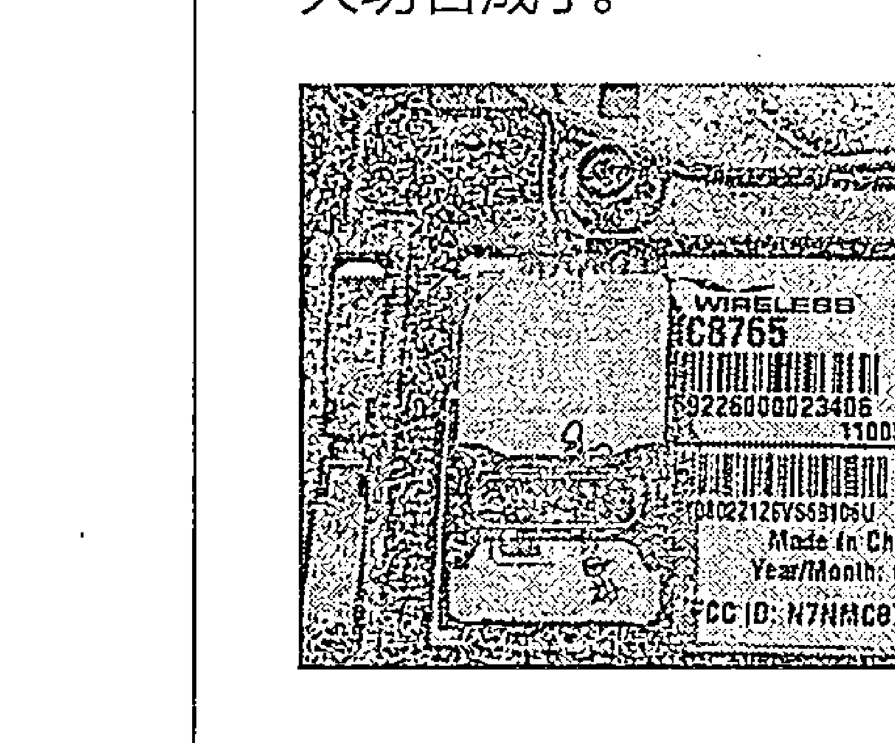

最后一步，就是安装3G模块的原厂驱动，商家通常都会赠送这个驱动。然后再去运营商的网站下载拨号软件（图7），上网本便可以实现3G上网功能啦。

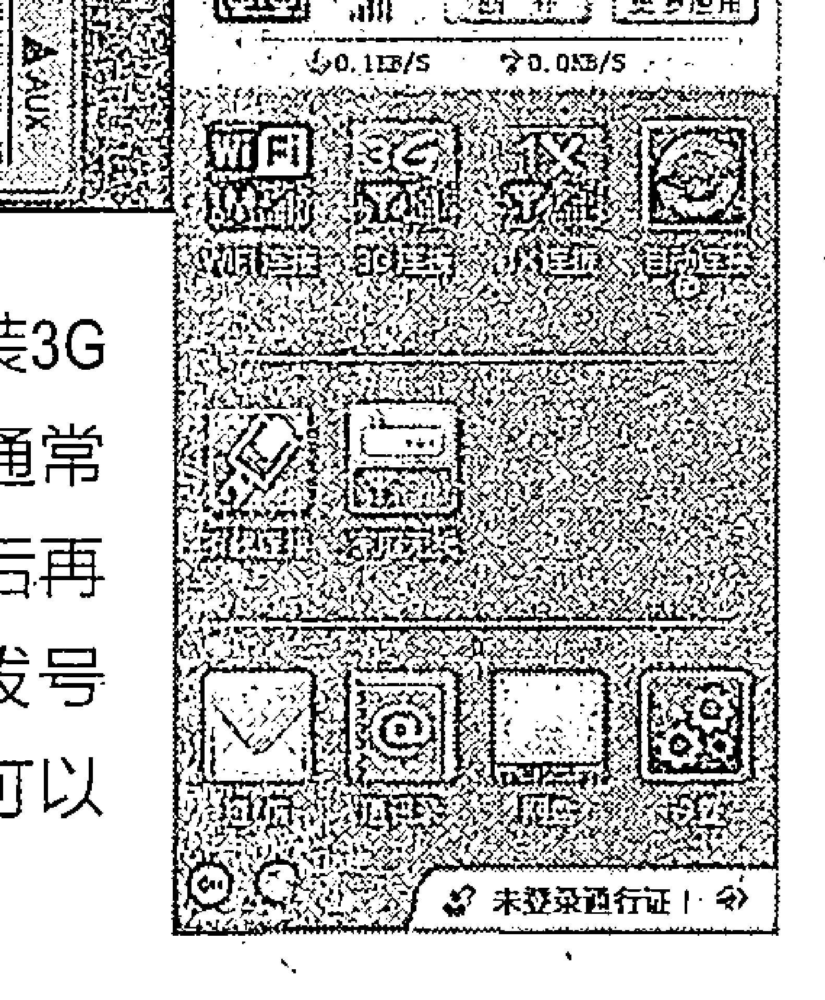

## 小结

文章的最后还要提醒广大读者，除了上网本之外，只要是留有空置Mini PCI-E插槽的各类笔记本，其实都可以进行类似改造。如果你已经厌倦了在家上网，又在户外很难找到免费的Wi-Fi信号，不妨跟着笔者的脚步，一同进入3G时代吧。CF

# 手动为笔记本加装触控屏

谁说想玩转Windows 8必须买带触控的新机？只需很小的开销，你的笔记本也能获得好玩的触控体验。
文|FlyBuster

Windows 8带动了一大批自带触控功能的笔记本新品，甭管用起来怎么样，但至少看起来足够炫酷。对已经购买了笔记本的老用户，想用手指操作Windows 8，要么重新买台笔记本新品，要么另配一台带触控功能的显示器，无论如何都需要数千元的开销。如果你的预算没有那么多，但有足够的动手能力，不妨考虑DIY的形式，为本本“武装”触控面板，获得更好驾驭Windows 8动态磁贴界面的能力。

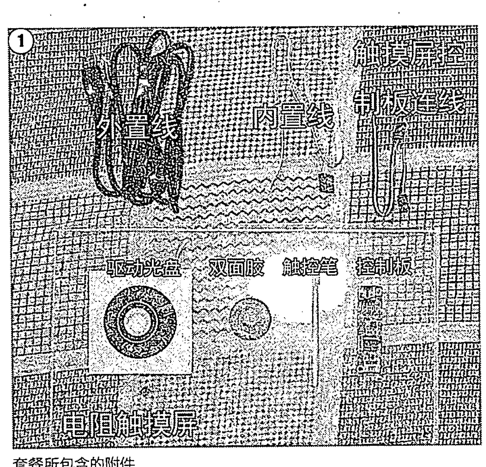

## 触控身价并不高

150元你能干什么？买条内存就到家了。但笔者想说的是，150元就能让本本获得触控的能力，而且加装的过程也不算太复杂。原理很简单，就是买一面电阻触控屏，然后将其覆盖在笔记本屏幕LCD的表面，将电路板引至USB接口供电并隐藏好即可。下面笔者就分享一下具体的改造流程。

普通用户可以直接选择卖家的套餐，包含屏幕、连接线（有内置线和外置线之分）和控制板，甚至还会提供双面胶和手写笔之类的附件（图1）。

## 为啥选择电阻屏

现在都电容屏时代了，为啥还选择过时的电阻屏？相信很多同学都有如此疑问。道理很简单，因为我们是给笔记本进行改造，这就要求触控屏幕面板不能过厚。下表是几种改装用的屏幕厚度，可见只有0.5mm的电阻屏能像保护膜一般塞进笔记本液晶屏幕和屏幕边框之间的空隙中（贴在液晶屏表面），通过软件校准后即可正常使用。电阻屏有一个优点，就是精度很高，而且透光性也不错，加装后也不会影响到屏幕自身的显示效果。

| 屏幕类型 | 电阻屏 | 电容屏 | 红外屏 | 声波屏 |
| :--- | :--- | :--- | :--- | :--- |
| 厚度/mm | 0.5 | 5 | 7 | 12 |

电阻屏的选购也很简单，根据自己本本的屏幕尺寸购买相同规格的触控屏幕即可（不到150元）。在淘宝上搜索“四线电阻屏”，有4:3的，有16:9的，有软屏还有硬屏，笔者建议选择不会碎裂的软屏。

## 两种改造思路

电阻屏自身带有数据线，它要和控制板连接，然后控制板再和电脑的USB口连接（供电）。加装这些组件有两种方法。

第一种：把触摸屏用胶布粘在液晶屏表面，然后将裸露的外置线与电脑USB接口连接即可。该方法适用于动手能力不太强、对外观要求也不高，或者把笔记本当台式机用的朋友。

第二种：把电脑拆开，将触摸屏贴在屏幕边框下面，连接线和控制板全部置于机身内部。该方法虽然复杂，但却不影响笔记本整体美观，直接就变成支持触控的机器。下面笔者就以第二种方法为例，介绍一下具体的改造思路。

## 实战演习教程

以联想Y470为例，需要先拆下B面的屏幕边框。将屏幕边框两侧的圆形橡胶盖子取下，拧下里面的固定螺丝，然后用小刀或卡片沿着缝隙慢慢撬开，直至将B面的屏幕边框整体拆下。然后你会看到固定LCD面板的金属框架（图2），拧下四角的螺丝，确定没有暗扣后就能提起屏幕，然后拔除屏幕背后的VGA线（拔的时候要小心，不要弄断了）。

> 小提示
电阻屏买来时正反应该都贴着一层膜，安装时只需揭下与液晶屏幕贴合的那一面的膜即可。电阻屏贴合时不区分反正面，触摸屏与控制板的连接也不分正反，因为可以通过软件来进行校正。

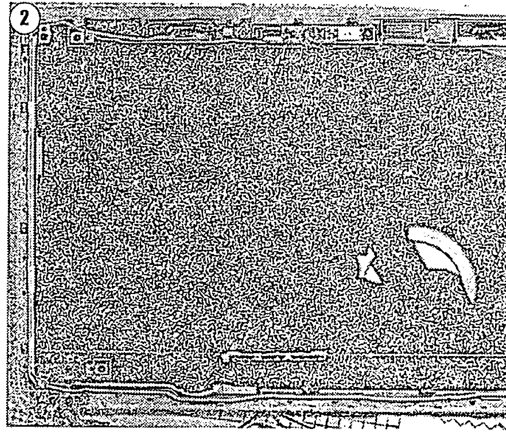

贴电阻屏前一定先将屏幕灰尘擦干净

将屏幕擦干净，在屏幕的四条边各贴一条双面胶（图3），然后将电阻屏贴上去，电阻屏的连接线从液晶屏幕的背面绕一下（图4）。之后就能将贴着电阻屏的液晶屏幕装回去了，如果屏幕上方的两颗螺丝被电阻屏挡住，只需稍稍将触屏掰起来就可以上螺丝了。边框左边的磁铁可能会使边框无法盖回，只需用小刀把触屏边缘切掉一块就行，注意不要伤及电路。

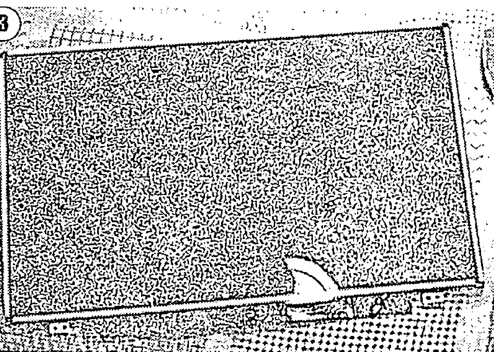

四条双面胶要首尾相连，避免中间存在缝隙进灰尘

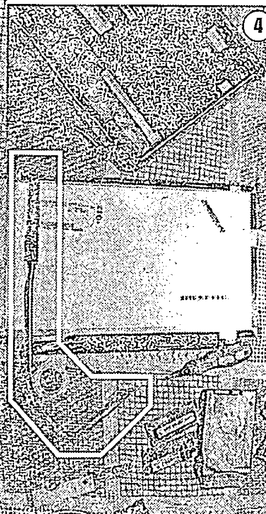

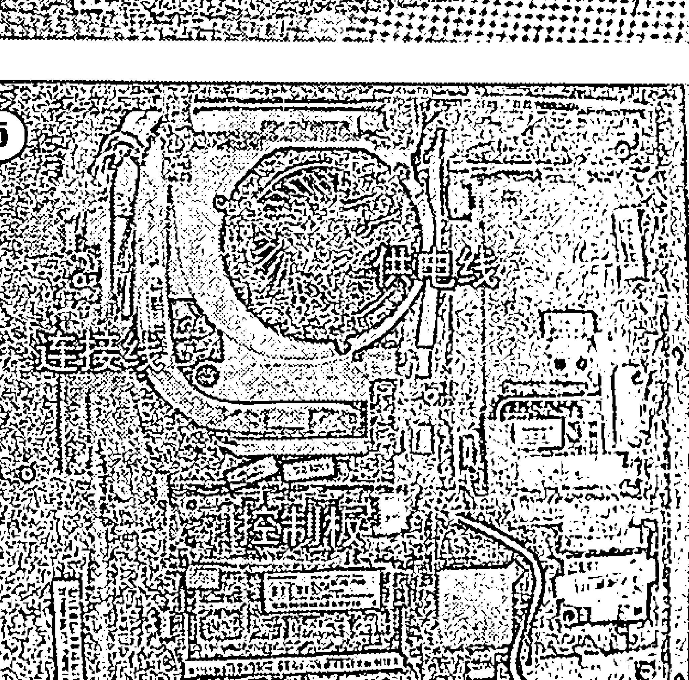

Y470的内部走位示意

接下来就是要想办法将连接线和控制板藏在笔记本的内部了，不同笔记本内部空间结构不同，总体思路就是哪的空间大就把控制板固定在哪里。对Y470来说，电阻屏的连接线应该从左侧转轴处进入笔记本，再从主板下方引至内存处，将控制板藏在内存所在的位置（需要卸掉一根内存），而供电线则需要沿着硬盘位走线（图5）。如果卖家提供的连接线不够长，就需要我们剪断并焊上一截。在这里笔者推荐使用网线，因为它内部的铜丝较粗，可塑性强，弯曲后不会自己弹回来，且网线每根都有不同的颜色，便于辨认。

在固定控制板之前还有一个关键的步骤，就是在USB口上焊线，通过USB为控制板供电和传输数据。这个过程需要一定的电路学知识，笔者提供了控制板及USB口的线序（图6~7），大家要严格按照线序焊线，如果搞错了可能就会导致主板烧毁（如果没有把握可以拿到维修店铺，30元搞定）！控制板连接USB口的插头有防反插设计，焊接时可以先在主板USB口的焊点上加一些锡，然后把线浸到融化的焊锡里去，注意两个焊点之间不要短路。

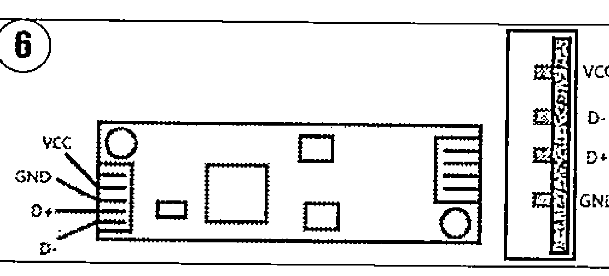

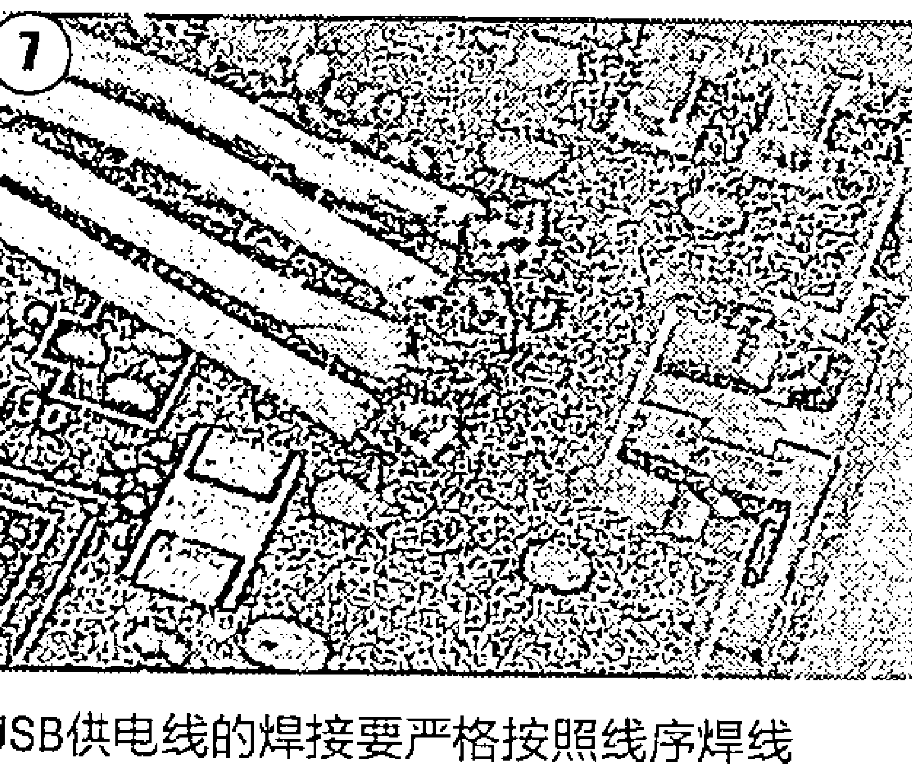

USB供电线的焊接要严格按照线序焊线

## 触控的感觉真好

改造完成后，重新开机并安装光盘中的驱动，先运行校正软件中的“4点校正”，再点“线性设置”进行微调，之后就能完美使用触控屏幕来操作电脑了。虽然电阻屏不能多点触控，但对于日常浏览网页什么的已经比鼠标强很多了，在屏幕上戳的速度绝对比鼠标来得快，切水果玩小鸟啥的也完全可以胜任。

## 健圣有话说

本文作者FlyBuster为我们提供了非常实用的解决方案，但本文展示的改造思路有一定的技术门槛，涉及到拆卸笔记本屏幕B面、固定屏幕液晶面板的金属托架，走线的部分还需要拆掉笔记本D面，控制板和USB口的焊线更是需要专业的手法。因此，健圣只推荐动手能力较强的玩家效仿，如果你对自己的DIY实力没有自信，则可以考虑自己买配件，然后找第三方维修中心进行具体的焊接和组装操作。无论如何，电阻屏+组装的费用也能控制到200元左右，总要比重新购买新品来得实惠。

# iPhone 5耳机真假识别

苹果发布新品iPhone 5，此次新品发布带来了相关配件的改动，其中变化最大的要数EarPods耳机。然而不少用户购买iPhone 5后发现耳机被掉包，为此小编决定告诉大家如何辨别iPhone 5真假耳机。

## 假耳机充斥卖场

登录淘宝网站搜索iPhone 5耳机，我们能够发现整个页面充斥着各种价位的EarPods耳机，从十几元到上百元应有尽有。面对价格相差如此大的EarPods耳机，不少消费者贪图便宜而买到假货，为此小编决定自掏腰包到中关村卖场购买一款iPhone 5的假EarPods耳机，通过和真耳机对比找到辨别方法。

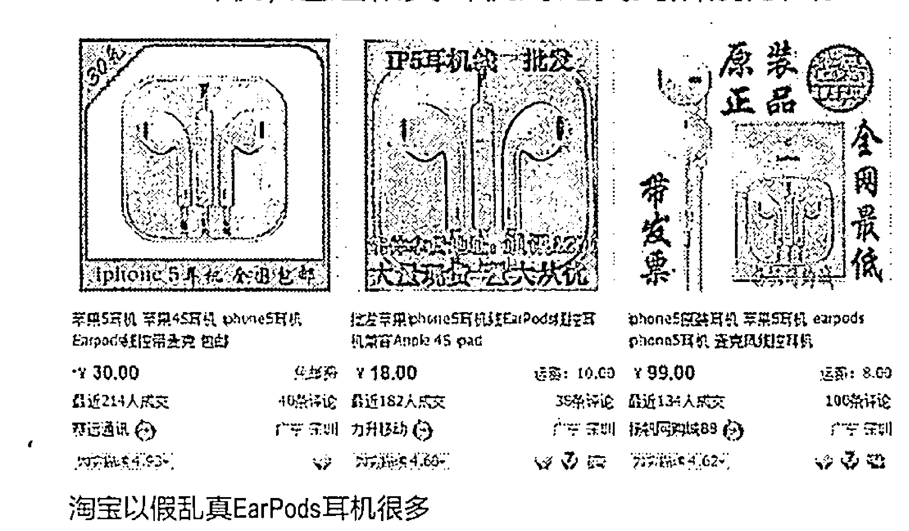

来到中关村地下一层，除了各种品牌的手机外，琳琅满目的手机配件绝对是另外一条亮丽的风景线。小编随便找了几家店主询问得知，目前他们口中声称的原装iPhone 5 EarPods耳机价格都在150元左右，最终通过一番砍价，小编在一个面相忠厚的店主处花了100大洋购买了一款“原装”EarPods耳机。

## 耳机包装易露马脚

拿到刚刚买的EarPods耳机时，小编透过包装盒翻来覆去也没有发现什么不妥的地方，可是自己心里清楚花100块钱是不可能买到原装EarPods耳机的。而当时在店主那里小编要求打开查看时，店主说耳机包装都是密封的，如果打开查看就得先付钱购买，因为iPhone的产品不存在验货这一说。小编心想反正自己本来就是冲着假货来的，就充一次冤大头了，等回家和真的EarPods比对下就明白了。

通过和原装的EarPods对比，假EarPods耳机的马脚立马就尽显无疑。首先是假EarPods耳机的包装盒上有一个透明的贴纸，然而原装EarPods耳机并没有，有些画蛇添足的意思。这可能也是奸商为了防止消费者拆开检查耳机而私自添加的。

另外打开假EarPods耳机包装盒后，仔细观察能够发现，包装盒的边缘有一些毛刺，做工粗糙。原装的EarPods耳机包装盒边缘则非常光滑，用手轻摸包装盒的边角处能够有明显的感觉。


## 假耳机偷工减料

假的耳机基本都是一些小的作坊生产制造出来的，而偷工减料是他们最常用的伎俩。小编将真假EarPods耳机放在一起对比发现，假的iPhone 5耳机长度要比真的短了5cm左右，而且线材手感也有明显区别，假的iPhone 5耳机线材偏硬一些，而原装耳机线材柔软，且很容易梳理。

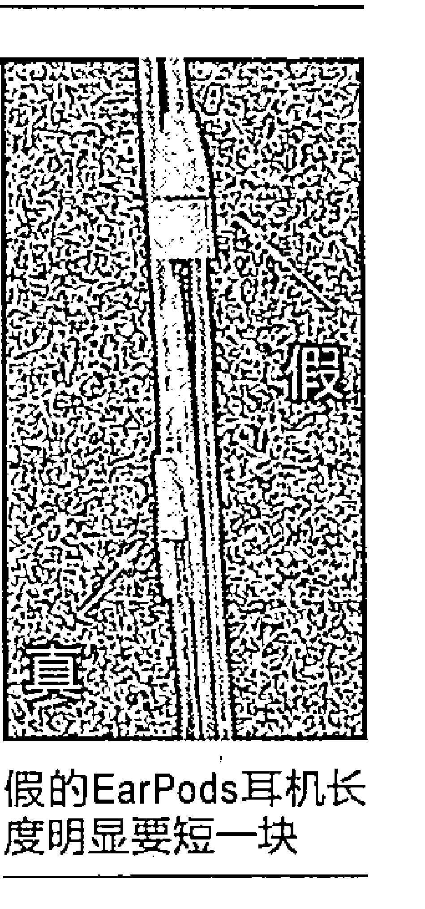

除了在耳机线长度上做手脚之外，山寨耳机厂商在耳机线材上同样会动歪脑筋。通过对原装耳机拆解后能够看到，在原装EarPods耳机线里有两根金属线互相缠绕在一起，在金属线外包裹着一层绝缘材质，然而材质最外层我们看到的白色耳机线包裹，整个工艺制作非常紧凑，不会出现空心的问题。然而小编所买到的“原装”耳机在音量键一侧明显出现了耳机线凹陷的情况，这说明耳机内部金属线没有将外皮外圈充满，由于耳机长时间在包装盒内弯折存放导致凹陷。

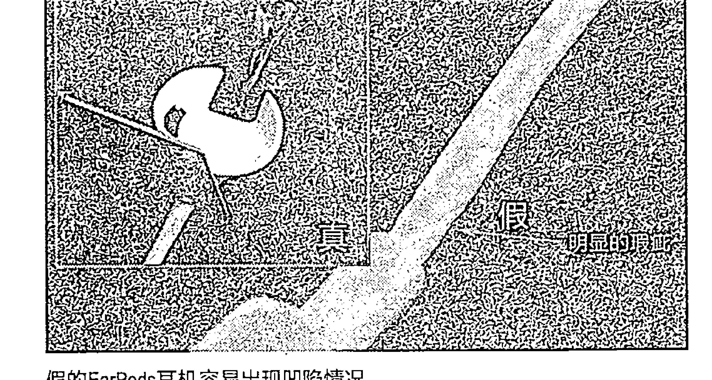谈到偷工减料，厂商们可以说是能省就省，在EarPods耳机上除了线材长度和内部金属线外，耳机耳柄内部同样是他们克扣原料的一个地方。原装的耳机耳柄下方会有一个金属线圈来固定耳机过滤网，所以这段手捏一下会感觉到有点硬。但是假的耳机基本都不会有这个元件，因为假耳机往往没有过滤网，所以这个固定过滤网的金属圈也理所当然地被省掉了。大家在购买EarPods耳机后，可以用手捏一下，如果感觉很软是空心的，那么耳机一定不是原装的。

最后在原装EarPods耳机主通声孔处能够清晰地看到有金属质感的过滤网，这也是为了提升耳机的音质而做的一个设计。然而假的耳机在这个部位却是黑洞洞的一个孔，不仅看起来很丑，而且用来听音乐的效果也会大打折扣。这点差异大家即使不拆开包装也可以透过包装盒看到，所以在购买过程中大家可以先通过这点来简单鉴定所要购买的耳机是否是假货。

### 假耳机技术不足

假的EarPods除了在做工上偷工减料外，还有一些细节是山寨厂商因为技术问题永远无法做到的，因此他们只能通过模仿来混淆视听，大家只要拿到耳机后仔细观察一定能够发现漏洞。

如果只是通过肉眼来看，假的EarPods耳机在按键上模仿得真的是出神入化，基本看不出差别。但是如果用手按一下音量控制键差距立马就尽显无疑。原装的EarPods耳机按键非常舒服，用手按键时能够明显感觉到段落感，然而假耳机按键却有点生涩，按键感觉无法达到原装耳机的舒适程度。

iPhone 5的原装耳机采用全新的漏斗形模具生产，整个耳机采用一体成型的设计工艺。这一技术的使用对大多数山寨高仿厂商来说算是出了一道难题，很少有哪个山寨厂商拥有一体成型的模具。然而技术达不到，山寨厂商也有自己的办法，那就是通过拼凑的方式来模仿EarPods耳机的形状，所以大家购买后可以通过仔细观察耳机的听筒部分，如果不是一体成型，有明显拼凑痕迹，那么一定不是原装EarPods耳机了。

另外在原装EarPods耳机线上仔细看能够发现印有耳机生产地的一串英文字母，这些字母颜色很浅，几乎是半隐半现的感觉。然而山寨厂商在字迹的颜色上无法做到这种效果，假的耳机线上这串英文字母往往颜色很深，很容易能够看到。此外小编手中这款假耳机在“China”后面只有一个空格，而原装EarPods耳机是应该有两个空格，不少山寨厂商会忽视这一细节。

### 编辑总结

虽然iPhone 5的销量没有前几代产品那么火爆，但还是有很多用户会选择单买EarPods耳机插在自己的手机上使用。这里小编要提醒大家的是，EarPods耳机只能够在iPhone设备上通用，插在其他的电子产品上可能无法识别或者声音不稳定。所以建议没有iPhone设备的用户就不要打这款耳机的主意了。

# 三星手机换屏自己搞定

手机屏幕出现问题让人很烦心，作为手机中成本最高的两大块，屏幕的维修成本往往都在七八百元甚至更高。小编的三星i9220最近因为进水而导致屏幕失灵，为了省点开销决定亲自动手换屏。

## 淘宝挑选手机屏幕

小编和大多数人一样，发现屏幕坏掉后首先想到的是官方维修，联系了三星客服后得知更换一块原装三星i9220屏幕要1700元，而且客服人员告诉我即使换屏后，三星的S-Pen笔也将失效。无奈之下小编带着“受伤”的i9220来到中关村维修处，结果商家要价竟然高达2000元。我心里想手里这个机器现在估计还不值2000块钱呢，一怒之下决定去淘宝买i9220屏幕自己更换。

打开淘宝网搜索三星i9220屏幕后发现最便宜的屏幕只需要100多元，但贵的却要1000多元。经过和卖家沟通得知，售价100多元的i9220屏幕只是一块单一的触屏，而1000元左右的屏幕就是大家常说的总成屏，这种屏幕包含触屏、液晶屏、边框、上下喇叭、送话器、USB集成电路板，更换起来比单一的触屏要容易得多。

对于个人动手能力强的用户来说，小编建议大家选择100多元的触屏面板更换，这种触屏没有边框，用户需要将机器边框以及触摸屏上面的玻璃保护面板全部拆下进行更换。而对于没有拆机换屏经验的用户来说，小编还是建议直接购买包含手机边框的总成屏更换，毕竟这种屏幕更换起来更加容易。此次小编就是花了800元购买了三星i9220原装总成屏，商家还赠送了拆机必需的工具套装（商店卖10元一套）。

> 注意：大家在自己动手换屏前最好到维修点检查确认手机只是屏幕出现问题，如果是主板问题那么换屏也无济于事。此外从淘宝购买回来屏幕后不要急着撕掉屏幕上的保护膜，否则屏幕出现坏点或者其他问题卖家将不负责任。

## 动手拆机换屏

手机拆机换屏没有太大难度，但需要的是细心，为了保险起见，小编在拆机换屏前重新在网上看了一遍i9220的拆机换屏过程，认真学习完拆机换屏教程后才开始动手操作。首先将手机背面的电池仓后盖打开，用螺丝刀将能够看到的螺丝统统拧下来，取下手机的中壳，这时候就能看到手机的“内脏”了。

拆开手机后能够看到最大一块蓝色元件就是手机的主板，首先要拧下来主板上的两颗螺丝，然后拆掉主板上6个排线卡口和一个天线接扣，就可以轻松地将主板分离出来。

然后依次将主板周围的振动器、前置摄像头、感应器、听筒、外置喇叭从坏掉的手机中取出。其中拆卸听筒、摄像头以及外放喇叭时要先用吹风机进行预热，所以小元件的拆卸都要捏住排线头拿下来，不要直接去抠元件，以免造成损坏。

将拆卸下来的手机主板以及其他的小元件依次对照原来手机的位置安装到刚买回来的总成屏上，然后再将排线扣扣上，并将螺丝拧上，整个手机的换屏工作就算完成一大半了。这里建议大家不要急着将手机中壳装上，先将手机电池安装后开机检测下手机屏幕是否有问题，如果没有问题再装也不晚。

### 小提示

文章中主要介绍的是三星i9220更换总成屏的方法，因为更换总成屏简单易操作。如果读者中有DIY高手，可以尝试进行触屏的更换，这就需要将屏幕周围的边框以及前面板拆解下来，操作麻烦且有一定的风险，但换屏成本只需200元左右即可。但对于普通用户来说，小编建议还是多花点钱购买总成屏进行更换。

### 手机屏幕检测

确保将手机所有的元器件都装上之后，下面就要进入检验屏幕的步骤。开机之后，在拨号界面输入*#0*#进入机器测试工程模式，首先在纯色画面中检测手机屏幕是否存在亮点或者暗点情况（三星Note和Note II还有S-Pen笔检测一项，其他三星手机没有）。

然后要检测手机屏幕边角的触摸灵敏度，选择touch选项，用手沿着边框的小方格滑动，方格变为绿色表示触控没有问题，如果触摸方格颜色不变则说明屏幕存在触控死角，会影响日后的使用。

如果检测出手机屏幕有问题，那么在没有撕掉屏幕表面保护膜的情况下拍下照片留作证据，然后联系卖家更换屏幕，当然这种情况谁也不愿遇到。如果没有问题，那么就可以将手机的中壳、电池以及后盖依次装上，一部崭新的三星手机就重现眼前了。

### 编辑总结

在Android系统中三星手机销量一直都非常火爆，而手机屏幕因为进水而出现问题的情况非常普遍。经历这次事件后小编要再次提醒大家，如果手机进水，可能在刚开始不会影响使用，但随着水珠渗入机器内部后往往会造成屏幕失灵或者主板线路短路而烧坏元件。

小编也是因为当时进水时没有在意，结果经过一周时间手机整个屏幕变黑导致无法使用。其实在刚进水时大家不要过于慌张，此时切忌按手机电源键关机，而要立刻将手机电池取出，然后把手机放置一边等其自然晾干，然后再重新装上电池基本都不会有问题。

另外本文中小编提到的换屏方法对于其他手机来说同样适用，大的步骤都是拆下手机中壳，打开手机排线扣以及元件进行更换，不同之处可能就是手机的排线扣位置和数量的差别而已。但对于部分上市时间较早的手机来说，可能会存在排线焊接的可能，如果遇到这种情况，小编建议大家最好不要自己动手更换，以免得不偿失。

# 1元钱搞定 DIY手机触控手套

智能手机用户最头疼的问题就是无法隔着手套对屏幕进行操作，而触控手套的价格往往也不便宜。如果我告诉你只需1元钱就能DIY触控手套，你会感兴趣吗？

文|小米论坛/MR.zhagn

虽然已经步入3月，但部分地区的朋友外出时仍需手套保暖。可惜除了Lumia 920，其他手机都无法隔着手套对屏幕进行操作，在寒冷的室外发微博对手机是种“摧残”。如果你本着节约至上的原则，不想花费数十元买副触控手套，不妨发挥一下DIY精神，自己为普通的手套赋予触控功能吧。

## 成本低廉的素材

DIY的前提就是收集素材，请放心，我们用的都是非常廉价的材料：

- 闲置的普通旧手套，因为本次DIY涉及到缝纫穿孔，所以最好是线手套，皮手套或高档手套不建议改造；
- 手缝针，中号或小号即可，别告诉我你家里没有；
- 金属丝线，在服装材料、纺织和布行市场都有卖，请注意不是那种漆包线（漆包线有绝缘层所以无法导电）。

## 当一回缝纫师傅

有了材料，接下来就是具体的DIY环节了。相信大家小时候都应该上过“手工课”吧？此次我们需要做的，就是将金属丝线穿过针孔，然后像补衣服一样，把金属丝线绣在你经常用的手套手指尖上。以笔者为例，我使用手机的习惯很简单：左手持握，用右手食指操作屏幕；右手持握，用右手大拇指操作屏幕。

因此就我的习惯而言，只需对右手手套的拇指和食指进行“手术”即可。用穿过金属丝线的针在手指尖表面绣出个凸点，这样手指也能感觉到按屏幕的触感。注意绣的时候要使埋藏在手套内的金属丝线可以接触到手指，可不是仅在手套表面缝一层哦。绣完了就可以带上手套进行测试了。看到终于可以隔着手套对手机下达指令，是不是比直接买一副触控手套更有成就感呢？

## 需要解释的几点事项

市面上很多现成的触控手套内部都含有类似金属丝线的材质，只是人家把它藏在里面了，而我们则将其裸露在外。此外，金属丝线的材质和我们平时用过的针线一样，属于用在服装装饰上的一种特殊材料，很细很光滑，理论上不会造成划花屏幕的问题。至少经过笔者反复使用和加大力度按压屏幕的测试，手机屏幕表面都没有出现划痕。当然，为了最大限度避免可能出现的划伤，笔者还是推荐大家给手机屏幕贴层保护膜。最后，DIY触控手套的实际效果可能会略有不足，就是识别率并非100%，但日常接听电话、少量文字录入还是不成问题的。

## 编后总结

手机或平板电脑的电容触控屏只能识别手指操作，因此在天气冷的时候操作手机是件很麻烦的事情，哪怕仅仅是接听电话和解锁屏幕都得临时摘下手套，用手指滑动屏幕才能完成。虽然现在一副触控手套的价格最低也就25元钱，但对家中闲置着无数双普通手套的用户而言，娶“新欢”实有浪费之嫌。而本文则为大家提供了低开销、低难度的DIY触控手套的方法，希望大家可以参考学习，将“自己动手丰衣足食”的精神发挥到极致。

# 让IDE老光驱继续服役

文 | 宁宁

最近家里升级了电脑，以前的老刻录机用不了了。可再买一个新刻录机，又有点舍不得。于是，就花了20元在网上买了一个工包的PATA-SATA转接卡。这样一来，就可以让新主板多个IDE接口，从而让老刻录机继续服役了。

笔者购买的转接卡，其实是技嘉主板附送的一个设备。这种转接设备上连接着一条数据线和一条电源线（图1），数据线采用的是SATA接口，电源线则采用了最为普通的D型接口。转接设备中最重要的就是PCB板上的一颗JMicron JM20330芯片，实际上就是Serial ATA Bridge Chip（SATA桥接芯片），支持1.5Gbps的SATA速度规格，经常出现在硬盘和光存储设备上。通过JMicron JM20330芯片的转接，可以把IDE硬盘或光驱连接在主板的SATA接口上，这就相当于主板上又多出了一个IDE接口。

首先把转接设备正确连接在主板和电源上，而转接设备的背面还有一个IDE接口（图2），需要正确插入到光驱的IDE接口中。连接完成之后，进入到主板BIOS中，将OnChip SATA设置为Enabled，再把SATA Mode设置为IDE。通过这样的设置，不但可以打开主板上的SATA接口，还可以把SATA设备映射为IDE设备，提高SATA设备的兼容性。按F10键保存BIOS参数，即可进入操作系统。此时操作系统会提示发现新的SATA设备，并自动安装驱动，几十秒之后，转接后的光驱就再次出现在操作系统当中了。

从技术角度分析，由于在PATA-SATA的转换过程中需要重新编码，信号转换必然要花费一定的时间，所以传输效率应该会受到影响。不过从Nero CD-DVD Speed的测试成绩来看，这种设备对于光驱平均速度的影响并不大。平均读取速度只是从31.34X降到了28.75X，性能损失几乎是微乎其微。

除此之外，笔者还好奇地把IDE硬盘通过转接连上了新主板，测试之后的性能损失则高达30%。如此看来，这种转接卡对于光存储设备的兼容性还算不错，但对于硬盘的兼容性则并不太好。因此，更推荐老光驱用户购买。

# 老版电视卡应战数字电视

文 | 滴滴答答

数字电视在笔者所在的城市全面普及。但是，老版电视卡的TV天线接口却无法与其匹配。其实只要花15元买一个影碟机射频增加器，就可以把视频和音频信号进行混合，输出为射频信号与老版电视卡相匹配。

很多数字电视都会免费赠送一种叫做机顶盒的设备。这种设备把TV天线接口输入的电视信号进行解码，然后再通过AV视频和AV音频接口进行输出。不过，老版电视卡的接口当中并没有AV视频和AV音频接口，而只有一个TV天线接口。这个时候，就需要一个影碟机射频增加器来帮忙了。

客观来说，影碟机射频增加器是一种比较古老的设备，最初用于古董级电视连接影碟机时使用。这种设备在工作时需要单独的电源供电，可以把视频和音频两种信号混合在一起，最后通过天线接口输出。我们要做的是把“机顶盒”输出后的AV视频连接在影碟机射频增加器的“视频入”接口中，再把“机顶盒”输出后的AV音频通过2转1音频线连接在影碟机射频增加器的“音频入”接口中。最后再把TV天线插入到影碟机射频增加器的“射频出”接口中就算是大功告成（图1）。

注意必须具备2转1的音频线（图2），否则就需要舍弃左右声道其中之一才行。在完成连接之后，就可以为影碟机射频增加器提供220V电源。此时，AV视频与AV音频已经进行混合输出，老版电视卡同样可以接收到清晰的数字电视画面了。

# 废旧CF卡变号USB3.0 U盘

将废旧CF卡中的Flash芯片拆下，DIY打造成一个双通道的USB3.0 U盘，速度是普通USB3.0 U盘的两倍。文|于正青

前两天，朋友的CF卡不小心烧掉了，我把烧掉的CF卡拿到了家里，准备大拆一番。通过拆解，我发现这个32GB的CF卡是由四个NAND Flash组成的。于是我打算将上面的Flash拆下来组成U盘。

拆开CF卡看到的芯片型号是Intel的I29F64G08JCND1（图1）。打开附件中的ChipGenius，将芯片的型号输入进去，查询到这款芯片的存储单元是单层单元（SLC），存储密度为8GB。

我打算把这款芯片做成USB3.0的U盘。找了银灿IS902这款USB3.0的主控芯片。该主控板兼容性好，基本上支持市面上所有的Flash芯片（详细的芯片支持列表请在附件中查找），同时具有两个Flash位，可以做成双通道U盘。

取下CF卡上的Flash便直接焊在主控硅板上。芯片的一角有一个小圆点，焊接时一定要把小圆点和硅板上的小圆点对应起来（图1）。焊接好了剩下的就是量产了。这里我要提醒大家，如果Flash坏块较多就难以成功量产。坏块的产生多半是过度使用造成的。

### 制作普通U盘

1.  把焊接好的U盘插到电脑上，再打开量产软件，点击右侧的“搜寻装置”，如果焊接没有问题的话会在“银灿装置”一栏中出现我们焊接的Flash型号。
2.  点击“量产设定”进入量产设定。点击右侧的Edit，这时会提示输入密码，密码是IS0024（注意大小写）。在“产品信息”一栏中，找到InquVID，在其中可任意填入制造厂的编号，在“产品名称”、“制造厂名称”、“产品名称”中均可任意填入信息。在随后一行的Label中是用来编号产品的序列号，可以点击后面的Serial number来选择编号方式。在右侧“格式化”一栏中，点击Format setting可以设置U盘格式化的文件格式。
3.  这些设置完成后，其他保持默认，回到“量产测试”页中来，选中自己的设备点击“开始”，等待量产结束。

### 制作双启动维护U盘

1.  按照制作普通U盘的方法做完Step2。
2.  在“量产设定”中找到“格式化”一栏，点击Format setting，在弹出的对话框中勾选Create MBR，在“应用设定”一栏中勾选Preload File，点击后面的按钮，在这里选择一个ISO文件。然后返回到“量产测试”页，点击“开始”即可。
3.  打开“如意烧”，选择“烧录映像档”，点击“下一步”，在“请选择U光盘”中选择我们的U盘，然后在“请选择来源映像档”中选择我们之前选择的ISO文件，点击“烧录”即可。
4.  打开我的电脑即可看到两个分区了。一个是以光驱的形式，另一个则是以U盘的形式。再把U盘那个分区进行格式化。到网上找启动盘制作工具，这里我使用的是大白菜启动盘制作工具，在制作启动盘格式的时候建议选择USB-HDD的格式，剩下的就是跟着提示走即可。这样，我们的双启动维护U盘就做好了。

USB3.0的传输速率是USB2.0的十倍，亲手制作的U盘又是采用了双通道设计，也就是说速度是普通USB3.0的U盘的两倍。附上该U盘在USB2.0下与USB3.0下的速度测试图（图2）。

### 简单的速度测试

> 小知识：市面上常见的存储单元有以下3种：SLC: 单层存储单元，具有容量小、速度快、成本高的特点，10万次擦写寿命，数据可以安全保存10年。MLC: 多层存储单元，具有容量高、速度慢、成本低的特点，3,000-10,000次擦写寿命，数据可安全保存1年。TLC: 三层存储单元，具有容量较高、速度慢、成本极低的特点，500次擦写寿命，数据安全保存时间不及MLC一半。

附件下载 http://pan.baidu.com/share/link?shareid=288411&uk=34259 86022## 低成本实现手机无线充电

手机无线充电已经不是什么新鲜事，越来越多厂商在产品发布时都会提到自己的产品支持无线充电功能，可用户购买手机时会发现，产品包装内根本没有无线充电设备，无线充电功能一时间成为镜花水月。

### 手机无线充电不是梦

拿到一款手机，首先要判断手机本身是否具备无线充电功能。如果一款手机具备无线充电功能，那么厂商在发布机器时都会将其作为机器的一个卖点进行宣传，所以大家如果不确定自己的机器是否具备无线充电功能，那么可以到机器品牌的官方网站或者机器自带的说明书中查询资料就可以得知。


现在具备无线充电功能的手机还不是很多，据小编掌握的像LG Nexus 4、诺基亚Lumia920、HTC BUTTERFLY这三款手机是具有Qi标准的无线充电功能，这几款机器配件中也会包含无线充电配件，所以无需改装。此外像三星GALAXY S III、三星GALAXY Note 2、三星GALAXY Nexus、 HTC ONE X这几款机器具备通用标准的无线充电功能，但机器包装内不会包含无线充电设备，所以下面小编主要针对上述这几款机器讲解手机无线充电功能的实现方法。

### 购买无线充电套装

打开淘宝网站，在搜索栏中输入点金石套装就能看到很多商家出售，价格基本都在70元到80元之间。完整的点金石套装包含点金石、数据线、金属线圈和充电底座四部分，大家可以在淘宝网寻找信用高的商家购买。

> 小提示
> 理论上讲所有手机都可以实现无线充电功能，本文主要介绍本身支持无线功能扩展的手机实现方法，对于不支持无线充电功能的手机改装繁琐，不建议普通用户尝试。

| 商品描述 | 价格 | 运费 | 地点 |
|----------|------|------|------|
| hp Palm Pre plus/pre2/pr 三件 | ¥70.00 | 10.00 | 上海 |
| PALM改装DIY手机无线充电 | ¥75.00 | 8.00 | 广东深圳 |
| palm点金石套装+PXL线圈 | ¥84.00 | 12.00 | 广东深圳 |
| Palm点金石套装PRE充电后... | ¥75.00 | - | - |
| palm点金石套装pre线圈改... | ¥85.00 | - | - |
| 点金石套装无线充电三件套... | ¥55.00 | - | - |

淘宝点金石套装价格在70元到80元。

另外大家也可以考虑购买套装中的单独配件，其中单买点金石价格在30元到40元，线圈价格在20元左右，数据线的价格大概在15元，如果读者家中本来就有其中的几件，那么就可以选择购买自己缺少的其他配件。

### 手机无线功能扩展改装

从淘宝买回来点金石套装后，打开包装我们能够看到里面有一个粘有金属线圈的Palm后盖，其中金属线圈被黑色贴纸遮盖着。这里我们需要先用吹风机将黑色贴纸区域加热，然后轻轻将黑色贴纸从Palm后盖揭下来。

> 小提示
> 黑色贴纸胶的很严实，如果在撕去贴纸过程中不小心将其撕烂，那大家可以考虑找一张没用的硬卡片(如银行卡)取代，将金属线圈固定到硬卡片上也可以。

将金属线圈、屏蔽贴纸以及金属铁片按照如图位置固定起来，将遮挡贴纸翻过来，我们可以看到在遮挡贴纸的背面有两个金属触点，这里需要用到万能电表来确定两个金属的正负极，一般情况下在贴纸上方为正极，下方为负极，小编建议有条件的用户还是用万能电表来确认。此外还需要确认手机上的金属触点正负极，以三星GALAXY SIII为例，打开手机后盖，在电池仓的侧面能够找到两个金属触点，同样用万能电表来确认。

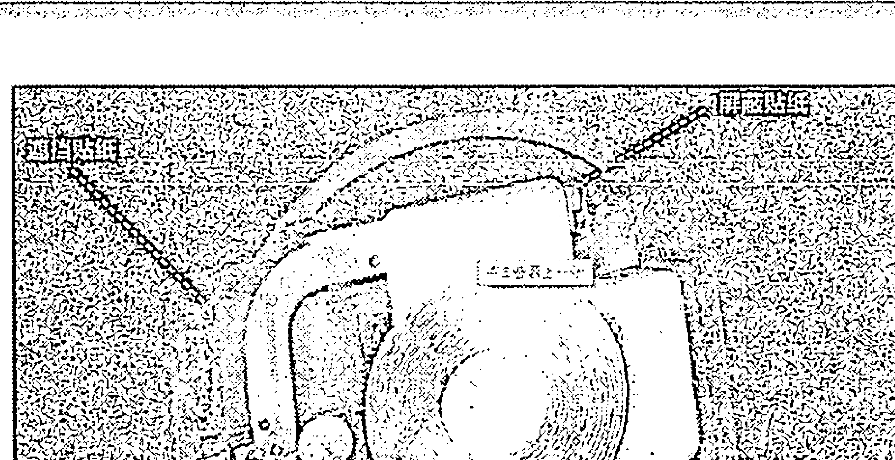

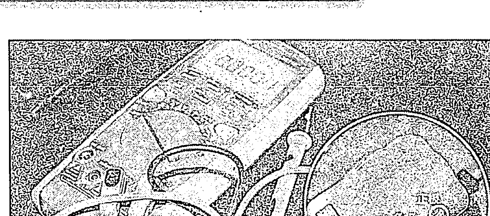

在确认完金属触点的正负极后首先将导线用电烙铁固定在金属线圈贴纸一段，然后将包含金属线圈的遮挡贴纸放在点金石上，利用万能电表来测试连接点金石套装的两根导线是否通电，如果通电则可以继续下一步操作。如果不通电那就是点金石套装出现问题，需要联系卖家更换套装。

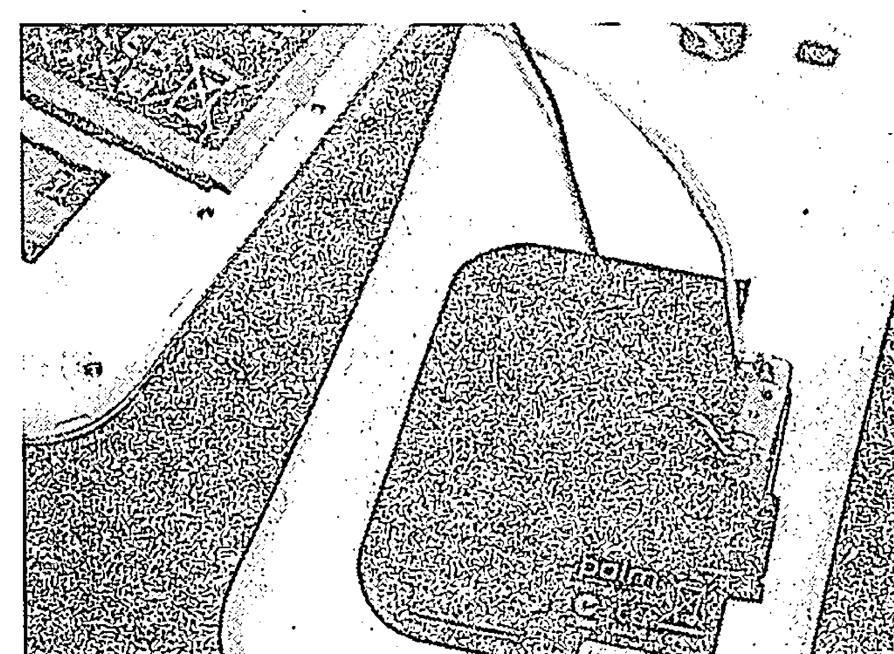

点金石套装没有问题，下面就将导线的另外一段连接到手机的金属触点上，这里要注意不要将正负极弄反了。小编为了避免这种问题所以使用黑白两种颜色的导线，其中白色导线连接正极，黑色导线连接负极，大家也可以使用这种方法来连接，避免不必要的麻烦。

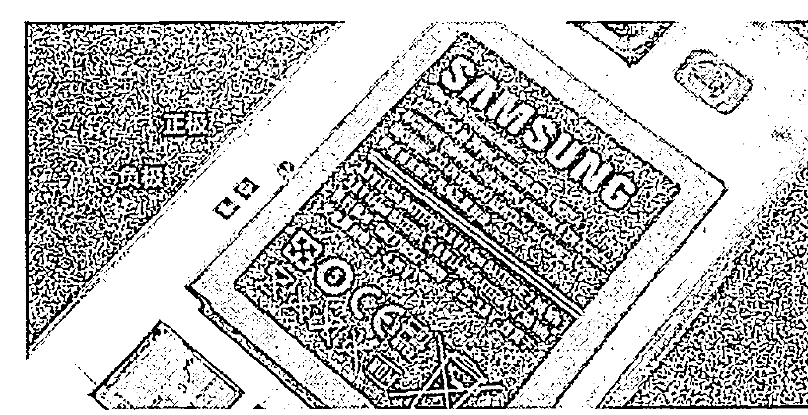

## 手机无线充电功能实现

连接完导线后，将带有金属线圈的黑色遮挡贴纸粘到手机的后盖上，基本就算大功告成。将手机后盖盖上然后放到点金石上，这时手机就会自动显示正在无线充电的提示。

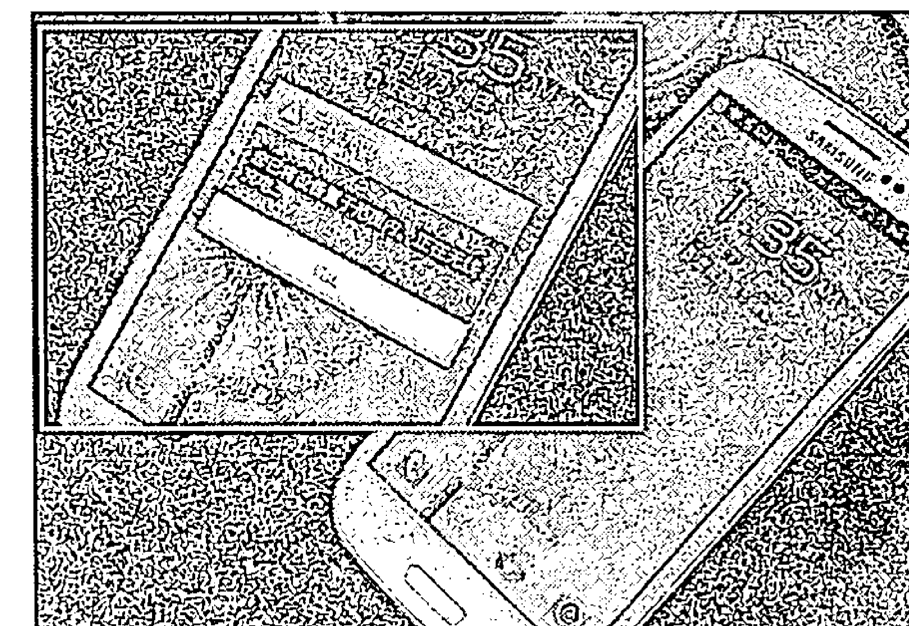

虽然说现在的科技条件下，手机无线充电的效率还不是很高，但采用这种方法显然更加个性，也免去线材连接的麻烦。此外大家可以将改装好的手机横向放在点金石上，实现边充电边看电影的效果，点金石相当于一个多媒体底座，非常方便。

### 扩展阅读

手机无线充电技术最早由Palm公司推出，随着该技术的不断发展和成熟，手机充电将会更加方便高效。无线充电技术是完全不借助电线，利用磁铁为设备充电的技术。无线充电技术，源于无线电力输送技术，利用磁共振在充电器与设备之间的空气中传输电荷，线圈和电容器则在充电器与设备之间形成共振，实现电能的高效传输。未来远距离无线充电技术非常让人期待，不仅让手机充电更加方便安全，而且还可以实现同时给多款手机充电的效果。

# iPhone 4自己换屏省千元

手机屏幕是最容易出现问题的一个硬件，而且屏幕维修往往成本也很高。销量位居前茅的iPhone 4换屏更是手机维修店最为常见的一幕。

### 换块屏幕要价千元

前几天小编发现自己的iPhone 4手机屏幕右上角莫名其妙地出现了一块黑斑，而且随着时间的推移这块黑色斑点竟然有逐渐变大的趋势(图1)。虽然在短时间内还不影响手机的正常使用，可是黑斑越来越大也不是个事，无奈之下只好拿着手机到中关村卖场找自己熟悉的维修店更换屏幕。

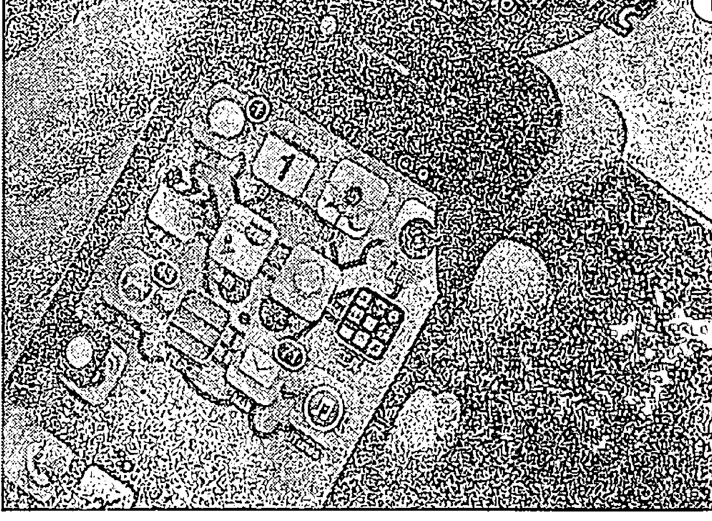

可和维修店老板表明来意后，老板看了下我的手机说道：“大家都这么熟悉了，我直接跟你说个实在价吧，你的手机换屏得1150元，别人来我一般都要1500元的。”小编一听当时就惊了，没想到小小一块屏幕竟然需要这么多钱。现在收购一个iPhone 4最多也只需要2000元左右，花1000多元换个屏幕实在不值。最终和维修店老板闲聊几句后，小编还是放弃换屏的打算。

回到家中看着iPhone 4的屏幕，越看越别扭，不修也不是办法，总不能不用手机或者再花2000元去买个手机吧。几经思索，最终小编决定自己动手来为iPhone 4更换屏幕。

### 淘宝购买高仿屏

登录淘宝网站搜索iPhone 4屏幕我们就能够找到各种价位的iPhone 4屏幕，经过一番询问，小编最终花了200元购买了一块iPhone 4的高仿屏。之所以不选择原装屏幕主要还是小编信不过那些所谓卖原装屏幕的商家，毕竟iPhone 4的原装屏幕很少会流入市场，此外小编也无法辨别所要购买的到底是不是原装屏幕，所以索性就直接花少点钱买了一块高仿屏幕。

### 小心拆解iPhone 4换屏

首先用合适的螺丝刀将iPhone 4底部两颗螺丝拧下来，然后用拇指按住机器后盖向上方推就可以将iPhone 4的后盖拿下来(图2)。为了验证刚买来的屏幕是否完好，先拆掉机器上方摄像头旁边的这个挡板，这里共有五个螺丝(图3)。将触摸屏和液晶屏排线接口用工具撬起，并将原排线轻轻后折，以避免测试新屏幕受干扰(图4)。将从淘宝买回来的屏幕露出的两个排线对准主板上的两个接口处按牢固，然后开机。

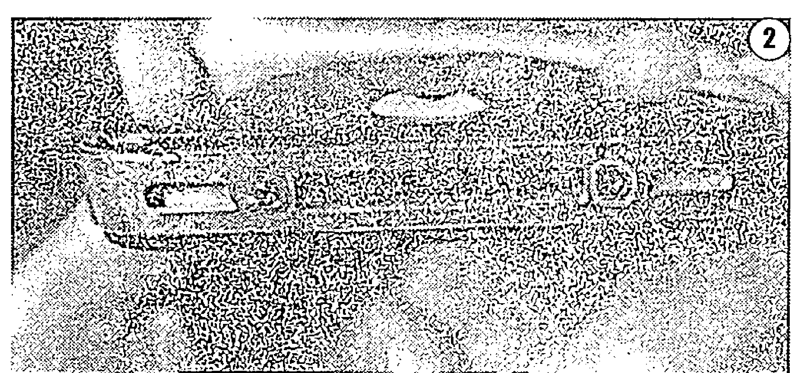

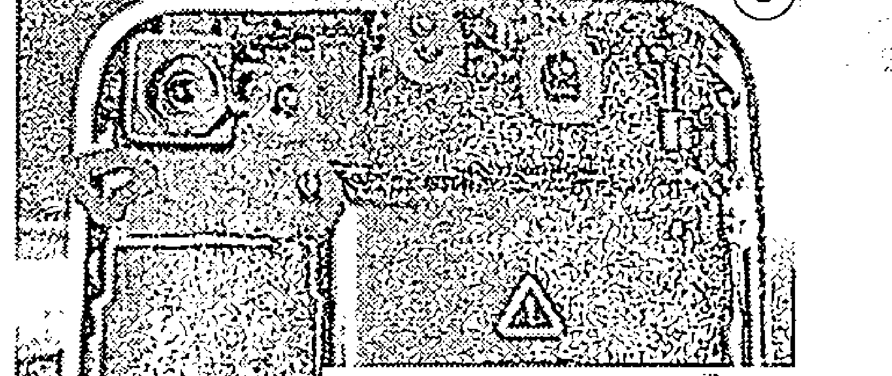


从下单到屏幕到货只用了不到一周时间，收到快递小编首先检验货物，看屏幕是否完好无损，以防因为快递的大意或者商家要诈收到有瑕疵的屏幕。通过简单的外观查看并未发现不妥之处才确认收货。

> 小提示
> 刚买回来的iPhone 4屏幕表面有保护膜，在未检测完屏幕前不要揭下该保护膜，万一换完屏幕点亮发现问题还可以要求卖家退货。

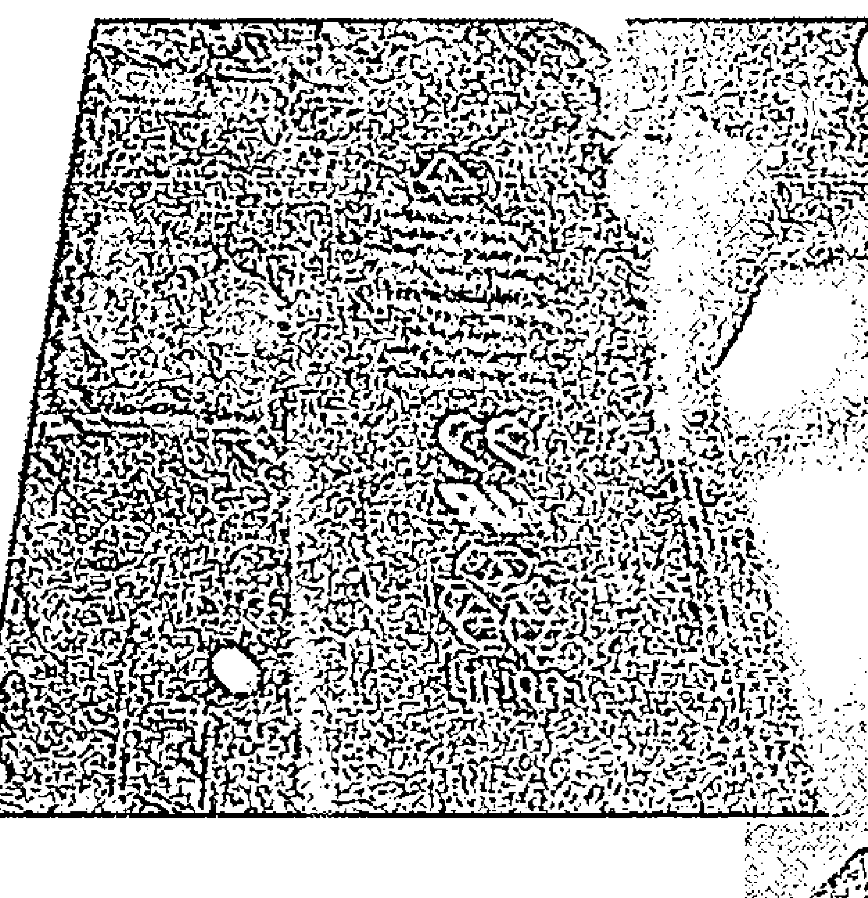

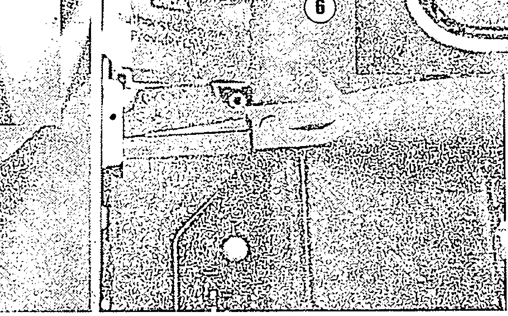

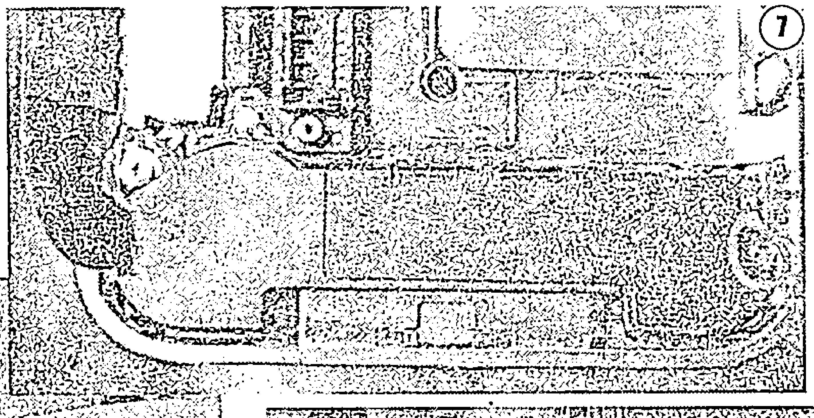


开机后进行屏幕检测，事先在手机内存放一白一黑两张图片，等开机后从相册调取两张图片并全屏浏览，观察屏幕是否有亮点和暗点。如果没有则进行下一步，按住屏幕图标并使其晃动，然后移动一个图标游走于屏幕的各个地方。如果没有出现图标突然不跟随手指移动或者出现偏移，则说明新买回来的屏幕没有问题。

在检测完屏幕没有问题后，用螺丝刀拧下电池周围能够看到的所有螺丝，用撬棒在电池周围轻轻撬动，电池略微松动后，拉住电池旁边的塑料纸将手机电池取出(图5)。然后取出iPhone 4的SIM卡托，用撬棒将扬声器排线接口撬起，轻轻将扬声器排线拉起来，这里需要注意不要用力拉拽，防止扬声器排线断裂(图6)。卸掉下面的扬声器及麦克风部件，这里有两个螺丝跟一个插口，拆掉螺丝后，用手从右侧轻轻将扬声器取下即可(图7)。将摄像头和屏幕排线旁边的三个排线接口一一撬起，然后拆掉右上角的振动器(图8)。将上述小组件取下之后，用手从手机的底部将主板轻轻抬起取下。

iPhone 4主板取下之后，整个机器只剩下边框和屏幕两大部分，在机器的边框上我们能够看到共有十颗螺丝来固定屏幕(包含四个小螺丝和六个大螺丝)，用螺丝刀将所有能够看到的螺丝拧下(记住大小螺丝的位置，后面换屏还需要将螺丝拧回原位)(图9)，然后用撬棒从边框和屏幕的连接处轻轻撬起，iPhone 4屏幕和边框可以很容易地分离开来，至此iPhone 4的拆解便告一段落。

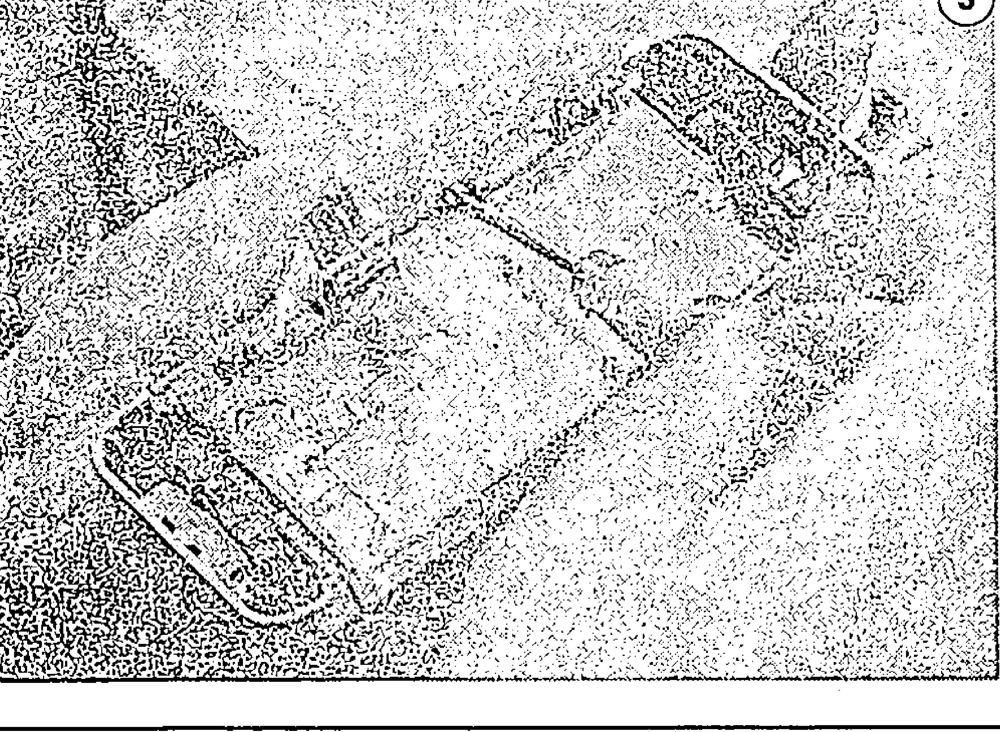

坏掉的iPhone 4屏幕被拆解下来之后，下面就是将买来的iPhone 4高仿屏幕装回机器上，只要按照拆机的步骤依次将屏幕、主板以及其他机器组件安装到机器上并将螺丝全部原位拧上，装上电池，整个iPhone 4的换屏工作就算大功告成(图10)。

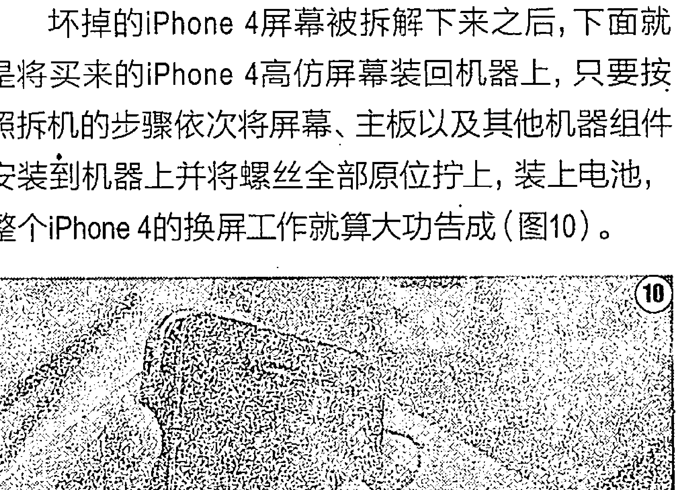

小编换屏心得
对于大多数来说可能都没有拆机的经验，其实iPhone 4的拆机并不是什么难事，需要的是大家的胆大心细，不要随便使用蛮力，自己更换屏幕完全可以做到。由于iPhone 4机器内部有太多大小不同的螺丝以及各种排线接口和小的机器组件，所以为了能够在后面装屏过程中避免不必要的麻烦，小编在拆机时每拆下一个小组件或者螺丝都会用笔在白纸上标出它的位置，这样一来后面安装屏幕时只要按照自己标记的位置一一复位就可以了。

# SSD 老本硬盘翻身的必杀技

你对自己笔记本的速度是否满意？如果你总是在羡慕别人笔记本运行如飞的快感，不妨自己动手为本本升级SSD硬盘吧，绝对可以让你感受到最为直观的速度“质变”。

## 必须打破的硬盘瓶颈

提到给老本升级，相信大家的第一反应就是加装内存。诚然，内存的大小对整体性能的影响很大，但是对内存已经大于2GB的笔记本而言，再大的内存只能在某些高负载的应用环境下才能体现出优势。因此，如果你真的想让老本获得立竿见影的性能飞跃，不妨将目光投向越来越便宜的SSD固态硬盘。

简单来说，SSD硬盘不存在马达等物理的机械结构，因此在寻道时间和读取速度方面较传统机械硬盘有着先天优势，在抗震和节能方面的表现也更为优秀（图1~2）。举个例子，最快的机械硬盘可以让你在30s内进入系统，当换成SSD硬盘后则可将这个时间缩短到10s以内！此外，无论是程序的运行还是数据的读取，SSD硬盘也能让你找到瞬间启动的感觉。

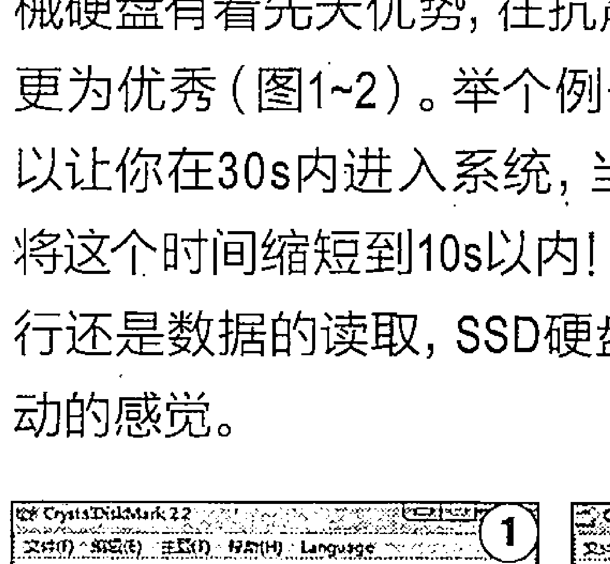

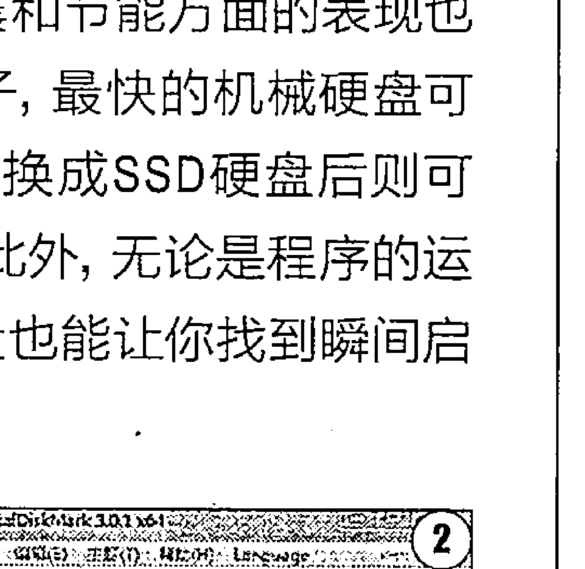

7mm单碟7200rpm硬盘和SSD硬盘速度对比。

问题来了，SSD硬盘既有尺寸上的差别，也有厚度上的差异，不同容量和品牌的价格更是相差甚远。那么，我们如何才能挑选出最适合自己的那一款呢？

## 让SSD在何处“容身”

虽说SSD硬盘是最应该升级的硬件，但笔记本用户也切忌盲目升级。在选购SSD之前，首先要做的就是检查笔记本内部有没有SSD硬盘的“容身之所”。

- 一般来讲，能让SSD硬盘容身的只有三个位置：
- **主硬盘位**：就是笔记本自带机械硬盘的位置，所有传统笔记本和绝大多数超极本都可升级，但有些11.6英寸的变形超极本只有mSATA，没有主硬盘位。
- **光驱位**：利用装有SSD的硬盘托架替换光驱，绝大多数带光驱的笔记本都可升级，但有些笔记本和超极本配备的是超薄光驱，现在很难买到相对应的硬盘托架。
- **mSATA接口**：第一代酷睿i系列，也就是基于HM55/HM57或更新芯片组设计的笔记本基本都会标配这个接口（超极本100%都配备）。早于2010年的笔记本就没有了，比如联想经典的Y450系列。

因此，在决定升级SSD硬盘之前，请大家先检查一下自己的本本有没有上述接口。有些“极品”本本只有主硬盘位（没有光驱和mSATA），这类产品就不适合升级SSD硬盘了，因为升级后老硬盘就得“下岗”，而大容量SSD硬盘又太贵，升级成本太高。

## 如何挑选SSD硬盘

根据尺寸，SSD硬盘拥有1.8英寸（安装在mSATA插槽）以及2.5英寸（用于主硬盘位）。如果你的笔记本可以安装光驱位硬盘托架，那笔者强烈建议选择2.5英寸的SSD硬盘（图3）。如果你的笔记本或超极本没有光驱（或不想牺牲光驱），则可以考虑1.8英寸的SSD硬盘。无论你选择哪种，都将会面临一些更为实际的问题。

第一个问题 如果我购买了2.5英寸的SSD硬盘，应该把它装在主硬盘位还是光驱位呢？

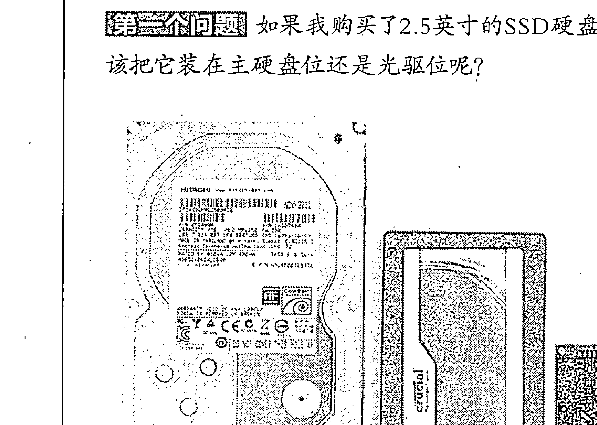

3.5英寸、2.5英寸和1.8英寸硬盘大小对比。

这个答案取决于笔记本的芯片组（表1）。现在大家能买到的SSD硬盘都支持SATA3.0（6Gbps），但对基于HM55或更早期芯片组设计的笔记本，无论主硬盘还是光驱位都是SATA2.0标准，此时SSD硬盘装在哪里都可以。

表1：不同时期芯片组的存储接口标准

| 芯片组 | 代表平台 | 主硬盘位 | mSATA | 光驱位 |
| :--- | :--- | :--- | :--- | :--- |
| PM45等 | P8600 (2010年前) | SATA2.0 | 无 | SATA2.0 |
| HM55等 | i3-370M (2010年) | SATA2.0 | SATA2.0 | SATA2.0 |
| HM65等 | i3-2330M (2011年) | SATA3.0 | SATA3.0 | SATA2.0 |
| HM76等 | i3-3110M (2012年) | SATA3.0 | SATA3.0 | SATA2.0 |

英特尔从HM65开始加入对两组SATA3.0接口的支持，但绝大多数笔记本厂商都会将它们分配给主硬盘位置和mSATA接口，对这类产品来说，SSD硬盘一定要安装在主硬盘位，否则SSD硬盘只能发挥60%左右的性能（图4~5）。

> 小提示
> 目前绝大多数的笔记本电脑的光驱位接口都是SATA2.0接口，不过清华同方钢铁侠X46F就是个例外。X46F由于其可拆卸光驱位模块的设计，于是把另一个SATA3.0接口分配给了光驱位，mSATA接口就成了SATA2.0接口。

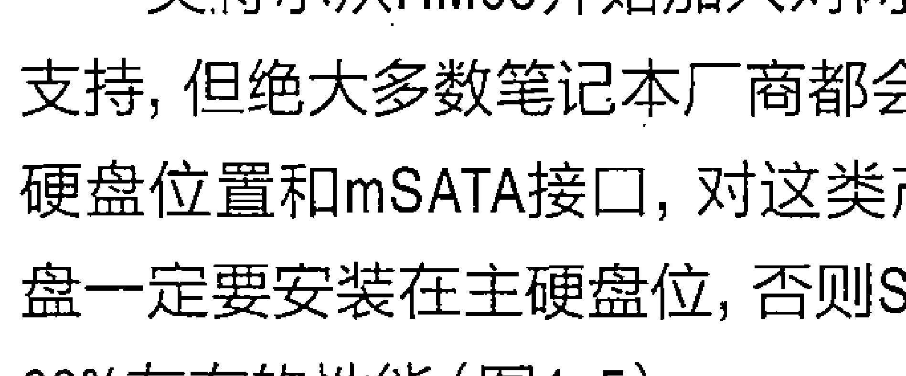

如果你不想花钱买光驱位的硬盘托架，或者觉得拆装硬盘/光驱有难度，则可以考虑mSATA接口的1.8英寸SSD硬盘，只是相同容量型号的价格要比2.5英寸SSD硬盘略贵一些（性能基本一致）。

## 第三个问题 2.5英寸SSD硬盘要买多厚的？

根据厚度，2.5英寸SSD硬盘可分为9.5mm和7mm两种标准，前者适用于传统笔记本，而后者则多用于超极本或轻薄型笔记本。如果你未来有更换笔记本的需求，笔者建议大家直接购买7mm标准的SSD硬盘，这样一来今后无论你购买的是普通本还是超极本都能顺利升级（7mm硬盘可以安装在9.5mm硬盘位上，反之则不成）。

> 火速链接
> 如果你想了解9.5mm和7mm硬盘的更详细差异，请参考上期《升级硬盘请留心厚度差异》这篇文章。

## 第四个问题 如果我现在用的是超极本，又该如何升级呢？

如今6000元以内的超极本基本都采用了混合存储模式，即大容量的机械硬盘（主硬盘位）+20GB左右的SSD硬盘（mSATA插槽）。这类产品适合升级更大容量的mSATA SSD硬盘，不用担心会破坏什么快速响应/快速唤醒功能，只要将操作系统安装在SSD上，速度不会让你失望。

## 第五个问题 多大容量的SSD才适合我？

这取决你安装什么系统和实际的预算（表2）。Windows XP/7/8系统本身就分别需要占用12GB/20GB/40GB左右的磁盘容量，而Windows系统还需要经常Update来修复系统漏洞，也就是说系统对磁盘的占用是在不断提升的。以Windows 7为例，至少要预留出25GB以上的空间才算勉强够用。

表2：适合老本升级的SSD价位和适用范围

| SSD容量 | 30/32GB | 60/64GB | 120/128GB |
| :--- | :--- | :--- | :--- |
| 价位区间 | 250~350元 | 450~600元 | 500~900元 |
| 建议系统 | Windows XP | Windows 7/8 | Windows 7/8 |

笔者的建议是，64GB是最基本的起步容量，建议直接选择120/128GB的版本，二者的价格相差只有200元左右。大容量SSD的好处是，除了系统自身之外，还有足够的空间用于安装Office、PS等常用的办公软件和少数常玩的3D游戏，可以体验到飞速的开机和游戏办公乐趣。

## 第六个问题 谁在决定SSD硬盘的性能？SSD的寿命真的很短吗？

决定SSD硬盘性能和寿命的主要是闪存颗粒类型和主控芯片。目前民用SSD中常见的闪存类型为MLC和 TLC，而主控芯片则以Sandforce、Marvell、Intel以及三星为主。在价位相近时，笔者推荐大家选择MLC+Marvell的组合。

很多纠结于SSD硬盘的用户可能都是被闪存颗粒只有数千次的擦写寿命吓的。实际上，通过主控芯片的特殊算法，即使你每天往SSD里写入20GB的数据，其寿命也能长达5~7年，在笔记本报销之前SSD是不会罢工的，至少安全系数肯定在机械硬盘之上。

在产品推荐方面，1.8英寸mSATA接口的SSD笔者推荐镁光和建兴，而2.5英寸的SSD则建议大家考虑三星、浦科特、金士顿和闪迪等品牌。接下来，笔者就以自己的笔记本为例，展示一下最麻烦的SSD升级过程。

## 自行升级SSD实战演习

先来谈谈升级思路。我的笔记本基于HM65芯片组设计，所以只有主硬盘和mSATA位符合SATA3.0标准（图6）。考虑到128GB版本的mSATA SSD硬盘价格太高，所以我买的是600元出头的2.5英寸128GB SSD。为了保证最佳速度，必须将主硬盘上的机械硬盘替换掉，再将机械硬盘安装在硬盘托架上，而卸下来的光驱则安装在光驱盒中。

> 小提示
> 购买硬盘托架和外置光驱盒时要和淘宝商家沟通好，是否和自己品牌型号的笔记本兼容。目前二者的打包价格在100元左右。

### 第一步

升级之前一定要断开电源，并将笔记本的电池取下。首先需要拧下固定硬盘的螺丝，将主硬盘位上的机械硬盘拔下来，替换成SSD硬盘后再装回主硬盘位（图7）。

接通电源，现在可以安装操作系统了。以Windows 7为例，安装前先进BIOS中将硬盘模式设置在AHCI状态。接下来，无论你选择U盘安装还是光盘安装，在系统提示“Windows安装到何处”时需要先运行格式化命令，然后将系统安装在SSD硬盘上即可（尽量不要给SSD硬盘分区）。系统安装完毕后，断开电源，准备将机械硬盘装回笔记本。

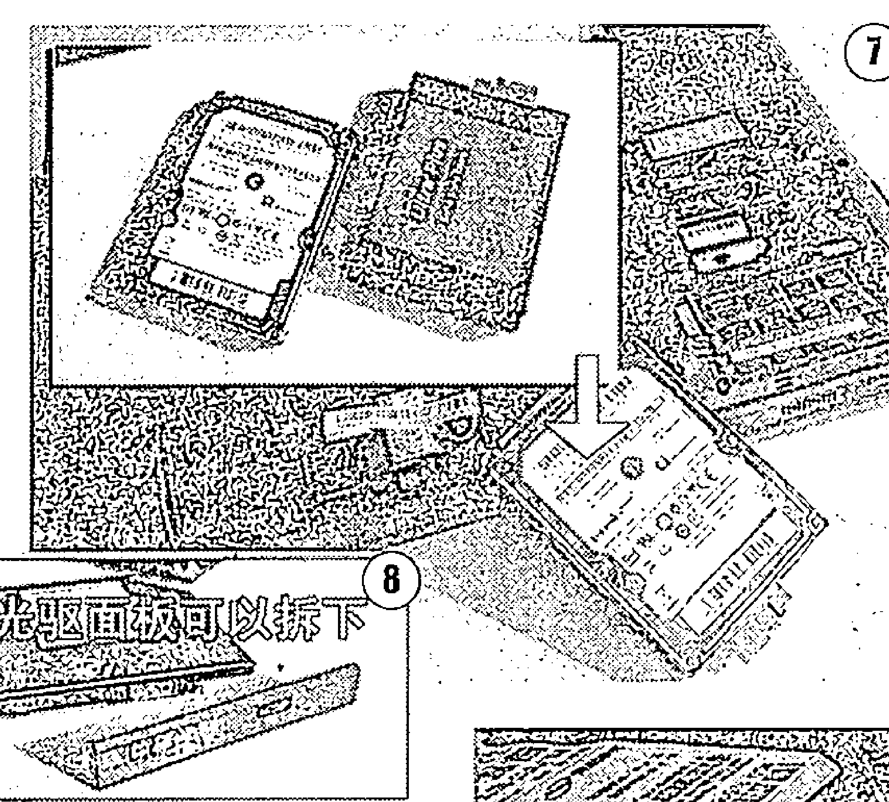

### 第二步

找到固定光驱的螺丝，拧下后即可抽出光驱（图8）。然后按照从上到下的方向一掰就能拆下光驱面板，这个面板可以换在光驱位的硬盘托架上。根据说明书，将光驱安装进外置的光驱盒中，然后再扣上专用的光驱面板（图9）。今后，你笔记本的原光驱就变成外置的USB光驱了，可以在任意PC设备上使用。

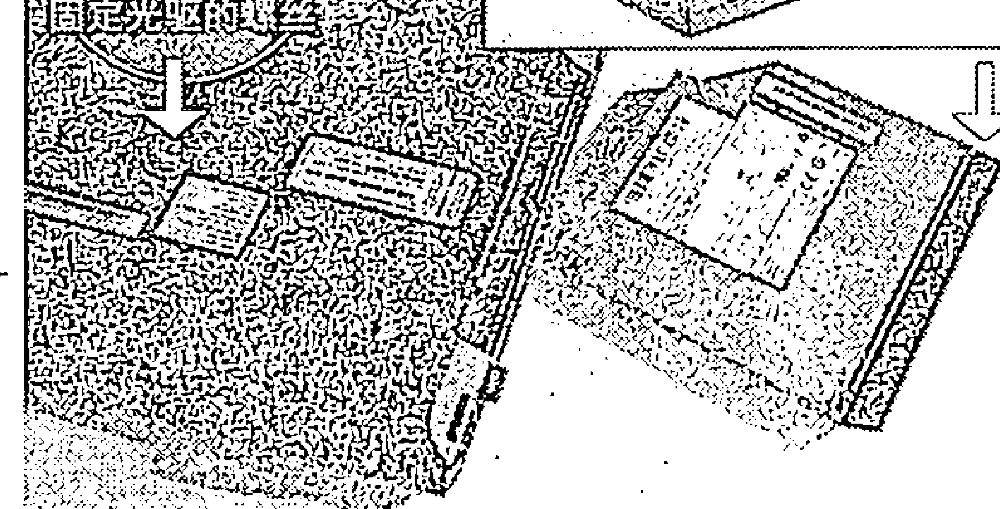


### 第三步

将之前拆下来的机械硬盘塞进光驱位的硬盘托架（图10），然后将硬盘托架塞进笔记本的光驱位，拧上固定螺丝。然后接通电源，此时系统应该已经可以识别出光驱位的机械硬盘。

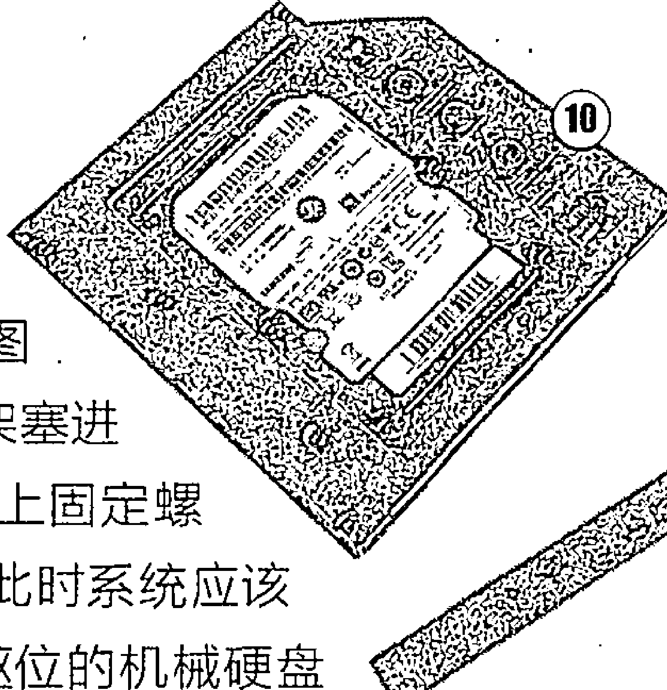

> **小提示**
笔记本原光驱的尾部有个固定装置，在组建外置光驱前记得先将它拆下来，替换在光驱位硬盘托架的“屁股上”（图11），以便将硬盘托架固定在笔记本内部。

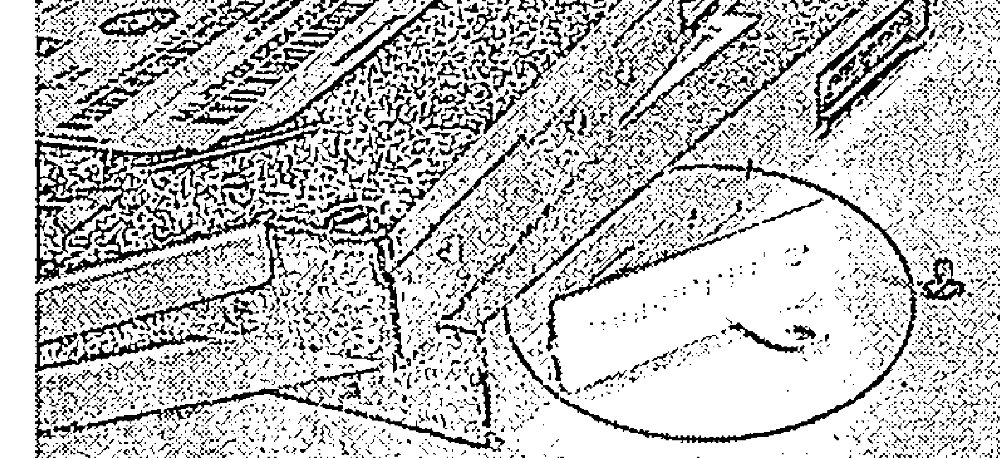

了，安装驱动、常用软件，格式化老硬盘的系统区……一切随你心意。现在我的笔记本每次开机只需10s左右（图12），找到了飞一般的感觉。

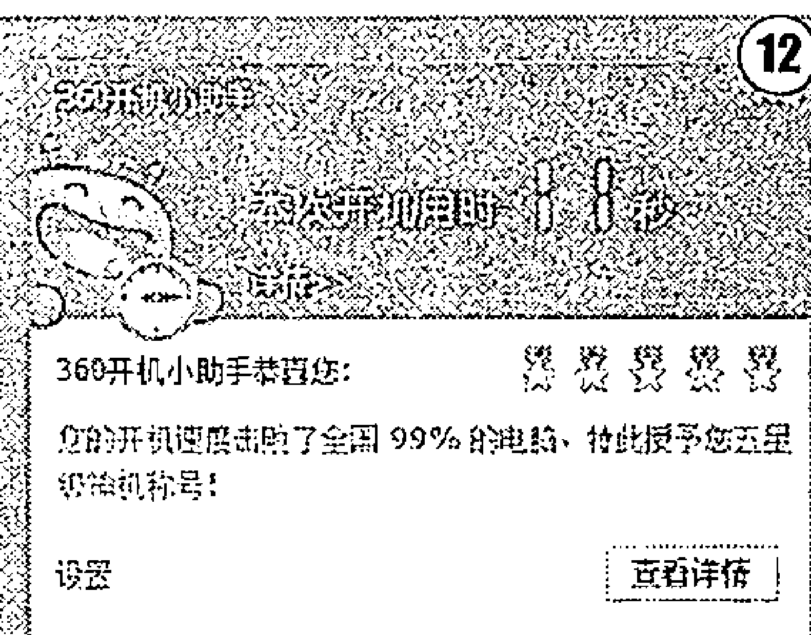

最后再谈谈我的经验。之所以用Windows 7安装程序格式化SSD硬盘是为了4K对齐，安装完系统后才把机械硬盘装回光驱位，是为了避免该硬盘原有系统影响引导顺序。此外，要想SSD“万寿无疆”，记得将360安全卫士、迅雷等软件的下载地址修改到机械硬盘的分区中。换句话说，主程序可以安装在SSD硬盘上（为了提高启动速度），但程序创造的内容尽量还是保存在机械硬盘上为好。


## 健圣编后说

也许很多同学都在等待英特尔Haswell新品的发售，在此期间只能“将就”地让老本继续服役。问题是，Haswell正式发布的时间在6月，相关新品从上市到价格稳定至少还需2个月的时间周期，你能忍耐这么久吗？

健圣认为，等待新品的上市并不妨碍我们为老本升级SSD，因为固态硬盘的降价周期很长，相对保值。现在升级可以帮老本提速，日后也能安装到新买的笔记本新品甚至DIY的台式机上，可谓“一次投资受用终身”。

- 笔者笔记本内部的基本结构
- 抽出光驱前要记得先拧下固定螺丝
- 光驱面板可以拆下
- 保护机械硬盘的托架也要给SSD硬盘装上哦
- 外置光驱盒的安装难度不高，仔细点相信大家都能搞定
- 光驱尾部的固定装置要替换到硬盘托架上
- 11s的开机速度直逼万元级的超极本

# 尝试修复液晶坏点

文| ericwarn

## 液晶坏点分类

坏点就是硕大液晶面板上某一个不能正常工作的像素点，从分类来看液晶坏点主要分为三类。第一类是亮点，只能单纯地显示白色亮光，尤其是在较暗的画面中，经常显得特别“扎眼”。第二类是色点，就是那种只能显示固定颜色的液晶坏点。第三类是暗点，只能单纯地显示黑色。笔者的显示器上就存在两个蓝色坏点，一个通过软件修复了，另一个则使用“硬方法”修复了。

## 软方法激活

第一种方法，其实是用软件来修复液晶坏点。理论上来说，液晶坏点其实就是显示器面板在生产或使用不当所造成的后果，因此坏点出现之后，很多都是无法修复的“终身”故障。不过话又说回来，事情也并非绝对。有些液晶面板的像素驱动管在出厂之后，实际上从未被激活过。由于这些导致坏点的驱动管始终在“假死”状态，所以也就提供了修复的可能性。通过不断的色彩变换来实现坏点激活，虽然不能实现100%修复，但也确实能够挽救部分“假死”的液晶坏点。

软件激活的具体操作并不复杂，首先从网络上下载“液晶显示器亮点坏点修复工具”这款软件，并同时下载这款软件运行时所需要的Microsoft .NET Framework 2.0。接着按照一路回车的方式安装Microsoft .NET Framework 2.0，并解压“液晶显示器亮点坏点修复工具”这款软件压缩包里的LCD.exe程序。运行LCD.exe程序，即可进入到软件主界面。在这里点击“全屏取点”，并利用鼠标确定坏点的具体坐标（图1）。


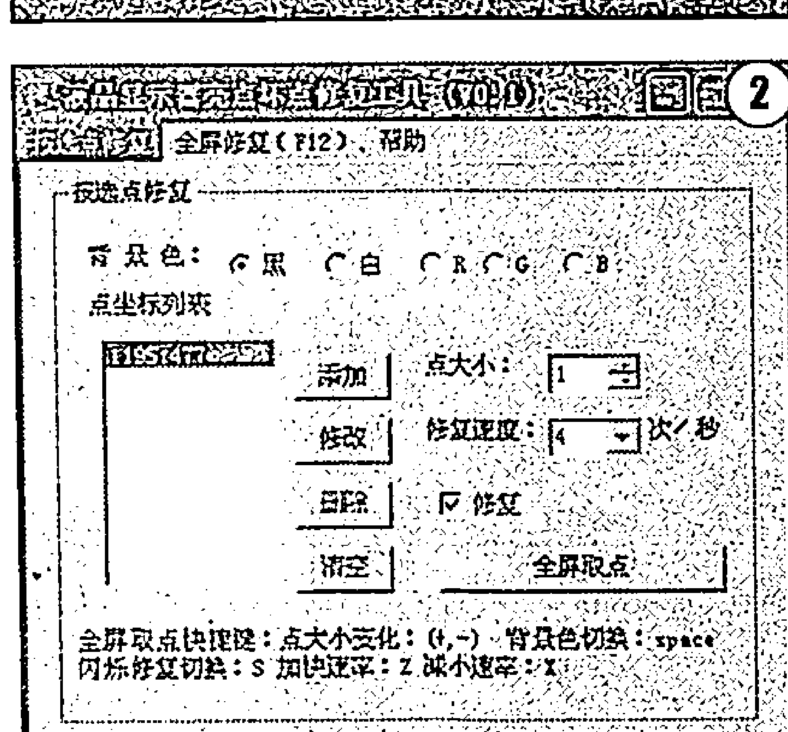

接下来，点击主界面菜单栏中的“按选点修复”（图2），此时应准确关注修复坏点的具体坐标。如果发生偏差，可点击鼠标右键回到软件主界面上进行坐标修改。最后，等待修复程序运行数小时之后，就可能让“假死”的坏点“起死回生”。需要注意的是，这款软件分为“全屏修复”和“按选点修复”两种。由于这样的修复工作很容易造成液晶面板老化，所以最好还是不要选择全屏修复。

## 硬方法激活

除了软件修复液晶坏点的方法，还可使用“硬方法”来修复液晶坏点。并且这种液晶坏点修复法已经在网络上广为流传，包括笔者在内的很多用户都是实验成功者。至于硬件激活的具体操作，其实也非常简单。只需手持牙签之类的尖细物品，轻压液晶显示器上的坏点部位（图3），坏点就有可能被修复，从而恢复正常。


笔者就曾采用过这种方法，修复了液晶显示器上的第二个蓝色坏点。只是用牙签轻轻按了一下液晶面板，原本的蓝色坏点就立刻消失了。不过请注意，这种方法还是比较冒险的，在实施过程中绝对不能用力过大，并且对于一些屏幕外拥有玻璃保护层的显示器无法奏效。不过相对来说，这种方法简单，可用性强，并且确实有修复的可能，勇于尝试的读者可以一试。

后记：液晶坏点拥有可以自愈的特性，还有一定的复发可能性。笔者接触过开机就有亮点的显示屏在几个月的使用之后“自行修复”的例子，也有修复后再次复发的例子。笔者的第二个蓝色坏点，在首次修复的第二天就再次出现。好在经历了牙签多次修复后，这个坏点终于不再复发。面对液晶显示器坏点，只要我们胆大心细，还是有一些办法去应对的。

《电脑爱好者》·合订本 {硬件通家}

# 笔记本热管改造：没那么简单

我们都知道，笔记本是通过覆盖在芯片上的热管来传递热量的。为了提升散热效率，很多玩家都喜欢在热管上焊接散热片。那么，这种做法是否正确，对散热真的有好处吗？

文|徐企钏

为了控制成本，很多笔记本厂商只顾一个劲儿地“堆硬件”，却不愿意在散热模块上多花一分钱，这就导致很多笔记本极易出现夸张的发热问题。尤其是那些未经过酷暑考验的在秋冬季发售的产品，散热问题尤为严峻。其中最突出的当以神舟K580S-i7为首，所以该款机型被改造的次数最多，争论也最多。本文笔者就以K580S-i7为例，看看热管的改造背后所隐藏的隐患。

## 重新认识热管

热管就是连接着芯片和散热鳍片之间的金属管，如果你误以为它就是一根实心的“铜疙瘩”可就大错特错了。实际上，热管其实是一种中空结构的“金属管道”，内部填充着纤维和纯水，管内抽光空气后一端贴在CPU或GPU芯片上，另一端则接到笔记本散热鳍片处散发热量，最后由涡轮式散热器排出。

热管的工作原理其实很简单：在真空状态下水的沸点很低，当热管一端受热时（蒸发端），管内的液体蒸发汽化，蒸汽在微小的压差下会流向另一端放出热量凝结成液体（冷凝端）。液体再沿着由毛细多孔材料构成的热管内壁，靠毛细力的作用流回蒸发端（图1），如此循环不息。

虽然现在的笔记本都已用上了热管，但不同产品间散热效果的差异可能却非常夸张。这中间影响的因素很多，比如热管的材质是紫铜还是黄铜？有多宽？有几根热管？芯片距离散热鳍片有多远？热管弯曲了多少等等，不同的搭配组合自然会带来不一样的散热效率。

比如联想Y580是公认散热效果比较好的游戏笔记本，采用了分离式双热管单风扇的散热模块（图2）。有些高端游戏本甚至会选择分离式五热管单风扇的散热模块，效果更是牛到极致。但有些产品，比如神舟K580S（还有联想Y460）就选择了比较“脑残”的并联式双热管单风扇的散热模块（图6），类似结构的散热效果就会大打折扣。

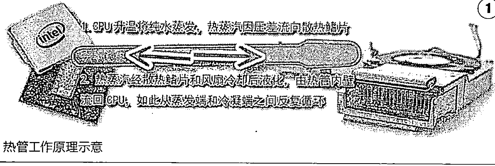

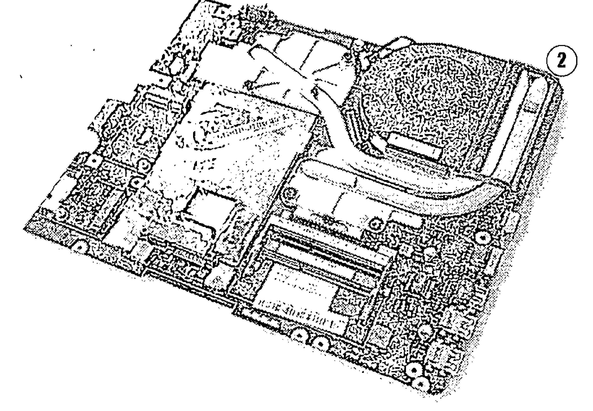

> **小提示**
笔记本所用的散热管散热技术最早是IBM引入到ThinkPad笔记本上的一种解决方案，由于其解决了封闭环境下散热难的问题，现在已经成为笔记本标准化的散热技术。

## 热管结构分类

目前热管内部基本可以分为热熔渣结构（图3）、沟槽结构（图4）、多重金属网孔（图5）和纤维结构（又称丝束+弹簧）四种，其中热熔渣结构的效果最好，而笔记本内部的热管也多以该结构为主，所以大家只需简单了解即可。如果有需要自行加装额外热管的，则一定要选择该结构的型号。

| 微热管结构 | 热熔渣结构 | 沟槽结构 | 多重金属网孔 | 纤维结构 |
| :--- | :--- | :--- | :--- | :--- |
| 工艺难度 | 难 | 低 | 中 | 难 |
| 制造成本 | 高 | 低 | 中 | 较高 |
| 传输功率 | 大 | 小 | 较大 | 大 |
| 毛细力 | 大 | 小 | 较大 | 大 |
| 热阻 | 较大 | 小 | 中 | 大 |
| 稳定性 | 较好 | 好 | 好 | 中 |


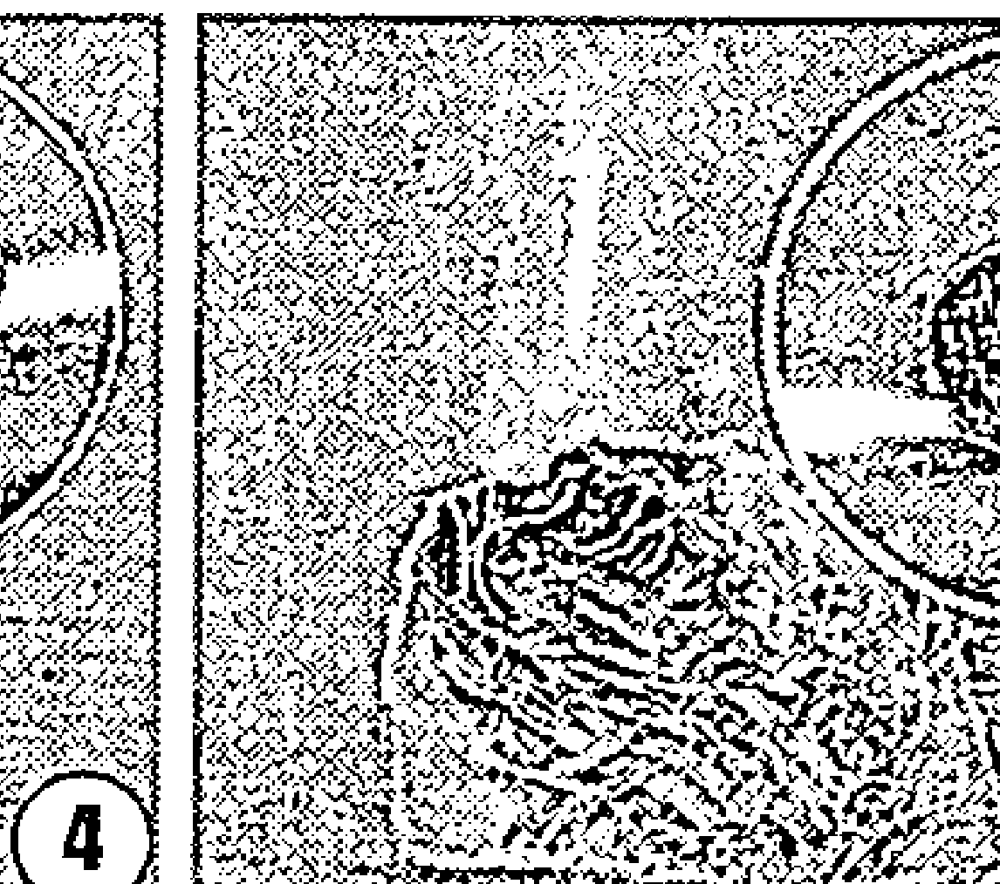

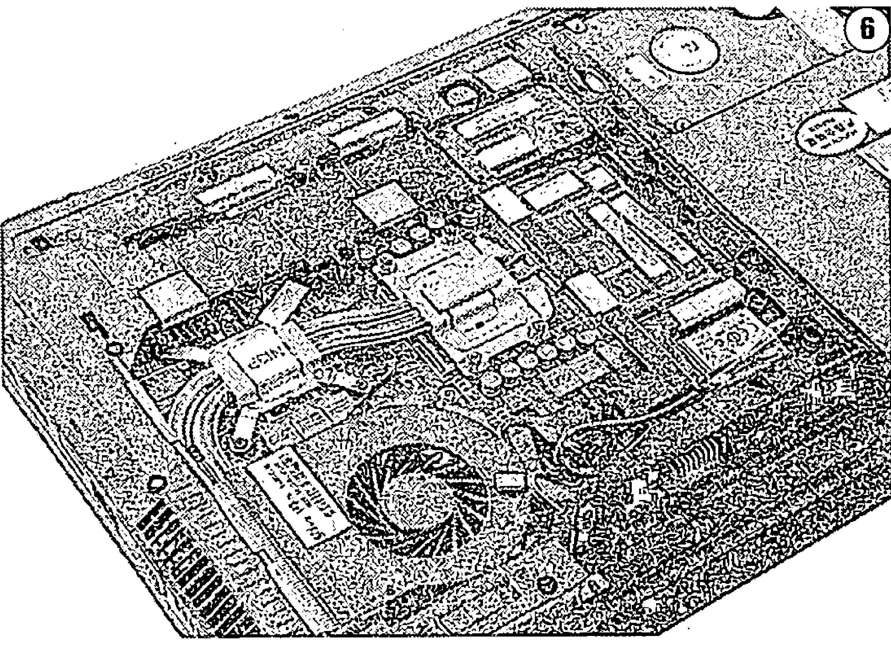

## 被忽略的热管表面温度

笔记本原厂设计的热管的确是越多越好，但是我们在自己DIY改造的时候，往往会将新买的热管搭在（焊接）原热管上，而原厂的热管却是直接贴在CPU和GPU芯片上的，奥秘就出现在这里。下面笔者会对神舟K580S-i7原厂热管表面进行测温，来看看单纯地在热管上加温是否合理。

首先用专业的软件AIDA64+FURMARK进行CPU+GPU满载烤机，此时CPU温度瞬时上升到了85°C。接下来我会用红外线测温仪对笔记本热管的不同位置进行定点测温。有趣的现象出现了，刚开始拷机时，CPU附近的热管温度只有29°C（图8），而散热鳍片处的热管却达到了55°C（图9）。3分钟之后，CPU附近热管温度稳定在了48°C左右（图10），离CPU自身的85°C依旧遥远，而且仍比散热鳍片附近热管温度低。

| 热管位置 | CPU自身温度 | CPU附近热管 | 散热鳍片附近的热管 |
| :--- | :--- | :--- | :--- |
| 刚开始 | 85度 | 29度 | 55度 |
| 3分钟后 | 85度 | 48度 | 56度 |

乍一看这个怎么好像违反物理原理了呢？为什么离发热源最近的热管温度始终不是最高的？其实热管的工作原理类似于空调制冷。当我们屋子（CPU/GPU）很热的时候，空调压缩机启动，氟利昂被压缩成液体后的热量会被室外机（散热片）吹走。稍后氟利昂流入室内机（热管CPU端）蒸发吸热，然后迅速地流入室外机（热管散热鳍片端），再次被压缩放热。

与空调相比，热管只是少了一个压缩气体的过程。热管内的液体受CPU的高热（超过60°C）而蒸发，然后在散热片端冷凝，而冷凝液又靠着毛细组织流回CPU。在这过程中冷凝液的热量会被热管外壁缓慢地吸收，所以开始时CPU附近的热管才会出现29°C的低温。随着时间的推移，热管外壁慢慢升温，CPU端热管的温度才会提升，但始终不会高于散热片端热管的温度，也就是说它的温度不会超过60°C，即冷凝液的沸点。

## 热管是不能瞎贴的

回到前面的话题，既然热管表面的最高温度不会超过60度，这意味着它不可能让贴在上面热管内部的液体产生蒸汽的，我们自己DIY上去的热管也只能当成普通的实心铜管进行储热和散热！这种改造的方式在长时间玩游戏或者烤机时，往往会导致过多热管所聚集的热量已经超过了散热鳍片和散热风扇所能快速排出的极限值，让原本能从自带散热器送出去的热量堆积在里面，最终会起到散热效率下降的反作用！

当然，如果你真的执意要增加热管，可以参考如图11的改造思路，不要把热管直接覆盖在其他的热管上，而是利用新热管把温度引导到笔记本内部的其他位置上（也就是采用分离式的多热管组合形式），而且千万不要将两根热管连起来！此外，在我们按照上面的思路加装热管后，最好拆开笔记本底部的挡板将热管“裸露”出来，然后再使用带风扇的散热底座，辅助新添加的热管散热。

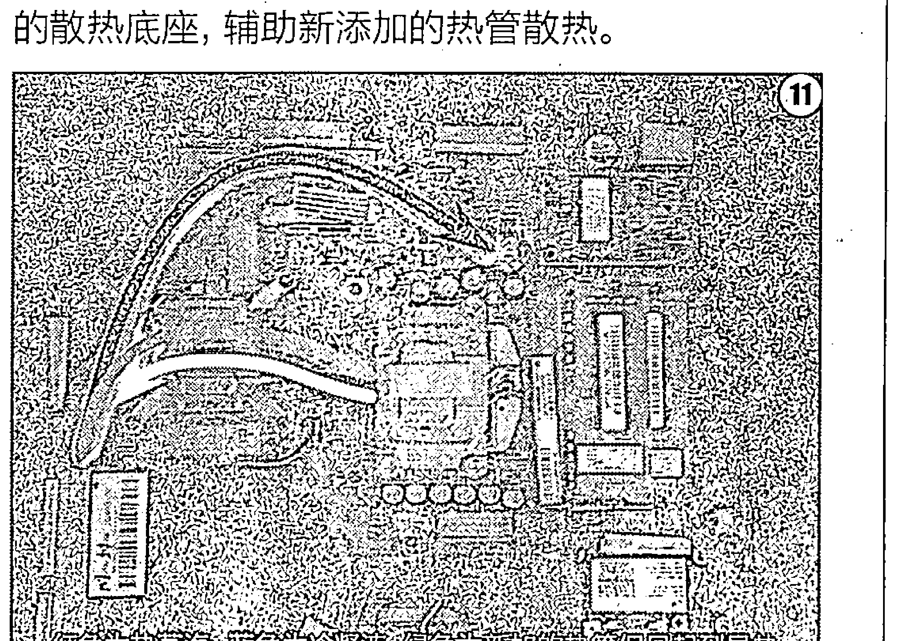

红色为热蒸汽，蓝色为冷凝液，绿色为新加的热管但只起到导热作用（因为散热片端的热量不足以让热管内部液体蒸发）。

## 编者寄语

通过前面的分析，相信大家已经了解了热管的工作原理，以及盲目加装额外热管的缺陷。无论如何，对普通的笔记本用户而言，笔者都不建议自己改造笔记本的散热结构，除了会影响质保外，焊接和改造的过程中很可能导致硬件受损。那对菜鸟用户来说，如果本本的发热太高，又该如何缓解呢？从热管的工作原理可以看出，其散热效率取决于两端的温差，CPU与散热鳍片的温差越大，热管内部液体蒸发冷凝的效率就越高。既然CPU一端温度是恒定不变的，我们应该将提高热管效率的目光投向散热孔的部分，此时最理想的解决方案就是利用抽风式的外置散热器降低散热鳍片的温度，通常可以起到立竿见影的散热效果。有关抽风式散热器的选购思路，请留意《电脑爱好者》近期的后续报道。

# 备战酷暑 显卡散热改造实录

现在很多人的机箱内，显卡是最热的设备。很多朋友在冬天已经高达70℃-80℃的显卡，马上就要面临夏日的考验。与CPU相比，显卡的散热改造更复杂，所以本文将对比进行详细介绍。

文|宁宁

## 学会拆显卡散热

性能越强的显卡往往GPU发热更高，而很多散热器并不符合散热要求。与CPU风扇相同，显卡风扇在使用时间长了之后，同样会出现老化问题。而一旦老化问题严重，就会导致显卡风扇的“停转”，轻则造成显卡高烧和电脑死机，重则甚至还会烧毁显卡。当你的显卡风扇噪音越来越大，彻底除尘和加注润滑油都无法改善问题的时候，就到了更换显卡风扇的时候了。整卡更换太过浪费，我们来一个换显卡散热器教程。

显卡散热器的更换和CPU不同，虽然也有一定的规则可循，但比CPU更为复杂，需要考虑的环节也比较多。对于比较简单的螺钉式固定方式，把显卡翻过来拧螺丝即可。少数固定显卡风扇的螺钉在设计上过于隐蔽（图1），所以必须使用小号的十字花螺丝刀，否则很难将其顺利拆下。

还有一种常见的铆钉式固定方式（图2），这种方式相对比较复杂。首先翻到显卡的背面，然后就可以看到两个铆钉的顶端。这种铆钉的固定原理类似于膨胀螺丝。我们可以使用尖嘴钳子把铆钉的顶端捏住（图3），然后再把两个铆钉分别往下按，散热器就可以顺利拆下来了。

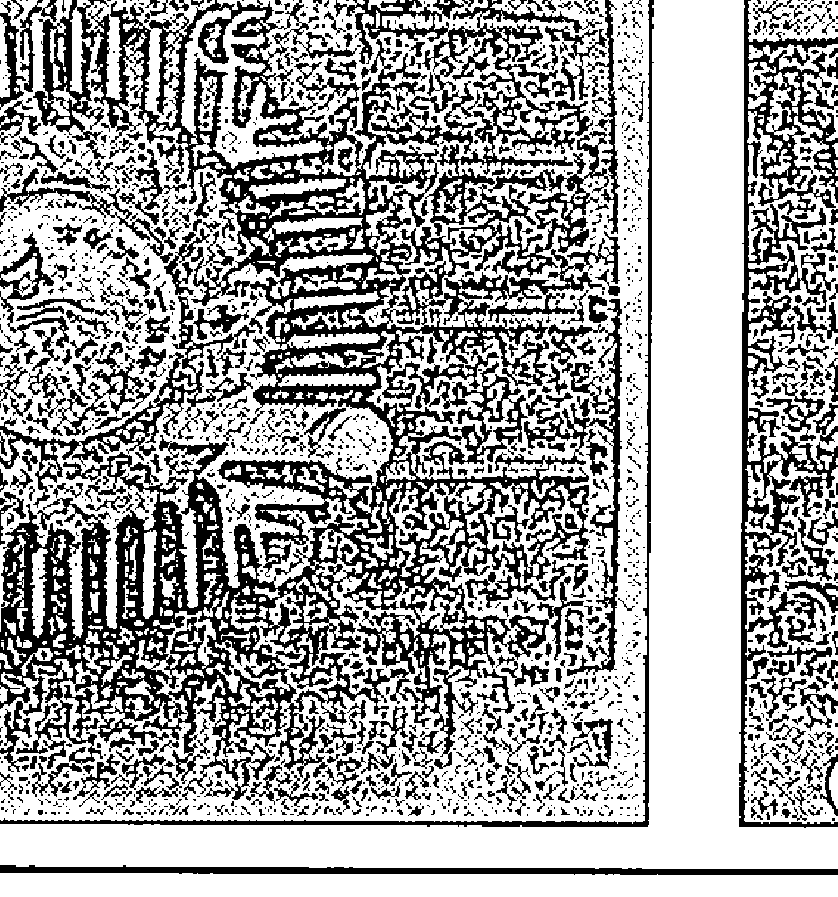

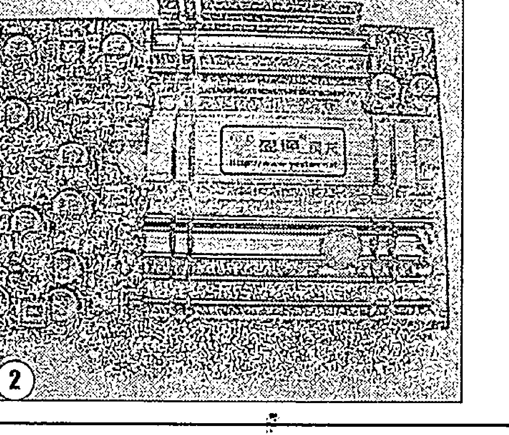

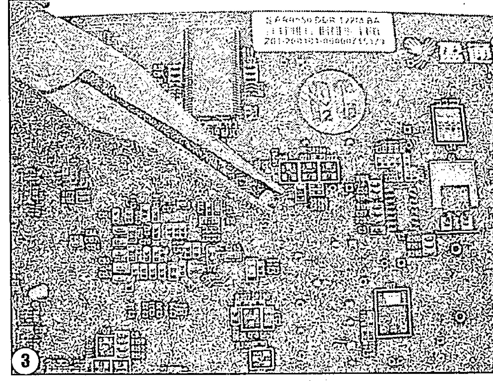

## 挑选合适风扇

如果用户保留散热器只换风扇，就必须找到尺寸和规格相同的全新风扇才能完成替换安装。这并不是件容易的事情，如果拿不准最好还是让懂的朋友或者商家看一眼再出手。如果是尺寸特殊的风扇，想顺利买到也不容易。少数显卡会采用被动式散热技术，要想提高显卡的散热效果，则需要在散热片上拧入四颗螺钉，为其加装风扇（图4）。小尺寸风扇价格低，但是大尺寸风扇能在相同转速下提供更多风量，噪音也不会明显增大。

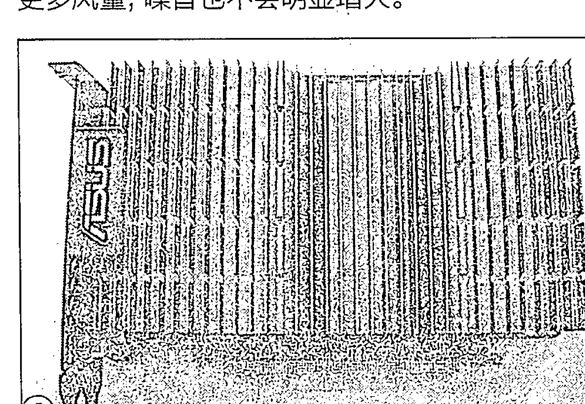

## 替换散热器

如果要更换整个散热器的话，就需要考虑散热器是否会和显卡元器件的孔距起冲突。在这里以九州风神的德古拉显卡散热器为例进行介绍。虽然这款显卡散热器提供了很多附件，但最主要的则是四颗螺钉、四个弹簧螺母、四个橡胶垫片、四个塑料垫片，还有一小管导热硅脂（图5）。

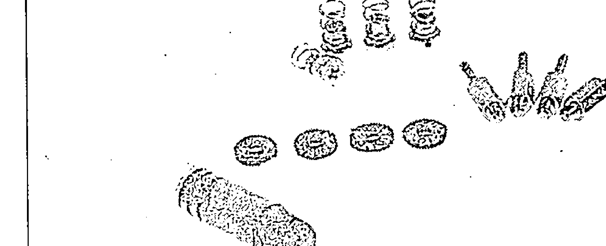

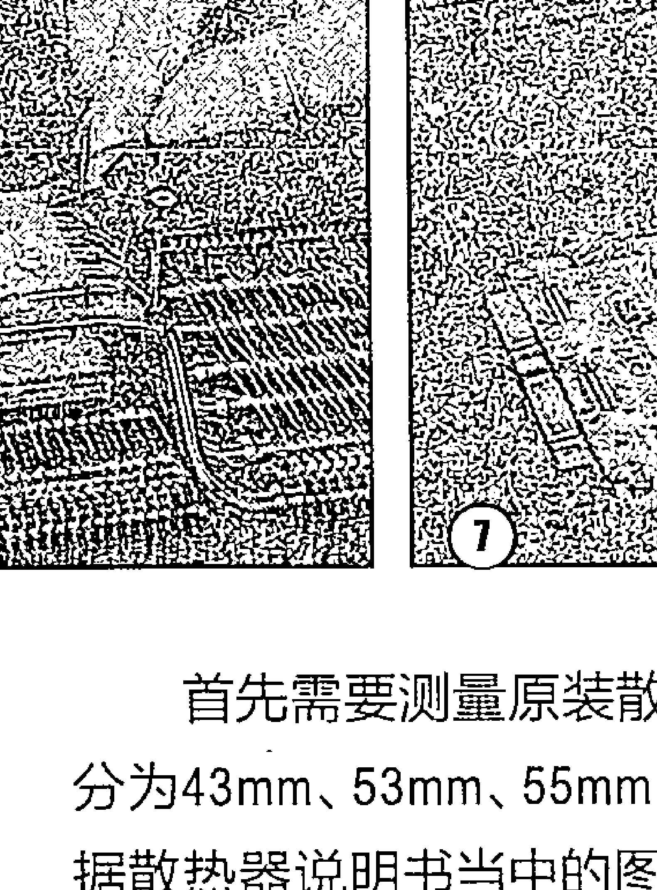

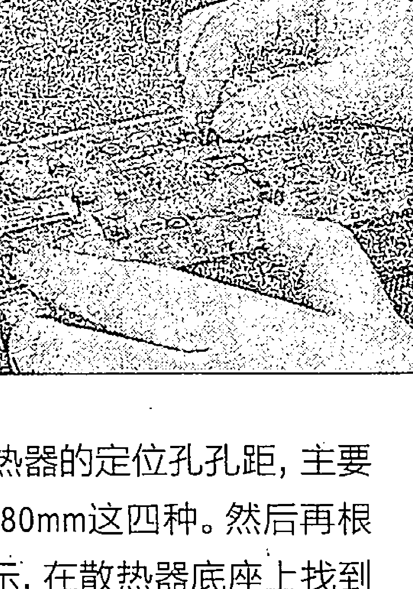

首先需要测量原装散热器的定位孔孔距，主要分为43mm、53mm、55mm、80mm这四种。然后再根据散热器说明书当中的图示，在散热器底座上找到四个正确的孔位。接下来把显卡核心涂抹上导热硅脂，再把散热器装在显卡上，并依次装好四个橡胶垫片和四个弹簧螺母（图6）。

有些散热器提供了背板，如果显卡背面元器件兼容的话最好也安装上，这样就可以让散热器的安装效果更加牢固。然后在散热器底座上拧入4颗螺钉固定（图7）。如果需要超频显存的话，可别忘了附件里赠送的显存散热片。每块散热片的底座都有背胶，所以直接粘在显存颗粒上就可以。

## 解决疑难杂症

很多厂商都喜欢把散热器直接用硅胶粘在显卡核心，千万不可用蛮力将散热器掰下来，否则就可能会造成显卡核心的损坏。如果拆散热器时遇到阻力，可以考虑用坚韧的细线插入到散热器底座与显卡核心的缝隙间摩擦（图8），把硅胶一点点清除掉，从而安全地把散热器拆除下来。

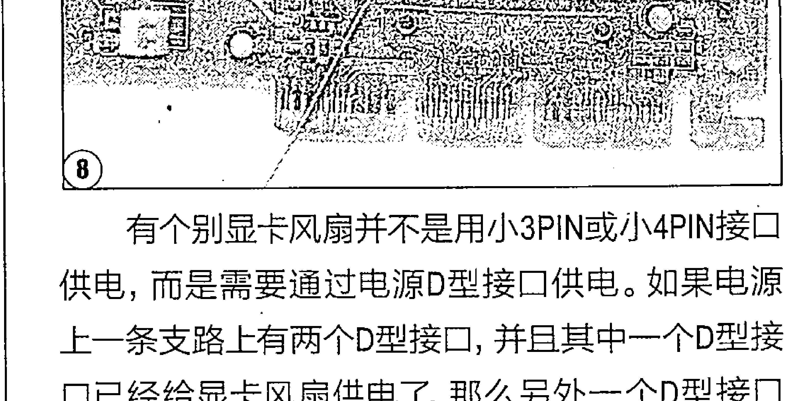

有个别显卡风扇并不是用小3PIN或小4PIN接口供电，而是需要通过电源D型接口供电。如果电源上一条支路上有两个D型接口，并且其中一个D型接口已经给显卡风扇供电了，那么另外一个D型接口就不要再给硬盘供电了。否则的话，同一支路上的两个设备有时会相互影响，偶尔会出现开机找不到硬盘的问题。

## 《电脑爱好者》·合订本 { 硬件通晓 }

# 让睿频功能“听话”

睿频加速是英特尔酷睿i5和i7处理器的最大卖点，但在某些情况下我们却经常面临睿频失效的尴尬。没关系，只需一款软件就能让睿频功能乖乖听话，任你调遣。

我们在2013年第6期杂志上曾报道了神舟K590S-i7版笔记本在开启独立显卡时睿频功能失效的问题，最近读者ZGT就找到并与我们分享了解决方案，除了可以让K590S-i7的睿频正常工作外，更可以让所有支持睿频技术的笔记本玩转这种CPU的自动超频功能。

想解决K590S睿频问题其实很容易，只需一款名为ThrottleStop的软件（下载地址http://dwz.cn/6ALN6）即可。运行该软件后，只需勾选Set Multiplier并将其设置在Turbo状态（图1），点击Turn on按钮后你就会发现K590S-i7的睿频已经不受独显状态限制，玩游戏时也能运行在最高3.4GHz的频率上了！通过测试，K590S的睿频解锁后，最高温度只上升了3℃~5℃，还在可以接受的范围内。

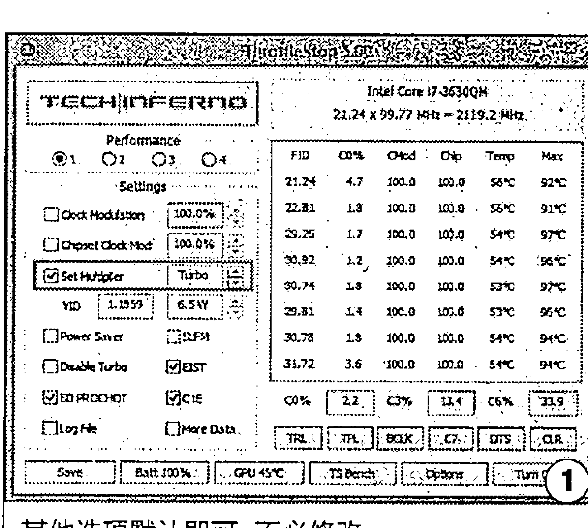

如果你的笔记本并非K590S但也存在睿频经常失效的问题，不妨也参考上面的设置方法尝试一下。修改ThrottleStop设置后不要关闭程序，最小化窗口即可，重启后系统会恢复默认设置，很安全。

## 问题不仅限于神舟

神舟K590S-i7版存在一个Bug，其搭载的i7-3630QM只有在HD4000核芯显卡工作状态下才能正常启动睿频加速功能，一旦笔记本进入独显工作状态（比如玩游戏时）睿频功能就自动关闭从而影响了整体性能。

实际上，K590S系列睿频问题的源头是在神舟笔记本的代工厂：蓝天。据悉，为了避免因Ivy Bridge处理器的核心变小而引起的散热问题，蓝天将旗下W系列准系统（K590S的原型机）的睿频功能都进行了限制，也就是根据集显/独显工作状态判断启动与否。除了K590S以外，其它由蓝天W系列衍生出来的型号可能也存在类似问题。

## 教你进一步玩转睿频

如果你觉得ThrottleStop这个软件仅适用于解锁睿频功能可就太小看它了，只要笔记本搭载的是Sandy Bridge或Ivy Bridge架构的i5/i7处理器，ThrottleStop就可以帮你随时管理睿频状态，并随心调节CPU的主频和各种状态。下面笔者就简单介绍一下ThrottleStop软件的几种典型功能。

### 小提示

ThrottleStop提供了四种状态模板，可以通过软件窗口左上角第一栏1~4数字前面的圆圈切换。当你修改了某个模板的设置后只需点击Save按钮，今后再运行软件即可免去重新修改设置的步骤。

### 功能1：解决游戏过程中的卡顿现象

有些笔记本在运行大型3D游戏时，伴随CPU温度的提升经常出现频繁卡顿的现象，但比你笔记本规格低的型号玩起来却没有任何问题。如果你的笔记本出现了类似的现象，请先进入ThrottleStop主界面的Options菜单，勾选其中的Unlock Bidirectional PROCHOT项，点击OK按钮返回软件首页。然后去除BD PROCHOT选项前面的勾选（图2），再点击主界面上的Save和Turn On按钮即可。

### 小提示

BD PROCHOT是一种CPU的自我保护技术，它会在系统温度达到预先设置的阈值后（比如温度超过85℃）会优先降低CPU的频率，以达到控制整机温度及功率保护的目的。但是，有些产品预设的阈值偏低，因此就会导致CPU经常自动降频而引起游戏的卡顿。

### 功能2：手动关闭睿频加速功能

酷睿i5/i7处理器自动超频的幅度很大，睿频后自然会导致CPU温度再上一个台阶。如果你发现笔记本平时的温度太高，可以勾选ThrottleStop主界面的Disable Turbo设置（图3），即关闭睿频加速功能，降低CPU的发热量。等到客服中心除尘或购买了抽风式散热器后，再考虑重新开启睿频功能。

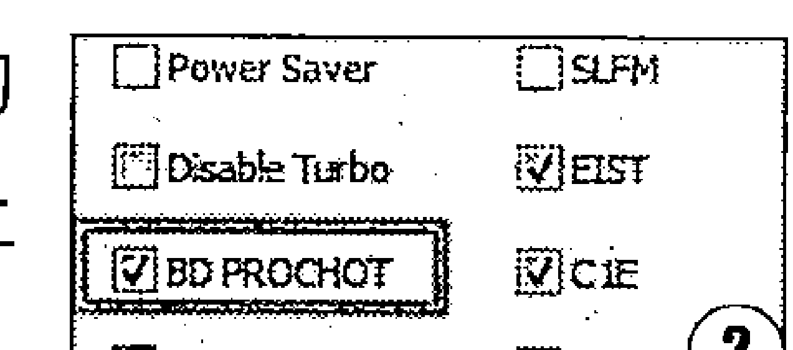

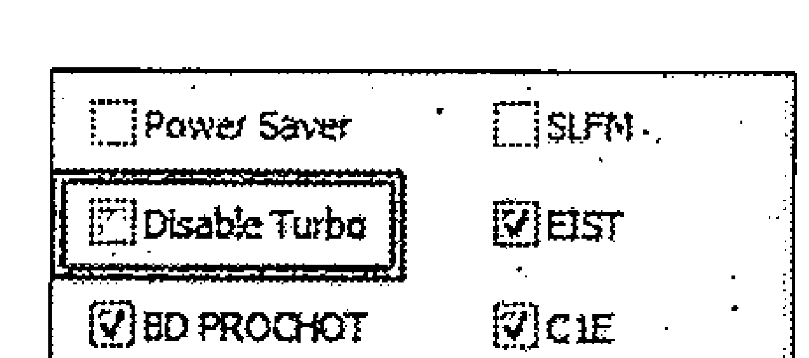

如果关闭了睿频温度还是很高，则可再勾选主界面的Clock Modulation选项，以百分比的形式手动设定CPU的最高主频（图4）。

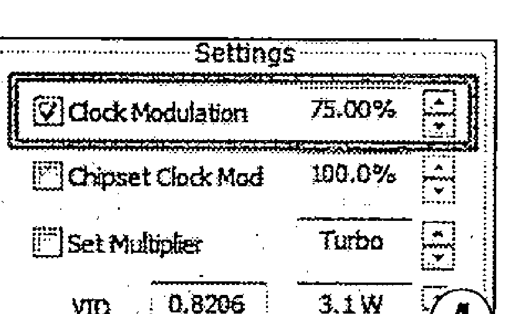

其他选项默认即可，不必修改。

476 电脑爱好者 合订本·2013

# 笔记本退烧 首选抽风式散热器

夏日临近，喜欢用笔记本玩游戏的玩家又该面临散热的压力了。如果你觉得散热底座依旧无法降低笔记本的热情，那就不妨考虑一下最终武器：抽风式散热器。

文/叮当猫

读者叮当猫的笔记本是联想Y470，经常为玩游戏时的高温而困扰。在尝试多种提高散热效果的方法无果后，最终还是靠抽风式散热器给Y470退了烧。本文我们就来听听他的经验吧。

## 无解的散热难题

我的Y470买了已近两年，起初觉得散热效果还不错，但随着时间的推移，我发现机器在玩游戏时的温度已经越来越让我难以忍受。当然，我也根据CFan以前的文章推荐，用书本将笔记本屁股垫高、买过大扇叶的散热底座，甚至自己给散热风扇和鳍片除过灰尘，但玩游戏时CPU温度还是会轻松突破90℃大关，鲁大师“嗷嗷”报警，好不头痛。

## 抽风散热器出马

记得以前CFan还介绍过自己DIY抽风式散热器的方法，但我亲手尝试了一番，发现凭自己的三脚猫功夫根本搞不定，所以只好通过淘宝购买现成的产品了。为了避免广告嫌疑，在这里我只介绍下散热效果和选购经验。

传统散热底座的工作原理是通过内置的风扇，向笔记本底部通风口内部吹风，增加进入笔记本的空气量以及速度，达到增加空气流通的目的。而抽风式散热器则是依靠内部的风扇，像吸尘器一样从笔记本侧面的散热孔抽出内部空气。此种方式充分利用了笔记本外部特点及利用大气压，集中在一点将空气吸出，笔记本其余的散热点（孔）由大气压将空气压入，极大地提高了散热效率。由于其直接作用于散热鳍片，所以散热效率远远超过传统的散热底座，理论上至少可以为笔记本降温15℃以上。

| 类型 | 工作原理 | 散热效率 |
| :--- | :--- | :--- |
| 传统散热底座 | 向笔记本底部吹风，增加内部空气流通 | 一般 |
| 抽风式散热器 | 从侧面散热孔抽出内部空气，利用大气压差 | 远高于传统底座，理论上至少降温15℃以上 |

就拿我自己的Y470为例，在玩《使命召唤7》时，CPU和GPU的最高温度分别达到了93℃和83℃，最终稳定在83℃和78℃左右（图1）。此时接上抽风式散热器继续游戏，几分钟后CPU和GPU分别下降到64℃和61℃并稳定下来（图2），效果非常惊人！

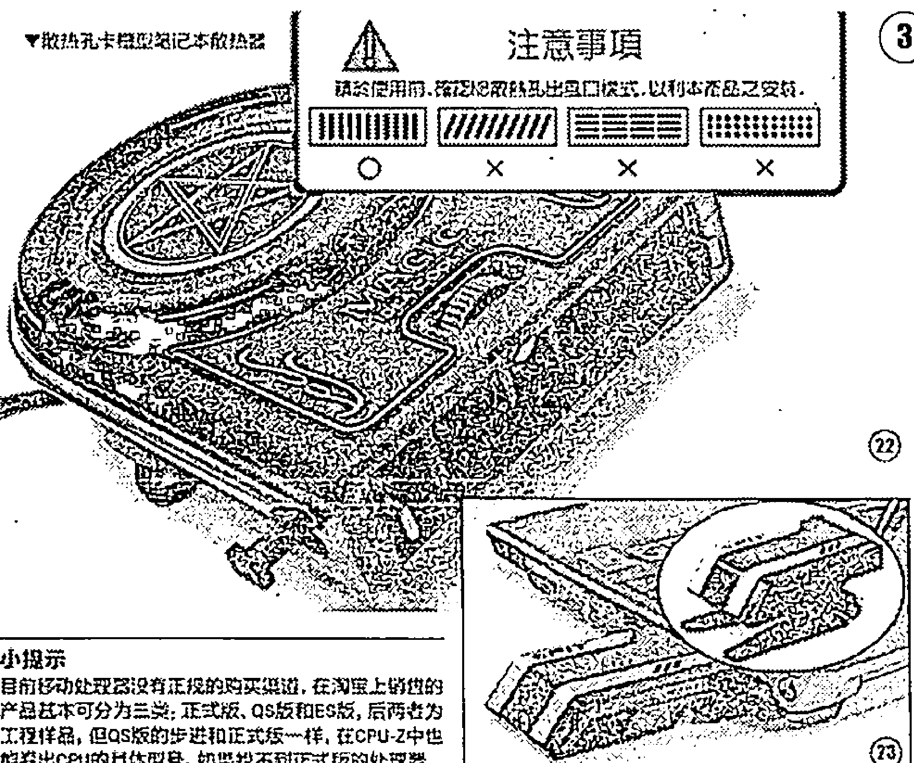

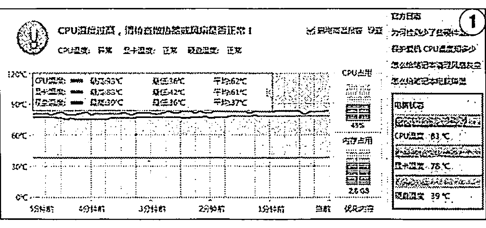

## 选购过程并不轻松

CFan在2012年曾推荐过几款抽风式散热器，本以为选起来会很轻松，没想到近一年这种散热器的发展太快，无论是品类还是功能都远非当年的产品可比（图3）。先说说品牌，目前抽风式散热器的市场认知度有限，所以普遍为DIY工作者或者工作室所经营，而且只限网络销售渠道（个人推荐淘宝），能模具化量产的品牌有徐氏父子、凉伴、ETS和OZF等品牌，所以你不要指望能买到太过知名品牌的产品。

此外，我在挑选抽风式散热器时最关注三个参数：

### 小提示

大家在选购抽风式散热器前要多和商家沟通，有些商家会根据你的笔记本型号提供定制的硅胶导风套。

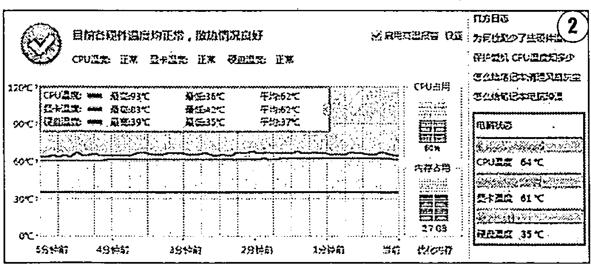

#### 1. 和笔记本散热孔的匹配性

如果抽风式散热器的吸风口与笔记本散热孔处有缝隙（你可以想象吸尘器的管子中间有个破洞），散热效果会大打折扣。为了更好地和笔记本贴合，目前抽风式散热器新出现了几种结合方式。

比如ETS散热器采用了多种硅胶导风套，可以匹配不同类型的笔记本散热孔（图4）。该散热器底部还有调节高度的支架，可以通过延伸到笔记本底部的小吸盘固定，通用性还不错。

而类似凉伴散热器则依靠可以伸缩滑动调整位置的VGA接口固定，散热器和笔记本接触的部分配有海绵套，防止贴合时透气。而VGA固定板可以根据笔记本的VGA接口位置移动，非常适合散热孔和VGA接口都位于机身左侧的笔记本（图5~6）。由于联想Y470的散热孔和VGA接口很近，所以我最终选择了这种结合方式的散热器。

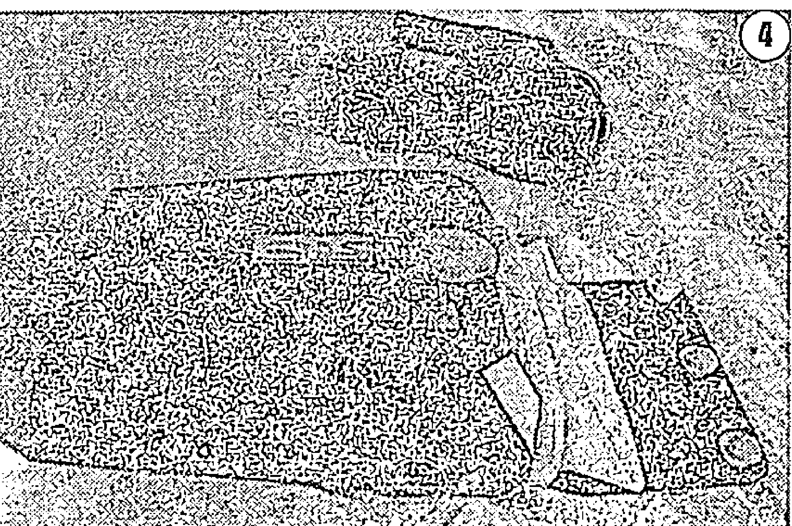

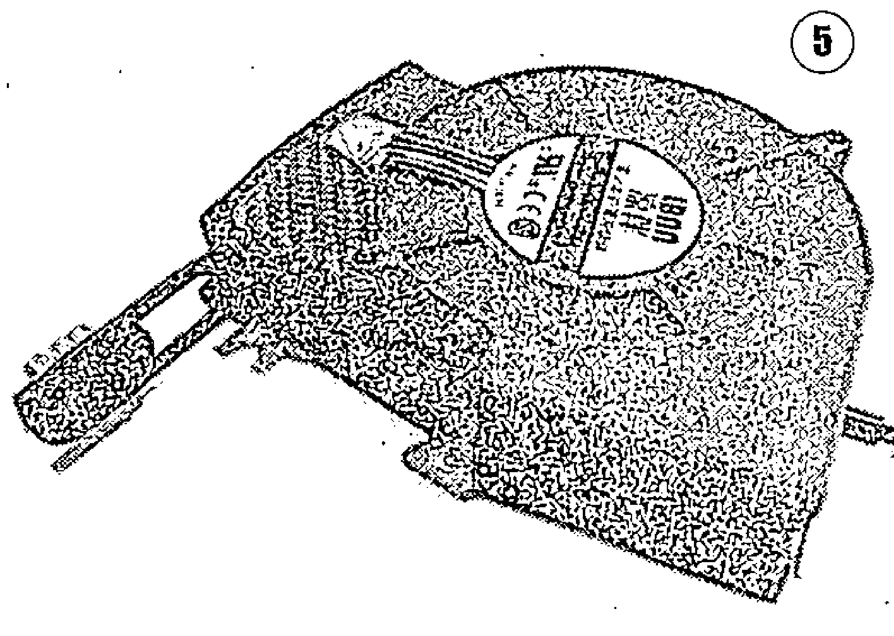

#### 2. 散热风扇的功率

抽风式散热器效果取决于风扇转速，风量越大，理论降温效果越好。建议大家选择采用12V供电（笔记本USB接口带不动，需要外接电源）的散热器，而那些靠USB供电（5V）的散热器的风量太小，效果普遍不佳。需要注意的是，抽风式散热器的工作原理仅是辅助散热，降温有个极限值（15°C~30°C），不会因电流和功率增加而无限加大。

我们都知道，功率=电压×电流，但对散热风扇自身而言，功率和噪音也是正比的关系。我在淘宝上也看到了不少号称功率在10W以上（最大转速）的产品，想想也知道这类设备工作时的噪音也可媲美“飞机引擎”了。

#### 3. 其他特色功能

抽风式散热器不是什么新鲜事物，除了一些廉价产品，或一些仿造相对知名品牌的“山寨”产品，大家的散热原理和最终效果其实相差不会很大。为了差异化竞争，现在很多散热器都加入了类似无级变速的功能，即可以手动调节电机电流实现不同档位的风量，在散热效率和噪音上取得平衡。

我在使用抽风散热器时还遇到过一个问题，就是开关时好时坏，有时散热器会自己无故运行，或是想关闭时关不掉。跟卖家沟通后才发现，原来包括我购买的这款散热器在内，很多产品内部都集成了测温元件，可以随时监测笔记本散热孔位置的温度，当超过预设的阈值（通常为45°C~50°C，此时对应的CPU温度在70°C以上）就会自动启动，直至降到安全温度才会自动停止。这个功能我觉得还是很有必要的，没事把散热器和笔记本一直连着就成，不要只有玩游戏时才想着需要安装。

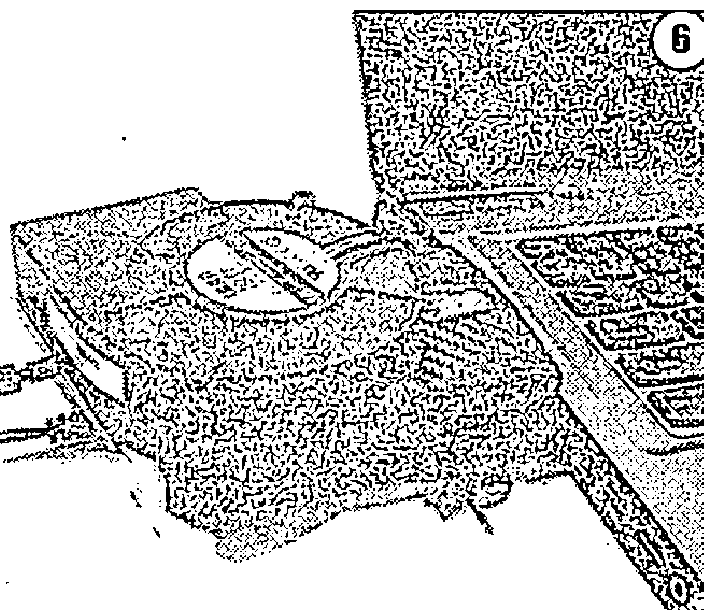

## 噪音是最大问题

通过一段时间的使用，我发现抽风式散热器真的是笔记本的最佳搭档，至少我的Y470的CPU已经很久没有超过70°C了，但同时我也深深感到了噪音的影响。我的笔记本平时会拿到学校使用，白天还好，但夜里使用散热器时往往会吵到已经休息的室友，即使调低了转速噪音还是很明显。好在我人缘不错，宿友还是蛮包容的，在绝大多数的时间里我都可以肆无忌惮地使用。

> **健圣有话说**
>
> 笔记本散热模块设计的主导权在厂商。为了控制成本，厂商们可不会在散热模块上投入太多研发精力，由此也就导致了很多高配笔记本散热效果不佳的缺陷。在这里要感谢叮当猫同学的分享，为笔记本用户提供了一种很好的解决散热的思路。健圣最近新买的联想扬天V480就存在这个问题，覆盖CPU芯片的散热片太小，导热管太细，散热鳍片并非纯铜材质，因此一玩3D游戏CPU温度就会飙升到90°C以上。类似V480的笔记本还有很多，而抽风式散热器的确是镇压此类产品高温的最佳武器，只要你不在乎其工作中的噪音，健圣还是非常推荐笔记本游戏玩家选择的。

# 低成本壁挂攻略

很多显示器底座并不好，很多朋友都想过给显示器或者一体机换底座、支架甚至壁挂。但市面上支架种类多，大家也都没有更换的经验，本期我们就做一个壁挂攻略。

## 认清VESA接口

就目前来看，支持壁挂功能的产品已经越来越多了。在机身背后，都留有了统一规格的VESA接口。只要搭配相应的壁挂支架，就可以实现壁挂功能。所谓VESA接口，实际上是视频电子标准协会指定的标准，包括液晶显示器和液晶一体机的壁挂规格。

一个显示设备只要符合这个标准，就可以与其他符合该标准的设备相兼容。只要一体机在生产制造的时候符合这个标准，那么无论是哪个厂家生产的壁挂支架，都可以配合使用。比如我们以清华同方精锐V86为例，它的VESA安装孔实际上就是机身背面的四个呈矩形排列的螺丝孔，它们之间的距离和自身的直径都有严格规范，分别为100mm的孔距，这就表明显示器肯定可以壁挂。

## 如何安装壁挂支架

大多数的壁挂支架不但可以把显示器或一体机挂在墙上，而且还具备了水平或垂直角度的关节，这样在实现壁挂功能之后还可以适当地调整角度。不过具备活动关节的壁挂支架都是价格不菲，有的价格在千元以上。而为了有效地节约资金，可以购买普通的壁挂支架，虽然不具备活动关节，但价格十分便宜。

普通壁挂支架共分为两部分（图1），较小的部分连接墙壁，使用膨胀螺栓进行固定。较大的部分连接一体机，使用普通螺丝进行固定。因为这种壁挂支架采用了分离式的卡槽设计，壁挂时将支架后端的“凸”行板插入墙壁固定板的凹槽内即可。最重要的就是把螺丝拧紧，就算是较重的一体机挂在墙上也都万无一失了。

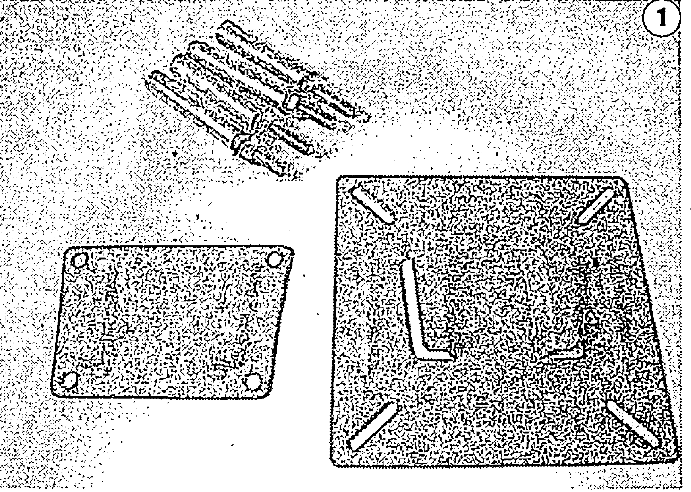

## 实践挂起屏幕操作

接下来亲自实践操作一下。工具包括电钻、螺丝刀、扳子、尺子、铅笔，这些都是实现一体机壁挂时必须使用到的工具。首先将机身的底座拆卸下来，然后再把壁挂支架较大的部分固定在一体机背面（图2），然后在墙上找到适合壁挂的位置，并在上面标注出将要嵌入膨胀螺栓的位置。标注好位置后用电钻在墙上钻出四个适合6mm膨胀螺栓使用的螺栓孔（因为使用的是直径为6mm的膨胀螺栓，所以要用直径为10mm的钻头打孔）。接着再用板子拧紧膨胀螺栓，壁挂支架中较小的部分就被牢牢固定在墙面上了（图3）。

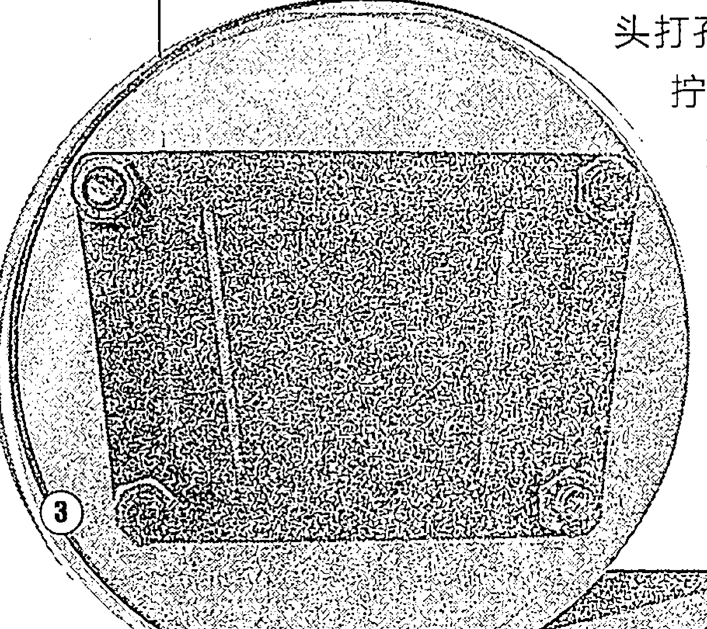

最后再把一体机安装在壁挂支架的卡槽内就算是大功告成了。

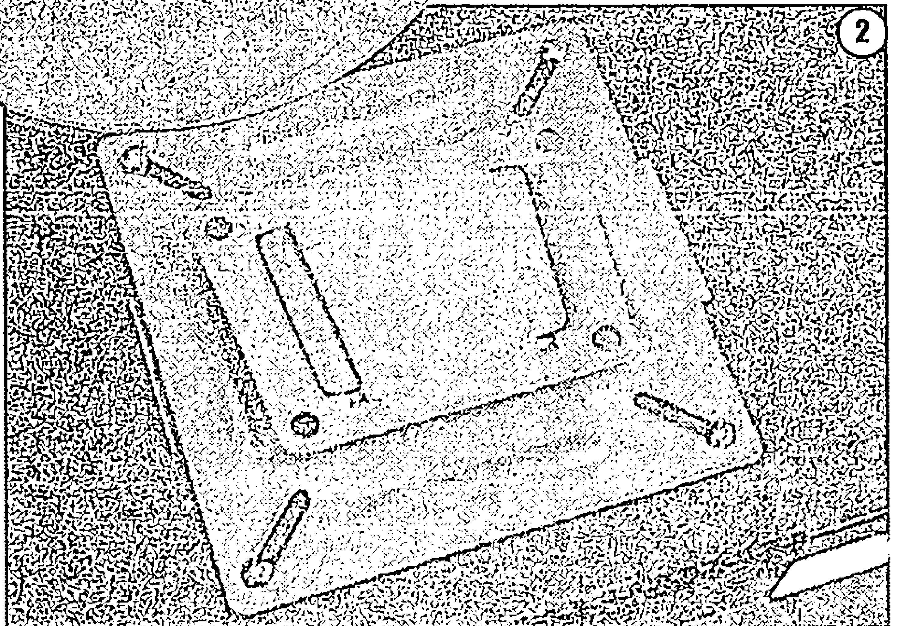

## 小结

由于一体机的重量明显大于普通的液晶显示器，所以必须使用金属膨胀螺栓，而不是负重力不好的塑料膨胀螺钉。如此一来，不仅桌面空间更宽广，一体机挂起来之后也可以稳稳当当。

# 缓存硬盘 老本提速新方案

文 | 曹操

超极本除了纤薄的外观之外，其快速开机和高速响应能力着实让不少用户羡慕。如果你希望自己的老本也能获得类似超极本的响应速度，不妨考虑一下通用性更强的缓存硬盘吧。

超极本虽好，但还不到足以说服我们立刻淘汰老本的地步，尽管超极本特有的快速存储能力的确让人羡慕。如果你的预算不足以购买大容量SSD，有什么低开销的方法能让老本重获新春呢？

## 超极本的智能响应技术

首先我们需要了解一个问题，那就是超极本为什么快？答案就在于英特尔快速存储技术。简单来说，绝大多数超极本都采用了机械硬盘+SSD硬盘的混合存储模式，而英特尔智能响应技术则可以将其中容量较小的SSD变为缓存硬盘，从而提升机械硬盘寻道时间慢、读写慢的劣势，改善系统的运行速度（图1）。可惜，英特尔对快速存储技术制定了严格的硬件平台要求，这意味着除了超极本之外，只有很少数的笔记本才有机会享用。

> **火速连接**
>
> 如果你的笔记本采用了HM67/QM67或HM77/QM77芯片组，则可以购买低容量的SATA接口的SSD。而如果要安装英特尔智能响应技术，请参考本刊2012年18期的相关报道。

比如，英特尔快速存储技术仅支持Sandy Bridge平台中的HM67/QM67芯片组以及Ivy Bridge平台中的HM77/QM77芯片组，但除了超极本外只有联想V480、惠普DV6等少数笔记本采用了这种芯片组，绝大多数产品都是成本相对较低的HM65/HM76等等。换句话说，市面上90%以上的老款笔记本都与这项技术无缘。

总之，在超极本身上我们领略到了用SSD作为缓存硬盘的优势。虽然英特尔快速存储技术的适用范围非常窄，但类似的技术并非仅有英特尔一家，对多年前的老本而言，只需单独添加一块缓存硬盘，同样可以获得不逊于超极本的开机和响应速度！

## 缓存硬盘为老本解忧

目前闪迪和金速都有SSD缓存固态硬盘，只是闪迪旗下的“超速缓存固态硬盘”目前仅适用于台式机平台，而金速旗下的缓存硬盘则兼容笔记本平台，通用性更出色。本文我们就以金速K25为例，探讨一下缓存硬盘的必要性。

金速K25缓存硬盘的外观和普通SSD一样，可以安装在笔记本标准硬盘位或光驱位的硬盘托架上（图2）；与笔记本原有的机械硬盘搭配使用。这款产品最大的特色就是对笔记本芯片组没有要求，只要笔记本内置SATA接口即可使用。比如类似2009年的联想Y450A笔记本，就可以将其安装在光驱位的硬盘托架上，变成“双硬盘”模式（如果你的笔记本没有光驱，或者不希望把光驱替换，则可以考虑mSATA接口的缓存硬盘）。装好缓存硬盘后，我们只需安装并运行随机附赠的管理软件（图3），开启加速模式后，这块缓存硬盘就会被系统识别为OEM分区，实现类似英特尔快速存储技术的功效了。

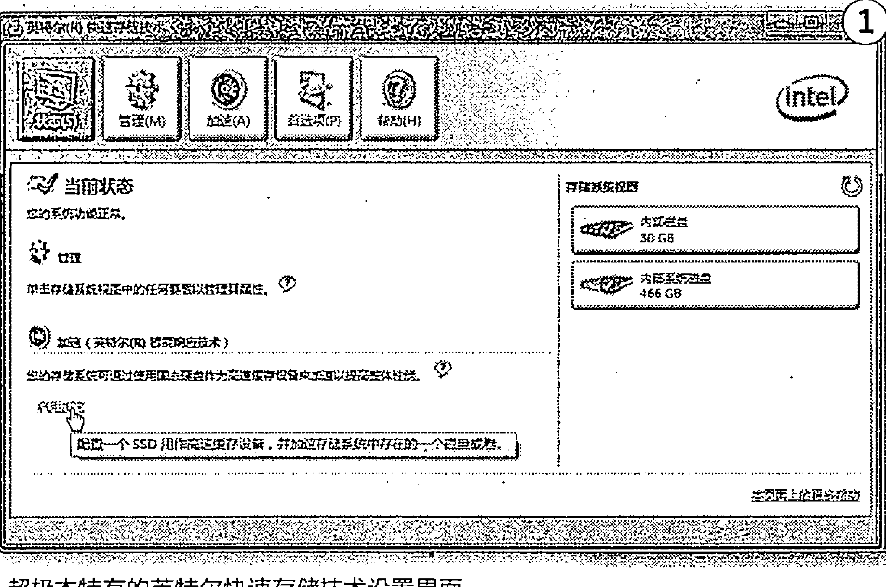

需要注意的是，缓存硬盘的提速效果不是立竿见影的，可能需要几次重启之后才能获得最佳的反应速度。比如你首次开机需要60s，几次开关机后就会变成25s；第一天启动《星际争霸2》需要45s，第三天运行可能只需20s。以此类推，越用越快。以CrystalDiskMark测试为例，原机械硬盘的平均读写速度分别为69.51MB/s和71.58MB/s（图4），经过缓存硬盘的加速之后，读取速度已经提高到了254.8MB/s（图5），几乎达到了纯SSD固态硬盘的水平。

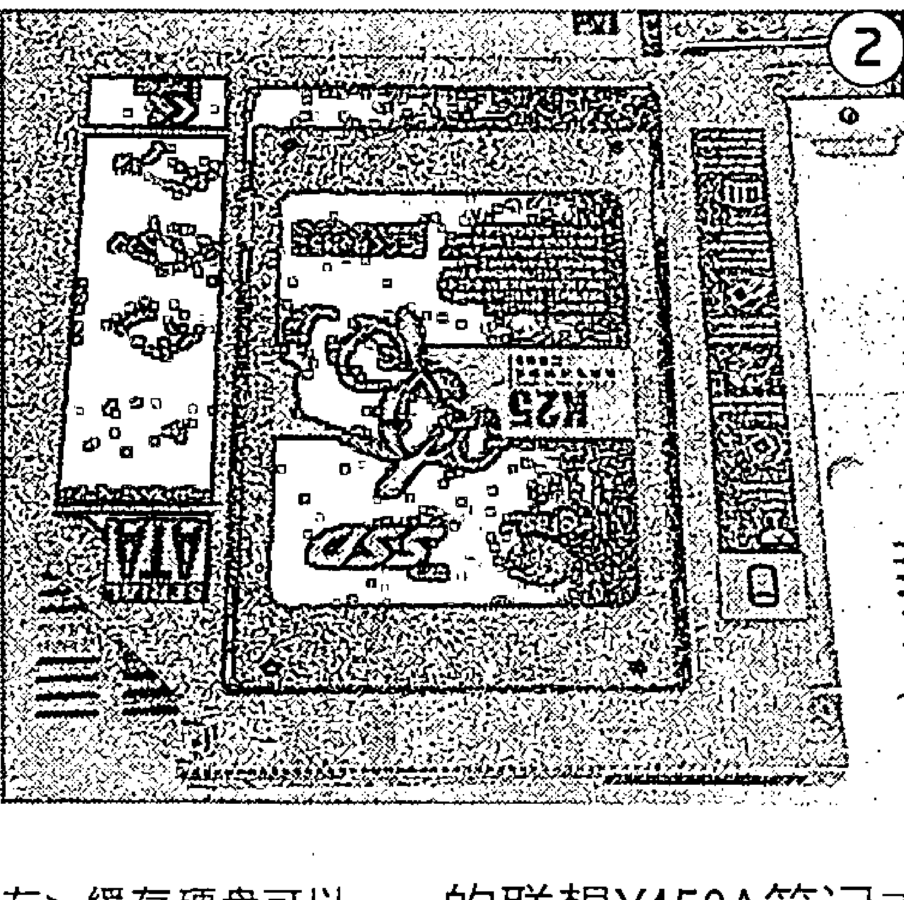

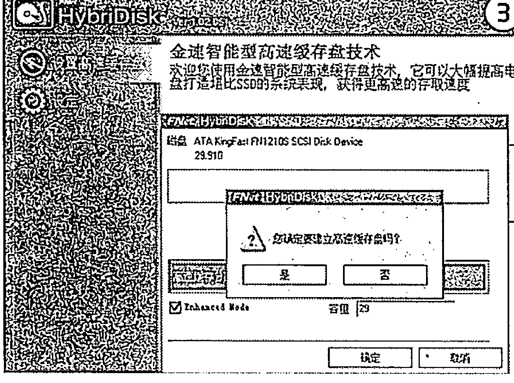

## 缓存硬盘存在的意义

经常关注SSD相关技术的读者可能已经发现了，机械硬盘+SSD缓存硬盘之后的速度距离纯SSD固态硬盘还是有一定差距的。更现实的问题是，金速的这款K25缓存硬盘的容量只有32GB，而且售价在350元左右，而现在400元出头就能买到64GB的标准SSD固态硬盘了，为什么我们不多花点钱选择后者呢？

没错，如果你购买的是64GB的标准固态硬盘，并把操作系统安装其中，的确可以获得更稳定的响应速度，但随之而来的则是两个潜在的问题：

1.  需要重新安装操作系统到SSD硬盘内部的空间中；
2.  只有安装在SSD硬盘内的游戏和软件可以实现快速启动，装在机械硬盘上的程序还是会很慢。你可以想象64GB的空间除了系统占用外，还能装几个游戏和软件？

而缓存硬盘的意义是，它无需让我们重装系统，只需安装一款驱动软件即可使用。而且能将整个机械硬盘都提升到固态硬盘才能拥有的高读取速度，从性价比的角度来看是不是更超值呢？

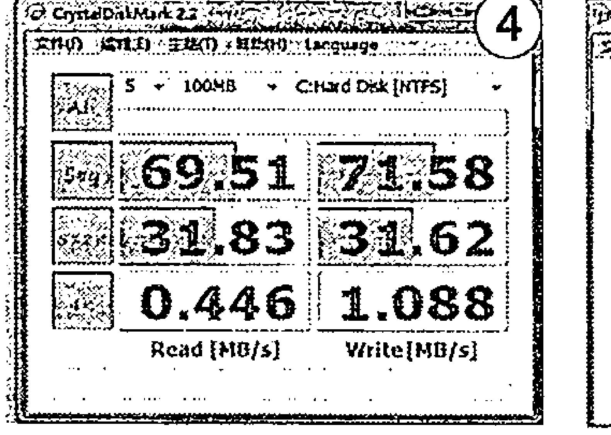

> 作为近两年才刚刚兴起的缓存硬盘技术，非常适合作为老款笔记本用户的升级首选方案。350元左右的开销和简单易用的升级步骤几乎没有太高的升级门槛。不过，缓存硬盘的最大竞争对手就是时间，目前最便宜的128GB SSD固态硬盘只有500元左右，当256GB的版本也降到类似价位后，留给缓存硬盘的市场空间也就被彻底压缩了。当然，这些都是后话，如果你现在的预算着实不多，相信缓存硬盘不会让你失望。CF

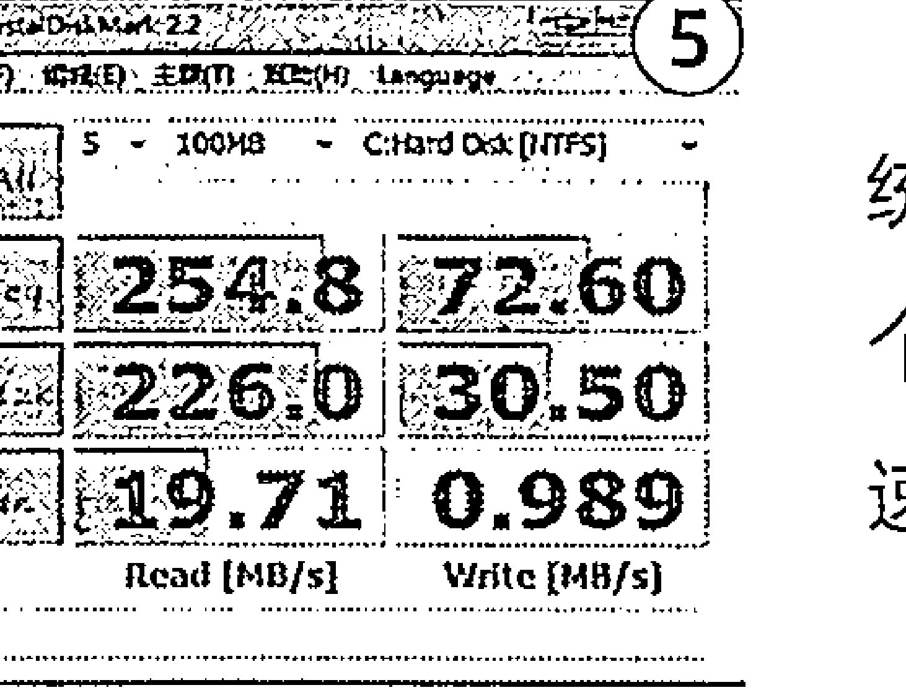## 《电脑爱好者》·合订本 {硬件通家}

# 乐趣在于创意 酷乐宅的初体验

文 | 镜花水月

在PC的操作过程中，鼠标和键盘虽然能提供最佳的使用效率，但一成不变的操作体验却早已让人厌倦。如果你体验一把用香蕉、橡皮泥来操作电脑，或想用盛满水的饭盒代替游戏手柄运行赛车游戏，有了酷乐宅，一切皆有可能！

酷乐宅的包装和电子结构说不上豪华和复杂，甚至可以用相当简陋来形容。但就是这样一块小小的、不起眼的电路板(图1)，却可以将你的创意无限放大，甚至可以重新定义PC的操作方式。

## 导体决定体验效果

我们可以将“酷乐宅”的主机板理解为一种控制中转设备，前后提供了22个可编程按键接口(包括6组鳄鱼夹孔和16组用跳线相连的针孔)，利用光盘中的PC端客户端软件可以为这22个按键接口赋予自定义功能。比如键盘上的某个按键、鼠标的指针或滚轮移动等等，甚至可以直接启动某个程序、播放某首歌曲或赋予类似关机、音量调节等系统命令(图2)。

接下来，我们就需要用鳄鱼夹或导线与任意材质、形状、类别的“导体”相连，将某个按键接口的功能转嫁给这个导体。以后当你触控这个导体时，就相当于按下了键盘或鼠标上的某个按键。

以梨为例，鳄鱼夹需要插入梨的内部(图3)，用手指触控梨的表面就相当于按下了你之前设定的某个功能键。如果你的手指和梨皮儿表面过于干燥，可能会影响识别效率(就是触摸时没反应，需要用点力气)，此时可以把梨的表面划破或在手指的表面沾点水，就可以非常灵敏地操作了(提高梨表面的导电性)。

总之，酷乐宅操作的灵敏性取决于你选择的导体材质。所谓导体就是可以导电的物体，比如金属、水果、树枝、人体、橡皮泥、沾了水的海绵、包裹口香糖的铝箔纸等等（图4）。根据我们的测试，反应最灵敏最靠谱的就是铝箔纸（永远可靠），像水果、树枝等物体，放久了会逐渐脱水，导电性（也就是操作的灵敏度）也会随水份的流失而大大降低。比如干瘪的苹果和脱了水的橡皮泥，基本也就废了。


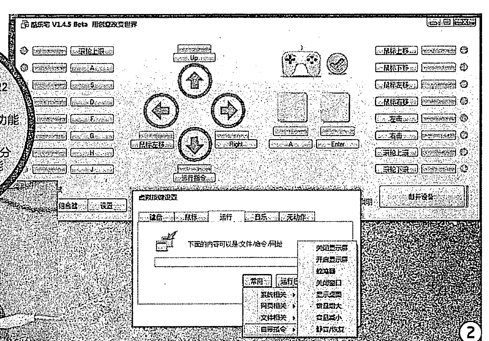

- 1> 酷乐宅主机板的正反面特写，最多支持22个按键同时触发
- 2> 酷乐宅接口的自定义功能非常强大
- 3> 鳄鱼夹要与带有水分的梨肉接触，这样才能导电

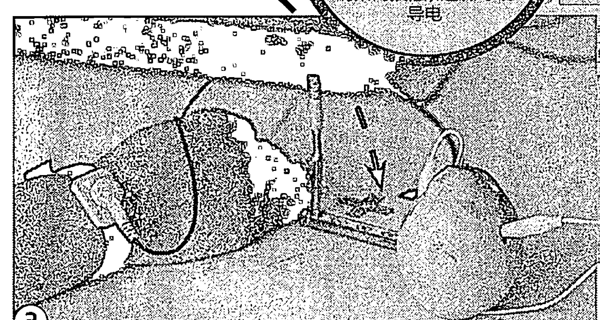

> **小提示**
> 
> 体验酷乐宅之前需要安装驱动和客户端软件，其中驱动安装完记得重启一下电脑，否则系统可能出现无法连接的问题。此外，酷乐宅主机板最下面的一排鳄鱼夹孔为地线接口，需要连接带腕带的那根导线。

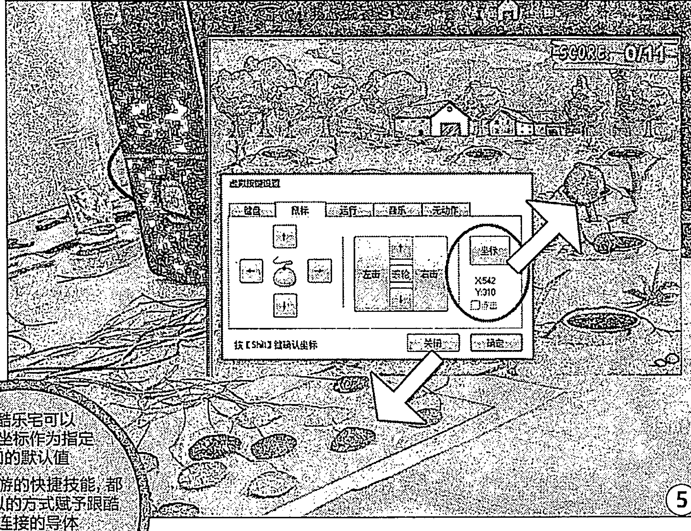

- **5>** 酷乐宅可以将鼠标坐标作为指定接口的默认值。
- **6>** 很多网游的快捷技能都能通过类似的方式赋予跟酷乐宅连接的导体。
- **7>** 注意控制方向的四条导线头不能碰到水哦。

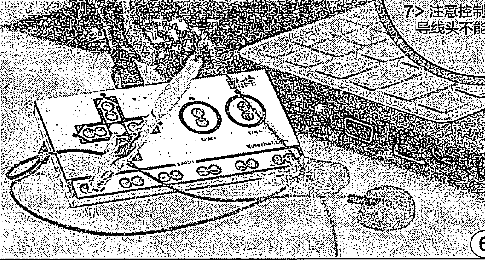

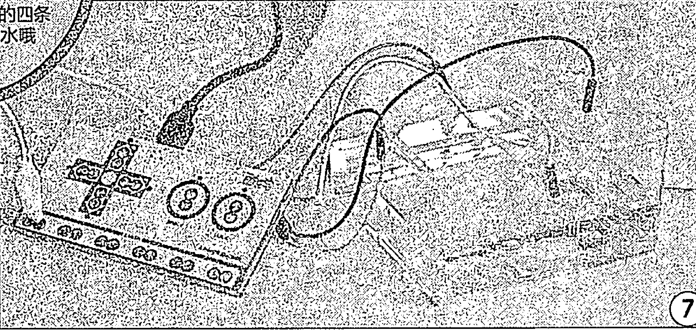

橡皮泥相连，然后为每块橡皮泥指定为对应洞口的鼠标坐标（图5），之后点击橡皮泥，就相当于用鼠标控制手锤打地鼠了，如此一来会极大提升命中地鼠脑袋的几率。

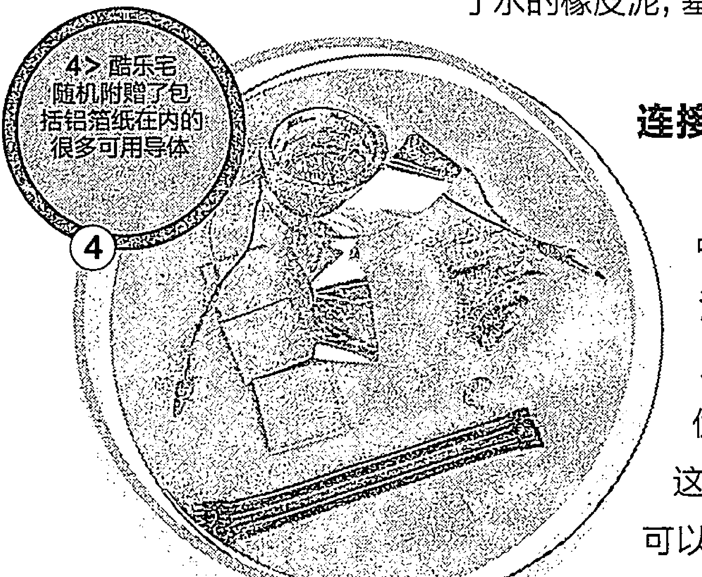

## 连接设置极为简单

酷乐宅随机光盘中提供了丰富的小游戏，而且都针对酷乐宅主机板进行了优化。以《打地鼠》这款游戏为例，我们可以用跳线将酷乐宅与游戏地鼠洞口数量一致的

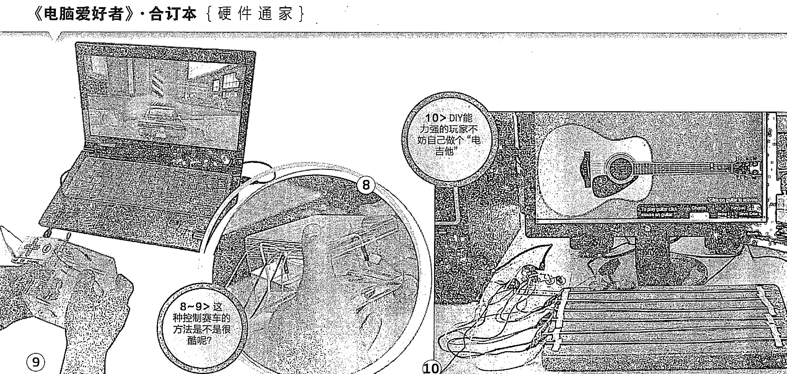

## 只有想不到没有做不到

如果你觉得酷乐宅只能提供简单的按键映射可就太小看它了，只要你有创意，通过酷乐宅还能实现更酷的操作方式。现在手机上的赛车游戏普遍以重力感应操作，而酷乐宅也能将身边的物品变成“3D重力感应器”。

其中最简单的解决思路就是，找一个普通塑料材质的带盖盒子，首先在盒子内壁的底部贴上导线，这根导线需要连接酷乐宅的地线接口，然后在盒子内壁的前后左右面各贴上一根导线（导线铜丝要暴露在外面，可用胶带固定好）。接下来往盒子中注入水，注意水面高度不能超过四壁的导线（图7），盖上顶盖（防止洒水），此时就可以运行赛车游戏了。以极品飞车为例，只需将控制赛车前后左右移动的按键映射到四壁对应的导线上，运行游戏后这个盛满水的盒子就变成了重力感应器，往前倾斜车辆就会前进，左右倾斜就是转向（图8~9）。如此奇妙操作的原理其实也很简单：水面在没碰到四壁导线前和地线还没有形成回路，如果将盒子向前倾斜，前壁上贴的导线将和水接触（饭盒底下的接地导线始终是和水接触的），形成回路，触发一个向前方向键，其他方向原理一样。

其实酷乐宅的功能远不止于此，比如我们还可以将QQ登录密码指定在不同颜色的橡皮泥上，每次输入密码时只要按顺序点击不同的橡皮泥即可，简单又安全。再比如，像吉他一类的音乐游戏，我们可以将琴弦指定在用木板和铁丝组成的DIY“吉他”上，用手指拨动铁丝就相当于拨动了琴弦，真实感大增（图10）。当然，酷乐宅的功能远不止这些，而更酷更新奇的操作方式还有待挖掘。总之，酷乐宅是一款可塑性极强的控制装置，非常适合喜欢尝鲜或有挑战精神的用户体验。再谈一下酷乐宅的缺陷，首先就是说明书太过粗糙，对主机板接回的说明不够详细，需要对应官网的教程和案例才能掌握基本技巧。其次，酷乐宅存在偶尔漏电的现象，有时不小心碰到主机板的金属环会有略微的发麻感（很轻微，USB才5V电压，对人体无危害，官方反馈说是因零线和地线有漏电），把连接着导线的橡皮泥贴在金属材质的笔记本C面上鼠标指针会抖动。最后，就是希望酷乐宅的后续产品可以将Mini USB接口换成Micro USB标准，毕竟现在手机和平板都是Micro USB了，再有就是可以附赠一些加长的导线。CF

# 手机充电接口的妙用

文 | 小橙子

手机上的Micro USB接口大家用得最多的恐怕就是日常充电了，很多人甚至还不知道这个小小的接口其实还有很多其他的妙用，能够更加充分地发挥出手机的强大性能。

## 初识MHL功能和OTG功能

在魅族MX四核版发布时，大家一定还记得其提到的MHL功能。该功能就是将手机中的影音信号通过HDMI高清接口输出到电视上，从而实现手机影音资料无损输出的效果。如今包括三星、HTC等诸多新款手机都已经具备MHL高清输出功能。下面小编会结合实际的操作告诉大家如何实现该功能。

除了MHL功能会用到手机的Micro USB接口之外，手机OTG扩展功能同样需要使用该接口。该功能可以实现手机直接读取U盘、硬盘等存储设备信息，而且可以外接鼠标、键盘以及游戏手柄等，进行手机操控。

## 手机MHL功能实现

**玩家：紫林**

**爱好：爱电影听歌**

**手机型号：魅族MX2**

紫林是一个不折不扣的电影迷，除了影院上映的大片必看之外，上下班路上也总是会用手机看会电影。最近紫林看到了一部非常感人的电视剧，打算周末和家人一起分享，但由于电视剧全都下载在手机中，一家三口围着手机看感觉很不爽。这时候紫林想到了魅族MX四核版发布会上提到的MHL功能，而自己又正好是使用魅族MX2手机，于是紫林便在淘宝上花了42元购买了MHL适配器和HDMI高清输出线。首先将MHL适配器其中一个接口连接HDMI高清数据线，并将数据线的另外一头连接到电视上，而MHL适配器上的另外一个Micro USB接口和手机Micro USB数据线连接，然后连接到充电底座上（这主要是因为手机通过MHL功能进行高清视频输出时需要外部供电作为保障）。

将所有的数据线正确连接后，紫林打开电视使用遥控选择手机所连接到的HDMI接口频道，这时候手机界面成功地在电视上显示出来，一家三口也可以其乐融融地围着电视看紫林最爱的这部电视连续剧了。

**小提示**

MHL功能应用到手机上的时间不长，所以功能不是很完善，手机对MHL适配器的要求很高，大家在购买MHL适配器时最好能够使用自己的手机先进行试用，保证没有问题后再购买。紫林在此次的体验中发现索尼的MHL适配器是此次测试中表现最好的一个，大家可以参考。

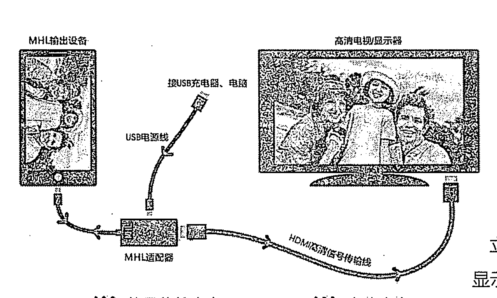

## MHL功能常遇问题

不少人使用该功能时会遇到无法播放视频的情况，这时候首先尝试重启手机，然后将手机连接线拔出，使用手机独立播放视频，当视频出现画面和声音之后暂停，然后再连接外部显示器。另外如果出现电视中没有图像、声音或者严重偏色的情况时，最好是更换MHL适配器，然后重新连接播放。

## 玩转手机OTG扩展功能

玩家：大黑
爱好：看高清电影
手机型号：NubiaZ5

和前面提到的玩家紫林一样，大黑在平时同样喜欢看电影，尤其对1080P的全高清电影更是情有独钟，为此大黑还特意购买了16GB的NubiaZ5。然而大黑打算用这款手机观看1080P电影时却发现一个问题，在机器安装完常用的软件之后，存储空间只有不到10GB，而一部时长一个半小时左右的全高清电影至少也需要10多GB的存储空间，如此大的视频根本无法放到手机中。为了实现自己的手机观看全高清电影的梦想，大黑决定尝试OTG扩展功能。

首先大黑在淘宝花了10元钱购买了一根OTG线，然后将想要观看的全高清影音视频放到移动硬盘中，并将手机OTG线的USB接口和移动硬盘连接，然后将OTG线的另外一端连接到手机的Micro USB接口，在手机设置菜单中找到“存储”选项打开，下拉菜单中能够看到手机识别出“USB存储器”说明连接成功。

这时候只需要打开手机中的“文件管理”功能，选择“内存设备”菜单下的“USB存储器”，就可以使用手机直接读取硬盘内事先存储的全高清视频进行观看。

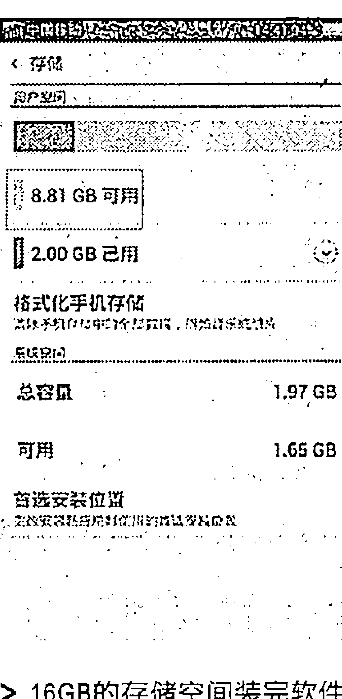

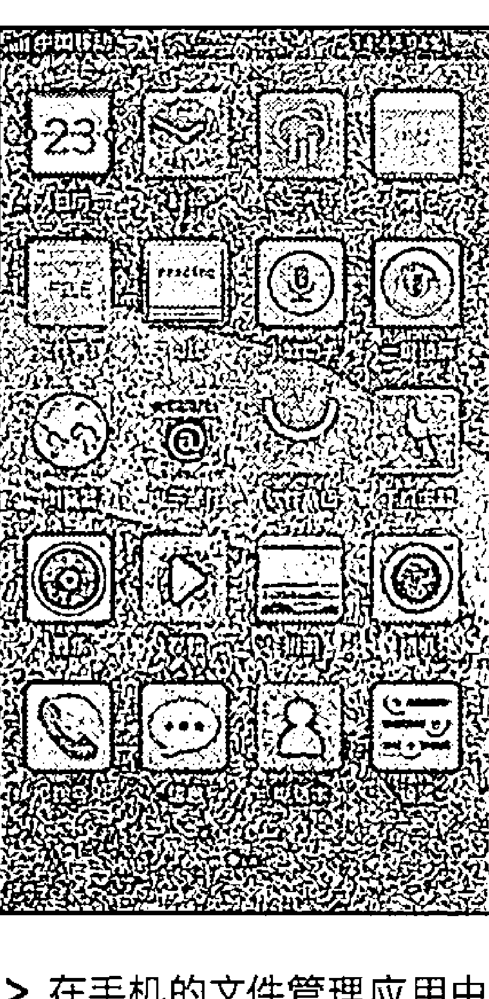

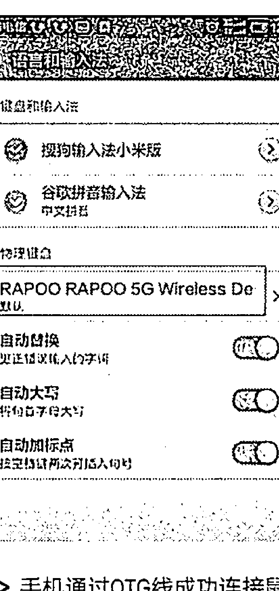

除了像玩家大黑使用OTG功能读取外部存储之外，还可以使用该功能进行鼠标、键盘、游戏手柄等标准USB接口的设备连接，操作方法和连接U盘一样，不同的是在外接鼠标、键盘等设备时，手机需要进行驱动安装，所以在刚连接时手机可能没有反应，大家只需稍等几分钟即可。

## OTG功能常见问题

不少人反映使用OTG功能无论连接U盘还是鼠标键盘，手机都没有反应，这时候大家一定要确保在进行OTG线连接中的顺序问题，必须是先将OTG线连接到外部硬件设备上，然后再将Micro USB接口连接到手机上，手机才能够识别外部存储设备。

另外在连接线的顺序没有问题的情况下，依旧无法连接鼠标、键盘等外部USB设备，这时候大家可以在OTG线保持连接状态下来重启手机来解决该问题。如果重启手机也无济于事，那很有可能是手机无法安装外部USB设备的驱动，只能更换设备。

> 扩展阅读
> 
> 手机的OTG扩展功能除了可以连接有线键鼠之外，将无线键鼠的发射器连接到OTG线的USB接口上也可以实现鼠标的连接，只是通过这种方式连接上外部设备后容易出现不稳定的情况。我们还可以使用手机的蓝牙搜索到相应产品进行配对连接，通过这种方式配合手机的OTG功能我们可以实现鼠标、键盘同时连接到手机上。此外如果大家想要使用手机进行双人的游戏时，也可以通过OTG线连接一个游戏手柄，然后通过蓝牙连接另外一个游戏手柄。
> 
> 现在手机硬件配置越来越高，手机的外部扩展功能的开发速度也越来越快，虽然现在这些功能还有很多不完善的地方，但相信随着硬件厂商在这方面研发成本的投入，日后手机的强大性能会发挥得更加淋漓尽致。

# 打造智能生活
## 让你的“盒子”更听话

文 | 飞雪散花

小米和乐视盒子都创下了一个小时内售光几万台的纪录。笔者经过一段时间的试用后发现了不少技巧，不仅适用于乐视盒子，同时也适用于所有智能机顶盒及智能电视。

### 无需对准 手机触摸遥控

乐视盒子本身配备了9键遥控器，不过在通常情况下，该遥控器必须近距离对准盒子才有效，如果距离较远或方向偏离，再或者中间有什么东西阻挡，那效果就无法保障了。其实如果你的智能手机和盒子是处于同一个Wi-Fi环境中，完全可以通过Agile Remote这款应用，将手机打造成一款功能强大的遥控器。和国内常见的乐视三屏和小牛遥控相比，该应用很好地解决了乐视三屏需要登录才能使用且无法调节音量等缺陷，同时也避免了小牛遥控所存在的搜索盒端速度较慢、鼠标操控速度过快、无法自行调节等不足，算是目前最好用的遥控类应用之一。

Agile Remote分国外原版（版本号1.0）和国内修改版两种（盒子端版本号为1.02，手机端版本号为1.03），两种版本的主要差别在于后者没有文字发送功能，所以我们这里仅以国外原版为例。

首先在盒子中安装Agile Remote服务端并启动该应用，启动后应用会自动侦测盒子分配的IP地址。然后在手机端安装并启动客户端，在出现的界面中点击OK按钮，进入主界面，点击上方的Agile Remote按钮，此时，程序会扫描周围已经存在且安装了服务端的盒子设备，并在找到后，将其显示在下方列表中（图1）。最后点击要控制的设备，待AgileRemote按钮右侧的头像变成绿色后，说明连接成功，此时就可以点击AgileRemote按钮左侧的四叶草按钮，然后在出现的菜单中选择相应功能，从而完成对盒子的一系列操控了（图2）。

播放视频时，可通过Video功能很好地实现对视频的暂停、播放，节目选择及音量调整等操作；Navigation类似九键遥控器，可实现九键遥控器的所有遥控操作；Touch是鼠标的模拟，其中指针的快慢速度，可通过拉动Speed栏中的滑块来调节；Gyroscope陀螺仪在玩体感游戏时充当游戏手柄；而TextInput可实现文字的输入和发送工作。如果我们要在盒子的办公套件中输入文字，或通过搜索来查找视频，都可以用该功能轻松完成。

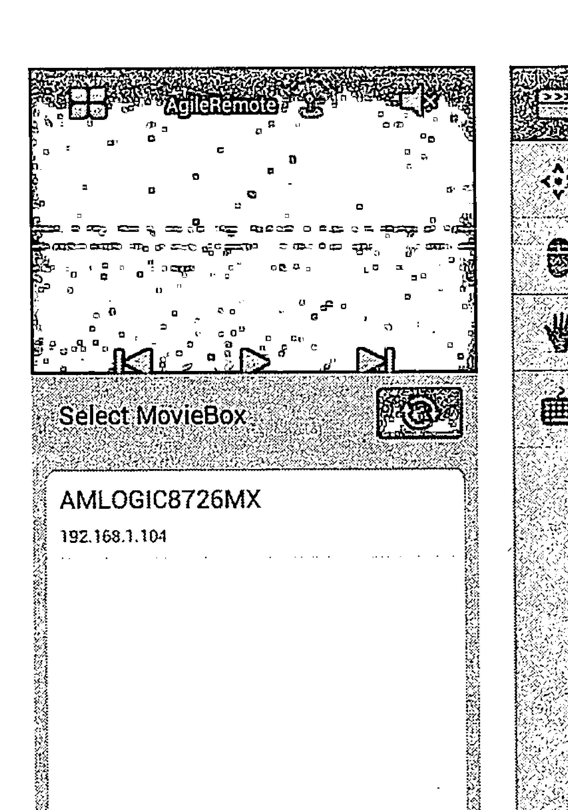

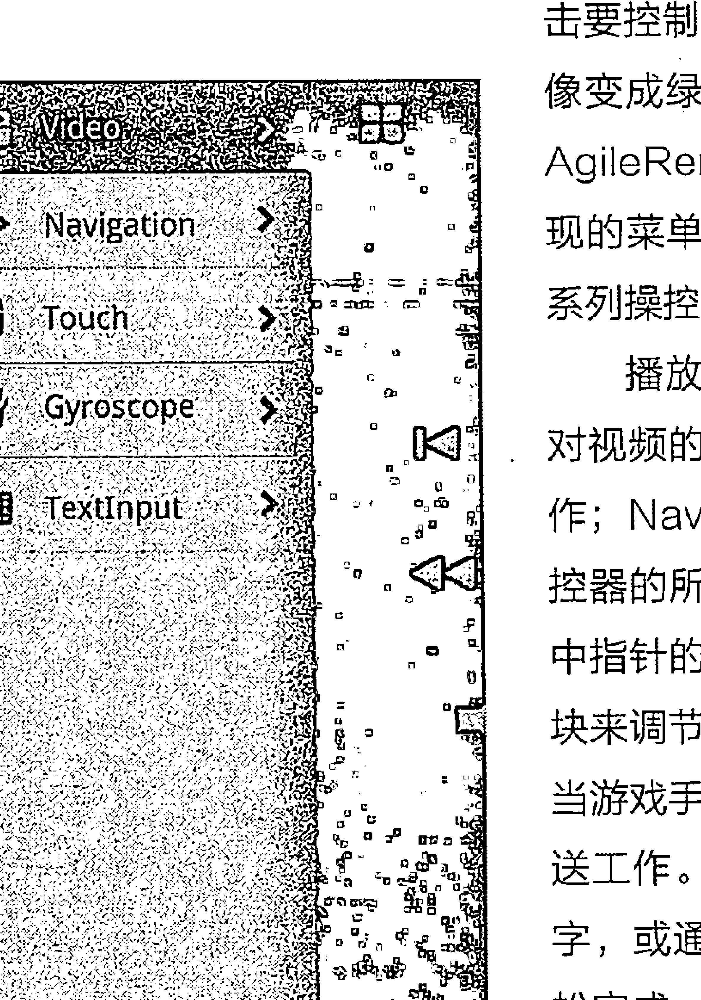

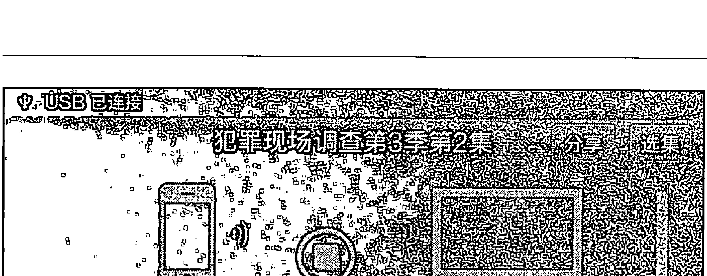

### 方便简单PPTV与盒子联手

PPTV网络电视中拥有大量的点播和直播视频节目，所以通常情况下，我们会在盒子中安装该工具。不过，如果我们在手机端同时安装该工具，即能轻松地让它和手机携起手来，以实现某些便捷的操作。比如在距离较远时，如果换个思路让手机中点播的视频画面在电视上呈现，无论是操作还是欣赏，岂不是要舒畅很多？手指触摸的便捷程度也远远比遥控来得痛快。

PPTV内置的支持多设备功能，恰好可以满足我们的这一要求。在盒子端安装PPTVHD版，然后在手机安装手机版，以后如果用手机端PPTV点播节目时，屏幕上出现的菜单让我们选择要使用的播放设备（图3），其中包括“本机”和PPTV AndroidTV等，选择后者手机端即会和电视端进行连接（图4），并在连接成功后，将手机中的视频画面显示在电视中。如果节目已经在手机中播放，可以用手指触摸手机中的视频画面调出播放控制条，然后选择右侧的双窗口状态图标，重新选择PPTV AndroidTV项，使其在电视上播放。

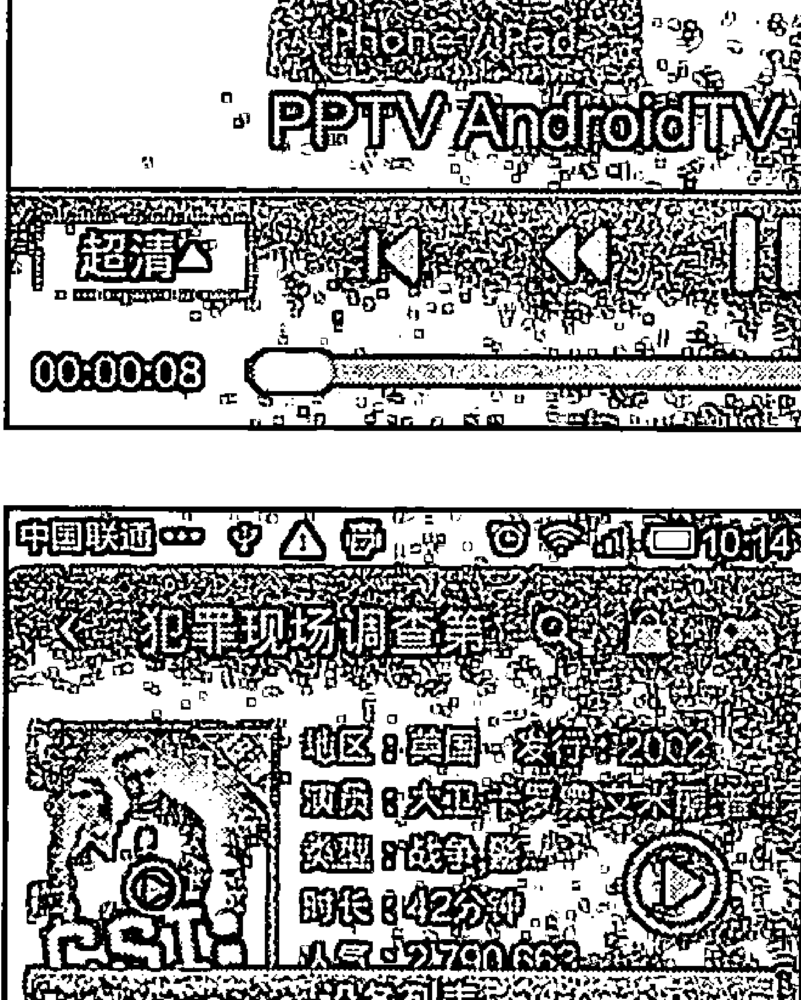

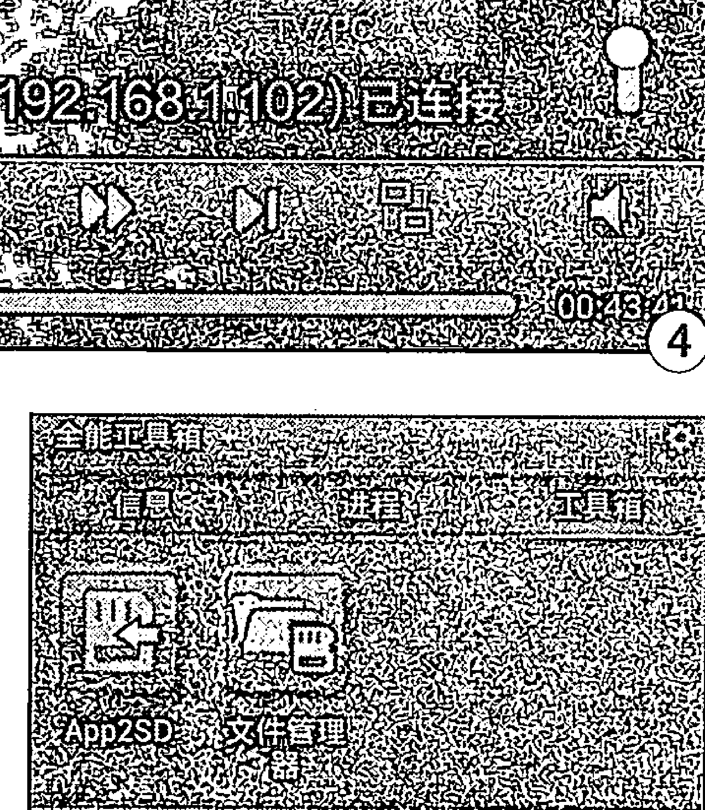

### 随心所欲 锁定指定应用

默认情况下，乐视盒子会使用“中国互联网电视”作为视频播放平台，这样在我们想欣赏节目时，只需在主界面中选择它，然后在出现的界面中选择“乐视TV版”，即能按照自己的要求选择节目了。不过，很多时候，其实我们更希望能使用自己喜欢的某视频应用作为默认播放平台。我们完全可以通过在主界面中选择“应用”，然后自行选择使用其它视频应用来播放。

这种播放也存在缺点，那就是我们每次都必须要进入应用列表页面，才能选择并启动要用的应用，操作起来比较麻烦。我们希望开机即可进入“电视”、“搜狐视频”等应用，以尽快地选择节目。那么，我们有没有一个更为便捷的方法，可让盒子启动后自动进入我们指定的某个视频应用呢？答案是肯定的，我们可以借助“全能工具箱”来实现。

在盒子端安装并启动该应用，在出现的主界面中切换到“工具箱”标签，点击“启动项管理”栏中的“启动项添加”按钮（图5），然后在接下来的界面中，勾选要随机启动的视频应用。现在重启盒子（一定要通过插拔电源重启），看看我们需要使用的应用是不是已经启动了？接下来，就可以直接选择要看的节目了。

# 拍出冰雪世界

寒冬腊月，不一定能看到飞雪，但是却随处可见冰的影子。别看冰无色透明，拍摄好了一样五彩纷呈。

文 | 流言

冬天来了，到处可见冰花、冰棱、冰河、冰树等景象，不过它们看起来很美，拍成照片后却可能暗淡无光，与自己所想相去甚远。要想拍好冰雪风景，还是需要掌握一些方法的。

## 光线要这么选

冰是透明或半透明的，所以个人认为在拍摄冰的时候，侧光、逆光较能体现出冰的质感与层次，效果最好。

逆光，说白了就是相机迎着光源拍摄。逆光照射下的冰雪显得晶莹剔透，并且还容易出现一圈闪亮的轮廓线（所以逆光又被称为“轮廓照明”），增添梦幻色彩。不过要注意的是, 因为冰是透明的, 所以要选择暗一点的背景, 这样才能将要拍摄的冰突显出来。


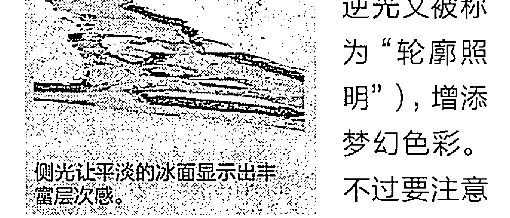

## 如何为冰景增加色彩

冰雪照片，色彩相对来说比较单一，为了不让图片显得单调，在构图拍摄时，最好能增加一些彩色元素，这样照片将更生动有趣。一是通过有色光源增加色彩，如暖色调的阳光、彩灯等；一是通过彩色物体的点缀，如红灯笼、花朵、红房子等等。

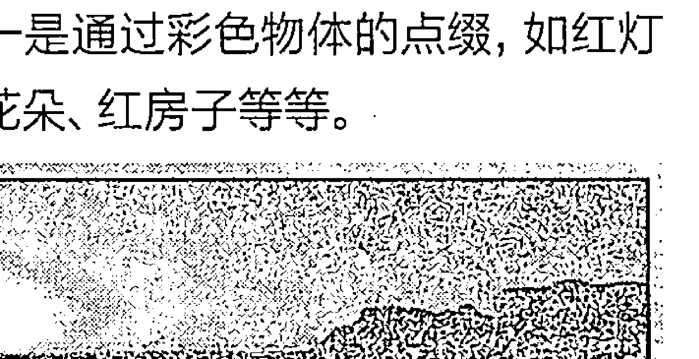

## 微世界中的奇特冰景效果

虽然冰是无色透明的，但是通过微距镜头仔细观察，会发现它们其实有很多变化。比如冰中的气泡、各种花纹、冰裂等，产生复杂而有趣的形状。我们可以购买添置微距镜头，普通爱好者也可以像我们前几期杂志中介绍的那样，自制一些微距镜头。

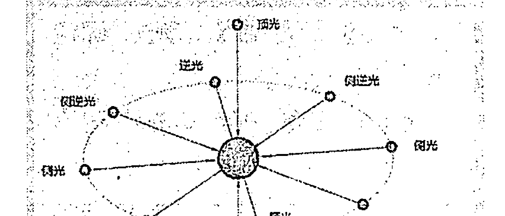

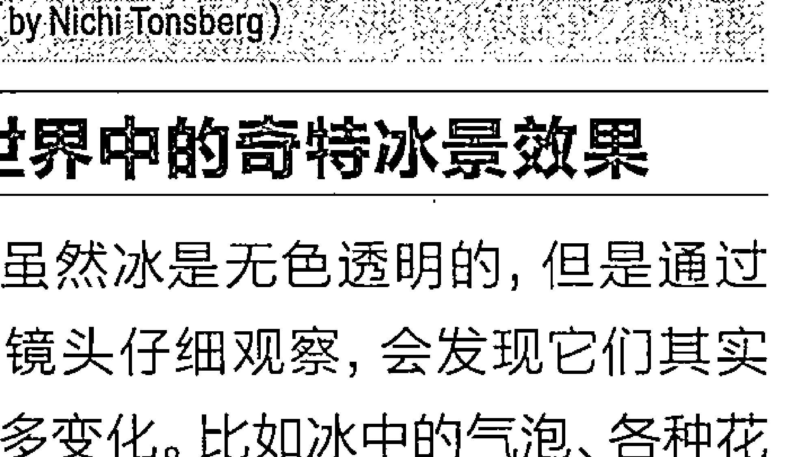

## 自制冰滤镜

通过微距镜头可以发现冰世界中的奇观，那如果通过冰去观察这个世界，又会是什么景象呢？我们可以用冰制作成一个滤镜，通过它去拍摄，会有意想不到的效果。

制作冰滤镜的水要干净，可以用纯净水。准备一个稍有点高度的圆圈，如一些通透的盖子等。其实用家用卫生纸中间的那个圆芯就可以制作一个。剪下一圈，然后放在一个平底的杯子里，在圈中间加些水，再放入冰箱中冷冻成冰就可以了。使用时，将冰滤镜取出，挡在镜头前拍摄就可以了。

不过要注意，冰滤镜很容易就融化掉，而且也要小心融化的水渗入相机里损坏相机元件哦。

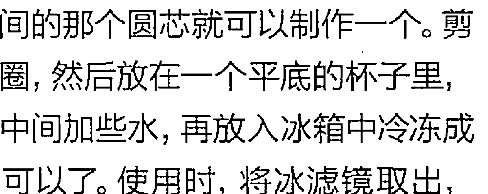

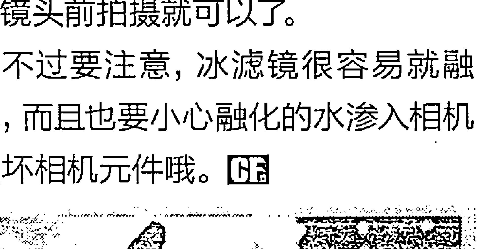

# 小工具巧治宠物'怪眼症'

文|刘景云

给宠物拍照，常会出现“电眼”之类的怪眼症(图1)，借助Pet Eye Fix Guide（下载地址：http://tintguide.com/load/PetEyeFixGuide-English.exe），可以轻松还原宠物们可爱的眼神。

打开猫咪照片，在窗口右侧Tools栏中点击第二排第五个按钮，之后在Cat Pupil面板中的Thickness栏中拖动滑块，将其值设置为90，表示调整猫眼瞳孔的大小。在Rotation栏中拖动滑块，将其值设置为5，表示调整瞳孔的旋转角度。接下来需要将该样本移植到猫的左眼上，将鼠标移动到猫身上，因为默认的圆形选择框并不适合猫眼的需要，上下拨动滚轮调整选择框的大小，使其与猫眼完美匹配，在猫咪中位置点击鼠标，将瞳孔样板粘贴到猫眼中。用同样的方法，为猫咪设置右眼瞳孔的样本。

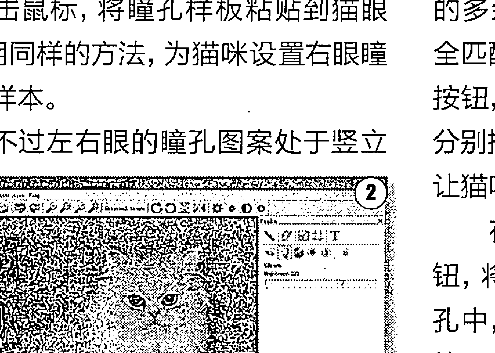

不过左右眼的瞳孔图案处于竖立状态，看起来很不搭调，还需要对瞳孔的多余部位进行擦除，使其与猫眼完全匹配。在Tools栏中点击第一排第二个按钮，选择擦除工具，在猫咪左右眼上分别拖动鼠标，擦除多余的瞳孔图案，让猫咪拥有正常的黑色的瞳孔。

在Tools栏中点击第二排第二个按钮，将鼠标移动到猫咪左侧眼睛的瞳孔中，拖动鼠标绘制出瞳孔中的反光效果。同理，为猫咪的左眼同样绘制反光效果。

经过以上一连串的编辑操作，一只神采奕奕的猫咪就出现在我们面前了(图2)。有了这款小工具，以后猫猫狗狗的怪眼症就都能治啦。

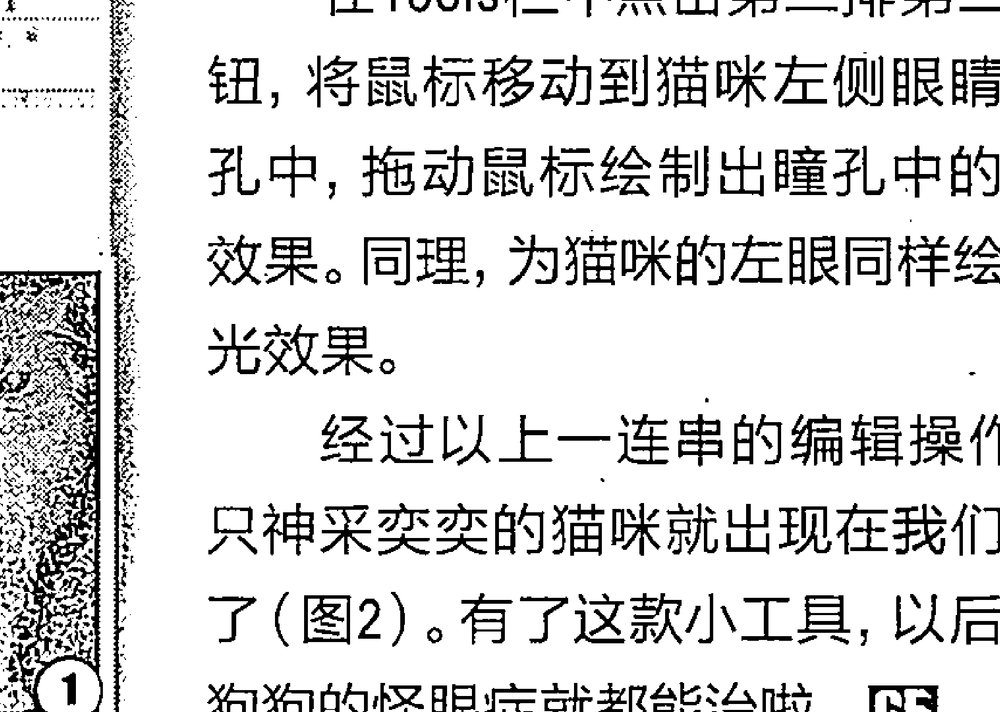

# 六步让南方也能玩雪景

文|于永平 贾凤军

冬天的北方寒风凛冽、白雪皑皑，南方则是山清水秀、一片葱郁，难得见到北方银装素裹的美景，要看雪就只能跑到北方来游览、拍照。其实只要有了Photoshop这款软件，身在南方也一样可以将自己置于雪景中。

- 第1步：在Photoshop中打开素材图像(图1)，通过选择工具将女孩从照片中选取出来，然后单击菜单“图层→新建→通过剪切的图层”，为女孩单独创建一个“图层1”。
- 第2步：选择一个对比度适中的通道，在此选择“红”通道，右击红通道，在弹出的菜单中选择“复制通道”命令，得到“红副本”通道，选择该通道为当前通道。选择“图像→调整→色阶”命令，打开“色阶”对话框，设置输入色阶数值从左至右分别为40、1.5、170，单击“确定”按钮。然后，在通道面板底部单击“将通道作为选区载入”按钮载入选区。
- 第3步：切换到“图层”面板，选中“背景”图层，单击图层面板下方的“创建新的填充或调整图层”按钮，在弹出的菜单中选择“纯色”命令，弹出“拾取实色”对话框，设置其颜色值为 #ffffff（纯白色），单击“确定”按钮，此时出现雪景的雏形。
- 第4步：在图层面板中，选择填充图层“颜色填充1”，单击图层面板下方的“添加图层样式”按钮，在弹出的菜单中选择“斜面和浮雕”命令，弹出“图层样式”对话框，结构深度设置为50%，大小设置为1像素，单击“确定”按钮。
- 第5步：调整“颜色填充1”图层以加深雪景。
- 第6步：在图层面板中，单击“创建新的填充或调整图层”按钮，在弹出的菜单中选择“色相/饱和度”命令，打开“调整”面板的“色相/饱和度”页面，将饱和度设为-30，以降低图像饱和度。此时图像最终效果完成(图2)。


# 因势利导拍出大场面照片

教大家几个简单易行的方法，用普通相机再现气势恢宏的大场景，拍出有足够广度和深度的照片。

文|梦寻

不管是高档的单反相机还是手机，想要拍摄大场面的景观都很困难。旅游中经常会遇到激动人心的场景，广阔、深远，但是一进入相机镜头后这种意境就大打折扣，变得平淡无奇。下面介绍的一些方法不一定很全面，但是掌握了之后，肯定能让你的照片加不少分。

## 怎样用好地平线

通过地平线展现广度和深度的方法似乎人人皆知，不过真用好了也不简单，有好几点需要注意。

- 1.构图时尽可能截取地平线线条比较直的部分，把那些弯曲的线条及障碍物等排除到取景框之外，确保是一条干净的直线。
- 2.尽量选择远处一点的地平线，不要太近，另外也不要让前景中的事物完全遮挡了地平线。
- 3.地平线在画面中呈水平状态，不要让它斜着。另外，地平线最好放在画面三分之一以下的位置，更有深远的感觉。现在数码相机及手机拍照能显示九宫格，可以用来参考。
- 4.用横版拍摄，不要竖着拍。

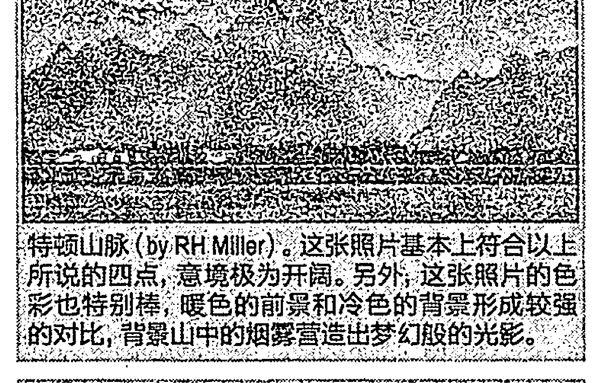


## 怎样选择最佳角度

俗话说，站得高看得远。从相对较高的地方以一个俯视的角度拍摄，特别容易拍出规模宏大的感觉。不过高点不一定能随时找到，在平坦的地方，则可以反其道而行之，不妨压低角度，上一例中拍摄的角度就比正常的视角略低。有些地方则可以更低一点。


## 怎样利用好参照物

什么事就怕对比，桌上放一个西瓜也许你觉不出它有多大，但要是把它跟芝麻相比那简直就是庞然大物了。同样的，有时要表现出大场景效果，可以借助一些参照物来完成。房子、船、动物、人，都可以作为参照物。另外，近大远小是一条重要的透视学规律，合理用好参照物，还能起到增强照片深度的效果。


## 怎样运用透视原理

我们首先做个小实验：画一个大方框，然后在它的中心再画个很小的方框，接着将两个方框对应的顶点用斜线连接起来，形成了四个梯形，最后在下方的那个梯形中，随意画几条横线填充。好了，现在是不是仿佛看到一条幽深的通道效果？这就是一点透视中所有垂直线会向同一个中心点汇聚的原理，它让二维平面产生三维深度的感觉。在画面中寻找这样的纵向线，巧妙构图，就可以让照片变得立体起来。


上面的几个方法简单有效，大家在实践中，相信还能摸索出更多好的方法。最后还想说一点，现在的数码相机、手机等提供有全景拍摄的功能，充分利用，可以拍摄出更加壮观的风景照片来。

# “纸魔术” 拍出五彩节日夜景

通过一张纸，剪裁出各种形状，设计成比较容易安放在镜头上的遮片，从而拍摄出产生魔术般的光斑效果。

文|半页

逢年过节都会张灯结彩，或者生日晚餐烛光浪漫。这些温馨的场面，一定很想拍照纪念吧？今天我们要教大家一个技巧，通过简单的一张纸制作的遮片，为这些场面再增添梦幻般的光斑效果。

散景（焦外成像）的形状是由光圈叶片的形状来决定的，光圈一般为圆形或六边形，要想达到不同形状的效果，比如五角星、心形等异形，则需要自己制作遮片。

第一步：制作散景遮片，需要准备厚一点的深色纸，最好是黑色的，这样可以很好地遮挡光线（废弃不用的纸质手提袋就可以）。另外还需要铅笔、剪刀、胶带等，这些是日常用品，很好找。以镜头盖为参考，在深色纸上描出一个圆形轮廓。

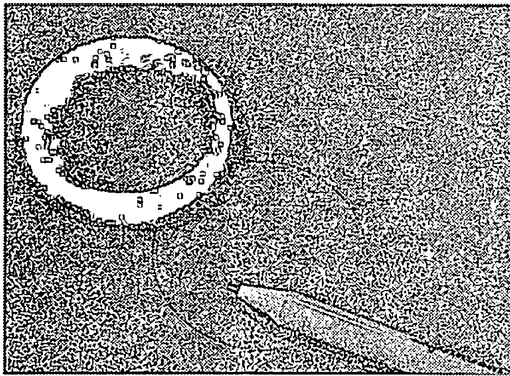

第二步：在圆形轮廓的四周再画上三个‘翅膀’，大约1寸长左右即可，这是为了方便后面的固定。画好后沿着轮廓线将它剪下来。

第三步：在中间画一个任何你想要的形状，比如这里画的是一个心的形状，用小刀将这一块抠下来，成为镂空的图案。需要注意的是，这个心形一定要在中心位置，另外这个心形不能太大，否则可能无法实现光斑效果。理论上来说，镂空的图案要小于镜头的孔径。有一个计算公式：镜头的实际孔径=镜头焦距÷最大光圈值。比如60mm焦距下光圈F2.8，它的实际孔径大小就是60/2.8约等于21mm。


第四步：以上设计的遮片，可以用橡皮筋很容易地固定在镜头上。


第五步：拍摄的时候，最好使用三脚架固定相机，切换到手动对焦镜头，设置光圈优先模式，光圈尽量大一些（大光圈小景深容易得到光斑效果），另外要迎着灯光逆光拍摄。这是上面制作的心形遮片拍摄完成的效果，很炫。


第六步：这是小狗脚印形状的光斑效果，别有一番情趣吧。


第七步：还可以制作圆桶状的遮片，使用时套在镜头上，很方便。这个五角星的遮片，拍出的烛光效果也非常炫。


### 小知识 焦外成像

★本文中的方法，利用的是焦外成像的原理。一般在景深较浅的摄影成像中，落在景深（焦点）以外的画面，会产生逐渐松散模糊的效果。这就是所谓的焦外成像，也叫做虚像、散焦、散景等。

焦外成像可以分成两大类型：
- 1.模糊虚化，除焦点外，整个画面都是扩散的、模糊的，边缘没有残留部分；
- 2.被摄物体的散焦画面轮廓被两条或者数条线分开，最为明显的例子就是折反射镜头，具有明显的二线性。一般来说，这是不太理想的焦外成像，二线性出现容易对主体产生干扰。不过，巧妙运用，也能营造出有意思的画面。

> > 编译参考：http://tinyurl.com/bwhcl6w

# 新年合影大盘点

单人照和双人照的拍摄方法不尽相同，三个人的合影又别有技巧，随着合影人数变多情况也就越复杂。本文教你如何拍好合影。

文|暗香

新春佳节，是亲人朋友聚会的好时机，一群人聚在一起，总是希望能捕捉下一些难忘的镜头，记住这样温馨的日子。但是要拍好合影，也不是件容易的事，其中也有不少的经验技巧。

## 抓拍精彩的瞬间

合影的人数众多，动作表情不可能做到完全一致，所以拍摄合影最需要把握好时机，实际上就是预先判断的能力，就能设想到的所有情况预先做好准备。

为了做到一致，拍摄前还可以让大家喊同一个词，如“茄子”、Cheers等，这些词发音时的口型与笑的表情很接近。如果合影中有儿童，他们的注意力比较容易分散，准备拍摄前摄影师可以呼喊儿童的名字，当吸引他们往镜头这边看的时候，抓住时机抢拍。


在尊重合影者意愿的基础上，摄影师也要根据构图适当调整，比如深色衣服的人最好不要都挨在一起，可以让着鲜艳衣服的人做个间隔，让整个色彩协调有节奏。

## 合影的构图技巧

合影的构图不容易掌握，但也最容易出创意。

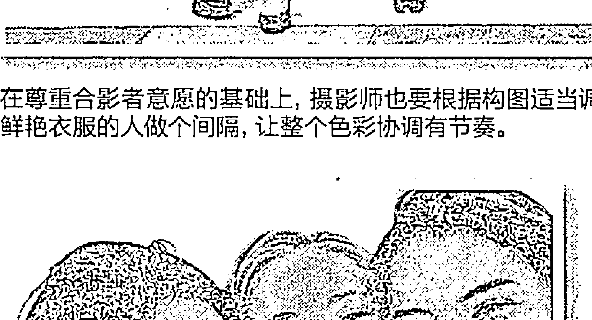

欢笑不是凝固的，而是一个动态的过程（否则就太僵化了），我们要做的就是聚精会神地等待那个最完美的瞬间出现，然后卡嚓按下快门。

的脸上都能清晰可见。另外要先征求合影者的意见，可能他们对位置安排有特别的要求，比如长者或者领导要在中间等等。

首先是位置安排，要确保每个人

一些具体情况还要灵活处理，比如顶尖职业摄影师Brett，有一次他在海滩给一家人拍摄照片，其中最大的年龄已经85岁，而最小的才7岁。85岁的老祖母没有力气站太久，于是Brett构图时安置了一把椅子在画面正中，祖母坐在上面，其他家庭成员环绕在她四周。对每一位被摄对象的这种关心通常能给你带来一些额外的创意方式。


拍摄跳跃的照片比较能锻炼抓拍的能力，我们必须在人物起跳之前就做好准备，包括光线的选择（本例为逆光）、大致的构图效果等，这样才能在跳起的瞬间定格最精彩的画面。


这张照片中，从男女主角的亲昵动作可以看出他们的和谐相处，他们共同托起孩子，也表示他们是家庭的顶梁柱。小男孩的顽皮、小女孩的羞涩，整张照片透出温馨欢乐。

较暗环境下的闪光灯拍摄，效果非常不自然。最好关掉闪光灯，换到明亮的场景中拍摄，并且提高ISO感光度，以及通过大光圈及慢快门的方法增强光线亮度。

## 合影照片里要有故事

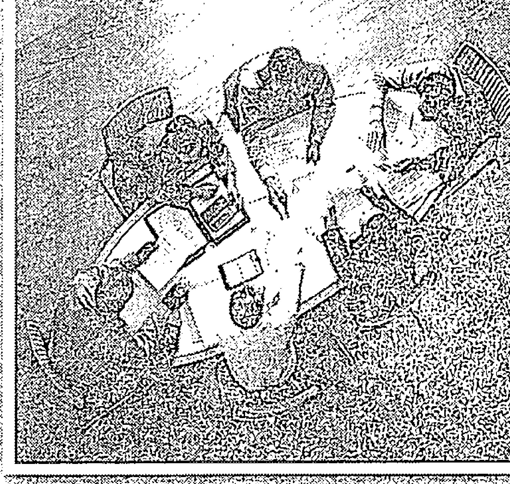

合影照片最大的意义，就在于其中有故事，这样才值得纪念。不过，要在一张静态照片中讲述故事，难度很大。一个比较好的方法，就是通过照片中的人物关系来讲述。

## 选择不一样的角度

需求的不同导致不同的拍摄角度，比如老年人喜欢稳重的风格，更喜欢中规中矩的全家福，这时平视是最常用的角度。而年轻人可能更倾向于比较活泼的风格，喜欢突现个性和创意，则需要全新的人物布局和不同的视角，比如仰拍、俯拍，或者超低角度拍摄等，会有不一样的效果。

比如前面的例子中，老祖母坐在中间，一家人围绕着她，即体现出这个家庭中的人物关系。再比如在多人的合影中，距离的远近可以表现出他们之间的亲昵程度，甚至一些特殊的关系等等。

绝对的俯拍，让这张照片的效果非同凡响。

## 图解21种合影的姿势

不管是高档的单反相机，还是普通的卡片机，甚至是手机拍照，对合影照来说，最关键的是构图和人物布局。一般来说合影有三大类：
一是人数众多的中规中矩的合影；一是无拘无束的朋友之间的合影；一是家庭合影。
下面的图示，可以作为大家在不同类型合影中的参考。

来源：http://tinyurl.com/a7dxon6


# 烟花烟花满天飞——烟花拍摄

每逢新春佳节，国人都喜欢通过放烟花来表示庆贺。如何才能将烟花绽放时如梦如幻的氛围定格于照片中呢？这需要掌握一定的技巧。

文|梦与梦寻

烟花是动态的，转瞬即逝，而且易受天气因素影响，没有规律性，非常不好拍摄。初学者因为没有经验，拍摄烟花往往画面抖动模糊，或者拍摄出的烟花轨迹不清晰，甚至只显示点状烟花而没有轨迹，一点也不美观。另外初学者还会出现只能拍摄到单个烟花、照片过曝等等问题。下面我们就来聊聊烟花拍摄的注意事项和技巧。

## 开始前的准备

烟花拍摄一般会用到长时间曝光，如果相机抖动就会造成画面模糊，所以三脚架是一个必备的辅助工具。如果能再配上快门线，就能更进一步减少按快门时的震动了。


最常见的是选择夜晚黑色的天空做背景，可以突显烟花的绚丽效果。其实有时恰当选择一些建筑物作为背景参照，也能让烟花照片别有韵味。这幅作品中，悉尼歌剧院和海港大桥的灯光，与烟花相映成辉（by Damm Fridmar）。

一般大型的烟花晚会，事先都会有关于时间、地点的预报，根据这些信息，先行去踩点，熟悉环境找到最佳拍摄点。比如不要靠烟花太近，大场景烟花拍摄点优先选择高处，最好有建筑物的背景以衬托烟花，根据风的方向和力度调整角度（逆风会受到烟雾干扰，顺风则烟雾会影响背景导致烟花不突出，侧风则是较好的选择），等等。

## 烟花拍摄各参数

准备工作做好后，接下来就是相机的设置。首先是对焦，使用自动对焦功能把对焦点定在烟花即将出现处，然后再将相机设定成手动对焦，锁定焦点。如果不能确定烟花位置，为了安全起见，可在手动对焦模式下将焦距设定为无限远（横∞字符号）。

快门时间是烟花拍摄中最关键的设置。有些人拍摄的烟花星星点点没有美感，主要就是因为快门时间太短造成的。适当延长快门速度可追踪出烟花的轨迹，时间越长烟花的轨迹也就越长。

拍摄烟花时，ISO值不可设置过高，一般在100即可，因为ISO值过高会产生很多噪点，影响照片质量，ISO值太低又可能导致曝光不足。可在现场试拍几张，然后视拍摄效果微调ISO值（可在100-400之间）。

设置完毕，剩下的就是等待烟花盛开时按下快门了。

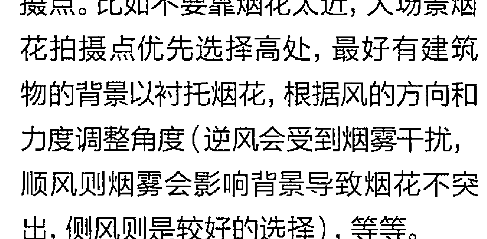

iPhone手机同样也可以配备三脚架和快门线。

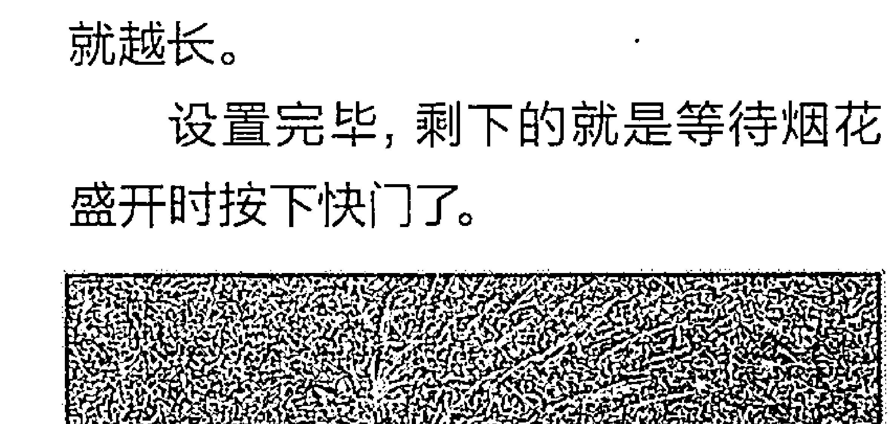

一般来说，快门时间可设在1-5秒之间，甚至更长。需要注意的是，快门时间越长，光圈相对就要越小，否则可能导致过曝。这幅照片，ISO值为200，光圈值为f/11，曝光时间为2秒。（by Nasim Mansurov）


理想位置示意图，与烟花成45度角。

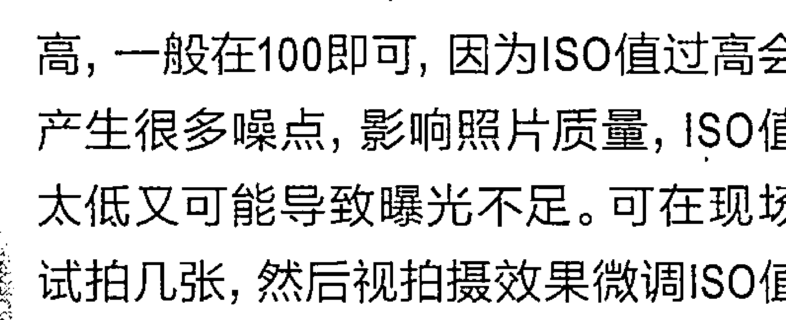

手动对焦中的无限远。


多重曝光让烟花可以聚集在同一样照片上，场面壮观。

## 晶体风格的烟花拍摄

David Johnson在网上发布了一系列晶体风格的烟花作品，效果独特，引起许多人的好奇。他是怎么做到的呢？


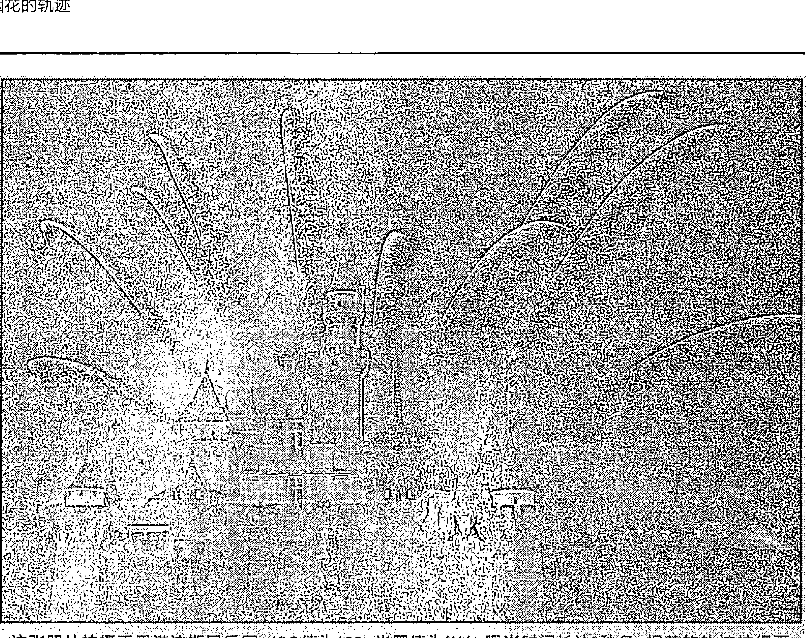

所有的准备工作与前面所说的相近（这里需要遥控的快门线），区别在于具体拍摄的时候。估算烟花要散开还没散开的时候，先模糊对焦，并开始启动快门，当烟花打开之后，快速调焦，一旦焦距完美调整完成，马上释放快门结束曝光就可以了。

## 烟花拍摄中的构图技巧

烟花照片的构图美感，与一般的审美要求相似，像黄金分割这样的原理同样适用。不过因为烟花的不可控性，往往很难有非常满意的构图，那么不妨在拍摄之时，尽量采用广角（或望远）拍摄，通过后期裁剪得到满意的构图。

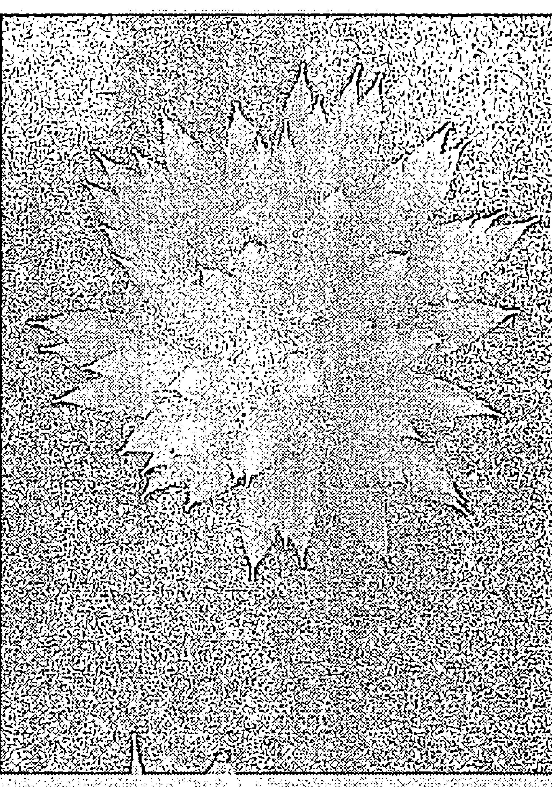

## 黑卡技术让烟花朵朵开

烟花此起彼伏升上夜空，非常壮观。不过每次的拍摄曝光时间很短，往往只能拍下一两个，最终的成片中，烟花零零落落的，完全没有现场所感知到的气氛。所以有不少人采用“黑卡”技术，让不同时间升空的烟花，同时呈现在同一张照片中。

黑卡技术并没有想象的那么复杂，我们只需要准备一张黑卡即可（能遮光的黑色的纸也可以）。
拍摄时，曝光时间太短、光线不足会导致图片一片黑，而曝光时间太长又会过曝导致照片一片白。拍摄烟花时超过5秒的曝光，照片就会太亮了，但要想拍摄多个烟花，我们可能需要10秒、20秒甚至更长时间。这时黑卡就可以派上用场：比如第一朵烟花升空，曝光了2秒后，用黑卡临时挡住镜头，等另一朵烟花升空时，移开黑卡再曝光2秒。如此多次曝光，即可在同一张照片上拍下多个烟花了。


# 旅行拍摄中的模糊美

文|梦与梦寻

虽然我们很多人花了很多的时间摆脱“模糊”镜头，但其实善加利用，有时特意捕捉到的一些运动模糊，能获得非常有趣的效果。

# 捕捉“模糊美”的十个瞬间

我们在拍摄时，相机快门时间稍长，再加上相机或者被拍物体快速移动或抖动，就会产生模糊的影像，这是摄影的大忌。不过今天我们反其道而行，正是要教大家如何达到“模糊美”。

## 车站 (by Extra Medium)

这张照片，是一个乘客在地铁站台等车时，一列火车正在行驶时拍摄的，静静等待的人和呼啸而过的列车，一动一静形成有趣的对比。列车呈横向的动态模糊，正好形成一个动态且相对干净的背景。这类主题的照片，关键是要确保相机完全静止，有条件的情况下，最好使用三脚架来拍摄。

## 海边 (by Timbo Don)

海边也是捕捉动态模糊美的好去处。滚滚而来的水浪，经过岩石、桥墩或者沙滩的时候，可以创造出一个神秘的雾气弥漫的模糊效果。这种场景的拍摄，关键在于设置快门优先，并将快门时间适当延长一点。另外别忘了，有人的地方就会有运动！所以不要仅仅聚焦在水上。

## 户外娱乐场 (by Soundman 1024)

游乐园中有很多可以产生模糊效果的场景，比如秋千、旋转木马等等。要想获取主体（一般为人物主角）清晰而背景为动态模糊的效果，一种是想办法让相机和被拍摄主体之间保持固定的位置。比如拍摄者（或者以三脚架固定好相机）和被拍摄者静坐在转盘上，转动转盘后再拍摄。还有就是借助设备，比如可移动三脚架来完成。

## 自行车 (by fabbriciuse)

如今与自行车相关的主题拍摄有不少，比如街拍、自行车赛等，还有人将相机固定在自行车上进行实景拍摄。自行车摄影中，可以试试慢速同步闪光模式来添加动态模糊效果。

## 汽车 (by m4r00n3d)

行车一样，汽车也为我们捕捉动态模糊瞬间提供了很多机会，既可以在车内拍摄车外的情景，也可以将相机固定在车上，以一种独特的视角拍摄（比如谷歌地图的街景车），或者从车外拍摄奔驰中的汽车。在汽车运动时拍摄，如果想要被拍摄主体清晰可见，主要的方法就是提高快门速度。如果适当延长快门时间，会得到类似延长线的动态模糊效果。

## 游乐园 (by joiseyshowaa)

游乐园中有许多令人兴奋的项目，许多游乐设施都由运动部件和固定部件两部分组成，可以在拍摄中获得奇妙的效果。这张照片中的旋转机，由于采用了快门延迟及HDR技术，从而产生超现实的奇幻效果。

慢速同步闪光原理：快门速度与是否打开闪光灯无关，即使打开闪光灯，仍然可以得到较长时间曝光。这样，前景物体可以通过闪光灯获得足够曝光，而背景也可以通过延长曝光时间获得足够的曝光量。

## 舞蹈 (by bichxa)

看过电影的人都有这样的体验，无论什么样的场景，一旦采用慢镜头来处理，一下子就变得诗情画意。拍摄中的动态模糊，有时就会产生这种慢镜头的感觉。这张照片主要也是采用快门延时的方法，从上往下俯角拍摄，完美表现出舞之流畅柔美。

## 飞鸟 (by Midlander1231)

鸟类摄影通常受到大家的欢迎。鸟类摄影的关键就是在快门速度的选择上，较快的快门可以确保鸟的主体是清晰的，而它们飞快扇动的翅膀则呈现出一定的动态模糊的效果，动感十足。

超长时间曝光。最短的曝光时间有几十秒，最长的竟然达4万多秒。

## 伞的魔术 (by Digimist)

巧妙运用道具，也能造就各种奇妙的效果，这张照片中，小女孩快速转动小花伞，动态模糊下形成一道绚丽的背景，非常漂亮。

## 绚丽星迹 (by Lincoln Harrison)

摄影师Lincoln Harrison在澳大利亚北部的Eppalock湖，拍下了一组令人震惊的照片，每张照片都能让人清晰地看见星星在夜空移动的轨迹，并且绚丽多彩。这组照片的奥秘就是：

## 人工“增加”照片的曝光时间

傻瓜相机（或拍照手机）与专业相机比较起来，主要是缺少灵活的手动功能，比如傻瓜相机的快门时间一般是不能手动改变的，所以很难拍出上面那些动态模糊的效果。不过，没有奇迹也可以创造奇迹。下面，我们就在Photoshop中，为一张普通的溪水照片“增加”如梦如幻的雾的效果。

首先我们来比较一下快门时间延长的真实效果。下图左侧是快速曝光所产生的清晰照片，真实的水流确实不是太美；而右侧延长了快门时间，水流产生雾化效果，漂亮多了。

接下来在Photoshop中打开一张快速快门下拍摄的正常照片。点击菜单 Select → Color Range（选取→色彩范围），然后在图片中水的区域（白色）点击一下鼠标，表示要选择已有选区中所有的白色，勾选对话框中的 Localized Color Clusters（锁定连续颜色），再拖动调节其下的两个滑钮，直到精确选中溪水。点击 OK 确定，瀑布被选中，适当对选区进行扩展和羽化处理，完成后按 Ctrl+J 键将选区变成新图层。在此新图层中进行操作，单击菜单 Filter → Blur → Gaussian Blur（滤镜→模糊→高斯模糊），适当模糊后，就可以得到慢速快门拍摄的水流雾化效果啦。

当然，这一节主要介绍的是实现方法，效果还可以再精雕细琢，有兴趣的朋友可以多试试。（文章参考：http://tinyurl.com/3ab26us）

## 照片‘烧’出好菜

许多菜肴，往往看起来好吃起来香，但是拍出照片后却发现菜肴暗淡无光，其实菜肴摄影也需要掌握一些方法和技巧。

文/秀色

逢年过节，不少人都喜欢大展身手一显厨艺，不过独乐乐不如众乐乐，把做好的菜拍摄出来放到网上与好友分享，也是一大乐事。专业的菜肴摄影在摄影器材、灯光等上面都有很高的要求，不过像我们这样日常生活中的拍摄一般只能就地取材，所以只有在拍摄技巧和构图上有出奇制胜的机会。

### 菜肴拍摄也需要‘火候’

做菜需要掌握火候，菜肴摄影同样要掌握“火候”。比如有些热汤热菜，刚出锅时光泽鲜艳，一旦凉下来，色彩就会变暗，而且那种水汽所形成的热气腾腾的感觉也没有了。这种情况下，可以事先做好准备工作，比如铺好作为菜肴背景的桌布，布置好作为点缀的餐具的位置，最好还能摆好一个菜盘进行预演，设计好相机的角度和位置，达到最佳构图。

这杯冒着浓浓香气的热咖啡照片，事先以三脚架固定好相机的位置和角度，做好充足准备，在咖啡新鲜出炉后即投入拍摄。（光圈：f/3.2；曝光：1/30秒；ISO：200；强制无闪光）

### 就地取材用好光线

菜做得再好，没有适当的光线，也很难拍出漂亮的菜肴照片。对一般家庭来说很少会有专业的灯光设备，所以要想方设法利用自然光和一些工具。方法之一是将要拍摄的菜肴放置在窗边，借助窗外的阳光照明。另外，家里如果有台灯也可以用它来打光，台灯很容易控制光线的方向，还是比较方便的。在已有光线的基础上，还可以拿锡箔纸（类似烟盒中的那种银色衬纸）、镜子、白卡纸或者任何反光较强的东西来增加光线。

除了以上光线增强的方法，还可以根据相机来想点办法，比如慢速快门可以增加照片的亮度，不过这时最好要配置三脚架，慢快门很容易因为手抖而造成照片模糊。

**小提示**
菜肴摄影，一般不建议使用相机上的闪光灯，这样拍出的菜肴，色彩会比较生硬，效果不好。如果有便携式闪光灯（可移动）的话，可以对着墙或者天花板打光，让闪光通过反射照回到菜肴上，这样能确保得到比较柔和的效果。

三点布光由主光、辅助光及背景光等三个光源构成，是摄影中最为经典的布光法，在菜肴摄影中也经常被使用。

麦当劳的这张宣传图片，最能体现菜肴摄影中的三点布光法：右上角是主光源，提供食物主要的照明；下方使用了反射板进行补光，以防止主光源照不到的地方太暗；背景灯增加背景的亮度，从而衬托出主体，并使食物与背景隔离，便于后期的提取等操作。（这张照片就已经稍作后期处理了）

日常家庭中的菜肴拍摄，一般有一个主光（台灯等也可以替代）差不多就够了。这张照片中的背景光去掉也不会太影响效果，保留主光源和适当的补光，色彩一样鲜艳丰满。其实反光用的反射板在日常生活中很容易找到，随便什么白卡纸或锡箔纸都可以。

### 菜肴摄影的角度和构图

菜肴摄影的角度和构图，一般来说常用45度角拍摄，采用微距，还有些摄影者喜欢用大光圈虚化背景，让被拍摄的菜肴更加突出。另外，厨师的手艺也是菜肴摄影的构图关键，码放的形状好，色彩搭配得好，构图就成功了一半。

菜肴摄影要善于“摆造型”。这张照片中，虽然有黄色点缀，但是白色的点心和白色的盘子极容易混合在一起，作者巧妙地垫上粽子叶做深色背景，配上一片芹菜叶构成船的造型，非常别致。

微距+45度角，是菜肴拍摄中最常用的构图方式，实践也证明了这种方式非常有效。（光圈：f/2.8；曝光：1/25秒；ISO：400；焦距：4毫米；强制无闪光）

菜肴摄影中，大光圈的使用也很频繁。大光圈可以让背景虚化，更加突出菜肴主体。

> **小提示**
有些专业菜肴摄影，把菜做得半熟再在菜上淋些油进行修饰加工，这样拍出的菜肴光泽亮丽。不过这不太适合日常的拍摄，总不能为了拍图而吃生的菜吧。

### 揭秘：菜肴如何变得热气腾腾

一碗热汤，一杯热咖啡，甚至一个热气腾腾的烤土豆，会让人感觉无比的温暖从而胃口大开。不过要想把菜肴上云雾缭绕的感觉拍摄下来可不容易，这里介绍一些商业摄影中的方法。热菜或热饮的专业拍摄，有三大要素：深色背景、水雾、背光灯。大家可能不知道，商业拍摄中菜肴的蒸汽效果，大部分是人工制造出来的。较常用的方法，是通过一个机器产生蒸汽，再接通一个管子让蒸汽流出，然后将管子放置在菜肴后面相机拍不到的位置。也有人借助抽的烟或者卫生棉球点燃的烟来制造菜肴的水雾效果。雾气是近于透明的白色，如果不用深色背景衬托，很难显现。所以为拍摄的菜肴设置一个深色的背景很有必要。背光灯也是热菜热饮拍摄的重要配置，否则很难拍出真实的雾气效果。所谓背光灯，就是在被拍摄物体的后面，光线迎着照相机的方向（参考：http://tinyurl.com/o6dh2w）。

为拍摄的菜肴配置一个深色的背景，与白色的水雾产生对比，从而使其突出。

实拍效果图，深色背景让雾气非常突出。

# 摄影中的色彩世界

生活中到处是色彩，当我们用相机捕捉下这色彩的世界时，为什么有些会让人赏心悦目，而有些却令人淡漠甚至讨厌呢？其实，摄影色彩也是很有窍门的。

文|梦与梦寻

说起来人眼可见的色彩，无非红、橙、黄、绿、青、蓝、紫七种，但是当它们以各种形式混合在一起的时候，便形成了一个五彩缤纷的世界。不过，并不是所有的色彩都是美的，在这纷繁的世界我们要有善于发现美的眼睛，而照相机就是协助我们发现美的第三只眼。

## 用色彩为照片营造气氛

红色让人亢奋，黄色让人温暖，蓝色让人恬静，绿色让人清新。不同的色彩能引发人的不同感觉，当我们确定了照片要表达的主题后，就要善于运用色彩为照片营造一种气氛和情感基调。

图中这幅秋天的风景照片，整个画面笼罩着一种橙黄色的暖色调，给人一种温暖和温馨的感觉。在这浪漫而柔和的氛围之中，处于视觉中心的两朵玫瑰，看起来并不突出，但却牢牢吸引了我们的想象力，可以联想到许多浪漫的故事。玫瑰是故事的中心，而暖色的背景为这个故事定下了温暖的基调，两者相辅相成不可分割。大家可以想象一下，如果这两朵玫瑰是放在雪地的背景中，又会是怎样的情景？

要想在前期拍摄中就能得到指定的一种色彩基调，有时需要通过调整相机的色温来实现，可以得到偏红或者偏蓝的影像。什么是色温（Color temperature）呢？说白了色温就是不同温度下呈现出的色彩，单位是K（开尔文）。当一个黑色物体受热后便开始发光，它先是变成暗红色，随着温度的升高变成黄色，再升高会变成蓝色，根据这一温度变化来界定不同颜色。比如荧光灯的色温为3000K左右，中午太阳光的色温为5600K左右等等。

数码相机里的调整白平衡，实际就是在调整色温，一般有自动、晴天、阴天、白炽灯、荧光灯等几种模式。相机中色温调得越高，照片的色调就越偏向暖色调。

| 光源名称 | 色温 | 光源名称 | 色温 |
|----------|------|----------|------|
| 蜡烛 | 1930K | 朝阳及夕阳 | 2000K |
| 家用钨丝灯 | 2900K | 日出后一小时 | 3500K |
| 早晨及午后阳光 | 4300K | 中午阳光 | 5600K |
| 雪地 | 7000~8500K | 阴天 | 6500K |
| 电视屏幕 | 5500~8000K | 蓝天无云的天空 | 11000K |

### 小知识

在摄影的光学理论中，人们把不同波长的七种可见光划分为三种主要色光，即所谓红（R）绿（G）蓝（B）三原色。600~700毫微米为红色光，包括红、橙；500~600毫微米为绿色光，包括黄、绿；400~500毫微米为蓝色光，包括青、蓝、紫。三原色交叉混合的部分形成黄（Y）青（C）品红（M），被称之为三补色。

同样的暖色调，这里多了一份黄昏的安详

整体的蓝色构成清澈宁静的氛围，更深的色彩让桥梁突出于画面

## 色彩与构图

摄影中的所谓构图，其实就是要进行一系列的选择：哪些元素应当包含在画面中，哪些元素应该排除出去，以及画面中的元素位置如何排列等等。而色彩在摄影构图中的作用，主要就是画面中的各种颜色应该怎么搭配。

相似色也可以在谐调中体现层次变化

同样的红色，一个鲜亮，一个暗淡，就会构成对比，这是饱和度层次上的对比。理论上来说，所有照片的色彩构成必然都是对比构成，不过习惯上还是把对比不太强烈的归到统一色构成中。
从上面的多幅作品中，可以看出色彩各有特色，不同色彩给人的感受也不尽相同。摄影中巧妙利用色彩，将会更好地帮助我们表达作品的主题，渲染特定的气氛，从而影响到欣赏者的思想情感，是非常重要的表现手段。

### 统一色构成

前面讨论色彩基调的时候，我们所举的例子基本上都是同一色系构成的，这其实就是一种构图方法。当然完全相同的颜色构成的照片，基本是不可能的，大多是相似色构成，同中有异，既协调又有所变化。
统一色构成分两大类，一是暖调构成，一是冷调构成。前面的例子基本上都是红、橙、黄等暖色调构成，温暖、热情、欢乐。而与之相对的是绿、青、蓝构成的冷色调构成，这类照片容易形成寒冷、清爽、冷静的感觉。

冷暖对比让主体更加突出

### 对比构成

实际生活并不是纯一色，生活中更多的是多种色彩的对比。因为色彩是由色相、饱和度、亮度三要素构成，所以色彩对比也可以从这三个层次上展开。实际操作中，最强的对比是互补色，如红与青、黄与蓝、品红和绿色，这是色相层次的对比。较弱的对比是同一色，

色彩是有形状的，不同色块构成不同风格的对比

> ## 小提示
注意，摄影中色调的调整，最主要的目的是还原事物真实的色彩，偏色调调整一般只在有特殊表现需要的时候才会使用。另外，摄影中色调的调整，还可以通过各种滤色镜来实现。滤色镜通常是由有色光学或有色化学胶膜制作而成，使用时将它装在镜头前，以调节景物的影调与反差。

# 发掘身边的创意摄影

想要拍摄出好照片，昂贵的摄影器材可能是非常重要的辅助工具，但关键还是要有创意，只要有好的创意，普通相机也能拍摄出的让人耳目一新的照片来。
文|秀色

创意摄影，也可以称之为超现实摄影，即不是通过相机简单记录下现实生活场景，而是超常发挥主观能动性，让所有现实情景仿佛都置于我们的掌控之中。比如现实中太阳是可望而不可及的，但是通过特殊角度和构图，可以表现出人物手捧太阳冉冉升起的景观，令人叹为观止。总之，创意摄影就是通过各种手段“改变”现实，或者说是改变人的视觉习惯。

> 小知识
相机抖动法则
(CAMERA SHAKE RULE)
当你手持相机拍摄时，快门的速度不能小于镜头焦距的倒数。如果快门速度越慢，那么拍摄抖动时就可能降低锐度。如果用50mm焦距的话，快门就要达到1/60秒以上为宜，只有当环境实在昏暗时，用闪光灯、脚架或者把相机放在硬物上防止抖动。

## 奇妙的错位

创意摄影中最常采用的方法就是错位摄影，实际上就是通过眼睛所产生的错觉，将两个（或多个）不同的元素组合成一体，从而达到惊人的效果。这一方法重在创意，操作难度其实不太大。
错位摄影中最容易做到的是“透视错觉”效果。比如下图中，看起来是一个“巨人”，手中托起了七八个小人，吹口气就将小人吹跑。实际上，这张照片巧妙采用了近大远小的透视效果，远处的几个人显得非常小，他们排在一条直线上，并摆好被风吹倒的姿势，而前景中的人，用手平托，正好对齐远处人物的基线，从而形成错觉，感觉是一个人的“大手”托起了众人。这种效果在前期拍摄时就可以完成，完全不用后期的PS处理。

这一方法可以延伸出很多不同的效果，比如可以像弹珠一样用手“弹”太阳，或者用手轻而易举“捏”起远处的大型物体（如汽车、高楼、埃菲尔铁塔等）。总之，只要有想象力，一切皆有可能。
上面都是把大的东西变小，其实也可以反其道而行之，将小的东西变大。比如将矿泉水的瓶子放在最近处，然后被拍摄的人物站在远处，让人物的脚正好与瓶盖对齐，此时人物做一个动作，拍摄下来，就可以产生“瓶盖上的舞蹈”效果了。

## 自然界的巧合

自然界中的许多物体，平时可望而不可及，比如太阳、云彩、彩虹等等，精心设计，完全可以将它们作为道具，为照片添加神奇色彩。


## 翻转角度翻出一片神奇

除了错位的方法，拍摄时翻转一下角度，也就是把照片倒过来（或者倾斜一定的角度），有时也能造成非常神奇的效果。不过，拍摄翻转照片，需要克服一些自然常理，才能达到以假乱真的效果。比如上面这张照片，一个人吊挂在柱子上，一个人倚墙而坐，非常真实。但真相是，这几个人实际上是躺在路上，照片翻转了一下，就感觉是悬挂状态了。照片的关键所在，是他们虽然躺着，但是摆的姿势给你感觉重心还是在脚上。

# 女生拍照如何妩媚动人

女生想要拍摄出好看的照片，最大的问题是什么？既不是像素的高低也不是镜头的远近，最关键的，其实是如何摆Pose。这里有17个图示，是专业摄影师最常使用的，想要妩媚动人的MM们不妨参考一二。而那些经常被MM们抱怨不会拍照的“跟班摄影师”，最好也看看这些图示，再给MM们拍照时，你就可以提出非常有建设性的建议了。

来源：http://tinyurl.com/c67k253

### 小知识

数码冲印尺寸法则 (LARGEST DIGITAL PRINT RULE)
如果你想把你的作品打印成大尺寸的照片时，照片的尺寸不能大于数码图片的长宽像素各除以200，如果你对作品要求很高，那么至少得除以250。


# 春天里的花朵

春暖花开，是出游的好时机，也是拍摄的好时机。只要掌握一些技巧方法，即使是业余摄影师，也可以用最小的努力获得戏剧性的效果。

文|梦寻

春天里的花卉摄影是许多人最喜欢的类型。各种形状、颜色及大大小小不同的花朵，偶尔再加上蝴蝶和蜜蜂的点缀，别有一番情趣。但是，要怎样才能拍出意境来呢？下面就为大家介绍一些经验技巧。

## 花卉拍摄的创意构图

对于像我们这样非专业的摄影爱好者来说，设备上基本上是没有什么优势可言的，所以我们最重要的一个取胜之道就是在构图上，创意面前，人人平等。

大部分花卉的特点，是以花蕊为中心点、以花瓣为“发射线”的放射性图形，这是最天然的一种构图，我们要做的就是从不同的角度或距离，将这种放射性构图发挥到极致。一般来说，不宜将花蕊放置在照片中心，比较经典的方法是在画面的井字格中，将花蕊放置在某个交叉点附近，这就是所谓的“三分之一法则”。

不过，三分之一法则也并非是绝对的，有些摄影师偶尔也会将视觉中心的花蕊放置在照片的中心。不过采用这种构图时，最后要贴近花卉拍摄，让放射型花瓣充满画面，从而构成一种独特的图案美。

当然，各种法则只是一种参考，拍摄时，还要根据实际情况发挥自己的创意想象，往往能拍出令人震惊的效果来。一般来说，创意摄影的构图要通过一些人工手段来辅助实施，比如插花、手工排列图形等。


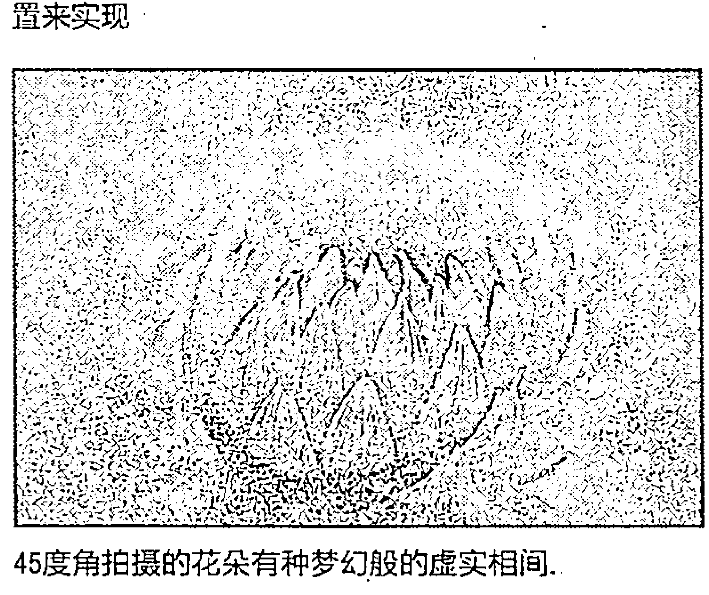


## 不一样的角度不一样的世界

站在高处和趴在低处，看到的世界会完全不同。花卉的拍摄，最常用的角度是正面拍摄（花朵与镜头平行），这种角度最能体现花的放射性结构。45度角也比较常见，因为花卉拍摄常用微距，45度角拍摄，让花的一部分产生虚化，有实有虚。比较另类的一个角度，是趴在花丛中，近距离的仰视，会看到很不一样的世界，这在拍摄小小的野花野草的时候，效果非常好。


## 光与影

要想拍出美轮美奂的花卉照片，一定不能轻视对光的运用。花卉摄影中，除了正面角度拍摄常用顺光(来自你身后的投射到拍摄主体上的光线)之外，大部分采用侧光(侧方向投射到拍摄主体上的光线)或逆光(迎着你投射在拍摄主体背面的光线)。侧光又称为“质感照明”，它能通过投影等体现出花的层次感及立体感。而逆光或侧逆光，可以让花瓣显得通透干净，另外逆光拍摄能让被摄物体的边缘显示光线轮廓，所以有时逆光也被称为“轮廓照明”。


## 三脚架的使用定律

1.  三脚架的重量与稳定成正比。应尽量选择大一些、重一些的三脚架。
2.  三脚架的腿管粗细与稳定性成正比。同一个三脚架靠近云台的上段腿管较粗，而拉出的下段腿管较细。因此在拍摄过程中，当不需要拉出全部腿管时，应该尽量使用上段的腿管。
3.  摄影时，三脚架的重心高低与稳定性成反比。三脚架在使用时高度放的越低，稳定性也就越好。必须优先决定照相机的位置和拍摄角度，尽量降低高度，特别是三脚架的中轴要尽可能地降低。
4.  尽量选择硬质的地面支撑三脚架。在落叶、柔软的沙土或者湿地中支撑起来的三脚架容易摇晃。

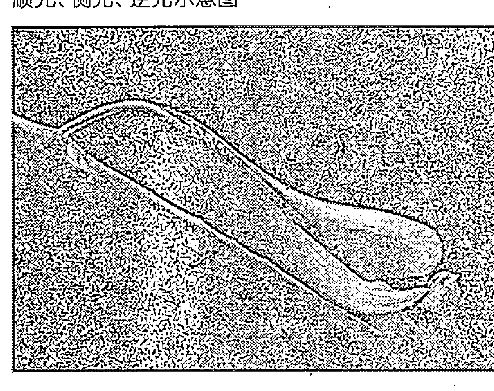


## 微距小技巧

微距是花卉拍摄中最常用的手法，而现在大部分相机(甚至手机)也基本上都配备有微距模式。所谓微距摄影，一般是镜头与被摄物体非常贴近，以至于拍摄出的图像要比实际物体的尺寸还要大(图像大小与实物大小的比例超过1:1)。

微距拍摄首先要注意“焦点”，因为微距模式下，物体比较大，如果不注意画龙点睛，整个图片将容易显得呆板无趣。比如花卉摄影的焦点，可以是花蕊，或者是花瓣上的露珠，或者是花上的昆虫等，但是一定要有一个趣味中心。

景深往往也是微距摄影的成败关键。景深一般取决于光圈、与被摄物的距离及焦距三大因素。光圈越大、镜头和景物的距离越近、焦距越大，景深就越浅，反之亦然。景深浅可以有效虚化背景，从而突出被摄的花朵。

另外，如果有条件的话，配备三脚架和快门线，也可以让微距拍摄出的效果更加精致。


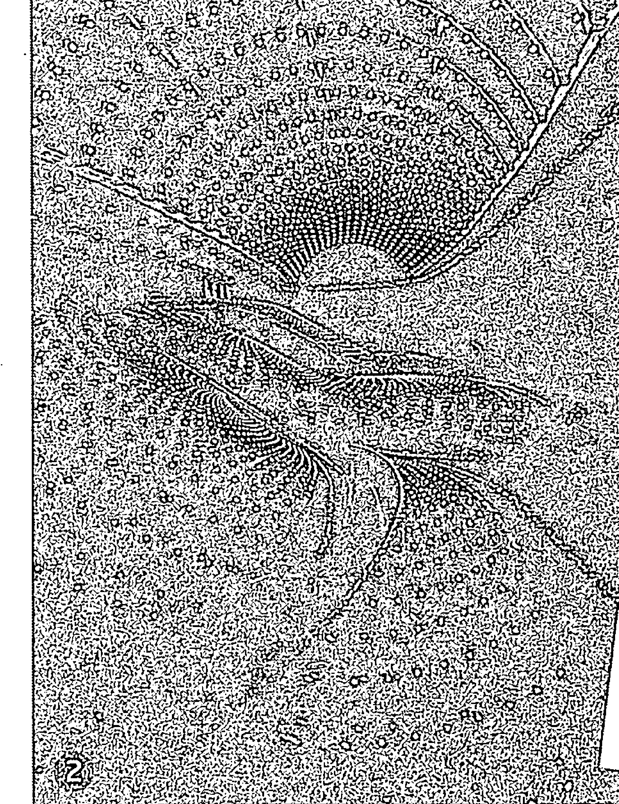


**图片说明**
① 铁丝网构成特殊的面纱效果
② 剧院灯光规则中带有律动
③ 延长曝光时间可以记录下车辆划出的道道彩线
④ 直线排列透视后变成放射线

# 创意摄影：光影的奇迹

文|梦与梦寻

正确使用光线，采用中规中矩的视角，拍摄出最真实的生活照片，这是纪实。而利用不同的拍摄手段，呈现非同寻常的影像，那就是创意摄影了。

前几期中，我们介绍了一些利用构图、透视错觉等手法的创意摄影。其实，摄影是光的艺术，光是摄影的画笔，巧妙利用光的不同特性，有时能达到令人惊异的创意效果。今天让我们重新认识光线，去发现一个不一样的世界。

光，因为透视的作用汇聚到远方的一点，变成了一条条射线，自然而然就形成了一点放射构图，非常华美。

## 人工灯光的几何美

实际生活中，既有自然光源，也有人工光源（灯光）。人工灯光一般与具体的建筑物相匹配，大多数是按一定的几何图案进行布置的，或者是点光源，或者是多点灯光构成的线，甚至构成面（形状）。拍摄这方面的景色时，就要注意根据这些灯光形成的图案进行构图，往往能达到非常美的效果。比如博物馆通道的照片中，四壁上平行的灯

## 巧借道具创建特效

自然光源比如太阳，我们是根本没有办法去改变它的。不过，在我们周边有很多东西，可以将它们作为道具，对太阳光线进行改造、变异。我们可以推、拿、移动的固然可以作为道具，即使是固定不动的，如各种建筑物，只要善于发现，同样能让它们为我所用。
在这张美女图片中，窗户上的铁网将投射的阳光进行了过滤，投射到美女脸上时，形成一种黑色面纱的特效，有一种特别的妖艳之美。这张照片的关键，其实就是角度的选择，具体拍摄时，脸部背光的部分适当进行了补光。

## 如梦如幻的延时曝光

延长曝光时间，往往能创造出如梦如幻的光影特效，比如CFan以前介绍过的烟花拍摄，就属于这类。另外，在拍摄夜晚城市的车流时，车灯划出的一道道彩色线条也是非常之美。

## 奇妙的光绘涂鸦摄影

摄影中除了利用光外，我们还可以创造光，比如光绘摄影，人完全控制了光线，主动性非常大。所谓的光绘摄影，就是将相机设置为长时间曝光，然后在曝光的过程中，通过控制光源的变化创造出一种特殊影像效果的摄影方法。

光绘摄影其实操作很简单，它的关键就是延时曝光，这让我们有时间通过光源来实现各种形状、效果。可作为光源的东西有很多，比如打火机光、蜡烛光、手电筒光、手机打开屏幕的光等等。如果相机可以手工设定曝光时间，不妨试试将曝光时间设定在1秒甚至更长的时间。在拍摄过程中，让被拍摄的人拿着一个光源（比如手电或点亮屏幕的手机），当然也可以设置好相机位置进行自拍，然后向着镜头快速在空中写字或画画（做动作即可）。拍摄完毕，就可以看到空中字画的效果了。

对于大型的光绘作品，曝光延时要更长，十几秒或更多。还有一种方法，就是将大型光绘拆分成几个部分，每次完成一部分，最后再合成。另外需要注意的是，为了让绘制的光图形更加突出，光绘摄影一般选择全黑背景或者光线比较暗的环境，最好在夜间进行。另外，因为是延时曝光，所以最好用三脚架来稳定相机。

网上看到不少的光绘作品，画面中只有光绘的画却不见绘画的人，这是怎么做到的呢？其实也很简单，作画的人只要穿着色彩较暗（灰色或黑色）的衣服，在光绘的过程中快速移动身体，不要在某一个地方长时间停留（控制在1秒以内），这样拍摄出的光绘照片中，就不会留下作画者的影子了。

除了身边随手可得的光源，或者自制的各种光源外，还可以购买EL冷光线之类的工具，它们的可塑性比较强，也便于操作。

总之，只有想不到，没有做不到，充分利用光线，就可以创造奇迹。

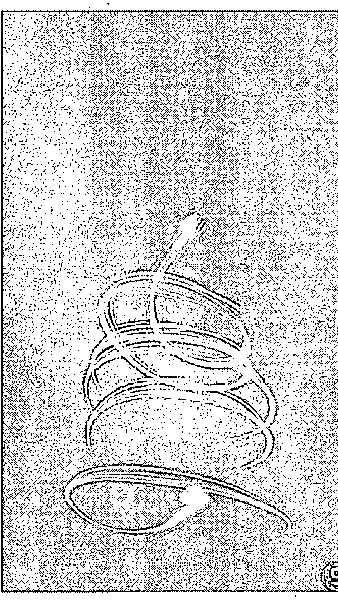

# 360度全景摄影攻略

文|梦与梦寻

通过360度全景摄影所创建的照片，可以给人以身临其境的感觉。本文介绍通过手机、相机等常见工具进行全景摄影的方法和技巧，以及如何合成制作全景图。

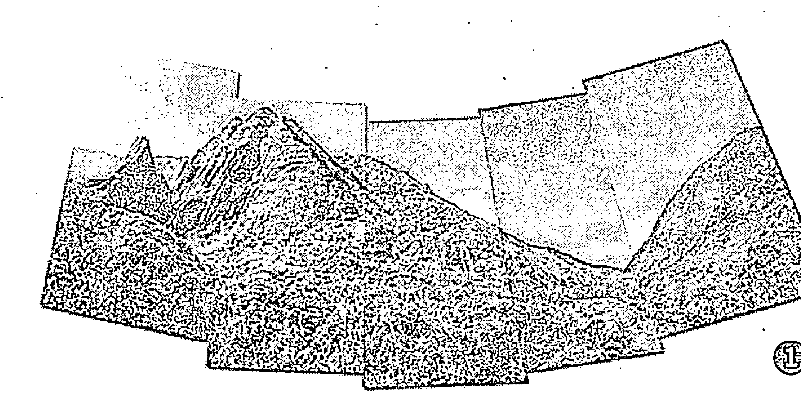

图片说明 ①360度全景照片实际上是由多张照片无缝拼接而成。②全景拍摄软件中的操作提示 ③水平仪的位置在机身上部，容易导致画面倾斜(如图右侧的电视频)

## 手机快速全景拍摄

现在不少人都用上了智能手机，其中大部分都带有全景摄影的软件，以用户较多的Android平台为例，它的全景摄影操作步骤一般为：启动相机后，在菜单中选择“全景”模式，按下拍摄按钮，然后水平横移开始拍摄，软件自动对齐图像并实时调节曝光度等，当达到180度的时候，自动结束拍摄，生成全景图。也可以根据自己的需要，在未达到180度时，自行按下拍照按钮结束。

## 全景摄影的准备工作

理论上来说，拥有任意一台相机，包括手机相机，就可以进行全景摄影了。不过，如果条件允许，配置一些辅助设备，会让全景摄影操作更加容易，达到更好的效果。

### 三脚架

我们手持相机旋转拍摄时，很容易造成对不齐的问题，影响后期的拼接。而如果配备三脚架的话，就可以最大程度避免此问题，从而得到一组稳定的图像。有些专业的全景摄影师，还会在三脚架上安装水平仪，以保持绝对的水平拍摄。

### 电脑和软件

如果相机没有全景摄影的功能，我们就得后期对一组照片进行合成，这就需要电脑及相关的全景制作的软件。如果是胶卷相机，还得配备扫描仪，以便将纸质照片扫描进电脑再行处理。

## 数码相机全景拍摄技巧

手机拍摄全景照片虽然方便，但是也有很大的限制，比如它一般只有180度，以及成像质量相对弱一些等等。而数码相机正好可以克服这些缺点。数码相机拍摄全景的方法也很简单，只要围绕某个中心点旋转，拍摄多张照片，最后通过软件拼接在一起就行了。不过要想拍摄出完美的全景图片，还是需要一些技巧的。

1.  技巧1：选景。一张360度的全景照片，往往需要12张甚至更多的照片拼接，所以要事先选好景点和中心点，最好在取景器中提前规划要拍摄的照片序列。
2.  技巧2：从左向右顺序拍摄，这样方便在电脑中后期处理。
3.  技巧3：每相邻的两张照片之间要有一定的重叠，至少要重叠20%，不过我推荐重叠30~50%，这样最后拼接的效果会更佳。
4.  技巧4：倾斜相机。相机稍稍向上倾斜进行拍摄，这样垂直面可以取得更大的视角。
5.  技巧5：旋转拍摄时，确保相机沿着水平线移动。
6.  技巧6：打开网格线。一般相机的预览屏幕上提供有网格参考线，最好开启它，这样就有了一个标准参考，更容易确保相机的水平移动。
7.  技巧7：锁定曝光。旋转一周，方向不同将造成照片的曝光不统一，所以拍摄前最好锁定相机的曝光值，以免各照片间的亮度不一致。
8.  技巧8：锁定焦距。全景拍摄过程中，严禁自动对焦，否则会导致各照片的深度不同，而难以拼接成完整照片。


## 自制360度全景图

拍摄好照片素材，接下来制作全景图就简单多了，比如在Photoshop中，就专门提供有全景图的制作工具。

启动Photoshop（以CS 5为例），点击菜单File→Automate→Photomerge（文件→自动→合成），在打开的对话框中通过“浏览”按钮按顺序打开拍摄的素材照片，然后从左侧选择合成的方式，默认为“自动”。点击“确定”后，Photoshop经过一定时间的运算，自动将几张图片合为一张全景图，并且原来的每张照片分别占据一个图层，方便我们手工继续处理。效果满意后，保存即可。

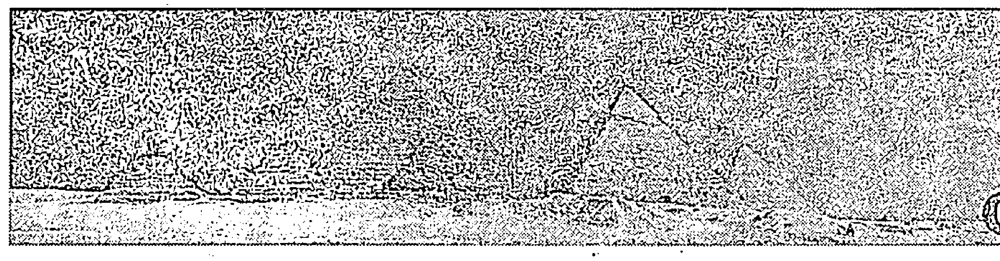


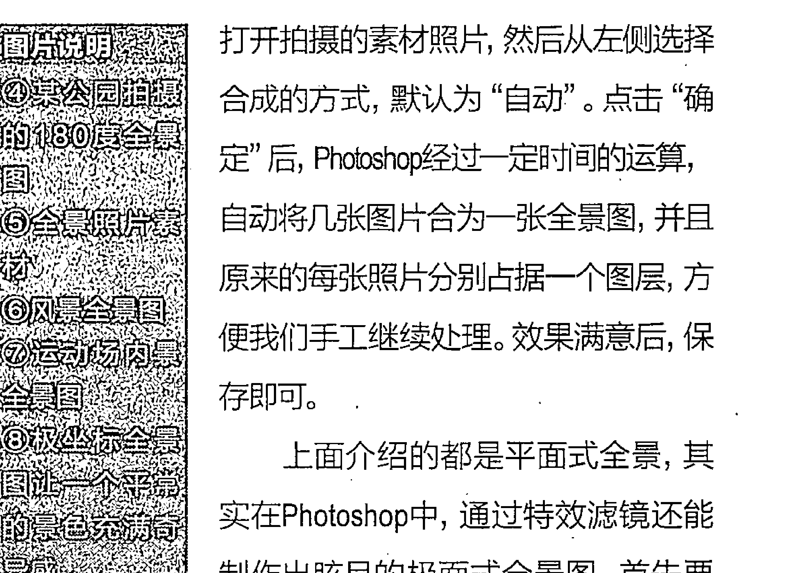

上面介绍的都是平面式全景，其实在Photoshop中，通过特效滤镜还能制作出眩目的极面式全景图。首先要对全景图做些处理：

1.  将图像大小修改为长宽一样的正方形。
2.  将图像做一次垂直翻转。
3.  然后执行“滤镜→扭曲→极坐标”菜单命令，就可以得到极面全景图了。

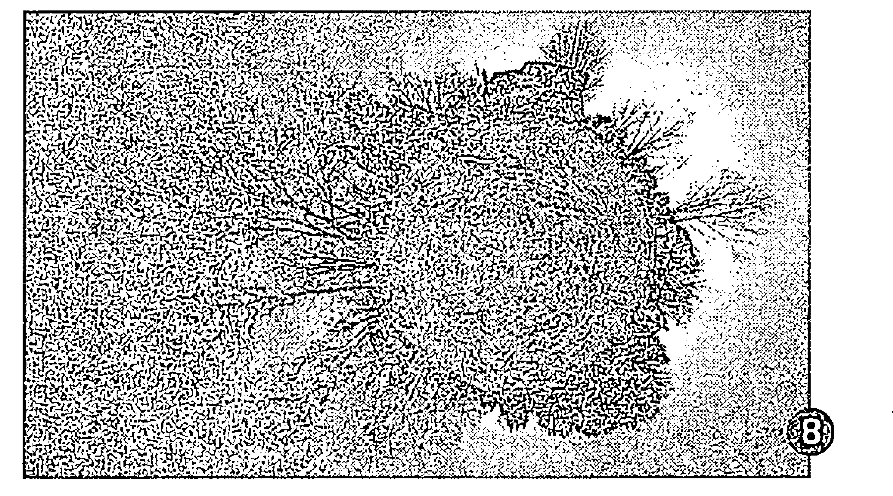


# 找准摄影中的平衡

文|sunm

若向摄影高手请教拍出好照片的诀窍，高手通常会说，拍照片时一定要“横平竖直”。横平竖直——简简单单的四个字，真的是拍出好照片的灵丹妙药吗？

摄影中经常要用到线性构图，线条可以起到分割画面、制造面积、产生节奏等多种功能。水平线及垂直线是极为特殊的线，除此之外还有各种斜线和曲线等，为构图营造出不同的效果。

## 横平竖直是摄影基本功

横平竖直四个字说来简单，但初学者往往很难做到，因为初学摄影的人相机容易把持不稳，或过于关注某一对象而忽略整体画面，导致照片倾斜。

## 注重整体避免倾斜

图2是某网友拍摄的照片，暂不论细节表现，单从整体构图上就能轻松得出结论，照片并不水平，整个画面看起来向左倾斜，有种失衡的感觉。这也可以从照片左侧的电线杆得到印证。

解决方法不算复杂，可以通过后期对图片进行旋转校正。不过这种调整经常是以损失画面的幅度（内容）为代价的，另外由于是非90度转角，加之各图片软件的算法不同，品质也会有所下降。

## 利用参照物找准水平

横平竖直在某些类型的照片中起着举足轻重的作用，在正规的场合尤其要注意，会议照、家装照、建筑照、证件照等，大多有此要求。如果相机不够水平，拍出的照片就会不稳，有失重感。那么怎样才能把照片拍水平呢？一个比较好的办法是找好水平和垂直方向的参照物，尽量在画幅内给出一个常识中水平或者垂直的参照物。

还有一个简单的办法：充分利用取景器的边框。当你端起照相机时，用上下的边框来校正水平的线条，如地平线、楼顶、天花板等，使它们和边框保持平行，画面自然就平直了。垂直线可以用取景器左右的边框来校正竖直的线条，如楼房、树木、墙壁等，同样使它们和边框保持平行。

1.  线条是有性格的，比如水平线呈现平静、安详，垂直线呈现庄严、庄重
2.  网友原图
3.  对照片进行水平校正
4.  建筑物是很好的横平竖直参照
5.  人物合影

# 视像达人

## 人为添加参照物

在某些特殊的场景中，也许你实在找不出可用的参照物，怎么办？其实很简单，必要时我们可以在场景中人为加入参照元素。比如一个人影、一把雨伞等。不要小看这些不起眼的元素，它们极可能给你的照片增色不少。

比如在图5中，远方的水面交界线可以说是最好的参照物，但是略感模糊，不易掌握。而加入一个人物后，不但给画面增加了参照物，同时也给图像增添了灵性，可谓一举两得。

## 视觉平衡是重中之重

是不是做到物理上的横平竖直，拍出来的照片就一定有那种端正的感觉吗？未必！

## 物理平衡不等于视觉平衡

如图6所示的照片，一般看的人会有两种感觉，一是照片拍斜了，二是那本来就是个斜坡。因为该照片中最明显的参照物是远端的地平线，而地平线在画面中显示并不水平。

实际情况究竟怎样？由于没有去过现场，我们只好利用照片来验证一下。先在地平线附近画一条水平线，可以看出倾斜的程度。再给画面中的每个人做一条垂线，可以看出比较垂直。通过对比不难看出，照片的倾斜程度几乎可以忽略不计，景物本身就是个斜坡。

产生错觉的原因，是作为水平参照的地平线是倾斜的。观者的水平和垂直信息是通过日常生活中的常识获得的，而本图由于人物过小且不明显，不足以充当垂直参照。所以拍摄者在拍摄时一定要注意，这些常识性的水平要素是否明显存在于照片之中。

这种错觉给我们带来一个新的问题：照片一定要横平竖直才能平衡吗？相信大家看过不少斜拍的照片，这些照片大胆、前卫，倾斜非常厉害，但观看时并没有倾倒的感觉，反而多出一些动感、活泼的成分。而横平竖直的照片虽然看起来稳定、踏实，但有时这种稳定、踏实的反而有种呆板的感觉。

这就是说，横平竖直并不完全代表平衡，斜着拍也照样出彩，关键问题是怎么个斜法。有一位摄影爱好者总结得非常恰当：“重点在于倾斜之后，画面中所有的元件是否搭配起来，是不是仍旧是平衡的。如果是的话，那倾斜也无妨。”

## 对角线构图法

摄影构图中有一种倾斜相机的构图法，叫做“对角线构图法”，它打破横平竖直的要求，把主题安排在画面对角线上，这种方法虽不适合拍摄正规照片，但可以使照片活力大增。一般大头照比较不好构图，如果稍微倾斜效果就容易出来了。

对角线构图法也频繁用于建筑照的拍摄，它能有效利用画面对角线长度，让衬托物与主体发生直接关系，富于动感。而且容易产生线条的汇聚趋势，吸引人的视线，达到突出主体的效果。观看时产生立体感、延伸感和运动感的统一。

| 图片编号 | 说明 |
| :--- | :--- |
| ⑥ | 网友原图 |
| ⑦ | 照片的水平分析 |
| ⑧ | 头像摄影中的对角线构图 |
| ⑨ | 横平竖直的要求不可一概而论，因为画面最终要为表达的思想服务。比如2008年残奥会上拍摄的这张照片过于水平，反而缺少了动感 |
| ⑩ | 后期处理后更具有动感的运动会图 |