# 电脑爱好者2013合订本（下）第二部分

## “一键”操作的魔力

使用电脑的好处就是提高效率，能一步完成的工作就不用三步、五步。这当中最引人注目的莫过于一键操作的方便。一键操作，建立在后台的体贴服务和精湛技术的基础上，能给用户提供极大的方便。

文|武文渊

### 1 按需定制 一键安装软件

安装操作系统之后，总需要给自己的电脑中安装一些常用的应用软件。以前我们常见到电脑城装机使用一张集成了应用软件的系统盘，且不说其合法性，不分青红皂白、不管是否用得到，一股脑将软件装进你的电脑，总觉得有被人强迫之感。

现在我们可以选择诸如驱动精灵、360软件管理、驱动人生等专业系统工具安装软件附带的一键装机，完成必备软件的一键安装。软件给出装机软件菜单列表，点击“开始装机”或“一键安装”按钮，即可完成全部所需工具软件的安装（图1）。

> **小提示**
一键装机不是大包大揽，而是可以由用户来选择。对于一键装机软件自动扫描出来的项目，不要急于点击“一键安装”。你可以按需点击“忽略”或“不安装”等按钮，取消自己不想安装的软件，然后再点击“一键安装”。

- 1. 迅雷 (高速下载工具)
- 2. QQ音乐 (在线听歌下载)
- 3. QQ游戏2012 (腾讯游戏平台)
- 4. Adobe Reader (阅读PDF文件)
- 5. WinRAR (压缩解压缩工具)
- 6. 新浪微博客户端 (微博桌面客户端)
- 7. QQ输入法纯净版 (一款干净的输入法)
- 8. 酷我音乐盒 2012 (在线音乐播放器)
- 9. Adobe Flash Player (网页播放插件)
- 10. 光影魔术手 4 (图片处理软件)
- 11. Chrome 浏览器 (高速网页浏览器)
- 12. 支付宝数字证书控件 (安全支付插件)
- 13. 搜狗安全浏览器 (双核安全浏览器)
- 14. 金山卫士 (系统安全工具)
- 15. 阿里旺旺 买家版 (淘宝交流工具)
- 16. 百度影音 (影音播放器)

### 2 升级软件 可以免去确认

对于已经安装在电脑中的各类应用软件，在使用电脑的过程中，也会涉及到更新升级。即便是软件设置了自动升级功能，或者你获得了升级安装包，升级过程中也总免不了确认或选择的步骤，显得比较繁琐。那么有没有更省事一点的办法？

借助软件管理工具的一键升级功能，则可以免去麻烦。以360软件管家为例，需要先在软件设置中开启一键升级功能（图2），之后随时在软件管家窗口中点击“软件升级”按钮，都可以检测到当前有最新版并可一键升级的所有软件。对于可以一键升级的软件，只需点击其后的“一键升级”按钮，即可不用人为干预完成软件的升级（图3）。

### 3 垃圾清理 还可个性定制

系统使用的时间一长，系统本身和应用软件产生的垃圾会占用磁盘空间，造成资源浪费并影响系统运行效率。虽然我们可以用360安全卫士等系统工具方便地实现一键垃圾清理（图4），但是由于系统中安装的软件和个人设置等千差万别，因而这类工具也不是万能的。这时，我们可以自行定制一键垃圾清理。

系统中产生的垃圾一般是固定在一些文件夹下的特定种类的文件，我们可以自定义一个清理垃圾的批处理，然后将快捷方式放到桌面上，当需要清理的时候，双击一下桌面上的这个垃圾清理图标即可自动完成清理。批处理中只需在多个路径下多次使用一条命令“DEL *.* /S/Q/F”即可。若垃圾文件具有系统或隐含属性，则还可通过修改参数来对付。具体参数参见图5。

### 老旧补丁 也可一键管理

Windows系统经常升级，大家都知道用360安全卫士等系统工具可以自动给系统打补丁，而对于如何实现对系统中已经安装完的补丁、过期不用的补丁的管理是个问题。其实，它同时还有补丁管理程序可供我们使用，只不过你没留意罢了。

执行“系统修复”会自动扫描出需要安装的补丁，点击“立即修复”可一键安装多个补丁。在页面左下角有一个很不起眼的“补丁管理”，点击即可进入漏洞修复管理窗口，对已安装、已忽略、已过期、已屏蔽的补丁做一次性处理。

- 清理电脑中的Cookie (Cookie包含上网、购物、游戏等记录，建议定期清理！)
- 清理跟踪cookies (清理后可防止搜索引擎跟踪搜索行为)
- 清理Flash Cookie (给Flash游戏进度、视频进度等状态减肥)
- 清理购物网站Cookie (访问常用购物网站产生的Cookie)
- 清理邮箱网站Cookie (登录邮箱网站时产生的Cookie)
- 微博、空间、社区等网站产生的Cookie (访问常用社交网站产生的Cookie)
- 清理其它未知的Cookie (给其它上网痕迹减肥)

使用电脑和上网产生的痕迹 清理使用痕迹可以有效保护您的隐私安全！

### 一条命令 便可备份系统

以前我们都用Ghost实现系统一键备份，后来又有专业系统备份工具ATI实现系统自动备份和F11一键恢复，但这些对于新的Windows 8或8.1来说还是有点麻烦。

Windows 8或8.1中实现一键建立和恢复系统映像只需一条命令即可完成。你只需建立一个含有一条命令“recimg /CreateImage D:\RefreshImage”的批处理并以管理员的方式一键执行该文件，即可在D盘（可以修改为别的分区盘符）创建包含用户文件的系统映像。之后遇到问题，就可通过电脑设置或通过F8系统启动菜单进入恢复系统和用户数据的操作了。

### 一键操作 云端任意备份

在多数云盘软件中，将本地的任一个文件夹或连续的多个文件备份到云盘容易，只需使用拖动到浮动图标或右键操作即可实现。但如果要备份多个分区的多个目标不连续的文件夹，一键操作就不方便实现了。

这种情况下，我们可以利用百度云管家设置“管理自动备份文件夹”或360云盘轻版的定制添加多个“自动备份文件夹”的方法，实现不定分区不连续文件夹的云端一键备份。你只需设置多个任意文件夹之后，一键启动云盘管家或轻版软件，即可实现自动备份了。

### 后台命令 自定一键压缩

你的硬盘中的一个或多个文件夹工作目录，如果要定期压缩备份这些目录，也可以不用多次操作。用WinRAR的控制台命令行RAR，定制一个只有一条命令“rar a -r e:\mybackup.rar @backup.lst”的批处理程序，将要备份文件的路径和文件名列入backup.lst中，一键执行该批处理，即可压缩备份多个目录。

## 最方便的多文档操作秘诀

我们在写作一篇文字资料的时候，常常需要同时参考多个文档中的资料，无论这些文章是否已经打开，操作起来都比较麻烦。那么有什么高效的方法吗？ 文|黄海峰

> EmEditor是日本产的一款支持双字节处理的优秀文字编辑软件，它不但支持普通的TXT文档编辑，还支持数十种程序设计语言的标准化格式编辑。最新的13.x版的功能更为强大，因此我们选择此版本作为我们的多文档操作工具。

进行文字处理工作的人员，打开多个文档进行相互对照、互相利用的操作，往往涉及到窗口并排参考，内容的跨文件查找利用、跨文件替换等操作。如果用记事本来做则多有不便，而用Word操作则又显得臃肿，尤其是当参考的文档数量多而机器缓慢时更显得累赘。在这种情况下，我们选择用最新版的EmEditor 13进行多文档操作。本文讲述EmEditor 13环境下的多文档操作技巧。

### 1 前后对比 编辑同一文章

在写一篇长篇的报告或技术总结时，我们经常需要对照一篇文章中的不同部分内容，这种情况下常常看到有人疯狂地滚动鼠标，参考完之后再“滚”回当前编辑的地方。如果用EmEditor来编辑一篇文章，遇到这种情况便有更省事的办法。

我们可以在一篇文章的编辑环境下，按快捷组合键Ctrl+F12，这时编辑窗口立即变为一个“田”字形的四格窗口（图1），每个窗口中显示的是一篇文章的不同部分内容。这样就可以分别调整不同子窗口中的可见部分，将其中一个子窗口作为编辑修改的窗口，而其余三个窗口作为参考窗口。

注意，每个子窗口中的内容都可以修改，但修改的结果只反映到同一个文档当中，而不是四个文档中。

如果不需要参考这么多部分，而只是需要以两个部分来对比编辑，则可以双击横向或纵向的分割线之一，四个窗口马上就会变成两个，就可以只用两个窗口对照编辑了。

> 为了便于操作，有人还开发了用来分割窗口的插件按钮，只需安装这组插件按钮即可方便地从工具栏上点击工具来分割窗口。分割窗口的插件有三个，分别是纵向分割、横向分割和纵横分割，分别对应于我们上面说的三种情况。

### 2 相互参考 编辑多篇文章

上面所讲的是参考同一文档的不同部分内容进行编辑，而还有一种情况是参考不同的几个文档进行编辑，这时就需要将几个文档同时打开对比编辑。EmEditor默认提供的是标签式窗口，也就是说当你打开多篇文档时，这些文档是以标签页的方式被集成到同一个窗口当中的。这种方式虽然省去了空间占用，但是不利于对比编辑。这时，我们可以利用软件提供的新建窗口分组的方法来实现窗口的排列。从“窗口”菜单中选择“新建水平分组”或“新建垂直分组”，这时多篇文章会自动分屏排列在桌面上，这多像Windows 8的自动分屏啊，但它的技术比Windows 8还超前呢。分屏对比编辑完成之后，可以通过文档窗口的“窗口→启用标签”命令，将分散排列的多篇文档再收回为标签窗口显示，实现了集中统一管理（图2）。

### 3 指定位置 搜索相同内容

如果在一篇文档的编辑过程中，忽然想起要参考某个文件夹下面一些文章的内容，要搜索这些文章中是否有同类内容，这时，我们可以用EmEditor提供的“在文件中查找”的功能来解决问题。
点击工具栏上的“在文件中搜索”按钮，或通过“搜索→在文件中搜索”（快捷键为Ctrl+Shift+F），启动“在文件中查找”窗口，输入查找关键词，选择文件类型和要搜索的文件夹（可包含子文件夹），定义其他搜索条件，点击“查找”即可搜到自己要参考的内容（图3）。

### 4 多篇文档 搜索同一内容

如果是在多篇已经打开的文档中搜索同样的内容，怎么做？
我们只需要在当前编辑的文档中执行“查找”命令，然后选中查找窗口中的“搜索全部打开的文档”复选框，进行搜索即可找到所要的内容（图4）。

### 5 全盘操作 替换同一内容

如果你起草的多篇报告中涉及到同一个公司的名称，但事后发现自己弄错了公司名称中的某个字，如何成批更正过来？
只需用Ctrl+H启动“替换”窗口，填写错误的内容为要查找的内容；填写正确的内容为替换内容，然后选中“搜索所有已打开的文档”复选框，执行“替换全部”按钮即可（图5）。

### 6 两篇文章 轻松比较不同

前面我们说的对比编辑只是人工进行对比，如果有两份总结报告，一篇是另一篇的修改版，在修改者没有用Word做批注的情况下，如何找到这两篇文档的不同？
我们同样可以先导出为TXT文档，然后用EmEditor自动比较的方法来实现。EmEditor 13版中提供文档自动比较功能，只需打开这两篇文档，点击“比较”菜单，设定各种比较参数，按向导的指引即可完成两篇文档内容的自动比较。

对于多个已经打开的文档，处理完毕后，可以通过“文件”菜单下的“全部保存”、“保存并全部关闭”等命令实现快速存盘和结束编辑的操作。

### 7 轻松实现 文本分割合并

长篇的TXT小说在手机中看起来有点费劲，如果按每天的阅读量分割成小文件来阅读，那就好计划了。EmEditor 13可以将长文档按用户意愿分割成任意小的短文档，或者反过来将太短的文章合并成一个长文档。具体操作只需执行“工具→分割/合并”命令下的相应子命令即可。

CFanBoundEdition · 2013 | 253

## 内外求因 解决网速缓慢

文|张进波

一般的家庭宽带（ADSL或小区宽带），如果网络变得越来越慢或者时快时慢，且相比标准带宽有较大差距，那么均可从如下两个环节来分析解决。

我家的电脑网速最近变慢了。在刚装电脑并通过小区外的代理商开通2M联通小区宽带之后，网速比较正常，有我当时留下的360网络测速记录图片为证，但最近无论干什么工作，获得的网速最多只有100KB的样子。是什么原因造成网速变慢？如何才能加速到正常范围？

> 小提示
通信商所说的2M宽带，其中的M实际上的Mb/s，这里的Mb是指1024×1024位，转换成字节就是1024/8=128KB/s。知道这个关系以后，你就可以换算自己的网络理论上应该能达到的传输速度了。这个速度一般是指下载速度，上传速度各家往往远远达不到下载速度的值。

### 内忧外患 本机排查故障

网络忽然变慢，作为直接的用户，我们首先应该从自身电脑入手分析和解决。具体应该包括如下几个方面。

#### 被高手忽视的傻瓜环节

重启路由器、重启电脑，有时候是解决网络变慢的最简单也是最直接的办法。然而，就是这样一个简单的问题，不知难倒了多少专家高手。
这是一种最傻瓜的解决办法，适合于一时找不出网速变慢原因时尝试，可以作为解决网速变慢方案中的第一方案，当然不是说一定能解决问题。

> 小提示 重启路由器的两种方法
由于路由器不一定在自己的座位旁边，因此比较方便的重启路由器的方法是，在网络浏览器中输入路由器的设置网址（如192.168.1.1，具体查看路由器说明书），进入设置界面选择重启路由器。如果路由器的进入网址被更改，而自己又不知道这个地址，则最方便的办法便是切断路由器电源，稍候几十秒再重新加电启动。

#### 浏览器与网络设置修复

如果重启电脑和路由器解决不了网速变慢的问题，那么接下来最直接想到的应该是去修复浏览器或网络设置。在电脑使用过程中，有可能被一些恶意软件改动了浏览器插件设置或网络配置，造成网络缓慢。

这种情况下，我们可以通过360安全卫士之类的工具来修复浏览器和网络设置。具体方法是，在360安全卫士主界面上方工具栏选择扳手状的“系统修复”大按钮，进入后选择“常规修复”，修复异常的上网设置和系统设置，尝试是否可以让系统和网速恢复正常。

### 病毒与恶意程序查杀

进行了浏览器和系统修复之后，如果网速还是上不去，就要考虑系统是否被恶意程序驻入和干扰，系统是否中了病毒或木马。这时，可先升级杀毒软件病毒库，全盘杀毒，查杀木马。

以使用360杀毒为例，右击系统托盘360杀毒图标，选择“升级”先进行程序和病毒库升级，然后选择“打开360杀毒主窗口”进行查杀。

### 软件占宽带拖慢网速

还有一种情况，电脑启动后可能有后台程序在运行，比如，迅雷、网络电视或其他软件占用带宽。这时，可用网络带宽势必不能达到标称值。

我们可以借助于360安全卫士提供的“360网络加速球”来解决问题。点击桌面上浮动的椭圆形360加速球图标，在弹出的窗口中选择关闭占用网络带宽的程序或服务即可，也可以选择“一键加速”按钮进行加速。

### 系统垃圾造成上网故障

经过上述处理，如果是因恶意程序的因素，那么问题一般能得到解决。如果没有杀出恶意程序或病毒，网速依旧缓慢，则还有一个因素，可能是系统存在大量垃圾文件，这也可能造成网络缓慢。存在于系统和网络浏览器缓冲文件夹中的文件如果太多，不但会造成网速缓慢，有时候还会造成某些网站甚至银行的网银不能正常登录和交易。

> **小提示 养成自动清理习惯**
为避免出现垃圾聚集过多而忘记清理造成网络缓慢或系统问题的情况，可以在360安全卫士的电脑清理界面窗口右侧，开启“自动清理”选项，选择在空闲时清理或在某个时间点进行清理，清理的三项内容可都选上。

清理系统垃圾的方法很多，最方便的莫过于使用系统清理工具来处理。以使用360安全卫士为例，点击主界面上的“电脑清理”大按钮，选择窗口中的“一键清理”，或者选择自定义下面出现的各个项目，然后逐项进行清理。

### 自行解决的最后法宝——恢复系统

高手维护电脑有一把杀手锏——重装系统。重装系统听起来很吓人，实际上目前要搞定这一工作已经是一件家常便饭般的事情了。

我们所说的重装，不是要把电脑中的东西都删除再全新安装，而是指在电脑系统和网络正常时，将系统打包克隆生成备份。可用ATI专业备份软件设置一键备份，或有的品牌电脑自带一键备份功能。用这种方法重装系统（或称恢复系统），只是十来分钟就能搞定的事情。

养成系统克隆的好习惯，在发现一些问题而自己解决不了，甚至高手也无能为力时，恢复重装十分管用。

如果将系统重新恢复到先前正常时的状态，而网络依旧缓慢，那么，问题就不是在系统上了。这时，我们就需要与接入商进行协商解决。

### 协商进行解决

首先，通过正面和侧面去了解你的接入商是否是直接的运营服务商。有的用户是通过不正规的代理商接入的，这些代理商把包得的网络带宽，通过共享的方式以看似较低的价格卖给更多的用户。而给用户的带宽其实是共享带宽，当上线人数少时能达到，用户会自喜，而当使用的人多了肯定会信道拥堵，就造成网速上不去的情况。

若是这种情况，可找接入商协商解决，如果接入商在办理过程中存在欺诈行为，那么可以选择通过消协或有关部门进行投诉解决。

如果你的接入商是正规接入商，中间没有做过任何手脚，那么问题更好办了。把问题说明白了，让他们的服务人员上门为你解决或远程为你查明并解决。

### 免费升级带宽

目前网络普遍慢的一个共同原因是原始带宽的限制。带宽本身过小，多数人使用的是2M以下的带宽，再畅通也快不了多少。但是，要知道目前全国各地许多大中城市大型网络商均有推出免费升级宽带的服务。不少市民还不知道此事，或虽然知道，但因电信公司没有去做专门宣传，因此本来可以升级的小区，光缆已经拉到自家门口，许多家庭都不知道去办理。

将2M的宽带免费升级到10M，或将4M的宽带免费升级到20M，升级之后，网速再打折扣，你的网速都会快上许多倍。即便是达不到标称的10M或20M下载速度，也足以满足日常上网需求，不会有慢的感觉了。

### 小提示

虽说是免费升级，但多数接入商或多或少会附带一些条件，比如与3G手机号捆绑，或与市话号、2G手机号捆绑为套餐，加起来总会比原来的网络要多交一些费用，但总体上来将还是非常实惠的。以北京联通的光纤宽带10M或20M加3G套餐服务为例，在网费的基础上每月交36元服务费，可获得一个3G号码、一个2G号码、一个固话号码，固话与2G共享免费呼出国内200分钟，3G享受300M流量、200条短信服务。对于电话或短信需求不多的用户，仅凭这些服务就可用爽网络和通话了。

### 小提示：关于宽带测速的标准问题

以往，国内各大网络运营商对网络速率的标准都不一样，再加上下面的各类二级、三级承包商的不规范操作，网络市场上带宽的说法非常混乱，把网民们搞得一头雾水。
2012年11月29日，工业和信息化部通信发展司和中国通信标准化协会正式公布了通信行业标准《宽带速率测试方法 固定宽带接入》和中国通信标准化协会标准《宽带速率测试方法 用户上网体验》。两大标准统一规范了宽带测速的技术指标、参数公式、性能要求、试验方法、检验规则等。至此，评价“真假宽带”将有规可循，宽带标准不再是一家一个样了。

通过以上讲述，想必你对网速慢这个问题已经不再心里没底了吧。

# 让QQ个人数据如影随形

文 | 石丽娜

QQ个人数据中最主要的就是聊天记录和互相之间传送过的一些文件，如果这些信息可在任何地点随时方便调用，那就实用多了。

安装QQ之后，默认的用户聊天消息记录、接收的文件等数据均保存在本台电脑的一个默认安装文件夹中。如果你在异地另外一台电脑上登录你的QQ，就不能返回来查询这些历史数据，除非是以会员资格传到网上再同步下来。下面的两种方案，可以轻松让QQ个人数据如影随形，有了这两招，即便你不是QQ会员，也能带着QQ隐私走天下了。

## 巧借网盘 私人信息走天涯

如果是在公司个人使用的电脑上或家庭电脑上用QQ，可用以下方法带走个人信息。

- 1. 安装网盘客户端并设置自动同步
安装一款网络云盘PC客户端软件（如360云盘），该软件安装之后，会在本地生成一个与服务器同步数据的本地文件夹（如“D:\360云盘”）。将该网盘客户端设置为开机自启动和自动登录。这样，该网盘会随时监测本地该文件夹下的数据并与网络备份文件夹保持同步状态。

- 2. 新装QQ和已装QQ个人文件夹设置
如果是新安装的QQ，在安装快要结束的时候，会提示你设置个人数据文件夹（见图），这时可将此文件夹设置为360云盘的本地同步文件夹“D:\360云盘”。如果是已经安装好的QQ，也可以进入QQ设置进行更改同步文件夹设置，通过“系统设置→文件管理”自定义个人文件夹。
家中电脑和公司电脑均进行同样的设置，并注意同一台电脑云盘本地文件夹与QQ个人文件夹的对应关系。这样，无论在家里还是在公司聊QQ，均可保证历史记录随时查看。

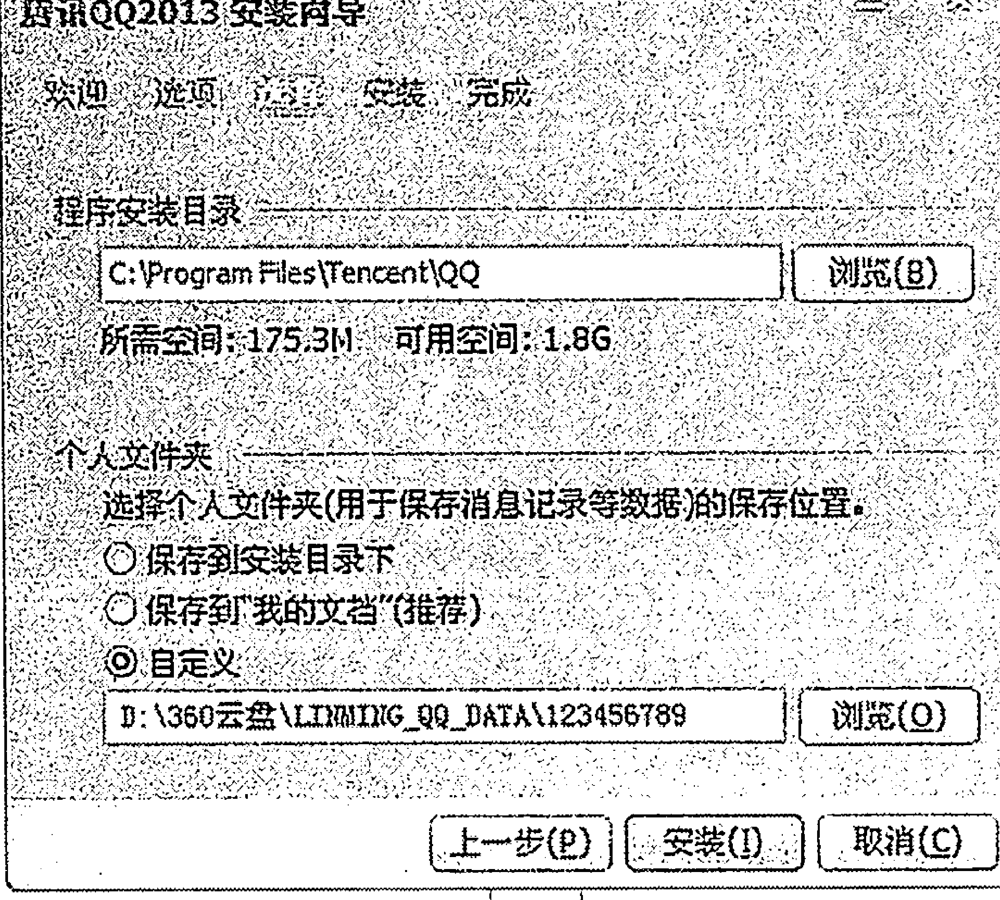

## 借助闪盘 个人隐私随身带

如果是在公用场所（如网吧）或不确定的地点使用QQ，不适合设置云盘同步，这时可以将个人数据文件夹设置为闪盘中的一个文件夹，每次使用QQ时插上闪盘，这样无论走到哪里，也可以随时调用闪盘中的个人消息或其他数据了。
设置闪盘个人文件夹的方法与设置网络同步盘个人文件夹的方法类似。可在新安装QQ时，将个人文件夹直接设置在闪盘上。对于已经安装了QQ的电脑（比如网吧或其他公用电脑），可通过上述方法设置个人文件夹到闪盘中。

> 小提示
有一点需要特别注意的是，每次插上闪盘的盘符要与QQ设置中的个人文件夹存放位置保持一致。要做到这一点，只需要保证在启动QQ前插上闪盘并查看一下盘符，保证闪盘所在的盘符与你QQ中设定的盘符相同，若不相同，需要重新设定一下。

这样，只要使用QQ的电脑上支持闪盘使用，就可以实现QQ个人数据随身带。其特点是随身携带，安全性比较高。以前聊过的信息，以前接收的文件、音乐、视频等均会保留在移动盘上，便于查找历史信息，并且也是最安全的一种方法。

# QQ空间背景音乐不限量

在QQ空间中，我们虽然可以将自己喜爱的歌曲作为背景音乐与好友分享，但腾讯对普通用户设定了5首的限制(如右图)。不过，我们可用“偷梁换柱”的办法来突破它的限制。文 田洪轩

> 温馨提示：
1. 推荐您开通“绿钻贵族”，免费使用百万曲库内音乐，还能上传本地音乐；
2. 为提供更稳定的背景音乐服务，普通用户只能设置5首网络背景音乐；
3. 网络歌曲存在不稳定因素，请添加完整链接；
4. 请添加原创或经权利人许可的歌曲，腾讯公司对相关版权问题不承担责任。

因为腾讯的限制主要体现在只允许用户添加5首网络歌曲，多则无法添加，可以通过合并的方法，将自己喜爱的多首歌曲合并为1个音乐文件，上传到可以外链的网盘中，这样腾讯会认为用户只添加了1首网络歌曲，却不知道这之中包含了用户喜欢的许多歌曲，从而变相地突破了5首音乐的限制。

①首先需要一款能够合并音频的软件。这里采用“全能音频转换通”(下载地址：http://url7.me/e45v)来合并。
打开软件，单击软件的“合并转换”工具按钮。

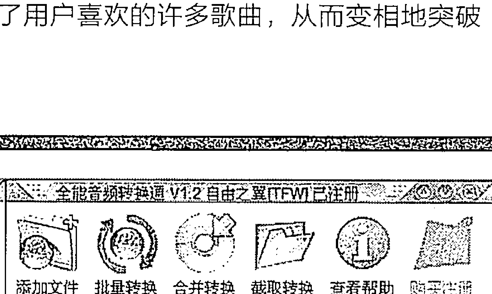

在选择好保存路径后，软件会自动开始转换。当软件提示“任务完成！”时，合并文件就制作好了。

③我们可以在本地试听一下，验证完毕后，需要将它传到网盘上去。注意网盘必须支持外链，大家可以上百度搜索“外链网盘”，会有很多结果。笔者采用的是国外Clip2Net网盘，上传完毕后，可以得到文件的下载地址。
接下来，打开QQ空间，依次选择“音乐→背景音乐→添加网络背景音乐”，将下载链接复制过去，填写歌曲信息，单击“添加”。

②弹出“打开”对话框，选择好文件后，再次单击“合并转换”，弹出如图所示的对话框。
1. 输出格式只能选择.mp3或.wma，否则不会被QQ空间支持。
2. “待合并列表”中音乐的顺序即为合并后文件的播放顺序，可以点击“上移”或“下移”来调整。
3. 一切准备就绪后，单击“保存并开始转换”。

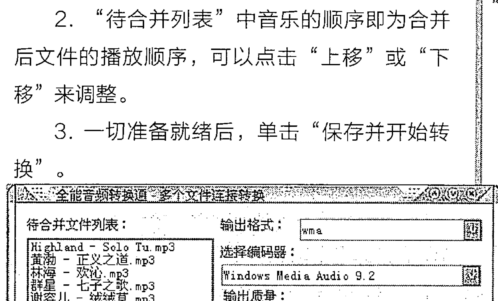

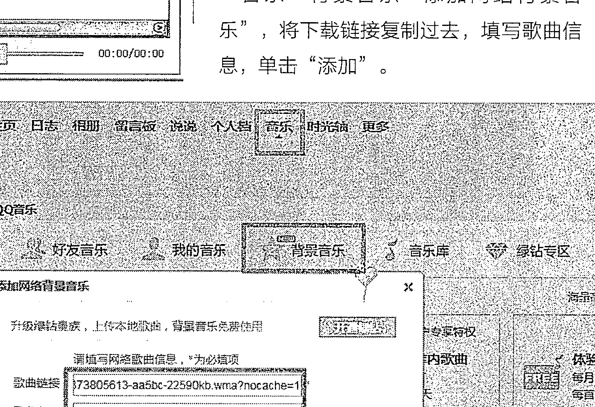

> 1. 网盘要尽量选择速度较快的，以提高连通率，在上传完文件后，可以下载以测试速度。
2. 测试音乐能否正常播放时，应清除浏览器缓存，并退出QQ账号，或者邀请QQ好友测试，以保证访客能够顺利听到音乐。

这样，背景音乐就制作好了，快请好友来听听吧！

# 方便阅读用CSS巧改网页

每个网站都有自己的风格，如果你喜欢某个网站的内容，却不喜欢这个网站的网页风格，怎么办？让一个网站为你一个人而改版是不可能的，不过你可以自力更生，通过CSS样式文件对网页进行修改，让网站变成自己想要的！

文|浪迹天涯

## 为浏览器添加CSS管理

要想更好地使用和管理CSS，无论是谷歌还是火狐浏览器，都需要安装一个名为Stylish的扩展。这里以火狐浏览器为例，首先点击“工具”菜单中的“附加组件”命令，在弹出的窗口选择左侧列表中的“获取附加组件”项，再在窗口的左上角输入关键词“Stylish”搜索，搜索到后点击该扩展名称后的“安装”。安装完毕，点击“立即重启”完成浏览器对该扩展的确认。

- 1. 点击“工具”菜单中的“附加组件”命令。
- 2. 在弹出的窗口选择左侧列表中的“获取附加组件”项。
- 3. 在窗口的左上角输入关键词“Stylish”搜索。
- 4. 搜索到后点击该扩展名称后的“安装”。
- 5. 安装完毕，点击“立即重启”完成确认。

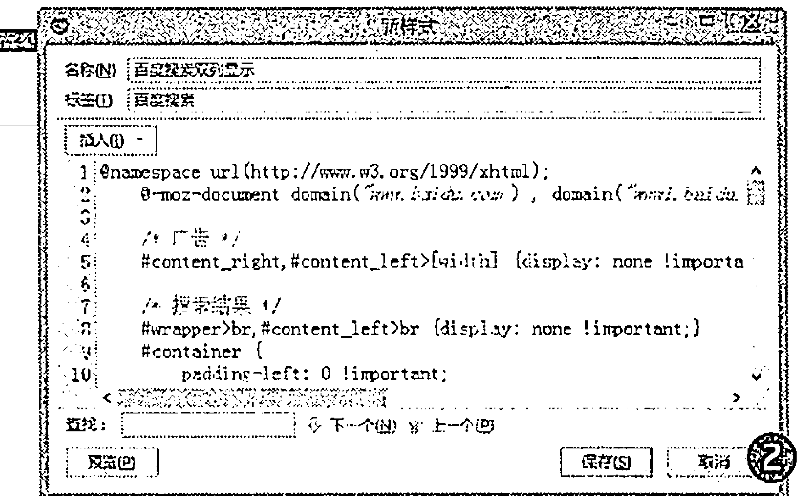

### 实战1：启用夜间模式浏览

每天对着电脑工作时间一长，就会觉得眼睛发干和难受。其实我们可以通过CSS样式文件，对网页的内容进行调节，改变网页背景过亮的情况。

首先登录http://userstyles.org，在窗口左侧输入关键词Global dark style，在搜索结果里面可以看到大量的夜间模式样式。从中选择一个自己喜欢的样式并打开链接，接着在弹出的网页中点击Install with Stylish按钮。然后在弹出的“安装用户样式”窗口点击“安装”，完成这个CSS样式文件的安装（图1）。

最后重新刷新一下当前页面，就可以启用夜间模式的效果了。夜间模式通常会用深色为底色，用其他颜色反衬出网页的内容，从而避免网页背景过亮对眼睛的刺激。

### 实战2：百度谷歌双列显示结果

当然，并不是所有需要的CSS样式文件都可以在userstyles.org网站找到，因此有的时候我们需要手动添加。我们可以自己编写，也可以从论坛或者贴吧中找到想要的CSS样式文件。

现在无论是台式机还是笔记本电脑，使用的基本上都是宽屏显示器，这样在使用百度搜索时，单列显示结果会“浪费”大量的屏幕资源，于是我找到一个可以将百度搜索结果显示为双列的CSS样式文件（下载地址：http://tinyurl.com/k24kryx）。

继续上个实战，点击浏览器“工具”菜单中的“附加组件”，在弹出的窗口中，选择左侧列表中“用户样式”项。点击窗口里面的“编写新样式”按钮，在弹出的对话框中分别设置CSS样式的“名称”和“标签”。接着将下载的CSS样式文件，用一个文本编辑器进行打开，将其中的所有代码粘贴到CSS样式编辑框里面（图2）。设置完毕点击“保存”按钮，手工添加CSS样式文件的工作也就完成了。

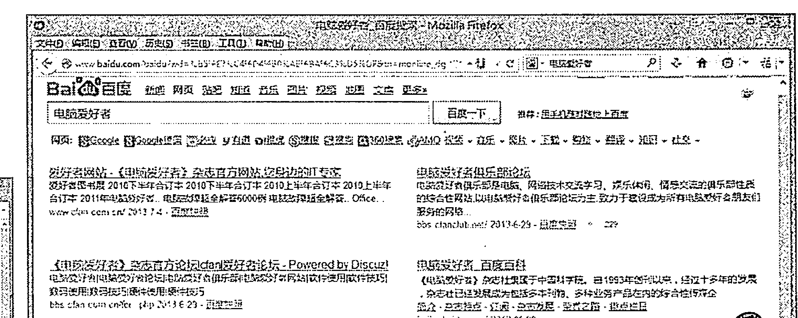

以后当我们用百度（或谷歌）搜索时，搜索结果会以两列的形式显示，比平常多显示出双倍的结果，而且以前显示在旁边的广告信息也被成功过滤了，显得更加简洁实用（图3）。

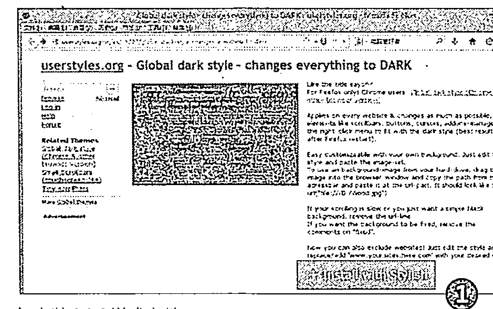

# 别被“价格保护”忽悠了你
文 | 亦云

网上购物下单之后发现降价了，自己买亏了，京东告诉你说利用好“价格保护”武器能帮你找回公道。但是，价格保护这个东西靠谱吗？答案是靠“谱”，但它很可能会忽悠你！

## 1 误解！价格保护不同别人比

在京东商品的用户评价中，我曾经看到这样一则评价（图1）。
从这位网友对价格保护的理解来看，似乎应该是这样的：如果用户发现有别的商家的价格比京东低，那么用户理应能找回差价，京东也理应赔偿用户差价。情况确实如此吗？

我们看看京东商城对其价格保护的解释：“京东的商品价格随市场价格的波动每日都会有价格变化，下单后订单中某种商品很可能出现降价行为，京东出于消费者利益考虑，推出价格保护服务。在订单签收前申请价格保护，申请成功，可按照提交申请时商城售价支付，或通过积分形式返还差价。”

由此可见，京东的价格保护，针对的是京东本身的价格变动，与京东之外其他商城的价格无关。因此，上案中客服说的不关此事也不是没有道理，只是用户没有理解清罢了。

> > **热心网友** 2012-11-26 20:41
> 京东商城的商品价格假的很，我看见一款相机就是佳能相机1100他卖2099，苏宁卖2049国美买1999，不信价格的可以去查，我给他们说了他们卖的贵，客服说我不关我的事情，我靠，京东商城打的广告就是最低价，还有一个价格保护，全是假的。
>
> 评论 0

## 2 抓紧！价格保护不是无限期

价格保护在时间上很有说道。目前京东商城的送货周期越来越短，尤其在几个大中城市，更是推出最短半日送达服务，没等你做完手头上的一件小事儿，货物可能就到了。这半天的时间有多少降价的几率？要知道，京东的价格变动许多时候都是在晚上进行的，当你上午下单、下午收货后，晚上的价格变动已经与你的交易和价格保护没有任何关系了。这时，当你看到价格有变，再去申请价格保护为时已晚。因此，在越来越短的送货周期出现的情况下，价格保护可行的机会越来越少。但是，对送货周期较长的地区反而更有意义。那么对于这个特殊保护，申请的有效时间是什么呢？

在何时提出价格保护这件事上，不同类型的订单有不同的要求。
对于货到付款或上门自提的情况下出现的价格变动，只要是订单付款签收之前，都可以申请。但是，当签收之后，配送人员离开，或者客户自提付款后离开柜台，都将不再享受价格保护。这条你要明白，不可延误。

对于先行付款的订单，虽然说货款已经支付，但是差价还是可以找回来的，这点你也不要因已经付款而失望。但要注意条件是：在订单所购商品到达当地城市之前可以申请。具体进度从订单跟踪页面或通过订单号查询都可以了解到。

由此可见，价格保护不是时间无限型的，如果不了解这些规定，不但可能找不回差价，反而可能因为自己的误解而落个“一肚子怨气”，到头来却还是自己理亏。

### 小知识：价格保护要分清订单类型

- 根据订单类型的不同，价格保护处理方式也不同。订单类型有：
  - 货到付款；
  - 上门自提；
  - 先款后货，自营送货上门；
  - 先款后货，第三方快递送货上门等4种。
- 前两种为后付款型，后两种为先付款型。

# 小心！别被促销“玩弄”了你

明白价格保护是什么意思，满以为自己抓住机会申请价格保护就应该不成问题，但事实上许多情况下最后还是不能如愿。这又是为什么呢？且让我慢慢道来。

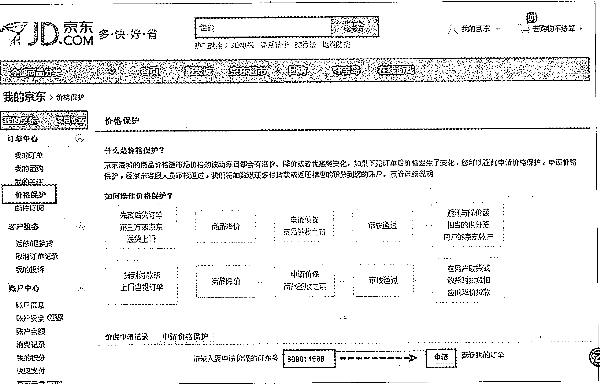

首先要明白，京东的价格保护不是万能的，也就是说，不是京东商城上购买的任何情况的物品都能享受价格保护。看了以下这些案例你就会明白。

李女士购买了一台电视机，是按分期付款购买的，她在看到价格降低且货物还未签收前满以为申请价格保护能找回差价，但最后还是被告知价格保护无效。为什么呢？就是因为她采用了分期付款的方式。京东价格保护的免责声明里就有这样的条款。

同事小红姐购买了一台蓝光刻录机，价格是589元，签收快递前她发现京东上的价格降为499元，希望申请价格保护，但客服查验后告知价格保护无效。原来，小红购买的这台刻录机有附送两张蓝光刻录盘的捆绑促销，有附送的商品不受价格保护。

老爸上周从京东购买了一套中医书，下单时价格为580元，货到付款签收前发现网上价格变为430元，希望申请价格保护后直接按最低价付款，但服务人员查验订单后告知，因为这个订单享受了满500元减150元的活动待遇，因此价格保护申请无效。

准妈妈购买一箱儿童尿不湿，在第二天早晨收货前发现京东网上标示的价格较下单时降低了50元，但申请价格保护也没有成功。后来才明白，是因为她在下订单时使用了一张此前京东赠送的20元东券，此东券限制购买生活类用品，属于限品类东券。京东服务条款有规定，限品类东券购买的商品不能享受价格保护。

由上可知，凡此种种不能享受价格保护的商品，均与“促销”这件事有关，都因与促销挂钩而不能享受。如果买家不知道这些规定（实际上许多人都不知道有这么细的规定），申请价格保护只是多做一回无用功而已。

## 小技巧：多渠道并行帮你找回差价

如何申请价格保护？你不能只知道打客服400电话，因为电话也有不好使的时候。申请价格保护有多种方法，有时候需要搭配使用才更有把握。第一种方法是网页申请，如图2所示。但网页申请有时也会发生意外，明明发现自己符合价格保护的规定，但就是不能提交，此时需要马上与京东客服联系人工处理。联系客服最快的方法是拨打400服务热线（400-606-5500选2，未开通400业务地区拨打0527-88105500），全天候24小时服务；还有一种方法是在线预约电话，5分钟到24小时内，京东来电解决；另有一法是网页留言联系在线客服（图3）。不论哪种方式，往往因为咨询的人多，都可能因等待回复而不能如愿。因此，为了更快地申请成功，几种方法共同使用可能更靠谱。

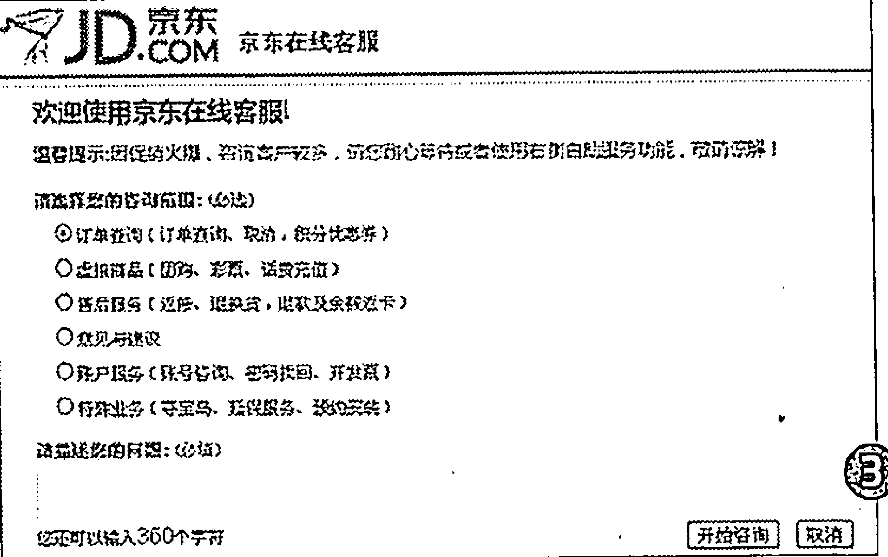

# 辅助英文写作三剑客

文 | 左国才

学英语讲究“听说读写”，许多人前三项马马虎虎能过，但是要用英文写点东西，却感到非常艰难。下面给大家介绍的几个在线工具，可以缓解一下这类朋友的忧虑。

## 不只是词典的“n词酷”

英语写作第一关，就是常常有些词，不知道该选用哪个英语单词才能准确表达。这种情况下，不妨请n词酷来帮忙（http://www.nciku.cn）。

n词酷具有双向翻译功能，打开它的首页，直接在搜索框中输入想要表达的汉语词，比如“关于”，很快显示出汉英词典的双向解释。像“关于”这样的词，有很多不同的词性和词义，如何选择？没关系，往下翻页，会看到许多汉英双译的例句，找到与你想要表达意思差不多的句子，就可以找出对应的英语单词了。比如从下面的例句中可以发现，这种情况下用about比较恰当：

关于安培表的用法，我请教了电工师傅，可还是不懂。I have consulted with the electrician about using an ampere meter, but I still don't get it.

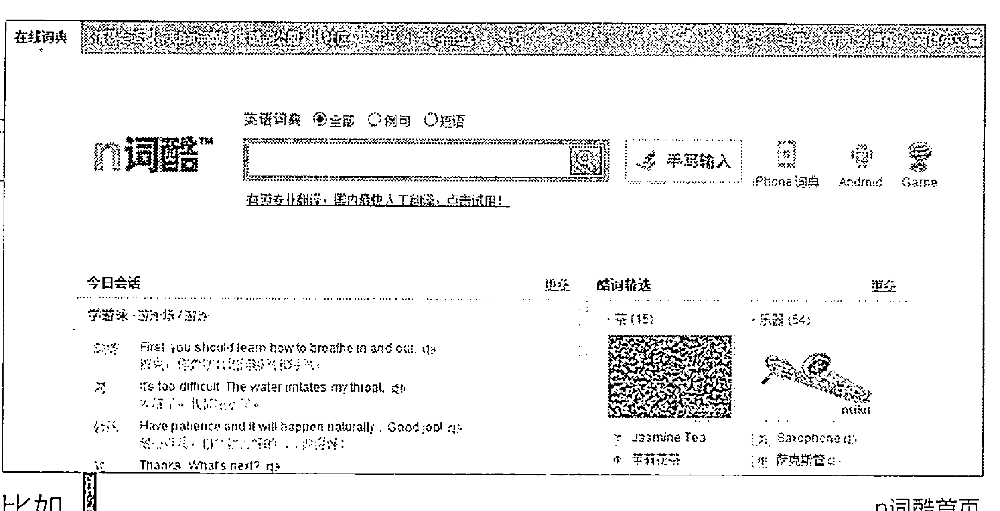

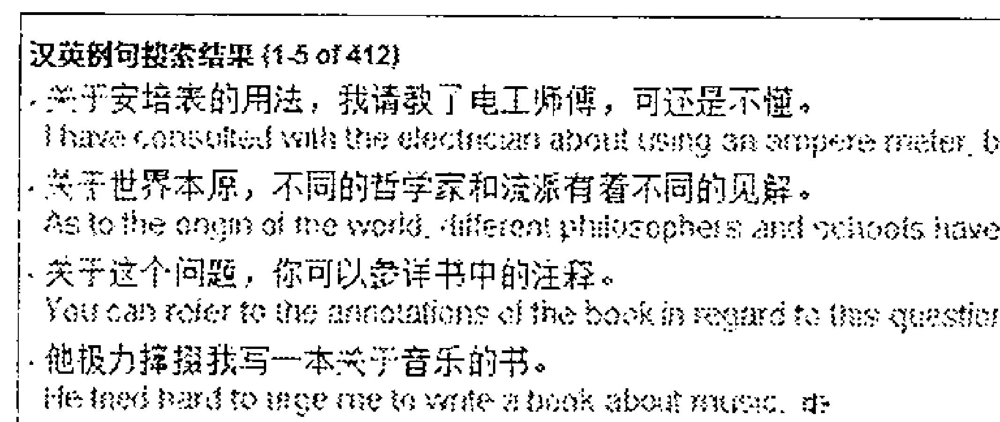

## 句子一样也要“酷”

单词解决之后，接下来就是句子。英文写作中，同一个意思，在不同语境中有不同的表达结构和方法，比如说“时来运转”，不仅仅只限于luck。这种情况下，我们可以利用句酷网站（http://www.jukuu.com）。

我们把“时来运转”输入到句酷的搜索框中，点击“句酷一下”，就能找到许多相关的双语例句。每一条例句，还附有来源，并且还有很多网友的评价，如果某条例句的差评数太大，那就要小心引用了。

句酷支持中英、日英、中日。由于相关的例句会很多，写作时，我们就不用担心和别人雷同了。

## 免费外教改作业

文章写好了，如果其中错误连篇，是会让人笑话的，所以在拿出去之前，还要请“外教”帮忙改一下。这里的“外教”，就是易改，它有软件版，也有网页版（http://www.1gai.cn）。把自己的英语作文贴进输入框，点击“检查”，很快就会给出结果，拼写错误的单词会标示出来，语法、样式和句子不完整的错误，也会相应标示，并可以一键改正。

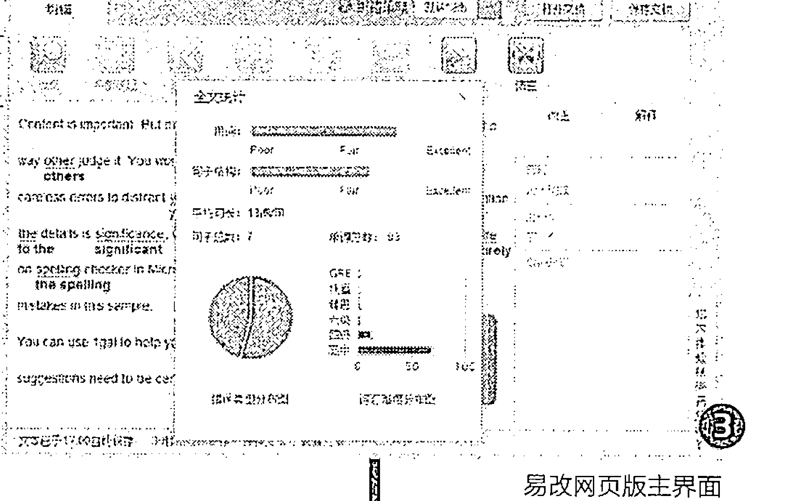

# 自制动态表情聊天更有趣

文 | 沈澄

最近跟一MM聊天，发现无论用微信还是用QQ，她发的各种表情都与众不同，很多表情都来自她的生活，这让我非常惊讶。请教之后才知道，原来这些动态表情都是她自创的，万般“纠缠”之下，她只好将其绝招倾囊相授。

## 图片“组装”搞怪表情

一般情况下，只要用3张静态图片，就能合成一个动画表情。打开GIF Movie Gear (http://tinyurl.com/olfzhnq)，选择菜单“文件→插入帧”分别插入图片，在工具栏上可以设置图片之间的时间间隔，这里设置为20，单击“播放”按钮可查看动画效果，最后选择“文件→保存”将动画保存为GIF就可以啦。


## 在线图片转动表情

其实在只有一张图片的情况下，也可以为其添加动态元素。秘密武器就是“在线动态闪图”。

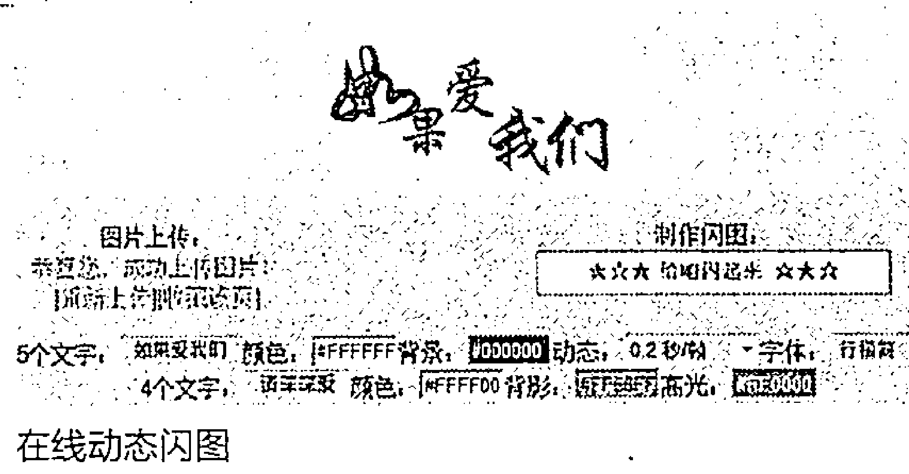

打开动态闪图在线工具 (http://www.jiqie.com/2)，这里有近20种特效供选择，比如选择第1种效果，先上传图片，然后输入文字并设置颜色，再单击“给咱闪起来”就可以查看动画效果了，效果满意后右击动画保存即可。

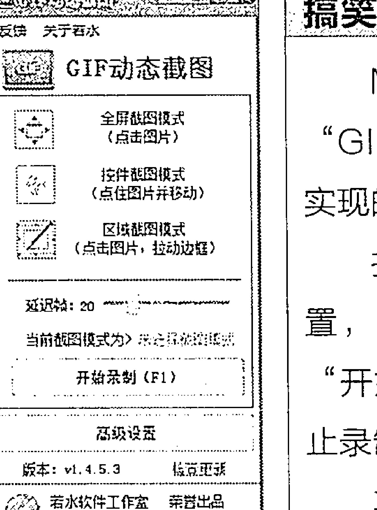

## 搞笑视频“截成”动表情

MM的动表情中有些来自当前的热播剧，她是用“GIF动态截图” (http://tinyurl.com/pkpr4du) 来实现的。

打开软件后播放电视剧，并暂停到要截取的位置，单击“区域截图模式”，选择视频窗口，单击“开始录制”按钮并播放视频，录制结束后单击“停止录制”按钮，此时会自动提示保存GIF动画。

## 自拍图片转搞怪动表情

自拍图片也可以快速转换成动表情，而且无需下载安装软件，直接使用百度应用里面的小工具即可。

其实在QQ中也可以录制视频为动画，单击聊天窗口中的截图按钮，选择“录制视频动画”即可。不过它只能录制10秒，比起上述软件限制太大。

打开应用页面 (http://tinyurl.com/pn4y6to)，根据提示启用摄像头，然后单击“录制GIF”，再设置图片延迟时间和GIF的帧数，延迟时间最好长一些，这样便于做表情，最后单击“开始”进行录制，下方会自动计帧数，完成后即可保存GIF动画了。

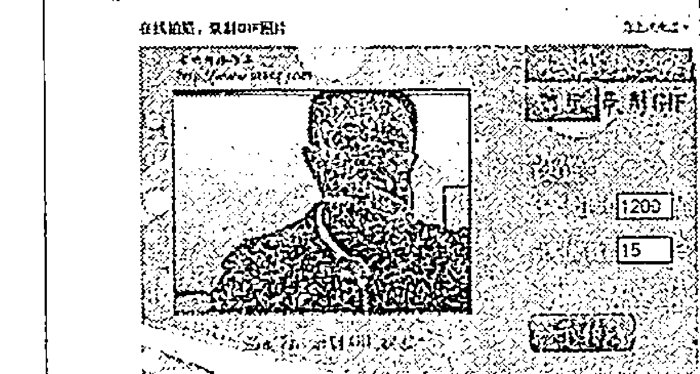

上面我们通过多种方法制作好了动态表情，接下来还要将它们应用起来。最流行的做法是添加到QQ和微信中。在QQ打开与好友的聊天窗口，单击“选择表情”，然后单击“表情设置”弹出对话框。选择“添加表情”再选择自定义的GIF表情动画，这样就能导入QQ表情库中。QQ会员可以漫游小于100KB的表情。如果自定义表情比较多，可以选择“导入导出表情包”，将所有表情导出成eif，这样在其他电脑上只要导入就可以了。要在微信中使用自己的表情，则需要先将GIF表情文件传到手机中，然后打开与好友的聊天窗口，切换到“聊天表情”，选择“+”按钮即可以手机中添加GIF表情啦。


# 快乐暑假 开心上网

对于很多网虫来说，一天不上网就会觉得难受。在学校“同学们”都是使用宿舍宽带上，回到老家是不是觉得上网有些不方便？这个暑假，我们还是来看看上网达人是怎么解决这些难题的吧。

## 1 上网主要目的：玩网络游戏 达人上网方案：网游不给力，自己来加速

作为一名网游爱好者，由于平时学业繁重，我早就想利用暑期好好玩玩游戏了。我的老家在南昌郊区，由于父母都是退休教师，家里早就安装了有线宽带。不过暑期回家后，在家玩网游却有些不爽，因为家里的网络是铁通的，但是我喜欢的网游却大多是联通服务器。现在借助免费的“网游快车”即可加速网游。
到http://tinyurl.com/ptjdm5f下载程序，启动程序后按提示注册用户并登录。接着在打开的窗口，程序会自动识别你的网络状态，点击“选择游戏”，然后选择自己玩的游戏名称，点击“启动加速”即可，程序会自动根据你的网络进行优化（图1）。

> 达人支招 教你一招：校园网也可以使用网游加速
有些“同学”在暑假可能没有回老家，仍然住在学校使用校园网上网。因为校园网都是只提供HTTP协议的，但是所有的网游却是基于Socket5协议，这样可能导致很多网络游戏无法登录。解决方法是使用Sockscap将本地的基于Socks5的请求转为HTTP协议来达到畅快玩网游，当然这个方法也可以暑假回到校园后使用哦。

首先到http://tinyurl.com/po9pwdw下载软件，接着登录http://tinyurl.com/nlygbf9，单击“今日最新Socks5代理列表”，记下一个延迟最小的Socks5代理地址和端口备用。运行Sockscap，单击“文件→设置”，Socks服务器和端口输入上述从“代理中国”获取的IP地址和端口，协议选择Socks5版本。然后返回程序窗口单击“文件→新建”，标示项输入网游名称，单击“浏览”选择一个网络游戏，如“跑跑卡丁车”客户端程序。以后要玩“跑跑卡丁车”时，我们只要在程序窗口中选中“跑跑”，然后单击“运行”即可玩网络游戏了（图2）。

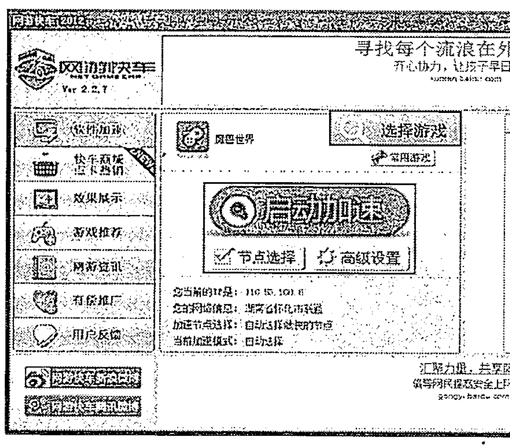

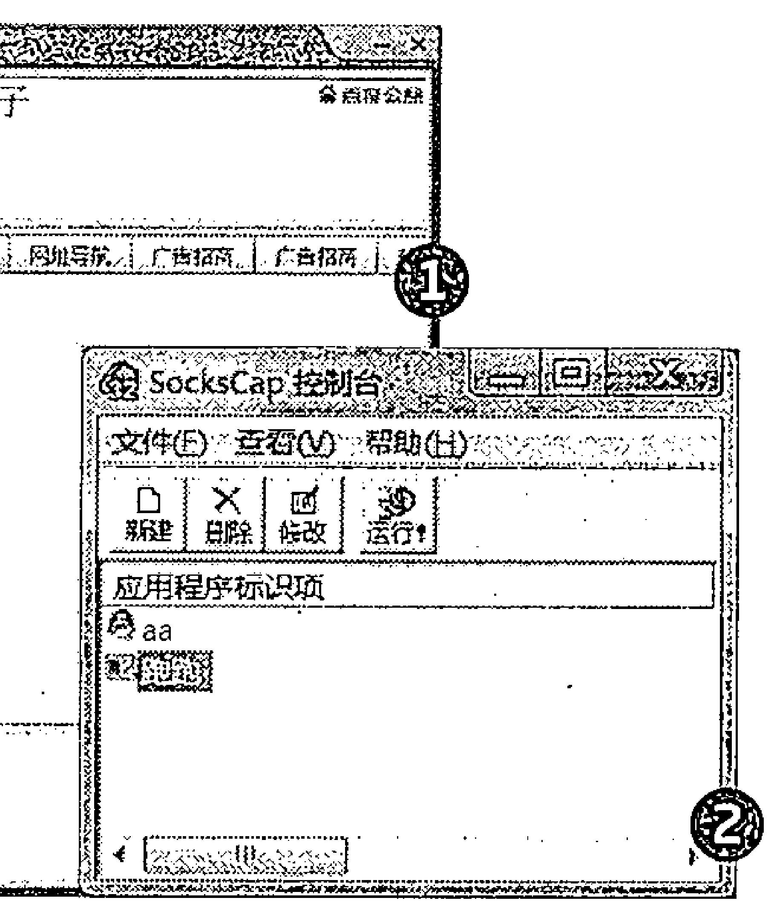

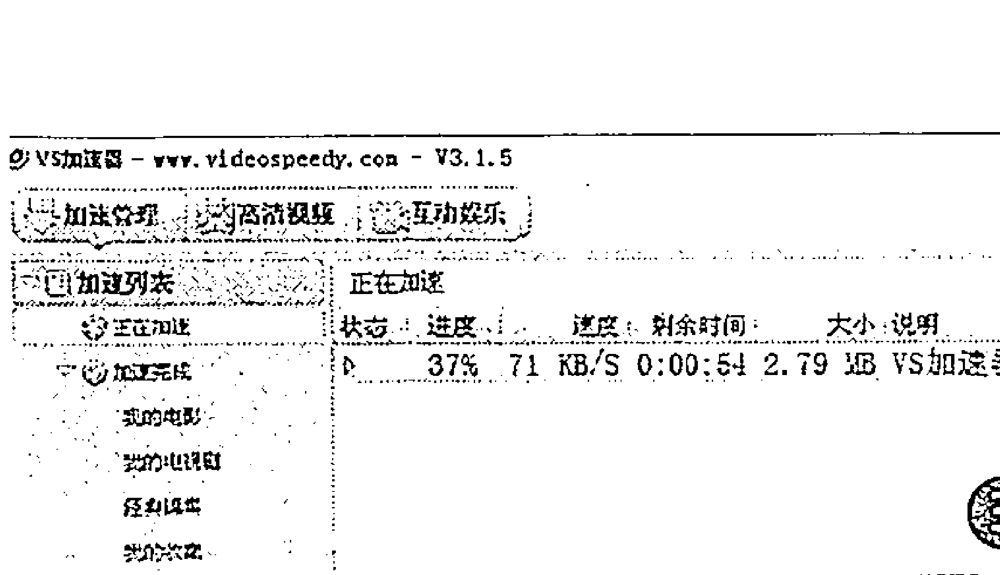

> 小提示
对于网络电影迷，通过上述设置后即使自己带宽足够，由于受服务器带宽限制，我们在线观看一些视频时仍可能不流畅，甚至无法正常观看。此时可以利用“VS加速器”为这些视频播放加速。

首先到http://www.videospeedy.com/下载软件并安装，启动程序后它会自动加速，支持常见的土豆网、56.com网、六间房、新浪播客、优酷等视频网站。

比如，我们在优酷打开一个视频开始播放，此时“VS加速器”会自动弹出加速提示，同时在程序界面的“正在加速”可以看到软件已经为我们加速视频（开始加速时即可在浏览器关闭原来播放网页），加速完毕单击“播放”按钮即可在线播放（图3）。

## 上网主要目的：看在线电影
达人上网方案：用好路由器，带宽分配我做主

我的老家在西部某县城，家里的宽带是使用路由器和几个邻居共用。在学校我就是一个韩剧迷，每个周末几乎都在追韩剧。可是回到老家后，我发现韩剧追起来有些困难。因为是共用的宽带，总有些不自觉的邻居开机就挂起BT。这样别说看在线电影，就是浏览新闻都有困难。怎么办？幸好我家使用的是TL-WR541G/542G 54M路由器，只要手动限制邻居家的带宽即可。

> 开启限制 对邻居带宽限速
返回路由器左侧窗格设置界面，切换到“IP带宽”，勾选右侧窗格的“开启IP带宽限制（只有勾选此项并点击保存按钮后，IP带宽限制才会生效）”，然后在下方的IP地址段设置192.168.1.100~192.168.1.100，模式选择“限制最大带宽”，带宽大小设置为1000Kbps，备注随便填写，勾选“启用”，然后单击“保存”生效（图5）。
这样路由器设置保存后，邻居电脑就能分配到1M的带宽，由于我家的宽带是2M的，这样我和邻居就能和平共处，再也不怕邻居抢占带宽了。

> 绑定IP 取我所需
首先进入路由器设置界面，依次展开“DHCP服务器/DHCP服务器”，地址池开始和结束地址依次设置为192.168.1.99~192.168.1.100（因为我家只有2户共享）。接着打开本机“本地连接”的“属性”窗口，单击“常规”标签，在“此连接使用下面项目”下双击“Internet协议（TCP/IP）”。在弹出的属性窗口中选择“使用下面的IP地址”，在IP地址栏输入192.168.1.99，子网掩码后输入225.225.225.0，依据自己网络ISP设置好DNS服务器，然后依次单击“确定”退出（图4）。然后告诉邻居，将他家电脑的IP固定为192.168.1.100。通过上述的设置，以后只要连接上网，我和邻居家的电脑IP就是固定地址了。

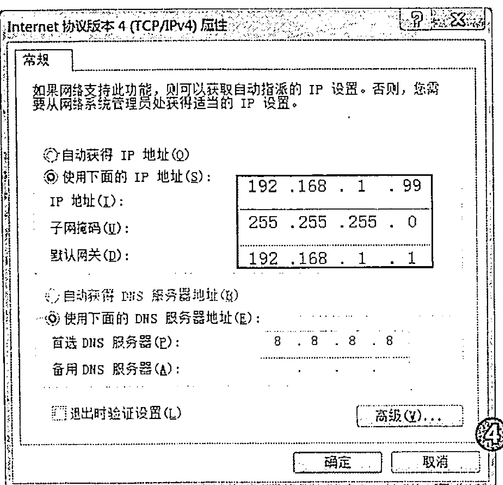

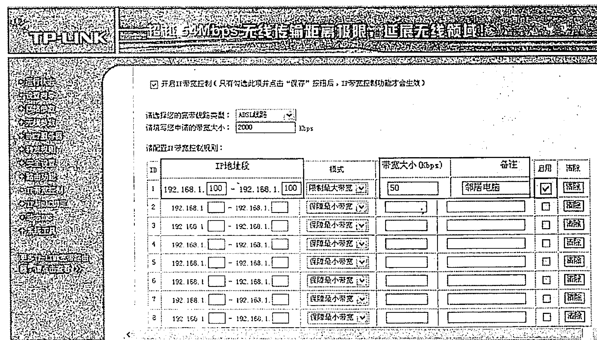

## 《电脑爱好者》·2013下半年合订本 { 网络生活 }

## 3 上网主要目的：看看新闻、浏览论坛
达人上网方案：3G上网，流量节省我有招

张涛

### 小提示

暑期3G上网套餐推荐。由于各家套餐品种繁多，而且上网速率也不相同。各位“同学”应该根据自己家庭所在地已开通的套餐和上网具体需求进行选择，比如我选择的就是联通WCDMA套餐，这样在老家也可以高速上网。

我的家在福建农村，由于父母都是农民，因此家里根本就没有安装宽带。为了能够在暑期上网，早在放假之前我就为自己的手机申请3G套餐，这样在老家通过手机就可以连接到3G网络套餐上网。当然由于3G流量有限，我使用的是超级节约流量的上网方案。

## 简单设置 手机网卡变热点

由于现在大部分安卓手机都支持将手机网卡模拟为热点，因此在手机上连接到3G网络后，将手机网卡模拟为热点，电脑连接这个热点即可共享3G网络。我的手机是HTC Vision，安卓2.3.3，下面就以这个为例。

首先点击“九宫格→设置→无线和网络”，点击“便携式WLAN热点设置”，在打开的设置窗口可以看到设置热点的信息，这里将热点的名称更改为myHTC，并且设置一个较复杂的密码。接着返回无线网络设置窗口，勾选“便携式WLAN热点”，开启手机热点功能，这样手机无线网卡就变为无线热点了（图6）。

- 喜欢下载用户：建议选择电信的时长套餐，电信CDMA2000理论速率是3Mbps，实测下载速率在200KB/s，而且电信也是唯一一家提供时长套餐的服务商。时长套餐卡可以到淘宝上购买（注意最好购买全国通用套餐）。
- 喜欢挂QQ用户：建议选择中国移动流量套餐，它提供的套餐多样，对于喜欢QQ聊天用户，挂QQ时间再长也不会耗费多少流量。
- 喜欢急速上网用户：建议选择联通的WCDMA，它的上网速度最快（理论峰值速率为下行7.2Mbps）。

## 开源节流 流量节约我有招

现在3G网络的速度并不慢，使用3G上网可不能像我们平时使用有线网络那样，否则可能一天下来流量就超标了，因此需要对电脑进行一定优化设置以节省流量。我的节流经验如下：

## 经验1：上网浏览，过滤无关内容。

我上网的主要目的就是浏览新闻，可是现在网页内容广告繁多，这些额外的内容浪费大量的流量，所以应该对浏览器进行设置屏蔽这些内容。比如我用的是傲游浏览器，启动浏览器后单击“工具→广告猎手”，勾选“启用弹出窗口过滤”、“启用网页内容过滤”、“启用浮动广告过滤”。再单击“工具→内容控制”，勾选“禁止下载图像”、“禁止显示Flash动画”、“禁止播放声音”。这样设置后不仅可以更快地打开浏览页面，而且不会再显示上述内容，大大节约了流量。

现在只要将笔记本的无线网卡开启，在扫描列表中选中myhtc。选择myhtc热点后，按提示输入手机上显示的连接密码，点击“确定”即可连接上手机热点，成功连接后电脑就可以使用手机的3G上网了。

## 经验2：论坛灌水，只留清水。

除了浏览网页，我还经常到论坛灌水。现在很多论坛都提供“纯文本模式浏览”功能，点击这个功能可以以文本方式查看帖子内容，大大节约流量。对于没有该功能的论坛，则使用百度快照提供的文本浏览模式，在百度通过搜索找到帖子页面，然后点击链接后面的“百度快照”，在打开的页面点击“快速版”即可。这样论坛Flash广告、图片广告等，统统都会消失！

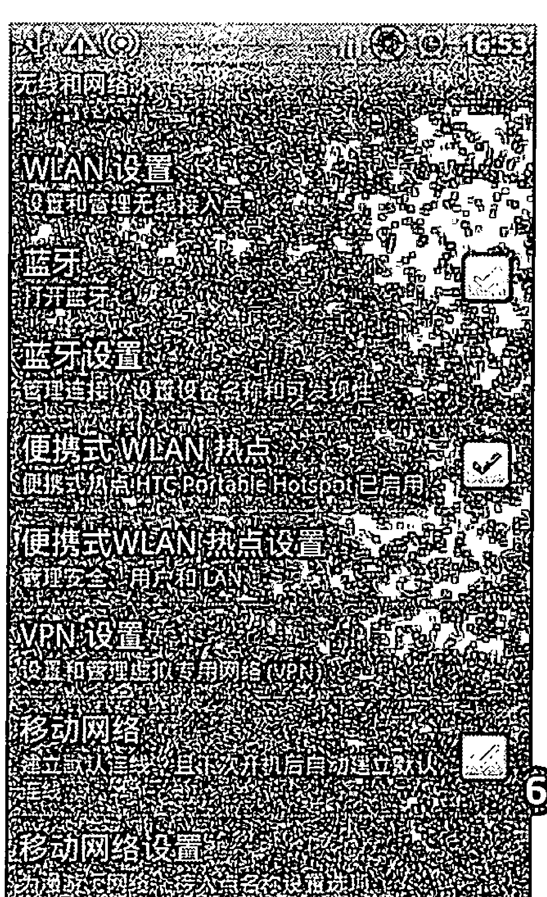

## 经验3：邮件，只下载有用的。

即使是暑假，我也经常要查看自己的邮箱，有的是好友来信，有的则是论坛注册邮件。现在垃圾邮件的附件是耗费流量的大户，为了节约流量，我都是使用QQWEB邮箱。只要在浏览器登录http://m.mail.qq.com/（专为移动设备设置的登录页面），然后输入自己的用户名和密码登录即可。登录后可以自主选择查看有用的邮件。

## 其他更多节流经验

除了上述介绍的经验外，在日常的操作中我们还可以根据自己的需要关闭一些耗费流量的操作。比如关闭软件后台自动更新和系统自动更新，关闭输入法词库自动升级等。此外还可以使用一些精简、绿色或者在线软件，比如Q迷可以使用WEBQQ，登录http://web.qq.com/后点击QQ图标登录即可使用，这个页面不仅清爽，而且QQ所有功能都可以使用（图7）。

> > 注意
由于需要手机认证，所以电脑无法通过公众无线网热点直接免费上网，但是通过手机的中转即可实现免费上网。这里介绍的方法是通过数据线电脑共享手机已经连接的Wi-Fi网络，而不是手机上的3G网络。手机连接成功后一定要关闭手机的数据连接，以免造成流量的损失。

> > 小提示
Wi-Fi伴侣的连接需要手机开通GPRS连接，使用之前请开通GPRS套餐（但每次连接只需耗费几KB流量，连接成功即可关闭手机的数据连接），每次上网时间需要消耗“歪豆”，“歪豆”可以通过下载安装程序推荐的应用软件获得，强烈建议在成功连接到WLAN后再去下载软件，这样就可以长期、免费使用了。

## 达人教你一招：暑期出门在外如何上网

暑期这么长，很多“同学”总是少不了要出门访友或者出外旅游。比如我就有暑期到武夷山游玩的计划，此时只有手机无线信号（比如很多景区就有中国移动的CMCC无线网络），笔记本电脑想上网怎么办？轻松一转换就可实现。

现在很多景区都有中国移动或者电信、联通的公众无线网，如果在外旅游时可以搜索到上述无线信号，那么借助数据线，我们可以将无线信号转为有线，让笔记本电脑免费上网。这里以安卓手机、中国移动CMCC无线连接为例，无线免费连接通过“Wi-Fi伴侣”来实现。

首先到http://tinyurl.com/q33juxt下载软件并安装在手机上，在手机上启动“Wi-Fi伴侣”并开启Wlan，此时程序会自动扫描到无线热点，点击扫描到的CMCC热点开始连接，手机成功连接到热点后就可以上网了（图8）。

手机成功连接到CMCC后，将手机使用数据线和电脑连接（连接之前确保成功安装手机驱动，一般只要安装官网提供的PC连接程序即可），在手机上进入“设置→无线和网络→更多→网络共享和便携式热点”，接着勾选其中的“USB绑定”（图9）。

返回电脑操作界面，此时在电脑上会提示发现新硬件，成功安装后就会在本机多出一个本地连接，电脑就是通过这个网卡共享上网的。这样通过数据线，电脑就可以直接使用手机连接的CMCC免费上网了。

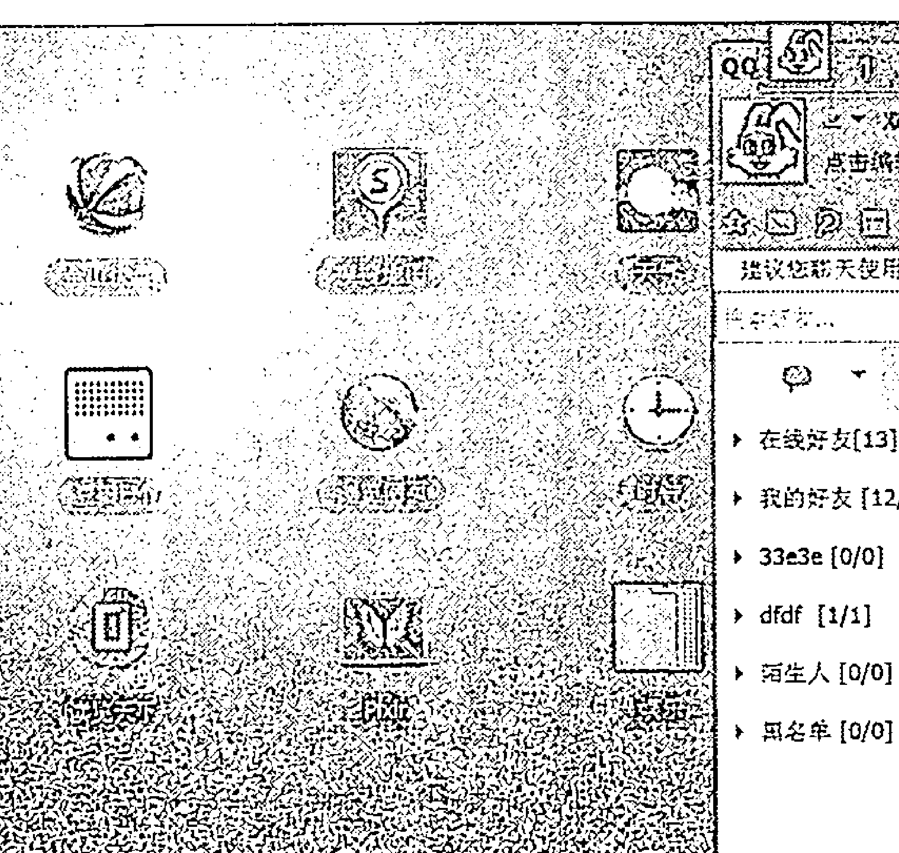

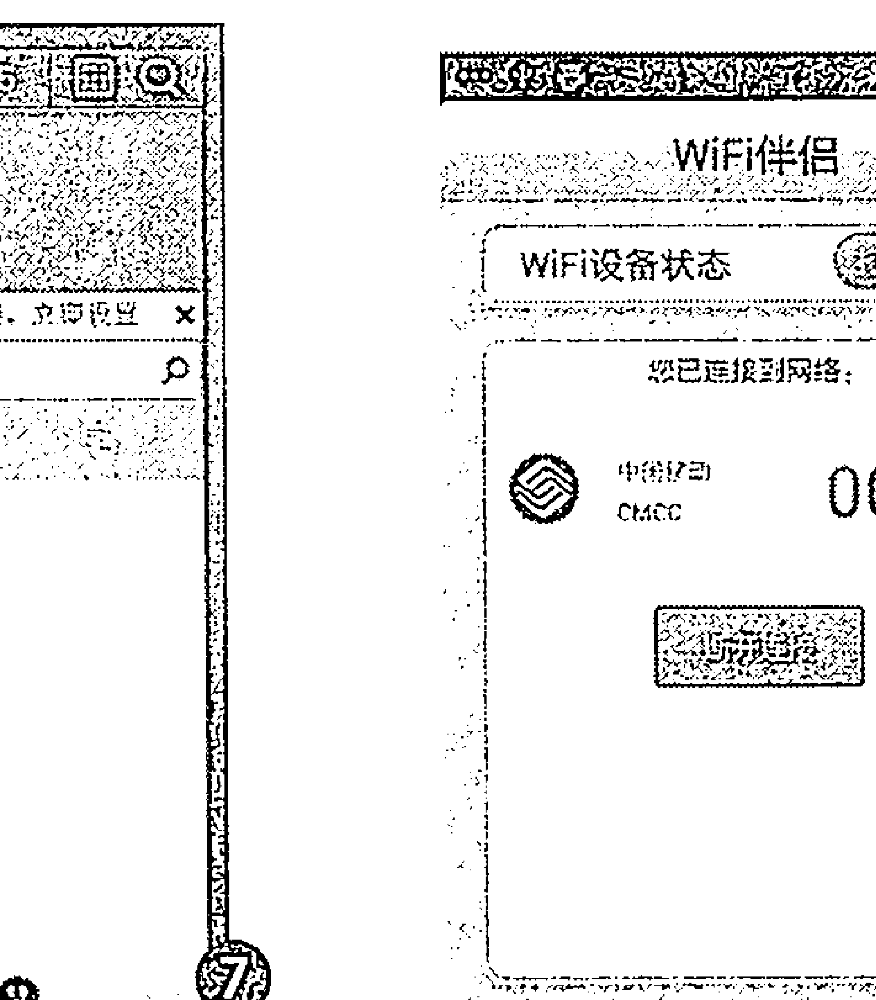

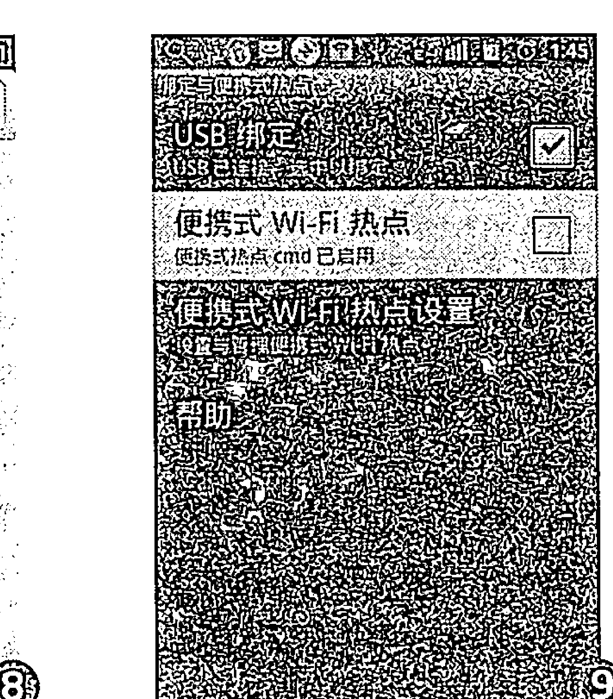

## 不走歪道 免费大片看个爽

由于国际和国内正版化趋势的推动，网络影视付费观看会逐渐成为潮流。但是，对于手头并不宽裕的广大网民来说，不花钱仍可以看爽大片。

随着版权正规化的推进，BT类影视资源越来越少，网民们更多地转入正规渠道获取影视资源。正规渠道的趋势是付费收看，如何在少付费或不付费的情况下观看和下载视频？下面我根据自己的体验向大家介绍一些经验和技巧。

## 1 搜片渠道选择有学问

在某些普通搜索引擎中搜索一部连续剧或电影，很难一下子准确定位到可看、可下载的有效链接中去。比如，在谷歌、有道等搜索引擎中输入一部片名（如《精忠岳飞》）时，结果出现的却是一些剧情介绍或无用的广告页面（图1）。那么如何才能快速定位到一部影视剧的正版链接中？搜片渠道选择有技巧！

## 小技巧：快速准确定位影片

要快速准确地搜出一部可播放的影片，选用对影视资源做了二次搜索技术工作的搜索引擎，比如用百度或360综合搜索来搜索视频。
除了使用百度、360等具备二级视频搜索功能的搜索引擎来提高搜索命中率外，直接定位到百度视频频道搜索，要比直接用网页频道搜索，其结果更加集中和精准。最近360也专门开发了视频浏览器用来供用户精准获得视频文件（图2、图3）。

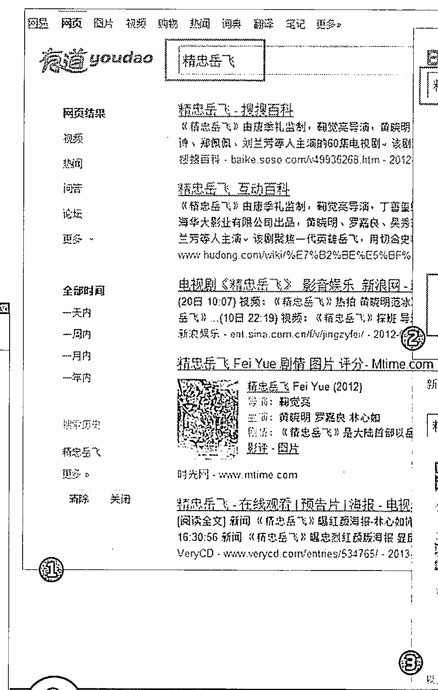

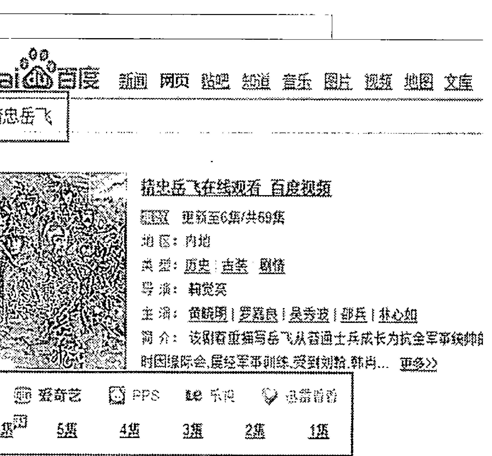

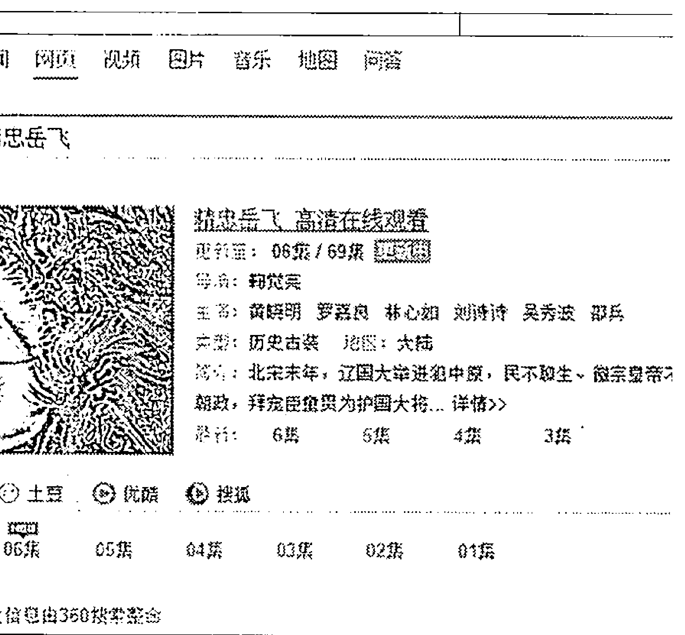

## 2 看片网站到底选哪个

网络看片，人们关注的两个重要参数除了速度就是清晰度。视频网站往往用“标清”、“高清”、“超清”等概念来混淆视听。事实上，许多网站提供的影片往往远远达不到业界标准（高清1920像素×1080像素，标清1280像素×720像素）。各家视频网站的视频标准鱼龙混杂，在视频客户端方面，我们到底该如何选择呢？
根据我们对几家主流在线视频网站的测试，发现爱奇艺提供的片源质量是最好的、最稳定的，搜狐、乐视、PPTV、优酷土豆等网站提供的片源质量参差不齐，其中自营版权影片质量一般比较高，而网友上传的视频或其他来源的视频质量则相对较差，或难以保证与其网站公示标称的清晰度相符。

## 小技巧：如何验证视频清晰度

QQ影音播放器在播放开始时会显示影片的分辨率。可先下载一部片子做个实验，通过QQ影音等含有分辨率信息显示的本地播放器播放一下，看看其分辨率究竟是多少，是否符合标准。

## 离线看片下载技巧多

许多时候，由于网络的限制，我们不可能时时刻刻都能连上网观看视频，在这些情况下，下载后离线观看就很有必要。虽然各家视频网站的PC端和各种移动客户端多提供了下载功能，但是，在下载方面，不是每个客户端的下载体验都相同。同样一部片，如果几个客户端中都有提供，下载所需时间会有天壤之别。下载的过程也有许多实用技巧需要掌握。

经验之谈：下载速度的比较
乐视影片虽然清晰度不够优秀，但其PC客户端在下载速度方面可以充分发挥带宽优势，最多可设置9个任务同时下载，速度最大可设1000KB/s，但实际下载速度根据自身网络带宽可能超越这个限制。而爱奇艺虽然清晰度一流，可设置5个任务下载，但速度会根据时段有所不同，普通时段难以达到网络标称带宽。风行的下载速度体验则最差，由于风行为保障在线观看流畅，一般只允许同时有1到2个任务处于下载状态，因此再宽的网络也发挥不了作用。

## 技巧1：选择最合适的任务数下载

同样提供多线程下载，那么是不是开6线程就比开2线程下载得快呢？不见得。经测试发现，在20M带宽的联通网络环境下，用搜狐视频客户端下载开启5个任务下载，反而不如开2个任务速度快和稳定。到底开几个任务数更合适，还要根据自身的带宽和所用的软件来决定，不能一概而论认为数目越多越快，换个参数尝试一下也许是最好的办法。

## 技巧2：多屏互动不用下载也能看

PC中已经下载了一部片子，在不需要拷贝的情况下，自己的平板或手机端还需要重复下载吗？如何用移动端在不下载的情况下共享自己PC中的片子？
开启客户端的多屏互动功能可以解决这个问题。爱奇艺、乐视LeTV等客户端都提供了多屏互动的功能，在PC端启动该功能，设置访问密码，即可实现在移动客户端上不下载、不传输而直接播放PC端上的视频（图4）。

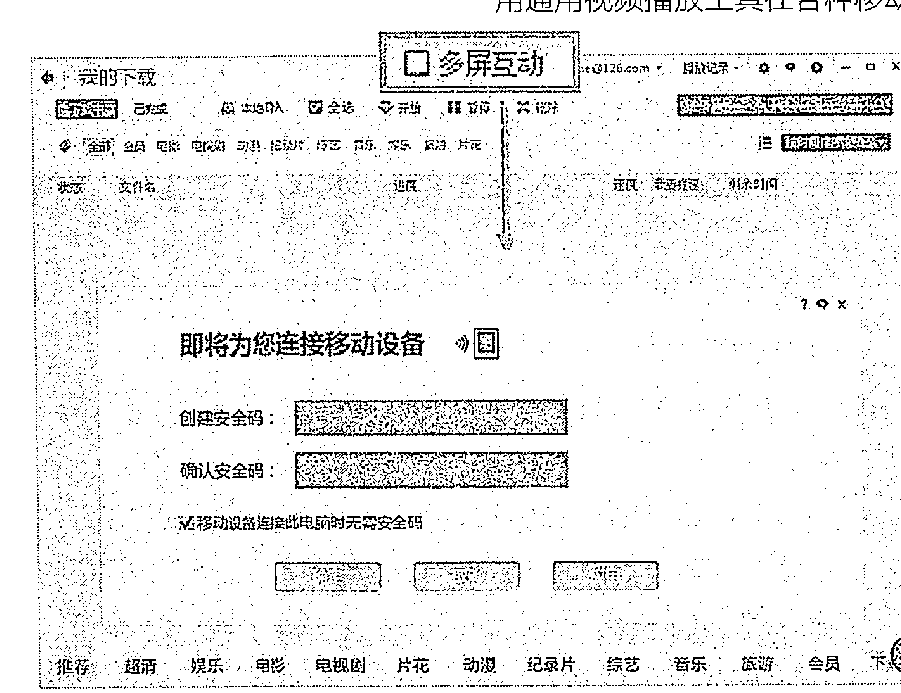

## 技巧3：转换优酷清晰大片格式

优酷的片子在线看很清晰，但当我用其客户端自带的模块转换为某种平板或手机格式时，清晰度大打折扣？为什么？这是因为在转换过程中，其提供的型号方案中自动降低了分辨率的选择而造成的。解决办法是：先用优酷PC客户端下载超清或高清视频，再用自带的转码工具，选“超清、原始分辨率、FLV格式”转码，转码时间极短，但转码前后视频播放效果几无差别。有了FLV格式，即可用通用视频播放工具在各种移动设备中播放了，不用装优酷也可。

## 技巧4：榨尽带宽的最后一滴油

家里的宽带是20M光纤，但用风行客户端来下载连续剧，速度慢得要命。怎样才能让富余的带宽在下载中发挥优势？一个通用的技巧是：使用多种客户端同时下载。这时，只要你能够找到相同片子的不同片源，则可以将这部剧集分别交给不同的客户端，多客户端同时下载，可以最大限度地利用你的带宽资源，让你的网络带宽满负荷运作。

## 大家一起来

# 狙击广告顽固分子

现如今，无论是网站还是软件都是广告满屏飞舞，网站的广告也许可以通过浏览器屏蔽的方式来禁止显示，但不能阻止广告下载到本地，软件中的弹窗广告更是难以控制。针对这些顽固分子，我们该如何去消灭它们呢？用怎样的方式将广告禁止于我们的网络之外呢？

### 1 去广告 找链接 咱有大杀器

文 | 英子

其实说起来，弹出广告也没有什么神秘的，因为现在各大网站的广告都是链接到广告商的服务器，而服务器上的广告内容肯定不是无规律的，因为这样让厂商管理起来非常麻烦。因此也就给我们提供了一条寻找广告链接的捷径，找到其广告服务器并将其屏蔽或者列入黑名单即可。本文就广告通杀性和手动去广告加以讨论。

### 广告通杀能力我更强

对于软件而言，最常见的一个方法就是下载各种“去广告补丁”，在百度中一搜一大片，下载后解压安装，根据提示选中去广告的相应项即可。如果觉得一个个安装上述软件补丁比较麻烦，还可以使用一些“广告杀手”软件来杀广告，比如超级兔子反弹天使、悠树弹窗屏蔽器、弹窗防火墙等。这里以超级兔子反弹天使屏蔽迅雷7非会员右上角广告为例。该软件可在http://www.skycn.com/soft/49974.html下载。

首先，打开迅雷软件。接下来启动“反弹天使”，会提示“当前规则库为空，请添加规则或导入规则文件”窗口（图1）。然后单击图1窗口中的“新增规则”按钮，创建规则文件，出现如图2所示的窗口。单击瞄准器，将其拖动到迅雷软件窗口，待将该窗口完全覆盖后，反弹天使会自动地找到相应的程序命令行，并将其填入到该窗口的“执行文件名”处。接下来，输入软件的名称，如“迅雷”，将“操作方式”设为“无任何操作”。这时迅雷会出现在软件左侧的窗口中。

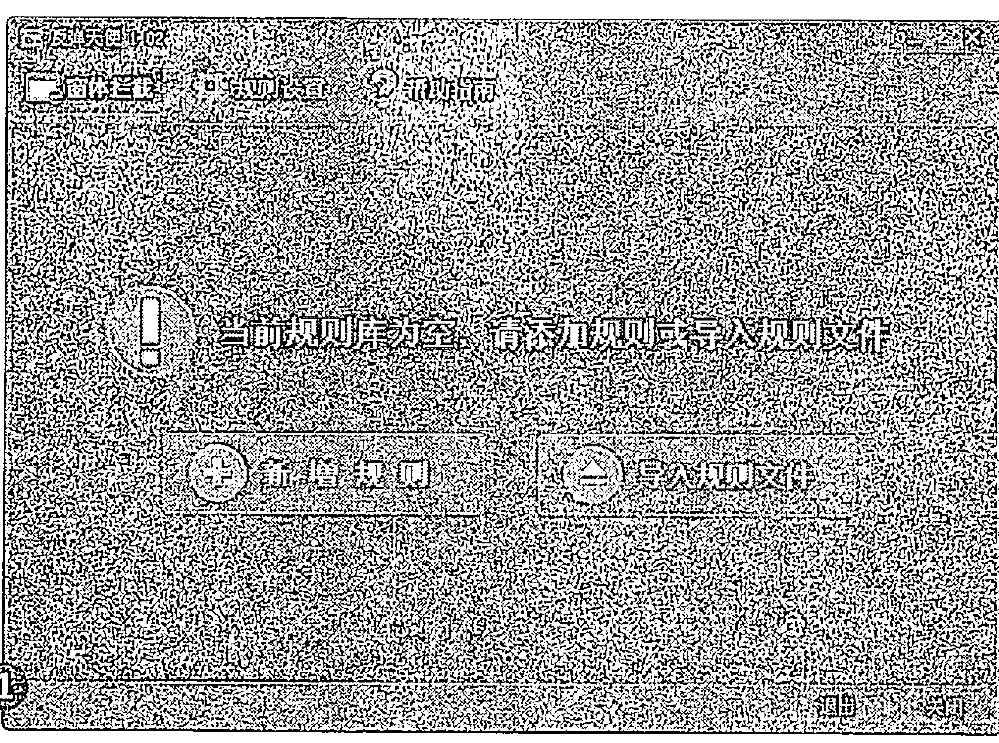

接下来选中窗口左侧的“迅雷”，单击“增加窗口”按钮，将瞄准器拖到“迅雷资讯”窗口中，这时反弹天使同样会找到“迅雷资讯”的命令行程序，将其“操作方式”设置为“隐藏窗口”或者“关闭窗口”即可。接下来可按照同样的方法将迅雷的其他弹出窗口加入到其中。

最后，创建规则后，只要是启动了反弹天使，就会对弹出的网页起到屏蔽的作用。如果偶尔想要查看一下被屏幕的内容，如更新提示等，则可以重新打开被屏蔽的网页。方法也比较简单，只要在反弹天使中单击“窗体拦截”按钮，选中相应选项后，单击“禁用”即可，反之则单击“启动”按钮。

除此之外，还可以对规则进行导出和导入操作，单击图2中的“导入规则”和“导出规则”按钮即可。这些规则默认情况下是不能更改位置的，它们默认情况下被放在超级兔子的安装位置下，如D:\Super Rabbit\magicset下，是一个以压缩包形式、带有日期的zip文件。如果想将整个规则删除，则可以选中左侧项目，右击鼠标，选择“删除软件”或“删除节点”命令，将相应的规则删除即可。

对于网络而言，广告问题显得复杂得多，因为网络植入广告的方式多种多样，网络广告该怎样拦截呢？

## 找到广告链接其实也不难

- 1. 针对IE核心浏览器
对于IE核心浏览器而言，可以通过其IE属性查找到，虽然不多，但不表示没有。这里举一例，如某网站内的广告，鼠标右击后在右键菜单中选择“属性”，可以发现该文件的精确地址为http://images2.zhulang.com/game/em_110331_2.swf。还有一些不是那么明显的，如在小说阅读网右下角中的“百度推广”窗口，右击鼠标，其地址为http://cpro.baidu.com/cpro/ui/uijs.php?tn=（以下足有几行，这里省略）。对于这种情况，其实只要知道http://cpro.baidu.com是广告推广的服务器就可以了，想屏蔽其广告，只需要知道http://cpro.baidu.com/*（这里的*是通配符，代表该网站下的所有链接）列入黑名单，比如添加到AD Muncher的过滤目标中，则所有的百度广告就可以屏蔽了。

| 属性 | 框架 | 图像 | 源码 | Flash | 链接 | 样式表 | 脚本 | 媒体 | 校验 | 表单 |
| --- | --- | --- | --- | --- | --- | --- | --- | --- | --- | --- |
| 浏览 | 浏览 | Flash 文件（左键） | | | | | | | | |
| 保存 | 默认下载工具为 FlashGet（左键）当前下载工具 -> Thunder | | | | | | | | | |
| 保存 | 点击左键并选择“目标另存为...” | | | | | | | | | |
| 过滤 | 添加到 Maxthon 内容过滤（左键） | | | | | | | | | |
| 文件列表 | | | | | | | | | | |
| 1.http://img.house.sina.com.cn/a/def/pos/sina/370_65.swf | | | | | | | | | | |
| 2.http://d5.sina.com.cn/201104/13/296955_640-90.swf | | | | | | | | | | |
| 3.http://d3.sina.com.cn/201103/01/286890_140287ls_ent_zc_an_0301_allyes.swf | | | | | | | | | | |
| 4.http://d3.sina.com.cn/201104/02/294248_140210wfjg.swf | | | | | | | | | | |
| 5.http://d1.sina.com.cn/201012/31/278511_78090ls_tl02_tefeng.swf | | | | | | | | | | |
| 6.http://d1.sina.com.cn/201104/14/297234_2905.swf | | | | | | | | | | |
| 7.http://d5.sina.com.cn/201103/16/290279_38590ls_dsp_an02_maikaolin.swf | | | | | | | | | | |
| 8.http://d1.sina.com.cn/201103/30/293227_140280ls_dibu_an_allyes_0330_C.swf | | | | | | | | | | |
| 9.http://d1.sina.com.cn/201104/14/297156_2884.swf | | | | | | | | | | |
| 10.http://d3.sina.com.cn/201012/31/278547_78090ls_dsp_tl02_2011_A.swf | | | | | | | | | | |
| 11.http://d2.sina.com.cn/201104/16/297772_hg25-150.swf | | | | | | | | | | |

## 通过浏览器插件来完成

对于以IE为核心的浏览器而言，一个小插件ViewPage可以解决大问题。这是一个用来分析网页框架结构的插件，通过它来分析网页的框架结构可以找出广告链接。这里以Maxthon 2查找新浪网广告为例来说明。

打开新浪网后，待网页完全显示后单击ViewPage按钮，在出现的窗口中选中“框架”选项卡，显示共有8个框架，一些以ad、d1开头的即为广告。再选中Flash选项卡（图3），可以看到列出的11个文件也基本上是广告。将这些广告地址加入到黑名单即可，当然最好以通配符形式加入。

## 通过嗅探软件来获取

在视频网站的很多电视剧前都会加入一段广告，少则几秒，多则数十秒，且有越加越多的趋势。这段广告其实也是一段Flash，但查找起来显得相对比较困难。需要的则是一些具有流媒体嗅探功能的软件。这里以免费的影音嗅探专家为例来说明，该软件下载地址：http://enkj.newhua.com/down/msniffer-201003.zip。

首先，运行影音嗅探专家，在浏览器中打开www.tudou.com中要播放的电视剧节目。单击“开始嗅探”，并点击播放www.tudou.com节目。在播放到正式剧情时，单击“停止嗅探”按钮，这时会得到一个数据包（图4）。

接下来分析该数据包，可以得到*adcontrol.tudou.com/adcontrol/*、*at-img*.tdimg.com/sale/*、js.tudouui.com/bin/tmp/、js.tudouui.com/js/fn/saleloader_63.js等。这个需要一点点试验，要有耐心啊。

### 2 针对Firefox浏览器

使用Firefox浏览器，只需两款小插件就可以查找页面广告和视频前的Flash广告。一款插件是FlashBlock，下载地址：https://addons.mozilla.org/zh-cn/firefox/addon/flashblock/。另一款小插件就是HttpFox，该插件的下载地址：https://addons.mozilla.org/zh-cn/firefox/addon/httpfox/，安装后重新启动Firefox浏览器。

在打开网页之后，所有的Flash广告都会被Flashblock屏蔽，上面显示一个Flash播放的图标，如果点击“播放”则会显示该广告，否则，广告就不会显示（图5）。点击“工具→httpfox→Toggle httpfox”，在页面下侧打开HttpFox窗口。接下来打开相关的网页或视频，点击Start按钮，开始监听，当广告画面出现完后，立即点击Stop按钮停止监听，然后再对监测到的网址进行分析，从中找出其中的广告链接，像一般的Flash广告都可以直接看到以.swf为扩展名的文件（图6），而视频前的广告则需要认真地分析对待。

小提示
该软件对其他核心的浏览器同样适用。

得到这些广告网址后，其实还有一个最好的屏蔽办法，那就是编辑Host文件。打开记事本，以
127.0.0.1 cpro.baidu.com
127.0.0.1 adcontrol.tudou.com/adcontrol
的格式把所有的广告网址输入后保存即可。

## 2 阻止广告
看我广告管家
文|吴森智

广告，这个词对人们来说已经是熟悉得不能再熟悉了。它从以前只能出现在电视上，蔓延到当今的网络，再到软件的捆绑下载。怎样才能让这些广告离开我们的电脑平台呢？

要想阻止广告满屏飘飞，就让我们先分析一下这些广告吧！

广告有内置式、弹窗式和捆绑式。内置广告一般无害（我说的是安全网站），它们一般是网站在制作时为了吸引更多人来浏览而制作。弹窗式广告则不同了，它有些是别人为了做生意推销产品；有些是不法分子设计的陷阱（如钓鱼网站、暴恐网站、色情传播等等）；有些甚至表面看是正规产品，可当你进入后才发现进入了圈套。而捆绑式广告一般是你的在下载软件中就被插入了启动式广告，当下载并安装完成后重启电脑时你会发现电脑的启动时间比平时慢了不少，而且等到启动完毕，你会发现广告满屏弹跳。

怎么才能阻止广告满屏飞呢？这里，我推荐一款广告阻止专家：ADsafe广告管家，它是一个不错的阻止广告的软件，而且还能够阻止视频广告。有了ADsafe广告管家，我们就不用担心被广告拖延时间了。

下载并安装ADsafe广告管家，双击图标，你会发现没有反应，不用担心，其实它已经运行并最小化在任务托盘中，单击任务托盘中的图标，就会打开ADsafe广告管家的优化和设置界面（图7）。

然后，切换到规则订阅列表，勾选规则（图8）。接着单击自定义广告过滤，在这里可根据自己的需要添加过滤内容和网站。

完成后再切换到首页，单击一键优化，到这里设置完毕。如果想查找广告拦截怎么样，就单击广告拦截日志，可以查看到广告拦截过程。

订阅过滤规则列表
| 订阅 | 规则类型 | 作者 | 规则名称 | 规则数量 | 发布时间 | 订阅比例 |
| :--- | :--- | :--- | :--- | :--- | :--- | :--- |
| ☑ | 网页过滤 | ADSafe用户 | 网站广告隐匿 | 1923 | 2013-07-03 14:17 | 99% 用户选择 |
| ☑ | 网页过滤 | ADSafe用户 | 网站广告屏蔽 | 2418 | 2013-07-03 11:58 | 98% 用户选择 |
| ☑ | 视频广告 | ADSafe用户 | 视频播放广告屏蔽 | 229 | 2013-07-04 09:49 | 95% 用户选择 |
| ☑ | 网页过滤 | ADSafe用户 | 网盟广告屏蔽 | 434 | 2013-07-03 11:42 | 90% 用户选择 |
| ☑ | 软件广告 | ADSafe用户 | 软件内置广告屏蔽 | 14 | 2013-06-16 10:00 | 79% 用户选择 |
| ☑ | 网页过滤 | Gonzales网友 | 第三方广告拦截规则（补充规则） | 370 | 2013-06-28 00:00 | 63% 用户选择 |
| ☑ | 网页过滤 | zhangyy网友 | 搜索引擎与广告联盟屏蔽 | 29 | 2013-06-21 10:30 | 59% 用户选择 |
| ☑ | 网页过滤 | 三杯茶 | 轻量规则（Gonzales规则补充） | 585 | 2013-07-06 11:35 | 57% 用户选择 |
| ☑ | 网页过滤 | ☆天翔☆网友 | 门户网站广告屏蔽 | 126 | 2013-07-05 09:30 | 53% 用户选择 |
| ☑ | HOSTS屏蔽 | 恶意网站实验室 | 恶意网站屏蔽（杜绝挂马网站） | 7939 | 2013-05-13 00:00 | 38% 用户选择 |
| ☑ | 网页过滤 | xcff1网友 | 广告强效过滤规则（过滤彻底） | 4337 | 2013-07-02 12:33 | 33% 用户选择 |
| ☑ | HOSTS屏蔽 | sirmanic网友 | 低俗网站屏蔽（保护青少年健康上网） | 7600 | 2013-03-27 20:00 | 19% 用户选择 |

另外如果你有QQ管家、360安全卫士、金山卫士……等等其中一款软件，用它整理一下启动项，把那些无用的启动项去掉，这样既可以节约启动时间，又可有效阻止启动时广告满屏飘飞。如果不行的话，建议把带有广告插件的软件卸载，寻找纯净版软件或绿色软件下载安装绝对没问题。

# 海量资料 脱机高效管理

珍藏的资料，如精品电影、电视剧、音乐、PDF电子书等，不可能统统都放在电脑硬盘中。多人会选择将其刻录到光盘或存储在移动硬盘中收藏。但这类资料因为已经离开了电脑，因此日后查找成了问题。有什么便于查找的管理办法吗？
文|何超

借助于一款资料管理软件ADC（全称Advanced Disk Catalog），以上问题即可轻松解决。软件下载地址：http://t.cn/zQj1XTQ

### 1 各类资料混合建库

ADC管理文件资料的原理是，先将存放文件资料的磁盘或目录扫描一遍，生成资料目录的数据文件，纳入到由其管理的ADC数据库中，进而实现对资料目录的离线管理。

资料建库，可以是给电脑硬盘中的各个数据分区，甚至如果有必要，系统分区的文件也可以纳入库的管理之中。更为实用的是，给移动存储设备中的资料建库，这样可以便于离线后查询。这些移动性质的资料可以包括光盘中的文件、移动硬盘中的文件、其他电脑中的文件、手机平板中的文件等。

> 光盘资料入库可直接将光盘插入光驱中读取资料。对于手机卡、相机照片存储卡等，如果通过连线能够在电脑中显示出相应的移动盘符，则可以直接建库；如不能出现盘符，则可通过读卡器来为手机卡或相机卡建立数据库。

资料建库需要在备份资料离开电脑之前进行。我们以给一块移动硬盘建立资料库为例来说明。启动ADC软件，点击工具栏的第一个按钮“新建”，建立一个库文件。在出现的“ADC-未命名”的窗口工具栏上点击“新增卷标目录”按钮。选择驱动器为我们要建立目录的移动硬盘，点击“确定”按钮（图1）。之后软件开始扫描移动硬盘中保存的所有资料（图2）。

> 在一个资料库文件中，可以包含不同种类的卷，如光盘、移动硬盘、硬盘分区、手机卡、U盘等。

### 2 让数据库保持常新

扫描完毕，出现卷标命名窗口，给新加的资料卷命名（图3）。

之后，新加的资料卷就会出现在刚建立的资料库窗口中。点击“磁盘”按钮保存刚建立的资料库文件，保存时系统会提示命名资料库。

笔者将一块移动硬盘作为一个卷纳入到一个资料库中，当这块移动硬盘中存储的资料发生变化时，数据库中的资料也要做相应变化才能反映实际资料情况。这时，我们可按如下方法操作。

首先将移动硬盘插入到当前电脑中，接着启动ADC软件，打开载有该移动硬盘资料的数据库文件，选中该移动硬盘所在的卷名。点击ADC工具栏中部的“更新卷标目录”按钮。ADC开始更新当前卷的目录为最新（图4）。

> 光盘、U盘、硬盘分区的资料更新与此类似，只需先选中相应的卷名，然后点击“更新卷标目标”按钮或相应的命令即可。

### 3 离线查询 场景逼真

数据库中可以包含许多种类和许多数量的卷。如笔者的十多块移动硬盘和数千张光盘都在一个数据库中管理。在建立了一个包含有许多卷的资料数据库之后，要查找某些资料，可通过关键词查询，可以直接模糊查找到资料所在的卷。查找到的文件名称结构排列与介质在线时一样逼真。

假设要在资料库中找出一些《新概念英语》方面的资料，只需按如下步骤进行操作即可。

点击ADC工具栏右侧的放大镜状“查找”按钮，在弹出的窗口中“关键字”处输入“新概念英语”（图5）。

点击“查找”按钮开始查找，从查找出的结果中直接点击其中含有“新概念英语”的某一条记录，就可以直接跳转到资料目录窗口的相应卷和目录下，感觉就好像是直接访问到了那张光盘（或U盘、硬盘）一样（图6）。

> 小提示：
查找出的结果只表示位置，不能直接访问资源。这时，你只要找出存储介质，插到电脑上就可以直接访问了。

如果你的备份盘中的资料是在ZIP、RAR之类的压缩包中，ADC还是有办法将其目录纳入到数据库中，并在查询时提供压缩包内搜索的功能。这需要在建立卷标目录时，在“选项→设置”中选中有关压缩包的选项（图7）。

> 小技巧：
为了更加便于目录的管理，我们还可以通过右键菜单给数据库中的每个卷进行个性化目录更名、给目录加注释等。此外，也可以通过文件菜单中的导入数据库命令实现库文件的合并。具体操作大家可自行尝试完成。

### 4 目录管理 导出备用

由于ADC管理的各类介质的目录，其库文件的格式是一种特殊的CAT格式，用记事本或办公工具等软件是无法直接查看的，因此，如果脱离了该软件，要查看该数据库就比较困难。这时，我们可以用ADC提供的列表导出服务Export，将自己需要的列表导出为一种通用的格式文件。比如，可以导出为Excel或Access支持的表格格式，甚至XML语言文件（图8）。

# 360度动态全景自动演示DIY

也许你会认为，制作360度动态全景照片需要特殊功能的高级相机、智能手机，老相机、老手机不能胜任这样的任务。其实，借助工具，能拍照的相机或手机，再低档也能生成出360度的动态全景照。

刘老芋头

### 必备工具

- 一台普通数码相机或拍照手机。
- 一个佳能数码照片缝合工具软件PhotoStitch v3.1中文版。
- 一个MMB多媒体设计工具（全称Multimedia Builder）。

### 拍照的要求和技巧

选好一个中心点站立，如果有条件，最好架设三脚架，尽量精确地调整相机的水平位置，以便在相机沿着360度圆周旋转时，能保证所拍的照片基本在一个水平面上。如果没有三脚架，那就要靠自身的目测能力，尽量保证抬起的肘部在拍摄过程中位于一个水平面上，避免忽高忽低。

拍摄时，要保证每相邻的两张照片至少有三分之一的画面重合，这样有利于在用软件缝合时，软件能找到足够的重合画面，拼出更加趋于逼真的场景照片。

拍摄时，要避免视野范围内出现运动的物体，否则很容易出现在缝合过程中产生半个物体的怪现象，从而使整个拼合过程失败。

在拍第一张照片时候，心中一定要记好景物的位置，当拍完一圈回来，在拍最后一张的时候，就可以保证这张照片与第一张照片有足够的重合度。如此才能保证最后缝合的照片有天衣无缝的感觉。

### 实现原理

先用数码相机或手机对某处环境实现360度连续拍照，然后用照片缝合软件将这些照片拼接成一张首尾相顾并有重叠的长条照片，最后用多媒体软件的动态场景功能调用这张长形照片，最后制作出一个可以用鼠标拖动旋转查看的360度环景动态照片的可执行EXE程序，脱离多媒体软件或其他任务环境，直接在操作系统中运行。

### 全景照的缝合技术

先到佳能官网数码相机资料下载频道下载佳能的一款实用工具PhotoStitch，最好下载它的最新版。这里我以PhotoStitch v3.1中文版升级为PhotoStitch 3.1.20之后的环境为制作环境，讲述具体的缝合方法。（附软件下载地址：http://url.cn/HlV2HN）

### 小提示

PhotoStitch软件虽然是佳能专门为其品牌的系列相机提供的一款照片缝合工具，但经试用后发现，其实任何相同规格且具有重叠画面的照片，均可用这款软件实现缝合。

单击“1. 选择和排列→打开”。这样将在PhotoStitch的界面以外弹出窗口。
从这里选择制作全景的图像。一张张地打开，或者按住Ctrl键选择都可以。
点击“打开”按钮。

## 2 确认图像后合成

打开全部图像，将所有图像都排在工作区域上。因为这次的图都是横着拍摄的，确认一下“排列”里是否选择了“水平”即可。这里是按照所显示的顺序来连接的，所以前后关系要确认好。

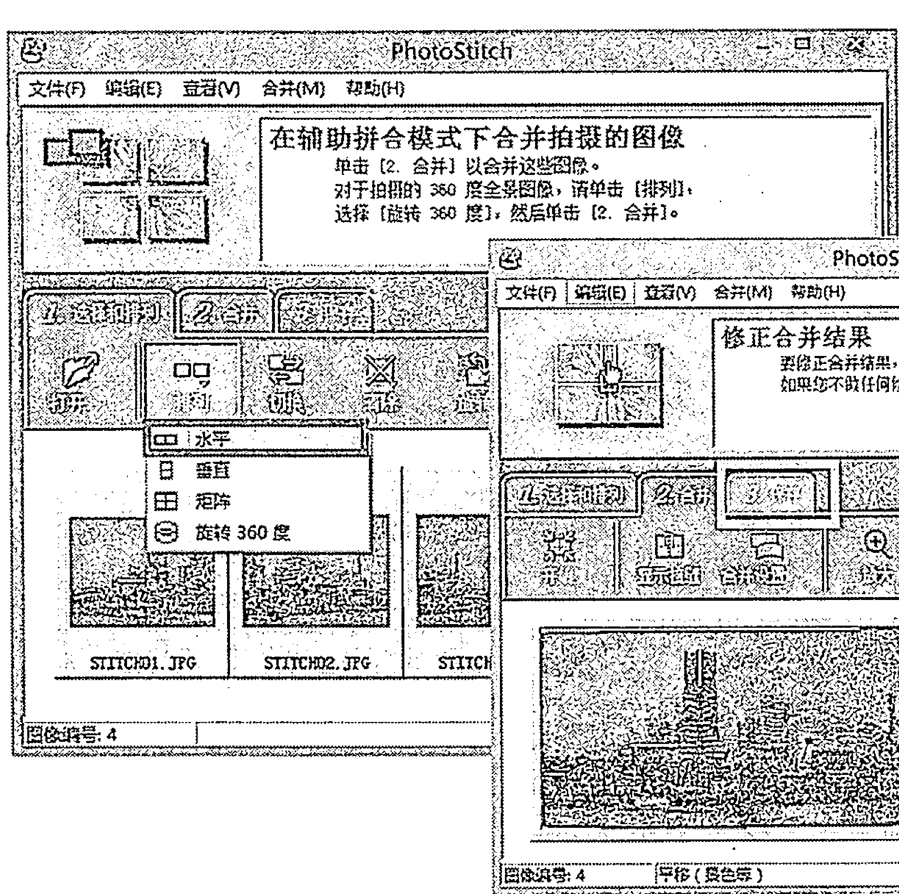

如果一切都没问题，单击“2. 合并→开始”合成图像。这样照片就自动拼接起来了。

## 3 确认合成后的接缝

再次确认是否正确地拼接好了。按下“放大”按钮让图像放大到能看清楚的大小。然后来回看看整体，同时关键的接缝处也要仔细确认。检查接缝时，单击“显示接缝”，会显示绿色的合成位置。如果确认时发现接缝没有很好地合成，单击绿色的显示位置，弹出修正用的面板，可以拖动图像手动来重叠。

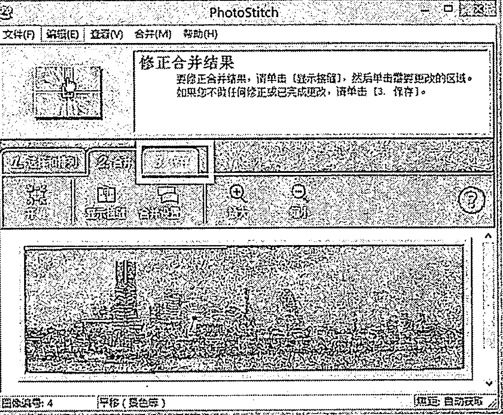

## 动态全景照自动演示DIY

用以上制作成的长幅面照片虽然包括了周围的所有场景，但还是一张静态的图片，且若要放大查看细节，屏幕上只能显示图片的部分画面。下面，我们要把它制作成一张能用鼠标拖动旋转查看的动态场景照。

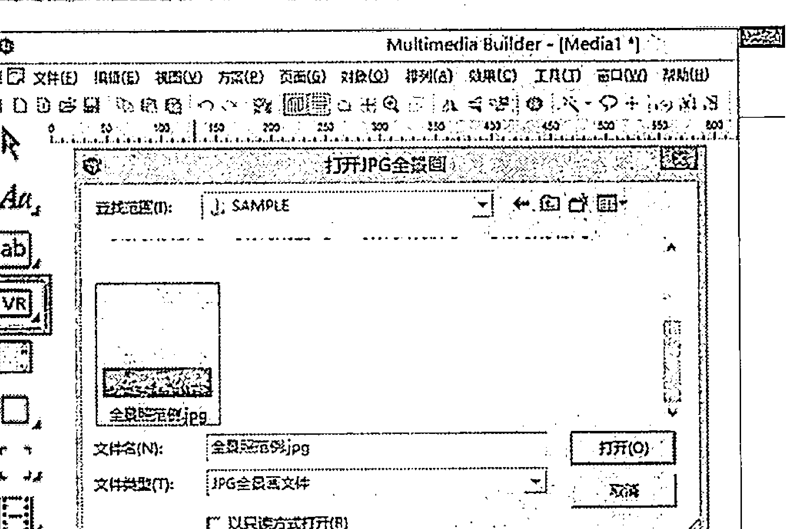

- 1. 启动多媒体制作软件MMB，建立一个空白工程Media1，设置好照片显示的页面大小。
- 2. 点击左侧竖立的工具栏第四个按钮即图像按钮不放开，选择最后一个标志为VR的按钮，这个是建立全景的按钮。
- 3. 随后窗口中会显示让你选择全景照片，选中刚才制作的全景照片。之后，屏幕上出现虚拟全景画框，用鼠标调整画框在窗口中的位置到合适大小。

## 4 保存完成后的文件

所有的工作都完成后，单击“3. 保存→保存”。保存后，计算机会提示是否查看保存的图像。选择“是”后，可以调整窗口大小来放大显示合成的图像进行检查。


- 4. 按下F5测试当前页显示，可以看到窗口中显示全景画的一部分。拖动鼠标，便可以360度旋转查看全景照片，动感十足。

PhotoStitch软件不但支持数码照片的拼接，还支持扫描仪生成的图片。这样一来全景照片的素材将会非常广泛，我们将充分体会到数码带来的乐趣。

最后执行“文件→编译”命令，即可将以上工程编译为一个EXE文件。以后，可以直接运行这个EXE文件来动态显示这幅全景照了。

## 加把安全锁

# 网盘安全有高招

现如今，使用网盘的用户越来越多，可是很多人都担心网盘里的数据万一泄露，会给自己造成不必要的麻烦。还别说，网盘方面的达人还真多，一起来看看他们的诀窍和秘籍吧！

### 就地取材 手动为网盘目录加把锁

文 | 张晓文

> 我使用的是百度云同步目录是J:\百度云同步盘。默认情况下每次开机后都会自动启动百度云客户端，我的电脑只要进入系统，任何使用我的电脑的人都可以轻易打开这个目录，查看其中的文件并且可以任意删除文件，而这些操作会自动同步到百度云服务器。因此为了网盘文件的安全，我使用的是Windows 8自带的权限，通过设置权限来阻止别人对同步目录的访问。

首先在本地电脑创建一个名为“打开网盘”的专用管理员账户，然后设置同步目录“J:\百度云同步盘”只有“打开网盘”专用账户才能访问，同时设置每次开机以“打开网盘”账户身份启动百度云客户端，这样既可以限制本地账户对同步目录的访问，同时又不会对客户端的文件同步带来不便。此外为了方便操作，我使用免费的Qdir文件浏览器来对同步目录进行管理。

首先按提示新建一个名为“打开网盘”的专用管理员账户，进入该账户后安装百度云客户端和Qdir程序，然后将同步目录设置为“J:\百度云同步盘”。右击上述同步目录选择“属性”，在打开的属性设置窗口点击“高级”，接着点击“取消继承”，在弹出的窗口点击“是”，将所有用户继承权限全部删除（图1）。

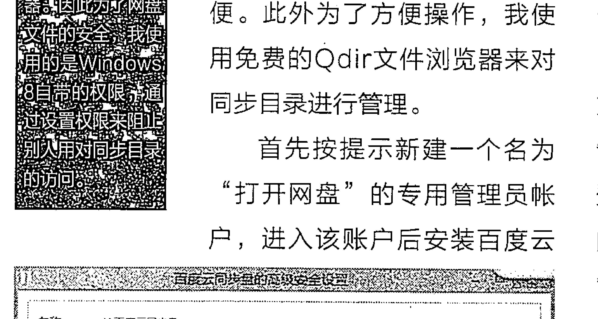

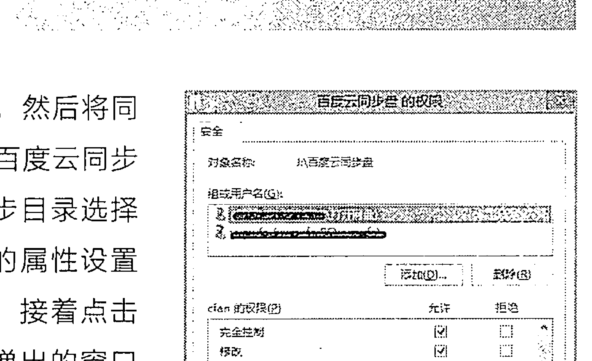

```
echo off
cls
runas /user:打开网盘 "D:\Program Files\Q-Dir\Q-Dir.exe"
cls
```

命令解释：使用runas命令以用户“打开网盘”的身份运行Qdir，因为通过上述的设置后，当前账户没权限访问同步目录，通过runas命令即可以“打开网盘”的身份访问。

点击“确定”返回属性窗口，接着点击“编辑”，在打开的窗口单击“添加”，添加“打开网盘”账户，将其对该文件夹的权限设置为“完全控制”，同上继续添加自己平时登录的账户，将其对该文件夹的权限设置为“拒绝”，使经常登录的账户无法访问同步目录（图2）。

完成上述的设置后，注销“打开网盘”并且以自己常用的账户登录，同时为了电脑的安全，建议将常用的登录账户设置为“标准账户”。接着启动记事本新建一个批处理open.bat保存在桌面，代码如下：

```
runas /savecred /user: 打开网盘 "D:\Users\打开网盘\AppData\Roaming\baidu\BaiduYun\baiduyun.exe"
```

当然如果自己需要访问共享目录, 只要运行桌面的open.bat, 然后按提示输入“打开网盘”账户的登录密码, 密码字符不会显示, 然后回车即可。

在启动的Qdir中, 就可以轻松访问上述同步目录了。这里可以轻松将文件保存到同步目录, 或者直接删除其中的文件, 在后台运行的百度云客户端会自动同步。这样通过权限的限制就实现了只有登录密码才可以访问同步目录的效果, 有效保护网盘文件的安全(图3)。

## 安全至上

### 加密保护网盘文件

文/黄长亿

我是公司销售部的员工, 平时经常出差在外。为了方便随时在外地在线访问数据, 我使用的是快盘, 不过大家知道网盘访问只是基于网盘用户名和密码, 现在的网络形势比较严峻, 虽然我已经为快盘在线登录设置了强密码, 但是常在公用电脑, 我担心自己的快盘账号和密码泄露。因此对于保存在网盘的文件, 我使用的是免费的GPG4win加密软件来保护文件。

首先到http://files.gpg4win.org/gpg4win-2.1.1.exe下载软件, 程序安装完成后运行其中的Kleopatra组件, 点击File (文件) →New Certificate (创建新证书)一项, 运行Certificate Creation Wizard (证书创建向导), 按向导的提示创建一个OpenPGP密钥(图4)。

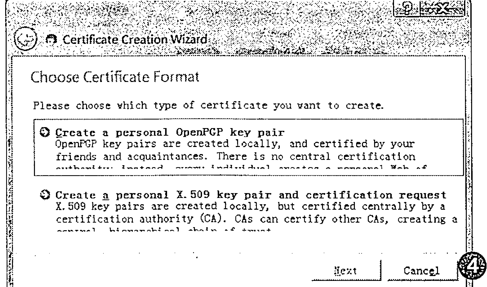

完成密钥的创建后返回程序主界面, 在Kleopatra主界面中右键点击自己所要导出的密钥, 点击菜单中的Export Secret Keys (导出私钥), 将导出的密钥放置在U盘中, 这样以后我在其他电脑上使用GPG4win时, 只要导入这个密钥即可解密网盘文件。

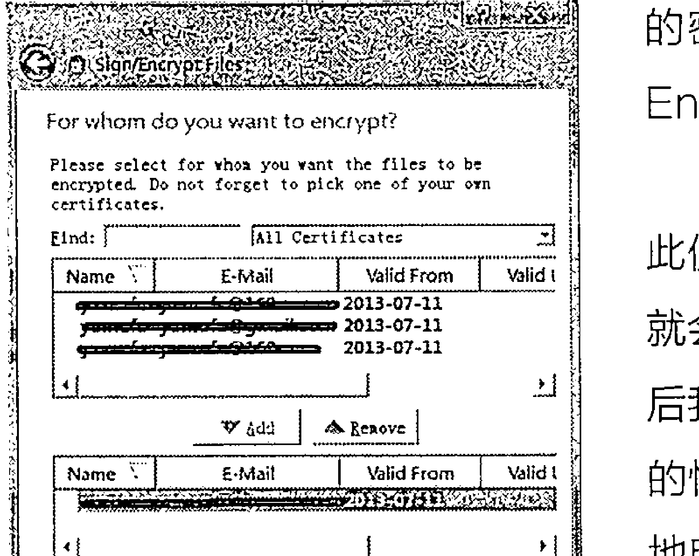

现在就可以使用它来加密网盘文件, 返回程序界面, 选择File (文件) → Sign/Encrypt Files (签名/加密文件), 然后在弹出的窗口选择快盘本地同步目录的文件, 接着在弹出的窗口选择需要加密的密钥, 点击ADD, 然后单击Encrypt开始加密(图5)。

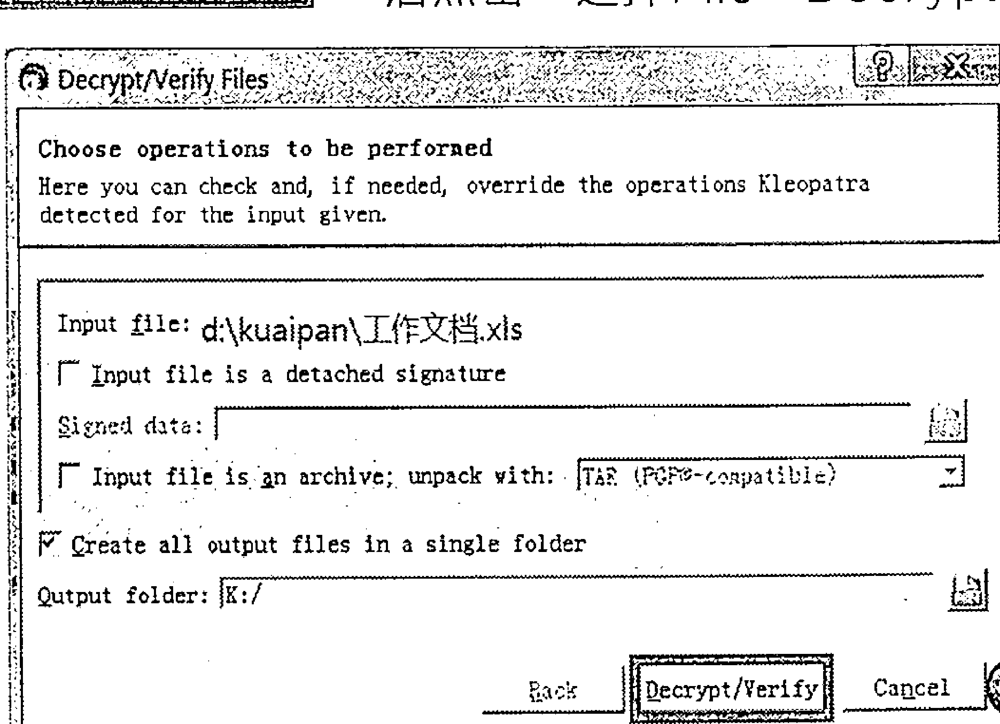

由于快盘会自动同步, 因此使用GPG4win加密过的文件就会自动上传到快盘服务器。以后我不管在哪里, 只要登录自己的快盘下载加密文件, 下载到本地电脑后, 同上运行Kleopatra后点击“选择File→Decrypt/Verify Files (解密/验证文件)”, 然后按提示选择下载到的加密文件, 点击Decrypt/Verify Files解密文件, 输入密钥的密码之后点击OK就可以进行解密了(图6)。

### 巧设“门神”保护网盘安全

文 | 刘景云

> 现在各类网盘可谓鱼龙混杂，我们远程存储数据的好帮手。不过一旦网盘被盗，存储在其中的机密信息就会暴露无遗。我们不妨为网盘请个门神，轻松驱逐各种恶意来客。看看CryptSync和SecuredCloudDrive两款针对网盘的免费加密利器，网盘数据就可以高枕无忧了。

### 网盘的守门神——CryptSync

我们知道，网盘（例如金山快盘、百度云盘等）都提供了客户端程序，可以将其安装到本地硬盘中，将指定路径与网盘绑定在一起，这样当向该路径中存储数据时，对应云盘的客户端程序会实时将其同步到远程网盘中。CryptSync巧妙地利用这一特性，利用同步加密技术，可以毫不费力地将目标文件加密后存储到云盘中。

如果同时使用多个网盘，可以按照上述方法，为每一个网盘分别创建同步加密项目。之后在CryptSync主界面中显示所有的同步加密项目（图8）。

这里以金山快盘为例进行说明，金山快盘客户端会在C盘中创建名称为“快盘”的文件夹，当然，你也可以手工更改该路径。假设我们需要将“我的文档”中的“办公文档”文件夹中的内容自动加密存储到金山快盘中。

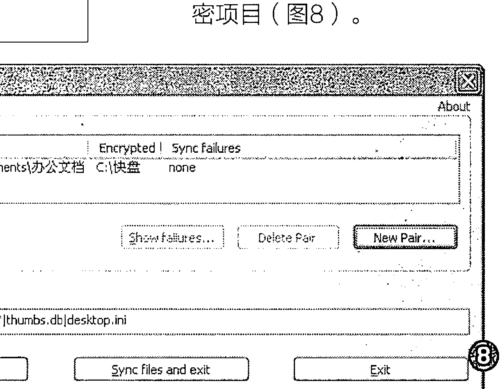

只需在CryptSync主界面中点击New Pair按钮，在新建同步窗口中的Original folder栏中点击浏览按钮（图7），选择“我的文档”中的“办公文档”文件夹。在Encrypted folder栏中点击浏览按钮，选择C盘中的“快盘”文件夹。在Password和Retype Password栏中输入密码。

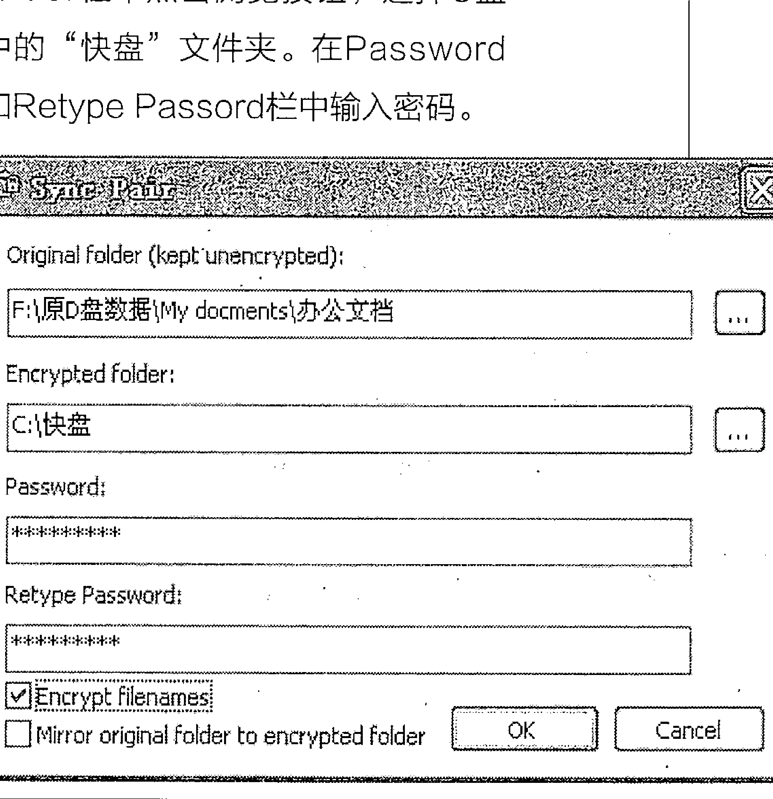

为了避免垃圾文件的干扰，可以在Ignore files栏中输入需要过滤的文件类型，各类型之间以“|”符号分隔，例如“*.tmp*|~*.*|thumbs.db|desktop.ini”。

最后点击Run in background按钮，让CryptSync隐藏在后台隐蔽运行。当向预设路径（例如“我的文档”中的“办公文档”文件夹）存储文件时，CryptSync会首先过滤不需要的文件，将合乎条件的文件进行加密压缩处理，之后将其同步到对应的网盘客户端路径中（例如C盘中的“快盘”文件夹），之后任务就交给网盘的客户端程序打理好了，它会自动将其同步到远程网盘中。下载地址：http://tinyurl.com/lfndtw3

### 网盘同步加密——SecuredCloudDrive

和 CryptSync 类似，SecuredCloudDrive也是通过在本地文件夹和网盘之间建立同步加密关系，来实现保卫网盘安全的任务。不过，SecuredCloudDrive使用的加密技术更加强悍。这里以百度网盘为例来讲解SecuredCloudDrive的威力。当安装好百度网盘客户端后，会创建一个与网盘同步的客户端存储路径，默认为我的文档中的“百度云”文件夹。

在系统托盘中右击 SecuredCloudDrive图标，在弹出的菜单中点击“New Share”项，在操作向导界面中依次点击“Next”按钮，点击“Select Folder”按钮，选择本地目标路径。

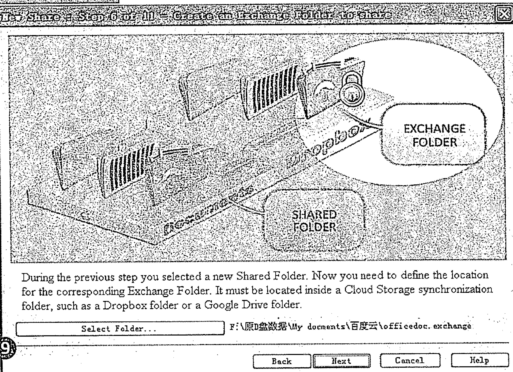

例如本例中将“E:\officedoc”文件夹作为目标路径，将其中的文件同步加密传送到百度网盘中。在下一步窗口中点击“Select Folder”按钮，选择百度网盘存储路径，例如我的文档下的“百度云”文件夹，在下一步窗口中输入密码（图9）。

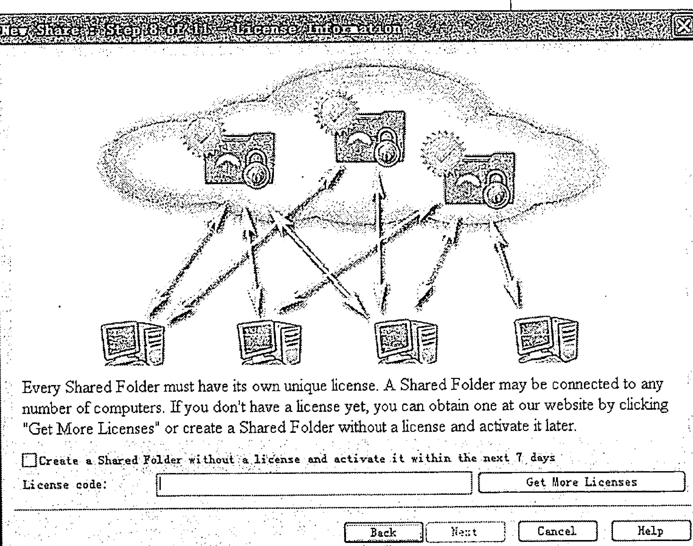

在下一步窗口中点击“Get More License”按钮，在弹出的网页中依次输入昵称、Email地址，选择认证码数量（单机用户使用一个认证码即可）等信息（图10），点击“Send codes to email”按钮，在邮箱中就会得到SecuredCloudDrive发给的认证码。将其输入到“License code”栏中，依次点击Next按钮，完成同步加密项目的绑定操作。

在本例中，当创建好同步加密关系，操作完成后，可以清楚地看到，“E:\officedoc”文件夹的图标发生了变化，其实际上已经进入了加密状态。当进入我的文档下的“百度云”文件夹后，发现其中出现了和对应共享文件夹同名的文件夹，只是其后缀多了.encrypted字样，例如本例中为officedoc.encrypted。只要E:\officedoc文件夹有什么风吹草动，SecuredCloudDrive就会将相关文件加密后存放到officedoc.encrypted中，加密后的文件后缀为encrypted。之后百度网盘客户端会将加密后的文件传送到云存储空间中。下载地址：http://tinyurl.com/ckzqtnt

# 云盘大战 你该投靠谁

“3月”大战以云盘免费空间之争而继续上演，从百度去年的100GB一年期免费到360今年的360GB永久免费，再到最近的百度1元1TB永久免费和360的全免费1TB永久空间。面对诱惑，我们该作何选择？ 文|白璐

云盘大战逃不脱优胜劣汰的游戏规则，最后撑不住的必然出局。作为最终用户，如果你选择的正好是被挤出局的产品，最终也只能跟着倒霉。因此，我们需要冷静分析，擦亮眼睛，作出慎重选择。

网上各种各样的云盘比比皆是，但比较主流的云盘有：百度云盘、360云盘、金山快盘、华为网盘、115网盘、酷盘、新浪微盘、腾讯微云、阿里云够快等。这些云盘因为有知名公司或起步较早的专业云盘公司做支撑，所以相对来说在各方面比较有保障。本文所涉及到的云盘也主要针对这9款。

### ① 数据安全 云盘头等大事

“云盘安全吗？”到网上搜一下，到处可见的相同问题足以看到人们对这个问题的关心程度。可见，安全问题是使用云盘的头等大事。如果把自己的文件放在网上，某天突然找不到了，或自己的私人信息被别人获取，这足以成为让人放弃使用云盘的理由。

事实上，云盘的服务商对这个问题的考虑不亚于用户所花费的心思。因为这会极大地影响其品牌乃至生命力。因此，安全问题也是云服务商首先要面对和做好的一个任务。

百度云盘也明文声称：“百度云具有完善的数据备份和容灾机制，用户保存在百度云中的数据都有多重备份，不会因攻击、断电、软硬件故障造成文件丢失。”

虽然从理论上来说，文件存在云服务器上要比存在

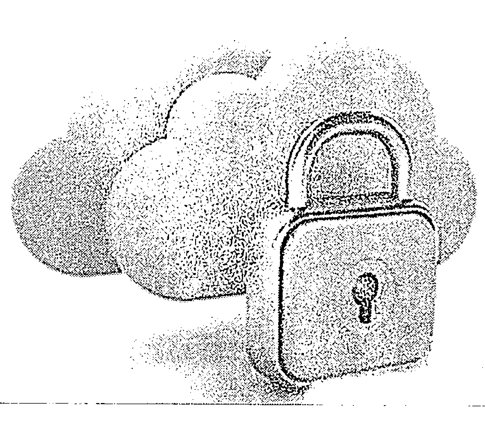

迅雷随身盘“贴出”公告称：由于业务变更及产品的更新换代，将于2013年9月1日正式下线该产品。虽然提前有关门告示，但笔者曾经上传到该云盘的许多电子书有近万本，转存时发现无法成批下载，试想一本一本下载要操作到猴年马月？好在笔者有备份，所以一删了之。可见，“大迅雷”也有让人无可奈何的时候。

更有盛大网盘Ever Box，按说也是财大气粗的主儿，但在2013年3月1日之前就已经宣布关停并转。幸好笔者只是申请了一个号，未来得及上传东西，才没有招来同样的麻烦。

### 【使用建议】

选择云盘，除了考虑云盘厂商的实力之外，还需要给自己留一手。对于重要的资料，最好能在不同厂商的云盘中同时备份，所有资料尽可能在本地留有备份，这样才能保证万无一失。如果涉及保密性强的资料要存在云盘中，为了给自己吃定心丸，最好加密之后再上传，这样更可靠。加密的最简单方法是用WinRAR的压缩加密，选择复杂的密码，若资料大且追求速度，可选择加密但不压缩的打包方式。

## 2 足够空间 云盘必备条件

虽然多数云盘目前提供或多或少的免费空间，但云盘的服务趋势是收费服务。因此，对于用户来说，如果不想掏腰包，获取更多的永久免费空间具有很重要的意义。

对于免费空间，要分清“有限”和“永久”两个概念。活动赠送的有效期免费空间虽大，但到期后若不交费就收回。即便是交费会员，服务到期后空间也要收回或不能继续上传文件。但是，免费永久空间就不存在这个问题，因此才成了我们获取它的动力。是否提供免费空间？初始容量有多少？能否通过活动或签到免费增容？免费增容的难易程度如何？这些都应该成为我们选择云盘时很有必要考虑的一个重要因素（表1）。

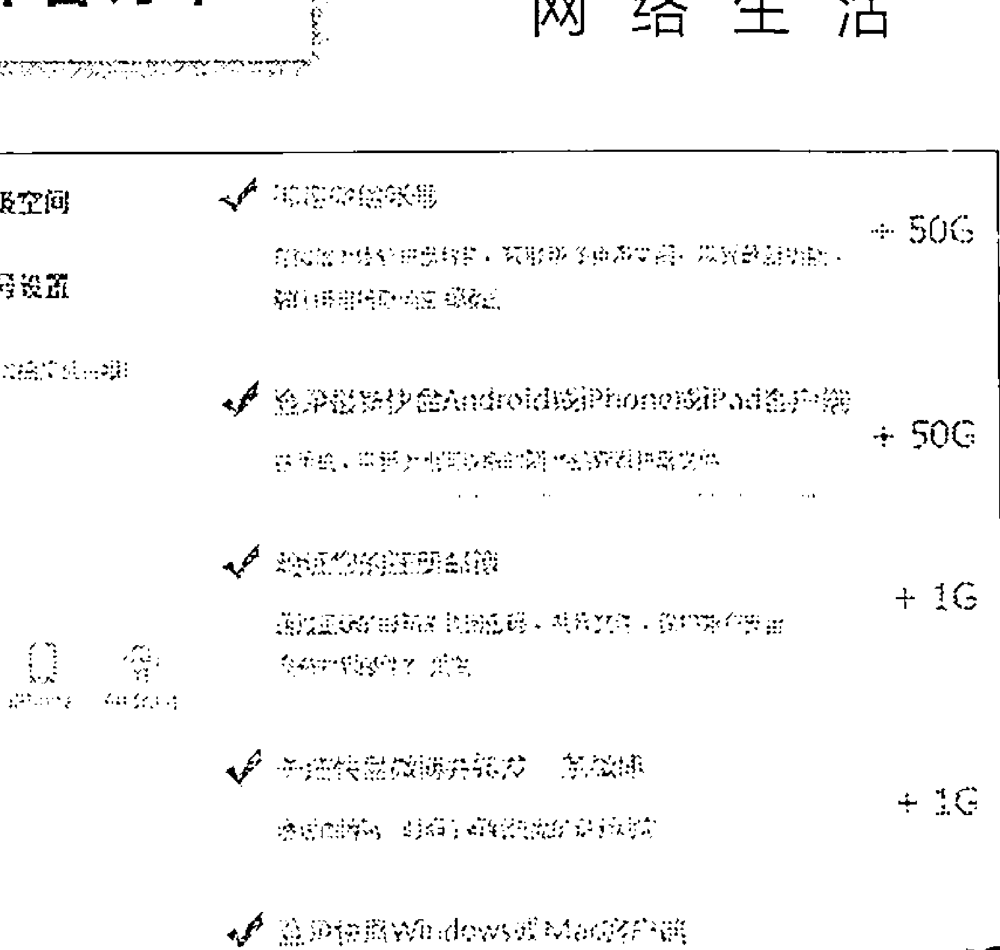

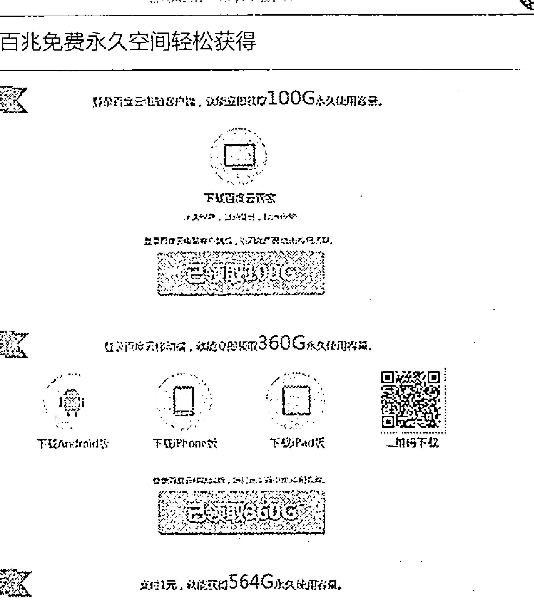

> > [画外建议] 从表1中我们可以看出目前9种主流云盘的容量情况。显然，我们从360、百度、金山三家公司可以轻易获得更大容量的云盘空间，如果对存储空间有比较大的需求，应该作为首选。华为、115、酷盘提供的容量中规中矩，但它们均是最早涉足的专业公司，技术和服务成熟，是对容量要求不太高的用户的好选择。新浪、腾讯则是专业的门户公司，网盘只是其一个很有用的副产品，多作为聊天或发送微博过程中存储资料之用，容量有限，但因产品的关联性，所以用户群体也很庞大，新浪、腾讯用户值得拥有。

关于永久免费空间获得的难易程度，不能光看广告宣传。有的云盘商家宣称注册后可得到几十个GB的免费空间，但当你注册后发现，费了半天功夫，要获得3GB的空间也困难。正是鉴于这种现状，国内知名的大商金山、百度、360等才推出免费轻松获取数百GB甚至1TB的永久增容空间的活动。经测试，这几个活动都比较靠谱。

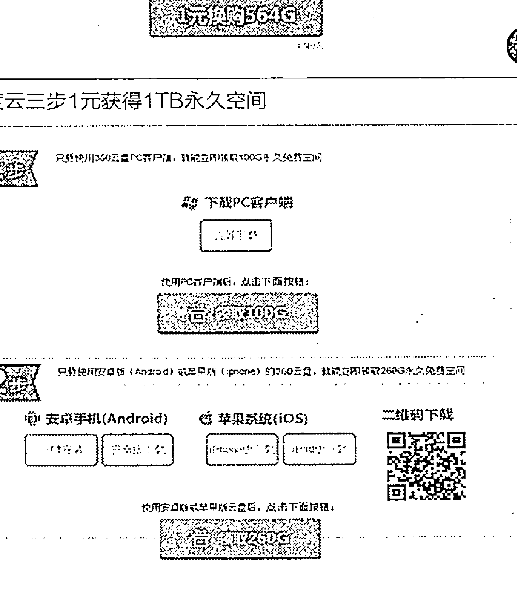

云盘免费增容渠道还有多种，一般比较容易获得空间的几种模式为：移动版注册增容、PC客户端登录增容、上传文件增容。比较难以获得或需要通过持久努力之后才能获得空间的模式有：邀请朋友注册增容。

表1 云盘容量比较评测表
| 基本属性对比 | 百度云网盘 | 360云盘 | 金山快盘 | 华为网盘 | 115网盘 | 酷盘 | 新浪微盘 | 腾讯微云 | 阿里够快 |
|---------------|------------|---------|----------|----------|---------|------|----------|----------|----------|
| 是否提供免费空间 | 是 | 是 | 是 | 是 | 是 | 是 | 是 | 是 | 是 |
| 初始免费容量(GB) | 15+100+360 | 18+100+260+666 | 5+100+3 | 5~35 | 15 | 5~15 | 2~8 | 2+5 | 5+4 |
| 参与活动增容 | 有 | 有 | 有 | 有 | 有 | 有 | 有 | 有 | 有 |
| 是否可签到免费增容 | 否 | 是 | 是 | 是 | 是 | 否 | 是 | 是 | 否 |
| 签到增容的难易程度 | 无 | 易 | 易 | 易 | 易 | 无 | 易 | 繁琐 | 无 |

## 功能实用 好用才被看好

选择云盘最核心的因素除了空间之外，功能是否实用也是用户考察的另一个重点。比如：是否支持外链共享，是否支持离线下载，是否有单文件上传容量限制，是否可以预览云盘中的电子书、音视频资源等。在许多功能中，也许某个用户只看中其中的一点或两点，也就足够了。

我们通过逐个实验，列出各种主流云盘的功能对照表，供你根据自己的实际需求作出选择（表2）。

## 画中画建议

从表中我们不难看出，对于早已被用户认可的外链生成和共享功能、误删文件找回功能，几乎所有网盘都有提供，这已经是云盘必备的两个功能。

而单文件最大上传限制、文件离线下载这两个功能对使用网盘来上传和下载资料存储的用户则非常有用，这类用户可优先选择有此功能的网盘（如百度云、360云、115网盘）。目前单文件上传功能多数已经放开，我们看到多数已经支持1GB以上的单文件，实际上这基本能满足我们日常的需求了，不过若有特殊需求，可专门选择如115、百度等网盘。腾讯微云和酷盘虽然不限制单文件上传大小，但因其总空间就没有多少，因而其规定也没有多大实际意义。

资源预览也是一项很实用的功能，不同客户端的云盘如果能即时预览其中存放的媒体内容，则极大地方便了用户。因此，如果是在云盘中存放电子书、电影等内容而想及时查看的话，选择支持这一功能的百度、360、金山、新浪、微云等比较合适。

### 小技巧

多数云盘提供签到获取免费永久空间增容服务，每天坚持用两秒时间签到，一年下来也是一个很可观的数字。这个容量永久免费，没有到期作废的说法。此外，有的云盘还提供增容后发微博获得附加增容的幸运（图4）。115网盘的转盘游戏签到增容更是充满趣味性（图5）。

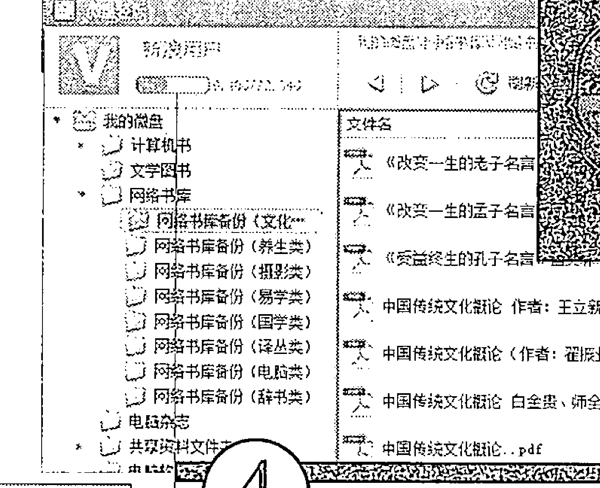


## 版本多样 方便才是王道

目前的主流云盘，几乎无一例外地提供PC、Android和iOS等多种平台的版本，这是移动时代的大势所趋。但同样都是PC版本，有的客户端就提供有两种PC客户端，这更能体现出细微的人性化关怀。

例如，新浪微盘PC客户端同时提供新浪微盘轻版（图6），百度云PC客户端同时又提供一个同步版，360云盘也有PC普通版和同步版之分，可以供不同需求的用户选择使用。

## 画中画建议

在PC云盘客户端的两种版本中，如果你需要将工作资料同步到云盘和本地盘，则可以安装同步版。如果你仅希望云盘作为一种资料的远程备份，则只需安装轻版的PC客户端即可。二者的区别是，前者为双向同步传输，后者为单向传输。

## 总结

从如上评测和两张表的对比，可以看出各种云盘均各有特色，很难说哪个绝对最好、哪个绝对不好。具体选用哪款，要因人而异，根据自己的实际需求来选择。我们提供以上建议和评测数据，可以为你选择网盘提供有力的参考和科学依据，这也是本文的用意。

表2 实用功能对比评测表
| | 百度云盘 | 360云盘 | 金山快盘 | 华为网盘 | 115网盘 | 酷盘 | 新浪微盘 | 腾讯微云 | 阿里够快 |
|---|---|---|---|---|---|---|---|---|---|
| 是否支持外链 | 支持 | 支持 | 支持 | 支持 | 支持 | 支持 | 支持 | 支持 | 支持 |
| 是否支持离线下载 | 支持 | 支持 | 不支持 | 不支持 | 支持 | 不支持 | 不支持 | 不支持 | 不支持 |
| 单文件上传最大限制 | 20GB | 5GB | 2GB | 1GB | 115GB | 不限 | 1GB | 不限 | 300MB |
| 资源预览功能 | 支持 | 支持 | 支持 | 不支持 | 不支持 | 不支持 | 支持 | 支持 | 有限支持 |
| 误删文件找回 | 支持 | 支持 | 支持 | 支持 | 支持 | 支持 | 支持 | 支持 | 支持 |

# 网络信息转存到云笔记

我们在上网浏览时会发现一些有用信息，以前只能通过复制粘贴来备份。其实利用云笔记，可以将这些信息自动转存起来。

文/浪迹天涯

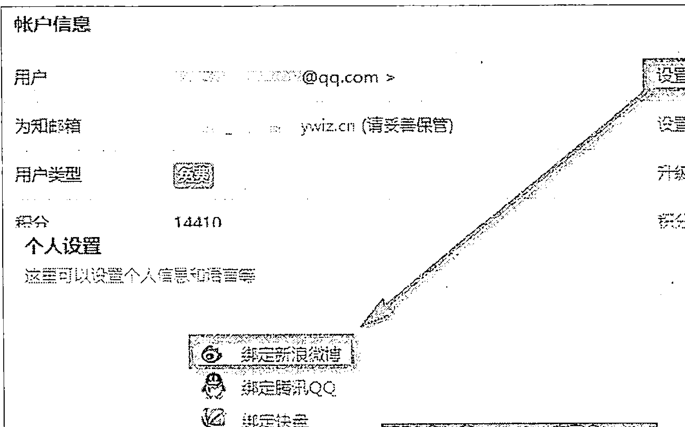

### 1 微博内容一键转存

新浪微博上经常有不少有用信息，如何保存？首先打开“为知云笔记”网站并登录，点击网页右上角的头像图标按钮，选择“账号设置”命令，按提示“绑定新浪微博”并授权。返回到新浪微博，添加关注“mywiz”账户。

设置完成以后根据自己日常的习惯，编写或转发新浪微博就可以了。唯一的区别就是在编写或转发微博时，需要添加一句“@mywiz”，比如“怎样天天大暴雨啊 @mywiz”。为知云笔记会自动检测到@mywiz的信息，就可以将微博信息保存到新创建的“微博收藏”目录里面（图1）。以后当我们运行为知云笔记的客户端后，通过“同步”命令就可以将备份的微博信息保存到自己系统中的数据库里。

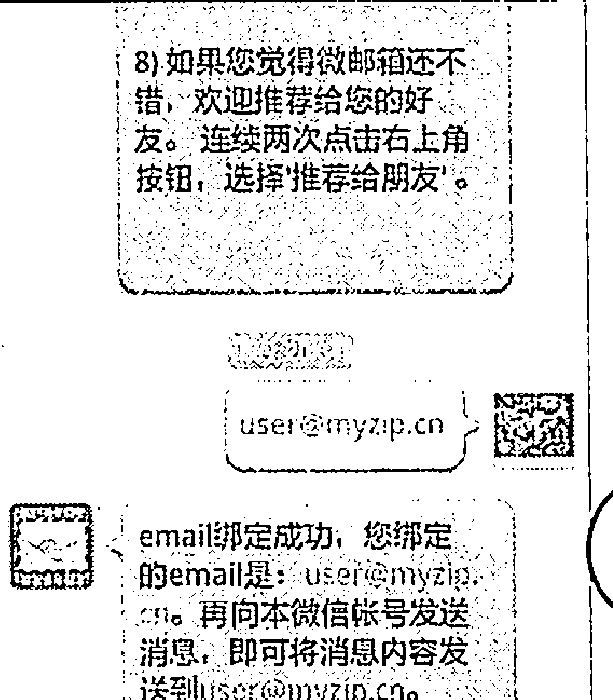

### 2 微信信息快速发送

除了新浪微博，腾讯微信也很流行，它的信息如何保存？首先打开微信客户端，点击界面下方的“通讯录”按钮。接着添加一个名为“weixintomail”的账号，这样通讯录就会出现一个名为“微邮箱”的名称。点击打开“微邮箱”的对话框，输入云笔记分配给自己的一个邮箱地址进行捆绑即可，比如在前面的“账号设置”中就可以看到为知分配的邮箱地址（图2）。

以后当我们需要记录某条信息的时候，通过手指长按这条微信信息。接着在弹出的菜单里面选择“转发”命令，在“最近聊天”列表里面选择“微邮箱”这项。接下来会弹出一个信息确认窗口，点击“是”按钮就可以将信息转发到自己的云笔记里了。

### 3 手机信息也能记录

有的时候在上下班的途中，我们会打开手机来浏览网页。当发现网页中的有用信息时，该如何快速保存？首先在UC浏览器中长按，弹出一个命令菜单，选择菜单中的“自由复制”命令，利用弹出的选择窗口，选择需要保存的内容。选择完成后会在选择框的上面，自动弹出一个操作命令的工具条。

选择工具条中的“发送”命令后，UC浏览器就会自动提取出选择的信息，并且跳转到一个新的操作控制页面。在这个新的操作页面中，选择“发送到”中的“印象笔记”（图3）。如果是第一次进行操作，那么会弹出印象笔记的登录页面，分别输入印象笔记的账号密码，点击“确定”按钮进行授权操作，授权完成以后就会将信息保存到印象笔记中了。以后还是点击“发送”按钮，就可以直接将信息保存到印象笔记中。

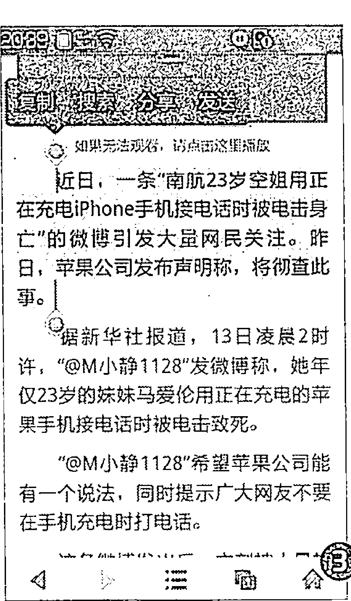

## 开学季

## 宿舍上网那点事

一眨眼暑期就过了，马上就迎来了开学季。在学校宿舍上网可没有在家那么方便。比如很多学校23点就准时熄灯了，网络也断掉了，这时该怎么上网？学校的网线是一人一用，又该怎么突破限制？和他人共用网络的时候，如果被他人限速了，怎么办？快来看看各路高手的上网秘籍吧。

## 突破约束 上网无限制

我们学校宿舍使用的是有线网，为了限制其他设备上网，学校网管将我的电脑以太网卡MAC绑定了静态IP，这样上网端口使用其他设备就无法上网了。可是我还有Android手机、iPAD平板，这些设备怎么上网？技术达人永远推崇“有技术、无约束”，因为上网端口绑定了电脑的MAC地址，因此突破的方法是将这个绑定的MAC地址映射到路由器上，这样路由器可以上网，然后借助路由器的无线热点，笔记本、手机、平板就可以全部上网了。

首先到电脑城买个无线路由器，将网线连接到电脑中正常上网，接着启动命令提示符，输入“ipconfig -all”，获取本机当前以太网本地连接项的IP、网卡MAC、网关，DNS等参数，可以看到本机IP地址和MAC地址分别是“192.168.1.105”和“50-E5-49-C9-9D-FF”，现在记下这个信息（图1）。

```
ipconfig -all
```

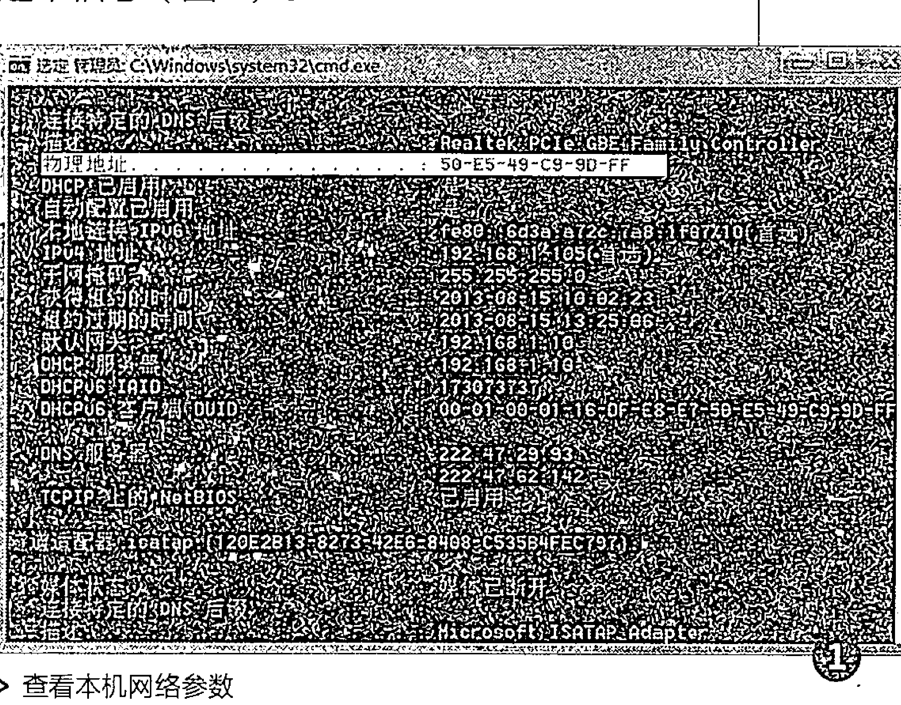

> 查看本机网络参数

| 项目 | 值 |
|------|-----|
| MAC地址 | 50-E5-49-C9-9D-FF |
| 当前管理PC的MAC地址 | 50-E5-49-C9-9D-FF |

准备网线将无线路由的LAN口和电脑相连，接着进入路由器设置界面，切换到“网络参数→MAC地址克隆”，然后点击“克隆MAC地址”，这样当前路由器的MAC地址设置为和当前电脑网卡的MAC地址一致（图2）。


> 克隆MAC地址

| 项目 | 值 |
|------|-----|
| MAC地址 | 00-23-CD-76-FA-F2 |
| IP地址 | 192.168.0.1 |
| 子网掩码 | 255.255.255.0 |

继续切换到“网络参数→LAN口设置”，将LAN口IP设置为192.168.0.1（因为学校交换机网段是192.168.1.X网段，这里网段不要在一起），然后点击“保存”（图3）。


完成上述的设置后，继续开启路由器的无线热点，然后断开网络关闭电脑，最后将学校网线连接到路由器的WAN口，这样手机或者平板开启Wi-Fi连接就可以无线上网了。

## 对战无忧 自己搭建局域网

文|黄善

我们宿舍几个舍友都是游戏迷，闲暇之余联网起来对战一番是我们最大的乐趣。不过由于学校网络是动态分配IP，我们不好改电脑IP，而且宿舍空间较小，电脑分布比较散，因此我们使用的是无线组网方式。由于大家使用的都是笔记本电脑，只要挑选一部配置较高的电脑安装软件作为服务器，然后利用其无线网卡创建热点，最后将宿舍电脑全部无线连接到这台服务器即可。

首先在作为服务器的电脑（假设为A电脑）上以管理员身份启动命令提示符，输入 `netsh wlan set hostednetwork mode=allow ssid=CFAN key=123456789`，继续输入命令 `netsh wlan start hostednetwork`，开启承载无线网络。这样我们就创建了一个热点名为CFAN、连接密码是123456789的热点。

其他需要联机的电脑开启无线连接，然后选择CFAN热点进行连接，成功连接后打开“网络和共享中心”，选择已经连接的无线网络打开，在打开的窗口点击“详细信息”，记住这里的IPv4地址，比如我的电脑是192.168.173.1，这就是无线网络的网关地址（图4）。


在A电脑安装软件服务器端，这里以“反恐精英服务端cs1.6”为例。首先运行 `C:\Program Files\CS_Server_1.6\服务器SXE开关.bat`，确保已经打开SXE服务，如果现实关闭只要再次运行即可开启（图5）。

| 设置 | 值 |
| --- | --- |
| 服务器名称 | 8-805 |
| 地图 | de_cbble |
| 网络 | 局域网 |
| RCON密码 | 123456789 |

在A电脑运行记事本，打开 `C:\Program Files\CS_Server_1.6\开启HLTV-开启前请编辑.bat` 文件，将其中的代码更改为 `start "HLTV" /MIN/HIGH hltv.exe +connect 192.168.173.1:27015 +serverpassword 123456789 -port 27025` 并保存。接着运行 `C:\Program Files\CS_Server_1.6\hlds.exe`，然后依次进行如右图所示的设置：其他使用默认设置，完成设置后点击“开始服务器”，开启CS服务端（图6）。


在每台电脑上都安装游戏客户端，启动客户端后点击程序界面的“搜索服务器”，然后切换到“局域网”，在这里选中上述建立的服务器，点击“连接”，成功连接到局域网服务器后按提示输入上述设置的密码后就可以开始玩了（图7）。


这样借助一台电脑的无线网卡，就成功在宿舍组建了局域网，大家连接到服务器后就可以畅快地开始玩游戏了。这里我们只是以游戏的形式来讲，其实在平时需要时，我们还可以用此类设置来搭建文件存储或数据交换服务器。

> 什么是局域网数据交换服务器 有了局域网服务器，除了可以组网玩游戏外，宿舍楼各宿舍之间相互传输文件也会变得轻松很多。如果有一份需要下发的共享文件放在服务器中，很快就可以到达各宿舍，免去了班级干部每个宿舍都要跑一遍的无用功。除了文中讲解的方法可以搭建服务器外，Windows 7系统下还可以通过搭建FTP服务器实现文件共享，服务器建好后在地址栏中输入对方的IP地址和密码,就可以进行文件操作了。

## 3 共享到底
### 互助上网无极限
文 | 张乐

我们学校的上网方式是安装锐捷认证客户端，每次需要输入用户名和密钥后拨号认证才能上网。上网时间是100小时/月，费用则是50元/月，超过后费用是1元/小时。对于我等网虫，平均每天3.3小时的上网时间远远不够，不过宿舍几个不爱上网的舍友，每个月100小时还是绰绰有余。因此，每到月底我都要使用共享的方式上网，彻底实现每位舍友上网时间用好、用足。

这里我使用的是双网卡代理上网，这样只要使用一个舍友用不完的账号上网即可。首先购置一块网卡B（假设原网卡为A）放置在作为共享上网的电脑上，然后将学校上网的网线连接到电脑上，接着再用网线连接到电脑上的另一块网卡，另一头连接到路由器的WAN口上。

在电脑上使用原来的网卡A连接上网，接着打开“网络和共享中心”，选中网卡A打开其属性窗口，切换到“共享”标签，然后勾选“允许其他网络用户通过此计算机的Internet连接来连接（N）”，接着在“家庭网络连接”的下拉列表选中“本地连接2”，然后点击“确定”，这样通过网卡B连接的电脑就可以通过网卡A上网了（图8）。


使用网线将任意一部需要共享的电脑连接到路由器，然后输入192.168.1.1进入路由器设置，这里以我使用的TPLINK的WR541G/542G路由器为例。进入设置界面后，切换到“网络参数 → WAN口设置”，依次输入下列的参数进行设置（图9）。

继续切换到“无线参数→DHCP服务器→DHCP服务”，然后进行如下设置：启用DHCP服务器，并进行如图10所示的设置。


再切换到“无线参数→基本设置”，依次设置好SSID、开启无线功能和开启安全设置，同时为热点设置一个强健的密码，点击“保存”后其他电脑就可以通过这个热点上网了。

完成上述的设置后退出路由器设置，每台需要共享的电脑本地连接全部设为自动获取IP即可。以后到了月底，只要宿舍哪个舍友的上网时间没有用完，使用他的电脑上网后，其他设置同上，这个舍友的电脑成功连接后，我们只要搜索热点即可共享上网了。

### 断电不断网 3G来相助

文 | 张希

因为我们学校规定每天23:00宿舍就熄灯睡觉，是不是很多“同学们”此时正在与女朋友视频聊天，或者正与队友一同打游戏，抑或是作业需要查资料的关键时刻？不过学校那“残忍”的电力永远都那么准时拉闸限电。断电怎么不断网？且看我的高招。

启动手机的3G数据连接，然后依次展开“设置→无线和网络→更多→网络共享与便携式热点”，接着在打开的窗口点击“配置WLAN热点”，按提示设置好热点的名称和密码（一定要设置强健密码哦，否则流量会遭受其他连接用户的偷袭），点击“保存”即可（图11）。返回“网络共享与便携式热点”窗口，勾选“便携式WLAN热点”，这样手机热点会自动共享启动的数据连接（图12）。


因为我使用的是笔记本电脑，本本的电源是无忧了，上网则是利用福建移动3G套餐，这样本本共享手机的3G网络就可以继续上网了。这里我申请的是福建移动3G流量夜间优惠套餐，使用时间正好是晚上23:00到第二天的7:59，费用是20元/月，每月可以使用3GB流量。

现在启动本本的无线网卡，在扫描到的热点选择上述设置的手机热点，然后输入上述设置的密码即可连接上网了（图13）。不过要注意的是，这里共享的是手机的3G网络，注意不要用来下载或者看视频，否则流量很容易超标哦。


由于手机开启便携式热点会耗费大量的电量，对于电池容量较小的手机还可以使用有线共享的方式上网。首先在电脑上安装手机同步软件，接着使用数据线将手机和电脑连接，在手机上依次展开“设置→无线和网络→更多→网络共享与便携式热点”，接着在打开的窗口点击“USB共享网络”，这样本本就可以借助数据线共享手机的网络（图14）。

> 本本共享手机套餐上网可能会耗费大量的流量，其他移动运营商如电信、联通也有相应的夜间优惠流量套餐，具体资费请咨询本地服务商。如果没有相应的优惠套餐，建议到淘宝购买相应的季度、半年期流量套餐使用。


> 当前连接到：
Internet 访问

拨号和 VPN
USB-KEY DIAL

无线网络连接
ZT950 已连接
MW300R

打开网络和共享中心

在电脑上依次打开“网络和共享中心→更改适配器设置”，确保在其中可以看到一个名为“Remote NDIS based Device”的网卡（一般为“本地连接2”），现在只要在手机上开启数据连接，电脑就可以通过这个网卡共享上网了（图15）。


# 杜绝网络运营商干扰DNS

一般我们上网使用的DNS服务器，都是由网络运营商提供的。正是出于这样的便利，网络运营商就会利用DNS解析的机会，向用户推送各种网络广告以此牟利，甚至还利用此便利进行网络劫持。那么有什么方法可以杜绝网络运营商的这种行为呢？

文|浪迹天涯

## ① 转换DNS的传输协议

要解决上面的困扰，可以试试DNSProxy（下载地址：http://tinyurl.com/psfccfd）。它的作用是将DNS使用的传输协议，由TCP协议替代默认的UDP协议，这样就可以避免绝大多数DNS的干扰。下载解压后，用文本编辑器打开其中的dnsserver.conf配置文件，将里面的DNS参数修改成自己喜欢的DNS服务器地址。比如我这里就使用的是国内的114DNS服务，即114.114.114.114或114.114.115.115。

接下来找到Windows系统的“本地连接”，右击选择“属性”，在弹出的窗口中选择“Internet 协议版本 4”，点击“属性”按钮后在弹出窗口的“首选DNS服务器”选项中，将其设置为“127.0.0.1”（图1）。以后所有系统发送出的DNS信息，都会首先通过该工具转换传输协议后，再发送到DNS服务器中进行解析操作。


小提示：使用其他DNS服务器

既然问题出在网络运营商的DNS服务器上，那么最简单的方法就是更换DNS服务器，CFan杂志上曾经介绍过的DNS Jumper即可快速完成。它默认提供Google DNS和Open DNS等DNS服务器（图2）。也可以自动进行测速并选择最快的DNS服务器（图3）。


## ② 加密DNS的传输数据

除了网络服务商常常进行捣乱以外，一些电脑病毒也会对DNS数据进行劫持，所以最好的解决方法就是进行数据加密。首先安装DNSSCrypt这款工具（下载地址：http://tinyurl.com/q2ncjt9），完成运行，在系统托盘找到软件图标，右击选择“Open Control Center”，在弹出的窗口中首先将“Enable OpenDNS”和“Enable DNSSCrypt”选中，这样就可以在使用OpenDNS提供的域名解析服务时，对传输的DNS数据进行加密处理了。如果用户使用无线进行上网，还可以选择“DNSSCrypt over TCP/443(slower)”项，这样无线传输的信息也会进一步地得到加强（图4）。


# 撬起浏览器存储的密码

浏览器可以存储网页密码，以便我们自动登录网站。不过各浏览器中的密码信息，很容易被一些软件读取出来，造成安全隐患。那么，如何才能有效保护这些存储的密码信息呢？

文/浪迹天涯

## 1 启用主密码功能保护

包括火狐在内的很多浏览器都有“主密码”功能，可以对存储的密码进行保护。打开火狐的选项设置窗口，进入“安全”，选中“使用主密码”项（图1），这时会弹出一个密码对话框，按提示设置相应的主密码信息，完成后点击“确定”退出即可。


以后在通过火狐登录某个网站时，如果浏览器存储有这个网站的登录密码，这时就会自动弹出一个输入主密码的对话框（图2）。只有输入正确的主密码，浏览器才可以调用存储的账号密码信息，否则将自动关闭此对话框，无法调用存储的密码。


## 2 第三方软件协助保护


由于谷歌浏览器没有设置主密码的功能，因此只有借助于其他的工具来实现，如KeePass（下载地址：http://keepass.info）。首先从官方网站下载最新的软件包和简体中文语言包，以及一款名为KeePassHttp的插件（下载地址：http://tinyurl.com/6e8fyob）。然后将简体中文语言包和KeePassHttp插件解压到KeePass的安装目录中。运行主程序文件KeePass.exe，依次单击“View→Change language→Simplified chinese”，即可转为简体中文界面。

点击“新建”创建一个管理密码，然后进入数据库配置界面，设置一个数据库名称，其他取默认设置。进入到KeePass主界面后，在右侧窗口右击，从右键菜单中选择“添加记录”命令，再在弹出窗口中分别设置标题、用户名、密码、网址等信息，比如在此设置“卡饭论坛”账号密码信息，确定后退出（图3）。

接下来为谷歌浏览器安装一款名为ChromePass的扩展。点击ChromePass图标，在弹出的对话框中点击Connect，又会弹出对话框，随意输入密码信息后点击Save即可，这样就完成了扩展和KeePass之间的关联。


以后当要登录卡饭论坛时，打开KeePass会要求输入管理密码，否则将无法调用设置的账号密码信息。接下来在网页中需要输入账号和密码的地方右击，依次选择ChromePass菜单中的“Fill User+Pass”命令即可。这时扩展会自动找出和该网站匹配的账号密码，并弹出一个对话框，直接点击Allow，就可以调用账号密码进行登录了（图4）。

其他浏览器，同样可以借助KeePass来保护。以IE为例，登录新浪网时，在KeePass中找到存储的新浪的账号密码，直接将它拖到新浪登录窗口的输入框就可以了，非常简单。

# 网读精品超速收藏中

> 在网上阅读的过程中，遇到精品时我们往往会希望将好文章完整收藏起来，或者收藏某个文章的片段并发表随笔感言。有什么好的文档收藏管理办法吗？

对于收藏网上的精品文章，相信更多人使用的是选择、粘贴或另存。但是如果文章收藏多了，管理起来也麻烦多了。用自建网络图书馆的办法，结合网文摘手和随笔摘手两个工具，问题就会轻松得到解决。

## 1 注册个人图书馆账号

首先到http://www.360doc.com/注册一个个人图书馆账号（图1），以后要用此账号来摘录互联网上看到的好文章、好句子、好图片，并将这些好文章、好图片保存到自己的个人图书馆中。


## 小贴士：如何找到网文摘手

- 若下载后找不到网文摘手，有可能是浏览器的收藏栏没有打开而导致安装的网文摘手没有显示出来。这时只需选择“查看→收藏栏”菜单命令，勾选“收藏栏”一项后，即可看到浏览器收藏栏中的360doc网文摘手。
- 还有一种可能，如果收藏栏添加的网址过多，网文摘手可能也会被隐藏。这时需要点击工具栏上的双箭头图标，选择菜单中出现的360网文摘手一项。

## 2 网文摘手 摘录网上好文章

定位到http://url.cn/4dj0Yc页面，下载并安装网文摘手工具后，就可以用它来将互联网上看到的好文章、好图片保存到自己的个人图书馆中。操作方法如下图所示。


按图2所示，点击“去安装网文摘手”按钮进入安装页面，安装页面中提供了7种常见的浏览器供我们选择（图3）。
假设我们使用的是360安全浏览器，点击360安全浏览器按钮后，右键点击页面左侧出现的橙色按钮，在列表里选择“添加到收藏夹”，然后点击“添加”，之后浏览器收藏栏即出现“360doc网文摘手”图标，代表安装成功。
安装成功之后，我们就可以用网文摘手收藏网络上发现的好文章了。上网浏览时，如果发现了自己感兴趣的好文章，点击浏览器收藏栏中的360doc网文摘手工具按钮（图4），这时就会弹出360doc网文摘手的页面，点击“保存”按钮（图5），即可将文章保存到自己的网络图书馆中。

## 如何安装网文摘手

- IE浏览器
- 360安全浏览器
- 360极速浏览器
- Chrome浏览器
- 搜狗浏览器
- 世界之窗浏览器
- 腾讯TT浏览器

取框左上角的叉号按钮，然后用拖动选择的办法选择要收藏的正文内容，接着点击旁边出现的小剪刀图标即可。如果出现的内容是多页的文章，则可点击摘手页面右上角的方块形图标按钮，切换到新窗口编辑模式后，将多页内容粘贴到编辑器内即可。如果网文摘手遮挡了要选择的内容，点击摘手右上角的最小化按钮图标将窗口最小化，然后再选取内容。


## 3 随笔摘手 摘精华发表随笔

按如图6所示安装随笔发表工具随笔摘手。下载并安装后，就可以摘录互联网上看到的好句子、好图片，并可发表随笔。


定位到360doc个人图书馆帮助页面的随笔摘手一节，在如图6所示的安装页面中，提供了主流的网络浏览器的10种版本供安装选择，我们可根据自己当前使用的浏览器种类来选择安装的目标和方法。以正在使用搜狗高速浏览器为例，点击“搜狗高速浏览器用户请看这里”文字链接，在安装提示页面中，右键点击旁边的按钮360doc随笔摘手，选择菜单中的“添加到收藏夹…”（图7），点击“确定”代表安装成功。

> 小提示：360doc个人图书馆除了可在PC网页内使用外，还可以选择使用iPhone和Android两种移动客户端安装使用。具体下载和安装页面参见：http://url.cn/5gNjzv


随笔摘手安装成功后，需将已打开的网页窗口全部关闭，重新开启新的浏览器，随笔摘手才可生效使用。

随笔摘手成功安装之后，就可以使用它来摘录好句子、好图片了。


首先选中要收藏的网页内容，再点击鼠标右键菜单中的“360doc随笔摘手”。在弹出的随笔摘录框可对随笔内容进行编辑，选择阅读权限，最后点击“发表”按钮即可生成随笔（图8）。

如果安装后找不到随笔摘手，可能是浏览器的收藏栏未开启，导致安装的随笔摘手不显示。这时只需打开浏览器右上角“查看”菜单，在工具栏中勾选“收藏栏”选项后，即可看到“360doc随笔摘手”。如果收藏夹添加的网址过多，随笔摘手可能会被隐藏，点击“向右”箭头，即可弹出隐藏的“360doc随笔摘手”。

有了这一个账号和两个小工具的帮忙，你再也不用为摘录和收藏网上文章而烦恼了，今后查找起来也非常方便，登录你的图书馆账号就一目了然了。

# # 看美剧 就得美美的

越来越多的人开始追美剧，为什么？很多人的回答是为了提高英语水平。好吧，不管目的是什么，我们来看看美剧达人是怎样炼成的吧。

文/新化一中 刘肖哉

针对美剧片源，首先要普及一下常识性的东西。美剧片源有“生肉”与“熟肉”之分。“生肉”即没有字幕文件的美剧，一般来说，“生肉”在电视平台播出2个小时左右就会被美剧压制组放出，待“熟肉”放出后就可下载到字幕文件。“熟肉”则是指由字幕组翻译的版本，“熟肉”会比片源慢上3至9天不等，但是像《吸血鬼日记》这样大热的美剧在当天下午就会有更新，可是像《良家美女》这种冷门的剧一个星期后再更新也是有可能的。下面就为大家制定三个观剧方案，总有一个适合追美剧的你。

## 1 观剧方案A

在浏览器中打开搜狐美剧频道http://tv.sohu.com/drama/us/，首页有各种美剧资讯，在“好好学习天天追剧”下方会看到一个从周一到周日的美剧时间更新表，注意哦，这里的时间都是指北京时间，在这里可以很清楚地看到当前的在播美剧。如果要看过往的剧集怎么办？当然没问题，在搜索框中输入如“老友记”这部经典美剧，马上就能观看。搜狐视频除了提供在线版之外，更有PC客户端和手机端，可谓全平台支持。PC端更是提供视频下载的功能，并且搜狐视频还能同步播放记录，登录搜狐账号后，无论走到哪里，都能够继续观看上次没看完的视频（图1）。


## “熟肉”下载篇

通过专门的“熟肉”垂直搜索引擎“一站搜”获取。打开videos.yizhansou.com下方会显示近期更新的美剧，如果没有看到你想要的，就在搜索框内输入美剧名称，如“吸血鬼日记”，然后点美剧搜索即可获得搜索结果（图2）。

一站搜收录了各大字幕组的资源，链接到的都是下载地址，直接点击下载就行了。此外，一站搜还提供跟踪美剧的功能，当你看过的美剧更新的时候首页关注区会有提醒，同时还可以管理你搜索过的剧集。这个功能其实是通过追踪Cookie实现的，所以如果你禁用了Cookie或者删除了Cookie是看不到的。

## 2 观剧方案B

看美剧还能提高英语水平？嘻嘻，这当然是真的，只要坚持下去，英语阅读和口语一定会提高一个档次，当然前提是要看双语字幕或者英语字幕的美剧，这就需要自己另外下载美剧资源了。


# “生肉”下载篇

www.eztv.it是一个非常强悍的美（英）剧搜索引擎，它会提供当天所有播出的美剧和英剧，虽然是英文网站，但是我想这点英文对于看美剧的朋友来说算不得什么吧。输入美剧名称点击右侧的Search（图3）。由于这是一个国外的搜索引擎，并不支持中文搜索，所以请先在百度搜索美剧的英文名称。在Downloads一栏下面就是资源的下载链接，最前面有一个磁铁形状的就是磁力链接，使用迅雷或者Utorrent等支持磁力下载的软件即可，后面的都是BT链接。这个网站可以说是最强悍的“生肉”搜索引擎。


## 观剧方案C

这个方案适宜不方便使用电脑，喜欢在移动端观剧的朋友。

现在智能手机、平板等设备已经非常普及了，在Android设备上当然也有方便的解决方案。在应用市场中搜索安装快手美剧，热播美剧都能在这上面观看。打开快手美剧，在片库中挑选美剧，如行尸走肉第三季。打开后会看到这部剧的介绍和信息，以及网友对这部片子的投票，可以参考网友的评价选择是否观看这部剧，选择集数后点击立即观看。如果平时上网不方便的话，可以点立即下载，将视频缓存下来离线观看。如果要长期关注这部剧就点“我要追”，在“我的剧”里就能看到你关注的剧集（图4）。

怎样才能在第一时间内知道关注的美剧有更新了呢？i看就提供这样的功能，打开http://app.weibo.com/detail/6asoRC?ref=appmy或者直接在新浪微博应用广场（app.weibo.com）中搜索i看添加应用（图5）。

添加后按照引导从在播美剧列表中勾选关注的剧集，或者按下Ctrl+F键搜索。以后需要修改关注的剧集就打开i-kan.me，管理订阅的美剧。当你关注的美剧有更新时i看就会自动发一条诸如“#i看美剧播出提醒#我关注的,#妮基塔Nikita#(S03E12 With Fire) 这1部美剧今天播”的微博提醒你，让你在微博上就可以很轻松地了解到剧集信息，并且i看会在当天剧集播出后马上推出预告片。


# # 激发网络 提升你的Wi-Fi品质

想提升Wi-Fi品质，除了要有足够的带宽保证外，Wi-Fi网络的工作环境、固件的刷新和硬件配置等方面也是息息相关的。本期挑战就有几位朋友给出了具体而有效的解决方案，相信我们只要善加利用，定会让自己的Wi-Fi网络有令人惊喜的表现。

## 排除障碍 给Wi-Fi一个自由空间

文|李振

在家庭无线网络中，Wi-Fi的传输距离是影响无线速率的重要因素。而影响传输距离的一个重要原因，是房间内存在的障碍物太多，所以，在放置无线路由器的过程中，我们除了要将路由器放在无线活动的中心地带，为无线应用提供一个最佳的无线覆盖范围外，还应尽量避开那些对无线信号阻碍性最强的物体，如混凝土楼板、承重墙等，以减少信号的衰减程度。

此外，周围无线信号源过多，也是造成Wi-Fi信号衰减的一个重要因素，特别是发生在相邻的信道时，无线信号的干扰会很严重。这时，我们可以通过改变无线信道的方法来解决。


首先，查看周围网络的信道占用情况。下载安装后运行inSSIDer（下载地址：http://www.onlinedown.net/soft/79559.htm），在主界面中切换到NETWORKS（网络）标签，在其中的列表中，我们可看到当前我们正在使用的和周围存在的所有Wi-Fi网络，其中Channel（信道）列显示的就是这些网络目前所占的信道（图1），查看一下这些信道是否有和自己的Wi-Fi网络相同或相邻的（一个信道的信号会同时干扰与其相邻的两个信道，即信道6的信号会影响到信道5和信道7），如果有，可进入路由器设置界面将其改为其他信道。

以TL-WR740N路由器为例。在浏览器的地址栏输入http://192.168.1.1，回车。在出现的界面中输入用户名和密码（默认皆为Admin），单击“确认”按钮（图2）。进入路由器设置界面。选择左侧的“无线设置→基本设置”项，然后在右侧，单击“信道”项中的下拉箭头，将信道设置成其他信道，单击“保存”按钮，最后再在左侧选择“系统工具→重启路由器”项，重启路由器使设置生效即可（图3）。


> 小提示：对于拥有同时支持2.4GB和5GB双频段的路由器的朋友来说，由于应用在5GHz频段的家用级无线设备并不丰富，所以只需将路由器切换到5GHz频段进行使用，就能避开周围大多数的网络设备，明显提升Wi-Fi速率。

## 升级固件 提升设备的动作效能

文 | 王晓伟

和PC、平板电脑等智能设备一样，路由器也带有自己的操作系统，该系统就是我们所说的路由器固件。为修补旧版本中存在的Bug，并提升设备的运作效能，路由器生产厂家会不定期地推出固件的新版本，因此，我们只需及时地更新固件，就能让路由器发挥出最好的性能。此外，对于官方未提供固件更新的路由器，我们也可通过刷入一些第三方固件，如DD-WRT的方法，来达到提升性能的目的。

### 1.利用官方固件更新

进入路由器设置界面，选择左侧的“系统工具→软件升级”，在右侧，我们可看到路由器当前所使用的软件和硬件版本，记下其中的硬件版本信息（此例中为WR740N v3/v4，图4）。然后，在浏览器以“WR740N v3/v4 固件”为关键词进行搜索，有关的固件更新信息就会出现。进入相应的网站，将对应的固件文件下载到本地（图5）。

| 项目 | 值 |
|------|-----|
| 驱动种类 | 路由器固件 |
| 发布厂商 | 普联 |
| 发布日期 | 2011-4-11 15:47:03 |
| 文件容量 | 2.79M |
| 适应系统 | |
| 功能 | 订阅此硬件 |
| 界定 | 官方正式公布测试版 |
| 评分 | 推荐选用 |
| 下载次数 | 1910次 |
| 适应硬件 | TP-Link普联TL-WR740N无线路由器 |
| 收藏 | [图标] |
| 下载地址 | [按钮] |
| 驱动简介 | TP-Link普联TL-WR740N V3/V4无线路由器固件110402特制测试版 (2011年4月11日) 1、适用于TL-WR740N V3/V4版本的升级软件，不同型号或硬件版本不能使用 |

### 小知识：DD-WRT究竟会为我们带来哪些新功能

- 支持332.ORG及花生壳的DNS
- 可以利用QoS、限速、限连接数等设置来优化带宽
- 支持VPN的PPTP客户端和PPTP服务端设置，可以提供VPN接入
- 可以轻松实现无线设备的定时开关
- 可以通过配置轻松管理各种网络应用，例如彻底封杀BT，电驴，迅雷
- 支持UPNP和端口映射功能
- 支持IPV6、SNMP协议和SSH服务支持多语言，可以搭配802.1x (EAP(Extensible Authentication Protocol)-局域网上扩展认证协议封装)来增加网络认证应用等。


在如图4所示的界面中，单击右侧“文件”项中的“浏览”按钮，打开相应的对话框，选择刚才下载的固件并确认，最后单击“升级”按钮，等待大约20秒钟左右，升级工作即告完成。升级完成，路由器会自动重启，现在看看，Wi-Fi的传输速率是不是会有所提升，同时设置界面中的可设置项增多，网络的连接状况也会更加稳定？


### 2.利用DD-WRT更新

DD-WRT是一个非常著名的第三方固件。与厂家自带系统相比，它可支持实现的功能更多。不过，尽管DD-WRT功能十分强大，并且支持众多品牌的路由器，但这并不说明它支持所有路由器，所以在正式开刷前，我们应该首先到其官方页面了解一下自己的设备是否在列。首先，查询DD-WRT是否支持自己的路由设备。进入http://dd-wrt.com页面，单击右侧的Route Database（路由数据库）按钮（图6），切换到相应的页面。单击与路由器对应的型号和软件版本（图7），在出现的页面中，可看到该路由器对应的Flash（闪存）容量，同时在下方的列表中，会看到适合该路由器的固件信息（两个类型为BIN的文件）（图8）。


这两个文件一个是以Factory—to-ddwrt命名的，一个是以TL或其他字母开头的，其中前者适用于从原厂设备第一次刷DD-WRT，后者适合于从已有的DD-WRT版本中升级。由于我们这里是第一次为路由器刷DD-WRT，所以直接点击Factory—to-ddwrt文件的下载链接，下载该文件。

接下来，进入路由器设置界面中（路由器与PC同样以网线连接），单击左侧的“系统工具→恢复出厂设置”项，将路由器恢复到出厂设置。用与上面相同的方法，单击左侧的“系统工具→软件升级”项，然后在右侧的窗格中，选择要升级的文件为刚才下载的BIN文件，返回路由器管理界面，单击“升级”按钮，即可完成DD-WRT的刷入工作。

### 3 以硬补硬
为设备添加一个必要的助手

说起提升Wi-Fi网络的传输速率及覆盖范围，其实用为其添加硬件的方法是个不错的主意。比如你手头有两台支持WDS中继模式的无线路由器，完全可以用架设无线中继的方法来提高覆盖范围，减少信号死角。而如果你现在使用的无线路由器和网卡带有外置天线，且支持拆卸的话，则可以通过为其更换一些性能更好的增益天线，来提升设备的信号发射及接收能力。

### 搭建无线中继站

以用两台TL-WR740N路由器搭建为例（为防止不兼容，组网时，最好选择兼容性好的同品牌产品）。假设我们要以无线路由器A为中心无线路由器，而B要与A建立WDS连接。

首先，进入路由器A的设置界面，选择左侧的“无线设置→基本设置”，在右侧依次设置好SSID、信道等项（应选择一个固定信道，比如6），然后在左侧选择“无线设置→无线安全设置”，在右侧设置好密码，单击“保存”按钮，完成中心无线路由器A的设置工作（图9）。

进入路由器B的设置界面后，选择左侧的“网络参数→LAN口设置”，在右侧将IP地址设置为192.168.1.2（该地址的最后一组数应与路由器A不同），单击“保存”按钮（图10）。用与上面相同的方法，设置好B所用的SSID、信道和密码等项（具体参数应与A中的同类项相同），同时在如图11所示的界面中勾选“开启WDS”项，单击“扫描”按钮（图11）。


此时，路由器会自动扫描周围存在的无线信号源，并将结果显示在列表中，在其中选择路由器A的SSID号，点击“连接”文字链接（图12），返回如图11所示的界面，单击“保存”按钮，至此，搭建无线中继站的工作就顺利完成了。


| ID | BSSID            | SSID      | 信号强度 | 信道 | 是否加密 | 选择 |
|----|------------------|-----------|----------|------|----------|------|
| 1  | 02-1A-11-FC-1-32 | AndroidAP | 40dB     | 6    | 是       | 连接 |

### 更换增益天线

根据在水平面方向上天线发射和接收的不同，天线可分为全向天线、定向天线和扇面天线。一般家庭选用的是全向天线，这种天线的特点是：它可以接收水平方向来自各个角度的信号和向各个角度辐射信号。

此外，在选购天线时，我们还应注意天线规格上的一个参数——dBi（功率增益单位），一般来说，该单位对应的数值越高，说明天线的增益值就越高，横向距离的收发能力就越远。

最后，还看自己路由器和网卡支持的天线接口。如果购买的天线接口不符，将无法更换到现有的设备上。目前，无线AP、无线路由器中常见的两种外置的天线接口分别为SMA接口和TNC接口（图13），购买的时候一定要看仔细。


SMA 接口：左为天线端接口，右为设备端接口（下同）

采用该接口的无线AP和无线路由器包括了大部分的民用设备。IP-LINK、DLINK、西门子、美国网件、COREGA、腾泰、贝尔金等品牌，只要是天线可拆卸的，基本上都用的这种接口。

TNC 接口

网络的老大CISCO和它的子品牌LINKSYS的绝大多数无线设备用这种接口。

### 启用预读为网页浏览提速

预读功能是浏览器在载入当前页面的同时，将该页面中的“下页”或其他类似的链接一同读取，这样如果用户再打开其他链接就会很快。那么该如何启用预读功能？没有预读功能的浏览器又如何实现呢？

### ① Opera中启用预读功能

Opera浏览器自从改用谷歌浏览器的引擎后，它就加入了网页的预读功能。
点击Opera左上角的菜单按钮，在弹出菜单中点击“设置”打开设置窗口，进入“浏览器”选项，再在右侧窗口找到“预先载入发现内容”（图1）。选中它以后重新启动浏览器，就可以启用网页预读功能了，网页浏览速度是不是大大加快了？


### ② 其他浏览器中的预读

如果浏览器自身不带有预读功能，就需要借助第三方工具来实现。这里以火狐为例，首先点击“工具”菜单中的“附加组件”命令，在弹出窗口中选择“获取附加组件”项，再输入关键词GreaseMonkey，搜索安装这一扩展，完成后在搜索框的右侧将显示GreaseMonkey图标。
点击GreaseMonkey图标右侧下拉按钮，选择“网站”中的userscripts.org进入到这个脚本网站。搜索Super_preloader关键字，查找进入此脚本介绍页面，光标指在Install按钮上，显示脚本安装提示窗口（图2）。直接点击“安装”（图3）。用同样方法搜索安装Super_preloader.db脚本，它是Super_preloader脚本的数据库文件，有时这两个文件需要配合才能使用。至此，Firefox也就具备网页预读功能啦。


### ③ 翻页功能的启用设置

Super_preloader脚本不仅可以预读网页，还可以自动进行网页的翻页操作。在百度中任意进行一个关键词的搜索，在搜索网页的右上角可以看到一个图标，将鼠标移动到它的上面就会弹出一个对话框。选择“使用翻页模式”选项后，根据自己的需要再选择其他选项，最后选择“启用”并点击“保存”即可（图4）。以后当网页中出现“下页”或“下一页”的链接时，只需按下空格键或滚动鼠标滑轮，网页就可以自动跳转到下一页。


小贴士
并不是所有网站都兼容网页预读，比如访问百度空间时就会出现卡死现象。此时可点击GreaseMonkey扩展图标，进入它的选项窗口，点击“全局排除”旁边的“添加”，在弹出的对话框中输入“http://hi.baidu.com/*”。确定后，再访问百度空间就不会出现卡死等不兼容问题了。

### 买书先别急 扩展帮你解难题

如今，阅读电子书的人越来越多。但是，对于一些新书来说，因为一时不一定有对应的电子书可供阅读，因此人们往往仍然要选择购买传统纸质书。那么，如何才能知道我要买的这本书，在网上有没有对应的电子书版本，以便先参考一下再作购买决定？

文 | 汪乐海

### 1 安装爱问共享下载扩展

为了达到我们上面提到的要求，需要安装和使用6.1以上版本的360安全浏览器。从该浏览器窗口中安装爱问资料共享读书下载扩展（图1）。

点击360安全浏览器工具栏上的“扩展”按钮，在下拉菜单中选择“扩展中心首页”进入360扩展中心。

从“实用工具”一组中选择下载并安装“爱问资料共享读书下载扩展”（图2）。


### 2 书城选书带出免费电子书


安装上面的插件扩展之后，你就不用操心这个书是不是有电子书的事情了。这时，只管像平时上网购书那样，到豆瓣、京东、当当、亚马逊等购书频道或读书频道选择你想要的图书，然后浏览器就会自动去帮你寻找有没有合适的电子书了（图3）。

由于上面的插件安装后，在各大读书网站的侧边栏内添加了爱问共享资料下载的相关链接，只要你选择了一本书，该插件就会自动从爱问共享庞大的资料库中，找出与该书相同或相关的已有共享资料的免费下载链接。如果你觉得推荐的链接中有你中意的电子书，则可以下载浏览一下，看是否符合你的要求，就可以决定是否购买你正在浏览的图书了。

如果下载到的免费电子书和你希望买的书或网络读书频道阅读的内容完全一样，你就可以将其传到移动设备中阅读，从而可以免去趴在电脑上用浏览器读书的不方便，同时可以给你节省一笔买书费用。不过，网络上的图书可能也会存在内容不全或版权等问题，请读者朋友自己判别和抉择，并自觉遵守国家有关法律、法规和尊重作者的版权。

### 巧用PC浏览器观看移动视频

文/飞雪散花

越来越多的视频网站专门推出了针对移动播放的移动网站，但PC端无法直接访问这些网站。能否实现跨越式的访问？

要想欣赏其中的视频，我们必须以假乱真，通过伪装User-Agent，将浏览器模拟成Android设备才行。

目前，大部分网站都会通过判断UA，给不同的操作系统、不同的浏览器发送不同的页面。比如，当网站判断客户所用的系统为移动设备时，会显示手机页面内容，如果是PC浏览器，则会显示普通网页内容。这样，自然就会出现PC端浏览器无法正常访问移动网站的情况。要解决这一问题，我们可以通过伪装UA使其骗过网站检测的方法来进行。

以欣赏乐视移动网站（m.letv.com）中的视频为例。

### ## 1 将Chrome模拟成Android设备

右击桌面上的Chrome浏览器快捷方式图标，在弹出的右键菜单中选择“复制”，复制一个图标副本到桌面。右击该副本，选择“属性”，打开相应的对话框，在“目标”文本框的字符后面添加以下语句：“-user-agent="Android"”（注意：user前有两个“-”符号），单击“确定”按钮（图1）。此时，用该浏览器进入m.letv.com网站，就可以轻松地欣赏其中的视频了。

在播放的过程中，如果我们觉得视频画面过小或过大，可通过单击Chrome右上方的“自定义及控制Google Chrome”按钮，然后在出现的菜单中设置“缩放”项来进行调整（图2）。


小提示：如果你不想在桌面上建立Chrome副本图标，可以按下Win+R组合键，打开运行对话框，在其中输入"chrome.exe --user-agent=\"Android\""，回车，启动Chrome浏览器并将其模拟成Android设备。

### ## 2 将Firefox模拟成Android设备

Firefox浏览器用户可以使用UserAgent Switcher插件来完成对User-Agent的修改工作。

第一步：在Firefox浏览器主界面的右上方，单击“显示您的书签”按钮，在出现的菜单中选择“Mozilla Firefox→自定义Firefox”，进入“附加组件”页面，在其中的搜索框中，输入User Agent搜索User Agent插件，并将其下载安装到Firefox浏览器中。

第二步：安装完毕重启Firefox浏览器，右击标签栏空白处，选择“菜单栏”，将菜单栏添加到浏览器主界面中，然后选择菜单“工具→Default User Agent→Android”即可。

小知识：什么是User Agent

User Agent即用户代理，简称UA，它是一个特殊的字符串头。通过它，服务器能够轻松地识别客户所用的操作系统及版本、CPU类型、浏览器及版本、浏览器渲染引擎、浏览器语言、浏览器插件等。

### 3 利用Opera Mobile Emulator实现

上述方法仅适用于PC中安装了Chrome或Firefox浏览器，且并不经常用PC端浏览器访问移动网站的用户。有些朋友经常用PC访问移动网站，而且他们希望能以自己指定的设备方式，如Samsung Galaxy SⅡ、HTC Desire或Amazon Kindle Fire等，原汁原味地体验网站内容，这时，就需要借助Opera Mobile Emulator浏览器来实现了。

Opera Mobile Emulator能够在电脑上模拟各种手机、平板等设备，可以100%重现Opera Mobile手机浏览器的效果，几乎和真实版本没有任何区别，所以如果我们要经常访问移动网站中的内容（包括视频），使用它绝对是个不错的主意。


第一步：安装后运行程序，在出现的Choose language（选择语言）对话框中，选择语言为“简体中文”，单击OK按钮，进入设置界面。在这里，我们可以在“资料”栏中选择要模拟的设备，也可以在“分辨率”和“像素密度”等栏中设置相应的参数（一般来说，保持默认值即可）（图5）。


> 小提示：Opera Mobile Emulator支持PC键盘直接输入，但不支持数字输入。此外，该浏览器也不支持中文输入，如果要输入的话，需要先在记事本或Word中输入相应文字，然后再将其复制粘贴到地址栏或页面中的文本框中。

第二步：设置完毕，单击“启动”按钮，指定设备的Opera Mobile浏览器界面就出现了。接下来，像使用手机或平板电脑一样，用鼠标单击地址栏，调出输入键盘，在其中输入要访问的网址，回车即可（图6）。

第三步：在UserAgent Switcher的设置对话框中，选择“User Agent→Edit UserAgent”，打开相应的对话框，单击New按钮，选择New User Agent命令（图3），打开同名对话框。

第四步：在Description（描述）文本框中输入Android，User Agent文本框中输入“Mozilla/5.0 (Linux; U; Android 2.2; en-us; Nexus One Build/FRF91) AppleWebKit/533.1 (KHTML, like Gecko) Version/4.0 Mobile Safari/533.1”，其他项保持默认值，单击“确定”按钮（图4），即可将Android模拟设备添加到User-Agent列表中。以后要访问移动网站观看其中的视频时，只需在Firefox菜单栏中选择“工具→Default UserAgent→Android”即可。

| 字段 | 内容 |
| :--- | :--- |
| Description: | Android |
| User Agent: | Mozilla/5.0 (Linux; U; Android 2.2; en-us; Nexus One Build/FRF91) AppleWebKit/533.1 (KHTML, like Gecko) Version/4.0 Mobile Safari/533.1 |
| App Code Name: | Mozilla |
| App Name: | Netscape |
| App Version: | 5.0 (Windows) |
| Platform: | Win32 |

| 选项 | 内容 |
| :--- | :--- |
| General | Hide the User Agent Switcher Tools menu |
| User Agents | Internet Explorer, Search Robots, iPhone 3.0 |
| 操作按钮 | New..., Edit..., Delete..., Export... |
| 其他选项 | Overwrite existing user agents, Download lists of user agents... |## 为云盘加锁 各有各招

云盘客户端登录之后，很容易被人打开查看云盘中的内容。有些云盘本身具有锁定功能，有些却做不到。如何在离开电脑时，有效地为云盘加锁呢？ 文|曹春华

如果使用的是360云盘，锁定起来非常方便，离开电脑时，按下快捷键Ctrl+Alt+“\”即可锁定。如果忘记按锁定快捷键也不要紧，可以设置鼠标或键盘多长时间无动作自动锁定：右击托盘中软件图标，打开右键菜单中的“设置”，选中“安全”标签，按如图1设置。


- 勾选“鼠标键盘无动作”前的选择框
- 指定多长时间无动作后自动锁定云盘
- 单击“确定”按钮生效

### 小提示

需要打开云盘时，单击托盘中加锁云盘图标，输入解锁密码，解除锁定的密码与云盘账号密码相同。

微云、百度云管家等云盘软件自身无加锁功能，要确保这些云盘中的秘密，可使用LockThis!软件（下载地址：http://www.piaodown.com/soft/42177.htm）快速加锁。

以加密微云云盘为例，打开微云网盘窗口，按下Ctrl键，单击网盘窗口中的最小化按钮，网盘会自动加密，并最小化至任务栏中。这时，无论是单击任务栏中网盘图标，还是单击托盘中网盘图标，都会弹出解锁窗口，只有输入正确的密码才能打开网盘。


- 单击Change Admin Password，用来设置打开、关闭、激活软件的密码
- 若勾选了Single password for protection，并选中Use my own password，单击后面的Change password按钮，则用来单独设置解密加锁窗口的密码

如果是自己使用电脑，为防止最小化窗口也被锁定，选择右键菜单中的Deactivate，输入密码后，托盘中锁状图标呈红色显示，则解除最小化锁定窗口功能。

软件默认解锁密码为ThisLock。若需要修改密码，右击托盘中的软件图标，选择右键菜单中的Admin Panel，输入默认密码后修改（图2）。


### 小技巧

以上方法只是锁定了打开的窗口，倘若有人从“我的电脑”中双击网盘盘符，仍然可以打开。我们应该将网盘盘符从“我的电脑”中删除掉。打开注册表编辑器，依次展开[HKEY_CURRENT_USER\Software\Microsoft\Windows\CurrentVersion\Explorer\MyComputer\NameSpace]项，将其中串值为“微云”的一项删除掉即可（图3）。

# 多管齐下 网盘数据更安全

网盘的兴起让无数网友弃享身边的U盘，转而使用快捷方便的网络硬盘。但如何使网盘的数据存放得安全并且用得舒心，没有多重策略恐怕险象环生。

文|段晓东

### 1 重要数据不轻易上网

在网盘奔腾的情形下，所有厂商跑马圈地之时，网盘往往从所给予的容量做宣传，如今TB级免费容量看似很诱人。从最近光大证券的乌龙事件暴露出来，信息安全没有百分之百的。所以重要的技术文档、家庭成员的个人身份、私密的影像资料，一切可以用来“谋利”的资料数据是绝对不能疏忽大意的。如果数据丢失、失窃，作为使用者的个人用户是没有实力与这些网络大佬讲理的。

### 2 密码设置降低风险

可以定期通过云盘设置中心修改密码，建议密码采用数字与字母的组合，长度建议六位以上。为了更加安全起见，将手机号码与该账号绑定，这样设置以后，用系统提供的“账号安全”工具检测，直到提示“账号安全等级：高”为止。否则，重新输入绑定直到达到“高”标准（图1）。要定期在“操作记录”中浏览系统日志文档，从“登录时间”、“登录城市”、“登录IP”几个方面对照分析，做到“账目清楚”，不是一笔糊涂账。


### 3 堵住数据传输的漏洞

解决了密码安全性后，只是降低了别人登录网盘的风险，但同步网盘与本地数据之时同样不可忽略。以360网盘为例，在“常规”设置中，选中“使用安全模式传输资料”，即可堵住传输数据途中的漏洞（图2）。


### 4 充分利用文件保险箱

文件保险箱是在网盘基础上开辟出的一块文件存储区域，进入文件保险箱之时必须输入“云盘安全密码”，输入后锁定时间目前是15分钟，更重要的是文件不能分享，不能同步下载到本地。所以文件保险箱更适合存放重要的资料数据。

### 5 智能手机的网盘漏洞

鉴于大多数网盘都有移动版的客户端，所以下载安装后，不要设置为自动登录方式，同时安全设置解锁密码，不要轻易让别人使用个人的智能终端，防止数据丢失泄露。

### 6 同步文件夹的加密

云盘的同步文件夹数据会自动同步到网盘，所以决定将数据同步到网盘之时，可以考虑将“云同步”文件夹加密，这方面的软件比较多，大家挑选的范围很大。

### 7 不要多方位同步数据

数据过于分散同步保存会让数据的安全性大大降低，所以不要选择既同步到云盘又同步到其他电脑中，这样数据的外在暴露风险会更大，有点类似于关闭系统不需要的服务一样。

### 8 不要使用第三方的密码

现在好多网盘可以支持第三方的密码注册登录，比如用新浪微博账号可以登录其他的第三方网盘。建议最好重新注册，不要让第三方的错误影响你的数据安全。

# 榨干油水 用爽百度云

“3B大战”把无数网民推上了“云端”。TB级别的免费网络空间看似诱人，但不少人认为那么大的空间对自己其实没多大用处。如果能深入挖掘云盘的实用功能并灵活应用，恐怕再大的免费空间你也不嫌多。 文|吴立斌

### 挖尽潜力 离线下载

目前在各类下载工具或网盘提供的离线下载功能方面，迅雷做得最好最全面，效果体验是最好的，它不但可以支持FTP、HTTP、BT、电骡ED2K链接和PT磁力链接等众多链接协议的文件下载，更可以解决死链问题。但要更好更快地使用这些功能，你需要注册为VIP用户并掏银子给迅雷上供，才能用得更爽。


而百度网盘连续推出的免费猛药，让用户免费使用离线下载和网络存储不再是梦幻。百度宣布，原付费才能使用的神器BT离线下载永久免费，所有用户均可领取离线特权。同时，免费注册的百度用户还可以轻易获得百度云2T空间（图1）。

> **小提示**
>
> 百度云2TB免费永久空间和离线下载特权领取地址：http://yun.baidu.com/1t?=home
> 用QQ号、手机号、邮箱等注册均可方便地认领。

### ▶普通链接 轻松拿下

我们最常见到的下载链接协议中使用最多的是HTTP协议和FTP协议。如果在上网过程中，遇到此类资源需要下载，下载速度又比较缓慢，不妨将此类下载链接交给百度云来离线下载到云盘空间中，而后自己需要使用这些资源时，可方便地通过自己的云盘下载到本地机器中使用。本地机器包括PC、各类移动设备等，只要用相应设备登录自己的百度云下载即可。

登录百度云网盘，在离线下载菜单中点击，可以看到离线下载方式选择列表（图2），选择新建普通任务（图3）。
将网址复制到新建离线普通任务的“文件链接”文本框中，点击“确定”后，系统开始下载文件到你的云空间中。

百度云的离线下载同样支持HTTP、FTP、BT种子的离线下载，离线下载时将文件下载链接或BT种子提交给百度云服务器，服务器端会将文件自动下载到百度云空间中。通过特定的浏览器和必要的插件支持，百度云Web端还支持高级的PT磁力链接离线下载。

> **小提示**
>
> 为了云空间中的文件不至于过于混乱，我们可以通过普通离线窗口中的“更改”按钮来重新定义云空间中接纳离线下载文件的专用文件夹。

### ▶百度资源 易如反掌

如果BT种子已经保存在自己的百度云盘中，或者在别人分享的百度空间中找到了BT种子文件，直接点击即可添加离线任务。添加离线任务完毕后，可选择点击查看，页面将跳转到自己的网盘页面，并加载离线下载列表，弹出BT离线下载选择窗口，选择你需要下载的文件，下载到你的云盘空间中即可（图4）。
值得一提的是，对于云服务器空间中已经存在的比较热门的资源，可以实现“秒传”，几乎感觉不到下载时间的存在，自己需要的资源就已经存在于自己的网盘中了。

### 本地BT种子 离线下载

有时候，我们需要下载的链接是从别人那里获得或者从网上下载的BT种子文件。如果你需要把自己电脑中的BT种子文件离线下载到自己的百度云空间中，可以使用以下方法。

登录百度云网盘，在离线下载菜单中选择新建BT任务，选择自己电脑上的种子文件，确认后系统弹出下载框，点击“下载”即可开始离线下载。


### PT磁力链接 变通离线下载

PT资源是一种利用新型网络共享协议建立的网络资源共享。对于这种资源的下载，百度云盘中没有直接提供下载入口。打开百度云的网页端，你也不会找到下载PT资源的按钮或链接。因而许多人以为百度云不支持PT资源的下载。其实不然！

我们通过在谷歌Chrome浏览器或其他基于Chrome内核的浏览器（如极速360浏览器）内安装百度云盘扩展插件，然后用此类浏览器登录到自己的云盘页面，就会多出一个磁力链接的按钮（图5）。将要下载的磁力链接交给百度云，就可以顺利下载此类文件了。

实现方法：先下载百度网盘增强扩展，目前最新版本下载地址：http://bcs.duapp.com/chromeapp/baidupan1.5.2.crx
注意使用“链接另存为”下载扩展，不要直接点击。
将扩展文件baidupan1.5.2.crx拖入chrome://extensions/扩展管理界面，点击“添加”，安装扩展文件。
进入网盘界面，就可以使用百度网盘离线下载磁力链接。

### 自动备份 可自作主张

一般来说，云盘软件自动同步备份的资料只能存放到云盘安装时指定的一个本地同步文件夹才能实现自动备份。
但是，不是电脑中所有的文件夹都可以随便移动到云盘同步文件夹中的。例如，一些系统级别的重 要文件、其他云盘的同步文件夹、自己有特殊用途的文件夹等。如果要将这些文件夹同步到百度云盘中，怎么办？

我们可以改用“百度云管家”软件来完成这件事 情。使用百度云管家，可以将本地有变更的文件自动上传到云端，最多支持备份5个文件夹。文件夹可以自由选择，不受云盘客户端指定的影响（图6）。


> **小提示**
> 百度云的实用功能还有很多。比如，它可以预览大于5MB的文档，在线播放音频、视频文件，无需下载即可对云空间中的压缩包实现云解压功能等。

# 无线密码寻迹记

随着无线网络的普及，越来越多的家庭用户都拥有了无线路由器和无线网卡。然而在实际使用中经常会有一些用户出现这样或那样的密码忘记问题，比如忘记无线路由器登录密码、忘记WEP加密密码等等。那么，是否可以通过某些办法找回来呢？

### 1 不设密码 无线网络也安全

文 | 赵锋

仅靠路由器的默认密码或一些简单易记的密码，甚至不设访问密码，就能将入侵和蹭网者拒之门外。

许多朋友之所以会遗忘路由器登录密码或者无线连接密码，其原因无非出于安全考虑，采用了较为复杂的密码，或者受一些文章误导，会隔三差五地去更换密码。实际上，路由器不同于其他一些仅靠密码来保证安全的网络服务，比如QQ和论坛账号等，它们在密码保护之外还提供了许多安全措施，利用这些措施，我们仅靠设备的默认密码或一些简单易记的密码，就能将入侵和蹭网者拒之门外。从而从根本上解决密码容易遗忘的问题。

### 登录密码 默认就行

路由器出厂时都会自带一组默认的登录信息，这些信息通常都会标注在产品的说明书上，如果我们使用这些信息登录的话，自然就不会出现登录密码被遗忘的情况（即使说明书丢了，也可以通过网络搜索查到相关信息）。

现在的问题是，在使用默认信息的同时，我们怎样来保证路由器设置的安全呢？其实简单，我们只需利用路由器本身提供的局域网WEB管理规则，禁止除指定网卡以外的其他网卡管理路由器即可。以TP-LINK WR740N为例。

### 实例1：只允许本机有线或无线网卡管理路由器

用网线连接PC和路由器，此时，即使本机依然插着无线网卡，系统也会默认以有线连接的方式来连接网络。

进入路由器设置界面，选择左侧的“安全功能→局域网WEB管理”项，在右侧勾选“仅允许列表中的MAC地址访问本WEB管理页面”项，在“当前管理PC的MAC地址”文本框中，我们可看到当前正在访问该界面的有线网卡的MAC地址，单击“添加”按钮（图1），然后单击“保存”按钮，即可将本机有线网卡添加到允许管理的MAC地址列表中。以后要想管理路由器的话，只有使用该网卡且使用有线连接才行，而其他PC企图访问时，页面上会出现“无法显示此页”的提示（图2），导致连接失败。

用同样的方法，拔下网线，使用无线连接，我们也可指定只能使用本机无线连接来管理路由器。


### 实例2：允许多个网卡同时管理路由器

当然，如果你觉得只允许单一网卡管理路由器不保险（比如可能出现网卡损坏的情况），也可以将网内其他PC的网卡地址添加到允许管理的列表中。

在允许管理的PC中按下Win+R组合键，打开运行对话框，输入cmd回车（图3），进入命令提示符窗口，输入ipconfig /all，回车，有关该机所用的无线和有线网卡对应的MAC地址，就会分别出现“无线局域网适配器本地连接”和“以太网适配器以太网”中的“物理地址”项中（图4），记下它们，然后将其添加到如图1所示界面的“MAC地址2”、“MAC地址3”文本框中并保存即可。


### 连接密码 不设也行

无线连接密码并不能很好地保证无线网络的安全，因为根据经验，利用目前一些热门的蹭网设备，我们基本上可在10分钟的时间内轻松破解一个连接密码，所以，这样的密码不设也罢。那么，不设置密码，我们怎样确保网络安全呢？同样简单。

在路由器的设置界面左侧，依次选择“无线设置→无线MAC地址过滤”项，在右侧单击“启用过滤”按钮，启用MAC网址过滤功能。然后在“过滤规则”项中，我们就可能轻松地通过两种方法，将那些讨厌的蹭网者拒之门外了。


一是在知道蹭网者的MAC地址的情况下，我们只需选择“允许 列表中生效规则之外的MAC地址访问本无线网络”项（图5），然后单击“添加新条目”按钮，将蹭网者的MAC地址输入“MAC地址”文本框中，单击“保存”按钮（图6），该地址就永远别想访问我们的网络了。

二是如果我们不知道蹭网者的MAC地址，那么，我们可以在如图5所示的界面中选择“禁止列表中生效规则之外的MAC地址访问本无线网络”项，然后用与上面类似的方法，将允许访问的MAC地址都添加到列表中即可。

要查看允许连接的设备的MAC地址很简单（包括智能手机、平板电脑、智能机顶盒等），首先让这些设备连接到无线网络，然后在路由器的设置界面中，选择“无线设置→主机状态”，当前所有已连接到网络中的设备数量及其MAC地址就会出现（图7）。看一下这里显示的数量与实际连接的设备数量是否相符，如果相符，说明此时没有蹭网者，只需记下这些MAC地址，并将其添加到允许访问列表中即可。如果不相符，说明危险，可让允许连接的设备不断地断开网络然后重新连接上。这样，由于列表中的设备会不断地消失或出现，从而可轻松判断出其所对应的MAC地址了。


| ID | MAC地址 | 当前状态 | 接收数据包数 | 发送数据包数 |
|---|---|---|---|---|
| 1 | 00-08-CA-54-FA-36 | 连接(WPA2-PSK) | 148 | 72 |
| 2 | 1A-CP-92-14-95-51 | 连接(WPA2-PSK) | 1330 | 953 |
| 3 | 00-22-FA-E5-EC-22 | 连接(WPA2-PSK) | 2716 | 2543 |

## 轻松找回遗忘的无线密码

文 | 吴少雄

为了提高网络的安全性，防止他人蹭网，我们通常会为无线连接设置一个较强的密码，时间一久，难免会出现遗忘该密码的情况，这时我们该怎样将其找回呢？其实很简单，我们只要用好下面两招即可。

### ▶ 如果你知道路由器的登录密码

由于无线网络的连接密钥都保存在无线路由器的配置文件中，所以我们只要登录并进入路由器设置界面，就能轻松地查看到该密码。以TP-LINK WR740N无线路由器为例。在浏览器地址栏中输入：192.168.1.1，回车，打开登录界面，输入相应的用户名和密码，单击“登录”按钮，进入配置界面。在左侧，依次展开并选择“无线设置→无线安全设置”项，在右侧的“PSK密码”文本框中，即可看到该密码（如图1）。


> > **小提示**
> >
> > 如果除了连接密码外，你连SSID号也忘记了，可在左侧的“无线设置”项下，选择“基本设置”子项进行查看。

### ▶ 如果你不知道路由器的登录密码

这里分两种情况：一是刚装的系统，且路由器是我们自己的。在新系统中初次设置无线网络连接时，忽然发现连接密码忘记了，这时，我们可用按住路由器的复位键恢复出厂设置的方法来解决。由于此时路由器中的个人设置会全部清空，所以我们只需在路由器设置界面中选择“无线设置”项（图2），然后按提示对SSID和无线连接密码进行重新设置即可。二是路由器并非我们所有，是跟朋友共用的无线网络，而且路由器在他家，平时我们上网所用的SSID和密码都是由他事先设置在我们PC中的，在这种情况下，用上面的方法显然不合适。我们除了可以马上致电朋友以询问相关的密码外，还可以根据无线连接在每次连接成功后，都会将相应的连接信息以文件的形式保存到本地电脑中的特点（前提是在该系统中，我们曾经使用有效密码登录过网络，这也就是我们此时要求系统不能新安装的缘故），使用Wirelesskeyview这款工具（下载地址：http://www.nirsoft.net/utils/trans/wirelesskeyview_schinese.zip），来获取文件中有关的SSID和密码信息。Wirelesskeyview是一款绿色工具，解压后双击其中的WirelessKeyView.exe文件即可运行。程序运行后，会自动读取硬盘中保存的网络连接信息，并将相关内容显示在主界面中。其中Network Name列中显示的为网络SSID，Key Type列显示的是当前连接所用的加密类型，Adapter Name列显示的是路由器名称及型号，而Key(Ascii)列显示的，正是该连接所用的密码（图3）。


3 忘记密码 无线路由也能管

文 | 张鹏

> 忘记无线路由器登录密码或者该密码被黑客恶意修改后，我们将无法进入路由器设置界面，从而无法对其中的设置进行更改。怎么办？

实际上，路由器出厂时，已经包含了一组默认的用户名和密码，因此，我们只需将路由器还原到出厂设置，就能轻松地解决这一问题。

在通电的情况下，查看一下路由器后面板，在其中我们会看到一个标注有Reset的小圆孔，里面有一个隐藏的按钮，这就是路由器的复位键。用牙签、圆珠笔头等针状物体插入小孔，按住该按钮，10秒至30秒钟后再松开，路由器将自动重启，同时路由器的设置将被恢复到出厂状态。


在该状态下，我们先前对路由器的设置将完全消失，其中当然也包括我们先前设置的网络参数，因此，此时我们无法用无线网络来连接路由器，只能使用有线网络来连接。连接后，在浏览器地址栏中输入路由器的默认IP地址（一般为192.168.1.1或192.168.0.1），回车，路由器登录界面就出现了（图1），在其中输入设备默认的用户名和密码登录即可。


在进行上述操作的过程中，如果出现输入路由器IP地址，却无法进入到登录界面的情况（浏览器会显示无法连接），可进入“以太网属性”对话框，查看一下“使用下面的IP地址”和“使用下面的DNS服务器地址”两项是否已勾选。如果是，只需改为勾选“自动获得IP地址”和“自动获得DNS服务器地址”项，让网卡自动获取IP地址，一般问题即可得到解决。以Windows 8为例。

右击系统托盘区中的网络连接图标，在弹出的右键菜单中选择“打开网络和共享中心”，进入相应的界面，选择左侧的“更改适配器设置”项，然后在出现的窗口中右击“以太网”项（图2），选择“属性”，打开“以太网属性”对话框，选择列表中的“Internet协议版本4”项，单击“属性”按钮，在出现的对话中勾选以上两项并确定即可（图3）。


| 产品名称 | 用户名 | 密码 |
| --- | --- | --- |
| TP-LINK | admin | admin |
| 实达 | user或root | password或grouter |
| 华为 | ADMIN | ADMIN |
| 神州数码 | ADSL | ADSL234 |
| DD-WRT | root | Admin |
| MOTO | admin | motorla |
| 艾玛 | admin或SZIM | admin或SZIM |

过滤无用脚本加速保安全

很多人都曾抱怨过某些网站的浏览速度太慢，为此通过过滤广告来加速。其实影响网页打开速度的，除了广告弹窗，还有网页中包含的各种各样的脚本，过滤掉无用的脚本信息，同样也能达到浏览提速的效果。

文|浪迹天涯

## 1 安装过滤脚本插件

网页中的脚本可以完成很多功能，比如网页跳转、图片和视频加载、广告显示等。如果只想浏览网页中的文字，就可以过滤掉加载图片和视频的脚本代码，浏览速度自然加快。为实现这样的目的，需要安装特定的浏览器插件，谷歌浏览器可以从谷歌应用市场中安装名为ScriptSafe的插件（图1），火狐浏览器可以安装名为NoScript的插件。


## 2 放过所需脚本代码

以ScriptSafe插件为例，一般的网站无需设置，登录后可以看到ScriptSafe的红色图标上不断显示出数字（图2），这是已经被过滤掉的脚本代码的数字。


但是在浏览视频等网站时，需要进行相应的设置，以放行正常的视频内容。比如打开新浪首页的视频，会发现视频并未播放。这时，点击ScriptSafe图标，在弹出的对话框中选择“缓存”，表示暂时不对新浪视频中的脚本进行拦截，以使这些视频能正常播放。当然每次都要重复操作很麻烦，可以点击对话框中的“允许”，将新浪视频的地址加入到白名单中（图3）。

## 3 导入白名单

对于一些刚刚接触ScriptSafe的用户来说，可能上面的一些设置操作还不太熟悉，这里可以直接导入网友制作的白名单。

右击ScriptSafe图标，选择“选项”打开选项页，在其中找到“白名单”，点击其后的“批量导入”。接下来在弹出的白名单窗口中粘贴网友制作的白名单，再点击“导入到白名单”就可以了（图4）。


如果网页中包含其他域名的页面元素，ScriptSafe也会继续拦截，此时ScriptSafe图标将变成绿色背景的钩，同时附加一些数字。点击图标打开设置页，可以看到所有被拦截的页面元素，需要放行的设置为缓存（或允许），要拦截的就设置为“拒绝”。设置完毕，以后你就可以爽爽快快地浏览此网站了。


除此以外，这个方法还可以起到保护用户安全上网的效果。因为有的黑客会在网页里面植入恶意代码，用于网页挂马、网络钓鱼等破坏行为。而今天介绍的这个技巧就可以拦截这些恶意代码，使其不会发生任何作用，从而保护用户的上网安全，效果有时甚至超过一些安全浏览器。

312 电脑爱好者 2013下半年合订本

# 私人定制移动浏览器

当我们出门在外使用其他电脑上网时，有可能会担心某些隐私被不经意间记录下来。但如果我们不管到哪里，只用自己专属的浏览器，风险就大大降低了。而且，自己专属的浏览器记录着我们平时的使用习惯，用起来也很顺手。下面就来看看如何定制自己的移动浏览器。

文/重剑

### 1 分分钟制作Chrome便携版

不少人上网在用谷歌Chrome，它的便携版可借助“Chrome更新器”（下载地址：http://tinyurl.com/pejappe）来完成。运行此工具后，在界面中选择需要的谷歌浏览器版本，然后点击“立即查询”，即可显示出安装包的下载链接，任意选择一个链接进行下载（图1）。


### 2 Firefox的绿色操作

使用Firefox（火狐）浏览器的用户也有很多，它的绿色版如何制作？这可以借助MyFirefox（下载地址：http://appwan.net/?p=77）来实现。程序运行后，在弹出的配置窗口中设置好本机上的“Firefox路径”（即Firefox的程序位置），以及Firefox的配置文件夹位置（此处取默认值即可），最后点击“确定”（图2），一个绿色版的Firefox就制作完成了。既可在本机操作，也可随优盘携带。

由于Firefox是开放源代码的，所以网上有很多网友制作的第三方编译版，比如Tete009、Pcxfirefox、Iceweasel等，往往都自带绿色便携的设置功能。

Chrome的便携版操作是通过Winmm.dll来完成的，它就包含在Chrome更新器的安装目录中。由于现在很多浏览器是在Chromium的基础上研发的，所以利用这个文件也可以为其他浏览器制作便携版。比如最新版本的“世界之窗”，将下载的安装包直接解压，得到Chrome-bin目录，找到其中Chrome.dll的所在，将Winmm.dll复制到同一个目录下，然后再运行主程序文件Theworld.exe就可以了。

```
ini
[General]
SafeEx=1
Portable=1
EnabledWhiteList=0
CreateCrashDump=0
GdiBatchLimit=0
ProcessAffinityMask=0
Bosskey=
;MOZ_NO_REMOTE为no-remote的环境变量
;TempDataPath为自定义临时文件路径(包括网页缓存与Mozilla临时文件,需设置SafeEx=1)
;PluginPath为自定义插件路径
[Env]
;MOZ_NO_REMOTE=

```

以Pcxfirefox为例，首先将安装目录中的tmemutil-3rd.dll和tmemutil-3rd-sample.ini文件，重命名为tmemutil.dll和tmemutil.ini。接着打开tmemutil.ini文件（图3），将其中的Portable参数修改成1，再进行保存，就完成了该浏览器的绿色便携操作了。

# 手工提取百度网盘地址

文 | 王志军

### 【挑战题描述】

很多资源都会通过百度网盘进行传播，百度网盘默认使用浏览器进行下载，但麻烦的是浏览器下载速度既慢而且很不稳定，当然断点续传是更不可能的了。我想到利用专业下载工具进行下载，但百度网盘资源的真实下载地址如何才能获取呢？

### 【解题思路】

如果使用的IE版本是7.0或更高版本，那么可以按下Ctrl+J组合键打开“查看下载”对话框，右击正在百度网盘下载的资源（图1），从右键菜单中选择“复制下载链接”，然后将其粘贴到QQ旋风等专业下载工具进行下载。不过，有的浏览器并没有这一功能，那么可以按照下面的方法手工提取百度网盘的下载地址。

### 【解题方法】

假设百度网盘的一个文件http://pan.baidu.com/share/link?shareid=367727&uk=4026861542，打开之后右击选择“查看源”，此时会在记事本中打开源代码。按下Ctrl+F组合键打开“查找”对话框，查找文件名，本例为AoEHD.zip，找到靠近最后一个AoEHD.zip对应的位置，其特征是前面有“http:”，后面有“=1”，注意不包括最外面的双引号（图2），得到“hhttp:\/\/d.pcs.baidu.com\/file\/3839b6314590ac287f153b722f1ba7ff?fid=4026861542-250528-3657217539&time=1377136376&sign=FDTAR-DCb740ccc5511e5e8fedcff06b081203-MyS9wghju4wszqwXnQgwebB%2FRF8%3D&rt=sh&expires=8h&r=282949274&sh=1\”这样的字符串。在这里去除多余的“\”，就可以得到类似于“http://d.pcs.baidu.com/file/3839b6314590ac287f153b722f1ba7ff?fid=4026861542-250528-3657217539&time=1377136376&sign=FDTAR-DCb740ccc5511e5e8fedcff06b081203-MyS9wghju4wszqwXnQgwebB%2FRF8%3D&rt=sh&expires=8h&r=282949274&sh=1”的字符串，这就是AoEHD.zip的真实下载地址了。将其粘贴到下载工具的“新建”对话框中就可以直接下载啦。


# 突破限制 多次领取10TB

文 | scan_2008

### 【挑战题描述】

8月份开始腾讯微云搞升级活动，通过它的手机版客户端登录，即可获得10TB免费存储空间。不过活动有所限制，就是每个QQ号码和每个移动设备仅能参与一次领取。现在我的同一个手机上有多个QQ号，如何让每个QQ号都能领取一次？

### 【解题思路】

微云识别设备主要依靠IMEI，如果能修改手机的IMEI，理论上便可达到在同一手机上为多个QQ号领取10TB微云空间的目的。

### 【解题方法】

首先要准备一些工具，包括腾讯微云（Android版）、Android模拟器BlueStacks、MAC地址修改器。安装好BlueStacks再在其中安装腾讯微云，先为一个QQ号领取好10TB空间。接下来在BlueStacks中删除微云。关闭BlueStacks后打开任务管理器，看看是否有图中的进程（图1），如果有要结束它们。


运行MAC地址修改器，按顺序执行：读取注册表→生成GUID→生成IMEI→写入注册表（图2）。完成对电脑IMEI的修改，再在BlueStacks中重新安装腾讯微云，按标准方法激活另外一个QQ号领取10TB免费容量。重复这些步骤，就可以为其他的QQ号都领取10TB的空间啦。这就是我使用的方法。


### 小编点评

注意，以上方法，有可能会随着腾讯策略的改变而失效。

# 为SkyDrive提速

文 | 王志军

### 【挑战题描述】

Windows 8.1增强了SkyDrive云存储的优先级，默认设置下文件都会被优先保存到SkyDrive。不过，如果网络环境不是太好，某些个头比较大的文件在下载时将耗费比较多的时间，如果处于离线状态，还会看到文件不可用的提示，有时很耽误事。有没有好的解决方法？

### 【解题思路】

Windows 8.1默认设置下，桌面版SkyDrive的所有文件都是“联机可用”，只有在打开某个文件之后，该文件才会联机下载到本地。我们可以从这一点上来突破解决。

### 【解题方法】

进入Windows 8.1的桌面环境，打开文件资源管理器，在左侧导航树下选择“SkyDrive”，在右侧窗格选择需要经常使用的文件或文件夹，右击，从右键菜单选择“脱机可用”，这样在没有网络的情况下，这些文件也是可以使用的。当然这会占用硬盘空间。

如果硬盘空间足够，也可以考虑将所有文件都设置为“脱机可用”：从开始屏幕打开SkyDrive，从超级工具栏选择“设置”，进入设置界面之后选择“选项”，在右侧窗格将“脱机访问所有文件”设置为启用状态。此时如果在桌面环境下右击SkyDrive文件夹或文件，右键菜单会增加“仅联机可用”的选项。

# 网页“剪报”方法多

以前买传统报纸，不少人有剪报收藏的习惯。现在的报纸多变成了电子网页，但不少人仍然还有这种收藏的需求，只是收藏的手法比“剪刀加浆糊”要丰富多了。 文|江河

### ① 图文网页全打包

网页中的元素多种多样，一般不仅仅是单一的文字要素。如果我们看中的网页是一个图文并茂的页面，那么最好的方法就是图文一并收藏。

常常常见到有人收藏这类网页时，先建立一个空白Word文档，然后将页面中的内容复制粘贴到Word文档中。但是，这样处理起来比较麻烦，原因是有些网页中的不可见排版元素在复制到Word中之后会出现版面混乱和元素多余。这时，我们不妨可以用另一种方便的办法。


选择一款使用IE内核浏览器的浏览器，比如360安全浏览器5.X版，或者搜狗高速浏览器（当然选择原汁原味的IE浏览器更不在话下）。在这种浏览器环境下，发现中意的网页之后，按键盘组合键Ctrl+S选择另存为MHT格式即可。

如果你使用的是谷歌内核的360安全浏览器6.X版，那么，只需在地址栏输入“se://flags”回车，然后启用“将网页另存为MHTML”，重启浏览器，即可将任何网页保存为MHT格式了。今后，要阅读保存下来的MHT网页剪报，只要开启IE内核浏览器窗口，将MHT文档拖动到窗口中即可（图1）。

**小提示**：如果你使用的IE内核浏览器中不具有保存为MHT格式的选项，请检查本机是否安装了Outlook或Outlook Express组件，只有在安装了该组件后网页保存才具有MHT这一选项。或者把IE设为默认浏览器试试。

**小提示**：360网页截图轻应用，不但可以作为网页剪报器来使用。甚至还可以用来抓取桌面上的任何区域内容。我们只需将要抓取的窗口或内容显示在桌面之上，然后切换到网页浏览器，点击轻应用工具栏“截图→指定区域截图（隐藏浏览器窗口）”，这时网页浏览器马上会隐藏起来，光标随即可以定位到桌面上的任何区域来抓图。

### ② 网页按区域“剪报”

许多时候，我们需要收藏的只是一个网页中的部分内容，而这些内容页不仅仅是文字，往往图文兼有。这时，我们可以利用浏览器提供的轻应用（或插件）来解决问题。


例如，我们可以在360浏览器的扩展中心下载安装截图轻应用。安装之后开启该轻应用，同时可以设置截图的快捷组合键（如Ctrl+Shift+X），开启图片自动保存功能，设置图片自动保存的路径（图2）。

如果要进行网页剪报，只需在当前网页内选择轻应用工具栏上“截图”工具按钮菜单下的“指定区域截图”（或用Ctrl+Shift+X），即可任意截取当前网页中的自定义区域内容（图3）。执行抓图之后，可用预览窗口下方工具条上的工具对图片进行线条标注、文字备注等编辑工作。保存图片可以选择JPG、PNG、BMP等主流格式。


## 一张图片全收藏

有时，将一个网页保存为单一的MHT格式会出现错误，无法完成，而如果用截图的方式保存，网页可能又太长，不好操作。这时，我们可以选用另一种方法，那就是将整个网页以一张完整图片的方式另存下来，可以实现网页内容的完整再现。

搜狗高速浏览器、360安全浏览器等主流浏览器，“文件”菜单中均提供“网页另存为图片”的功能。遇到难以保存的网页或者内容太长又不好分离的网页，可以执行该命令将整个网页保存为一张图片留存，实现“一键剪报”（图4）。


## 云盘轻应用剪报


通过安装“360云盘网页快存”轻应用，可以将浏览的网页内容及时保存到自己的360云盘当中，实现网页内容的云端快速收藏。

首先根据自己使用的360浏览器类别安装云盘网页快存轻应用插件。

- 安全浏览器超速版安装：http://ext.se.360.cn/#detail/303；
- 360极速浏览器和Chrome用户下载：http://l5.yunpan.cn/lk/Qv3RMZJvnZK4X，并将安装文件拖拽到扩展程序管理页面即可完成安装（图5）

安装之后，可以通过如下三种方法保存网页内容：

- 浏览过程中点击浏览器插件工具栏上的快存按钮保存（图6）；
- 开启快存插件网页悬浮按钮，智能抓取网页；
- 随时使用网页右键菜单命令保存。

## 云笔记网页剪报


我们还可以用有道云笔记网页剪报功能来完成网页内容的收藏。使用有道云笔记网页剪报可轻松地将任意网页内容保存到云端存储（图7）。

有道云笔记网页剪报自动提取出网页中的正文内容，去除页面周边的多余信息，使得在有道云笔记中可以直接阅读到清爽的正文效果，免受广告干扰。借助有道云笔记多端同步，可以通过手机、iPad或其他平板等移动设备查看保存好的网页，可以利用零散时间随时随地阅读喜欢的内容。网页剪报还支持保存鼠标选中的一段网页内容，能更灵活方便地选择收藏内容。

> 有了如上五种网页“剪报”方法，相信无论你在本地收藏网页，还是在云端实现跨平台收藏，都可以做到游刃有余了。

# 网页浏览 多重操作更省心

浏览器是我们每天都要用到的电脑工具，如果能合理配置浏览器的各项功能，使其能由原来的单项服务变为多项并行服务，定能为我们节省出更多的时间。文 | 张璐

### ① 多引擎轻松由我定

一般来说，一款网络浏览器在安装时总是要指定一种搜索引擎，作为使用该浏览器上网搜索的默认选择。如果要换用另一种引擎，操作起来可能会有点麻烦。使用360安全浏览器则可以由我们自己方便地自定义和选择需要的搜索引擎。
通过“选项→高级设置→管理搜索引擎”命令，或通过点击搜索框下拉菜单小箭头底部的“管理搜索引擎”选项，可以进入常用搜索引擎设置窗口。在这里我们不但可以通过点击将系统提供的几种搜索引擎之一设置为我们的默认搜索引擎，还可以添加更多可供我们选择的搜索引擎。比如，我们可以添加自己喜欢的各类图片专用搜索引擎、BT种子搜索引擎、网盘搜索引擎等（图1）。

使用的时候，我们只需要在搜索框中输入关键词，即可以用我们喜欢的默认搜索引擎进行搜索。如果要临时使用别的搜索引擎进行搜索，也能很方便地通过搜索框下拉列表，选择自己设置好的任一种搜索引擎进行搜索（图2）。


### ② 多主页一次全开启

不少人有这样一种习惯，每天打开浏览器时总是先看看某个新闻网站上的新闻，然后再看看另一个软件网站上有没有软件更新的消息，还要看看第三个或第四个自己爱好的别的网站。总之，开启这几个固定的网站是我们每天上网的必经之选。那么，还需要一个个地去点击收藏链接开启吗？不用，我们只需提前设置一次，以后每次开启浏览器后，自己熟悉的网站就自动打开待命了。
再以360安全浏览器为例，通过“选项→基本设置→启动时打开→主页设置→修改主页”，在弹出的主页设置窗口中，输入我们经常要去的多个网页地址即可，网址之间可用半角逗号分隔或用回车分隔（图3）。


### ③ 多任务自身能下载

说起下载，为了提高速度和实现断点续传，人们总是要安装迅雷或网际快车一类的专用下载工具。其实，如果我们不是要下载超级容量的数据，那么完全可以利用360浏览器提供的内置下载工具来下载。别以为它很简单，它同样可以完成多任务下载。我们不但可以直接点击页面链接来下载，甚至可以用手动添加外部链接的方法，将已经知道地址的多个链接添加到其下载窗口中（图4）。

如果我们对浏览器所用的内置下载工具不够满意，还可以通过360安全浏览器“选项→基本设置→下载设置”，将浏览器下载所用工具设置为系统中已经安装的其他下载工具。同时，在此处还有其他一些体贴功能，比如下载APK工具是否提醒一键安装到手机、下载目录个性化设置、下载目录记忆功能、是否用迅雷加速下载功能等（图5）。


### 4 多方过滤垃圾广告

上网浏览最让人讨厌的就是垃圾广告的干扰，虽然有些专用屏蔽垃圾的工具声称可以完全阻绝网页垃圾。但是，由于某些网页的正常页面设计也采用了弹出式或浮动窗口的设计方式，在某个页面中弹出的可能是一些重要通知而不是广告。如果我们访问这类网站而又开启了自认为全能的垃圾屏蔽功能之后，那么正常页面中的重要通知或重要消息可能就看不到了。
360安全浏览器对垃圾拦截的设置可以很好地解决这个问题。在浏览器选项设置的“广告过滤”页面中，选中“开启拦截”功能后，还可以根据情况选择“仅拦截弹窗广告”、“拦截弹窗及其他影响浏览体验的广告”、“拦截所有广告”等3种拦截方式。


在经常去的网站当中，如果有上面我们说的那种误拦截的情况发生，那么，可以将这个网站的地址，通过过滤设置页面中的“管理例外网站”按钮，添加到排除的页面当中，这样就可以做到拦截垃圾广告和浏览特殊设计网页两不误了（图6）。

点击浏览器状态栏右下角的下载按钮，即可弹出下载管理窗口，在下载管理窗口中点击“新建”按钮，即可添加自己的下载链接。可以添加多个任务，浏览器内置下载工具会以多任务的方式帮我们快速完成下载任务。


### 5 多个页面快速加载

有时候我们要浏览多个页面内容或下载多个链接页面中的资料（比如搜索结果显示的不同页面链接，或下载新浪爱问共享中的一套若干本的图书），但是这些网页链接打开比较缓慢，往往在看完一页后点击另一页需要漫长的等待。这时，我们可以充分利用360浏览器提供的多标签优势，先不要急于观看网页内容，而是在我们要浏览或下载的页面链接上依次点击，打开三五个甚至十多个网页链接（具体数目决定于自己电脑的配置和承受能力，可试验其极限能力），然后再回到第一页浏览或下载需要的内容。
这样，当我们处理完第一页内容后，后面一页的内容已经自动缓冲完毕，以此类推，达到提高工作效率的目的。

位于浏览器任务栏小喇叭左侧有一个双页相叠的按钮，该按钮用来控制多页面显示效果的切换。通过它可以在点击多个页面链接后，切换被点击的新页面是在前台打开还是在后台打开。一般我们往往是先关注当前的页面，对于点击的后续页面暂时都不关注，因此选择让新开的所有后续页面都在后台打开。这样，当我们处理完前面的一页时，就可以关闭当前页，让后续页自动显示出来了。

# 自动回复并备份重要邮件

文 | 王志军

### 【挑战题描述】

我在一个办公室工作，每天都会接收到大量的各式邮件，其中更有一些是上级部门领导发来的重要邮件，不仅要及时答复，而且还需要将这些邮件及时备份起来。希望能找到一个便捷有效的办法，对这些特殊邮件进行特殊的快速处理。

### 【解题思路】

对办公一族来说，邮件处理一般要用Outlook。新版Outlook 2013的“快速步骤”，提高了邮件处理的智能化，可以完美解决上述问题。

启动Outlook 2013，切换到“开始”选项卡，可以发现“快速步骤”功能组，这里已经提供了移至、给经理、工作组电子邮件、答复和删除、新建等功能按钮，可以直接调用已有的快速步骤，也可以自行设计。

### 【解题方法】

根据挑战题描述，既要对重要邮件快速自动答复，同时又要将这些邮件自动转移到某一专用的邮件夹，可以设计一个名为“自动答复并转移”的快速步骤。

在“管理快速步骤”功能组点击“新建”按钮，或者在“新建快速步骤”菜单下选择“自定义”，打开“编辑快速步骤”对话框（图1），在这里可以对默认的步骤名称进行重命名，例如命名为“自动答复并转移”。

在“选择一个操作”下拉列表框选择一个操作。本例在“响应”小节下选择“答复”，考虑到自动答复邮件的需要，这里还需要单击下面的“显示选项”链接，对答复的主题和内容进行事先设置（图2），这样可以实现自动答复，还可以对邮件的标志、重要性进行设置。


由于在自动答复的同时，还需要将邮件转移到某个专用的邮件夹，因此继续单击“添加操作”按钮，在“选择一个操作”下拉列表框选择“移至文件夹”，指定需要转移到的文件夹，例如“领导邮件”邮件夹。如果还有其他需要，可以继续单击“添加操作”按钮。最后，检查无误之后，也可以考虑设置一个快捷键（图3）。


以后，每当接收到重要邮件，只要点击“快速步骤”功能组的“自动答复并转移”按钮，此时会自动打开答复窗口，可以看到答复主题和答复内容都已经自动输入，直接点击“发送”按钮，不仅会自动完成邮件的答复和发送，而且在发送邮件之后，原来的邮件也会自动转移到“领导邮件”邮件夹，轻松多了吧。

### 小编有话说

Outlook提供的“规则”功能，可以对不同类型的邮件进行针对性处理，也可以类似地完成上述任务，但是设置上比较麻烦，没有“快速步骤”快速有效。

# 多管齐下 指定英文翻译

文 | 李永光

多种翻译方式相结合，层层深入，一个英文水平不怎么样的人，照样也可以翻译出意思明了的文章来。


目前靠软件或网络一次性解决英文翻译问题还不靠谱，但只要综合利用英文翻译服务和工具，沿着“全文翻译→专业助手→网络词典”这条路径，三管齐下，层层递进，就能获得基本满意的翻译结果。

### 小提示

如果要翻译一个英文网页，则直接在输入框中输入网址即可。除了百度在线翻译外，类似的全文翻译工具还有很多，如有道在线翻译、灵格斯在线翻译、谷歌在线翻译等。

### 全文翻译 预览大意把握

既然自己翻译有困难，那就先让机器帮忙。我们可以借助已有的机器自动翻译技术翻译出个大概结果，对文章大意有个基本把握。例如用百度在线翻译（http://fanyi.baidu.com/）来实现，操作如图所示。


- 在输入框中录入或粘贴需要翻译的文字内容
- 点击“翻译”按钮
- 马上获得翻译结果

### 助手相助 专业翻译更贴心

对于一些专业论文来说，机器的一次性自动化翻译不一定能让你满意，有时对一些语句的翻译结果甚至让你哭笑不得。没关系，我们可以请“英语论文写作助手”（http://fanyi.baidu.com/writing）来帮忙解决专业问题。
在论文写作过程中，遇到拿不准的词语或短语时，英语论文写作助手将为你提供该词语的参考译文、相似表达以及大量例句以作参考。你还可以根据所属领域来筛选翻译结果。

### 网络词典 深追细究更完美

如果对上面两项提供的翻译服务还不是很满意，那么，可进一步借助电子词典来深追细究，如有道词典、百度词典、爱词霸词典等。打开词典页面（如http://dict.baidu.com/）输入单词进行词义搜索，借助网络释义，可获得的翻译结果范围更加广阔。

### 小技巧

有的搜索引擎也内嵌了英汉互译词典（如百度）。查询英文单词或词组的解释，可在搜索框中输入“英文单词或词组”+“是什么意思”，搜索结果第一条就是英汉词典的解释，如输入“Surveying是什么意思”；如果想查询某个汉字或词语的英文翻译，可在搜索框中输入想查询的“汉字或词语”+“的英语”，搜索结果第一条就是汉英词典的解释，如“龙的英语”。


# 文档排版常犯的低级毛病

文 | 张进波

用Word或WPS给文章排版很容易，然而，容易的事情背后往往隐藏着许多让人忽视不用的基本技能，同时也可能隐藏着许多效率低下的习惯。


用Word或WPS写文章排版，这对于一般人来说是一件太容易的事情，只要会录入汉字，能分出段落和留出段前空格，插入想要的图片，一篇像模像样的文章就产生了。然而，就在像模像样文章产生的同时，一些影响效率的不良排版习惯也在不知不觉中养成了。本文就用户在用Word或WPS排版过程中经常犯的一些“畸形”排版操作法列举几例，希望大家引以为戒，有则改之，无则加勉。

### 空格犯的罪——缩进对齐问题


我常常会收到一些员工用Word或WPS写的文档，文章版式看起来像模像样，而一旦你发现其中有错误，帮他们改正的时候，问题就来了——当你将文章的字体整体调整到更大一号的时候，你会发现每个段落的开头并不是空两格了，有时候多余两个汉字位，有时候少于两个。当你在文章的大标题、小标题文字上做修改，增加或删除了内容之后，你会发现，标题不是太靠前，就是太靠后了。
这是为什么呢？原来是空格犯下的“罪孽”。这些用户均是用空格作为“万能武器”来应对段落缩进和标题居中的问题。知道症结所在，就不难找到解决的办法了。


若是使用WPS 2012，先通过“开始”按钮选择“段落”分组右下角的小箭头图标，激活“段落”设置窗口；在“度量值”下右侧下拉列表中选择度量单位为“字符”，“特殊格式”一项选择“首行缩进”，“度量值”选择为2，选择之后按“确定”（图1）。这样设置之后，每个自然段在回车之后就会自动空两个汉字的位置，不用人为去输入首行空格了。

标题居中、段落左右对齐也不用很麻烦地每次都去人为地设置，也有更省事的办法：仍然到“段落”设置窗口，依次在 .“常规”一组的“大纲级别”下拉列表框中选择“正文”“1级”“2级”……“9级”，然后分别设置左侧的“对齐方式”，对于正文我们选择“左对齐”或“两端对齐”，而对于1到9级标题，通常版式是选择“居中对齐（图2）”。这样设置之后，当你输入各级标题或正文并应用了这种样式后，各自的对齐便自动完成，不需要人为去设置或调整了。

### 用回车键的问——分隔符排版技巧

一次，我帮同事修改一本书稿，在他的第一章中发现有一段内容重复，删除之后，发现第二章主动跑到第一章的页面来凑热闹，以后各章均有向前移位的现象。分析一下，这个老师划分章节用的是笨办法——用反复回车的办法换页来实现章节划分的，因此才引出这么多麻烦。其实只要正确使用分页和分节的技术，问题就迎刃而解了。

使用Word 2007或WPS Office 2012的用户，只要选择“页面布局”选项卡，执行“分隔符→分页符”命令，或者按下快捷键组合Ctrl+Enter。若使用Word 2003，只需执行“插入→分隔符→分页符”命令，插入一个分页符号，作为文章自动换页的标志。这样，如果以后对该文档作了任何编辑修改，无论增删多少内容，都不会发生后面的章节串到前面章节页面的情况了。

通过类似的方法，还可以进行分栏、自动换行、文章分节等特殊符号的插入。通过这些符号，我们的文档在排版打印时就能按规矩自动排版，不用再人为干预（图3）。

| 开始 | 插入 | 页面布局 | 引用 | 审阅 | 视图 | 开发工具 | 办公空间 |
| :--- | :--- | :--- | :--- | :--- | :--- | :--- | :--- |
| 文字方向 | 页边距 | 纸张方向 | 纸张大小 | | | | |
| | | | | 分隔符 | | 页面设置 | |
| | | | |  | | | |
| | | | | 分页符(P) | Ctrl+Enter | | 稿纸设置 |
| | | | | 分栏符(C) | | | |
| | | | | 换行符(T) | Shift+Enter | | |
| | | | | 下一页分节符(N) | | | |
| | | | | 连续分节符(O) | | | |
| | | | | 偶数页分节符(E) | | | |
| | | | | 奇数页分节符(D) | | | |

第二种方法：用文本框来设定局部竖排。直接在版面文字上设置竖排效果，不利于调整竖排文字在版面中的位置。这时，我们可以借助于文字框来设置竖排效果。

以WPS文字 2013抢鲜版为例。依次选择“插入→文本框→竖向文本框”，弹出空白文本框，将文字内容粘贴或录入到其中，竖排的效果马上就显示出来了。选中文本框，选择右键菜单中的“设置对象格式”，在弹出的“设置对象格式”窗口中切换到“文本框”选项卡，选中“允许文字随对象旋转”和“文字在自选图形中换行”，确定之后，通过文本框的旋转句柄，即可连同文本框和其中的文字实现任意角度旋转（图5）。将设置好的文本框移动到文章的任意位置，可实现竖排文字在整个文档中的版面灵活调整。

> 小提示
分隔符号作为一种特殊的不可打印的格式标记，一般情况下不会显示在文档窗口中。我们可以根据需要让其显示出来：在Word 2007编辑环境下，在选项卡一栏内的空白处单击鼠标右键，执行“自定义快速访问工具栏”命令，接着选择“显示→显示所有格式标记”命令并确定。仍在使用Word 2003的用户，通过执行“工具→选项→视图→格式标记”命令，勾选“全部”复选框。WPS 2012使用者直接点击“开始”选项卡页面下的“显示/隐藏编辑标记”按钮，就可以显示出文中所有的分隔符号格式标记。

### 空格回车来帮忙——版面竖排技巧

一位语文老师的古文排版方式处理出了问题，由于其中涉及到竖排版式，文字排列顺序与Word默认的先左后右的方式有很大不同，这位老师只得用反复按空格再结合回车的办法来实现古文段落的排版和对齐。这样就产生了竖向对齐的困难。实际上，Word中有现成的方便办法可以解决古文格式排版问题。

**第一种方法：用文字方向来设置竖排。以Word 2007为例，选中需要设置竖排的文字段落，然后点击右键，在弹出的菜单中选择“文字方向”命令，然后选择“文字方向”设置页面中文字方向样式中间的一种竖排方式，右侧出现竖排效果预览（图4），我们可以看到类似于古书竖排的方式，点击“确定”按钮即可看到竖排效果。设置好竖排效果后，我们仍然可以像横排那样设置字体和行列等属性。**


# 马上插件马 教好数理化

文 | 马震安

在实际工作中，很多老师都用Word编写教案或试题。利用各种插件能够轻松帮助教师完成各类教案及试卷的编写、课件的制作等教学工作。

每次在文档中插入函数图像、实验器材图形等都是一件非常麻烦的事情。为了更好地解决上述问题，笔者在这里向大家介绍几个Word插件，有了这些插件的帮助，教师编写教案或试卷、制作课件就变成一件轻松的事情了。

### 数学工具

老王是一位高中数学老师，写教案和出试卷时向文档中插入函数图像及各种分数、公式等总是令老王头痛不已。用Word绘图工具自选图形绘制费时费事；用几何画板制图并粘贴到文档中可以，但不能更改，效率也不高。那有没有什么更好的方法来提高老王的效率呢？

在这里，笔者向老王推荐一个名为“数学工具”的软件（http://t.cn/zObzjSI）。安装后，这个软件就驻留在了Word中，可随时调用。用“数学工具”可以很方便地在Word中画出中学数学的各种函数图像，快速地录入数学公式和符号，与以往用键盘+鼠标+公式编辑器相比，录入数学公式的速度可以得到成倍的提高。

### Word版物理作图程序

老刘是个物理老师，他在日常教学中经常用Word编写教案和试题。教案或试题中的一些物理仪器图形、重要公式及成套的实验装置的绘制总是一件非常费时费事的事情。有没有现成的物理仪器图形，只需一点鼠标就直接插入到Word文档中呢？

笔者向老刘推荐“Word版物理作图程序”（http://t.cn/zHYJQ4H）。安装后的文件夹中有一个名为“物理作图程序(正式版).dot”的Word模板文件，双击运行它，实际上就打开了一个带有多个插件的Word程序。在这个文档中，集成了单个物理仪器以及重要的成套的实验装置，且所有仪器均可组合、拆分和重新修改，还包含大量的数学、物理及其他方面常用符号，让你轻轻松松输入图形和公式。

| 力学 | 热学 | 光学 | 电学 | 磁学 | 原子物理 |
| :--- | :--- | :--- | :--- | :--- | :--- |
| 实验器材 | 实验器材 | 实验器材 | 实验器材 | 实验器材 | 实验器材 |
| 实物图 | 实物图 | 实物图 | 实物图 | 实物图 | 实物图 |
| 常见杠杆图形 | 常见杠杆图形 | 常见杠杆图形 | 常见杠杆图形 | 常见杠杆图形 | 常见杠杆图形 |
| 常见滑轮组图形 | 其它常见图形 | 验证力的合成 | 单摆实验 | 平抛物体实验 | 验证动量守恒 |
| 验证机械能守恒 | 气垫导轨 | 卡文迪许秤 | 扩充力学图形 | 扩充力和运动图形 | |

| 仪器 | 装置 | 化学工具 | 工具栏 | 版面 | 反应条件 |
| :--- | :--- | :--- | :--- | :--- | :--- |
| 启普发生器 | 启普发生器空 | 启普发生器停止反应 | 启普发生器正在反应 | | |
| 试管烧瓶 | | | | | |
| 铁架台等 | | | | | |
| 辅助仪器 | | | | | |
| 漏斗 | | | | | |
| 固体液体 | | | | | |
| 滴瓶（空） | | | | | |
| 天平 | | | | | |
| 砝码 | | | | | |
| 酒精灯 | | | | | |
| 酒精灯灭 | | | | | |
| 酒精喷灯 | | | | | |
| 烧杯无液体 | | | | | |
| 烧杯有液体 | | | | | |
| 集气瓶 | | | | | |
| 锥形瓶 | | | | | |
| 量筒 | | | | | |
| 干燥器 | | | | | |
| 水槽 | | | | | |

### 化学金排助手

小李是高中化学老师，在平时的工作中向文档中录入化学方程式、各种仪器简图等都是常有的事。每次在向文档中插入化学仪器简图时，他都是利用绘图工具画了删，删了又画，反反复复几次才能把仪器简图插入到文档中，显得很繁琐。

这里笔者向小李推荐一个名为“化学金排”的软件（http://t.cn/zOIZ7DN）。安装完成后，双击桌面上的“化学金排”快捷方式，打开一个Word程序，这个程序带有多个插件菜单，每个菜单都包含大量的有关化学方法的符号、仪器简图、反应式等子菜单，可以点击相应的菜单插入需要的内容，方便快捷。

## 文档表格输入切换自动化

文 | 英子

打开Word文档录入汉字或在Excel表格中需要录入汉字的单元格中进行录入，能不能做到不需要切换输入法，直接自动调出自己需要的那种输入法？

在安装了系统之后，多数人不喜欢用默认的微软拼音输入法，总会装一些自己喜欢的其他输入法。但当启动Word编辑文档时，微软拼音可能会跳出来自作多情。如何才能在打开文档时自动调出自己需要的输入法而不用手动切换？

还有，在编辑一张既有汉字列又有字母代码列的Excel表格时，如何才能做到光标到达单元格，输入法也自动切换到需要的那种状态？

## Word写文章自动调用输入法


- 执行“工具→选项”命令，切换到“编辑”选项卡

假如我使用的是搜狗拼音输入法，希望开启Word后自动切换到搜狗拼音。

首先消除微软拼音输入法的干扰。若使用Word 2003，可作如图1所示的设置。

- 取消对“输入法选项”下的“输入法控制处于活动状态”的选择


使用Word 2007的用户，按图2所示取消“输入法控制处于活动状态”的选项设置。

经过如上设置，就不会自动跳出微软拼音输入法了。

下面设置自动启用个人习惯的输入法。

切换到“常规”选项卡，单击“默认输入语言”一组下的下拉列表框，在弹出的列表中选择自己惯用的输入法，如“搜狗拼音输入法”，最后点击“应用”并确定。


鼠标右键单击任务栏输入法图标，选择“设置”选项，打开“文字服务和输入语言”对话框（图3）。

经过上面两步设置，重启系统，当你以后再次使用Word编辑文档时，搜狗拼音便成了自动默认的第一选择。

## Excel表格录入不用切换输入法

如何实现在Excel表格中输入“品名”时自动切换到搜狗输入法，而输入“型号”时又自动出现英文输入法呢？这里我们假设“品名”出现在Excel表格的A列，“型号”出现在B列，实现方法如图4所示。


选中“品名”一列，执行“数据→有效性”，弹出“数据有效性”设置窗口，如图选择“打开”状态，然后确定。B列“型号”设置为“关闭（英文模式）”。如果表格有更多的列涉及到这种情况，按如上办法设置好。

经过如上设置，这样输入表格数据时就省去了手动切换输入法的工作。

## 巧借“虚空”拨乱反正

文 | 英子

空格是一个符号，但如果连空格也没有，那么就显得更空虚了。你别小瞧这空虚的东西，它能让你的文章版面“拨乱反正”呢。

如今，不少人都学会了从网上引用文字来充实自己的文章内容。这不，某校的大教授也知道从外国网站上扒文章据为己有了。我们且不说这拷贝文字使用得合法与否，自己收藏点好文章阅读总还是可以的吧。今天，我们主要说说拷贝来的文章在处理上遇到的一个麻烦问题——随处可见的不规律空格或者是有规律的多余字串问题。

由于文章中出现的多余元素本来就没有固定的规律，因此常常可以看到人们在处理这类网络拷贝来的资料的时候，往往是反复用手动处理删除。其实，学会用“空”串替换的方法能成百上千倍地提高工作效率。

## 案例之一

文章中的每个自然段的末尾出现了个数不等的半角空格字符，如果文章中也有合法的半角空格，这时我们就不能用传统思维中的半角空格来成批替换为无内容的“空”，这样会连正文中的合法空格也替换掉，英文单词之间就没有了空格，连成了一串，这显然是不行的。

在这种情况下，我们可以用如下巧妙的办法来实施成批替换：

将复制下来的文字拷贝到文字编辑软件EmEditor中，通过Ctrl+H快捷键启动“替换”窗口，先选中窗口中的选项“使用正则表达式”复选框，在“查找”框中输入一个半角空格紧跟+$两个半角符号，在“替换为”框中什么也不用输入，保持其空白（注意连一个空格也不能有）。之后点击“全部替换”按钮，这样全文尾部的空格就会被一次性去除掉了。


## 案例之二

在每段文字的开头部分，均出现一个以阿拉伯字符串开头的无规律的无用编号，长度不定，类似于如下格式：

34566722这里是第一段的开头文字……
3221999999992334这里的第n段的开头文字……

对于出现在每段固定开头位置，但长度和数字排列规律不固定的数字串，我们怎么成批替换呢？

我们仍然可以在文字编辑软件EmEditor中实施替换。批量除去前面累赘的方法是：在“替换”窗口中激活“使用正则表达式”选项，然后在“查找”框中输入“^\d+”字符（不含外边的双引号），在“替换为”框中不输入任何内容，保持其空白，然后执行“全部替换”。


### 小提示

在Word和WPS也可以直接通过构造高级条件来完成如上替换任务。读者朋友们可自行挖掘，尝试实现方法。

# WPS 2013远程协助办公

文 | 浪迹天涯

每年年底各种各样的报表和总结，常常把我弄得昏天黑地，尤其是我们这种在各地都有分公司的企业，更是忙得不可开交，因为分公司提交的报告往往不合规范。不过最近有人给我推荐WPS 2013，说利用其中的远程协助功能，就可以很方便地和分公司的同事，就报告的内容进行讨论和修改。

### 1 邀请朋友创建圈子

首先点击“WPS轻办公”图标，在弹出的对话框进行登录。登录成功以后会发现，系统已经为用户创建了一个“圈子”，而这个“圈子”就相当于QQ群。点击“创建新圈子”按钮可以创建一个全新的圈子，然后点击已经创建好的圈子，在弹出的操作界面中，点击右上角的“邀请朋友”。

在弹出的对话框中可以看到，系统自动创建生成一个邀请链接，以及相应的邀请密码信息，将这些信息发送给分公司的同事就可以了（图1）。当分公司的同事打开给他的网页链接后，首先输入自己的WPS网络通行证登录，然后输入邀请密码并点击“加入”，即可加入刚刚创建的圈子里（图2）。

现在，我们就在虚拟的网络空间里，创建了一个实实在在的协作团队。


### 2 远程协作编辑文件

接下来进入自己创建的“圈子”，点击窗口右侧的“上传”，在弹出的对话框里选择需要远程协作的文件。当文件上传完毕，点击文件名称旁边的“编辑”，这时就会弹出一个在线编辑文档的对话框。点击对话框中的“立即编辑”，即可在WPS中打开该文档，大家对这个文件进行编辑操作就可以了。

分公司的同事在圈子的右侧列表中，同样会看到需要协同编辑的这些文件，按照同样的方法打开编辑即可。当任意一个协同办公的用户编辑完成以后，点击工具栏中的“保存”按钮，WPS就会把修改文件上传到云端服务器中。

其他同事就可以在圈子列表的文件名后，看见一个“新”字的提示信息，说明已经有新版本的文件可以查看。再次点击文件旁边的“编辑”，查看编辑新版本文档即可。再次点击“上传”，还可以上传其他的协同编辑文件，这样就可以避免每一个协同操作都需要发送一个协调操作的请求。

> 小提示：再次点击“上传”，还可以上传其他的协同编辑文件，这样就可以避免每一个协同操作都需要发送一个协调操作的请求。

### 3 远程聊天随时交流

为了避免分公司的同事对工作进行应付，还需要及时对报告中的问题进行批注。批注的方法既可以在文件中操作，也可以在圈子窗口正中输入批注信息，点击“发送”就可以将文字信息发送出去。而在窗口的“讨论”列表里面，分公司的同事就可以看到发送的信息。这样一个批注信息所有的同事都可以看到，对我来说也可以减少一些工作压力。而对于其他分公司的同事，也可以通过这种方式，对文件信息进行讨论修改。这样就可以很方便地统一思想，大大提高了工作效率。


## 合同内容 只能签不能改

文 | 菲菲

用Word编辑而成的合同文本，如果只希望签约双方在适当的位置填写内容，而除此之外的区域不允许修改，这种限制如何才能实现？


这里有一份“房屋租赁合同”的Word文本，合同中一些有待双方商讨后才能决定的内容，都留有空白，以便商谈后填写。对于已经成文和通过的内容，不希望签约双方随意修改，以免造成版本不统一；而对于空白的内容，则允许双方根据情况填写和改动。如何实现？

我们可以通过Word的“文档保护”功能来实现，以使用Word 2007为例来说明。合同中关于甲乙方名称、涉及到的日期、金额、财物项目等都留了空白，这些都是可以自由修改不需要保护的内容，除此之外的内容都需要设定保护。

- 在Word 2007中打开“房屋租赁合同”文档，按如图所示操作。


  - 在窗口上部的菜单栏中，单击“审阅”菜单项
  - 在“审阅”项下出现的分组菜单中单击“保护文档”按钮

- 接下来在“限制格式和编辑”窗口中，按如图所示操作。


  - 选中窗口中第二项“2. 编辑限制”下的“仅允许在文档中进行此类编辑”前的复选框
  - 在下面的下拉列表中选中“不允许任何更改（只读）”一项

- 用鼠标在左侧窗口的文档中选择那些允许被修改的文字（可按住Ctrl键连续选取多个区域），然后按如图所示操作。


  - 单击选中“例外项（可选）”下“每个人”项前的复选框

- 最后，按如图所示启动保护并设置密码。


  - 单击“3. 强制启动保护”下面的“是，启动强制保护”按钮
  - 设置两次相同的密码后，单击“确定”按钮即可


> 小提示：在设置前最好把状态栏中的“插入/改写”状态置于“改写”状态，这样在输入内容时就不会出现空格部分内容自动向后推移的情况，而是直接把空格部分改为所填内容。

经过如上操作，任何人打开文档时，都只能在上述指定位置输入或修改内容，而对于除此之外的内容，则只允许复制文字，而不能做任何修改。

## 用好Office的选择性粘贴

文 | 黄金山

处理文字时，复制粘贴是大家每天都在用的一个功能，然而“选择性粘贴”许多人不用或用得不够广泛深入。本文以四个实用的粘贴案例，讲述Word选择性粘贴的具体妙用。

## 过滤复制网络资料

从网上下载文字资料编辑再利用或收藏，我常常会遇到这样的问题，明明选择的是网页中的一段文字，但复制到Word编辑窗口之后却出现了多余的表格线或杂乱无关的内容。这些无用的信息其实是网页中隐藏着的HTML表格或其他无关信息，可以用如下办法过滤掉。在网络浏览器中复制需要的网页文字段落，再转到Word编辑界面，依次选择执行“开始→粘贴→选择性粘贴”命令，再按如图所示操作即可。


## 动态更新相关数据

我们在Word中写一篇报告，需要引用一张Excel表格数据，但是，下季度再使用这份报告时，引用的Excel表格数据已经根据实际作了调整。那么，需要修改Word中的表格数据吗？可以不用。

我们可以在Word中引用Excel表格时，选“粘贴链接”方式的选择性粘贴即可。先选择要复制的Excel表格数据区域，在Word文档中执行“粘贴→选择性粘贴”命令，再按如图操作。


注意：Excel表与Word文件要保存在同一目录下，位置不能改变。

## 在复制过程中计算

有时候，我们要将一批数据引用过来，需要经过某种运算后才是自己想要的数据。例如，甲厂家计划家电的年产量要超过乙厂家，且产量要比乙厂家翻番。在制作计划表时，就可以直接复制乙厂家的计划数据，复制过程中自动计算翻倍，粘贴过来的就是自己厂的计划产量了。

实现方法：先在甲方计划表的各种产品单元格中均输入数字2，从乙方相同格式的计划表中复制所有计划数据，然后用“选择性粘贴”粘贴到甲方表相对应的区域中。


## 弄反的表格扭过来

有时候，当我们制作好一个Excel表格后，才发觉表格左右过宽，上下又太窄，不便于打印到一页上。如果要将行列标题换个位置，怎么办？用“选择性粘贴”也可以搞定。

选择并复制整个表格区域，在一个新表中执行“选择性粘贴”命令，并按如图所示进行选择，确定之后，即可把行、列的位置转换过来。


## 二招搞定文档的重复内容

文 | 王昌红

用一个Word文档来收集自己感兴趣的相关文章，难免会出现重复收集的情况，这种情况下剔除重复内容很有必要。如何实现？

在同一个Word文档中，有时候我们会收入许多同类内容，而且根据需要常常会添加新的内容。随着内容的不断添加，有时候难免会出现段落前后重复的现象。如果在文档已经很长的情况下，单凭记忆的方式来筛选和剔除重复内容，会费时又费力，遗漏或出错是不可避免的。用下面的两种方法就能轻松搞定。

### 方法一：使用通配符清除重复文章

### 设置文档段间空行

在Word 2010窗口打开收集好的Word资料集，依次单击“开始→功能区→替换”，打开“替换”对话框。按图1所示执行替换操作，这样可实现整个文档中的所有段落自动空一行。

- 在“查找内容”后输入“^p”
- 在“替换为”后输入“^p^p”
- 单击“全部替换”按钮


然后，按下键盘的Ctrl+Home组合键，把当前光标移至资料集的开始处（这是由于Word默认是从光标开始处查找）。按一下回车键，使文章的开头也空一行（这一步很关键，否则下面的操作将达不到预期效果）。

### 清除文档重复内容

按下Ctrl+H组合键，再次打开“查找和替换”对话框。按图2所示完成清除重复内容的替换工作。

- 在“查找内容”后输入“(^13[^13]@^13)(*)\1”（一定是半角字符，下同）
- 在“替换为”后输入“^13\1\2”字符
- 单击对话框中的“更多”按钮
- 勾选“搜索选项”下的“使用通配符”复选框
- 单击“全部替换”按钮


连续重复几次“全部替换”操作，直到替换数为0时就完成了清除操作。该操作对页数多的文档需要较长时间，因为要执行多次循环的比较，所以要有一定的耐心。

以上方法是用手动操作来替换，如果以后遇到类似问题，还得依此法重复执行上述操作。其实还有更自动化的操作，那就是录制好一个宏，今后遇到此类问题可以直接运行宏来完成自动替换。但初次用时建立宏需要一点时间。

### 方法三：用“宏”命令清除重复文章

### 修改宏的安全级

通过Word 2010 “文件→选项→Word选项→信用中心”打开对话框，选中如图3所示的“禁用无数字签署的所有宏”选项并确定完成设置。随后重启Word即可。


### 运行“宏”完成清理

单击Word 2010菜单“视图→宏→查看宏”，打开“宏”对话框。按图5所示执行清除重复内容的操作。

- 选择“宏名”下的“清除重复文章”的宏
- 单击“运行”按钮清理重复文章

### 编辑代码制作“宏”

单击Word 2010 “视图→宏→查看宏”菜单，打开“宏”对话框，输入宏名。单击“创建”按钮，打开“Visual Basic 编辑器”窗口。

在“工程”窗口下，右击Normal并在弹出的菜单中选择“插入→模块”，打开“模块”代码窗口。接着，在右边的窗口区域按如图4所示建立“清除重复内容”代码（此代码可到http://dwz.cn/97MZQ下载后粘贴）。

保存并退出Visual Basic编辑器。


```
Sub 清除重复内容()
On Error GoTo handler
Dim duan1 As Paragraph
Dim starTT As Integer
Dim starTTT As Timer
Dim arange As Range
Application.ScreenUpdating = False
With ActiveDocument
For Each duan1 In .Paragraphs
Set arange = .Range(duan1.Range.End, .Range.End)
If InStr(1, arange, duan1.Range) Then
duan1.Range.Delete
GoTo A
End If
Next
End With
handler:
Application.ScreenUpdating = True
MsgBox Timer - starTT
End Sub
```

### 设置快捷菜单备用

为了便于今后使用本功能，可在功能区中设置快捷菜单。通过Word 2010 “文件→选项→Word选项”命令，按图6所示进行操作。


- 单击“从下列位置选择命令”下拉按钮，选择“宏”列表
- 选中列表框中的“Normal.模块 1.清除重复内容”类别
- 单击“自定义功能区”下拉按钮，选择“主选项卡”列表
- 单击“新建组”按钮新建一个菜单组，单击“添加”按钮完成设置。

不过，这时在工具栏中显示的是模块的名称。随后单击右侧的“自定义功能区”下拉按钮，选择“主选项卡”列表后，在列表中选中“Normal.模块 1.清除重复内容”项目。最后单击右下方的“重命名”按钮，把文字改成“清除重复”即可。

# 看达人如何建立知识系统

每年七月，都会有大批新人步入职场。俗话说“活到老、学到老”，知识学习是一个系统工程，你是如何制定学习计划的？你有没有自己的知识管理系统来为自己的工作和学习服务？在这当中，你有哪些知识收集、保存、共享和具体使用上的技巧呢？不妨让我们看看达人们畅所欲言、给职场新人的事半功倍的好方案。

### 玩Q达人：巧用QQ组件建立自己的知识系统

我的主要工作是负责老总工作文档的起草、老总出行和收集市场信息简报。由于平时使用最多的就是QQ，所以我觉得利用QQ相关组件来建立自己的知识系统最方便。

#### 文秘资源推荐

-   文秘114：http://www.wenmi114.com/
-   大秘书网：www.damishu.cn/
-   一览文秘英才网：http://wm.job1001.com/

市场信息简报的收集我是通过QQ邮箱的订阅功能实现的。订阅很简单，首先进入自己的QQ邮箱，切换到邮件订阅，然后选择订阅中心，在这里选择需要订阅的信息即可。比如我的信息简报是收集财经信息，切换到“财经”分类后，选中订阅信息后点击“订阅”即可。这样我每天进入自己的QQ邮箱后，切换到“QQ邮件订阅”即可看到自己订阅的信息了。


通过上述的订阅我每天只要登录自己的QQ邮箱即可收集到很多信息，对于有用的信息，在QQ邮箱打开后，如果需要收藏保存，点击页面下方的“收藏”，将所需的信息收藏到“阅读动态”，以后切换到“我的收藏”即可阅读收集的相关信息。


如果收集的信息需要下载到本地保存，复制所需的内容后切换到QQ邮箱的“记事本”，将内容粘贴到记事本中保存。以后下载时只需切换到“记事本→记事本设置→常规”，然后点击“导出记事本”，将所有的记事本内容导出到本地保存即可。


### 办公园区：共享知识

俗话说“独乐乐不如众乐乐”，知识系统的建立少不了共享，只有这样才能互通有无。为了和同行交流、互动、共享，我早就建立了一个文秘新手QQ群，里面有许多和我一样的同行。因此我还会定期将收集到的资料通过QQ的群共享和好友分享。打开创建的群，然后切换到“群共享”，单击“上传永久文件”，然后上传需要共享的资料，这样群中的成员只要打开群共享即可下载其中的资料了。


### 懒人绝招：自动建立自己的知识系统

文|黄真

我平时工作就挺忙的，知识系统的建立操作我当然是能省就省，因此我大多是借助一些高效的软件来实现操作的自动化。


#### 信息自动上网

作为公司业务员，平时我大多使用邮件和客户联系，因此对于资料的收集，我使用的是Foxmail的RSS订阅。通过RSS订阅所需的信息可以自动收集在Foxmail邮箱中，每天打开Foxmail，我就可以第一时间阅读订阅的资讯。

启动Foxmail后点击左侧窗格的RSS，然后点击“我的RSS资源”，选择“新建频道”，按向导的提示依次输入RSS资源的地址和标题即可。很多网站都支持RSS订阅，只要找到“源”即可订阅。比如使用IE浏览器打开http://www.marketing110.com/bbs/forum.php后，点击浏览器上的RSS按钮添加到订阅，接着右击订阅到的源选择“属性”，在打开的窗口中地址栏显示的就是订阅源，现在记下这个地址。

返回Foxmail的RSS订阅页面，在订阅地址栏输入上述获得的地址，以后打开Foxmail→RSS，我就可以自动接收到订阅的RSS新闻了，对于感兴趣的信息可以直接在Foxmail中打开查看。

#### 知识保存、共享也自动

通过上述的方法，我每天都可以在Foxmail轻松收取到很多信息，当然这些只是在线信息，对于有用的信息还需保存到本地使用并进行整理，同时还要和同事、好友共享。这些操作我借助Wiz和SkyDrive网盘就可以自动实现。

由于公司很多同事都是在使用Windows系统，因此知识的保存我选择是系统集成的SkyDrive网盘，这样不仅保存的本地知识可以自动同步到SkyDrive网盘，而且非常方便同事间的共享。此外，SkyDrive有iPhone和Android客户端，大家即使在外出差也可以通过手机、平板直接访问共享内容。

#### 业务员资源推荐（全部支持RSS订阅）

-   市场营销论坛：http://www.marketing110.com/bbs/forum.php
-   闽南营销（营销专家博客）：http://fjwzq866.blog.163.com/
-   经理人网：http://www.sino-manager.com/tabs_361.html/

#### Wiz能帮我做什么？

1.  快速保存网页，可离线浏览
2.  随时随地记录灵感和想法
3.  管理各种Office文档（Word、PPT、Excel、Pdf等）及照片
4.  以上所有信息，在统一的界面中进行定制化管理，相当于拥有了自己的知识库
5.  多设备同步，让您在任何时间任何地点，都可以访问自己的数据
6.  云备份（服务器）备份，让您不再为丢失文件发愁
7.  电脑、平板（iPad等）、智能手机（iPhone, Android）随时读取
8.  如果您愿意，可以跟好友分享您的保存，做到“以文会友”

#### 如何新建一个笔记？

1.  Wiz工具栏中点击“新建笔记”按钮，然后就可以像Microsoft Word一样编辑您的笔记了。
2.  点击这里查看详情

首先安装SkyDrive客户端，然后登录我自己的SkyDrive网盘，在其中新建一个“共享资料”目录，右击将其设置为“共享”，然后依次输入公司同事的SkyDrive账户作为共享用户。这样同事们登录他们的SkyDrive网盘后在“共享”中就可看到我共享的目录了，打开即可查看共享的资料，平板、手机的操作类似。

完成上述共享设置后到http://www.wiz.cn/index.html下载Wiz，启动程序后选中左侧窗格的“个人笔记→文件夹”，右击选择“新建根文件夹”，在打开的窗口按提示建立一个“我的知识系统”根文件夹，专门用于下载保存自己收集的素材（图2）。


点击Wiz右上角“菜单→选项”，在打开的选项设置窗口切换到“数据存储”，点击“更改”，将Wiz本地存储数据位置设置为“C:\Users\当前用户\Skydrive\共享资料”，即上述在SkyDrive网盘新建的共享目录（图3）。

由于Wiz安装后默认会集成到浏览器的右键菜单，这样当我在Foxmail订阅邮箱打开所需信息的页面后，如果需要保存资料，只要在Foxmail窗口右击选择“保存到为知笔记”即可（图4）。

接着在打开的保存窗口点击“保存正文”（可以是选中部分、完整网页、纯文本，还可以剔除图片等）放置在“我的知识系统”文件夹即可。为了方便日后的管理，还可以根据收集的具体信息，为其添加上标签（图5）。


选择的资料默认保存在“C:\Users\当前用户\Skydrive\共享资料\Data\Wiz账户\我的知识系统”下面，由于SkyDrive会自动同步，这样保存在本地的资料，我即使在外出差也可以借助任何一部上网的电脑访问，当然同事们也可以通过共享一起分享，这样就可轻松实现资料收集、保存、共享的自动化操作。


### 系统达人：就地取材建立知识系统

文 | 李霞

由于我对Windows网络组件相当熟悉，因此知识系统的建立我都是借助系统组件完成的，这样每个使用Windows 7的朋友都可以参考我的方法建立你们自己的知识系统。

IE是我每天必用的浏览器，IE10支持网站RSS订阅，利用这个功能即可自动收集到很多信息。比如使用IE浏览器打开http://rss.dayoo.com/，该网站支持RSS订阅，点击其中的“订阅按钮”。接着在打开的窗口点击“订阅该源”，然后设置订阅名称，点击“订阅”。


完成订阅后，以后我每次打开浏览器，只要点击“查看→浏览器栏→源”，接着展开右侧的订阅的源，我就可以非常方便地阅读订阅的信息了。

通过订阅收集的信息，对于有用的信息需要保存到本地使用。不过现在的网页内容丰富，广告图片、Flash充斥其中，因此要有选择地保存有用的正文信息。这里我使用的是“E网尽收”，它可以有选择地保存网页信息，这样那些无关紧要的广告图片、Flash就无需下载保存。到http://www.orsoon.com/Soft/9704.html下载软件并安装，接着在IE打开需要保存信息的页面右击选择“E网尽收”，在弹出的窗口去除“保存图片”、“保存Flash”和“保存声音”的勾选，接着单击“保存”即可，这样得到的就是比较纯净的信息文件。


如果打开多个页面需要一次性地收集保存，我们只要在IE打开网页后点击“工具→Internet选项”，然后在打开的页面点击“使用当前页”，接着在地址框空白处右击选择“全选”，这样即可将当前所有页面地址复制，然后打开记事本粘贴即可快速保存多个页面地址。

因为我收集的有些是公司内部资料，这些资料只适用于内部共享，因此我使用系统自带的共享工具和网络驱动器映射，方便其他电脑水平不高的同事共享。比如我的资料经常要汇总给老总，但是老总电脑水平是菜鸟级，现在只要进行如下设置即可。

首先将收集好需要汇总的资料保存在我的电脑里的一个文件夹，假设为“E:\共享资料”，接着右击选择“属性→共享”，点击“共享”，在弹出的窗口选择共享的用户为Everyone，单击“共享”。


接着在老总的电脑上打开资源管理器，单击“工具→映射网络驱动器”，在弹出的窗口驱动器选择Y:，在文件夹后地址栏输入共享目录的网络地址（类似\计算机名称\共享目录名，可以在共享文件夹属性设置里看到），去除“登录时重新连接”选项，然后单击“完成”。这样以后老总如果需要查看我收集的资料，只要在他的电脑上直接打开这个盘符查看即可。

# 用PPT制作联动效果演示

文 | 牛莉

两组大小不同的小球组成的PPT页面，任意单击一个大球，另一组中的某个小球产生动画效果。这样的效果在PPT中如何实现？

## 实例描述

这里有一个例子，我希望在PPT演示中，屏幕上出现两组小球，其中的一组为3个大球，分别为A、B、C；另一组为3个小球，分别为a、b、c。我们要求，当单击A时c出现动画效果，单击B时b出现动画效果，单击C时a出现动画效果。总的效果是单击任意一个大球时对应的小球出现动画，但要求单击不分先后顺序，动画的效果也完全不同。

#### 建立两组各三个对象

首先，在PowerPoint中新建一个空演示文稿。激活绘图工具栏，用椭圆工具分别插入A、B、C三个大球和a、b、c三个小球（根据情况，插入的对象还可以是图片、声音、文本等），画小球时同时按下Shift键可保证画出的小球是绝对的圆形而不是椭圆形。小球号可用文本框输入大小写字母来标注。


#### 设置动画效果和关联

接下来给需要出现动画效果的小球设置动画参数，与此同时，还要设置该动画与哪个对象的点击相关联。我们以给小球c设置动画，并希望点击大球A时能让小球c出现动画为例来说明。具体设置步骤如图所示。

1.  选中小球c对应的对象，单击右键并选择“自定义动画”
2.  选取一种进入时的动画效果，如“飞入”
3.  单击刚才自定义动画对应的对象“椭圆5”，在弹出的“飞入”设置窗口中，选择“计时”选项卡
4.  单击“触发器”选中“单击下列对象时启用效果”，并在右边的下拉选项中选中“椭圆1”
5.  按“确定”按钮完成设置

用同样的方法给小球b、小球a设置不同的动画效果。在设置动画的同时，建立动画与大球之间的关联。关联的方法是：分别按上面所述的办法，在触发器中建立单击B大球时出现小球b动画，单击C大球时出现小球a的动画。

#### 进行测试演示效果

所有动画的动作设置完毕后，将PPT文件存盘，然后按下F5功能键进行演示。这时，当你点击屏幕上方的任意一个大球时，下方的对应小球就会按设定的动画运动。如对测试效果不满意，可以返回来对这些参数进行修改。

以上方法对于制作课堂测试题、小游戏、智力竞赛等PPT演示都可起到借鉴作用。你只需根据自己所要制作的题目的题量情况，布局好屏幕的显示元素，然后灵活设置动画和关联即可达到预期目的。

# 创建单元格迷你趋势图

文|马震安

迷你趋势图是绘制在单元格中的一个微型图表，可以直观地反映数据系列的变化趋势。本文介绍在Excel 2010中为每条记录创建迷你趋势图的方法。

#### 创建迷你图

右图所示为某班学生的成绩表，显然想要从表中直接看出数据的变化趋势是很费劲。如果使用迷你图就可以非常直观地反映学生名次的走势情况。由于数据区域在C4:G61区域中，本例在H4:H61区域中创建“折线迷你图”，创建步骤如下图所示。

| 学号 | 姓名 | 摸底 | 段考I | 期中 | 段考II | 期末 | 趋势图 |
|------|------|------|-------|------|--------|------|--------|
| 1 | 裴晓* | 2 | 2 | 3 | 23 | 18 | |
| 2 | 李秀* | 10 | 66 | 25 | 29 | 35 | |
| 3 | 刘梦* | 17 | 27 | 50 | 103 | 67 | |
| 4 | 王珍* | 23 | 38 | 14 | 63 | 44 | |
| 5 | 亚玉* | 36 | 61 | 59 | 52 | 39 | |
| 6 | 孙玉* | 195 | 105 | 136 | 159 | 121 | |
| 7 | 亚巧* | 90 | 107 | 250 | 174 | 138 | |
| 8 | 王* | 199 | 157 | 154 | 163 | 187 | |
| 9 | 张海* | 41 | 38 | 88 | 142 | 82 | |
| 10 | 李金* | 86 | 129 | 151 | 174 | 134 | |

> 小提示：如果Excel文件是Excel 2003创建的，那么需要用Excel 2010打开另存为2010版工作簿，文件扩展名由xls转为xlsx，否则“迷你图”是不能用的。


1.  选择H4:H61区域，在功能区中选择依次“插入→迷你图→折线图”
2.  弹出“创建迷你图”对话框，在“数据范围”右侧的文本框中输入数据所在的区域C4:G61
3.  由于在第一步中已选择了H4:H61区域，“位置范围”已由Excel自动输入了
4.  单击“确定”按钮
5.  在H4:H61区域中创建一组折线迷你图

#### 设置迷你图

创建迷你图后还可以根据需要对迷你图进行自定义，如高亮显示最大值和最小值、调整迷你图颜色等。对于迷你图组，可以同时对其中的各迷你图进行设置。

1.  因为名次值越小说明学生的成绩越好，所以这里选择“设计”选项卡，在“样式”组中单击“标记颜色→低点”，选择某种颜色作为低点标记颜色

2.  用同样的方法设置“标记”颜色
3.  这时各个学生考试名次走势情况一目了然

#### 清除迷你图的方法

选择某个包含迷你图的单元格，在功能区中选择“迷你图工具→设计”选项卡，在“分组”组中单击“清除→清除所选的迷你图（或清除所选的迷你图组）”。也可以在右键菜单中选择“迷你图→清除所选迷你图（或清除所选迷你图组）”。


> 小提示：在Excel 2010中目前提供了三种形式的迷你图，即“折线迷你图”、“柱形迷你图”和“盈亏迷你图”。与图表不同的是，当打印工作表时，单元格中的迷你图会与数据一起进行打印。

# 编辑修改 撤销次数听我的

许多软件在误操作之后，可用Ctrl+Z快捷键来撤销操作。但是，有时候由于要撤销的步数太多，软件提抗议不干了。那么到底撤销的次数能有多少？是软件说了算还是用户说了算？

## 1. 突破记事本的撤销限制

Windows XP下的记事本撤销次数只有一次，升级到Windows 7甚至Windows 8之后，本希望这种情况能有所改观，但遗憾的是限制依然。

当你在记事本中输入错误或编辑错误之后，想回退到前面几次的修改是不可能的事情。

- 突破方法：用外部自动存盘监视工具来为记事本文件保存备份，或者用记事本软件替代品（如EmEditor等）来代替记事本编辑文本。


## 2. 无限的EmEditor文字编辑

记事本功能太弱小，我们就找来一款强力文字编辑软件EmEditor代替它。EmEditor支持无限次数的撤销操作。

但是，这种撤销操作也仅对本次编辑有效，也就是说，如果关掉软件之后再想撤销就无法实现了。

- 突破方法：采用无限次文件备份方案来解决，以文件备份代替内存备份撤销，从备份的文件中找回前面编辑过的内容。

## 3. Word撤销次数也无限

在编辑文档的过程中，也许你会遇到撤销次数不够用的情况。如果要撤销更多的步数，不能直接完成。按如下方法设置，则可以增加撤销次数。

- 突破方法：以修改Word 2007编辑撤销次数为例，在“运行”对话框中输入regedit打开注册表编辑器窗口，定位到[HKEY_CURRENT_USER\Software\Microsoft\Office\12.0\Word\Options]主键。看右侧窗口中有没有UndoHistory项目，若无则在窗口空白处单击鼠标右键，选择快捷菜单中的“新建→DWORD值”命令创建了一个键值，命名为UndoHistory（图1）。双击新建的值，在弹出的“编辑DWORD值”对话框的“基数”选项区中选择“十进制”单选按钮，然后在其左侧的“数值数据”文本框中输入50，单击“确定”按钮并重新启动电脑，这样Word 2007中最大的撤销次数就改为50次了（图2）。

## Excel撤销操作也自定义

Excel表格操作的默认撤销次数也有不够用的情况，要通过软件菜单的方式设置更多的次数，无法找到设置入口。

**突破方法：** 我们以修改Excel 2007撤销次数为100次为例来说明。也可以通过修改注册表的方法来增加撤销次数。同样打开注册表编辑器，定位到[HKEY_CURRENT_USER\Software\Microsoft\Office\12.0\Excel\Options]主键。新建并设置DWORD值为“十进制”100即可（图3）。

> **小提示**
> Office中的其他软件撤销次数修改同Word、Excel类似，可仿照上面的路径，更换不同的软件名，修改注册表相应的键值即可。
> Office各版本对应的注册表项版本号如下：
> Office 95→7.0, Office 97→8.0, Office 2000→9.0, Office 2002→10.0, Office 2003→11.0, Office 2007→12.0, Office 2010→14.0, Office 2013→15.0


## PowerPoint恢复上限20次

PowerPoint的“撤销”功能为幻灯片制作提供了很大方便。但系统默认的撤销操作次数只有20次，如果在幻灯片制作中执行了一系列操作，需要返回到此前数十步操作，你会发现到20步的时候则令你失望。

**突破方法：** 在PowerPoint 2003中，定位到“工具→选项→编辑”，设置“最多可取消操作数”为大于20次即可。但是，需要注意的是这个撤销操作次数不是没有限制的，2003版最多为撤销150次（图4）。让我们看一下PowerPoint 2007是不是更宽松。点击“开始按钮→PowerPoint选项”，选择“高级→编辑选项”，我们看到默认的也是20次，改动一下最高值，发现也不能超过150次（图5）。不过，有150次一般也够用了。再多的撤销步数，就应该考虑文件定时自动备份方案了。


## Photoshop让你反悔1000次

用Photoshop软件编辑图像，修改编辑工作可是一个细活，有时候对修改不满意，可能要返回到n步以前（n大于100也有可能），但是系统默认提供给你的也只有20步。那么Photoshop软件中如何增加撤销步数？最多又能支持撤销多少步呢？

**突破方法：** 我们以Photoshop CS4为例来说明。首先打开Photoshop软件，按动Ctrl+K快捷键，启动到“首选项”窗口，选择“性能”后按如图6所示设置“历史记录状态”后面的参数。我们发现点击三角按钮后会出现一个滑块，拖动滑块到最右边，数字已经变为1000。可见，在Photoshop软件中，可以由用户自定义设置为撤销1000步。


# 打造WPS多级自动化标题

文 | 黄叶飞

在用WPS写一篇长文章的时候，往往要涉及到多级标题，能不能做到让看文章的人像看PPT演示那样在各级标题间来回自由切换？

## 实例描述

我们常常看到用PPT或WPS演示软件制作的幻灯片，里面虽然包含许多层次的内容，但从一个地方切换到另一个地方，只需轻轻一点就能来去自由，看起来很轻松。但是，当我们用WPS制作含有多级标题的长文章后，我们常常是狂转鼠标滚轮来切换前后章节，显得很费力。那么，有没有办法能做到像看PPT那样，在WPS文档中轻松切换显示呢？我们就以本篇文章的排版为例，说明实现的基本方法。

## 统一格式化文章标题

利用“样式”工具将某个层次的章节的第一个标题设为需要的样式，比如第一层标题设为标题2、居中、黑体3号字，接着双击格式刷处理同级标题。接下来，以同样的方法处理其他所有级别的标题。

## 插入目录

定位到文章最前端，通过“引用→插入目录”生成自动化的目录。插入目录时“制表符前导符”可选“无”，同时可选择去掉对“显示页码”的选择，然后按“确定”。再给目录中的各级标题设定自己喜欢的字体、颜色等，以达到总体美观的效果。


## 小技巧 从目录跳转到文本里的标题

如何从自动建立的目录中直接跳到某个章节去阅读呢？按住Ctrl并用鼠标左键点击目录中的条目，就可以直接跳转到该条目录对应的正文文本的标题处。

## 设置章节末返回链接

经过以上设置的目录只是一个自动化生成的普通目录，不具有点击返回功能。下面我们要设置各章节的自动返回功能。在第一个章节的末尾键入“返回”二字，并将其设置得醒目一点。然后选中它，插入超级链接，选择“本文档中的位置→文档顶端”，同时也可在窗口顶端处设置屏幕提示文字，然后点击“确定”。接下来，用复制的办法为每一章节设置“返回”按钮。


经过如上设置之后，文章阅读到某个含有返回的标志时，按下Ctrl的同时点击返回标志，即可返回到指定的目录，这样就实现了跳转阅读。

### 小提示

以上只是简单地演示了从章节末尾返回到总目录的简单设置。如果有多级目录，需要在不同的地点设置返回到不同的级别，则只要在返回处设置不同地点的链接目标即可。当然，还可以在同一个返回地点设置多个目标返回链接，以便更灵活地选择返回。读者朋友们可根据自己的文章复杂程度，自由灵活地进行设置。

## 统一格式化文章标题

利用‘样式’工具将某个层次的章节的第一个标题设为需要的样式，比如第一层标题设为标题2、居中、黑体3号字，接着双击格式刷处理同级标题（图1）。接下来，以同样的方法处理其他所有级别的标题。

## 创建自动化文章目录

插入目录。插入目录时将“制表符前导符”选择为“无”，同时去掉对“显示页码”的选择，然后按“确定”。再给目录中的各级标题设定自己喜欢的字体、颜色等，以达到总体美观的效果（图2）。

## 设置章节末返回链接

经过以上设置的目录只是一个自动化的普通目录，不具有点击返回功能。下面我们要设置各章节的自动返回功能。在第一个章节的末尾键入“返回”二字，并将其设置为醒目且漂亮一点。然后选中它，插入超级链接，选择“本文档中的位置→文档顶端”；此时，也可以设置屏幕提示，然后点击“确定”（图3）。接下来，用复制的办法为每一章节设置“返回”按钮。

# 非专业也能做三维规划图

Office系列软件大家常用到的是Word、Excel、PowerPoint三个软件，往往忽视了其他组件，殊不知其中的Visio软件就堪当制作三维规划图的重任。

## 1 按需设置图纸

按需设置图纸大小为长1000毫米、宽2000毫米，方向纵向，突出显示规划图占地面积，同时便于参观者左右移动观看。而三维规划图的背景色需要填充为淡绿色，这样显示出开发区绿地面积比较大，环境视觉效果养眼，更环保。打开Visio软件，在“设计”菜单的工具栏找到“大小”，选择自定义大小，背景中选择“标准色浅绿”即可。


## 2 制作方向标

打开“路标形状”找到“指北针”放置到图纸的左下角，调整其大小到合适，按照上北下南、左西右东，输入指示方向的“西、北、南、东”，字体选择“微软雅黑”，字号6磅，按住Ctrl选择这五个对象，右键选择组合，这样便于后面调整整体位置而不会各走各的。


## 3 种植树木

在图纸的上边和左边种植“针叶树”。采取复制法，方法是按住Ctrl+D。要注意的是树的间距要有所变化，这样图纸不至于过于死板。


## 4 布置道路和建筑

找到“道路4”斜放置到左面的绿化树旁（相比较“直行道路”更加真实）。之所以现在做，是为了将图纸分割为区域便于后边放置其他建筑物。其次为了更加真实地放置轿车到新建的道路4。在图纸的中央区域按照预期设想放置盘旋路以及其他支路（基本形状中的三个圆，以及“道路形状”中的“方端道路”和“可变道路”组合而成）。在各个区域中添置学校、郊外住宅、公寓、摩天大楼、旅馆等附属建筑物，同样用对齐工具调整间距，并且在建筑物的周围种植“落叶树”。

## 5 标注图名

在右上角输入红色的字“小区建筑规划图”，调整方向并加粗，字体仍然是微软雅黑，字号30磅，注意与旁边的马路相平行。

区区几步，一张像模像样的建筑规划图就顺利完成了。如果还需要添加蓝天白云等，只要借助Photoshop后期合成就OK了。最后就是拿着制作好的文件去喷绘张贴了。


# 汉字排序就按中国传统来

文 | 金仓

以人名为文件名的文件如何在资源管理器中以姓氏笔划排序？存放有人名的文档或电子表格如何以姓氏笔划排序？会议管理中常常涉及的这些问题该如何处理？

## 会议管理

会议管理中，按照我们中国人的习惯，人名一般不按英文字母顺序排列，而是按姓氏笔划排列。但是，我们的操作系统中的文件排序都是按英文字母顺序排列，办公用的Office电子表格中，项目排序也是按字母顺序排列。那么，如果涉及到参会人员的文件夹、文件资料需要按姓氏笔划排序，或者文档、表格中的姓名需要按姓氏笔划排序，如何实现？

在资源管理器窗口中，通常情况下我们看到的是以姓名首字发音排序的列表（图1）。假如在一个资料文件夹中存有许多以参会人员名字命名的文件夹和文件，当我们希望能按姓氏笔划的排列顺序来浏览时，就需要按图2至图4所示的方法进行设置。Windows XP/7/8各系统设置方法基本相似，本文以Windows 8设置为例。


- 1. 打开控制面板，选择“时钟、语言和区域”
- 2. 选择“更改日期、时间或数字格式”一项


- 1. 在“区域”设置窗口中选择“格式”选项卡
- 2. 点击这里的“其他设置”按钮


- 1. 在“自定义”窗口中选择“排序”选项卡
- 2. 选择排列方法为“笔划”
- 3. 点击“应用”并点击“确定”按钮


经过如上设置之后，重启系统，再到资源管理器中就可以看到文件夹和文件的排列是按姓氏笔划的顺序排列了。

## Word表中排序也能设置

如果人名序列出现的Word表格中，默认的排序方式也是按拼音排序。如果要获得姓氏笔划的排序结果，也需要设置。具体方法按如图5、图6所示进行。本例以Word 2007为操作环境。

设置之后，我们在Word编辑窗口可以看到，表格中的人名排序已经变成按姓氏笔划顺序排列了。


## Excel表也能按姓氏笔划排序

我们常见和常用的Excel表格中排序，一般是给数值进行排序，涉及到人名的排序，系统默认给出的升序或降序排列都是按汉字拼音首字母的排列顺序来进行的。若需要在Excel表格中按姓氏笔划排列人名，可按如图7、图8所示设置。本例以在Excel 2010中操作为例来说明。

设置之后即可看到表格中的姓名已经按姓氏笔划由小到大排列了。

## WPS文字排序这么办

我们在金山WPS Office办公官方社区中看到，在回答用户关于WPS文字中如何排序的帖子中，官方给出的答案是“WPS文字中暂时不支持排序，只能建议您复制到表格中排序之后再粘贴回文字当中！”看来WPS文字的高级功能还有待进一步加强。而在WPS表格2013中，可以按如图9所示的方法进行姓名按姓氏排序。


Word表格操作步骤：

| 步骤 | 操作 |
| :--- | :--- |
| 1. | 在Word中打开含有人名的表格 |
| 2. | 点击“页面布局”选项卡 |
| 3. | 在随后出现的“表格工具”下点选“布局”子卡 |
| 4. | 点击“数据”分组中的“排序命令” |
| 5. | 选择主关键字为含有人名的一列 |
| 6. | 排序类型选择为“笔划” |
| 7. | 点击“确定”按钮 |

Excel表格操作步骤：

| 步骤 | 操作 |
| :--- | :--- |
| 1. | 在Excel中打开含有姓名序列的表格 |
| 2. | 点击“开始”选项卡 |
| 3. | 点击“编辑”组下的“排序和筛选”下的小三角 |
| 4. | 在下拉菜单中选择“自定义排序” |
| 5. | 在排序窗口中选择姓名所在列名为主关键字 |
| 6. | 点击“选项”按钮设置排序选项 |
| 7. | 在“排序选项”窗口中选择排序方法为“笔划排序”并确定 |
| 8. | 将排序次序由“降序”改选为“升序” |
| 9. | 点击“确定”排序 |

WPS表格操作步骤：

| 步骤 | 操作 |
| :--- | :--- |
| 1. | 选择“数据”选项卡下排序组右下角的启动器小图标 |
| 2. | 在排序窗口中选择排序主关键字为姓名所在列，升序排列 |
| 3. | 点击排序窗口中的“选项”按钮 |
| 4. | 在弹出的排序选项窗口中选中排序方式为“笔画排序” |
| 5. | 点击“确定”结束排序选项设置 |
| 6. | 点击“确定”完成排序 |

# Word表页也要来点新花样

文 | 亦云

Excel的以序列方式填充表格的功能可以将大量的表格进行自动化序列编号，大大提高了工作效率。那么在Word表格中能否使用这种编号？能不能实现更丰富的花样编号？

> Word表格虽然看似简单，但同样能够进行自动序列编号填充；Word表格中也可以定制自己的花样编号；同时，还可以用你认为好看的小图片作为编号前导符号呢。下面我们以在Word 2007中给一组家电产品添加花样序列标号为例来说明其具体用法和技巧。


现有的序列编号不是多一个点就是多一个括号。如果我不需要这些点号或括号怎么办？这时，先选中一个类似的编号，如果觉得没有满意的编号，再点击列表下方的“定义新编号格式”选项，在弹出的对话框中进行编辑，去掉其中的点号或括号即可。

## 2. 定制自己的项目符号

我们常常可以看到在一些广告宣传单的项目列表前有好看的花样符号，其实我们在Word中就可以做出来。选中Word表格中存有项目的一行或一列，单击“项目符号库”后面的小箭头，在列表中选择系统给出的几种项目符号。如果不满意，可选择“定义新项目符号”选项，根据需要定制自己的新项目符号。


## 3. 花样编号也能够用图片

Word表格中的花样编号不但可以用各种特殊字符，还可以使用互联网上提供的各类好看的花样图片符号。在“项目符号库”中的“定义新项目符号”窗口中，选择“图片”按钮，就会弹出项目图片的选择窗口，在这里你可以选择Word系统给出的各种好看的小图标，还可以选择来自Office Online的在线图片，范围十分广泛。

# 固定区域批量动态图快速抓

文 | 文斌

在软件或网页的一个固定区域内动态地显示了一组图片，如果软件或网页不提供保存图片功能，如何快速将这些图片抓取下来呢？

- 1. 我们常见到在网页的某个固定位置动态演示一系列图片的情形（如个人空间照片、新闻频道图片），当我们觉得这些图片很精美，值得下载保留时，软件或网页本身偏偏又不允许另存，这时用抓图软件一页一页地抓图倒是一个变相的解决办法。但是，用抓图的办法来保存图片，每次还需要框选出现的图片，每张图片都要重复这一动作，而且最关键的是你必须得小心翼翼地确定图片的四个边界，多抓一点或少抓一点都会使抓下来的图片显得难看，再去处理就更麻烦了。那么，有没有快速的抓图办法呢？

- 2. 我们借助于抓图软件SnagIt的“固定区域抓图”功能就能实现此类快速抓取系列图片的目的。下面我们以抓取某个新闻频道的新闻系列图片为例，说明具体的抓图方法。

- 3. 首先打开该新闻网页，我们看到在固定区域动态显示的图片。固定浏览器在屏幕的位置，不要挪动，窗口的大小也调整到合适的位置。


启动SnagIt抓图软件，按如图所示执行设置操作。


- 4. 这时屏幕会显示一个选择框，用此框小心精确地选定网页中要抓取的图片边界位置。注意，这之前需要将抓图软件窗口和要抓取的网页窗口并列摆放到桌面上，不能有重叠，否则就影响抓取范围的确定。选择之后，发现设置窗口区域宽度和高度的像素随即发生变化，点击“确定”按钮使设置生效。

- 5. 最后，我们就可以回到显示图片的网页中抓图了。每次按下SnagIt的抓图热键之后，屏幕上会自动显示一个固定大小且与图片区域正好吻合的矩形框，只要在图片区域套用并点击鼠标之后，当前显示的一幅图片就抓下来了。随着图片的变化，其后以系统设定的“重复最后的捕获热键”重复执行抓图动作，依次抓取动态显示的每张图片。

# MS Office四版本共处秘诀

文 | 河北 鲁伟

一个安装窍门，四条系统命令，让目前主流的四种Office版本同时运行在同一台电脑的同一个账户下。

> 由于教学研究的需要，我经常使用不同版本的MS Office，从2003、2007版到2010、2013版。但是一台电脑上只能运行一种版本，因此我总是来回奔波于几台电脑之间。现在好了，一套解决办法让我一劳永逸。

## 复合共存的必知要素

按默认的安装方法，新安装的版本会替换掉已有的版本而无法让多版本共存。这时要注意，必须要在安装选项窗口中选择“自定义”按钮（图1），接着在“升级”选项中选择“保留所有早期版本”，若选择了“删除所有早期版本”则无法共存（图2）。

安装多种版本Office最好是遵循版本先低后高的顺序进行，但这也不是绝对的，对于已有的版本也不必卸载，你大可放心地安装其他版本。但是，即便是以不覆盖的方式顺利安装了多种版本，也会出现启动另一个版本时因切换版本要重新配置，从而造成打开非常慢的问题，使用起来相当不爽。


### 小技巧

多版本Office共存除了选择保留此前的所有版本之外，还要注意从安装第二个版本起，先不要运行任何一个版本，待做完下面介绍的步骤后再行启动任何一个版本。

## 安装之后的共存处理

要让Office 2003/2007/2010/2013四种版本共存且能正常使用，需要安装后马上在系统中注册各种版本的信息。

使用快捷键Win+R打开“运行”窗口，输入CMD命令启动到命令提示符窗口，然后分别运行4条命令，即可实现对Office 2003、2007、2010与2013注册，达成共存的目标。

其中，Office 2003版注册命令如下（图3）：

```
reg add HKCU\Software\Microsoft\Office\11.0\Word\Options /v NoReReg /t REG_DWORD /d 1
```


| 版本名 | 版本号 |
|---|---|
| Office 95 | 7.0 |
| Office 97 | 8.0 |
| Office 2000 | 9.0 |
| Office 2002 | 10.0 |
| Office 2003 | 11.0 |
| Office 2007 | 12.0 |
| Office 2010 | 14.0 |
| Office 2013 | 15.0 |

其余版本注册命令只需将以上命令中的版本号改为对应的版本号即可，具体版本号数字如图4表格中所示。

### 小提示

如果需要，可以按照上面所说的办法，将更多的MS Office版本安装在同一个系统中，实现更多版本共存和正常使用。八版本共享也不是不可能，试一试？

# 文字格式儿快速转换走捷径

文 | 金运来

在文档处理过程中，我们常常会遇到一些诸如全文大小写字母转换、全角半角字母转换、标点符号的转换等问题。看来简单，但操作费事。如何快速成批实现这些格式的转换呢？借助于一款优秀文字编辑工具EmEditor及其插件就可以实现。

## 1. 英文表达不规则的替换

如果一篇文章中涉及到的英文单词不合乎规范，比如本该以小写出现的单词全部以大写出现了，或者本该以全部缩略词出现的单词却以全部小写或大小写混合的形式出现了（如WinDows、Wto、Http等），这时我们可以用如下两种办法将其转换过来。
一种方法是选中要处理的文章或段落（甚至是语句、单词），然后按Ctrl+Shift+U即可将选择范围内出现的单词全部转换为大写字母；若按Ctrl+U则可以全部转换为小写字母。
另一种方法是在选区上激活右键菜单，从中选择“转换选定内容→大写”或“转换选定内容→小写”。
处理英文文章，要求每句的单词首字母大写，但一些文章不规范。这时，可以将光标落在要转换的单词上，然后执行右键菜单命令“转换选定内容→每单词首字母大写”。


## 2. 汉字标点表达的成批替换

我们见到许多中文文章中逗号占半个汉字位的情况，这不符合语言文字规范。如何快速成批替换过来呢？同样可以在EmEditor中通过右键菜单中的“转换选定内容”下的“全角”转换命令来实现。
此外，有时候我们需要将内地的简体文书发往港台，这时就需要将编码转换为繁体。这种情况下，我们可以给EmEditor安装一个简繁互相转换的插件。插件启用后，直接选中要转换的文字，然后点击插件栏上的“简”或“繁”按钮即可实现成批转换。

| 编辑(E) | 快捷键 |
|---|---|
| 撤消(U) | Alt+Backspace, Ctrl+Z |
| 重做(R) | Ctrl+Y |
| 剪切(T) | Shift+Delete, Ctrl+X |
| 复制(C) | Ctrl+C, Ctrl+Insert |
| 粘贴(P) | Ctrl+V, Shift+Insert |
| 循环粘贴(G) | Ctrl+Shift+V, Ctrl+Shift+Insert |
| 复制为引用文本(Q) | Ctrl+Q |
| 垂直选择模式(M) |  |
| 删除(L) | Shift+Backspace, Delete |
| 全选(A) | Ctrl+A |
| 时间/日期(D) |  |
| 复制路径(X) |  |
| 打开链接(L) |  |
| 转到(J)... |  |
| 只读(V) |  |
| 转换选定内容(S) |  |
插入新行(N) F7
移除新行(R) Shift+F7
分割行(S)
合并行(J)
大写(U) Ctrl+Shift+U
小写(L) Ctrl+U
每单词首字母大写(A)
半角(H)
全角(F)
将空格转换为制表符(T)
将制表符转换为空格(B)
增加行缩进(I)
减少行缩进(O)
注释(C)
取消注释(M)
重新转换(V)

## 3. 英汉符号互相用错的替换

此外，还有一些符号的英汉互相错用的成批转换问题。比如英文半角双引号转汉字全角、段末英文半角句号转汉字全角、段首英文半角空格转空两格汉字空格位等。这些操作比较特殊，我们可以用手动操作替换并录制宏，或用正则表达式来实现替换。此外也有别人录制好了的宏，可以直接拿来使用。

> **小技巧**
如果一篇文章中需要处理的句子比较多，这样在右键菜单中操作也比较麻烦。这时，我们可以在进行第一个转换操作前，先按下录制宏按钮，进行宏录制，当转换完毕后停止宏录制，然后将这个宏安置在宏工具栏中，以后只要点一下单词再点一下这个宏按钮，就能很方便地将单词首字母转换为大写了。

> **小提示**
Word或WPS中也支持用快捷键操作来成批转换大小写。

# 建库实现WPS自动录入排序

需要自定义表格项目实现菜单弹出式选择录入，还要能实现对自定义序列项目的自动排序。那么在WPS表格中如何实现这些需求呢？

## 实例描述

在表格项目的录入和排序中，手动逐项录入，数据升降序排列，甚至汉字按拼音或笔画来排列等，这些都容易办到。但是，有时我们会用到自己需要的一些序列，比如表格中涉及到的学历：博士后、博士、硕士、本科、专科、中专、高中、初中、小学等。这些序列在办公软件中没有内置，如果我们经常在表格中用到，那么如何进行序列的快速录入？如何对这个序列进行由高到低或由低到高的自动排序呢？

我们以国产办公软件WPS Office套件中的WPS表格为例来说明实现自定义序列快速录入和自定义序列排序的方法。假设有如图1所示这样一张表格，我们要实现在“学历”一列按弹出式选择录入；同时我们希望能对这列数据进行按学历由高到低或由低到高的排序。


按图2所示进入有效性设置窗口。在弹出的“数据有效性”窗口中，按图3所示设置有效性条件。确定之后，在表格中对应列中就可以点击箭头，选择序列输入了（如图4）。


- 1. 选择整个需要以菜单点选形式输入的列，这里是“学历”一列
- 2. 从窗口顶端选择“数据”
- 3. 接着选择“有效性”
- 4. 1. “有效性条件”选择为“序列”；2. 选中后边的“提供下拉箭头”选项；3. “来源”中输入要录入的序列，注意要用半角逗号隔开；4. 点击“确定”

### 小技巧

来源还可以用另一种方法来设置。在表格的其他固定区域位置（可以是一行或一列）输入列表信息，然后点击来源的选择表格，选择好来源。

# 自创列表照样排序

先进行项目序列自定义。在一个空白表格的单元格中输入需要排序的序列名称，项目之间用半角逗号分隔，本例为“博士后,博士,硕士,本科,专科,中专,高中,初中,小学”（如图5）。注意，一定要是半角逗号，否则会出错。


录入完毕后，复制该单元格中的内容。然后通过“WPS表格”菜单选择“选项”按钮（如图6）。

按图7设定自定义列表。


之后窗口变为如图8所示的样子（如图8），点击“确定”按钮确认。


接下来我们进行自定义序列的排序。选择整个表格，然后切换到“数据”选项卡，点击“升序、降序”分组右下角的启动器小图标（如图9）。

| 姓名 | 专业 | 学历 |
|---|---|---|
| 张三 | 财务 | 博士后 |
| 李四 | 人力 | 小学 |
| 王五 | 测量 | 高中 |
| 赵六 | 法律 | 初中 |
| 牛七 | 金融 | 专科 |
| 马八 | 采矿 | 本科 |
| 杨九 | 石油 | 硕士 |
| 朱十 | 自动化 | 高中 |


接着按如图10所示在排序窗口中进行操作。


接下来按图11所示设置排序选项。


返回到图10所示窗口点击“确定”按钮，即可看到表格窗口中已经按学历高低进行排序了（图12）。


# PPT UI互动设计也很棒

文 | 许江林

需要自定义表格项目实现菜单弹出式选择录入，还要能实现对自定义序列项目的自动排序。那么在WPS表格中如何实现这些需求呢？

UI设计即用户界面设计，广泛用于网页、各种电子产品的用户终端，特点是具有很强、很炫的界面视觉效果和动画变换效果。本文讲述PPT中的UI互动设计技法。

随着在各种用户终端上触摸屏的广泛使用，UI设计目前呈现出非常火热的状况。有手机生产商就曾悬赏百万征求优秀的UI设计。其实PPT的界面对于演示者和观众而言，本身就是一个实实在在的用户界面，用心设计也能做得很棒！

## 变换菜单显示图片

我们先以一个相对简单的利用链接和切换效果设计的应用来熟悉一下在PPT中设置动态效果的技巧。具体步骤如图所示。


1.  给第一张幻灯片中的6个图片设置链接


2.  让6个图片分别、逐个与刚才新建的6个空白幻灯片链接，链接的动作为“鼠标悬停”


1.  在第一张幻灯片中绘制一个五边形
2.  将这个五边形向左旋转90°，添加图形效果


3.  将五边形摆到页面下方中部，然后设置链接到第一张幻灯片，链接的动作为“单击鼠标”

复制第一张幻灯片，复制6次，新得到6张一模一样的幻灯片，接着把刚才新建的6张空白幻灯片删掉。这时，每张幻灯片中的图片都是带有链接功能的，而链接所指向的幻灯片则成了我们新复制的这6张


把新复制的这六张幻灯片进行调整，使每张幻灯片突出一张图片，调整方法是把图片按从左到右的顺序逐个在每一张幻灯片中凸显出来，也就是把其他遮住它的图片移开一些


1.  选中本PPT中的所有幻灯片，单击“切换”功能选项，选中“分割”效果（此切换效果在2010版、2013版PPT中都有）
2.  在“换片方式”中取消“单击鼠标”勾选框

本案例突出使用“链接”的技巧，“链接”可以是单击发生动作，还可以是“鼠标悬停”或“划过”发生动作，这样一来我们只要把每个页面做一些改变，然后再链接起来就能有效地实现“动态”效果。为了提高动态效果的可视性，使用了页面切换效果。

## 2 切换效果UI互动设计

下面以一个实例制作来进行说明，本实例使用2013版PPT制作，内部切换效果为2013版独有，但是也可以使用2010版或其他更低版本中的切换效果替代。具体步骤如图所示。

1.  导入一张图


2.  给这张图进行模糊化处理：双击图片，在编辑页面左上方单击“艺术效果”选项，可以看到有很多效果，我们选择“模糊效果”，选中后还可以根据自己的需要再次调整效果强度，再次单击“艺术效果”选项，再单击下拉条下部的“艺术效果选项”就可以调整了

配上文字，这里文字中数字和英文使用“Agency FB”，中文使用“华康雅宋体W9(P)”，颜色使用白色，然后给字体设置阴影效果。这样我们就得到一个背景虚化、文字凸显的界面了


3.  模糊效果如图


制作第二页，选用合适的背景颜色，接着用矩形工具制作一个细长三角形，填充相应颜色，去掉轮廓外形，然后右键单击该矩形，选中“设置形状格式”，使用里面的“三维格式”、“三维旋转”制作成书架一样的效果。添加书的图片。书架上层中摆放三本书的图片，这是我们将要详细介绍的主题


新建三个页面，这三个页面就是对应三本书的主题页面。回到第二页，给上层书架的三本书分别设置链接动作，设置“鼠标悬停”产生动作，分别链接到三个主题页面


在三个主题页面设计相似的界面，每个界面都有8个圆形按钮图标，1个链接回到主页面（即书架页面）的图标；按钮图标分两步制作，首先绘制出圆形，添加填充颜色、调整形状轮廓的粗细、颜色，设置形状效果的“内阴影”效果，第二步添加图形到圆形内，把图形和圆形组合，再次设置形状效果，这次设置“外阴影”效果，这样一来，图标就能同时具有内、外阴影的效果。至此，UI界面的主PPT就基本制作完成

新建三个文件夹，与主PPT摆在同一个文件夹里面，给三个文件夹取不同名字对应主PPT中分别属于三本书的三个页面。在这三个文件夹中对应摆放需要链接的内容。接着分别给那三个主题页面中的8个按钮设置与这3个文件夹内容的链接

把主PPT中除封面页以外的其他几页的“切换”中的“换片方式”中的“单击鼠标时”的勾选框中的钩去掉。这样的设置是为了避免发生鼠标错误点击造成不应该发生的换页动作，从而造成UI界面链接的混乱。第二页的切换效果设置为“剥离”，三个主题页面的切换效果设置为“悬挂”。这两个切换效果为2013版PPT独有，比起以前版本，效果更符合UI的动画切换效果


本案例较为复杂，但是由于使用了主PPT加链接文件夹的结构，让每个主题页面都有一个文件夹对应，能够很容易地归纳整理细节内容，把复杂繁多的内容提到主PPT以外了，所以实际制作时并不难掌握。在各个页面的界面设计上，使用的是简化、虚化背景，突出主题内容的风格。按钮设计使用了内、外阴影设置，起到突出层次感的效果。

# 小“器”晚成作用大

文 | 文渊

Windows附带的计算器常常被人们用来进行简单的加减乘除计算，殊不知，随着版本的升级，它简单的身形背后隐藏着许多实用功能。

## 实例描述

初装Windows 8系统，它自带的计算器启动后一点也引不起人们的兴趣。其实，它不仅仅是一个简单的加减乘除运算器，还可以很方便地自动进行计量单位换算、日期时间换算，以及租赁抵押贷款、汽车油耗里程等计算。此外，它甚至可以在一些很专业的工作中发挥重大作用。

## 小知识：“低调”害死自己

在Windows的各个版本中，一直都带有计算器这个简易工具，因为比较简单，因而人们不指望它能干什么复杂的事情。于是在人们的心目中，它就是那么个简单的玩意儿，甚至直到用上Windows 7、Windows 8的时候，许多人仍然如此认为。从它的界面（如图1所示），一看你就对它没多大指望。就是这样一幅简单的面孔，计算器害得许多人一看就不想多用它，害得它不能声名远扬。但实际上，升级之后的计算器远非老版本可比，其实用功能可谓体贴之至。


## 生活小技巧

在日常生活中，我们经常要进行一些单位换算。以往遇到这些问题，我们总是先查手册搞清单位之间的换算关系，然后套公式或用计算器来计算。有了Windows 8计算器，这件事情就简单多了。Windows 8自带的计算器能够很方便地帮我们进行包括功率、角度、面积、能量、时间、时长、速率、体积、温度、压力、质量等多方面的单位转换（图2）。


时间计算看似是一个很简单的问题，但是，由于涉及到大月、小月、闰年等，如果要计算从某个日期到另一个日期的天数，或者计算从某个时点过去若干天之后是哪个日期，没有一点历法知识是算不准的。用Windows 8的计算器可以轻松解决问题。

## 小技巧：如何进行单位转换

点击计算器工具的“查看→单位转换”命令，或者使用快捷组合键Ctrl+U，计算器就会马上变身为一个带有单位转换扩展功能的计算器（图3）。在右侧窗口的上方选择要转换的单位类型（比如“面积”），然后选择要转换的面积单位（比如“公顷”），再选择转换到的面积单位（比如“平方公里”），输入要转换的面积数量（如67），结果马上显示为0.67平方公里。


购房抵押贷款计算、物品租赁计算、汽车油耗和里程计算等，这些生活中常见的问题也曾难倒了不少用户。有了Windows 8计算器，这些计算也是小菜一碟了。我们可以通过“查看→工作表”命令，选择自己要计算的类型，到达所需界面，输入基本参数来完成抵押、租赁、油耗等计算任务。

## 小技巧：如何掐算日期和天数

通过“查看→日期计算”（或Ctrl+E组合键）即可启动日期计算型界面，选择计算类型为“计算两个日期之差”或“到指定日期的天数”，选择或输入参数，点击“计算”即可获得查询结果。如图4为计算从2013年9月15日到2013年10月26日之间的周期或天数。如图5为计算从2013年9月15日过1年零3个月后的日期。


-   > 30年房贷每月要还多少
> 每月1万何时还清房贷
> 燃油计算很轻松


## 2 科学家的‘小助手’

科学家、工程师、研究人员进行计算，除了用大型计算机外，用计算器也是家常便饭。但他们用的计算器一般都是带有函数功能的科学型计算器。Windows 8计算器也可以满足他们的要求（图9）。


通过“查看→科学型”命令（或按Alt+2）即可将计算器变身为一台带有函数功能的科学计算器，满足工程师们的计算要求。

## 3 程序员的小贴心

程序员要进行的一项日常工作，就是对数值进行各种进制间的转换。如果有一个现成的计算器来帮忙，就省了他们套公式计算了（图10）。


通过“查看→程序员”（或Alt+3）命令即可将计算器变身为一台进制计算器，满足程序员们的数值转换和计算要求。

## 4 统计局的座上宾


计算各种均值、各种方差，是财务分析和各类统计人员的日常工作。不用Excel能行吗？当然可以，Windows 8的计算器还可变身统计型计算器，成为统计专业人员的最爱（图11）。

通过“查看→统计信息”命令（或按Alt+4）即可将计算器变身为一台带统计功能的科学计算器，满足各类统计人员的基本计算要求。

由此可见，Windows 8计算器再不是当年的那个简单“小儿科”了，你可不要小看它！

## 巧借小工具 批量“发”工资

文 | 曹春华

既要保密，又要快速。大批量的职工工资条，如何才能快速安全地发给每个职工？两款小工具可以解决这个实际问题。

作为公司的会计，每月月底，我都要将每个职工的工资详情发送到职工手中，如果将所有职工工资表群发到每个职工手中，这样所有员工的工资全部公布于众，没有隐私可言。为了保护个人隐私，领导要求只将个人工资发给对应的职工。难道要一一剪切发送？通过下面的手法，可实现一对一单独发送个人工资，大大减轻了工作负担。

### 飞信工资条 发工资

前提条件是你必须注册成为飞信用户，单位员工倒不必注册，但需要将每个员工都加入到你的飞信好友之中。然后下载安装飞信工资条软件（下载地址：http://duote.com/soft/38357.html）。

员工工资表当然是少不了的。在Excel中编辑工资表，如下图所示。


-   在“接收人”一列中输入各个员工的手机号
-   在“短信内容”一列中输入工资详细内容，注意，工资内容输入在同一个单元格中
-   将工资表保存为csv格式

接下来，运行飞信工资条软件，按下图所示进行操作。


1.  单击“导入工资表”按钮，导入csv文件

另注：通过“已发短信”标签可以查看最后的发送结果，在点击发送工资条之前，还可以单击“待发短信”，查看、删除职工工资信息，也可以单击“附加信息”，添加短信前缀、后缀内容

2.  单击“登录飞信”，输入飞信账号、密码进行登录
3.  单击“发送工资条”，发送过程中，会逐条显示各个员工的发送信息，直至显示发送完毕


1.  单击“加载工资表”，导入制作好的员工工资表，导入成功后，在软件预览窗口中可以看到工资信息
2.  输入邮件标题，比如“×月份工资”
3.  根据情况选择发送形式，一般选择“工资条信息以邮件正文的形式发送”
4.  单击“批量发送邮件”进行邮箱账户的配置，配置方法和过程可以参考压缩包中的“Outlook如何配置”文件进行，配置完成后，就可以进行一对一单独发送各个员工的工资条了

### 批量发送工资条 发到邮箱中

也可以不用短信方式，改用邮箱发送工资条。如果用批量发送工资条这款软件（下载地址：http://filemarkets.com/fs/4cc6hxehec8a7/），可以将员工个人工资条发送到员工的个人邮箱之中，这种方法最为稳妥。

同样要先建立员工工资表，要求是xls格式，可以参照软件压缩包中的“工资条格式.xls”文件，最后一列是每个员工的私人邮箱。

运行批量发送工具条软件，按左图所示进行设置和发送。

# 用好必应输入法的三大暗招

文|李永昌

微软输入法一向凭着系统的搭载而强行塞入用户的电脑，但是，面对来势汹汹的优秀拼音输入法，使用它的人却不是很多。必应输入法的出现有理由让人们对微软出的输入法刮目相看。

### 1 傻瓜暗招——模糊录入

汉语拼音基础好的用户使用拼音输入法最合适。对于拼音基础不好的人或带有方言口音的人来说，口音问题会严重影响输入的准确率。必应输入法提供的一个暗招——灵活的模糊音输入，会大大提高输入效率。因为它会“迁就”这类用户。

在必应输入法安装结束之前，设置向导会提示用户选择“模糊音”，系统默认选择没有开启模糊音设置。如果是这类用户使用，就要注意选择这个复选框，再根据自己的发音情况，选择该开启哪些模糊音（图1）。


湖南、四川、江苏、内蒙等不同地区的方言，与普通话比较，最大的差别就是有的地方卷舌和不卷舌不分（如zh、z），前鼻音和后鼻音不分（如in、ing），还有的是l、n，l、r，f、h不分。如果你所在地区属于哪种情况，就选择哪一项吧。

### 2 高手暗招——双拼录入

用同样一款必应输入法，录入同一篇2千多字的文章，张三只击键5千多次，用时20分钟；李四却击键8千多次，用时45分钟。张三的效率为何如此之高？原来，张三的暗招是使用必应的双拼输入，李四则使用默认的输入法设置。

在输入条上点击“设置”按钮并选择“设置属性”，选择“常用→全拼双拼设置”进入设置界面，选中“双拼”并选择一种双拼方案，甚至可以建立一种特殊的双拼方案。同时选中“显示全拼对照”，可以在输入中学习和记忆双拼代码（图2）。


> 与云输入有关的两个选项

### 3 聪明暗招——云端同步

提高效率一方面是靠个人的基本功，另一个方面是要靠良好的环境支持。一个有“云”帮助的人，和一个没有“云”帮助的人，就像一个坐飞机，一个坐火车，虽然都很快，但毕竟“云”里的人要更先到达。充分利用好必应输入法的云功能，对提高输入效率会有很大的帮助。

在必应输入法的“设置”窗口中，切换到“高级”选项卡页面，有两个选项涉及到“云”的成分，一个是“云输入候选”，这个一定要选上，因为它涉及到大量的云词库的提供，会大大提高输入候选词的准确率；另一个是“配置与词典同步”，这个涉及到个人使用习惯的问题，有了它为媒介，你走到任何地方都能用自己熟悉的输入界面和个人词库（图3、图4）。


> 用微软账户登录后可自动同步配置和个人词典

# 级别虽小 管理文档有一套

文|王俊文

一说起“写字板”这个软件的名字，你肯定首先会想起一个词——“鸡肋”。从Windows的低版本开始，系统就带有这个工具，然而有几个人在用它？

的确，Windows的写字板不如Word那样排版功能强大，可谓“高不成”；又不如记事本那样轻巧方便，可谓“低不就”。因此人们一般不会选择它作为文字处理或排版工具。但是，今天的最新版微软操作系统Windows 8却仍然没有放弃这块人们心目中的“鸡肋”。我怀着好奇的心情挖掘了一番，发现其实它的排版能力很强大，尤其是它实用的文档组织能力更值得称道。

在写字板中，你不但可以直接录入、作画、排版、打印，利用写字板强大的组织能力，你还能将电脑中安装的几乎所有办公软件和组件调动起来，将由这些软件编辑的文字、图片、表格、公式等调入为它所用，创作出更加强大的多媒体文档。善于利用别人比自己本身强大要更加高明，看来写字板就是这样一个工具。


在写字板中，我们不但可以直接录入文字、插入图片，构造图文并茂的版面，还能通过“页面设置”设置纸张大小、打印边距、页码等排版打印格式，应付日常最基本的办公文档处理工作不在话下。它支持几种主流的文本格式，对于其他非主流文档中的文字它也能打开并提取出来。

排版中的上下标、缩进自定义、字体行距设置、列表自动套用等功能一向是作为专业排版软件必备的功能，而在Windows 8附带的新版写字板当中，这些功能也一应俱全。我们可以用来方便地设置字体和段落的各种效果，这为满足日常排版的常用要求提供了方便。


排版过程中的窗口缩放和查看操作是否体贴，是考验一款排版软件的一个重要指标。Windows 8写字板提供的窗口显示方式非常方便灵活，操作也一目了然。点击“查看”选项卡，可在下面通过按钮灵活选择缩放、开启关闭标尺和状态栏、选择度量单位、选择自动换行方式等项目。

> **小提示**
使用“写字板”可打开和保存文本文件(.txt)、格式文本文件(.rtf)、Word文档(.docx)和OpenDocument文本文件(.odt)。其他格式的文件会作为纯文本文件打开，但可能无法按预期显示。


## 手工插画轻松办公

在文档中绘制示意插图，也是我们日常工作中经常需要进行的一项工作。遇到此类需求，如果还要从系统中搜索和启动画图软件或其他图像软件，绘制好后再插入编辑软件中，就显得比较繁琐。写字板内置了系统画图插件，通过工具栏图标直接调用画图软件，可方便地完成文章中所需要的示意图、草图的制作。


### 小技巧
如何保存文档的原始格式

有些功能（如页眉、页脚和批注）在“写字板”中不受支持。如果在“写字板”中打开具有这些功能的某个文件，然后保存该文件，这些功能的内容将丢失。如果要更改此类文件，又不想丢失原始内容，请点击或单击“另存为”，用其他名称保存该文件。这样，就可以在保留原始文件内容不变的同时，对该文件的副本进行更改。

## 延伸阅读

为了让大家对写字板有更全面的了解，下面列出写字板相对于高级排版软件不支持的功能：页眉和页脚；脚注和尾注；词汇表文档条目；批注（包括注释、修订和书签）；邮件合并数据字段和说明；特定的文档设置；字段；文档元数据；Office Open XML格式的文本文档中的DrawingML、MathML和自定义XML内容；OpenDocument格式的文本文档中的图表内容、数学内容和图形内容；嵌入字体；文档内部的链接。

-   此外，以下项目也将发生改变：
-   多级列表将转换为单级项目符号列表，但缩进保持不变；
-   段落的背景颜色将变成看似文本已突出显示。

## 高级文档也统统

虽然写字板不是万能的，也不像Word或WPS那样功能强大，但是，当它需要用到由这些软件产生的元素时，可以非常方便地对它们行使指挥权。通过插入对象功能，写字板可以直接调用系统中已经安装的金山公式编辑器、微软公式编辑器、微软Office各大办公组件、金山各大办公组件、OpenDocument图文表演示等组件，让高级办公软件为自己“打工”，这样就极大地丰富了写字板文档所包含的内容。


写字板不但可以直接调用Word、WPS等外部程序实时地制作所需文档组件，还支持直接调用由这些外部程序制作好的文档并将其作为写字板文档的必要组成部分，支持以链接的方式将其插入到写字板文档中，以便及时更新。

举个例子说明。领导要起草一份总结，要引用三位员工提交的资料，其中一位员工提供的是WPS图表，另一位员工提交的是Word文档，第三位员工提交的则是一篇PPT演示文稿。领导要用他的语言来统领这些资料，他只需在写字板中按照自己的想法输入总结的文字大纲，在需要引述员工资料时，简单地使用“插入对象”按钮，选择相应类型和相应文件，即可方便地使用其他人的资料完成自己的汇报文档了。根本就不再制作PPT演示。


# 全面修复WPS Office故障

文 | 吴建平

WPS Office以其免费实用和功能强大而深受国人喜爱，但在使用过程中，也会遇到一些通过WPS三大组件本身无法解决的故障或问题。

### 1 无法启动和工具栏出错

如果遇到WPS组件无法启动或启动后工具栏出错，可通过WPS Office综合修复/配置工具来解决，点击“开始修复”按钮进行修复。若无法修复，则需要点击“高级”按钮进行更进一步的修复（图1）。

> 小提示
启动WPS Office综合修复/配置工具窗口的路径，可通过程序组菜单“WPS Office组→WPS Office工具→配置工具”找到。


也可以分别进行修复（图2）。若明确为工具栏按钮错位故障，则只需通过“WPS Office 配置工具→重置修复”页面，点击“重置工具栏”即可将工具栏恢复至初始状态。如果是不能正常启动的故障，则只需点击“重新注册组件”按钮即可解决。

### 2 文档格式兼容问题的修复

WPS有其自己的一套文件格式，同时还兼容微软的Word、Excel和PPT文档格式。但是，有时你会发现在自己不需要WPS打开微软Office文档时，它却自作多情为你启动了WPS；或者当你不希望创建或使用WPS自身的格式，而需要标准微软文档格式时，它却每次都为你创建或打开其独有的WPS格式。这时，只需按如图3所示的操作，选择或取消其中的文件关联选项即可。


### 3 软件版本也能随时换回

WPS Office的新版本换了完全不同的界面，更加接近微软新版软件的操作风格。但是，也许你更习惯并留恋于原先的旧版本WPS的操作风格，那么，就通过“WPS Office配置工具→切换版本”选项卡，选择“切换到旧版本”，将其操作风格回归到原来的版本吧！


### 4 文档出错后备份文件

WPS Office有相当可靠的文件自动备份机制，同时，其配置工具还提供按需清理备份文件的选择。如果文档出错后，需要启用备份文件来恢复内容，又无法找到备份文件到底保存在哪里，那么，进入图4的“备份清理”窗口，选择“点击进入备份文件目录”文字链接，即可看到备份文件了。


# 各令不相同 打造清晰表格

文 | 张雯

在Word文档中，有时我们会用到一些数据表格。如果表格各行清一色都用一种背景或前景色，那么读起来就会很累。倘若能让相邻两行表格显示不同的颜色，读起来就会轻松许多。

使用函数设置不同颜色要相对简单一些。但是，Word中使用函数不如Excel来得方便。好在我们可以在Word文档中插入Excel表格，这样一来，只要我们在Excel中设好相邻表格的不同颜色，然后Word中的表格自然就有了这种效果，就实现了我们的目的。

### 1. 巧用Word借用Excel表格

在Word 2007编辑页面中执行“插入→表格→Excel电子表格”命令，就可以在Word中插入一张Excel表格，通过鼠标操作就可以对表格的行列进行操作。双击选中它，就可以在其中进行Excel表格的编辑操作（图1）。

### 小技巧

用这种办法插入的表格，也可以将多张Excel工作表植入到Word文档中的同一个位置，但当我们将Word中只显示当前打开的工作表，双击该表格就可以看到并编辑所有工作表的内容了。

### 2. 设置相邻表格不同颜色

切换到Word 2007的“开始”选项卡，选中要设置颜色的工作簿，选择要设置为相邻行颜色不同的表格区域，执行“条件格式→管理规则”命令，弹出“条件格式规则管理器”窗口，点击“新建规则”，选择“使用公式确定要设置格式的单元格”规则类型，在“为符合此公式的值设置格式”中输入公式“=MOD(ROW(),2)=0”，然后点击右下角的“格式”按钮，设置表格双数行的边框和单元格填充的背景颜色（图2）。


在“条件格式规则管理器”窗口中，再次点击“新建规则”按钮，按与上述类似的方法输入公式“=MOD(ROW(),2)=1”，接着设置好表格单数行的边框和单元格填充背景色（图3）。

### 小提示

如果颜色没有出现，可选择第一个单元格，然后拖动单元格右下角的黑色方块，应用到需要设置的所有单元格即可（图4）。


设置完毕之后，依次点击“应用”、“确定”按钮，这时表格选定区域将出现两种交替搭配的颜色。

## 简单画图 实用利招

文|江水兰

Windows系统自带的画图软件并不十分专业，许多人对这个工具都嗤之以鼻。但是，如果能合理利用，它可以成为我们生活、工作的得力助手。

### 1 抓图软件的合成平台

有时候，为了增强文章的说服力，我们会在文章中配上图片来说明问题，而普遍使用电脑的今天，文章中配电脑截图的情况很普遍。单幅的图片还好说，直接用系统自带的抓图功能或用抓图软件的热键抓图后直接插入到Word文章中即可。而如果需要将两张或多张相关的图片叠放或相互关联成一幅图，然后插入到文档中，单靠系统的抓图功能或抓图软件本身很难操作。这时，我们就可以请出画图来帮忙。

在抓图之前，先从系统附件中启动画图工具（使用Windows XP的情况下），或通过搜索工具搜索并启动“画图”（使用Windows 8的情况下），然后通过拖动打开默认页面中的桌布右下角的句柄方块，将桌布尺寸拖放到足够大的数值（具体数值要由你打算合成的图片的像素来决定），最后执行窗口最小化操作（图1）。

接下来启动抓图软件（如SnagIt）抓取第一幅图片，抓取后执行复制命令，切回到画图界面执行粘贴。依次抓取后续图片并复制粘贴到画图编辑窗口中。调整好各幅图片的位置。在画图中进行必要的编辑和标注（图2）。

最后，启用抓图软件的抓图热键，抓取成形后的合成图片，并用抓图软件自带的编辑功能进行进一步的标注和编辑，直至满意后存盘，或直接插入到最终的编辑软件（如Word）中。

### 小技巧

若要创建45度或90度角的边，请在创建每个45度或90度角的边时按住Shift键，然后再划线。若要更改边框样式，在选中多边形工具后点击“边框”，然后点击某个边框样式；如果不需要形状边框，点击“无轮廓线”。在“颜色”组中“颜色1”用于选择边框的颜色，“颜色2”用于选择填充形状的颜色。若要更改填充样式，在“形状”组中点击“填充”并选择某个填充样式。


### 2 创建自定义形状的工具

在Windows 8画图软件的形状库中，虽然已经提供了多达23种基本形状供我们选用，但是，也许这些形状还不能满足每个人的要求。这时，可以把画图作为一个创建自定义形状的工具，用它来创建各种符合自己要求的形状。

要绘制个人自定义形状，先从形状工具箱中选择多边形工具，从拖动指针绘制直线开始。在希望其他边出现的每个位置单击，直至最后需要闭合时双击鼠标即可完成任意形状的制作（图3）。

### 嵌入文档制作草图工具

在文章中配上示意图，是我们编辑文档中常常遇到的情况。如果先用画图软件或Photoshop等专用图像处理软件将草图画好后存盘，再将这些图片插入到Word等排版软件中就显得繁琐。实际上，在Windows 8系统工具中，就有将画图作为嵌入式草图制作工具的编辑软件。

Windows 8系统工具“写字板”工具栏中默认嵌入了系统画图工具，作为文档内图形制作工具。

如果我们在写作过程中需要在文章中插入示意图或草图，只需简单地点击工具栏上的“画图”按钮，系统即可自动切换到画图编辑界面，你可以在这里绘制自己需要的图形。当图形绘制完成之后，关闭画图窗口，即可自动返回到写字板文档制作页面。如果对绘制的草图不满意需要修改，再双击这个图形，又可以返回到画图页面进行修改（图4、图5）。

> 小提示
辅助画图的两件法宝——标尺和网格
在调整图片大小时，使用标尺查看图片的尺寸会很有用。在绘图时，网格线对于对象大小和位置来说是有用的视觉参考，并且有助于你对齐对象。开启标尺和网格的方法是，单击“查看”选项卡，然后在“显示或隐藏”组中选中“标尺”和“网格线”复选框。


### 多媒体软件的内置画板

如果你要自己创建一个多媒体程序，并且在这个程序中需要提供一个简单的绘画功能，那么有必要自己编程写一个画图软件吗？没有必要！你完全可以将系统自带的画图软件集成到自己的多媒体作品中，当需要绘图的时候，可以自动调出画图工作来画图。

以用MMB多媒体创建工具创建自己的EXE多媒体程序为例。

启动MMB多媒体制作工具，切换到需要捆绑画图对象的一个空白页面，点击左侧工具栏倒数第二个工具按钮（即捆绑工具按钮），然后在页面中画出一个矩形框，标明捆绑对象所占据的页面位置（图6）。

双击页面上的“捆绑对象”区域，在弹出的“捆绑对象”对话窗口中，输入捆绑对象EXE程序的所在路径（如本例中所调用的系统画图程序的路径为D:\Windows\System32\mspaint.exe或%windir%\system32\mspaint.exe），根据情况选择程序运行时是否隐藏捆绑程序的菜单或操作缩放柄等，选好后点击“确定”（图7）。

在完成整个多媒体程序的制作之后，通过文件菜单中的发布命令，编译整个工程为EXE文件，运行该EXE文件，当选择切换到绘制图形页面时，画图软件自动出现，你就可以在自己框定的窗口内使用画图软件绘图作画了。


## # 巧用PPT新功能设计新字体

文 | 许江林

通过PPT 2013的新功能，可以设计出独特的字体造型。本篇将通过两种字体造型的设计讲解，使你能举一反三，在PPT中制作出更多自己喜欢的字体。

在2010版本的PPT中，新增了图形的“剪除”、“联合”、“相交”、“组合”功能，然而，这些功能只能应用于“图形”的编辑处理中，对于文字则无能为力。到了2013版，增加了更多的功能，其中，把以上的图形编辑功能的应用范围扩展到可以直接应用于文字，这是一个非常有用的变化。从此后，我们可以充分发挥自己的想象，制作出很多种我们需要的字体造型。以往我们看到的很多特殊造型的字体，要么只能在PS中制作，要么望洋兴叹，现在，我们只要掌握一些基本的技巧、方法就可以去尝试了。是不是很有吸引力？


### 一、启用新增文字造型

由于PPT软件的默认界面没有把那些图形编辑功能摆在功能区，我们首先要亲自动手把2013版中的新增图形编辑功能添加到功能选项中。这样我们在后面的步骤中才能够使用这些功能。具体操作如图所示。

- 1. 单击2013版PPT的功能选项中的“文件”
- 2. 在下拉列表中单击“选项”
- 3. 在“选项窗格”中单击“自定义功能区”
- 4. 单击“新建选项卡”
- 5. 把刚才新建的选项卡命名为“图形处理”或者自己喜欢的名字，并且新建“组”，给新建组也重新命名
- 6. 单击“从下列位置选择命令”的下拉按钮
- 7. 在下拉列表中选中“不在功能区中的命令”，这时会出现很多命令
- 8. 一个个找到与图形编辑相关的“剪除”、“联合”、“相交”、“组合”及2013版新增的“拆分”命令
- 9. 每选中一个命令就单击“添加”按钮，将这些命令一个个添加到新建的选项卡里面的新建组中，全部添加完毕，单击“确定”
- 10. 这时回到编辑界面就可以看到功能区多了一个“图形处理”的选项


### 小技巧

调出“不在功能区中的命令”是很重要的一步，而调出方法很简单，所以建议一上手2010、2013版的Office就立即在PPT中调出。本案例主要使用“剪除”命令，在对文字使用此命令后，文字成为了图形，可以使用各种图形编辑功能，包括各种三维效果。除了本案例的矩形剪除外，我们还可以用各种形状对文字进行剪除，设置出各种各样奇特的文字造型效果。

现在，我们开始内部镶嵌文字造型的制作。具体步骤如图所示。

- 1. 在页面中打几个字，字体要设置得足够大，这样镶嵌文字的效果才会比较明显
- 2. 然后制作一个矩形，斜着摆在字体上面
- 3. 先选中文字，按住Ctrl键再选中矩形
- 4. 然后单击之前做的“图形处理”选项卡，选中其中的“剪除”命令
- 5. 文字在摆放矩形的位置立马被剪出一个矩形空间，我们在后面的步骤中就要利用这个被剪出的空间来镶嵌文字
- 6. 选中被剪过的文字，右键单击，选中“设置图片格式”，打开功能选项卡，选择一个喜欢的渐变填充，这里选择的是蓝色的渐变填充
- 7. 效果如图所示
- 8. 在PPT界面的功能区中依次单击“绘图工具→格式→形状效果→棱台”，选中一种棱台效果
- 9. 棱台效果如图所示
- 10. 再制作一组文字，设置相同的渐变和棱台效果，把文字大小和方向设置成适合摆放到大文字被剪掉的空间中即可


### 2 刀锋效果文字造型

我们时常可以看到一些平面设计中，文字似乎被刀劈过一样，不但有劈开的痕迹，还有飞溅的“血液”。这样的文字效果以往在PPT中是很难做到的，2013的图形编辑功能增强后，现在就比较容易掌握了。具体制作步骤如图所示。

- 1. 打两行字，字体要大些，这样比较容易表现出刀劈效果
- 2. 接着用椭圆工具拉出一个细长的椭圆，用直线工具做出一条长度比椭圆更长、宽度比椭圆稍窄些的直线
- 3. 把直线与椭圆中心对齐，然后组合
- 4. 把组合好的图形调整一定的角度摆在文字上
- 5. 然后复制一个
- 6. 将复制的组合图形解除组合，先选中椭圆再选中直线，用剪除命令把直线剪掉
- 7. 对剪除过的椭圆右键单击，选中“设置形状格式”，给它设置渐变填充，使椭圆的两头有一定虚化效果
- 8. 效果如图，对此椭圆复制多个，备用
- 9. 之前制作的椭圆与直线的组合图形复制多个，分别摆放在文字的不同位置，仔细调整各个组合体的位置，直到看上去比较合理、美观。接着把这些组合全部解除，并删掉椭圆只留下直线
- 10. 将所有直线选中，单击“联合”命令，把它们联合起来
- 11. 单击一行文字，按住Ctrl键单击另一行文字，单击“联合”命令，把两行文字也“联合”起来，然后先选中文字，再选中直线
- 12. 单击“剪除”命令把直线剪掉
- 13. 把之前复制好的、中部被剪除掉的椭圆一个个移到文字被剪出的缺口上，可以对椭圆的大小进行一定的调整
- 14. 最后，可以设置一个背景图，让文字看起来有层次


## 段首段尾 无规律空格巧消除

整理网络下载的不规范文本，如何将段首长度无规律的空格替换成只留两个全角汉字空格的形式？段尾所有空格全部删除呢？ 文|金昌

按照正常思路，也许你想到该用成批替换将所有半角空格替换为“无字符”，这样就去掉了所有段首段尾的空格，然后再将段首符号替换为两个全角空格。但是，如果文中有合法的半角空格（比如英文单词之间的空格、公式参数中的空格或其他用于分隔类的空格），那么，这样的替换将引起文章版式乱套。那么该如何正确替换呢？我们借助于具备特殊替换的文本编辑器EmEditor（也可以用EditPlus）来解决。


### 1 段首空格成批快速替换

用EmEditor打开要替换的TXT文档，鼠标点击将光标定位到文章最前面。执行Ctrl+H快捷命令，调出“替换”窗口，在复选框列表中，选中“使用正则表达式”一项，去掉“仅搜索选定文本”一项。前者表示我们要构造搜索表达式来查找替换，后者表示我们要在全文中实现查找替换。


在“查找”文本框中输入一个半角符号“^”和半角空格，紧接着再输入一个半角“*”号，构成查找正则表达式“^ *”。该表达式的意思是查找段首的空格串，不管该空格串中包含多少连续半角空格。在“替换为”文本框中输入两个全角空格（图1），输入方法为将输入法的全角半角状态符号切换为全角形（图2），然后按两次空格键。


点击“全部替换”按钮，完成全文段首空格字符的替换。如图3为替换前后的文章版式。


### 2 段尾空格一次自动删除

在“替换”窗口的“查找”文本框中输入一个半角空格和一个半角“*”号，紧接着再输入半角符号“$”构成查找正则表达式“ *$”。该表达式的意思是查找段尾的空格串，不管该空格串中包含多少连续半角空格。在“替换为”文本框中不输入任何内容（图4）。

> 小提示
第一个查找框中用到正则表达式“^ *”，其中第一个字符“^”表示从一行的开始匹配，第三个字符“*”表示其左边的字符被匹配任意次，而本例其左边字符是半角空格。在第二个查找框中用到正则表达式“ *$”，其中半角空格加“*”号表示匹配任意个半角空格，最后一个字符“$”表示匹配到一行的结尾结束。

点击“全部替换”按钮，完成全文段尾空格字符的替换。如图5为段尾替换前后的版式情况对比。

## 随机拖动交互 PPT也行

文 | 马震安

不用Flash，在PPT中通过简单的VBA也能通过对图片或按钮的任意拖动，实现与用户的交互效果。

如图所示为一个自由配对题型，要求在幻灯片放映状态下，利用鼠标将植物细胞各个部分的名称拖动到相应的位置。实例分析：如果是在Flash中，实现元素的拖动只需要使用startDrag和stopDrag这两个函数就能轻松实现。但是，PPT中是不具备这两个函数。一般情况下，PPT的人机交互都是通过自定义动画或触发器在预先设置结果的前提下进行交互，属于被动式交互。想进行主动式的交互，就需要利用VBA来实现。


用鼠标将各个按钮拖到相应的位置

### 1 利用控件工具箱添加按钮

在已做好的幻灯片中选择“视图→工具栏→控件工具箱”菜单，调出“控件工具箱”。在“控件工具箱”中选择“命令按钮”控件，在幻灯片的空白处画出一个按钮。右击这个按钮选择“属性”对话框中，把Caption属性改为按钮所要显示的标签内容（如细胞壁），可根据需要更改字体、颜色等。还可以根据需要设置一下鼠标在按钮上所显示的形状，即MousePointer属性，这里笔者选择了第15项（fmMousePointerSizeAll）十字箭头形状。按钮创建完成后，复制并粘贴5次，更改每个按钮的Caption属性，改成不同的按钮标签。最后，选中所有的按钮，选择“绘图→对齐或分布→左对齐”菜单，将所有按钮左对齐。

### 2 为按钮添加VBA代码

双击第一个按钮，这时就会进入VBA的编辑器，输入按钮代码。然后复制CommandButton1的三个事件，把出现CommandButton1的地方改成CommandButton2、CommandButton3、CommandButton4、CommandButton5、CommandButton6即可。这些按钮的代码可到http://pan.baidu.com/s/1qZc9W下载。

### 3 设置宏安全性并放映

选择“工具→宏→安全性”，把宏的安全性设置为“低”，这样才能顺利地运行VBA代码。现在，放映幻灯片并拖动按钮体验一下吧！


## # 抓图 最新版Snagit更贴心

文 | 继平

历经10多年的发展，人们喜爱的著名抓图软件Snagit升级到最新的第11版，它不但在界面上迎合当今最新版Windows和Office的风格，在抓图功能方面有所增强，在图片管理和处理上也有不少让人激动之处。下面就让我们走进Snagit 11看个究竟。

### ## 1. 抓图遮挡问题全解决

在早期版本的Snagit中，执行抓图操作或者是用热键，或者是点击Snagit程序界面中的抓图按钮。但是，如果你用抓图按钮来抓取屏幕上的组件，由于抓图软件窗口本身就占掉了桌面的一部分空间，这样就无法实现整个桌面的完美抓取，当快捷键与别的程序有冲突或不便于使用时，要抓取整个桌面就需要改用别的办法，多有不便。

而在Snagit 11中，这种尴尬将不复存在。Snagit 11采用了一个浮动面板（图1），在不用的时候它会隐藏在桌面的边缘，如果需要抓图，你只需将鼠标移动到浮动抓图面板的位置，浮动面板就会自动浮出。点击浮动面板中的图像或视频抓取功能按钮，屏幕光标即刻便领受了按预定方案设定的抓图任务，当鼠标离开抓图面板时，浮动面板马上又隐藏起来。这时，你就可以选择抓取桌面上的任何区域了。

这样，历经多个版本的抓图遮挡问题终于得到完美解决。


### ## 2. 智能抓图想抓哪就抓哪

在以往版本的Snagit中，抓图的捕获类型虽然丰富，可是一旦你选定抓图模式之后，就固定为一种模式。例如，你选择了窗口抓图，那么就不可能用自由选择矩形区域的方式抓图，除非你再次选择为区域抓图；如果你选择了抓取菜单，也不可能再用自由选择区域的方式抓图。

新版的Snagit 11则突破了这个限制，抓图模式中提供了一种非常体贴人的“自由模式”，这种模式提供更加灵活的选择（图2）。当你将“捕获类型”设定为“自由模式”之后，执行抓图命令，鼠标所触及到的窗口组件，会智能感知所到之处的组件类型，比如到达一个窗口区域，鼠标就自动将这个窗口圈起来，如果你正好要的是这个窗口的截图，则按下左键即可获得；否则，你可以继续移动鼠标，到达一个新的目标。如果你需要的既不是窗口，也不是菜单或对话框等，而是一个包括好几种组件的区域，那么这时你只需自由选择区域——在目标位置的一角按下鼠标左键并拖动，然后在目标对角处松开鼠标，即完成了自定义的区域抓图。


| 项目 | 平台 | 下载 | 文件大小 | 最后更新 | 版本要求 |
| :--- | :--- | :--- | :--- | :--- | :--- |
| Emotions | Windows | Download | 918 KB | 5/21/2013 | 9.1.3 or later |
| Emotions | Mac | Download | 123 KB | 5/21/2013 | 2.0.0 or later |
| Gestures | Windows | Download | 766 KB | 5/14/2013 | 9.1.3 or later |
| Gestures | Mac | Download | 111 KB | 5/14/2013 | 2.0.0 or later |

# 一技多用：主印章全安装

Snagit抓图软件被人看好的，不仅是其丰富而强大的抓图功能。其编辑功能中强大的图形元素标注功能也是受人青睐的一个方面。以往的版本中提供的标注印章很有限，新版的Snagit 11官方网站上，专门提供了供高版本Snagit使用的各种各样的标注印章附件，我们可以下载使用（图3）。

这些印章都是免费下载的，每组印章都有着鲜明的特色，例如，有的是三维数字标注符号，有的是交通符号，还有的是春夏秋冬的各种符号等等。这些印章下载之后的文件均是带有MSI扩展名的安装文件包，如果你将网站上提供的全部印章都下载了，总共有43套以上。一个一个地安装这些印章也很费事，这里教你一个快速安装的方法。

在资源管理器中，将这些以Setup开头并以MSI扩展名结束的文件以“详细信息”的方式列表显示，然后分组选择它们，比如一次性选择10个印章文件。接下来按回车键，这时这些被选中的安装程序就会一次性打开安装，你只需等一个印章安装结束后点击Finish按钮（图4），自动开始下个印章的安装，这样即可顺利完成10个印章的安装。如此只需四五次即可完成全部下载印章的安装。

全部印章安装之后，当你在执行了一个抓图命令，弹出编辑窗口时，点击印章按钮，再接着点击“样式”分组功能框右侧下方的下拉箭头，就可以看到下面提供的分组印章列表窗口了。按窗口左侧的分类单词，即可进入右侧窗口，从中选择自己想要的具体标注用图形符号了（图5）。

# 抓图输出自定义程序来秀

在Snagit的早期版本中，抓图输出的目标除了类似显示、文件、打印、邮件等基本目标外，对外部程序的支持，也只能以插件的方式指定为Office几大组件和数量有限的几个常用程序。而新版的Snagit中，则可以由用户自行定义输出的目标程序，只要这个程序具有使用、管理或处理图片的功能，都可以指定为输出目标。

例如，如果我们已经习惯于使用系统的画图工具来作为我们的图片处理程序，那么，就可以指定Snagit抓取的图片直接输出到画图软件中，以便我们进行编辑。具体设置方法是，通过Snagit的“共享属性”窗口，选择“程序”选项卡，然后添加自己需要输出的程序为画图即可（图6）。

> 小提示
如果你需要的图片处理程序或用来接纳抓图的程序没有出现在输出程序的窗口列表中，请点击图6所示的“添加”按钮，定位你的应用程序EXE主程序所在的位置，加入到这个窗口中即可。这样，以后你就可以在Snagit的抓图输出配置中，将抓图输出目标选择为你这个程序了。

# 制作‘鱼和熊掌兼得’的幻灯片

文 | 马震安

说起制作课件、幻灯片，人们总会想起Flash和PowerPoint，其实，这两款软件各有利弊。Flash交互性强，但是比较难学，而PowerPoint则是操作容易，交互性却不强，真是鱼和熊掌不可兼得呀！

KoolMoves这款软件却能兼顾两者的优点。接下来，笔者就通过实例来介绍KoolMoves这款软件在轻松制作交互式幻灯片中的上佳表现。例如制作一个由按钮控制的图片展示幻灯片。

# 各种素材点取即可插入

在PPT中插入一个图片还是比较容易的，可是如果要插入SWF、FLV等视频文件则比较费事了，而KoolMoves插入这些素材就像PPT中插入图片那样容易，点取即可插入。可以在工具栏上点击“导入位图、矢量图形、SWF、FLV、动画GIF、3D模型”按钮右下角的小箭头，在出现的工具按钮上点击相应的按钮，在弹出的窗口中选择所需要的素材或输入所需素材的文件名即可。

KoolMoves中的文本分为静态文本和动态文本。如果插入静态文本，需要点击“添加常规或动态文本”按钮右下方的小箭头，在出现的工具按钮上点击“添加文本”按钮并在空白处单击，在弹出的“文本和字体”窗口中输入所需要的文字（图2）。

如果要插入动态文本时，则需要点击“动态文本”按钮并在空白处用鼠标拖动，这时就会在画面中出现一个文本对象。右击这个文本对象选择“对象属性”菜单，在弹出的窗口单击“文本”处的按钮，在新弹出的窗口中输入所需要的文字（图3）。

> 小提示
在插入FLV文件时，文件名最好用字母或数字命名（图1）。

# 3 调整出现顺序随意搭

这时图片和文字的动画效果是同时进行的，要想图片和文字按照一定的顺序出现，需要调整时间线上的关键帧的位置。比如先出现图片再出现文字，首先右击 “分数/时间线” 窗口中文字所在时间线上的关键帧选择 “右移位”，而图片所在时间线就会相应地向右复制一个关键帧，也就是把图片复制到了下一帧（图5）。

接下来，在 “动画和声音列表” 窗口单击相应关键帧 “持续时间” 处的按钮，在弹出的窗口中选择时间类型及设置相应时间（图6）。

> 小提示
如果要添加一个新的空白画面，可以选择 “帧→将空白帧添加到结尾” 菜单，就可以添加一张新的幻灯片。这时再添加图片时，在弹出的窗口中选择 “到最后的当前帧” 选项，图片就会插入到新添加的那张幻灯片上。

# 4 添加背景音乐也容易

如果想给幻灯片添加一个背景音乐，需要在 “分数/时间线” 窗口中选中第一个关键帧后选择 “帧→编辑帧的动作声音” 菜单（或在 “动画总览表” 窗口右击 “关键帧1” 选择 “动作和声音” 菜单），在弹出的窗口中的 “声音” 标签中选择相应的背景音乐即可（图7）。

# 5 按钮控制播放最在行

经过上述操作制作的幻灯片都自动播放的，要想进行交互式的控制播放，需要为每个关键帧添加按钮。首先，在 “动画总览表” 窗口右击 “关键帧1” 选择 “动作和声音” 菜单，在弹出窗口的 “动作” 标签中单击 “+” 按钮，选择 “停止影片” 菜单。同理，为每个关键帧都选择 “停止影片” 行为。接下来，在工具栏上单击 “库” 按钮右下的小箭头，点击 “按钮”，在弹出的窗口中选择所需要的按钮样式（当然，也可以自己制作一个按钮），单击 “添加” 按钮并选择 “所有帧” 选项。

将每个关键帧上的按钮拖到相应的位置。右击每个关键帧上的按钮选择 “对象属性” 菜单，在弹出窗口的 “行为” 标签中点击 “动作” 处的按钮，在弹出窗口的 “动作” 标签中单击 “+” 按钮，在弹出的菜单中选择 “播放影片” 菜单，鼠标事件为 “单击”（图8）。

# 6 发布作品

选择 “文件→导出设置” 菜单进行作品发布前的设置，设置完成后可以选择 “文件→导出/发布动画” 菜单来完成作品的发布。

# 挑战PPT的幻灯片“新作者”

文|许江林

PPT在制作幻灯片方面的地位尽人皆知，然而如果有另一种软件以其惊人的制作效果来挑战PPT，结果能胜吗？

作为稳居幻灯演示市场最大席位的PowerPoint，它的地位早就被觊觎已久。2007年，Adam Somlai-Fischer和Peter Halacsy觉得幻灯片这一方式限制了他们对idea的充分表达，于是开始着手创建一种新的方式来解决问题。他们的成果就是Prezi。现在它的拥护者们激动地声称PowerPoint已经过时，Prezi不用多久就会取而代之。情况真的是这样吗？

从使用的方式看，它有应用云技术的在线编辑、桌面软件、移动端在线编辑，非常丰富，也很吸引人。为了一探究竟，笔者下载了它的桌面版，下载、安装过程非常繁琐，难以尽述。在多次使用后得出如下结论，并试图用最为简洁明了的方式与大家分享。

# 首先要和大家分享的是这个软件的两大特点

第一 Prezi以非直线路径方式组织、播放所有页面，每个页面都只是路径上的一个节点，而所有的路径节点都在一个大的“地图”上，路径的构成不是PowerPoint的直线，而是折线，如图1所示。

第二 也是Prezi最为炫目迷人的地方，就是它播放节点（相当于PowerPoint中的页面）的方式。你可以在编辑的时候，随意缩小或放大图形、边框、文字、视频（图形、边框里可以配图和文字、视频），随意旋转这些图形、边框、文字、视频的角度，然后分别设置路径节点（各种对象都可以设置路径节点，也可以多个对象摆在一起设置一个路径节点）。最后，在播放的时候，Prezi会以很自然的方式把你随意缩小、放大、旋转过的节点，还原为满屏的、“正”的表现，而且文字及精度较高的图片基本不会因为放大、缩小的原因而变虚。也就是说原来缩小的会放大，放大的会缩小，旋转过一定角度的会回转为0角度。这个自然还原的方式非常的酷炫，正是这一方式让很多一接触Prezi的人马上就爱上了它。而且Prezi充分利用了触控技术，你可以很容易地在触控屏上随意放大、缩小、转移，现场演示的表现更加灵动、自如，如图2所示，这是播放的第一页，也就是“地图”，所以你很容易在一开始时就总览全局。在这页中全部以圆框作为路径的节点，我们可以在这页不按顺序直接点击任意一个节点，播放它，也可以点击下方的箭头指示按着路径节点的顺序一个一个地展示节点。

# 接着要和大家分享的是Prezi的基本制作方法

打开Prezi时，软件自动提供多套模板供使用，选中一套模板后，在关闭Edit Path的模式下（即非路径编辑模式，此时Edit Path按钮显示为白色，“地图”不显示路径和节点），单击Insert选项（插入），在给定的框子里插入多种元素。如果对刚才选中的模板不满意，可以单击Template功能选项（即PowerPoint熟知的模板），重新选定模板。当然，我们也可以不用模板，直接单击Insert选项插入各种元素，如需添加“框子”、“线段”、“箭头”、“荧光笔”效果，可单击Frames & Arrows选项进行添加。然后单击Edit Path按钮，进入路径编辑模式。此时用鼠标点击某个元素，该元素就会成为路径上的节点，节点按点击的顺序自动形成序号，在你按顺序播放时，就以序号为准，如图3所示。

在关闭Edit Path的模式下，插入的各个元素都可以进行放大、缩小、旋转的设置，看起来很简单，但是，这里是为了未来播放时的精彩所做的关键步骤。在这个步骤，你可以尽量发挥你的空间想象，合理布置各个元素的大小、位置和旋转角度，让Prezi在播放还原的时候能够发挥出炫酷的“伪3D”效果，如图4所示。

常规功能选项，Undo（退后）、Redo（重做）用来确定制作步骤，Present（播放）用来播放，如图5所示。

试用可见，Prezi是一款功能简单、上手很快、展示很酷的软件。对比PowerPoint而言，它就是在“切换”幻灯片的环节更加突出，而在其他的图形、图像、文字、图表、对象动画编辑方面则非常简单，甚至于没有。文字输入方面，只支持输入英语，不支持输入汉语，你一定要输入汉语，那么你要做一系列复杂设置，而且使用字体有限。插入音频会自动转换为它识别的格式，速度还好，如果要插入视频则比较缓慢。Prezi支持F4V、FLV、MOV、WMV、MPG、MPEG、MP4、M4V、3GP。AVI也可以插入，但是播放会不太流畅，FLV格式的支持度最高。Prezi最高支持50MB大小的视频，在实际使用过程中，插入的视频一般尽量选择10MB左右，以减少上传的时间和空间，因为每个账户的存储空间是有限的，仅有数百兆。

> 最后，我们得出结论，Prezi在“切换”效果上出尽风头，而在其他方面的表现还有待提高。要想完全取代越来越无比强大的PowerPoint目前还很不现实，至少还有很长的路要走。

# 文字表格编辑 换行的秘密

文|林海

编辑文本、代码或表格，换行是一个很自然的事情，然而，就在这简单而自然的换行背后，隐藏着不少实用的技巧。

# 编辑窗口 换行有学问

编辑窗口中的换行方法有多种，就拿一个人们很喜欢的文本编辑软件EmEditor来说，就有4种换行方式。我们可以根据需要进行选择。比如，用来编辑汉语文章时选择“按窗口换行”最为合适，但如果用它来编辑程序代码，由于程序代码要以结构化嵌套来显示才不会显得杂乱，这时选择“不换行”，之后通过滚动条来查看比较合适。

# 合并文字 巧用换行符

在文档中每输入一个自然段，我们就要按一次回车键，这个不可见的符号称为“换行符”。换行符虽然不可打印，但有其独特作用。我们不但可用这个符号另起段落，还可以借助它来实现特殊替换。例如，我们要将如图所示的多行影视介绍文字转换为一行文字，就可以借助于换行符来实现。仍以EmEditor中的操作为例，通过Ctrl+H启动替换窗口，按如左图所示执行替换即可合并多行文字。执行替换之后的结果如右图所示。

- 在“查找”中输入 ^(.*)\r\n(.*)\r\n(.*)
- 在“替换”中输入 \1\2_\3
- 选中“使用正则表达式”一项
- 执行“全部替换”

# 单元格内 输入与换行

在Excel或金山WPS表格的编辑过程中，有时我们需要在一个单元格内放置更多的文字内容，但是，当我们输入超过一列宽度的内容后，发现并没有自动拐弯，而当我们按动回车键时光标却跑到了下一格，让人哭笑不得。怎么办？有两种办法可以实现。

一种方法是用快捷键组合Alt+Enter来实现，当在某单元格中输入的内容到达单元格边界时，按下该组合键换行。此法在Excel和WPS表格中通用。

还有一种方法，在WPS表格工具栏上直接点击“自动换行”按钮来实现。在Excel 2007中，通过“开始→对齐方式→自动换行”来实现。这种方法的好处是，换行会随着单元格宽度的调整而自动改变，不会像第一种方法那样因宽度改变而需要再度调整换行。

> 小提示
用如上第二种设置方法自动换行只对文本格式的内容有效，而用Alt+Enter组合键换行则对文本和数字换行均适用，但输入的数字换行后会转换为文本格式。

# 独显切换的终极用法

文 | 镜花水月

如今所有的独显笔记本都支持双显卡切换，比如NVIDIA显卡特有的Optimus技术。但是，某些软件仅支持集显工作，在某些复杂的操作中就力不从心了。那么，有什么方法可以让此类软件也能用上独立显卡呢？

# 无法使用独显的程序

NVIDIA独显笔记本都能在NVIDIA控制面板的‘管理3D设置’选项卡中修改双显卡的工作模式，包括全局独显、全局集显、自动切换以及手动指定。但包括Windows Media Player和PotPlayer在内的很多32位程序都被系统屏蔽，在首选图形处理器处仅有‘集成图形’可选。

问题来了，在播放4K级别高清视频时，仅靠集显负责解码会导致CPU占有率飙升。如果能有办法指定播放器强制使用独显解码，无疑可以缓解CPU的负担。在这里我们推荐大家使用NVIDIA Inspector这款软件（下载地址：http://www.dwz.cn/9t2Yx）开启部分第三方软件使用独显的能力。

> > 包括Windows Media Player在内的很多软件都不允许使用独显

# 用NVIDIA Inspector找回独显

NVIDIA Inspector软件端的操作很简单，本文我们主要以图片示意操作方法：

> > 点击驱动一栏的扳手图标

NVIDIA Inspector可以对显卡驱动进行丰富的自定义修改，但同时也存在较大的安全风险。因此在用该软件修改驱动项目时一定不要选错哦。

> > 找到‘Do not display ……Panel’一栏，并将其修改为‘ENABLED’状态
> > 点击右上角的Apply changes保存设置

> > 现在再次进入NVIDIA控制面板，点击添加按钮选择Windows Media Player，此时是不是可以手动修改显卡模式了？

# 外置显卡 让老本重获新生

文 | 曹振

笔记本最大的缺陷就是无法随意升级显卡，很多昔日的“机皇”都会折服于最新的3D游戏大作面前。想体验最新游戏难道就必须重换新本了吗？当然不是！只需一款外置显卡套件就能让老本找回自信，玩转时下最顶级的游戏大作。

# ▶ 游戏瓶颈源自显卡

笔记本最大的瓶颈就是显卡，20000元的笔记本也比不过5000元DIY出的一部台式机。最悲剧的是，笔记本的显卡还很难升级（图1），可供用户升级的仅有CPU（超极本除外）。面对越来越吃力的游戏环境，有什么办法可以让老本也能尝鲜最新的3D游戏大作呢？答案就是——EXP GDC外置显卡（图2）。接下来，我们就来看看EXP GDC的安装，以及能为老本带来怎样的性能提升吧。

其实早前笔记本显卡也有MXM标准的可升级设计，但由于市场需求太过小众，最终才变成如今这种全部无法升级的设计。

现在笔记本内部通常会配有一组mini PCI-E接口和一组mSATA接口，二者的插槽形状非常相似（图4）。

| 项目 | 详情 |
| --- | --- |
| 测试环境 | |
| ThinkPad T400 | |
| CPU：酷睿2 P8600 | |
| 芯片组：GM45（集成显卡） | |
| 内存/硬盘：6GB/320GB 5400rpm | |
| 外置显卡：华硕GTX660-DC2T-2GD5 | |

# ▶ 简单的安装流程

EXP GDC提供了两种接口，分别为ExpressCard插槽和Mini PCI-e接口（支持同时接驳两个接口）。由于T400配有ExpressCard插槽，所以安装过程就相对容易很多，只需按照图片的示意连接即可（图3）。请注意，上述的安装过程要确保笔记本和EXP GDC处于断电状态。

受硬件平台的限制，T400外置的显卡无法使用笔记本内屏，只能将画面输出到外接本文为大家介绍的EXP GDC，则是一套总成本约250元左右的外置显卡平台，包含转接卡、EXP GDC主板、220W电源和相关的固定铜柱。EXP GDC最大的意义就是大幅降低了笔记本组建外置显卡平台的成本开销，并简化了安装的难度，让稍有DIY经验的玩家都能借此让老本重获新生。

的显示器上。首次开机时可以利用驱动精灵自动下载并安装显卡驱动，然后需要进入NVIDIA控制面板，在PhysX设置中手动修改为外接显卡（图5）。同时请进入电源管理，把PCI Express相关的节能选项关闭（图6），避免出现系统显示停滞的现象。

## 实战考验带宽影响

ExpressCard和Mini PCI-e的瓶颈在于带宽，它们的传输速率理论最大值仅有500MB/s，即便组建双路通道功能也远达不到PCI-E x 16的主流传输速度。那么，T400在只连接ExpressCard的情况下，带宽又会对显卡性能的发挥造成多大影响呢？

通过实测我们发现，ExpressCard的低带宽的确限制了外接显卡的发挥，性能损失的多少取决于测试环境。以3DMarkVantage为例，在E档（1024×768）环境下性能损耗率达到了56%（图7~8）！不过，类似华硕GTX660这种桌面级别的高档显卡，即使因带宽限制了性能，但其跑分表现仍可秒杀笔记本平台上主流的GT640M独显。

需要注意的是，跑分高不代表实际游戏的体验好。在《生化危机6》的测试DEMO中，T400+外接独显在720P默认画质只得到了1891分，平均帧数不足20fps。而在相同的分辨率和画质下，i5-3210M+GT640M平台的笔记本则可达到3351，属于基本流畅。这种鲜明的对比实在让人难以接受。为此，我们又测试了《战地3》，没想到此时对比数据发生了逆转。

在720P（自动画质）下i5-3210M+GT640M平台的笔记本的平均帧数在45fps左右，而T400+外接独显则始终保持在50fps以上。将分辨率调整到1080P（自动画质）后，T400+外接独显的速度竟然没有出现波动，依旧在45fps以上！

通过对数据的分析，我们总结出了一些经验。首先，外置显卡并不适合在极高的分辨率和画质下体验大型游戏，在超过接口的带宽极限时，理论上1699元和699元的外置显卡的效果是一样的。此外，《生化危机6》属于DX9c游戏，游戏场景需要大量的贴图和渲染，而且还很吃CPU性能，很容易就会突破接口的带宽极限，因此T400+外接独显平台的表现才会不尽人意。《战地3》属于DX11的早期FPS游戏，贴图材质远不如《生化危机6》那么细腻，即便在1080P分辨率下也是如此，所以T400+外接独显才能咸鱼翻身。

总之，如果你的笔记本很古老，我们推荐选择400元～600元级别的外置显卡足矣（如桌面版的GT640），在EXP GDC没有解决带宽瓶颈之前，更高端的独显颇有浪费之嫌。对这类产品而言，我们不妨拿买更高性能显卡的预算升级SSD固态硬盘或加大内存。

华硕GTX660-DC2T-2GD5显卡分别在DIY和外接笔记本平台的跑分截图。

遇到半高的Mini PCI-e插槽就需要剪卡了。

> **小提示**
> EXP GDC能发挥出外置显卡性能的多少，还取决于笔记本的芯片组。类似T400这种2008年上市的“古董”采用的是GM45芯片组，受带宽的影响最终只能发挥出GTX660大约50%的性能。但如果你的笔记本比较新，比如HM6或HM7系列芯片组，则可发挥70%～90%的独显性能。因此，笔记本越新，越可以考虑更高端的外置显卡。

## 接口 外置显卡的紧箍咒

可见，EXP GDC最大的问题就是接口。现在很多笔记本新品已不再配备ExpressCard插槽，而笔记本内部的Mini PCI-e插槽也均被无线网卡占据。如果使用Mini PCI-e插槽连接外置显卡就只能使用有线网络，而且还会导致底壳无法安装回去的问题（图9）。因此，最适合EXP GDC的笔记本，就是标配ExpressCard插槽的老将。

好消息是，接口即将不再是问题。据了解，英特尔即将推出下一代雷电接口，双向传输速度可达20Gbps，进一步缩短了与PCI-E 3.0×16理论速度之间的差距。如果EXP GDC能及时加入对新雷电接口的支持并保持合理的定价，那也许我们今后就再也不需要笨重的台式电脑了，外出时只需带上超极本，回家再外接显卡玩游戏，方便又廉价地达到了索尼Z21笔记本（零售价格超过2万元人民币）所提供的解决方案，是不是很惬意呢？

> **小结**
> EXP GDC为老款笔记本用户提供了相对廉价的外置显卡解决方案，虽然因接口带宽限制会导致外置显卡的性能下降，但至少可以让2008年的T400也能流畅运行《战地3》级别的大型3D游戏，而这就是EXP GDC存在的意义。另一方面，桌面显卡的升级淘汰率很高，预算有限的用户完全可以考虑EXP GDC+二手显卡的组合方案。总之，EXP GDC可能看起来是一套比较简陋的平台，而我们也希望未来会有更成熟稳定的外置显卡解决方案出现，彻底解决笔记本游戏性能不佳且无法升级的历史。

EXP GDC购买地址。

| 测试项目 | DIY平台 | T400平台 | 性能下降 | 参考性能 (i5-3210M+GT640M) |
| :--- | :--- | :--- | :--- | :--- |
| 3DMarkVantage: P档 | 26598 | 16079 | 41% | ---- |
| 3DMarkVantage: E档 | 90823 | 39810 | 56% | 25000 |
| 生化危机6: 720P | ---- | 1891 | ---- | 3351 |
| 战地3 | ---- | 45fps(1080P) | ---- | 45fps (720P) |

为了便于和最新笔记本的性能加以对比，我们还加入了采用i5-3210M+GT640M组合笔记本的参考性能。

## 超级散热改造
### 让我的本本安然度夏

文 | 宁宁

几年前，笔者购买了一台神舟天运笔记本，它采用了GeForce 8600M GT显卡。进入到2011年之后，显卡却突然坏了，笔者决定开始一系列的超级散热改造行动，好让我的本本安然度夏。而那些还在使用8600M GT或8400M GT独显本的读者，不妨参考这个改造方案。

### 打造超级热管散热器

超级散热改造的第一步就是拆开笔记本的后盖。这个时候，可看到两根纯铜热管的散热器，一根是给CPU散热的，另一根是给显卡散热的，因此这两根热管的散热改造绝对不能忽视。为了提高散热性能，我购买了超频三的显存散热片，把这些散热片都贴在了热管附近，第一步改造就算是完成了（图1）。

在这里需要注意的是，显存散热片通常采用纯铜或纯铝材质。前者导热系数更高，所以散热效果更好，但价格昂贵。后者的导热系数虽低，但价格便宜。因此，有些铝质散热片为了“卖相”更好，往往会被喷涂上一层古铜色的“健康外观”。而辨别散热片究竟是不是纯铜，则需要从细节观察。由于纯铜不易于切割且成本偏高，所以鳍片都被做得薄薄的（图2）。铝质散热片则由于易于切割塑形，所以鳍片都被做得厚厚的，看起来比较敦实（图3）。

因为之前本人并没有经验，于是购买了超频三的铝质显卡散热片。好在最后的实践证明，散热片的数量增多也可以加强散热，所以贴在热管附近同样可以解决散热问题。

### 本本后面开“天窗”

超级改造进行到这里，其实并没有结束。在这里需要注意的是，贴散热片只是为了增加散热面，但是光贴散热片是完全没有用的。如果不把散热片上吸收的热量带走，那么只会得到反效果，为了解决这一问题，笔者便采用了一不做二不休的态度，又在笔记本电脑的底板上对应散热器的位置开了两个洞。当然为了防尘，之后还用平时做纱窗的铁纱网挡住了开口（图4），不但可以防尘，更可以消除辐射。而由于手上没有合适的胶布，只能先用医用胶布了。

### 散热底座实现超级改造

经过了以上改造之后（图5），8600M GT显卡总算是安全无忧了。显卡核心温度从以前的75摄氏度降到了66摄氏度。不过需要注意的是，这样的改造却并不算完。最好的方案，就是再购买一个笔记本散热底座。如此一来，显卡发热才可完善解决，监测温度甚至只有45摄氏度而已。

## 升级不求人
### 一体式底壳笔记本如何拆机

文 | 镜花水月

更换内存和硬盘，是很多笔记本用户必然经历的升级需求，可惜很多笔记本为了保持美观或整体的坚韧性，会采用一体化的底壳设计。那么，如何才能“攻克”这种难拆的产品呢？

### 工具 拆机效率的保证

俗话说，工欲善其事必先利其器，由于不同的产品用于固定的螺丝涵盖十字、六角头、圆扁头等多种规格，所以推荐大家购买可以更换不同接头的螺丝刀套装。在街边的10元店就能买到还不错的套装，预算充裕的用户则可考虑高碳钢材质的套装（拧螺丝时不易磨损）。

此外，由于笔记本底壳通常会有暗扣与机身相连，因此我们还需要拆机专用的撬棒和撬片，在淘宝上10元左右就能买到撬棒套装。最后提醒大家，拆机前一定要保持关机状态，能取下电池的话就先取下电池。

在安装底壳时要先从藏有暗扣的接口开始，比如A450J的VGA接口边框底侧就有个暗扣，需要先从它开始着手。

### 拆机 寻找最易突破口

有了工具，接下来就是拆机了。以华硕A450J笔记本为例，先拧下固定机身的所有螺丝，寻找最容易下手拆机的地方：就是机身左侧USB接口处的缝隙（接口最少的一侧），用撬片沿着底壳与机身C面的缝隙滑动，就能撬开隐藏在里面的卡扣。

对笔记本来说，接口密集的一侧就是拆机的难点。像A450J，音频接口、HDMI和VGA端口都是向外突出的，需要利用撬棒轻轻拨开卡在这些接口下面的边框。一切顺利的话，当你将底壳与这些接口分离后就能顺利拆下底壳，进行下一步更换硬件的操作了。

### 组装 从最难处开始

重新装机的过程思路与拆机相反，需要从机身接口最多的位置开始。首先需要将音频、HDMI和VGA接口的边框重新“套”在这些接口内，然后就可以沿着机身边缘依次用力，将底壳重新固定回机身即可。

至此，针对采用一体化底壳笔记本的简易拆机步骤就完成了。不过最后要提醒大家，有些笔记本底部螺丝会贴有质保封条，一旦自行拆机可能会面临失去质保的风险。总之，我们希望笔记本厂商今后在设计产品时，可以本着为用户着想的角度，为内存硬盘等存储设备提供专门升级用的扩展仓，简化拆机的难度。

> 螺丝套装可谓一分钱一分货，不同价位的产品差别主要体现在材质、长度和寿命。有一些廉价产品可能在使用过程中出现断裂或损坏螺丝纹路的现象。因此我们还是推荐大家选择品质过硬的套装产品。

## 狙击灰尘
### 3毛钱DIY风扇防尘罩

文 | 幻尘

如今很多机箱都提供了多组风扇位，但无论是机箱标配的还是我们自行购买的很多风扇都没有配备防尘网，长期使用会成为灰尘进驻机箱内的突破口。没关系，只需几毛钱，我们自己就能给风扇装上防尘罩。

### 自己动手丰衣足食

虽然很多机箱厂商都在宣传所谓的防尘设计，但通常只有下置风扇位有配套的防尘网或防尘棉，而上置风扇位则多为“裸奔”。另一方面，为了提升散热效率，DIY玩家都喜欢购买14cm的“大口径”风扇，但便宜的14cm风扇肯定不带防尘设计，而且绝大多数防尘配件也仅限于12cm标准的风扇，是无法安装在14cm标准风扇之上的（图1）。

与其购买现成的防尘配件还不如自己动手制作，正所谓“自己动手丰衣足食”，DIY的乐趣就是以最小开销获得最大的收益。在防尘材料的选择上，我推荐防尘棉（厚度2mm~3mm都可），大约2元~3元就能买到0.5平方米（图2）。

> 小贴士：目前中塔机箱普遍支持12cm风扇，而全塔机箱则以14cm的风扇为主，后者向下兼容12cm。选择多大的风扇尺寸，请检查自己机箱的参数说明。此外，本文虽以14cm风扇举例，但这种思路和方法却适用于所有标准的风扇。

### 防尘棉的剪裁与安装

接下来就是剪裁与安装的过程了。建议用裁纸刀（剪刀剪防尘棉的效果不好）从防尘棉中切割出比14cm风扇的边框大一圈的形状，这样可以使防尘棉与风扇之间接触得更紧密。固定方面，则可以利用双面胶、透明胶带或风扇螺丝来固定（图3）。但从稳固的角度来看，推荐使用固定螺丝。

### 需要避免的错误思路

在选择和安装防尘棉时有两个注意事项：区分减震棉（类似主板包装盒里的那种防震材料）和防尘棉，如果用专攻减震的减震棉来替代防尘棉，安装后基本就感觉不到风了。因此，大家千万不要图省事省钱，拿一些不实用的东西来替代防尘棉。

此外，散热风扇一定要区分正反面，防尘棉一定要安装在进风面才能保证效果（图4），如果你将防尘棉安装在风扇的出风口那就悲剧了。

> 小结：机箱作为承载所有核心硬件的载体，内部环境的好坏无疑会影响整个系统的稳定性，而灰尘就是影响机箱内部环境的主要“敌人”。除了在散热风扇上加装防尘棉以外，我们还可以利用这种思路，将机箱内部的其他比较大的孔隙都贴上防尘棉（进风的孔隙）。此外，如果你连防尘棉都懒得买，则可以考虑用黑丝袜代替，丝袜材质的透气性还不错，虽然防尘效果一般，但也比“裸奔”要强很多。

## 不再碍手碍脚 禁用笔记本触摸板

文 | 丁宁

现如今，无线鼠标已经全面普及，笔记本的触摸板也已经越来越无用。打字或游戏时甚至还会误碰，十分影响心情。本文中，笔者将教给大家三招禁用笔记本触摸板的方法，让其不再碍手碍脚。

### Fn快捷组合键

笔记本键盘上的Fn组合键除了可以调亮度和音量之外，其实还可以禁用触摸板。目前来看，禁用触摸板的组合键并不固定，Fn+F1~F12都有可能。但是只要仔细观察键盘的徽标，即便不用查看说明书，也能找到禁用触摸板的组合键。因为各品牌禁用触摸板的组合键虽然并不相同，但却普遍采用了一个形似触摸板的徽标。所以只要找到这个键，并与Fn键同时按下，便可禁用触摸板。

所有主流的品牌笔记本当中，神舟最为“奇葩”。可能是由于代工厂商不断变换，所以禁用触摸板的Fn组合键很难固定。神舟旧款机型当中以Fn+F9最为常见，新款机型当中则堪称五花八门，甚至还会出现Fn+Esc的组合。

### 主流品牌笔记本常用禁用触摸板快捷键

| ThinkPad旧款机型 | 戴尔 | 宏碁 | 华硕 | 三星 | 联想 | 神舟旧款机型 | 索尼 |
| :---: | :---: | :---: | :---: | :---: | :---: | :---: | :---: |
| Fn+F8 | Fn+F3 | Fn+F7 | Fn+F9 | Fn+F5 | Fn+F6 | Fn+F9 | Fn+F1 |

### 系统禁用更方便

现在大多数笔记本都设计了快捷键禁用触摸板的功能，但凡事都有例外，如果笔记本没有禁用触摸板的组合键可用，自己又不想使用触摸板功能，那么可以通过禁用触摸板驱动的方式来使其暂不工作，但需要记得在外出前将其开启，否则没有外接鼠标时，你会无法对电脑进行任何操作。

在“开始”菜单中找到控制面板选项点击进入，找到“硬件和声音”选项，在第一项“设备和打印机”中能够看到“设备管理器”选项，在“鼠标和其他指针设备”中选择“HID-compliant mouse”，右键选择禁用即可。

### 软件自动禁用

如果自己的笔记本既没有禁用触摸板的快捷键设置，也没有安装触摸板驱动，这个时候就必须借助MagicPad 4.20中文版软件，使用起来更智能。插上USB鼠标即自动禁用，拔出USB鼠标时则可自动正常使用触摸板。

不过需要注意的是，这款软件在安装时，会自动检测Synaptics TouchPad驱动包（http://url.cn/HALmtX）。这个驱动包必须提前安装，否则就无法使用软件。

驱动和软件都装好后，简单设置即可使用。插入USB鼠标的同时，即可实现触摸板的禁用，更加方便快捷。

成功安装后将其设置为插入鼠标自动禁用即可。

## 当笔记本碰到SBA

## U盘休想“偷”数据

文 | 镜花水月

无论是学生宿舍还是与人合租的房屋或公司，难免会有“手欠”的兄弟趁你不注意从你的电脑中拷贝走点东西。如果你的电脑支持SBA技术，就能轻松解决上述难题。

在本刊上期的特别话题中，我们介绍了给U盘或移动硬盘这类存储设备加密的方法。但是，今天我们所讨论的问题却是防止别人用存储设备从你的电脑中“盗走”文件，所以防范的思路也要转移到电脑平台与存储设备的连接端口：USB。

## SBA软硬平台有要求

SBA（Small Business Advantage，中小企业通锐）是英特尔推出的一种辅助管理维护技术，只要你的电脑搭载了第2代或以上级别的Core i系列处理器（奔腾不支持），且芯片组为B75（台式机）、QM77/QS77/HM77/UM77（笔记本）即可安装使用。SBA软件下载地址：http://www.dwz.cn/9IRVt，下载后解压缩运行IntelOEMWizard.exe，根据安装向导操作即可。


## 堵住数据泄露的源头

SBA技术提供了“USB拦截器”功能，顾名思义，就是拦截USB设备被系统识别，从而防止电脑内的数据在未经允许的情况下被拷贝。设置的方法也非常简单，点击USB拦截器界面的“编辑设置”按钮（图1），输入登录密码和安全问题后，就可以对所有USB设备进行统一管理了（图2），在点击保存前要确认电脑没有接驳任何USB设备，否则会无法保存。

除了USB拦截外，SBA还支持系统更新、自动备份与恢复等丰富的功能

接下来你可以将自己的U盘、手机与电脑相连，进入USB拦截器设置中的“例外”选项界面，将它们归入“允许这些设备”列表中去（图3）。保存退出后，除了你在例外中添加的USB外设以外，别人的U盘、移动硬盘与你的电脑连接后将毫无反应，从而起到防止数据丢失的目的。

## 莫忘点击登出按钮

问题来了，如果别人也利用例外功能允许其他USB设备使用怎么办？为了保证万无一失，当你完成上述操作后，一定要记得点击主界面右上角的“登出”按钮。此时，如果别人想进入SBA软件进行任何设置修改前，都得需要输入登录密码（就是提示添加的那组密码），没有密码的话自然也无法添加其他允许设备了。


### 小提示

2012年B75芯片组主板大卖，而很多品牌的商务类笔记本也均支持SBA技术，但很多产品出厂时是没有预装这个软件的，而且厂商也没有刻意去宣传SBA的实用性。希望通过本文，能让更多符合SBA应用环境需求的电脑用户开始尝试这项超酷的安全软件吧。

## 废物利用

## 低开销打造高品质话筒

文 | 小任

很多喜欢K歌的同学都喜欢用电脑录歌，但总会被莫名的延迟和啸叫困扰。其实，如果你家里有早已淘汰的VCD，不妨发挥DIY精神，自己打造一款准专业的K歌话筒。

- 1 动圈话筒效果为佳

由于电脑的音频接口无法接入KTV专用的动圈话筒，如果利用转接头与电脑相连又会损失效果。没关系，只要你有一定的电路改造经验，完全可以利用废旧的VCD，以极低的成本打造出适用于电脑的高品质带混响功能的动圈话筒放大器！


> 动圈话筒（插头为6.5mm，也有称6.35mm）广泛应用于各种KTV，具备不易啸叫、还原性好和不易失真的优势，适合近距离录音及低成本录歌娱乐。但由于这种话筒的阻抗相对较低，因此一般需要放大器才能适用于普通的电脑录音。

- 2 从废旧VCD下手

打造电脑可用放大器的原材料无需购买。现在很多家庭都留着早已淘汰的老旧VCD（之所以不推荐DVD，是因为新型DVD集成度高而简化了话筒放大器），而我们所需的材料用这些“电子垃圾”即可搞定。本文小任就用一套VCD拆机话筒放大器（卡拉OK板，下简称“OK板”）、一个5V手机充电器及充电线、一副线路完好的淘汰耳机完成了本次改造。

- 3 改造流程详解

我们需要从VCD里拆下OK板和音频旋钮以及附带通信线，一般是紧邻话筒插口的那一块电路板（图1~2）。用万用表找出USB充电线中的电源正负极依次标记为5V和GND（图3-1）。将废旧耳机的左右声道线拆开（小任用的是电脑音响信号线），用万用表找出与接头一、二针相连的线并接在一起，标记为R，与第三针相连的线标记为AG（图3-2）。此时，我们只需将OK板的GND与电源线的GND一端连接，+5V与电源线的5V连接，将OK板MICO连接到耳机线AG，OK板AOK连接到耳机线R（图3）。


- 4 实战改造效果

完毕后只需将动圈话筒插入OK板的话筒插口，将耳机线接入电脑的线路输入插口，将USB电源插入市电，将电脑的录音设置中的音源“线路输入”打上钩并拉大即可（图4）。现在你就能用QQ语音聊天（在QQ里面记得将音源输入设置为线路输入），或者用系统自带的录音机录音试试效果吧，玩法随你！本文的方法可实现无延迟的混响效果，材料都是闲置的“电子垃圾”，在成本上的优势明显。

## “潜伏”的内存插槽

文 | 丁宁

笔者的神舟优雅Q300T笔记本已经服役多年了。由于内存容量只有512MB，所以现在就连浏览网页都有些卡顿。好在前不久，朋友给了两条512MB的本本内存，总容量刚好达到1GB容量，所以笔者就决定升级了。

本次升级之旅，虽然颇为不易，却也让笔者领略到了“潜伏”设计的内存插槽。下面，笔者就将告诉大家如何升级这种笔记本的内存。


> 小提示：笔记本在升级内存的过程中不需要拆卸屏幕，只要拆卸键盘和后盖即可。

## 内存升级各有特色

升级之前，笔者先在网上进行了资料查询。得知现在的笔记本内存插槽有四种情况，第一种是在主板的一面有两个可拆卸的内存插槽；第二种是在主板的两面各有一个可拆卸的内存插槽；第三种是一条内存焊在主板上而另外一个可拆卸升级；第四种是笔记本只有一个内存插槽无法升级。


## 笔记本拆机并不难

拆卸笔记本键盘的方法，通常都比较简单，只需胆大心细即可。首先，就是找到键盘上边缘的3个弹力卡扣（如图3），使用一字螺丝刀让3个弹力卡扣全部缩回。这个时候，键盘就可以拆卸下来了。不过需要注意的是，键盘底部通常都会有排线与主板连接，所以拆卸时一定要小心，最终让键盘底部朝上便可以了（如图4）。而完成上述操作之后，就会发现键盘下面还有一个“潜伏”的内存插槽，上面同样插着一条256MB的内存（如图5）。这时便可把原来的两条256MB内存取下，并装上两条512MB的本本内存，升级操作就算是大功告成了。


而笔者的神舟优雅Q300T笔记本，就属于第二种情况。当天升级的时候，笔者先用十字螺丝刀拧开笔记本底部的挡板（如图1），之后却发现笔记本底部只有一个内存插槽，上面插着一条256MB的内存（如图2）。但是考虑到这款机型的内存总容量是512MB，所以笔者推测，在主板的另一面，也就是笔记本键盘的底下，应该还有一个内存插槽。


> 拓展阅读：除了神舟之外，像华硕N73和戴尔D630等国际品牌也可能存在该问题。如果大家升级内存时找不到插槽，不妨看看是否和笔者的神舟笔记本一样。除此之外，少数笔记本在拆卸内存时也比较麻烦。比如说朋友的神舟天运Q550S笔记本，除了几个弹力卡扣之外，笔记本底部还有一个螺钉。拆卸键盘时必须先拧下底部的螺钉才行。如果惯性思维且使用蛮力，就很有可能造成键盘的损坏。

## 为SSD硬盘“延寿”

文 | 镜花水月

SSD固态硬盘虽然具备极致的读写速度，但闪存颗粒存在写入次数的极限值，因此SSD的寿命总会随频繁的使用而折损。如果你想尽可能延长SSD的使用寿命，不妨从软硬两个方面下手优化。

## 可读不可写的SSD

SSD的物理特性决定了其怕写（入）不怕读（取），想延长SSD寿命自然就要落实到如何尽可能减少硬盘的写入数据量。而影响硬盘写入数据的操作主要在于硬盘索引、预读取、系统还原和Windows事件记录等功能。在这里，我们推荐大家尝试SSD Fresh（下载地址：www.abelssoft.net/ssdfresh.php），安装过程中只需输入有效的邮箱就能注册成功。


运行SSD Fresh后，点击左侧的优化按钮，软件就会自动列出所有与SSD硬盘优化相关的内容，我们只需留意标有红色叹号图标的功能，点击“进行优化”按钮即可。需要注意的是，SSD Fresh仅适用于SSD硬盘，对使用机械硬盘的用户来说，进行上述优化反而会影响磁盘性能。

## SSD延寿

对预算宽裕的用户，我们建议大家用更大的内存与SSD硬盘搭配，大内存可以有效减少系统对SSD写入的需求。附表是Tom's Hardware对SSD在4GB和16GB内存下，不同应用环境对SSD写入数据量的对比测试。

## SSD在4GB/16GB内存环境下对写入数据的需求量对比

| 测试项目 | 测试项目（描述） | 4GB | 16GB | 减少写入数据量 |
| :--- | :--- | :--- | :--- | :--- |
| 3ds Max 2012 | 渲染十张分辨率为1440×1080的图片 | 393.4MB | 281.3MB | 28% |
| Photoshop CS6 | 自动模式下将七张1800万像素的照片拼接为全景图 | 5.01GB | 2.73GB | 45% |
| Visual Studio 2010 | 源代码编译Google Chrome | 26.49GB | 9.6GB | 64% |

从测试结果可见，当内存从4GB提升到16GB之后，SSD数据写入量明显减少，在Visual Studio 2010中更是达到了惊人的64%！所谓积少成多，当每个应用都能因大内存而减少数据写入量时，SSD的寿命自然更有保证。

> 小贴士
> 推荐大家尽量在Windows 7/8下使用SSD，新版操作系统会自动识别并对SSD进行优化，如不自动运行碎片整理、打开trim、关闭SuperFetch服务等。


> 小贴士
> 我们不建议SSD用户关闭系统保护和页面文件功能，这些高级功能在某些时候会有意想不到的好处。即便你的内存达到了16GB，建议还是保留2GB左右的页面文件为好。SSD Fresh软件退出时会提示捐款，选择直接退出即可。


现在内存价格适中，除了延长SSD寿命还能给系统提速，可谓一箭双雕。

## 指纹识别还能这样用

文 | 镜花水月

如今，很多非商务笔记本也纷纷武装起指纹识别器，但在很多用户的印象里，指纹识别只是替换登录密码的安全措施。实际上，小到网站、论坛的登录，大到一键注销、一键启动某个游戏，同样可以利用指纹识别器实现。

## 密码管理不再头痛

运行V480自带的Fingerprint reader程序，软件会提示我们先设置一组指纹密码。打开IE浏览器，你会发现在菜单栏增加了名为“TureSuite”的图标。此时如果我们登录了某个网站输入账号密码后，点击这个图标选择“编辑Web卡”，就能将该网站和相关账号信息保存。今后再用IE浏览器打开这个网站时，无需手动输入用户名密码，只需用手指一扫指纹识别器即可登录（图1）。从此，我们再不需要网站的“记住密码”功能，最大限度避免了账号的安全。

> > 借助TrueSuite指纹识别插件，可以保存任何网页的密码，并可以用指纹代替手动输入账号密码登录


## 手指一扫就是命令

在Fingerprint reader主界面，我们还可以为每一节手指赋予单独的命令。比如我们可以将通过TureSuite保存的Web卡图标直接拖拽到右手的食指上（图2），之后只需用手指轻轻一扫指纹识别器，系统就会打开预设网站并自动完成登录过程（图3）。同理，我们还可以为某一节手指赋予打开某个指定程序、注销/锁定计算机等特殊功能。


> > 每一节手指都能赋予特殊的功能

每天上班只需扫一下食指，电脑就会自动打开全部常用网站并登录；午休时想打一把LOL，只需扫一下中指；临时开会时只需扫一下小拇指就能进入锁定状态。以前需要无数步骤才能完成的操作，如今只需用手指轻轻一扫，而这就是指纹识别的潜在功能。

> **小提示**
> 联想扬天（包括ThinkPad）指纹管理软件的网站登录功能仅支持IE9、Firefox 11和Chrome浏览器。如果快速启动和网站登录功能失效，请检查360、QQ管家等软件是否将与指纹识别相关的服务给停用了。


> > 手指划过指纹识别器后，Fingerprint reader会提示你即将打开某个网站或实现某些功能

## 总结

惠普、戴尔、富士通、东芝等品牌自带的指纹识别管理软件都具备类似的功能，希望大家今后在选购配备指纹识别器的笔记本时，千万不要将实用性与扩展性如此极强的功能给埋没了。

## 除尘 笔记本的必修课

文 | 小羿Lary_Tseng

很多笔记本在“一周岁”生日之后都会面临散热的压力。特别是在游戏过程中，无论是掌托、键盘还是散热通风口，温度都要明显高于新买的时候。想让笔记本恢复冷静，风扇清灰是必不可少的步骤。

## 灰尘是散热的杀手

和台式机不同，笔记本的内部空间已被各种元器件占满，想解决运行中各颗芯片所散发的热量，只能通过覆盖其上的热导管和散热风扇配合，经散热鳍片“排出体外”。问题是，作为热量唯一出口的散热鳍片，却成为各路灰尘的聚集地。以多尘环境的北京为例，基本只需一年，散热鳍片就会被灰尘堵塞80%以上（图1）。很多用户感觉笔记本“越用越热”，其实就是灰尘在捣乱。即使你每天都会擦拭桌面，注重家居环境，也难以阻挡灰尘入侵的步伐，攻下散热鳍片只是时间的长短而已。

## 除尘的流程和难易的准备

灰尘堵塞，清理一下不就结了？从理论上说干掉影响笔记本散热的灰尘很容易，但在实际的操作上则可能会让资深DIY玩家也“折腰”。以ACER在2011年主打的Aspire 5750G笔记本为例，想彻底终结灰尘困扰，需要进行深度的拆机操作（图2~5）。
可以说，5750G应该算是最难除尘的笔记本之一，需要“大卸八块”之后才能彻底清理散热鳍片和风扇扇叶中的灰尘（图6）。除了5750G以外，ACER后期的V3系列，以及时下新兴的部分超极本/超薄本也需要深度拆机之后才能除尘。
如果你的笔记本恰好属于这种“最难拆”的类型，尽量选择到官方售后服务中心进行除尘，除非你有足够的动手能力和自信心。


图2 四颗螺丝以及内存、硬盘和无线网卡都需要拆下，注意无线网卡天线的安装位置
图3 键盘部分需要用拆机棒撬动键盘边缘弹出卡扣，力度要适中，避免划伤键盘漆
图4 C面的主板由很多螺丝固定，拆卸时还要留意各种排线和电源线的拆装
图5 想重新涂抹硅脂和打扫风扇内部，图中的螺丝也需要全部取下来


### 结构决定清灰难度的关键点

机身结构是决定笔记本除尘难度的关键点，5750G之所以难拆，是因为它的主板是固定在D面（机身底壳）上，需要拧下D面和C面（键盘面）所有的固定螺丝才能取下主板看见散热模块，所以才需要深度的拆机。而更多的机型，则选择了将主板固定在C面的设计，只需拆下底壳就能对散热风扇和散热鳍片“下手”（图7），对这类机型，稍有动手能力的玩家都能自己解决。

虽然笔记本采用超紧凑一体化结构，具有增强产品机身强度的优点，但我们也希望厂商今后在设计笔记本时可以考虑到产品日后的升级和除尘需求，尽量选择简单的拆装结构，以便消费者自行完成最基本的除尘操作。要知道，绝大多数笔记本厂商仅提供1年期的免费除尘服务，超过这个时间后，每次除尘都需要消费者承担50元~200元（视不同品牌）的拆机费用。问题是笔记本的散热体系每隔一年左右就会被灰尘所击溃，按照一年一除尘的频率，在笔记本退休之前的“保养费”着实不低。

### 硅脂需要重新涂抹很必要

对使用超过2年或更久的笔记本来说，有时即便对散热风扇和散热鳍片进行了除尘，但笔记本在运行过程中依旧明显高于刚买来时的温度。原因很简单，作为芯片与散热片之间的填充物，导热硅脂已经“寿终正寝”。因此，在进行拆机除尘的过程中，重新涂抹导热硅脂也是必不可少的步骤。

需要注意的是，笔记本内部通常包含三种硅脂，分别为半液态硅脂、胶状硅脂和硅胶导热垫，其中前两种是必须要进行更换的（图8）。在涂抹硅脂前，需要先将芯片和散热片上的原硅脂或者硅胶清理干净再进行涂抹，硅脂涂抹不宜过多，适量盖过芯片表面即可（图9）。

扩展阅读
想了解笔记本的散热原理，请参考8期《笔记本热管改造，没那么简单》这篇文章。

小结
散热永远是笔记本无法回避的潜在问题，既然必须面对，那就希望笔记本厂商们可以拿出积极的态度，不要在散热模块的用料上缩水（比如将铜质散热鳍片换成铝质），并提供尽可能方便的除尘方案，或延长笔记本的维护周期。

## 笔记本的USB关机充电
文 | 镜花水月

支持USB关机充电的笔记本并不是什么新鲜事物，早在2011年以前就有相关产品问世。但是，关机充电并非表面文字这么简单，想真正发挥它的功效还得进行一番深入的了解呢。

## 关机充电并非仅限于关机

我们都知道，笔记本拥有三种节省电力的模式：睡眠、休眠和关机。而所谓USB“关机”充电，实际上是允许笔记本在上述三个模式下，都可以通过USB接口给其他数码设备充电。但是，很多用户在使用时都出现过关机充电失效的问题，想100%成功享用此功能，还需进行一番软硬件设置。

## 扩展阅读

关机充电的技术原理很简单：笔记本关机后仍然有+5V电压留在USB的供电电路里，以供USB设备在关机时获取电力。在以前USB2.0接口时代，由于USB2.0的输出电流只有500mA，为了支持iPhone/ iPad这种需要1A以上输入电流才能充电的设备，很多笔记本会为某个USB接口进行定制，通过优化的电路实现更高的输出电流，并以颜色或闪电标志和其他USB接口加以区分。

## 优先设置BIOS

凡是支持USB关机充电的笔记本，在BIOS中都提供了相关的选项设置。以联想ThinkPad和扬天系列笔记本为例，开机按F1进入BIOS后，需要在“Config→USB”选项中将Always On USB及Always On USB Charge in Off Mode全部调整至Enabled状态（图1）。如果第二个选项为关闭状态，那笔记本则只支持睡眠充电。


如果笔记本BIOS提供相关选项，请手动打开

## 电源管理


### 小提示

在联想预装电源管理器软件的“全局电源设置”中可以跳过BIOS修改USB关机充电的功能（图2）。其中“始终开启USB供电”对应BIOS中的Always On USB选项，而“计算机关闭时也启动”则对应Always On USB Charge in Off Mode。

## 随机软件解决方案

像Acer等品牌的笔记本在BIOS中并没有提供相关的设置选项，此时就得依靠随机预装的软件来实现关机充电的功能了。比如，Acer笔记本运行“Acer USB Charge Manager”软件就可以打开或关闭USB关机充电功能；东芝笔记本则是依靠“睡眠实用程序”启动关机充电功能；三星笔记本则在“Easy Settings”中实现这个能力。

以Acer USB Charge Manager这个软件为例，它提供了“仅在笔记本插入时”和“当笔记本电脑插入或电池电源开启时”两个选项（图3）。其中，如果你只勾选了第一个，则只有当笔记本连接电源适配器时才有关机充电能力。而勾选第二个后，则无论笔记本是否连接电源适配器都能关机充电。很多用户出现笔记本在室外无法给手机充电的情况，其实就是忽略了关机充电对电源适配器的依赖选项。


## 让笔记本硬盘在光驱安家
文 | 镜花水月

很多笔记本用户都曾困扰于笔记本硬盘空间太小，或磁盘性能孱弱的问题。想加装第二块硬盘，或更高速的SSD硬盘，从闲置的光驱位下手就是最简单的解决方案。

## 从被遗忘的光驱下手

台式机机箱可以随意安装多块硬盘，但笔记本受内部空间所限，想更换新硬盘就必须替换老硬盘。当然，不排除一些大尺寸产品会提供两个硬盘位，或配备mSATA插槽的新品。但对很多2011年以前的老型号笔记本而言，利用闲置的光驱位置来增加额外的硬盘却是最为简单方便的，只需购买一个光驱位的硬盘托架和改锥就能完成。

## 超简单的安装思路

通常，笔记本光驱都采用了可拆卸的设计，只需拧下1颗固定螺丝就能从笔记本内部抽离出来。而硬盘则可安装并固定在硬盘托架的凹槽内，最后再将装有硬盘的托架插进笔记本的光驱位即可。接下来我们就用实际的图片展示一下安装流程。


### 小编提示

由于笔记本硬盘有9.5mm和7mm之分，而光驱位的硬盘托架也有12.5mm和9.5mm标准的区别。


## 上网本焕发Android 4.3
文 | 刘浩然

上网本性能孱弱、内存偏小，现在用起来感觉很是鸡肋，使用XP系统会感觉卡顿，即使加上内存条，其提升效果也不尽如人意。而近日Google宣布Android 4.3正式发布不禁又勾起我们对体验新系统的欲望。本文就通过上网本安装双系统，让上网本重获新生。

本文所介绍安装到笔记本上的Android系统是X86架构。目前X86架构的Android系统已经更新到最新的4.3版本，令人惊喜的是从4.0.4版本就添加了ARM翻译器，这就意味着X86架构的Android系统兼容性得到很大提升。Android X86系统在上网本上表现良好，但其他平台则不够完美，可能会出现其他问题。

## 制作系统的U盘启动盘

因为往上网本上安装的Android系统和我们平时使用的Windows XP、Windows 7一样都是X86架构的系统，所以我们可以简单地理解为就是给电脑装个普通双系统，我们需准备一个不小于2GB的U盘，下载UNetbootin软件（下载地址：http://955.cc/kKQh）和Android 4.3 X86.iso镜像文件（下载地址：http://955.cc/kKQf）。

首先打开UNetbootin，在磁盘镜像右面选择下载到电脑中的Android X86.iso文件（图1），在驱动器中选择所插入U盘的盘符，最后点击确定。此时软件将自动运行，只需等进度条走到最后点击“现在重启”即可。


## 从U盘启动并安装系统

重新启动后我们便进入Android系统的安装。首先映入眼帘的是一个安装菜单，我们选择最后一项，将Android系统安装到硬盘（图2）。接下来我们选Create/Modify partitions然后回车，将光标移动到我们准备好的小分区，在本文中就是“sda4”，接着在下面的选项中选择Delete（图3），我们能看到该分区对应的FS Type变成Free Space，我们接着选择“New”，此时出现Size，我们不用管它接着回车，选择“Write”回车并输入“yes”，稍等一下再选择Bootable，此时我们能看到“sda4”分区所对应的Flags项为Boot，最后选择“Quit”即可。


现在，我们回到了刚才选择分区的界面（图4），进入“sda4”选择磁盘格式为“ext3”（因为Android系统对ext3格式的存储器支持最好），弹出提示后按“yes”。


## 建立系统启动项

接下来是比较重要的步骤，等待进度条走完会提示你安装bootloader GRUB，这一步要选“yes”，不要直接按回车，然后提示是否建立一个Windows启动项等等，这些都要选择“yes”。最后一步，会出现提示“Run Android-x86”（图5），只要回车，就可以进入我们期待已久的Android 4.3了。


### 小提示

这一步是Windows系统是否能启动的关键步骤，按照本文设置完成后就会出现系统启动项，上面就有Android系统和Windows系统启动选项了，用上下键来选择需要启动的系统即可。并且每次开机后都会出现该启动项，提示你进入Android系统还是Windows系统。

## 使用Android x86系统技巧

第一次进入Android系统首先选择语言，简体中文。接着是选择网络，上网本建议使用Wi-Fi，Google账号不建议填，尤其是Google和位置信息(图6)，把三个打钩的选项都去掉，因为这些可能会暴露个人隐私，最后将机主信息设定完成。对这个系统的第一印象就是纯净，自带软件非常少，甚至连文件管理器和中文输入法都没有。我们需要先将屏幕方向锁定，以免进入其他软件的时候竖屏导致使用不便。其次，我们再打开浏览器下载一个平时最喜欢用的市场，在这里笔者用的是机锋市场，进入市场的第一件事就是下载输入法便于输入文字。最后，下载ES文件管理器以便管理内部文件和U盘。使用一段时间的Android X86系统，你会发现一定要将屏幕锁定时间调到最长（图7），以免灭屏之后难以再次唤醒的情况发生，在锁屏界面我们按下键盘右Ctrl加左边的“菜单键”即可解锁，键盘上的Windows键充当Home键，快速重启为“Ctrl+Alt+Del”，如果我们使用的鼠标有Back键，还可以充当返回键，在浏览网页的时候使用极为方便。在主界面我们也不需要靠滑动，只需使用鼠标滑轮即可轻松翻页，操作极为流畅，体验感不输于触摸屏。

### 小技巧

在开始安装Android系统之前，最好能先从多余的存储空间中分出一个10GB左右的小分区将Android系统安装到这个分区中，这个分区最好是NTFS格式。分区的方式有很多，本人用的是Ghost工具箱分区工具，先把选定的大分区删除，然后在被删除的空白分区空间的基础上建立一个10GB左右的小分区和另一个分区，格式化后重启即可。因为此分区会被格式化，所以请先做好备份。

## 与时俱进才精彩
### 别让固件成为盒子的拖累
文 | 飞雪散花

升级智能机顶盒的固件，可以提高盒子的运行性能、修复已知的Bug、增加新的频道或应用等。通常来说，固件的升级分为两种，即通过官方提供的固件进行在线升级，或通过第三方固件进行手工升级。

### 小提示
选择U盘升级后，如果机顶盒并未进入升级界面，可以关闭顶盒，用手按住机顶盒上的Reset键，重新开启机顶盒，盒子就会自动进入升级状态。


### 官方固件在线升级

通过官方固件在线升级是目前最简单也是最安全的一种方式。一般来说，盒子官方在发布了新固件后，会在盒子中以文字方式提示用户，用户只需选择升级，并按提示操作即可。如果盒子没有提示，也可以用下面的方法手工检测并升级。以乐视盒子为例。

第一步：在其主界面中，选择“系统设置”项（图1），进入相应的界面，选择左侧的“系统升级”项，然后在右侧窗格中，点击“确定”按钮。

第二步：在出现的如图2所示的界面中，选择升级方式为“在线升级”，点击“开始升级”按钮。盒子就会自动检测当前官方是否已推出新的固件，如果有，则会连接网络下载并进行升级。


### 第三方固件手工升级

有的机顶盒产品并未提供在线升级功能，如美如画中的A3/A10，或者虽然提供了，但官方更新较慢，网络已经出现了该产品的第三方新固件。遇到这两种情况，我们都可用手工升级的方法来更新固件。

和官方固件相比，第三方固件具有内置的应用更实用，系统通常会被直接Root等优点。

以“产品名称（型号） 固件”为关键词在搜索引擎中进行搜索（比如要搜索乐视盒子的固件，可以输入“乐视C1S 固件”），待结果出现后，选择最相符的结果进入相应网站。在这里查看一下固件的更新信息（图3），如果确认这些更新是自己需要的，下载固件文件到硬盘中。

解压固件文件，将其复制到U盘或SD卡的根目录中，然后把U盘或SD卡插入盒子的USB/SD卡接口上。进入如图2所示的界面，选择升级方式为“USB升级”或“SD卡升级”，点击“开始升级”按钮，系统会复制文件到ROM并自动完成升级。升级的过程中，注意不要断电，以免使盒子成砖。

为防止识别问题，U盘和SD卡的容量最好不超过16GB，且不要含有多个分区。美如画A3/A10并未提供相应的升级选项，所以其升级方法也不相同。下载后，将固件名称修改为update.img，直接复制到SD卡（A10为TF卡）或者U盘根目录中。在未开机的状态下，插入SD卡（A10为TF卡）或者U盘，按住机器底部的Reset键，插上电源接口。待看到面板上的蓝色灯亮时松开Reset键，稍后会看到升级界面，系统将自动升级，完成后重启盒子即可。

## 不同品牌间固件互换

盒子产品越来越多，有不少朋友买了小米盒子乐视盒子或者TP-LINK大眼睛之类的产品。但也有些朋友由于购买较早，买了冷门品牌的盒子产品，这些品牌厂家对产品支持不足，出厂软件经常存在问题。如果厂家提供了固件更新还好，如果没有，我们如何自己动手解决固件问题？

指定固件和指定盒子间的升级，其升级是有针对性的，所以固件的兼容性完全不成问题。不过有时候我们也许会碰到这样的情况，那就是购买的机顶盒的厂家已经倒闭（比如高清锐视），固件更新已经终止。这时我们能否移花接木，为该产品换上其他产品的固件，以达到让产品重生的目的呢？答案是肯定的。

用美如画V5H固件升级高清锐视RT1186为例（用该固件刷新的RT1186存在一个问题，那就是有线连接不可用，所以只建议无线网络使用）。

- 第一步：启动锐视RT1186，在其主界面中，依次选择“系统设置→网络设置”，在右侧窗格中，开启samba程序和bt&samba程序两个选项（否则机器无法升级）。
- 第二步：下载V5H固件（下载地址：http://www.mygica.cn/download.asp?id=192），解压后将install.IMG文件复制到U盘中，并将U盘插入机顶盒。
- 第三步：在RT1186的主界面中，依次选择“系统设置→misc”项，选择升级方式为U盘升级，确定后系统会开始升级（图4），直到升级完成。


## 知识扩展

不同产品间固件升级注意事项
- 善用搜索，尽量查看是否有朋友已经找到或开发出了相应的可代替的固件，如果有，使用该固件升级比较稳妥。因为根据笔者的经验，相同的问题总会有达人遇到并给出解决方案。
- 弄清处理器型号，只有采用相同型号的处理器，固件才有互刷的可能。比如上面提到的美如画V5H和高清锐视RT1186，它们使用的处理器都是Realtek 1186DD，为固件互刷提供了可能。查看处理器的方法很简单，只需以产品的名称进行搜索，然后进入相关的页面查看产品参数即可（图5）。

# ROM下载 乐视盒子C1S固件V035宇波修改版（同步官方固件更新）


# 美如画V5H

| 项目 | 详情 |
|------|------|
| 产品类别 | 电视播放机 |
| 品牌 | 美如画 |
| 参考价格 | ￥699 [北京] |
| 商家报价 | ￥520 至 ￥699 共有5个商家 |
| 产品类型 | 智能电视盒，3D播放机 |
| 输出分辨率 | 1080p/1030i/720p/576p/480p/NTSC/PAL |
| 视频播放格式 | MTS, M2TS, TS, TP, MKV, AVI, WMV, MPG, MO |
| 视频接口 | HDMI1.4, YPbPr, CVBS输出 |
| 音频播放格式 | APE, MP3, WAV, APE, WMA, AC3, OGG, AAC, L |
| 音频接口 | HDMI1.4高清音频接口，同轴数字音频，光纤数字音频以及立 |
| 存储介质 | 外置2.5/3.5寸SATA硬盘，无需工具快装 |
| 图片格式 | JPEG, BMP, GIF, PNG 图片浏览，3D格式 (GPS |
| 操作系统 | 支持Android2.2+Linux双系统智能高清播放器，一键任意换 |
| 芯片类型 | RealTek 1186DD主控芯片，内置无线网卡，外置高 |
| 字幕格式 | srt, sub, ssa, smi, idx+sub，蓝光原盘内嵌PGS字 |
| 其他接口 | 2×USB2.0全速接口，1×USB3.0接口，外置SATA接口 |
| 产品尺寸 | 179*125*43mm |
| 电源电压 | 输入：AC 100-240V (50Hz/60Hz) 输出：DC 12V/3A |
| 处理器 | Realtek 1186DD，750MHz |
| 内存 | 512MB 1600 DDR3 |
| 闪存 | 4GB NAND FLASH |
| 保修政策 | 全国联保，享受三包服务 |
| 质保时间 | 1年 |
| 客服电话 | 4006-980-820 |
| 详细内容 | 凡购买本公司的产品均可享受从购买日起一年的保修期，保修期内用户可免费享受售后维修。进入官网>> |

## 导热硅脂 并非简单一抹
文 | a11005973

无论台式机还是笔记本，在更换处理器或进行散热鳍片除尘后都需要重新涂抹导热硅脂。不过，就是这种看似再平常不过的胶质液体，想充分发挥功效还真没想象的简单呢。

## 涂抹方法有技巧

像CPU这种发热大户，需要覆盖其上的金属散热片帮忙传递热量。但是，无论是CPU表面的铁盖（以台式机为主，移动CPU的芯片多是裸露的）还是金属散热片的底部都存在肉眼难以察觉的坑槽，而这些坑槽之间的缝隙将影响导热效果。硅脂的作用，则是作为这些缝隙之间的填充物，确保热量的传递效果。


很多玩家在重新涂抹硅脂时都图省事，只是在CPU芯片上挤出一点，然后就直接覆盖上金属散热片让其自然挤压扩散。其实，正确的涂抹方法应该是，在CPU芯片和散热片底部分别薄薄地涂抹一层硅脂（图1），只要足够均匀和薄，效果至少能比前一种方法让最高温度下降2℃～3℃。


## 硅脂不同效果有异

涂抹硅脂很好学，但如何选购就不是一门简单的课题了。作者a11005973就亲自测试了多种品牌的硅脂，结果显示不同品牌硅脂的导热效果差异还是非常明显的（图2）。

### 不同硅脂的散热效果对比
| 硅脂品牌 | 空载温度 | 满载温度 |
| :--- | :---: | :---: |
| AC mx2 | 40 | 44 |
| 捷冷巡弋舰 | 41 | 44 |
| 7783 | 41 | 45 |
| 5625 | 41 | 45 |
| 倍事白硅脂 | 43 | 49 |
| 石墨硅脂 | 44 | 49 |
| 星牌黑硅脂 | 44 | 49 |
| 星牌白硅脂 | 45 | 51 |
*测试平台为AMD早期的Barton2500+

很多玩家都会忽视硅脂的重要性，多是用早前攒机或从朋友家里找来的闲置硅脂重新给CPU涂抹，而忽视了不同硅脂之间导热效果的差异。比如星牌硅脂虽然非常便宜，但散热效果却不尽如人意。类似AC mx2的价格可能数倍于前者，但效果却是显而易见的。而捷冷巡弋舰的效果与AC mx2相近，但价格却便宜一半……

### 小提示

硅脂的导热性能不及金属，因此涂抹过厚也会影响散热效果，所以再强调一定要“薄”。此外，在涂抹硅脂时，尽量给手指套上干净的塑料套，以防掺入杂质影响导热效果。

### 小结

硅脂虽小，作用却至关重要。因此，如果你不想让PC的散热输在“起跑线”上，就不要随意拿杂牌或N年前的硅脂随便涂抹了。目前较好的品牌硅脂也不过十几元一支，这个投资绝对值得！CF

# 节省就是赚钱

## 打印机使用有妙招

文 | 贾培武

无论是企业还是家庭，打印耗材的开支永远是打印成本最重要的组成部分。如果在打印机的使用过程中尽可能节约硒鼓和墨盒的消耗，不就是一种变相的“赚钱”吗？

### 开启省墨的经济模式

很多打印机都提供了节省墨粉的“经济模式”，只是有些产品是通过属性设置开启，而有些产品则需用户通过打印机控制面板才能实现。以Epson Stylus Photo 1290这类产品为例，只需在“设备和打印机”中右键单击“EPSON Stylus Photo 1290”打印机选择“打印首选项”（图1）。


依次进入“主窗口→模式→自定义→自定义设置”，单击“省墨”即可（图2）。


如果你在打印机的属性设置中并没有找到经济模式选项，你也不用着急，因为有不少打印机的控制面板上就直接提供了开启经济模式的按钮操作。比如，Epson LQ-1600K打印机开启省墨的经济模式的方法是：按下控制面板上的“省墨/压缩”按钮，当“省墨”指示灯亮时，就表示已经开启了经济模式。

### 只打印网页所需内容

使用IE浏览器提供的“打印”命令打印网页时，边栏、广告什么的也会被打印出来，通常我们是不需要这些内容的。那么，怎样有选择地只打印网页上所需要的内容，以节省墨粉和纸张呢？一个简单实用的方法是请HP Smart Print（下载地址：http://www.dwz.cn/asaez）帮忙。


在电脑上安装HP Smart Print后会在IE浏览器命令栏中增加一个名为“HP Smart Print”的图标。打开要打印的网页后HP Smart Print会弹出一个工具栏并自动选择它认为你要打印的网页区域。如果HP Smart Print选择的区域与你要打印的内容不一致，只要拖动鼠标就能增删要打印的区域。

比如我们想直接打印某个网页的内容，在打印预览中将看到图3所示界面，讨厌的广告条遮住了你想要的内容。现在关闭IE的打印预览，先单击“HP Smart Print”图标，再单击HP Smart Print工具栏中的“预览”按钮，你会看到图4所示界面，清爽吧！


### 小结

在智能、无线打印机纷纷亮相的今天，真正占据市场统治地位的其实仍然是早些年生产的传统打印设备。就像本文提到的几款产品，它们都需要进行一定的手动设置和操作后才能起到节省耗材的功效。希望大家重新审视一下身边的打印机，你是否已经开启了相关的节约模式呢？

# 找回HM76的快速启动技术
文 | 曹操

在很多人的观念中，英特尔快速启动技术和快速存储技术都是为基于HM77芯片组设计的超极本的专利。实际上，在很多HM76芯片组的产品上也能实现快速启动技术。

## 两个“IRST”不一样

目前英特尔主要有两大加速技术，分别为英特尔快速存储技术（IRST，Intel Rapid Storage Technology）和英特尔快速启动技术（IFFS，Intel Rapid Start Technology）。其中IRST技术的原理是用SSD（固态硬盘）和HDD（机械硬盘）组建RAID阵列，因此只有支持RAID功能的芯片组才能实现，即HM77这种后缀为7的芯片组。


Y480直接安装IFFS驱动时会提示报错


而IFFS（之所以不叫IRST是为了避免和前者冲突）的原理是利用SSD的部分空间用于保存睡眠状态的系统文件，并利用SSD的高速读写优势，实现快速开机并恢复到工作状态（图1）。好消息是，很多采用HM76芯片组的笔记本同样支持IFFS，只是该功能的设置选项在BIOS中处于隐藏状态，必须手动建立休眠分区，该功能才能在BIOS中显示并使用。接下来，我们就以联想Y480为例（系统环境为Windows 8），看看如何找回原本支持的IFFS功能吧。

- 前提条件：笔记本内装有SSD（mSATA、光驱和硬盘位皆可），BIOS设置的磁盘模式为AHCI。


- 联想官网Y480驱动列表，两个缩写都是IRST的驱动有没有让你头晕呢

## 找回隐藏的BIOS选项

Y480开机按F2即可进入BIOS，但在Configuration一栏中却没有Intel Rapid Start选项（有些型号笔记本的BIOS中可能直接标成IFFS）。安装联想官网（下载地址：http://www.dwz.cn/aErnL）提供的快速启动技术时也会报错（图2）。别着急，因为我们还少了一项硬盘分区的步骤。

右键单击计算机，依次进入“管理→存储→磁盘管理”，右键单击SSD硬盘的盘符并选择“压缩卷”，在“输入压缩空间量”一栏中输入不小于你笔记本内存容量的空间。比如笔者笔记本内置8GB内存，所以就输入了8200MB（图3）。点击“压缩”后在磁盘管理界面就会出现一块黑色的未分配空间（图4）。

由于Windows自带的磁盘管理工具不支持建立隐藏的休眠分区，所以此时我们还需借助DiskGenius软件（下载地址：http://www.diskgenius.cn/），右键点击从SSD硬盘中压缩出来的8GB空闲空间，点击建立新分区，并在弹出的对话框中首先选择“主磁盘分区”，然后选择文件系统类型为“OS/2 hidden C:”（图5），点击左上角的“保存更改”，重启系统后IFFS分区就建立好了。

### 小提示
如果你的Y480安装的是Windows 7系统，在开启IFFS功能后请不要关闭休眠，否则可能会报错。而Windows 8系统则不存在这个问题。

# 体验快速启动技术

开机时按F2进入BIOS，Intel Rapid Start选项是不是已经出现了（图6）？此时进入操作系统，就能顺利安装快速启动技术的驱动程序了。安装完毕后在任务栏双击Intel Rapid Storage Technology的电源图标，然后将定时器拖拽到0即可（图7）。

```
USB Legacy [Enabled]
Wireless LAN Support [Enabled]
SATA Controller Mode [AHCI]
Graphic Device [Switchable Graphic]
PXE Boot to LAN [Enabled]
Power Beep [Disabled]
Intel Virtual Technology [Disabled]
```

- 休眠隐藏分区建立后这个选项就出来了


接下来，建议进入电源管理的设置界面，将按下电源开关、关闭盖子后都令笔记本进入睡眠状态（图8），也就是进入快速启动模式。今后我们就可以忘记关机指令，每次吃饭前、下班后、临时离开笔记本时只需合上笔记本的盖子，系统就会直接进入深度睡眠状态（和休眠一样不耗电）。当你回到笔记本身边后，只需打开盖子，按一下电源按钮就能在5~6秒内进入之前的工作状态，睡眠前浏览的网页、未保存的文档、运行的程序都不受影响。


需要注意的是，快速启动技术会对写入SSD的数据进行压缩，从而减少对SSD的写入磨损。最关键的一点是，想调用快速启动功能需要在开始菜单中选择睡眠，选择休眠和关机都是无效的。

## 扩展阅读
IFFS快速启动技术的本质是提供了两个阶段的关机模式。第一个阶段就是普通的睡眠（数据保存在内存，不能断电），而第二个阶段则是将数据保存到SSD的休眠分区并完全切断电源。而IFFS设置界面的“定时器”的意义是设定睡眠时间，如果为0即直接进入第二阶段，起到最佳的省电效果。笔记本从休眠启动时需要经过开机画面和自检过程，而快速启动则无需自检，开机时会黑屏几秒钟，然后直接进入登录桌面。


### 小结
如今SSD硬盘的价格已经没有门槛，但配备HM77级别芯片组的笔记本却是少数。像Y480这类产品，只需稍作设定就能开启隐藏的IFFS功能，无疑是一种免费的提速大餐。对那些购买的是24GB左右小容量SSD，或SSD容量用不完的用户来说，都能借此技术实现0秒进入深度睡眠状态，获得唤醒只需要按一下开机按钮的极速体验。

| 用电池 | 接通电源 |
| :--- | :--- |
| **按电源按钮时**： 睡眠 | **关机** |
| **按休眠按钮时**： 睡眠 | **睡眠** |
| **关闭盖子时**： 睡眠 | **不采取任何操作** |

## 菜鸟的福音
# NVIDIA帮你修改游戏设置

文 | 纯金处理器

对使用GTX790或AMD HD7900级别独显的游戏平台而言，玩任何游戏都无需考虑画质特效，基本都能流畅运行。但绝大多数普通DIY玩家只买得起中低端独显，如果不懂得适当降低画质，不少游戏玩起来都会颇感压力。对菜鸟们而言，怎么解决？

## 为简化操作而生的GFE

阴影质量、纹理质量、全屏抗锯齿、垂直同步……各种专业的画质选项名词（图1），想让所有普通用户了解它们的意义以及对实际画面的影响并不现实。如果显卡档次不够，不合理的画质选项搭配，自然会引起游戏卡顿的现象。

为了让“菜鸟级”（绝无贬义）玩家在使用中低端独显时也能流畅运行绝大多数3D游戏，NVIDIA推出了Geforce Experience（下文简称GFE，自320.20版本驱动都可安装）软件实现傻瓜化的自动设置功能。下面，我们就来看看GFE的实际表现吧。

测试平台
处理器：i7-4770K
内存/显卡：8GB/GTX760
系统：Windows 7旗舰版

小提示
部分游戏需要手动运行一次之后，在GFE中才会出现推荐的优化参数方案。此外，对非正版游戏，点击GFE界面中的“启动游戏”可能无效。不过，当你点击“优化”按钮之后就能通过该游戏的快捷方式启动，而游戏的画面参数也已经自动生效了。


## GFE到底是个神马？

安装NVIDIA驱动时会弹出对话框询问我们是否安装Geforce Experience，点击确认即可完成安装。首次运行GFE，该软件会自动联网检索版本更新，建议随时更新。在检测GFE实际效果之前，我们先来了解一下它的工作原理。

NVIDIA在云端设立了一个数据中心，里面记录着某款游戏在不同CPU、GPU和显示器分辨率组合的平台下所能跑出的游戏帧数。当用户通过GFE运行某款游戏时，GFE会根据当前的硬件平台和云端记录，对游戏的画质和特效进行针对性的优化，无需用户干预就能获得流畅的游戏体验。由于云端的数据会不断更新（加入对更多游戏的支持），所以安装GFE后也需要用户时刻更新版本（图2）。


## 傻瓜式的自动优化过程

请放心，GFE的操作几乎没有任何门槛。首次运行时，需要在游戏选项卡中扫描PC硬盘中的游戏程序，令人欣慰的是，无论你安装的游戏是正式版、绿色版（没有注册表记录），都可以被GFE扫描到，最终会将所有游戏以列表的形式展示出来。在右上角会显示游戏当前的画面设置，以及GFE根据当前平台情况而推荐的优化意见，点击“优化”按钮再点击“启动游戏”，游戏就能以GFE优化后的画质参数运行了（图3）。


- GFE会根据当前硬件平台，针对性地给游戏列出优化的参数方案，点击优化即可


- GFE对《英雄连2》的优化前后对比


## 游戏效果令人满意

以《Tomb Raider 2013》游戏为例，在手动将画质全部调到最高时只能跑出平均7.4fps的速度（图4）。而GFE自动优化后，平均帧数一下子就达到了42.5fps（图5）。

通过对比发现，GFE仅仅是自动将反锯齿选项从原来的“4X SSAA”降低到“FXAA”，而其他的设置均无修改。对普通用户而言，想从7.4fps提速到42.5fps，一般会非常盲目地降低分辨率或其他画质选项，几乎不可能一下子就找到影响游戏速度的关键所在吧？

同理，在《英雄连2》中，GFE也帮测试的平台自动将平滑处理（类似反锯齿）由高设置为低，平均帧数便从21fps提升到了37fps（图6），效果非常明显。

简单来说，游戏对硬件的要求越高，GFE优化后的效果也就越为明显。比如在《FARCRY 3》中优化前后几乎没有变化，因为GTX760运行这款游戏本就毫无压力。由此可见，GFE对采用中端显卡或笔记本的用户而言意义更大。

### 小结

游戏谁都爱玩，但并非谁都懂得根据自己的PC硬件来平衡游戏设置参数。而GFE这类软件的出现，最大限度简化了用户手动设置的过程，省时省心。如果你是NVIDIA显卡用户，不妨尝试一下这款软件的效果吧。

# 更换墨粉
## 请“通知”打印机

文 | 东港 顾长有

单位两台联想和京瓷的打印机一同出现了故障，打印命令发出后打印机上的“墨粉”灯常亮，打印机不工作！这是怎么回事？

### 排查问题

出差刚回来，就被领导匆匆叫到办公室：“有两台打印机更换完墨粉以后无法工作了，你赶紧看看吧！”接到命令后直奔故障现场，坏的是主任室的联想LJ2200L打印机和复印室的京瓷TK-1103，并且问题是相似的。逐项排查打印机驱动、数据连接线、纸张均无任何问题。综合分析产生这一故障的根本原因是：每次自行更换墨粉以后，应该“通知”打印机，这样墨粉指示灯就不会常亮，乖乖工作了。如果你也遇到类似的问题，请继续往下看。

### 动手处理联想LJ2200L

联想LJ2200L应该首先取出粉仓，在加墨口的另外一端，找到一个黑色的长方体小条（图1），调整它的位置就可以让打印机知道：我更换墨粉啦。


找一把螺丝刀，将粉仓两侧共3个螺丝拧下来，其中加墨口端一个，另一端2个（图2）。将图中所示的长方体小条部件从原来的一边拨动到另一边边缘（图3）。将三个螺丝拧上，将粉仓放回打印机，重新打印，问题解决。


- **小贴士**：此法也有人称作打印机墨盒清零法，图1中的小长方体部件，就是清零的开关。

### 京瓷TK-1103的快速键

该打印机的问题是，打印命令发出以后，墨粉灯长亮，不执行打印工作。由于也是加完墨粉才罢工，所以故障的解决方法仍然是“通知”打印机，更换墨粉啦。京瓷TK-1103的方法比联想LJ2200L要简单得多，它无需更换部件位置，只要在打印机开机以后，同时按住停止键和确认键三秒钟以上（图4红框中的两个按钮）就可以了。怎么样，是不是很简单？


### 小结

当加完墨粉以后，都应该第一时间“通知”打印机，这样才能保证它能顺利工作。另外笔者建议，尽量加原装碳粉。若加其他牌子的碳粉，应把原装硒鼓里面的碳粉清理干净，可以用吹风机或吹气球吹，否则两种碳粉会造成冲突，打印时会有重影。

# 玩转SSD中的Trim技术

文 | 飞雪散花

现在SSD不论磁盘可用空间是否充足，对SSD的性能影响几乎可忽略不计。这其实是Trim的功劳，你了解它吗？

## 高效SSD必备技术

我们在使用普通HDD时Windows会自动在一定时间段去整理磁盘碎片，但如果你的SSD支持Trim的话是无需整理碎片的。现在的硬盘厂商早已对SSD固件算法做了优化，并且提供了Trim支持。Trim的特点在于，它采用了一种新的文件删除方式，除了可大大提高文件的删除速度外，还会自动整理磁盘碎片，从而保证了磁盘在进行大量读写和有大量存储的情况下，仍能保持良好的读写性能。最早SSD有可用空间不足性能就会下降的说法，其实现在的SSD已经没有这个问题，这就是Trim的功劳。


- 最简单的TRIM检测方法


- AcronisDiskDirector可以查看Volume Bitmap快照情况

| 分区 | 容量 |
| :--- | :--- |
| DATA (D:) | 30 GB NTFS |
| STORAGE (E:) | 299.1 GB NTFS |

## Trim功能与磁盘整理

无论是自动整理碎片，还是快速删除文件功能，Trim都是建立在系统已创建Volume Bitmap（磁盘快照）的基础上的，而且整理磁盘碎片功能只有空闲的时候才会进行。所以，如果你发现该功能没有启动，说明有两种可能：一是硬盘长期处于工作状态，此时只要注销并闲置一段时间，该功能自然就会自动运行；二是因为SSD中存在的数据较少，系统还没有为SSD建立Volume Bitmap快照，因此，会导致快速删除文件和自动整理功能失效（实际上，这也就是为什么新SSD的性能反而不如使用过一段时间的SSD好的主要原因）。这时，可通过向SSD写入大量数据将其填满，然后将这些数据删除的方法来解决。在写入并删除大量数据后，Windows 7和Windows 8会自动创建Volume Bitmap快照，从而令上面两大功能生效，提高SSD的读写性能。

## 查看和启用Trim支持

我们在新购入硬盘时，当Windows 7和Windows 8系统在识别SSD并确认该硬盘支持Trim后，会自动启用该功能。如果没有开启，说明系统中安装的SSD驱动较老，可通过下载安装最新固件的方法来解决。在Windows系统中查看SSD是否开启了Trim支持的方法为：以管理员身份运行CMD，输入fsutil behavior QUERY DisableDeleteNotify，回车。如果显示结果为DisableDeleteNotify=0，说明已启用，如果结果为DisableDeleteNotify=1，说明未启用。


- CrystalDiskInfo等软件可以查看设备是否支持Trim## 谣言终结者
## 家用SSD应该怎么用
### 从应用程序谈

买SSD前很多朋友已经通过各种途径了解到SSD和HDD的测试数据，从而对SSD产生了迷信思想，认为SSD可以大幅度提高各种操作的速度，如系统及程序的启动速度、程序的运行速度等。网络上各种“秒进系统党”、“秒开程序党”的过分渲染，也从一定层面上加深了这种迷信。购买后却发现远不是那么回事，还以为是因为买到了劣质产品所致，事实果真如此么？要弄清这个问题，我们需要从软件的执行过程说起。

CPU低级缓存L3的读写速度与L2、L1大致相当，相当于内存读写速度的10倍左右，而内存的读写速度约为HDD硬盘的200倍~1000倍。从这一流程上来看，硬盘的读写能力确实是影响程序运行速度的重要因素之一，不过现在的问题是这个影响究竟有多大。

CPU L1的职责范围并不像硬盘那样，只是单纯的写入和读取数据那么简单，它需要对读取的数据进行解析和处理。这个解释和处理所花的时间，远远多于它读取和写入数据所用的时间。这样就给下面的几个流程留出了准备数据的余地，使得硬盘这个最慢的助手有较多的时间可以将L1用到的数据提供给内存，内存再提供给L3，依次类推。这种循环最终会形成绝对性能完全由CPU掌握，硬盘性能不影响最终性能的现象。

| SSD | HDD |
| --- | --- |
| 无磁头/盘片 | 有磁头/盘片 |

### SSD优势在

| SSD | HDD |
| --- | --- |
| 随机小文件读写快 | 随机小文件读写慢 |
| 系统内存不足时优势明显 | 系统内存不足时瓶颈明显 |

### 程序（数据）调用执行过程简易示图


首先毫无疑问的是，在启动系统和大型程序时（比如Photoshop或大型游戏），程序的启动速度主要取决于硬盘的读写速度，而HDD速度存在上限，此时我们将明显感到SSD速度的提升。

但SSD真正的优势在于随机小文件，SSD与传统硬盘不同，内部没有磁头/盘片的物理寻道构造，在茫茫数据当中寻找具体某一个文件的速度要比传统硬盘快很多。比如高级版本QQ启动时会读取大量配置文件和用户头像文件，安装在SSD和HDD上的QQ完整加载速度截然不同。

还有一种情况，当系统内存严重不足时，内存向硬盘索取数据的频率增加，硬盘的读写速度就成了关键。此时，如果用SSD做系统盘，并把页面文件放到SSD上，会明显感觉到系统和程序运行起来流畅得多了。那么，为什么在大内存（4GB或以上）的情况下，我们感觉不到系统性能的提升呢？这是因为在大内存的情况下，内存和系统缓存会承担至少90%的压力，其中只有不到10%被磁盘系统承担，读写瓶颈已经相当不明显，所以此时在程序的运行方面，我们几乎感觉不到SSD的优势。

## 《战地3》不同安装方案下游戏帧数对比


## 《生化5》不同安装方案下平均游戏帧数对比


## SSD+HDD混合安装方案

在SSD+HDD双硬盘平台中，有些朋友为了节省SSD空间，喜欢将大型游戏安装在HDD中。以为这样可以速度和容量兼得，在游戏过程中，享受到远远高于单纯HDD的帧数。这种想法明显是一个误区。当我们将游戏安装到HDD后，其读取速度最终是由HDD决定的，而与SSD无关。

不过，如果你据此便认为，此时游戏的表现将等同于单纯的HDD，那么你又错了。在我所做的关于《战地3》和《生化危机5》在几种安装方案的帧数表现测试中，我们会发现，这种安装方式的表现尚不如单纯的HDD安装。

之所以会出现这种有趣的情况，原因很简单，在SSD+HDD混合型安装方案，PC的内存既要为系统运作的SSD暂存信息，又要为HDD进行数据读写，在一定程度上影响了内存性能的发挥。

不过也可以看到，硬盘性能对游戏帧数的影响并不大，这也从一个侧面认证了我在第一个误区中提到的观点，即在内存足够的情况下，SSD对程序运行速度的影响微乎其微。

| 项目 | 值 |
|------|-----|
| Your PCMark 8 Storage score | 4995 |
| Your PCMark 8 Storage bandwidth | 300.84 MB/s |
| Storage - World of Warcraft | 57.7 s |
| Storage - Battlefield 3 | 132.5 s |
| Storage - Adobe Photoshop light | 114.1 s |
| Storage - Adobe Photoshop heavy | 361.2 s |
| Storage - Adobe InDesign | 57.3 s |
| Storage - Adobe After Effects | 70.4 s |
| Storage - Adobe Illustrator | 71.5 s |
| Storage - Microsoft Word | 28.2 s |
| Storage - Microsoft Excel | 9.1 s |
| Storage - Microsoft PowerPoint | 9.1 s |
| Benchmark duration | 1h 10min 48s |

| 项目 | 值 |
|------|-----|
| Your PCMark 8 Storage score | 4961 |
| Your PCMark 8 Storage bandwidth | 253.29 MB/s |
| Storage - World of Warcraft | 58.0 s |
| Storage - Battlefield 3 | 133.1 s |
| Storage - Adobe Photoshop light | 115.7 s |
| Storage - Adobe Photoshop heavy | 364.3 s |
| Storage - Adobe InDesign | 58.0 s |
| Storage - Adobe After Effects | 70.5 s |
| Storage - Adobe Illustrator | 71.8 s |
| Storage - Microsoft Word | 28.3 s |
| Storage - Microsoft Excel | 9.2 s |
| Storage - Microsoft PowerPoint | 9.2 s |
| Benchmark duration | 1h 6min 5s |

## 满载性能是真是假

凡是使用过HDD的用户都知道，在HDD中如果某分区的可用空间少于10%，会降低该分区的文件读取效率。本着这样的经验，一些关于SSD可用空间不足也会降低磁盘性能的言论似乎也就找到了理论依据，于是各种精简宝典层出不穷。实际上这种精简，如果只是为了增大可用空间而精简，那就难免走入经验主义的误区，有误导他人之嫌。

下面，为了弄清可用空间对SSD性能的影响有多大，我们将以三星840 Pro 256GB SSD为例，看看它在可用空间大于50%和可用空间少于5%时，在运行游戏和一些大型程序方面，对性能的具体影响。

此处测试的游戏包括魔兽世界、战地3，应用程序则包括Photoshop、InDesign、After Effects和Microsoft Office中的Word、Excel和PPT组件等，而我们测试所用的工具则为PCMARK 8专业版。从中我们可以看出，在家用环境下磁盘可用空间是否充足，对当下的SSD性能影响几乎可忽略不计。

### 小结

SSD厂商通过不断优化自身产品的软硬件素质，已经将一些早期产品的不足完美化解。现在看来，一些口口相传的理论在最新的SSD产品面前站不住脚。

## 别急着送维修站
### 自己修复损坏的笔记本硬盘

文 | 崔建伟

硬盘是笔记本中最禁不起“折腾”的易耗性硬件，因此当笔记本使用多年后，它也就成为常见故障的“元凶”。很多人在笔记本硬盘出现问题时都会盲目地送去维修站，实际上我们完全可以先尝试“自救”，如果成功就能省去不少银子呢。

机械硬盘的缺陷就是怕震怕摔，不正确的使用习惯很容易令这个脆弱的硬件“受伤”。而硬盘一旦故障，低级格式化就是最后的“救命稻草”。考虑到不同品牌不同型号笔记本拆装硬盘的方法不尽相同，因此本文主要以故障解决的思路为主。

### 故障分析

笔者的笔记本是戴尔V1440R，最近出现无法启动的问题，具体现象是开机时屏幕显示闪烁的提示符“—”。回忆该故障出现前，笔记本经常无规律地出现蓝屏现象，故分析判断故障可能在内存或者硬盘。

本着先简后繁的原则，判断此类问题的首选方案就是利用PE引导系统，备份硬盘中的重要数据并重装系统。但笔者的PE系统中出现了异常现象：进入C盘非常慢，即使进去了也无法正常拷贝文件，而其他的D、E、F盘能进入，但拷贝文件时提示IO错误，因此断定为硬盘故障。考虑到硬盘中没有太过重要的数据，所以接下来就是本着死马当活马治的原则，想办法让硬盘“原地满血复活”了。

首先要做的就是尝试重新分区。可惜，在PE下用了PQ、DM等专业磁盘软件都无法正常分区，提示IO错误。于是我又在DOS下尝试用FDISK分区，同样不能正常进行，后来干脆在PE下都不能识别硬盘了。但进入BIOS中发现硬盘还可以被识别，于是在DOS下尝试低级格式化，也不能操作。至此，只剩下最后一条出路：将硬盘拆下来，挂在别的机器中在Windows环境下进行低级格式化操作了。

### 小提示

戴尔V1440R想换内存很困难，需要将整个键盘拆除。如果你的笔记本也遇到类似问题，但内存可以方便地从底壳拆卸，则应优先采用“硬件替换法”，检验是否是内存故障。

### 拆卸更换

戴尔V1440R的硬盘设计很有代表性，包括它在内的不少老款机器的硬盘和内存都隐藏在键盘下面，而不像近期的新品在底壳配备了升级扩展仓，只需拧下几颗螺丝就能拆装。因此，这类笔记本更换硬盘的过程如下：

断开电源线并拔下电池（任何笔记本在拆机前的必做步骤），利用薄的硬塑料片抵住键盘顶部和机身缝隙交界处的卡子（图1），然后在键盘的边缘伸进塑料薄片，把键盘顶出来，键盘顶部一共有四个卡子。此时键盘可以抬离机身，小心拔下键盘背面和主板相连的排线（图2）后内存就显露出来了（图3）。

考虑到之前出现过蓝屏故障，所以顺便用橡皮仔细地擦了金手指，然后装上去，去除再次发生蓝屏的隐患。接下来我们还需进一步拆解：将主机翻过来，先将背部的8颗螺丝拧下来（图4），再将正面的4颗螺丝拧下来，此时可以将光驱向右侧推出来，

把图3中的带蓝色薄片的两个小排线拔出来，左上角的一个是电源开关的，中间的那个是触摸板的。然后用薄的硬塑料片伸到笔记本的黑色部分和白色部分交界处起开一圈塑料卡子，把黑色部分塑料板子拿下，露出硬盘（图5）。

### 低格硬盘

| 总线 | 型号                     | 固件版本 | 序列号         | LBA        | 容量     |
|------|--------------------------|----------|----------------|------------|----------|
| ATA  | WDC WD10EARX-00N0YB0     | 51.0AB51 | WD-WMCOT0099507| 1953525168 | 1000.2 GB|
| ATA  | Samsung SSD 840 Series   | DX107B0Q | S19HNEAD443677A| 234441648  | 120.03 GB|

| 时间                | 内容                     |
|---------------------|--------------------------|
| 2013/10/8 15:59:21  | ***** 警告！！ *****      |
| 2013/10/8 15:59:21  | 低级格式化过程中         |
| 2013/10/8 15:59:21  | 所有数据将被完全擦除且不可恢复！|
|                     | 当前任务进度             |
|                     | 执行快速擦除（仅删除分区和MBR）|
|                     | 停止                     | 格式化这个设备

此时我们只需向右侧一拉就可拿下硬盘，将它随便挂在其他台式机上，只要开机后能被BIOS识别就能进行下面的操作。安装低格工具LLFTOOL中文版（下载地址：http://www.dwz.cn/aXSr9），运行后软件会检测出台式机上的所有硬盘（图6），选择从戴尔V1440R替换上去的那个硬盘（特别需要谨慎！不要选错了，需要反复核对硬盘型号、容量等，确保无误），继续

选择低级格式化标签后点击“格式化这个设备”按钮（图7），然后就是漫长的等待了。

低格之后，我们就可以利用反向安装的思路，将硬盘从台式机中拆下，再安装回戴尔V1440R身上。此时需要注意的就是面板上的两个排线的安装，需要将主板上的插座的黑色部分向上提（图8）。然后就能把排线轻松地插上去，再把黑色部分压下去即可。


小提示

低级格式化会丢失所有数据且无法恢复，因此如果硬盘中有重要数据，低格前建议到专业数据恢复中心去“抢救”数据。此外，低格对硬盘的寿命是有损伤的，只能算是最后的救命稻草，不到万不得已不要尝试。

小结

本文看似很复杂，主要还是归结于V1440R太过难拆所致。而市售的很多笔记本，都采用了方便升级内存硬盘的设计结构（图9）。所以一旦你的本本出现了硬盘故障，不妨参考本文解决问题的思路，省去重新添置硬盘的开销。□

## 化腐朽为神奇
### 解决DIY过程中的烦恼

文 | 宁宁

DIY过程中，经常会遇到令人烦恼的闹心事。这些事情有很多都是小事，送去维修也觉得不值，所以最好还是自己搞定。接下来，笔者就介绍几种化腐朽为神奇的妙招。

### 螺丝带来的闹心事

配件多的电脑主机，大大小小的螺丝不下几十颗。这其中只要有一颗螺丝出现了“滑丝”，就会在配件的扫灰或拆卸过程中带来很大的麻烦。处理“滑丝”问题可以尝试两种方法，第一种方法是对付“凸起型”螺丝。找一个尖嘴钳子，夹紧螺丝帽，并慢慢地拧下来即可。笔者在升级显卡散热器的时候，就曾遇到过此种问题，好在操作起来难度并不大，只需保持一定的耐心即可。第二种方法，是对付受损的“凹陷型”螺丝（图1）。此时首先还应考虑用钳子取下更换，但如果无从下手，可以考虑找一瓶502胶水，并加注到螺丝孔内，待到稍微凝固之后，再使用螺丝刀重制螺丝口并伺机取下。遇到锈死的螺丝，在拆卸时也不可完全使用蛮力。如果实在拧不动，最好在螺丝缝隙处注入一些润滑油（食用油也可），稍等片刻之后再进行拆卸也不迟。


### 特型螺丝的特殊处理

除了“滑丝”问题之外，遇到特型螺丝时也同样让人闹心。以笔者的惠普打印机为例，采用的就是6角型螺丝。马上就需要维修，手头却搞不来对应工具怎么办？如果是“凸起型”螺丝，那么还是用尖嘴钳子搞定（图2）。而如果是“凹陷型”螺丝，则必须找一个大小正合适的平口螺丝刀将其拧下，注意平口螺丝刀的尺寸一定要合适，否则可能弄巧成拙。很多DIY用户的家里也许并没有大小合适的螺丝刀，这个时候，不妨采用比较极端的方案。以笔者为例，在拆卸打印机时就曾使用工具对家里用的剪子进行改造，让其末端的宽度刚好能够拧动六角螺钉（图3），打印机便可顺利拆开了。


> 小提示
> 记住拧螺丝的方向
> 螺丝在旋转时逆时针才是松动，而顺时针则是拧紧。虽然这是一个普及型常识，但用户着急时难免疏忽，一时忘记的情况比比皆是。我们请记好这个常识，操作时可千万不要弄反。

### 当后挡板丢失时

电脑配件的辐射虽然均在安全值，但家里有孕妇或儿童的DIY用户仍然不能等闲视之。全新产品还好，一些二手主板或返厂产品有些时候不含原配的主板后挡板配件，收货之后才发现没有后挡板，怎么才能避免辐射呢？此种情况下，找个大小差不多的后挡板（图8），并使用钳子之类的改造一下便可。不过后配的挡板很可能无法与现有的主板完美配合，这个时候就要有所舍弃。以笔者为例，后配的挡板就无法同时兼顾USB接口和PS/2键鼠接口。考虑到家里的键鼠都是USB接口，所以果断放弃了PS/2键鼠接口的兼容性。虽然PS/2键鼠接口被挡住（图9），但主要的USB接口、网络接口和音频接口均能正常使用。


### 搞定老化的塑料部件

电脑当中的塑料部件非常之多。这种塑料部件一旦出现老化，就会发生损毁，并且很多都无法修复。以英特尔原装散热器为例（图4），就曾遭遇到塑料卡子因为老化而出现损坏的情形，并且由于这四个塑料卡子是散热器扣具固定的着力点，所以即便使用502胶水也无法修复。

关于辐射外泄的问题，机箱前面板也会遇到。很多用户之前都使用光驱，后来外置光驱和U盘启动逐渐淘汰了一些内置光驱，拆卸后光驱位会有一个大空。机箱前面板的金属片和塑料片保留完好还好，可以直接恢复，但如果有些用户的机箱配件遗失了，就需要用合适的铁纱网或者机箱防尘金属网替代，保证机箱防止灰尘入侵辐射外泄。


# CPU/GPU 谁更值得超频

文 | 纯金处理器

很多游戏玩家在装机时都喜欢加价购买能让CPU更好超频的主板和散热风扇。如果你的预算并不充裕，应该将有限的投资放在显卡（GPU）的选择，或者辅助GPU超频的投资上。不相信？那就来看看CPU和GPU，两个单元谁对高端平台的游戏性能更敏感吧。

## CPU超频遭遇瓶颈

高端CPU必须与高端主板搭配，这条规律已经成为很多DIY玩家中约定俗成的“潜规则”。如果时间倒退几年，的确只有高端主板才能释放CPU的超频潜能以便流畅驾驭更多游戏。但如今已时过境迁，CPU已经进入性能“相对过剩”的发展阶段，越高端的CPU超频的意义越小（影像编辑等专业领域除外），普通玩家反而会因购买“能超频的主板”或“更夸张的CPU散热器”而浪费更多预算。

实际上，在预算有限的情况下，“够用的CPU + 能超频的独立显卡”才是最为合理的资金分配方案。如果你选择了Haswell架构的酷睿i5或更高级别的处理器与千元以上的独立显卡，GPU超频对游戏性能的影响足以“秒”CPU超频几条街！下面，我们就通过一组实际测试，看看CPU/GPU谁更值得超频吧。

## 实测体验“影响力”

为了更好地展现CPU/GPU对整机游戏性能的影响，我们采用了四种测试模式：
- 1. 在默认频率下进行测试；
- 2. 只对CPU进行超频；
- 3. 只对显卡进行超频；
- 4. 同时对CPU和GPU进行超频。

超频时不修改电压，只在最安全的环境下合理提升频率。

在以3DMark为代表的理论测试中（表1），除了3DMark Vantage这个对CPU性能较为敏感的版本以外，其余版本的3DMark测试CPU超频所带来的性能增益几乎可以无视（其实Vantage也不明显）。而在玩家更为关心的游戏实测中，CPU超频似乎也毫无意义。反观GPU超频，频率和性能的提升成正比，以《尘埃3》为例，对GPU进行不加压的基础超频即可提升20fps的运行速度。在其他游戏中也能获得10～20%的性能提升，20%是什么概念？相当于显卡已经提升了一个档次的型号！

测试平台
处理器：英特尔酷睿i7-4770K（默认3.5GHz，超频至3.9GHz）
显卡：华硕HD7850 终结者X2（默认860MHz/4800MHz，超频至1050MHz/5800MHz）

由此可见，在中高端级别的硬件平台上，GPU超频的意义远大于CPU超频。对预算有限的普通用户而言，我们甚至无需考虑主板对CPU超频的潜力，只需选择更好的显卡或更换更好的显卡风扇即可。以表2为例，与其选择强调超频能力的i5-4670K和Z87主板，反而不如选择更实惠的i5-4670和H81或H87主板的组合，用省下的预算升级到HD7950（或超频体质更好的HD7850），或再配个用于安装系统的64GB SSD硬盘，综合性能会更加值得期待。

表1：四种测试环境下的性能对比

| 测试项目 | 默认状态 | CPU单独超频 | GPU单独超频 | CPU+GPU全超频 |
| :--- | :--- | :--- | :--- | :--- |
| **理论测试** | | | | |
| 3DMark Vantage P档 | P23638 | P24250 | P27149 | P28105 |
| 3DMark Vantage X档 | X10368 | X10540 | X12542 | X12510 |
| 3DMark11 P档 | P6282 | P6351 | P7396 | P7482 |
| 3DMark11 X档 | X1788 | X1790 | X2136 | X2142 |
| 3DMark2013 FIRESTRIKE P档 | 4223 | 4255 | 4999 | 5035 |
| 3DMark2013 FIRESTRIKE X档 | 2068 | 2077 | 2463 | 2477 |
| **游戏测试** | | | | |
| 尘埃3 | 121.12fps | 122.13fps | 142.95fps | 145.05fps |
| HEAVEN 4.0 | 38.6fps | 38.8fps | 45.7fps | 45.8fps |
| VALLEY 1.0 | 39.9 fps | 40.1 fps | 48.5 fps | 48.5 fps |
| 古墓丽影9 | 42.6 fps | 42.4 fps | 51.5 fps | 51.5 fps |
| 生化危机6 | 5679 fps | 5681 fps | 6866 fps | 6871 fps |
| 失落的星球2 | 49.9 fps | 50.0 fps | 58.8 fps | 59.1 fps |

表2：两种攒机思路对比

| 配置项 | 以前 | 现在 |
| :--- | :--- | :--- |
| 处理器 | i5-4670K (1629元) | i5-4670 (1529元) |
| 主板 | 技嘉Z87M-D3H (999元) | 技嘉H81M-HD3 (599元) |
| 显卡 | 蓝宝石HD 7850 (1299元) | 蓝宝石HD 7850 (1299元) |

## 超频永远安全第一

经过前面的测试，我们已经得出了GPU超频的意义大于CPU（在游戏性能方面）的结论。但请记住：显卡永远都只能“超着玩”，不要长期“超着用”，也就是尽量只在玩大型游戏时才让显卡工作在超频状态。在这里我们推荐大家使用AMD显卡控制面板的AMD OverDrive功能进行超频，超频状态只有高性能运行模式才有效，因此只要在非游戏时关闭OverDrive或使用其他运行模式即可。

除了官方提供的超频功能外，MSI Afterburner等第三方超频软件也很好用。目前显卡厂商已经在BIOS中对电压等各项值进行了限制，因此软件界面可超频的幅度理论上都在安全的范围内。如果你的AMD显卡在Windows 7系统中打不开AMD OverDrive功能，可以尝试用Administrator账号登录或关闭系统的UAC功能。

> 小结

顶级笔记本可能需要20000元，而用5000元DIY出来的台式机就能获得超越前者的性能，而这正是DIY在笔记本、超极本、一体机和平板电脑入侵下还能安身立命的根本。可惜，绝大多数DIY用户的预算都是有限的，如何用最小的开销获得最大的性能回报，永远是值得普通用户关注的话题。看过本文，希望大家对当下的超频环境给以更理性的认识，将更多的精力放在GPU的超频上。

# 你知道你的主板就要“爆”了吗

文 | 陈俊名

很多寿命超过3年的老电脑都容易出现突然无法开机的故障，排除系统原因后，这种莫名的问题多是源于主板上最不起眼的小部件：电容。会“爆”的电容，是每个DIY玩家都可能面临的隐患。

### 电容：老PC悲剧的源头

无限的升级可能，始终是台式电脑区别于笔记本和一体机的“杀手锏”。所谓“铁打的营盘，流水的兵”，机箱内的主板始终扮演了营盘的角色，在CPU、显卡和内存几经易主之后，主板往往会沦为多年后机箱中最古老的配件（图1）。

> **扩展阅读**

电容在主板中的作用
在电子线路中，电容用来通过交流而阻隔直流，也用来存储和释放电荷以充当滤波器，在小容量的电容，通常在高频电路中使用，如收音机、发射机和振荡器中。大容量的电容往往是作滤波和存储电荷用。而且还有一个特点，一般1μF以上的电容均为电解电容，而1μF以下的电容多为瓷片电容。

随着使用时间的增加，电脑就会出现各种各样奇怪的问题，有时莫名其妙开不了机或者系统非常的不稳定，莫名其妙就蓝屏或者黑屏再也启动不了了。这些问题除了硬件过热以外，还有可能是你的电容寿命已到！

### 如何判断电容好坏

对于电容好坏的判断，通常用指针式万用表，也可以用数字表的测电容档。如果用指针式万用表，一般用R×1K档，将表笔分别接上电容的两极。这时万用表指针将摆动，然后慢慢恢复到零位或零位附近，这样的电容器是好的。电容器的容量越大，充电时间越长，指针向00方向摆动得也越慢。如果坏得厉害，用手摸一下就可以感觉到，它的防爆槽会凸起来（图2）。

如果主板上的电容出现鼓包或者直接炸开，那就是这个电容已经报废了，接下来就会导致另一个电容出现相同的问题，然后故障越来越严重。

最后，主板就无法在稳定的情况下工作，出现明显的故障就是必然的了。

### 自己更换故障电容

问题来了，当主板的电容出现故障时，往往已经超过了质保期限，而更多的用户在遇到此类情况时会重新购买主板，或直接攒出一套新平台。实际上，只要我们能准确锁定出现故障的电容且有一定的动手能力，完全可以手动替换电容让主板“原地满血复活”。接下来就分享一下笔者的亲身经历：
学校的服务器前不久经常出现自动重启或死机现象，重装系统问题依旧，目前已经到了没法开机的地步，不得已对全机进行了一次检查。拆机后才发现，这款服务器的主板已经有5个电容鼓了起来（图3），利用替换法发现其他硬件并无异常，看来开不了机的原因就在这些爆过的电容上了。
正好我还有几块报废的主板，思考一番之后，决定用退伍的主板上的电容对鼓包的电容进行更换。一开始尝试使用小功率的30W电烙铁将电容取下，结果因功率不够而以失败而告终（图4）。还好学校有一台功率为60W半专业级别的焊台（图5），可以轻松取下主板上的问题元件。
待电烙铁温度调至400℃后，将旧主板上电压、容量相同的电容取下，我的是6.3V 1000μF的电容损坏（图6），在旧主板上非常好找。如果实在找不到完全相同的电容，可以用略大电压和略大容量的电容替代，但绝不能用小于原来的电容替代，否则极其容易再次出现相同问题。并且在焊接时一定要注意电解电容的正负极，绝对不能接反！如果你身边没有专业设备，则可到电脑维修店付费更换，由于批量购买与散装购买的价格不同，一般自己买几个的价格都是在1元一个左右。
将所有鼓包电容替换后，检查主板的焊点有没有短路的。确定无误后通电测试，主板果然恢复正常，顺利进入系统，再也没有出现过莫名其妙死机的故障了。

> 取电容时有个小窍门，如果目标电容不容易熔化，是因为它的受热面太小，可以与更多的焊锡在一起后一同加热（图7），这样就能很方便取出你想要的电容了。如果没有废弃的主板或者找不到合适的电容，我们也可以到淘宝网或者其他电子元件商场购买，买来电容上的信息告诉店家即可，需要用到的信息有电容的工作电压以及电容的容量，一般为6.3V 1000μF，不过不同功能的电容可能会不一样，还需要具体情况具体分析。

> 碰到主板故障的老PC，很多DIY玩家都嫌麻烦，最后常选择将其他硬件卖掉，而坏主板直接当垃圾处理。如果告诉你，主板故障通常都源于爆过的电容，只需简单替换就可让主板重新上岗，为什么不选择手动修复呢？

# SSD变慢怎样整它

文 | 一木

随着固态硬盘技术的发展和闪存价格持续走低，SSD固态硬盘的普及已是大势所趋。不过，在实际使用的过程中不少朋友会发现，SSD的速度会随着使用时间的延长而明显变慢。那么，我们是否有办法解决这一问题呢？答案是肯定的。

## 刷新固件提高产品性能

SSD中的固件就如同PC和手机中的操作系统一样。一般来说，新固件除了会修正先前版本中存在的Bug让硬件运行起来更稳定外，还会通过升级相应的算法，提升产品的整体性能。所以，当我们发现SSD的固件有了更新后，及时升级这些更新会让产品有更好的表现。

目前，为了方便用户能轻松而快速地完成固件升级操作，许多SSD生产厂商都为自家产品提供了相应的刷固件工具，比如Intel的Intel SSD Toolbox、三星的Magican Software和OCZ的Toolbox等。此外，虽然有些厂家并未推出相应的工具，但其刷固件的方法十分简单，基本上一看就会。下面，我们将以三星SSD 840为例，详细地介绍一下操作方法。

在正式操作前，请注意两点：一是虽然正常的固件更新不会导致磁盘中的数据丢失，但为防万一，最好对重要文件做好备份；二是升级的过程中，要保证SSD和电脑的稳定供电，否则，可能会造成SSD永久性损伤或无法使用。

## 刷新三星SSD固件

首先到http://t.cn/8DDqvdK下载并安装Magican Software，安装完毕启动程序。程序会自动检测当前PC中安装的三星SSD，并将结果显示在“Disk Drive”（磁盘驱动器）页面的“驱动器信息”项中（图1）。

在界面左侧选择“DISK MANAGEMENT（磁盘管理）→Firmware Update（固件升级）”项，程序会自动检测目前是否有更新可用，如果有，则将相应信息显示在右侧，其中也包括固件当前所用的及可更新的版本号。确认更新的话，只需单击“更新”按钮，然后在出现的对话框中单击“是”按钮（图2），程序会自动下载并安装固件，安装完毕，再按提示重启系统令固件生效即可。

## 更新固件前后SSD性能对比

不同的产品、不同的固件版本，对产品的性能影响并不一样，有的提升幅度会很大，有的提升较少，只是修正了原产品中的一些Bug，使之运行更稳定。但一般来说，新固件的整体性能通常要比老固件好。

为了测试上述更新（从DXT07B0Q版本升级到DXT08B0Q）对三星SSD的影响有多大，我们特意用AS SSD Benchmark这款工具，对产品升级前后的性能进行了测试（硬盘接口为SATA 2）。AS SSD Benchmark是一款来自德国的SSD专用测试软件，可以轻松地测试出SSD的连续读写、4KB随机读写和响应时间等成绩，并最终给出一个综合得分。最终产品性能提升情况见图3、4。

> **小提示**
SSD擦除后所有文件都将消失，所以清除前应注意备份数据。

## 重置磁盘恢复SSD出厂性能

SSD用久了，难免会因空闲空间不足，或用户使用不当等原因，造成产品性能的大幅度下降。这时，最有效的办法莫过于直接恢复磁盘出厂状态，使其满血复活。而要达到这个目的，我们需要HDDErase和UltraISO这两款工具来帮忙（下载地址：http://t.cn/8DDqhhI）。

首先下载后解压HDDErase_V3.3.exe文件，然后安装并启动UltraISO虚拟光驱，在其主界面中单击菜单“文件→打开”，打开解压目录中的MSDOS_622.iso文件。接着，在界面左侧选择“MSDOS_622”项（图5）。

之后在解压目录下解压HDDErase_3.3.zip文件，用鼠标将其中的HDDErase.EXE文件拖拽到UltraISO主界面的右上侧窗格中，单击菜单“工具→刻录光盘映像”，按提示完成光盘的刻录操作。

重启系统，进入BIOS设置界面，将第一引导设备设置为光驱，同时将硬盘模式设置为IDE，保存并重启PC。然后在出现的系统启动菜单中选择“1.Install MS_DOS 6.22”项（图6），回车，进入DOS引导界面，输入“HDDErase.EXE”，回车，进入HDDErase主界面。

这时HDDErase会自动检测当前PC中存在的硬盘，并将其显示在列表中，同时显示的还有磁盘对应的端口号（如P0、P1或S0等）。不断输入“Y”（Yes），回车，直到进入如图7所示的界面。

最后在“PLEASE ENTER YOUR SELECTION:”后输入SSD对应的端口号，回车，然后在出现的界面中选择“1.secure erase”（安全擦除）项，回车，稍等片刻，SSD的重置工作即告完成。现在重装系统看看，磁盘的性能又恢复到出厂时的原始状态了（图8、9）。

# 买不到也无妨自己打造随身Wi-Fi

文 | 猴七戒

前不久，360与京东商城联合限量首发360随身Wi-Fi，售价只卖19.9元。但是由于笔者消息知道得太晚，所以限量销售干脆没抢上，让人好生郁闷。没关系，只要有一个无线网卡，并且有相应的驱动程序，那么仅需几步便可自己打造随身Wi-Fi。

## 目标就是随身WiFi

360随身Wi-Fi是一款超迷你、操作极其简单的无线路由器，只需把360随身Wi-Fi插到一台可以上网的电脑上，不用做任何设置，就把连接有线网络的电脑转变成接入点，实现与其他终端的网络共享。性价比和便利性，就是360随身Wi-Fi的最大卖点。

很多人现在都在用USB无线网卡，接下来笔者就以自己的NetCore NW330无线网卡为例，具体介绍一下“随身Wi-Fi”的打造过程。

## 善用驱动接入点功能

首先，下载无线网卡的官方驱动（http://126.am/jg8VO3）。然后，双击SETUP文件进行安装。

安装完成之后，系统任务栏的右下角会多出一个5条竖杠的图标。选定图标并点击右键选择“打开配置实用程序”（图1），即可进入到设置界面。最后，依次再选择菜单栏里面的“模式”→“接入点”，即可让无线网卡实现随身Wi-Fi功能（图2）。用智能手机或平板电脑一搜索，即可找到后缀名带“AP”字样的无线Wi-Fi信号，其信号效果丝毫不逊于无线路由器。此外，为了防止蹭网一族，还可点击驱动设置界面里的“配置”按钮，并输入相应的网络密钥（图3），一切加密工作便可大功告成了。

至于其他品牌的无线网卡，只要厂商开发了相应驱动，则同样可以实现随身Wi-Fi功能。各位读者可以使用“AP”为关键词，在“驱动之家”网站上进行搜索。如果刚好找到对应的驱动程序，那么恭喜了，你也拥有了“随身Wi-Fi”。

> 编者点评：无线网卡变成“接入点”之后，将无法再同时接收无线信号了。此时，你的电脑如果无法上网，要么就得再插上一个无线网卡，要么就只能使用有线网卡上网了。

# 被“小看”的核显控制面板

文 | 镜花水月

从Haswell开始，英特尔四代酷睿处理器所集成的核芯显卡已经超越了NVIDIA GT620M独显的性能。实际上，除了性能的不断革新以外，英特尔为核芯显卡定制的控制面板也应该得到我们的关注，很多快捷键和更有效率的电源管理都在这里得到了体现。

### 旋屏快捷键

通过核显控制面板我们可以轻松改变屏幕分辨率，对显示器的色彩进行对比度、色调和伽马等参数微调，还能设定旋转屏幕的快捷键。点击“选项和支持”并勾选“启用”后，我们就能通过同时按下“Ctrl + Alt + 方向键”快速切换屏幕方向（图1）。不要小看这个功能，若是我们用手机拍摄的视频方向是颠倒的，在播放时只需让屏幕旋转180度即可正常播放，比在播放器软件中手动选择旋屏更方便。


> 在桌面单击鼠标右键即可进入核芯显卡的控制面板设置界面

### 指定核显工作模式

很多人都希望笔记本在电池供电时，既能享受较高的性能还不影响续航时间。但如果通过修改全局电源设置，高性能就是费电，而节能模式又卡得厉害。而核显控制面板最给力的功能，就是为核芯显卡本身提供了单独的电源管理功能（下文简称GPU电源计划）。进入控制面板的“电源”选项卡，可以随意更改GPU的电源计划，在最长电池寿命、平衡和最高性能间切换（图2）。最关键的是，GPU电源计划是独立于全局电源计划（任务栏右下角的电池图标）而存在的。比如，有些3D游戏对CPU的要求不高（如Dota、星际争霸2），此时我们完全可以将全局电源设置在节能模式（CPU降频）而单独将GPU电源计划调整到高性能模式（GPU工作在较高频率），在保证流畅游戏的同时还能起到一定的节能效果。反之，有些办公软件可能对CPU的要求较高，此时我们就可以在全局电源中设置为高性能，而单独将GPU电源计划调整到最长电池寿命模式，同样也有利于续航能力的改善。


> 手动修改GPU电源计划，可让核显更“理性”地工作

#### 不同GPU电源计划对整机3D性能的影响测试对比

| 测试项目 | 全局设置：高性能<br>核显设置：高性能 | 全局设置：高性能<br>核显设置：节能 | 全局设置：节能<br>核显设置：高性能 | 全局设置：节能<br>核显设置：节能 |
|----------|-----------------------------------|-----------------------------------|-----------------------------------|-----------------------------------|
| 3DMark06 总分 | 6674 | 5308 | 5855 | 2548 |
| 3DMark06 CPU | 5997 | 6031 | 2501 | 2455 |
| 3DMark06 SM2.0 | 2040 | 1659 | 1919 | 775 |
| 3DMark06 SM3.0 | 2823 | 2152 | 2714 | 1072 |
| 3DMark Vantage 总分 | E21089 | E14368 | E10277 | E5467 |
| 3DMark Vantage GPU | 17642 | 11619 | 12239 | 5002 |
| 3DMark Vantage CPU | 50958 | 49475 | 6940 | 7582 |
| 3DMark11 GPU | 5381 | 3385 | 2288 | 1093 |

*测试平台：酷睿i7-4702MQ + 单4GB内存。在电池供电的模式下，中间两种组合无疑是最能合理发挥性能的选择。

# 传统BIOS终结者——UEFI

由于BIOS的功能限制和操作不便，UEFI已经逐渐成为其取代者。那么UEFI凭什么替代BIOS？它究竟是如何运作的呢？就让我们揭开它神秘的面纱。

对于传统PC，BIOS是电脑的必备组件。我们经常要进入BIOS对电脑硬件进行各项设置，如更改设备引导顺序、屏蔽不需要的硬件端口等。不过传统BIOS不仅界面丑陋难看，而且功能也弱，随着电脑硬件的发展它已跟不上形势，逐渐被UEFI所替代。下面我们就来聊聊UEFI的那些事。

大家知道最早X86电脑是16位架构的，操作系统DOS也是16位的。BIOS为了兼容16位实模式，就要求处理器升级换代都要保留16位实模式。这些迫使英特尔在开发新的处理器时，都必须考虑16位兼容模式，16位实模式严重限制了CPU的性能发展，因此英特尔在开发安腾处理器后推出了EFI（UEFI前身）。
EFI和BIOS最重要的区别在于，EFI使用的是模块化、C语言风格的参数堆栈传递方式、动态链接的形式构建的系统，它比BIOS更容易实现容错和纠错，同时还大大地缩短了系统研发时间。UEFI运行在32或64位模式，甚至可以在未来的技术发展中，突破现在传统的16位代码寻址模式，达到处理器的最大寻址。另外，EFI驱动开发简单，所有的PC部件生产厂商都可以参与进来，整个过程十分像现代操作系统开发的过程。这样就实现了BIOS图形化并且支持鼠标操作，不仅交互操作更简单，而且功能得到极大的扩展（图1）。

### 小知识

UEFI（Unified Extensible Firmware Interface，统一可扩展固件接口），是Intel为全新类型的PC固件的体系结构、接口和服务提出的建议标准。它通过图形化的硬件设置界面，提供了一组在操作系统未启动之前在所有平台上一致的预启动服务，从而使开机程序化繁为简，节省时间。


### 传统VS现代BIOS对比

### UEFI与Windows 8

虽然UEFI技术早在2000年就提出来，但是在Windows 8发布之前仍然没有普及。因为UEFI作为一种全新的技术，它和CPU架构、操作系统、硬盘引导记录（分区表）密切相关。最近发布的Windows 8则将UEFI启动作为系统安全特性之一，随着Windows 8的普及，UEFI也逐渐被大家熟悉。
大家知道电脑开机时将启动代码执行过程，配置处理器、内存和硬件外围设备，以便为执行操作系统做准备。无论是Linux还是Windows，也无论是ARM还是X86设备，在所有操作系统和硬件平台中，此过程都是一样的。之后将启动系统，开始加载内核并加载硬件外围设备（如网卡、存储设备或显卡）驱动。
在传统的启动过程中，操作系统加载前的环境存在漏洞，可以通过将启动加载程序重定向到可能的恶意加载程序来实施攻击，在安全软件没有加载之前就已经启动，所以破坏性极大，比如之前流行的“鬼影”病毒等。因为它们的启动优先级更高，是在启动代码执行过程中启动，所以无法被系统防火墙、杀毒软件等拦截（图2）。

为了提高操作系统启动的安全性，Windows 8引入了UEFI安全启动概念，它是一个具有固件验证过程（该过程在UEFI 2.3.1规范第27章中定义）。在UEFI启动的电脑中，微软首先要求合作的硬件厂商提供安全启动证书，并且证书需要固化在UEFI配置文件中（如果硬件发生更改，则重新改写配置文件）。

Windows 8的平台完整性体系结构，利用UEFI安全启动以及固件中存储的证书与平台固件之间创建一个信任根。借助Windows 8的安全启动体系结构及其建立的信任根，通过确保在加载操作系统之前，仅能够执行已签名并获得认证的“已知安全”代码和启动加载程序，从而防止用户在根路径中执行恶意代码。

技术要点的描述总是比较晦涩，其实传统的BIOS启动和Windows 8的安全启动，它们就类似我们平时常见的考勤。比如一个公司原来使用的是传统的打卡考勤（BIOS启动），员工只要有工作卡就可以轻松进入厂区（启动引导程序）。后来公司发现很多坏人（恶意程序）借用工作卡混入公司内部，于是公司采用新的指纹考勤（UEFI启动），它先采集每个员工的指纹数据到数据库（硬件厂商的启动证书），以后每个员工只有通过自己的指纹才能进入公司（只有通过验证的程序才能启动），从而有效阻止坏人的进入。当然了，Windows 8的UEFI安全启动并不是简单添加一道验证，它是一个和其他硬件厂商、安全厂商（如TPM芯片）、UEFI开发机构集体合作的一个安全平台，通过多个安全验证来保护整个启动的安全（图3）。


> Windows 8安全启动流程展示

### Linux如何突破UEFI安全启动

通过上面的描述，我们了解了Windows 8安全启动流程。UEFI只启动通过认证的引导装载程序，恶意软件无法再利用这种方法攻击用户，不过这同时也会“误伤”（也说不定是微软故意所为）到其他非授权系统，比如Ubuntu引导程序也无法实现启动。也就是说，在安装Windows 8并且使用UEFI启动的电脑上，我们默认就无法再安装其他Linux系统了，因为它们的引导程序无法启动。
为了解决这个问题，一些大的Linux厂商如红帽（Red Hat），他们与微软签订协议，通过电子签名来提供他们自己的Windows 8系统兼容UEFI安全启动程序。另一方面，一些专门的Linux研究机构（如Linux基金会），他们开发了通用的预引导装载程序（Pre-bootloader），然后链式加载（无需任何形式的签名许可）一个预先指示的引导装载程序，从而启动Linux。这种预引导装载程序能够采用一种“当前用户”测试确保它不会用来引导恶意程序（图4）。一些民间Linux高手则绕过UEFI安全验证直接加载Linux引导程序实现启动。


# 走近NFC——解密近场通讯

文|宋金宝

随着谷歌眼镜和Geak魔戒等一系列可佩带数码产品的发布，一种早已出现但迟迟未普及的技术正给我们展现着它的魔力，这一次它能力挽狂澜，让人真正感受到它的魅力吗？

在平时等公交的时候，我们经常可以看到总有些高龄的“技术男”们不再用公交卡，他们只要把手机靠近刷卡器，像完成常规的刷卡动作一样就能充当公交卡？其实这背后隐藏的就是今天的主角——NFC（近场通讯）。什么是NFC？它又是怎么工作的？它从何演变而来，它的普及又会给我们生活带来什么新的变化？


### 初识NFC·NFC从何而来

NFC脱胎于射频识别即RFID，RFID是如今非常普及的一项无线识别技术，比如我们日常使用的公交卡、身份证、上班识别卡等等，它们其中都内置了RFID芯片，这样借助RFID读卡器就可以轻松识别出其中的信息。相对于RFID来说NFC具有距离近、带宽高、能耗低等特点。由飞利浦公司和索尼公司共同开发的NFC是一种非接触式识别和互联技术，可以在移动设备、消费类电子产品、PC和智能控件工具间进行近距离无线通信。

简单地说，NFC就是一种近距离无线通讯技术，它包括NFC硬件和通信协议，就类似我们平时使用的蓝牙（但是省去繁琐配对和密码输入过程）。它相对于蓝牙和Wi-Fi等无线连接技术，最主要的特点就是安全性高、连接速度快，而且成本低廉，但是由于其数据传输速率低，仅为212Kbps，不适合传输音视频流等需要较高带宽的资源，因此它并不是要完全取代蓝牙、Wi-Fi，而是在不同的场合、不同的领域起到相互补充的作用，就像NFC音箱，NFC起到的作用多半是快速配对，省去蓝牙连接时较慢的搜索和配对的步骤，而后建立的无线连接和音频传输，还是需要通过蓝牙完成。

### 探究NFC·NFC是怎么工作的

与RFID一样，NFC信息也是通过频谱中无线频率部分的电磁感应耦合方式传递。由于NFC整合了RFID和读卡器，因此它既可以作为RFID设备使用，同时也可以作为RFID读取设备使用。

NFC设备的读取和信息传输通过电磁感应耦合方式传递，其中的原理可以简单理解为两个设备磁场感应连接，这里的磁场的功能就类似我们日常使用的有线连接介质（如网线、USB连线，只不过NFC是无线形式），NFC设备通过这个看不到的“有线介质”连接后，根据NFC通信协议就可以实现信息的读取和数据的传输了。

支持NFC的设备可以在主动或被动模式下交换数据。主动通信模式为20cm，被动通信模式为10cm，信息能够在NFC设备之间点对点快速传递。


在主动模式下，一台设备要向另一台设备发送数据，两者都必须产生自己的射频场，这是对等网络通信的标准模式，可以获得非常快速的连接设置。移动设备主要以被动模式操作，可以大幅降低功耗，并延长电池寿命。在一个应用会话过程中，NFC设备可以在发起设备和目标设备之间切换自己的角色。利用这项功能，电池电量较低的设备可以要求以被动模式充当目标设备，而不是发起设备。当设备A发出RF信号给B后，B也会发出同样频率的信号给A，然后双方对信号进行处理，各自使用自行发射的RF射频进行点对点的连接。这种模式A、B都会耗电，但是连接速度更快也更稳定。

在被动模式下，启动NFC通信的设备，也称为NFC发起设备（主设备），在整个通信过程中提供射频场(RF-field)，将数据发送到另一台设备。另一台设备称为NFC目标设备(从设备)，使用负载调制(load modulation)技术即可以相同的速度将数据传回发起设备。此通信机制与基于ISO14443A、MIFARE和FeliCa的非接触式智能卡兼容，因此，NFC发起设备在被动模式下，可以用相同的连接和初始化过程检测非接触式智能卡或NFC目标设备，并与之建立联系。在被动模式中，只有设备A发射RF信号，B设备使用加载调制进行数据传输，A、B均使用A设备发射的射频信号进行连接，此时B由于没有发射RF信号，因此可以更为省电。

### 展望NFC 细数NFC给我们生活带来的变化

因为NFC大多集成在移动通讯设备上，它不仅整合了RFID和读卡器，而且捆绑了移动网络。它的主要作用是识别和信息无线传输，这些功能可以在我们日常生活中得到广泛的应用。

- 1. **变身移动认证支付**。由于NFC具有RFID识别功能，它的芯片可以通过外置读卡器获得电力。因此只要你的手机内置NFC芯片，并且芯片刷入了相应的信息，比如公交扣费信息，或者公司考勤信息，不管你的手机有没有电，手机都可以作为公交卡、考勤卡使用。到时上班坐公交、公司考勤打卡，掏出你的手机就可以了，再也没有匆忙间出门忘记带零钱、考勤卡而导致无法坐车、缺勤的尴尬了。
- 2. **变身智能标签**。由于整合了RFID和读卡器，因此它可以读取RFID标签信息。比如现在很多超市商品内置了RFID芯片，这样要线下比价、网上购买商品。我们只要掏出手机，然后读取商品内置RFID信息，就可以迅速收集并查看到某商品的信息，包括生产厂家、出厂日期、价格、产地等详细的信息。
- 3. **点对点无线分享**。现在智能手机功能越来越强大，通过手机我们会收集到各种有趣的东西，独乐乐不如众乐乐，因此我们经常需要和好友共享各种资料。NFC就是一种近距离无线通讯技术，现在只要两台设备支持NFC，将它们背靠背放置在一起，通过安卓系统文件管理器选择共享文件→NFC共享，触摸屏幕一下就可以轻松实现文件的无线传输。即使是新手也可以轻松实现数据的无线传送。


> 在超市通过NFC手机读取商品信息

## 穿戴式IT设备探秘

文 | 技术宅

近段时间，各大IT巨头纷纷发布穿戴式智能IT设备，谷歌眼镜、苹果手表、盛大戒指等纷纷登场，今天就让我们一探这些产品背后的秘密。

各式各样的穿戴式IT设备，外形上看似五花八门、琳琅满目，但它们的核心原理其实大同小异。下面，我们就着重解析极具代表性的谷歌眼镜，看看穿戴设备到底有什么样的功能？它的背后又蕴含着怎样的科技趋势？穿戴式设备的出现又能给我们的生活带来什么样的改变？

穿戴式设备从外观上看造型各异，实际上它们的核心和我们常见的平板、手机、电脑并没有多大的区别。这里以谷歌眼镜为例。我们先来看看谷歌眼镜的硬件配置，具体参数为：德州仪器OMAP4430处理器芯片，500万像素摄像头，16GB存储空间（实际可用12.5GB），显示屏分辨率为640×360，电池通过Micro USB接口充电，容量为570mAh，支持Wi-Fi 802.11b/g和蓝牙连接，运行Android 4.03系统（界面经过定制）。

从硬件参数看，谷歌眼镜配置和我们常用的安卓手机大同小异。不过由于其外形和手机不同，大多数常见的硬件都隐藏在眼镜的右镜腿中，正面右侧是投影显示屏与摄像头，右镜腿是主机部分，右耳后侧则是电池部分（图1）。

由于谷歌眼镜比手机小得多，因此很多硬件都是量身打造。比如镜腿的主机部分拆解后，里面就包含了CPU、存储芯片、RF线缆、DRAM芯片等部件（图2）。

这款眼镜从外形看上去和手机截然不同，但是了解了它的硬件配置和结构后，我们知道谷歌眼镜实际上就是一款可佩戴式智能手机，只不过外形和我们常见的手机不同而已。虽然这里我们只是以谷歌眼镜为例，实际上对于其他常见穿戴式设备，其核心功能也大同小异，只不过结合穿戴部位，额外增加一些使用功能而已，比如百度云“咕咚手环”支持运动提醒，可通过记录睡眠，在最理想的时候将用户唤醒，并可24小时不间断监测用户的活动量和睡眠情况（图3）。


谷歌眼镜集智能手机、GPS、相机于一身，能够在用户眼前展现信息，只要眨眨眼就能拍照上传、收发短信、查询天气路况等操作。它还可以让用户通过语音指令拍摄照片、发送信息，以及实施其他功能。例如，如果用户对着谷歌眼镜的麦克风说“好了，眼镜”，一个菜单即在用户右眼上方的屏幕上出现，显示多个图标，让你拍照片、录像、使用谷歌地图或打电话。

实际上谷歌眼镜的工作原理和智能手机也大体类似。要执行手机操作，我们首先要查看屏幕的显示，谷歌眼镜通过一部微型投影仪把画面投射到棱镜上，通过反射投到人眼并聚焦在视网膜上，这样用户就可以通过...

## 谷歌眼镜成像原理图


## 谷歌眼镜系统的功能菜单主界面


## 谷歌眼镜显示导航


眼睛看到操作画面，如果不操作数秒之后，谷歌眼镜会自动关闭待机。它的效果就像是有人将透明的手机屏幕放置在你的眼前，你可以通过眼睛清楚看到操作画面（图4）。

看到屏幕的显示后，如果我们要执行相应的操作，这时借助安卓的语音操控即可。比如你在车里需要使用谷歌地图服务，我们只要说出“OK Glass”，在谷歌眼镜的屏幕上即可显示功能菜单主界面（图5）。

我们通过眼睛看到功能菜单后，现在既可以使用语音命令选择菜单，也可以直接使用手指双击右侧镜架（手指操作集成在右侧镜架上的触控板，双击进入界面，前后滑动选择菜单，向下滑动则退出菜单），选择谷歌地图后即可启动导航功能（图6）。

总之，谷歌眼镜功能看上去非常神奇，不过这些功能如果出现在一款安卓智能手机上，也许你就没有觉得多少新鲜了。谷歌眼镜的操作实际上和手机非常的类似，只不过显示的方式和操控的按键部位不同而已。谷歌眼镜的显示通过微型投影仪实现（手机屏幕则是我们直接使用眼镜查看），至于语音和手指操作，我们在安卓手机上已经用得非常多了。

现在很多朋友生活都离不开智能手机，在家用手机看新闻、出门用手机地图找目的地，开车使用谷歌导航。可穿戴设备则可以实现手机所有功能，它可能会彻底改变我们的生活！为什么？因为有了它们，我们未来的生活会更便利。

# 科技融入生活——穿戴式设备前景

- 1. 穿戴式设备解放我们双手。手机或者平板很多操作需要借助手指操控才能完成，在很多时候我们不方便使用双手。比如你在开车的时候想用谷歌导航，这时谷歌眼镜就可以让你解放双手，我们只要戴着谷歌眼镜，然后用语音操控即可实现导航服务。
- 2. 成为健康生活好帮手。很多穿戴式设备可以和我们身体连在一起，比如百度手环可以对用户日常行为进行数据记录，它不仅可以简单的记录步数和卡路里，还可以帮助人们在瑜伽中完成更贴合的姿势，或者让人们保持更适合自己的生活状态，成为我们健康生活的帮手。
- 3. 可以创造全新社交方式。现在各种社交工具如脸谱、推特、微博已经成为人们网络交流的主流方式，穿戴式设备的出现可以让我们随时随地将拍摄的照片、想说的话可快速发布到这些社交网站上，创造出一种全新的社交方式。

# 可穿戴设备的竞赛

目前，可穿戴设备昂贵的价格，注定它暂时还不能普及。另外，除谷歌眼镜牢牢吸引了大众的“眼球”外，其他一些设备，如业界盛传的苹果公司、戴尔、三星等都在开发的智能手表，是否真的适合用户的需要？相信现在有很多人已不习惯佩戴手带了，谁会仅仅为了体验一些并不是很急迫需要的功能而去重新佩戴它们？可见，如何让用户接受可穿戴产品，如何将设备和我们实际需求无缝结合，穿戴式设备未来的路还很长很长。

# 天地之间 唯你知我

# 解读LBS技术

文 | 宋金宝

从早期的大众点评到如今的打车、微博甚至地图的位置分享，LBS的应用越来越广泛，那么LBS是怎么工作的？它能带给我们哪些惊喜？对用户来说LBS是好还是坏？

# 掀开你的盖头来——认识LBS

LBS是Location Based Service的简称，看似很专业的术语，实际上就是我们经常用到的手机定位。这里，我们就以微信的“查看附近的人”功能为例，来说说LBS服务（图1）。

相信很多朋友都知道GPS定位服务，GPS是通过卫星来实现的，通过三颗或三颗以上的卫星来定位地理位置信息。LBS的定位原理和其类似，只不过它利用的是手机的基站。大家知道每座手机基站都有自己的独立编号，我们在某地打开手机时，此时手机就会自动连接到附近的基站，不过在默认的情况下手机会连接到附近的多个基站，平时打电话时只会使用信号最佳的基站。

同样的对于其他微信用户，微信也是通过基站定位的方法获得用户的位置。这里假设附近也有个微信用户在B点，他的地理位置信息被微信服务器读取后，微信会计算A、B之间的距离，如果A、B之间的距离小于2000米，那么他就会显示在附近的人列表中。当然我们从A点移动到C点时，微信又会重复上述的操作，将符合条件的微信用户显示在附近的人列表中。微信会根据用户离我们的距离从远到近排列（图2）。


手机定位的原理是通过手机与附近三个手机基站的距离，根据三圆相交确定一点的原理来判断手机用户的大致位置。当需要定位手机用户的位置时，微信的定位服务就会测量周边3个或更多的基站信号，根据三角定位法，推算出手机所处的位置，这样通过三角定位，微信就获取了我们所在的位置信息。

> 小提示
如果手机通过Wi-Fi上网又是怎么定位呢？
大家知道Wi-Fi无线网络热点都有MAC地址，此时定位就是借助这个实现的。比如谷歌街景定位，当谷歌街景车在拍摄街边景致的同时，还会扫描附近的Wi-Fi无线网络热点MAC地址，谷歌给每个无线热点增加上GPS位置信息。由于MAC的唯一性，以及Wi-Fi无线网络信号覆盖范围相当狭窄，所以当你的手机通过这个无线网络上网时，所在的位置就对应Wi-Fi无线网络热点的MAC地址信息。

# 改变你我生活——LBS技术展望

通过手机定位，我们可以获知用户的地理位置信息。这个应用可以给我们的日常生活带来极大的便利。

# 1 变身老人跟踪器。

现在城市的发展日新月异，一些老人或者小孩出门的时候经常会迷路，这时就可以使用诸如“关爱通”之类的LBS定位服务。“关爱通”的轨迹跟踪是利用手机定位功能，每隔十分钟回传一次被监控对象的位置信息，这样就可以在地图上动态地生成一个监控对象的行踪图，从而了解老人到了哪些地方，现在处于什么位置，方便跟踪查找（图4）。


# 2 随时随地分享信息。

通过LBS定位服务可以发送带有地理位置信息的微博，比如新浪微博可以自动在信息下方添加当前地理位置（图5）。


# 3 贴心的服务推荐。

移动服务商可以通过LBS定位到某区域所有手机用户的信息，因此商家可以跟服务商合作为我们提供更贴心的服务。比如当你和一群朋友中午11点在逛某个商业区时，LBS定位服务就可以自动向你推荐附近的美食餐厅。

# 想说爱你不容易 LBS应用有喜也有忧

上面我们列举了LBS定位服务的各种应用，不过每种技术都有它的两面性，LBS也不例外，它的定位功能在给我们带来便利的同时也会带来不便。

# 1 可能带来“信”骚扰。

随着LBS服务的流行，很多商家会利用LBS服务向我们推介各种服务。本来我们的手机每天就会收到各种垃圾信息，这时LBS促销信息无疑更会引起你的反感。

# 2 可能造成个人隐私的泄露。

很多时候我们可能并不想让其他人知道我们的位置，而LBS却将我们“出卖”。

所以对于LBS定位服务，大家应该根据自己的实际需要决定是否开启。对于正规的LBS应用程序，它们大多提供开启/关闭LBS服务开关，我们可以根据自己的需要进行设置。比如微信用户只要点击窗口右上角的清除位置信息，然后在弹出的窗口点击“确定”，即可让其他人无法再找到我们（图6）。


另外要注意的是，现在很多程序都会在后台偷偷读取我们的位置信息，而且没有提供相应的关闭组件。因此在日常安装手机应用的时候，我们一定要注意查看程序权限声明信息，对于类似游戏这类根本不需要位置信息的应用，如果其有读取位置权限就尽量不要安装（图7）。对于确实需要读取地理位置的程序，则可以在需要保护自己位置信息时，展开“设置→应用程序→正在运行的程序”，关闭其所有后台程序。


# # 后密码时代的密码

文 | 俞木发

密码无处不在，无论是登录系统、打开邮箱，或者是网购、发帖、聊天，我们都需要输入密码登录相应账号，然后才能进一步操作，以保障个人信息安全。不过，传统密码的安全性却有待商榷，密码被盗已是司空见惯的事情。针对这样的趋势，安全专家们又有什么样的对策呢？

## 固定密码有效补充——动态口令

现在网络安全形势越来越严峻，很多黑客、木马都在紧盯我们的钱包，网上支付稍不小心就可能造成我们的财产损失。传统方法是使用强健的密码作为保护手段，不过这种固定密码保护对于监控木马形同虚设，因为即使再复杂的密码也需要通过键盘输入，木马捕捉到输入后就可以轻松窃取到密码，根本无需破解。

为了弥补传统的固定密码的不足，现在很多在线支付引入了动态口令作为支付的扩展保护手段。动态口令顾名思义就是动态变化的密码口令，它和固定密码最大的不同就是，动态口令会在一定周期内（如30秒或60秒）变化密码。比如支付宝的宝令（手机版），每30秒更新一次动态口令，这样我们在付款时就需要输入宝令上的动态密码才能完成付款，即使黑客窃取到这次的口令也不会对资金安全造成麻烦，因为下一次口令又变为另一个了（图1）。


## 动态口令的工作原理

动态口令比固定密码有更好的安全性，可是动态口令的密码时刻在变化，在线支付服务器是怎么保证我们输入的动态密码是正确无误的呢？

动态口令是由两部分组成的，一部分负责用户身份的验证，这部分是固定不变的，我们称之为固定因子；另一部分则是负责动态口令的生成，它是动态变化的，我们称之为动态因子。这里我们以中行E令为例，首先我们要在柜台进行申请，银行工作人员会将我们的中行E令和有在线支付功能的银行卡绑定，这里用于识别用户银行卡标识的就是固定因子，我们获得的中行E令是类似一个电子表的硬件，中行E令中保存的就是动态因子，它会在30秒内动态变化一组6位数字（图2）。


> 输入动态密码进行验证

在线支付服务器怎么对动态口令进行验证？实际上定期变化的动态口令的验证是基于时间同步认证技术实现的。还是以中行E令的实际操作流程为例。


- 1. 我们首先要以注册的用户名和密码登录中行个人网银网站，因为登录用户名是和银行卡绑定的，所以我们在登录成功后，网站服务器就实现对用户身份的验证，这是固定运算因子在起作用。
- 2. 选择支付的账户后，此时网站会要求输入手机交易码和动态密码，当在动态密码框输入E令的密码，点击“确定”提交，此时动态口令通过网络传输给认证服务器进行认证（图3）。
- 3. 认证服务器收到提交的动态口令后，它会根据时间同步认证技术产生与客户信息和时间相关的随机序列，并与客户输入的口令进行比对，如果正确则完成此次支付，如果错误则返回“动态口令输入错误”的提示，拒绝用户此次的支付。

这样借助于时间同步认证技术，同时通过用户手中的中行E令和中行网站认证服务器，就可以自动完成动态口令的验证，从而有效保护用户网银支付的安全。其他电子商务网站的动态口令验证原理类似。

# 动态口令并非100%完美保护

从上面的流程我们知道，从表面上看中行E令上的动态口令是随机生成的，实际上这里口令的生成是和中行网站验证服务器一一对应的。当我们的动态口令在中行E令生成的同时，网站验证服务器也在同步生成一个验证，动态验证是基于令牌和服务器的时间同步实现的。

首先动态口令要求时间同步的精准性，因为其同步的基础是国际标准时间，这要求其服务器能够十分精确地保持正确的时钟，同时对其令牌的晶振频率有严格的要求。不过在日常的使用中，由于令牌的工作环境不同，在磁场、高温、高压、震荡、浸水等情况下，易发生时钟脉冲的不确定偏移和损坏，从而导致同步验证的失败（图4）。

其次，令牌上的动态口令是机械生成的，关键的是网站验证服务器生成的验证数据。因此如果网站的验证服务器被黑客入侵，黑客就有可能根据网站验证服务器的数据，找到与之对应的动态口令，从而给我们的网络支付带来损失。


# 手机端未来可能的新型保护

动态口令是目前比较成熟的防护手段，但在密码攻防战中，为了更好地阻挡住黑客们层出不穷的攻击，人们也在相继开发各种新型的加密技术，已经或者很快就要应用到手机中。

# 手机短信验证技术

手机几乎是每个朋友必备的工具，因此很多在线支付服务添加了短信验证服务，比如支付宝就可以申请每笔支付短信验证服务，这样即使黑客破解了你的支付宝密码，他还要获得你的手机才能完成功能。

# 指纹认证

动态口令虽然比较安全，但是它的操作性是很繁琐的，所以各种通过生物特征认证的方法涌现，比较流行的是指纹识别。

世界上几乎没有两个相同指纹的人，因此指纹认证可以保证识别的唯一性。现在很多支付也逐渐引入指纹认证，比如美国的一线零售商，如沃尔玛、7-11便利店等知名商户均支持指纹认证消费。此外，眼部（瞳孔距离、视网膜识别、虹膜识别）、脸型认证也逐渐出现在很多消费场所。将要发布的iPhone 5S也已经将指纹识别纳入规划中了。

# 双因素认证

为了实现更高的身份认证安全，一些要求更为严格的认证交易，还会将上述认证手段混合使用，即所谓的双因素认证。

# # 堵住隐私泄露 解密间谍软件

文 | 平淡

现实生活中，我们的个人隐私经常被泄露，其中的背后推手大多是间谍软件。本文我们就一起来看清间谍软件是如何窃取秘密数据的，以及对应的防范措施。

## 自我诊断：你中招间谍软件了吗

间谍软件，顾名思义就是能像间谍一样潜伏在我们的计算机中，并且悄悄在后台运行的一类软件。它会收集用户的上网习惯、自动连接到恶意网站，有的还会窃取用户隐私文件，将这些文件偷偷上传到指定服务器。

一般来说，如果你的电脑最近总是出现下面一个或多个症状，那么就很有可能中招了：

- 1. 电脑没有任何上网活动，桌面却一直弹出广告或者XX游戏推荐窗口。
- 2. 自己的系统设置被莫名其妙更改，比如IE主页被改为XX网址导航，而且无法改回来。
- 3. 电脑运行速度缓慢，资源管理器经常出现停止响应，或者桌面不定时假死。
- 4. 自己的一些机密信息泄露，如QQ密码无故泄露导致QQ被盗。

## 你的隐私这样被泄露

间谍软件的危害有很多种，比如不定期弹出广告游戏弹窗，或者偷偷记录你访问的网站，这些危害相对来说要小一些。间谍软件最让人讨厌，也是危害性最大的，就是偷偷窃取你的机密资料，比如私人照片、QQ密码、支付宝密码等。这些资料的泄密可能会造成你财产的损失。那么间谍软件是怎么窃取你的机密并传输出去的？从间谍软件获取信息的工作方式上看，它主要分为被动式和主动式两种。

被动式是指间谍软件制造者通过安装在用户电脑上的软件被动获取信息，比如很多盗号间谍软件，它们的工作流程一般是这样的（图1）：
首先通过在网站、论坛或者博客等页面上放置特定的下载代码，用户一旦访问这些页面就会自动将间谍软件下载到电脑上安装，或者借助邮件、U盘等传播。

为了规避杀毒软件的查杀，现在间谍软件大多使用注入正常进程（如Explorer.exe）的方法去窃取数据。间谍软件一般包含内存数据读取模块和邮件发送模块，因为用户在输入QQ账号、密码等数据时，这些信息会暂时保存在内存中，于是间谍软件便通过预先编译的代码去读取内存中的这些信息。
获取内存中的信息后，间谍软件中的邮件发送模块则会将包含用户密码信息的邮件发送到指定的邮箱，这样间谍软件制造者就轻松盗取你的QQ账号了（图2）。


主动式则指间谍软件制造者直接入侵用户的主机或者网站服务器获取信息，比如很多带有黑客软件性质的间谍软件。在用户电脑安装上这些软件后，它们利用网站或者用户系统漏洞，通过各种黑客工具侵入到用户电脑上，直接查看用户隐私信息，或者将用户文件（如照片、私人文档等）传输给间谍软件制造者，从而造成个人隐私数据的泄密（图3）。


### 小提示
- 除了电脑上的间谍软件外，现在手机上的间谍软件也是个人隐私泄露的帮凶。
- 随着手机的普及，很多人使用手机拍摄、保存照片，使用手机银行交易，使用手机QQ、微信等，这些都是个人隐私数据。
- 通过间谍软件获取用户隐私数据更简单，比如Android应用，只要在开发间谍软件应用时添加通话、短信权限声明，用户在安装这个应用后，它就可以在后台偷偷将用户的私密数据通过短信的方式发送到间谍软件者手中（图4）。

# 防范为主 间谍软件VS反间谍

通过上面的介绍，相信大家已经了解了间谍软件的危害。那么在日常的操作中，我们该怎样有效地进行防范？

# 用好系统自带的防火墙

间谍软件窃取的机密信息要传送到网络服务器就必须经过网络，系统自带的防火墙就是管理网络传输的好工具。比如现在如果怀疑自己的电脑中了间谍软件，但是又无法找出到底是哪个程序，我们就可以利用Windows 7的防火墙进行拦截。

首先点击“开始→运行”，输入secpol.msc，打开本地安全策略对话框，依次展开“安全设置→高级安全Windows防火墙→高级安全Windows防火墙”，接着选择“属性”，在打开的属性窗口中依次将域配置文件、专用配置文件、公用配置文件进行如下的设置（图5）：

| 配置项 | 设置 |
| :--- | :--- |
| 防火墙状态 | 启用（推荐） |
| 入站连接 | 阻止所有连接 |
| 出站连接 | 阻止 |

完成上述设置后，返回本地安全策略设置窗口，右键点击“出站规则→新建规则”，再为自己本机上确实需要使用连接的程序如QQ、IE等设置允许出站规则，这样即使中招间谍软件，它也会由于没有网络连接功能而失去破坏作用。


# 借助专业第三方反间谍软件保护

防火墙的使用需要一定的电脑基础，对于普通用户来说，可借助专业第三方反间谍软件，比如360安全卫士便有反间谍功能。启动程序后切换到“木马查杀”，点击“全盘扫描”进行间谍软件的查杀即可。

# 平板、智能手机的安全不可掉以轻心

随着移动设备的普及，越来越多的间谍软件盯上它们。这些设备可以借助金山毒霸手机版等来保护它们的安全，在手机上开启毒霸后只要点击“全面体检”即可扫描并查杀间谍软件。

而对于可疑的间谍程序，我们还可以点击“应用行为管理”，切换到“隐私”，然后选择可疑程序，选择拒绝隐私权限，这样即可禁止间谍程序获得读取隐私文件的权限。

# 省钱到底
## 探秘省流量升级的背后

文 | 宋金宝

现在手机上应用的升级周期都很短，没过多久很多应用就要求升级。对于使用手机流量上网的用户，如果经常要升级应用，自然会耗费不少流量，因此现在很多应用市场都支持省流量升级。那么什么是省流量升级？它又是怎么样实现的呢？

### 小知识
### 认识APP省流量升级

省流量升级对应的专业术语是增量更新，它是Jelly Bean（果冻豆）即Android 4.1系统的一项新功能，其采用的是OTA差分包升级。它的升级方式就类似Windows的系统更新，在升级新的应用时，并不需升级全部文件，而是只更新变化了的新文件。用户在需要升级应用时，专业升级更新程序会先将旧版本APK文件和新版APK进行对比，然后得出需要更新的部分，接着直接从升级服务器下载需要更新的补丁，然后在手机上合成新的安装文件，从而实现应用的增量升级（图1）。

## 解答疑惑：APK应用为什么可以增量升级

上面我们了解了什么是省流量升级，那么为什么APK应用可以实现这种升级？这就要从APK文件结构说起了。大家知道APK（Android application package的简称）文件是一个ZIP压缩包，我们可以直接使用解压软件查看。APP应用主要由三部分组成（图2）：一是可执行代码dex。类似Windows下的EXE文件，它负责应用的运行，应用的升级主要就是代码文件的升级。通过新的代码实现改进或者添加应用的功能，从而实现应用的更新；二是lib目录中的.so文件。它是应用运行所加载的库文件，类似Windows下的DLL库文件。一般应用的升级大多是直接使用原来的.so文件；三是各种资源文件。如应用的图标文件、背景图片、按钮图片等资源和权限声明、配置、签名信息等文件（图3）。这类资源文件大多是新旧应用公用的组件，但是这个文件只有几KB大小，在增量更新中这部分所占的流量比重几乎可以忽略不计。


## 深度解析：增量更新到底更新了什么文件

通过上面的描述，我们知道了省流量升级主要是可执行代码dex文件，这也是增量更新的主要文件。那么在实际升级中，到底更新了哪些文件？为了有个更直观的了解，这里我们以Excel三国杀游戏为例，新旧版本分别对应3.08.28和3.08.13，大小分别为5.5MB和4.76MB。如果是使用常规的升级，我们就得重新花费5.5MB流量，现在借助豌豆荚的省流量升级，我们只需耗费2.4MB即可（图4）。

那么这次升级到底更新的是什么文件？

我们可以将新旧版本文件全部下载到电脑上。使用7zip打开后可以发现，其中的LIB目录（即保存.so文件目录）、CopyrightDeclaration.xml、VERSION、mmiap.xml文件是没变的，这样下载的增量包就不要包含这些文件了（图5）。

其中前后变化的文件，经解压后进行比较如下表所示，由于前后版本可以共用相同的文件，所以最终增量升级文件只需要2.4MB。这个文件下载后和原来应用组成新的升级包，完成升级包的安装后就可以实现应用的升级了，大大节省我们宝贵的手机流量。

不过要注意的是，并非所有APK应用都支持增量升级，如果前后应用代码变动较大，或者开发者完全改写应用代码，这时就需要重新下载升级文件了。此外对于类似UC浏览器应用，由于其采用C++编写，开发者把所有的代码都编译成了一个巨大的.so文件（dex只是一个简单的Java壳），比如新版UC浏览器，其.so文件就达到11MB大小。这类软件的升级都需要重新编译的.so文件，并不能节约多少手机流量。应用是否支持省流量升级，我们只要在手机上运行豌豆荚，然后切换到“菜单→管理应用”，在“可升级”选项卡下就可以看到支持省流量升级的应用。

## 增量升级方便你我

显然增量升级可以给开发者和用户带来各种便利。

对于开发者来说可以简化开发工作量，方便快速推出新的版本。

由于每种手机的硬件不同，网络环境也不同，同样的一款应用，在不同手机上运行可能会出现不同的问题。因此作为开发者，一方面需要根据用户的反馈，推出新的版本来弥补应用的不足，另一方面则要根据硬件的发展和用户的需求为原来的应用增加新的功能。因为增量升级主要针对运行代码进行编译即可，完成代码的编译后，其他资源则可以利用旧版文件加以整合，实现应用版本的快速升级。

对于消费者来说，则可以节省流量和节约有限的存储空间。

首先增量升级可以节约流量，大大减少用户手机流量的支出。另一方面则可以节约应用占用的空间，因为很多用户在下载完应用后并不会删除APK安装文件，如果每次下载的都是完整安装包，下载的应用多了以后就会占用大量的存储空间。

## 应用升级前后变化的文件

| 文件名 | 旧版大小 | 新版大小(单位:KB) |
|--------|----------|-------------------|
| resources.arsc | 26.1 | 26 |
| classes.dex | 1065 | 1003 |
| get_verificationcode_press.png | 无该文件 | 5 |
| splash_h.jpg | 无该文件 | 32 |
| splash_v.jpg | 无该文件 | 33 |
| vaibg.png | 无该文件 | 61 |
| bgwelcome.png | 无该文件 | 336 |
| bg01.png | 无该文件 | 536 |


# 锁住你的秘密
## iPhone 5s Touch ID探秘

新近发布的iPhone 5s新增一项指纹锁的功能——Touch ID，用户只要将手指放在Home键上，即能解锁手机。接下来就让我们一同了解一下Touch ID，看看它的前世今生，以及它会给智能手机领域带来怎样的变化。

## 指纹开锁？其实并不新鲜的技术

根据科学家的统计，世界上每10亿人口中大约只有2个人的指纹是相同的，这一特性让指纹成为很好的识别工具。当然指纹识别技术并非苹果公司首创。在笔记本平台中Thinkpad T43早就在使用指纹登录功能，但因为功能单一及成本，并未大规模普及。而在智能手机领域，摩托罗拉ME525也早早地支持指纹解锁，不过识别率较低，并未有太大的作为。

## 指纹解锁Touch ID背后的秘密

那Touch ID是怎么通过指纹解锁iPhone 5s的呢？它和我们常用的指纹锁又有什么不同？常规的解锁方法是通过手势、数字密码或者图形解锁。

以数字密码为例，首先要在手机里设置好解锁数字密码，当在锁屏界面输入与之相符的数字时，手机就可以解锁使用了。Touch ID指纹解锁原理与之类似，只不过这里的数字密码换为指纹标记而已。当然指纹信息要比数字信息复杂得多，它的识别流程相对更复杂。


> 指纹识别流程图解

### ① 采集指纹

iPhone 5s的指纹识别系统集成在手机的Home键上面，它与手机融为一体，主要由表面保护玻璃、外围不锈钢圈和传感器组成。开启指纹识别后，只要把手指放在Home键的蓝宝石玻璃上面进行采集即可。

不过指纹的采集不是一次就完成的，需要根据屏幕的提示，放置后抬起手指，然后再重复操作，直到被手机正确识别。当我们将手指按压在蓝宝石玻璃上时，由于人体手指有细微的生物电流，Home键外圈的钢环监测到生物电流后会自动激活下方的传感器，传感器激活后则会解析按压在其上的指纹，然后生成指纹数据保存在手机中。


### ② 保存数据

传感器采集到指纹信息后，自动将生成的数据保存到手机上。苹果公司对指纹数据采取了双重安全保护。一方面，iPhone 5s传感器采集的是用户手指的活体数据；另一方面，采集到的指纹数据被保存在手机A7芯片内置的Secure Enclave区域中，非系统软件是无权调用的。

除此之外，如果iPhone 5s超过48小时没有使用，存储在A7芯片中的指纹数据将被自动清除。这时开机操作，还是需要通过密码来解锁。这些，都从硬件层面上对指纹数据进行了安全保护。


### ③ 指纹验证

iPhone 5s完成指纹数据库的建立后，当点亮屏幕时，将自己的手指按在Home键上，其上的钢环会自动激活传感器扫描指纹信息，然后将扫描到的指纹信息和原来采集的指纹信息进行比对，如果正确即可解锁。

### 小知识

指纹识别有多个类别。一类是光学式，现在不少企业的门禁、打卡系统就采用这种方式，它们一般在指纹采集区有绿色或者红色的底灯照射，给按在采集区上的指纹充分照明，再使用CCD拍摄采样；另一类是电容式，一般银行、驾校用得较多，指纹采集区多为一块黄色区域。一般笔记本上用的是条状电容式，需要手指在采集区滑动来采集指纹。电容式的检测区由非常细小的电容阵列组成，在给手指皮肤带电后，通过电容原理检测出指纹的纹路，然后经一定的算法获得指纹采样。在苹果的说明信息中，提到有500dpi阵列，由此可判断它是采用电容式的。电容式采集的问题之一是如何让手指带电，iPhone 5s上的钢环就是起的这个作用。

## Touch ID改变的不只是手机解锁

指纹解锁的安全及方便性，必然会让这一技术应用到生活的各个领域中，下面就是一些我们很快能体验到的应用。

### 1 变身各种软件登录密码

现在几乎各种网络活动都需要密码，比如登录手机邮箱、使用手机QQ，我们常常为记不住不同账户的密码而头痛。以后指纹识别技术普及后，我们在启动需要输入密码的应用时，应用登录界面就会出现“扫描指纹”的提示，只要按一下手指即可轻松登录，是不是又方便又安全呢？


### 2 安全在线支付密码

现在使用手机移动支付的用户越来越多，但是移动支付安全性一直让人们不放心。指纹识别技术普及后，我们就可以使用指纹作为网银登录密码，同时对于支付验证操作也是用指纹来验证，这样没有我们的亲身参与，任何支付活动都得不到有效的授权！

### 3 更好地保护个人隐私

由于指纹信息的唯一性，在未来的设计中，手机厂家可以设置错误指纹将激活一些特定的操作。比如格式化手机中的数据或者发送报警信息，这样你的手机一旦丢失，只要其他人的指纹按压Home键（也可以设置为屏幕），手机就会自动删除数据，可以更有效地保护手机安全和避免个人隐私的泄露！

当然，指纹识别技术并非十全十美。如iPhone 5s上的指纹传感器对于汗液手以及脏手指的识别率低，黑客只要能破解iOS7系统，获取到指纹信息，同样会带来安全隐患等。所以对于这项新技术，我们也不要盲目崇拜。

# 弯曲显示屏的背后
## 解密三星柔性屏手机

文 | 技术宅

最近LG宣布准备量产柔性屏，为其2013年11月的新品做准备。三星也不甘落后，近日更是率先推出了全球首款曲面柔性屏手机Galaxy Round。下面就来了解一下柔性屏，以及它将给我们的生活带来的影响。


## 技术扫盲——认识柔性屏

柔性屏顾名思义就是具有柔性的显示屏幕，它的学名叫AMOLED，即有源矩阵有机发光二极体面板，也是一种OLED显示技术。由于AMOLED屏幕是一种软性材料制成的，因此可以弯折。三星最近展示一款手机就可以让我们直观看到显示屏的柔性，它可以轻松被弯曲到一定的角度。


## 为什么可以弯曲——柔性屏的‘柔性’解密

在上面的图示中我们看到可以弯曲的AMOLED屏幕，那么AMOLED屏幕为什么可以弯曲，弯曲了为什么还可以不失真地显示？这就要从OLED结构说起了。

### 1 屏幕弯曲 源于附着材料的改进

普通OLED的结构一般是由OLED显示屏、触屏系统和外部保护玻璃板三部分组成。由于OLED显示屏本身就是软性材料制成的，因此显示屏本身是可以弯曲的。只不过之前由于工艺的限制，厂家需要将柔性的显示屏附着在玻璃这种硬化物质上才能使用，所以普通OLED手机是无法弯曲的。现在三星推出的柔性手机，它的屏幕称之为Super AMOLED。Super AMOLED对原来OLED屏幕的附着材料进行了改进，它使用的原材料是一块大的、厚的塑料，而不是玻璃，所以三星的柔性手机可以实现弯曲。


### 2 屏幕弯曲 并非想弯就弯

由于生产工艺的限制，目前的柔性手机并不是我们想象的那样，可以像卷尺一样随时圈起来塞到口袋里。柔性手机屏幕的弯曲是有限制的。一方面电子簇限制了弯曲的程度，因为电子簇只可以忍受一定程度的变形。根据一项测试报告，在可变曲率为400mm的情况下，三星的柔性屏最大的可变角度为18°（或者5mm）。另一方面，手机其他构造部件的材料也限制了弯曲程度。比如手机的主板、电池等部件，目前的工艺还无法制造出可以弯曲的主板、电池，所以即使是三星的柔性手机也只是屏幕实现部分的弯曲。

## 柔性屏幕 概念之意不在‘柔’

如上所述，柔性手机由于各种因素的限制，目前还无法做到真正的随意弯曲。那么为什么三星推出的柔性手机仍然引发了业界的强烈关注？柔性屏又会给我们的生活带来什么样的影响？

### 可以使我们的手机更耐摔

在日常的使用中由于手机的滑落导致屏幕损坏的事屡见不鲜，因为常规的手机屏幕外部都附有一层保护玻璃（玻璃大多和触摸屏附着在一起），在手机从高处跌落时极易摔坏屏幕。柔性屏幕由于使用塑料材质，而且重量更轻，这样柔性手机跌落时，塑料材质的缓冲保护可以避免手机屏幕受损。实际上耐摔是目前柔性屏的最大实用之处，也是目前各大厂商主攻柔性技术的主因。

### 可以让我们的手机用得更久

在手机各个部件中，屏幕的显示功耗是最大的，一般占到总耗电量的40%。在手机电池容量没有显著改变的情况下，降低屏幕显示功耗可以明显减低手机耗电量。柔性屏是一种OLED显示技术，它和传统LCD显示最大的不同是，OLED会自动发光（OLED上的每一个像素都可以自己发光），这样OLED就少了背光电源组，而这是传统手机的耗电大户。此外再加上AM-OLED驱动所需的电压比较低，所以在功耗上要比TFT-LCD显示屏低。因此柔性屏手机可以让手机有更强的续航能力。根据一项测试，在同样尺寸前提下，三星Galaxy Note II使用的OLED显示屏可以比常规LCD屏省电18%。

### 我们可以用上更轻薄的手机

手机轻薄是目前主流发展方向，传统LCD的结构主要由背光灯组（提供被动式灯光显示）、LCD显示屏、触屏系统、滤光板和外部保护玻璃板五部分组成。OLED的结构则相对简单，它和LCD相比少了背光灯组和滤光板，因此OLED天生就可以比LCD做得更轻、更薄。现在柔性屏（Super AMOLED超炫屏幕）去掉了普通OLED的玻璃基板，直接将触屏系统和显示屏整合在一起，使得柔性屏手机可以做得更轻薄。比如三星首款柔性Galaxy Round手机，它的柔性屏幕厚度只有0.12mm，整机厚度也只有7.9mm。


### 柔性屏可以提供更贴身的穿戴式设备

现在穿戴式设备越来越普及，由于人体各个部位大多是不规则形状，以前由于屏幕无法弯曲，这样制造的穿戴式设备屏幕就无法和身体贴身接触。由于柔性屏幕可以弯曲，这样制作的穿戴式设备如手腕设备，就可以和我们的手腕更好地接触，让使用者获得更好的体验。


# 谁在给你发送垃圾短信 伪基站揭秘

文 | 技术宅

日常生活中，可能很多朋友都会遇到这样的场景，当我们在步行街等繁华闹市正悠闲逛街的时候，此时手机会突然收到某商家的促销短信。是谁在发送这些垃圾短信？这些垃圾短信制造者又是通过什么发送短信的？

## 技术扫盲——了解手机短信发送

短信收发是现在每部手机的基本功能，正常情况下，比如移动A用户发送短信给B用户，首先A在他的手机上编辑短信，接着将短信发送到中国移动的短信服务器，短信服务器通过基站搜寻B手机，然后将指定短信发送到B用户手机上。短信群发则直接在短信网关生成短信，然后借助服务器基站搜索到设定的多个手机号码，找到具体手机后就将短信内容推送到用户手机上（图1）。


## 垃圾短信是怎么到你手机的——原理揭秘

从上面的介绍中，可以看到在短信收发中基站占据了很重要的位置，现在的伪基站正是利用基站（只不过是制作者非法搭建的基站）来群发垃圾短信的。

伪基站顾名思义就是伪造的基站，它是垃圾短信制造者自行搭建的。整套系统主要由主机+发射天线+笔记本电脑组成，其中的主机是一套类似移动运营商基站的设备，它负责建立网络，然后搜索用户手机和欺骗用户连接。发射天线则用来发射高频的无线信号，使得当前区域的手机可以搜索到伪基站的高强度无线信号。笔记本则充当短信网关，主要用于编辑和发送垃圾短信。由于整套系统小巧便携，垃圾短信制造者经常将其直接存放在轿车里运行。


伪基站正是借助手机每5秒钟会搜寻基站并且连接最强基站这一特性，通过自行组建的基站来“骗取”用户手机的连接。他们一般将搭载伪基站的汽车开到市区繁华地带，然后将伪基站开启，通过伪基站生成的高强度无线信号，强行将手机连接到伪基站网络，从而将垃圾短信发送到用户手机上（图2）。

首先伪基站会发射比当前通信商正规基站更强的无线信号，这样手机误认为是正常的移动基站而连接到伪基站。

接着伪基站会将当前区域正常的手机信号屏蔽，然后将所有自动连接到伪基站网络的手机进行归集。然后他们只要在笔记本启动短信群发器，导入搜索到的所有手机号码，点击“发送短信”，这样一条条垃圾短信就出现在我们的手机上了。

最后伪基站完成短信的发送后会迅速关闭基站，这样当前连接的手机会脱离这个网络，然后重新搜索正常基站信号，这样在收发完一条垃圾短信后，我们的手机又恢复正常了。

所以，在伪基站整个运行过程中，我们的手机上会显示正常信号中断2次，一次是自动连接到伪基站网络（此时手机屏幕会显示没有正常通信信号），另一次则是伪基站网络消失时（此时手机屏幕会显示当前离线）。因此你在收到垃圾短信时，如果手机屏幕显示连接的信号不正常，那么基本就可以判定周围存在伪基站了。

## 伪基站不可小觑的危害

诈骗短信以假乱真。陌生电话号码发送的促销、中奖之类的诈骗短信容易识别，但如果是类似10086或者真实银行的电话号码发来的短信，不少人就容易上当了。实际上，伪基站是可以冒充这些号码强行发送信息的，一定要谨防被骗。

### 防范方法

对于银行短信，要抱着只看不回的态度。前段时间，常州一个90后小伙收到号码显示为95588的诈骗短信，便抱着戏谑的心态回复威胁短信，而该短信真的进入了银行短信系统引发“全城警戒”，小伙终被警察约谈。

所以，对伪造短信不要回复，如果短信中的银行根本与你没有关系，那就置之不理。而如果确实牵涉到你银行卡中的账务等问题，可以直接致电相关银行的官方客服进行咨询。另外，有时伪基站也会借用110短信中心号码群发信息，有些人看到是110的号码，短信内容也耸人听闻，容易被吓到而惊慌失措。实际上，如果真出了什么严重问题，110是不可能事先短信通知你的，难道还要给你跑路的时间吗？

### 造成通讯中断

因为伪基站会将用户手机强行接入伪基站的网络，从而造成用户通信的中断，伪基站信号消失后，有些手机需要重新开机才能连接到正常的网络，这样如果我们正好有急事要和好友联系，此时由于伪基站的存在，导致我们无法使用手机，这时候伪基站就会给我们带来很大的麻烦。

### 防范方法

在地铁、信号不好的楼宇之间，可能网络会有异常。但如果在一些正常的环境下，Wi-Fi和3G网络也莫名其妙的不稳定，那就要提高警惕了。此时不要操作网银等和隐私有关的APP、短信等，伪基站可能会直接盗取你的财产，尤其是支付宝捆绑了快捷支付的。


目前来说，电信、银行等对垃圾和诈骗短信还没有有效的防范手段，我们只能通过一些现有的软件工具增加一道安全防护，比如可以尝试360手机卫士进行屏蔽。进入360手机卫士的“垃圾短信”，点击“设置”，可以将特定号码和关键字列入屏蔽名单，阻止其接收（图3）。

## 拍照后再对焦技术解密

文 | 技术宅

喜欢摄影的朋友都知道，在拍摄时要先对焦，这样才能拍摄出清晰的照片。不过很多时候，特别是抓拍，根本没有时间对焦，这样自然无法拍出清晰的照片。其实随着摄影技术的改进，我们无需及时对焦就可以拍出好照片。比如诺基亚在今年十月份的发布会上推出了一款Refocus的拍照软件，这款软件就可以让你拍照后再对焦。那么拍照后再对焦是怎么实现的？让我们一起来看看这种技术的背后隐藏的秘密。

## 拍照为什么要对焦——对焦原理

无论什么相机，它的镜头实际上都可以被视为一片凸透镜。根据光学原理，从凸透镜轴心以外无论什么方向来的光线，在通过凸透镜后，都会被折射，而交汇于一点，这些光线的交汇点就被称为焦点。通常将能够清晰成像位置上所有点组成的平面叫做焦平面。被拍摄的物体离焦点越近，像就越清晰，焦平面之外的物体则很模糊。因此在平常的拍摄中，我们经常需要调整相机和拍摄物体的距离，使得被拍摄的物体在焦平面内并尽可能离焦点近，这就是对焦（图1）。


## 软硬兼施——拍照后再对焦不是问题

实际拍摄过程中，我们经常无法有效对焦，对于这种情况，不同厂商给出了不同的解决方案。

### ① 软方案的优秀代表——Refocus

Refocus拍摄的原理类似摄像技术。当我们按下相机按钮开始拍摄时，Refocus会计算画面的不同深度，并且在后台拍摄多张照片，这样最终我们选择一张焦点最好的照片作为拍摄的结果。当我们在手机上启动Refocus应用，点击“拍摄”按钮，此时在屏幕会出现“Hold The Phone Steady”（握住你的手机）字样，提示你拍摄时需要握紧你的手机。接着点击屏幕上的任意位置（当然最好是点击拍摄主体），此时Refocus会在后台自动开始工作。首先它会对当前拍摄对象进行扫描，然后根据拍摄对象自动选取不同的焦点位置，接着生成不同景深的照片，最终完成照片的拍摄。因此Refocus并不是简单的拍摄一张照片，而是一组不同焦点的照片，所以我们在打开Refocus拍摄的照片时，程序首先会提示“Analyzing data”（分析数据，自动分析组中每张照片的焦点位置），而不是直接打开照片。

那么Refocus最终拍摄哪些不同焦点的照片？在Refocus中打开上述拍摄的照片后，我们可以点击屏幕右侧的按钮变换焦点，每次点击后就会自动切换焦点。为了更便于大家的观察，我们放大上述照片中略带青苔部分为例。每变换一次焦点后，点击“菜单→Export view”，将不同照片输出保存。依次打开输出的照片，可以看到不同照片的效果是完全不同的（图2）。

因此，借助Refocus我们只要先对准物体拍照即可，拍照完成后在Refocus中打开，然后选择成像最好的照片，输出保存后即可实现拍摄后再对焦的效果。


### ② 硬件方案代表——光场相机

软件方案使用简单，不过效果并不是很好。为了解决对焦难题，现在很多厂商提供光场相机来解决这个问题。

光场相机的成像效果和Refocus类似，只不过它使用的是硬件方案来实现不同焦点的照片。光场相机的结构和普通相机不同，它有一个布满9万个微型镜片的显微镜阵列，每个小镜片就相当于一部分小相机，在拍摄时它们可以同步完成对同一物体不同焦点的成像。

比如拍摄剧院观众的照片，普通的相机只是对剧场所有的观众整体成像（只能选择某个特定的焦点），光场相机则会对剧场的每一个观众成像，我们可以选择任意一个观众作为焦点图像，从而获得更多清晰的照片。

这种硬件性能的多点对焦，比Refocus更为智能，而且效果更为出色。

不过，传统光场相机结构复杂，而且售价昂贵。正是看到这种成像技术的先进性，苹果公司早在2011年便已经递交类光场相机技术专利。据说在下一代苹果（iPhone 6）就将整合类光场相机技术。苹果公司在相机镜头和传感器直接加入了“微镜头阵列”，到时iPhone用户就可以直接在他们的手机上拍照后再对焦，轻松拍摄出效果出众的照片了（图3）。


> 随着数码相机和拍照手机的普及，越来越多的朋友爱上了摄影。不过普通人要拍出好的照片并不容易，对焦准确与否就是其中一个难点。拍照后再对焦技术的出现，则让每个人都可以拍出好照片。以后你想拍摄什么，只要将镜头对准被拍摄物体，然后简单按下快门，剩下的事情都交给相机完成，最后你只要在拍摄结果里选择效果最好的照片就可以了。CF

## Android用户必看

# 智能手机的流量攻防战

文 | 曹操

在上一期杂志中，我们揭露了Android平台APP暗藏各种吸费陷阱的内幕。实际上，除了这些非常规的靠扣费插件吸费的陷阱以外，APP还有一个“合理”的吸费秘籍：后台流量。

> 小燕在五一前给父亲买了一款大屏双核手机，还安装了很多小游戏供老爸消遣。没想到她的一番孝心竟酿成了“坑爹”的结局：还不到半个月的时间老爸的手机就欠费停机了！而这“杯具”的背后，就是APP“偷流量”的结果。

> **流量掏空了你的钱包**

幸亏小燕在刚买手机时就安装了360手机卫士，通过该软件的流量监控功能，我们不难发现在短短10天的时间里，她父亲就使用了211MB的上网流量（图1），而他手机卡每月默认的上网套餐只有30MB，这超出的180MB流量就是榨干电话费的“源泉”。

## 流量也分良恶

像QQ空间和微信等社交类APP占用流量较高还可以理解，但那些流量夸张的APP竟然都是游戏（图2），就连搜狗输入法也用了21MB的流量！问题是，这些游戏和软件运行时没提示要联网啊，为什么在运行后还会浪费这么多流量呢？

原来，90%以上的Android系统APP在运行后都因自行上传或下载一些数据而产生流量。只是其中有一些是良性的，一些是恶性的。其中，良性流量是指我们主观需求的网络内容，比如QQ和微信等交互软件的消息、天气软件更新的天气、上传到云端的备份资料等等，这些都是可控的流量，即不运行不走流量，或不点击更新/刷新按钮不走流量。

另一种恶性流量，就是在我们不知情的情况下“偷跑”的流量。小燕父亲手机中的那些游戏就是典型代表。这类APP内部可能含有推送的嵌入广告插件以及自动连接某个服务器下载大量无效数据的恶意插件，APP运行的时间越久，耗费的流量也就越大。除了游戏，一些软件类的APP也存在类似现象。

> **小提示**

类似搜狗、百度等输入法需要不定期更新词库，这些也都是需要耗费流量的。建议大家在输入法设置中，关闭词库的自动更新功能，或是设置在“仅在Wi-Fi下更新”（图3）。


## 使用习惯很重要

对套餐流量有限的用户而言，想节约宝贵的流量资源最有效的方法就是改变使用智能手机的习惯。比如没事时关闭网络连接、关闭系统和第三方软件的自动更新和同步功能、看视频时用专门的客户端软件、用UC替代原生浏览器、导航和词典软件事先下载好离线地图和离线语音包等等（图4）。当然，这些习惯只能避免浪费，但对APP偷流量还是没有办法的。此时，就需要支持联网防火墙的软件登场了。

## 防火墙堵住流量后门

防止APP偷跑流量其实没有什么技术难度，说白了就是只要能自定义开启或关闭某款APP在2G/3G网络状态时的联网权限即可。目前像360手机卫士、QQ管家、金山手机卫士、LBE安全大师、海卓上网大师等软件都支持类似的联网防火墙功能。需要注意的是，控制程序联网涉及到权限管理，只有破解Root权限的手机才能实现。

### 未Root手机 海卓帮你忙

如果你的手机没有Root，在开启上述APP软件的联网防火墙功能时会弹出报错信息，根本起不到防止APP偷跑流量的功效。此时，建议大家安装“海卓上网大师”（www.lbesec.com/），该软件除了传统的防火墙功能以外，还贴心地为没有Root的手机提供了“免ROOT白名单”模式：即只有选中的APP运行时才自动打开网络，该APP关闭后自动断网（图5）。

需要注意的是，“免ROOT白名单”并不能100%杜绝偷流量的现象。比如在设置中我们只将信息、浏览器、QQ等常用软件加入到了白名单，禁止其他程序联网。但只要白名单程序还在后台运行时（图6），再运行其他程序时手机仍处于联网状态，流量该偷还是偷。因此，在使用海卓上网大师的免Root白名单功能时，切记在完全关闭白名单软件之后（按菜单键选择退出，千万不要按主页键返回哦），再运行其他程序。

### 已Root手机 任你尽“折腾”

如果你的手机已经破解过Root权限，那接下来就好说了。以LBE安全大师（www.lbesec.com）为例，在“流量监控→联网权限”界面就可以检测到手机安装的所有APP程序。与Android平台的其他防火墙软件相比，LBE最大的特色就是除了允许与禁用这种“粗暴”的设置方式以外，还加入了人性化的“提示”功能，即某款软件需要联网时会弹出提示选项（图7），我们可以根据实际的情况再选择允许或禁止。

以笔者的使用经验为例，我首先会将LBE安全大师列出来的所有程序都先批量设置到“禁止”2G/3G联网的状态，然后只单独将短信（为了自动收彩信的新闻播报）修改为允许联网，再将浏览器、QQ、微信、微博、我查查、淘宝等平时常用到的软件修改到“提示”状态（图8）。这样就能安心地让手机时刻保持联网状态，此时所有偷“恶性流量”的程序已被封杀，而走“良性流量”的程序在联网前都需确定，时刻做到心中有数。

虽然联网防火墙可以确保偷流量的情况发生，但它们都需要一个关键的前提：Root。问题是，99%以上的Android手机都没有开放Root权限，那我们又该怎么做呢？

> 小提示
> 联网防火墙软件都支持流量监控和提醒功能，我们可以根据自己SIM卡的流量套餐情况自行设置。此外，很多手机随机预装的软件可能被LBE列入“信任程序”列表，想修改它们的联网权限，需要先取消其信任软件的身份。


## Root权限 不容忽视的门槛

所谓Root，就是类似电脑上的管理员权限，除了联网防火墙以外，像钛备份（数据备份）、八门神器（游戏修改器）、Root Explorer（文件管理器）等软件也需要手机Root后才能运行。虽然理论上Root后的手机会承担更多风险，但Root之后的便利性和更多实用好玩的功能，依旧让无数Android用户趋之若鹜。无论如何，就冲着防止APP偷流量这一个理由，笔者也是建议大家Root自己的手机的。

### 简单的PC端Root模式

Root虽然名曰破解，但实际上操作的难度并不大。对一些上市时间较久，或是一些经典热销的机型，我们可以利用“刷机精灵”、“百度一键ROOT”、“360一键ROOT”等PC平台的客户端软件取得Root权限。

以用百度一键ROOT破解三星i9300手机为例。打开i9300“设置→开发者选项”中的USB调试模式选项并连接电脑，在百度一键ROOT的欢迎界面选择4.0版以上系统模式（图9）。之后只需根据界面提示，选择“开始Root”（图10），并点击手机屏幕上弹出的“恢复我的数据”按钮后（图11），静等几分钟，待手机自动重启之后，你的i9300就应该处于已Root状态了（图12）。需要注意的是，任何一键Root工具都不能一次性100%成功，如果提示Root失败，只需重复操作几次即可。


> 如果你的手机还是Android 2.x的老版本，则选择2.x模式


> 小提示
> PC端Root工具的官网都有兼容程序的列表，大家在Root之前可以利用Ctrl+F搜索是否支持自己的机型。而且这类工具不限于手机哦，不少国产Android平板也能借助它们取得Root权限。此外，在运行Root工作前，建议大家先使用豌豆荚自动下载好手机相关的驱动。


> 不同手机有各自Root的方法，而且通常都不复杂


### 少数派也有应对之策

一键Root客户端虽然简单方便，但它们却很难支持最新上市或比较偏门的手机，此时我们就需要在该产品的相关论坛、社区去寻找Root的方法了。以华为Mate为例，在刚上市没几天后就出了专门的Root工具，只需在PC上运行一个批处理文件就能轻松Root（图13）。类似OPPO Find5只需将Root.zip压缩包保存到机身内存，进入Recovery直接刷入即可。总之，主流手机都有Root的方法，只是形式不一，但只要按照教程操作，危险都是可控制的。


## 联网权限 考验厂商的态度

很多手机在享受质保时都有一个前提：不能破坏原有系统。一些自行刷过第三方ROM或Root过的手机，都有可能成为客服中心不予保修的借口。可以说，应对Android系统APP‘偷流量’的潜规则中，才能体现出手机厂商‘消费者是否至上’的态度。

### 无需Root也有防火墙

针对Android系统软件偷跑流量的现状，不少手机厂商已经从系统层面加以杜绝。比如360定制手机都预装的“360安全卫士”、小米的MIUI系统和LBE合作预装的“网络助手”（图14~15）、联想手机内置的“乐安全”（图16~17）以及中兴手机自带的“掌心管家”等等（图18），都提供了联网防火墙的功能。虽然这些手机也没有开放Root权限，但在系统底层就为联网防火墙赋予了最高权限，即不Root也能控制联网开关。此外，由于这些防火墙功能都是随机自带，因此稳定性也要比第三方软件好很多。可惜的是，并非所有手机厂商都正视APP偷流量的问题，不少产品没有提供任何控制权限的软件，而且还随机预装了很多偷跑流量的游戏和应用。我们不去评论这期间手机厂商与APP开发者、运营商有无利益链的纠葛分配，但至少他们没有将消费者的权益放在第一位。最后，就是要提醒大家，在购买一款Android手机后，先看看里面有没有预装联网防火墙一类的软件。本文最开始提到的小燕，她买的手机其实就是一款360定制机，本身就配备了360安全卫士但却“视而不见”。类似小燕的消费者还有很多，希望看过本文之后，你不会是下一个小燕。

> 小提示 除了Android，iOS和WP8系统同样存在APP“偷流量”的问题，只是没有Android平台这样肆无忌惮（因为只能从官方商店下载，第三方APP都有严格的审核机制）。


总 评 看到这里，相信大家已经掌握了最基本的防范APP偷流量的方法，只是自行为手机破解Root权限有一定的技术难度和失去质保的风险。因此，我们希望手机厂商可以重视起APP偷流量的隐患，你可以不支持Root，但一定要在手机出厂时就预装联网防火墙一类的设置功能。在手机硬件趋于同质化、价格竞争激烈化的今天，这种为消费者权益着想的人性化功能，不正是一种差异化突围的捷径吗？

# 来电不便接听 手机自动应答


文 | 阿毛

手机虽在身边，接听却不方便。能不能让手机自动把自己的状态及时反馈给对方呢？如果你的手机是Android系统的，那只要用“来电情景”这款软件就能轻松搞定。

### 我的状态自动反馈

软件自带的30种情景模式，其中不乏搞笑之作。无论你是在睡觉、开会，还是洗澡、健身，只要保持Wi-Fi或3G网络畅通，都可以让对方及时了解。

“来电情景”第一次运行时，需要进行自动进行注册，注册成功后进入主界面，从界面中可以看到内置了七种预置状态，有开车、开会、休息、乘车、健身等。当自己不便接听时，只要点击某个情景图标，比如开会，使其图标处于选中状态，然后按下返回键，在弹出的对话框中点击“保留状态”按钮即可（图1）。

以后再有来电时，手机就会自动为对方播放选择的状态。本例中，对方会先听到一阵掌声，而后听到“正在开会，不便接听”的提示。而来电号码将被“来电情景”记录在“来电记录”中，在主界面点击屏幕左下方的电话状按钮，便能看到未接来电。如果想选择其他情景，可点击主界面中的“+”按钮进行添加，比如洗澡中、空号、已停机等。想退出状态的话，在界面再次点击情景图标，切换为正常模式即可。

### 若有急事请您留言

如果对方有急事，我们也可以让对方在电话中留言加以说明，以免延误。这需要先给某好友发送一条推荐短信，开通“来电留言”功能，而一个短信可获取10条来电留言的使用权限。

从主界面点击“来电留言”按钮，把屏幕中的滑块切换到“留言开启”状态便可完成。这实际把手机变成了自动答录机，可以和情景配合使用。此后当朋友打入电话时，除了会听到预先设置的自动应答外，便会听到“请在提示音进行留言”提示。当对方留言后，也会发送到你的手机上，你只要在界面点击“接收留言”即可（图2）。


小贴士：如果觉得30种情景不够用，也可以点击界面下方的“DIY状态”按钮，然后点击“开始录音”按钮自己录制来电情景。录制的时候，最好加一些现场音效。录完后点击“结束录音”按钮保存起来，再点击“自定义”图标将其设置为白色文字，便可使用自制的来电情景进行应答了。

### 老板电话不容错过

实际上有些人的电话是万万不能不接的。比方老板打来的电话。对这些重要人物的电话，我们可以添加到白名单中，让它们绕过拦截，振响铃音。

在主界面点击菜单按钮打开设置界面，点击“启用白名单”选项开启白名单功能，然后点击“添加白名单”选项，再点击“添加白名单”按钮，进入“选择联系人”界面，勾选需添加到白名单的联系人，点击“确定”按钮完成。以后当白名单的人打来电话时，你的手机就会以正常模式响起震铃（图3）。

## 隐藏在拨号盘中的“秘密”

文|长久

如果我问你，手机拨号盘都有什么用途？你一定觉得很奇怪，拨号盘不就是用来拨打电话的吗？回答当然没错。但这并非拨号盘的全部功能。

> 有些手机软件需要运行隐藏状态，只有拨打特定的号码，才可以一瞬间出现界面。这里就以海卓隐私管家和私密空间两款安卓软件为例，向大家介绍如何开启拨号盘中的“隐私门”。

## 拨打电话号码，让隐私管家悄然现身

启动海卓隐私管家，输入管理密码（默认为888888）。点击手机上的菜单键，在弹出菜单中点击“系统设置”项，在设置界面中的“程序锁”栏中点击“修改密码”项，设置新的管理密码。之后在“系统”栏中点击“切换到无图标版本”项，在弹出面板中点击“立即切换”按钮，即可让管家进入隐身状态。

以后想进入海卓隐私管家主界面，必须在拨号盘中输入特殊号码，例如你的管理密码为123456，就需要在拨号盘中输入123456*，点击拨号按钮，才可以进入海卓隐私管家主控界面。海卓隐私管家提供了程序锁、痕迹清理、隐私空间、文件加密等实用功能。

在“程序锁”栏中的“锁定方式”选择“点击错误消息三次+密码”项。这样当启动受到保护的程序时，会连续三次弹出程序无法运行的假消息，起到迷惑对方的作用。如果使用者依然“执着”地运行程序，则必须输入密码。为了防止别人随意在本机安装卸载程序，最好勾选“安装程序前先验证”和“卸载程序前先验证”项，这样没有密码就无法安装或者卸载程序。按照同样的方法，你可以保护手机中的任意软件。

> 小提示：现在能够管理隐私内容的APP有很多，比如360的隐私管家，但是很多软件都是需要点击运行后才能使用，而通过拨号盘访问隐私管理的方式，海卓隐私管家和私密空间属于后者。

## 巧妙拨号，呼出我的“私密空间”

当“私密空间”安装后，会自动弹出PIN码设置界面，可以设置所需的PIN码，这里假设为761989。“私密空间”安装后处于隐藏状态，想进入你的私密空间，必须在拨号盘中输入预设的PIN码才行。本例中需要在拨号盘中输入#761989，点击拨打按钮，才可以进入私密空间。

初次运行时，私密联系人列表是空的。在私密空间主界面底部点击“联系人”按钮，可以添加或者直接从手机通讯簿中导入私密联系人。在私密空间不管是拨打电话还是发送短信，都不会留下任何痕迹。

当在有些场合不方便接收私密联系人的电话和短信，又不想暴露有关隐私时，该怎么办呢？这需要对私密联系人信息进行必要的伪装才行！在“私密空间”中点击目标私密联系人，在其属性编辑窗口中的在“伪装的来自人名”栏中设置其伪装来电人名称（默认为10086），在“伪装的短信”栏中可以设置伪装的短信内容（默认为10086发来的提示信息）。

| 项目 | 内容 |
| :--- | :--- |
| 伪装的“来自”人名 | 10086 |
| 伪装的短信内容 | 温馨提示，登录最新版手机网上营业厅wap.10086.com，查询、交费、充值，方便更实惠！ |

## 系统升级

## Android用户的必修课

文|曹操

很多用户的智能手机直到“退休”都从未对系统进行过升级，很容易因各种软件层面的Bug而误会手机，说“XX型号手机就是个渣”。实际上，智能手机的最大特色就是系统的可升级性，可以通过软性修复获得更多功能和性能。

### 01 软件Bug 智能手机的梦魇

GPS定位过慢、待机时间异常短、程序运行无故报错、Wi-Fi信号时好时坏、死机重启家常便饭……智能手机在带来无比丰富功能的同时，各种Bug也是常伴左右。但如果我告诉你，上述问题中90%以上案例都能通过系统升级解决，你还会纠结于智能手机的“不稳定”吗？

### 急功近利的后遗症

为了拿下所谓的“全球首款”、“世界第一”的称号，很多手机厂商经常会将还不成熟（指系统层面）的新品提前投放市场，由此也就导致了“国产手机第一批机器品质往往偏差”的恶名。

比如中兴N5（图1）在上市之初的拍照效果、通话音量和GPS定位漂移的问题非常严重（图2），直到经历数次固件更新后才陆续解决此前的Bug（图3）；华为Mate以全球首款6.1英寸巨屏手机的身份而备受瞩目，但早期孱弱的拍照能力却令人大跌眼镜，直到上市近一个月之后的B116版固件更新才多少改善了拍照效果；以小米、优米、大可乐为代表的互联网品牌手机，则更是Bug频出的“重灾区”。

### 系统成熟需要过程

一款新品至少要经过2～3次的系统升级后才能趋于稳定成熟。换句话说，当你刚刚买到某款手机时，它肯定无法以最佳状态迎接主人，弄不好还会发发偶尔死机重启的小脾气。而这些问题都不是手机硬件本身的错，只是缺少了严谨的系统调校而引发的各种Bug。

总之，当你的手机出现各种不稳定，或性能和功能没有达到预想的高度，应优先考虑系统层面的问题，尝试通过更新系统的方式加以解决。类似拍照效果、GPS、跑分和运行流畅度，都是能通过系统优化搞定的！

+   - 3> 如今官方和民间ROM都已经优化了N5的GPS问题，排除了硬件缺陷的可能

> 扩展阅读
> 国内外品牌的差距在哪
> 在手机行业有这么一条潜规则：新品从发布到正式上市，必定要经历漫长的产品测试和产能爬坡的过程，苹果iPhone 1代就曾为此度过了6个月的考核期。反观很多国内品牌，为了赶进度抢市场，会将这个时间周期压缩到极致，最终导致手机最基本的功能都出现Bug，让第一批消费者承担了工程师和专业测试人员的角色。

## 系统升级的基本思路

不同品牌的Android手机虽然系统升级的具体流程各异，但整体的思路却是万变不离其宗。看过本章节后，相信系统升级从此不再是难事，看各种刷机教程也不再如“天书”。

Android手机的系统又称“固件”和“ROM”，系统升级的过程也就是所谓的“刷ROM”或“刷机”。虽然称呼不一，但Android手机系统升级无非以下两种基本思路：

### 来自OTA的“空中升级”

除了山寨厂商，凡是正规的手机品牌都会提供官方的OTA，也就是所谓的“空中升级”功能。依次进入手机“设置→关于手机→系统更新”，系统会自动从官方服务器搜索匹配手机型号的最新固件，并提示下载更新。官方OTA升级好似“差异备份”，它通常是不会破坏原有数据，比如你安装的软件，游戏的存档，桌面的图标布局等等，就好像Windows安装了一个修复补丁。只是不同型号OTA升级包大小不等，从几十兆到上百兆不等，因此一定要在Wi-Fi环境下升级（图4~5）。

### 脱离网络的手动升级

OTA最大的缺陷就是必须通过3G或Wi-Fi下载升级包，对家里没有Wi-Fi或3G套餐流量有限的用户而言并不实用。因此，手机厂商通常也会在官网或官方论坛提供本地升级包供用户下载，而后续升级方法通常包含以下思路：

+   1.  **需关机操作的**：以联想为例，官方提供的本地升级包为“szb”格式，将其拷贝到SD卡根目录的sdfuse文件夹内。关机后同时按住“音量+和电源键”再开机，选择SD Update功能即可自动升级（图6）。
    2.  **支持系统选择的**：以华为、OPPO和小米为例，将本地升级包拷贝到指定目录后无需关机，只要在系统升级的菜单中手动选择该升级包即可完成升级（图7）。摩托手机更容易，只需用文件管理器找到升级包选择“更新系统”即可。

> > **小提示**
>
> OTA功能对手机的系统环境要求较高，一般来说，只要手机破解了Root权限、精简过系统程序、刷入了第三方Recovery（后文有相关介绍）或ROM，都可能会导致OTA升级失败。
>
> OTA之外的升级方法都会导致用户数据的清空，所以备份的步骤是必不可少的。在这里我们推荐钛备份，可以将已安装的游戏程序和相关存档记录都备份保存，升级后可轻松恢复。此外，为了保证系统的稳定，建议升级系统后先恢复一下出厂设置，在恢复之前备份程序和数据。

4~5> OTA升级对流量的要求很高，千万不要在手机网络模式下载

6> 联想手机官方ROM的升级方法

7> 支持手动选择本地升级包，有望成为未来Android手机的共识

## Recovery 刷机的核心

官方提供的升级方案虽然安全，但官方ROM的更新速度、优化能力总是存在局限。对追求更多功能、更强性能的玩家而言，来自民间高手的第三方ROM永远都要比官方ROM更优秀。只是，想让手机拥抱非官方的ROM资源，就必须涉及Recovery层面的操作了。

### 手机里的“WinPE”

Recovery（恢复模式）是所有Android手机必备的刷机工程界面，通常在关机状态下同时长按音量+和电源键就能进入。我们可以将它看做电脑上的“WinPE”，它为用户提供一个简易的重装/升级系统、清空数据和高级调试功能的界面。

问题是，官方Recovery对第三方ROM的支持并不理想，想随心所欲地刷机，第三方Recovery也是必不可少的。不同品牌替换第三方Recovery的方法不尽相同，比如三星手机需要通过“Odin”软件刷入（图8）；联想手机可以按照刷入官方ROM的方法刷入第三方Recovery的szb包；更多品牌则通过专用的PC端程序一键刷入第三方Recovery（图9）。

### 便利的“卡刷”模式

一般来说，来自民间的ROM资源都会被打包成zip格式，我们只需将它们复制到手机的SD卡中，启动Recovery选择“install zip from sdcard”（图10），就能找到并安装SD卡内zip格式的ROM了，而这个过程就是所谓的“卡刷”。但是，在进行卡刷之前，一定要先执行Recovery中的以下三个命令：

+   wipe data/factory reset：清除用户数据并恢复出厂设置（必选）
    wipe cache partition：清缓存（必选）
    Advance→wipe Dalvik Cache：清空虚拟机缓存（可选，可解决程序FC问题）

以上指令又称“双wipe”或“三wipe”，就是在刷机前将手机还原到出厂前的“纯净”状态，有些玩家刷机后死机频频，各种报错现象迭出，就是因为图省事没有进行wipe操作引起的。

### 认识“底包”现象

有些手机的系统并不开源，这就导致民间高手只能在官方ROM的基础上进行某些修订，从而出现挑“底包”（官方ROM）的问题。以联想K860i为例，被打包的第三方ROM必须要对应官方4.0、4.1或4.2系统的底包，也就是先刷特定版本官方ROM，再刷第三方ROM（图11），否则会出现无法开机的问题。

> **小提示**
>
> 第三方zip格式的ROM包里通常会包含基带、内核以及系统镜像等文件。其中基带决定通话和信号质量；内核影响性能和续航能力；系统镜像决定Android系统版本、预装软件和功能。

## 刷机有风险 用户需谨慎

除了OTA以外，Android手机的其他升级方式都存在一定的风险，哪怕是官方提供的ROM若没严格按照流程操作也会导致手机“变砖”（无法开机）。因此，任何想通过刷机改善手机体验的用户，必须要正视刷机的风险。

### 无质保 刷机的潜规则

很多Android手机都内含统计刷机次数的模块，而有些厂商则会以这组数字为标准，剥夺刷过ROM以及Root权限的手机的质保权利。除了OTA和官网下载的ROM，刷入任何第三方ROM都有失去质保的风险。因此，普通用户尽量选择OTA的升级方式，等手机度过一年的质保期后再考虑更优秀的第三方ROM资源。

### 珍爱“生命” 遵循流程

无论是官方还是第三方ROM，都有一套标准的操作流程。一般来说，只要保证刷机前电量保持在50%以上，升级过程中不要对手机进行任何操作，出现问题的风险是非常低的。但个别机型的特殊要求就需要引起我们的注意了。

### 小提示

所谓上有政策下有对策，针对不同的手机型号，现在也有清空刷机次数的方法。刷过系统的手机在需要保修前，可先刷回官方ROM再清空刷机次数即可，只是操作难度较高，只适合学习能力较强的玩家。

以三星GALAXY S2和Note2为例，某些批次的机器在多次刷机后，可能会出现基带丢失的问题（搜索不到通讯信号），因此这类手机在刷机前一定要用超级内核工具备份efs分区（图12），万一出现丢失基带的情况可以随时恢复。

此外，索尼和HTC等品牌的手机出厂的BootLoader（下文简称BL）是加锁的，只有解锁BL后才能进行与刷机有关的操作（图13）。但接BL锁的过程一旦出错将出现不可逆的问题，直接导致手机变“硬砖”（很难修复）。

总之，给不同品牌型号的Android手机升级切忌经验主义，一定要具体问题具体分析，每款手机都有一套安全的刷机步骤。只要多花点时间琢磨一下，菜鸟也能成为刷机达人。

### 小结

面对厂商对用户自行刷机的“围追堵截”，作为消费者的我们也实属无奈：如果手机系统运行稳定无Bug，官方可以及时更新系统版本，又有谁会冒失去质保的风险刷机呢？可悲的是，只有极少数手机厂商能为每款手机提供1年以上的系统更新服务，特别是对那些采取“机海战术”的品牌而言，某些非热门型号可能直到停产也轮不到几次OTA的机会。

作为媒体，我们希望厂商可以允许第三方团队或个人开发优化版的ROM，并采用宽进严出的政策，将审核安全的版本通过官方渠道发布，供用户尝鲜升级。

## 火眼金睛识APK文件真身

文|无可尚人

Android系统的APK安装程序在电脑上都是清一色的“小绿人”，而且不同网站下载的APK文件命名也千差万别。那么，怎样才能让这些Android应用既美观又便于管理呢？我们需要练就一双火眼金睛。

### 火眼金睛第一步
#### 修改APK的名称

如果你不想一个一个手动修改APK名称，不妨利用“APK智能改名”这款软件（下载地址：http://www.dwz.cn/btqho），可以非常轻松地让电脑里的APK全部恢复本来面目。该软件使用方法非常简单：

+   1.  将下载的文件解压后，把得到的文件全部复制到APK所在的文件夹里（图1）。
    2.  双击文件夹中的“本目录下全部apk改名.bat”文件来运行批处理工具。待批处理文件全部运行完毕，窗口自动退出后，文件夹里所有的APK文件名称便全部更改完成。

### 火眼金睛第二步
#### 修改APK的图标

光看名字，文件一多，还是很难看出是什么文件，看到只是满文件夹的绿色小机器人图标（图2）。有没有更加直观有效的方法？当然有：我们可以把APK的图标也一起修改掉，这样是什么应用的安装文件就可以看得一清二楚了。要实现上面的想法，我们需要用到另一款小工具“APK图标显示”（下载地址：http://www.dwz.cn/btqjq）。

下载“APK图标显示”软件，解压缩后，双击运行其中的“install.cmd”文件即可。重启计算机，就会看到明显的变化（图3）。该软件几乎是不占用内存的，只是调用了一些代码程序而已，可以放心使用。

> #### 扩展阅读
> 除了上面介绍的方法，“APK智能改名”还提供了另外两种修改APK文件名称的方法。其一是把“APK智能改名”解压后得到的7个文件中的aapt.exe、allname.bat、apkname.bat、utf8-asic.vbs、forfiles.exe、ren.exe等6个文件放到system32文件夹中，然后把“本目录下全部apk改名.bat”这个文件，放到APK所在目录运行，即可完成改名操作；其二是如果只想改变一个文件的名称，只需在命令提示符模式下运行apkname.bat，xx.apk（xx为需要改名的APK名称）即可完成。

> #### 扩展阅读
> 除了上面介绍的方法，“APK图标显示”还提供了手动设置的方法：
> 1.  在“运行”对话框中输入“cmd”并回车，进入命令提示符模式。
> 2.  cd %windir%\Microsoft.NET\Framework\v4.0.30319\n
> 3.  regasm.exe /codebase ...\apkshellext.dll (假设我的apkshellext.dll放在D盘根目录，命令就是这样的：regasm.exe /codebase D:\apkshellext.dll)
> 4.  结束explorer.exe进程（或重启电脑），再运行，就可以看到效果。

> #### 小提示
> 该软件需 .NET Framework 4.0的支持，如果你的电脑上没有安装，可以到微软官方网站http://www.microsoft.com/en-us/download/details.aspx?id=17851下载并进行安装。

## 手机玩转铃声“切剪机”

文 | 镜花水月

Android下载地址

手机铃声一直是彰显机主个性的“先锋军”，可惜有些品牌手机自带的铃声实在是太难听。怎么办？花流量从网上下载铃声吗？下面我们就为大家介绍两种免费获得优质铃声的技巧。

### 移花接木 为我所用

如果你朋友的手机中有你中意的铃声，那一切就简单了。Android系统的手机无论什么品牌，自带的铃声都会存储在“system/media/audio/xxxx”目录下，其中alarms是闹铃铃声，notifications是短信铃声，ringtones是来电铃声（图1）。因此，我们只需在朋友的手机上安装RE文件管理器，找到上述目录中的音频文件，将它们复制到手机的SD卡中，再通过电脑拷贝到你自己的手机，你也能享用这些品牌专属的铃声了。

### 自制切歌 个性由我

上面的方法固然简单，但对追求个性的玩家而言，系统自带铃声总有“撞衫”的时候，怎么能彰显个性呢？因此，很多人都喜欢利用电脑端的切歌软件，将喜欢歌曲的高潮部分片断切割出来并传到手机里作为铃声。好消息是，如今在手机上也出现了很多可以截取音乐片断的自制铃声软件，连电脑都可以省略了。
Ringtonium PRO（专业自制铃声汉化版，http://www.dwz.cn/9eB7S）就是这么一款软件，在主界面我们可以选择是从MP3截取片段还是自己录制铃声。以MP3截取为例，选择你喜欢的歌曲，可以拖动时间轴选择曲目的高潮部分（图2），在FX界面中还可以添加淡入、淡出、回音和标准化的特殊音效（图3），在保存界面可以将截取的声音片断直接保存为铃声，或是某个联系人铃声（图4）。这个软件还提供了详细的教程，即使是“小白用户”也能轻松上手。

需要注意的是，有些品牌的手机（比如步步高xPlay）因系统权限的原因，在最后一步点击“保存铃声”可能会无效（无法自动设为铃声），并在铃声选择的文件列表中找不到切割出来的铃声文件。此时只需重启手机，或用文件管理器找到存储卡根目录的Music或Ringtones文件夹，就能看到用Ringtonium PRO剪切后的铃声了，手动将其设置为铃声即可。

+   1＞ 比如你觉得三星铃声好听，只要找一款三星手机，将系统自带铃声拷贝走就OK了
    2＞ 通过时间轴或中间的转盘，可以精确到毫秒级别选择歌曲的精彩章节
    3＞ 为铃声加入淡入淡出音效，对耳朵是一种很好的保护哦
    4＞ 切割出来的音乐片段，可以保存为全局铃声，也能自定义给某个联系人

### 小结

在iOS、Android和WP8系统智能手机当道的今天，在手机端直接将喜欢歌曲的部分章节截取并设为铃声已经没有任何技术难度，而我们也希望所有智能手机用户都能掌握这种基本技能。将用于下载铃声的流量节省下来，不意味着省钱吗？ CF

## Android手机优化悠着点

文 | 平平淡淡

为了省电和提高自己Android手机的性能，很多使用Android系统的用户习惯对手机进行优化。不过在日常的操作过程中，由于优化不当造成的后遗症也有不少。那么为什么会出现这些后遗症？出现优化问题后该如何解决？又该怎样进行正确的优化呢？

## 擦亮双眼
认识Android常见优化

Android优化主要是对Android系统进行优化以提高系统运行效率。就目前主要操作来说，Android优化主要是如下几个方面：

1.  对系统设置进行优化；
2.  对系统硬件设置进行优化；
3.  移动程序到SD卡，为手机内存腾出更多可用空间；
4.  对开机自启程序进行优化。

## 优化是把双刃剑

通过上面的介绍，我们了解了Android系统常见的优化方式，现在多数常见的优化软件也主要围绕上述介绍的那几个方向进行优化操作。通过优化的确可以提高手机的性能，节省手机电量，不过优化不当也会给手机带来各种莫名的故障，优化其实是一把双刃剑。下面我们就结合常见的典型优化故障，对症下药给大家提供相应的解决方案。


## 优化系统设置悠着点

实例解读：
手机优化后无法使用手机自带音乐播放器设置铃声

朋友Android手机原来一直使用系统自带的音乐播放器，它可以很方便地将自己喜欢的音乐设置为铃声。但是在安装某优化软件后，由于软件使用其自带的音乐播放软件作为系统自带播放器，这样每次打开音乐文件时，调用的是其他播放器，朋友根本不知道如何用它来设置铃声，搞得他很苦恼。


> 设置文件打开方式默认选项

实际上在日常的优化操作中，类似这样的更改系统默认设置导致的故障比比皆是。Android和我们常用的Windows类似，对于常见的文件类型，Android已经设置很多自带的程序作为这些文件的打开方式。比如你的Android手机如果安装多款播放软件，那么在试图打开音乐文件的时候，系统就会先弹出选择打开方式的窗口，我们可以选择任意一个程序打开，但是如果在此勾选“设为默认项”，那么下次就会直接使用上次选择的程序打开（而一些程序更是在安装时强行将自身程序设为默认），无法使用系统原来默认的设置（图1）。

**小提示**

类似更改默认设置导致无法使用系统组件的案例还有桌面软件，安装后它会替换系统原来的桌面，此时只要将“Android启动器”设置为默认即可修复。同样的其他如图片查看方式则恢复为默认图库即可。如果无法判断系统默认程序，可以参考其他手机默认程序进行更改，具体更改方法同上。


当我们在打开方式窗口自定义默认程序后，文件在以后打开就关联到指定程序，比如像上述那位朋友那样，他就无法再使用系统自带播放器打开音乐文件了。解决的方法是重新定义默认程序。点击“设置→应用程序”，切换到“全部”，然后在程序列表选中已被设置为默认的应用程序，打开后在下拉的选项点击“清除默认设置”，取消其选择即可重新定义文件打开方式了（图2）。

> 清默认设置

## 硬件设置优化要黑白分明

实例解读：
使用内存清理后，墨迹天气的桌面插件时间显示不准确


一台Android手机原本使用墨迹天气插件在桌面显示当前天气和时间，但是在安装了360卫士，使用其“摇一摇”功能清理内存后，墨迹天气显示的时间就总是和当前系统时间不符（图3）。

由于默认情况下墨迹插件的时间会和系统同步，现在时间显示不正确，显然故障是由于不同步造成的。由于故障是在内存清理后造成的，因此解决故障就要从这入手。打开360卫士的内存清理设置界面，可以发现被清理的内存优化清单里有墨迹天气插件。

墨迹插件的时间是通过时钟控件来读取系统时间显示在屏幕上的，当我们使用内存清理功能后，由于时钟控件从内存中退出，就不能及时读取系统时间了，从而导致上述故障的产生。解决的方法自然是将时钟控件排除在内存清理之外。打开360卫士主界面，选择“手机加速→内存清理”选项，接着点击右上角的“设置”，在打开的忽略名单列表窗口找到窗口时钟小控件，在其后打钩，将其设置到忽略名单中（图4）。

完成上述的设置后重启手机，时钟控件就会自动加载并读取系统当前时间。由于控件已经设置在排除列表之外，以后再使用摇一摇内存清理功能后就不会出现上述故障了。

> 清理内存后显示的时间不符


**小提示**

现在很多优化软件为了简化用户操作，提供摇一摇、一键优化之类的优化操作，这些操作实际上就类似Windows的批处理，它将批处理命令赋予在上述一键操作的组件中，这些组件激活后就会执行程序预设批处理动作，不分青红皂白将所有后台进程终止，从而导致一些莫名故障的出现。

> 设置时间控件到白名单列表

## 移动程序到SD卡不能太轻松

实例解读：输入法转移到SD卡后无法运行

由于自己的手机内存较少，安装软件多了以后很多朋友喜欢将安装在内存的程序转移到SD卡上。很多优化软件都提供了一键搬家功能，搬家操作很简单。比如豌豆荚，只要切换到“软件和游戏管理”，选中需要搬家的程序，然后点击“移动到SD卡”即可（图5）。

程序搬家的操作很简单，不过后遗症却不少。比如将手机内存上的“搜狗输入法”移动到SD卡后，输入法就无法运行了。那么为什么会出现这个故障？因为一般软件移动到SD卡仍然可以运行，但是对于一些特殊软件如桌面、输入法、锁屏之类的软件，由于它们需要和系统一起启动，而SD卡是在进入手机桌面后才加载读取，细心的朋友会发现每次开机后手机通知栏有“正在准备SD卡的提示”，由于系统启动时尚未加载SD卡，所以这类程序移动到SD卡后会导致运行出错（图6）。解决方法自然是将其重新移动到手机内存，如果还是无法运行，则需要重装程序。


### 小提示

怎么选择将程序安装到SD卡还是安装到手机内存
现在手机ROM的容量越来越大，而且手机ROM的读取速度要远快于SD卡。因此一般程序都建议直接安装在ROM中，对于一些数据庞大的游戏、地图等程序才建议安装在SD卡上。


## 扩展阅读

## 什么是RAM、ROM和SD卡空间

在介绍Android手机硬件参数时，我们经常会看到XX手机拥有多少GB的ROM、RAM，并且最大支持XXGB的存储卡。
这里的ROM是指只读内存（Read-Only Memory），是一种只能读出事先所存数据的固态半导体存储器，也就是我们常说的手机内存。对应电脑的硬盘或者说是C盘系统区。我们常说的刷机就是更新固化在ROM里的系统。
RAM（Random Access Memory）随机存储器是存储单元的内容可按需随意取出或存入，且存取的速度与存储单元的位置无关的存储器。这种存储器在断电时将丢失其存储内容，故主要用于存储短时间使用的程序。对应的就是电脑的内存。

SD卡就是我们自行添加的存储卡，它是通过手机内的读卡器加载到Android系统中的，对应的就是电脑的U盘，它是外部存储设备。当然现在很多Android设备都支持OTG线，我们也可以直接使用OTG线将U盘连接到Android手机上使用。

## 应用程序管理有窍门

实例解读：安装Android优化大师优化系统后反而更耗电

省电是很多朋友优化系统的主要原因之一，但是很多时候可能会适得其反。比如我的一个朋友，本来手机没有安装太多软件，但是总觉得自己的手机速度慢，因此就安装了Android优化大师进行优化，没想到进行优化后手机速度没有提升，反而更耗电了。

为什么会出现这个现象呢？原来大部分优化软件在进行优化的同时，优化软件本身就会占用大量的系统资源。比如Android优化大师，默认安装后就会自动开启点心省电组件和程序本身的服务（而且全部是自启动项目）。安装完Android优化大师重启开机后进入“设置→程序→正在运行的程序”可以看到，单单优化大师本身就开启了4个后台服务，占用22MB的内存（图7）。

因此如果你的手机原来就没有多少后台程序，显然使用这个优化软件优化后，手机和优化前比较就至少增加5个开机启动的后台服务、30多MB的资源占用，当然是越优化越耗电了。解决的方法当然是卸载优化软件，自己手动使用下面介绍的方法进行优化即可。

如果你想限制运行后台程序的数量，点击“设置→开发人员选项→应用程序→后台进程限制”，自行对后台允许运行的进程进行自定义的限制（图8）。

如果需要终止不必要的后台程序，只要点击“设置→程序→正在运行的程序”，然后选中不需要运行的程序，在打开的窗口依次点击“停止”，将其终止即可（图9）。

当然对于喜欢随时安装各种软件的朋友，还是建议使用Android优化大师之类的优化软件，毕竟其提供了一键终止后台进程、自启动管理等组件，我们可以快速、批量进行优化操作。比如Android优化大师提供的自启管理，可以将本机所有启动项列出并实现一键禁用（图10）。

不过要注意的是，这些优化软件大多自带各种组件，我们在使用上述优化软件完成手机的优化操作后，可以点击“设置→程序→正在运行的程序”，然后选中优化软件的所有组件将其停止，这样既可以快捷实现手机优化，又可以去除优化软件占用的系统资源。

除了系统优化软件带来的“反优化”外，由于误删系统组件带来系统不稳定甚至手机变“砖头”也是常见的优化故障。很多朋友不了解Android系统必要的组件，在误删重要系统组件后经常会导致手机出现莫名故障。


## 小白？NO！

## 300秒速成APP制作高手

文 | 飞雪散花

几分钟的时间你能做点什么？听一首歌？喝一杯茶，或者和身边的MM聊上几句话？如果我告诉你，几分钟的时间，你可以从小白摇身成为一位APP的制作高手，你是不是会惊愕？嘿嘿，莫惊异，往下看。

## 1分钟 制成一本电子书

这里所说的电子书，是那种能随意调节字体大小，可方便地添加书签，并能自动保存阅读进度，而且能通过点击翻页的阅读类APP应用，当然，里边也内置了你需要的文字内容。

登录http://www.mobk.net/网站，单击上方的“安卓应用制作”按钮，切换到相应的页面，单击“制作安卓电子书”栏中的“浏览”按钮，打开“选择要加载的文件”对话框，在本地选择好要制作成电子书的TXT或PDF文件（文件大小不能超过2MB），返回上级页面，单击“上传”按钮。

上传完毕，单击“生成安卓电子书”按钮。稍待片刻，相应的APP就生成了，然后在出现的页面中，单击“下载文件”按钮，将其下载到本地并安装到手机中即可。

## 5分钟 攀上APP制作高手宝座

上面的制作也许过于简单，其实很多时候，我们可能有着更复杂、更奇妙的设计灵感，这时，我们又该怎么来实现呢？同样简单，我们可以借助“简网APP工场”来达到目的。

首先，进入http://www.cutt.com/app网站并注册，注册的过程中，按提示在界面中设置好应用名称、应用类别、应用描述和应用设置等信息。此时网站会为该应用自动设置一个Logo和开机图片，当然，如果不满意的话，可以单击相应的按钮，自定义要用的Logo和图片。设置完毕，单击“下一步”按钮。

在出现的页面中，设置好所用的界面风格、界面颜色和应用栏目等项，设置完毕，单击“完成”按钮。在接下来的页面中，输入自己的邮箱地址，网站会把生成的APP地址发送该邮箱中，以便于我们进行后续操作。

然后，在邮箱中打开相应的链接，进入“联系信息”页面，输入自己的姓名、单位名称等内容。设置完毕，单击“下一步”按钮，进入“我的APP”页面，单击“管理”按钮。

接下来就是抓取内容。所谓的抓取，就是将网页或社交网络里的内容抓到我们的APP中。抓取的方法很简单，在出现的页面中，将“发布到应用”文字链接拖拽到Chrome、火狐或IE等浏览器的收藏夹中，以后遇到需要的内容时，只需在收藏夹选择“发布到应用”项即可。


## 内外兼修 搞定手机多任务

文 | 常峰

过去，由于智能手机性能差，多任务并不被人们关注。然而如今手机的性能异常强劲，应用的数量和种类也日新月异，多任务功能便显得不可或缺了。那么在方寸之屏的智能手机上，怎样才能轻松玩转多任务呢？

## 利用系统玩转多任务

Android系统自身就具备一定的多任务能力，它采用一种“预热”机制，可以挂起启动过的应用，以便我们以后调用。当我们在手机打开一个应用，又想启动另外一个应用时，可以先按下手机上的Home键，此时第一个应用便被Android系统挂起，同时回到手机桌面，我们就可以启动第二个应用了。而想在第二个应用中切换回第一个应用界面时，只需长按Home键，打开“近期任务”界面，从中找到原来应用的图标，点击后即可返回（图1）。

## 借助工具玩转多任务

要想让多任务处理更加便捷，还有一种更方便的方法，借助SwichApps这款应用来实现。该应用提供了比较完善的多任务管理功能，最多可以同时运行12款应用，最主要的是切换界面非常轻松。

## 1. 添加程序图标

使用之前，先要把常用的应用添加到Swich Apps的快速启动列表。SwichApps运行后，屏幕上可以看到一个浮动图标，双击图标，屏幕底部出现空白图标框，点击某个空白框，在弹出的屏幕上选择Choose an application选项，打开手机中的应用列表，点击某个应用图标后，该图标便出现在底部（图2）。大家可按同样的方法把常用的应用图标添加到底部。

默认情况下，Swich Apps支持添加8个应用，想添加更多应用的话，可在屏幕中央出现的控制盘上点击Setting按钮，打开设置界面，点击Maximum Favorite Page选项，在弹出的菜单中选择3，这将可以添加12个应用。添加完应用后，点击控制盘中央完成设置（图3）。

## 2. 切换应用界面

在打开了多个应用后，程序窗口如何切换呢？很简单，在控制盘上可以看到左、右两个箭头按钮，点击该按钮，便可以在各个开启的应用界面之间切换。进入某应用界面后，在其他位置点击屏幕，便会隐藏控制盘。除此之外，SwichApps也附带了一些常用的开关项，可以根据应用的需要及时改变。呼出控制盘后，在屏幕底部把程序图标栏向上拖动即可看到，利用这些开关，可以快速改变Wi-Fi、数据等状态（图4）。


## 让智能机告别死机

文|宋金宝

使用智能机的朋友都会发现，手机使用久了很容易出现程序停止响应、屏幕锁死等死机故障。那么常见的死机故障有哪些？是什么原因导致这些故障的产生？我们又该如何解决这些故障？下面我们就主要以Android手机为例来解答上述问题。

## 小知识：Android常见引导方式

Android引导和Windows启动类似，我们可以通过按不同的按键选择引导方式。一般有三种：
a. 启动到Fastboot模式。即工厂模式刷机，它不加载内核及文件系统，使用命令行模式刷机。它是一种比Recovery更底层的刷机模式，也就是我们常说的线刷，就是使用USB数据线连接手机的一种刷机模式（需要在电脑上安装手机驱动），它可以在Recovery（对应“卡刷”）无法使用的情况下重新刷机。一般手机按“照相键+电源键”进入。
b. 启动到Recovery模式。这就是我们最常用的刷机模式，也叫卡刷。它会加载recovery.img（类似WinPE系统），recovery.img包含内核、基本的文件系统，用于工程模式的烧写。它是将ROM文件放在SD卡上，然后进入Recovery模式选择SD卡上的文件刷机。一般手机按“音量调整键+电源键”进入（图1）。
c. 正常启动。开机按电源键进入，然后正常加载系统内核、驱动进入手机系统。


## 无法开机

朋友的一部Android手机在刷机后重新开机，按下电源键后发现手机屏幕一片漆黑，根本无法进入系统。

刷机后手机无法开机，这就是刷机操作中所谓的“砖机”，故障产生的原因就是由于手机刷入错误ROM所致。最常见的情况是刷入了和自己手机不符的系统，导致引导程序Bootloader无法成功进行引导。因为Android系统并不像Windows那样可以使用操作系统盘来安装系统，并且在安装过程中或者进入系统后安装硬件驱动。它的内核文件必须先封装好（里面包含指定手机引导程序和硬件驱动），然后通过专用工具软件写入手机内存空间。因此Android没有类似Windows那样的通用系统安装包，如果刷入其他机型系统，就会导致引导失败而死机。由于“砖机”无法启动也无法进入Recovery模式，因此解决的方法只能使用线刷方式重新刷入正确的系统，这里以中兴ZTE U950手机（Android 4.0系统）为例。


无论是线刷还是卡刷都会造成手机数据的丢失，因此大家平时做好个人数据如联系人、通讯录的备份操作，Android用户使用谷歌同步功能即可将这些数据备份在服务器上，刷机完成后再同步到本机即可。

首先到手机官方网站去下载刷机文件，下载后将其中的boot.img和system.img文件解压到D:\Tool目录，接着到http://developer.android.com/sdk/index.html#download下载所需的ADB文件，下载后将所有文件全部解压到C:\Windows\System32。

使用数据线将手机连接到电脑上，接着以管理员身份启动命令提示符依次输入下列的命令，刷机完成后重新开机即可（图2）。

```
Adb shell（进入adb调试模式，确保电脑要正确识别手机）
fastboot -w（进行手机数据双清除操作）
fastboot flash d:\tool\boot.img（将引导内核文件写入手机内存空间）
fastboot flash d:\tool\system.img（将Android系统文件写入手机内存空间）
```

## 手机可以开机但是无法进入系统

朋友非常喜欢折腾手机，一看到网上有最新的刷机包就手痒，可是最近在刷入一个最新的刷机包后发现，他的手机虽然可以开机，但是开机后一直停在加载界面，有时则卡死在第一屏、第二屏画面，始终无法进入桌面。

刷机后手机可以开机但是无法进入桌面，这就是刷机操作中所谓的“半砖机”，故障产生的原因大多数由于刷入的ROM有严重Bug（或者下载的文件出错）所致，它就像我们在电脑上安装系统文件损坏的Windows。比如制作的ROM，它的内核文件有错误，导致手机在加载内核时出错而无法进入系统。

由于“半砖机”还可以进入手机的Recovery模式，此时可以直接使用卡刷模式重新刷机，只要重新下载正确的ROM文件并改名为update.zip放置在SD卡上，然后重启手机进入Recovery模式，选择“install zip from sdcard”，按下电源键后确认，最后在打开的窗口，


点选此项，启动卡刷模式

按提示选择“choose zip from sdcard”（从SD卡上选择文件），按下电源键确认选择，这样即可刷入新的ROM（图3）。

## 手机进入桌面后运行应用程序停止响应

作为应用爱好者，我经常在手机上安装各种应用，可是应用安装多了以后发现每次在重启开机，试图运行letv播放器、UC浏览器时，系统经常提示“程序无响应”，有时手机会出现假死状态。

一般来说程序出现无响应或者手机假死状态，原因大多数是由于系统资源不足造成的。比如上述故障是在安装多款应用后导致的，原因就是由于安装的应用很多都使用自启动方式后台启动，由于这些应用占用大量的系统资源，因此在运行类似视频播放器、游戏等占用资源较大的应用时，就会由于可用资源的不足导致程序无响应或手机假死。

既然是由于系统可用资源不足导致的故障，解决的方法自然是关闭不必要的后台程序。只要展开“设置→程序→正在运行的程序”，然后选中不需要的程序将其终止即可（图4）。

对于过多的自启动程序，可以使用Android优化大师进行管理。启动程序后切换到“系统优化→手机加速→自启管理”，然后在打开的窗口点击“一键禁用”，将所有自启动禁用即可（图5）。


**小提示**

上述故障在手机使用一段时间后也会经常出现，原因是由于Android应用都没有关闭按钮，很多Android新手在开启多个应用后都是直接按主页按钮返回桌面，这样这些应用会自动转到后台运行。因此正确退出Android应用的方法应该是一直按返回键直到退出（如果应用设计有“菜单→退出”，则可以使用这种方式彻底退出）。

## 存储卡导致死机

小张是个音乐爱好者，他经常通过电脑将大量的音乐文件保存SD卡上，近日他安装天天动听来欣赏音乐，可是发现每次启动天天动听都会提示“程序停止响应”，经常半天无法启动程序，手机也处于假死状态，但是手机并没有多少后台程序，手机内存也很充足。

为什么可用资源很充足，应用仍然会出现假死状态？其实这个故障的产生主要是由于这类应用程序的特性产生的。对于类似天天动听的播放软件，在应用启动时它会自动对本机所有音乐文件进行扫描，在扫描文件时会由于SD卡的原因导致应用停止响应。

**原因1：** 由于SD卡读写故障，比如SD卡上有大量文件碎片，这样天天动听在读取保存在其中的音乐文件时就会花费大量的时间，具体表现就是程序假死。

解决方法是重新格式化SD卡，只要展开“设置→存储→格式化SD卡”，按提示将其重新格式化后再保存文件即可（图6）。


**原因2：** 文件保存过于分散。现在SD卡的容量都很大，很多朋友在保存文件时并没有归类存放，比如将几千首歌存放在几十个目录中，这样也会导致应用读取时间过长而停止响应。其他类似文件管理、视频播放、照片浏览的应用也会在启动后自动扫描对应文件，因此在平时操作中，我们就应该在SD卡建立相应的目录来分类保存不同类别的文件。

专用目录的建立很简单，只要使用豌豆荚将手机连接到电脑上，点击“SD卡管理”，然后在SD卡下新建“音乐”、“视频”、“我的文档”等专用文件夹即可，以后存取文件时存入对应目录即可（图7）。


## 病毒导致的死机

朋友喜欢各种新鲜、热门的应用，在网上一发现有新鲜的应用就安装到自己的手机上，可是近日他从网上下载了一段铃声后，发现手机无法正常接听，而且经常死机，有时查看短信也会莫名其妙自动关机。

随着智能机的普及，现在针对手机的病毒也越来越多，如果自己的手机经常无故死机，在排除上述原因后，死机的元凶就很可能是病毒造成的。大家可以使用一些专业杀毒软件进行查杀，比如金山毒霸集成的手机助手就内置了手机杀毒功能，使用金山手机助手将手机和电脑连接后，在电脑上启动金山手机助手，切换到“手机安全”，点击“立即查杀”即可，金山助手不仅可以杀毒，它还可以检测手机系统漏洞，我们只要在扫描页面点击“立即处理”，即可完成杀毒和漏洞的修复操作（图8）。


**小提示**

任何类型的手机恢复出厂设置都会删除手机上的个人数据，所以在执行操作之前一定要做好个人数据的备份工作。

依次展开iPhone的“设置→通用→还原”，接着在打开的窗口点击“抹掉所有内容和设置”。此时手机屏幕会提示“这将删除所有媒体和数据，并还原所有设置”，最后再点击“抹掉iPhone”，剩下的操作等待系统恢复出厂设置，重启后根据屏幕的提示进行初始化设置即可（图9）。


## WP和iPhone手机常见死机解决方法

除了Android手机，WP和iPhone平台是流行的另外两大手机平台。因此在最后我们简单介绍一下这两大平台手机遇到死机后如何解决。

对于iPhone手机来说，由于它的封闭性，iOS的稳定性是比较好的，如果遭遇手机假死，一般硬重启即可解决故障（按住Home键+电源键即可强行重启）。如果仍然无法解决故障，我们可以对iPhone进行出厂恢复。

对于WP手机，如果遇到死机，可以使用强制重启的方法（按住电源键15秒即可），一般重启后即可解决故障。如果重启方法无效，我们也可以通过恢复出厂设置来解决问题。这里以诺基亚Lumia 920为例。在关机状态下一直按住音量减键，此时屏幕上会显示一个感叹号 (!)，然后在[!]画面依次按下音量加键→音量减键→电源键→音量减键，这样手机会自动恢复到出厂设置并重启（图10）。


## Android手机免费“有线”上网

文|镜花水月

智能手机最大的特性就是能随意接入互联网，但对3G套餐流量有限且家里没有无线路由器的用户而言，如何才能尽享网络冲浪呢？其实，只需一根USB线，Android手机就能享用免费的有线网络了。

### 不可或缺的前提条件

无论你的电脑是台式机还是笔记本，只要是Windows系统且已经接入互联网，就能利用一根USB线和Android Reverse Tethering（下载地址：http://www.dwz.cn/a2740）软件供Android手机上网了。当然，通过有线的形式共享网络是有前提条件的：手机已经获得了Root权限；PC已安装手机驱动（可以借助豌豆荚等软件自动安装）；打开手机设置中的“USB调试”功能。

### 超简单的设置步骤

- 保持手机和PC用USB连接的状态（不要选择U盘模式，并关闭豌豆荚等PC端同步软件），下载前文提供的文件并解压缩，将Tracetool service.apk安装至手机，运行后点击“Ip Tables”按钮（图1），在弹出的对话框中允许软件获取Root权限。
- 接下来在PC上运行压缩包里的AndroidTool.exe，先点击“Refresh”按钮获取设备ID，再点击“Check DNS”自动获得DNS，最后点击“Connect”按钮后（图2），你的手机就能通过USB共享PC的有线网络了（图3）。


### 无法上网三步解决

- 断开USB线并再重复操作一次。
- 检查“计算机管理→服务和应用程序→服务”中的ICS共享服务、DHCP服务和Windows Firewall服务，如果被禁用请手动开启这几项服务。
- 打开任务管理器，将“adb.exe”任务强制关闭。

### 小结

- 通过本文的方法，即使家里没有无线路由器，也无需Wi-Fi和2G/3G网络，也能自由上网。
- 对于没有无线路由器的家庭而言，USB有线分享网络的功能，是不是更实用呢？
- 1> 为软件开启Root权限
- 2> PC端设置只需点击三个按钮即可，非常容易
- 3> 无需Wi-Fi和2G/3G网络，手机也能自由上网

## WP8游戏也能离线安装

文 | 镜花水月

Android系统最人性化之处，就是允许用户直接下载apk格式的安装程序，采用离线的模式安装在手机上。其实，Windows Phone 8 (下文简称WP8) 的应用程序也能采用先下载再安装的模式运行在你的手机之上。

### 官方商店下载离线包

WP8系统的安装程序都是后缀为xap格式的文件，我们可以登录微软应用商城 (http://www.windowsphone.com/zh-cn/store) 寻找喜欢的应用程序。以“新浪彩票”为例，进入该软件的页面后，在最左侧一栏中找到并点击“手动下载和安装” (图1)，我们就能将这款程序的xap文件下载到PC本地了。

依次进入“计算机→Windows Phone→SD card”目录，将之前下载在PC本地的xap文件全部复制到SD卡的根目录，或者该目录下全英文的文件夹中 (图2)。以笔者的 Lumia 620为例，将安装程序全部拷贝到了SD卡的“CFan”文件夹里，断开 Lumia 620和电脑的连接后，接下来就能进入具体的程序安装步骤了。


- 1> 将微软应用商城的程序下载到电脑本地
- 2> 存放路径中不能含有中文


### 通过SD卡安装应用程序

虽然SD卡中已经存储着很多xap文件，但想让它们被WP8系统识别，还需要重启手机。重新开机后，运行“应用商店”，在列表的最后会出现“SD卡”的选项 (图3)。

由于WP8系统存在联网验证的限制，此时还需要保证手机已经接入Wi-Fi或2G/3G网络，进入“SD卡”界面后才能显示出存储在SD卡中的本地xap文件。点击“全部选中”再点击“安装”按钮 (图5)，这些SD卡本地的应用就能全部安装进你的手机了。


**小提示**

如果重启后仍无法识别xap文件，请依次进入手机的“设置→手机存储→SD卡”，选择“移除SD卡” (图4)。然后关机，将SD卡取出机器并重新安装。


- 3> 如果SD卡没有出现，可退出再重新运行应用商店
- 4> 可在手机存储中移除SD卡
- 5> WP8系统支持批量安装本地xap文件

**小结**

虽然不如Android方便，但WP8手机通过本文的方法也总算可以脱离网络直接安装SD卡中的xap文件了。需要注意的是，本文标题标这种安装模式为“离线安装”，但在系统识别SD卡程序时仍需要保证手机处于联网状态，不过请放心，此时联网只是用于验证程序包，并不会产生太大的数据流量。CF

## 别让电量成为你的‘伤’

文 | 宋金宝

Android手机最大的特色，除了不断追求高配置以外，就是续航时间始终没有突破，甚至出现了很多需要一天一充电的旗舰机型。那么，如何才能有效地延长手机的待机能力呢？

### 认识手机耗电大户——屏幕

现在手机屏幕越来越大，屏幕显示会耗费很多的电量。比如现在流行的大屏手机，正常操作情况下，屏幕一天所耗费电量基本占到所有电量的50%～60%。要查看本机耗电排行榜，只要进入“设置→电池”，在打开的窗口即可看到各大耗电组件，可以看到屏幕耗电是比较突出的（图1）。

> 小知识
> 什么是OLED
> 常规LCD屏使用的是背光光源模式发光显示，背光模式需要耗费更多的电量来提供显示电源。OLED则不需要背光源，由于它自己本身会发光，采用非常薄的材料涂层和玻璃基板，当有电流通过时，这些有机材料就会发光，因此能够显著地减少耗电量。

### 如何降低屏幕耗电量

首先应该是降低屏幕亮度。只要进入“设置→显示→亮度”，然后去除“自动调整”的勾选，手动将亮度调整到合适的显示即可。如果觉得手动调整麻烦，很多手机任务栏都有亮度调整按钮，只要切换到该按钮，点击即可自动在最低亮度、50%亮度、自动和全亮之间切换，一般夜间使用最低亮度可以有效节约耗电（图2）。

其次就是缩短屏幕休眠时间。同上进入“设置→显示→休眠”，将休眠时间设置为15秒或1分钟即可。


**表1 常见手机屏幕耗电比较**

| 屏幕材质 | 优点 | 耗电情况 | 代表机型 |
|----------|------|----------|----------|
| TFT | 响应时间较快（约80毫秒），可视角度大（一般可达到130度左右）、亮度好、对比度高、层次感强、颜色亮丽鲜艳；缺点是灵敏度较差 | 比较耗电 | 三星s5830 |
| IPS | 像素密度达到326PPI，在对比度、色彩还原和柔和度、视觉舒适度、触摸灵敏度等方面都有优异的表现 | 比较耗电 | iPhone 4、iPhone 5 |
| Super LCD | 色彩更暖、更自然，适合人眼观看 | 比较耗电 | HTC Desire、Nexus |
| OLED | 更轻更薄，可视角度更大，对比度和色彩饱和度非常高，三星的HD Super AMOLED和Super AMOLED Plus就是基于该材质的改进型 | 能够显著节省耗电量 | Galaxy Note II、Galaxy Nexus |


后台运行，一天下来会耗费不少的电量。对于电池容量小的用户，建议使用纯黑背景色的壁纸，它的耗电量只有动态壁纸的十分之一左右。

另外，可以选择OLED显示屏的手机。对于即将购买手机的用户，可以优先选择OLED显示屏的手机，比如三星Galaxy Note II。因为显示屏的材质不同，耗电也大为不同。比如在同样尺寸前提下，三星Galaxy Note II使用的OLED显示屏可以比常规LCD屏省电18%（图3）。

此外，对于即将购买手机的用户，建议尽量购买大RAM的机型。因为对于Android手机来说，更大的RAM可以有效地减少电池消耗。由于Android软件使用Java语言开发，在内存较小的情况下系统会频繁地使用Java虚拟机的GC机制，为此会增加手机I/O交换和CPU运算，从而耗费更多的电量。

### 另一大耗电杀手——CPU

除了屏幕显示，手机中另外一大耗电杀手就是CPU，现在四核、八核手机满天飞。CPU功耗的多少，是与其核心数量的多寡、性能的高低成正比的。核心数量越多，主频越高，耗电量也就越大。

那么如何降低CPU功耗？我们可以根据自己的实际情况，利用一些专业软件，如SetCPU，自行对CPU进行降频处理。

SetCPU除在“主菜单”中提供了六种内置的调节模式外（图4），还允许用户根据自己的需要，切换到“情景模式”，自行设置一些更为合适的降频模式。比如用户可根据手机当前的温度、剩余电量和是否处于待机状态等，来设定CPU可用的最高主频和优先等级等（图5）。


**表2 SetCPU六种调节模式简介**

| 调节模式 | 基本作用 | 特点 |
|----------|----------|------|
| ondemand（按需响应模式） | 程序默认选项。可根据需要自动调节CPU频率 | 系统反应迅速，耗电较多 |
| interactive（交流循环模式） | 比ondemand模式多了频率下降响应参数，下降反应快 | 系统反应迅速，耗电较少 |
| conservative（保守模式） | 随着CPU负荷加大，逐步提升频率到最高，然后降至最低 | 系统响应速度快，耗电比interactive模式少 |
| userspace（用户隔离模式） | 当setcpu处于非工作状态时控制CPU速度的一种方法 | 不建议用户使用该模式 |
| powersave（省电模式） | 按用户设定的最小频率低负荷运行 | 系统响应慢，最省电 |
| performance（高性能模式） | 按设定的最高频率运行 | 系统最流畅，功耗最大 |

### 讲细节 其他硬件莫放过

现在手机的功能都很强大，什么蓝牙、Wi-Fi、GPS一应俱全。不过这些组件在带来丰富功能的同时，也会在后台耗费大量的电量。比如Android手机的模拟热点组件，它1小时就会耗费10%电量，如果你在开启使用完毕后没有及时关闭，手机电量很快就会耗费完毕。

所以要提高手机续航能力，我们就需要及时关闭这些非必要的组件，系统耗费组件的管理借助“点心省电”可以轻松实现。启动点心组件后切换到“点心开关”，点击相应的图标即可对系统常用的耗电组件进行管理（图6）。

除了上述组件外，Android还有不少会耗电的后台组件，如距离传感器、光线传感器、重力感应器和加速度感应器等，我们可以根据自己的实际需要在“系统设置”的相关项目中将它们统统关掉（图7）。其他诸如锁屏提示音、触摸提示音和拨号键盘发音，还有蓝牙、红外、反馈震动、自动同步等组件也可以根据自己的实际需要进行关闭。


### 应用程序 能关则关

应用程序的运行同样会耗费大量的电量，大家可以随时使用Android自带的程序管理组件，关闭不必要的后台程序。只要展开“设置→程序→正在运行的程序”，然后选中不需要的程序将其终止即可（图8）。

对于觉得手动关闭程序麻烦的用户，可以利用第三方工具来实现，比如可以使用360手机卫士一键清理功能。启动360卫士后，应用会在屏幕上显示一个圆形的悬浮窗，点击它，在出现的界面中点击“加速”按钮（图9），所有非必要运行的进程即会立刻清理，从而达到提速、节能的目的。

对于那些自启动程序，则可以在“系统设置→应用”界面中，切换到“全部”标签，然后点击不需开机自启动的应用，找到并选择“权限管理”项，将“自动启动”项关闭。


**小提示**

除了对应用的运行进行管理之外，大家还可以定期更新应用。因为目前很多软件的设计并不是很科学，在设计逻辑上严重影响了Android手机的续航能力，比如有的应用在某些机型上会有Bug，导致应用启动后假死，如果用户没有及时关闭，它就会在后台运行耗费电量。一般来说更新的版本大多会解决这些问题。应用自动更新可以借助豌豆荚完成，在手机上启动豌豆荚后，点击“菜单→管理→应用管理”，切换到“可升级”，豌豆荚会自动列出本机所有可升级的应用，点击“升级”即可。

## 用好第三方省电软件

对于很多Android新手来说，他们并不熟悉Android系统设置，上述介绍的一些手动优化方法可能并不适合新手使用。现在有很多优秀的第三方电源管理软件，借助它们即可自动实现对电源的管理。

比如金山电池医生，它一共有三种预置的省电模式——超长待机、普通模式和闹钟模式。其中超长待机模式下手机只能通话和通信，其他和互联网相关的功能都会关闭；而普通模式则保持了基本的上网功能；闹钟模式则是连电话、短信功能都予以关闭，只供用户在睡眠时间使用，这样我们只要根据自己的实际情况选择省电模式即可（图10）。

比如我一般是晚上23点睡觉，早上6:30起床，这样可以设置一个每天23:05切换到超级省电模式，每天6:30恢复到初始状态的计划任务，这样到了每天23:05分，手机会自动切换到超级省电模式，每天6:30则自动恢复默认设置（图11）。


## 不留死角 养成节电习惯

无论什么应用，养成用完随手退出的习惯。由于Android程序多没有类似Windows那样的关闭按钮，很多用户习惯按主页键返回桌面，这样程序会继续在后台运行耗费电量。因此我们要养成用完随手退出的习惯。

比如微信用户，在不使用微信时，需要点击“菜单→退出”，最后点击“是”，彻底关闭微信和3G网络的连接（图12）。

定时开关机。在睡觉的时候，大家一般都不用手机，可以利用Android手机自带的自动开关机的功能节约电量，依次进入“设置→定时开关机”，根据自己的作息规律设置开关机的时间，这样手机在夜间会自动关机以节约电量（图13）。

尽量不在信号差的地方通话或上网。在网络信号差的地方使用手机时，手机底层的基带驱动会自动地加大收发功率去搜索基站信号，当然会耗费更多的电量。

使用正版应用。对于一些热门收费应用，很多朋友喜欢去下载所谓破解版、无敌版等盗版应用。这些应用大多内置广告或者病毒，用户在使用这些应用时，那些广告或者病毒程序就会在后台偷偷运行，当然会耗费很多的电量。

大家可以利用豌豆荚洗白白功能对手机上已安装的应用进行漂白，在手机上启动豌豆荚后，点击“设置→洗白白”即可。

定时保养锂电池。现在手机都是使用锂电池作为载体，锂电池是通过其中的锂离子提供电量的，定期（一般1个月）对电池进行完全充电循环（即用完所有电量后进行一次完全充电）。这样可以充分激活锂离子活性，提高电池的使用效率，间接实现电量的节省。


## 美丽的代价

## 手机美化悠着点

文|平平淡淡

爱美之心，人皆有之。因此很多朋友喜欢使用各种方法美化自己的手机，不过在获得“美丽”的同时，爱机也会出现各种美丽的后遗症。那么是什么导致美化故障？又该如何去解决这些故障呢？

## Android美化为什么会有后遗症

Android美化简单地说就是用各种方法对系统组件和APP应用进行外观的改变，以便可以获得更佳的视觉体验，比如更换系统默认字体、替换桌面背景、改变开机画面等操作。常规的简单美化，比如更换壁纸等操作并不会对系统造成什么影响。不过在日常美化过程中还是容易出现两类后遗症：

由于手机配置不同引发美化缺陷。比如手机分辨率不同，低分辨率手机使用高分辨率壁纸，就可能出现格式出错的故障。而配置较低的手机使用多插件美化，则可能造成手机运行卡顿等后遗症。

Android系统本身特性导致后遗症。比如对于更换系统字体、通知栏透明美化这类操作，由于这些被美化组件本身大多是和系统紧密相关，而且Android系统对系统组件有严格的权限设置，权限设置不当就很可能出现严重的美化后遗症，如系统菜单显示不全或者死机等故障。

因此，Android手机的美化如果出现后遗症，一方面我们要从手机本身的硬件配置入手检查，另一方面则要了解美化的具体操作，并结合Android系统的一些特性，以便在出现美化故障时可以对症下药地去解决。

## 对症下药 解决常见美化故障


朋友是个爱美人士，自己的Android手机使用网友的介绍方法进行修改后，重启后却没有显示漂亮的画面，原来运营商的Logo开机画面也消失，取而代之的却是“ANDROID”字样的启动画面。

实际上，Android系统开机有两个画面。对于原生的Android系统，第一部分开机显示的是ANDROID文字（也称为第一屏），第二部分则为ANDROID发光动画（也称为第二屏）。对于定制的系统，如中兴的中国移动版定制机，第一部分为中兴Logo画面，第二部分则为移动的G3动画，开机画面文件全部压缩保存在手机系统目录“system/media/bootanimation.zip”中。大家可以使用ES文件浏览器展开上述目录，在手机启动程序后依次点击“设置→root工具箱→加载为只读/可写”，然后将系统目录加载。接着依次展开“system/media/”即可看到上述文件（图1）。


我们可以提取bootanimation.zip文件到电脑上，在电脑上解压文件后即可看到其中的开机画面，第一屏和第二屏画面分别保存在part0和part1目录下，其中的desc.txt则是开机画面配置文件（图2）。

开机画面的美化，实际上是用自己制作的图片替换其中的文件实现。不过手机开机画面要求不同，比如中兴U950要使用480×800大小、24位、PNG格式的图片文件，如果图片文件不符合要求就不会被系统加载。默认情况下，Android开机时，系统会检查这两个目录下有没有bootanimation.zip文件，如果有并且其中图片符合要求，则加载用户自定义的开机画面。如果没有（或图片不符合要求），则用默认的Android开机动画。

朋友的手机之所以没有出现自定义开机画面，原因大多出在bootanimation.zip文件上，可能是手机中没有该文件或者其中的开机图片不符合要求，导致手机使用默认的Android开机动画。解决的方法自然是重新使用正确的bootanimation.zip文件并添加到上述位置，或者重新制作符合手机加载的图片。


朋友在某Android论坛看到很多漂亮的字体，于是按照帖子的提示，将字体下载到自己的HTC G12手机上使用。可是发现使用自行添加的字体，短信的文本消息显示为白色的方框，无法正确显示中文字符（图3）。

字体是Android系统重要的底层组件，Android系统的字体保存在“手机存储\system\font”（需要Root后才能查看），系统默认有DroidSans.ttf（系统默认英文字体）、DroidSans-Bold.ttf（系统默认英文粗字体）、DroidSansFallback.ttf（系统默认中文字体）三种字体（图4）。

字体美化实际上是使用自己的字体文件替换其中的文件，比如替换DroidSansFallback.ttf即可将手机的中文字体变为美化后的字体。不过默认情况下，当前用户必须要有当前字体文件的完全读取权限才可以让字体显示完整，如果更换字体后文件的权限不完整，就会导致菜单显示不完整。解决的方法是使用Root Explorer浏览器重新设置字体文件的权限，比如更换中文字体的用户，在Root Explorer浏览器展开上述目录后，选中DroidSansFallback.ttf长按，然后在打开的窗口按照图示重新设置权限即可（图5）。此外，除了权限的设置，字体的大小问题也会导致显示出错。比如你选择的字体字符大了，这样在当前手机屏幕上可能就无法全部显示，太小则看起来会很吃力。可以使用“字体修改器”进行调整，首先将上述手机字体文件提取到电脑桌面备用。


接到http://tinyurl.com/l32tdtn下载软件，启动程序后单击“文件→打开”，打开从手机提取的字库文件即可预览到手机上的字体（图6）。点击“格式→设置→头部”，接着在打开的窗口选择“布局→单位”，开始调整字体大小，比如默认是256，改为206（修改数值越小，字体越大）。最后保存文件，并设置好权限，复制回手机中替换同名文件即可（图7）。

### 小提示

如果更换字体后，手机中文全部无法显示，此时可以使用91手机助手将手机和电脑连接，然后到同型号手机上提取DroidSansFallback.ttf文件覆盖到上述位置，重新设置权限后重启即可。此外，一些桌面美化软件，比如GO桌面，它只能改GO桌面内部的字体，还有桌面的程序名称等，并且只支持标准的字体格式（如宋体、楷体），无法使用非标准字体（如少女体、雅圆等非标准字体）。因此如果安装新字体后无法使用，请切换到原来的桌面进行尝试。

### 小知识

### 常见Android文件权限简介

Android系统中不同的文件和目录有不同的权限设置，如果设置不当很容易出现各种莫名的故障。文件有三个组别：用户、群组、其他。每个组又有三种权限：读r（4）、写w（2）、执行x（1），所以总共有9个权限属性。在实际应用中，我们经常用数字表示与权限的对应关系，常用的权限组合见表。

| 常见权限代码 | 对应权限 | 常见权限设置 | 备注 |
|-------------|----------|--------------|------|
| 644 | rw-r--r-- | 除可执行文件外的其他文件权限 | R代表4，W代表2，X代表1。代码表示各个组权限代码之和，比如644=6（r+w）-4（r）-4（r） |
| 755 | rwxr-xr-x | 目录与可执行文件的权限 |  |
| 777 | rwxrwxrwx | 部分可执行文件如需要su，则需要设置为该权限 |  |
| 444 | r--r--r-- | 只读，所有用户都只有读取权限 |  |
| 666 | rw-rw-rw- | 读写，所有用户具有完全的权限 |  |

## 通知栏设置失败 开机卡屏

一部中兴U950手机，下载某论坛网友制作好的任务栏透明文件，替换原来同名文件后重启一直停留在第二屏，即运营商的Logo界面。

透明是很多朋友追求的美化效果，不过透明美化效果也是美化中危险系数最高的。因为诸如通知栏、菜单栏或者全局透明美化，都要通过替换关键系统文件实现的，全局透明效果则是网上高手通过反编译源文件实现。

由于这些效果都是在系统开机后自动加载，因此这些文件出问题就极其容易导致手机的死机。比如替换后的系统文件有Bug（如反编译代码出错），或者权限的设置出错，这样开机后就极易导致系统文件读取出错而死机。由于透明效果都是通过替换（或者反编译）/system/framework/framework-res.apk这个文件中的组件实现的，因此如果透明美化后遭遇故障，可以尝试使用下面的方法进行修复：

编译文件出错，但可以进入系统的，可以到手机官网下载原版刷机包文件，下载后在电脑上解压提取刷机包中的framework-res.apk文件，然后使用91手机助手等复制到手机中替换即可解决故障（图8）。

如果只是由于权限设置导致的故障，操作同上，使用Root Explorer浏览器重新设置权限，展开/system/framework目录，长按framework-res.apk进行如下权限设置即可（图9）。

如果美化后无法再进入手机系统，那就只能重启进入Recovery模式，使用系统恢复出厂设置的方法来恢复系统了。

### 小提示
### 美化有风险 用户需谨慎

很多人都知道Android手机的刷机存在一定的风险，其实手机美化也一样有风险存在。如果美化失败，而又没有好的解决办法，那只能去手机售后服务点进行系统刷新。当然，如果你认为自己有一定的动手能力，可以尝试自己刷机修复。刷机的相关技巧和内容，可以参见2013年第15期的移动攻坚战《系统升级 Android用户的必修课》。


# 管好你的应用 走进Android APK文件的世界

智能手机的一个重要特性就是扩展性强，我们可以在手机上安装各种应用。不过在安装和使用应用的时候，我们都会遇到各种各样的问题。是什么原因导致这些问题？我们又该怎么解决遇到的问题？


### Android常识 认识APK文件

大家知道Android上的应用后缀都是.apk文件，APK是Android Application Package的简称，直译过来是Android应用程序压缩包。因此APK实际上是一个压缩文件，类似Windows下的.CAB文件，可直接在Android系统下解压运行。

由于APK是压缩文件，因此Android应用的安装实际上是一个解压过程。APK封装程序里有配置文件，当我们在Android系统激活应用安装时，Android系统就会根据这个配置文件将应用所需的文件解压到指定的位置。应用安装主要由主程序.apk文件和运行库.so组成，比如当我们在手机上安装百度输入法到手机内存上时，.so库文件被解压到/system/lib/armeabi目录下，com.baidu.input.apk会被解压到/data/app/下。在手机上使用ES文件浏览器，展开上述目录就可以看到很多安装到手机内存上的应用程序，都是类似“com.程序名.apk”的形式（图1）。

### 小知识
### Android手机上常见的应用类型

每部Android手机上都有很多的应用，有些是系统自带的，有些是ROM制造者手动集成，还有的则是用户自己安装的。那么手机上到底有哪些应用呢？从应用安装的位置来划分，主要有三种：

一种是Android系统自带的应用。它位于“/system/app”下，比如系统拨号程序、通讯录、蓝牙等Android系统内置的应用，它们不会在应用程序列表中出现，当前用户无法查看和删除它们。如果需要卸载它们，就必须要足够权限。

第二种则是安装在手机内存上的应用。位置在“/data/app/”下，很多新手机（没有安装SD卡）都有各种自带的应用，如手机QQ、百度输入法等，这些大多是手机生产厂商（或者ROM定制者）出厂就安装的应用。这些程序会在应用程序管理列表中出现，用户可以手动卸载它们。

还有一种是安装在SD卡上的应用。它的位置在“sdcard/具体程序名”下，是用户在插入SD卡后自行安装的应用。借助豌豆荚、91手机助手的“移动应用到SD卡”功能移动的应用也在该位置，它同样可以被用户卸载。

# 速度行动——删除手机Android内置应用

大部分朋友的手机上都有很多的应用，为了节省系统资源和存储空间，大家都会去卸载手机上不需要的应用。不过在卸载应用的过程中很多朋友发现有些应用根本无法卸载，比如中国移动定制的心机，手机上就内置移动MM、飞信等内置的移动应用。即使手机已经Root了也无法卸载这些应用，因为在程序管理列表根本不会出现上述应用。

为什么这些应用不会出现在程序列表？原来这些是安装在系统目录（/system/app）下的应用，由于Android权限保护机制，当前用户没有这些程序所在目录的读取权限，因此用户当然无法查看和卸载这些应用了。

那么要如何卸载这些应用？方法自然是要先获取应用安装目录的读取权限，权限的获取可以借助ES文件浏览器实现。对于已经Root的手机，启动ES文件浏览器后点击“菜单→工具→Root工具箱→加载为可写”，然后在打开的窗口将“/”和“system”加载为读写（图2）。

返回程序主窗口，依次展开到“/system/app”下，这里就可以看到很多后缀为.apk的系统应用了，按照程序名的提示找到需要卸载的系统应用，点击窗口下方的“选择”菜单，然后勾选需要卸载的应用，点击“删除”即可（图3）。

很多应用还有相应的运行库文件，同上在程序窗口继续展开“/system/lib”，然后根据被删程序的名称，找到对应的.so文件，同上操作继续将其删除，即可卸载那些不需要的系统应用（图4）。

至于安装在手机内存和SD卡上的应用，我们只要依次展开“设置→应用程序管理”，选中不需要卸载的程序将其卸载即可。

### 注意
系统应用的删除一定要谨慎，如果误删系统重要应用很可能会导致手机出现莫名的故障。此外，不同品牌的手机还会预置自身特定的应用，一般只要根据文件名就可以进行判断了，比如HTC手机很多类似的htc music.apk的系统组件。

### 小提示
“/system/app”和“/data/app/”下的应用卸载，都需要手机Root才能卸载。因此如果你无法按照上述的操作删除应用，请先对你的手机进行Root。


# 应用为王——自行添加实用APK到手机

由于安装在系统目录（system/app）的应用，用户既无法查看也无法卸载，因此这些应用有很好的保护性。很多朋友会想到将自己需要的应用安装到系统目录中，可是Android并没有提供将应用安装到系统目录的方法。我们要怎么将应用安装到系统目录？

通过上面的介绍我们知道Android应用主要就是由主程序.apk文件和运行库.so组成，因此我们只要把这两部分文件手动复制到系统目录，这样第三方应用摇身变为系统应用。下面以手机支付宝安装为例。


首先下载支付宝安装文件，在电脑上将其重命名为zhifubao.apk放置在SD卡上。接着在电脑上使用7zip打开zhifubao.apk，将lib\armeabi\目录（保存.so文件目录）也复制到SD卡（图5）。

同上在手机上启动ES文件浏览器，接着展开SD卡，选中zhifubao.apk将其复制；然后粘贴到/system/app下，将SD卡\lib\armeabi\目录下的所有.so文件复制到/system/lib下，这样重启后就可以将手机支付宝变为系统应用了，用户既无法查看也无法进行卸载，其他应用安装类似（图6）。


### 小知识
什么是Android签名保护机制

为了保护开发者的APK不会被随意更改，Android系统有一套严格的文件签名验证机制来保护APK。普通APK的签名和证书是必须要先经过验证的，应用在安装或启动时，它会对APK压缩包里的文件进行完整性检查。如果发现其中的文件有变化（比如用户进行编辑或者替换），就会拒绝应用的运行。

# 深入APP内部——反编译应用

同样一款应用，有些朋友应用的启动界面个性十足，程序图标也与众不同。他们的应用为什么会和官方的不一样？
实际上个性化应用界面都是通过反编译APK文件实现的，由于APK是个压缩包，因此我们只要替换压缩包里相应的图片文件即可实现应用的个性化。不过反编译并不只是简单的替换操作，因为APK文件有签名保护机制，当我们替换APK中的原文件后，会导致签名的变化，导致应用无法运行，因此编译应用后还需要重新签名文件。这里以替换UC浏览器程序图标为例。

首先下载UC浏览器的APK文件，下载后在电脑上将其解压，可## 应用下载——自己解决应用安装和使用难题

在日常使用中，我们在安装应用时经常会遇到各种错误提示，导致应用无法成功安装或者运行。那么是什么原因导致错误呢？这里我们总结Android应用出现的常见错误并提供对应的解决方案。

### Q1：为什么将自己的应用手动安装到系统目录后，运行时会出现“共享权限出错”的提示？

A：大家知道Android是基于Linux内核上运行的系统，它同样继承Linux完善的文件权限保护机制。对于重要的系统文件、应用，必须要有合适的权限才能正常运行。对于手动复制的应用，如果出现权限错误提示，原因大多是由于复制后没有设置正确的权限所致。应用权限的编辑同样可以借助上述的ES文件浏览器，在手机上启动ES文件浏览器后找到错误的应用文件，然后点击右下方菜单“更多→属性”，在打开的属性窗口点击“更改”，按照提示重新编辑正确的权限即可（图8）。


可以看到程序图标文件是“\res\drawable-hdpi\inco.png”，选中该文件并记下它的尺寸72×72。

现在用一个自己的图标文件（分辨率和类型要一致）并命名为inco.png，然后将其拖到7zip窗口替换上述同名文件，接着将应用保存。然后到http://pan.baidu.com/share/link?shareid=68058&uk=2584383643下载编译工具（工具的运行需要Java环境的支持），启动程序后，将上述修改过图标的APK文件拖到“签名”一栏，然后点击“签名”即可（图7）。

> 小提示
由于手机SD卡经常会被用户取出来用作U盘使用，因此对于自己常用的应用如QQ，我们也可以参照上述的方法将QQ手动安装到手机内存中（复制到“/data/app/”下重启即可）。这样即使取出SD卡，我们仍然可以继续使用手机QQ。


### Q2：在手机上运行某些Android游戏时，为什么会出现黑屏、闪退的故障？

A：出现这种故障首先要考虑的是游戏所需的配置是否超过手机硬件配置，现在游戏要求的配置越来越高，如果你的手机性能较低，在运行这些游戏的时候就很容易导致自动退出。如果手机硬件性能足够，则看看你的手机是否缺少《谷歌服务框架》（GoogleServicesFramework，下载地址：http://android.d.cn/software/17007.html），它是Android系统官方服务框架，很多游戏都需要这个组件的支持，比如《地铁跑酷 Subway Surfers》，这款游戏如果没有安装服务框架就无法进入游戏界面。但是很多国行或者改版ROM的手机都删除了这个框架，导致游戏自动退出，只要下载安装即可解决这个问题。

### Q3：在更新一些应用时，手机屏幕显示安装正常，为什么最后却提示“应用程序未安装”？

A：这个原因大多是由于升级前后应用的签名不同所致。因为Android的签名保护机制，它会认为更新包不是一个正确的应用。解决的方法是先卸载之前的应用，然后再安装更新的应用即可，如果还是无法安装，则需要对应用进行重新签名。

# 安全为上

移动数据有备无患

文 | 俞木发

手机中最宝贵的是数据，保证这些数据安全的方法自然是定期备份。不过在日常操作中，很多朋友并不知道自己手机中哪些数据需要备份，又该使用什么样的方法来备份，备份完成后又该怎么进行还原？

### 你需要了解的备份数据

按照数据类型划分，手机中主要有三大类数据需要备份：

- **操作系统**
主要是对整个系统进行备份，常常用于刷机前的备份，当然也可以用于日常安全备份，比如手机安装了常用固定软件后就可以对系统做个备份，用于日后安装其他软件而出现问题时可以快速恢复，而不用再安装一大堆常用软件。

- **应用备份**
主要是对手机常用的应用进行备份，这些应用大多包含一定数据，比如手机QQ的聊天记录、自己常玩的游戏的配置和等级等进行备份，这样刷机或者重置手机的时候就可以直接导入备份恢复应用原来的状态。

- **个人数据**
主要是个人在日常使用中产生的私人数据，比如自己拍摄的照片、通讯录、短信、文档等个人数据。

### 对症下药数据备份有高招

上面我们对数据类型做了概括性的介绍，下面主要以Android系统为例，针对具体数据类型介绍如何备份和还原它们。


**使用工具：手机自带Recovery模式**

喜欢玩机的朋友都会经常进行刷机操作，为了防止刷机后的系统有问题，在刷机之前都要对原来的系统做个备份。当然为了系统安全，平时我们也很有必要对手机系统做个备份，以便不时之需。
大部分Android手机的Recovery模式都有备份功能，我们只要重启后进入该模式进行备份或恢复即可。这里以HTC Tmobile G2手机操作为例，重启按电源键和音量减少键进入Recovery模式，进入Recovery界面后，依次选择backup and Restore→backup system，按下电源键确认即可开始备份系统（图1）。
默认备份的系统保存在/mnt/sdcard/clockworkmod/backup，文件名是以备份时间为名。为了数据的安全，在备份完成后可以复制一份


到电脑上保存。以后如果更换SD卡，只要在SD卡上新建上述目录，然后将备份的文件重新复制到SD卡上即可。如果要恢复系统，同上进入Recovery模式后，依次选择backup and restore→restore system，按下电源键确认，此时在打开的界面就会显示已经备份的镜像文件，按提示选择需要恢复的镜像进行系统恢复即可（图2）。

不过，一些品牌机型为保护手机系统，在Recovery模式中并没有备份和恢复组件。对于这类手机可以到相关论坛去自行下载其他机友改造的Recover文件（下载的update.zip解压后需要有recovery.img文件），比如中兴U950手机的Recovery模式默认就没有备份/还原组件，刷入网友制作Recover后就可以使用“备份/还原”功能了。


### 游戏设置存档备份——应用的备份和还原

使用工具：钛备份（手机要求Root）

使用手机玩本地游戏是很多朋友的消遣方式，一款游戏玩久了，里面有很多宝贵的数据，比如自己的级别、道具、经验值等。对于游戏迷来说，为了防止手机系统出现问题时不致于游戏数据丢失，平时就可以使用钛备份定期将游戏打包备份。

在手机上启动钛备份后，程序首先会自动对本机的应用进行检测，如果只要备份指定游戏的数据，可以点击“菜单→过滤器”，然后在打开的窗口选择过滤参数（图4）：
按状态过滤：全部；
按类型过滤：用户、系统（这就包含所有游戏数据）
点击“加载保存过滤器”后返回程序窗口，点击“菜单→批处理操作”，然后点击备份下方的“备份所有用户程序+系统数据”，在打开的窗口勾选需要备份的游戏应用，点击确认即可开始备份了（图5）。

完成数据的备份后，以后如果手机恢复为出厂设置，或者用户误卸载游戏应用，同上再次运行钛备份，切换到“备份/还原”。这里会列出所有的应用，已备份的应用会提示备份的个数，点击需要恢复的应用，在弹出的窗口点击“恢复”即可（图6）。


> 小提示
即使你的手机没有备份，也可以直接使用内置的初始备份将手机恢复到出厂设置状态。要注意的是，恢复出厂设置会删除手机上所有内容，操作之前请备份好数据。
Android手机一般展开“设置→关于手机→恢复出厂”，重启后即可自动恢复到出厂状态。
iPhone手机则依次点击“设置→通用”，接着在通用列表中找到“还原”选项，在还原列表中点击“抹掉所有内容和设置”，系统会提示操作将会删除所有数据和设置。点击红色的“抹掉 iPhone”按钮即可恢复到出厂设置。
Windows Phone的操作类似，在开始菜单切换到设置，依次展开“设置→系统→关于→重置手机”即可（图3）。


### 通讯信息自动备份——短信、通讯记录、联系人同步备份

使用工具：QQ同步助手

手机上的通讯信息是我们重要的个人数据，由于手机存储有限，时间长了以后很容易将重要数据删除。因此我们需要定期将这些数据备份保存。QQ同步助手可以将通讯录、短信等内容同步备份到云端。这样我们不仅可以随时随地查看，而且可以随时同步到手机上。

启动QQ同步助手后以自己的QQ账号登录，点击“更多”，在弹出的窗口选择需要备份的项目，点击“备份到网络”，数据即可自动备份到腾讯云空间。如果需要还原，则点击“恢复到本机”即可（图7）。

QQ同步助手支持云端管理，如果你的通讯信息很多，在手机上整理不方便，还可以在电脑浏览器上打开http://pim.qq.com/pim/login.jsp，使用自己的QQ账号登录后即可在电脑上对备份的信息进行管理，编辑的信息会自动同步到手机上（图8）。


### 聊天记录永不丢失——QQ、微信聊天记录备份

使用工具：ES文件浏览器

现在很多朋友都在使用手机QQ、微信来和好友联系，这些聊天记录是我们和好友的的通信记忆，同样的，这些数据也应该定期保存备份。

微信的文字聊天记录默认保存在/data/data/com.tencent.mm/MicriMsg文件夹，由于这个为系统文件夹，默认下用户无法查看和读写。我们先要加载系统目录为可写。在手机上启动ES文件浏览器，依次点击“设置→root工具箱→加载为只读/可写”，然后将system目录加载为“读写”。

返回程序窗口，按提示展开上述目录，找到其中类似2dbb4b14343a81f17de65acd0017的文件夹（数字和字母组成目录，如果你使用多个QQ账号登录微信，则在这有多个目录，每个代表1个QQ登录的微信），其中的CommonOneMicroMsg.db文件就是文字聊天记录，SNSMicroMsg.db文件则是微信短信聊天记录。为了操作简单，选中上述文件夹后点击“复制”，然后将整个文件夹粘贴到SD卡上保存即可（图9）。

微信的语音聊天记录则保存在“SD卡/tencent/MicroMsg/2dbb4b14343a81f17de65acd00171caa/voice”（voice前的文件夹为数字和英文组成，每台手机不一样），其中amr格式的文件即为我们和好友的语音聊天记录。同上，在ES文件浏览器窗口展开上述目录，将这个目录复制到SD卡的其他位置或者电脑上保存即可。


手机QQ聊天记录默认可以直接使用客户端导出，登录手机QQ之后，选择需要导出聊天记录的好友进入聊天窗口，点击右上角“...”图标，依次点击“聊天记录→导出”，可以导出单个好友的聊天记录，导出记录默认保存在“SD卡\mobileQQ”下，文件名为“导出QQ好友名.txt”。

不过上面的方法只能导出单个好友的聊天记录，而且无法再导入QQ中。这样下次如果重装QQ就会丢失聊天记录。如果要彻底将所有聊天记录全部导出，可以在ES文件浏览器中依次展开/data/data/com.tencent.android.pad/databases/，其中的“你的QQ号_msg.db”就是你的QQ聊天记录文件，其他则是配置文件，大家可以将所有带自己QQ账号的文件手动复制到其他位置保存，重装QQ后只要再次粘贴到上述目录替换同名文件即可。

### 随处可用的云备份——私人数据云备份

使用工具：SkyDrive网盘

现在的手机功能越来越强大，很多朋友会通过手机拍摄照片，甚至直接在手机上建立和编辑工作文档。对于这些私人数据，为了便于同步到电脑上保存备份，我们可以使用SkyDrive网盘备份保存，这样使用Windows 8电脑的用户就可以直接在电脑上编辑和保存了。

在手机上启动SkyDrive客户端后，点击右上角的上传按钮选择“上传文件”，然后在打开的窗口选择需要同步到网盘上的文件，点击“上传”即可。不过要注意的是，文件的上传会耗费手机流量，建议在Wi-Fi条件下使用。

SkyDrive也支持iPhone，具体备份操作和Android平台类似。对于Windows Phone 8系统则内置了SkyDrive服务，我们只要打开自己的相册，选中照片后点击菜单，选择“上传到SkyDrive”即可。

### 备份更高效——在电脑上备份手机数据

使用工具：91手机助手+快盘

首先在电脑上安装91手机助手和快盘客户端，手机使用数据线和电脑连接后，在电脑上启动91手机助手，点击“功能大全”，然后在打开的窗口选择“备份还原”组件，打开该组件后按提示选择需要备份的资料，备份路径选择快盘安装目录，点击“开始备份”即可将数据保存在电脑快盘目录上（图10）。

以后还原时只要切换到“本地还原”，然后按提示选择已经备份的数据进行还原即可。由于电脑的配置较高，备份和还原的速度都很快（图11）。

由于保存在快盘的数据会自动同步到网盘服务器上，这样即使备份资料的电脑没有在我们身边，我们也可以通过手机在线访问快盘目录，手动选择备份的数据进行还原。比如备份目录“addressbook, Contact_20130926 074201.vcf”就是通讯录文件，下载到手机上后可以直接导入到手机通讯录中。

- 照片：
/mnt/sdcard/DCIM/Camera
- 手机铃声：
/mnt/sdcard/ringtones
- 手机QQ接收的文件：
sdcard/tencent\MobileQQ\thumb
- 录音文件：
sdcard/voice


# 不让应用再成WP8的‘病’

文 | 俞木发

大家知道Windows Phone 8（以下简称为WP8）手机使用的是封闭式系统设置，应用的安装必须从应用商店下载安装，WP8手机用户经常会遇到各种不适应。那么，如何用好、管好WP8的应用？

### 无法从应用商店之外安装应用

对于用习惯Android手机的朋友来说，如果要在手机上安装应用，大家一般是上网去自行下载，或者借助豌豆荚、91手机助手等来下载安装，获得应用的途径非常广泛。不过Android这种开放式应用设计，在带来便利的同时也带来各种安全隐患。因此为了保证手机的安全，WP8使用封闭式设计，默认情况下，用户只能从应用商店下载安装应用。

那么WP8系统是通过什么来保证第三方应用无法落户WP8手机的？默认情况下一款应用要在WP8手机上安装，首先应用的开发必须要有微软开发者账号，其次应用上传到应用商店并经过微软认证后，应用会添加上应用服务器的文件签名认证。此外，WP8系统并没有开放应用程序安装接口（默认.xpa应用在WP手机中双击并不会运行），从应用商店下载的应用，成功下载后在验证完数字签名后会在内部自动激活安装。这样通过开发者账号+数字签名+封闭安装接口，WP8就可以拒绝任何没有经过认证的第三方应用在WP8手机中落户（图1）。


### 节约流量，批量安装离线应用

由于WP8手机只能安装应用商店的应用，通常情况下我们都是直接通过手机网络访问应用商店。为了节约流量，我们可以在电脑上访问应用商店，然后将应用下载到SD卡后批量安装。

首先在电脑上登录http://www.windowsphone.com/zh-cn，找到需要安装的应用，接着在左侧窗格下拉选中“手动下载和安装”，将应用下载到本地电脑备用（图2）。


> **小知识：XPA应用结构**

WP8手机的应用后缀都是.xpa文件，XPA是Silverlight应用程序编译打包后的一个文件，它是一个标准的ZIP压缩文件，包括了Silverlight应用程序所需的一切文件，如程序集、资源文件等。我们可以使用WinRAR、7Zip打开（Android的.apk也是压缩文件）。这样WP8应用安装实际上就变成一个文件的解压操作，简化了应用开发和安装。

接着将手机通过数据线连接到电脑上，一般情况下Windows 7、Windows 8系统可以自动识别手机，在资源管理器中打开SD卡，然后将下载的应用复制到SD卡根目录上。在手机上启动应用商店，接着在其中选择SD（图3）。

选中SD卡后，WP8自动读取其中下载到的离线xap应用，按提示勾选需要安装到手机上的应用，点击安装即可将其批量安装到手机当中了（图4）。

需要注意的是，不是从应用商店下载的应用是无法离线安装的。如果你的SD卡无法识别，可以到http://www.dwz.cn/cfan201301下载微软发布的同步软件，在PC上直接在线安装应用到手机以节省流量。


### 使用应用管理WP8文件

Android用户对于文件的管理都喜欢使用类似资源管理器的应用，在此可以对各种资源文件进行管理。但是WP8系统却没有提供类似应用，因为WP8将常用的文件类型和应用整合在一起，需要管理对应的文件，只要打开应用即可。

相比Android系统文件的粗放管理来说，WP8的这种设置就显得比较精细、自然，而且更适合新手使用。因为在手机上打开文件时，一般都是和应用关联在一起的。比如你要听音乐，只要打开“音乐+视频”，然后切换到“音乐”，在此即可打开音乐进行播放，播放界面集成艺术家、专辑、动态等常见应用组件（图5）。

对于常见的媒体文件，借助电脑可以更高效地进行管理。将手机和电脑连接后用户可以像平常管理U盘文件一样管理手机里的媒体文件，比如想要设置手机铃声，把选好的音乐文件复制Ringtones文件夹即可（图6）。


### 善于使用应用动态磁贴

WP手机一个重要的特性就是引入了动态磁贴对应用进行管理，动态磁贴和Android、iOS应用图片不同，除了可以作为应用的醒目标示外，它还可以实现应用资讯的动态显示。

比如对于马大哈用户，如果你经常会在特定日期忘记做某事，那么利用WP8的“日历应用+动态磁贴”就可以方便地进行提醒了。假设10月18号是MM的生日，现在要记住这天为MM买蛋糕庆祝。

首先打开日历应用，然后切换到10月18号，点击下方的“+”，新建一个约会，然后按提示输入需要改的内容、时间、提醒频率等选项，完成设置后点击保存即可（图7）。

返回开始菜单，将日历磁贴拖到开始菜单上部，并且将其大小设置为最大。这样到了10月18日，在日历动态磁贴上就会自动显示这个提醒事项，你每次使用手机就可以直接看到提示了（图8）。

当然由于默认日历提示会出现在锁界面上，即使在锁屏界面也可以查看。而且到了指定的提醒时间，手机会发出震动+铃声提示，这下再也不会忘记MM的生日了吧（图9）。


> WP8的地图、联系人（包括微博、实时更新的个人信息）都可以借助动态磁贴展示。比如可以进入“人脉→最近更新→设置账户→更多”，然后绑定自己的新浪微博，这样微博上的联系人最新微博信息就可以在动态磁贴上显示了。

## 管好WP应用

我们平时经常会在手机上同时启动多个应用，不过Android手机的后台进程管理并不是非常完善，因此开启后台进程多了就很容易耗尽手机资源，导致手机停止响应。但是WP8手机即使在运行多个后台进程，系统也仍然可以比较流畅地运行。现在Android平台手机内存标准配置动辄1GB、2GB，但是很多WP8中低端手机内存仍然只有512MB。这么低的配置为什么WP8还可以流畅地运行？

这主要得益于WP8系统先进的后台进程管理机制。首先WP8系统不会始终保持全后台的运转，而是通过一套科学算法来自动关闭哪些后台应用。在WP8中后台进程有两种，一种是周期任务（指占用资源、数据较少需定时运行的任务），另一种是资源集中任务（指占用资源、数据量都比较大的）。开发者要在开发APP时选定自己的APP类型。微软有着严格的运行机制，比如无论哪种后台，在运行时视频、音频任务占用内存不得超过11MB，而视频类任务不得超过15MB，一旦超过将被立即终止，从而有效保证手机有足够的资源供给前台进程运行。

要查看当前正在运行的后台进程，只要长按手机屏幕上的后退键即可看到所有后台进程列表（图10）。当然WP8也允许对开机启动的后台自启动进程进行管理，如果要查看这类进程，依次点击“设置→应用程序→后台任务”，然后选中不需要启动的进程，将其设置为阻止即可（图11）。如果需要对应用进行卸载，则只要在后台列表长按应用，然后在弹出的菜单选中“卸载”即可。对于游戏类应用，在常见应用列表中可能不会出现，此时可以进入“应用商店→游戏”下进行卸载（图12）。


## 合法越狱：使用开发者账号解锁WP8

如上所述，WP8的封闭性特点让很多朋友无法安装自行下载的第三方应用。不过微软并没有把大门关死，它为开发者提供本地部署XPA应用入口。我们只要注册一个开发者账号即可解锁WP8手机，自行安装应用。这里我们以普通微软账号解锁为例，操作环境只要32位Windows 7旗舰版即可。

这里的“越狱”是指使用微软账户合法解锁，微软允许使用Windows Live ID账户本地解锁手机。不过本地部署应用的数量是有限制的，学生开发者账号10个，普通账号2个。在校学生需要一个edu邮箱，并且访问www.dreamspark.com依据向导完成认证过程即可，普通用户则直接登录https://appdev.microsoft.com/StorePortals注册开发者账号。

首先到http://pan.baidu.com/s/1iQB9p下载WP8手机解锁需要的SDK文件。在电脑上启动SDK后运行开始菜单的“Windows phone SDK 8.0\Windows Phone Developer Registration”，启动后确保程序可以正确识别你的手机。接着按照向导提示输入自己的微软账号和密码，点击“提交”即可成功注册（图13）。


完成手机的解锁后开始自行部署XPA应用了，这里建议使用“爱应用PC版”来部署。首先登录http://www.xapcn.com/下载，运行“爱应用”后自动检测当前手机，确认手机连接成功后就可以自行在“爱应用”下载自己喜欢的应用了（图14）。


由于我们已经成功解锁手机，就可以直接在手机上安装下载的XPA文件了，比如可以安装需要越狱才能使用的QQ美化版，在应用列表找到该应用，点击“立即安装”，“爱应用”会将这个应用直接下载到本地电脑保存（图15）。
切换到“下载管理器”，选中QQ美化版点击“安装”（图16）。
返回手机程序列表看到已经成功安装了原来需要越狱才能使用的QQ美化版了（图17）。


> 小提示
> 如果需要继续安装其他应用，则需要卸载之前安装的应用。需要安装更多应用的用户，可以参考http://www.xapcn.com/tutorial/29264.html，使用学生开发者账号自行解锁手机。

# 云端玩WP8 在线更轻松

文 | 俞木发

手机已经成为大家离不开的通讯工具，手机中保存的资料也越来越多，如果更换新手机，数据转移也很麻烦。好在现在我们已进入“云”的时代，就让我们的烦恼在“云端”得到解决。


### 用好SkyDrive 数据同步无忧

现在手机功能越来越强大，很多朋友不仅用手机拍照，还有的朋友使用手机处理一些简单的工作文档。对于这些数据，现在利用WP8自带的SkyDrive功能就可以实现自动同步到网络上。

### 拍摄照片 SkyDrive共享

出外旅游，看到漂亮的景色很多朋友会随手使用手机拍摄。如果此时你想和远方好友同步共享你的照片，只要拍摄完成后打开“照片”组件，然后定位到需要共享的照片，单击右下角的菜单，选择“保存到SkyDrive”即可，这样照片会自动上传到SkyDrive网盘上（图1）。

默认情况下，照片会自动上传到“SkyDrive \图片\手机上传”目录中，我们只要在SkyDrive将这个目录设置为和好友共享，这样好友就可以同步访问其中的照片了（图2）。不过要注意的是，上传照片需要耗费手机流量，尽量选择Wi-Fi模式上传照片。

### 办公文档 在线处理

WP8已经内置Office组件，这样即使在公车上我们也可以对工作文档进行简单的编辑或者浏览。首先在下班之前，将电脑的文档上传到SkyDrive中，这样在手机上直接启动Office，然后切换到“位置”，选择SkyDrive，在打开的窗口就可以选择其中的文档进行编辑了，完成编辑后点击“保存”（如果是新建文档，保存位置也可以选择SkyDrive），可以直接将文件保存在SkyDrive，这样在家里的电脑也可以直接打开查看（图3）。


# 永不丢失的在线通讯录

手机中的通讯录是我们最宝贵的个人数据，如果是更换手机或者手机丢失，我们经常要将通讯录导入新手机中。对于WP8手机，我们可以直接将手机通讯录保存在Hotmail服务器，这样任何时候都可以直接访问或者导入到新手机中。

### 直接导入SIM卡联系人到人脉

WP8在线通讯录已经整合到人脉组件，首先注册一个Hotmail账户，比如很多朋友原来通讯录是保存在SIM卡上，现在只要启动人脉，切换到‘最近更新→设置账户’，按提示使用自己的Hotmail账户登录。接着切换到‘菜单→设置’，在打开的窗口点击‘导入SIM卡联系人’，在打开的窗口选择需要导入的联系人，这样联系人数据会自动导入到人脉中（图4）。默认情况下导入的数据会自动同步到Hotmail服务器，这样我们的通讯录就自动保存在网络了。以后我们随时可以打开www.hotmail.com，然后使用自己的Hotmail账户登录，成功登录后切换到‘Outlook→人脉’，然后在此就可以对联系人进行编辑操作（图5）。

### 通讯录的导出和导入

如果需要将联系人数据导出到其他手机上，单击‘管理→导出’，联系人数据会自动导出为WLMContacts.csv文件，将这个文件下载到本机保存。比如要导入到Android手机，将上述文件保存在SD卡上，然后在Android手机上运行通讯录组件，单击‘更多→导入/导出联系人’，然后选择‘从存储卡导入’，选择WLMContacts.csv文件导入即可（图6）。如果需要从其他手机上导入通讯录，比如Android手机，同上选择‘导入/导出联系人’，然后将联系人导出为Outlook格式数据保存。接着登录https://login.live.com/，切换到‘人脉’后，单击‘管理→添加联系人→从文件导入’，然后选择上述从Android手机上导出的联系人文件，这样在WP8手机上启动人脉同步一下即可（图7）。


## 在线日历随时编辑

WP8的日历应用功能强大，我们可以在手机上使用日历建立约会、提醒等功能，这些提醒还可以在开始菜单的动态磁贴上显示，并且可以和好友共享，非常方便我们的使用。由于手机屏幕小，约会、提醒建立和编辑比较不方便，我们同样可以在线编辑和共享，而且由于日历是在线保存，即使手机重置也可以完美同步。

比如12月10日是我和MM同时要自考的日子，同上在电脑上登录Hotmail日历，然后点击“新建→活动”，接着在打开的窗口日期选择12月10日，在右侧窗格按提示输入具体任务信息，最后点击“保存”（图8）。

返回日历设置窗口点击“共享→我的日历”，然后在共享人选择MM的微软账号，将日历和好友共享。这样会向MM的Hotmail邮箱发送一个共享邀请，MM接受邀请后就可以共享这个日历了。现在MM的WP8手机打开日历，切换到12月10日，她的手机上也可以看到这个共享的提醒（图9）。


## 应用在线传输和同步

大家知道WP8的应用都是从应用商店下载的，对于已经安装或者购买的应用，我们可以借助https://www.windowsphone.com提供的在线服务查看并且重装。比如你的手机出现问题重置后，默认自己安装的应用都会全部删除，不过Windowsphone服务会自动保存你已经安装的应用。

首先使用Wi-Fi将自己手机连接到网络上，接着切换到“设置→系统→查找我的手机”，勾选“使用推送通知（不是短信）向我的手机发送应用”，这样网站会调用手机无线网络通知手机下载应用（图10）。

打开https://www.windowsphone.com，使用和WP8手机绑定的微软账户登录，切换到“应用+游戏”，在打开的页面点击“购买历史记录”，这样可以看到你的手机曾经安装过的所有应用，只要点击“重新安装”即可。当然对于误删除的应用也可以使用同样的方法恢复（图11）。


| 应用 | 日期 | 操作 |
|------|------|------|
| 来电+短信拦截应用 | 2013/10/22 | 购买 重新安装 |
| 诺基亚客户服务应用 | 2013/10/22 | 购买 重新安装 |
| 附加信息应用 | 2013/10/22 | 购买 重新安装 |
| 音悦Ta1应用 | 2013/10/19 | 购买 重新安装 |
| 12306火车票应用 | 2013/10/19 | 购买 重新安装 此应用将很快出现在您手机的应用列表中 |
| 超级工具应用 | 2013/10/19 | 购买 重新安装 |

## 在线保存短信、通话记录

现在手机上短信、通话记录等信息对很多朋友非常重要，对于WP8手机，我们可以自动将这些信息备份到云中。
在手机上切换到“设置→系统→备份”，然后选择需要上传的数据，比如需要备份短信，点击“短信”，将其短信备份打开即可，这样WP8系统默认会在自动连接到Wi-Fi的情况下自动备份（图12）。
完成数据备份后，以后如果需要使用备份还原手机，比如手机重置在首次进入WP8系统后，按提示使用同一微软账户登录，当系统提示你还原手机时，请依次点击需要使用的备份，然后按照向导的提示完成还原即可。


> 小提示
> 打开自动备份后，如果你的手机一周之内没有连接Wi-Fi，那么手机会自动调用手机网络完成备份。所以如果你的手机没有经常连接Wi-Fi，请不要将自动备份打开，以免造成手机流量流失。此外短信是备份到微软服务器云端，出于隐私保护，这些内容是无法查看的。

> 小提示
> 由于上述操作只有连接到网络才能操作，所以建议大家开启手机的Wi-Fi功能，这样只要丢失的手机连接网络，就可以远程执行操作。

## 远程控制手机

因为我们的手机总是随身携带，所以难免会丢失自己的手机，如果手机丢失了，保存在手机中的数据如何不被他人读取？WP8手机提供远程锁定手机功能，这样即使小偷拿了你的手机也无法使用。
如果你的手机现在丢失，那么可以立刻登录https://www.windowsphone.com/zh-cn/my，然后使用自己的微软账号登录。登录成功后点击“让手机振铃、锁定手机或清除手机上的内容”，这样可以选择远程对手机进行控制（图13）。
接着在打开的页面就可以选择“振铃”、“锁定手机”或“清除手机内容”，比如可以暂时选择锁定手机，点击“锁定”，然后键入希望在手机屏幕上显示的信息，接着设置好解锁的密码，同时勾选“锁定时使用手机振铃”，点击“确定”。
这样如果你的手机当前是联网的，一会儿手机屏幕上就会显示上述的文本信息，同时手机铃声会响起来，用户只有输入上述网站设置的密码才能解锁使用。
如果上述锁定的方法无效，那么还可以选择远程清除手机内容，只要选择“清除内容”，然后按照屏幕提示勾选全部选项，点击“确定”即可。


# 让你的快捷支付更安全

文 | 赵建超

手机快捷支付给广大用户带来方便，但由于快捷支付独立于网银，一旦出现安全漏洞，修改网银密码也无济于事。让我们行动起来，共同保卫自己的快捷支付安全。

### 无线环境下慎用快捷支付

在无线环境中，由于淘宝用户名全部采用明文传输，获取用户名易如反掌。另外，淘宝采用了复杂的规则，用来判定用户快捷支付是否安全（毕竟是大公司，安全考虑还是很多的）。规则之一就是网络环境的判定，如果你在某个环境中使用过快捷支付，它就判定这个网络环境有效。所以，公共的无线网络环境，就是快捷支付的另外一个大陷阱，注意不要跳进去。


### 取消手机号码登录功能

快捷支付的最大漏洞就是所有的支付过程仅仅依赖于手机，如果你的账户取消了手机号码登录功能，那么即使手机被盗，别人也很难知道你的支付宝用户名，从而保护了账户安全。如果你已经绑定手机号码登录，一定要进行解绑。当然，新用户更无需绑定手机号码登录。

首先登录支付宝帮助中心，单击“自助服务”。单击“取消手机绑定”，输入账户名和密码，出现解绑界面。有多种方法可以解除绑定，在手机正常的情况下，我们使用“手机交易码+支付宝密码”的方式进行解绑。此时，输入获取的动态验证码和支付宝密码，即可完成解绑。解绑后一定要看看解绑是否成功，进入支付宝账户后，单击“手机设置”，此时可以看到，“手机号码登录”选项的状态为“未开通”。此时，快捷支付登录的用户名得到了保护，登录也就相对安全了。


### 锁好手机的第一道门

手机放在办公桌上，手机忘到朋友家中，或者手机不小心被小偷给偷了，让别人获得快捷支付的验证码可不妙了。还好，手机上启用了锁屏。谁想打开手机，就必须输入密码。选择“系统设置→安全→屏幕锁定”，进入屏幕锁定状态。选择滑动、人脸解锁、图案、密码等多种锁定方式，大家可以根据自己的情况自由选择。值得大家注意的是人脸解锁功能。人脸解锁使用成熟的图像识别技术，如果你的手机有前置摄像头，使用人脸解锁是不二的选择。


### PIN密码保护的重要性

如果是普通的丢失手机，擦除资料就可以解决问题了。可是如果有心的小偷把SIM卡拿出来，然后换部手机进行快捷支付，那就非常麻烦了。所以手机必须要设置PIN密码，才能确保安全。PIN码(PIN1)-全称Personal Identification Number，就是SIM卡的个人识别密码。如果未经使用者修改，运营商设置的原始密码是1234或0000。如果启用了开机PIN码，那么每次开机后就要输入4位数PIN码，PIN码是可以修改的，用来保护自己的SIM卡不被他人使用。如果PIN密码输入三次，手机便会自动锁卡，并提示输入PUK码解锁，PUK通常由运营商掌握，是不是很安全呀。

选择“菜单→安全→设置SIM卡锁定”，进入锁定设置。选择“锁定SIM卡”选项，然后更改PIN密码即可。这样，无论哪部手机使用这个SIM卡，都必须输入密码。

手机外借但不被偷窥

借别人手机打电话，在生活中还是一件很平常的事情。对于绑定快捷支付的手机来说，还真怕借电话的人趁机获得快捷支付的动态验证码。防君子也要防小人，总不能在别人借电话的时候总盯着对方吧。可以使用腾讯手机管家的私密空间（来电通的隐私短信）等工具，来帮我们解决这个问题。

启动手机管家，选择私密空间。进入后首先要设置私密空间的图案密码和关联QQ号码。请大家尽量设置关联的QQ号码，使用关联QQ号码可以在忘记密码后登录QQ重置密码，防止忘记密码导致自己无法打开私密空间。选择短信，进入私密短信设置，选择下面的“添加”，把淘宝短信中心“1069099988”号码设为隐私号码，这样无论谁想趁机查看动态验证码，都需要输入图案密码。

需要提醒大家的是，设置完成后，可以通过手势的方式隐藏私密空间。

保护网上营业厅密码

最近，电信开通了短信转移业务，如果你的网上营业厅密码泄露，而短信又被悄悄转移，那么快捷支付就成为恶梦。

对于其他用户来说（如中国移动），在网上营业厅设置了PUK密码查询，可以随时获得PUK密码，如果密码丢失同样麻烦。短信营业厅密码一定要复杂，另外，一定不要在不安全的网络环境下进行交易。

丢失后让手机变“砖头”

手机被盗，手机没有设置密码，另外，手机上还有支付宝应用呀，这该如何办呢？不要着急，安装使用诺顿手机安全管理软件可搞定。任意借用一位朋友的手机，向你的手机发条短信即锁定自己的手机，远程消除一切有用资料，一切尽在掌握！

用Android手机访问 www.norton.com/cn/nms 下载 Norton Mobile Security，由于是安全软件，尽量要从官网下载。为了防止SD卡可能产生的问题（如丢失，损坏），手机安全产品一般都需要安装在内存中，所以在安装的时候一定要安装到内存中而不能安装到SD卡中，否则会出现错误。

打开 Norton Mobile Security，单击“设置防盗用”，此时需要创建一个诺顿账户。输入邮箱创建账户后，诺顿会返回一个防盗用的密码。简单设置后，防盗功能就可以启动了。

手机丢失后，使用任意手机向你的手机号码发送短信，“Lock 密码”锁定手机，“Wipe 密码”擦除手机的所有数据。从此之后，丢失手机也不用担心手机上的资料被盗用。当然，支付宝应用也无法启动了。

权限查看拒绝短信木马

手机游戏、手机应用，这些手机扩展程序在给我们提供方便的同时，不少程序也内置了短信木马。使用杀毒软件？听说还有未知木马呢！还是使用系统自身的权限查看功能吧，让这些短信木马无所遁形。

选择“菜单→应用程序”，选择需要查看权限的应用程序，然后查看权限。这个应用程序具备读取信息、发送短信和互联网访问功能。软件在后台能够读取、发送短信，还能够上网，要是悄悄地把短信验证码转发出去，不就麻烦了吗？这可是一个危险程序，除非特别信任该程序，建议还是卸载了吧。

如果还怕有其他不知名的联网程序发送验证码，接收验证码的时候，可以关闭移动网络。

# 小技巧为手机摄影增色

文 | 流言

好看的风景拍一张，好吃的食物拍一张，漂亮的衣服拍一张，手机让我们随时随地能拍摄，但是如何拍得好看？掌握一些小技巧，会让手机拍摄得心应手。

### 拿稳手机的技巧

不管是用相机还是手机拍摄，首先要确保稳定，否则拍出的照片可能一片模糊（除非你故意想要模糊效果）。虽然说不少新手机都内置防抖系统，但那也不是完全靠得住。

拿稳手机，手势很重要。手机一般比较小巧，所以它的手势握法与相机略有不同。一般来说，竖拍的时候手势呈“[”形，横拍的时候手势呈“C”形（图1、图2、图3）。另外，拍照时如果能找到支撑点，比如靠着树，或者胳膊支撑在矮墙上等，会让拍摄更稳定。

### 手机拍摄快速构图法

照片好不好，一半看构图。快速构图方法中，有一种三分法的理论，简单易学。这一规则说白了，就是将整个画面分成九宫格，画面要表现的主要对象不要放在正中心，而是稍偏一点，放在四个交叉点的某一点附近。打开手机相机，然后在“选项”中打开“网格”，显示屏上即会显示九宫格辅助线，参考它来构图就可以了。

- 竖拍时手势呈“[”或“C”
- 横拍时双手握持，可以如钳工一样捏紧，也可以用托空的方式
- 手机横拍的手势

## 通过线条快速构图法

除了三分之一规则，手机拍摄中还有一个很容易学会的构图方法：线性构图。上一期介绍的横平竖直理论，实际就是一种直线构图。除此之外，还有斜线、曲线等等。

这种构图方法的关键，就是能够比较敏感地发现画面中的各种线条，然后用发现的这些线条来切割画面，或者通过这些线条构成的几何图形来支撑画面。

图片说明
7) 循细观察很容易发现线条，比如这组照片中S型曲线的河流
8) 有规则的弧线和放射线
9) 螺旋线构图
10) 侧逆光或逆光所造成的轮廓光的效果，还有侧光的层次和立体感

## 手机拍摄中巧用日光

旅行在外，用手机拍摄，最大的光源就是日光，除非在夜景下或者非常暗的环境，一般来说很少使用手机自带的闪光灯。在利用光线拍摄的时候，尤其要注意光线的方向，不同方向的光线会产生非常不一样的效果。

比如正面光（摄影者背对太阳），可以表现出对象的所有细节，但是却缺少层次感。侧光（光线侧对着被拍物，与相机成90度角左右）则可以产生明显的对比，立体感强。逆光（相机正对着太阳）拍摄外景和远景，可以使画面晶莹透亮，但是被摄物只有剪影效果。不同的光线各有优缺点，就看具体的需要。

图片说明
4) 九宫格构图示意图
5) 三分法规则图
6) 灰石背景图，三分法规则构图，照片妙趣横生

图片说明
11) 仰拍不同的角度，比如仰拍，也会形成独特的构图

## 夏季一起去看雨 雨景摄影

文|梦与梦寻

夏季是多雨的季节，雨水淅淅多起来，是拍摄雨景的最佳时机，但是想拍好也很难。下面是让我们来看看摄影达人如何拍摄雨景。

### 捕捉雨线快门速度是关键

有些人拍摄的雨景，只有雨点，甚至看不到雨点。而有些人的照片中，雨点却能拉出一道道的雨线，非常漂亮。这里的关键，就是快门速度。雨景拍摄时，快门速度不能太高，应适当地慢一些。图1中，快门速度达到1/1600秒，雨滴都被凝固住了。而图2中，快门速度减到1/100秒，雨滴产生的动感模糊的雨线，具有速度感。

其实快门速度可以根据实际情况再调慢，如1/60秒甚至1/30秒，雨小时速度可慢些，雨大时速度可快些。其实从经验而论，1/125秒是一个非常完美的曝光时间。

> **小提示**
为了更好地保护相机，避免空中的雨水淋湿，可以将相机放在雨伞下，或者保持远一点的距离，然后通过长镜头来抓拍。
如果雨水不是很大或太密，可以考虑在雨大时使用1/30秒的速度来拍摄，这时可以拉出雨线来。但曝光量要控制好，上例中的作者，就是使用1/30秒的速度来捕捉雨线场景的。

**图片说明**
1. 快速快门下的雨滴（相机：Canon EOS 600D，光圈：f/4，曝光时间：1/1600秒，ISO值：800，强制闪光）
2. 慢速快门下的雨滴（相机：Canon EOS 600D，光圈：f/5.6，曝光时间：1/100秒，ISO值：200，强制无闪光）
3. Canon EOS 600D中快门速度的窗口

### 曝光补偿

雨天的光线不像晴天那样有方向感，而且整体亮度偏低，雨中景致反差较小，如果曝光过度，这种反差会变得更小而导致画面朦胧，主体不突出。另外雨滴几乎是透明的，曝光过度也会造成雨水质感变差。对这些问题的一个解决方法，就是减少曝光量。下面这张照片，拍摄的是雨天上下班高峰时的路上，行人撑起一片雨伞的场景，曝光补偿为-0.3，让灰蒙蒙的雨伞与雨水的亮线形成一定的反差，略有一点光晕的感觉，别有一番意境。

### 雨景的构图

因为雨水具有透明的特点，所以雨景最好选择深色的背景，这样才好突出雨丝的感觉。另外，因为雨天总是灰蒙蒙的，所以在取景构图的时候，最好能捕捉一些鲜艳的色彩。下面这幅照片中，一点七彩瓢虫使得整个画面令人眼前一亮。

### 手机拍摄雨景

如前文所说，因为手机摄像头的限制，在拍摄雨景时处于非常不利的位置。当然并不是说手机摄影爱好者就一定要与雨景擦肩而过。因为雨景的范围非常广泛，如汽车玻璃上的雨滴、花草上的露珠、雨水中的倒影反射等等，从不同的角度观看，会发现意想不到的美妙情景。所以对手机雨景拍摄来说，更需要的是发现和创意构图。

比如下面这张图片，使用的LG OPTIMUS手机所拍摄，采用全自动模式，只是在拍摄的过程中耍了一点小小手段，由左至右快速旋转了一个非常小的角度，从而让这张照片有一种以绿树为中心的旋转效果。

**图片说明**
4) 雨中即景（相机：NIKON D7000，光圈：f/4.5，曝光时间：1/320秒，ISO值：250，曝光补偿：-0.3）
5) 雨中的瓢虫（相机：NIKON D7000，光圈：f/2.2，曝光时间：1/160秒，ISO值：100，曝光补偿：-1.3）
6) 车窗外的雨景（LG OPTIMUS手机拍，微距拍摄模式）
7) 在虚幻背景的衬托下，雨珠更显晶莹（ZTE N5手机拍，后期PS放大等处理）
8) 雨珠中映射出清晰的倒影（ZTE N5手机拍，后期PS放大等处理）

### 手机拍摄雨珠的技巧

雨后，花花草草上凝结的雨珠非常独特而美妙，是不错的素材。因为雨珠体积较小，所以要用微距来拍摄，现在的手机摄像头大多提供微距功能，比如这款ZTE N5手机，打开相机后，点左侧设置按钮，在场景模式中选择“鲜花”模式，其实就是微距。不过，也可以设置为“自动”模式，这样在拍摄时只要镜头非常靠近要拍摄的物体，它会自动调整模式，有时效果反而更好。

光线位置最好选择逆光（光线射向相机镜头的方向）或者侧逆光，这样最能拍出雨珠的晶莹剔透，而且会有一圈光亮的边缘，非常好看。微距拍摄，背景中的亮点会模糊成光斑，增加了梦幻的氛围。

整体构图时要注意的是，一定要选择深色背景，否则很难体现出雨珠。

方法很简单，其实最重要的是发现，找到形状好看位置又好的雨珠，这才是可遇而不可求的。

## 移轴摄影里的模型世界

文|梦与梦寻

移轴拍摄的照片，可以将风景拍成微缩模型一样的效果，并且还可以修正因透视而造成的变形。本文让我们一起来了解这一特殊的拍摄方法。

移轴摄影的时候，会产生特别浅的景深，这就造成我们在拍摄风景时，如同在各大博物馆内以微距镜头拍摄微缩景观一样，将实景变成模型的效果。

### 移轴摄影是怎么回事

移轴摄影需要用到移轴镜头，移轴镜头可以移动和倾斜，这样在保持相机感光平面位置（即数码相机的CCD或传统相机的胶片）不变的情况下，改变光线的角度，达到调整透视或者全区域聚焦的效果。

比如我们在拍摄高大的建筑时，为了拍下全景，相机镜头一般会稍稍仰起，这样相机的感光平面与建筑物之间就形成一定的夹角，因上方景物的物距变远而造成透视变形（“远大近小”的透视原理）。而如果让相机与建筑物平行，然后将移轴镜头倾斜向上，则既可以达到仰拍时的宽广角度，又可以保证建筑物垂直不变形。这是移轴的透视修正功能，而这种弱透视也正是移轴摄影产生微缩模型效果的主要原因。

另外，调整移轴镜头，可以让被拍摄物体与相机的焦平面平行，或者刻意让其不平行，就会造成清晰或模糊的影像，形成不同的景深效果。

图片说明
1. 佳能TS-E 17mm f/4L移轴镜头，镜头可以移动倾斜
2. 一般对焦成像示意图
3. 移轴对焦成像示意图

图片说明
4) 移轴镜头改变了画面的透视感，从而让风景照片产生微缩模型的效果（Canon EOS DIGITAL REBEL XT）
5) 除了建筑，运动场景也是移轴摄影的一大题材。运动中的运动员如同人物模型（Canon PowerShot SX100 IS）

### 手机也要移轴摄影

移轴摄影的关键是移轴镜头，当下的所有手机都不可能有此功能，所以说，现在手机上流行的移轴摄影模式，都是伪“移轴”。不过，真正的移轴镜头是非常贵的，对一般人来说根本不会考虑去购置，所以手机上的伪“移轴”，也能在一定程度上满足我们的好奇心。

手机上的移轴效果，主要通过两种方法来实现：一是手机大多是广角镜头，摄入的画幅较大，当距离较远时，也可以在一定程度上削弱透视，达到移轴镜头修正透视的效果。所以，在用手机进行移轴摄影时，最好选择高一点的位置，45度角拍摄，条件许可情况下，尽可能离要表现的拍摄物体远一点。另外，一些手机相机程序，提供移轴效果滤镜，也就是通过局部模糊的方法造成浅景深效果，让人感觉是用微距拍摄，从而产生模型的效果。除此之外，我们在拍摄时，选择方形物体，如建筑、汽车等，更容易出效果。

1. 高角度
2. 远距离
3. 选择适当的物体

如上所述，手机移轴摄影，关键是：1. 高角度；2. 远距离；3. 选择适当的物体。这里有几张是用联想K860i在室内室外实拍的移轴照片，主要应用的就是上面的技巧。最下方的系列图片，演示的则是K860i移轴摄影的操作过程。

图片说明
11) 远距离，最容易产生移轴效果
12) 室内场景，找到一个高点，也可以产生移轴效果

图片说明
6) 在相机界面选择滤镜按钮
7) 总共效果中有多个滤镜，“移轴”处于最明显的位置
8) 默认情况下，移轴滤镜是圆形的
9) 点击“圆形”按钮切换到“直线”型，效果更真实，其中的白色提示线，可以左右移动
10) 实拍效果

## 生活摄影如何避免反光

文|流水无香

在对着玻璃拍照时，因为光的反射会导致照片中出现高亮的光斑，即所谓眩光。大部分情况下，眩光会破坏照片的完美，那要怎么避开它呢？

### 避开玻璃的反光

隔着玻璃拍摄时，最大的问题就是玻璃反光。对于单反相机来说，通过在镜头上附加偏振镜即可解决。偏振镜也叫偏光镜，它能有选择地仅让某一个方向的光线通过镜头，从而消除或减弱拍摄时的强烈反光。除了过滤反光外，偏振镜还可以让蓝天显得更深更蓝，并有提高色彩饱和度等作用。

需要注意的是，使用偏振镜时会减弱进入镜头的光线，所以要适当进行曝光补偿，一般增加2档左右的曝光量就可以了。另外要注意的是，拍摄人物时最好别用偏振镜，因为过滤掉反光后，人物的脸部会显得特别假。

### 手机拍摄如何避开反光

手机虽小，其实也可以用偏振镜，比如德国施耐德公司推出的B+W Pro偏振镜，可用于iPhone、iPad系列，通过磁铁贴在镜头周围。不过这些对普通消费者来说还是有点远，所以目前来说，我们只能从操作技巧上来尽量弱化反光。

如果是在较暗的位置，隔着玻璃拍摄较亮的场景，可以将手机镜头尽量贴近玻璃，甚至用衣服等遮挡侧面的光线，以减少反光。

图示说明
1. 蓝天图片用偏振镜(左)和不用偏振镜的效果对比
2. 二层水景(iPad2拍摄)
3. 顺着玻璃的反光面拍摄容易形成一层反光
4. 将手机镜头贴近玻璃后的反光遮挡## 翻拍图书“以光制光”

纸质较好的图书，比如铜版书，在翻拍时最令人烦恼的就是反光的问题。一方面，可通过上面介绍的方法调整角度，或者用适当拉开距离再放大的方法来解决，另外，还可以试试“以光制光”。家庭中的台灯很容易找到，以台灯为要拍摄的图书打光，可以有效削弱周边环境中其他的杂乱反光。不过要注意的是，台灯的光要尽可能均匀散布在书面上，而且要用侧光，不要直射，那样只会造成更强的反光。

## 避免眼镜的反光

拍摄人物，尤其是在拍摄证件照的时候，遇到戴眼镜的人，镜片上多多少少会有些反光，即使有偏振镜也很难避免。这种情况下，最好也是“以光制光”，通过灯光照明来解决，使用45度侧光，再加上柔光罩就可以了。还有一个另类方法，就是干脆让人物佩戴无镜片眼镜框。
当然，以上方法是在眩光影响照片内容的表现时所采取的方法，而有的时候，眩光也不完全是坏事，反而能营造一种特别的氛围。总之，根据实际需要来进行选择。

外景，这种情况下很容易避开反光。比如在车内或者屋内，关闭光源，放下窗帘等，可减少车内或屋内的光线在窗玻璃上形成反光。另外拍摄时要注意关闭摄像头的闪光灯：在相机界面一般有闪电状图标，点按会有三种状态显示，带字母A的表示自动闪光，带一个叉的表示关闭闪光。

为了避开反光，手机拍摄玻璃另一边的景物时，镜头离玻璃越近越好，尽可能贴近玻璃。如果是相机，还可以用一些柔性的橡胶自制一个遮光罩，然后相机和镜头正对着玻璃，并保证橡胶遮光罩贴在玻璃上，这样的避反光效果更好。

还有一个技巧，就是镜头适当远离玻璃。这似乎与上面的技巧相矛盾，实则不然。镜头贴到玻璃时，周边的反光自然被挡在镜头外；而适当远离玻璃时，因为反光一般比较短，照不进镜头内，并且远距离时调整角度也更自由些。这种情况下如果想拍近景，不妨通过镜头进行调焦，现在大部分手机也支持（数码）调焦功能（以下皆为联想K860i的实拍效果）。

- 图片说明
1. 随意拍摄时画面，天花板上的灯光在书面上造成很大反光，影响内容的表现。
2. 远距离放大拍摄的效果，反光没有了，画面有点模糊。
3. 用台灯打光，削弱其他环境光的影响后所得效果，非常清晰，且没有反光。
4. 以上实拍的场景设置图。

## 美如画的丁达尔摄影

文|流言

生活中有时会碰到一些奇异的风景，比如雨过初晴，天空中浓云尚未散尽，阳光从云层中透射而下，形成一道道光柱，令人惊艳。在一些清晨或黄昏，强烈的阳光从树缝中穿过，也会形成相似的光线效果。这些即所谓的丁达尔现象，一旦遇到这样的景致，要如何才能完美地将它们拍摄下来？

### 丁达尔现象

英国物理学家约翰·丁达尔在实验中发现，当一束光线穿过透明的胶体，比如一杯溶胶，这时从侧面，也就是与光束垂直的方向看去，会发现有一条光亮的“通路”，这一现象被命名为丁达尔效应，这一现象应用于摄影中，可以产生非常奇妙的效果。

我们都知道光是有波长的（可见光波长约400nm～750nm），光在传播过程中照射到粒子，并且这个粒子比照射光的波长还要小（比如50nm左右），就会在这个粒子的周边产生散射，称为散射光或者乳光，这时我们视觉上看到的，就是非常有质感的光柱了。

- 图片说明
1. 试验中拍摄的丁达尔效应
2. 丁达尔原理示意
3. 生活中常见的丁达尔风景

- 图片说明
4. 舞台上的灯光
5. 雨后的云天

### 如何拍摄好丁达尔效果

上面解决了环境的问题，下面讲讲在遇到丁达尔现象时，如何拍摄好它。这方面，对设备的要求倒不是很高，不只是相机，一般手机也能拍摄。

首先要有正确的角度，因为丁达尔是在与入射光线垂直的位置发生，接近90度是光线质感最强的，偏离垂直角度的话，会渐渐变淡，甚至看不到。

其次是相机的设置。一个关键设置是白平衡，比如清晨的雾气，会漫射出蓝色，将白平衡设置成“白炽灯”模式，会让画面更加幽深神秘。当然如果觉得偏蓝不真实，可以手动调整色温，可在4000K左右，但手机基本上是不可以这么精准调整的。

另外就是测光方式，可以选择点测光，这样效果更好，而一般手机相机默认是矩阵测光的。

### 寻找丁达尔现象的最佳时机

生活中的丁达尔现象并非处处可见，需要处处留心。一般来说，清晨、黄昏、雨后初晴的树林里面，因为容易产生弥漫的水汽，当有强光透过树叶照射的时候，很容易产生丁达尔现象。

另外，一些有轻微粉尘的地方，比如钢铁厂、煤炭厂附近，在光线充足时也容易产生丁达尔现象。

- 图片说明
6. 屋顶上的光柱
7. 手机中设置白平衡
8. 手机中设置测光模式

## 手机也要拍摄大月亮

### 手机也能拍大月亮

手机拍摄一般的远景效果都不是很好，别说拍摄更远的月亮了。不过就是有人要“逆天”，声称能拍摄出专业级的月亮图片，并提供了样片。大家都知道，这正是曾经炒得很火热的“小米拍月亮”。从样片来看，它的光圈和景深效果非同一般，甚至可以说是震撼，月球上的环形山都清晰可见，一般手机是根本不可能实现的。果然，后来秘密终于揭晓，其实是手机加天文望远镜所得的结果。这样的话，理论上来说，大部分手机都能“拍”月亮了。如果有人质疑小米拍月亮的可信性，那么国外网友早就尝试过的天文望远镜加iPhone4拍摄大月亮更可信了。图3所示是该网友所用的设备、实地拍摄场景以及实拍效果。

- ① 小米官方论坛发布的月亮样张
- ② 与手机配合的望远镜设备（星特朗60AZ）
- ③ iPhone4拍摄效果和现场

### 真实手机中的月亮

平常生活中，没有几个人为了拍月亮而专门购置天文望远镜的，这种情况下，虽然无法拍出上面那种专业的照片，但还是能拍出一些有意境的画面的，只是月亮不会那么夸张的大。一般情况下用手机拍月亮，会有两个问题，一方面是月亮太亮，显示为一个没有任何细节的白色的圆圈，另一方面是四周的天空暗黑一片，什么也看不清。单反相机，可以通过光圈及快门速度来调节，但是手机一般不具备这些功能。手机的一个可行的解决方案，就是将焦点锁定在月亮之外，比如近处前景中的树木等。无论

是iPhone还是Android手机，都可以通过点触显示屏进行焦点锁定。这样处理后天空的细节多起来，月亮也不再只是一团白了。下图中，左侧是随便拍摄的结果，右上是焦点锁定后的结果，右下是对右上略作了一些色彩调整和锐化。

拍摄月亮一般是在夜晚进行，低光情况下手机的拍摄效果不是很好。这时可借助一些应用程序来辅助，比如NightCap（http://www.appsmenow.com/app_page/27344-NightCap），它可以手动降低iPhone的快门速度，达到延时拍摄的目的，得到更长时间的曝光。不过这种情况下，必须要配备三脚架，无法手持进行拍摄。

- ⑥ 拍摄的月亮（K860）
- ⑦ 普通望远镜中的月亮（K860，图左是一般拍摄，图右是望远镜拍摄）
- ⑧ 普通望远镜拍摄月亮固然不理想，但是在看风景时，却有着不俗的表现（K860，图左是一般拍摄，图右是望远镜拍摄）

### 家常望远镜下的月亮

在没有什么辅助的情况下，手机拍月亮的时机选择也很重要，比如秋天的月亮一般出现在清晨，此时环境光不是太暗，拍出来的月亮别有一番意境。

不过这样拍摄出的月亮实在太小，一般要经过放大处理。如果有一个家常娱乐用的低倍望远镜，会有什么样的效果呢？我特意试验了一下，首先要找好一个角度，找到一个支架架好望远镜，调整好它的角度（对准月亮），然后固定它。接下来打开手机相机，镜头在望远镜的目镜端调整位置，直到月亮出现在显示屏中，按下快门。这样拍摄出的月亮确实大了很多，不过曝光不理想，尝试了不同的设置，依然有点白蒙蒙的感觉。

## 手机怎样拍出好照片

文 | 未名

在网上，看到一位手机摄影达人说“好的拍摄画面+合理的曝光+好看的滤镜=好照片”，言简意赅，道出手机摄影的关键。下面就这三方面，我们来聊聊手机摄影。

### 好的拍摄画面

所谓好的拍摄画面，也就是构图了。什么样的照片算得上好照片？一般来说，首先要主题明确，一个你自己都不知道表达的是什么的照片，同样也很难引起他人的注意。而构图的一个重要任务，就是突出你的拍摄目的。无论是平衡、对称，还是三分法、三角形构图、S形构图等等，我们会发现，大家所认可的好的照片的构图，基本上都是在特定场景中选择的最适合突出主体明确主题的构图方法。没有一种构图方法是放之四海而皆准的，要根据实际的目的而改变。

#### 兴趣中心偏离

所谓兴趣中心，就是照片想要表达的主体，可以是人也可以是物。比较容易看出的，是想主要表现的拍摄主体太靠近画面的边缘，甚至出了画面。

还有一种不易看出的，比如人物视线的前方，留的空间太少，背后反而有大片的空间，也会令人感觉不协调。

#### 注意留白

不少人心中没有“留白”的概念，导致照片不是太紧凑，就是太稀疏。什么是白呢？画面中颜色相对单一、色彩相对较浅的部分，往往可以视作“白”的部分。比如仰拍树木，树叶是前景，万里无云的天空是背景，也可视作“白”。

图片说明：③不恰当的构图，总会让画面过于紧凑④留白太小，总会让画面显得平淡⑤过于平铺的画面会让人看起来很舒服

### 微博拼图拍摄

许多玩摄影的人偏爱细节表现，但是特写并不总是好的。许多人用手机拍照是为了发微博，而现在的微博大多支持拼图，这时就不妨采取多种构图方式拍摄多张，拼在一起，有全景有特写，效果会更好。

有许多意识不到的错误，影响到照片的内容表达。比如，要表现的主体颜色与背景颜色相近相似导致主体不突出，背景中杂物太多分散了对主体的注意力，背景有一些光点导致照片中的眩光刺眼等等。这些问题，只要在拍摄时稍加注意，尽量避开就可以了。

许多人在用手机拍摄时，会

- 图片说明
7. 点测光对准画面中较亮的屏幕，屏幕曝光正确，但图书部分变暗
8. 点测光对准较暗的书本，图书部分变亮了

### 合理的曝光

手机摄影一般都是自动曝光，无法人为控制，不过在摄影程序中，一般可以设置不同的对焦方式、曝光方式，及设置白平衡，充分的利用可以取得相对较好的结果。

曝光方式，一般有点测光、矩阵测光、平均测光等。点测光可以不受环境光的影响，比如拍摄人像时，最好对脸部进行点测；矩阵测光是一种小区域的平均测光，对光线反差不大时可以采用；平均测光则是对整个画面的光线进行平均，比较傻瓜化。

至于白平衡，是设置色温的，以便取得更真实的效果，一般会有比较形象的名称，比如白炽光、日光、多云等，顾名思义，就是分别在日常灯光下、太阳光下或多云天气下酌情选用了。

- 图片说明
9. 正常光线下白平衡却用‘白炽灯’，画面变得偏蓝

### 好看的滤镜

因为手机摄影的硬件设置，许多照片需要一些后期处理。这方面，无论是iOS还是Android，都有大量的应用可用。比如国内的美图秀秀、国外的Instagram，都可以实现不同的效果。这方面，CFan杂志上有过不少介绍，这里就不再啰嗦了。

以K860i的相机程序界面来说，点按某个区域，会显示一个方框，这是设置对焦点，整个照片会随着选取的对焦点不同，亮度有很大的改变。为了突出主体，对焦点必须是在主体上面。为了避免失焦，选定后，可以长按屏幕锁定它。

总之，留心处处有美景，多留意、多思考，手机一样可以拍出美妙的照片来。

## 手机微距摄影

平时照相的时候，为了拍一张全身照，我们需要离开很远的距离。而当镜头离得越近，所拍摄到的人或物就越大，以至于整个画面都容纳不下。当成像的照片与所拍摄对象的比例达到1:1甚至更大的时候，就是所谓的微距摄影了。

根据放大率来分类，微距摄影一般可细分为近距摄影（1:10 ~ 1:1）和超近距摄影（1:1 ~ 6:1），如果再大的话，那就进入显微摄影的范围了。现在一些较好的手机镜头，能达到2:1甚至更高的放大率（以清晰成像为准），算是介于近距和超近距之间吧。

### 手机微距的设置

微距的设置比较简单，一般会有“微距”模式可选，或者在场景中选择“花朵”即可。像K860i这样没有显式微距设置选项的，也不必着急，当贴近物体拍摄时，手机会自动调整为微距模式。

微距拍摄的主要目的是为了突出主体，展现出主体的细节，关键要让主体清晰可见，背景模糊一些反而更容易让主体突出。所以测光方式最好选择“点测光”或“矩阵测光”，拍摄时通过手指点按对准在要拍摄的主体上。至于对焦方式，建议微距时选择“自动（AF）”而不是“连续（AF-C）”（但在K860i中这两种模式的效果差别不大）。现在的大部分手机的对焦点与测光点是在同一位置，所以两者基本上是同时进行的。

- 图片说明
4. 微距中花卉的放射性构图
5. 昆虫与背景的对比（iPad随拍）
6. 同样的花朵，不同的光线导致不同的效果

### 正确的角度

微距拍摄的构图非常重要，这主要通过移动不同的角度来调整。微距花卉中，比较注重色彩形状和线条的构成，这也适合大叶植物。而在蝴蝶等昆虫对象上，则较注重主体与背景的对比构成。另外，在微距拍摄构图中，比较忌讳主体与背景颜色相冲，这会导致主体不突出。一定要注意寻找不同的角度以构建恰当的背景。

### 微距拍摄中的光线

不管是室内灯光还是室外的阳光，微距中常用的光线是侧光和逆光。侧光显示出层次，而逆光可以产生通透感（或另一极端的剪影效果）。也有用顺光的，这种情况一般是为了体现图案美。

- 图片说明
7. 侧光导致的阴影让图像显得有层次感
8. 逆光下的树叶和花朵显得通透
9. 不同的角度不同的光线下拍摄的蜜蜂效果
10. 清晰的主体及模糊的远景显示较深的景深效果

### 手机摄影的景深

手机摄影也有景深吗？有！但是难以与专业相机相比。单反的景深取决于光圈大小、焦距长短及拍摄距离的远近。对手机来说，一般只有距离是可以控制的，越接近拍摄对象，背景越远，景深效果也就越明显。

## 普通手机图片的广告大片

文 | 流言

一些广告大片的精彩效果，令人震撼。其实揭开这些作品的内幕，你会发现自己也能制作出来。今天，我们就为一个简单的手机图片打造一个炫丽的大片效果，举一反三，可以应用到其他产品图片的制作中。

### 无中生有绘制星空背景

启动Photoshop，这里以CS5版为例，不过你用的只要是CS系列的版本，下面的方法基本都适用。新建一个文件，为了适应网络、打印等各方面的输出，文件最好大一点，比如1280×1024（单位像素）。
首先来制作一个有质感的背景。先用油漆桶工具填充一个黑色的背景，然后点击菜单“滤镜→纹理→颗粒”，在打开的窗口中，强度和对比度皆设置为50，颗粒类型为“常规”，确定后返回。
颗粒均匀而细密，与主题略有不符，我们需要的是宇宙夜空星星点点的感觉。所以接下来，点击菜单“图像→调整→阈值”，在打开的对话框中，一边向左侧拖动滑钮，一边预览图像，达到想要的效果时停止，确定后返回。
经过阈值处理后，效果可能与你想象的大相径庭，别着急。先通过“滤镜→模糊→高斯模糊”稍作模糊处理，然后用“图像→调整→亮度/对比度”调节，最后再做一次阈值处理，星星点点的效果就出来了。

### 为夜空添加彩色光晕

单调的黑白图很不美观，下面来为夜空增加神秘的彩色光晕效果。首先新建一个图层，然后用柔性笔刷，分别选择四种色彩，绘制出十字形的彩图。笔刷粗一点，这里差不多为150像素的宽度。

- 图片说明
1. 滤镜->颗粒效果
2. 通过阈值达到星星点点效果## 手机产品图添加五彩光晕

现在该是主角上场了。将准备好的手机图片拖放到当前图片上，Photoshop将自动建立一个新图层存放这张图片。当然，你可以用任意其他的图片来代替，但要注意的是，必须是透明背景的图片。

为新导入的手机图片层设置“外发光”层特效，混合模式为“颜色减淡”，透明度100%，大小200以上。此时，手机周边将显示非常好看的辉光。

现在右击工具箱中的模糊工具，从弹出菜单中选择“涂抹工具”。然后在上方选项栏中，将涂抹工具的模式设置为“变暗”，强度设置为95%，笔刷大小设置为4像素（这时可根据实际情况调整）。设置完毕，进入到图层1中（即彩色渐变的图层），最后，随意按鼠标重复涂抹就可以啦，现在的效果会更加炫。

当然，还可以加入其他的装饰，比如用月球的图片做一个淡化的背景，加入文字说明等，一个完整的广告大片就完成了。最后，让我们看看自己亲手制作的成品图吧。

接下来点击菜单“滤镜→模糊→动感模糊”，调到最大值，并设置好运动方向。完成后，将该图层的透明度再设置成40%左右。

再建一个新图层，在这一层中用渐变工具绘制一个中心为白色、四周渐变透明的圆形渐变。将渐变图层的模式设置为“颜色减淡”，填充为80%左右。一个迷幻的光晕效果便完成了。


## 手机摄影你慢些“咔”
慢快门

文/汤言

手机摄影因自身设备的限制，缺少很多专业相机的控制，比如快门时间不能自行设置，导致不少特殊效果无法实现。我们先来看一张真正慢快门拍摄的照片（图1），接下来再通过一些工具，让手机也来实现慢快门的效果。

### 给手机的快门“降速”

手机因设备所限，并不能实现真正的慢快门，而是通过一些应用程序来模拟。iPhone手机上可以通过Slow Shutter之类的应用来实现，而Android系统上类似的应用很不好找，相对容易找到的是Camera FV-5 Lite，可从谷歌市场上获取（http://tinyurl.com/ce2ss6g），本文是从联想乐商店下载的汉化版。

点击左侧的“S”图标，在弹出的程序模式小窗中继续点击“S”图标，弹出曝光控制窗口，上面包含了多个时长选择（图2），如果没有自己想要的时间，还可以通过“自定义”自行设置。如果要设置1秒的曝光时间，点选1"就可以了，设定的时间将显示在主界面上方。

实际拍摄过程中，发现设定慢速快门时，常常会因对焦不及时，拍摄时按下快门没有反应，所以还要进一步设置。点击左上方的齿轮图标打开设置窗口，点击进入“常规相机设置”，翻到对焦设置部分，勾选“允许不对焦拍照”项（图3）。


图片说明
21 曝光时
间选项
到设置“允
许不对焦
拍照”项


### 手机慢速快门实战

经过上面的设置，接下来就可以实拍看看效果了。找好位置将手机固定好（实际笔者就是用几本很厚的书来固定的），先按手机正常的模式拍摄一张挂件饰品（图4）。


让挂件摆动起来，将快门设置为1秒甚至更长时间时，挂件影像虚化得非常厉害，隐隐可看到一些运动的轨迹。查看文件属性，会发现曝光时间一项为空白。


我们再来测试形状比较固定的物品，比如一条珍珠项链（假的），静态拍摄时显得珠圆玉润（图6）。当曝光时间设置为5秒时，则完全显示出项链的运动轨迹来（图7）。


图片说明
4) 正常快门时间下的静止拍摄（曝光时间1/16秒）
5) 正常快门时间下的动态拍摄（曝光时间1秒）
6) 静态拍摄的项链（曝光时间1/16秒）
7) 极慢速快门下的动态拍摄（曝光时间5秒）
8) 手机慢速快门下的街景（曝光时间1秒）
9) 极慢速快门下的街景（曝光时间5秒）
10) 慢速快门在不运动背景下的光迹流动

### 手机慢速快门下的街景

慢速快门常常用来表现夜景中的车灯、流水、动态灯光以及运动中的物体（如运动、地铁等）。现在看看手机慢速快门在街景中的表现。注意，慢速快门拍摄，手机一定要拿稳。如果没有三脚架，请就近看看有没有一些能够固定手机的位置。与专业单反的拍摄效果比起来虽然差了很多，不过就手机拍摄来说，已经很有意思了（图8）。


当快门调得更慢些，比如5秒的时候，也能达到“光迹”的效果了（图9、图10）。


总而言之，通过软件应用实现的手机慢速快门，还是值得手机党们进行尝试和赏玩的。

## 手机景深深分析
文/图 薛宝

我们都知道，拍照时需要对焦，只有正好对在焦点上的图像是最清晰的，离焦点越远图像就越模糊。焦点附近相对较清晰的这部分范围，就是所谓的景深。


+   图片说明
① 焦点在笔记本键盘上
② 焦点在图书上
③ 较大景深的风景图
④ 较小景深的微距效果
⑤ AfterFocus应用界面

先来简单感受一下景深的效果，这里以联想K860i手机为例，同样的取景范围，当焦点对在笔记本键盘上时，可以清晰看到键盘上的字母，而远处图书上的文字是模糊的。反过来，将焦点对在图书上时，上面的文字清晰显示，而近处键盘则变得模糊起来。

影响相机景深的有三大元素，即光圈、焦距、物距。首先，光圈越大景深越小，反之光圈越小景深越大；其次，镜头焦距越长景深越小，反之焦距越短景深越大；另外，拍摄距离越远景深越大，反之距离越近景深越小。

我们在拍摄花朵、昆虫等的照片时，常常用微距、大光圈，这样可将背景拍得很模糊，让主体清晰突出，这就是小景深的效果。

而在拍摄风景照、合影照的时候，一般需要前景背景都要清晰，这时就要用到大景深。

对手机来说，光圈和焦距是固定不变的，所以只能通过拍摄距离来控制景深。不过有时因条件所限，拍摄距离也无法做太大的调整，景深就彻底无法调整了。这种情况下，一般通过软件应用来解决，模拟出想要的景深效果。这方面的应用，比如“对焦专业版”（AfterFocus Pro），在iPhone和Android上都有相应的版本，下面以Android版为例，可以从豌豆荚上找到。


小提示
对焦专业版还包含多种图形框选择、特效处理滤镜，以及多种边缘效果等。另外，主界面中的Take Two Photos，可以让我们连续拍完两张图片，然后以不同的方式融合在一起，效果也很独特。

首先要取得照片，可以点按主界面上的Take Photo图标打开本机上的照相应用。如果有多个照相应用，会弹出对话框让我们选择，随便用哪个都可以，像平时一样拍照即可。
如果相机中已有拍好的照片，上一步完全可以忽略，直接点按中间的Select From Album，如果有多个文件浏览的应用，也会弹出选择框，一般选择相册应用打开就可以。
选择好照片后，又会弹出选择框，左侧图标表示智能处理，右侧图标表示手工处理，这里选择智能处理，点按Continue继续。
接下来，会有一个向导提示。实际操作很简单，关掉提示，下方按钮

由左至右为焦点、中景、背景、擦除、缩放、帮助。先选择焦点图标，然后在图像中圈画出要保持清晰的部分，接下来选择中景图标，圈画出介于模糊与清晰之间的部分，最后选择背景图标，圈画出背景部分。最后点按右上角的蓝色三角按钮，即可看到处理后的效果啦，前景清晰、背景模糊，照片显得有层次多了。
如果效果满意，按上面的磁盘按钮保存图像即可。如果不满意，则按左上角的三角图标返回，再按左上角弯箭头图片撤销之前的操作，重新设置即可。最后看看此应用处理的图片效果，还不错吧。


+   6. 浏览照片的应用
7. 选择操作模式
8. 选择焦点和背景
9. 未处理的原照片
10. 进行景深处理后的效果照片
11. 景深处理让花朵成为焦点
12. 景深处理让没有重点的照片突出重点


## 手机也玩定时自拍

文/流言

许多人喜欢玩手机自拍，不过手机自拍有一个小小的局限，就是必须要有一只手来按快门，这样就只能拍点大头照什么的，无法拍出各种姿势或全身照片。下面给大家介绍一些方法，可以解放出我们的双手，拍出更完美的自我。

### 自动拍摄无需按快门

> 小提示
除了软件定时，手机现在也具备很多硬件的定时快门了。例如像iPhone5和Android的许多厂商，都能借助Triggertrap的系列声控、光线、震动、延时器、面部识别等功能，满足我们在不同条件下定时拍照的问题。

自动拍摄一般有两种方法，一种是遥控快门，一种是定时快门。现在大多数的手机支持声控操作，以联想K860i为例，在它自带的超级相机中，进入“设置→高级设置”界面，点击展开“语音拍照”，点选其下的“开启”，屏幕右下角显示一个麦克风图标，此时喊“拍照”或“茄子”，即可自动快门拍照了。


不过在实践中，上面的方法并不好用，尤其在噪音大的地方，有时喊上半天也拍不了。所以，更实用的方法是定时自拍。我们曾介绍过的Camera FV-5（谷歌市场地址 http://tinyurl.com/ce2ss6g，或从联想乐商店中搜索获取），就有非常灵活的定时自拍功能。

打开Camera FV-5后，点左侧的Menu按钮，弹出拍摄工具按钮。中间两个快门的图标，就是用来设置定时的，第一个快门图标（带INT字样的）用来自由定制时间，第二个快门图标（带斜杠的）则提供了几个预设时间。

### 手机延时自拍实战


。自动定时器的三个时间选项


。间隔定时器界面


。设置拍摄时间间隔

### APP教你随时摆POSE

自拍的技术问题解决了，剩下的却是真正令人头疼的难题：摆什么样的POSE，拍出来才好看呢？

苹果手机用户可以试试iPhone Posing App，它存储了不少POSE构图的图库，可以直接浏览查看，相当于请了一个模特。Android手机上也有类似应用，比如“教你拍照摆POSE”，同样提供了许多POSE参考，很实用。


。解放双手摆造型

万事俱备，接下来就实际试试延时自拍的效果，先试一下预置时间的效果。首先对好角度并固定好手机，如上所述，在Menu菜单中点第二个快门图标（带斜杠的），打开它的子界面，其下有2秒、5秒和10秒可选。为了从容一些，这里我们点选10秒的设定。接下来点按快门按钮，然后以事先设定好的动作摆POSE（这里我可以用双手握住猫仔摆造型了），静等10秒，自动拍摄完成。

如果感觉10秒的时候还不够用，可以自由定制更长的时间，这时需要选择第一个快门图标（带INT字样的），点击打开后，点击上面的“+”号，即可设置时间了（单位为秒）。这一选项还有一个特殊功能，可以设置连拍的张数，同样也是点“+”号设置。


。手势连拍


。自连拍的拍摄过程中界面

设置完毕，点击“立即开始”，然后我们就可以站在设置好的位置摆任意的造型了。按上面的设置，每隔15秒就会拍1张，连续拍5张，所以可以做5个不同的造型。拍摄过程中，还可以随时按“暂停”，或者按“停止”退出。喜欢玩5连拍的，用这个就方便多了。

## 留下最美的自己
### 自拍美颜手机的崛起

文/镜花水月

如今智能手机已经到了性能“基本够用”的时代，因此更多的用户开始注重后期的使用体验。此时，针对自拍进行特殊优化的“自拍神器”们逐渐崛起，扮演了爱美MM身边的随身且专业的化妆/摄影师。

### 不可忽视的前置摄像头

自拍，考验的是手机前置摄像头的素质。在早年3G刚刚兴起的时代，前置摄像头仅仅是为了实现视频通话而设计，没有任何效果可言。在经历将手机背对自己、用后置摄像头“盲拍”之后，前置摄像头终于得到了应有的重视，从500万到1300万像素，再从广视角到堆栈式结构，智能手机前后摄像头的差距正被不断拉近，给自拍打下了坚实的硬件基础。

### 从手动到自动的蜕变

前置摄像头素质提升后，很多MM已习惯于先用屏幕构图取景拍照，再安装美图秀秀等APP软件进行后期的美颜处理。好消息是，曾经这种繁琐的手动操作已经实现了“自动化”，借助ISP和拍照软件的特殊算法，可以在自拍的同时自动完成“美白+磨皮+瘦脸+大眼”等美颜步骤，轻松让你变身“女神或男神”。下面我们就来看看几款支持自动美颜的自拍神器，以及一款用于自拍的神器配件。

### 步步高VIVO Y17t
1998元

这款机器的硬件配置中规中矩，但作为一款立足于自拍的新机，VIVO Y17t前置补光灯设计却可弥补夜间自拍时线条不足的窘况。Y17t所配备的前置500万像素88度广角镜头，在短距离内就可容纳更宽阔的视野，创新的语音拍摄技术（说拍照或茄子即可自动照相），则可在自拍时解放手指。此外，Y17t同样内嵌独立的HiFi芯片，除了自拍以外可胜任高品质音乐的欣赏，7.4mm的纤薄身材也更惹人怜爱。

### 美图秀秀1S手机
2399元

和上代产品相比，美图秀秀1S将处理器升级到了1.5GHz的MT6589T，并推出16GB容量的新版本。为了提升自拍效果，16GB的1S采用了索尼800万前置摄像头+富士通前置ISP芯片，可以实时呈现美颜效果，无需进行后期处理。这款手机利用机身侧面独有的自拍按键，可轻松记录下最美的瞬间，避免了手指触屏拍摄时容易引起的晃动。

### 联想 VIBE X S960
2899元

S960拥有6.9mm的纤薄机身，金属织物物质感的背壳设计为其加分不少，只是2050mAh电池在相对耗电的5英寸1080P大屏幕面前压力不小。作为联想旗下的自拍神器，S960配备了500万像素84度广角镜头，自拍后可实时实现美颜功能，在联想的超级相册中还可实现照片快捷分享至微信朋友圈、新浪微博等社交圈，简化了用户分享自拍成果的步骤。可惜S960的价格并不便宜，应该还有一定的调价空间。

### 索尼DSC-QX10镜头式数码相机
1699元

受体型的限制，手机镜头像素再高、光圈再大也难以和专业级DC抗衡，用于自拍的前置摄像头更是如此。而索尼推出的这款QX10则堪称智能手机的绝配，除了具备微单的拍摄实力以外，它还能通过卡口夹固定在不同尺寸的手机背面，通过Wi-Fi或NFC与手机连接后，利用官方APP就能远程遥控拍照了。喜欢自拍的MM，则可将QX10举过头顶，通过手机屏幕构图再进行遥控拍照，此时的成像效果绝非任何手机可比！可惜QX10的价格不菲，用一部手机的钱购买一个外挂镜头，仅适合发烧友级别的用户选择。

### OPPO N1T
3498元

N1T采用了1300万像素的索尼堆栈式CMOS镜头，独创的可206度旋转摄像头设计，可轻松实现“后置”变“前置”，在自拍时也能享用顶级效果。为了便于拍摄，N1T还融入了背部触控技术和手机遥控器，自拍时只需轻触手机背部或按下遥控器即可，而美颜3.0技术则可自动完成照片内人物的美妆。除了强大的自拍实力外，N1T还具备震撼的5.9英寸1080P视野，骁龙600四核处理器也能轻松玩转Android平台的所有3D游戏大作。