# 电脑爱好者2014合订本（上）第一部分

◆超值赠送DVD《电脑爱好者》2014年1~12期完整电子版 Word 2010综合案例讲解 • Excel 2010综合案例讲解 • PowerPoint 2010综合实例教程

方法技巧无私奉献 | 经验智慧和盘托出 | 软硬网移面面俱到 | 收藏馈赠无不相宜


## 电脑爱好者

2014上半年合订本

电脑爱好者杂志社

### 《电脑爱好者》2014上半年合订本

- 主管: 中国科学院
- 主办: 北京《电脑爱好者》杂志社, 中国计算机世界出版服务公司
- 编辑出版: 《电脑爱好者》杂志编辑部
- 顾问: 郭传杰


- 董事长: 洪京一
- 副董事长: 熊晓鸽
- 董事兼总裁: 万鹏远
- 董事: 刘学义, 许伟明
- 业务运营总裁: 黎争
- 副总裁: 梁继有, 覃超
- 社长: 葛程远
- 出版人: 梁继有
- 总编辑: 许伟明
- 副社长: 西浩铭
- 副总编辑: 张博
- 出版部: 聂静 (主任)

作者: 《电脑爱好者》编辑部
发行总代理: 北京爱好者文化传媒有限公司
杨波 (发行总监)
办公地址: 北京市海淀区翠微中里14号楼4层
通信地址: 北京123信箱 (《电脑爱好者》杂志社)
邮编: 100036
网址: http://www.cfan.com.cn
总机: 010-88230000
广告客户部: 010-88230596, 010-88230597
读者服务部 (发行): 手机短信: 13801293315, 电话: 010-88230549 (周一至周五 9:30~11:30, 13:30~17:00)
零售: 全国各地邮局 (所)
国内发行: 北京报刊发行局
邮发代号: 82-528
中国标准连续出版物号: ISSN1005-0043, CN11-3248/TP
印刷: 北京新华印刷有限公司
广告许可证: 京海工商广字第0055号
出版日期: 2014年6月20日
法律顾问: 周涛律师, 网站: www.ztl48.cn, 电话: 13366185341

本书如有印刷或装订质量问题，我们负责调换。E-mail: publish@cfan.com.cn
图文版权所有，未经同意不得转载、翻印
全套合订本 (正文+配套1DVD) 定价: 39.8元


### 特别话题

- 路由器需要“智能”吗
- 精彩随身 影音的“春运”
- 与游戏机一样专业 传统平台改造面面观
- 信息时代 只选我想要的
- 春运之后 它们还在迁徙
- XP已死？操作系统那些事
- 谁在震撼你的“视界”
- 非诚勿扰 IT“诚意”大考察
- 漫步风雨路 输入知我心
- 搜索 也没那么简单
- 2014世界杯 一起战
- QQ这么强 你的用户们知道吗


### 系统应用

- 向Windows 8蓝屏寻根问底
- 打磨更好用的Windows 8.1
- 解惑系统“恢复映像”
- 分区无恙 依仗合理备份
- 反道而行 关闭Windows 8 “体贴”功能
- 挖潜自保 我的Windows 8也“裸奔”
- SkyDrive同步 你用好了吗
- 挽救一睡不醒的电脑
- 安全不安全 先试再决定
- 有备无患 打造UEFI应急启动盘
- 文件夹选项的十全用途
- 解惑Windows 8六大关机模式
- 历史记录 让文件找回从前
- 自建优于开始菜单的多级菜单
- 五道防护 加固系统安全
- 系统重装 别被自己忽悠了
- 系统损坏 无法恢复为哪般
- 用好任务栏的锁定功能
- Windows 8.1 更好的“开始”
- 解惑三类电源选项方案
- 桌面有机关 隐形命令无处不在
- TIB备份的另类用法


## 《电脑爱好者》·2014上半年合订本 目录

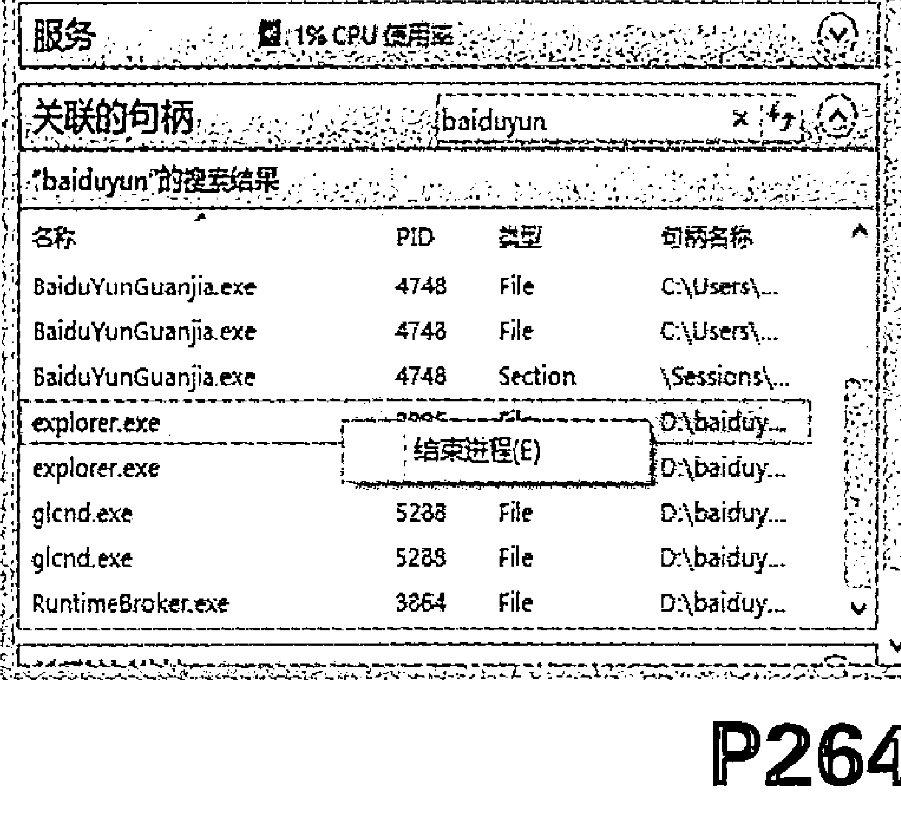

- 轻轻松松管“默认”……254
- 放飞系统 启动项灵活DIY……256
- 藏牢你的Windows 8.1隐私……257
- 挖掘新视窗的细微“体贴”……258
- 让NTFS格式为你办点实事……260
- 挖出Windows 8.1文件管理实用功能……262
- 内外结合 顽固占用杀无赦……264

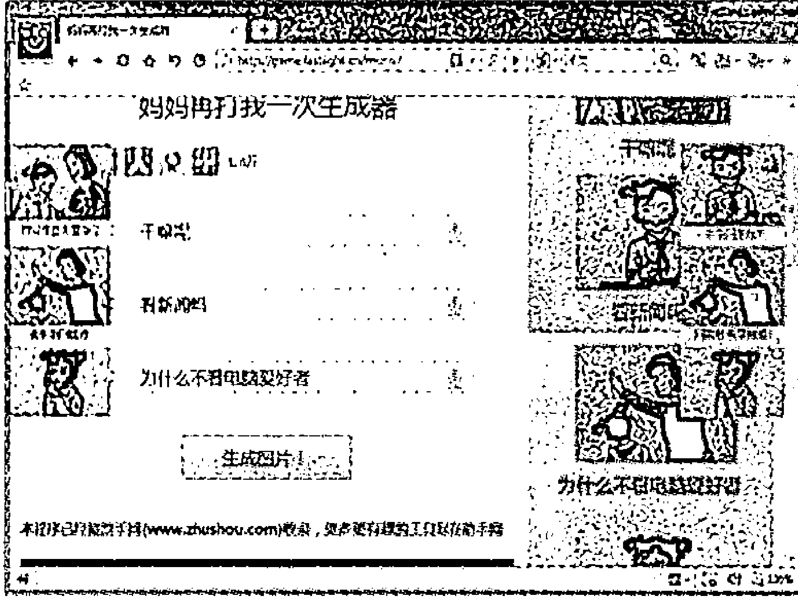

### 软网生活

- 全面玩转名片二维码……265
- 轻装前进 玩转轻应用……266
- 网盘相助 传资料不用起大早……268
- 谁在偷窥你的电脑……269
- 更强更壮 调教系统防火墙……270
- 一两分钟快速创建表情图片……271
- 不编程也能制作安装文件……272
- PDF转可编辑的Word文档……274
- 两招抠出网页受限文字……275
- 插件下岗 让脚本扩展浏览器……276
- PicPick不止截图这么简单……278
- 云笔记管理好“碎片”时间……279
- 360云盘三招妙用……280
- 为搜索安全 请个好保镖……282
- 新需求催生新搜索……283
- 用好PotPlayer 享受多媒体……284
- 超长高保真 切割细细听……285
- 多方应对 节目错过也能瞧……286
- 下载节能 我要两不误……287
- 双软出马 拿下顽固视频专辑……288
- 搜索文件随手可得……290
- 小邮箱里的大世界……292
- 一站搞定PDF烦心事……294
- 微软英特尔合力构建强密码……296
- 借助外援 乐视视频进苹果……298
- 多卷加密 网盘泄露也安全……300
- 上网慢 三步快速寻因求解……301
- 用好Xposed 深入Android内部调整……302
- 用活搜索框 计算更方便……304
- 视频编辑做比说容易……305
- 何需外援 用机情况轻松知……306

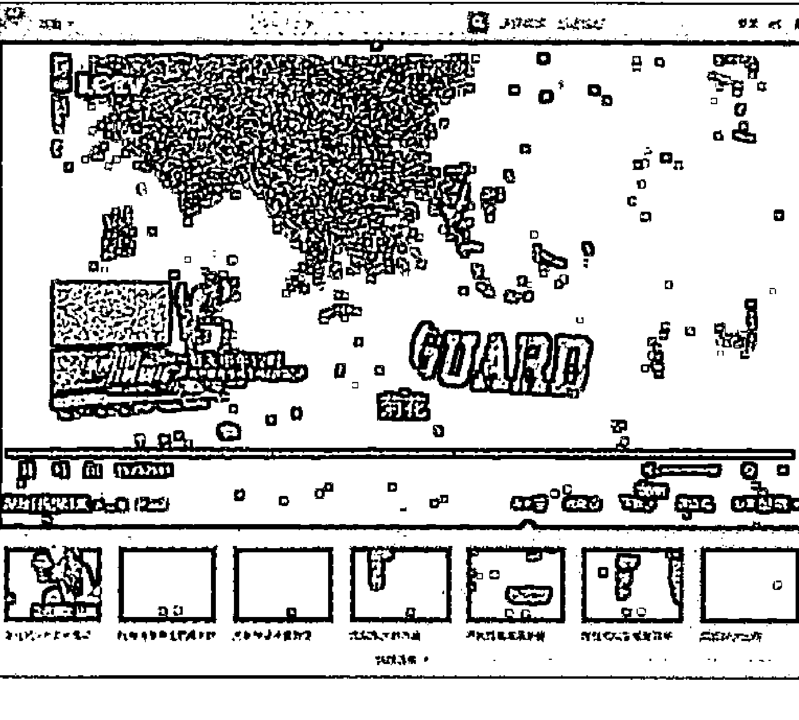

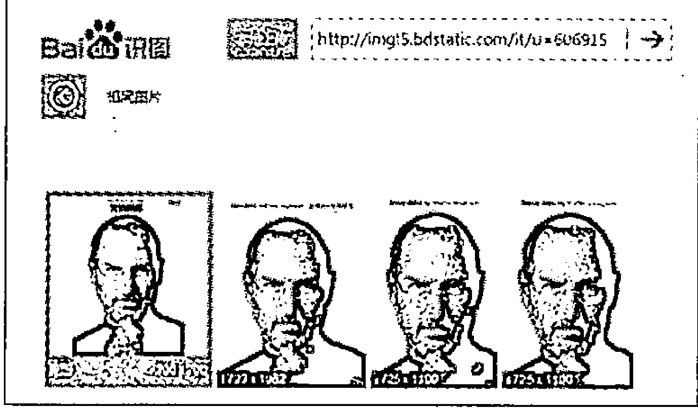

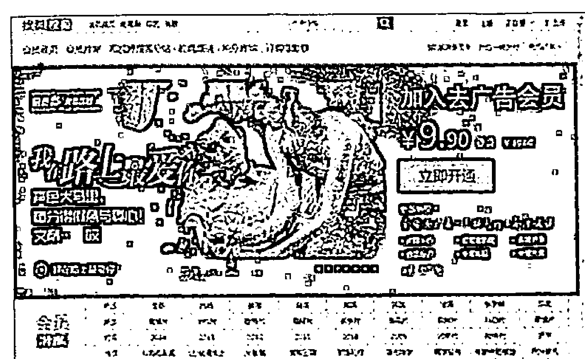

- 动动设置 也能挽回健康……308
- 有图就能挖出真“像”……309
- Flash Player瘦身提速……310
- 莫让黑客控制你的路由器……311
- 高效为王 问网知天下……312
- 消除在线障碍 看爽网络大片……314
- XP再见 数据留下……316
- 网播占硬盘 手动清缓存……317
- 飞速“挖出”BT种子里的电影……318
- 图片文字也要提取编辑……319
- 数码照片深度再利用……320
- 收藏精彩 方便与众不同……322
- 有色标签 管理文件排好队……323


### 办公区

- 给WPS文件多上几道保险……324
- 分工协作多方完成同一任务……326
- 分拆保存Excel多工作表……327
- 秘技聚会 表格排序不再难……328
- 一网打尽Excel表格分类汇总……330
- Excel数据拨乱反正有方……332
- 不容小看的“记事本”……334
- Word对象批量高效选择……336
- 非正常安装的Office卸载……337
- 多工作表查找替换有方……338
- 最快实现文章术语规范化……339
- 缘何“投靠”WPS文字2013……340
- 我的云盘 资料丢失为哪般……342
- 用图形编辑功能改变文字造型……344
- 简洁风PPT 让你的提案更突出……346
- PPT轻松制作扁平化图标……347

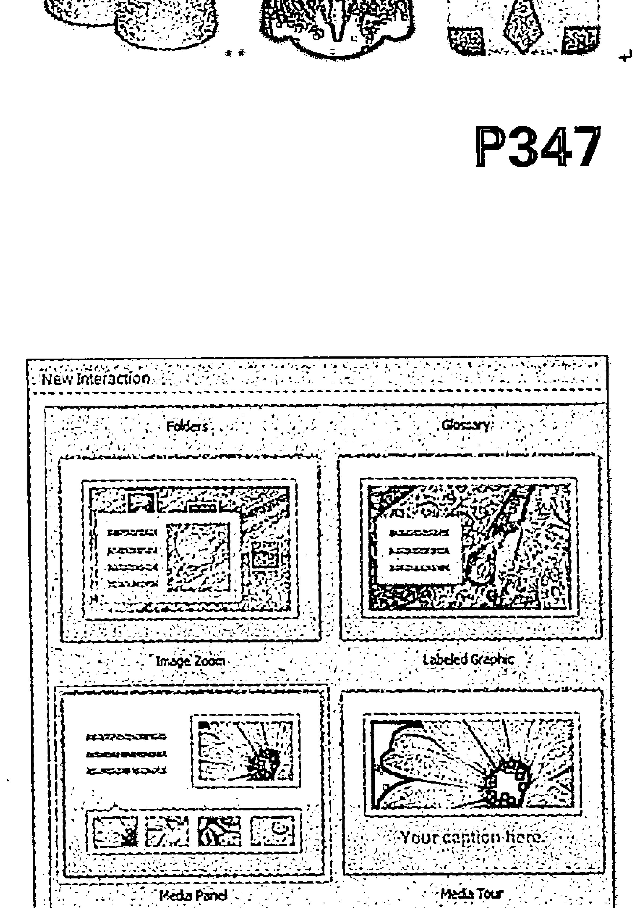

- PPT2013精细抠图妙用……348
- 不编程制作多彩互动PPT……350
- 妙用表格 让PPT版面更丰富……352
- 你也能编“找不同”游戏……354
- 数据图形化 让PPT一目了然……355
- 节约型打印招数多……356
- PPT制作 我要“高精准”……358
- 办公请“外援” 效率大提升……360
- 3D翻页电子书DIY……361

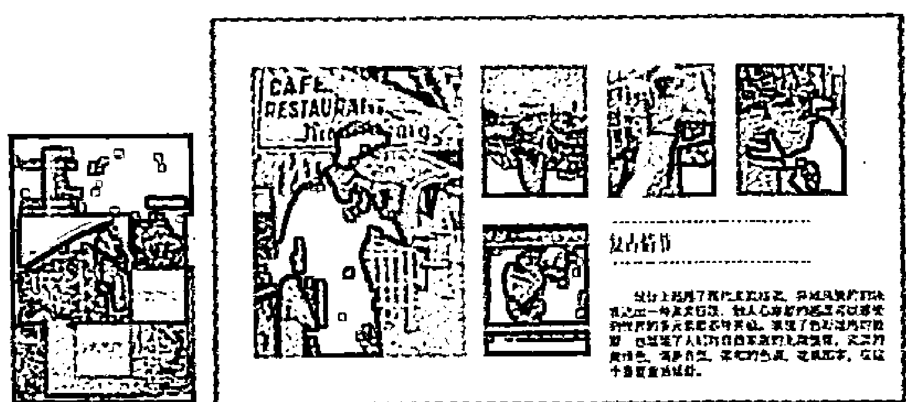

## 《电脑爱好者》·2014上半年合订本 目录

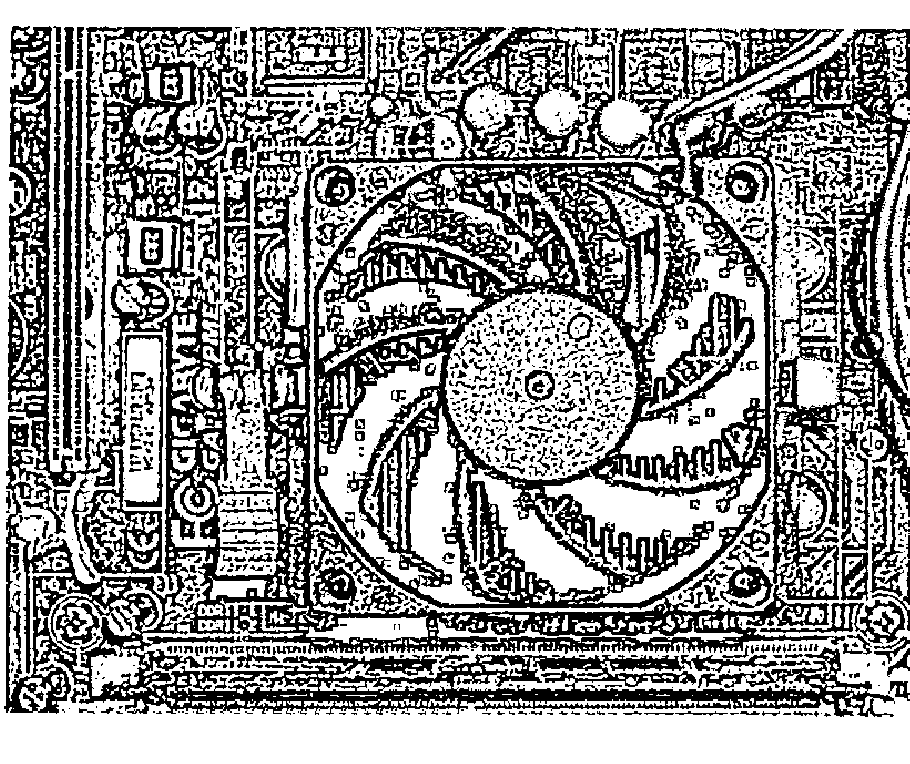

- 中文PPT 也有好版式……362
- “非线性”幻灯片更活套……364
- PPT图片玩出新花样……366

### 硬件课堂

- 和Windows XP说拜拜 DIY廉价平台如何选择系统……368
- 小容量SSD的福音 联想本用ExpressCache做缓存……369
- 智能化数字生活 打造全自动智能手机……370
- 剑走偏锋 零成本解决AMD处理器过热问题……372
- 小机箱如何“吃”下超长显卡……374
- 淘汰平板变身触屏显示器……375
- 两招让你搞定SSD的那些故障……376
- 好声音煲出来 耳机音箱入手必做的功课……378
- 找不到无线网络 搞定Macbook Air的上网尴尬……379
- 改善散热环境 暴力给本本开“天窗”……380
- 笔记本触控板隐藏的秘密……381
- 无惧躲猫猫 “变形本”内存升级……382
- 配合Ramdisk缓存活用文件连接……383


- 旧电源上岗 额外电源让高功率显卡不再黑屏……386
- 从原理到实操 低成本打造无线U盘……388
- 移花接木 笔记本系统无损迁徙……390
- 小编教你升级N卡驱动……392
- DIYer必备硬件工具……394
- 精挑细选 键鼠测试另类思路……395
- 武装“抽风机” 封闭式机箱显卡散热有新招……396
- 自己动手丰衣足食 实战智能路由改造&加固……398
- 打破传统思维 谁说系统SSD不能为HDD加速……400
- 移动硬盘的拆修“实战”……402
- 自己动手打造车载Android设备……404
- 虚拟机PK冤枉钱 PC支付宝转账零开销……406
- U盘坏了别扔 固件修复让闪存盘重获新生……408
- 守护健康和安全 利用摄像头打造闭路电视系统……410
- 莫让硬件背黑锅 APU平台看4K留心软件拖后腿……412
- 热管DIY 缓解笔记本南桥散热压力……414

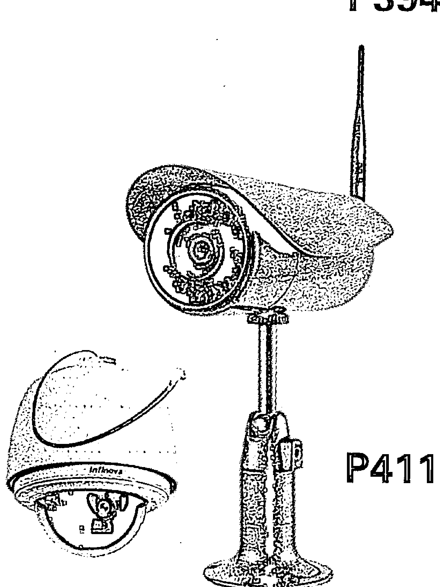

### 技术解读

- 比特币 疯狂的背后……416
- GPU 通用计算解密……418
- 没有密码的安全策略 解密Chrome OS新安全机制……420
- 走进超清世界——解读4K……422

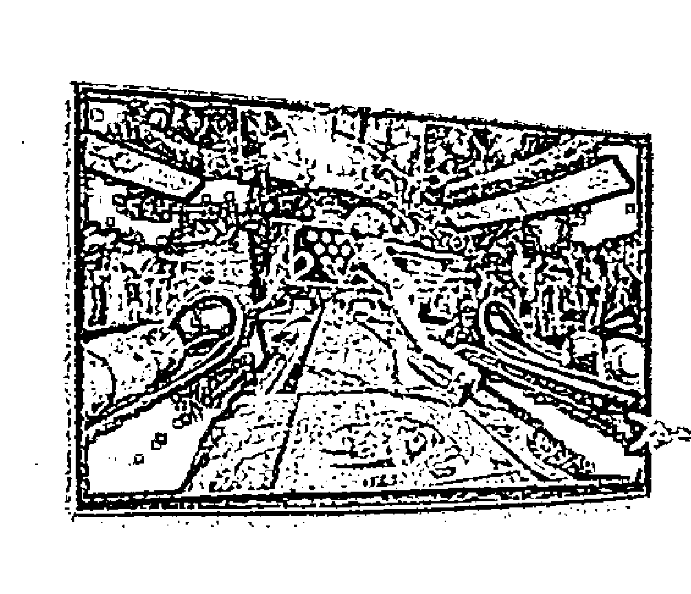


- 忘记指纹：虹膜是你的新身份……424
- 认识网中网——VPN解读……426
- 触摸未来——3D触摸屏解读……428
- 一切尽在掌握的视频追踪……430
- Windows 8的ReFS去哪儿了……432
- 成也流感败也流感——大数据还是大错误……434
- 心脏出血——都有哪些“出血点”……436
- 反盗版卫士——互联网版权监测系统解读……438
- 移动上网的那些烦心事……440
- 移动数据 交换无障碍……444
- 旧而不废 老手机自有新用途……448
- 突破限制 手机跨界玩应用……452
- 移动维护看我的 打造手机维护盘……456
- APP淘金 老手机焕发“第二春”……460
- 多方挖潜 突破小窗输入瓶颈……464
- PDF掌上阅读全解惑……468
- 拒绝窥视 手机出借有保障……472
- 闯出Android手机使用误区……476
- 两分钟轻松搞定无线充电功能……479
- “好声音”掌上也能打造……480
- 系统重装 手机数据能找回……482
- Android手机内存为何会缩水……484
- 手机如何解决“续航危机”……486
- 人不留影 拍张纯粹的风景照……489
- DIY趣味运动照……491
- 浪漫视频慢镜头……493
- 个性拼贴 拼出不一样的精彩……495
- 再现童趣 自制卡通图片……497
- 拍好唯美自拍照……499
- Android手机照片后期必杀技……501
- 为照片“人工降雨”……503
- 为生活照添加温馨情调……505
- 手机里那些花儿的世界……507
- 美丽的影子世界……509
- 摄影中的蒙太奇……511

#### 路由器需要“智能”吗

策划《电脑爱好者》编辑部

口袋里的手机智能化了，手腕上的手表智能化了，客厅中的电视智能化了，各种家用电器也在向智能化转型……一时间，我们已经被各种智能化的设备包围，而更聪明的它们也能帮我们享受更便捷、惬意的生活。

在这些设备智能的背后，离不开网络的支持。而作为家庭网络环境的总“枢纽”，路由器也已经不再甘于默默地提供单一的联网服务，加入到了智能化大军的队伍，从而可以更有效率地调度其他需要联网的智能设备。

继极路由的尝鲜试水之后，一大批互联网企业也陆续染指智能路由这片蓝海，他们更懂得如何刺激消费者的需求痛点，并擅长“先抓用户再谈利润”的营销策略，让原本可能以高价姿态示人的智能路由从一开始就以合理的低价切入市场，毫无门槛可言。没错，智能路由器的时代已经拉开了帷幕。智能路由器到底是“真智能”还是“假聪明”？驾驭更聪明的路由器，避免随之而来的安全隐患，这就是本期特别话题的最终目的。

##### No.1 路由器的智能化时代

如今，百度、360、迅雷、小米、果壳等互联网企业都将触手伸到了路由器领域，并为这种最不起眼窝在角落的设备冠以了“智能”的称号。

那么，什么是智能路由？和传统路由相比它有什么特色？智能的背后又有没有安全隐患？

普通家庭用户将其揽入怀中，到底是“引狼入室”还是“改善生活”呢？

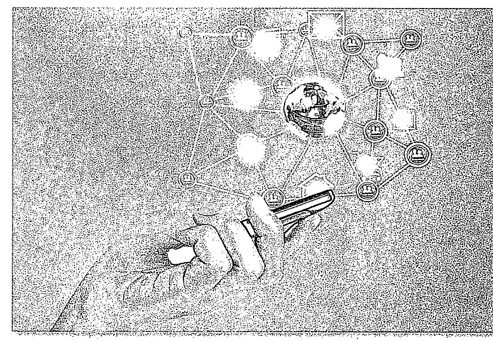

##### 智能路由的前世今生

怎样的路由器才谈得上“智能”？智能路由器又是缘何而生呢？

> 愚笨的传统路由

路由器相对复杂的设置步骤，是每个菜鸟级用户心中的梦魇。特别是当你正在畅游网游世界时突然断网，连接PC在Web设置界面查找路由器的故障来源，即便是准专业用户都觉得繁琐和麻烦。当然，很多路由器已经提供了设置向导界面，在基础连接方面已经颇为人性化了。但是，路由器的高级设置，却依旧仅是高级玩家才能玩转的灰色地带。比如刷第三方固件、多拨、脱机下载、广告过滤、网络的存储共享以及远程管理，这些都是专业论坛里极客们所津津乐道的话题。


所谓的智能路由，则是将上述那些看似繁琐的高级设置简单化、可视化，让菜鸟级用户也能进行轻松的设置并加以实现。智能路由里面会预装可升级的独立的操作系统，允许用户自行安装各种APP，用类似插件的形式对网络和所连接的设备进行智能化管理，从而带给用户颠覆性的体验。此外，功能越强的传统路由价格越贵，而智能路由的另一大特色就是在更简单即可实现高端路由功能的同时，价格低到了极致。比如百度刚刚发售的“小度路由”，就在99元的价格上提供了简便的设置界面，支持高清影音、远程下载、无线文件分享等功能，而且用户还能利用手机、平板等智能设备远程控制小度路由下载视频剧集，免去了用电脑下载的等待时间。

▶ 设置路由器能完全脱离PC和网线的束缚，这是路由器智能化的第一步

##### 还待‘规范’的智能

互联网企业最早嗅到了路由器智能化后所能带来的潜在商机：作为家庭网络的唯一入口和出口，所有的无线设备都需经过路由器才能接入互联网，而这让路由器成为了争夺最底层网络流量的主战场。得流量者得天下，这是互联网企业的生存之道，以路由器智能化为契机，抢占流量出入口，必然会引新一轮的互联网战争。

问题是，智能路由器缺乏统一的标准。比如，360携手磊科主打安全；迅雷携手磊科强调下载；腾讯联手海联达主打防钓鱼；小米想让路由与小米电视、手机、盒子深度整合；果壳则想将路由变成智能家居的信息中心；TP-LINK更是推出了能当路由器的安卓机顶盒TPmini。大家都说自己的智能路由更聪明，但又无法拿出类似150M、300M这种可以量化的凭证，而所有已知智能路由的功能，始终又与理想中的智能路由存在些许差距。

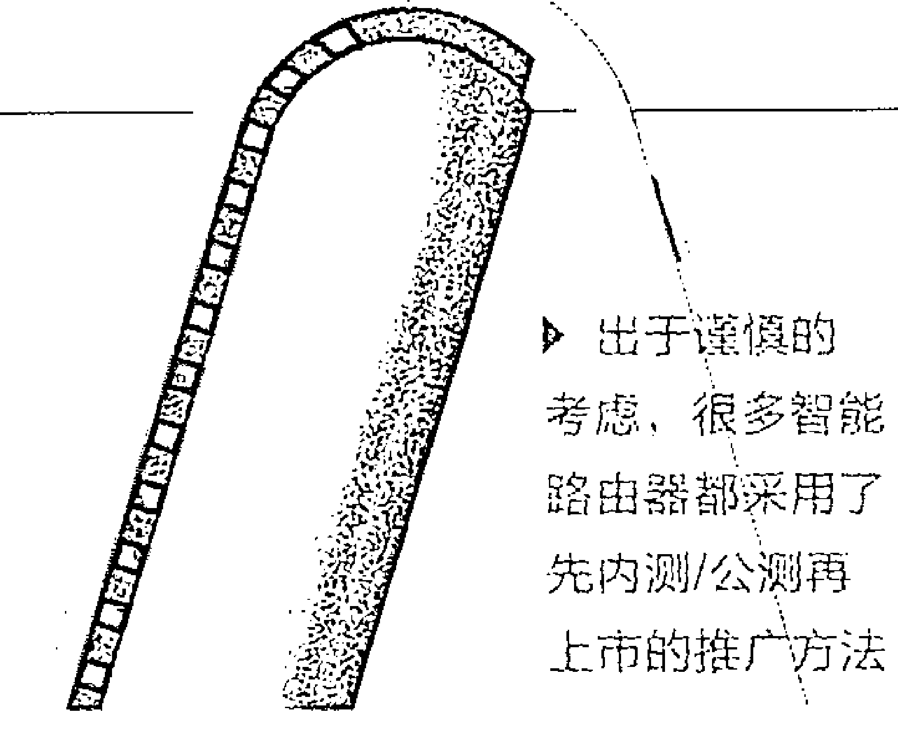

雷声大、雨点小，大家都没想到这场游戏应该怎么玩，这就是智能路由器市场的现状。还好，抢先上市的极路由算是为智能路由器树立了一种可供参考的标杆，接下来就让我们看看极路由能带来什么全新的体验。

##### 智能在哪？智能路由器体验篇

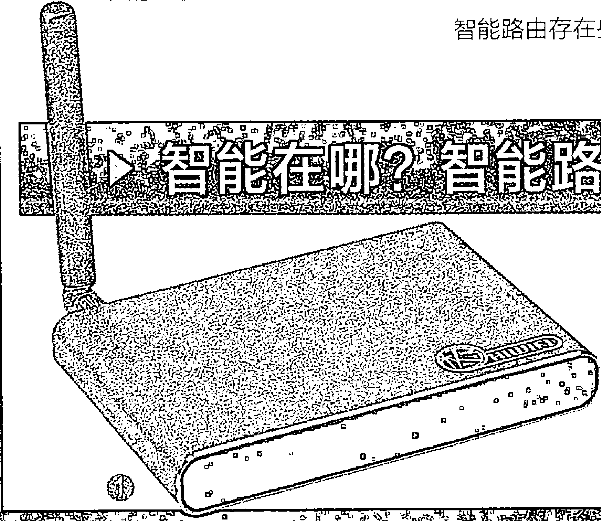

家用路由器，这是个被用户扔到角落里设置过一次后就再也不去碰的设备，显得死气沉沉。在2013年底2014年初，智能路由器突然成为业界最为炙手可热的话题。它只是个样子货？还是互联网企业未来的必争之地？

###### **不太公平的对比**

目前的智能路由器种类很少，我们就以推出最早、用户认知度最高，同时也是第一个被用户广泛认知的智能路由器——极路由（图1）为例。极路由采用10/100Mbps自适应WAN和两个LAN口，单根3dBi可拆卸天线，无线速率支持150Mbps，采用802.11b/g/n标准，毫不起眼。但其与传统路由器最大的不同就是其智能化设计，内置一个智能系统，并通过64MB内存、16MB闪存和8GB缓存规模，还能安装官方提供的一系列APP应用。

为了能够深刻了解以极路由为代表的智能产品与传统路由器的不同，笔者挑选了两款其他产品，通过不同的场景应用来直观体现路由器智能化所带来的不同。首先是思科（CISCO）的CVR100W 300M无线路由器（图2），同样也属于百兆路由器，这个最为入门级别的思科S级别家用路由器与极路由配置相近，也代表了一批传统家用路由器。

针对极路由丰富的功能，同时挑选一款网件（NETGEAR）非常强力的R6300路由器（图3），不仅性能超强，在Web界面美观程度和手机端的支持方面也具有超前意义，这款“家用路由器的老大”很能代表传统家用路由器的最高水准，看看它面对当下的智能路由器能有怎样的表现。

截止到截稿前以极路由为例，这款智能路由器的售价仅仅为129元（京东），而思科CVR100W达到299元，而网件R6300高达699元之多。在这一场不太公平的对比中，路由器阵营的新力军智能路由器是否会落下风？

- 4. 由于FTTH入户位置很难选择，所以弱电箱能否容纳网络设备非常关键
- 5. 只有身材娇小的路由器才能从容容身
- 6. 传统路由器没法放入弱电箱，影响美观

| 设备 | 星数 | 评价 |
|---|---|---|
| 极路由HIFI | ★★★★ | 智能路由器和变压器尺寸完胜，可变方向的天线可做无线信号定向增强，两个LAN口略显不够。 |
| 思科CVR100W | ★★★ | 勉强能够容身，由于采用内置天线无法针对户型定向增强无线信号。 |
| 网件R6300 | ★ | 完全无法放入弱电箱，只能放在外面飞线使用。 |

####### 场景1 容身智能家居

目前很多光纤到楼的小区，都将光纤终端直接通过线路管道进入房间的弱电箱内，这样一来家中不会有“飞线”，用户可以选择使用管道暗线或者无线方式将网络遍布整个户型，电视等传统电器不论通过有线还是无线上网都毫无压力。不过这样也产生了一个新的问题，一般小区预留的弱电箱尺寸都极为有限，就算是用户之后另行更换的弱电箱也不过30cm×20cm×10cm左右。如何把光纤猫+无线路由器以及两个变压器一个接线板外加诸多线材放入这个狭小的空间内成了大问题。

智能路由器对比传统路由器有个很大的特点就是身材娇小。一些主推功能的传统路由器都将尺寸越做越大，还有一些采用夸张前卫的造型吸引眼球，已经偏离了路由器的本质所在。以极路由为例，它的娇小身材塞进弱电箱毫无压力，思科CVR100W只能说勉强能与光纤猫共存于此，而网件R6300就完全没办法放入了。

####### 场景2 路由器设置

摆好路由器，到了该设置的时间。有经验的用户都知道，不就是连好网线进入浏览器输入“192.168.1.1”吗？然后通过路由器默认用户名密码进入设置Web界面，输入ISP提供的上网账号密码就可以了。可是，对于看起来很简单的步骤，却难倒了不少用户。究其原因非常简单，那就是复杂到“反人类”的Web设置界面。

思科CVR100W和网件R6300在设置界面方面做出了自己的突破，但并不是我们熟悉的TP-LINK那种毫无美感可言的纯字母与数字界面了。并且逐渐尝试使用尽可能多的图形元素去给第一次使用路由器的人提供更多的指导。但这不代表路由器已经有了突破。而智能路由器做到了更好。为什么这么说？我们还是以极路由为例。只要你会用微博这类热门的手机APP，那么设置极路由就很简单。路由器登录画面就好像我们登录微博那样美观与简单。它显示了对没有一排叫人崩溃的文字选项，通过四个图标标明了路由器的基本功能，同时用一张图告诉你目前的网络状况。首次登录的极路由设置界面通过图形引导，将“设置上网方式”、“无线设置”这两个关键设置用动画头指出，之后是实现多种特殊功能的应用中心，三步过后路由器已经设置完毕，并且还有微信分享功能，让人不禁产生这是一款手机APP的感觉。

- 7. 复杂到“反人类”的路由器Web设置界面
- 8. 思科CVR100W的路由器状态界面已有改观
- 9. 尽可能利用图形界面展示路由器的状态与功能
- 10. 非常时尚、准确、清晰易懂的路由器界面
- 11. 通过类似智能设备APP导航指引的方式帮助用户上网

| 设备 | 星数 | 评价 |
|---|---|---|
| 极路由HIFI | ★★★★★ | 具有智能路由器的互联网基因，设置时充分考虑用户体验，图形化操作界面更友好 |
| 思科CVR100W | ★★ | 起初文字设置界面已经改观，但仍有太多让人头痛的选项 |
| 网件R6300 | ★★★ | R6300系列的设置界面几乎是传统路由器当中图形化最好的，但比起智能路由器还差一筹 |

####### 场景3 独特功能

以往我们挑选路由器，最多也就是看看网络传输速率是否能够满足自身需求，再看看无线信号是否足够强劲而已，除此之外几乎没有任何看点。以极路由为代表的智能路由器对此说不，我们完全可以把智能化的路由器看作一部智能移动设备，既然手机和平板电脑能够安装应用，那智能路由器也完全可以。

极路由拥有不少应用，但给人留下最深印象的无疑是屏蔽视频广告应用。现在优酷、土豆、搜狐视频、风行网、乐视网、爱奇艺、腾讯视频等网站的广告越来越疯狂，在高峰期间你想看视频？对不起，先看一段一分钟广告吧。现在更有甚者还在视频中间插播广告，在视频结尾也加上广告，你想看下一集甚至要忍受75秒以上的广告，任你网速再快也逃不掉。

安装好屏蔽视频广告这个应用，我们再来试试各大视频网站近乎疯狂的广告。以目前比较火热的剧集《生活大爆炸》第七季和《咱们结婚吧》为例，一般这类热门资源上的广告也是最为凶残的。极路由几乎能够屏蔽掉所有的视频广告，这绝对是其他路由器难以望其项背的优势。极路由的另一个亮点是它的电源接口采用了标准的Micro USB接口，支持5V/1A的电流输入。这种设计将为我们带来诸多便利，就算家中断电依然可以通过其他设备（比如移动电源）为其继续供电，断电不断网。

与智能路由极富个性、功能强大的应用相比，传统路由器就显得比较单薄了。思科路由器一向以稳定著称，这款CVR100W除了稳定几乎就没有任何特点了。网件R6300虽然技术比较超前，但其实也没有什么能够拿得出手的独特功能。好在拥有USB设备接口，可以提供网络存储功能。

- 12. 极路由应用中心有点像APP市场，官方提供了多种应用供选择
- 13. 屏蔽视频广告功能是最具人气的官方应用
- 14. 能做到99%屏蔽，广告只是个别情况存在

###### 视频广告时间效果对比

| 视频网站 | 广告时间 |
|---|---|
| 优酷 | 60s |
| 土豆 | 60s |
| 搜狐视频 | 60s |
| 乐视网 | 60s |
| 爱奇艺 | 45s |
| 腾讯视频 | 45s |

极路由HiWiFi ★★★★★ 智能路由器独特的应用功能在传统市场笑傲江湖，以极路由为例的屏蔽视频广告是最具代表性的功能。

思科CVR100W ★ 几乎没有任何特殊功能，属于“一次设置后再也不会碰”的典型路由器。

网件R6300 ★★★ R6300系列拥有USB接口，可以通过外接移动硬盘实现网络存储功能。

###### 智能路由与移动互联

移动互联网是现在整个业界发展的方向，在如此大环境下诞生的智能路由器自然要来沾一点光。移动互联网和路由器，这两个设备能在一起擦出什么样的火花呢？

- ▶1. 手机远程管理的应用风格十分清爽
- ▶2. 需要在首次设置时预先安装好手机远程管理应用

####### 场景4 智能远程协助

现在很多朋友在陌生的城市上班，每半年或者一年才能回家一次。远方的亲人需要使用电脑与我们在网上聊聊天，或者看看在线电视剧解解闷。这电脑一旦出现问题，我们如何解决？

如果是一些设置问题，我们可以使用类似QQ提供的远程协助等方式，帮忙解决一些系统、软件的设置问题。可万一是家中莫名其妙上不了网了，我们仅仅能依靠电话与远方的亲人沟通，不论是问题的描述还是具体操作去解决问题的效果都会大打折扣。使用传统路由器的话，我们最多是让亲人重启一下路由器和电脑，或者重新插拔一下网线而已，至于在电脑上输入命令、进行复杂设置等操作就别指望了。

### 特别话题

这是一篇关于智能路由器功能的讨论，重点介绍了远程管理、家庭网络控制等优势。

- 支持手机远程管理
- 可定时断网
- 能查看连接设备

> > 智能路由器通过移动应用实现灵活控制，提升家庭网络体验。

#### # No.2 传统路由的进阶攻略

虽然备受瞩目，但智能路由到现在为止还处于“概念股”的阶段，可供我们选择的产品不多，而且在功能层面还有很多值得深入挖掘的空间。因此智能路由更适合首次为家里添置路由器的用户选择。而对已经用上传路由器的用户而言，通过一系列的进阶设置和优化，传统路由也能“翻译”出很多智能路由所标榜的功能呢。

##### 普通路由“变身”智能路由

智能路由虽然还没有完全普及，但是它们所宣传的功能却非常吸引人。那么，我们这些在用着传统路由的人，能否享受到这些待遇呢？其实只要你肯动手，你的普通路由一样也可以拥有智能路由的那些功能。下面我们就用普通路由来PK极路由（智能路由的代表）。

#### 屏蔽广告我也行

文|技术宅

##### 开启防火墙设置

极路由因为具备智能系统，借助其内部系统的设置，我们可以轻松在路由端就拦截各种广告。其实现在很多普通路由就可以设置广告拦截，下面以TP-Link 541G+路由器为例。

启动浏览器进入路由器设置，接着依次展开左侧窗格的“安全设置→防火墙设置”，勾选其下的“IP地址过滤”，缺省过滤规则中选取：凡是不符合已设IP地址过滤规则的数据包，允许通过本路由器。继续勾选“域名过滤”并保存（图1）。

##### 设置域名过滤

| ID | 生效时间 | 域名 | 状态 | 配置 |
|---|---|---|---|---|
| 1 | 0000-2400 | cf.qq.com | 生效 | 编辑 删除 |
| 2 | 0000-2400 | game.qq.com | 生效 | 编辑 删除 |
| 3 | 0000-2400 | 4399.com | 生效 | 编辑 删除 |

继续切换到“安全设置→域名过滤”，点击“添加新条目”，按提示添加如下域名（不要输入http://www.格式），将那些骚扰广告域名按下面的方法全部添加到列表，生效时间为“0000~2400”（即每天），状态为“生效”（图2）：

- cf.qq.com
- game.qq.com
- 4399.com

##### 设置拦截IP地址

启动命令提示符，输入下列的命令获得上述域名的IP地址并记下。切换到“安全设置→IP地址过滤”，单击“添加条目”，在弹出的窗口中，在“广域网IP地址”输入框依次填入上述获得的IP地址并保存（图3）。

```
ping 4399.com
```

这样通过上述的设置，在电脑上就无法访问上述被屏蔽的网页了，自然这些广告页面也就不会再来骚扰你了。

上述设置只能根据出现的广告网站域名一个个进行拦截，如果你的路由器支持刷入DD-WRT（如何刷入DD-WRT，请参考本期特别话题“刷 新 路由器”文章），那么利用其强大的自定义设置，可更好地拦截各种广告。

进入DD-WRT路由设置之后，依次展开“Services→Services”，将DNSMasq和Local DNS（本地DNS）均设置成Enable（启用），接着到http://dwz.cn/cfan28下载所需要的脚本文件，使用记事本打开以后复制所有内容。返回DD-WRT路由设置页面，继续展开页面上方的“Administration→Commands”，在“Command Shell”（命令行外壳）后面的文本框粘贴上述复制的脚本文件，粘贴完成以后点击“Save Startup”，然后将其保存为开机的启动项目（图4）。继续展开“Administration→Management”，在右侧窗格找到“Cron”选项，将其设置为“Enable”，接着在下面的“Additional Cron Jobs”文本框输入“* 1 * * * root /tmp/.rc_startup”代码，最后保存退出即可。这样DD-WRT会自动下载Chinalist的内容去拦截广告。

#### 穿墙？不再有压力

大家使用无线路由的主要目的就是方便手机、平板等无线设备上网，不过家里墙壁始终是无线信号的天生杀手。极路由通过优化无线信号搜索的算法，从根源解决隔墙搜不到信号、僵尸节点等问题。普通路由怎么办？我们只要使用级联扩展的方法就能解决穿墙难题！

##### 普通路由 自己设置二级路由

极路由可以通过优化无线信号搜索的算法来解决穿墙问题。不过即使优秀的算法也无法解决信号衰减的问题。如果你的家比较大，只要使用多个路由器组网即可。比如你家的路由器放置在客厅，但是卧室的信号无法收到无线信号，这时候只要在卧室添加一个二级无线路由器即可。下面还是以TP-Link 541G路由器为例。

首先在卧室将路由器通过网线和电脑连接，进入路由器设置界面后，切换到‘网络参数 - WAN口设置’，WAN口连接类型选择‘动态IP’（即自动获取上一级路由分配的IP地址），点击‘保存’（图1）。完成上述设置后，下级路由就可以从上级路由获取IP地址。同上，继续进入‘无线设置 - 基本设置’，然后勾选右侧图标的‘开启无线功能’和‘允许SSID广播’并设置其他无线参数。这样，在卧室我们就可通过无线网络上网了（图2）。

##### 支持无线扩展路由

普通的路由器网络搭桥，每个下级路由需要网线接入才能实现信号的传递。很多时候在需要搭桥的地方，我们可能并没有布设网线。对于这些家庭，借助具备无线扩展的路由即可解决问题。比如腾达N302路由器，它本身可以接收上一级路由的无线信号，同时可以将接收的无线信号再次发射，实现无线+无线扩展的功能。

首先将腾达N302路由器通过网线和电脑连接，进入路由器设置界面后点击‘高级设置’，然后切换到WAN口介质类型选择‘无线WAN’，无线信号名称输入自家无线信号，安全模式选择上一级路由的设置，输入连接的密码，点击‘确定’连接（图3）。成功连接后路由器会自动连接到上一级热点，同时本身会发出无线信号，切换到‘运行状态’，如果显示‘已连接’即可。现在拔下路由器，将其连接到任意有电源的地方（确保可接收上一级Wi-Fi）即可（图4）。

#### # 一手“掌”控。远程控制路由

文|俞木发

一般情况下，路由器经过设置以后只要上网参数没有改变就可以一直使用下去。不过很多新手路由设置都是其他朋友设置的。比如现在新增的无线连接设备，很多新手就不知道该如何进入路由器查看无线热点密码。如果此时家里只有不懂电脑的老爸、老妈在家，我们应该怎么更改路由的设置？智能路由大多内置远程控制功能，通过网络就可以轻松远程控制。不过这并非智能路由的专利，很多普通路由同样具备远程访问功能。

- 1. 修改登录口令
- 2. 修改LAN口参数

因为远程访问会有一定的安全威胁，因此首先需要更改路由器原来默认的登录口令，防止其他用户恶意登录。如TP-Link 541G+路由器，进入路由器的设置后，依次展开“系统工具→修改登录口令”，按提示设置新的登录口令（图1）。

切换到“网络参数→Lan口设置”，然后将原来默认的192.168.1.1的IP地址设置为192.168.2.1，以防止其他用户登录，完成后点击“保存”（图2）。

切换到“安全设置→远端WEB管理”，然后将右侧窗格的“远端WEB地址管理IP地址”设置为“255.255.255.255”，WEB管理端口设置为“8080”，这样任何一台联网电脑就可远程控制路由器了（图3）。

不过对于ADSL拨号用户，由于每次拨号后的IP地址都不同，为了方便使用，还需要使用动态域名服务。

务。切换到“动态DNS”，然后选择一个免费动态域名解析服务，成功连接到动态域名服务器后，以后就可以直接在任何一台联网的电脑打开浏览器，在地址栏输入“http://动态域名:8080”，然后按提示输入上述设置的路由器登录账户和口令，在远程电脑上就可以进入路由器设置界面了（图4）。

远程登录路由器后，具体操作就像本地登录。比如现在只要展开“无线参数→基本设置”，在这里就可以轻松查看设置的热点密码了。这样无需老爸老妈动手，我们远程登录就可解决密码查看问题。

同样的路由器也支持其他联网设备的访问，如果身边没有电脑，我们可以使用手机3G直接连接到路由器的远程控制。以WP8手机为例，开启3G后在手机浏览器上直接输入“http://动态域名:8080”，其他同电脑登录，进入路由器设置后就可以任意远程操作了（图5）。

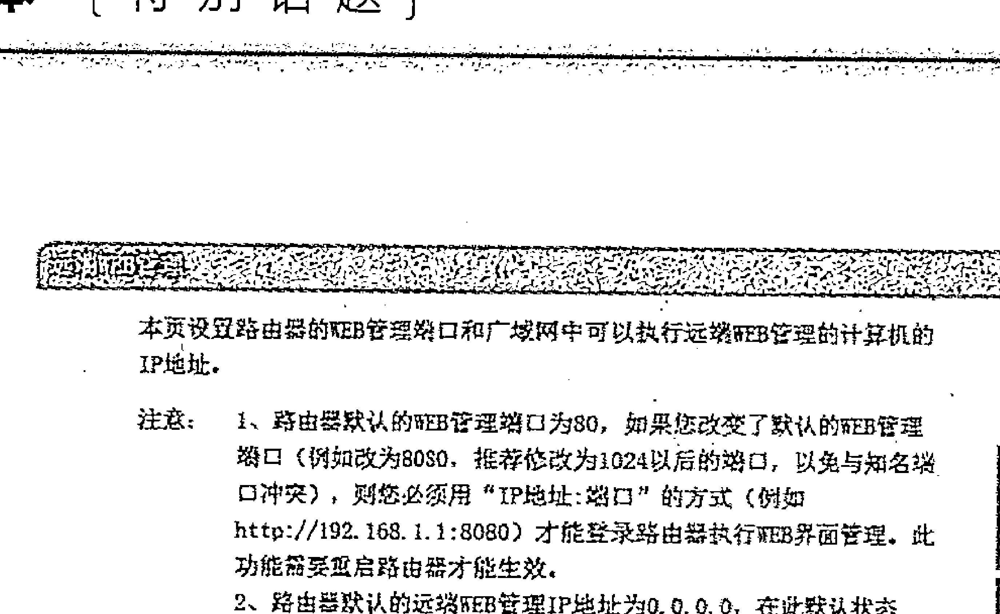

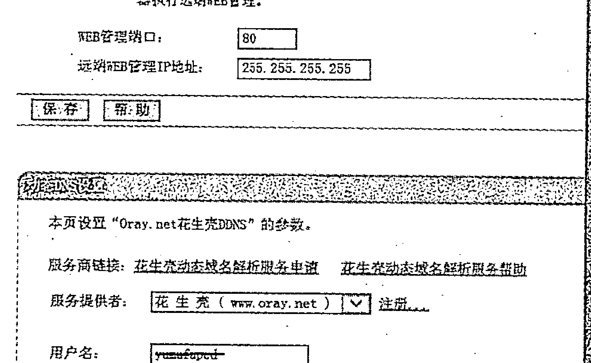

- 3. 设置远程登录参数
- 4. 设置动态域名解析
- 5. 在手机上远程登录

文|万立夫

#### 优化路由器下的BT下载

由于现在的家庭都有很多的上网设备，比如电脑、手机、平板电脑甚至智能电视，所以安装一个路由器就成为必然。但是安装了路由器后，可能会发现BT或电驴下载没有以前那么快速了，所以我们要做一些相应的优化。

##### 启用DMZ功能提速

路由器之所以会出现这样的问题，是因为它只能根据动态建立的NAT映射，来转发来自互联网的数据包信息。而在进行数据转发的过程中，难免会出现各种各样的问题，可从路由器中下手解决。

首先登录自己的路由器后台（以TL-WR841N为例），它有一个名为DMZ的功能。通过DMZ功能就不用路由器进行数据转发，而是直接在互联网和电脑之间进行数据传输。在路由器后台选择左侧的“转发规则”，点击其中的“DMZ”。

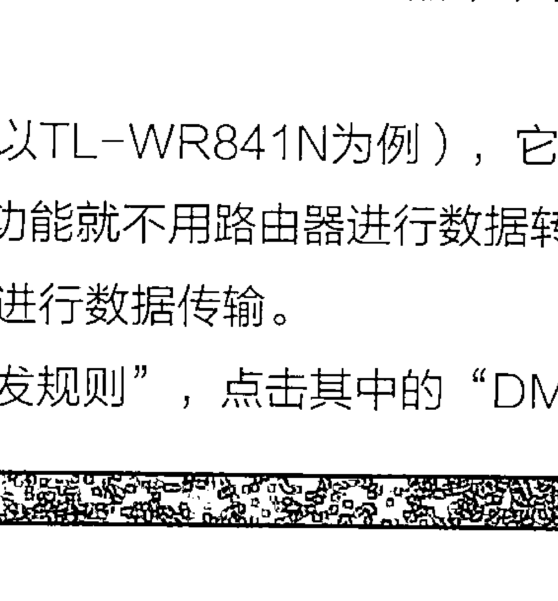

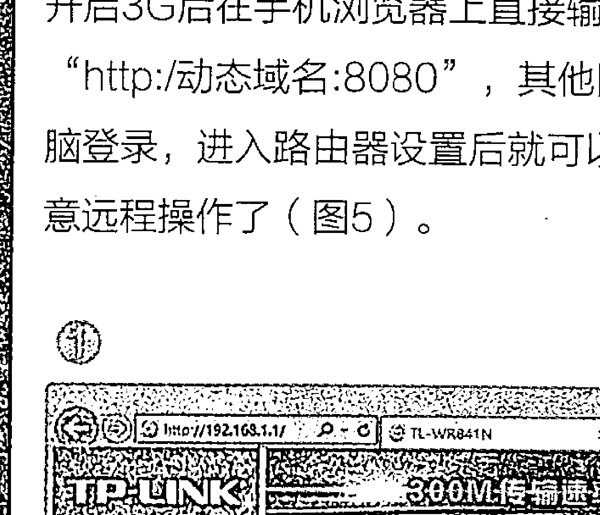

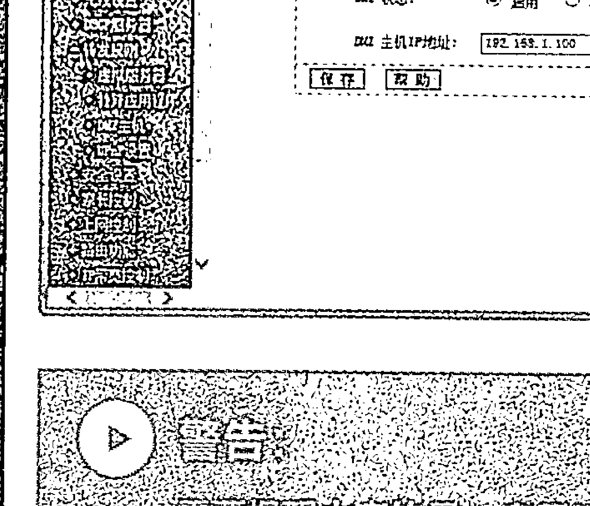

“主机”项，接着点击“DMZ状态”中的“启用”，在“IP地址”后设置电脑在局域网中的IP地址，最后点击“保存”，按提示重新启动路由器即可（图1），BT等下载的速度必然会快速提升。

##### 开启UPnP端口传输

如果害怕受到网络攻击，既想通过路由器保护网络安全，又想提升BT的下载速度，那么还有一个简单方法，就是同时启用路由器和下载软件的UPnP功能。

首先还是在路由器的后台选择“转发规则”，这次点击其中的“UPnP 设置”选项。接下来点击“当前UPnP状态”选项中的“开启”按钮即可（图2）。

接下来打开自己常用的下载软件，比如我自己使用的是QQ旋风，打开它的设置窗口，选择左侧列表中的“高级”选项，然后选择右侧窗口中的“开启UPnP自动端口映射功能”选项，最后点击“确定”即可（图3）。这样在进行BT下载时，路由器就会自动把下载端口“发到”互联网中，下载速度也就大大提升了。

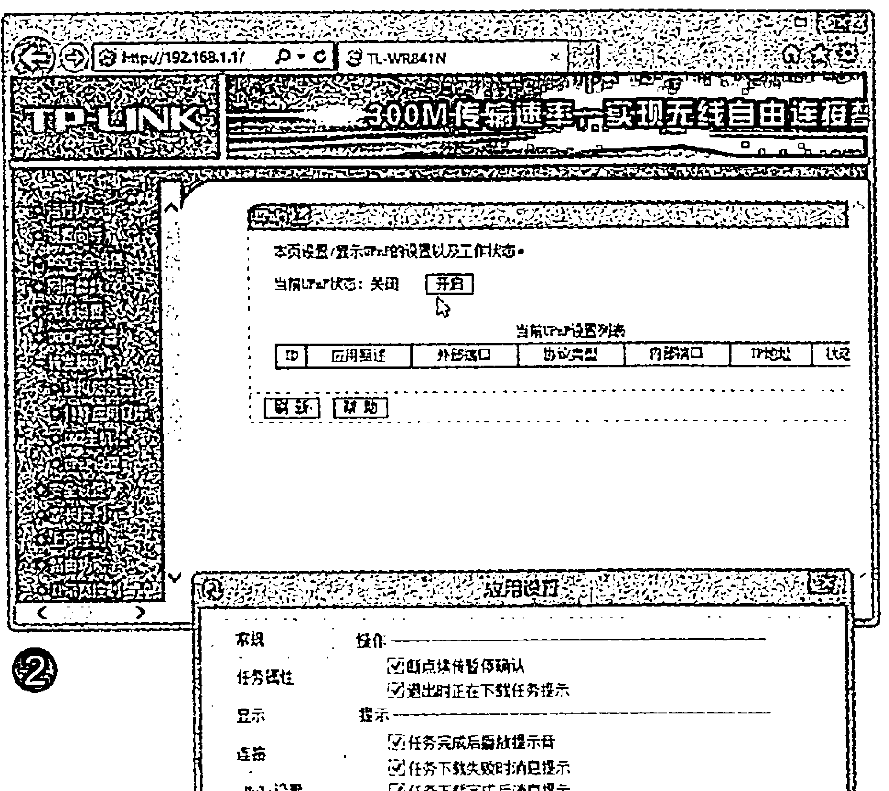

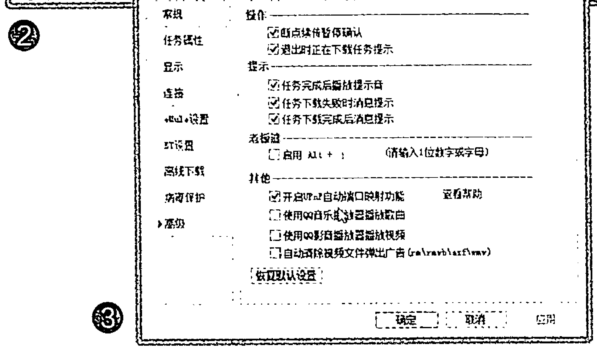

##### 手工端口映射设置

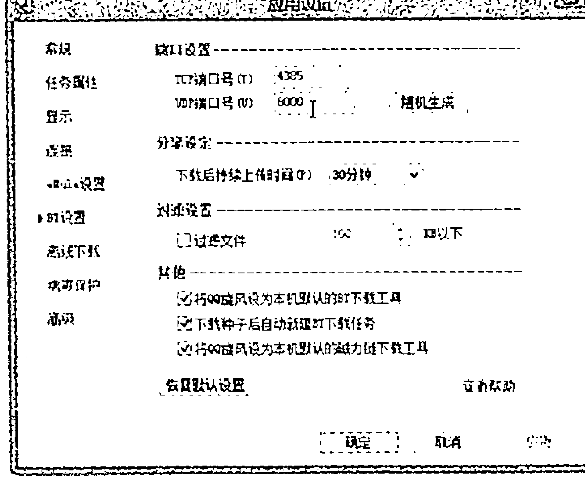

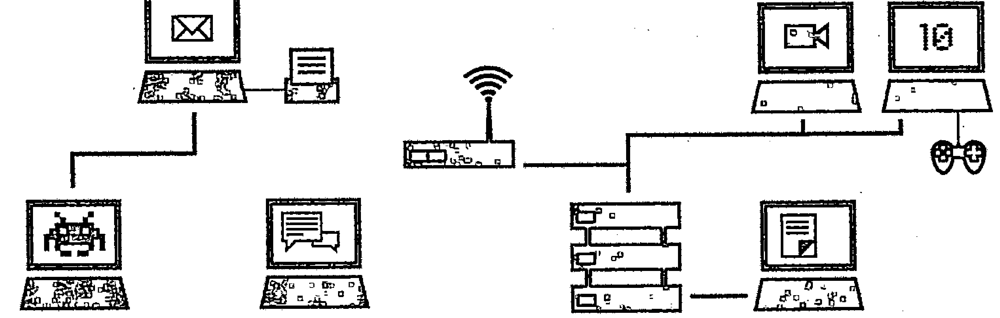

UPnP自动端口映射操作并不是每一次都能百分之百成功，因此有时还需要自己手动进行端口映射操作。继续以QQ旋风为例，在它的设置窗口的“BT设置”选项中，将“端口设置”中的两个端口记录下来。比如我的QQ旋风使用的是TCP协议的4385端口以及UDP协议的8000端口（图4）。

现在进入路由器的后台页面，点击“转发规则”标签中的“虚拟服务器”。点击页面中的“添加新条目”，在弹出的网页的“服务端口号”后，设置下载软件TCP协议的端口信息。接下来在“IP地址”选项中，设置电脑在局域网中的IP地址。然后在“协议”中选择“TCP”这项，在“状态”列表中选择“激活”这项（图5）。设置完毕点击“保存”即可完成这条端口映射规则的创建。接下来按照同样方法，创建一条UDP协议的端口映射规则。

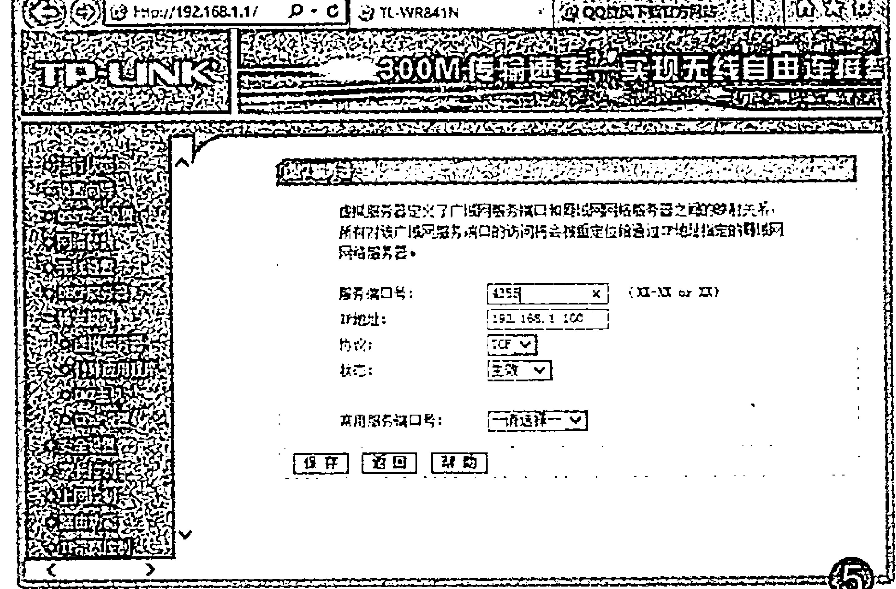

以后，下载软件就可以利用设置的端口映射规则，“强行”将下载端口映射到互联网中，从而大大提升下载的速度啦。

### 《电脑爱好者》2014上半年合订本

### 强身健体 自己刷路由
文|俞木发

##### 最安全的刷新：使用官方固件升级

使用安卓手机的用户都知道，通过刷新手机的固件可以扩展手机的功能，弥补手机原有的缺陷。同样的，对于路由器我们也可以通过刷新固件的方法提升路由器的性能。

对于大品牌的路由器，如Dlink、TP-Link路由器，官方会定期推出刷新固件以提高路由器的性能。比如有些地方ISP提供的宽带会限制用户使用共享，此时通过刷入特制的固件就可以绕开运营商的共享限制。下面以TP-Link的TL-WR541G+路由器升级为例。

首先到TP-Link的官方网站下载自己型号路由器的升级文件（每个升级文件会有升级功能说明，请按自己的需要选择升级文件），下载后将其解压到桌面备用。接着在浏览器的地址栏输入192.168.1.1进入路由设置界面，然后在左侧功能菜单进入‘系统工具→备份和载入配置’，点击‘备份配置文件’，然后将当前配置导出到桌面备用（图1）。备份完成后，继续切换到‘系统工具→软件升级’，点击‘选择文件’，然后选择下载到的升级文件（图2）。单击‘升级’，路由器就会将升级文件写入到路由器中。升级成功后会提示版本变化，可以看到成功升级到了4.4.2版本（图3）。完成系统的升级之后，同上，切换到‘系统工具→备份和载入配置’，点击‘选择文件’，选择上述导出的配置文件导入，点击‘载入配置文件’即可恢复原来的上网设置了。现在就可以使用新版本升级功能了。比如TL-WR541G+路由器升级以后增加了多种特殊拨号模式来规避ISP的共享封锁，只要切换到‘网络参数→WAN口设置’，选择新增的‘特殊拨号模式’即可（图4）。

> 路由器升级过程中千万不能断电，并且要使用网线连接（而不是Wi-Fi方式）来升级，最好将本机的防火墙和杀毒软件也关闭，以避免不必要的检测。

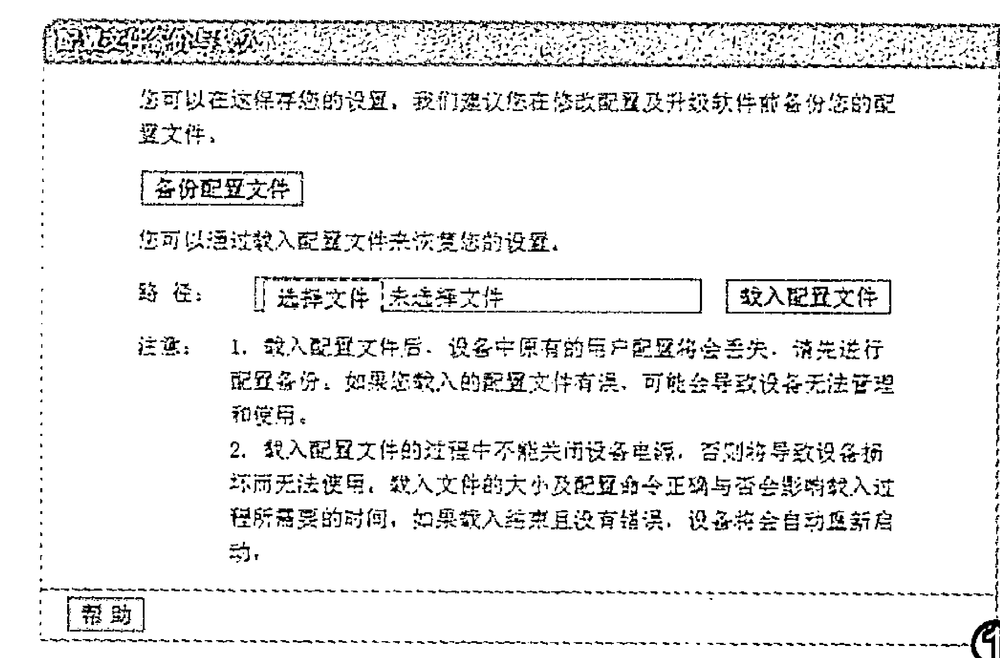

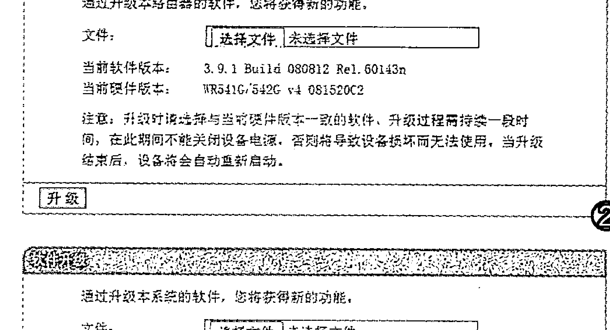

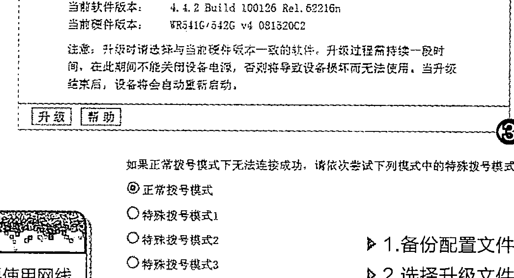

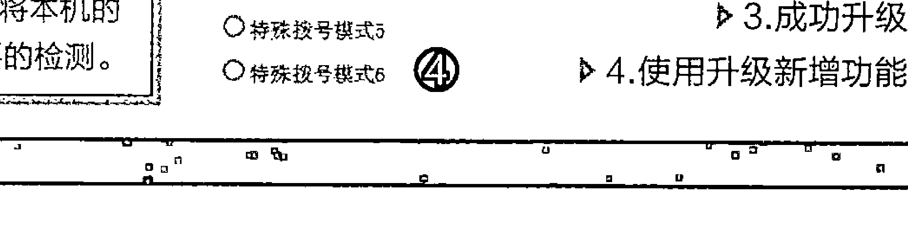

- 1.备份配置文件
- 2.选择升级文件
- 3.成功升级
- 4.使用升级新增功能

##### 扩展无极限

##### 使用第三方固件升级

官方的升级大多只是部分功能的升级，如果要让自己的路由器具备更强大的功能，我们可以借助第三方固件来升级。比如DD-WRT就是优秀的第三方固件，只要你的路由器支持DD-WRT就可以刷入其固件，极大地扩展路由器的功能。DD-WRT固件可以实现中继、AP、VPN、VOIP、UPNP、DHCP、端口映射、封杀BT、VLAN划分、调整无线信号发射功率等扩展功能。首先登录http://www.dd-wrt.com/wiki/index.php/Supported_Devices，查看自己的设备是否在支持列表之内，然后再下载适合自己设备的固件文件放置在桌面备用。下面以Linksys WRT150N V1无线路由器刷机为例。

注意，刷入DD-WRT时同样也必须使用有线的方式并且不要断电，因为DD-WRT的升级是在浏览器界面完成，要求一定要使用IE浏览器（切不可使用Firefox或者其他第三方浏览器）。打开IE浏览器进入路由器的设置界面，然后切换到“固件升级”，接着单击“浏览”选择上述下载到的升级文件，最后点击“上传”按钮即可完成刷机（图5）。完成DD-WRT的升级后，路由器会使用DD-WRT默认初始设置（用户名root、密码admin，不过不同机型的设置不同，请参考DD-WRT说明文档）。如果不知道如何进入路由设置界面，此时可以启动命令提示符，然后输入ipconfig命令获取当前网络默认网关地址，使用这里显示的网关地址即可进入路由器设置界面（图6）。完成上述的操作后，现在就可以使用DD-WRT的各种加强功能了。比如Linksys WRT150N V1刷新后支持无线网络的定时开关，这样到了睡觉时间就可以自动关闭热点以节约电源。进入路由器设置界面后，切换到“无线→高级设置”（图7）。接着将“无线网络时间限制”选项设置为“开启”，然后根据自己的实际情况设置开启或关闭时间即可，其中红色表示关闭，绿色则表示开启（图8）。

> 小提示：下载的DD-WRT固件通常是.bin为扩展名，如果路由器不支持这种格式升级，可以尝试修改扩展名为支持的类型。

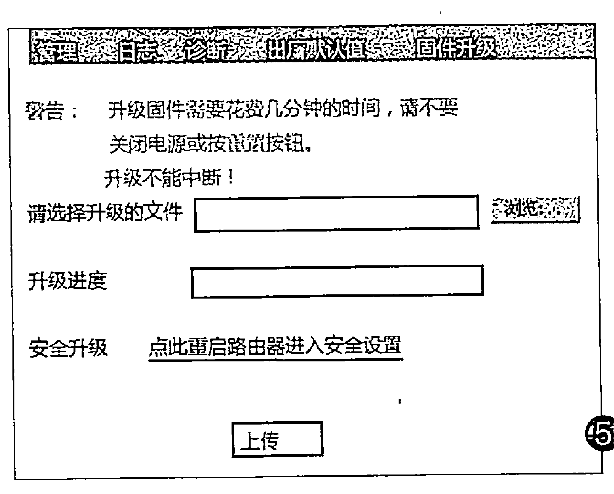

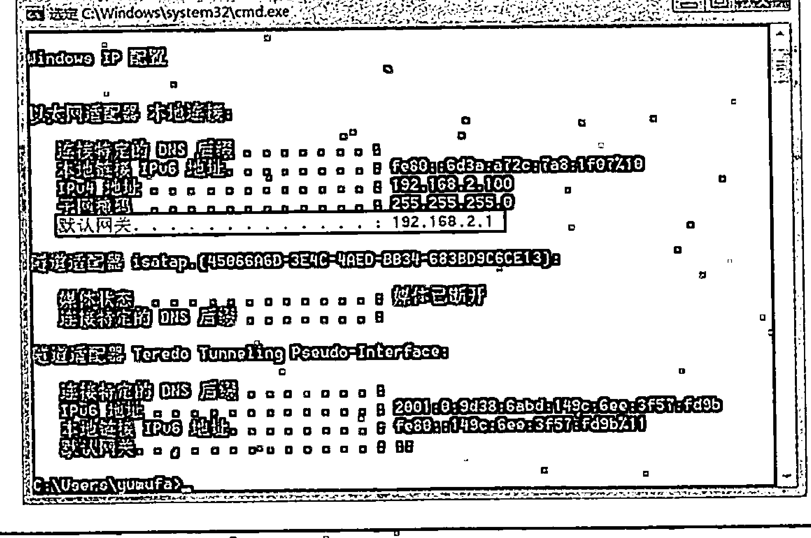

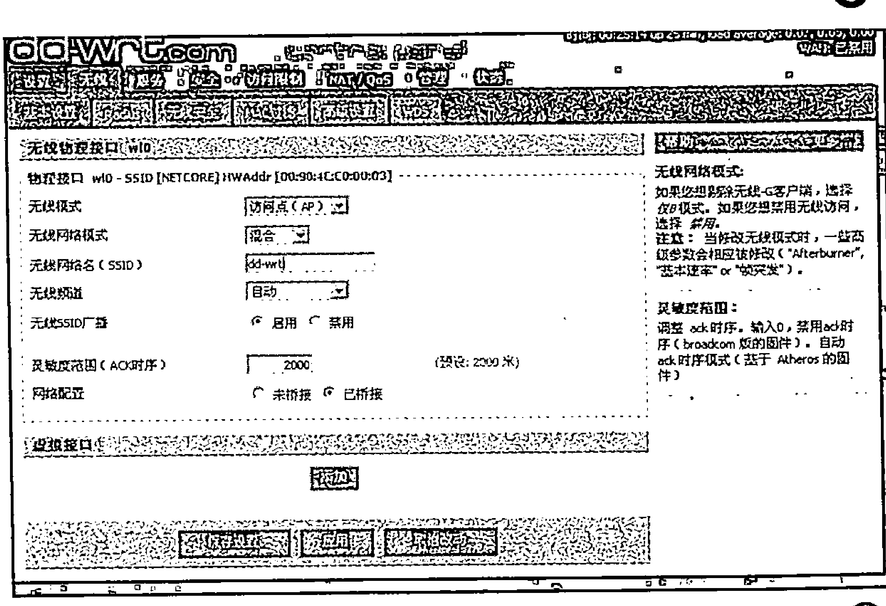


- 5.选择升级文件
- 6.查询本机网关地址
- 7.进入高级设置

### 小路由变身店内运营利器
文|于正青

智能手机的普及，Wi-Fi已成为人们生活中必不可少的东西。多数商家会选择用“店内覆盖热点”的方式来吸引顾客。熟不知，这小小热点也能巧妙地帮店主宣传自己的店铺。

前段时间，磊科NW762远程下载路由器炒得沸沸扬扬，我便购买了一台，在使用了一段时间后，发现其远程下载并不理想，便闲置了下来。后来朋友的小店开张，问我有没有合适的Wi-Fi认证方案，我便打起了这台路由器的主意。经过不懈努力，这台远程下载路由器被打造成了一台具有广告推送功能、具备抓取顾客联系方式的无线认证路由器，可以很好地宣传朋友的小店了。以下的方法同样适用于其他很多路由型号，详细的路由型号列表已经上传到附件中（附件下载：http://t.cn/8ktsDw）。

##### 1. 刷机及设置

恢复路由器初始设置，其方法请参阅路由器的使用说明书。再断开路由器的电源，将路由器的Lan口与电脑相连。

设置电脑的IP地址。IP地址设置为192.168.1.100，子网掩码为255.255.255.0。打开附件中的“dwupload工具”，在附件文件中选择自己所需的固件，一般选择Hi-Spider AuthorizationCode.5g-8M.bin即可。在“路由器IP”中填写路由器的网关（默认为192.168.1.1）。点击“更新固件”，此时再接通路由器的电源，固件便会自动更新。

当进度条完成后，路由器会自动重启。重启后把电脑的IP地址设置为“自动获取IP地址”即可。

在浏览器中登录192.168.1.1。默认用户名和密码均为admin。点击“基本设置→网络设置”，根据自己的实际情况配置网络信息，同时配置无线网络，建议把无线安全设置为不加密。

##### 2. 设置认证界面

账号申请。到http://m.himofi.com/v2/index.php/Apply/Index/apply.htm网站上，根据自己的实际情况填写账号申请。提交后，系统会给提交的邮箱里发送邮件，进入邮箱点击“确认申请”。此时会弹出一个页面，含有店家名称及后台密码。

配置店家信息。登录http://m.himofi.com/v2/index.php/Apply/Index/index，需要在这里填写店铺名称、店铺地址联系方式等基本信息。点击账户管理，在这里下载二维码、保存授权码。点击账户管理，在“新浪微博昵称”中填入自己的账号，这样顾客在使用微博登录时就会自动关注店家的微博。

###### Step 3

登录到路由器。点击第三方认证，勾选启用第三方认证，在授权码中填写之前保存的授权码，在外部域名白名单中填写 himofi,sina,qq。最后点击保存设置（图1），登录认证界面便设置成功。此时任意打开一个网址都会强制跳转到之前设置的店家宣传的网页上，登录后才能正常上网。

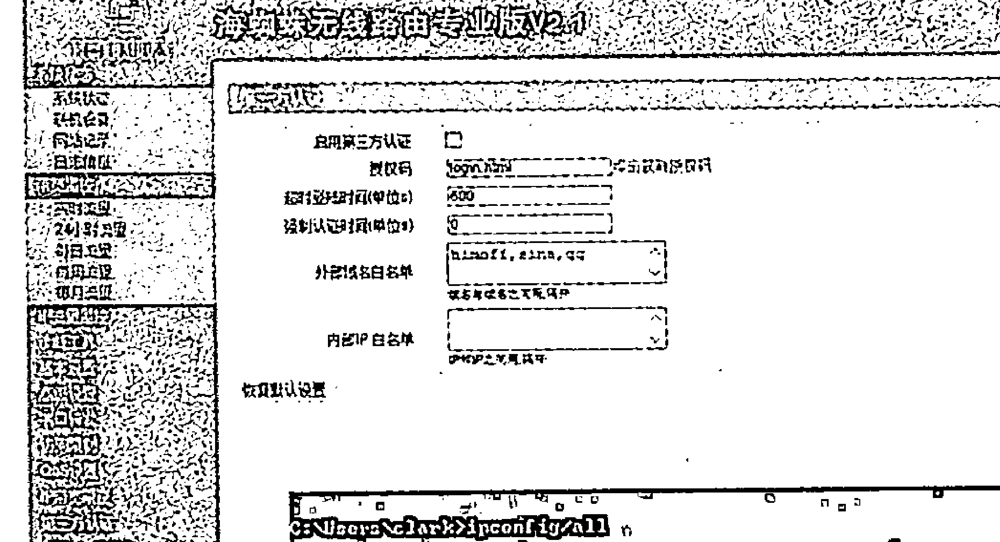

| MAC地址 | IP地址 | 主机名称 |
| --- | --- | --- |
| 00:18:F3:C2:C7:76 | 172.16.2.5 | dev.pd2 |
| 88:88:88:88:88:87 | 172.16.2.10 | testpc1 |
| 00:00:00:00:00:00 | 172.16.2.2 | |

###### 4. 用户登录和使用Wi-Fi

当用户通过手机Wi-Fi接入到本网络中时，会强制跳转到认证界面上（图4）。用户可以通过微信、手机号或微博号登录。当用户通过微信号登录时，会强制关注公共主页，店家可以通过后台给微信用户推送广告。而用户通过手机号登录时，系统会自动发送手机验证码并记录顾客的手机号，店家可以在后台群发短信。当用户用微博号登录时，系统会强制用户关注店家微博。而已认证的用户再次连入此网络时，就不用进行认证了，可以直接登录上网。

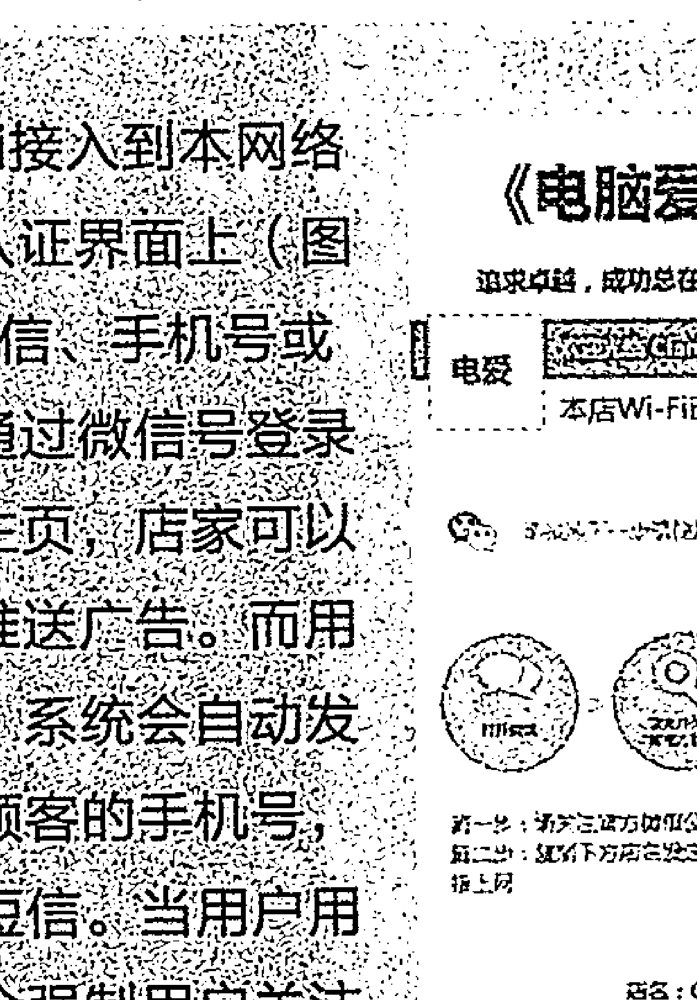

###### 3. 进行必要的设置

####### Step 1 设置静态DHCP

能直接通过有线接入的设备需要认证，而通过有线方式连入路由器的设备多为自己家的设备，这时候就不需要对有线接入的设备进行认证。这可以通过设置静态DHCP来解决。首先查看本机MAC地址及IP地址。点击桌面上的开始，在搜索中输入cmd，打开并输入ipconfig/all，找到“以太网适配器”，其中有一行为物理地址，后面的一串12位字符串就是有线网络的MAC地址了（图2）。找到“IPv4地址”，记录后面的IP地址（默认是192.168.1.XXX）。保证电脑连在路由器上，登录路由器，点击“基本设置→静态DHCP”，在MAC地址中填入本机MAC地址，在IP地址中填入刚刚记录的本机IP地址，而主机名称则可以不填（图3）。点击第三方认证，在“内部IP白名单”中填写本机IP并保存即可。


####### Step 2 设置QoS

在使用中，有很多用户会开下载或者看视频而占用过多的带宽，其他用户上网就变得很慢。所以要对上网用户做一定的带宽限制。首先查看IP地址的分配范围。登录路由器管理界面后，点击“基本设置→网络设置”，找到并记录IP地址分配范围（假设起始为192.168.1.100，结束为192.168.1.200）。点击“QoS设置”，勾选“启用设置”，输入IP地址范围（上述例子应填写192.168.1.100-200），下载速度及下载上限应填写小于总带宽的合理数值，二者的数值保持相同。上传速度及上传上限应如此，而在优先级中选择普通即可。

####### Step 3 隐藏路由器后台管理界面

用户在登录路由器后台时，很容易被恶意用户登录到路由器的后台，否则，路由器的一些设置很容易被篡改。点击“系统管理→访问设置”，将“允许无线访问”的钩去掉即可。经过修改后，只有通过网线连接路由器的电脑能够登录路由器后台，这在一定程度上保证了运营商路由的安全。

### 遥控下载 老路由的新玩法
文/于正青

所谓遥控下载，是指通过手机控制家中的网络下载设备的方式。我们使用手机时常常碰到想要的网络资源，但手机下载耗时耗力。其实可以通过手机把下载任务上传到家中的路由器中，让家中的路由器慢慢下载。待我们下班回到家时，下载完成的文件正安静地躺在U盘中。

##### 1. 刷机

**准备工作。** 设置电脑的IP地址为：192.168.1.100；子网掩码：255.255.255.0；网关：192.168.1.1。将网线与HG255d的任意Lan口相连接，保持路由器断电状态。

**刷写U-boot。** 先在浏览器中输入http://192.168.1.1/upload.html，一直按住路由器的Reset键，接通电源的瞬间不停刷新网页。大约10s左右就可进入刷写的界面。点击“浏览”，选择附件中的ralink.bin，点击Update Software。大约5min后刷写完成，建议大家10min后手动重启路由器。登录192.168.1.1，账号密码同为admin，点击“系统管理→系统指令”，在指令一栏中输入/hg255d/hg255d-flash-uboot.sh，点击“确定”，大约1~2s后，出现下面的界面时手动重启（图1）。重启后电源灯频闪说明基本上刷成功了。

**刷写固件。** 先保证路由器处于断电状态。在电脑上打开“dwfttp刷机工具”，固件文件中选择0831 hg255d.bin，点击“更新固件”。一直按住由上的wps/reset/wlan中的任意一键并接通电源，软件会强制更新路由器固件。当界面中的进度条完成后，固件便成功写入，此时路由器会自动重启。重启后把电脑的IP地址设置为自动获得。

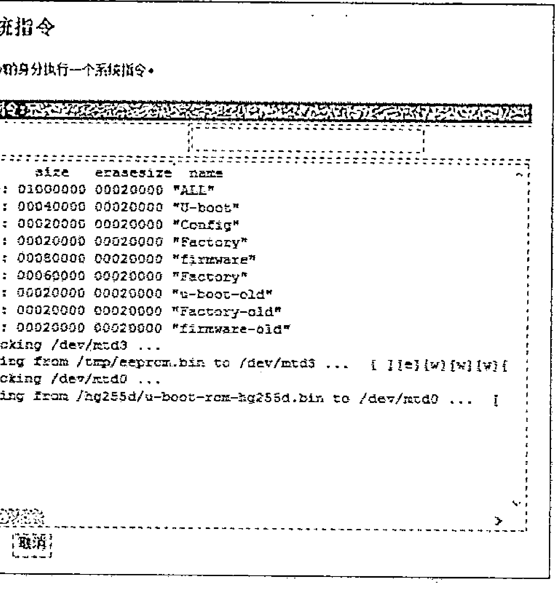

家中装光纤时电信赠送了一台华为HG255d路由器。网络到期后换用了联通网络，这台路由器便闲置了。通过努力，我将这台路由器打造成为了具备遥控下载的路由。这样可以通过手机流量随时随地下载互联网中的文件。

##### 2. 安装遥控下载

**配置网络。** 安装遥控下载需要保持网络畅通，否则无法分配到激活码。连接网线至路由器的Lan口，在浏览器中登录192.168.1.1，用户名为root，密码为admin。点击“网络→接口”，在这里根据自己的实际情况配置Wan口信息。点击“网络→无线”，在这里根据自己的需要配置无线网络。

###### Step 2

挂载U盘。准备一个U盘，将其格式化成NTFS的格式，将其插进路由器的USB端口，重启路由器。登录路由器管理界面后，点击“磁盘应用→挂载点”，会在已挂载的文件系统中看到挂在路由器上的U盘。

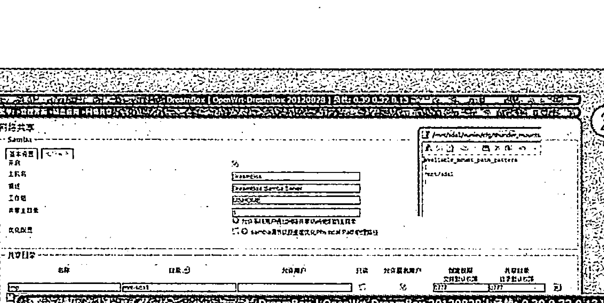

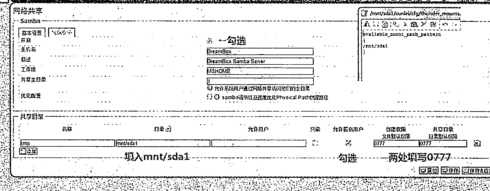

###### Step 3

安装迅雷文件。打开WinSCP，文件协议中选择SCP，主机名填写192.168.1.1，用户名root，密码admin，点击登录，第一次登录会出现一个对话框，点击“更新”即可。依次打开文件夹/mnt/sda1，在sda1下建立xunlei文件夹，把附件中的文件拷贝进去。并在xunlei→cfg文件夹里建立名为thunder_mounts.cfg的文件，打开该文件，写入以下代码（图2）:

```
available_mount_path_pattern
{
  /mnt/sda1
}
```

###### Step 4

激活迅雷远程下载。打开附件中的Putty，在Host name中写上路由器的管理地址: 192.168.1.1，点击Open，登录后输入/mnt/sda1/xunlei/portal。约1min后提示完成后，在浏览器中打开http://192.168.1.1:9000/getsysinfo，会获得这样一串代码:

```
[0, 1, 1, 0, "XYBJQ9", 1, "2.207.3.58", "", 0]
```

- 第一项: 0表示返回结果成功
- 第二项: 1表示检测网络正常，0表示检测网络异常
- 第四项: 1表示已绑定成功，0表示未绑定
- 第五项: 未绑定的情况下，为绑定的需要的激活码
- 第六项: 1表示磁盘挂载检测成功，0表示磁盘挂载检测失败

###### Step 5

设置共享。保证U盘插在路由器上。登录192.168.1.1，点击“磁盘应用→网络共享”，勾选“开启”，在目录一栏中填写/mnt/sda1，勾选“允许匿名用户”，建立权限和共享目录都填写0777，最后点击保存应用（图3）。回到桌面，打开桌面上的网上邻居，会看到一个名为DREAMBOX的服务器，若没有需打开“启用网络发现”，刷新后会出现。点击进入，会看到我们的U盘内存储的文件。迅雷下载的文件会存放在Download文件夹内。

附件下载: http://t.cn/8ktlsDw

##### 3. 在移动设备上访问文件

用户往往希望下载的媒体文件直接在移动设备上打开。到网络上下载并安装“EX文件浏览器”，用Wi-Fi将移动设备连接至路由器。打开“EX文件浏览器”，点击“局域网→新建”，在服务器中填写192.168.1.1，勾选“匿名”，最后点击“确定”（图4）。这时下载到路由器上的文件便呈现在眼前。若通过电脑访问文件，把电脑连接至路由器，在桌面上打开“网络邻居”，会见到一个名为DREAMBOX的服务器，打开它便找到下载的文件了。

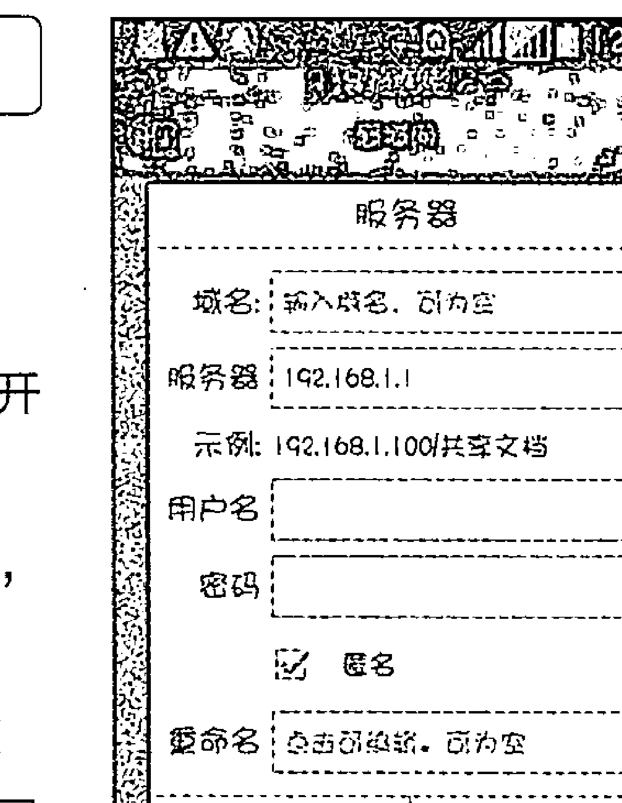## 影音随身

精彩随身
策划：《电脑爱好者》编辑部

春节将至，各地又将上演一番“轰轰烈烈”的人口迁移。在几十小时的归家途中，以及回家后与家人共度团圆的时光里，影音欣赏无疑是最能打发时间和娱乐互动的选择。那么，如何才能做到影音随身，并在不同的设备间体验不一样的震撼呢？让我们一起开始欢乐的旅程吧……


文|技术宅

### 移动影音随身定制

### 省电至上——聊聊手机视频那些事

网上下载的各种视频直接放在平板、手机上，难免会有些不适应。一方面由于视频编码的限制，有些网络视频在移动设备上无法播放。另一方面，即使支持播放，但由于网络视频尺寸和大小并非专为平板设计，可能无法在手机上满屏显示，而且文件过大会耗费设备大量的电能。因此要在回家的整个旅途中都能欣赏视频，我们就很有必要了解手机视频的那些事。

不同设备支持不同格式的视频，主要有两大类。第一类，兼容性的视频文件，典型代表：MP4和3GP。MP4（动态图像专家组英文缩写）对传输速率要求较低。3GP是一种3G流媒体的视频编码格式，实际上它是MP4的一种简化版本，对存储空间和频宽需求更低，不过相对来说质量较差、帧数低，比较适合小屏幕、非智能手机的使用。第一类的视频，绝大多数的移动设备都支持。第二类，专用设备格式，典型代表：MOV格式（iPod专用）、MP4-AVC（PSP专用）。一些专用设备如索尼PSP、微软Xbox、苹果iPod，为了保护产权，它们使用的播放器只能播放特定格式的视频。所以在搜集视频时，大家要先搞清楚自己的设备支持哪些格式的视频。

- 视频转换时选择原生支持格式和尺寸
- 支持选择解码播放的尽量选择硬解码

文|俞木发

##### 适合才是最好 平板上欣赏视频

网上的视频格式很多，不过大多是电脑使用的格式，很多格式的视频默认无法在平板、手机上直接播放。因此我们需要在平板上安装合适的播放软件，或者直接将视频转换为平板、手机支持的格式。

##### 1. 通吃常见视频 请选万能播放器

为了能够播放大多数格式的视频，在电脑上我们经常使用暴风影音、KMPlayer等万能播放器。同样在Android平台我们可以使用RockPlayer，它也是一款类似暴风影音的万能播放软件。

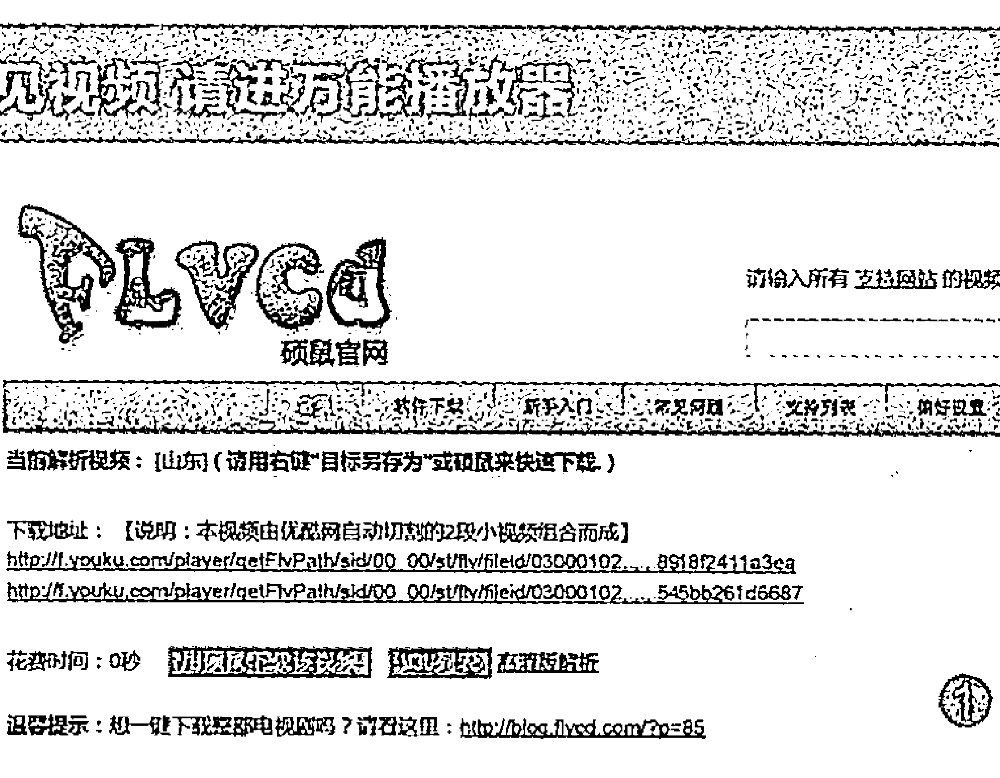

RockPlayer支持网络常见的FLV、RMVB、AVI、Divx视频，这样无需进行转码即可直接下载到平板、手机上播放。比如优酷、土豆、搜狐网站的视频都是FLV格式，在上述网站打开需要下载的视频页面并复制地址，接着打开 http://www.flvcd.com，将地址粘贴并进行解析即可下载需要的FLV视频（图1）。视频下载完毕将其复制到平板、手机SD卡上的Video目录，接着在手机上启动RockPlayer，点击“菜单→设置”，在打开的设置窗口勾选“只显示媒体文件”，点击“根目录”设置，将默认目录指向“SD卡\video”，这样打开RockPlayer后就可以直接读取下载到的视频文件了（图2）。返回程序界面，RockPlayer会自动扫描上述目录里的视频，由于我们设置了只显示媒体文件，因此“SD卡\video”下所有支持的视频文件都可以显示出来，选中视频长按即可直接进行播放（图3）。

- 直接下载所需的视频

##### 省电播放就要这样做

从上面的介绍可知，不同的设备支持不同格式的视频，虽然对于智能机可以通过应用的扩展来支持更多的格式，但是为了有最好的播放效果和节省电源，我们可以尝试以下方法。

##### 1. 视频转换为设备原生支持格式

移动设备都有默认支持的视频格式，并且在播放视频时大多可实现屏幕智能适配。对于不支持的格式则要调用第三方解码器，不适合的尺寸要额外进行缩放，这样不仅耗费存储空间，而且会给系统电源带来额外的损耗。现在很多软件都支持视频转码，比如利用优酷客户端下载视频后，只要在转码设置窗口根据自己设备的实际状况进行转码即可（图1）。

##### 2. 尽量使用硬解码方式播放

现在移动设备的显卡性能都较为强劲，软解码会耗费CPU资源，因此对于支持硬解码的视频播放软件，尽量选择使用硬解码方式进行播放（图2）。

##### 2. 手机播放网络视频转码处理

虽然RockPlayer支持大多数格式的视频，但很多视频原本是为电脑显示器设计的，分辨率较大，体积也较为庞大，这些视频并不适合直接复制到手机上播放。我们可以借助“格式工厂”将其转换为自己手机播放的视频。首先登录http://tinyurl.com/77w2ckq下载格式工厂，在电脑启动程序后点击“移动设备”，在打开的窗口根据自己设备的实际尺寸和类型选择转换输出格式即可，有经验的用户还可在右侧窗格对默认参数进行修改（图5）。

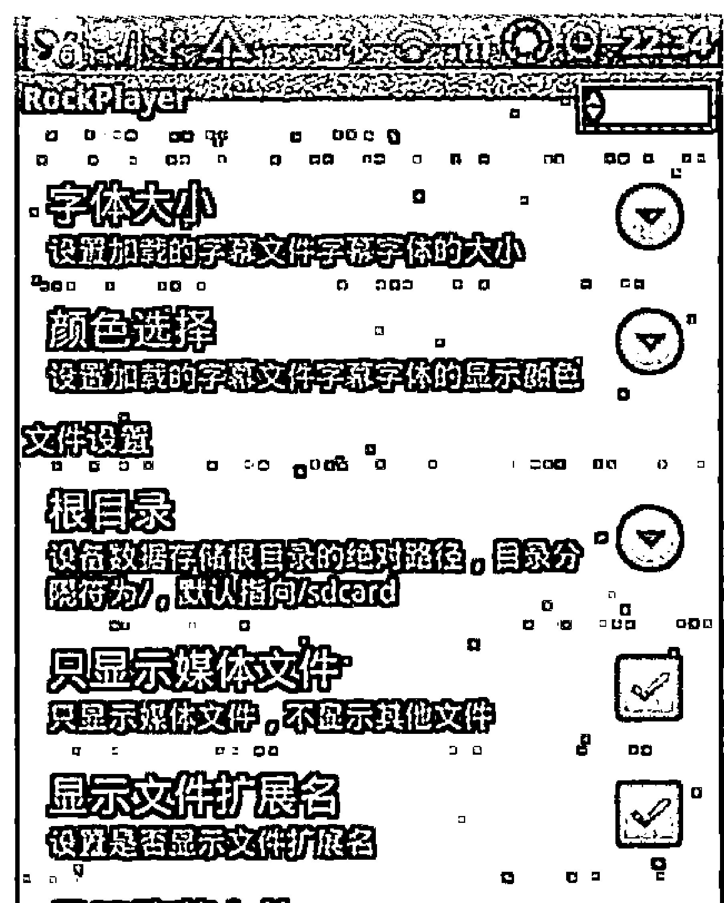

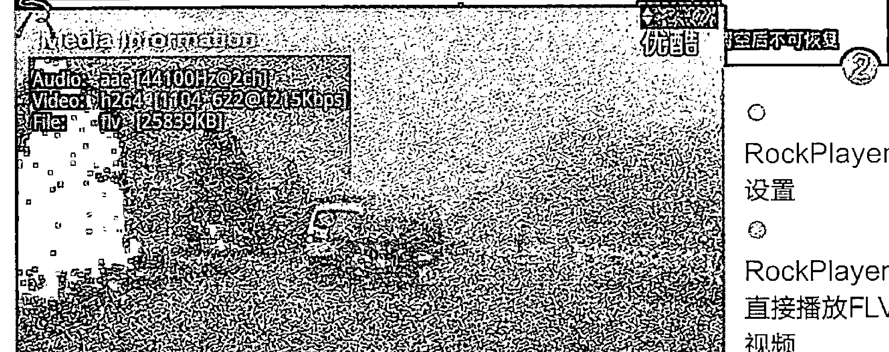

RockPlayer设置
RockPlayer直接播放FLV视频

> 在手机、平板安装多款播放软件，经常会导致默认视频播放关联到最后安装的应用上。如果要重新定义默认程序，可点击“设置→应用程序”，切换到“全部”，在程序列表中选中已被设置为默认的应用程序，打开后在下拉的选项点击“清除默认设置”，取消其选择即可重新定义文件打开方式了（图4）。

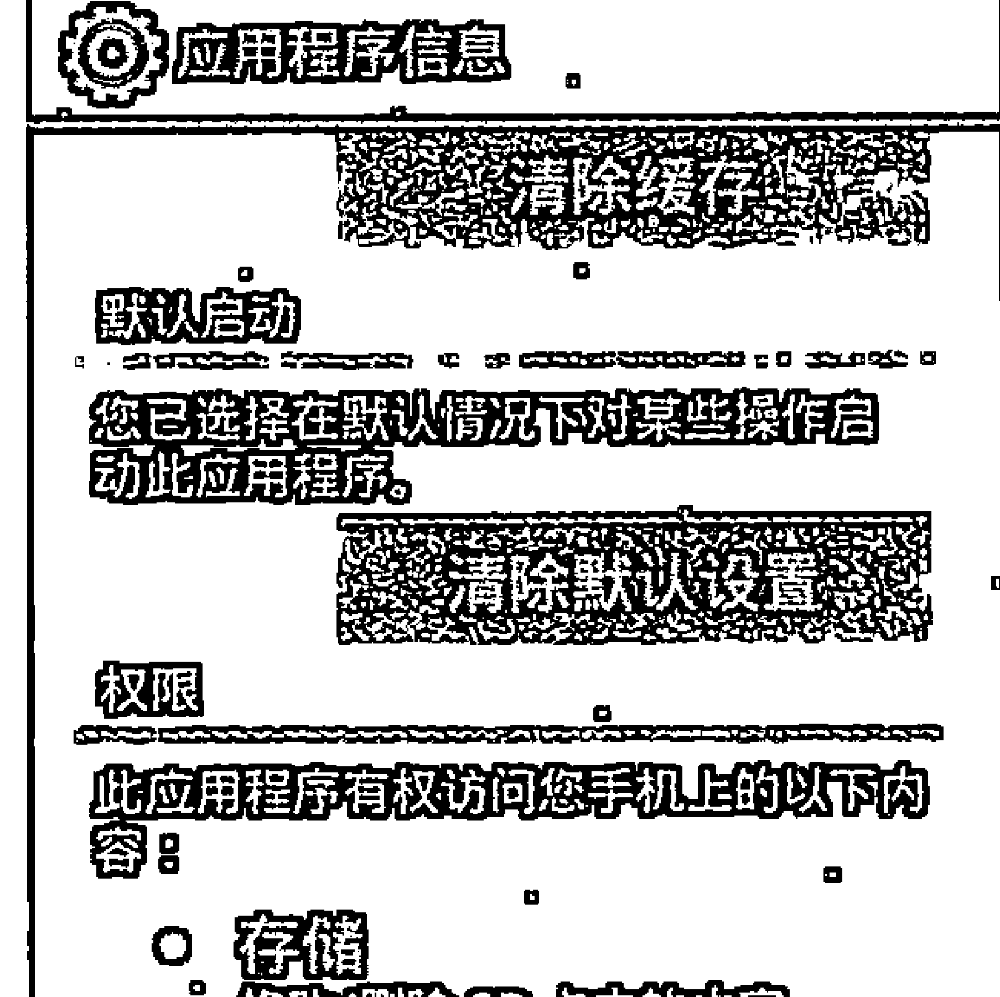

清默认设置

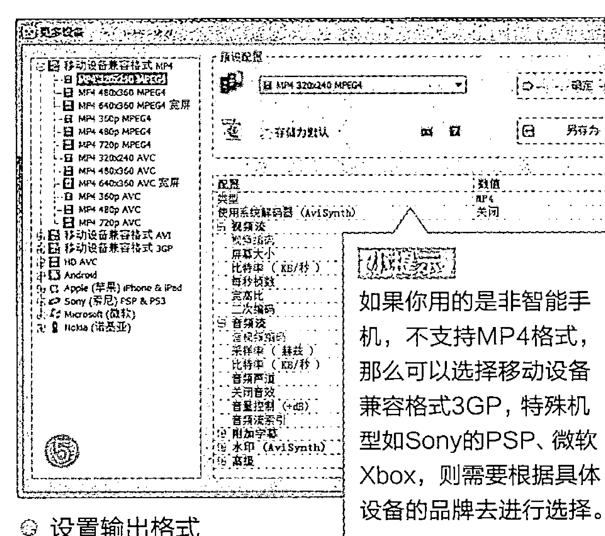

设置输出格式

完成上述的设置后点击“确定”退出，接着在打开的窗口点击“添加文件”，按提示将下载好的视频导入到转换列表（这里可以看到转换前视频的源尺寸、大小，已经合适的无需再转换），点击“确定”（图6）。返回程序主界面点击“开始转换”，格式工厂就开始将导入的视频转换为你需要的格式了，完成转换后，可以看到对于320×240的手机，转码后体积只有源文件的一半大小，既节约手机存储空间，又可以用最合适的尺寸在手机上展现视频（图7）。最后将转换好的视频复制到手机或平板上就可以了。

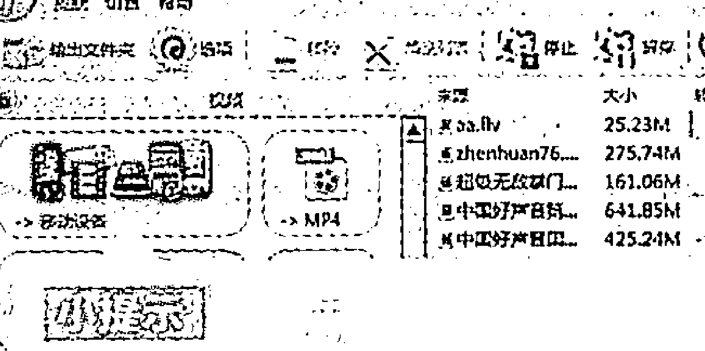

> 视频重新编码要耗费大量系统资源，对电脑硬件要求较高。如果转换的视频较大，或编码复杂，可借助GPU协助加快转换速度。N卡用户可使用Badaboom（下载地址：http://www.dwz.cn/cfan2014a），A卡用户则可使用Avivo（下载地址：http://www.dwz.cn/cfan2014b）。

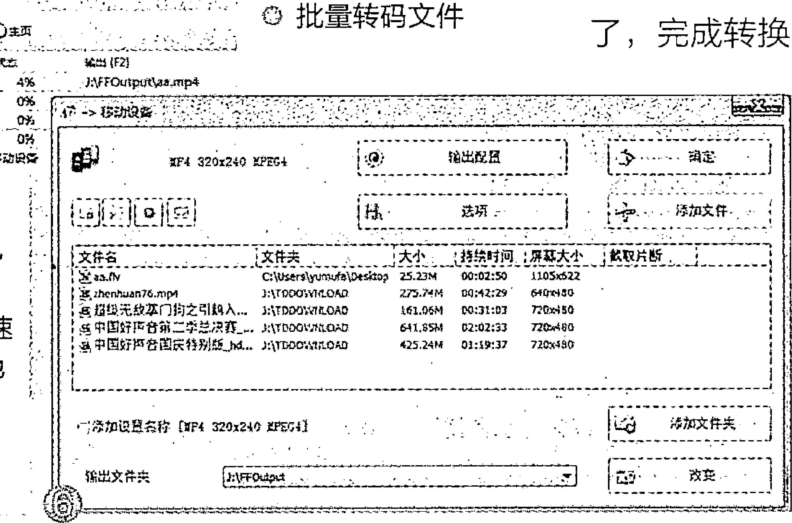

批量转码文件

添加转码文件

##### 3.一步示远 云端转码遥控器

平板播放的视频大多是从网上下载的，格式工厂只能对本地视频进行转码。如果你觉得本地转换麻烦，还可以利用迅雷提供的“云端转码”服务。只要是迅雷会员用户，在迅雷里开启离线下载后，在下载列表右击离线下载好的视频，选择“转码”进行云端转码即可（图8）。

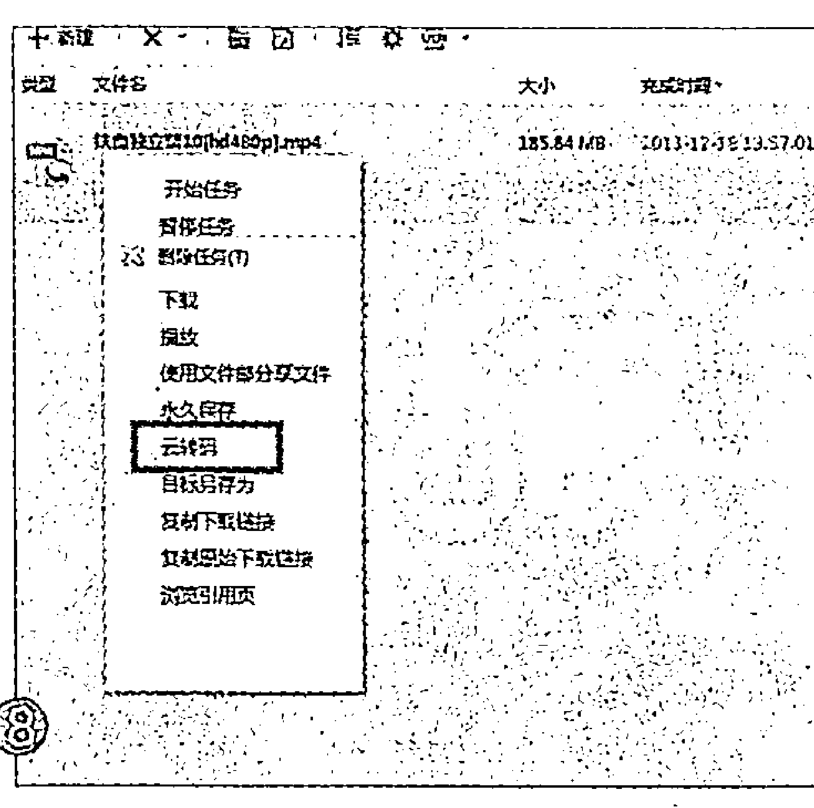

不过目前迅雷只支持640×480和320×240两种大小分辨率，格式均为标准的MP4，能被大多数的移动设备识别并播放。如果你的设备无法支持MP4视频，就只能通过本地转码为其他格式了。

### 视听随意 视频播放随心所欲

> 在交通工具上欣赏视频总是没有躺在家里的沙发上舒服，比如火车上，所以我们要在视频上加上字幕，免得没有听清台词。另外，看的时间长了，眼睛需要休息一下，对于以听为主的节目（如音乐会），可以关闭屏幕，只用耳朵欣赏，还省电。

##### 1.自己添加电影字幕

如果下载的电影没有字幕，我们可以借助Subtitle Joiner自行为影片添加字幕。首先在电脑上登录http://tinyurl.com/o57h4fc下载软件，再登录射手网（http://www.shooter.cn）搜索到字幕文件，将下载到的字幕文件解压到桌面备用。在电脑上启动Subtitle Joiner，点击“Video”按钮，选择需要添加字幕的视频，点击“Subtitle”选择对应的字幕文件，最后点击“ADD”，Subtitle Joiner会自动将指定的字幕文件添加到视频文件中（图1）。

除了自行添加字幕文件外，很多播放器如上述介绍的RockPlayer可外挂字幕文件，首先下载到的字幕文件改为和影片名称一样（影片名.srt），将其和影片放置在同一个目录下。启动RockPlayer，点击“菜单→设置”，勾选字幕设置下的“显示字幕”，这样播放影片时就会自动挂载指定的字幕了（图2）。

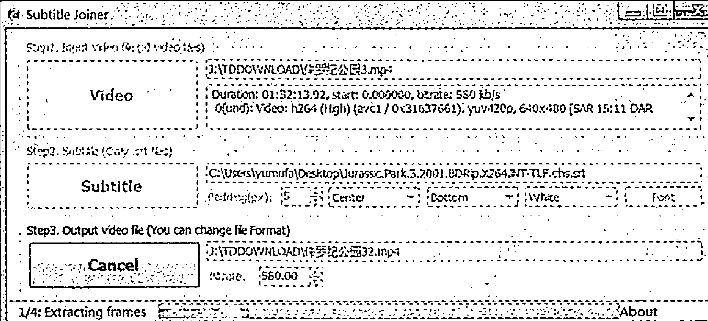

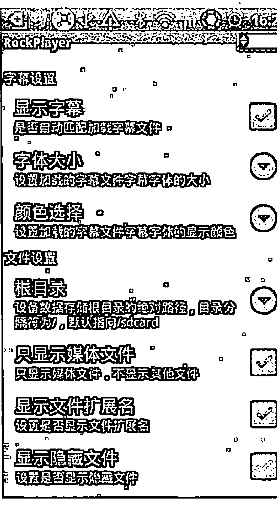

##### 2分钟音频

有些节目只需听不需看，比如音乐MTV视频。为了省电、省空间，可以将其中的音频分离出来，在移动设备上就可以闭目聆听了。

音乐视频文件大多是MKV文件，可以从网上搜集。以酷我为例，启动酷我后搜索自己喜欢的歌曲并选择MV格式播放，按照屏幕提示完成全部文件的缓冲。此时酷我会将所有的MV文件保存在程序临时目录中。按提示打开“C:\Program Files\kuwo\KWMUSIC\bin\temp\Kmusic”，可以看到其下有很多以数字命名的“.mkv”文件，这些就是酷我保存的MV文件了（图3）。

按提示将上述文件提取到其他目录，MKV文件可以使用KMPlayer直接播放，成功播放后根据屏幕显示的歌曲名称，将文件名改为具体的歌名，然后将改名后的MKV文件全部复制到桌面备用（图4）。

登录http://www.dwz.cn/cfan2014d下载MKVToolNix，启动程序后点击“添加”，然后将下载到的MKV文件导入。成功导入文件后，程序会自动分析文件格式，可以看到MKV文件一般是由三个子文件组合而成的（图5）。

```
http://www.dwz.cn/cfan2014d
```

MKV中的三个文件其实对应的是MTV中的视频画面、伴唱文件和原唱文件，我们只要提取ID1的音乐即可，勾选A_AAC（ID1）文件，输出文件名设置为a.akv，点击“开始混流”，这样即可提取其中的原唱音频文件了（图6）。

MKVToolNix同样支持FLV、RMVB等常见视频格式音轨的提取，不过最终输出的音频格式只能是.mkv、.mka这些MKVToolNix支持的文件格式。提取到的.mkv可以直接复制到平板上使用RockPlayer播放，或者使用“超级转换秀”将其转换为MP3格式，以后就可以直接在平板上“听”视频了。

> 除了提取音轨，MKVToolNix还支持对视频原来的字幕进行编辑，比如可以将原来的英文字幕替换为简体中文，更方便我们在平板上观看。


### 扩展无极限 为移动设备无线扩容

平板、手机的存储一般只有8GB、16GB的容量，但是现在视频文件的体积却又较为庞大，即使是32GB的SD卡也复制不了多少的视频，怎么扩展移动设备的存储？

##### 3. 笔记本提取 直接录制视频音轨
MKVToolNix虽然可以轻松提取视频中的音轨文件，不过其支持的视频格式有限，如果要提取不支持的视频中的音轨，可以使用音频录制软件，直接录制其中的音频。

首先到http://tinyurl.com/mtw4dzu下载“克克录音”软件，右击任务托盘的喇叭图标选择“录音设备”，在打开的窗口选择“立体声混音”，右击选中将其设置为默认设备（图7）。

因为我们使用播放软件播放视频时，音轨播放就是“立体声混音”，因此通过上述设置即可录制其中的音频数据。以管理员的身份启动“克克录音”软件（一定要以管理员身份启动，否则无法保存录音文件），频率选择“44100Hz”，位数选择“16位”。使用暴风影音等播放要提取音轨的视频文件，开始播放时点击“克克录音”界面的“录音”按钮开始录音（图8）。完成视频的播放后，返回克克录音点击“停止”，然后单击“保存为MP3”，将其保存为MP3音乐，再复制到移动设备上就可以啦。

##### 1. 无限扩展 无线硬盘来相助

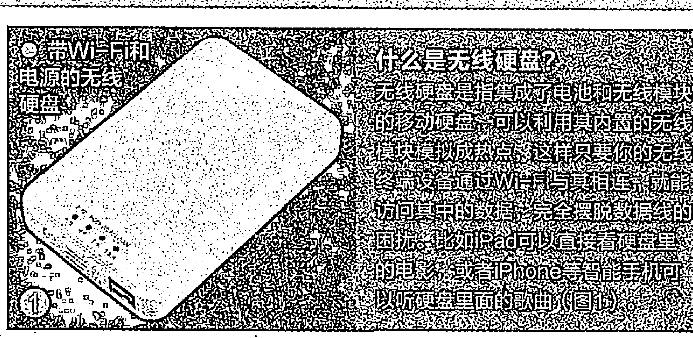

现在通过手机即可直接访问无线硬盘里的内容了。如打开视频文件夹，选择其中的视频直接进行播放即可。由于手机和无线硬盘PB726是使用无线连接，我们可以将无线硬盘放置在随身包里，而且它的容量高达1TB，这样即使再多的视频也放得下。这样通过无线硬盘就轻松扩展了手机的存储容量。

相对内置SD卡来说，硬盘的容量要大得多。由于现在移动设备大多支持Wi-Fi连接，这样我们借助无线硬盘就可快速扩容移动设备的存储空间。

如上所述，移动设备无线移动硬盘是通过Wi-Fi连接实现扩展的，这里以爱国者推出的多功能无线硬盘PB726为例，通过Android手机访问其中的视频资源。

首先将无线硬盘使用USB数据线和电脑连接，然后将需要在平板、手机上播放的视频全部复制到移动硬盘上备用。启动爱国者无线硬盘电源，此时无线硬盘会自动发射Wi-Fi信号。在手机上登录爱国者官网下载“aigo WiFi Disk”客户端，然后在手机上进行Wi-Fi扫描，此时会找到一个名为“aigo”的热点，连接密码为11111111（热点名称和密码均在无线硬盘的背面），按提示连接到这个热点上（图2）。手机成功连接到无线硬盘的热点后启动爱国者客户端，切换到“我的无线盘”，

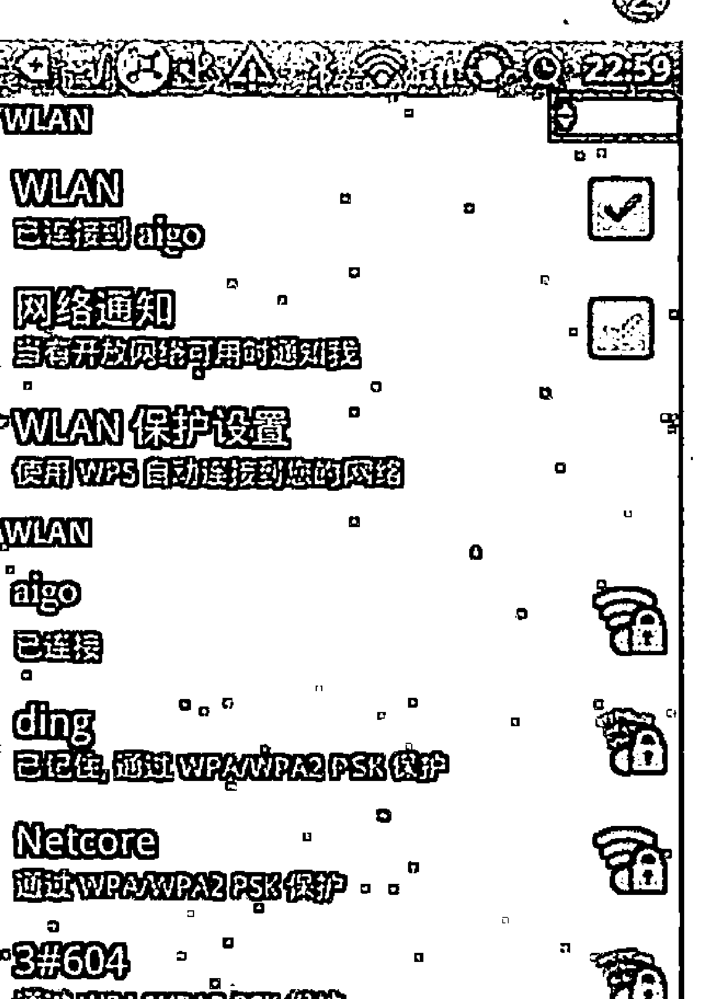


小贴士 爱国者PB726内置3000mAh蓄电池还可作移动电源使用，在关机状态下，用数据线将手机连接到无线硬盘上即可进行充电。

设置录音的默认设备

##### 2. 随时看iPad连接电脑硬盘播放视频

无线硬盘扩展虽然方便，不过目前无线硬盘的售价仍然比较昂贵，一般用户仍然无法配备。如果你在旅途中携带笔记本电脑，同样可以将笔记本硬盘空间扩展给iPad，直接在iPad上播放电脑里的视频文件。

首先在笔记本电脑上下载好视频文件备用，接着展开“控制面板→网络和Internet→网络和共享中心高级共享设置”，将密码保护共享设置为“关闭密码保护共享”，以方便iPad的访问（图3）。接着打开资源管理器，选中本地硬盘保存下载影片的目录，右击选择“属性→共享”，接着单击“共享”，在打开的窗口输入共享的用户“Everyone”，同时设置其权限为“读取”。这样在iPad上就可以共享读取这些文件了（图4）。

完成上述设置，将笔记本无线网卡模拟为热点。返回到iPad设备上，到http://mirrors.xbmc.org/apt/ios/下载“XMBC”并安装。接着在iPad上启动Wi-Fi连接，按提示连接到笔记本上虚拟的热点，使得笔记本和iPad处在同一个Wi-Fi网络中。

在iPad上启动XMBC，依次展开“System→appearance→Skin→Font”，选择“Arial based”。继续展开“International→Chinese (simple)”，“Character Set→Chinese Simplified GBK”，切换到中文简体界面。在程序界面选择“视频→文件→添加Windows网络（SMB）”，添加本地PC到SMB服务器中（图5）。

接着在打开的窗口选择上述添加的SMB服务器（即局域网电脑），按提示输入连接的用户名和密码（即笔记本上的登录账户和密码），成功连接后就可以看到设置的共享目录了。在iPad上打开共享目录，然后选择需要播放的影片，接下来就可以在iPad直接观看电脑硬盘上的电影了。

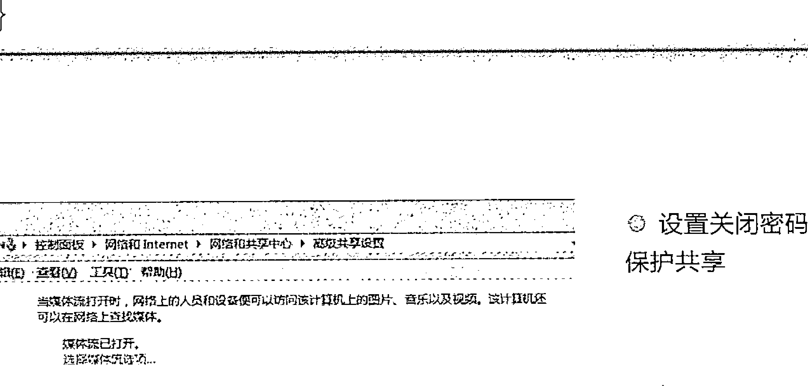

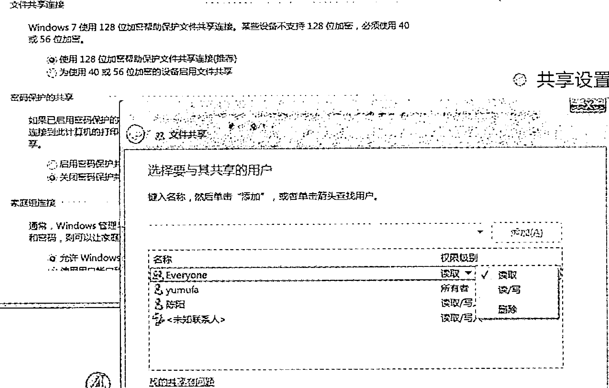

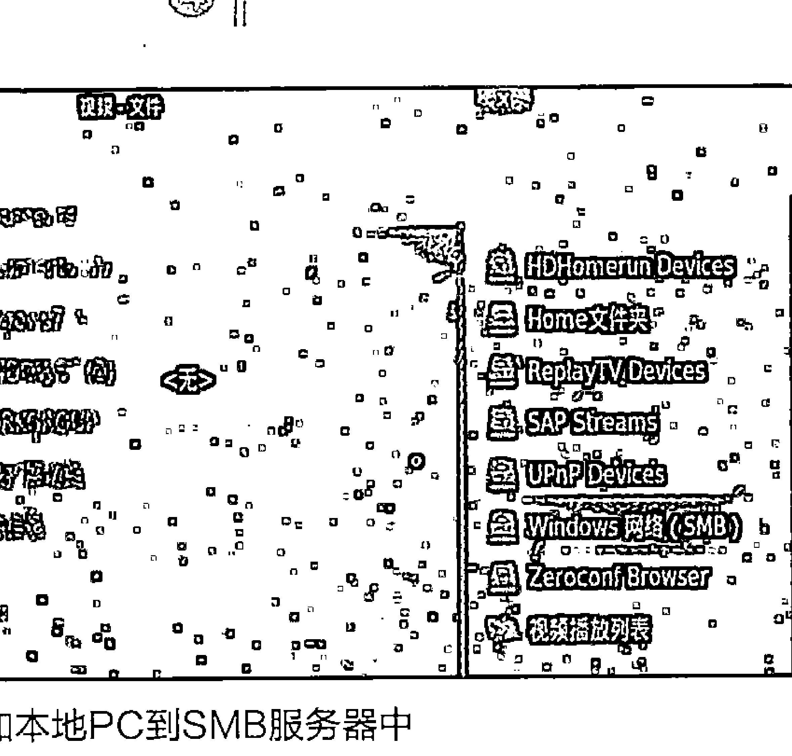

> 小提示：为了保证笔记本的续航，可以进入电源设置，然后将合上笔记本盖子时的状态设置为“不执行任何操作”（默认为待机），这样，只要开启笔记本的电源，然后合上笔记本放置在旅行包里即可。

##### 3. Android平板直通电脑播放视频

对于Android平板用户，可到http://www.sjapk.com/439.html下载Remote Desktop。在Android平板上安装后，只要Windows开启远程桌面连接，就可以在平板上通过远程桌面连接到电脑。成功连接后就可以看到电脑桌面，现在我们在Android平板上就可以直接操作电脑了，比如可以直接打开保存影片的目录进行播放（图6）。

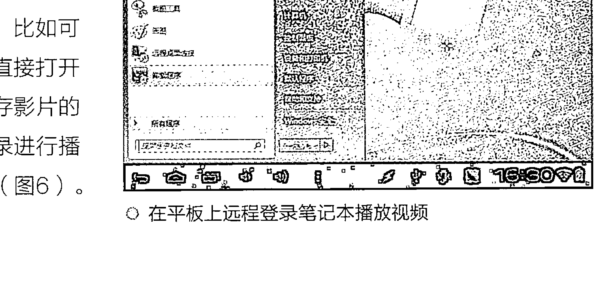


有了超低功耗的下载平台，接下来就该充分挖掘它的潜质，快速高效地搜索片源、不间断下载、看爽大片了。如何做到大片“搜、下、看”的“多、快、好、省”？这其中有不少学问呢。

> 搜片有学问 得法走捷径
看视频节目，无论是通过网络或客户端在线观看，还是下载到本地观看，找片源是第一道关口。当我们的目标明确，需要某部片子时，第一个任务便是上网搜索。对于不少人来说，他们往往固定去一些站点或通过一两个客户端来直接找到自己需要的影片。但是，不是说我们熟悉的站点或客户端要舍弃，有时候，当我们需要的片子无法在这些地方找到时，就需要另想办法了。这里，就需要掌握一些搜片的方法和技巧，以便快速找到自己需要的影片。

##### 1. 海搜通吃但不精准的搜索

这里所说的“海搜”是一种形象的说法，类似于到大海里去搜索一种东西那样。具体来说就是直接用通用搜索引擎来搜索视频节目。

例如，我们要搜索《咱们结婚吧》这部连续剧，通过Google搜索引擎搜索的结果，可能是将我们引导到一个视频播放网站，也可能是将我们引导到一个视频下载论坛，还可能引导到一个电视剧评论的网站或电视剧节目预告的网站（图1）。如果搜索到的结果是某影视论坛，虽然可以通过其中共享的种子下载到我们需要的视频，但因一般的论坛都需要先注册用户，登录之后才可能下载，而不少论坛还需要回帖甚至有积分才能下载，这显然提高了下载的门槛，也给用户带来诸多不便（图2）。
如果我们进入的是影视评论网站或节目预告类网站的链接，那么我们欣赏或下载的企图肯定不能实现，因而在某种程度上也浪费了搜索时间。因此，对于许多人都在用的“海搜”，我是不推荐的。

- 海搜的结果带有诸多不确定的因素
- 论坛下载有注册、登录、积分等门槛

> 小提示
虽然“海搜”不是视频搜索的最好选择，但是，由于目前一些网站顺应需求和趋势，在搜索引擎开发过程中专门针对视频搜索结果做了优化和二次开发，使搜索结果更加接近于人们的普遍需求，这样一来，一次搜索的成功率就大大提高了（图3~图5）。但这并不意味着就可以顺利看片了，具体的问题和其中的讲究请看后文继续讲述。

- 必应直接搜索的结果
- 搜狗直接搜索的结果
- 百度直接搜索的结果

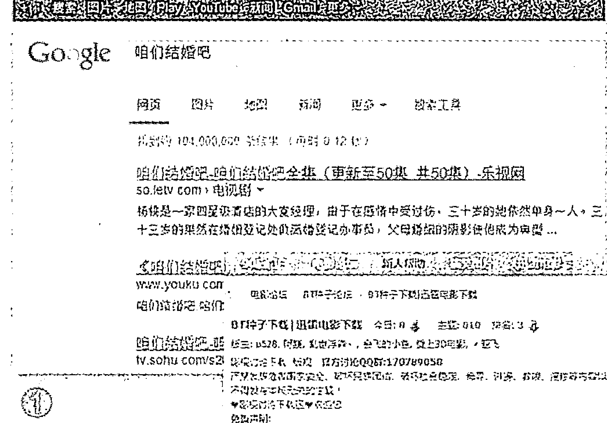

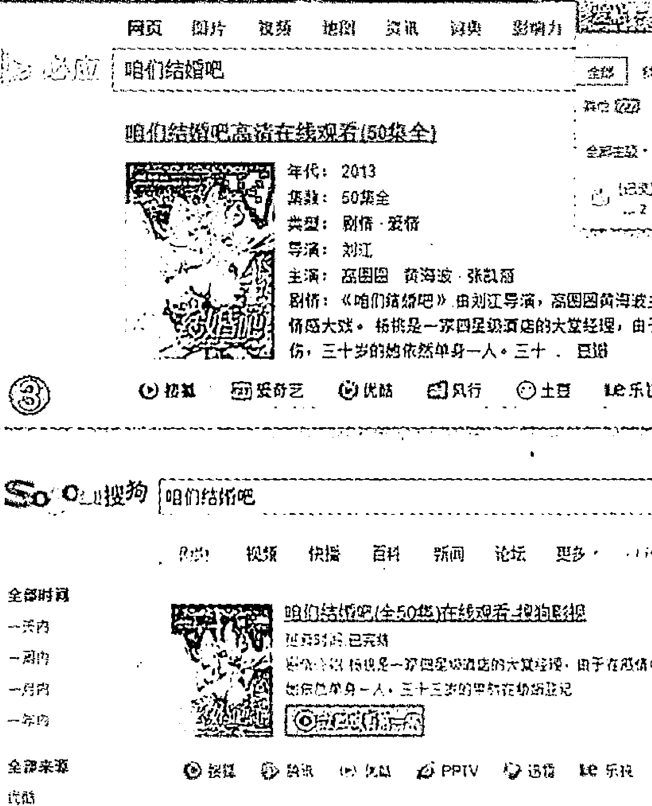

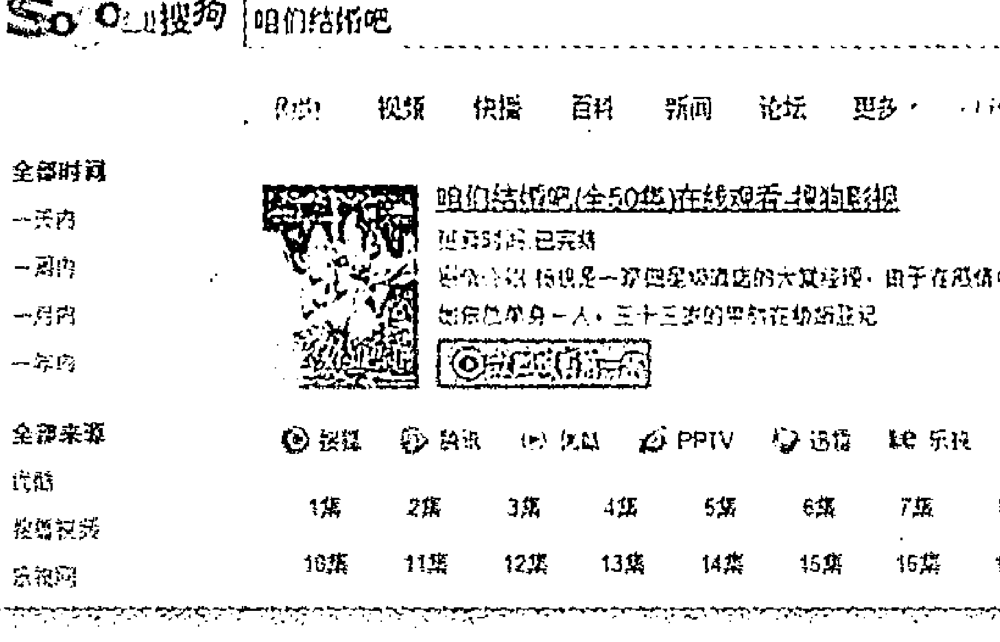


##### 2. 要明白所有局限性

前些年网络在线视频不够发达，论坛共享视频曾一度火爆，从论坛下载视频也是人们获取视频的主要渠道。而最近几年，随着视频网站和视频客户端技术与市场的成熟，人们获取视频的渠道有了新的选择，而从在线视频网站或视频客户端获取视频，要比从论坛获取方便得多。因此，目前选择视频网站或用视频客户端来搜片的用户有增无减。


> 小提示
有的在线视频网站的在线播放需要安装客户端或安装插件才能播放，而多数Web版视频网站不提供直接下载，只有安装了视频客户端或APP才能下载视频（图6）。所以若需要下载需要先做好准备工作。

- 下载视频需先安装客户端

每个在线视频网站及其客户端都有其自身的特点，它们会根据自身业务特点侧重于某个范围的影片提供，比如乐视提供的版权电视剧较多，而爱奇艺则提供更多自创的电视娱乐节目等。因此，建议影片搜索最好用专业视频网站自带的搜索引擎和专用客户端自带的搜索功能。对于使用智能手机的用户，更建议用专用客户端APP而不是用通用浏览器来搜索，以免引起不必要的流量浪费。

《电脑爱好者》·2014上半年合订本

特别话题

文|樱子

### 大片要看爽 下载数第一

##### 3. 收藏片源才能走出雷区

直接用专业视频网站或客户端进行搜索，虽然比较精准和快速，但由于每家视频公司所拥有资源的局限性，所以许多时候单靠一个视频网站或客户端无法满足我们无限扩张的需求。因此需要寻求更加全面可行的解决办法。

根据笔者的经验，搜片一般采用综合搜索与专业播放下载客户端相结合的办法。具体操作方法是，先用百度、必应、搜狗等带有二级视频搜索推荐技术的通用搜索引擎搜出在哪些视频专业网站或客户端中有片源提供，然后再针对性地选择用哪个视频客户端来观看或下载影片。

这样就又出现了一个抉择的问题。不同于上面所说的找不到片源的情况，这次是另一个极端——片源在不同的客户端都有提供，我们到底该用哪个来观看或下载？随便选择一个可以吗？当然可以，但效果大不同。因为影片版权、质量等有差别，所以我们选择的客户端可能有的只能播放不能下载，有的画面清晰而有的画面粗糙。在这种情况下，就需要我们了解目前常见的几家视频网站和客户端的具体特点，只有做到心中有数才能作出合理选择。

###### 小提示

目前比较成熟的整合性视频搜索引擎是百度搜索引擎中的“百度视频”。整合性的视频客户端如360影视，它几乎囊括了各家视频资源的搜索结果，而且有手机等移动平台的版本可供移动设备使用。此外，必应、搜狗、360等通用搜索引擎也已经在视频搜索结果二次推荐方面发力。而视频客户端软件方面，爱奇艺视频以高清正版资源和自创娱乐节目见长，PPTV聚力网络电视，优酷客户端等以用户参与广泛和节目面广而见长，腾讯视频、搜狐影音以某些独家版权大片而吸引人们的关注，百度影音、360影音以整合各家资源的在线播放和原生的搜索优势而表现突出，乐视网络电视以正版电视剧资源海量而闻名。用户只有将这些网站或客户端的特点了解清楚，才能在具体搜索中做出明确的选择。

##### 1. 在线播放有局限 下载依然有必要

用网页或视频客户端直接在线播放视频，对网络带宽有要求。如果网速较慢或和别人共享带宽不够宽裕的网络，那么这种方式会影响我们的体验心情或他人的上网体验。因此，在条件允许的情况下，下载后再欣赏不失为一种最保险的方法。网页播放一般即便有“下载”按钮提供（图1），也需要在安装了对应的客户端后，才能真正实现多任务连续下载（图2）。因此如果常看视频的用户，不如开始就装个合适的视频客户端，能看能下，何乐而不为呢。下载不但要因人而异，因环境而异，还要讲究方法。因为不同的方法会有不同效率，有的方法之间，效果更是有天壤之别。

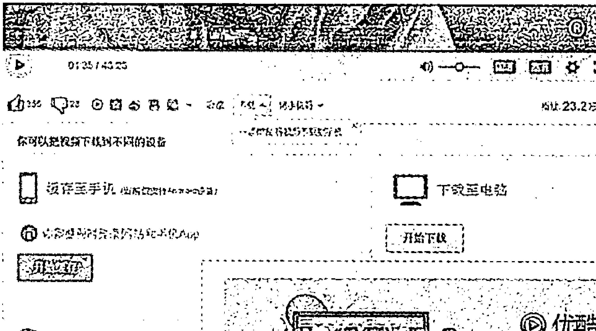

- 先下载再播放是流畅和连续播放的保障

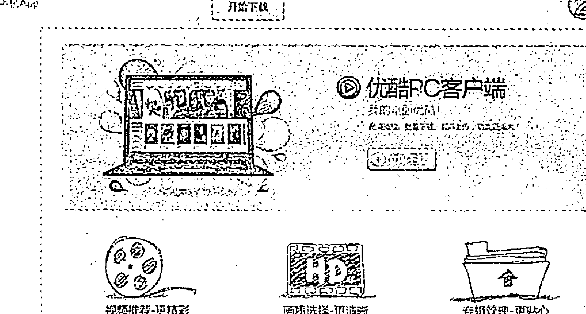

CFanBoundEdition·2014 35

##### 2. 潜用模式下载利用论坛资源

限于各种条件，目前通过影视论坛下载视频仍然是不少人的选择。这其中除了习惯之外，还有一些资源方面的问题，大众网络难以找到的一些稀缺资源，一般在某些论坛当中往往能够找到。论坛下载，一般都是以种子的形式提供的，通过下载而直接获得的是资源的种子，如BT种子、磁力链接、迅雷链接等。

使用传统的种子下载法，往往要借助于一种下载软件，最常见的是迅雷。但是，迅雷对高速下载做了限制，如果不花钱注册会员，那么只能以相对较低的速度下载到本地。只有当注册成为会员，获得了服务器离线空间之后，才能借助于服务器的离线下载服务和离线空间，实现资源的快速本地下载或在线收看。

最近的一年来，情况发生了巨大变化，我们可以借助于免费云盘提供的海量TB空间以及云盘在线视频观看功能，实现视频的远程离线云下载、云播放，从而大大提高下载的效率。

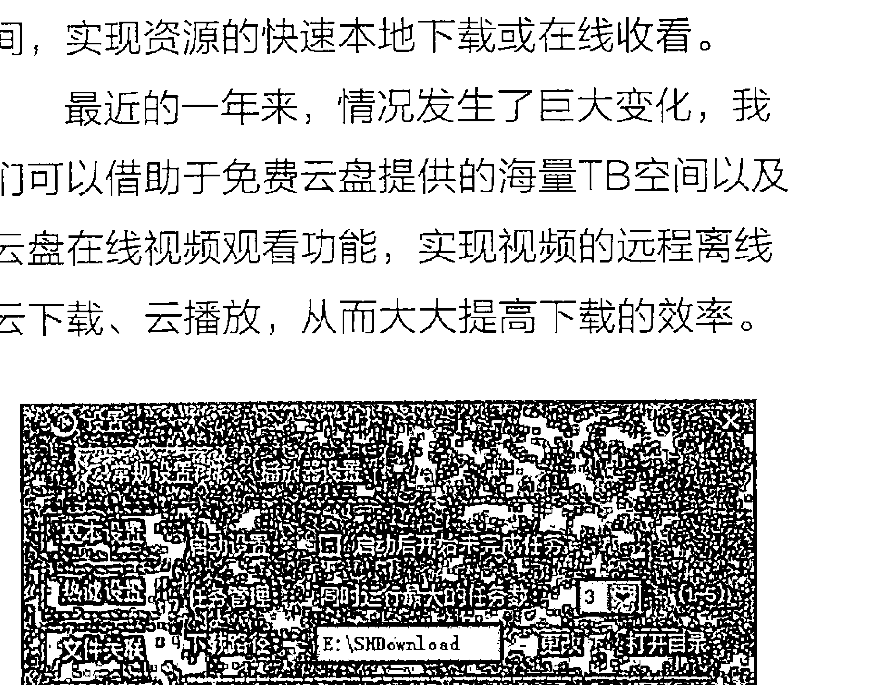

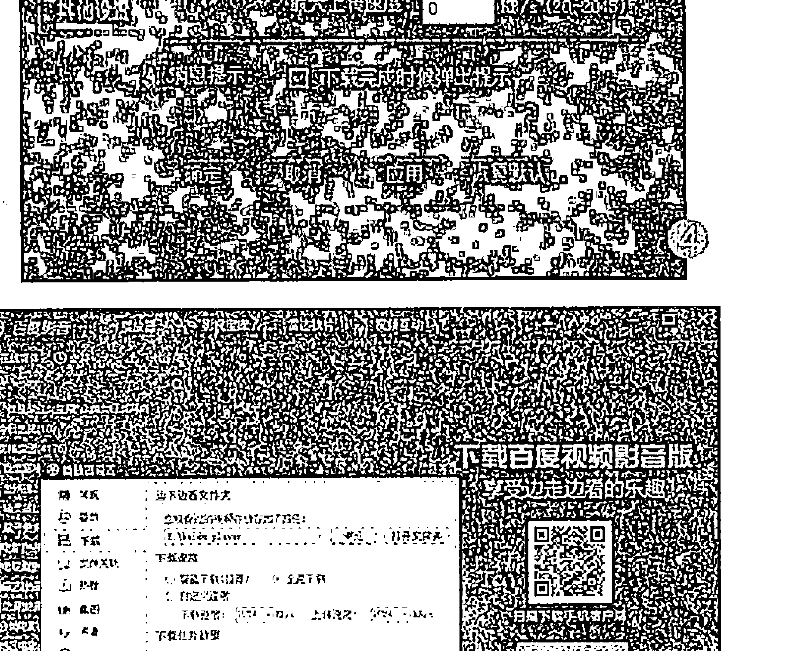

> 小技巧

一般来说，刚刚申请后的云盘账户所拥有的空间还相对有限，比如只有2GB或5GB，这点空间存不了几个视频文件。而需要我们做一些工作才能让免费空间增加到TB级别。例如，安装PC客户端并用同一账号登录，安装Android或iOS客户端并用统一账号登录。通过简单操作，360云盘免费空间可以增加到30TB~40TB甚至更多，而百度云也可以增加到1TB以上免费空间（图3）。


##### 3. 客户端影音下载播放悠然

如果拿定主意要先下载再观看，那么建议直接下载安装视频客户端。比如搜狐影音、爱奇艺影音、优酷客户端、乐视网络电视、PPTV聚力网络电视等客户端均提供成批下载功能。但要注意，这些客户端在下载和播放方面都有自己的特点和讲究，如果不了解这些，可能会在使用中会遇到麻烦。

爱奇艺影音下载的视频格式默认为QSV专用格式，拷贝到别的电脑或播放器下无法播放，可上网搜索专用格式转换工具，获得FLV格式的通用视频文件。

优酷、腾讯视频、PPTV聚力网络电视、乐视网络电视等客户端，目前在下载视频上支持直接下载为通用播放格式（如MP4、FLV等），采用这几种播放器下载，在文件格式方面会少一些麻烦。此外，特别值得一提的是，优酷客户端的下载器还同时提供转码功能，可设置在下载过程中顺便转码。

百度影音则是聚合式的播放器，虽然不提供直接的下载按钮，但可以缓存方式进行播放，当播放一个连续剧的第一集时，后面的若干集已经在缓冲区下载好了（图5）。这样，即便是断网也能在本地播放。

> 小提示：360云盘、迅雷等也均以各自的方式搭建有自己的云盘资料社区，虽然名称叫法各有不同，但其所包含的思想都是一致的。概括起来就是个人云空间对个人云空间的资料共享。如果大家感兴趣，可以安装任何一款主流云盘，然后进入其相应的资料共享社区，去挖掘其中的宝藏。

##### 4. 云盘社区下载 最高效的下载法

最后不得不提的一种下载方法是目前效率最高的云盘社区下载法，需要有大容量云盘空间做配合。
我以百度云盘为例。先登录自己的百度云盘账号，点击“主页”按钮，然后点击左侧的“达人推荐”，就会看到各类达人共享出的云盘资源，选择资源类别为“电影”或“连续剧”等，再点击某达人后的“立即关注”，即可关注此人共享的资料，直接点击资料链接即可将资料一键收藏到自己的云盘中。用这种方法下载资源，因为是在同一个服务器或同一个服务器群组中进行，真正实现秒传下载，数GB的资源可以在眨眼间到达自己的云盘空间中。


前几年由于电脑等设备的急速普及以及视频网站和客户端视频软件的发展，传统的“回家后先开电视”的生活习惯已经被完全打破，不少年轻人家中甚至都没有电视，所有娱乐都在电脑桌前完成。三十年河东三十年河西，现如今智能家庭影院预谋将我们重新拉回客厅。

### 盒子普及时代的家庭影院

到家之后，利用家里的大屏幕电视无疑更能发挥视频的震撼效果。我们需要什么设备？是最近炒得火热的电视盒子？还是利用手头不用的笔记本电脑？或者DIY一台小巧精致的HTPC？要不就干脆直接购买智能电视？电视的视频最佳搭档，究竟是谁？
文/Doris

### 方寸之间的战争

前年国产7英寸Android平板以五六百元的超低价大面积问世之时（图1），笔者和小伙伴们就觉得国产平板如此强大流畅的硬解码能力（当时某国产平板号称能解2160P，其他国际品牌由于版权问题无法硬解的RMVB也不在话下），如此低的成本（每个电视机配一个坏了也不可惜），相当稳定可靠的硬件，足够流畅的系统，再加上Android作为一个开放系统本身无限的潜力，不光可以占领平板这一领域，还可以拿来接电视，用极低的成本把传统电视变得智能化。

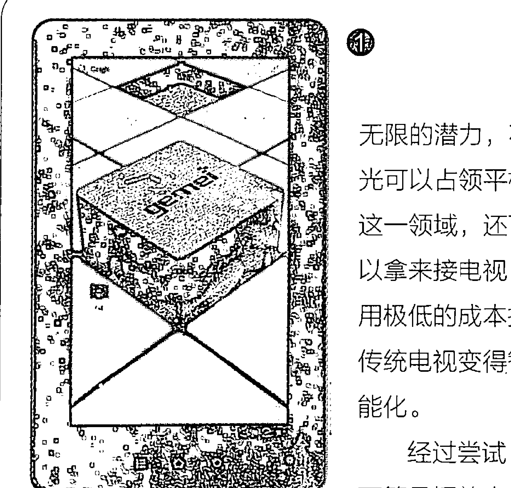

经过尝试，不管是播放本地和在线视频，乃至看新闻浏览网页，甚至玩游戏都不在话下。果然厂商也迅速看到了商机，2012年，深圳的厂商们开始把Android平板的电池和屏幕拿走并缩小，于是各类基于Android的盒子如雨后春笋一般涌现。

到了2013年，几大互联网企业（如乐视和小米）的加入，更是让Android电视盒子（以下简称盒子）的市场争夺战进入白热化。到了2013年末，“土豪”马云旗下的天猫魔盒居然都开始白送了（图2）。

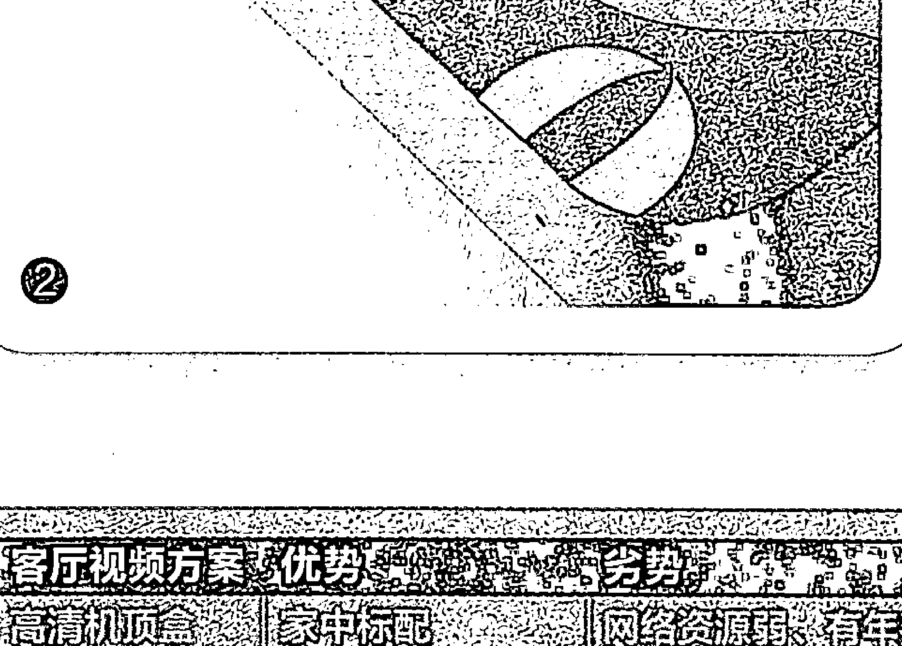

### 盒子作用其实很简单

企业如此努力的推广，貌似盒子这东西挺不错。到底它能做些什么呢？对于不了解盒子的朋友，我们先来看一下市场上卖的盒子们到底什么样。

现在的Android盒子普遍价格300元左右，体积类似最常见的家用路由器。电源也同家用路由器一样，功耗极小。盒子上都拥有HDMI输出，为了照顾老电视一般也拥有AV输出。由遥控器进行一些菜单操作，内置无线网卡也带LAN网口，可以使用网线。都拥有或可拓展出USB接口，可以插入U盘、移动硬盘，或无线键鼠和游戏手柄等（图3）。盒子普遍都可安装第三方软件（部分盒子需要破解），简单说就是一台小电脑，只不过是Android系统（图4）。Android系统本来用于手机和平板，不过经过厂商的努力，在保持兼容大部分原有Android应用的基础上，现在的盒子也有了大量适合电视操作的改进（图5）。

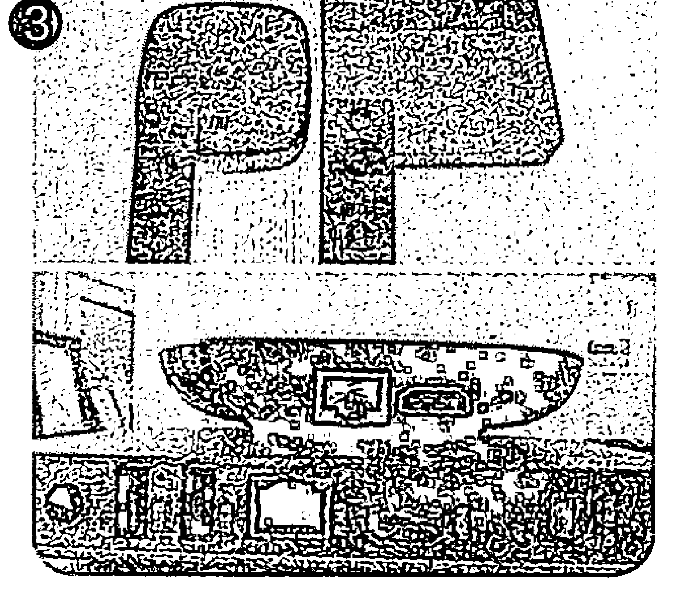

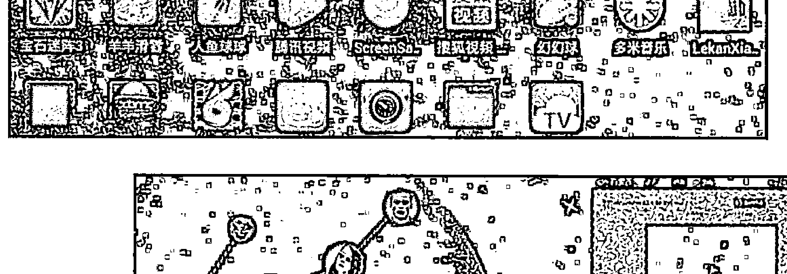

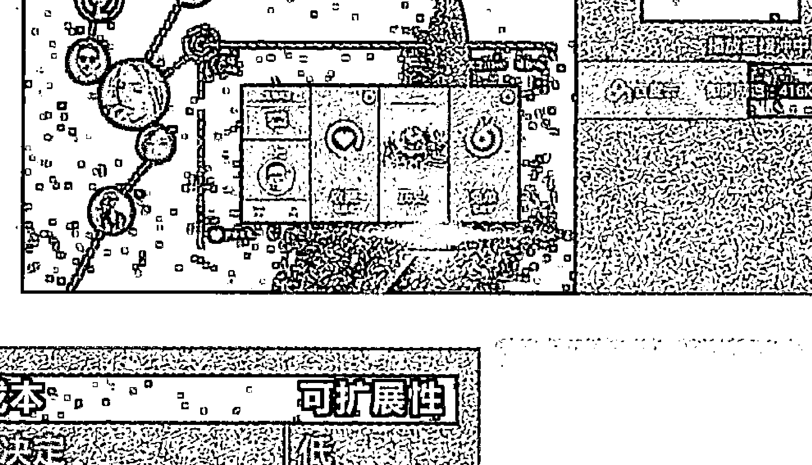

| 客厅视频方案 | 优势 | 劣势 | 大概成本 | 可扩展性 |
| :--- | :--- | :--- | :--- | :--- |
| 高清播放机 | 操作简单 | 网络资源，有年费 | 运营商定制 | 低 |
| HTPC(DIY) | 最强大的兼容性 | 入门难，装机成本高 | 2000元以上 | 高 |
| 笔记本电脑 | 小巧，利用闲置机 | 没有台式高清和多声道特色 | 2000元以上(闲置200元) | 中 |
| 智能电视 | 一体式设计 | 购买贵，效果差 | 4000元以上 | 低 |
| 电视盒子 | 小巧低功耗 | 兼容性略逊于PC | 300元左右 | 中 |

### 家庭影院方案推敲

现在我们为了观看网络和下载的视频，往往有如下几种解决方案。不过这些方案都存在一些不完美的地方。让我们往下看。

##### PC方案

第一种就是将家庭PC，或专门一台低功耗小体积的HTPC或笔记本电脑，甚至只是上网本(图5)，通过HDMI等接口输出到电视上，简单地说就是把电视机当显示器。

这种方案的优点是借助PC平台，可扩展性强大，对本地视频播放的兼容性，如特殊封装编码格式以及外挂字幕等也支持得好。对于少部分需要高质量输出的PC HTPC玩家(如7.1声道输出或4K视频输出)，以及面临各种繁琐兼容问题的家庭影院玩家较合适。另外由于相当于外置显示器，PC上的游戏、程序和上网功能都完美地呈现在电视上，大屏幕看起来很爽。缺点也显而易见，PC体积大功耗大，HTPC在选择安装方面难度较高(图6)。部分在Windows系统上的视频共享操作和软件维护对普通用户来说很繁琐，较难普及。

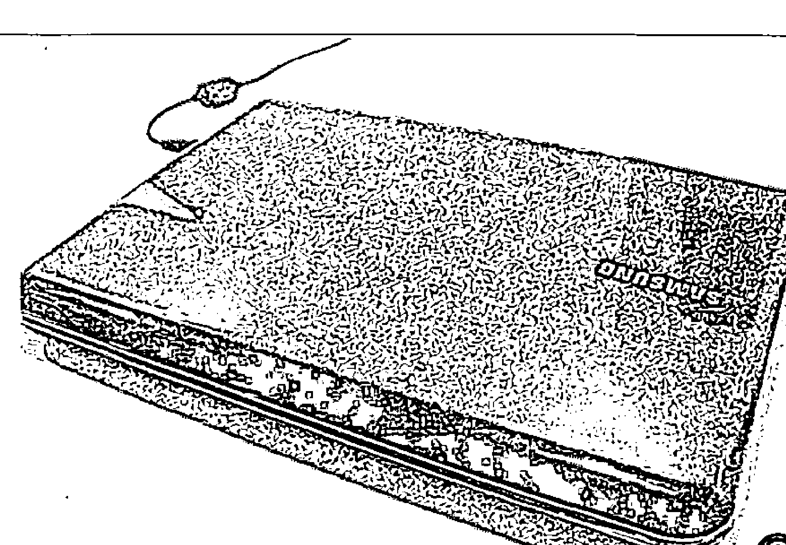

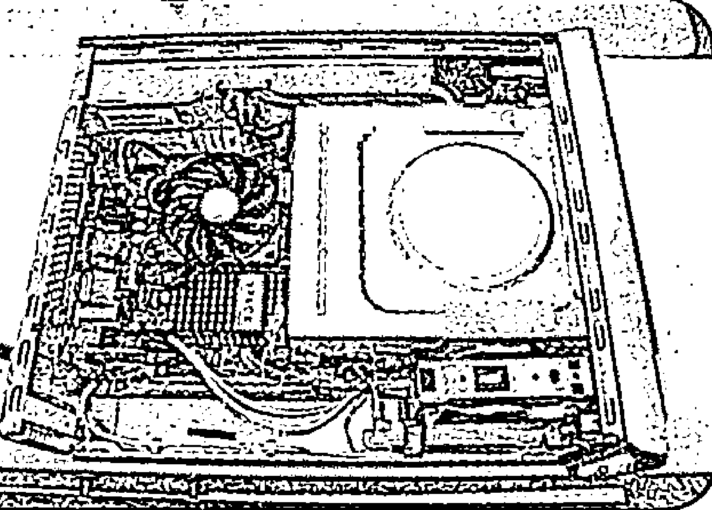

##### 电视方案 普通电视和智能电视

将视频下载到U盘或者移动硬盘插入电视播放，或者干脆购买智能电视，在上看网络视频等。这种方案唯一的优点，是不需要额外购买设备。缺点就太多了，虽然现在购买的液晶电视都带USB口，但是对网络上下载的各种视频以及外挂字幕的兼容性往往很糟糕；播放界面和操作也不人性，也无法直接看放在线资源。

传统电视厂商也不会在其内建系统和软件上下太大功夫，而相当于是建一个盒子的智能电视往往难以买到。注重电视本身画质的用户无从选择，因为国外品牌几乎没有真正意义上的智能产品。这类产品不是资源少就是不稳定，而且内建的盒子一旦出现故障需要维修，还需要将电视一同送修；内建的盒子本身未来也无法单独升级(图8)。


##### Android盒子方案

从硬件上来看，盒子能联网也能使用各种软件，但体积功耗却远小于PC。跟智能电视比，其独立存在，价格便宜，不管是需要升级还是故障时换一个都不可惜。而且因为有遥控器的缘故，对于小孩老人上手相对容易(图9)。

从软件上来看，除了各家自带的原厂软件外，盒子上现有的第三方软件极多，尤其是几个聚合资源的软件非常好，如VST全聚合、泰捷视频等，它们能直接作为Android系统的启动桌面(Launcher)存在。不光能看电视直播、电视节目回放，还能看来源于各大视频网站的电影、国内外电视剧、动漫、新闻综艺节目等，使用起来很方便。除了这些聚合软件外，各大视频门户也都推出了自己的电视客户端。如果硬要说这类产品的问题，那就是对于较少见的视频格式支持不佳，有可能会出现播放、外挂字幕问题。同时读取本地局域网的共享视频文件，确实没有PC方便。

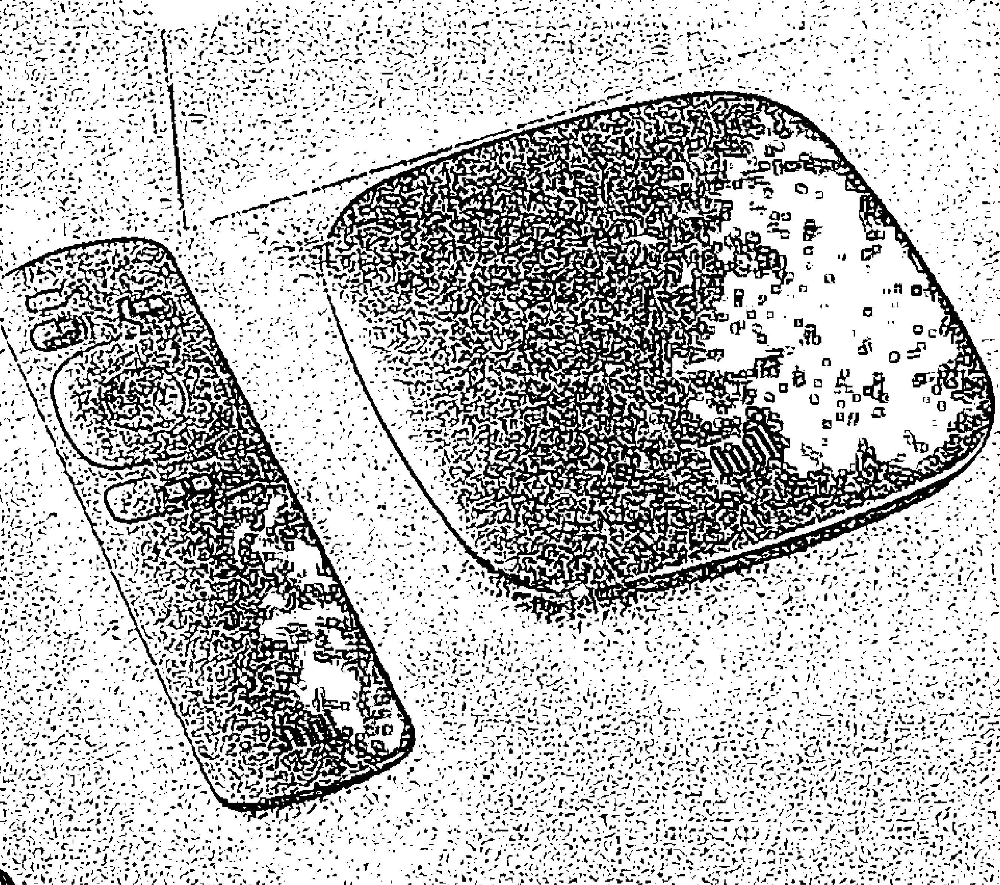

##### 聚合智能客厅

我们以VST全聚合这个应用为例，其他聚合类软件也大同小异。一般来说只要你的盒子允许安装第三方软件，你就可以将VST全聚合（或者任何你想安装的应用）的安装文件(.apk)拷贝到U盘上插入盒子中。然后需要在本地文件管理之类的应用中，找到U盘上的apk安装文件，安装后直接打开，或者在你盒子桌面的应用程序功能中打开。打开VST全聚合后，在顶端可以看到电视、影视和应用等区域（图10）。

使用遥控器按到最上并按左右切换到网络电视分区（图11），我们可以观看电视直播、查看电视节目回看等，虽无法和广电的画质和无延迟相比，但是电视台非常全面，部分节目支持高清，甚至包含一些付费和国外频道，而且缓冲时间都相当短（图12）。

电影电视剧各类节目点播也一样，依托于现今正版化风潮影响下的各大视频门户网站，盒子上拥有大量高质量且更新及时的电影、电视剧、综艺、动漫资源（图13）。进入电影区域后，可以看到，不光资源多，搜索分类也非常详细，真正做到了整合互联网上的资源（图14）。

可以说，各大视频网站上有的，盒子上都能看到。各大视频网站上没有的，不用担心，你如果有精力折腾，Android不管是播放局域网共享的视频，或者使用百度云、迅雷离线，甚至DLNA/WiDi（可能需要第三方解决方案且不是所有盒子都支持），有Android这个强大的后台，只有你想不到的，没有做不到的。


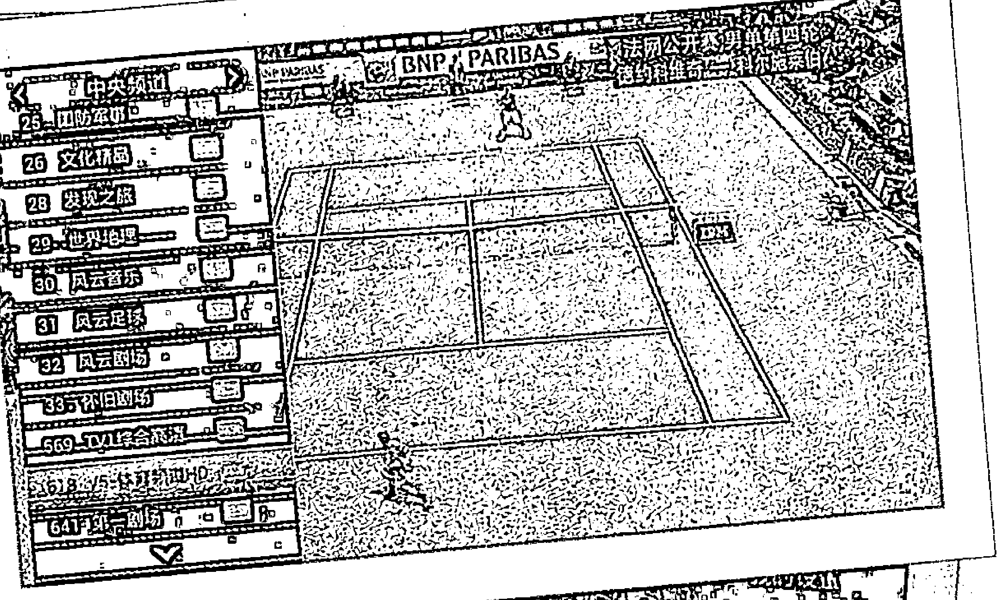


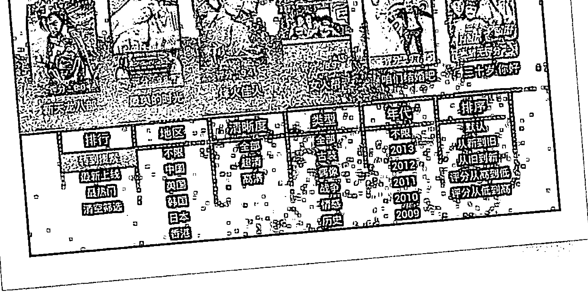

##### 局域网盒子攻略

有人可能会说，HTPC和笔记本电脑作为输出端最大的好处之一就是读取局域网内资源极为简单。由于Windows大家都用得较熟，共享文件或文件夹也是很简单的操作。但其实盒子一样能够办到，下面让我们试试用盒子完美播放局域网内的本地资源，以Windows 7系统和小米盒子为例。

首先需要给你的PC建立共享文件夹。依次进入“控制面板→网络和Internet→网络和共享中心”，点击左侧功能列表中的“更改高级共享设置”，在弹出的界面下分别勾选“启动网络发现”、“启动文件和打印机共享”、“关闭公用文件夹共享”、“使用用户账户和密码连接其它计算机”（图15A、B勾选相应的选项），然后点击“保存修改”，再按系统提示注销系统即可。将你想与家人分享的视频文件都放在某个文件夹内，并进入该文件夹的“属性→共享”界面，将“Everyone”用户添加在共享列表中。如果你担心被其他接入PC的智能设备误删，可以只赋予“Everyone”只读的权限（图15C），最后点击共享按钮。

现在打开小米盒子的“高清播放器”软件，它会自动扫描所有局域网中的共享文件，当然也就能搜到刚刚共享的视频文件夹了（图15D）。此时就可实现PC硬盘中的视频通过无线的形式，在电视屏幕上播放欣赏了。

### 扩展阅读

其他品牌的电视盒子或智能电视，可安装一个ES文件浏览器应用（安装方法同上文），进入左边的网络→局域网，然后点击下面的搜索（这时候用无线鼠标会相对方便，下面几个未针对PC优化的软件同样），不出意外就会搜索到你的计算机（图16）。如果你的共享和共享加密设置正确，点击进入后就直接能看到你共享的文件夹了。找到你想播放的视频点击后就跟播放本地视频一样了，属于标准Android流程，具体操作取决于你安装使用的播放器。

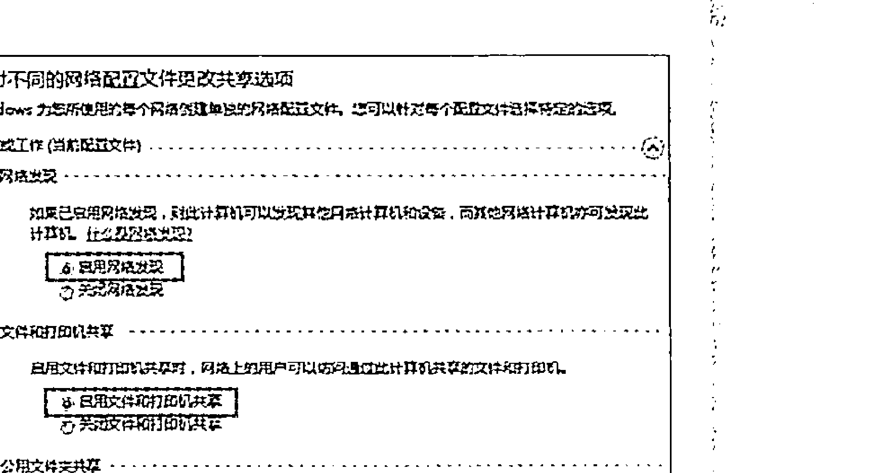

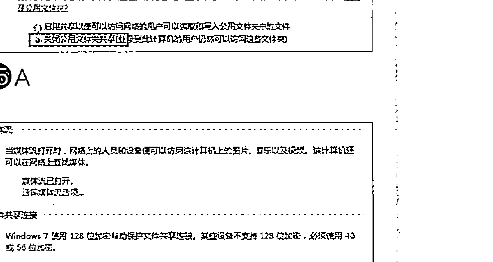

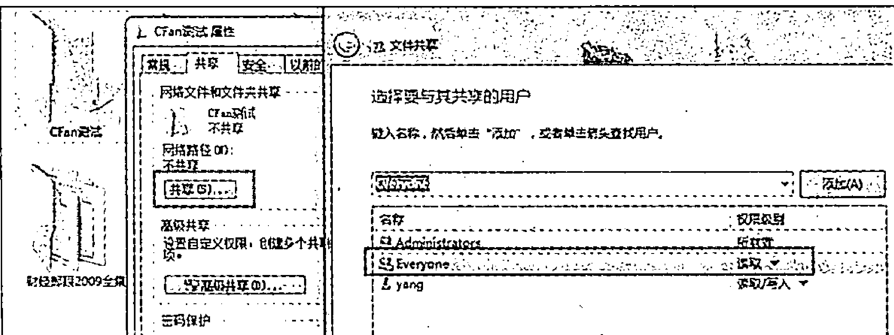

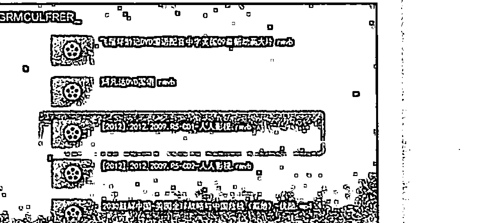

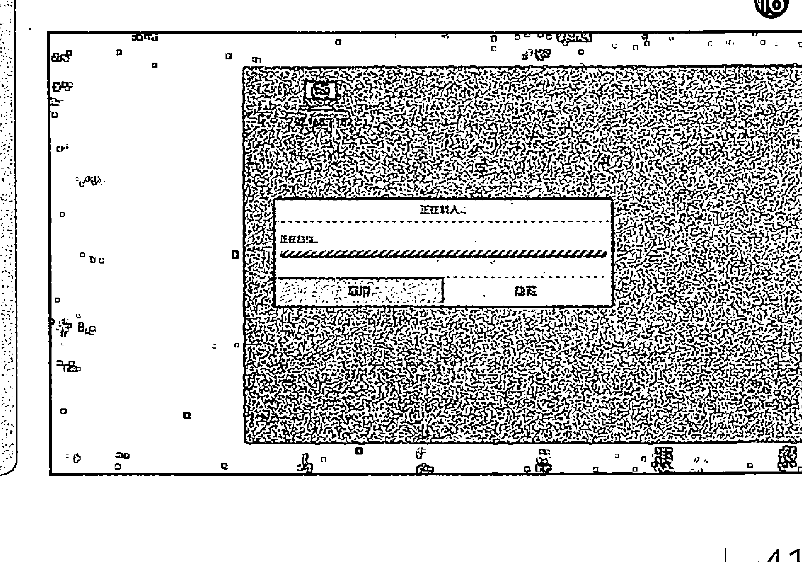

##### 常见云高清视频资源

如果你有种子/电骡/磁力链想在盒子上直接下载，那可以使用迅雷手机版或者类似软件。一般来说使用相当简单，只要把保存目录设置到U盘上就可以了，U盘的路径一般回到盒子的根目录下就能见到，往往是/usb之类，或者就是在/mnt/下。

如果你的盒子内建迅雷远程下载功能，还可以在其他设备上用浏览器控制盒子进行下载，这样既可以免去噪音，又可以节约电力，绝对绿色环保。据说迅雷正在开发通用的远程下载应用，到时候所有盒子就摇身一变成为24小时电下载器了。

如果不想下载到本地，又没有找到点播资源或者就喜欢特定字幕组的作品，那也有办法。如果你是迅雷会员，那就再好不过，使用迅雷离线应用，或者迅雷正在公开测试的迅雷云播TV版，就可以在浏览器访问lixian.xunlei.com或迅雷PC端添加离线/云播任务，完成后就可在盒子上使用迅雷离线应用播放你用迅雷离线下载/云播的内容，资源丰富程度和速度都相当有保障。

如果你不是也不用担心，百度云现在有免费送空间的活动，只要下载了百度云客户端在盒子上安装运行并登录，即可去yun.baidu.com领取2TB空间。领取完后进入百度网盘pan.baidu.com，点击上方的离线下载按钮即可上传种子或者下载电骡和普通Web连接了（图17）。下载完成后在盒子百度云内的相应文件夹就可以看到，点击即可直接观看，而且可以选择不同画质（图18）。现在，百度云电视版已经问世，功能更多，而且针对电视优化并支持遥控器。

如果你没有精力折腾什么共享，那就下载到移动硬盘或者U盘上插入盒子的USB接口吧，之后就使用你盒子里的本地播放本地文件管理之类的应用，或使用前文说的ES文件浏览器应用，找到U盘上的文件点击后，就是标准的Android操作了。国产方案+Android上各类播放器的组合，可吃定市面上99%的视频，外挂字幕的支持也极好。

##### 小结

随着Android盒子的普及，针对盒子进行优化的软件越来越多。另外由于盒子都可以外接无线键鼠，即使面对没有针对电视遥控器优化的Android软件，也可以很方便地使用。如新闻、购物、社交网站的客户端，或各种Android游戏。想象一下在电视上刷微博、上京东，或者玩愤怒的小鸟、玩植物大战僵尸的场景吧，很新鲜不是吗？

### 与游戏机一样专业

### 传统平台改造面面观

游戏主机与PC之间的战争从未停歇。PC以持续不断的升级特性，获得了在画质上超越游戏主机的能力；而游戏机则凭借绝对的兼容性赋予了玩家更为轻松愉悦的游戏环境。二者在不断的挑战与超越中结伴成长，支撑起了繁荣的虚拟休闲娱乐世界。总之，游戏主机的发展脉络与电脑的处理能力不无关系。此次，我们就来回顾一下电子游戏机和PC这四十年的冲突与共融，掌握更多在现有硬件平台基础上尽情游戏的知识与技巧。

### 电子游戏机和PC这四十年

抛开长久以来电子游戏机和PC用户之间从未停止的论战不谈，实际上游戏机和PC在过去四十年间的发展和历程是很相似的。没有那个永远的对手存在，相信彼此也难有现如今的进步和成就。

##### 第一世代

###### 梦回1973年

1972年，世界上第一部用“电视”玩的电子游戏机Magnavox Odyssey（奥德赛）诞生了。奥德赛在北美市场售价100美元，使用媒体为卡带，配件有光线枪。尽管奥德赛没有掀起购买狂潮，于1975年便宜宣告停产，最终全球只售出33万部，但却是家用电子游戏机的鼻祖。

PC比游戏机起步早，世界公认的第一部PC诞生于1971年，1973年法国工程师发明的Micral则为首部使用Intel处理器（Intel 8008）的商用个人电脑，当时这颗八位处理器主频只有0.8MHz，内存只支持16KB，放在今天简直难以想象。

##### 第二世代

###### Atari 2600的兴衰

1977年10月，先后遭受资金不足和出售的Atari 2600正式上市，整个过程主机共花掉了一亿美元的研发费用。1979年Atari 2600成为最畅销的圣诞礼物，1982年Atari 2600巅峰销量800万部，资产从7500万美元增长到22亿美元。由于Atari对于第三方软件开发商完全没有管控，导致劣质品在市面充斥，结束了这个世代跟Atari公司的一代江山。

1980年代，IBM推出以Intel的x86的硬件架构及微软公司的MS-DOS操作系统的PC，并制定以PC/AT为PC的规格。之后由Intel所推出的微处理器以及微软所推出的操作系统发展几乎等同于PC的发展历史，软硬两个巨人取代了IBM在PC的主导地位。

在国内只有极少部分玩家接触过Atari 2600

当年在国内如日中天的任天堂 Famicom

中国多数资深PC用户都通过80386认识了PC

##### 第三世代

###### 漫长的任天堂王朝

1983年，任天堂公司开发了第三世代游戏机Famicom (FC)。FC有一颗理光制造的8位处理器2A03 NMOS，主内存和显存都是2KB，这就是我们常称的红白机，美国称NES。FC在中国有以小霸王为代表的诸多山寨品牌，还有以“超级玛丽”、“魂斗罗”为代表的一大批脍炙人口的游戏，成为中国电视游戏的真正鼻祖，中国许多玩家就是因FC认识和喜欢上了游戏。

Intel在16位处理器的收官之作就是80286，发布于1982年2月，处理器主频最高可达20MHz以上，支持1MB内存，规格上远远超过了同时期的游戏机。80286的后续替代产品80386于1985年10月面世，将PC从16位时代带入了32位时代。

从SG-1000到Master System最终都不敌FC

##### 第四世代

###### 世嘉任天堂两强争霸

1987年后NEC推出PC-Engine，同年SEGA推出Mega Drive（简称MD或过世嘉五代）。MD是第一部16位游戏机，表现亮眼，迫使任天堂1990年底祭出Super Famicom（SFC，超任）。MD使用Motorola 68000（7.67MHz）处理器，声音单独用Z80（3.58MHz）处理，是双CPU游戏机，采用双64KB内存。而SFC采用两颗GPU，内存达到128KB+64KB+64KB，最终力压MD和PC-E称霸第四世代。

Intel i486在1989年问世，主频跨度非常大，从16MHz到100MHz都有，国内PC开始逐渐进入家用就是它的功劳。之后1993年第五代处理器被命名为Pentium（奔腾），PC领域开启了漫长的奔腾王朝，得益于蓝色巨人的力量，游戏机与PC之间性能的差距越来越大。

##### 第五世代

###### PS赢在乱世

1993年，任天堂和Sony开始合作研发次世代主机。然而两者在储存媒体上产生争执，Sony希望用CD，而任天堂坚持用速度更快的卡带。最后任天堂单方面终止了合作，被激怒的Sony单独进行“PlayStation计划”。1994年，3DO、SEGA的Saturn（SS、土星）和Sony的PlayStation（PS）集中上市，直到1996年任天堂Nintendo 64才姗姗来迟。最终凭借强大的软件阵容，PS力压3D绘图稍逊自己的SS和卡带成本昂贵的Nintendo 64，新丁Sony完美胜出。

从奔腾时代开始，PC硬件开始了稳定的发展时代。处理器经历奔腾II、III两代，AMD也开始逐渐进入PC用户的目光中。上个世纪末还进行了一场速战速决的显卡之战，最终NVIDIA和ATI存活下来，成为目前为止两大显卡供应商。

##### 第六世代

###### SEGA绝唱 微软登场

相比上代PS用了一两年时间才打下江山，Sony的PlayStation 2从发布起就已经胜利了。同期SEGA的Dreamcast和任天堂Nintendo GameCube都因为软件阵容问题迅速败下阵来，一个退出家用主机市场，一个卧薪尝胆准备东山再起。在PS2的辉煌当中，微软来势汹汹的Xbox用其不输于PC的性能和赔钱卖的销售策略吸引了人们的目光。比尔·盖茨自己也说，Xbox就是一部砸钱赚人气的产品。Xbox使用奔腾Ⅲ733MHz特制的CPU和类似NVIDIA GeForce3的GPU，游戏机和PC配置间有了更强的联系。

PC硬件在这段时间是令人沮丧的。性能难令人满意的奔腾4和D高频低能，AMD的产品也没成气候，显卡市场一样乏善可陈。

##### 现世代

###### 性能暴增和体感时代

PS2统治电子游戏机五年后，战争帷幕由Xbox 360在2005年底率先掀起。大幅进化的游戏画面、不输于当时入门游戏PC的硬件配备，当时的游戏机与PC间的性能被大幅度拉近。称霸游戏机界达十年的Sony由于Blu-ray蓝光光盘与HDMI的规格制定问题，PlayStation 3发售整整落后一年，售价也高达499美元。任天堂卧薪尝胆后，Wii硬件性能比Xbox 360及PS3弱许多，但体感操作创造了新游戏方式，使很多中老年人都开始玩游戏机，开创了全新的市场。PS3和Xbox 360也发售了体感控制器，任天堂只好发布Wii U加强画面分辨率，支持高清输出，并使用新的游戏控制器。不过新产品由于毫无创新，截止目前仍苦苦支撑。

经历过死气沉沉的“后奔腾”时代，PC领域迎来了性能飞跃。蓝色巨人Intel在2006年和2009年通过酷睿2和酷睿i系列实现了脱胎换骨，酷睿也继奔腾之后沿用至今。而NVIDIA和AMD这对冤家几乎每年都有性能暴增的产品，通过高端PC显卡将电子游戏机远远抛在身后。

### 为游戏而生 打造纯游戏专用系统

玩游戏为什么要打造专用的系统呢？这主要是从稳定性、兼容性及安全性等方面来考虑。

从稳定性来说，不少游戏，尤其是从其他平台（如XBOX之类的平台）移植过来的游戏，会需要各种运行库或者其他特殊组件的支持。最常见的是VC运行库、DirectX运行库、OpenGL运行库、Microsoft .NET Framework框架等，没有它们的支持某些游戏可能无法正常运行。而且不同游戏对运行库或者支持组件的版本还有不同的要求，比如虽然安装了Microsoft .NET Framework 4，但是有些游戏却必须要3.5版本的支持。

另外，随着操作系统版本的不同，运行库也会有X86及X64之分。这些运行库，在一个正常的系统中并非全部需要，如果全都安装，则有可能扰乱正常办公的系统环境。所以打造专用的游戏系统，不但可以顺畅地玩游戏，还可以避免正常系统的不稳定。

从兼容性来说，现在不少人已经用上了Windows 8.1，而许多游戏还没有及时更新，在新系统下难免碰上兼容性问题，这时一个专用的游戏系统就更加必要。除此之外，一些热门游戏的账号安全也是很大问题，打造专有游戏系统后，就可以在安全方面进一步加强了。

打造专有游戏系统有多种办法，比如安装双系统、使用虚拟机等。就这几种方案，下面我们来聊聊它们各自的优缺点，以及它们的使用技巧。

- DirectX End-User Runtimes (June 2010)
- Microsoft .NET Framework 3.5 Service Pack 1
- Microsoft .NET Framework 4 (Standalone Installer)
- Microsoft .NET Framework 4 Client Profile (Standalone Installer)
- Microsoft XNA Framework Redistributable 4.0
- Microsoft Visual C++ 2005 SP1 Redistributable Package (x64)
- Microsoft Visual C++ 2005 SP1 Redistributable Package (x86)
- Microsoft Visual C++ 2008 SP1 Redistributable Package (x86)
- Microsoft Visual C++ 2008 SP1 Redistributable Package (x64)
- Microsoft Visual C++ 2010 SP1 Redistributable Package (x64)
- Microsoft Visual C++ 2010 SP1 Redistributable Package (x86)
- Microsoft Core XML Services (MSXML) 6.0 Service Pack 1
- NVIDIA PhysX 9.10.0513
- OpenAL 2.0.7.0
- Microsoft Games for Windows - LIVE 3.5

▲ 游戏运行常用的运行库及补丁程序

### 特立独行 打造游戏专用独立系统

下面对这一移动系统进行改造，使它更适用于游戏。

##### 方案1: 游戏专用移动Windows XP

目的：解决游戏兼容性问题

喜欢玩游戏的都知道，目前来说，Windows XP是游戏兼容性最好的操作系统，很多经典的游戏都需要在其下才能正常运行。不过现在很多朋友的系统都是Windows 7/8，因此对于那些需要运行经典游戏的用户，可以使用移动硬盘安装一个移动Windows XP作为游戏专用系统。

移动Windows XP的安装很简单，首先到 http://u.115.com/file/a8rmyws 下载“U盘XP系统”备用，接着准备一个包含主分区的移动硬盘并将其主分区激活。然后使用WinRAR将下载的文件解压到移动硬盘的主分区。重启后进入BIOS设置，将USB设备设置为第一启动即可开始使用移动Windows XP。进入Windows XP后，单击任务托盘的即插即用图标，在弹出的停用硬件设备也可以看到该系统的C盘就是USB设备的第一分区。

####### 1 安装DirectX 9.0c组件

这是很多游戏必须用到的组件，可到微软主页去下载。完成安装后单击“开始→运行”，输入dxdiag.exe并按回车键，然后查看是否成功安装该组件。

####### 2. 禁止系统访问原系统数据

打造游戏系统的目的之一就是尽可能不破坏原来的系统，由于该系统是运行在独立启动的移动硬盘上，因此为了保护原来的系统，我们可以在磁盘管理直接将原来的系统盘符全部删除，这样专用系统程序就无法访问原系统数据了。同样，在原来的系统中则可以将移动硬盘全部盘符删除，防止原系统病毒感染游戏专用系统。

####### 3. 并不需要所有的端口

对于游戏迷来说，游戏账号安全不容忽视，除了安装常用的杀毒软件外，为了安全起见，我们还可以将其他游戏不用的端口全部关闭以避免木马的侵害，特别是那些危险性较大又不常用的高危端口，比如Telnet服务的23端口、ftp服务的21端口、SMTP服务的25端口、RPC服务的135端口。端口关闭很简单，只要到http://dwz.cn/cfanz01下载批处理，运行后即可将常见的危险端口关闭，当然有一定知识的用户还可以参照批处理语法，自行将其他端口关闭。

小技巧：批处理用到的ipseccmd.exe默认没有安装，它在XP系统安装盘SUPPORT\TOOLS\SUPPORT.CAB中，要先将其解压到系统目录后才可使用。另外，常见网络游戏端口列表，可参见http://tinyurl.com/mavwylw。

游戏系统中访问原系统数据。VHD系统相对于原系统来说只是一个.vhd文件，不过里面保存了我们的各种游戏数据，为了避免这些数据被误删除，可以使用权限保护它们。只要在权限属性中，设置当前登录账户对其没有删除的权限即可。

##### 方案2：游戏专用Windows VHD系统

目的：和当前系统隔离，打造为游戏专用系统

上述方案虽然简单，不过需要移动硬盘的支持。如果你经常玩的游戏可以在Windows 7、Windows 8下运行，那么利用其支持VHD启动的特性，可以为游戏打造一个专用的VHD系统。

VHD系统的创建很简单，首先使用虚拟光驱加载Windows 7或Windows 8安装镜像（需要专业版、企业版镜像才能支持VHD启动）。接着到http://dwz.cn/cfanz100下载“Windows VHD辅助处理工具2011”并解压到D盘。以管理员身份运行其中的VHD_OneKey_2011_51-Shortcut，单击“创建VHD”，然后按程序界面提示创建VHD系统，并且添加到系统引导菜单中即可。

####### 1. 互相隔离

默认情况下从VHD启动后，原来系统的C盘会自动隐藏，同样可以在VHD系统中使用磁盘管理将原系统其他重要盘符删除，以免在游戏系统中访问原系统数据。

####### 2. 快速加载VHD

VHD的使用和维护非常简单，如果需要重装VHD系统，我们只要再次创建一个VHD文件即可。重装之前可以提取原来的游戏数据。到http://dwz.cn/cfanz02将下载的Vhd.reg文件导入注册表（对于Windows 8系统可以直接加载VHD文件，只要右击VHD文件选择Mount即可）。以后只要选中VHD文件右击选择“Mount VHD”即可将VHD加载到系统中。

同样的我们可以使用上述方法快速离线升级游戏数据，比如可以将其他电脑上已经升级好的数据复制，加载VHD文件后直接将升级数据覆盖到相应的安装目录即可。

### 虚拟化：在原系统的基础上创建独立的系统
打造游戏专用XP系统

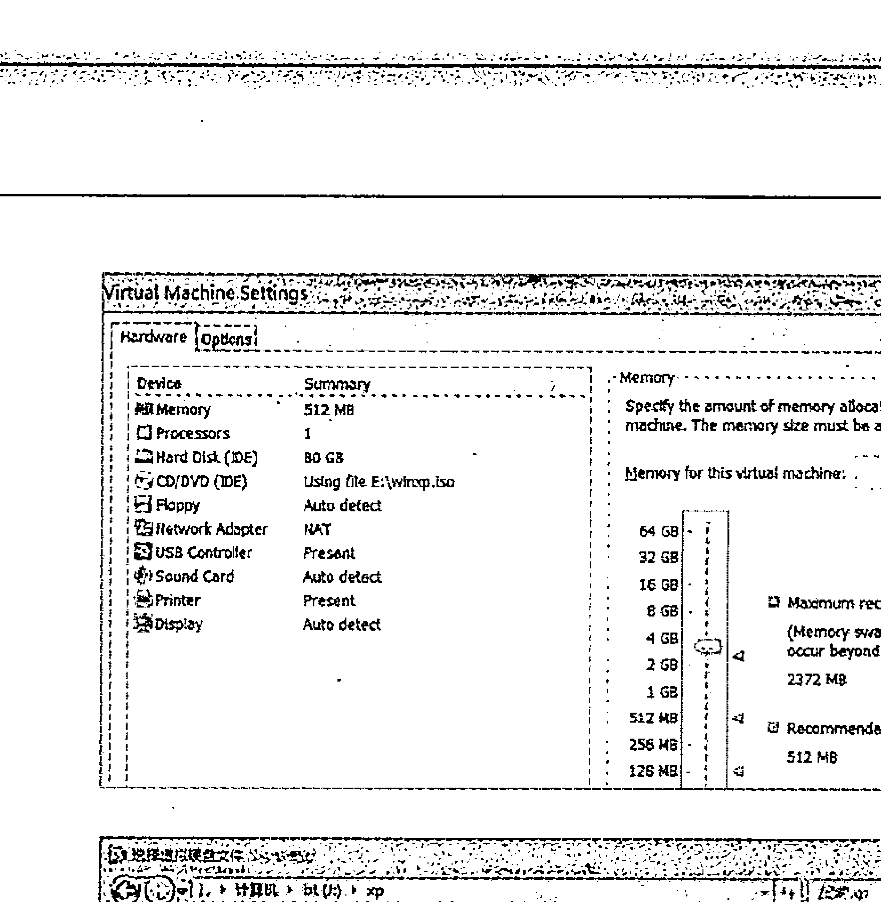

##### 方案1：虚拟Windows XP系统

同样的如果你玩的都是经典的游戏，那么可以利用常见的虚拟机软件来直接安装Windows XP系统。

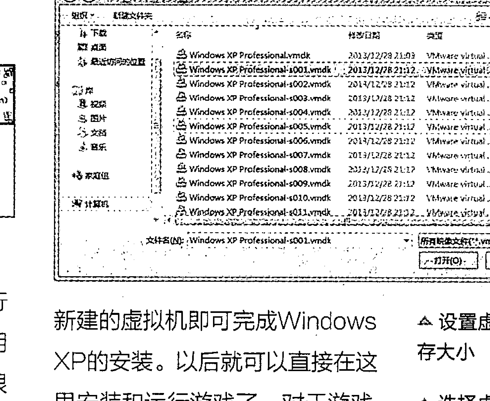

现在大家常用的Hyper-V、VirtualBox和VMware Workstation都支持Windows XP系统的安装，不过对于游戏用户来说，最关心的自然是虚拟系统的3D和DirectX 9，前者可以让游戏画面更为逼真，后者则是每款游戏必备API。因此推荐使用VMware Workstation（以下简称VM）。VM通过对虚拟显卡驱动改进，对DirectX 9和OpenGL的3D性能提升都有了很大的改进（默认虚拟显卡设置即开启3D），它支持DirectX 9 3D加速，能流畅地玩很多游戏。

1. 虚拟机位置尽量保存在非系统分区，并且保证存放的分区要有足够的空间，这样既不会占用原系统分区的可用空间，又方便以后虚拟磁盘空间的扩展。
2. 如果可用空间足够，虚拟磁盘大小尽量设置大些，一般至少40GB以上，否则以后多装几个游戏就会导致空间不足。
3. 虚拟机内存设置尽可能大些。因为现在很多游戏耗费的内存都比较大，如果你的内存有8GB，至少设置虚拟机有3GB左右的内存。
4. 为了方便以后提取数据，虚拟磁盘至少要分为两个分区，一个专门用于存放游戏数据。

新建的虚拟机即可完成Windows XP的安装。以后就可以直接在这里安装和运行游戏了。对于游戏迷来说，游戏数据是最重要的东西了。如果你的虚拟机运行出错需要重装，还可以利用Diskgen（下载地址：http://www.diskgenius.cn）直接将其中的数据提取出来。运行Diskgen之后，点击“硬盘→打开虚拟磁盘文件”，接着定位到虚拟磁盘保存位置，选择其中文件扩展名为.vmdk的虚拟磁盘文件。点击“打开”后就可以在Diskgen窗口加载磁盘文件，可以看到虚拟文件磁盘结构和我们本地硬盘并没有什么不同。如果要提取其中的游戏数据，只要切换到“浏览文件”，然后按提示展开游戏数据保存位置，选中需要提取的数据，右击选择“复制到”，再将要提取的数据复制到其他位置保存即可。

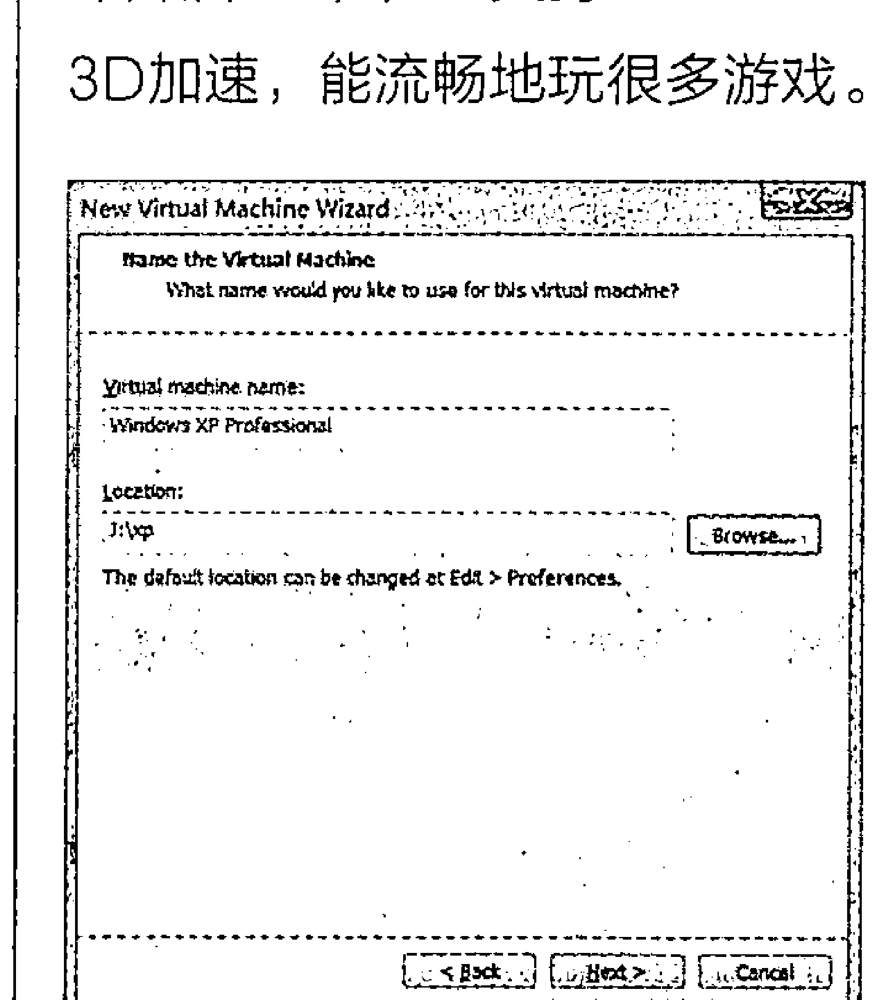


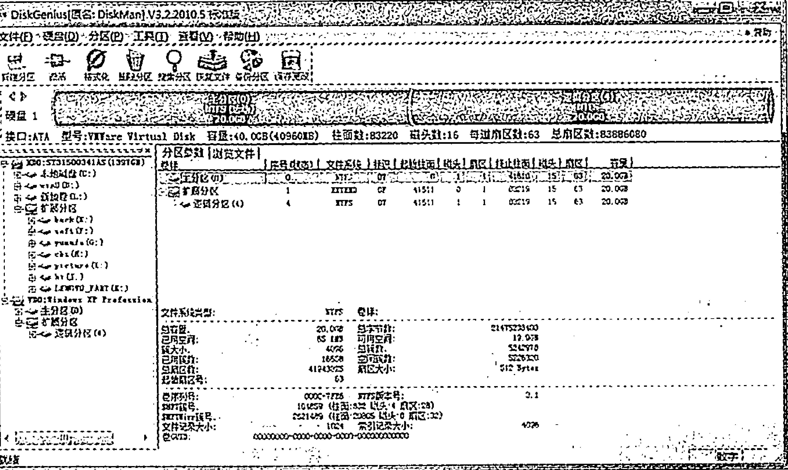

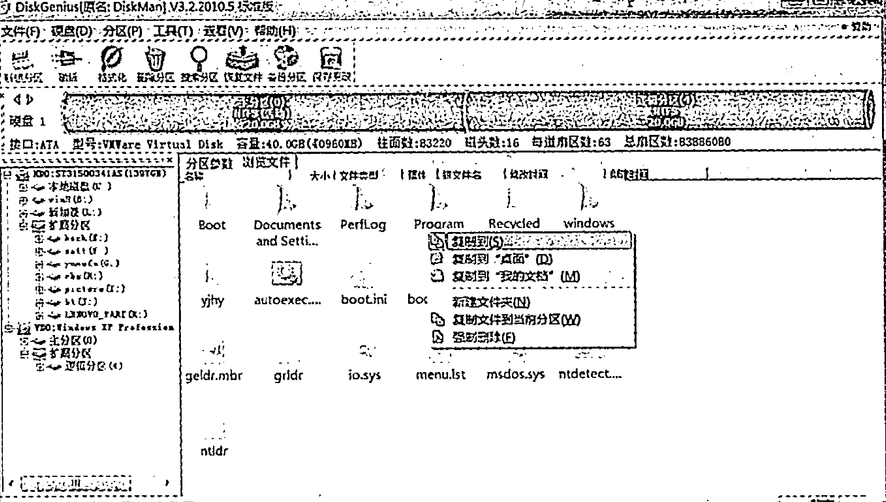

##### 方案2：安装各类专用模拟器

除了PC游戏，现在很多朋友还在玩各种掌机游戏，如果身边没有相应的掌机，还可以在电脑上安装各种模拟器。

对于Android和WP8平台模拟器，在之前本刊已经做过不少的介绍。除此之外，我们还可以安装其他模拟器，比如PSP爱好者就可以直接在电脑上安装一个模拟器玩PSP游戏了。

首先到http://dwz.cn/cfanz03下载模拟器（模拟器需要JAVA环境的支持，没有JAVA的请先自行安装）。下载完成后运行其中的Start-windows-x86.bat，就会弹出模拟器的界面，按提示点击“Language→简体中文”，切换到中文界面。

接着按F12键进入设置窗口，在设置窗口中选择“媒体”标签，然后勾选“使用媒体引擎”项（不勾选无法播放动画）设置完成后点击确定保存即可。

返回程序主界面继续按F11按键设置，此时屏幕会弹出一个PSP模拟器界面，按提示选择自己习惯使用的按键。

返回程序主界面点击“文件→载入UMD文件”，然后选择下载到的PSP文件，载入游戏文件后点击主界面的RUN按钮就可以在电脑上玩PSP游戏了。

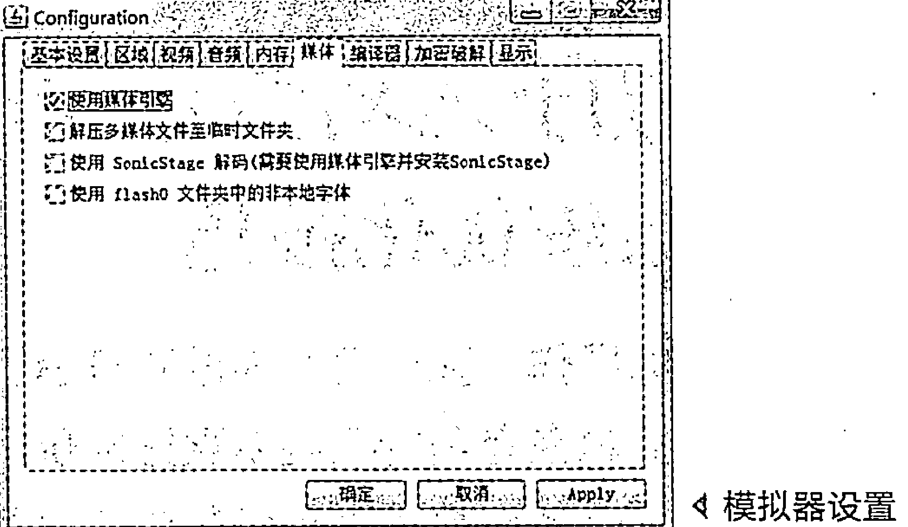

▽ 按键设置

▽ 在模拟器运行PSP游戏

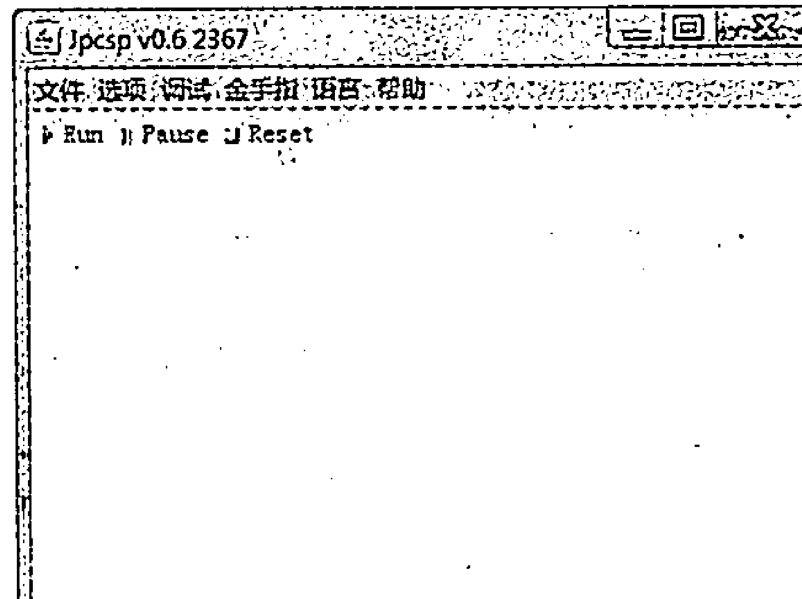

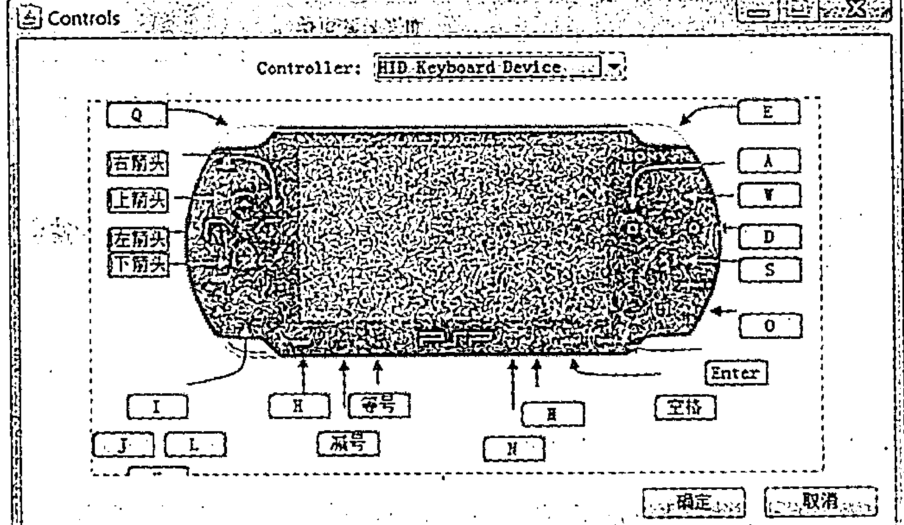

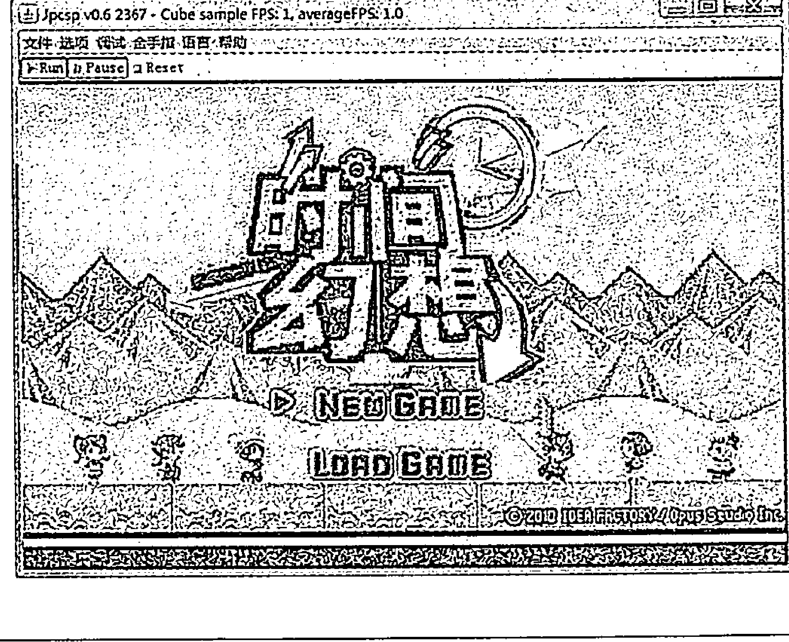

### 为游戏提速 文|平淡

##### 专用系统优化技巧

通过前文的操作，我们已经为游戏打造了专用的系统。不过要想在专用的系统中更好地玩游戏，还可以充分利用这个专用系统为我们的游戏服务。


##### 技巧1：使用虚拟机快存游戏状态

喜欢玩游戏的朋友都知道，即使很多时候有事要离开电脑，他们都会先保存游戏进度以后再走。如果是急事怎么办？如果你使用的是VM的虚拟系统，那么利用其快照功能，无需保存游戏进度就可以快速冻结游戏状态。当你有急事离开时，只要点击“VM→Snapshot→take Snapshot”，接着在弹出的窗口设置好快照的名称，点击“Take Snapshot”即可创建当前系统快照。下次回到电脑后，只要点击上次创建的快照，这样即可快速恢复到开电脑前的状态继续玩游戏了。

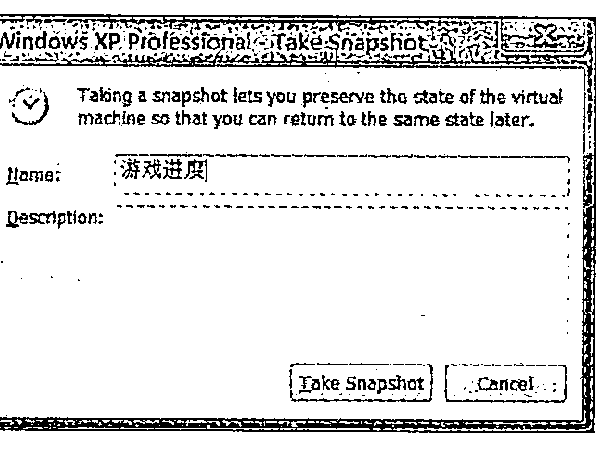

▲ 保存游戏快照

##### 技巧2：使用差分VHD创建某游戏专用子系统

对于使用VHD系统的用户，由于VHD支持差分子系统的建立，因此同时玩多款大型网络游戏的用户可为每款游戏创建一个差分系统，虽然只是同一个VHD母系统，但却可以避免在一个系统中安装多款游戏的不便。差分系统的创建可以利用上面介绍的“Windows VHD 辅助处理工具 2011”，启动程序后选择“创建差分VHD”，父VHD选择上述创建好的VHD系统文件，在子VHD下选择“创建差分VHD，并添加差分VHD机快速还原到启动菜单”，这样重启后即可选择差分系统进入，然后安装游戏。同上，继续创建其他差分系统，进入后安装其他游戏即可。

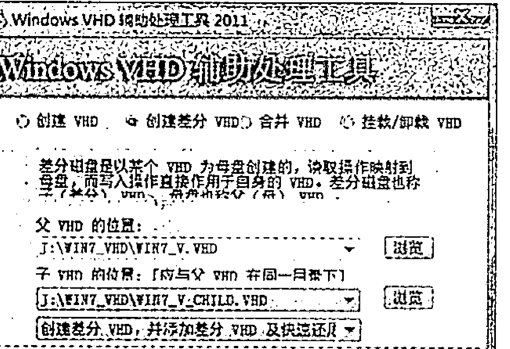

▲ 保存游戏快照

##### 技巧3：批处理快速关闭游戏不需要的系统服务

对于游戏用户来说很多系统服务是不需要的，为了给专用系统提供更多的游戏资源，我们可以关闭不需要的系统服务。打开记事本使用SC命令制作一个初始服务状态批处理即可。比如“Print Spooler”服务默认状态是“自动”，新建一个记事本文件输入下列命令，然后保存为Services.bat，放置在C盘（其他服务状态参照下列格式自行输入，每个命令一行）：

```
sc config Spooler start= disabled
```

###### 小提示

需要关闭相关系统服务时，运行上述批处理即可。注意，其命令中start=后有一个半角空格，服务名是打开系统服务属性后显示的“服务名称”，服务运行状态参照下列格式自行输入：

```
sc config 服务名 start= demand //手动
sc config 服务名 start= auto //自动
sc config 服务名 start= disabled //禁用
```

##### 其他更多游戏技巧

因为游戏运行需要更多的资源，比如可以右击桌面“我的电脑”，依次选择“属性→高级→视觉效果”，选择“调整为最佳性能”以节省资源；还可以启动“系统配置实用程序”，关闭不必要的启动项等常见的优化。


因为游戏的需要，声卡才会有强大的实时音效处理能力，因为需要更真实的声场环境，让人更加觉得身临其境。双声道向多声道发展的过程中，培养出了一个极其广大的音频子系统的市场。时至今日，已经没有人会否定音频子系统在游戏中的作用了，如果我们没有设置好自己的音频设备，游戏音效可能会大打折扣。这时，学会必要的音频设置方法和技巧是很有必要的。

### 系统巧设置

### 带毒游戏任我玩

文|藏乐中

测试尝鲜是广大玩家普遍的好奇心理。对于在网上发现的一款有趣小游戏，也许下载的站点是否安全难以预知，而正规站点又找不到该游戏的下载链接。怎么办？放弃吗？我要告诉你的是，你可以选择“不！”

那么，在安全与否未卜的情况下，如何安全地随意测试在网上发现的一款游戏呢？既不需要专用的虚拟机软件，也不需要做双系统，我们借助一款系统备份工具ATI2013对系统进行隔离测试，让它为我们测试游戏提供一个保护环境。

> 1.开启系统试玩“金钟罩”
>
> 为了能在安全的环境下测试可能带有病毒或恶意程序的游戏，我们要给系统创建相对封闭隔离的实验环境，一切可能存在潜在威胁的游戏都要在这个隔离的环境中运行。先安装完全版的ATI2013软件，之后运行程序，进入“工具与实用工具”选项卡页面，看到的第一个选项Try&Decide就是用来为游戏创建安全试玩环境的“保护伞”。

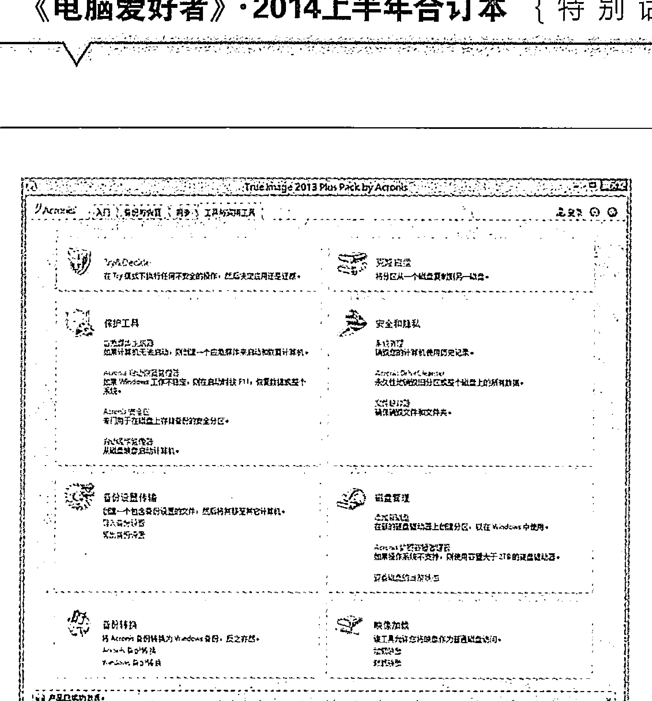

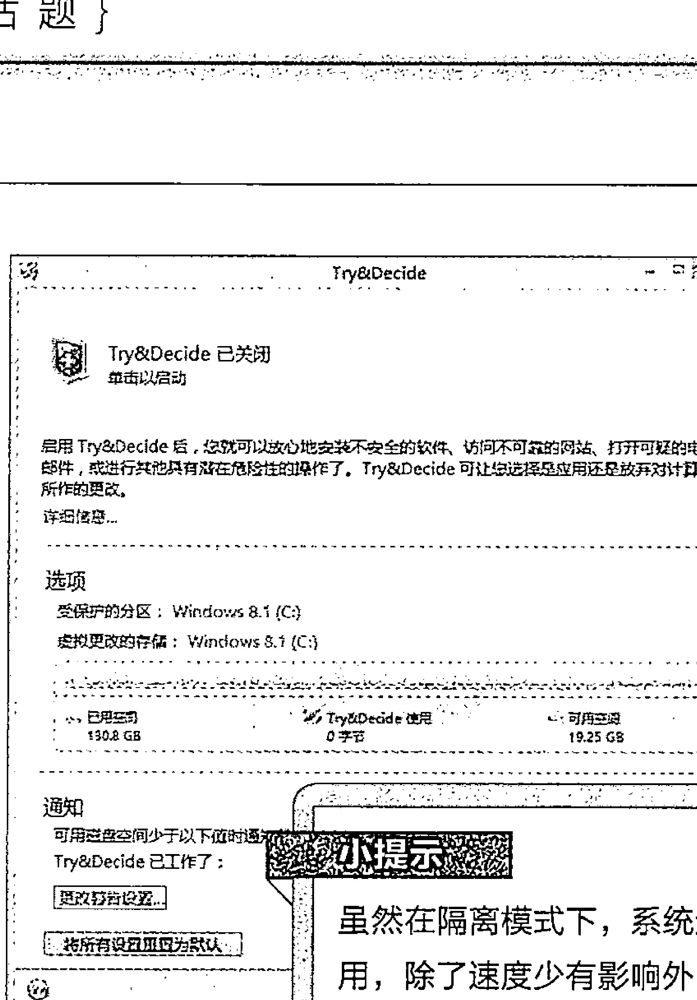

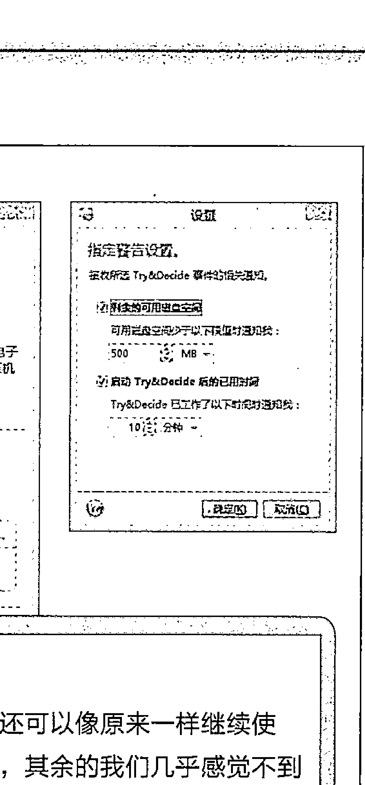

##### 2. 任意玩转网络本地游戏

点击该工具以后，启动到Try&Decide窗口，可以看到最上端显示“Try&Decide已关闭”，因为默认状态下该模块功能没有开启。此时下方的一个示意条图形显示Try&Decide使用0字节，后面紧接着显示默认分区可用的空间字节。如果这里显示的空间字节数比较小，则需要点击上边“虚拟更改的存储”后边的蓝色文字链接，将虚拟数据区域更改为另一个有更大空间的硬盘分区。而“受保护的分区”默认选中的是系统分区，用户也可以根据需要在系统中添加其他分区或磁盘。此外，在下面的“通知”中，显示的是当使用硬盘空间少于某一个值时，系统通知用户发出警告信息。与此同时，此处还可以设置用来提醒Try&Decide模式下用户已经工作的时间。默认情况下，警告功能处于开启状态。单击“更改警告设置...”链接更改警告设置。以上重要参数设置完毕后，要开启Try&Decide功能，只需点击紧邻Try&Decide下边的一行小字按钮“单击以启动”，即可启动隔离保护工作状态，之后便是在隔离状态下运行游戏了。

虽然在隔离模式下，系统还可以像原来一样继续使用，除了速度少有影响外，其余的我们几乎感觉不到变化，但是在隔离模式下，ATI软件会屏蔽掉系统的一些功能的使用，比如对分区大小的设置与调整、磁盘碎片整理和磁盘错误检查。此外，系统休眠功能也会暂时失去作用，直到我们退出这种隔离模式方能继续使用。因此在隔离试玩游戏期间，不要试图对系统进行如上所述的几项设置。

##### 3. 完全还原系统清洁之身

当游戏结束后，我们需要退出试玩隔离环境，然后返回到原来的真实系统环境中。但是，在试玩环境运行游戏的过程中，系统生成了一系列的数据，其中也包括游戏程序中存在的病毒、恶意程序或潜在威胁的木马等，这些数据或程序还有可能会影响到我们的系统。所以，游戏结束后的退出过程是决定系统是否安全最关键的一环。

在我们关闭游戏或网页之后，切换到ATI工具窗口，点击Try&Decide图标，随后会显示如图所示的对话选择窗口，其中的第一项“应用更改”对我们来说是非常危险的，因为如果我们选择了这项，那么所有刚才试玩过程产生的结果都将应用到原来的操作系统中，当然包括病毒或恶意程序对系统的更改。这一选项本来是为那些测试软件的其他环境下的用户保存用户数据而设立的，用来保护测试过程中产生的有用数据。但对游戏试玩来说，既然是为了防止病毒，那么就没有选择的必要了。第二项“重启时应用更改（较快的选择）”则是将刚才试用的所有结果推迟到下次重启之后，这其实与第一项没有实质的区别，只是一个影响时间先后的问题。第三项“放弃更改”则是游戏测试之后的唯一选择，只有选择了这一项，才能保证刚才试玩过程中的所有数据更改对原来的系统不起作用。

需要特别说明的是，在结束游戏后，如果我们没有去关闭试玩环境，即便是关机重启，系统仍然工作在测试环境下，如果在这样的工作环境下继续干别的事情，那么在先前的试玩过程中产生的一些威胁因素依然存在，而我们在一种自以为已经安全的环境下工作，很可能就会造成不可预测的损失。

若游戏测试结束后，没有主动关闭Try&Decide防护环境，在关闭系统时会弹出一个选择菜单，如果无意中随便选择了第一项“继续在该模式下运行”，会造成下次启动系统后工作环境仍然未脱离试玩环境，这就会出现上面说的这种情形。而如果选择了下面的一项“停止并放弃”，才能确保彻底退出试玩环境，进入正常关机或重启的安全过程中，在这种情况下，前面试玩过程产生的所有数据（包括有用的数据、无用的数据、恶意的数据等）将被释放和随之消失。

如果选择放弃更改并已重启安装多个操作系统的计算机时，将无法启动试玩模式运行外的操作系统。直到第二次重启才可恢复原始MBR，并可启动其他操作系统。

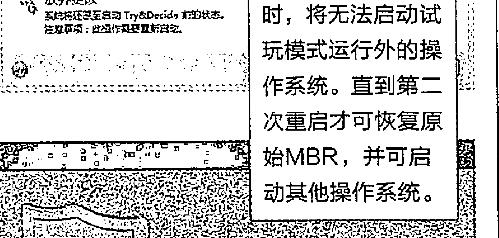

文|柳繁枝

### 玩爽游戏的音频软设置

有的游戏本身带有很炫酷的音频效果，但如果音频设备或软件音频没有设置好，游戏音效会大打折扣。因此，熟练掌握音频设置的方法和技巧很有必要。

##### 1. 找到游戏不发声的根源

有时我们会发现，在进入一款游戏后，只有画面，没有声音，这时我们往往首先会想到是否设置了静音或线路连接是否有问题。但当排除了这些因素后，可能游戏仍没有声音。问题出在哪里？如何解决？点击“设备”中的具体设备名称（如本例所用设备为“扬声器”）启动设备设置窗口，在“设备用法”选项中可见设备的使用状况，如果在游戏时发现扬声器无法发声，那么很可能就是这里的选项没有切换到“启用”状态，只需从这里设置开启，游戏就有声音了。

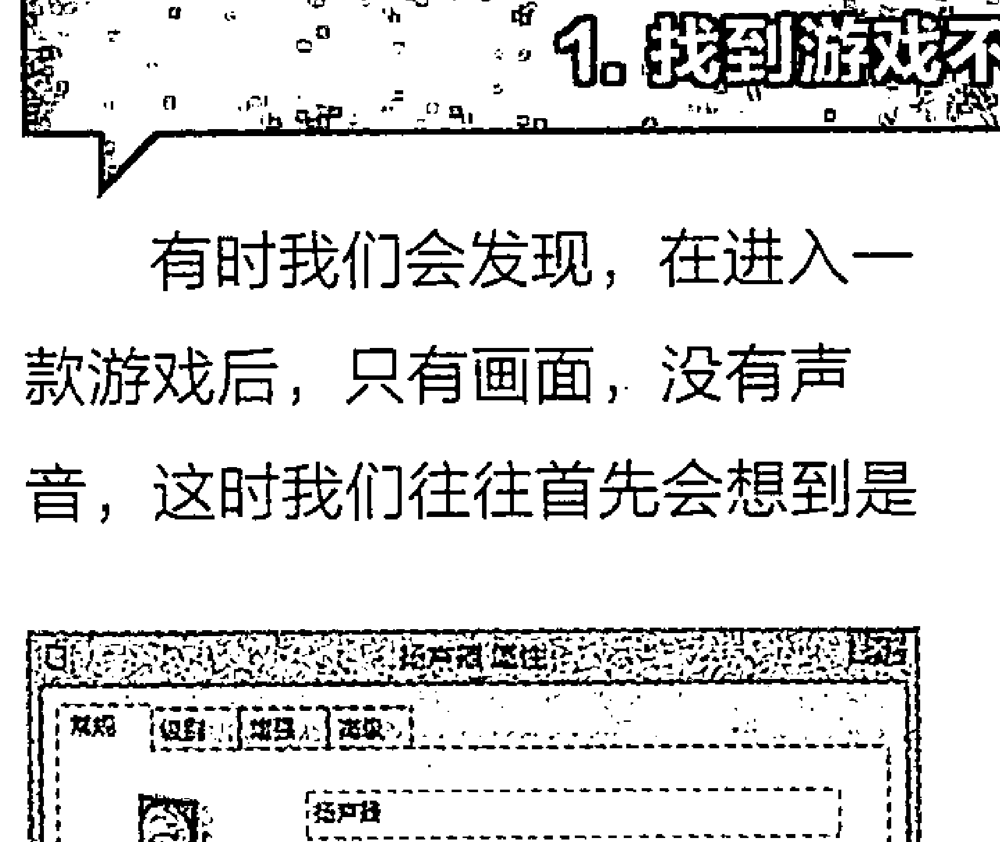

##### 2. 游戏音效差的问题解决

按理说，多声道的音箱（如5.1、7.1等）玩游戏的效果要远远好于2.0或2.1的音箱。但是，有些时候我们会发现，高端多声道音箱出来的效果还不如2.1音箱的效果。问题何在？

如果系统中挂接的是5.1、7.1级别的多喇叭扬声器，要玩的游戏也是支持多声道立体声的高级游戏，而由于设置问题，系统只开启了两个声道，那么游戏音效输出将大打折扣，5个或7个声道的效果玩家只获得了2个，获得的音效会是残缺不全的，而并非最完美的效果。在这种情况下，多声道高级音响上获得的效果自然不如在2.1的音箱系统上获得的效果好。2.1系统虽然是模拟混合音效，但至少它的输出效果中各种声道效果是全面的，并无丢失某个声道。

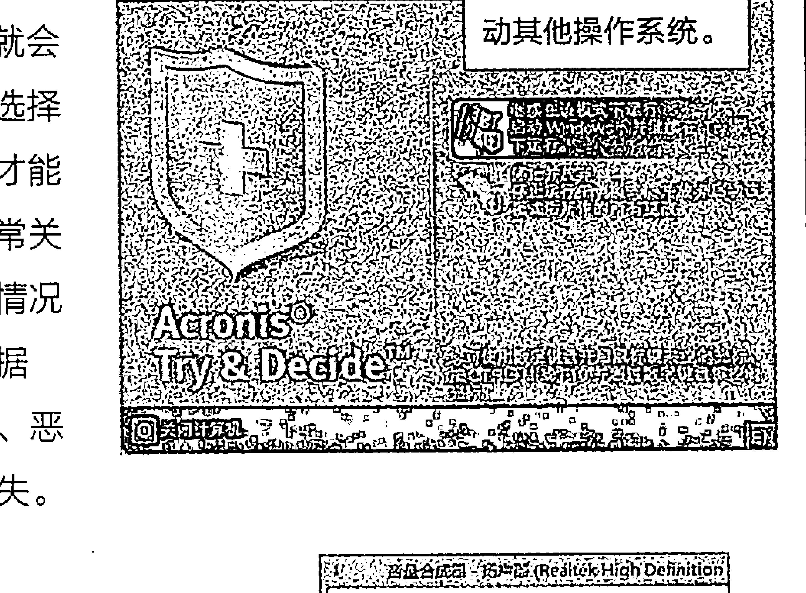

##### 3. 取得游戏增强音效的秘诀

如果对系统和游戏的基本音效不满意，在不更换声卡和音箱的条件下，用软设置的办法能提高音效吗？我们可以用设置声音增强效果的办法提升音效。进入扬声器设置的“增强”选项卡窗口，从多种声音增强效果中选择设置。其中包括模拟各种环境的选项，如客厅、礼堂、音乐厅、下水道等10多种环境效果，

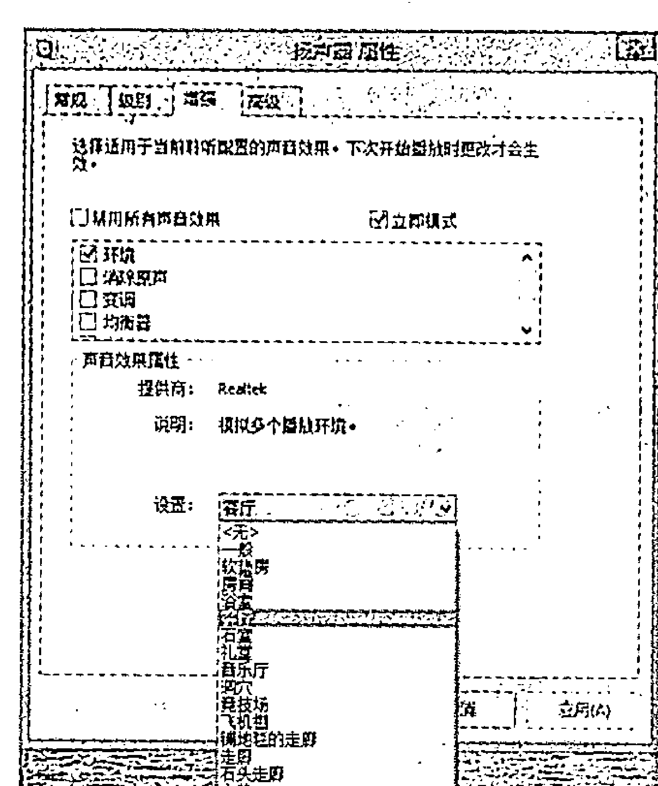

还可以选择开启“变调”、“均衡器”、“虚拟环绕声”、“响度均衡”等选项并进行具体设置。

> **小技巧**
>
> 还可通过设置在共享模式运行时使用的音频采样频率和位深度参数，进而提高游戏音质效果。从“高级”选项卡的下拉列表中选择具体的音质参数，然后可以通过旁边的“测试”按钮进行具体测试。

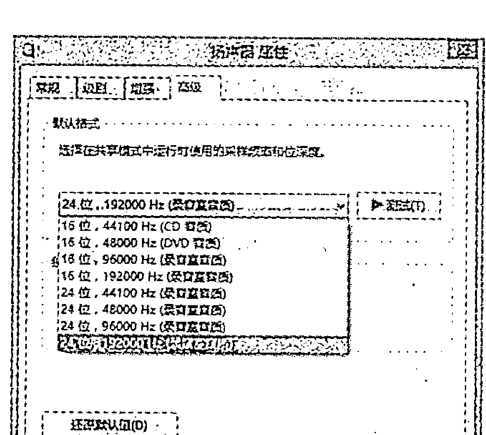

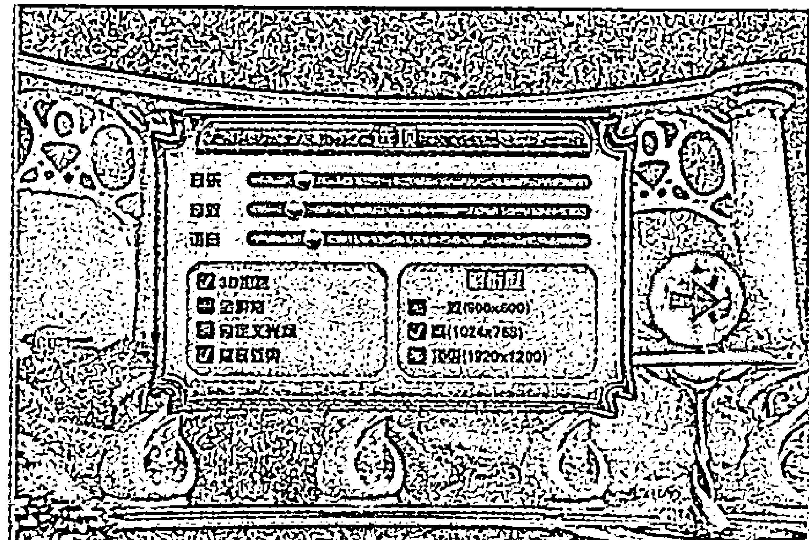

##### 4. 游戏过程中的语音协调融合

如果电脑开通了网络语音电话功能，在游戏中，若有语音电话进入，或者要拨出电话，需要手动关闭游戏的声音吗？不用！只需将系统中的游戏声音和背景音乐等音量自动调低或自动关闭即可。通过对“声音”设置窗口的“通信”选项进行设置，可灵活选择Windows检测到通信活动时，将系统中的其他音量减少到50%或80%，甚至还可以选择“将所有其他声音设置为静音”，实现在检测到拨入拨出语音时，直接自动关闭其他音量。

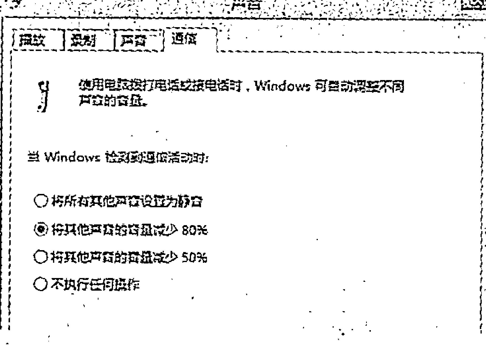

##### 5. 综合平衡设置才能出效果

游戏中如何设置最好的音效，有通用的办法吗？虽然在游戏开启后有一个默认的声音设置组合，但是，每个人对游戏中发出的声音的关注点有所不同。因此，系统提供的默认设置也许不能让自己满意，这时就需要开启游戏的设置窗口，对游戏中的具体音频参数进行具体设置。例如，如果要求游戏中的具体语音更突出，而要求背景音乐更低调，则可以调高“语音”一项而调低“音乐”一项。可以通过多次测试，分别设置这三种参数，从而达到一个让自己最满意的境界，最后再开始正式进入游戏。

> **小提示**
>
> 在具体的游戏当中，音效设置一般会涉及音乐、音效、语音三种选项，这三种选择中每一种都有单独的音量高低设置，而更重要的是要将这三种选项的音量设置调整到一个最佳的综合平衡位置。

### 移动也疯狂

随着智能手机和平板电脑的普及，传统的游戏娱乐平台已经从桌面转移到了掌心之上。那么，手机游戏如何才能玩得更震撼？操作起来更具手感？避免恼人的各种兼容性问题？在本文中，你就能找到答案。

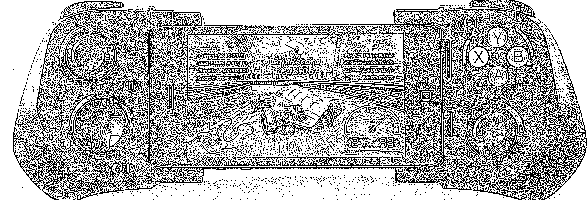

### 大屏游戏更震撼

##### Android手机‘入侵’TV攻略

手机屏幕再大，也仅为单一用户提供相对震撼的视觉享受。但想与家人或朋友一同体验游戏乐趣，哪怕是6.44英寸的索尼XL39L也相形见绌。想将手机的游戏画面传输到更为震撼的电视屏幕中，有线的‘MHL’技术和无线的‘Miracast’技术则是两条必经之路。

> > **MHL让手机与TV‘亲密接触’**
> >
> > MHL是一种手机上的影音标准接口，它以现有的Micro USB接口为基础，只需一款MHL适配器或支持MHL的电视机/显示器，就能将手机上的画面无延迟地传输到更大的屏幕上播放。

##### 不是谁都支持MHL

目前支持MHL的Android手机有很多，三星、HTC、索尼、华为、小米、魅族、大可乐等品牌都有部分型号支持该技术（图1）。需要注意的是，刷入非官方的ROM可能导致MHL功能的失效，一些运行商定制机也可能会‘阉割’此功能。比如三星Note 2和S4家族中的联通定制双卡版N7102和i9502就不支持MHL，大家在选购手机时需要多加留意。

此外，以AOC旗下的刀锋Ⅲ及LUVIA悦影为代表的新一代显示器都配备了支持MHL技术的HDMI接口（图2），一个接口就可负责信号传输和充电的双重功效（即MHL线直连）。而那些不支持MHL的显示设备，则需要可辅助供电的适配器。

##### 5Pin和11Pin的差异

手机明明支持MHL，但买了MHL适配器并按教程与电视机相连却没有反应？这是很多玩家都碰到过的尴尬。原因是像三星旗下的S3、S4、Note2、Note3等较新的支持MHL的高端手机都采用11Pin（针脚）Micro USB接口。而其他品牌支持MHL的手机则以5Pin标准的Micro USB为主。针脚数量不同，导致两种标准的数据线不兼容（图3）。

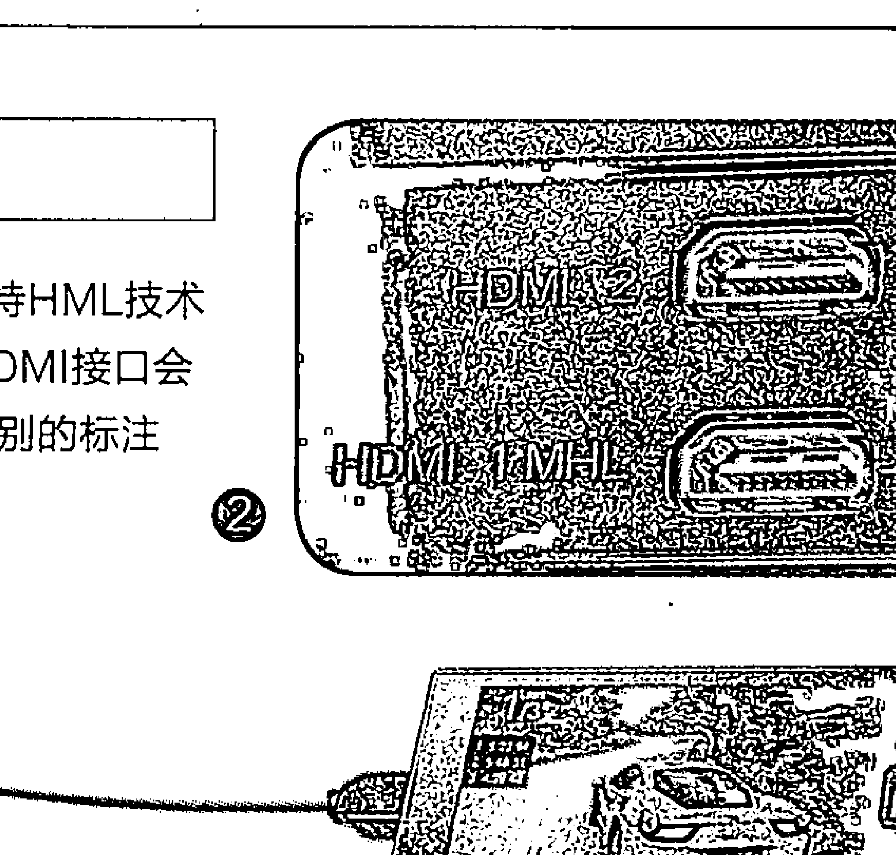

因此，如果你的手机并非三星新品，购买5Pin的通用版MHL适配器即可。如果你的手机是三星S3以后的新品，则需购买11Pin的专用版MHL适配器或5Pin转11Pin的转接线（图4）。


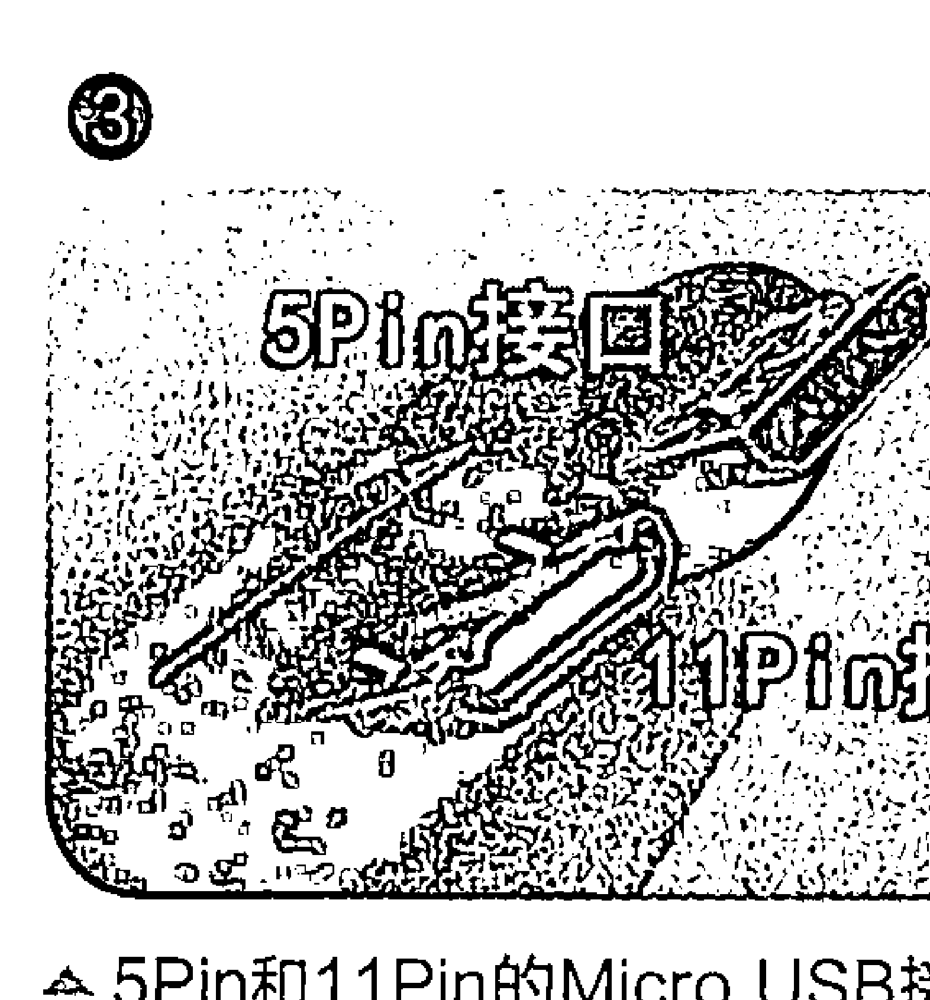

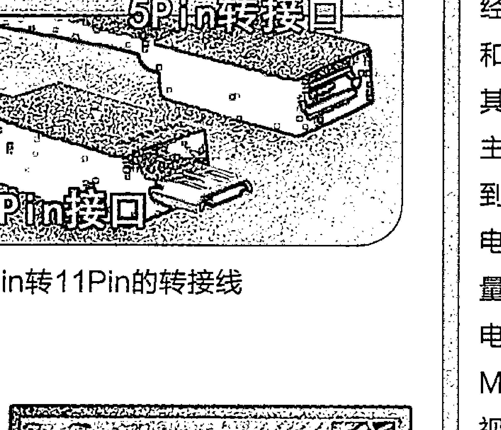

> 小提示：目前MHL已经出现了2.0和3.0标准，其中MHL2.0主要是提升到900mA供电，解决了电量消耗大于充电的尴尬。而MHL3.0则将视频输出提升到4K标准，解决了游戏中的延迟问题。

##### MHL的使用细节

MHL功能的使用很简单。以不支持MHL的电视为例（图5），我们需要一款MHL适配器（淘宝25元～65元），将Micro USB接口一端与手机相连，HDMI接口一端与电视机相连，而适配器上的另一个USB接口则连接手机充电器（图6）。

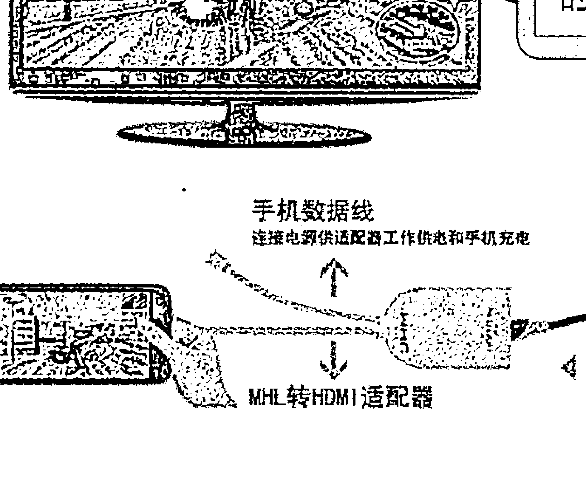

需要注意的是，当MHL适配器与手机/电视相连后，手机需重启才能将画面输出到电视上（图7）。首次连接成功后，中途拔下插头再连接时就不必重启了。虽然MHL有额外的充电器给手机供电，但手机在播放视频或游戏时电池依旧会不断减小（低价MHL适配器都是1.0标准，供电速度比不上电池消耗速度），电量过低会出现闪屏、黑屏的现象。此外，MHL在播放视频时几乎无延迟，只是在传输游戏画面时会有轻微延时（绝大多数游戏都不受影响）。但如果玩快节奏的酷跑类游戏，建议玩家始终盯着手机屏幕操作（此时就别盯着电视画面了），避免因短暂延迟而输掉游戏，而其他观看者则可通过电视看到实时的“转播”。

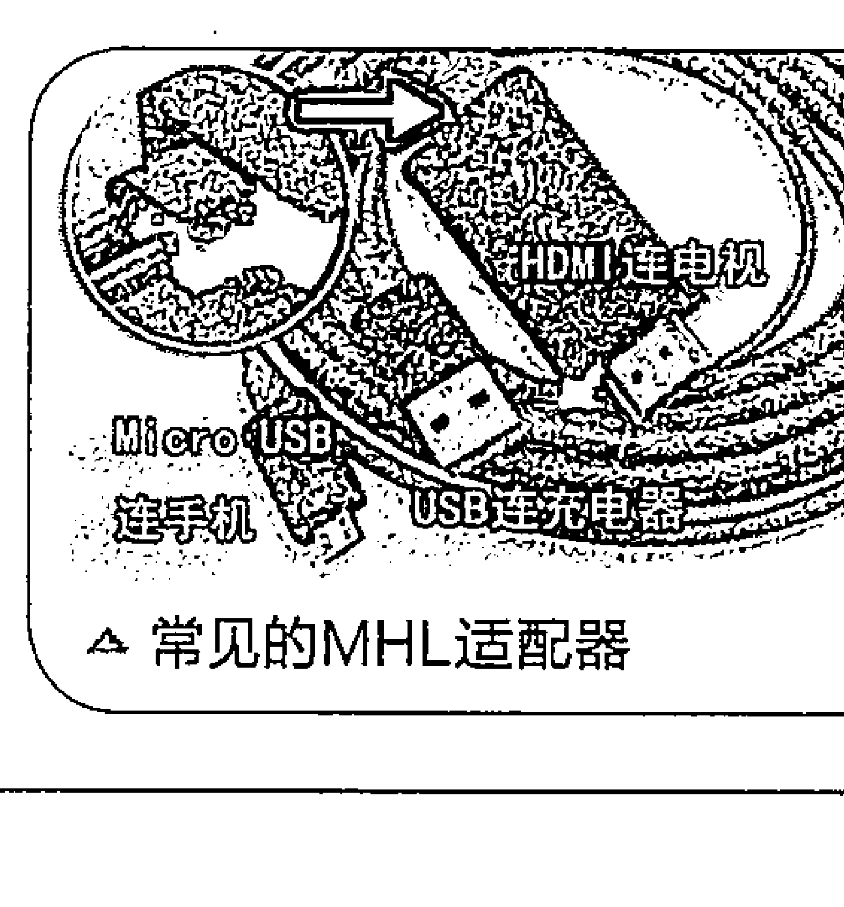

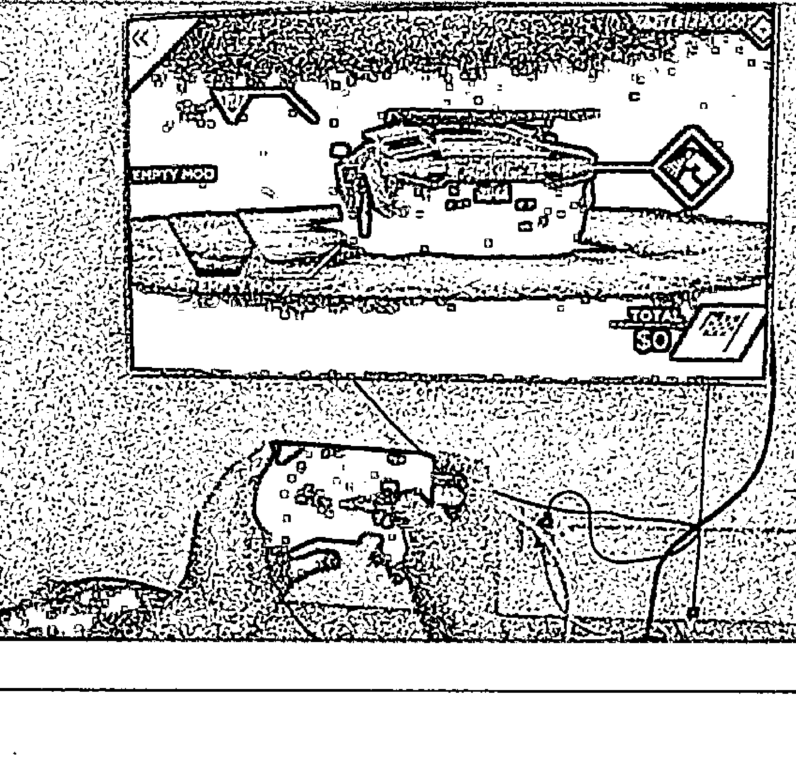

##### MHL的替代者出现

以小米2、魅族MX2为代表的2012年国产旗舰手机都将MHL作为一大特色卖点并广泛宣传。就在我们以为MHL将成为Android手机“标配”功能之际，小米3、魅族MX3却“阉割”了这一功能。对此魅族J.WONG的解释是，以电视棒、盒子为代表的互联网设备和无线显示功能即将成为主流，所以放弃MHL。那么，无线真的可以取代MHL吗？

##### 不要“推送”要“显示”

《电脑爱好者》在前几期杂志上曾重点介绍过DLNA无线推送技术的搭建方法和使用技巧。但是，DLNA只能推送手机中的图片、音乐和视频到电视上显示。想让游戏画面也能以无线的形式传输到电视屏幕上，就需要借助Airplay（限iOS设备）、WiDi（限英特尔芯片）和Miracast三大无线显示技术了。其中Miracast的通用性最佳，只要手机是Android 4.2或以上版本，都可以在设置中找到“无线显示”的选项，也就是本节重点介绍的Miracast。

##### 求助“盒子”和“棒子”

目前只有新兴的智能电视才支持Miracast，而老电视或液晶显示器则需要借助支持Miracast的电视盒或电视棒才能获得无线显示的能力（图8）。需要注意的是，并非所有的“盒子”和“棒子”都支持Miracast，在选购这类外设时大家需要留意该技术的指标。

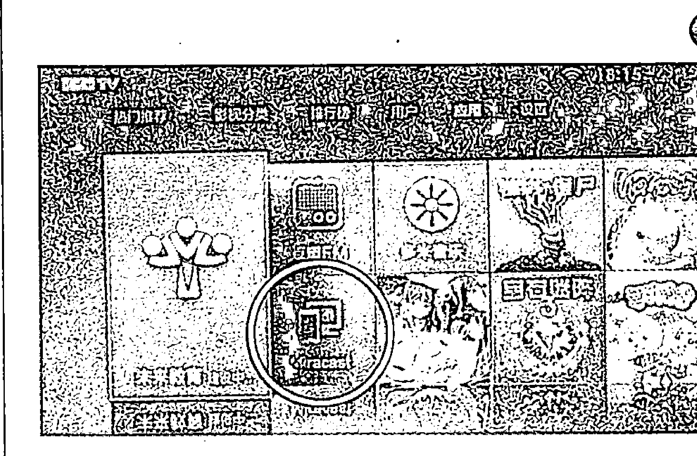

##### Miracast让手机与TV“远程传情”

目前能让手机和电视无线互动的技术主要分为“无线推送”（如DLNA）和“无线显示”（如Airplay、Miracast和WiDi）两大类。对Android手机而言，其中Miracast才是最适合游戏的无线显示技术。

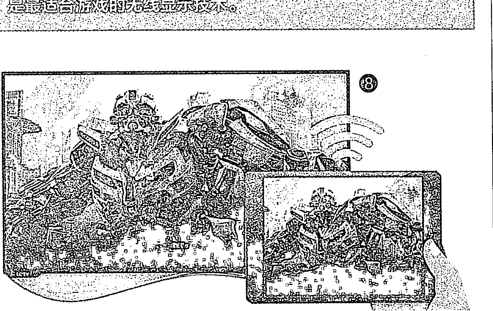

##### 实战Miracast功能

Miracast的使用方法比有线的MHL更简单。以小米盒子为例，利用遥控器进入“应用→Miracast”（图9），此时盒子会自动断开Wi-Fi网络并开启Wi-Fi Direct（Wi-Fi直连）功能，电视屏幕上显示“等待连接”的提示，接下来就是手机端的操作了。不同品牌对Miracast功能的称呼和设置位置不尽相同。比如OPPO N1 “设置→无线网络→更多→无线传输”界面中的“WLAN Display”功能就是Miracast（图10）；而美图秀秀1S则位于“设置→显示”，其“无线显示”功能则是Miracast（图11）。总之，只要手机系统是Android 4.2或以上版本，理论上都是支持Miracast功能的。打开对应功能后，就可搜索到等待连接的小米盒子，点击后即可实现自动连接。

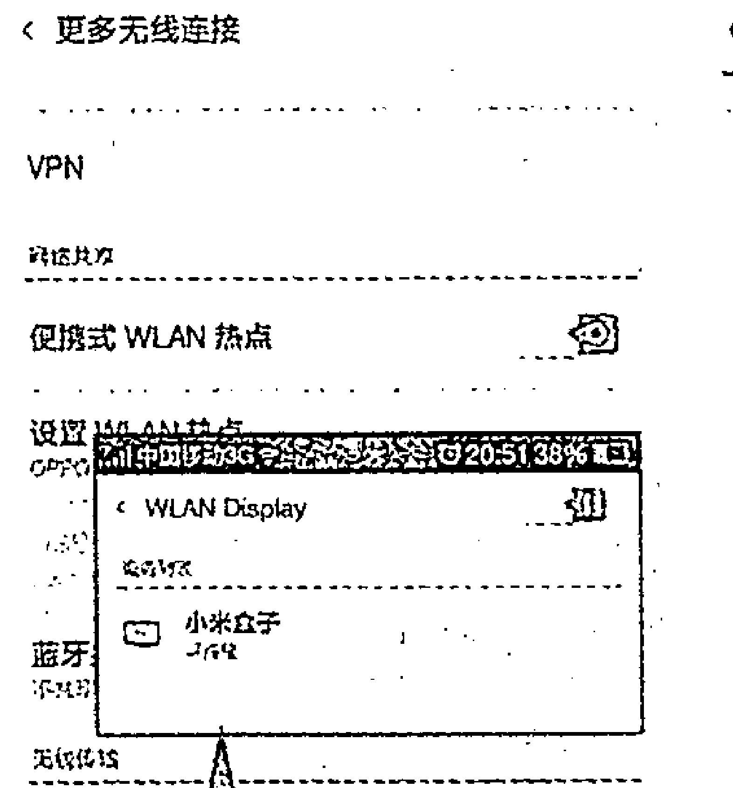

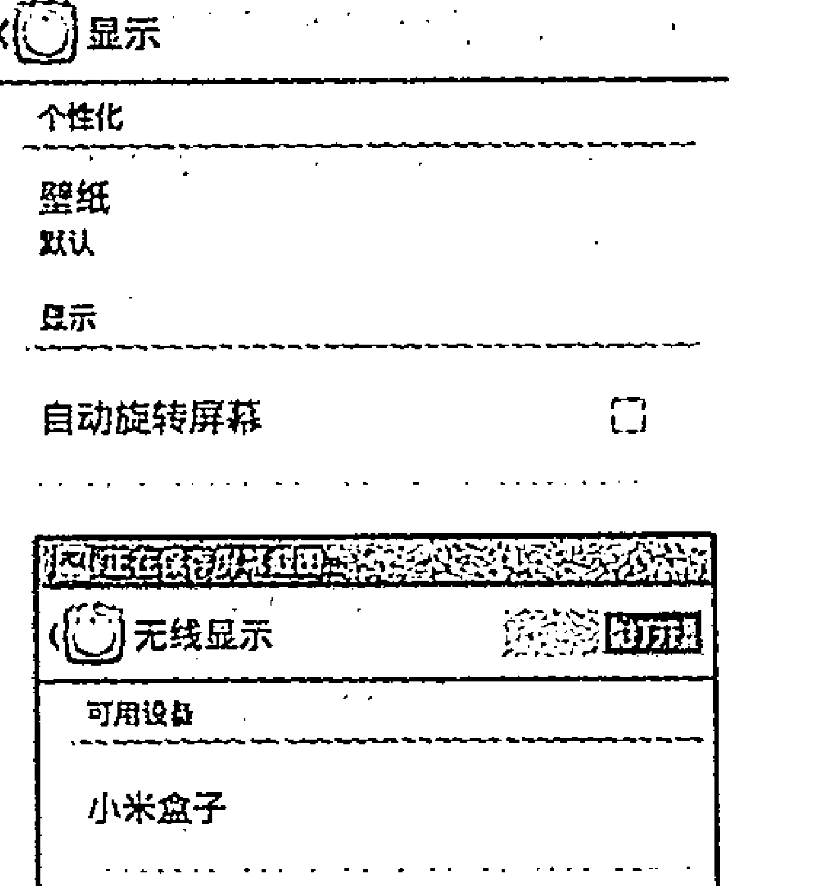

##### 无线显示的“后遗症”

在Miracast无线显示模式下，手机画面是被等比例放大到电视屏幕中的，一些仅支持竖屏的游戏会浪费屏幕的绝大部分空间（图12），只有横屏游戏才能做到“全屏显示”。此外，由于手机和电视的屏幕比例多为16:9（720P或1080P），所以可完美输出。但如果你用4:3（1024×768）平板电脑和电视使用Miracast技术相连，在全屏模式下画面会出现一定的形变。

至于大家所关心的延迟问题，则取决于手机和电视盒子本身。Miracast技术的本质是模拟一个“中间人”的角色，手机端捕捉屏幕的画面并将其实时压缩成H.264编码的视频流，通过Wi-Fi直连的技术发送到以电视盒子为代表的接收端进行解码然后播放。由此可见，手机屏幕的分辨率越高，在实时压缩/解码时的压力越大。在实际测试中，虽然OPPO N1搭载的高通骁龙600已属高端CPU，但在看视频和玩游戏时都会出现明显的信号延迟（图13）。而美图秀秀1S虽采用了廉价的联发科方案（720P屏幕），但延迟感却有所降低，玩塔防类的游戏压力不大。

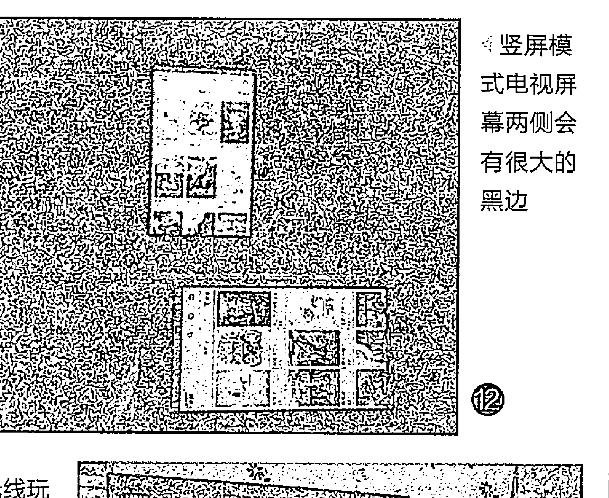

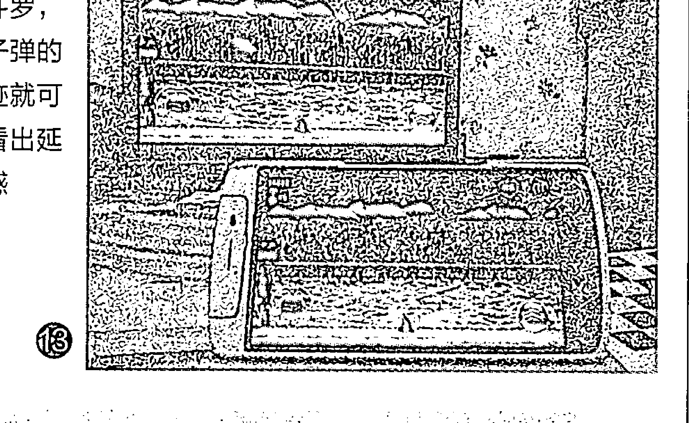

> 总之，无线的Miracast可作为有线MHL的补充，但在现有硬件平台的基础上，依旧无法避免延迟现象。虽然在某些手机和适配器上延迟可被降到最低，但依旧会影响《水果忍者》这类要求精准操作的游戏体验。因此，现阶段手机外接电视更适合家人朋友一起欣赏震撼的游戏画面，而游戏者还是需看着手机屏幕来操作。

##### 蓝牙手柄：解决手机游戏时的操控烦恼

当手机画面被输出到电视屏幕上后，再拿着手机操作就显得颇为累赘了。此时，如果为手机配备一款蓝牙游戏手柄，无疑可以获得类似家用游戏机的体验。

##### “好游戏”却“不好玩”

如今手机游戏的画面素质已经不逊于昔日的传统游戏掌机。悲剧的是，利用屏幕上的虚拟按钮或重力感应，玩赛车、塔防、RPG一类的游戏尚可，但碰到《现代战争4》、《蝙蝠侠》一类的游戏就没有任何操作性可言了，可谓好游戏却不好玩。想改善手机上的游戏体验，一款蓝牙手柄自然是最佳选择（图1）。

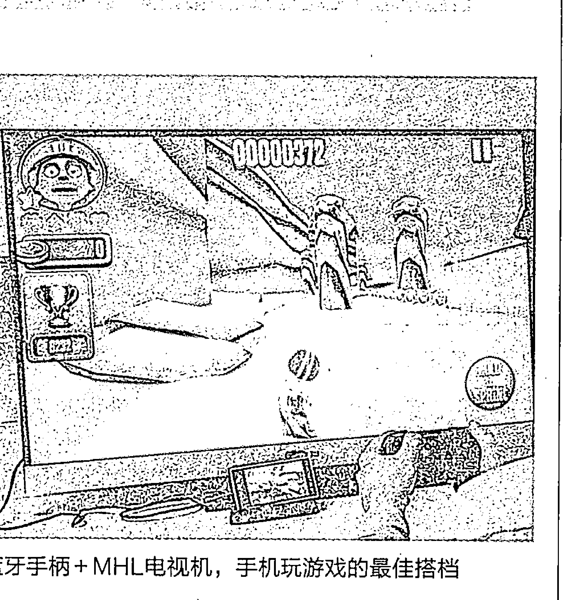

> 有些手柄伸缩支架的固定位置可能会与手机的电源键冲突。比如小米2手机的电源键在侧面中间，而Wamo手柄的固定端恰好会压住手机电源键导致关机。

##### 蓝牙手柄怎么选

在购买蓝牙手柄时，一定要选择配备可伸缩支架的产品，以兼容不同屏幕尺寸的智能手机。以IPEGA二代蓝牙游戏手柄为例（图2），其支架可以支撑从3.2英寸到6.44英寸的所有常见机型，而且官方还提供了游戏大厅APP，可直接下载兼容该手柄的Android或iOS游戏，类似《GTA3》、《地牢猎手4》、《六发左轮》、《蝙蝠侠》和《永恒战士》等游戏都能与手柄按键完美配对。

需要注意的是，联发科方案的手机（比如红米）存在“挑”蓝牙手柄的问题，比如前文提到的IPEGA手柄碰到MT6589处理器的手机就会出现各种兼容性问题。推荐联发科手机用户选择Wamo品牌的蓝牙手柄（图3），根据网友的反馈对MT处理器的支持更好一些。为了避免兼容问题，建议大家购买手柄前，先向商家询问沟通。

> IPEGA二代蓝牙手柄，淘宝价格约160元

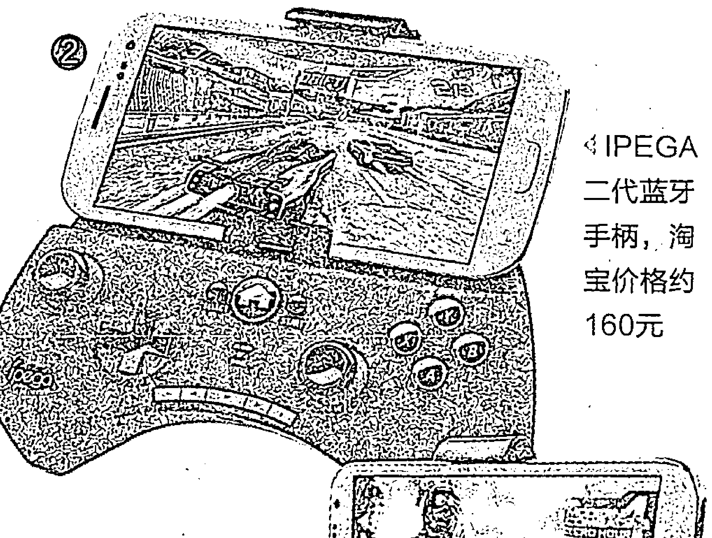

> Wamo二代蓝牙手柄，淘宝价格约150元

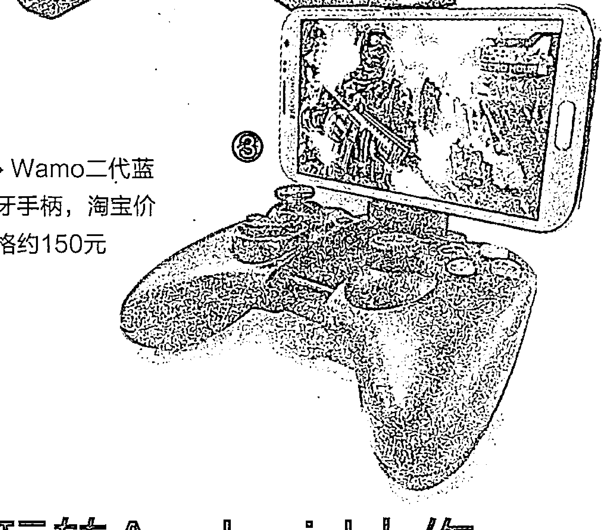

##### 别错过模拟器游戏

虽然用手柄游戏可以带来更细腻的操作手感，但iOS和Android系统中并非所有游戏都兼容手柄。本着物尽其用的原则，推荐大家在手机上安装家用机/掌机模拟器，通过按键映射功能，在手柄上进行模拟器游戏体验。比如“模拟宝”APP（下载地址：http://t.cn/z8jcyu6）就提供了包括NDS、PSP在内的几乎所有Android模拟器和相关游戏资源下载（图4~5），而蓝牙手柄几乎100%兼容此类模拟器，让我们可以找回当年玩《梦幻模拟战2》、《口袋妖怪》和《塞尔达传说》时的感觉。

支持手机的蓝牙手柄对游戏资源的兼容性都差不多，因此我们也没有必要购买三星指定、苹果指定的“高端产品”。目前150元以内的蓝牙手柄都有不错的手感，而各品牌游戏中心APP内的资源也都是通用的。

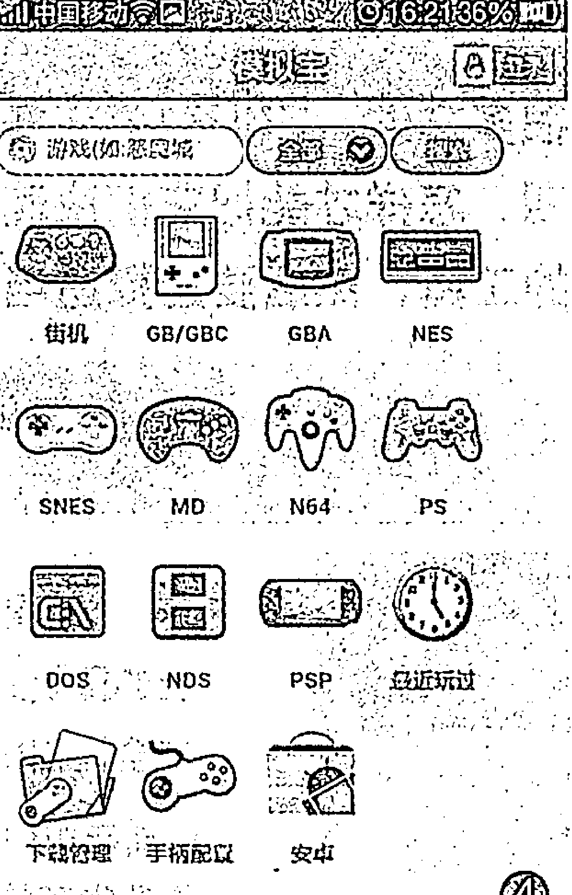

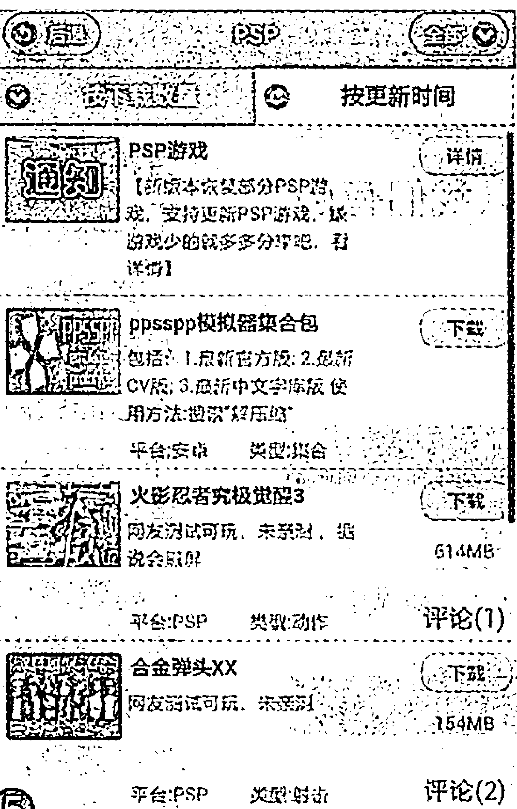

##### 玩转Android大作

很多Android平台的3D游戏大作都需要下载“安装程序+额外的数据包”，而且需根据自己手机的硬件平台下载匹配的版本，否则一运行就会出现各种莫名其妙的问题。

##### 拇指玩选择游戏资源

推荐大家在拇指玩（http://www.muzhiwan.com/）寻找大型游戏资源。该网站大型游戏的下载格式为GPK，只需在手机或PC端安装客户端程序，就可一键自动安装在手机上。要注意的是，手机必须开启USB调试模式才可被PC客户端识别。目前拇指玩提供的大型游戏GPK通常为两类：

-   1. 根据手机CPU选择匹配版本，如所有基于联发科处理器设计的手机，可以直接选择红米手机。
-   2. 全机型通用版，兼容所有CPU平台。如果下载的游戏和自己的手机不匹配，轻则出现不显示文字或贴图错误，重则无法运行游戏。

### 精准‘去伪’ 轻松‘存真’

我们生活在一个‘选择太多’的时代，信息越来越丰富，电脑中的各种文件多得数不清，软件工具也是花样越来越多。但是，这其中对我们有用的只是少数。而要找到最适合于自己的却很困难，也越来越耗费时间。如何用最短的时间找到自己最想要的内容或产品，就让我们共同来探讨这一话题。

### 去芜存菁大清扫

我们的磁盘上存储了很多文件，它们散落在各处，许多急用的文件难以找到，许多无用的文件已经过期，怎样才能把它们快速筛选出来，加以备份或清除呢？首先要选择适当的工具，然后要选择适当的方法，最后进行适当的处理。


### 谁真的去冗：重复文件查找软件PK

磁盘上的文件多了，难免会有不少重复存放的，这就白白占用了宝贵空间。要想快速找出重复文件，需要借助一些软件工具来完成，而这方面的工具有很多，所以我们有必要评测一番，看看究竟哪款软件功能更强大。

###### 测试平台

-   CPU: Core i3-2120（双核3.30GHz）
-   内存: 4GB
-   硬盘: 希捷1500GB（7200转）
-   操作系统: Windows 7旗舰版

##### 评测软件（均为最新正式版）

-   Vistanita Duplicate Finder
-   Duplicate Cleaner
-   Fast Duplicate File Finder
-   FindDupFile

对于重复文件查找工具来说，一是它能找出的重复文件数，一是完成查找的速度，另外安全性和操作性也是重要的考察标准。

-   **新手用户**：Vistanita Duplicate Finder的操作非常简单，而且安全性好，并且带有使用向导，所以是电脑新手的理想选择。
-   **电脑高手**：Duplicate Cleaner支持自行设置各种搜索参数，所以能搜索到更多的重复文件，不过操作相应就复杂了很多，适合高手使用。
-   **高安全**：Fast Duplicate File Finder比较适合对系统安全性要求较高的用户，它选择重复文件的标准较高，比如它会自动跳过带系统属性的文件。不过它扫描时间是最长的，扫描出的文件也是最少的，适合注重安全的用户。
-   **高效率**：FindDupFile是几款软件中效率最高的，搜索出的重复文件最多。不过相对来说，它的安全性也较低。所以，它比较适合磁盘空间紧张的用户，不过对它所列出的文件，删除时要慎重，避免误删。

### 文件重复软件横向评测表

| 评测软件 | 扫描时间 | 重复文件数 | 重复文件占用 | 易用性 | 安全性 |
| :--- | :--- | :--- | :--- | :--- | :--- |
| Vistanita Duplicate Finder | 1m56s | 2562 | 24096 | 非常简单 | 安全 |
| Duplicate Cleaner | 1m34s | 5145 | 36392 | 较复杂 | 安全 |
| Fast Duplicate File Finder | 2m3s | 623 | 32623 | 简单 | 安全 |
| FindDupFile | 1m54s | 5489 | 28736 | 简单 | 安全 |

> 1. Vistanita Duplicate Finder向导
> 2. FindDupFile扫描出最多重复文件
> 3. Fast Duplicate File Finder自动跳过系统文件
> 4. Duplicate Cleaner支持众多搜索参数

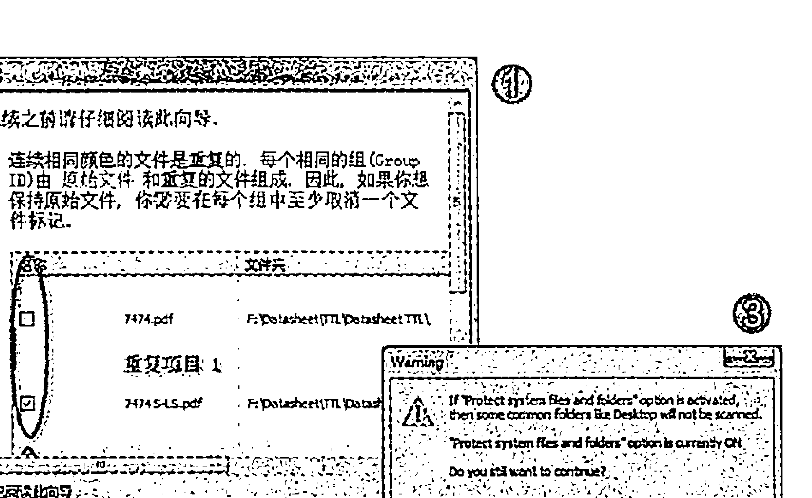

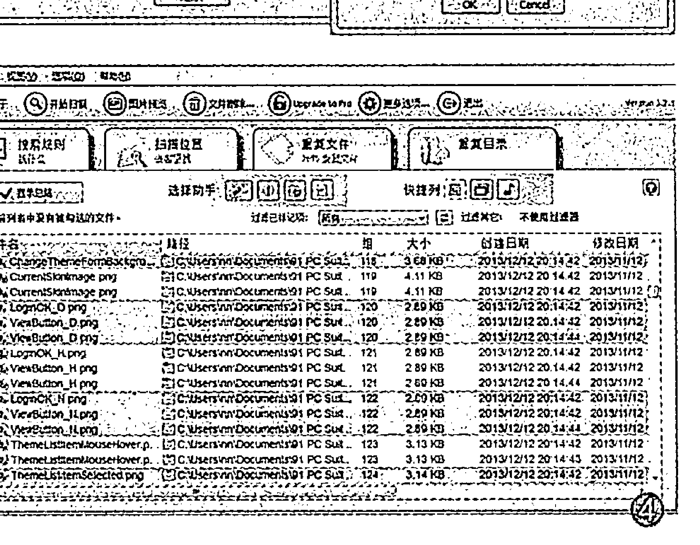

### 通缉令：硬盘里的大块头

除了重复文件占用空间外，很多无用的大文件也是空间占用的罪魁祸首。到底有哪些文件占用空间，它们又占用了多少？利用专业文件分析工具即可一目了然。下面我们就对多款文件分析软件进行评测，以便选择最称手的工具。

###### 测试平台

-   CPU: Core i3-2120 (双核3.30GHz)
-   内存: 4GB
-   硬盘: 希捷1500GB (7200转)
-   操作系统: Windows 7旗舰版

##### 测评软件（均为最新正式版）

-   Windirstat
-   SpaceSniffer
-   SpaceMonger
-   Makeroom

### 文件分析评测表

| 评测软件 | 扫描时间 | 资源占用 | 分析图示 | 分析结果 |
| :--- | :--- | :--- | :--- | :--- |
| Windirstat | 30s | 23928 | 较直观 | 很详细，根据扩展名将文件类型全排列 |
| SpaceSniffer | 50s | 26674 | 直观 | 详细，但未按扩展名文件类型排列 |
| SpaceMonger | 47s | 15896 | 非常直观 | 用简洁矩形块图形表示 |
| MakeRoom | 89s | 42739 | 非常直观 | 结果按视频、音乐、图片、压缩文件排列 |

对于这类软件，因为我们只是要知道文件占用的空间情况，所以主要测试的是它们的操作速度，以及对结果显示的准确和直观性，方便我们对文件占用空间有个清晰的了解。

-   **系统高手**：Windirstat得出的分析结果非常详细，列出了每种文件占用的详细信息，并且它还根据文件扩展名，将每种文件类型也全部排列出来。SpaceSniffer也不错，但在一些细节上没有Windirstat好，并且Windirstat的扫描速度也是最快的。
-   **新手用户**：SpaceMonger和MakeRoom，对新手用户来说都比较适合，它们的显示非常直观，可以一目了然地了解常见文件占用空间。不过相比而言，SpaceMonger的扫描速度极快，而MakeRoom的扫描结果更贴心，依据用户常见的视频、音乐、图片、压缩文件等有序排列。

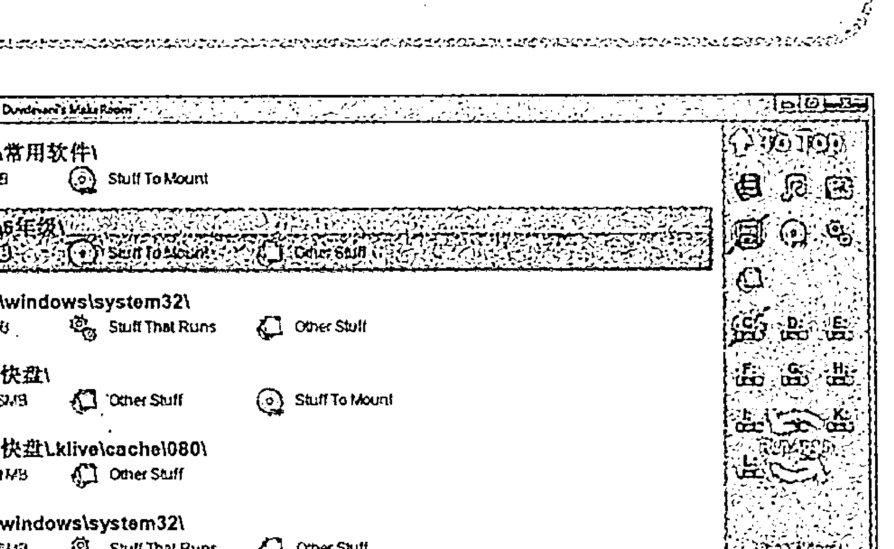

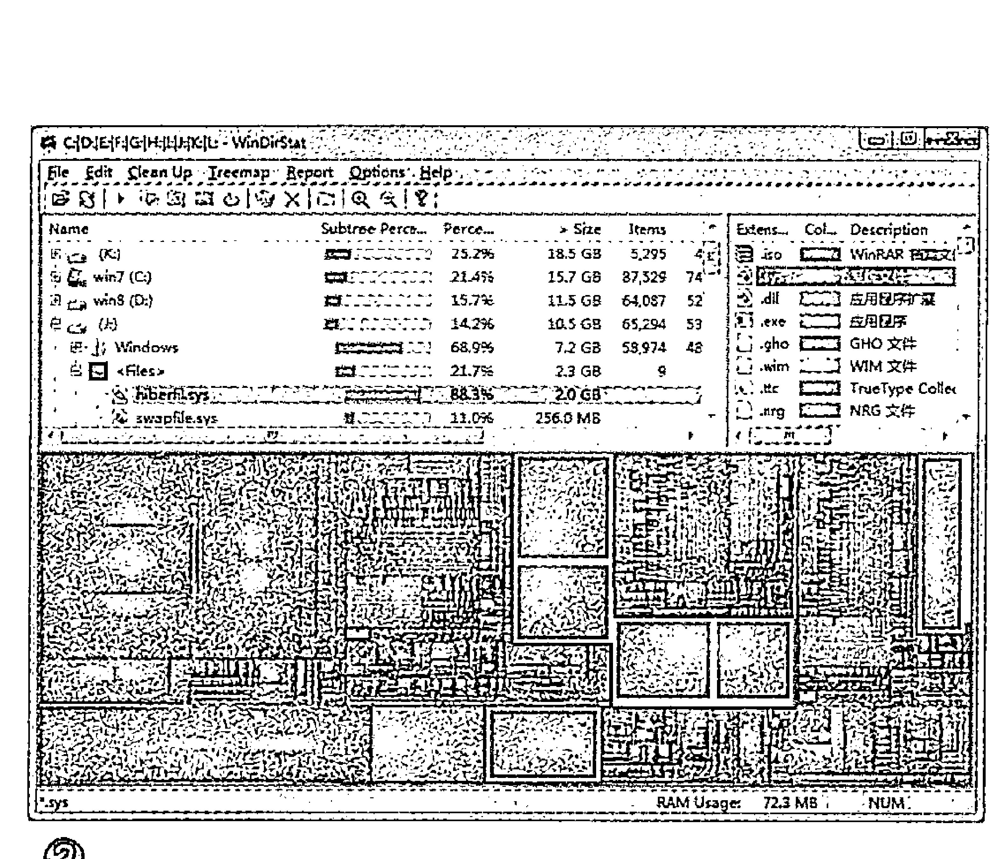

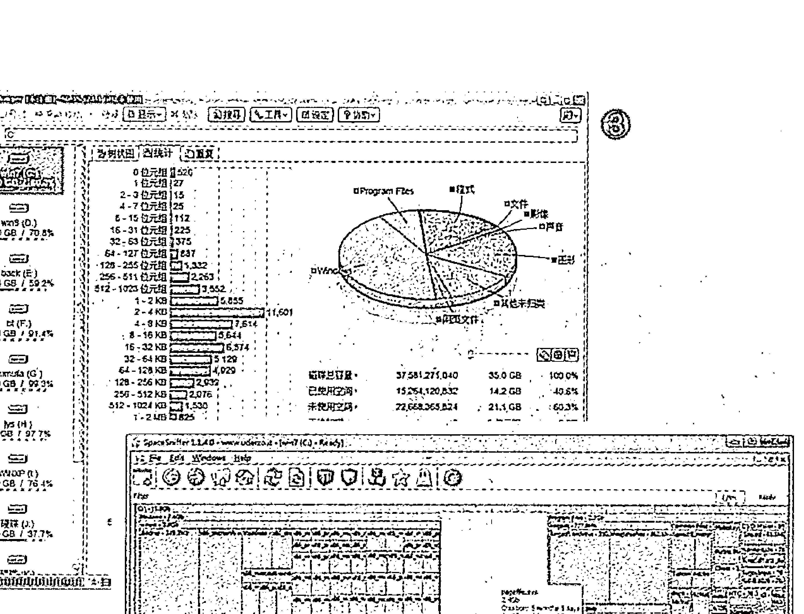

> 1. Makeromm界面简洁图示清晰
> 2. Windirstat列出常见文件类型并且以不同颜色标注
> 3. SpaceMonger使用各种图示直观标注常见文件类型占用的空间
> 4. SpaceSniffer列出每种文件占用的详细信息

### 非常规手段

##### 筛选删除

在前面，通过评测我们已选择好相应的工具，通过它们就可以快速找出重复文件以及占用庞大空间的累赘文件。那么如何安全、快捷地删除这些累赘文件？除了一些能通过软件自动清理的垃圾文件之外，有些文件需要我们自己才能辨认，对这类文件的清理我们也有妙招。

现在很多程序为了保护自己的文件不被误删除，经常使用系统保留字符作为文件（夹）扩展名，这些畸形文件（夹）默认无法删除，也无法被上述软件检测到。比如很多一键Ghost软件就使用类似“g.”目录作为备份文件的存放目录，如果你已经卸载这些软件并不再需要备份文件，那就可将这些多余的文件删除。

类似“g.”畸形目录，使用rd命令行即可将其删除。首先以管理员身份启动命令提示符，接着输入下图中的命令：

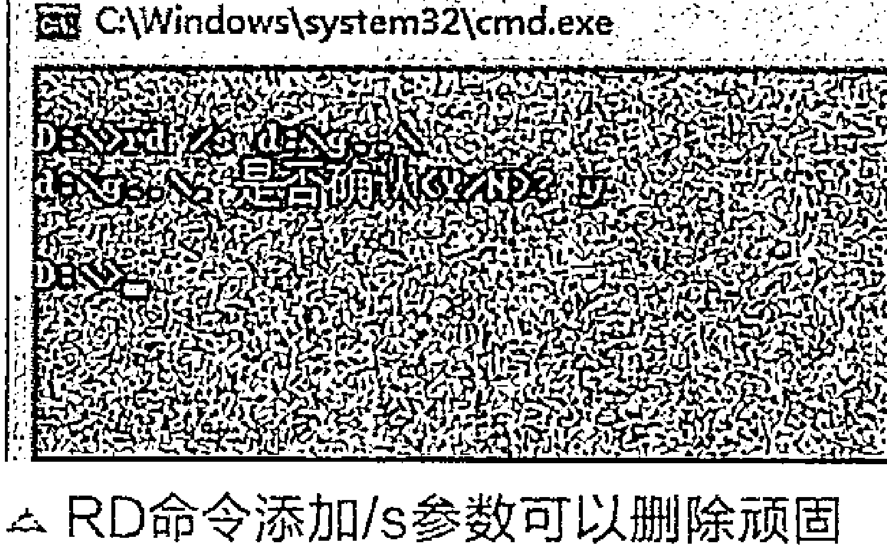

RD命令添加/s参数可以删除顽固目录及其中的文件

###### 小技巧

实际上很多命令行工具都支持各种丰富的参数，通过添加参数可以实现更多效果。比如想知道自己电脑中是否有类似“g.”的畸形目录，只要输入“dir /a +h +s /s k: >e:\cfan.txt”命令，这里通过添加“/a”参数列出具有系统、隐藏属性的文件（夹），通过“/s、>”参数列出所有文件并输出到cfan.txt文件中，我们只要使用记事本打开，查找看看有否类似“g.”目录，即可找出占用空间的畸形目录。

```
dir /a +h +s /s k: >e:\cfan.txt
```

##### 指定文件批量删除

通过上述方法我们看到磁盘中各种文件类型占用的空间，一般视频文件占用的空间是最大的，而且删除也最为安全（哪个视频有用自己最容易搞清楚）。因此如果我们要删除某类指定文件，只要使用系统自带的搜索功能即可。比如要删除视频文件，只要打开资源管理器，然后打开搜索，搜索目标选择“计算机”，在搜索框输入“*.avi OR *.mpg”，注意这里不包含外部双引号，每个类型OR要用半角的空格断开，可以按此格式自行添加其他类型视频文件。这样所有指定类型的视频文件就会全部被搜索出来（无论它是在硬盘的哪个角落），完成搜索后根据需要进行删除即可。

###### 小技巧

为了腾出硬盘空间，最有效的方法是删除体积较大的文件，同样可在搜索框指定体积大的文件，只要在添加搜索筛选器选择“System.Size:>1000mb”进行搜索，这样大于1000MB的所有文件都可以列出，按需要进行选择性删除即可快速腾出可用空间。

### 特别文件的特别删除

很多时候我们要删除一些确定没用的累赘文件，比如对于一些已经备份或者已经失效的报表文件，一般就可以直接将其删除。但是这些文件经常和其他有用的文件混合在一起，如果需要删除特定条件的文件，可以利用forfiles命令。

比如现在要删除2013-12-31之前在k:\工作文档下创建的全部DOC过期文件，只要以管理员身份启动命令提示符，然后输入下列命令即可：

```
forfiles /p k:\工作文档 /m *.doc /d -2013/12/31 /c "cmd /c del /s /f @path >>c:\1.txt"
```

命令解释：

/p k:\工作文档 /m *.doc /d -2013/12/31：在指定目录k:\工作文档下查找所有2013-12-31创建的.doc文件，后续的语句则执行删除搜索到的文件。执行上述命令后，所有指定日期之前创建的doc文件可自动删除，结果可以打开c:\1.txt查看。

> 警告：上述命令是一刀切的，如果你不确定某个时间段的文件是否已无用，则不要使用此命令。另外，此删除命令是直接将文件删除（不会到回收站），所以执行命令之前一定要确保被删的是没用的文件。

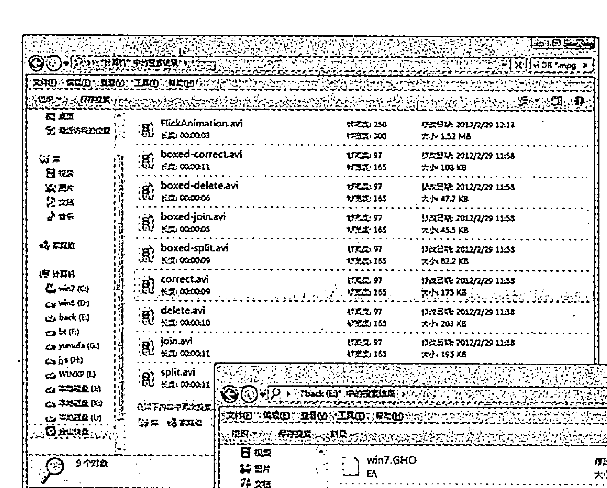

通过搜索找到指定类型的文件删除

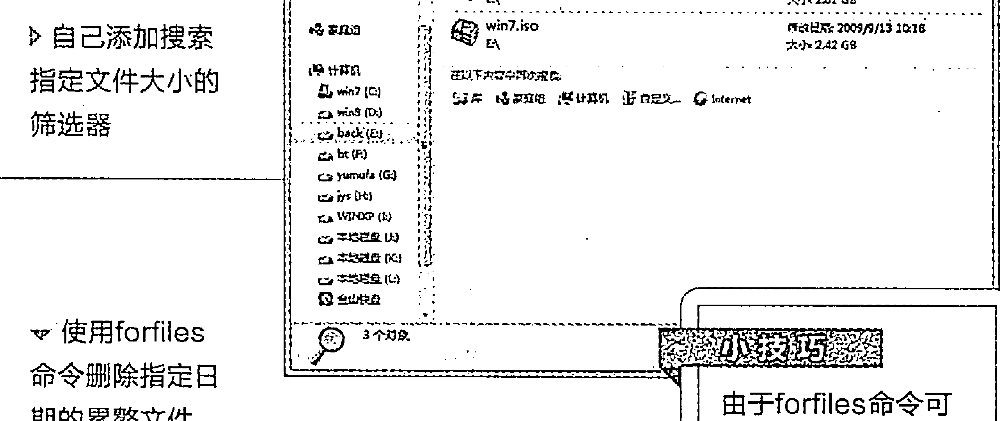

自己添加搜索指定文件大小的筛选器

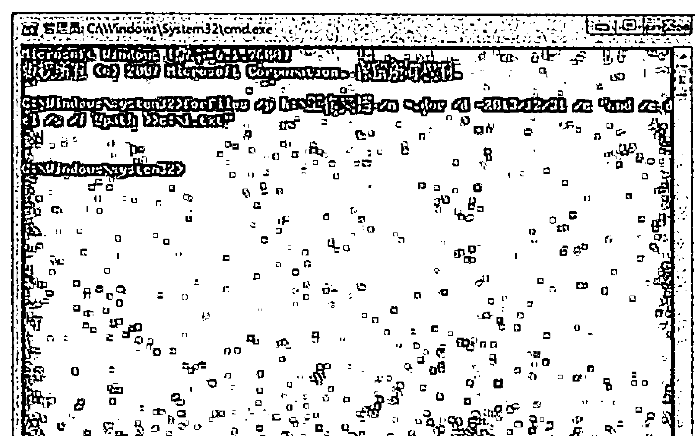

使用forfiles命令删除指定日期的累赘文件

由于forfiles命令可以自动执行，因此对于那些需要定期删除的文件（比如公司一些机密文件），我们可以将上述命令作为批处理，然后将其添加到任务计划中执行，这样可以自动在后台实现文件删除。

### 好压相助指定文件轻松删

除了删除指定目录下的累赘文件，很多时候我们还要根据自己的实际需要删除压缩包中的特定文件。比如我们使用压缩软件将图片文件压缩到一个文件时，其中的图片缓冲文件Thumb.db也会被压缩进去。现在我们可以借助好压，直接将这些无用文件删除。

比如现在要删除I:\aa.zip里全部的Thumb.db文件，只要启动命令提示符，然后输入如图中的命令即可删除Thumb.db文件。

```
hzip del I:\aa.zip Thumb.db
```

使用好压命令行删除指定文件

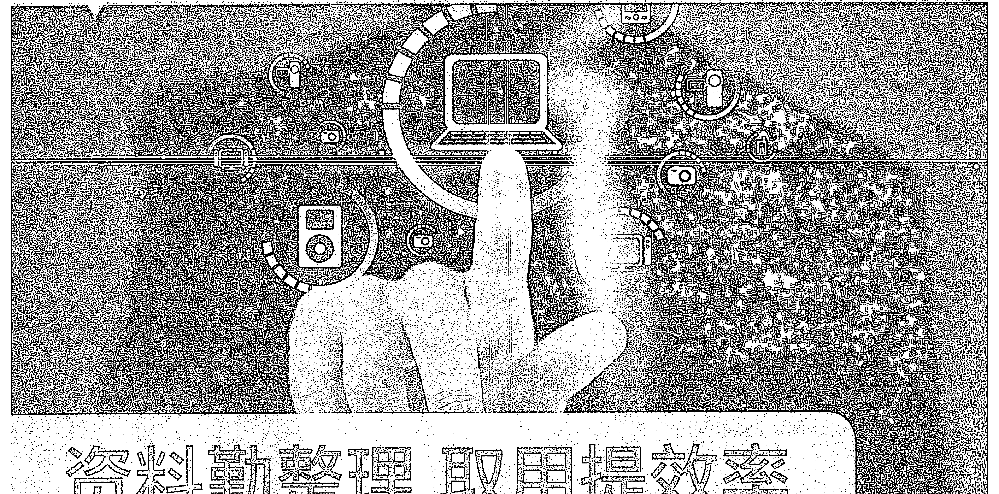

### 资料整理 即用提效

我们硬盘上有很多资料，散在各处希望进行整理：比如将某一类文件自动归类放到某一文件夹下，将下载的杂乱电影和音乐文件规范化……同时为了节省空间，可以将多个系统制作成“N合1”的光盘存储，也可以将Office的补丁和模板直接放到光盘上

### 寻找最好的文件管家

对于文件的管理，大家一般在使用系统自带的资源管理器，不过其功能实在有限，要想提高文件管理的效果，第三方功能强大的管理软件就不可或缺，下面让我们先挑选一款合适的文件管理器吧。

| 软件界面 | 常用操作 | 附加功能 | 软件大小(KB) |
|---|---|---|---|
| Total Commander | 简洁 | 支持文件快速复制、剪切，并可实现实时点传输 | 支持组件扩展、自定义配置文件、查看文本文件、预览图片文挡等 | 2536 |
| CubicExplorer | 界面简洁，使用资源管理器风格，支持多标签浏览 | 使用Windows内建的文件操作功能 | 支持标签、过滤面板、工具栏和面板支持拖放式自定义 | 1093 |
| FreeCommander | 简洁，支持多标签，使用Norton Commander (NC)风格、双面板，NC模式纵向或横向分割 | 使用Windows内建的文件操作功能 | 可处理压缩文件所需的功能：创建和打开文件列表、提取全部或部分文件(夹)、向压缩包加入或移除文件 | 2021 |
| Qdir | 界面灵活、简洁 | 使用Windows内建的文件操作功能 | 标签和面板默认配置有12个按钮，支持2-4个面板，横向面板等 | 1042 |

- **测试平台**
  - CPU: Core i3-2120 (双核3.30GHz)
  - 内存：4GB
  - 硬盘：希捷1500GB（7200转）
  - 操作系统：Windows 7旗舰版
- **参评软件**
  - Total Commander
  - CubicExplorer
  - FreeCommander
  - Qdir

文件管理评测表

文件管理主要是为了方便，所以它的程序界面及易用性是测评时首先考虑的。当然，文件数据是电脑上真正有价值的东西，作为“管理者”，它的稳定性和效率就更加重要了。

- 系统高手：Total Commander，简称TC，是系统高手们最为钟爱的文件管理工具。它不但功能强大，还可以自己来进行插件扩展，达到无所不能的效果。
- 新手用户：CubicExplorer更适合新手使用，因为TC虽然强大但是太过复杂。它同样具有多标签功能，比系统自带的资源管理器要好用得多。
- 下载用户：FreeCommander比较适合经常下载的用户使用，可以在管理器中直接打开下载压缩包，并简单解压到其他位置，同时它内置FTP功能，方便文件的传送。
- 其他：Qdir支持多标签浏览，可以自定义多个标签，非常适合经常需要在多个位置复制、移动文件的用户使用。

- TC功能强大，支持各种插件扩展，适合高手们使用
- CubicExplorer界面简洁适合新手使用
- FreeCommander使用双面板设置，内置解压和FTP功能

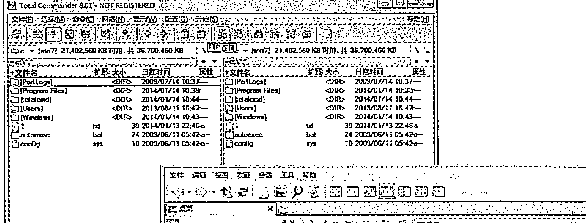

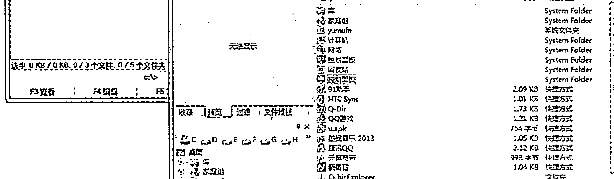

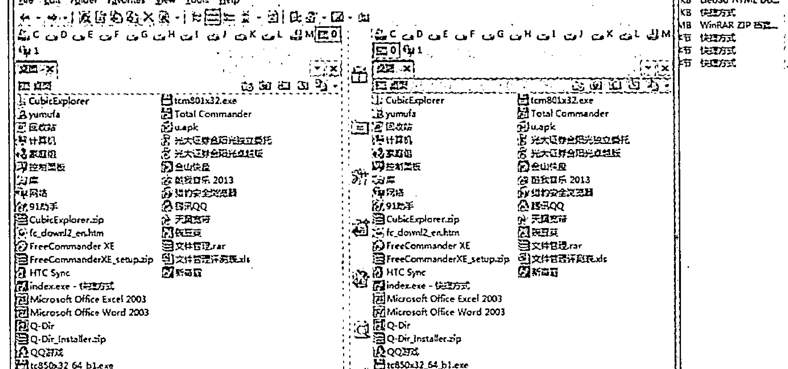

### 影音娱乐也要有条不紊

很多人喜欢从网络上下载电影或电视剧，但是下载的电影或者电视剧前有网址，而且文件太长，非常不便。更重要的是，亲情可贵，我们还会定期将这些电影或音乐带回家，与老人一同分享。而在家里，一般将电影和音乐放到外接高清播放器或电视机上来播放，播放器或电视机上一般是Linux内核的系统，混乱的文件名更有可能会引发播放问题。现在利用TC可以轻松管好这些娱乐文件。

### 不同位置文件快速复制到SD

下载的很多文件散落在不同位置，如何快速复制到SD卡中？可以先插入SD卡并在TC右侧窗口打开它，然后在左侧窗口按Ctrl+T键新建标签，接着在不同标签下打开视频文件，按Alt+“+”键选中相同扩展名的文件，再依次拖到右侧窗口即可。接下来将SD卡插到高清播放器上，就可以大屏幕显示视频了。

### 批量快速改名

如果要批量对下载的影片进行改名，打开TC定位到要改名的目录，然后依次按下Ctrl+A键和Ctrl+M键，打开重命名窗口后，在查找处输入源文件的同名前缀，替换处输入需要改名的名称，点击“开始”即可快速将影片改为播放器可识别的名称了。

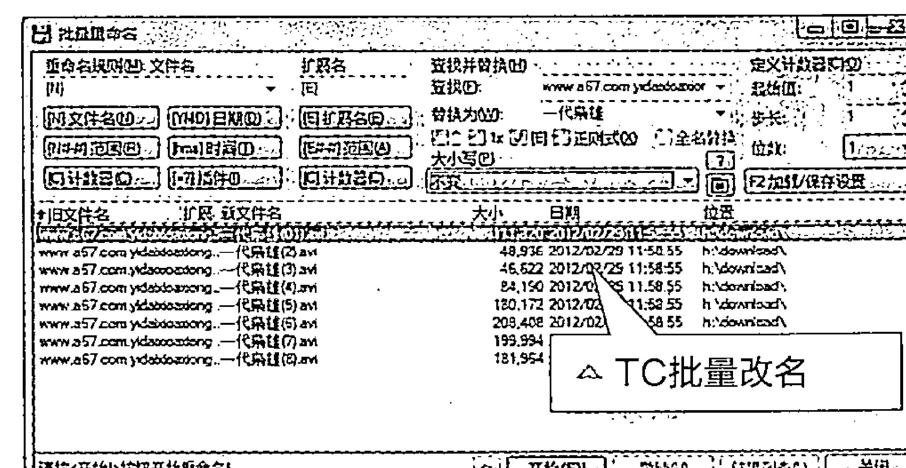

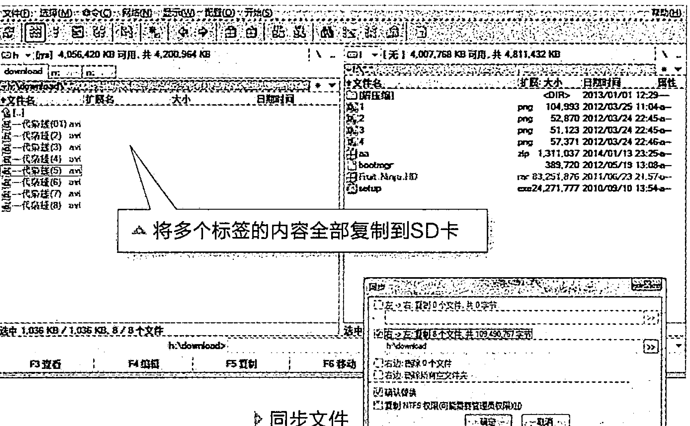

### 用TC同步影音资料到SD卡

我们会不断下载新片资源，以后复制到SD卡时只要复制新的影片资源即可。利用TC的自动同步功能可以快速复制新文件。

同上在TC中打开下载目录和SD卡，单击同步文件夹按钮，接着在打开的窗口点击“比较”，TC就会快速比较出不同的文件，点击“同步”，接着在打开的窗口勾选“右到左”，点击“确定”，这样TC就会将右边的新片资源全部复制到左侧窗口，省去我们手动比较和查找的麻烦了。

### 巧思妙想双保险

定期定时做好重要文件的备份，这是文件管理的一个重要操作。不过除了简单的复制备份外，我们还要根据自己的需要灵活对文件进行高效备份。

### 只备份指定日期后的文件

很多时候我们需要备份某一日期之后的数据，以公司统计人员为例，他们大多都需要备份每月的统计报表。比如现在只要备份2014年1月后的报表文件，可启动记事本输入“xcopy k:\我的文档 d:\aa /d:1-1-2014”制作一个批处理。这样以后我们只要执行这个批处理就可以将2014年1月1号以后生成的文件复制到“d:\aa”这个目录保存了。

### 增量备份指定数据

一些重要数据经常要增量备份，比如为了省去重装后升级病毒库，我们可以定期将它备份，由于病毒库只是每次下载新的病毒数据，因此可以使用增量备份的方法快速实现备份。到http://tinyurl.com/mrbbv68下载增量备份程序，启动程序后单击“添加到右键菜单”。选中病毒库目录，假设是金山毒霸，病毒库位置是C:\Program Files\kingsoft\kingsoft antivirus\data，右击选择“备份Wim镜像到”，按提示将该目录备份为“d:\virus.wim”。以后只要选中“d:\virus.wim”，右击选择“增量备份分区或文件夹到该镜像”，选择上述目录增量备份到该Wim镜像即可。

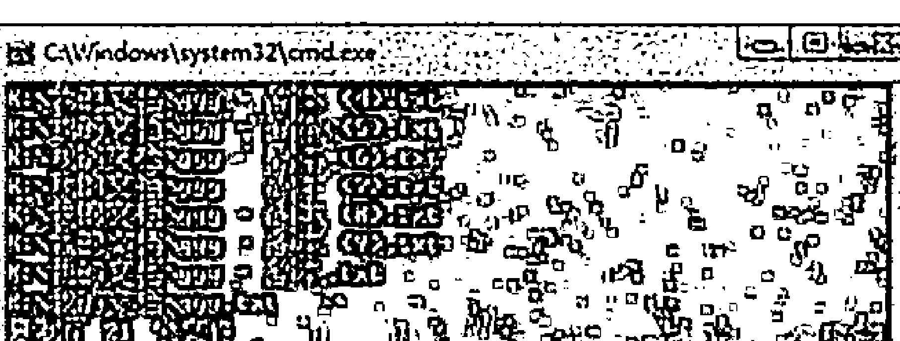

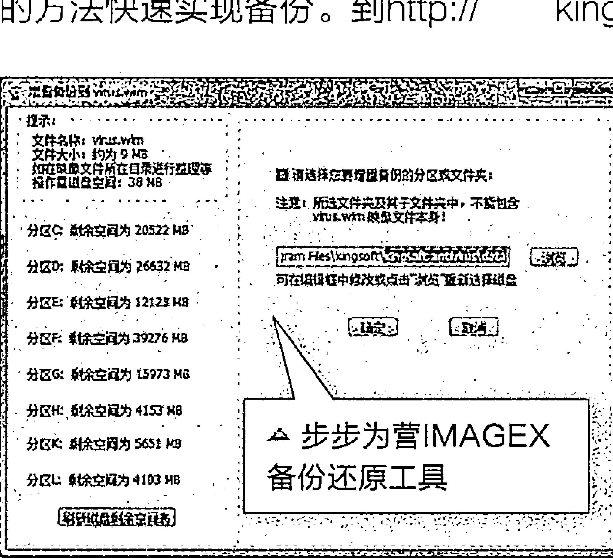

### 用WinRAR压缩备份

压缩备份可以大大节省存储空间，如果你经常需要将文件压缩备份，利用WinRAR提供命令行即可实现。

首先建立一个名为“mybackup.lst”的备份清单文件保存在D盘，输入下列代码并保存（如果有多个目录则每个目录一行）：

K:\工作文档

接着建立一个批处理back.bat，内含代码为：

"c:\program files\WinRAR\WinRAR.exe" a -ep2 -ibck d:\backup.rar @d:\mybackup.lst

以后只要运行这个批处理即可将上述数据自动压缩备份在D:\backup.rar文件中了。

> 小提示
我们还可以结合系统自带的任务计划实现重要文件的自动备份。另外，如果需要打印备份文件的目录，则只要在Xcopy命令行中添加“/t”参数，就可以实现只复制目录结构而不复制文件的目的，便于我们打印目录结构用于文件管理。

### 数据多合一存储光盘

由于光盘数据无法再进行编辑，因此很多朋友喜欢将一些重要并且无需再编辑的数据，如报表、操作系统镜像等刻录到光盘保存。不过光盘刻录后一般无法再写入数据，因此为了充分利用光盘空间，我们应该尽量将多个文件刻录到盘上。此外，刻录光盘多了以后，还要考虑如何有效地管理。

### 集成了Office 2010安装盘

大家知道Office 2010会不停地发布补丁，每次重装后都需要下载新的补丁。为了省去这些操作，我们可以直接将补丁集成到安装文件中刻录。

首先准备Office 2010安装文件，然后将所有文件拷贝到D盘备用，接着用记事本打开其中的Config.xml文件，添加如下代码：

```
<PIDKEY Value="XXXXXXXXXXXXXXXXX"/>
```

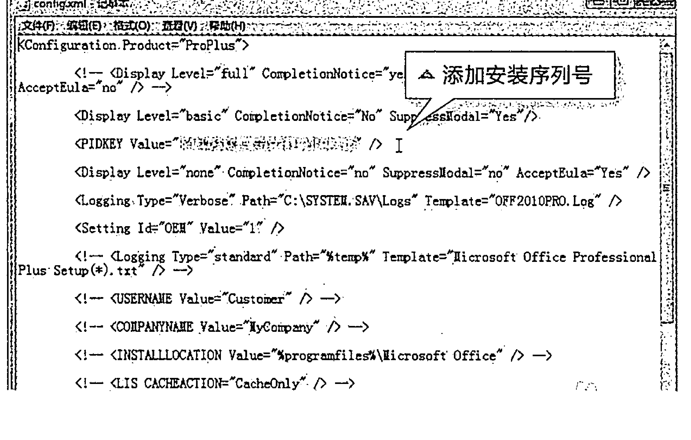

其中XXXXXXXXXXXXXXXXX是你的Office 2010序列号，最后保存该文件。

接着下载Office 2010所有补丁文件，下载后放置在E盘备用。然后启动记事本新建一个2010.cmd批处理文件，代码如下（每个补丁一行）：

```
office-kb2202188-fullfile-x86-glb.exe /extract:2010 /quiet /norestart /passive
```

运行该批处理即可集成补丁到指定的“2010”目录中。打开资源管理器将2010目录下的全部文件复制到D:\data\software\Office\Office2010\Updates文件夹下，接着在D:\data\software\Office文件夹下新建templates的文件夹和fonts文件夹，然后将从网上下载的模板文件和字库文件拷贝到这两个文件夹中。这样就完成了补丁和模板文件、字库文件的整合。最后启动刻录软件，将D:\data\software\Office文件夹下的Office 2010、Templates、Fonts全部刻录到DVD上，这样以后安装Office 2010时就能直接完成补丁、模板和字库的安装了。

### 技巧：在电脑上管理光盘

刻录的光盘多了以后，管理起来就有些麻烦，有时候查找一个文件要不停地插入光盘查找。现在借助Dir命令复制光盘目录结构即可快速进行离线管理。

首先将光盘插入到光驱，启动命令提示符后输入下列的命令：

```
dir /a /s N: > k:\cfan2.txt
```

假设N为光盘盘符，运行上述命令会将光盘所有文件结构全部复制到cfan2.txt文件中。这样下次如果要找这张光盘上的某个文件，只要打开cfan2.txt文件，然后进行查找即可。

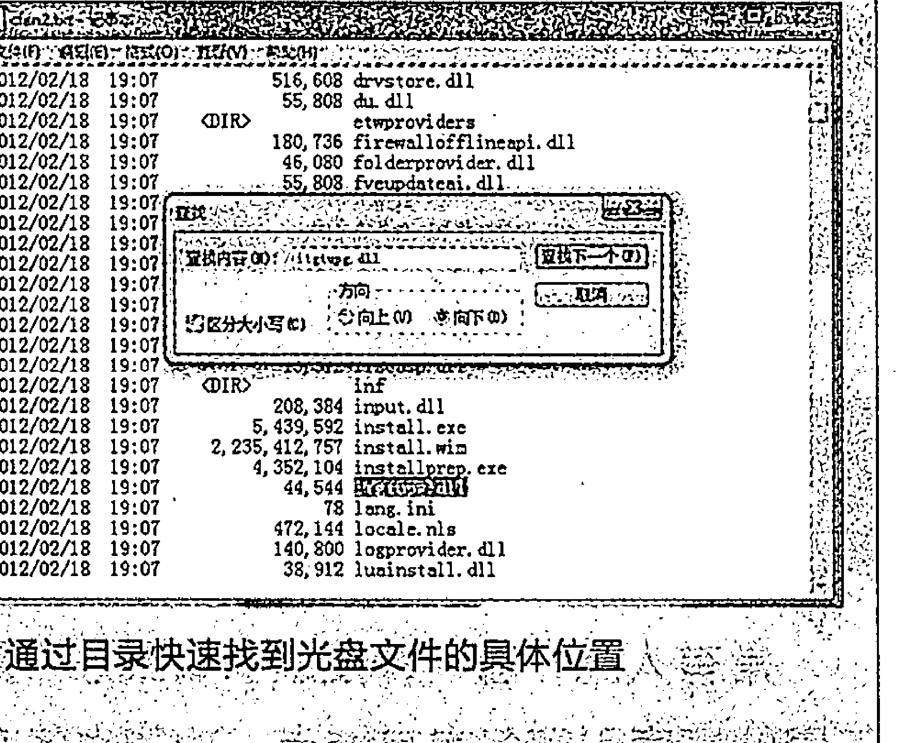

通过目录快速找到光盘文件的具体位置

同样方法，将所有光盘进行处理后，以后在电脑上也可以直接查阅光盘上的信息，并快速检出要找的光盘啦。

### 范围巧限定 资源高效搜索

互联网上的信息丰富而庞杂，利用搜索引擎迅速而准确地搜索网络上的信息一直都是我们关心的问题。然而现在大家熟知的搜索引擎不仅数量繁多，各搜索引擎从信息覆盖范围到对信息编制组织方式都不一样，如何选择符合自身需求的产品？辅以搜索技巧，必能事半功倍，这也是本章要带给大家的。

### 搜索引擎该选哪一款

常有人问，哪一种搜索引擎最好？其实，这个问题不能一概而论。不同的搜索引擎各有其特点，功能也各有其侧重。哪款更合适，不同的目的、不同的人、不同的场合需要有不同的选择。

本文选择国内用户使用比较多的百度、Google、360搜索、必应Bing搜索引擎，从实用的角度出发，展示其各自强大的功能。希望能为读者选择搜索引擎提供有益的参考。

##### 1、基本情况对比

用户规模比较：从规模来说，谷歌（Google）（www.google.com）堪称全球最大的搜索引擎，最近专为中国国内用户申请了超短域名（www.g.cn）。百度则是目前中国最大的搜索引擎，中国半数以上的网民在使用这款搜索软件。必应（Bing）（http://cn.bing.com/）是微软的搜索引擎，在中国的用户还不算多，但与Windows新版结合紧密，前途可望。360搜索（http://www.so.com/）则是起步最晚、市场占有率增长较快的后起之秀，国内用户量仅次于百度搜索引擎。

首页风格对比：从页面风格来说，Google看上去最为简洁，显眼之处只有一个Logo图标、一个搜索框和下面的两个按钮，一些功能分类和登录、设置按钮以小字体不起眼地退缩到上下两个标题栏中。

百度中规中矩，界面不像Google那么含蓄，稍显张扬，它将自己的特色频道（如贴吧、知道、音乐、图片、视频、地图、百科、文库、hao123等）紧紧贴靠在其搜索框的上下两行，让人在以关键词搜索的同时，可以随手选择特色频道进行搜索。

360则兼有Google的简捷明了与百度的实用特点，同样在搜索框的周边排列了自己的特色栏目，如问答、良医、雷电等，更为显眼的是其独有的Ctrl、Ctrl便捷搜索功能。而Bing的首页最为有特点，每日一则的封面图片外加封面故事和丰富的相关知识点，可以赚足网民的眼球。

##### 2. 特色功能选择

用户使用搜索引擎，主要目的是从实际需求出发，快速方便地找到自己想要的内容。这几种搜索引擎无论市场占有率高低，在实用功能方面，它们各具特色。因此，网民可以按照自己的需求有针对性地选择搜索引擎。

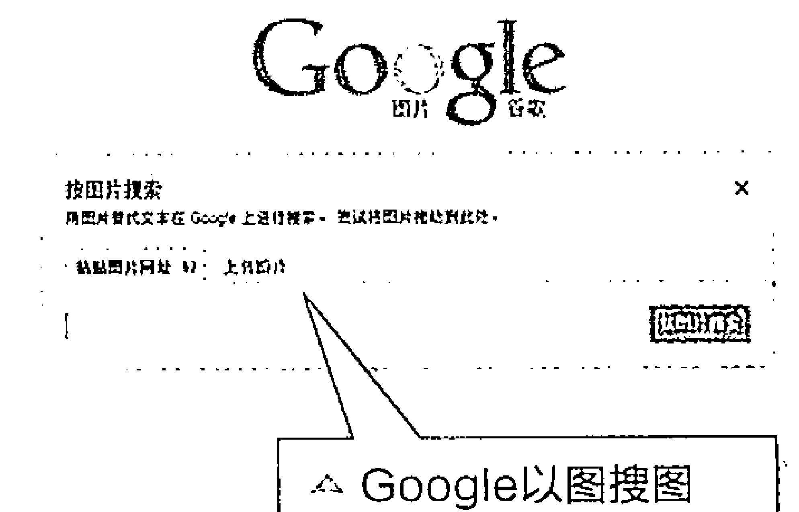

> **小提示**
由于百度在竞价排名等问题上的口碑不佳，因此如果从搜索的权威性和准确性来讲，应该首先考虑Google，它的搜索结果排名比百度更可信。

> **小技巧**
搜索引擎不是一款就能包打天下。因此，建议大家综合使用几种搜索引擎，需要搜图就用搜图为特色的，需要搜歌就用搜歌见长的，不要在一棵树边上“守株待兔”。选择使用360安全浏览器，可方便地在搜索框中随时切换各种引擎。

Bing是微软公司2009年推出的用来取代Live Search的搜索引擎，Bing最显眼的特色就是每日变换的首页图片，让你每天都有不一样的心情。它采用全新的HTML5技术使网页更流畅。拥有MSN、Bing词典、Bing地图等新生应用。它全部功能内置于所有的Windows Phone中，可以使手机搜索与电脑搜索一样精彩。Bing还具有出色的网站翻译功能，适合英语学习者使用。具有视频搜索结果无需点击直接预览播放、图片搜索结果无需翻页等功能。

Google拥有最多的全球搜索资源，具有Gmail、Google+、Youtube、Google Play、Google地图等特色功能。它在全球首创以图搜图功能，只用图片不用文字就能搜到相关资料。Google拥有的全球海量资源，非常适合于电脑技术人员和商务人士搜索使用。Google本具有稳定的加载速度，但由于国内的网络问题，用户体验可能不太好，对其推广起到很大的限制作用。

Bing以其优秀的使用体验以及与Windows系统的完美融合为自己开辟了一块天地。如果你使用Windows 8，最好能用好这个搜索引擎。

360搜索是奇虎360公司在2012年8月16日低调推出的综合搜索引擎。360拥有强大的用户群和流量入口资源，这决定它已经有了竞争力的基础。360搜索具有简明扼要的首页界面，结合其安全浏览器外加360安全卫士和杀毒软件，可提供安全的搜索体验。同时以包容的心态、开放的姿态，在搜索时提供可切换为百度搜索、谷歌搜索以及任意一种用户添加的搜索引擎的选择。

> **小提示**
由于Bing相对丰富的首页设置，也会或多或少地影响到加载和搜索结果，但是这种情况并不严重，一般不会影响使用。

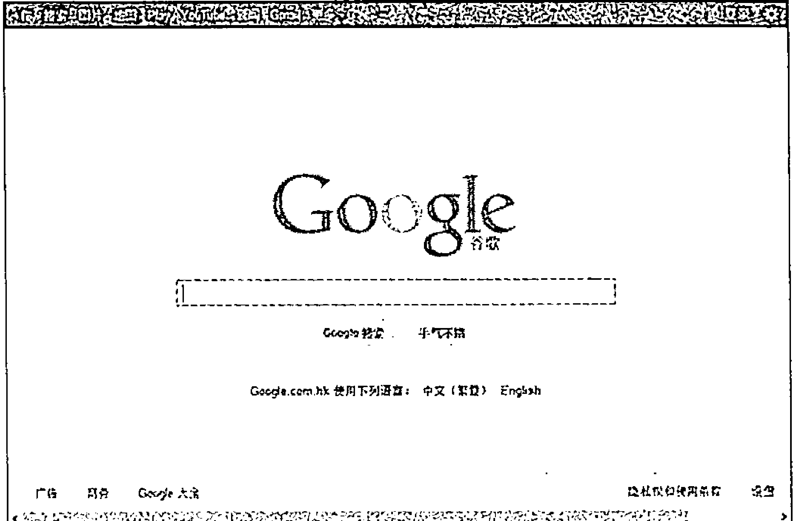

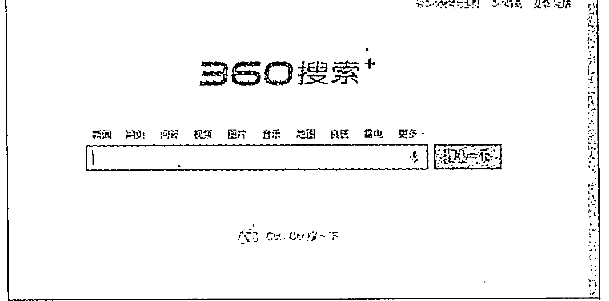

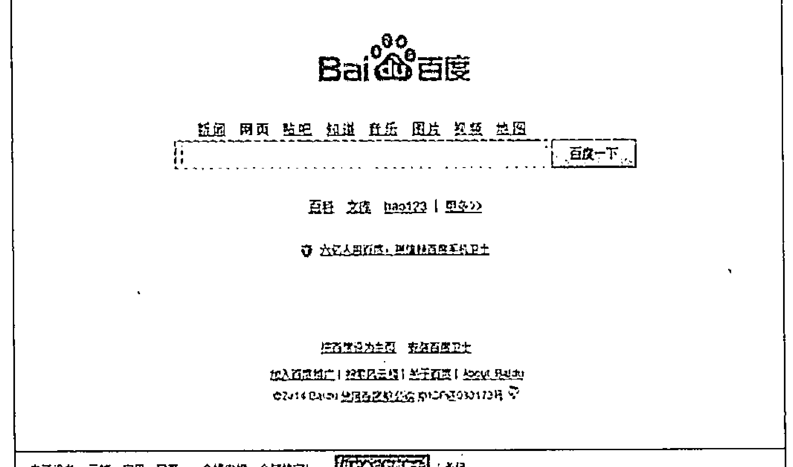

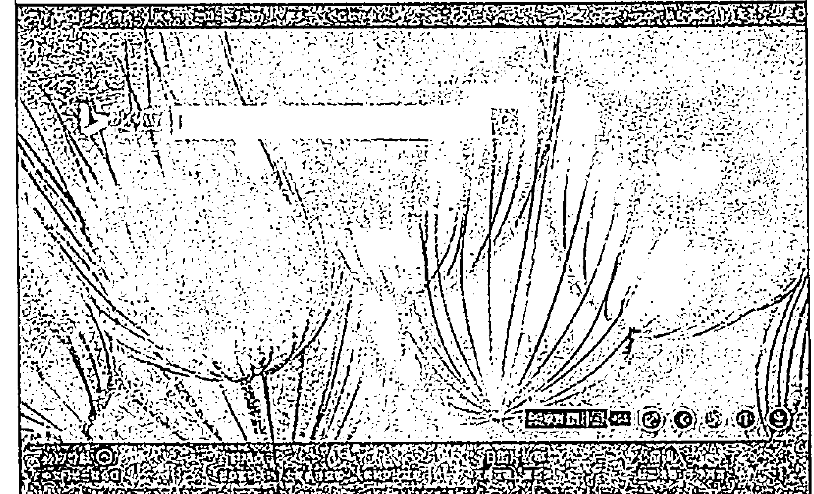

360搜索虽然是新生的搜索引擎，但是它有360一贯的做事认真、爱学习和对用户负责的基因，我们不妨以“试一试”的态度来使用它，从观察中见证它的成长，以扶植一个刚刚出生的孩子的态度来使用它。如果它能赶超百度，让搜索排名更靠谱、搜索结果更理想，对我们广大网民来说，岂不也是一件好事！

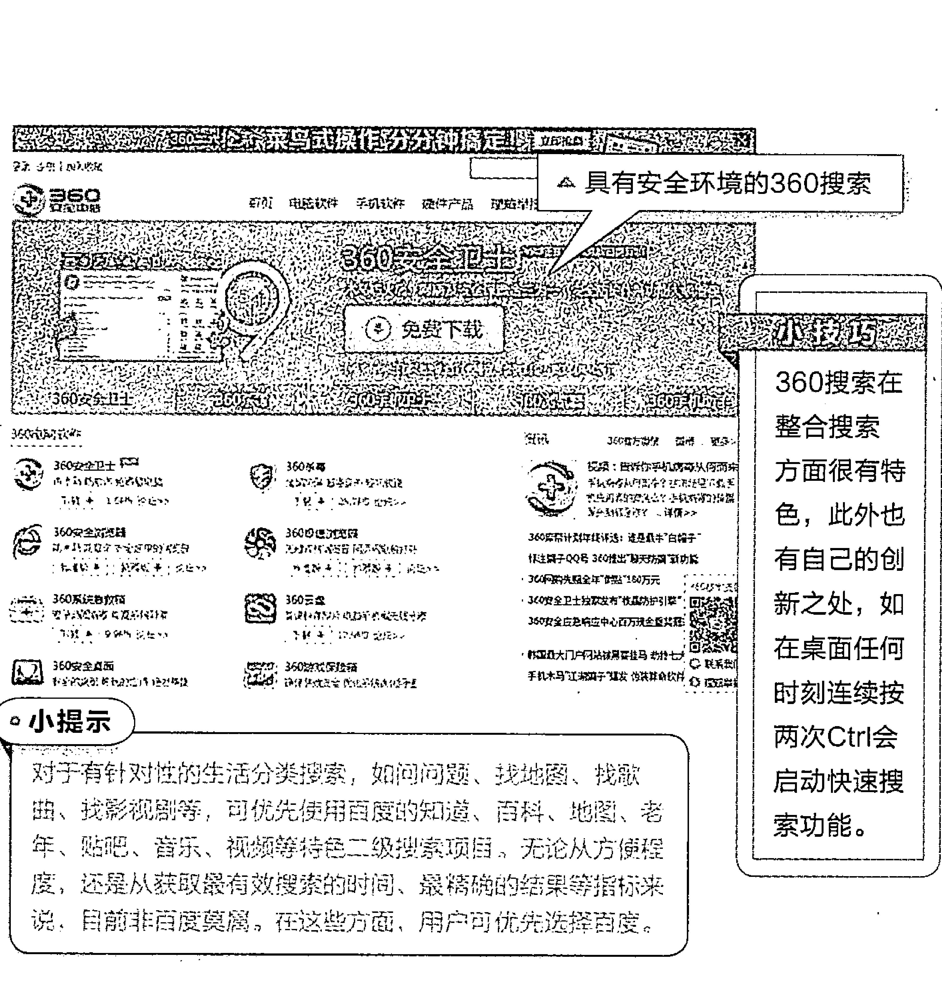

> 小提示：对于有针对性的生活分类搜索，如问问题、找地图、找歌曲、找影视剧等，可优先使用百度的知识、百科、地图、老年、贴吧、音乐、视频等特色二级搜索项目。无论从方便程度，还是从获取最有效搜索的时间、最精确的结果等指标来说，目前非百度莫属。在这些方面，用户可优先选择百度。

### 资料与搜索效率成正比

在日常生活或工作中，我们常常可以看到不少人只是简单地输入一个关键词来搜索，以此来获取自己希望知道的内容。但是，如果能巧妙地利用搜索的一些技巧，可以大大提高搜索效率。

### 技巧：借通用搜索引擎

更多的时候，我们是在搜索引擎搜索框中输入一个关键词来搜索。然而，精准的搜索需要在关键词的基础上加上那么一点稍有“技术含量”的东西，从而达到更稳、更准、更快的目的。

以Google搜索引擎为例，我们可以通过一些专门定义的保留字来执行特殊搜索。例如，通过保留字“filetype”查找非HTML格式的文件。如果想查找一些PDF格式的《黄帝内经》电子书，只需用关键词“黄帝内经 filetype:pdf”搜索就可以了。

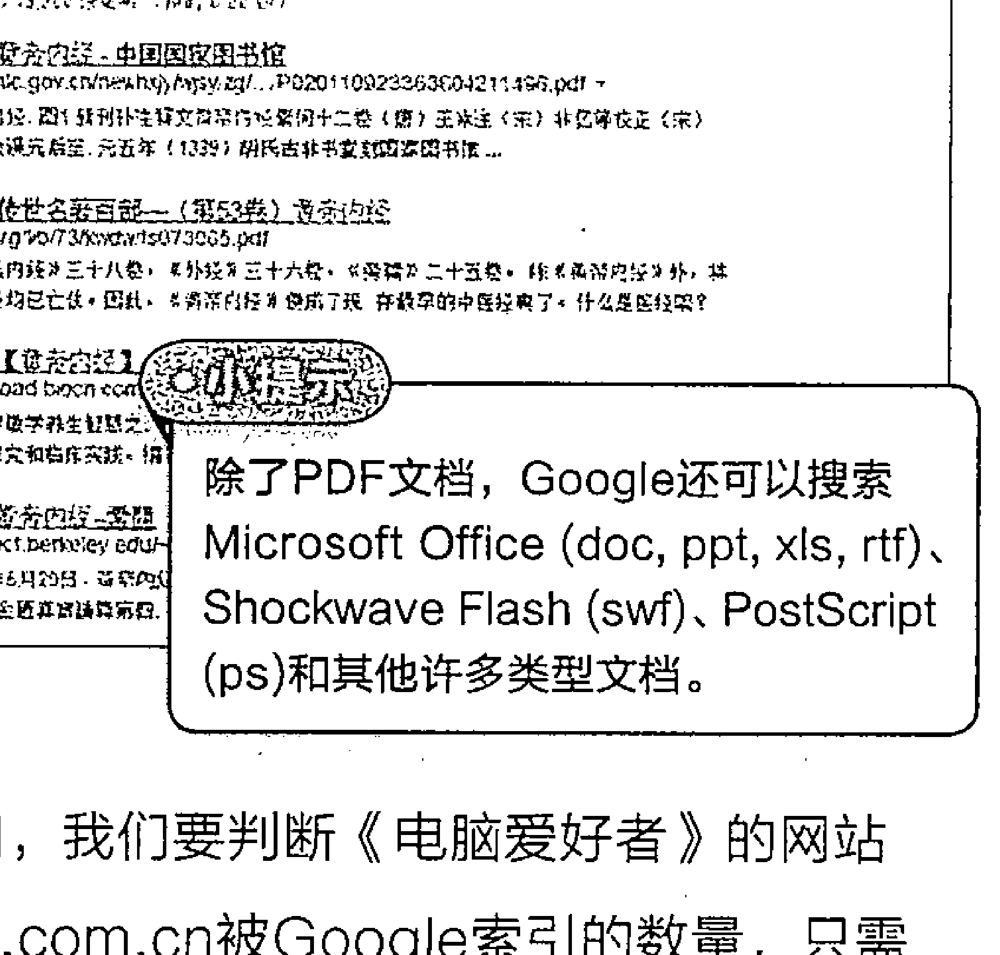

> 除了PDF文档，Google还可以搜索Microsoft Office (doc, ppt, xls, rtf)、Shockwave Flash (swf)、PostScript (ps)和其他许多类型文档。

再比如，我们要判断《电脑爱好者》的网站 www.cfan.com.cn 被Google索引的数量，只需添加“site”关键字搜索本网址即可，即通过搜索“site:www.cfan.com.cn”来返回Google收录的《电脑爱好者》网站的所有相关结果。还可以通过保留字“link”了解有多少链接指向自己的网站。比如，要知道有多少链接指向《电脑爱好者》的网站，只需搜索“link:www.cfan.com.cn”即可返回结果。

再以百度搜索为例，假如要以更精确的查询方式查找正规网站上的《电脑爱好者》增刊信息，我们用“电脑爱好者 增刊 intitle:电脑爱好者”就会比直接用“电脑爱好者 增刊”更准确。因为“电脑爱好者”这个词太泛、太普通，许多场合都用，而“电脑爱好者”这个词在《电脑爱好者》或其合作网站的网页标题中肯定是包含的，因此搜索效果会更加精准。保留字“intitle”表示后接的词限制在网页标题范围内。

##### 2 本地搜索还可以更快速

本地搜索文件名除了用系统自带的搜索功能外，还可以借助于Everything这样一款软件来实现，该软件由于采用了强大的后台数据库索引做后备，因此可达到“秒搜”的效果——无论你的硬盘有多大、有几个分区，它能在一秒内搜索到你想要的文件。

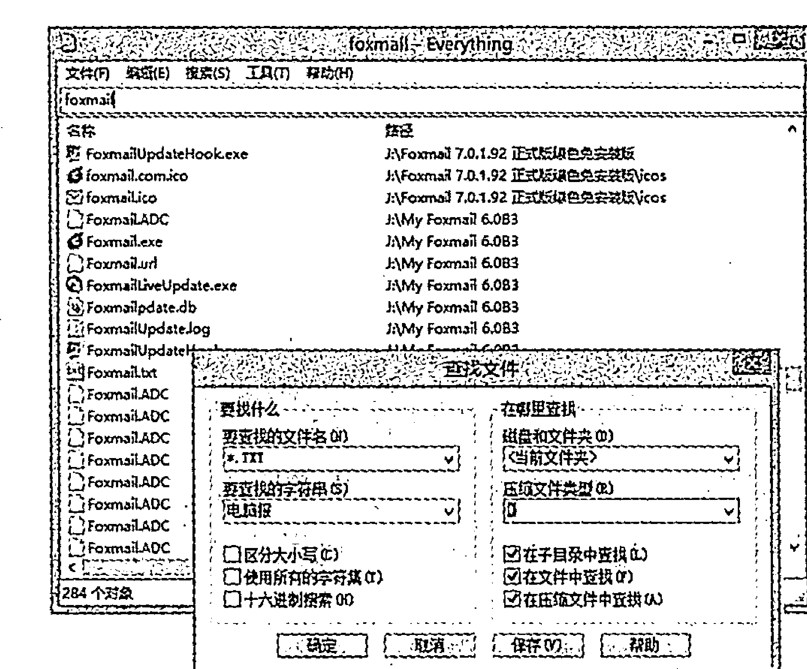

我们还可让压缩软件来助力文件搜索。如果要找出目标文件夹下的某类文件，启动WinRAR后点击工具栏上的按钮“查找”，在“要查找的文件”栏中输入文件名或文件名通配符，即可查找到某类文件。若在“要查找的字符串”一栏中输入目标文件所包含的特定字符串，则可以找到特定内容的文件。注意要选中3个查找范围副选项。

##### 操作系统搜索压缩包中文件

Windows 8中，通过设置可以让系统搜索具备搜索压缩包中文件的能力。我们只需在文件夹选项窗口中选择“搜索”选项卡，然后选中“包括压缩文件（ZIP、CAB ）”复选框，以后通过系统的搜索功能搜索文件时，就会连同压缩包中符合条件的文件一同搜索和显示了。

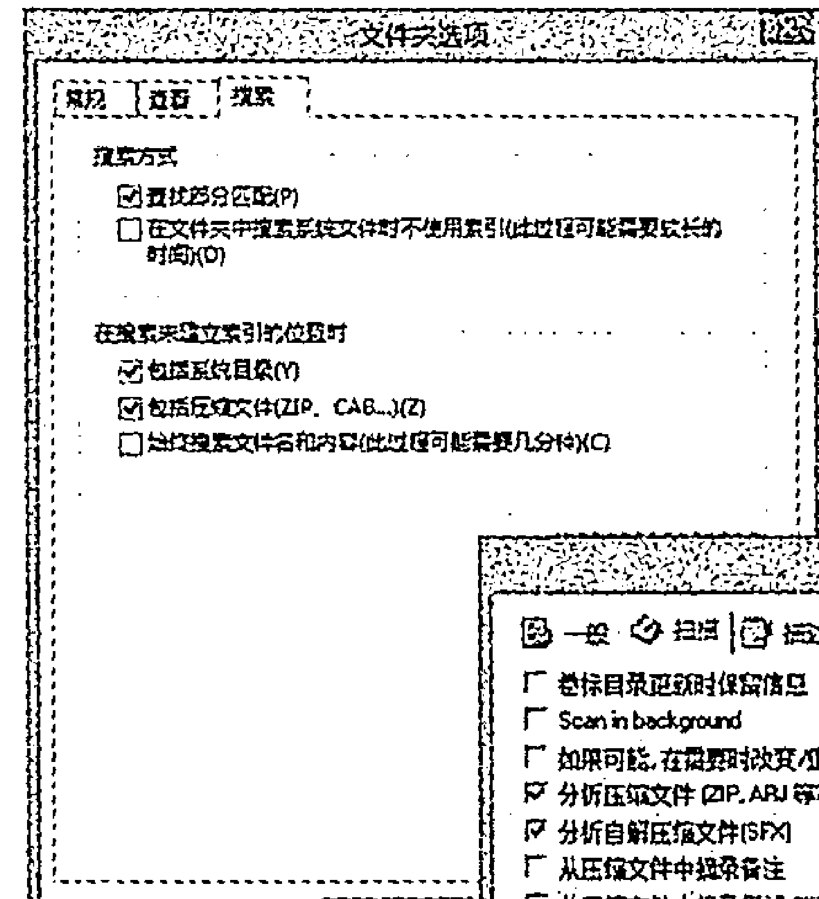

##### 专用工具搜索压缩包中文件

如果要管理外部光盘或移动硬盘中的资料，我们还可以使用ADC软件搜索压缩包中的文件。其好处是，所搜索的文件离开电脑也能被搜索到。

在压缩资料前启动ADC软件，点击“选项→设置”菜单命令，在弹出的“选项”设置窗口中选择“扫描”选项卡，将其中的“分析压缩文件（ZIP、ARJ等）”和“分析自解压文件”前的复选框选中，然后确定。

以上压缩扫描参数设置好之后，点击ADC窗口的“编辑→增加卷标目录”命令（或工具栏上驱动器图标组中的第一个图标），然后在弹出的窗口中选择需要扫描的驱动器，点击“确定”按钮添加信息。经过如上操作后，在生成的文件数据库中，就包含了压缩文件的信息。

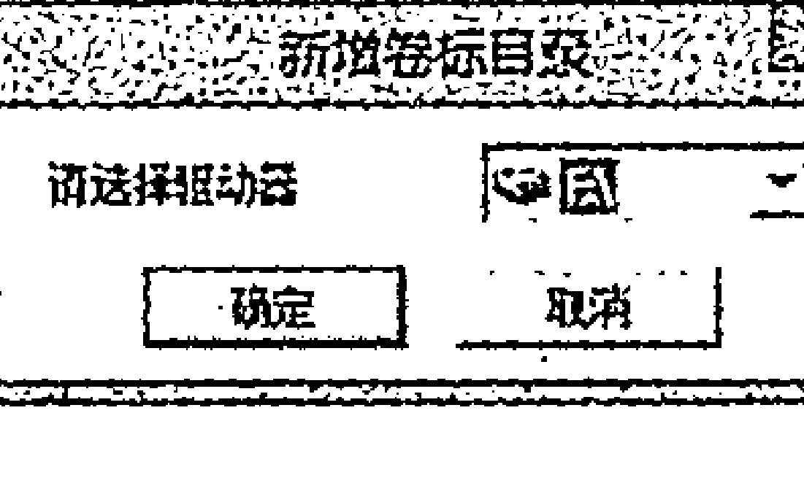

之后使用ADC文件搜索文件时，切换到“选项”窗口，点击“一般”选项卡，选中复选框“查找压缩文件（ZIP、ARJ等）并确定。接下来点击工具栏上的放大镜搜索按钮，在弹出的搜索窗口中输入搜索关键词，点击“搜索”按钮，即可将包含压缩包文件在内的所有符合条件的文件搜索出来。


##### 3 压缩包内文件也能搜索

###### 压缩软件搜索压缩包中文件

我们可用原生压缩软件WinRAR搜索压缩包中的文件。打开某压缩包，点击工具栏“查找”按钮，在弹出的对话框中输入要查找的文件名关键词，选择搜索路径及压缩文件类型（如*.RAR），点击“确定”按钮搜索，即可在压缩包中搜索到满足条件的文件。在压缩文件中查找，要选中“在压缩文件中查找”复选框。

> 小提示：一般的查找工具并不支持在压缩文件中查找，即使支持也往往对压缩格式有所限制，而WinRAR支持的压缩格式最丰富，因此可作为压缩包内文件搜索的首选。

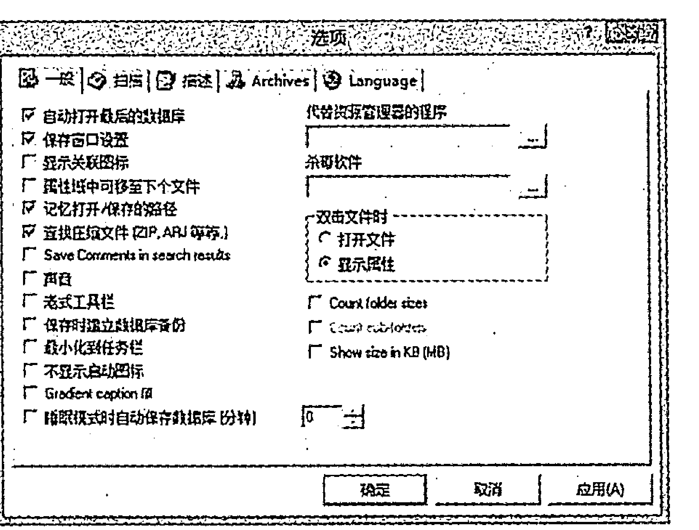

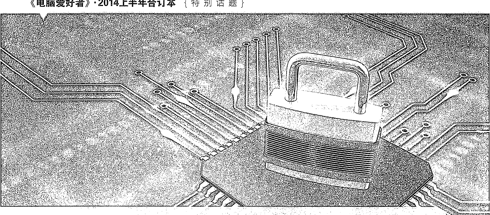

### 查杀安全高效 杀毒须有选择

近年来，涉及网络安全的事件层出不穷，提高计算机安全、保护个人隐私是现代网络社会必要的发展趋势。一款优异的杀毒软件则是有效解决网络安全问题的法宝之一，而国内外的杀软品种繁多，且效果参差不齐，如何甄别杀软的优异与否呢？面对系统频频出现的安全漏洞和软件泄露隐私的问题，怎样有效制止呢？

### 安全为上 选好杀毒软件

**文|刘飞宇**

目前国产知名杀毒软件都已免费，我们可以不用任何付出随意选择。但杀毒软件哪个更适合自己，用户必须做出选择。本文将针对目前国内技术实力最强的四家公司的杀毒软件产品（360杀毒、金山毒霸、百度杀毒、腾讯电脑管家），从实用和人性化的角度，为大家分析这些软件的特点，希望对大家选择杀毒软件有所帮助。

而在查杀效率上，对于普通用户来讲，若不通过对庞大的数据群的查杀对比，不通过数量相当可观的不安全环境的查杀试验，很难看出哪款杀毒软件更加高效，只能凭借官方或网络“枪手”的评测报告人云亦云。因此，从实用的角度来讲，以上两项已经不是选择杀毒软件首要考虑的因素。衡量杀毒软件在其他方面的表现，反而变得更加直观和可操作。

##### 1. 忽视开古老的选择因素

在以往的传统中，评价杀毒软件的两个很重要的因素是资源占用率和查杀效率。随着设备和技术的发展，这两个因素已经变得不再那么重要。

在资源占用方面，虽然各家软件有所差异，但是，由于近年来电脑配置的飞速发展，再加上各家产品的不断优化，已经不像以往那样对系统资源占用的指标要求那么高了。几款软件安装之后，都不会感觉有明显的迟钝和对工作的影响。一个小小的杀毒软件，已经对以G计数的CPU频率和内存空间构不成什么严重威胁，使用上感觉差异会很小，因而对资源占用的评测对比已经变得不是那么重要了。

##### 2. 应对功能的便利性选择

除了软件自动或手动全盘杀毒外，有没有右键查杀菜单随时选择文件杀毒，能不能将可疑文件和未知文件自动上传到网上供分析研究升级，杀毒软件有没有自我保护功能以便在遭到恶意攻击时存活，能不能做到按用户的意愿定时查毒等，这些基本功能是衡量杀毒软件的基本要素。

金山毒霸和360杀毒在这方面做得比较全面周到。百度提供的选项不够丰富。腾讯管家也有自动上报分析功能，但其他选项选择方面欠缺。

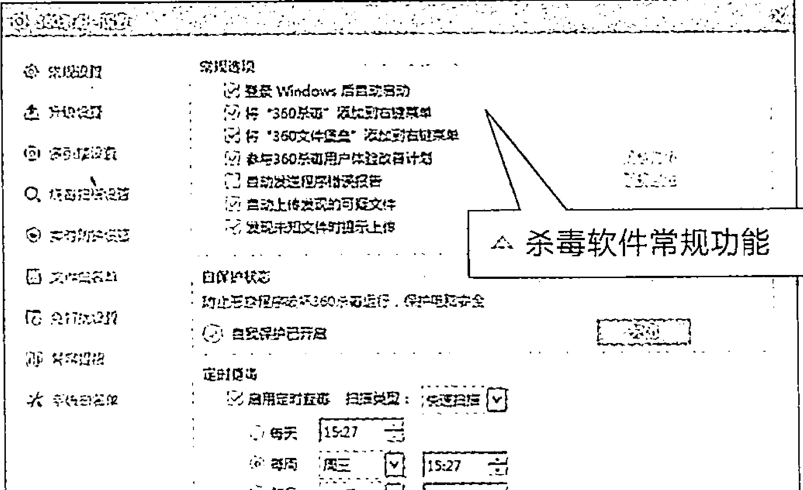

##### 3. 扫描查杀的灵活多样性

扫描文件类型的选择（是否扫描压缩包、是否可只扫描程序和文档），发现病毒后由杀毒软件自动处理或用户选择处理，扫描加速的选项（如跳过大压缩包、全盘扫描使用智能扫描加速技术），这些都为查杀提供了人性化的选择。

此外，是否可设置文件白名单、系统白名单，绕过对一些没有必要扫描的文件的查杀（如影音文件或大的系统映像、大压缩包等），提高查杀效率，也是考验杀毒软件是否人性化的标准。

360杀毒在这些方面也基本上做到了。毒霸提供按文件和扩展名类型、网址、系统修复项等分类的信任设置选择。百度杀毒只提供按文件和扩展名分类的白名单设置。腾讯管家在这方面的选择最少。

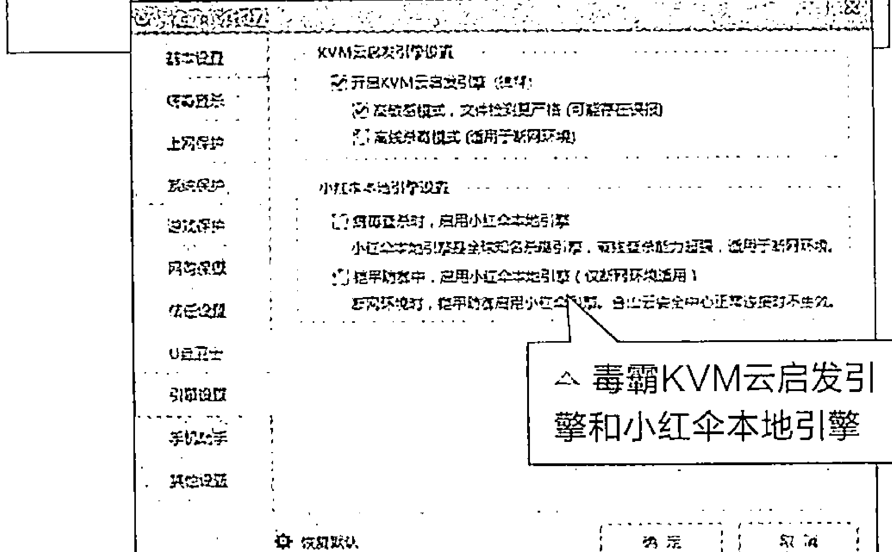

##### 5. 查杀内核组合的选择性

是否可以使用多内核查杀引擎，是否提供多内核最佳组合以及用户自定义组合是又一个核心参考点。

360提供了五种引擎可供选择，非常强大。百度紧随其后，提供卡巴斯基、百度智能恢复、百度云查杀、百度激光引擎等4种杀毒引擎。毒霸提供KVM云启发引擎和小红伞本地引擎两种。腾讯管家则未提供杀毒内核选择。

##### 4. 实时监控选择是否丰富

对文件活动的监控是否可选择（监控文件的执行、监控文件的写入、监控文件的任何方式访问等）、监控的文件类型是否可选择、监控过程中发现的可疑文件的处理方式选择（自动隔离或交给用户处理）是杀毒软件的另一个人性化体现。

还有，能不能实时监控间谍文件、拦截局域网病毒、开启广告弹窗拦截器拦截桌面右下角弹窗等，也是反映一款杀毒软件是否体贴的几个方面。

360杀毒基本包括以上各种选择。金山毒霸提供上网、下载、看片等常用项目监控保护设置选择。腾讯管家提供专家和普通两种实时防护模式，还提供4种文件系统防护选择。百度则提供从高到低4个监控级别选择。

##### 6. 免打扰与提醒矛盾选择

用户需要在一个安全而安静的环境下工作，不希望杀毒软件更多地打扰自己，尤其是在进入游戏或全屏幕应用程序当中时。同时，对于一些比较重要和敏感的文件或系统使用过程中的异常信息，又希望杀毒软件能给出及时提醒。因此，杀毒软件的“免打扰”性能和“异常提醒”功能是否体贴和人性化尤为重要。

360杀毒在这两个方面提供详尽设置。金山毒霸结合卫士安全功能，提供从上网、系统、游戏、网购等多方面的保护提醒，同时在提供免打扰模式的同时，提供安全中心消息记录功能，避免遗漏重要安全消息。百度和腾讯管家只有一个简单的全屏状态免打扰模式选择。

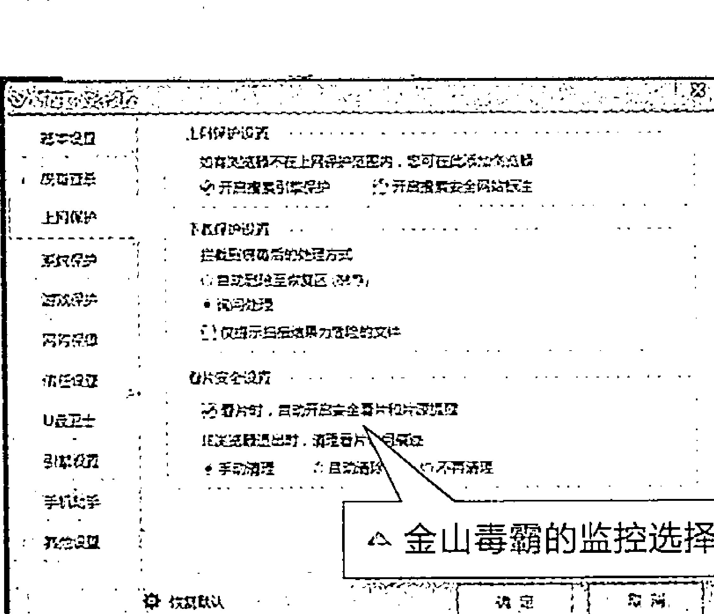

> **小提示：安全软件最好不要混搭使用**
杀毒软件套装最好不要混搭使用（如360杀毒+金山卫士或360安全卫士+百度杀毒）。混搭使用会因相互之间的技术兼容问题，或突如其来的商业不良竞争行为（如以往的“3Q”大战、“3百”大战等），给使用者造成不必要的麻烦甚至损失。

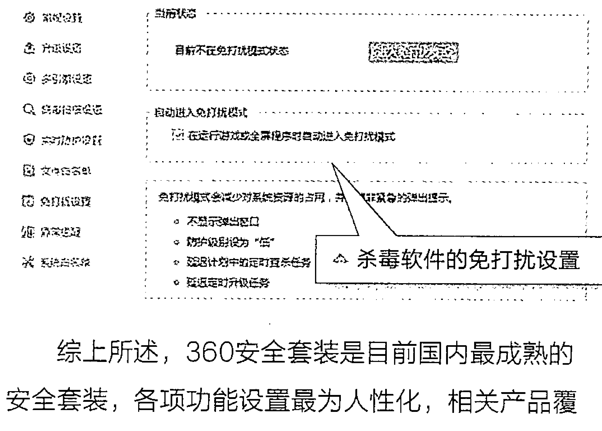

### 多个杀毒软件 装在一台电脑上

在同一个系统中，杀毒软件一般只建议装一个，装太多会影响系统效率，还可能引起软件冲突。但这并不表示一台电脑只能装一个杀毒软件，其实装三个也未尝不可。如果电脑中安装了三系统，那么可以给每个系统安装不同的杀毒软件套装。比如C盘的Windows XP系统安装金山毒霸系列套装，D盘中的Windows 7安装360安全套装，而E盘中的Windows 8系统安装百度安全套装。这样可以交叉查杀，更加全面地对所有分区的文件资源进行扫描和保护，同时又不至于造成同一时间内系统内存资源争夺，也不会引起软件冲突。

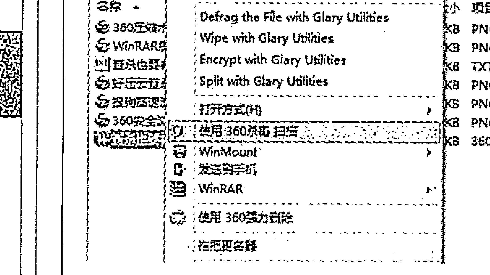

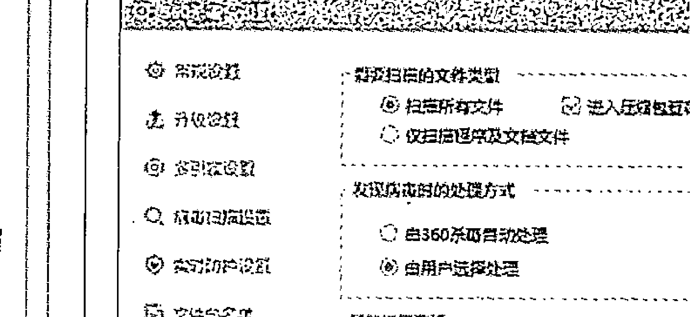

### 选择查杀 针对目标效率高

不但杀毒软件需要选择，选择好杀毒软件之后，使用过程中也需要有针对性的选择，以便让查杀过程更高效。此外，在使用各种工具的过程中，也会涉及到安全方面的选择问题。

##### 1. 杀毒软件的查杀选择

如果我们只是针对某个刚下载的软件或外部拷贝来的软件进行安全检查，没有必要启动杀毒软件界面来查杀，可方便地用右键来实现。以360杀毒为例，只需在要查杀的文件或压缩包上点击鼠标右键，选择“使用360杀毒扫描”进行查杀即可。

对于杀毒软件扫描过程中能否查杀压缩包中的病毒，一般的杀毒软件默认都只扫描程序和文档，不对压缩包进行扫描。但可通过设置，让杀毒软件深入到压缩包内部进行查杀。只需在杀毒软件“设置”窗口中选择“病毒扫描设置”，在需要扫描的文件类型下选择“扫描所有文件”并选中“进入压缩包查毒”选项即可。

平时使用电脑时，有一些文件一般不会有病毒，而杀毒软件也没有必要对所有文件都监视。在这种情况下，我们可以为杀毒软件建立一个白名单，将某些类别的文件添加到白名单之中，这样可以省下不少的内存资源和查杀时间。

> 除了文件白名单外，在查杀过程中还可将查出的系统可疑项目（但确认是安全的）添加到“系统白名单”中，并可随时取消信任选择。此外，平时如果只是运行程序和处理文档，或机器配置不高，则可只开启监控程序和文档文件，而取消“监控所有文档”。

##### 2. 常用工具的查杀选择

杀毒软件一般提供对系统环境的安全检测，也提供用户选择全盘扫描查杀。但是，有时我们进行的工作是非常有针对性的，比如我们从网上下载一个程序或文件压缩包。我们关心的是浏览寻找软件和下载的过程是否安全，在下载完成之后，解开文件压缩包的时候是否安全，还有就是压缩包中的每个文件是否安全，是否有病毒或木马隐藏在压缩包中。在这种情况下，如果用杀毒软件去全盘查杀，或专门用杀毒软件选择这个包来查杀一下，那样会显得很烦琐。这时，如果我们选择启用下载工具、解压工具中的安全检测模块，让软件在浏览、下载和解压过程中自动来检测文件的安全状况，就显得很人性化了。

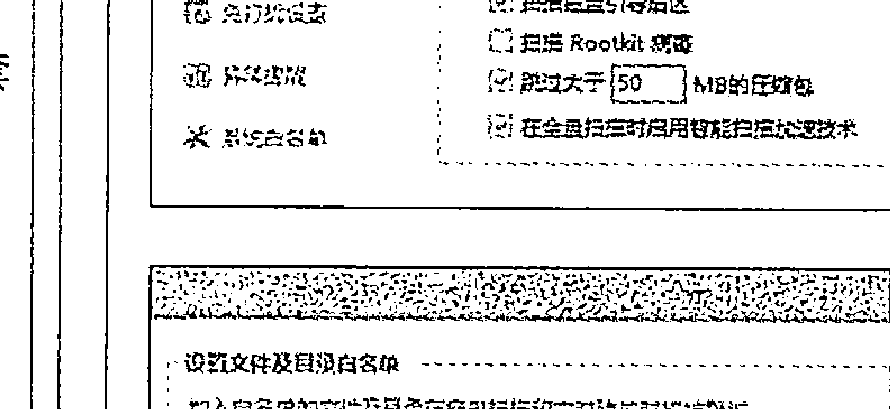

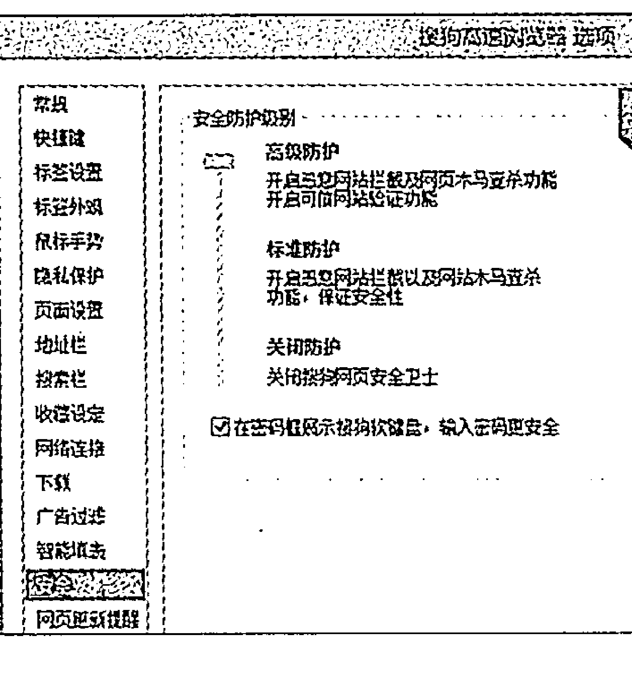

**小技巧：** 不少木马是通过拦截键盘的录入过程来获取用户的账号和密码的，为了避开这种恶意的偷窥，我们可以用软键盘的方式来代替直接的键盘输入过程。在搜索浏览器的安全设置窗口中，选择“在密码框展示搜索软键盘，输入密码更安全”前的复选框，就可以实现网络密码的软键盘输入。

### 浏览下载中的安全选择

浏览器是上网的第一道关口，许多恶意程序或木马就是通过这个途径来侵入电脑的。因此，在浏览器中做好安全防护选择是很重要的一环。我们以搜狗高速浏览器和360安全浏览器为例来说明。

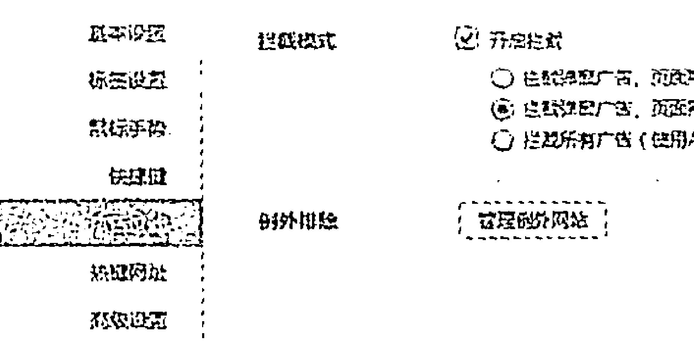

**小提示：** 在安全级别为木马的文件上双击文件会弹出阻止点击对话框，有效防止误双击打开木马，更安全。针对木马、风险级别的文件会有弹出窗口进行警示。

如果我们使用的是搜狗高速浏览器，为了上网安全，我们可以设定最高安全级别的防护，以拦截恶意网站，对付网页木马，同时还可以开启可信网站的安全验证提示。搜狗高速浏览器为上网设置了3个安全级别，我们只需将安全防护级别选择开关滑动到“高级防护”即可获得最高安全防护。

### 下载之后的安全检测选择

除了浏览下载过程中的安全检测选择之外，下载之后的文件安全检测也很必要。对于下载之后的文件或压缩包，如果压缩软件本身能带有安全检测功能，将极大地地方便文件的操作和管理，这比下载后再启动杀毒软件来查杀要省事得多。

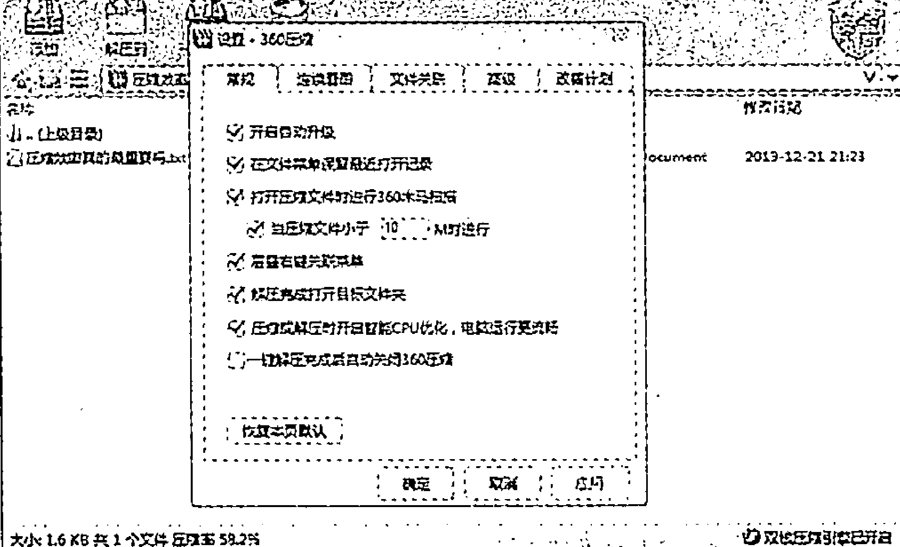

如果系统中安装的是360压缩软件，360压缩提供打开压缩文件时进行木马扫描的功能，同时可以设定文件容量为多大时进行木马扫描。用360压缩打开一个压缩包后，会自动对压缩包内的文件进行云木马检测，保证使用安全。经过云木马检测后，360压缩会对压缩包内不同类型的文件进行安全评级，有效识别木马、脚本、普通文件、风险文件，并会在界面右上角有相应的图片提示。

而如果我们使用360安全浏览器，除了浏览器自身内置的安全检测和网站认证技术、360安全组件等一系列安全保障措施外，我们还可以通过选择浏览器本身提供的拦截过滤功能，对弹出广告、页面欺诈信息进行拦截。

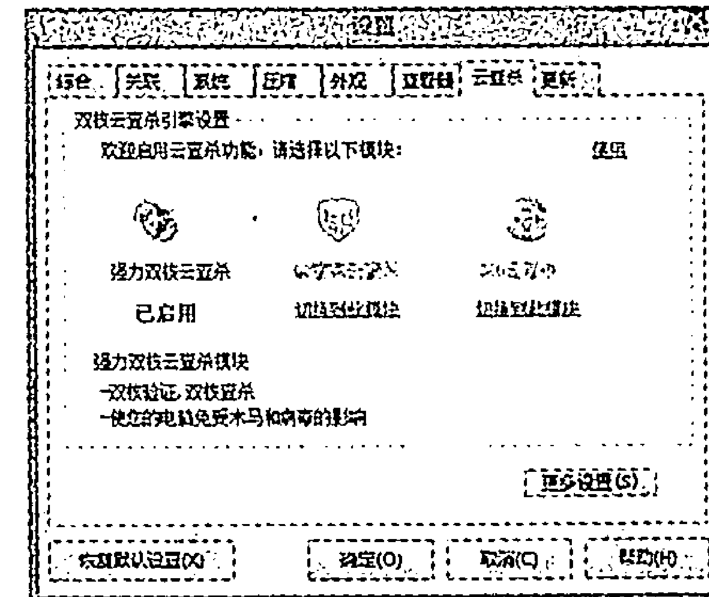

若使用好压文件压缩工具，它在文件解压安全方面提供更多的选择。通过“云查杀”设置窗口，可以选择“强力双核云查杀”，还可以选择“QQ管家云查杀”或“360云查杀”引擎模块作为压缩包的安全查杀工具。

对于古老的压缩软件WinRAR来说，虽然软件本身没有自带安全检测模块，但提供了一个外部接口，一个“提示选择外部病毒扫描软件”的选项，用户可根据需要选择系统中安装的杀毒软件作为压缩包的安全扫描工具。

### 壹忆起 Z1JIA正年

策划|《电脑爱好者》编辑部

轰轰烈烈的2014年春运落下帷幕，在经历了以人为单位的“迁徙”后，那些没有“生命”但同样重要的软硬件资源也将迎来新一轮的迁移。在这里，唯有掌握正确的操作方法，才能让它们的迁徙更具效率，让我们不再重温春运票难买、路途挤的“种种噩梦”。

### 打造数据的“迁徙之路”

提到“迁徙”，首先让人联想到的就是宝贵的数据。当新旧电脑进行“交接”时，如何快捷地将旧电脑的数据迁徙到新电脑中？如果你觉得用移动硬盘先“备份”再“传输”的方式太过繁琐，不妨考虑通过无线和有线的形式打造电脑间的数据迁徙之路吧。

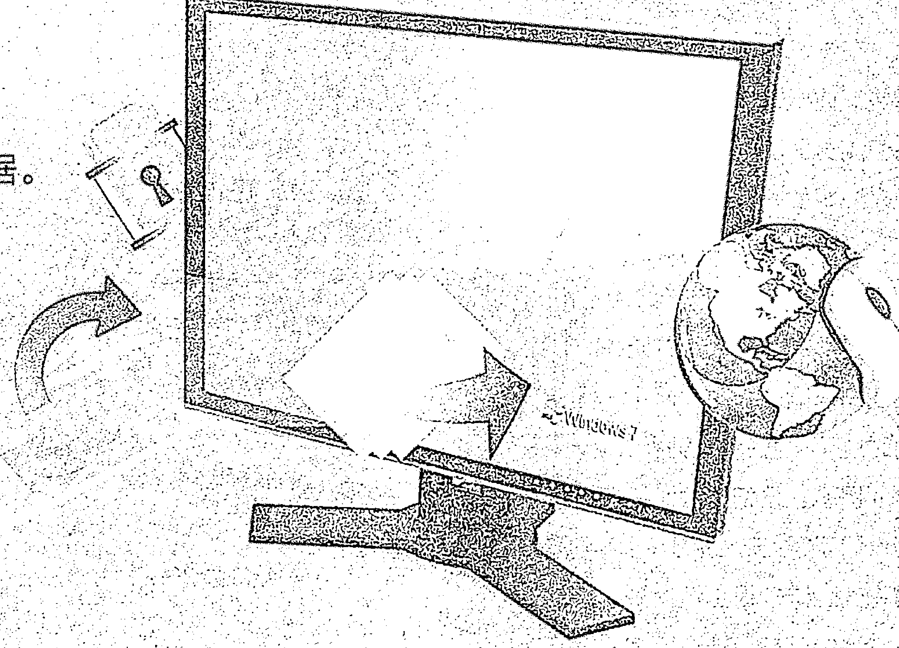

##### “空中”迁徙

适用环境 两部电脑都配有无线网卡

所谓“空中”迁徙，就是利用Wi-Fi组建局域网，实现两部电脑之间的数据互传。该方案有个前提条件，就是两部电脑都必须配有无线网卡，对此笔记本毫无压力（标配），但绝大多数台式机用户就需要购买安装USB或PCI接口的无线网卡了。接下来，就是根据不同的网络环境，选择对应的连接方案。

1. 周围存在无线网络，我们可以直接借助无线网络（例如无线路由器）进行连接，两部电脑加入同一无线网络后就自动进入局域网模式，毫无难度可言。
2. 如果周围没有可用的无线网络，则需要通过无线网卡构建一个点对点的无线网络。其中笔记本用户可利用系统设置，“Connectify”、“毒霸免费WiFi”、“猎豹免费WiFi”等第三方软件将无线网卡共享，再由另外一部电脑接入即可。如果是台式机用户，则可购买“360随身Wi-Fi”（图1）一类的外设构建无线网络再供其他设备连接。

搭建点对点网络

在这里我们着重介绍一下第二种连接方案。如果安装有无线网卡的电脑安装了Windows XP系统，可在控制面板中进入“无线网络连接→无线网络配置”，点击首选网络下面的“添加”按钮即可建立点对点的无线网络。（图2）如果电脑是Windows 7系统，则可以通过“网络和共享中心→创建新的连接和网络→设置无线临时网络”（图3）的方法建立点对点的无线网络。

> **扩展阅读 APP——猎豹免费WiFi**

如果你觉得上面的设置比较繁琐，推荐使用“猎豹免费WiFi”（下载地址：http://wifi.liebao.cn/）跳过系统设置，下载安装后该软件会自动建立Wi-Fi热点（图4），而且不仅限于PC访问，还可共享给手机、平板一类的设备无线上网。

▲ 该软件支持XP、Win7和Win8系统，全自动设置，无需人工干预

有形之路

适用环境：其中一部电脑没有无线网卡，而且都配有RJ45（有线网卡接口）

让台式机都配有无线网卡并不现实，在两部（或多部）电脑间无法共同享用无线网络时，只需一根普通的网线即可让两台电脑互联（图5），从而构建一个只有两台电脑的小型局域网。

网线的抉择

在很多人的印象中，想通过网线让两台电脑互联，必须使用交叉网线才可实现。实际上，近年生产的电脑都配备了自适应网卡，不管用交叉网线还是直通网线都可以正常通信。因此，在以有线的形式互传数据时，大家可先尝试用普通网线连接两部电脑，如果无法建立局域网，再购买或自制交叉网线连接。

答案取决于带宽最低的那块网卡。比如早期的台式机有线网卡多以100Mbps为主，早期笔记本无线网卡的速率更是低至54Mbps（802.11a）。如今无线网卡都开始从300Mbps起步了（802.11n），而千兆以太网卡也早已普及（图6~7）……相对而言，丢包率、延迟最小的是有线网络，其次是点对点网络，最后则是同时接入无线路由器网络。总之，大家也不必纠结于哪种方案的速度最快，选择最符合场景下的方案才是最好的方案。

网卡的速度瓶颈

有线和无线，哪种方案传输数据的速度最快？有线就一定快于无线吗？这个问题的

> **扩展阅读 混合网络地合情**

所谓混合网络，就是将不支持无线网络的电脑通过网线连接至无线路由器，支持无线网络的电脑通过无线网络连接至无线路由器。对“源电脑”IP地址固定后共享方法同上。

《电脑爱好者》·2014上半年合订本 { 特别话题 }

很多人早已遗忘通过网线实现PC间数据互传的方式

笔者的笔记本无线网卡是802.11abg的，此时无线传输数据的速度就远不如有线的模式

> **小提示**：交叉网线主要用于电脑到交换机或路由器，而直通网线则用于电脑到电脑。交叉网线的制作方法http://dwz.cn/8F9Cek5

数据迁徙

当两台电脑通过有线或无线的形式组成小型局域网后，接下来就可利用共享文件夹的功能实现数据的迁徙了。无论采用哪种方案，我们最好都能手动分配IP地址给“源电脑”，这样可以方便我们快速开始传输数据。

手动分配IP地址

以有线方案为例，假设需要转移或者备份数据的PC为“源电脑”，需要将数据转移到此的PC为“目标电脑”。在源电脑的“控制面板→查看网络状态和任务→查看活动网络”进入本地连接（有线网卡）的属性界面，双击TCP/IP 4协议，将IP地址手动设定为192.168.1.128（图8），子网掩码默认即可，默认网关不填或者设为192.168.1.1、192.168.2.1等都不会影响使用。同理，在目标电脑上也手动设定IP地址（图9），只要两部电脑的IP地址最后一位数值不一样即可。此外，为了避免在文件传输时遇到账号密码的问题，建议关闭源电脑的共享密码（图10）。

IP地址的最后一位可以是0-255的任意数值，如果源电脑是XP系统，则可以在网上邻居中设置本地网卡

此界面下需启用网络发现、启用文件和打印机共享，可选关闭密码保护共享

> **小提示**：使用路由器时需注意默认网关必须匹配实际的网关，否则可能会无法联网。完成数据传输后，记得把IP地址改回自动，否则电脑可能会无法接入Internet网络。

设置共享文件和权限

在“源电脑”中，鼠标右键点击你想要拷贝的文件夹或文件的父目录开启共享。如果你还希望在目标电脑上修改这个文件夹的内容，就需要给远程用户权限，即把Everyone的完全控制设为允许即可（图11）。

完成上述设置后，便可在目标电脑上读取数据了。比如源电脑IP地址为192.168.1.128，那只需在目标电脑的浏览器栏输入“\\192.168.1.128”，在这里就可看到所有共享的文件，选择复制到本地硬盘中即可。

> △ Everyone用户不是必需的，其实只要保证两个PC的权限里都有某一个用户就可以，只是Everyone最通用

> 扩展阅读

文件共享服务需要使用139和445端口，否则会遇到共享失败，如果这两个端口已经被关闭、无法开启或者需要跨越一个路由器，就需要进行端口映射或者借助其他工具。其中，139端口可以在“网络和共享中心→本地连接”中选取“Internet协议(TCP/IP)”属性，进入“高级TCP/IP设置→WINS设置”，将“禁用TCP/IP的NETBIOS”设置为默认或启用状态(图12)。此外，把注册表中HKEY_LOCAL_MACHINE\SYSTEM\CurrentControlSet\Services\NetBT\Parameters分支下的SMBDeviceEnabled键删除便可以打开445端口。

如果你觉得上述方法比较繁琐，可以考虑“飞鸽传书”（下载地址：http://www.ipmsg.org.cn/），两台PC都安装该软件后，即可像QQ一样，直接将需要迁徙的文件拖到好友列表的头像或聊天窗口内就可实现发送（图13）。

小结

总之，在新旧电脑交接或需要进行大量数据的迁移时，通过U盘或移动硬盘备份的方式不仅速度慢（USB3.0除外）且繁琐（还需再从U盘拷贝到指定PC中）。而本文的目的，则是指导大家绕过中间设备，直接实现PC之间的数据迁移。

随着无线网络的普及，文件无线共享传输已经不再局限于PC之间。PC、手机、平板电脑、电视盒子、无线U盘/硬盘……几乎所有支持Wi-Fi的智能终端或存储外设都可进行双向的数据传输，也就是以“云”为主的新时代。相关的内容《电脑爱好者》之前曾做过详细的报道，感兴趣的读者可参考：

- 2013年23期《活在“云”中》
  在这里你将学会通过免费的随身云，让各种手持终端共享影音资料的方法。
- 2014年2期《精彩随身 影音的“春运”》
  这里你将掌握局域网内电视盒子的进阶使用攻略。

系统级文件大迁移

年终岁尾，有不少人选择购买新的PC或给电脑升级更大容量的硬盘。换了新的硬盘后，如何实现原有系统数据的快速迁移？原来硬盘中安装的软件如何迁移？笔记本中隐藏恢复分区如何备份恢复？若从Windows到MAC系统，又如何迁移其中的数据？这些都是需要解决的问题。

硬盘数据整体高效迁移

电脑弃旧换新或要更换更大容量的硬盘，如何才能更快、更安全地将整个分区，甚至整块硬盘的数据转移到新的硬盘当中？以往我们介绍过用数据备份和恢复的方法实现，但这种方法效率还不够高或有局限性，现在我们要寻求更高效的解决办法。

分区可变的整盘克隆

硬盘换新之后，新硬盘容量一般来说会远远大于老硬盘的容量。新硬盘的分区配比自然也就不可能沿用老硬盘的容量和配比。如果按照常规的方法，一定是先给新硬盘分区，划分各分区的占用空间，然后格式化硬盘，最后再从旧硬盘中用释放系统备份包或硬盘对拷的方式进行数据转移。但是，这种方法太费事、太费时。那么，有什么更加高效、快捷的方法实现硬盘的整体数据转移呢？我们借助于本刊曾经介绍过的系统备份工具ATI软件来实现这个需求。这次使用该软件的一个“克隆磁盘”实用组件来实现硬盘数据整体转移。

> > 小提示
> ATI克隆磁盘功能的最大特点是分区、格式化、数据转移都自动完成，不需要人为干预。即使硬盘数据量很大，普通转移是几个小时才能完成的任务也没关系。因为克隆任务自动执行，参数设置完全可预先用电脑，所以可以晚上或者后半夜来做此事。此外，同样动人心的功能是，在将旧硬盘的数据转移到新盘之前，完全可以重新规划新硬盘的分区和空间，不需要占用其他硬盘的空间数据，具体空间用户自行设定。

启动ATI 2013，切换到“工具与使用工具”组，点击“克隆磁盘”链接，随即会启动克隆磁盘向导，为了灵活控制，选择“手动”克隆（图1），接下来选择要克隆的源盘（当然是旧硬盘），再选择目标硬盘（就是新硬盘），最后调整一下新硬盘中各分区的容量配比，即可进入整块硬盘的克隆过程。整个过程不需要人为干预，完全自动化。详细操作步骤和注意事项，详见本刊2013年第17期特别话题相关文章。

单一分区的整体克隆

上面介绍的是将整块硬盘数据一次性转移到新硬盘中的情况。现实中，在换了新电脑之后，你很可能只想将旧电脑硬盘中的一个或几个分区的数据转移到新硬盘中，而其余的分区数据可能不再需要转移，这时就存在一个选择转移的问题。在这种情况下，就不能使用整盘克隆了，只能采用单个分区的克隆。比如，先将C盘系统分区单独转移，然后再转移含有个人数据的某个分区。

实现此类转移，一般可用Windows版的Ghost，或者使用ATI专业备份软件克隆整个分区。我们先介绍用Windows版Ghost来转移分区数据的方法。

运行Ghost32程序，逐级选择“Local→Partition→To Partition”命令，然后在下级界面中选择源磁盘与分区（即旧硬盘的某个分区），点击OK后选择目标磁盘与分区（即新硬盘的某个分区），然后点Yes按钮确认开始分区克隆过程（图3）。

> 小提示
> 关于用备份工具ATI克隆某个单一分区的具体操作，本刊相关数据备份的文章中曾有详细介绍，这里不再赘述。

数据分区的同步克隆

对于有选择的多分区数据克隆，如果已经将系统分区克隆到新的硬盘当中，新硬盘就已经具备了启动系统的条件，这样，其他用户数据分区的数据转移就可以采用另外的一些方法。例如，用数据同步软件实现快速单向同步，或者采用数据快速拷贝转移软件来实现一次性数据灌装转移。

先说用软件同步法转移整个分区数据的方法。我们选用一款经典的数据同步软件Beyond Compare来实现数据同步转移。在同步窗口左侧文件夹输入源盘根目录路径，右侧文件夹输入目标新磁盘盘符路径，下方更新方式选择“更新右侧”，点击“同意”开始同步更新（图4）。

接下来介绍另外一种方法，用FastCopy软件实现分区数据的加速转移或者克隆。这种方法可以设置文件转移的磁盘缓冲空间，最大限度地提高数据的转移效率。

启动FastCopy软件，在“源目录”和“目标目录”处分别输入旧硬盘和新硬盘分区所在的盘符，拷贝方式设置为“移动-总是执行此操作”，然后点击“执行”按钮，即可开始磁盘文件的整体高速转移过程（图5）。

下面介绍另一种分区可变的全盘克隆法。大家以前可能经常使用Ghost来备份或还原系统，你会注意到Ghost会切换到DOS环境下完成数据备份或克隆操作。其实，Ghost有两种内核的版本，一种是在DOS环境下运行，还有一种直接在Windows视窗环境下运行。现在我们要用它来实现两块硬盘的数据转移，而不是打包备份系统分区或数据分区。我们需要在Windows环境下完成这项工作，不需要切换到DOS环境下，因此我们选择Windows内核版的Ghost32工具。

将新硬盘接到旧电脑上，用系统磁盘管理或专用分区工具对新硬盘进行分区和盘符分配。接下来运行Ghost32程序，在出现的界面中逐级选择“Local→Disk→To Disk”命令，然后在下级界面中选择源磁盘（即旧硬盘），点击OK后选择目标磁盘（即新硬盘），若目标磁盘与源盘容量不同，则可以调整目标盘的分区容量配比，然后点Yes按钮确认开始硬盘克隆过程（图2）。

> 小提示
> 系统盘活动问题可用ATI备份还原的方法或安全模式下激活盘符并重启的办法解决。

突破跨平台的系统迁徙

在相同内核的系统，比如同为Windows的系统之间进行数据迁徙，操作起来并不难，因为它们使用的都是可以互访的文件系统。但如果更换的是不同内核的操作系统，比如原来使用Windows笔记本，现在更换为苹果笔记本，那么原来Windows下的数据又该怎么迁移到苹果机上？

由于不同内核操作系统使用的文件系统不同，一般情况下它们是无法直接互访的。因此要让Windows下的数据迁移到苹果系统中，就需要找到两个系统都支持的统一协议，再利用这个协议在两个系统之间进行数据交换。

exFAT分区充当中转站

苹果电脑从Mac OS X 10.6开始就支持格式化为exFAT格式的U盘或者移动硬盘，而且这种格式支持大于4GB以上的单个文件，Windows系统的Windows 7/8也是内置支持exFAT格式。因此如果要将Windows下的数据传到苹果电脑，我们只要准备一个优盘或者移动硬盘，然后格式化为exFAT格式即可。

在苹果电脑上，点击屏幕右上角的放大镜按钮，搜索“磁盘工具”，在磁盘工具侧边栏选择要格式化的优盘或者移动硬盘分区，右侧选择“抹掉”标签，在格式下拉菜单里选择ExFAT即可（图1）。

如果是Windows系统，在资源管理器中选中需要格式化的优盘，然后在文件系统下选择exFAT即可（图2）。

由于两个系统都支持exFAT格式U盘，因此在Windows下我们只要将数据如个人邮件、文档等保存在U盘中，然后将U盘插入到苹果笔记本中即可实现数据的迁徙了。

跨平台的网盘中转

现在的网络已经非常普及，如果你身边没有优盘，那么利用苹果和Windows都支持的网络协议，也可以轻松实现数据的交换。比如可以使用支持两个平台的金山快盘。

在Windows平台安装快盘客户端后，进入快盘“设置→高级设置→设置定时同步”，然后选择“实时同步”（图3）。

这样只要在苹果机上也安装快盘，然后在Windows电脑上将需要迁移到苹果电脑上的数据复制到快盘目录，就可以轻松实现迁徙了。

《电脑爱好者》·2014上半年合订本

特别话题

大部分品牌电脑都会在本地硬盘保留一份出厂备份，当系统出现难以修复的故障时，通过这个备份可以快速恢复到出厂状态。因此，如果我们要更换新硬盘，很有必要将这个备份系统也迁移到新硬盘中。

大部分品牌电脑保存备份的都是隐藏分区，因此要顺利迁移这个备份，首先要将备份从隐藏分区提取出来，接着将其配置到品牌电脑的一键还原程序中去。这里以华硕S400操作为例。

首先在原来电脑上到http://www.dwz.cn/cfana201403下载BOOTICEx86.exe，启动程序后选中本地旧硬盘，点击“分区管理”，在打开的窗口可以看到有一个卷标为Recovery的分区，它的分区标示为1C（隐藏分区），这就是存放出厂镜像的分区，点击“显现”取消其隐藏状态（图1）。

取消分区的隐藏后，在资源管理器中打开卷标为Recovery的分区，将其中全部内容复制到桌面“ASUS”文件夹中备用。接着连接上新硬盘，同上在BOOTICEx86.exe选中新硬盘进入分区管理，然后点击重新分区，创建一个卷标为Recovery主分区（存放出厂镜像），卷标为“Win7”（存放系统）主分区，其他分区按照自己的需要创建（图2）。

完成分区的创建并格式化，接着打开资源管理器，将上述提取的“ASUS”文件夹中的全部内容复制到Recovery分区中。返回BOOTICEx86.exe主窗口，点击分区引导记录，然后依次将卷标为Recovery和Win7的分区引导记录更改为“BOOTMGR引导程序”（图3）。

返回BOOTICEx86.exe分区管理窗口，选中卷标为Win7的主分区将其激活，选中卷标为Recovery分区，点击“更改分区标示”，将分区的ID更改为“1C”，这样这个分区就变为隐藏分区了（图4）。

完成上述操作后，现在只要卸下旧硬盘，重启后按F9键进入一键恢复界面，然后按提示将出厂备份恢复到卷标为Win7的主分区即可。

实际上绝大多数品牌机的一键还原都是使用特定按键激活Recovery隐藏主分区，实现一键还原引导程序来恢复出厂备份。因此如果你的电脑一键还原机制没有被破坏，只要在新的硬盘建立和旧硬盘一样的隐藏分区，然后将其中的备份文件复制到新硬盘隐藏分区即可。

+   ▲①取消分区隐藏状态
△②建立新主分区
◁③更改分区引导记录
▽④更改分区ID

CFanBoundEdition·2014

85# 应用扩展1

如果你使用的电脑原来没有一键还原，还可以参考2013年23期46页《移植联想一键还原》一文中的介绍，在自己的电脑上打造联想品牌机的一键还原。这样无论你的新电脑是什么品牌，都可以轻松使用一键还原。

### 应用扩展2

上述介绍的只是同版本系统备份的迁移，现在很多电脑同配置但是新硬盘却安装了Windows 8.1系统，这种情况只要利用原来品牌机的信息文件，将自己制作的Windows 8.1系统备份替换原来的出厂镜像即可。比如上述华硕机型，出厂备份文件实际上是隐藏分区里的asus.swm（也是.wim文件，改名而已）恢复到系统分区。因此如果要实现跨版本备份，只要备份当前Windows 8.1，替换隐藏分区的出厂镜像即可。操作同上，在新硬盘建立隐藏分区，并将旧硬盘隐藏分区所有内容复制到新硬盘对应的隐藏分区。然后到http://www.cfan201404T下载imagex.exe，下载后将其放置在D:\下备用。接着准备任意一个PE启动盘，启动新硬盘的电脑到PE系统，输入下列的命令，将当前Windows 8.1系统捕捉为Asus.wim镜像（图5）：d:\imagex.exe /compress maximum /capture c: d:\asus.wim "Win8.1OS"

完成镜像的捕捉后，如果你的隐藏分区使用的是FAT32格式，请再执行下列命令对生成的镜像文件进行2GB大小的分割和重命名（因为FAT32格式不支持2GB以上的文件）。如果你的隐藏分区是NTFS格式，则直接将Asus.wim改名为Asus.swm。

```
d:\imagex.exe /split d:\asus.wim f:\asus.swm 2000m
```

完成文件的改名（或分割）后重启电脑进入Windows 8.1，接着到http://www.diskgenius.cn/下载DiskGenius，运行程序选中当前隐藏分区，然后切换到“浏览文件”，将上述改名（或分割）好的Asus.swm拖到隐藏分区替换同名文件，这样即可完成跨版本迁徙备份了（图6）。

以后我们只要在开机时按F9键，然后就可以选择一键还原，将新硬盘的系统还原到上述建立的Windows 8.1镜像了。

### 常用的软件“大搬家”

除了操作系统外，硬盘中还有很多自己用了很久的软件。因此想要更顺手地使用新电脑（或新硬盘），我们还要将这些软件迁移到新电脑上。

为了在新电脑上可以更顺手地使用，硬盘中需要迁移的软件数据主要有两大类。

第一类是包含大量私人数据的软件，比如QQ（个人聊天记录文件）、Foxmail（个人邮件）、输入法（个人字库）、迅雷（已经下载和未完下载数据）等，我们需要迁移的主要是其中的个人数据。这样即使在新硬盘上重装，我们通过导入这些个人数据就可以快速恢复原来的使用习惯。这类软件数据导出主要有两个方法。

方法1：对于软件本身支持导出/导入的，那么直接利用这个功能即可快速实现数据的迁移。比如要导出Foxmail邮件的过滤器设置，运行Foxmail后点击“工具→过滤器管理”，接着在打开的窗口选中需要导出的过滤器，点击“导出”将其导出到优盘备用，以后在新电脑上直接导入即可使用了（图1）。

方法2：对于不支持导出/导入的程序，我们则需要根据不同的程序设置手动提取应用程序的数据。比如需要提取Photoshop设置文件，Photoshop的个人设置默认均存储在“C:\Users\当前用户\AppData\Roaming\Adobe”文件夹下。我们只需复制Adobe文件夹下的所有目录和文件，然后粘贴到新硬盘的对应位置就可以了。Photoshop的默认滤镜以及笔刷则在它安装目录下的“预置”里面，比如Photoshop 10.0路径为“C:\Program Files\Adobe\Adobe Photoshop CS3\预置”，同样手动进行复制和粘贴即可完成导入（图2）。

第二类是常用的大型工具软件。比如我们常用的Photoshop、Office等，这类软件比较大，而且设置较为复杂，如果使用的时间长了，软件保存的设置也较多。要在新硬盘重新安装和设置比较麻烦，对于这类软件我们可以借助PickMeApp将其导出到新硬盘。

启动PickMeApp后，在程序左侧窗格选中需要导出的软件（可以多选），然后点击其下的“Capture”按钮，程序就会自动分析被打包的程序，包括程序包含的组件、注册表值、安装路径等信息（图3）。

程序打包完毕，点击程序右侧窗格的“Save as EXE”按钮，这样打包的程序就可以转换为单一的可执行EXE文件（图4）。

当我们装好了新硬盘并设置好了操作系统，就可以在新硬盘上运行上述制作好的“My Captured Applications.exe”，所有被导出的程序就可以自动安装到新硬盘上啦（图5）。

为了方便大家对电脑中各类常见应用程序进行迁徙操作，最后做了一个列表供大家参考。

> 小提示: 对于与系统紧密结合的软件，打包关联到不少系统文件，因此为了顺利打包，建议在安全模式下进行操作。对于软件的驱动程序，PickMeApp同样支持打包输出，因此可以将驱动作为驱动备份包。

* 常见程序迁徙数据一览表

| 程序名称 | 需要迁移的数据 | 数据位置 | 迁移方法 |
|----------|----------------|----------|----------|
| WinRAR | 程序设置数据 | 无需查找 | 程序自带导出/导入 |
| QQ | 个人聊天记录, QQ表情 | 无需查找 | QQ自带菜单-工具-数据导入工具 |
| Foxmail | 邮件客户端设置, 个人邮件 | 无需查找 | 程序自带导出/导入 |
| Office 2010 | Office个人设置、字库、模板 | 功能区工具栏: .xlb在C:\Users\用户名\AppData\Roaming\Microsoft\Excel... (等) | 手动复制粘贴 |
| Office 2003 |  | 无需查找 | 程序自带Office 2003设置保存向导 |
| Photoshop | 个人设置, 预设以及笔刷 | C:\Users\当前用户\AppData\Roaming\Adobe; C:\Program Files\Adobe\Adobe Photoshop CS3\预设 | 手动复制粘贴 |
| 迅雷 | 下载列表 | 无需查找 | 文件-导出/导入下载列表 |

### 用户数据的迁移

设备更新后，除了系统数据要迁移外，用户数据的迁移意义更大。云端如何实现不同类型云盘间、不同类型系统平台间的数据迁移？A论坛的帖子如何快速转移到B论坛？不同邮件管理器中的邮件如何相互转移？这也是要解决的问题。

### 云端内容无缝迁移

更换了硬盘或系统之后，保存在旧系统下的云盘同步资料也需要随迁到新系统中，如何实现云盘同步文件的转移？新安装了另一种云盘，如何实现将原有云盘中的资料向新云盘中转移？不同平台下云盘中的资料又该如何迁移？

##### 1. 更换系统后本地云盘文件迁移

如果原有的系统（如Windows XP）安装了一个云盘（如360云盘或百度云盘），现在更换了新硬盘或新电脑，系统也变为Windows 8.1，那么存于旧硬盘中的原有云盘同步数据，如何才能转移到新系统中？

要实现新旧系统环境下云盘同步数据文件夹的转移，只需先将旧系统的云盘本地同步文件夹备份下来，待新硬盘中安装好同一云盘客户端后，将数据恢复到新盘同步文件夹中即可。或者先不要删除旧盘中的云盘同步文件夹，接下来在新系统中安装同一种云盘的同步客户端，并为该客户端指定本地同步文件夹。最后将旧盘挂机到新机上，用同步工具同步或磁盘选择性对拷的办法，将旧硬盘云同步文件夹中的资料全部拷贝或移动到新硬盘的同步文件夹中即可（图1）。

> 小提示
> 如果新旧系统使用了不同类型的云盘，也可以实现同步数据的迁移对换。例如，旧系统中使用的是360云盘，同步文件夹为“C:\360云盘”，而新系统中安装的是百度云盘，同步文件夹为“C:\百度云盘”，则只需在软件安装后将旧硬盘“360云盘”文件夹中的所有文件，移动到新硬盘的“C:\百度云盘”文件夹下即可（图2）。

##### 2. 同类云盘不同账号间的数据迁移

如果新旧电脑中使用了同一种云盘，例如均使用了百度云盘，但是新硬盘中安装的百度云盘采用了另外一个账号登录。在这种情况下，原有云盘服务器端的备份资料，如何转移到新云盘服务器或电脑同步文件夹中？

相同类别云盘资料，从一个账户转移到另一个账户，可用一种快速转移的办法，实现“秒”传的效果。具体方法是，先从网页端用旧账号登录云盘，将旧云盘服务器中要转移的资料归集到一个文件夹当中，然后用右键菜单“共享”这个文件夹。因为资料是自己使用，不希望别人获取，所以给这个文件夹加密，选择“私密分享”后点击“创建私密链接”，密码不要告诉别人。这样设置之后，会获得一个共享地址和访问密码。在新账号登录云盘之后，用前面获得的共享地址和密码访问自己共享的文件夹，随后即可选择一键保存的方法，将资料在极短的时间内保存到自己的新账户下（图3）。

##### 3. 不同类云盘间的数据迁移

如果新、旧电脑或新、旧系统中所用的云盘的种类不同，要实现将一个云盘中的资料转移到另一个当中（如从百度云盘中转移到360云盘中），可以用如下两种方法来解决。

###### 生成共享链接 离线下载

以如上所述的从百度云盘中将数据转移到360云盘中为例。首先在百度云盘中选择需要转移的资料文件夹，点击右键并选择“分享”生成共享链接，这样就可获得一个该文件夹的下载地址和提取码（图4）。

从网页版或者轻版PC客户端登录360云盘账户，选择“离线下载”，进入离线任务管理窗口，点击“新建普通下载”按钮，弹出新建离线下载任务窗口，输入上面获得的共享地址，点击“开始下载”按钮，提交给360云盘进行离线下载即可（图5）。

###### 共享本地目录 双盘同步

不同种类的云盘之间转移数据，还可以用共享本地的一个同步文件夹的办法，实现两种云盘数据的自动同步。例如，360云盘同步版客户端的本地同步文件夹为“360云盘”，那么，360云盘服务器端的数据会随时自动同步到本地电脑的“360云盘”文件夹中。此时，如果将百度云盘同步版客户端的本地同步文件夹也重设为“360云盘”文件夹，这样百度云端就会自动监测本地电脑的“360云盘”同步文件夹，一旦有资料变化，就会自动上传到百度云盘中。这样一来，就实现了不用人为上传下载的双云盘数据自动同步。

> 小贴士
> 若下载链接无效，可通过先将下载地址交给Internet Download Manager（或迅雷、QQ旋风）下载，以获得真实网络下载链接地址，再将此真实地址提交给云盘离线下载。

> 小提示
> 下面如果同步的数据量比较大，可能会使电脑系统反应比较慢，特别是在同步刚开始进行时。此时，可以把这些需要同步的文件夹先复制到一个临时文件夹，完成后再移到回原来的同步文件夹内。

### 不同平台云盘文件的数据迁移

不同平台云盘文件的数据迁移，也分相同类别云盘和不同类别云盘间数据迁移两种情况；而相同类别云盘数据迁移又分同一账号和不同账号两种情况；迁移的数据又分为本地同步数据和云端的数据。

对于不同平台间云端的数据转移，一般采用云端共享数据的办法解决，与所使用的平台和客户端关系不大，差别就在于所用客户端的功能强弱。例如有的有离线下载功能，有的没有离线下载功能。对于没有离线下载功能的客户端，数据迁移只能借助于共享本地文件夹的渠道来解决。

对于本地云盘同步文件夹数据的迁移，这与不同平台间转移普通文件的方法类似，只是要注意本地的云盘文件夹与所安装的云盘客户端是关联的，不能随意更改文件夹名称。如果要更改名称，必须在云盘客户端软件中对同步文件夹作相应的设置才行。

### 论坛帖子快速转移 刘承义

网上很多人喜欢泡论坛，并在其中发表了很多有意思的帖子。如果某个论坛要关闭，或者自己想转战到其他论坛，那么以前在A论坛上发表过的帖子，怎么才能快速转移到B论坛上呢？因为论坛系统比较混杂，不同论坛间很难直接导入数据，所以比较笨的方法就是直接手工复制粘贴，即使是这样，我们还是可以借助一些工具，让这个过程方便快捷一点。

##### 找出自己所有的帖子

首先是要找出自己的所有帖子，一般这可以通过各论坛自身所提供的用户管理功能即可实现。比如登录到“赢政论坛”，接着点击论坛右上角自己的用户名称，进入到自己的个人空间里面。点击空间中的“主题”链接后，就可以通过网页列表的形式，显示出所有自己已经发布的帖子名称（图1）。

##### 设置好剪贴工具

因为不能直接导入导出，所以我是借助剪贴板增强软件Ditto（参考下载：http://tinyurl.com/kj32k66）来协助进行转贴的。软件运行后，在系统托盘中的Ditto图标上右击，选择弹出菜单中的Options打开选项窗口，然后切换到General标签，找到Language列表后选择Chinese项，点击“确定”，软件界面就变成中文了（图2）。

由于网页帖子内容可能既有文本又有图片，所以还需要设置一下软件支持的类型。选择设置窗口中的“支持的类型”标签，点击“添加”，在弹出对话框的“主要类型”中选择“HTML Format”项，最后点击“添加”即可（图3）。用同样方法可以添加其他文件类型。

##### 帖子信息复制和整理

设置完毕，就可以开始帖子转移的工作了。其实很简单，打开要转移的帖子，全选帖子内容，按Ctrl+C键即可将内容复制到Ditto中。按同样方法操作，复制所有要转移的帖子内容。比较方便的是，Ditto不同于系统自带的剪贴板，它可以同时存储成千上万条的信息，而且是独立分开的。另外，右击相应的条目后选择“编辑剪贴”，还可以对帖子内容进行编辑整理。

##### 新论坛内容快速发布

内容复制完毕，接下来进入到新论坛的相应模块中，点击其中的“发帖”按钮。接着点击系统托盘中的Ditto图标，在弹出的对话框中可以看到刚刚复制的所有内容。找到相应的帖子内容，按住鼠标左键不放，将其拖拽到新建帖子内容框中释放，复制的内容就快速粘贴过去了，最后点击“发布帖子”。按照同样方法，即可完成其他帖子的转移啦。

> **小提示**
> 如果复制的内容比较多，那么在下方的输入框中输入关键词，可快速找到相应的条目，选择即可（图4）。

### 原来邮件也玩大迁移 刘简

像QQ这类即时聊天的服务有很多，但是邮件在网络交际及平时工作中，依然有着不可替代的重要性。最近两年来，邮件相关的软件工具变化很快，当我们选择新工具时，当务之急自然是将之前的邮件迁移到新的邮件系统中。

##### Foxmail和Live Mail互换

随着Windows自身的邮件客户端的改进，越来越多的人在升级系统后直接使用上了Windows Live Mail（前身为Outlook Express），不愿再装Foxmail之类的第三方软件。如果有此打算，那么就得事先将Foxmail中的邮件导出，选中所有想导出的邮件后，右击，选择“导出邮件”（图1），再根据提示操作即可。升级Windows后，在Windows Live Mail中，首先添加一个与Foxmail相同的邮箱账户，选中“收件箱”，然后打开存放Foxmail邮件数据的文件夹，将导出的邮件直接拖放到“收件箱”中即可导入（图2）。

如果反其道而行，要将Windows Live Mail中的邮件导入Foxmail，注意在导出邮件时一定要选择“Microsoft Windows Live Mail”格式，另外导出邮件时可以选择全部，也可以有选择地只导出部分（图3）。返回Foxmail中，选择一个邮件文件夹，再执行“文件→从文件导入邮件”，选择前面导出的邮件就可以了。

> **小提示**
> ★ Foxmail接近绿色软件，完整保存好它的安装目录，重装系统后就不用重装Foxmail，直接为保存好的Foxmail主程序建立一个快捷方式，就可以像原来一样使用了，而且数据和配置都和原来一样。
> ★ Windows Live Mail导出的邮件，不同邮箱账户及其邮件文件夹，使用不同的子目录进行区分。比如“Sent Items”代表已发邮件，“Inbox”代表收件箱等。

##### 本地邮件同步到云端

随着宽带的普及，越来越多的人放弃了本地邮件客户端处理的方式，而是改为直接在线进行邮件处理。所以，本地存储的一些邮件，可能需要迁移到云端服务器上，这样方便处理（尤其是在手机等移动设备上）。

在迁移邮件之前，先要开启在线邮箱的IMAP协议功能。比如在浏览器中登录QQ邮箱后，点击网页上方的“设置”进入设置页面，切换到“账户”标签中，找到其中的“POP3/IMAP/SMTP/Exchange/CardDAV/CalDAV服务”，勾选其中的“IMAP/SMTP服务”项，最后点击“保存更改”即可（图4）。

接着在电脑本地的邮件客户端中，比如Foxmail，进入账号管理窗口，新建一个QQ邮箱账号，“接收服务器类型”要选择“IMAP”，并分别将“IMAP服务器”和“SMTP服务器”设置为“imap.qq.com”和“smtp.qq.com”，后面的两个SSL选项也要选中（图5）。

以上准备工作完成，在本地邮箱客户端中选中需要迁移的邮件（配合Ctrl或Shift键可多选），右击，选择“移动到→复制到其他文件夹”命令，在弹出的对话框中选择新建QQ邮箱账号中的“收件箱”，“确定”即可。之后，Foxmail会弹出一个是否同步到服务器的询问窗口，点击“是”就可以将这些邮件同步到QQ邮箱服务器中啦（图6）。

> **小提示**
> 如果之前已经在Foxmail中创建过QQ邮箱账号，则要查看它是否使用的是IMAP协议。如果不是的话就需要重新创建一个，但是千万注意不要删除已有的QQ邮箱账号，因为里面还有需要迁移的邮件信息。

##### 在线邮箱邮件迁移

除了上面的两种情况，还有一种是在线邮箱的邮件迁移，比如最常用的网易163和谷歌Gmail之间的迁移。

要将163邮箱中的邮件导入到Gmail中，首先要登录163邮箱进入设置页面，勾选“开启POP3服务”项。接下来登录到Gmail邮箱中，同样进入到它的设置页面中，切换到“账户”标签，找到并点击“检查来自其他账户的邮件（使用POP3）”后的“添加一个您拥有的POP3邮件账户”链接（图7）。这时会弹出一个设置向导对话框，在“电子邮件地址”中输入旧的邮箱地址。点击“下一步”，再详细设置这个邮箱的账号和密码。

为了将导入的邮件进行区分，可以选择“为收到的邮件添加标签”选项。设置完成后点击“添加账户”按钮，最后会询问用户是否用旧的邮箱发送邮件。如果已经打算放弃旧的邮箱，选择“否”后点击“完成”即可。接下来交给云端系统自行处理就可以啦，当旧的邮箱信息导入完毕，就可以非常方便地用Gmail统一管理邮件了。

### 操作系统那些事与XP之死

策划《电脑爱好者》编辑部

2014年伊始可谓操作系统的“多事之秋”。由上海联形与中科院软件研究所联合发布的COS（China Operating System）系统因是否“自主研发”而饱受争议；曾梦想打造“国产OS”，并挑战微软Windows霸主地位的——中科红旗突然公布清算声明；陪伴并见证了中国网络大发展时期的最经典视窗系统——Windows XP也进入了“退役”倒计时。作为一名普通的消费者，我们又该如何面对“操作系统们”的谁主沉浮呢？

### Windows XP黯然退役

和COS、中科红旗相比，Windows XP的退役才真正涉及到最广泛大众的切身利益。然而，半个月之后，这款已经历14年风雨的经典存在即将成为历史。“4月8日后用Windows XP，10分钟内就感染”的传闻更是喧嚣直上。

### 一生一死的国产OS

2000年6月，曾被赋予“打造中国自主操作系统”历史使命的中科红旗正式成立，其推出的红旗Linux操作系统在海内外也赢得了较好的口碑（图1）。经历十余年风雨之后，这个怀揣梦想的国产系统却宣告消亡。究其原因则是中科红旗并没有市场化运作，除了政府采购的订单以外，再有就是PC厂商为了掩盖没有预装Windows的尴尬而采取的低成本OS替代方案而已，绝大多数用户都会在第一时间卸载红旗Linux系统，再自行安装无可替代的Windows。微软Windows都不再受“待见”，死守PC且相对小众的红旗Linux自然也难逃厄运。

就在中科红旗宣布解散的前夕，又一款号称“具有自主知识产权”的移动操作系统COS走入了我们的视野。尴尬的是，舆论几乎都在质疑和吐槽这一新兴的COS，开源专家袁萌更是在博文中表示戴上国产“桂冠”的COS操作系统只能算是一个“混合”操作系统，不能算作中国操作系统“梦”（图2）。

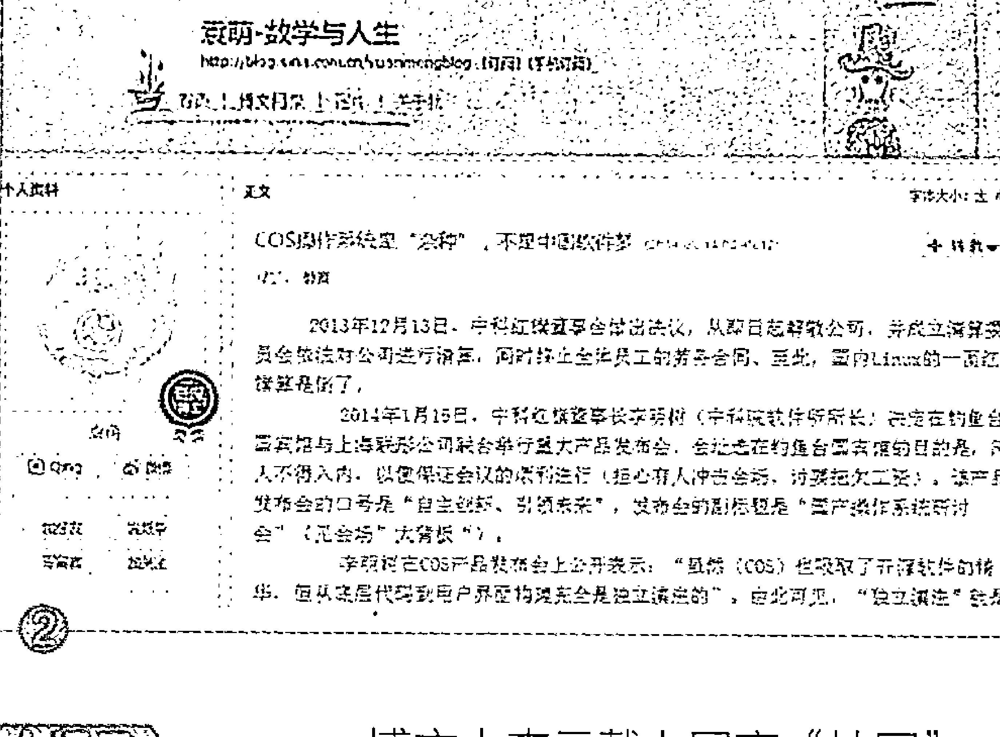

> 一个系统的成败，除了自身表现的优劣以外，是否能够得到开发者与用户的青睐才是最关键的核心。iOS与Android之所以成功，就是建立了一套完整的生态系统，Windows Phone 8增势趋缓也是源于杀手级APP不够丰富。COS能否解决与Android平台APP的适配，将决定其生死和未来。

实际上，红旗Linux系统的消亡与COS是否涉及抄袭都仅仅是海面上的微风，掀不起太大风浪，因为普通消费者的现实生活和它们关联性不大。而将于4月8日正式退役的Windows XP，才是对普通用户真正的破坏性地震，谁都无法预计它能引发多么可怕的海啸。

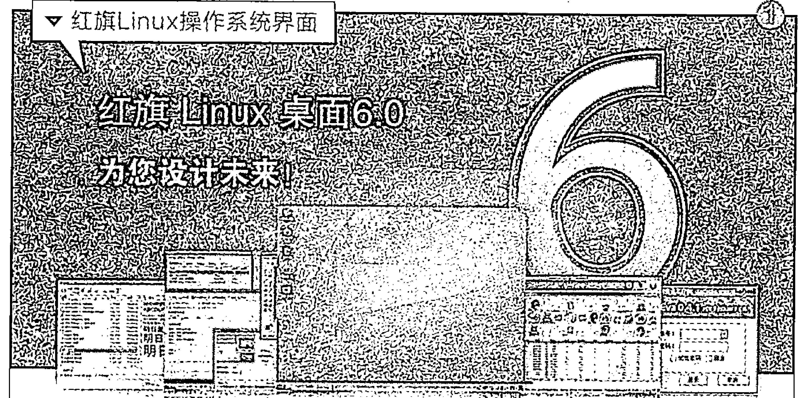

### 直面XP的‘地震’来了

早在2013年4月初，微软就宣布将于2014年4月8日起停止任何关于Windows XP的安全修复程序和修补程序的更新服务。当你拿到本期杂志（2014年6期）时，距离Windows XP的正式“退役”已然进入了“死亡倒计时”。如果说对国产OS的生死我们可以做到“事不关己，高高挂起”，但Windows XP至今在国内仍有2亿保守用户，当它被微软扫地出门后，XP用户的隐私数据就可能如同“裸体”般呈现在众多黑客面前。


### Windows XP的这几年

- 2001年10月 Windows XP Professional和Home Edition正式发布（图3）；
- 2002年9月 Windows XP SP1发布，USB1.1终于升级至USB2.0（图4）；
- 2004年8月 Windows XP SP2发布，新的安全中心让用户更放心（图5）；
- 2008年4月 SP3补丁包发布，微软宣布这是XP的最后一次升级（图6）；
- 2014年4月 Windows XP时代宣告终结！


### XP缘何被“淘汰”

作为微软历史上最长寿的操作系统，Windows XP固然经典，但也存在无法回避的局限性。早在微软决定抛弃Windows XP之前，它就已经被不少软硬件圈子提前“淘汰”了。

##### 无颜面对新技术
Windows XP除了难以根除的蓝屏“习惯”外（图7），对近些年涌现的最新技术，XP往往也只有拂袖掩面的份了。就拿我们最熟悉的几种硬件来说：

处理器：Windows XP在SP3发布时还没有睿频的概念（图8），CPU在XP系统降频/超频的幅度远没有Windows 7灵活和及时。虽然XP也支持多核CPU，但现在发展趋势是逻辑CPU而不是简单的多少核心，XP在系统底层就不具备相应的控制功能，又谈何优化呢？

双显卡：从Vista开始显示驱动是驻留在用户层的，从集显切换到独显只需先释放集显驱动再加载独显驱动即可。而XP的显示驱动是驻留在内核层的，由于内核层并不能很好地支持显示驱动的释放，自然也就无法实现双显卡的切换。悲剧的是，目前新CPU都是内置集显的（笔记本100%自带集显），此时如果双显卡都是AMD的可以单独使用独显，而NVIDIA则只能使用集显（图9）。

硬盘：2TB硬盘是Windows XP可识别的极限，超出的容量会被系统识别成“未指派”空间而浪费掉。此外，Windows XP由于不支持Trim指令，在安装SSD固态硬盘时会导致SSD性能和寿命受损。

内存：Windows XP虽然有64bit的版本但并不稳定，而32bit的XP最大仅能识别3.25GB，更大内存就浪费了。

其他：很多主板原生的USB3.0接口在XP系统中只能当USB2.0使用，某些笔记本的散热风扇在XP系统中也不受控制。总之，很多新硬件在XP下都会出现各种兼容问题，类似Trim指令等问题虽有临时的解决方案但却都不完美，而且操作过程也颇为繁琐。

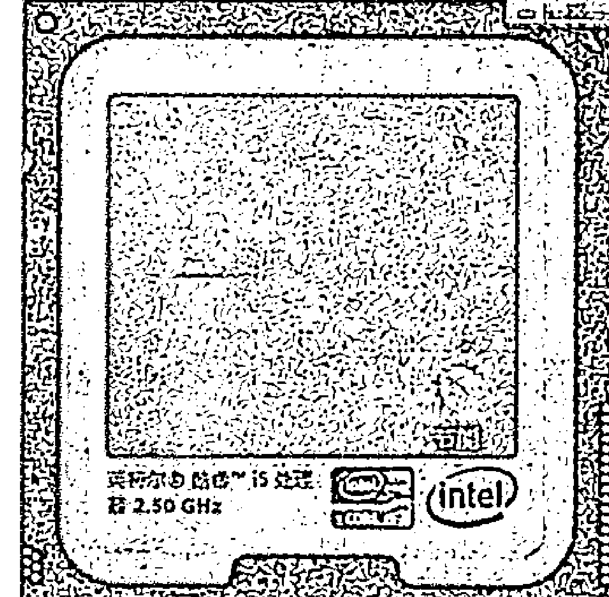
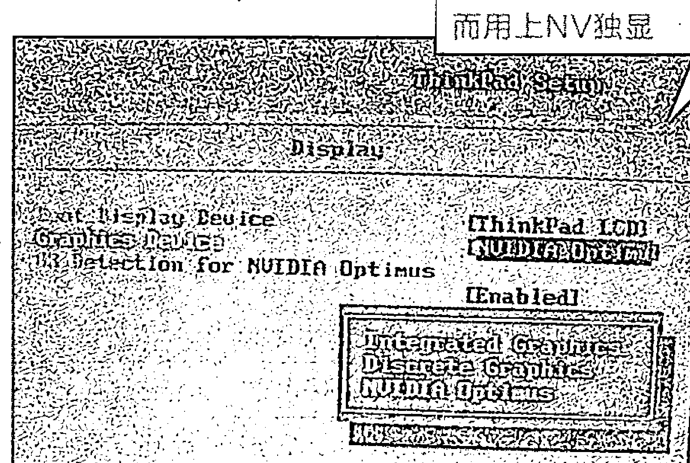
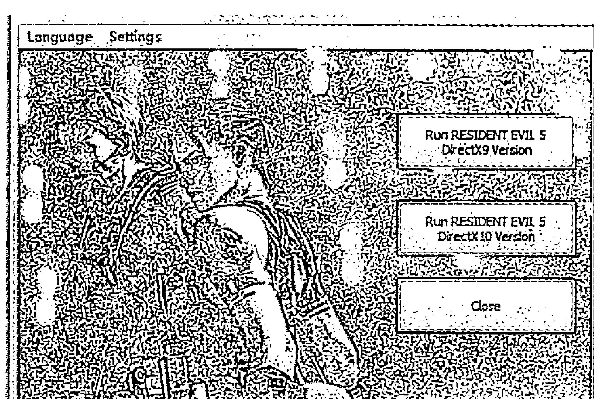

##### 最后一根稻草丢了

很多购买预装Windows 8/8.1系统PC的用户回家第一件事就是装回Windows 7或XP，理由很简单：没法玩“撸啊撸”（LOL，《英雄联盟》）了。对很多游戏爱好者而言，一款游戏往往就是决定Windows命运的东西……
谈到Windows平台的游戏就不得不提DirectX。Windows XP对应的DirectX的版本是DX9.0、Vista是DX10，Windows 7/8分别为DX11/DX11.1，高级别的DirectX可向下兼容低版本，反之则无法运行。这意味着在新系统中可以运行老版本的DX9游戏，而在Windows XP上却无法迈过DirectX的门槛运行DX10/DX11游戏（图10），因为这已超过它的性能范围。因此，没有DX9运行模式的3D大作理论上都无法在XP系统上运行。当游戏这根最后稻草脱手后，XP留给用户的貌似只有简洁的界面、熟悉的操作及美好的回忆了。


##### 哪些用户最受伤

那么，XP退役后对个人用户的影响体现在哪里？举个通俗点的例子，以前Windows XP就好似封闭式管理的小区，物业（微软）会在出入口安排门卫，第一时间修补损坏的监控和围栏。如今物业不再负责修补工作了，外来人员可随意破坏监控和围栏并自由进出，需要业主自己负责人身和财产安全。当然，此时会有很多安保公司（各种杀毒软件公司）站出来说可帮助业主维护秩序（应急补丁），但他们没有小区地图、各种管线布网等核心信息，只能做到表面上的修修补补，哪里坏了补哪里，再也做不到从源头上杜绝恶意攻击了。

| 硬件 | Windows XP | Windows 7 | Windows 8 |
| --- | --- | --- | --- |
| 处理器 | Pentium 233MHz | 1GHz (32位或64位) | 1GHz (32位或64位) |
| 内存 | 64MB | 1GB/2GB (32位/64位) | 1GB/2GB (32位/64位) |
| 硬盘 | 1.5GB | 16GB/20GB (32位/64位) | 16GB/20GB (32位/64位) |
| 其它 | 800×600显示器 | 支持DirectX 9的显卡 | 支持DirectX 9的显卡 |

因此，4月8日之后，最受伤的就是安全意识相对淡薄的普通Windows XP用户了。如果你仍想继续固守阵地，不妨关注一下360、金山毒霸等第三方企业的XP更新服务（图11）。当然，本专题后面也有更为详尽的安全和优化攻略。

##### 不“光彩”的退役

现在登录微软官方网站你将看到两个相互呼应的提示，其一是“仍在运行Windows XP？”并列举了4月8日之后的可怕情景（图12）。其二则是“现在是更换新电脑的最佳时机”，Windows 8.1隆重登场。观点很鲜明，XP已经不安全，那最新的具备微软官方更新服务的Windows 8.1自然是最佳之选了！

回想当年Windows 95、98、Me、2000退役并没有掀起太大的波澜，因为Windows XP充分显示了优胜劣汰的历史规律。因退休而引发的一系列化学反应更充分印证XP系统的成功。Windows XP的诞生刚好与中国宽带普及时期重叠，经典的蓝天草原桌面和开始菜单已经在用户心中烙下了“这就是PC应有的界面”的印记。反观最新的Windows 8/8.1，口碑远不如XP和Windows 7，自然难以激发用户升级的兴趣。

实话实说，微软能对一款操作系统提供长达14年的更新维护，这本身足以彰显企业对用户负责的态度。但微软让Windows XP退役的方式却有待商榷。因为，微软并没有采用依靠新系统的优势来吸引用户自愿升级的方式，而是通过强制性的手段迫使Windows XP退役！

无论如何，Windows XP的退役是不可逆的过程。既然无法反抗，那我们唯有接受这个事实了。好消息是，《电脑爱好者》有继续坚守XP系统到“要用到不能用的一天”的优化方案，也有升级到口碑最佳的Windows 7的经验技巧。无论你做何选择，后面的内容不容错过。

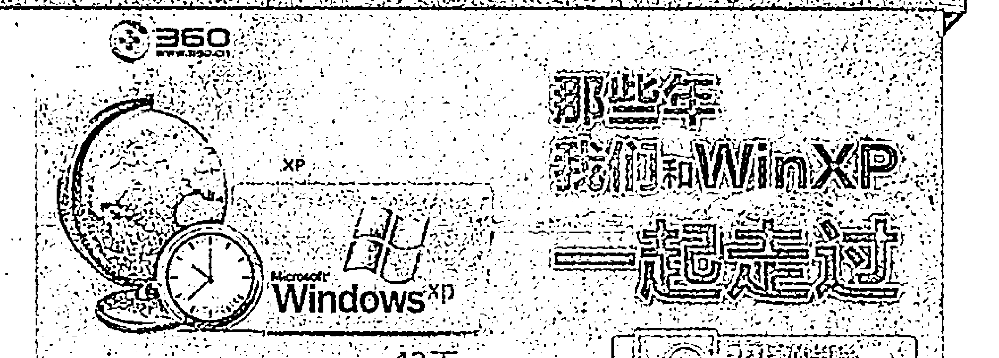

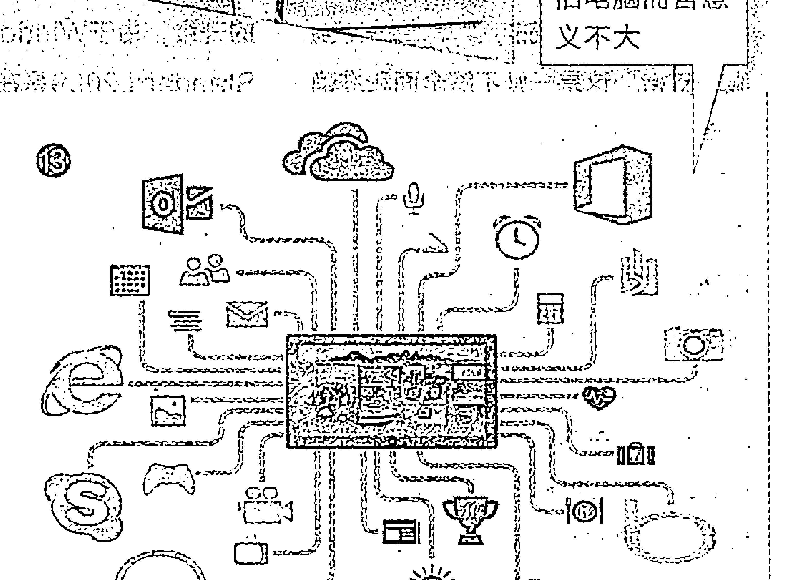

尽管微软已经宣布了对Windows XP安全更新支持的终结日期，但是，仍有很庞大的用户群表示心甘情愿或不得不继续使用这一古老而可爱的系统。问题的实质到底何在？如何才能继续安全坚守？如此撑下去是不是长久之计？对于这些用户来说，明智而又从长计议的选择又该是什么？本部分将向大家分析讲述你所关心的这些问题。

###### 小知识 正视听 放弃支持Windows XP微软没搞一刀切

许多人认为微软放弃对Windows XP的支持最后期限是2014年4月8日，到期后所有该系统的用户都将得不到服务支持，这是一则不够全面和准确的消息。微软宣布的将于2014年4月8日起停止支持的Windows XP系统其实只是该系统的最大一部分，即普通PC中安装的Windows XP版。而对于各行各业的用户来说，他们使用的Windows XP不一定都像我们个人用户电脑中的Windows XP系统一样。比如，在世界许多国家的ATM机上使用的Windows XP，还有一些工业机器中内嵌的Windows XP。对这部分用户的系统技术支持，微软没有搞“一刀切”，继续会为一些运行Windows XP系统的ATM机发布关键补丁更新，直到2016年1月。微软也会继续为一些基于Windows XP的嵌入式系统提供支持：Windows XP Embedded Service Pack 3将继续更新到2015年4月12日；而作为它的升级，由于Windows Embedded Standard 2009是在2008年时才发布的，因此其支持延长到了2019年1月8日。此外，还有数量非常可观的Windows XP嵌入式产品，如商场销售终端POS机，它们所使用的嵌入式系统Windows Embedded for Point of Service SP3于2005年发布，同样获得了延长到2016年4月12日的支持。对POS机设备所使用的Windows Embedded POSReady 2009的支持将更是会持续到2019年4月9日。在延长的技术支持期间，微软将继续提供关键安全补丁更新，但在此阶段用户需要一个特殊的协议来获得支持。尽管如此，微软还是极力建议嵌入式的用户尽早考虑使用更新的嵌入式系统，比如Windows Embedded 8.1 Industry。

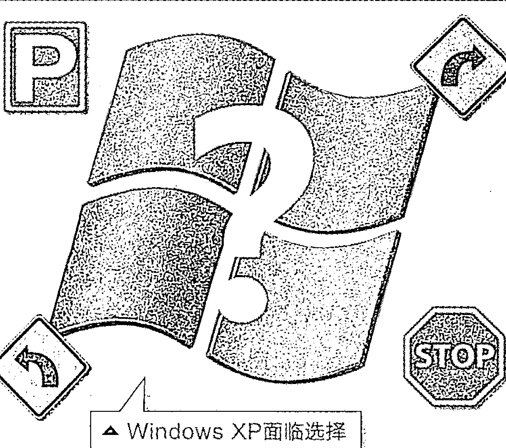

▲ Windows XP面临选择

### 谁在推动Windows XP的没落？

- 是微软在牵着用户走，还是用户推着微软发展？都是，也不都是。但你跟着微软走，大方向没错。是微软技术的前瞻性促使Windows XP的没落。
- 硬件设备快速更新换代，推动Windows XP更快落伍。
- 软件技术、特别是64位技术的发展，促使Windows XP退出。
- 从众效应推动更多人使用新技术、新系统。
- Windows XP不安全、Windows 8.1更安全的案例将不断涌现。
- Windows 8.1或后续系统的强力开发，会涌现出越来越多的亮点功能，尤其是它与新型设备的最佳匹配（如触摸屏或移动设备），这会让越来越多的人青睐于最新的操作系统。

### 守旧有理：继续使用XP的需求分析

Windows XP “停用” 的声音渐高，然而表示继续使用该系统的用户也不在少数。究竟是什么需求让这部分对这个 “行将就木” 的系统如此留恋呢？

##### 无需·需求性考虑
不想升级的多数用户是基于实际使用上没有升级的需求，认为Windows XP已经足够用，找不到升级为新系统的理由；还有就是在功能已经能满足的前提下，大面积升级又会带来很大支出，如一些小型企业或技术要求不高的行业或组织，在他们认为升级完全是出于微软的胁迫，而并非出自自身的需求或自愿。因此，抵触是自然的。

##### 无奈·兼容性和支出考虑
由于一些老游戏或行业应用程序对旧系统的依赖，许多软件在新系统中不能正常运行；而升级应用支出巨大或已经找不到开发者。此外，现有老硬件（五年前购买的电脑）对新系统的支持不够或不能支持，但许多用户又不想或无力购买新电脑或者升级新硬件。

所以不得不依然使用这个古老而可爱的Windows XP系统。

##### 无趣·习惯性考虑
许多用户已经习惯于使用Windows XP，他们认为使用它就像是和自己多年的女朋友或男朋友相处一样，感觉很好。使用新的操作系统，除了要投资购买或升级新硬件外，关键是使用上不习惯，许多用户就是在试用后感觉不爽，才又退回到原来的Windows XP系统的。这类用户在世界各国还很多，而且非正版用户也数量庞大。笔者在某论坛的跟帖中还屡屡发现，不少用户一直还认为一张安装盘也就不过区区5元的价格呢。他们本来就没有多少安全考虑，对于数据的安全、版权的安全等知之甚少甚至漠不关心，所以安全对他们来说本来就无所谓，因此微软以“安全”的字眼来“威胁”这类用户，恐怕不能奏效吧。

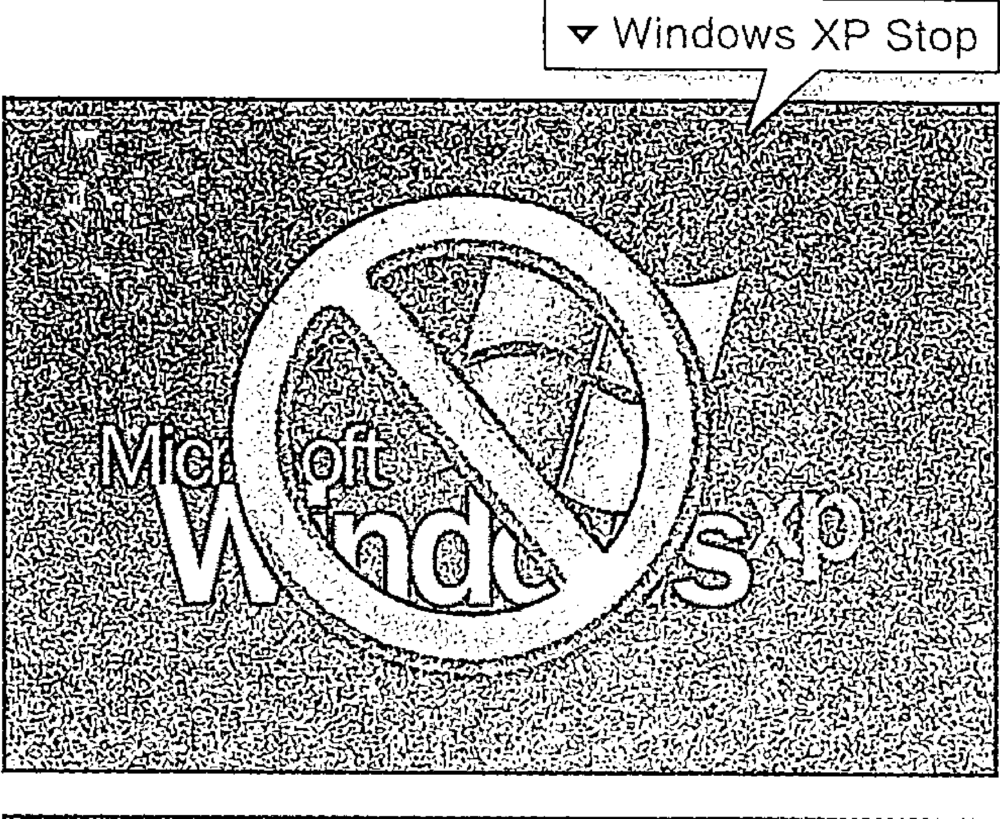

> > 解谜

“停止服务10分钟内会受到感染” 是危言耸听还是别有用心？

有专家表示，Windows XP停止服务对国内来说将是“重大的信息安全事件”，甚至有人分析，Windows XP停止服务10分钟这些电脑便会受到感染。

稍有系统知识的人就会知道，即便是微软自己为其服役期限内的任何一款系统发布的升级补丁，也不是在第一个用户遭受攻击的10分钟内发布的。漏洞多是在一个甚至许多用户发现之后，报告给微软，微软进行一些技术攻关，然后才能发布补丁。比如360安全中心曾报告给微软一个潜伏时间长达19年的Windows系统“长老”漏洞，微软在迟于360临时安全补丁发布日期两个月之后，才发布了该漏洞的系统补丁。对于这一漏洞来说，虽然你可能正在使用微软有效服务期内的系统，但它对这一漏洞的有效保护19年多都形同虚设，何止是10分钟呢？相反，如果有第三方的安全厂商能及早发现并及取相应措施，那么漏洞发现之时便是漏洞被堵希望闪现之时，没有微软的补丁不也照样安全使用吗？

由此可见，上面所说的10分钟攻击，虽然某种意义上来有一定的理论依据，现实中也一定有不设防的用户会受到攻击，但更多的只是一个危言耸听的宣传，意在让用户尽快转移到新系统中。这种说法在某种假设的条件下是成立的，那就是，如果真的没有第三方厂商来支持漏洞修复和堵截，那么继续使用肯定会比以前要危险得多。但问题是，已经有不止三五家安全厂商承诺对该系统进行安全保护。因此，如果你拿定主意要继续使用这个老系统，也不要被这些危言耸听所吓倒。正确的做法是马上去学习更多关于安全维护Windows的技巧和方法。尽早动手去准备打造防护栏，总要比在家里担惊受怕来得更管用、更实在。未雨绸缪，选择最适合的系统保护办法才是正道。


### 坚守有方 安全使用XP的有效对策

下面就让我们看看如何来保护自己的Windows XP系统在继续使用中不受安全威胁，如何创设自己的系统安全使用环境。

##### 1 依靠政府的力量，你有份吗？

有消息称，英国政府希望通过出资获取微软继续提供技术支持的方式，保持其医疗机构继续享受Windows XP系统的扩展安全支持。政府投资促成微软继续维护，这种方式是否可行，是否最后能达成协议尚未有确定的消息。但有这种需求的国家或机构肯定已经不止是英国一家，不管微软愿不愿意那样做，也不管最后是否能成行，但这对微软来说至少也是一次“处理破乱”时无意遇到的发财机会。而对于我们普通的Windows XP个人用户来说，沾光的可能性就不太大了。因为，如果微软为部分企业提供的服务也能开放地应用于个人的系统，那么，等于微软前面放出的决定就是一句空话，因此也是不现实的。

##### 2 来自他方的安全，是否可行？

大型企业可以以出资寻求特定范围“保护”的方式获得微软在安全方面的继续支持。个人用户也不是只能死路一条，第三方安全厂商的支持让Windows XP的个人用户看到了希望。
针对微软即将停止对Windows XP服务支持的消息，国内安全厂商360和金山都表示，在微软停止XP服务之后，将继续为用户提供安全保护服务，阻止恶意软件制作者利用新的系统漏洞攻击Windows XP系统。当发现Windows XP高危漏洞之后，第一时间帮助用户应急。同时，将为用户提供第三方的安全漏洞补丁。通过推送系统补丁、紧急升级病毒库、提供防火墙拦截攻击等，帮助用户度过危机。
据悉，360安全卫士宣布已开发出专门保护Windows XP的全套产品，包括为个人用户打造的360安全卫士XP版、为企业用户打造的Windows XP安全完整解决方案。360还透露，将重金邀黑客对360XP安全产品进行测试完善，确保在4月8日之后用户可以继续安全、放心地使用Windows XP。但实际上，对于个人用户来说，使用传统的360安全卫士同样会起到保护作用，现在就可以马上采取行动了。

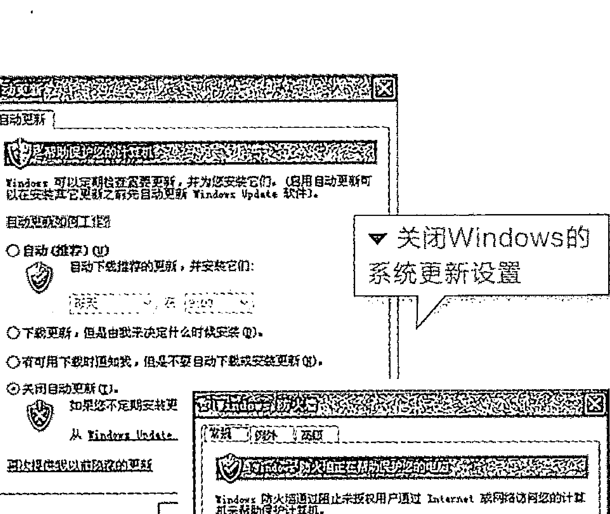
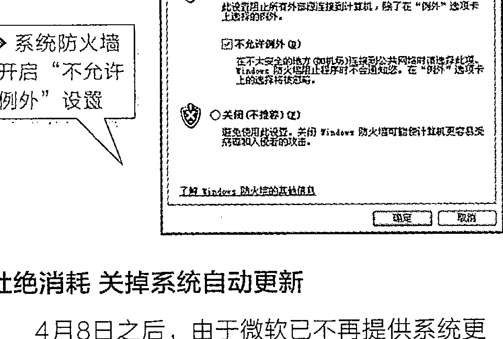

##### 杜绝消耗 关掉系统自动更新

4月8日之后，由于微软已不再提供系统更新，因此默认开启的更新服务对系统来说已经是有弊无利，无谓的自动检测也是对系统资源的一种浪费。既然不更新了，那就还是等到4月7号那天晚上，将系统的自动更新功能彻底关闭吧。

##### 壁垒高筑 使用防火墙更严格

虽然Window XP的升级服务已经停止，但对于系统内置的防火墙来说，对于抵御外来的入侵还是能起到相应的作用的。因此，我们最好还是要保持系统自身的防火墙处于开启状态，并依照在不安全环境下使用系统的假设，开启系统防火墙设置中的“不允许例外”设置，以杜绝更多的安全威胁。
除了依靠系统自身的防火墙之外，我们最好能给自己的系统安装第三方的仍在不断更新的防火墙软件。这样，在一种特殊时期，更能加倍保护用户环境的安全。

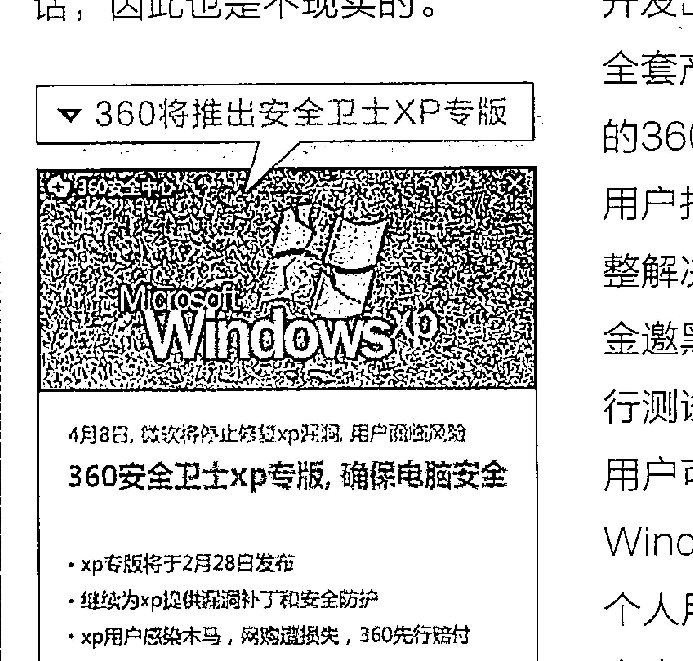

### 一如既往 安全软件例行升级

既然Windows XP不升级了，我们就得专心致志地将安全的希望放在仍然提供系统补漏服务的第三方软件上（如360安全卫士等）。这就要求用户必须开启此类安全软件的自动升级服务功能，才能做到在软件检测到系统有漏洞时，及时下载第三方漏洞补丁包并进行补漏。

为了能让我们更省心地工作，我们需要给360安全卫士设置一系列的自动化安保选项。这样可以防止因我们工作忙或遗忘等造成的漏洞修补不及时而带来的安全隐患。

首先需要设置让360开启自启动后自动运行木马防火墙，对系统进行木马自动检测。

因为我们已经将安全“委身”于第三方软件，因此，我们要养成经常性的漏洞扫描和修复习惯。选择在360安全卫士中扫描修复漏洞，可以尽早发现漏洞并进行修复。

如果怕因遗忘而不能及时检测漏洞，那也没关系，可以设置每日让360为系统自动进行体检，发现漏洞立即修复。

为了保证所用的安全软件版本和木马库的先进性，我们需要开启自动升级360安全卫士主程序和备用木马库自动更新选项，这样就不用操心系统和数据库是不是最新的了。

尽管如此，一个人的力量还是有限的，团结起来，众人拾柴火焰高。加入360云安全计划应对未知威胁，当别人遇到恶意攻击并上报后，你这里就无忧了。反之，当你发现被攻击而上报后，也等于为所有网民做了一次贡献。如此一来，就能筑起一个强大的安全防护网络。

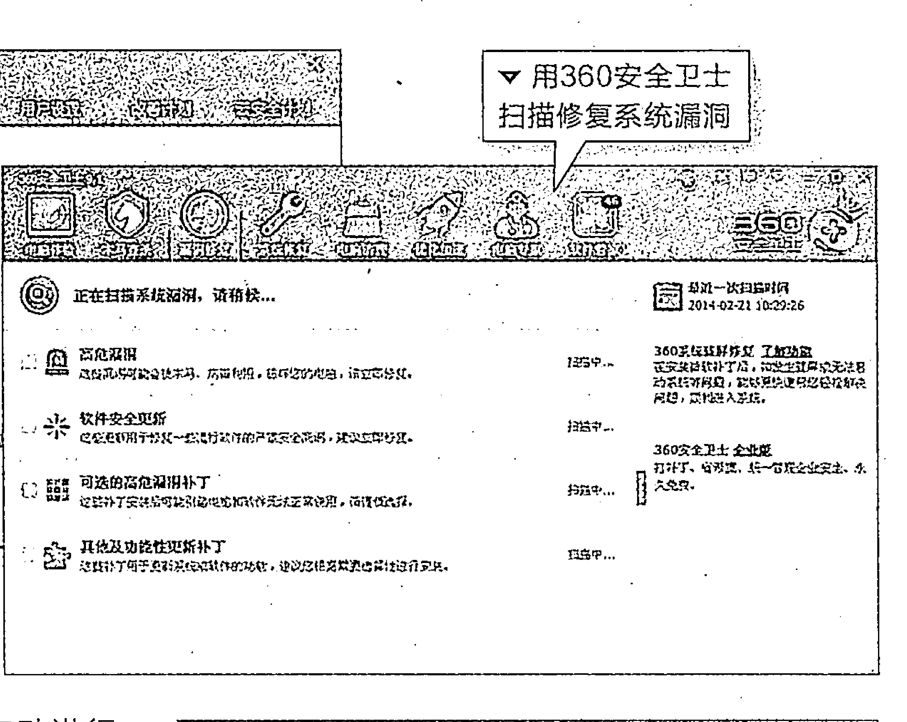

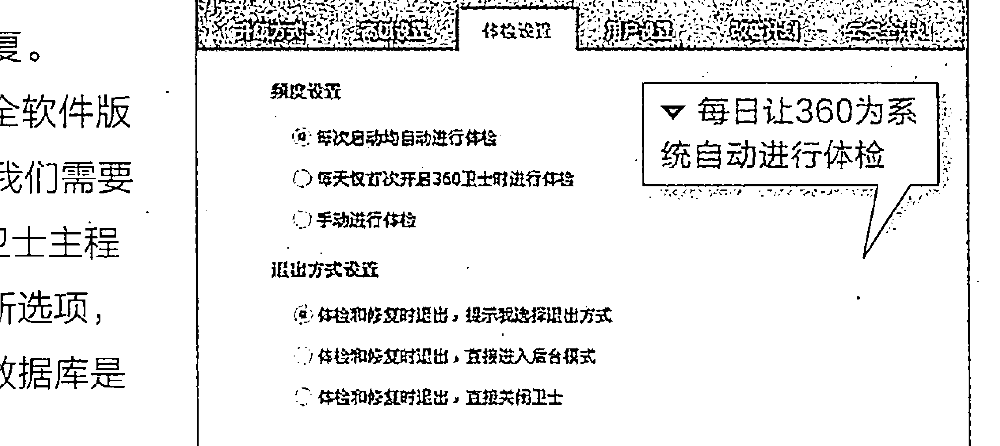

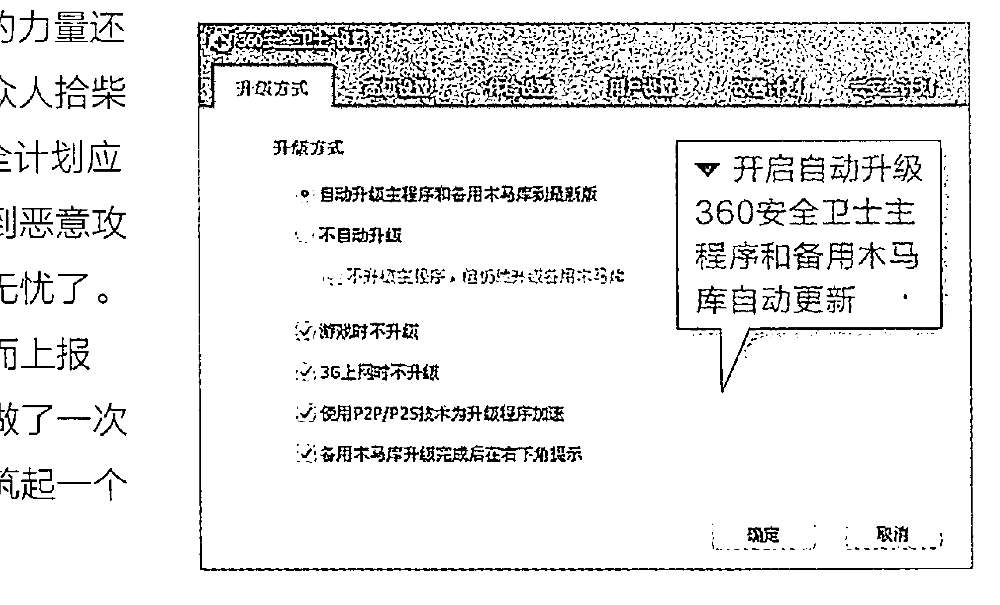

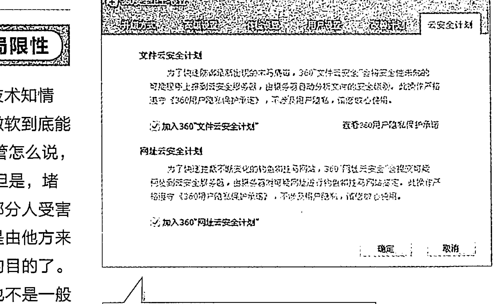

### 小知识 第三方安全支持的局限性

如果从补漏和防止恶意攻击的技术上来说，微软无疑是彻底的技术知情者。对于第三方安全厂商提供的安全措施到底可靠度有多少，微软到底能否共享它的有关Windows XP威胁和漏洞的信息是关键。但不管怎么说，微软恐怕不可能公开它所有关于Windows XP的技术细节吧？但是，堵漏或防止攻击，本来就是一个相对滞后的工作，而且总是在一部分人受害之后才进行的一项工作，因此，这项工作无论是由微软来做还是由他方来做，只要最终的目的能达到拒不安全因素于门外，就达到用户的目的了。是否涉及系统核心技术，以及是内核级或外围级的拦截，我想也不是一般用户需要关心的问题。


### ③ 自我安保措施，你是否会使用？

除了依靠第三方的软件来保护系统安全之外，用户还可以根据自身的使用情况，构建切实可行的安全使用环境。例如，可按照实际情况执行断网封闭操作、虚拟环境操作、系统自动恢复等。

### 建立封闭操作环境

对于一些没有必要接入互联网的个人电脑，比如只用电脑玩单机游戏或进行一些非联网的设计、写作等的电脑，或者对于一些没有必要接入互联网的装有Windows XP的生产用系统，可以在切断网络的情况下（最好是从物理上切断网线），再禁用USB设备、光驱等。将与网络有关的所有服务都禁掉，设立软件安装权限，杜绝随意安装软件或者进行数据交流等方法都是建立个人封闭操作环境的有效办法。

### 建立虚拟使用的环境

如果只是玩耍或者欣赏、试验，没有保存数据的必要，也不希望使用过程留下任何使用痕迹，则可以采用搭建虚拟使用环境来实现安全操作。比如用ATI软件的安全试用功能即可实现，具体的操作参见本刊第4期文章《安全不安全 先试再决定》。

Windows XP经过无数用户十多年的使用和技术沉淀，以上所需方法都可以从百度轻松搜索获得，用户按网上相关信息的指引按部就班操作即可搞定。一般可以通过BIOS设置、注册表或组策略修改设置达到限制的目的。

### 建立自动恢复的系统

若希望每次都以一个干净的系统环境来工作，而不去理会上次所用的系统是否被入侵，那么还可以考虑用系统克隆和快速还原的办法来保持系统的“纯洁”。为了达到这个目的，可以在切断网线的情况下，安装SP3版的Windows XP系统，同时安装事先在安全环境下下载的自己的应用程序，一切就绪后用Ghost或ATI克隆系统分区，并做成隐藏分区自动一键还原（具体方法本刊曾有多次介绍）。每天启动系统时，用几分钟或最多十几分钟的时间先将系统还原为初装的状态，就可放心工作了。

为了得到更有效的安全保护，初装前，建议还是先从干净的电脑上下载一套最新版的安全工具套装（含最近离线数据包），装到要克隆的电脑上后再进行系统分区的打包克隆。

### 自然升级 逐步放弃的多系统混搭法

用户不去使用新版系统而选择继续坚守Windows XP阵地，无论是出于无奈还是理智的选择，终归不是长久之计。因为随着硬件设备的飞速发展和新软件的不断开发，越来越多的设备运行最新版操作系统将体验更佳，而新的软件可能会越来越多地不支持Windows XP环境。因此，虽然一时坚守有情可原，但顽固长期坚守肯定是不明智的做法。也许一部分用户希望跳过Windows 7、Windows 8而直接寄希望于Windows 9，但不要忘了，无论从技术上还是使用习惯上来说，Windows 9总是离Windows 8更近，而绝不是Windows XP。因此，早过渡早受益，而过渡迟早也是一件必然的事情。

从长远考虑，建议仍旧坚守Windows XP的用户，首先不要对新系统有抵触情绪，要想方设法开始走进新系统，创造条件让自己逐步熟悉和融入到新系统当中。建议采用一种逐步淘汰式的双系统或者多系统混搭使用法。在保留当前所有Windows XP数据和系统的情况下，以一种不破坏当前系统中任何数据的独特方式安装Windows 7或Windows 8.1系统，在新旧系统混搭使用中熟悉和磨合。此外，要给自己创造条件，尽量在新系统中工作，挖掘新系统中老版本的工作法，发掘新系统中更强大的工作方法。万一遇到一时不能解决的问题时，再回到旧系统工作也不误事。这样可以逐步过渡到新系统，直到某一天真正不需要XP系统时，可方便地予以删除。

下面介绍这种不动现有系统和所有数据，让你顺利体验新系统的混搭安装法。这种新系统既可以是Windows 7，也可以是Windows 8/8.1；既可以是32位的系统，也可以是64位的系统。你的机器既可以有光驱，也可以没光驱，甚至USB接口坏了也没关系，有局域网也行。

- 微软不再提供任何关于Windows XP系统的更新后，系统漏洞和安全问题将越来越突出。随着漏洞的暴出和被挖掘利用，加上第三方安全厂商因技术颓势对该产品的支持力度的不断减弱，该系统会越来越不安全。
- 其他商家越来越少提供对该系统的支持，新生的软件可能不能很好地与该系统兼容，新生的硬件系统可能会不再提供关于该系统的驱动程序。随着新软件和硬件的增多，Windows XP对软硬件的兼容性表现会越来越差。
- 新游戏可能会在Windows 7或Windows 8中体验更佳，甚至在Windows XP中无法很好地运行。游戏发烧友为了玩一款新游戏，可能不得不去更新系统或装双系统来体验。
- 随着用户对新系统的接触，旧系统的使用体验在对比中会越来越差。
- 新系统用户会越来越多，使用Windows XP的用户渐渐沦为“另类”而不受关注，各项权益越来越难得到保障。


▲ 通过多系统支持工具NT6 HDD Installer安装多系统

**Step1** 下载多系统支持工具NT6 HDD Installer，将解压出的EXE文件存放在硬盘任意分区中，待准备好系统安装文件后再运行该工具。

**Step2** 准备好高版本系统的ISO安装包（Windows 7或Windows 8/8.1均可），将其解压到硬盘非系统分区的任意一个数据分区中，建议放到最后一个分区中。注意要解压到分区根目录中，不能解压到已有文件夹中，否则无法安装。

**Step3** 运行NT6 HDD Installer多系统支持工具，选择安装选项，工具会自动检测到哪个分区保存有系统安装文件，并自动为系统安装多选启动菜单，其中会有一个或两个与NT6 HDD Installer相关的启动选项。

**Step4** 启动系统之后，选择NT6 HDD Installer安装生成的两个选项之一，即可自动进入高级版本系统安装界面，这时不要选择升级安装，选择自定义安装并将新系统安装到此前没有系统的分区中，即可实现在不破坏原有任何数据的情况下使用双系统的目的。

知识拓展 用这种方法，可以实现在已有32位Windows XP的基础上，安装64位Windows 7或者Windows 8/8.1，这对于有超过4GB大内存的用户来说是一个非常好的选择。

### XP到Windows 7
将升级进行到底

微软已经宣布将从2014年4月8日起，停止为Windows XP用户提供热修复、产品更新以及安全补丁等服务。Windows XP用户距离停止服务的期限已经不远了，是时候将Windows XP升级到Windows 7了。那么怎么快速而安全地升级到Windows 7？

文|CFaner

### 从Windows XP升级到Windows 7的N种方案

将系统从Windows XP升级到Windows 7，主要是软、硬两种升级方法，在往期的CFan杂志中我们已经做过许多介绍，这里不再赘述，但为了方便大家升级时进行参考，这里就将之前的相关文章进行一番梳理，并以快速链接的方法提供给大家参考。

### 软件篇

- **Windows 7的VHD技术探秘**
  期号：2009年5期
  简介：主要介绍如何安装VHD版Windows 7，这样Windows XP用户无需重新划分分区即可快速升级。
- **按需求变，轻松制作专用Windows 7**
  期号：2011年20期
  简介：主要介绍如何使用虚拟机、GHO方法快速安装Windows 7系统。
- **去伪存真 电脑伪技巧大揭底**
  期号：2012年5期特别话题
  简介：介绍升级Windows 7遇到的一些常见问题，包括Windows 7中常见的伪技巧。
- **系统升级 硬盘数据整体迁移**
  期号：2013年17期特别话题
  简介：主要介绍升级到新系统后，如何迁移老系统数据，对不同的硬件、软件环境，给出了不同的解决方案。

### 硬件篇

- **和Windows XP说拜拜 DIY廉价平台如何选择系统**
  期号：2014年1期
  简介：主要介绍如何省钱升级旧电脑。
- **好马配好鞍 升级电脑也需优化**
  期号：2013年13期特别话题
  简介：主要介绍升级后如何对硬件进行优化，涉及升级改造，老机新用，以及数据迁移等问题，还包括升级过程中内存、SSD硬盘等的优化使用。
- **老电脑升级方案**
  期号：2013年17期特别话题
  简介：主要介绍旧配置电脑如何进行硬件的升级。
- **桌面PC的升级之路**
  期号：2013年17期特别话题
  简介：主要介绍如何升级硬件让Windows 7运行得更流畅。大话题还涉及系统DIY的内容，教大家如何定制Windows、Android系统，以及利用WinPE解决系统故障的各种方法技巧。

### 有什么不同：Windows 7和XP启动方式PK

介绍Windows XP升级到Windows 7的相关文章已经有很多，这里我们则从一个不同的角度来考察升级中的问题，就是两者启动方式的异同。无论是Windows XP还是Windows 7，许多故障都是发生在启动阶段，一旦系统无法启动，我们就无法使用电脑了。因此深入了解它们启动的过程，对解决系统故障非常有益，可以做到对症下药。


一般来说，操作系统（无论是Linux还是Windows）的启动流程大体是这样的：首先电脑加电完成硬件的自检，接着按照不同系统的引导记录去加载主分区的引导文件，然后根据启动配置列出选择菜单（如果有多个操作系统的话），选择对应的菜单后开始加载内核文件，对硬件驱动和系统进程进行初始化，最后进入桌面或者桌面类GUI等待用户的操作（图1）。

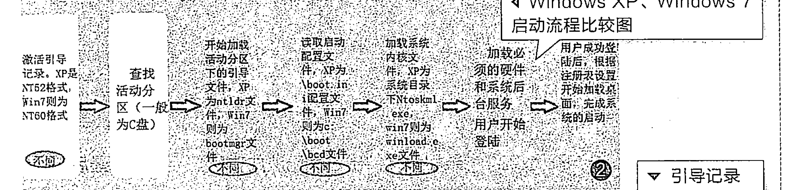

操作系统启动的流程大致相似，但是每个过程中的具体实现、调用的功能等差异却很大。即便Windows XP与Windows 7一脉相承，但是它们之间的启动方式也很不相同，此图详细标明了它们的异同之处（图2）。

### 对症下药：解决Windows 7常见启动故障

##### 1. 硬盘引导记录故障

在系统完成自检后就开始加载引导记录，Windows XP和Windows 7使用不同的引导记录。因此，如果硬盘的引导记录损坏或者不匹配，在系统启动的时候就会出现各种错误的提示。比如一些朋友为了安装方便，经常会在WinPE环境下使用Imagex.exe直接展开Install.wim文件快速升级到Windows 7。由于这种安装方式并没有更改引导记录（使用的仍然是NT52），这样重启后就会出现“Ntldr is missing”的提示，这就是典型的硬盘引导记录故障（图3）。

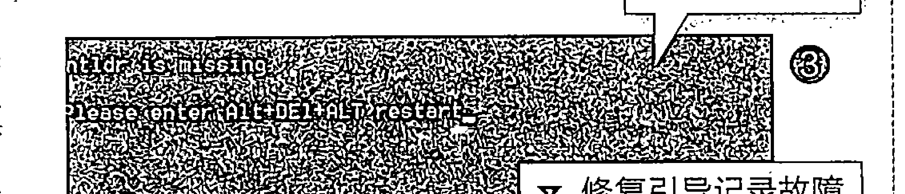

**解决方案：** 使用Windows 7安装光盘自带的Bootsect.exe重新改写引导记录。首先将“Windows 7安装光盘\boot\bootsect.exe”复制到启动优盘，进入WinPE系统后在命令提示符下输入“K:\bootsect /nt60 c: /mbr”（K:为启动U盘的盘符，添加参数“/nt52”则为修复Windows XP引导），即可更改硬盘MBR为NT60格式（图4）。


##### 2. 丢失活动主分区

Windows必须有活动主分区才能加载系统文件，如果主分区没有激活，启动的时候就会提示...（后续内容被截断）

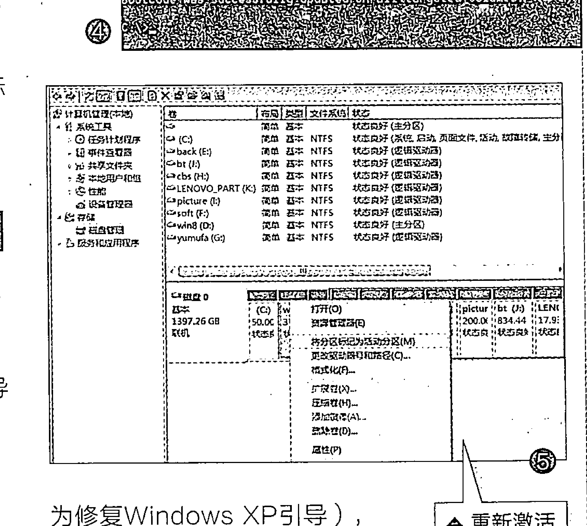

“Non-System disk or disk error, replace disk and press a key to reboot”。这种故障经常出现在一些品牌机的升级上，因为这些电脑的硬盘经常有隐藏主分区，默认情况下系统是通过这个隐藏活动主分区引导的。如果用户误删这些分区就会出现上述故障。

**解决方案：** 只要使用WinPE启动盘，进入PE系统后启动磁盘管理组件，在右侧窗格选中第一主分区，然后右击选择“将分区标记为活动分区”即可（图5）。

##### 3. 引导文件丢失

引导记录会根据具体操作系统去加载不同的引导文件，如果引导文件被用户误删或者被病毒感染，这样开机时就会出现“Ntldr is missing”（Windows XP）或者“Bootmgr is missing”（Windows 7）的提示。

##### 4. 配置文件出错

引导文件被加载后会读取主分区下的系统配置文件，因为配置文件保存系统内核引导文件的位置、引导分区等关键信息，如果出错当然无法成功引导。

**解决方案：** 对于Windows XP，配置文件只是一个单纯的Boot.ini，如果是它出错，可以到任意一台Windows XP电脑上提取该文件并复制到故障电脑上。Windows 7的配置文件则较为复杂，可以借助PE启动然后使用Bootice.exe（下载地址：http://www.dwz.cn/cfan2014b）进行编辑。启动Bootice.exe后切换到“BCD编辑”标签，单选“系统BCD”，单击“查看/修改”，在弹出的编辑窗口中选中错误的BCD菜单（也可以直接单击“新建→Vist/7/2008启动项”），按下列的参数新建启动项），再按照下列的设置编辑成正确的启动配置：

- 启动磁盘：当前硬盘
- 启动分区：C盘
- 菜单标题：Windows 7
- 启动文件：\windows\system32\winload.exe
- 启动路径：\windows
- 启动语言：zh-CN

在PE下复制引导文件到C盘

最后单击“保存当前系统设置”和“保存全局设置”退出重启即可（图7）。

▲ 编辑配置文件

##### 5. 其他常见启动故障

系统配置文件正确，接下来系统就开始加载Windows 7的内核和各种硬件、服务配置（加载的顺序由注册表中对应键值决定）。如果此时有故障，大多是由于病毒的侵袭，或者安装不兼容的硬件（如虚拟光驱）造成的。可尝试重启按F8键进入高级启动选项，然后选择“最近一次的正确配置（高级）”进行修复（图8）。如果系统进入桌面后出现故障，比如显示不正常，由于此时可以使用系统组件，我们可以尝试使用杀毒软件、系统配置实用程序等工具进行修复。

▼ 使用“最近一次的正确配置（高级）”进行修复

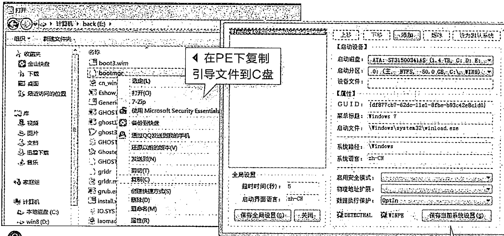

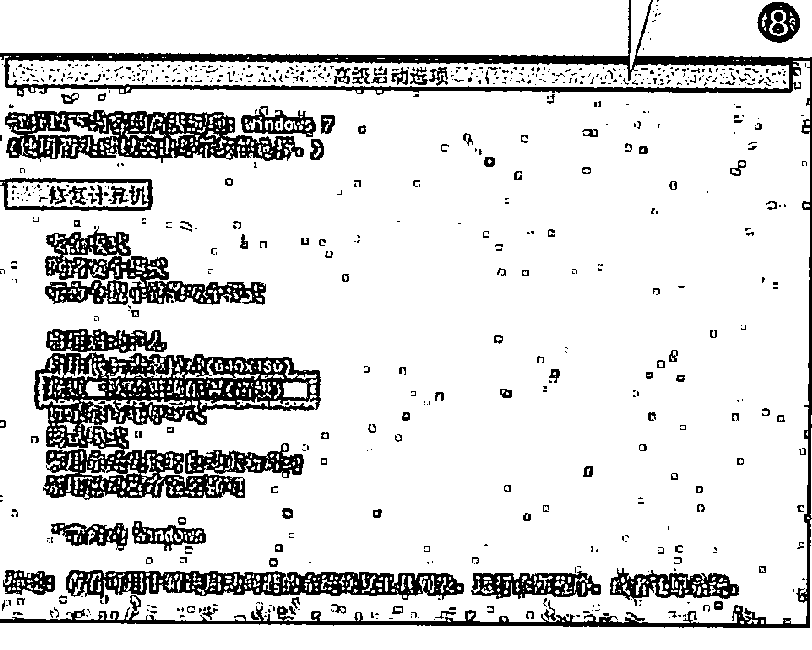

### 软硬兼施·解决升级后遗症

文|俞木发

从Windows XP升级到Windows 7后可能会碰到一些问题，比如有些硬件驱动无法自动安装，升级到新系统后不知道该用哪些软件等。下面介绍如何解决这些升级常见后遗症。

### 取舍有度
驱动升级要科学

由于内核不同，大部分硬件驱动都有For XP和For Windows 7之分，因此从Windows XP升级到Windows 7后，大多数硬件都要使用新的驱动。不过作为成熟的系统，Windows 7已经内置大多数常见硬件的驱动，当然还有部分驱动需要我们手动安装。

因为驱动不仅关系到硬件性能的发挥，而且由于其和系统紧密关联，所以还关系到系统的稳定。下面我们就根据不同的需求，为大家推荐相应的升级方案。

##### 方案1 使用WHQL认证驱动

###### 适合用户：普通用户

对于普通用户来说，系统稳定是最高要求，因此这类用户推荐只安装经过微软认证的驱动程序。要使用WHQL认证驱动很简单，只要用系统自带的升级方法即可。比如要升级显卡的驱动，启动设备管理器后双击右侧窗格的显示适配器，在打开的窗口点击“更新驱动程序”（图1）。

接着在打开的升级窗口点击“更新驱动程序”，然后选择“自动搜索更新的驱动程序”，这样即可自动连接到微软服务器下载最新的认证驱动，下载新驱动后会自动安装（图2）。

其他驱动程序的升级类似，如果是Windows 7无法识别的硬件，则需要手动进行安装。选择驱动则建议使用硬件厂商提供的官网驱动，只要根据自己的品牌，然后到官方网站下载For Windows 7的驱动即可。

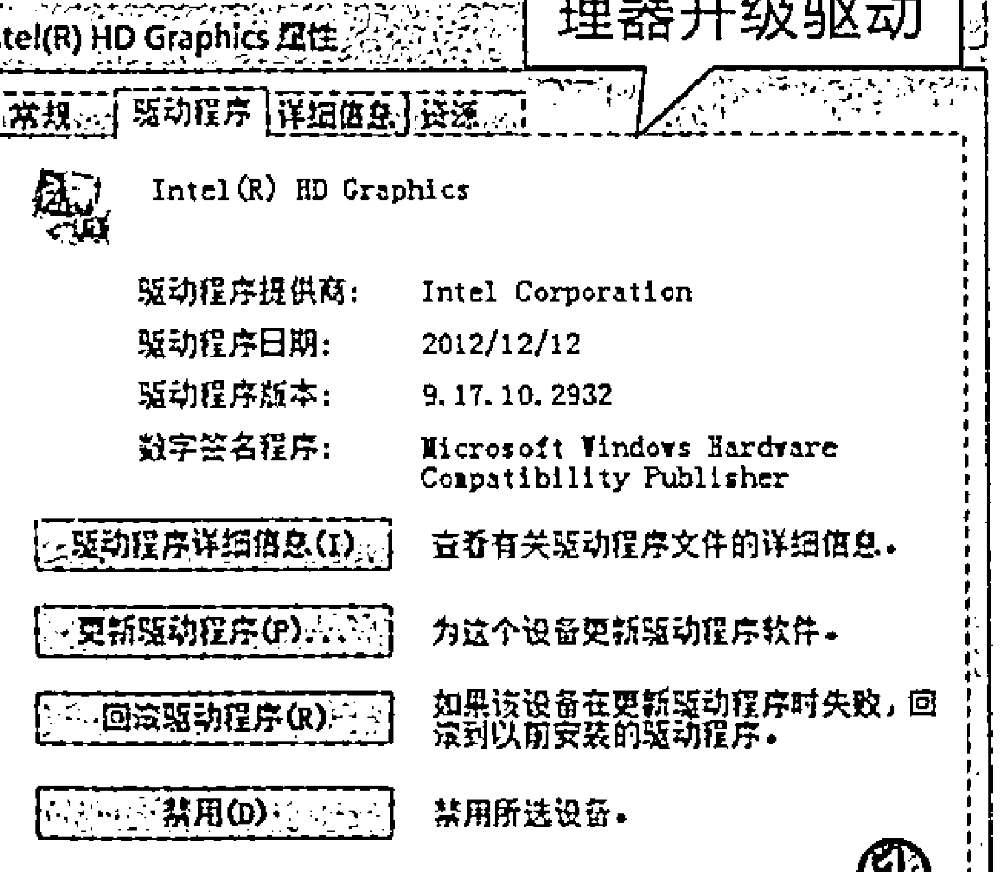

##### 方案2 官网或者第三方扩展驱动

###### 适合用户：动手能力较强，喜欢扩展硬件性能、挖掘硬件性能的用户

虽然Windows 7自带大多数常见硬件的驱动，但这些默认的驱动不一定是最好的。对于喜欢挖掘硬件性能的用户，可以自行安装功能更强大的驱动程序。常见的可以扩展性能的硬件有：

- 1. 摄像头
  虽然现在很多摄像头都可以实现即插即用，但是系统自带的驱动功能实在简陋，比如笔者电脑上的中芯微摄像头，在安装官网提供的驱动后就可以直接录像，并且对录制参数进行调整，Windows 7自带的驱动则只能被QQ、MSN等识别后进行设置。
- 2. 声卡
  对于喜欢听音乐的朋友来说，声卡功能的设置当然越丰富越好。不过如果使用Windows 7自带的声卡驱动，它的功能设置实在简单，除了提供音量的控制外几乎没有其他扩展功能。但是安装官网的驱动后，功能就丰富多了，比如笔者的Realtek声卡，安装后就提供音效、喇叭组态、室内校正等丰富的调整模式（图3）。

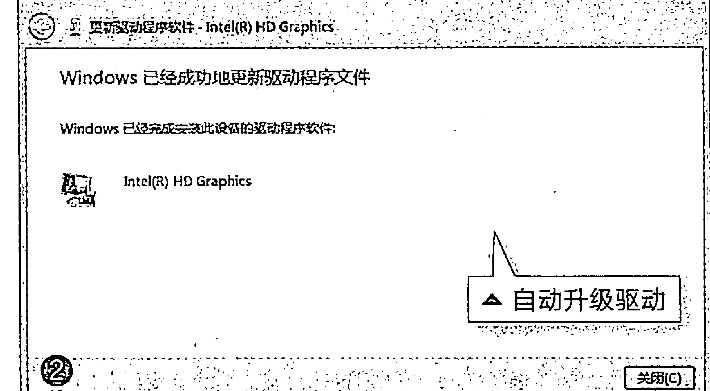

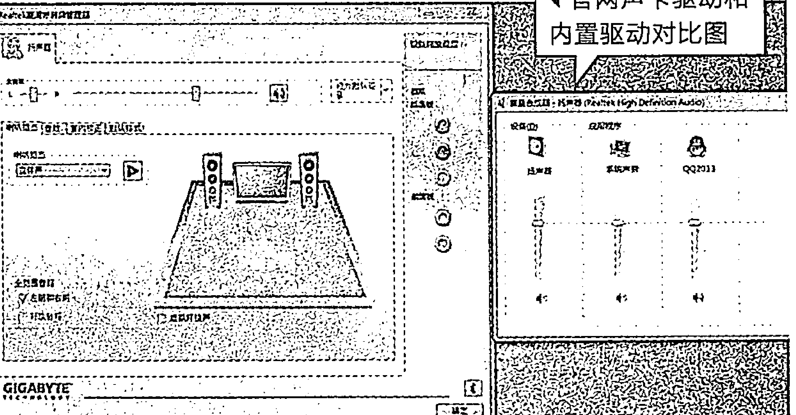

##### 3. 显卡

对于游戏爱好者来说，尽可能发挥显卡功能是提高游戏显示效果的重要手段。出于稳定性的考虑，Windows 7自带的显卡驱动程序功能是较弱的，游戏爱好者们可以到驱动之家等专业网站下载网友修改的驱动。比如ATI Radeon系列显卡就可以使用DNA改版驱动小组发布的修改优化版，改版相对ATI Catalyst驱动来说具有画质更好的特点，并且游戏时的帧速也更加稳定，可以让游戏达到更好的显示效果，这些改版驱动可以在一些专业显卡论坛下载到。需要注意的是，在安装这些改版驱动的时候，一定要注意原版驱动的备份，以免安装后出现故障无法恢复。

##### 4. 无线网卡

现在无线网卡几乎是笔记本的标配，Windows 7也自带大多数无线网卡芯片的驱动，不过功能较为有限。比如Windows 7支持无线网卡模拟为热点和其他用户共享网络，但是系统自带的驱动并不能直接模拟热点，需要通过晦涩难懂的命令行实现。相比之下，无线网卡厂商提供的驱动则大多集成热点模拟的GUI界面。比如腾达W311U无线网卡，安装厂商提供的驱动后只要简单点击客户端界面的“AP模式”即可将其模拟为无线热点（图4）。

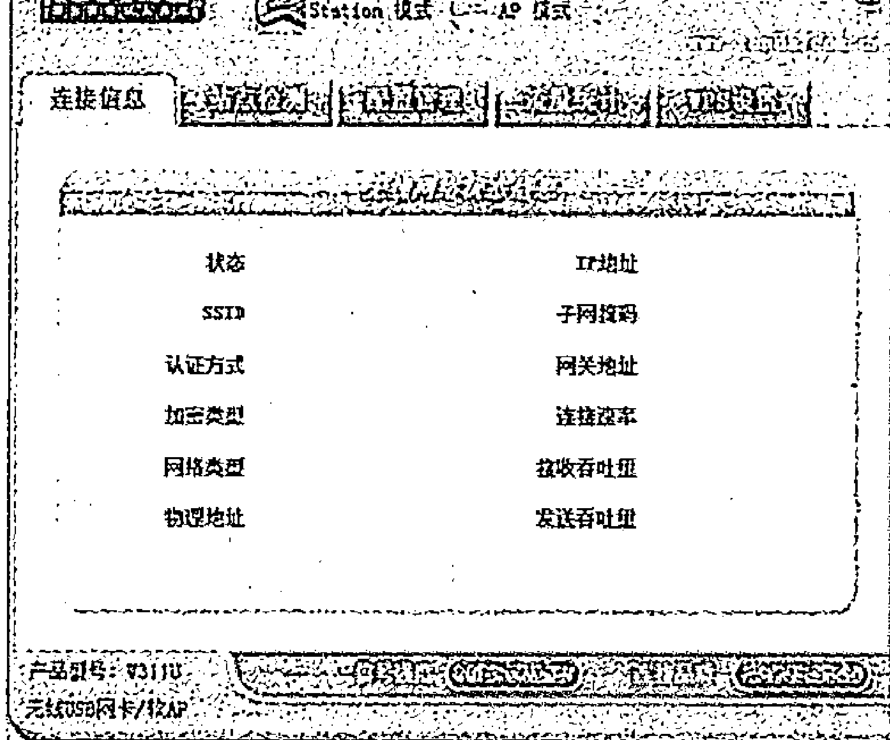

除了上述设备外，还有很多硬件可以根据自己的需要选择更强的驱动程序，比如创新声卡可以使用kX改版驱动。改版驱动支持低延迟的32通道ASIO、音效插件模块化、优化的DX接口、图形化的DSP模块操作，可以大幅提高声卡的音质表现。不过要注意的是，硬件驱动毕竟和系统紧密相连，如果安装的驱动有Bug，极易导致系统蓝屏、死机。因此除了安装驱动前做好系统备份外，对于一些核心的设备如CPU、硬盘、主板芯片这类设备，我们不建议自行安装驱动。

### 够用就好

善用Windows 7

##### 新增系统组件

为了系统稳定和节约尽可能多的系统资源，建议大家尽量用好系统自带的组件。Windows 7和Windows XP相比，增加了不少系统组件，这些组件完全可以替代那些在Windows XP时代需要安装的第三方软件。为了方便大家的使用，最后我们列出一些Windows 7下新增的实用组件供大家参考。

| 新增组件 | 实现功能 | 启动方法 | 替代XP第三方软件 |
| :--- | :--- | :--- | :--- |
| Windows Defender | 自动扫描查杀间谍软件 | 在开始菜单输入“defender” | 第三方间谍查杀软件 |
| 任务管理器 | 多线程管理器资源 | 直接启用 | 进程、服务管理软件 |
| BitLocker加密 | 加密驱动器和文件夹 | 控制面板\系统和安全\BitLocker驱动器加密 | 第三方加密软件 |
| 截图工具 | 对窗口、菜单等截图 | %windir%\system32\SnippingTool.exe | 第三方截图工具 |
| UAC | 对未授权应用访问阻止 | 控制面板\系统和安全\更改用户账户控制 | 第三方安全软件 |
| 创建系统映像/还原系统 | 创建备份 | 控制面板\系统和安全\备份和还原\创建系统映像 | 第三方系统还原备份软件 |
| 创建系统修复光盘 | 创建启动光盘或U盘 | 控制面板\系统和安全\备份和还原\创建系统修复光盘 | 第三方创建启动盘软件 |
| WinRE修复环境 | 内置PE，可启动系统维护 | 开机按F8选择“修复计算机” | 第三方系统维护系统 |

### 谁在震撼你的“视界”

策划《电脑爱好者》编辑部

俗话说“耳听为虚，眼见为实”。
只有亲眼捕捉到的事物，才能获得最真实的感官体验。
另一方面，无论是台式机、笔记本、平板电脑还是手机，
各种智能终端与我们最频繁交互的窗口就是屏幕，
唯有透过这扇小小的视觉之窗，
才能切身体会到高科技带给我们的无限震撼。
那么，什么样的屏幕才能震撼你的“视界”？

##### 走进不同设备的“视界”

屏幕的尺寸与视野面积成正比，而视野的清晰度由分辨率决定。因此，如果你想买到看着更舒服或视觉更震撼的IT设备，深入了解这两种基本参数之间的关系无疑是最基本的要求。

##### 笔记本·纠结中的视界 视野和便携的冲突

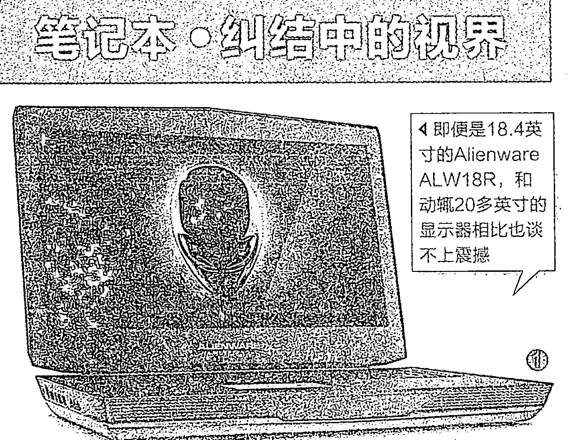

笔记本属于“矛盾”综合体，为移动而生的它始终都在“视界”和便携之间纠结：想获得更震撼的视野，就必须以牺牲便携性为代价。因此，在屏幕尺寸被锁定的情况下，想改善笔记本的“视界”就只能从分辨率下手。

根据产品定位，笔记本的屏幕尺寸涵盖11.6英寸～18.4英寸的区间。随着超极本/超薄本的崛起，如今15.6英寸的产品已经可以被“压榨”到21mm的厚度与2kg的重量，具备了一定的便携性，但即便是15.6英寸的视野仍与“震撼”挂不上边（图1）。因此，相对小巧的笔记本，唯有提升分辨率才能获得更清晰的“视界”（图2）。
除了苹果MacBook以外，其他品牌笔记本都过渡到了16:9显示比例的宽屏幕时代，其中1366×768分辨率盘踞着大半江山，而更细腻的1600×900和1920×1080只是相对小众的存在。对笔记本而言，提高屏幕分辨率可减轻画面的颗粒感，可同时显示更多窗口，看高清视频/玩游戏时的体验更出众（图3）。因此，FHD规格的屏幕已经成为不少影音和游戏玩家选购笔记本时的最核心参数之一。不过，以FHD为代表的更细腻“视界”对笔记本而言真的重要吗？

▶ 联想Yoga2 Pro 13，13英寸的显示范围内就融入了3200×1800级别的分辨率

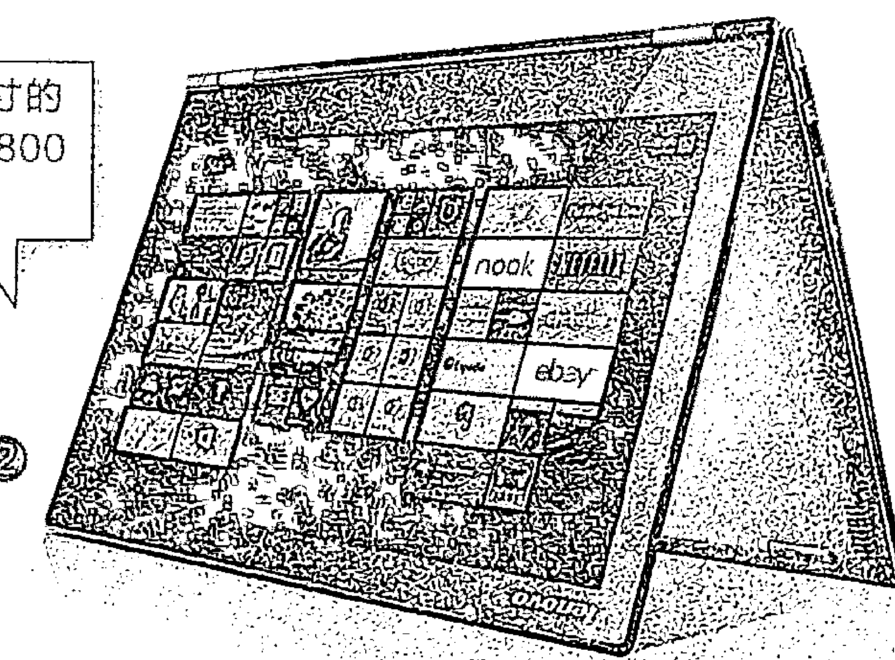

▼ 超高分辨率的屏幕，可以让笔记本更胜任复杂的设计、办公和娱乐环境

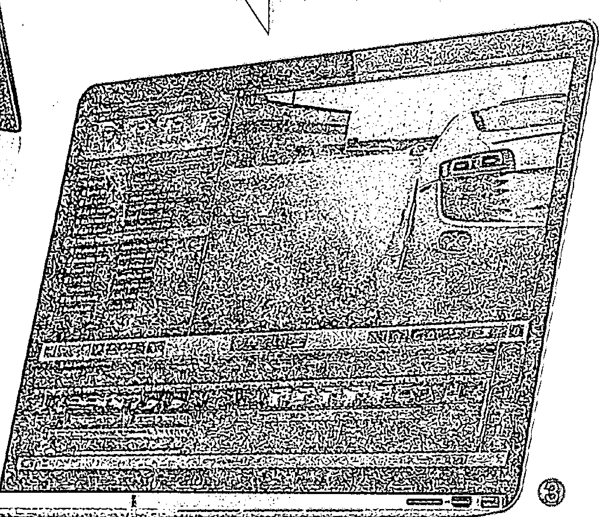

##### 笔记本常见分辨率对应表

| 规格 | 显示比例 | 分辨率 | 代表产品 |
|------|----------|--------|----------|
| WXGA | 16:9 | 1366×768 | 绝大多数笔记本 |
| WXGA++ | 16:9 | 1600×900 | 中端或17.3英寸笔记本 |
| FHD（1080P） | 16:9 | 1920×1080 | 中高端笔记本或18.4英寸笔记本 |
| WQXGA | 16:10 | 2560×1600 | 苹果MacBook Pro |
| WQXGA+ | 16:9 | 3200×1800 | 联想Yoga2 Pro 13 |

##### 冷静看待高分屏

对整天与Excel、股票、PS修图等应用打交道的用户而言，更高的屏幕分辨率有利于工作效率的提升（同一屏幕可显示更多内容），点对点的高清视频播放也会让画面显得更为细腻。但是唯独对喜爱游戏、特别是预算相对有限的玩家而言，盲目地追求FHD甚至WQXGA级别的屏幕，往往会起到事倍功半的反效果。

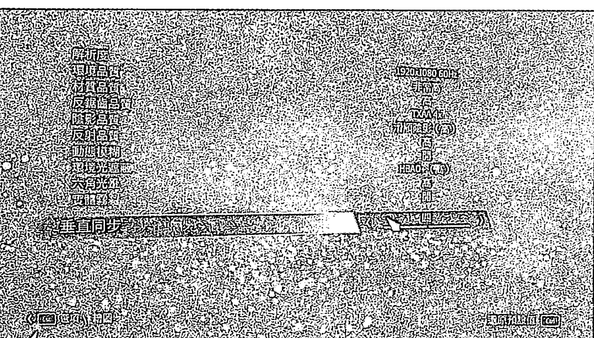

▲ 如果笔记本显卡不给力，1080P屏幕反而成为玩游戏时的负担

我们都知道，PC游戏的分辨率和画质越高，对硬件的要求也就越为苛刻。就NVIDIA旗下的移动显卡而言，只有“GTX”级别的高端独显（如GTX760M）才能在1080P分辨率下流畅运行大部分3D游戏，类似GT750M或以下级别的独显，在1366×768分辨率下玩游戏还成，真到了1080P的环境，只有大幅调低其他特效才可运行《刺客信条4》级别的3D大作（图4）。

问题是，包括笔记本屏幕在内的所有LCD液晶面板，当其工作在非标准分辨率状态时（如从1920×1080调整到1366×768），屏幕上的每个像素点就会被放大和拉伸，从而导致画面出现模糊感（图5）。因此，当你买了配备FHD的笔记本，却因显卡档次不够而不得不在调低分辨率的基础上游戏，此时高分屏幕反而成为了累赘，影响了显示效果。

总之，我们不能否认FHD或者更高档次的屏幕对笔记本“视界”的贡献，其在工作和视频欣赏上绝对是“黄金装备”，但是，如果你想在FHD笔记本上玩转游戏，则必须将处理器和显卡的强弱考虑进去。对预算有限的玩家而言，选择更高分辨率的产品，反倒不如挑选显卡更强悍的型号，将来用外接显示器的方法获得更震撼的“视界”。

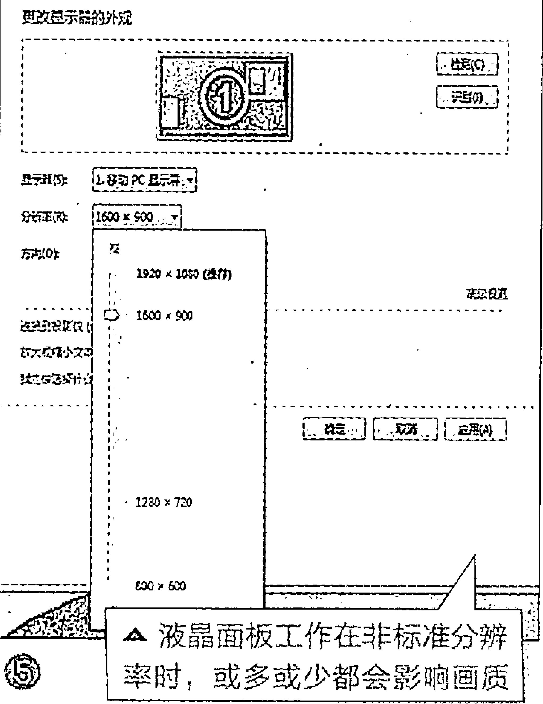

▲ 液晶面板工作在非标准分辨率时，或多或少都会影响画质

##### 谁还影响笔记本的视界

目前绝大多数笔记本都选用了TN材质的LCD面板，垂直可视角度普遍不理想（随屏幕翻转角度出现变色或偏色现象）。此外，很多笔记本根据生产批次的不同，会采用不同LCD面板供应商的产品（比如第一批产品是LG面板，后期换成友达的面板），而这也导致同一款型号不同时期出厂的笔记本经常出现色彩、可视角度不一致的问题。很遗憾，这些细微的变化只有开机亲自体验后才能看出差距，而查询LCD面板型号也唯有拆机或用专业软件检测（图6）。

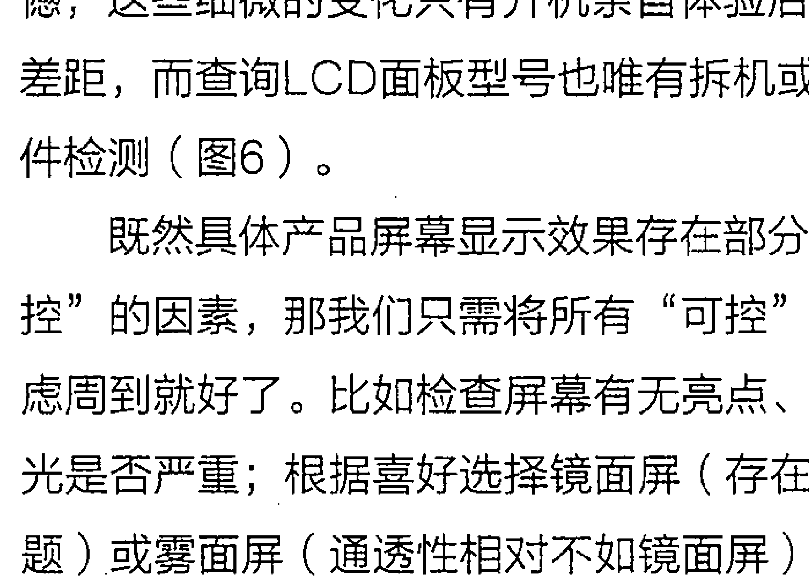

既然具体产品屏幕显示效果存在部分“不可控”的因素，那我们只需将所有“可控”的因素考虑周到就好了。比如检查屏幕有无亮点、坏点；漏光是否严重；根据喜好选择镜面屏（存在反光问题）或雾面屏（通透性相对不如镜面屏）。

##### 扩展笔记本的视界

笔记本的“视界”相对有限，那有没有办法去扩展这个“视界”呢？答案是肯定的。如果你的笔记本是AMD平台，可利用HDMI和VGA接口分别连接显示器，与笔记本自身屏幕结合实现“三屏输出”。如果笔记本为英特尔+NVIDIA平台，可通过HDMI和DP接口（DisplayPort，不是迷你VGA哦）组建“三屏输出”（图7）。如果笔记本没有DP接口，那目前则只可同时外接一部显示器做到双屏输出。


##### 硬件速递
- 给笔记本换个“视界”
如果你对笔记本的“视界”不满意，可以通过DIY的方式，替换笔记本屏幕的LCD面板。目前淘宝可买到标准的IPS、面板，但需LCD面板和零件，替换之后笔记本的“视界”就可升级。详细的图文教程可参看2013年第22期《低阶汉朗笔记本1080P改装攻略》和2013年第12期《笔记本屏幕升级进阶篇》这两篇文章。

##### 显示器·最丰富的视界

在台式机领域，无论你的PC主机硬件有多高端，最终都要通过显示器的“视界”表现出来。作为PC的“面子”，显示器的“视界”远比笔记本来得丰富多彩，也因此会牵扯出更多值得我们关注的技术和问题。

| 规格 | 显示比例 | 分辨率 | 对应产品 |
|------|----------|--------|----------|
| WXGA | 16:9 | 1366×768 | 18.5英寸型号 |
| WXGA+ | 16:10 | 1440×900 | 19英寸型号 |
| WXGA++ | 16:9 | 1600×900 | 19.5/20英寸型号 |
| FHD (1080P) | 16:9 | 1920×1080 | 21.5英寸或以上型号 |
| WUXGA | 16:10 | 1920×1200 | 部分24英寸型号 |
| UWXGA | 21:9 | 2560×1080 | 25英寸/29英寸 |
| QHD (2K) | 16:9 | 2560×1440 | 高端27英寸型号 |
| QHD (2K) | 16:10 | 2560×1600 | 高端27英寸型号 |

##### 一个萝卜一个坑

一款11.6英寸的笔记本，根据市场定位，厂商可以为其用上1366×768、1600×900和1920×1080三种规格的屏幕。相对而言，显示器屏幕尺寸和分辨率的关系比较固定，属于“一个萝卜一个坑”的类型，基本每种尺寸的显示器都有唯一对应的分辨率。比如，18.5英寸显示器都是16:9的WXGA、21.5英寸以上的则以FHD规格为主。需要注意的是，19英寸和部分24英寸的显示器还在使用16:10的显示面板，已经属于“非主流”的存在。另一方面，显示器不如笔记本那般“多情”，通常某款型号从出厂到退市，只会采用一种LCD面板供应商的产品，这就保证了不同产品之间在面板、色彩等专业领域有了可做比较的基础。


笔记本和显示器的屏幕都经历了从4:3→16:10→16:9三种显示比例的进化，成为时下主流标准的16:9除了更适合影片的欣赏以外，其LCD面板的切割成本也要明显优于16:10的标准。因此，16:9现在也不再局限于PC，平板和手机领域也成为了该标准的天下。如今，切割成本更低的21:9比例LCD面板也崭露头角（图8），只是市场接受度比较低，能否普及还得看价格走势和Windows生态系统对该比例的支持度。

##### 不可忽视的面板素质

之所以显示器的“视界”更精彩，是因为各种新兴技术都在这种“超大视野”的显示设备上集结。对普通消费者而言，我们可以通过显示器的LCD面板类型，对某款产品做出最基本的判断。下表是目前显示器常用的四种LCD面板的差异对比，TN、IPS、VA和PLS已然成为显示器领域的“四大家族”。

如果以TN面板作为基准（图9），它的缺点主要体现在色彩一般（原生6bit）、可视角度较差（侧面看容易偏色），而IPS、MVA和PLS的最大改进则主要体现在广视角上（左右各178度），色彩纯正（8bit）。下面我们就简单看看它们在实际表现上的差异。

##### 显示器不同LCD面板特色对比

| 面板类型 | 响应时间 | 可视角度 | 对比度 | 漏光度 |
| :--- | :--- | :--- | :--- | :--- |
| TN | 短 | 小 | 一般 | 一般 |
| IPS | 一般 | 大 | 一般 | 较大 |
| VA | 较长 | 较大 | 高 | 不明显 |
| PLS | 一般 | 较大 | 一般 | 一般 |

IPS：苹果iPhone和iPad可算是IPS屏幕的最佳代言人，这种面板的综合素质最理想，可视角度大，色彩还原准确。
VA：画面素质介于TN和IPS之间，其优点在于对比度超高，可显示最为纯正的黑色（漏光现象也最不明显）。可惜VA响应时间较长，相对而言更适合欣赏电影。
PLS：拥有媲美IPS的素质，而且成本较IPS占优，只是对比度稍逊于IPS。

需要注意是，以上仅仅是理论，高端TN面板也能达到8bit甚至10bit的色彩，而低价IPS显示器也不乏采用较低端“E-IPS”面板的产品，除了可视角度占优以外，其他方面的表现不见得比TN面板好多少。

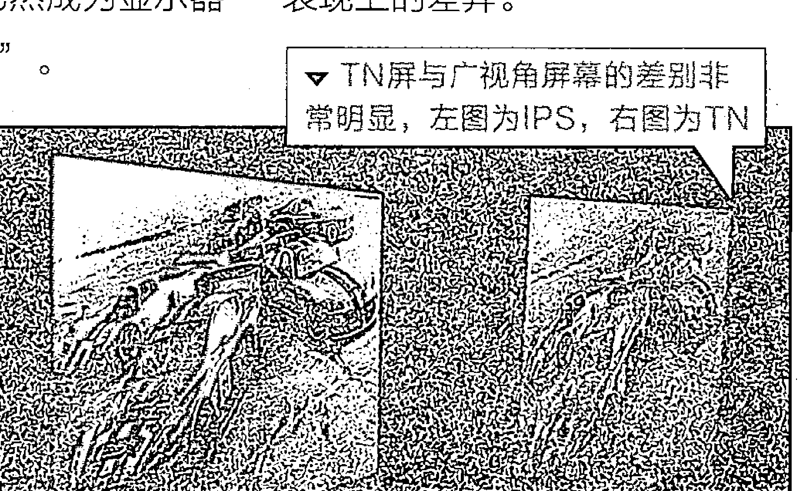

##### 那些更隐秘的参数

两款显示器都采用了同一款LCD面板，为什么最终的“视界”表现还是不一样呢？原因很简单，LCD面板并非显示器的全部，其背后还需要偏光片、滤光片、灯管、驱动IC与电路等十余种组件的支持。比如TN面板存在可视角度不高的先天缺陷，但可通过补偿膜将可视角度提升到160度以上。同理，哪怕某款产品采用了可显示16.7M色彩的IPS面板，但是如果它在驱动IC与电路上缩水，比如只加6bit的驱动，那么只能呈现和TN持平的16.2M色彩。
总之，LCD面板自身最多只能决定可视角度、亮度和对比度这三个参数，至于色彩的表现，除了面板本身外，色彩驱动IC同样起到决定性作用。

##### 一分钱一分货准没错

对显示器而言，我们还是应该遵循“一分钱一分货”的选购理念。同样的IPS显示器，1000元的产品在色域、色阶的表现上肯定不能与3000元级别的产品同日而语（图10）。此外，盲目地轻视TN显示器也是不可取的，要知道很多专业级游戏显示器仍坚持使用TN面板，原因就是TN面板响应时间短，FPS游戏无拖影现象，而且还能实现主动式3D显示（120Hz刷新率），这些都是其他广视角面板所无法比拟的。

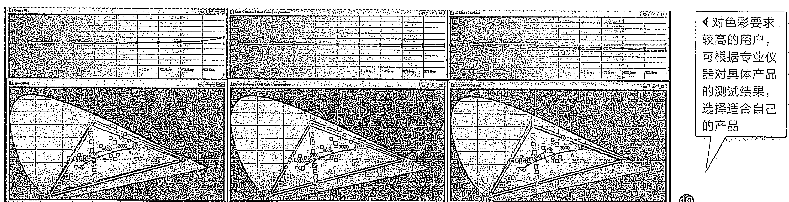


##### 显示器也有副业

为了保证利润，如今显示器厂商已经不再追求唯一的显示效果，而是赋予传统显示器更多的功能和卖点。比如加入光学或电容式的触控屏幕；在显示器内部加入ARM处理器和Android系统，使其变身为显示器+超大平板电脑的“二合一”智能产品（图11）。

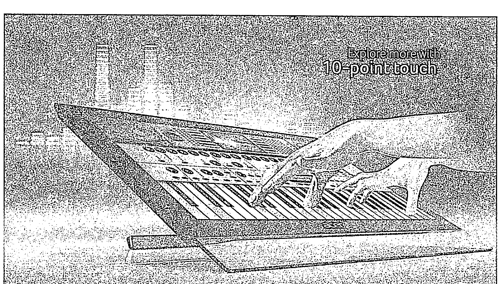

总之，影响显示器“视界”的因素有很多，千元级产品可以通过LCD面板加以筛选，而中高端产品就需要我们额外考量那些隐秘的参数了。至于“智能显示器”是否可取，感兴趣的同学可参考本刊后面“CFan教你选”的相关内容。

##### 常见电视最佳观赏距离表（对应下页文章内容）

| 屏幕尺寸 | 画面高度 | 480P最佳距离 | 720P最佳距离 | 1080P最佳距离 |
| --- | --- | --- | --- | --- |
| 32英寸 | 39.84mm | 2.82m | 1.88m | 1.25m |
| 37英寸 | 46.07mm | 3.26m | 2.18m | 1.45m |
| 42英寸 | 52.29mm | 3.70m | 2.47m | 1.65m |
| 47英寸 | 58.52mm | 4.14m | 2.76m | 1.84m |
| 50英寸 | 62.25mm | 4.41m | 2.94m | 1.96m |
| 55英寸 | 68.48mm | 4.85m | 3.23m | 2.16m |
| 60英寸 | 74.80mm | 5.29m | 3.53m | 2.35m |
| 70英寸 | 87.15mm | 6.17m | 4.12m | 2.74m |
| 80英寸 | 99.60mm | 7.06m | 4.70m | 3.14m |
| 90英寸 | 124.50mm | 8.82m | 5.88m | 3.92m |

### 容易被忽略的那些事儿

在享受或真实或震撼视觉体验的同时，往往有一些容易被我们忽略的事儿。下面就让我们简单聊聊它们对“视界”的影响。


##### “与时俱进”的最佳观赏距离

##### PC屏幕的距离

我们都知道距离屏幕太近，长时间观看会影响视力。那么，这个距离的标准又是多少？对台式机的显示器或笔记本自身屏幕而言，距离眼睛50cm～60cm算是比较合理的。如果显示器尺寸超过了24英寸，那则尽可能保持在80cm左右，即一眼就可看到整面屏幕两侧所有画面而不需要移动眼球。以标准靠墙摆放的电脑桌为例，如果屏幕达到了24英寸或更大尺寸，建议将显示器贴紧墙面或直接选择壁挂的模式，此时的距离才最对得起你的眼睛。


##### TV屏幕的距离

电视机拥有比PC显示器更震撼的视野，也是每个家庭不可或缺的“成员”。有意思的是，就“客厅究竟摆多大的电视才靠谱？”这个问题，似乎不同年代的答案却不尽相同。比如80年代的专家会说18英寸电视适合普通家庭2m～3m的欣赏距离；90年代的专家将屏幕标准提升到了29英寸；如今似乎50英寸都“问题不大”。我们究竟是被专家“忽悠”了呢，还是屏幕大小和距离的关系真的“改善”了呢？对此，欧美专家给出了更为科学的计算观赏距离、分辨率和屏幕画面高度这三者之间关系的公式，即：“最佳观赏距离 = 屏幕高度 ÷ 垂直分辨率 × 3400”。表格（见第9页）是根据此公式，推算出常见尺寸和规格电视的最佳观赏距离。


##### 显示精度决定距离

看到这里可能有的同学已经“懵了”，为什么同一尺寸的电视在不同分辨率时最佳的观赏距离会有如此巨大的差异？实际上，在同一距离内，屏幕尺寸之所以会随着时间的推移而不断攀升的“源动力”，就是显示技术与视频源画质的提升。最早CRT电视的分辨率多以480P为主，只有保持比较远的距离才不容易看到画面中的颗粒感。随着液晶电视的升级换代，从720P到1080P，再到最新的2K和4K标准，让我们在更近的距离内也发现不了画面的像素点，也因此拉近了大屏幕与我们之间的距离。绝大多数家庭客厅或卧室留给电视摆放的距离都在2m以上，哪怕选择55英寸的液晶电视也问题不大。当## 让人“又爱又恨”的光线

然而，笔者并不建议大家盲目选择更大尺寸或更高端的产品。比如你是超高清视频爱好者，那2m左右买55英寸的电视算是绝配；如果你买电视就是看电视节目且预算有限，更便宜的40英寸的电视也能解决问题。总之，与担心房间不够大而无法容纳超大电视的疑虑相比，我们应该将注意力转移到电视/显示器的欣赏环境上。比如，光线。

### 离不开光线的家居环境

对家庭而言，距离不是我们选购大电视（60英寸以内）的阻碍，但摆放位置则需要多加斟酌。比如为电视机预留出背部走线、中置音箱等外设的安置空间，尽量避免阳光直射到屏幕上。需要注意的是，电视屏幕讨厌的仅仅是直射的日光，在晚上或拉上不透光的窗帘时，仍然需要光线的补充。

很多用户喜欢晚上关灯看电视，觉得昏暗的环境可更专注地融入电视节目。殊不知，在没有其他光源的情况下，小而亮的屏幕将与背景形成强烈的对比，电视屏幕的亮度也会因当前节目源的画面变化而出现起伏，时间一长很容易引起眼睛的疲劳。这就好比我们长时间盯着灯光一会儿，不难受才怪。

有些电视配备了智能感光单元，可随环境光线而自动改变屏幕亮度，但哪怕屏幕亮度较暗，在纯黑的环境下仍会让眼睛感到压力。当然，说晚上看电视需要开灯，也不是越亮越好。过于明亮的环境下（如日光或高瓦数的白炽灯），电视屏幕就显得较为灰暗了，使画面发淡缺乏层次感，久而久之也会影响视力。所以，适当的灯光，才是晚上看电视的最佳搭档。笔者也建议大家在客厅或卧室安装具备多段式亮度开关的吊顶灯或壁灯。

> ▼ 柔和的壁灯，应该是夜晚观看电视的好帮手


> ▼ 电影院往往是需要昏暗环境的支持的


### 厌眩光线的影院环境

为什么在家看电视不能是漆黑一片，但在电影院看电影却不能有一丝光源呢？答案其实也很简单，电影院的漆黑环境，可让观影者将注意力全部集中在大屏幕上，并更容易被环绕四周的音响效果而感染，营造身临其境的氛围。此外，电影院的荧幕比观众的视角大，全黑不亮还有利于提高其对比度。反观家里的电视，因屏幕的视野小于观众的视野，在明亮的屏幕和黑暗环境之间就必须要有个过渡的光源了。

### 移动·趋势与意义的博弈

智能手机和平板电脑虽然相对小巧，但它们已经可以胜任轻度的办公及深度的娱乐，借由那面3.5英寸~10.1英寸的屏幕，依旧可以为我们呈现精彩的“视界”。最令人惊叹的是，这种移动终端的“视界”规格大有赶超PC之势，上演了趋势和意义之间博弈的大戏。

### 16:9一统手机江湖

曾一贯以“单手操作”为荣的iPhone都即将迎来大屏新品，这年头已经没有谁可以阻挡手机屏幕的扩张之路了。而手机用于改善“视界”的杀手锏，依旧是通过提升分辨率换来更为细腻的画面，再辅以相对较大的屏幕，上演掌上的视觉震撼。下表是目前手机常用的分辨率规格，不难发现无论是iPhone、WP8还是Android阵营，都已将16:9显示比例作为了标杆。

### 什么是16:9？

将三星Galaxy Note 1（5.3英寸）和Galaxy Note 2（5.5英寸）摆在一起，Note2看起来更“苗条”（图1）。这就是显示比例的奇妙之处。在尺寸接近的情况下，更宽比例的屏幕会更为瘦长，从而帮助手机“瘦身”，提升单手持握的手感。Note 1的屏幕比例为16:10，而Note 2为16:9，由此也就导致了视野面积和把握手感上的“冲突”。

##### 手机常见分辨率对应表

| 规格 | 屏幕比例 | 分辨率 | 代表机型 |
|------|----------|--------|----------|
| WVGA | 15:9 | 800×480 | 三星Galaxy S2 |
| FWVGA | 16:9 | 854×480 | 小米手机1代 |
| qHD | 16:9 | 960×540 | 联想S890 |
| DVGA | 3:2 | 960×640 | iPhone 4/4S |
| FWVGA | 16:9 | 1136×640 | iPhone 5/5S |
| HD (720P) | 16:9 | 1280×720 | 华为荣耀3C/3X |
| WXGA | 16:10 | 1280×800 | 三星Galaxy Note 1 |
| FHD (1080P) | 16:9 | 1920×1080 | OPPO Find 5 |
| QHD (2K) | 16:9 | 2560×1440 | 步步高Xplay 3S |

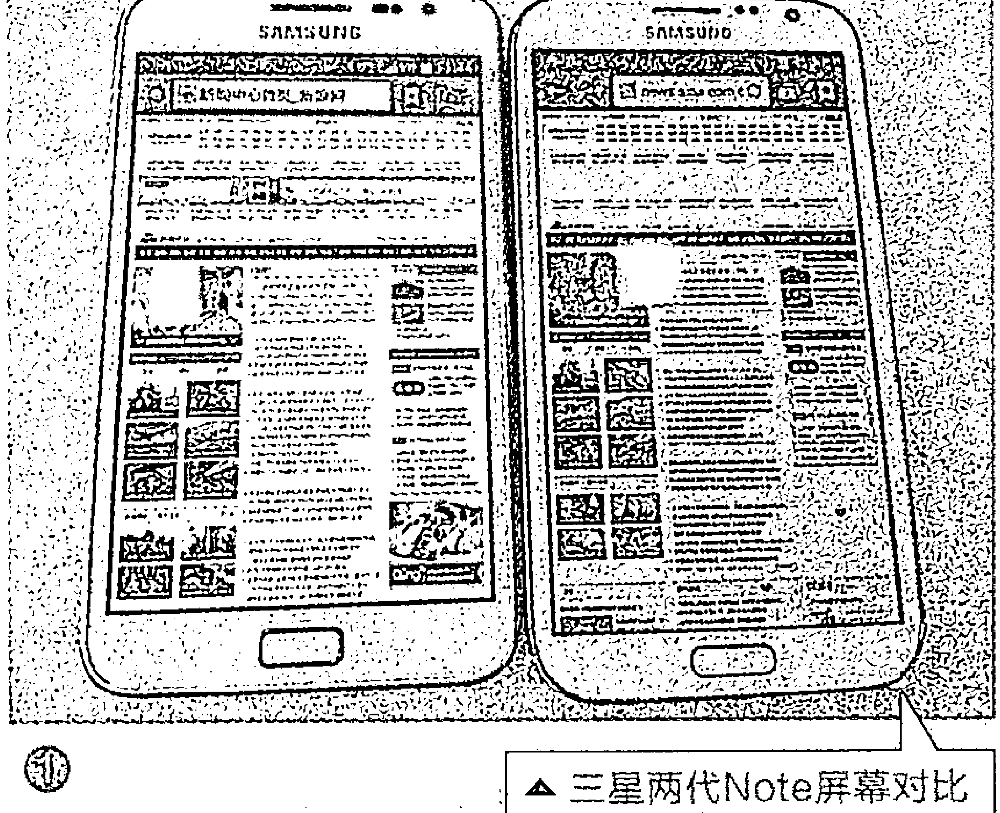

▲ 三星两代Note屏幕对比

### 趋势和意义的博弈

理论上讲，当屏幕的像素密度（PPI）超过了300ppi，就可以达到视网膜（Retina）标准，即在正常使用距离内肉眼就无法识别屏幕上的像素点了（图2）。然而，手机领域显然并没有止步于理论，而是在不断挑战极限。继FHD之后，QHD级别的2K屏幕也已经被部分高端手机引入，比如步步高Xplay 3S，其屏幕已经达到了490ppi。要知道，2K屏幕在笔记本和显示器领域都还属于绝对高端的存在，由此也就引发了2K“无用论”的争议。

客观上来看，5英寸720P的屏幕就可以达到294ppi，已经足够细腻。但这并没有影响1080P屏幕在5英寸手机领域的普及速度，因为1080P现在已经不是什么高端的技术，只是1500元以上的智能手机“理应具备”的基本规格。同理，2K屏幕可能存在成本高、额外费电等弊端，但是技术已经发展到这里，所以其必将是手机未来发展的趋势，无论你是不是用得上，也就是所谓的趋势大于意义（图3）。

我们的建议是，当2K屏幕作为同价位手机“锦上添花”的卖点而出现的时候，第一时间购入没有问题；当2K屏幕变成了新品“加价理由”而出现时，普通用户就不妨考虑稍差一个档次的1080P屏幕了，比如OPPO Find7就有2K和1080P两种规格，现阶段显然还是1080P版更加超值而且实用。

### 扩展阅读

##### IPS和AMOLED双雄争霸

目前智能手机屏幕主要以TN、SLCD、IPS和AMOLED四大阵营为主。其中TN已频于被淘汰，SLCD多被HTC早期产品所用，IPS前文已有介绍，接近180°的可视角度，色彩通透、亮丽，包括iPhone和绝大多数WP8/Android手机都采用这一技术。而AMOLED常被用于三星旗下的高端手机，其特色在于色彩艳丽、可显示最纯正的黑色及相对节能。随着Super AMOLED Plus技术的出现，饱受诟病的Pentile次像素排列也被解决。


> > 超过300ppi的屏幕，只有超近距离或用放大镜才能看到屏幕的颗粒

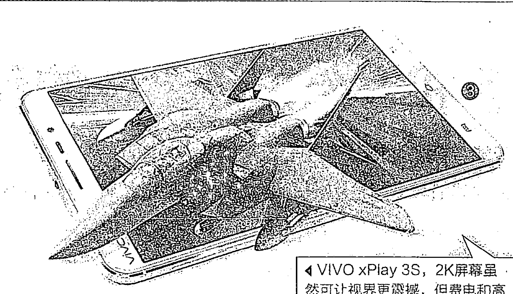

> > VIVO xPlay 3S, 2K屏幕虽然可让视界更震撼，但费电和高成本也是不得不面对的问题


##### 让平板头痛的显示比例

和手机不同，平板电脑，特别是基于Android系统设计的国产平板的“视界”颇为混乱，4:3、16:9和16:10三种显示比例都有庞大的“受众群体”。需要注意的是，不同显示比例的屏幕除了分辨率有所差异外，在使用体验上有时也会体现出意想不到的差异性，主要体现在:

- 持握感：4:3比例的平板电脑宽高比例接近，任何方向持握都没压力，适合看电视剧和综艺节目；宽屏比例的平板电脑适合横屏操作，竖屏时有种“头重脚轻”之感，是欣赏高清视频的最佳利器。
- 变形屏：有些超低价7英寸产品采用800×480分辨率的屏幕，这类屏幕存在显示变形的问题，主要体现在圆形图案在横屏时被压扁，竖屏被拉长。
- 游戏变形：由于Android游戏是为智能手机的兼容性，因此部分APP可能存在对4:3普屏比例兼容不佳的问题。以《武士2》为例，在4:3屏幕上运行时，虽然人物和背景显示正常，但血槽图标却已经变形，圆形图案被压扁成了椭圆(图4)。
- 游戏显示：别看16:10和16:9差不多，但有些游戏也会出现显示范围的细微变化。以《灵魂战星2》为例，16:9屏幕可显示更多的画面细节(图5)。

##### 平板电脑常见分辨率对应表

| 规格 | 显示比例 | 分辨率 | 代表产品 |
|------|----------|--------|----------|
| XGA | 4:3 | 1024×768 | 7.85英寸、7.9英寸、8英寸、9.7英寸平板 |
| WSVGA | 16:9 | 1024×600 | 7英寸Android平板 |
| WXGA | 16:10 | 1280×800 | 7英寸、8英寸、10.1英寸平板 |
| WUXGA | 16:10 | 1920×1200 | 7英寸、8.9英寸、9英寸、10.1英寸平板 |
| QXGA | 4:3 | 2048×1536 | 7.85英寸、7.9英寸、9.7英寸平板 |
| QHD (2K) | 16:10 | 2560×1600 | 高端10.1英寸平板 |


总之，移动设备“视界”的震撼源于越来越大的屏幕和更为激进的分辨率规格，其中手机方面只需根据预算，选择合理的屏幕与硬件结合的产品即可。而平板电脑则需要更多地考虑显示比例对实际应用的影响。对喜欢游戏的玩家而言，我们建议选择宽屏比例的Android平板，而以上网和页游为主要休闲目的的用户，则可考虑4:3的普屏产品。

### 手机‘视界’之外的那些事

智能手机的‘视界’随屏幕尺寸和分辨率的提升而越加震撼。但是‘视界’震撼后往往伴随着便携性和续航能力缺失的尴尬。那么，如何才能避免类似的现象？

##### 更便携·玻璃上的瘦身术

大屏手机如何提升便携性？没错了，就是采用尽可能窄的屏幕边框，并减少屏幕表面那层玻璃的厚度。简单来说，智能手机的屏幕部分是由‘LCD液晶面板+触控屏+保护玻璃’三部分组成。为了让屏幕瘦身，OGS全贴合技术孕育而生。OGS的原理就是在保护玻璃上融入ITO导电膜及传感器，让一块玻璃就可扮演保护玻璃和触摸传感器的双重角色，进而起到瘦身、提高透光率的目的。


问题来了，当保护玻璃变薄后，会不会更容易碎裂？想提升表面玻璃的硬度，应用康宁大猩猩和蓝宝石技术应该是目前最理想的解决方案。其中，康宁大猩猩已经被很多智能手机和平板电脑所用，第三代大猩猩玻璃的莫氏硬度理论上最高可以达到9级，理论上唯有钻石可以对其造成损伤。而蓝宝石屏幕目前还未量产，有消息称会为苹果下代iPhone采用。理论上蓝宝石拥有比大猩猩玻璃更好的硬度和韧性，但存在折射率较高和可能存在紫色光晕的缺陷，需要搭载对比度较强的AMOLED屏幕来解决这个问题。目前全球最薄的手机玻璃盖板只有0.55mm，应用的就是第三代大猩猩玻璃技术。蓝宝石屏幕能否撼动康宁的地位，还有待时间验证。不过以苹果的推广能力，相信蓝宝石的普及速度应该比想象的更快。

##### 更省电·隐藏背后的节能技术

大猩猩和蓝宝石可以帮大屏手机变薄，但是想解决超大屏幕引发的额外耗电问题，还是需要靠更大的锂电池以及软硬件的节能技术。其中，硬件技术指的是屏幕材质，而软件技术则是一些系统级别的节能特色。相对而言，来自三星的AMOLED屏幕具备自发光、无背光源和省电的优势（相对IPS而言），也是很多主打纤薄手机的首选。可惜，AMOLED的高对比度带来了过于艳丽的色彩，并非所有用户都可接受。至于软件节能技术，不同厂商有着自己的理解。绝大多数品牌会在电量不足时自动关闭联网、调低背光，甚至进入飞行模式来延长待机能力。而三星Galaxy S5新引入的节能技术则为我们提供了一种新思路：降低GPS地图刷新率降低导航状态下的耗电、实时优化网页并智能屏蔽广告和耗电的Flash、当电量低于10%会进入黑白屏的显示模式。

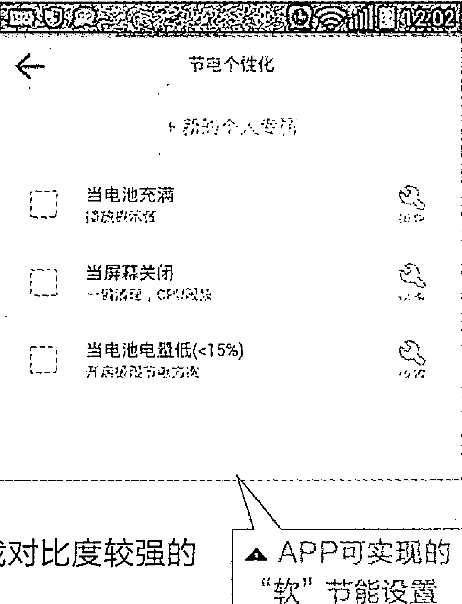

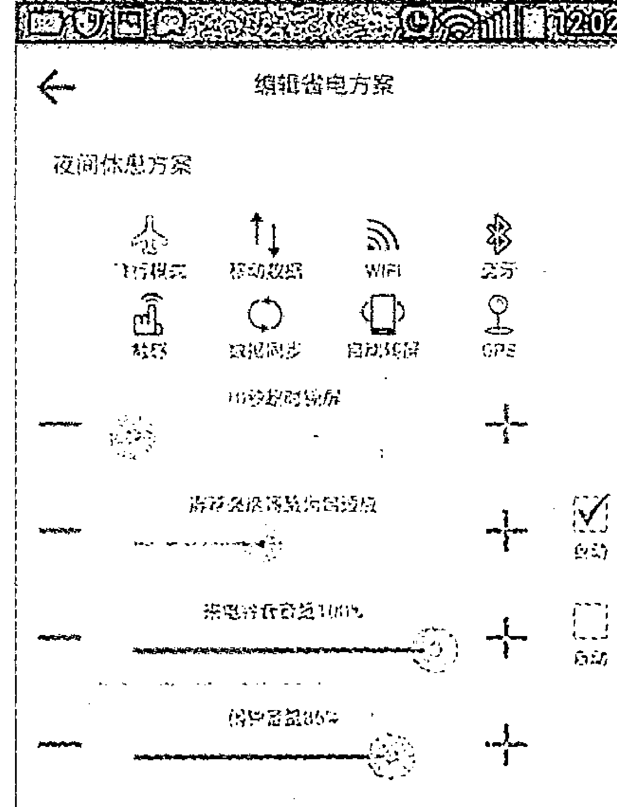

> ▲ APP可实现的‘软’节能设置

### 带你走进3D世界

从电影院、客厅电视和大型体感设备开始流行，3D化一直是目前显示技术下最逼真的效果。经过多年发展，3D技术主要分为以NVIDIA为代表的主动快门式和常见的被动偏光式两种。它们有哪些差异？实际效果如何？适合哪些用户？带着诸多疑问，让我们走进本期的话题。

##### 主动快门式3D Vision


NVIDIA的3D Vision是目前为止家用平台最为成熟的3D显示解决方案，很多人可能只听过其名，对其成像原理、具体表现和细节不甚了解，在这里就让笔者向大家介绍一下3D Vision的方方面面。

要想实现NVIDIA的3D Vision，我们除了需要购买3D Vision套件（或显示器捆绑）之外，一台刷新率能够达到120Hz的显示器是必要的。要注意的是部分早期型号仅提供了对3D游戏的支持，播放蓝光3D作品必须要新型号才行。除了3D显示器，目前很多投影机甚至笔记本电脑的屏幕也达到了120Hz，并对3D Vision提供了全面支持，在NVIDIA官方网站很清楚地全部列出来，有兴趣的朋友可以前去查看。

既然是NVIDIA的3D技术，看来一块N卡是必不可少的了。要注意的是并非所有N卡均能实现3D效果，以游戏为例，只有9800系列以上的N卡能够支持3D游戏。3D电影的播放，NVIDIA的所有GeForce 8系以上显卡均能支持，但要注意的是，蓝光3D播放只有GT 240和移动显卡GT 320M以上的型号才给予支持。在NVIDIA的系统支持页面也有详细说明，一目了然。

有个小细节很容易被忽略，那就是如果显卡与显示器连接，必须使用双通道DVI-D及更高带宽的HDMI或DP线缆。常用的DVI-D线缆属于单通道线缆，没有这条双通道线缆无法顺利开启3D Vision。

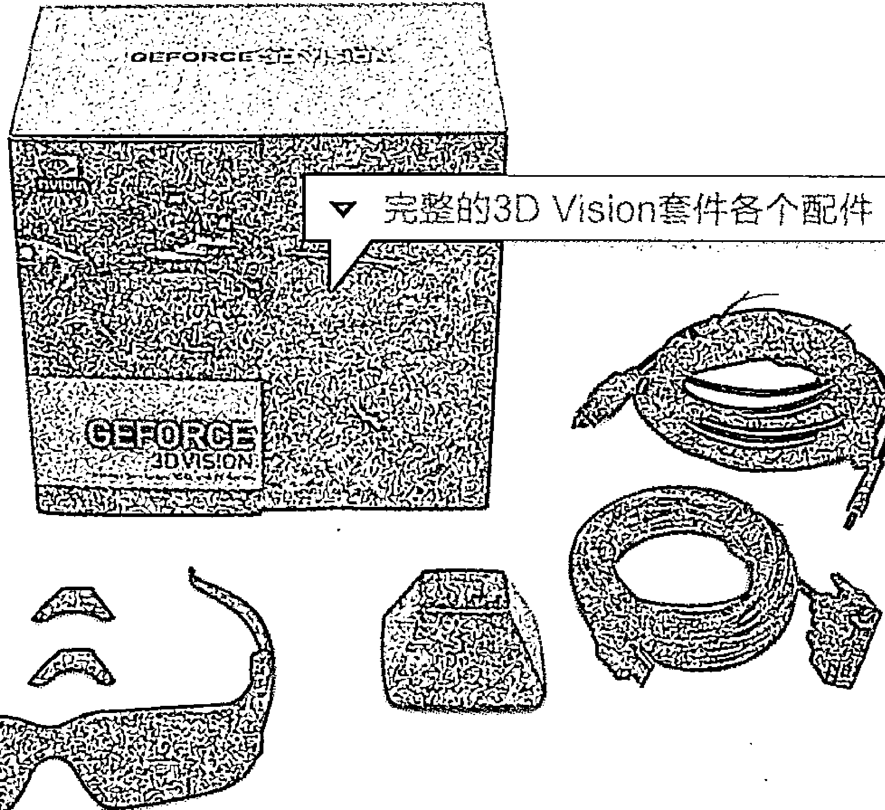

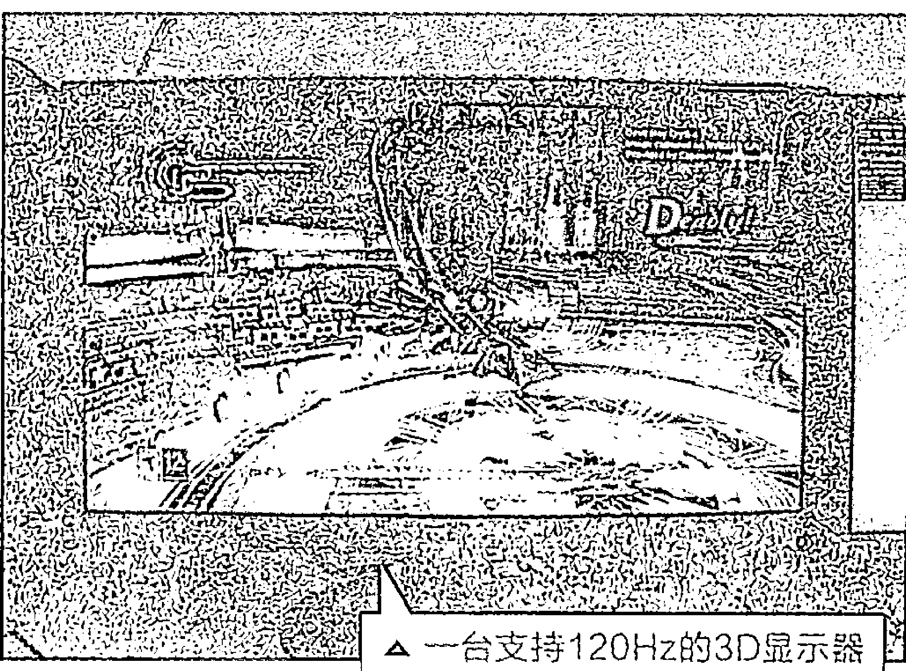

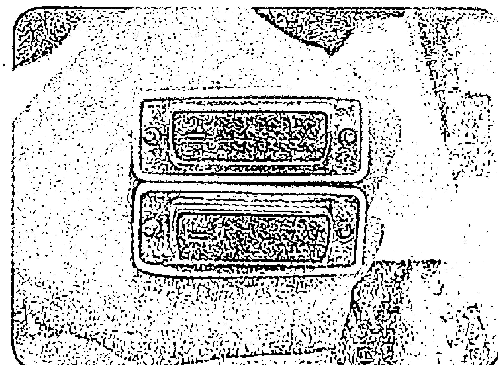

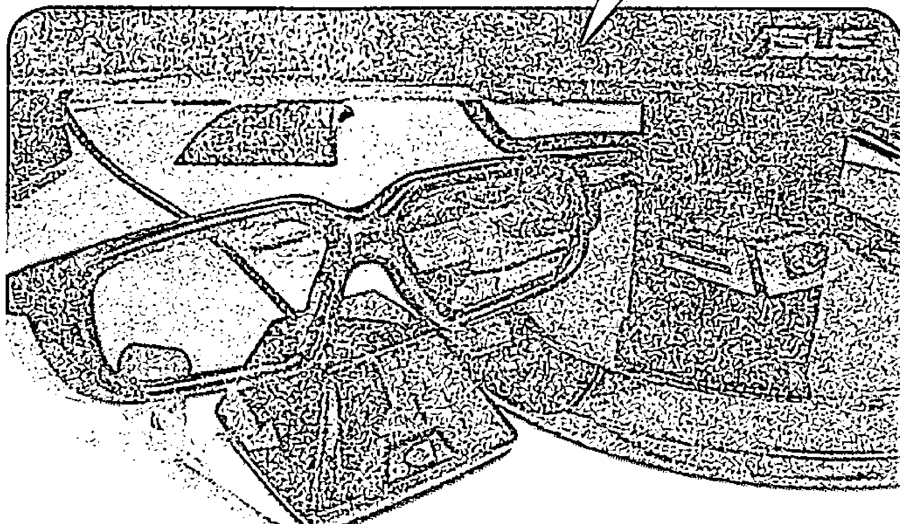

> Tips: 附件与舒适度

由于3D眼镜需要充电，所以使用中难免要连接线缆。好在USB线缆很长，可以满足任何用户的需求。NVIDIA附赠了两个鼻架替换品，但其实最需要架子的部位并非鼻子。3D眼镜戴与摘时，如果不太小心，上侧的耳朵根部位很容易被眼镜腿划疼。虽然不至于划破，但眼镜腿黑色与绿色交界处那里的尖锐塑料还是能够轻易弄疼你。不仅如此，在长时间使用中我们的耳朵也会感受到来自塑料眼镜腿的压力。


##### 初次使用的设置

有了上述两大必要条件，基本上我们的电脑就可以运行3D Vision了。但是在实际操作中很多朋友都遇到了麻烦，我们一共需要装两款驱动，通过数次设置才能实际开启3D Vision系统。

首先，我们需要为平台中的N卡安装一款适合它的驱动。一般来说我们只需安装NVIDIA的推荐驱动即可，去官方的下载页面，选择产品和操作系统，系统会自动推荐给你最新的WHQL认证驱动，显卡端的3D Vision驱动程序就在其中。光给显卡装上驱动是不行的，提供红外线发射的那个梯形发射器也需要驱动。去NVIDIA官网寻找驱动，在下载了一个数MB的驱动安装之后就算完成。


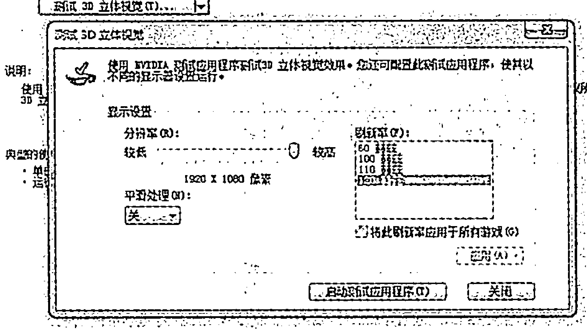

在第一页我们要选择符合情况的3D Vision，将红外线发射器成功连接到电脑的USB接口。用所附USB电缆将红外线发射器连接到计算机。准备就绪后，红外线发射器上的开关按钮会发出绿光。然后用眼镜上的开关激活3D Vision，激活后该灯会转为亮绿色。调整背面的滚轮，可以调整3D立体视觉的景深值，当然要以眼睛舒适为准。


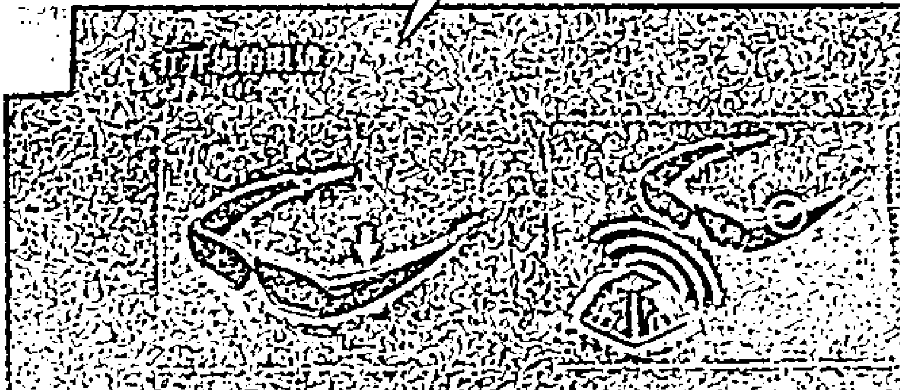

之后系统会询问安装环境，由于我们一个房间内只有一台运行3D Vision的电脑，而且并未使用其他红外线设备如电视遥控器，所以我们选择第一项并下一步。这时系统成功找到3D 120Hz液晶显示器后，硬件测试马上开始。

##### 视觉设置环节

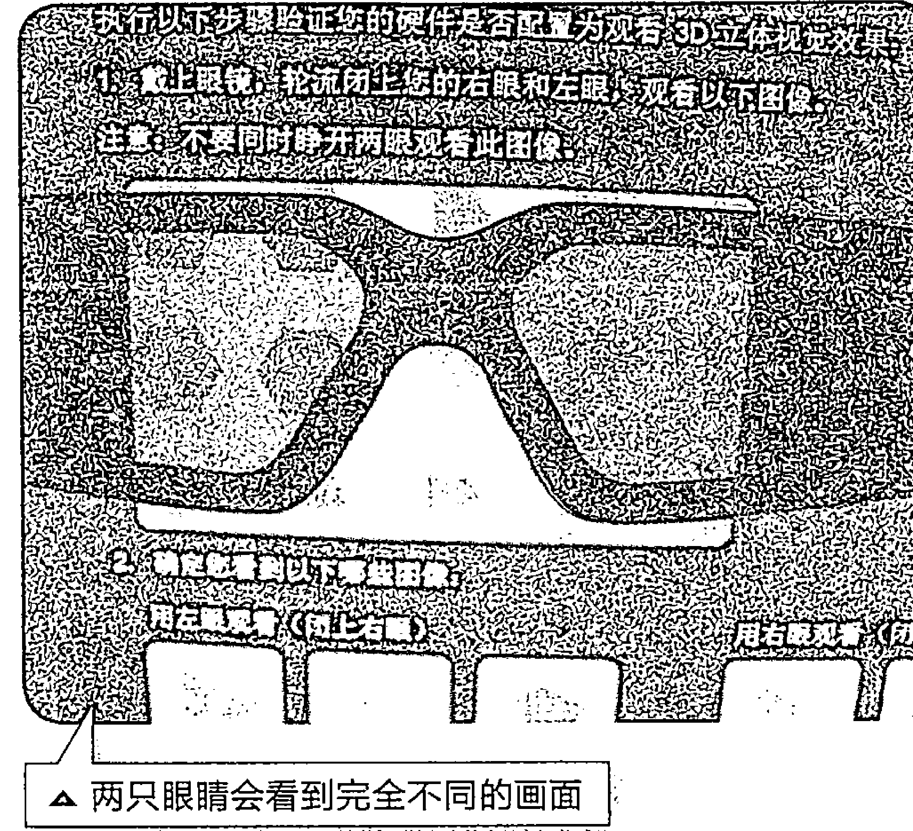

NVIDIA提供的硬件设置测试图文并茂，非常便于初级用户理解。在初始画面中我们能看到三角形与六边形的交集。注意，此时我们从3D眼镜中看到的交集画面，是由左眼的六边形和右眼的三角形联合组成。拿掉眼镜，我们能够清楚地看到左右眼中画面的不同。第二步中我们需要选择用左眼（闭上右眼）和用右眼（闭上左眼）分别能够观看到什么，按照实际情况选择，便于系统完成设置。

细心的用户可能会发现，在镜片边缘视野中有一些零星闪烁的感觉。系统很贴心地提示我们，这种闪烁感可能是由3D Vision和室内灯具工作频率之间的差异所导致的。下一个页面我们会发现，其实3D Vision是可以工作在100Hz的，其中120Hz适用于夜晚开灯时，110Hz适用于白天或者关灯时，而100Hz适用于使用50Hz照明的夜晚环境。根据使用环境选择好这一步，就能看到下一页图中的端倪，勾选健康和安全信息，整个设置完成。

演示程序。尽管在激活时都是窗口模式，但实际运行起3D内容后均会切换到全屏模式。

3D Vision支持所有游戏吗？答案是否。不过不要郁闷，很多主流游戏都提供了对3D Vision的支持。打开NVIDIA控制面板切换到3D立体视觉，点击查看与游戏的兼容性，可以看到支持3D Vision的游戏数以百计。其中兼容性表示了其具体的3D表现，分高中低三等。

可能有朋友会说，Windows的桌面刷新率一般在60Hz，3D显示器这个120Hz是如何实现的？真正用过3D Vision之后你会发现，所有的3D内容均是在全屏状态下才能被激活。NVIDIA在3D Vision套装中提供了一张演示光盘，其中包括小巧的3D播放器、3D图片查看器和3D游戏

###### ▼ NVIDIA为我们提供的3D播放器

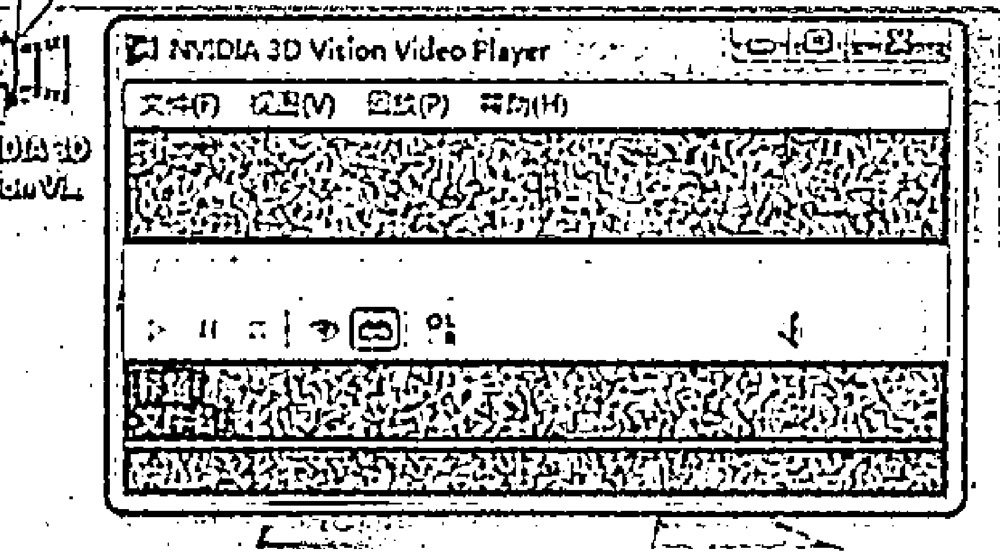

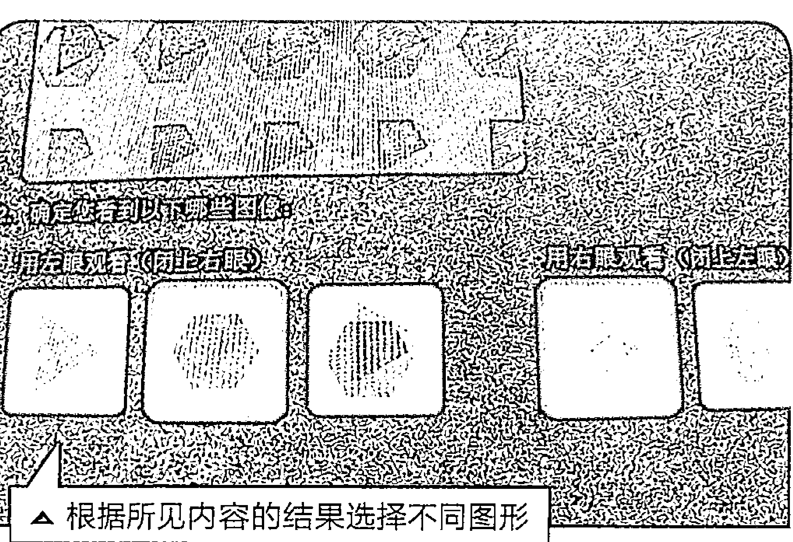

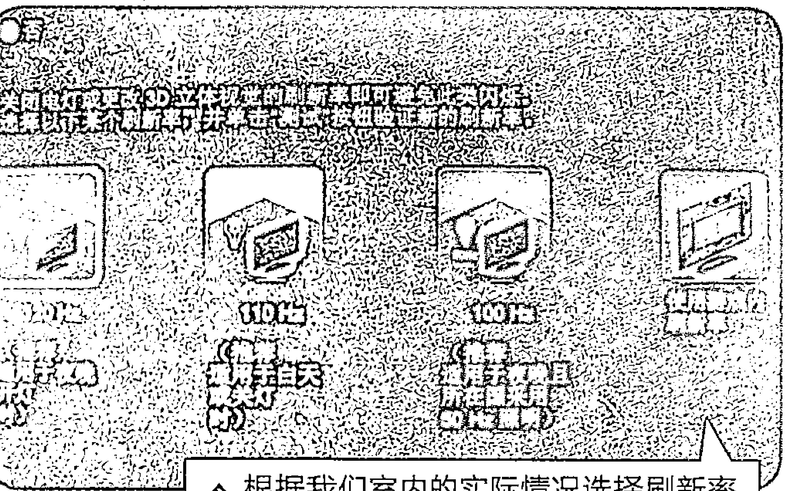

###### 查看与游戏的兼容性

您可以对游戏进行配置，使其适应 3D 立体视觉。对于某些游戏，可更改游戏的推荐设置，以获得最佳 3D 立体视觉体验。
选择一个游戏，以查看 3D 立体视觉兼容性:
3D 立体视觉兼容性(C):

| 游戏名称 | 兼容性 |
|---|---|
| World of Warcraft | 优秀 |
| World of Warcraft Burning Crusade | 优秀 |
| World of Warcraft Lich King | 优秀 |
| World Racing | 优秀 |
| World Shift | 一般 |
| World War II - Frontline Command | 优秀 |
| World War II - Pacific Heroes | 优秀 |
| World War II Fighters | 优秀 |
| Wrath: Extreme A-Gear Racing | 优秀 |

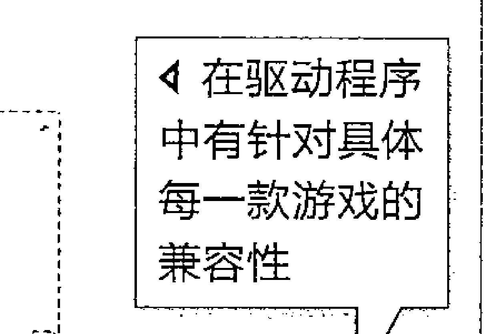

###### 主流游戏测试

通过设置我们可知，NVIDIA的3D Vision是通过同时生成两幅类似的画面从而实现3D，估计对系统的压力会大于一般应用环境。在测试时笔者为了了解流畅度如何，特意选用了比较低端的平台。

###### 《星际争霸2》

我们首先选择支持度为中、家喻户晓的即时战略类游戏《星际争霸2》来测试。令人惊喜的是，打开游戏以后并未做任何设置，游戏已经自动切换到3D显示模式。我们能够看到运行在行星光环上的宇宙战舰不再是记忆中的模样，极深的景深感觉为我们展现了大片般的感受。
打开视频设置我们能看到平时看不到的3D立体影像选项，其中立体分离度为视图中左右影像间横向的分离度。视图分离度越高时视图效果越强；而立体视图控制可调整视图的立体度至无视差状态，加强立体度可使视图中的景物在画面中更为突出，不过过度的分离效果或立体度都可能会使眼镜感到不适。

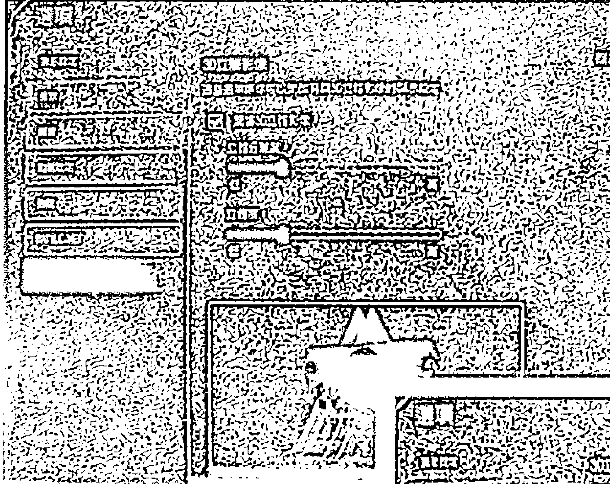

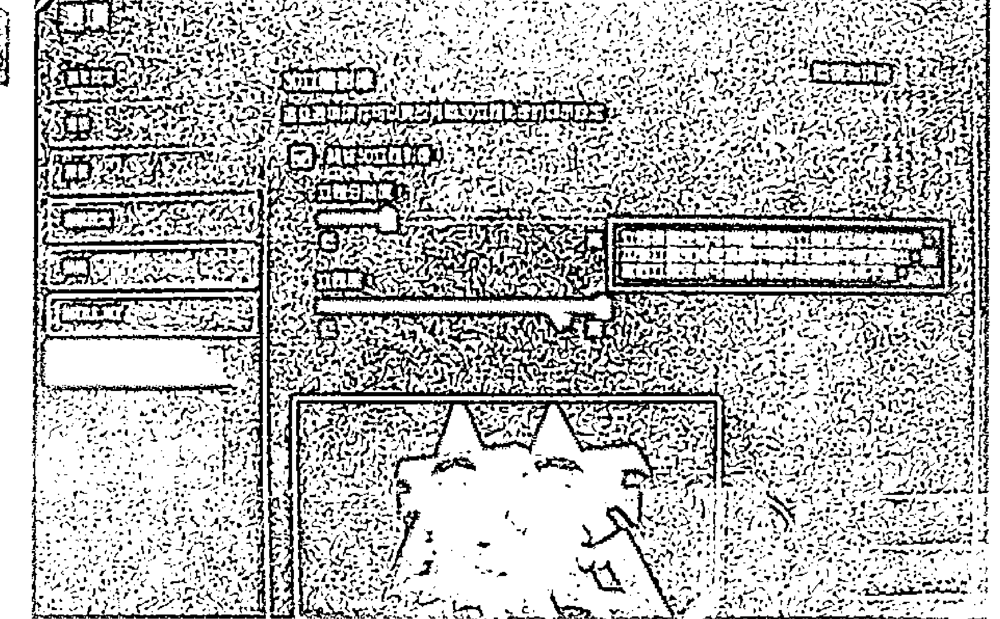

###### 测试平台

- 处理器: Intel Core 2 Duo E6300 ( OC 2.80GHz )
- 芯片组: Intel P965
- 显卡: NVIDIA GeForce 8800 GT ( 512MB )
- 内存: DDR2 800MHz 2GB×2
- 硬盘: ST1000528AS

##### 魔兽世界

魔兽世界在控制面板中的兼容性级别为优秀，3D Vision开启十分方便，通过“全屏幕、调至120Hz、勾选3D”这三步简单设置，在视频设置里找到平时见不到的立体画面选项并启用，一个3D版的人物登录界面就完成了。由于这是一款网游，我们需要关注许多插件才能顺利帮助队友击倒BOSS，过分的3D会不会影响发挥？进入游戏后可以发现无需为此担心，游戏中3D化的只有生物和景物，关键的系统自带插件和第三方插件均保持原有风格并浮现在立体影像最前面，整体效果相当漂亮。


##### 系统压力初探

我们知道3D Vision会同时生成两幅画面，会不会对系统造成双倍的负担？笔者的测试平台配置并不高，在1920×1080分辨率高特效下在《魔兽世界》高负载区域20fps左右。而打开了3D Vision之后锐减至10fps左右，看来双倍负担基本属实。

打开GPU-Z测试显卡负载，可以看出在GPU负载上开启与否并未有太大变化，反倒是显存占用上有近乎一倍的差别。看来NVIDIA提供最低的配置只能是入门，想要真正玩爽3D Vision，只能选用现在的主流显卡。

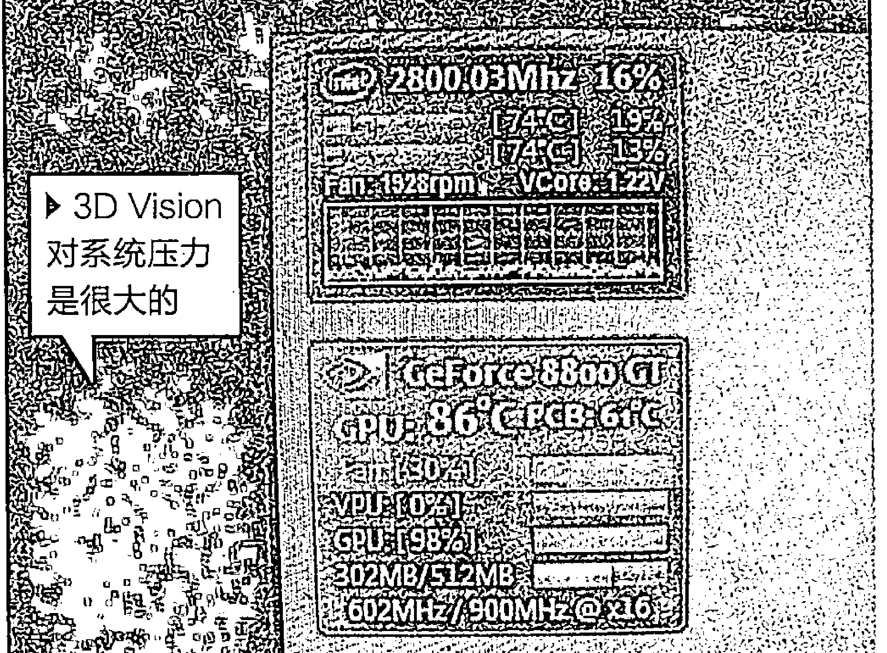

##### 3D Vision和视力

很多人担心3D画面看久了会影响视力，那么事实如何呢？从理论上来说，3D眼镜这种方式确实是会影响视力，但目前还没有任何证据表明确实会对眼睛造成伤害。

让我们来看看3D眼镜的工作环境。正常看东西，人双眼的瞳距变化的同时，晶状体同时调焦。瞳距的调整使你双眼都对准你想看的东西，双眼影像重合强化。晶状体的调整使你想看的东西可以刚好在你视网膜上形成清晰影像。

但是3D眼镜不同，瞳距一直在发生变化，让你想看到的东西进行重叠，产生距离感。但是因为实际图像仍然是在屏幕上，双眼都没有任何调焦的行为。这是很多人看3D头晕的一个主要原因，就和有人刚配眼镜时头晕一样。所以3D影像和现实状态下，眼睛的状态是不同的。

##### 3D Vision的奥秘


3D Vision的奥秘在于显示器同时生成两幅各60fps的画面，开启3D将画面合并。由于眼镜会变暗，对显示器的亮度产生了很大要求。好在支持3D Vision的显示器亮度很高，即使在墨镜一样的效果时仍能获得不错的效果。整个体验环节比较麻烦的就是两个必要驱动的安装，如果游戏中不能顺利开启，请检查一下是否处于全屏120Hz刷新率的状态下。

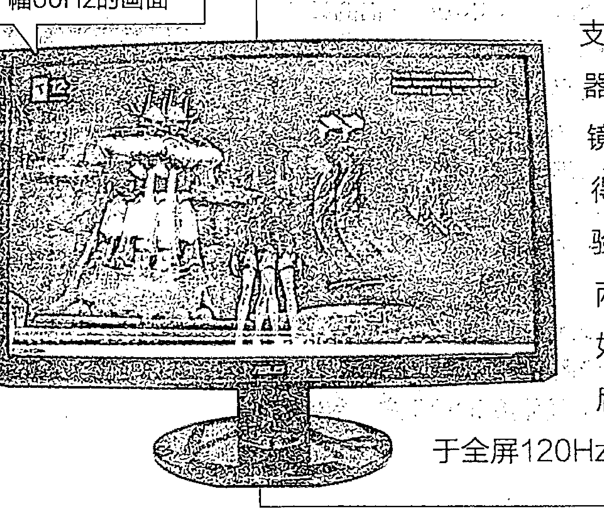

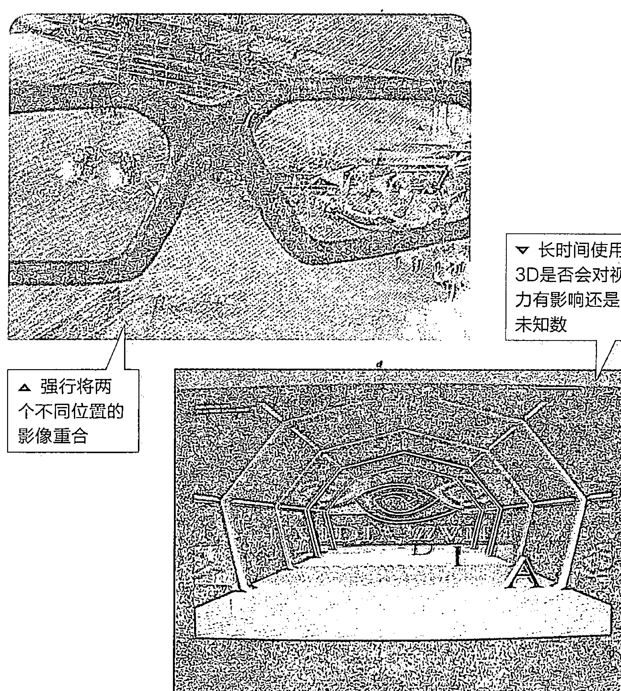

如果把人的眼球当成一个摄像头的话，正常情况下这两个摄像头要看哪个东西，就转动对准目标，根据两个镜头形成的角度就可以判定物体的距离，同时还要根据这个距离进行对焦。这是一个典型的条件反射过程。现在的3D影像，就是把真实的场景做成两幅画，分别给这两个摄像头。选好目标后，两个摄像头都把方向对过去，只要让这两幅画有所差异，导致两个摄像头对准画上的目标时，形成的角度和实际场景一样，那么两个摄像头就会以为目标是在那个距离上。对准不同的目标时角度不同，就感觉到有不同的距离，这便形成了空间感。这和看真实场景都是一样的，唯一的不同就是：因为摄像头现在对着的始终是两幅画，转动的同时基本不用对焦。所以说，这是一个会改变人双眼条件反射的行为，目前还没有什么研究来说明这种改变会对人眼造成什么样的影响。有可能像跑步一样，跑完步照样可以走路。也有可能像蛙跳时强制你在下摆臂时起跳一样，可能造成损伤。

### 扩展阅读

##### 3D Vision Discover

低一档的解决方案——3D Vision Discover可以让NVIDIA GPU的拥有者在任何显示器上体验3D立体视觉效果，并且无需购买价格昂贵的偏振眼镜。具体实现的办法依旧是生成两幅画面，而且是红蓝色各一幅，然后用一副红蓝镜片的眼镜去观看，这副眼镜价格是偏振眼镜的1/10。要说起这个红蓝3D Vision Discover的效果，立体感是有的，色调有一定偏色，明亮度同样很暗。游戏转换成红蓝效果的两幅画面，显卡压力同样会增大，基本减少一倍的帧数。眼镜我们可以轻易在淘宝上购买到，用一百多元就能买到NVIDIA推荐的正品。和几块钱的红蓝眼镜的区别在于镜片的滤色效果，如果滤色效果不好的话，左右眼看到的红蓝图像会有滤不干净，图像发虚，立体效果和观看效果就会减弱。当然这和片源的颜色色彩效果也有关系。这种解决方案看似很便宜，但是有一个最要命的缺点就是不利于长时间使用。比起3D Vision，红蓝的3D Vision Discover长时间使用时对视力的影响更大一些。总体来说属于适合短时间体验3D的用户，尽量不要长时间使用。

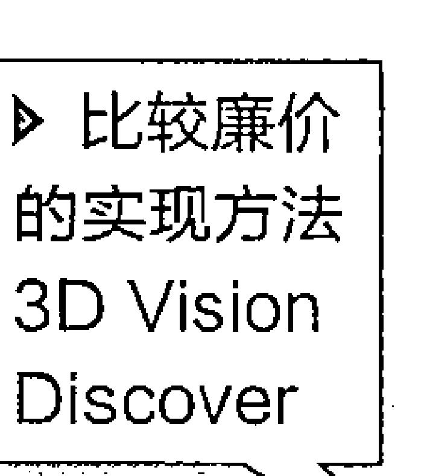


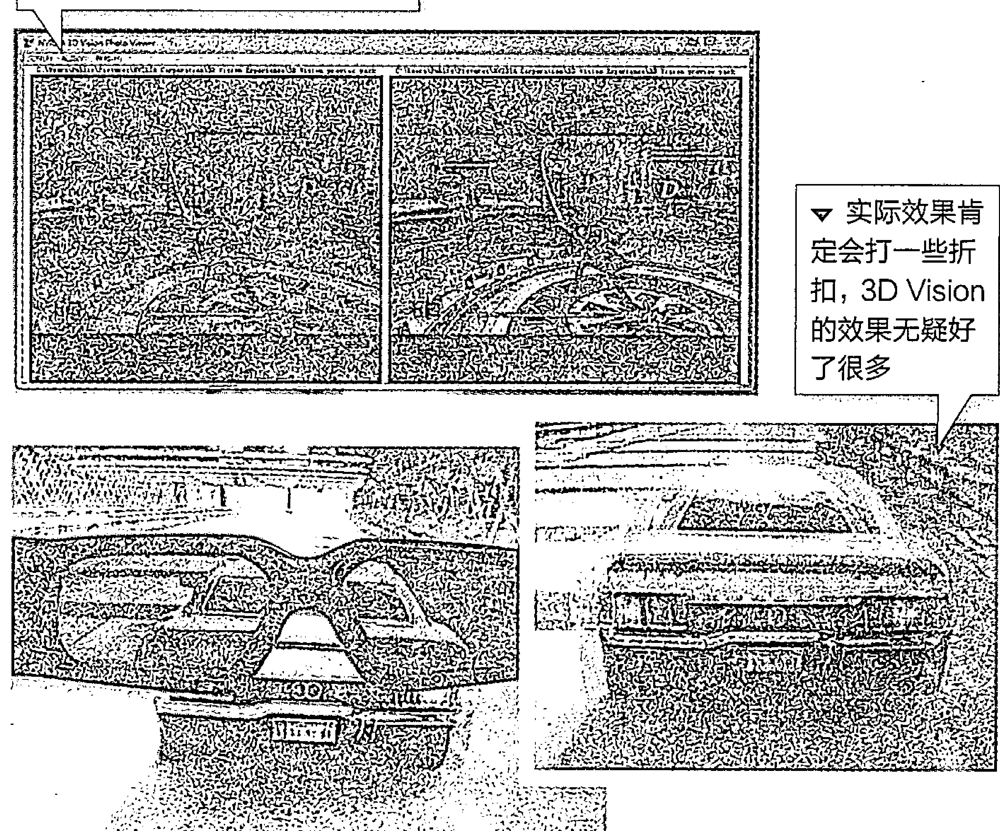

##### 已经普及的偏光式3D

偏光式3D学名是偏振光式，这种3D技术意义重大，意味着我们终于可以用1000多元买到3D显示器了。与3D Vision不同，这种3D技术门槛很低，不再只限于N卡，甚至连D-sub接口都能实现3D。在我们熟悉的主动快门式3D显示技术中，D-sub接口是无法实现3D显示的。而且对显示器的亮度和刷新率没有硬性要求，偏振光式3D技术并不会大幅度降低画面亮度，如今的显示器亮度水准已经足够，不会影响日常的使用。

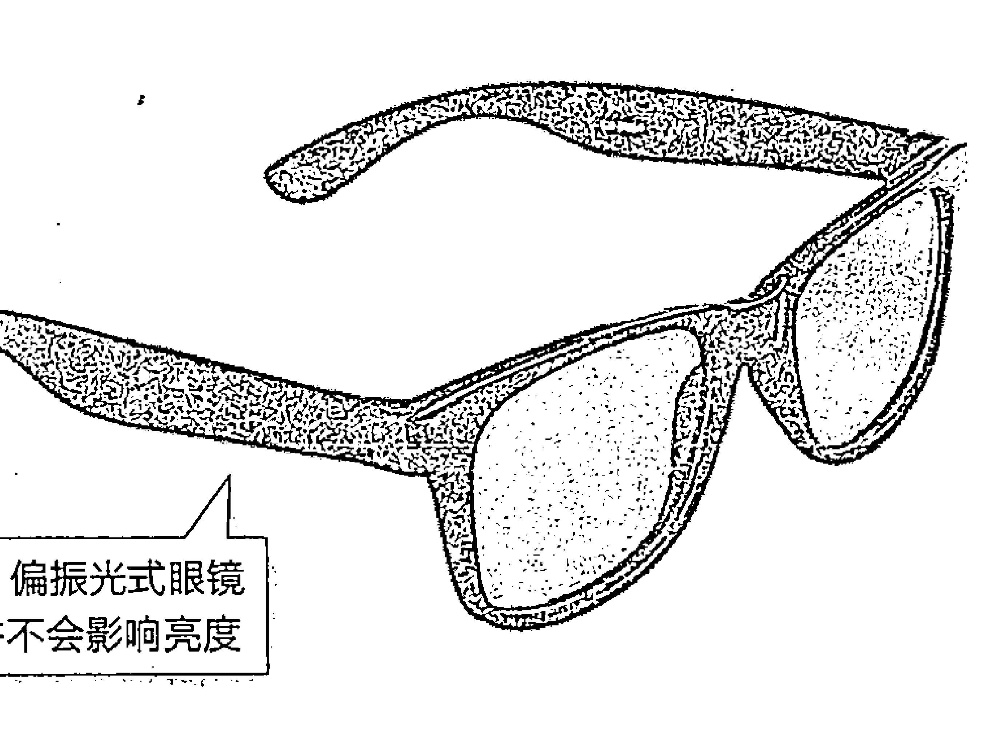

▲ 偏振光式眼镜并不会影响亮度

###### 3D显示调节过程

在使用NVIDIA的3D Vision方案时，其驱动分为显卡和眼镜及其接收器两个部分。显卡部分的3D Vision驱动和显卡驱动程序整合在一起，安装显卡驱动的同时已经装好。但是眼镜及其接收器的驱动就相对麻烦一些，需要专门去NVIDIA官网下载最新版本的驱动才能完美发挥设备的功效，可以说这个过程有些繁琐。NVIDIA的3D Vision方案使用前需要对3D功能进行设置，设置过程用向导的方式来体现，手把手教用户调节。虽然之前的驱动安装有些麻烦，但到了向导这一步之后就很简单方便。而偏光式3D设置过程更加简便，只需要安装一个软件就可以轻松搞定。我们只需将随机光盘放入光驱，安装TriDef-3D软件，软件部分就算万事俱备了。软件安装完毕之后，Windows程序中有主程序、诊断工具、帮助文件以及自动更新等选项。接下来我们进入主程序一探究竟。这款TriDef-3D软件可以将图片、游戏和电影以3D的形式输出。而软件内部的设置环节极为简单有效，为了3D显示器有更好的观看效果，通过简单的提示和漂亮的预览图调节显示器的倾斜角度至最佳状态。

###### 玩转不闪式3D

打开TriDef-3D软件后，主界面共有四个图标，代表3D视频、3D DVD、3D照片和3D游戏，进入前三个选项都会出现一个界面让用户选择照片、电影等多媒体文件，根据提示开启后就可实现3D效果了。而最为激动人心的游戏选项，TriDef-3D软件提供了专门的界面，可以自动扫描主机内所安装的游戏。如果没有扫描到，用户也可以通过手工添加的方式来加入，从文件菜单中选择“添加游戏”来添加游戏的执行文件，并从DDD方案中找出相应的配置方案。TriDef-3D预置的方案有数百种，涵盖众多主流游戏，但并非所有游戏都能够兼容，这点与NVIDIA的3D Vision方案类似。通过上面的办法，点击游戏所对应的图标就可以进入游戏了。游戏画面左下角的提示信息相当重要，我们按下Alt + Shift + F1键可以调出功能强大的控制台，可以对包括景深等项进行充分设置。令人惊奇的是，TriDef-3D软件可以支持窗口模式下游戏的3D显示，对比主动快门式方案只支持全屏3D，不闪式3D占了上风。要知道并非所有游戏和玩家都使用全屏幕模式，支持窗口3D意义还是很大的。低门槛高性能的3D效果很值得我们肯定，售价与普通显示器相仿，还拥有不俗的3D性能，与同类产品相比高下立现。

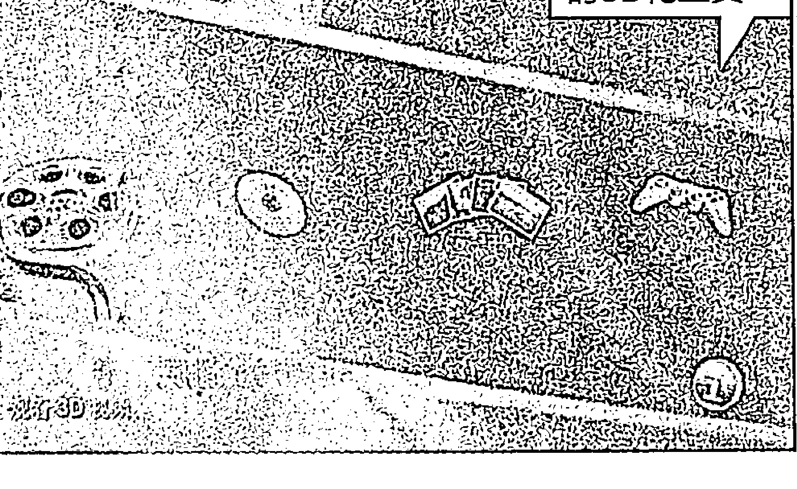

▼ TriDef-3D也提供了相关的3D化工具


◀ 简单直观的设置方式

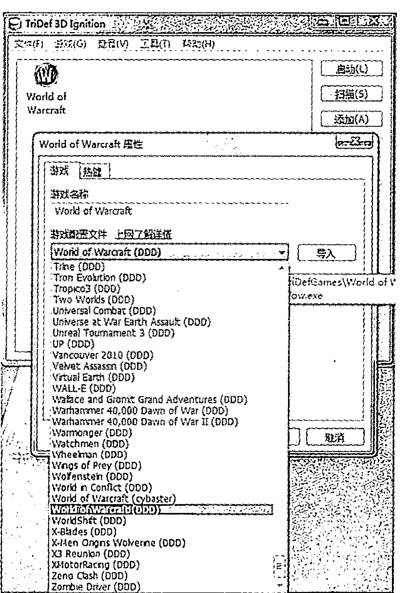

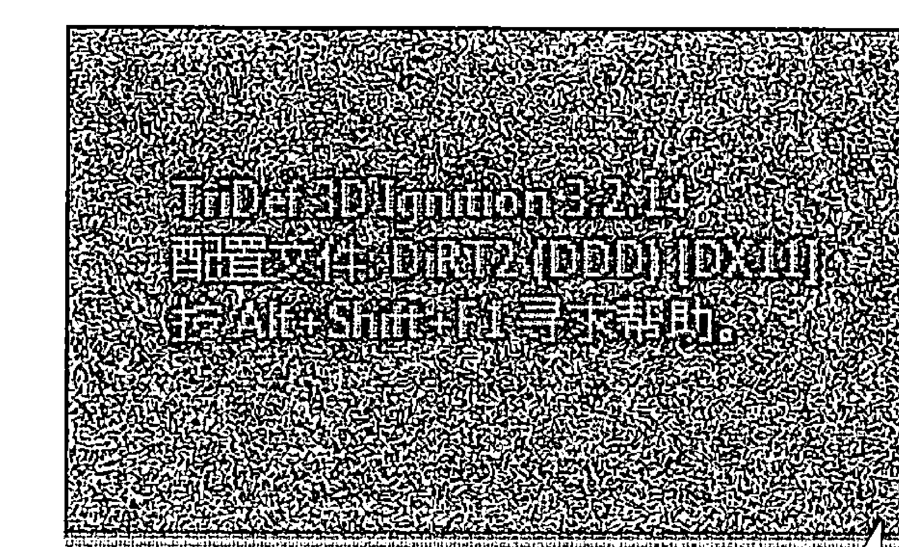

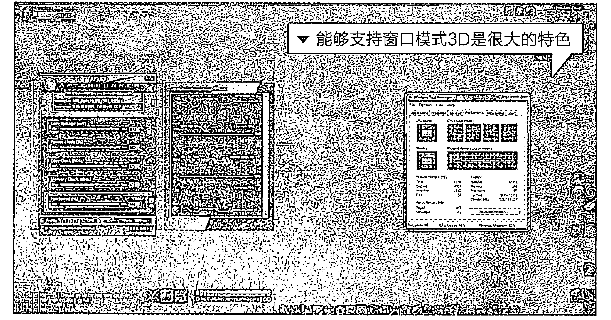

##### 编辑点评

实际游戏中的景深感，偏振光式确实略逊于主动快门式的3D技术：主动快门式只有景物进行了3D化，而类似菜单文字这些感觉位于不同的图层，相当清晰；而偏振光式不闪3D中，屏幕上所有内容均被3D化，可以说3D更为彻底，但文字清晰度略逊一筹。

两者的不同不仅于此，由于偏振光式眼镜不含快门开关，并不会大幅度衰减屏幕亮度。较低的亮度对于眼睛来说更为舒服，而且对于面板亮度要求上也不那么苛刻。主动快门式虽然效果出色，但不可避免会在游戏中出现“闪烁”现象，眼睛容易疲劳。但是相反的，偏振光式3D画面会有细微的颗粒感，在这一点上是不及前者的。

主动快门式和偏振光式，两种3D显示进行对比有很多不同。总体来说，目前的3D Vision效果大幅度超越其他解决方案，唯一的麻烦是一台120Hz显示器再加上3D Vision套装的售价实在不菲。另外你的显卡必须能够支持高效果下的双倍游戏负载，也成了必须提到日程上的问题。

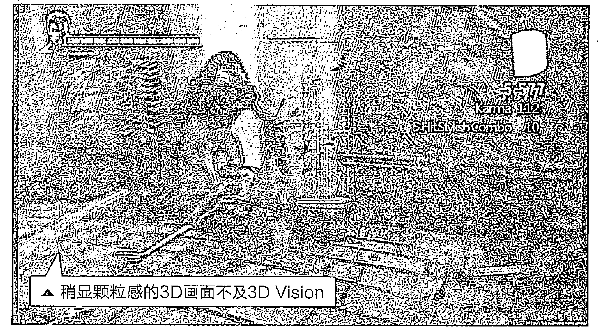


### 非诚勿扰IT‘诚意’大考察

非诚勿扰的热播，除了靓男俊女博眼球、主持犀利点评赚口碑，从观众的视角考察男女嘉宾的“诚意”也是关键的一环。而各路拜金女、土豪男、自炒作现象也成为了我们茶余饭后的谈资。不过所谓“当局者迷旁观者清”，在相亲类节目中你可能练出了“火眼金睛”，但在你不熟悉的电子产品领域，则很容易陷入“毫无诚意”的宣传陷阱。在这里，就让我们从CFan的视角审视一下那些IT领域的诚意风气吧。

### 版本升级究竟有多少诚意？

Windows XP已经没落，因而微软正在加大力度，鼓吹用户升级到最新的Windows 8.1版本。一般用户总是认为版本越高越好，升级后就会解决自己不满意的问题。然而软件版本的选择与升级过程中，到底有多少是出于商家的诚意？一款软件到底该不该升级到最新版本？面对接二连三的日常升级，我们到底该选择升级还是继续用原来的版本？

##### 软件安装

###### 功能选择看诚意

软件提供的功能越来越丰富，免费送上的服务也越来越多。那么，我们在软件的安装过程中，如何判断那些送上门的“诚意”之举？

###### 安装方法选择的诚意

我们最熟悉的微软系列软件（如Office系列软件），在安装过程中一般提供典型安装、最小化安装、完全安装、自定义安装的选择。此外还提供将组件安装到硬盘、首次使用时再安装、不安装等选项供选择，这显示出商家的十足诚意（图1）。用户就可以按自己的实际需求，灵活地选择要安装的组件或模块。但是，如果不注意这些，只是一味地按回车键安装，到安装完成之后，发现少了什么功能，或多了什么自己本不想要的功能，那么就不能埋怨商家没有诚意，只能怪自己没理解好这些体贴的选项了。

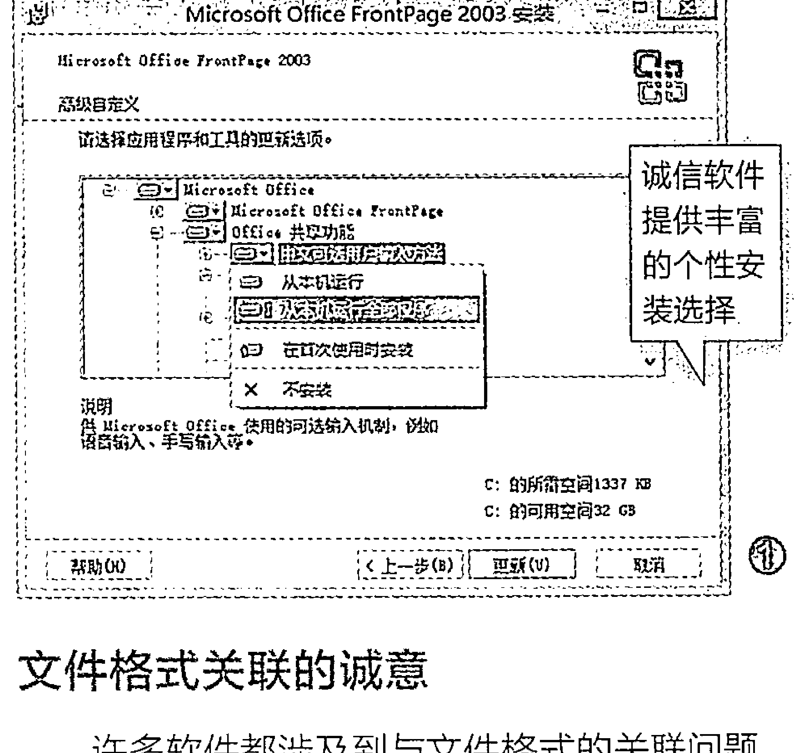

###### 文件格式关联的诚意

许多软件都涉及到与文件格式的关联问题。比如，影音播放软件安装结束之后，一款有诚意的软件总是要让用户选择关联的影音文件格式。然而就是这简单的文件格式关联，却着实让不少用户为之纠结。因为有的软件会在安装的时候，默默地将音视频格式与自己关联，当用户想用别的播放器打开媒体文件时，不得不想尽一切办法去解决格式关联问题。

实际上，对于一款负责的、真正诚信的播放器来说，不但在安装的时候应该提供格式关联的明示和选择，而且也应该在软件安装之后，在软件设置窗口中以专项列出可供改变文件关联的项目，以便随时改变文件关联（图2、图3）。

> 小技巧 在同类工具装了多个后，对于各类媒体的默认打开程序的设置确实较麻烦。为此，我们可以用360安全卫士提供的默认关联修改工具，解决关联文件发生的问题（图4）。

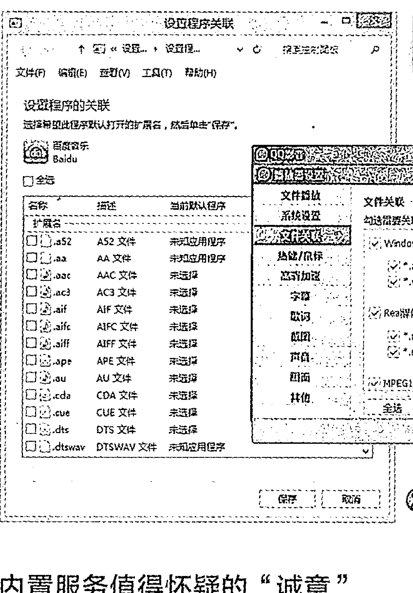

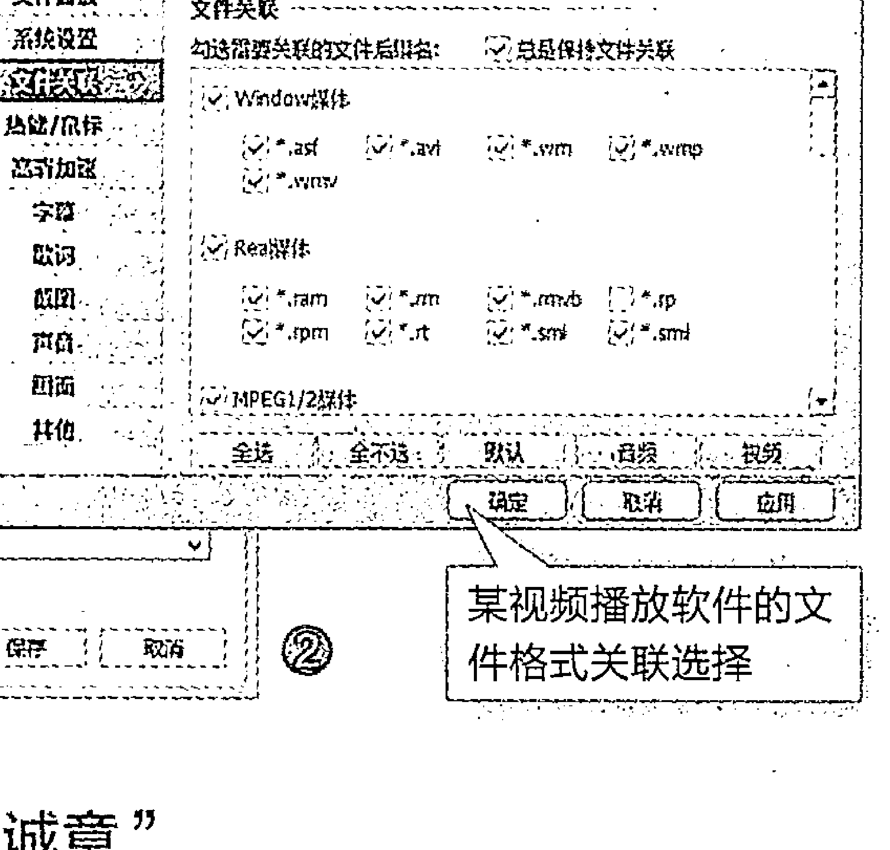

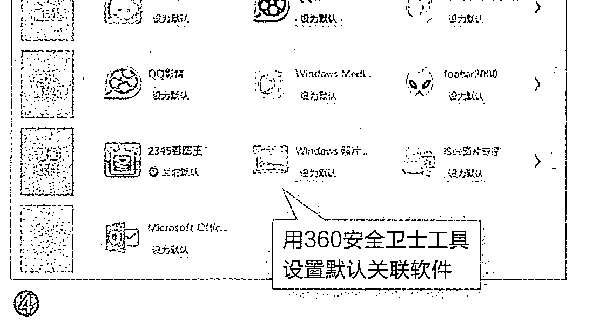

###### 内置服务值得怀疑的“诚意”

在移动软件火热推广的今天，我们发现许多APP在安装后默认会开启许多功能或服务，例如自启动服务、获取短信和通信录地址、获取本机位置、获取本机号码等服务。那么这些功能都是诚心为用户所想而设立的吗？让我们通过常用APP看个究竟。

如图5所示的APP安装后都要监听手机通话，对于“视频通话”这个软件来说，这个功能无可厚非，但其他与此无关的许多软件行此善举，就不能让人理解了。这样的软件服务诚意何在？

还有的软件动不动要求访问机主的联系人记录，对于QQ、微盘、百度云、迷你飞信等软件，因为有联系人备份功能，所以好理解。其他软件要访问我们的联系人，如果我们不知道其有何用途，那么就有理由怀疑其诚意所在的。

如图6所示的软件要求获取本机手机号码，对于涉及短信回馈或直接使用短信功能的软件，我们可以大胆接受它们的诚意，而对于那些莫名其妙要获取我们手机号码的软件，可以毫不犹豫地加以拒绝。

用我们的号码拨出电话，对于KC网络电话、视频通话这样的软件来说是必需的。而其他软件如果要用我们的手机号拨打，那可能就潜存在着安全威胁了，说不定话费就不知不觉中被偷走了，因此要小心开通为妙。位置信息往往会暴露一个人的行踪，而且根据时间标记可以将一个人准确定位在几十米之内。对于一个与位置根本无关的软件，如果它要获知我们的具体位置，那么我们可以直接将其拒绝，不让它知道自己的行踪（图7）。


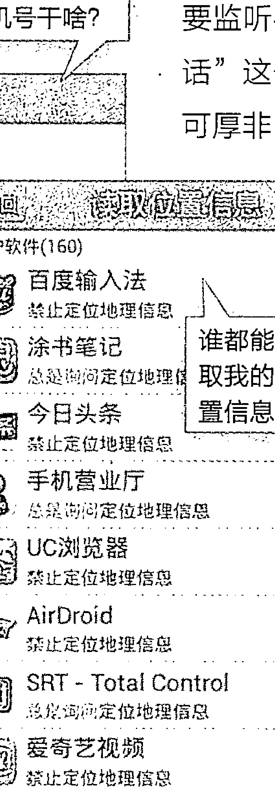

##### 高版本不一定好

###### 升级不能人云亦云

现在软件升级的频率越来越高。如果我们开启了软件的自动升级设置，没几天就会收到软件有新版本的提示。那么，软件真的需要每次都升级吗？表面上看，软件商加大了开发力度，频繁更新软件，这一定是从用户角度考虑的善举。但实际上，每一次升级不一定都是必要的，有时甚至会起反作用或带来麻烦。

软件的每次升级一定有其理由，有的只是针对一部分用户的需求（比如发现了一个Bug更正），有的则是出于商家的需求（如捆绑一个推广服务）。

所以，我们要看清升级的项目细则，如果升级的项目与我们没多大关系，可升可不升的版本选择不升级为好。比方说，如图8所示的搜狗输入法的这次升级，没有明显的输入速度提升迹象，如果希望在输入速度方面有所提升，那么这次升级就与我们无关了，也就没必要选择升级。

再如图9所示的格式工厂的升级，如果我们在用老版本软件进行MP4解码或JPG图像转换质量设置等方面遇到了问题，那么这次升级对我们来说是至关重要，毫不犹豫选择升级没错。

> 小提示
对于版本升级，不能一概而论，应根据实际需求决定。如果更新只是为了一些自己用不上的功能，那不升级也罢。但如果是为了修复Bug或增加自己需要的实用功能，那就应该及时升级。

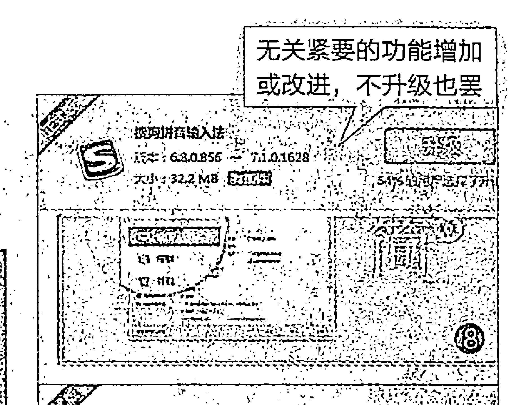

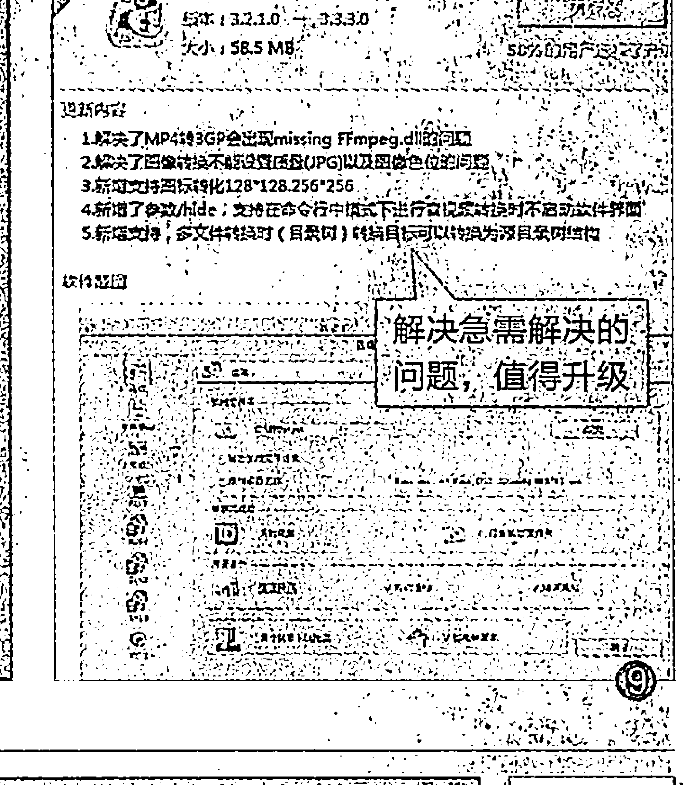

###### 一软多版 不见得是圈套

有的软件在同一平台上就有多个版本，不同平台也有不同的版本。比如，常见的云盘客户端推出多个版本，各平台有各平台的版本，同一个PC平台也有不同的版本。那么，这些是从用户角度考虑，还是商家另有图谋？

一般来说，这些多版本的软件是从用户角度考虑而设的，尽管商家也在同时多了一个宣传的平台，但这是双赢的策略，商家一般没有恶意的成分。而对于同一个PC平台的多个版本，如360云盘就有两个客户端，这是由于其负担的功能不同而设，同步版侧重于资料自动同步的用户，而普通版则侧重于上传下载和资料管理的用户，是商家对用户的体贴设置，也是诚意服务。用户应该搞清楚，不要在此引起误会。

| 360云盘（同步版） | 360云盘（普通版） |
| :--- | :--- |
| 实时同步，自动备份 | 大文件上传，批量下载 |
| 适合办公文件协作 | 适合影音文件分享 |

> 多个版本是体贴用户的善举

##### 免费赠送的“诚意”

###### 留心接纳

在安装或者升级软件的过程中，大家常常被附带的选项搞晕，最后莫名其妙地装上了一些不想要的软件或服务。那么，软件安装或升级过程中附带的默认选项对用户会造成什么影响？厂商的目的是什么？用户该作何选择？我们通过几个例子来说明。

有的软件在安装之初就会在安装选项中夹杂一些选择，用户一不留意就会以为是软件自己的功能而忽略此项，默认选择了此项，等软件安装好之后才发现浏览器的网址首页已经被改变为Hao123网址导航了。尽管该网址导航确实不错，但总归违背了用户的意愿。而要说软件商没有诚意也不合适，因为它总归给了我们选择，是我们没看清楚。

在软件安装结束之后，附加一个安装项目（图11），经过安装的过程之后，用户看到完成安装的按钮，惊喜之余很容易一激动按下此按钮，这样附加的项目就会被统统安装上了。这也不能怪商家没有诚意，因为人家还是提供给我们一些选择，只是容易看不清楚罢了。


文/张进波

##### 别被软件宣传的‘诚意’迷惑

在网络上软件越来越多、同质化越来越严重的情况下，宣传也显得格外重要。同类软件竞争需要宣传，软件自身要抓住已有用户和发展更多的用户，也需要继续宣传。然而，这些宣传的内容不见得都有诚意，有的甚至会夹杂着某种程度的欺骗。更有甚者，这种欺骗自始至终会把一些人蒙在鼓里。

##### ‘大容量’是在忽悠我们吗？

最近一两年，网上炒得最火的莫过于免费网络空间了，各大“云”商在不断吹嘘自己能给用户提供多么大的免费“云”空间。云盘空间大战不断升级，从最初的3GB到5GB，一路杀来，直到TB级别，甚至无限免费空间。面对如此诱人的空间大战，不少用户以为商家是一种“忽悠”用户的招数，其目的不在“酒”也不在“鱼”。而这些所谓的免费超级大空间，到底有多少是出于诚意，多少是有虚假的成分呢？对于普通用户来讲，判断商家是否有诚意的标准，不能看他们是如何说的，而要亲自体验，是否能轻松获得商家所说的那么多空间，然后再在实践中逐步检验这些空间是否确如其实。亲自试一试，就知道到底有没有诚意，到底哪些是真诚意，哪些是假诚意了。

以360云盘和百度云盘这两大知名云盘为例来说明。注册百度云或360云账号后，通过在PC端安装云客户端，在Android或苹果移动端安装移动云客户端并登录一次，即可轻松获得2TB或36TB的永久免费网络空间。

这么大的空间对于普通用户来讲，许多人认为是商家缺乏诚意的忽悠，以为没有多大用处，因为在现有网速的情况下，要上传满这么大的空间不知要到猴年马月，而且这么大的空间放什么内容也是个问题。

但实际上，这部分用户是对“云”的概念没有充分理解，他们往往还仅限于本地到云或云到本地的文件传输上，而对于云对云的传输概念没有理解更没有去尝试。其实，在百度或360的云社区，已经有非常丰富的用户共享资源，几百个GB甚至几个TB的资料只要一键，几秒的时间就可保存到自己的云盘当中。这样，且不说是几个或几十个TB的空间，就是再多的空间，用不了几天就能存满（图1、图2）。

由此看来，云空间的免费超大，绝不是商家用来忽悠用户的无诚意之举。只要用户理解了云的这一点强大功能，就会对此大加赞赏和爱不释手的。

##### 速度提升真的有诚意吗？

速度，永远是我们电脑用户追求的不变话题。使用输入法，我们总希望速度越来越快；使用播放器，我们永远是希望播放速度越来越不卡；下载软件或音视频，我们总希望用更短的时间来下载更多的内容……面对用户永无止境的速度要求，软件商家总是不失时机地“提升”自家产品的速度指标，展示给用户的总是一款速度一次比一次快的产品。

然而，事实果真如此吗？

我们来看百度手机输入法软件的一次升级信息（图3）。从升级信息中我们可以看出，词库扩容、性能优化等都是与输入速度直接相关的项目，这些对于输入速度的提升会有帮助。因此如果我们对输入速度特别在乎，这次升级或许会给我们一些帮助。但输入法的升级不见得每次都能有利于速度提升，因为有时仅仅是一个皮肤或一个外观的升级，对速度提升可能并无帮助。从这一点来说，我们要自己看清楚，不能一味地怪商家没有诚意。

再来看一个优酷视频播放器的升级信息（图4）。我们看到这次升级只是修正了两个bug，并增加了专辑管理功能，对下载或播放速度提升的信息只字未提。如果我们对该播放器的播放或下载速度不满意，那么这次升级对我们来说就起不到任何作用，因而指望通过这次升级能提高速度的想法就会让我们失望。但这并不能否定官方的诚意，若是它以提升速度来宣传这次升级，则我们有理由怀疑其诚意了。

> 360云盘免费扩容轻松获得36TB以上永久空间

###### “减少内存占用”是真的吗？

有些声称能够让系统提速的软件，说是靠压缩和收回内存来获得更大的可用内存，然后让系统的速度得以提升（图5）。在实际使用过程中，我们可能也确实可以通过软件检测到可用内存的数量得到提升，但却似乎感觉不到系统速度有多大改变，反而会看到硬盘指示灯比原来红得更频繁了。原因何在？

原来，这些软件是靠将一些数据通过从物理内存转移到虚拟内存的办法，让内存的剩余空间得以暂时提升。而转移数据的过程其实是一个从物理内存空间转移数据到硬盘的过程。因为大家知道，系统默认的虚拟内存是靠以硬盘空间来模拟内存而实现的，是通过以内存交换文件的方式写到硬盘上的方法来实现的。这个过程必然要花费时间，必然要引起硬盘更多的读写操作。而当某些程序需要这些被写入到虚拟内存文件中的数据时，数据又会被读回到物理内存空间中，于是内存占用又上升到一定的水平。最终造成的结果就是我们看到的硬盘灯不停地狂闪，而系统性能其实也没怎么提升的情况。可见，此类软件缺乏诚意，而是以一个技术诡计来换取用户的信任，最多只能给用户一些心理安慰罢了。

与此相反，出现了与其背道而驰的一些软件，它们是以内存的适当占用和性能的适当降低来换取更安全的使用。例如，许多下载软件、视频在线客户端软件，都设有下载缓存定制选项（图6、图7），通过设置下载缓存，会利用几个MB到几十个MB的内存空间来作为下载缓存，以此来降低频繁的硬盘读写操作。大家知道频繁的硬盘读写与频繁的内存读写哪个更损伤硬件本身的道理，可见，设置下载缓存虽然对系统资源加大了占用，但是真正为用户着想才是有诚意之举。

> > **小知识**
> 一些号称具有内存压缩技术实现低内存占用的软件，其实就是调用Windows编程里的SetProcessWorkingSetSize方法，把内存中的程序代码放到虚拟内存里。但调用一次还不够，因为程序运行内存占用不停变化。所以要设定一个Timer计时器，每隔一段时间就调用一次（通常是几毫秒）。

| 系统设置 | |
|---|---|
| **基本设置** | **任务设置** |
| 我的下载 | 默认地址连接数 5 (1-10) |
| 常用设置 | 全局最大连接数 1000 (1-1000) |
| ↓小文件下载 | □ 下载完成后自动运行 |
| 固定连接设置 | □ 关闭任务列表扩展栏 |
| ◎ 监控设置 | ☑ 启用UPnP支持 |
| ◎ BT设置 | **磁盘缓存** |
| ◎ eMule设置 | 最小缓存 8 MB (2-16) |
| ◎ 代理设置 | (进行一次磁盘缓存操作时所占用的内存空间) |
| S 下载加速 | 最大缓存 256 MB (4-256) |
| 模式和队列 | (进行一次磁盘缓存操作时所占用的内存空间) |

###### “转换所有格式”是真的吗？

一些格式转换软件声称什么都能转换，实际情况确实如此吗？我们知道，一些在线视频客户端，如爱奇艺、暴风影音、腾讯视频、优酷视频等都曾有自己独特的视频格式，这些视频离线下载到本地，用其自身播放器播放没有问题。但是，如果用户将这些下载的独有格式的文件拷贝到播放机、移动设备上播放，可能会因为格式不支持而不能完成播放。在这种情况下，就有许多网友在网上发帖询问，如何才能将这些格式转换为手机或播放机能支持的通用格式来播放。这时，就有某些视频格式转换软件的“潜水员”和“拥戴者”跳出来声称该软件能转换天下任何一种视频格式。但当用户下载了该软件后，发现自己想要的格式——

+   如何将QLV格式转换成mp4格式
    1. 网名：**皮皮** 时间：2015-11-24
    2. 我有好的答案
    3. 标签： mp4 格式转换 大师 qlv格式怎么转换 qlv
    4. 网友都在看： qlv格式转换成mp4 视频转换大师 qlv格式怎么转换 qlv 转换
    5. 3条回答
        - **131楼**
        - 用转换工具《视频转换大师》支持QLV等格式转换MP4格式
        - 官方下载 http://www.winmpg.com/down/WinMPG_cn.zip
        - 天空下载 http://www.skycn.com/soft/12521.html#downUrlUrn
        - 视频转换大师(WinMPG Video Convert)为视频格式文件转换提供了终极解决方案,它能够读取各种视频和音频文件,并且将他们快速转换为流行的媒体文件格式。拥有非常漂亮友好的界面 它几乎涵盖了所有流行的影音多媒体文件格式, 包括AVI, Mpg, RM, RMVB, 3GP, MP4, AMV, Mpeg, Mpeg1, Mpeg2, Mpeg4, VCD, SVCD, DVD, XVID, DivX, ASF, WMV, SWF, IPOD, PSP, GIF, MJPEG, QuickTime, MOV, FLV, MKV, DV以及所有的音频格式.支持AVI ASF WMV DVD VCD MPEG RM RMVB MOV WAV FLV 转换至3GP(MP4)支持RM/RMVB转换至3GP MP4 AVI VCD DVD SVCD MPEG1/2 RMVB WMV AMV 支持AVI ASF WMV RM RMVB VCD MPEG MOV DVD 3GP MP4 FLV转换至AVI支持AVI ASF WMV RM RMVB VCD MPEG MOV DVD 3GP MP4 FLV转换至VCD支持AVI ASF WMV RM RMVB VCD MPEG MOV DVD 3GP MP4 FLV转换至DVD支持AVI ASF WMV RM RMVB VCD MPEG MOV DVD 3GP MP4 FLV转换至RMVB支持AVI ASF WMV RM RMVB VCD MPEG MOV DVD 3GP MP4 FLV转换至MPE

> > 有的软件的拥护者声称该软件什么格式都能转

无法直接转换，还得另找办法（图8）。

事实上，真正万能的视频格式转换器目前还不存在。类似于格式工厂这类的格式转换软件虽然已经是对格式支持相当丰富了，但仍不可能转换我们所能见到的所有视频、音频格式。而且该软件商家也从未承认过能转换所有的视频格式，并没有欺骗用户的嫌疑，因而也可列为“诚意”软件的行列了。但类似狸窝等一些视频转换软件，虽然其能转换的格式确实也不少，但网上连篇累牍、夸大其词的案例，实际上并不能解决一些特殊视频格式的直接转换，最多也只是巧妙借用别人的一些方法为自己的软件添彩罢了，这着实让人对这个软件的诚意有些失望（图9）。

##### 小心面对“神奇”的软件功能

还有一些软件宣称有神奇功能，比如我们常用的炒股软件，看走势、看曲线这很正常，但是有的声称能轻松赚大钱的炒股软件我们就要小心了。这些“诚意”的诱惑多数不靠谱。

炒股的人没有不想发财的，而炒股本来就需要付出艰辛的脑力劳动，因而许多急于想发财的股民把希望寄托在炒股软件身上。也正是看到股民们这种急于发财的心态，不少炒股软件也打起了如意算盘——将自己的软件宣传得很神奇，或宣称其自带指标是经专业人员多年精心研究，成功率很高。但实际上，这些指标与通常我们见到的指标没多少区别，很多都是在原有指标的基础上对参数做了一些修改而已。甚至承诺有多高的收益回报，要知道股票涨落因素很多，技术分析仅占一个方面，即便是专家也不敢承诺保证能赚到钱。更有甚者，还以某些软件级别为诱饵，先在低级别版本的软件上给一些实惠，然后诱使用户花钱购买更高级别的炒股软件，或用无从考证的假案例来诱惑用户效仿。

以上都是看似“诚意”十足，实际却是诱使用户花钱的温柔骗局。最可悲的是，不少用户上当后，自始至终也不觉得被骗，认为是自己的技术不行，跌入温柔的“诚意”陷阱不能自拔。

##### 谨防山寨“诚意”软件忽悠人

现在360、百度、金山、腾讯四大软件商的软件在业界享有较高的知名度，虽然说各家的软件都不可能十全十美，但起码这几家的软件多列为精品也不为过。正因为如此，网上常会见到冒以与这四家软件很相像的软件的名号出来招摇撞骗的山寨软件。这些软件往往很有“诚意”，宣传很热情，功能介绍也很诱人，无论是从名字上（比如叫“360安全”或“QQ管家”之类的），还是从界面风格上，让我们一下子会信以为真。但实际上它可能是一个制作粗劣的软件，甚至里边还会暗藏一些我们所不知的“阴招”。因此，建议读者朋友们在遇到这类软件之后，先不要急于去安装，而是先到官方网站上去看看到底有没有这个软件，或者问问官方客服，就知道真假了。

##### 能检测装机商诚信的工具软件

通过攒机商来组装电脑，被忽悠者大有人在。而在不具备对硬件检测和识别条件的情况下，用一些工具软件来识别硬件的可靠度和商家的诚信度，也是最现实可行的方法。装机中最容易被忽悠的部件有CPU、显卡、硬盘、主板、内存等主要配件，而这些配件有的虽然品名相同，但可能因型号一字之差价格就相差数十甚至数百元。用户如果能熟悉一些常用的装机检测软件的基本用法，那么可以靠它们来检查商家的诚信度。

对于处理器的检测，我们可以用CPU-Z这款软件。同时这款软件还可以检测包括主板、内存、显卡等方面的型号和参数。对于显示核心的检测，可以用GPU-Z这款软件，它能够提供显卡GPU具体型号、工艺、核心面积、晶体管数量等更专业的参数。

如果要全面了解硬件配置情况，也可以用一款更专业的硬件检测大师AIDA64来完成检测。如果觉得以上的软件比较偏向专业，那么菜鸟一族可以首选鲁大师来作为自己的装机检测工具。鲁大师界面清新，操作也简单，能一目了然地查看电脑中各种配件的品牌名称和具体型号情况。

### 后续服务 拒绝软件的“小尾巴”

不少软件为了自身能够在用户电脑中永驻，经常会有一些不够诚信的行为。如用某软件完成了某件事后，此软件就不再有什么用处了，但此时你也不能卸载它，否则它之前所做的操作将全部失效，这有点类似“绑架”了，无疑在系统中留下了一个“小尾巴”。当然也有一些软件，它自身并没有“绑架”意识，只是因为功能设计得不合理，实质上产生了类似“绑架”的行为。

文/技术宅

我们以驱动备份类的软件为例，备份的驱动，重装后必须再装一次这个软件，才能复原驱动。实际情况是，重装系统后，用户一般都希望直接恢复驱动，而不是再装一次以后很少会再使用的这个软件。下面的文章，每篇都分两部分：“非诚”，指出软件在使用过程中遇到的问题所在；“勿扰”，是针对这些问题，给大家提供的参考方案。

##### 驱动类软件 离开软件照样复原驱动

【非诚】 平时我们借助驱动精灵、驱动人生这类专业的软件，可以很方便地进行驱动一键备份。不过驱动的备份/复原这类操作，平时使用得并不多，也只是偶尔才会用到一次，因此完成驱动备份后很多人就会将软件卸载。但是，万一遇到情况需要复原驱动时，怎么办？难道我们还要再装一次软件？其实大可不必，使用微软免费提供的Dpinst.exe命令即可添加驱动。

【勿扰】 我们以“驱动精灵”为例。安装驱动精灵后切换到“驱动程序→备份还原”，点击“一键备份”，这样本机所有驱动程序即可一键备份到D:\MyDrivers\backup下，备份的驱动是以压缩包形式保存的（图1）。

完成驱动的备份后，将备份的压缩包解压备用。然后到 http://tinyurl.com/no77y7n 下载 Dpinst.exe，将其复制到驱动的解压目录中。以后需要重装系统时，只要在驱动解压目录中运行 Dpinst.exe，即可自动查找并安装驱动了（图2）。

如果驱动无法使用 Dpinst.exe 自动安装，我们还可以在设备管理器使用手动方法自行安装。这样只要备份了驱动，我们就无需再使用驱动备份软件了。

###### 小提示

对于通过驱动精灵升级的驱动，下载后默认保存在 D:\MyDrivers\Update 目录。如果你在之前已将其升级文件提取出来，那么重装后也可手动更新。

##### 集成驱动解决重装后再装驱动

如果你的系统已经有 wim 文件的出厂备份（比如很多品牌机），那么在使用驱动精灵备份驱动后，还可以使用系统自带的 Dism 命令将提取的驱动集成到备份文件中，只要启动命令提示符输入下列的命令（图3）：

```
dism /mount-wim /wimfile:j:\system.wim /index:1 /mountdir:d:\win7
```

注释：使用 Dism 将系统备份 J:\system.wim 展开到 D:\Win7。

```
dism /image:d:\win7 /add-driver /driver:D:\MyDrivers\backup\rtl8187\oem3.inf
```

注释：将指定驱动集成到 D:\Win7 中，D:\MyDrivers\backup\rtl8187 为备份驱动解压后的目录，其他的驱动集成类似。

```
Dism /Unmount-WIM /MountDir:d:\win7 /Commit
```

注释：卸载镜像并保存。

##### 还原/备份类软件【引诫】

有不少人使用一键备份/还原软件进行系统的备份和还原，不过这类软件的使用频率是非常低的，基本上备份好系统后就无需再使用该软件了。这样的软件，完全可以用一次后即“抛弃”。

实际上，大多数一键备份/还原软件都是使用 Ghost 作为核心，卸载上述软件后如果要还原系统，我们可以使用自制的一键还原来批处理完成。

###### 【勿扰】

这里就以“一键还原精灵”为例。一键还原精灵默认将当前的系统备份在非系统分区如 D:\yjbf\g..\ 下，如果要还原系统，只要建立一个批处理 Hy.bat 放在 D 盘（同时下载 Ghost32.exe 也放置在 D 盘），代码如下：

###### 自己一键还原系统

文/技术宅

```
D:\Ghost32.exe -clone,mode=pload,src=1:2\yjbf\g..\win.gho:1,dst=1:1 -auto -sure -rb
```

-fx -rb，此处仅为示例，需根据自身的实际情况修改，以免误覆盖重要数据分区

以后要还原系统时，Windows 7 用户只要开机时按 F8 键，然后选择“修复计算机”进入 WinRE 修复环境，进入 WinRE 后启动命令提示符，输入“D:\Yy.bat”即可一键还原。仅需几行代码的批处理，肯定比留下一个软件要经济实用得多。

##### 清理一键还原的“小尾巴”

一键备份/还原类软件，为了保护自己制作的备份不被用户删除，大多使用类似“g..\”的畸形文件夹。如果彻底不想使用此软件了，卸载后，它照样会留下这个无法删除的目录（图4）。

如果不想再使用原来的备份，并想删除上述畸形目录，可以启动命令提示符，通过如图所示的命令进行删除即可（图5）。

##### 播放类软件

【引言】日常使用中，为了播放某种类型的视频文件，我们经常要去下载那些所谓的万能播放器。这些播放器之所以万能，主要是因为它们包含大量的解码器。不过这些万能播放器的体积都比较庞大，并且大多软件页面都包含各种广告，而且很多软件还有进程在后台偷偷运行。如果仅仅为播放某种文件而要保留这些庞大并且带广告的软件，显然对用户是极不合理的。现在我们可以自己去提取播放软件的解码器，这样在系统注册后就无需再安装庞大的万能播放软件了。

【勿扰】以暴风影音的操作为例。暴风影音安装后，它的解码器默认安装在C:\Program Files\Baofeng\StormPlayer\Core\codecs下，打开上述目录可看到其中有很多.ax结尾的解码器文件，我们只要根据自己的需要提取即可，比如要播放FLV文件，则将其中的FLVSplitter.ax复制到C:\Windows\System32备用（图6）。

以管理员身份启动命令提示符，然后输入regsvr32.exe FLVSplitter.ax（可建立批处理，每个命令一行，批量注册提取的解码插件），对该解码器进行注册，成功后就可直接使用系统自带的播放软件解码FLV视频了，其他解码器注册类似（图7）。

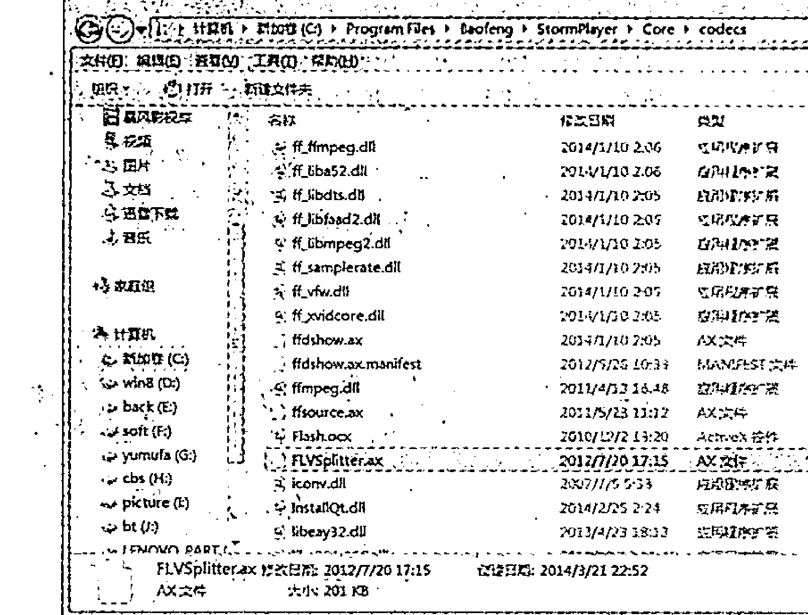

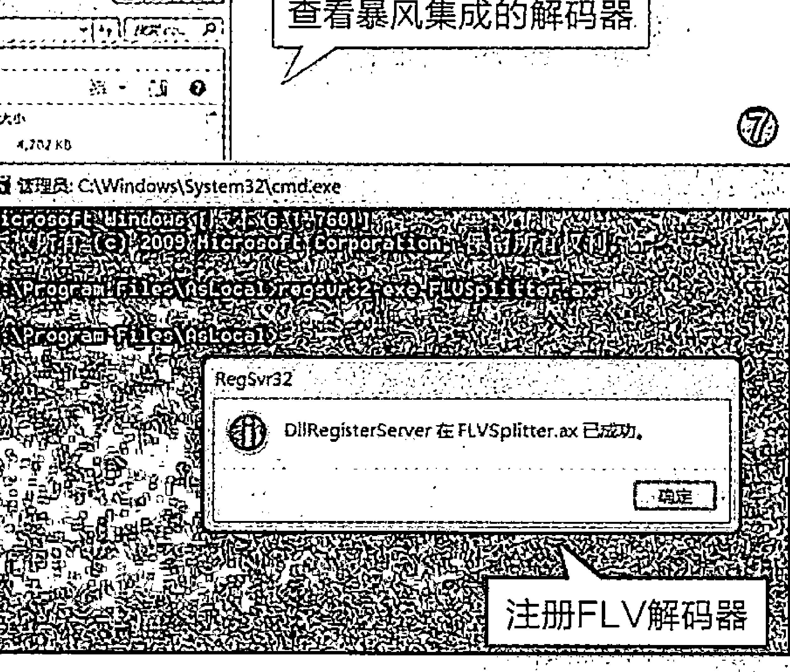

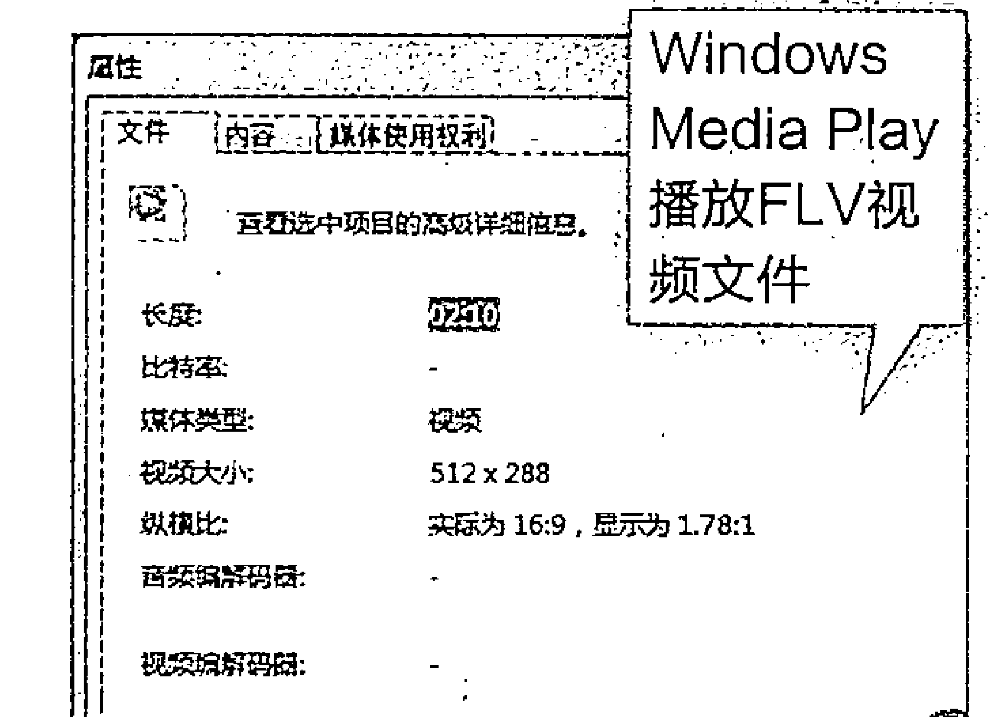

打开系统自带的Windows Media Play，单击“文件→打开”，选择下载到的FLV视频文件（在媒体文件类型选择“所有文件”）。在弹出的提示窗口勾选“不再提示”，这样以后就可以直接在Windows Media Play中播放FLV视频文件了（图8）。

文|技术宅

文|平淡

##### 下载类软件


【引言】为了保护自己的资源，迅雷、快车、旋风都不太厚道地使用自己专用的下载格式。默认情况下点击这些专用资源，我们都要被强行通知去下载对应专用软件才能完成下载，难道必须要在系统中安装一大堆的下载软件？其实随着网速的提高，就算使用浏览器本身的下载功能也已经足够，关键是如何转换这些专用格式。

【勿扰】如果想要突破这些专有格式的限制，一方面可以使用某些网站提供的在线解密服务。比如，只要登录http://tinyurl.com/ld67co9，将专用的下载地址复制粘贴，点击“解密”即可获得资源的实际下载地址（图9）。

如果经常需要转换专用地址，还可以下载“迅雷快车旋风地址转换工具”，运行后在输入区粘贴专用地址，再点击“输入地址→普通地址”，即可获得软件的实际下载地址，然后直接使用浏览器来下载即可（图10）。

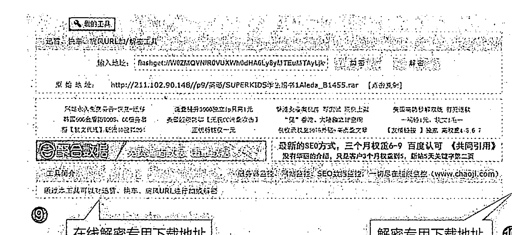

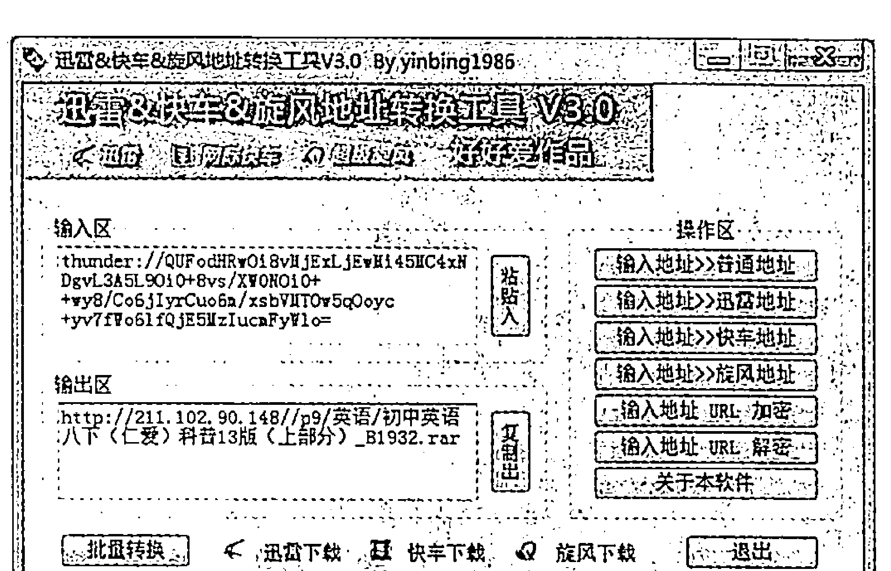

##### 安全类软件 杀毒只取所需组件

文|平淡

###### 【告诫】

杀毒软件是我们电脑上必备的保护软件，但是同时安装多款杀毒软件容易造成系统资源的浪费和冲突，而且杀毒软件默认都会强制使用实时监控和底层扫描功能，这样容易造成资源浪费和不兼容。

###### 【勿扰】

不过每款杀毒软件的特色不同，比如小红伞的扫描能力就比较突出，如果你现在想使用“小红伞扫描+Security Essentials杀毒”组合，就可以自己手动对小红伞进行设置，仅仅提取其高效的扫描功能。首先到http://tinyurl.com/ot2rmkw下载小红伞免费版；在“选择安装类型”这一步时，单选“自定义”，去除“Real-time Protection”（实时保护）和“Rootkits Protection”（实时监控）的勾选（图11）。

完成安装后启动系统配置实用程序，切换到“启动”标签，去除“Avira Free Antivirus”前的勾选，取消小红伞的开机启动项。继续在开始搜索框输入Services.msc，启动服务配置实用程序，选中“Avira Real-Time Protection”服务将其设置为“禁用”（图12）。

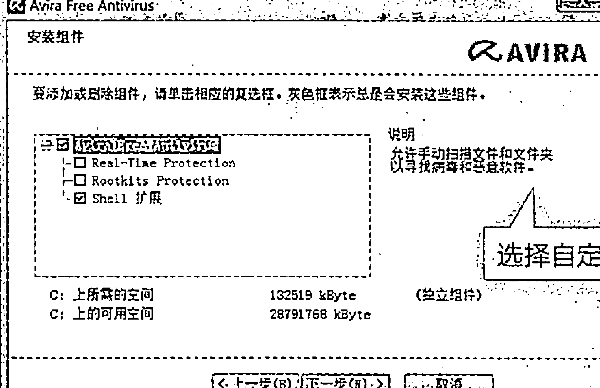

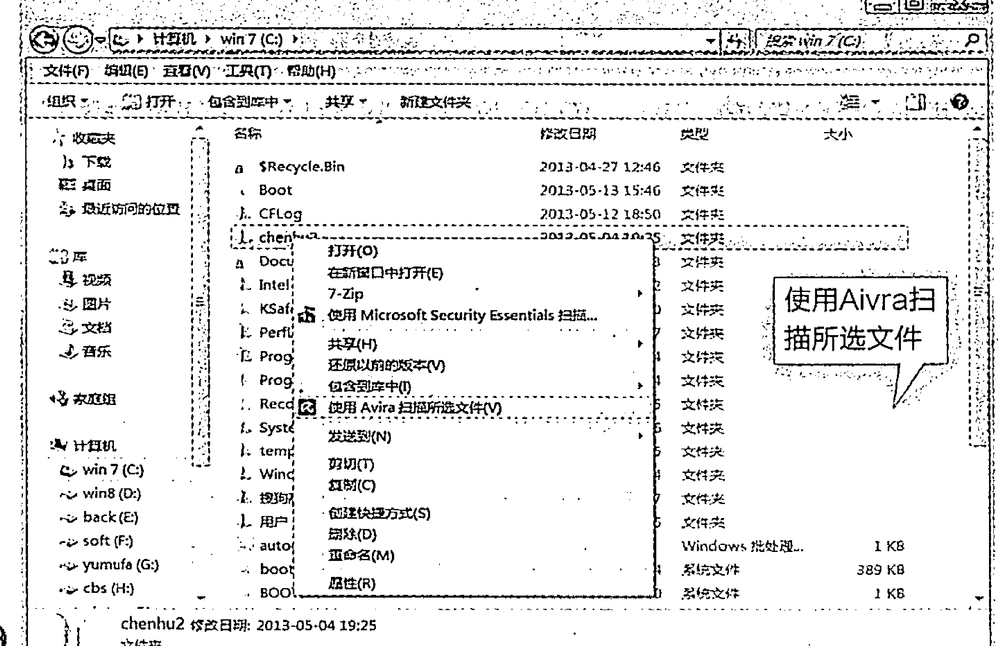

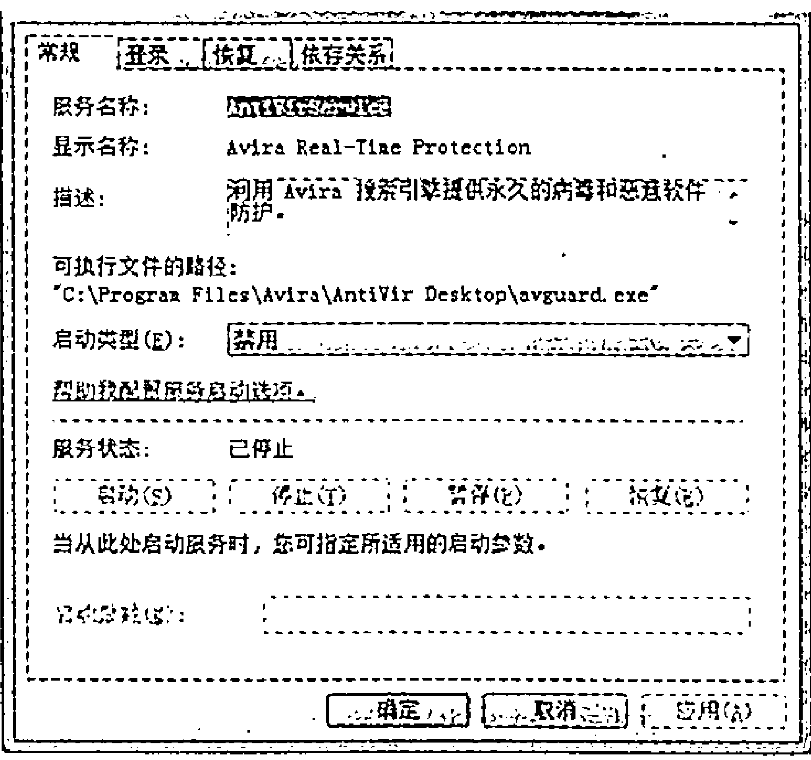

完成上述设置，以后只要在需要扫描的文件（夹）右击选择“使用Aivra扫描所选文件”，就可以只使用小红伞的高效扫描功能了。至于其他的时候，则交由系统自带的Security Essentials进行查杀即可（图13）。


##### 收费？免费？没钱能否获取诚信

许多软件都是使用“免费+收费”的模式在运作，不过免费时，很多功能并未开启，不断骚扰要把用户往收费上赶，而成为会员收费后，软件服务却没有多少实质性的提升。下面就来看看常用软件到底都有哪些缺失的诚信！

文|俞木发

###### 杀毒软件

###### 免费也可以提供全面保护

【非诚】 虽然现在很多杀毒软件都提供免费版，但和收费版比起来功能有所缺失。如Avast免费版和高级版就有不少区别（见附表）。
【勿扰】 通过此表，我们可以清楚地看到免费版功能的不足，不过免费版杀毒软件核心（智能防毒、反间谍）功能还是具备的。如果使用免费版也想获得类似高级版的保护，我们只要自己手动添加其他安全组件即可。

安全地带：目前的在线支付包括网银、支付宝，都在使用安全控件+短信验证的保护，如果要有更好的安全性，可以使用U盾、安全证书等加密手段，它的安全性要比Avast高级版强得多（图1）。

- 静默防火墙：系统自带的防火墙即可达到同样的保护效果。
- 反垃圾邮件：利用好邮件客户端的反垃圾邮件设置即可。
- 远程访问：使用系统自带的远程桌面即可。
- 数据粉碎机：可以使用免费并且绿色小巧的“金山文件粉碎机”，启动程序后将文件直接拖入程序窗口即可粉碎（图2）。

##### 管理数字证书

支付宝使用证书可以有效保护支付安全

证书使用终端 | 最后时间 | 状态
---|---|---
家庭（本机正在使用中） | 2014-03-18 13:44:09 | 正常
笔记本 | 2014-03-05 13:13:56 | 正常
...

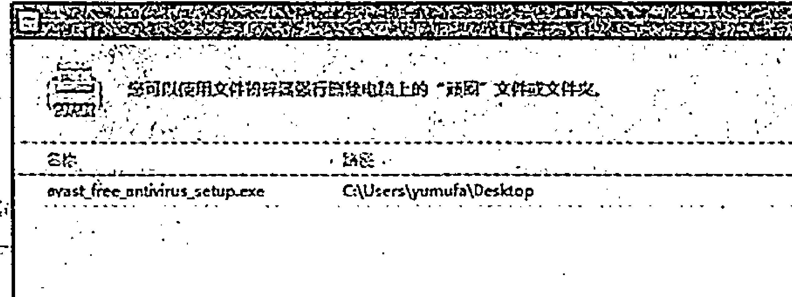

使用金山文件粉碎机替代高级版的数据粉碎功能

##### ◆Avast免费版和高级版的区别

| 功能 | Avast!免费版 | Avast!高级版
--- | --- | ---
使用全新DynaGen技术的智能防病毒软件 | 是 | 是
反恶意软件保护以及反间谍软件和反rootkit | 是 | 是
安全地带，用于安全付款和银行业务 | / | 是
静默防火墙，抵御黑客攻击 | / | 是
反垃圾邮件，防止网络钓鱼和垃圾邮件 | / | 是
自动软件更新程序将其他程序保持为最新状态 | / | 是
远程访问通过互联网访问您的PC | / | 是
数据粉碎机，实现CIA级永久数据删除 | / | 是

文|俞木发

##### 下载软件 不要广告要VIP

【非诚】 迅雷、快车等是我们常用的下载软件，虽然这些软件提供给我们免费使用，不过如果你不是收费会员，比如迅雷会在软件界面上显示各种烦人的广告，并且官方会做出各种限制，如下载限速、无法使用离线下载功能等。

【勿扰】 我们使用这些工具主要就是下载资源，如果你不想看到软件界面的广告，可以去下载网友制作的去广告版。如果想免费使用会员特权，则可以到http://tinyurl.com/oszwl3u下载“迅雷会员账号共享器”，启动程序后点击“启动迅雷VIP会员账号”，共享器会自动启动迅雷并用VIP会员登录。成功登录后就可以使用VIP各项功能了，比如去广告、高速通道和离线下载等收费服务（图3）。

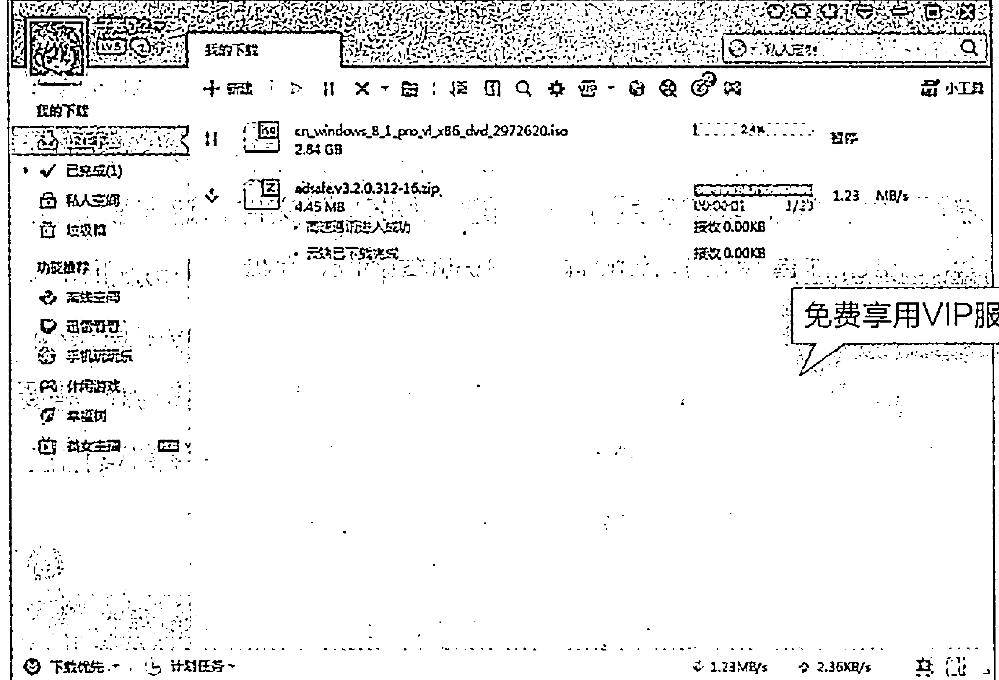

##### 视频播放软件 贴片广告走一边

【非诚】 现在很多视频播放客户端如PPS、PPTV等，在正式播放影片前都会显示一段时间的广告，如果你想要跳过这些广告，那就得掏钱变成VIP会员。平时大家看电视就最烦广告了，现在我们可借助Adsafe3手动将其屏蔽。

【勿扰】 首先到http://tinyurl.com/mnxe7dd下载软件，软件启动后就会自动屏蔽常见网站（如优酷、土豆）和常见软件（如PPS、PPTV）等的视频广告。对于默认不支持的软件，我们可以切换到“自定义设置→软件广告”，

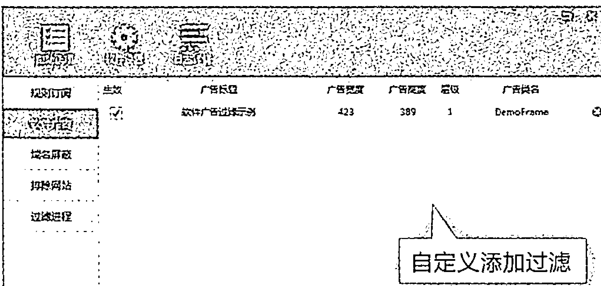

然后将“窗体抓取”图标移动到广告播放界面即可自定义添加（图4）。完成广告的屏蔽后，现在再打开视频播放就不会看到广告了，比如PPS被拦截广告后，在播放界面就只会显示缓冲图标（图5）。


文|俞木发

##### 听歌工具

###### 在线资源任意下

【非诚】现在很多音乐客户端如酷狗音乐、酷我等，都会提供视频MV在线欣赏，但是这些客户端都不会免费提供直接下载，比如酷我用户只有每月10元的至尊级VIP才可下载MV。其实使用手动方法，即可任意提取其中的在线资源。

【勿扰】以下下载“酷我”的周杰伦高清《青花瓷》MV为例。启动酷我后搜索《青花瓷》，并且选择MV格式播放，按照屏幕提示完成全部文件的缓冲。此时打开C:\Program Files\kuwo\KWMUSIC\bin\temp\Kmusic，可以看到其下有很多以数字命令的“.MKV”文件，这些就是酷我保存的MV文件。下载的MKV文件可以使用KMPlayer直接播放，成功播放后确认是自己需要的MV，然后将其保存到其他位置即可（图6）。

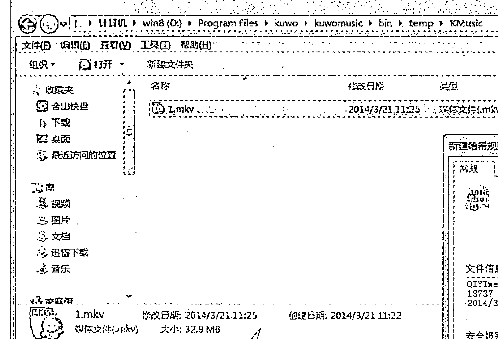

###### 拒绝捆绑

###### 不要无关软件

【非诚】虽然捆绑软件的声誉一直不好，但是对于很多免费软件来说，出于市场推广的需要仍然在使用捆绑安装的方式，而且我们根本没有拒绝的权利。如安装PPS后会强制捆绑安装爱奇艺、PPS游戏，这两款软件功能类似，安装PPS基本上无需再安装爱奇艺。很多免费杀毒软件也会捆绑XX手机助手、XX安全助手等强制塞给用户额外组件。

【勿扰】如果你不想被这些不诚信的软件“讹诈”，可以借助组策略阻止额外软件的安装。比如需要屏蔽爱奇艺的安装，首先下载爱奇艺安装程序在桌面备用，接着启动组策略编辑器，依次展开“计算机配置→Windows设置→安全设置→软件限制策略”，然后新建一个策略，在“其他规则”上选择“新建哈希规则”，在弹出的窗口中单击“浏览”选择爱奇艺的安装程序，这时会生成一个文件散列号码，“安全级别”选择“不允许”（图7）。完成上述操作后，以后如果有其他软件捆绑爱奇艺，它就不能再在我们的电脑中激活安装了。软件限制策略是对安装程序进行识别，程序即使改名也仍被限制，不过如果程序推出新版本，我们要重新进行新的限制。

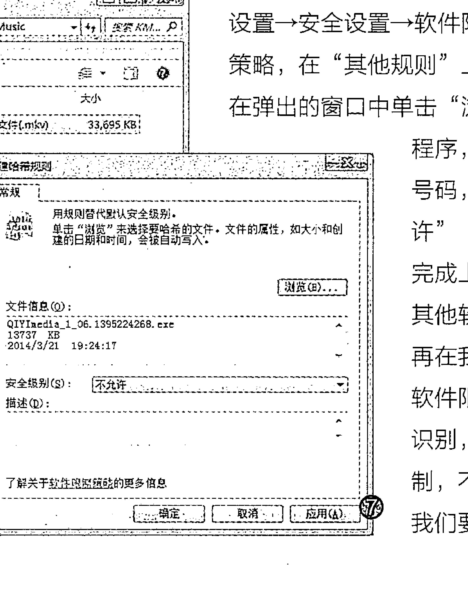


### 套餐诚意迷阵

手机套餐有太多选择，不禁让新手云里雾里，让老用户也不明所以。如何在茫茫套餐海洋中挑选适合自己的呢？每每经过手机店，我们都能看到0元购手机、买手机送话费的活动。这些看似占便宜的优惠真如宣传语那般有诚意吗？带着这些问题让我们一起攻略套餐迷阵。

##### 4G手机套餐

CFan推荐：入门级别套餐
选择前提：容量够用性价比高
适合人群：都市年轻用户
诚意指数：★★☆

最近这段时间正是三大运营商上马4G的特殊时期，因为要和其他运营商竞争，所以优惠幅度也算比较大。由于之前坊间传闻“使用4G富一夜变平民”，使不少用户产生了恐慌心理。其实咱们细算下来，4G套餐并没有想象中那么夸张，咱们以全国资费里相对最贵的北京地区为例。

北京移动4G上网套餐
| 月套餐费 (元) | 国内通话 (分钟) | 国内流量 | 加赠本地4G流量 |
|---|---|---|---|
| 58 | 50 | 200MB | 200MB |
| 88 | 200 | 400MB | 200MB |
| 138 | 500 | 600MB | 1024MB |
| 188 | 600 | 500MB | 1548MB |
| 238 | 1000 | 1024MB | 1024MB |
| 288 | 1000 | 750MB | 2322MB |
| 338 | 2000 | 2048MB | 1024MB |
| 388 | 1400 | 1000MB | 3096MB |
| 588 | 4000 | 5120MB | 1024MB |
| 888 | 3600 | 3000MB | 7240MB |

北京联通4G/3G一体化套餐
| 月套餐费 (元) | 国内通话 (分钟) | 国内流量 |
|---|---|---|
| 76 | 200 | 400MB |
| 106 | 300 | 800MB |
| 136 | 500 | 1GB |
| 166 | 500 | 2GB |
| 196 | 500 | 3GB |
| 296 | 1000 | 4GB |
| 396 | 2000 | 6GB |
| 596 | 3000 | 11GB |

北京电信3G套餐聊天版
| 月套餐费 (元) | 国内通话 (分钟) | 国内流量 |
|---|---|---|
| 59 | 160 | 60MB |
| 89 | 360 | 120MB |
| 129 | 660 | 120MB |
| 159 | 900 | 120MB |
| 189 | 1200 | 120MB |
| 389 | 2600 | 120MB |

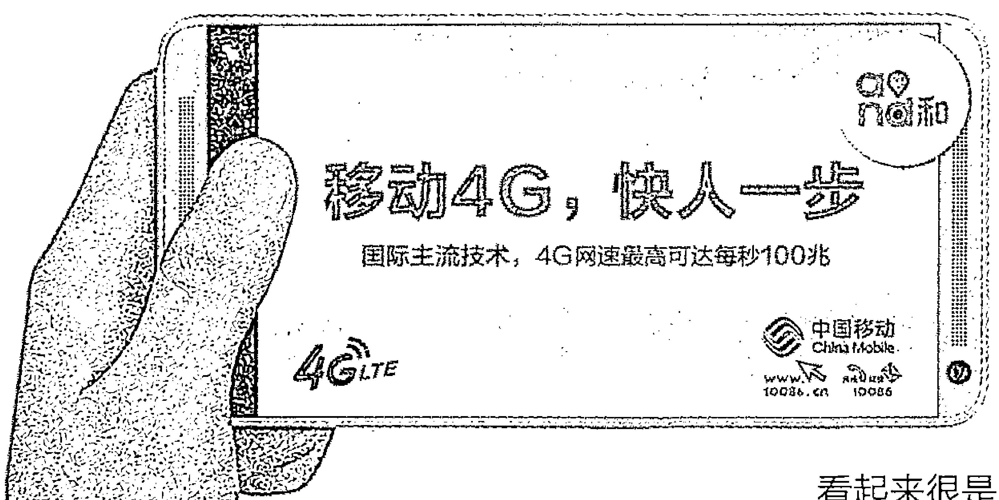

移动4G TD-LTE上马后全面取代了3G业务

看起来很是“高端大气上档次”的4G套餐有没有吓坏你？以笔者每个月的使用情况来看，情况还没那么糟糕。笔者基本每天都是用手机版本的微信、QQ和微博客户端，使用得还算比较频繁。有时还会用手机浏览网站，但从不使用手机流量观看视频或下载。这样一个月下来，手机流量一般都在300MB到400MB左右，基本都不会超过400MB。
至于通话，每个人的生活需要各有不同，笔者一般一个月主叫通话都在50分钟到100分钟左右，这样基本入门级别的套餐就能满足笔者的需求。现在很多人都已经开始使用微信这类工具进行语音通话，相信这部分并不是困扰都市年轻用户的主要问题。
结合两方面看，类似中国移动的58元套餐就非常有诚意。里面的50分钟主叫通话时间虽然略少，但就算超过了也只是按照0.25元一分钟计算，并不会产生多少费用。200MB的全国流量外加200MB本地流量，完全能够满足用户需求。

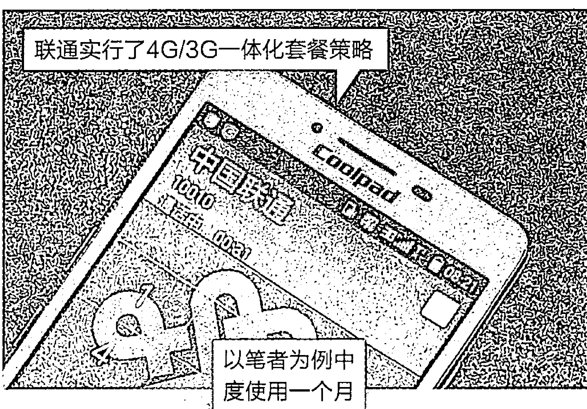


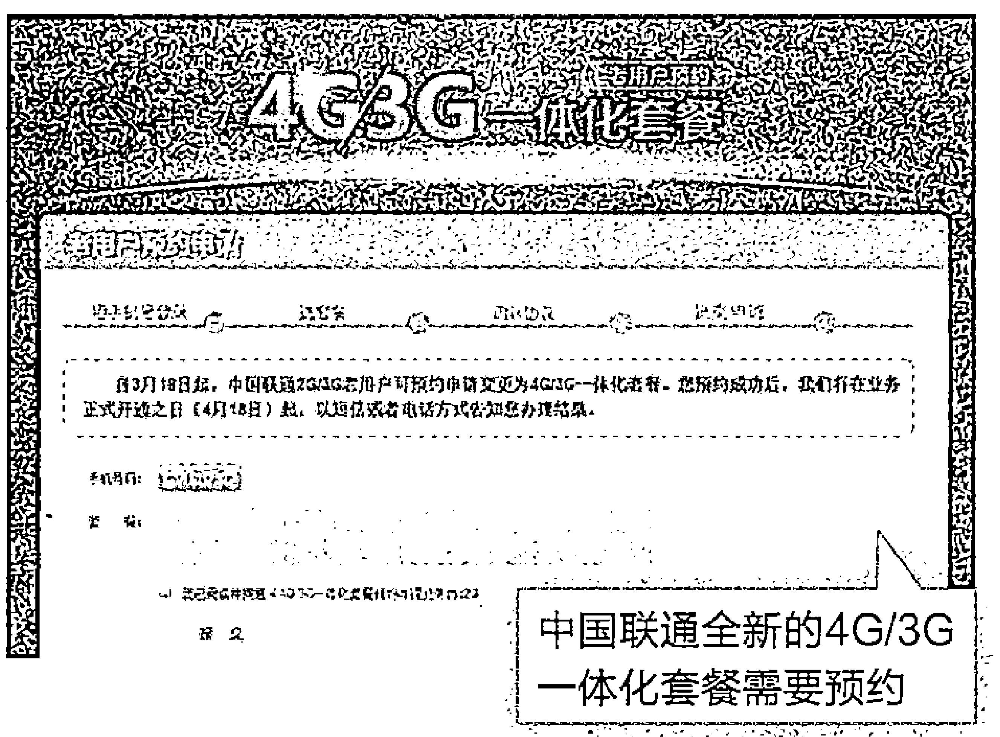

中国联通全新的4G/3G一体化套餐是继3G套餐之后全新推出的套餐，我们以76元200分钟和400MB全国流量为例，跟以前的66元3G套餐进行一下对比。在3G时代66元套餐只提供了50分钟通话时间，国内流量也只有300MB，这两项如果深度使用均会超额，最后算下来可能比76元还要多不少。

4G时代几大运营商都将原本的3G套餐与新4G整合，整合后还有一定的优惠幅度。虽然那些500元以上月费的套餐看起来比较吓人，但实际上绝大多数用户都只用最低档次套餐即可，移动4G全新的58元、88元套餐和联通新76元套餐都比较适合。由于电信方面还未放出可通话的4G业务，我们只能静观其变。


##### 老人手机套餐

**CFan推荐：预付费手机套餐**

**选择前提：**月基本费足够低

**适合人群：**手机轻度使用者

**诚意指数：** ★★★☆

生活中没有个移动电话确实很不方面，就像是我们的父母甚至爷爷奶奶那一代，随便用个手机就很够用。不过很多老人手机使用率很低，如何选择套餐呢？

###### 北京移动神州行
| 月套餐费 (元) | 国内主叫 | 接听 | 短信 | 流量 |
|---|---|---|---|---|
| 0 | 0.6元/分钟 | 0.4元/分钟 | 0.15元/条 | 5元/30MB、10元/70MB |

###### 移动动感地带上网套餐
| 月套餐费 (元) | 国内主叫 | 接听 | 短信 | 流量 |
|---|---|---|---|---|
| 18 | 30分钟/月 | 本地免费 | 100条/月 | 50MB/月 |

###### 北京联通如意通
| 月套餐费 (元) | 国内主叫 | 接听 | 短信 | 流量 |
|---|---|---|---|---|
| 5 | 0.12元/分钟 | 免费 | 0.1元/条 | 5元/30MB、10元/100MB |

###### 北京电信易通卡
| 月套餐费 (元) | 国内主叫 | 接听 | 短信 | 流量 |
|---|---|---|---|---|
| 5 | 0.15元/分钟 | 本地免费 | 标准方案 | 标准方案 |
| 3 | 0.11元/分钟 | 本地免费 | 标准方案 | 标准方案 |

> “神州行我看行”虽然是句广告语，但在一些情况下确实比较超值

但如果是接听电话比较多的场合，中国移动另有5元版本的接听免费包供神州行用户选用。此外除了预付费套餐，后付费套餐里的动感地带其实也比较适合老人使用。低月租费并且可以接听免费、不多的主叫通话费和网络流量，都很适合老年人使用。

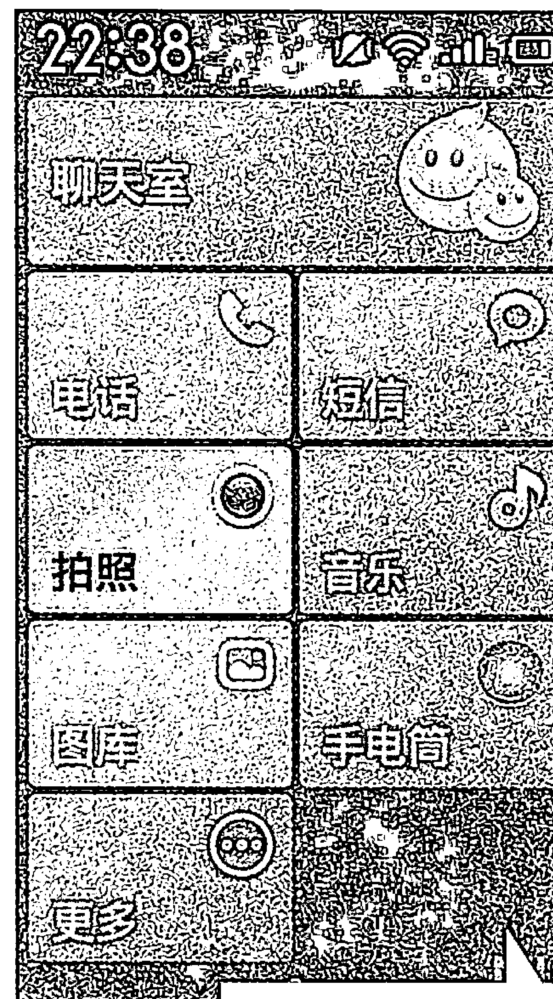


其实你仔细查看这类类似神州行的套餐都是一个类型，非常低甚至没有月租费，比较低的主叫通话费和完全没有的流量。本来老人们使用手机最主要的用处就是接听家人电话，而对主叫通话和网络流量需求很低。考虑到现在很多老人使用智能手机中的社交应用如微信与家人联系，我们在申请的时候只要添加上对应的流量包即可。一般来说10元的流量包已经足够他们使用了。

**博主点评**
相信还在给家中老人使用后付费套餐的朋友还有很多，其实精打细算下来那些50元左右月租费的套餐根本不适合老年人使用，还不如利用预付费套餐外加流量包来得划算。结合好自身的需求，使用神州行类、动感地带和联通、电信同类型套餐都能避免话费的浪费，效果立竿见影。

后付费服务中也有非常适合老人的产品——动感地带

##### 预存话费按月返还

##### CFan推荐：超值的按月返还

- 选择前提：要有赠送话费
适合人群：新入网用户
诚意指数：★★★★★

| 预存款 | 每月返还话费 | 适用套餐 | 细则 |
|------|------------|--------|------|
| 120元 | 30元/月 | 全部 | 次月起连续12个月累计360元 |
| 240元 | 60元/月 | 136元以上套餐 | 次月起连续12个月累计720元 |

##### 话费手机捆绑业务

##### CFan推荐：合理的方案

- 选择前提：业务本身适合自己
适合人群：可报销话费的用户
诚意指数：★★

##### 专家点评

其实判断这些预存话费是否有诚意就两个要素，第一就是我们是否能够确定能使用这类套餐超过12个月，另外就是除了预存的部分话费，运营商是否还会有赠送部分。比如说联通这个业务，我们入网时预存了120元，实际上最终得到的却是360元。如果我们是新入网用户，并且能够长期使用所选的运营商，办一个有赠送话费的此类业务还是比较值的。

联通方面的购机计划可能比较灵活一些，联通营业厅和商城内的手机售价都与裸机相当，但是其中有1/3左右的预存话费在内。也就是说你没多花钱一样买到了手机，但这里面拥有很多赠送的话费。遗憾的是这类实用的套餐一般都面对选新号入网，如果你是老用户，只能等待联通定期才有的老用户升级计划。与0元购机类似，这类业务也会有升级换代方面的尴尬。

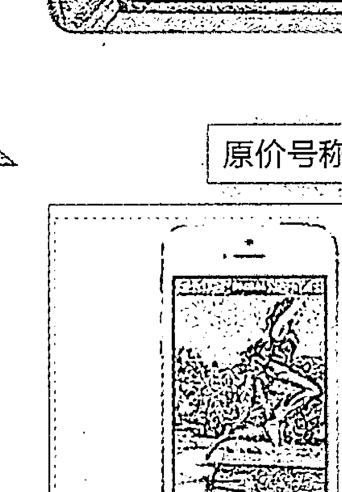

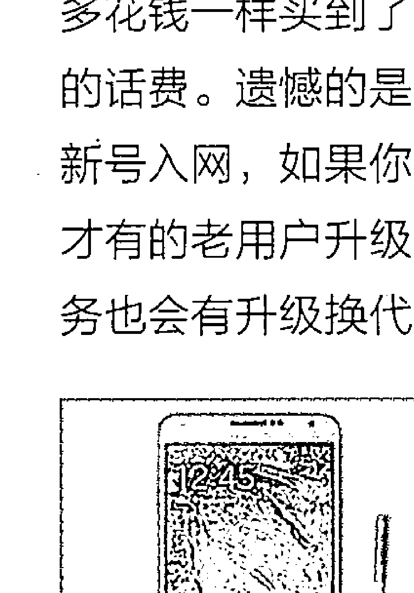

原价号称6000多元的手机白送给你，心动吗？

别忘记运营商可能是要求你连续使用24个月高额话费套餐的

看上去很美的方案，但只支持新用户入网

可能那些高额话费换手机的业务最适合能报销话费的商务人士

##### 微博有话说

虽然这些话费手机的业务可能不适合所有人，但也有它的意义所在。一些业务员、经理等经常出门在外和出差的用户，基本上公司都给报销较高额的话费，这样一来只要不换工作，基本上就属于没花钱买了新手机，还是挺划算的。

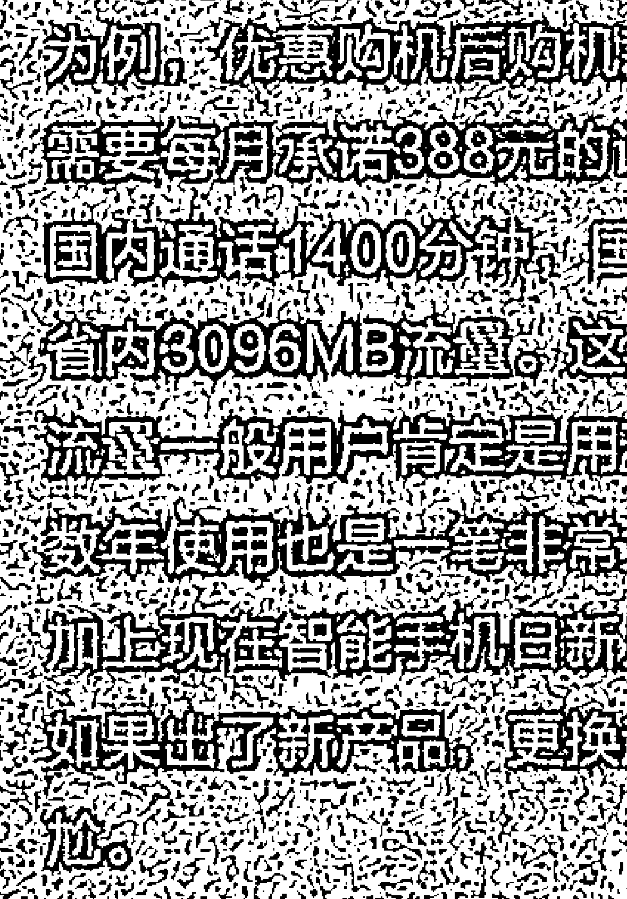

- 01. 选喜欢的手机
02. 用合适的套餐
03. 选喜欢的合同

### 键盘的秘密都入戏太深

### 策划 | 《电脑爱好者》编辑部

虽为使用电脑及各类移动终端必备的辅助工具之一，输入法却始终没受到太多的瞩目。全民互联网时代，输入法在加强功能性的同时，也成为各软件厂商争相“迎娶”的新领域。是什么原因促使互联网软件厂商对输入法的重视？输入法未来又将如何发展？这是本期特别话题将要深入探讨的内容。而作为普通用户，又该如何高效使用它，也是接下来要告诉你的事儿。

新的智能输入法面市了，你是不是需要丢掉用得滚瓜烂熟的老输入法？你用一款输入法许多年，是不是已经将它的好用功能挖掘干净？使用输入法过程中出现的各种问题，你是否都能独立解决？


### 换不换 效率为先

不少人用电脑多年，已习惯于使用某种输入法，比如有人至今仍在用智能ABC输入法，速度也很快。但是，电脑技术的发展日新月异，软件升级很快，新品也不断涌现。目前流行的输入法也不下十几种，而可供选择的更有几十种甚至上百种之多。那么，面对如此多变的输入法世界，我们到底需不需要换一种更先进的输入法？

关于是否需要换一种输入法，不同的人有不同的观点。主张换的理由是有更好的输入法，换了能提高效率；而不主张换的理由多是习惯于原有输入法，输入速度也够快，换了会影响效率，不如坚持用原有的。换不换输入法，每个人说的都不无道理。但还要根据具体情况来分析和决定，固执己见很难进步，一味求新也不一定科学。

### 换种输入法提升输入效率

许多不换输入法的用户，主要是认为更换一种新输入法会花更多的精力和时间去适应，因而也就没有去尝试新输入法的勇气和打算，没有迈出关键的第一步。

但实际情况是，许多新的输入法都是在原有一些经典的输入法基础上发展起来的，大部分用法都是沿袭旧输入法的经典使用习惯，而改变的部分只是新增加的功能，还有原有输入法中不合理的地方。如果使用者认识到这一点，那么只要有勇气迈出第一步，就已经成功了一半。因为一旦用上一个比旧输入法功能更强大的输入法，高效和方便的特性一定会让人爱不释手。

比如，不少人离不开智能ABC输入法的原因是，他们使用了这种输入法中独有的一套双打输入方案——智能ABC双拼，速度非常之快，甚至可以达到每分钟100字左右的输入速度，可与五笔匹敌。这些人担心换了其他输入法之后会失去这种独有的个性高效输入优势。但实际上，如果将百度、搜狗、QQ等拼音输入法稍加设置就可实现“智能ABC”双拼方案，微软拼音虽然没有提供更多的双打方案，但通过自定义也可以实现各种双打方案。在融合了新型输入法特有的智能输入、云词库等高效特性之后，输入效率一定会比原有的智能ABC要高许多，在这种情况下，换输入法绝对是明智之选。

### 不换输入法也能解决问题

有人用退役下来的电脑给老人使用，上面装有Windows XP，只有智能ABC输入法，偶尔输入几个汉字上网搜索。老人会写汉字又不熟悉拼音输入，这时除了安装手写功能的输入法外，一定要将智能ABC换为别的输入法吗？智能ABC无法满足老人的要求吗？不见得！

实际上，不换输入法，智能ABC照样可以为老人所用，而且也十分简单。只需从输入法设置中开启“笔形输入”选项，就可用1~8这8个数字键，代替横、竖、撇、点、折、弯、叉、方8种基本笔画来输入汉字。这样，只要会写汉字的老人，就能使用这款老输入法来输入汉字了。

上面只是列举两个代表性的例子来说明。由此可见，输入法的选择应该因人而异，根据自己的实际情况来权衡，以能发挥出最大效率、实用为原则，不见得一定要换。

| 键位 | Q | W | E | R | T | Y | U | I | O | P |
| :--- | :--- | :--- | :--- | :--- | :--- | :--- | :--- | :--- | :--- | :--- |
| 定义 | ei | ian | e | iu,er | uang, iang | ing | u | i | uo, o | uan, üan |
| 键位 | A | S | D | F | G | H | J | K | L |   |
| 定义 | a | ong, iong | ua,ia | en | eng | ang | an | ao | ai |   |
| 键位 | Z | X | C | V(ü) | B | N | M |   |   |   |
| 定义 | iao | ie | in,uai | ou | un(ün) | üe(ue),ui |   |   |   |   |

### 输入法中的转换


##### 从简体到繁体汉字

出于尊重对方的习惯，在某些时候我们需要将文章从简体转换为繁体，或者在输入时就直接考虑用繁体输入。对于直接输入的转换，以百度拼音输入法为例，只需要点击输入条最左侧的百度输入法图标按钮，在弹出的图标选择窗口中选中“简”选项，再点击输入条上的“简”图标，这时输入条上就会出现一个“繁”图标。此时再输入汉字，编辑器窗口出现的就是繁体字了（图1）。

对于已有文字的转换，我们可以利用编辑器自带的繁简转换功能来实现。比如在EmEditor编辑器中，可安装一个繁简转换的插件，在选中要转换的文字后，单击“繁”按钮，所选文字立即会变为繁体字显示（图2）。而在微软Office或金山WPS这样的经典办公软件中，更有直接可用的“简到繁”和“繁到简”按钮可实现简繁体字间的转换。

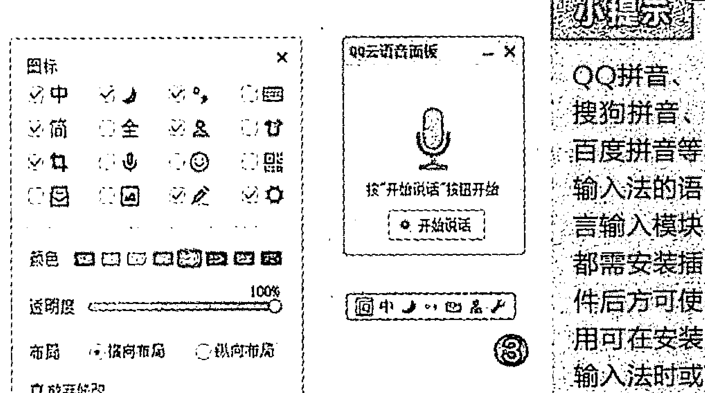

> 小提示
QQ拼音、搜狗拼音、百度拼音等输入法的语音输入模块都需安装插件后方可使用，可在安装输入法时或安装输入法后安装。

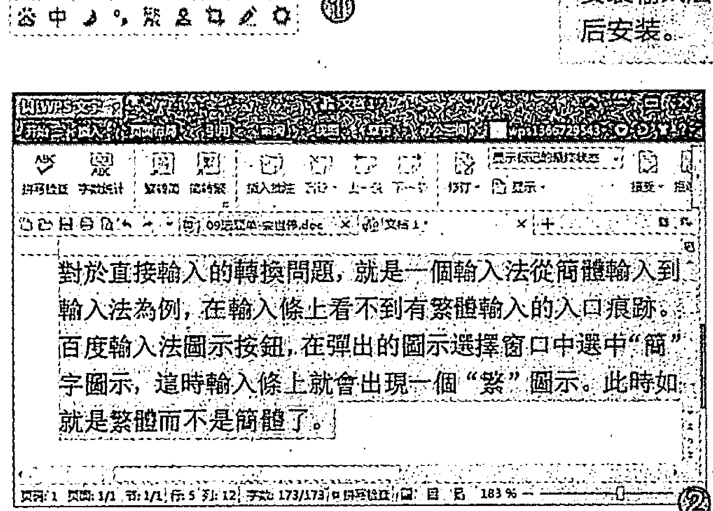

##### 语音到文字的转换

对于不方便使用键盘输入的环境，或者要输入的文字是比较规范的日常用语或标准公文等场合，可以使用语音输入，让电脑帮你将语音直接自动转换为文字。

语音输入法可以使用专用的语音输入工具，如IBM语音输入软件或讯飞语音输入法。此外还可以使用普通拼音输入法中附带的语音输入模块来实现语音到文字的转换。例如，在QQ拼音输入法工具选择面板中选择“语音”模块后，在随后出现的语音面板中，按住“开始说话”按钮说话，即可将所说的话转换为文字输入电脑中（图3）。

##### 手写到文字的转换


对于不想或难以学习拼音输入法的特殊人群，或对于普通人输入无法确定汉字发音的情况，用手写的办法输入汉字是一个不错的途径。这样就会涉及到一个手写到文字的转换（图4）。

手写汉字转换为文字，目前有专用的输入法，如逍遥笔手写输入法、汉王手写输入法软件等。

而最方便的却是普通输入法甚至是普通浏览器等工具中植入的手写模块。如在百度搜索中，就有供老年人使用的手写输入模块，可直接用鼠标手写汉字搜索。此外，在百度拼音、搜狗拼音、QQ拼音等主流拼音输入法中，都可安装手写输入扩展模块，方便地实现从手写到文字的转换。

##### 二维码转换的应用

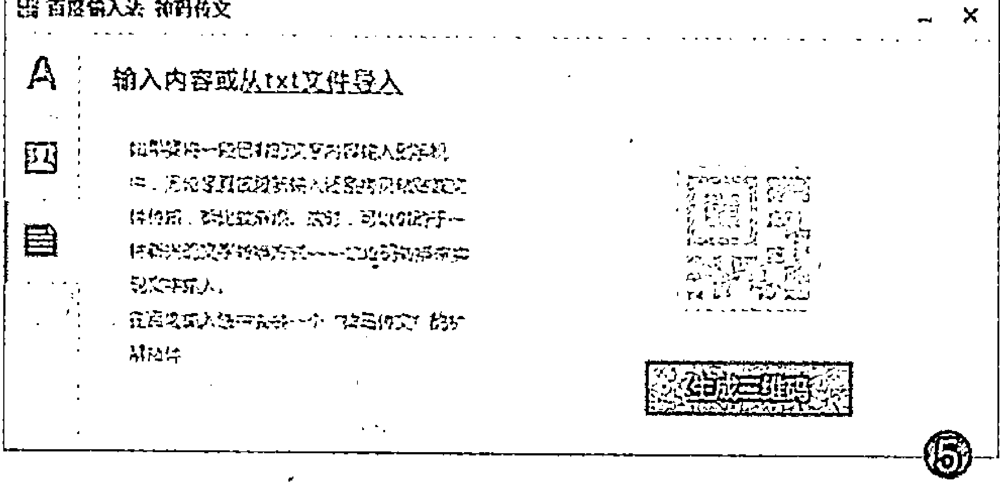

如果要将一段已有的文字内容输入到手机中，无论是重新输入还是拷贝粘贴或文件传输都比较麻烦。这时，可借助于一种新兴的文字转换方式——二维码转换来实现文字输入。在百度输入法中安装一个“神马传文”的扩展插件，启动该工具后将文字粘贴到文字输入框，点击右侧的“生成二维码”按钮，扫描二维码图片，即可将文字传送到手机中（图5）。

> 小提示
使用“神马传文”工具，还可以轻松实现将名片信息转换为二维码，达到轻松管理通讯录的目的。

##### 不同输入法词库转换

当前的输入法一般都带有智能记忆的功能，可根据用户使用习惯逐渐形成一套独有的输入环境。如果一个用户由一种输入法换用另一种输入法，原有的输入环境就会丢失。在这种情况下，如果能将原有输入环境转移到新的输入法中，那就再好不过了。

输入环境的转换，除了外观和操作习惯外，最主要的就是用户个性词库的转换了。各种输入法之间的词库转换，实现共享输入法词库是更换输入法之后首先应该考虑的问题。我们以百度输入法为例，在输入法“词库设置”窗口中，通过“导入词库”功能，可以将搜狗、QQ、谷歌、紫光、微软的txt中文词库导入到该输入法中，实现用户环境的无缝转移（图6）。

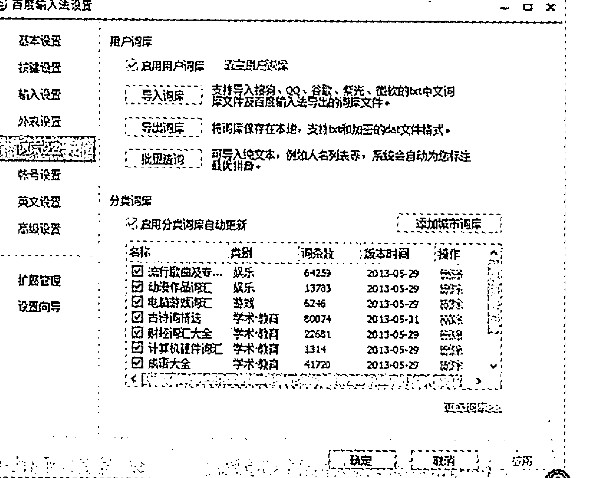

##### 不同平台输入法词库转换

目前用户使用的电脑平台一般不是单一的，不少人既要使用PC，又要使用Android手机或平板，如果能将在PC上形成的输入环境和习惯带到移动设备上，必将大大提高输入效率。

要实现上述高效之选，需要做两项工作。首先需要在移动设备上安装与PC上同一种类别的软件，比如要用百度拼音就都用百度拼音，要用QQ拼音就同时用QQ拼音，只是平台版本有所区别。其次最关键的是要用相同的账号来登录输入法，不仅在使用的时候要登录网络账号，还要保持账号相同。这样就可以实现跨平台的输入习惯转换过程（图7）。

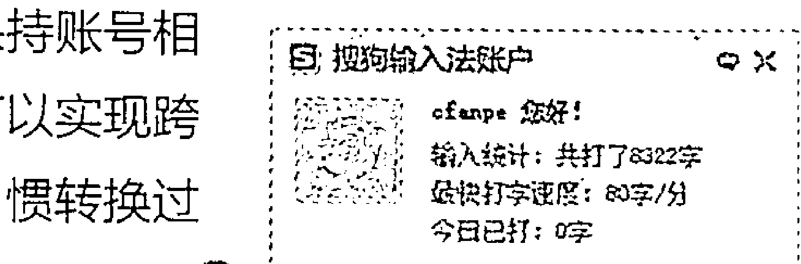

### 另类但实用的特殊输入法

在汉字输入领域，一些有别于日常汉字的特殊符号或生僻字成了汉字输入的拦路虎。此类输入方法虽然多见于报端网络，但不少方法使用起来比较麻烦，严重影响效率。本文我们给大家介绍最简单、最全面的解决办法。与此同时，再介绍一些最快捷的输入技法。

##### 有办法对付特殊符号三把刀

面对一些特殊符号，我们常见有人介绍用Word的特殊符号管理器来查找解决，也见到有人建议用输入法软键盘来解决。实际上，以上方法都有不方便性或局限性。因此现代智能拼音输入法多在特殊符号输入方法上有所发展。归纳一下，目前较方便的特殊符号输入的方法有三种：

一是软键盘选择。在一般汉字输入法的输入状态条上点击右键或点击输入法设置菜单都可看到这样的软键盘，其中按10种左右类别将特殊符号分类，点击可以启动某类模拟键盘显示在屏幕上，按动相应键位，即可输入相应的某个特殊符号（图1）。

另一种是特殊符号管理器。这类工具其实是一个更加独立的特殊符号管理工具，除了特殊符号外，还可包含一些字符表情、QQ表情等常用另类符号，例如QQ拼音输入法的符号输入器（图2）。

还有一种是在输入过程中使用快捷键批量调用的方法。这种方法与以上两种比较，不用在输入的过程中中断输入去点击鼠标切换出软键盘或特殊符号管理器，而是直接在输入条上显示某些特殊符号，输入效率会更高。如搜狗输入法输入过程中，如果先输入一个i，输入条上就会出现一个“更多特殊符号”的文字选项，选择这个选项就会出现一个特殊符号选择窗口，含有丰富的特殊符号供选择（图3）。


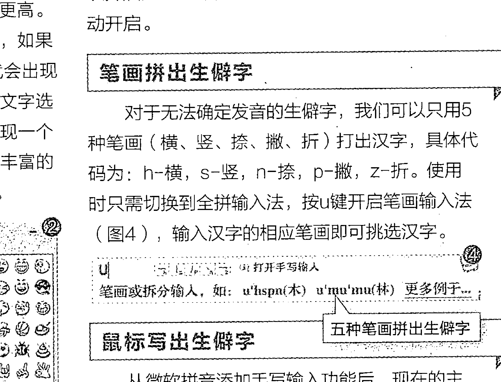

##### 难不倒 怪癖字输入一网打尽

另一类让大家头痛的输入内容就是生僻字的输入。大家知道，汉字国标GB2312简体汉字库中选入了6763个汉字，分为两级，一级字库中有3755个，是常用汉字，二级字库中有3008个，是次常用汉字。不管是常用还是次常用，这些字的输入一般不成问题。但是，由于汉字环境的复杂多样性，超出这个范围的汉字我们也常见到，尤其是在人名地名中，各种各样的怪字都有。

遇到不常用的汉字，如何才能打出来？没错，用GBK编码大字库，它是在GB2312-80标准基础上的扩展而来，共收录了21003个汉字，完全兼容GB2312-80标准。如果在输入法中启用了GBK大字库集，则许多打不出来的就可以轻松找到了。许多输入法都支持GBK大字符字库，目前多数输入法（如搜狗拼音、QQ拼音、谷歌拼音等）已经默认开启这一字库，而少数可能需要在软件设置中手动开启。

##### 笔画拼出生僻字

对于无法确定发音的生僻字，我们可以只用5种笔画（横、竖、捺、撇、折）打出汉字，具体代码为：h-横，s-竖，n-捺，p-撇，z-折。使用时只需切换到全拼输入法，按u键开启笔画输入法（图4），输入汉字的相应笔画即可挑选汉字。

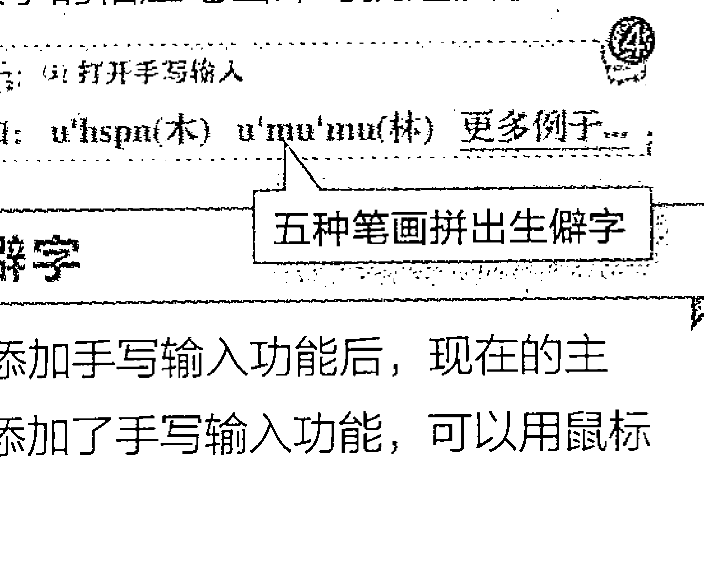

##### 鼠标写出出生僻字

从微软拼音添加手写输入功能后，现在的主流拼音输入法都添加了手写输入功能，可以用鼠标或手写板轻松写出汉字。其中微软拼音需要开启输入板后用鼠标书写汉字。而搜狗拼音、QQ拼音、百度拼音的手写功能是作为输入法的一个附加插件来使用，需要在输入法安装过程中或安装输入法之后再安装插件才能使用。Windows 7中也内置了Tablet PC，也可以进行手写输入（图5）。

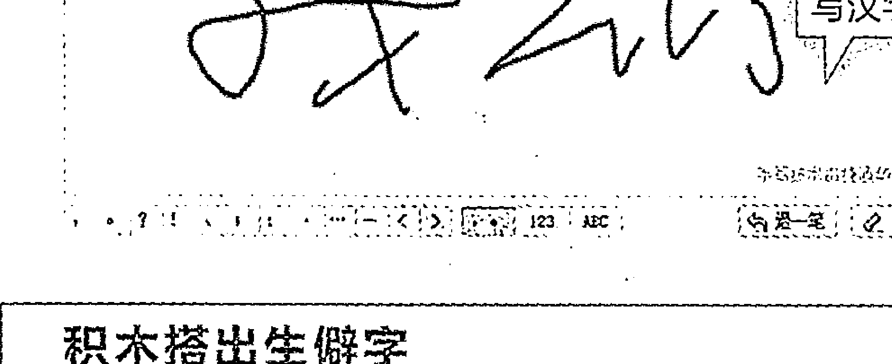

##### 积木搭出生僻字

有些生僻字由几个简单的字组合而成，如焱、淼等。在最新的搜狗拼音、QQ拼音中，可输入生僻字中的部件组合，自动组合出生僻字，如“焱”字只需在全拼下输入huohuohuo，或在双拼下输入hohoho，即可出现该字的选择（图6）。


##### 网络查出生僻字

生僻字输入，除了可以用上面的方法之外，还可以用百度查找的办法。比如我们要找一个“生”字，可以在百度中搜索“生字不出头怎么念”。要找到一个“尸”字，可以搜索“上面一个尸下面一个九怎么读”。不知道南唐后主的那个名字怎么读，可以搜索“南唐后主”等。

但是，即便是用了GBK大字库，可能也会没有你要的汉字，因为古老汉字有五万左右，奇怪的字随时都可能被你碰上。这时又该怎么办？我们需要了解一个更大的字库，那就是中日韩汉字超大字符集（SuperCJK），该字库系统当前收录了中日韩越通用汉字达7万5千多。但是，要使用这一字库，需要支持该字库的输入法才行。下载安装国际标准超大字符集字体支持包Unifonts6.0（http://okuc.net/SoftWare/UniFonts6.0.exe）后，可以使用逍遥笔手写输入法（http://shurufa.ihanzi.cn/）软件，用手写可输入7万多中日韩字符中的任何一个。通用输入法还可选择华宇拼音输入法V6.7以上版本，用它调用该字库（需在华宇拼音开启该字库）输入生僻字。使用五笔的人用海峰五笔来调用该大汉字库。

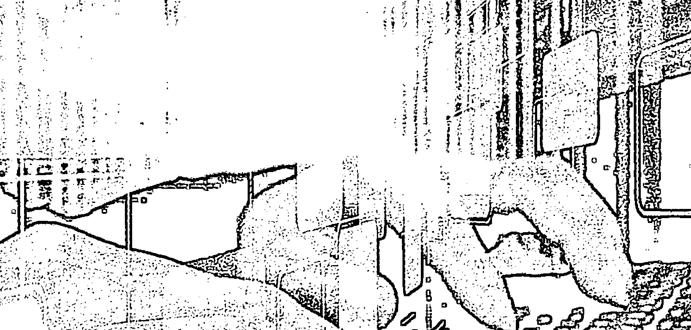

### 快捷法让输入快上加快

除了按部就班地输入之外，输入法中还可以使用一些特殊键来提高效率。你用了这些键之后才知道它们的神奇，这就来试一试吧！

##### 快捷设置 输入快速调用

在搜狗拼音、QQ拼音和百度拼音输入法中，无一例外地提供了可以快速切换出这些输入法的快捷键设置（图8）。我们可以通过在这里设置一个热键组合，从而实现快速调用输入法的目的。这对于安装了多款输入法的系统来说，非常必要。

但是，有的输入法可能没有提供这种自我设置快速调用热键的接口，这时我们可以借助于系统的设置功能来完成快速调用设置。以Windows 8.1为例，通过“控制面板→语言”，单击左侧导航窗格的“高级设置”按钮，单击“更改语言栏热键”，在“文本服务和输入语言”对话框中，设置切换到每一种输入法的独特热键（图9）。


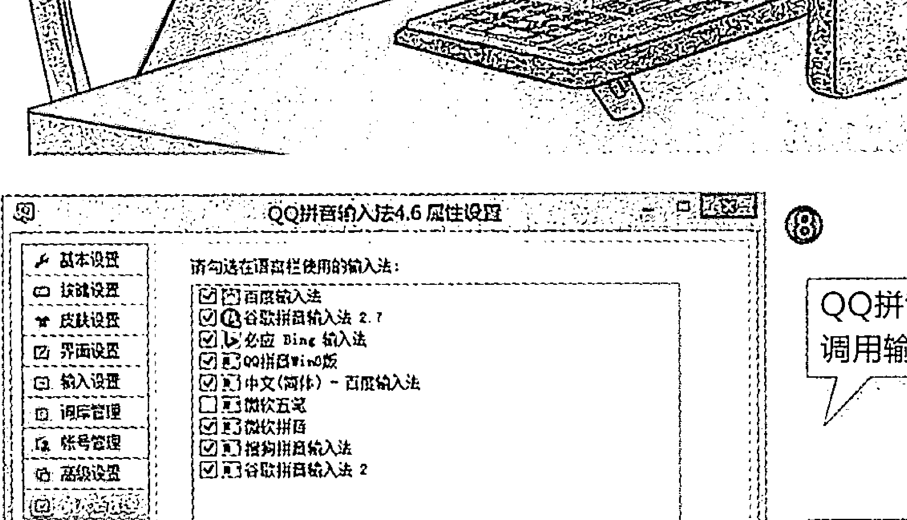

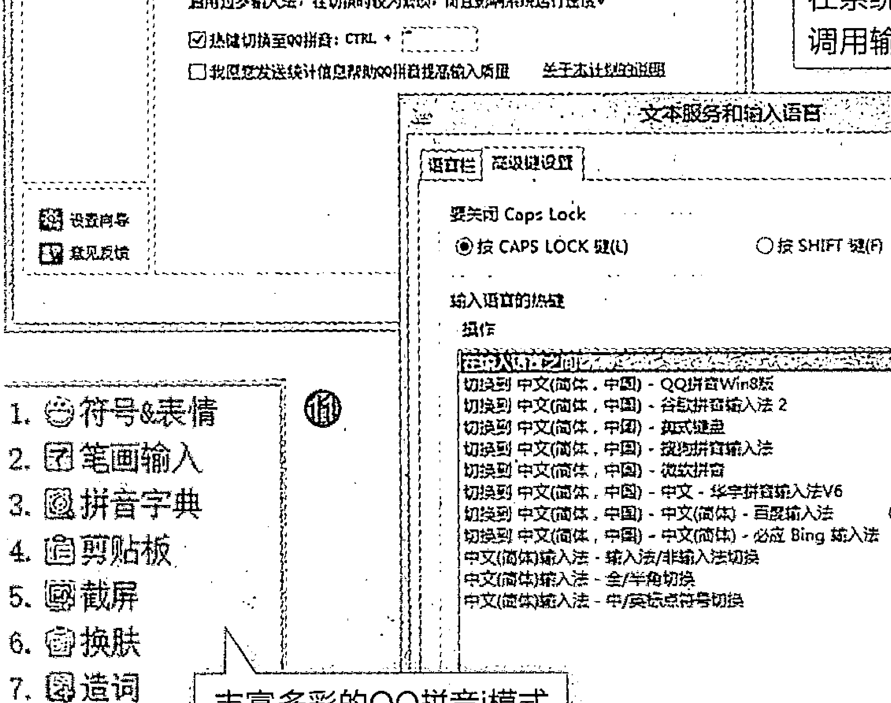

##### 神奇u键 快速拼字输入

在百度拼音输入法全拼输入环境下，输入u字母后进入u模式，这时可用h、s、p、n、z代替横、竖、撇、捺、折五种笔画输入汉字；还可以用umamama这样的代码拼出“骉”这样的汉字；或用ushiwei这样的偏旁发音代码品尝诸如“祎”这样的汉字。这种搭积木的方法在搜狗拼音、QQ拼音、谷歌拼音中都有效。

##### 多才v键 调用丰富功能

百度拼音的v键可快速调用翻译、数字大小写、算式计算、日期格式转换、汇率转换等应用转换功能（图10）。QQ拼音的v模式除上述转换功能外，还可进入表情符、自造字、剪贴板等模式。谷歌拼音v键为英文建议模式，如果你仅记得某个英文单词的前几个字母，可尝试在输入时加入前缀v。如希望输入pronunciation，但仅记得前4个字母为pron，那输入vpron后输入法将显示候选词prone, pronounced, pronunciation。

```
v模式 语言算式列表
v+数字 ( v123 )
v+算式 ( v1+2 )
v+日期 ( v2012.12.21 )
v+汇率 (货币单位大写 v50YUAN)
```

##### 全能i键 功能无限扩展

在百度拼音全拼输入法状态下按下i键之后，会出现许多丰富的头像图片供选择输入。而搜狗拼音中用i键则可以快速更换软件皮肤。QQ拼音的i键模式则可以调出丰富的实用工具（图11）。谷歌的扩展命令模式除上述功能外，甚至可以自行扩展出画画、掷骰子、查星座等实用功能，工作娱乐两不误。

- 1. 符号&表情
2. 笔画输入
3. 拼音字典
4. 剪贴板
5. 截屏
6. 换肤
7. 造词
8. 微博
9. 手写输入

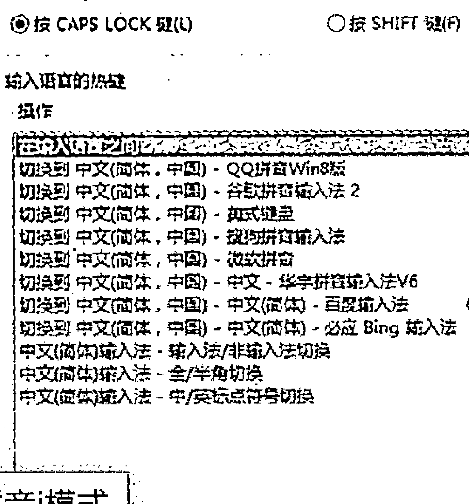

### 个性化输入 打造个性

让自己的输入法使用起来更得心应手，不但看起来要美观，更要能够提高效率服务。下面就来谈谈输入法在界面和使用中的个性化设置。

##### 换皮肤 打造最佳的输入心情

输入法的界面要能让人赏心悦目，输入的编码和候选词要清晰显示，这样才能有个好心情，也才会为更高效的输入服务。但是，每个人的偏好不同，因而用一个输入法面孔来应对所有的用户肯定是不现实的。因此，我们需要根据自己的喜好，为输入法更换自己喜欢的皮肤。目前流行的输入法一般都带有输入法皮肤设置选项，通过选择现成的皮肤即可完成输入法皮肤更换。比如在百度拼音输入法中，点击输入条上的设置按钮，再点击弹出面板中的“皮肤”即可开启皮肤推荐窗口，从中即可挑选下载安装自己喜欢的皮肤（图1）。

搜狗输入法调用设置皮肤有一个“秘键”i字母。通过该键可调出各种皮肤预览，下载更多皮肤，或打开皮肤管理器对皮肤进行管理（图2）。

> 小提示：在QQ拼音输入法中，特别为老年人或视力障碍者定制了现成的无障碍版皮肤。应用该皮肤后，输入条的尺寸和输入的编码、候选字等都获得放大效果，极大地方便了特殊人群的使用。

##### 设字体 营造舒适视觉效果

除了可以直接用换皮肤的方法实现不同的输入法视觉效果外，我们还可以通过给输入法定制个性化外观的方式，打造个性化的输入法“面孔”。以百度输入法为例，进入输入法设置窗口，点击“外观设置”一项，在右侧窗口中，可以选择线条更粗重的中文字体（比如“方正小标宋”），选择更大一号的字体（比如20磅），还可以对候选词和非候选词的颜色进行自定义设置（图3）。经过这样的自定义设置后，输入法就能以用户最满意的姿态展现出来了。注意：字体选择是依赖于系统字库的，如果系统字库单一，则需要自行安装字库。

> 小提示：对于移动设备上使用的输入法来说，因为屏幕尺寸的限制，虚拟键盘的尺寸可能不能让使用者感到满意。这时，除了灵活选择大小键盘模式外，也可以通过输入法设置，对虚拟键盘的高度进行调整，以适应个性的需要。

### 输入法故障全解决

在使用输入法的过程中，可能会遇到各种各样的问题。接下来，就大家常见的输入法使用问题，提出具体的解决办法。

##### 输入法无法安装咋办

微软必应输入法是一款非常不错的智能拼音输入法，通过在许多输入法软件下载频道的排行和得票率，就可以看出其受欢迎的程度不一般。笔者专门对其进行过测试，发现在许多功能方面不亚于搜狗拼音、百度拼音和QQ拼音等主流国产输入法。

但是，当系统升级到Windows 8.1之后，安装该输入法会出现问题，造成无法安装的情况。

下载了输入法，执行安装程序时，系统会提示说系统自带输入法已经是最新版的微软拼音输入法，无须安装微软必应输入法（图1），然后继续点击，发现安装程序被中断，无法完成该输入法的安装（图2）。果真没有必要吗？笔者调出系统自带的微软拼音，费了半天劲竟然没有找到从哪里能设置出自己习惯使用的拼音加加双打方案。那么，何以见得就无须安装了呢？难道只能与必应输入法无缘了吗？

其实不然，我们可以用一种巧妙的办法来解决必应输入法在Windows 8.1下的安装问题。

只需要将下载的必应输入法中的EXE安装文件（为使用方便，将其更名为简短的名称Binginst.exe）拷贝到某处（如D盘根目录下），然后以管理员身份进入命令提示符窗口，转到该安装文件所在的文件夹，执行如下命令即可自动完成必应输入法的安装（图3）：

```
cmd
Binginst /i /quiet
```

命令执行后，甚至连安装窗口都不显示就完成了该输入法的安装。这时，重启系统就能切换出该输入法正常使用了。

##### 输入法丢失如何找回来

输入法丢失的是一种很常见的情况。在安装了多款输入法以后，有时候你会发现，在输入法选择列表中无法找到其中的某种输入法。

这时，可用某些输入法自带的输入法管理工具来找到隐藏的输入法。如用QQ拼音输入法4.6自带的输入法管理器，找回丢失的微软五笔输入法，从图中我们看到，该输入法未被选中，因而在输入法列表中才无法被找到，只要选中该项目并确定即可（图4）。

此外，还可以通过系统控制面板的语言选项设置窗口，找回输入法。如果在输入法列表中未发现丢失的输入法，可通过“添加输入法”找回（图5）。当然，如果是在无意中卸载了输入法，则用以上两种方法都无法找回，只能重新安装一次了。

还有的时候，原来用得好好的输入法，其中的功能会突然出现错误或消失。例如，家里两个人使用同一台电脑的同一个账户登录使用Windows 8.1，使用的输入法也是同一个百度输入法，其中一个人用简拼输入，而另一个人用双拼输入，二者互不相干，也不用切换输入法，一直能正常使用。忽然一天，用简拼的人发现自己输入的编码无法拼出正确的词组。

这种问题的出现，是由于在一个关键设置上打乱了两类用户的和平共处原则，而这个原则是由一个选项来控制的（图6）。

这时，只需在输入法设置窗口中，将“全拼双拼混输”选项选中并确认退出即可正常使用。

小提示：有的输入法还提供了更为方便的输入法修复工具，例如搜狗拼音输入法就提供了一个输入法修复器，运行它可一键修复包括右下角语言栏消失、输入法状态栏消失、切换不出输入法、无法打字、出现奇怪候选、无法安装皮肤等种种常见的输入法问题（图7）。

##### 输入法打架或软件冲突

在输入法中，我们可以使用软件默认自定义的许多热键，也可以由我们自己定义一些热键来方便使用。但是，这些热键可能会和其他输入法，甚至与其他类软件的热键发生冲突，造成无法使用的情况。

遇到这种情况，我们只需要在该输入法的相应热键设置窗口中，为某个无法使用的功能重新定义另一个热键即可。

比如，如果调出搜狗输入法的热键【Ctrl+,】与别的输入法或软件冲突，可在搜狗的输入法管理窗口中为搜狗定义一个别的Ctrl组合热键（图8）。

### 妙手生花的背后 输入法原理解密

输入法作为每位网民上网必用的工具软件，各大IT公司，无论国际IT巨头微软、谷歌，还是国内IT大腕百度、腾讯、搜狗，他们都纷纷推出自家输入法软件来抢占这个市场。那么输入法是怎么实现文字高效输入的？作为普通的用户，我们自己能编写输入法么？大家最常用的是拼音输入法，下面我们就以这种输入法为例来一探究竟。

##### 文字输入 认识码表文件

我们先来了解一下文字输入过程，比如要在百度搜索中使用搜狗输入法输入“电脑”作为关键字进行搜索。首先要切换到“搜狗输入法”，接着在键盘上键入“diannao”，此时在输入法状态栏会出现多个符合“diannao”编码的汉字或词组，选择“电脑”后就可以实现字符的输入了（图1）。

可以看到，文字输入过程主要是输入编码，然后根据编码选择所需字符的过程。因此Windows系统下汉字输入法实际上就是：将输入的标准ASCII字符串（英文字符），按照一定的编码规则转换为汉字或词组。在将英文字符转换成汉字的过程中，码表文件（字库）起到了关键作用，码表文件有点类似英汉词典，将特定组合的英文字符与汉语字词一一对应起来。比如打开搜狗字库文件，就可以看到我们上面输入的“dian'nao”对应的正是汉语“电脑”（图2）。

##### 何以高效 输入法高效输入探秘

一款优秀的输入法必须要让使用者实现高效输入，这就要求每款输入法有自己的特色功能。

好的词库还需搭配智能的算法，只有依靠智能算法才能将字库的功能充分发挥出来。现在大多数输入法能自动分析用户的输入，选择和调整文字显示的优先级，这样既可以大大降低词语拼错的可能性，同时方便用户高效选择输入，这种功能的实现是借助输入法后台强大的算法实现的。比如搜狗输入法，在你首次输入“dnahz”并选择“电脑爱好者”后，它就会“记忆”下你的选择，等再次输入“dnahz”，它就会智能判断你可能要输入“电脑爱好者”，于是将这一词组调整到优先选择的位置。如果你多次输入“dnahz”但选择的是不同的词组，这时输入法的算法程序会根据你选择的频率（选的多少），将你最可能想要的结果放在优先位置（图4）。

聊天、写作、打报告，你每天究竟打了多少字也许你并不清楚，但你所用的输入法却在默默地记录着，每一次的输入和选择，都会纳入它统计的数据中，正是根据这些数据分析得出常用的词语，以及你特殊的喜好和选择。所以，并非输入法“聪明”，而是我们自己“出卖”了自己（图5）。

谷歌拼音输入法提供的智能组句功能，可以很聪明地理解你的意图，即使输入的不是常见内容的长句，它也可以智能地进行组句供你选择。

日常使用中我们需要输入一些生僻字、网络流行语，如果输入法的字库不够全面的话就无法输入。现在的输入法一方面借助本地字库，另一方面则充分发挥“云字库”优势，可以将生僻字、网络流行语等一网打尽。比如必应输入法运用微软亚洲研究院的创新研究成果，优化了核心引擎，加上云端服务器的无限量存储和计算能力，即使输入类似“weiruankincttaicolle”中中文拼音与英语相混合的字符串，它也可以智能识别（图3）。

##### 输入法 搞“兼职”

除了识别编码的输入，现在输入法的扩展功能也越来越多。一方面是扩展字符的输入方式，比如为了方便用户输入不会读音但会写的汉字，搜狗输入法提供了手写组件，启动该组件后只要使用鼠标将字写出来，就可在识别框选择输入（图6）。另一方面将输入法和其他功能关联起来，如谷歌输入法就整合其强大的搜索功能，在输入需搜索的关键字后，只要点击状态栏的谷歌图标，即可自动打开谷歌的搜索页面搜索。

##### 统计是智能算法的核心

上面的根据词频调整，已经具有初步的学习功能了，而优秀的输入法还可以智能联想、智能纠错、智能组句。有时我们会发现，刚刚输入一两个字母，输入法就已经给出我们想要的长长的词组，非常智能。这些看起来有些神秘，但它们的算法核心其实很简单，就是统计。

##### 你也可以自己打造输入法

从上面的介绍我们知道，输入法的核心实际上就是码表文件，因此只要我们自己制作好码表文件，然后利用一些输入法生成器即可生成自己的输入法。如果觉得自己制作麻烦，还可以直接提取当前输入法的字库。比如搜狗输入法，打开设置属性窗口后切换到“词库”，然后在“词库选择”下拉列表选择“导出文本词库”，这样即可获得码表源文件（图8）。

获取码表源文件后，我们既可以利用微软免费提供的“输入法生成器”，也可以使用第三方的“多多输入法生成器”来生成自己的输入法！

##### 擦亮双眼 看透输入法安全漏洞

> 小知识 Windows 2000著名输入法漏洞
在Windows 2000登录界面，切换至全拼输入法状态，如果此时选择其中的“帮助”，在新弹出的选项里选择“输入法入门→输入法操作指南→选项”，接着选择“跳至URL”。此时将出现Windows 2000的系统安装路径和要求我们填入的路径的空白栏，输入“C:\Windowsnt\system32”即可跳过密码直接进入系统，这就是著名的Windows 2000输入法漏洞。

因为输入法是每个用户必备的软件，而且是唯一一个可以在系统登录界面被调用的第三方组件，因此很多黑客都在盯着输入法，试图利用其漏洞入侵我们的系统。虽然自Windows 2000输入法漏洞发生后，微软已经在系统进行较为完善的改进，不过除了系统因素外，输入法本身的漏洞还是会给我们带来极大的安全隐患。下面我们以“陈桥智能输入法6.6版”为例，在Windows 7下演示一下它的漏洞给我们带来的风险。

日常操作中，很多人在离开电脑时经常会将系统锁定，以免他人使用。不过在用户已经登录系统后，电脑上安装了上述版本的陈桥输入法，那么在锁定界面仍然可调用陈桥输入法。而陈桥输入法又可以调用其他输入法组件，比如在输入法状态栏右击选择“数据管理”，这样就会调用默认路径下的“C:\chenghu2\CHENZNWB.EXE”（图9）。

锁定界面随便输入几个字符登录，在系统提示用户密码错误时，点击屏幕左上角输入法图标切换到“陈桥输入法”。继续输入任意几个字符调出输入法状态栏，同上右击选择“数据管理”，即可在登录界面调出命令提示符界面。由于此时登录的是系统内置的SYSTEM账户，它拥有极高的操作权限，按提示输入下列命令即可添加管理员账户（图10）：

```
Net user cfan1 123456 /add
net localgroup administrators cfan /add
```

这样我们即可在当前系统下新增一个名为cfan1的系统管理员账户，返回登录界面即可使用这个账户进入你的系统了。

##### 扎好篱笆 保护输入安全

从前面的文章可以看出，输入法漏洞会给系统带来极大的安全问题。除此之外，很多输入法还爆出其他安全隐患，比如搜狗输入法漏洞会泄露用户隐私信息，QQ输入法在Windows 8下的提权漏洞，智能ABC输入法漏洞可以终止电脑任意进程等。虽然这些漏洞已经被修复，但是谁都不能保证其他输入法还会不会有类似的漏洞。为了保护系统和输入安全，及时解决输入法漏洞带来的危害，我们应该采取如下安全措施。

##### 及时升级输入法

最简单的方法是用好输入法的自动升级功能，这样旧版漏洞可以及时进行修复。比如搜狗输入法，只要进入设置界面切换到“高级”，然后在“升级选项”下设置为“自动升级”即可（图11）。

##### 关闭不必要的端口

大部分输入法漏洞的攻击都是借助3389这个老生常谈的端口，因此对于那些平时不用的端口，特别是那些危险性较大又不常用的高危端口，如Telnet服务的23端口、FTP服务的21端口、SMTP服务的25端口、RPC服务的135端口等，建议将其关闭。

##### 尽量使用知名输入法

不要轻易将第三方输入法设置为默认输入法。一些小公司的输入法软件不可避免地存在各种漏洞，使用知名公司的输入法可有效避免各种漏洞的存在。此外不要贪图使用方便，将第三方输入法设置为默认输入法。如果使用系统默认设置，在登录界面是无法调用第三方输入法组件的，这样可杜绝黑客通过输入法漏洞入侵系统的通道（图12）。

> 网络大补贴：
Win7系统关闭135、137、138、139、445端口方法
网址：http://dwz.cn/cfanz12

##### 使用专用输入法

在网银、淘宝、在线支付输入密码时，尽量使用它们自带的控件和软键盘输入。因为默认情况下，我们在输入账号、密码时，系统是通过输入法管理器调用输入法的转换函数输入字符的。现在很多木马可利用键盘钩子捕获Windows键盘动作，从而轻易知道你的账户名和密码。网银的安全控件则可对键盘钩子进行有效的隔绝，而且软键盘上字母和数字的排列是不规则的，并且每次都会随机进行变化，即使木马捕捉到也是一堆无意义的编码（图13）。

> 小知识 网银是如何保证输入安全的
1.  强制下载安全控件，只有安装控件密码框才能输入字符，控件能有效防止黑客及木马病毒等窃取用户输入信息。
2.  使用随机排列的字符实现字符的输入，即使被木马捕获也不会泄露实际输入的字符。
3.  服务器会实时对客户输入的密码进行增强加密，比如在中国移动网站使用手机登录时，我们输入的密码在提交到服务器验证的过程会被加密，如输入123456，提交后密码框会变为多位的加密字符。

### 搜索也没那么简单

一提到搜索，大家首先想到的就是“百度一下”。的确，这是一种应用最普遍、也最为简单易用的传统搜索方法，但它却不是最有效的搜索方法。
实际上在“百度一下”之外，还有很多应用技巧，能帮助我们精准、快速地找到想要的答案。
除了搜索一般的资讯，现在的搜索还可找人、找物、找网络热点、搜索源代码、搜索产品安装等等。
不同的搜索需求，需要不同的搜索方法或技巧。请跟随我们的专题，在移动互联网、PC和各种设备上玩转搜索，提升我们的工作、学习、娱乐的效率。
除此之外，在这个无处不被搜索的年代，如何保护自己的隐私安全，进行有效的“反搜索”，也是不容忽视的大问题。

##### 云里的搜索

随着云技术的发展，现在搜索也向“云”靠拢了。那么什么是云搜索？在实际使用中，我们可以通过云搜索搜到哪些信息？云搜索又有什么样特别的技巧？

##### 拨开迷雾看清“云” 认识云搜索

传统搜索是在搜索服务器收集资源，用户提交关键字后服务器根据关键字进行检索，将符合关键字的结果展示出来，基本和搜索用户是单向交流（图1）。
不过用户的搜索要求越来越高，为了适应用户的需求并及时反应，现在大型的搜索引擎都在利用云服务器的强大后台计算能力和存储能力，实现高效和精准的搜索。这类云搜索，普遍使用分布式，并行处理以及网格计算等技术，形成一个双向交流的搜索过程（图2）。
一方面，搜索引擎公司投入更多服务器来抓取和保存各类搜索数据，这些数据保存在全球各地的服务器中，形成一个功能强大的分布式的云网络，同时这些服务器可以并行处理世界各地数以亿计的用户同时提交的即时搜索需求。
另一方面，在用户提交大量的搜索需求后，这些需求形成的大数据会被搜索服务器在后台统计分析，然后不断优化搜索。当下一个用户在提交类似搜索时，可以更精准地提供搜索结果，同时提供搜索建议，为用户提供更好的搜索体验和互动。

##### 别在“云”中迷路：云资源搜索

实际来说，现在使用百度、谷歌等就是在用云搜索。而一般用户对云的最形象的接触，则是网盘（也有称云盘），所以下面主要介绍一些网盘搜索技巧，另外涉及其他一些云搜索。

- 诸多网盘一网打尽
现在很多朋友喜欢将资源放在网盘上与好友共享，这类产品有很多，如百度网盘、金山快盘、腾讯微云、华为网盘、115网盘等。这么多网盘，我们如何才能快速找到其中的资源？http://so.baiduyun.me就是专业网盘搜索引擎，它可快速搜索国内各大网盘资源，而且使用百度+谷歌双引擎搜索。

登录上述网址后，在搜索框键入需要搜索的关键字，点击“网盘一下”即可。比如可以直接输入热门电影，在搜索结果中就可以直接访问保存资源的网盘了。

对于百度云盘资源，支持直接将资源转存到我们自己的云盘，同时可以在线播放，这样搜索完成后可以进入自己的网盘在线播放转存的电影，实现搜索、观看一条龙。

##### 2. 用活关键字找出加密云盘资源

百度云盘容量庞大，其中存放的资源很多，但是很多有用的资源可能是加密保存状态，如果没有“提取码”就无法下载。不过现在很多朋友会在自己的微博上发布一些有用的资源，并会同步发布提取码，因此对于此类资源可以利用微博搜索功能。

比如需要搜索新浪微博用户发布的百度云盘上的加密资源，打开http://s.weibo.com/?Refer=STopic_icon，然后输入“百度网盘提取码”，回车后即可看到很多网盘链接地址和提取码。同样的，类似微盘、QQ中转站的资源也可以通过上述方法进行搜索。

接下来按提示打开网盘链接并输入搜索到的提取码，点击“提取文件”即可轻松下载到加密资源了（图3）。

##### 3. 告别注册 搜索论坛账号

现在很多资源都是发布在各种专业的论坛里，不过为了活跃论坛气氛，大多数论坛都要求用户注册账户，并且注册一段时间后才有资格下载，这样即使我们注册为论坛用户一时也无法下载。其实通过搜索，我们就可以找很多论坛的账号来下载所需的资源。如http://bugmenot.com就提供类似账号搜索功能。打开浏览器登录上述网址，然后直接输入需要访问的论坛（以机锋论坛为例），输入机锋论坛的地址bbs.gfan.com，点击“搜索”以后就可以搜到很多账号。这里选择成功率（success rate）最高的账号，按提示复制账号名称和密码（图4）。接着打开http://bbs.gfan.com，按提示输入上述账号登录，可以看到我们能成功登录论坛，而且这个账号注册的时间较早（图5）。

> 小提示
http://bugmenot.com并非利用黑客手段扫描论坛账号信息，这些账号大多是一些热心人士注册并发布给我们共享的。你也可以点击页面下方的“Share it”，发布自己在某些论坛的账号和网友共享。

### 分析搜索 测定你的位置
文/重剑

现如今手机基本上已经取代了传统的傻瓜相机，大家都喜欢拿着手机走到哪拍到哪。但无论你的分享是出于什么目的，有件事还是需要小心，因为其他用户通过你的照片就可以查看出你的具体行踪。如果不相信，那么下面的操作一定会让你大吃一惊。

##### 利用信息查找拍摄地

下面再来点“刺激”的。相信看过《金蝉脱壳》的同学都知道，有了经纬度信息，就可以利用它进行实时的全球定位操作。首先打开Google Earth这款地图软件，接着点击工具栏中的“添加地标”命令，在弹出的设置对话框里面随意设置一个名称，然后将照片属性中获取的经纬度信息填入其中（图2）。再点击“确认”按钮，刚刚添加的地标信息就被添加到Google Earth左侧列表的“位置”栏目中。双击该地标名称后，就可以定位到这个GPS的位置。从图上我们可以看到，该位置离德阳市非常近，或者说就在德阳市的郊区（图3）。最后经过不断放大，发现拍摄地点在一个小区里面（图4）。就这样，我们的隐私被暴露了。

##### 如何进行隐私的防护

本来Exif信息能帮助我们学习摄影技巧，或更加了解自己拍摄设备的性能，但有时它也成为泄露隐私的途径。不过经过我的测试，发现上传到新浪微博、QQ空间及人人网的照片，在下载以后地理位置信息被自动清除了。不过毕竟这是没有明确保障的，还是要多小心。而对于存放在电脑中的其他照片，如果用户想批量删除照片中的Exif信息又该如何进行呢？首先下载Jhead这款工具（http://tinyurl.com/366lq），将Jhead工具和照片放置到同一目录。打开命令提示符，先通过CD命令进入到该工具的存放目录，接着输入命令“jhead -de *.jpg”按下回车键，这样就可以批量清除Exif信息啦（图5）。

```
jhead -de *.jpg
```

##### 查看照片的Exif内容

我们首先从网上随意下载几张由网友分享的照片，接着在照片文件上右击，从弹出的菜单中选择“属性”打开属性窗口并切换到“详细信息”选项卡，可以看到照片被统称为Exif的信息，比如照片的拍摄时间、照片的分辨率及拍摄照片的设备名称等。当然这些内容并不是最重要的，我们拖动属性窗口的滚动条，就可以看到详细的GPS信息，其中包括GPS经纬度，以及当时的海拔高度等信息（图1）。

出现这些是因为拍照时没有关闭手机的定位服务功能，所以拍出来的照片带上了GPS信息。现在是不是觉得有点恐怖了？

##### 你才是PC的上帝 PC本地搜索

相对于网络搜索来说，PC本地搜索有着更悠久的历史和广泛的需求。从PC诞生时起，凡是使用电脑的用户，就会面临文件查找和内容查找的双重需求。本地搜索使用的方法和工具不同，搜索所用时间和搜索效率就会有很大差别。如何快速从本地的系统、用户分区甚至公司局域网中找到自己需要的文件或内容，是每个使用PC的用户应掌握的基本技能。

> **小提示**

从“X07^5&-.DOC”、“AAA.TXT”这样的文件名中，你除了可以看出这是一个Word文档或记事本文档外，还能看出什么信息呢？这两个主文件名无论对你日后查找文件，还是对其他用户使用文件都造成很大的不便，可谓一种不负责任的文件命名习惯。

##### 你需要养成的好习惯

搜索的基础是存储在电脑中的一个个文件。因此，从某种程度上来说，文件名是决定搜索效率的关键因素之一。除了默认的文件类别扩展名之外，主文件名的命名也非常重要。规则的文件名对搜索结果的准确性和搜索效率的提高会起到很大作用。因此，平时在使用电脑时就要养成规范命名文件的好习惯。

Windows系统可支持的文件名长度为255个英文字符（包含扩展名在内），也就是说最多可以用127个中文字符为一个文件命名。但是，日常很少有人用这么长的名字为文件命名。而这并不表示微软这样的设定是无用的。恰恰相反，因为日常使用过程中一时手懒或过于草率地为文件随便起一个短的名字，从而酿成了日后信息搜索难度加大的祸患。因此，尽可能利用微软提供的文件名长度优势，在文件命名过程中尽量使用详细的概括信息来命名文件，才算得上是好的文件命名习惯。

##### 分段扩展名的好处

虽然扩展名在某种程度上可以分别文件的种类，但对于文件的具体内容来说，扩展名是无能为力的。给文件主文件名进行分段命名，有利于实现文件按关键字定位，有利于实现文件的快速精准筛选。

比如，给收藏的连续剧或剧情图片命名，可以用如图1所示的分段命名法。从一个文件名中，就可以看出这个连续剧属于动画片，是国产的，名字叫什么，总共有多少集，用户喜欢程度指数为多少。同样是微软提供的一个文件名条件，如果你不用这一优势，只是给你的连续剧起些诸如ABC01、ABC02这样的名字，那么，要弄清这个剧的内容，你恐怕不仅需要去播放，还需要去看序幕，再去网上搜索好半天，才能获得有关这部剧的所有情况（图1）。

> 如果命名的文件只有一个，那么需要手动添加分段文件名。但如果要命名的文件名与前面某个长文件名只有部分差别，那么在保存文件时不必全部重新输入，只需在保存对话框中先点击相像的文件名，然后修改不同的字段即可（图2）。

> 如果是要给已有的一组文件添加日期字段，可以用成批更名类软件（如拖把更名器等）进行一次性添加更名处理（图4）。

##### 时间字段解决日期难题

有时候，你对文件的日期很在乎，比如创建日期、修改日期等。虽然系统默认的文件属性中已经包含有文件的几种日期属性，但是，因为操作系统使用杀毒软件或文件转移情况的影响，文件的日期属性都可能被改变。这样一来，从文件属性的日期就不能真实反映文件的创建和修改日期了。在这种情况下，如果你在命名文件的时候，在主文件名中增加一个日期字段（图3），那么无论什么软件如何修改文件的日期属性，你都可以看出文件的创建或修改日期了。

##### 权属字段弥补文件命名不足

大家知道，在Windows系统的文件属性中，可以设置显示文件的“作者”信息字段（图5），在用Word或WPS等软件创建文件时，文件中就会包含这样的作者信息。但是，并不是所有的文件中都默认包含这样的作者信息，例如用记事本或抓图软件抓得的图片，即便你在资源管理器中将此字段设置为显性，也看不到任何作者信息。在这种情况下，如果你要在日后能分辨出这些文件到底是由谁创建的，那么最好的办法就是让文件名体现出创作者的信息。具体方法就是在文件名中增加一个权属字段。我们常看到一些网上共享的文件名中，就有“-by某某人”或“-by某网站”这样的文件尾巴（图6），虽然这些多有广告宣传的用意，但起码可让人一目了然地知道文件的具体来源。在多人合作完成的工作中，如果能养成在自己的文档前后添加所有者字段的习惯，对高效工作很有帮助。因为这样做可以让同事不打开文件就能知道文件的主人是谁了。

##### 文章选读：微软免费搜索大餐

操作系统本身就具有搜索功能，利用系统的本地文件搜索功能和搜索技巧，一般可以满足日常文件搜索的需求。比如，某种类型的文件搜索，文件名中包含某个关键词的文件搜索，子文件夹下的文件搜索等。甚至某些常规文件中的内容搜索，依靠系统本身的搜索功能也可以搞定。本文以最新版Windows 8.1系统为例说明。

##### 制定自己的文件命名规则

除了在某些工程或公司项目中有具体规定外，文件命名一般均由用户自己来把握。但是，正因为这样的自由和无拘无束，才造成不少人对文件命名的放纵和随便，也成就了不少文件命名的懒汉。如果你不想给自己今后的文件搜索添麻烦，建议从现在开始就养成文件命名的好习惯。好习惯的养成需要制定一套基本的规则。如何制定自己的文件命名规则，因人而异，因项目而异。有的人可能习惯于用一句完整的话来描述文件的含义，将此作为文件名，例如“老王头2014年3月5日的工作总结第三稿.DOC”。还有的人则善于用分段文件名，如“[工作总结][2014-3-5][老王头][第三稿].DOC”。规则不拘一格，但目标只有一个，那就是便于在日后通过关键词来检索。技术要点是，要保证在文件名中能够包含尽量多的有效关键词。

> 小提示：如果之前没有养成文件规则命名的好习惯，如何从纷乱的文件海洋中找到需要的东西？这就需要用到下面将要谈到的搜索技能。

##### 新型的微软联合搜索

Windows 8的推出使系统本身的搜索能力大大加强，搜索的范围也不限于简单的文件搜索。Windows 8/8.1使用必应Bing智能搜索技术，支持文件、网络、设置等综合搜索，可以按照需求来决定搜索的范围和内容。通过Windows 8.1“搜索”超级按钮，可搜索本地电脑、Web、OneDrive、应用和Windows应用商店，一次搜索可获取来自多处的内容。

资源管理器中的文件关键词搜索也支持多重关键词组合，而且也支持通配符操作，比如“*”代表任何长度字串，“？”代表任意字符。

##### 跨分区资料的联合搜索

如果要搜索的文件位于不同的硬盘分区中，而不是在一个文件夹中，那么就需要使用跨分区的联合搜索。而要实现这一搜索目的，只需要改变搜索起点，从“这台电脑”为起点进行搜索即可。
在资源管理器中，点击搜索框，激活“搜索工具”选项卡，从“位置”分组框中选择“这台电脑”（图3），这样搜索的目标就包含了本地所有硬盘分区。同时可以看到，搜索选项自动启动了“所有子文件夹”的项目，说明项目将囊括这些分区的各级文件夹。
接下来，按上面所述的搜索方法进行文件搜索即可。

##### 设置搜索的文件类型

在Windows 8.1资源管理器的某个文件夹内搜索文件，一般采用浏览的方法。但是，如果文件夹中的文件较多，浏览到需要的每个特定文件可能需要较长时间（具体时间取决于你的文件数及组织方式），因此需要一定的搜索技巧。

##### 文件夹中的关键词搜索

在Windows 8.1资源管理器中，最省时省力的文件搜索方法是使用搜索框进行搜索。搜索框位于每个窗口的顶部。若要搜索文件，先打开某个文件夹作为搜索的起点，单击搜索框，输入关键词搜索。系统会用所输入的文本来筛选当前符合条件的文件。如果搜索字词与文件的名称、标记或其他属性（甚至文档内的文本）相匹配，则将文件作为搜索结果显示出来（图1）。

##### 灵活自定义项目搜索

搜索的需求是多种多样的，每一个人都可以按自己的需求定制优化的搜索方案。在Windows 8.1资源管理器中，点击搜索框激活“搜索工具”选项卡，选择“优化”搜索分组中的相关项目（包括按日期、类型、文件大小、其他属性等），可以自由定制搜索方案（图2）。

例如，如果希望按文件修改日期进行搜索，那么可以通过“搜索工具→搜索→修改日期”，选择今天、昨天、本周、上周、本月、上月、今年、去年等基本时间段。如果希望按文件大小搜索，则可以通过“搜索→大小”选择从空文件到超大文件之间的7个档次。这样就有效地缩小了搜索范围，若再配以适当的关键词，很快就能搜索出想要的文件。

> 小技巧
Windows 8.1的搜索功能可以用快捷键来启动。按Windows徽标键+S打开“搜索”面板，按Windows徽标键+F搜索电脑或OneDrive上的文件，按Windows徽标键+W搜索电脑上的设置。

##### 关闭网络搜索提高本地搜索效率

需要注意的是，如果你使用的是按流量计费的移动网络，又是通过“搜索”超级按钮功能进行本地搜索，Windows 8.1会浪费流量，因为默认搜索设置中将包含网络搜索内容。这时，如果关闭此设置，则“搜索”超级按钮仅搜索电脑和OneDrive上的应用、文件和设置。关闭网络搜索功能，只需在Windows 8.1“设置”中，单击“更改电脑设置→搜索和应用→搜索”，滑动“获取Bing中的搜索建议和Web结果”滑块，关闭此功能。

##### 深度检索文件信息内容

除了在当前文件夹中搜索文件外，有时候你可能需要从当前文件夹的各级子文件夹甚至本分区的所有文件夹中搜索文件。这时，需要首先将起点切换到某文件夹或驱动器上，然后通过“搜索工具→搜索→位置”，选择搜索位置为“当前文件夹”或“所有子文件夹”（图4）。

如果要搜索的内容不仅仅限于文件名，还希望包括文件内容，那么需要设定包含文件内容。具体方法是，通过“搜索工具”选项卡下的“选项”分组中的“高级选项”下拉列表，选择“文件内容”一项（图5）。设好条件之后，再按照以上介绍的基本方法进行文件搜索。

##### 自定义系统搜索方式和范围

由于Windows 8.1的系统默认搜索范围的扩大，虽然搜索功能更强劲了，但也因此会造成搜索效率的打折。默认情况下，“搜索”超级按钮用于搜索电脑和OneDrive上的应用、文件和设置以及Web内容。但如果只想搜索本地文件的话，这种设置就显然会有点浪费了。这时，可以选择仅搜索一种类型的结果，如“文件”。鼠标指向屏幕右下角，然后将鼠标指针向上移动，再单击“搜索，单击箭头，然后单击“文件”即可（图6）。

##### 解决好库与搜索的关系

Windows 8.1搜索功能的发挥与“库”有着密切的关系。只有将文件包含在库中，且已经编制了索引的条件下才能被搜索到或提高搜索效率。

##### 让“消失”的库再现形

升级到Windows 8.1后，也许你一时找不到库在哪里了。其实，它们仍然是存在的，而且工作方式也没有发生改变，只不过是在文件资源管理器的左窗格中处于隐藏状态。如果打开“桌面”，在“收藏夹”下仍能访问到它们。如果自定义了库并希望在左窗格中看到它们，只需单击“查看”，再单击“导航窗格”，然后选择“显示库”即可。

##### 删除“搜索”超级按钮存储的搜索历史记录

鼠标指向屏幕右下角，将指针上移，单击“设置→更改电脑设置”。依次点击“搜索和应用→搜索→清除”，清除历史记录（图7）。

##### 让个人文件也能被快速搜到

如果要将文件包含在库中，可右键单击文件夹选择“包含在库中”命令。可以人为设置索引位置。通过“搜索工具→高级选项→更改索引位置→修改→更改所选位置→选择添加新的索引位置”，可将自定文件夹纳入到系统文件索引范围内。

将文件夹添加到库中后，可能无法立即搜索和查看完整的文件夹，这是因为Windows还在为该文件夹编制索引。将文件纳入库管理之后，编制索引的工作由系统自动完成，但需要一点时间。

##### 让内网文件也纳入搜索范围

如果内网中的一个文件夹未编制索引，而你想将其加到库中，则会收到“无法包含某个位置的消息，因为没有为该位置编制索引”的提示。这时，要为其编制索引才能将其包含到库中。最简单的方法就是在电脑上启用脱机文件，并将该网络文件夹设置为脱机可用。在“文件资源管理器”中单击“主页”，点击“轻松访问”，然后选择“始终脱机可用”。这样，系统会将这些文件添加到系统的搜索索引中。

##### 删除索引累赘 提高搜索效率

当使用某个应用向库中添加未编制索引的文件夹（如网络文件夹）时，就可能会收到提示某些库功能由于库位置不受支持而无法使用的消息。这样一来，在库中进行搜索、排序和筛选等操作，速度将会很慢。此时，若想搜索提速，需要从库中删除这些位置。如果必须要保留这些自定义位置，则可以单独为该文件夹新建一个库，这样就不会降低在其他任何库位置中进行搜索、排序和筛选的速度。

##### 寻找最好用的第三方搜索工具

> 系统自带的搜索功能虽然能满足日常的搜索需求，但在搜索效率和某些特殊需求上显得力量不足。因此，借助于第三方的搜索工具进行针对性的搜索或更高效的搜索很有必要。第三方搜索工具总是具有独特的优势，结合其独特的功能使用更能让人感觉得心应手。

##### 实现文件搜索速度的大超越

几乎不需要时间，就可以从千百万个文件中筛选出自己需要的文件。这样的搜索工具你用过吗？这就是大名鼎鼎、口碑超赞的经典搜索工具Everything。千万别说系统本身就能搜索文件，在这个工具面前，Windows的搜索效率显得那样软弱无力（图1）。

在搜索框中输入内容，闭上眼睛再睁开的功夫，整个电脑中符合条件的文件就都显示在窗口了。无论电脑中有几万个文件还是几十万个文件，速度均是如此之快。

-   在执行文件搜索中，如果收到类似“库已损坏，不再工作”的提示，可打开“文件资源管理器”，点击“查看→导航窗格”，选择“显示库”。在左边的窗格中右键单击“库”，然后单击“还原默认库”即可。

该软件只限搜索文件名，不能搜索文件内容；只适用NTFS文件系统，不能搜索FAT32文件系统。好在现在用FAT32硬盘的越来越少了。此外，要使用中文界面，必须用V1.2以上版本并安装语言包。

##### 多重内容快速而细搜索

上面介绍的Everything搜索速度再快，但也有一个遗憾，就是不能搜索文件内容。没关系，我们有别的工具可以解决。

如果要搜索TXT文本或各类程序源代码的内容，可以用大名鼎鼎的日系软件EmEditor来完成。在笔者目前使用的13.0.3版中，可通过“搜索→在文件中搜索”启动多重文件查找窗口，选中要搜索的当## 压缩工具实现文件快速搜索

对于压缩软件WinRAR，你一定不会陌生。其实它不单单是一款压缩解压工具，在文件搜索方面，它也有着惊人的速度和效率。

启动WinRAR工具，点击工具栏上的“查找”按钮，启动文件查找窗口，输入文件名关键词和查找字符串，选择压缩文件类型，选择搜索起点位置（包括本地所有驱动器、当前文件夹、单一驱动器等选项可选）进行搜索。更强大的是，它不但支持在压缩文件和子文件夹中查找，同样支持在文件中查找内容（图3）。

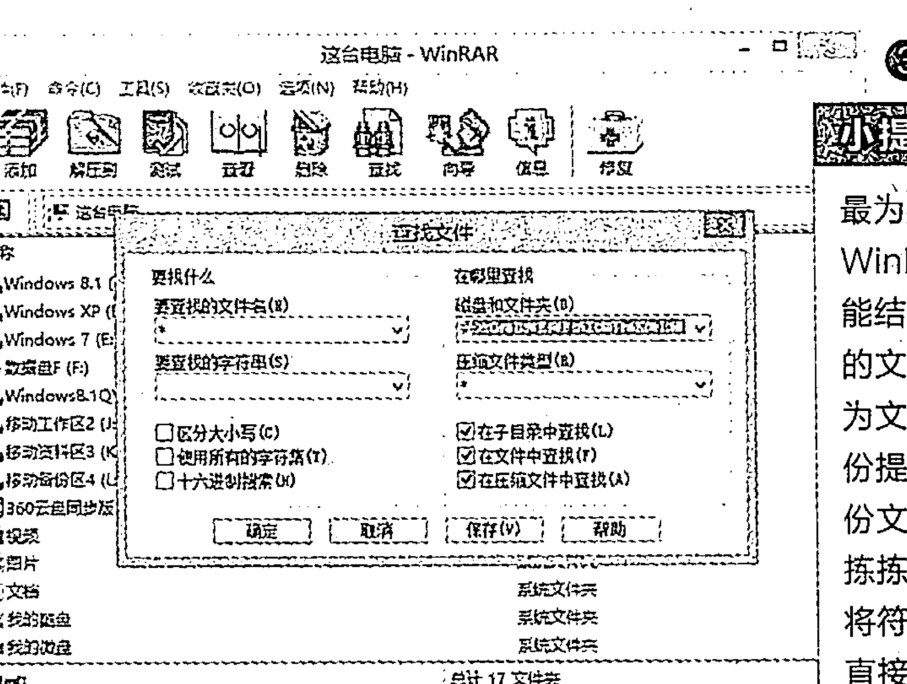

> 最为实用的是，WinRAR的搜索功能结合其自身强大的文件压缩功能，为文件有条件的备份提供了方便。备份文件不再需要挑挑拣拣，搜索一下，将符合条件的结果直接打包就好了。

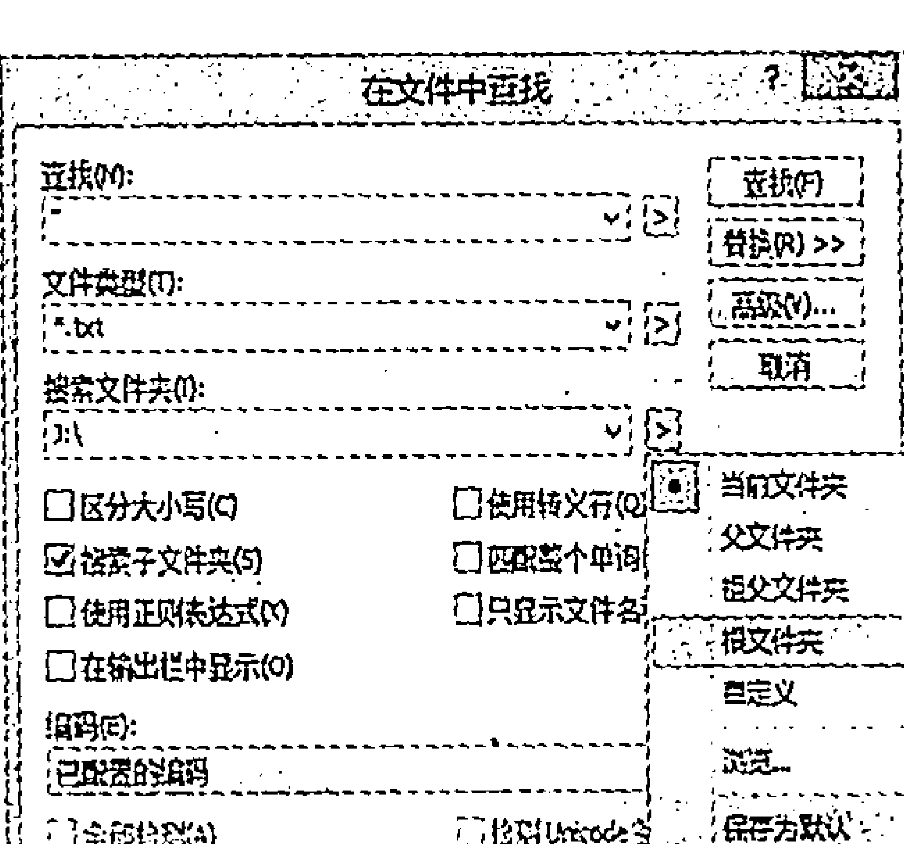

### 能生成本地搜索文件列表的工具

搜索本地文件，将搜索结果保存为一份文件列表，或自己收藏对比，或共享给朋友挑选使用，这也是文件搜索的一项基本需求。为此，我们可以用百度硬盘搜索工具来解决。

百度硬盘搜索是百度多年前出品的一款老软件，虽然后来因某些原因不再更新，但在搜索硬盘文件方面还是有其独到之处的。比如可以用它的文件列表生成功能，将本地的文件列表保存下来（图4）。安装该软件后首先自动进行文件索引建立，之后便可将所有文件或分类文件的索引列表单独保存下来。

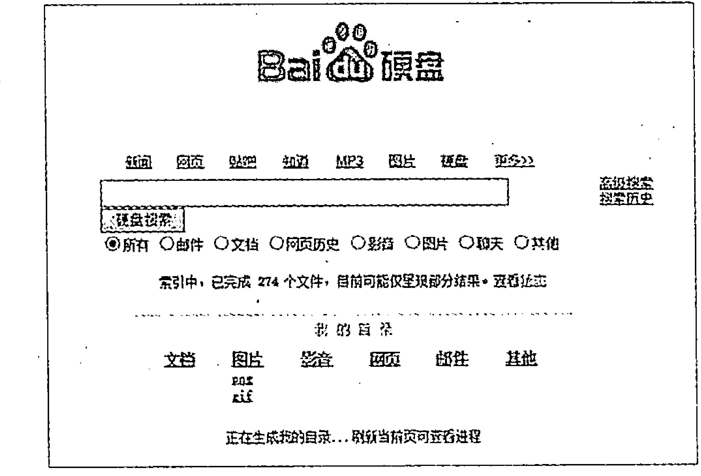

### 寻找比较全能的文件搜索工具

以上软件各具特色但都有所不足，有的在搜索文件名方面见长但不能搜索内容，有的能搜索多重文件内容但在文件搜索其他方面无能为力，有的支持右键搜索，有的又不能。有没有兼备以上功能的第三方搜索工具呢？经过测试使用，笔者选出一款较全能的工具FileSeek Pro。

FileSeek Pro是一款具备文件搜索和内容搜索的强力搜索工具。在文件名方面，支持按日期筛选、文件大小筛选搜索，使用正则表达式增加了搜索的灵活性。还可以通过“查找”框，对搜索的文件内容进行定义（图6）。同时，FileSeek安装后会将搜索命令整合到Windows资源管理器的右键菜单，只需在驱动器或文件夹上单击右键，选择“使用FileSeek搜索”，软件就会自动启动提供搜索。

需要注意的是，该软件虽然在功能上比较“全能”，但在搜索效率上却称不上魁首。原因是其不进行文件索引，因此在搜索效率上和Windows搜索不相上下，不过从使用的方便性上来说，它要优于Windows自带的搜索功能（图6）。

### 将快速搜索装在右键菜单中

早期的Windows系统支持用右键菜单直接搜索文件，但在Windows 8.1中，在驱动器上点击右键，却没有发现系统提供的搜索文件功能。好在我们可以借助于第三方软件提供的右键搜索命令进行方便的搜索。

安装了极速搜索工具Everything后，我们发现在驱动器或文件夹的右键菜单中多出一个“搜索Everything”的选项，我们只需在搜索起点位置选择该命令，就可以启动Everything窗口进行搜索了。如果要搜索文本或程序代码的内容，只需安装最新版的EmEditor文字编辑工具，资源管理器右键菜单中就会出现“用EmEditor在文件中查找”选项，点击该选项即可启动多重文件内容查找窗口，解决从多文件中搜索内容的需求（图5）。

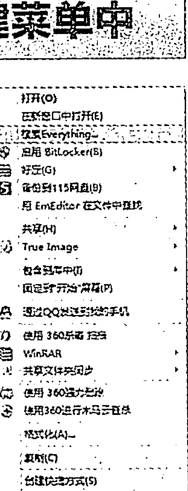

### 搜索不直观的内容

有时，我们要搜索的内容可能是包含在压缩包中的文件。也有的时候，我们的文件已经被删除，从资源管理器中无法直接看到任何文件名。还有的时候，我们的资料已经移动到移动硬盘或光盘中进行了备份，本地电脑中未留存任何文件。在这些情况下，我们是否可以搜索到自己需要的文件？如何才能进行有效搜索？

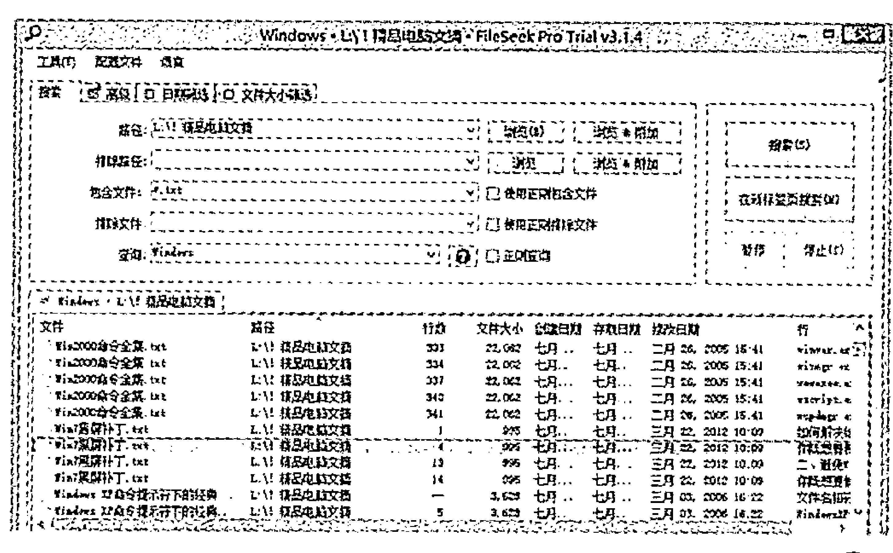


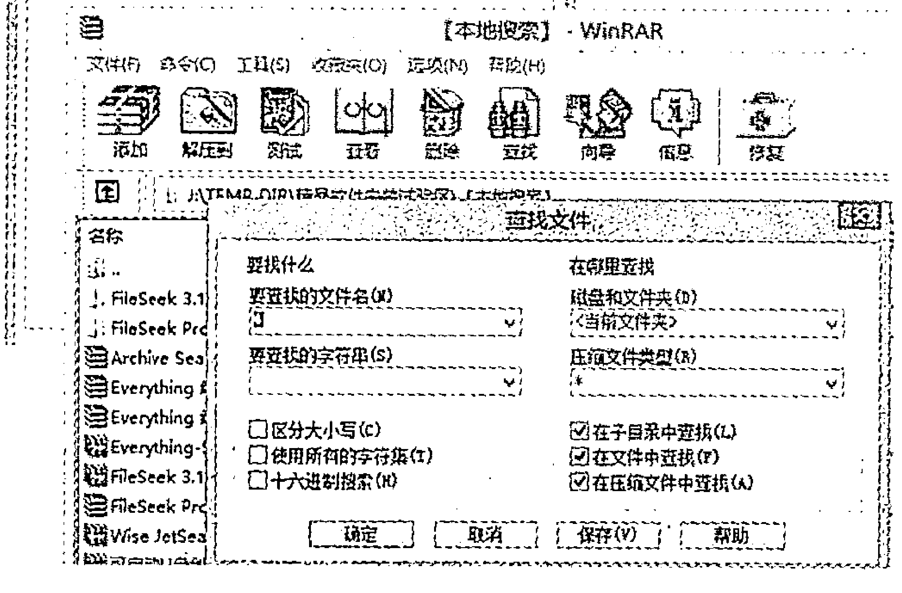

### 搜索藏在压缩包内的文件

有时候我们的资料是存放在压缩包中的，要搜索其中的内容必须解包吗？不需要。用Windows 8.1、WinRAR工具均可实现压缩包内容的搜索。

通过Windows 8.1的“查看→选项”命令启动文件夹选项窗口，单击“搜索”选项卡，选中“包括压缩文件（ZIP、CAB…）”复选框，即可实现在搜索文件时包含压缩包中的文件（图1）。如果采用WinRAR压缩工具搜索文件，只需在“查找文件”对话框中选中“在压缩文件中查找”选项，即可实现直接从压缩包中搜索文件的目的（图2）。

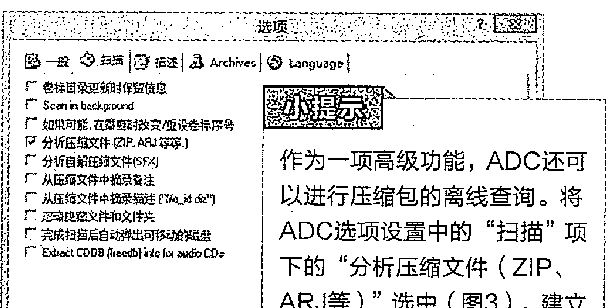

小提示：作为一项高级功能，ADC还可以进行压缩包的离线查询。将ADC选项设置中的“扫描”项下的“分析压缩文件（ZIP、ARJ等）”选中（图3），建立文件数据库。在搜索前将软件选项“一般”项下的“查找压缩文件（ZIP、ARJ等等）”选中，再进行查询，就可实现离线文件的压缩包内搜索。

### 搜索已移除介质内的文件

许多时候，我们的资料已经从本地硬盘中移除，转而备份到移动硬盘或光盘并锁到了文件柜中。在这种情况下，在不拿出文件柜中备份文件的情况下，是否有办法能够搜索到其中存有的文件呢？

我们可以用ADC资源管理器软件实现离线搜索。具体方法是，在文件从本地移除之前，先将光盘或移动硬盘挂接到本地电脑上，扫描建立数据库索引，当介质离开本机之后，再用该软件借助此前建立的数据库进行文件搜索。

### 已删除的文件也能搜索

对于已删除的文件也有办法搜索到。用各种反删除工具（如EasyRecovery Professional）搜索指定磁盘，搜索结束会显示被删除掉的文件记录，可尝试针对性地进行恢复。如果未进行过写入操作，搜索到的文件就很有可能被恢复原样。

### 搜索一时难找的系统设置

当无法确定系统的某项功能设置从哪里进入时，搜索功能会帮我们大忙。用一个关键词带路，用Windows 8系统的搜索功能，即可定位到所需设置的入口。只需通过将系统“搜索”类别选为“设置”，输入关键词进行搜索即可（图4）。

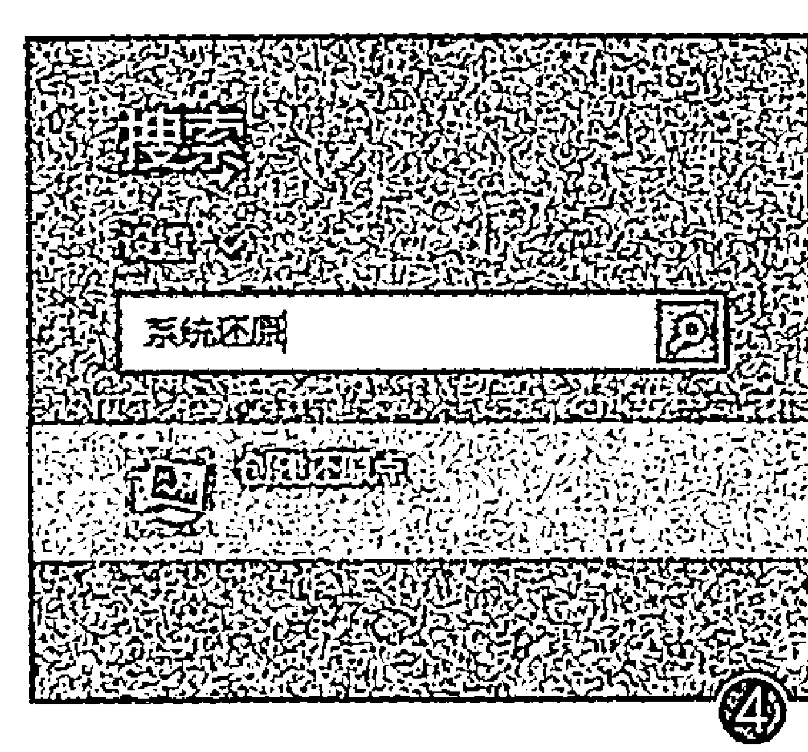

###### 小提示

Everything虽然在第一次运行时也要建立磁盘文件索引，但由于Everything采用的不是逐一的读取磁盘文件，而是直接的读取NTFS文件系统日志的方式，因此索引建立速度极快。

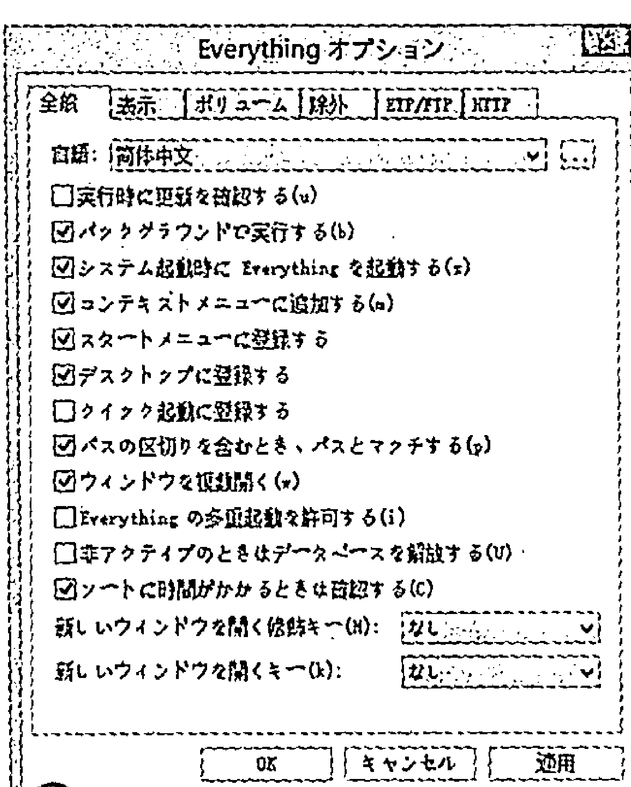

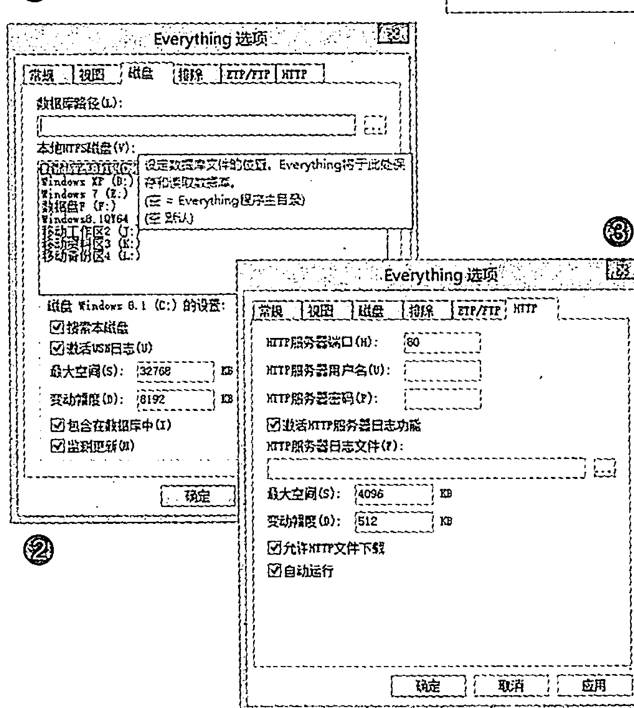

###### 小提示

因为此搜索服务是以磁盘分区为单位进行共享的，因此如果涉及个人隐私的内容，请不要存放在这些共享的分区中，以免被别人搜索到。

### 自己搭建文件搜索服务器

对于多台电脑互联的小内网，如果有资料相互间资料共享互用的需求，共享资料的搜索也是个问题。从磁盘空间的利用效率考虑，如何才能快速搜索和定位局域网中其他电脑中的文件资料？

我们可以借助于具有内网搜索服务的搜索软件配置，达成局域网内电脑之间的特殊共享协议，解决内网文件快速搜索的共享问题。

##### 搜索服务的建立

要建立搜索服务，需在内网的每台电脑上都安装Everything软件，并安装多国语言包（含简体中文）。由于Everything是日系软件，运行后默认显示日语界面，难以看懂，因此要将其界面切换为简体中文。用Ctrl+P快捷键呼出设置窗口，并从第一选项卡下选择“简体中文”，点击OK使设置生效（图1）。接下来要将本地分区添加到搜索数据库中。具体方法是点击Everything“工具→选项”命令，单击“磁盘”选项卡，将存放共享资料的磁盘分区分别选中，并选择窗口下方的四个复选框（图2）。

开启文件共享服务。单击HTTP选项卡，将其中的三个复选框均选中（图3），其中的“允许HTTP文件下载”是允许别的用户查找到你电脑中的文件后进行下载，而“自动运行”则可以保证Everything启动后自动运行HTTP服务器。

##### 实现文件快速搜索

当每台电脑用Everything建立好HTTP搜索服务器后，在其他电脑上就可以使用访问局域网址的方式对其他电脑的共享文件进行搜索，搜索同样使用本机安装的Everything软件进行。在浏览器内输入其他电脑的内网IP地址，在随后弹出的Everything搜索窗口的搜索框中输入关键字，下面马上会出现满足条件的搜索结果。

如果搜索结果中出现的是文本文件，可直接单击文件查看文件内容；对于其他类型的文件，则可以通过右键单击文件下载到本机使用。

### 移动设备 掌心的搜索

随着智能手机和平板电脑的崛起，由掌心操作的设备已然成为了计算时代的新锐主力军。和PC一样，这些掌心设备也存储着大量有用的数据和信息，如何快速地锁定它们的位置、保证它们的安全同样重要。

> 难道‘掌心’移动设备本地搜索

如今手机中除了常见的影音文件外，也会安装各种程序，保存各种文档。如何才能在多层目录内快速锁定需要的程序，或找到急于沟通的联系人呢？这就涉及到了移动设备的本地搜索问题。

##### 本地搜索快速锁定目标

购买Android手机后，不妨先在桌面‘添加’中看看有没有Google搜索的小插件。如果没有，则可安装类似‘手机百度’或‘谷歌搜索’一类的APP（图1）。以‘手机百度’为例，除了可以进行网络资源的搜索外，还可搜索本地联系人、应用程序、视频和短信等内容（图2）。比如，以前我们想打开凯立德导航程序，需要先进入程序列表（如


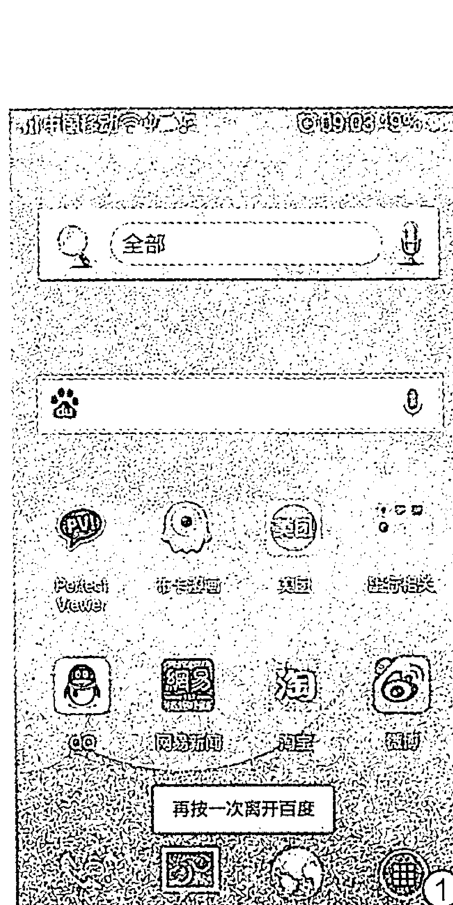

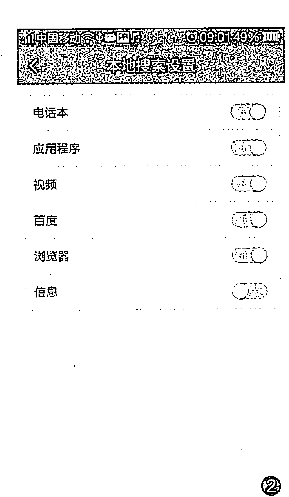

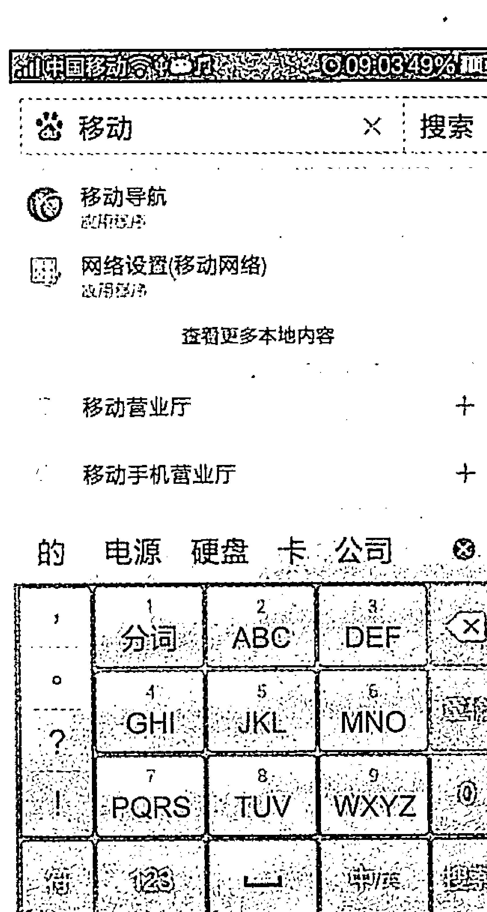

##### 巧用文件管理器

Android系统中有很多第三方文件管理器，善加利用可帮你更为轻松地管理手机里的资源。以ES文件管理器（下载地址：http://www.esstrongs.com/）为例，可以直接搜索存储卡内的全部格式文件，利用分类检索可快速锁定想要找到的资源。此外，该软件还可将文件删除至回收站（图4），确认后再完全清除。

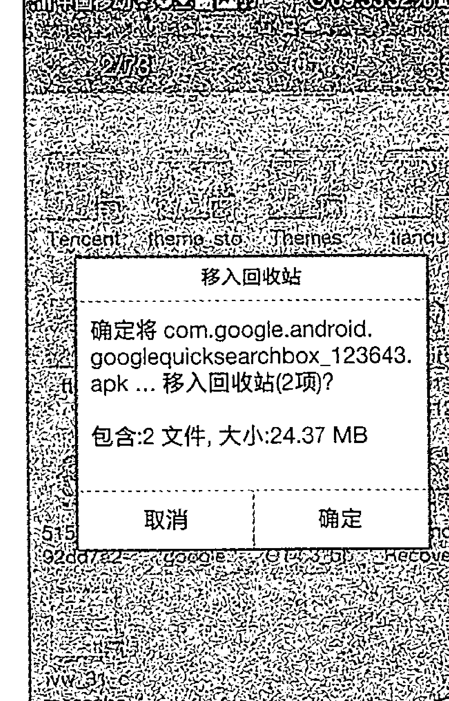


> 有些在线视频或者在线音乐软件默认会自动清空缓存空间以节约存储空间，或者需要在播放时点击指定的按钮才会保存缓存文件。

##### 系统目录的玄机

手机获得Root权限后，在文件管理器中还能“搜到”更多意想不到的资源。在这里为大家介绍几个常用的目录：

- data/app/: 可搜索到所有已安装的第三方APP（图5），删除就等同于卸载，可以直接将它们备份并安装在其他手机上；
- system/app/: 可搜索到所有已安装系统APP（图6），删除后可能导致严重问题，其中部分APP可安装在其他手机上；
- data/misc/wifi/ wpa_supplicant.conf: 可搜索到手机连接过的所有Wi-Fi账号和密码（图7），当你忘记家里路由器的密码时，可以在此找到答案，具体格式如下：

```
network={
  ssid="TPLINK" (你的Wi-Fi账号)
  psk="123456789" (该账号的密码)
  key_mgmt=WPA-PSK
  priority=1
}
```

此外，在视频类软件的目录内，往往还可以找到所有观看视频的缓存文件，点击即可重新播放而不会再走流量。比如优酷客户端的缓存目录为youku/offlinedada/（图8），在这里可以将缓存的视频备份到其他文件夹以供日后播放。

##### 隐私莫被人看

在我们进行主观搜索的同时，也要小心手机上的行为、隐私数据也被其他软件或身边的人上传或查阅，也就是所谓的“反搜索”。其中，如果你有不想被视频播放软件自动检索出来的小电影，可以通过文件管理器对该视频或所在文件夹进行重命名，在名称最前面加一个“.”就相当于隐藏了该文件夹。此后，这里面的视频就不会被任何软件自动检索到，从而起到了反搜索的功效。

如果你觉得上面的设置稍显麻烦，或者还想隐藏短信等隐私内容，可以安装“腾讯手机管家”（下载地址：http://m.qq.com/），在私密空间中可以对手机内的影音文件以及短信进行加密（图9），之后在手机文件管理器或收件箱中就再也找不到这些加密的文件和信息了。此外，现在很多APP安装后会偷偷读取你的联系人、短信和位置信息，在腾讯手机管家的“软件权限管理”中也可有选择地禁止第三方APP的这些“流氓操作”（图10）。

自Android 4.2系统后，很多手机品牌都会在设置的“安全”选项中提供隐藏应用图标的功能，如果你经常串门，不希望亲戚家的小孩或者朋友同事运行你手机上的某些游戏或软件，可以直接将这些程序隐藏（图11）。

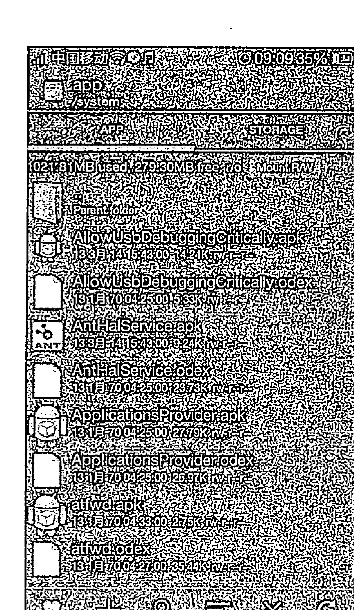

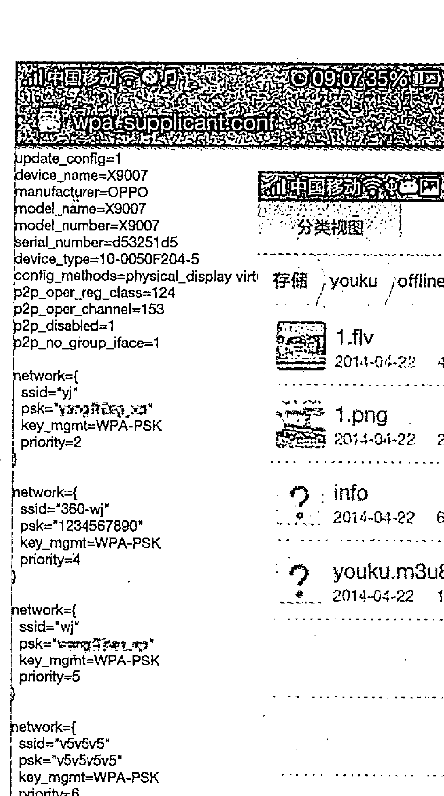

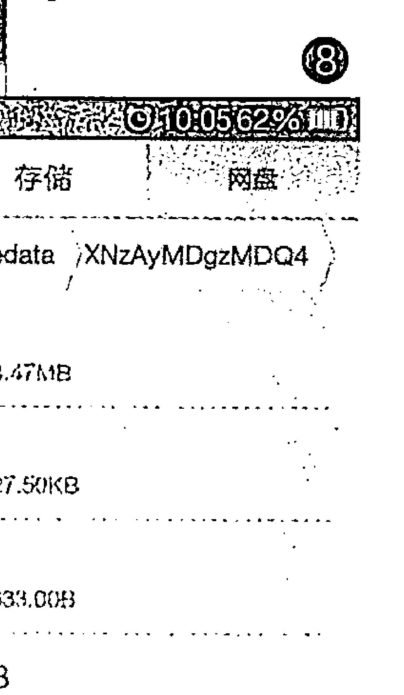

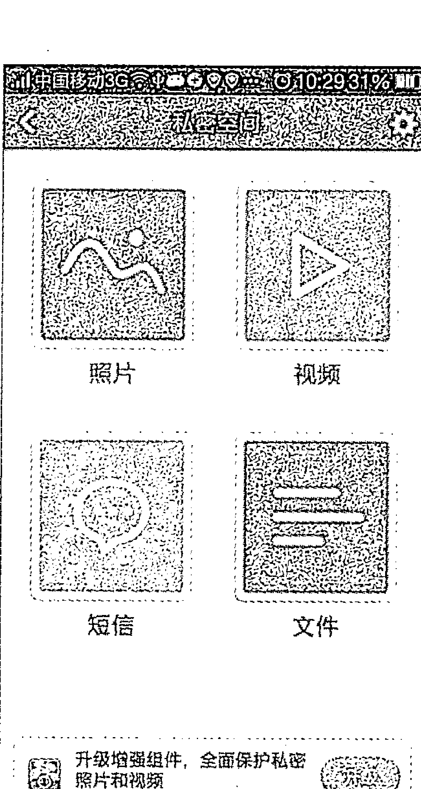

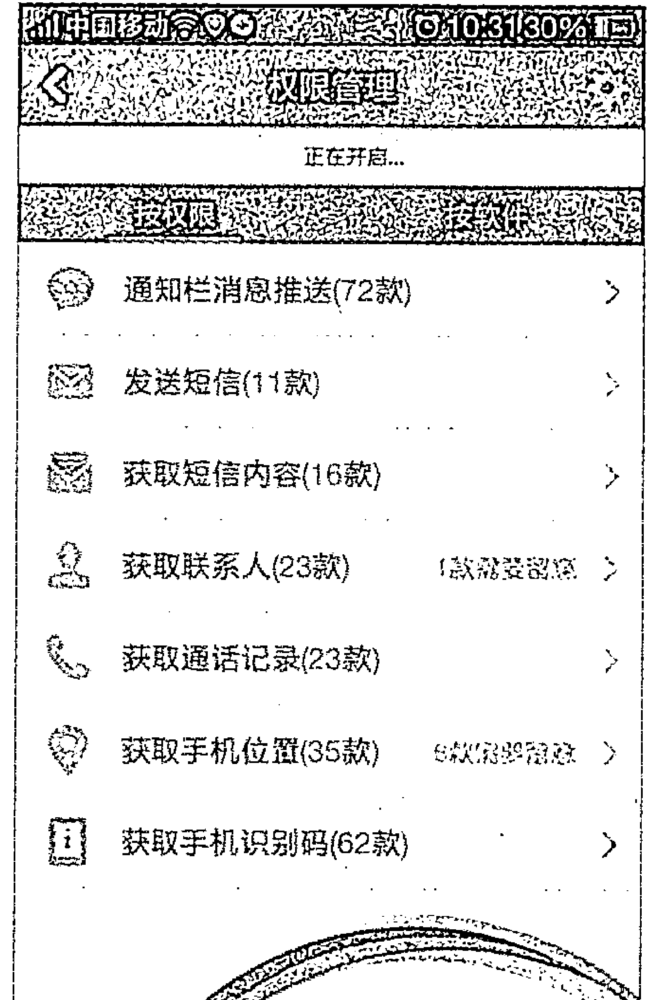

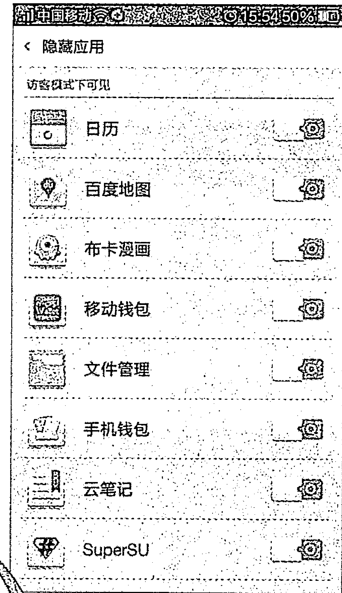


### 掌心后悔药

##### 搜索那些被误删的文件

PC文件被误删，可以直接从“回收站”找回，或借助“EasyRecovery”等软件进行深度的恢复。可惜，Android系统自身没有回收站，一旦误删了图片、文档和音乐视频，又该如何进行恢复呢？

##### “手欠”引悲剧

很多Android手机都不支持存储卡扩充，看着越用越小的存储空间，很多用户都喜欢没事就删，或借用APP一键清理垃圾文件。问题来了，一旦你不小心删除了记录宝宝成长的视频、关键的复习提纲、还没来得及备份的作业文档，上哪去找后悔药呢？

##### 掌上的“后悔药”

Hexamob Recovery PRO（运行时需Root权限。下载地址：http://pan.baidu.com/s/1kTmeLEZ）就是掌上的后悔药。在手机上安装并运行该APP，我们可以进行选择性恢复和全部恢复（图1）。以选择性恢复为例，需要设定搜索路径（搜内置或外置存储卡）以及恢复路径（图2），点击“下一个”按钮后软件就会自动搜索近期被你删除的所有文件（图3），并将其以列表的形式呈现出来供你随意恢复。

要注意的是，有些手机想恢复内置存储卡误删的文件只能选择全部恢复，而外置存储卡则可使用两种恢复模式。此外，恢复的文件名称会被打乱（图4），且时间久远的Txt或Word文件打开后会显示乱码，相对来说图片和音频文件的恢复效果最好。

##### 更安全的擦除隐患

除了帮你找回误删的文件之外，该软件还提供了“安全擦除”功能，在此界面删除的文件是无法恢复的（图5），至于适合删除什么类型的文件，就不必笔者点破了吧？

总之，当你不小心误删重要文件后不要着急，千万不要再对手机存储卡进行格式化，或进行更多的拷贝、删除操作。第一时间使用Hexamob Recovery PRO，基本可以100%恢复误删的文件。

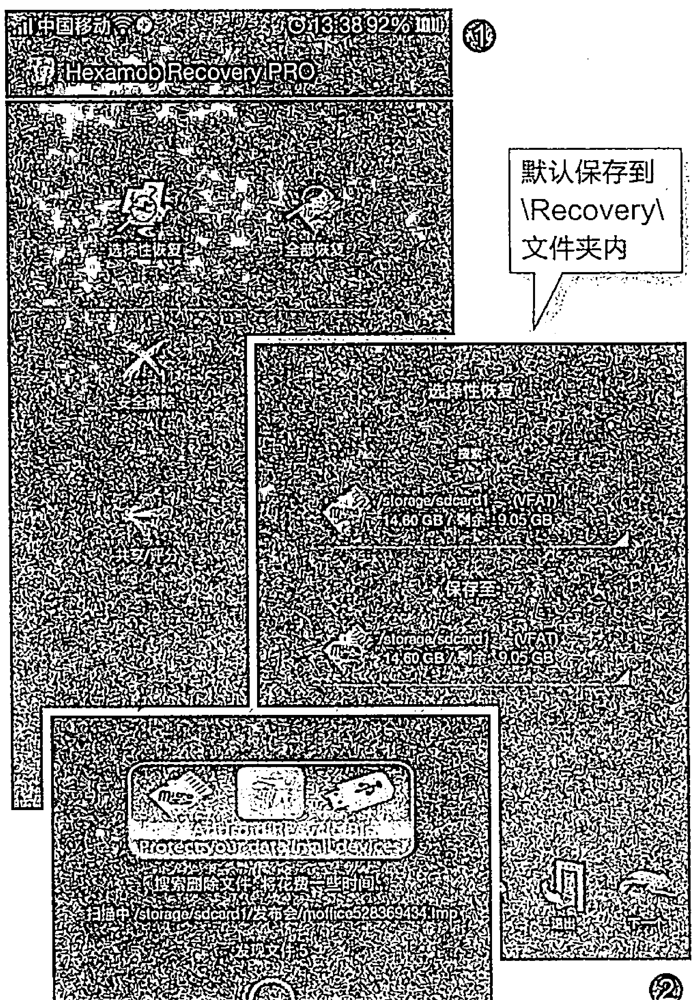

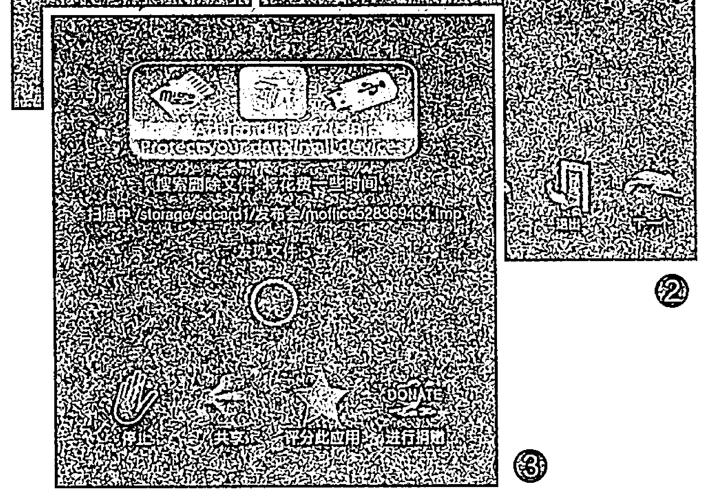


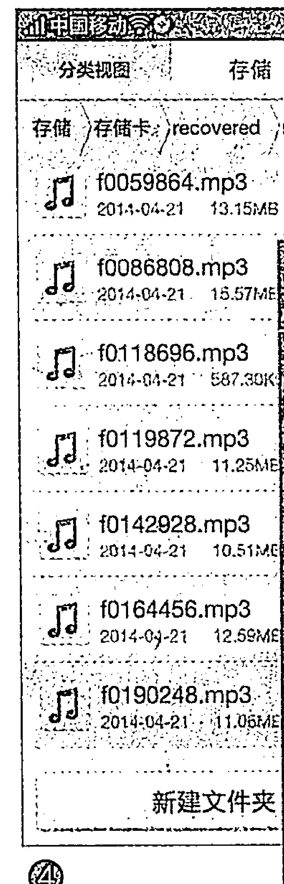


### 掌心互联 搜索更给力的网络

很多APP在没有网络时就是“残疾”状态，但很多时候我们的2G/3G或所处的Wi-Fi网络信号却并不给力。那么，如何才能搜到身边的更稳定和高速的无线信号呢？

##### 被忽略的网络设置

在手机“设置→移动网络→网络模式”中，可以由用户自定义手机当前的网络模式。比如4G手机可选4G/3G/2G或3G/2G自动模式，而3G手机还会额外增加一个“仅使用2G”的选项（图1）。如果你的SIM卡并非4G或3G号，

那么就请直接设置到仅2G模式，避免频繁搜索不支持的网段而导致信号波动和额外的耗电。如果你经常出入信号不稳定的区域，千万不要选择“仅3G”或“仅4G”，否则在没有3G/4G信号的地方手机会直接变成“飞行模式”。

##### 软件提升3G网络信号

如果你觉得手机3G信号不稳定，可通过“3G信号增强器”（下载地址：http://t.cn/8sTSgMs）这款软件来改善网络信号。该软件工作原理是分析附近的通信基站，主动切换优质空闲基站点，从而达到3G

手机信号增强的效果（图2）。笔者使用一段时间后的最大感觉就是减少了2G和3G的切换频率（TD网络手机），以前在家里多为2G网，偶尔才可切换到3G网，但使用软件后在绝大多数情况下都保持在稳定的3G模式下。

##### Wi-Fi信号也可增强

GPRS可以改善信号，Wi-Fi的信号自然也能够增强了。在手机上安装“Wi-Fi信号增强器”（下载地址：http://t.cn/8sToicm），点击“增强信号”按钮后就可提升接收到的无线信号强度（图3、图4）。该软件的最大特色就是最大限度避免了因信号强度低而出现断线的可能性。

##### 免费Wi-Fi任我用

当Wi-Fi信号增强后，意味着可以搜（蹭）到更多Wi-Fi热点并稳定地接入。在这里笔者推荐“Wi-Fi万能钥匙”（http://www.51y5.net/），该软件会自动搜索手机周边免费共享的Wi-Fi热点（如麦当劳、肯德基或是经过分享密码的个人无线网）供你一键接入（图5），让你随时保持高速的联网状态。

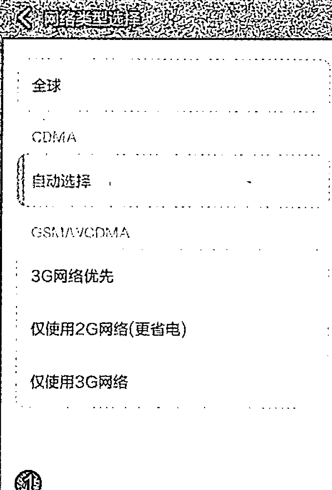


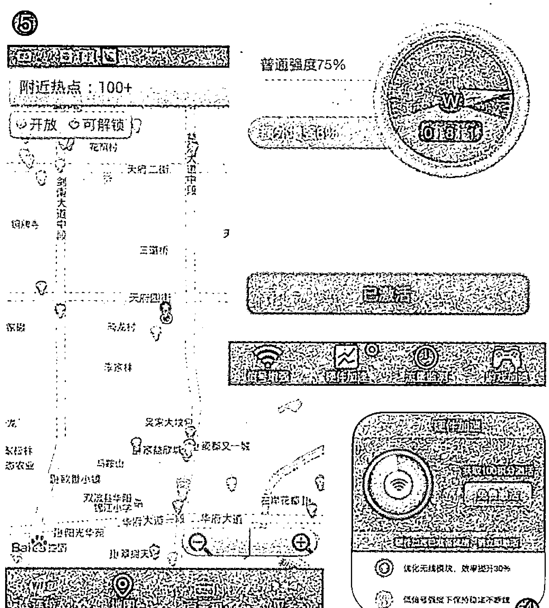

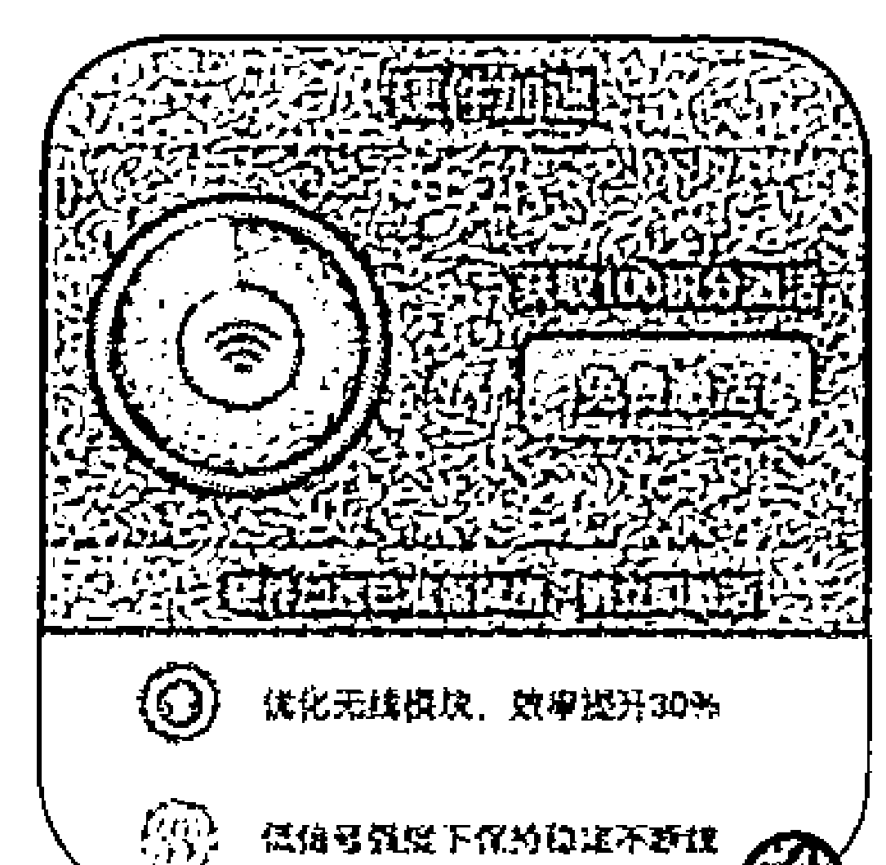

### 掌心小秘密

一机双号拒绝广告骚扰

在与房产中介、保险推销等特殊职业人群打交道时，我们担心将手机号告知对方，日后会遭遇无尽的骚扰。此时，如果我们可以获得一个11位的临时号码再与对方联系，既可以获取所需的信息，又不必担心真实手机号码被他人搜到。

##### 保护个人号码隐私

很多个人隐私都可从手机号码为基础被不断挖掘出来，只为了与陌生人临时打交道而告知对方自己的手机号，多少都有些不稳定因素在其中。所谓“防人之心不可无”，在这里笔者就推荐大家使用“手机密号”（下载地址：http://pan.baidu.com/s/1o6lsJ82）这款软件，获得一个临时的手机号。

##### “一机双号”不是梦

使用手机密号无需Root系统，首次运行需绑定一个手机号（图1），在欢迎界面点击“新手体验”，软件就会分配给你一个唯一的11位临时号码（图2），将这组号码告知别人就不必担心日后被骚扰了，因为我们可随时在软件端注销这个号码再重新申请，或选择将此号码停机。

需要注意的是，手机密号所申请的临时号码只有6小时的有效期，超过时长后会被自动关闭，需要付费延长有效时间（图5）。不过，毕竟我们只是因安全方面的考虑而临时与某人联系，6小时也足够用了。

当对方通过临时号码与你通话时，该软件会以来电转接的形式打入你的手机，而对方却不会有所察觉（图3）。同时，我们也可利用临时号码与对方收发短信，只是短信记录会保存在“手机密号”的短信菜单界面（图4），并不会出现在系统短信的聊天记录中。

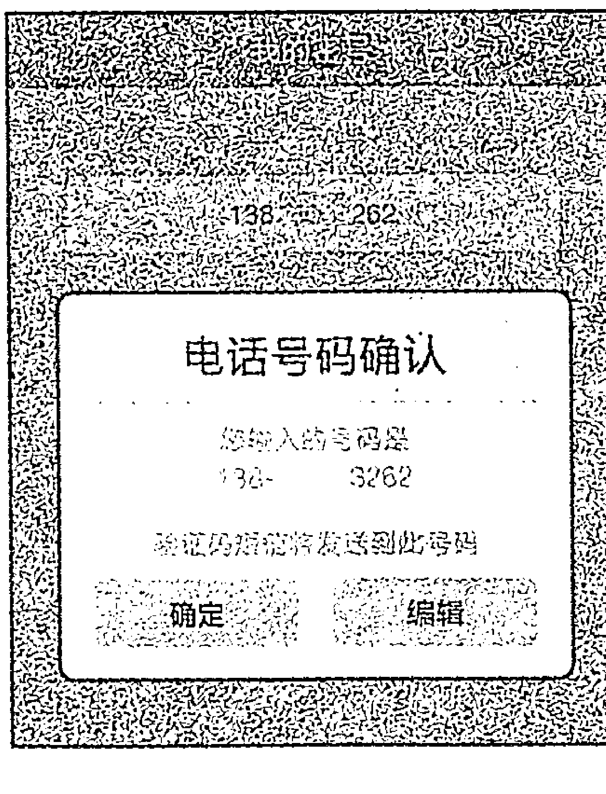

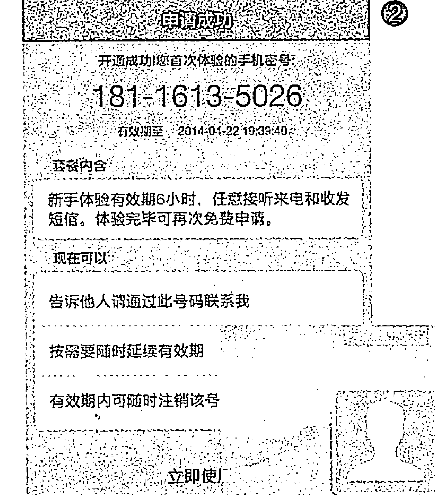

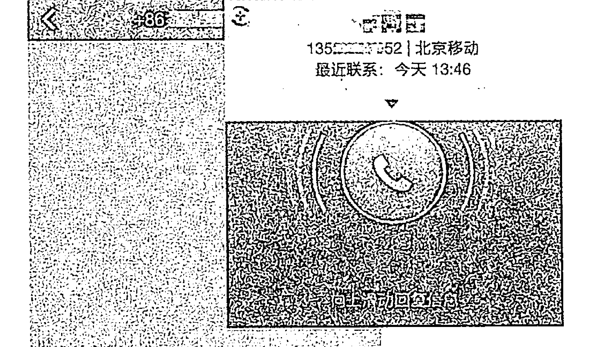

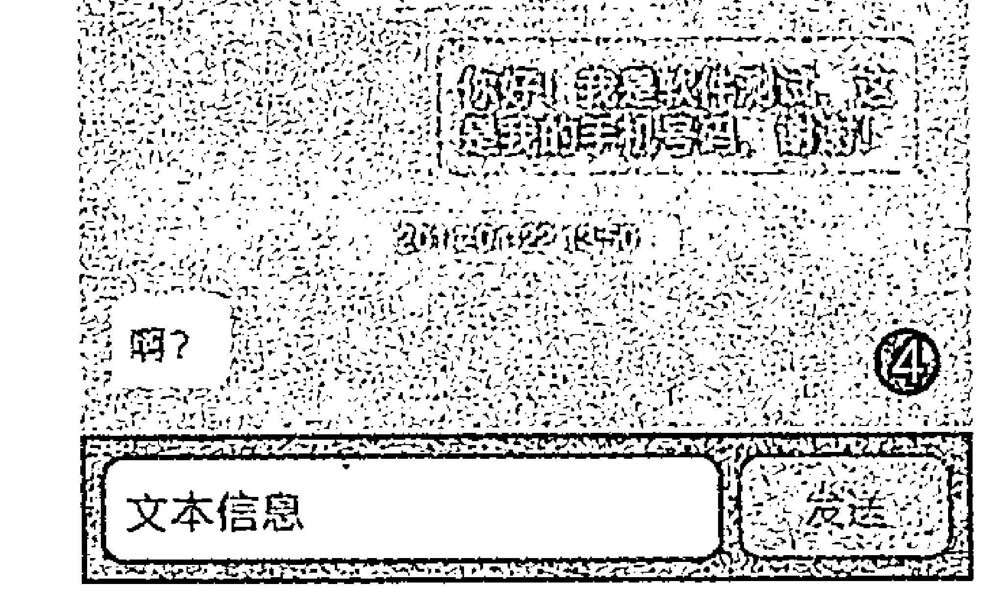

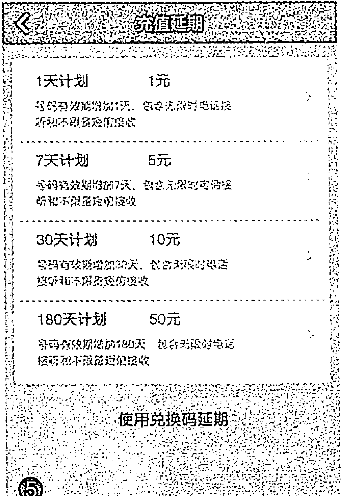

###### 小提示

手机密号软件在注销当前临时号码后，需要隔天才可再次申请。

总之，在不方便告知某些人真实手机号时，借助手机密号生成的临时号码，既可以不耽误联系沟通也不影响隐私安全，也算是一种“反搜索”的安全技巧吧。

### 掌心音乐库 便捷的听“音”搜歌

当你在街头巷尾或超市咖啡厅听到了动听的音乐，却苦于不知道歌名时，不妨赶紧掏出手机进行掌心的“声纹”搜索，绝大多数耳边音乐的名字、下载地址就会呈现在小小的屏幕之上。

##### 手机就是声纹采集器

没错，只要手机能上网，就可以借助第三方APP实现“听音辨歌”，比较有代表性的软件有“猎曲奇兵”、“Shazam”、“音乐雷达”等（图1）。此外，像微信和网易云音乐等客户端内也集成了类似的功能。以微信为例，在发现的“摇一摇”功能中切换至歌曲界面，轻轻一摇之后就能开启手机MIC并侦测环境音乐（图2），通过网络搜索到匹配的歌曲就可以实现在线收听或下载（图3）。就笔者的体验，单机软件中Shazam搜索耗时和准确度表现较佳，而微信作为装机率最高的APP之一，也可作为补充的搜歌利器。

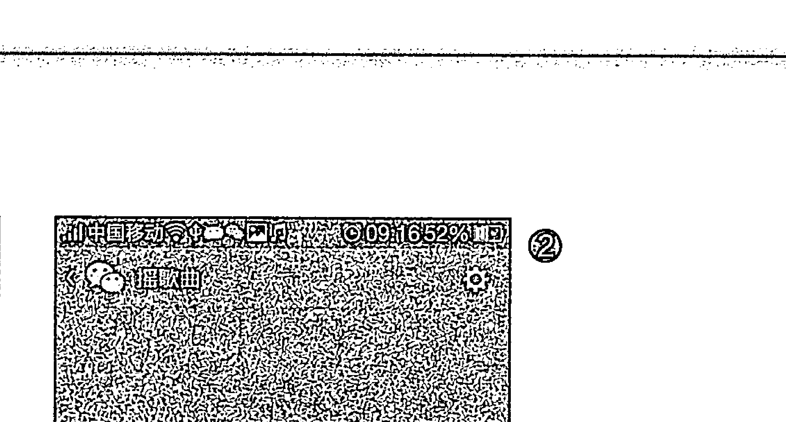

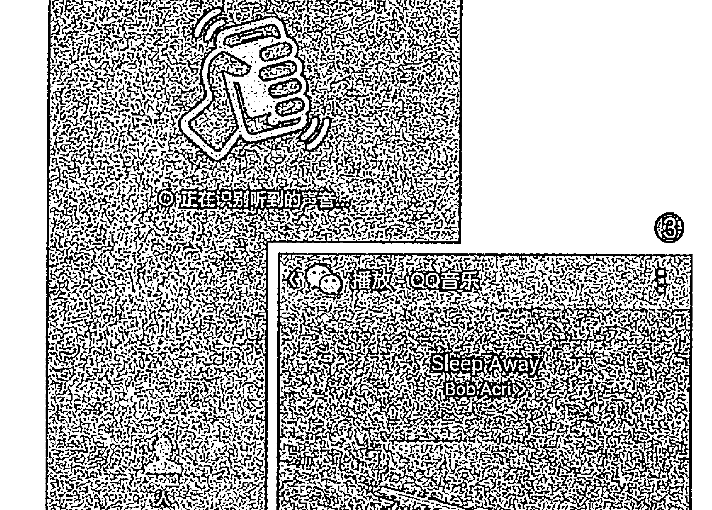

##### 无线“搜刮”其他手机的歌曲

有时我们会在别人的手机上听到感兴趣的歌曲，如何才能快速便捷地将这些歌曲“搜刮”至自己的手机呢？可以借助“茄子快传”、“闪传”等软件实现手机间文件的高速无线传输。以茄子快传（下载地址：http://kc.lenovo.com/）为例，它可以在两部手机间建立Wi-Fi直连通道，将手机中的任意音乐，或已安装的APP、视频甚至文件夹直接分享给另一部手机（图4）。只需在软件主界面点击“我要发送”，接受者点击“我要接收”，发送者选中内容后，点击下一步就可将需要共享的文件发送出去（图5）。上述操作不会浪费本地流量，所以不必担心任何扣费。

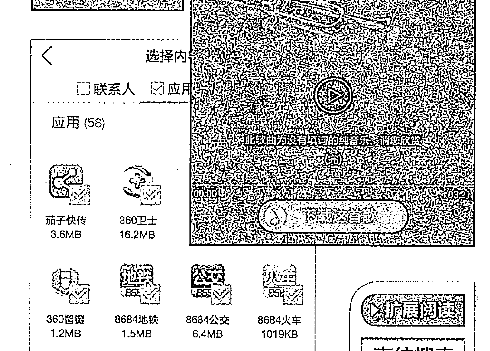

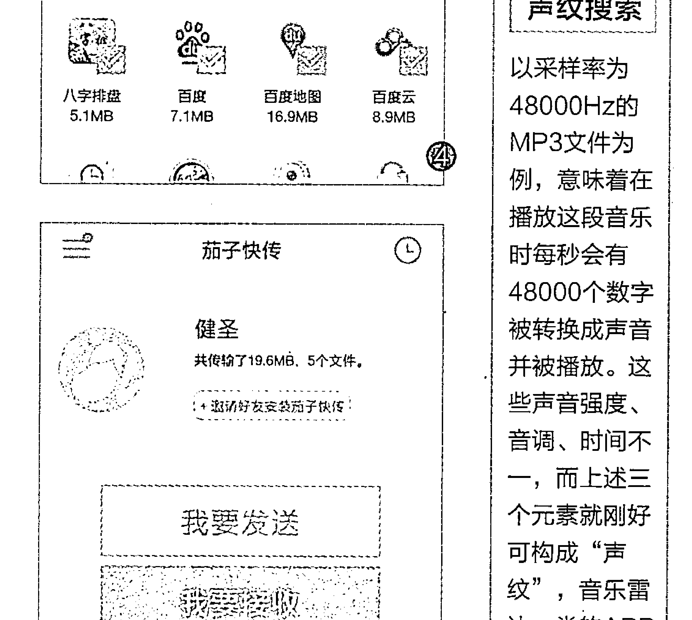

> 声纹搜索
以采样率为48000Hz的MP3文件为例，意味着在播放这段音乐时每秒会有48000个数字被转换成声音并被播放。这些声音强度、音调、时间不一，而上述三个元素就刚好可构成“声纹”，音乐雷达一类的APP原理就是借由这些声纹，通过网络搜索匹配的歌曲。

### 掌心找人

定位搜索进阶应用

对家有小孩或老人的家庭，最担心的就是他们走丢。此时，我们不妨采用软硬结合的方法，在掌心找到他们当前的位置。


##### 相对可靠的特殊装备

目前已经有很多硬件厂商和互联网公司嗅到了安全市场的商机，并推出了很多针对性的定位设备。比如“360儿童定位手环”（图1）、凯步“爷俩好”家庭成员定位器等等。简单来说，这类设备都会内置GPS模块，并辅以SIM卡进行GPRS基站定位，通过手机客户端或PC网页随时定位设备位置。

以360儿童定位手环为例，它在手环的外观里内建320mAh锂电池，一次充电可以满足几天的续航时间。小孩只需戴上它，就可随时将GPS（室外）和GPRS（室内）信息发送到监控端，如安装APP的手机上（图2），让家长可以随时掌控小孩的大概位置，感觉异常时还可远程开启手环的录音功能和监听。

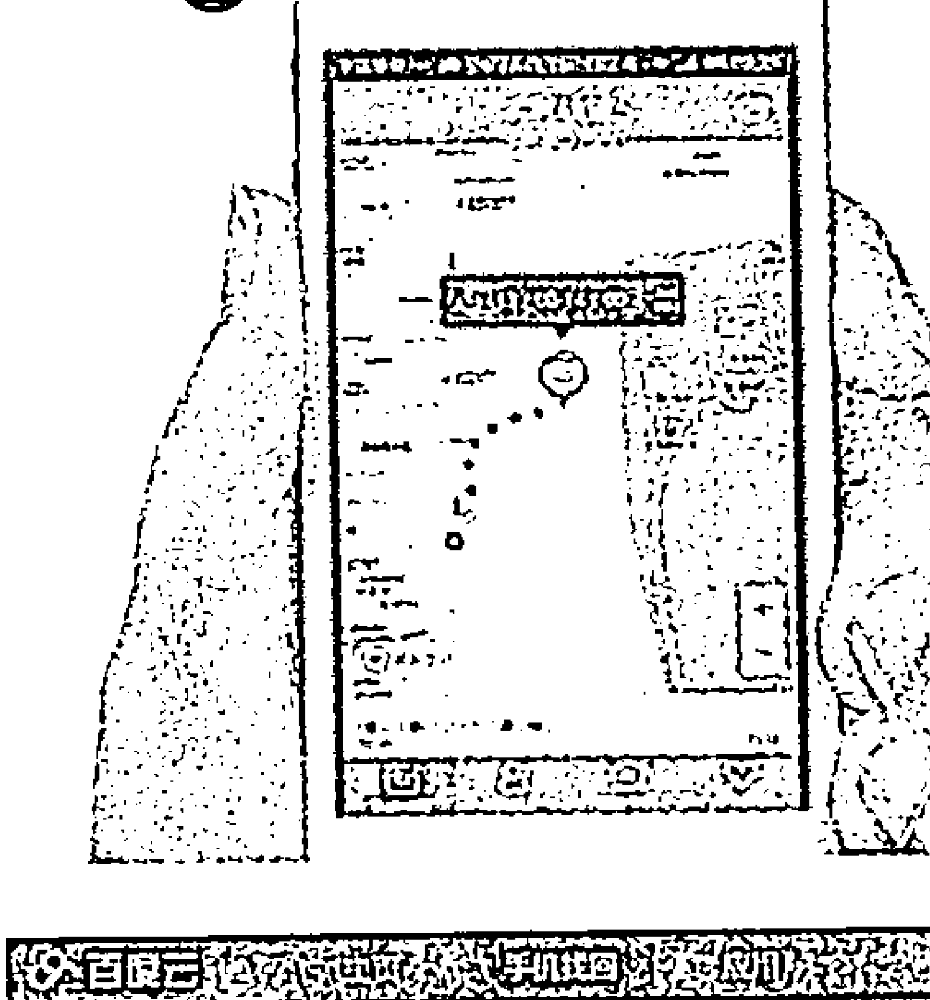


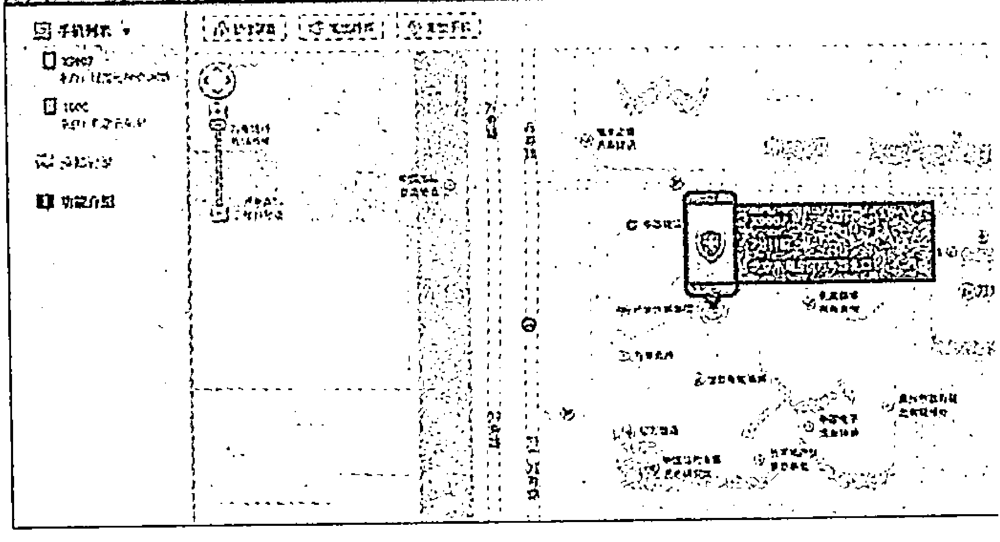

##### 低成本的软硬组合

实际上，随便一款Android手机，同样可以扮演360儿童定位手环的角色。当然，我们还需要一款APP的帮忙，在这里笔者推荐“百度云”（下载地址：http://pan.baidu.com/download）。该客户端不仅可以在掌心管理网盘，还可实现“手机找回”的功能（图3）。激活该功能后，在PC或者手机的浏览器访问“http://yun.baidu.com”即可定位手机（图4）。今后，当你想随时掌握家庭成员或者男朋友的位置，只需一款手机和一款APP即可。

只是选择第一类产品时要考虑一次充电的续航时间，而手机和APP组合方案相对更通用一些。

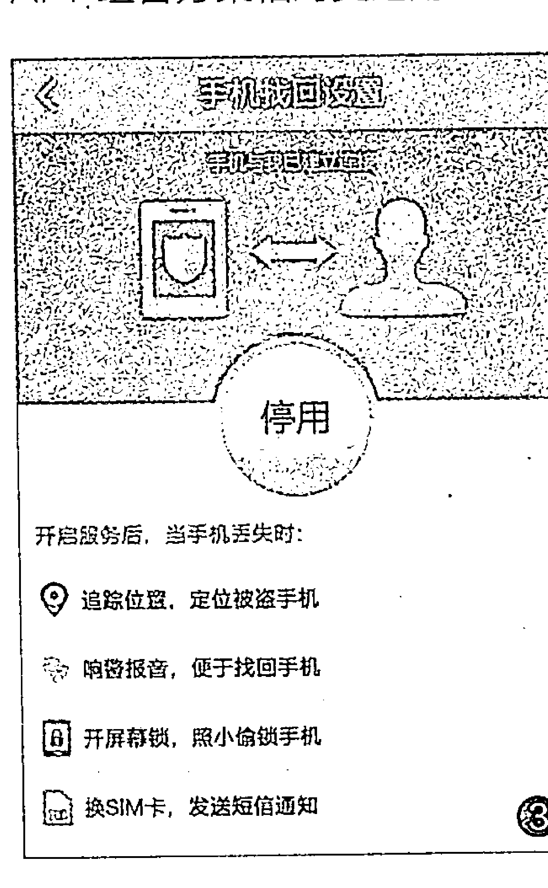

###### 小提示

手机端的各种APP的手机找回功能都需要获得定位权限（图5）。如果手机安装了权限管理软件，记得允许百度云相关的权限，否则获取定位会失败。

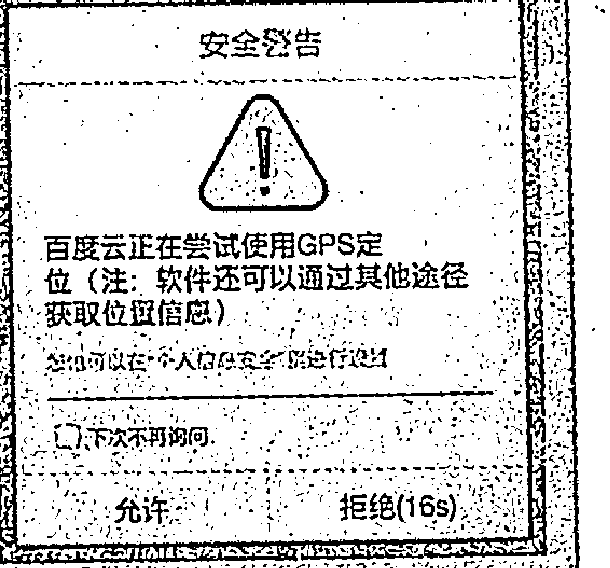

##### 总结

搜索经历了从桌面PC→笔记本→手机平板的发展历程，并终将在掌心全面爆发。希望借由本章节，可以打开你与掌心设备的交互通道。当然，如果你有更多更好玩的掌心搜索技巧，欢迎发邮件到wangjian@cfan.com.cn与广大读者分享。

### 2014世界杯

一起战！

四年一轮回的最后时限终于临近，在梅西、C罗、罗本、鲁尼等那些昔日的青涩小伙都已变成沧桑型男之际，2014年巴西世界杯的大门已向全球球迷和观众敞开。6月12日至7月13日，令无数人激情亢奋的顶巅对决即将在这个南美洲国家境内的12座城市和12座球场中进行。在迎接这届足球盛宴之前，你和你的IT设备们准备好了吗？


### 科技世界杯

##### 用科技保驾护航

世界杯、奥运会、NBA——无处体育盛事纷呈的背后

从裁判、足球到直击，从电子围栏到控球感应器，2014巴西世界杯堪称之全新科技测面，接下来就让我们简单地盘点一下吧。

##### 智能装备让看球更过瘾！

可穿戴设备、智能电视、多屏互动，这些当下时髦的科技元素，能否在世界杯期间带来更精彩的体验？答案是肯定的！


> 混乱的赛场和视野的遮挡影响裁判的主观判断

##### 铁面无私的“电子”裁判

1966年英格兰世界杯决赛上赫斯特的那粒进球、2010年南非世界杯英格兰和德国巅峰对决中兰帕德的那一记世界波进球都被誉为了“门线悬案”，主裁判的主观臆测将决定一支队伍的生死（图1）。为了避免类似的“冤假错案”，巴西世界杯将正式引入门线技术，允许使用技术手段来帮助裁判进行判决。

目前门线技术主要分为“鹰眼技术”（Hawk-Eye）和进球裁判技术（GoalRef）两大阵营。其中，鹰眼技术的本质是由高速摄像设备、电脑模拟和大屏幕组成的一套即时回放系统（图2）。在球门周围设置价值高达25万英镑的6台高速摄像机，采取三角原理记录视觉图片和时间数据，由此来判断球是否越过了门线。

而进球裁判技术的原理则是在足球内部塞入电磁传感器（图3），同时在禁区和门线位置设置感应磁场，当足球越过门线时会引起磁场变化，从而及时反馈进球信息到中枢计算机。这两种技术都可以毫秒为单位即时将结果传送到裁判佩戴的手表上。当然，这些技术的背后还包含无处不在且稳定不间断的无线信号传输，以及全天候和抗恶劣天气的稳定性。

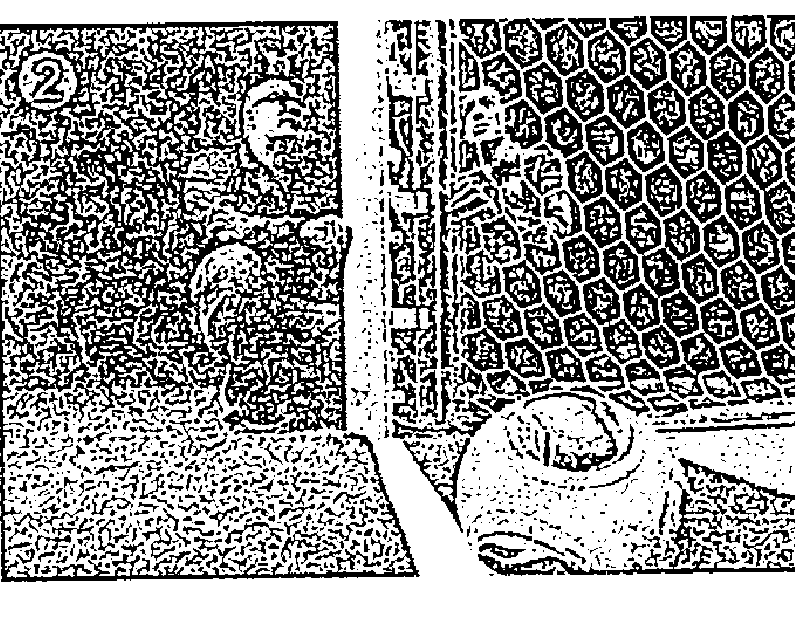

> 打造自己家的“鹰眼”

鹰眼技术可以解决足球的误判，而作为普通用户，我们也可借助网络摄像头搭建自己的“鹰眼系统”用于防盗和安全。相关的选购和使用问题，请参考2013年14期《随时掌控一切变化 安全监控让你安心》这篇文章。


如果你觉得不好理解，我们还可以将鹰眼技术理解为高速公路上的电子眼抓拍，而进球裁判技术就好似超市商品防盗所用的磁性防盗报警器。只是，为了准确检测快速移动的足球，这两套技术的精准度和成本更高而已。

##### 4K技术“试炼场”

从2013年底开始，智能电视崛起加速了4K级（3840×2160像素）电视的普及，很多品牌都推出不足3000元的4K电视。在2014世界杯期间4K电视真正有了用武之地：FIFA（国际足联）将在本届世界杯中广泛应用索尼4K技术，包括2014世界杯官方影片，并将制作三场完整比赛的4K内容。

> 优酷和乐视等很多视频公司已布局4K内容，而很多电视品牌如海信、康佳、TCL、创维等旗下产品均支持“2K转4K”技术，将输入的2K信号通过4KMRIT影像微重组技术智能插帧以模拟4K的视觉体验。虽然效果与真4K尚存差距，但也算现阶段弥补4K内容匮乏的过渡之举。

4K屏幕拥有4倍于1080P、8倍于720P的分辨率，在同样的观赏距离下可让人眼无法识别像素。这意味着可看清被足球一路卷起的草屑，以及射门瞬间点球选手脸上那暴起的青筋和飘洒的汗水。

播放4K视频对当下的硬件压力不大，但想自己拍摄4K视频就需要最新设备的支持了。比如索尼Xperia Z2、三星GALAXY S5就是首批支持4K拍摄的手机代表。需要注意的是，4K拍摄对存储容量和读写速度要求极高，每分钟都会“吃掉”近1GB左右的存储卡空间。因此，现阶段选购IT设备时，可以流畅播放4K足矣，至于拍摄则是锦上添花的功能，无需强求。

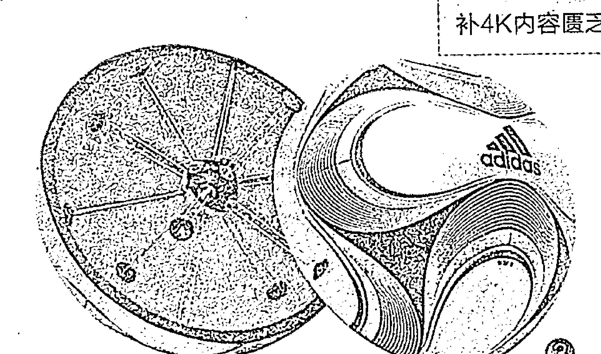

##### 神奇的任意球喷雾器

##### 人造的“高科技草皮”

比赛中很多裁判都头痛于不规范的任意球和人墙距离，比如规定9米但实际操作时仅有5米。为此，在巴西世界杯中“任意球喷雾器”孕育而生。简单来说，任意球时裁判可利用该喷雾器在指定位置喷出一道明显的白线（图4），1分钟后线会自动消失，环保无污染。

捉摸不透的天气对巴西球场的草皮提出了更为苛刻的要求。为此，巴西采用了因地制宜的策略，比如在相对寒冷的南方球场采用基础草皮+防寒草种的组合，并且让二者高度融合，让球员在上边奔跑时感觉脚下是同质的草坪。在世界杯前夕，相关部门会每15天1次地对赛场草皮进行检测以达到最佳的比赛环境。此外，在姆博贝拉球场和彼得·莫卡巴球场上，巴西还计划改用人工草皮（图5），其质地无限接近天然草地，减缓了球员摔倒或铲球时易划伤、太阳暴晒下挥发有害气体的缺陷。只是，人工草皮在奔跑时能否如泥土一般吸收大部分的惯性和冲击力还有待时间来验证。


##### “视而不见”的球场顶棚

体育场球员坐席区的顶棚除了遮风挡雨之外，还要保证现场观众的“可见性”，因此一度由透明的塑料材质为主，不耐脏且寿命短。在巴西世界杯中，新坐席的玻璃顶棚将改用三层玻璃组成，拥有抗变形、抗变色、抗变质和不含有害物质的优点，可长时间保持干净和透明，以确保观众能够“视而不见”。

##### 越变“简洁”的足球


本届世界杯所用的“桑巴荣耀”足球采用了最新的球面结构和缝制技术。第一个世界杯足球是由32块皮缝制而成，2006年德国世界杯和2010年南非世界杯分别“缩水”到了14块和8块。而如今“桑巴荣耀”仅由6块十字型球面拼成（图6），可带来更好的场上控球、触球、稳定性以及空气动力学性能。

### 智能终端“绝缘”的圆

提起足球，相信大家的第一感觉就是“圆”。但在电脑和智能终端产品领域，为何就少见了圆形的存在，这是为什么？

##### “奇葩”的圆形屏幕

在科技类产品中，圆形元素一直都是相对小众的存在，特别是在配有LCD屏幕的智能终端设备上，圆形更是成为了“濒危元素”。以手机领域为例，摩托罗拉应该是少有的“与圆结缘”的品牌，无论是2002年的V70（图7）还是2008年的AURA（图8），圆形的屏幕始终是最令人印象深刻的设计。有意思的是，除了摩托罗拉即将发布的MOTO 360智能手表外（图9），近些年似乎其他品牌都对这种个性炫酷的几何形状不感冒，唯恐躲之不及。

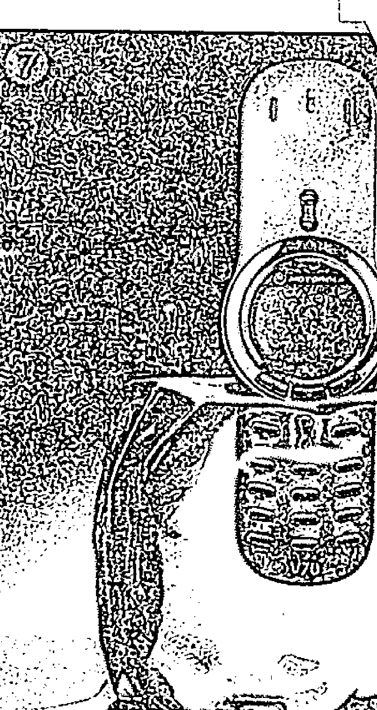

除了摩托罗拉即将发布的MOTO 360智能手表外（图9），近些年似乎其他品牌都对这种个性炫酷的几何形状不感冒，唯恐躲之不及。


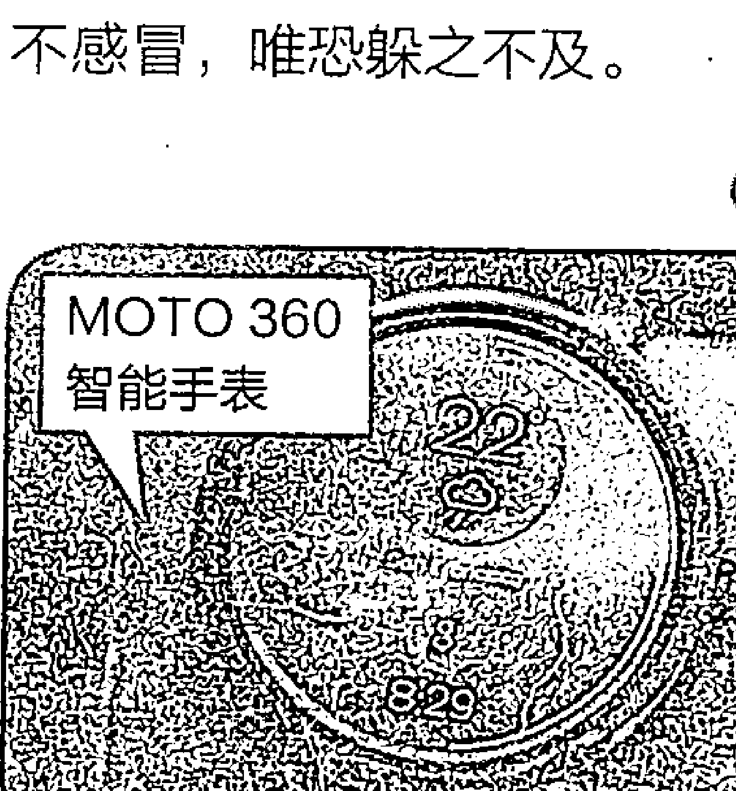

##### LCD切割成本

LCD显示面板讲究的是切割成本，16：9显示比例的屏幕之所以普及，并非其适合电影播放，比4：3和16：10屏幕更便宜才是背后的推动之源。无棱角的圆形屏幕势必导致切割成本的提升，二手摩托罗拉AURA手机至今在淘宝的价格还要2500元~3000元，由此可见小众的代价。

##### APP的二次适配

UI和操作是智能设备比拼的重点环节，而圆形屏幕的边缘空间是很难被开发利用的。此外，想在这种非标准画面上兼容常见的APP，需要APP开发者进行二次开发和适配，所有显示硬件都需要重做。如此大量的基础性工作肯定是吃力不讨好。

##### 更实用的柔性屏幕

本来智能手表有望成为圆形屏幕的“第二春”，毕竟传统手表的表盘都是圆形。但随着柔性屏幕技术的发展，这种可以根据手腕形状而弯曲的屏幕，显然更适合操作和佩戴。业内人士普遍估计配圆形屏幕MOTO 360的价格在500美元以上（3200元人民币左右），而该价格却比非圆型屏幕智能手表贵了一倍有余，又谈何普及？

总之，圆形的足球可以乘风破门，但圆形的屏幕始终都存在难以逾越的成本和操作体验上的缺陷。至少在巴西世界杯和以后的一段时间里，圆形智能终端肯定仍是小众的存在。


世界杯即将开赛，作为足球爱好者的你我，不管是一个简单的看客，还是以不同程度和形式参与其中，都是这个大家庭的一个分子，都在为这场人类体育盛事推波助澜。
如何才能方便地查看赛事的对阵情况？
如何做到赛事消息早知道？
如何才能看爽世界杯？
如何才能第一个知道比赛结果排名？
对于“参与”这个话题，还有哪些更高明的招数？

##### 赛事早知道

北京时间2013年12月7日凌晨，2014年巴西世界杯小组赛分组最终尘埃落定，小组赛赛程也随之出炉。为了便于对赛程和时间的把握，球迷们总是希望自己的手头能有一份清晰的赛事日程表。网站上有很多和世界杯相关的比赛消息，但能不能找到合适的可以用A4标准打印的好素材？如果找不到合适的，可否考虑自己亲自制作一份？要制作对战表，素材从哪里找？每天要面对这张表，经常要查，能不能做得更好看一些？那么多小组，那么多时间点，如果能支持记录速查，一键直达目标更为理想，如何制作？

如此盛大的人类体育盛典，想必不会没人提前制作赛事表吧？如果网上有合适的现成赛程表，下载直接使用再方便不过了。想到做到，马上驾鼠上网搜索一番，看个究竟！用百度搜索“2014世界杯赛程表”，从搜索结果中，可以见到不少网友制作并共享的“2014世界杯赛程表”Word文档或Excel表格。果不其然，这样的表格还真不少呢（图1）！这些文档多为百度文库中的共享文档，其中有需要积分下载的，也有不少是免积分的。只要有一个百度的通行证账号，登录之后即可下载自己需要的赛程表。对于刚注册没有积分的用户，选择免费文档下载即可（图2、图3）。

### DIY 2014世界杯赛程表

##### 在百度直接搜索2014世界杯赛程表

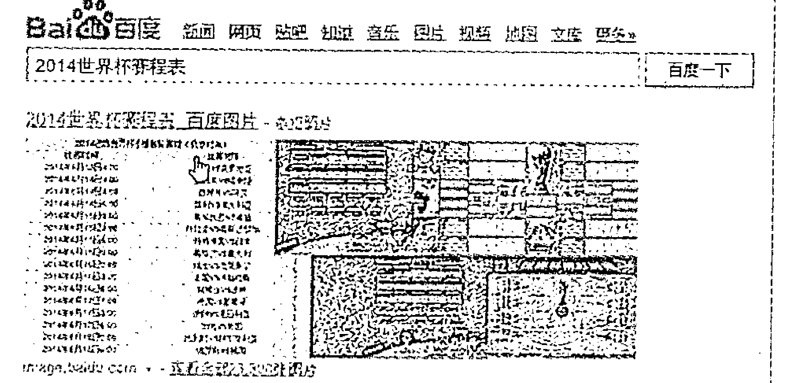

##### Word格式的赛程表


##### Excel格式的赛程表

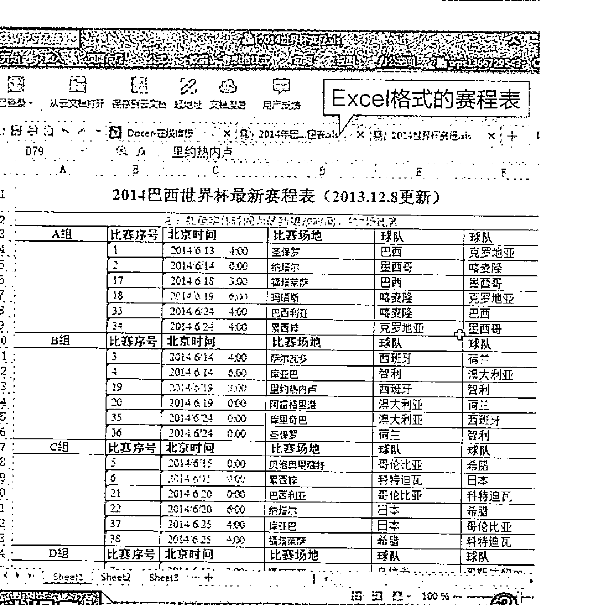

##### DIY自动筛选的赛程表

从网上下载的赛程表虽然符合打印为A4纸的条件，但如果在表格内查询，还得从上到下浏览，效率不高。在图4所示的赛程表中，各项目均包含日期、时间、对阵双方、组别、比赛地、直播频道、场次等信息。在此表中进行查询，只能用鼠标上下滚动的方式进行浏览。如何才能实现用以上所列的任意一个字段，按任意指定的条件进行查询呢？

我们可以用最新版的Excel或WPS打开这个表格，然后锁定表格的表头，并且给表格添加高级自动筛选条件，以达到自定义自动筛选的目的。这里我们以在最新版WPS表格中操作为例说明。

Step 1 ▼ 用鼠标选择表头下一行的数据，然后点击“视图”菜单，再选择“冻结窗格”按钮，这样，表头就会被冻结，上下滚动时，表头固定不动，而表格其他部分可随意上下滚动浏览。

Step 2 ▼ 点击“数据”菜单，然后点击“自动筛选”按钮，这时可以看到表头的每个字段后面均自动添加了一个小三角按钮，单击该按钮会出现不同类别的下拉选择菜单。

###### 小提示

> 双击打开Word文档或Excel表格，可通过打印预览功能测试是否适用标准的A4纸实现打印。若版面不合适或样式不合意愿，可在原稿的基础上修改或重新设计。

##### 网上下载的原始赛程Excel表

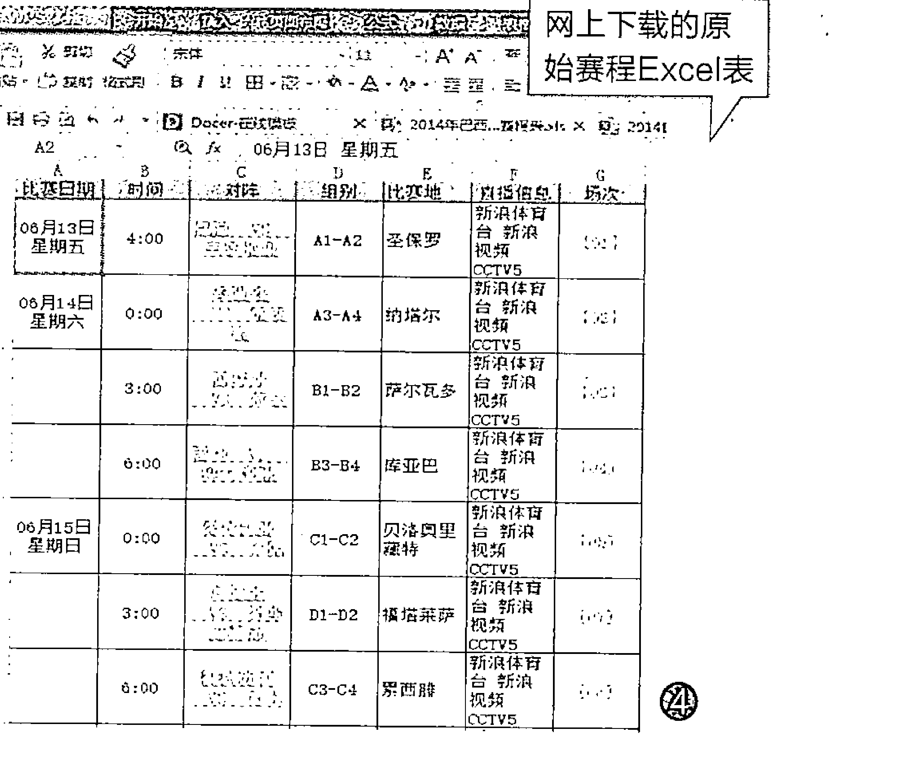假如只想查询比赛地在圣保罗的场次有哪些，那么只需在“比赛地”下拉列表中选择“圣保罗”，这时表格就会自动变成只含圣保罗比赛地的记录，从中可一目了然看到自己想要的场次（图5）。

假设只有星期三有时间能看比赛，那么如何快速让表格列出所有在星期三进行的比赛项目呢？这时，只需点击“比赛日期”后的小三角，然后从筛选窗口中选择“文本筛选”并选择“包含”，在随后弹出的自定义筛选方式窗口的“包含”项后的文本框中输入“星期三”，点击“确定”按钮，马上会显示出所有在星期三进行的比赛场次（图6、图7）。

要回到原始的全部记录显示状态，只需在含有沙漏小图标的字段后点击该图标（有沙漏表示是经条件筛选后的字段），再选择“全选”并确定，即可复原为原始的全部记录。

| 比赛日期 | 时间 | 对阵双方 | 组别 | 比赛地 | 直播信息 | 场次 |
| :--- | :--- | :--- | :--- | :--- | :--- | :--- |
| 06月18日 星期三 | 0:00 | H1-H2 | 圣保罗 | CCTV5 | 15 |
| 06月25日 星期三 | 0:00 | D4-D1 | 贝洛奥里藏特 | 新浪体育 | 39 |
| 07月02日 星期三 | 0:00 | 1F-2E | 圣保罗 | 新浪体育 | 56 |
| 07月09日 星期三 | 4:00 | Y57_VS_Y58 | 贝洛奥里藏特 | 新浪体育 | 61 |

文/樱子

### 关注和提醒世界杯

很多人因学习或工作繁忙，无法花更多时间专门到网站上观看关于世界杯的图片或视频报道。但是，这些人中的多数对世界杯有着强烈的好奇和追求。那么，如何第一时间获得比赛资讯和有关消息？下面提供一些行之有效而又省事、省时的解决办法。

##### 专业网站/客户端助力

关注世界杯，我们首先推介两个权威和可靠的网络信息来源，一个是CCTV5网络频道，另一个是新浪体育直播。

最权威的信息来源是央视体育频道。如果使用PC端，可访问央视体育频道（http://cctv5.cntv.cn/），点击“加关注”按钮，将央视体育微博与自己的微博相关联，及时获取关于体育赛事的有关信息（图1）。

现在多数人使用Android手机，可以安装“央视体育”这款APP，利用空闲碎片时间在手机上直接关注赛事信息。

2013年8月18日央视5+体育赛事频道上线后，央视体育拥有了两套高清直播信号。央视体育APP可接收到央视5套和5+体育赛事两路高清节目直播信号，APP中内嵌了与这两套节目相对应的节目单，可随时了解比赛信息。

此外，还可以用央视的另一款体育APP——吾家VIP（5+VIP）Android手机客户端，随时观看高清赛事（图2）。

5+VIP是一项视频增值服务，与央视体育APP的主要区别是，普通注册用户登录5+VIP后，只能预览体验精彩比赛的直播和录像，不能完整观看，而注册成为5+VIP后，就能观看完整的比赛直播和点播视频了。其优势在于，享有CCTV的海量一手版权赛事资源，足球、篮球、网球的热门赛事一网打尽。

此外，由于电视台节目编排限制，大量同时进行的精彩比赛，由于电视转播的需要，不能被同时播放出来。但5+VIP却可以弥补电视转播的不足。因此，对于那些不想错过任何一场比赛的铁杆球迷，5+VIP是再合适不过的选择。

| 挑选只在圣保罗举办的比赛场次 |
| :--- |
| 06月13日 星期五 | 4:00 | ... | A1-A2 | 圣保罗 | 新浪体育 | 2 |
| | 3:00 | ... | D1-D3 | 圣保罗 | 新浪体育 | 13 |
| | 0:00 | ... | B2-B3 | 圣保罗 | 新浪体育 | 25 |
| | 4:00 | ... | H4-H1 | 圣保罗 | 新浪体育 | 32 |
| 07月02日 星期三 | 0:00 | ... | 1F-2E | 圣保罗 | 新浪体育 | 48 |
| 07月10日 星期四 | 4:00 | ... | W59-Y60 | 圣保罗 | 新浪体育 | 59 |

对于赛事表中自己比较关心的场次、球队等，可以通过给单元格加不同底色的方法予以突出标示，这样看起来就更能一目了然。此外，整个表格也可以用相邻单元格颜色变换的方式实现整体上的美化。

| 按时间条件自定义筛选方式 |
| :--- |
| 显示行： |
| 日期： |
| （●）与（Y） ○或（O） |
| 10月15日 星期三 |
| 10月22日 星期三 |
| 10月29日 星期三 |
| 11月5日 星期三 |
| 11月12日 星期三 |
| 11月19日 星期三 |
| 可用 ? 代表单个字符 |
| 用 * 代表任意多个字符 |
| [ 确定 ] [ 取消 ] |

最后要说明的是，以上用高级筛选的方法快速查询数据表符合条件的赛程记录的方法，实际上可应用于不同领域的数据查询中。只要是能够反映到一张二维表格中的数据，对于每个字段项目的条件查询，均可使用这种自动筛选的高级查询方法。

###### 小提示

“央视体育”APP同时拥有Android、iPhone、iPad、WP8等不同平台支持的客户端。用户可根据自己使用的智能移动设备情况选择安装合适的客户端。

彩比赛无法在电视上观看，而在5+VIP上就可以观看这些传统电视上看不到的精彩比赛。

另一个比较权威和靠谱的信息来源是新浪体育。使用PC端，可关注“新浪世界杯”频道（http://2014.sina.com.cn/）。这里有关于2014巴西世界杯的倒计时、赛程、积分榜、电视转播表、视频、高清图片等，一应俱全。为便于访问，读者朋友可将此链接加入浏览器收藏夹、工具栏、任务栏、桌面等方便访问之处，随时一点即可了解情况（图3）。

相应地，使用手机端的用户可安装“新浪体育”APP关注世界杯。用碎片时间随时重点关注世界杯消息，或用提醒模式获取消息。

新浪体育APP可提供丰富的比赛数据和海量的新闻资讯。每项赛事除提供全部球队排行外，还有10余单项榜单，每场比赛提供全面数据统计，平均每个球员提供10余项数据统计。海量、快速全面的新闻报道及深度评论涵盖集锦、录播、策划、进球等10余种消息类型。

新浪体育APP有多种提醒模式：除了普通进球和赛果提醒外，还提供狂热足球迷进球提醒；夜间免扰提醒模式（23点通知所有夜间比赛，早7点通知比赛结果），不影响工作学习。还提供个性球队定制，关注喜爱球队，做不再错过比赛的忠实球队控（图4）。

用手机客户端关注体育赛事具有传统电视所不具备的优势。首先是可以与球迷和解说进行互动，具有聊天功能；可以阅读相关资讯，按照自己的爱好定制赛事信息；甚至一键关注自己喜爱的球队或球员等。加之其特有的移动方便特性，成就了手机“小中见大”的独特看球地位。

###### Android下载地址

##### 新浪世界杯频道

李岩将红球轻推打入右侧底袋

+   0-15
0-14
0-9
0-8
0-1

##### 巧用常用新闻客户端

除了在手机里安装专业的体育客户端之外，如果我们没有时间去安装或者专门使用此类软件，也可以用自己手头已经安装的带有搜索功能的普通新闻客户端进行主动搜索。在需要关注的闲散时间里，只需要切换到搜索功能页面，输入“世界杯”关键词，即可搜索出最新的世界杯相关新闻。以“今日头条”APP为例，启动该应用后，点击屏幕左上角的用户头像按钮，进入系统功能列表，点击“搜索”按钮，然后在弹出的窗口搜索框中输入“2014世界杯”字样，软件就会在当日最新的新闻中，挑选出与2014世界杯有关的最新最热的新闻资讯（图5）。

用今日头条APP搜索世界杯资讯

##### 定制体育频道和消息推送

使用手机APP客户端，除了可主动搜索外，还可以通过定制专门的体育频道新闻，定制新闻客户端自动推送功能，及时获取体育资讯。我们仍以使用“今日头条”APP客户端为例，假如我们当前没有添加体育频道，在软件主界面中点击栏目题头右侧的+号按钮，随后可将“体育”频道选择添加为当前使用的有效频道之一。这样，所有与体育赛事有关的消息将发挥作用（图6）。

接下来，从软件设置中将“推送通知”一项选中，这样当软件检测到有相关新闻资讯时，就会以弹出消息的方式通知使用者（图7）。

| 设置选项 | 当前值/状态 |
| :--- | :--- |
| 列表显示摘要 | ☐ |
| 字体大小 | 中 > |
| 列表页评论 | 不限 > |
| 2G/3G网络流量 | 较省流量（智能下图）> |
| 清理缓存 | 当前缓存: 17.79MB > |
| 推送通知 | ☑ 开启APP推送通知功能 |
| 互动插件 | ☑ |
| 左右翻页 | ☐ |
| 收藏时转发 | ☐ |
| 顶踩时转发 | ☐ |
| 检查新版本 | 当前版本3.3 > |
| 精彩应用推荐 | > |
| 使用帮助 | |

以上介绍的是用专业体育客户端或大众新闻客户端获取世界杯相关资讯的方法。这一技巧和方法，对于用客户端集中获取社会生活某个方面的资讯来说，同样适用。读者朋友们可以借此扩展思路，发挥使用。

### 看爽世界杯

无论是了解世界杯赛事，还是关注足球赛消息，最终的目标却有一个，那就是届时能够爽爽快快地观看比赛节目。观看世界杯有多种选择，无论是用传统电视观看，还是通过互联网观看，都要围绕“爽”字做文章。“爽”是相对而言的，手机看不一定不爽，大屏幕看也不见得一定能“爽”，这其中有很多说道。

##### 顺应新风 看爽世界杯

2010年世界杯之前，央视已出1亿美元巨资买断2010年与2014年两届世界杯大赛转播权。随后CNTV将视频播放权分售给新浪、腾讯、搜狐等三家门户网站和优酷、土豆、酷六三家视频网站。从此，观看世界杯的风向开始改变，电视看球赛开始分羹于网络（图1）。

四年后的今天，虽然授权模式没有多大改变，但期间智能手机和平板电脑的发展却可谓如火如荼，移动看球赛的狂风铁定已越刮越猛，更多无法坐在沙发上的球迷将会选择用移动设备看球赛（图2）。

针对即将到来的本届世界杯，腾讯、新浪等门户网以及乐视、爱奇艺等视频网已不同程度地购买了网络赛事直播或转播权，乐视更成立了独立的体育公司，拿下了几乎所能想到的赛事播放权。新浪也开通了体育电视台，实现24小时内不间断直播和点播。腾讯和新浪除网站和客户端外，分别开发了手机体育类APP移动客户端“世界杯直播”和“新浪体育”，爱奇艺则联合TCL推出TV+。

无疑，由于选择的多样性和灵活性，通过互联网收看世界杯将成为更多人的选择。其中手机看球赛，装个APP就可搞定，更机动灵活，会成为许多人的主选或备选方案。而高清互联网电视以其无比优越的强大功能和用户体验，会受到越来越多人的青睐。

互联网电视无论是技术上还是观看体验上都有超传统电视的趋势。目前的有线电视所谓的高清其实还处在720P阶段，但互联网电视已经可以达到1080P的清晰度，如果取得了转播权，目前家庭的高清电视通过互联网接入就能观看到顶级的高清比赛节目。用户势必也会优先考虑用互联网高清电视来观看节目，而从目前参与者的状态，会让更多人喜欢用互联网这种方式来参与到一场比赛当中，而不只是看一看了事。因此如果有条件，选择使用互联网看球，会有更好的视听体验和心理满足感，建议作为首选看球方案。

##### 掌上有利器 床上看直播

除了有条件通过传统电视或网络高清数字电视观看比赛之外，许多情况下，受客观条件所制约，人们不得不使用手机或平板等移动设备来看球赛。另外由于时差的原因，也会有不少人宁愿选择躺在被窝里用手机看球赛。那么，床上看球赛选择什么APP为好？我们仍以普遍使用的Android平台手机为例来说明。

首先，推介获得用户广泛好评的“世界杯直播”APP，这是由腾讯出品的一款看球赛手机应用，是躺在床上用手机看球赛的利器，有网友戏称是“被窝里的球赛好伴侣”。

世界杯直播（Worldcup Live 1.3.0）是一个专业的足球类应用，提供足球比赛免费视频直播服务。除了世界杯，它还提供英超、西甲、德甲、意甲、法甲、欧冠等所有足球联赛的服务。不光有视频直播，还有高清比赛集锦、录像，有详尽的比分直播、文字直播，而且完全免费、没有广告。世界杯直播新闻报道迅速、内容齐全、视频播放清晰、流畅。软件内存占用少，视频下载速度快，可离线缓存。而且手机和电脑看的节目可以达到同步。看赛程、看新闻、看比赛都可以用它，可谓一软多能（图5、图6）。

我们还可以选择另一款电视直播APP云图TV电视直播。

云图TV电视直播也能让我们流畅地观看世界杯高清电视直播。它提供1000套以上国内外热门直播电视节目，其中包含世界杯、NBA、欧冠、亚冠精彩赛事实时直播。提供精准的节目预告表和节目播放进度。央视卫视节目提供回看功能。还支持实用的节目收藏和搜索。在播放界面内切换频道，操作方便（图7）。

##### 装个双时钟 把握准赛时

巴西时间和北京时间刚好阴阳对调，11个小时的时差会导致欣赏世界杯时遇到很多问题。如果能给系统安装一个双时钟，让系统托盘同时显示北京时间和巴西时间，这样查看对应时间的事情就变得易如反掌了。

以Windows 8.1系统为例，单击系统托盘时间显示区域，在弹出的时间面板中点击底部的“更改日期和时间设置”项，在“日期和时间”窗口中选择“附加时钟”选项卡，选择两个时钟复选框，依次选择中国和巴西所在的时区并输入要显示的时区名称标签，选择和填写完毕后，点击“确定”按钮生效（图3）。之后将鼠标置于系统托盘的时间显示区域，会看到同时显示出的北京时间对应的巴西时间（图4）。

由于时差问题，许多比赛将于北京时间早上进行，此时中国球迷基本都在上班途中，这是靠电视直播和PC无法解决的看球赛问题，利用手机在地铁里或路上观看比赛直播将成为风尚。但提醒手机用户，由于视频播放巨费流量，因此若迫不及待要看现场，最好提前解决好流量包月方案的选择，以免为此付出太多代价。

此外，还有风云直播APP，提供包括世界杯在内的超过50个体育频道，此外还包括著名的ESPN、NBA，提供粤语评述的广东体育台，另提供英超、意甲、德甲直播，更涵盖网球、摔跤、羽毛球等体育项目。

选择有赛事合作的APP看世界杯，观看将更具保证。比如PPTV聚力就是这样的一款APP。

PPTV第1体育作为2014年世界杯德国队官方视频合作伙伴，奔赴巴西，独家跟踪，全方位呈现最新赛事情况。该APP还支持多屏互动播放。

##### 多屏能互动 节目随推送

手机操控方便，但是，屏幕太小是一个软肋。如果身边有大屏幕电脑，可以启用多屏互动功能，从手机将视频推送到大屏幕播放，让手机和大屏幕的功能都能得到很好的发挥。我们以使用PPTV客户端观看为例，讲述如何实现手机/平板向电脑大屏幕推送节目的方法。

首先需要在PC端安装3.1.5以上版本的Windows版PPTV网络电视软件，Android手机端则要安装1.3.7以上版本的Android版PPTV网络电视APP。之后还要保证PC和手机能够上网，且位于同一个局域网内。

在PC端运行PPTV网络电视客户端软件，注册自己的网络账号并用注册的账号登录。在手机端启动相应的PPTV客户端APP，并用PC端注册的同一个账号登录。

在手机端挑选自己需要欣赏的节目视频，点击“播放”按钮，在弹出的设备列表中选择自己的PC，即可实现视频在PC上播放（图8）。

##### 时光能倒流 错过不发愁

如果工作忙事务缠身，无法看直播体育赛事，怎么办？一种方法是通过设备或软件提供的回看功能实现节目回看。如果担心回看的节目没有生效，或在赛事尚未结束时需要回看前面已经过去的片段，可以用提前定制缓冲或录播的方式来实现。

可以提前开启视频客户端，并将播放页面定位在直播页面，依靠视频直播的缓冲功能来实现视频信息的留存。目前不少视频客户端都提供在线播放时开启加速或缓冲的功能，原理就是在播放的同时，将视频流媒体数据以临时文件的形式保存在本地硬盘的某个文件夹中。如果再次欣赏同一节目，则直接调取缓冲文件夹中的本地视频数据，免去了在线下载的带宽和时间占用。

以爱奇艺视频客户端为例，具体设置方法为，在软件设置页面中选择“下载视频”一项，根据需要选择视频的清晰度，选中“边看边下”复选框，设置好下载视频的文件夹。这样，当视频

错过节目回看的方法很多。如果使用有数字机顶盒的智能电视，可以使用机顶盒或电视机自带的节目回看、自动录制等功能来实现错过节目的直接回看或录制后回看。如果使用PC版的视频客户端，则可以使用客户端提供的节目回看功能来实现回看。比如CNTV客户端、乐视LeTV客户端等（图9）。

### 《电脑爱好者》·2014上半年合订本 {特别话题}

播放完毕后，已播放的视频文件均将被保存在“Qiyi\Cache”文件夹中，下次播放该节目，均会从此目录中调取文件（图10）。
从目前的情况来看，对于节目回看，用以上几种方法基本能够满足用户的需求。但是，如果希望多一道保险或确实希望自己录制一份视频留存下来，那么，可以采用自动录制在线视频的方法来解决。
具体实现思路和方法是，首先安装某款视频录制软件（比如屏幕录像专家）。然后打开播放在线视频的网页或客户端，将目前的播放页面定位在直播链接页面（可能目前只播放广告），并使其处于播放待命状态或循环播放状态。启动屏幕录像专家软件并设定“定时录制”功能，设置好要录制的格式、录制文件的保存位置、录制包含的内容（如声音、视频、光标）、帧数（决定流畅度）等参数，定义录制的屏幕窗口位置，设置定时录制的起始和结束时间，然后点击“开始定时”按钮进入定时录制服务。比赛时间一到，客户端开始播放比赛画面，录制软件也开始工作。预定的比赛时间结束后，录制软件也停止录制，录制的文件存盘保存。

> 小技巧
自动录制视频，首先要保证录制软件的服务处于开启待命状态，其次还要关闭系统的自动黑屏节能和自动进入睡眠的功能，否则可能将无法在预定时间内启动录制功能。以Windows 8.1为例，关闭系统自动黑屏节能和自动进入休眠功能的方法是，右击“开始”按钮并选择“电源选项”，点击当前选择的电源方案后的“更改计划设置”，将“关闭显示器”和“使计算机进入睡眠状态”两项均选择为“从不”。此外，最好关闭一切与此无关的软件和服务，避免弹出窗口遮盖比赛画面。最后，手动关闭显示器电源（图11）。

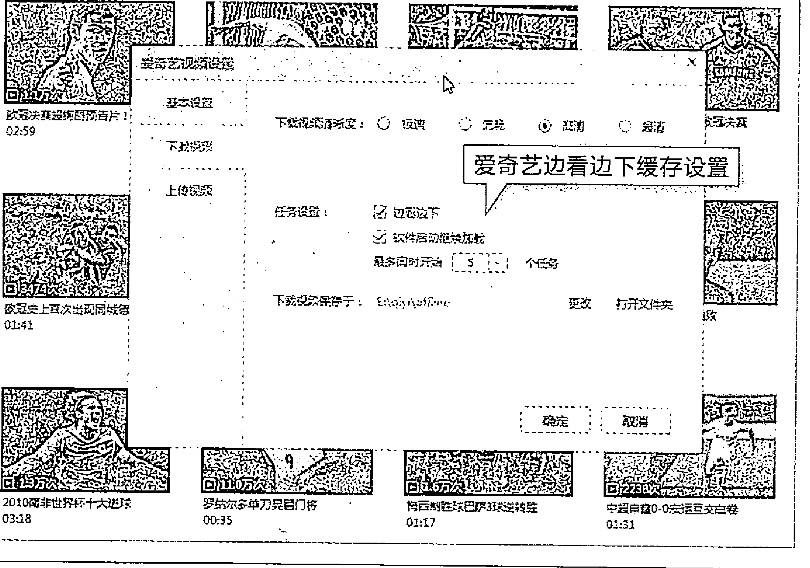

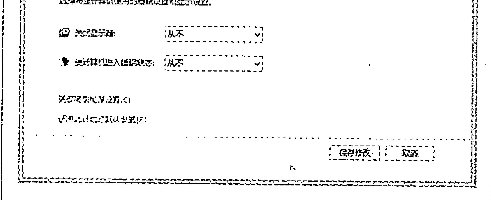

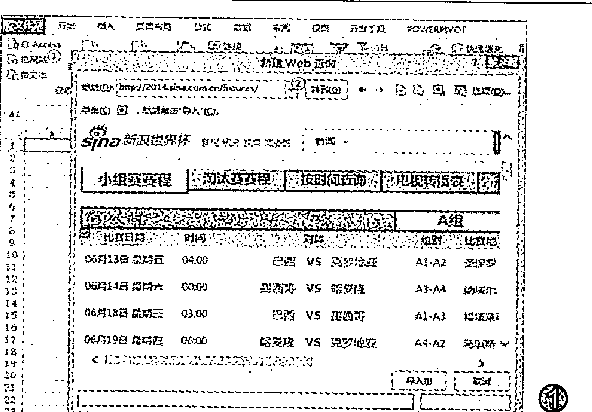

### 巧做计分表统计世界杯

2014年世界杯足球赛6月就要开战了，众多的忠实球迷每天都关注着最新战况，而铁杆球迷甚至在房间墙壁上贴上一张大大的记分表，根据每场比赛的结果来计算各队的得分和名次，乐此不疲地填空、欣赏、分析、猜想、预测！试想，如果有一个Excel表，只需填写每场比赛的结果，就能自动计算出小组赛中各队的积分、进球数、净胜球数和名次。各小组6场比赛结束后，每个小组能进入决赛的2支球队也能自动出现在决赛阶段的记分表中。这样一个傻瓜式的电子表是不是为我们节省了大量的脑细胞？

##### 创建小组赛工作表

这个过程是利用Excel获取外部数据的功能将http://2014.sina.com.cn/fixtures/这个网页上的赛程导入电子表（图1）。

-   1. 单击图中的“自网站”按钮弹出“新建Web查询”窗口。
-   2. 在弹出的窗口中输入网页地址并单击“转到”按钮。
-   3. 在弹出的窗口中点击所需要插入内容的黄色箭头变成绿色对钩，选择完成后单击“导入”按钮。
将插入的数据进行整理，删除没用的信息，按比赛时间对各组对阵情况进行排序（图2）。
接下来，将对阵两个队分别放入两列中，再插入两列用来记录比赛结果，在相应位置建立两份各小组积分表，一份用于显示，一份用于辅助计算（可隐藏）。为了美观，可插入各国国旗图标、2014年世界杯会徽等图片，并对单元格进行修饰，例如对只允许修改的单元格（D列、E列等）加黄底等等（图3）。
利用“=MID(C4,1,FIND("VS",C4)-2)”和“=MID(C4,FIND("VS",C4)+3,LEN(C4)-FIND("VS",C4))”对单元格C4中的内容“巴西 VS 克罗地亚”进行拆分，通过选择性粘贴分别放到两列单元格中。

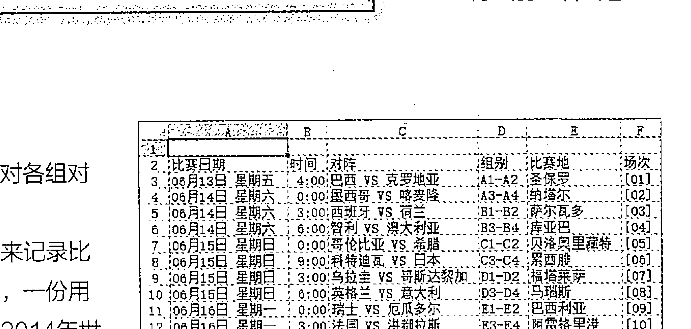


##### 计算小组赛排名

这个过程主要是当输入比赛结果时利用几个简单的函数计算本小组的得分排名等情况。本例以A组各队得分为例，其他组的各队得分依照此方法得出（图4）。

-   1. 在Z6单元格中输入：=SUM(IF(($C$4:$C$51=$X6)*($F$4:$F$51>$G$4:$G$51)+($E$4:$E$51=$X6)*($G$4:$G$51>$F$4:$F$51),1,0))
-   2. 在AA6单元格中输入：=SUM(IF(($C$4:$C$51=$X6)*($F$4:$F$51=$G$4:$G$51)*($F$4:$F$51<>""))+($E$4:$E$51=$X6)*($F$4:$F$51=$G$4:$G$51)*($G$4:$G$51<>""),1,0))
-   3. 在AB6单元格中输入：=SUM(IF(($C$4:$C$51=$X6)*($F$4:$F$51<$G$4:$G$51)+($E$4:$E$51=$X6)*($G$4:$G$51<$F$4:$F$51),1,0))
-   4. 在AC6单元格中输入：=SUM(IF($C$4:$C$51=$X6,$F$4:$F$51,0))+SUM(IF($E$4:$E$51=$X6,$G$4:$G$51,0))
-   5. 在AD6单元格中输入：=SUM(IF($C$4:$C$51=$X6,$G$4:$G$51,0))+SUM(IF($E$4:$E$51=$X6,$F$4:$F$51,0))
以上公式必须同时按下“Ctrl+Shift+Enter”组合键才能使公式生效。
-   6. 在AE6单元格中输入“=AC6-AD6”，在AF6单元格中输入“=Z6*3+AA6”，在辅助列AG6单元格中输入“=IF(AF6="","",AF6*100000+AE6*100+AC6)”，在W6单元格中输入“=RANK($AG6,$AG$6:$AG$9)”。
-   7. 在M6单元格中输入“=VLOOKUP($L6,$W$6:$AF$9,2,FALSE)”，N6单元格中输入“=VLOOKUP($L6,$W$6:$AF$9,3,FALSE)”，依此类推，直到U6单元格为止。
以上所有公式可用鼠标拖动进行向下的填充，直到第9行为止。

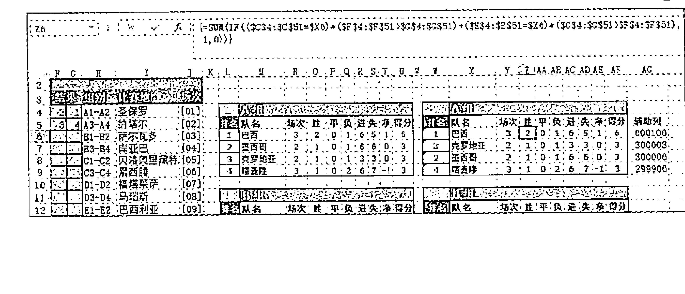

##### 制作赛程表

制作1/8决赛、1/4决赛、半决赛、季军赛、冠军赛表。
这个过程同样是利用Excel获取外部数据的功能，将http://2014.sina.com.cn/fixtures/kostage.html这个网页上的所需要赛程导入到电子表相应位置中，删除没用的信息，并对表格进行美化。根据世界杯比赛规则，1/8决赛是小组赛后A组第1名对阵B组第2名、A组第2名对阵B组第1名，依此类推，所以我们可以利用函数自动计算出小组赛后1/8决赛对阵情况。1/4决赛是在1/8决赛获胜队中产生的，所以1/4决赛的对阵情况直接引用M列的相应单元格就可以了（图5）。


-   1. 在C60单元格中输入：=IF(AND(N6=3,L6<>""),VLOOKUP(1,L6:M9,2,FALSE),"A组第一")
-   2. 在E60单元格中输入：=IF(AND(N14=3,L14<>""),VLOOKUP(2,L13:N16,2,FALSE),"B组第二")
-   3. 其他单元格中的公式与上面的类似，只要与小组排名表对应好就可以了。
-   4. 在获胜者单元格中，如M60中输入“=IF(C63<>"",IF(F63>G63,C63,IF(G63>F63,E63,"W49 胜者")),"W49 胜者")”，其他的以此类推。
-   5. 在C74单元格中输入“=M63”，其他与之相似。

| C63 | =IF(AND(N6=3,L6<>""),VLOOKUP(1,L6:M9,2,FALSE),"A组第一") |
| :--- | :--- |
| **61** | **A** | **B** | **C** | **D** | **E** |
| **62** | **日期** | **时间** | **对阵** | **结果** | **场馆** |
| **63** | 06月29日 星期日 | 0:00 | 巴西 VS B组第二 | 2-1 | 1A-2B 贝洛奥里藏特 [49] |
| **64** | | 4:00 | C组第一 VS D组第二 | | 1C-2D 里约热内卢 [50] |
| **65** | 06月30日 星期一 | 0:00 | B组第一 VS A组第二 | | 1B-2A 福塔莱萨 [51] |
| **66** | | 4:00 | D组第一 VS C组第二 | | 1D-2C 累西腓 [52] |
| **67** | 07月01日 星期二 | 0:00 | E组第一 VS F组第二 | | 1E-2F 巴西利亚 [53] |
| **68** | | 4:00 | G组第一 VS H组第二 | | 1G-2H 阿雷格里港 [54] |
| **69** | 07月02日 星期三 | 0:00 | F组第一 VS E组第二 | | 1F-2E 圣保罗 [55] |
| **70** | | 4:00 | H组第一 VS G组第二 | | 1H-2G 萨尔瓦多 [56] |
| **71** | | | | | |
| **72** | **日期** | **时间** | **对阵** | **结果** | **场馆** |
| **73** | 07月05日 星期六 | 4:00 | 巴西 VS W50 胜者 | | W49-W50 福塔莱萨 [57] |
| **74** | | 0:00 | W53 胜者 VS W54 胜者 | | W53-W54 里约热内卢 [58] |
| **75** | 07月06日 星期日 | 4:00 | W51 胜者 VS W52 胜者 | | W51-W52 萨尔瓦多 [59] |
| **76** | | 0:00 | W55 胜者 VS W56 胜者 | | W55-W56 巴西利亚 [60] |
| **77** | | | | | |
| **78** | **日期** | **时间** | **对阵** | **结果** | **场馆** |
| **79** | 07月09日 星期三 | 4:00 | W57 胜者 VS W58 胜者 | | W57-W58 贝洛奥里藏特 [61] |
| **80** | 07月10日 星期四 | 4:00 | W59 胜者 VS W60 胜者 | | W59-W60 圣保罗 [62] |
| **81** | | | | | |
| **82** | | | | | |

##### 隐藏辅助数据

##### 保护工作表

这个过程是将不需要显示的数据进行隐藏，以便我们操作（图6）。

选择需要隐藏的列，单击“格式→隐藏或取消隐藏→隐藏列”菜单将数据隐藏。

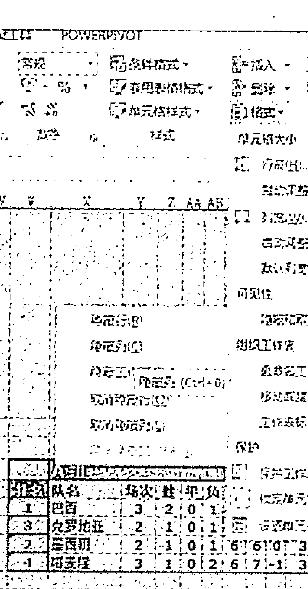

经过如上操作，一张完美的2014FIFA世界杯比赛记分表就完成了，赶快试试吧。

这个过程主要是让用户只能更改比赛比分，其他地方不能更改，结果却自动生成（图7）。

-   1. 同时选中所有底色为黄色的单元格，选择“格式→设置单元格格式→保护”，去掉“锁定”功能。
-   2. 选择“页面布局”选项卡，将网格线、标题的“查看”前面的对钩去掉。
-   3. 选择“审阅”选项卡，设置一个密码将工作表保护起来，这时就只能在黄底色的单元格中输入数据，其他数据全部自动计算得到。

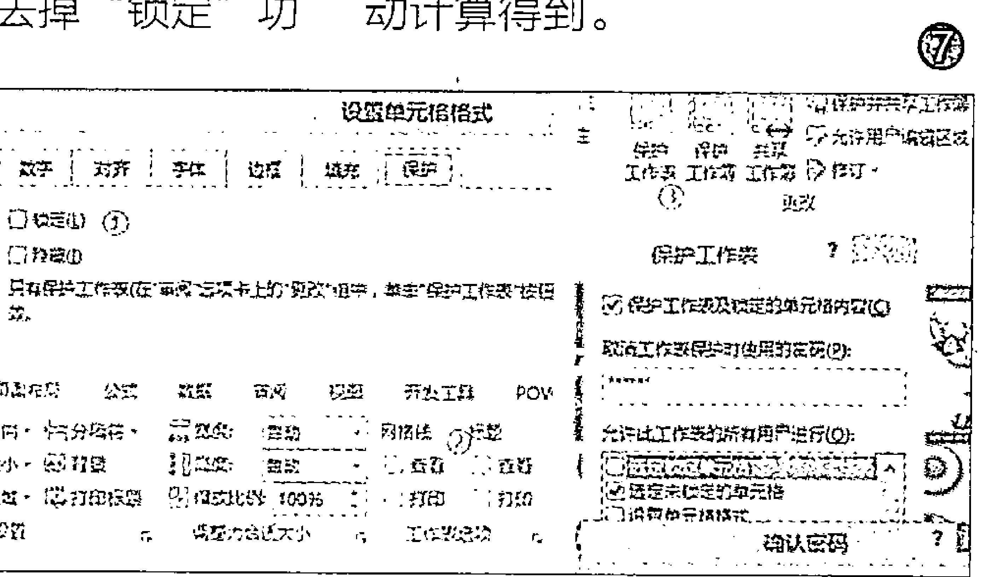

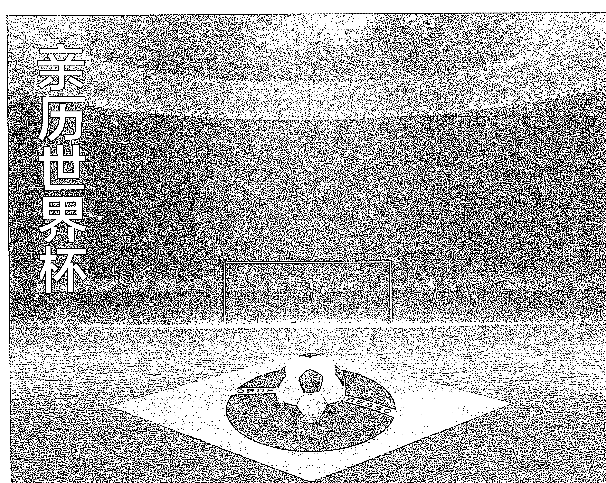

价格不菲的机票和住宿费用、难求的盛会门票，语言不通以及难以快速办理的签证，都将我们挡在了现场体验世界杯热情的大门之外。不过没关系，《电脑爱好者》会教您如何“亲历”巴西世界杯的现场，同球星合影等，做出那些令人羡煞的事情来。

### 超级球迷“亲临”世界杯

对于大多数球迷来说，亲临世界杯现场是个梦想，这个梦想能否实现呢？真实的可能难以成行，但是虚拟的我们却可以轻松做到。从一些影视剧中我们不难受到启发，开拍前，剧组通常会去各个地方取景，然后通过视频编辑软件进行处理，将人物融合到场景中，从而实现“亲临”某个特殊现场的效果。

##### 奇妙的背景替换

为了清晰地了解本文所用技术，我们先来看一段视频——《没错，你被骗了，美剧中的大场景都是这么来的！》( http://url.cn/84KzRG )。对比左右两边的场景 ( 图1 )，我们不难发现前景中很多地方是绿色，而这些绿色部分被透明后，后面背景则会显示出来，这样前景和背景就融合在一起，形成以假乱真的视觉特效。因此我们自己要制作类似的大场景，首先是在绿色背景前拍摄视频，然后在视频编辑软件中，将绿色背景透明后，即可任意替换背景场地了。

### 解密蓝绿屏技术

在影片的后期制作中，蓝绿屏技术的使用非常广泛，通过该技术可以实现很多特效，比如一些动作片中经常会上演飞车对决，有些甚至在天空的飞机上过招，这些场景通常都无法进行实际拍摄，因为拍摄成本太高，而且危险系数太大，因此通常都是采用蓝绿屏技术进行合成。

所谓蓝绿屏分为蓝屏和绿屏，它们的主要区别就是屏幕背景是蓝色或绿色，因此在专业视频处理中，也常说蓝幕技术或绿屏技术。《没错，你被骗了，美剧中的大场景都是这么来的》这段视频，就充分体现了绿屏技术的奇妙。视频中除了人物和前景内容，其他部分基本上都是绿色的，只要在视频编辑软件中指定此绿色，就可以将它过滤掉变成完全透明，从而让位于它下方的画面显示出来，这样同一组人物就可以置身于不同的背景中（图2）。

##### 自拍绿背景的影像

作为超级球迷，我们要想将自己置身于喧闹的世界杯现场，自拍一段纯色背景的个人影像是必不可少的。通常蓝绿屏的背景布在淘宝网上就可以购买，当然我们也可以自己用纯色厚棉布作背景。

准备好背景布并熨平，然后悬挂在支架上并延伸一部分在地面，让被拍摄人可以站在背景布上，周围的光线要均匀，尽量不要出现阴影。准备好一切后，就可以在背景布上尽情地做各种动作（图3），如果想要运动的范围比较大，则背景布相应也要大一些，可以固定在一面墙上。

###### 小提示

##### 如何选择蓝绿屏

在拍摄抠像的素材时，到底该选择绿屏还是蓝屏？以下三点建议便于你决策：

首先采取绿屏还是蓝屏做背景，取决于拍摄对象的颜色，如果前景对象中有大量绿色，那么则采用蓝屏，如果前景中有大量蓝色，就要绿屏拍摄。其次我们要注意到背景色对于主体对象的反射，不同对象的肤色有可能不同。对于我们黄种人，用蓝色背景似乎更合适，因为绿色反射到人脸上，可能会形成难看的“菜色”。绿色溢出产生的问题比蓝色溢出更为严重，这是两者不同的色相决定的，不过数字抠像可以解决溢出问题。另外，绿屏在布光的时候更容易照亮场景，因为其吸光性能偏弱，因此对某一场景布光，照亮整个场景时绿色需要的光更少。蓝屏在太阳光下拍摄效果更好，背景上产生的漫反射可以消除阴影。

##### 小知识

##### 为什么只用蓝绿屏

> 实际上其他颜色的背景也能达到蓝绿屏效果，之所以现实中常用蓝绿背景，是因为人身体的自然颜色中不包含这两种色彩，这样在用它们做背景时就不会和人物混在一起，方便后期处理。我国一般用蓝屏，欧美国家则蓝屏绿屏交替使用，在拍摄人物时则常用绿屏，这是因为很多欧美人的眼睛是蓝色的，如果使用蓝屏技术，则他们的眼睛部分也会被透明。

### 曼舞于世界杯赛场

准备好一切后，我们就可以在蓝绿屏前自拍一段舞蹈视频，再到网上找一段合适的世界杯现场影像，要保证这段影像中有较长时间的草坪场景，便于给舞者提供场地。下面我们就用“会声会影”虚拟出自己在世界杯现场曼舞的场景。

##### 1. 导入并裁剪视频

打开会声会影，单击“媒体库”（图4），再单击“导入媒体文件”按钮，将自拍的舞蹈影像和世界杯现场录像导入媒体库中。将世界杯影像拖放到“视频轨”上，单击“播放”按钮观看视频，也可以拖动播放尺浏览影像，单击“分割”按钮可以将视频从播放尺所在时间点进行分割（图5）。通过这种方法，可以删除世界杯影像中不需要的视频片段。

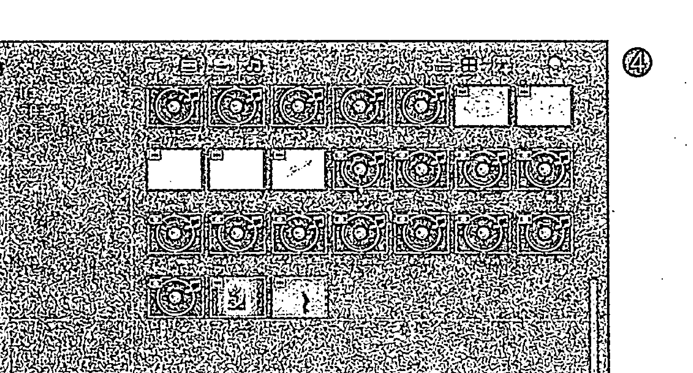


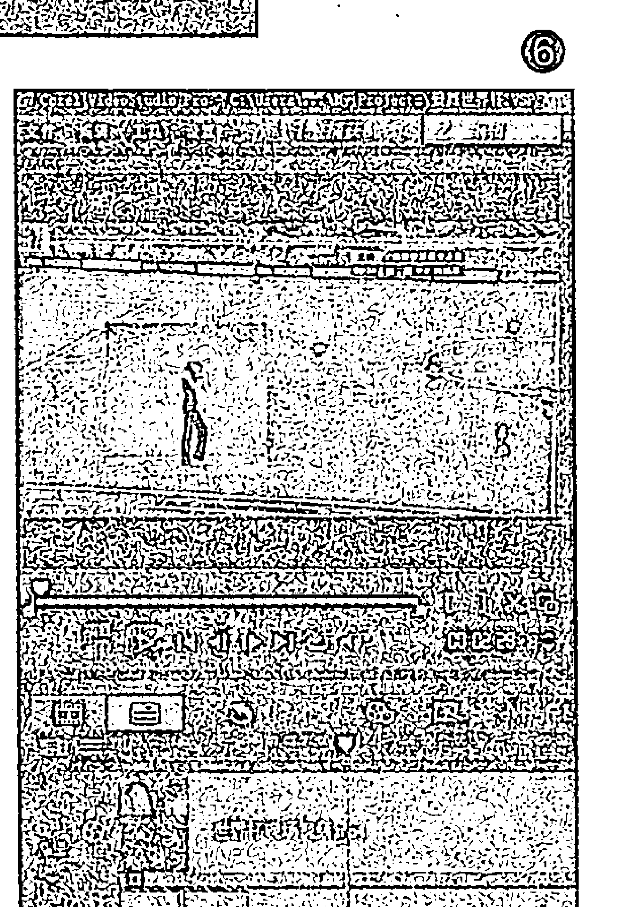

##### 2. 组合两段影像

将个人影像拖放到覆盖轨上（图6），拖动调整其位置，让其与视频轨上的场景融合在一起。我们还可以在同一场景中添加多段个人视频，形成虚拟的“一变N”特效。在轨道上右击选择“轨道管理器”打开轨道管理器，勾选“覆盖轨#2”，这样就新增一个轨道，可以用来放置其他个人影像。对于时间轨道上的，在分割删除后，影像之间的切换会比较生硬，单击“转场”按钮（图7），选择一种合适的过渡效果拖放到两段影像之间，即可让两段影像进行平滑过渡。

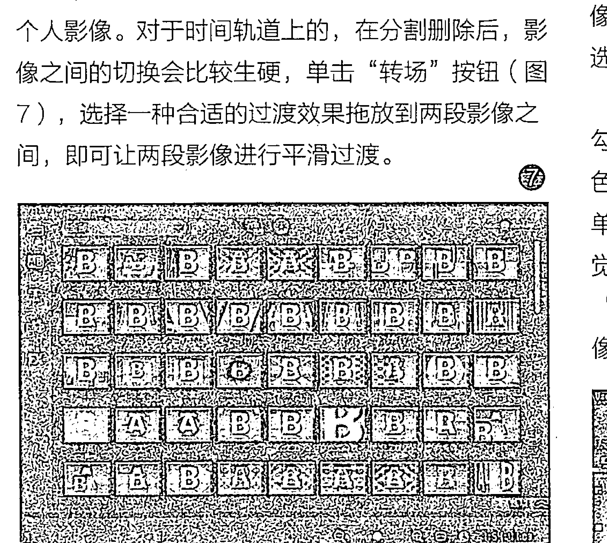

##### 3. 调整个人影像

选中视频预览窗口的个人影像，单击右侧的“选项”按钮打开选项面板（图8）。单击“遮罩和色度键”按钮，勾选“应用覆叠选项”，单击“取色笔”，在个人影像中的背景部分单击，则可透明背景部分。如果感觉背景部分透明不够彻底，可调节“色彩相似度”的数值，让个人影像彻底透明。选中预览窗口中的个人影像，可以修改其大小和位置（图9），如果个人影像与视频中的人物有重合，可将个人影像进行分割再调整位置。我们还可以根据需要给影像重新配上音乐，甚至同步的音频，然后选择“分享”菜单，单击“创建视频文件”按钮，就可以输出个人曼舞在世界杯的影像了，快发到网上炫耀吧。


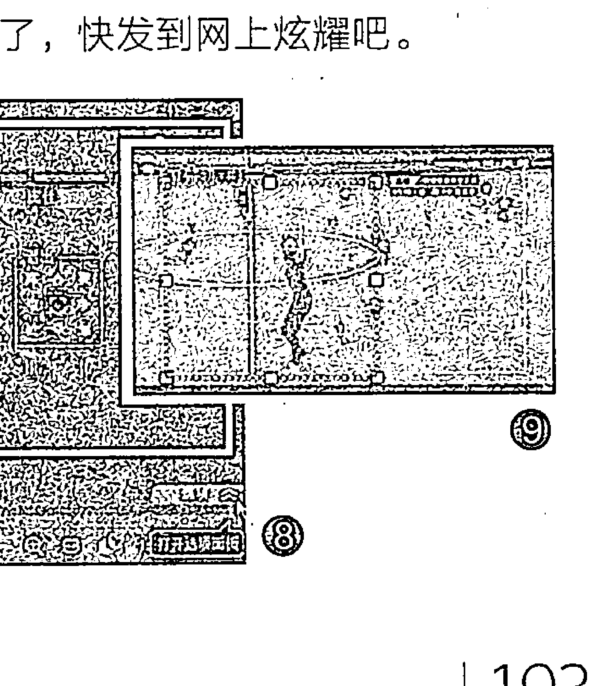

### 我与世界杯球星的合影

对于普通球迷来说，有一张足球明星的签名照片就觉得很幸福了。而对于资深球迷来说，与球星一起拍张照片，那感觉才真的更棒。其实与明星‘同场竞技’，甚至与众明星合影留念都不是什么难事，因为我们有无所不能的PS秘技。

##### 同场竞技 与球星一决高低

首先自拍一张纯色背景的图片，根据球星的姿势，摆好自己的Pose。然后启动Photoshop，打开两张图片，将自拍照复制到球星照片中。


使用工具箱中的‘魔棒工具’工具（图1），在自拍照的白色背景中单击，然后按Del键删除白色背景。重新执行该操作，即可将所有白色背景清除，这样个人照片已经基本融合进场景中了。接下来选择个人照片图层，按Ctrl+T键，调整个人照片的尺寸和位置。

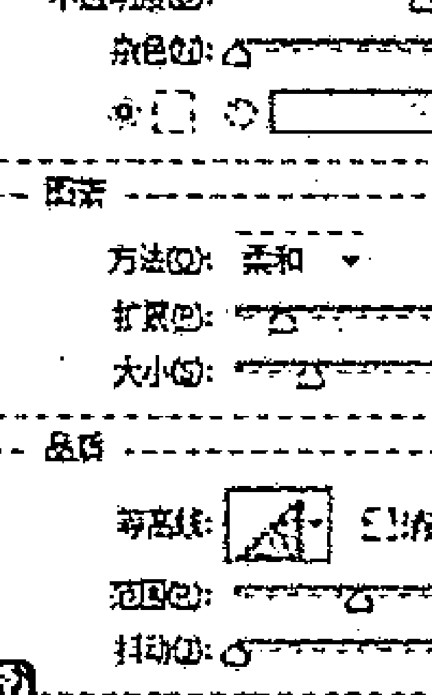

右击个人照片图层，选择‘混合选项’出现对话框（图2），勾选‘外发光’，调整光线的颜色和大小，让你被光芒笼罩，让球星也只能望着你的背影膜拜。

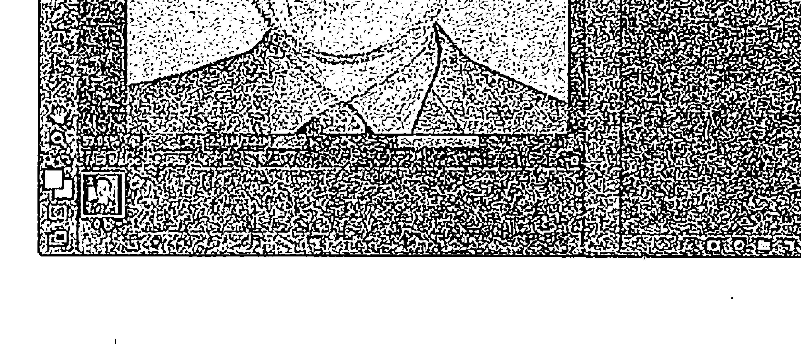

##### 换脸与明星们合影

找一张球星的合影，最好其中某个球星的头部轮廓与自己的比较相似，这样换脸时比较方便。启动Photoshop，打开这两张图片。

单击‘缩放’按钮，放大个人照片中的脸部，这样便于勾勒出脸部的轮廓（图3）。按住工具栏中的‘套索’按钮不放并选择‘磁性套索工具’，然后慢慢在脸部轮廓周围移动并单击，这样勾勒出面部，最后双击转换成选区，按Ctrl+C键复制脸部。

切换到Photoshop中打开的球星合影图片，按Ctrl+V键粘贴图片，拖动个人面部覆盖其中一个球星的面部，按Ctrl+T键后面部周围出现线框，可调整面部尺寸，让其差不多覆盖球星的面部，完成后双击图片予以确认，再移动图片，让其与球星面部基本重合。

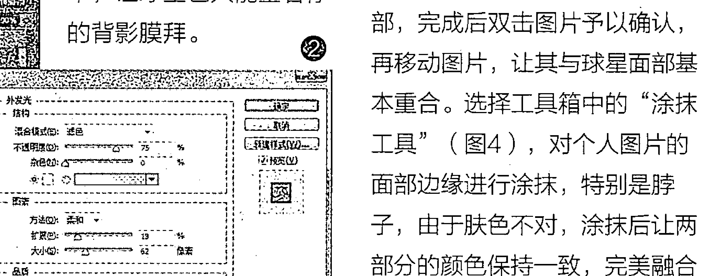

选择工具箱中的‘涂抹工具’（图4），对个人图片的面部边缘进行涂抹，特别是脖子，由于肤色不对，涂抹后让两部分的颜色保持一致，完美融合在一起，从而看起来更加真实。

这样一张与众球星的合影就完成了，怎么样，很简单吧！

### 世界杯胜负我控制

许多球迷都有自己喜欢的球队，如果在真实的世界杯比赛中心爱的球队输了，绝对是件很郁闷的事情。其实我们可在游戏中选择自己心爱的球队，然后让他们大胜对手，从而报“一箭之仇”。如果将游戏的比赛过程录制下来，以此为素材蓝本，加入字幕、解说、特效等内容，就可用虚拟的方式还原一场比赛了。

### N卡自带工具录制游戏比赛视频

Windows下的游戏一般支持DirectX技术，所以它跟一般的屏幕录制略有不同，录制游戏主要根据显卡的不同而分为两大类方法。一类是使用N卡（NVIDIA）的用户，主要通过N卡驱动中的工具进行录制。另一类是非N卡的其他显卡用户，一般采用FRAPS之类的工具进行录制。

要判断自己的显卡类型，可右击桌面上“我的电脑”，选择“属性”打开系统配置窗口，点击左侧“设备管理器”，再在设备管理器窗口中展开“显示适配器”项，如果其下有“NVIDIA GeForce ”字样的驱动，那就是N卡无疑了（图1），否则即是其他类型的显卡。

首先从官方网站下载安装适合自己N卡的最新驱动（下载地址：http://www.geforce.cn/drivers，网页上有提供自动检测功能），运行后，点击系统托盘中的NVIDIA图标打开设置界面，在“我的设备”中的“ShadowPlay”可以查看你的显卡是否支持此功能。

如果显卡支持，则进入“首选项”中，选择左侧“ShadowPlay”，然后再单击右上角“ShadowPlay”按钮，从弹出窗口中，点击左侧开关按钮激活它，设置好各种截屏参数（图2），接下来所有采用DirectX技术的游戏就可以录制了。如果设置的是“阴影”模式，那么游戏载入后就会自动开始录制（必须是全屏运行），如果是“手动”模式，则可以由玩家自己确定开始录制的时间。按Alt+F10键可保存视频格式为MP4（图3）。

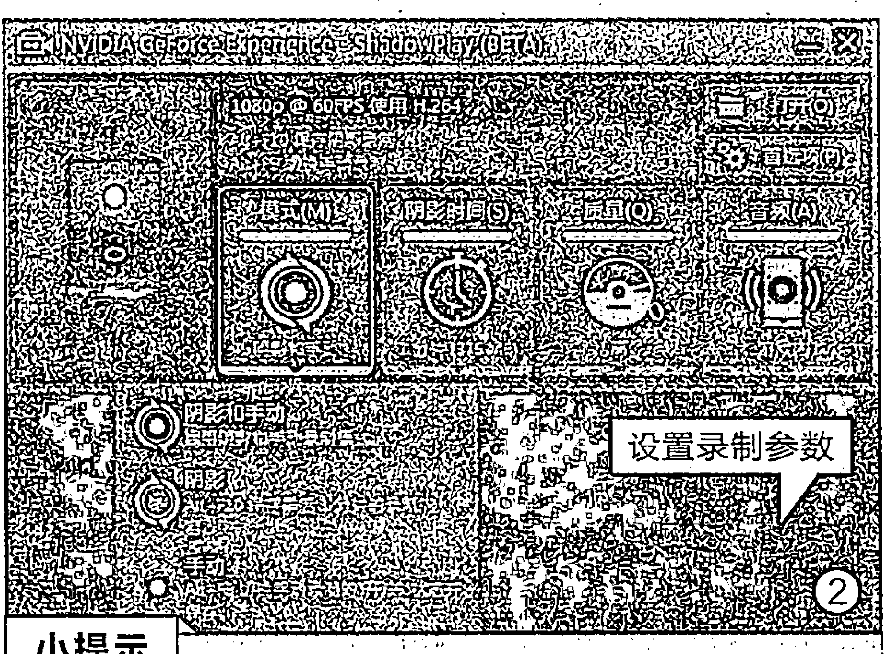

> 小提示
台式机GPU需为GTX600M（或更高），笔记本GPU需为GTX660M（或更高），ShadowPlay功能才可以启用，更具体的系统需求请参看网页。

### N卡非N卡 Fraps通吃

ShadowPlay虽然好用，但它的限制比较多，如果不符合使用条件也不必担心，我们还可以选择大小通吃的Fraps（下载地址：http://www.fraps.com/download.php）。它的安装过程很简单，不过需要注意的是，最好将它安装到非系统分区内，因为Fraps采集的视频默认保存在安装目录下（可以修改），这样容易导致系统分区空间紧张。

软件运行后，切换到Movies（录像）选项卡中（图4），这里可以设置视频保存位置、视频的帧速（fps）、视频的大小（size），以及设置快捷键（默认为F9键）等。接下来就很简单了，进入游戏，在需要开始录制的地方按下F9键开始录制，完成后再次按下F9键结束录制，视频默认保存在软件安装目录的Movies下。需要注意的是，Fraps录制的视频是AVI格式，它比MP4大很多，往往1秒钟时间就达到好几MB。


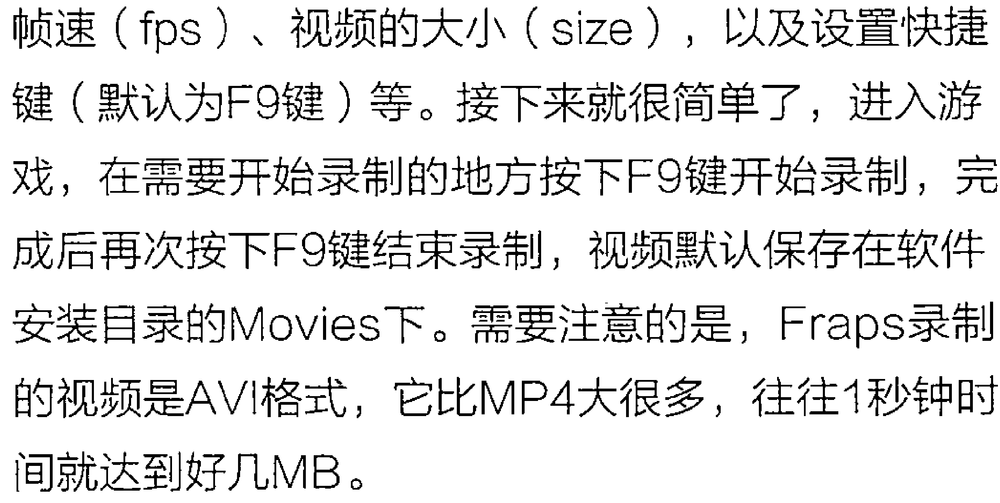

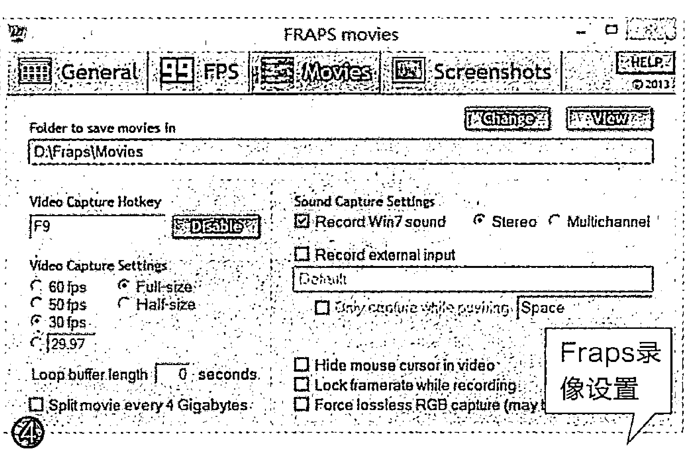

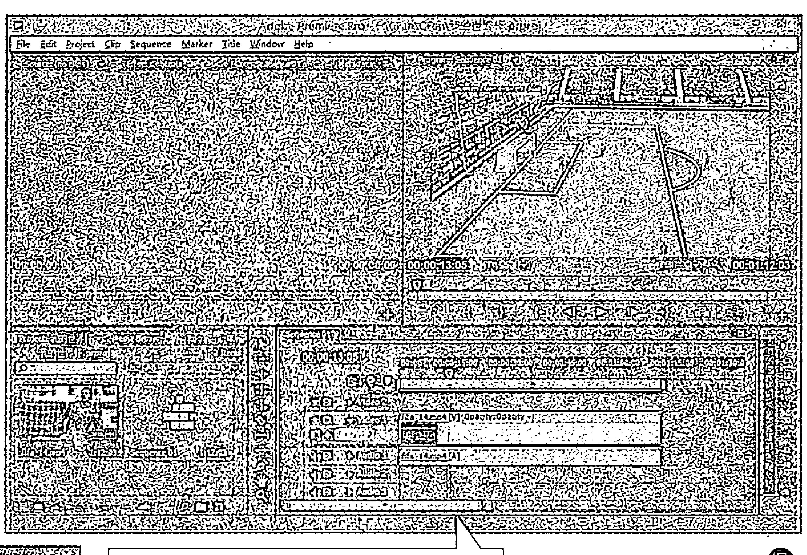


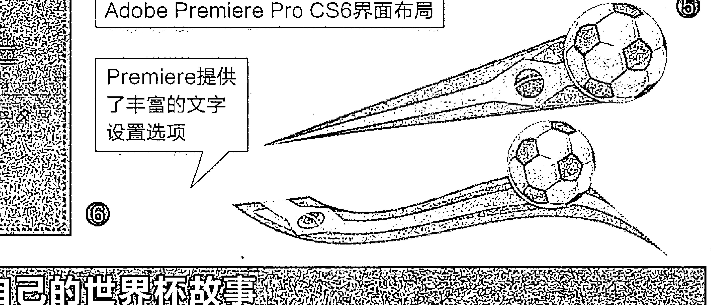

### 剪辑自己的世界杯故事

你喜欢的球队如你所愿在游戏中“战胜”了对手，且通过ShadowPlay或者Fraps录下了战况。不过这些还只是素材，接下来我们要通过剪辑软件，让这个故事变得更完美。

视频剪辑的软件有很多，这里我们使用的是国内非常流行的Adobe Premiere CS6（试用下载：http://tinyurl.com/kc4vuwy）。软件启动后，点击欢迎窗口上的“New Project”打开新建项目对话框，可以为项目命名，比如“我的世界杯”，然后点击OK进入设置窗口，本例选择“DV-PAL”（PAL是我国通用的视频制式，25帧/秒）下的“Standard 48KHz”，再次点击OK，完成新建。

进入Premiere界面后，在项目区空白处双击（或者按Ctrl+I键）快速打开导入对话框，选择前面录制的游戏视频导入素材。然后从项目面板中，将导入的游戏视频拖放到右侧时间线视频轨道中（Video 1）。如果素材的大小与当前设置不一致，将弹出提示框，根据需要选择是保持原有设置，还是让它与现有视频匹配，建议选择匹配模式（图5）。

录制的视频难免有冗余的部分，比如开始和结尾处有黑场，中间有混乱的场面等需要剪切掉，这时可使用剃刀工具Razor（工具栏中的剃刀图标），在需要删除片段的开始和结尾处分别点击一下，将其切开，然后通过箭头工具选中切下的片段并按Del键删除，最后再拖动后续的片段与前段连接上即可。

视频拖放到时间线上后，会发现有一部分是在Audio轨道中，这即是视频中原有的声音，我们可以用自己现场解说替代它。首先在音频软件（如Windows自带的录音机）录下自己的解说，然后按Ctrl+I键将声音文件导入项目中。接下来在时间线上右击原有的声音，选择“Unlink”命令解除音频与视频的链接，然后选中音频并按Del键删除，最后再将自己的配音拖放到音频轨道中，与视频对应好位置就可以了。

要想为视频添加片头和字幕也很容易，首先按Ctrl+T键打开新建字幕窗口，输入名称后（如“片头”或“解说”等）点击OK进入字幕编辑窗口，输入文字并设置字体样式等。字幕的位置可以任意设置，但不要超出边上的线框，否则字幕跑到屏幕外而看不到了（图6）。

设置完毕，直接关闭文字编辑框，它已经自动保存到项目中了，将它拖放到时间线最上方的视频轨道中（否则会被其他视频遮挡住），调整好在时间线上的位置就可以了。

至此，一个虚拟世界杯的视频就初具规模了。当然，Premiere的功能非常强大，更多功能朋友们可以自己再深入探索。

### QQ这么强 你的用户们知道吗

策划 《电脑爱好者》编辑部

我们平时使用的QQ，体积越来越庞大，功能越来越丰富。但是很多人除了基本的聊天功能外，QQ的其他大部分功能都忽略了。其实如果我们能充分挖掘并利用起QQ的“额外”功能，就可以省去许多不必要的第三方软件，方便快捷，大大改善我们的生活和工作。进QQ“宝山”挖宝，你准备好了吗？

### QQ个性化

##### 简单为美 打造最适QQ

文|昌海

QQ最原始的功能是发送文字信息以完成基本交流。后来随着多媒体技术的发展，人们对传送图片、文件、声音、视频有了越来越多的需求，其间还有更多另类的娱乐功能被“捆绑”在QQ上混搭“销售”。但是，除了基本交流功能外，多余的功能总有人并不需要，如何才能将与自己不相关的功能剥离出去，让毫不相干的东西少来打扰自己，这是用户要考虑的问题。

##### 选你最适用的QQ

你是不是还在不分青红皂白地统统安装通行版的QQ2013或随波逐流安装功能花哨的QQ新版本？如果你有一款老旧的智能手机或者你对聊天有特别的洁癖，如何解决QQ速度缓慢或功能多余的问题？如果你和外国人用QQ聊天，语言不通如何解决？其实，与其在为给QQ减肥或优化而大伤脑筋，不如寻找适合自己的精简版本，这种不是减肥而胜似减肥的办法会来得更管用一些。腾讯QQ有多种版本，我们完全可以根据自己的实际情况，选择适合自己的版本。

有位朋友讨厌QQ那花里胡哨的功能，他只想用聊天功能，挖空心思为QQ减肥，但三天折腾下来收获甚微，因为腾讯毕竟没有为用户提供搭积木式的功能接口，要拆卸掉它的功能又谈何容易！其实，这位朋友还不知腾讯有款简洁高效的聊天软件TM2013，它剥离了一切与沟通无关的内容，用法与QQ相当，可以让沟通更轻松。

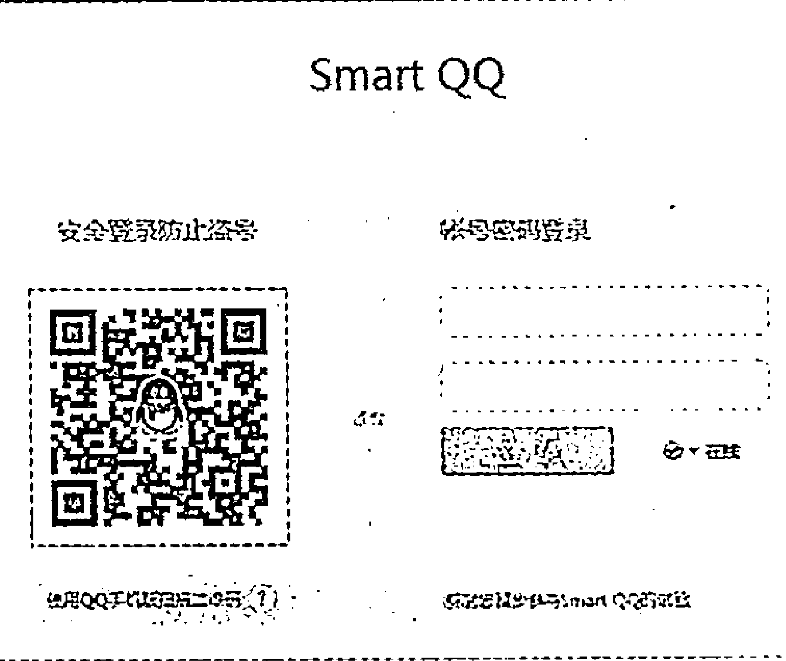

有的人出差在外，总使用公用电脑，觉得在人家的电脑上登录QQ或安装QQ不便也不安全。殊不知腾讯有一款SmartQQ，只需通过网络浏览器访问http://w.qq.com/登录即可使用（图1），不用安装任何软件，方便安全。

不同年龄层次使用QQ作为主要沟通手段也开始变得越来越多，但其杂乱的界面会有些让人无所适从。其实，如果选择安装QQ视频桌面版，只用语音视频聊天，双排画面显示双方场景，简洁明了，对老人再适合不过了。该软件可与普通PC QQ、手机QQ、Pad QQ实现视频互通（图2）。

使用Windows平板的用户聊天要选最佳版本，Windows应用商店专门为这一设备打造的QQ for Windows 8，界面简洁，语音视频聊天更加方便清晰（图3）。如果是和外国人聊天，还用去找翻译软件吗？不用！直接使用QQ国际版就OK了，简单明了还带有翻译功能。


有人还在使用配置较低的Android手机或平板，安装了通行的QQ版本反应迟钝，聊天不爽或根本无法聊天。在这种情况下，如果知道QQ轻聊版并安装使用，就不用挖空心思尝试各种QQ版本或寻求优化技巧了。


> 小提示：把需要的拿走，总比把不需要的一清除要更体贴人心！所以在此特提醒腾讯注意一下你们的思维方式；也同样提醒其他具有这些毛病的软件开发者注意：把选择项弄好并帮助用户选择默认项。这虽然是软件界的一种思维通病（或者说规则），但如果谁家能第一个改掉这个毛病，相信他肯定也会成为软件界值得尊敬的祖师爷，名扬天下！

然而，由于不少人对于传统QQ版本的习惯性依赖，更多的人或许希望在传统QQ版本的基础上进行简化或者优化，那么就请看下面的内容。

##### 强加的东西我不要

我们要把QQ作为沟通的得力助手，而不是把电脑人为地打造成臃肿的庞然大物。因此，精简要从安装QQ时开始，把软件强加给我们的安装选项人为去除掉。这些选项虽然与QQ本身的功能发挥无关，但却无疑增加了系统和用户的负担，因此属于累赘选项。

以安装最新版的QQ5.4为例，如图4所示，自定义安装选项中的四个项目显然与沟通没有任何关系，而软件却默认选择了这四个选项，不知腾讯这招算是体贴人的做法，还是强行给人增肥的“善意”之举。为何腾讯不把这四个选项设置为默认全部不选的状态，让用户自行选择需要的项目，这样不更能显示安装软件的诚意吗？

##### 简单也是道

QQ对系统资源的占用越来越多，对用户的干扰信息也相应增加，但不是所有用户都需要这么多功能。因此需要按需精简优化，以适合需求简单的人。通过界面定制及软件优化，让QQ面板简洁有序，使用过程清爽、清净。

点击QQ面板的“界面管理器”按钮，开启“更改外观→界面管理”窗口，选择不必要显示在QQ主面板和个人信息区的项目，可以实现对QQ面板项目的简化（图5）。

“订阅QQ网购每日精选，了解最新商品资讯”等选项的选择去除，如果觉得显示缓慢，则将“使用动画效果”选项去除。在“系统设置→权限设置→防骚扰”下，可以通过提升别人查找我们的方式和验证方式的难度级别来防止骚扰，还可以通过设置屏蔽临时会话、屏蔽迷你腾讯面板弹出等来防止不必要的干扰信息。在“系统设置→权限设置”的“个人资料”和“个人状态”下，去掉所有5项对空间权限的访问选项和8项对个人状态的发送选项，也可以减少系统判断时间和对网络资源的占用。

通过系统定制，如去掉动画效果、新闻弹窗等，关掉可以省资源的选择项目，屏蔽骚扰项目。在“系统设置→基本设置”的“登录”和“主面板”下，按需将“登录后自动运行QQ宠物”、“登录后显示拍拍待办事项提示”、“订阅QQ网购每日精选，了解最新商品资讯”等选项的选择去除。

通过资源清理，让QQ文件夹瘦身，少占硬盘资源，轻装运行。在“系统设置→安全设置→消息记录”下，点击“删除消息记录”可以对全部消息记录按照时间段来删除，减轻系统的负担，缩减QQ对空间的占用。在“系统设置→基本设置→文件管理”下，点击“立即清理”进行个人文件夹的清理，可以有效地节省硬盘空间，同时还可以设置容量清理预警信号。

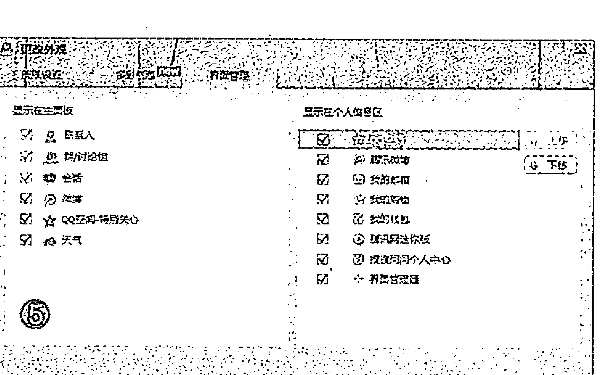

### QQ表情 炫出最酷的你

文|文远

虽然QQ本身自带了不少表情图片，但人们更愿意传播那些网友自己制作的搞笑动态表情。如何制作这类表情，往往对大家更具吸引力。此外，还可以使用输入法直接输入，或用第三方表情工具或者服务直接定制。

##### 制作搞怪个性QQ表情

大家也许对朋友们发来的真人或动物搞怪表情的制作过程感兴趣，那么，这样的动态表情是怎么制作的呢？如果你对图像处理软件Photoshop不太精通，那也没关系，我们可以用简单的动画软件和几个简单步骤，教会大家如何制作这样的动态表情。

限于篇幅，我们以一个小猫说话冒出O my god文字气泡的动态表情为例（图1），说明制作这类动态表情的方法和思路，意在教会大家一种方法，以抛砖引玉。

首先需要一款经典的动画制作软件GIF Movie Gear，这款软件制作动画要比Photoshop容易得多，但要比Photoshop操作简单，成品效果也不亚于Photoshop的作品。图片处理可以随便选用自己熟悉的画图或美图秀秀等。

首先打开带有小猫的数码照片或图片，从中抠出我们需要的小猫形象，将照片缩放为预定的动画照片尺寸（比如200像素×200像素），保存为1.JPG。接下来要以这个像素为基础制作动画需要的系列图片。备好小猫头像后，在小猫的脸旁输入一个大大的O字母（图2）。

由于动画中这个字母要从小猫的嘴边飘出来，动态地显示在它旁边，所以我们需要一系列的带有O字母的图片，并且要设置好每幅图中O字母的位移量。只需先制作一张200像素×200像素的空白图片，背景设置为透明效果，然后在靠近上一幅图片中小猫吐出O字母的附近安置O字母即可。接下来的图片均以此幅图片为基础，逐步增加位移量，分别按序列保存为编号2.JPG、3.JPG、4.JPG、5.JPG、6.JPG的图片即可（图3）。最后，在图片6.JPG的O字母下方，输入my god两个单词。这样动画所需的图片就制作好了。

接下来就是制作动画的过程。开启GIF Movie Gear软件，从“文件”菜单中导入刚才制作的6个JPG文件，注意顺序不能搞错，否则需要调整（图4）。在生成动画之前，先点击窗口工具栏上的播放按钮，预演一下动画效果。如果效果合适，则点击“文件-Gif动画另存为”命令，保存动画即可。

大功告成，最后将制作好的动画从QQ的表情管理窗口导入到表情库中，就可以随时选择自己制作的动态表情发送给他人了。


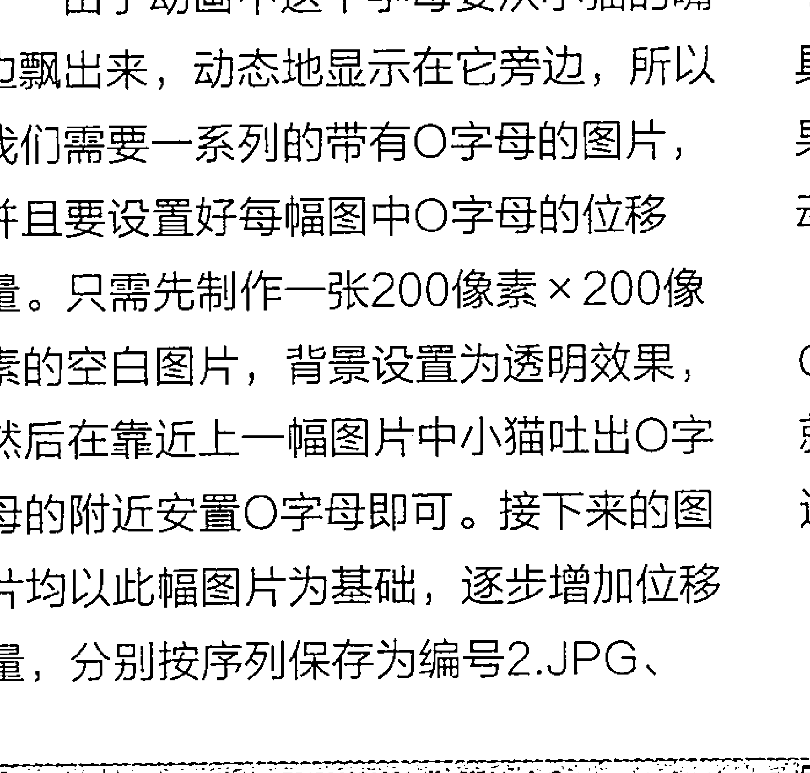

> 小提示：如果动画中需要变动的是小猫，那么，只需对小猫的序列图片做放大、缩小、旋转等操作，或者截取小猫不同形态的照片，将其作为图片序列的一部分注入到动画窗口，那么动起来的就是小猫而不是文字了。当然，如果要做小猫和文字一起动的动画，则需要两者同时配合，也就需要更多的图片了。必须注意，添加的文字图片要做成透明背景，否则会覆盖掉底层图片。

##### 拿来主义拓展炫酷QQ表情

自己制作表情虽然炫酷，但不是所有人都有耐心和手艺可以做出像样的动态表情，因此借用别人制作的表情，拿来主义就成了上策。发现好表情，除了在聊天过程中偶得之外，最简单的方法就是从腾讯网站获取网友奉献的原创表情，这里总是有源源不断的新资源出现。从QQ表情添加窗口点击“原创表情”从网上获得网友原创的免费表情（开通VIP会员可下载更多表情）。

##### QQ表情在线也能DIY

除了软件制作动态表情、“拿来”别人的表情外，我们还可以通过网站专用表情制作服务制作各种个性化表情。如进入一个“彩字秀”的网站（http://www.czxiu.com/），点击“自定义表情”，通过修改已有参数，设置好图片、文字、特效等，即可从一个现成的模板中脱身出一个具有个性的QQ自定义表情（图5）。

##### 输入法输入表情更省事

在使用百度拼音的过程中，只需要输入“表情”二字的拼音首字母bq，输入窗口马上会出现一个选择表情的窗口，或者直接输入i字母（双打模式按Shift+i），也可以出现表情选择窗口。QQ输入法也可以方便地通过i键一键启动符号输入器，选择QQ表情、字符表情等进行输入。使用搜狗拼音输入可以通过Ctrl+Shift+B启动字符表情库，或者通过“扩展功能→图片表情”启动图片表情库。

###### 小技巧

如果担心自己辛辛苦苦搜集的QQ表情在重装系统后丢失，可在重装系统前先备份QQ表情。具体方法是，在表情窗口中点击齿轮状设置按钮，选择“导入导出表情包→导出全部表情包”命令来备份。重装系统和QQ后，再从此处导入备份的表情包。

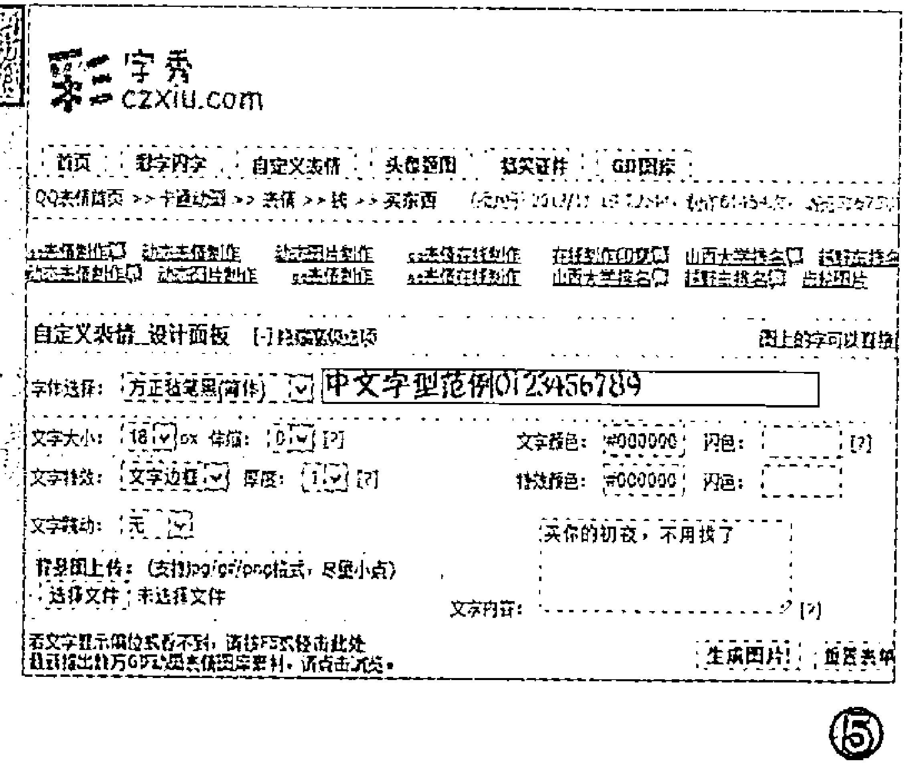


手机QQ可能在功能方面并没有PC QQ功能全面，但在这两年的势头却完全超越了PC版的QQ，反客为主成了主流。时下没用过手机QQ，就不能说是你玩转了QQ。

##### 一亿四百万人的选择

在2014年4月11日晚21点左右，腾讯宣布其QQ的同时在线（PC和移动）人数超过两亿。在这个数字当中，有70%的在线用户是通过移动QQ应用登录的（图1）。手机QQ从最初的青涩版本逐渐进化并发展到如今的规模，速度远远超过PC版本的QQ（图2）。

手机屏幕那么小，手机QQ的信息量、画面效果和方便程度都不及PC QQ，但为什么越来越多的人成了手机QQ的忠实用户？除了移动智能设备的高速发展，手机QQ自身也有得天独厚的优势所在。比如通过手机QQ登录，不论是会员还是非会员都能享受QQ等级的加速。同时由于手机天生自带摄像头和麦克风，用起QQ对讲和QQ视频来比PC更加方便，这是毋庸置疑的。


## 手机QQ耗电大户

相信你肯定听过父母“以前我那个诺基亚能待机一星期，现在这手机一天一充”之类的抱怨吧？长期登录手机QQ，使用QQ时手机屏幕长期处于点亮状态，会加速电池的损耗（图3）。屏幕（其实就是液晶面板）占了智能手机电池损耗的很大一部分，如果能解决屏幕耗电问题，QQ本身耗电就不是问题。

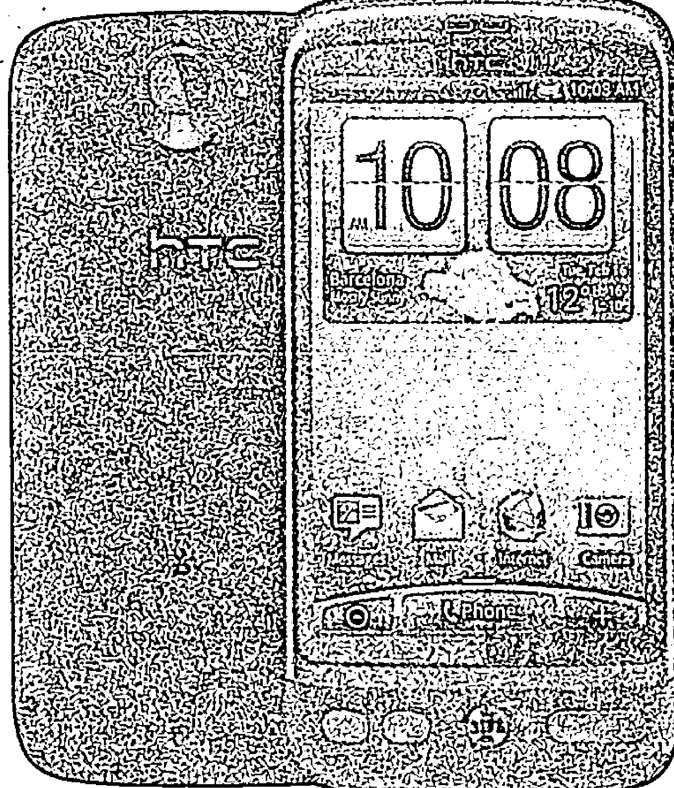

### AMOLED 的特性

现在三星相关手机已经成了街机，使用人数众多。针对这一大部分用户，其实有一个很容易被忽视的手机QQ省电攻略。不仅限于三星手机，任何使用AMOLED此类显示屏幕的手机，这个方法都是通用的（图4）。

为什么单独提出AMOLED屏幕呢？它和我们熟悉的TN、VA或IPS等面板不同，AMOLED面板自发光无需传统液晶面板那样的背光源，而且屏幕黑色的纯度无与伦比。传统液晶不论使用CCFL还是LED背光，都难以保证它们不会通过液晶面板透光过来，也就是我们常说的“漏光现象”。但AMOLED屏幕需要显示黑色时面板几乎是不发光的，不发光自然黑色纯度就无与伦比了（图5）。而且这还带来切实的好处：不发光的液晶面板很省电。

> 扩展阅读
除了三星、HTC等使用AMOLED的手机外，其他种类的液晶屏幕由于背光原理不同，不见得完全通用。但类似QQ默认那样的纯白画面也是需要背光源开到最大马力，我们改成黑色能多多少少改善一点点电量状况。

### 相关手机的省电攻略

重点来了，新版本的手机QQ不仅图标变为白底，程序内不论是默认主题、默认聊天背景均是白色。白色对于AMOLED来讲就是最不省电的状态，如果希望手机省电，一定要尽量将其变为黑色系。进入手机QQ“表情、气泡、主题”一项，里面就有“个性主题”和“聊天背景”的选项；点击主题中的黑色简约，下载后使用。


主题就是整个QQ的框架部分，而聊天背景则是我们聊天窗口内的填充部分，同样重要。进入选项内最后一个选择就是我们希望的黑色系聊天背景，下载完成后应用即可。


这两步设置完成后，除了无法改变的部分几乎已将整个QQ均变为黑色系。特别是长期占用屏幕的聊天窗口，除了QQ聊天气泡外均已黑化（图6）。QQ聊天气泡目前并没有黑色系的选择，这是基于文本可读性考虑的，如果很在意耗电情况，可酌情选择深色系的聊天气泡，对于电量可说聊胜于无吧。

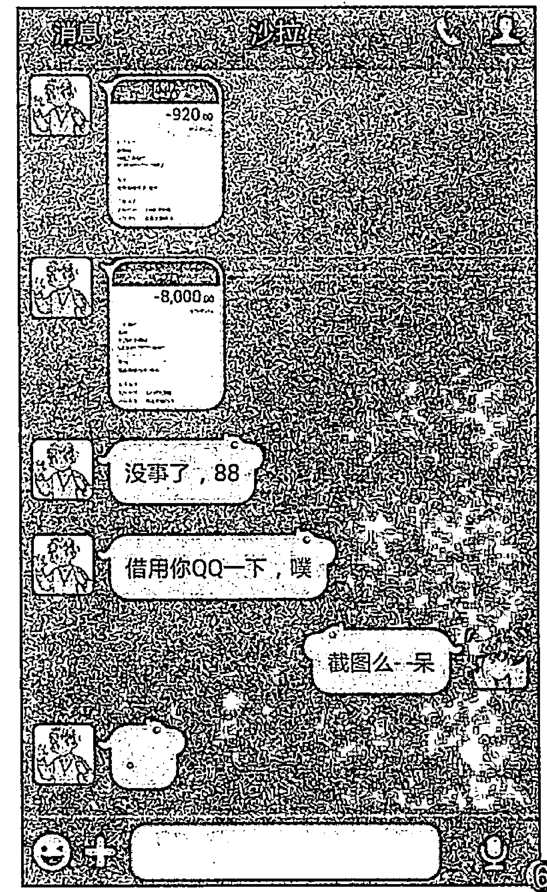

##### 手机QQ相关的隐私安全

一般不会有人专门坐在你电脑旁边用你的PC QQ，可手机这东西在聚会时会经常被别人把玩使用，如果手机是新上市的产品，难免被众人玩个遍。QQ上的消息因人因时而异，有时候是很私密的，并不希望别人看到它，但给朋友玩玩自己的手机又不好拒绝，这时候应该使用手机上的手势密码锁定功能。用过手机图形锁定的人一定对其不会陌生，其实就是用手指在九个点之间划连线（图7）。这样别人在借用手机时，就不能使用我们的手机QQ并查看与他人的对话。此外新版手机QQ终于对登录终端做了管理和优化，在手机QQ当中可以查看我们的QQ目前在哪些设备上登录，还可以踢掉任意终端上QQ的登录（图8）。还可以点击最近登录的设备，查看很长一段时间内我们的QQ号码都在哪些终端上登录过。点击你感觉不妥的设备并删除，就算当时点击了保存账号和密码选项，以后再在这个设备上登录QQ仍必须要重新输入密码。允许手机、电脑同时在线的开关也非常实用，打开两种设备就可以同时共存于PC和手机，关闭的话电脑端会瞬间掉线。这个功能可以结合刚才说过的登录终端管理共同使用，确保我们的QQ没有在我们不知情的情况下登录。设备锁是一个比较有新意的功能，比如说我们打开后，我们的QQ就算被盗了，盗号者也无法在一个非常用的电脑或者手机上登录我们的QQ。在电脑或MAC上登录一个具有设备锁的QQ号码，需要QQ手机版扫描一个独特的二维码；而在非常用手机或者Pad登录QQ，就会向密保手机发送短信验证使用者的身份（图9）。通过设备锁，再结合QQ其他的防盗手段，可以真正做到万无一失。

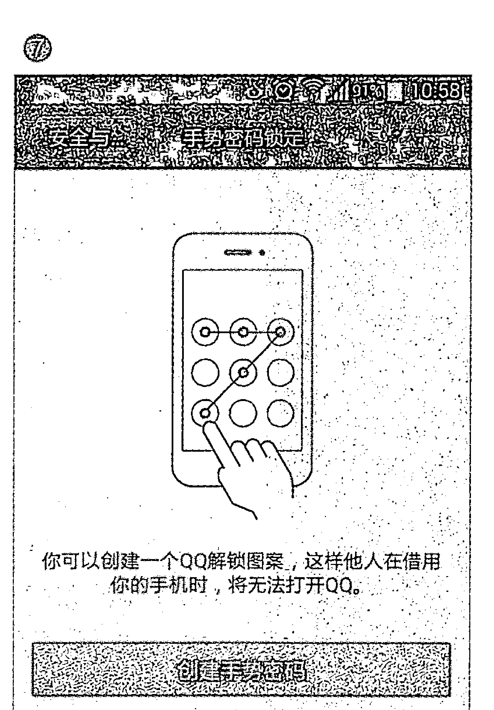

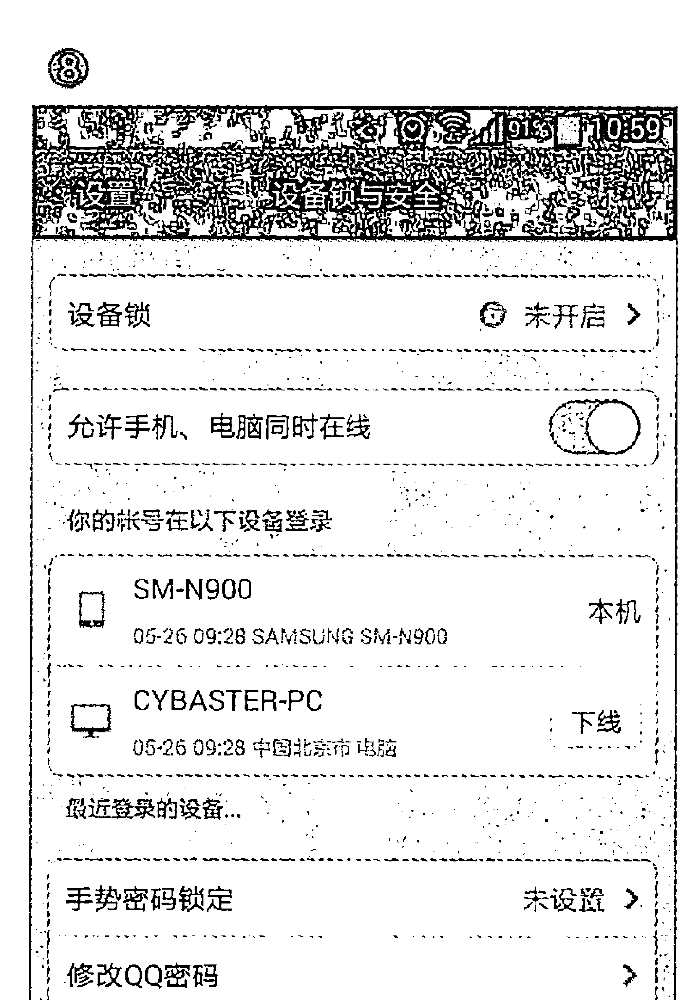

##### 不同客户端信息的共享

虽然手机QQ方便了生活，但有时也会带来不便。比如在路上客户发来很关键的话，我们到了单位希望在PC上浏览时却发现聊天记录还在手机上，想复制还得从手机转到PC，十分不便。如果我们想避免信息被阅读后其他终端无法看到，其实是有办法的。首先这种情况大多出现在我们PC端没有登录的23:00~8:00这段时间内，这时只要打开手机QQ设置中的消息通知，把“夜间防骚扰模式”打开即可。如果还不是这种典型情况，可以同时打开手机版设置里聊天记录中的“同步最近聊天记录至本机”和PC版本QQ设置里安全设置中的“登录QQ时同步最近聊天记录”即可解决问题。至于客户发来的文件，可参考本专题内《无缝文件互联互通》中的相关设置（图10）。

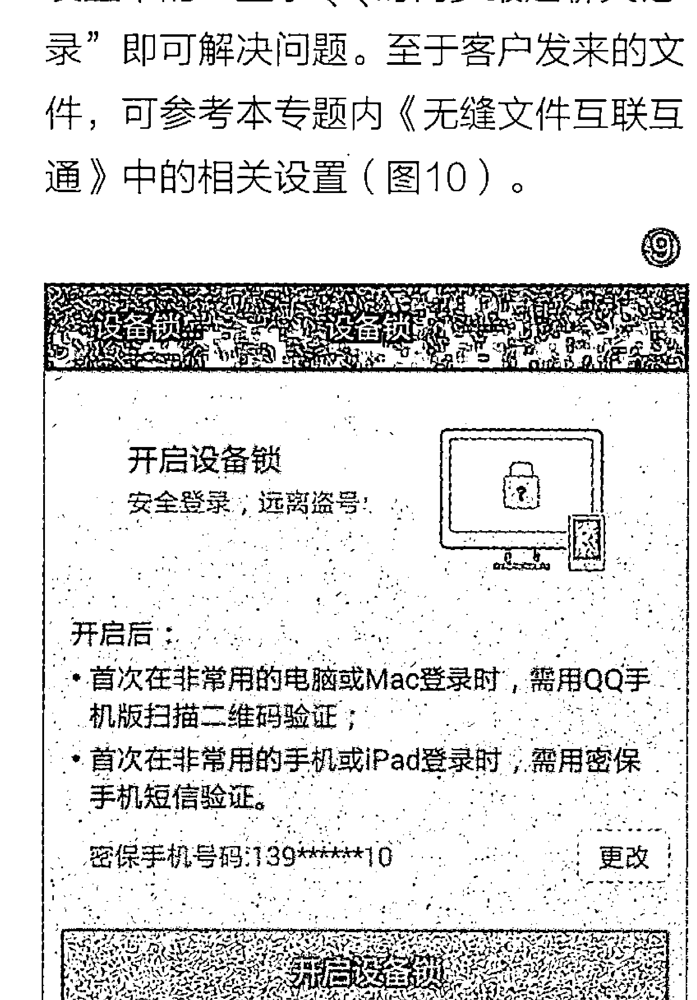

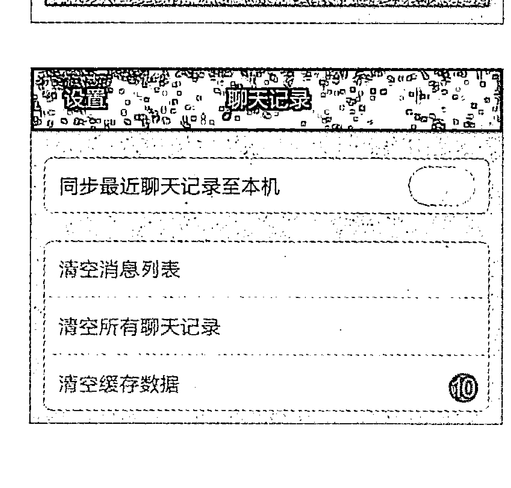

### 玩转QQ的“环境”基础

不论是PC上的QQ还是手机QQ，对于硬件的要求都不算高。基本上一台可以用来办公的电脑和入门级别的智能手机都能比较稳定地运行QQ软件。不仅如此，QQ有些时候还能帮助我们甚至我们的朋友解决硬件问题，你试过没有？

### QQ远程协助

QQ远程协助功能仅限PC版本，它既可以让我们帮助不在身边的亲属友人解决电脑上的问题，也可邀请远方的一个电脑高手来搞定我们手头的电脑。这个功能通过一个远程的桌面实现控制/被控，一旦成功连接控制端和被控端，均可以通过键盘鼠标来操作电脑（图1）。

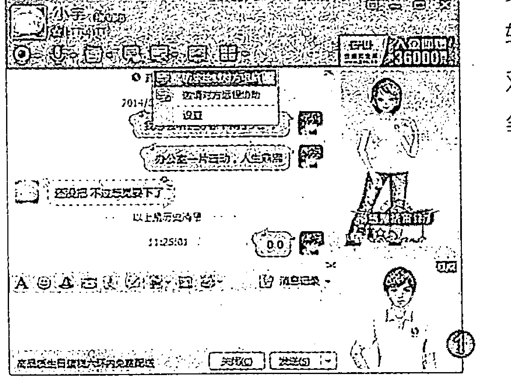

### 屏幕分辨率

不过要想用好远程控制，还需要稳定的网络环境及对应的硬件设备。首先就是显示器分辨率的大小问题：试想如果控制端显示器分辨率是1280×800，结果用它去控制一台1920×1080分辨率的电脑，不仅操作起来需要反复拖拽十分不便，而且根本无法看完整对方的桌面，控制效果大打折扣（图2）。比较理想的状态是反过来，如果我们控制对方的电脑，至少我们的分辨率要大于等于对方的分辨率，这样才好操作。

> **扩展阅读**
笔者曾尝试给海外的朋友远程协助，尽管双方网络环境都不错，但因国内网络连接海外速度太慢，依然难以保证连接畅通。

### 网络环境与上行速率

其次就是非常关键的网络环境。相信大家都看过网络视频吧？我们观看视频的分辨率越大，需要我们的网络速度就越快，这很好理解。在远程协助的场合下，这个网络最关键的一点并非控制端（或者说观看端），而在于被控一端，特别是被控端的上行速度。
虽然生成一幅画质低、帧率低的1920×1080画面并点对点传给对方并不需要很夸张的上行速度，但别忘记国内的家庭网络环境上行速度大多都是缩水过的。如一个20Mbps的光纤FTTH网络，尽管下载速度已经很快，但上传只有2Mbps左右。如果是2Mbps或者4Mbps的ADSL，这一速度也会相应降低到一个非常低的水平（图3）。

所以在使用远程协助时，被控端应该尽量不去占用自身的网络，特别是一些P2P的软件有时会在后台上传，应该在建立连接前予以关闭。一些静默上传的程序文件，控制端在连接建立后也应该给予关闭，保证远程协助的畅通。

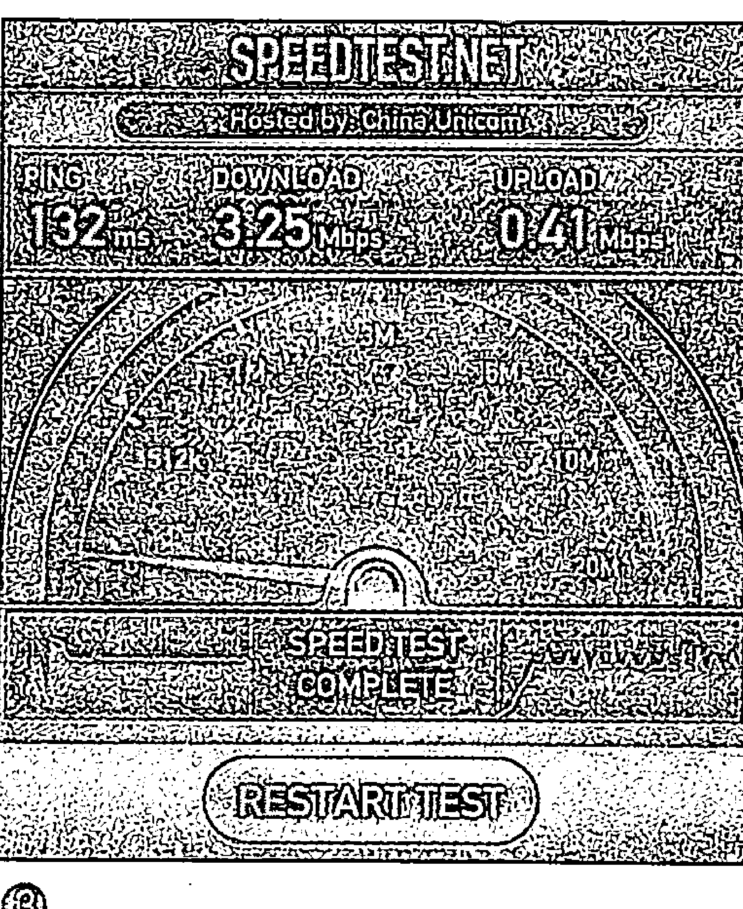

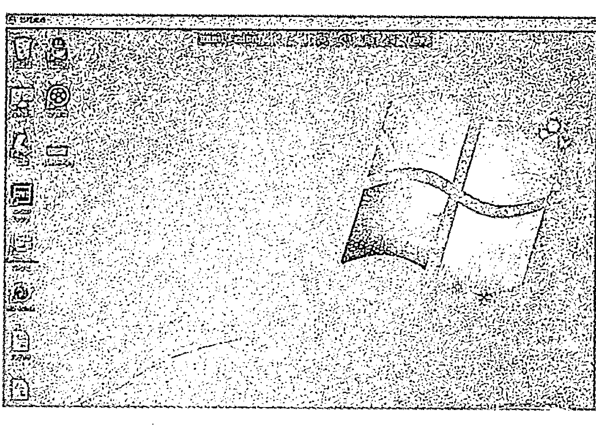

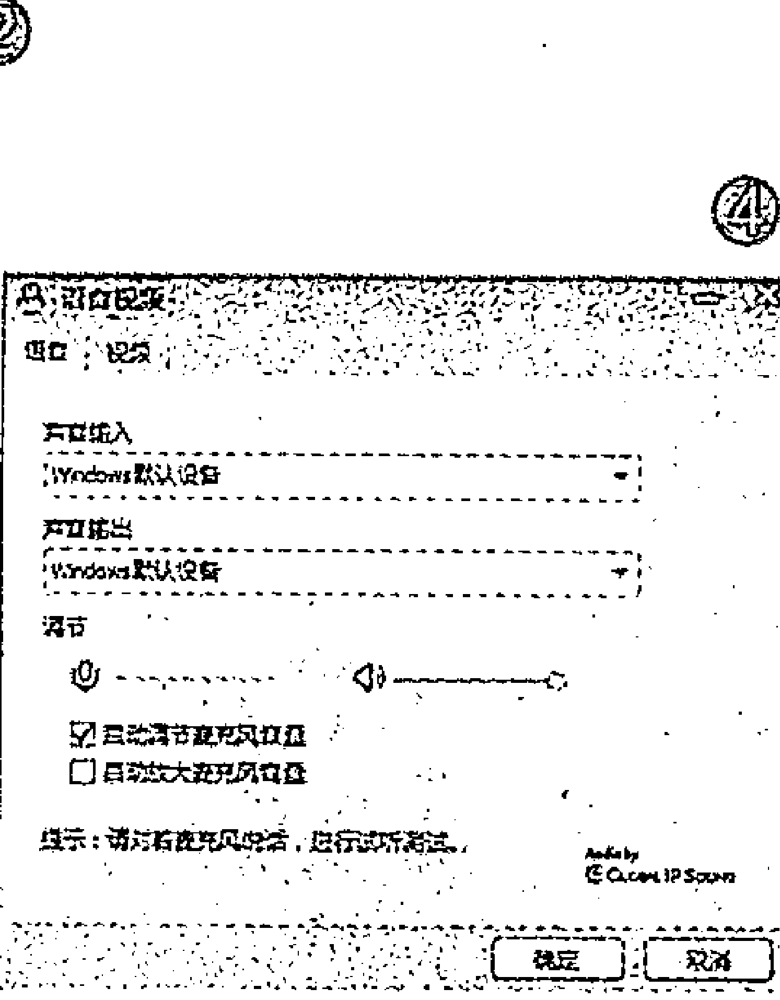


遇到过诡异的麦克风问题吗？预装系统的笔记本电脑还好，预装系统的产品都会在出厂前安装好所有的驱动程序。可我们购买的DIY台式机和最近较常见不含系统的笔记本电脑，其声卡驱动和声卡相关程序都需要用户自己装。电脑的声卡品牌和型号各异，用户下载驱动的方式和站点也五花八门，在这个过程中就很容易出现问题。音箱只要出声，声卡输出的部分就基本搞定了，可麦克风使用的声音输入就没这么简单。

QQ语音设置和相关向导能在一定程度上简化这个操作，还能在一些时候起一个指导性作用。在聊天窗口上麦克风图标的扩展处就可以打开相关设置，这里的输入输出默认设备都用了最为简单易懂的方式列出（图4），在这个状态下对着麦克风说话是可以听到自己声音的，不断调整设备和音量，如果驱动本身没问题的话在这里就能搞定麦克风问题。当然，大家也可以通过这个向导提供的步骤检查电脑上的输入/输出设备运行状况是否良好（图5）。

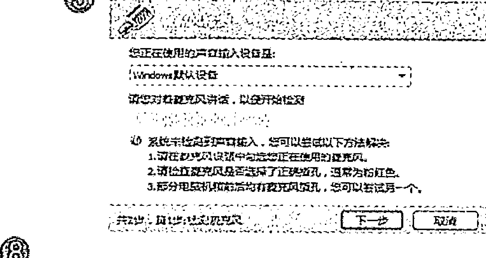

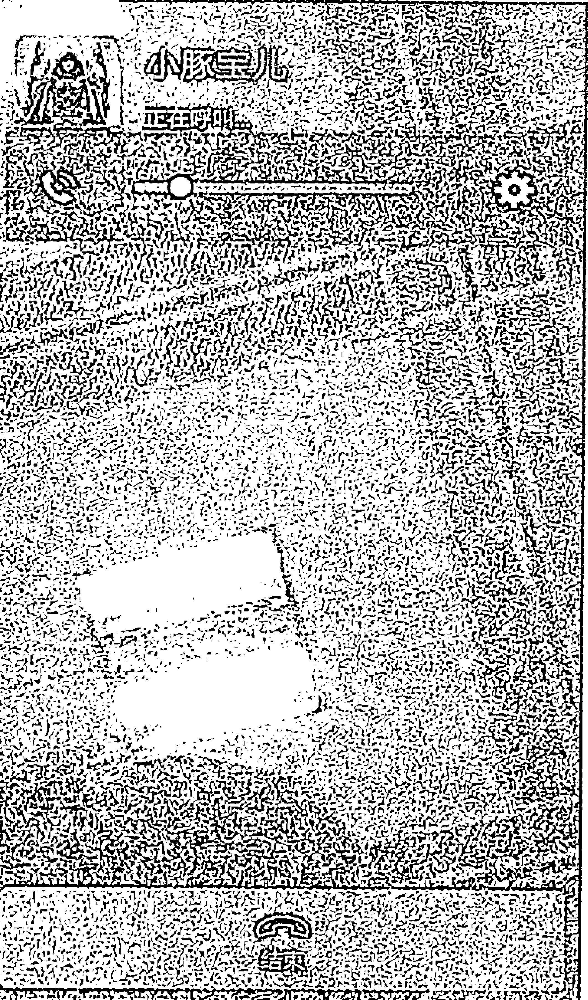


QQ版本从很早开始就增加了视频聊天功能，在PC上我们需要一颗能正常工作的摄像头。与语音设置向导一样，QQ为视频聊天也提供了简单易懂的设置向导（图6）。由于视频聊天对于网络的要求高于纯语音，PC QQ的视频聊天还拥有专门的网络监测，完成后会自动挑选适合我们网络的服务器（图7）。

手机QQ的视频聊天更多给人一种可视电话的感觉，整个视频界面都给人很强烈的“我在打电话”的感觉（图8）。我们根本无需去单独设置手机前后摄像头的切换，程序会自动调用在画面前方一侧的摄像头。最新版本的QQ视频聊天中，通话音量一项是无法降低到最低的，QQ程序会锁定通话音量最低为20%，使用时需要注意这个问题。

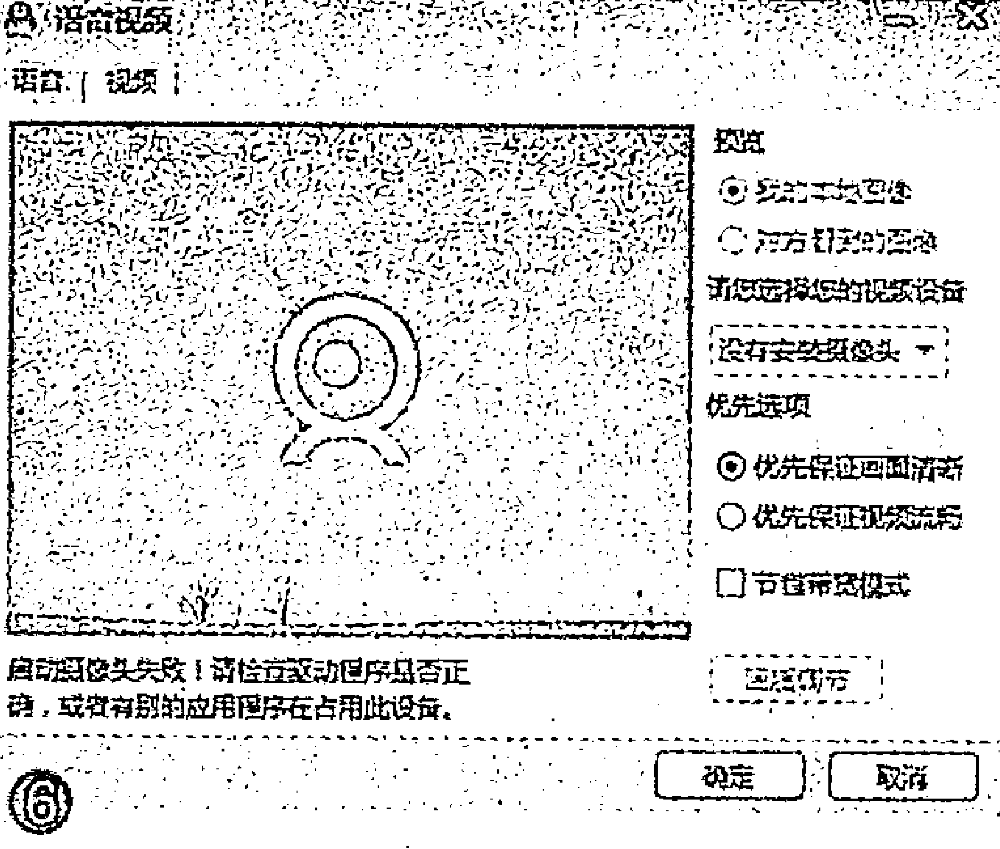

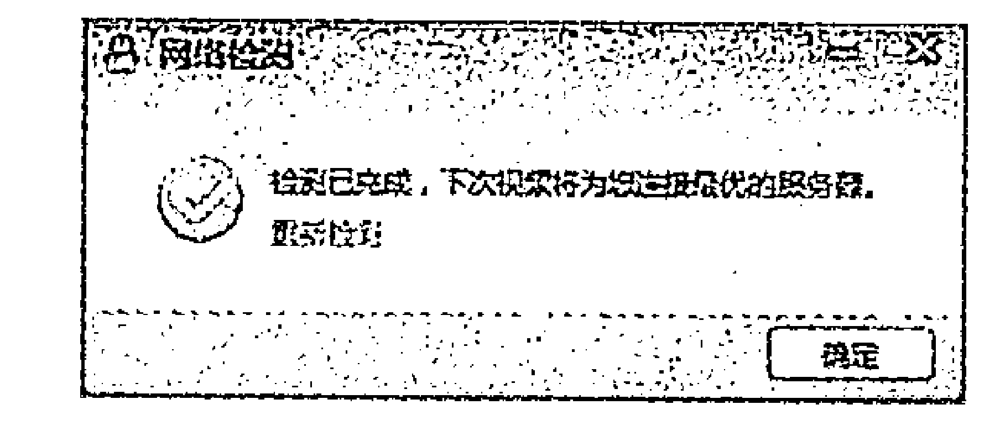

### 扔掉这盘那盘 Q走天下

文|宋迟

说起聊天，大家自然会首选QQ。然而说起传送或存储文件，大家自然会想到U盘、移动硬盘或这样那样的网盘。殊不知，现在的QQ已经成长为一个让我们可以忘掉这盘那盘的大企鹅。在最新版的QQ 5.4中，我们将能切身体会到这一点。

> 小提示
点击QQ面板下方的“文件助手”图标，可开启文件助手窗口，对其中已接收或发送的文件及离线文件、微云文件等进行各种必要的操作。

### 找回文件全赖助手帮腔

QQ 5.4对文件的管理依靠文件助手来完成。文件助手新增文件批量操作，文件按日期、来源、类型等分类筛选，文件按文件名或来源自由搜索等功能，管理文件更方便（图1）。
如果自己给朋友A发过一个文件，后来想要将这个文件共享给其他好友，但是一时又不知道文件放在什么地方了，怎么办？这时，只需要开启文件助手窗口，点击“已发送文件”，即可浏览或者搜索到自己需要的文件。选择文件并点击后边的小三角，从菜单中选择“转发”，即可将文件转发给别的好友（图2）。
如果离线发送给别人一个文件，但别人没收到，需要我们重发一下，有什么快捷的办法？只需在“网络文件→离线文件”窗口中，找到上次发送的文件，然后重新转发一次即可。或者告诉对方到其离线文件窗口找找，或许文件已经静静地躺在那里了。若不小心对别人离线发来的文件点击了拒绝，没有将别人发送的离线文件接收下来，也可以到文件助手的离线文件窗口中找到文件。

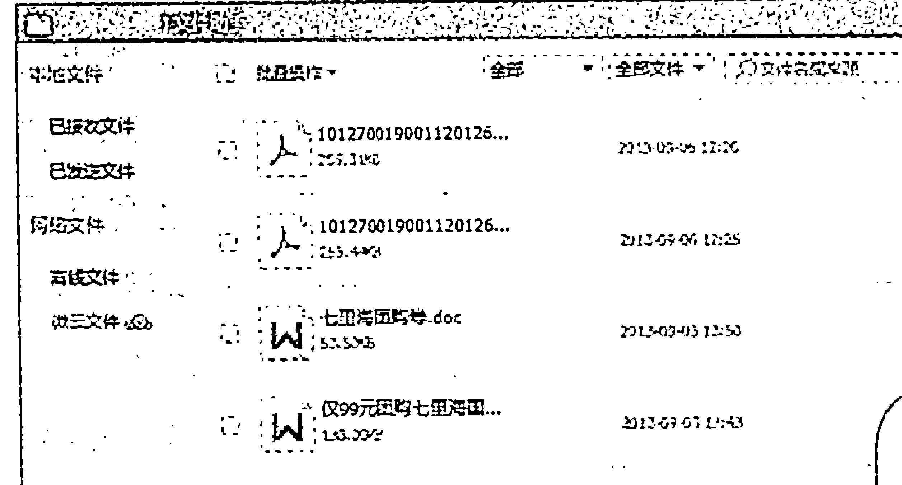

> 小技巧
离线文件快要到期，但身在外边没有携带U盘，怎么办？对于离线发送或接收的文件，由于腾讯服务器只提供默认7天的保存期，到期后会自动删除。因此，如果不希望将文件下载到本地保存，但还希望文件能保留，就请在文件助手窗口中选中文件，选择“存到微云”。

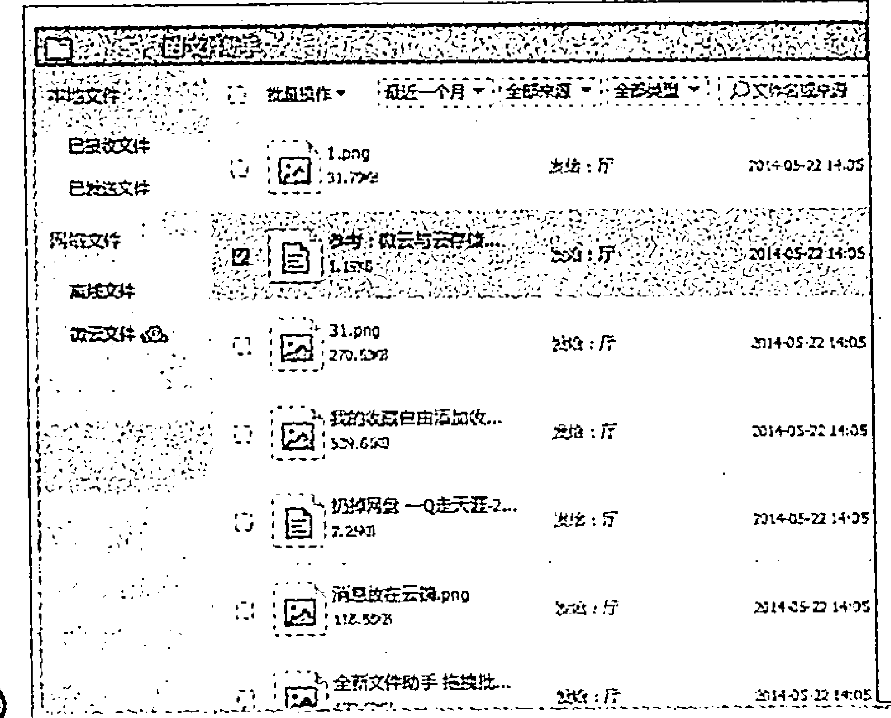

### 微云文件管理很轻松

### 微云为媒文件访问无疆

现实生活中，我们往往需要在不同平台上用不同QQ版本使用文件。不同平台的设备如何共享QQ文件？苹果设备没有安装QQ，但Android手机安装了QQ软件，如何实现苹果设备与Android手机共享文件？对于无法安装或不便于安装QQ的设备和平台，在不安装和登录QQ软件的情况下，存在微云里的文件可以拿下来吗？我们只需在文件传输过程中（无论从文件接收窗口，还是从文件助手窗口中），选择将文件保存到微云中，那么无论用哪种版本的QQ、在何种平台上登录QQ，都可以访问到微云中的文件。如果平台中没有安装QQ软件，也可以访问到微云中的文件。只需直接通过浏览器登录微云网页网页版，或者安装微云的客户端，即可查看和接收微云中的文件（图3）。而安装了新版QQ 5.4的用户，可通过“文件助手→微云文件”窗口右下角的“查看全部微云文件”启动微云管理窗口。

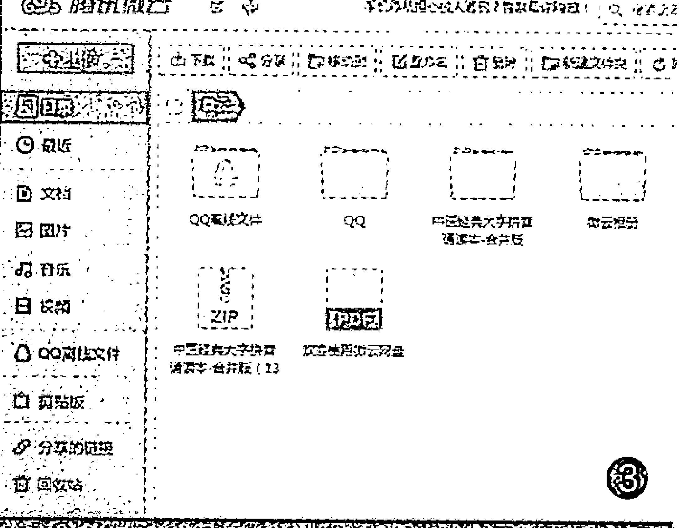

### 微云空间无限扩充点拨

用QQ账号登录微云手机客户端，即刻拥有了10TB的免费微云空间资格，不过还需要通过浏览器访问http://www.weiyun.com/act/10t.html网页链接，点击“领取10T”按钮，最终获得10TB空间（图4）。

### 小技巧：无网快速传输文件

Android手机可以在没有网络的情况下，利用手机自建热点的功能，在两台手机或手机与笔记本之间传输文件。用户可以使用“微云”发现在同一个局域网内的其他设备，并向其传输文件，无需经过云端服务器中转。启动微云后，微云将自动搜索同一个局域网下安装了微云的设备，点击微云客户端上的“微云传输”，找到要接收文件的设备，点击“发送”并选择文件发送即可。

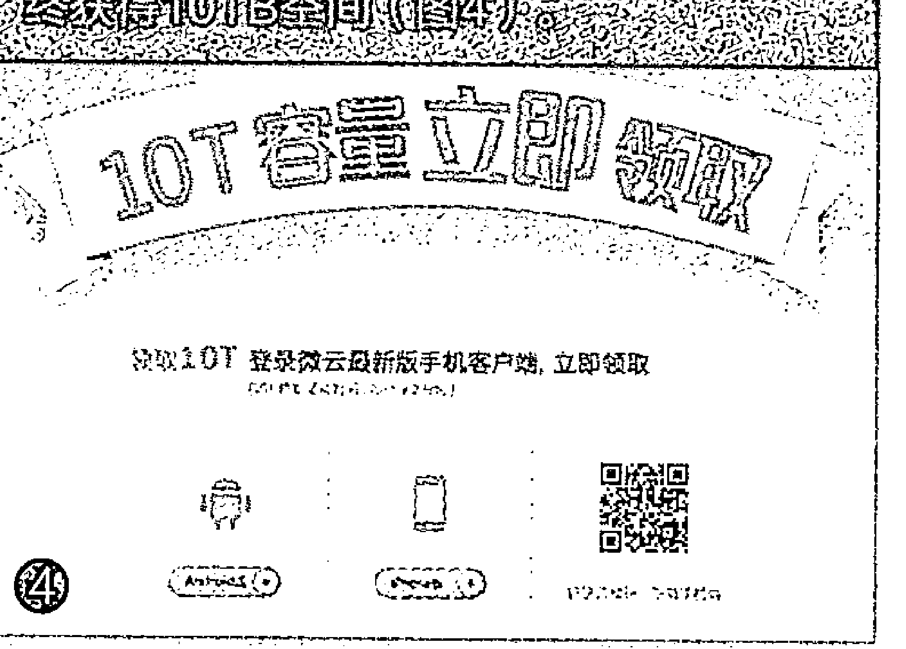

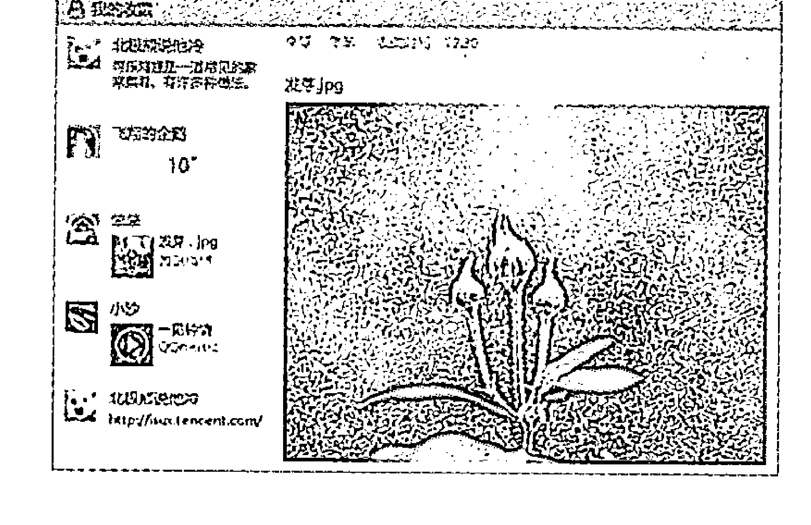

### 收藏精彩 宝藏随处调用

以往，我们在聊天过程中，发现精彩的文字、图片或聊天段子，若需要保存下来，还免不了复制和粘贴操作。而如今，随着新版QQ的到来，收藏变得极为简单。QQ 5.4新加入的QQ收藏功能，可让我们随时将聊天中希望收藏的内容添加到“我的收藏”中。“我的收藏”窗口支持新建收藏项，可分类进行收藏（图5）。

点击QQ面板底部的金色五角星图标，开启“我的收藏”窗口。在聊天窗口要收藏的信息之上单击鼠标右键选择“收藏”（图6），可及时收藏窗口中选定的内容，收藏的内容自动进入“我的收藏”，作为新项目自动保存（图7）。此外，对于聊天中接收到的文件，无论是如何处理的，文件助手也都将代为暂存7天，我们可从消息记录窗口选择将其收藏到微云中永久保存（图8）。

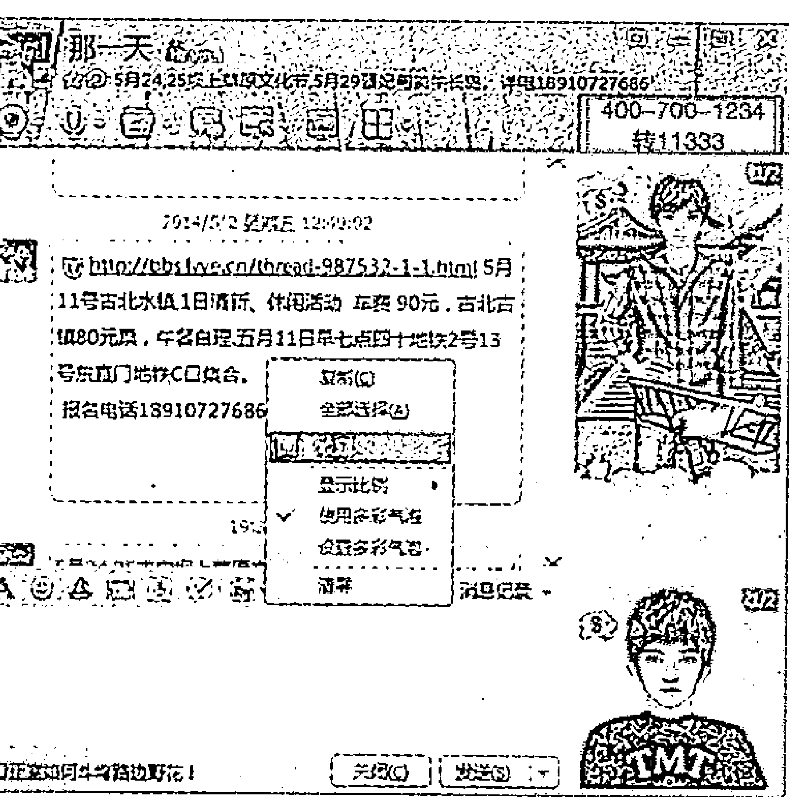

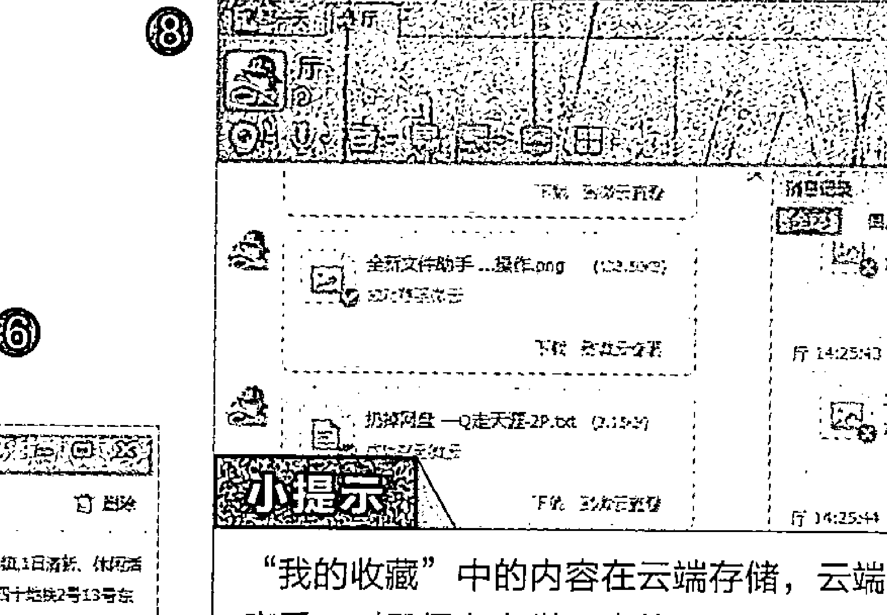

“我的收藏”中的内容在云端存储，云端的内容支持多终端同步查看。对于保存在微云中的影音文件，由于微云全面内置了QQ影音的内核，支持超过百种音视频格式的播放能力，因而可以实现微云中的文件在线流畅播放。这是一个云端看片的好方法。

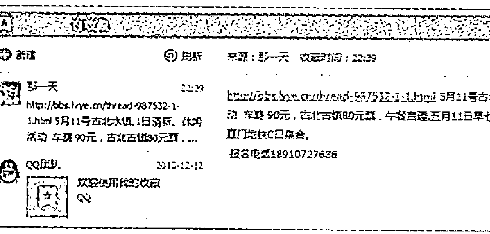

### 轻松同步异地聊天记录互通有无
文|俞木发

> 随着便携式设备的普及，我们除了在电脑上使用QQ外，大家还经常在平板、手机上使用QQ。那么不同设备之间QQ的聊天记录如何导入/导出？此外为了保护隐私，又该如何彻底删除聊天记录？

##### QQ聊天记录如何作为法律依据

在多方合作的过程中，不少事务是在QQ上对话完成的，当发生法律纠纷时，这些QQ聊天记录常常可以作为佐证供法官参考（不能作为唯一证据，但是可以作为关联证据）。不过由于是电子证据，所以在纠纷处理阶段，需要由公证机关将聊天以及保存QQ聊天记录的过程给予公证，这样被法院采信的可能性才较高。

##### 电脑QQ/移动QQ聊天记录互导

很多朋友都会在电脑和移动设备上使用QQ，这样某个设备离线时，QQ消息就只能在一个在线设备上收取，导致另一个设备上的聊天记录不完整。由于不同设备QQ聊天记录文件格式并不相同，所以我们还不能直接将记录互相导入，需要借助手工方法来完成。下面以电脑和Android设备为例。

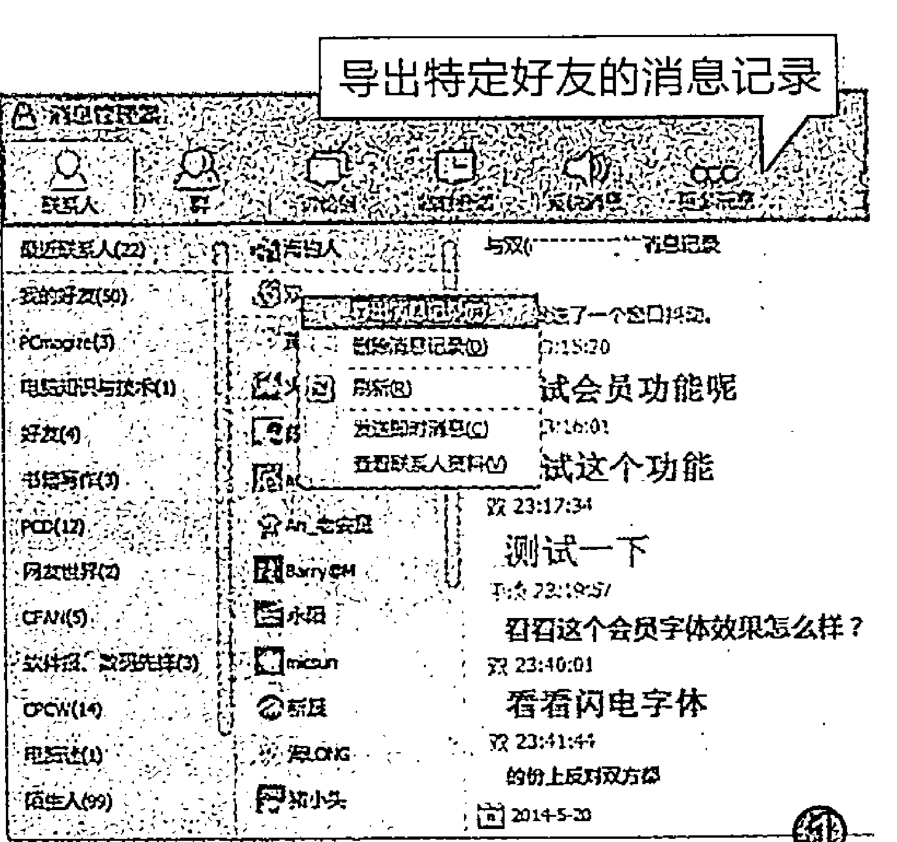

电脑QQ：启动QQ的“消息管理器”，点击“工具→导出全部记录”，这样可以将所有好友全部导出。不过大多数人的QQ记录内容很多，一般导出某几个好友的记录即可。选中需要导出的好友记录，右击选择“导出消息记录”，接着在弹出的窗口中，保存类型选择“文本文件”，将聊天记录保存为文本文件放置在桌面（图1）。

手机QQ：在手机上打开需导出记录的好友，在聊天记录里点击“导出”，即可导出为TXT文件保存在SD卡上，接着把导出的记录文件也复制到电脑桌面保存。由于是文本文件，图像和表情无法显示，而且包含很多空行。现在用记事本打开聊天记录文件全选复制，粘贴到Excel的A列，接着在B列输入“排序”这两个字作为表头，再输入1、2，接着拖拽B2单元格的右下角快速填充一个序列（图2）。

选中A列，点击工具栏上的升序排序，所有空行、图片、表情这些聊天记录中无效的数据就会自动归集在一起，按提示选中将其全部删除，这样保留的就是有效的聊天内容（图3）。

继续选中“排序”这一列（即B列），点击工具栏上的升序，就能将数据恢复到原来的顺序，聊天内容就是按照时间顺序排列好的文件。完成上述操作后，就可以根据需要，将整理好的聊天记录分别导入电脑或者手机QQ上了。

比如现在手机上收到B好友2014/5/2- 2014/5/10之间的信息，但是电脑上没有该聊天信息，只要在电脑QQ上打开和好友B的聊天窗口，然后在上述Excel窗口中复制导出手机聊天记录中对应的信息，将其发送给B即可，这样以后在电脑QQ上即可查看原来手机QQ上的聊天信息了。
如果要将电脑QQ上的信息导入手机，同上在Excel中复制手机QQ上没有的信息，发送给B。切换到手机QQ上后，打开和B的聊天窗口，接着点击右上方的用户图标，在打开的窗口点击“查找聊天记录→漫游记录→同步漫游记录→确定”，可将云端记录同步到手机上，这样电脑QQ上发送给B的信息即可同步到手机上了（图4）。

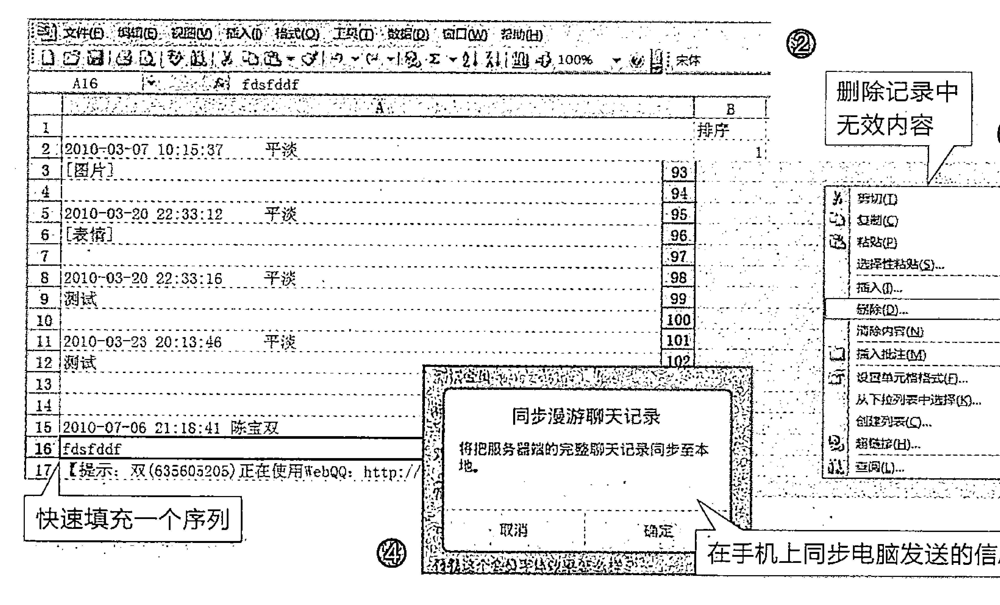

QQ聊天记录记载着我们的美好记忆，不过总是会有各种各样的原因导致聊天记录丢失。别着急，我们可以利用QQ免费提供的云端保存服务来找回这些记录。默认情况下普通会员可以在云端保存7天内的消息，电脑QQ用户只要在对话窗口点击“设置”，选择云端保存7天全体好友的消息，同时按提示设置独立密码，这样7天内的消息就可以自动同步到本地电脑中（图5）。
手机QQ默认可以下载7天内云端信息，进入“查找聊天记录→漫游记录→同步漫游记录→确定”，即可将聊天记录同步到手机上。如果由于重装系统导致数据丢失，则要查看之前是否将QQ个人文件夹放置在非C盘位置；如果是，只要重装QQ后将原来的QQ个人文件夹覆盖到当下的位置即可。如果之前的个人文件夹在C盘，就只有尝试使用数据恢复软件来恢复被覆盖的数据了。

##### 拒绝隐私泄露 彻底删除聊天记录

聊天记录中如果有非常敏感和隐私的信息，有些人为了安全起见，会想要彻底删除。当然，仅仅从本机删除还不够，还需要从腾讯的服务器上清理，才会更安全一点。
电脑端的聊天记录很容易清除，打开消息管理器，选中需要删除的记录点击“删除”即可。移动端则登录QQ后依次点击“我→设置→聊天记录→清空所有聊天记录”。需要注意的是，在删除记录时，一定要确保选中同时删除云消息记录，这样才可以清除腾讯服务器端上的相关数据（图6）。
默认情况下，电脑QQ本地聊天记录是个人文件夹内的Msg2.0.db（旧版QQ）和Msg3.0.db文件。为了确保删除后其他别有用心的人使用恢复软件恢复，可借助“金山文件粉碎机”进行粉碎，启动程序后点击“添加文件”，然后将上述两个文件添加到列表彻底删除即可（图7）。需要注意的是，这样处理后，你自己也无法找回聊天记录了。
此外，为了安全起见，删除聊天记录文件之后，我们还要关闭QQ云消息记录。在电脑端打开对话窗口，点击“设置”，选择“关闭好友云消息记录服务”，这样云端就不会再保存聊天记录了（图8）。
对于移动端；目前只有iPhone版手机QQ支持在“设置→安全和隐私”中关闭漫游消息。其他版本手机QQ一定要通过电脑端关闭云端信息保存服务，否则手机QQ仍然会同步漫游信息，从而有可能导致个人隐私的泄露。

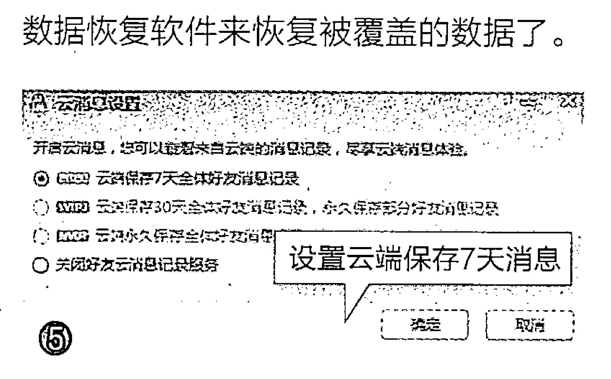

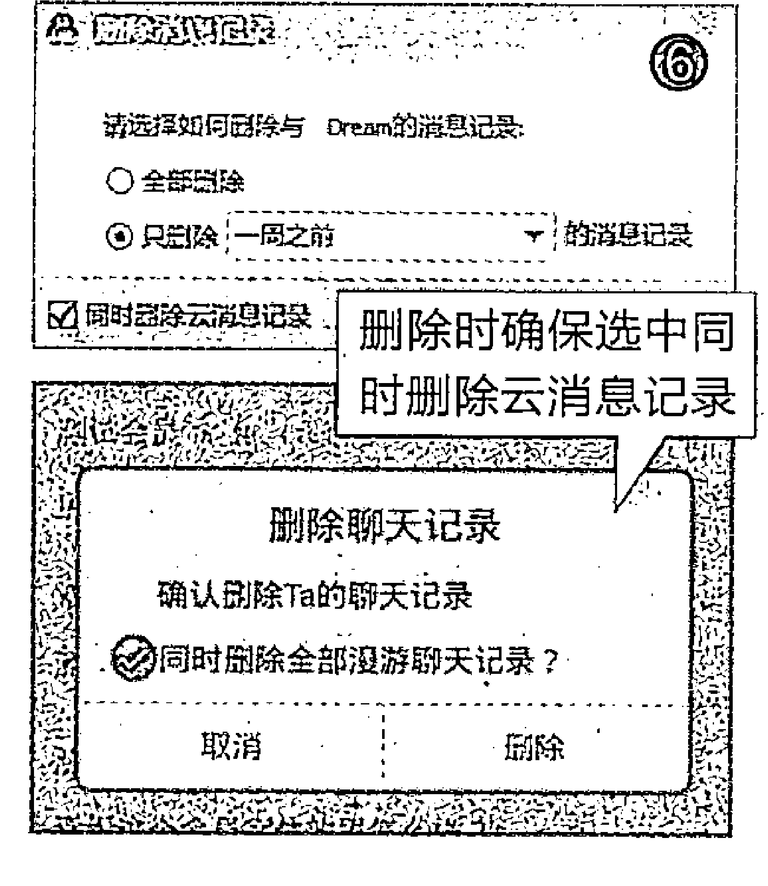

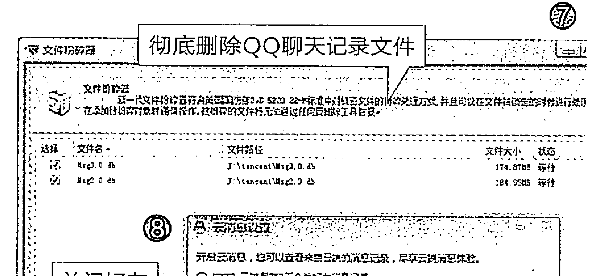


### 万能的QQ邮箱
### 邮箱我只留QQ的

文|何超

说起邮箱，虽然现在用得越来越少了，但由于工作的需要，暂时与它诀别还是不太现实的事情。然而，我现在已经不用频繁地打开各种邮箱去接收或发送邮件了，原因是我有QQ邮箱可以一站搞定。当然，用QQ邮箱的原因，还因为它有其他许多实用功能。

### QQ邮箱与Foxmail的姻缘

Foxmail曾经是中文最大和最专业的邮箱管理软件，后来被腾讯连人带马一并收购。在原有的Foxmail资源的基础上，腾讯将QQ邮箱与Foxmail合二为一，造就了现在的腾讯邮件服务系统。目前的QQ邮件服务器统管了Foxmail和QQ两大类邮件，同时，网页版QQ邮箱和客户端Foxmail也成为腾讯提供给用户的两大邮件管理基地。

不少人在使用Foxmail邮箱时会遇到这样的问题（尤其是Foxmail邮箱的老用户）：以前申请的xxxxx@foxmail.com邮箱，在Foxmail邮箱管理器软件中却总也不能收取和发送邮件，显示no such user信息。而从网页版的QQ邮箱登录窗口中选择@foxmail.com并输入密码，可以正常登录。这个问题如何解决？上网搜索难以获得正确答案。其实，这个问题的发生，与早些年发生的QQ邮箱服务器接管原Foxmail邮箱服务器事件密切相关，接管后原来的Foxmail邮箱服务器不再发挥作用。因此，在Foxmail的邮件服务器设置窗口中，SMTP和POP3服务器地址如果再顺其自然地填写为smtp.foxmail.com和pop.foxmail.com就无法接收或者发送邮件了，而改填smtp.qq.com和pop.qq.com才是正确的选择。此外要注意，在POP3账户当中不能简单地只填写用户名（如abc16888），而是要填写完整的邮箱名（如abc16888@foxmail.com），这样系统才能知道我们使用的是abc16888@foxmail.com还是abc16888@qq.com（图1）。另外还有一点很重要，要通过“高级”按钮进入高级设置窗口，将两个安全连接（SSL）的选项都选上，这样才能最终达到正常收发邮件的目的（图2）。

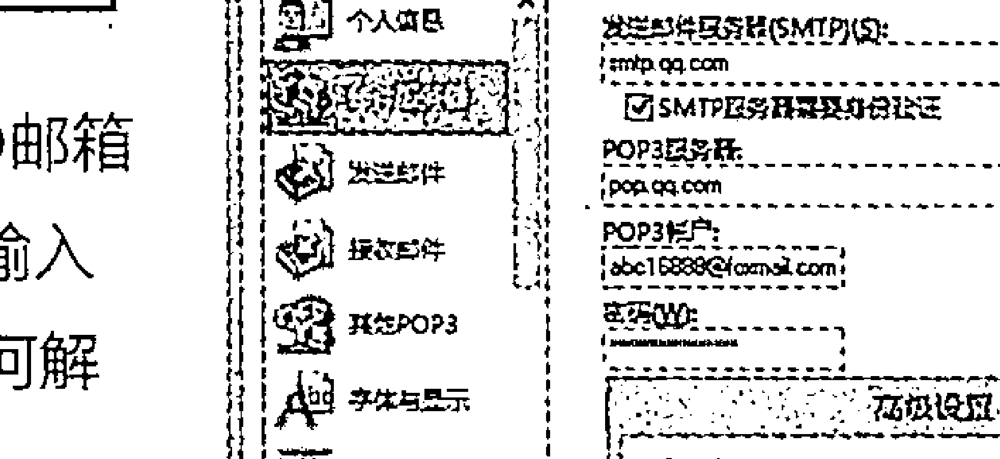

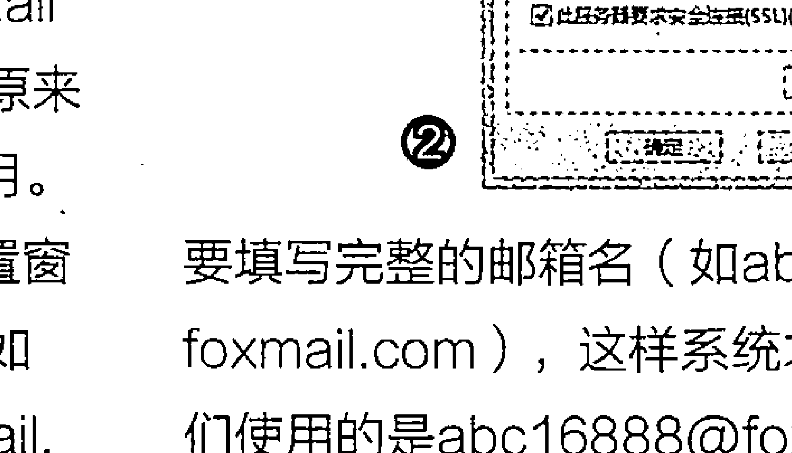

### 一个QQ邮箱可有5个名字

> 小提示
如果我们是从网页版中登录邮箱，则可以直接通过http://mail.qq.com切换邮箱。其中就有qq.com、foxmail.com和vip.com这3种选择（图3），让登录和设置、通过QQ的邮箱服务器来收发邮件、接收或者发送邮件，因而不会出现服务器访问方面的问题。


一个QQ邮箱，可以赋予多个邮箱地址来访问，其中的邮件完全实现打通。例如，我的QQ号是12345678，那么我自然拥有一个12345678@qq.com邮箱。如果我曾经拥有一个abc16888@foxmail.com的邮箱，那么，可以指定让12345678@qq.com和abc16888@foxmail.com实现打通。我们还可以给自己现有的QQ邮箱注册一个英文名字，例如zhangsan@foxmail.com。此外，还可以用自己的手机号码来注册手机邮箱账号，与QQ账号实现绑定。这样一个QQ上就关联了4个邮箱名，用其中的任意一个都可以访问QQ邮箱，这就是所说的“一邮多名”。在QQ面板中点击邮箱图标，或在Foxmail邮件管理器中使用zhangsan@foxmail.com账号，或者在QQ邮箱登录网页上用手机号码或原来的abc16888，都可以达到登录QQ邮箱的目的（图4）。

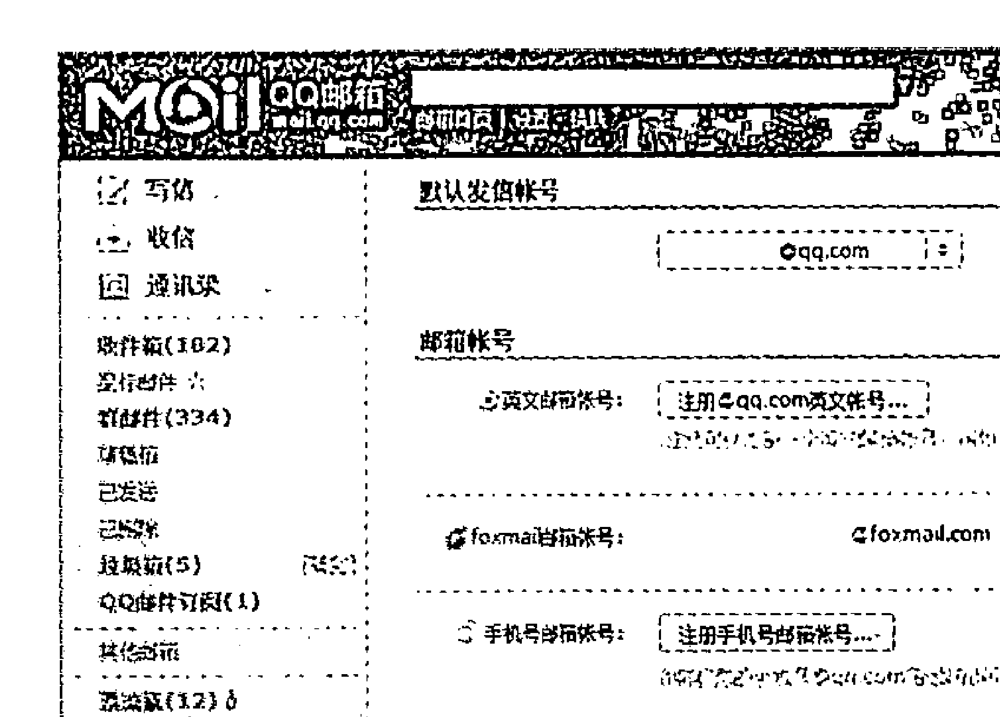

> 小提示
如果此前推出一邮多名服务时，我们已经为当前的QQ邮箱注册过Foxmail邮箱账号并使用一邮多名，这时可用Foxmail邮箱迁移助手将Foxmail邮箱迁移过来，对原来注册的Foxmail账户没有影响。这样，目前就拥有了1个@qq.com邮箱和2个@foxmail.com邮箱。假如还拥有一个@vip.qq.com账号，另外再有一个手机邮箱，那么现在就拥有了强大的5账号邮箱组合了。

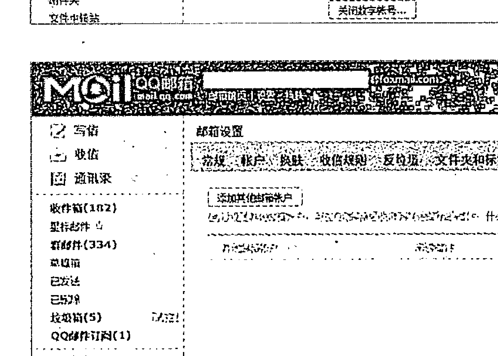

| 添加其他邮箱账户 |
| --- |
| 接收邮件服务器：POP3 |
| 接收邮件服务器：IMAP |
| 发送邮件服务器：SMTP |

> 小提示
一个QQ邮箱可以同时管理最多30个其他邮箱的账户，成功设置好其他邮箱的账户之后，QQ邮箱会自动收取它的邮件，收到的邮件还可和QQ上及时提醒。同时，在QQ邮箱中，还可以直接用其他账号来发送邮件。注意要将网易163/126邮箱需要在网易邮箱设置中开启“POP/SMTP服务”设置；若需要接管Gmail邮箱，需要在Gmail邮箱设置的“转发和POP/IMAP”页中启用POP设置。

### 让QQ邮箱一统邮件天下

以往，如果我们有类似@126.com、@sina.com等各家邮箱，那么，访问这些邮箱要么需要登录各自的邮箱服务器网站，要么就得弄一款像Foxmail这样的多账户邮箱管理软件来实现管理。现在，有了QQ邮箱，我们可以用它来统一管理其他邮箱的邮件。在QQ邮箱页面中点击“邮箱设置→其他邮箱”，点击“添加其他邮箱账户”按钮（图5），填写其他邮箱的信息和密码，将其他邮箱添加到QQ邮箱中管理，同时此处可设置其他邮箱收取和发送邮件的各种选择，如：是否保留备份、发送邮件是否由QQ邮箱代发等（图6）。

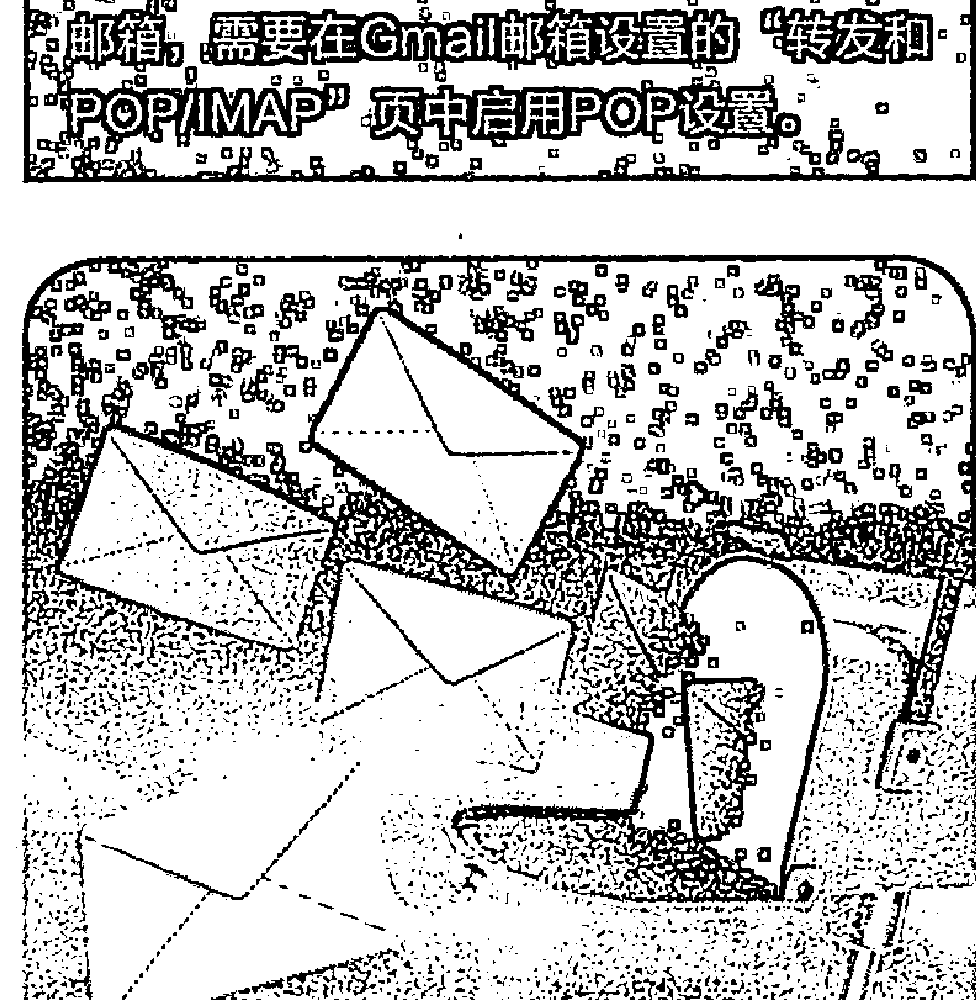

### 突破大文件邮件的发送瓶颈
##### 文件中转站 解决大附件问题 ▼

用邮件传送文件，容量的限制是个大问题，因为邮箱附件对文件大小的限制一般都比较苛刻。QQ的文件中转站很好地解决了这个问题。

多台电脑之间互转文件，比如在家用电脑和公司工作用电脑之间中转文件，用QQ中转站最大可上传3GB的大文件，这是对传统邮件附件不能携带大容量文件的有力补充，很好地解决了用邮箱携带大文件的问题。但是，因为存放文件的有效期为30天，因此打算永久存放就变得不现实了，中转站中的文件必须在有效期内下载到本地（图7）。

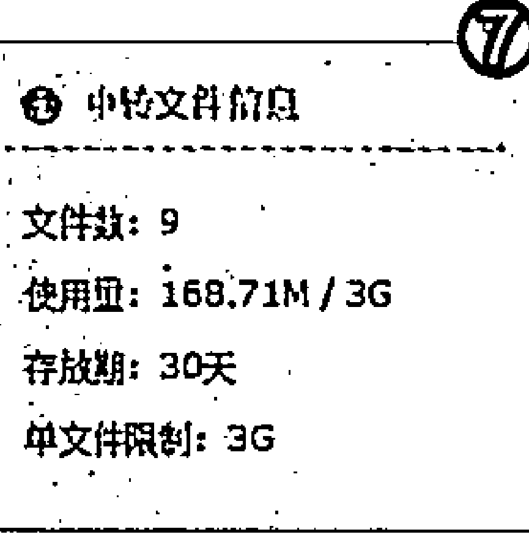

##### 用好附件夹 文件管理不再难 ▼

以往邮件一多，附件的管理成了难题，要从一堆邮件中找到某个附件，需要一封一封地预览邮件，然后寻找自己要的附件文件下载。在QQ邮箱中，我们可以借助于“附件夹”来快速找到自己所需的邮件附件文件。

点击QQ邮件管理窗口左侧的“附件夹”，在右侧窗口处会出现所有邮件附带的附件，我们可以通过列表来浏览文件，也可以通过右上方的搜索框搜索定位所需要的邮件附件（图10）。找到之后点击“下载”，就可以获得所需要的文件。

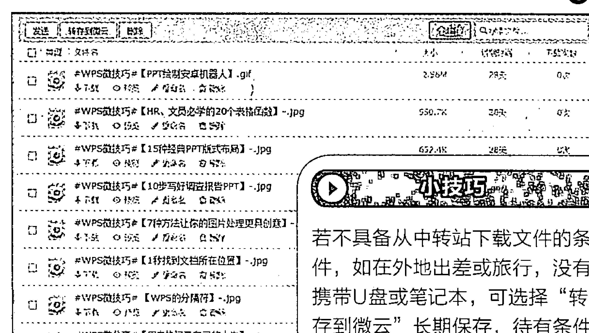

**小提示**

访问中转站上传文件，如果传送文件大且多，可选择安装“上传控件”，上传控件安装之后，可实现多文件同时上传、断点续传和显示上传进度等功能（图9）。

**小技巧**

若不具备从中转站下载文件的条件，如在外地出差或旅行，没有携带U盘或笔记本，可选择“转存到微云”长期保存，待有条件再下载或直接在微云上访问文件（图8）。文件转存的微云后，就可在不同平台用不同类型的设备来登录微云、访问文件了。


##### 写邮件 未雨绸缪有技巧

多数情况下，我们的邮件是写了之后立即发送。但有些情况下，邮件不能立即写成，或者写成的邮件到某个时刻才能发送，这就需要我们对邮件进行提前规划。

提前规划邮件有两种方法。一种是在草稿箱中起草邮件，这种邮件适合于不确定在什么时间发出的场合，邮件的内容也可以随时更改，待确定后再随时发出；另一种是在“写邮件”窗口中写好后选择“定时发送”，这种邮件内容已经确定，发送时间也已经确定，只是发送需要延迟。

除了上述方法或技巧外，其实QQ邮箱还有许多实用功能。比如可以从日历设置中绑定手机号码，设置邮件的及时通知功能，通过手机短信通知新邮件的到来；通过邮箱中的记事本（含微信语音记事本）记录大事小情，同时还有邮箱中的温馨小秘书——日历提醒为我们服务；逢年过节利用QQ贺卡与明信片完美补充传统邮政所缺少的魅力等。

**小技巧**

未发送的定时邮件还可取消，定时邮件发送时，在所设定的发送时间前，邮件保存在草稿箱里，重新编辑一下发送时间或删掉邮件就可以了。已经发送但用户尚未接收的邮件也可撤销，在“已发送”邮件窗口中找到已发邮件并点击打开，然后从编辑窗口上方点击“撤回”按钮即可（图11）。注意撤回仅限于发送给QQ邮箱的邮件，且对方未曾收取的情况，此外还限定15天内方可撤回。

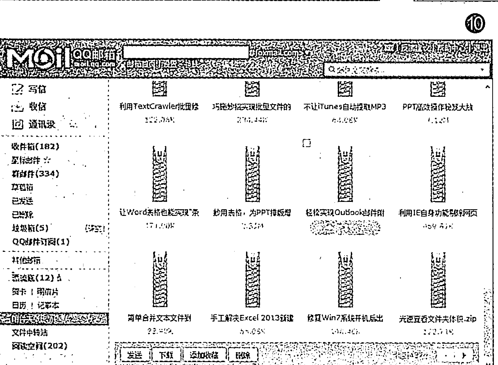

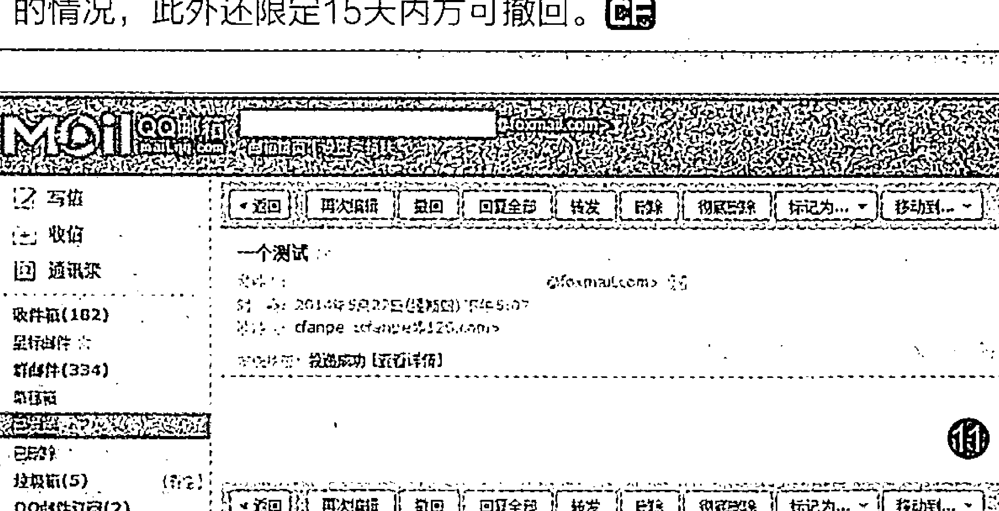

### 向Windows 8蓝屏寻根问底

文|丁鼎

使用过程中出现蓝屏，一向都是Windows系统的一个司空见惯的现象。升级到最新的Windows 8或8.1版之后，本以为这个原名BlueScreen的版本发生这种情况会减少些，但情况并不那么令人乐观。

笔者在自己的一台不算太老的双核电脑上安装Windows 8和Windows 8.1的过程中，遇到不同种类的蓝屏（图1 ~ 图4），这些蓝屏莫名其妙地摆在自己的面前，光靠屏幕上的提示，真的会让你一时傻眼，不知所措。不过，蓝屏总归有蓝屏发生的原因，只要我们肯寻根问底，蓝屏发生的原因和解决办法就不难找到。


细看上面的四张图，你会发现其中都有一个百分比的项目，这个是在出现蓝屏后从1%一直走到100%的，持续一段时间才能看到画面上的100%。此外就是下面的那行小字的英文描述，那大概是告诉你错误的类别，但对于一般用户来说，这无异于天书一样的代码似乎也说明不了什么问题。摆在我们面前的就是这两样东西，一个简单得不能再简单的百分比和一个让人发晕的英文串。如何才能凭借这两样东西分析出蓝屏发生的原因和找到解决办法呢？

##### 两条线索 获得原始“诊断书”

先说这个简单的百分比。你看到的蓝屏上显示从1%到100%的过程，其实是系统在生成一个dmp文件的进度显示。这个dmp文件是干什么用的呢？这是微软专门设计的一个记录功能，它用来记录发生蓝屏的情况下的详细错误信息，其中是一些专业的代码，一般用户即便用记事本打开它，也不会读懂其中的意思。但是，它能为专家分析故障提供科学的依据。一旦系统出现蓝屏，当系统记录完dmp文件之后，如果用户能将这个文件发送给微软工程师，那么就给分析问题提供了直接依据。

另一个英文串信息前微软是这样描述的：“如果你想了解更多信息，则可以稍后在线搜索此错误”。这显然比前面的这种方法更加直观一些，但是，因为这个只是一类错误的简要描述，不能真正代表当前发生错误的所有信息。因此，单靠这个在网上搜索，得到的可能是同类问题的解决方案，但不一定能解决你的问题。

因此，想要真正解决蓝屏问题，蓝屏上的这两个信息都很重要。如果靠下面的类别信息搜索到的解决方案不能解决你遇到的问题，那么，dmp文件就是进一步查明原因和解决问题的最直接证据了。

通常情况下，Windows 8系统具有自愈功能，在非硬件损坏的情况下，当遇到蓝屏问题不能解决，Windows生成dmp文件后，显示进度到达100%，稍等片刻电脑会重新启动，然后进入到正常状态，但同时会出现如图5所示的信息提示。

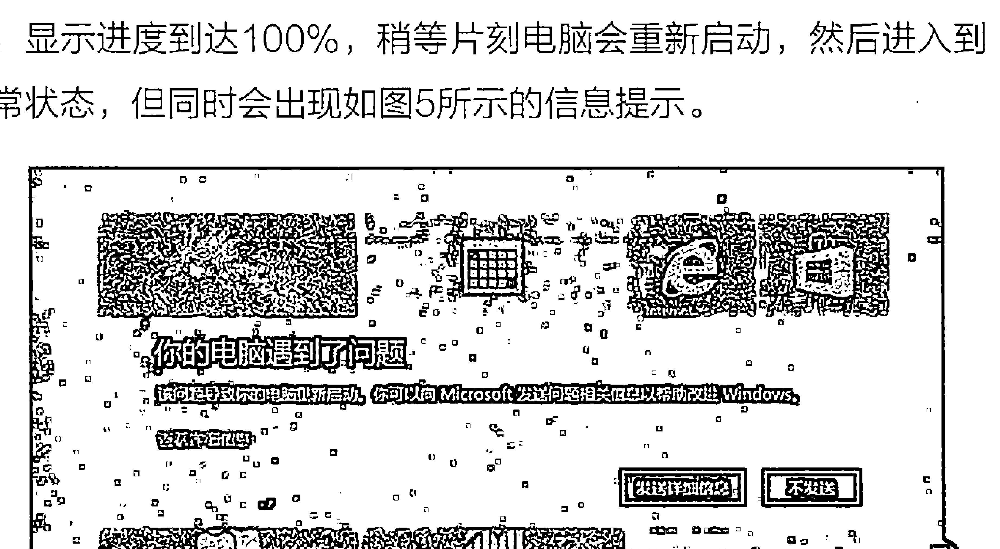

通过点击“查看详细信息”文字链接，我们可以获得更多关于蓝屏的信息（图6），图中线框高亮显示的三行代码提供了关键文件的信息。虽然你可能不懂深层的Windows技术，但可以将图6所提供的3个文件，提供给Windows专家进行系统失败原因的诊断分析。你只需将这3个文件打包上传到SkyDrive，分享给能够提供帮助的技术人员分析处理。或者也可以直接点击问题详解页面右下角的“发送详细信息”将出错信息一键发送到微软公司的错误报告收集服务器，以便日后得到来自微软的解决方法。

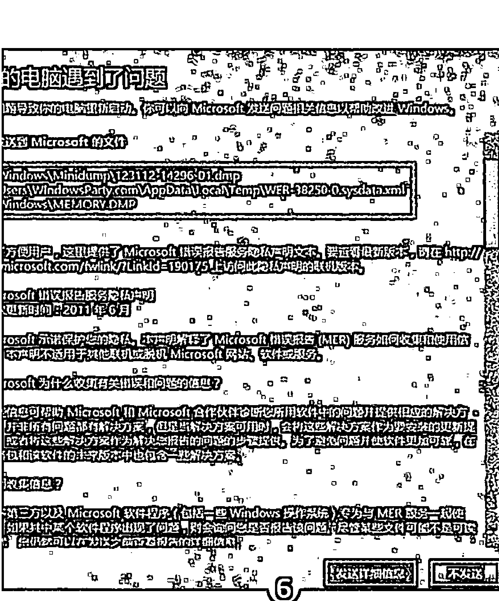

> **小提示**

该软件官方网站（http://www.nirsoft.net/utils/blue_screen_view.html）不但提供32位的安装版和压缩版，还提供64位系统的版本。此外，针对各国语言，还提供了语言工具包，其中包含简体和繁体中文语言包。

##### 借助工具 分析蓝屏具体来由

找专家或求助微软不一定能很快解决你的蓝屏问题，也许需要一段时间。这时，如果你有兴趣和耐心，或者有一定的Windows基础，也可以借助专门的分析工具进一步分析问题所在。

这里向大家推介一款第三方工具软件BlueScreenView，利用该软件可以还原出故障的现场蓝屏画面，尽可能详细地展示可能导致崩溃的文件和内存地址。通过这个软件，你可以找到大多数蓝屏的原因所在。打开BlueScreenView就可以直接得到迷你dump文件的分析查看结果（图8）。

图8：BlueScreenView软件显示的文件属性对话框，包含以下信息：

| 属性 | 值 |
|---|---|
| Filename | i8042prt.sys |
| Address in Stack | i8042prt.sys+5cab |
| From Address | 0x8cc83000 |
| To Address | 0x8cc9e000 |
| Size | 0x0001b000 |
| Time Stamp | 0x5010ad26 |
| Time String | 2012/7/26 10:36:22 |
| Product Name | Microsoft® Windows® Operating System |
| File Description | i8042 端口驱动程序 |
| File Version | 6.2.9200.16384 (win8_rtm.120725-1247) |
| Company | Microsoft Corporation |
| Full Path | C:\Windows\system32\drivers\i8042prt.sys |

通过该软件提供的菜单命令可以还原“经典”的蓝屏样式，也可以按下快捷键F8来看到对应的蓝屏界面。同时还可以按下快捷键F11查看到原生态的数据。根据这些数据，我们可以进一步搜索、分析相关问题的解决办法。

> **小提示**

默认情况下Windows 8提供一个自动内存转储，如图7所示为默认情况下Windows 8提供的失败调试信息选项设置窗口，通过这里你可以设置搜集调试信息DMP文件的路径。但是，对于较为明确出错内存地址范围的情况，Windows还是提供了如上所述的迷你Dmp（Minidump）文件。

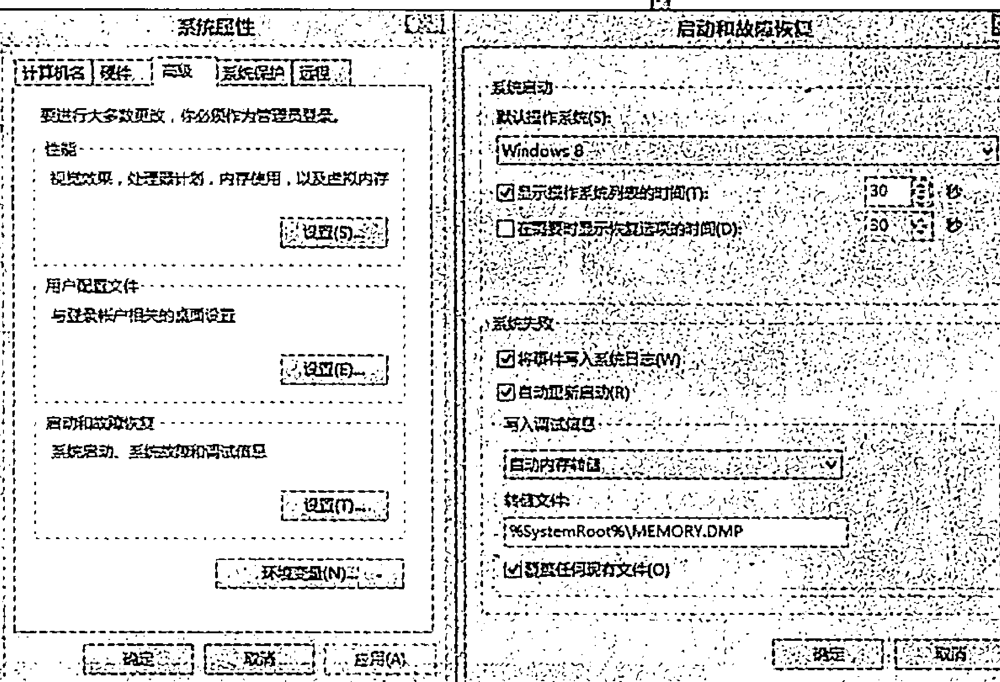

### 打造更好用的Windows 8.1

文 | 海安 刘华

Windows 8.1相对Windows 8有了不少改进，不过在实际使用当中仍有诸多不便，比如虽然增加了开始菜单按钮，但是仍然只是个摆设，点击后显示的还是开始菜单屏，等等。我们何不自己动手改进，让Windows 8.1用起来更顺手。

##### 开始菜单我要真正的

Windows 8.1只是增加一个开始菜单按钮，并不是真正的开始菜单，要想有一个经典样式的开始菜单，可以到http://tinyurl.com/lgt52f5下载“Classic Shell”。安装完成，点击开始菜单按钮弹出设置窗口，点击“Setting→Language”，选择“简体中文”，现在就可以用上和Windows 7系统一样的开始菜单了。而点击“开始屏幕”则切换到的是Metro界面开始菜单屏（图1）。

默认情况下，在Windows 8.1中新安装的程序或者应用商店安装的应用，它们并不会显示在开始菜单屏。Classic Shell允许我们将常用的应用固定，比如经常要访问QQ，在开始菜单切换到“所有程序→应用→QQ”，右击“QQ”选择“锁定到开始菜单（Classic Shell）”就可以啦（图2）。

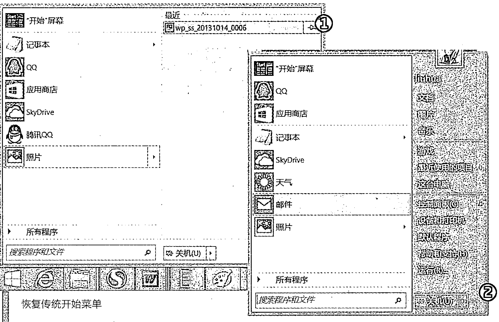

##### 禁用Windows 8.1中的帮助提示

也许是微软的好意，为了让大家更快上手Windows 8.1，在系统中很多和Windows 7不同的操作，Windows 8.1都会特别“贴心”地弹出帮助提示。不过对于很多Windows 8升级的用户来说，这个提示就显得多余了（图3）。

如果不希望再弹出上述提示，可启动注册表编辑器，依次展开[HKEY_CURRENT_USER\Software\Policies\Microsoft\Windows]，新建一个名为“EdgeUI”的项，接着选中新建的项，在右侧窗格新建一个名为“DisableHelpSticker”的32位字节值，并将其赋值为“1”，重启后即可取消帮助提示的出现。

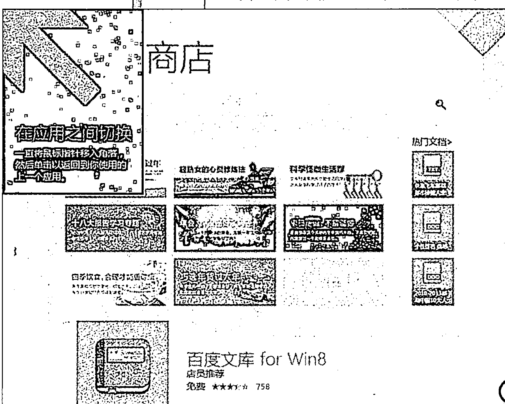

##### 保护隐私屏蔽SkyDrive

Windows 8.1在资源管理器中集成了SkyDrive本地客户端，而很多朋友直接使用微软账户登录系统，这样任何使用我们电脑的用户，只要打开资源管理器即可访问其中的文件。如果要保护网盘文件的隐私，我们可以借助组策略屏蔽SkyDrive。

启动组策略编辑器后依次展开“计算机配置→管理模板→Windows组件→SkyDrive→阻止使用SkyDrive执行文件存储”，将其设置为“已禁用”即可，自己可以直接登录SkyDrive网盘访问网盘文件（图4）。

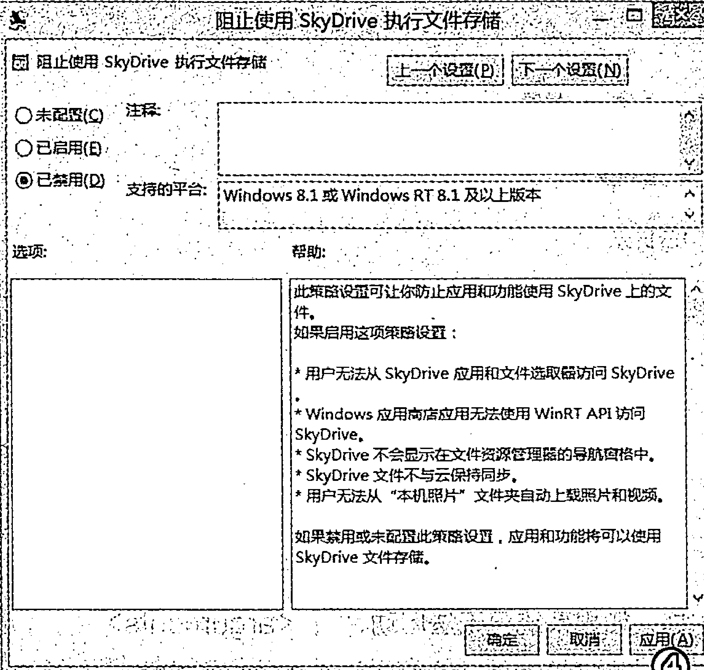

##### 搜索我要更全面

Windows 8.1用户可能会发现它的搜索功能退化了，默认搜索范围小，而且搜索结果也小。
事实上，搜索功能是Windows 8.1的一项重大改进，内置的全局搜索引擎可以支持本地文件、应用程序以及互联网内容。不过默认的本地搜索机制仅限于桌面和用户文件夹，如果是你自行创建的文件夹，其中的内容是不会被搜索到的。要提高Windows 8.1的搜索效率，我们只要手动进行更改即可。
打开资源管理器，切换到“搜索→高级选项→更改索引位置”，接着在打开的窗口点击“修改”，然后在弹出的窗口勾选需要建立索引的位置，这样下次搜搜范围就变大了（图5）。

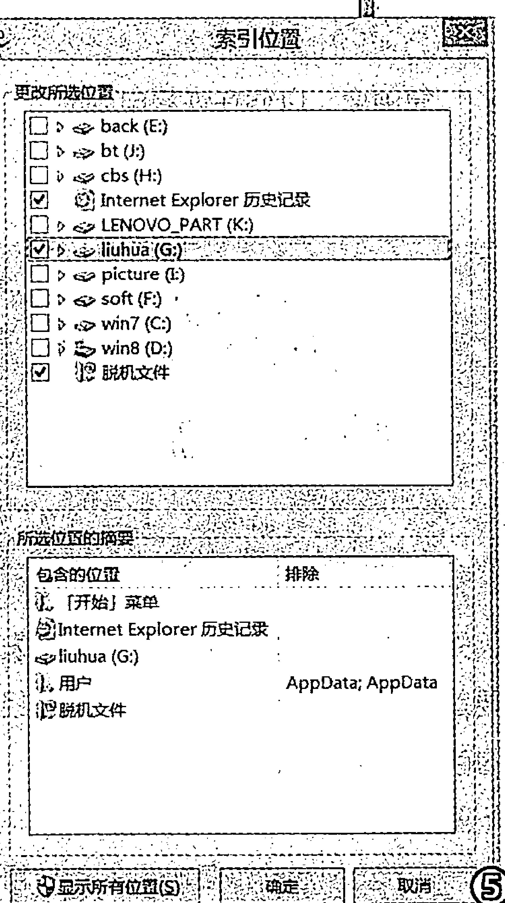

##### 开机速度要提速

使用Windows 8.1朋友会发现，Windows 8升级到Windows 8.1后开机的速度却变慢了。为什么新系统开机速度反而慢了呢？原来Windows 8.1在开始菜单的右键菜单中新增了关机、重启等功能菜单，很多使用Windows 8.1的朋友就直接使用这里的菜单关机。
实际上，当我们使用开始菜单右键关机时，调用的是传统关机，它会关闭所有应用程序和系统核心进程，而不是使用Windows 8新增（Windows 8.1自然集成）的快速混合关机，这样下次开机的速度自然变慢了。因此需要加快开机速度的朋友，仍然建议使用右侧Charm激活“设置/电源/关机”，这时使用的就是新增的快速混合关机，这样注销后的系统状态被保存在硬盘，下次启动时，可以直接加载到内存里。这样不仅关机速度更快，而且下次开机也更快（图6）。

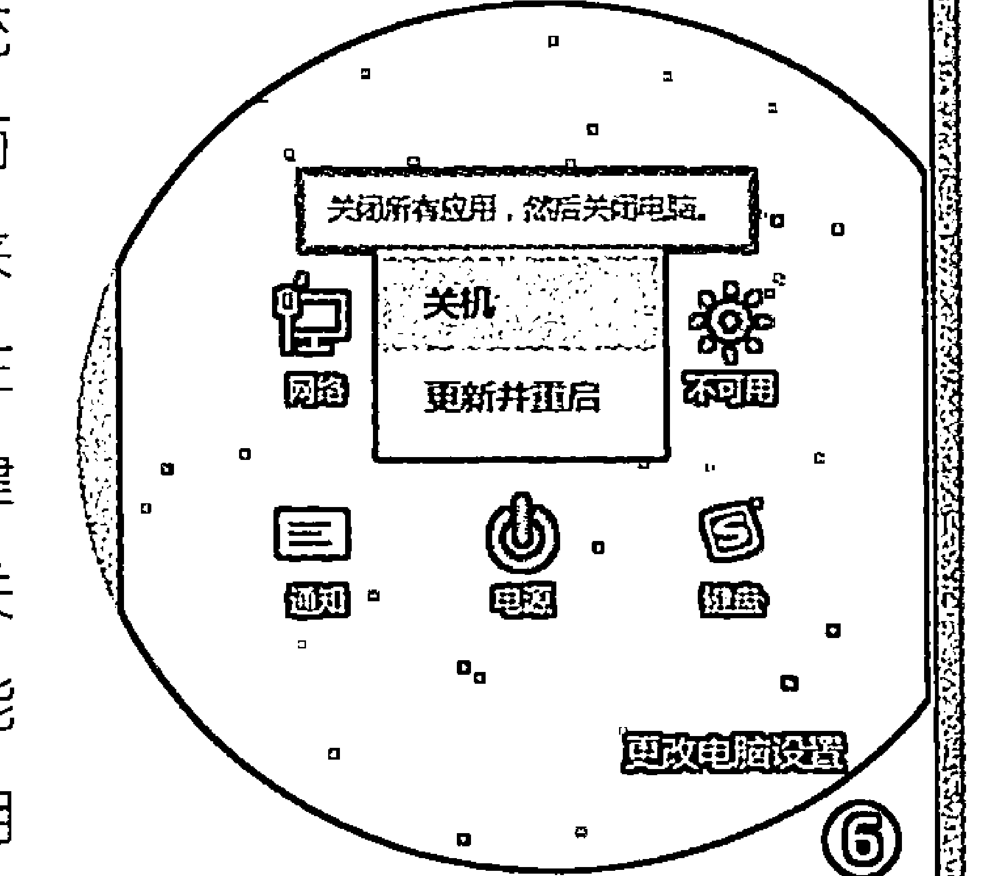

##### 解惑系统“恢复映像”
文/白日光

Windows 8/8.1中提供了建立系统恢复U盘的功能，供日后系统出现问题时恢复。然而，有用户测试后并不能如愿，因而提出质疑。

有用户提出疑惑：我的系统有超过10GB的空间占用，但用系统的创建恢复映像向导制作出的恢复U盘，仅仅占用了200多MB的空间，在我的系统损坏无法启动和使用后，损坏的数据范围无法预知，仅凭200多MB的数据怎么能恢复如此庞大的系统数据？系统提供的这种方法到底靠不靠谱，能够恢复系统文件、用户个人文件的完全系统映像到底该如何建立？

为了弄清楚这个问题，我们首先必须对系统恢复U盘以及RECIMG命令的作用和用法有个了解，同时还需要对自己当前所用系统的映像建立情况做一个调查，知己知彼，进而再采取措施，建立和恢复个性化的系统映像就心中有数了。

我们首先要明白的是，Windows 8系统安装之后会建立一个系统恢复的基本环境（简称为WinRE），系统安装好之后，WinRE已经随系统安装在电脑上了，在系统可以进入的情况下，恢复系统的多种方法都可在WinRE环境中进行。

RECIMG命令正是“生活”在这样的环境下。但是，如果系统已无法启动，那么就需要一个“修复盘”（或称“恢复驱动器”）来进入WinRE环境，这也是建立系统恢复U盘的用意。而真正要恢复用户安装的软件等，还是要靠用户用RECIMG命令建立个性化的恢复映像。

RECIMG是一个Windows命令行工具，可为Windows配置自定义恢复映像，以便在恢复电脑时使用。其命令格式为：

```
RECIMG.EXE <command> <arguments>
```

在创建自定义恢复映像时，它将包含已经安装的桌面应用，以及处于当前状态的Windows系统文件。恢复映像不包含个人文档、个人设置、用户配置文件或来自Windows应用商店的应用，因为在恢复电脑时会保留这些信息，不像重置系统或重装系统那样会清空这些数据。

##### 查明当前系统映像建立情况

一般情况下，我们的电脑中已经附带了一个3GB~6GB的恢复映像，用来恢复或初始化系统。但由于某种原因（比如优化软件或人为对系统大文件的清理），这个文件可能会在我们不知不觉中丢失，到恢复系统要用到的时候却发现无法找到，我们就遇到了麻烦。因此，我们需要首先查明当前系统中到底是否已经保留了一个系统映像，如果存在，那么这个映像的存放路径何在。

我们只需执行Win+X命令并选择以管理员身份进入命令提示符窗口，执行“RECIMG.EXE /showcurrent”命令，即可显示当前活动恢复映像的存储目录的路径情况。

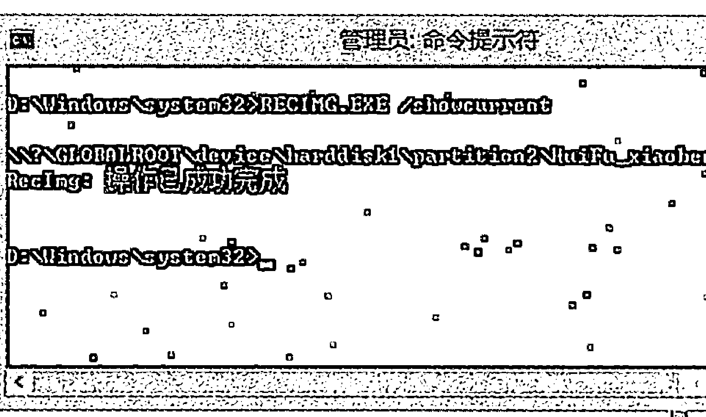

> 小提示：系统映像的路径不是一成不变的，我们可能给系统建立了多个映像，当我们希望系统恢复时可指定从另一个位置来执行恢复。

##### 注销系统默认映像关联

如果在目前使用的电脑中已经有一个系统默认的映像文件并与系统恢复程序建立了默认关联，Windows在接受了要恢复系统的命令后，会默认去调用该映像进行恢复。否则，在找不到默认位置的映像文件的情况下，Windows将在恢复电脑时提示插入安装介质。

可是，我们不一定希望用系统默认的映像来恢复，我们的手中也不一定有安装介质（因为有的系统是预装在里面的），这时就遇到困境。为了不发生这种情况，可以先注销当前的系统映像文件关联，然后再建立自己的映像文件并重新建立关联。

注销当前使用的恢复映像，只需以管理员身份在命令提示符窗口中执行“RECIMG.EXE /deregister”命令即可。

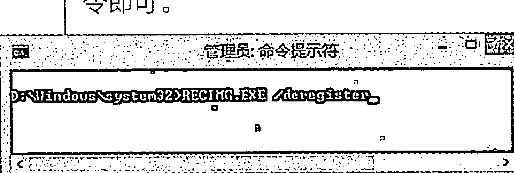

##### 建立自定义的映像关联

执行RECIMG命令建立映像的过程中，系统会自动将该路径设置为活动恢复映像，下次恢复系统会自动调用这个路径。但由于我们的数据转移，可能需要改变这种指向。所以，如果移动硬盘盘符有所更改，则要相应地修改盘符使其与建立时的路径保持统一。

而要保持这种统一，需要用到如下命令：

RECIMG.EXE /setcurrent <directory>

本命令中<directory>是指定用户自定义映像文件CustomRefresh.wim的存放目录名（如我们指定的D:\MYIMAGE）。执行该命令后，Windows在恢复电脑时使用D:\MYIMAGE的CustomRefresh.wim映像，即使电脑制造商预装在系统中的恢复映像已存在也不理会了。

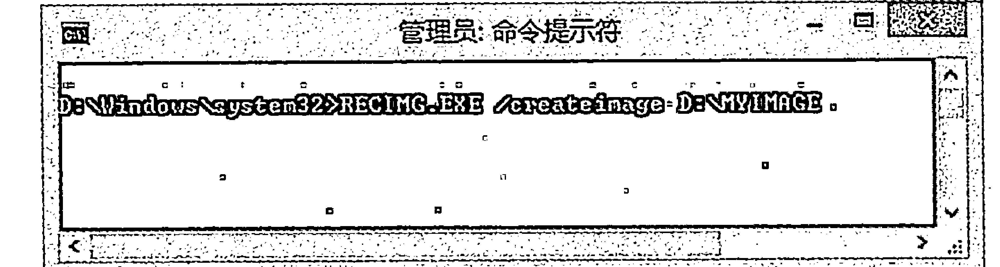

##### 创建自定义的映像文件

在我们安装了大量的应用程序之后，如果用系统默认的那个映像文件来恢复系统，那么安装的这些软件都无法恢复。为了不受制于系统原有的那个映像文件，我们需要随时建立带有自己已安装应用的系统映像。建立自己的映像文件，只需以管理员身份运行命令提示符窗口，然后执行如下命令即可：

RECIMG.EXE /createimage <directory>

路径<directory>指定的是自定义恢复映像存放的文件夹名称（如D:\MYIMAGE），建议将这个文件夹设置为另一块硬盘或移动硬盘上。

> 系统在自动恢复映像时，要求所有恢复映像都必须具有默认的文件名CustomRefresh.wim。如果在活动恢复映像目录中找不到CustomRefresh.wim文件，则在恢复电脑时Windows将回退到默认映像（或安装介质）。因此，你可以自作主张定义映像存放的路径，但不能自己随意改变映像文件的名称。切记！

##### 创建USB恢复系统“救命稻草”

创建了自己的恢复映像之后，为了给系统不能启动时留一根救命稻草，我们可以创建一个USB恢复驱动器。鼠标指向屏幕右上角并向下移动，单击“搜索”，在搜索框中输入“恢复”，单击“设置”；点击“创建恢复驱动器”。在驱动器恢复工具打开后，选中“将恢复分区从电脑复制到恢复驱动器”复选框，在下一个屏幕中找到恢复分区的大小，然后将一个空间充足的U盘插入电脑，选择该U盘并单击“创建”，恢复映像和必要的恢复工具将被复制到你的U盘。

- 鼠标指向屏幕右上角并向下移动，单击“搜索”。
- 在搜索框中输入“恢复”，单击“设置”。
- 点击“创建恢复驱动器”。
- 选中“将恢复分区从电脑复制到恢复驱动器”复选框。
- 在下一个屏幕中找到恢复分区的大小。
- 将一个空间充足的U盘插入电脑。
- 选择该U盘并单击“创建”。

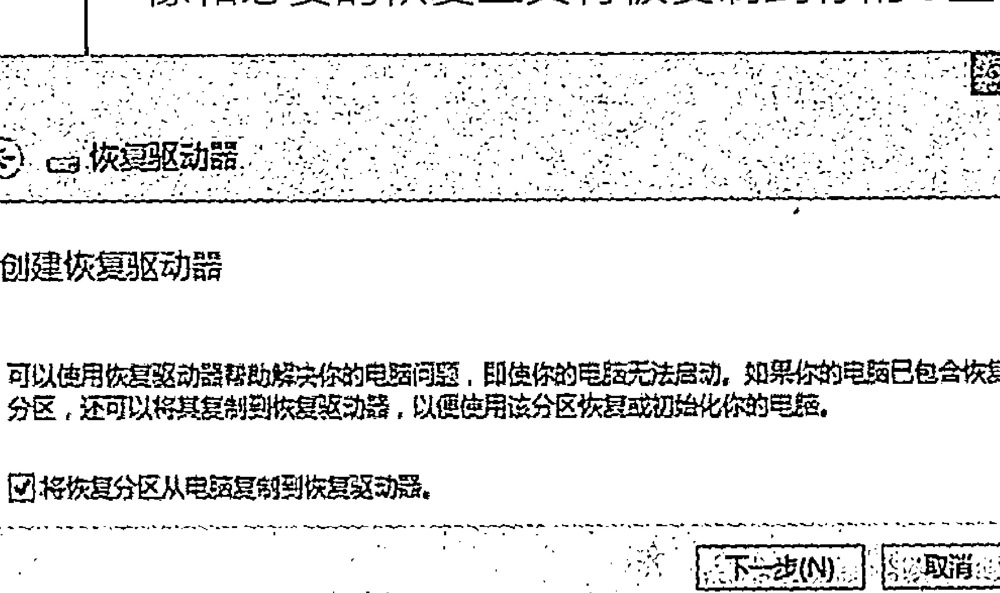

上面的基础工作做好之后，遇到问题要恢复系统映像，只需通过启动菜单或恢复U盘进入恢复环境，选择菜单即可将系统恢复到用户建立映像前的状态。

### 分区无恙 依仗合理备份
文|木森

系统一旦遭到破坏而无法启动，不但影响工作，有时甚至电脑中的个人数据也会连带遭殃。如果平时注意做好备份基本“功课”，可让你的系统和个人数据永远安然无恙。

##### 1 别让备份欺骗你了

首先我们要说的是完整备份的重要性。在此之前，你必须了解什么是完整备份，除了完整备份之外，还有哪些备份方式，这些备份方式都能保你万无一失吗？

大家可能最熟悉的备份方式就是系统自带的还原功能。这个功能其实非常有限。因为还原点保存的都是系统近期状态（确切地说，是系统近期的更改记录）。随着时间的推移，系统会不断删除旧还原点给新还原点留出空间。此外，还原时最近安装的程序和驱动程序以及你对操作系统设置所做的更改将会被卸载和撤销。

接下来的一种备份方式就是建立用户映像恢复。使用自建映像恢复电脑，个人文件和个性化设置不会被更改，但电脑设置将还原为默认设置；保留来自Windows应用商店的应用，但将删除通过光盘或网站安装的应用，尽管会在桌面上保存一个删除应用的列表，但你还得重装这些应用。

还有一种方法是系统映像恢复。可以像在Windows 7中那样，使用自己创建的Windows系统映像来还原操作系统。Windows系统映像是运行Windows所需的驱动器的完整备份。在Windows 8中可使用“控制面板 → Windows 7文件恢复 → 创建系统映像”功能来备份操作系统。这种方式备份的系统数据虽然完整，但备份文件体积很大，备份时间也比较漫长，因此优势不够明显（图1）。

要保护系统不受严重故障的影响，你需要为系统分区制作一个完整备份，包含所有系统数据、应用软件和用户数据，而且要求制作的速度和质量，单靠系统自带的功能虽然能够完成，但显得拖沓和臃肿。看来，最方便最安全的方法不能靠Windows本身。我们可以选择高性能的专业备份工具来弥补。一款性能强劲的专业备份软件可以在很大程度上克服这些劣势，甚至在全盘备份的情况下，效率和时间会反超系统自带的备份功能。例如ATI 2013专业备份工具就可以做到这一点。

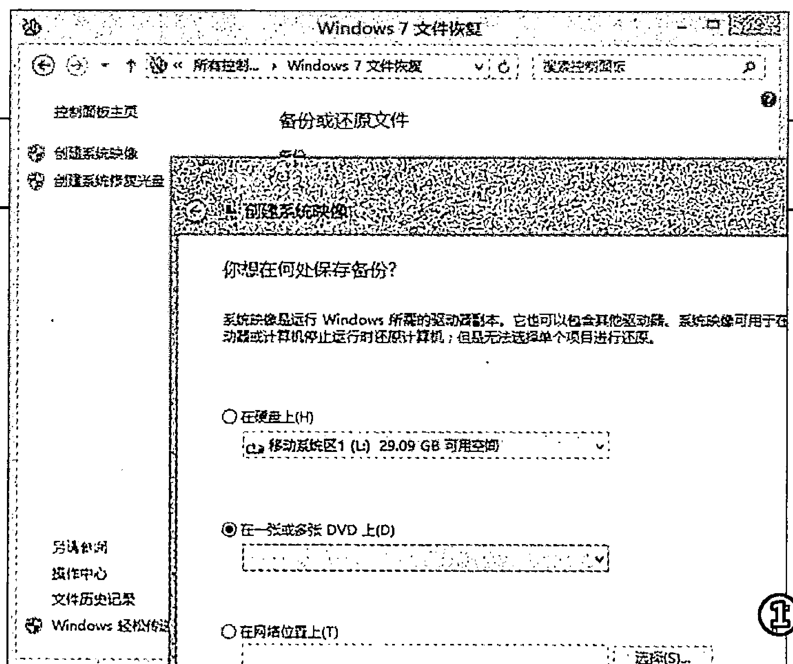

小技巧

用ATI 2013实现快速全分区备份。在启动ATI 2013前连接并启动该驱动器。启动程序之后，勾选“备份与恢复”选项卡，然后单击“磁盘和分区备份”。此时将打开磁盘备份窗口，并默认选中系统分区（通常是C:）。选择备份目标位置（建议使用外部驱动器存储备份），单击“立即备份”（图2）。

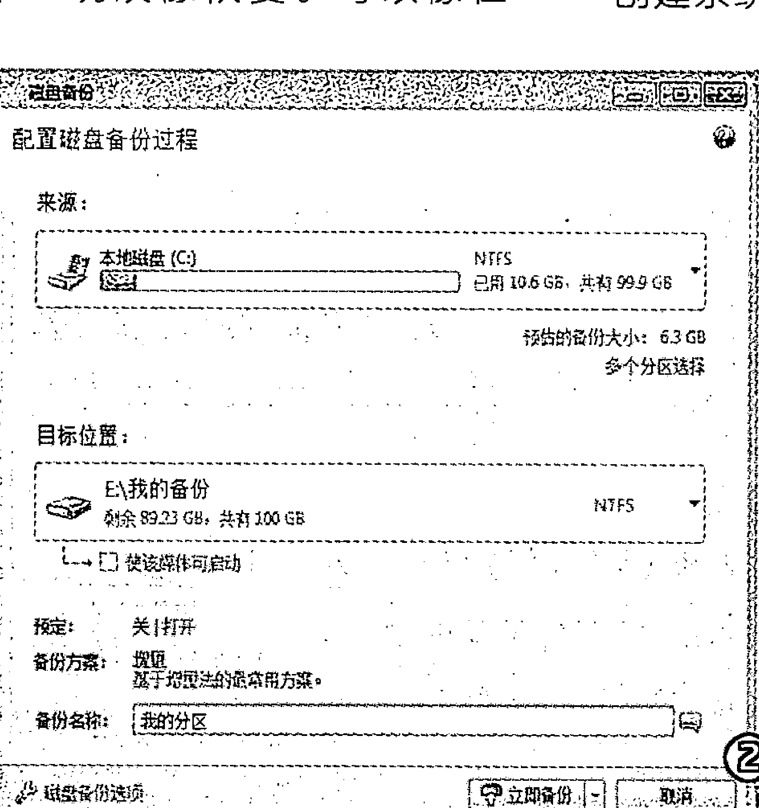

##### 有备份不一定就安全

别以为有了一个完全备份就能万无一失。请问你的备份是保存在哪里的？是桌面上，还是D盘或E盘？是移动硬盘还是网络云盘？

如果备份是放在桌面上或C盘的某个文件夹中，那么随着系统问题的出现，你的备份文件可能也变得无法访问。如果你的备份在D盘或E盘，而这两个分区又与系统C盘同属一块物理硬盘，那么硬盘机械电路故障引起的系统问题会让你的备份形同虚设。

因此，建议你尽量将系统备份存储在主磁盘C之外的物理硬盘上，最好是外部移动硬盘。这为在主硬盘发生严重故障时仍然能够恢复系统提供了额外保证。此外，如果你的网速足够快，还可以考虑在备份时加密，直接备份到网络云盘中，或形成备份文件后上传到云盘留存。

##### 藏在备份中的定时炸弹

有了备份文件，有了应急媒体，也许你美滋滋地坐等系统崩溃时得意地拿出来备份还原。但还原之后没多久，可能你的系统又出问题不能启动了。为何？

原来是在上次备份之前，你没有对备份数据进行安全检查，备份到包中的数据本身就存有安全隐患，而此次系统崩溃的根源也是这个安全隐患所致。因此，这样的备份就等同于给自己种下了另一个“定时炸弹”，而并不是设了一道“安全阀”。

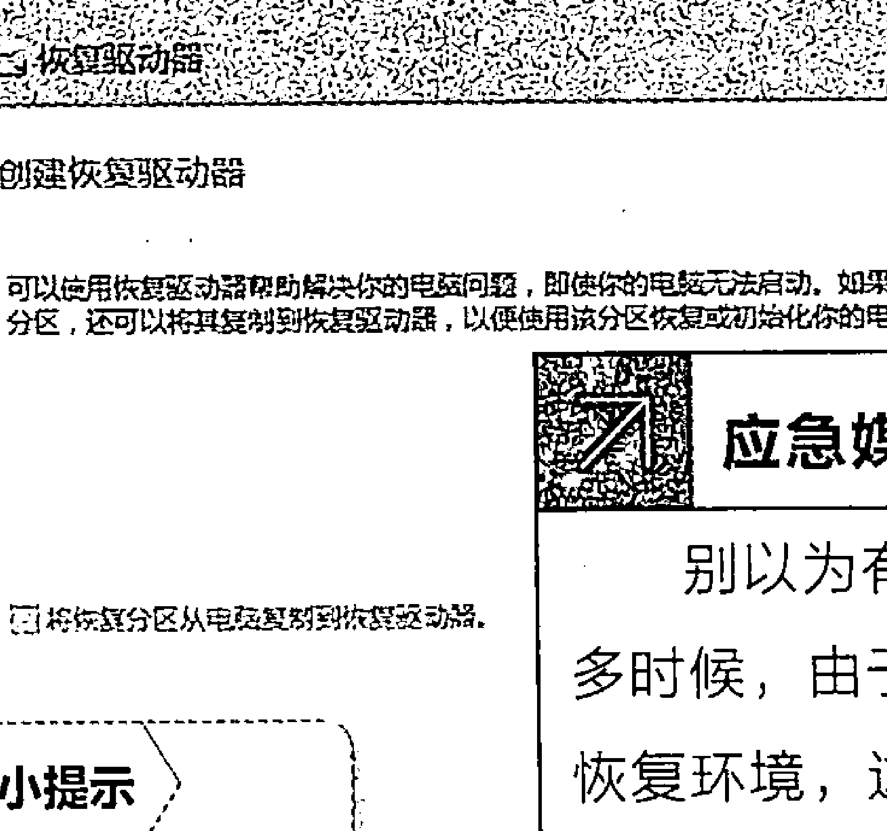

> 小提示：备份之前一定要先对要备份的系统分区甚至整个软件环境进行查毒和杀毒处理。在保证所有的安全隐患得到消除之后，再进行系统备份操作。

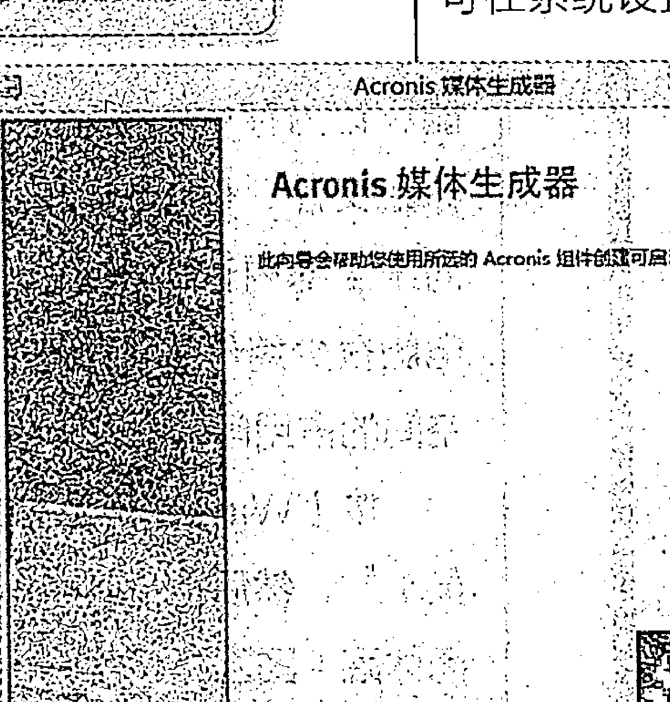

##### 应急媒体应急关键时刻

别以为有了系统备份数据包就能万事大吉。许多时候，由于一些莫名其妙的原因，让你无法进入恢复环境，这时你手里的数据包就会变成一个“死包”。因此，光有备份数据不行，关键时刻还要有能启动系统的工具，这就是应急媒体。

由于在大多数情况下，失败后的系统恢复将在从应急媒体启动之后执行，所以你必须创建应急媒体，确保在需要时可使用应急媒体启动到一个可供还原使用的环境。

Windows 8带有创建应急媒体的命令接口，可在系统设置环境下自行创建（图3）。而ATI专业备份工具也具有创建系统启动光盘或一键自启动还原分区的功能（图4）。应该充分利用这些功能创建应急媒体，以备不测时使用。

##### 备份也是“双胞胎”好

有人说，我原先本来就备份系统的习惯，现在即便是要备份，一个备份就够了。一胎即可，何必还要“双胞胎”？

许多IT专家建议应至少为系统备份创建2个副本（3个更好），建议将不同的备份保存在不同的位置（最好在其他地方），例如，如果在家中使用计算机并备份，那么将另一个备份保存在办公室或朋友家甚至网上。

他们这样的观点不是没有道理，也许你只考虑过硬盘会坏掉，但你从未考虑过家里失火或进了盗贼！保存多个备份还有一个好处：在开始恢复时，ATI 2013 将删除目标分区（或磁盘）。如果你只有一个备份，那么将面临很大的风险。在开始恢复进程之后，执行恢复的计算机上的系统分区已删除，若中途发现备份映像也已损坏，无法进行下去，那么你将面临无法恢复系统数据的麻烦，现有系统和原有备份都失效，落得个鸡飞蛋打，前功尽弃，带来无法弥补的损失！

### 反道而行 关闭Windows 8 “体贴” 功能
文 | 白洁

Windows 8/8.1有许多体贴的功能，它们在大多数情况下可以给你带来方便或安全。但是，任何事情都不是绝对的，某些情况下你可能更需要关闭这些功能。

##### 快不了的“快速启动”

Windows 8快速启动是一项让电脑在关机之后下次能更快启动的设置，是通过关机前将系统信息保存到一个文件中来实现的。默认情况下，在Windows中快速启动处于启用状态。但有网友发现，自己的电脑由于硬件配置的特殊性，关闭“快速启动”后，开机也没有变慢多少，却能为自己的SSD腾出不少空间来。既然快速启动有利有弊，权衡利弊后，如果需要关闭也未尝不可。

通过控制面板，依次选择“硬件和声音→电源选项→选择电源按钮的功能→更改当前不可用的设置”，在“关机设置”中看到有“启用快速启动（推荐）”的选项，取消选择并点击“保存修改”即可关闭快速启动功能（图1）。

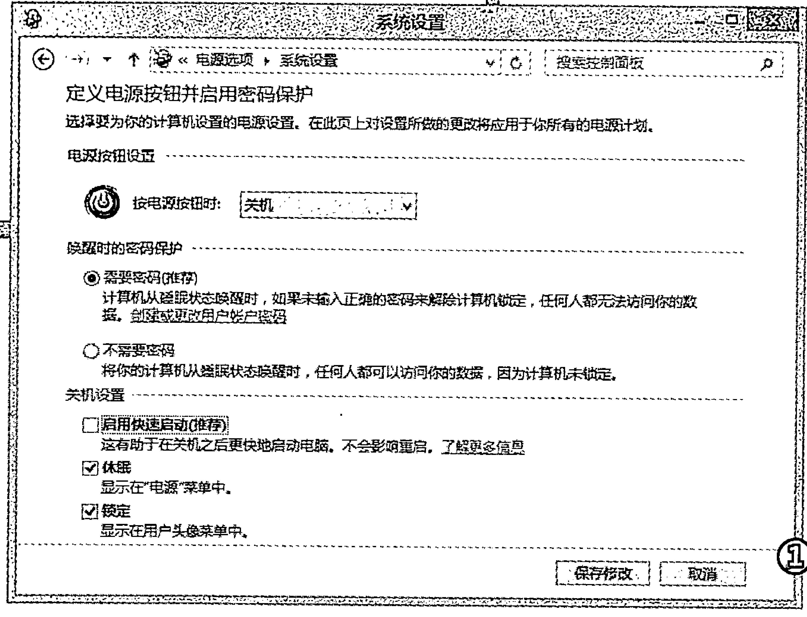

##### 不常用而占空间的休眠

休眠是Windows的一项体贴功能，让内存中的所有数据保存到一个休眠文件，但增加的休眠数据几乎等同于全部内存容量。有不少用户使用电脑很少用休眠功能，不用了就关机，他们更在乎硬盘空间的占用问题。这种情况下可以关闭休眠腾出空间。

按【Win键+X】组合键，选择“命令提示符（管理员）”，然后执行“powercfg /h off”命令即可快速关闭休眠（图2）。

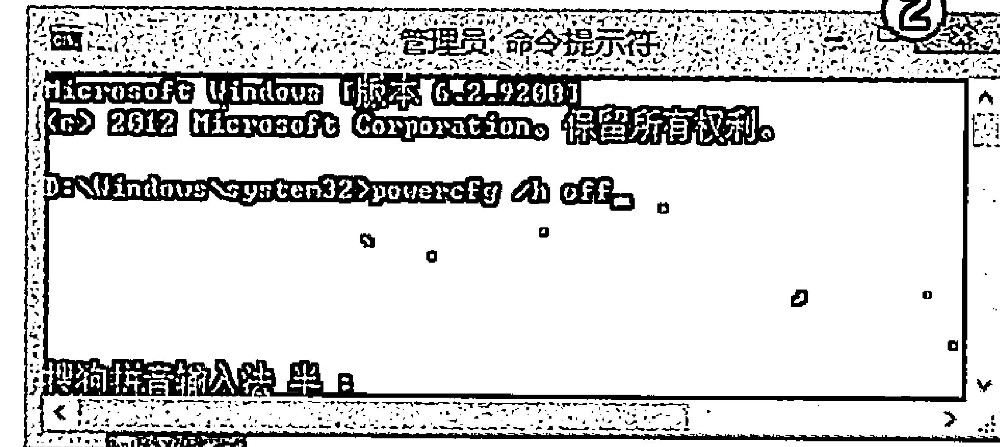

##### 没必要的个人开机密码

在默认的情况下，Windows 8开机登录是需要输入密码的。但是，对于自家用的PC或笔记本来说，若只是你一人在用，环境相对安全，那就没有必要每次开机去输入密码。让系统记住你设的密码，每次开机时自动以你的密码静默登录更省事。

只需按【Win+R】后在“运行”对话框中执行“control userpasswords2”命令，在“用户账户”管理窗口中清除“要使用本机，用户必须输入用户名和密码”复选项的选中状态。这样下次启动系统时，就会以此设置的账户密码自动登录系统。

> 小提示：关闭休眠功能后，就会清除休眠文件，Windows 8的内核会话也无法写入硬盘，从而导致快速启动失效。睡眠功能可能会继续有效，但当睡眠期间突然遇到断电，睡眠数据无法转为休眠文件，就会有数据无法保存而丢失的风险。因此，若硬盘空间允许，建议保留休眠功能。

##### 已有托管者的自动更新

现在有些第三方系统工具，也可以管理Windows 8系统自动更新，如360安全卫士的系统更新会根据情况提示哪些补丁一定要更新，哪些补丁可选择更新，哪些补丁更新后可能会有副作用等，比较体贴。因此，如果选择第三方系统更新工具，系统自带的更新提示和更新就成了累赘。按动Win+X快捷键组合，选择“控制面板→系统和安全→Windows更新→启用或关闭自动更新”，选择“从不检查更新”，点击“确定”按钮关闭自动更新（图3）。然后点击任务栏操作中心的小旗帜图标，选择“更改操作中心设置”打开操作中心，去掉对“Windows更新”一项的选择，单击“确定”按钮。

> 若你还要偶尔一用Metro界面，也可以不禁用它，转而将系统启动画面设置为传统桌面环境。你只需设置任务栏属性，在“导航”页中选择“当我登录或关闭屏幕上的所有应用时，转到桌面而不是开始屏幕”一项就可以了。

##### 拖“死”系统的自动维护

如果你的电脑配置不高，Windows 8系统自动维护功能让你的系统运行变得缓慢，甚至会有死机、无响应的假象产生。在这种情况下，不如将其关闭，转而借助第三方工具（如360安全卫士组件中的系统维护模块）来定时维护系统。在“操作中心”关闭“自动维护”选项没有从根本上解决问题，那只是一个消息提示选项。要彻底关闭这个功能，需要到计划任务中去实现。通过“控制面板→管理工具→任务计划程序”，找到“\Microsoft\Windows\TaskScheduler”，禁用“Idle Maintenance”和“Regular Maintenance”两项任务即可禁用自动维护（图4）。

##### 你所不爱吃的“豆腐块”

Windows 8最引人注目的就是号称砖贴的“豆腐块”Metro界面，这种界面最适合于在移动设备上看新闻和娱乐之用。而对于成天在PC上办公或设计的用户来说，这种界面基本没什么用处，反而成了每次开机后的累赘。要禁用Metro界面，只需用Win+R组合键运行“regedit”命令，打开注册表编辑器，依次展开“HKEY_CURRENT_USER\Software\Microsoft\Windows\CurrentVersion\Explorer”，在右侧新建DWORD类型的键值RPEnabled并设其数值为0即可。如果日后要恢复Metro功能，只需如法将RPEnabled值删除即可。

##### 泄你“隐私”的跳转列表

Windows 8的任务栏程序跳转列表看似很体贴，能给操作带来方便，但是，有时候它却可以泄露你的行踪和隐私。上过网的IE地址列表全在上面了（图5）。因此，从隐私保护考虑，有时有必要将这个跳转列表记忆功能关闭掉。通过任务栏右键菜单，选择“属性→跳转列表”，取消对“隐私”下的两项选择（图6），确定即可。

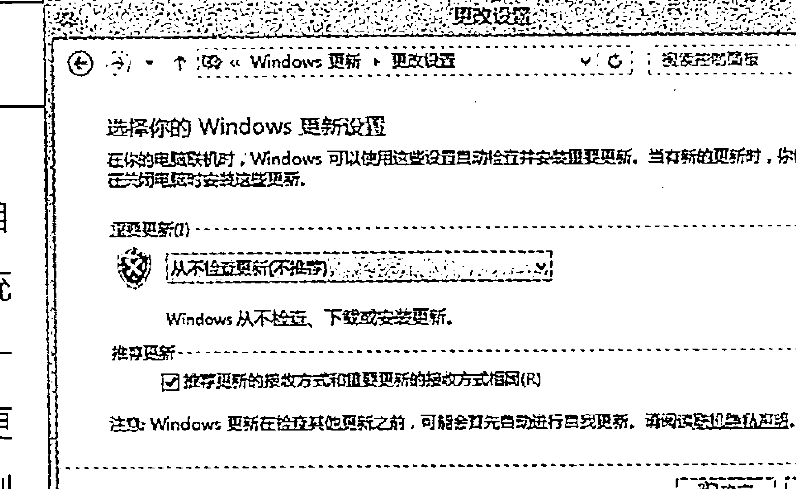

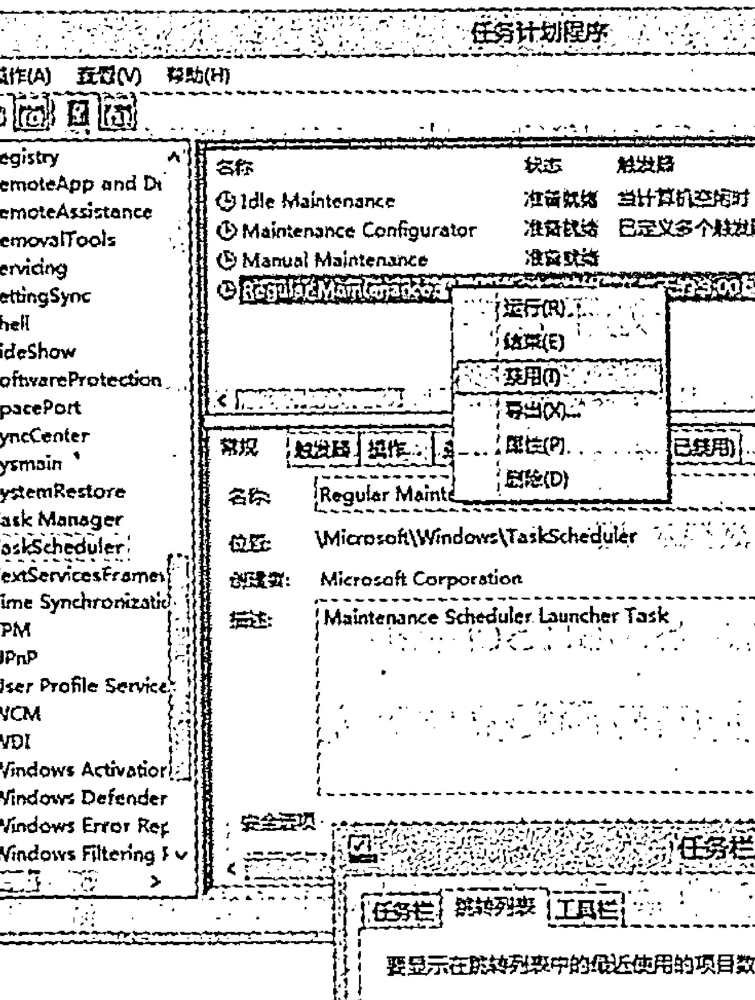

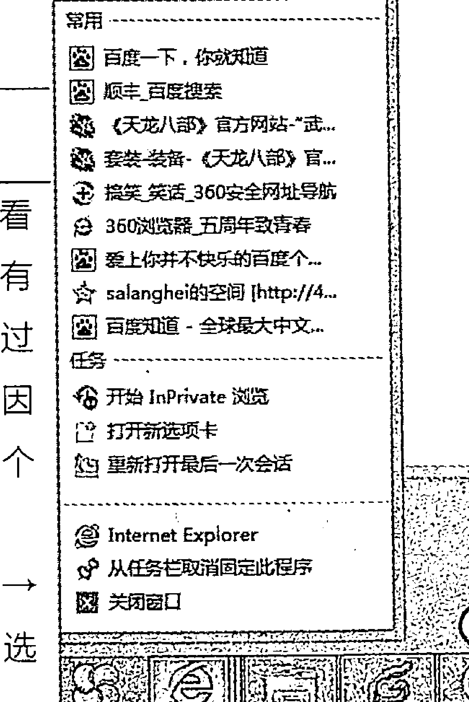

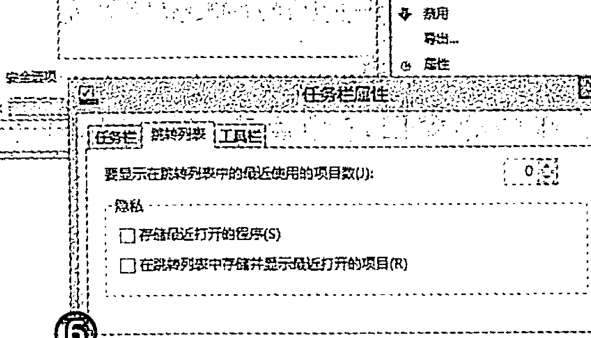

### 挖潜自保 我的Windows 8也“裸奔”
文 | 魏平安

常常听说一些高手在Windows下“裸奔”，这些人在不安装任何杀毒软件和防火墙的情况下，安然无恙地用着自己的Windows。那么，这事真的靠谱吗？我也能像他们那样在Windows下“裸奔”吗？

如今流行Windows 8.1，就让我们拿它来说事。其实，某些人能在Windows 8.1下“裸奔”，得益于Windows自身强大的“免疫”功能——它本身就有的一些“硬功夫”。利用好这些功能，“裸奔”才有可能。

##### 操作中心为系统保驾护航

操作中心可以看作是Windows 8的一个“安全部”、“监察部”、“宣传部”联合办公大楼，通过这里可以执行一些保证系统安全顺畅运行的任务。选中“操作中心”可以确保防火墙已启用、反恶意软件保护处于最新状态，并且电脑已设置为自动安装更新等。如果Windows发现硬件或软件出现任何问题，可以从操作中心发出有关安全和维护的重要消息提示。

通过单击任务栏最右侧的通知区域中的“操作中心”图标“操作中心”图标，可快速查看“操作中心”是否有新消息，单击消息解决问题。

点击“更改操作中心”设置文字链接，在随后出现的窗口中可对各类安全或系统维护消息提示进行开关设置。

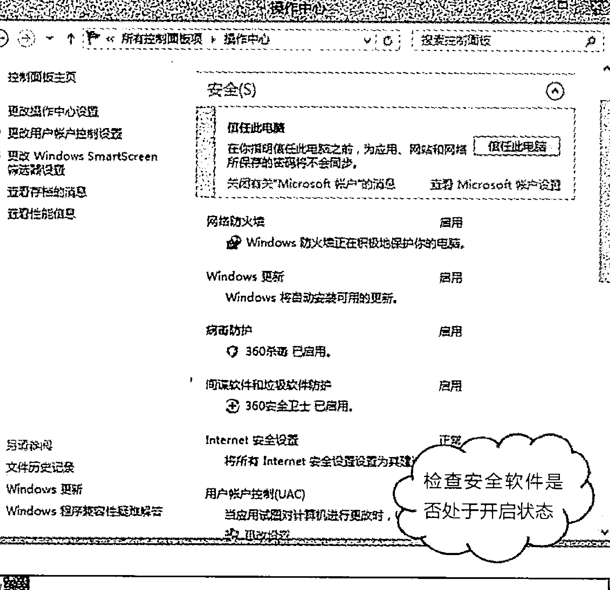

##### 自带工具安全防护无忧

使用系统自带的Windows Defender可防止病毒、间谍软件和其他恶意软件在你不知情的情况下安装到电脑上。该软件可从控制面板选择启用。

如果电脑上使用了其他安全软件，则此应用可能会被关闭，这时，为了保证系统安全，你需要通过“操作中心”检查你的安全软件是否处于开启状态。

##### 网络隐患自备筛选过滤

系统自带的Windows SmartScreen，会在运行从Internet下载的无法识别的应用和文件前向你发出警告，以此来保护电脑上网安全。

在操作中心窗口左侧点击“更改Windows SmartScreen筛选器设置”文字链接，进入设置窗口进行详细设置。通过设置窗口设置运行Internet下载的无法识别的应用和文件前是否需要管理员批准、是否发出警告或关闭筛选器等项目。

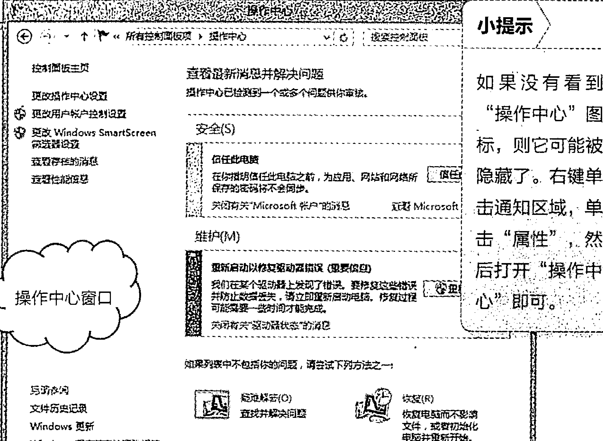

###### 小提示

如果没有看到“操作中心”图标，则它可能被隐藏了。右键单击通知区域，单击“属性”，然后打开“操作中心”即可。

如果列表中不包括你的问题，请尝试下列方法之一：

- 疑难解答(O) 查找并解决问题
- 恢复(R) 恢复电脑或不影响文件，或初始化电脑并重新开始。

##### 账户控制拦截外来威胁

Windows的用户账户控制机制，可在电脑安装软件或打开某些可能有害或使电脑容易受到安全威胁攻击的应用之前，要求提供相应的权限。这样可以有效地防止外来的危险因素对电脑的侵害，把处理的决定权交给用户。

在用户账户窗口中，点击“更改用户账户控制设置”链接，可启动“用户账户控制设置”窗口，进行该项设置有助于预防有害程序对计算机进行更改。设置共提供四个档次，从“始终通知”到“从不通知”，安全级别从强到弱。第三、第四档因为许多更改在这些情况下都不会提醒用户，因此存在安全隐患，“裸奔”者不要选择这两项。

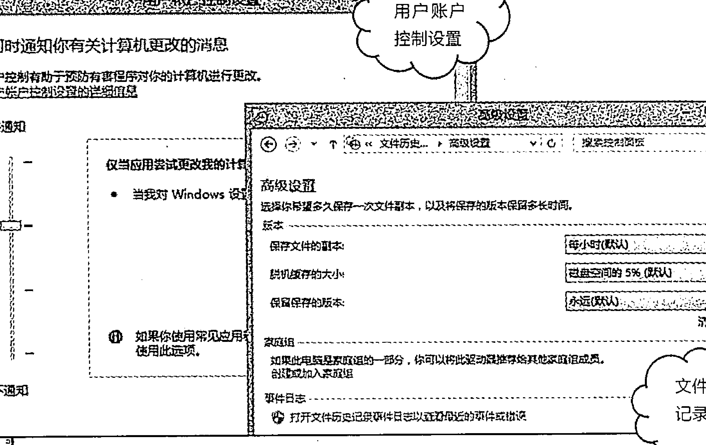

用户账户控制设置

##### 历史记录保全个人文件

个人文件安全是使用电脑的重中之重。使用“文件历史记录”可以自动定期备份你的个人文件，如照片、文档和音乐。默认的文件来源是库、桌面、联系人和收藏夹下的所有文件。如果你的电脑出现硬件故障，可以还原对你最重要的文件的任意版本，这样就可以保证个人数据的安全。

进入控制面板控制中心的“文件历史记录”窗口，可以设置文件历史记录存放的驱动器（可以是移动硬盘和网络），点击“高级设置”可以对历史版本进行详细设置。

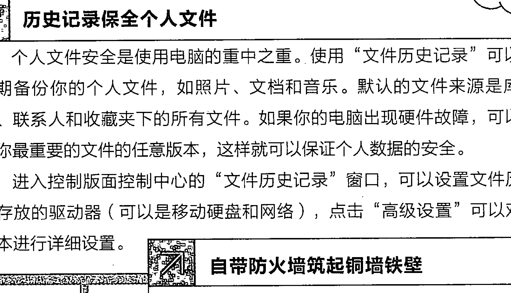

文件历史记录设置

##### 自动更新系统查漏补缺

Windows更新可以为你的电脑自动下载并安装最新的更新，这些更新包括系统软件或驱动的更新程序。点击“更改设置”可以开启或关闭更新或选择更新的方式，包括自动下载安装、自动下载提示手动安装、从不检查更新，还可以进一步设置在自动维护期间自动安装更新的时间。要“裸奔”就有必要开启自动更新。

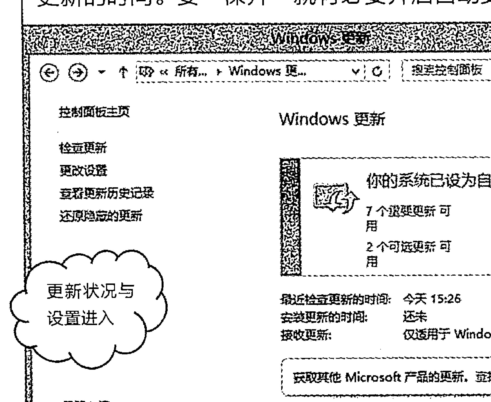

更新状况与设置进入

##### 自带防火墙筑起铜墙铁壁

Windows 防火墙可以帮助防止黑客和恶意软件（如病毒）通过Internet访问你的电脑。Windows 8.1的防火墙功能强劲且使用更加人性化了，我们可以根据自己的需要轻松进行入站出站防护规则的设置。

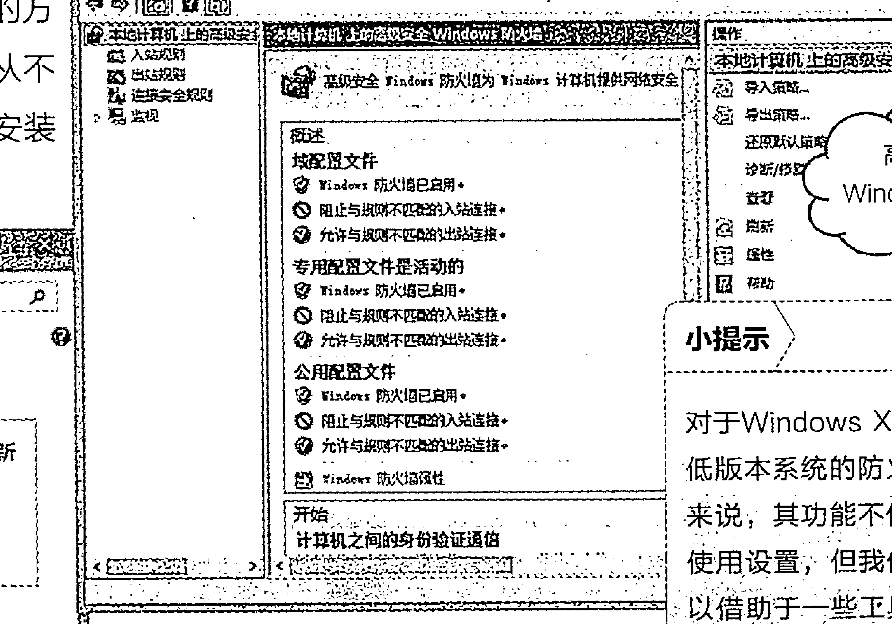

高级安全Windows防火墙

###### 小提示

对于Windows XP等低版本系统的防火墙来说，其功能不便于使用设置，但我们可以借助于一些工具来增强其功能，读者可参考本刊第1期文章《更强更壮：调教系统防火墙》。

因此，只要能充分设置并用好Windows 8.1自带的这些安全防护措施，系统安全“裸奔”不是梦想。

### SkyDrive同步 你用好吗

文|飞雪散花

自Windows 8系统开始，微软内置了SkyDrive同步盘，资源管理器内支持设置用户数据同步，可像使用本地存储设备一样管理和同步文件。不过，这一功能你真的用好了吗？

##### 能省则省 使用联机模式

目前常见的网盘，如酷盘、快盘和115网盘等，通常会在将数据同步到云端后，依然在本机中保留相应文件的完整版本。其实对于有些不常用的文件，我们更希望能直接将其保存到云端，而只在需要的时候，再下载到本地，这样，可以最大限度地节省硬盘空间。SkyDrive很好地解决了这一问题。

在SkyDrive中右击文件，在弹出的右键菜单中选择“仅允许联机使用”（图1），SkyDrive会自动删除本机中保存的文件，而只将文件索引保留在本机中。以后要访问或编辑时，只需双击文件名称，SkyDrive就会自动把相应文件下载到本地。

同样，对于常用文件，每次都要下载也不切实，这时，我们可以右击它，选择“允许脱机使用”，让文件同时保存在本机中和云端，方便后期编辑。

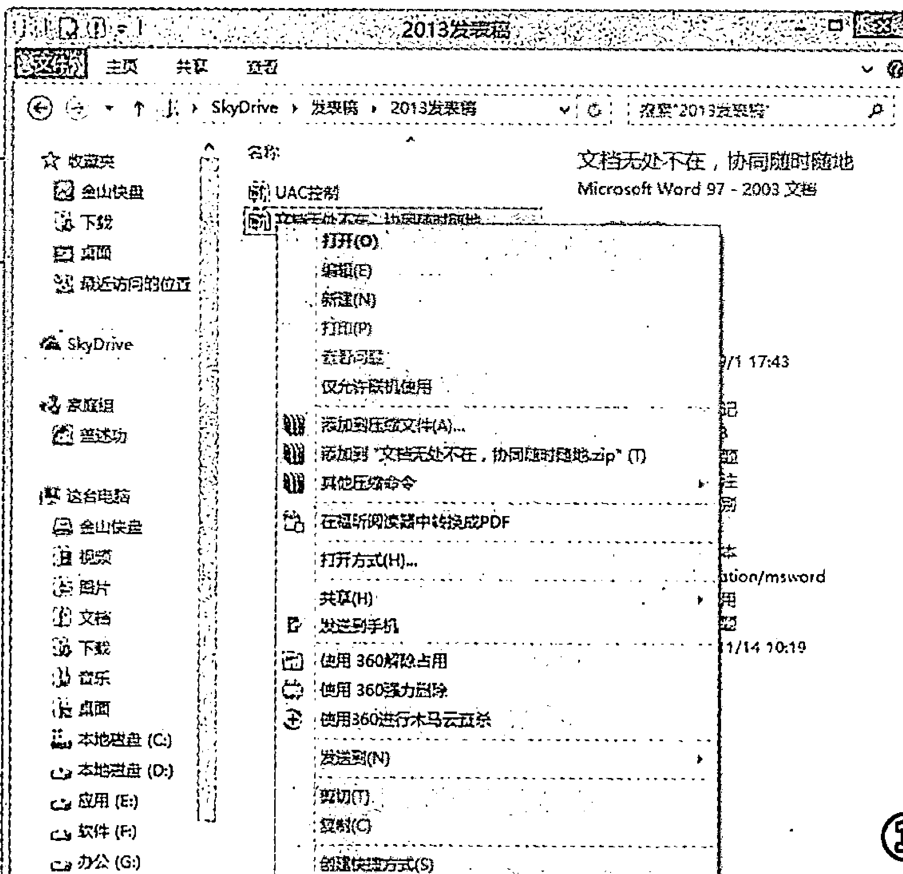

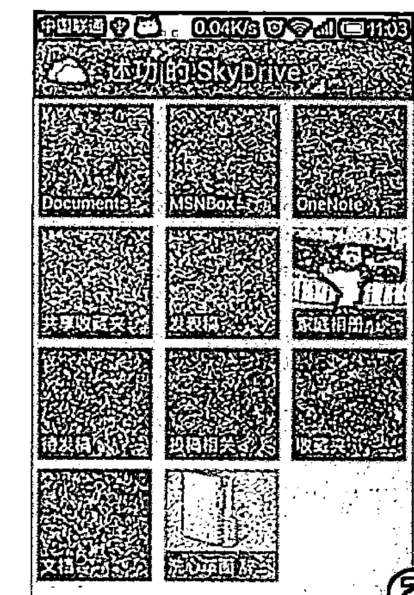

##### 手机平板 也能使用SkyDrive

智能手机、平板电脑等设备日渐普及，越来越多的朋友喜欢在不同设备中访问、上传并管理自己的文件。作为一款历史较久的云存储平台，SkyDrive当然也不能无视这种发展趋势，为此，它特意提供了iPhone、iPad、Android和Windows Phone等不同客户端，方便利用手头现有的一切设备，对文件进行管理。

以Android客户端为例。进入http://windows.microsoft.com/zh-cn/skydrive/download页面，单击Android文字链接，在出现的页面中单击“安装”按钮，按提示下载安装相应的客户端到手机或平板电脑中。

以后要在移动设备中访问或管理SkyDrive中的文件，只需启动客户端并登录，相应的文件列表就出现了（图2）。

如果我们要上传这些设备中的文件到云端也简单，只需单击界面中的向上箭头状按钮，然后在出现的菜单选择“上传照片和视频”或“上传文件”，进入“选择要上载的文件”界面，选择好上传的文件及要保存的目录即可（图3）。

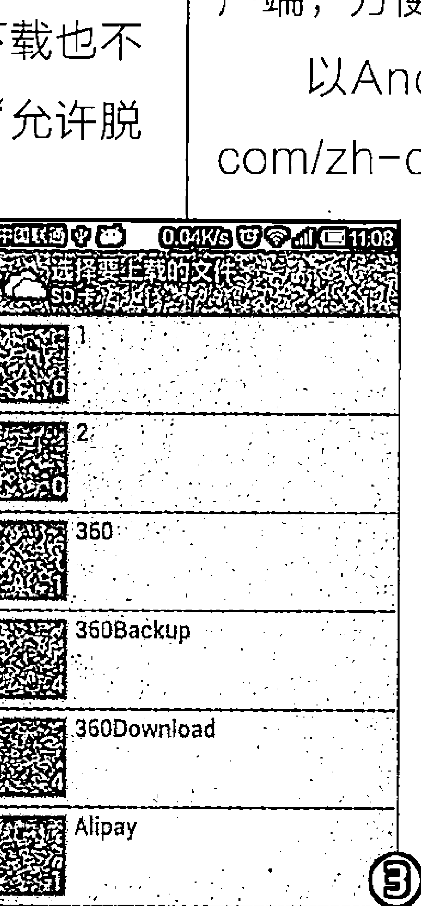

###### 小提示

SkyDrive默认将同步的文件保存在系统分区的“Users\用户名\SkyDrive”目录下，如果你对此不满意，可在Windows资源管理器中，右击左侧的SkyDrive项，选择“属性”，打开相应的对话框，切换到“位置”标签，单击“移动”按钮，然后在出现的对话框中，将保存路径设置为其他分区。

### 挽救一睡不醒的电脑

文 | 老俞

电脑的“睡眠”功能是一个非常体贴的功能。你可以在离开时让电脑马上睡眠或按预定时间进入睡眠。除了省电不说，还可以让你的电脑好好休息一下。但是，有时可能是因为电脑睡得太“香”太“死”，让你回来后无论如何点击鼠标或键盘都无法将其唤醒，这该如何解决？

##### 睡眠唤醒需必要硬件支持

首先需要明确，睡眠唤醒需要必要的硬件支持，不是说任意一台电脑都支持睡眠唤醒。以Windows 8.1为例，检查硬件是否支持睡眠唤醒，可用如下方法。

用Win+R组合键启动“运行”窗口，输入CMD并确定，打开命令提示符窗口。在其中输入“powercfg -a”后按回车，可以看到图1所示的显示结果。

从图中可以看出，有一项可以支持睡眠的(S3)有效，说明当前的这台电脑支持睡眠功能。

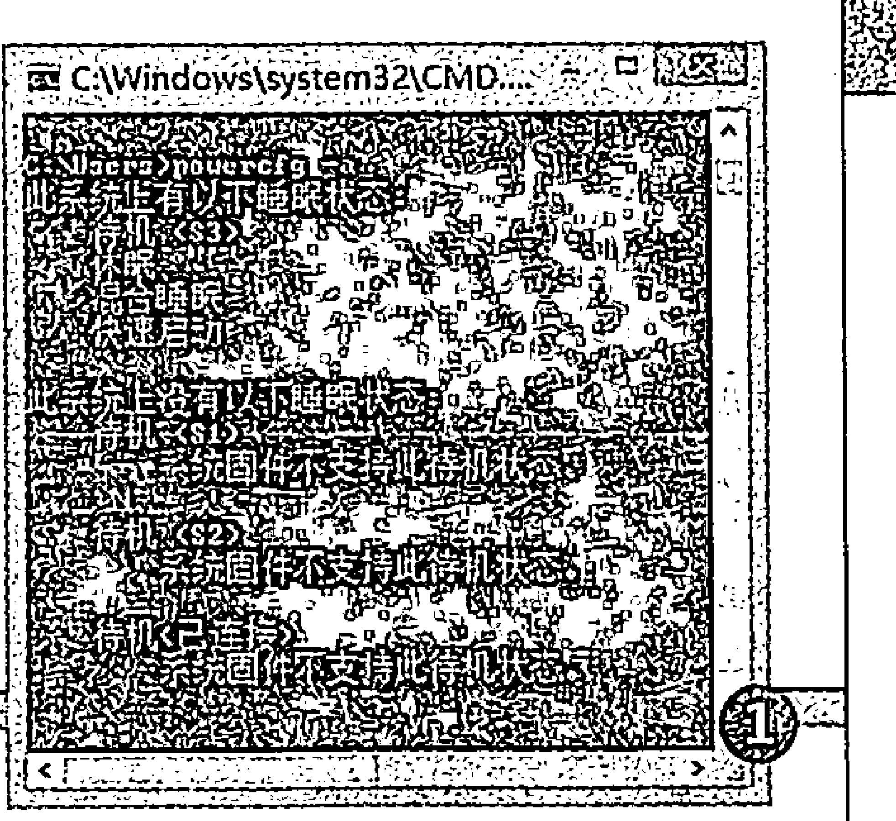

###### 小提示

如果自己的硬件不支持睡眠功能，也可能通过升级BIOS获得支持睡眠功能。具体可否升级要通过电脑主板型号，到官方网站查询核实。顺便说一句，近两年新买的大多数电脑硬件基本都能满足电脑睡眠的要求。

##### 更新驱动可以防治“睡死症”

如果设备本身支持唤醒功能，但出现不能唤醒的情况，那么更新设备驱动可能会解决不能唤醒的问题。

确保硬件驱动升级到最新版本，可以用Windows Update更新系统。通过Win+X组合键选择执行“搜索”菜单项，在搜索框里输入“Windows Update”并回车，在随后出现的窗口中点击“检查更新”开始检查（图2）。如果有新的硬件驱动，它会提醒安装。

也可以按照电脑硬件配置，到厂商网站上直接下载驱动，——手动装好。或用驱动精灵、驱动人生等软件来检查更新。

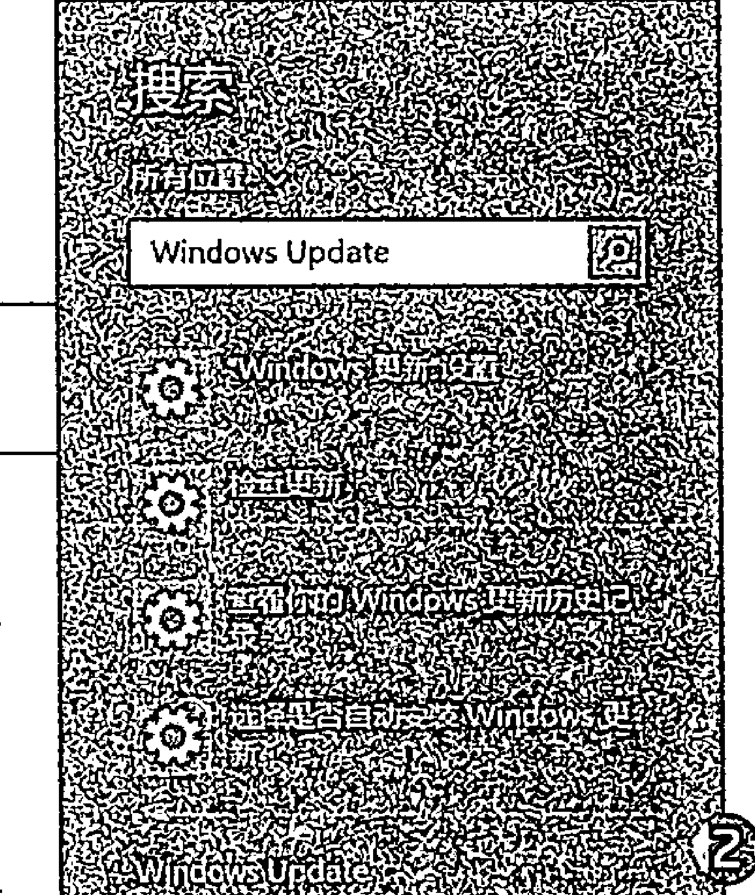

##### 开启没有开启的唤醒设备功能

在满足了以上条件后，还有关键的一条就是要开启没有开启的唤醒设备功能。要做到这一点，首先需要弄清哪些设备能唤醒电脑。

在命令提示符窗口中输入“PowerCfg -DEVICEQUERY wake_armed”命令并按回车，得到如图3所示的运行结果。

可以看到有标准键盘和鼠标支持唤醒电脑，还有网卡则说明机器也可以从网络唤醒。假如鼠标设备没有列出来，说明不能用鼠标唤醒机器。需要手工把鼠标唤醒功能打开。

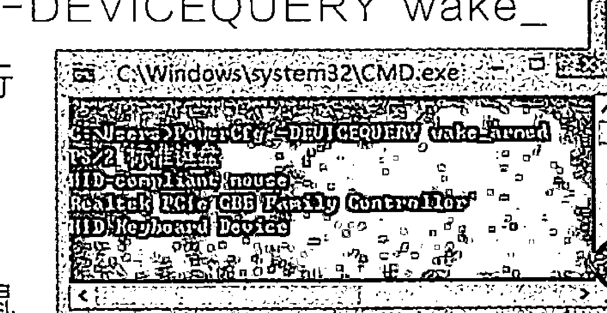

通过组合键Win+X菜单选择“设备管理器”，设备管理器打开后，找到对应自己用的鼠标的一项，右键点击选择“属性”。点“电源管理”选项卡，勾上“允许此设备唤醒计算机”，然后按“确定”退出即可（图4）。

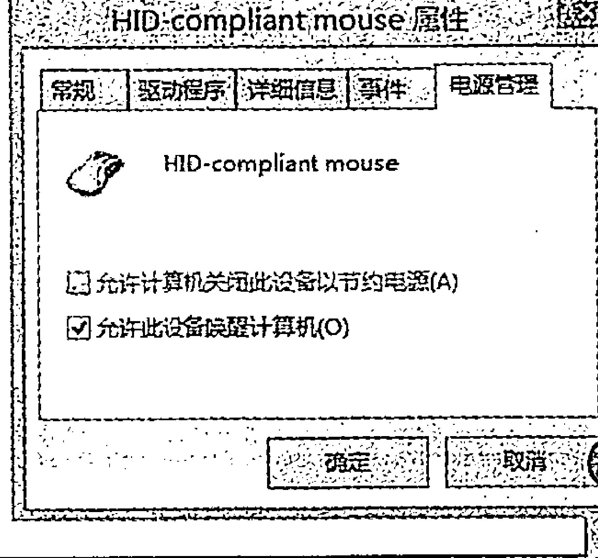

### 安全不安全 先试再决定

文|火凤凰

收到一封可疑的电子邮件，想打开看看又怕感染病毒或恶意程序，怎么办？
想研究一下某个可能带毒的软件，但又怕破坏系统，怎么办？

借助备份工具ATI2013附带的一个Try&Decide一切问题可以迎刃而解。
Try&Decide能让我们在一个虚拟的环境中测试和使用任何一种带有破坏性的程序，同时绝不会侵害我们的系统和数据安全。

##### 小知识 Try&Decide的工作原理

Try&Decide功能可允许我们在计算机上创建一个安全可控的临时工作空间，而不需要安装特殊的虚拟化软件。我们可以进行各种系统操作，无需担心可能会损害操作系统、程序或数据。对于进行的虚拟更改，我们还可以将其应用到初始的系统中。

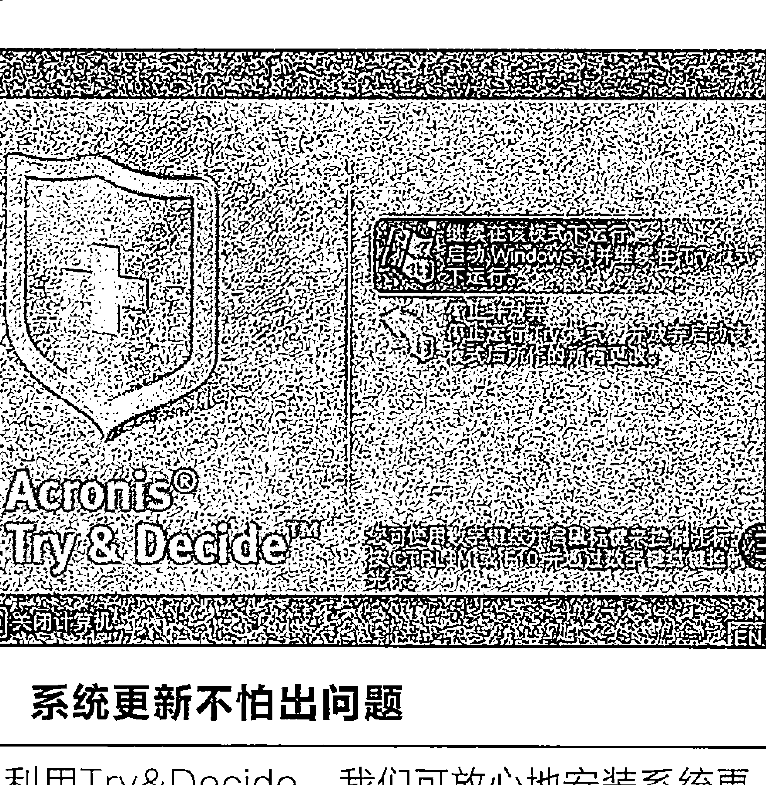

先安装ATI2013专业备份工具套件，启动程序后从“工具与使用工具”选项卡下选择“Try&Decide”（图1），在分区分析和初始化之后，即可进入该功能模块。若未启动该功能，只需单击上方的图标启动即可（图2）。

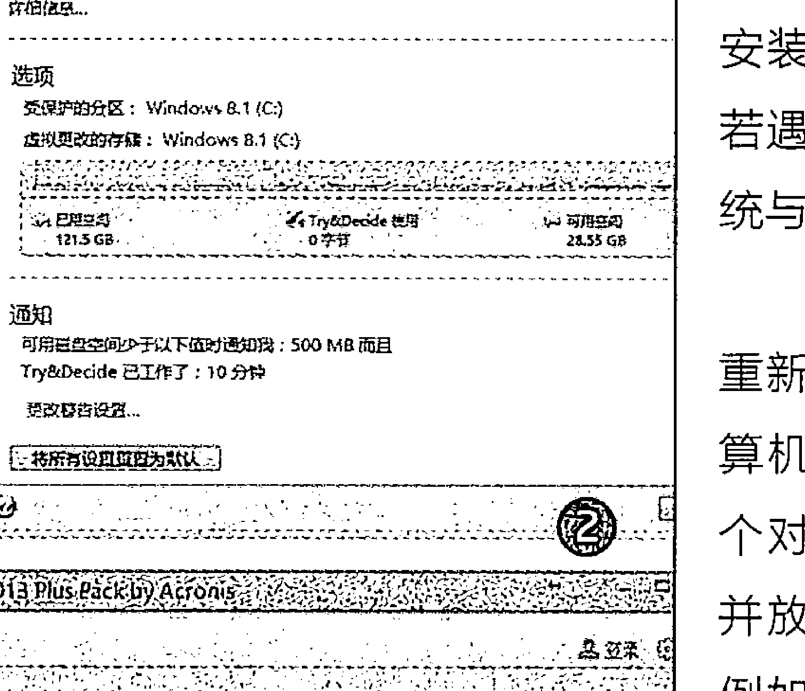

##### 系统更新不怕出问题

利用Try&Decide，我们可放心地安装系统更新，不用理会这个更新是否可靠，“先用一用再说”。当Windows Update通知我们更新已准备好安装时，打开Try&Decide，然后继续安装更新。若遇到任何形式的问题，则放弃更改并保持操作系统与应用程序不受影响。

Try&Decide可一直保持开启，因为此模式在重新启动操作系统后仍能“存活”。Try模式下计算机无论因什么原因重启，启动前我们将看到一个对话框，提供两种选择——“停止运行该模式并放弃更改”或“继续在此模式下运行”。后者例如我们在安装应用程序后重新启动，可在启动Windows后继续在Try模式下运行（图3）。

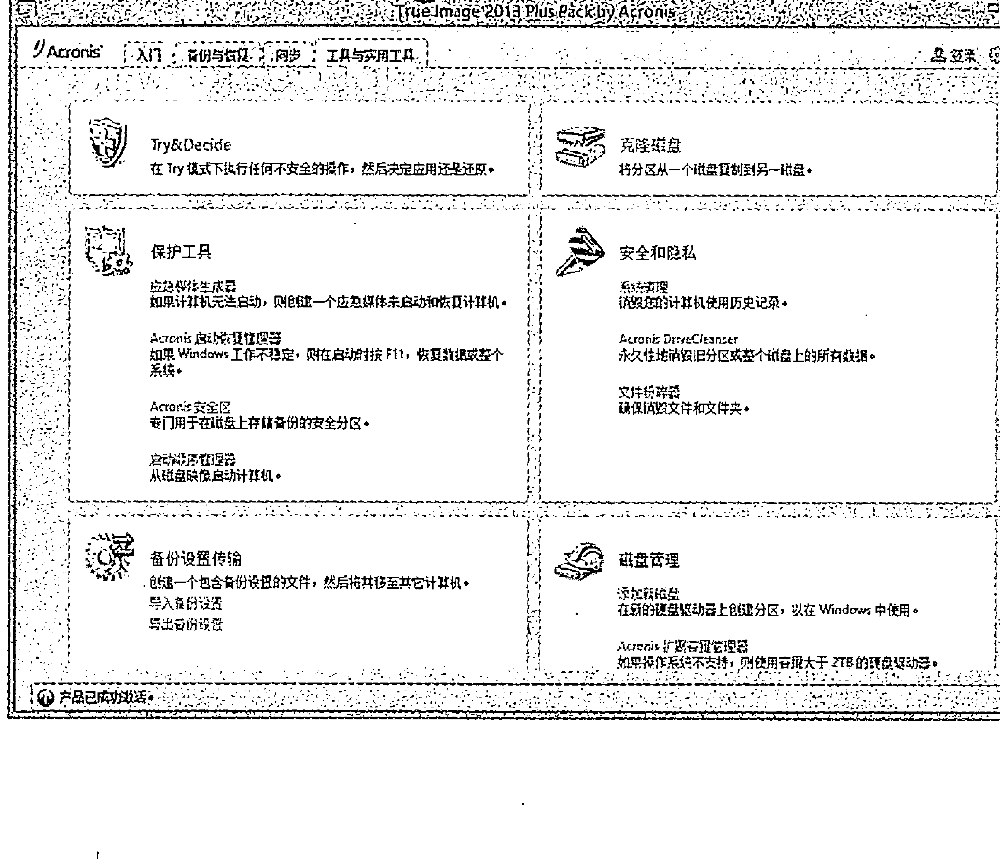

##### 软件兼容性测试和选择

在某些情况下，一些应用软件可能会与某些杀毒软件产生冲突，有的杀毒软件可能使应用软件无法运行。在选用杀毒软件前，可以使用Try&Decide工具对各种杀毒软件的试用版先行测试，最后可以选出最合适的杀毒软件。

首先从感兴趣的产品供应商的网站下载试用版防病毒软件，尝试使用计算机上已安装的应用程序。若没有任何障碍，确定不会存在任何不兼容的问题，即可放心购买这款防病毒软件。若遇到任何问题，放弃安装防病毒软件造成的系统更改，并尝试其他供应商的防病毒软件，直至获得成功。

决定关闭该模式时，只需单击Try&Decide图标。程序将显示一个对话框，由我们来决定如何处理在Try模式中对系统所作的更改，是应用还是放弃更改（图4）。

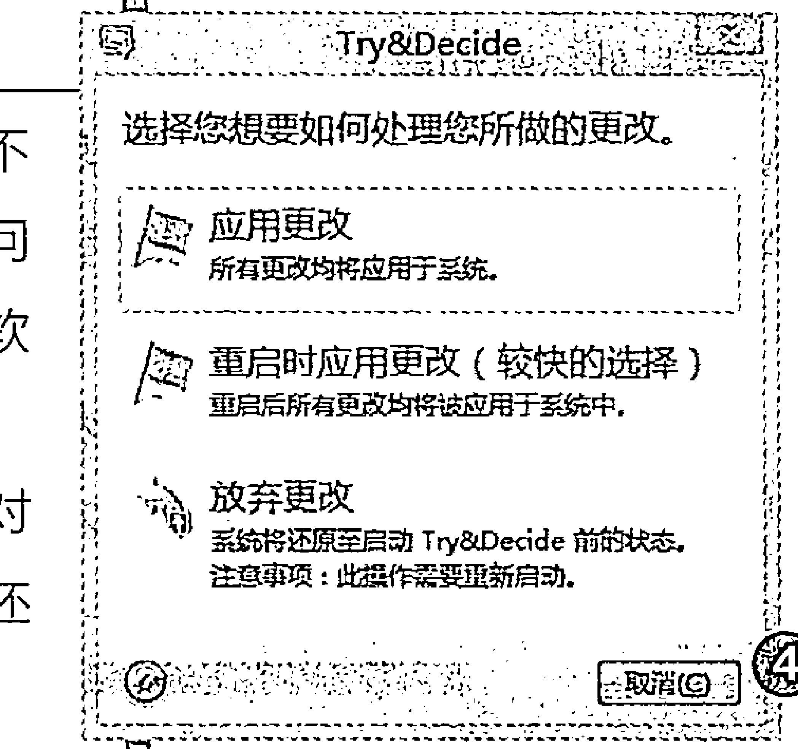

##### 有效防止文件恢复错误

当我们不小心删除了一些文件，并且清空了回收站，随后才想起删除的文件包含重要的数据时，肯定会去尝试使用适当的软件恢复被删除的文件。然而，有时我们在恢复被删文件时可能会犯错误，使事情变得比尝试恢复文件之前更糟。因为实用程序扫描磁盘并搜索删除的文件条目后，它会显示找到的删除条目，并提供保存其可恢复的任何东西的机会。这时我们可能会选择了错误的文件，而在我们恢复文件时，恢复程序可能会覆盖我们试图恢复的正确文件，这时的操作错误将是致命的，文件将永久丢失。这时，如果在Try&Decide环境下恢复就会避免损失。

打开Try模式，启动文件删除恢复实用工具，在这种环境下尝试恢复文件，如果发现恢复的文件有问题，我们仅需放弃尝试模式下所作的更改，并再次打开尝试模式后恢复文件即可。这样的过程完全可能会重复，直至我们相信在尝试恢复文件时作出了最正确的选择。

###### 小提示 使用Try&Decide的限制

- 无法在Try模式下对分区执行虚拟操作，如调整分区大小或更改分区配置。
- 不可在使用Try&Decide时同时使用磁盘碎片整理或磁盘错误检查程序等实用工具，否则可能会对文件系统造成不可挽回的损坏并导致系统磁盘无法启动。
- 在启动Try模式后，将无法使用“休眠”省电模式。

##### 彻底卸载测试的软件

大家都知道，Windows的“添加或删除程序”组件无法保证能完全卸载应用程序。几乎每次在安装一个程序试用后要删除时，都会在计算机上留下一些残余信息，久而久之就可能导致Windows运行变慢，即便是使用特殊的卸载工具也无法保证卸载的彻底性。但是，Try&Decide功能可确保任何软件的卸载操作都能简单快速、彻底完美地进行。

打开尝试模式，安装待评估的软件程序，试用该程序。需要卸载时，只需放弃计算机处于Try模式时所作的所有更改。这对于那些喜欢玩游戏、测试游戏尝鲜的人，以及专业的软件测试人员而言都会很方便。

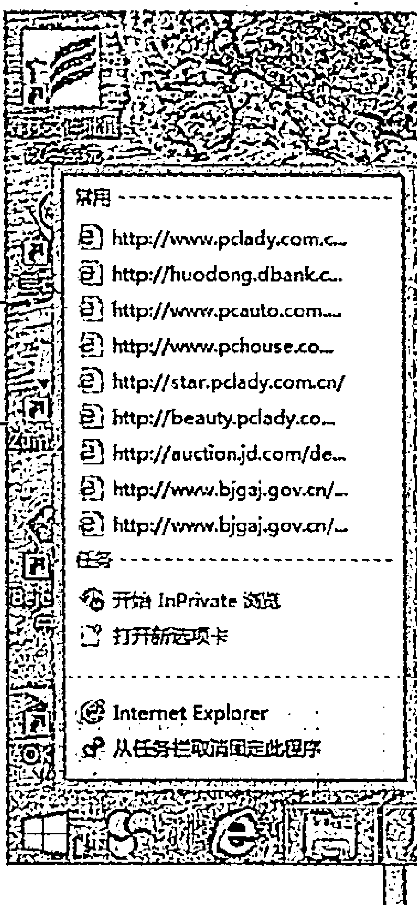

##### 有效保护个人上网隐私

为使我们的网上冲浪更舒适、快速，系统会在特殊的隐藏文件内存储Cookie、输入的URL、个人信息等（图5）。假设我们不想让任何人知道我们曾访问过哪些网页和我们的个人信息，虽然能通过人工删除或特殊设置清除痕迹，但也很麻烦。一旦忘了清理或清理不够彻底，窥探者可使用特殊的软件查看该信息。现在用Try&Decide功能可轻松解决问题。

只需在启动互联网浏览器前双击打开尝试模式。打开尝试模式时，程序会创建一个虚拟磁盘。尝试模式运行期间，包括系统所作的更改在内的所有系统更改会保存在此虚拟磁盘内。我们可随意在网上冲浪，使用浏览器完成操作后，放弃尝试模式下系统累积的更改，然后系统会重新启动并准确恢复至打开尝试模式之前的状态。这样一来，再恶毒的网页我们也可以“大摇大摆”地去浏览了。

### 有备无患 打造UEFI应急启动盘

文/技术宅

现在很多预装Win8的本本都在使用UEFI+GPT模式启动，由于启动方式的改变，我们原来的启动光盘、U盘无法在新电脑上启动。这些电脑如果遭遇启动故障我们该怎么办？俗话说：有备无患。下面我们就一起来打造UEFI应急启动盘。

### 就地取材 用好UEFI启动命令行

UEFI启动和传统BIOS启动不同，它无需活动主分区，我们只要在一个FAT格式的主分区放置启动文件，UEFI就会自动从中读取启动文件并加载系统，而且UEFI还支持命令行对启动进行配置。因此如果你的电脑出现启动故障，可以尝试使用主板自带的UEFIshell进行修复。

首先确认你的主板集成的UEFI自带Shell模式，一般开机时按F2即可进入Shell模式，待出现“shell>”提示符时即表明你已进入efi shell环境中（图1）。

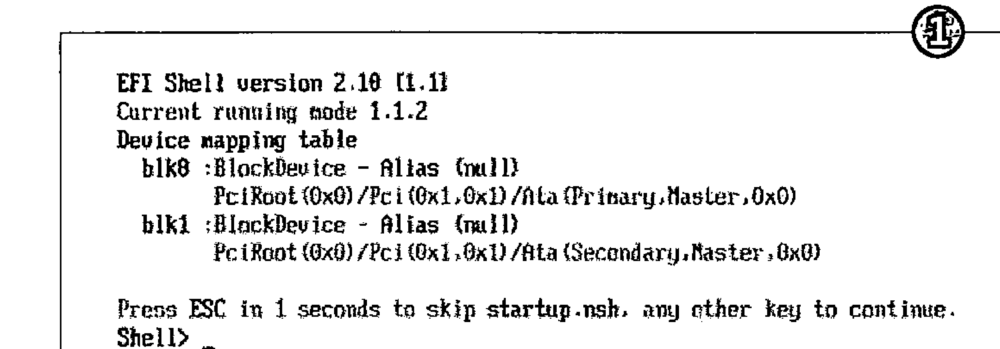

此时可以尝试使用命令行手动加载启动文件，一般UEFI启动分区是硬盘最前端的FAT分区。因此首先要找到存放启动文件的分区，依次输入下列命令（括号后为注释，图2）：

```
Fs0: (ufeshell使用fs:x方式表示驱动器，序号从0开始)
ls (查看文件结构，确保其中有EFI目录，如果没有则重新选择其他fs驱动器)
cd EFI\Boot (进入引导目录，查看引导文件)
BOOTX64.efi (直接运行uefi可执行程序)
```

这样即使UEFI启动出错，我们仍然可以借助手动加载启动文件的方法进行引导。

##### 网络大补贴
常见UEFI shell命令简介http://smilejay.com/2011/05/efi-efi-shell/

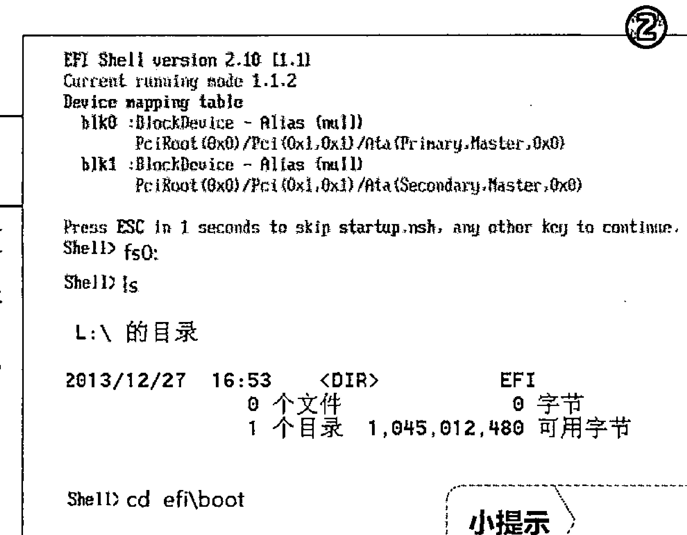

### 巧借外力 打造UEFI启动PE盘

上述的方法只是在启动配置出错的时候使用，如果启动文件丢失，或者启动分区出错，我们就无法在UEFIshell环境下进行修复。为了避免这种情况发生，我们可以制作一个支持UEFI启动U盘PE。下面以制作64位Win8的启动U盘为例。

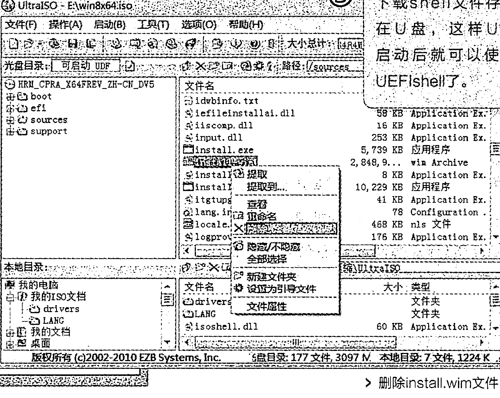

如果你的主板没有集成Shell模式，则可以准备一个U盘，插入电脑后启动命令提示符，按提示输入“bcdboot c:\windows /s U: /f UEFI”，制作U盘UEFI启动盘，然后再 到http://download.csdn.net/detail/guifp2012/4785048 下载shell文件存放在U盘，这样U盘启动后就可以使用UEFIshell了。

##### 一键制作启动U盘

##### 写入启动文件

首先确认U盘的文件格式是FAT32格式，如果不是则在Windows资源管理器将其格式化为FAT32格式。接着准备好64位Win8安装文件，使用UltraISO打开，然后展开sources目录，在右侧窗格将其中的install.wim文件删除（图3）。
完成文件的删除后，点击“文件→另存为”，将其保存在桌面备用。然后到http://www.uqidong.com/download/下载“U启动”。启动程序后切换到“ISO模式（支持UEFI启动）”，然后点击“浏览”选择上述编辑过的ISO文件，最后点击“一键制作启动U盘”（图4）。
在弹出的窗口，磁盘驱动器选中插入的U盘，其他设置默认，单击“写入”，这样程序会自动将所需的文件写入到启动U盘中（图5）。
完成上述的操作后，以后如果我们要使用UEFI方式启动，重启后按F12，然后在弹出的选择启动设备菜单选择类似“UEFI：USB USB Hard Drive”字样的设备，选中后就可以从U盘启动了（图6）。
成功从UEFI启动后进入PE系统，现在就可以对原来电脑的启动进行修复了。比如原来电脑是启动文件丢失导致的故障，只要在PE命令提示下输入下列的命令：
（假设原来电脑C盘这里盘符为D：，UEFI启动分区在PE显示的盘符是L:）
当屏幕提示“成功创建启动文件”时即修复完成，bcdboot会自动将UEFI启动文件复制到指定分区（图7）。

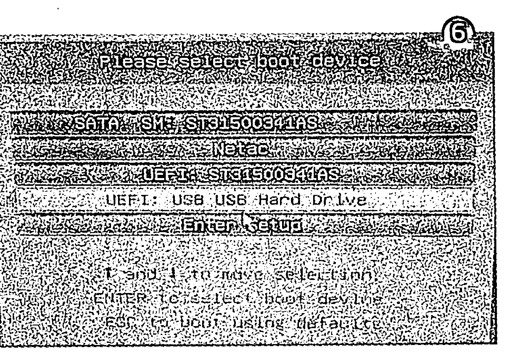

##### 选择支持UEFI启动的设备

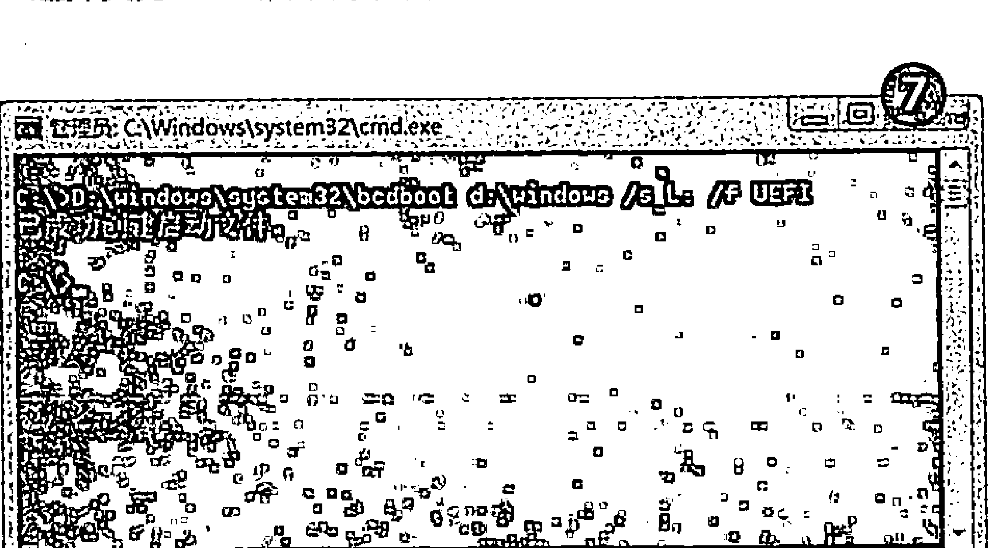

##### 成功修复启动问题

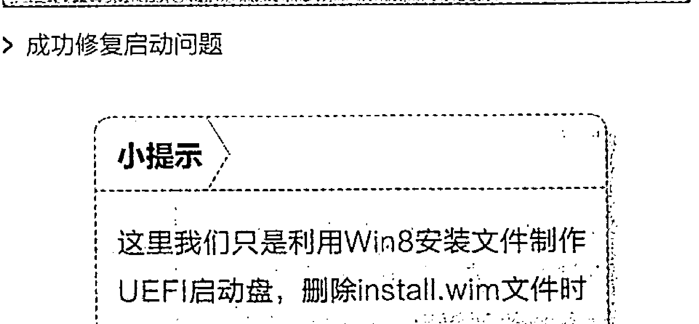

```
D:\windows\system32\bcdboot d:\windows /s L: /f UEFI
```

###### 小提示
这里我们只是利用Win8安装文件制作UEFI启动盘，删除install.wim文件时为了减小PE的体积，如果是要制作支持UEFI启动的安装盘，则直接使用安装文件。

### 文件夹选项的十全用法
文|惠香

在Windows系统中有一个“文件夹选项”，大家最熟悉的莫过于用它来去除文件扩展名隐藏显示以及藏起或显示文件的功能。那么，除了这些实用功能外，“文件夹选项”还有哪些实际用处？在流行的Windows 8系统中，它有什么新变化？

##### 克隆文件列表的显示方式

在Windows 8.1的资源管理器窗口中，每次打开一个文件夹，会以一种固定方式显示文件列表。但是，Windows对文件查看的显示方式有从超大图标到小图标，再从列表到内容等8种方式。如果习惯于以一种独特的方式来浏览所有文件夹（比如用详细信息方式），那么，如何才能实现让文件夹每次打开后自动切换为这种显示方式，而不是每次都需手动去“查看”菜单中选择呢？

要实现以上目的，只需先打开一个文件夹，选择资源管理器“查看”选项卡下的“布局→详细信息”项，然后在文件夹选项窗口中点击“查看→应用到文件夹”，确定即可（图1）。

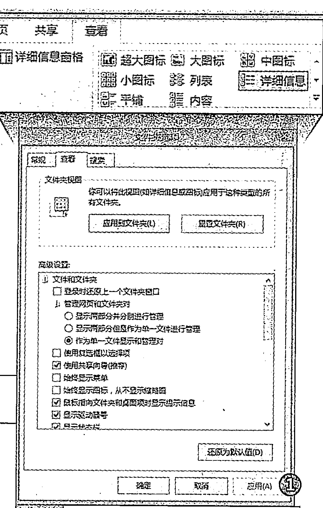

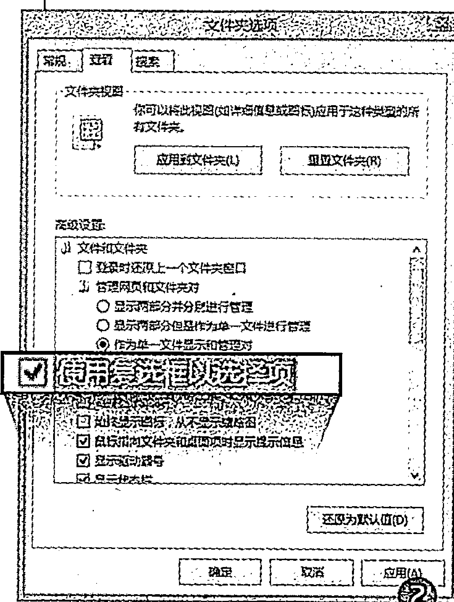

##### 给文件列表添加复选框项

以往我们在资源管理器中选择文件，要么是全选，要么是通过Ctrl或Shift配合鼠标点击来复选文件。单用鼠标无法完成多个不连续文件的选择。但在Windows 8.1中，这种需求可以实现了。

我们只需在文件夹选项窗口中选择“查看→高级设置”，然后勾选“使用复选框以选择项”，确定后即可在资源管理器中以鼠标单击的方式选择多个连续或不连续的文件，不需要键盘的配合就能完成多文件选择任务（图2）。

##### 始终显示习惯的系统菜单

Windows 8.1的资源管理菜单可以设置为隐藏模式，这对操作熟练或惯用快捷键操作的人来说十分有用，它可以腾出更多的有效空间来显示窗口内容。但是，对于操作不熟练或惯用菜单的人来说，始终显示菜单更显得必要。

通过在文件夹选项窗口的“查看→高级设置”，选中“始终显示菜单”一项，可以达到始终显示菜单的目的。

##### 获得更多的温馨操作提示

在资源管理器中，我们还可以设置一些更体贴人的文字提示信息，以便在鼠标指向文件夹、桌面项目上时有具体的提示。还可以设置显示出驱动器的编号、状态栏信息、文件夹大小、预览控件等信息，以便更加详细地了解所使用资源的具体情况。

要实现以上目的，只需在“查看→高级设置”窗口中，将“鼠标指向文件夹和桌面项时显示提示信息”、“显示驱动器号”、“显示状态栏”、“在文件夹提示中显示文件大小信息”、“在预览窗格中显示预览控件”等选项均选中并确定即可（图3）。

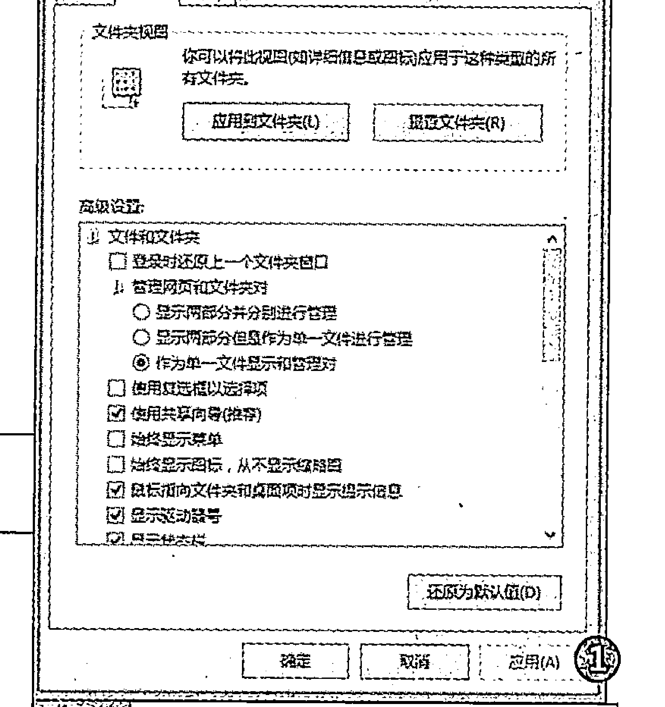

> ### 小提示
> Windows 8.1中开启文件夹选项的方法为，先用Win+E组合键开启资源管理器窗口，然后点击“查看”菜单激活查看选项卡，点击此选项卡的最后一项“选项”即可进入文件夹选项窗口。

##### 搜索提速 排除系统文件

Windows 8.1在搜索功能上得到加强。我们在日常搜索过程中，搜索的文件往往是系统之外的一些图文声像文件，因此搜索过程中完全没有必要搜索系统文件。这时，只需在文件夹选项窗口中进入“搜索→搜索方式”，选择在搜索未建立索引的位置时，去掉对“包括系统目录”选项的选择。

此外，如果设置了系统文件不进行索引，而又要搜索系统文件，那么可将“在文件夹中搜索系统文件时不使用索引”一项选中。

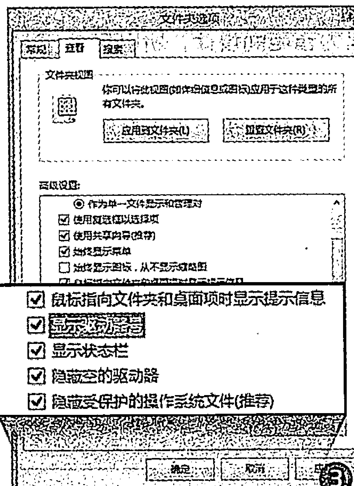

##### 启动后自动打开指定窗口

Windows 8.1启动后默认的界面是“磁贴”应用界面，如果要让系统启动后即进入上次工作的一个桌面窗口环境，可通过任务栏导航设置配合文件夹选项来实现这一想法。

先右击任务栏空白处，选择“属性→导航”并选中“当我登录或关闭屏幕上的所有应用时，转到桌面而不是开始屏幕”。然后点击文件夹选项“查看→高级设置”，选择“登录时还原上一个文件夹窗口”。这样，当关闭系统时只要保持有一个文件窗口处于开启状态，下次启动系统会直接启动到桌面并打开上次文件夹的位置（图5）。

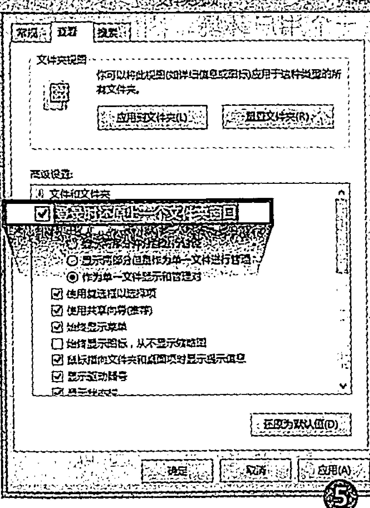

##### 让搜索包含更详尽的内容

在系统中搜索文件的过程中，有时我们需要的内容可能保存在压缩文件中（如ZIP包或CAB包中），还有的时候所需信息是在文件中而不是在文件名中，这时，就需要系统搜索具备搜索压缩包中的文件以及从文件内容中搜索信息的能力。

要达到这个目的，我们可以通过文件夹选项的“搜索”选项卡，选择“始终搜索文件名和内容”和“包括压缩文件（ZIP、CAB）”两个选项（图4）。

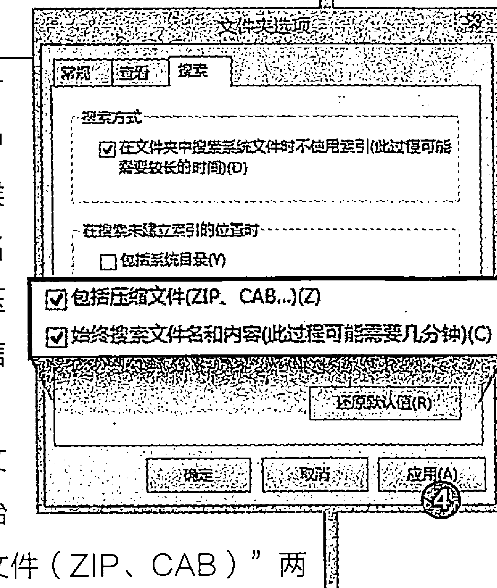

##### 管理网页文件的三种方法

当一个网页被完全保存后，会有一个HTML文件和一个存放图片或代码信息的同名文件夹。通过文件夹选项可以控制这个网页文件保存时的存在形态。

在文件夹选项窗口中选择“查看→高级设置”，在“管理网页和文件夹对”选项下面有如下三项（图6）：

- 显示两部分并分别进行管理
- 显示两部分但是作为单一文件进行管理
- 作为单一文件显示和管理对

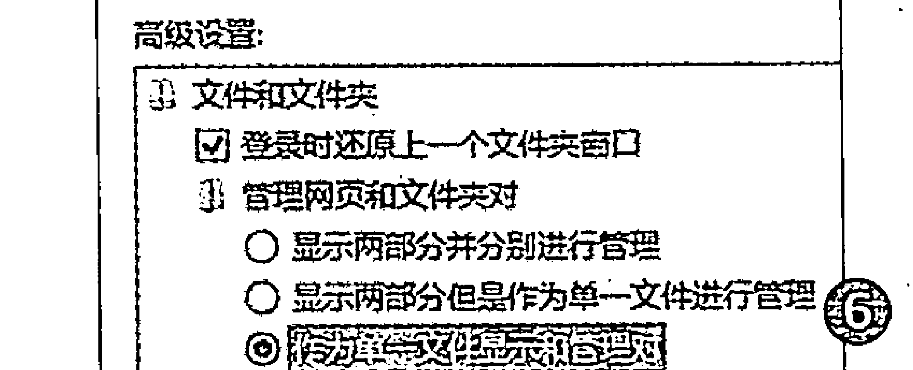

若选择了第1项，则删除网页文件或文件夹中之一不会影响另一个；若选中第2项，则删除其中之一，另一个也消失；若选择了第3项，这两个文件会合并为一个文件来管理。

##### 改变同名文件夹覆盖提示

在Windows 8.1系统中，当复制一个文件夹到另一个位置时，如果同名文件夹已经存在，那么对文件的覆盖提示可能会出现详细的冲突提示。通过文件夹选项的“查看→高级设置”，选择“隐藏文件夹合并冲突”，这样同名文件合并不提示更为详细的冲突合并选项，而只是简单地确认替换还是跳过这些文件。

### 解惑Windows 8六大关机模式
文|老俞

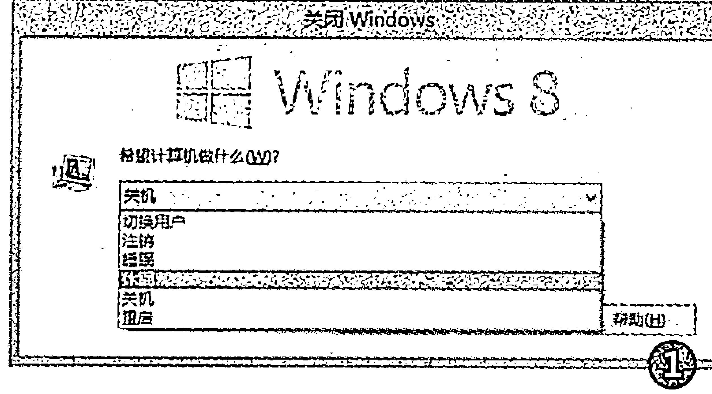

在电源管理支持和所有关机模式都开启的情况下，如果在Windows 8桌面上按下Alt+F4组合键，我们可以看到如图1所示的选择菜单窗口。

菜单中出现了6种关闭当前系统的方式：“切换用户”、“注销”、“睡眠”、“休眠”、“关机”、“重启”。在这些选项中，有些比较好理解，争议不大，如“切换用户”和“注销”两项。但随着系统的升级换代，其余的4个选项有了新的内涵，因而不少用户对这几个选项的使用存在疑惑。本文就大家比较困惑的关机选项问题做一个梳理，希望能让大家彻底搞清这些看似平常而又让人存有疑惑的系统命令。

##### 1 为省电而设 哪个最省

系统的这些关机选项，主要目的之一是为了省电而设立。那么，这些选项当中，哪种选项最有利于节省电力？

与省电有关的选项主要是睡眠、休眠和关机3个选项。关机完全切断电源无可置疑。而休眠其实也是完全切断电源，也不消耗电力，与关机所不同的是数据环境现场的保存和恢复。睡眠则不同，因为进入这个状态后，虽然显示器、风扇、硬盘等主要耗电配件停止供电，但是基本的内存数据要保留，因此还得维持正常供电，因而睡眠会有一定的电力消耗。在3项对比当中，睡眠状态是唯一耗电的一种。但因为该方式本来就是为省电而设计，所以与手动关闭显示器而保持主机开着工作的人为“省电”模式相比，睡眠消耗的电力是微乎其微的（图2）。

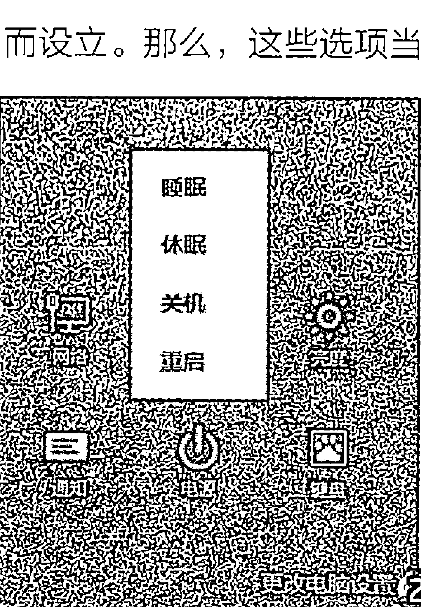

##### 2 为加速而设 哪个最快

系统设立这些关机选项，另一个目的是为了加速。那么，在这些选项当中，哪种选项最有利于快速启动系统？

睡眠、休眠、关机、重启、注销、切换用户等6个选项，可以说都与启动系统速度有关。其中，最能快速恢复现场的方式是睡眠方式，这种方式因为保持了所有的操作环境数据，包括当前内存中的数据，只是暂时关闭内存之外其他设备的供电，因此恢复起来最省时。接下来就是“切换用户”，因为切换用户是在多用户的使用环境同时打开的情况下进行的，切换用户只是在不关闭当前用户数据的情况下，从一个用户环境转入另一个用户环境，因而所用时间也不会太长。而“注销”一个用户需要先将用户数据进行保存，关闭使用环境下的所有应用才能完成，因而花费的时间要比切换用户长，但因为不用重启系统，因此，它又比重启开机要省时间。剩下的三个选项，

> ### 小提示
> Windows 8默认的“关机”是设置了“快速启动”后的关机，同样的“关机”，开启和关闭该功能的效果会不同。

##### 睡眠与休眠的不同

睡眠和休眠，听起来差不多，但它们有实质的区别。实际上，它们是为不同的应用场合而设立的。我们通过举例来说明。

如果在电脑上做事情的过程中，经常有中途离开的情况，十几分钟或几十分钟后回来继续工作，这时，将电脑设为离开时按下电源按钮进入“睡眠”最为合适。如此既可以马上进入省电状态，操作上也不复杂，回来恢复环境也只需要按下电源按钮，只用一两秒时间就可恢复环境（图3）。

如果正在进行一项复杂的工程，电脑中打开的设计软件和参考资料有很多，工作还未完成，而我们又需要离开公司十天半个月或更长时间，回来后才能继续这项工程。这时，若又不希望将这个工程的许多文件和数据关闭，因为回来后再重新开启太麻烦了，此刻选择“休眠”模式关机是最好的了。它不但可以让我们的工作环境现场得以完全保留，还可以完全切断电源让电脑处于不耗电的状态（图4）。

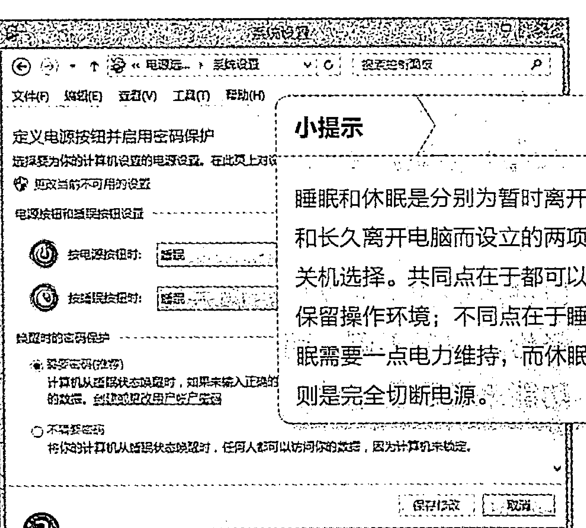

设置为睡眠

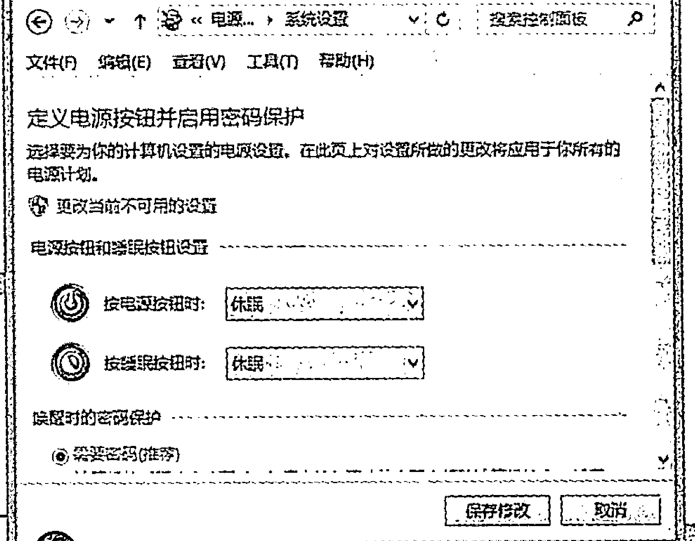

设置为休眠

“休眠”、“关机”和“重启”是最容易让人疑惑的三个选项。Windows 8默认关机是采用带有“快速启动”的选择，它会尽可能地将原来一些需要重新加载的启动过程写在交换文件中，然后在启动时直接读取这个文件中的数据完成系统快速加载。而休眠则是为了保存上一次的操作环境而设的先保存环境数据，到下次开机时再恢复操作环境的关机方式。这两种方式的启动速度，一般“关机”（带有快速启动）要比“休眠”更快速一些，因为它不包含用户现场数据的手动恢复或重建过程。而重启可能就要花费更长时间，因为它会按部就班地完成所有数据的关闭工作，同时若有系统更新数据，还会先准备完成系统更新和配置更新。因此，“重启”是Windows 8最费时的一种关机方法。

##### 关机与重启的不同

“关机”和“重启”表面看是两个不同的任务，前者听起来是完成工作后才需要关闭电脑，后者看起来是还需要继续工作（只是可能因为系统缓慢或有其他需要才重新启动一下），但在Windows 8环境下，它们有需要我们值得注意的地方，那就是当我们安装了系统更新文件，或者对软件配置进行了重设之后，如果环境要求我们重新启动系统，而我们又开启了快速启动选择，那么选择“关机”后再加电重启与直接选择“重启”命令重启的效果截然不同。后者可以完成系统更新和软件更新，而选择前者则会维持原来的状态，系统和软件得不到更新。因此，虽然我们选择关机后人为重启了电脑，但系统或软件环境却没有发生改变。由此看来，在这种情况下，只有选择“重启”命令进行的重启才是真重启，而关机后重启则是“假重启”。如果遇到系统软件更新不能发挥作用的情况，就要从这里来考虑了。

> ### 小提示
> 快速启动设置不适用于“重新启动”。我们需要执行“关机”命令，然后再次启动电脑才能使快速启动生效。默认情况下，在Windows中快速启动处于启用状态。如果关闭“快速启动”功能，则关机重启和选择“重启”差别不大（图5）。注意，设置快速启动需要在电源设置窗口中点击“更改当前不可用的设置”选项。

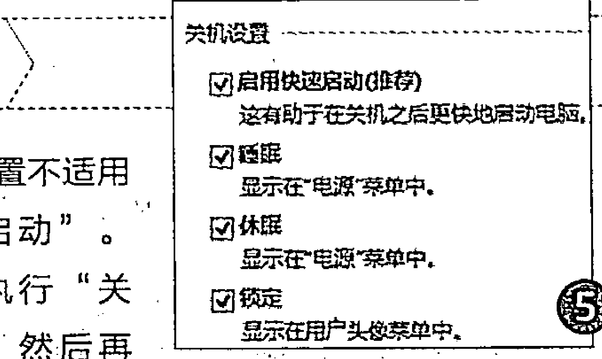

### 历史记录 让文件找回从前
文|老俞

以往我们的个人文件若遇丢失、损坏或被删除，只能望洋兴叹。因此，人们总是要去寻求文件备份工具来备份，以备不测。而今，如果我们使用了Windows 8.1，就完全可以借助于该系统自身的文件历史记录功能来防患于未然。打开资源管理器，也许我们找不到这个功能的入口，那么该如何正确使用呢？

Windows 8.1的“文件历史记录”功能用来备份“文档”、“音乐”、“图片”、“视频”和“桌面”等库文件夹以及用户文件夹中的文件。随着时间的推移，它还会为文件构建历史记录。这样，以后若遇原始文件被删、丢失或损坏，就可以很方便地将其还原。同时，我们还能选择浏览和还原文件的不同版本。比如，即使当前文件被删除或丢失，若要还原较早版本的文件，可以浏览时间线，选择需要的版本，然后进行还原。

> ### 小提示
> 要使用文件历史记录功能来恢复文件，需要先设置文件历史记录驱动器，并启用“文件历史记录”功能。

##### 做好使用前的必备功课

要让文件历史记录功能发挥作用，首先要指定历史记录驱动器。设置文件历史记录驱动器时，如果要使用移动硬盘或U盘，则将其连接到电脑上。当看到询问是否要配置文件历史记录驱动器时，单击启用即可。否则，需按如下步骤配置移动设备或网络驱动器。
用鼠标指向屏幕右上角并向下移动鼠标指针，在出现的列表中单击“搜索”。在搜索框中输入“文件历史记录设置”，然后单击“文件历史记录设置”（图1）。
单击“选择其他驱动器”，选择要使用的网络驱动器或外部驱动器，然后打开“文件历史记录”开关（图2）。文件历史记录即开始为我们备份文件，备份文件所在位置为所选驱动器中的FileHistory文件夹。

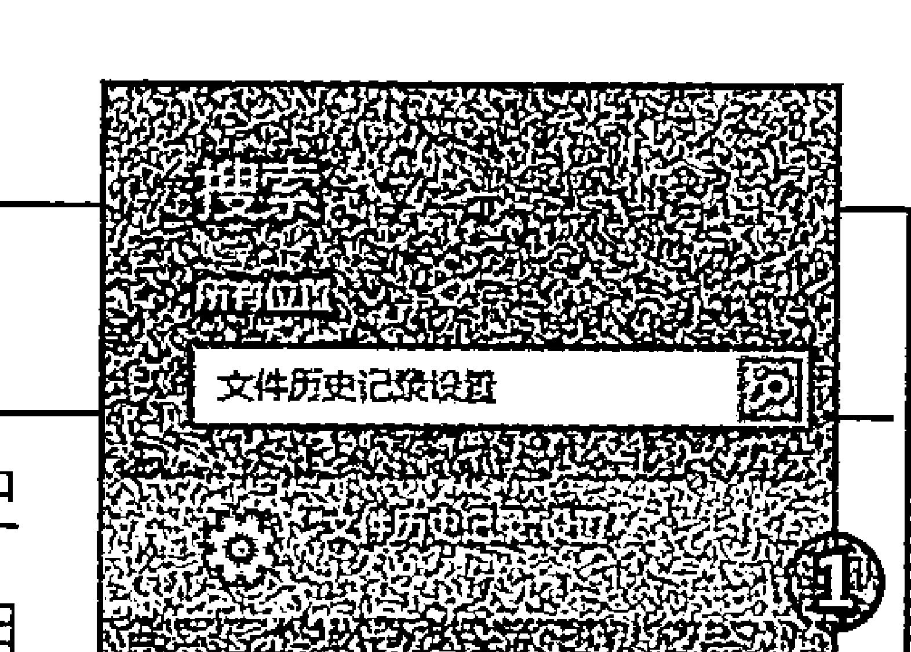


> ### 小提示
> 除了外接驱动器（如USB驱动器）和网络驱动器，虽然还可以有其他选择，但这两个选择是有助于避免文件崩溃或其他电脑问题的最佳选项。

如果需要的网络驱动器不在可用驱动器列表中，请单击“显示所有网络位置”查找。此处也未列出需要的驱动器，点击“控制面板→大图标”窗口中的“文件历史记录”，单击“添加网络位置”，按屏幕说明操作（图3）。

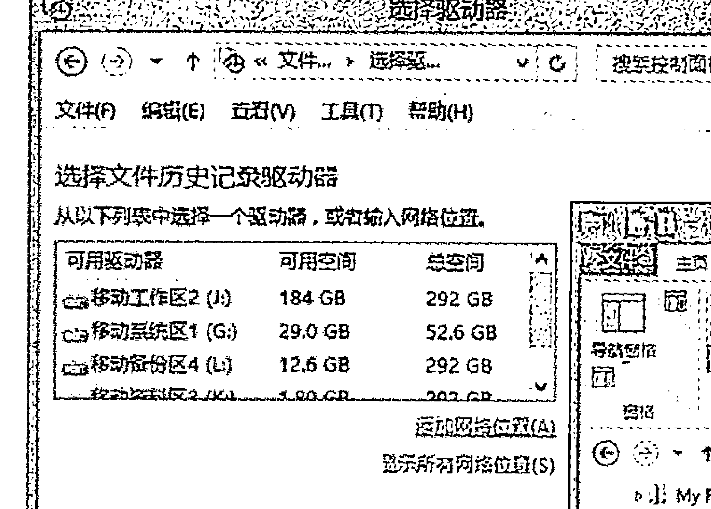

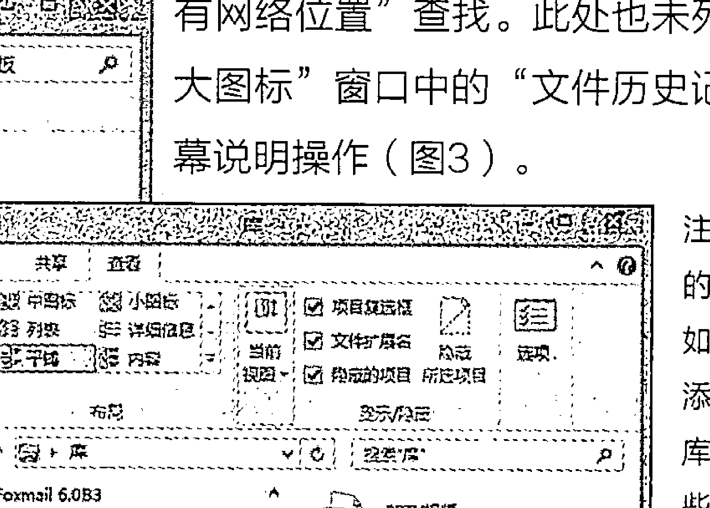

注意，由于系统提供的文件历史记录仅备份电脑的“库”和用户文件夹中的文件的副本，因此，如果要备份其他位置的文件或文件夹，需要将其添加到“库”文件夹之中，才可实现备份目的。库文件夹不仅包含以上五种类型的文件夹，一些软件安装之后，也会自动在“库”库文件中添加它们的库文件夹，如图4所示的“PPTV视频”、“暴风影视库”、“迅雷下载”等，其中的内容也在历史文件自动备份之列。

##### 找回文件旧版本的方法

需要还原文件或文件夹时，通过鼠标在屏幕右上角下拉激活“搜索”，在搜索框中输入“还原”，然后单击“通过文件历史记录还原你的文件”（图5），以此来进入还原历史文件或文件夹。

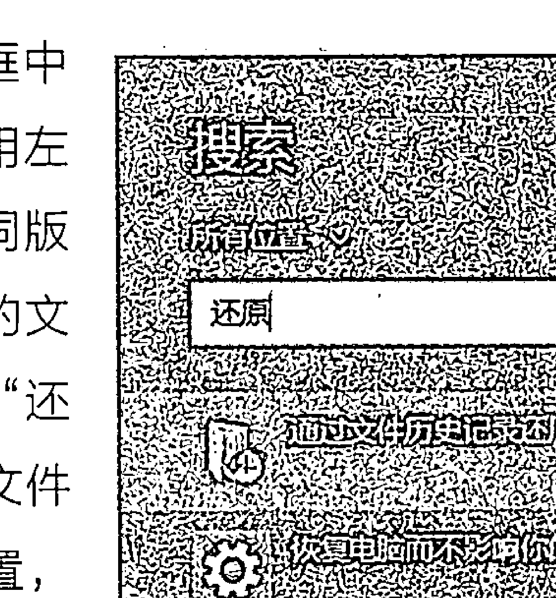

具体使用中，只需在搜索框中输入要查找的文件名称，或使用左右箭头浏览文件夹和文件的不同版本。选择要还原到其原始位置的文件，然后单击下面中部的圆形“还原”按钮进行还原。如果要将文件还原到原始位置以外的其他位置，则右键单击“还原”按钮，选择“还原为”，然后选择新的还原位置来还原文件（图6）。

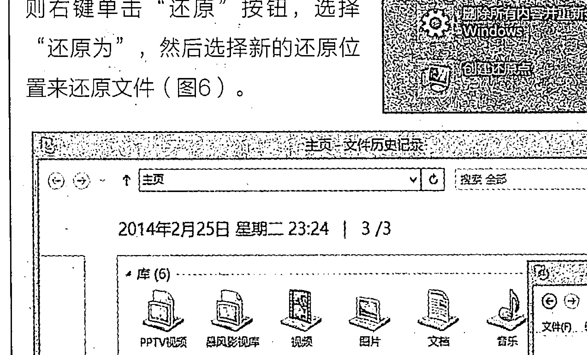

> ### 小提示
> 文件历史记录不会备份电脑上已与SkyDrive同步的文件，即使它们位于文件历史记录备份的文件夹中也是如此。文件夹历史记录不仅适用于Windows 8.1，还适用于移动设备使用的Windows RT 8.1系统。

##### 让文件历史记录精简高效

对于库中的文件，系统文件历史记录功能默认要对其进行备份，但是，有时一些库中有一些数据非常庞大的文件集合，例如“迅雷下载”或“PPTV视频库”、“暴风影视库”等，由于里边可能是下载的一些大个头高清影视文件，如果这些文件也进行历史版本备份，不但很占用磁盘空间，而且也没多大必要。因此，我们需要将这部分库排除在外。

在控制面板“文件记录设置”窗口左侧点击“排除文件夹”，然后在随后出现的窗口中添加要排除的库文件夹（图7），即可实现绕过特定文件夹的目的。

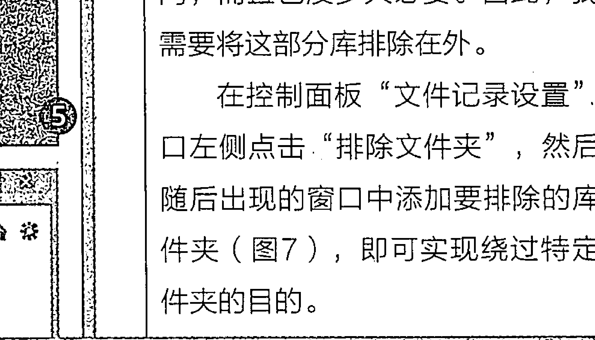

此外，在“高级设置”页面中（图8），我们还可以为保存文件的副本周期、脱机缓存占用磁盘空间大小、保留保存版本的期限等，进行个性化的选择定义。

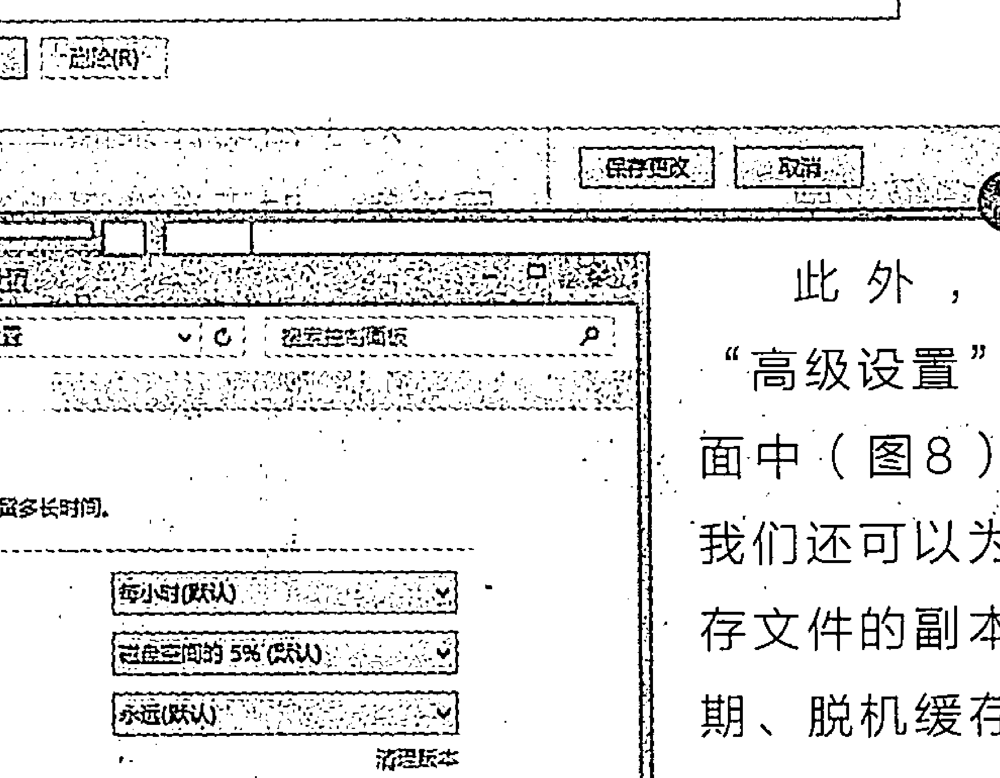

《电脑爱好者》·2014上半年合订本 {系 统 应 用}

### 自建优于开始菜单的多级菜单
文|余温青

微软为Windows 8的开始菜单而一直纠结着。这不，弄来弄去，用户不满意的还是大有人在。其实，不用那么纠结，用户完全可以自建优于任何一种开始菜单的多级菜单。

Windows 8去掉了传统而又方便的“开始”菜单，迫于用户不断的呼声，Windows 8.1又部分回归了“开始”菜单，但对于程序组的功能仍然没有回归。因此，引得不少系统类工具软件开发者纷纷开发“开始”菜单工具，以便可以让人们方便地访问安装的各种程序。但是，如果你是一个Windows老用户，你会发现，即便是最传统的Windows XP“开始”菜单，当你的程序安装太多时，从里面找程序也比较麻烦。比如，你正在测试流行的网络浏览器，你安装了十款八款网络浏览器，而你的电脑中已经安装了许多应用软件，这时从“开始”菜单启动某个浏览器就得挑挑拣拣，找到一个浏览器启动它也不是易事。实际上，我们完全可以不借助于任何“开始”菜单工具，也不用管Windows有没有开始菜单，更不用管自己用的Windows是低版本还是高版本的，自己用系统的基础功能，完全可以打造一个比传统“开始”菜单更合理科学、访问更方便的分类菜单（图1）。下面我们就在Windows 8.1环境下，打造一个更好用的个性化多级菜单。

##### 程序、文档快捷方式尽情装

这一步是为以后的步骤做准备。需要进行的工作是，将已经安装的各类程序的快捷方式放在桌面上。不但可以是应用程序的快捷方式，也可以是你经常访问的网页地址快捷方式、文档的快捷方式等。

对于自动在桌面上生成快捷方式的程序，我们不用去管。对于有选择地在桌面生成快捷方式的软件安装程序，我们统统选择在桌面生成快捷方式。对于没有在桌面生成快捷程序的程序，我们只需到其安装目录下，将主运行程序发送快捷方式到桌面上，并合理修改快捷方式的名称，使其更易辨认即可。对于需要在分类菜单中建立快捷方式的各类网址快捷方式、文档快捷方式等，也用这种办法在桌面建立快捷方式即可。

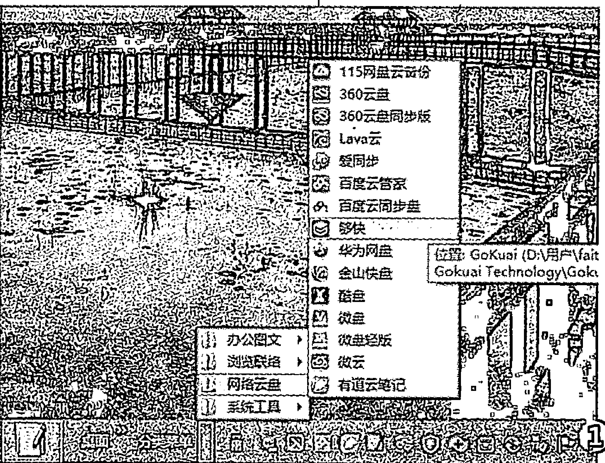

##### 建立桌面分类程序文件夹

按照功能类别，将自己安装于桌面的所有快捷方式分类存放。首先在桌面上建立各种分组程序的文件夹，比如“浏览网络”文件夹放置网络浏览器和聊天通讯、邮件类的程序快捷方式，“网络云盘”文件夹放置各类云盘客户端的快捷方式，“办公图文”文件夹放置办公软件、图像处理软件相关程序的快捷方式，“系统工具”文件夹放置与系统、文件有关的各类小工具的快捷方式。若还有其他类别也可以照此新建文件夹，如建立经常访问的网址的快捷方式管理文件夹“常用之网”，建立经常访问的文档快捷方式文件夹“常用文档”等。

接下来，将桌面上建立的各类快捷方式，依类别分别移动到上面建立的各类文件夹中（图2）。

完成上述文件夹的建立之## 在任务栏上建立多级菜单

在完成上述工作后，我们需要在任务栏系统托盘的左侧建立一个多级弹出式菜单，这也是我们最终需要的菜单。它能够实现在任何时候直接点击，并带有两级弹出的方便选择功能。

在任务栏的空白处单击鼠标右键，在弹出的菜单中选择“工具栏→新建工具栏”，在弹出的窗口中，选择“桌面→分类菜单”文件夹，然后点击“选择文件夹”（图3），完成菜单定义。

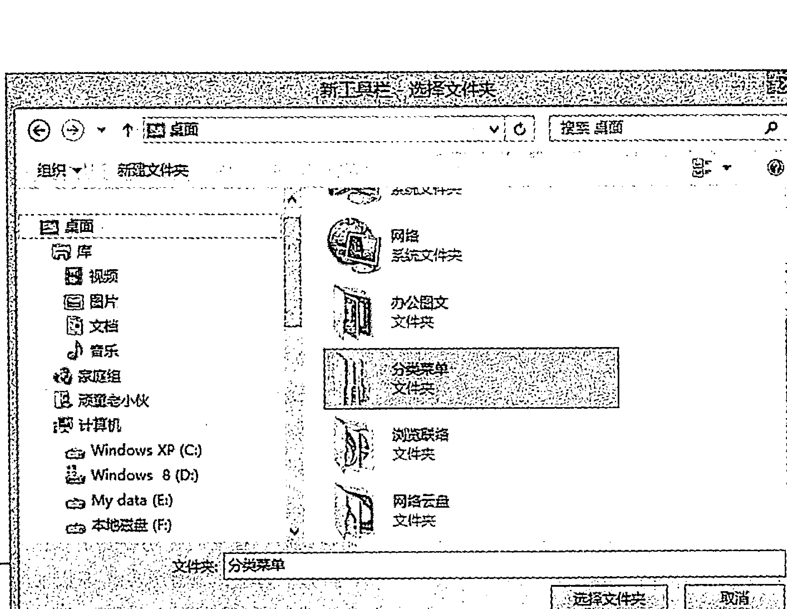

后，还需要建立另外一个文件夹“分类菜单”，这个文件夹将要容纳前述建立的所有文件夹。需要将上述文件夹全部复制到这个文件夹中，外面的分类文件夹不删除，留作备份和维护之用。由于它们都只是快捷方式，几乎不占用什么空间，所以不用担心桌面会有太大负担。

### 多级菜单的维护与管理

多级菜单建立之后，日常使用过程中，难免有程序或快捷方式项目发生变化，例如可能增删某些程序或文档。在这种情况下，就可能引起多级菜单中某些项目的失效或缺失。那么该如何管理多级菜单项目，使其时刻保持有效呢？

做起来也很简单，我们只需记住，当新安装或删除了应用程序或文档、网址快捷方式后，只要保证桌面上分类文件夹下该项目也作相应增删，然后复制该文件夹到“分类菜单”文件夹下，选择覆盖所有程序，即可保证多级菜单的常新。对于“分类菜单”文件夹中可能出现的某个已经失效的快捷方式链接，只需手动将其删除即可（图4）。

> **小技巧**
>
> 以上技巧不但可以应用于Windows 8/8.1，对于早期版本的Windows 7、Windows XP等系统也同样能够发挥作用。用这种方式定义访问菜单，程序项目越多越能显示出其优越性。

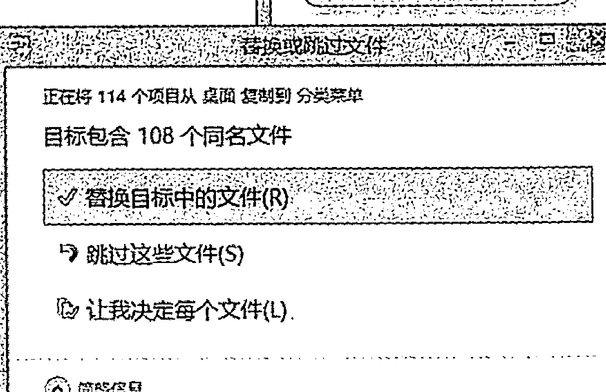

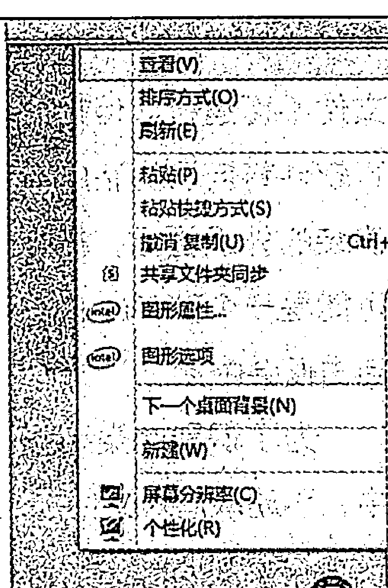

> **小技巧**
>
> 此多级菜单建立之后，因为已经能够通过自建的多级菜单访问任何自己日常需要的程序、网页或文件，桌面上的图标就变得有点多余。这时，为了桌面的干净整洁，我们可以通过桌面空白处的右键菜单，选择“查看→显示桌面图标”命令去掉其前面的对钩选项，这样就可将桌面上的所有图标都藏起来，达到桌面背景完美展现的效果，可谓一举两得。但是，千万记住不能删除桌面上的快捷方式分类文件夹，因为任务栏上的多级菜单依赖于桌面上的这些快捷方式，若删掉它们，那么任务栏上的多级菜单也将随之变得无法访问。桌面隐藏后，当我们日后需要维护多级菜单时，可以再次通过桌面右键菜单，选择“查看→显示桌面图标”，将桌面图标显示出来后进行菜单项目的维护即可（图5）。

五道防护 加固系统安全

文|文翔

系统安全一直是我们最关注的问题，尽管系统安装之后已经具备了一定程度的安全防护措施，我们也安装了安全软件来加固系统。但是，从系统本身来说，仍有几个薄弱环节需要我们注意去防范或加固。

> 移动存储设备的自动运行功能，依靠一个配置文件Autorun.inf而作用。而其中能够发挥自动运行的功能的，主要是Open或ShellExecute命令。其中Open用来自动运行某个程序，ShellExecute则可以带参数的模式运行程序，更加灵活（图1）。由于ShellExecute命令的灵活性，当移动设备使用ShellExecute方式加载自动运行程序时，用右键菜单选择打开的方法，或者用Win+R以命令方式打开盘符等方法，仍免不了系统被病毒感染或遭受恶意攻击。因此，禁用自动运行功能或采用相对安全的方法访问移动设备很有必要。

##### 1 慎用移动设备自动运行功能

记得从一开始使用Windows，就听说在使用软盘、光盘、优盘的过程中都可能让电脑感染病毒。因此，为了安全，总是要禁止这些介质的自动运行功能。打开这些外部存储器中的文件时，要避免直接双击文件。如今人们广泛使用Windows 7甚至Windows 8.1，这方面的安全问题还需要注意吗？

虽然Windows 7开始不再提供非光学移动设备（如U盘）的自动运行功能，而移动硬盘插入后会有自动播放选项。由于有的智能U盘会将自动显示为光盘类型，这样仍可自动运行。不过我们仍然可以在弹出的菜单中选择不自动播放。Windows 8.1则可通过选择“控制面板→自动播放”，在自动播放窗口中，根据需要选择需要停止自动播放的项目。为了安全起见，可将所有移动设备项目均设成“不执行操作”（图2）。

除了禁用自动运行功能外，在插入U盘等移动介质前，先按下Shift键不松开，也可以临时禁止移动设备的自动运行。但如前所述，若ShellExecute还存在，就仍不可用双击的办法打开文件。这时，可用Win+E开启资源管理器，以目录树结构的方式浏览进入文件夹访问。

```
[autorun]
open=Autorun\Run.exe
icon=Autorun\Run.ico
label=!
shellexecute=\index.htm //执行index.htm文件
shellexecute=\       //运行到C:\
shellexecute=我的好东东\ //打开文件夹"我的好东东"
```

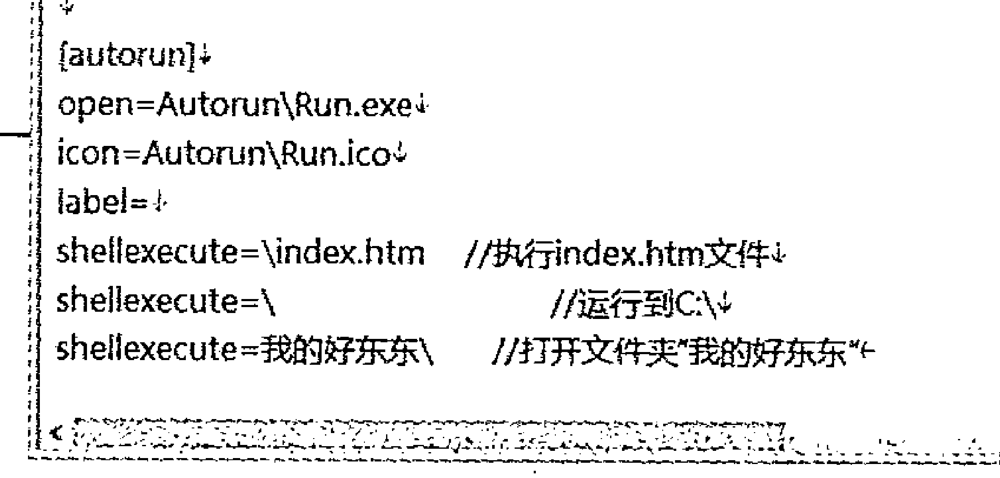

##### 谨防藏在文件扩展名中的猫腻

众所周知，系统默认的文件扩展名都是隐藏起来的，这样利于防止用户意外改动文件类型而造成文件不可运行。但扩展名隐藏也存在隐患，如果恶意软件将自己伪装成TXT文件或图片文件，并带有伪装的外观图标，很容易被我们误判。但实际上它可能是一个带有恶意代码的EXE可执行文件，一旦点击便会中招。

为了识别此类猫腻，可到系统文件夹选项窗口中，手动取消对文件扩展名隐藏的选择（图3）。扩展名被取消隐藏后，假设一个恶意程序原来看起来的名字是HELLO.TXT，这次就可以真真切切地看到，其实它是一个名为HELLO.TXT.EXE的可执行程序，既然知道它是一个可执行程序，其中可能藏有猫腻，我们不去点击它，直接删除就是了。

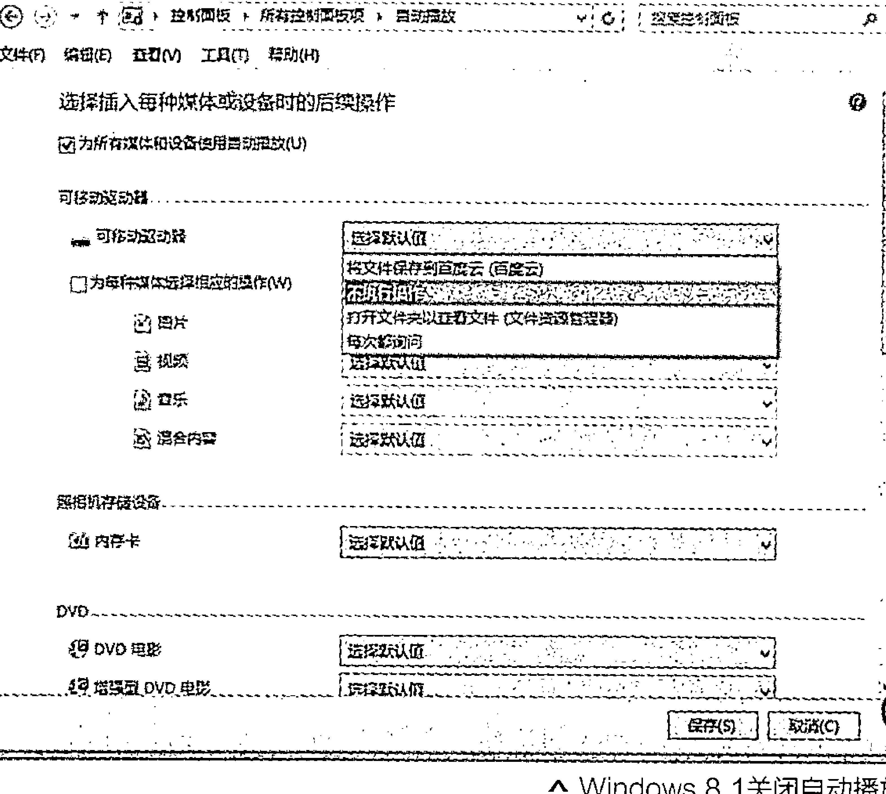

##### 开启Windows用户账户控制功能

Windows从Vista开始就具备并一直到Windows 8.1保留用户账户控制功能（简称UAC），该功能在系统中默认处于开启状态。一旦有软件安装或运行，需要权限，UAC就会跳出来提示。如果UAC弹出提示框需要管理员权限，这时就要非常谨慎，想一想，对于不熟悉的软件，它们为何要管理员权限？因为不关闭UAC，会有烦人的提示，因此不少人关闭了这个功能。这无疑增加了系统被入侵的可能。因此，建议最好不要关闭UAC功能。开启了UAC，只给自己心知肚明的程序以管理员权限。这样，即便浏览器和系统有漏洞，各种挂马网页病毒网页也就无可奈何了。

##### 默认管理共享及磁盘分区共享安全

在查看本机共享文件夹属性时，我们可能会意外发现有些末尾为$符号的共享名称，有系统文件夹ADMIN$，硬盘分区C$、D$等共享名称，这些就是Windows默认的管理共享及磁盘分区共享。
管理共享及磁盘分区共享是用于系统管理的，如果是自己的电脑不需要与别人共享，则关闭这些肯定更安全。但公司的电脑一般需要与别人共享资料，不开启也不现实。这时需要注意，一定要给自己的电脑管理员账户加上足够强劲的密码。只要计算机上的管理员账户都受到强密码的保护，别人就算知道我们的电脑已经启用了管理共享，没有管理员账户的密码也无法访问。

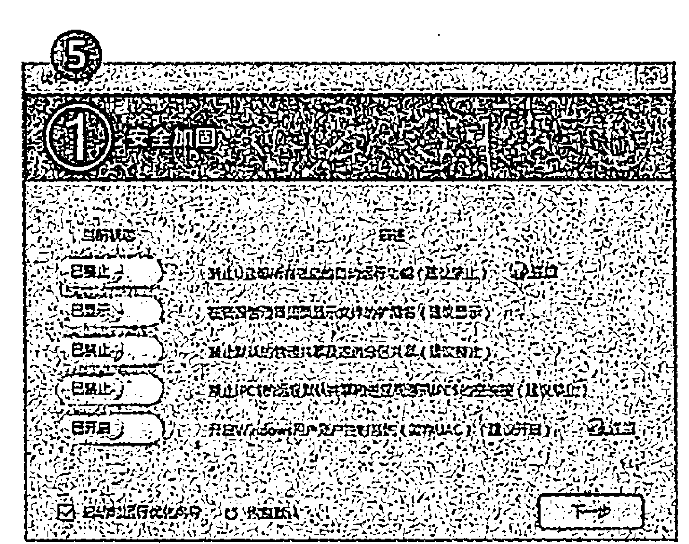

∧ Windows 8系统优化大师关闭系统共享

##### 禁止IPC$的远程默认共享和进程间通讯IPC$的空连接

IPC$的远程默认共享是为了远程访问而开放的系统共享。进程间通讯IPC$的空连接是在没有信任的情况下与服务器建立的会话，它是一个到服务器的匿名访问。它们通过验证用户名和密码获得相应的权限。如果系统没设密码和密码过于简单，这就留下了被攻破的隐患。
防范的方法有多种。最简单的办法是设置系统复杂密码，防止通过IPC$穷举密码被攻破。但如果系统有其他漏洞，IPC$将为进一步入侵提供方便。还有通过建立批处理删除共享属性和修改注册表的方法解决的，但这种方法比较复杂，不适合普通用户。对于普通用户来讲，用Windows 8系统优化大师提供的关闭功能是比较方便的办法（图5）。

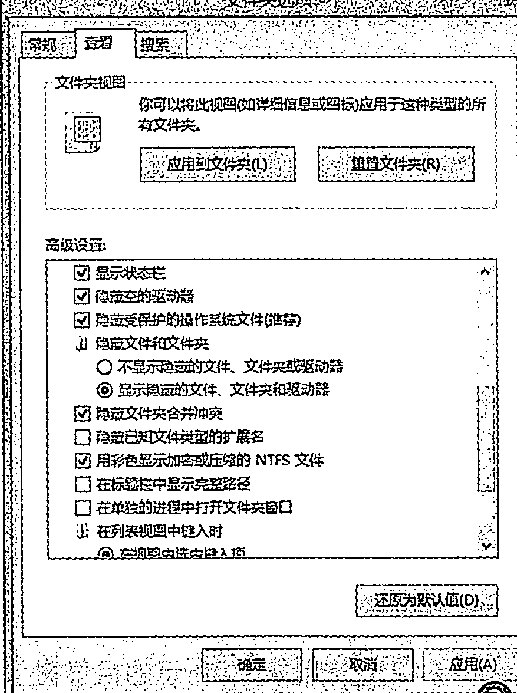

∧ 通过设置显示文件扩展名

**小技巧**
Windows 8.1开启用户账户控制的方法是，通过“控制面板→操作中心”，点击操作中心窗口左侧的“更改用户账户控制设置”一项，然后通过滑块调节设置（图4）。

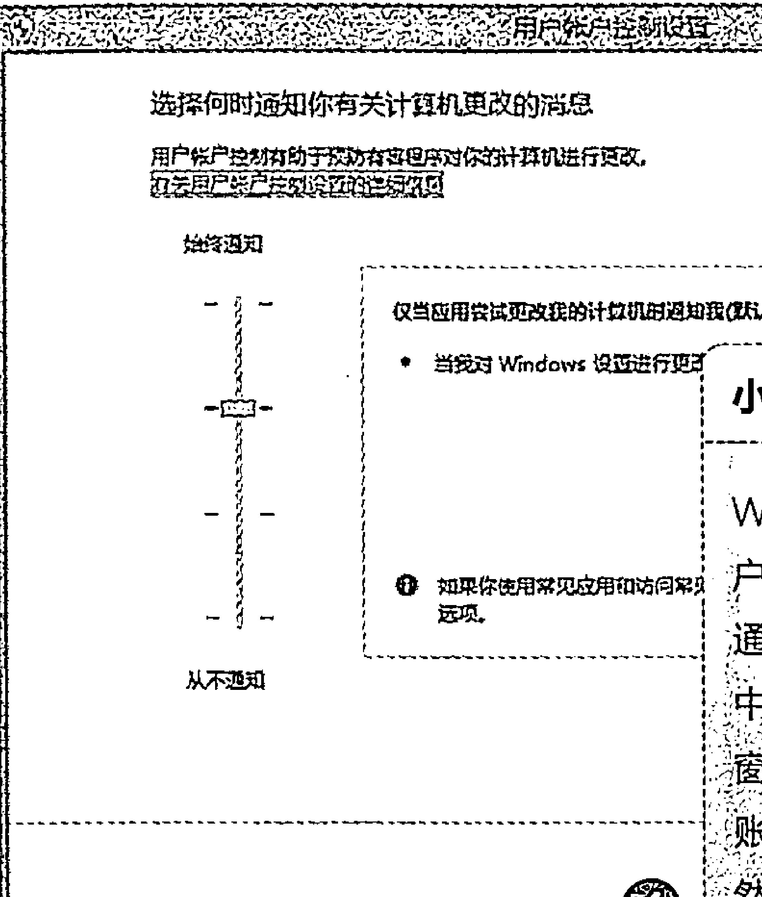

∧ 开启或关闭UAC设置选项

系统重装 别忘记自己身份了

文/武文元

机器运行缓慢或问题无法解决，需要重装系统，如果我们只是简单地将自建文件夹中的文档拷贝出来，然后格式化系统分区重新安装，也许会受到意想不到的损失。那么，重装系统还需要注意备份哪些数据？

##### 网络收藏夹切勿大意

网络收藏夹是我们上网习惯的记录器，其中保存有我们经常访问的网址，日积月累，分门别类会有很多。但我发现，许多人在重装系统时却会忘记备份这些重要的数据，造成重装系统后只得重新构建自己的网络习惯。实际上，我们可以通过两种途径来事先完成这项工作。

网络浏览器自身一般都带有可以备份收藏夹的命令，我们只需在重装系统之前，先通过收藏夹的数据管理功能，将收藏的网址导出来，保存到移动存储器或网络盘中。待系统装好之后，再从新的浏览器中直接导入这些数据，即可恢复原来收藏的所有网址。

导出收藏夹要求人为进行，因而重装前因一时疏忽忘掉备份也是不足为奇的事。为了防止遗忘，我们可以利用网络浏览器的自动云备份功能，将收藏夹网址自动保存到服务器当中。而要完成这项任务，需要使用浏览器时先注册一个网络账号，然后将浏览器网络账号设成自动登录，这样每次上网打开浏览器，浏览器的自动监测功能会自动将我们新添加的收藏夹网址备份到云服务器当中。待下次重装系统后，启动新安装的浏览器并用原有账号登录，系统会自动从云端将收藏夹数据同步到本地浏览器中（图1）。

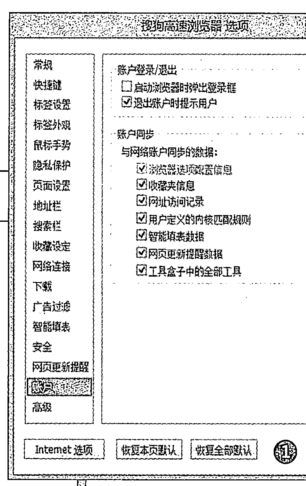

↑ 网络收藏夹自动备份

##### 桌面有用内容不容忽视

许多用户有在桌面上建立文档的习惯，工作完毕也自然将文件留在了桌面上，重装系统时只是备份了数据分区中的个人文件，而误以为桌面上只有一些图标的快捷方式，于是轻易格式化掉了C盘。殊不知，桌面上的所有文件都是保存在C盘系统分区的某个文件夹当中的，我们格式化掉了C盘，桌面上的文件自然也就不复存在了。

因此，建议在重装系统前一定要先检查桌面上是否有实体文件，将快捷方式之外的所有实体文件统统转移到移动硬盘或数据分区中后，再执行重装系统的操作。为便于操作，可用如图2所示的目录树看法检查。

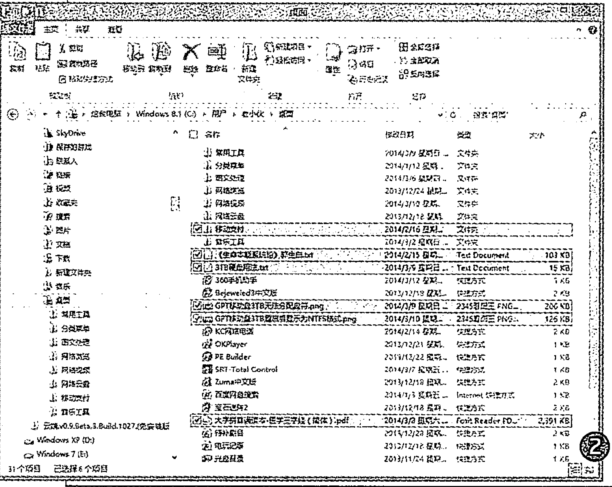

详细检查桌面文件夹中的有用数据

### 系统“文档”深入检查

许多程序的设计是依据Windows的规范来设计的，因而当这些程序默认创建文档的时候，文档会自动保存到系统的“我的文档”或“文档”文件夹中，而这些文件夹默认是保存在C盘中的。虽然有的用户在用Office保存文档的时候已经有意地将文档保存到C盘之外的分区中，但却忽略了其他应用程序默认保存的一些文件。这样就会造成在某些应用程序下创建的有用文档，在格式化C盘时一并丢失。

因此，在重装系统前，一定要打开个人账户下的“我的文档”或“文档”文件夹，仔细查看各类应用程序是否在此目录下保存了有用的文件，如果有，就统统将它们转移到安全的位置（图3）。

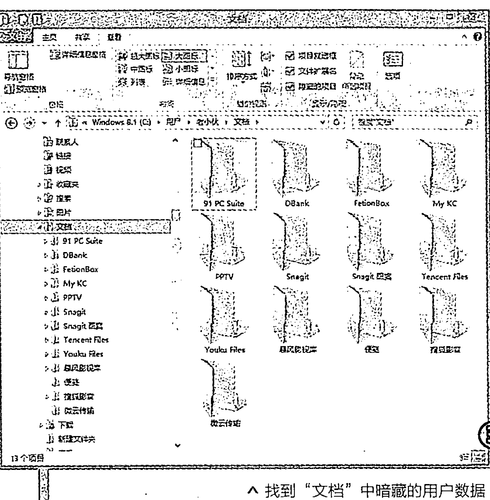

### 珍惜音视频缓存的“劳动”

目前许多人观看网络视频或收藏歌曲都采用网络视频客户端或音乐客户端。为了能在后续的收看或收听过程中获得更快捷的效果，许多人选择先离线下载若干音视频资料，然后再欣赏的做法。这些资料有许多是默认存储在C盘当中的，而且这些资料的下载会在后台用去不少时间，如果在系统重装时忽略了这个问题，缓存下载的音乐或剧集都会丢失干净，待重装系统后要收听收看还得重新下载，很费时间和流量。

预防办法是，在重装前逐一检查音视频客户端的缓存文件夹，将有用视频复制出来留待后用（图4）。

**小技巧**

可以用360安全卫士或金山毒霸等工具的系统清理功能，专项扫描出这些音视频文件所在的位置，然后依照路径直接到达这些文件夹备份文件，更加快捷方便。

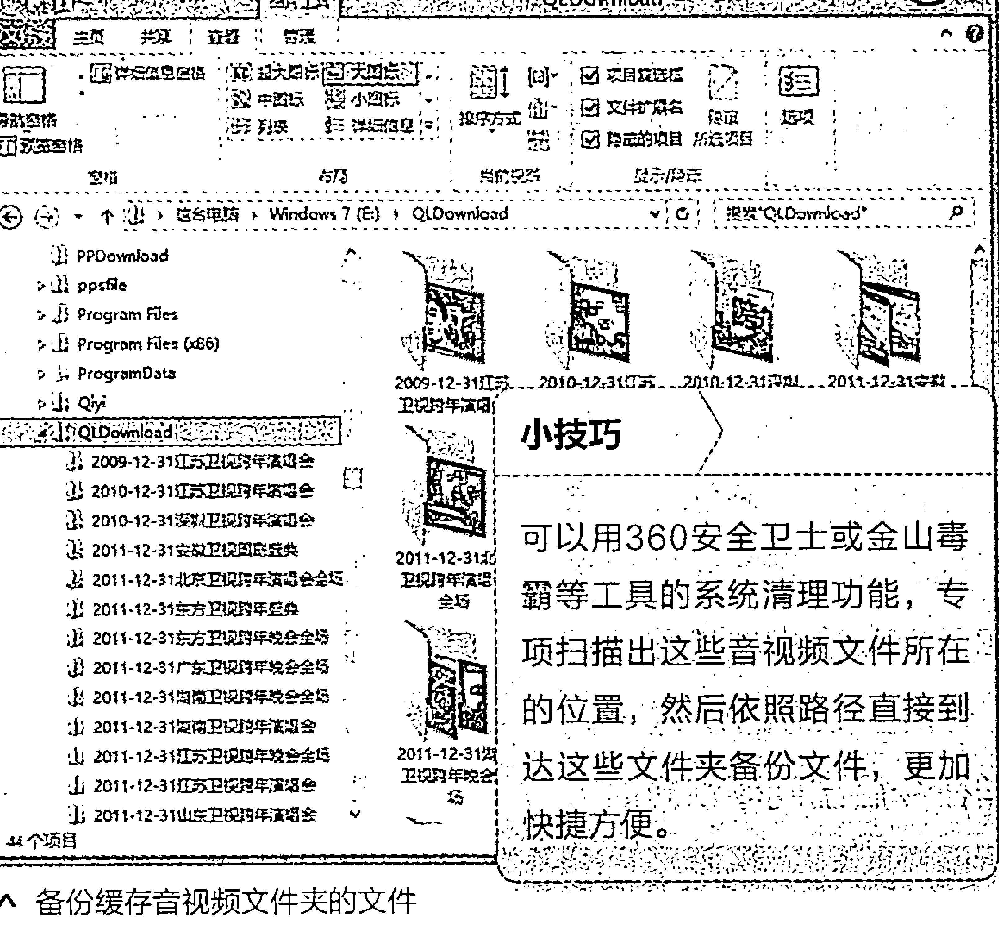

### 聊天数据备份也有说道

聊天过程中接收或自动保存的文件也许很重要，今后可能会返回头去寻找这些数据。而QQ默认的用户数据保存在C盘QQ用户数据文件夹下。如果重装系统前忽略了这些数据，那么就会造成之后无法获取这些数据。

为了避免这一情况的发生，在重装系统前先从QQ的设置中查看默认的用户文件保存的路径，然后根据路径到达目的地将有用文件拷贝出来，对于聊天记录，则可申请为QQ会员，利用其聊天记录上传到服务器的功能，将聊天记录自动保存到服务器当中，重装系统之后可以自动恢复。

### 本地邮件数据切莫丢失

许多用户习惯于用Foxmail来管理邮件，Foxmail默认的邮箱也设在系统C盘的用户目录当中。Foxmail有一项体贴的功能是可以自动收取服务器端的所有邮件到本地邮箱目录中，然后自动删除服务器端的邮件，以保证服务器邮件空间永远都不会爆满。但是，这存在一个隐患，那就是一旦在重装系统前忘记备份C盘中的邮件，而服务器中的邮件因已自动删除，历史邮件就面临着永久消失的可能。

因此，在重装系统前一定要先备份Foxmail邮箱中的邮件。备份的方法其实很简单，Foxmail是一款准绿色软件，只需将其安装目录统统拷贝出来。系统重装之后，直接访问备份的主程序，即可访问原来的邮件了。

Outlook用户也存在这种情况，邮件导出备份方法有所不同，网上有现成方案可供读者参考，此处不再详述。

系统损坏 无法恢复为哪般

文|成义

Windows 8.1提供了系统快速恢复到出厂原始状态的选择，此外还提供从自定义系统映像恢复用户系统环境的方法。但是，在系统出问题后恢复时笔者多次发现，选择了还原出厂设置或恢复命令后，没有任何反应或系统提示需要安装介质，而该电脑原本就不带有安装盘。那么，到底该如何用好系统的恢复功能以防不测?

要顺利地进行系统恢复，有两样东西非常重要，一是系统恢复介质（恢复盘或映像文件），另一个是引导选项。只有备好恢复介质，同时熟悉各种引导选项的使用，才可以让损坏的系统从灾难中尽快恢复“元气”。

### 系统恢复方法的多样性

Windows 8.1的系统恢复与先前版本的Windows有所不同。它可以让我们在多种不同的高级故障诊断模式下，使用引导选项来启动Windows，查找和解决问题。在无法确定问题所在的情况下，可以用系统还原、系统恢复或初始化电脑等方法让系统重生。
系统还原是一种撤销最近系统更改的方式，此功能在早期的Windows版本中就有，本文不涉及它。与本文故障解决关系密切的是系统恢复和初始化所要用到的镜像文件的用法（图1）。

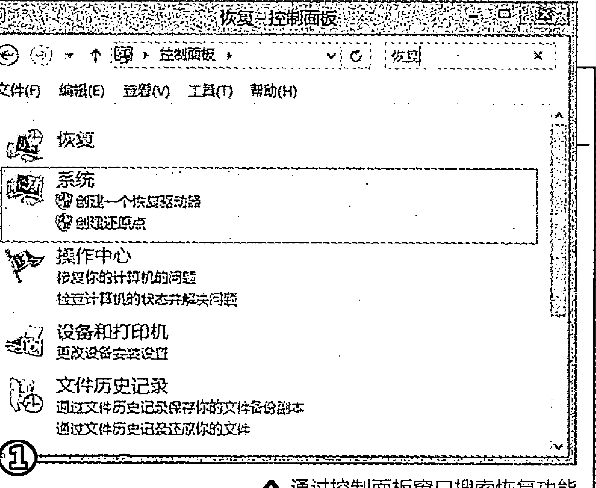

▲ 通过控制面板窗口搜索恢复功能

### 让系统恢复映像生效

系统恢复时提示找不到恢复分区、恢复介质或无任何反应，一种情况是已经将恢复分区或介质删除掉了，还有一种情况是系统恢复文件的关联路径被改变，因而在恢复时无法找到路径，自然会无法恢复或报错。

知道了这一点，我们只需在系统正常时，注意将系统恢复映像存放在固定的位置，不要轻易变动，即可保证在系统恢复时能够顺利找到路径。而如果因磁盘空间等原因，一定要改变这些映像或介质的存放路径，也有办法。具体思路是先将映像或介质移动到新的路径，用特定的命令重新告知系统映像恢复的路径已经改变，并让系统记住这一改变。这样在今后出问题恢复时，就可以顺利找到恢复路径了。

自定义的系统映像文件是一个名字固定为CustomRefresh.wim的文件。查看当前系统自定义恢复映像路径的方法是，在开始按钮上单击鼠标右键，从菜单中选择“命令提示符（管理员）”，进入命令提示符窗口，输入`recimg /showcurrent`命令后按回车（图2）。如果看到一条 “没有活动的自定义恢复映像” 的错误消息，则说明没有找到关联的自定义恢复映像。如果已经存在恢复映像，则显示如下格式的路径：

```
\?\GLOBALROOT\device\harddisk2\partition2\HuiFu_keting_Win8.1RecImg
```

harddisk2表示第二块硬盘，partition2表示第二个分区，HuiFu_keting_Win8.1表示存放系统映像的文件夹名称。

如果系统默认的路径被改变，也要通过recimg命令将路径修改为当前的真实路径。改变当前系统恢复映像路径需要使用`recimg /setcurrent <directory>`命令，其中`<directory>`指定目前实际存放系统映像的文件夹。指定之后系统就可以找到这个文件了（图3）。

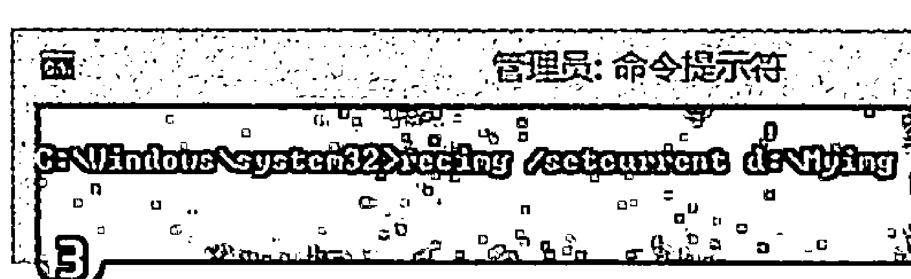

若在自定义的恢复映像目录中找不到CustomRefresh.wim文件，则在恢复电脑时将会从另一个指定的路径中寻找install.wim恢复映像恢复电脑。install.wim是一个可用reagentc命令指定的恢复映像。命令格式为：

```
reagentc /setosimage /path E:\sources /index 2
```

install.wim可以从安装盘的sources中提取。

最后，如果“自定义恢复映像”和“指定恢复映像”二者均失效，恢复电脑时就会提示插入安装介质，这时就需要准备好安装光盘或系统恢复U盘，插入方可继续执行恢复操作。

小提示：执行`reagentc /info`命令可同时查看指定恢复映像和自定义恢复映像配置情况，从中可以看到是否同时配置了指定恢复映像和自定义恢复映像。注意，使用recimg命令创建的自定义恢复映像只能用于“系统刷新”，不能用于“系统重置”。

##### 灵活选择进入恢复系统

解决了映像文件的路径问题之后，就可以进行系统恢复了。恢复系统可以从如下三个渠道进入。

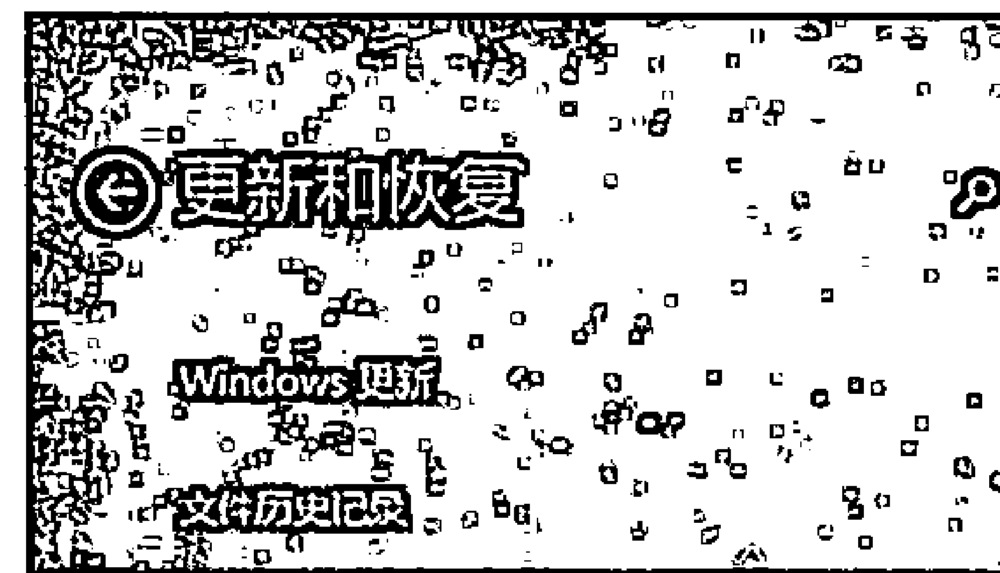

##### 从启动维护菜单中恢复

如果我们无法进入系统桌面，那么恢复工作只能在启动时通过F8维护菜单进入选择疑难解答一项，或者用安装光盘启动电脑进入维护菜单进行系统恢复。

小提示：如果当前系统已经创立了恢复分区，则“将恢复分区从电脑复制到恢复驱动器”复选框是可选的；选择了这项后创建的恢复U盘不但能够启动系统，还能直接通过U盘上的系统映像文件恢复系统上的用户数据和应用。否则，U盘只有一个启动到恢复环境的作用。

##### 从更改电脑设置中恢复

用鼠标指向屏幕右上角并向下移动，点击“设置”按钮，进入“电脑设置”窗口，选择最下部的“更新和恢复”一项（图4），进入更新和恢复窗口，然后就可以选择“恢复电脑而不影响你的文件”恢复电脑，或者选择“高级启动”，通过启动设备（如DVD光盘或U盘）或从系统映像文件还原系统（图5）。

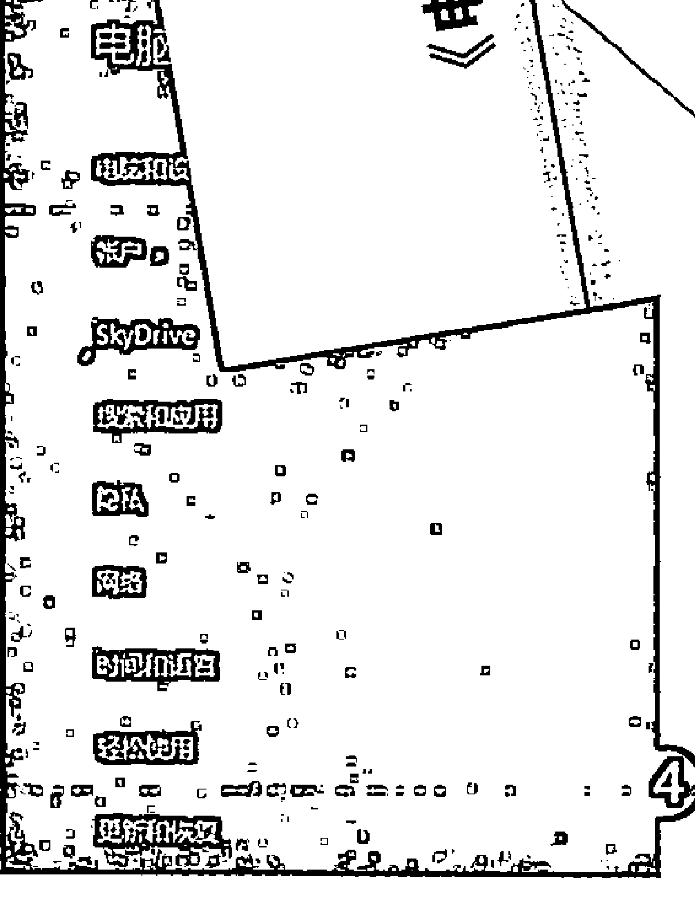


##### 用USB恢复驱动器恢复

刷新或重置电脑，还可以用USB恢复驱动器启动进入恢复环境。这就要求事先必须创建启动恢复驱动器。具体方法是在系统中搜索“恢复驱动器”，单击“创建一个恢复驱动器”，选择容量足够大的U盘创建。

### 用好任务栏的锁定功能

文 | Bobo

从Windows 7开始，任务栏功能有所增强。而我们印象最深的可能就是任务栏“锁定”程序图标的功能。其实，除了锁定程序图标外，任务栏锁定功能还有不少值得推介的用法。

##### 任务栏锁定的几个内在用途

除了程序安装后会自动锁定图标到任务栏，以及用户自行拖动程序到任务栏锁定外，任务栏锁定还有其他的用法。以下均以Windows 8.1为例说明。

大家知道，在系统附件中有几个常用的工具（如记事本、画图、计算器等），调用比较繁琐。通过系统搜索命令，找到要使用的程序（比如“画图”），单击鼠标右键，选择“固定到任务栏”按钮，这时画图程序就会被锁定到任务栏，以后使用时就不用麻烦地到系统深处去启动它了。

此外，当一个程序或文档正在运行时，可以在任务栏图标上用右键菜单将其锁定，这之后即便程序或文档退出，图标依然会留在任务栏以备今后使用。

任务栏的位置是可以调整的，我们可通过任务栏属性设置，将任务栏转移到屏幕的上方或左右两侧贴靠。调整位置前需要解除任务栏锁定才能完成移动，而调整结束后最好再锁好任务栏以防被轻易移位。此外，我们还可以将输入法指示器从任务栏上独立出来或锁定到任务栏上。锁定和解锁任务栏本身，可通过在任务栏空白处单击右键并选择锁定或解锁命令实现（图1）。

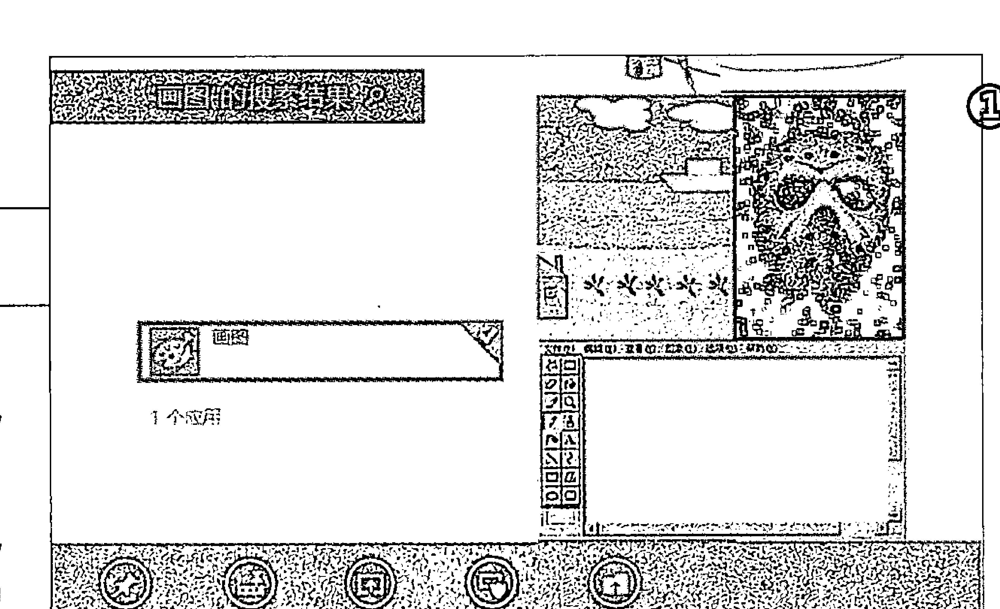

> 小技巧：如果屏幕尺寸比较小或桌面空间有限，还可以设置任务栏为自动隐藏，使用小任务栏图标以容纳更多内容、合并显示同类图标按钮等方法（图2）。

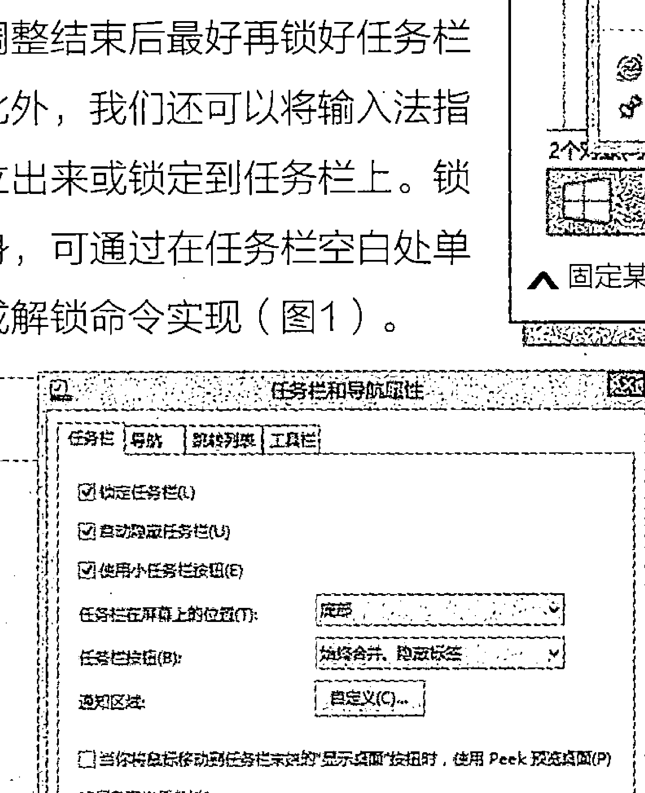

##### 锁定跳转列表的更多用法

除了在锁定的任务栏程序图标上，通过右键菜单跳转列表快速访问最近访问过的文档外，跳转列表还有更多用途（图3）。

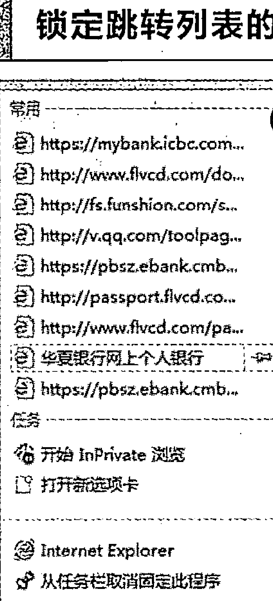

虽然可以从程序跳转列表快速打开最近使用过的文件，但是此列表会随着打开文件的频率进行变动，最终可能还会被自动逐出列表。我们可以将常用文档固定在跳转列表顶端以便于访问。将鼠标移动到列表文件上（注意不要单击），这时会看到一个图钉按钮，单击该按钮即可固定该文件到列表顶层。

> 小技巧：调整跳转列表的文件数量。锁定到任务栏上的程序跳转列表默认显示10个最近打开过的文件，如果觉得可回溯的文件数量太少，可以自行调整文件数量（图4）。

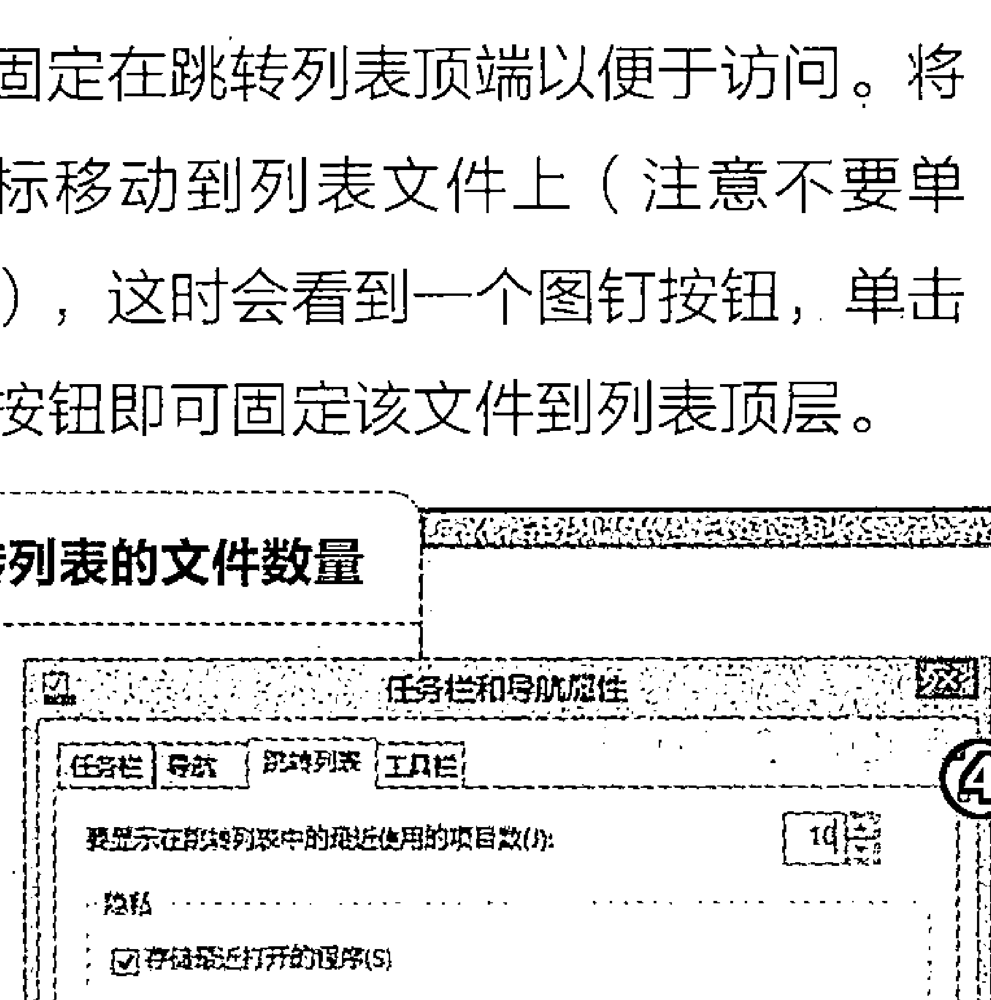

##### 文件夹锁定到任务栏别样用法

当文件夹被锁定到任务栏上之后，任务栏上就会出现一个菜单。利用这一特性，我们可以发挥想象，将桌面上的文件夹进行多级嵌套，从而可以创建出多级弹出式菜单。这样，文件夹中的项目就会变成一个菜单中的一条命令，用这种方式选择文件夹中的文件，要比逐级打开文件夹选择文件要方便多了。因此，这可以说是一种提高文件夹中文件访问效率的好方法。

具体方法是，在桌面上或资源管理器中建立文件夹，然后将文件夹拖动到任务栏上锁定。如果建立的文件夹是多级的，则弹出菜单也是多级菜单（图5）。

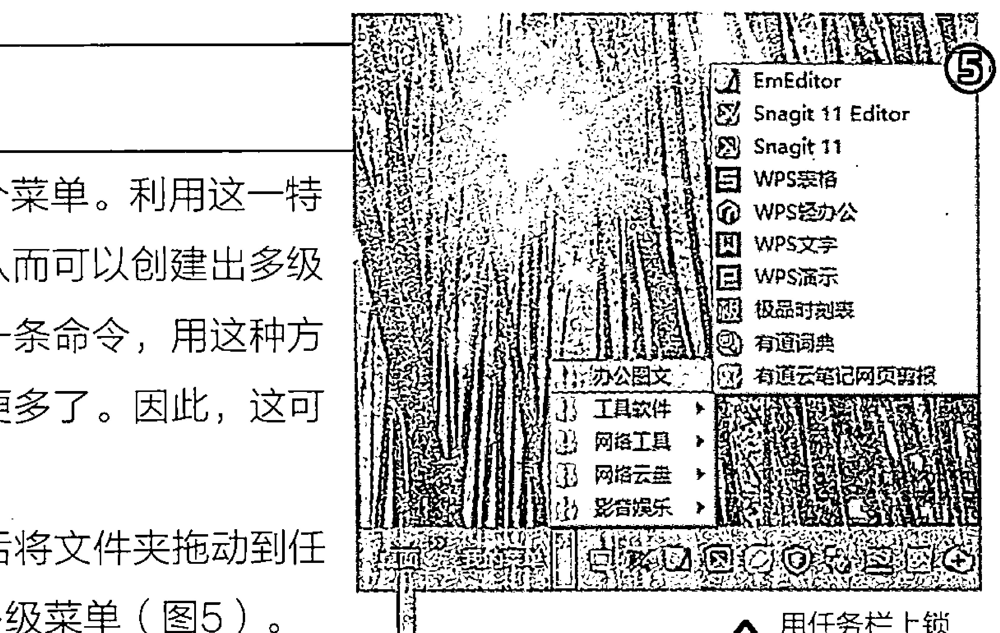

##### 常用网址也能锁到任务栏

在IE中打开一个网页，点击地址栏中前面的网址图标，拖动到任务栏上，这时该网址会自动锁定到任务栏，以后即可从任务栏图标直接访问该网页了（图6）。


小提示：命令中参数-s表示关机，-t表示指定时间，而后面的0是指指定的时间是0秒后关机，这个数值可以改变。提醒大家，关机图标虽然方便，但也是把“双刃剑”：如果你不小心点击了任务栏上的此图标，可能会立即关机。可见微软把关机图标藏在第二层可能也有一些道理的。

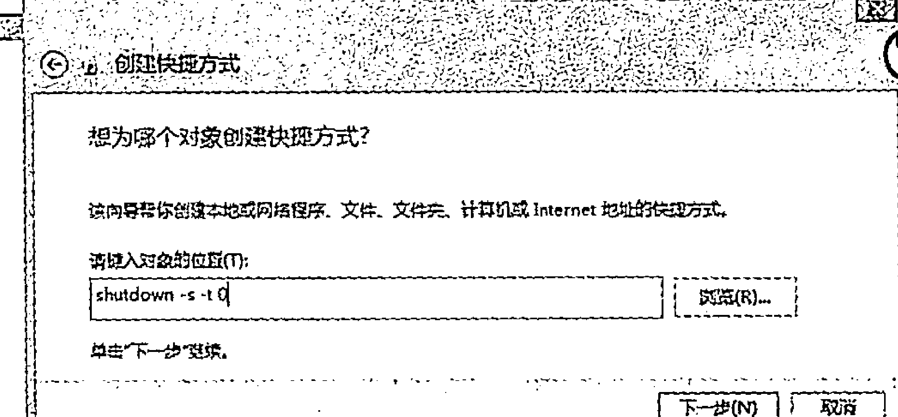

##### 将关机按钮锁定到任务栏

要关闭计算机，先要点击开始或设置按钮，再单击关机按钮，Windows才会执行关闭电脑的操作，这样稍显复杂。如果能把关机按钮锁定到任务栏上，需要关机时直接点击即可。但关机按钮不能像其他程序或文档一样能方便地在任务栏上落户，需要我们为其进行一番设置。

在桌面上右击鼠标，执行“添加→快捷方式”命令，打开创建快捷方式对话框后，输入“shutdown -s -t 0”，然后单击“下一步”按钮，为这个按钮创建一个名称“关机”，单击“完成”（图7）。

接下来我们给这个按钮加上一个更易识别的图标。在快捷方式上右击鼠标并选择“属性”，在打开的对话框中选择“快捷方式→更改图标”，这时会弹出信息提示该程序不含图标，确定之后在出现的系统默认图标选择窗口中选择方圆相套的红色关机图标（图8）。

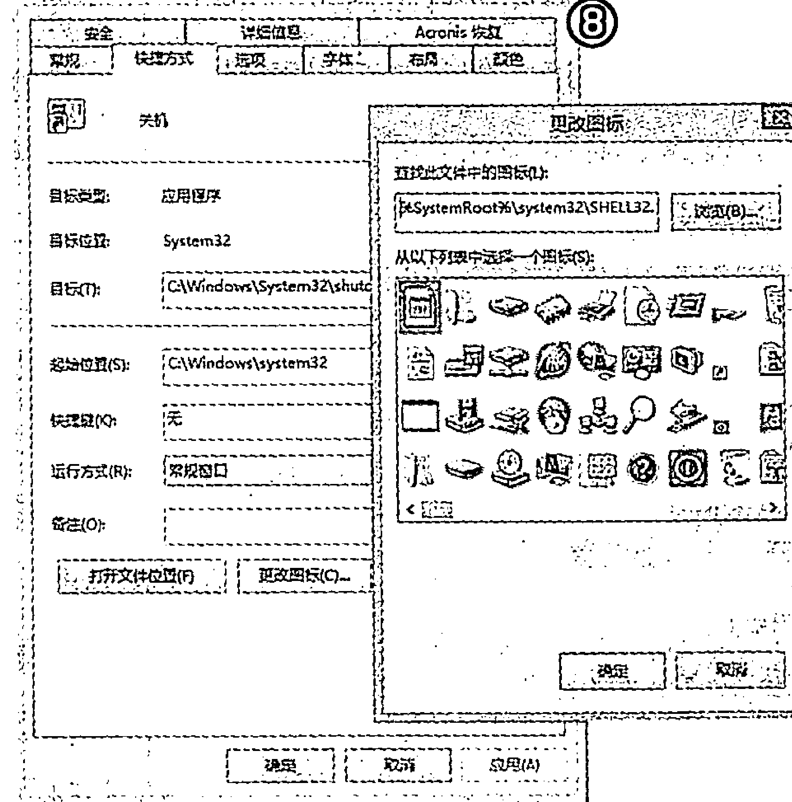

最后将桌面上建立的这个关机图标拖动锁定到任务栏上，删除桌面上的关机图标即可。

### Windows 8.1 更好的“开始”
文 | 万立夫

升级到Windows 8后一个最显著的特性，就是取消了传统的开始菜单，改为开始屏幕。从Windows 8.1开始，对开始屏幕又有了不少增强。今天，我们就来了解一些开始屏幕的技巧，让Windows 8.1用起来更舒服、更高效。

##### 开始屏幕壁纸也能换

有些人可能还不知道，Windows 8.1开始屏幕的背景也是可以换的，你不必每天都面对着千篇一律的蓝色。

首先进入Windows 8.1的传统桌面，在系统任务栏上右击，选择“属性”，在弹出的“任务栏和导航属性”窗口中选择“导航”标签，接下来将“在开始屏幕上显示我的桌面背景”项选中（图1）。这样开始屏幕就可以同步使用传统桌面的壁纸，当传统桌面的壁纸进行更换，开始屏幕的壁纸也会随之改变。

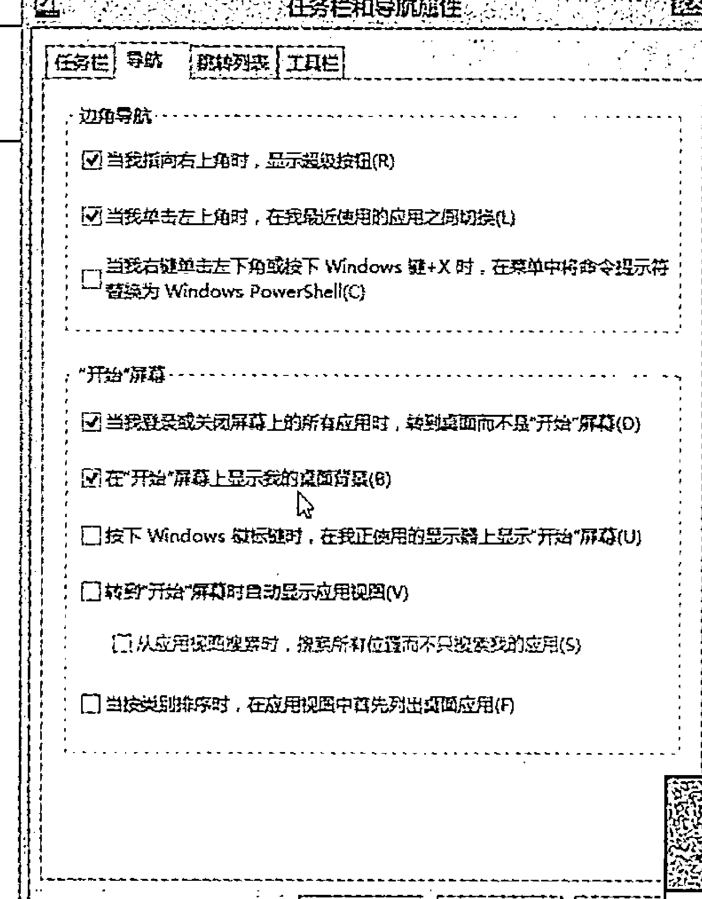

如果想让开始屏幕有不一样的壁纸，那么进入到Windows 8.1的开始屏幕中，将光标移到桌面右下角，在弹出的超级按钮中点击“设置”，再在弹出的设置对话框中点击“个性化设置”这项，然后就可以看到壁纸设置、背景颜色等多个选项，根据需要进行操作即可（图2）。


##### APP通知时间我来调

开始屏幕主要显示一些应用图标，这些图标大部分是动态的，会不定时向用户推送一些信息。为了避免被这些信息打扰，我们可以设定它显示的时间区间。

如上操作调出超级按钮，点击“设置”，在弹出的对话框中点击“更改电脑设置”。接下来选择左侧的“搜索和应用”，再选择左侧的“通知”，可以看到其中的“安静时段”项（图3）。首先打开“安静时段”开关，在“开始于”和“结束于”中，分别设置时间点即可。以后在这个时间段中，就可以避免被应用所打扰了。除此之外，在“安静时段”的下方，还可以根据需要开启和关闭某些应用的通知信息。

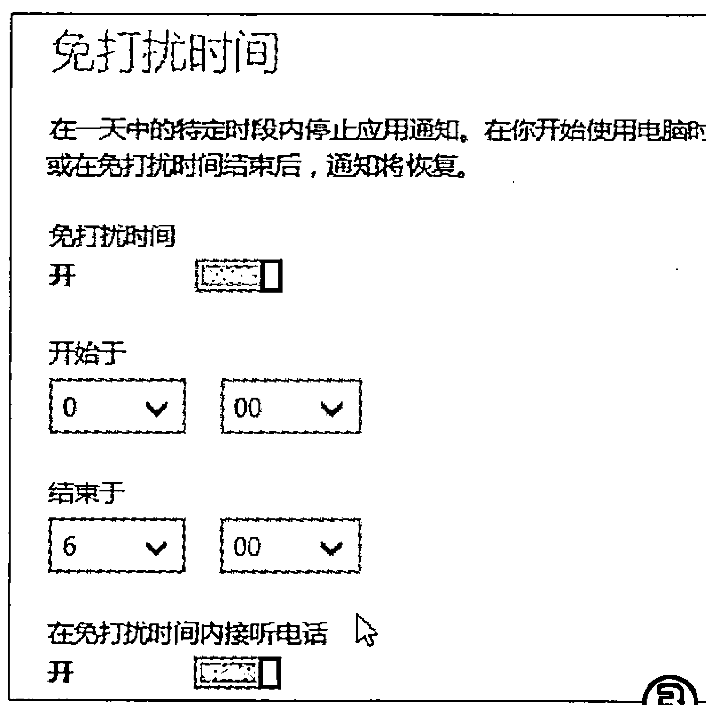

##### 调用第三方输入法

Windows 8.1开始屏幕一个很大的不便，是无法调用自己喜欢的第三方输入法，其实这也是可以改变的。

在控制面板中，点击“时钟、语言和区域”下的“更换输入法”命令，在弹出窗口的语言列表里面，可以看到“中文（中华人民共和国）”项，点击该项的“选项”按钮，在弹出的窗口中可以看到已经安装的输入法。比如我打算将百度设置为默认输入法，点击其名称右侧的“选项”（图4），在弹出的设置窗口中点击“设为默认输入法”按钮，再选择“锁定百度默认输入法”项，保存就可以了。

##### 曲线将文件固定到开始屏幕

传统的桌面中，我们可以放置最常用的文件，使用起来很方便，那么开始屏幕中是否也能放置常用文件？没问题的。

首先按Win+R键打开运行对话框，输入执行“shell:start menu”命令，在弹出的窗口中进入“程序”文件夹，并且在其中创建一个新的文件夹，将其重命名。比如我这里就命名为“常用文件”，然后将常用文件的快捷图标粘贴到这个文件夹中。接下来，进入开始屏幕中，在所有应用中找到“常用文件”的名称，右击，选择“固定到开始屏幕”就可以了，以后就可以在开始屏幕直接进行调用（图5）。

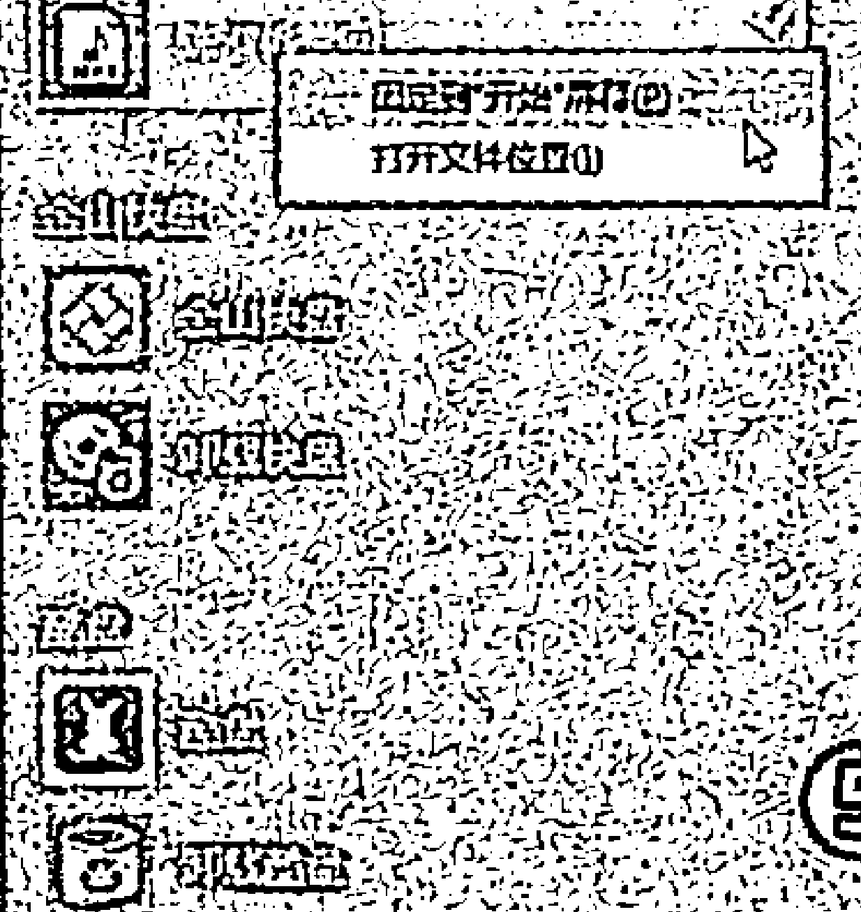

##### 常用命令定居开始屏幕

Windows 8.1的开始屏幕，将功能应用和开始菜单命令进行了分隔，所以使用开始菜单中的命令就还需要切换一次。其实我们有快捷的解决办法。

首先打开“任务栏和导航属性”窗口，将“导航”标签中的“转到开始屏幕时自动显示应用视图”选项选中。这样以后进入到开始屏幕，就会自动显示开始菜单所在的界面。

除此之外，我们还可以将开始菜单中常用的命令固定到开始屏幕中。找到常用菜单命令后，右击选择“固定到开始屏幕”即可。

##### 自动清除磁帖信息

Windows 8.1开始屏幕中的磁帖（即图标），会实时动态显示相关信息，比如电子邮件的内容简介以及最新的QQ消息等，这有时会暴露个人的隐私信息。我们可以选择在系统关机时，自动清除磁贴中的历史记录。

按Win+R键打开运行对话框，输入“gpedit.msc”调出组策略编辑器。展开“用户配置”中的“管理模板”，其中有一项“‘开始’菜单和任务栏”，其右侧可以看到一个名为“退出系统时清除瓦片通知和历史记录”的选项。双击该选项打开配置窗口，在弹出的窗口属性里面选择“已启用”，设置完毕点击“确定”退出即可（图6）。

这样我们在注销或重启时，将会清除磁帖中的所有缓存信息，重新登录后磁帖上将显示其默认内容。

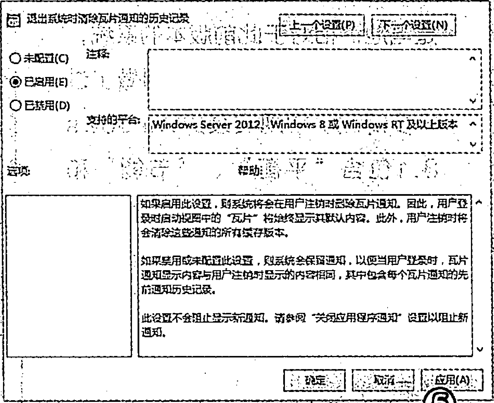

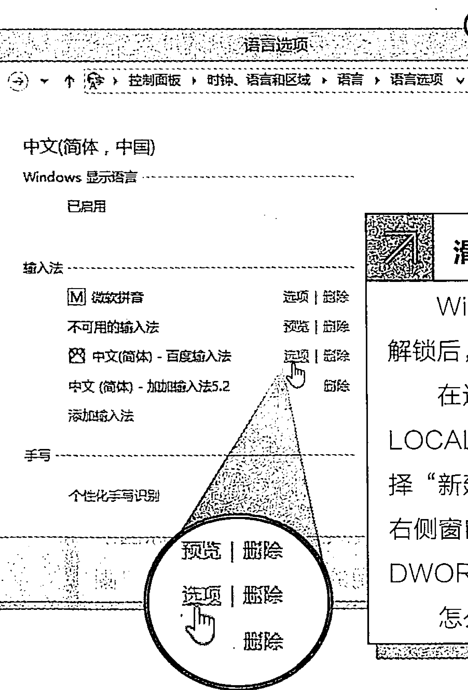

##### 滑动锁屏如何关闭

Windows 8.1系统在登录或者解除休眠时，有一个滑动锁屏的功能，只有进行滑动解锁后，才可以进入到开始屏幕。为了省去滑动锁屏的繁琐，可以将此功能关闭。

在运行对话框中输入执行“regedit”命令打开注册表编辑器，依次展开[HKEY_LOCAL_MACHINE\SOFTWARE\Policies\Microsoft\Windows]，在该项上右击，选择“新建→项”命令，将新建项目重命名为“Personalization”。接下来在这个项目的右侧窗口空白处右击，在弹出的“新建”菜单中选择“DWORD（32位）”，将新建的DWORD参数命名为“NoLockScreen”，并将其数值设置为1就可以了。

怎么样，经过上述一番调理，Windows 8.1的开始屏幕是不是更好用了？

### # 解惑三类电源选项方案

文 | 黄海峰

从Windows 7开始，系统里便设定了“平衡”、“节能”、“高性能”三个档次的电源计划选项。但是，人们似乎不大关心这些选项，一般只是用系统默认的一个“平衡”设置了事。那么，在这三个选项之间到底该如何选择？有必要去设置“节能”和“高性能”两个选项吗？

> > 小提示
> 在使用了Windows 8.1之后，你会发现笔记本的屏幕很快会变暗，尤其是当使用电池时。由此可见Windows 8.1更加注重节能。

电源计划用来管理个人电脑对电源资源的使用，无论是用插座还是电池。相对于此前版本的系统，Windows 8.1对电源计划做了进一步简化。常规安装的Windows 8.1包含“平衡”、“节能”和“高性能”三种预先配置的电源计划，但通过托盘的电源图标或控制面板电源选项，只能直接访问其中的“平衡”和“节能”两种方案（图1）。

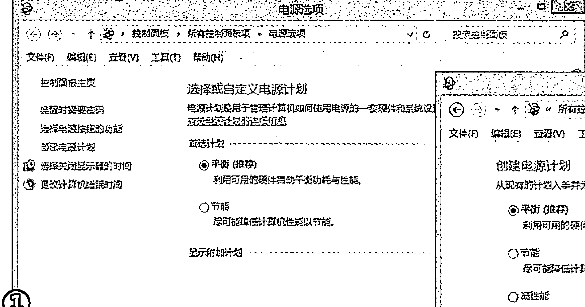

所有常规安装的Windows 8.1系统都采用默认的“平衡”设置。但是，电脑制造商也可以为电脑定制电源计划。如果你购买一台预装有Windows 8.1的笔记本电脑，你可能会看到附加的电源计划。因为微软允许用户进行修改、创建和删除电源计划，甚至删除由电脑制造商添加的计划（图2）。

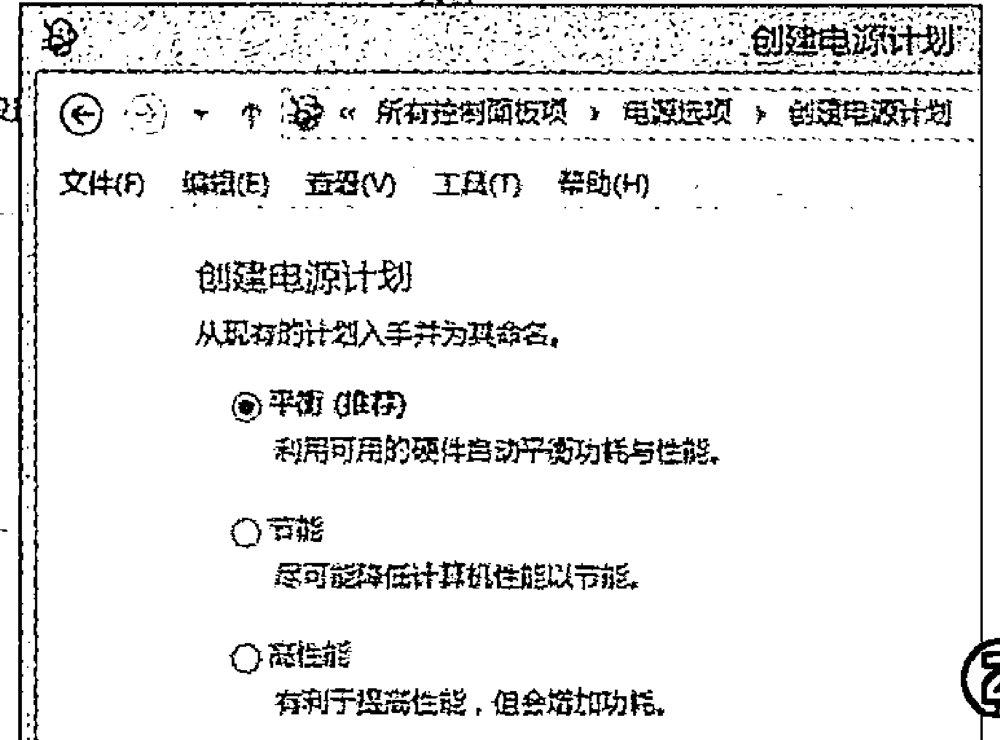

因为电脑制造商比用户更了解硬件的电源管理特性，因此，他们定制的电源计划一般是有道理且对本电脑比较适合的。

##### “平衡”万能论是否有道理

既然系统默认使用“平衡”计划，那么你一定会问，该计划是万能的吗？一般情况下我们用这个选项够用吗？

平衡计划是一项自动节能计划。当你开始玩游戏或运行高清多媒体程序的时候，系统会自动提升处理器速度和其他硬件性能以保证用户不会感觉到运行速度缓慢。而当你浏览网页或阅读文本的时候，系统又会减慢处理器速度以节省电池电量。

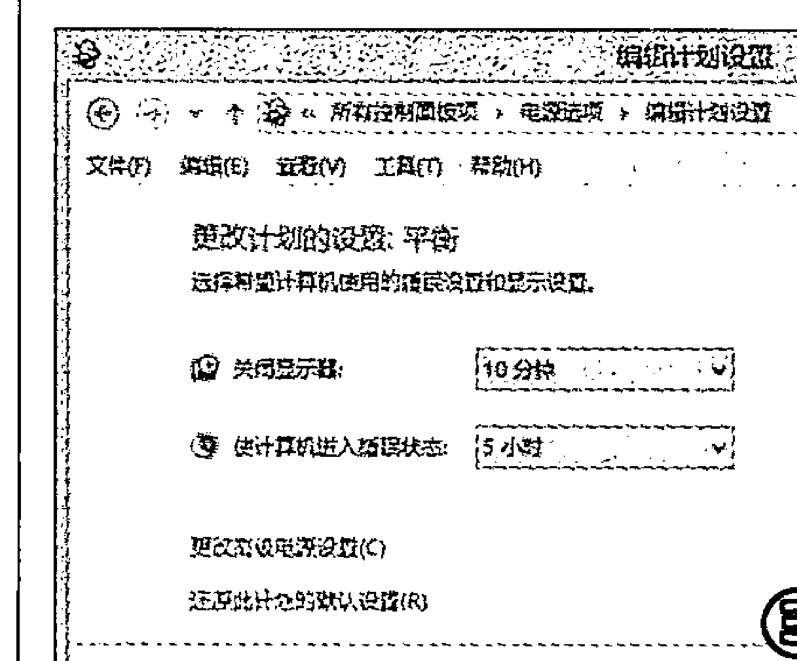

“平衡”设置让连接电源的电脑屏幕5分钟后变暗，10分钟后关闭（图3），但不会进入睡眠状态。而当使用电池供电时，该计划在无操作后2分钟会使屏幕变暗，5分钟后关闭屏幕，15分钟后进入睡眠状态。

默认的“平衡”设置，系统处理器的运行性能约为最高性能的65%，根据应用的需求不同，系统会将其性能调整到最低5%、最高100%。无论是使用电源还是使用电池，都会这样。所以，不用认为使用“平衡”方案就会阻止电脑发挥最大潜能。如果在程序运行中需要提高处理能力，系统会自动提高，绝不会怠慢。

因此，我们说在一般情况下，“平衡”计划选项就够用了。大多数人都没有必要考虑去改变“平衡”计划。这也是许多人不关心电源选项设置的原因所在。但是，这并不表示微软设置其余两个选项是无用的。如果它是一个“阑尾”，那么可能早就被微软自己割除了。

那么，我们是否需要修改自己的电脑计划？仅用系统默认的“平衡”选项是否够用？“节能”选项和“高性能”选项在什么时候才能用到？

##### “节能”计划有利也有弊

那么，“节能”计划又在什么情况下使用？节能计划顾名思义，其优势就是节能，但是否有什么弊端？

节能计划是一种以牺牲性能来换取更长使用时间的计划。一般用于外出不能以电源供电的场合，比如在坐飞机时需要长时间写作或看大片的场合（图4）。在电力能够保证完成任务的前提下，开启这种电源计划是没有必要的。

节能计划默认开启的处理器性能约为最高性能的40%。虽然节能计划中也能以最低5%、最高100%的性能来运行，但它与“平衡”计划不同，它会强迫处理器以完成工作所必需的最低性能来运行程序。所以，使用过程中，你可能会有速度不如意的感觉。

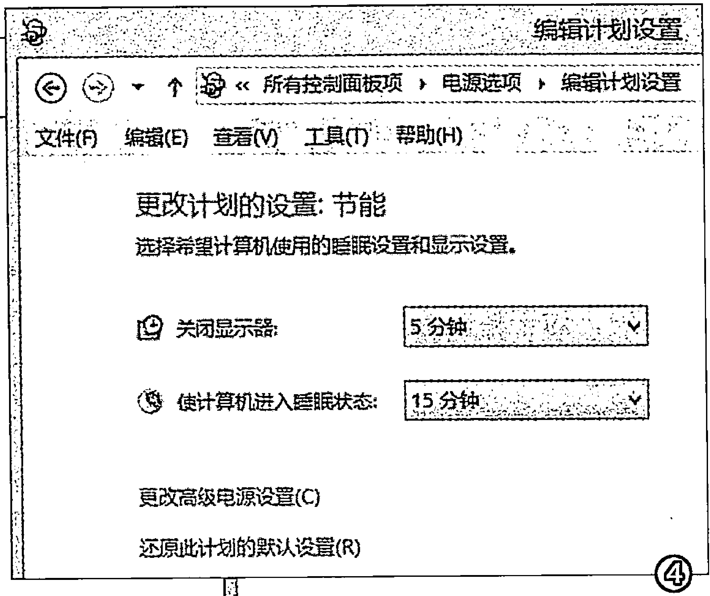

> > **小提示**
>
> 由于Windows 7中的Aero效果会严重耗费系统资源。因此，如果将电脑计划调整为“节能”模式，Windows会自动将显示器切换为Windows标准模式，删除了透明和其他Aero效果，当系统再次连接到电源上时，它会自动返回到Aero效果。Windows 8.1中因为取消了这种特效显示，因而不存在这个问题。

##### “高性能”的适用条件与弊端

Windows 8.1的默认设置界面中没有直接给出“高性能”选项，但并不表示取消了这个选项。那么什么时候才能用到这个选项？如何找回“高性能”设置？相对于“平衡”计划，“高性能”计划的优势和弊端分别是什么？

“高性能”选项是一种以牺牲电池寿命为代价，通过最大限度地提高处理器速度来获取最高性能的一种电源计划方案。

如果你的大部分时间是花在玩高级视频游戏或进行复杂的图形编辑操作，那么使用“高性能”方案无疑会获得最佳的使用体验。但是，相对于“平衡”方案来说，“高性能”方案的一个最大不足之处是，无法积极地让系统进入睡眠状态。这样，当你离开电脑暂时不工作的时候，电脑永远在那里以最大性能消耗电力。

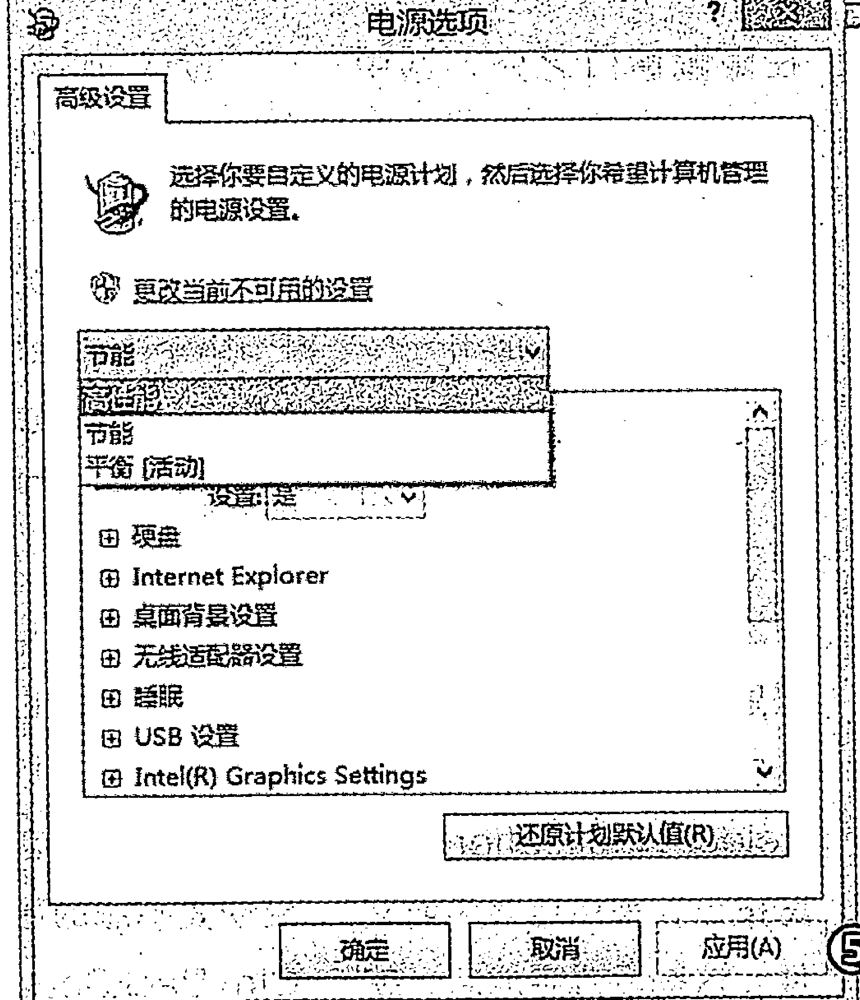

> > **小提示 如何调用“高性能”方案**
>
> 无论是“平衡”方案，还是“节能”方案，其项目的右侧都有一个“更改计划设置”文字链接可选，点击之后，在“编辑计划设置”窗口中，会看到一个“更改高级电源设置”文字链接，点击这个链接，即可出现电源“高级设置”窗口，在下拉列表中，会出现除“节能”和“平衡”之外的第三个选项“高性能”（图5）。选择该项后，窗口下面的各个项目均会自动设置为高性能的项目。还有一种不引人注目但更方便的显示“高性能”选项的方法，就是在电源选项窗口中点击“显示附加计划”后的小三角。