# 电脑爱好者2014合订本（上）第二部分

# 桌面有机关 隐形命令无处不在

文|曹春华

早期的Windows运行程序，通常都要从“开始”菜单或桌面快捷菜单中去查找执行。使用过Windows 8的用户，对于将鼠标移至桌面的右上角或右下角呼出Charm栏，然后执行相应的命令一定印象深刻。能不能遵循这种思路，在屏幕上的其他位置，也放置特定的“隐形”按钮呢？通过以下几个途径，一定会让我们的电脑操作更快捷，而且不知情的用户会感到非常神秘！

## 桌面边框有“开关”

上班期间，在电脑上做一些与工作无关的事件，遇见特殊情况不必惊慌，只要将鼠标滑向屏幕边缘，不但可以让指定窗口全部隐藏，而且可以让操作电脑的痕迹瞬间灰飞烟灭。软件Don't Panic!（下载地址：http://t.cn/8sWU6nL）就具有这样神奇的功能。

软件运行后，首先要做一番设置，右击托盘中的软件图标，打开右键菜单中的Preferences选项，单击Options标签（图1），在Basic Options中，有三个项目可以勾选，分别表示立即静音、隐藏Don't Panic!图标、关闭Don't Panic!程序；在“Windows History”中，则可以通过勾选相应的项目，达到删除最近打开的文档、Internet临时文件、Cookie、清空回收站、清空剪切板等目的，我们可以根据需要来进行勾选。

瞬间隐藏窗口是该软件的一大特色，默认情况下，会隐藏所有桌面窗口，也可以让指定的窗口排除在隐藏窗口之外，选中Panic Mode标签，在选中Hide all windows的前提下，单击Custom Panic Configuration，然后通过ADD按钮加入不需隐藏的程序即可。如果想在隐藏窗口、清除痕迹的同时，打开另外的程序以障人耳目，可以再选中Launch标签，单击Select Application或浏览按钮，来指定程序或文件。这些设置完成后，就可以来体验它的神奇之处了。将鼠标移向屏幕右侧边缘单击，就可执行隐藏窗口、运行程序、清理痕迹的一系列动作。

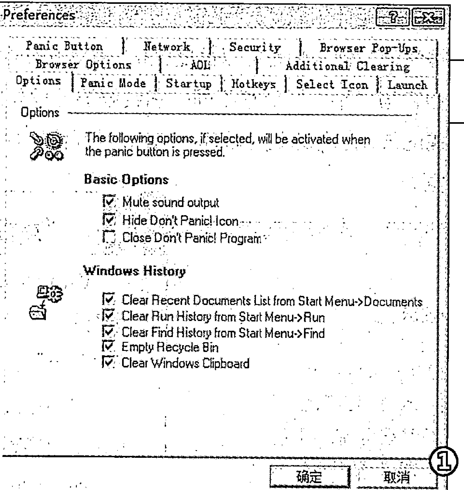

默认的隐藏按钮在屏幕的右侧，可以根据自己的习惯进行修改。同样在Preferences设置项中，单击Panic button标签，在Panic Button Location中（图2），选择隐形命令按钮的位置，屏幕上的左、右、上、下可以任选其一。在Panic Button Options中，用于选择操作隐形命令的方法，可以是鼠标左键单击，也可以是鼠标右键单击，或者是鼠标移动到隐形按钮区域自动执行，这样更具隐蔽性。需要恢复隐藏的窗口时，通过快捷键Ctrl+BackSpace来实现。

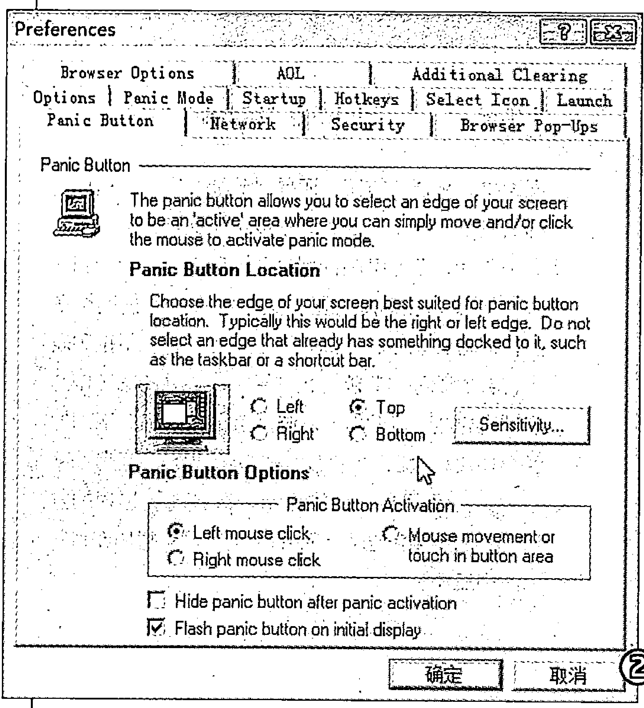

## 寸土寸金 边角有玄机

Windows 7或Windows XP屏幕的四个顶角，鼠标很少有机会去触及到，软件Magic Screensaver（下载：http://t.cn/8sWUKse）能利用屏幕的四个边角，执行诸如关闭显示器、关机、注销、重启等动作。
右击托盘中软件图标，打开Settings菜单（图3），单击upper left corner下方的倒三角按钮，可以选择执行命令，这些命令包括关闭显示器、开启屏保、关机、重启等，点OK后生效，此项设置表示将鼠标指针指向屏幕左上角时，将自动执行选中的命令。同样的方法，可以在其他的三个边角分别设置不同的动作命令。

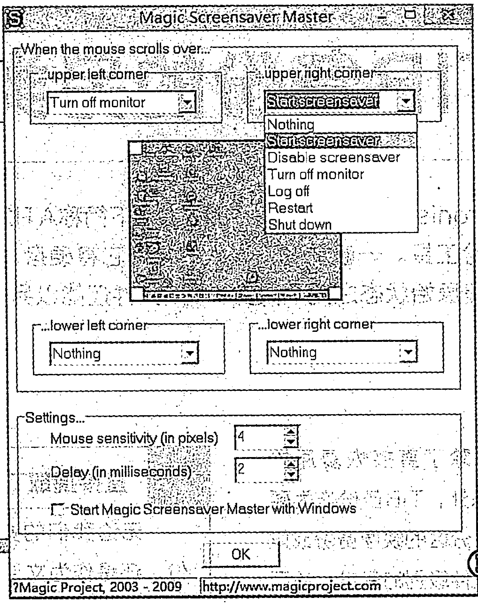

## 无处不在的隐形按钮

在桌面上放置隐形按钮，运行的确方便了，但还不够快捷，你得让鼠标移动到指定的区域，而且能够执行的命令也有限，如果上述两种方法还不能满足你的要求，那么用软件SyMenu（下载地址：http://t.cn/8sWUCI3）就会潇洒自如多了，它能让命令按钮无处不在，随呼随来。
首先要配置常用功能，这些功能包括打开常见的程序、网址、文件或文件夹等。右击托盘中软件图标，或者按住鼠标右键在桌面上向下滑动，依次单击弹出菜单中的“工具→设置”（图4），然后单击“项目管理器”，弹出下拉菜单，从这些下拉菜单中，可以选择添加程序链接、文件链接、文件夹链接、网页链接等，将常用的程序、文件、文件夹、网页地址加入到快捷列表中。如果添加的是程序或文件，还可以为它们设置一个手势，最后单击“保存并退出”。
以后要打开程序、网页或文件（夹），可以在桌面任意位置通过设定的右键手势来完成，也可以在桌面上向下滑动鼠标右键，先呼出手势菜单（图5），然后从菜单中选择打开程序、文件等，非常方便。

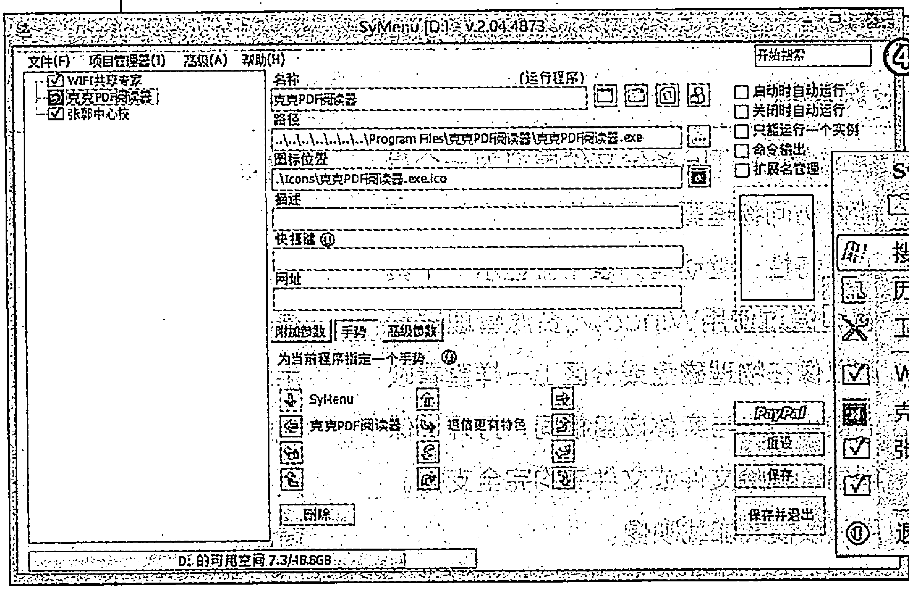

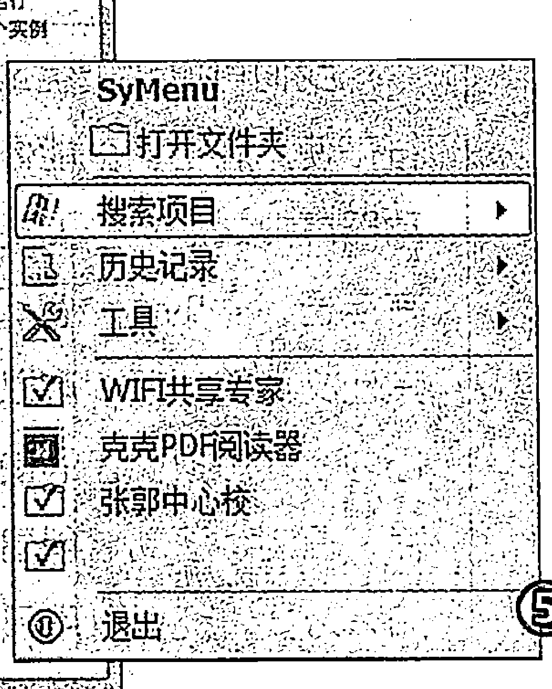

小提示
我们甚至可以不需要任何工具，通过操作系统本身的功能，将自己的快捷方式放到分类文件夹中，然后做成一个浮动面板，贴靠在屏幕的任何一边，需要时移动鼠标到边框即可浮出面板，就像QQ面板一样。具体实现方法可在本刊第6期《自建优于开始菜单的多级菜单》一文的基础上发挥实现。

# TIB备份的另类用法

文 | 林浩森

Acronis True Image 2013 (以下简称ATI2013) 是一款专业级的磁盘、分区或文件备份工具。一般情况下，人们常用它将硬盘、分区或用户文件备份为TIB文件，供应急恢复原始状态之用。其实，TIB文件还能以另两种方式来使用，而且使用效率更高。

除了直接恢复原始状态外，TIB备份作为硬盘、分区的映像备份或作为文件级别的备份，还可以随时以“浏览”的方式或“虚拟化”的方式来使用。我们可以直接浏览映像和文件级备份，任意获取其中的有用内容。此外还可以将其虚拟成一个盘符，就像使用一张光盘一样，然后从中提取有用的资料使用。这样，就不必像传统方法那样，每次都要恢复整个分区或磁盘数据，才能从中挑选数据使用。

## 直接提取TIB内容

无论我们的资料是作为硬盘或磁盘分区而形成的TIB备份，还是作为文件夹而形成的TIB备份，都可以用直接打开提取的方式查看它们的内容并将所选文件复制到硬盘上使用。在Windows资源管理器中，只需双击对应的TIB备份文件，即可对其中的内容进行预览和操作（图1）。

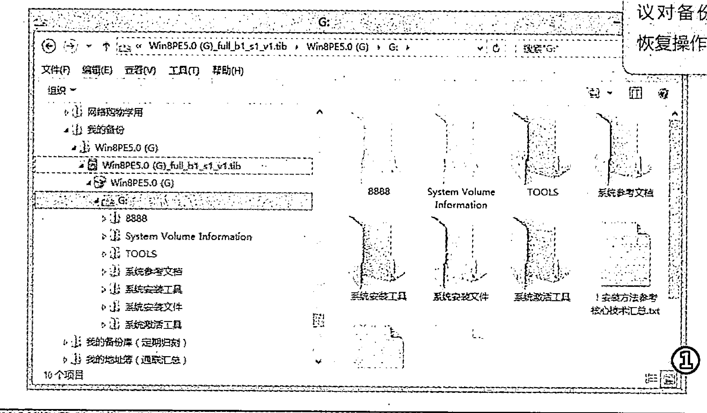

> 小提示
从正在浏览的备份中复制文件时，复制的文件将丢失“已压缩”和“已加密”属性。如需保留这些属性，建议对备份进行恢复操作。

> 小提示
ATI2013兼容Windows 8.1最新系统，并且仍然可以在XP及其之后所有版本的Windows操作系统上完美工作。但需要注意，如果使用的是Windows 8以上的版本，请不要使用低于2013的ATI版本。

## 虚拟磁盘分区映像

我们可以将硬盘或分区的TIB备份文件虚拟为一个盘符来使用，这样就能像访问物理驱动器那样访问它们。驱动器虚拟之后具备如下特性：驱动器列表中会显示一个具有自己代号的新磁盘；通过使用Windows资源管理器和其他文件管理器，可以像在物理磁盘或分区上一样查看映像内容；虚拟磁盘的使用方法与实体磁盘相同，打开、保存、复制、移动、创建、删除文件或文件夹均完全支持。如有必要，还可以用只读模式加载映像。

- Step 1. 在ATI2013选择“工具与实用工具”选项卡，点击右下角的“加载映像”按钮进入TIB文件加载窗口。

- Step 2.
通过列表（软件自己记忆的TIB位置）或“浏览”按钮（寻找用户自定义其他位置的TIB文件），选择要加载的TIB备份文件（图2）。如果所选TIB文件为含有增量的映像备份，可按创建时间选择其中任一时间点的增量备份，即可浏览某一时刻的数据状态。但如果要加载增量映像，必须拥有先前所有的备份版本和初始完整备份。如果这些备份系列文件中少了一个文件，也无法实现加载。如果加载的映像为差异映像，同样必须要有初始完整映像为基础。

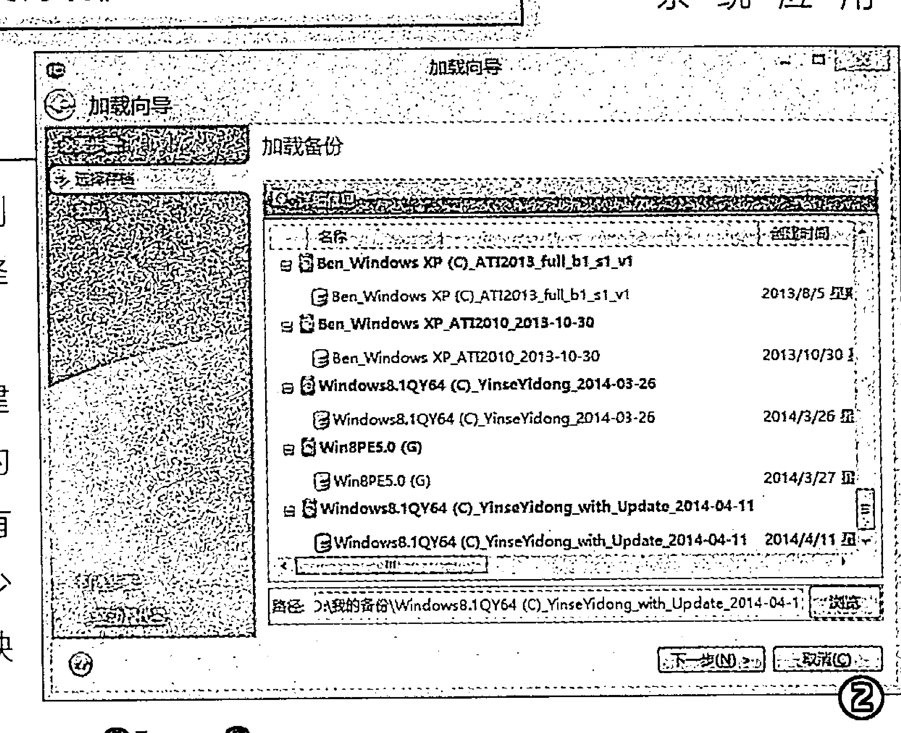

- Step 3.
这时系统会显示要加载的分区映像摘要，包括驱动器代号、文件系统类型、分区大小等信息。加载映像只能以分区为单位进行，无法加载整个磁盘，除非只有一个分区。若映像含有多个分区，默认所有分区都将被选中并加载，且自动指定驱动器代号。如果要为某个分区指定驱动器代号，单击“选项”（图3）。从“加载代号”下拉列表中选择要指定的虚拟磁盘代号。如果不希望加载分区，从列表中选择“不要加载”或“清除该分区”即可（图4）。

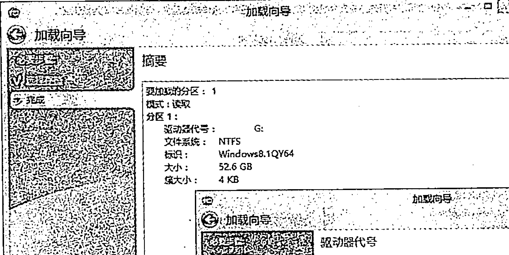

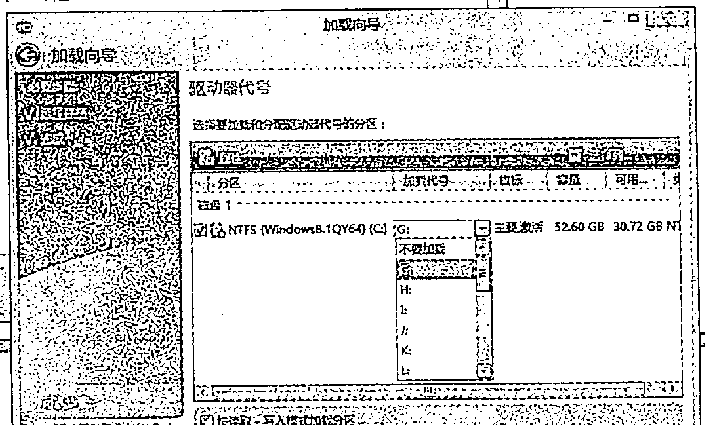

### 小技巧

如果需要对加载的映像分区中的文件进行修改操作，需要选中“按读取—写入模式加载分区”复选框。这之后，系统将创建一个增量备份文件以保存所作更改。这种情况下，建议在此文件的注释部分标记所作更改。向导程序会显示可选的注释步骤，以便进行注释。

以上设置完成后进入下一步，系统会提示“指定磁盘驱动器代号成功完成”。完成上述操作后，就可以像在实体磁盘上操作一样，对虚拟磁盘的文件或文件夹进行相关操作了。

TIB虚拟磁盘驱动器的卸载与我们日常卸载ISO虚拟映像有点类似。卸载虚拟磁盘驱动器可在Windows资源管理器内进行，方法是右击磁盘图标，然后选择“True Image→卸载”（图5）。也可以在ATI2013软件界面内通过选择命令进行，单击“工具与实用工具”选项卡上的“卸载映像”，然后选择要卸载的磁盘，单击“确定”。注意，如果同时加载了多个映像分区，用ATI2013界面卸载，在默认设置下，所有分区都将被选中进行卸载。这时可选择要卸载的分区，保留希望继续使用的分区。

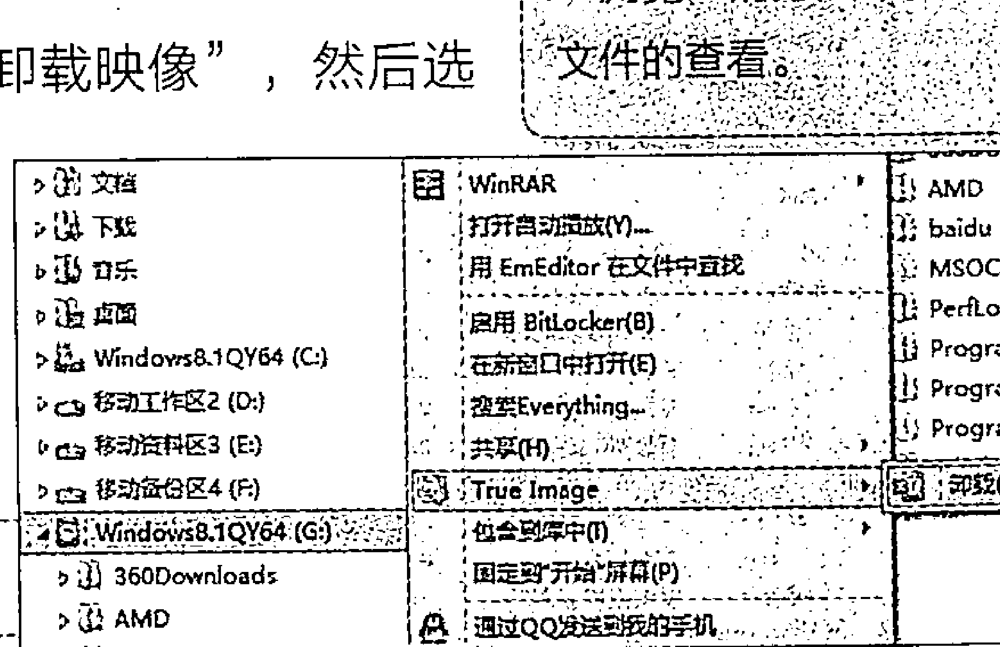

> 小提示
以上所述仅支持FAT和NTFS文件系统。还要注意，虽然文件备份和磁盘/分区映像具有同一默认扩展名“.TIB”，但只有映像可加载。如果是作为文件的TIB备份，要查看文件备份内容，只能通过上述“浏览”的方法来完成TIB文件的查看。

> 小提示
由于虚拟磁盘生效期间，虚拟文件会侵占大量的系统资源，会给用户操作带来不爽的感觉。因此，在虚拟磁盘使用完毕之后，要及时卸载掉。当然，若系统配置高，感觉影响不大，不去理会也无妨，因为虚拟磁盘将在关闭电脑后下次重启即会消失。

# 轻轻松松管“默认”

文 | 墨染

现今软件功能越来越庞杂，难免会出现某播抢某下载饭碗的问题，这就涉及到了Windows中最有意思的地方——程序关联。软件默认能打开什么文件？默认文件用什么软件打开？要更改默认使用的软件或文件的默认关联，需要到相应的软件中重新设置。但若遇到不负责任的软件，不提供设置功能，该如何解决呢？

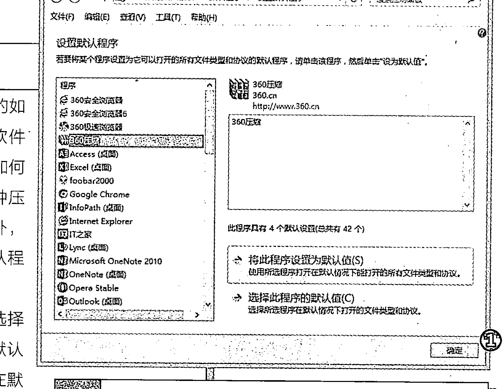

## 变更软件支持的格式种类

大家知道，电脑中压缩文件的种类很多，常见的如RAR、ZIP等格式。如果电脑中安装了多个压缩软件（Windows 7之后系统本身也提供解压缩功能），如何才能确定让特定压缩软件（如360压缩）来管理某种压缩格式？除了在具体压缩软件中设置默认格式关联外，可以在系统“默认程序”设置窗口中选择“设置默认程序”一项来设置。

从“控制面板”的“设置默认程序”窗口左栏选择程序为“360压缩”，然后选择“将此程序设置为默认值”，这样设置之后，就可以用360压缩软件打开在默认情况下它能打开的所有文件类型和协议了（图1）。

> 小提示：
在Windows 8.1中，所有与默认设置有关的项目都被汇集到控制面板的“默认程序”项下。通过“控制面板→所有控制面板项→默认程序”即可进入相关设置窗口。

如果点击“选择此程序的默认值”一项，那么会弹出更详细的文件扩展名选项，从这里可以选择360压缩软件可以接管打开的压缩文件类型。从图中我们可以看出，某些文件类型此前是由其他压缩软件（如好压）来管理的，选择之后就会改变这种文件的默认关联（图2）。

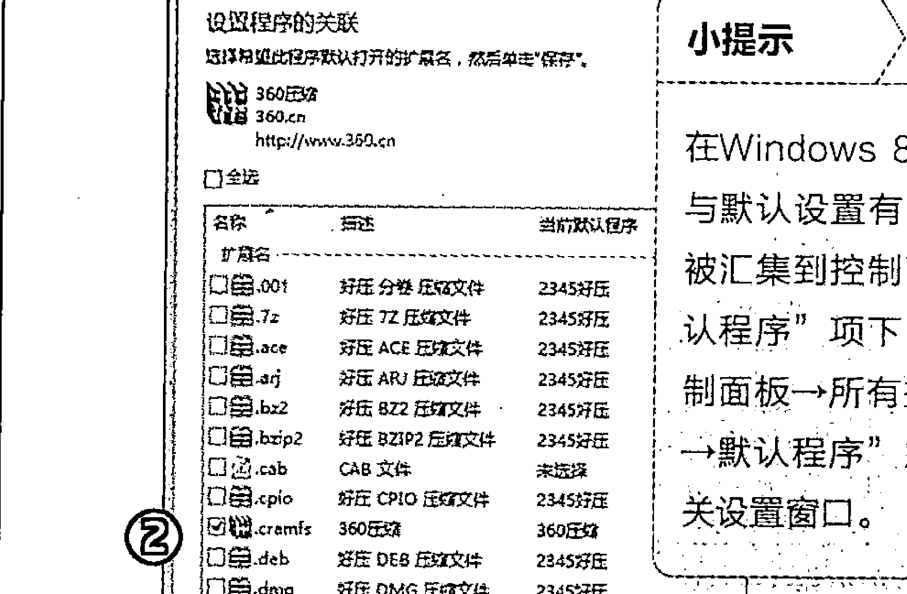

## 自动播放自定义

Windows 8.1对外置移动介质有着很好的支持，包括移动硬盘、各类照相机存储器、传统的CD和DVD、新式的蓝光光盘等。当这些介质插入到电脑后，是否需要自动播放其中的多媒体内容（包括图片、视频、音乐、混合内容等）？用什么程序默认打开这些内容？同样也可以通过系统的“默认程序”设置窗口，选择“更改自动播放设置”来进行详尽的设置（图3）。

> 小技巧：
在对每一种移动介质的自动播放处理中，按需灵活选择自动播放的软件，可以选择直接打开文件夹、将设备中的文件传送到云端，或选择不执行任何操作或由用户来决定。灵活设定移动介质默认动作，对打造不同用途的移动存储提供了人性化的选择服务。

在设置窗口，不但可以对整体播放属性进行更改，选择所有媒体启用或关闭自动播放功能，还可以具体设置每一种移动设备是否进行自动播放，其中的每种类型多媒体文件如何默认播放，用什么程序打开。

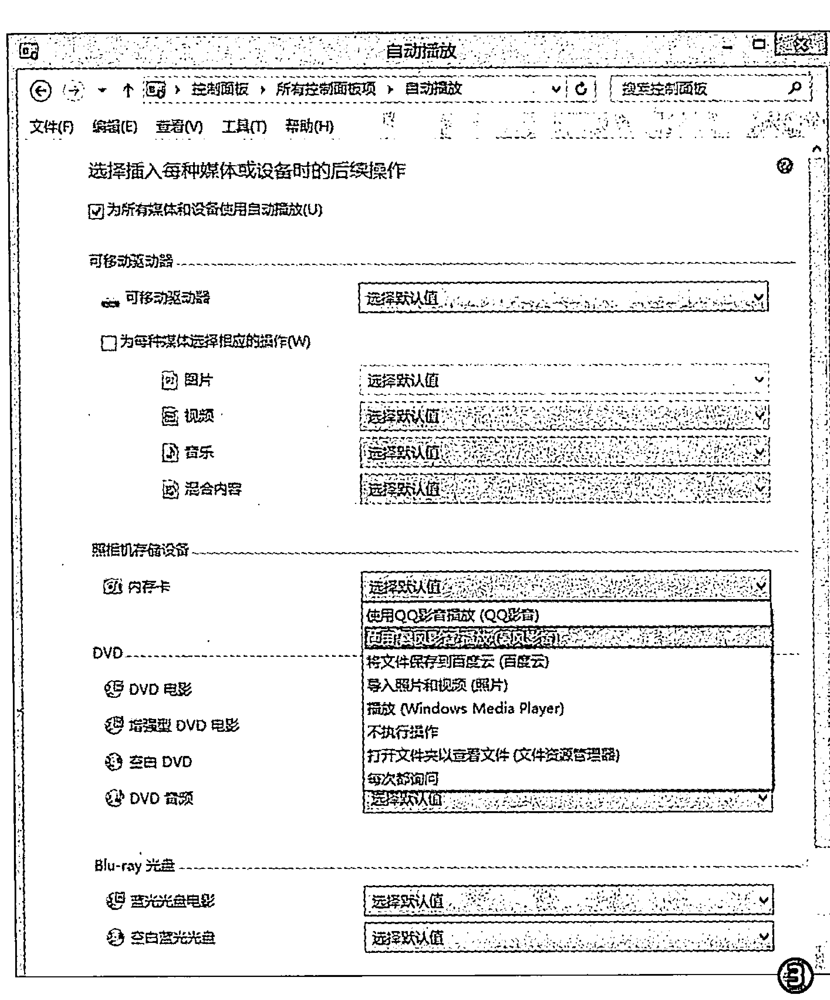

## 启动特定扩展名 你来选

我们常见到.torrent的扩展名，它是较为常见的BT种子文件。能够使用它的下载软件很多，如迅雷、网际快车等。但现在有些网盘和视频播放器也支持此类扩展名，这就需要我们改变这类文件的关联程序。

要改变这种关联，可在系统的“默认程序”设置窗口中选择“将文件类型或协议与程序关联”一项，选择要设置的文件类型，然后点击“更改程序”按钮（图4），在弹出的程序列表中，选择要关联此类型文件的程序，以此来作为之后默认打开该类文件的程序。

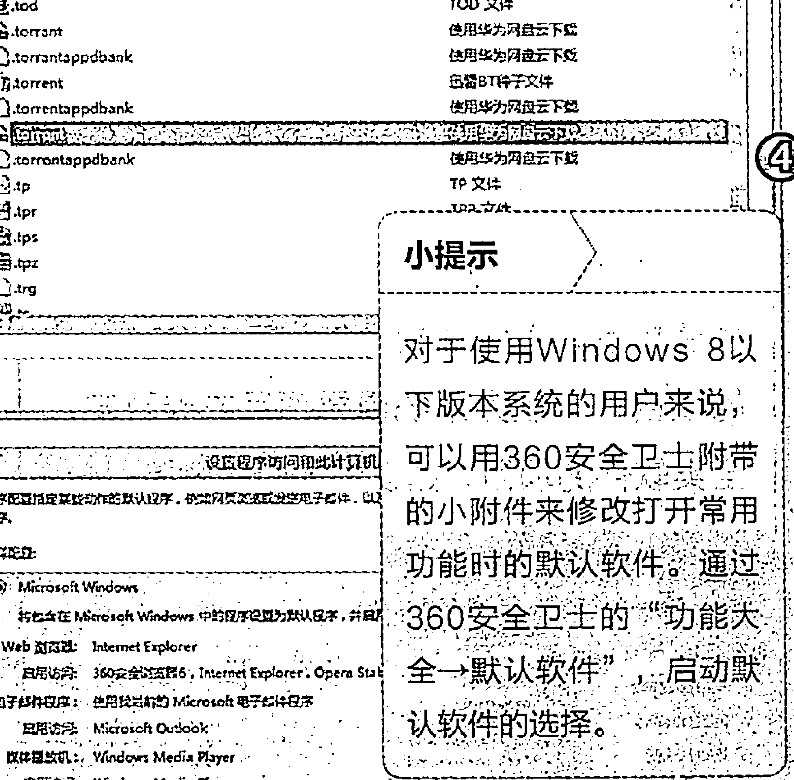

小提示 对于使用Windows 8以下版本系统的用户来说，可以用360安全卫士附带的小工具来修改打开常用功能时的默认软件。通过360安全卫士的“功能大全→默认软件”，启动默认软件的选择。

## 分类更人性的“默认”

在Windows系统中，已经集成了默认的Web浏览器、电子邮件处理程序、媒体播放机、即时消息处理程序等。但许多人都不习惯于使用微软的这些工具，因而自行安装第三方的处理程序。

Windows 8.1对默认程序的设置提供了非常人性化的选择。它按照“Microsoft Windows”、“非Microsoft”和“自定义”三种类型来分列选择项目。在“默认程序”设置窗口中选择“设置程序访问和计算机的默认值”，我们可以看到这些项目。其中的“Microsoft Windows”一组下，列出了系统默认提供的程序名称，与此同时还在下面列出了“启用访问”这些功能的第三方程序名称（图5）。

在“非Microsoft”一组下，列出第三方程序，同时以下拉列表的方式提供改变该项功能关联的选择。只需选择其中的一个程序，便可将其作为默认关联程序（例如：将360安全浏览器6设置为默认的上网程序）（图6）。

而在“自定义”一项中，则可以一览无余地选择使用系统默认的程序还是某个第三方程序来接管常用功能的管理。显然，如果要对各种常用功能的默认程序分别进行设置，用自定义窗口来选择最为方便。

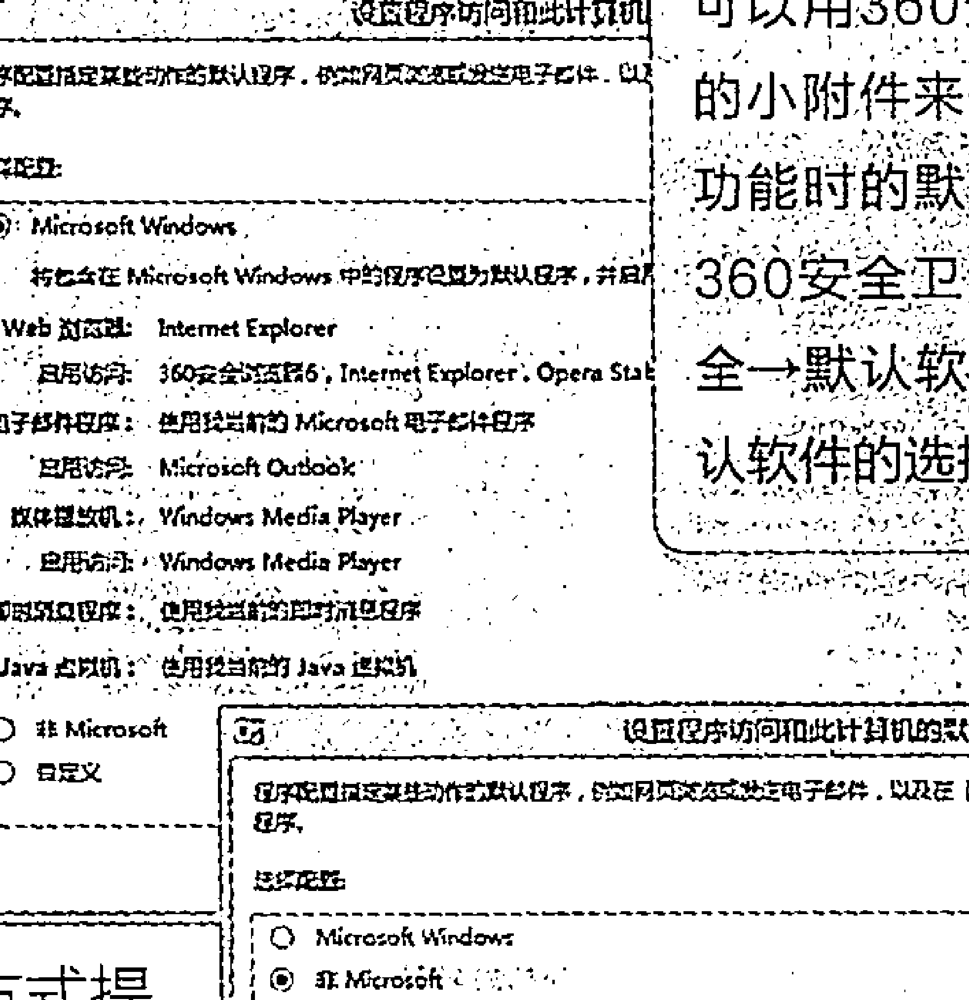

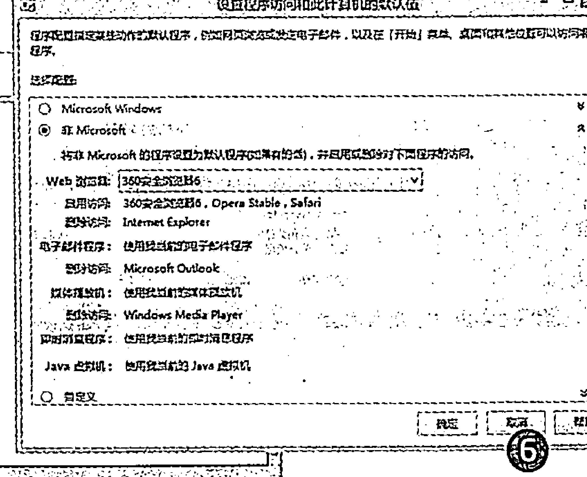

# 放飞系统 启动项灵活DIY

文 | 义

随着软件安装数量的增多和使用时间的延长，系统启动项越来越多，系统速度也会越来越慢。如何安全地暂时关闭或永久关闭这些启动项？能不能让这些启动项按时启动？能不能自己添加程序到启动列表中？

借助于一款免费的强力系统优化工具Glary Utilities 4.0 Free，可以解决问题。运行软件后点击“高级工具”选项卡，在“系统控制”分组中选择“启动项整理”进入自启动管理器界面（图1）。

## 安全为要 谨慎处理启动项

如果发现了某项目属于恶意或广告启动项，选择“删除此项”将其永久删除；如果是今后还可能用到的启动项，比如视频客户端的服务，选择“取消此项自启动”比较合适。

Glary Utilities给出了“安全级别”颜色提示，有红色提示的为有安全风险的项目，一般为系统重要项目或涉及安全类软件的项目，建议不要轻易删除。

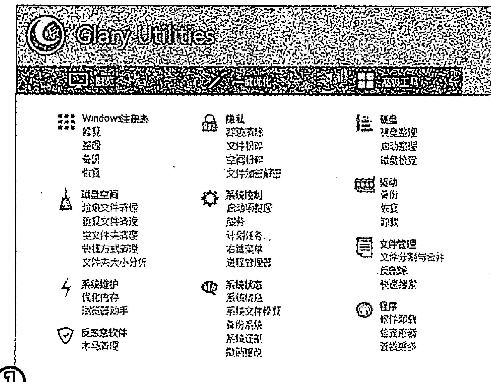

## 延迟启动 妙在灵活掌握

如果希望某启动项在若干时间之后发挥作用，可以用定制延迟启动的方法来解决。

在列表中点击需要延迟启动的项目，点击窗口中间栏上的“延迟启动”按钮（图2），接着在下面的窗口中点击列表选择“延迟时间”参数，可手动输入更多的秒数。若要取消延迟启动，只需点击中间一栏后边的“取消延迟”按钮，该延迟项目便会从下面的窗口中消失，再度出现在上面的程序列表当中。

## 自创项目 随时自由添加

许多系统优化工具都提供启动项精简的功能，但不提供添加启动项的功能。借助于Glary Utilities工具，可以将需要自动运行的程序项目添加到系统自启动列表中。

点击自启动管理器窗口上方工具栏上的“增加自启动项”按钮，或者点击窗口左侧“任务”窗格下的“增加自启动项”一项，在弹出的窗口中添加需要启动的项目的具体信息。一切就绪后，点击“确定”按钮完成设定。

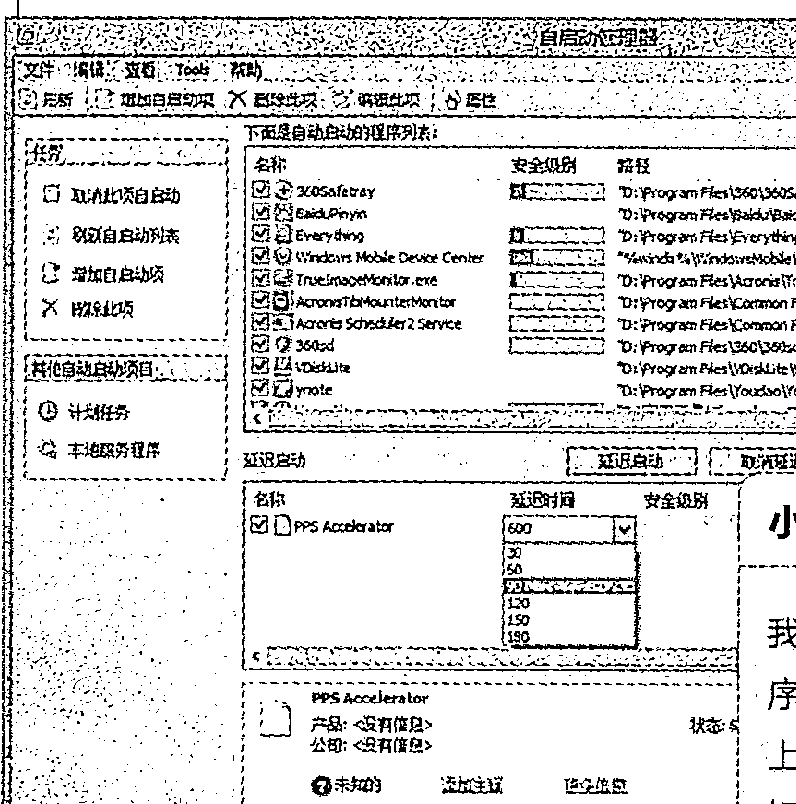

> 对于自己创建的启动项目，或者是系统中特征不明显的启动项，还可以给它们添加注释，便于识别和避免被误删除。

> 我们还可以在点击一个自启动程序之后，选择自启动管理器窗口上端工具条上的“编辑此项”按钮，对启动项进行全方位编辑。修改包括自动项目名称、路径、参数、位置、延迟时间在内的各种项目。

# 藏牢你的Windows 8.1隐私

文 | 徐一波

上了网，也许就决定了你生活在一个没有隐私的“世道”，不知何时也许你就被不知何人而监视着。我们虽然不能百分之百地保证自己的资料和信息安全，但可以通过自己对Windows 8.1应用的隐私控制的主动把握，尽可能多地做到隐私不泄露或少泄露，少一点泄露就多一点安全。虽然网络不安全已是共识，但日子还是要过，隐私控制还是要多加关注。

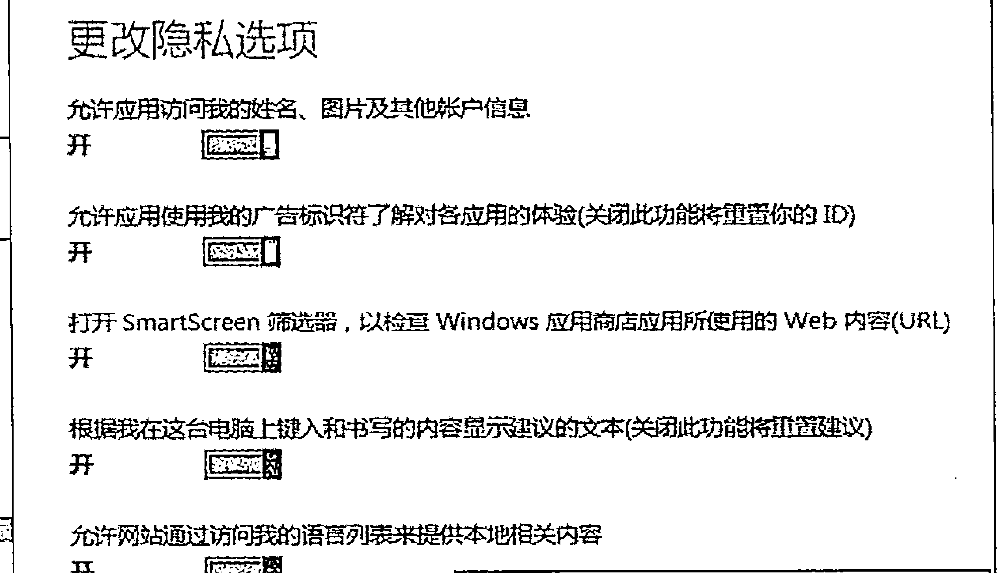

## 逐项自由控制常规隐私选项

许多应用会默认访问你的姓名、照片和各类账户信息，不了解这一点，你就等于默认授权你的个人隐私给这些软件。为了防止因这些常规隐私授权造成的数据泄露，你可以选择性地对它们进行关闭。

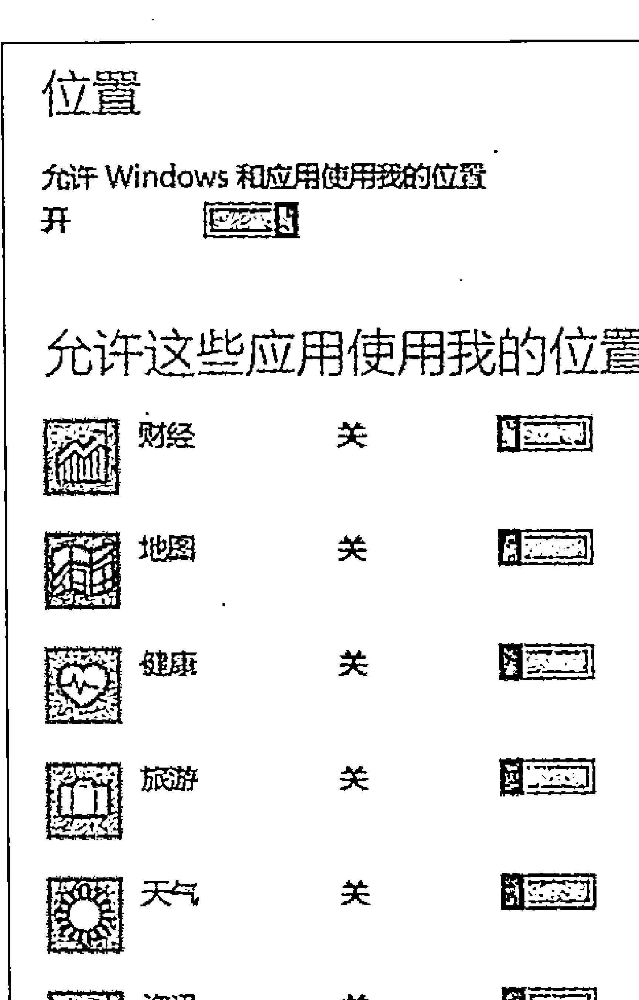

## 别让一些APP泄露你的行踪

Windows 8.1的许多与位置有关的应用具有访问用户位置的功能，如地图应用、天气应用、旅游应用等。如果有的应用开启了你的位置信息，一不小心，你的位置就会显示在这些软件里或某个公共网页上，也可能被这些软件所收集。为此，如果觉得没有那么多必要，你完全可以手动控制每一个应用是否使用“我的位置”。

## 不能让监听录音得逞

还有的应用如即时通信工具或录音类应用，它们可以名正言顺地开启你的麦克风功能。但是，这样一来，就有了一种隐患，那就是聊天之外，你的现场声音也可能会被这些软件随意录制下来或传输出去。为此，在不需要的时候，请将它们关闭掉。

## 莫让你的艳照无意中外流

还有一些应用（比如聊天软件）因为交流的需要，会开启你的电脑摄像头。这样，也就有了一些藏有不良用心的软件在暗中监视你的可能。如果你觉得某个软件没有必要开启摄像头功能，而设置中却开启了这一功能，这时就需要多加注意，有理由怀疑其不良用心，毫不留情地将其关闭。

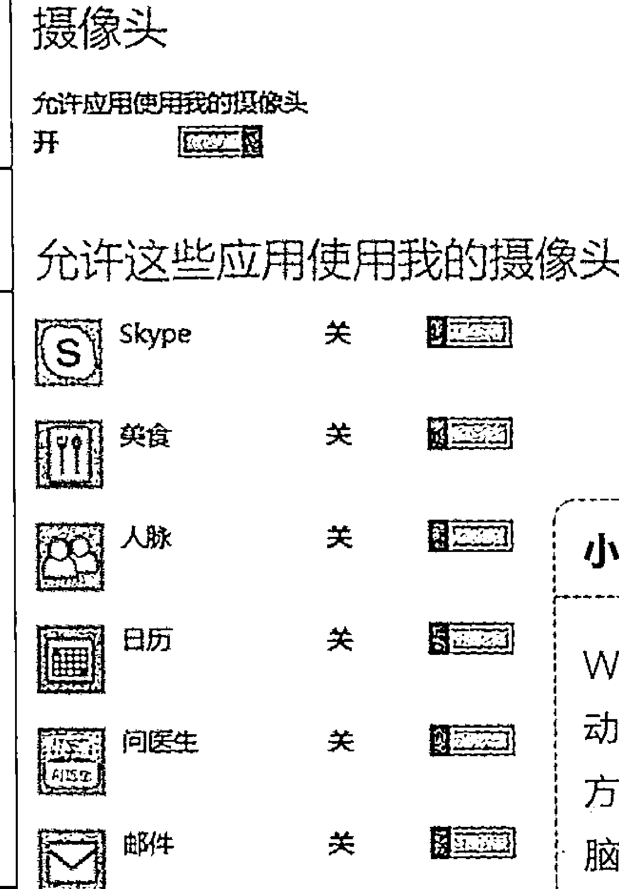

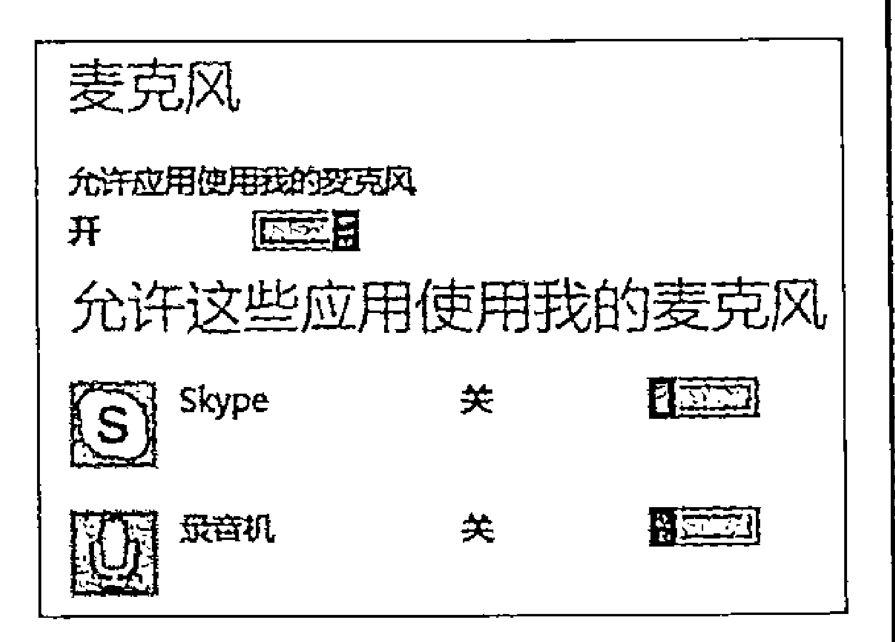

> 小提示
Windows 8.1中进入隐私设置的方法是，先将鼠标移动到桌面右上角，然后下滑，在桌面右侧浮出的菜单下方选择“设置”，在随后弹出的菜单下方选择“更改电脑设置”，最后选择设置窗口中的“隐私”一项即可。

挖掘新视窗的细微“体贴”

从Windows XP一步过渡到Windows 8.1之后，许多人对新系统的操作不便表示不满。殊不知，在稍为习惯之后，新版的Windows给我们更多的却是细微的“体贴”。如果仔细体会，就会发现它在许多方面都充满了人性化的关怀，仅从文件操作一个方面就可以看出这一改变。

> 小提示
> 除了界面之外，Windows 8.1对于Windows 7和Windows 8的优秀特性具有传承特性，而Windows 8.1为目前技术最先进的系统版本，因此，我们跳过Windows 8和Windows 7，直接针对Windows XP讲述Windows 8.1。

鼠标单独控制文件多选

多重选择的复选框是我们在Windows对话窗口中经常见到的一个功能，面对一个列表，如果我们需要选择多个选项时，系统往往会在项目前给出一些方框，可供选择任意多个项目。但是，不知为何，低版本的Windows文件列表管理中一直没有提供这种选择，以至于用Shift或Ctrl配合鼠标点击，一向成为文件多重选择的必用技巧。
在Windows 8.1中，我们只需在文件前面用鼠标点击复选框，即可任意选择一个文件夹下的任意多个文件（图1），免去了键盘的使用。

> 小技巧
> 要使Windows 8.1文件列表中的鼠标多选方法生效，需要对多选功能进行设置。按Win+E进入资源管理器，点击“查看→选项”启动“文件夹选项”窗口，点击“查看”选项卡，选中“使用复选框以选择项目”复选框，点击“确定”按钮。此外，在资源管理器的“查看”标签页中直接选择“项目复选框”也可以开启文件复选功能。

文件列表自动刷新排序

在Windows 8.1的资源管理器窗口中，如果我们对一个文件夹或文件的名称进行了更改之后，文件列表的排列顺序马上会进行一次相应的改变，新命名的文件或文件夹会按现行的文件排列规则自动排列到其应有的位置。而在Windows XP时期，更名后需要手动重新执行排序操作才能改变文件的排列顺序。

> 小技巧
> 在Windows 8.1中，如果要改变文件的列表显示范围，只需在资源列表窗口的文件标题头项目后点击小三角图标，从中选择排列方式。比如，通过文件名称标题头的小三角下拉列表以数字、字母分组、拼音分组筛选项目（图2）；而日期标题头的小三角下拉列表会显示出一个日历来，供我们以日期或日期范围来筛选文件。

| 名称 | 日期 | 类型 |
|------|------|------|
| 宽屏梦幻童年手绘图1920x1200(88P) | 2009/11/28 星期六 15:48 | 文件夹 |
| 时尚家居设计壁纸1920x1200(54P) | 2009/11/28 星期六 15:17 | 文件夹 |
| 唯美手绘梦幻风光1920x1200 | 2009/11/28 星期六 15:44 | 文件夹 |
| 游戏美女壁纸1920x1080(80P) | 2009/11/28 星期六 15:51 | 文件夹 |
| 宇宙星空精美壁纸1920x1200(19P) | 2009/11/28 星期六 15:50 | 文件夹 |
| 最新高清汽车合集1920x1200(80张) | 2008/12/7 星期日 7:12 | Text Document |
| 00284_foggyhorsefarm_1680x1050.jpg | 2007/4/21 星期六 9:47 | 2345看图王 JPG ... |
| 00288_horsefarm_1680x1050.jpg | 2007/4/21 星期六 9:45 | 2345看图王 JPG ... |
| 00330_snaab_1680x1050.jpg | 2007/4/21 星期六 9:52 | 2345看图王 JPG ... |
| 00359_seamist_1680x1050.jpg | 2007/4/21 星期六 9:53 | 2345看图王 JPG ... |
| 00386_dewdrop_1680x1050.jpg | 2007/4/21 星期六 9:54 | 2345看图王 JPG ... |
| 00391_forgottenbottle_1680x1050.jpg | 2007/4/21 星期六 9:54 | 2345看图王 JPG ... |
| 00392_dunes_1680x1050.jpg | 2007/4/21 星期六 9:54 | 2345看图王 JPG ... |
| 00409_osxwave_1680x1050.jpg | 2007/4/21 星期六 9:55 | 2345看图王 JPG 图片文件 |
| 00416_greenergrass_1680x1050.jpg | 2007/4/21 星期六 9:54 | 2345看图王 JPG ... |
| 00432_fieldsspring_1680x1050.jpg | 2007/4/21 星期六 9:56 | 2345看图王 JPG ... |
| 00435_woodstorksunset_1680x1050.jpg | 2007/4/21 星期六 9:56 | 2345看图王 JPG ... |
| 00438_octavei_1680x1050.jpg | 2007/4/21 星期六 9:56 | 2345看图王 JPG ... |
| 00445_starvingartist_1680x1050.jpg | 2007/4/21 星期六 9:57 | 2345看图王 JPG ... |

| 日期 | 类型 |
|------|------|
| 0-9 | 文件夹 |
| Q-Z | 文件夹 |
| 拼音 A-F | 文件夹 |
| 拼音 G-L | 文件夹 |
| 拼音 M-S | 文件夹 |
| 拼音 T-Z | 文件夹 |
| 其他 | 文件夹 |
| 2007/4/21 星期六 9:47 | 2345看图王 |
| 2007/4/21 星期六 9:45 | 2345看图王 |
| 2007/4/21 星期六 9:52 | 2345看图王 |
| 2007/4/21 星期六 9:53 | 2345看图王 |
| 2007/4/21 星期六 9:54 | 2345看图王 |
| 2007/4/21 星期六 9:54 | 2345看图王 |
| 2007/4/21 星期六 9:55 | 2345看图王 |
| 2007/4/21 星期六 9:54 | 2345看图王 |
| 2007/4/21 星期六 9:56 | 2345看图王 |
| 2007/4/21 星期六 9:56 | 2345看图王 |
| 2007/4/21 星期六 9:56 | 2345看图王 |
| 2007/4/21 星期六 9:57 | 2345看图王 |

移动到最新用过的目标

将一些文件复制或移动到某处，这是我们经常用到的文件操作。比如，我们常常会将写好的文档复制或移动到移动硬盘的某个文件夹中，而将下载的电影文件移动到U盘中。对于这些经常要访问的目标，Windows 8.1给出了很体贴的目标记忆功能。

我们只需在执行完一次移动或复制操作后，下次如果要执行目的地相同的文件操作，请不要直接用传统的复制或粘贴，转而使用系统提供的“复制到”或“移动到”按钮（见资源管理器“主页”标签下）。点击此二按钮下的小三角图标，会立即显示出我们曾经使用过的路径，直接选择即可将文件复制或转移到自己常用的目的地（图3）。

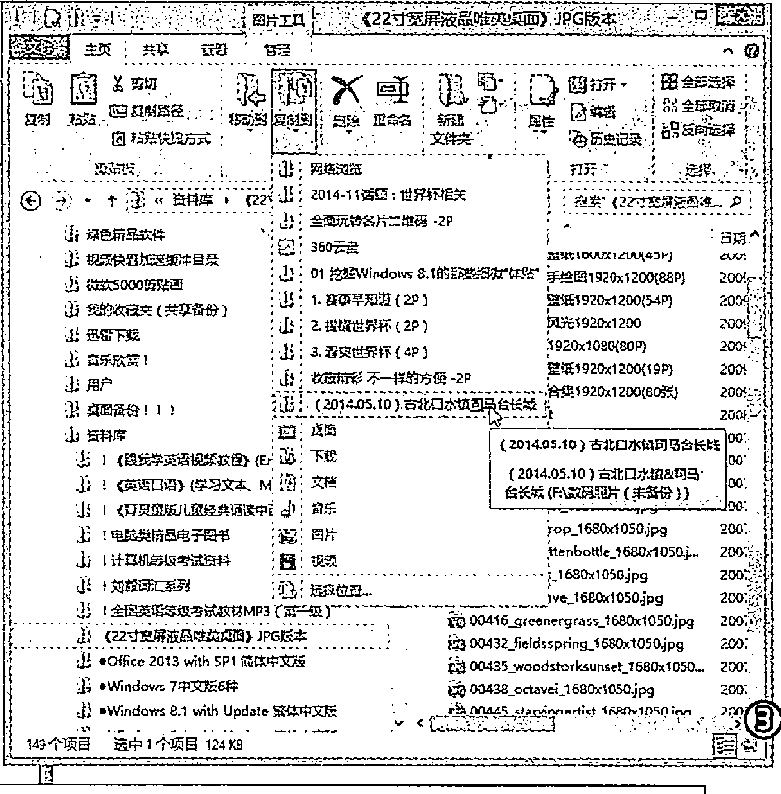

永久删除不用键盘配合

在“XP”年代，菜鸟要永久删除一个文件，先按Del键，再清空回收站；而大师们则要先祭出Shift，再请出Del键才能完成这一任务。如果左手正好拿着一条油炸鸡腿，右手拿着鼠标，那么键盘可能也因此而沾光弄个“肥缺”一饱口福。使用了Windows 8.1后，就不用放下鸡腿来执行这项任务了。选择文件之后，只用鼠标点击“主页→删除”的小箭头，选择“永久删除”，即可不经回收站直接将文件永久删除（图4）。

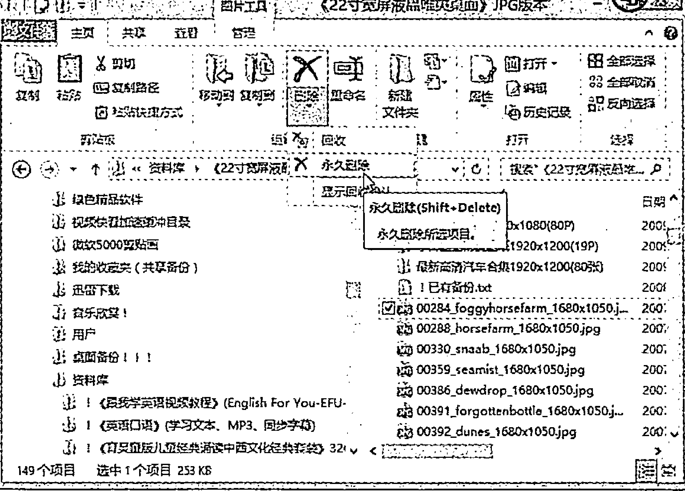

方便快捷的六种打开方式

当我们正在工作于一个文件夹下时，如果想要进入这个文件夹的命令提示符窗口，怎么办？这在Windows XP时期，恐怕需要费一番周折或借助专门的工具。而在Windows 8.1年代，命令窗口的打开变得更加灵活方便。

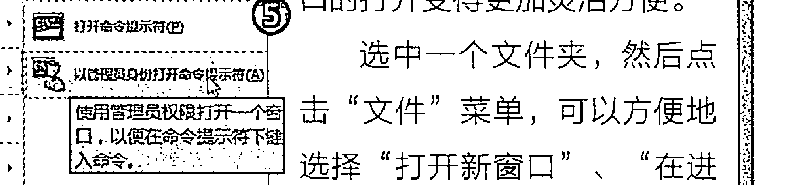

选中一个文件夹，然后点击“文件”菜单，可以方便地选择“打开新窗口”、“在进程中打开新窗口”、“打开命令提示符”、“以管理员身份打开命令提示符”、“打开Windows PowerShell”、“以管理员身份打开Windows PowerShell”等6种窗口打开方式（图5），文件窗口或命令窗口的进入不再是难题。

文件隐藏不再是秘密

通过文件夹选项设置隐藏或显示文件、文件扩展名，这是多少年来的Windows经典文件操作技巧。但是，当知道的人多了之后，这项隐藏的设置反而成了累赘，原因是它藏得太深，不好操作。在Windows 8.1中，微软将这个不是秘密的秘密放在了光天化日之下。在Windows资源管理器的“查看”选项卡下，我们可以通过选择“文件扩展名”和“隐藏的项目”两个复选框，让扩展名和文件的隐藏功能马上生效或失效，而显示或隐藏操作还需要“隐藏所选项目”按钮来配合（图6）。

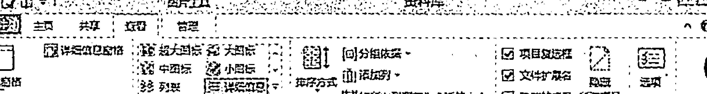

让NTFS格式为你办点实事

文|左俊

NTFS文件系统是NT核心的Windows使用最普遍的磁盘文件系统，也是目前Windows 7或Windows 8/8.1采用的主流文件格式。这一格式虽然不十全十美，但有着自身的独特优势，因而才被广泛认可。但是，除了平时直接将硬盘格式化为NTFS格式外，你还用它为自己办过哪些实事？

1 NTFS压缩选好最佳目标文件夹

NTFS文件系统支持文件压缩功能，但是，NTFS文件压缩是一把双刃剑，在节省磁盘空间的同时，使用压缩过的文件会影响到系统效率。微软提示，对于有经常性写入操作的文件，不适合于使用NTFS压缩功能。那么，既然它提供了此功能，到底我们在什么场合下使用比较合适？如何才能做到压缩省空间和不影响效率的平衡？

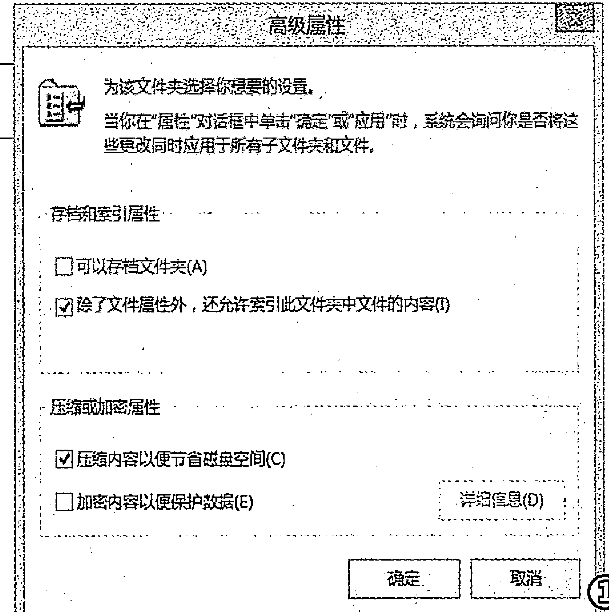

在Windows 7或Windows 8/8.1系统中，Program Files文件夹安装了常用的应用软件，而与软件设置等有关的数据多数被保存到用户文件夹中了，因此，除了第一次安装应用软件时要写入Program Files文件夹外，在其他使用时间里，多数对Program Files文件夹下文件的操作为读取操作。而Program Files文件夹下的文件又多为一些碎小的应用程序文件，压缩之后可以大大节省磁盘空间，又能满足微软提出的不频繁写入的要求，因此可以作为NTFS压缩目标的首选。

具体方法为，选中Program Files文件夹并从右键菜单中选择“属性”命令，在该文件夹属性窗口中，点击“常规”选项卡下的“高级”按钮，进入高级属性窗口选择“压缩内容以便节省磁盘空间”选项并确定即可（图1）。

2 别让快捷方式跟踪拖慢系统

如果使用过Windows XP或Windows 7，也许会注意到NTFS文件系统有一个神奇的功能，当创建了一个文件或文件夹的快捷方式之后，如果源文件移动了位置，系统会自动修正快捷方式的指向。但是，这个过程会严重拖慢系统。由于这个功能实际使用的时间比较少，因此为了提高系统整体效率，完全可以将此功能关闭。

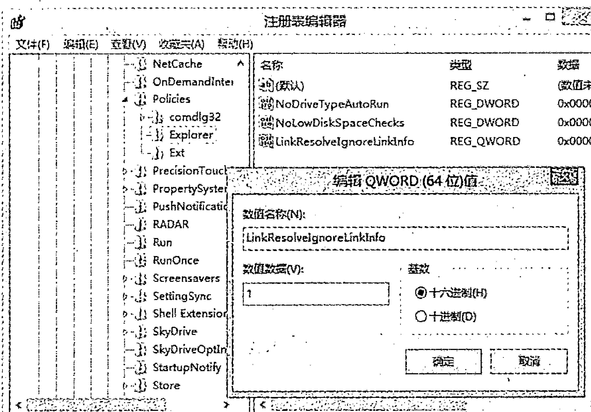

打开注册表编辑器，定位到[HKEY_CURRENT_USER\Software\Microsoft\Windows\CurrentVersion\Policies\Explorer]，在右侧窗口中新建一个名为LinkResolveIgnoreLinkInfo的键值，类型为DWORD，设定该键值的数值为1（图2）。这样设定之后，快捷方式就不会再跟踪源文件的改变，因而在某种程度上消除了因这方面问题引起的系统变慢。

向系统文件时间记录要效率

对于一个文件的时间属性，我们更多关心的是文件何时建立、何时被修改过，而何时访问了文件一般不是我们关心的问题。但是，NTFS文件系统除了要记录文件的创建时间和修改时间外，每次还会不厌其烦地记录我们访问每一个文件的时间（图3），这也会在某种程度上影响文件系统的整体效率。在这种情况下，我们可以通过注册表编辑器屏蔽文件访问时间记录功能。

开启注册表编辑器，定位到 [HKEY_LOCAL_MACHINE\SYSTEM\CurrentControlSet\Control\FileSystem] 下，找到 NtfsDisableLastAccessUpdate 键值，将 NtfsDisableLastAccessUpdate 键值数据改为1即可（图4）。

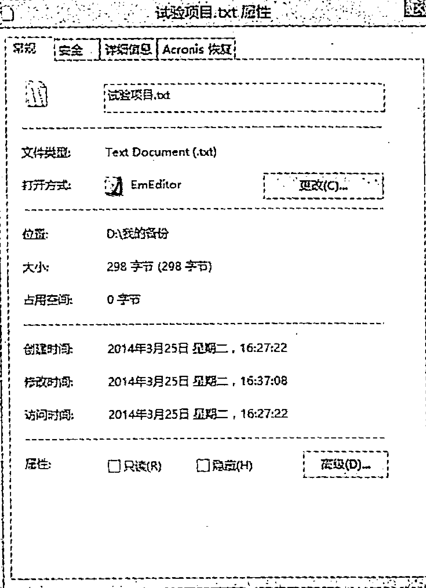

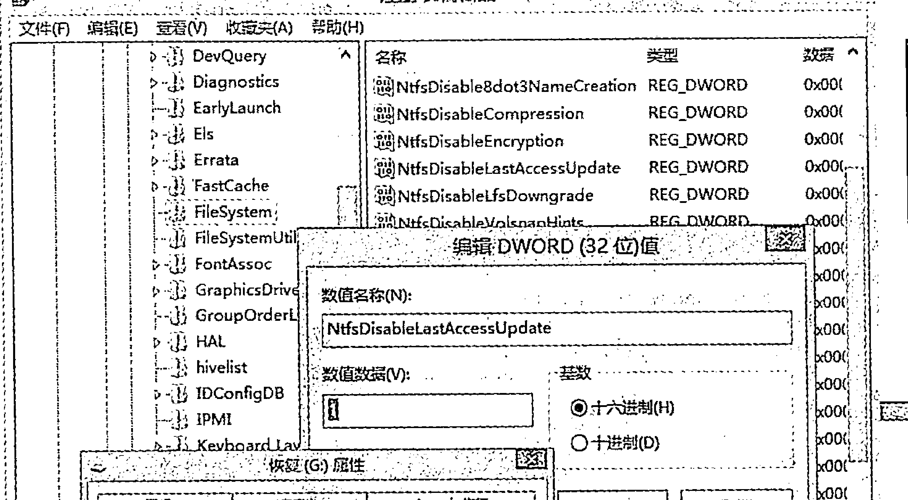

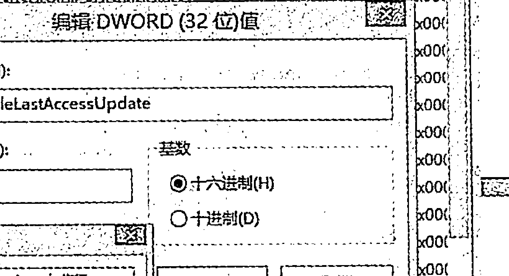

巧用NTFS格式解决高清片转移

高清影片文件动辄几个GB的容量，如果在硬盘里下载播放一般不会出现问题。但是，如果通过U盘或SD卡拷贝高清文件，可能会出现文件复制失败的提示。此时，许多人会认为U盘或SD卡出现问题或不适合于传输高清文件，其实这是文件格式限制造成的。大家知道，U盘或SD卡买回来的时候多数默认格式化为FAT32的磁盘格式，而这一格式支持的最大单个文件容量为4GB，因此，一旦单个文件的数量超过了4GB，那么就会造成无法拷贝的情况，只需将U盘格式化为NTFS格式即可。

但问题并不那么简单。在格式化某些品牌或型号的U盘和SD卡的时候，根本没有NTFS这样的选项，因而不管格式化几次，只能顺其自然地格式化为FAT32。其实，通过设定磁盘的相关属性，可以让U盘的NTFS格式解放出来。

在Windows 8.1中打开磁盘属性窗口，在磁盘属性窗口中选择该U盘，点击“属性”（图5），在接下来弹出的窗口中选择“常规→改变设置”按钮（图6），选择“策略”标签，勾选“更好的性能”选项，单击“确定”。之后便可以看到格式化窗口中的NTFS选项了（图7）。

当U盘被格式化为NTFS格式后，只要U盘的容量足够，多大的高清影片文件都可以被支持读写了。

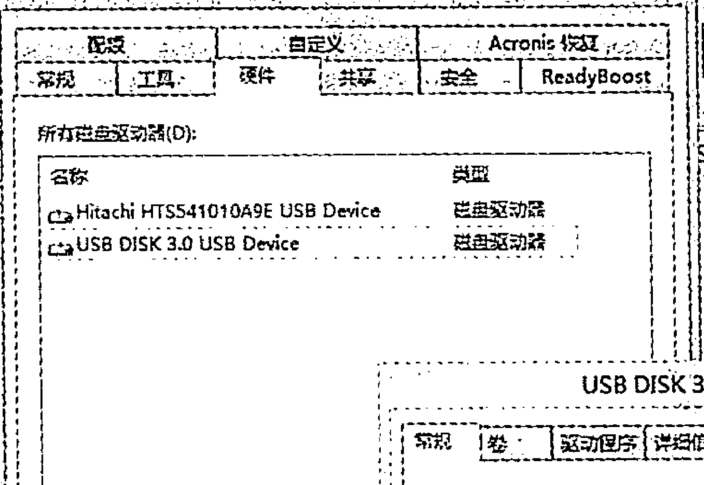

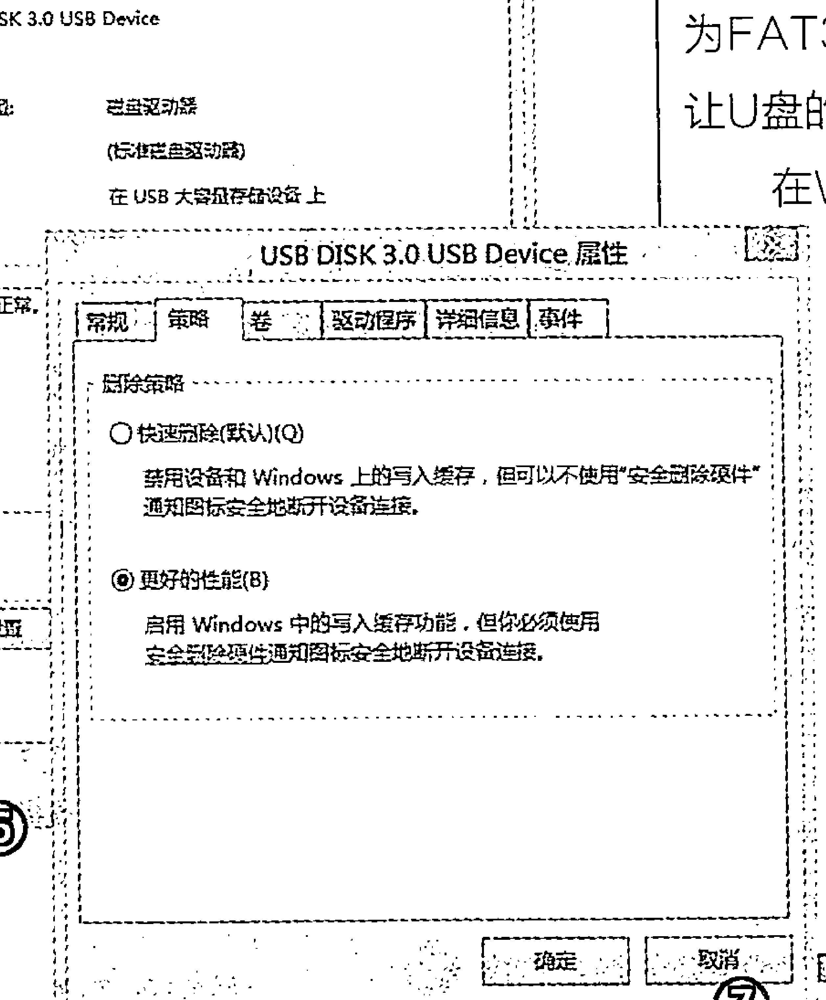

挖出Windows 8.1文件管理实用功能

文 | 陆琳

Windows 8.1在文件资源管理方面确实方便了许多，尽管如此，在它的深处，还隐藏一些许多人还没有发现的小秘密和没有用到的小技巧。

## 树状列表管理资源更高效

Windows 8.1文件资源管理器中默认开启的的内容是以大图标方式显示的，在浏览文件的过程中，需要逐级点击文件夹打开，多有不便，尤其是当文件夹数量大且结构比较复杂时更是如此。其实，我们可以通过简单定制，让资源以树状详细列表的方式进行显示。

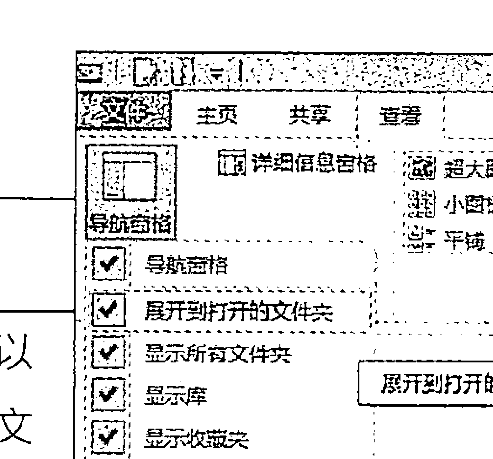

在文件资源管理器窗口中点击“查看”标签，点击“导航窗格”，将下面的五个选项全部选中（图1）。任意打开一个文件夹，选择“查看”选项卡下的布局为“详细信息”，然后点击“查看→选项”，并在随后激活的窗口中点击“查看→应用到文件夹”（图2）。这样，今后打开的文件资源管理器就会以一种树形的方式，以文件详细列表显示出所有的资源，操作起来会很方便。

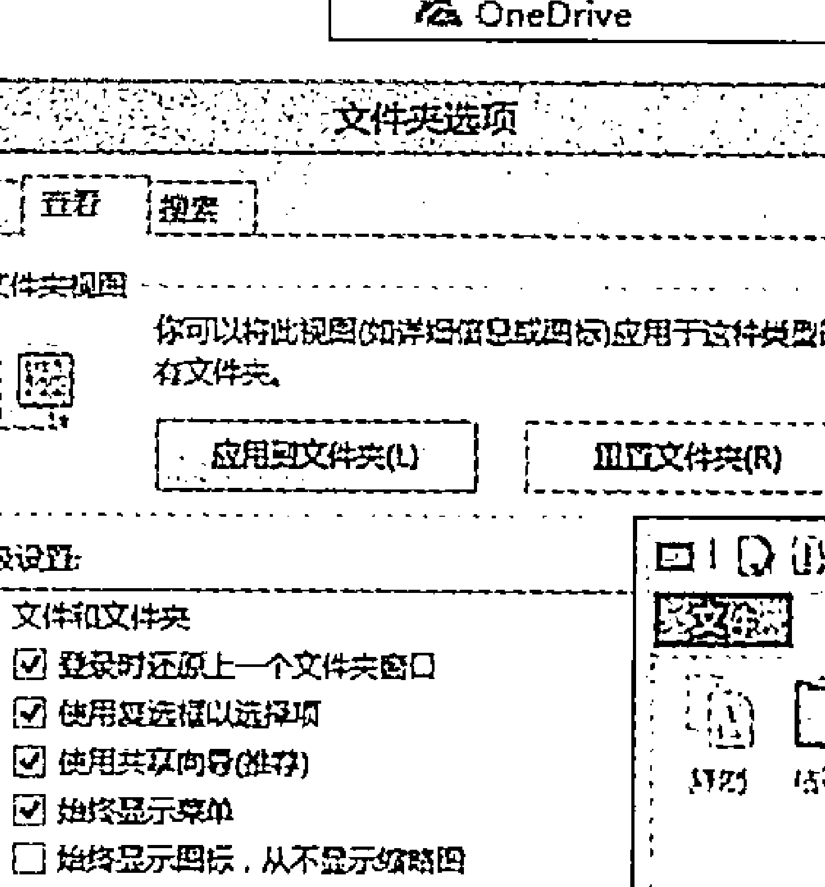

> > **小技巧**
> > 或许你一直认为“这台电脑”这个名字是一成不变的，其实如果你不喜欢这个名字，可以随时一键更名。用Win+E开启文件资源管理器，点击“桌面”下的“这台电脑”后，鼠标点击上方选项卡面板中的“重命名”按钮，即可将“这台电脑”命名为我们想要的名字（图3）。

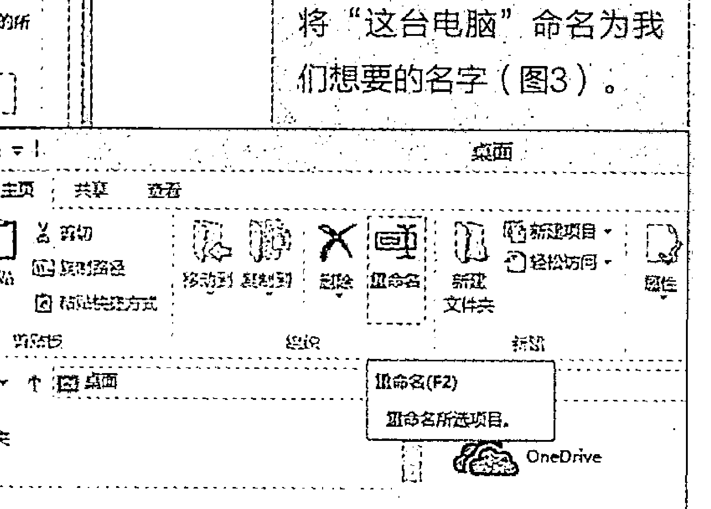

## 新建文件夹不再难

早期版本的Windows新建一个文件比较麻烦，往往需要通过菜单点击至少两次才能完成。而在Windows 8/8.1中，新建文件夹变得易如反掌。如果你在Windows 8.1窗口中依然还在用右键新建文件夹，不妨试试更省事的方法。在需要建立文件夹的磁盘或文件夹下，只需点击“新建文件”按钮，即可完成一键新建文件夹（图4）。

> > **小提示**
> > 如果用键盘操作，按下Ctrl+Shift+N组合键即可生成一个文件夹。

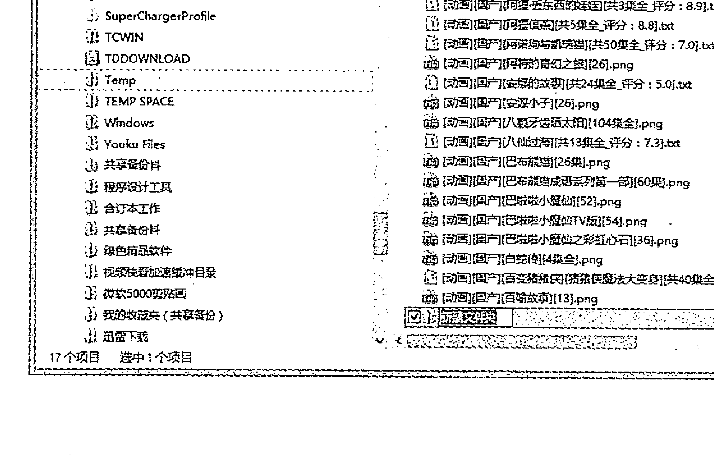

一次搞定文件反向选择

如果有一批文件需要操作，而当前已经选中了被排除的文件，这样只需执行一下反向选择命令即可将需要的所有文件选中。但是，Windows XP的反向选择命令需要点击多次鼠标才能完成，Windows 7的反向选择更是藏得很深，需要在布局选项中开启菜单后才能找到该命令。

在Windows 8.1中，只需选择要排除的所有文件，然后直接在“文件→选项”组中点击“反向选择”按钮即可完成文件的反向选择（图5）。

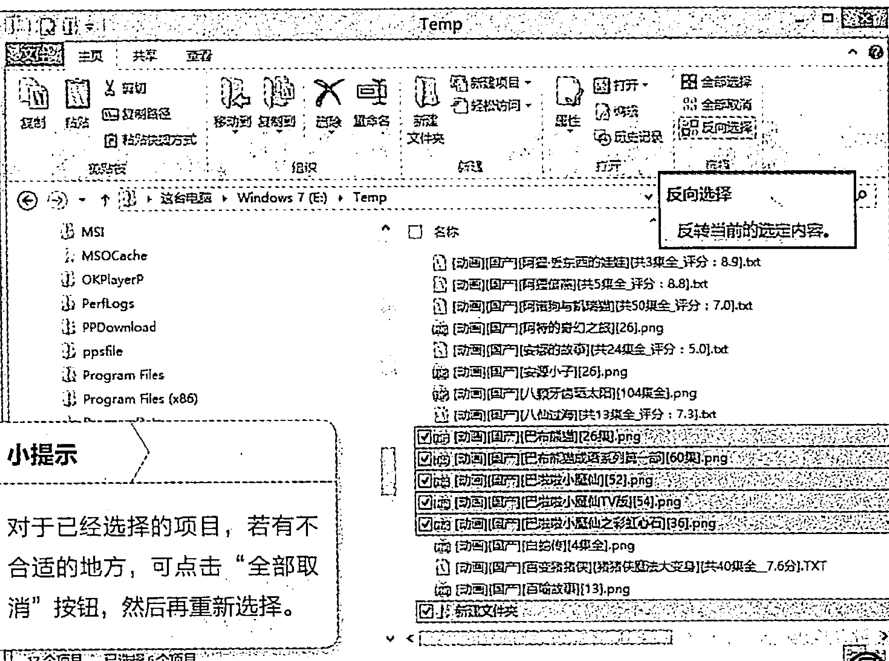

> 小提示
> 对于已经选择的项目，若有不合适的地方，可点击“全部取消”按钮，然后再重新选择。

文件项目列表宽度快速规整

在以列表显示的Windows文件资源窗口中，有时我们会发现文件的某个属性列可能被遮盖（如“名称”列），没能全部显示出来，而有的属性列又占据了太多的冗余空间（如“修改日期”列）（图6）。一般我们都是通过拖动文件属性标题头字段的分隔线来调整列宽的，但这样实现全部字段的合理调整比较麻烦。

在Windows 8.1文件资源管理器窗口中，只需在以详细信息打开的文件列表窗口中，点击“将所有列调整为合适的大小”按钮，可以看到，文件列表的各个字段会自动齐刷刷地归拢在合适的位置。

> 小提示
> 如果仅调整一列的宽度，除了用拖拽分隔线的方法外，还可以通过在该列标题名称上点击右键菜单选择相应的命令来调整。

照片预览大了还可以再大

在管理数码照片的过程中，我们常常是需要先预览一下照片的基本内容，然后才确定对哪些图片进行操作和处理。在低版本的Windows中，要实现数码照片的大图标显示，需要在“视图”或“查看”菜单下选择相应的缩略图或大图标命令，操作比较繁琐。

在Windows 8.1中，你可以让图片预览变得更体贴。定位到数码照片所在窗口，点击窗口右下角的大缩略显示按钮，即可看到所有照片马上以大图标展示在我们面前了。如果觉得图标尺寸还不够大，则只需点击“超大图标”按钮，即可以更清晰的大幅图标显示照片了。

> 小技巧
> 随着文件类别的不同，文件列表支持显示的属性项目会有所变化。比如对数码照片的支持，系统会提供比普通文件更多的参数供选择，我们可以根据个人的具体需求，将数码照片的属性项目设置并显示出来。

显示更多的文件属性信息

在Windows 8.1文件详细信息列表中，系统默认只提供了名称、日期、类型、大小等项目，但是这并不意味着我们只能查看这么多项目。通过在文件列表标题上点击右键菜单，选择“其他”可以选择定制更多的文件属性信息。

在Windows 8.1系统中，当我们定制了更多的文件详细信息项目之后，只需点击资源窗口右下角按钮中的左边一个，即可马上显示出自己定制的个性化的文件列表项目。

## 内外结合 顽固占用杀无赦

文 |青果

你是不是经常遇到这样的问题，当删除一个文件或文件夹时，系统提示操作无法完成，因为其中的文件或文件夹已在另一个程序中打开，而你明明已经关闭了自己刚才使用的程序。到底还有什么程序在作怪？如何找出“元凶”并顺利解除锁定？

对于顽固文件的删除，不同版本的系统所提供的条件有所不同。早期版本Windows系统对此方面的支持不强，而Windows 7之后的版本实现起来较为容易但埋藏较深。遇到此类问题，我们先尝试用操作系统本身的功能来解决，这是解决顽固文件无法直接删除问题的近道。以Windows 8.1为例。

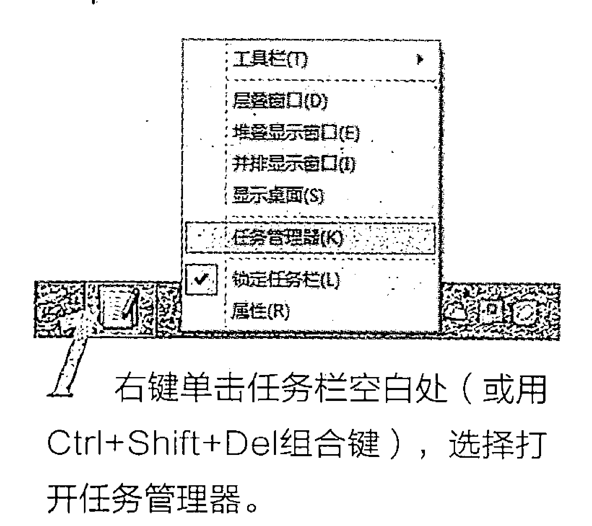

1. 右键单击任务栏空白处（或用Ctrl+Shift+Del组合键），选择打开任务管理器。

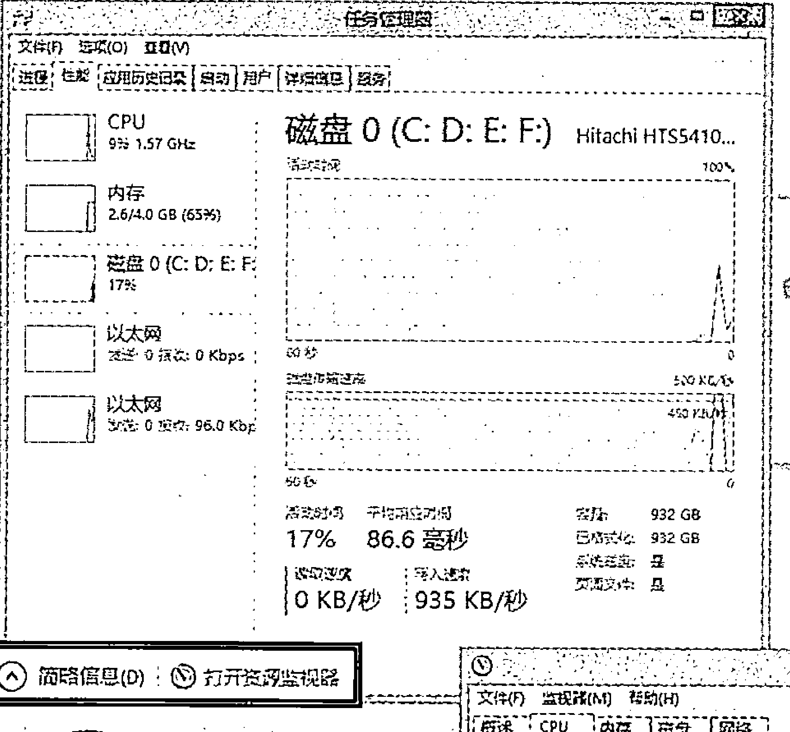

2. 点击“性能”选项卡，点击性能页面底部的“打开资源监视器”。

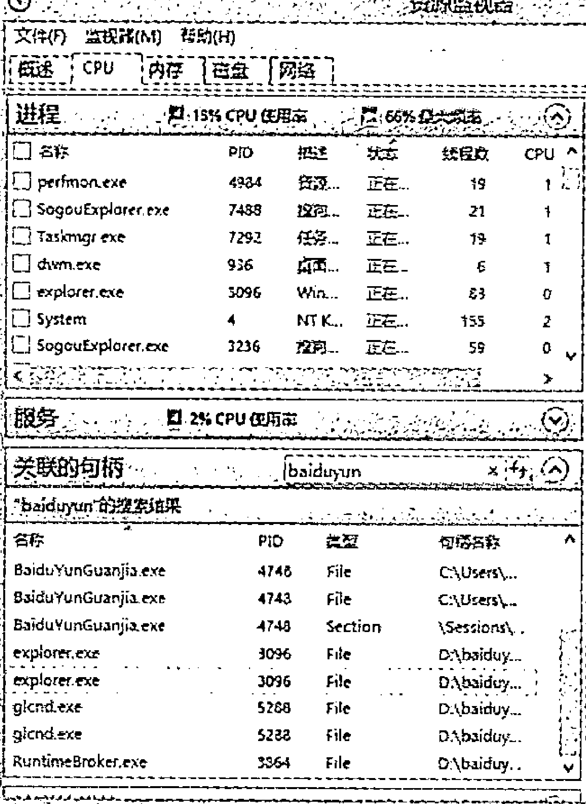

3. 点击资源监视器中的CPU选项卡，然后点击“关联的句柄”后的小箭头，在搜索框中输入要删除的文件的名称（可以是不完全名称）。稍后，窗口中会显示与此文件关联的所有句柄的名称。

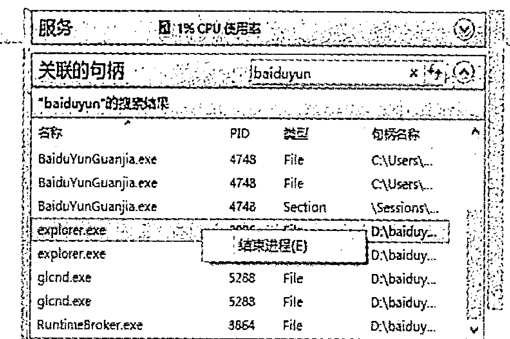

4. 选中调用该文件的进程后点击鼠标右键，选择菜单中的“结束进程”，即可解除进程对文件的锁定。

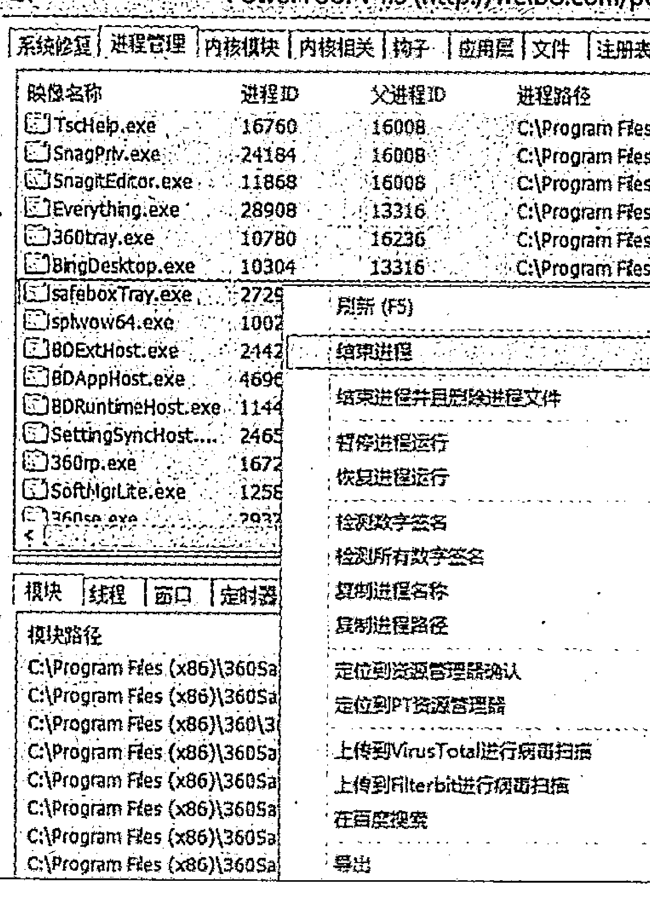

5. 如果你还在使用低版本的系统（如Windows XP），用系统本身功能无法解决，则可以借助于强力系统工具PowerTool来解决。安装并启用该软件，切换到“进程管理”选项卡，找到锁定文件的进程，然后用右键命令结束进程。经测试，用其他常见解锁软件无法结束的进程，用该软件均可轻松解决。

## 全面玩转名片二维码

二维码在日常生活中已经得到广泛应用。作为使用最广泛的个人名片信息，如果能很好地利用二维码这个媒介，实现文字信息与实体名片之间的转换，将会大大方便人与人之间的交流。

文|一叶

### 1 在线生成名片二维码

一种比较省事的方法是通过网络浏览器，访问在线二维码管理网站，在线制作名片二维码。通过百度搜索“草料二维码”，进入草料二维码网站，点击“名片”选项卡，在网页中输入个人信息，点击“生成二维码”按钮生成二维码图片（图1）。图片下方显示含有“容错”和“尺寸”两项可调选项的“基本设置”和其他4项自定义设置（图2）。

> > **小知识**
>
> 二维码容错率是指二维码图标被遮挡多少后，仍可以被扫描出来的能力。容错率越高，则二维码图片能被遮挡的部分越多。

点击“下载”按钮，以PNG格式保存二维码，该格式的图片文件的网络兼容性最好，无论在论坛、圈子、网页中，都可以很好地被支持。

> > **小提示**
>
> 自定义参数设置得不合适，可能对二维码使用过程中的准确度会有所影响。因此，制作之后最好通过手机扫描软件对二维码进行多次扫描验证。

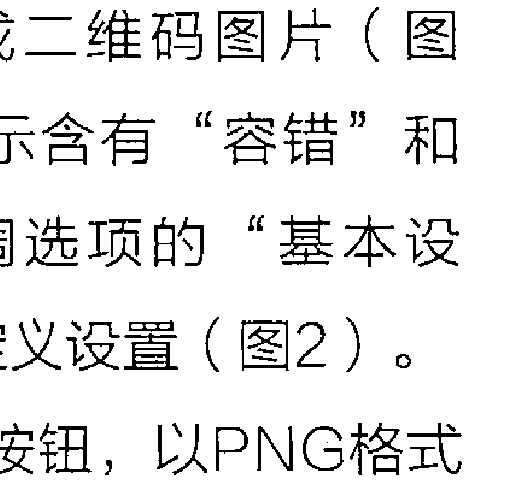

### 2 网盘中的名片二维码

我们还可以借助网盘提供的二维码管理模块来生成和管理名片二维码。

以115网盘为例，登录自己的115网盘，点击“发现”，在“应用”列表中点击“云名片”（图3），开启云名片管理窗口。输入各项个人信息之后，点击“生成二维码”按钮，即可生成二维码图片。点击“保存并更新”按钮，将名片二维码保存在网盘中。如果要下载到本地留存，点击“下载二维码”按钮即可。

115网盘生成的名片二维码可以很方便地应用于论坛、圈子、网页当中。点击“显示网络名片地址”按钮，可以看到自己的名片二维码所特有的网络地址。如果要在论坛、圈子、某个网页中显示自己的二维码名片，只需粘贴相应代码即可（图4）。

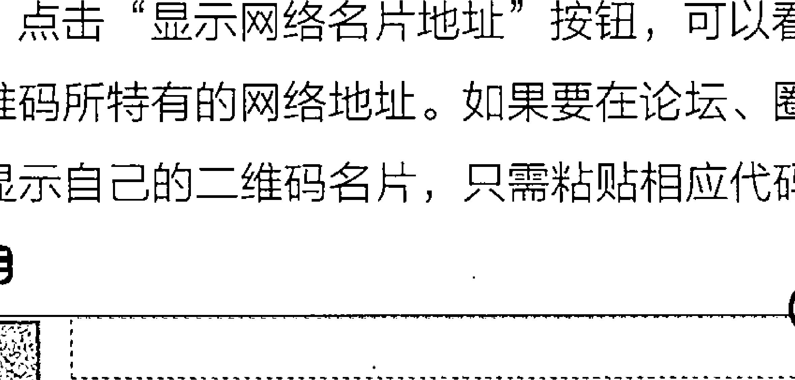

```
html
把以下代码粘贴到网页代码中,网页将显示你的二维码名片：

<a href='http://115.com' target='_blank'></a>
```

> > **小提示**
>
> 对于从社交场合搜集而来的别人的名片，可以借助于名片管理APP，经过拍照和自动识别，将信息加入到联系人数据库中。如Google开发的“名片全能王”APP便可实现该功能。


## 轻装前进 玩转轻应用

不知不觉中，在软件的行列里又出现了新的一员，人称其为“轻应用”。何为“轻应用”？百度的解释再简洁不过了——“无需下载、即搜即用的全功能APP”。 文|文新喜

### 1 轻应用生存的必要“土壤”

传统本地APP大家已经熟悉，这种APP需要下载安装，下载对很多人来说很痛苦，除了下载安装的时间成本外，在不少场合下还面临流量问题。轻应用即搜即用的特性，能够让用户在找到应用后立刻使用，给用户更好的体验。

由此可见，轻应用比传统本地APP更方便。百度开发了轻应用，李开复的创新工场也开发轻应用，其他网络公司开发轻应用的苗头也不小，但今天我们拿360轻应用来说事。了解了一家的轻应用，以后无论出现几家轻应用，出现多少，也都大同小异、不足为奇了。

使用轻应用要依靠一样东西，那就是网络环境，你需要在网络在线的情况下通过浏览器或其他网络搜索工具来找到并链接它，然后才可以使用它。比如，360轻应用目前支持最好的版本是360浏览器6.0以上版本，它采用了谷歌内核，以浏览器扩展的形式添加各种轻应用，即可让以往在桌面才能完成的许多工作，在浏览器中快捷方便地完成（图1）。

> “小提示”
与轻应用相对应的是传统的网络商店。网络商店目前最火爆，人们使用APP大多还是通过各种渠道从网络商店中获得。但随着轻应用的成熟，相信会有越来越多的人倾向于轻应用。搜索满足的是用户找东西的需求，商店满足的是用户“逛”的需求，所以可能在相当长一段时间，商店与轻应用会并行发展。

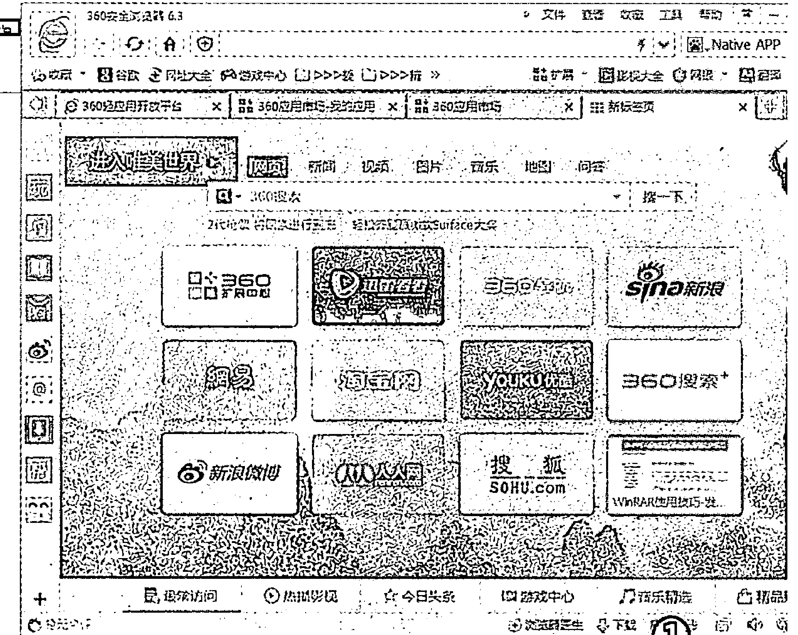

### 2 轻应用的具体“安身之所”

从360安全浏览器的“查看”菜单启动“插件栏”，在插件栏上点击“扩展”按钮旁的小三角图标，然后选择“扩展中心首页”，你会到达360应用市场的首页。这里列出截至目前的所有应用，其中有精品应用栏目，还有首页上的小编推荐应用（图2）。

如果你对360轻应用是如何开发的，以及如何加入开发者队伍感兴趣，你可以点击“开发者”标签进入页面了解更多情况，还可以到“讨论版”与爱好者们一道探讨关于轻应用开发、使用过程中遇到的各种问题。

要找到自己需要的轻应用，除了从轻应用主页、精品推荐、全部应用页面浏览选取外，还可以通过轻应用页面右上角的搜索框，输入关键字来搜索应用。

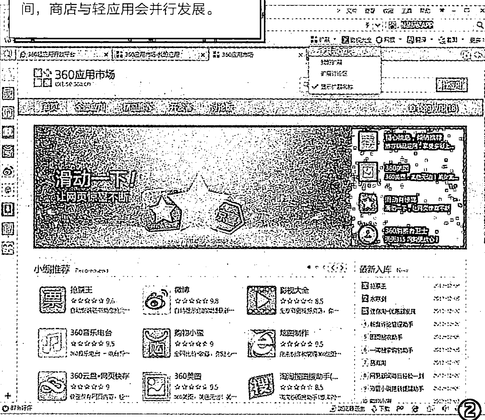

| 应用名称 | 版本 | 评分 | 类型 | 来源 | 描述 |
| :--- | :--- | :--- | :--- | :--- | :--- |
| 360云盘·网页快存 | 0.9.4 | ★★★★★ | 实用工具 | 来自 360 | 360云盘 网页快存可一键保存网页内容到你的360云盘。无论是图片、截图，还是文本或网页地址，均一键保存，随时浏览云盘同步查看。 |
| **功能特点** | | | | | 您可通过：<br>1. 土豆网上的快存按钮<br>2. 网页右键菜单<br>3. 开启网页悬浮快存按钮<br>的方式快速保存您浏览中发现的精彩内容。<br><br>360云盘 网页快存会显示您最近快存的内容，不用进入云盘即可管理和查看。 |

### 3 用好管好自己的轻应用

找到自己需要的轻应用后，只需点击图标，马上会弹出添加轻应用的窗口（图3），你只需点击“添加到浏览器”按钮，然后在后续窗口中确认添加新增扩展程序（图4），即可在今后方便地使用这款轻应用。

要使用已经安装的轻应用，只需在插件栏上选择安装的轻应用图标，即可启动轻应用。如果当前界面没有发现你安装的轻应用图标，请点击插件栏右侧的“更多”按钮，其中一定有你安装的软件图标（图5）。

随着轻应用添加数量的增多，你的插件栏可能显示不了那么多图标，而且显示太多对使用选择也不方便，这时，可以通过轻应用管理器来管理安装的轻应用，将不常用的隐藏起来，将最近要用到的显示到插件栏上。启动轻应用管理器的方法是，在插件栏上选择“扩展→我的扩展”命令，然后就可以看到“我的应用”窗口，在这里你就可以对自己的轻应用进行隐藏、显示和删除等管理操作了（图6）。

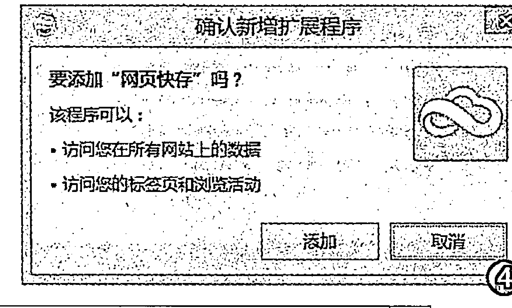

要添加“网页快存”吗？
该程序可以：
• 访问您在所有网站上的数据
• 访问您的标签页和浏览活动

### 4 手机上也在流行轻应用

目前的手机还存在一个问题，那就是相对于PC来说，其存储容量比较小，因此不少配置不高的手机，随着使用时间的增加，安装的APP越来越多，直到某一天系统通知你“内部存储空间不足，请清理数据或卸载软件腾出更多空间”。在这种情况下，如果你舍不得删除手机上的数据或APP，那么安装轻应用可能帮你解决问题。目前，360安卓平台就已经推出了手机轻应用。

360手机轻应用同样不需要占据多少手机本地空间，它只是在你的手机中安装一个软件的图标和一个网络连接，当你需要使用这个轻应用的时候，只要手机处于联网状态，当你点击这个应用图标的时候，会自动联网调用云端的程序去运行，为你返回运行结果（图7）。

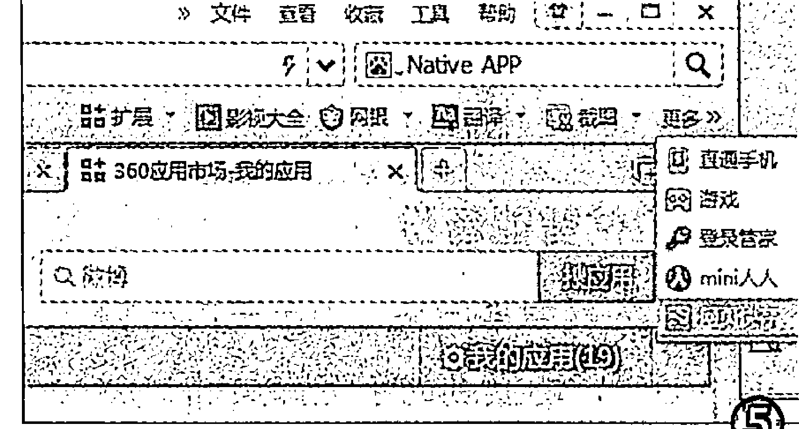

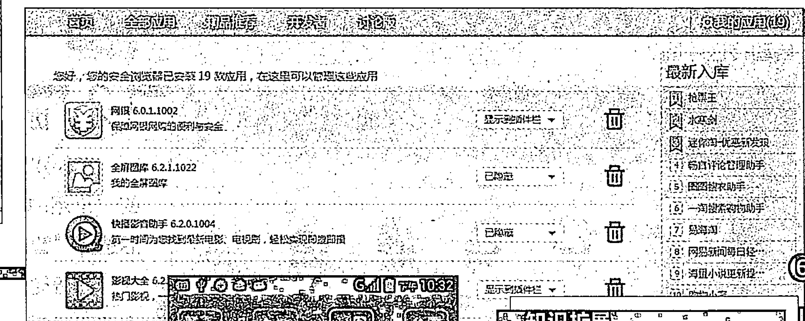

知识拓展

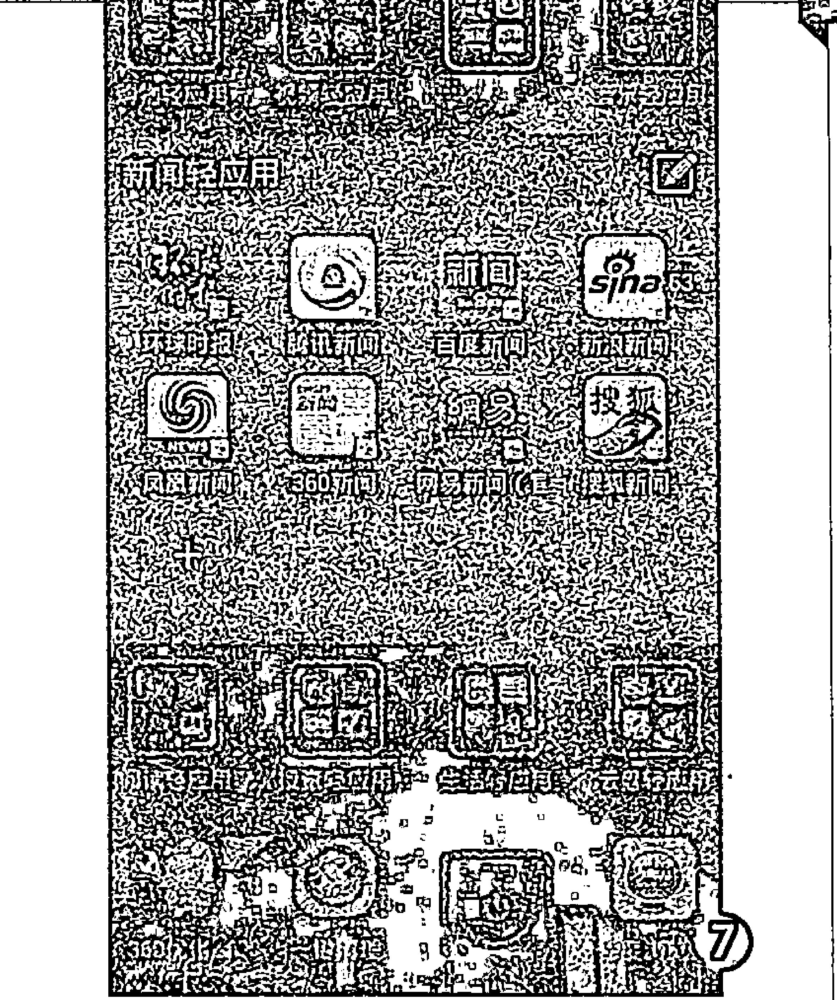

开放接口的轻应用开发。360应用开放平台为PC端和手机端开放的一个开发平台，这个平台为开发者提供一个标准的开发流程和产品发布的标准，并为这两类产品提供发布的网络平台。任何人都可以在这个标准下，进行自己的产品开发，并将自己开发的产品展现在网络上，通过PC浏览器、手机、平板等设备分享给广大网民。（网址：http://wiki.dev.app.360.cn/index.php?title=新手指南）
百度也有自己的开放开发平台。（百度开放云平台：http://developer.baidu.com/）

360轻应用图标与普通安装版的APP图标没啥两样，如果网络给力，运行效果也毫不逊色于本地APP

## 网盘相助 传资料不用起大早

由于工作需要，以前总是加班到后半夜离线上传大量数据包给远方的伙伴，第二天一大早对方提前到公司接收数据。最近，我发现巧用华为网盘能让我免去等待，朋友也不用提前上班接收了。 文|刘德江

### ① 相同任务 共享一个网盘

首先需要申请一个华为网盘账号，同时，工作双方都要在自己的PC上下载和安装华为网盘PC客户端软件（图1）。与此同时，双方电脑上的华为网盘PC客户端软件都用同一个账号登录（注意，相同的账号登录十分关键），建议最好将登录设为“记住密码”和“自动登录”，这样免得忘了登录而下班回家后才发现无法实现数据自动传送（图2）。

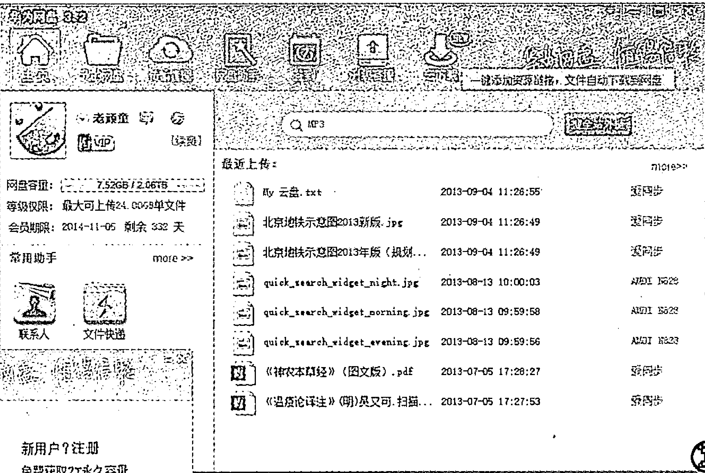

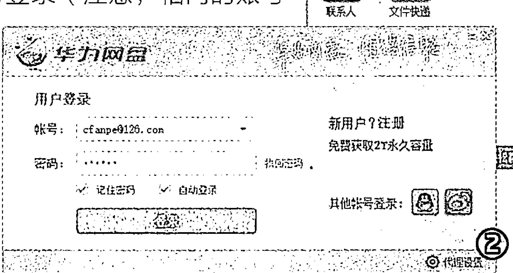

### ② 协同工作 全仗智能备份

工作双方均通过华为网盘客户端，点击主页左侧的“常用助手→more”，切换到助手选择页面，然后选择“智能备份”（图3）。

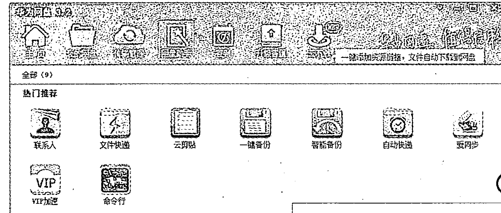

在智能备份窗口中，点击“添加备份任务”。我方使用“定时备份到云端”功能，设定自己的工作资料在本地的文件夹，设定网盘资料为双方共同约定的一个文件夹（如“我的网盘\我的文件”），设定资料自动上传的时间（如凌晨3点）。这样，时间一到，电脑会自动将本地电脑同步文件夹中的资料上传到服务器的相应文件夹中（图4）。

> 小提示
不管是功能多么强大的网盘，它所提供的基本功能屈指一数也没有几个。但是，如果能将这些基本功能灵活应用到实际生活当中，网盘的威力就会无穷无尽。本文中巧妙地同时应用华为网盘的定时备份和定时下载功能，再结合网盘账号双人共享的技巧，就实现了一个以往难以实现的任务。读者朋友可按此思路扩宽网盘的应用，用网盘来解决更多的生活实际问题。

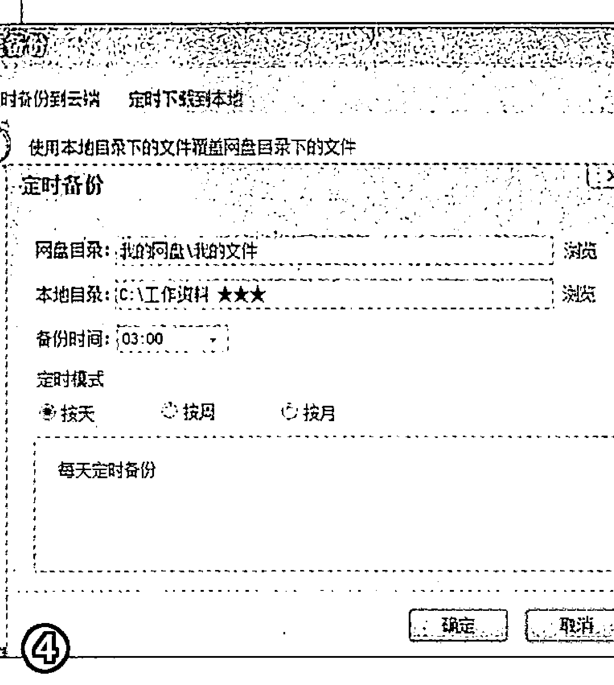

对方使用“定时下载到本地”功能，设定好相同的网盘目录，设定本地接纳文件夹，电脑自动下载资料的时间可设得靠后一些（按网速预测或实验得出，要保证在我方资料自动上传完成后，比如凌晨5点）。这样，时间一到，电脑会自动从服务器中下载资料到本地电脑中。

经过如上设置后，我方完成工作即可倒头就睡，对方也不用起早去公司接收数据了。

## 谁在偷窥你的电脑

现在大部分家庭是通过路由器构成一个小型网络，网络基本全天在线，这样电脑只要一开机就可以连接到互联网中。虽然这样做非常方便，但是也可能为黑客打开了方便之门，他们可能会偷偷连入你的电脑中，伺机窃取资料。而这些操作都是在系统后台进行，怎么才能揪出这背后的黑手？

文|重剑

### 1 寻找内网中的联网主机

攘外必先安内，首先查找内网中的可疑连接。运行网络嗅探软件 WhoIsConnectedSniffer ( http://tinyurl.com/lsxjktv，需要先安装 WinPcap )，第一次运行，在弹出的询问窗口中选择“WinPcap Packer Capture Drive”项，再在下方列表中选择当前电脑的IP地址，最后点击OK完成设置进入软件界面（图1）。

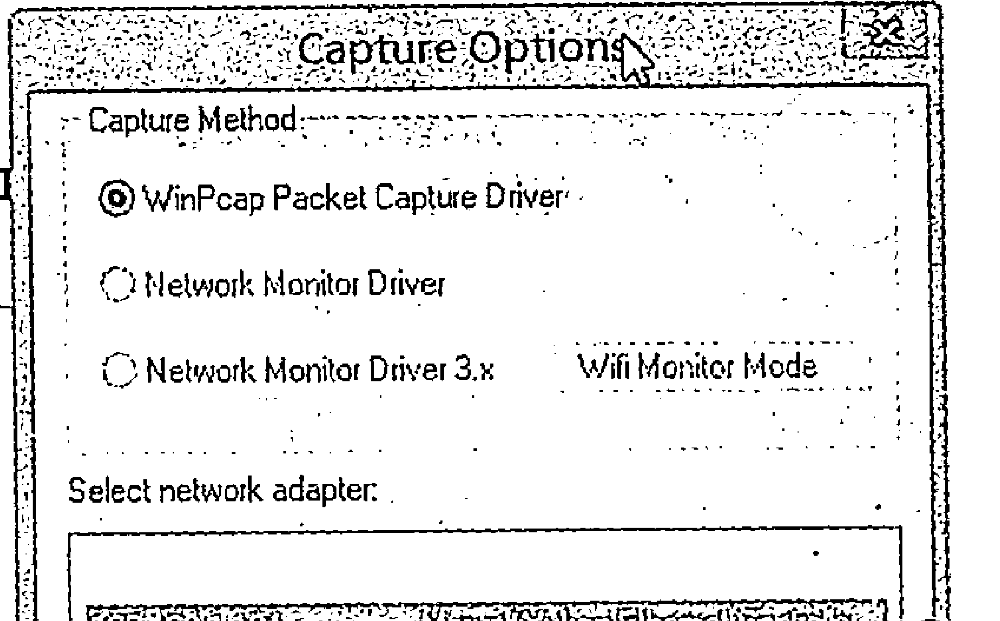

从界面列表中，可以看到多个不同的IP地址，其中一个是路由器的，另外则是连到路由器的其他电脑或设备。通过“Name”项可以查看名称，这里很容易发现可疑的连接，比如蹭网的连接等（图2）。

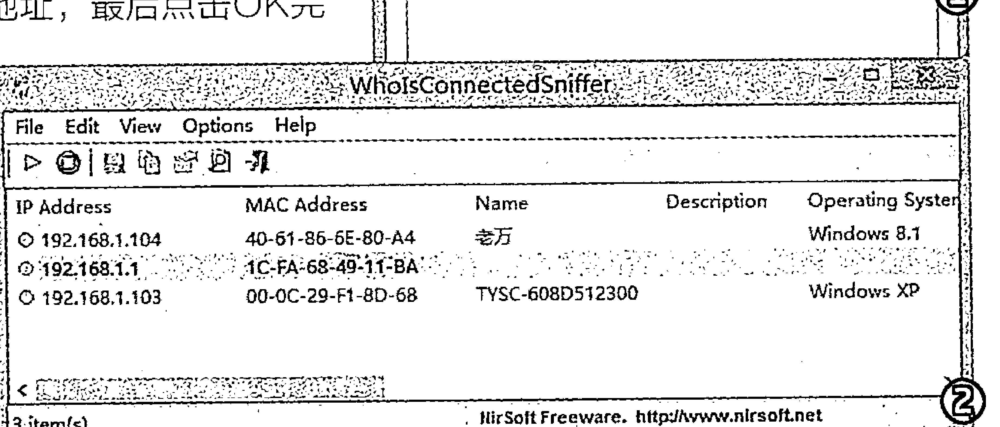

| IP Address | MAC Address | Name | Description | Operating System |
| :--- | :--- | :--- | :--- | :--- |
| 192.168.1.104 | 40-61-86-6E-80-A4 | 老万 | | Windows 8.1 |
| 192.168.1.1 | 1C-FA-68-49-11-BA | | | |
| 192.168.1.103 | 00-0C-29-F1-8D-68 | TYSC-608D512300 | | Windows XP |

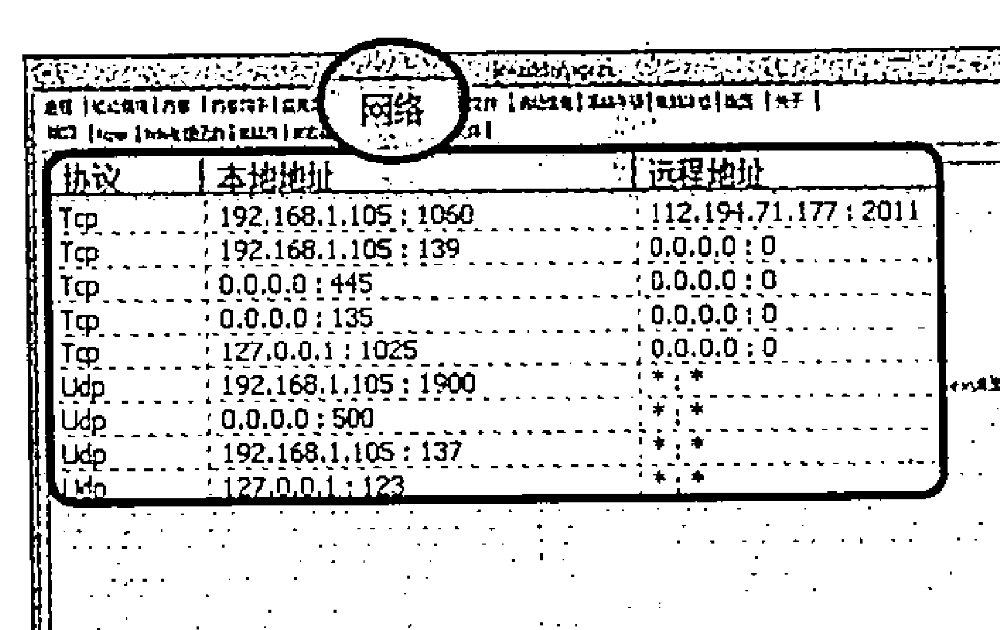

### 2 找出系统中的恶意软件

无论是黑客控制也好，恶意程序感染系统也罢，我们都需要将它们找出来清除掉。首先找到一台正在联网的电脑，尽量关闭其中正在运行的程序，避免它们对分析过程进行干扰。接下来运行“PC Hunter”（http://appwan.net/?p=483），点击窗口中的“网络”标签，就可以看到这台电脑所有的网络连接情况（图3）。在“远程地址”列表中，查看是否存在 WhoIsConnectedSniffer列表中出现过的IP地址。如果存在则可能这台电脑正在被人偷窥或控制，如果没有的话就需要对其他的电脑进行分析。

通过“进程ID”列表查看到正在进行网络连接的进程ID信息，接下来点击 PC Hunter窗口中“进程”标签，找到刚记录下的进程ID信息。在这个进程上右击，选择“暂停进程运行”命令（图4）。通过WhoIsConnectedSniffer列表查看是否还在进行数据连接操作，如果没有则说明这个进程可能是幕后黑手，需要进行处理。

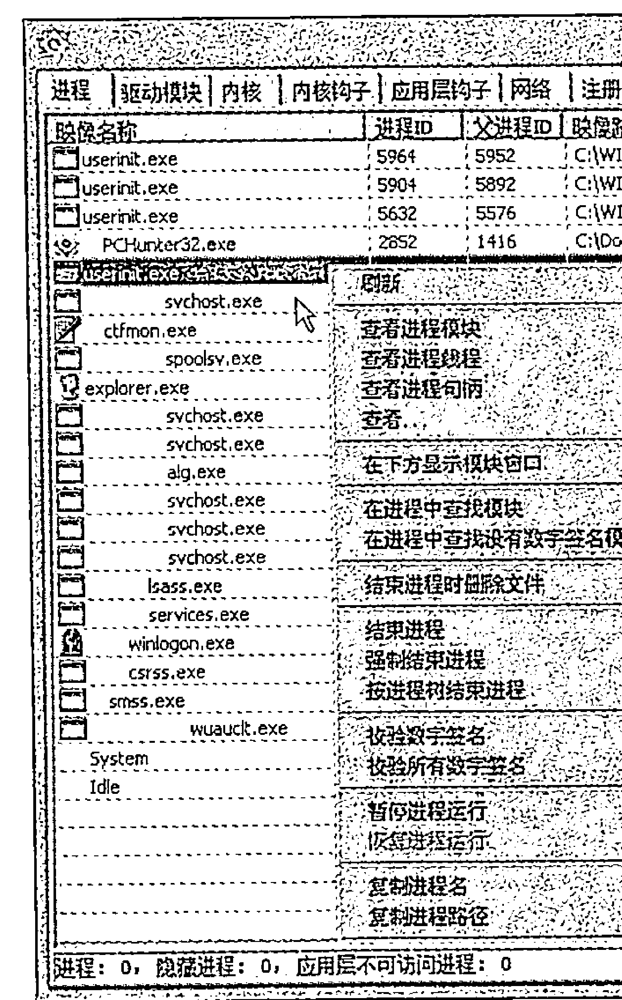

首先通过进程名称找到该文件，为稳妥起见最好将其上传到VirusTotal这类网站进行分析。如果的确是恶意文件的话，在“PC Hunter”的“进程”标签中右击它，选择“结束进程时删除文件”即可。当然也可能不是恶意程序，但是程序没问题不代表其中的所有模块也没问题，继续右击它，选择“查看进程模块”，在弹出的对话框中查看有没有可疑的模块，如果有，则右击选择“删除模块文件”命令即可。

## 更强更壮 调教系统防火墙

微软从Windows XP开始，就在系统中增加了网络防火墙功能。虽然此功能已能满足用户的基本需求，但因它的设置繁琐，导致许多用户未能充分使用。而借助Windows Firewall Control（以下简称为WFC）这款工具，不仅对系统防火墙的管理更加简单，而且让防火墙的功能也变得更强大。文|万立夫

### 1 汉化WFC

WFC是英文软件，对初学者来说使用不便，我们可以将其汉化。首先下载WFC安装包及其对应的简体中文语言包（http://appwan.net/?p=486），这里需要提醒大家，WFC需要.NET Framework 4.0的支持才能正常运行。安装完成，会在系统托盘中显示WFC图标，右击此图标，选择“Exit”命令退出它。接下来将下载的中文语言包文件复制到该工具的安装文件夹中。再次运行WFC，它的操作界面就变成简体中文了。

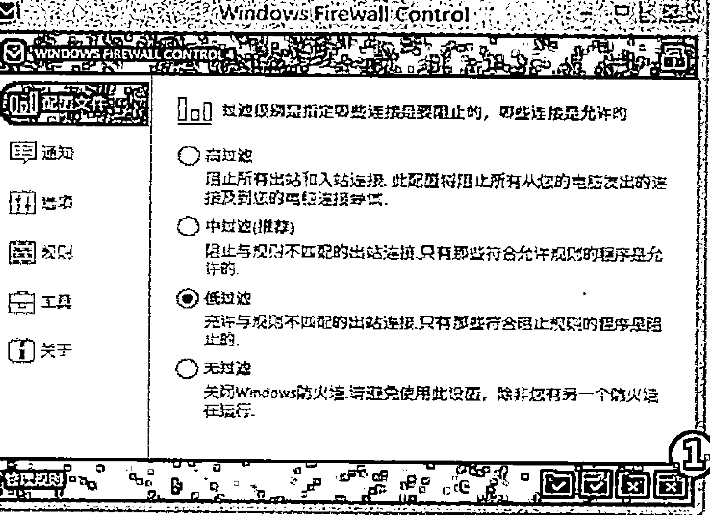

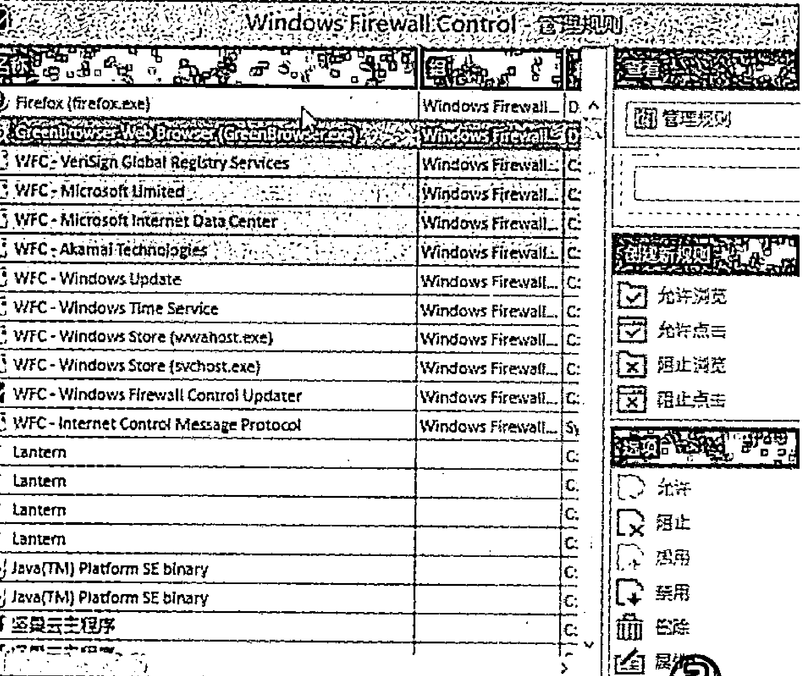

### 2 调整安全等级

Windows系统防火墙只会在软件程序访问网络时才弹出提示窗口询问用户。如果觉得这样过于简单，那么现在在WFC图标上右击，选择“控制面板”命令，接着选择控制面板中的“配置文件”选项，就可以根据自己的需要选择相应的过滤级别。过滤级别越高对软件程序访问网络的限制就越大，WFC推荐选择“中过滤”项（图1）。

WFC通过对网络规则进行匹配，来进行所有的网络连接行为的分析判断。要想对系统中已有的规则进行管理，可点击左下角的“管理规则”，即可看到已有的网络规则。任意选中一项，点击“选项”中的控制命令，就可以进行“阻止”、“禁用”、“删除”等管理操作了（图2）。

### 3 创建全新网络规则

除了管理已有的网络规则，还可以按需创建自己的全新网络规则。在“管理规则”窗口的“查看”列表中，选择“管理规则”项，点击“创建新规则”中的“允许浏览”按钮，在弹出的对话框中选择允许连接的程序文件，比如我选择的是火狐浏览器的主文件Firefox.exe，一个新规则就创建完成了，方便吧。

如果还想创建更加严谨的规则，那么就选择刚刚创建好的网络规则，接着点击右侧列表中的“属性”。由于浏览器通常都是连接服务器的80端口，在弹出的属性窗口中找到“协议和端口”这项。在“协议”列表中选择“TCP”，“远程端口”选择“自定义端口”，“例如”中输入80（图3）。所有的设置完成，点击“应用”，以后当浏览器访问不是80的端口时，WFC就会弹出提示框进行拦截。

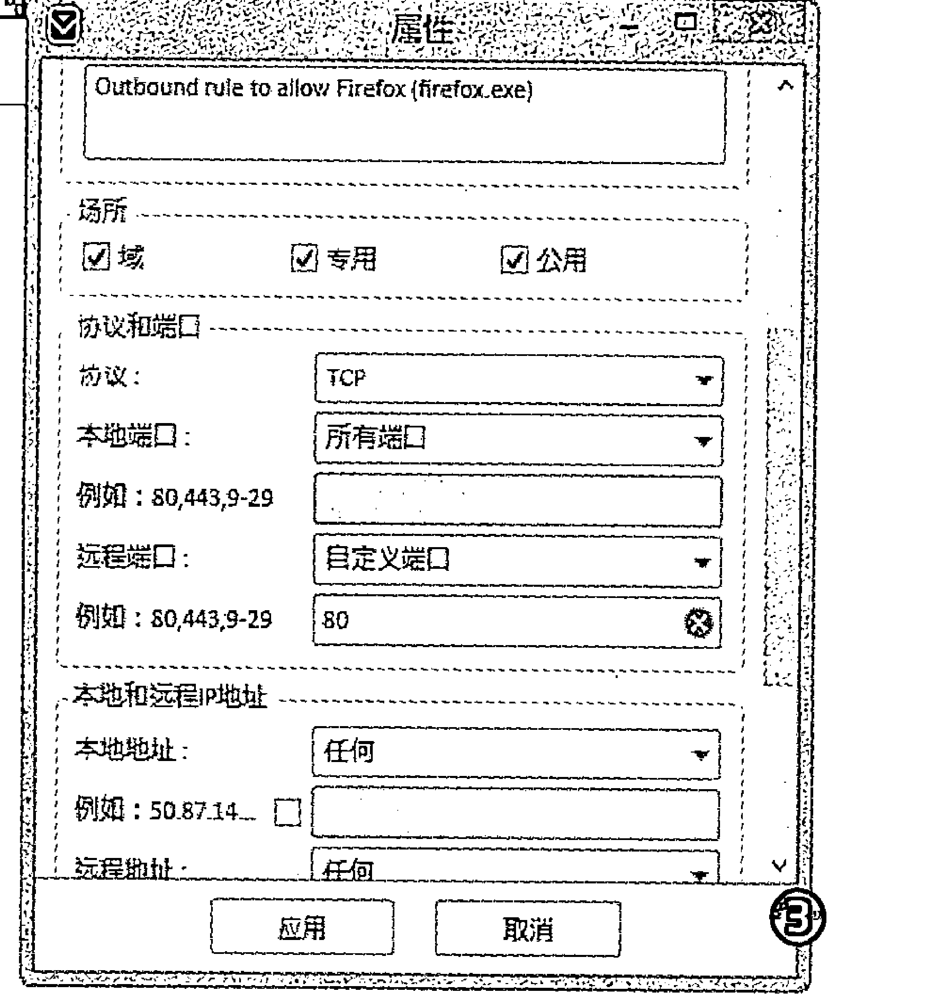

## 一分钟快速创建表情图片

网上经常看到有朋友分享一些四格漫画，或是由一些电影、电视剧中截取出来的画面等，然后再加上自己的内容，改编成搞笑的表情。其实只需要利用一些现成的工具，我们也可以制作出这样的效果。

### 1 快速创建四格漫画

最近有一组漫画在网上非常火，叫做“妈妈再打我一次”。如果你也想制作，这里告诉你一个最简单的方法。首先打开网页http://game.fastlight.cn/munv，根据提示输入三行文字内容，比如“干嘛呢”、“看新闻吗”和“为什么不看电脑爱好者”，最后点击“生成图片”按钮，网页右侧即会显示具有你自己独特对白的四格漫画了（图1）。直接将图片拖到桌面，或者右击选择“图片另存为”，即可将漫画保存到本地了。这个网站除了“妈妈再打我一次”生成器外，还包括“王宝强泰囧”、“臣妾做不到啊”等其他的生成器，使用方法都一样，非常好玩。

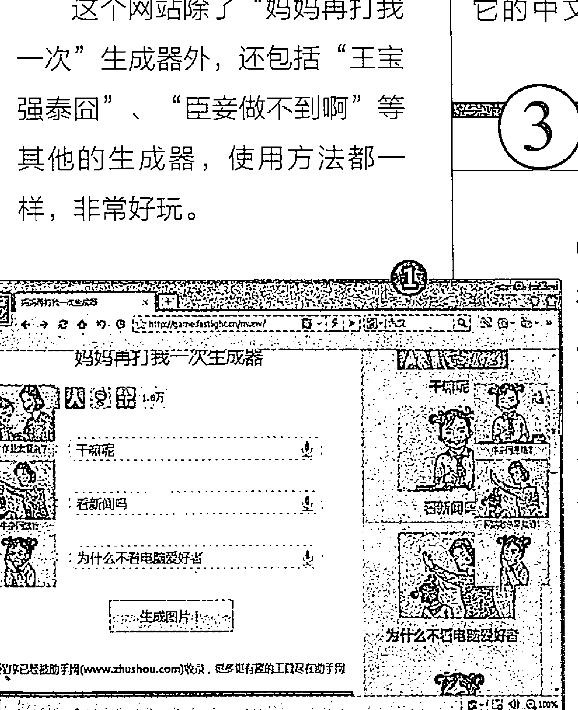

### 2 截取视频做表情

现成的生成器很方便，但是它只能生成固定风格的图片，个性化不强。如果想要更加独创的表情，可以试试QGifer。QGifer是国外软件，不过可以下载它的中文语言包，将语言包复制到它安装目录中的locale子文件夹中。启动QGifer后，点击“View”菜单中的“Language”命令，选中“Simplified Chinese（简体中文）”，即可将它变成中文版。

接下来，点击工具栏中的“打开视频”，打开需要截取图像的视频文件，然后就可以在软件界面中预览该视频的内容了。通过拖动进度条上的滑块，将其放到动画开始的地方，接着单击工具栏中的“从当期帧开始”。再拖动滑块到动画结束的地方，并单击工具栏中的“在当期帧停止”按钮（图2）。最后单击工具栏中的“提取”，截取完成后会弹出提示窗口，点击“保存GIF”，就可以将这个片段的GIF动画作为QQ等表情来使用啦（图3）。

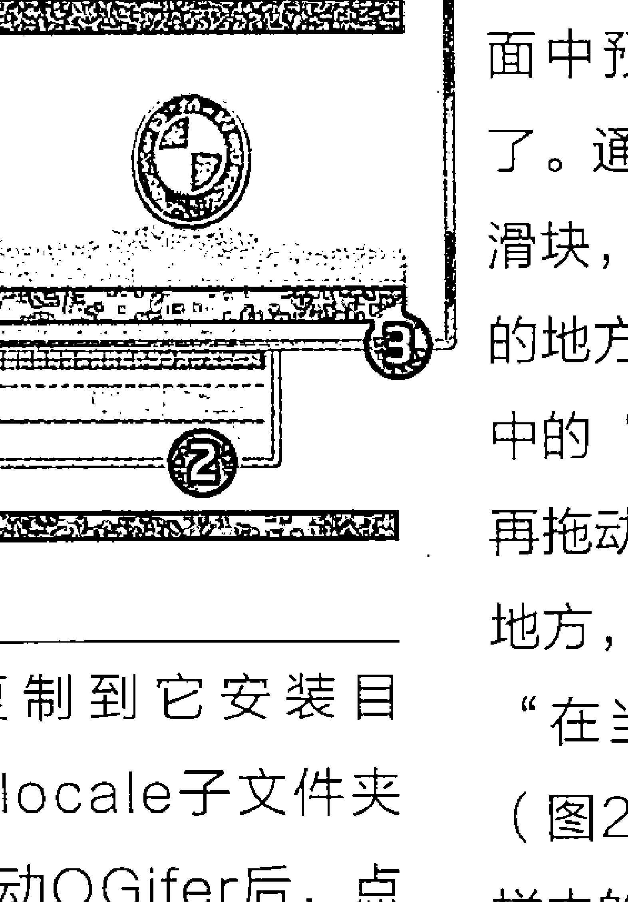

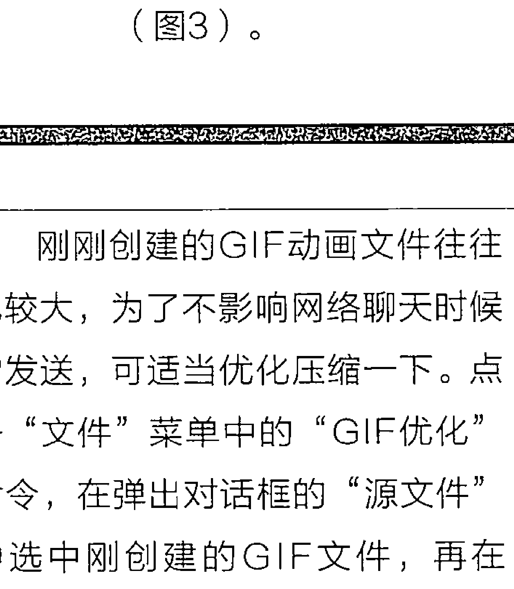

### 3 添加文字和优化

除了像上面那样截取现有视频中的片段作为表情，我们还可以在生成的GIF动画中添加自己的文字。继续在QGifer中，单击工具栏中的“插入文本”按钮，在弹出对话框的“文本”中输入相应的文字，设置字体、颜色、大小等属性，并在“帧”选项中，设置该文字显示的开始时间和结束时间。设置完毕点击“插入”，即可将文字添加进动画中。

刚刚创建的GIF动画文件往往比较大，为了不影响网络聊天时候的发送，可适当优化压缩一下。点击“文件”菜单中的“GIF优化”命令，在弹出对话框的“源文件”中选中刚创建的GIF文件，再在“目标文件”中选择优化后的保存目录，另外在“发丝因子”中设置优化的数值。最后点击“优化”按钮，完成后，就会发现GIF文件的体积比之前大大缩减了。

## 不编程也能制作安装文件

通过执行安装文件进行安装是资料分发的一种最方便的方法。但是，安装文件不是谁都可以制作，这需要一定的编程知识。因此，如果普通电脑用户也想制作这样的资料分发安装文件，就需要一种傻瓜化的方法。

文|继平

对于不懂编程的用户来讲，其实绕过编程制作安装文件还是有道可循的。例如用压缩软件WinRAR，就能制作出类似于常用软件的SETUP.EXE安装程序，实现双击执行自动安装，显示版权确认许可页面，指定软件资料安装目录，最后自动运行指定的程序等功能，实现不编程也能制作安装软件的梦想。

### ① 创建基础自解压安装包

首先需要将这些资料转化为一个可以自动执行的EXE文件的形式，这个过程要用到WinRAR的一个特殊功能，那就是生成自解压压缩格式。

将所有用来制作的资料存放在一个固定的文件夹内，然后用Ctrl+A全选该文件夹下的文件，并在选取上点击右键，选择右键菜单中的“WinRAR→添加到压缩文件”选项。在弹出的对话框中选择“常规”选项卡，点击“压缩方式”下拉框选择合适的压缩方式，勾选压缩选项下的“创建自解压格式压缩文件”选项，与此同时，可以看到“压缩文件名”框中的文件类型变成EXE类型，在此处给文件起个合适的主文件名（如“演示文件”）。然后点击“高级”选项卡（图1）。

假设我们需要自动安装的一批演示资料位于某个文件夹中，我们希望制作完成的软件能够实现自动将这批PPT资料解压到某个特定的文件夹中，然后执行其中的一个自动演示说明程序ABC.EXE。

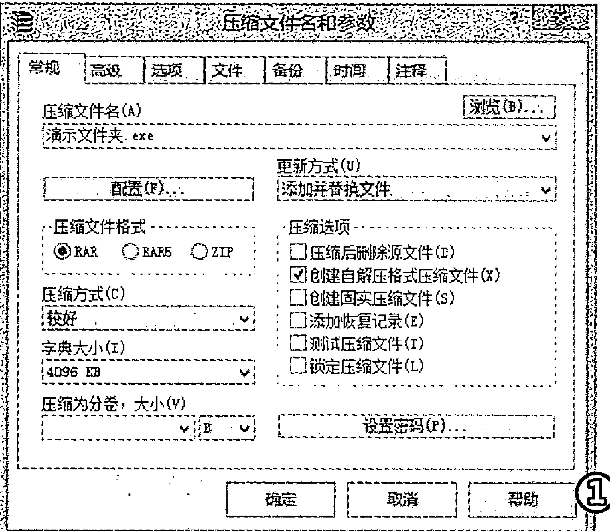

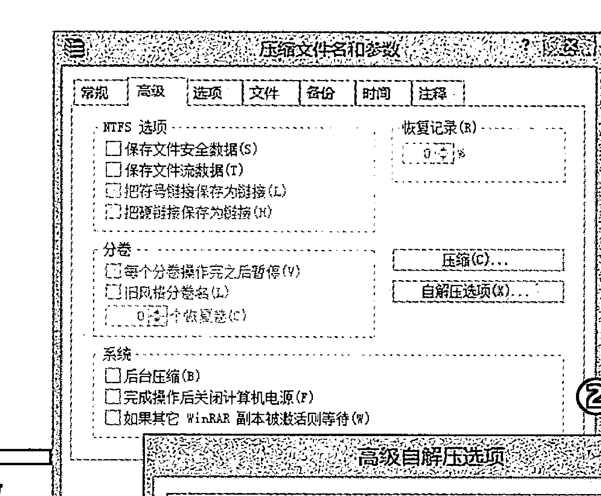

### ② 设定高级安装文件参数

在接下来的环节中，我们就来设置安装文件必备的一些窗口信息。例如安装路径设置、附带运行提示信息、安装软件图标图片等。

在“高级”参数设置窗口中点击“自解压选项”按钮（图2），进入“高级自解压选项”设置窗口。这里就是我们要定义安装文件的重要场所，有许多参数需要通过这个窗口来设置（图3）。

### ③ 设置软件安装路径

在“常规”这个选项卡窗口的“解压路径”文本框中，设置文件被自动解压到什么位置。解压路径可以沿用系统默认的Program Files文件夹，也可以自己输入绝对路径来定义软件释放的文件夹（图4）。

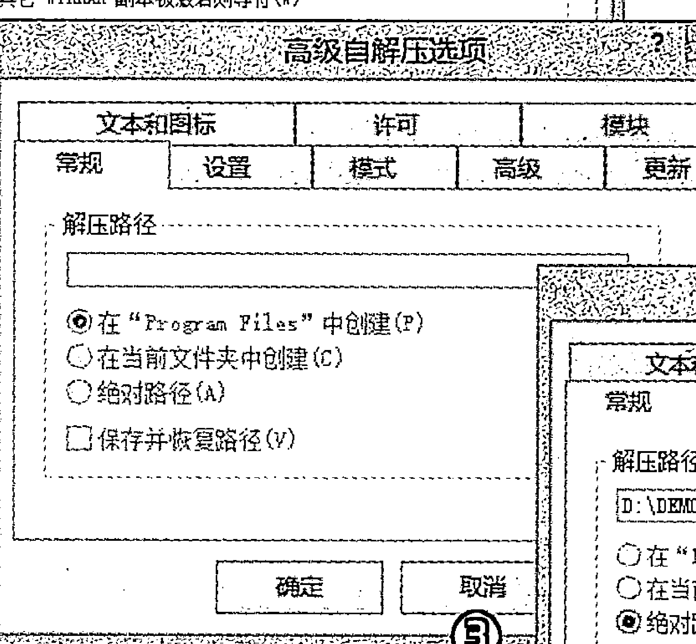

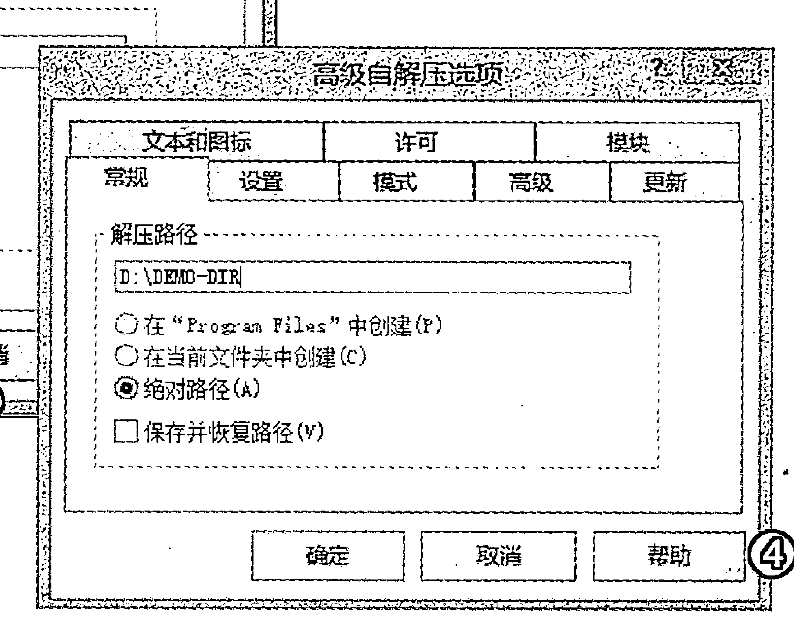

**小提示**

默认生成的安装路径不可修改，但我们可通过如下方法自定义安装路径。右击EXE自解压文件，选择“用WinRAR打开”。点击工具栏“注释”按钮打开编辑对话框，修改“Path=＜你的安装路径＞”这行命令（如：将＜你的安装路径＞修改为E:\MyTest），单击“确定”关闭WinRAR（图5）。再双击打开该EXE安装文件，即可看到“目标文件夹”里已经是你设置的新路径了。

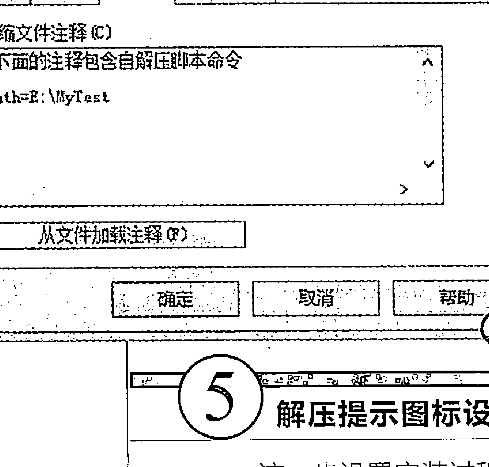

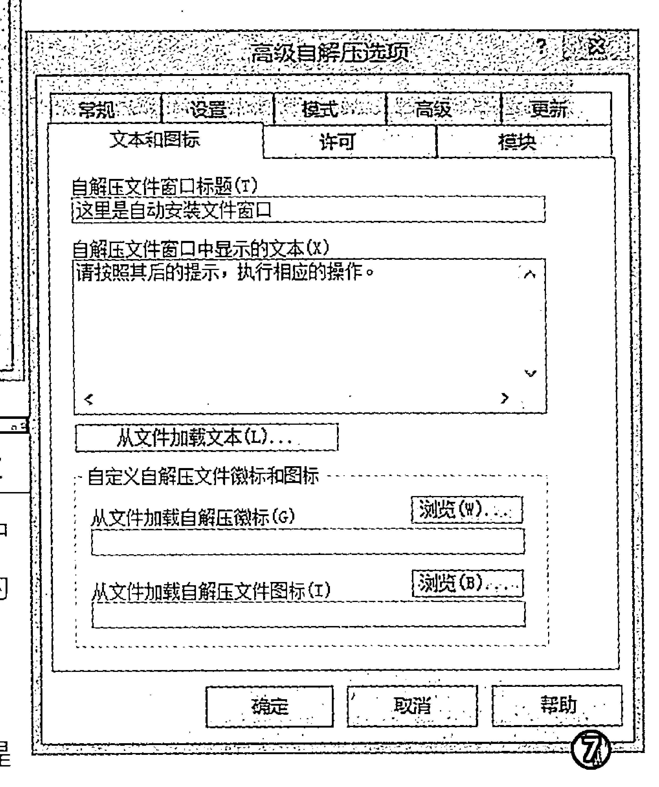

### 4 说明书调用设置

这一步设置在安装过程中自动显示一份说明书。

点击切换到“设置”选项卡窗口，在这里可以指定解压前后是否要自动执行什么程序。如果要在解压前运行诸如说明程序、说明文件之类的东西，可以在“解压前运行”框中输入文件的名称；这里需要在解压之前自动显示“说明.txt”，“解压后运行”框中要输入资料包解压完毕后运行的程序名称。如本例我们要运行ABC.EXE自动演示主程序，我们输入ABC.EXE（图6）。

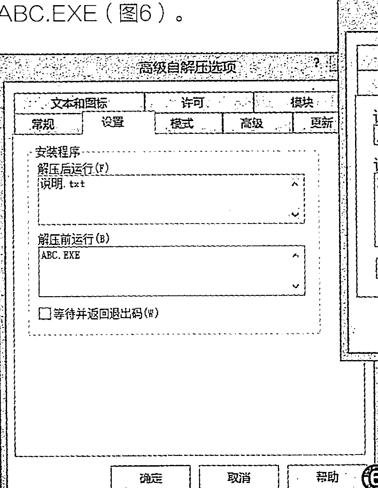

### 5 解压提示图标设置

这一步设置安装过程中的提示信息还有安装文件的图标或徽标。

切换到“文本与图标”选项卡，设置解压时的提醒信息与解压包图标。输入的“自解压文件窗口标题”将出现在解压时的标题栏中，而“自解压文件窗口底部显示的文本”会出现在WinRAR的解压提示处。如果提示文本内容太长，还可以提前输入到文本文件中，点击下面的“从文件加载文本”按钮载入文本。“从文件加载自解压徽标”是载入BMP格式图片作为安装文件的徽标，而“从文件加载自解压文件图标”是载入ICO格式的图标作为安装文件的图标来使用（图7）。

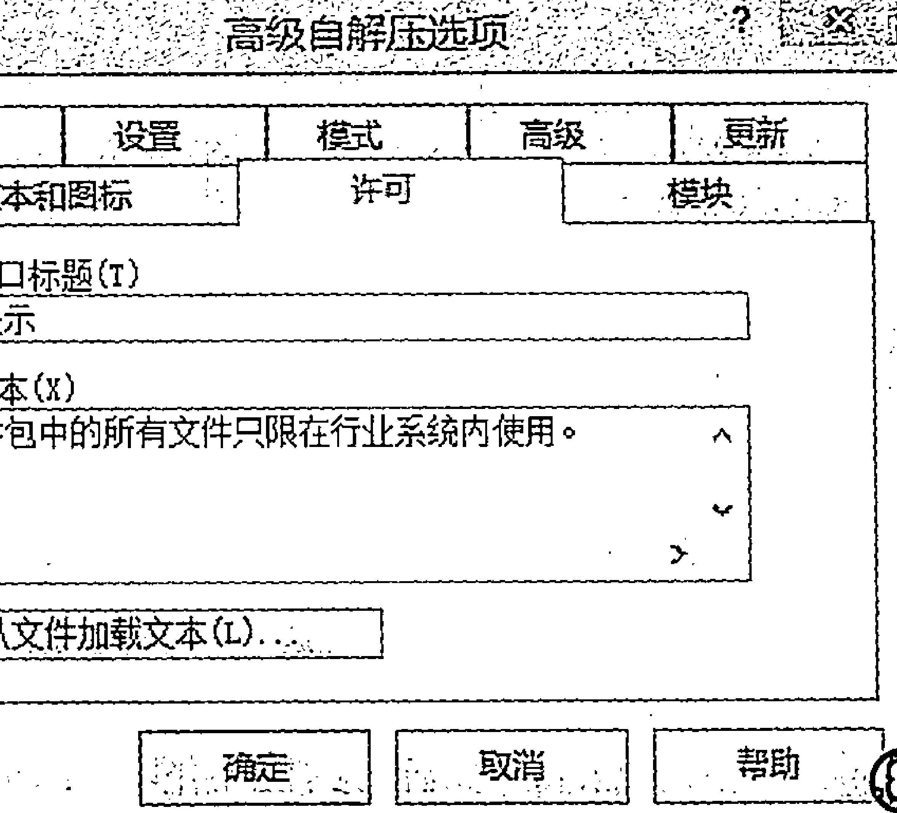

### 6 版权许可信息设置

在“许可”选项卡下，通过对“许可窗口标题”和“许可文本”两个项目的设置，可以定义安装文件运行时的版权提示信息页面，获得与专业安全软件一样的版权提示信息页。如果许可文本太长，还可以通过“从文件加载文本”按钮来载入事先设定好的文本文件（图8）。

经过如上设置之后，点击两次“确定”按钮执行压缩操作，便可获得用来自动安装的文件了。

## PDF转可编辑的Word文档

PDF文档阅读起来非常方便，但如果想编辑修改它就比较麻烦了。一个比较好的办法，就是将PDF转换成可编辑的Word文档，这样阅读和编辑都方便。不同场景和不同条件下，可以使用不同的实现方法。

文|万立夫

### 本地文档快速转换

如果是在自己的电脑上，推荐使用e-PDF To Word Converter（http://appwan.net/?p=478），这款软件最大的特色就是，不需要PDF阅读器的支持就可以转换。

启动软件后，点击“添加PDF文件”添加需要转换的PDF文件。接着分别在“输出选项”以及“输出格式”中，设置转换所需的版面样式和转换的文件格式。如果转换的PDF文件有密码，需要在“PDF密码”中正确输入。设置完毕，点击“转换”（图1），这时会弹出保存文件窗口，设置好保存位置即可开始转换了。转换成功后，会自动调用系统中的Word打开文档，以便我们对其进行查看和编辑。

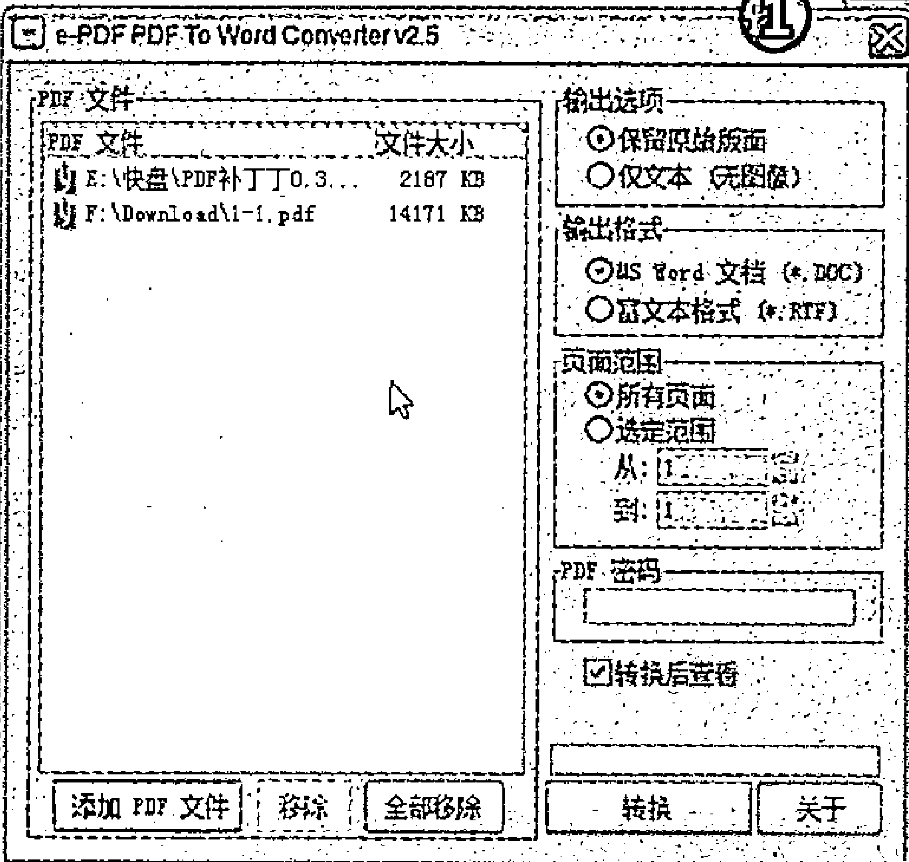

### 云计算上传转换

如果不方便在系统中安装转换软件，那么可利用云计算在线转换工具，PDFtoWord就是一个不错的选择。

进入PDFtoWord主页（https://www.pdftoword.com），点击网页中“浏览”按钮，选择需要转换的PDF文件进行上传。上传完成，在“Email Word file to:”中输入自己的邮箱，最后点击Convert it开始转换（图2）。转换完毕进入自己的邮箱，点击邮件中的Get your file按钮，在弹出的网页窗口中点击Click here if it hasn't started，就可以将转换所得的Word文档下载了。

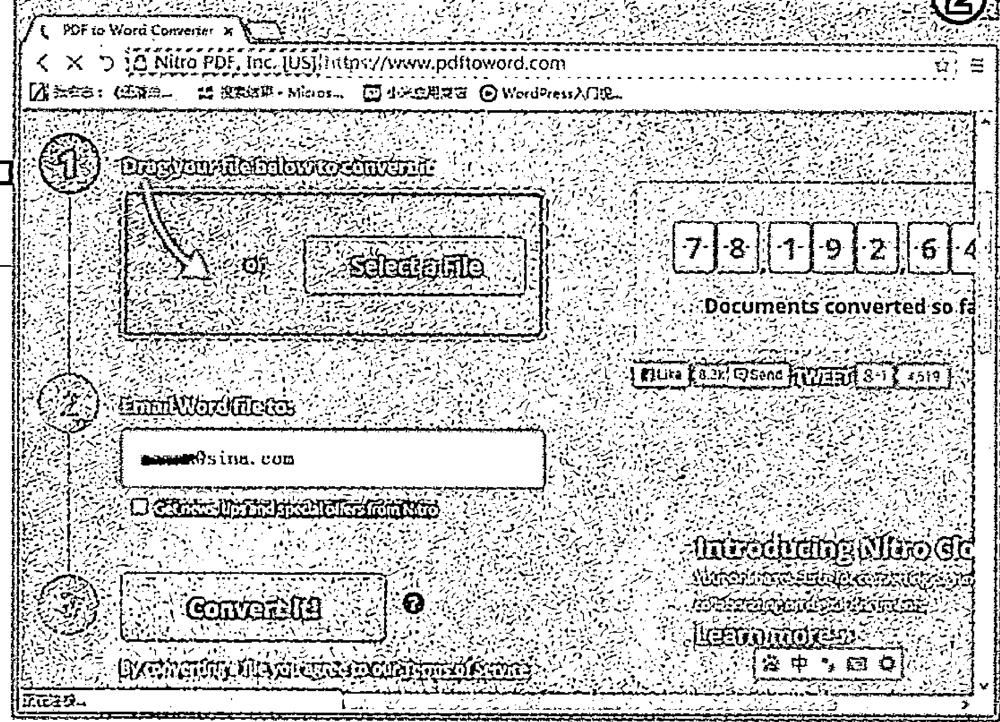

### SkyDrive网盘在线转换

Windows 8.1中已集成SkyDrive，所以大部分人都有SkyDrive账户。首先登录SkyDrive的网页版（https://skydrive.live.com），接着从文件列表中选择需要进行转换操作的PDF文件。如果文件并不在SkyDrive网盘中，那么就点击网页中的“上载”上传。选中需要转换的PDF文件，右击，选择“在Word Web APP中打开”，就可以在线预览该PDF（图3）。

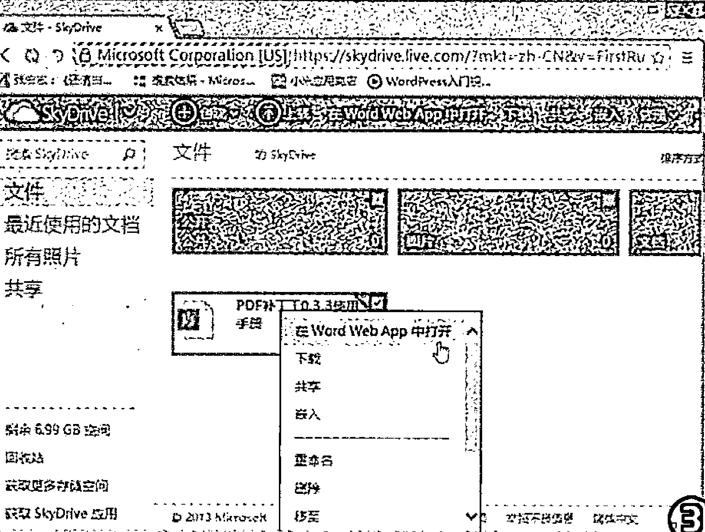

此时，点击工具栏中的“在Word中编辑”，将会弹出提示窗口，询问是否将该文件转换成Word文档（图4）。点击“转换”开始，转换完毕又会弹出提示，询问是“查看”还是“编辑”它。点击“编辑”就可以直接在线进行编辑操作了。由于是在SkyDrive网盘中进行操作，所以转换以及编辑完成的文件都会直接保存到网盘里面。

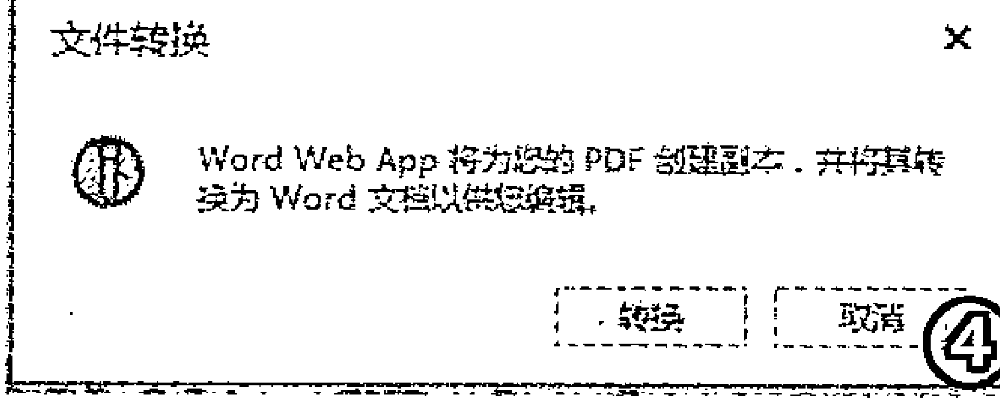

## 两招挖出网页受限文字

有时我们在上网浏览时，发现一些页面上的文字是不能复制的。无论你采用鼠标选择、快捷键拷贝，还是用右键菜单命令等均无果。下面的两招可以轻松突破这个限制。

### 1 360 IE内核浏览器编辑法

这是一种操作比较简单的方法，是利用360安全浏览器5.x版的一个特别功能——网页编辑模式来实现的。360安全浏览器在6.0之后的版本中采用了谷歌内核，不再附带该功能。
使用360安全浏览器5.x版开启某个受限网页，当你用鼠标或键盘热键均无法选择复制网页内容的时候，点击浏览器菜单命令“查看→启用编辑模式”，这时的网页就变得可选择，你可以任意选择复制和粘贴其中的内容了（图1）。

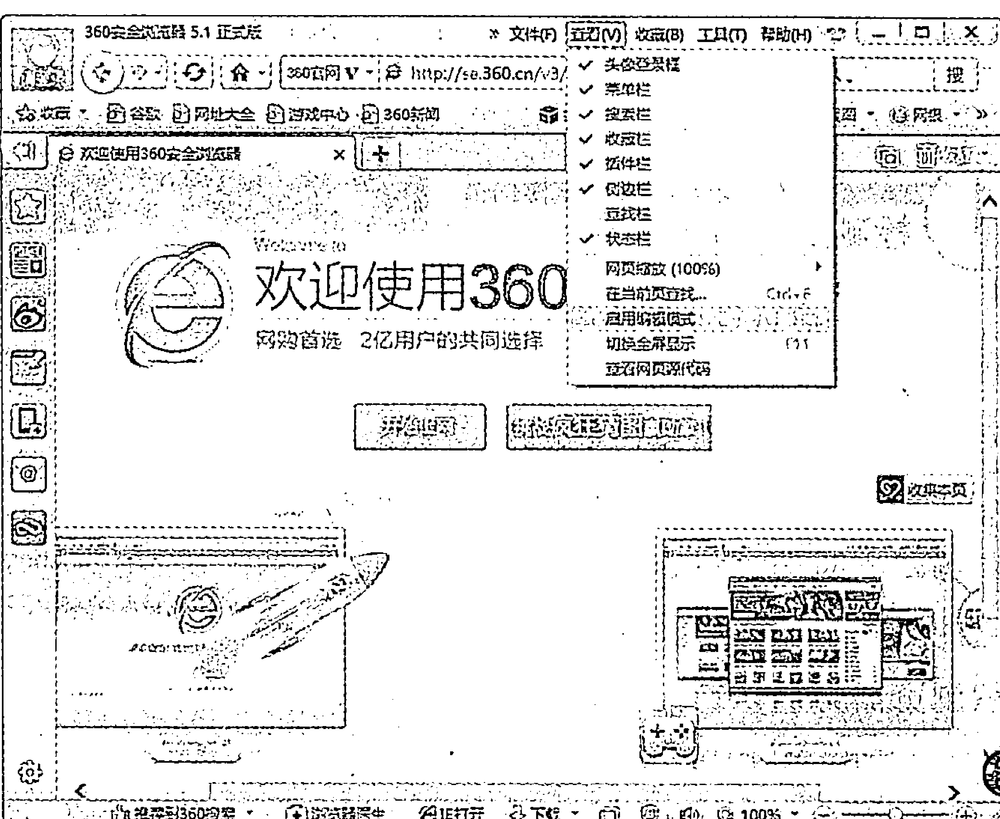

### 2 EmEditor源代码过滤处理

如果使用360安全浏览器6.x版或其他浏览器，软件没有提供网页编辑模式功能，怎么办？我们可以用大多数浏览器提供的一个通用功能——网页代码查看，结合文字处理软件EmEditor的强大替换功能来解决问题。

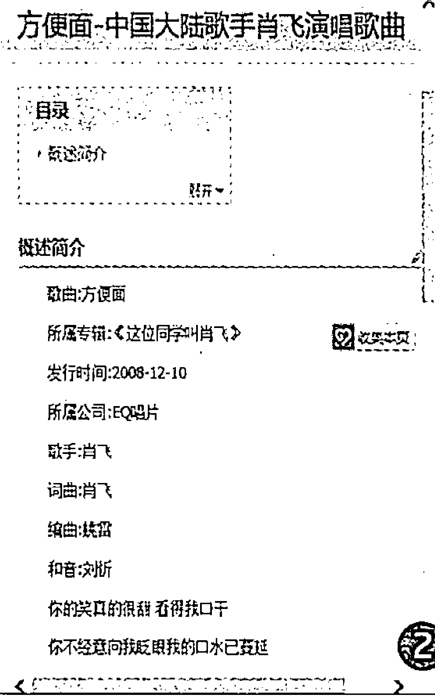

我们以一个网页为例（图2），假设这是一个内容复制受限的网页，通过“查看→网页源代码”可以获得如图3所示的代码内容，从图中可见，我们要的内容也在其中，但中间夹杂着许多对我们无用的代码。下面我们就通过EmEditor的替换功能将这些无用代码过滤掉。先用EmEditor打开这个代码文件，删除文件头处的无用代码，然后用Ctrl+H热键启动EmEditor的查找替换窗口，在“查找”框中输入“<p>”，保持“替换为”框中无任何内容，点击“替换全部”按钮。再用同样办法将歌词行尾的“</p>”替换为无文字的空串，这样就可以获得纯净的歌词内容了（图4）。

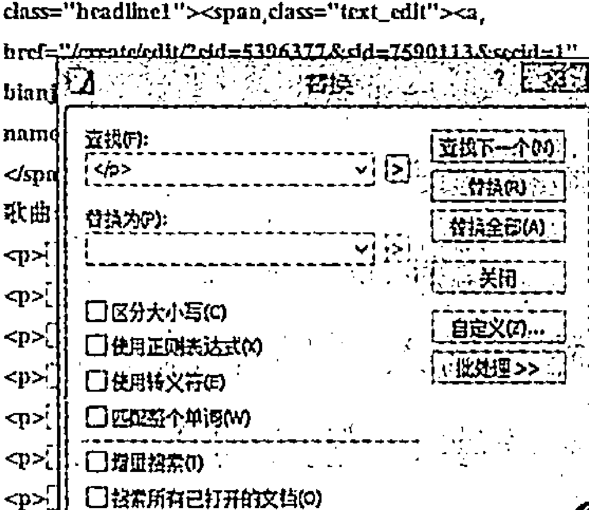

```
</div>,</div>,<div id="lemma-main"><div class="main-text-cl"><h2,
class="headline1"><span class="text_edit"><a,
href="/create/edit/?eid=5396377&sid=7590113&secid=1",
bianjibenduan_ids="5396377,7590113,81912,1">编辑本段</a></span><a,
name="5396377-7590113-1"></a><span class="headline-content">概述简介
</span></h2>↓
<p>□□歌曲:方便面</p>↓
<p>□□所属专辑:《这位同学叫肖飞》</p>↓
<p>□□发行时间:2008-12-10</p>↓
<p>□□所属公司:EQ唱片</p>↓
<p>□□歌手:肖飞</p>↓
<p>□□词曲:肖飞,</p>↓
<p>□□编曲:姚雷</p>↓
```

上面这个例子比较简单，我们在处理时没有选择正则表达式选项便轻松完成了对无用代码的成批替换。而许多时候，我们获得的网页代码比较复杂，简单的查找替换无法一下完成替换任务。对于比较复杂的网页代码，可用EmEditor构造正则表达式来完成网页代码的过滤替换。正则表达式构造案例本刊办公软件栏目曾多次介绍过，大家可以参考。

## 插件下岗 让脚本扩展浏览器

> 无论是谷歌浏览器还是火狐浏览器，都以拥有功能众多的扩展应用为卖点。不过扩展应用安装得越多，浏览器占用的系统资源也就越多。其实在网上有很多功能脚本，完全可以完成扩展应用的功能。通过它们不仅可以实现相应的操作，而且不会出现系统资源占有过多的问题。今天就为大家介绍几款常用的脚本。

### 1 检测脚本的安全性

脚本一直就有它的两面性，用得好的话可以为网页增光添彩，用得不好的话就可能为黑客病毒所利用。因此我们在安装脚本的时候，最好首先了解它的安全性怎么样。这里以谷歌浏览器为例，首先安装一款Tampermonkey扩展。接着点击工具栏上的脚本扩展图标，在弹出的菜单选择“获取脚本”命令，这样就可以打开一个专业的脚本网站。

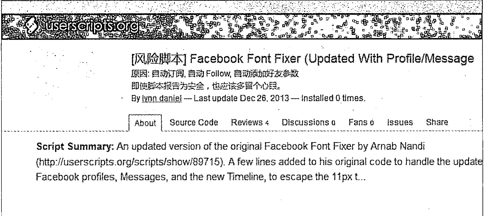

在弹出的网站页面的搜索框里面输入“风险脚本过滤器”关键字，查找到以后进入到这个脚本的介绍页面，点击右上角的“Install”按钮下载安装此脚本。以后当我们再进入到Userscripts.org的时候，在每一个脚本名称的前面就可以看到一个安全说明（图1）。如果提示为“风险脚本”的话，我们就不要再进行安装操作了。

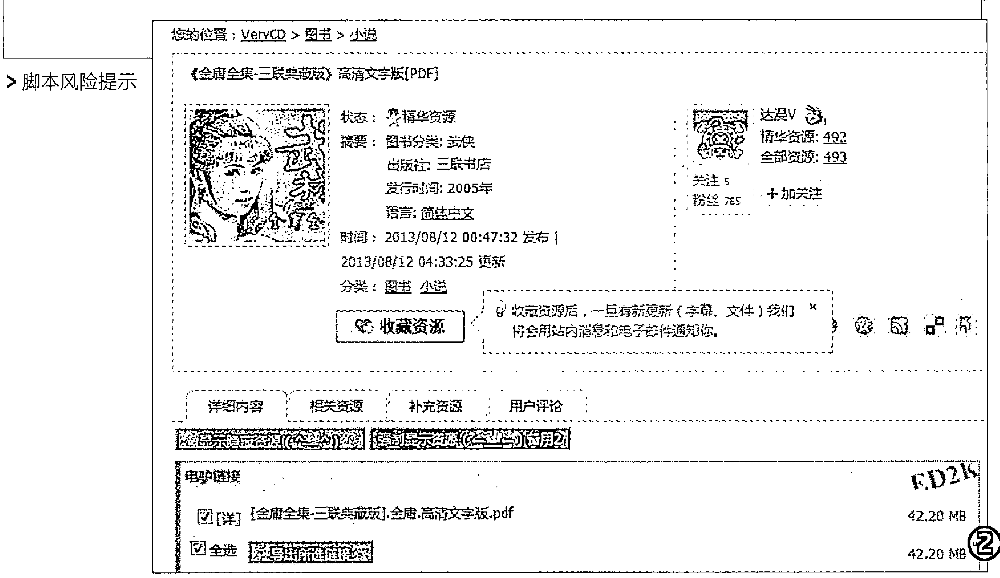

### 2 屏蔽网盘登录限制

由于现在各式各样的网络硬盘很多，于是很多用户喜欢通过它们进行文件分享。但是很多网盘在下载的时候，对下载操作进行了一些限制，比如要求用户首先进行登录操作，不然的话就无法进行文件下载。这个时候我们可以安装“Crack Url Wait Code Login”这个脚本试试，以后进行网盘文件下载时即可破除各种限制，不但可以过滤网站登录的要求，而且对于那些要求输入验证码的也可以过滤，还可以将VeryCD隐藏的下载链接显示出来（图2）。

### 3 外文信息直接翻译

上网时难免遇到一些外文信息，可是常见的翻译软件只能翻译英文，那么遇到其他的外文信息如何解决呢？这时就需要“Google Translator Tooltip”这个脚本来帮助了，它是利用谷歌翻译来进行的，不过第一次使用时需要简单设置一下。首先通过鼠标任意选择一个英文单词，稍等片刻就会出现一个放大镜的图标。点击它以后在弹出的悬浮框点击“>>”按钮，在“To”列表中选择“Chinese”项，最后点击窗口中的“Save”（图3）。以后当我们需要翻译外文信息时，只需要通过鼠标划词选中，稍等片刻就可以显示出翻译的内容。

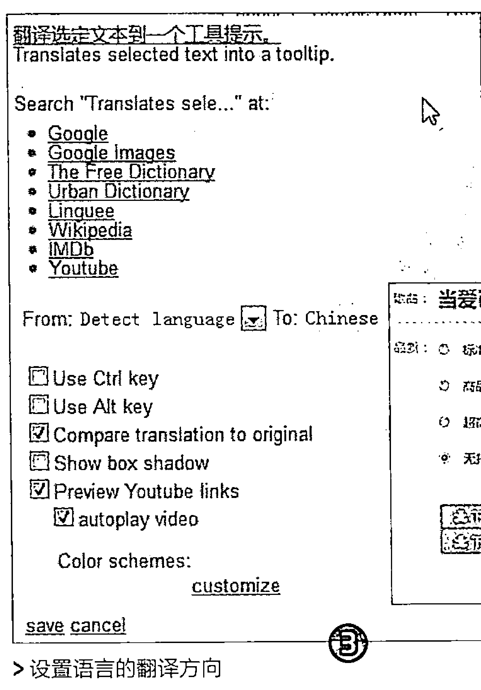

### 4 搜索结果直接打开

无论是使用哪一个搜索引擎，在打开搜索链接的时候，都是通过跳转到这个网页链接再打开。可是在使用谷歌时，发现它跳转的时间非常慢，有时甚至无法进行跳转。这时可以试试“stopGoogleRedirection”这个脚本，安装成功后，当我们再通过谷歌进行搜索时，就不会再有网站跳转这个环节了，直接进入搜索结果，大大加快了搜索速度。

### 5 专业链接直接转换

无论是迅雷还是QQ旋风，都发布有自己的专业链接。如果用户需要下载这些链接的文件，必须使用所对应的下载软件才可以。其实我们只需要安装“Special Links Converter”这个脚本，当我们遇到专业链接的时候，只需要将鼠标移动到链接上，脚本就会对其进行破解，当破解完成以后就会出现一个提示窗口（图4）。接下来只需要选择右键中的复制链接命令，粘贴到任何一款下载软件中就可以进行下载了。

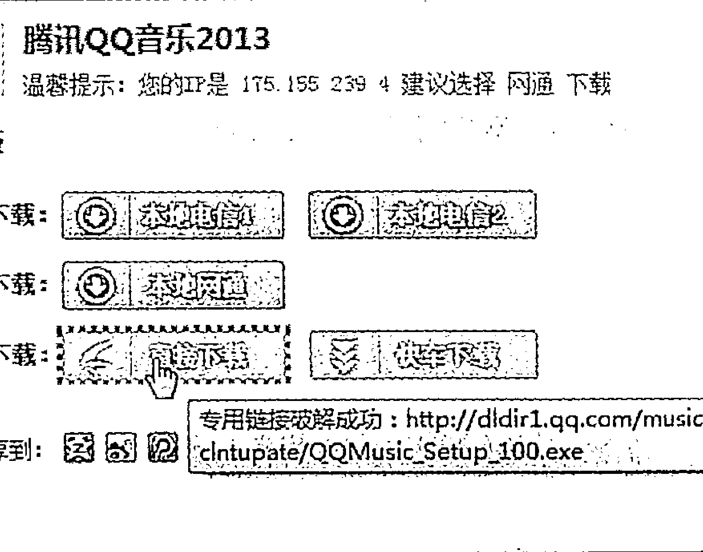

### 6 直接下载文库内容

现在很多网友都喜欢将一些资料发到百度文库、新浪爱问等地方，供普通用户进行下载操作。但是我们经常会遇到这样的情况，就是下载资料的时候，要求用户支付某些虚拟货币等，比如金币、积分等等。如果用户手中的虚拟货币不够，那么就无法进行资料的下载。其实我们只需要安装“Share easy downloads helper”这个脚本，以后当我们进入到新浪爱问、百度文库、新浪微盘等网站的时候，直接点击“下载”按钮就会弹出下载窗口。点击下载窗口中的“保存”按钮，不需要任何积分就可以进行下载。

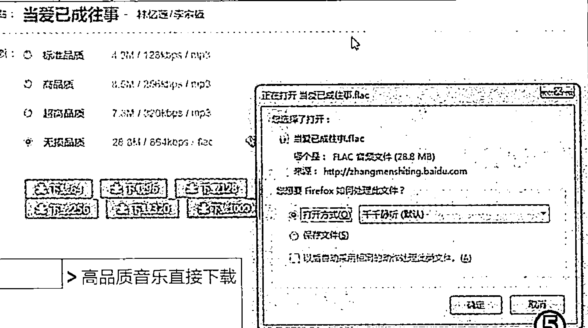

### 7 高质音乐直接下载

网上现在有很多音乐网站，比如百度音乐、九酷音乐网、虾米音乐等。虽然这些网站可以满足用户基本的试听或者下载操作，但是这些音乐文件的品质并不是特别高。如果用户想要下载高品质音乐的话，那么首先就需要支付一定的费用成为会员。其实我们只需要安装“Music liker for Beauty”这个脚本，以后进入到这些音乐网站后，找到“超高品质”或者“无损品质”的选项，点击下载就可以获取高品质音乐啦（图5）。

## PicPick不止截图这么简单

文 | 张秀常

在课件制作过程中，图片是使用频率最高的元素，往往要经历从收集、编辑、到标注、插入等步骤，用到的工具也是五花八门，如截图用HyperSnap、图片编辑用ACDSee或Photoshop，这些软件体积较大、操作繁琐，需要不断地在各个工具间切换使用。

PicPick是一款解决教学课件制作中图片类问题的一站式软件，它不但体积小巧、资源占用少，而且功能非常丰富，涵盖了图片收集、编辑、标注、插入的全过程，可进行屏幕的个性化截取、图片编辑，还可以共享截图到Office三大办公组件与SNS社交网络中。

### ▶ 手绘区域来截取 编辑工具加效果

PicPick软件菜单“文件→工具”下具备“截取全屏、截取活动窗口、截取窗口控件、截取任意形状区域……”等8个选项。选择“截取任意形状区域”，之后就可以在屏幕任意区域移动鼠标，沿鼠标路径形成一个手绘形状的任意封闭区域，这就是截取内容。

此时，可以单击图片编辑栏上的“效果工具”进行编辑，它包涵了图片编辑的主要功能，如“反色、锐化、亮度及对比度、色调及饱和度……”等10项工具，基本上能满足我们日常处理图片的需要。用“亮度及对比度”工具调整亮度及对比度的参数，一张手绘区域截图就形成了。

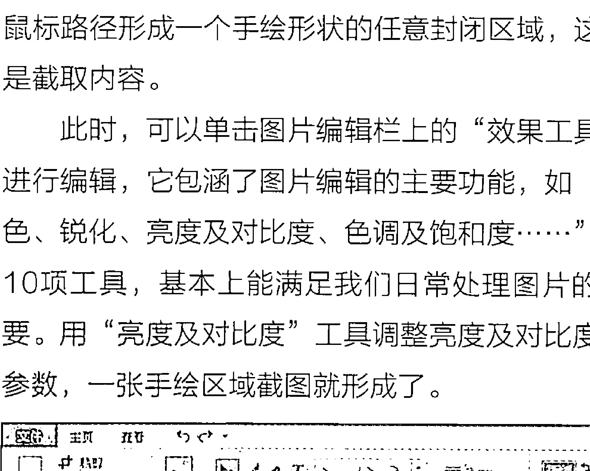

### ▶ 绘图工具加标注 文字工具补说明

单击工具栏绘图内的“笔刷、橡皮擦、填充、取色”等选项对截图进行再绘制，或单击图形区域内的“直线、曲线、气泡、星形……”等13种图形进行再补充。最后，可以用“文字工具”对截图进行说明，单击文字工具，输入想要的说明性文字，设置“不透明度、字体、字号、对齐方式、颜色”等即可。


### ▶ 白板功能巧使用 共享截图到课件

单击“白板工具”，在浮动栏上有“缩放屏幕、铅笔、箭头、截取全屏……”等10个选项，可利用铅笔对屏幕上的文档进行绘制说明，并用截取全屏功能将绘制后的内容保存为JPEG等图片格式。

PicPick软件还集成了“共享截图”的功能，通过菜单“文件→发送到”，将截取后的图片直接插入到Word、Excel、PPT等Office办公组件内，或直接分享到Skype、WEB空间、FTP等网络上。

| 序号 | 设备 | IP地址 | 状态 |
|------|------|--------|------|
| 1 | 刻录机 | 172.18.25.3 | ✓ |
| 2 | 交换机 | 172.18.25.4 | ✓ |
| 3 | 防火墙 | 172.18.25.5 | ✓ |

PicPick软件的最新版本是V3.2，可在http://et.xsedu.net.cn/下载。此软件还具有取色器、调色板、放大镜、标尺、量角器等功能，这给我们日常教学课件的制作带来了极大的方便。

## 云笔记管理好“碎片”时间

在快节奏生活的今天，各种工作、任务纷至沓来，要想更有效率，就得充分利用不同任务之间的“碎片化”时间。这方面，我们最好借助云笔记来协调好时间。
文|万立夫

### 1 创建事务“笔记本”

云笔记软件有不少，但还是推荐印象笔记（http://tinyurl.com/mwnzz2p）。由于在我们要办的事务中，既有公事也有私事，所以在印象笔记中应创建一些标签加以区分。在软件左侧列表“标签”上右击，选择“标签”，在弹出的对话框中设置标签名称，比如“公司事务”、“个人事务”等。

为避免和其他的笔记混淆，还需要新建一个新的笔记本。在左侧列表“笔记本”上右击，选择“创建笔记本”命令，新笔记本的名称可以是“待办事务”之类的，然后再在“类型”中选择“同步的笔记本”项，完成后点击“确定”即可（图1）。

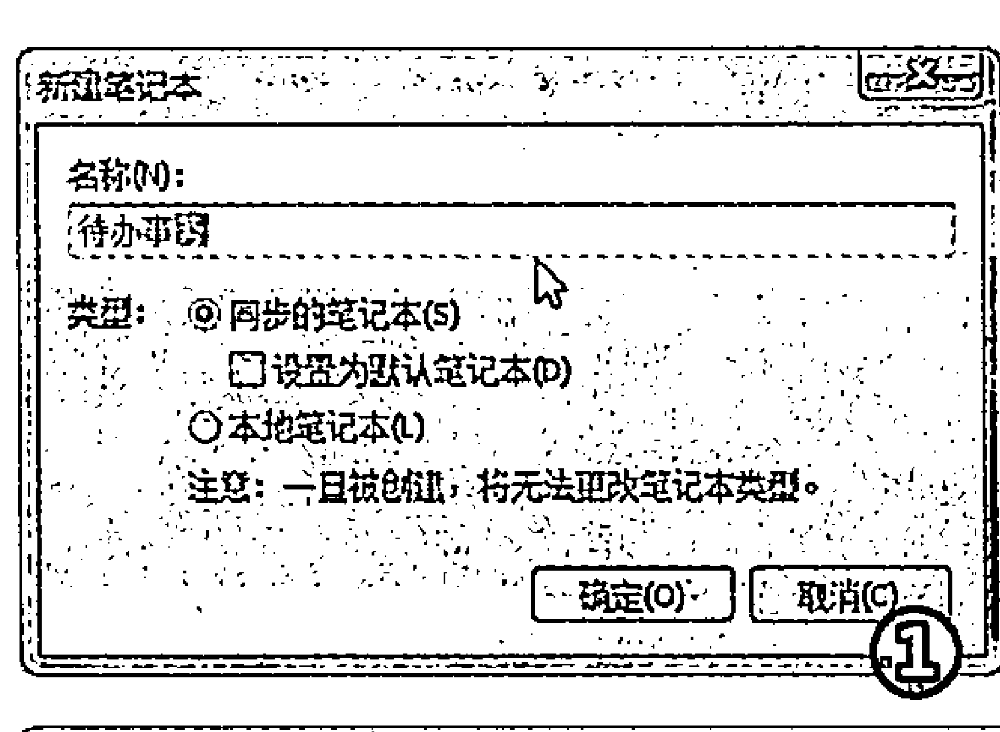

### 2 记录事务 随时随机查阅

创建好笔记本后，点击工具栏中“新建笔记”按钮，按提示记录下待办事务。笔记名称最好直接显示主题，比如“2014-1-15 老妈生日”等，在“单击添加标签”后要设置该事务对应的标签信息，如“个人事务”（图2）。另外还可以加入更详细的备注。事务添加完毕，可将其同步到服务器上，这样就可以随时随地查看了。

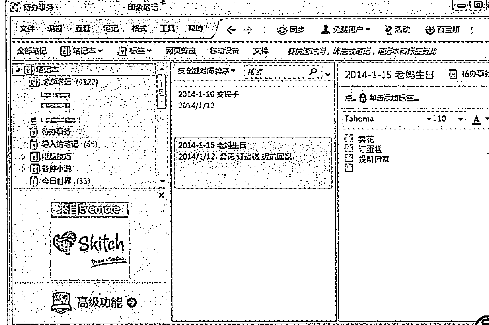

### 3 给待办事宜提个醒

虽然我们已经将要办理的事务记录了下来，但是有些事务可能要明天完成，有些则可能要后天甚至更远的时间去办。如果不把它们加以区分，临时再来寻找的话又要浪费很多时间。还好，印象笔记的提醒功能很强大。我们只需要将第二天要办的事务加以设置，到时候软件就会及时地对我们进行提醒。

进入“待办事务”笔记本中，选中某项需要办理的事务，点击右侧“闹钟”即可将它加入“待办事务”列表中。第二天我们不管是在上班路上还是出差途中，只要在手机端打开印象笔记，在主界面的最上方就会出现一个“待办事务”的列表。列表中详细地显示出今天要办的事务，你就不用担心遗忘重要事务了（图3）。

当一件事务处理完成，打开“待办事务”列表并在完成的事务前面打钩，这样软件就会在该笔记上划一条横线表示完成。接下来再去完成列表中的其他事务，通过这样的方式，我们就可以有序有效地处理工作啦。

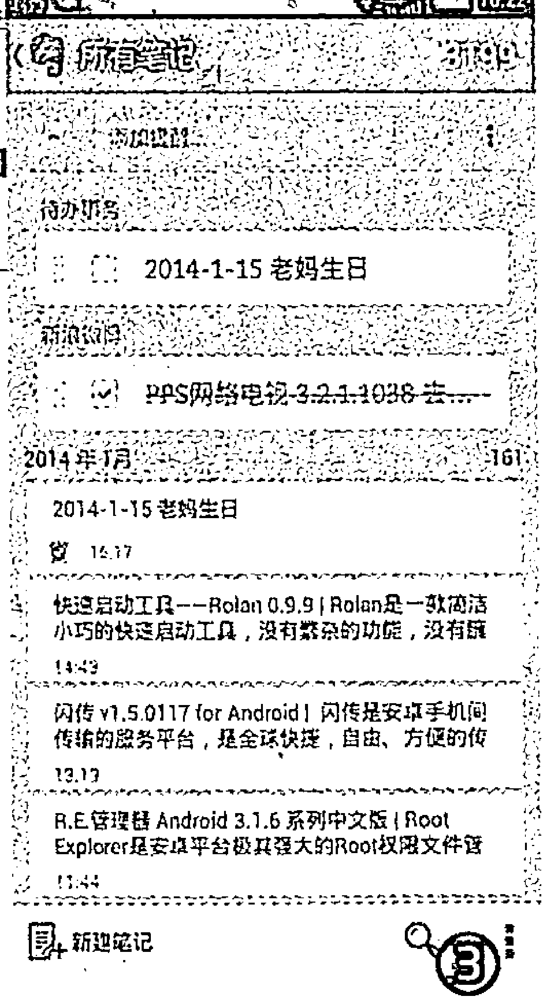

### 小提示：为什么要选印象笔记

首先印象笔记的产品线非常丰富，不像Google Keeper只有移动版和网页版，对于使用电脑的用户操作非常不便。这样无论是在办公室里面，还是在上班的途中，只要遇到要办理的事务，就可以马上记录下来。而且利用它的同步操作，可以保证数据时时刻刻都是一致的。其次印象笔记的功能也比其他同类软件强大，把重点放在笔记的编辑和管理上，并没有时间管理功能。

## 360云盘三招妙用

云盘是越来越多的人在使用的网络存储工具，但是，许多人对于云盘仅仅是作为一种简单的上传和下载工具来用，而对于云盘提供的其他附加实用功能和免费大容量空间更是不会利用，甚至存在某些看法。除了上传下载，云盘还有什么妙用？几个甚至几十个TB的免费空间对普通用户能派上什么用场？ 文|张文雯

本文我们以360云盘为例，详细讲述生活中云盘在普通上传下载之外的各种有趣和实用的用法。

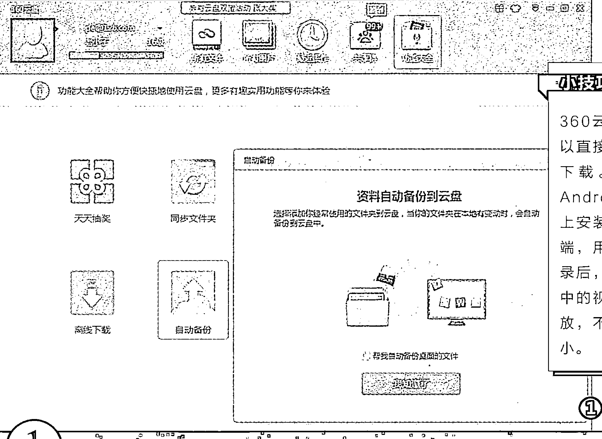

> 小提示
360云盘PC客户端有同步版和轻版两种。同步版的主要功能是云盘本地文件夹与云端网络文件夹的资料同步。轻版则主要注重资料的上传下载、备份和资料管理。两种版本各有侧重，用途不同。

> 小技巧
360云盘中的视频可以直接播放了，无需下载。我们只需在Android手机或平板上安装360云盘客户端，用自己的账号登录后，直接点击云盘中的视频即可流畅播放，不论视频文件大小。

### 1 建立常新的个人云资料库

若我们有收藏各类资料的习惯，资料放在本地硬盘数据分区中，万一哪天硬盘出问题了，千辛万苦的收藏都会丢失。如果用云盘备份，由云盘来自动监视本地资料收藏文件夹，一旦文件夹中放入新的资料，它就会自动帮着备份到云盘中去。这项工作只需依靠360云盘轻版客户端即可完成。通过选择“功能大全→自动备份”启动自动备份功能（图1），在弹出的自动备份窗口中添加本地需要备份的资料文件夹（图2）。添加的备份资料都将被自动备份到云盘“我的自动备份文件”文件夹中。

此外，如果收藏资料所用的电脑不是一台，比如，在家中的PC中收藏软件，希望家中PC的软件库能自动上传云端，而笔记本在办公室或其他场所使用，笔记本中的软件库也备份到云端同一个目录中。那么，可通过如下设置来完成备份。

只需在不同的PC中，将存放软件的文件夹名称设置为完全相同（如“软件收藏”），然后在每台PC的360轻版中，将自动备份本地文件夹设为该文件夹，网络路径则均采用默认的“我的自动备份文件”。这样，来自不同电脑收集的软件就会归并到网络云盘的一个固定文件夹“我的自动备份文件\软件收藏”中。

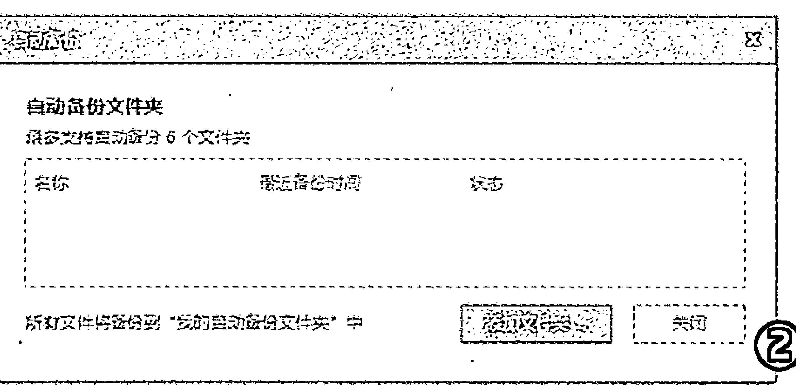

### 2 互不影响的多地自动同步

我在办公室工作，使用360云盘同步版设定了自动同步工作资料到云盘当中，但是，我不想在家中电脑的360云盘本地同步文件夹中出现办公室的资料内容；同理，我在家里经常下载并用360云盘同步一些视频、电影、音乐之类的文件，我也不希望这些文件被自动同步到办公室的电脑中。但是，我希望我的这些资料在云端的服务器中都留有备份，这样我在需要的时候，不论身处哪里，都可以方便地上网下载或预览。

要实现如上需求，采用系统默认的设置肯定不行。因为一旦在一台电脑上的360同步文件夹中放入一个新的资料，到另一台电脑上用相同账号登录之后，它会自动去同步云端网盘中的文件。这种情况下，我们需要设置“选择性同步”。

设置“选择性同步”需要在开启360同步客户端后手疾眼快，不能在开启后不管不问。具体方法是，不要将两端的电脑同时开启，而是先只开启同步文件夹有变动的一端。将希望只在本地同步的文件夹存放在本地云盘文件夹（如“360云盘”）之下的一个独立文件夹中（如办公室电脑的“我的工作”文件夹或家中电脑的“我的乐园”文件夹）。之后，当在另一端PC上登录自己的账户后，记得马上在系统托盘360云盘同步版图标上点击右键并选择“暂停同步”，接着再选择该右键菜单中的“设置”，在“高级”标签页下设置选择性同步，去掉对先前新加入的文件夹的同步选择，然后确认（图3）。此后，退出360云盘同步版软件，然后重新登录一次，这样就不会同步前一台电脑上新增的同步文件夹了。

> > 如果不留神已经在本地同步了一些前一电脑上的文件，那么在做完以上设置，关闭了本地对该文件夹的同步之后，删除本地已经同步下来的该文件夹即可。这样就不会影响服务器和前一台电脑中的同步文件资料。

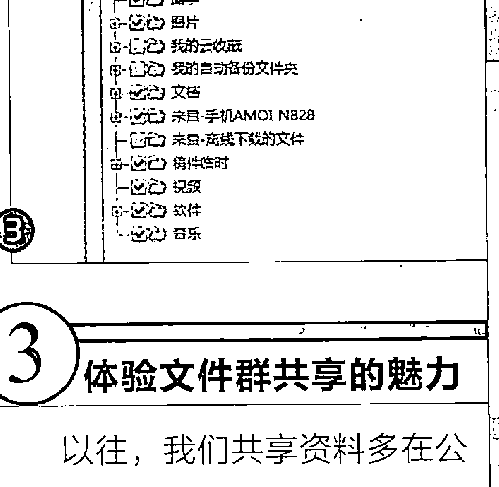

### 3 体验文件群共享的魅力

以往，我们共享资料多在公网大环境下进行，比如在论坛中发布种子文件，在微博或博客中发布资源链接等。这些资料的获取需要通过网络浏览器自动的下载功能或专用的多线程下载工具来完成下载。用如上方方法进行的资料共享，其效率一般不会太高。如果只是偶尔看一两个视频或下载一两个文件，这种方法速度尚可。但如果用作资料收藏，若在网上发现一大批资料需要收藏，那么下载过程将会迎来一个漫长的等待。

但是，如果我们加入到360文件群共享的队伍当中，这种资料收藏的漫长等待将变成过去。云盘特有的“妙传”功能，将让数秒内收藏几十甚至几百GB资料的梦想变为现实。具体方法是，在360云盘轻版窗口上方点击“共享群”按钮，然后从共享群列表中选择自己中意的群下的资源，用右键菜单命令“收藏到云盘”完成云收藏。如此一来，以往成年累月才能完成的收藏任务，现在只用几分钟就完成了（图4）。

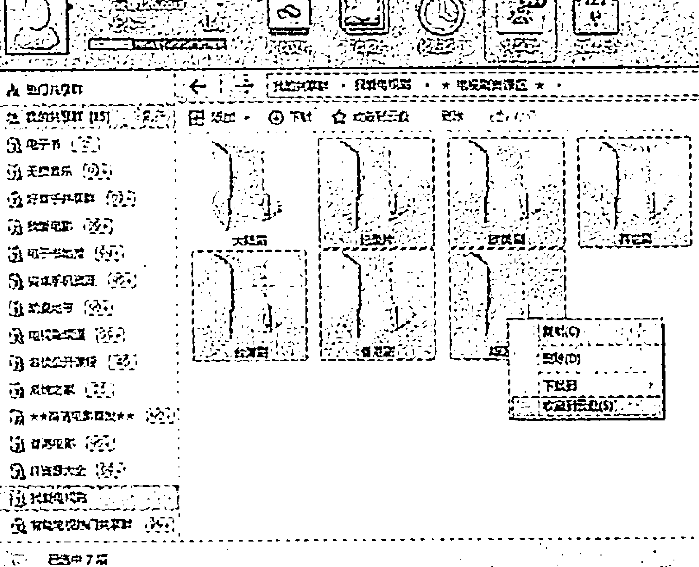

> > 担心云盘中的资料不安全吗？两把小锁可以保证云盘安全(图5)。

在360云盘轻版的“功能大全”中，有一个“锁定云盘”的功能，当我们将资料放入360云盘中后，如果要离开一下，只需点击这个按钮，云盘就会上锁，回来时用自己的云盘密码再次登录即可。如果自己有更加需要保密的资料，还可以通过“功能大全→文件保险箱”，开启保险箱，将云盘任何目录中的文件转移到其中来收藏（图6）。

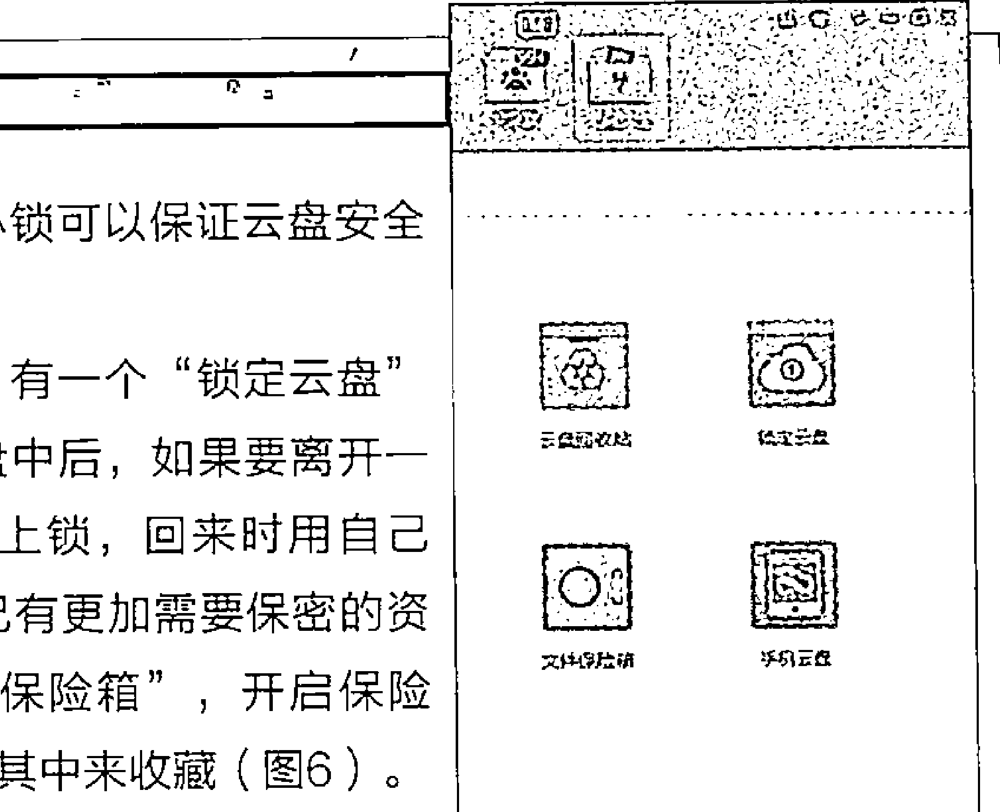

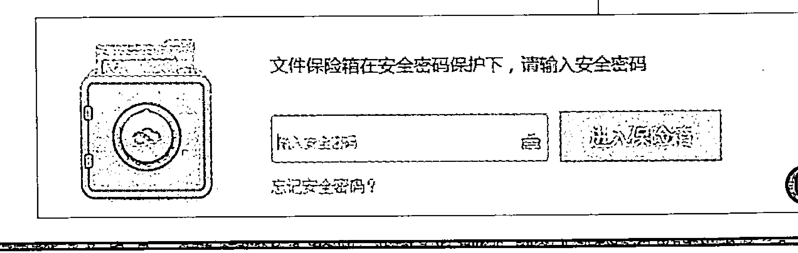

## 为搜索安全 请个好保镖

搜索是日常上网最常进行的一项工作。因此，搜索安全也就成了网络安全的重中之重。如何保卫我们的上网安全？我们用一款搜索专用保镖软件——360搜索保镖来解决问题。
文|白洁

### 1 搜索引擎 自动防跟踪

搜索引擎有时会利用Cookies记录的用户上网踪迹，这些Cookies如果被木马、病毒、黑客以及商业公司利用，可能泄露用户个人隐私；广告商也会利用这些Cookies弹出广告或进行其他骚扰行为，干扰用户正常上网。若开启搜索引擎防跟踪功能，将定期自动清理这些Cookies，保护用户上网隐私安全。

点击“360保镖→搜索保镖”页面下方的“搜索引擎防跟踪”文字按钮，在弹出的窗口中对所用浏览器搜索引擎设置防跟踪Cookies清理，选中的浏览器Cookies记录将被自动清理（图1）。

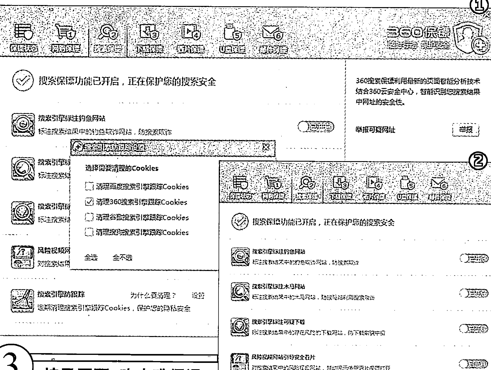

### 2 钓鱼网站 欺诈立现形

钓鱼欺诈网站专门模仿某个正规网站的页面，让使用者误入歧途，自愿将个人隐私输入不法者的数据库中。肉眼难识别，软件来搞定！

防范搜索结果中的钓鱼欺诈网站，只需在“搜索保镖”设置页面中开启“搜索引擎标注钓鱼网站”选项即可。

### 3 挂马网页 攻击难得逞

不同于钓鱼网站的引人上钩之举，挂马网站则是利用网民在搜索过程中访问某个网页时，对用户电脑发起主动攻击。当我们发现时，为时已晚。防止搜索过程中的挂马网站攻击，这个任务也可交由保镖来完成。

只需在“搜索保镖”设置页面中开启“搜索引擎标注木马网站”选项即可（图2）。

### 4 可疑下载 提前有提醒

更进一步的安全威胁，则是产生于网络下载的过程中。一些风险下载站点专门设置了有人上钩的链接、压缩包等，用户一旦点击即会上当。

为防止搜索下载过程中欺骗中招，只需开启“搜索引擎标注可疑下载”选项即可。

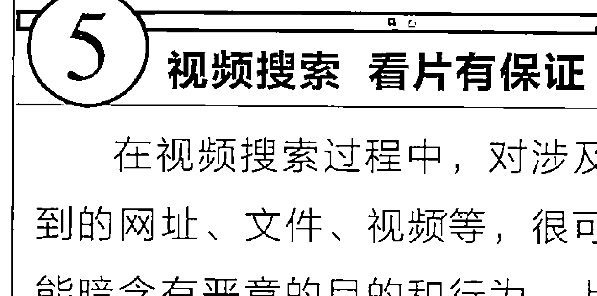

### 5 视频搜索 看片有保证

在视频搜索过程中，对涉及到的网址、文件、视频等，很可能暗含有恶意的目的和行为。上网看视频，需要采取的安全行动主要是防护和隔离两大措施。

开启“风险视频网站自动防护”选项，同时开启“可疑程序隔离”和“隔离看片保护”两个选项进行隔离。看片保镖可智能识别可疑网址、可疑文件、可疑视频，自动进入安全看片模式。对于上网看片过程中检测到的风险、未知程序，自动进入隔离沙箱，防止意外中招。当你使用了一款存在风险的播放器时，会自动切换到安全看片模式。

> **小提示**
如果看片过程中无法进入安全看片浏览器环境，请在看片保镖窗口右侧点击“设置”按钮，检查是否选中了“看片模式使用360看片保镖浏览器”选项。

## 新需求催生新搜索

新技术、新产品是在新需求下催生的。搜索引擎也是如此。在普通的文字不能满足用户搜索的情况下，图片搜索和语音搜索就产生了。在普通网页搜索不能找到影视节目的情况下，影视专用搜索就产生了。在普通搜索引擎中找不到网盘内资源的情况下，网盘搜索引擎就产生了……

文/兵峰

### 1 图片搜索 让图片来做主

如果你发现一个明星的照片，你叫不出她的名字，也不知道她的任何信息——除了这张图片，那么你如何去搜出她的情况？

这时，Tineye、Google等以图搜图的搜索引擎就可派上用场，只需将这张图片粘贴或上传到此类搜索引擎，就会像用文字搜索一样，后台有图片和网上图片资源做对比，给出可供参考的答案（图1）。

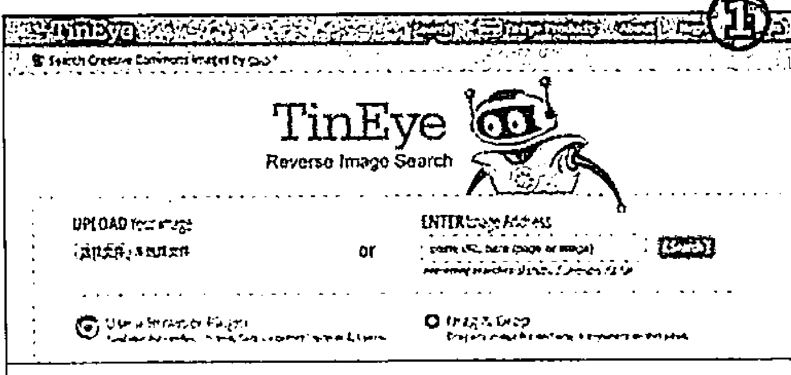

小提示：如果是要搜索网页中某一张图片的情况，则可以将这张图片的网络地址粘贴到Tineye的图像地址框中，然后搜索。

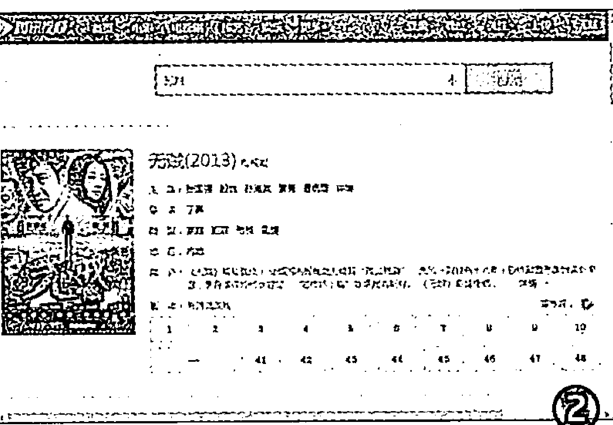

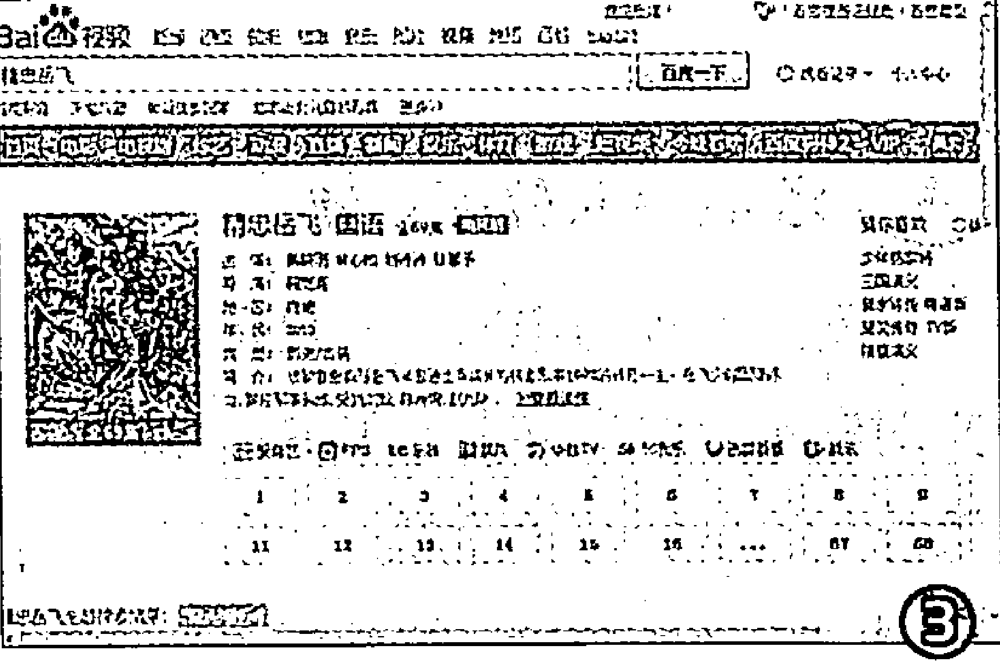

小提示：在专业搜索引擎的搜索结果中，会给出每种资源的所有来源网站，而不同来源网站又同时具有自己的视频客户端可供选择。这样一来，我们就可以用最快的速度获知自己喜欢的视频在哪个网站上有提供，从而以最快速度到达播放或下载的链接页面欣赏或下载了。

### 2 影视搜索 可以更快更准

如果你想看一部电影或连续剧，仅以电影或连续剧的名字在Google或Bing等通用引擎中搜索，很可能获得的是一大堆关于剧情、电视节目预告或其他相关信息的页面介绍，至于可以播放的页面链接或可供下载的页面链接在哪里，你可能还需要翻腾老半天才能找到合适的页面。在这种情况下，如果目标明确地去访问专用视频搜索引擎，那么效率就会大大提高（图2、图3）。

目前，百度视频、360影视、腾讯视频三家视频网站是综合性比较强的视频搜索网站，其集合的视频资源囊括目前几乎所有影视剧资源。

### 3 网盘搜索 要选最专业的

网盘是一个相对比较封闭和集中的资源聚集区域。网盘中有的资源是圈内共享，在普通搜索引擎中难以找到其资源链接。有的即便是外链，提供互联网上随意搜索，但因为互联网资源的海量性质，网盘资源丢在其中犹如水滴撒入大海，要将这些水滴再从大海搜索出来，挑选也成了难事。因此，如果要找到网盘资源，最好的办法是使用专用的网盘搜索引擎。

以百度网盘资源搜索为例。如果要搜索百度网盘中的共享资源，最好的办法是运行一个叫做网盘屋的网盘搜索引擎（http://www.wangpanwu.com/），进入到网盘搜索页面后，输入关键词，即可搜出所有在百度网盘中共享的资源（图4）。

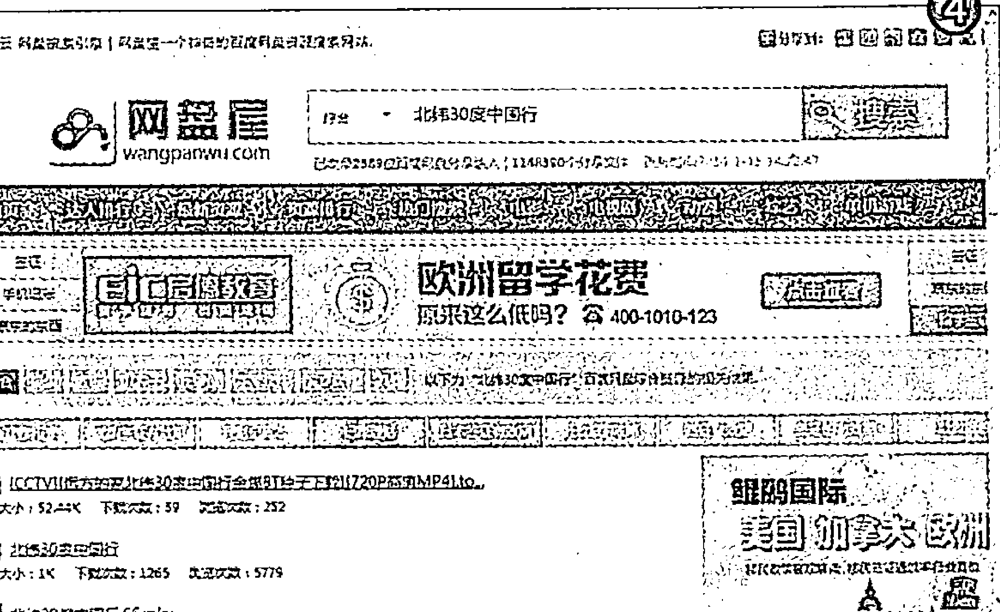

## 用好PotPlayer 享受多媒体

许多人知道KMPlayer，那是否知道它的进化版PotPlayer? PotPlayer不仅是播放多媒体文件的能手，它还有不少其他的功能，可以让我们更好地享受多媒体。 文|重剑

### 添加中文外挂音轨

网上的外语电影，一般是外文对白配上中文字幕的形式，如果能在这些影片中添加一个中文普通话的外挂音轨，那欣赏起来就方便多了。 启动PotPlayer打开要看的外语电影，然后按“暂停”停止播放，右击播放器界面，从右键菜单中选择“打开”，选择“载入音频”子命令，将文件类型设置为“所有文件”，选择包含该影片中文配音的外挂音轨。外挂音轨成功载入后，右击选择“音频”，在“音频选择”子菜单中就可以看到刚刚加载的外挂音轨了（图1）。点选该文件后再点击“播放”按钮，PotPlayer就可以自动关闭电影中的音频，而利用外挂音轨中的普通话音频来播放了。

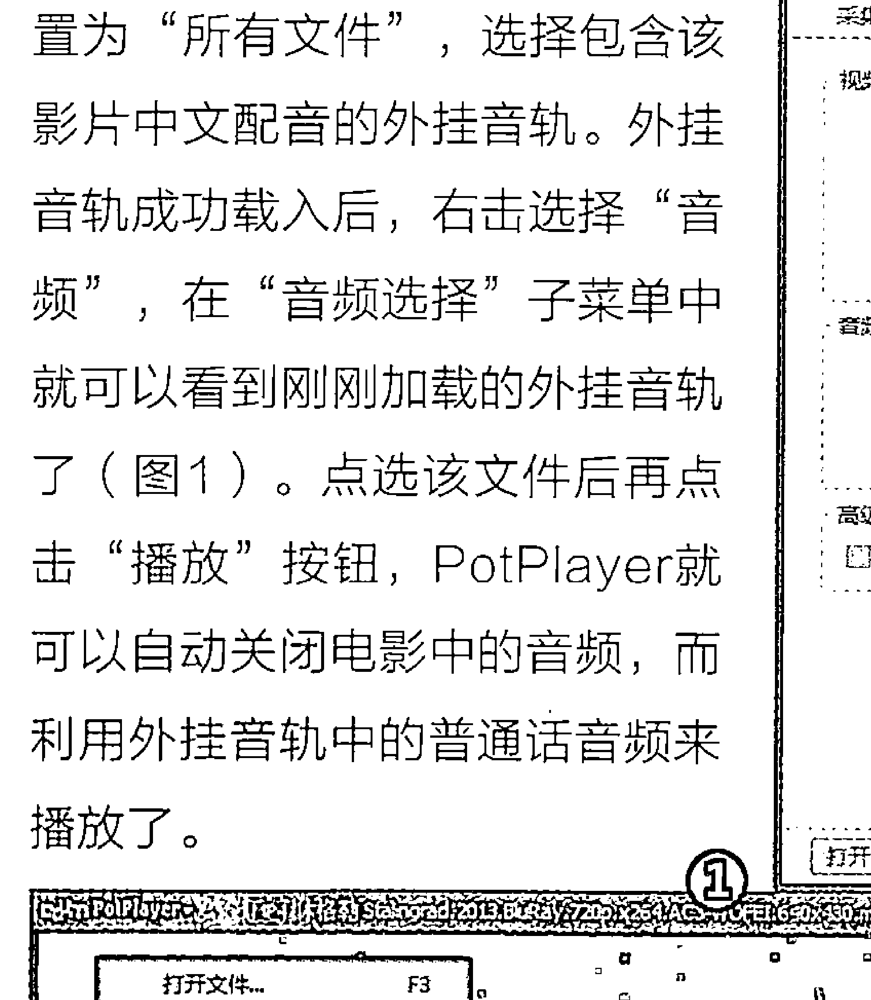

### 播放音乐显示歌词

PotPlayer对音乐文件的支持也非常优秀，但它默认不显示歌词。这个其实很好解决。首先还是载入音乐文件，接着拖动播放器窗口的边框，放大窗口，然后右击，选择“特效”中的“可视化开关”命令即可。 除此之外还有一种方法，就是右击后选择“字幕”菜单中的“字幕浏览器”，就会在弹出的窗口中显示出歌词信息，并且会随着音乐的播放来调整显示（图2）。不过需要提醒大家的是，无论是采用哪一种方式，都要保证歌词文件的名称一定要和音乐文件的名称相同才可以。

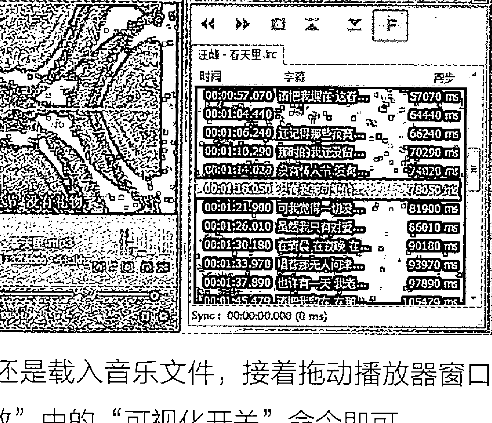

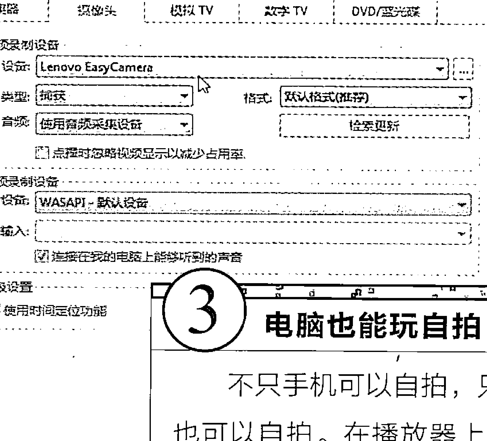

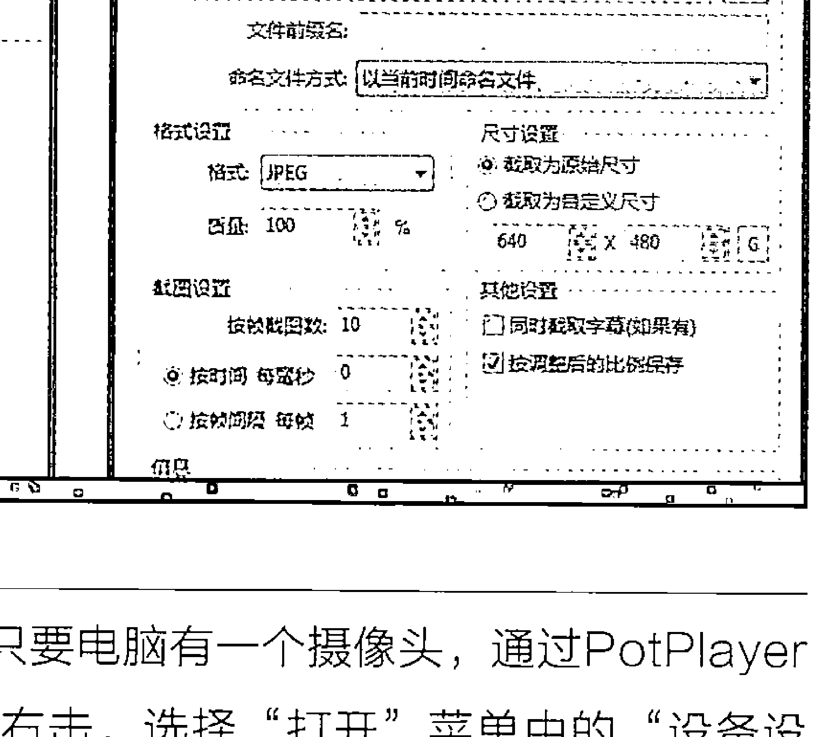

### 电脑也能玩自拍

不只手机可以自拍，只要电脑有一个摄像头，通过PotPlayer也可以自拍。在播放器上右击，选择“打开”菜单中的“设备设置”，然后在弹出的设置窗口选择“摄像头”标签，并在“视频录制设备”列表中选择电脑摄像头的硬件名称，设置完毕点击“确定”返回（图3）。 再次右击，选择“打开”菜单中的“摄像头”命令，PotPlayer就可以激活连接的摄像头并捕捉影像了。 自拍的画面如何保存？右击后依次选择“视频→图像截取→连续截图”命令，在弹出的对话框中设置图像保存位置，再分别设置截取图像的格式以及质量等（图4）。 设置完毕点击“开始”，PotPlayer就开始自拍并截图了。自拍完成进入设定的目录，选择满意的照片分享给好友吧。

## 超长高保真 切割细细听

文|重楼

随着宽带的普及，很多人已经不满足于下载MP3，而是选择高保真的APE等无损音频格式。不过许多APE文件，往往是一整张的音乐专辑，所有的歌曲都连在了一起。如果只想保留整张专辑中的部分歌曲，就得进行切割处理了。

### 切割超长音频文件

音频文件切割，一般来说需要专业的软件来实现，其实通过AIMP这款播放器同样也能做到，这样就无需再安装第三方软件了。不过在用AIMP切割无损音乐文件时，需要有CUE文件的支持，因为其中记录了每首音乐的开始和结束信息。

启动AIMP并载入无损音乐文件，在音乐列表中找到需要进行切割的音乐右击，选择“发送文件→音频转换器”，从弹出的对话框中就可以看到需要切割的音乐名称了。确认无误后，在下方音乐格式列表中选择需要的格式，比如APE或FLAC等，点击后面的设置按钮可以进行更多的参数设置。接下来选中“移动输出到”后的按钮，设置保存的位置，最后选择“单个源-单个结果”，再点击下方的“开始”，就可以进行音乐文件的切割了（图1）。

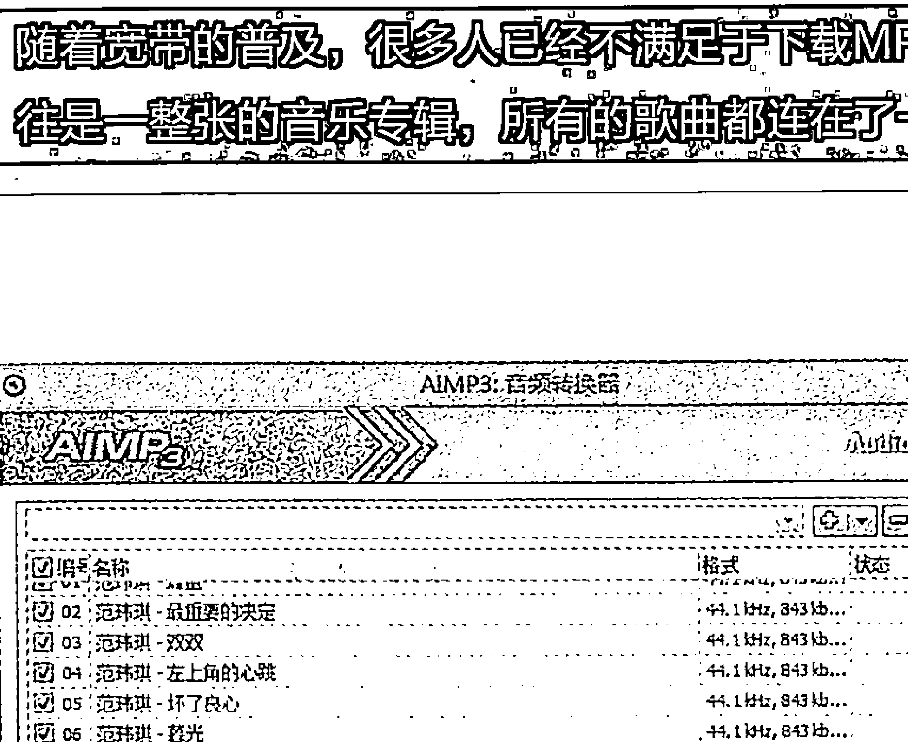

### 文章拓展：歌词显示也方便

AIMP是一款非常优秀的播放器，但也有美中不足之处，就是它自身并没有歌词显示功能。不过好在这款工具可以直接使用Winamp的插件，通过插件可解决这一问题。

从网上下载最新版本的“乐辞”插件安装包后，运行Universal Extractor解包工具，选择“乐辞”插件安装包的路径，并设置提取后的保存位置。设置完毕，点击“确定”即可开始提取（图2）。提取完成，在目标目录中找到名为gen_lyricist.dll的文件，将其复制到AIMP播放器安装目录中的Plugins子文件夹即可。

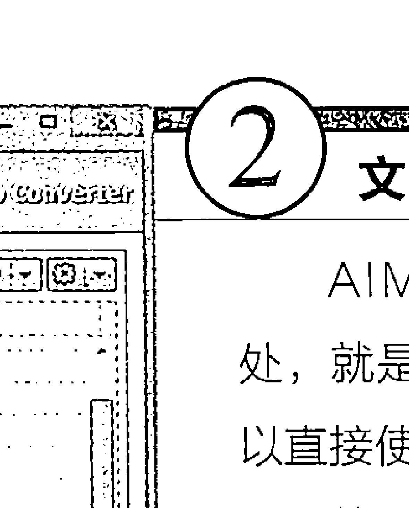

重新启动AIMP播放器，将会弹出新版本提示窗口，勾选下方“新版本仅提示我一次……”项，并点击“取消”，下次就不会再弹出此窗口了。接下来在“乐辞”插件的显示窗口中，右击选择“选项”，在配置窗口对插件进行简单设置，切换到“其它”项，取消选择“自动检测是否有新版本”项，并选择“配置保存到.ini文件中”选项，点击“确定”后退出（图3）。以后不仅可以在听歌的时候看到对应的歌词，还可以将“乐辞”插件和播放器一起打包带走呢（图4）。

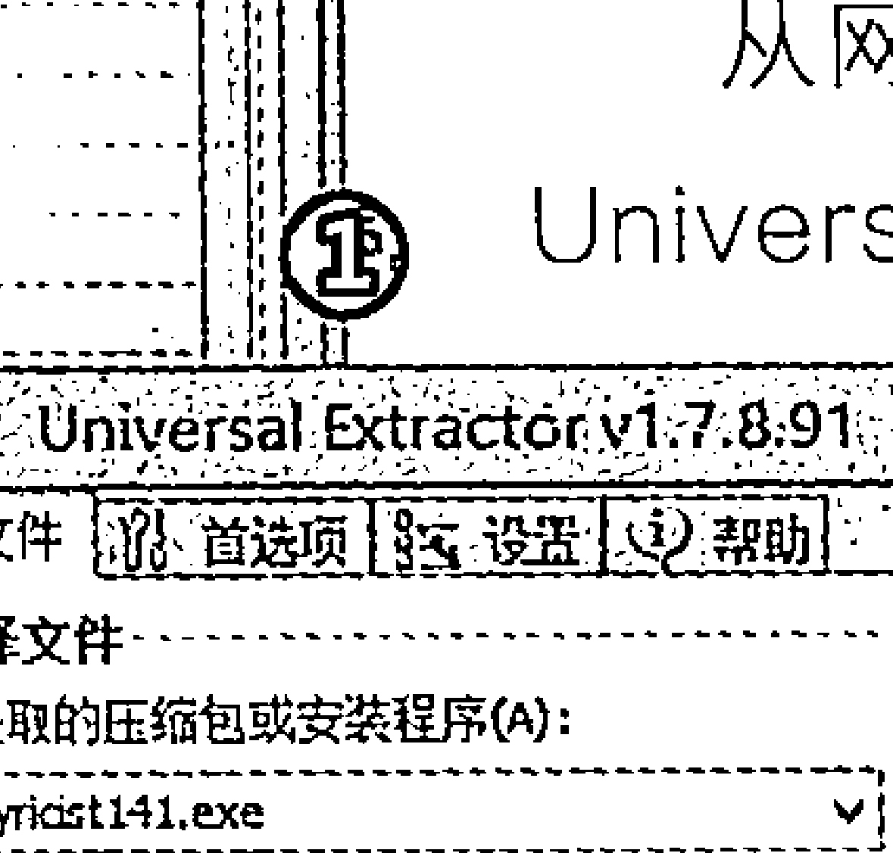

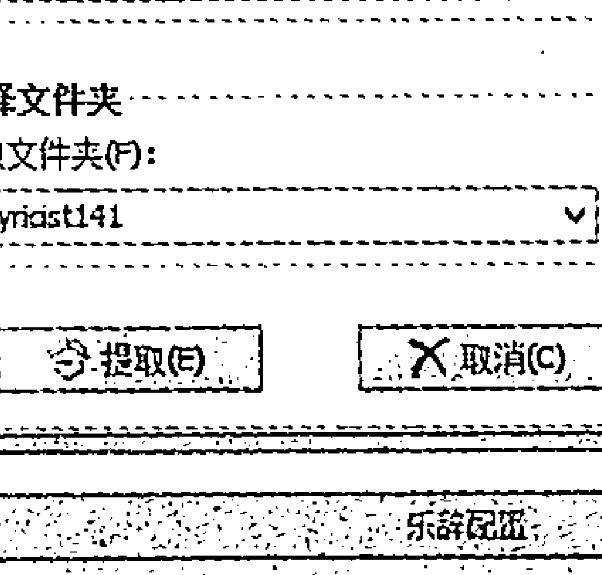

> **小提示**
>
> 除了可以切割，AIMP还可以反向操作，将分散的音频合并为一个，这样就可以制作一张自己喜欢的精选集了。点击“音频转换器”窗口中的“添加文件/添加文件夹”命令，选择需要合并的音乐文件，设置合并后的文件格式和参数，最后点击“所有源-单个结果（+CUE）”选项，再点击下方的“开始”即可。

## 多方应对 节目错过也能瞧

电视台每天有精彩节目，而我们每天有重要的事情要干，做事与看精彩节目存在矛盾。不能正点看节目怎么办？如何才能在干完事情闲下来后，轻松观赏到自己喜欢但已经错过的节目？文|黎阳

### 1 机顶盒或智能电视实现回看

现在人们使用的多数数字电视，都可以通过机顶盒提供的节目回看功能回看节目。从电视节目菜单进入选择回看功能后，可以选择回看所列频道七天内或更长时间的电视节目。除了回看功能之外，多数机顶盒还提供节目录制功能，用户可设定节目播出时自动录制，录制的节目被存储在“我的录制”中供日后观看。有此类功能的电视用户，可通过机顶盒功能菜单直接启用这一功能，设置回看或录制自己需要的节目（图1）。

小提示：除机顶盒外，2013年下半年有大量智能电视、网络电视推出。此类电视，可通过电视APP结合本地存储、远程云功能实现节目回放。

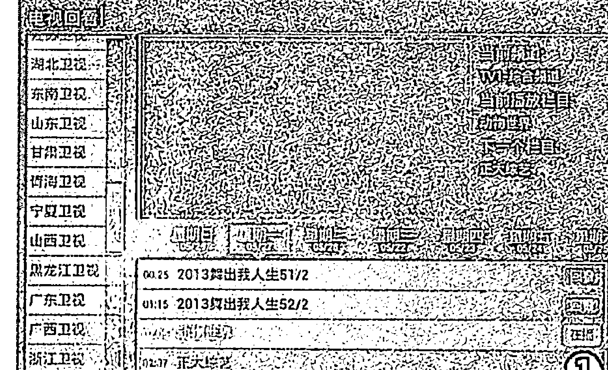


### 2 电视卡（棒）本地自动录制重播

电视卡是用电脑来直接观看传统电视节目的最直接利器。目前的电视卡形态主要有PCI箱内插入式和USB外置式（电视棒）两种，价格也十分低廉，从几十元到上百元不等。在PC中安装了电视卡并安装好软件后，可以设定在某个时间自动开启某个频道并自动录制若干时段的节目，保存在本地硬盘供使用者随时观看（图2）。


回看前一天播出的节目没有问题（图3）。

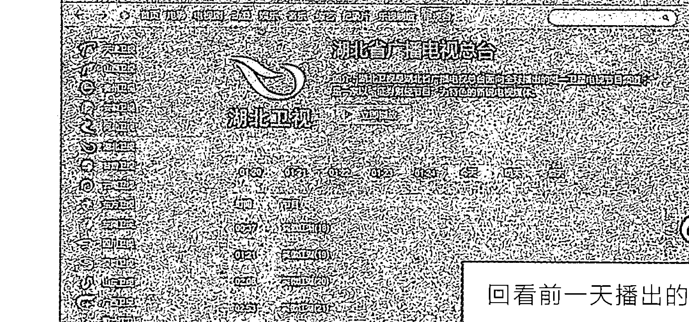

### 3 网络搜索及视频客户端回看

还有一个办法就是搜索网络中他人录制的节目。一般来说，对于某个精彩的节目，播出过程中就会有视频网站或个人播客进行录制，播完之后随即共享。注意搜索技巧，除了使用通用搜索引擎外，还可以使用专用视频搜索引擎（如百度视频、腾讯视频、土豆优酷、360影视等）或云盘搜索引擎（如云盘屋）进行针对性搜索。

对于一些权威官方视频网站，如CCTV播出的节目，只需下载CNTV客户端，鼠标移至已播出的节目单上，点击观看精彩回放即可实现节目回看。一般当天

对于一些地方频道，用合作视频媒体的客户端软件，如乐视LeTV客户端。切换到节目回看频道，选择要看的电视台、频道和具体播出时间、节目，即可观看最近一两周的电视节目（图4）。

## 下载节能 我要两不误

Win8系统由于节能的考虑，在默认设置环境下，如果人离开电脑之后，电脑会在一段时间后自动进入睡眠或休眠状态，这样后台的下载任务或其他正在执行的任务将停止运行。但如果关掉睡眠或休眠，下载完成后风扇继续转，又会白白浪费能源。如何打造一个既节能又不影响下载或后台任务运行的环境？

文|新胜

### 1 系统手动设置法

按下Win+X组合键，从弹出的菜单中选择“电源选项”命令，在电源选项窗口中点击“更改计划设置”，把“使计算机进入睡眠状态”一项后的时间选择更改为“从不”，把“在此时间后关闭硬盘”改为“从不”。在电源高级设置中，将“无线适配器设置”改为“最高性能”，这样以保证网卡不会自动关掉（图1）。把“关闭显示器”改为“10分钟”或更短时间，意为当人离开后若干分钟，显示器自动关闭以节能，但不影响其他任务的运行。此功能需要硬件设备支持高级电源管理，但目前购买的电脑一般都有这一功能，支持如上设置不会有问题。

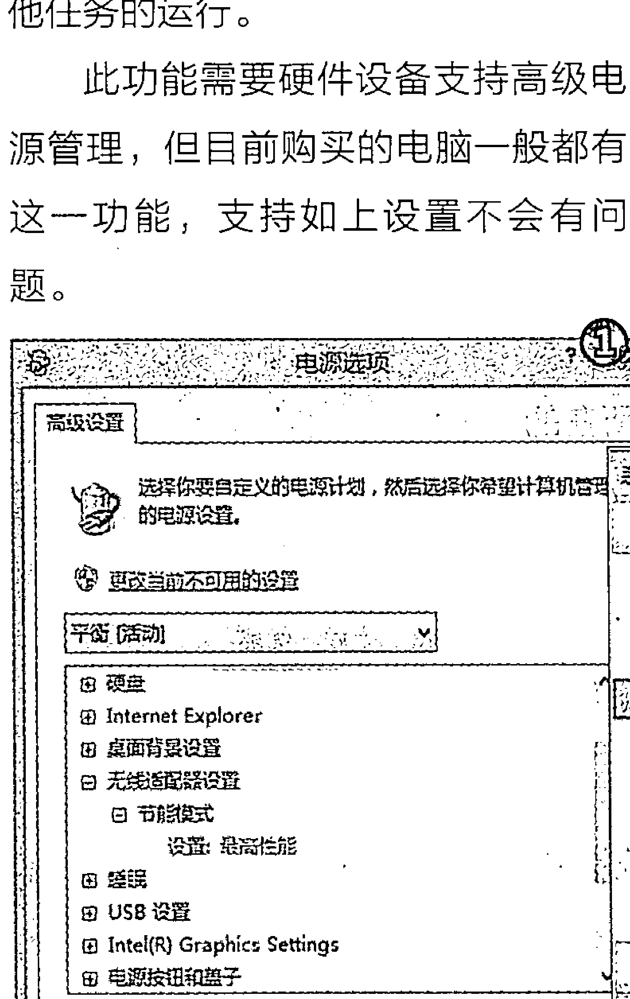

> 小提示：还可以用系统优化工具，例如Win8优化大师进行设置，通过该软件也可以开启“离开模式”。

### 2 迅雷设置下载不断线

如果下载使用迅雷软件，那么可以将该软件升级到最新版，在迅雷的系统设置窗口中，切换到“基本设置→常规设置”一栏，在“启动设置”分组下，可看到有一个“启动离开模式”的选项。如果将该项选中并确定之后，则以后在用词工具下载的过程中，系统不会切换到睡眠模式，下载过程自然也不会中途暂停（图2）。

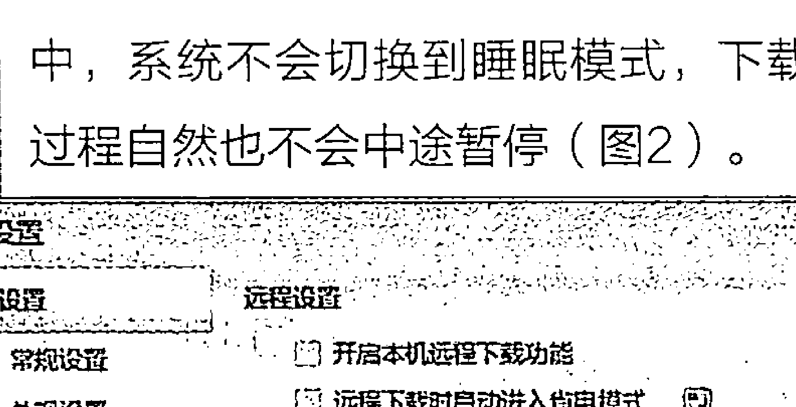

### 3 下载完成后的节能设置

对于有下载完成关机选项的软件，可设置下载完成后执行自动关机或进入睡眠状态。例如，在迅雷软件窗口的左下角，可通过选择“下载优先”旁边的“计划任务”按钮，在弹出菜单中选择“下载完成后”的动作，如果电脑除下载任务，再没有其他正在运行的任务，则可以选择下载完成后“关机”；如果电脑除了下载任务，还有别的任务开启，为了防止数据丢失，可以选择下载完成后进入“睡眠”。这样，既不影响下载任务的顺利完成，又可以在下载完毕后自动进入节能状态，还不影响其他任务的数据现场恢复（图3）。

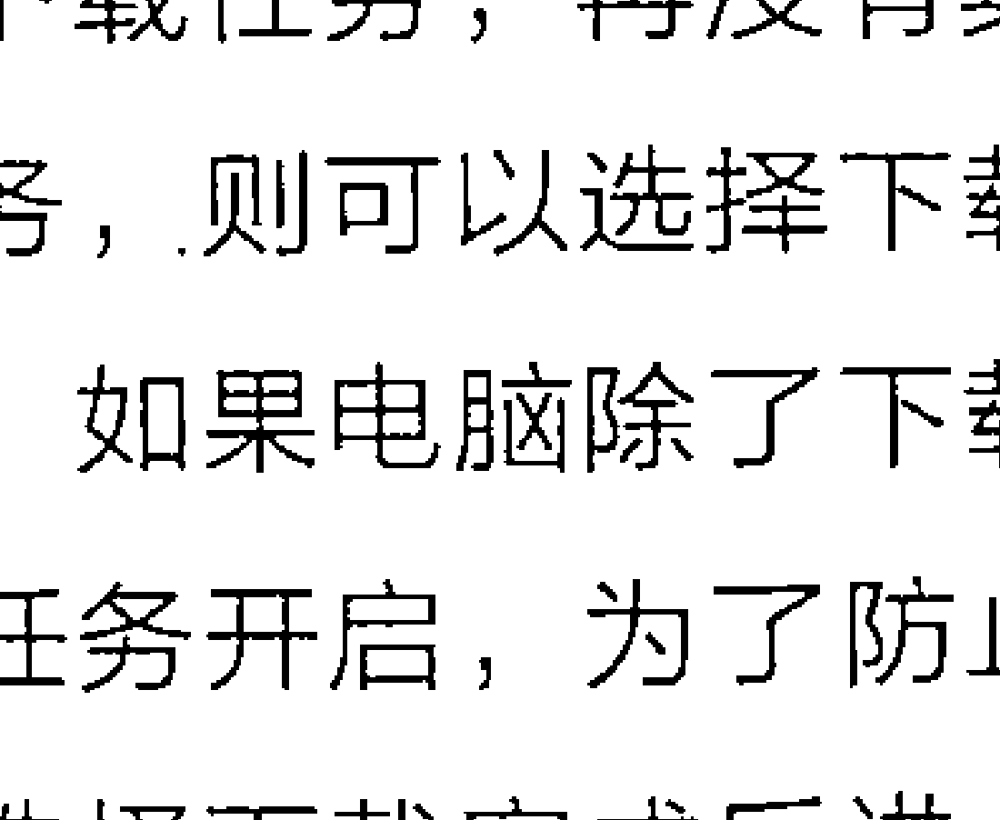

> 小提示：迅雷还具有远程下载时自动进入省电模式的功能选择，可通过“基本设置→远程下载设置”中的两个选项开启该功能（图4）。


## 双软出马 拿下顽固视频专辑

由于网络环境限制或流量费用的考虑，目前还有不少人选择下载视频后拷贝到手机或移动设备观看。但有些视频专辑用通行的方法无法下载。有无通吃各类视频下载的好方法？

文|栗洋

网络视频下载，常见的方法是通过视频客户端自带的下载功能下载，或者通过BT种子用迅雷等工具下载。对于没有提供直接下载链接或种子，但能够在线观看的视频，也有直接或间接下载的方法和工具。但是，还有为数不少的视频专辑，用以上办法都无法进行下载。

### 1 常见视频专辑下载难点

以下我们均只针对客户端没有直接提供下载和网页上也未提供下载链接的视频专辑的下载进行分析和说明。对于此类视频专辑的下载，我们可以借助于一款名为硕鼠的工具软件来解决问题。

方法很简单：安装并运行硕鼠软件，在FLVCD下载页面的搜索框中输入专辑视频的地址，点击“开始”按钮，即可分析出视频专辑的真实地址，从而用硕鼠自带的下载管理器来下载该专辑（图1）。

经过对各种下载软件的测试和大量在线网络视频的下载试验，笔者找到了通吃各种网络视频的专辑下载办法。用两款视频下载软件结合使用，可以解决几乎所有网络视频专辑的下载难题。现与大家分享，大家若遇到此类无法下载的专辑时不妨一试。

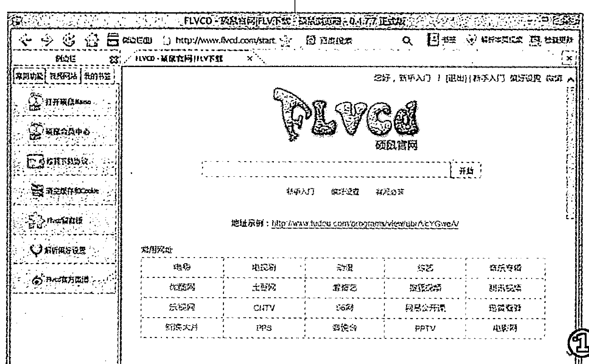

但问题是，我们往往不能正确获得某个视频专辑的真实地址。当我们在搜索引擎中搜索到某个视频专辑之后，网页上明明显示了该专辑的列表以及每集视频的播放链接，但当我们通过右键“属性”将该专辑所在的网络地址复制并提交给硕鼠，或用硕鼠自带的浏览器进行分析之后，硕鼠会告诉我们无法解析出下载地址。

专辑中的每一集视频在线播放没有任何问题，说明视频的链接是有效的，但为何无法找到下载地址呢？关键点在于没有找对视频专辑的有效链接地址。

下面针对目前流行的几种视频网站，分别给出有效的专辑下载地址链接所在的位置，大家可以参考如图2～图4所示的专辑地址真实链接位置，去官方网页寻找自己要下载的视频专辑的真实链接地址所在。

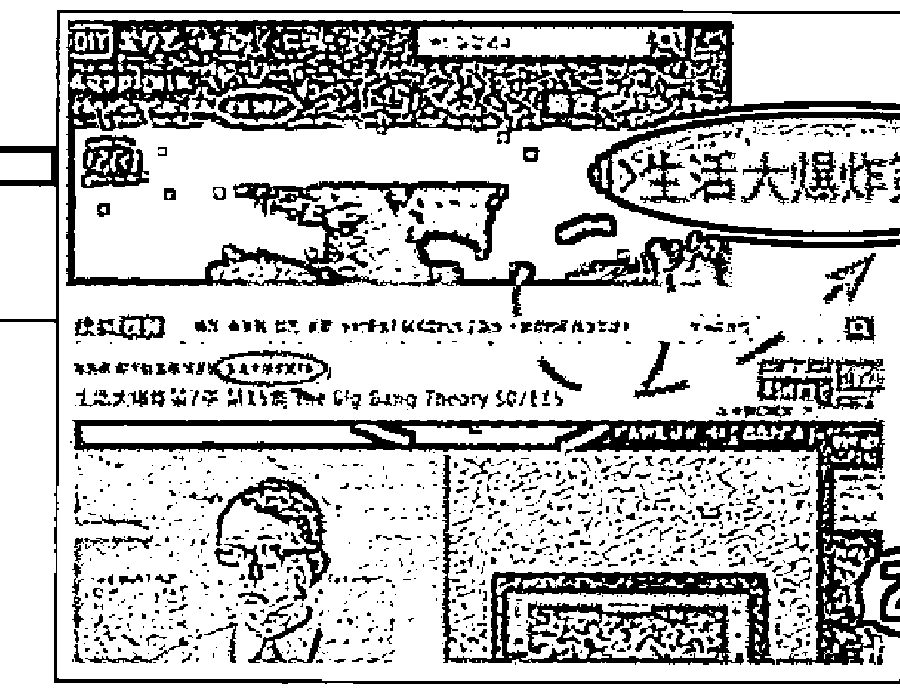

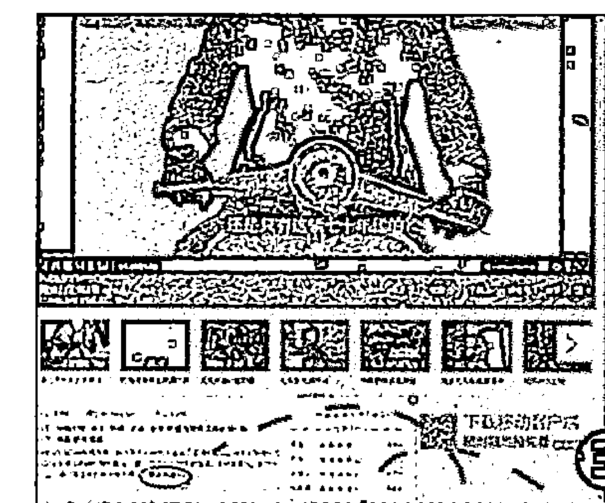

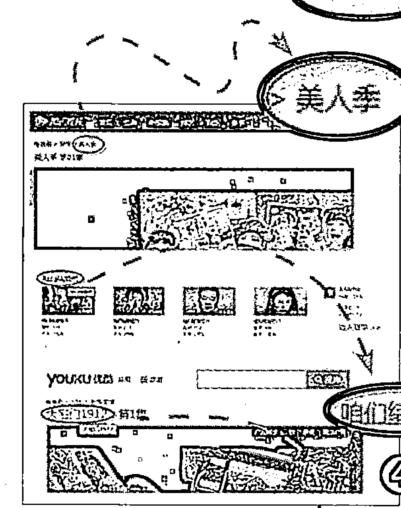

> 小提示：不能仅仅通过搜索引擎搜索结果给出的专辑地址来下载，否则很可能得到的解析只有一集的下载链接，而非整个专辑的下载链接，或者解析结果无效。

### 特殊视频专辑下载方法

还有一些视频专辑，如CCTV视频、迅雷看看视频等，用上面所述的方法也无法下载。当我们向硕鼠提交了自己认为是正确的专辑链接地址之后，硕鼠解析的结果是暂时不支持此类视频专辑的下载。在这种情况下，我们可以深度挖掘硕鼠的下载功能，用藏于该软件深层的专用工具来下载此类视频专辑。

通过硕鼠会员中心，点击“多地址解析”链接，然后点击“实用小工具”文字链接（图5），可以看到有CNTV和迅雷看看等特殊视频专辑解析专用工具，选择点击其中之一（图6），然后按随后弹出的界面中提示的格式地址，上官方视频网站寻找要下载的专辑所在的地址并输入，开始解析（图7）。如此即可获得CNTV或迅雷看看视频专辑的真实下载地址。随后将解析所得的真实地址提交给硕鼠下载即可。

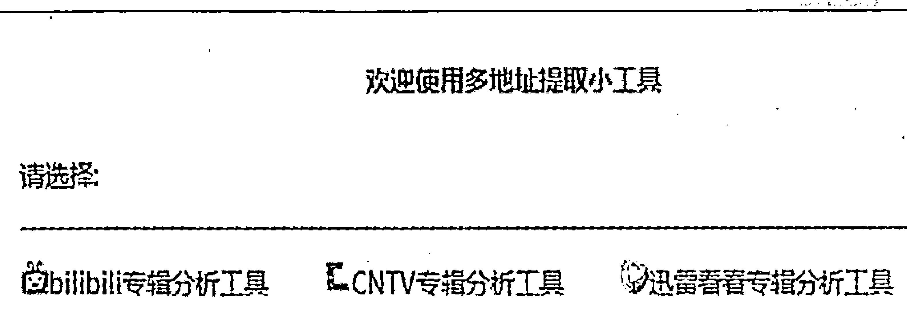

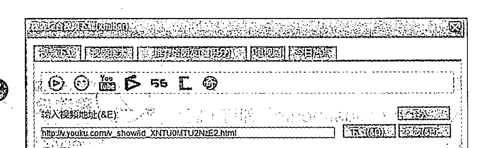

### 顽固视频专辑下载利器

更有一些视频专辑，这些视频可能来源于一些非主流网站，任我们用尽上面两种专辑下载法，填入正确的专辑地址，但仍然无法获得正确的解析结果，无法得到下载所需的真实地址。

或者，我们只能通过网页搜索到某个专辑的多个单集的视频链接地址，而根本就找不到任何形式的专辑地址的链接。

在这种情况下，我们如何才能一次性地下载整个专辑呢？

我们可以借助于一款叫做“裸麦综合视频下载 (xmlbar)”的工具来解决问题。该工具的一个最大特色，就是提供了一个专辑中任意一个单集文件的播放地址后，会自动分析出单集文件所在专辑的地址，并会提醒用户是要选择单集下载，还是要加载整个专辑下载（图8）。

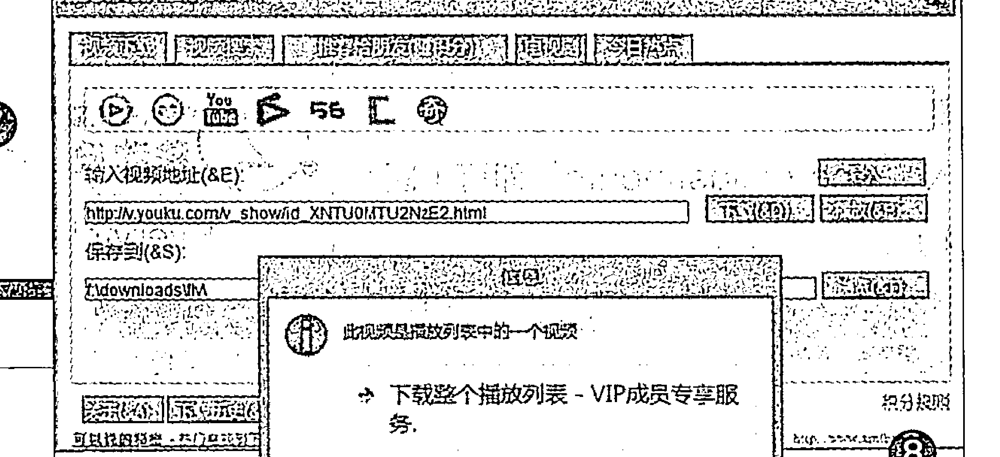

因此，比较而言，裸麦比硕鼠有更加强大和灵活的专辑地址探测能力。同一任务，若换成硕鼠来完成，因为没有专辑地址无法一次性下载，如果我们只提供专辑中某集的文件地址，则只能下载到该集的视频。

> 小提示
>
> 裸麦下载器比硕鼠具有更强的专辑解析能力，但要一次下载整个专辑，需要注册为VIP会员。注册VIP会员可以用赚积分的方式，也可以用网上支付买点的方式。不过5元支付即可换取一个月的VIP下载权限，对于急需下载宝贵资源的用户来说，还是值得和可承受的。

## 搜索文件随手可得

现在电脑配置的硬盘越来越大，自然里面的文件也越来越多，再加上各种各样的移动设备，因此要找到自己想要的文件，有时就成为一件不太容易的事。下面介绍的一些搜索工具及使用技巧，可以让需要的文件随手可得。

文/重剑

### 1 Everything小参数快搜文件

说到文件搜索，很多人会想到以搜索速度快而闻名的Everything，不过大多数人只知道用它进行文件名搜索，忽略了它的一些搜索参数的使用。比如搜索特定创建日期的文件，就可以使用“dc:”这个参数，假如要搜索上月创建的文件，输入“dc:lastmonth”即可准确搜索。另外，搜索参数还可以结合文件后缀、通配符等一起使用，比如要搜索上月创建的Word文档文件，就输入“.doc dc:lastmonth”即可（图1）。

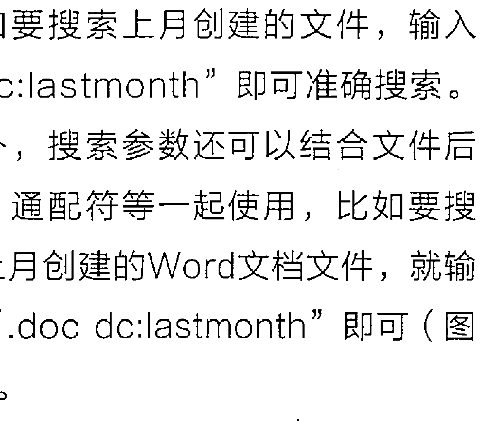

- ★上面的技巧中，将文件后缀放到搜索参数的前面，主要是首先过滤掉其他的文件类型，然后再从剩余的DOC文件中搜索，这样可以加快搜索速度。
- ★除以上介绍的外，还有很多参数，比如“empty:”可以找到所有的空文件夹，“dupe:”可以找出系统里面所有文件名重复的文件。
- ★如果觉得输入参数比较麻烦，可以在输入一次后点击“书签”菜单中的“添加到书签”命令，就可以将这些命令添加到书签栏，以后可以像调用收藏夹的网址一样来调用这些搜索参数。

### 2 移动设备离线搜索

Everything还有一个特别的搜索方式，就是可以对移动设备进行离线搜索，从而避免不停地插入移动设备来寻找需要的文件。首先要为每一个移动设备创建一个相应的数据库文件。移动设备连接到系统后，点击菜单“工具→文件列表编辑器”，在弹出的窗口中点击“编辑→添加目录”，再从列表中选择移动设备的盘符，这样就可以读出其中的文件信息，读取完成，通过“文件→保存”将其保存为数据库文件（图2）。接下来点击菜单“工具→选项”打开选项窗口，切换到“文件列表”，点击“添加”，添加刚刚创建的数据库文件，确定即可（图3）。以后启动Everything时就可以加载这些数据库，即使不插入移动设备，也可以搜索其上的文件了。

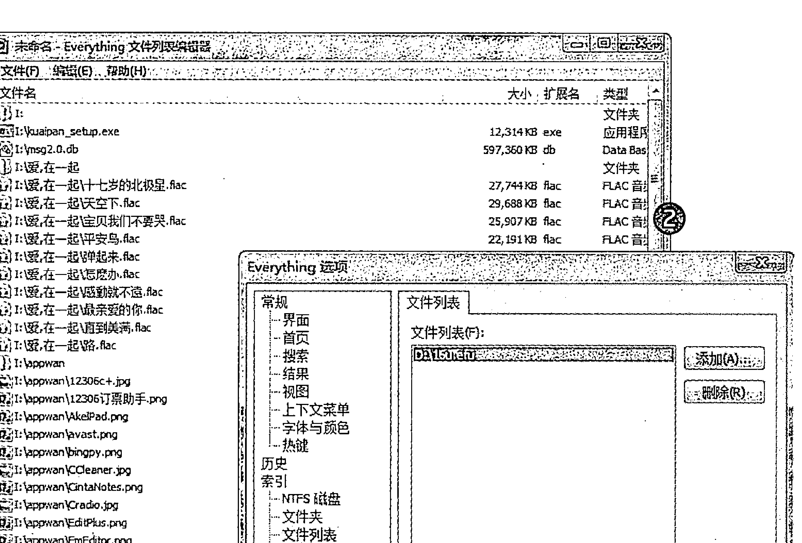

> 由于每次移动设备插入电脑的时候，系统分配的盘符都是不一样的。因此为了更好地对每一个移动设备进行区分，最好是在数据库的命名上进行特别的设置。比如测试使用的是16GB的U盘，因此数据库就命名为16u，当搜索到相应的文件后，通过数据库的名称就可以知道文件存放在哪一个移动设备。


### 3 内部定位 文档关键词搜索

有时仅通过文件名很难找到文件，这时如果你能记得文档中的一些关键词，则可以进行文档内部搜索定位，这通过系统自身的功能即可实现。

不过默认情况下，系统只会进行文件名搜索，要想进行文档内部搜索，需要重新操作一番。要想直接在文档内搜索，需要预先建立索引。

在控制面板中点击打开“索引选项”，单击其中的“修改”按钮，在弹出窗口的“更改所选位置”列表中，勾选需要进行文档内容索引的目录（图4），确定后系统就开始进行索引操作了。这个过程有点慢，所以可能无法立即显示出效果。

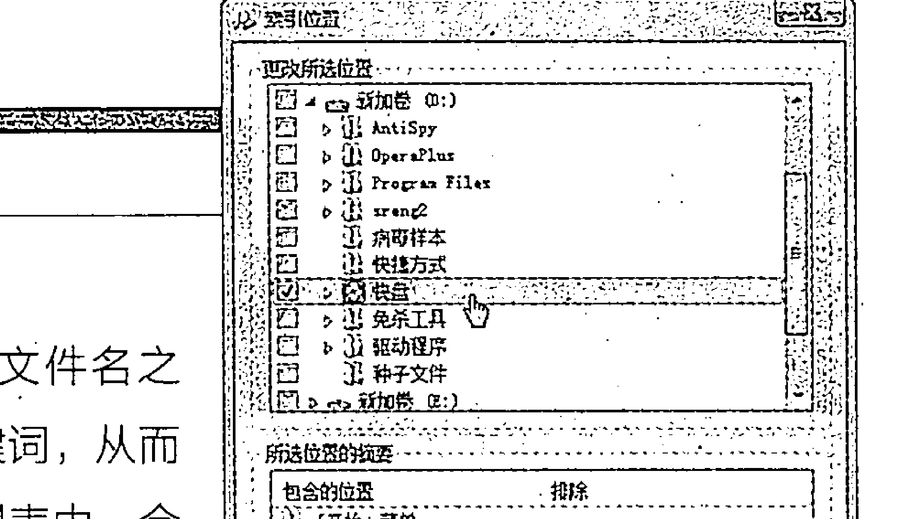

以后再搜索文档时，除了文件名之外，还可以输入文档内部的关键词，从而进行精确的搜索，在搜索结果列表中，会高亮显示搜索到的文档内容（图5）。

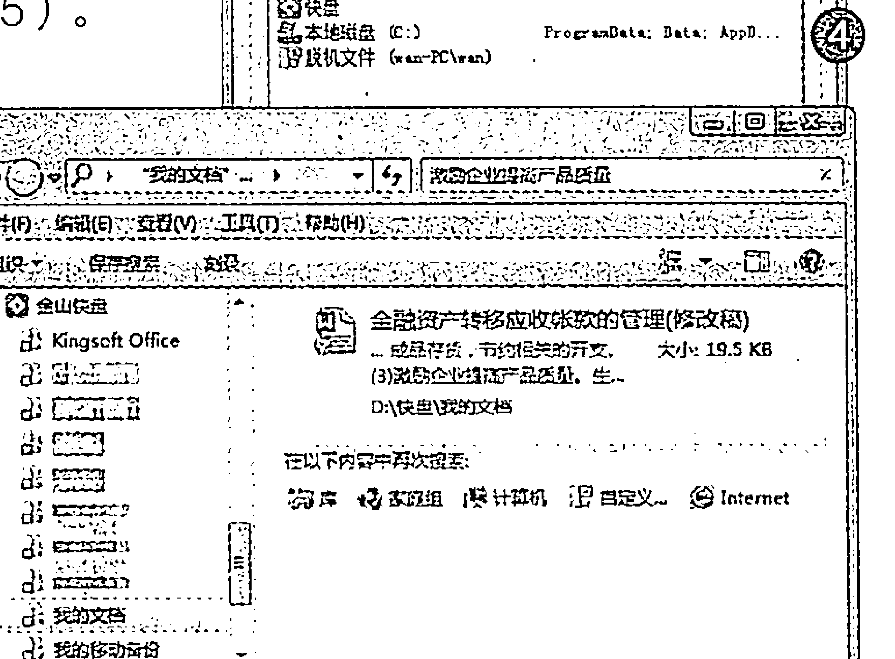

### 4 多管齐下的多重搜索

Windows系统索引的问题是速度慢，并且Windows XP及以下版本的系统还没有这个功能，这种情况下可以借助第三方软件FileLocator来完成，它可以多管齐下，让搜索结果更加精准。

软件启动后，在“包含文本”中输入文档内包含的关键词，后面的列表中可以选择搜索方式，默认为最简单的“布尔表达式”。点击“查找位置”后的“流量单个文件夹”按钮，在弹出的列表中选择进行搜索的文件夹目录。设置完毕点击“开始”，就可以在指定目录中进行定向搜索了。

搜索到的文件显示在下方列表中，同时显示该文件的具体路径，以及这个文件中匹配的关键词数目。任意选择一个搜索到的名称后，在右侧窗口中就可以进行预览，并且显示出关键词在文档中的具体位置（图6）。

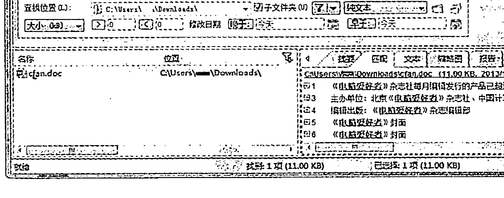

默认状态下，FileLocator只能对文档文件的内容进行搜索，如果想对压缩文件中的文档进行搜索，还需要进一步设置。首先按照前面的方法进行搜索设置，接着选择窗口中的“压缩文件”标签。点击列表上的“配置”链接，在弹出的对话框中选择“扩展件”中的“Ifilter”选项，在右侧窗口的列表中查看每一个文件类型的状态是否为OK。如果有的文件类型不是显示为OK，需要重新对这个文件类型进行关联操作。检查完成以后返回到“压缩文件”标签，在列表中选择要分析的压缩文件类型，最后点击“开始”即可在压缩文件中进行搜索了（图7）。不过由于文件解压需要一定的时间，因此搜索过程比较长。

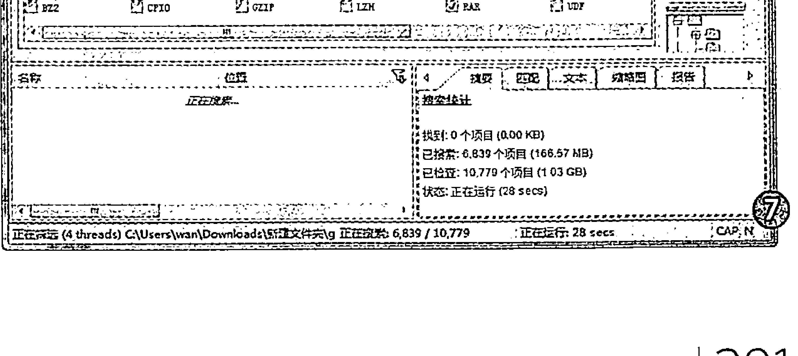

## 小邮箱里的大世界

邮箱的主要功能是管理邮件，此外还有大家熟悉的网盘文件管理功能。但是，用邮箱来管理轻应用，在邮箱中用轻应用来轻松处理各种生活和日常事务，取代桌面应用程序来完成各种任务需求，如此方便的方法你用过吗？
文|云悠悠

大家知道，最传统的电脑应用方式是在Windows桌面上安装应用程序完成所需的任务。其后出现了一种以Google应用为代表的新的应用方式，它只需在浏览器内点击即可完成任务，不需要在桌面上安装应用软件，这就是“轻应用”。今天，我和大家一起来分享另一种应用方式，在网易免费邮箱中使用轻应用，这种在邮箱管理界面中使用轻应用的方式，脱胎于网页轻应用，又比网页轻应用更加方便和个性化。

网页轻应用依赖于某个浏览器，一般是以类似于插件的方式在浏览器中安装轻应用的快捷方式，通过网络云计算的方式调用服务器中的应用，如果换了浏览器或换了电脑，要使用这些应用，还需要重新指定或配置安装。而网易免费邮轻应用由于是在某个邮件账号环境之中使用的应用，因此与账号密切相关，只要登录了相同的账号，则可以随时随处使用自己配置好的轻应用，因而更具有个性化和灵活性，可以说是一种可以随处带着走的个性化轻应用使用方式。下面就让我们一道来体验126网易免费邮的轻应用。

### 1 如何安装邮箱轻应用

要想使用网易126免费邮箱中的轻应用，需要进行简单的配置。这种配置类似于给邮箱的应用频道安装软件，但又不同于软件安装。因为它实际上并非是安装软件，而只是为其制定一个软件的网络快捷方式，真正的软件其实是存在于网络服务器中的，运行软件需要调用服务器中的数据，也是云计算方式中的一种。

首先用自己的邮箱账号登录126网易免费邮，点击“应用中心”可以看到首页推荐的热门的和最新的轻应用，只要点击其中某个自己感兴趣的应用，然后点击“添加到我的应用”按钮（图1），该应用即进入自己的应用列表中。主页中凡是已经安装的轻应用都会在应用图标的右上角显示一个绿底白字的对钩符号，以示区别。

除了可以在首页选择热门应用外，通过点击“所有应用”，再通过右上角的排列格式选择，按上线时间、应用名称和自己未安装三种方式显示相应的应用，来完成应用的安装选择。此外，还可以通过左侧栏中的分类目录，按类选择自己需要安装的轻应用（图2）。安装方法与上面介绍的相同。

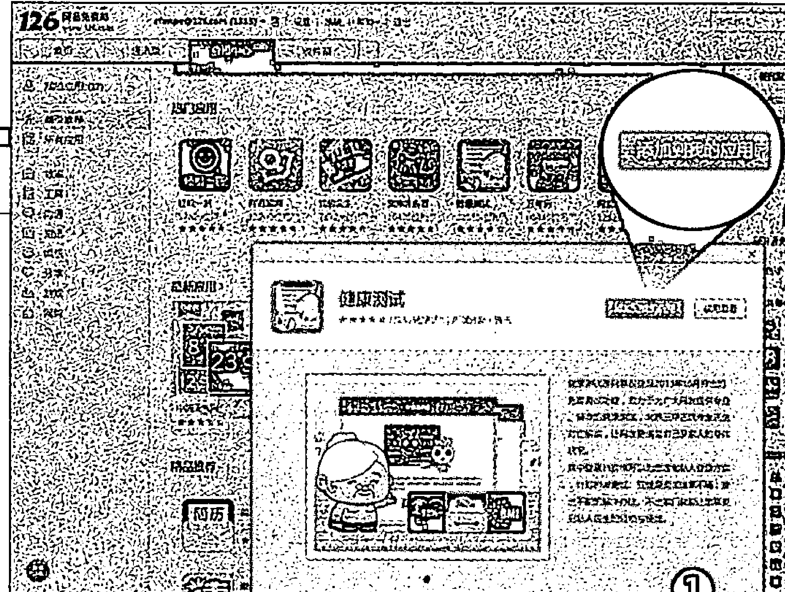

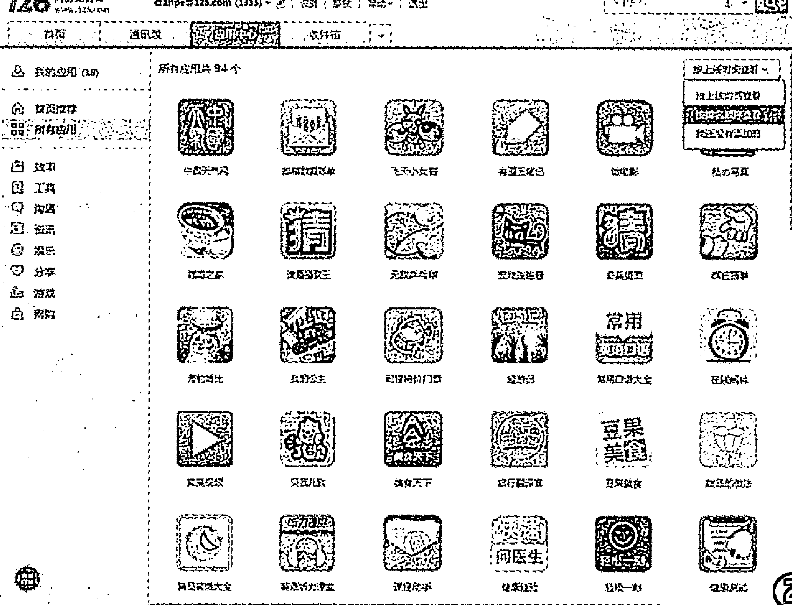

> 小贴士：
要安装最新鲜的轻应用，请选择应用排序方式为“我还没有添加的”，这样列出的轻应用都是自己未曾接触的新鲜应用，如此就可以不用理会已经安装的应用，而专注于挑选自己未用过的新应用了。

## 2 邮箱轻应用轻松使用

对于已经安装的轻应用，只需点击应用中心左上角的“我的应用”选项，然后在右侧窗口中选择点击自己需要运行的轻应用（如“中国朝代表”），该轻应用图标上便会出现“立即使用”文字提示（图3），点击它之后，该轻应用便以另一个单独标签页的方式在邮箱中打开了（图4）。


## 3 仿苹果管理邮箱轻应用

轻应用的管理通过在“我的应用”窗口中，点击右上角的“管理”按钮进入管理窗口来进行。进入管理窗口后，我们会发现所有安装的轻应用图标以一种摇动的动画显示方式出现，非常类似于苹果手机或平板中的应用管理方式，每个图标的右上角会出现一个红色的叉号，点击其中之一即可卸载掉这个轻应用（图5）。 如果对应用的排列顺序不满意，可以通过鼠标拖动的方式任意改变图标的排列方式。管理操作完成之后，点击绿色的“保存”按钮，完成对方案的保存。


| 朝代 | 起止年代(公元) | 都城 | 创始人/掌权人 | 都城 |
| :--- | :--- | :--- | :--- | :--- |
| 夏 | 前2100年-前1600年 | 阳城 | 启 | 阳城 |
| 商 | 前1600年-前1046年 | 亳→殷 | 汤 | 亳→殷 |
| 西周 | 前1046年-前771年 | 镐京 | 武王 | 镐京 |
| 东周 | 前770年-前256年 | 洛邑 | 周平王 | 洛邑 |
| 春秋战国 | 前770年-前221年 | 无 | 无 | 无 |
| 秦 | 前221年-前207年 | 咸阳 | 始皇（嬴政） | 咸阳 |
| 西汉 | 前202年-8年 | 长安 | 高祖（刘邦） | 长安 |
| 新 | 8年-23年 | 长安 | 王莽 | 长安 |
| 东汉 | 25年-220年 | 洛阳 | 光武帝（刘秀） | 洛阳 |
| 三国（魏） | 220年-265年 | 洛阳 | 曹丕 | 洛阳 |
| 三国（蜀） | 221年-263年 | 成都 | 刘备 | 成都 |
| 三国（吴） | 229年-280年 | 建业 | 孙权 | 建业 |
| 西晋 | 265年-316年 | 洛阳 | 武帝（司马炎） | 洛阳 |
| 东晋 | 317年-420年 | 建康 | 元帝（司马睿） | 建康 |
| 南朝宋 | 420年-479年 | 建康 | 刘裕 | 建康 |
| 南朝齐 | 479年-502年 | 建康 | 萧道成 | 建康 |
| 南朝梁 | 502年-557年 | 建康 | 萧衍 | 建康 |
| 南朝陈 | 557年-589年 | 建康 | 陈霸先 | 建康 |
| 北魏 | 386年-534年 | 平城→洛阳 | 拓跋珪 | 平城→洛阳 |
| 东魏 | 534年-550年 | 邺 | 元善见 | 邺 |
| 西魏 | 535年-557年 | 长安 | 元宝炬 | 长安 |
| 北齐 | 550年-577年 | 邺 | 高洋 | 邺 |
| 北周 | 557年-581年 | 长安 | 宇文觉 | 长安 |
| 隋 | 581年-618年 | 长安 | 杨坚 | 长安 |
| 唐 | 618年-907年 | 长安 | 李渊 | 长安 |
| 后梁 | 907年-923年 | 汴州 | 朱温 | 汴州 |
| 后唐 | 923年-936年 | 洛阳 | 李存勖 | 洛阳 |
| 后晋 | 936年-947年 | 汴州 | 石敬瑭 | 汴州 |
| 后汉 | 947年-950年 | 汴州 | 刘知远 | 汴州 |
| 后周 | 951年-960年 | 汴州 | 郭威 | 汴州 |
| 北宋 | 960年-1127年 | 开封 | 赵匡胤 | 开封 |
| 南宋 | 1127年-1279年 | 临安 | 赵构 | 临安 |
| 辽 | 916年-1125年 | 上京 | 耶律阿保机 | 上京 |
| 西夏 | 1038年-1227年 | 兴庆 | 李元昊 | 兴庆 |
| 金 | 1115年-1234年 | 会宁→中都 | 完颜阿骨打 | 会宁→中都 |
| 元 | 1271年-1368年 | 大都 | 忽必烈 | 大都 |
| 明 | 1368年-1644年 | 南京→北京 | 朱元璋 | 南京→北京 |
| 清 | 1636年-1912年 | 盛京→北京 | 努尔哈赤 | 盛京→北京 |


## 4 三个邮箱必备轻应用推介


- 记事本轻应用是网易手机邮提供的贴心服务，可以写下生活日记个人行程、备忘录等一切可以记录的个人信息。还可以通过邮件和博客消息的方式提醒用户，让你不再错过任何重要的安排。


- 如果不方便上网，怎样才能不错过重要邮件？开通“随身邮”服务，新邮件到达即发送短信通知你。通过点击短信里的URL，可直接在手机上读信和回复。如果你是发件人，如何让收信人第一时间处理你的邮件？开通“随身邮”服务，邮件发送成功即发短信通知收件人。


- 当手机号码邮箱（如13800138000@163.com的形式）接收到新邮件时，将由网易邮箱向该手机发送免费短信通知。每月可免费使用100条，移动、联通、电信用户都可使用该项服务。如果已激活手机号码邮箱，请将手机号码邮箱设为默认发件人，并告诉朋友你正在使用手机号码邮箱，这样，每封来信都会有免费短信通知了！


## 一搞定PDF烦心事

对于PDF这一大众化的文档格式来说，除了如何阅读外，最引人注目的就是文档格式转换。然而，在这些问题之外，还有一些我们平常会遇到的棘手问题需要解决。 文|张景元

比如，如何将图片或文本制作成PDF文件，如何将纸质资料转变为PDF文件，如何从大部头的PDF图书中切割抽取有用章节，如何将多个单独的PDF合并为一个文件，如何压缩一个有水分的PDF大文件……以往我们多见分别介绍如何实现这些需求的小技巧、小文章，完成这些任务往往需要不同的工具或方法，然而今天我给大家提供的是一个一站式的解决方法。 在这个过程中，我们需要借助于一款小工具软件PDF-Tools来配合，以完成我们需要解决的种种问题。

### 1 轻松创建PDF文档

将我们的数码照片集做成一个PDF文档来欣赏，将手头的文字资料转换为PDF格式提供给客户，将一些已有的纸质资料转换为PDF文档来共享或留存。以往要完成这些任务，我们可能会借助于专业版的Adobe Acrobat工具来解决。实际上，用小工具PDF-Tools来得更容易。 启动PDF-Tools软件，在Creat a New Document From一组中，可以看到有三种选择可以帮助我们创建PDF文档：Images（图像）、Text（文本）、Scan Direct（直接扫描），如图1所示。

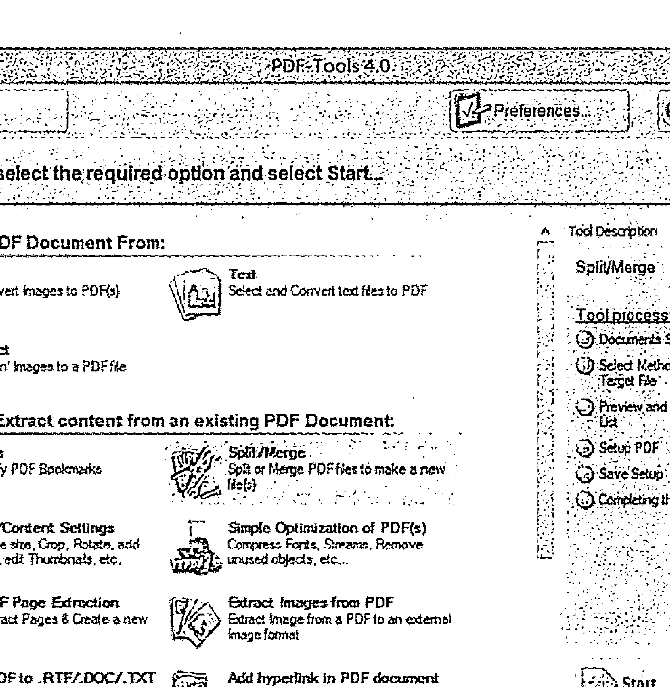

假设要将某个文件夹中的数码照片做成一个PDF相片图册，只需点击Images一项，然后再点击Start按钮，即可进入添加图像创建PDF文档窗口（Create a New PDF Document From Image），这时可通过Import按钮从外部设备（如相机、手机等）添加照片，或通过Add按钮追加本地照片文件或文件夹，再通过Up、Down按钮调整照片列表顺序（通过Remove移除无用的照片），如图2所示。之后点击Next按钮即可进入制作PDF的参数设置环节，对页面纸张和版面尺寸、图片在页面中的位置进行设置。设置完成后，点击Next进入PDF文档版本、打开与阅读参数的设置环节。一切OK之后点Next就可以生成自己想要的图片PDF文档了。 由文本生成PDF或通过扫描生成PDF的案例，具体制作过程也类似，只需注意其中参数设置的环节，按需设置好各种参数即可。

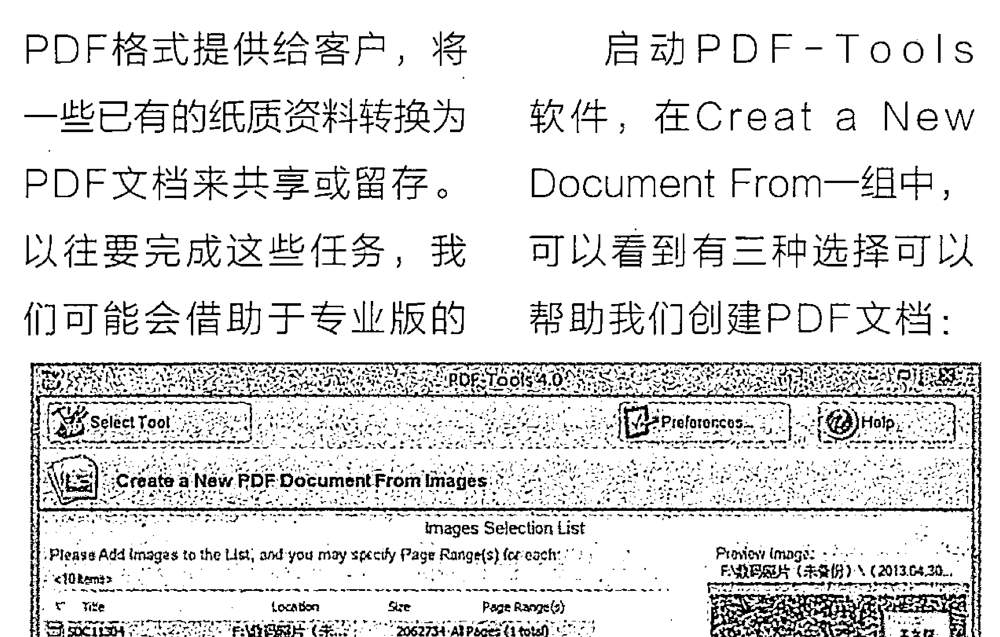

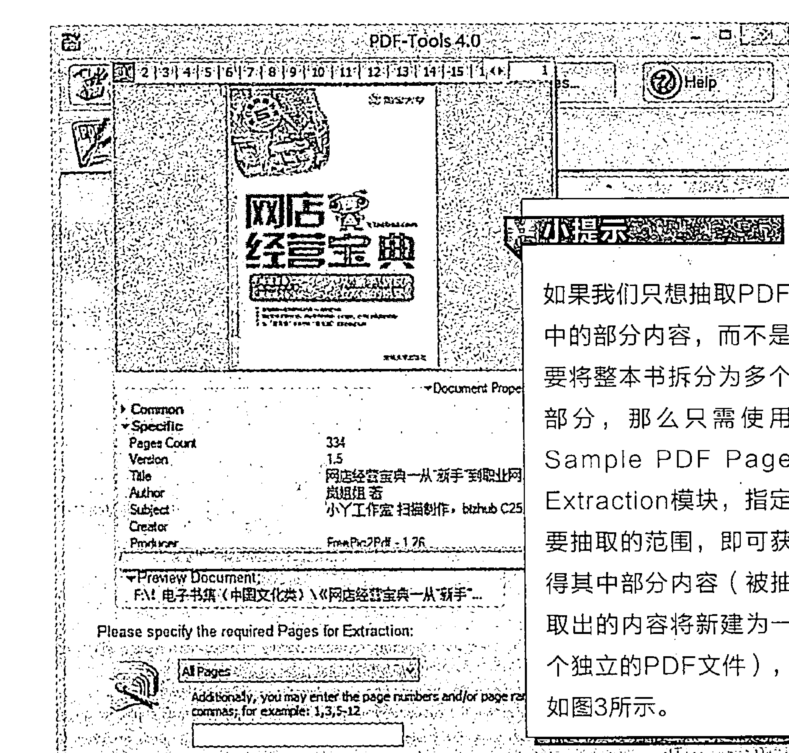

如果我们只想抽取PDF中的部分内容，而不是要将整本书拆分为多个部分，那么只需使用Sample PDF Page Extraction模块，指定要抽取的范围，即可获得其中部分内容（被抽取出的内容将新建为一个独立的PDF文件），如图3所示。

### 2 PDF分合任我行

有时一个成百上千页的PDF文档，在档次不高的智能手机中阅读会感到很吃力，这时我们迫切需要将其拆分为多个小文件甚至单页来阅读。还有的时候，我们可能获得了一部书的几十个章节的分散PDF文件，觉得管理起来又不方便，需要将其合并为一个文件以便管理。

在这种情况下，可以用Split/Merge模块来分拆或合并PDF。执行Split/Merge模块后先打开一本需要拆分的PDF电子书，接下来定义拆分参数，然后执行拆分就可以获得单页的文件集合。合并操作也是如此，只需先注入要合并的所有分节PDF文件，调整好列表顺序和参数，执行合并操作即可。

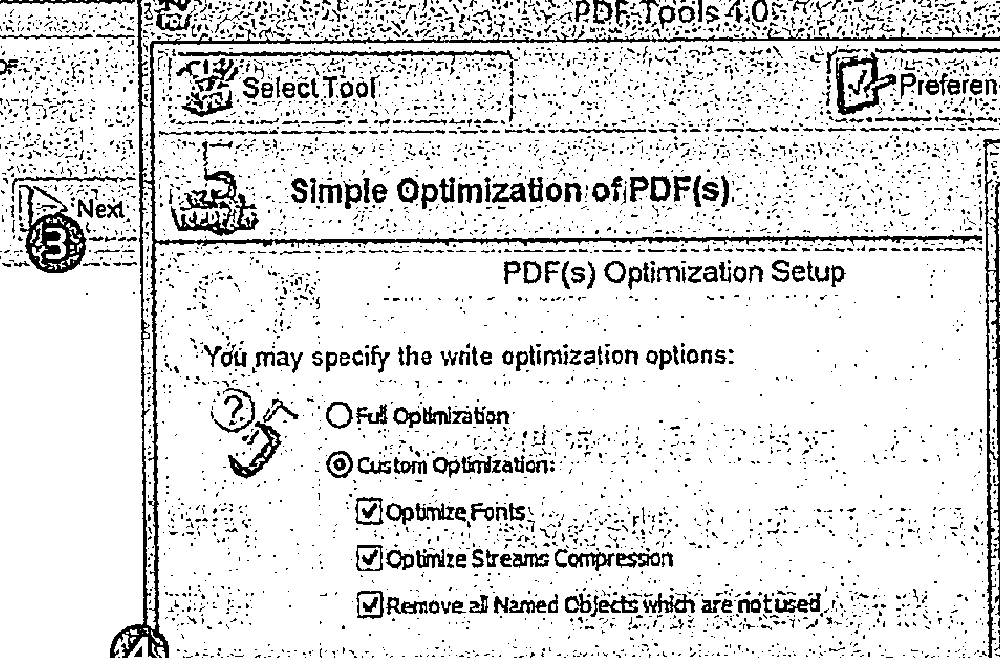

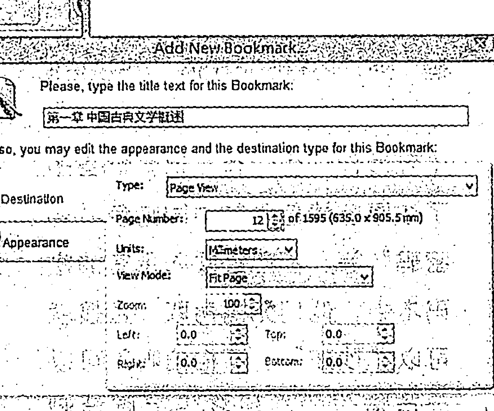

### 3 给PDF文档减肥

有时我们会发现，一个PDF文件明明没含多少文字，图片的质量也很一般，但这个文件的体积特别庞大。这种情况下，肯定是其中暗含了许多多余的成分，比如多余的字体、无用的对象、无用的数据流等。

这时，我们可以用Simple Optimization of PDFs处理模块对该PDF进行优化，去掉其中的无用字体、对象、数据量等，给PDF减肥，让我们在不失原来清晰度的情况下，获得一个更省硬盘空间的PDF电子文件。具体可供选择的优化选项，如图4所示。

### 4 广告传播我也能

常常可以看到网上下载的一本PDF好书中，还添加了共享者的个人网址或联系方式，点击链接即可进入到相应的网页。这种办法对宣传个人形象和产品很有效，但它是如何添加进去的呢？通过Add hyperlink in PDF document模块，可以为选定的PDF中的任何一处文本添加网络连接，这样当别人在阅读我们共享的PDF文档的时候，一旦点击了我们预设的网址链接，就可以直接访问我们的网页了。具体设置如图5所示。

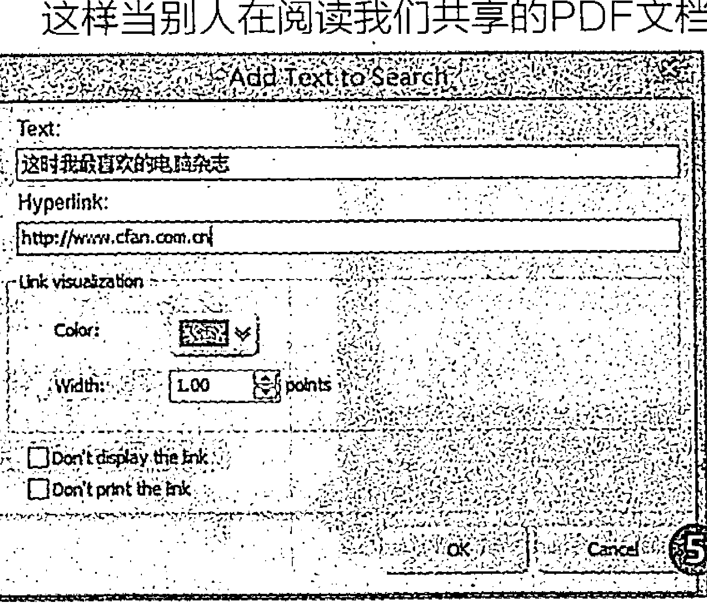

### 5 目录书签巧添加

有时候，我们在网上获得的一本电子书可能没有目录，从第一页到第几百页流水账般一串到底，续读起来很不方便，也不利于挑选内容进行阅读。在这种情况下，如果我们觉得是本精品书，有必要编辑一下，则可以按正文内容给图书加上一个目录。使用Bookmarks模块，就可以添加或修改PDF电子文件的书签目录，任意修改或添加图书目录。参数设置如图6所示。

## 微软英特尔合力构建强密码

你的密码是否安全？还在用123456、abcd这类密码心存侥幸吗？不妨到英特尔推出的一个在线网站上测一测，看看你的密码到底有多牢靠。如果你的密码被“秒破”，那么问题究竟出在哪儿？微软的产品则会帮你分析。

文|龚茜茹

### 1 看看你的密码有多强

很多人对自己构建的密码充满信心：密码，只要不让人知道就安全了。其实大错特错！360和瑞星曾经公布过中国版的“弱密码”榜单，除了abc123、iloveyou、qwerty等全球网民通用的“弱密码”外，还有666666、888888等吉利数密码，“5201314”（我爱你一生一世）这类被寄予了浓厚感情色彩的中国特色“弱密码”等，都已经收入黑客的密码本中，他们无需窃取，直接就可以“秒破”。不相信吗？可以用英特尔的在线密码强度检测工具试试（http://tinyurl.com/c6xm2rq）。

1.简单的密码

打开网页后，在中间输入框输入你的密码，然后单击“GRADE MY PASSWORD”，看看123456要多长时间能破解？竟然只有0秒。添加字母增加强度，试试abc123，还是0秒。看来，这样简单的密码真是不靠谱。

2.一般自定义密码

再试试普通个人定义的密码，6位以内的字母加数字，比如HPI123，这类密码非常典型，不过也只用了不到2秒钟就破解了。

3.自定义高强度密码

再次增加强度，10位密码，包括大小写字母、数字、特殊字母等，这是现在不少网站对用户密码提出的一般要求。这里我们试试Zte123456$，不可思议的是，破解同样用不了2秒钟（图1）。

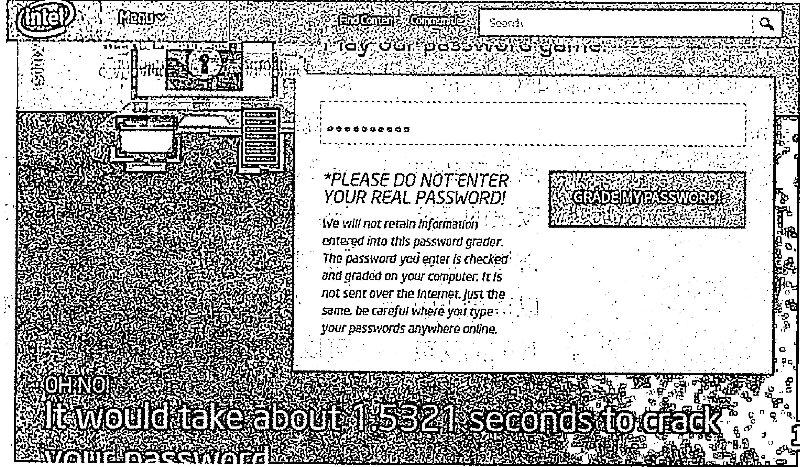

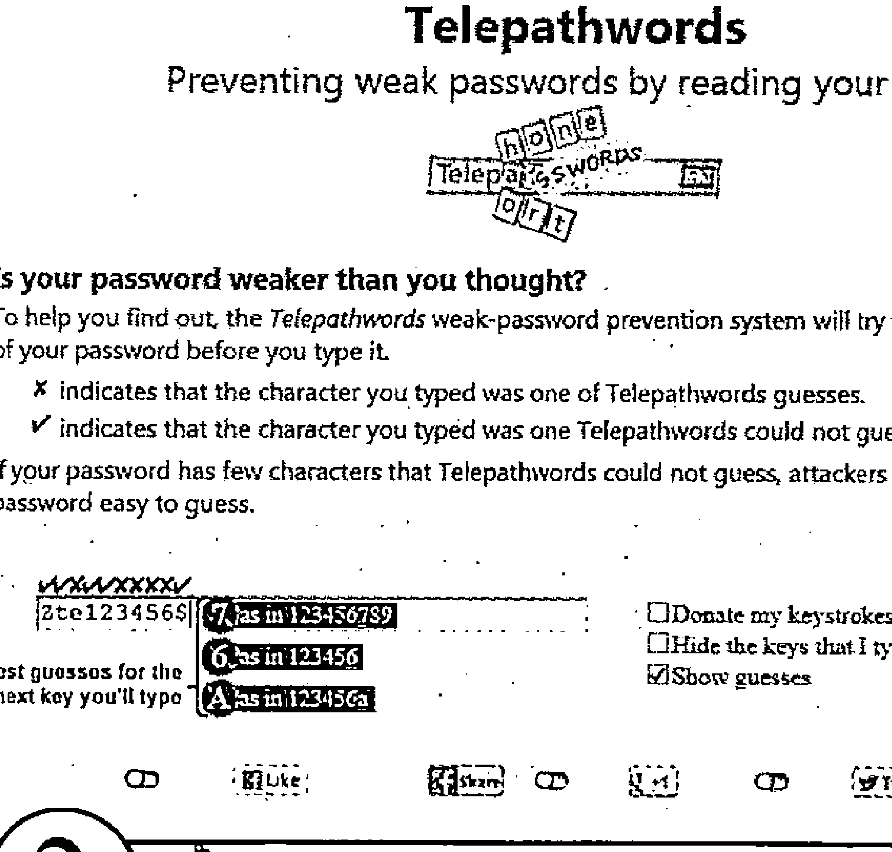

### 2 为密码“把脉”

上面的试验令人触目惊心，那么我们构建的这些密码，到底问题何在呢？微软提供的一个在线工具，可以帮我们进行分析诊断。

首先进入微软密码问题检查网站（http://tinyurl.com/nd5bvr6），然后在下面的密码框中逐个输入自己的密码。注意，除非为了学习，否则不要勾选右边的第一个复选框，那个选项表示将口令发回公司的服务器进行分析。输入密码的同时，网页上就会给出问题所在。看看Zte123456$这个密码，竟然有5个问题之多，无怪乎不到2秒就被破解（图2）。

一般来说，如果8位有3个以上问题，针对性进行修改，密码强度至少提高3倍。让我们字母不变，仅仅改变顺序修改一下，改成Z236t15e$4（图3）。现在再去英特尔网站上测试，可以看到密码强度大幅提高，需要16个小时才能破解。

## Telepathwords

Preventing weak passwords by reading your mind

Is your password weaker than you thought?
To help you find out, the Telepathwords weak-password prevention system will try to guess each character of your password before you type it.
× indicates that the character you typed was one of Telepathwords guesses.
✓ indicates that the character you typed was one Telepathwords could not guess.
If your password has few characters that Telepathwords could not guess, attackers may also find your password easy to guess.

## 3 构建易记的高强度密码

网上可以找到不少构建高强度密码的软件，不过这类软件生成的密码确实很强大，但是自己记忆起来也很困难，比如 wG-ol_Hn=GhX 这样的密码（图 4），怎么记忆？另外，工具生成的密码，还存在直接进入黑客密码词典的可能。还是让我们自助构建易记、高强度的密码吧。

- KeePass 在 PC 年代，是大名鼎鼎自由的免费开源软件，其数据库支持高级加密标准（AES，Rijndael 算法）和 Twofish 的加密算法。开源让大家明白保存过程没有猫腻，AES 这些加密算法已经广泛应用于军方通信让大家安全放心，而免费则让大家使用没有经济负担，要知道手机密码管理软件通常都很贵（1Password 促销时都要 30 美元，每个大的版本升级还需要另外购买）。所以，笔者觉得 KeePass 是手机上首选的密码管理软件。

### 方法一：单位、账户、序号复合体

举例来说，比如单位为“电脑爱好者”，工商银行第一张卡的网银密码可设置为：DNAHZ#ICBC#01。通过在线检测，这一密码的破解需要 59109 年，安全性大大提高，并且也容易记忆。注意，为了避免猜测，后面可以加入自己保密的数字信息。

### 方法二：个人、账户、私密信息复合体

比如笔名为“柳絮”的工商银行卡的网银密码可设置为：LX#ICBC#gui1。看不明白？告诉大家一个秘密，gui 是柳絮的名字，1 嘛，新年更进一步。诸如此类。

## 4 手机密码保存 易用难忘

高强度密码提高了安全，但也确实增加了记忆难度，尤其是需要记忆多个密码时，很容易遗忘。其实随着智能手机的普及，我们可以利用手机进行密码管理。

### 1. KeePass

下载安装 KeePass 后（注意要从官网下载，不要随便从不明网站上下载）启动它，首先要创建一个保存账户信息的数据库（图 5），数据库文件名可以使用默认名称，接下来输入数据库密码。注意，这个密码是打开数据库的口令，一定要牢记（图 6）。

创建数据库后进入应用界面（图 7），此时可以单击左下角“添加群组”创建新的群组，也可以在已有的群组中添加账户信息。单击添加条目后，可以添加相应的账户信息（图 8）。

以后使用的时候，进入 KeePass，选择相应的数据库文件输入密码即可进入（图 9）。此时，进入相应条目后，可以把密码复制到剪切板或者选择右上角的显示密码进行显示就可以啦。

- 当然，你也可以选择创建一个密钥文件来打开数据库。密钥文件可以放到其他地方，比如优盘中存储，这样万一手机丢失，没有密钥打不开应用，相应地为其中保存的密码多加了一道防护。
- 注意：一定要做好账户信息数据库文件（后缀为 .kdb 文件）的备份工作。由于该文件加密采用 256 位 AES 进行加密，备份到本地计算机即可，相当安全。不过，千万不要把文件备份到 KeePass 的云端，这么多账户信息，绝对是黑客的重要攻击目标。

## 借助外接 乐视视频进平板？

想下载一部《屌丝日记》剧集装在 iPad 平板出差欣赏。上网搜索只有乐视视频网有源提供，点击可以正常播放，乐视客户端明明提供了下载链接，但加载后无法下载。具体过程如图 1～图 5 所示。怎么办？ 文|林永艳

- 到 360 视频搜索中搜索，发现只有乐视提供该连续剧的播放链接
- 点击链接可正常播放，于是想到安装乐视客户端来下载
- 在乐视客户端通过搜索访问到该剧集，点击“立即下载”按钮
- 选择清晰度并选择视频格式，全选整个剧集，确定添加
- 视频被顺利加入到下载列表当中，但是任由如何设置，列表中的下载任务就是纹丝没动

多次操作、重启系统甚至重装乐视软件，问题依然如故，还是无法下载。怎么办？因为急于获得视频，只得尝试其他办法来解决。

### 1 寻求有效剧集链接

下载有数十集的连续剧不同于下载一个视频，因为它涉及到多个地址，逐集去抠出下载地址的办法显然是一个很笨拙的方法，不到万不得已不能优先采用。现在的关键，是需要找到有效的剧集总地址。经过分析得知，乐视剧集总地址是被藏在一个不起眼的链接当中，这个链接的名字不是我们常见的剧名链接，而是在‘更多详情’链接文字中（图 6）。从这个链接的属性中，我们可以复制其剧集的真实地址。但是，用通用下载工具如迅雷等依然无法下载到剧集。

http://www.letv.com/tv/95379.html 更多详情>>

### 2 借助专用下载工具

接下来，访问 FLVCD 官方网站（http://www.flvcd.com）（或下载该网站提供的 FLVCD 下载器），将上面获得的连续剧列表地址粘贴到该网站或软件的搜索框中，执行“开始”按钮（图 7）。之后我们可以看到软件会分析出该剧集各集的链接信息（图 8）。

分析结束后会显示分析结果并给出黄、绿两个按钮（图 9）。点击黄色的“硕鼠专用链下载”按钮，可启动专用下载器对以上分析出的地址进行管理和下载；若点击绿色的“获取临时下载器（免安装）”按钮，则可以获得一个可以自动运行的文件，保存这个文件就等同于保存了一个内含有效剧集链接的下载器软件，随时执行这个“软件”即可启动对以上剧集的下载任务。

在下载窗口中我们看到，同样的一台电脑，同样的一个系统环境，前面用乐视客户端下载没有任何反应的剧集，在这里变得可以流畅下载了（图 10）。在这个窗口中，我们可以灵活地对正在下载的任务进行管理和控制。

### 3 为苹果提供合格视频

由于 iPad 平板不能直接支持下载的 FLV 视频，不希望安装软件和找别的转码器，但需要找到快速的格式转换办法。PC 中正好有用来播放视频的通用播放器 QQ 影音，我用它方便地实现了视频格式转换，为 iPad 提供合格的视频。

启动 QQ 影音播放器，点击窗口右下角的“影音工具箱”按钮，选择“转码”按钮，打开转码窗口，添加 FLV 剧集文件，选择输出设备为“苹果”，再选择视频格式，点击“开始”转换，即可获得需要的苹果格式的视频文件（图 11）。

## 多卷加密 网盘泄露也安全

想把自己的大个头资料包备份到网盘中保存，除了担心传输过程中数据丢失外，更担心一旦网盘密码泄露，里边的资料被别人获取。网盘虽然也提供了加密功能，但这个到底靠不靠谱很难说。怎么办？

文|彬彬

对网盘的安全持怀疑态度，而自己又不得不用网盘存储资料的情况下，如果对资料的安全性确实要求高的话，除了选择安全基础比较扎实的网盘外，自己做好安全工作很重要。我的思路是用 WinRAR 建立资料的多卷安全包，这个多卷安全包由自己设定的足够复杂的密码来保护，并且能实现以自解压的方式自动还原。

> 小提示：建立全中文界面的多功能多卷自解包是 WinRAR 的一个特色功能的组合应用。目前市面上的许多压缩软件，虽然在基本压缩和解压功能上与 WinRAR 不相上下，但无法建立能够自解压且同时加密的自解压压缩包，是这些软件的一个短板。因此，我们这里首选 WinRAR 来完成这个任务。

Step 1 启动 WinRAR 压缩软件，在软件主界面中选择压缩对象，通过“文件”菜单选择“设置默认密码”，两次输入密码，并选择“加密文件名”和“用于所有压缩文件”两项，确定密码设置（图 1）。

> 小技巧：为了防止密码被轻易破解，密码最好由大小写字母混搭，中间再加数字更好。例如，取“我的生日是 1980 年 7 月 8 日”的第一个字母，组成密码即为“WDSRS1980n7y8r”。这样的密码既好记，又具备前述的安全特性。

Step 2 单击主界面工具栏第一个按钮“添加”，激活“带密码压缩”窗口，用“浏览”按钮确定压缩包的存放位置并命名压缩包文件。勾选“创建自解压格式压缩文件”选项，在压缩为分卷大小框内输入分卷的大小（比如这里用 100MB）（图 2）。

Step 3 点击“高级”标签，点击“自解压选项”，在“高级自解压压缩包选项”的“模块”选项卡下选择“Default.SFX 图形界面 RAR 自解压模块”，通过其他标签设置解包时显示的标题和图标信息、许可信息等。然后点击“确定”开始执行压缩（图 3）。

经过以上操作，会生成一个以 EXE 为扩展名的可执行文件，还有一系列以数字序号结尾的数据文件，只需将这些文件传到自己的网盘中即可。这样，当自己使用时只需下载文件并执行 EXE 文件输入密码，即可合并获得需要的原始文件。而别人即便下载了你的文件，也因没有密码而无法打开文件，甚至连其中的文件名也无法看到。

## 上网慢 三步快速寻因求解

上网的时候，若遇到机子很卡、很慢的情况，从理论上来说，宽带的问题、系统的问题或对方网站的问题，这三种可能都会存在。那么，有什么快速的方法，马上可以判断出具体是哪种毛病导致网速变慢的呢？

### 1 变换目标排除网站问题

上网慢，有可能是我们访问的网站服务器因访问的人多而造成拥堵。要确定是不是这种可能，方法非常简单，只需换个网站上网，看速度如何，就知道是不是对方网站或服务器的问题。例如，我们正在 12306 铁道网查票，发现半天刷不出显示页面，不确定是铁道部服务器的问题还是自己电脑的问题。这时我们可以到另一些网站，如新浪网或 CCTV 网站访问一下，如果这些网站开启速度尚可，则基本可以确定是 12306 网站本身的问题。

> 这个问题如果仔细分析起来会很复杂。但对于普通电脑用户来说，只需用简单的排查法，借助手头上的系统工具，即可确定问题出在哪个环节并就地解决。
> 若这些测试或修复均不能提高网速，又不想重装系统，可检测路由器设置，仍不能提高速度，可尝试在原有系统基础上安装另一个系统组成双系统，进入新系统测试网速，若同样不能解决，则可确定是网络接入的问题，就需联系运营商检查外接网络的原因了。

### 2 软件测速排除宽带问题

如果发现无论访问哪个网站，都出现浏览器访问缓慢的情况。那么可以把目光集中到网络本身是否有问题上。这时，我们可以启动测速软件（如 360 安全卫士自带的网速管理），测试一下宽带的速度。
右键单击 360 桌面浮动测速球图标，选择“测网速”命令，在随后显示的窗口中“宽带接入速度”会显示当前网络的平均速速。点击“网页打开速度”会显示网页速度。

若能获得理想的测试速度，但浏览网页仍然缓慢，则说明不是宽带的问题，可能是浏览器或系统本身有其他问题。

### 3 工具检测修复系统问题

在初步排除了对方网站或服务器以及所用电脑网络带宽问题的情况下，最后的目标就锁定在浏览器或系统等软件环境上。有关浏览器和系统问题而引起的网络缓慢问题，原因很多，此前有许多这方面的文章进行过详细分析。但是，对于普通用户来讲，不可能有那么高的水平去分析和判断，但可以用一些现成的系统工具来诊断分析和解决问题。例如，用 360 安全卫士提供的网络和系统修复工具，即可进行修复。
启动 360 安全卫士，点击“系统修复”，进入修复窗口后先执行“常规修复”，完成后再执行“漏洞修复”，紧接着再点击“优化加速”按钮，依次执行开机加速、系统加速、网络加速三个项目。待以上修复过程和优化过程均完成后，重启电脑，再访问我们需要上的网站，看速度是否已经提高。

## 用好 Xposed 深入 Android 内部调整

Android 是一个开放性的系统，所以很多人喜欢对其进行各种改造和优化，不过涉及到系统内部的改造，需要具备一定的编程基础，这对一般人来说显然有难度。而借助 Xposed，谁都可以轻松地对 Android 系统进行深度优化。

### 1 未雨绸缪搭建 Xposed 框架

因为第三方应用都要在 Xposed 框架下运行，所以首先要安装 Xposed。从 http://www.dwz.cn/cfan2014V 下载“Xposed 集合”，然后先安装其中的“Xposed 框架_2.3.1 简体中文”应用，启动应用后，点击“框架”，再依次点击“安装/更新→软重启”，重启手机后就可以使用了（图 1）。

### 小知识：Xposed 与 Android 应用有何不同

Xposed 实际上是 Android 的一种框架环境，它提供各种接口，这样开发者只要开发符合 Xposed 的插件（模块），在 Xposed 框架下就可以实现对 Android 系统的各种深度优化。Xposed 类似 PC 上的 .NET Framework 4.0，任何第三方应用都可以通过接口标准添加到 Xposed 中加载运行。

按提示安装下载压缩包中的其他应用，完成安装后再次进入 Xposed 框架，点击“模块”，接着在打开的窗口勾选所有安装的模块，完成上述操作后就可以开始对 Android 系统进行深度优化了（图 2）。

### 2 牛刀小试美化任务栏

了解 Android 美化的朋友都知道，对于系统通知栏、任务栏、电池图标等重要系统组件的美化，我们必须对系统文件进行更改，如果操作不当还可能导致系统崩溃。不过现在借助 Xposed_Tweakbox 应用，任何人都可以轻松实现上述组件的美化。启动 Xposed_Tweakbox，可以看到它能优化多个系统组件（图 3）。这里以任务栏操作为例，Android 默认任务栏都是黑色背景，想要个性一点，可以在程序界面点击“Status bar”进入，接着点击“Background colors”按钮进行颜色的更换（图 4）。

在弹出的配色窗口，点击下方按钮，然后选择绿色（或其他颜色），这样即可将原来任务栏的底色变成绿色了。重启后再次进入桌面即可看到更改后的效果（图 5）。其他项目的优化，操作步骤与之类似。

> 小提示
> 注意，小米系统和 Xposed 框架不兼容，安装后可能会导致手机无限重启。此外，手机必须已 Root，如果没有特别说明，所有的应用都在 Android 4.0 及以上版本的系统中使用。

## 玩转 Xposed 深度优化

在手机上启动 App_Settings 后，程序会将本机所有的应用全部搜索出来，按提示选择需要编辑优化的应用（图 6）。

### 给任意应用添加强制全屏

在打开的窗口点击“Setting”后的“打开”，打开应用的编辑窗口，这里可以对程序显示字体、是否全屏、启动标题、字体大小等进行设置。比如某些应用没有使用自适应分辨率设置，如果在大屏手机上无法全屏显示，现在只要在“Fullscreen”选项下选择“Force”（强制全屏显示）即可（图 7）。

### Android 应用权限自定制

Android 上有很多免费的应用，不过免费午餐伴随而来的是不请自来的各种隐患。比如很多应用默认在后台偷偷自启动，没有通讯录功能的应用强行拥有读取通讯录的权限，应用运行后会禁用系统休眠功能，导致电量极速耗尽。现在利用 Xposed 框架下的 App_Settings 可以自行对应用所有权限进行编辑，以解决上述问题。这里以“XX 背单词软件为例”。

如果要对应用的权限进行编辑，点击下方的“Permissions”按钮，接着在打开的窗口就可以看到该应用所有允许的权限。比如该款背英语软件，“查阅敏感日志数据”、“读取手机状态和身份”这些权限显然和应用本身功能不符，只要点击即可将其屏蔽，其他权限的屏蔽操作类似（图 8）。

完成上述操作后，点击右上角的“Save”按钮，保存后退出程序，现在运行编辑过的应用，上述被屏蔽的权限就不复存在了，可以让应用的使用更符合我们的实际需求啦。

- App_Settings 权限编辑和普通安全软件的拦截不同，普通安全软件只是在应用特定权限激活时进行拦截，使得应用没有对应的权限，只是起到治标的作用。比如拦截某应用的自启动，但是如果卸载安全软件，该应用仍然会继续自启动。而 App_Settings 则是对程序的权限组件进行屏蔽，彻底取消应用的权限。
- 注意，不要对应用确实需要的权限进行编辑，以免导致应用无法运行。如果错误编辑权限，只要再次打开上述窗口，将屏蔽的权限恢复原样即可（被屏蔽的权限上有横线标注）。

> Xposed 框架只是个运行框架，机锋论坛提供更多 Xposed 模块的应用下载：http://bbs.gfan.com/android-6923254-1-1.html## 用活搜索框 计算更方便

微软从Windows 8开始取消了常用的开始菜单，这样用户想要调用计算器时就比较麻烦。其实随着云计算的普及，很多搜索引擎的搜索框就是一个很好的计算器，功能甚至更强大。

### 1 常规计算助力生活规划

为了避免我成为一名“月光族”，父母要求我将每天的花销记录下来，从而节约每一个铜板。花销的汇总需要进行计算，当然只需简单的加减乘除即可。

通过浏览器打开百度或谷歌的首页，在搜索框输入相应的计算公式。计算公式的输入和常见的计算器一模一样，比如*代表乘法、/代表除法等。例如今天带了20元钱，坐公交车花了2元，吃饭花了7元，买报纸花了3元。于是就输入“20-2*2-7-3”，点击“搜索”按钮立即可以看到剩余的钱数（图1）。

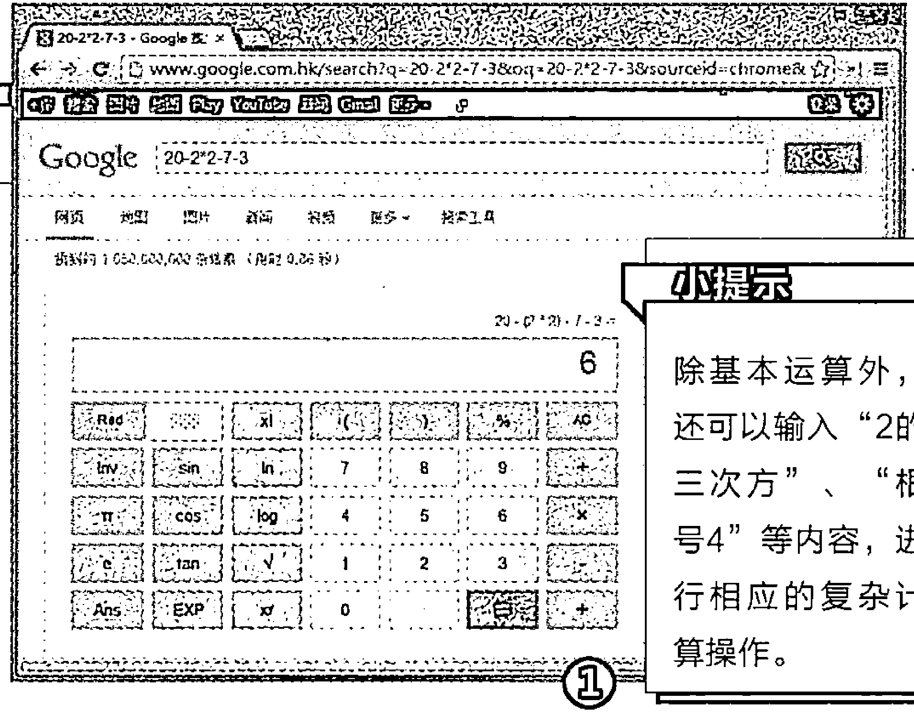

### 2 高级计算余额宝收益

通过节俭生活，每月都有点盈余，积攒的一些钱可以进行理财。钱存在银行和存在余额宝中，会有多少差别呢？就让我来算一算吧。

余额宝等产品是按照七日年化收益率进行显示的，那么七日年化收益率如何进行计算？这里有一个计算公式，即（ΣRi/7）×365/10000份×100%，其中Ri为最近第i公历日的每万份收益。通过查询最近七天的每万份收益，分别为1.5429、1.5559、1.5695、1.5698、1.5720、1.5792和1.5960，通过求和计算得到10.9853。然后用这些数字替换计算公式中的Ri，最后得到的七日年化收益率为5.7%，还是比一年期的存款利率要高（图2）。

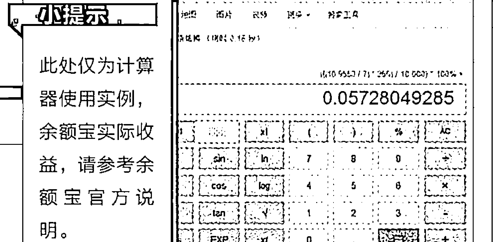

### 3 网上代购计量直接转换

现在网购越来越方便，不仅足不出户，还能直接送货上门，尤其是在中国香港地区或者国外直接购买，很多东西都可以便宜不少。但是在其他地方进行购买，就涉及到汇率问题。因为我们只有将其转换成人民币，才可以进行价格上的对比和参考。比如最新的iPad在香港购买是3888港币，直接在搜索框输入“3888港币”进行搜索，就可以得到对应的人民币数目（图3）。如果从境外购买东西的话，也会遇到一点点小问题。比如境外常用的计量单位，就和我们国内常用的不一样。比如国外用加仑，国内用升；国外用英里，国内用公里；国外用磅，国内用公斤等。对于这些计量单位的转换，只需要用“数目+计量单位”的方式，比如“60英里”、“30磅”等。然后点击“搜索”按钮，就可以完成计量单位的转换操作了。

其实通过搜索框还可以查询到很多的信息，比如天气预报、当前时间、股票走势等。比如输入“天气”进行搜索，搜索引擎就可以通过IP地址，判断出当前位置并给出当前以及未来几天的天气情况。如果输入股票名称或代码，就可以看到最新的走势图和股价信息等，非常的方便实用。

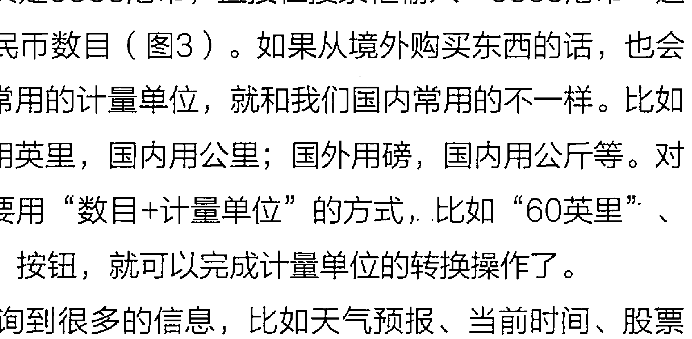

## 视频编辑做比说容易

文 | 马震安

老马录制了儿子篮球训练时的几段视频，他想将这几段视频连接起来加上相应的转场效果，并在开头加上开场字幕，在每段视频下边加上文字说明。我推介他使用（电影魔方）MPEG Video Wizard DVD。

### 字幕添加、编辑易如反掌

运行MPEG Video Wizard DVD软件，在工具栏上单击“字幕编辑器”按钮，在弹出窗口的右侧输入所需要的文字，在“文字”标签中对输入的文字进行设置，在“图形”标签可以加入自选图形及文字，在“阴影”标签对加入的自选图形进行阴影设置。设置好后保存字幕，如保存成“开场字幕.wbt”（图1）。

如果想在开场字幕与视频间稍做停留，可以将刚才保存的开场字幕去掉运动效果后另存为“开场字幕2.wbt”文件。同样的道理，可以为每段视频设置好要显示的文字说明并保存好相应的文件。

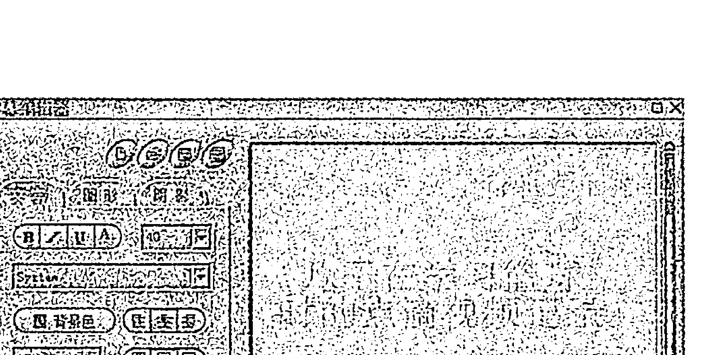

### 字幕、视频合成一拖完成

在“字幕编辑器”中分别打开保存的“开场字幕.wbt”和“开场字幕2.wbt”开场字幕文件，在左下角的Drag区域分别将它们拖动到时间轴的“视频轨道”上。在“输入”窗口中打开所需要的视频文件，直接拖动视频到“视频轨道”上（或者是打开视频所在文件夹，直接拖动视频文件到“视频轨道”上）。在“视频轨道”上选择相应的视频，用鼠标在视频边框的右边拖动来改变视频播放的长短。将每段视频下方所要显示的字幕拖动到“字幕轨道”与相应视频对齐，并拖动它们或它们的边框来设置持续时间的长短（图2）。

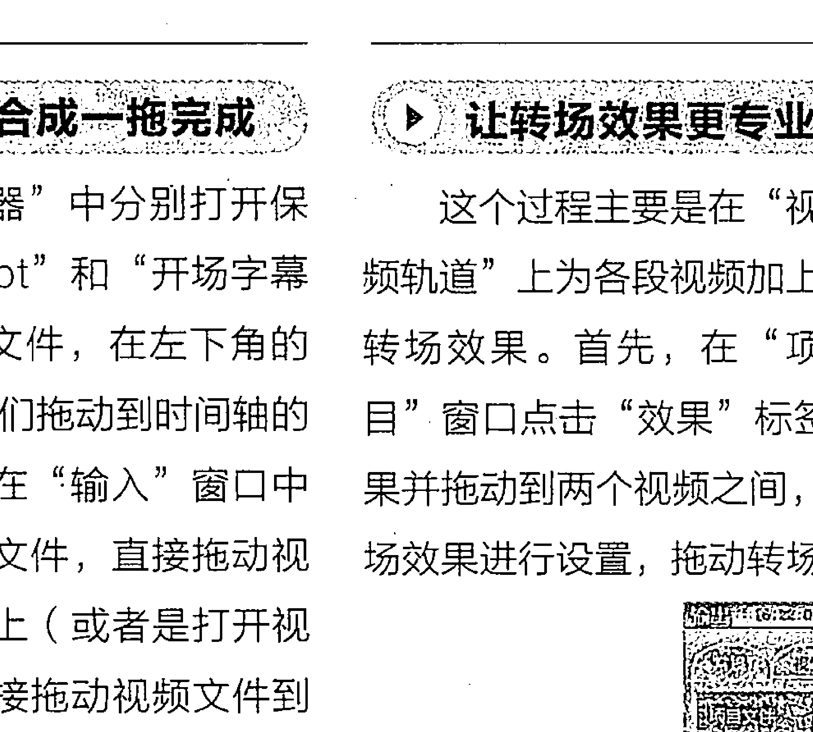

### 让转场效果更专业

这个过程主要是在“视频轨道”上为各段视频加上转场效果。首先，在“项目”窗口点击“效果”标签，选择“2D|3D”中的2D后，选择所需要的转场效果并拖动到两个视频之间，右击两视频之间的转场效果，选择“设置”菜单对转场效果进行设置，拖动转场效果或其边框来设置持续时间的长短（图3）。

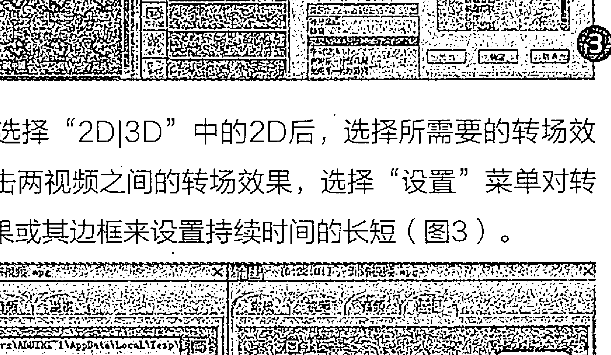

### 输出视频一键搞定

视频及字幕编辑完成后，在工具栏上点击“输出”按钮，在输出窗口的“常规”标签中设置好输出文件名、文件格式、输出范围等。在“监视”标签中单击“开始”按钮就可以输出视频了（图4）。

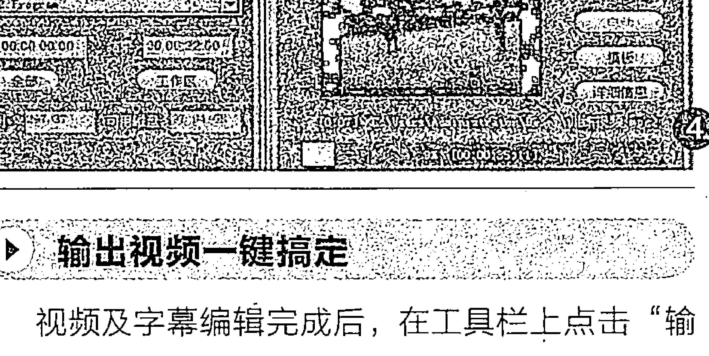

## 何需外援 用机情况轻松知

假日或周末是家长最担心的时间，一是担心孩子访问不良网站，造成不良影响，二是担心上机时间过长，影响身体健康。为杜绝此类现象的发生，我们通常会使用一些专门工具，对其用机情况进行监视。

文|飞雪散花

不过，这些软件一般是收费的，未付费版通常会存在这样或那样的限制，用起来很不爽。此外，这些工具的名称也通常会带有明显的监视意味，孩子很容易发现并将其关闭。其实，如果愿意的话，我们完全可以利用系统自带的功能，达到无痕监视的目的。

### 1 网页历史查看只需一键

无论是IE、360浏览器还是目前深受用户欢迎的Google Chrome，我们都可用按下Ctrl+H组合键的方法，快速调出网页历史记录，对孩子的上网情况有所了解（图1）。

默认情况下，浏览器会以日期排序显示历史记录，如果你对此不满意的话，可以单击列表上方的“按日期排序”右侧的下拉箭头，打开相应的菜单，在其中，我们可以选择让记录以站点、访问次数或访问顺序为序进行查看。在查看的过程中，如果我们觉得某站点可疑，可以进入相应的文件夹，双击对应的网页链接，有关的页面就出现了，非常方便。

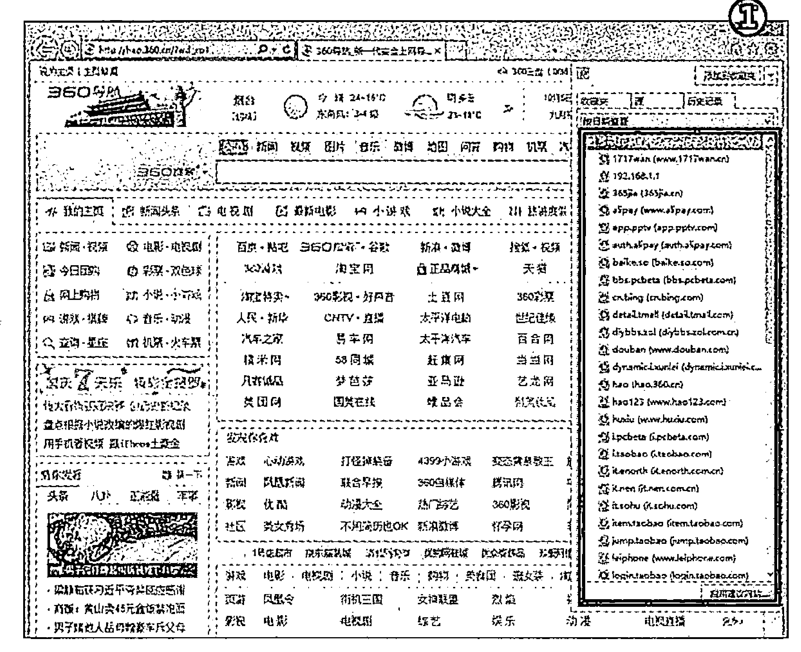

### 2 开关机时间瞬间搞定

Windows系统的“事件查看器”，详细记录了所有与系统有关的操作，比如在某段时间运行了什么程序或服务，某段时间某文件出现了异常等，其中也包括此部分我们要讲的开、关机时间。以Windows 8.1 RTM 专业版为例。

进入控制面板，选择“系统和安全”项，然后在出现的界面中选择“管理工具”项下的“查看事件日志”项，打开“事件查看器”窗口，在左侧依次选择“Windows日志→系统”，近段时间相关的系统事件就会全部显示在窗口中间的列表中（图2）。

不过，此时列表中显示的信息相当芜杂，要在其中找出某日的开关机信息无异于大海捞针，接下来我们还需要对这些信息进行筛选，以便让自己最需要的情报能清晰呈现。

右击“系统”项，在弹出的右键菜单中选择“筛选当前日志”，打开同名对话框。切换到“筛选器”标签，单击“记录时间”项右侧的下拉箭头，在出现的下拉菜单中选择好要查看的时间范围（如近12小时、近24小时等），然后用类似的方法中，将“事件来源”设置为eventlog，同时在“任务类别”上方的事件ID范围文本框中输入“6005,6006”（两个数字之间有一个半角逗号。其中6005为开机ID，6006为关机ID），单击“确定”按钮（图3），指定日期的开关、机记录就出现了。其中“事件ID”列中显示为6005的是开机时间，而显示为6006的则为关机时间，相信有了这些证据，孩子再要以“我只开了一会机”来忽悠我们就难了。

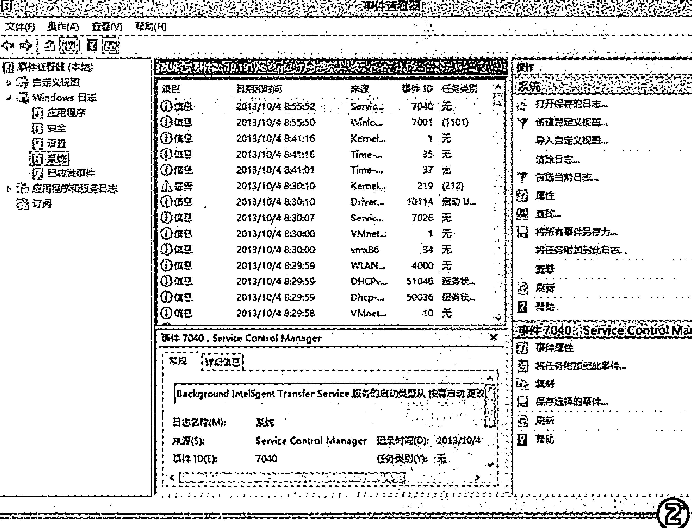

### 3 访问记录轻松呈现

如果PC中保存有重要或私密的文件，我们当然不希望孩子访问它们。那么，我们怎样才能知道孩子用机时都访问过哪些文件，进入过什么目录呢？同样简单，我们只需借助于查看Recent目录中的信息，即能轻松达到目的。Recent中记录着用户最近打开过的所有文件和文件夹信息（图4）。其默认保存路径为“C:\Users\用户名\Recent”（XP系统中为“C:\Documents and Settings\用户名\Recent”），属性为隐藏，所以查看前，我们需要先在Windows资源管理器的菜单栏中单击“查看→选项”，打开“文件夹选项”对话框，切换到“查看”标签，在“高级设置”列表中，取消对“隐藏受保护的操作系统文件”项的勾选，同时选中“隐藏文件和文件夹”项中的“显示隐藏的文件、文件夹和驱动器”子项（图5），单击“确定”按钮才能让其显现。

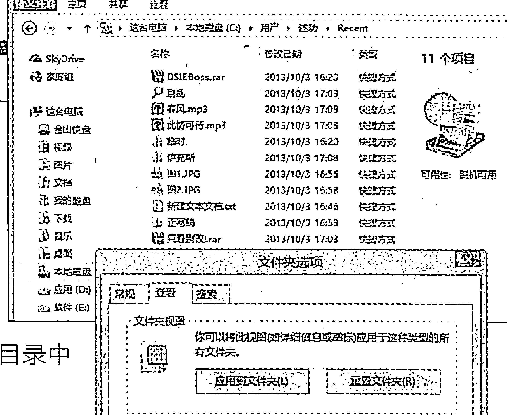

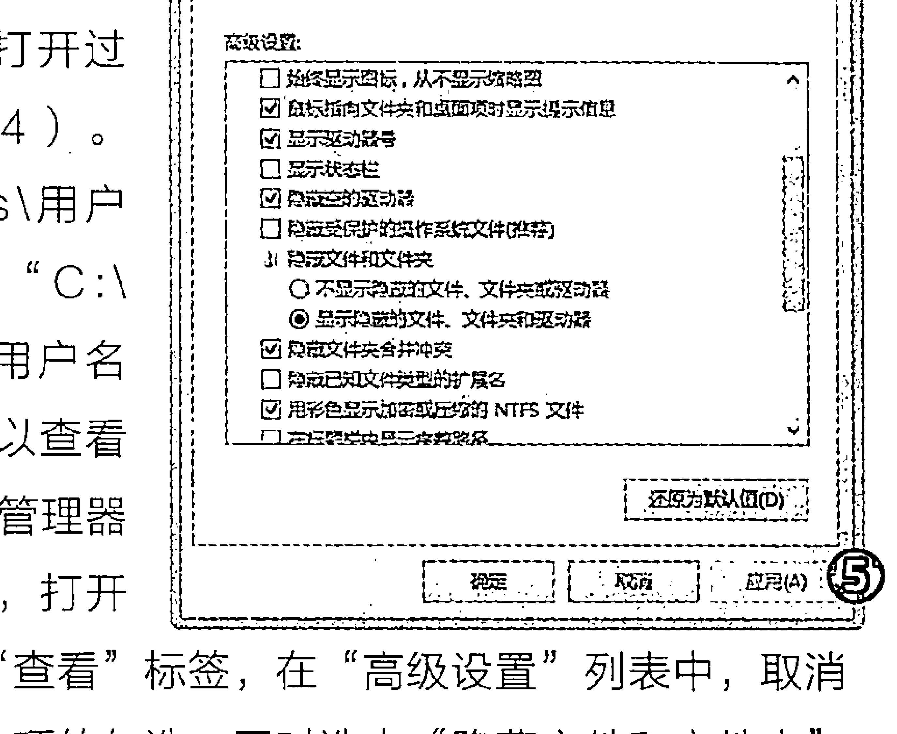

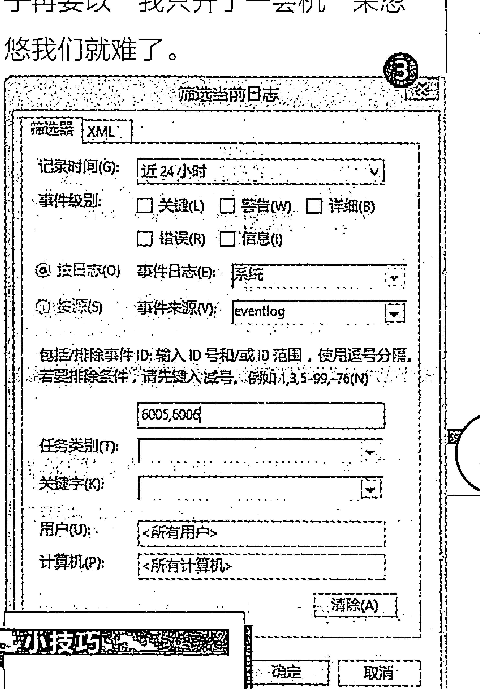

> 小技巧: Windows XP系统会将系统产生以来曾经工作过的时间（包括开机和关机时间），保存在C:\Windows\SchedLgU.Txt目录下（其中C为系统分区），所以我们只要用记事本打开该文件，就能看到相关信息，从而免去要进入“事件查看器”才能查看的麻烦。

### 4 运行程序一目了然

在“事件查看器”中，我们能够查看从安装系统以来用户运行过的所有程序及服务，不过，由于“事件查看器”中显示的信息过多，且记录的程序并非以程序名来显示，所以对于一般用户而言，要想通过它了解到某段时间本机究竟运行了什么程序，的确有不少难度。其实只要愿意，我们完全可以通过一种更为简单的方法来达到目的。以管理员身份登录系统，进入C:\Windows\Prefetch目录，本机自安装系统以来运行过的所有程序及运行的时间等信息即会出现（图6）。虽然这些程序默认显示的是其可执行文件的名称，但由于这些名称非常直接，所以我们还是很容易辨识出它对应的具体程序。这样，在我们不在家的这段时间里，孩子究竟运行过什么程序，也就一目了然了。

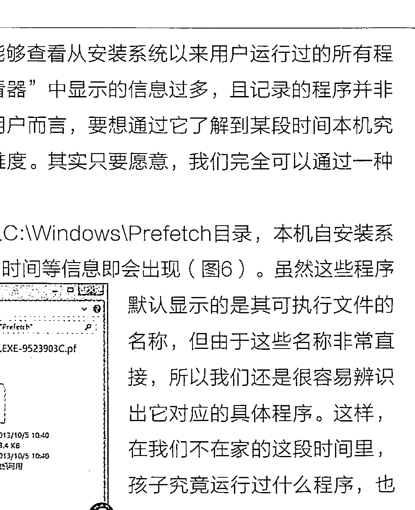

## 动动设置 也能挽回健康

经常使用电脑，一些固有的习惯可能会破坏你的健康。比如，无法摆脱鼠标纠缠的可怜右手，就是一个深度受害者。其实，如果能通过软件设置来改变你使用电脑的习惯，健康可能就会随之而来了。

文|向健

### 1 给右手放假 让左手上斑

每天驾鼠遨游，累坏了右手而闲坏了左手。别怪老天不公，只怪你不会分工。那就让左手出来上班，给右手放个假吧。通过交换鼠标左右键，试着让左手操控鼠标。

确定之后，就可以将鼠标交给左手工作，让右手放假。不习惯吗？没关系，想想自己刚不吃奶后用筷子不也是这样过来的吗？

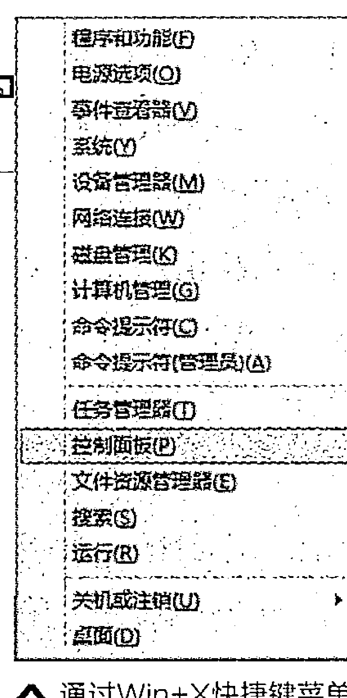

^ 通过Win+X快捷键菜单选择“控制面板”

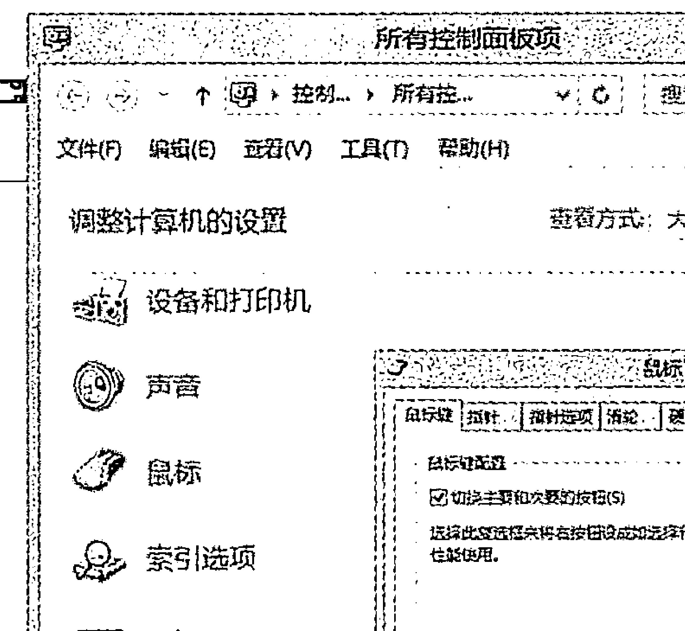

^ 在控制面板“大图标”窗口中选择“鼠标”一项

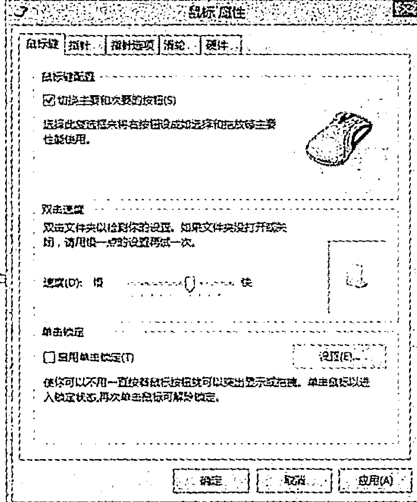

> 在鼠标属性窗口“鼠标键”页选中“切换主要和次要的按钮”选项

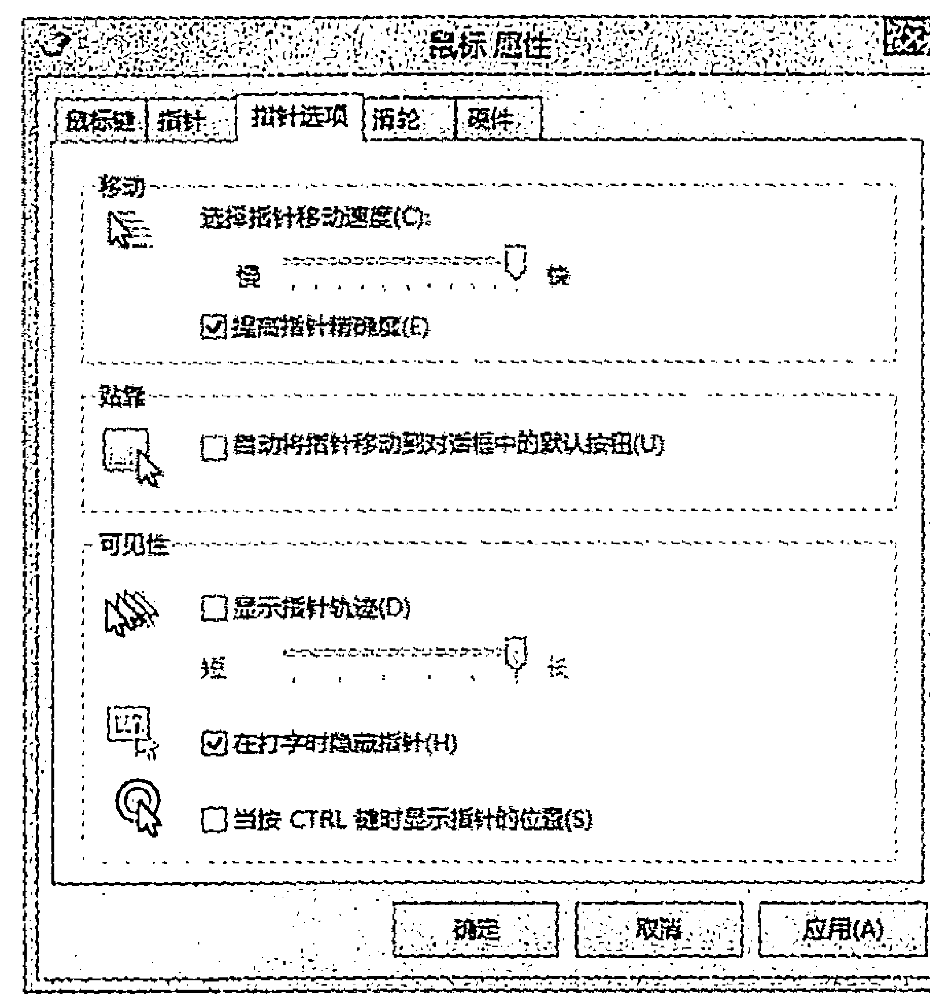

^ 将移动滑块尽量向“快”的一方移动

### 2 增强移动效率 解放腕关节

用系统默认的鼠标设置，腕关节甚至肘关节都需要运动。而如果将鼠标指针移动设置为最灵敏的档次，那么腕关节几乎可以不动，肘关节更不需要运动了，从而也得到了休息。

依然是用上面的方法进入鼠标设置窗口，点击“指针选项”选项卡，将“移动”一项下的滑块尽量设到“快”的一侧。若一开始就换到最快档次，可能不好把握。因此，可根据个人情况，慢慢调快来适应。

### 3 不能闭目养神 设置却能养眼

信息时代说闭目养神太过奢侈，但我们可以通过设置显示环境来缓解眼睛疲劳。

为了缓解视力疲劳，可以给编辑器设置放大默认字体。例如给记事本、EmEditor等编辑软件设较清晰的默认字体和较大的字号，让眼睛远离疲劳。在Word等所见即所得的编辑器中，设置显示缩放级别为更大的比例也可变相缓解视觉疲劳。

此外，还可以通过选择绿色清新主题、绿色清新桌面、绿色窗口背景等让视觉更舒适。在Windows XP系统盛行时期，色彩专家曾用一种豆沙绿配色窗口来缓解眼睛疲劳。而进入Windows 7或Windows 8年代后，各种绿色主题的选择定制，以及类似360清新桌面软件的定制等，都可以为我们缓解视疲劳提供更易于操作的方案。

## 有图就能挖出真“像”

网络搜索，我们一般靠的是关键词。但是，有的时候我们手头上可能只有一张图片，不知图片中的事件，也不好从图片中提取相关的关键词。那么，如何通过这仅有的一个简单小图，来找到更多与此相关的清晰大图或了解到与此有关的具体事件？

文|朝云

通过对百度搜图功能的具体应用，换个搜索方式以图来搜索，我们就能以图片为突破口，找到想要的东西。

访问百度识图主页（http://stu.baidu.com/），将原图提供给搜索引擎，让网页为你识图。识图方法有三种可选：如果我们网上发现了一张图片，想了解更多，可直接将要识别的图片网址粘贴到搜索框；如果图片是在另一个窗口中，可以直接拖放到搜索框中搜索；如果图片存在于本地硬盘中，那么可以通过“本地上传”按钮来将图片上传到网页上来识别（图1）。

> > 如果我们觉得每次识图都要打开百度识图主页太麻烦，那么可以给浏览器安装百度识图插件。百度识图插件会根据当前使用的浏览器来判断插件类型并安装。安装好之后，只要在浏览器中右键单击图片，选择“用百度识图”即可以图来搜索内容了。

## 小脸蛋搜出大美人

如果我们在网上看到一个美丽姑娘的脸部照片，想获得更多的她的生活照，那么可以试着将这幅小脸蛋图片的网址加载到搜索框，很可能会找到此姑娘的更多生活写真照。这是百度搜图寻找相似人脸的一个具体应用（图2）。

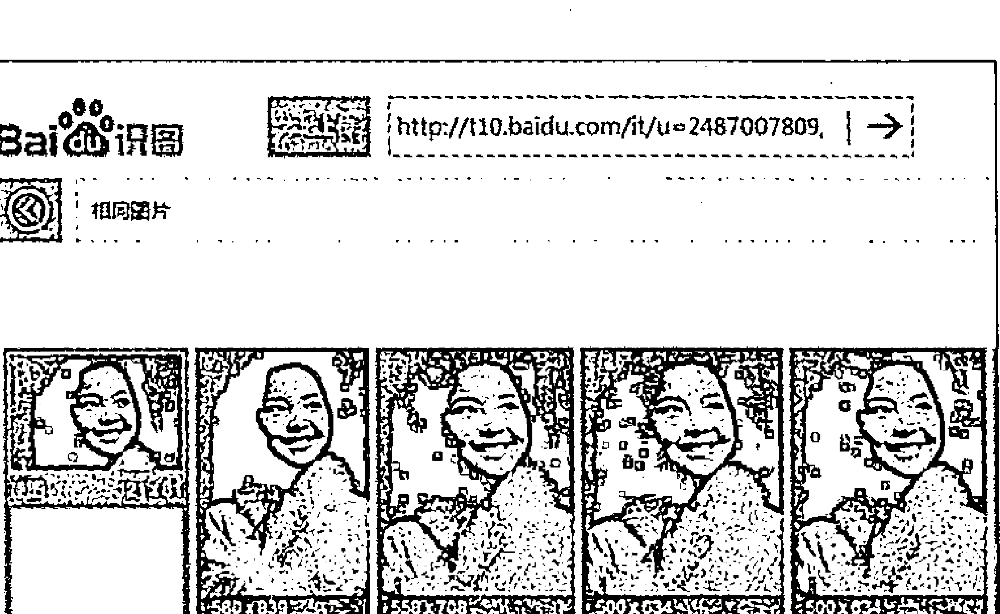

## 模糊图引出清晰图

在一些设计制作当中，有时从网上得到的图片打印出来会很不清晰，原因是原图分辨率太低。这时，如果以这幅分辨率低的小图为搜索源，在百度识图上搜索，或许就能搜索到更清晰的大图（图3）。提醒注意：网上的图片不少是有严格的版权限制，请在法定许可和合理使用范围内使用网上图片，以免引起不必要的麻烦。

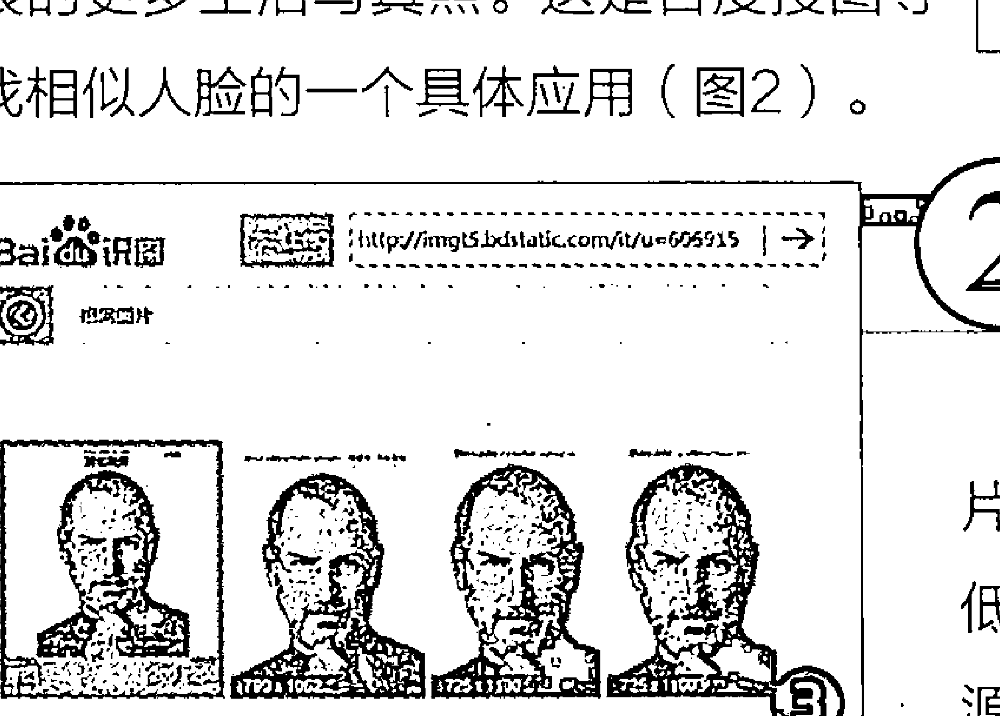

## 小图片搜出大故事

如果我们对一张图片感兴趣，但不知道图片中具体发生的事件，那么可以通过这张图片，准确搜索和识别出图片相关内容的网页，从中了解更多故事（图4）。

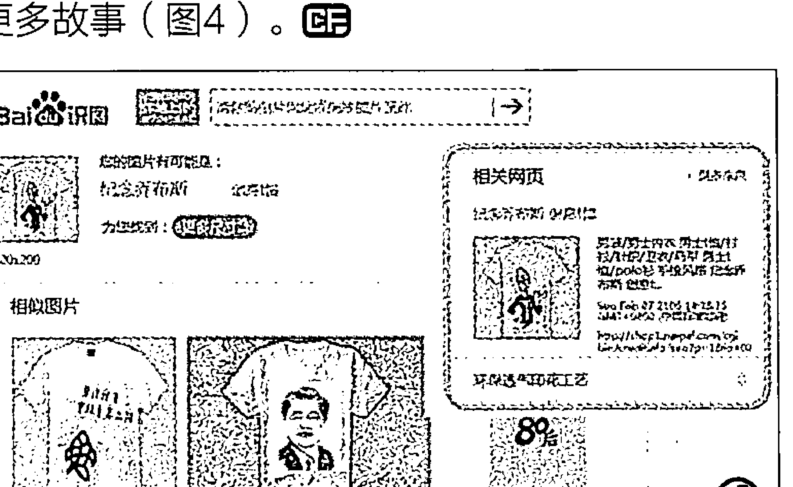


## Flash Player瘦身提速

Flash Player几乎是每台Windows电脑中的必备插件，不过现在这个插件添加了很多额外功能，不但对一般用户的帮助不大，有时还会影响系统的正常运行。一个值得参考的方法，就是对Flash Player插件（以下简称Flash插件）进行瘦身，保留它最基本的功能就可以了。

### 1 能省则省限制P2P流量

不知何时，Flash插件增加了P2P技术，也就是我们在观看网络视频时，它不仅下载网络视频数据，同时还上传数据。屏蔽它的P2P功能，可适当减轻它对系统资源的占用。

实际上，我们并不能百分百屏蔽Flash插件的P2P功能，只能是适当限制它上传数据的流量。具体方法是：按Win+R键调出系统运行对话框，输入执行cmd命令调出命令提示符窗口，然后在其中输入执行命令（图1）：

```
echo RTMFPP2PDisable=1 >> %windir%\system32\Macromed\Flash\mms.cfg
```

这样就可以将上传的数据限制在1kb以内了。

> 小提示：这款工具同样支持对IE等其他浏览器的Flash插件的操作。

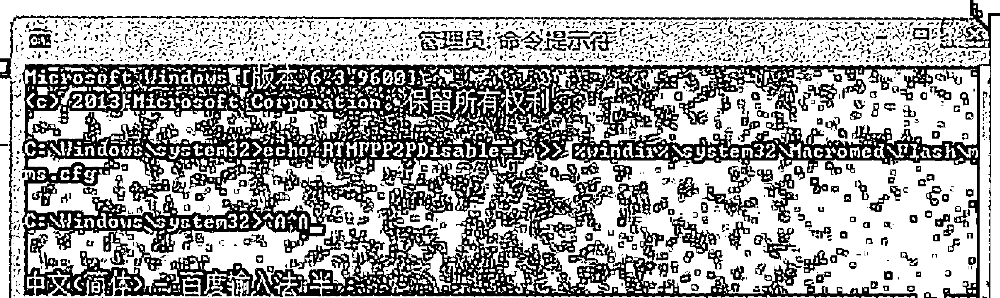

### 2 关掉无用的沙箱

Flash插件还采用了沙箱技术，本意是想减少网页的攻击，但是由于沙箱功能很弱，不但无法拦截攻击，还常常会引起浏览器假死，所以不如去除。首先运行“火狐Flash 通用免沙箱补丁”工具，点击“补丁”按钮后，在弹出的窗口中，选择Flash插件的文件NPSWF32.dll，接下来工具会自动处理，完成后重启浏览器，Flash插件的沙箱功能即被屏蔽了（图2）。

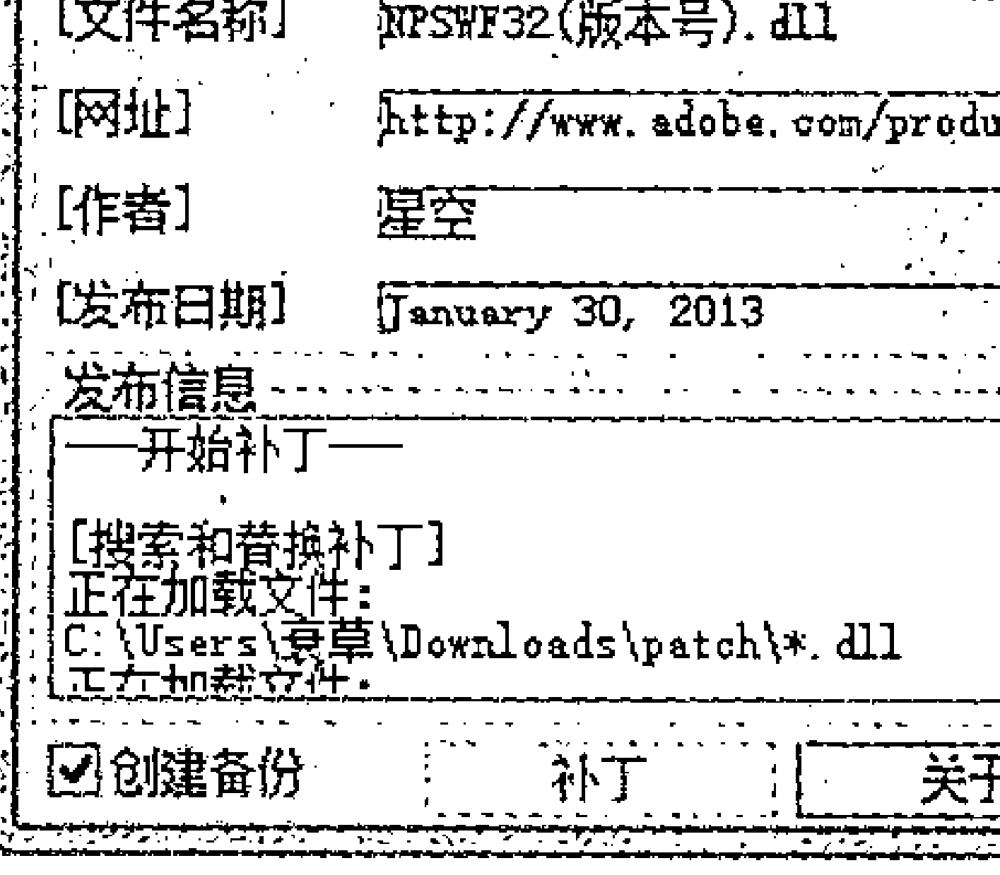

### 3 升级默认Flash插件

最近Flash插件出现一个高危漏洞，需要升级Flash插件才可以避免黑客攻击。可是包括谷歌在内的很多浏览器，默认都自带有Flash插件，想要手工及时升级，可参考下面的方法。

这里以谷歌浏览器为例，在地址栏输入“about:plugins”后按回车键，在插件页面中点击右上角“详细信息”，找到“Adobe Flash Player”中的“位置”路径信息，然后通过资源管理器打开这个路径（图3），将其中默认的Flash插件文件删除，替换最新版本的Flash插件即可。如果想替换其他浏览器自带的Flash插件，可以通过搜索NPSWF32.dll来进行寻找和替换。

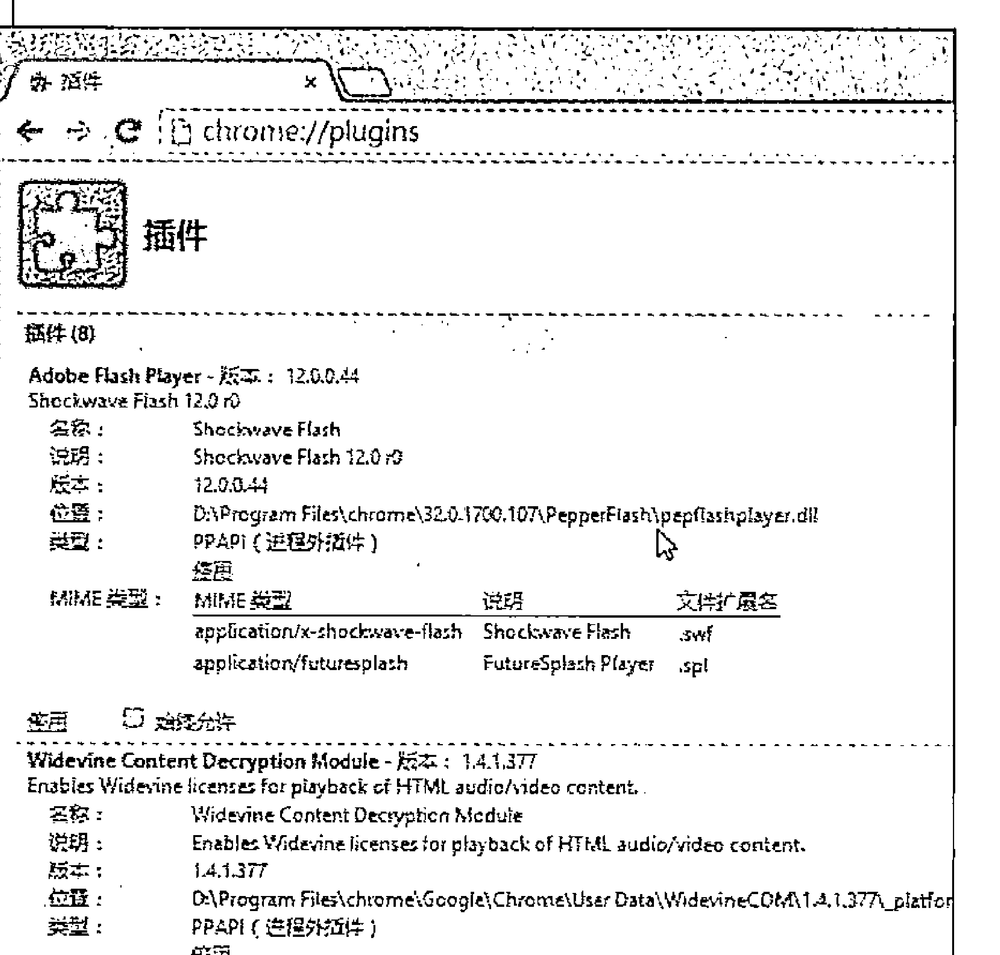

### 文章扩展：禁用谷歌Flash插件的P2P

前面，我们通过命令尽可能减少Flash插件的P2P流量，那主要是针对系统中的Flash插件的，而谷歌浏览器自带Flash插件，对于它，我们完全可以禁用它。
在谷歌浏览器地址栏输入“chrome://version/”，按回车键进入参数设置页面，查看“个人资料路径”中的信息。接着通过资源管理器进入到“<配置文件路径>\Pepper Data\Shockwave Flash\System”，如果System文件夹不存在就手工创建一个。
然后在其中创建一个名为mms.cfg的文件，在其最末尾写入代码：RTMFPP2PDisable=1
这样就可以屏蔽谷歌浏览器上传数据了。

## 莫让黑客控制你的路由器

路由器是家庭常用的上网设备，但是很多人不知道，黑客已经盯住了各种各样的路由器。黑客对路由器的攻击，主要是通过路由器进行DNS劫持，将我们正常访问的网页劫持到黑客制作的网络陷阱中，所以下面主要讲讲对路由器DNS劫持的防护。

## 1 改掉路由器的默认值

首先从http://tinyurl.com/m96gz8j下载“百度DNS劫持专杀(修复)工具”，运行它以后点击左上角的“立即检测”（红色标靶图标），查看路由器是否已受到黑客的攻击（图1）。无论检测结果如何，我们还是建议大家依照下面的操作对路由器的默认设置进行修改，因为正是这些默认的账号密码以及后台网关地址，给黑客攻击带来了便利。

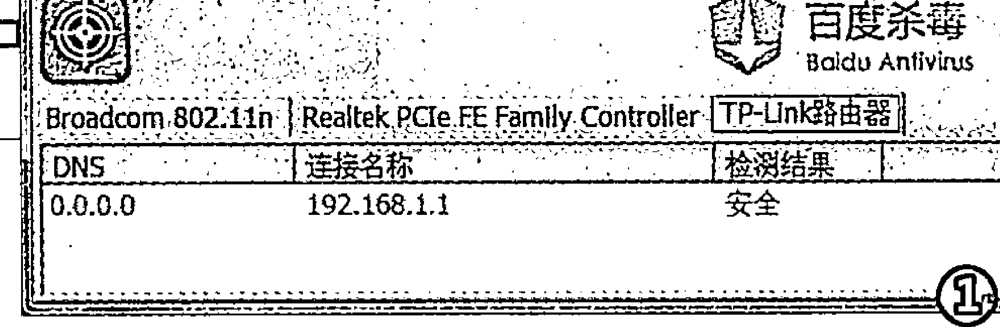

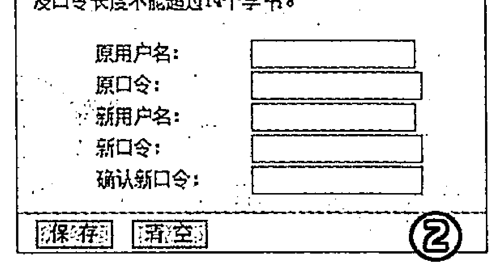

登录路由器后台网关（以TP-LINK TL-WR841N为例），点击列表“系统工具”中的“修改登录口令”选项，输入默认的用户名admin和密码admin，然后根据提示设置新的用户名和密码即可（图2）。接下来再点击“网络参数”中的“LAN口设置”选项，在网页的“IP地址”中输入新的后台地址，至于“子网掩码”按照默认设置即可。设置完毕点击“保存”按钮，根据提示重新启动路由器就可以了。

通过捆绑MAC地址也可以保护外网用户蹭网或对路由器进行破坏，而且可以避免关闭WPS/QSS功能、设置复杂无线密码、采用WPA2加密认证等繁琐的设置操作。具体操作可以参考去年第23期的《无线密码寻踪记》一文。

## 2 电脑端DNS加密防路由劫持

对路由器默认设置的修改增加了黑客攻击的难度，但为了保险起见，还需要在电脑系统中进行防范。既然黑客是想修改路由器的DNS，那么我们就用DNSCrypt这款软件（http://tinyurl.com/q2ncjt9）对传输的DNS数据进行加密处理。运行DNSCrypt，右击它在系统托盘中的图标，选择“Open Control Center”，在弹出的窗口中将“Enable OpenDNS”和“Enable DNSCrypt”都选中。如果用户使用无线上网，那么最好再选择“DNSCrypt over TCP / 443 (slower)”项（图3）。接下来打开系统的“本地连接”属性窗口，在“首选DNS服务器”中设置为“127.0.0.1”即可。

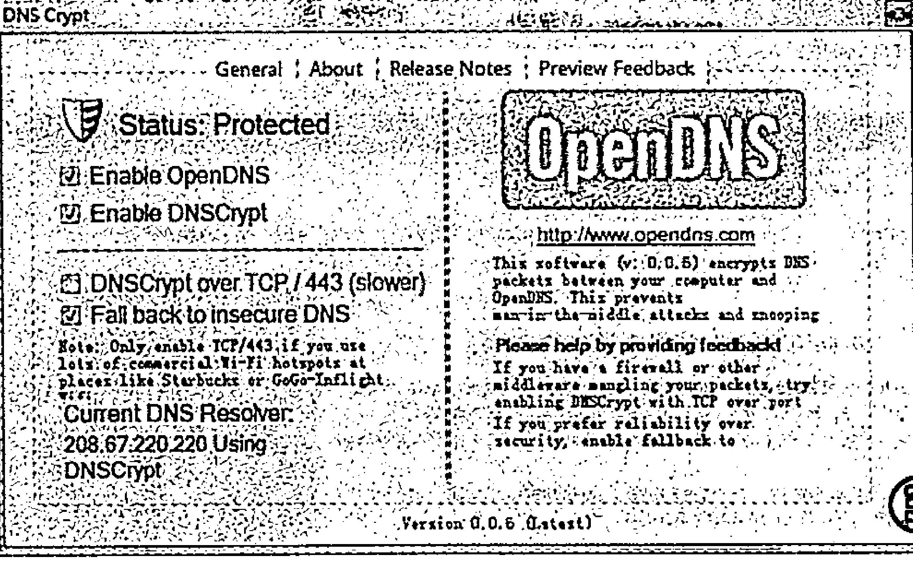

## 3 浏览器安全增强

除了上面的方法，加强浏览器的防范也很重要。首先从网上下载网友制作的“路由攻击演示和防御”压缩包（http://tinyurl.com/ntwt9x8），解压后备用。运行火狐浏览器，并将压缩包中的Redirector-2.8.1-fx.xpi文件拖放到火狐浏览器的窗口中，根据提示完成这个防御扩展的安装。接下来点击浏览器“工具”菜单中的“附加组件”命令，在弹出的窗口中找到刚刚安装的Redirector扩展，点击它下面的“选项”，在弹出的配置网页中点击“Import”按钮，选择导入压缩包中的“防御路由DNS劫持.rjson”这个文件（图4）。当文件导入成功，以后如果检测到网页会劫持路由器，它就会自动进行拦截操作了。


## 高效为王 问知天下

百度是大家使用最频繁的网络搜索工具。有问题找百度已经成为许多人的共识。然而，常常看到不少人不管有什么问题，都一头扎到百度搜索框“百度一下”，然后狂翻搜索结果页找答案的情形。

文|肖恒

如果能进一步结合百度的深度搜索服务，搜索效率会更高，搜索一个东西就不用翻那么多页了。

### 1 直达有效地址的搜索

> **小提示**
>
> 百度二级搜索在百度搜索首页中不一定能体现。这样一来，对于普通电脑用户，可能一直会不知道某些二级搜索，当然也就不会去用到它。进入一些二级搜索需要点击“更多”按钮。

电影大片或连续剧是大家常看的内容，根据需求不同应该用不同的搜索方法，一概“百度一下”的做法虽然也行得通，但不是捷径。就以上网搜索高清纪录片《大黄山》和连续剧《一仆二主》相关内容为例，说明个性化的影视搜索方法和技巧。

如果需要在网上观看或下载影视，直接启动百度视频搜索，要比在普通搜索中搜索更能直达各家有效影视链接（图1）。


在百度普通搜索或视频搜索中搜不到的高清影视资源，通过专门的百度云搜索也许就能找到（图2）。

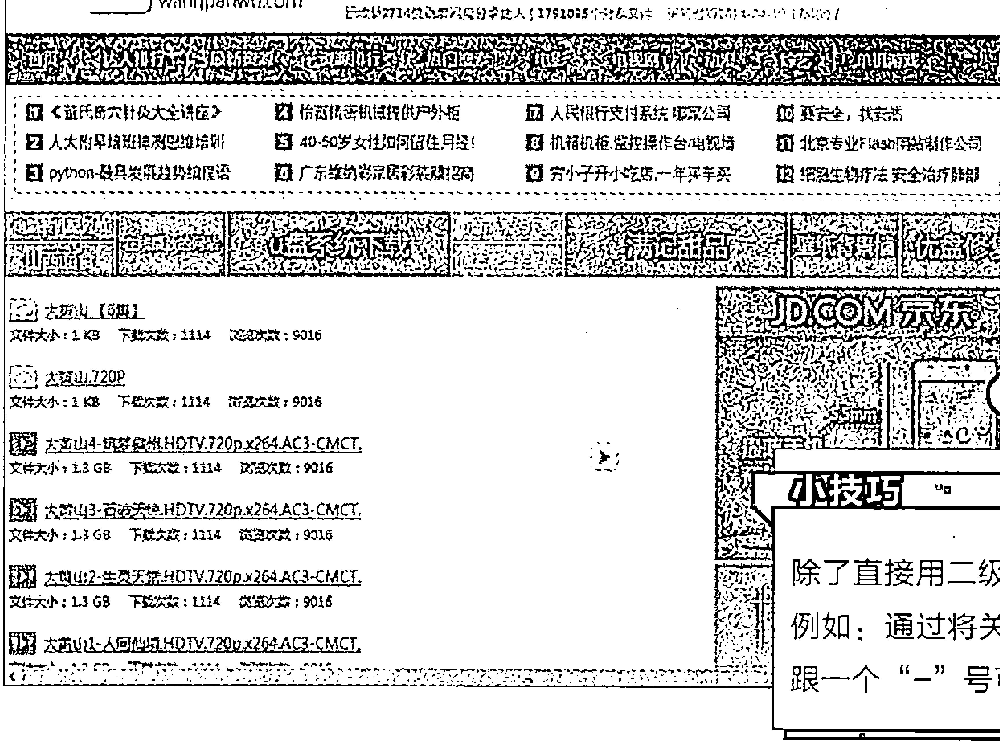

如果要了解剧情相关信息，在百度普通搜索中鱼龙混杂的影视搜索结果中挑选影视信息，需要排除种种无关的条目，很浪费时间。这时如果直接去百度百科搜索该剧名，就可一步到位获得满意结果（图3）。

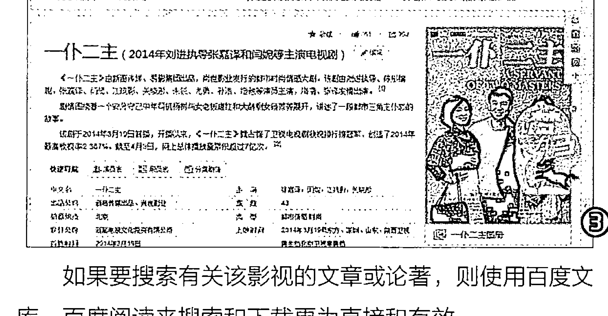

如果要搜索有关该影视的文章或论着，则使用百度文库、百度阅读来搜索和下载更为直接和有效。

> **小技巧**
>
> 除了直接用二级搜索外，还可以通过搜索关键词的合理组合和特殊用法来实现精准搜索。例如：通过将关键词加半角双引号并用“+”连接，可实现精确匹配；通过在关键词后紧跟一个“-”号可实现排除搜索，如“女演员-邓丽君”可排除邓丽君的网页。

### 2 搜索更多可靠的负面信息

许多时候，我们上网搜索是要找一个东西的“好”。但是，有些时候我们还要去搜索它的“不好”。比如，高中毕业生报考大学志愿，要了解一所学校，总怕报了不好的学校或专业。除了官方网站和有关宣传网站连篇累牍的优势介绍外，你一定想知道自己要报的学校或专业是不是有什么不利的因素。而这些因素，如果靠普通搜索引擎去搜索，虽然也能搜得到一些，但往往会被那些“好”的消息所淹没。

在这种情况下，我们就需要进入一个特别的领域去搜索，比如用“百度知道”或“百度贴吧”去搜索。直接进入百度知道或百度贴吧里搜索，能很容易发现有关正反两方面的真实情况。权衡利弊，就会让你很容易看清事实真相。

我们以搜索宁夏大学的汉语言文学专业为例进行一番搜索。先在百度普通搜索引擎中输入“宁夏大学 汉语言文学专业”，搜索结果如图4所示，可见结果中多是一些正面的专业介绍、试题等，很少看到谈不足的信息（图4）。

接下来我们再进入百度知道，同样输入“宁夏大学 汉语言文学专业”，搜索结果中就可以看到民间比较客观的评价。这些评价中评价人的身份一般会具有多样性。评价者可能是本校的领导或老师，也可能是正在读这个专业的大学生，还可能是一个了解该专业的毕业生。这些人的评价虽然会带有某种个人偏见，但多是根据他们的经历和经验而写成的，正反信息都有，所以会更加客观一些，很有参考价值（图5）。

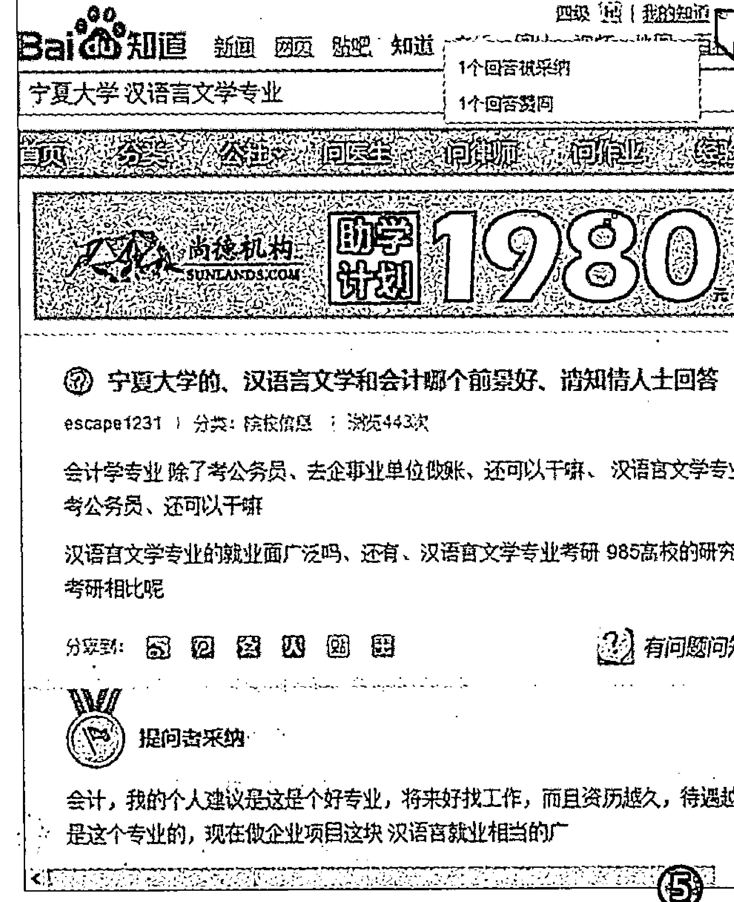

### 3 找技巧当然要问有经验的人

要找到生活中某个方面的技巧或方法，要找到一个电脑使用技巧或一篇电脑文章，如果直接在百度普通搜索中搜索，你就可能不得不在商业广告、根本无法阅读的收费期刊网站、官方预告等无用信息中挑选。这时，如果直接用百度经验来搜索，则会将范围集中到尽量有效的范围，让你用有限的精力和时间在更专业、可靠的范围内作出选择。

比如我们要搜索“暴风影音”的技巧和文章，如果在百度普通搜索引擎中输入“暴风影音”会得到如图所示的结果，多是些下载软件的链接（图6）。

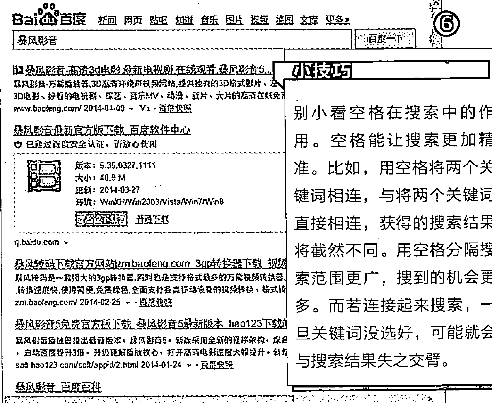

> 别小看空格在搜索中的作用。空格能让搜索更加精准。比如，用空格将两个关键词相连，与将两个关键词直接相连，获得的搜索结果将截然不同。用空格分隔搜索范围更广，搜到的机会更多。而若连接起来搜索，一旦关键词没选好，可能就会与搜索结果失之交臂。

而当我们点击“更多→百度经验”进入百度经验频道搜索时，搜索结果的第一页就多集中在技巧、文章上了，这样挑选的时间就会大大减少。

> 对于从百度知道或百度贴吧中搜索出的信息，自己要有鉴别能力。最好根据多人的回答综合判断，不要轻易听信一条信息。因为偏激的带有严重感情色彩的回答也可能会在这里出现。此外，还可参考其他网站上搜索出的信息。

## 消除在线障碍 看爽网络大片

身处信息时代，观看网络影视渐成娱乐不二之选。但网络观影过程中可能会遇到各种问题，不仅影响正常播放，更影响愉快的心情。掌握必要的影音问题解决技巧，让你的影音生活有个好心情！

文|武文元

### ① 解惑Flash 版本问题巧重装

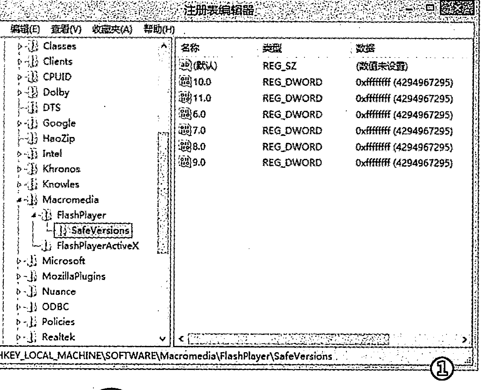

在某些网站上播放视频时，有时会遇到提示Flash版本过低，但又无法安装的情况。安装过程中提示“正尝试安装的Adobe(R) Flash(R) Player 版本不是最新的版本”，这时可按如下方法解决。

按Win+R组合键启动“运行”窗口，输入regedit启动注册表编辑器。定位到[HKEY_LOCAL_MACHINE\SOFTWARE\Macromedia\FlashPlayer\SafeVersions]，除保留默认一项外，将其中的值统统删除（图1）。注销当前用户或重新启动系统，然后进入播放页面，按相关提示安装Flash插件即可。

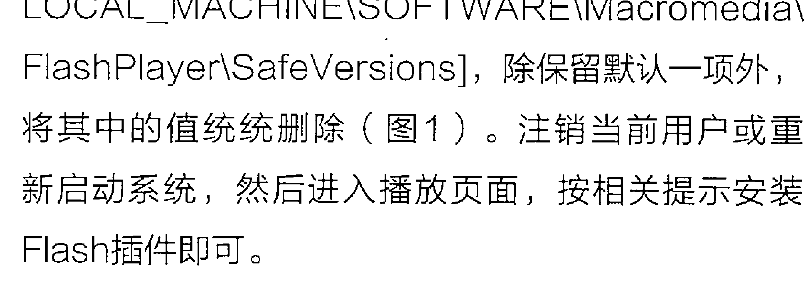

### ② 请出客户端 网络视频看个爽

有时，你会发现在网页中播放某个视频比较卡，总不能流畅播放。这时，可以看看该视频网站是否提供有视频客户端工具，如有提供可下载安装，用客户端来搜索播放该视频。目前腾讯、搜狐、优酷土豆、百度、爱奇艺、乐视、PPTV、风行等视频网站均提供相应的独立客户端可供选择（图2）。

用户网络环境对视频观看速度的影响因素较为复杂，安装了其他客户端，均可能因为冲突而造成在线观看不流畅。而如果用专门的客户端来观看在线视频，则可以排除由于其他视频插件造成的影响。

### ③ 选回默认 解决Java致黑屏

在有的电脑上播放网页视频会出现显示黑屏的现象，无法播放。这种情况一般需要检测网络浏览器的Java脚本支持情况。

打开IE浏览器“Internet选项”，切换到“安全”选项卡，点击“默认级别”按钮（若按钮是灰色不可点击，则不需要修改这里），IE会自动开启Java脚本（图3）。

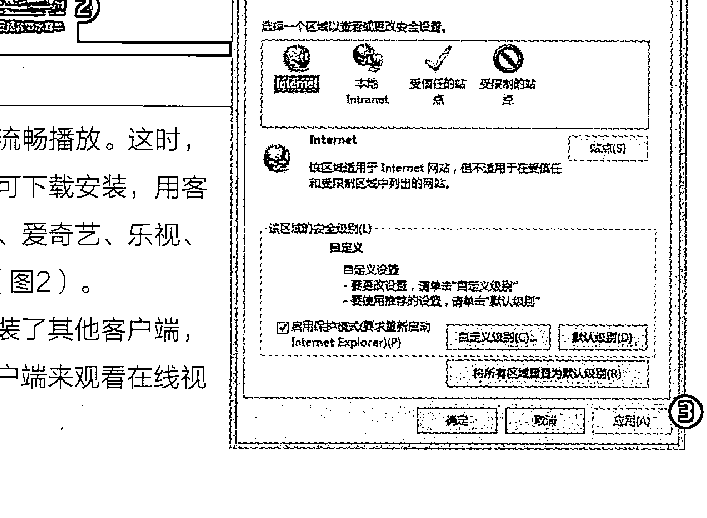

## 4 包月交费看 网络视频不全能

看在线视频大片，免费影片总是觉得不能看爽，于是一些用户就选择交费注册为包月VIP用户，但交费后发现，一些影片还是无法观看，付费了也不一定能看爽，这是为什么呢？

原来，包月也是有限制的，不是说包月了就能看该视频商家全网的影片，部分点播影片是不参与包月的，需要另行交费才能欣赏，可谓门票之外的“景点门票”了。

比如，搜狐影音包月影片部分点播影片不参与包月，电影网专区包月，不参与包月片库服务等（图4）。


## 5 高清看视频 在线播放问题多

由于高清视频格式的特殊性，在线播放可能遇到的问题更多。

播放这类视频常常遇到的问题是视频加载错误。遇到这种问题，首先需要检查系统中是否安装了其他P2P软件，如果有则尝试卸载后重启电脑，再行播放。如果网络没有问题，可尝试使用非IE为内核的浏览器，如采用高速内核的搜狗浏览器，能大幅度提高页面加载速度。

还有一种情况是播放器区域出现绿屏现象，或在全屏幕状态下播放影片画面静止或出现白屏。这一般是Flash播放器硬件加速功能不兼容所致。这时只需右键点击播放器，在弹出的菜单中选择“设置”，去掉“启用硬件加速”前的选择即可（图5）。

关于声音的问题。明明是在系统的声音设置中将音量已经调节到最大，但在网页中播放高清视频就是没有声音。这种情况下，也需要到网页的多媒体设置中去寻求解决。查看“Internet 选项→高级→多媒体”，勾选“在网页中播放声音”一项即可。

还有，在播放高清片源时，播放器画面被截断成上下两部分。这是因为Flash部分插件导致的错误，可下载Flash修复工具进行修复。

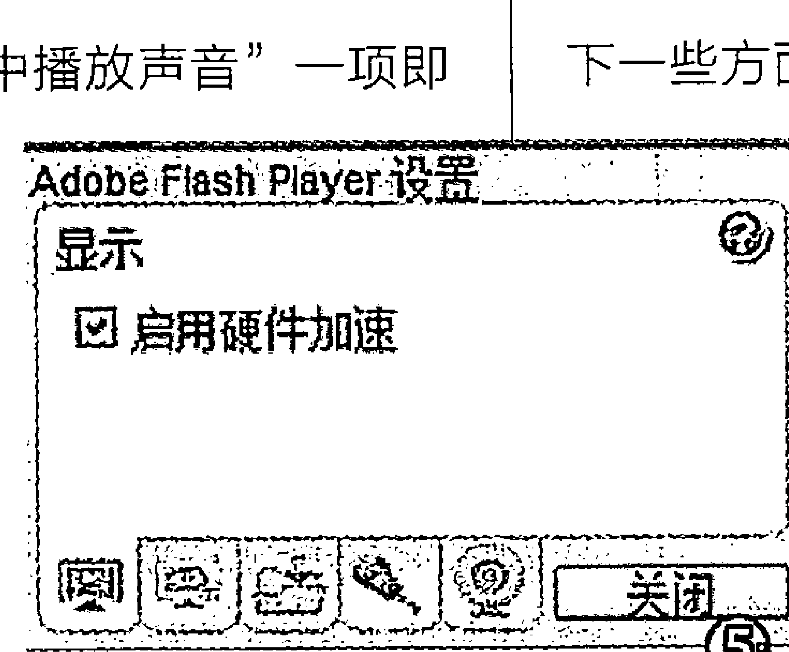

## 6 视频霸带宽 播放速度巧控制

当你使用了某种视频客户端观看影片时，有时会出现家里人都不能上网的情况。这一般是因为播放器开启了加速功能，或播放器带宽选择了全速占用的缘故。

首先关闭加速功能。以搜狐影音为例，在系统托盘搜狐影音图标上点击右键，选择“禁用加速”（图6）。


此外，如果在播放的同时后台还在下载别的影片，那么需要从“设置”窗口中切换到“下载设置”，将“最大下载速度”更改为小于你所用网络标称网速的数值（如选择一半网速，若你的网速能达到8192KB/s，则选择为4096KB/s）（图7），腾出网速占用给其他用户。

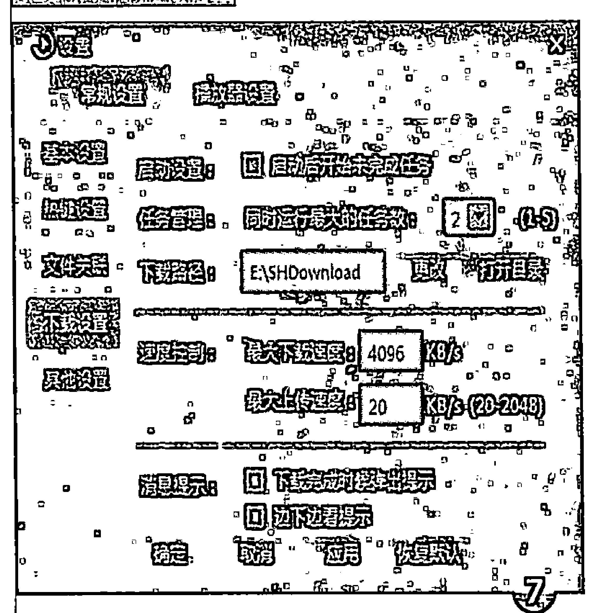

## 7 手机看大片 解惑连接有异常

手机APP播放影视出现“网络连接异常”的问题，可从如下一些方面检查。检查网络连接状况，确认网络连接和网速是否正常；点击暂停，等待视频加载一段时间后继续进行播放；播放时可以尝试向后拖动进度条；当网速慢或者网络连接不稳定的时候会出现画面卡的情况，建议避开高峰期观看视频；如所有视频播放时均出现画面卡、无法连续播放的情况，可能是由于系统播放器异常导致，请尝试重启设备。

## XP再见 数据留下

微软对Windows XP系统的官方支持，到4月8日已经完全停止。虽然仍然有不少用户对XP依依不舍，但是对于一款已经服役10多年的系统来说，很多全新的技术已经无法在其身上得以体现，所以升级系统已经是当务之急。

文|万立夫

## 1 在线检测助升级

为了帮用户尽快升级操作系统，微软推出一个全新的网站（mIRunningXP.com），它的作用很简单，当用户在XP系统中访问这个网站后，网页会显示出“You are running Windows XP”的提示（图1），并且给出Windows XP存在的问题及升级的必要性。

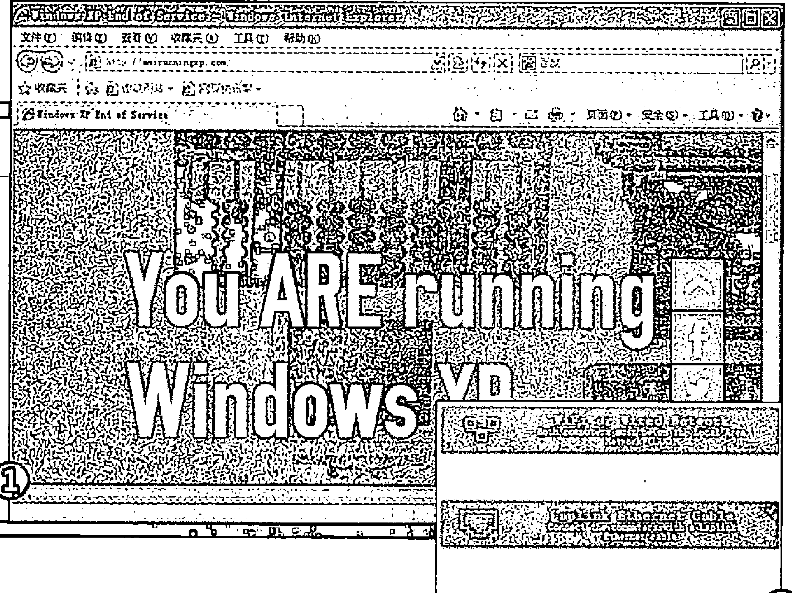

## 2 XP中的数据快速导出

除了这个宣传网站，为了方便用户在升级过程中对数据进行迁移，微软还专门推出一款名为“PCmover Express”的工具，只需要点击几下鼠标，重要的数据就会被方便地迁移。PCmover Express的安装非常方便，但是需要Visual C++ 2010运行库的支持，软件在安装过程中会自动进行检测，如果没有检测到它就会自动在线进行下载和安装。安装完毕启动PCmover Express，首先点击“Next”按钮，选择“PC to PC Transfer”选项，接着再点击“Next”按钮选择数据源。由于我们需要将Windows XP系统中的主要数据进行导出，所以选择窗口中的“Windows XP”按钮，接着点击“Next”选择数据传输的方式（图2）。软件允许用户通过无线Wi-Fi、网络数据线、USB设备等方式进行传输。升级新的系统就选择“Laplink USB Cable”，然后点击“Next”并等待USB设备的接入（图3）。一旦软件发现有USB设备连接到系统，就会对系统中的主要数据进行扫描。扫描的数据包括已经安装的软件、“我的文档”等关键目录中的数据，以及存放在注册表中的软件配置信息等。PCmover Express在分析过程中会找出那些与新系统不兼容的软件，在后面迁移数据时将自动跳过这些软件。数据分析扫描完成，点击“Next”将数据存储到USB设备中即可。

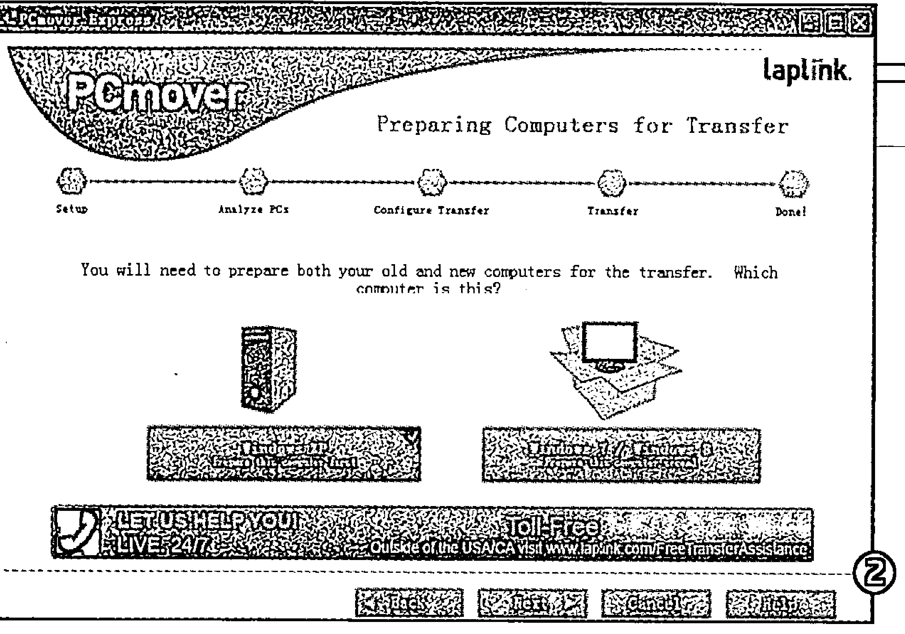

## 3 XP数据安家到新系统

升级完操作系统后，接下来就需要进行数据恢复了。操作步骤与之前相似，不过这次在软件窗口要选择“Windows 7/8”，接下来点击“Next”选择数据传输的方式。还是选择“Laplink USB Cable”，点击“Next”后当检测到USB设备，就会将其中的数据自动恢复到原来设定的位置。数据恢复完毕重启系统，原来XP中的内容就大部分“搬家”进新系统啦。[CF]

## XX播放硬盘 手动清缓存

使用搜狐影音大片数日，发现硬盘空间极速变小。如何找到侵占硬盘资源的元凶并进行有效清理？

文|黄虹

## 1 软件自身无法解决

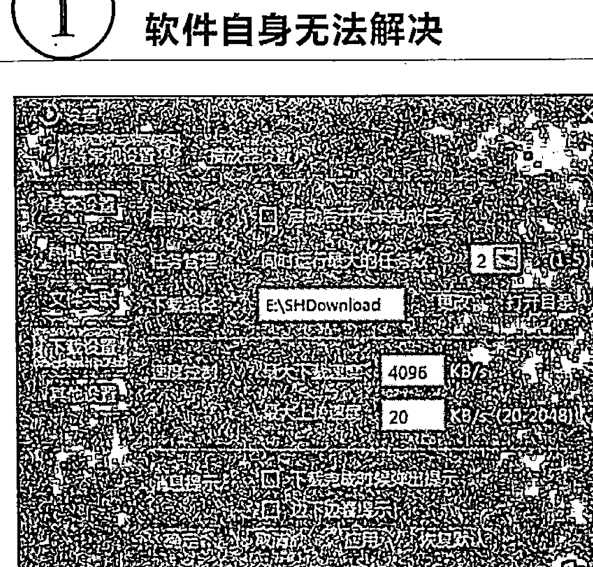

打开搜狐影音设置窗口的“下载设置”，按下载路径打开资源管理器相关文件夹，发现里面并无缓冲文件（图1）。

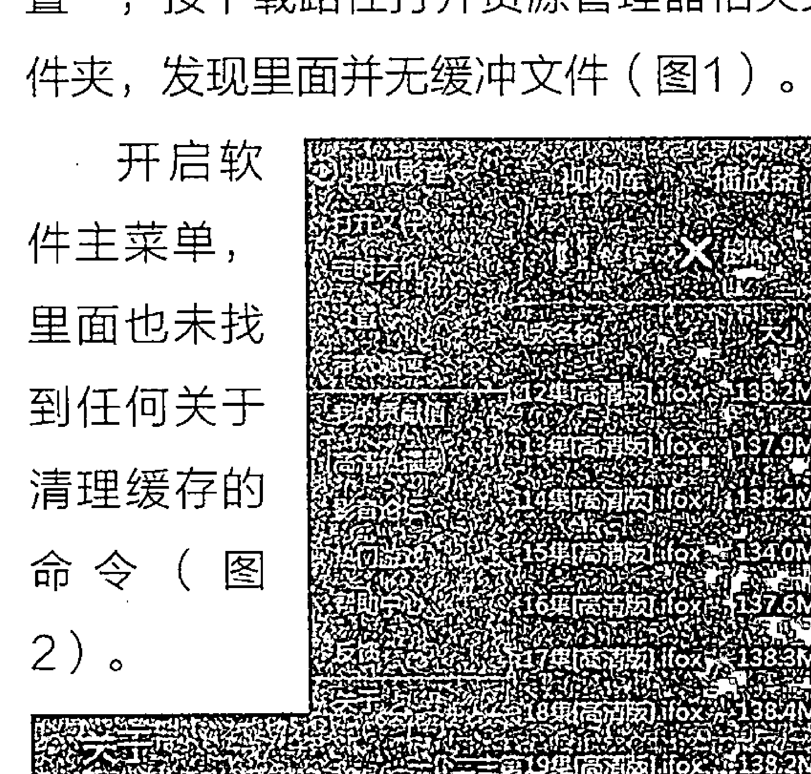

开启软件主菜单，里面也未找到任何关于清理缓存的命令（图2）。

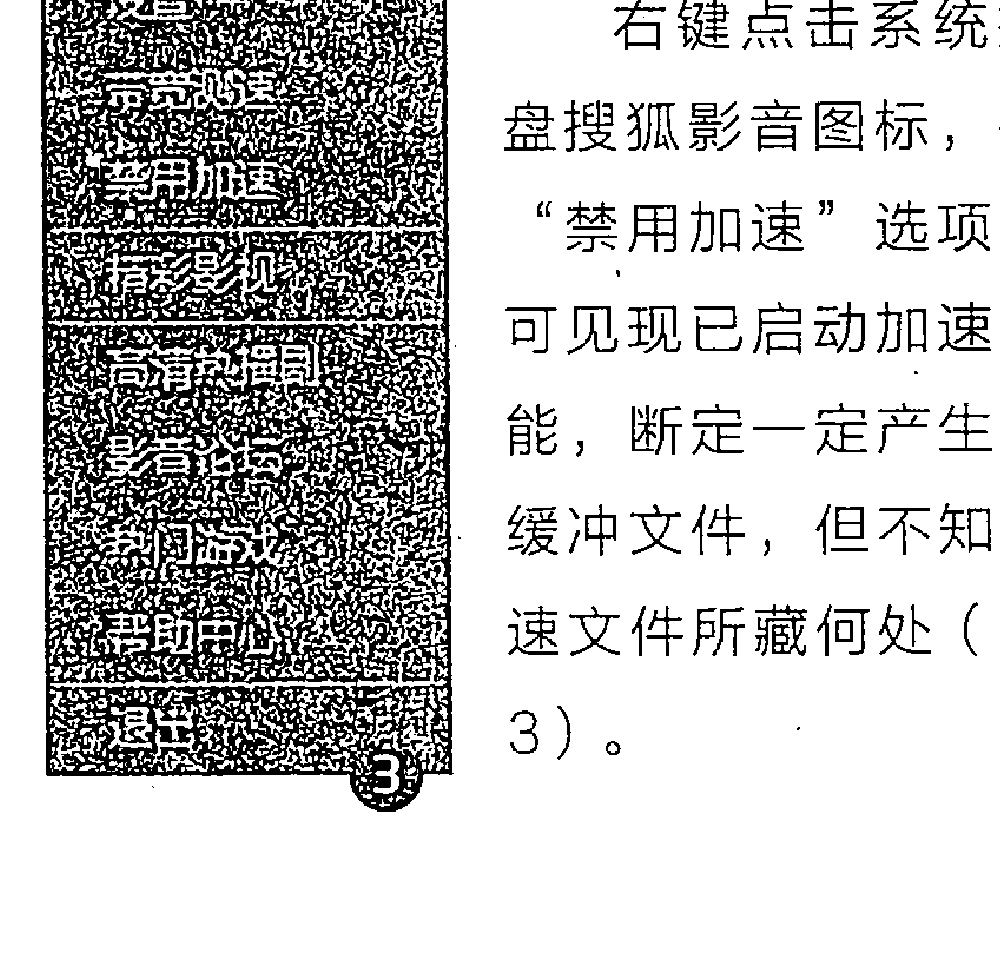

右键点击系统托盘搜狐影音图标，有“禁用加速”选项，可见现已启动加速功能，断定一定产生了缓冲文件，但不知加速文件所藏何处（图3）。

## 2 依靠系统干掉元凶

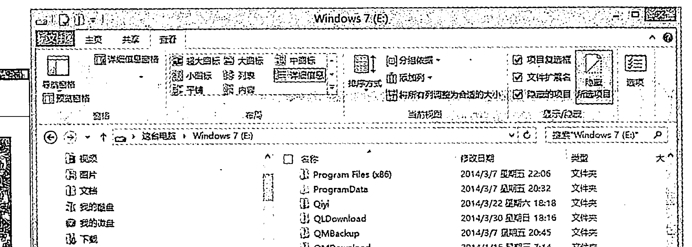

打开资源管理器，定位到搜狐影音下载路径所在的分区，在资源管理器“查看”选项卡下，选中“显示/隐藏”一组中的“隐藏的项目”复选框，这时会看到资源管理器窗口右侧有一个灰色的名为sohucache的文件夹，从其名称可以看出这可能是搜狐影音的缓存文件夹（图4）。

右键查看这个文件夹的属性，发现有6.61GB之大，侵占硬盘资源的元凶应该就是它（图5）。

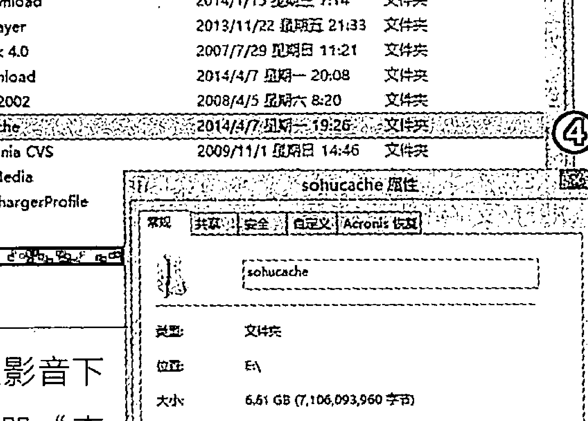

> 小提示：如果系统显示文件无法删除，要从系统托盘中完全关闭搜狐影音，再执行删除操作。此外，还可以安装360安全卫士或驱动精灵，对硬盘进行整体扫描，尝试从影音文件选项中寻找是否包含搜狐影音缓冲文件。

点击资源管理器“主页”选项卡，双击进入ohucache文件夹，用Ctrl+A全选文件，点击“删除→永久删除”命令删除缓存文件（图6）。

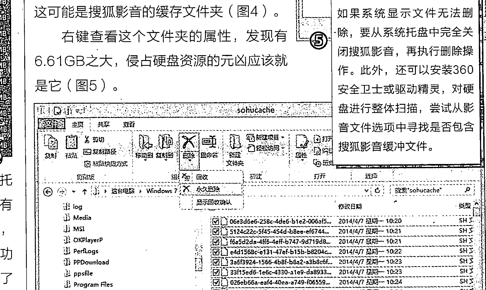

## 飞速“挖出”BT种子里的电影

很多网友可能和我一样，平时喜欢搜集一些种子文件，这样在放假时就可以下载来看。可是由于种子文件的名称不规范，再加上时间一长下载的文件比较多，所以需要下载时根本不知道哪个种子文件是哪部电影了。别着急，下面教大家一个方法快速分辨。

文|万立夫

### 1 直接搜索获取种子

要想解决上述的问题，可以通过两种方法来进行。首先是通过专业的搜索工具，对种子文件内部的信息进行搜索。现在我们将所有的种子文件移到同一个文件夹中，接着运行“BT种子解析器”软件，点击工具栏中的“打开目录”，从弹出的窗口中选择存放种子文件的文件夹，这时软件就会自动载入其中的种子文件，并且对种子文件内容进行解析。解析完成，所有内容信息将显示到窗口列表中，其中既包括视频文件信息，也包括电影图片以及网站推广链接等。

如果显示的信息比较多，那么在窗口左侧的搜索框中，首先选择需要查找的类别，再在“关键字”框中输入相应的关键字，还可以在“扩展名”和“文件大小”中进行设置。最后点击工具栏中“开始搜索进程”，就可以快速找到需要的种子文件（图1），右击它，选择“打开种子文件”，就可以调用下载软件进行下载了。

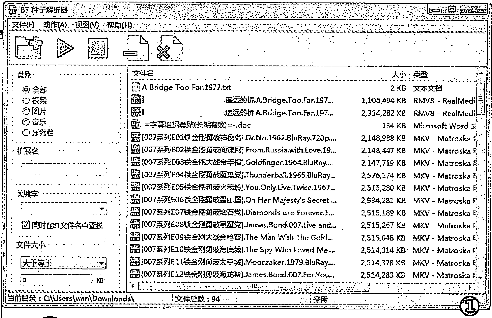

### 2 重新命名一目了然

除了上面的方法，我们还可以对种子文件进行批量重命名，用种子文件中所包含的目录名称作为种子文件的名称，这样也可以增加文件辨识度。当然常见的重命名工具是无法完成该任务的，所以这里要使用“BT种子转磁力链工具”（下载地址：http://tinyurl.com/ljdrj2t，需要.Net Framework支持）。

软件运行后，点击“添加文件夹”按钮，选择存放种子文件的文件夹，在种子文件加载过程中，会自动过滤掉无法正常打开的种子文件（图2）。当种子文件成功加载到列表中，就可以看到种子文件当前的名称、内容名称，以及种子文件对应的磁力链接等信息。接着点击“工具”按钮并选择“将种子文件重命名为其内容的名字”，在弹出的对话框中就可以看到种子文件当前的名称，以及修改后将要显示的新名称（图3）。确认无误后点击“确定”就可以了。

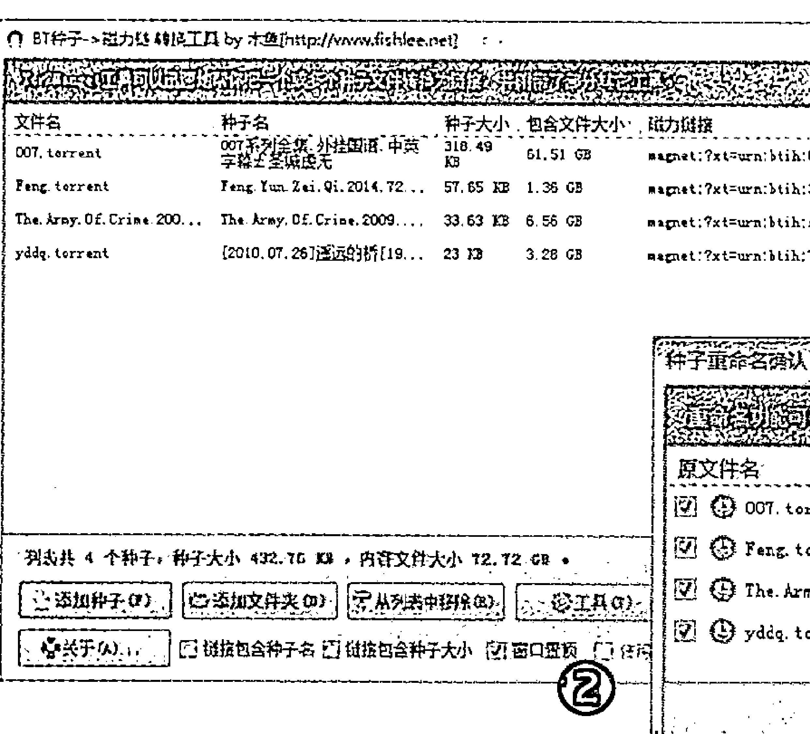

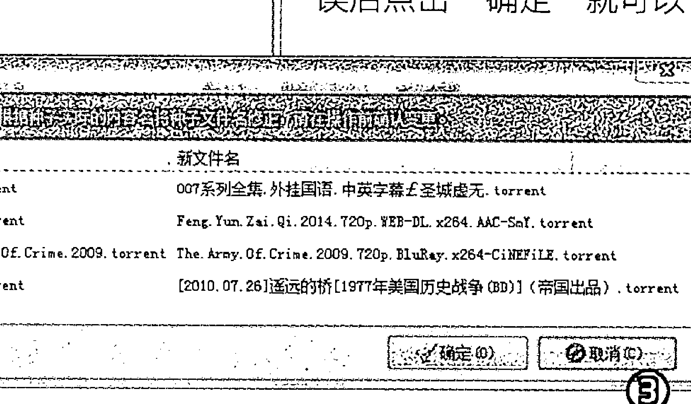

当我们重新进入存放种子文件的文件夹中，通过全新的种子文件名称，就可以一目了然找到需要的文件了。双击打开，下载你想要的电影吧。

## 图片文字也要提取编辑

现在无论微博还是论坛上，很多人都喜欢通过图片的形式发表一些较长的信息内容。如果觉得这些信息有用想要保存下来，只能保存图片，查阅和使用都很不方便。其实，我们可以将这些图片内容提取出来，就像普通的文本一样进行编辑使用。

### ① 在线服务直接取文字

现在有很多云计算服务采用OCR技术，如果要处理的工作量不大，我们可以考虑通过云来进行图片文字的分析提取。

这里以Free Online OCR网站为例（http://www.newocr.com），首先点击网页中的“选择文件”，从弹出的对话框中选择需要上传的图片（图1，支持PDF）。为了让系统更好地进行识别操作，需要在“Recognition language”列表中选择一种对应显示的语言，通常情况下我们选择“Chinese Simplified”（简体中文）项就可以了。设置完毕点击“Upload”上传，图片将在网页中显示出来。如果图片是横向显示，可以通过“Rotate image”选项来调整图片的方向，接着再通过鼠标拖动图片上方的选择框，选择需要进行文字识别的区域。

> Free Online OCR也可以识别在线图片，在“File URL”选项中直接输入图片文件的链接地址即可，这样可免去下载再上传的步骤。

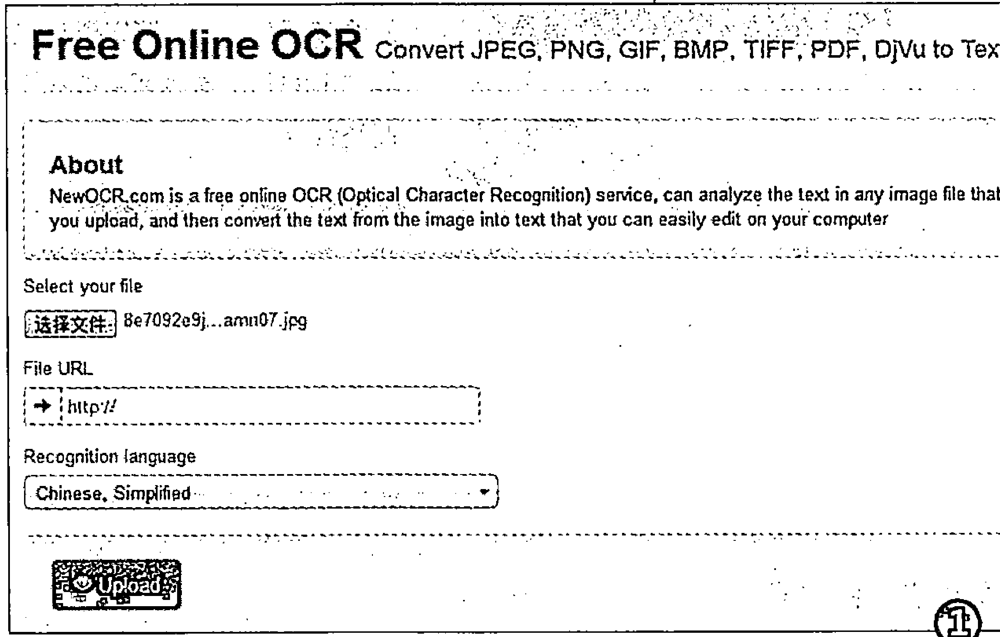

点击“OCR”按钮开始识别操作，稍等片刻就可以在网页下方显示出从图片中提取的文字了。通过工具栏中的命令可以对文字直接进行操作，比如提取出来的是外文信息，点击“Google Translate”或“Bing Translator”按钮可以对文字内容进行在线翻译，而点击“Edit Online”按钮则可以对其进行在线编辑。最后点击工具栏中的“Download”，将提取出来的文字保存到本地系统就可以了（图2）。

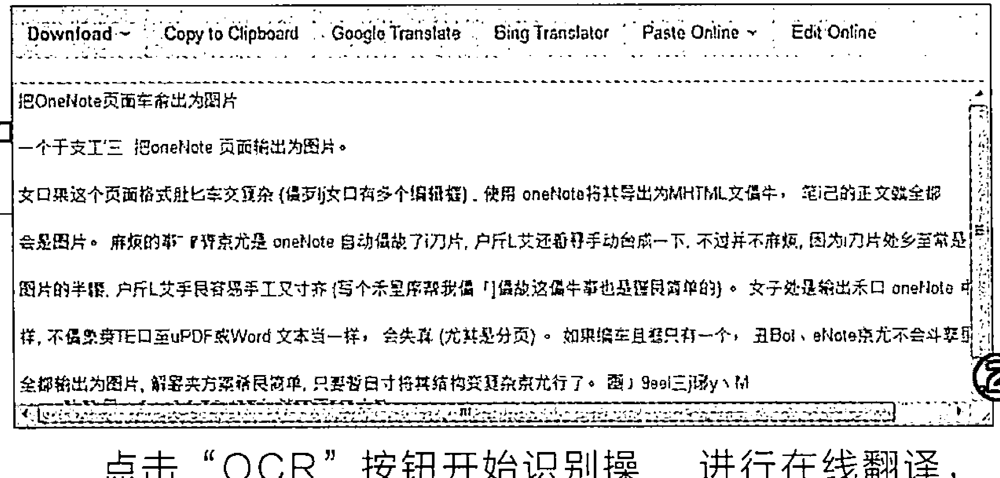

### ② 本地软件批量取文字

云服务虽然使用方便，但是因为带宽等原因，往往会对文件大小进行限制，比如Free Online OCR网站要求图片文件大小不得超过5MB，PDF文件不得超过20MB。如果识别的工作量很大，此时就得求助于本地的软件了，这方面最常用的有“汉王PDF OCR”、“文通TH-OCR 免费版”等。

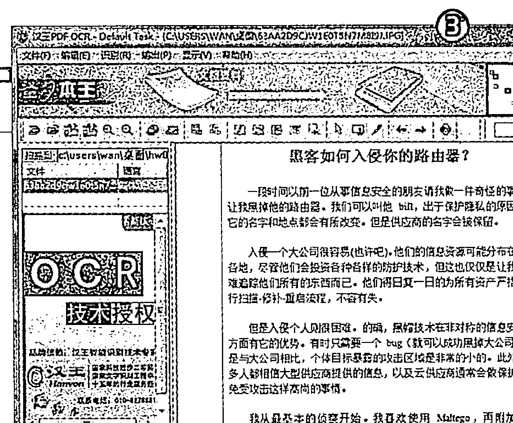

以汉王为例，点击工具栏中的“打开”，选择打开需要进行识别的图片（图3）。接着点击“编辑”菜单中的“自动倾斜校正”命令，对图片的显示方向进行调整。然后点击“识别”菜单中的“版面分析”命令，对图片中的内容进行识别，并且对识别出的内容进行选取。可以调整选取的内容，最后点击工具栏中的“开始识别”按钮，就可以将图片中的内容识别出来，并且对可能识别错误的内容以红色字体标注，方便手动修改，效率极高。

## 数码照片深度再利用

我们多数人的数码照片，一般只是简单地保存在电脑中浏览，根据需要还会挑选一些在网上共享或打印、冲洗。但是，数码照片绝不仅是这两种简单用法，如果再深入一步，数码照片会在生活中有更广阔的娱乐天地。

文|木娜

我们可以用现成的数码照片，制作成特效幻灯片、屏保文件、可执行程序、视频相册、PDF照片电子书等。而要完成这些特色任务，不需要安装各种应用工具，只需一款小小的iSee看图软件即可一站搞定。

### ① 特效幻灯片让演示更酷

在电脑上演示幻灯片，如果仅用系统默认的演示功能，那么演示效果就会显得单调乏味和千篇一律。如果希望在照片演示过程中的变换效果更加丰富多彩，可以采用特效幻灯片演示的方法。

首先设置特效幻灯片演示参数，选择“幻灯片→幻灯片设置”命令开启幻灯片设置窗口，从幻灯片效果列表中复选需要出现的效果，选择设置播放顺序、两张照片之间的时间间隔。设定好之后点击“确定”保存设置，这一设置在之后的特效幻灯片演示中均有效（图1）。

小贴士

如果数码照片是存放在多个文件夹中的，而我们希望在演示的时候能跨越这些文件夹来提取图片，请在幻灯片设置的“显示图片”中选择“当前目录及其子目录下图片”选项。如果图片大小不统一，请在“显示方式”中设定适应屏幕的类型。

### ② 制作EXE可执行演示程序

我们可以将自己的数码照片制作成附有动感效果的、有背景音乐的EXE自动演示程序。这样一来，数码照片的演示就可以脱离看图软件的束缚，无论走到哪里，不管机子里有没有看图程序，只需点击EXE文件运行即可自己演示数码照片了。

将当前目录切换到数码照片所在文件夹，执行“幻灯片→合成相册程序”命令，开启的合成相册程序窗口中会自动添加当前目录中的数码照片。点击工具栏上的添加音乐按钮或窗口中“背景音乐”窗口后的文件目录按钮，添加背景音乐（支持常见的4种音乐文件格式），设定照片演示的间隔、播放顺序、照片适应屏幕的尺寸等参数，设置之后点击“确定”按钮（图2）。之后系统会提示存放EXE文件的路径和文件名，设好文件名确认即可获得EXE自动演示程序。

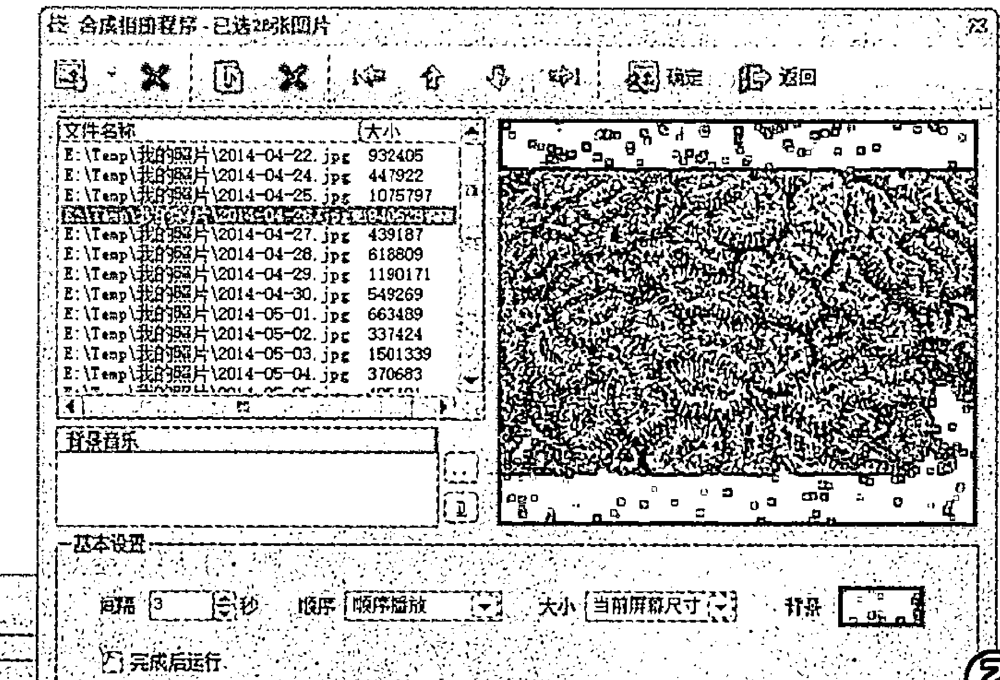

小贴士

如果希望将来自不同磁盘、不同分区或不同文件夹下的照片制作到一个EXE文件中，只需点击工具栏上的第一个按钮，添加文件或文件夹即可。如果添加的文件在制作列表中的顺序不合心意，可以通过工具栏上的四个绿色箭头按钮来调整顺序。

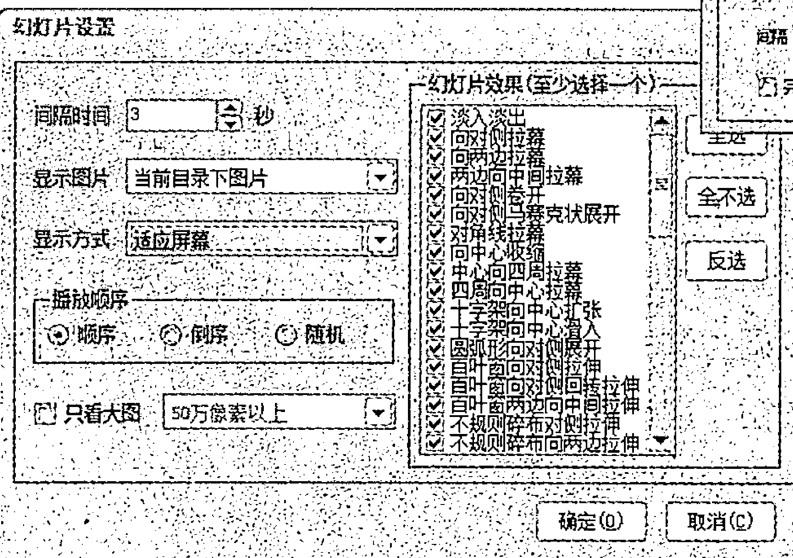

### ③ SCR照片屏保也能DIY

说起屏幕保护程序，除了系统中自带的几种文字或线条变换效果的程序外，大家一般都是下载网上现成的屏幕保护。那么，能不能将自己的数码照片制作成屏保格式的文件，添加到系统中演示呢？这样不就更有个性特色了吗！

在iSee图片专家窗口中定位到要制作屏保的文件夹，然后执行菜单命令“幻灯片→合成相册屏保”。同样在窗口中添加背景音乐，设置基本效果参数，点击“确定”即可生成SCR专用格式的屏幕保护程序（图3）。将此程序添加到Windows系统屏保所在的相同目录中，即可通过系统屏保设置窗口使用自己制作的屏幕保护程序了。

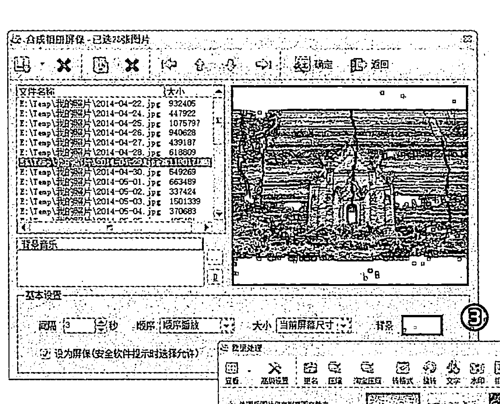

> **小技巧**
如果希望在制作完成后，随机自动将制作的屏保添加到系统中并作为当前的屏幕保护程序，请选中“设为屏保”选项，若安全软件弹出提醒，通过即可。

### 4 AVI视频相册万金油

还有的时候，我们希望将自己的数码照片做成通用视频格式挂接到自己的网页中，或刻录到光盘、拷贝到移动设备中以便于他人演示。这时，我们最好将数码照片做成AVI视频相册来使用。

> **小技巧**
制作过程中，如果对本批次的图片文件效果或尺寸不满意，那么可以就地取材，用iSee软件本身对图片做批量处理。可以实现的操作有批量更名、压缩、转换、加文字、加水印、自定义等各种丰富的操作。只需在选中所有要处理的图片后点击右键并选择“批量处理”，即可进入相应窗口（图5）。

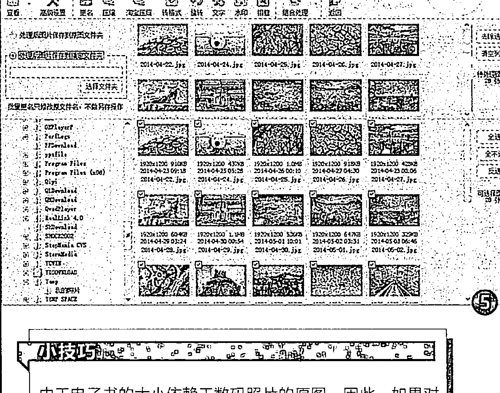

在iSee窗口中切换到照片文件夹，执行“幻灯片→合成视频相册”命令，在弹出的制作窗口设置演示参数和视频的分辨率大小，注意要根据所使用的显示器来设置分辨率，点击“确定”按钮保存AVI视频相册（图4）。由于格式通用，获得的视频相册文件可以在任意一种视频设备上播放。

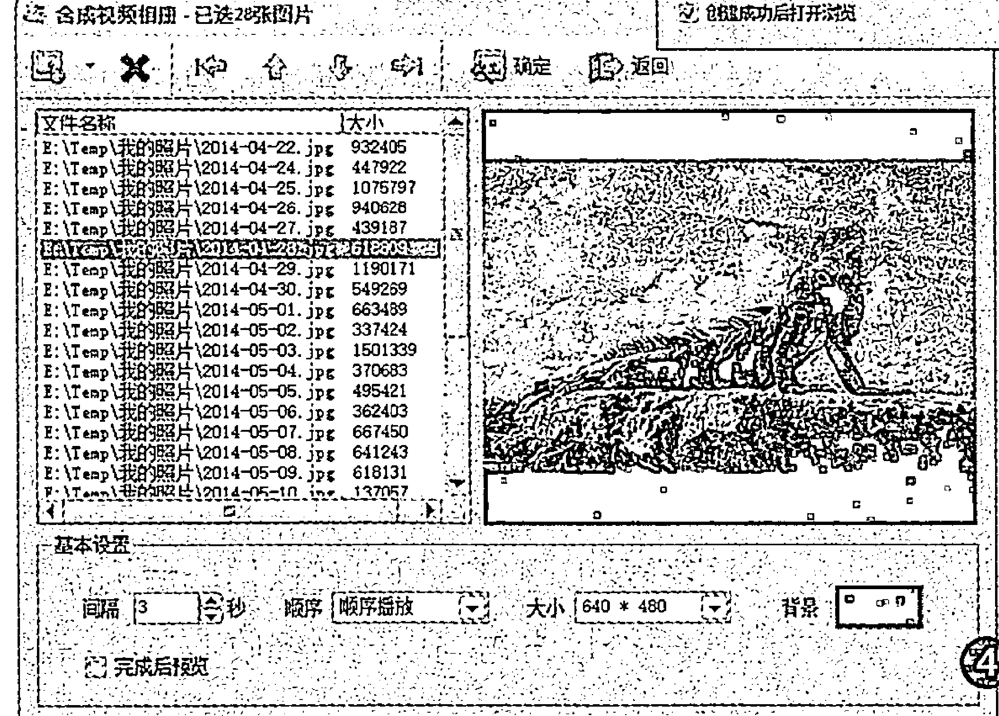

> **小提示**
由于电子书的大小依赖于数码照片的原图，因此，如果对电子书的尺寸和大小比较看重，请在留出数码照片备份的前提下，首先对数码照片用上述批处理的方法进行合理编辑，然后用编辑后的照片来制作PDF电子书比较合适。

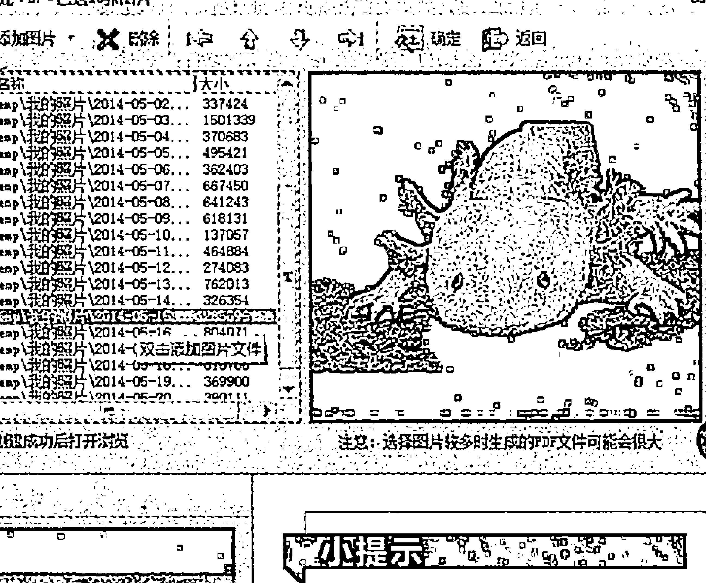

### 5 制作PDF照片电子书

将自己的数码照片制作成一本PDF彩色电子画册，作为电子书文件来保存或共享，也是一件很酷的事情。我们同样可以用iSee来完成这项任务。

选择需要制作的数码照片，执行“工具→创建PDF”命令，在创建窗口中通过箭头按钮设置好图片的显示顺序，点击“确定”按钮就可以保存PDF电子书了（图6）。

> **小提示**
除了上面用到的几种数码照片应用外，还有几种生活用途也常见到。比如照片排版、相框照片制作、照片动画等，这也都是iSee软件的拿手强项。由于篇幅限制，不再详细介绍，读者朋友们可亲手尝试。相信通过以上全部功能的操作，你会对一个不起眼的iSee看图小软件另眼相看。

## 收藏精彩 方便与众不同

网络浏览器的收藏夹虽然也能同步到云端使用，但因只能收藏网址，所以作用有限，而网盘云收藏夹则可以突破这个限制。以115网盘为例，它可以收藏网址、图片、视频、文字及其他内容（图1），收藏后的内容不限网络和平台环境，进入自己的115网盘即可使用。

### 1 让浏览器支持“云收藏”

要在浏览器内使用115网盘的云收藏功能，首先需要给浏览器添加该功能。如果使用IE内核的浏览器，只需在115网盘的云收藏设置页中右键点击115收藏夹设置链接，将115收藏夹功能添加到IE的收藏夹中，之后通过浏览器的“收藏夹→115收藏夹”命令来使用该收藏夹。或直接下载官方修改注册表的reg文件，运行添加注册表项目，安装后直接在网页中单击右键，选择“收藏到115收藏夹”即可。而火狐或Google Chrome浏览器，则只需将115网盘收藏设置页中相应的“115收藏夹”设置链接拖动到所用浏览器的书签栏或书签菜单上，即可使用115收藏夹功能。

- 115网盘 会员 圈子

> 小提示
注意，在为IE浏览器添加115收藏夹的过程中，网页中可能会弹出不安全添加的提示，这是浏览器的安全检测机制发生作用的结果，直接点击“是”通过即可。

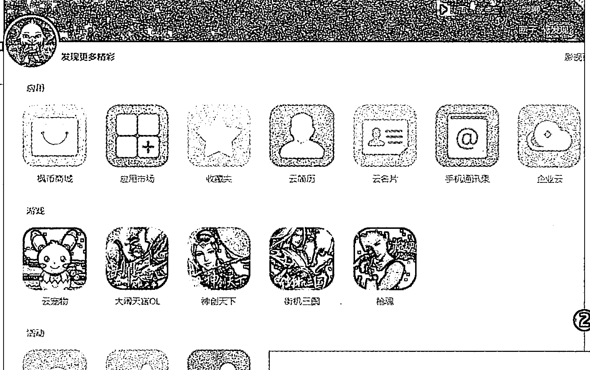

> 小技巧
对于一个网络收藏迷来说，也许会担心115网盘的容量不够用，其实只需三步操作，即可轻松领取8TB永久免费网盘空间。安装该软件的Android或苹果APP并用申请的账号登录，可以获得2TB的空间扩容。用新版移动客户端的扫一扫功能登录，又可获取1TB免费空间。接下来需要稍有一点耐心，连续5天用手机客户端登录115网盘，不能间断，5天登录次数已满，可获得5TB的免费空间。三个步骤操作之后，都需要返回到115官方的空间领取活动页面（http://115.com/event/2014/chunjie/?top），点击确认领取的按钮才能领到空间。

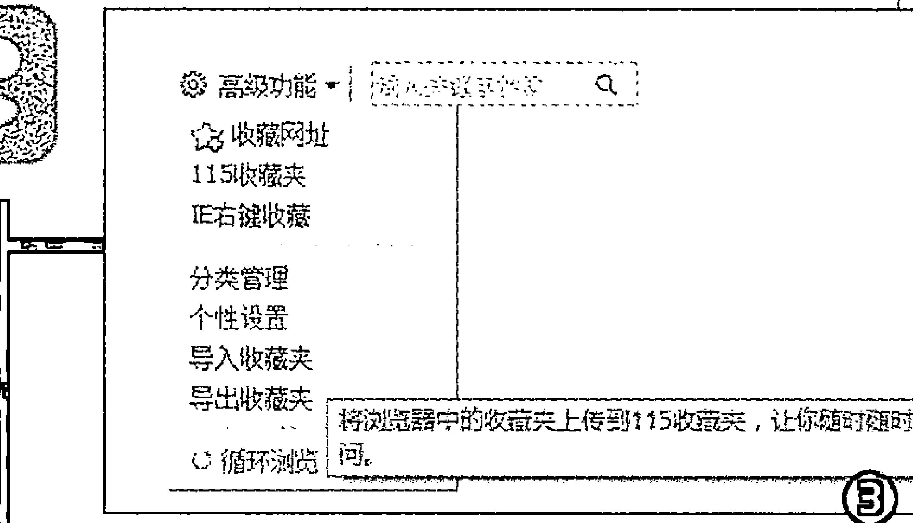

### 2 充分用好115云收藏夹

设置好云收藏功能，在上网过程中发现精彩内容需要收藏，可直接点击鼠标右键将精彩内容保存在网盘中。若要对网络收藏夹的内容进行管理和定制，则登录115网盘，点击“发现”标签，接着点击“应用”组下的“收藏夹”按钮进行设置即可（图2）。值得一提的是，115网络收藏夹还可以将平时收藏在浏览器收藏夹里的内容一次性导入进来（图3）。如此一来，只要能登录上网，就可以在任何一台机器、任意一个地方访问自己曾经收藏过的精彩网页了。

## 有色标签 管理文件排好队

硬盘的容量越来越大，存储的文件也越来越多，有时想要从海量文件中找出自己需要的文件，需要费很大的力气。其实我们可以学习流行的笔记软件，为相应的文件添加上合适的标签，这样管理起来就方便多了。 文|倚楼

### 1 TagSpaces为文件贴彩色标签

运行TagSpaces后，在左侧列表中可以看到软件自带的多个标签组，以及每个标签组中对应的多个标签名称。这些标签非常丰富，包括类型、时间、重要性等。

点击工具栏中的扩展按钮（虚线图标），选择“Edit Tag Group”，从弹出的对话框中可以直接将标签组修改为中文名称。选择“Create Tag Group”可以创建新的标签组，而“Delete Tag Group”则可删除已有的标签组。在具体标签上右击，选择“Edit Tag”，可以将英文标签名修改为中文。对于不需要的标签，右击后选择“Delete Tag”即可。

标签确定后，点击主界面左侧的“+”号按钮，从弹出的对话框中点击“Location Path”右侧按钮选择需要管理的文件夹，比如这里我选择的是平时存放下载文件的目录。另外可以设置文件夹的显示名称（Location Name，比如为“下载文件”），以及显示方式（Default Perspective，可以是列表式或平铺式），最后点击“OK”完成添加（图1）。用同样的方法可以添加多个需要管理的文件夹。

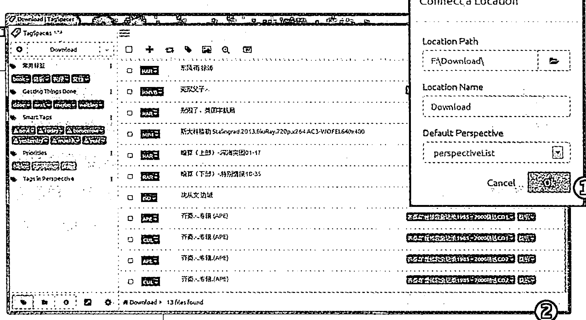

添加的文件夹将显示在“+”按钮右侧，点击可以快速进入。有些文件自带标签信息，TagSpaces会自动读取并显示出来。选中那些还没有标签的文件，再在左侧列表中相应的标签上右击，选择“Tag Selected Files”，就可以为该文件贴上相应的标签了（图2）。同样地，我们可以为一个文件添加多个标签名称（方便多个途径查找），也可以一次为多个文件批量添加标签。

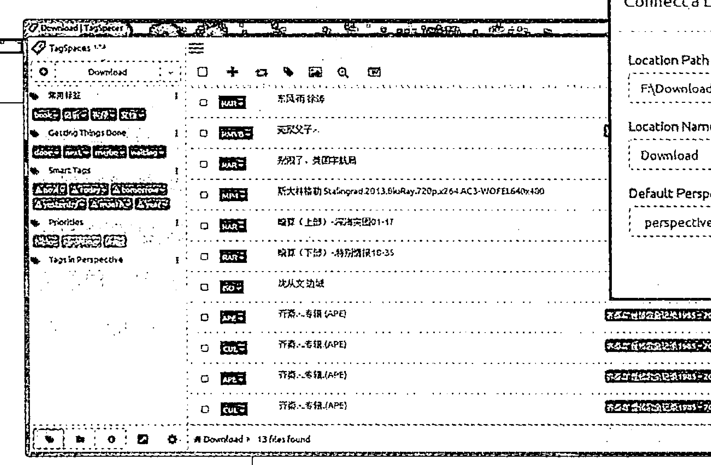

### 2 TC为文件打上彩色标签

许多人喜欢用Total Commander（TC）替代系统的资源管理器，TC有一项功能，它可以为文件图标设置颜色，这样我们通过颜色就可以快速找出需要的文件。下面就试试将某一时间段的文件设置为同一种颜色显示。

点击TC菜单“配置→选项”，弹出选项窗口，选择左侧的“颜色”项，再在右侧点击下方的“按文件类型定义颜色”按钮，从弹出的对话框中点击“添加”，再点击其中的“定义”，又会弹出“定义选择类型”对话框。现在点击其中的“高级”选项卡，选择其中的“不早于”选项，在后面设置一个数字信息（比如设置为2），然后点击“保存”并自定义一个“两日内修改”的名称（图3）。接下来设定这个类型的颜色，为了醒目这里我设置为红色，这样两天以内修改的所有文件，就会用醒目的红色显示出来。

以后，当我们需要查找文件时，只需要选择相应的标签，右击后选择“Show Files With This Tag”，即可将贴有此标签的文件全部过滤出来，从而大大缩小查找的范围。

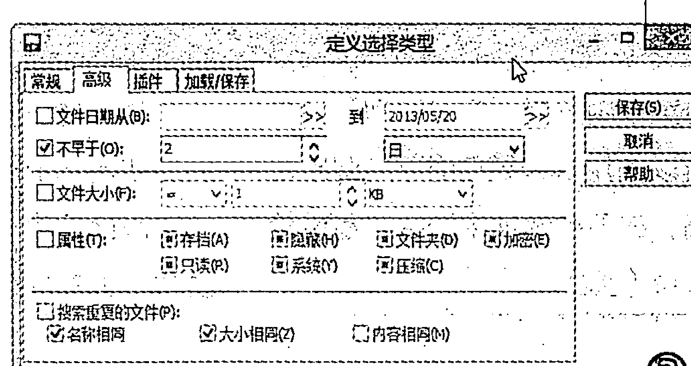

用同样的方法可以再设定一周以内、一月以内等类型，这样文件的修改日期也就一目了然了。当然，这种利用颜色进行区分文件的效果还可以延伸，比如通过颜色进行文件类型的区分等，就看大家各自的需要了。

## 给WPS文件多上几道保险

文 | 西范

一份内容非常重要的WPS文档，因某种未曾预料的原因而丢失了内容，备份工作没做到位，酿的苦酒只能自己喝。那么如何才能避免这种情况的发生呢？

实例描述：当我们用WPS Office编辑重要文件时，最糟糕的事莫过于自己辛辛苦苦编辑的文稿内容因断电、软件冲突或某种莫名其妙的原因而丢失。虽然WPS系统本身有文档错误恢复机制，但你要知道那不是万能的，万一的事情还是会发生。如果充分利用WPS系统自动备份机制，再配合用户个性备份设置，外加云盘账户、多地备份等方法，则可以最大限度地确保将编辑文件的损失降低到最低程度。

> 小提示：WPS系统为用户自动备份的文档，一般存放在一个固定的文件夹下。以Windows 8系统中默认WPS安装用户文件夹为例，该文件夹路径一般是“<用户>\AppData\Roaming\Kingsoft\Office6\backup”。我们可以通过直接点击图2窗口右下角的“查看其他备份”文字链接直达该文件夹看个究竟。

1. 自动恢复功能备份：WPS Office系统自带了一个文件安全机制，那就是如果WPS Office程序遇到异常情况需要退出的时候，系统将对正在使用的文件进行分析以查找错误，如果可能的话，将在下次启动WPS时恢复其中的信息。遇到错误后，重新启动WPS Office程序，将自动弹出“备份管理”任务窗口，其中列出了程序停止响应时已恢复的所有文件（图1）。


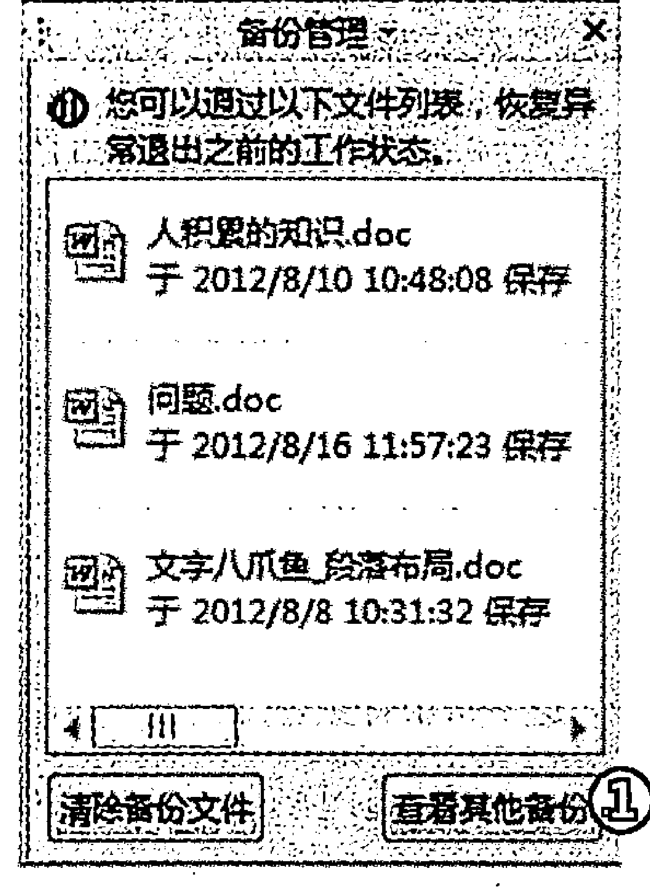

此时，我们可以通过文件名称、备份时间等信息找到合适的备份文件进行恢复。恢复完毕之后，可以选择手工逐个删除或者全部删除备份文件。如果没有弹出此窗口，可以点击WPS左上角的“WPS文字”按钮，在下拉菜单中选择“备份管理”。或者也可以使用快捷键Ctrl+F1调出任务窗格，在下拉选项中选择“备份管理”查看（图2）。

不少人因为知道WPS Office具有这种自动恢复的机制，因此便十分放心地将文件故障恢复的重任全部委托给了WPS Office系统本身。殊不知，这种信任是相当危险的，要知道，WPS Office这种机制不是万能的。如果你仅依靠这套机制来保证你的文件安全，很可能会遭受到意想不到的损失。在实践中发现，某些情况下，靠系统自带的故障恢复机制根本无法恢复任何信息。明明是刚刚输入的一些内容，在文档自动恢复后却是一个空文档。因此，为了防止上面所说的意外发生（如在突然断电或软件冲突造成的数据丢失），我们可以采用进一步保护文件的手段，那就是启用用户自定义的“定时备份”功能，定期自动保存正在使用的文件的临时备份文件。通过“WPS文字按钮→选项”进入WPS Office选项设置窗口。在“选项”窗口的“常规与保存”选项卡中，将“定时备份，时间间隔”设置为更短的时间（默认设置为每10分钟保存一次），与此同时选中“第一次保存时生成备份文件”（图3）。具体情况可根据自己录入文字或编辑的速度来定，比如录入慢的用户每分钟本来就打不了几个字，所以时间可以设长一点（如10分钟），而录入速度运指如飞的高级用户，在10分钟时间内就能输入1000多字甚至更多，若期间未自动保存而遭受意外，则这1000字就白白录入了，这时可以将时间设得短一点（如3分钟甚至1分钟），这样可以起到最大限度的保护作用。若你的机器配置比较古老或低档，运行缓慢，则不要将时间设得太短，否则频繁存盘的动作会使机器变得很卡，影响你的录入或编辑工作的顺利进行。

## 2 网络云盘实现远程备份

如果以上内容保全措施还不足以让你放心，那么还有附加的好方法可以给你的WPS文档再上一层保险。

首先可以利用云盘来为文档买一份“保险”。WPS用户或金山快盘用户都有自己的账户，你可以安装一个金山快盘的本地客户端，安装的过程中会让你选择生成一个本地同步盘，一定要选择此项。这样，以后在编辑WPS文档时，新建的文档或修改的文档都要保存在这个本地的金山网盘文件夹中，只要客户端在线，你编辑的内容除了本地留存有备份之外，在金山网盘属于你的服务器空间中，也有了这个文档的备份。如此一来，你的文档损坏丢失的可能性就更小了一些（图4）。

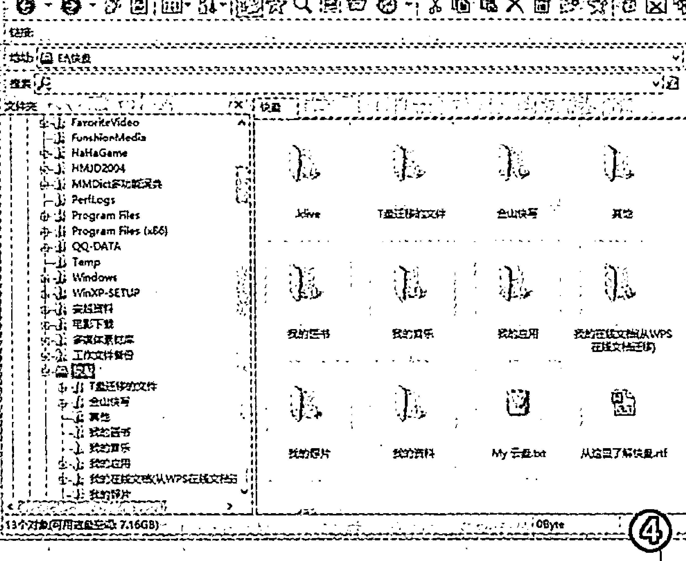

若对拥有一个网盘备份还不放心，比如担心某日该网盘服务器忽然“罢工停运”或关闭歇业，自己又急于取出其中的数据该怎么办？这时，不妨未雨绸缪，给云盘也上一个“双保险”。你可以这样做，在金山快盘之外，另行安装一种具有自动备份任意指定文件夹的网盘（例如百度云、360云盘、华为网盘等都具有这样的功能）。然后可以将金山快盘的本地同步文件夹，作为你选择的备用网盘的一个自动备份文件夹，进行监控和备份（图5）。这样，每当金山快盘同步文件夹中有新的版本文件生成时，第三方的这个网盘就会自动将其备份到用户的相应网络空间中，从而给你的WPS文档上双份的保险。

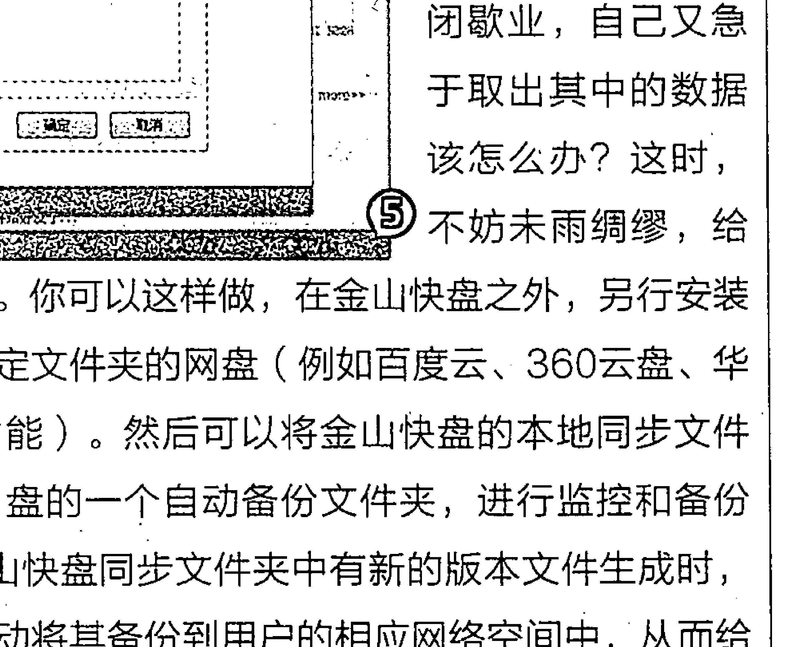

通过以上几种文件备份方法的综合运用，足以防止文件内容的丢失，将文件编辑时因意外而造成的损失降到最低。但文件放在网盘上要注意安全问题，可以利用网盘本身提供的加密和保险箱来保证安全。这是另一个话题，本刊曾有讲述，本文不再详述。

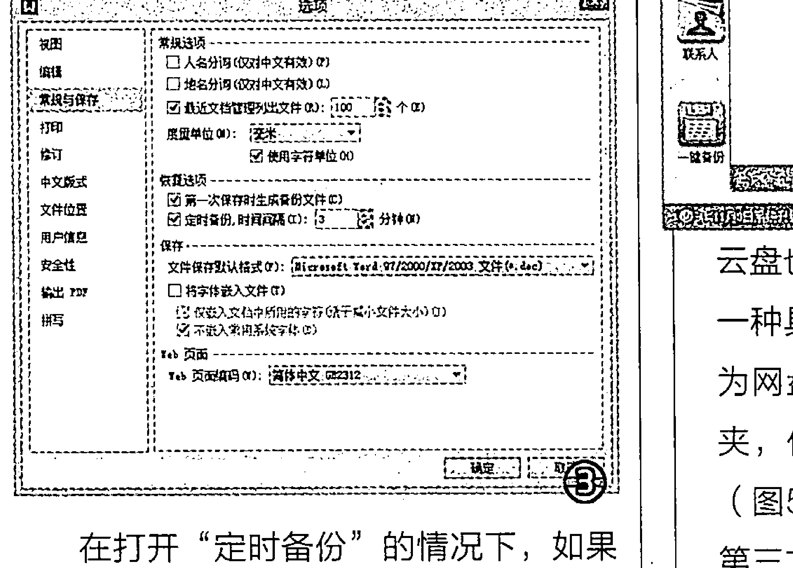

在打开“定时备份”的情况下，如果WPS Office程序非正常退出，重新启动之后同样会在“备份管理”任务窗口中列出程序非正常退出之前已保存的所有临时备份文件。此时，你就有更多的余地来选择合适的备份文件进行恢复。

## 分工协作多方完成同一任务

文|王志军

最近，上级部门要求我们进行一项数据采集，并给我们发来一份.xlsx格式的信息采集表。因为要采集的信息量巨大，为了提高采集效率，我们将采集表分发给各小组进行填写，这就涉及到协作共享，以及各小组的数据回收后的汇总问题。通过Excel的相关功能，最后我顺利完成了任务。

### ①保护工作表

原始工作簿的表格结构和筛选数据不能被私自更改，所以要进行相关的保护（Excel 2010或以上版本）。

全选整张工作表后，右击打开“设置单元格格式”对话框，切换到“保护”选项卡，取消其中的“锁定”项，确定后返回。接着选定需要保护和限制编辑的单元格区域，可以使用Ctrl或Shift键进行复选，同上操作，进入“设置单元格格式”的“保护”选项卡，并勾选“锁定”。

切换到“审阅”，单击“更改”功能组的“保护工作表”，在弹出的“保护工作表”对话框中，已经自动勾选“保护工作表及锁定的单元格内容”项，接下来参考图示进行设置（图1），需要提醒的是，“编辑对象”和“编辑方案”两个复选框不能选择，确认之后即可生效（注意不要忘记设置密码）。这样，被锁定的区域就不会被修改了。

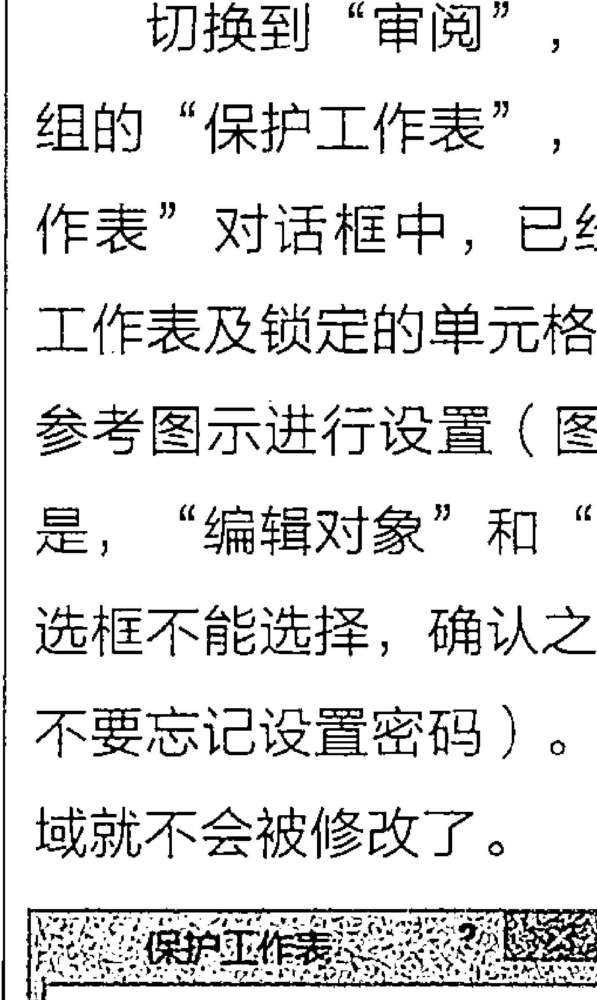

### ②设置共享工作簿

打开原始工作簿，例如“2011-2012学年度教师继续教育验证信息采集表.xlsx”，单击“更改”功能组的“共享工作簿”，勾选“允许多用户同时编辑，同时允许工作簿合并”复选框（图2），确认之后即可生效。

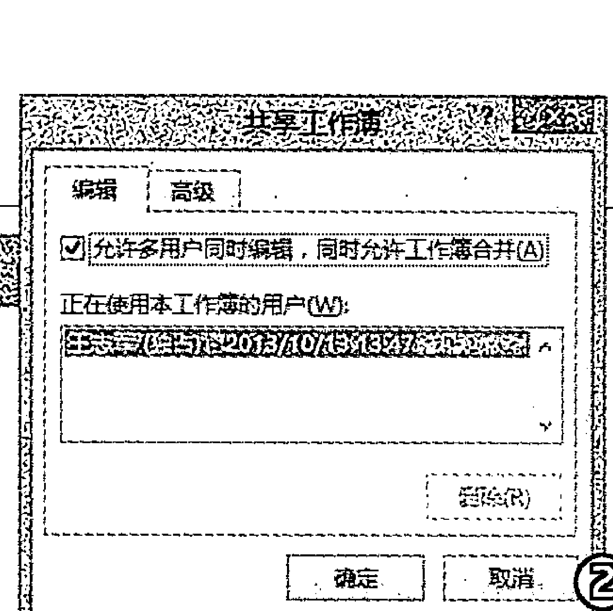

### ③添加比较和合并工作簿按钮

由于“审阅”选项卡的“更改”功能组并未提供比较工作簿的功能，不过我们可以将其添加到快速访问工具栏：从Office按钮下打开“Excel选项”对话框，在“自定义列表”的“从下列位置选择命令”列表，单击选择“所有命令”，在列表中找到“比较和合并工作簿”，双击添加到右侧的列表框，确认之后即可将这个按钮添加到快速访问工具栏。请注意，如果工作簿没有共享，那么这个按钮是灰色的不可用状态。

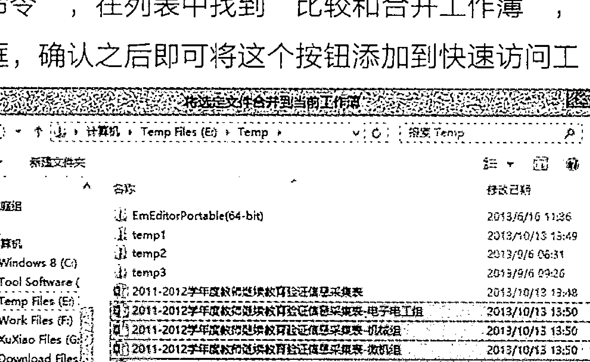

### ④制作共享工作簿副本

分别复制或另存若干份原始工作簿，为了与原始工作簿有所区别，建议在文件后末尾添加“-机械组”、“-电子组”等名称，例如“2011-2012学年度教师继续教育验证信息采集表-机械组.xlsx”，发给各小组填写。

以后的工作就简单多了，待接收到相应的共享工作簿副本文件之后，将这些副本文件与原始工作簿集中在同一文件夹路径，点击快速访问工具栏的“比较和合并工作簿”按钮，此时会提示保存文档，点击“确定”按钮，保存文档之后会弹出对话框（图3），在这里载入各小组提供的工作簿副本，确认之后即可完成合并操作啦。

## 分拆保存Excel多工作表

文|王志军

有不少Excel文件，里面保存了多个工作表，有时需要将其中的每个工作表提取出来，分别保存为单一的新工作簿文件。

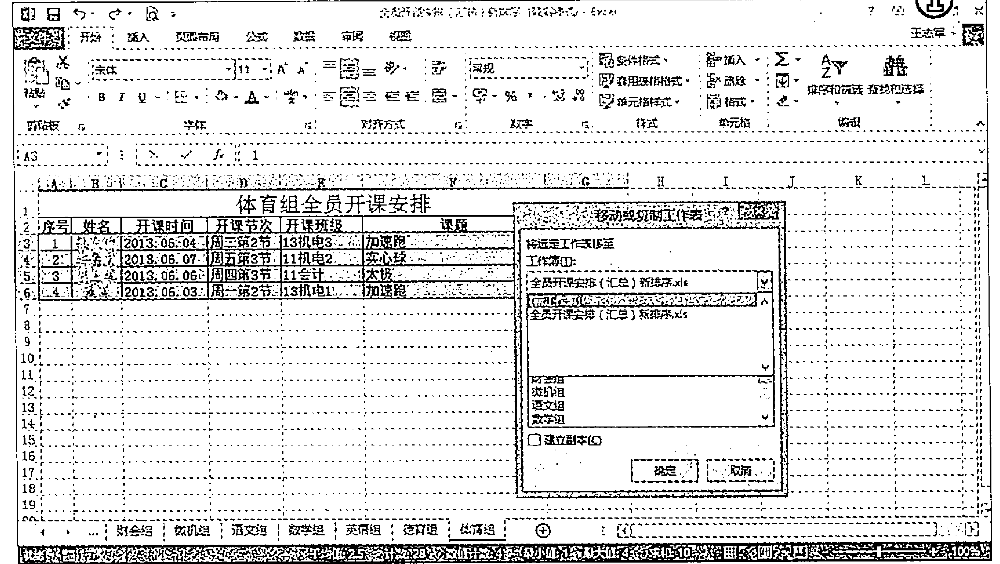

常规的方法是右击相关工作表，选择“移动或复制”，在“工作簿”下拉菜单中选择“新工作簿”，即可将当前工作表提取到新的工作簿中（图1）。注意，如果要在原工作簿中保留该工作表，需要勾选“建立副本”项。

但如果某个工作薄内有着比较多的工作表，那么按照上述方法逐一保存，操作起来相当麻烦。其实，我们还可以通过VBA批处理来实现。

- 下面方法的优点：
1. 将包含多工作表的工作簿快速分拆为独立的工作簿文件。
2. 分拆时可以自由选择.xls或.xlsx格式。

右键单击任意一个工作表标签，从弹出菜单中选择“查看代码”，此时会进入Microsoft Visual Basic for Applications窗口，依次选择“插入→模块”，插入一个新的模块，再在模块对话框输入相应代码。

VBA中的模块语句为：

```
Private Sub 模块名()
End Sub
```

在这两行之间加入实际的操作命令（图2），其实在本例中，除了Dim之类的变量定义外，实际的操作代码也就一行：

```
ActiveWorkbook.SaveAs Filename:=MyBook.Path & "" & sht.Name, FileFormat:=xlNormal
```

通过For语句循环该命令，将所有的工作表自动提取保存下来。ActiveWorkbook.Close是每循环一次的关闭操作，对提取并无实质意义。

代码输入检查无误，从“运行”菜单下选择“运行子过程/用户窗体”，或者按下F5功能键，稍等片刻，会弹出“文件已经被拆分完毕”的提示框，我们可以在当前路径下发现分拆完成的工作簿文件，文件名即原工作簿的各个工作表标签名，很方便吧。

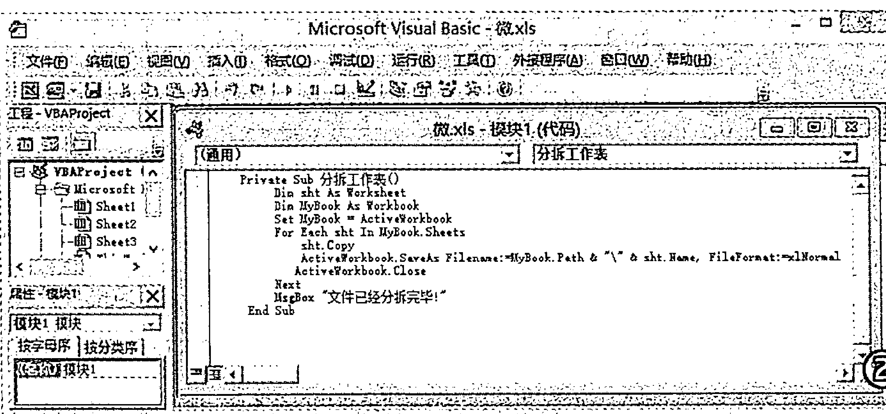

### 进阶篇

需要指出的是，执行上述代码之后，所获得的新工作簿文件都是.xls格式，如果需要分拆为.xlsx格式，只要将“xlNormal”修改为“xlOpenXMLWorkbook”即可。修改代码之后，并不局限于原工作簿文件属于.xlsx格式，即使是.xls格式的工作簿，也可以强制分拆为一个一个的.xlsx工作簿文件。如果修改为“xlExcel8”，可以将工作表强制分拆为.xls格式的工作簿文件，也就是说利用这一功能可以实现工作簿格式的快速转换。

## 秘技聚会 表格排序不再难

文 | 马震安

对数据进行排序有助于快速直观地对数据进行分析。在Excel中可以通过菜单、自定义序列、函数甚至VBA等对数据进行排序，并且还能够用一些特殊的方法让你的Excel排出最完美的顺序来！

## 菜单命令搞定简单排序

目标任务：将员工的商品销量按“年销量”降序排序，如果年销量相同，则按“第四季度”销量降序排序。

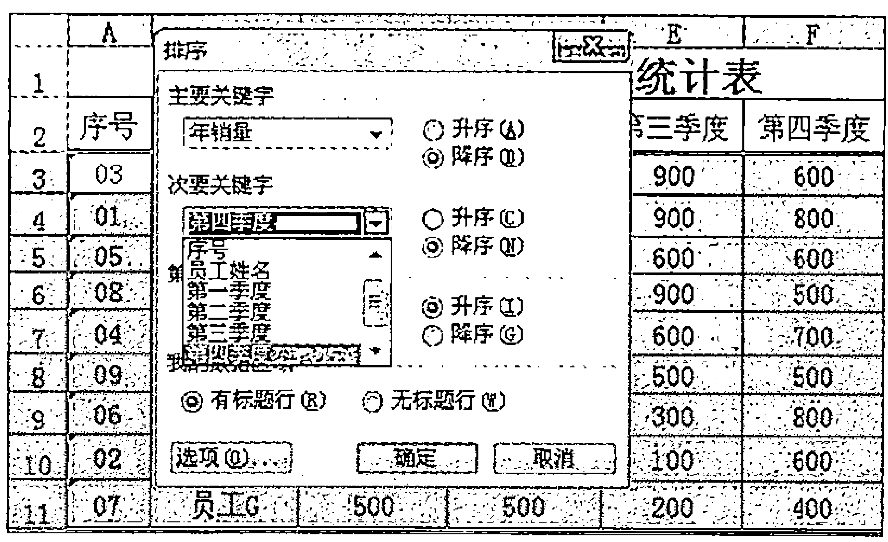

选中表格中数据所在区域中任意一个单元格，点击“数据→排序”菜单，在打开的对话框中将“主要关键字”设置为“年销量”，降序；“次要关键字”设置为“第四季度”，降序，点击确定即可。

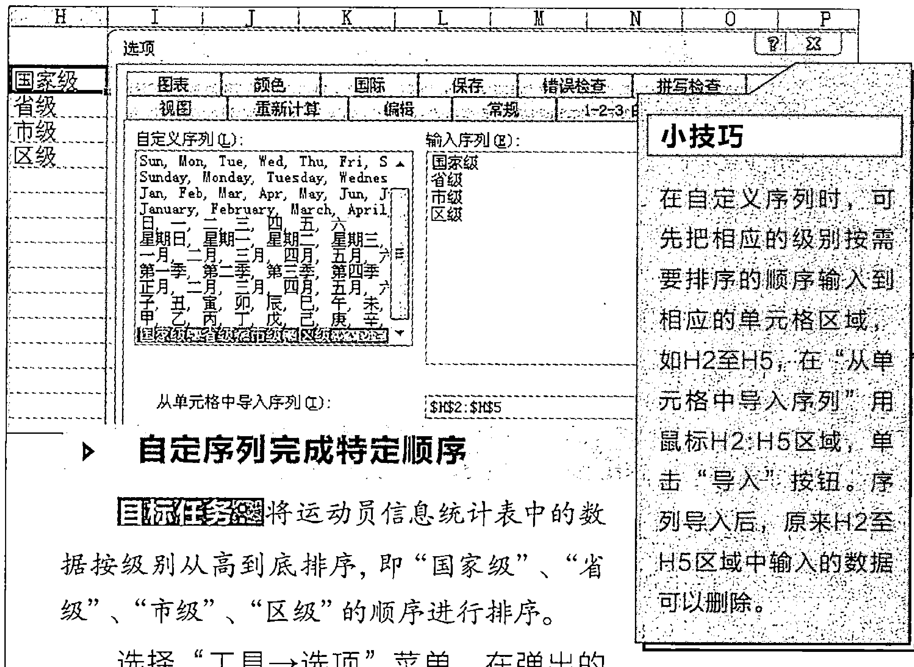

## 自定义序列完成特定顺序

目标任务：将运动员信息统计表中的数据按级别从高到底排序，即“国家级”、“省级”、“市级”、“区级”的顺序进行排序。

选择“工具→选项”菜单，在弹出的对话框中选择“自定义序列”标签，在“输入序列”处按要求顺序输入所需级别。然后，选中数据区域任一单元格，选择“数据→排序”菜单，在打开对话框中主关键字选择“级别”，单击其中的“选项”按钮，在打开对话框中按“自定义排序次序”选项右侧的下拉按钮，在随后弹出的下拉列表中，选中上述导入的序列，确定返回到“排序”对话框，最后确定即可。

## 数据不动排序 借助函数公式

目标任务：在档案号按顺序排列的情况下，将学生的总分进行排名。

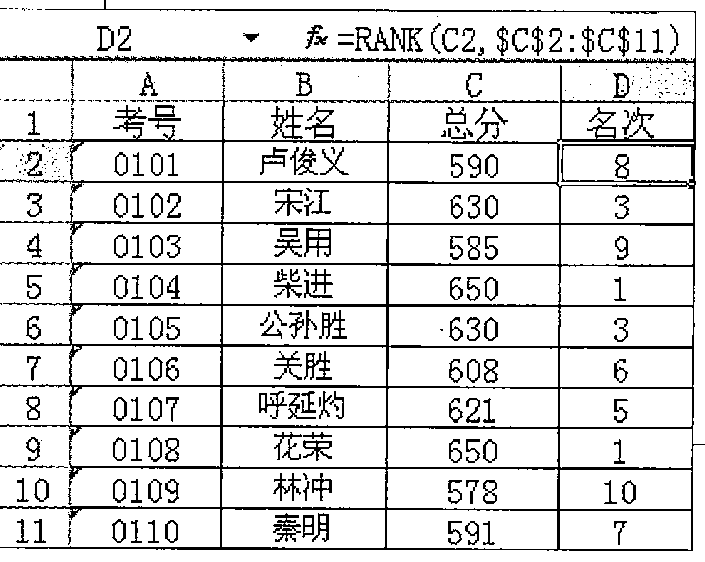

选中人员甲所对应的排名单元格，即D2，在公式编辑栏输入公式：=RANK(C2,$C$2:$C$11)，然后再次选中D2单元格，向下填充到最后一条数据。

除了用RANK函数能够完成排名外，还可以在D2单元格输入如下公式：

```
(1)=COUNTIF($C$2:$C$11,"">&C2)+1
(2)=SUMPRODUCT(--($C$2:$C$11>C2))+1
(3)=SUM(IF($C$2:$C$11>C2,1,0))+1
```

特别强调一下，由于第3种方法输入的为数组公式，输入完成要按 Ctrl+Shift+Enter 键才可以得出正确的结果。

## 两个函数解决多条件排名

目标任务：在不改变表结构的情况下，需要对职工得分进行排名，在业绩考核得分的排名相同时，则按学生测评得分进行降序排名。

| A  | B  | C  | D  | E  | F  | G  |
|----|----|----|----|----|----|----|
| 1  | 甲 | 95 | 95 | 1  | ...| ...|
| 2  | 乙 | 99 | 98 | 2  | ...| ...|
| 3  | 丙 | 92 | 95 | 3  | ...| ...|
| 4  | 丁 | 89 | 92 | 4  | ...| ...|
| 5  | 戊 | 91 | 95 | 5  | ...| ...|
| 6  | 己 | 88 | 94 | 6  | ...| ...|
| 7  | 庚 | 93 | 96 | 7  | ...| ...|
| 8  | 辛 | 95 | 96 | 8  | ...| ...|
| 9  | 壬 | 99 | 97 | 9  | ...| ...|
| 10 | 癸 | 95 | 99 | 10 | ...| ...|

选中人员甲所对应的排名单元格，即E2，在公式编辑栏输入公式：=RANK(C2,C$2:C$11)+SUMPRODUCT(N((C$2:C$11=C2)*(D$2:D$11>D2)))，然后向下填充到最后一条记录为止。

## 分组排序 一个函数搞定

目标任务：对于工作表中各班的总分平均分，按照不同班级所属的类别进行排名，如应届文科各班进行排名，应届理科各班进行排名，往届文科各班进行排名，往届理科各班进行排名。

| D2 | ... | A  | B   | C      | D  | E  | F  | G  |
|----|-----|----|-----|--------|----|----|----|----|
| 1  | ... | 1  | 文应 | 508.78 | 3  | ...| ...| ...|
| 2  | ... | 2  | 文应 | 497.43 | 8  | ...| ...| ...|
| 3  | ... | 3  | 文应 | 506.78 | 4  | ...| ...| ...|
| 4  | ... | 4  | 理应 | 506.35 | 5  | ...| ...| ...|
| 5  | ... | 5  | 理应 | 502.41 | 8  | ...| ...| ...|
| 6  | ... | 6  | 文应 | 509.56 | 2  | ...| ...| ...|
| 7  | ... | 7  | 文应 | 511.2  | 1  | ...| ...| ...|
| 8  | ... | 8  | 理应 | 502.43 | 7  | ...| ...| ...|
| 9  | ... | 9  | 理应 | 504.78 | 6  | ...| ...| ...|
| 10 | ... | 10 | 理应 | 498.62 | 9  | ...| ...| ...|
| 11 | ... | 11 | 理应 | 514.59 | 2  | ...| ...| ...|
| 12 | ... | 12 | 文应 | 499.97 | 7  | ...| ...| ...|
| 13 | ... | 13 | 文应 | 502.39 | 6  | ...| ...| ...|
| 14 | ... | 14 | 文应 | 504.82 | 5  | ...| ...| ...|
| 15 | ... | 15 | 理应 | 514.88 | 1  | ...| ...| ...|
| 16 | ... | 16 | 理应 | 511.21 | 3  | ...| ...| ...|
| 17 | ... | 17 | 理应 | 511.07 | 4  | ...| ...| ...|
| 18 | ... | 18 | 理往 | 523.12 | 1  | ...| ...| ...|
| 19 | ... | 19 | 理往 | 514.33 | 2  | ...| ...| ...|
| 20 | ... | 20 | 理往 | 514.17 | 3  | ...| ...| ...|
| 21 | ... | 21 | 文往 | 509.07 | 1  | ...| ...| ...|
| 22 | ... | 22 | 文往 | 506.67 | 2  | ...| ...| ...|

选中人员1班所对应的排名单元格，即D2，在公式编辑栏输入公式：=SUMPRODUCT((B$2:B$23=B2)*(C2<C$2:C$23))+1，然后向下填充到最后一条记录为止，排名都是在相同类型班之间进行的。

| 姓名 | 类别     | 分数 | 总分  | ... | 姓名 | 类别     | 分数 | 总分  |
|------|----------|------|-------|-----|------|----------|------|-------|
| 张三 | 业绩考核 | 78   | 161.5 | ... | 张三 | 业绩考核 | 78   | 161.5 |
| 张三 | 学生测评 | 83.5 | ...   | ... | 张三 | 学生测评 | 83.5 | 161.5 |
| 李四 | 业绩考核 | 86   | 160.5 | ... | 李四 | 业绩考核 | 86   | 160.5 |
| 李四 | 学生测评 | 74.5 | ...   | ... | 李四 | 学生测评 | 74.5 | 160.5 |
| 王五 | 业绩考核 | 84.5 | 150   | ... | 王五 | 业绩考核 | 84.5 | 150   |
| 王五 | 学生测评 | 65.5 | ...   | ... | 王五 | 学生测评 | 65.5 | 150   |
| 赵六 | 业绩考核 | 77.5 | 146   | ... | 赵六 | 业绩考核 | 77.5 | 146   |
| 赵六 | 学生测评 | 68.5 | ...   | ... | 赵六 | 学生测评 | 68.5 | 146   |
| 陈七 | 业绩考核 | 69   | 131.5 | ... | 陈七 | 业绩考核 | 69   | 131.5 |
| 陈七 | 学生测评 | 62.5 | ...   | ... | 陈七 | 学生测评 | 62.5 | 131.5 |
| 马八 | 业绩考核 | 79.5 | 143.5 | ... | 马八 | 业绩考核 | 79.5 | 143.5 |
| 马八 | 学生测评 | 64   | ...   | ... | 马八 | 学生测评 | 64   | 143.5 |
| 郑九 | 业绩考核 | 82   | 154   | ... | 郑九 | 业绩考核 | 82   | 154   |
| 郑九 | 学生测评 | 72   | ...   | ... | 郑九 | 学生测评 | 72   | 154   |

| 序号 | 工厂 | 产值 | 税收 |
|------|------|------|------|
| 01   | 工厂A | 1200 | 300  |
| 02   | 工厂F | 800  | 500  |
| 03   | 工厂H | 800  | 400  |
| 04   | 工厂B | 800  | 200  |
| 05   | 工厂E | 730  | 900  |
| 06   | 工厂G | 650  | 500  |
| 07   | 工厂D | 650  | 300  |
| 08   | 工厂I | 600  | 700  |
| 09   | 工厂C | 500  | 900  |

```

Sub SortRange1()
    ActiveSheet.Range("B2:D11").Sort _
        Key1:=Range("C2"), Order1:=xlDescending, _
        Key2:=Range("D2"), Order2:=xlDescending, _
        Header:=xlGuess
End Sub

```

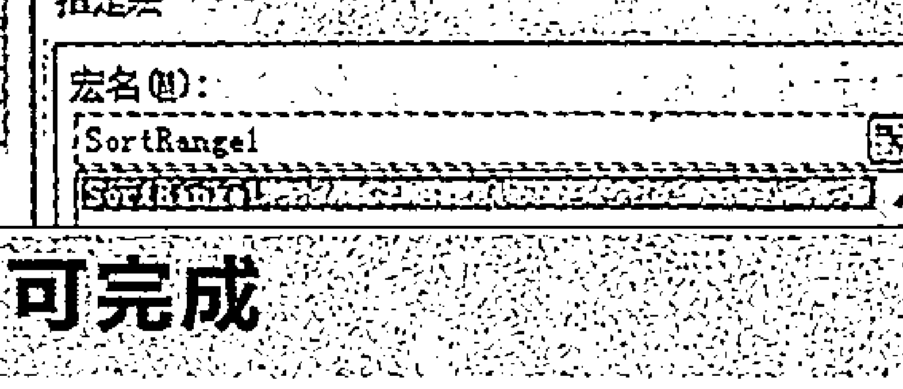

## VBA排序 一键就可完成

目标任务：如果表中的数据每天都需要更新，可通过按钮对表中的数据分别按产值、税收进行排序。

选择“工具→宏→Visual Basic编辑器”菜单，在弹出的窗口中选择“插入→模块”菜单，并在代码编辑区输入相应代码。然后，选择“视图→工具栏→窗体”菜单，在表中画出一个按钮，指定的宏就是图中过程代码的名字。

注意通过“工具→宏→安全性”命令，将宏的安全性设置为“低”，才能让宏正常运行。

## 妙法应对 合并单元格排序

目标任务：工作表中的每条记录都包含合并单元格，要求按每条记录的总分进行降序排序，并保持原有工作表的格式布局不变。

选择所要排序的数据区域（A1:D15）并复制粘贴到一个新的区域（F1:I15），选择新区域（F1:I15）内的数据，选择“格式→单元格”菜单，在弹出窗口的“对齐”选项卡中将文本控制处的“合并单元格”前面的“√”去掉。然后，选择“编辑→定位”菜单，在弹出的窗口中点击“定位条件”按钮，在新弹出的窗口中选择“空值”。接下来，在公式编辑栏输入“=F2”后，按Crtl+Enter组合键结束输入，空值单元格就会被填上相应的内容。选择新数据区域中的任一单元格，利用“数据→排序”菜单进行设置排序就可以了。选择原有数据区域（A1:D15），选择工具栏上的“格式刷”按钮后刷取新的数据区域（F1:I15）。最后，可以将新的数据区域（F1:I15）剪切并粘贴到原有的数据区域（A1:D15）。

## 一网打尽Excel表格分类汇总

文 | 马震安

工作中经常会遇到各种各样的数据分类汇总问题，在Excel中我们可以用快捷键、分类汇总菜单、数据透视表、函数、公式甚至VBA都能轻松解决这些问题。

### 快捷键汇总法

目标任务：按小组对各种产品的产量进行汇总。

实现方法：先按小组对数据表进行排序，将同一小组的数据排在一起，在同类小组下插入空行。然后，按住Ctrl键选定各小计单元格，同时按下“Alt”键和“=”键，就会统计出各类产品的产量。

| 组别 | A产品产量 | B产品产量 | C产品产量 |
|------|-----------|-----------|-----------|
| 乙3 | 290 | 350 | 670 |
| 乙2 | 620 | 720 | 450 |
| 乙1 | 550 | 720 | 450 |
| 小计 | 1460 | 1790 | 1570 |
| 甲3 | 520 | 670 | 550 |
| 甲2 | 450 | 560 | 530 |
| 甲1 | 500 | 490 | 530 |
| 小计 | 1470 | 1720 | 1610 |
| 丙3 | 390 | 440 | 630 |
| 丙2 | 480 | 810 | 540 |
| 丙1 | 390 | 440 | 540 |
| 小计 | 1260 | 1690 | 1710 |

> > **小提示**
> (1) 不要有空单元格，不然小计那栏计算求和会中止于空单元格；
> (2) 不要有公式出现，不然小计只会计算有求和公式的单元格。

### 菜单汇总法

目标任务：按月份统计某商场三大电器（电视、冰箱、洗衣机）的销售额。

实例分析：由于分类的项目只是单一的“月份”，所以对三大电器销售额的统计用“分类汇总”的菜单就能轻松完成。

实现方法：首先，按“月份”字段对数据进行排序，目的是将同一月份的数据放在一起。然后，选择所需数据，选“数据→分类汇总”菜单，在弹出的窗口中分类字段选择“月份”，汇总方式选择“求和”，选定汇总项为“金额”，并将下面的三个选项勾选，确定后就形成了一个按月份分布打印的分类汇总的表了。

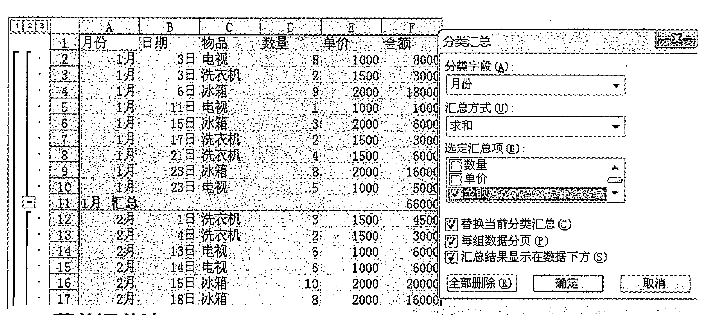

> > **小提示**
> 可以点击分类汇总表左上方的1、2、3按钮来隐藏或显示具体的月份数据。

### 透视表汇总法

目标任务：按月份及物品类别分别统计某商场三大电器（电视、冰箱、洗衣机）的销售额。

实例分析：由于分类的项目不再只是单一的“月份”这一个字段，要再用“分类汇总”菜单就使得数据表有些乱，不太美观。所以对于多个分类字段的统计，可以利用“数据透视表”轻松实现。

实现方法：选择所需数据区域后单击“数据→数据透视表和数据透视图”菜单，在弹出的窗口中直接点击“完成”按钮。然后，在新工作表的“数据透视表字段列表”窗口中根据所需汇总表的样式将相应字段拖动到数据透视表的相应位置，如将“月份”作为行字段拖至相应位置，将“物品”作为列字段拖至相应位置，将“金额”作为数据项拖至相应位置。

| 求和项:金额 | 物品 | 冰箱 | 电视 | 洗衣机 | 总计 |
|-------------|------|------|------|--------|------|
| 月份 | 1月 | 40000 | 14000 | 12000 | 66000 |
| | 2月 | 48000 | 13000 | 15000 | 76000 |
| | 3月 | 30000 | 8000 | 21000 | 59000 |
| 总计 | | 118000 | 35000 | 48000 | 201000 |

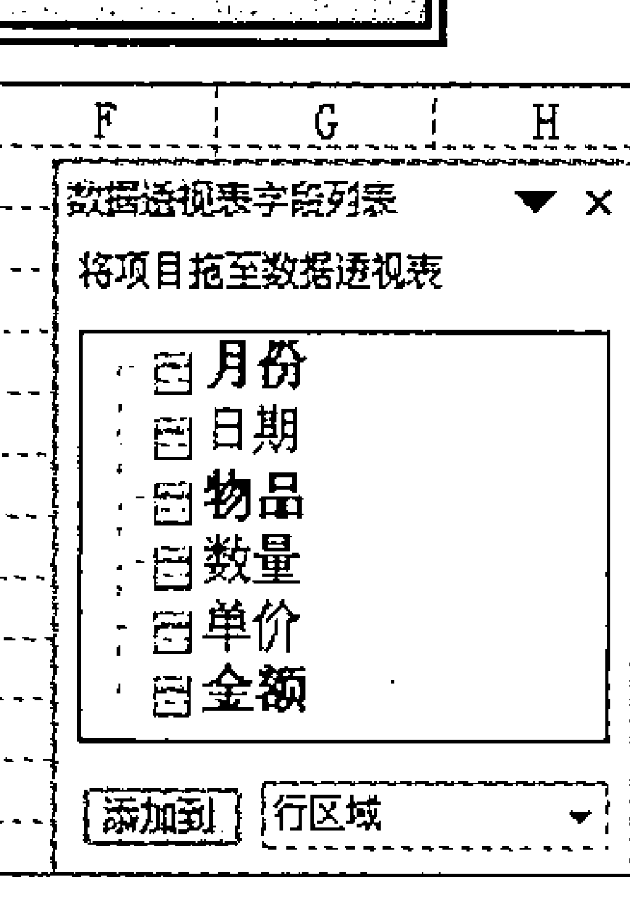

## 函数汇总法

目标任务：按月统计美的空调的进货量及进货总额。

在这个数据表中的进货时间具体到了日期，如果使用分类汇总菜单或数据透视表都不能对进货进行按月统计，所以可以使用SUMPRODUCT函数加通配符来完成此类数据的统计。

在统计汇总表中“数量”字段所对应的单元格中，如I3中输入：`=SUMPRODUCT((ISNUMBER(FIND(G3,A$3:A$14)*(FIND(H3,B$3:B$14)))*C$3:C$14)` 并向下拖动进行填充，相应的在J3单元格输入：`=SUMPRODUCT((ISNUMBER(FIND(G3,A$3:A$14)*(FIND(H3,B$3:B$14)))*D$3:D$14))` 也向下进行填充即可。

| A | B | C | D | E | F | G | H | I | J | K |
|---|---|---|---|---|---|---|---|---|---|---|
| 1 | | 空调进货统计 | | | | | | | | |
| 2 | 日期 | 物品 | 数量 | 单价 | 总额 | 月份 | 物品 | 数量 | 总额 | |
| 3 | 1月1日 | 格力大2P | 8 | 5000 | 40000 | 1月 | 格力 | 14 | 9000 | |
| 4 | 1月8日 | 美的大1.5P | 6 | 3500 | 21000 | 1月 | 美的 | 6 | 3500 | |
| 5 | 1月15日 | 格力2P | 6 | 4000 | 24000 | 2月 | 格力 | 12 | 10200 | |
| 6 | 2月5日 | 美的1.5P | 8 | 3500 | 28000 | 2月 | 美的 | 14 | 6500 | |
| 7 | 2月15日 | 格力大2P | 4 | 5000 | 20000 | 3月 | 格力 | 24 | 13000 | |
| 8 | 2月20日 | 美的1.5P | 6 | 3000 | 18000 | 3月 | 美的 | 14 | 4900 | |
| 9 | 2月25日 | 格力2.5P | 8 | 5200 | 41600 | | | | | |
| 10 | 3月15日 | 格力2P-U | 10 | 4200 | 42000 | | | | | |
| 11 | 3月20日 | 格力2P-A | 6 | 3800 | 22800 | | | | | |
| 12 | 3月25日 | 美的2P | 8 | 4200 | 33600 | | | | | |
| 13 | 3月31日 | 格力大2P | 8 | 5000 | 40000 | | | | | |
| 14 | 3月31日 | 美的2P | 6 | 4200 | 25200 | | | | | |

小提示：SUMPRODUCT是一个多条件统计函数，而由于它不能使用通配符，所以需要和FIND、ISNUMBER进行搭配使用，以实现在单元格中进行模糊查询。

## 公式汇总法

目标任务：在销售记录表中记录了工厂每笔销售的时间与明细，要求在业务考核表中实现当在其中输入开始日期与结束日期之后，表格自动从销售记录表中提出相关数据并汇总得到每个业务员在这段时间的销售总额及奖金。

| A | B | C | D | E | F | G |
|---|---|---|---|---|---|---|
| 1 | 业务销售记录表 | | | | | |
| 2 | 日期 | 品名 | 单位 | 单价 | 数量 | 金额 | 销售员 |
| 3 | 2011-1-5 | 粉笔 | 箱 | 50 | 100 | 5000 | 张三 |
| 4 | 2011-1-10 | 学生圆规 | 个 | 5 | 500 | 2500 | 李四 |
| 5 | 2011-1-14 | 签字笔 | 盒 | 20 | 350 | 7000 | 李四 |
| 6 | 2011-1-31 | 黑板擦 | 个 | 5 | 460 | 2300 | 张三 |
| 7 | 2011-2-5 | 签字笔 | 盒 | 20 | 560 | 11200 | 张三 |
| 8 | 2011-2-8 | 粉笔 | 箱 | 50 | 180 | 9000 | 李四 |

首先切换到业务销售考核表，在B5单元格中输入公式：`=SUM(IF((销售记录!A3:A8>=业务考核!B2)*(销售记录!A3:A8<=业务考核!D2)*(销售记录!G3:G8=业务考核!B3),销售记录!F3:F8,0))`，公式输入完成后，不能点击鼠标，不得进行其他任何操作，立即按下Ctrl+Shift+Enter，这时输入的公式在两边会自动加上“{}”。请注意：大括号必须是系统自己产生的，自行输入的无效。同理，在D5单元格中输入公式：`=SUM(IF((销售记录!A3:A8>=业务考核!B2)*(销售记录!A3:A8<=业务考核!D2)*(销售记录!G3:G8=业务考核!D3),销售记录!F3:F8,0))`，销售提成的公式同理可得。

| A | B | C | D |
|---|---|---|---|
| 1 | 销售员销售额及提成 | | |
| 2 | 开始日期 | 2011-1-1 | 结束日期 | 2011-1-31 |
| 3 | | 张三 | | 李四 |
| 4 | | 销售额 | 提成(5‰) | 销售额 | 提成(5‰) |
| 5 | 金额 | 7300 | 36.5 | 9500 | 47.5 |

小提示：在上述公式中，SUM是求和，IF是条件。整个公式就是在销售记录表A3到A8中计算满足以下三个条件的和：1是从开始日期开始（业务考核表中的B2）；2是到结束日期为止（业务考核表中的D2）；3是与表中的业务员姓名相同。

## VBA统计汇总法

目标任务：在产品数据中按组别分类统计产品产量。

首先，选择“工具→宏→Visual Basic编辑器”菜单，在弹出的窗口中选择“插入→模块”菜单，并在代码编辑区输入相应代码。然后，将光标放在过程的名字处，单击“运行子过程/用户窗体”按钮，在数据表中就会对数据按组别进行产品的产量统计。

小提示：要想让VBA正常运行，还需要选择“工具→宏→安全性”菜单，将宏的安全性设置为“低”。

| A | B | C | D | E | F | G |
|---|---|---|---|---|---|---|
| 1 | 序号 | 组别 | 产品产量 | | 乙 | 1460 |
| 2 | 01 | 乙 | 620 | | 甲 | 1470 |
| 3 | 02 | 乙 | 550 | | 丙 | 1260 |
| 4 | 03 | 甲 | 520 | | | |
| 5 | 04 | 甲 | 500 | | | |
| 6 | 05 | 丙 | 480 | | | |
| 7 | 06 | 甲 | 450 | | | |
| 8 | 07 | 丙 | 390 | | | |
| 9 | 08 | 丙 | 390 | | | |
| 10 | 09 | 乙 | 290 | | | |

```
Sub huizong()
    Dim iA, MyA, Arr
    Dim d, k, t
    Set d = CreateObject("Scripting.Dictionary")
    MyA = Sheet3.[a65536].End(xlUp).Row
    Arr = Sheet3.Range("b1:c" & MyA)
    For i = 2 To UBound(Arr)
        d(Arr(i, 1)) = d(Arr(i, 1)) + Arr(i, 2)
    Next
    k = d.keys
    t = d.items
    [f2].Resize(d.Count, 1) = Application.Transpose(k)
    [g2].Resize(d.Count, 1) = Application.Transpose(t)
    Set d = Nothing
End Sub
```

## Excel数据拨乱反正有方

文 | 马祥

许多时候，我们需要在Excel中处理的数据来自于网络或别的数据管理系统。当我们从这些途径导入数据到Excel表格之后，经常会发现计算结果出错。如何避免这种情况的发生？如何让转入的数据转换为可以参与计算的数字格式呢？

发生这些问题的主要原因是，导入在他方程序中创建的文件或导入从网络下载的文件时，Excel可能会将其中的某些数字识别为文本，这将导致Excel表格中的某些函数（如SUM和AVERAGE）忽略这些单元格中的数值。我们需要想办法让它们变成真正能参与运算的数学数字。

- ▶ 准备在先 统一设定“常规”格式

如果不好确定转来的数据到底有哪些格式，格式是不是统一，可以先将所有不能被识别的单元格中的数字格式设置为“常规”格式来处理，然后再运用我们下面要讲到的各种方法。

以Excel 2013为例，选中要设置的单元格区域后，在“开始”选项卡页面中选择“单元格”一组中的“格式”，在下拉菜单中选择“设置单元格格式”一项（图1）。在随后弹出的格式设置窗口的“数字”选项卡下，单击“分类”下的“常规”，然后单击“确定”（图2）。

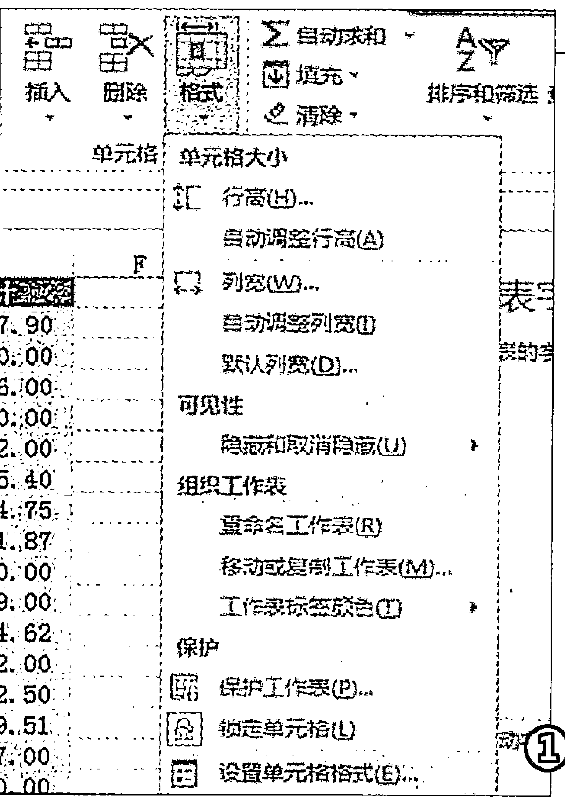

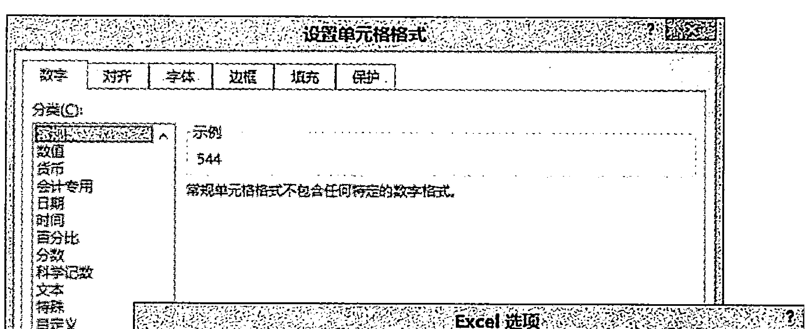

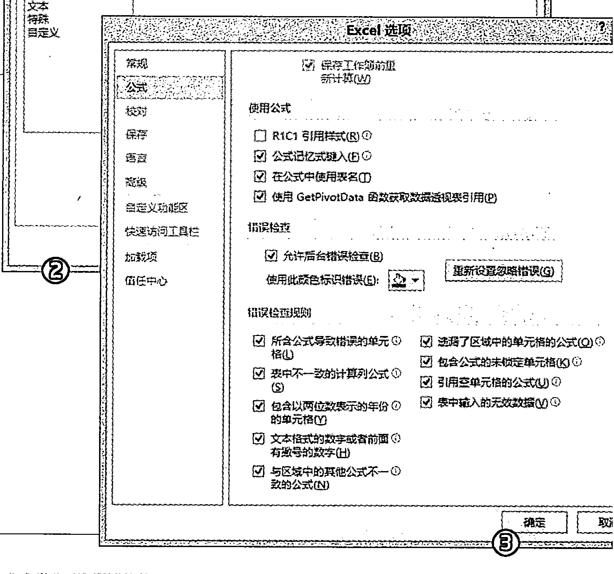

- ▶ 自动纠错 开启错误检查按钮

如果那些将数字显示为文本的单元格中左上角有错误指示器，单击包含错误指示器的单元格，接着单击单元格旁边的错误按钮，然后单击“转换为数字”即可。

以上方法是基于Excel中的后台错误检查功能已打开的情况下进行的。如果Excel中尚未打开错误检查功能，则需要先打开这一功能，才能使用此方法来转换数字格式。具体方法如下：

在“文件”菜单上单击“选项”，打开Excel选项设置窗口。点选左侧“公式”一项，在右侧“错误检查”选项分组下，单击选中“允许后台错误检查”复选框，同时可设置标识错误的颜色。然后选择“错误检查规则”一组下的所有复选框（图3），单击“确定”。

## 人工纠错 重新键入单元格值

对于个别出现错误的单元格，也可以用人工纠错的方法来重新键入单元格的值。要在单元格中重新键入值，请按照下列步骤操作。
在“开始”选项卡页面中选择“单元格”一组中的“格式”，在下拉菜单中选择“设置单元格格式”一项。在“数字”选项卡中，根据情况选择“数值”、“货币”、“会计专用”、“百分比”、“分数”、“科学计数”等数字格式（图4），然后重新键入数字即可。

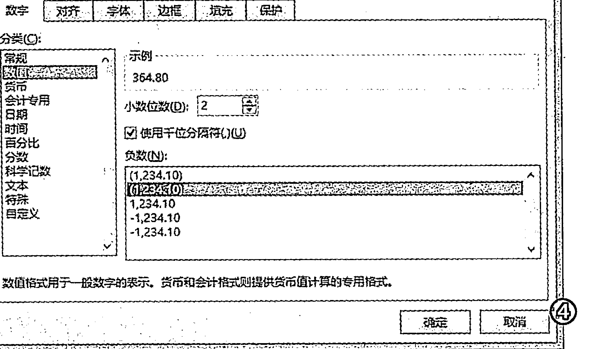

## 直接编辑 提前设好编辑权限

我们也可以直接在出现问题的单元格中进行编辑。但需要提前在Excel编辑选项设置中打开编辑权限设置。
在“文件”菜单上单击“选项”。在“高级→编辑选项”一栏，确保选中了“允许直接在单元格内编辑”复选框，单击“确定”（图5）。
之后，双击要设置格式的单元格，编辑后按Enter键即可。

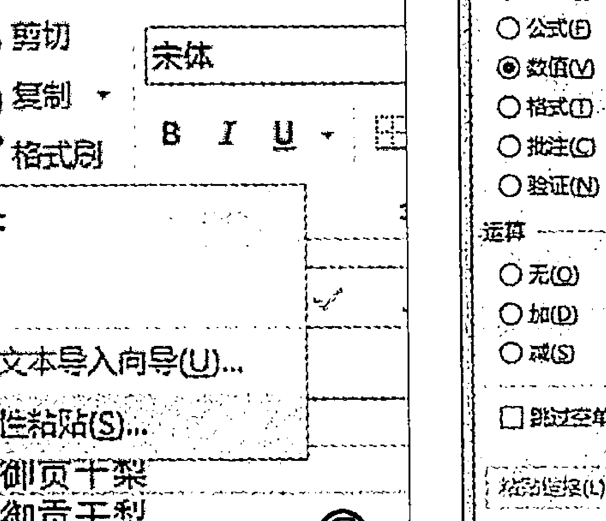

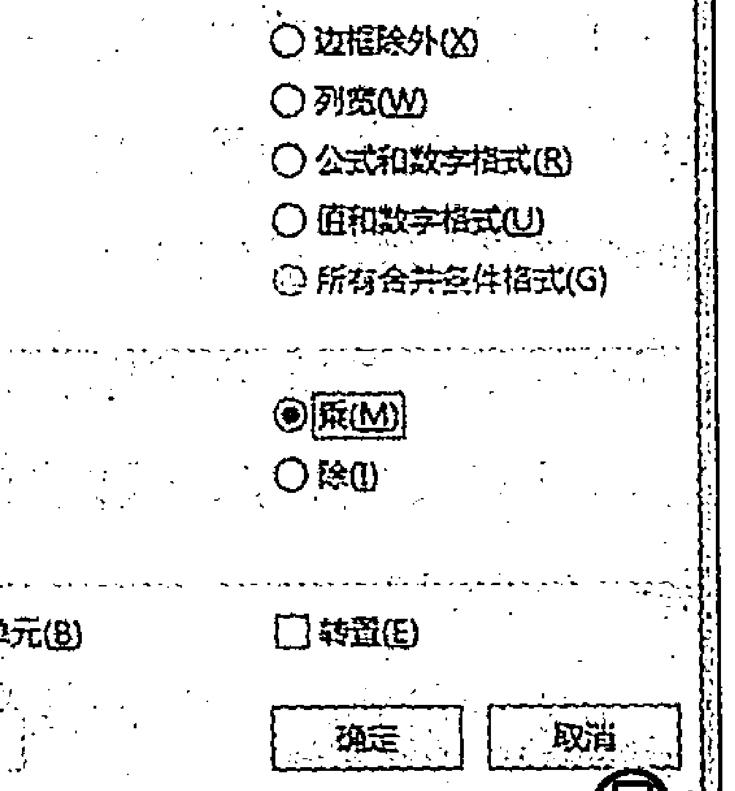

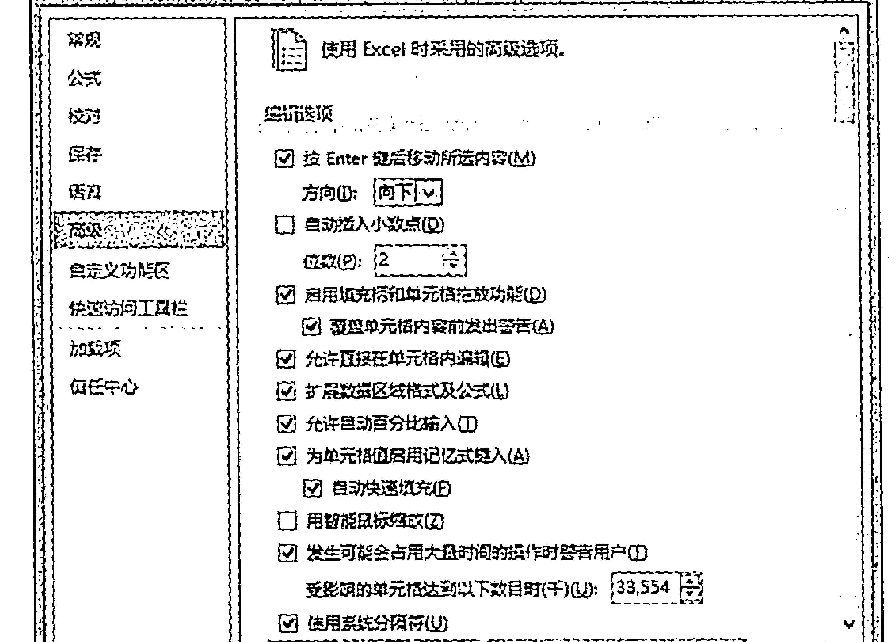

## 刷新格式 巧用“选择性粘贴”

数字格式出错，主要原因就是在数据转移过程中沿用了原先的格式。为了避免原有格式的干扰，我们可以借用“选择性粘贴”，将数字的类型克隆为“数值”类。
先在Excel表的任一空单元格中键入数字1，选择该单元格，然后单击“开始→剪贴板”组中的“复制”按钮。
选择要将其中的值转换为数字的单元格区域，在“开始→剪贴板→粘贴”菜单下，单击“选择性粘贴”（图6）。
在随后弹出的“选择性粘贴”窗口中，选择“粘贴”组下的“数值”一项，在“运算”分组下，单击选择“乘”，然后单击“确定”（图7）。
最后，删除先前作为过渡性的、值为1的那个单元格。

> **小技巧**
> 某些数据管理系统在显示负值时，将负号放在数值的右侧。要将复制来的此类文本字符串转换为数值，必须从文本串中截取所有数字字符，并过滤掉最右侧的负号，然后将结果乘以-1。例如，如果单元格A8中的值为1890-，则可以使用以下公式将文本转换为值-1890：
> `= -1*LEFT(A8, LEN(A8)-1)`

## 不容小看的“记事本”

文 | 杨凌

在我们普通人眼里，系统自带的记事本就是一个简单的文字记录工具，在大师们眼里则可以作为编程工具。如果抛开普通人的简单看法和大师的复杂用法，记事本还能为我们普通人做些什么？这里我们为大家讲说一些记事本的生活妙用。

### ➤ 无需设置巧改文件扩展名

如果要创建一个扩展名非TXT的新文本文件（如：Myfile.abc），那么当存盘时，如果简单地将文件名指定为Myfile.abc之类的字符串，系统会偷偷在后面又加上TXT扩展名，这样建立的其实还是一个TXT文件。

也许你会说，这很简单，到文件夹选项中开启扩展名隐藏，改一下扩展名即可。实际上有更简单的办法。

我们只需在记事本中编辑完文件后，选择保存文件时，将此文件命名为带有半角双引号的名称即可（如"Myfile.abc"）（图1）。

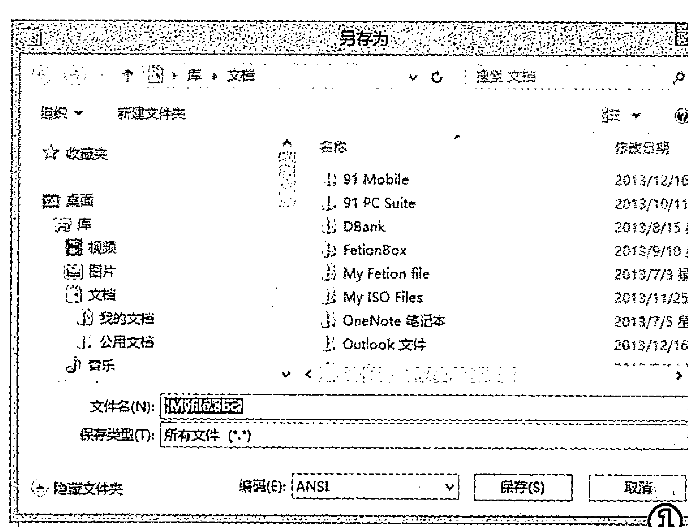

> 小提示

> 对于一个已经存在的文件，也可以用上面的这种方法来更改扩展名。方法是，先打开记事本空白文件，将要改名的文件拖动到编辑窗口中打开，然后用如上所述的文件另存的办法来更改扩展名，更改存盘之后删除原文件即可。这种文件另存为其他类型的方法，在许多应用软件中也适用。读者朋友可以试验一下该技巧在哪些应用程序中管用。

### ➤ 快速编辑特定种类文件

如果想打开一个非TXT扩展名的文件，比如某种程序源代码文件，直接双击肯定不是用记事本打开，或者干脆就打不开，即便是选择设置关联，或从“文件”菜单中一步一步选择打开，显然也有些麻烦。若将“记事本”放入鼠标右键的“发送到”菜单中，通过点击右键来发送就方便多了。

在资源管理器中搜索并打开当前系统账户下的Sendto文件夹，新建快捷方式，在“请键入对象的位置”文本框输入“NOTEPAD.EXE”。在下一步窗口中输入快捷键的名称“记事本”（图2）。

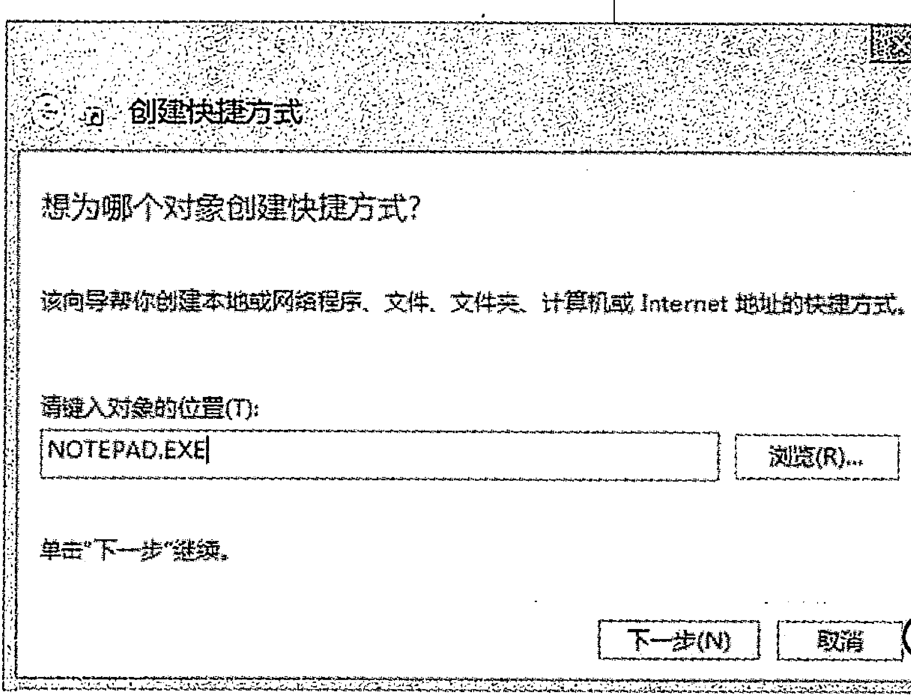

注意：不同版本的系统，其Sendto文件夹所在位置略有不同，一般在用户文档设置或用户目录下（如：C:\Documents and Settings\Administrator或C:\Users\<用户账户>）。

经过如上设置之后，只要在任意一个文件上点鼠标右键，再选择“发送到→记事本”，就能快速地调用“记事本”程序打开任意种类的文件了。

## ▶ 成批更改文件日期属性

假如，我们需要修改某文件TLINK.LOG的日期。只需在相同文件夹下新建一个TXT文件，在其中输入“COPY TLINK.LOG+,,”一行内容（注意COPY后有半角空格，+号后面紧跟2个半角逗号），然后将文件用上面提到的办法保存为LS.BAT。执行LS.BAT文件即可将文件日期更改为当前日期了。

如果需要修改成批文件的日期，只需将每个文件以这种格式写入同一个BAT文件中，然后执行LS.BAT文件即可（图3）。

> 小提示
在这个技巧中，借用了Windows的一个内部命令FC，它的作用是比较两个文件内容的异同。详细用法如图5所示。命令中的>表示将比较的结果输出到后面紧跟着的一个文件BIANHUA.TXT中。这个文件名可以由用户来自定义。

## ▶ 自动比较文件内容异同

不用专用文件比较工具软件，也不用高版本的Word或WPS，照样能比较两个文本文件的异同。

假设，我们需要比较A.TXT和B.TXT两个文件内容。只需编辑文本文件并在其中写入一行字符“FC A.TXT B.TXT > BIANHUA.TXT”，将文件存盘为LS.BAT，且存放到与A.TXT和B.TXT相同的目录中（图4）。

上述工作完成后，执行LS.BAT文件，即可获得一个名为BIANHUA.TXT的文件，打开这个文件，就可以看到比较的结果。

## ▶ 串起音频、视频碎片文件

假设我们有3个MP3音频片段M1.MP3、M2.MP3、M3.MP3，另有3个MPG视频片段V1.MPG、V2.MPG、V3.MPG。我们只要建立一个全名为LS.BAT的空文本文件，然后在其中输入如下两行字符串，将该文件保存在与音视频相同的文件夹中（图6）。

```
COPY /B M1.MP3+M2.MP3+M3.MP3 MALL.MP3
COPY /B V1.MPG+V2.MPG+V3.MPG VALL.MPG
```

> 小提示
以上技法中借用了Windows内部命令COPY的一个特殊格式拷贝方式——二进位拷贝。其中起决定作用的是命令中的参数/B，加这个参数的目的就是指定所有要合并的文件为二进位文件，而非普通文件。详细用法如图7所示。

以上工作完成后，双击执行刚建好的LS.BAT文件，程序自动将音频和视频碎片文件合并为两个独立的文件。命令执行完成后，即可在相同文件夹中，看到合并后的音频文件MALL.MP3和视频文件VALL.MPG了。

## # Word对象批量高效选择

文 | 王志军

很多时候，我们需要在Word界面下批量选择某些特定的对象，例如样式为标题1或标题的对象，如果按下Ctrl键逐一手工选择，既麻烦而且也容易遗漏。其实，批量选择特定对象也有许多技巧，这里以选择文档中样式为“标题4”的对象为例说明。

### ▶ 利用“选择”功能实现

首先使用鼠标拖拽选中任意一个样式为“标题4”的对象，切换到“开始”选项卡（图1），在“编辑”功能组依次选择“选择→选择格式相似的文本”，执行之后即可立即选中当前文档中所有样式为“标题4”的对象。接下来该如何操作，相信就不需要多作介绍了。

### ▶ 借助VBA代码实现

按下“Alt+F11”组合键，打开Microsoft Visual Basic for Applications窗口，依次选择“插入→模块”，在右侧窗格插入一个空白模块，手工输入或粘贴如下代码（图2）。（代码文件下载地址：http://pan.baidu.com/s/1o68XbLK）

小提示：如果需要批量修改某些特定对象的格式，例如字体、颜色、背景色，可以通过“替换”命令实现，具体操作这里就不多介绍了。

### ▶ 利用“查找”功能实现

如果你觉得VBA代码比较复杂，那么可以利用“查找”功能实现：

按下“Ctrl+F”组合键，打开“查找和替换→查找”对话框，单击“更多”按钮切换到高级查找模式，单击左下角的“格式”按钮，在弹出的菜单中选择“样式”，此时会弹出“查找样式”对话框，在列表中选择“标题4”。确认之后返回查找对话框，单击“阅读突出显示”右侧的倒三角箭头，选择“全部突出显示”。很快就可以将当前文档所有样式为“标题4”的对象全部突出显示（图3），或者也可以单击“在以下项中查找”右侧的倒三角箭头将“当前文档”直接选中。

## # 非正常安装的Office卸载

文 | 王昌红

随着Ghost技术的广泛应用，出现了众多版本的Microsoft Office。而不少版本不提供卸载程序，这给软件卸载带来了不少困难。下面几种卸载方法或许能帮上忙。

## ▶ 用MSICUU2软件卸载

MSICUU2是一款清理工具，它能删除软件的安装文件，以便进行软件卸载（下载地址：http://dd2.pc6.com/soft11/msicuu2.rar）。以Windows 7环境为例，MSICUU2安装后，在桌面和程序菜单中看不到该程序。可在“开始”菜单搜索框中输入“Windows Install Clean Up”搜索运行。程序会列出系统中所有可卸载的程序。接着选定程序窗口中要卸载的Microsoft Office项目，单击下方的Remove按钮开始卸载（图1）。本方法对卸载文件被破坏或者被删除的Office卸载特有效，而对所谓的绿色版Office就不太给力了。

## ▶ Office强制卸载工具Fix it

Microsoft Fix it是一款微软提供的修复工具，该修复工具包含三个Office版本的修复程序，其中Microsoft Fix it 50154是卸载Microsoft Office 2007的，Microsoft Fix it 50450则是卸载Microsoft Office 2010的。如果要卸载Office 2007，可双击列表中的Microsoft Fix it 50154程序，勾选“我同意”打开命令窗口运行程序，等到脚本运行完成后，会自动启动Office卸载程序（图2）。该方法对某些Ghost Win7提供的Office卸载效果不是很好，不出现Office卸载程序。

> > **小提示**
> 如果操作过程中出现“非法的快捷方式分析”的提示，可选择“要卸载的程序没有任何快捷方式，只有一个可执行的EXE文件”进行卸载，操作方法同上。该卸载软件运行时会占用大量内存，操作时要有耐心，避免重复操作出现系统不响应的现象。

## ▶ 用“完美卸载”手工卸载

安装并运行完美卸载软件，单击“卸载软件”选项卡下的“智能卸载”进行“手工卸载”。如果桌面上有Word图标，可选择“要卸载的软件没有提供卸载程序，只在桌面上有一个图标”项（图3）。接下来打开“选择软件”对话框，选定Word图标，单击“打开”对Office进行“分析软件及其所有注册关联”等操作。分析完成后，单击上方的“开始卸载”进行卸载。

## 多工作表查找替换有方

文 | 王志军

很多时候，我们需要对多个工作表进行查找或替换操作，但如果一个一个工作表进行操作，显然是相当的繁琐，完全编程实现又不太现实。其实，我们可以根据不同情况采取不同的措施。

### ▶ 同工作簿实现查找和替换

如果这些工作表是在同一个工作簿文档，那么我们只要更改选项设置即可解决这一问题：

按下“Ctrl+H”组合键，打开“查找和替换”对话框，单击右侧的“选项”按钮，切换到高级操作模式，仔细检查“范围”的设置选项，可以看到默认的范围为“工作表”，将其修改为“工作簿”，这样查找或替换的范围就是工作簿的所有工作表，效果如图1所示，效果显然提高不少。

如果只需要对部分工作表进行查找或替换，那么可以按住Ctrl键进行选择，然后打开“查找和替换”对话框，此时并不需要将范围修改为“工作簿”，直接点击“全部替换”或“查找全部”按钮就可以了。

### ▶ 不同工作簿实现查找和替换

如果需要对不同工作簿的工作表进行查找和替换，那么可以考虑将这些工作表集中到一个工作簿文件，或者借助第三方软件或者编辑VBA代码实现，这里以插入VBA代码为例进行说明：

- 第1步：准备工作
创建一个名为“对照表.xls”的工作簿文件，仿照图2所示进行设置，同时创建一个名为“数据源”的文件夹，将需要批量替换的工作簿文件放在这个文件夹，注意上述文件必须放在同一路径下。

- 第2步：编辑VBA代码
按下“Alt+F11”组合键，打开Microsoft Visual Basic for Application窗口，依次选择“插入→模块”，在右侧窗格插入一个空白模块，手工输入或粘贴如下代码（代码文件下载地址：http://pan.baidu.com/s/1pJKvSR）。

```
Sub test()
Application.DisplayAlerts = False
Application.ScreenUpdating = False
Set d = CreateObject("scripting.dictionary")
ar = ThisWorkbook.Sheets("Sheet1").Range("A2:B" & ThisWorkbook.Sheets("Sheet1").UsedRange.Rows.Count)
For k = 1 To UBound(ar)
d(ar(k, 1)) = ar(k, 2)
Next k
k = d.Keys
For i = 0 To d.Count - 1
Dim myfile As String, mypath As String
mypath = ThisWorkbook.Path & "\数据源\"
myfile = Dir(mypath & "*.xls")
Do While myfile <> ""
If myfile <> ThisWorkbook.Name Then
Set wb = Workbooks.Open(mypath & myfile)
For Each sh In wb.Sheets
sh.Cells.Replace What:=k(i), Replacement:=d(k(i)), LookAt:=xlPart, SearchOrder:=xlByRows, MatchCase:=False, SearchFormat:=False, ReplaceFormat:=False
Next
wb.Close SaveChanges:=True
End If
myfile = Dir
Loop
Next i
Application.DisplayAlerts = True
Application.ScreenUpdating = True
MsgBox ("替换完成，请查看核对！")
End Sub
```

如图2所示，上述代码中的“MsgBox ("替换完成，请查看核对！")”中的内容可以自行设置，如果“\数据源”的路径或名称有所变化，请根据实际情况进行修改。代码检查无误之后，依次选择“文件→关闭并返回到Microsoft Word”，返回Word界面，按下“Alt+F8”组合键，点击右侧的“运行”按钮，很快就可以完成多工作簿的替换操作，替换完成之后会弹出图3所示的对话框。

以后，如果有类似的需求，我们只要对“对照表.xls”文档的内容进行修改就可以了。

## 最快实现文档术语规范化

文 | 王志军

最近正在对一套书稿进行后续修改，按照编辑的要求，需要对文档中涉及的一些术语进行规范化操作，例如“微软”统一修改为“Microsoft”、“谷歌”修改为“Google”，类似这样的术语有很多，如果逐一进行查找或替换操作，虽然可以实现修改的要求，但其中的工作量可想而知。其实，我们可以利用VBA代码，结合Excel数据清单实现批量修改的要求。

### ▶ 创建数据清单

为方便起见，我们首先可以在Excel工作表下创建一份数据清单，设置“修改前”和“修改后”两列，将需要批量修改的词语分别在两列录入，效果如图1所示，将工作簿文件与待修改的Word文档保存在同一路径下。

| 修改前 | 修改后 |
|---|---|
| 电脑 | 计算机 |
| 谷歌 | Google |
| 微软 | Microsoft |
| 登陆 | 登录 |
| 测试版 | Beta |

### ▶ 插入模块代码

打开需要修改的Word文档，按下“Alt+F11”组合键，打开Microsoft Visual Basic for Applications窗口，依次选择“插入→模块”，在右侧窗格插入一个空白模块，手工输入或粘贴如下代码（代码文件下载地址：http://pan.baidu.com/s/1qWPhZ1U）。

如图2所示，上述代码中的宏名称“修改”可以任意设置，请注意“\数据清单.xlsx”的信息，如果该文件没有与Word文档放在同一路径下，或者文件名有所差异，请根据实际情况自行修改。

```
Sub 修改()
    Dim ex As Object, r%, i%, arr, sht, wb
    On Error GoTo errHandle
    Set ex = CreateObject("excel.application")
    Set wb = ex.Workbooks.Open(ActiveDocument.Path & "\数据清单.xlsx")
    Set sht = wb.Sheets(1)
    Selection.HomeKey wdStory
    With sht
        r = .Cells(.Rows.Count, 1).End(3).Row
        arr = .Range(.Cells(1, 1), .Cells(r, 2))
    End With
    With ActiveDocument.Content.Find
        .Wrap = wdFindContinue
        For i = 2 To r
            .Text = Trim(arr(i, 1))
            .Replacement.Text = Trim(arr(i, 2))
            .Execute Replace:=wdReplaceAll
        Next
    End With
errHandle:
    wb.Close False
    Set ex = Nothing
End Sub
```

小提示：
这个技巧的价值在于，如果要重复进行如上需求的大量工作（如对大量文章的编辑或资料整理），只要修改“数据清单.xlsx”工作簿文件中的内容，运行VBA代码，即可对其他的Word文档进行批量修改，是不是很方便？

选择“文件→关闭并返回到Microsoft Word”，或者按下“Alt+Q”组合键，返回Word界面，按下“Alt+F8”组合键，打开“宏”对话框，如图3所示，单击右侧的“运行”按钮。稍等片刻，即可参考数据清单中列出的词语对Word文档进行批量修改。

## 缘何“投靠”WPS文字2013

文 | 金鼎园主

以前一直在用微软的Word处理文案，最近到了新公司后改用国产WPS文字2013，起初对这个软件不屑一顾，让自己没想到的是，一周之后，自己便不再依恋Word了。是什么优势，促使自己抛弃功能强大的Word而转投这个免费国产软件呢？还得从日常的应用需求逐个说起！

### 本土模板“套”出特色中国绝活

由于时间和水平问题，许多时候不能去亲手设计所用的文档版式，套用现成的样式成为最常用的方法。但Word模板中真正有中国味的还是占少数，WPS文字2013则直接提供丰富多彩的中国特色免费模板，让微软Office望尘莫及。这是让我喜欢它的第一原因。

安装WPS文字2013之后，展现在眼前的不是一个空白文档，而是一个充满各种五颜六色的文档、表格和演示文档，窗口左侧有分类目录便于查找（图1）。日常工作中，如果需要建立哪类文档，只需通过从分类中点击，浏览查找或用左上角的搜索框以关键词搜索，即可快速获得自己需要的模板文件。然后直接套用或在上面修改即可。

WPS文字2013网上模板不但可供套用，还支持下载保存。点击WPS文字窗口下边框上的齿轮状设置按钮，在打开的窗口中可以更改模板保存的位置。如果使用的模板数量比较多，并希望便于日后使用和管理，则可以将其路径从系统盘改为其他数据分区目录。

如果不习惯或不需要WPS文字启动后即进入模板界面，而是希望启动之后直接打开并进入新空白文档界面，那么只需在如图2所示的“启动设置”项目下选中“启动WPS默认启动新建空白文档”一项即可。

### 文字工具“拷”出规整文章格式

常上网阅读，当发现一些有收藏价值的文字时，我常常会将其拷贝下来保存。但是，由于网页图文格式的特殊性，拷贝下来的东西往往会夹杂有许多控制符号或非阅读元素，词语之间、段落之间往往会被空格、乱码和其他无关要素所干扰，因此处理起来比较麻烦。以前用Word处理收藏的文字，在这个问题上很有体会。虽然利用Word中的各种特殊替换功能可以解决这些问题，但设置的麻烦、正则表达式构造的高深都会让人感觉到不方便。而WPS文字2013在解决这个问题方面就方便多了。

通过WPS文字提供的众多文字格式自动整理和处理工具（图2），可以轻松实现网文的重排、格式整理。只需在选择文字后，执行“文字工具”下的相应命令，即可马上实现文字段落的整齐划一。

## 免装工具 专业长微博照样制作

经常为公司制作和发布专业微博信息。由于微博字数的局限性，长微博制作成了一件日常任务。此前我总是利用这样那样的工具来制作长微博，但用上WPS文字2013之后，所有工具都抛之脑后了。WPS文字提供三种长微博制作方式：一种是输出为图片方式，另一种是在WPS文字中制作“适合微博显示的页面”，还有一种是通过链接转入网页版在线制作长微博。三种长微博制作功能可从“办公空间”选项卡中进入选择，非常方便。

## 轻型办公 助力多人协同工作

由于工作性质的关系，经常需要和同事共同完成一个文档的写作任务。新版WPS办公软件引入网络轻办公的概念，它能让我跟同事在一个圈子里共同协作完成文档修改方案，这项功能也是WPS 2013最大的改变。

通过WPS文字2013软件的“办公空间”选项页，登录WPS账号，可以实现文档保存到云、从云端打开，还可以通过“轻地址”功能，扫描文件二维码发送到手机，贴到微信或米聊供大家编辑，实现轻型协同办公（图3）。

此外，新版WPS 2013安装之后，在桌面也会生成一个“轻办公”的链接图标，点此也可以进入轻型办公环境。

> 小提示
>
> 封面、目录、章节、页眉页脚等布局通过“章节”菜单即可完成，而且目录的插入、更新和级别设置，需要通过“引用”页来完成。

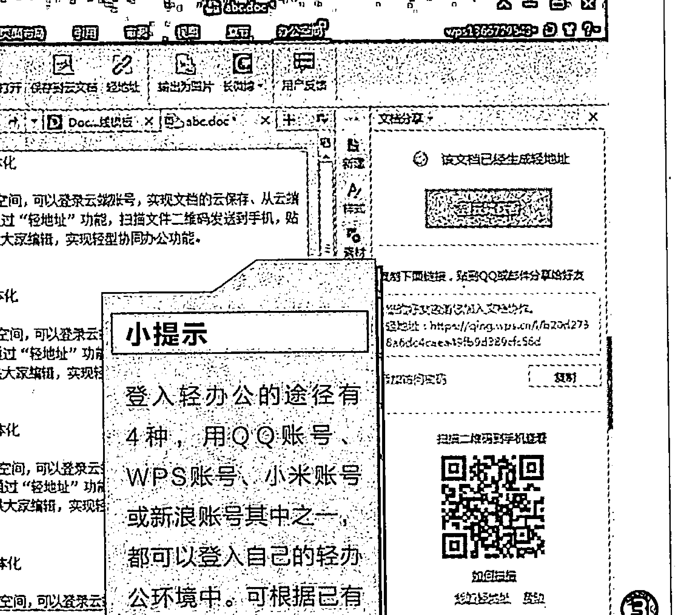

## “章节导航” 布局清晰文章结构

我经常编辑书稿。以往使用Word，如果要对一本书排版，涉及到图书封面、目录、章节的排版问题，往往要反复穿梭于多个菜单才能完成一个章节或一个书稿的结构编排任务。在新版WPS文字2013中，只需通过一个“章节”选项卡，即可实现从页面分栏、封面目录、章节页码、页眉页脚等的设置。各元素设置分组一目了然，没用过的人也一看便知。若依然把握不大，则还可以借助更加人性化的“章节导航”来完成版面布局编排任务。

> 小提示
>
> 要实现各类背景效果，可从“页面设置→背景”进入选择并设置。

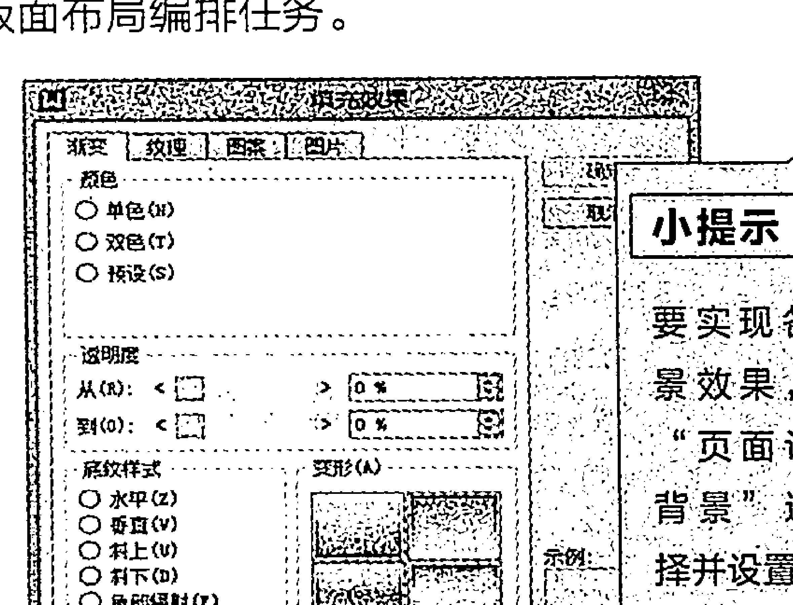

## 艺术背景 做出绚丽多姿文档

丰富多彩的宣传页面是我常用的文档修饰方法。文档的丰富多彩，除了在于其文字和图片元素外，背景的多样化也非常重要。WPS文字2013提供了非常丰富多彩并可以自由定制的背景填充选择（图4）。可供选择的背景填充效果有“渐变”、“图案”、“纹理”、“图片”等，“渐变”色可随意设置颜色、透明度和底纹样式，“纹理”可选择默认项目或从外部加载更多纹理图片，“图案”可选择类型并定义前景背景颜色，“图片”则为背景设置提供了更加广阔的自由定义空间。

## 叠放绕排 实现立体图文混排

我所在部门涉及到的文稿多是复杂的图文混排。图文混排的精华在于支持多层次的版面元素立体设置，还有同层元素之间的丰富绕排选择，并要求这种多层次的关系易于操作。WPS文字2013提供的版面元素叠放次序，可轻松实现任何一种版面元素的置顶置底、上浮下移，并实现与版面文字的层次关系（浮于文字上方还是下方）和灵活绕排，正可以满足这个要求。最关键的一点是，它比我以前用过的文字处理软件操作方便。

## 我的云盘资料丢失为哪般

文 | 亦云

最近常逛云盘论坛，有不少用户反映，在使用云盘的某些功能之后，发现自己保存在云盘中的文件莫名其妙地丢失了。本人也曾经遇到过几次云盘文件丢失的情况，分析发现多数情况是对云盘使用不当所致。因此，特以使用360云盘为例进行分析，并提出具体解决办法，供大家参考。

> 有些用户在向云盘传送文件的过程中，看到云端已经有了要上传的文件夹和文件名，就误以为上传过程已经完成，因而为了节省本地空间，删除了本地文件。但后来发现云端的文件没有了或不能用了，这样就造成了无法弥补的损失。还有一种情况是，将文件放入同步盘后，以为文件就已经上传到了云端，因此在没有断开云盘连接的情况下，将本地文件删除了。但实际上，因为文件处于同步文件夹中，本地删除的同时云端也会在很短时间内自动删除该文件，造成两地文件全丢失的情况。

## 对同步文件夹功能理解不够

> 将资料放入一台电脑的同步文件夹，但在另一台电脑上用相同账号登录云盘，发现并没有自己的资料或资料有部分丢失。

大家知道，许多云盘都可以设立一个本地文件夹为自动同步文件夹，如果有资料需要存入云端，只需将资料存入这个本地同步文件夹即可，其余的资料同步工作由云盘自动完成。有的用户以为，只要将文件拷入这个同步文件夹就万事大吉，就可以在别的地点访问云端的文件夹，其实却忽略了一个关键的问题，那就是同步也需要时间。如果在没有满足同步所需时间的情况下，断掉网络或关掉电脑，也许看似在服务器端已经有这些文件的名称，但实际上，上传过程并没有完成。因此，从另一端PC用相同账号登录后，仍然不能获得文件，或者只能使用已经完成上传的部分文件，而其他文件因没有同步完成而出现文件丢失的现象。知道了云盘的这一特性后，要避免这种情况的发生，只需在断开网络或关机前，打开云盘客户端，查看一下同步过程是否完成。如果没有完成，根据提示和网速情况，设定若干时间后自动关机，以保证云盘的同步过程进行到底（图1）。

> 即便是在将文件放入同步文件夹后断开网络，然后删除本地文件，也不安全。因为一旦下次联网后，同步功能仍将会删除服务器端的同步文件，造成本地和服务器端的相同文件都消失。如果希望在文件同步到云端之后，删除本地文件不会影响到云端的文件，只需将需要保留的文件夹设置为不同步，这样设置之后，就可以放心大胆地删除本地或云端的文件，而不会影响到另一端的文件了（图2）。

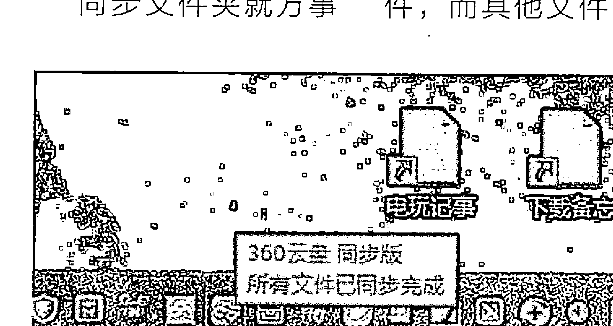

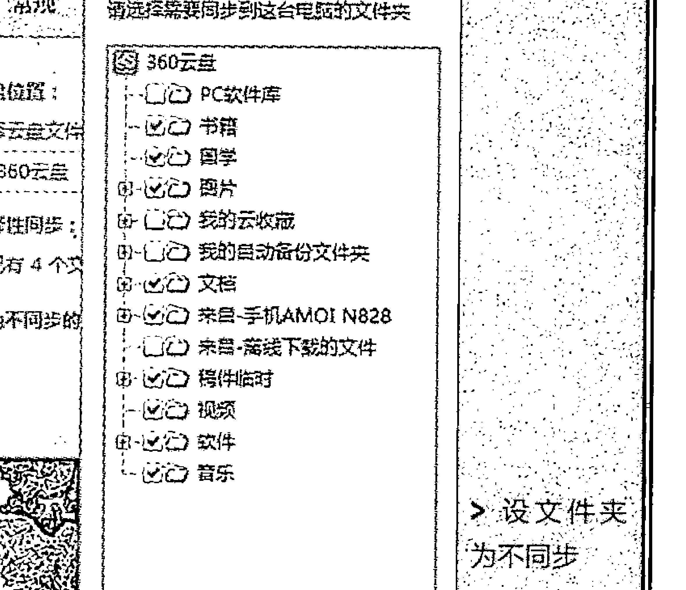

## 乱用多终端同时同步造成混乱

目前的多数云盘均支持同一账户多终端同时登录使用。这样，如果多台电脑均设置了同步文件夹，可能就会造成文件混乱。比如，从这台电脑删除了一个文件或文件夹，本来希望服务器端的文件也随即消失，但奇怪的是不但服务器端文件没有消失，连本地的文件也回来了。或者出现修改完的文件又变回旧版本的情况。这都是第三个客户端云盘在作怪。

为了避免这种情况的发生，建议不要让多台终端的同一账户云盘同时在线和开启自动同步功能。如果要在多台电脑上安装使用同一个云盘，并使用相同的账号，最好还是将每台电脑的云盘设置为开机不自动启动，具体需要使用时再手动启动。并且，在每台电脑中使用同步功能时，确认数据同步过程已经完成才关掉电脑。这样，就可以避免因多终端同步而造成的文件丢失、删除后再现或版本错误的问题（图3）。

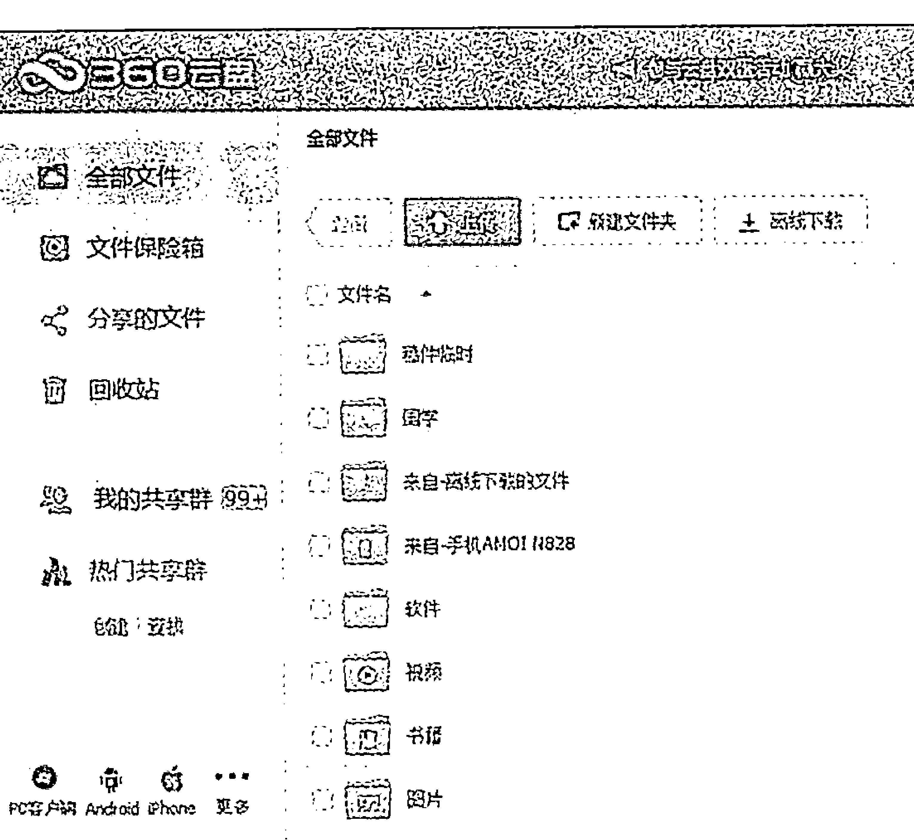

## 多人共用同步功能造成混乱

由于云盘具有自动同步的特性，因此，如果其他人在本地共享文件夹下操作，很容易因为删除或重建文件而造成云端文件的改变。与此同时，如果多人共享一台电脑，也可能会造成因本地文件误操作而影响到云端的文件。

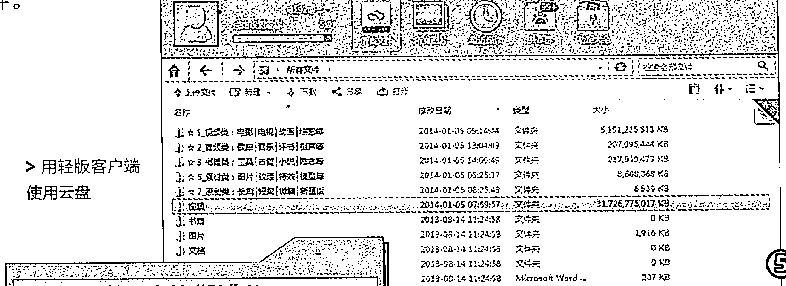

小技巧
从安装了轻版云盘客户端的电脑上访问云盘文件，也不会造成文件混乱的情况。但要注意：目前的云盘轻版客户端，有的也设有自动同步文件的功能，如果在别人的电脑上使用云盘轻版客户端，切记要退出他人的账户，用自己的账户登录（同样记住不能保存密码），同时不要设置同步文件夹，以免造成本地数据的混乱（图5）。

## 小知识：关于文件“秒”传

在云盘领域，有一种“秒”传的说法，意思是将某个资料从某地传到云盘空间中，不论资料大小，传输时间用秒来计算。这种说法在“云”对“云”的传输或云端文件与本地文件完全相同的情况下是成立的。比如，将一个用户用360云盘共享的文件，下载到自己的360云盘当中，或将云端已经存在的本地文件上传到云盘中。这种情况下，实际上只是传送了一个位置指向，并没有进行真正的文件拷贝动作。但是，如果要传送独一无二的文件到云盘，这种“秒”传的说法就不现实了。若你看到自己独一无二的大文件眨眼间就进了云盘，那十有八九是一种假象，真正的传输过程并没有完成。

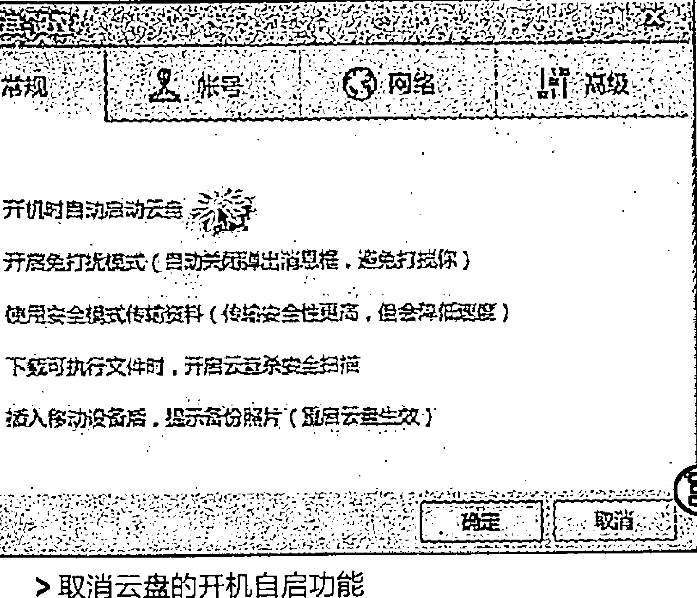

因此，建议云盘同步文件夹最好在自己单独使用的个人电脑上使用，办公室或其他场所的公用电脑上，不要使用云盘自动同步个人资料。如果在公用电脑上需要使用云盘，最好的方法是通过网页版访问，而且在访问时选择不保存用户名和密码，也不要选择下次自动登录。此外，最好将浏览器设定为无痕浏览模式，这样退出后电脑不会留下任何痕迹。从数据安全性上来讲，是比较有保障的一种做法（图4）。

## 用图形编辑功能改变文字造型

文 | 许江林

在对2013版PPT的图形编辑功能的探索中，笔者发现了另一个超出以往版本PPT的特别功能——文字与图形、图像可以直接编辑！这一特殊功能蕴含着巨大的前景。可是笔者感到要把这个功能用好、用对地方也不易。

比如应用“组合”功能就能够很容易地在一个图形或者图片中抠出镂空文字，可是如果仅仅是抠出镂空文字，似乎也没有多大用途。笔者在反复思考后找到了一个很好的表现方法。

### 镂空文字的应用

+   排列对象
- 置于顶层(R)
- 置于底层(K)
- 上移一层(E)
- 下移一层(B)
+ 组合对象
- 组合(G)
- 取消组合(U)
- 重新组合(E)
+ 放置对象
- 对齐(A)
- 旋转(O)
- 选择窗格(P)...
+ 选择
- 全部显示
- 全部隐藏
- 任意多边形 8
- 矩形 7

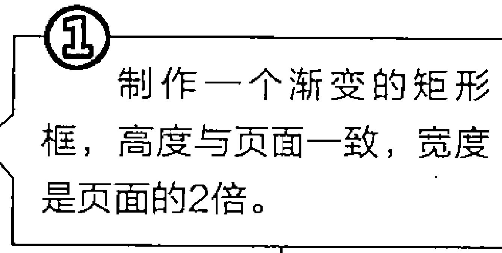

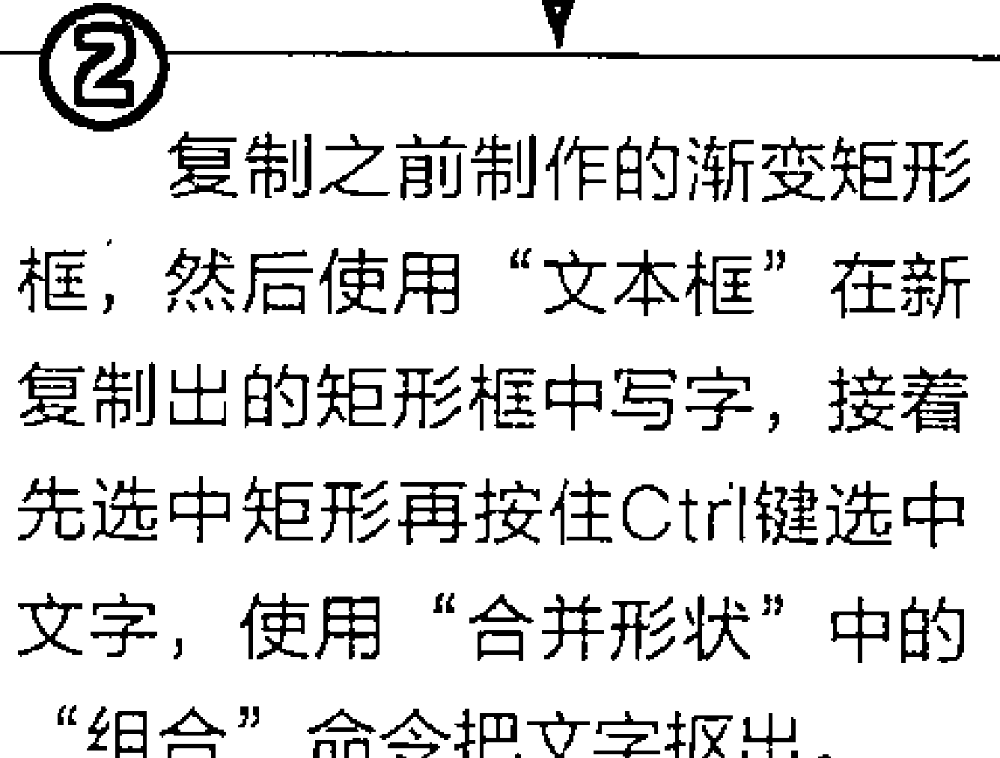


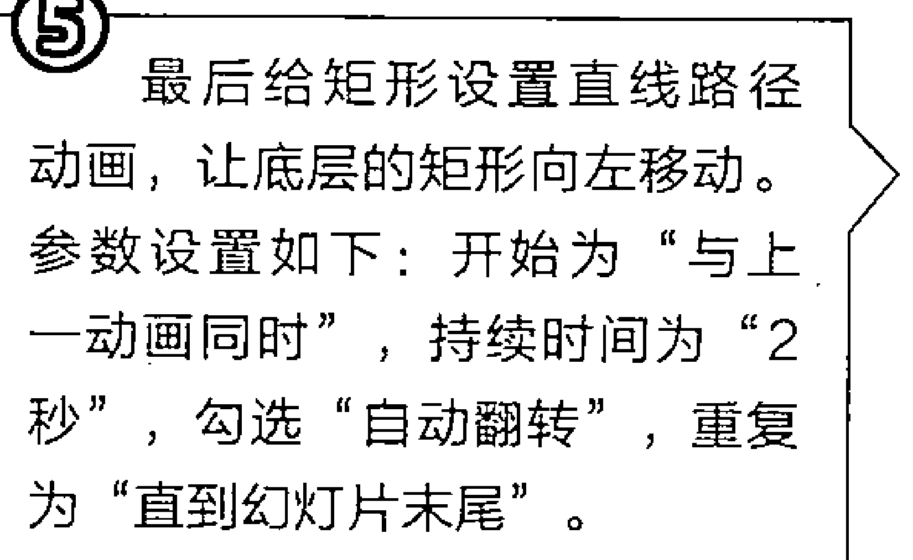

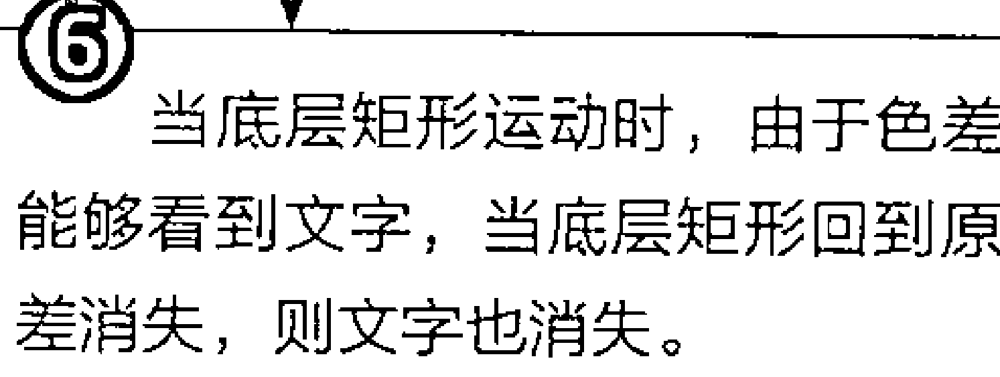

## 改变文字造型

另外一个曾经困扰笔者很久的技术难题，就是改变已有字体的造型，按自己的需要，做自己的字体。在PPT具有这些图形编辑功能之前，要想做到这个效果，PPT软件本身是无能为力的，只有用专业图形编辑软件了。现在，既然图形可以和文字混合编辑，那就可以发挥想象去做了。

首先，打出一组书法风格的文字，这里用的字体是“华文行楷”。字号尽量大些，这里使用了“280”。


然后从网络找一些背景透明的墨迹图片。这些图片可以从psd格式的分层图片中取出，并存为png格式，或者从AI等矢量图形格式中导出为png格式图片。


把这些墨迹图片拼贴到合适位置，进行一定的大小、位置的调整后，立马给原文字增添了不少动态效果。


我们发现，在“许”字的那一竖的墨迹笔画中多出了一些不需要的部分，这时我们只需要使用“任意多边形”工具把这个部分圈住，然后先选中墨迹图片，再按住Ctrl键选中多边形，使用“合并形状”中的“组合”或者“剪除”，即可把多余部分去掉。

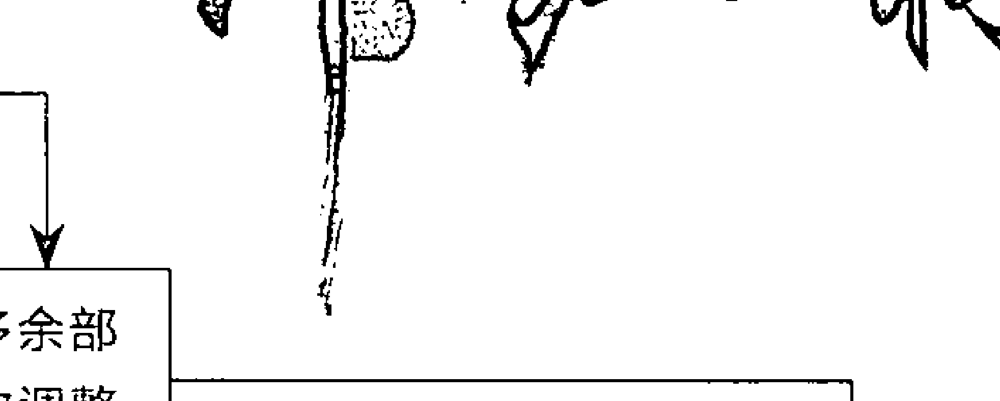

去除多余部分，并再次调整后，如图。


为了进一步把文字做得更加挥洒些。我们事先用一个矩形和文字进行“拆分”处理，把文字变成一个个的图形。

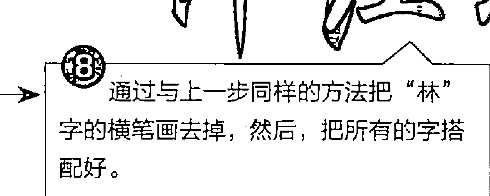

选中已经成为图形的“许”字，右键单击，选中“编辑顶点”，通过拖动或者删除部分“许”字横笔画的顶点，把这个横笔画拖长。

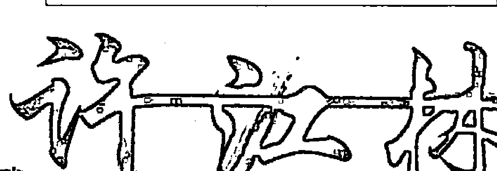

通过与上一步同样的方法把“林”字的横笔画去掉，然后，把所有的字搭配好。


最后，给文字添加墨迹图片。


本文介绍了镂空文字的制作和实际运用，以及改变已有文字造型的一些方法和思路。在对“镂空文字的应用”的介绍中，除了讲述如何利用2013版PPT的图形编辑功能来轻松完成以外，更重要的是找到这个效果的实际运用思路——让相同的两个色块一个镂空，另一个保持原样并置于底层，再让两个色块间产生相对移动。这样一来就可以利用色差的原理把镂空文字漂亮地表达出来。

读者在此基础上还可以尝试其他的变化。在对“改变文字造型”的介绍中提供了两个有效的思路，一个是给文字添加墨迹图片，另一个是把文字变为图形后，直接改变造型，最后把两个思路综合运用，得到更多的效果。读者掌握这两个思路后可以有非常多的变化，比如除了墨迹图片外还可以添加各种实物图片、炫彩效果。在文字的造型改变方面，如果读者有一定的书法水准，那么就可以非常自如地挥洒自己的创意，做出自己的字体。

## 简洁风PPT 让你的提案更突出

文 | 秋叶 樱陶

在项目策划遇到大段文字只会复制粘贴到PPT上？项目意义、项目目的、项目执行、项目预算一个字都不能少？其实没有那么复杂，简洁的PPT反而会帮大脑准确接收提案的核心信息。

看看下面这张策划PPT，像这样一句话就能知道的活动意义是不是更好理解、更吸引人（图1）！


> 小提示：很多PPT的问题首先不是出在设计，而是提炼。看了今天的文章，你受到启发了吗？

PPT分为阅读型和演说型。阅读型主要用于指导书，不能现场讲解的PPT，因此需要详细的文字说明。简明概括要点，力争一句话搞定的适合演说型的PPT。今天主要说的是演说型PPT。这类PPT需要主讲人向观众进行讲解。因此PPT页面如果太过复杂，观众的注意力会被PPT分散，既听不清主讲人的演说，也看不完PPT上的文字。

一段话分条列项为几句话。

经过分条列项和简单精简后，整个观点变成如下的三句话：

+   1. 为更适应公共关系行业发展需要
2. 提高公关技能和综合素质
3. 改革实践教学课程的教学方式

对如上三句话再进行提炼润色，最终答案就是“为了提高公关学生的专业技能”。

下面再列举一个案例，希望对大家的思路有更多启发。

一段跟披萨有关的资料：“我们使用的主要比萨饼制作技术为意大利手抛比萨饼制作技术。在饼底的成型过程中有手抛饼底的工艺。比萨饼师傅用手将饼底抛向空中，利用离心力将饼底旋转到需要的尺寸。此工艺观赏性非常强，客人会对比萨饼师傅的高超技术赞不绝口，是专业比萨饼店用以招揽顾客的好方法。”

一页PPT应该放多少文字没有定义，但是应该让观众能一目了然看清楚你的核心观点为妥。例如下面这个例子（图2）。

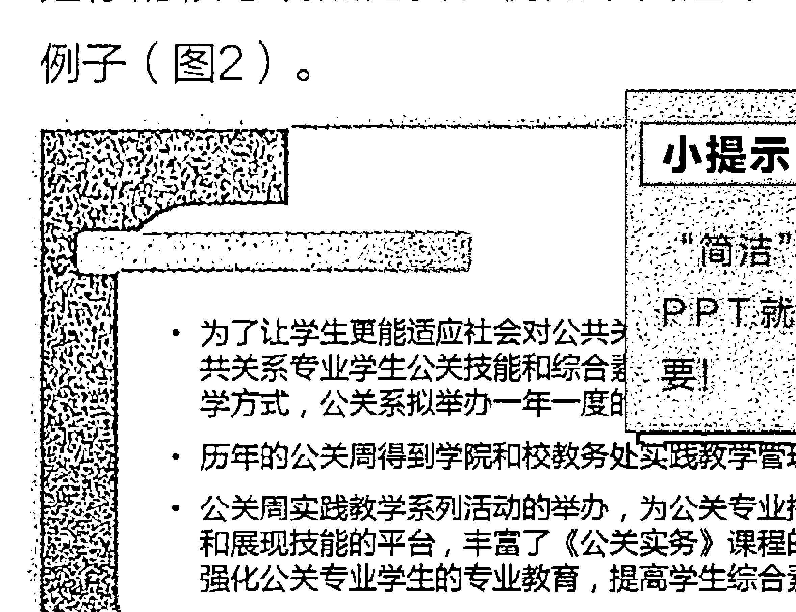

现在我们终于可以在PPT排版中采用更加突出重点的“一句话”排版的简洁风了（图3）。

让PPT里的观点清晰明了，既不会影响主讲人的发挥，同时让观众对这一策划的目的印象深刻。

对于这则PPT，我是这么制作的（图4）。你有更好的办法吗？


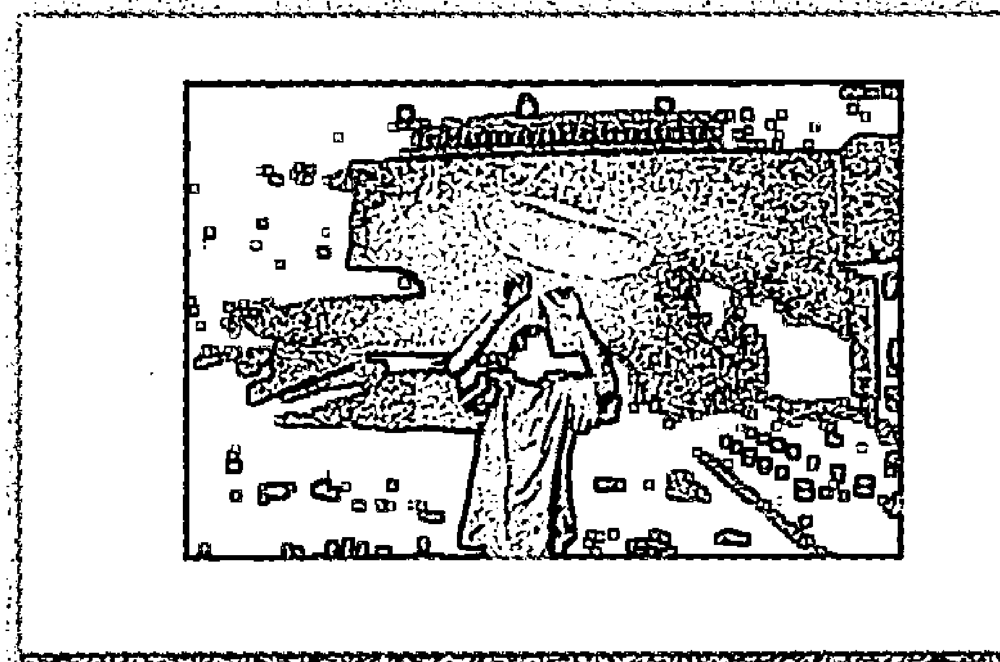

这么长的一段话在Word里都不想看完，何况在节奏很快的演说型PPT？但是这一大段话其实大都是废话，完全可以压缩成一句话。

那要如何总结这么一句话呢？

总结为一句话太难，那就先把一段话分条列项为几句话。

## PPT轻松制作扁平化图标

文|樱陶 秋叶

现在是流行扁平风格的时代，越来越多的职场PPT里希望用更平面化风格的图标来做修饰。这样的图标很给力（图1）？但没有一个网站总是可以找到你要的全部图标，你找到的图标，往往是立体风格的（图2）。

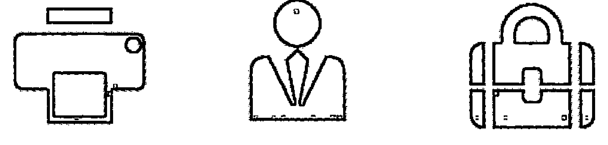


如图2所示的这种图标很漂亮，有立体感，还有渐变色，但未必和自己的PPT模板颜色一致，而扁平化图标则可以随意变色和PPT模板搭配！扁平化图标如何制作？其实很简单，在做PPT找不到合心的图标时，试试自己手工画一个！有了2013版的PowerPoint的帮助，这些图标很容易动手打造出来。下面就一起来看看如何运用PowerPoint 2013里的小功能手绘理想图标。

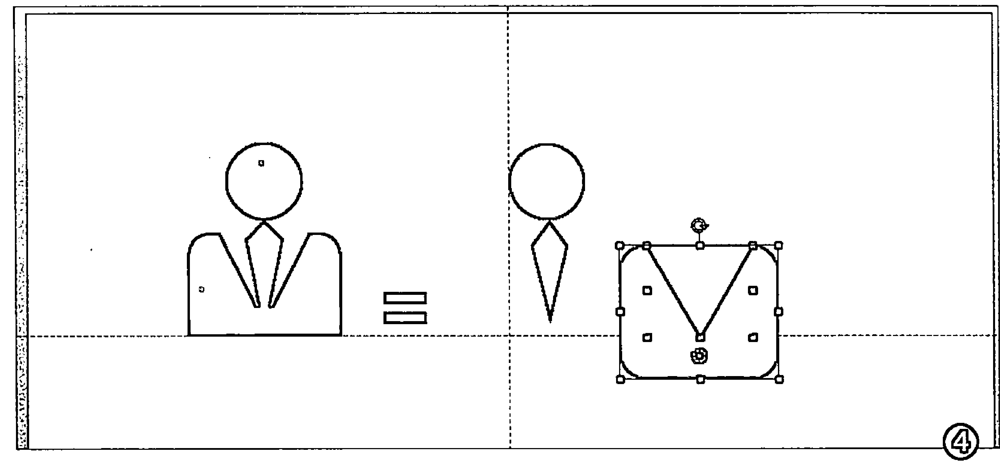

第一步就是学会拆分图标。小人的图标就是以下几个图形组成（图3），稍微组合以后就可成形。


注意的是保留的形状要先选。例如上图需要保留黑色部分，所以先选黑色，再选白色图形（图4）。如果大家会发现剪除后的图形，白衬衫比例有点不协调。还可以运用编辑顶点功能。右键单击“身子”形状，会出现“编辑顶点”菜单。点击进入上图界面后，通过拉动小黑点改变可以微调白衬衫的角度（图5）。


这种自制图标其实也是一种形状，你可以填充各种颜色让它风格多元化（图7）。

身子和领带没法调节在一起？这时只需要打开PowerPoint 2013版的“合并形状”功能（2010版需要从不在常用功能区的命名中调出这个新增功能）。选中圆角方形和三角形后，打开“绘图工具→格式→合并形状→剪除”，剪除后就是以上的形状。需要调节完白衬衫后就会发现原图底部其实是平的，不是圆角。所以需要随便拉一个方形，盖住多余部分。选择同上的剪除功能，就得到最终的版本（图6）。


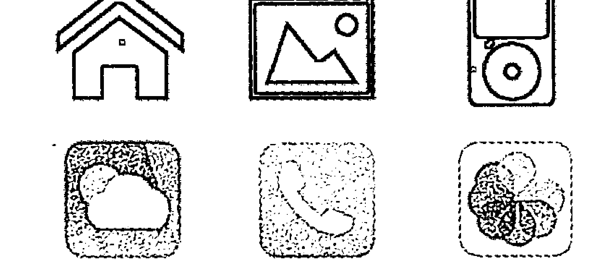

# PPT2013精细抠图妙用

文|许江林

2013版的图形编辑功能非常强大，不试不知道，一试吓一跳，笔者多次尝试后发现，看似简单的图形编辑功能竟然能玩出非常多的花样来，精细抠图就是一例。

整理一下之前的功能探索可以发现，在“绘图工具 格式”选项下，“合并形状”中的“拆分”、“相交”和“剪除”效果类似于PS中的建立“路径选区”然后抠图的作用。据此，我们找到一个具有巨大作用的新发现——用PPT也可以细致抠图！

- 选择图形编辑选项中的“任意多边形”，从人物轮廓底部开始，每遇到曲折之处就点一下，一点点细致描绘出人物轮廓。点用得越多，绘制的效果就越好。

想到这里，大家想必已经迫不及待地要实践一把自己的PPT抠图技巧。我们先找到一张照片，然后按步骤来抠图。

- 右键单击轮廓，选择“编辑顶点”可以看到这次描绘轮廓的过程中究竟使用了多少点。在某些曲线位置，为了表达得更真实，还可以进一步单击该点，调整该点两边的曲线句柄来调整曲线的形状。

- 细致勾勒出轮廓来后，是欣赏成果的时候了。先单击选中图片，然后按住Ctrl键再选中轮廓曲线，接着单击“合并形状”中的“相交”，我们可以看到背景立马被去掉，只剩下人物轮廓。

- 既然背景已经被轻松去掉，那么换个背景那是很简单了。现在，把2013版PPT的开始界面用截图工具截下来，粘贴到页面，右键单击该截图，选择“置于底层”，得出的效果也很不错！

- 进一步，再把衣服换掉，也完全是没问题的。同样，使用图形编辑选项中的“任意多边形”，把衣服轮廓绘制出来。


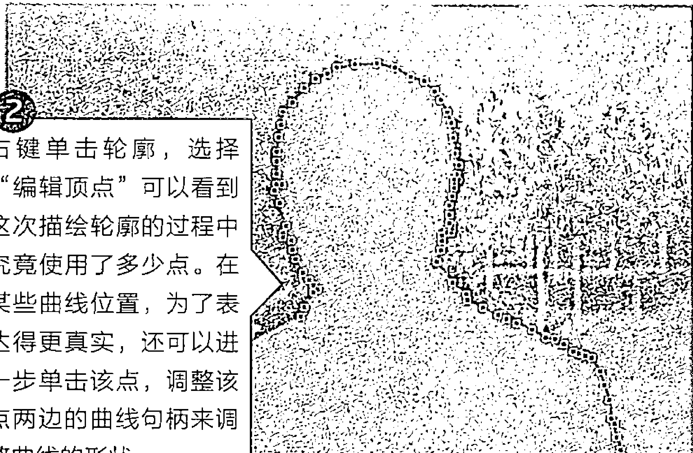

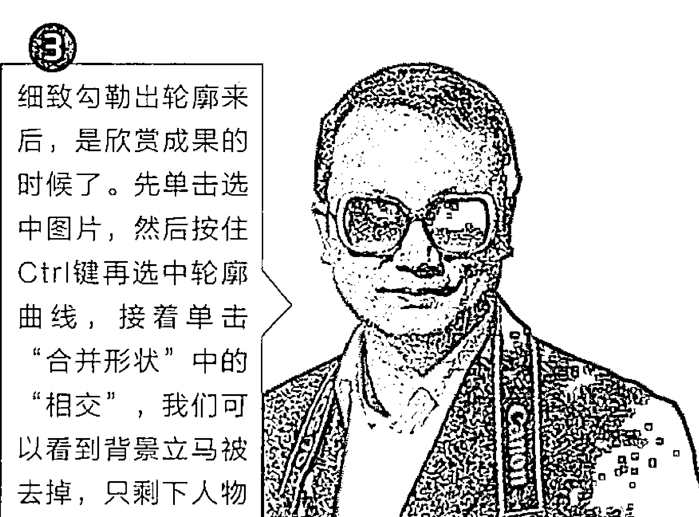


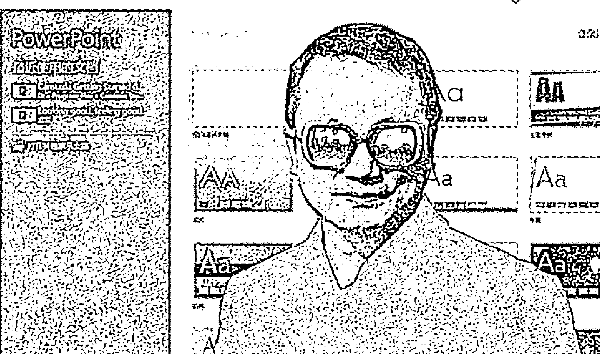

绘制出衣服轮廓后，要清楚我们现在是要在这个轮廓中填入需要的图片素材，而不是把原来的人物轮廓去掉衣服。所以现在，可以插入一张图片，然后右键单击衣服轮廓，将它置于顶层。调整新插入图片的大小和位置。

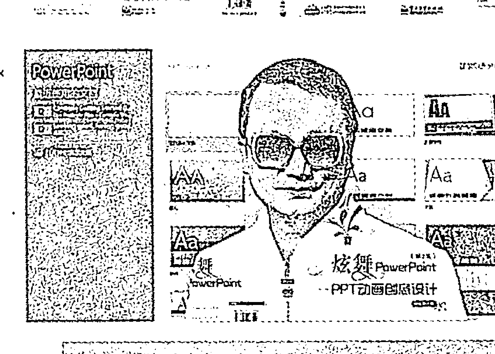

- 先选中插入的图片，再选中衣服轮廓，单击“相交”，立刻出现带有图案的衣服轮廓。为了使衣服看起来自然些，右键单击衣服轮廓，选中“设置图片格式”，在打开的窗格中调节阴影效果。得出最后效果。

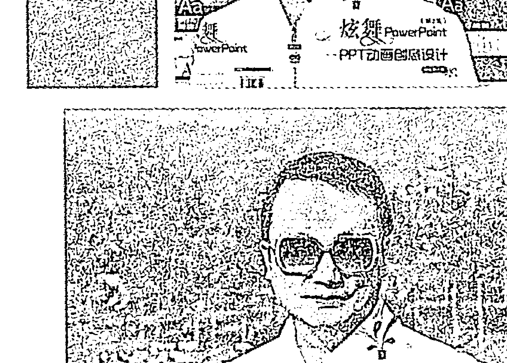

- 以上技巧掌握后，可以衍生出更多的应用。比如在原照片上换上新衣服。

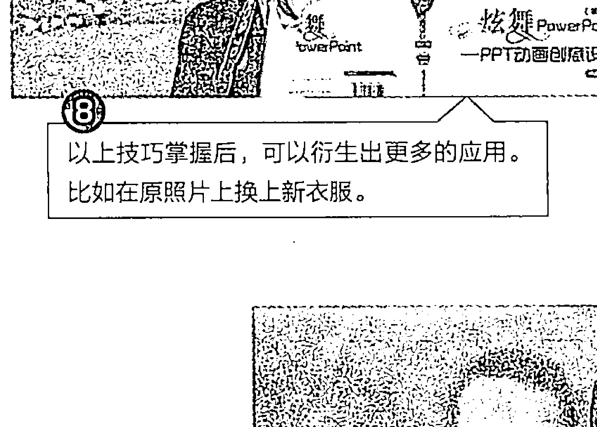

- 步骤很易理解：先在原照片用任意多边形画出衣服轮廓，添加图片，把图片抠出衣服形状，然后覆盖在原图上即可。

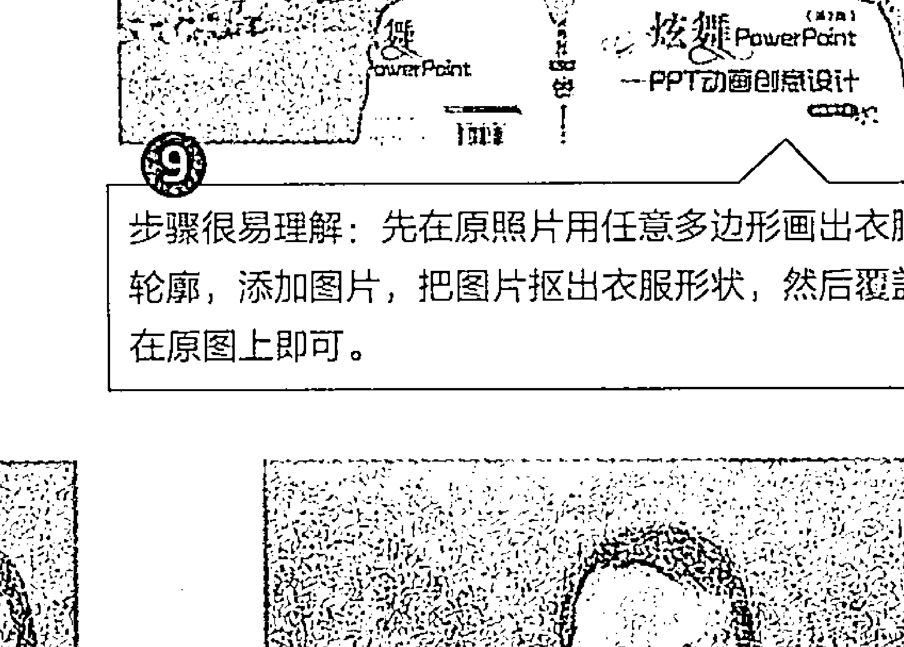

- 给原图做背景模糊效果也很容易做到。步骤是：先准备两张一样的图片，一张图片用于抠出人物轮廓，另一张直接通过设置艺术效果，将它模糊化。

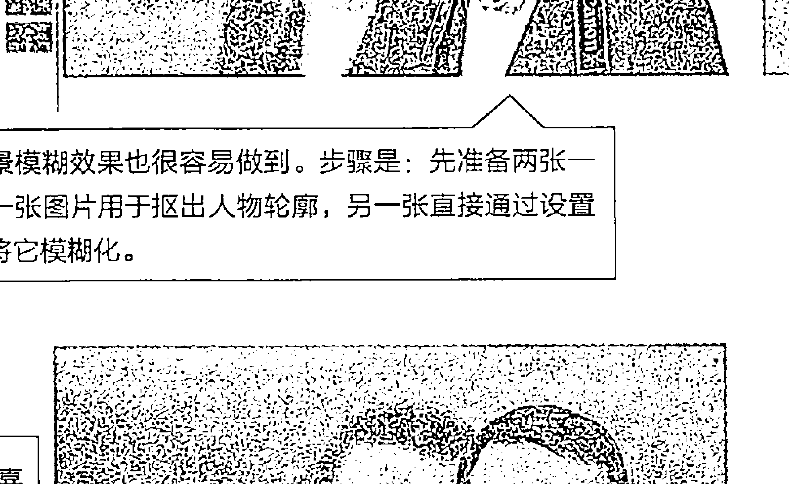

- 然后把抠出的人物轮廓覆盖在模糊图片上。

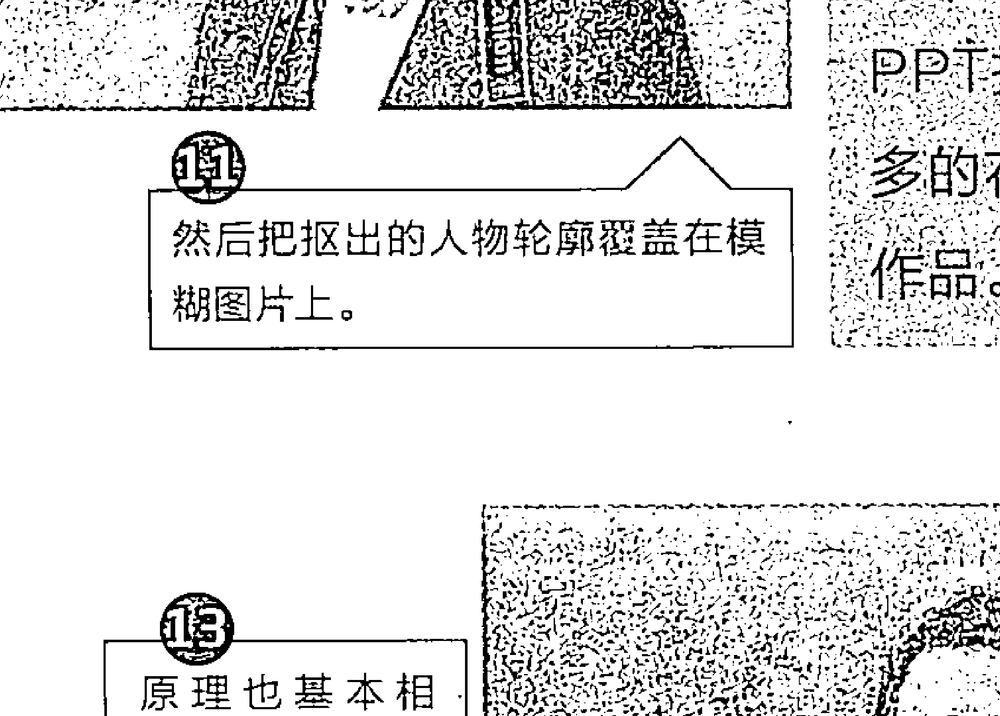

- 当然，只要你喜欢，你可以多做些处理，在背景模糊的图片上再换上喜欢图案的衣服。

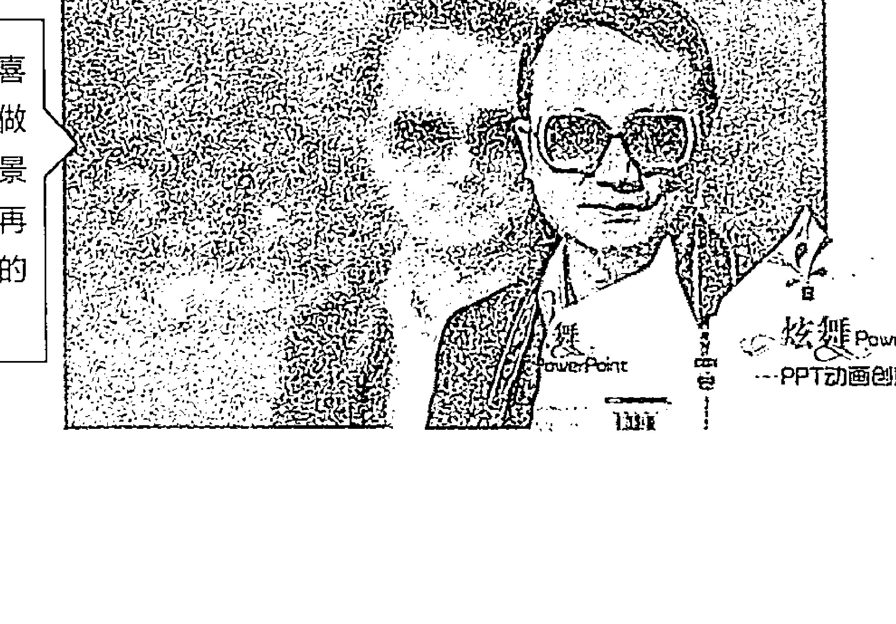

- 原理也基本相似，就是预先准备好几个不同用途的图层，然后堆叠在一起即可。

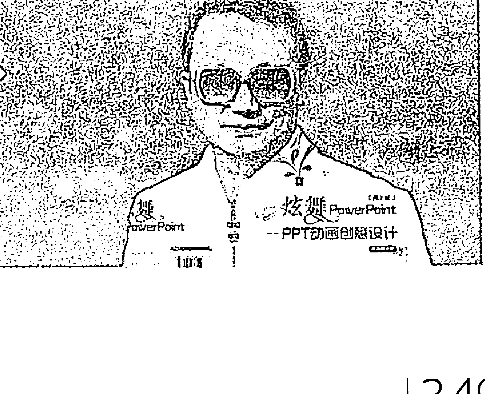

总结：
本文所述的利用PPT图形编辑功能进行抠图的技巧主要运用了两个重要手段：
1. 运用了任意多边形绘制轮廓；
2. 运用了“合并形状”中的“相交”效果。
在使用“相交”效果抠图时，特别说明要先选中需要被抠图的对象，然后再选中用来抠图的任意多边形。这是一个非常重要的要点，如果在这个时候选反了顺序，那么就只会留下一个任意多边形的框图。
本文对PPT抠图技巧进行了比较详尽的讲述，但是限于篇幅，对于此功能的发挥并没有足够地展示出来。读者完全可以在熟练掌握了PPT抠图技巧后玩出更多的花样，做出更多的作品。

# 不编程制作多彩互动PPT

文 | 马震安

用PowerPoint制作能够互动的幻灯片，步骤比较高深，操作起来有一定难度。如果利用Articulate Presenter，则可以轻松制作出多彩、互动的PPT幻灯片。

在PPT中实现互动效果，一种方法是在幻灯片中利用控件插入事先制作好的互动式Flash文件，另一种方法是利用动画效果中的触发器实现互动，还有一种方法是利用VBA代码实现互动。但是，相对于我们平时制作幻灯片的过程，这三种方法都显得比较繁琐。制作过程中，笔者用过一款名为Articulate Presenter的软件，利用它能够轻松实现互动式幻灯片的制作。

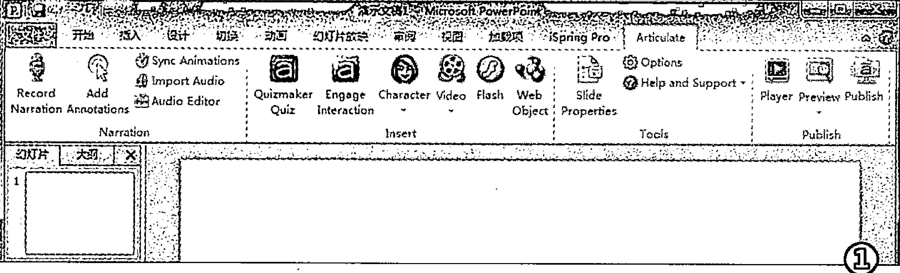

# 一键实现Flash插入

启动PowerPoint 2010后，先将演示文稿用到的文件保存到相应文件夹中。切换到“Articulate”标签，在“Insert”区域点击“Flash”按钮，选择所需要的SWF文件，点击打开按钮后，在弹出的“Insert Flash”窗口对插入的SWF文件进行设置。当然，也可以用PPT自带的动画效果来添加标题。

下载并安装Articulate Presenter '13，安装完成后就会在桌面出现Articulate Engage '13、Articulate Presenter '13、Articulate Quizmaker '13三个程序的快捷方式，这三个快捷方式都可以独立运行。一般运行Articulate Presenter '13，在窗口界面中单击“Open PowerPoint”按钮打开PowerPoint 2010，或直接运行PowerPoint 2010，在PowerPoint的窗口就会出现Articulate插件工具栏，点击工具栏上的按钮来完成PPT的制作（图1）。

# 轻松实现互动式效果

我们要创建一个互动式图片与视频浏览效果的演示。
首先在“Articulate”标签的“Insert”区域点击“Engage Interaction”（参与互动）按钮，在弹出的“Quizzes and Interactions”窗口中点击“Create New”按钮，在新弹出的“New Interaction”窗口中选择“Media Panel”模板，在“Interaction Title”输入标题。注意：输入的标题不能是中文，否则在进行幻灯片输出时就会发生错误（图2）。

下面以制作一个互动式图片与视频的浏览演示文稿为例来说明。这个演示文稿中包含2张幻灯片，第1张包含一个Flash标题动画，第2张包含互动式的图片、视频浏览。

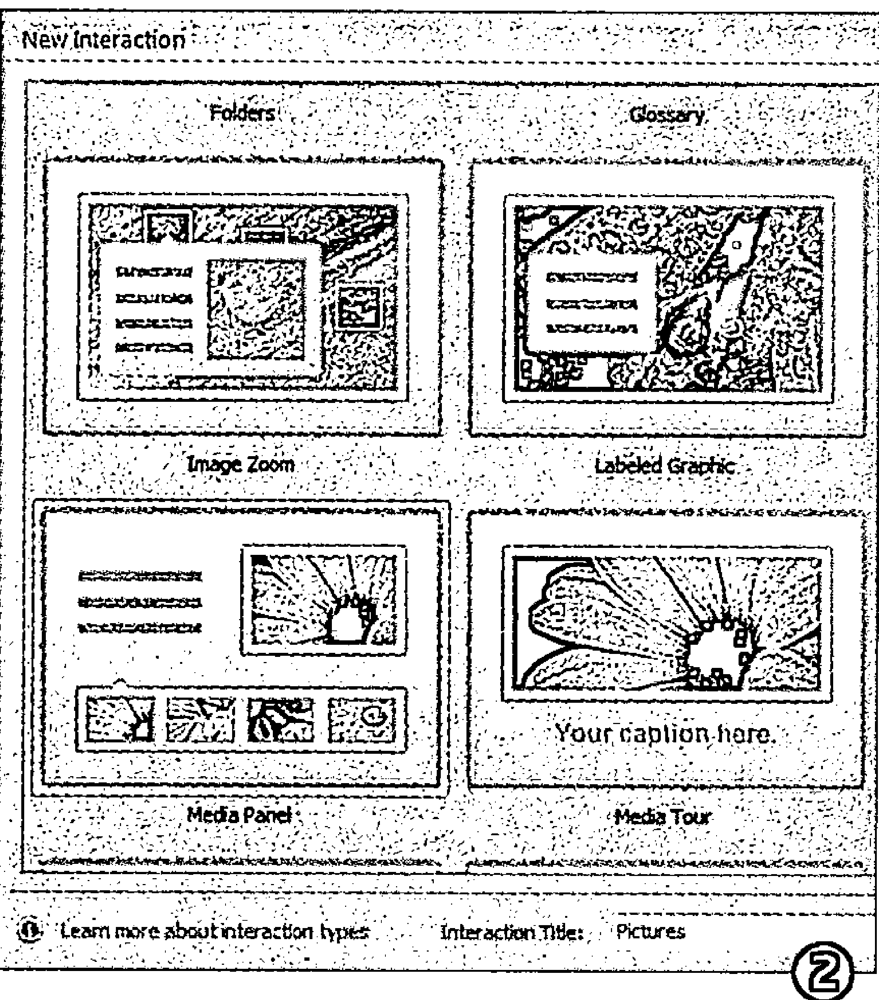

点击OK后就会进入Articulate Engage编辑窗口，即互动编辑窗口。在窗口的“Steps”区域点击“Introduction”（介绍）为幻灯片添加必要的简介。在“Media”区域选择图片、视频、Flash等添加到简介中。在“Audio”区域为简介添加所需要的音频文件。将简介内容选定，单击“Format Text”标签，对简介的字体、字号、大小、颜色等进行设置。当然，也可以将它前面的勾选去掉，从而不用添加简介（图3）。
接下来，点击“1: New Step”输入它的标题及简介，并在“Media”区域将原来的图片删除，重新添加自己所需要的图片或视频，其他的也是这样更改，并且可在“Media Panel”标签上单击“Add Step”按钮或窗口下的“Create a new step”按钮新增New Step。
设置完成后，点击“Save and Return to Presenter”，回到PowerPoint窗口。如果还想重新编辑这个互动，在幻灯片中点击“Edit in Engage”，就可重新进入Articulate Engage编辑窗口进行编辑了。

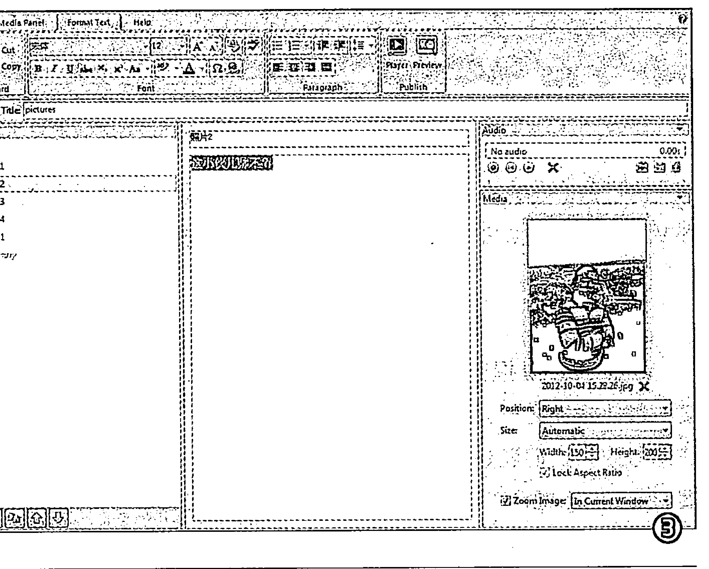

# ▶ 幻灯片发布的设置与发布

以上素材和效果设置好之后，就要进入幻灯片发布前的设置和发布的环节了。
在“Articulate”标签的“Tools”区域点击“Slide Properties”按钮进入幻灯片属性的设置窗口。如果需要背景音乐，在这个窗口中点击“Library”按钮建立一个播放列表。选择每张幻灯片，将它们的“Advance”（即幻灯片的播放方式）属性设置为“By user”，在“Audio Playlist”下拉菜单处选择建立的音频播放列表（图4）。

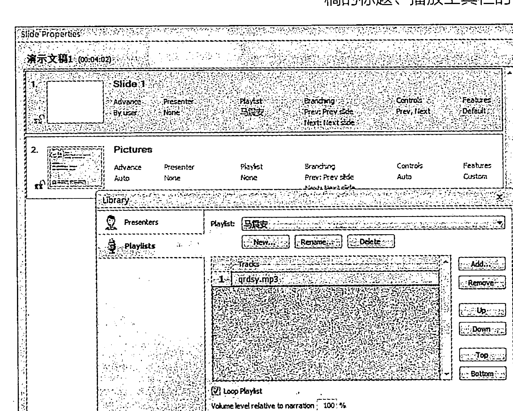

点击“Slide Properties”窗口点击“Edit Menu”按钮进入整个演示文稿的属性设置窗口。在这个窗口中，点击“Features”按钮在窗口中设置演示文稿的标题、播放工具栏的位置、各种功能按钮是否显示等，点击“Menu”按钮对每张幻灯片进行重命名显示。点击“Text Labels”按钮可以将发布后窗口中的菜单、按钮以简体中文显示。
设置完成后，在“Articulate”标签的“Publish”区域点击“Preview”按钮对单个或所有幻灯片进行预览，没有问题后可点击“Publish”按钮，在发布窗口中设置好发布成哪种类型的文件及保存位置等，最后确定对演示文稿执行发布。发布成功后就可以查看最后成果了。

# 妙用表格 让PPT版面更丰富

文 | 杨小燕

在PPT版式设计中，表格为大多数人所忽视，主要原因是很多人缺乏美化表格的思路和技巧，习惯从Word或Excel中复制表格，效果过于简陋。

用好表格是提升PPT版面美观度的最佳途径之一。空洞的解说是乏味无力的，我们还是用图来说话。如图1所示的四幅PPT都是用表格完成的，就让我以这些例子来说明表格在PowerPoint 2013中的具体应用吧。

# 图片文字式表格

用图片配上文字作为幻灯片封面，借助表格将图片进行分割格子状，再加上文字，这样就不会过于单调。

插入一个10列6行的表格，选中表格，在“布局”选项中取消选择“标题行”和“镶边行”，在“单元格大小”中将行高和列宽设置为相等数值，在“设计”选项中设置笔样式、笔触粗细、笔颜色，单击“边框”按钮选择“所有框线”（图2），合并单元格（列2行3至列9行3）输入标题文字。

选中表格，在“设计”选项中单击“底纹”按钮，选择“表格背景→图片”给表格添加背景图片。由于图片比较清晰，可以给表格添加填充色并修改透明，同样单击“底纹”按钮选择“其他颜色”，选择白色并设置“透明度”为58%（图3）。选中标题在“艺术字样式”中对其进行美化，得到如图1所示的效果，分别给单元格设置不同的底色和透明度，这样效果会更棒。

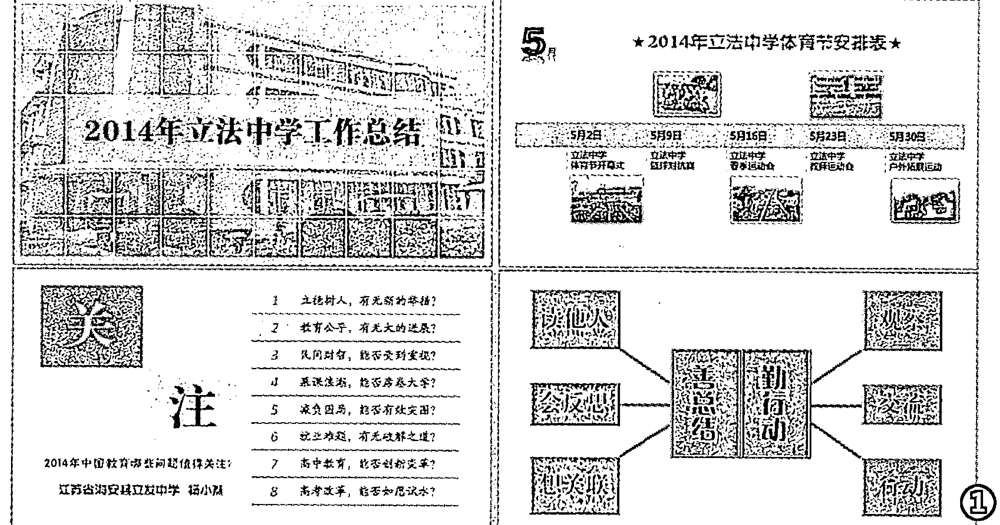

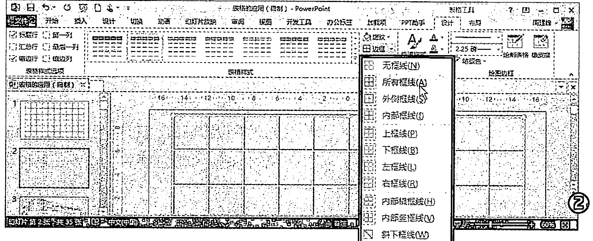

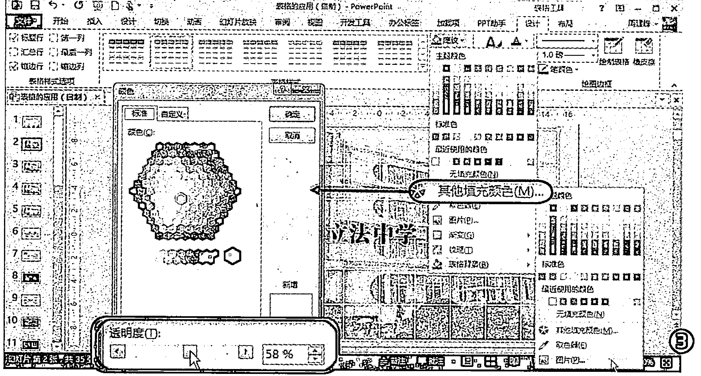

# ▶ 时间轴式表格

用表格制作一个带上下标注的时间轴，隐藏了表格的框线，中间填写日期并用纯色填充，用以牵引读者的视线。

插入一个5列6行的表格，调整列宽行高，合并第1行的后5个单元格并输入文字，在“开始”选项中修改字体字号，并且给文字加上艺术字特效（图4）。

选中日期所在行，右击选择“设置形状格式”，选择“形状选项→填充→纯色填充”，在“颜色”中选择浅色与文字色调形成对比。切换到“布局”选项卡，在“对齐方式”中让表中文字靠左对齐并上下居中。单击第5行第2列的单元格，右击“设置形状格式”选择“图片或纹理填充”给单元格就会填充上图片，用类似方法为其他单元格添加图片（图5）。选中整个表格，单击“边框”按钮选择“无边框”隐藏表格。

在“设计”选项中单击“笔颜色”按钮，在“最近使用的颜色”中选择与单元格背景色一样的颜色，选择第4行第2列的单元格，单击“边框”按钮选择“左框线”添加框线，这样依次为单元格添加左框线就得到图1所示的效果。

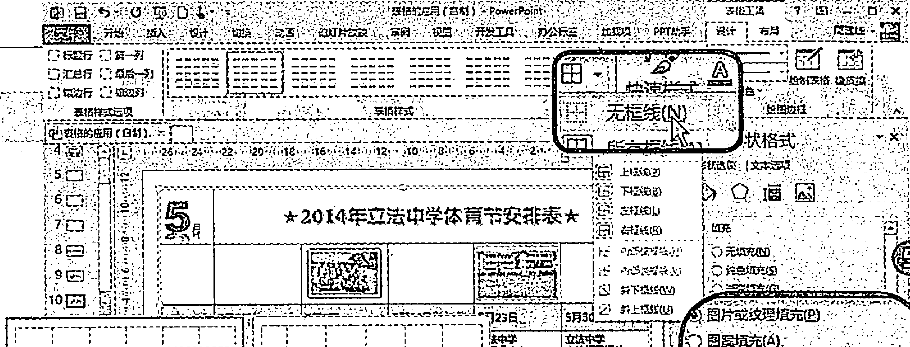

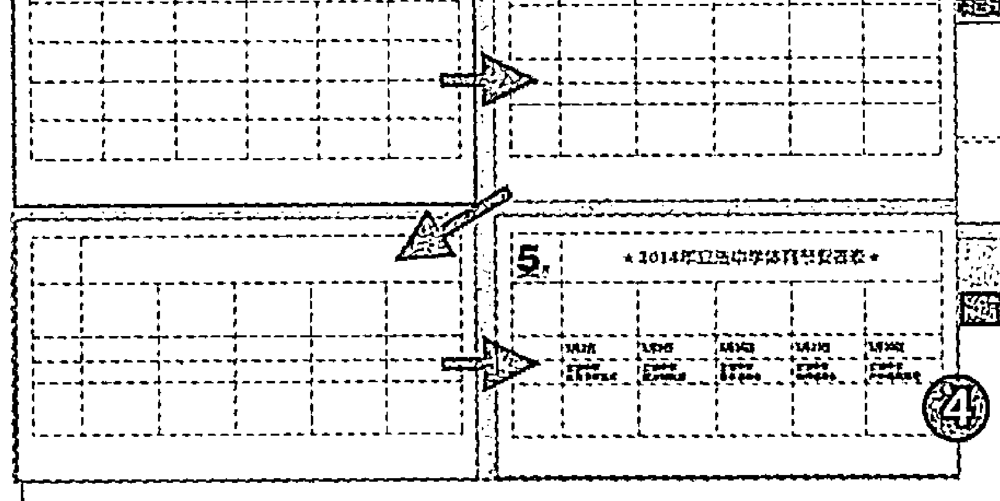

# ▶ 标题目录式表格

作为幻灯片的首页，常用标题和目录融为一体的方法，通过表格可以让标题和目录分布更加规范工整。

插入一个5×8的表格，选中表格后，将“底纹”设置为“无填充颜色”，调整列宽后选中第1、2两列，在“布局”选项的“单元格大小”中，单击“分布列”按钮可以等分列宽。选中第1列的前3行并合并单元格，再根据需要分别合并其他单元格。输入文字，切换到“布局”选项，在“对齐方式”中设置文字在单元格中的位置（图6）。

选中“关注”两字所在单元格，在“设计”选项设置“底纹”，选用与文字形成鲜明对比的颜色，最后将整个表格设置为“无边框”。在“绘图边框”中，“笔样式”选择“实线”，“笔触粗细”选择“2.25磅”，“颜色”选择“蓝色”，单击“绘制表格”按钮，依次为小标题文字绘制下框线。

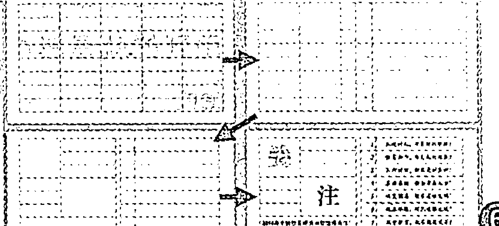

# ▶ 思维导图式表格

给单元格加上凹凸特效，并使用斜线进行连接，制作出类似于思维导图式表格。该例有时可以替代SmartArt图形。

插入6×5的表格，合并部分单元格，输入文字并进行修饰，中间文字为“竖排”格式，再为文字所在单元格添加绿色底色，将整个表格设置为“无框线”。

在“设计”选项的“绘图边框”中，设置线条外观，绘制两根水平连接线。选择中间文字和左上角的文字相邻的单元格，单击“边框”按钮选择“斜下框线”，绘制出表格斜线用于连接文字。分别选中文字所在单元格，在“设计”选项中单击“效果”按钮选择“单元格凹凸效果→圆”，让单元格具有立体效果。

用表格辅助排版，可以让版面更加规范化美观，再修改再利用时也比较快捷，无需组合就能任意移动。表格的排版绝不仅局限这些，本文只是抛砖引玉，激发大家的兴趣，从而找到更棒的创意。

# 你也能编“找不同”游戏

文 | 马震安

网上很多的“找不同”游戏都是通过编程的方法实现热点的设置和最后数据的统计，所以制作这样的游戏要有一定的编程基础。但笔者在使用媒体软件iSpring QuizMaker时发现，利用它，不编程就能轻松制作出“找不同”游戏。

下载iSpring Suite 6安装后，桌面出现iSpring Kinetics、iSpring QuizMaker、iSpring Pro三个程序的快捷方式，这三个程序都可以独立运行。我们要用到的就是其中的iSpring QuizMaker。

运行iSpring QuizMaker，在弹出的窗口中选择Quick Start窗口中的Create a New Graded Quiz（创建一个新的分级测验）（图1）。

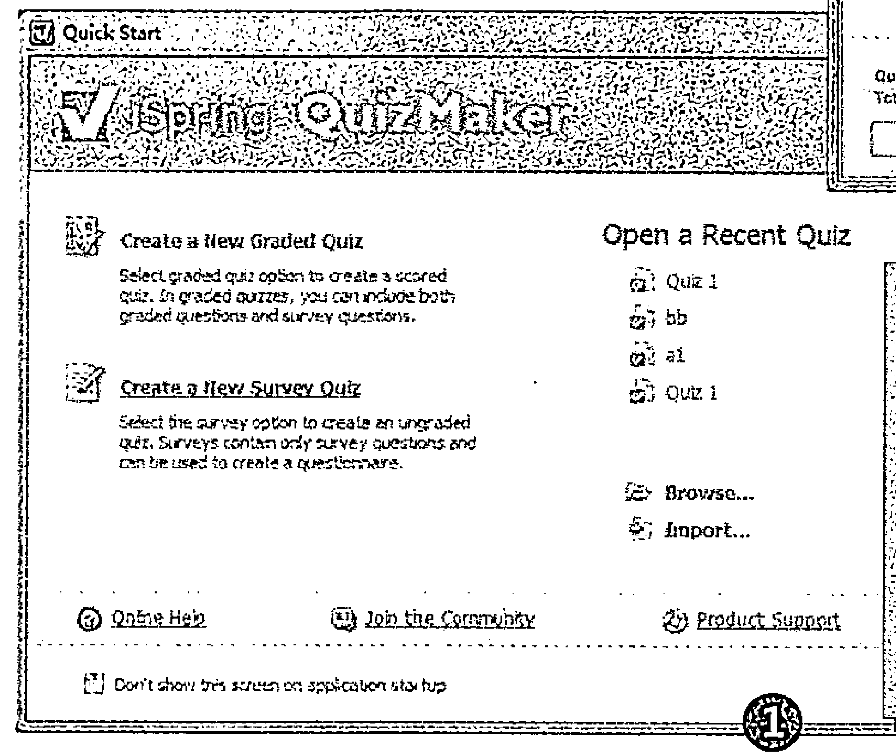

在iSpring QuizMaker编辑窗口Main标签的Add Question区域单击Hotspot按钮，在出现的编辑区域的Hotspot Question输入题目或提示，可以对其进行设置，并且可在右侧的Image、Audio、Video三个标签中添加图片、声音、视频等。

在Details区域的右侧点击Choose Image按钮选择所需要的图片，在Add Hotspot区域选择需要的热点形状，在“找不同”图片的右图中标出左、右两个图片的不同之处。

然后，在窗口下边的Options标签上将Use default options前面的“√”去掉，就可以自定义Attempts（尝试次数）、Points（分值）属性，在Feedback&Branching标签可以将反馈信息设置成中文。

小提示

要想将发布后的游戏界面提示信息变成中文，可以在Main标签中单击Setting按钮，在弹出的窗口中选择Text Labels项，将里面的Label列翻译成中文就可以了。

如果还想再添加一个找不同游戏，可以再次单击Hotspot按钮添加（图2）。

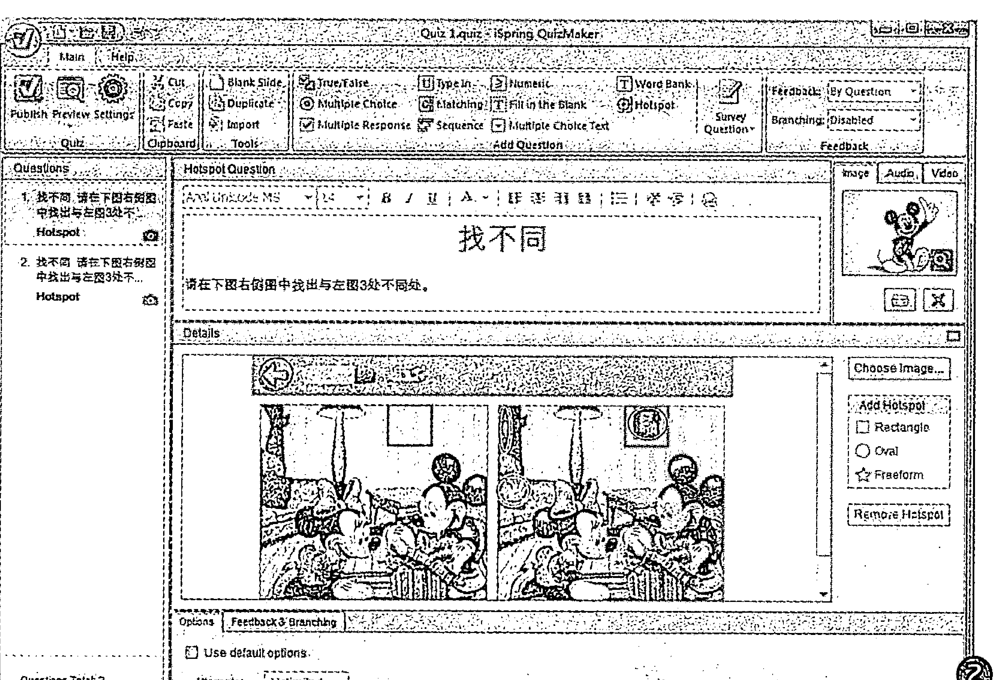

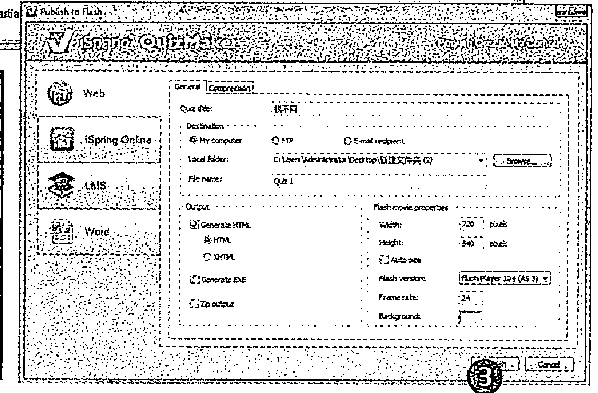

所有设置完成后，保存文件。在Main标签的Quiz区域点击Publish按钮就可以进行发布前的设置了。在弹出的窗口中设置标题、保存位置、输出类型等。

设置完成后点击Publish就完成了游戏的制作（图3）。

# 数据图形化 让PPT一目了然

文 | 王樱陶 秋叶

大多数预算表是一张二维表格，在PPT中很难将这样条条框框的数据全看完，而人的大脑接受图形比接受数据更快更直接，因此我们需要将数据图形化。

| 项目 | 数量 | 单价（元） | 金额（元） |
| :--- | :--- | :--- | :--- |
| 气球 | 1袋 | 10 | 10 |
| 气筒 | 1个 | 4.5 | 4.5 |
| 胶带 | 1卷 | 2 | 2 |
| 线绳 | 1捆（小） | 1.5 | 1.5 |
| KT板 | 2块 | 6 | 12 |
| 卡纸 | 3张 | 0.5 | 1.5 |
| 签到本 | 1本 | 0 | 0 |
| 水 | 2打 | 12 | 24 |
| 花 | 1束 | 60 | 60 |
| 聘书 | 3.5本 | 6 | 21 |
| 请帖 | 1张 | 1.5 | 1.5 |
| 电话费 | | 30 | 30 |
| 打印费 | | 20 | 20 |
| 总计 | | | 191 |

# ▶ 用小图标表现数据

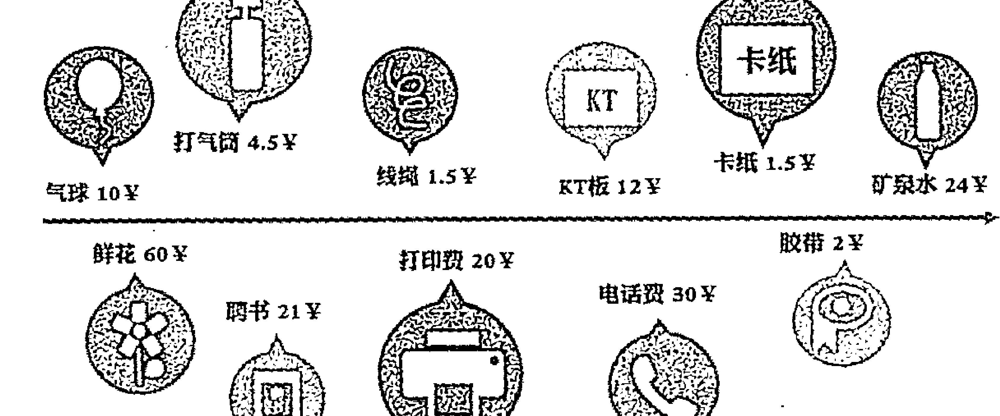

选用小图标可以加深对项目的印象。合适的图标配上适合的项目名，图文结合的方式是轻松阅读的技巧之一。利用图标的表达可以为文字省下空间。在演说时PPT需要保持简洁，利用图标代替是让PPT简洁的又一利器（图2）。

# ▶ 用时间轴描绘数据

时间轴的方式可充分利用16:9的扁长版式，拉长数轴为中心。适用于项目数量较多的排版。时间轴可以利用图形的交错排版为文字争取更多的空间。可以根据使用的时间顺序排列。此方法最适合roadmap这类项目较多的情况（图1）。


# AAR-微信

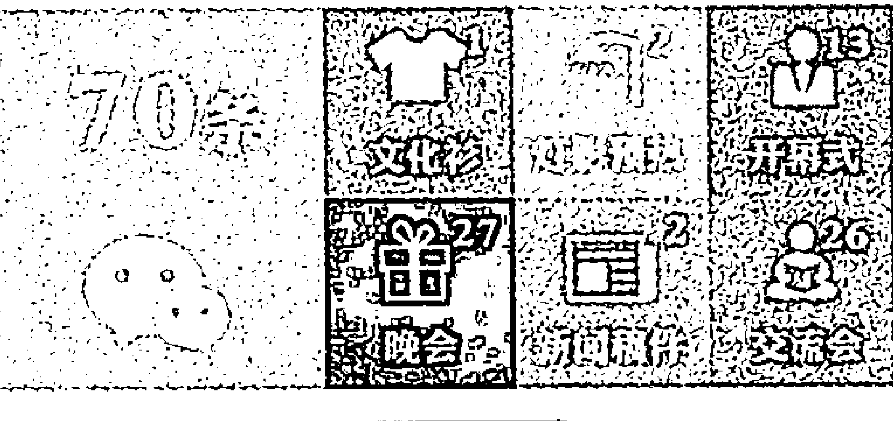

> 小提示
这种创意排版适合项目较少的情况。运用形状可以填补留白，同时营造轻松的阅读环境，让阅读者更能集中精力（图4）。

# AAR-微博


# ▶ 用表格来反映数据

选择丰富的表格形式，避免千篇一律的长轴排版。同样适合项目较少的KPI或AAR，避免长轴版式太分散。注意力集中在项目数字上。利用小图标的简洁表达，加上数字角标，同时结合图标，避免了视觉上的疲惫感（图3）。

# ▶ 现有形状的创意排版

在PPT中有很多现有的形状可以组成许多不同的排版。例如图4的八边形组成的链条，还可以运用圆点连线、箭头连接等等。将数字和图标项目分别改成两种颜色更能突出效果。直接运用PPT中现有的形状不用再费心画图形，能在很大程度上节省制作的时间。

把枯燥无味的Excel瞬间变身清新亮丽的图形，方法不止这四种，大家可以继续开发属于你们的小办法。

## 节约型打印招数多
文 | 马震安

每当拿着采购计划找老板签字时，老板总是眉头一皱问一句：“这办公用纸怎么这么费呀？”这总会让人有点尴尬。如今都在压缩预算，干什么都得精打细算呀！办公打印还能再省吗？

### 省纸打印招数多

如果不是硬性格式要求的正规公文，我们都可以在纸张和版面元素上着眼和下手，通过对这些要素的设置来实现省纸打印。

### 单面打印省纸有招

大家知道，在Word、Excel等Office组件中可以对纸张的类型和页面进行设置，如果在不进行装订的情况下，希望最大限度地节省纸张，应尽可能将纸型的上、下、左、右边距设置到最小，这样在打印量比较大时能省下不少纸张。除了页面边距外，打印用纸的多少还与文字字号和行间距大小密切相关。字号、行间距越小，批量打印时就越省纸，也更省墨，但前提是确保能正常阅读。

一般而言，在Word文档中，如果对文档文字大小、格式没有特殊要求的话，文字大小可选择五号字，行间距固定为12磅左右。当然，若能看清，字号、行距设置得更小些也未尝不可。与此同时，段前距、段后距都设置为“0行”又能省出一些空间。在Excel中，除缩小字号外，可以通过设置表格的行高、列宽来进行页面的压缩调整。另外，如果在文档中组织的文字段落比较短，而且分段也比较多，那么就可以利用分栏来提高页面的利用率。在Word中可以利用“分栏”菜单来设置栏数，A4幅面的打印纸一般选择两栏即可。在Excel中实现分栏打印，可下载分栏工具（http://985.so/zuE），安装后在Excel 2013中就会有个加载项，点击它里面的分栏工具，就可以对表格进行分栏操作了（图1）。

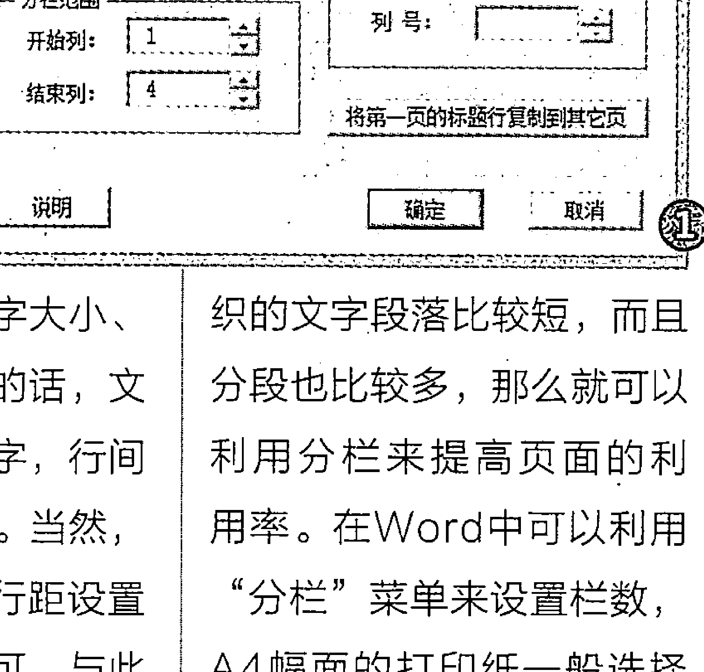

其实，如果在办公打印时多动脑筋、想办法，节约型的办公模式是可以实现的。

> > 小提示
> 
> 这里的双面打印不是指拿用过一面的纸来使用另一面，而是指在一张干净的纸上实现双面打印。当然了，用已经用过一面的纸来打印，也是值得提倡的一种节约模式，但效果和心理作用总不如在干净的纸上使用，而且如果将使用过一面的纸打印的东西呈交给领导或作为商业用途，容易出现意想不到的问题，所以不提倡使用。
> 
> Word 2013中在打印窗口选择手动双面打印，一面打印完成后，将纸的顺序做出调整：先出现的放在最上面，最后出现的放在最下面，然后将打印了正面的纸张再放入进纸器中，继续打印纸张背面即可。或者在“设置”处选择“仅打印奇数页”，打印完成后调整纸的顺序，再选择“只打印偶数页”（图2），这样阅读效果更符合习惯。

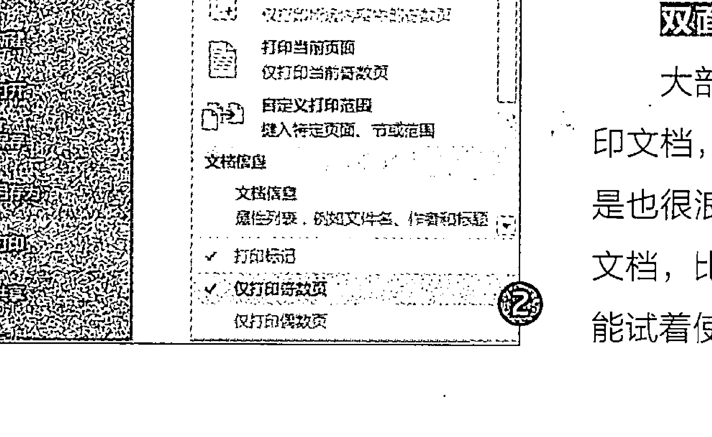

### 双面利用更加节约

大部分情况下，我们都喜欢使用单面方式打印文档，这样做虽然很快就可完成打印任务，但是也很浪费纸张。对于一些质量要求不是很高文档，比如作为草稿使用的文档，我们为什么不能试着使用双面打印呢？

### 缩印技术省钱省墨

如果觉得调整文章字号行距等比较麻烦，或者想保持原来的版式不变，可以通过缩印技术来打印文档。在Word 2013中，页面设置为B4型的文档可以缩印在A4或16开纸上，甚至还可将多页资料一次打印在一页上（图3）。
Excel中也具有打印缩放功能，可以通过缩放比例来进行打印。而在Excel 2013中还能方便地将工作表或所有列、所有行调整为一页（图4）

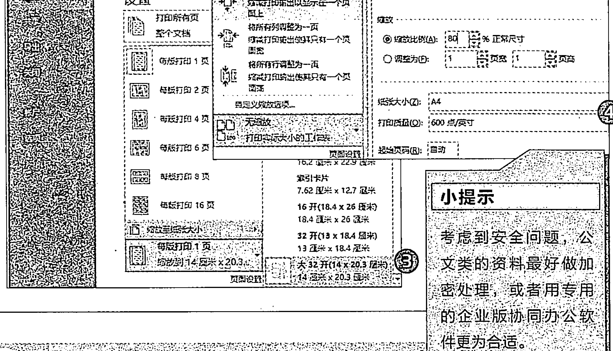

### 省墨打印有技巧

有时候，文档打印出来只是为了校对或其他非重要使用，所以打印没必要有那么高的精度，因为打印精度越高，速度越慢，墨耗也就越多。在这种情况下，可以将打印机功能设置为“省碳粉模式”。
但是，这种设置可能影响到其他人的正常使用，所以打印文档时在不影响观看的情况下，可以将文字的颜色设置为浅色或灰色。当然还有更绝的招数，如果打印文档既包含文字又有图片，可以在每页上画一个矩形将文字、图片覆盖住，然后设置这个矩形的填充颜色为白色，透明度为40%左右或更低，无线条。这样打印出来就可以省很多墨或碳粉了。打印完成后，可以将这些矩形删除掉，一点儿也不影响原文档。

> 使用激光打印机在打印不太清晰的情况下，不要急于更换新的硒鼓，可以取下硒鼓，上下左右摇晃十几下，安装好后再打印，依然能够打印几十张。

### 放弃打印更节省

现在移动终端、网络非常发达，很多办公都可实现无纸化。比如，在单位内部可以利用Serv-U软件建立一个FTP文件服务器，有什么需要下发的文件都可以传到它上面相应的文件夹中，单位的其他终端（包括手机）都可以下载浏览它上面的文件。如笔者所在学校以前安排的工作都是在打印室打印，复印后由专人分发给各办公室。现在建立了FTP服务器，把安排或下发的PDF文件都上传到FTP服务器相应的文件夹中，学校发个校讯通知，告诉老师们有文件已经下发，请老师们利用各自电脑在FTP服务器上下载浏览即可。这样下来省了不少办公用纸、油墨和碳粉（图5）。

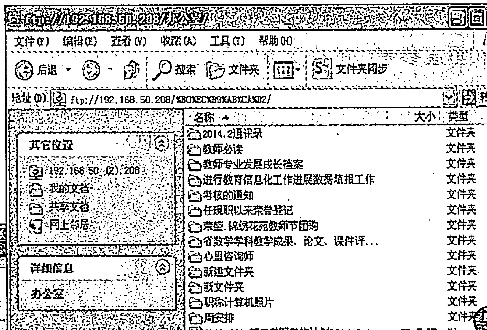

当然，如果单位没条件设立FTP服务器，可以利用“云”来实现。比如，可以在百度上注册一个“云”账号，将要下发的文件传到上面，这样员工不论在什么地方，都可上传下载，非常方便（图6）。
另外，还可以建立QQ群，将文件上传到群空间供员工下载或浏览。

> 考虑到安全问题，公文类的资料最好做加密处理，或者用专用的企业版协同办公软件更为合适。

## PPT制作 讲究“高精准”
文 | 王孝东

PowerPoint是常用的办公软件之一，如何提升制作效率（如精确定位、快速设置、准确选择等），是很多用户亟待解决的问题。掌握了以下操作技能，可以让我们的制作效率成倍提升。

### ▶ 善用网格与参考线

网线和参考线可以辅助我们进行排版，在图1中的4个人物图像，为了让他们的高度基本相等并且头部在同一水平线，在排列5张小图片时启用了智能参考线，移动图片时会自动吸附对齐。而右上角的圆则综合用了网格和参考线确定圆心的位置。

切换到“视图”选项卡，勾选“网格线”显示网格，在排列人物时，就可以将头部定位在同一行的网格中，单击“网格设置”按钮可修改网格及参考线的设置。勾选“参考线设置”下的两个选项，这样移动图片时，智能参考线会自动寻找画面中的中心点、中心线、物体边界，沿着这些可吸附位置会出现临时参考线，沿临时参考线松开鼠标后，图片就自动对齐了，非常方便。

而将圆的半径设置与单个网格的尺寸相同，这样就正好占据了四个网格，然后在空白处右击选择“网格和参考线”，添加水平和垂直参考线，调整参考线位置让其自动吸附到网格中心线，这样水平和垂直参考线的交叉点就是圆心。绘制好圆心后，将圆心和圆组合后重新设置圆的直径，设置为原来的直径，这样就能为任意圆确定圆心。右击参考线可以修改颜色或删除，按住Ctrl键拖动参考线后松开，可以复制该参考线。

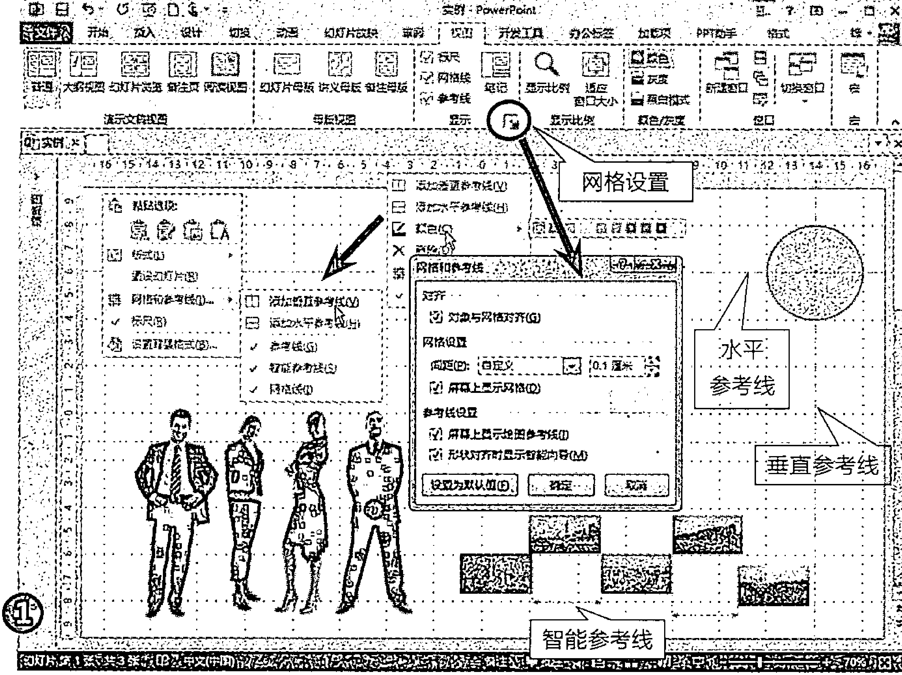

### ▶ 排列中的秘诀

在对物体进行精确定位时，“排列”选项组发挥着很大的作用，均匀分布、上下左右对齐、分解组合……这些小技巧都是快速排版的利器，可以让我们的设计事半功倍。

如我们要让4幅图片靠上对齐并且均匀分布，则选中图片后切换到“开始”选项卡，单击“排列”选择“对齐所选对象”，再分别选择“顶端对齐”和“横向分布”即可（图2）。如果要与幻灯片的上边缘对齐，则选择“对齐幻灯片”，这样所有的对齐分布操作都会以幻灯片的边缘为准。而下面的正方形和虚线，选中后通过底端对齐和左右居中，再选择“组合”就可以合二为一。

或我们要绘制一个25°的角，则可以绘制两根水平直线，然后选中上面一根，选择“排列”下的“旋转→其它旋转选项”，在“旋转”中输入25，再将两根直线进行右对齐和底端对齐，最后组合图形就得到一个25°的角。

有时我们还可以通过参数直接定位物体的位置和大小，比如，要将图3所示的矩形进行精确定位排列，可右击图形选择“大小和位置”，在右侧窗口中可以设置图形尺寸以及在幻灯片中的精确位置。

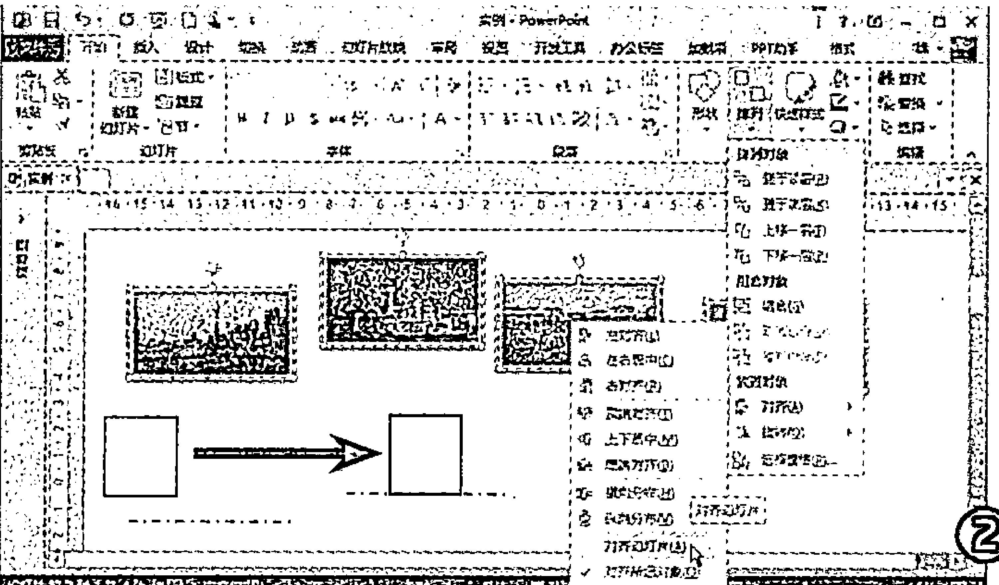

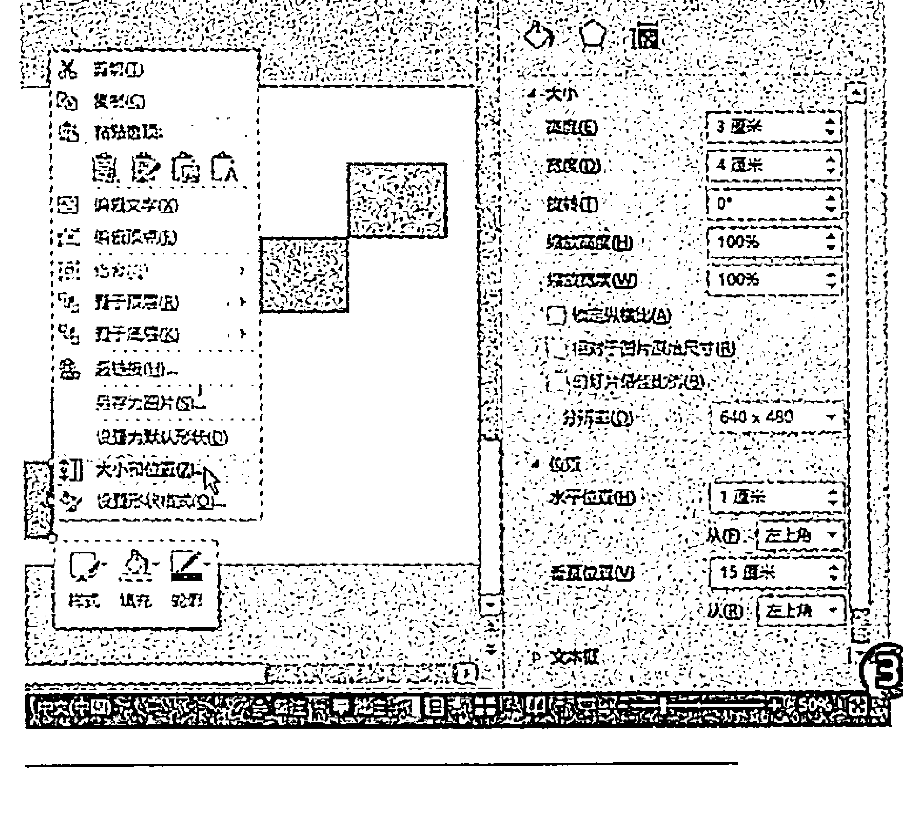

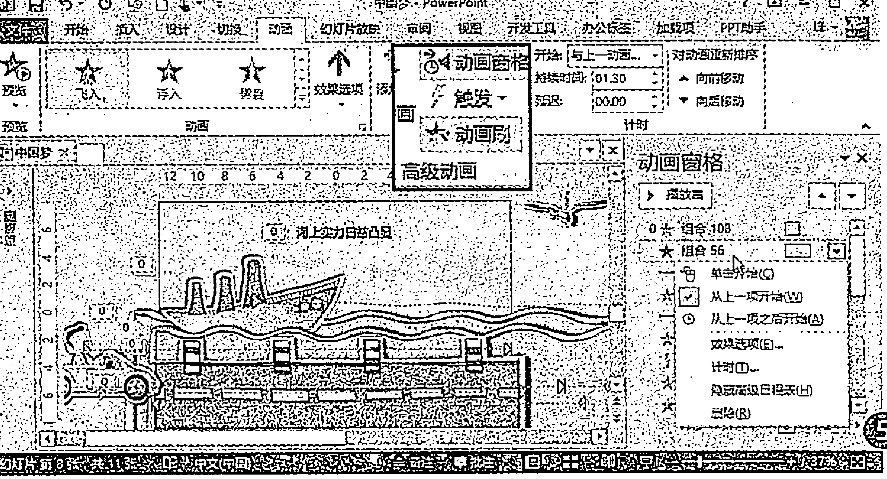

### ▶ 必备选择技巧

如果在一个页面上有大量的素材（图片、文字、图形等），或者使用了大量的动画，此时选择某个对象或修改某个动画就会比较麻烦，而选择窗格和动画窗格可以解决此类麻烦。
幻灯片上有很多素材，有些重合在一起，一幅图片完全遮挡住文字，要选中后面的文字，则可以切换到“开始”，单击“选择→选择窗格”（图4），在右侧会显示当前页面中的所有素材，单击后面的图标可以显示或隐藏素材。这样我们只要选中上面的图片，再在“选择窗格”中单击“隐藏”按钮，下方的文字就会显示出来。
对于大量的动画，修改时则切换到“动画”选项卡，单击“动画窗格”按钮打开动画列表（图5），选中动画则可以进行修改。

### ▶ 用好两把超级刷子

格式刷在早期的Office中就已经有了，在Office 2013中可以应用于图片、图形，这样我们就可以把不同风格的素材，通过格式刷进行快速统一。而动画刷则可以让复杂的动画效果再次被直接利用。选中添加动画的素材切换到“动画”选项卡，单击“动画刷”按钮，再单击要添加动画的素材，这样动画效果就被复制到当前素材上，相当快捷。

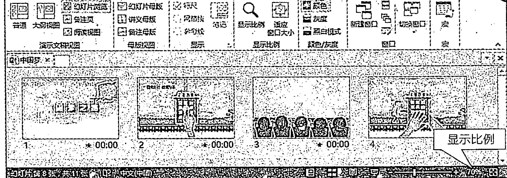

### ▶ 整体浏览文稿

制作多页幻灯片后，想要把握好整体风格，我们最好是对整个文稿进行浏览，切换到“视图”选项卡，单击“幻灯片浏览”按钮即可整体把握幻灯片。修改显示比例可调整浏览窗口中幻灯片的尺寸（图6），这样就能从全局角度统一演示文稿风格。

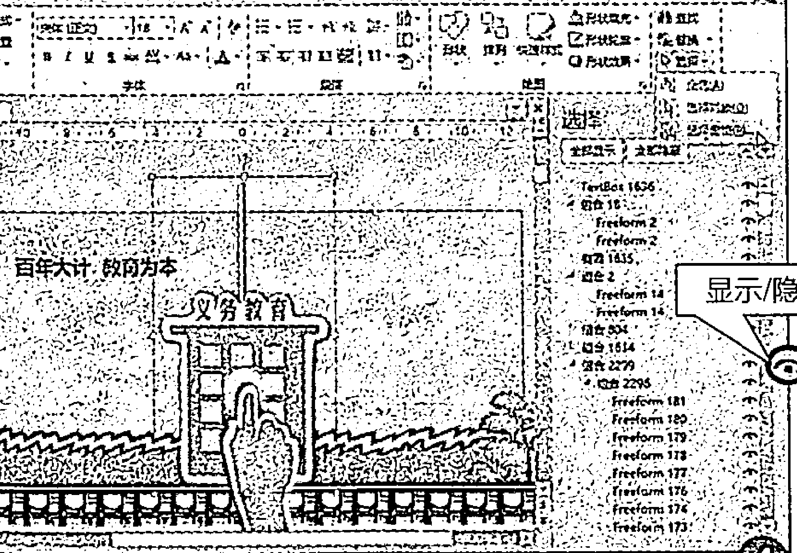

### ▶ 固定常用文件

对于经常用到的演示文稿，在PowerPoint 2010/2013中可以将其固定在文件列表中，这样打开时就很方便。将鼠标指向文件，则会出现“固定”按钮，单击后即可将其置于文件列表顶端（图7），这样下次打开该文件就很方便。


## 办公请“外援” 效率大提升
文 | 马震安

马布里、弗朗西斯外援的加入为CBA注入了新的活力，而孔卡、穆里奇外援的出色表现更助恒大问鼎亚冠宝座。常用办公软件中如果也引入“外援”，我们的办公效率同样会大提升。

### Word文档如虎添翼

在办公时，你也许会碰到要将数字金额转换成人民币大写金额的情况，难道还用一个数字一个数字地输入中文吗？其实，可以安装一个“Word必备工具箱”（下载地址：http://www.dwz.cn/fg1oM），它可以一键搞定这个问题。安装完成后，在Word窗口菜单中就多了一个“工具箱”菜单，选择它里面的“Word必备工具箱”菜单，在弹出的窗口中选择“财税”选项卡，点击“添加人民币大写金额”按钮，就能将选中的阿拉伯数字转换成中文大写了（图1）。

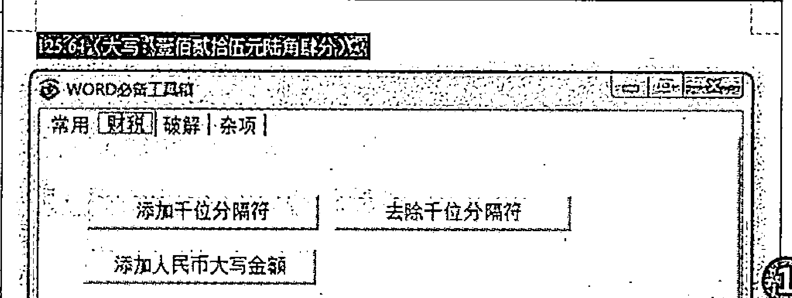

> 小提示
除了上述“外援”工具外，还有一些其他的办公插件，如Word轻松工具箱、Word高手、Excel高手、FLV助手等，这些插件都能弥补Office在许多专业领域输入和编辑的不足，从而提高办公效率。

### 表格效率倍增利器

在用Excel统计数据时，你还在为绘制斜线表头、打印分栏等问题困扰吗？有了Excel必备工具箱（http://www.dwz.cn/fg1st）这个“外援”，可以大大提高办公效率。在安装完成Excel必备工具箱后，Excel窗口菜单会多出一个“工具箱”菜单，选择它里面的“Excel必备工具箱”菜单，在弹出的窗口中选择“处理”选项卡，点击“斜线表头”按钮，就可以为选定的单元格添加斜线表头了（图2）。该工具箱汇集了多种功能，你可以尝试使用。

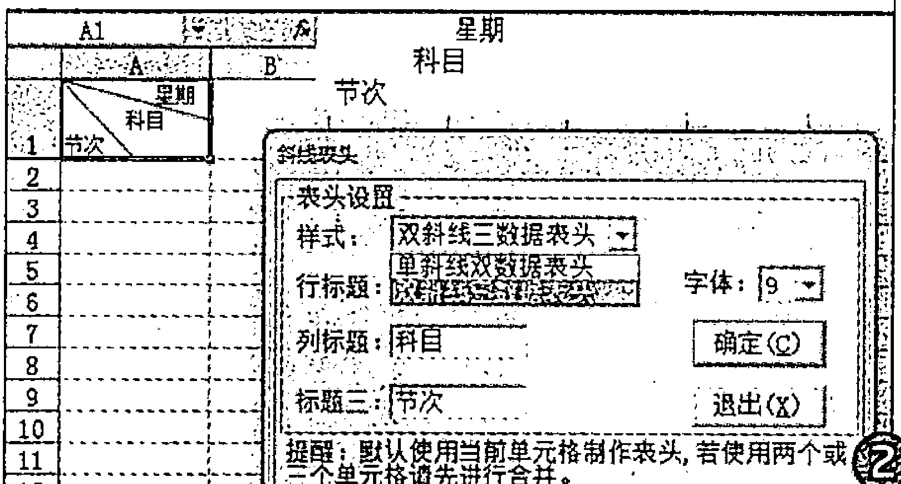

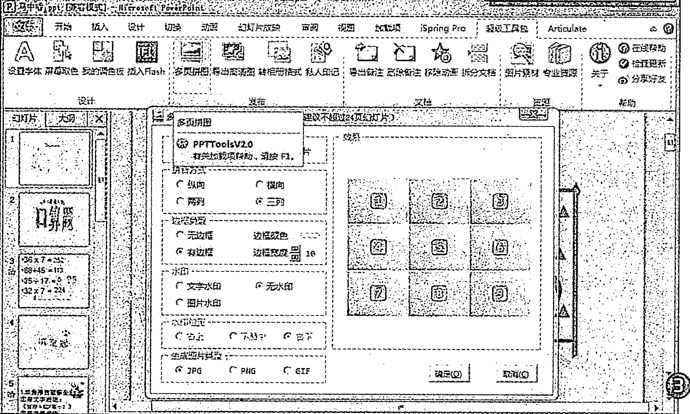

### 插件为幻灯片制作提效

你还在为向幻灯片中插入Flash而犯愁吗？你还在为如何将幻灯片转换成图片而苦苦寻找软件吗？你还在为将幻灯片拼接成图片而费时费力吗？如果你安装了这个PPT工具包（http://www.dwz.cn/fg1va），所有这些问题都会迎刃而解。下载安装完成后，在PPT 2010中就会增加一个“超级工具包”标签，点击它，就会显示出新增加的工具按钮。假设我们想将全部幻灯片拼接成一个图片，只需在这个标签中点击“多页拼图”按钮，在弹出的窗口中设置好拼合方式、边框类型、生成图片类型等，点击“确定”就可以将所有的幻灯片拼接到一个图片中了（图3）。

## 3D翻页电子书DIY
文 | 马震安

以往制作具有3D翻页效果的电子书，要么需要脚本语言编程实现，要么需要使用PPT中比较繁琐的触发器设置。现在，不用编程、不用脚本，就能轻松制作出效果出众的3D翻页效果电子书。没有编程基础的你也可以亲自试一把了！

制作3D电子书的方法很多，最常用的莫过于利用Flash和PPT制作。但是，用Flash制作3D电子书需要了解时间轴、关键帧、脚本语言，甚至要了解Action Script编程技术。而用PPT制作3D电子书，需要对幻灯片中的每个元素进行自定义动画设置，甚至还要利用触发器等，也很麻烦。现在，如果利用iSpring Kinetics制作3D电子书，就可以从这些烦恼中解脱出来。

安装iSpring Suite 6，运行其中的iSpring Kinetics组件，在弹出的窗口中选择3D Book（图1）。

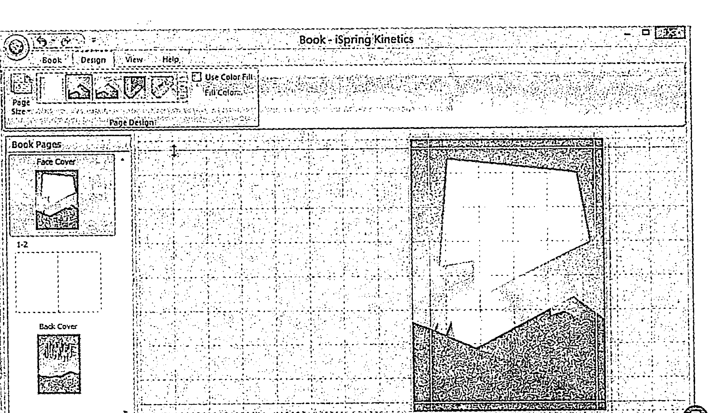

首先设置电子书封面、封底。在Book Pages窗口选择Face Cover页面，利用Design选项卡中的Page Size设置页面大小，在Page Design处设置页面背景，勾选Use Color Fill可进行填充色的设置（图2）。

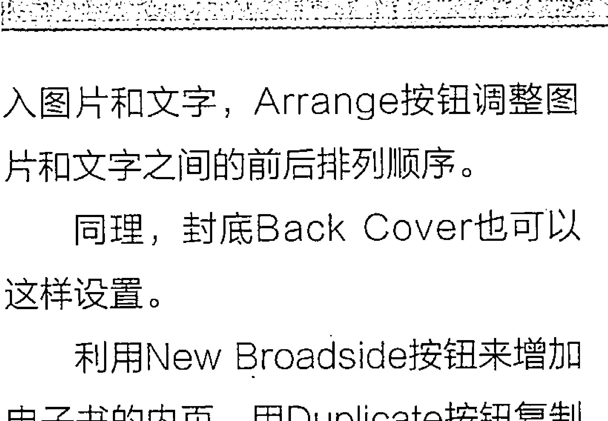

回到Book选项卡，利用Picture、Text Box按钮在页面中插入图片和文字，Arrange按钮调整图片和文字之间的前后排列顺序。

同理，封底Back Cover也可以这样设置。

利用New Broadside按钮来增加电子书的内页。用Duplicate按钮复制选中的页面，Delete按钮删除页面。电子书内页可分别选定左页或右页进行编辑，设置方法和封面、封底的编辑是一样的。

利用Properties按钮设置电子书的标题及显示界面（图3）。这个过程也可在电子书发布时进行设置。

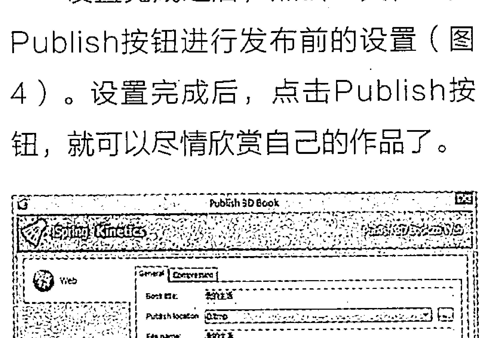

设置完成之后，点击工具栏上的Publish按钮进行发布前的设置（图4）。设置完成后，点击Publish按钮，就可以尽情欣赏自己的作品了。

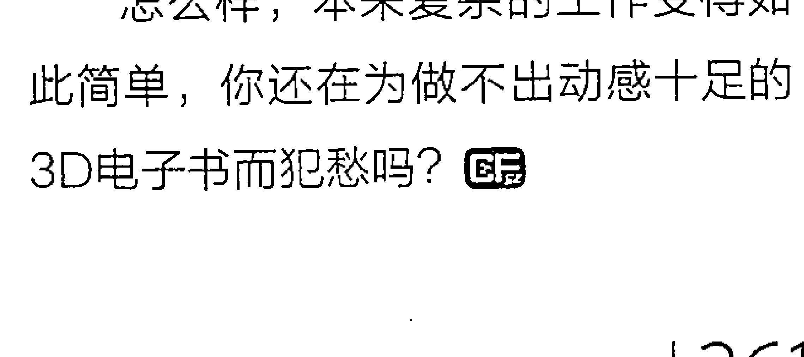

怎么样，本来复杂的工作变得如此简单，你还在为做不出动感十足的3D电子书而犯愁吗？

## 中文PPT 也有好版式
文 | 樱淘

网上下载的PPT模板多是英文，一改成中文就直接掉档次？要做项目指导书，PPT不知从哪下手？中文太多就像在看语文课本？其实中文也有好版式！不信去看看杂志，大篇的中文排版，人家照样配得上档次。杂志就是手边最方便的排版模仿源。

杂志的排版大致分为5类，分别为五五分、套图式、瘦长版、三七分以及全图式。今天通过几个实例告诉大家如何通过模仿竖版杂志创作横版PPT。图示中左边的小图为杂志的版式，右上为改为PPT后的版式。

### 五五分排版

这类排版以杂志版面的中轴为分隔，通常为上图下文的形式。在PPT中通常选用左图右文的形式。右边文字部分可以选择图＋文或者全文字的排版。

图1是大图搭小图的典型，通过大段文字介绍本张PPT的中心思想，大图可以是活动合照也可以是团队合照，小图放活动过程的准备、小花絮等。

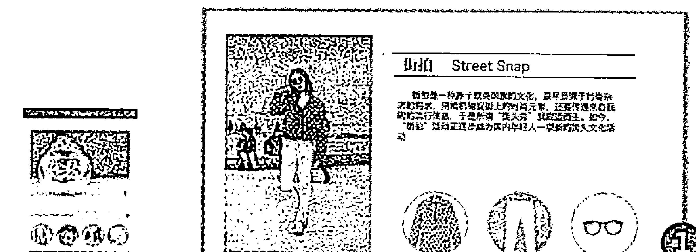

如果文字过多，可以选用图2的版式，有时候项目指导书的内容不能省去，可以试试分栏的做法。既能节省空间还能多码字。当然配图必不可少，好的图片是一味好盐，能起到点睛的作用（图2）。

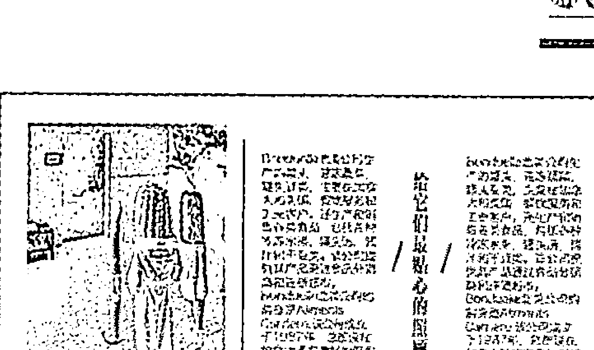

### 套图式排版

以多张小图拼凑而成的排版，因图较多所以图片大多采取1：1大小，或者1+1=2的大小，即两张小图等于一张大图的大小。由于图片的不统一，所以要留有一定空白以及保持干净的背景。

### 瘦长排版

对于16:9版式是个不小的挑战，要求图文简单。基本上以一图一文的格式排版，做得好就是一版风格鲜明的杂志风，适用在密集排版之后给观者视觉放松的效果。

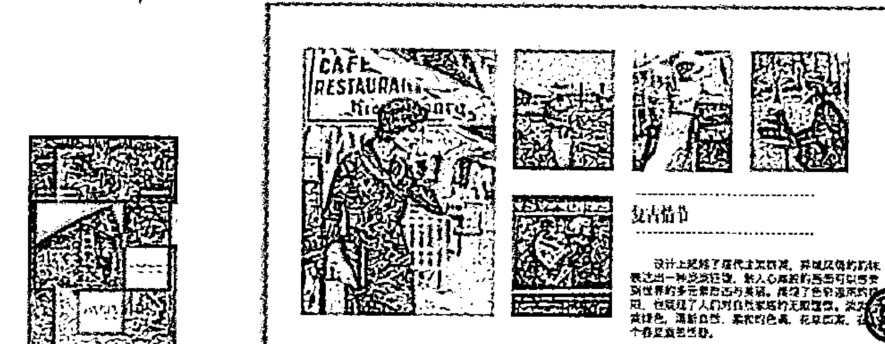

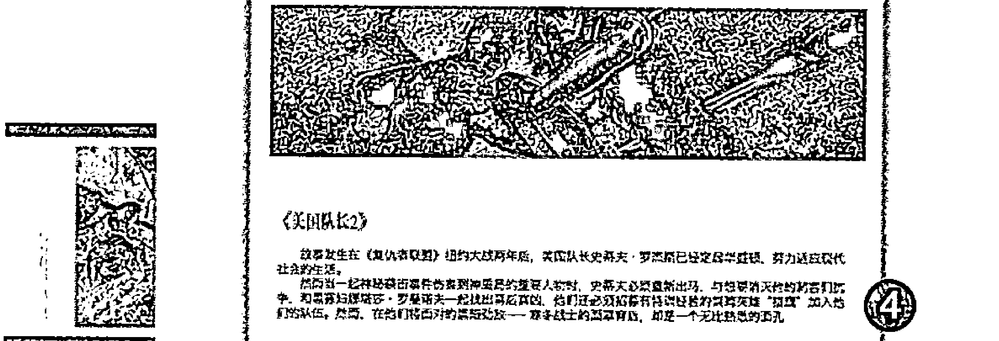

选一张剪裁一半重点依旧十分突出的图片，根据阅读习惯选用上图下文的形式，否则容易有头轻脚重的错觉。这类排版的图片可以是活动结束的大合照，这样的排版避免了合照的呆板，又能突出合照的重要性（图4）。

以上几个版式是否打开了你的世界呢？点开你曾经不知道怎么处理的多图多文PPT动手操作吧！

### 三七分排版

最常见的一种排版形式，对图文要求都不高，横竖摆放也没有过多的禁忌。注意图文之间的留白是关键，有时加上一句好文案可以作为整个PPT的点睛之笔。


这是一类能高捧上天也能低接地气的排版，用这类排版不容易错。合适的图片配上合适的文字，就会是出彩的一页。留白的范围个人掌控（图5）。

### 全图式排版

以整张大图为背景，配合色块和小字组成。内容的排版选在图中空白处，以往都通过添加色块组成，现在也可以选择直接在空白处添加文字。突出文字重点的全图式排版能营造强烈的视觉效果。需要注意的是，字体大多选用白色或黑色，如果选择其他颜色应根据图中颜色选取，稍加提亮后更能突出文字内容。


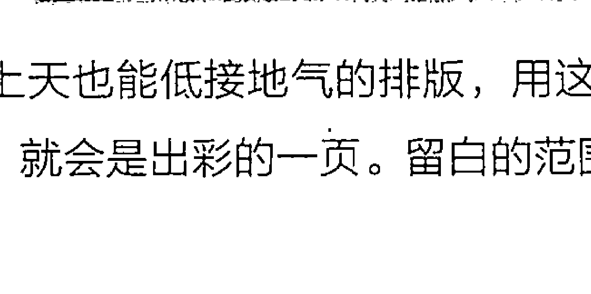

图6、图7这两张都是在图中空白处添加文字，没有什么技巧可言。大面积的留白反而让图文同时突出。第二张文字颜色根据图片中女生和小孩裤子选取中间色，稍加提亮突出文字内容，符合图片的颜色基调同时配合“夏日食冰”的主题。

中文排版千千万，不止这五种，但是有个技巧，牢记6个原则，不管什么样的排版都难不倒你。
- 多张小图排版，图片风格要统一。一张影楼婚纱照和一张游客照放在一起，就像咖啡和大蒜不是一家人。如果一定要放到一页PPT中，可以通过调节统一明度、颜色保持图片的统一。
- 想要多图排得巧，大图放总体，小图放细节。例如大图为活动的现场或者工作人员的合影，小图放工作人员准备的过程。小细节会让你的PPT更耐看。
- 要文艺就玩留白，要杂志就要玩字体。参见上面三七分排版中的例图，留白营造了更多的文艺感。杂志风应该怎么排？看看这期《电脑爱好者》的封面即可。
- 大图的空白处就是天然好排版。以往我们都通过添加色块解决在图片中加入文字，这个方法用多了难免厌倦，多翻翻杂志你就会发现，改变一下字体的颜色整张图片都会变得不一样！
- 只要排得巧，文字再多也不怕。除了上面的分栏排法，还可以通过缩小图片，用文字包围图片或者图左文右的方法。
- 中文排版主要针对阅读类PPT，这类PPT对字体大小要求不多，自己在制作中看得清即可。
除了以上这些基本原则外，只要多模仿练习你想要的风格才会有进步，某一天你就会发现自己也可以将灵感信手拈来。

## “非线性”幻灯片更活泼
文 | 马震安

科技馆展厅要做一个有关中国载人航天介绍的幻灯片，放在触屏电脑中演示，要求幻灯片中包含文字、图片及视频，游客想看哪些内容都可以“随心所欲”地自己动手播放。传统的PPT都是根据设计者的思维对幻灯片进行连接的，具有传统的线性局限性，不能满足游客的思维跳跃，所以需要另辟蹊径。

其实利用Prezi就可完成这项任务。Prezi能够在一个无限宽广的平面中随意地以一种非线性的思维方式制作可自由缩放的演示文档，能够根据游客的需要，随时进行幻灯的平滑跳转。

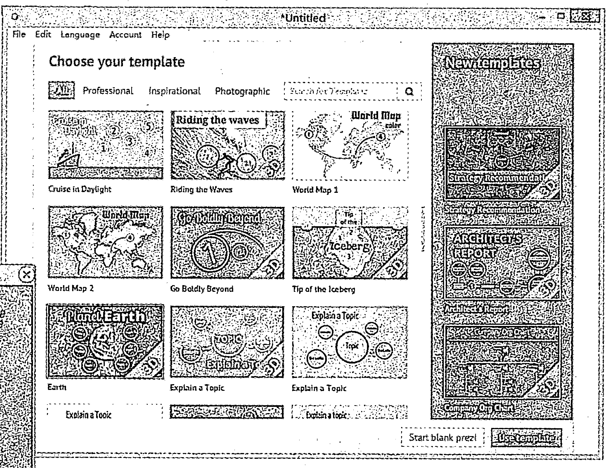

下载并安装了Prezi 4.7.4，启动Prezi Desktop运行后，为省事可直接使用Earth模板。

### 1. 航天背景图说换就换
在应用这个模板后，如果觉得背景并不是自己所需要的，可在窗口中右击选择Change background菜单对演示文稿的主背景进行更换。

### 2. 中文介绍添加有技巧
设置完背景及事件框的颜色后，就可向事件框中插入文字、图片和视频了。由于Prezi对于中文的支持十分有限，况且Prezi 4.6.2及以上版本只支持keg格式字体，所以还需要在相同网站下载并安装相应的字体库。安装完成后，在主界面中按下Ctrl+Shift+C键，在显示出的CSS编辑器中进行所需要字体的设置。

中文字体设置完成后，如果想在第一个事件框添加载人航天工程的简介，可双击这个事件框，轻松插入相应的文字。

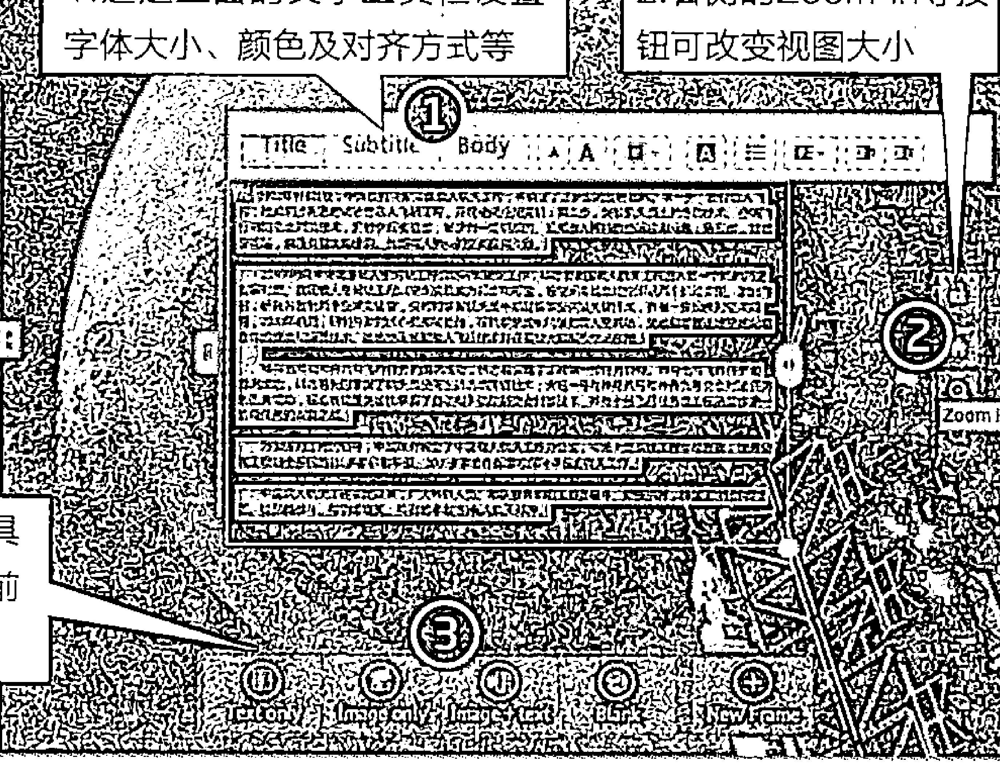

- 1. 单击3D Background按钮，在弹出的窗口中选择所需要的背景图片
- 2. 单击Next按钮或Advanced按钮对字体及颜色、事件框等进行设置
- 3. 最下方的工具栏则是设置当前事件框的版式

- 1. 通过上面的文字工具栏设置字体大小、颜色及对齐方式等
- 2. 右侧的Zoom in等按钮可改变视图大小

### ▶ 3. 画中画 神一到神十一次看个够
如果准备在第二个事件框中插入神舟一到十号飞船的相关内容，但还不想自己的演示文稿平平庸庸的话，可做一个画中画的形式。

- 1. 利用Frames&Arrows按钮菜单插入矩形事件框。选中事件框，用鼠标控制它的四个角进行放大、缩小或旋转。当然为了省事，也可用Insert按钮菜单中的Diagram菜单添加画中画
- 2. 在选中事件框后出现的工具栏中，可利用“+”或“-”对事件框进行放大或缩小，而手形按钮则可移动事件框。当然，文字也可以这样操作
- 3. 双击放大新添加的事件框，利用Insert按钮菜单可在其中插入图片、视频等。注意：插入的图片或视频的文件名不能包含中文字符
- 4. 右击文字、图片或视频利用快捷菜单可以调整它们的层次结构

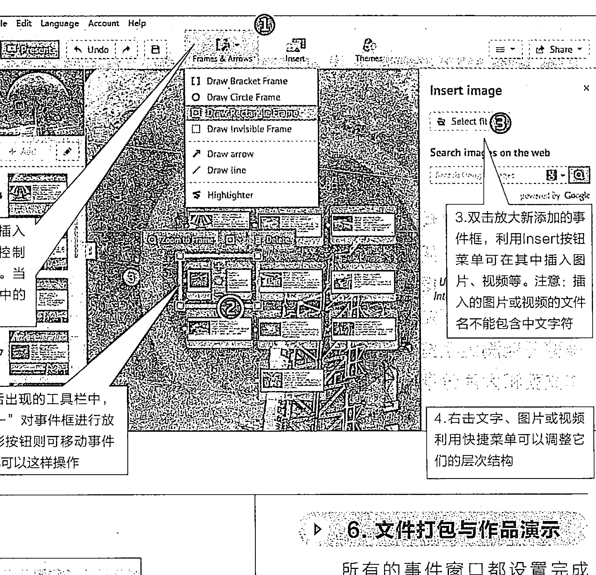

### ▶ 4. 路径巧添加 了解载人航天更清晰
为了使演示文稿更具有条理性，可以给新添加的事件框标上播放路径，让游客既能按设计者的意图播放以达到条理清晰，又能按自己的意图观看以满足游客思想的跳跃，这岂不是两全其美？切换到路径编辑状态，利用鼠标拖动的方式进行事件框的连接。

- 1. 单击图中的Edit path and animation按钮可进入路径编辑状态
- 2. 拖动事件框路径上的“+”按钮到相应事件框上，松开鼠标后两个事件就连接上了
- 3. 如果想删除路径，只需点击左侧栏中相应路径右上方的按钮，删除即可

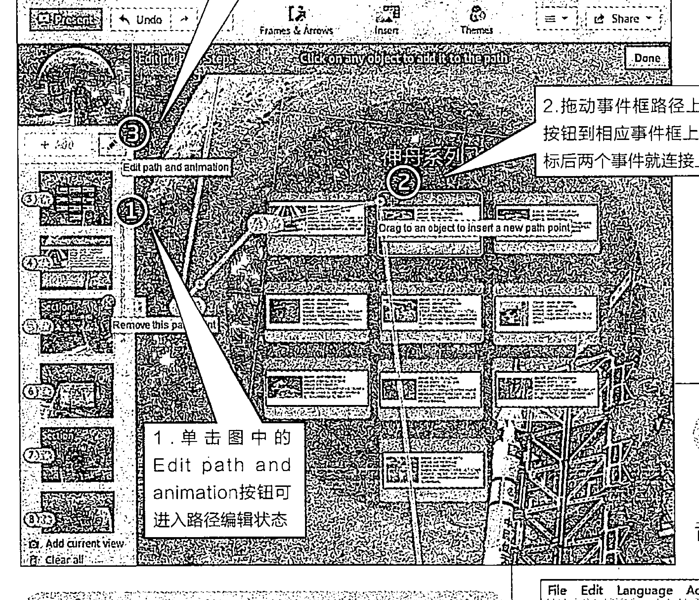

### ▶ 5. 音效添加让文稿充满活力
给演示文稿添加背景音乐及事件框音效也非常容易。

- 1. 单击Insert按钮菜单，可选择Add Background Music菜单来添加背景音乐
- 2. 在窗口左侧的路径栏选择相应的路径，点击Add Voice-over to Path Step可添加事件音效

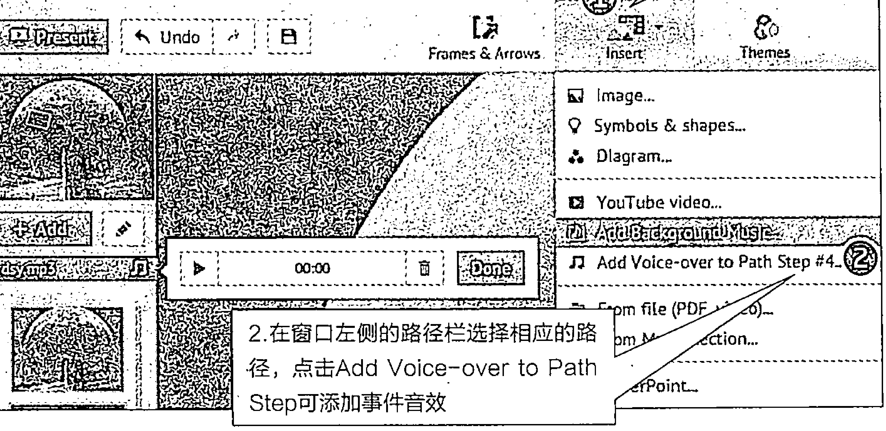

### ▶ 6. 文件打包与作品演示
所有的事件窗口都设置完成后，用Present按钮预览一遍演示文稿，感觉没问题了，就可以利用File→Export Portable Prezi菜单将演示文稿打包生成EXE格式文件。运行一下看看成品文件的效果吧！

## PPT图片玩出新花样
文 | 朱学兴

图片几乎是PPT的必备素材，图片的修饰手段多种多样，而‘裁剪’更是相当常用的操作。这个看起来很简单的操作，也蕴含着许多不为大家所知的技巧，通过裁剪还能满足某些特殊的需要。本文就和大家分享一些图片裁剪的秘密。

### 1. 剪出特殊形状图片
常规的裁剪区域呈现为矩形，其实在PPT中可以将图片裁剪成各种内置的形状，有些形状的外框还可以进行调节，从而让图片形状更加丰富多变。

- 1. 选中图片后切换到‘格式’选项卡，单击‘裁剪’按钮选择‘裁剪为形状’，这里概括了PPT中的所有形状，选择后即可将图片裁剪成相应的形状
- 2. 对于某些可以调节边框的图形，拖动黄色的调节点可改变外观，这样图片外观也会发生改变
- 3. 选择‘纵横比’可以将图片裁剪成固定比例（如16:9等），选择‘填充’或‘调整’还可以对图形进行裁剪

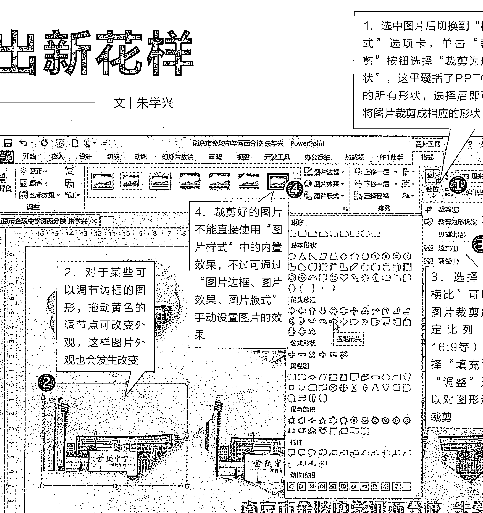

### 2. 图片‘剪’成艺术字
图片可以裁剪所需文字，听起来颇有难度，其实就是在文字里填充所需图片，实现另类的裁剪效果。

- 1. 使用艺术字输入所需文字，切换到‘格式’选项卡，单击‘文本效果样式’按钮
- 2. 选择‘文本选项’下的‘图片或纹理填充’，单击‘文件’按钮选择图片
- 3. 选择‘将图片平铺为纹理’，在下方可以调节图片在文字中的位置
- 4. 在修饰完成后，复制文字再右击选择‘粘贴选项’下的‘图片’，这样文字会转换成图片

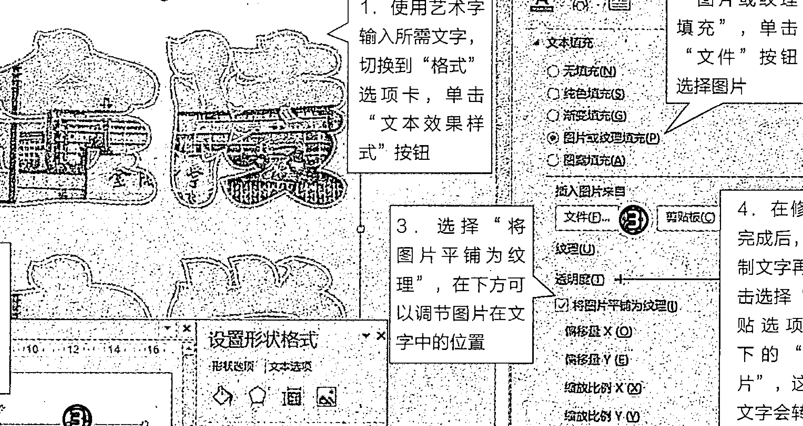

### 3. 化整为零式‘裁剪’
在一些配图中经常会将正常图片裁剪成小图片，形成一种化整为零式的拼图效果。

- 1. 绘制一个矩形后复制出多个并排列成4×4，全选所有矩形右击选择‘组合→组合’
- 2. 右击组合后的图形选择‘设置形状格式’，在右侧‘填充’中选择‘图片或纹理填充’，单击‘文件’按钮选择要分割的图片
- 3. 这样就可以看到图片被分割到小矩形中，再拖动小矩形，调节出错落有致的排列

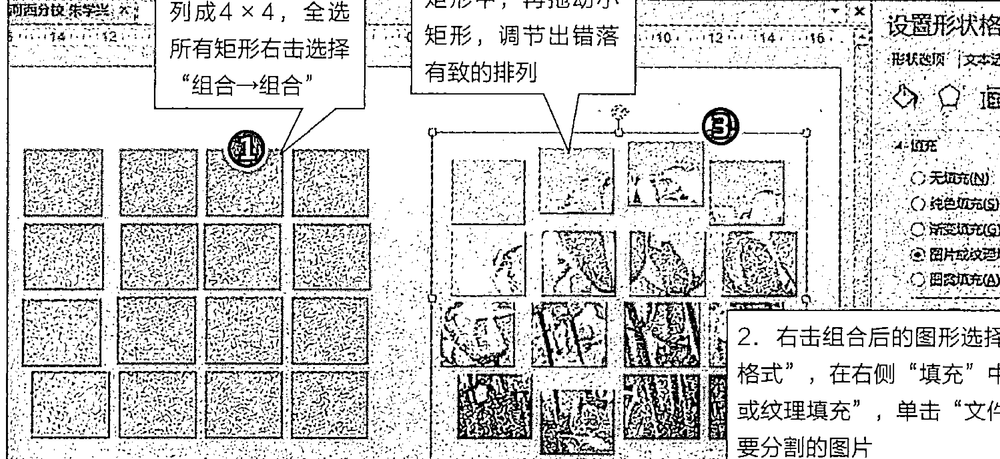

### 4. 聚焦视点式“裁剪”
将图片的重点部分裁剪出来，辅以特效可以起到聚焦视点的效果。如图中为了突出老虎的面部表情，可将其剪出来，再将其他部分进行柔化处理。

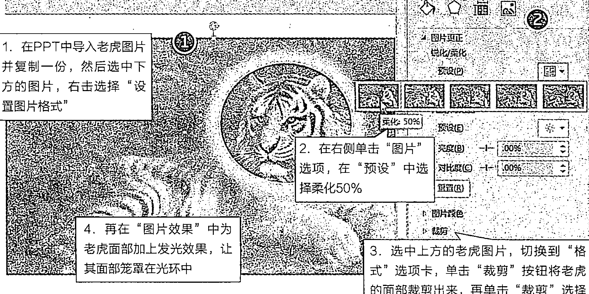

### 5. “量体”裁剪更精彩
常规的裁剪所能带来的视觉效果非常有限，如果能够对图片进行任意裁剪，那样无疑可以得到更具视觉冲击力的效果。下面我们就将图片中的人物裁剪出来，此种方法应用非常广泛。


- 1. 导入图片后，切换到“插入”选项卡，选择“形状”下的“多边形”
- 2. 在人物的身体边缘单击，可以勾画出人物的轮廓

- 1. 右击绘制的图形选择“编辑顶点”，此时可以调节顶点的位置，让轮廓更加贴近人物
- 2. 对于弧形部分（如：球）可右击顶点选择“平滑顶点”，如果要精确匹配人物轮廓，可右击选择“添加顶点”，这样就能精确修改轮廓

- 1. 按住Shift键先选中图片再选中图形，切换到“绘图工具”选项卡，注意：选择图片和图形的顺序不同，裁剪出来的效果也不一样
- 2. 单击“合并形状”按钮选择“相交”即可将图片中的人物裁剪出来，还可以试试联合、组合、拆分等功能，裁剪出不同的效果

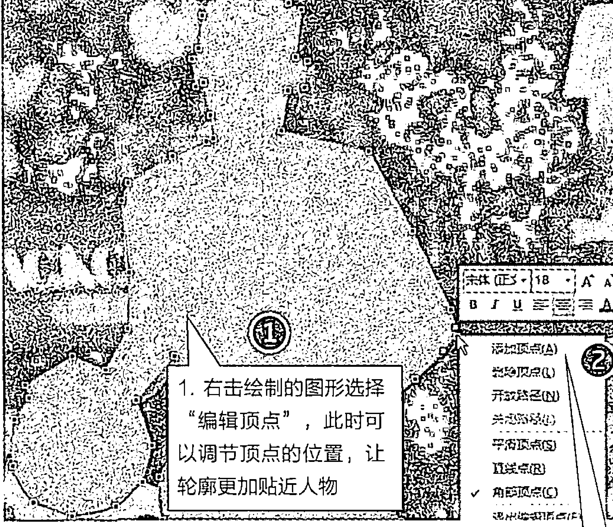

Step 2 精确调节人物的轮廓。

Step 3 确保人物轮廓图形和图片中的人物基本重合后，便可进行裁剪。


## 和Windows XP说拜拜
### DIY廉价平台如何选择系统
文 | 纯金处理器

在DIY领域有个不太好的“潜规则”，凡是选择廉价攒机方案的玩家总喜欢用Windows XP与其搭配。那么，到了Haswell时代之后，以奔腾为代表的廉价平台还能适用于XP系统吗？

### 低端首选的WinXP
相对而言，XP对硬件资源的占用最小，因此这一经典的操作系统总被DIY玩家用于低价攒机方案的配置单中。虽然我们都知道XP系统已经到了“姥姥不疼舅舅不爱”的地步，但相同的硬件平台，XP和最新系统之间到底有多少性能差异就鲜有人能说清楚了。

### 缺少对新技术的支持
XP现在最大的缺陷，就是缺乏对新技术的驱动更新支持，比如Intel芯片组原生自带的USB3.0启动（部分第三方USB3.0芯片有XP下的驱动）、不支持超过4GB的内存（虽然XP也有64bit版，但太小众了），此外类似双显卡、RST等技术以及很多游戏大作也不再对XP提供支持。此外，虽然英特尔也推出了Haswell平台的核芯显卡驱动（14.56.0.5441版），但部分集显平台用户安装时也会弹出“达不到最小安装条件”的报错提示。总之，硬件越新，在XP系统下的体验也就越差。

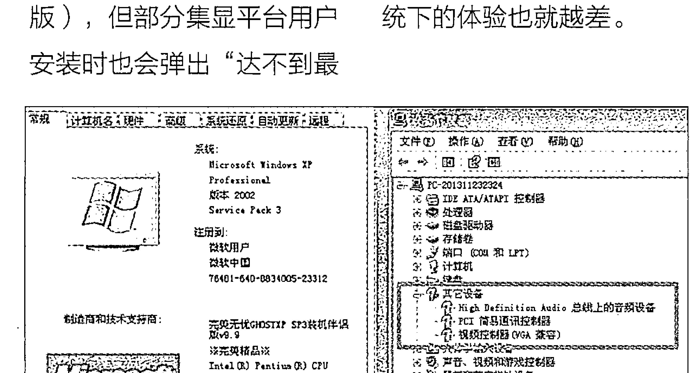

### 性能表现Win8最佳
针对同一奔腾G3220硬件平台，笔者分别在XP和Win7/8系统下进行了测试（见表）。从结果分析来看，XP除了极少数测试项目可和其他两个系统媲美外，内存性能一塌糊涂，特别是解压缩能力上，更是远远落后于后辈系统。综合来看，G3220在Win8系统上的表现最优。因此，如果你想120%挖掘Haswell低端平台的性能潜力，Win8才是首选，Win7次之，而XP就不要考虑了。

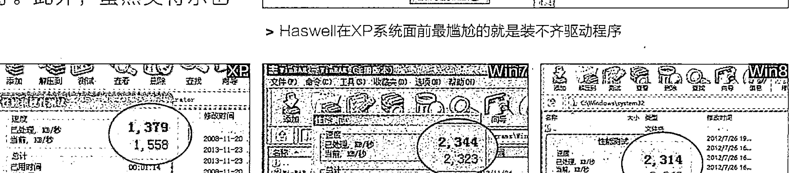

> **扩展阅读**
>
> 由于XP安装盘不集成SATA驱动，因此很多XP用户会忽略BIOS中硬盘模式的设置，特别是在SSD固态硬盘流行的今天，如果选错IDE模式安装系统，SSD的性能可是会耗损大半的。

| 测试软件 | WinXP | Win7 | Win8 |
| :--- | :--- | :--- | :--- |
| AIDA64 CPU | 15063 | 14419 | 14437 |
| AIDA64 内存读取 | 18052MB/s | 19064MB/s | 19136MB/s |
| AIDA64 内存写入 | 19550MB/s | 20655MB/s | 20860MB/s |
| CINEBENCH 11.5 | 2.09pts | 2.46pts | 2.51pts |
| SUPER-PI MOD (100万位) * | 13.078s | 12.683s | 12.633s |
| WPRIME V2.08 (32M) * | 25.14s | 25.537s | 24.594s |
| 国际象棋 | 4827 | 4765 | 4811 |
| WinRAR | 1558KB/s | 2323KB/s | 2246KB/s |

测试平台：奔腾G3220处理器，B85芯片组主板，4GB内存×2；
*代表数字越小，性能越强

## 小容量SSD的福音
### 联想本用ExpressCache做缓存
文 | 曹操

现在淘宝有很多仅售100元左右的16GB mSATA固态硬盘，如此小容量还不够装系统，那它又有何存在意义？如果你的笔记本是联想最新的Y系列或ThinkPad T/X/L/E系列，则可借助一款软件，将小容量SSD用作系统缓存以提升系统的响应能力。

在很多人的印象中，唯有基于HM77级别芯片组设计的笔记本/超极本，才能实现将小容量SSD作为系统缓存的功能。实际上，联想旗下的Y系列和部分ThinkPad系列笔记本，即使是HM76芯片组，也能通过安装ExpressCache软件自动在mSATA SSD硬盘上创建必要的缓存分区。

### 百十来元的小容量SSD
在预算足够的前提下，购买大容量SSD用于安装系统，其性能表现绝对完胜小容量SSD + HDD的组合。但是，一块64GB起的SSD至少400元，并非所有消费者都可接受。而目前16GB/24GB mSATA接口的小容量SSD在淘宝的价格仅100元/150元左右（图1），如果将它们合理利用，同样可以获得给力的磁盘性能。

> 百十来元的成本，要比购买大容量SSD更省预算

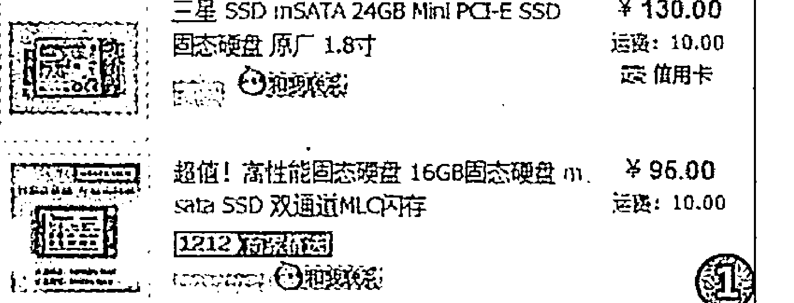

### 安装SSD和准备工作
以联想Y510P为例（Win7 64bit系统），被笔者安装了一块淘来的24GB SSD。安装SSD后启动计算机，依次进入“计算机→管理→磁盘管理”，看看SSD有没有被系统识别。比如笔者的机器就将SSD识别成了两个分区：100MB的“系统保留”和22GB左右的“新加卷”。
此时鼠标右键点击22GB的磁盘部分并选择“删除卷”，让其变成“未分配”的磁盘状态（图2）。如果Windows自带的磁盘管理工具无法对SSD所在磁盘进行操作，则可借助DiskGenius（下载地址：http://www.diskgenius.cn/）等第三方软件删除SSD的自带分区。

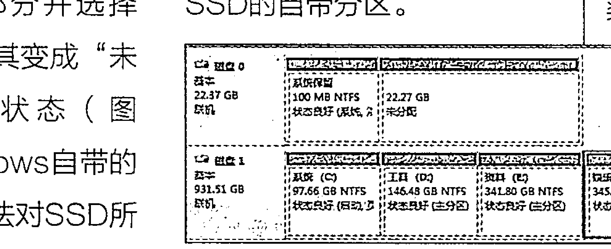

> 安装ExpressCache的前提条件就是SSD必须处于未分配的磁盘状态

小提示
淘宝上有些小容量mSATA SSD都是拆机回收的（质量没问题），因此这类SSD可能存在已被分区的现象。安装ExpressCache软件前要确保笔记本内的机械硬盘工作在AHCI模式下，否则安装后会报错。

### ExpressCache自动提速
在联想官网下载并安装ExpressCache软件（64bit下载地址：http://t.cn/8kqFP2P），然后以管理员身份运行该软件，并按提示重启后就算开启了自动加速的功能。需要注意的是，SSD变成高速缓存分区后，只有运行之前运行过的程序才有加速效果，属于越用越快的类型。
如果大家在运行ExpressCache软件后感觉没有提速效果，可以在开始菜单的运行栏里输入“CMD”，然后进入命令提示符界面，输入“eccmd.exe -info”，如果出现显示百分比的提示则代表ExpressCache已经启动（图3）。如果没有则需要在控制面板的卸载程序窗口删除ExpressCache软件（不要使用第三方软件卸载），然后再安装一次即可。

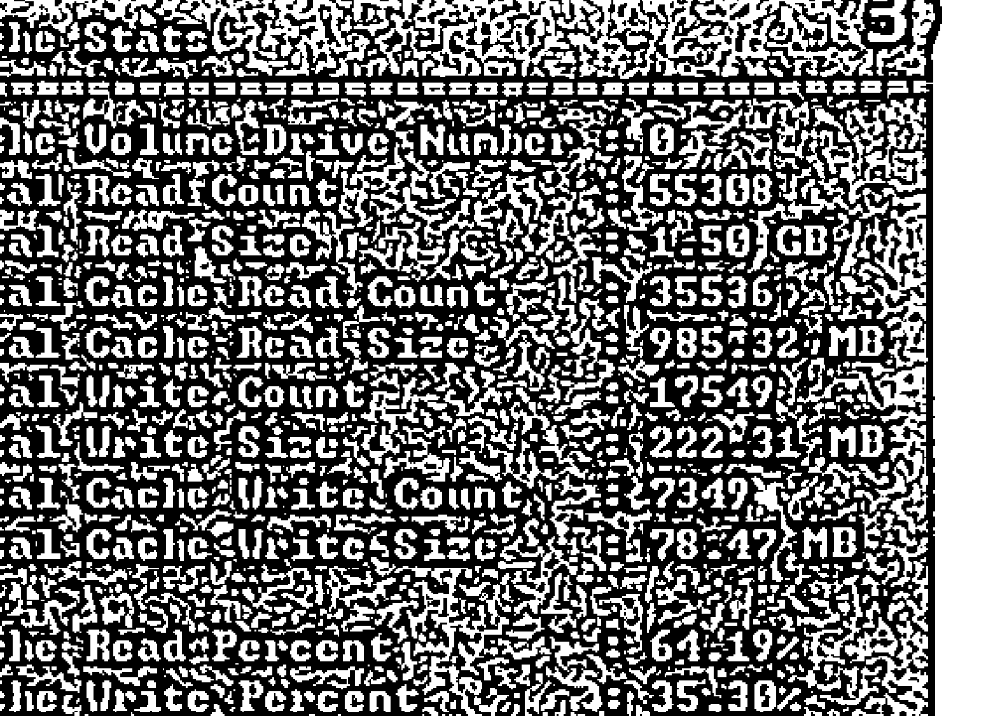

## 智能化数字生活
### 打造全自动智能手机
文 | 飞雪散花

智能手机在为我们带来无限方便的同时，也为我们带来了些许麻烦。举两个简单的例子，如果多台设备间进行蓝牙传送文件的时候，我们需要手工开启该功能才行；而如果你对手机电量很在乎，那么Wi-Fi这个吃电的大户肯定会让你头疼。那么，我们能否让智能手机更智能一些，自动解决这些问题呢？答案是肯定的。

### 蓝牙开启全自动 开启项目任你定
凡是开过车的朋友都知道，开车的时候如果我们准备使用蓝牙耳机来做到开车接收电话两不误，那么只有一个选择，就是开车之前手工启用手机的蓝牙功能并让其与耳机配对。但另一个问题就出现了，由于蓝牙功能会消耗大量的电量，所以在手机电量已经不足的情况下，该功能会很快让手机没电。其实，要解决这个问题很简单，我们只需借助一款名为Automatic Buletooth Toggle的应用即可（下载地址：http://126.am/AYA6B0）。

Automatic Buletooth Toggle会自动检测指定范围内是否存在和我们的手机配对的设备，如果有则自动开启蓝牙功能。如果配对的设备是蓝牙耳机，那么，它将只在检测到有来电或用户聆听音乐时才开启该功能，通话或音乐结束时再将其关闭，因而可极大程度地节省手机的电量，同时省去我们要手工开启并配对的麻烦。

安装后运行程序，进入程序的主界面，点击屏幕下方的菜单按钮，选择Setting（设置）项（图1），进入设置界面。

在这里，我们可以根据自己的需要选择开启某功能。比如，我们可以通过勾选Enable Bluetooth on incoming calls和Enable bluetooth on outcoming calls项，让程序在检测到有来电或呼叫时，自动开启蓝牙功能（图2）。也可勾选所有选项，使用程序提供的所有功能。设置完毕，返回程序主界面，点击Start service（开始服务）按钮，开启相应服务。这样，以后我们周围只要存在已配对的蓝牙设备，程序就会自动开启手机的蓝牙功能并与该设备配对，从而免去我们要手工开启及配对的麻烦。

### Wi-Fi太费电 充电方开是上策
嫌频繁充电太麻烦，一些朋友即使在家中也不开启手机的Wi-Fi功能。不过充电时例外，由于充电时无需考虑电量问题，所以这些朋友希望能在充电时再开启Wi-Fi功能，那么，怎样来满足他们的这个愿望呢？同样简单，我们可以借助Wi-Fi Automatic来达到目的（下载地址：http://126.am/hP9cz0）。

该应用的用法相当简单。安装后启动程序，在其主界面中单击下方的齿轮状按钮（图3），进入设置界面，勾选“自动打开Wi-Fi”和“自动关闭Wi-Fi”两项（图4），以后程序会自动检测用户手机当前的状态，并在发现充电时，自动开启Wi-Fi功能，在不充电时，再自动将其断开，非常方便。

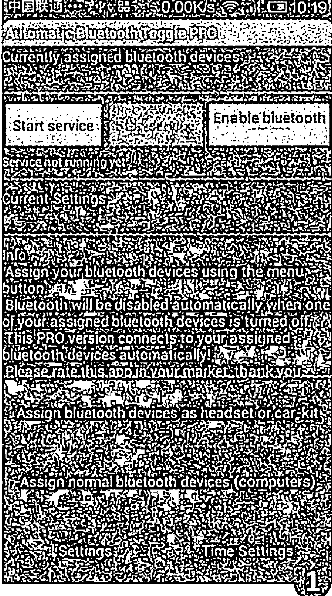

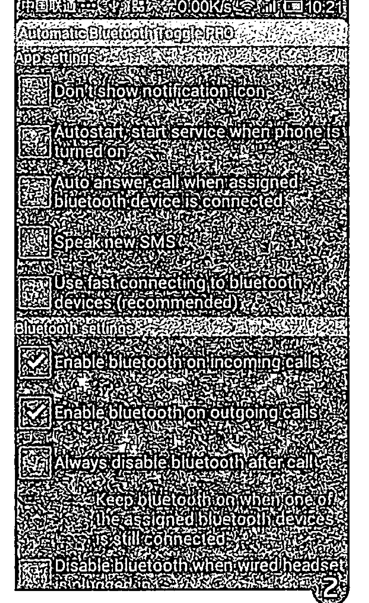


### 常用应用 按时启动
手机的智能化全自动服务，当然不止局限于自动蓝牙与Wi-Fi连接，除此之外还包括很多。比如早晨起床，我们当然希望它能自动打开播放器播放音乐，给一天带来一个好心情；在8点乘坐公交的这段时间，我们又希望它能打开浏览器并进入相应的网站，以便我们能轻松地了解最近发生的热点新闻等。而要达到这个目的，我们可以请TaskBomb task scheduler来帮忙（下载地址：http://126.am/nvgRS2）。

以指定早上8点打开UC浏览器并进入手机新浪网（http://3g.sina.com.cn）首页为例。安装后启动程序，在其主界面中点击Tasks（任务）按钮（图5），进入相应的界面。

单击“+”按钮，在出现的界面中，点击Name（名称）项，打开同名对话框，在其中输入任务名称（此例中为“8点访问新浪网”），确认后，返回上级界面。选择并设置Action type（操作类型）项为View（查看），然后继续选择Data（数据）项，将数据类型设置为Direct URL（指向网址），同时在随后出现的Direct URL Entry（地址入口）对话框中，输入要让其自动进入的网址（此例中为http://3g.sina.com.cn，见图6）。确认后返回上级界面，选择Activity（活动）项，设置要进入该网址所用的应用程序，如UC浏览器或手机内置的其他浏览等。

设置完毕，返回程序主界面，选择Alarms（闹钟）项，进入同名界面，此时我们会发现刚才设置的任务已经出现在列表中，选择它，然后在出现的界面中，依次选择并设置Start Time（开始时间）为上午8点（图7），Days（循环日期）为周一到周日。每个项目设置完毕，别忘了单击Set（设置）按钮令设置生效。至此让手机每天早上8点准时启动浏览器，并进入新浪首页的工作就大功告成了。

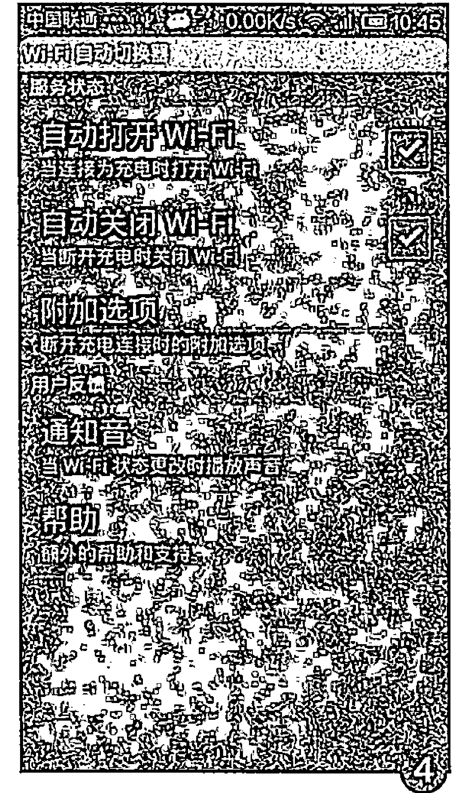

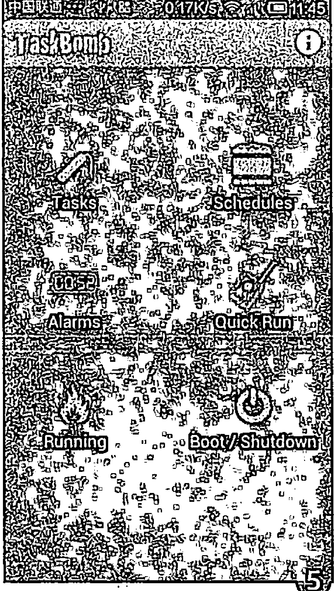

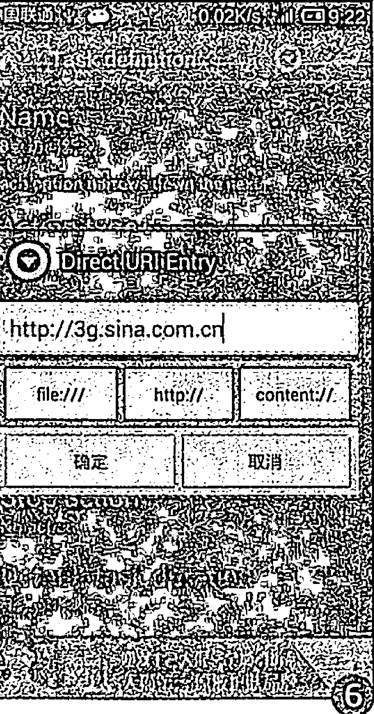

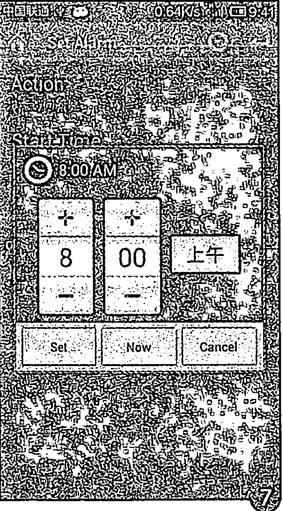

> 编辑点评：我们可以设置让手机在指定的时间运行任何程序或播放音乐、视频、打开文档等。现在，万事自动，我们的手机已经变成全自动的能手了，那感觉是不是很爽？CF

## 剑走偏锋
### 零成本解决AMD处理器过热问题
文 | 何国雄

Athlon系列双核处理器是AMD历史上最成功，也是装机量最大的产品。但发热量大却是使用该系列处理器的电脑的通病，尤其是历经数年后，问题更显突出，不少DIY玩家一直在苦寻为AMD处理器“退烧”的良方。有没有一种操作简单而成本低廉的“退烧”良方呢？

### 无征兆的离奇死机

笔者有一台使用多年的电脑，其配置为：AMD Athlon 4800+双核处理器，技嘉M61PME-S2主板，2GB内存并安装了Windows XP专业版操作系统。前段时间该机出现在使用中突然关机的现象，在一般的上网、办公使用的情况下，通常工作一个多钟头的时间就死机或突然关机，而在线观看网上视频时则往往不超过30分钟就出现前述现象。根据经验，类似问题应该与CPU的发热有关。

### 故障源于CPU“高烧”

为了印证，笔者首先进入BIOS将“CPU报警温度”调整到80℃后再开机，在线播放网上视频进行测试，约20分钟后电脑即出现报警，然后自动关机；运行“鲁大师”进行温度检测，发现开机后CPU温度急升，很快就达到80℃并快速上升，很快自动关机。确定此故障是由于CPU温度过高所引起，“高烧”导致突然关机。

### 常规处理无济于事

CPU发热异常，最常见的解决方法就是除尘添加硅脂。因此笔者也按照这一常规步骤，拆下散热风扇、散热片、主板、内存等一并进行了全面的除尘。拆下散热片时见其与CPU的接触面上的导热硅脂有点变干，彻底清理接触面、除去油污，选用优质的导热硅脂严格按标准重新涂覆，装上散热器及风扇。再次运行“鲁大师”检测，CPU仍然“高烧”不退，没有任何改观，常规方法毫无作用，可见该机的“高烧”并非灰尘、导热硅脂干涸等常见原因所引起。作进一步排查，更换散热风扇，甚至替换了电源，仍然如故。由于开机不久即死机或自动关机，杀毒、重装系统等操作根本无法进行，且CPU在其使用率并不高的情况下出现“高烧”，病毒作祟的可能性不大。至此，检修陷入困境。

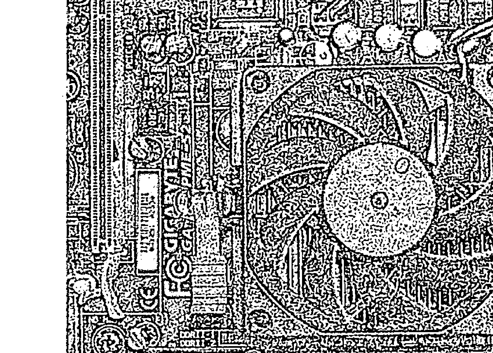

### 剑走偏锋 立等见影

考虑到这是一台辛勤工作了好几年的老机器，安装散热器的金属扣具可能由于金属疲劳弹性降低，而导致扣具的压力减小或压力不均匀，使散热器底部和CPU表面不能紧密接触，影响散热效果，而出现“高烧”。经反复分析，参考相关资料，在不影响CPU针脚和其插座内部的有效连接的前提下，用合适的垫片把CPU垫高一点，应该可以达到增大扣具压力而解决问题的目的。照此思路立马行动，具体操作步骤如下：

### ① 准备工具和材料
工具：剪刀、镊子各一把
材料：青壳纸（1小块）、502胶水（1小瓶）

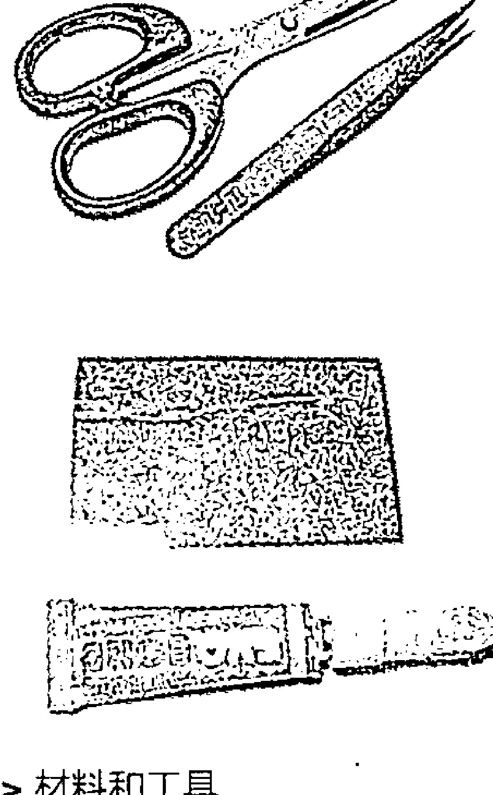

#### 扩展阅读
青壳纸具有良好的机械强度，较高的电气强度，产品表面平整光滑，富有韧性，绝缘、耐压、耐热性良好，广泛应用于电机、电器、仪表等设备中作绝缘材料。

### ② 剪裁青壳纸制作CPU垫片
取下CPU，对照其尺寸，用青壳纸剪4个合适大小的直角三角形，以承担CPU垫片的重任。


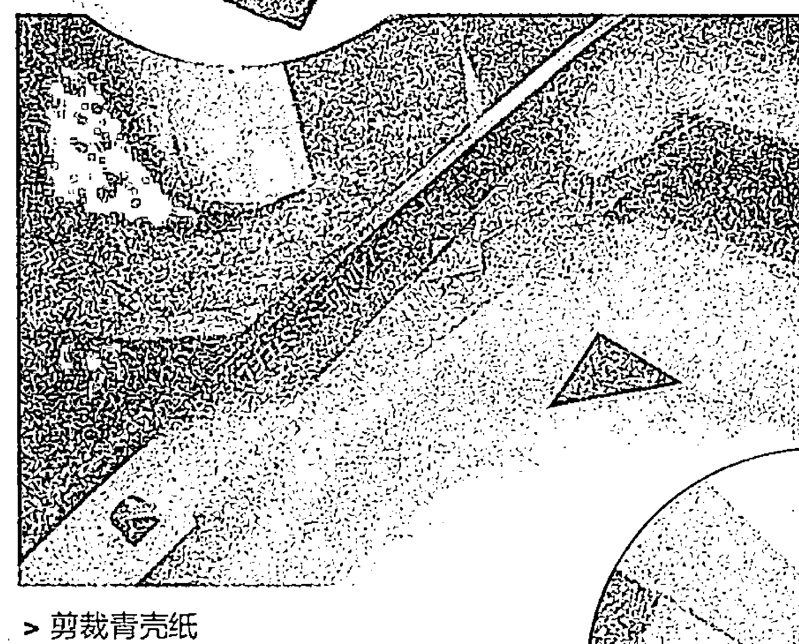

### ③ 粘贴CPU垫片
用少量的502胶水涂到垫片不光滑的一面，然后用镊子小心地把4个垫片分别粘贴在CPU的4个角上。

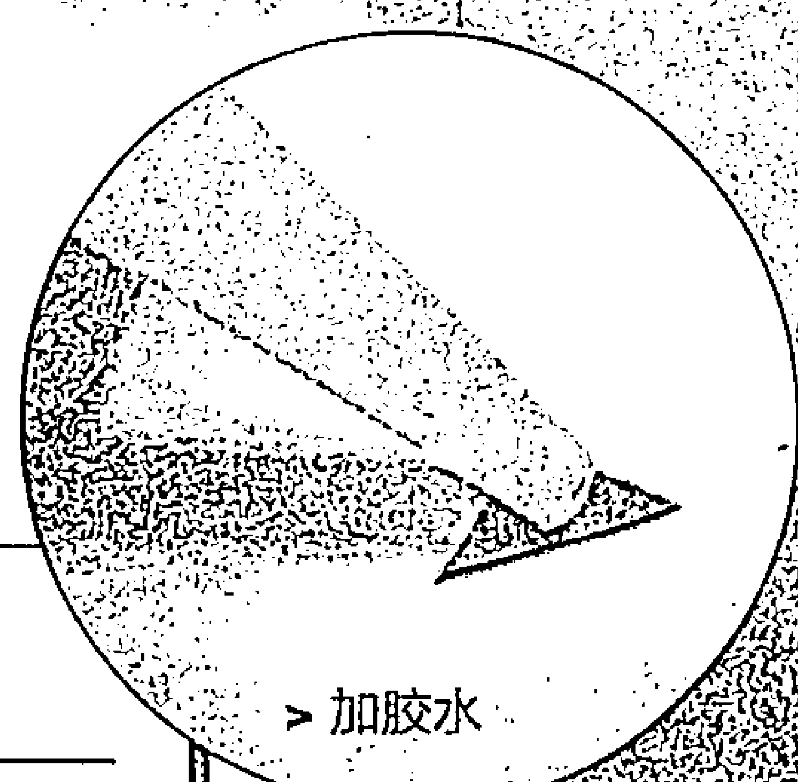

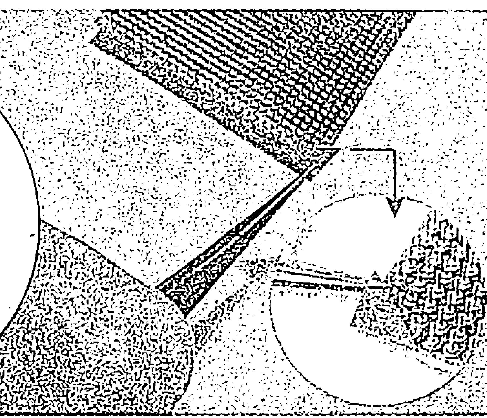

#### 小提示
此步操作要注意胶水的用量要少，宁少勿多，CPU的针脚不能粘上胶水，以免影响其导电性能；粘贴时要谨慎操作，防止因碰触或CPU不小心跌落在地上而导致其针脚弯曲节外生枝。垫片粘贴在CPU插座的四角也有同样的效果，只是在不拆出主板的情况下操作难度较大。

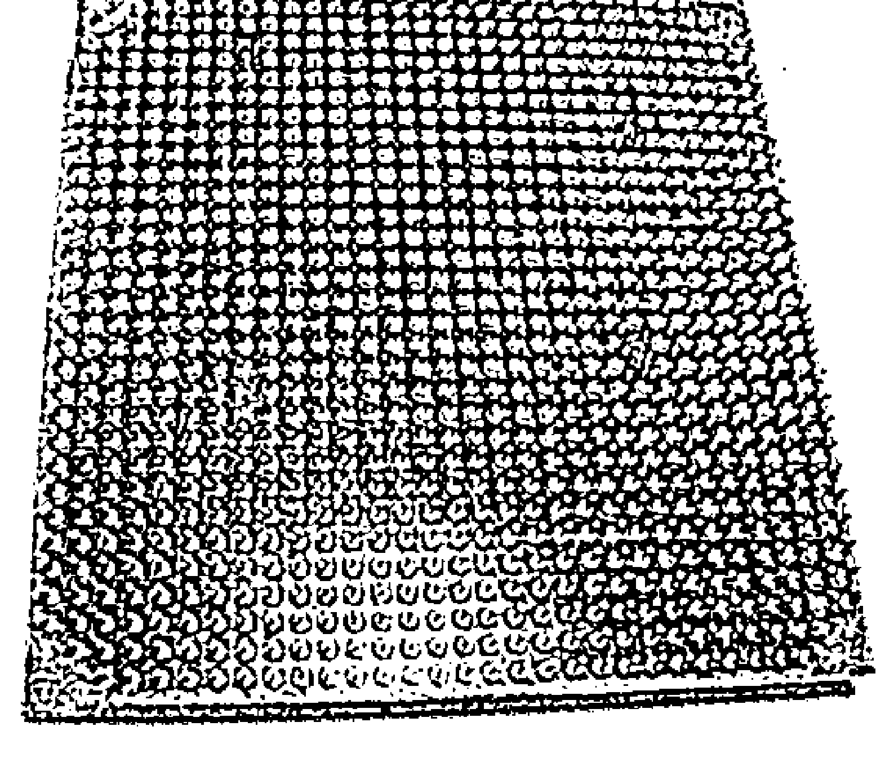

### ④ 重装CPU检测结果
将改造后的CPU装回主板，涂覆硅脂，装上散热器等，检查无误后试机。运行“鲁大师”检测，CPU温度缓慢上升，上网播放在线高清视频，经几个小时的考验，最高温度也未超60℃，无死机和自动关机的情况出现；长时间运行“鲁大师”的“温度压力测试”程序也表示毫无压力，“高烧”不再，故障已彻底排除！

### 原理分析
在CPU的四个角贴上青壳纸，起到垫片的作用，将CPU垫高少许，增大扣具的压力，解决了因扣具的弹力降低及CPU插座下面的电路板局部变形下陷等因素导致的压力不足或不均匀的问题，保证散热器底部和CPU间足够的压力作用下两者表面紧密接触，恢复良好的散热效果而达到退烧的目的。

选用青壳纸的目的是利用其绝缘和耐热的性能，在业余情况下，用0.3mm左右的硬纸片代替也可达到同样的效果。

本方法的效果立竿见影，取材容易，操作简单易行，几乎是零成本解决了AMD处理器过热的问题，经实践验证确实可靠，无其他异常情况出现，遇类似情况的朋友不妨一试。

## 小机箱如何“吃”下超长显卡
文 | 陈俊名

很多预算有限或本着小巧简洁思路装机的用户都青睐各种迷你机箱和集显平台，但是，当这类平台用户打算添置显卡以满足后期的游戏需求时却经常发现，后配显卡“塞”不进去机箱。此时，一根小小的转接线，也许就能解决这种尴尬。

### 超长“旗舰”的尴尬
笔者就是迷你平台的“受害者”。当年为了节约预算，购买的机箱虽然便宜，而且主板也预留了PCI-E插槽，但却没有留意内部走线对显卡安装的影响。

这次还是为了节约预算，在网上花200元淘了一块Geforce 8800 Ultra。作为当年的NVIDIA旗舰，该显卡采用了超长的PCB，用料非常出色，性能也不逊于时下最新的中端显卡。悲剧的是，当我欢天喜地收到显卡后才发现，这种超长显卡的尾部和巨大的涡轮式风冷系统已经占据了主板将近三分之一的面积，导致在其之下的接口都因被遮挡而无法使用（图1）。

在不更换显卡的前提下，只能选择IDE接口来挂载硬盘。但是，在SATA为主流的年代还用IDE接口那真是太落伍了。为此，笔者找到了一个能够解决问题的好办法，那就是使用延长排线。

### 延长排线帮大忙
延长排线相信大家都不陌生，因为我们早期的硬盘就是排线的。笔者的显卡是PCI-E接口的，所以就买了一根PCI-E的延长线（图2）。这种排线本来是设计给挖矿机安装多个显卡时不会挤在一起方便散热的，但是现在正好能为我们解决机箱空间不够的问题。

需要注意的是，延长线并不是说越长越好，因为这种排线没有屏蔽层，十分容易受到周围的电器环境干扰。我们最好先估算好需要的大概长度再进行购买，多买出1cm~2cm即可，这样既不会浪费钱也可减少不必要的电磁干扰（图3）。总之，线宁可买长也不要买短，否则显卡就要处在进退两难的位置了。

最后，我们则可根据机箱内的空间，选择将显卡固定在机箱内部还是机箱体外。笔者的机箱内部还有一定空间，可将显卡卡在机箱内部，不影响整体美观。如果你的迷你机箱空间无法容纳超长的显卡，有了如此一条延长线，既可以解决位置问题又可以缓解显卡的散热压力，岂不妙哉？

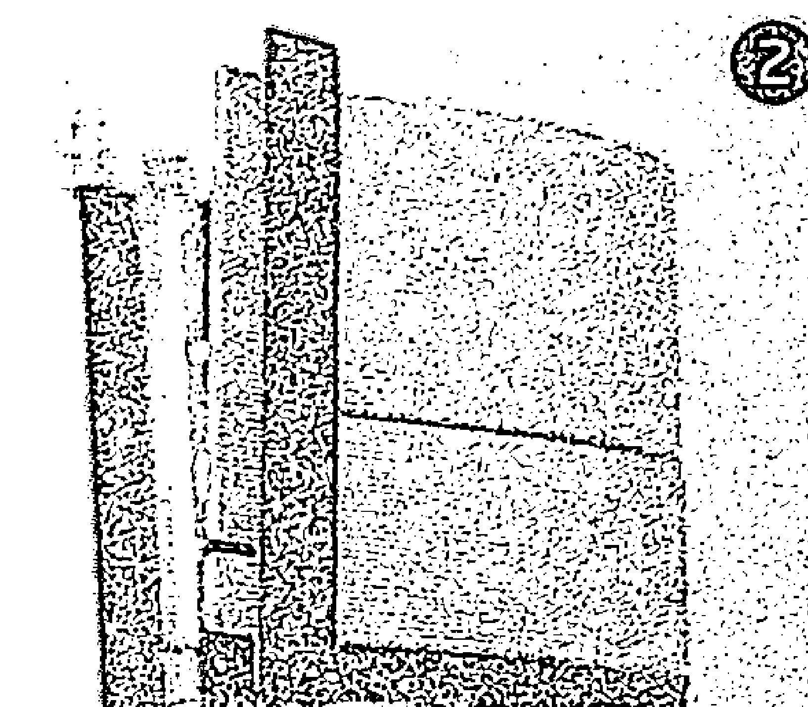

> PCI-E延长线价格并不是很贵，19cm大约50元左右

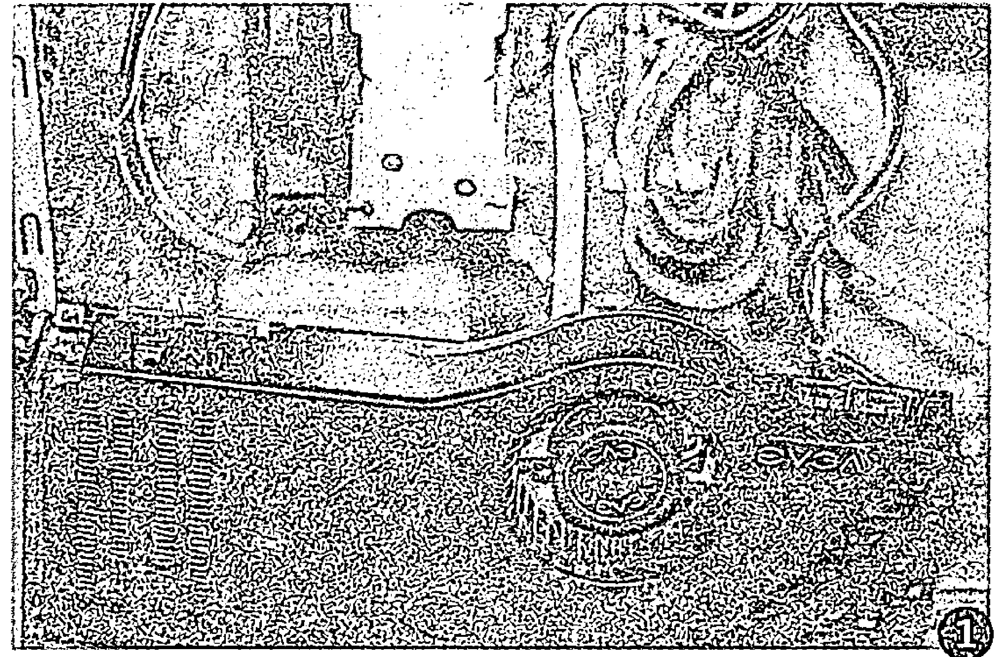

> 最关键的SATA插槽已被显卡遮挡

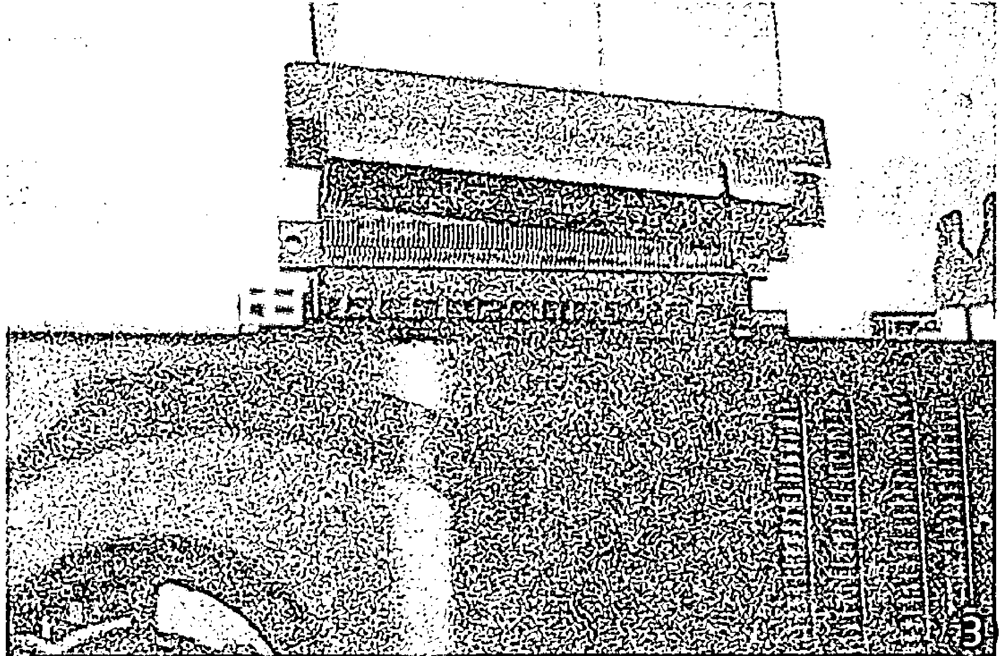

> 延长线与显卡相连

## 淘汰平板变身触屏显示器
文 | 宁宁

7英寸的电阻屏平板电脑现在基本都已淘汰了，但是只要在淘宝上买一块驱动板，便可将淘汰的平板变身成触屏显示器。完美玩转Win8，其实很简单。

### 选购方案
7英寸液晶屏的驱动板在淘宝上比比皆是。买家只要在搜索引擎当中输入“7英寸”、“液晶屏”、“驱动板”这几个关键词，便可找到一大堆卖家。在这其中，能够支持触屏的全套驱动板，售价要稍贵一些，普遍都在50~100元之间。

除此之外，驱动板上的视频接口设计则主要分为两类。其中一类比较方便，直接焊在了驱动板上。另外一类则比较麻烦，需要专供的连线才能实现视频接口。而笔者为了方便且省钱，就选择了第一类。并且只提供了VGA一种视频接口，放弃了价格偏贵的DVI接口和HDMI接口。

### 改造过程
液晶屏从平板电脑拆出来之后，会发现液晶屏的下端有两条屏线。其中一条是4Pin屏线，专门控制液晶屏最上层的触控屏。另外一条则是50Pin屏线，专门负责液晶屏主屏的显示信号传输。至于与其搭配的驱动板，则分别提供了50Pin屏线接口、控制面板及遥控器接口、倒车优先视频线（主要用于车载使用）这三种接口。所以说，我们只需要把对应的接口与插头正确连接（图1中的①②③这三组接口），并插上驱动板的供电线（图2），液晶屏就可以正常显示了。

而要想电阻触屏也能够正常工作，则还需要将图1中的④⑤⑥这三组接口正确连接才行（图3）。并且完成上述操作之后，还需要再把USB接口插入到电脑中，并正确安装原厂光盘中的驱动程序，淘汰平板变身触屏显示器才算是真正大功告成了。

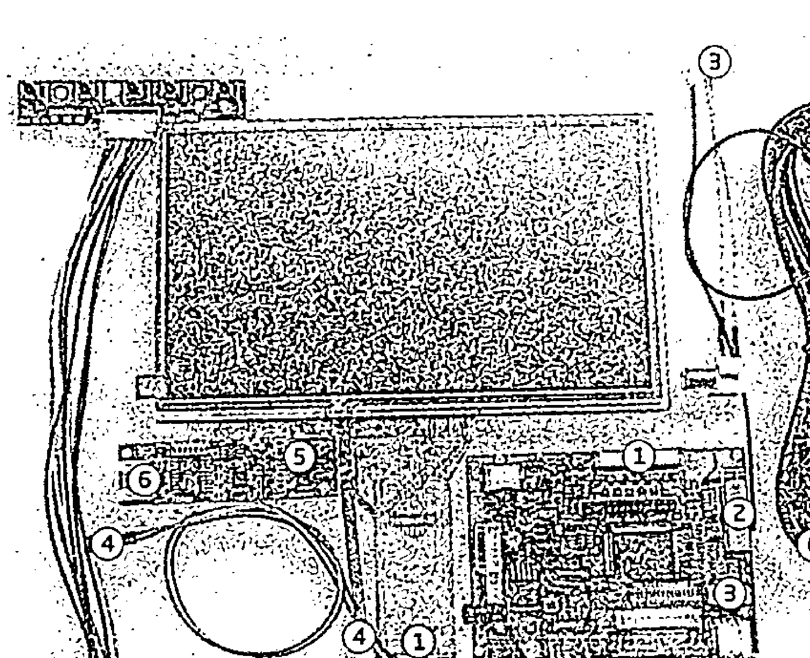

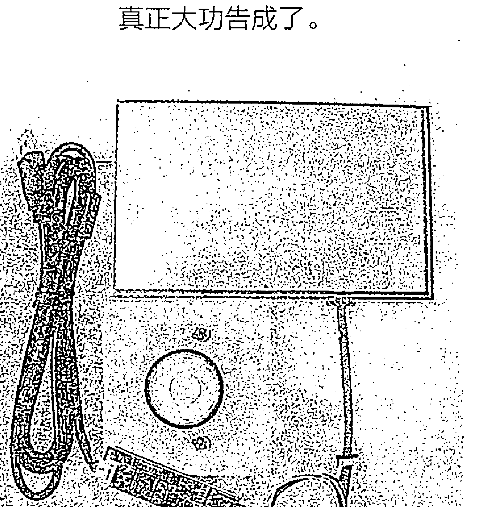

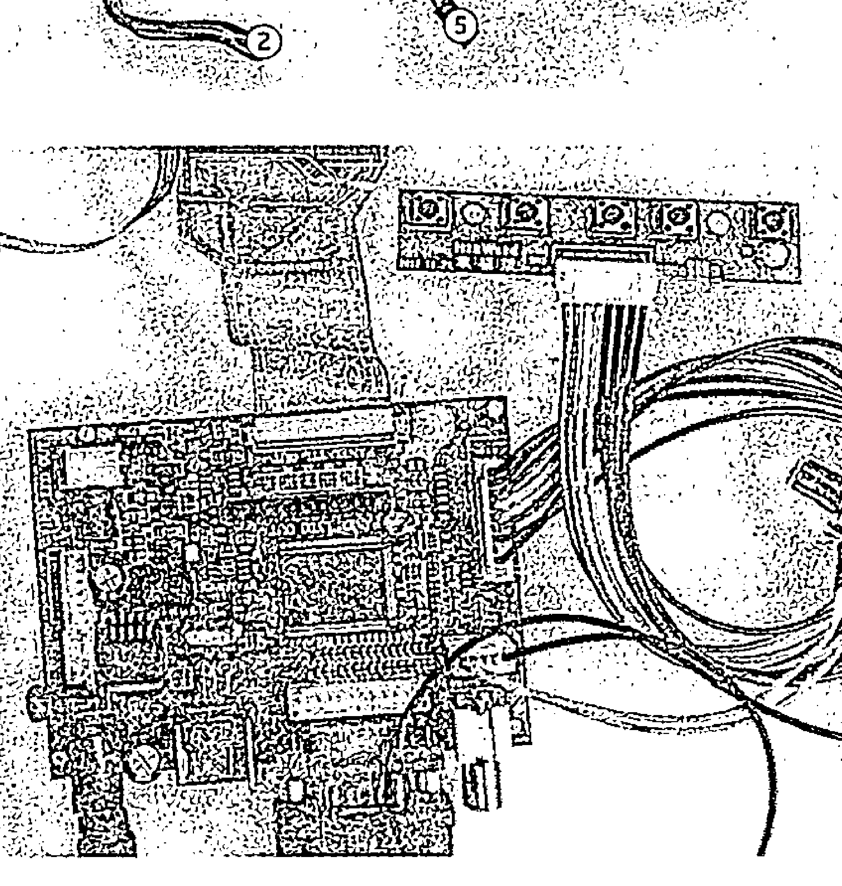

### 后期处理
其实只是连接正确还不能说完成，为了美观和实用我们可以找一个比液晶屏幕稍大一些的扁平纸盒，将液晶屏幕固定在其顶端一侧，而裸露的电线PCB都固定在纸盒内部才方便实用。文章的最后还要提醒广大读者，平板电脑除了50Pin液晶屏之外，还有可能是采用40Pin或60Pin的液晶屏。所以在购买全套驱动板之前，最好与淘宝卖家事先沟通，以防买到错误的驱动板，造成无法兼容的问题出现。

## 两招让你搞定SSD的那些故障
文 | 飞雪散花

凭借远远高于传统机械硬盘的运行速度，SSD受到了不少朋友的喜爱。不过，在日常使用的过程中，我们难免会遇到貌似SSD出现故障的情况。其实要确诊并修复这些故障并不难，我们只需用好下面两招即可。

## 善用工具明确健康状况

一款硬盘是否健康，可以通过查看它的SMART信息来判断。而要查看硬盘的SMART信息，我们需要借助CrystalDiskInfo来完成（下载地址：http://www.pc6.com/SoftView/SoftView_16918.html）。CrystalDiskInfo是一款绿色工具，下载解压后，根据自己所用的系统版本是32位还是64位，双击其中的DiskInfo.exe或DiskInfoX64.exe文件即可运行。程序运行后，会自动检测当前的硬盘信息，并将其显示在主界面中（图1）。在这里，我们除了会看到当前硬盘的基本健康状况及温度等信息外，还可通过界面列表给出的SMART信息，大致判断出当前硬盘是否存在问题。在判断的过程中，我们需要关注的项目包括：01、05、B5、B6、BB、C0、C6和C7（注意：硬盘的品牌和型号不同，程序可监测出的SMART项目信息也不同，上面几项可能并不完全包括。图2为希捷1TB硬盘显示出来的信息，其监测出来的项目明显要多于三星840 Series SSD）。通常来说，如果这几项的“原始值”出现数值（即不是“000000000000”，而是其他），说明SSD可能已出现问题。这时，我们可以用本刊以前介绍的方法，对SSD进行安全擦除处理。如果问题依旧，说明SSD存在物理故障，可以将SSD返回厂家申请售后。

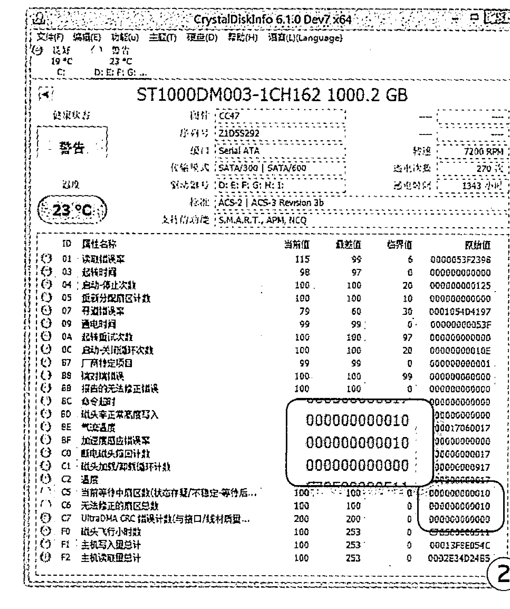

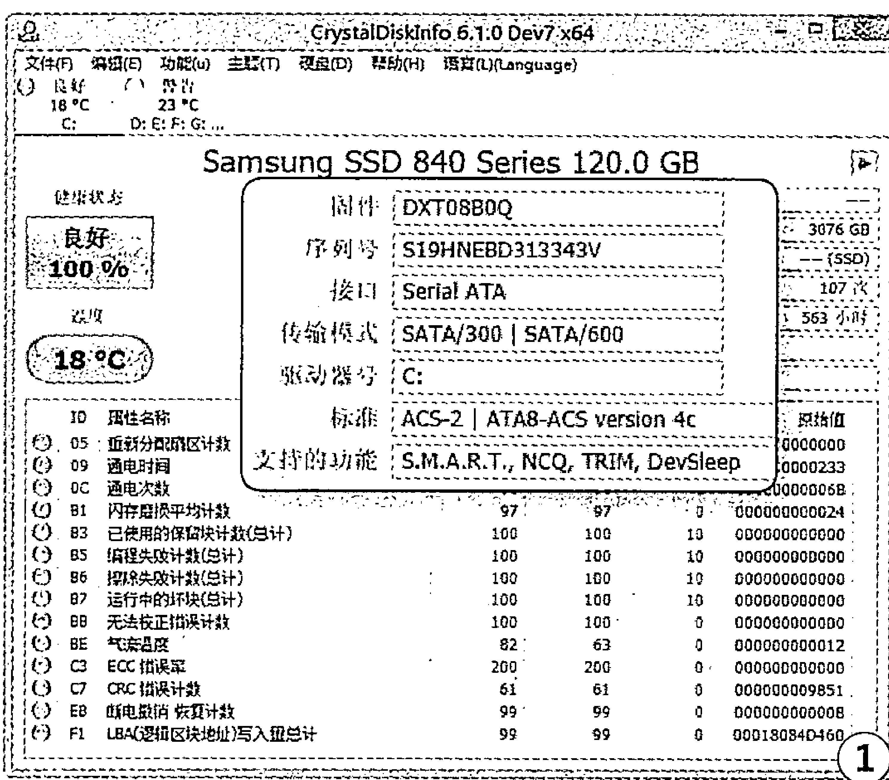

### 图中各项目对应的问题如下
**01 读取错误率：** 如果SSD该项出现数值，并持续增加，说明硬盘可能存在坏道，可配合其他项进一步确定。

**05 重新分配扇区计数：** 如果该项出现数值，说明SSD的寿命已经被消耗了较多。通常来说，该项并不能用来独立判断问题，它必须和其他项目，如B5、BB、C6等相互配合才行。

**B5 编程失败计数：** 指的是数据写入颗粒后出错，如果05项有数据，B5项的数据也在增加，说明SSD可能出现了坏块。

**BB 无法校正错误计数：** 如果05项有数据，同时该项的数据也在增加，说明SSD的确存在坏道。

**C6 无法修正的扇区总数：** 该项出现数据，通常意味着硬盘中的数据可能已出现问题；这时，首先要做的事就是备份重要数据。

**C7 UltraDMA CRC错误计数：** 该项出现数据，说明SSD和主机之间的通信出错，通常引起该故障的主要原因有：SATA数据线有问题、SATA接口接触不良、磁盘控制器驱动以及硬件兼容出现等。

#### 小提示
在使用SSD的过程中，如果出现了SSD频繁丢盘，但通过查看SMART信息却找不到任何异常的情况，一般可通过安全擦除的方法进行解决。因为这类问题，最有可能是SSD的FTL（映射表，属于固件的一部分）出现异常所致，由于进行安全擦除会重置FTL，所以可有效地解决此类问题。

## 弄清软件还是兼容性问题
SSD的许多问题其实都是由软件和硬件本身的兼容性引起的，那么，我们如何来区分这两种情况呢？同样简单，我们可以采用下面的方法，让问题症结逐步呈现。

首先保证所用的系统为原版安装系统（即不是第三方制作的Ghost版、OEM安装版或其他所谓的优化精简系统等，由于这些系统通常已经过第三者修改，所以很可能会因文件缺失，导致SSD无法正常工作），然后将系统中安装的诸如360安全卫士等安全防护工具和杀毒软件尽可能卸载。

接着右击“开始”按钮（以Win 8.1为例），选择“设备管理器”，打开“设备管理器”窗口，展开“IDE ATA/ATAPI控制器”项，查看其下是否存在一个“标准SATA AHCI控制器”项（图3），如果有，说明SSD目前使用的是系统自带的默认驱动。如果不是，可按下面步骤将其更换。

右击“标准SATA AHCI控制器”项，选择“更新驱动程序软件”，打开相应的对话框，选择“浏览计算机以查找驱动程序软件”项（图4）。在接下来的界面中选择“从计算机的设备驱动程序列表中选取”项，单击“下一步”按钮（图5）。相应的驱动列表就出现在眼前了。选择“标准SATA AHCI控制器”项，单击“下一步”按钮（图6），系统即会开始更换驱动。更换完毕，重启计算机，看故障是不是依旧存在。如果存在，而且不限于使用某个特定软件时才出现，那么基本上可以断定，该故障不是由软件原因引起的，而是由硬件兼容问题所致。这时，我们除了可以用本刊曾经介绍过的为SSD升级固件的方法来尝试解决外，还可升级主板BIOS的方法来进行解决。

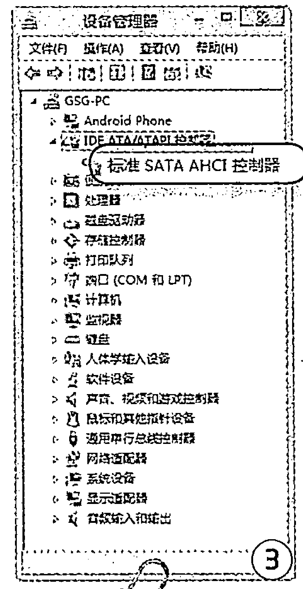

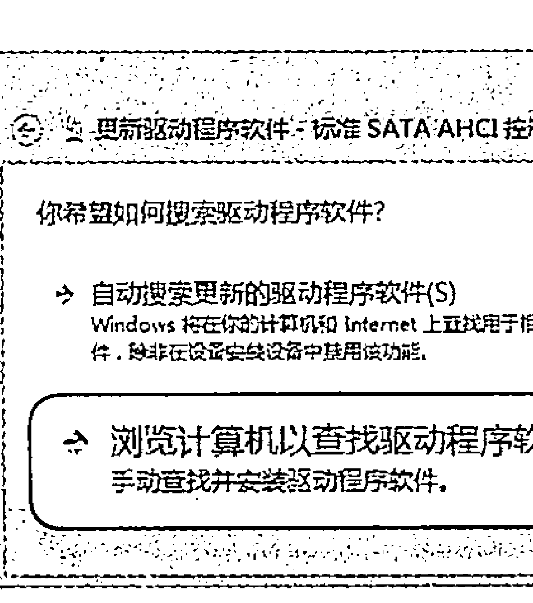

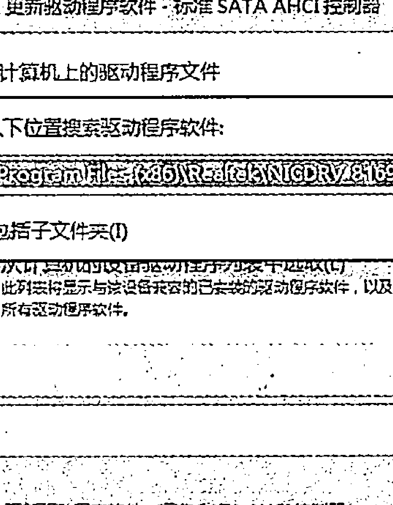

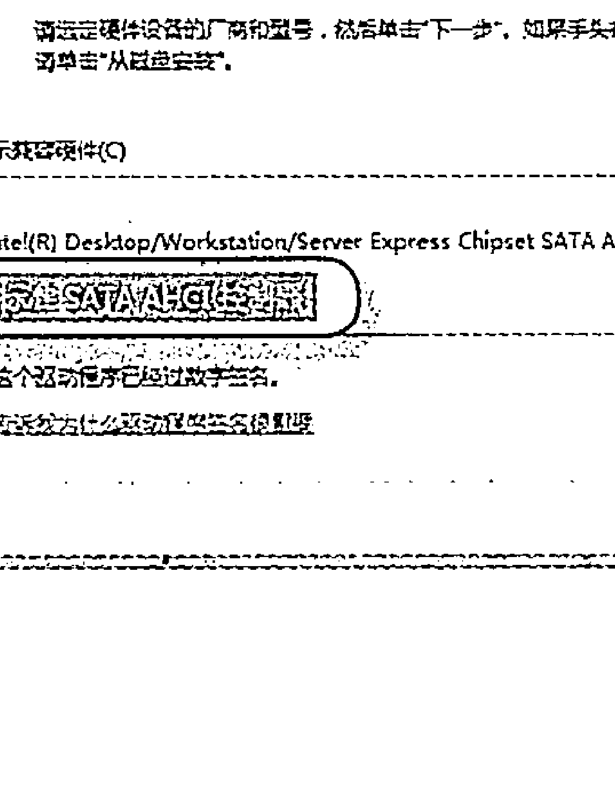

## 耳机音箱入手必做的功课
文 | 无可尚人

像耳机和音箱这种音频外设不是买来就可以发出“天籁之音”的，需要经过一段“磨合期”后才能传递更好听的声音。而这个磨合期就是所谓的“煲机”，也是目前容易被普通用户淡忘的过程。

简单来说，煲机是一种快速使器材老化稳定的手段和方法，可让耳机或音箱迅速进入最佳的工作状态。需要注意的是，目前耳机主要分为“动圈”和“动铁”两大阵营，二者虽然都是依靠音圈在永磁场中的振动而发声，但它们的构造原理却有着本质的不同。其中，动圈耳机是依靠永磁驱动音圈使其相连的振膜振动，即由音圈驱动而发声；动铁耳机则是通过连接棒传导到微型振膜的中心点，即由金属物体振动而发声。因此，动铁耳机无需煲机即可获得稳定的音效，而动圈耳机则需要一个适当的煲机过程，使振膜富有张力，进而获得更好的声音。

### 耳机煲机篇
针对主流的动圈耳机，煲机最佳的器材就是随身的手机，而软件笔者则推荐“耳机助手（Headphones Assistant，iOS版可在iTunes下载）”。在手机上运行该软件后，需要先添加一个耳机专页（图1）。我们可以将耳机的品牌、型号、照片和其他相关信息添加到专页配置文件中，这样可以便于我们来跟踪耳机的磨合状况。

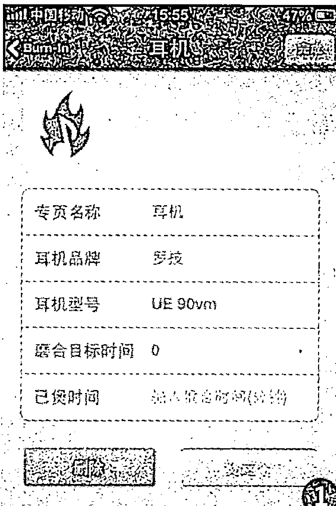

点击页面中的时间栏，我们可以输入煲一次的时间（图2）。我们还可以选择煲机用的噪声，目前有白噪和粉红噪两张可供免费选择（图3）。最后点击界面中的圆圈音乐按钮就可以开始煲机了（图4）。在煲机过程中，iPhone/iPod还可以跟往常一样使用，不受影响。

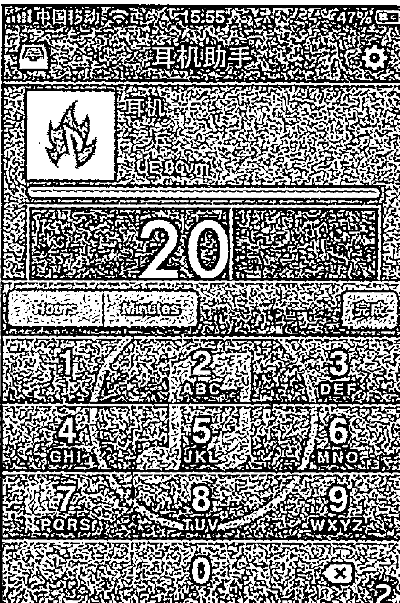

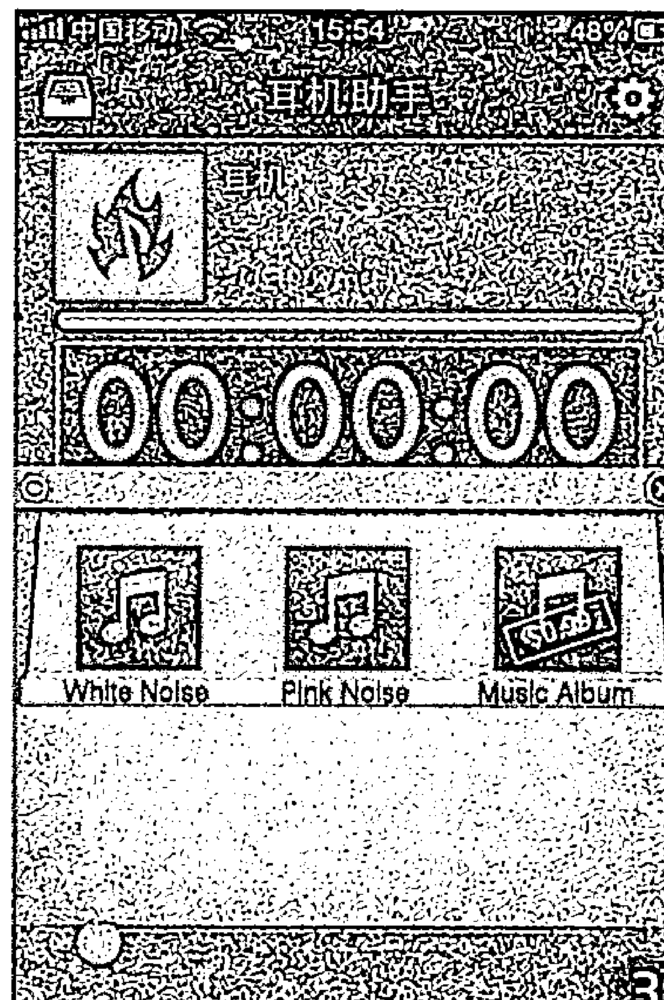

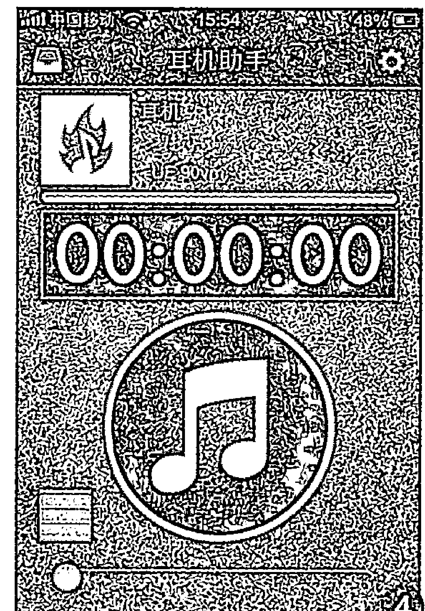

#### 小提示
音量太高可能会对你的新耳机造成损坏，请确保音量在50%以下。此外，在为智能手机选配耳机时尽量选择低阻抗耳机（不超过32欧），很多准专业耳机的阻抗较高，在手机上很难“推动”。

### 音箱煲机篇
如今各种便携蓝牙音箱大热，很多人只在意它们机身的便携和无线的方便，却忽略了蓝牙音箱自身也需要煲机。至于煲机的方法和传统音箱类似，建议借助支持蓝牙的笔记本和PC端的“漫步者煲音箱软件”（下载地址：http://t.cn/8kBoB3W）。软件下载完成解压缩后，双击其中的“RunIn.exe”即可运行。

#### 小提示
“漫步者煲箱工具”的信号发生器支持“正弦波”“三角波”“方波”三种波形类型以及“单一频率”“扫描信号”两种信号发生类型（图6）。普通用户可以根据实际环境进行选择。

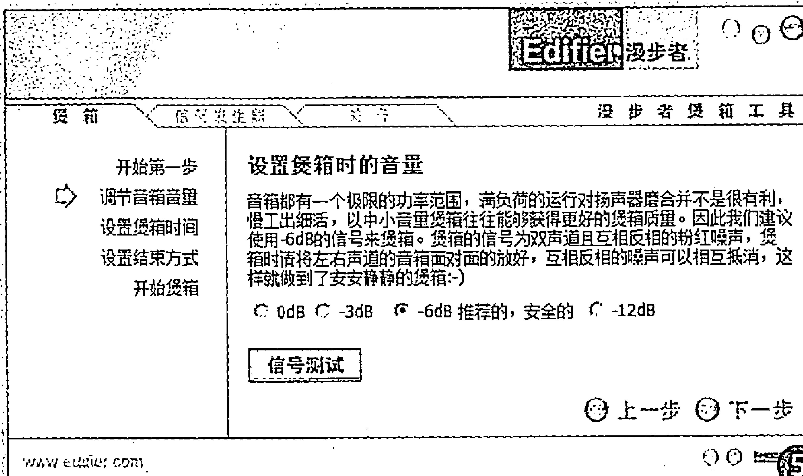

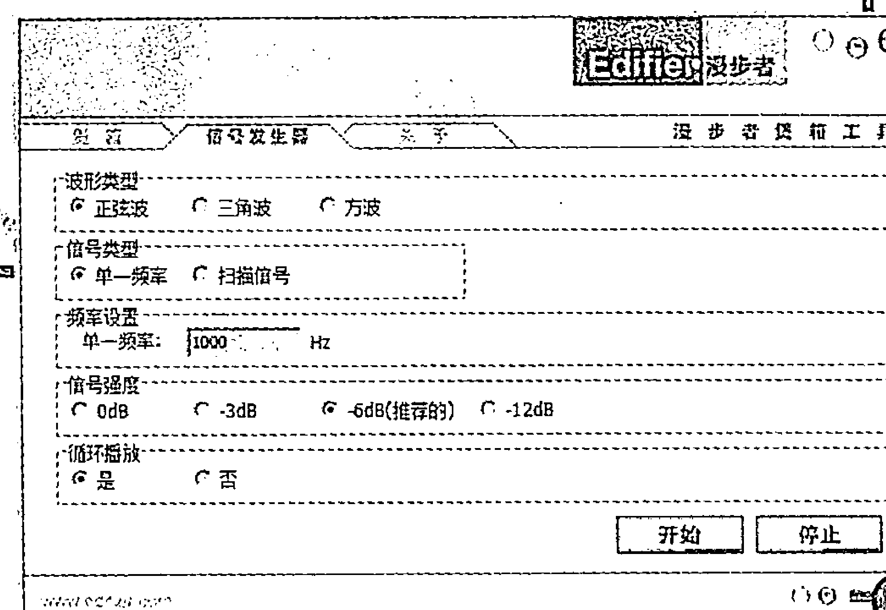

在引导界面中，建议使用软件推荐的-6dB信号来煲箱（图5），而煲箱时间设定在3小时即可（不建议连续煲箱，而是分做N次进行，总时间维持在10~40小时即可）。此外，由于煲箱的信号为双声道且互相反相的粉红噪声，因此在煲箱时可以将音箱的前面罩摘除，并让左右声道的音箱面对面放好，最后点击“开始煲箱”就可开始你的煲箱过程了。

## 找不到无线网络 搞定Macbook Air的上网尴尬
文 | 王志军

笔者的MacBook Air虽然可以正常使用无线功能，但却始终无法搜索到房东家的无线路由器，而其他的普通笔记本电脑、智能手机、平板电脑设备却能搜到并正常接入。经过一番资料的查阅，最终将问题锁定到了Macbook air对于无线路由器频道（有些路由器叫频段或通道）的限制上。

由于房东家使用的是KINGNET无线路由器，打开IE访问http://192.168.1.1，此时会弹出一个登录框，账户或密码均输入默认的“admin”，进入之后不需要按照向导的提示进行配置，直接在左侧导航窗格依次选择“无线参数配置→基本配置”，我们需要修改的是“频段”参数，默认设置为“Auto”，将此值设置为10以下数字（建议设置为“9”），检查无误之后点击“提交”按钮。

等待网络刷新完成，笔者终于顺利地在无线网络列表发现路由器的Wi-Fi热点，输入密码即可顺利连接。总之，当某部数码产品搜不到路由器的Wi-Fi信号时，我们可优先从频段参数着手，帮忙解决它们无法享用身边Wi-Fi的尴尬。

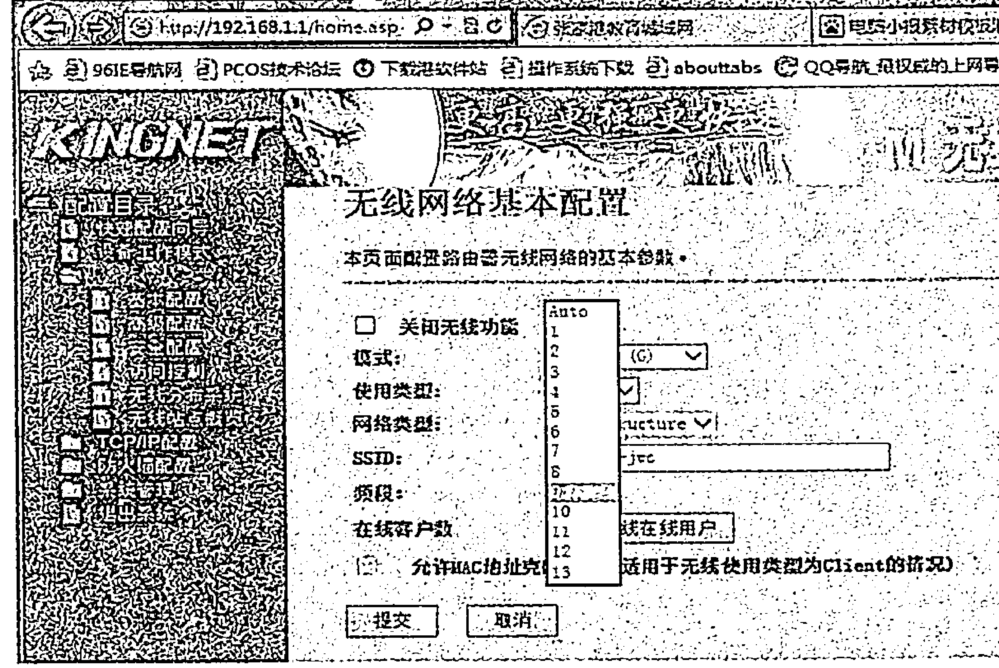## 改善散热环境

## 暴力给本本开“天窗”

文 | 左林右宜

很多笔记本起初的散热效果还不赖，但在加装mSATA SSD，或在光驱位添加硬盘后产品的散热就出现了明显的下降。此时，如果你的本本已过保修期，不妨考虑暴力加天窗的方案，改善它的散热环境。

## 被小看的硬盘热度

笔记本想提升磁盘性能或容量，要么加装mSATA SSD，要么通过光驱位替换装有机械硬盘（HDD）的硬盘托架。无论如何，最终都得在原本没有硬盘的空间里塞入新的硬盘。问题是，笔记本在mSATA和光驱位置对应的底壳上鲜有添加散热孔的，而HDD和SSD在全速工作时的发热又是很高的（特别是mSATA SSD，迷你体积更容易堆积热量），进而对笔记本原有的散热模块施加更大的压力。

怎么办？购买散热底座？问题是底座风扇的风主要供给的是CPU、内存和原装硬盘的位置（只有这些地方有散热孔）。此时，如果给mSATA插槽的位置也开个“天窗”，不就相当于改善了散热环境了吗？

> **小提示**
给笔记本底壳打孔会破坏机身原有结构，影响保修。因此只限已过保的机器考虑。

### 暴力打孔开“天窗”

笔者的笔记本型号为联想Y470，刚好在mSATA插槽的位置预留了单独的扩展挡板（图1），拆下即可安装mSATA SSD硬盘。利用高度尺在这个挡板上划出横竖线交织的网格，从而确定打孔的位置和数量（图2）。接下来可以使用台钻等工具，在事先画好的位置打孔即可（图3）。最后，将开好天窗的挡板装回笔记本（图4），此次的改造就算完成了。同理，如果你需要在光驱的位置加装硬盘，也可以考虑在光驱位置对应的背板上打孔。

如果你的笔记本也是Y470且还在保修期内，可以考虑不安装mSATA位置的挡板，让mSATA SSD硬盘露天“裸奔”，但要防止日常使用中误碰可能造成的静电危险。此外，绝大多数笔记本并没有独立的mSATA插槽，甚至需要拆下整个笔记本的背板才能升级。面对这类产品，只需找对mSATA对应的位置，打孔开天窗即可。如果你手头没有台钻等专业设备，可以用烧红的改锥（注意不要烫伤）。

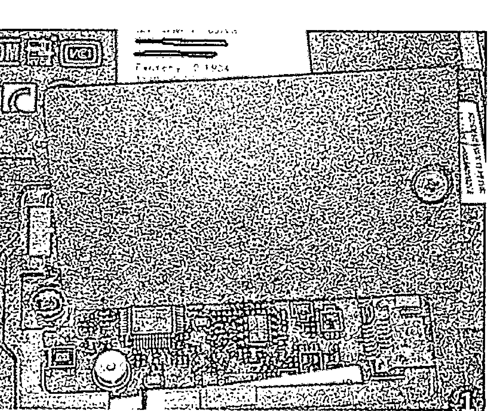

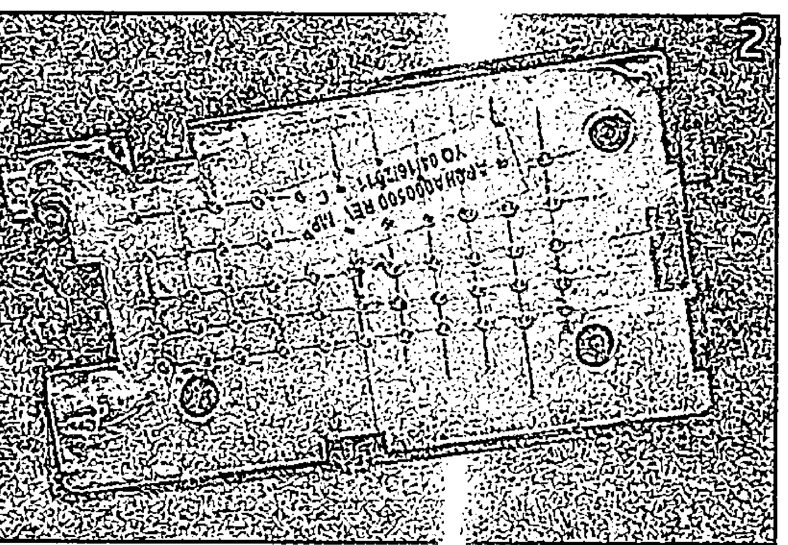

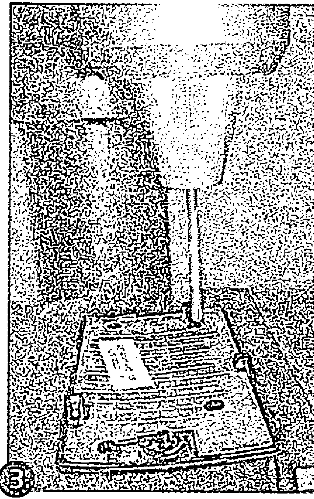

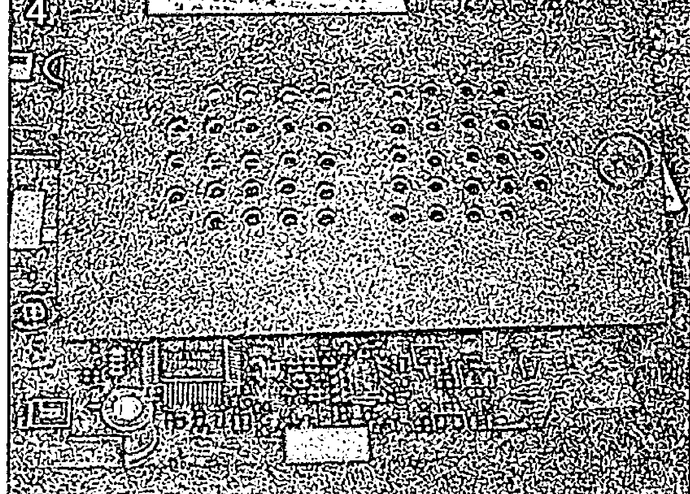

## 笔记本触控板隐藏的秘密

文 | 曹操

目前笔记本触控板主要以Synaptics和Elan（义隆电子）两大品牌为主，想实现类似多点触控和手势控制等功能，唯有安装正确的驱动和设置后才可享用。

### 两大触控板势力

CFan曾在2013年第4期介绍过Synaptics触控板的进阶玩法，而笔者按照教程下载安装Synaptics驱动时却总在报错。询问过厂商的客服人员后才得知，原来这款笔记本采用的是Elan的触摸板，自然无法安装Synaptics驱动。很多人只知道Synaptics触控板有手势和多点操作，其实Elan触控板的功能也不逊于前者呢。

> 小提示
华硕、联想等品牌旗下的部分机器都采用了Elan触控板，但Elan却不提供触控板驱动的下载，用户只能到笔记本品牌的官网下载，这就导致了有些老型号无法尝鲜Elan触控板的新功能。如果你的Elan触控板使用上出现了问题，不妨下载安装http://t.cn/8kBCFvo这个版本试试。

### Elan触控板进阶玩法

安装最新版Elan驱动后，在Windows 8系统的“控制面板→鼠标”中可以看到名为“ELAN”的选项卡（图1），点击该选项卡的“选项”按钮后就能进入高级设置界面了。比如当你的触控板无法实现从边缘轻扫调出Windows 8的Charm栏，不妨找到单指的“边缘轻扫”界面中，看看该功能是否处于启动状态（图2）。

很多使用Elan触控板的用户都反映说不支持多点操作，这得怪Elan驱动将双指下的很多功能都默认为关闭状态。进入“多指”选项卡，将与缩放、滚动、旋转、多指相关的设置都勾选在启动状态吧。此外，在这里建议大家留意“单击”设置，比如我们将其设置为“弹出菜单”（图3），以后只需两只手指同时点击触控板就能实现右键功能。如果你觉得触控板的实体左右键手感不佳，不妨利用该功能代替。

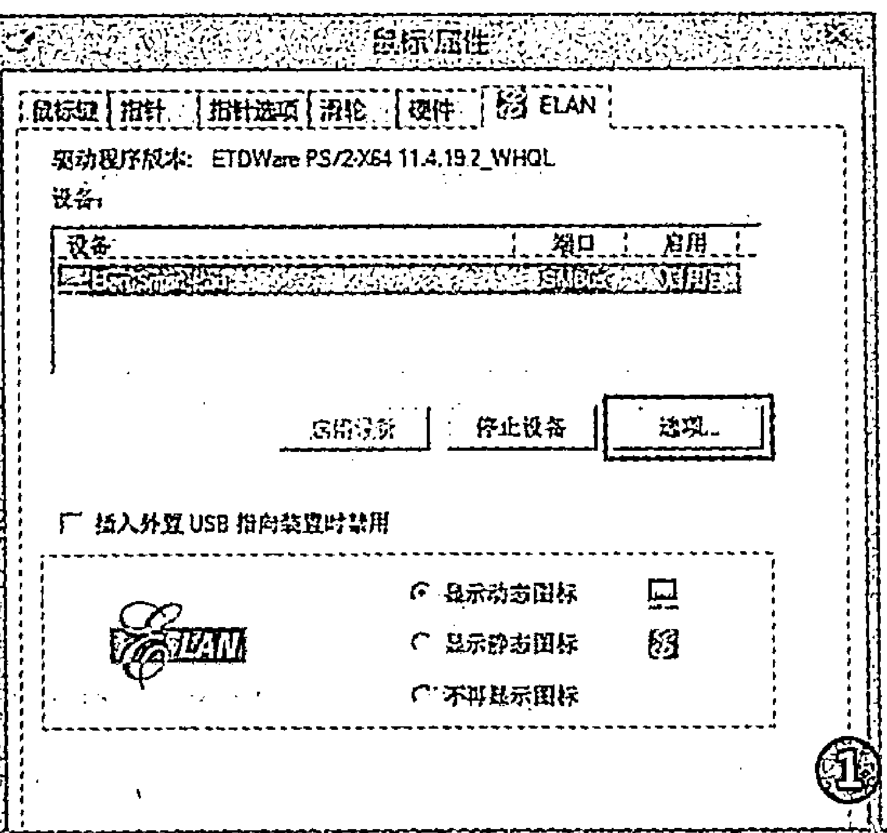

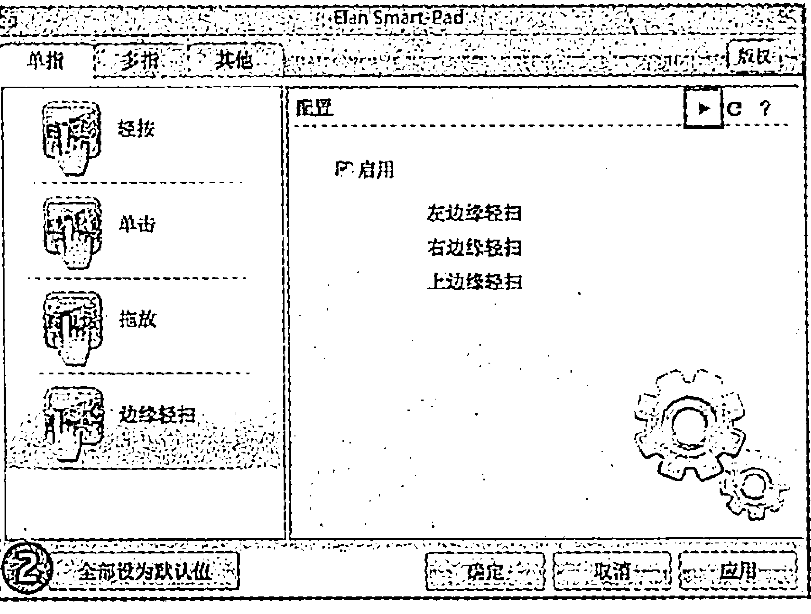

在“其他”选项卡中可以对触控板进行高级设置，比如调节灵敏度、启用/禁用触控板等。其中“智能动作”是很实用的功能（图4），开启该功能后，我们在拖动文件夹、当手指移动到触控板边缘所设置的有效区域后，此时手指无需再动，系统会自动帮我们继续之前的方向移动。

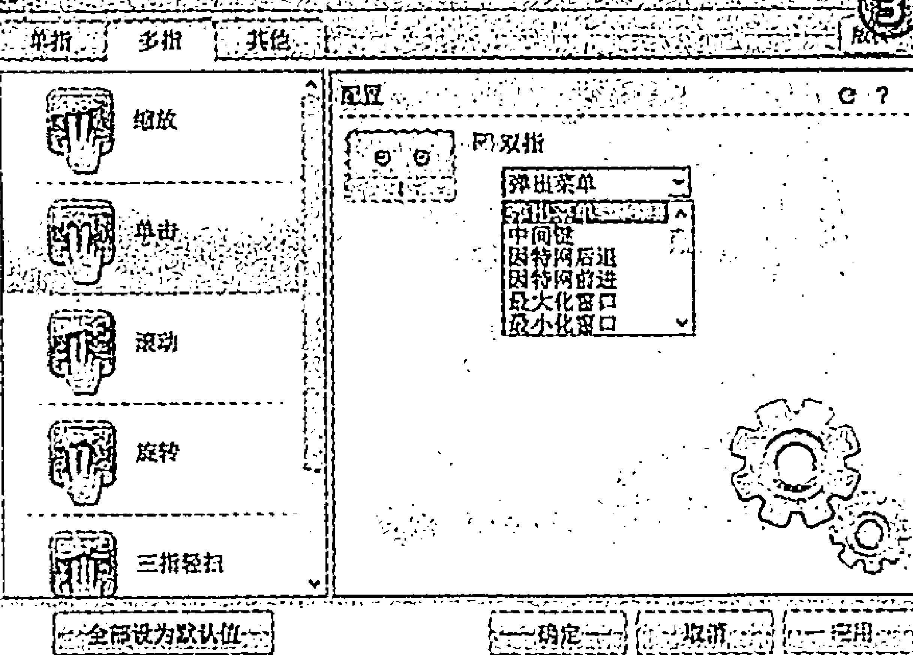

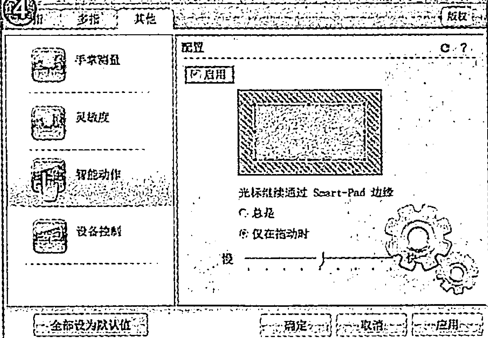

总之，本文的目的就是希望Elan触控板的用户也能“找回自信”，体验不逊于Synaptics触控板的玩法。

## 无惧躲猫猫 “变形本” 内存升级

文 | 梦悔尘

绝大多数笔记本的内存都位于D面，拆开底盖即可升级。但随着各种“变形本”的出现，内存插槽却时常玩起了“躲猫猫”的游戏。

### 位置不再固定的内存

触控、纤薄、变形，这三个要素已经成为未来笔记本的发展趋势，虽然它们可以使笔记本变得更“性感”且“好玩”，但物理结构的改变也让此类产品舍弃了很多标准的设计。比如，越来越多的笔记本舍弃了光驱、改用BGA封装的板载CPU（无法更换）、采用板载内存的形式（图1）。而将内存插槽从D面转移到C面，也成为不少纤薄产品惯用的手段。本文中，我们就以联想Yoga 11s为例，看看此类变形本内存升级的方法。

> > 小提示

所谓变形本，就是采用了屏幕可翻转、可拆卸一类设计的新形态超极本或笔记本。

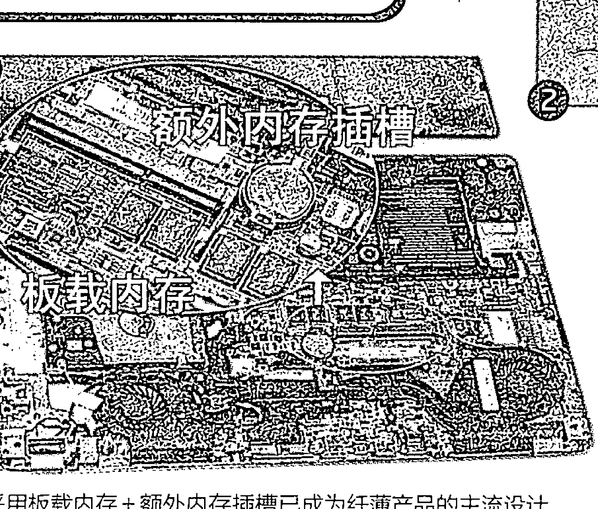

### 键盘下面有乾坤

类似Yoga 11s这类11.6英寸变形本限于体型，通常仅有一个内存插槽，而这款产品的特色则是将内存插槽安置在C面，哪怕你拆下整个底壳（D面）也无从下手。当然，厂商也考虑到了用户升级的可能性，往往会将内存插槽设计在键盘下面，如此一来无需拆卸掌托，只要取下键盘即可升级。拆机前要确保机器已经

断电！了解结构和原理后就能进行下一步操作了。Yoga 11s的键盘通过四颗螺丝固定，其中有两颗螺丝隐藏在了脚垫的内侧（图2），撬开脚垫后注意不要让其沾染灰尘而影响黏性（图3），否则安装回去之后会容易脱落。拧下四颗螺丝后，可用塑料片（银行卡）、开缝器之类的小工具轻撬键盘边缘即可掀起键盘（图4），翻转键盘后即可看到内存插槽了（图5）。接下来就是大家都熟悉的更换内存的操作了。

> > 小提示

包括Yoga 11s在内的变形本，以及所有Haswell平台的笔记本新品都采用了DDR3L版的低压DDR3内存，因此在购买升级用的内存时，要根据产品所支持的内存版本而定。目前4GB 1.35V的DDR3L内存价格在300元左右，性价比还可以接受。

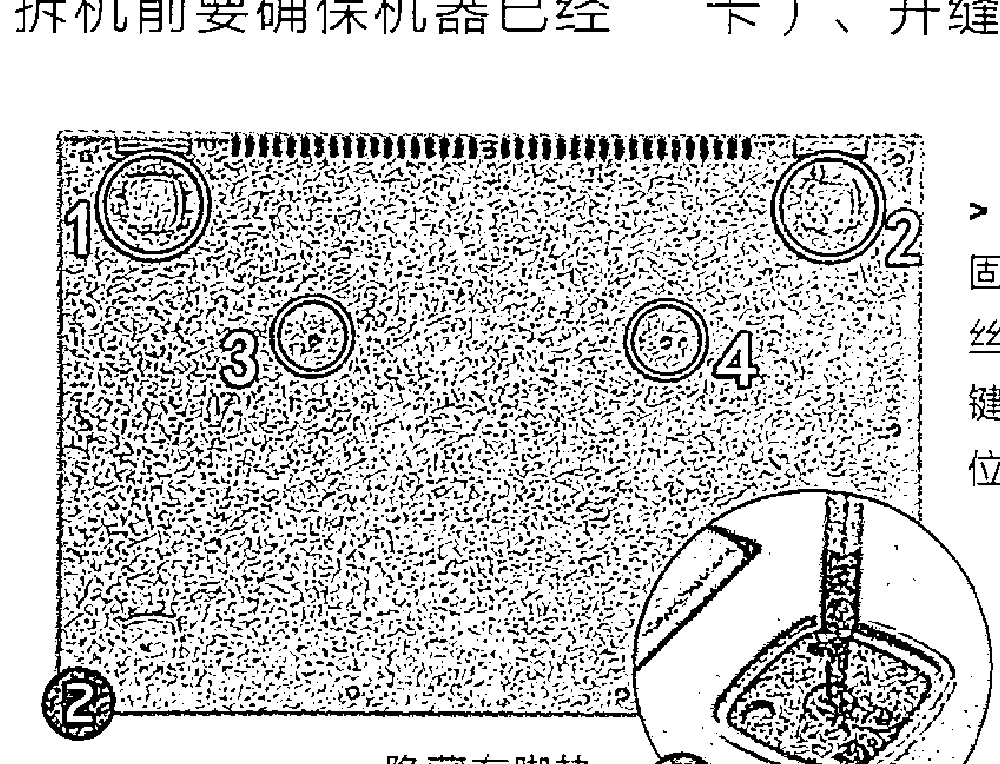

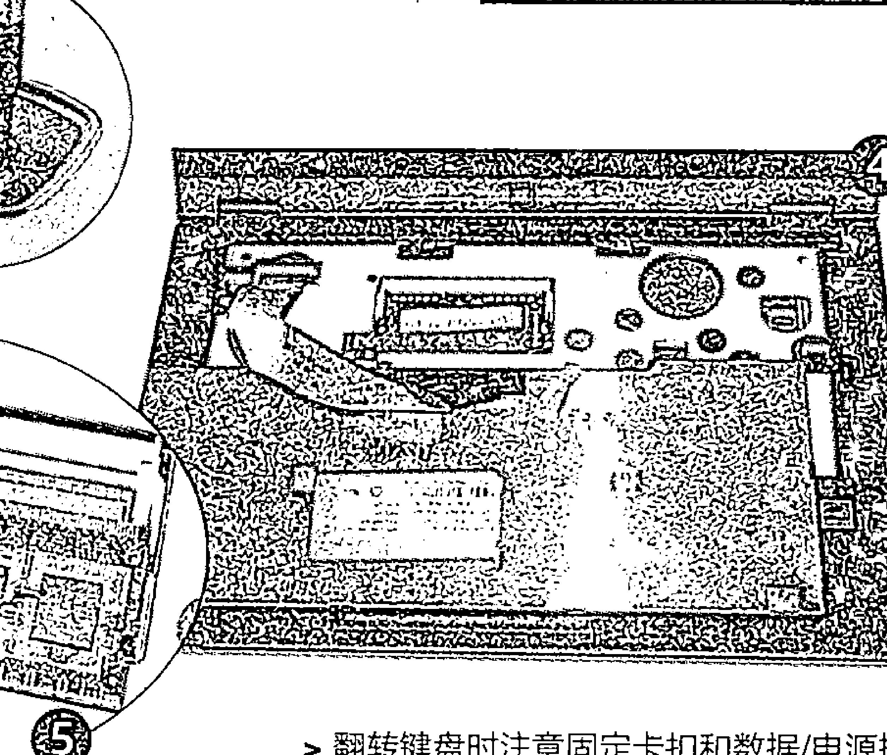

## 配合Ramdisk缓存活用文件连接

文 | Doris

虚拟磁盘就是把内存虚拟成硬盘，由于内存的读写非常快，所以可以用来存放一些缓存、临时文件或者小文件等等。如果配合NTFS文件连接，会让我们在速度和容量上获得双赢。

### 建立Ramdisk缓存

我们在这里以Chrome浏览器缓存和系统临时文件为例来介绍一下文件连接的应用，其他软件可以举一反三。虚拟硬盘软件有很多，这里我们推荐一下完全免费的SoftPerfect Ram Disk（http://www.softperfect.com/products/ramdisk/），下载安装过程就不浪费篇幅了，安装好后右键点击系统托盘内的图标打开内存盘管理，就是软件的主界面了。我们先点击工具→设置，把随Windows自动运行和为内存盘分配的全局驱动盘符选上。之后我们可以直接点击大大的绿色加号（添加系统启动时加载的内存盘），创建一个虚拟硬盘。然后点击确定，虚拟磁盘就建好并且挂载好了，我的电脑里也会出现该磁盘。

### 建立文件连接

SoftPerfect Ram Disk软件本身提供了设置Windows临时文件夹的功能，我们可以把里面的两个设置设置成x:\temp。同时，我们也可以去系统设置的环境变量中把temp相关的环境变量都设置过去。由于部分应用并不支持环境变量，我们还需人工把几个临时文件夹映射到虚拟磁盘上以防万一。

接下来就是建立文件连接了。首先关闭一切可以关闭的软件，检查后台程序关闭之。临时文件夹主要有c:\Windows\temp,c:\temp,%userprofile%\application data/local/settings/temp(vista之后是%userprofile%\appdata\local\temp)。一个一个来，先进入Windows文件夹找到temp文件夹删除之。如果不能删除，则说明有软件未关闭，可重启试试，或者使用Unlocker等解除占用的软件，在此不再详述。然后新开一个我的电脑窗口，打开x:\，右键点击temp文件夹，选择源连接点。现在回到之前的Windows文件夹，在空白处右键，创建为->符号连接。好了，之后就是把剩下的几个临时文件夹也用文件连接替代，是可以有多个文件连接同时指向同一个文件夹的（图1）。部分软件可能有自己的临时文件夹，去软件安装目录或者我的文档内寻找temp文件夹即可。

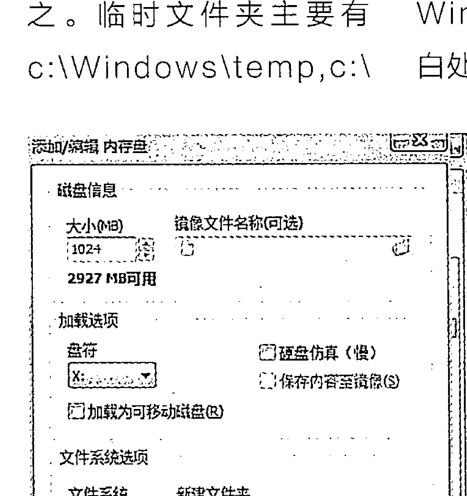

Chrome的缓存在%userprofile%\appdata\local\google\chrome\user data\default\cache，(XP用户则是%userprofile%\local settings\google\chrome\user data\default\cache)，方法同上，只是去x:\下的cache选择源连接点，然后去default文件夹下创建为符号连接即可。

至于其他浏览器或软件，如果没有原生的缓存设置也可以用类似方法。唯一的难度在于找到缓存文件夹在哪。不过如上所述，如果想挪走的文件夹里的内容对软件使用长期有用而不是像浏览器缓存那样仅仅是短期有效，你可能希望在重新开机后依然保留缓存，则你需要使用软件提供的另一种形式的虚拟硬盘，即关机后依然保留内容的虚拟硬盘。软件是通过定期把虚拟硬盘里的数据写入物理硬盘来实现的。

## 实战魔兽世界增速

这里以魔兽世界为例，魔兽世界目录下的interface和wtf文件夹内有大量小文件，机械硬盘用户读蓝条的时候会非常吃亏就是因为这个原因，我们这里就把它们挪到虚拟磁盘里去。

我们首先在SoftPerfect Ram Disk软件内，点镜像→新建镜像（图2），点击小文件夹图标为镜像文件选择合适的目录，操作系统选NTFS，大小视插件和人物多少而定，建议看一下wtf和interface文件夹大小然后留够余量，如果太大则可以删除一些不用的插件、不使用的人物和账号的配置，然后按刚才同样的方法点击绿色十字建立Ramdisk。

唯一的区别，是在镜像文件名称处选上刚才的镜像文件，保存内容至镜像打钩（不打钩则该虚拟磁盘为只读，我们不需要），然后点击高级，在每隔下面分钟数保存内容到关联镜像上打钩，一般来说可以设置长一些，如15分钟甚至更长(图3)。都确定后，系统会多出一个新硬盘，而这个硬盘的内容会定期保存到刚才设置的镜像文件内。

接下来我们只需要把魔兽世界文件夹下的interface文件夹，和魔兽世界文件夹下的wtf文件夹拷贝到虚拟磁盘内，然后给魔兽世界目录下的这两个文件夹改名，再分别将虚拟磁盘内的interface文件夹和wtf文件夹在魔兽世界根目录下建立符号连接即可（图4）。

当然也可以找到wtf下常用账号的文件夹，只在虚拟磁盘中建立这些文件夹的符号连接，选择权在你手中。
然后进入游戏试一下，是不是读蓝条、重载插件、重启游戏的速度都明显变快了？操作完成后记得填写镜像文件名称并对保存内容至镜像打钩，不然文件夹重启完电脑就空了。

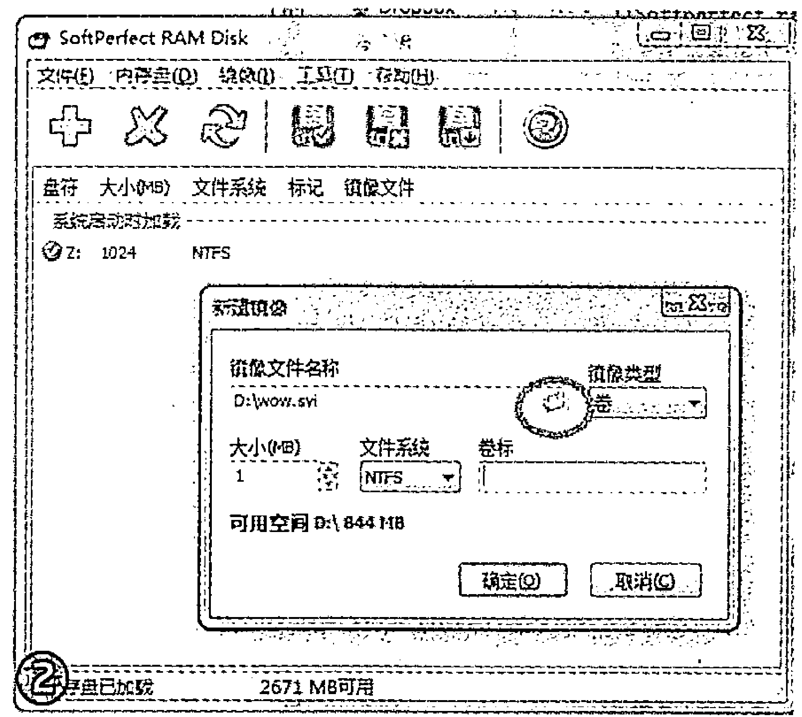

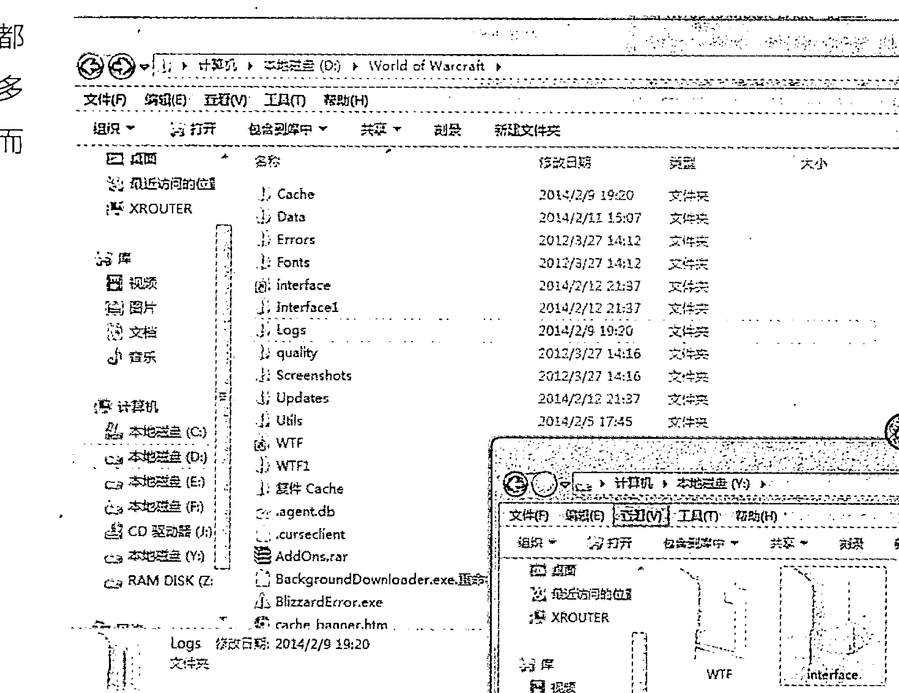

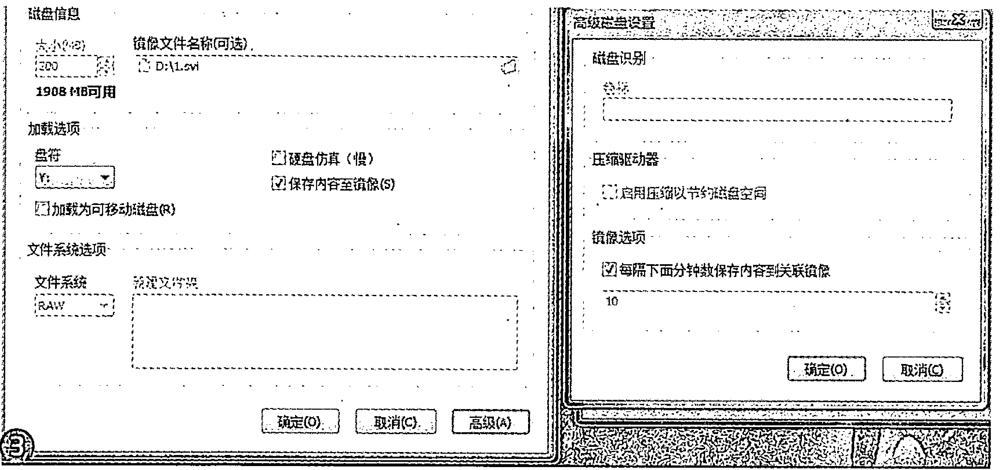

#### 扩展阅读

## 实战Link Shell Extension

系统实际上提供了命令来进行文件连接的操作，不过相当麻烦，可以使用Link Shell Extension这个软件进行操作（http://schinagl.priv.at/nt/hardlinkshellext/hardlinkshellext.html#contact），软件有中文，也很便于操作。

该软件需要安装vcredist for vs2005sp1运行库，该运行库和该软件都分64位（x64）和32位（x86）不同版本，不要装错了。安装完所有软件后建议重启一次。如果是XP用户，建议再安装最下面的补丁，这样就可以支持本不支持的符号连接了。

接下来给大家举几个例子，来看看实际应用。需要建立文件夹的符号连接并挪走文件夹，挪动文件夹最直接的应用就是将原本无法设定安装盘的软件挪出C盘。我们以Chrome谷歌浏览器为例，重点是找到其安装文件夹。

首先，完全退出Chrome，确认任务管理器中没有Chrome和Google相关进程，然后打开我的电脑，在地址栏内输入%userprofile%\appdata\local\google\(XP用户则是%userprofile%\local settings\google\)，找到Chrome文件夹；

之后新开一个我的电脑窗口，将Chrome文件夹复制到其他位置，如d:\；现在可以将原位置的Chrome文件夹改名（不直接删除是为了保险起见，防止出现意外）。

现在，右键点击d:\下的Chrome文件夹，点击“选择源连接点”（图5）。最后在原位置的空白处，点击右键，选择创建为→符号连接（图6）。好了，接下来试试通过原来的方式打开Chrome（图7）。一切正常，挪动成功，可以删除第四步改名的文件夹释放空间了。

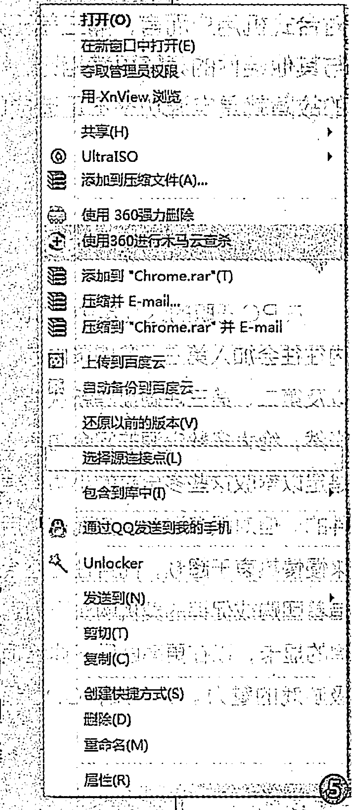

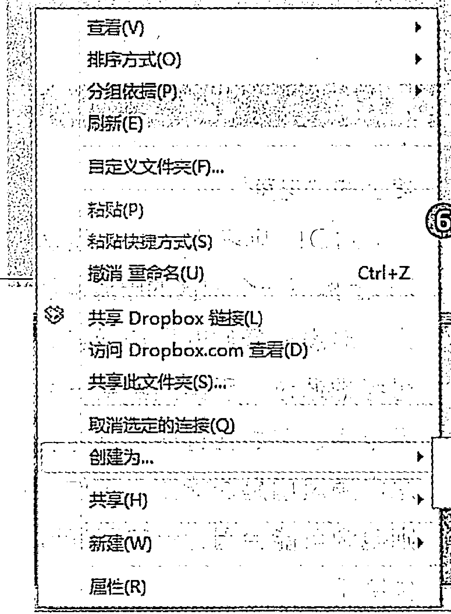

| 名称 | 修改日期 | 类型 | 大小 |
| :--- | :--- | :--- | :--- |
| Chrome | 2014/1/14 16:50 | 文件夹 | |
| Chrome1 | 2013/12/5 19:45 | 文件夹 | |
| CrashReports | 2012/3/27 15:01 | 文件夹 | |
| Google Talk Plugin | 2014/1/10 21:10 | 文件夹 | |
| Update | 2014/1/16 19:42 | 文件夹 | |

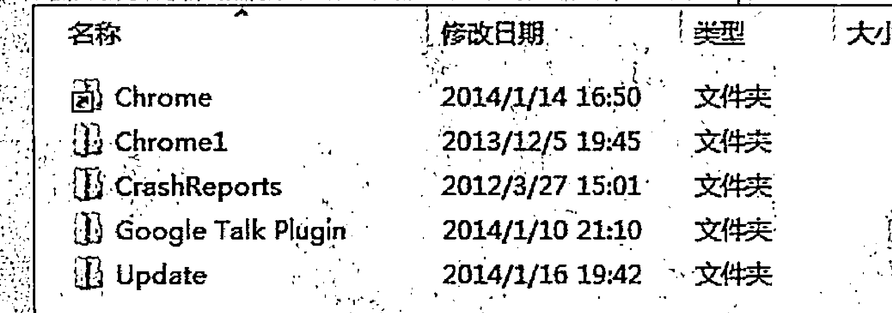

### 总结

在进行了上面的操作后，如果你是机械硬盘用户，应该会发现Chrome加载网页显著加快了，WinRAR、各类软件安装包等使用临时文件夹的软件也会变快。

## 旧电源上岗

### 额外电源让高功率显卡不再黑屏

文 | 陈俊名

对台式机用户而言，隔三差五升级一下CPU、主板、内存、硬盘和显卡早已是习以为常的事情。但与其他硬件的频繁更替相比，机箱和电源似乎永远是雷打不动的“留守”硬件。殊不知，很多莫名的故障就是电源功率不足造成的。那么，如何低成本解决电源功率不足的问题呢？

### 电源不能承受之重

在PC任职的这几年中，机箱内往往会加入第三、第四条内存，以及第二、第三块硬盘等新伙伴。当然，绝大多数电源的冗余功率还是足以驾驭这些多出来的小功率硬件的。但对很多游戏玩家而言，后来慢慢热衷于超频，而且往往还会借着团购或促销的契机购买更为强悍的显卡，以在更高画质下体验顶级游戏的魅力。殊不知，CPU超频和越来越强的显卡势必伴随着更为夸张的功耗，当更多的硬件或更高的功耗入驻机箱之际，电源的压力就鲜有玩家考虑了。于是，主板过流报警、进入系统后经常性崩溃、运行不稳定或者直接黑屏无显示等诸多故障就找上门来，最后当你确定是电源功率不足时，你会后悔安装上了那块“要命”的新显卡吗？

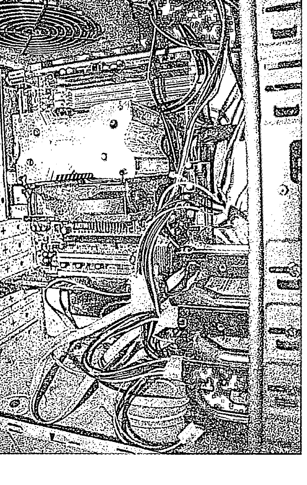

> 很多人的机箱和电源都已经处于满负荷的边缘了

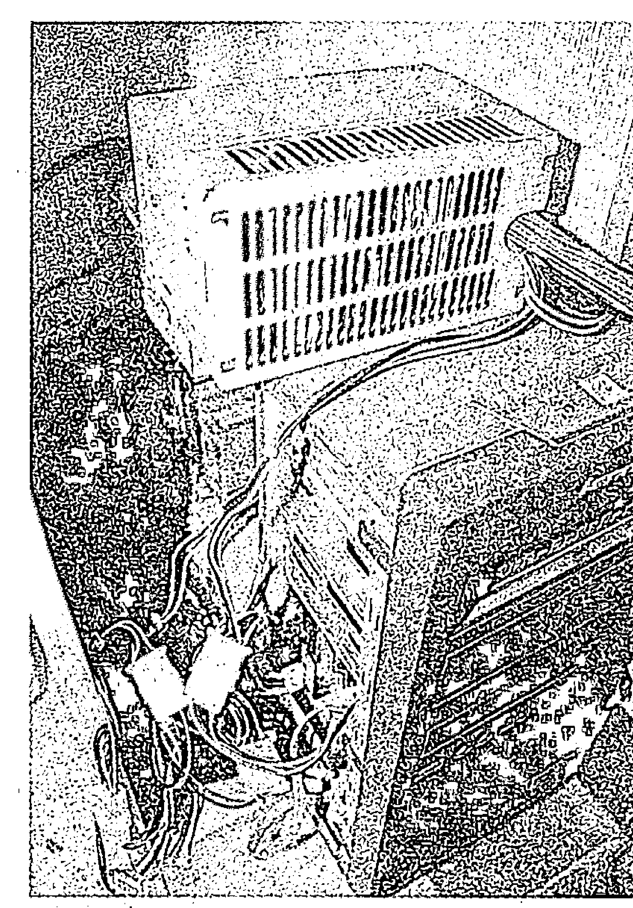

> 如果家里还有闲置的电源，不妨让其重新上岗

### 让个旧电源上岗

此时，最佳的解决方案就是重新购买更大功率的新电源替换。问题是，预算从哪来？很多DIY玩家并不富裕，而原有电源可能也仅仅是功率略微小了那么一点点，升级新品多少有些浪费。实际上，只要对主机周边环境的美观度没有要求，那就不妨考虑让另外一个电源为我们解决这个难题，缓解一定程度上的“电荒”。对DIY玩家而言，从淘汰的PC上拆下一个闲置的电源问题不大。对没有条件的用户而言，则可考虑通过二手渠道购买一款二手电源。只是在选购测试时要留意电源风扇是否能正常工作，否则电源可能会因为过热而导致部件烧坏。

### 新旧电源协同作战

为了保证系统运行的稳定，我们需要功率最大的电源作为主电源，安装在机箱内，用于负责主板和显卡的供电。至于功率较小的电源，则可在机箱外找一个合适的位置，用于硬盘和光驱的供电。其中，主电源的功率最好在300W以上，而外置电源一般来说125W就足够了。推荐使用每个孔位都有独立开关的排插用于接驳两个电源和显示器的电源线，以便通过硬开关启动/关闭外置电源的供电。

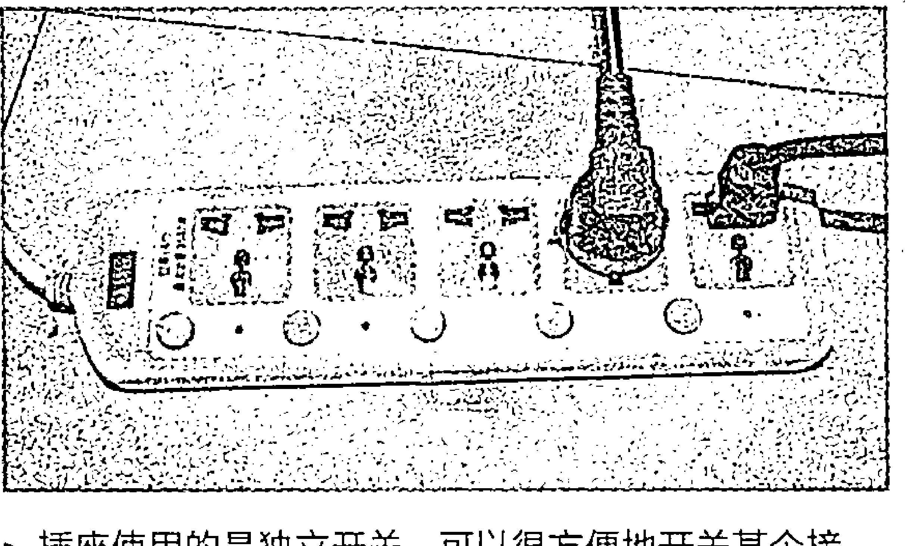

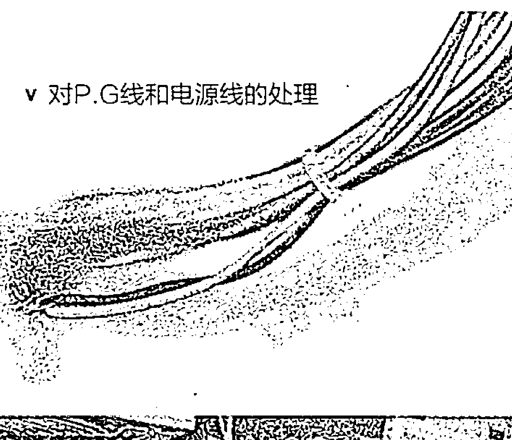

需要注意的是，外置电源通上市电、接上硬盘后是不会启动工作的，需要对它进行一点小小的“手术”。手术很简单，我们只需将它的绿色信号线（P.G线）和旁边任意一根黑色的电源线保持连接，这样就可让其启动了。

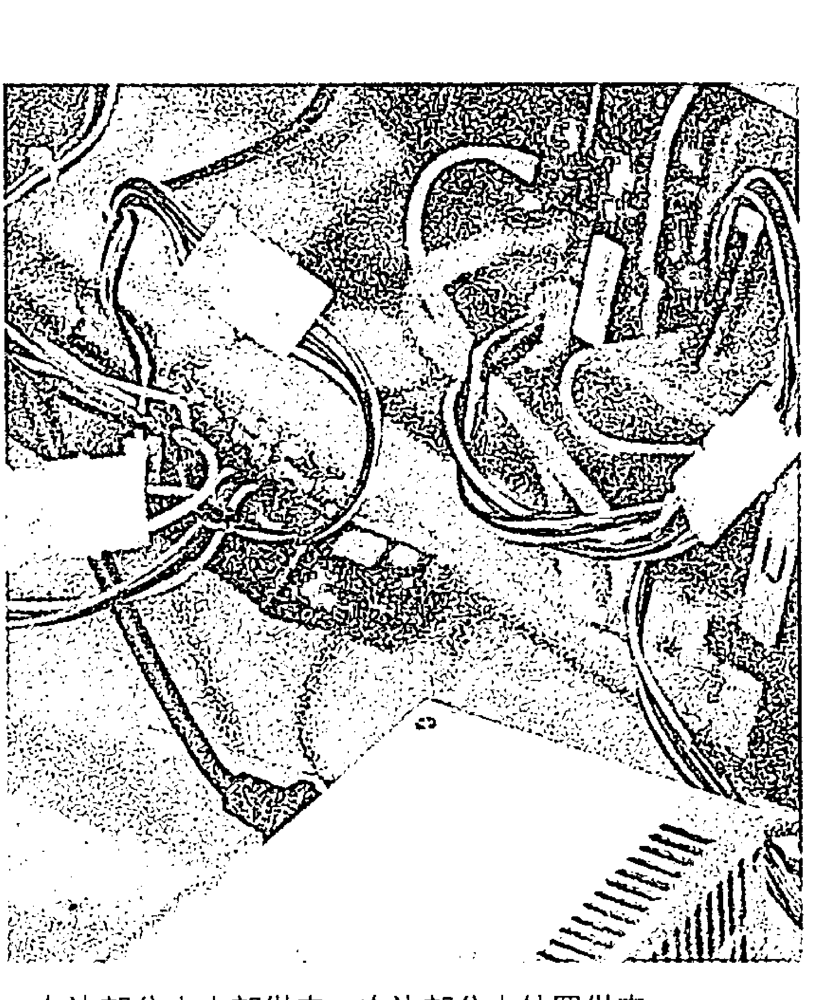

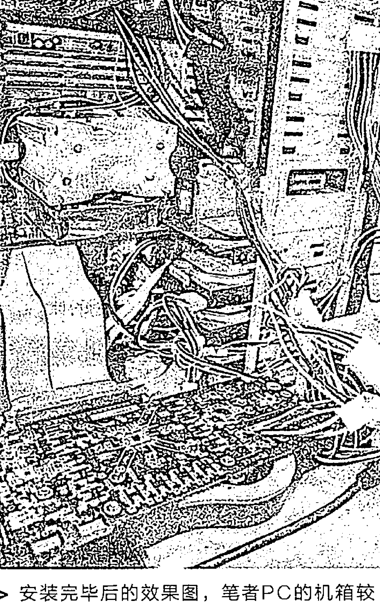

当内外电源和相关硬件都连接好之后，笔者推荐的开机顺序是先接通外置电源再开机，此时仅需重启一次电脑即可。关机顺序正好相反，先关电脑再断外置电源的电，否则可能会丢失还没有保存的数据，因此关机顺序千万不要弄错哦。

#### 扩展阅读

> Power Good信号简称P.G或P.OK信号。当开关电源启动之后，如果交流输入电压在额定范围之内，且各路直流输出电压达到允许的最低检测值（+5V输出为4.75V以上），那么P.G电路就会发出“电源正常”的信号让电脑开机。

### 其他需要注意的地方

第一次接通外置电源会让硬盘直接开始运转，但不会有数据操作，当电脑完成一次关机指令后，硬盘就会正常关闭。此外，笔者不建议用外置电源为已安装在主板上的显卡供电，因为这会导致外置电源和机箱内电源相联通。当两个电源电压不一致时，可能会导致电流方向不稳定。还建议不要在外置电源工作时，带电拆卸硬件设备（比如光驱、硬盘等），否则很容易导致主硬盘的电压不稳定。

摆放外置电源时，应注意入风口与出风口的朝向，电源风扇、排气孔与附近物体距离至少应有5cm，以方便空气流通。如果外置电源接口不够用（通常出现于多硬盘Raid或者多光驱），可以将不经常使用的非刻录光驱连接至机箱内电源。如果接口不合适（老式电源SATA电源接口较少），可以使用电源接口转换线。

当我们有了两个分工合作的电源后，就可以开始享受高性能显卡稳定地为我们带来视觉的盛宴了。

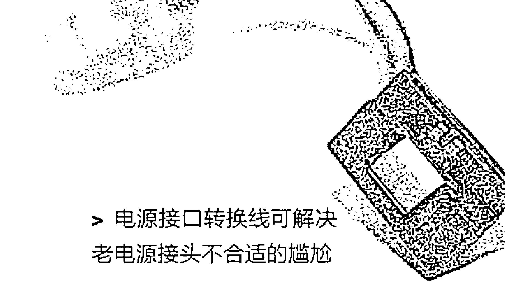

## 从原理到实操
### 低成本打造无线U盘

如今越来越多的智能手机都不再支持存储卡扩展，而无线U盘则是在此大环境下诞生的新事物，虽然实用但价格却相对高昂。如果你有足够的动手能力，不妨用闲置的资源DIY一部独一无二的无线U盘吧。

文|于正青

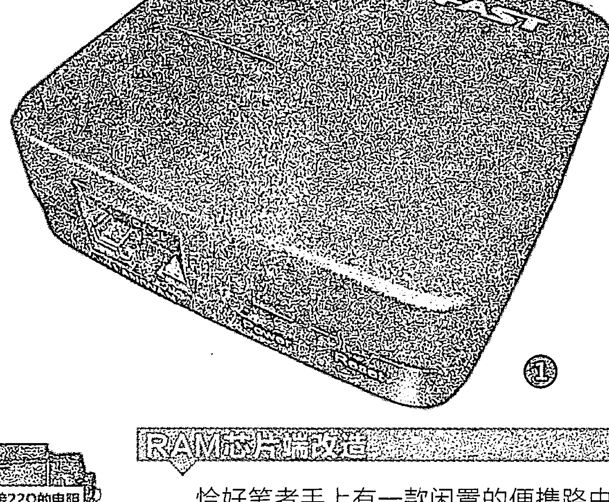

#### 改造原理分析

无线U盘的本质很简单：就是一款挂载了U盘的小巧无线路由器，并没有太高的技术原理。从改造的通用性上来看，市面上很多便携无线路由器都可以经过简单的改装来实现无线U盘的功能。如此算来，DIY一个16GB的无线U盘大概也就需要百元的价钱，这比动辄就要价四五百的产品实惠多了。

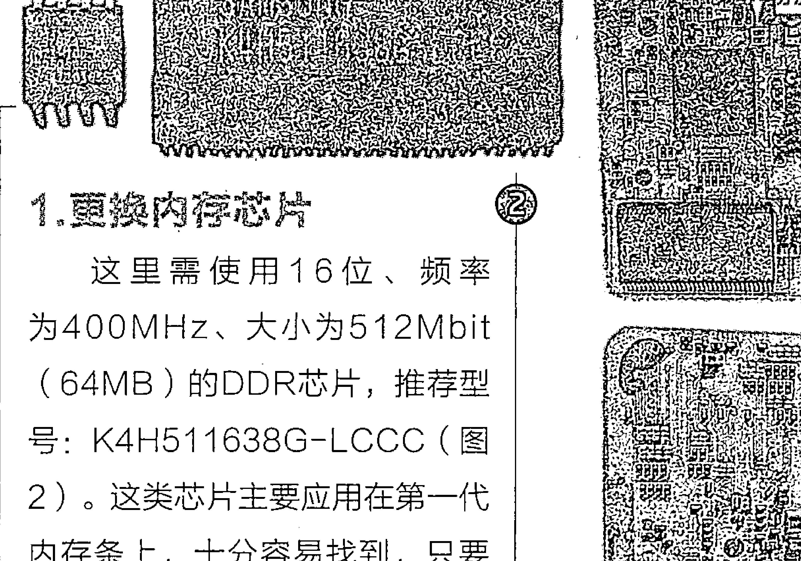

#### RAM芯片的改造

恰好笔者手上有一款闲置的便携路由器，具体型号为FAST FWR171，其具体配置如下：16MB的RAM，2MB的Flash。很遗憾，这种档次的配置无法满足安装具有无线U盘功能的软件，因此首要将其改装成64MB的RAM和8MB的Flash（图1）。改造方案如下：

- 1. 更换内存芯片

这里需使用16位、频率为400MHz、大小为512Mbit（64MB）的DDR芯片，推荐型号：K4H511638G-LCCC（图2）。这类芯片主要应用在第一代内存条上，十分容易找到，只要是DDR-400的内存条上基本都是这类芯片。

- 2. 加装电阻

RAM改装成功后通电却开不了机。经过仔细的检查，发现处理芯片根本读不了装进去的内存芯片，原因是内存的地址线没有接通，需要在R101和R102处分别添加22Ω的电阻，还需短接R113（图3）。

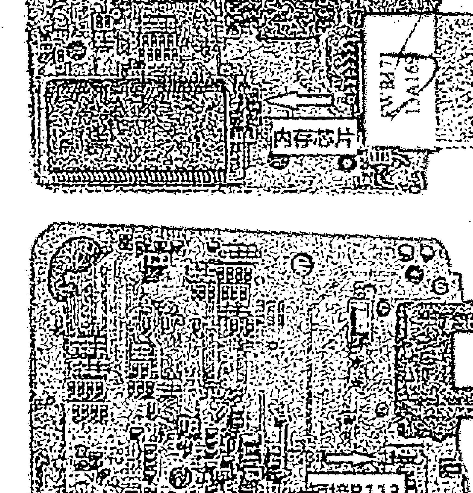

#### Flash芯片的改造

经过上述改装后，路由器的内存部分改装完成，现需要向其中的Flash刷写软件。由于软件较大，需要一块至少8MB的SPI SOP8芯片，这类芯片主要用在主板、路由器、Android设备等。我在一块废旧的技嘉主板上找到一块芯片，型号是：MX25L6445EM2I-10G，给其刷写固件的方法如下：

- 1. 更改MAC地址

MAC地址作为物理网卡识别的识别符，具有唯一性，若两个MAC地址相同的路由器在一起工作就会产生冲突。在电脑上安装WinHEX，用其打开“原厂703n.bin”，点击位置→去到偏移→输入0001FC00，这里存储的是路由器的MAC地址（图4），参照路由器外壳上的MAC地址将其输入进去，点击保存就会生成一个新文件，这个新文件就是已经更改好地址的固件了。

| Offset | 0 1 2 3 4 5 6 7 | 8 9 A B C D E F |
| :--- | :--- | :--- |
| 0001FBC0 | FF FF FF FF FF FF FF FF | FF FF FF FF FF FF FF FF |
| 0001FBD0 | FF FF FF FF FF FF FF FF | FF FF FF FF FF FF FF FF |
| 0001FBE0 | FF FF FF FF FF FF FF FF | FF FF FF FF FF FF FF FF |
| 0001FBF0 | FF FF FF FF FF FF FF FF | FF FF FF FF FF FF FF FF |
| 0001FC00 | FF FF FF FF FF FF FF FF | 00 00 00 00 00 00 00 00 |
| 0001FC10 | FF FF FF FF FF FF FF FF | FF FF FF FF FF FF FF FF |
| 0001FC20 | FF FF FF FF FF FF FF FF | FF FF FF FF FF FF FF FF |
| 0001FC30 | FF FF FF FF FF FF FF FF | FF FF FF FF FF FF FF FF |
| 0001FC40 | FF FF FF FF FF FF FF FF | FF FF FF FF FF FF FF FF |
| 0001FC50 | FF FF FF FF FF FF FF FF | FF FF FF FF FF FF FF FF |
| 0001FC60 | FF FF FF FF FF FF FF FF | FF FF FF FF FF FF FF FF |

- 2. 刷写固件

用编程器将修改好的文件直接用编程器刷写到芯片中就行。在维修笔记本的店铺都会有编程器。

- 3. 安装测试

先将路由器上原来的Flash拆下来，再把上述写好程序固件的Flash芯片焊接到路由器上，此时就能通电测试了。如果一切顺利，路由器开机会显示的型号为TP-Link WR703n，登录到路由器（默认IP：192.168.1.1），找到固件升级，更新“703n 1.bin”。成功后再升级“703n 2.bin”。登录路由器，点击系统→备份/升级，在上传备份文档中选择“703n.tar.gz”来恢复设置，此时路由器已经刷入了OpenWRT操作系统，这是一款基于Linux的系统。

#### 加装U盘大变身

经过上述一番折腾后，路由器部分的改装已经完成，安装U盘后这台路由器便可变身无线U盘了。在U盘的选择上，建议选择USB 2.0的U盘，不要选择移动硬盘等耗电量较大的存储设备。加装U盘过程如下：

- 1. 设置U盘

将购买来的U盘插在电脑上，将其格式化成NTFS格式。

- 2. 安装U盘

为了节约空间，可拆开U盘外壳并把USB公头去掉。最后再用烙铁将U盘上的四根接线焊接到路由器的USB焊接口上（图5）。使用的电线不易过长，焊接时尽量不碰到周围的元件。

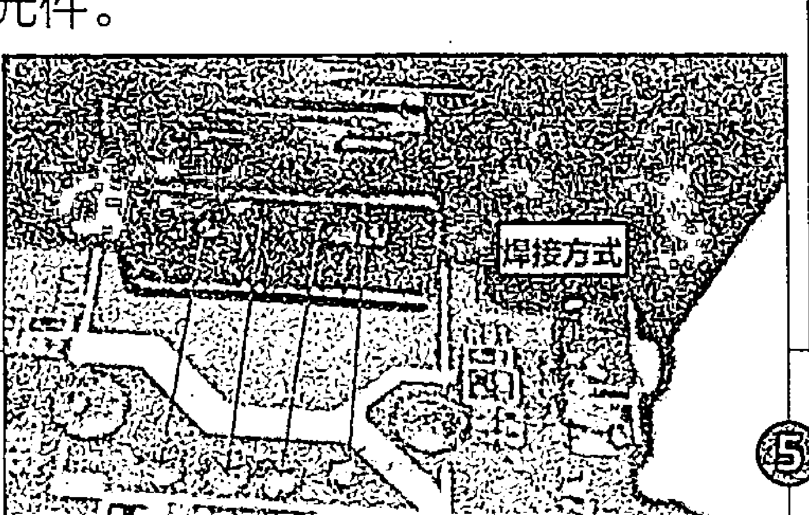

- 3. 固定及装回

将焊接好的U盘固定到路由器的主板上，可以使用502粘剂等粘接，推荐使用热熔胶，操作简单、易拆卸。最后再把路由器的外壳装回（图6）。

至此，这个小巧的无线U盘就打造成功了，只需配合移动电源就可使用。接通电源后，手机Wi-Fi连接，打开“ES文件浏览器”，点击“局域网→新建”，在服务器中填入路由器的IP地址（默认：192.168.1.1），再勾选匿名即可。而在电脑上，同样也是用Wi-Fi连接路由器。打开我的电脑，点击映射网络驱动器，在文件夹中填入“\\192.168.1.1\OpenWRT”，点击完成。这时会在电脑里多出一个盘符，这就是插在路由器上的U盘。

### 小结

为制作这款无线U盘，笔者在网上购买了一款二手路由器和一块16GB的普通U盘，共花70元。而购买芯片与焊接前后共花去了37元，总开销比市面上任何一款无线U盘都便宜。同时，这款无线U盘还支持联网和脱机下载的功能。在联网的前提下，通过内置的“Aria2下载器”和“Transmission下载器”可以轻松下载网络中的资源到内置的U盘中。当然，这块无线U盘也不是十全十美的，虽然它能够像U盘一样随时访问其中的文件，但还是需要额外的供电。当然，有兴趣的同学可以再想办法塞进一块电芯。

## 移花接木
### 笔记本系统无损迁移

文 | 曹操

机械硬件孱弱的读写性能是当前笔记本的最大瓶颈，因此很多玩家会通过升级SSD用于提速。但是，更换硬盘就意味着需要重装系统、重装驱动，费时费力。实际上，我们可以将机械硬盘中的数据直接迁移到SSD中，从而免去系统安装前后的繁琐。

#### 系统迁移免去繁琐

我们的目的是将机械硬盘中的系统区数据（包括各种引导信息）全部迁移到SSD中，安装SSD后就能直接使用其中的系统，从而免去重装操作系统和软件的麻烦。提到系统的迁徙，很多玩家首先都会考虑通过PE进入Ghost，再利用Partion to Partion命令实现数据的备份。但是，很多Windows 8笔记本都采用了UEFI BIOS+GPT硬盘的组合，包括Ghost和Diskgen等软件运行中都会报错。那么怎么办？

#### 利用SSD自带工具

很多SSD厂商已经意识到了简化用户重装系统的重要性，因此会提供官方的迁徙软件。比如三星和英特尔都提供了Data Migration软件，但仅支持自家品牌SSD克隆其他硬盘数据。以三星840EVO为例，只需先用移动硬盘盒或数据线将SSD插入笔记本USB接口上，运行Data Migration后即可完成SSD对机械硬盘数据的克隆（图1）。

当然，如果你购买的SSD硬盘没有提供类似Data Migration的软件，又或者你只是新买了一块更大容量或高速的机械硬盘来替换原有的老硬盘，那就不妨考虑下面这个通用的解决方案。

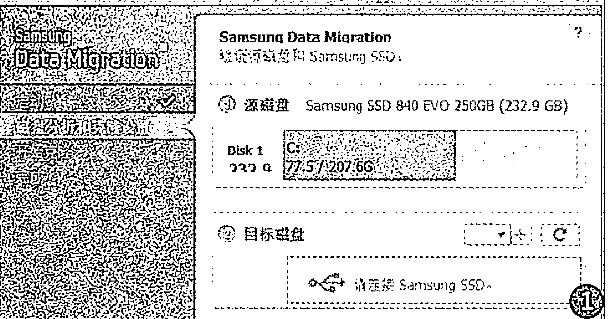

#### 通用的解决方案

“Backup & Recovery 14 Home”（下载地址：http://t.cn/zTNfmSu）是一款支持双硬盘间数据迁移的软件，输入基本个人信息后试用版下载地址就会发送到注册邮箱中（图2），而这个免费的试用版即可解决本文的问题。只是，根据你新买硬盘的类型，接下来的操作会略有差别。

**新买SSD硬盘**：无论是2.5英寸标准SSD，还是mSATA或NGFF接口的迷你SSD，你SSD，建议都先利用移动硬盘盒或光驱位硬盘托架（迷你SSD可先插在笔记本本上）与笔记本连接，用Windows系统磁盘管理中的格式化命令将SSD格式化（图3），尽量不要对SSD分区。接下来再运行Backup & Recovery 14 Home软件。

新买机械硬盘：利用移动硬盘盒与笔记本的USB接口相连，直接运行Backup & Recovery 14 Home软件即可（无需考虑4K问题）。

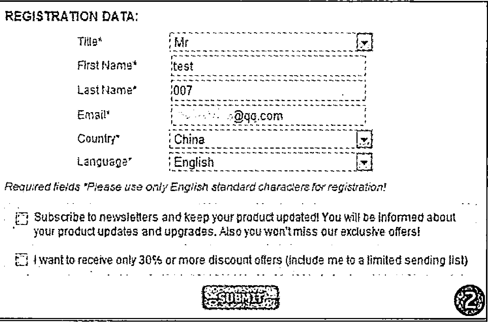

> 要根据你系统的版本，选择下载32bit或64bit版本的软件

#### 小提示
使用Backup & Recovery 14 Home软件有个前提条件，就是原硬盘已用空间必须小于新硬盘可用容量。比如你笔记本原有硬盘是500GB（已用300GB），而新买的SSD是128GB，那就需要先从原硬盘中将172GB以上的容量剪切到其他移动硬盘上备份。因此建议只保留C盘数据，系统引导、激活等信息都在C盘，将原有的D、E、F盘合并成一个分区后再使用本软件。

#### 简单的操作步骤

将Backup & Recovery 14 Home安装在原硬盘上并运行，点击“Copy Hard Disk”（图4），在弹出的注册提示对话框中选择最下面的试用按钮，接下来就可进入双硬盘数据迁徙的界面。此时需要先选中原硬盘再点击Next（图5），然后骤时将硬盘的进度条拖拽到最大（图6），待最后确认后等软件数据克隆完成即可。现在进入磁盘管理时，你会发现该软件连隐藏的系统恢复分区都备份了（图7），更换新硬盘后也不会影响笔记本的一键还原功能。

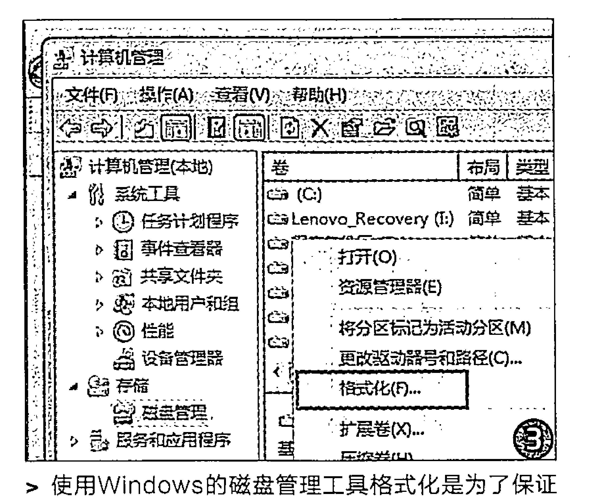

> > 使用Windows的磁盘管理工具格式化是为了保证SSD的4K对齐

界面提示，不断点Next（始终保持默认设置即可），其中建议在“Review the changes”步骤时确认。

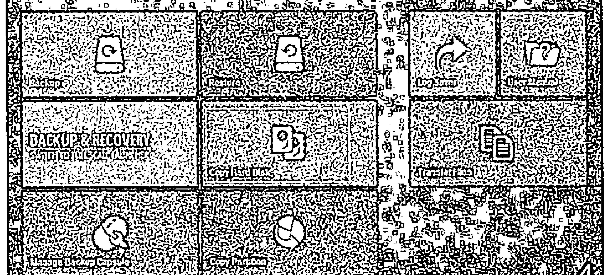

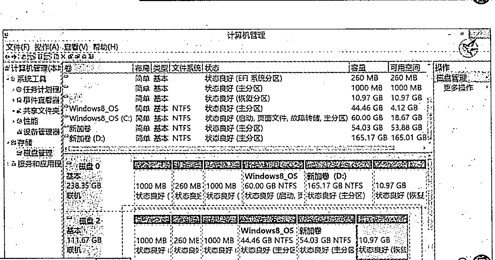

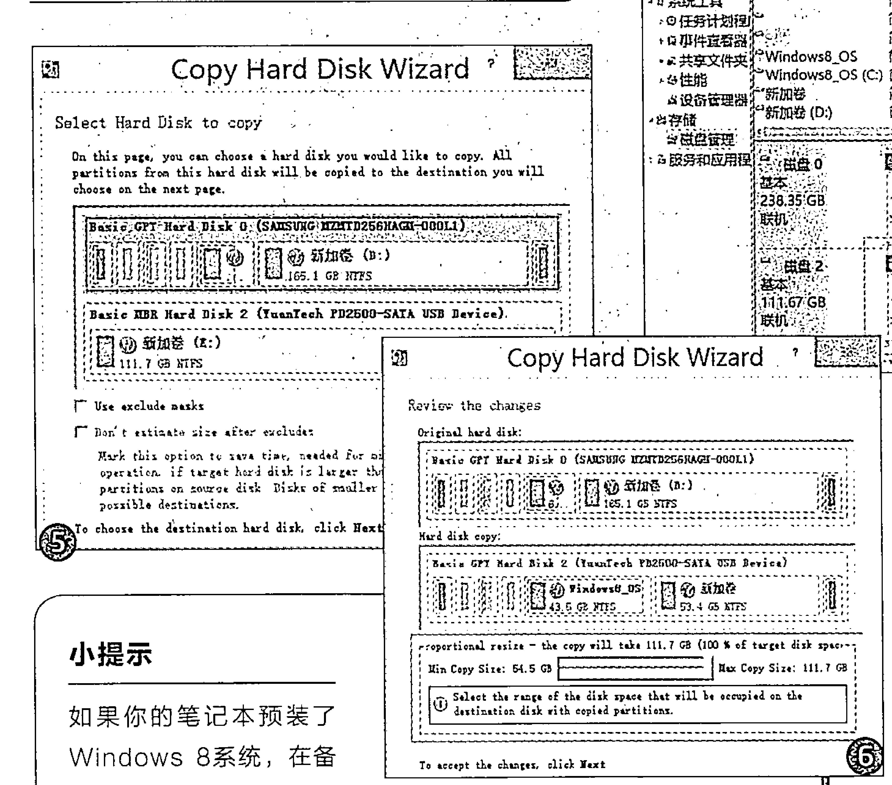

#### 最后的收尾工作

数据备份完成后，关机将原硬盘拆下，只安装新硬盘再开机，此时应该能顺利进入系统，看看Windows是不是处于激活状态，原有安装在C盘的驱动、软件是不是都完美运行？

如果你买的是mSATA一类的迷你SSD，将原机械硬盘的数据转移到SSD后，需要在BIOS中将mSATA设置为优先启动设备，确定进入SSD内的Windows系统后，就可删除机械硬盘的系统分区和数据了。

> > 小提示
如果你的笔记本预装了Windows 8系统，在备份中途出现报错提示，请重新进入Windows的磁盘管理界面，初始化SSD并将其转换成GPT格式。这里注意要把SSD的所有可用空间都建立新卷并指定盘符，之后重复前文的操作应该就可解决问题。

## 小编教你升级N卡驱动

直到今天，还有很多人从电脑安装后就从未升级过显卡驱动。与其他驱动不同，显卡驱动实际上是需要追新的。电脑、主板或显卡自带的显示驱动程序版本一般都不佳，新版本的驱动程序不仅提高了性能，还解决了很多问题。我们应该如何更新显卡驱动呢？

### NVIDIA显卡驱动更新

安装显卡驱动程序并非想象中那么难，最简单易行的方法就是去官网下载。以NVIDIA显卡为例，我们直接使用浏览器登录官网www.nvidia.cn，在左上角驱动程序悬停处会有两个选项：GeForce驱动程序和全部驱动程序。

先点击全部驱动程序试试，这里需要手动查找适用于自身产品的驱动程序。比如我们在使用GTX 460，就分别选中GeForce、400 Series（系列）、GTX 460，然后根据操作系统和语言选择后两项，比如选择Windows 7 64-bit和Chinese(Simplified)，之后点搜索按钮就可以了。这时系统会自动给我们推荐适合的最新版本WHQL认证正式版驱动，点击下载并确认一次就可以下载了。

下面的试用版驱动程序中能够搜到很多近期推出的其他版本驱动（图1），具体的说明需要我们逐个点击进去查看。针对网吧从业者，NVIDIA还在全部驱动程序中提供了类似GeForce 334.91这样的特殊版本驱动。其中含有NVIDIA Espresso自节电技术，可智能而自动地优化网吧电脑的功耗。

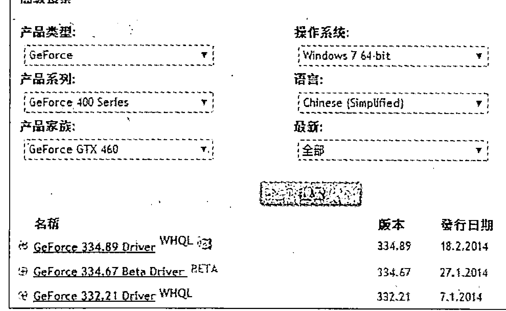

### GeForce Experience

悬停处另一个选择——GeForce驱动程序，里面会有三种方式供我们选择，第一种是通过GeForce Experience自动保持我们的驱动程序，这是NVIDIA为游戏进行优化的全新技术，其中就包括检查并更新驱动程序。打开GeForce Experience，左上角有专门的驱动程序选项卡，选择它并且检查更新，就可以搜索到NVIDIA为我们推荐的WHQL正式版驱动（图2）。


### 挑选不同版本驱动

虽然GeForce Experience很方便，但是它只能升级最新版本驱动，而其他版本驱动的下载，需要通过手动搜索驱动程序方式完成。基本的方法和前面说过的点击全部驱动程序差不多，需要注意的只有一个驱动版本选择的选项，我们选中All即可（图3）。

点击“开始搜索”按钮后就会显示连同最新版本驱动在内的所有驱动程序，包括BETA测试版驱动。一般来说NVIDIA显卡只安装正式版驱动即可，但有些时候可能正式版驱动还未推出，我们又需要。

### 献给新手的全自动侦测

很多人会说，我使用的这块显卡我自己都不知道型号是什么，手头又没有GeForce Experience，那我们如何选择驱动程序呢？NVIDIA也为这类用户提供了一个曲线救国的方法，那就是自动侦测你的GPU功能。

点击“自动侦测你的GPU”按钮，系统会提示你安装Java，点击图标就会跳转到甲骨文公司的Java安装界面，下载安装程序后运行，一路下一步就能完成安装了（图4）。安装完成后会自动跳转到甲骨文公司的Java验证界面，在这里我们其实可以直接关闭它。

回到刚才自动侦测你的GPU那个页面，重新点下按钮。Windows首次使用Java时会弹出一个对话框，提示你是否要为这个页面调用Java，我们先将“以后不再询问”勾选好后点确定（图5）。这时网站会根据你的硬件自动侦测GPU型号，不一会儿就会给出NVIDIA官方推荐的最佳驱动出来（图6）。是不是很方便？

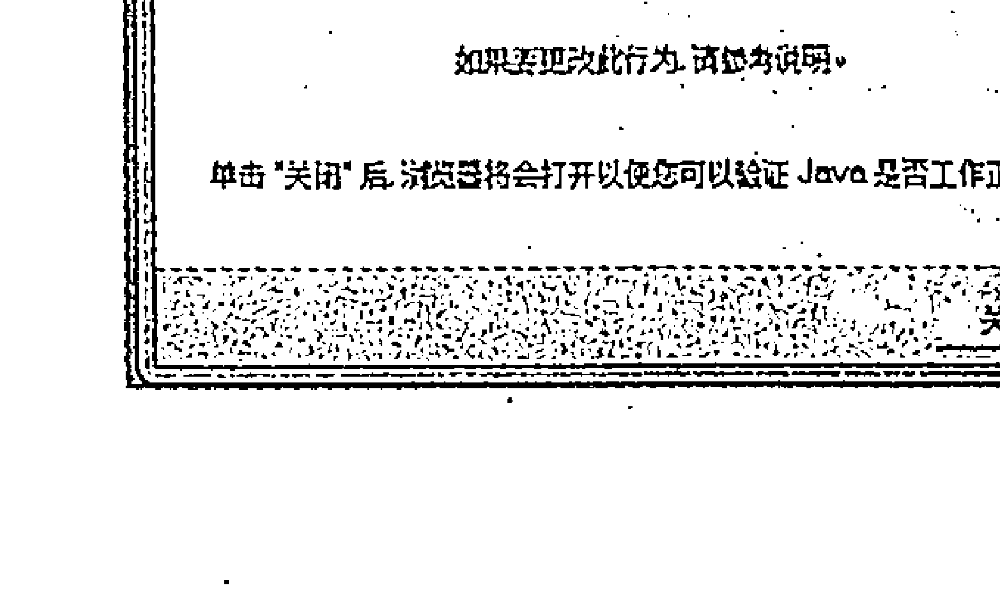

### 扩展阅读：驱动程序如何装

NVIDIA显卡驱动更新起来比较简单，我们无需去添加/删除程序那里一项一项卸载，直接运行新驱动即可。在安装的时候选中自定义方式，之后将“执行清洁安装”一项选中，驱动程序就会自动将所有的NVIDIA设置恢复为默认设置（图7），非常方便。

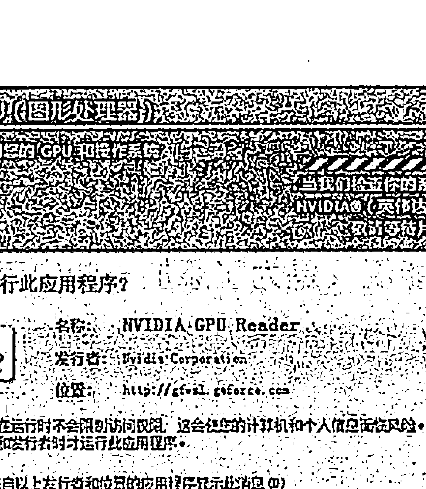

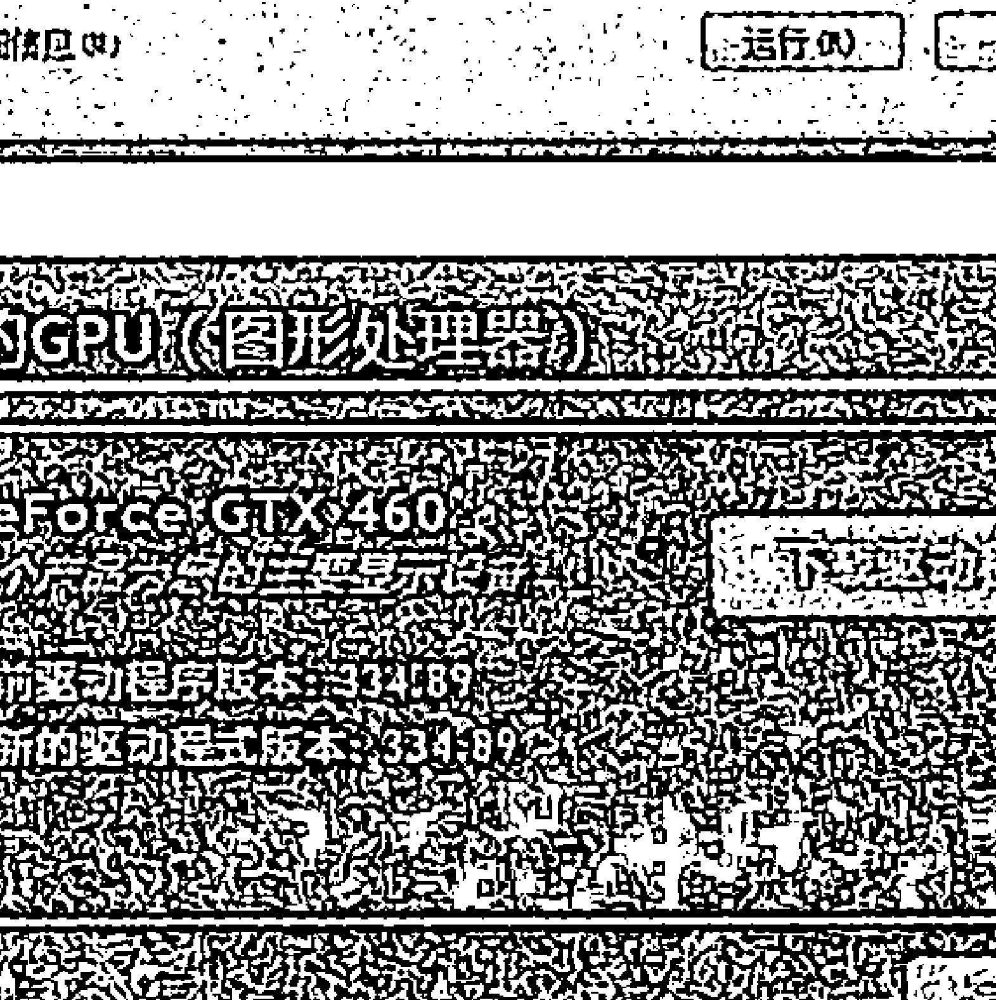


### 总结

相信通过上面的文字和图片说明，大家也都了解了一件事情，那就是更新显卡驱动并没有以前想象中那么困难。之后我们会进一步为大家介绍更新AMD显卡甚至Intel核芯显卡的办法，敬请期待吧。CF

## DIYer必备硬件工具

文 | 沈建苗

电脑可以说是相当自给自足的设备，它们多半不需要什么额外的附件。如今，Windows 8.1操作系统可以为用户自动处理好多常规的维护事务。然而，精心呵护电脑，意味着有时需要拿出某个硬件设备。本文介绍三个简单而便宜的“工具”，它们可以帮助你的电脑在今后几年都处于最佳的运行状态。

### 螺丝刀

可能仅仅是为了添加一些内存，或者把传统硬盘换成更新潮的固态硬盘；也可能是为了进入到电脑机箱里面，清理掉蜘蛛网；要是你很不走运，结果让该死的饮料洒在了笔记本电脑键盘上，你肯定需要一把螺丝刀来收拾这个残局。手边备一把螺丝刀，以便打开台式机或笔记本电脑。

需要哪种螺丝刀，取决于具体使用什么样的电脑。就本人的笔记本电脑而言，手头始终备有一把0号十字螺丝刀，瑞士军刀钥匙串上的螺丝刀也能顶一顶。如果你使用台式机，可能标准的十字螺丝刀就够了，附带磁性最好。

Tips：如果在操作中遇到“滑丝”的螺丝，这时螺丝刀可能够无能为力，读者可以参考2013年第22期60页“解决DIY过程中的烦恼”一文解决。

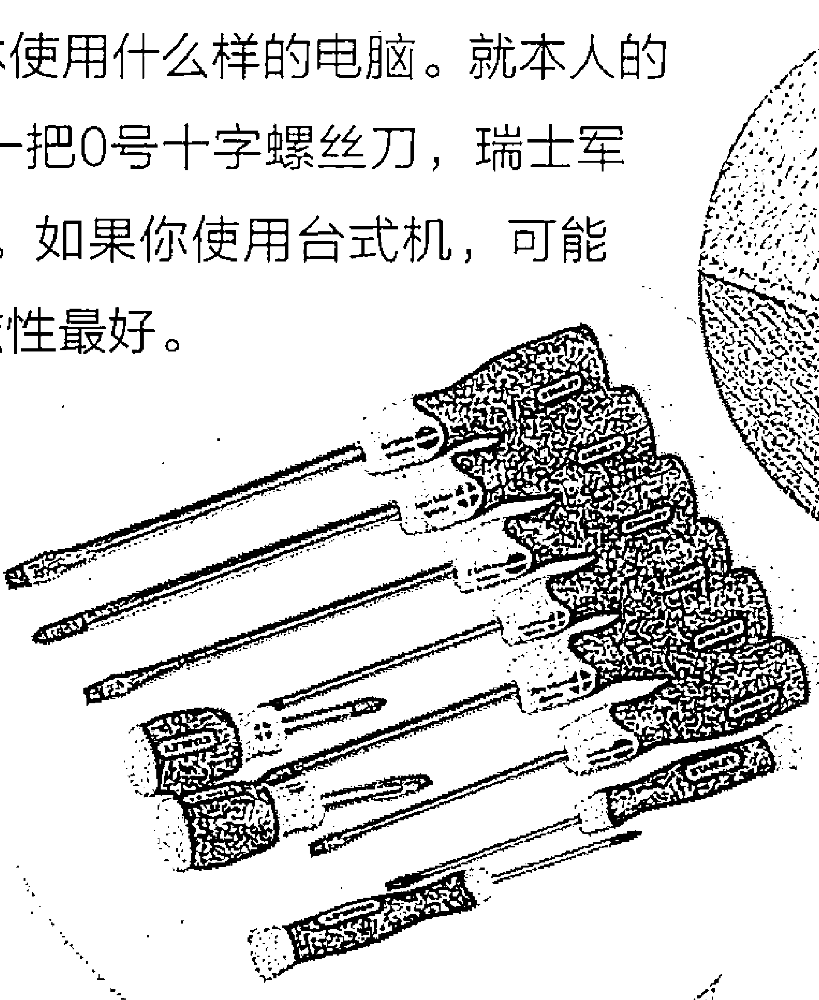

### 超细纤维布

说到用来清洁电脑，超细纤维布随时派得上用场。如果屏幕是没有玻璃保护屏的雾面屏，超细纤维布是特别重要的工具。擦屏幕上的灰尘或其他任何污渍，用超细纤维布再方便不过了，还不用担心划伤屏幕。至于具体擦拭并没有什么一定正确的方向，注意不要在屏幕上留下水渍即可。在给键盘除尘或擦拭液渍时，这种质地细软的清洁布也派得上用场。有些人还喜欢将超细纤维布搁在笔记本电脑键盘与屏幕之间，作为一层屏障，以防机盖合上时弄脏屏幕。


### 压缩空气罐

眼下天气越来越热，电脑更容易积灰尘。有时候清灰光使用超细纤维布还不够，压缩空气罐是电脑的最好朋友。压缩空气可以吹掉键盘角角落落里面的脏东西，还可以吹掉积在台式机风扇或其他通风口周围的所有那些灰尘球，不但能有效喷走里面的灰尘，而且比用嘴吹或者使用气吹有效得多。不过大多DIYer往往忘了压缩空气罐的存在，只有非常需要时才会想到它。

不过使用压缩空气时要小心，如果你在电脑机箱里面清扫，更要格外小心。如果使用不当可能会搞坏电脑部件，一定要避免在有明火的地方使用，同时尽可能避免长时间对着设备喷射。另外，在喷压缩空气之前，别忘了断开电源，包括笔记本电池。


总结：专门的电脑组装人员可能还需要另外一大批维修工具，比如查看电脑机箱内部的光源或用于清洗的异丙醇。不过对大多数人来说，手头备有上述三个基本的工具就可以帮助解决好多日常硬件问题。CF

## 键盘测试另类思路

文 | 盖述功

键盘、鼠标由于价格低廉，往往成为我们选购中最易忽视的对象。实际上我们每天都要用它进行大量的输入操作，选择一款性能优良的产品至关重要。抛开手感这些因人而异的因素，如何用数据量化这一点呢？只需使用专门的工具对其进行检测即可。

### 解决键位问题

键盘最易出问题的地方就是键位和延迟，如果出问题会给以后的输入工作带来极大麻烦。购买键盘，我们要特别注意这两点。而对这两项进行检测的最好办法，就是使用“键盘检测器”来完成（下载地址：http://126.am/ozvY93）。

将要测试的键盘接入PC，安装后启动程序，切换到英文输入法，然后在程序的主界面中单击“检测LED”按钮，按照顺序，同时在键盘上按下相邻的两个按键，按下的且被程序识别的按键，会在程序主界面的键区中以绿色标出（图1）。

所有按键检测完毕，在程序主界面中会看到未被识别的按键，这些键位很可能就存在问题。记下它们，然后单击“清除”按钮，清除上次的检测结果，再次单击“检测LED”按钮，重点对记下的按键进行检测。如果情况依旧，说明该按键真的有问题，这样的键盘不要也罢。

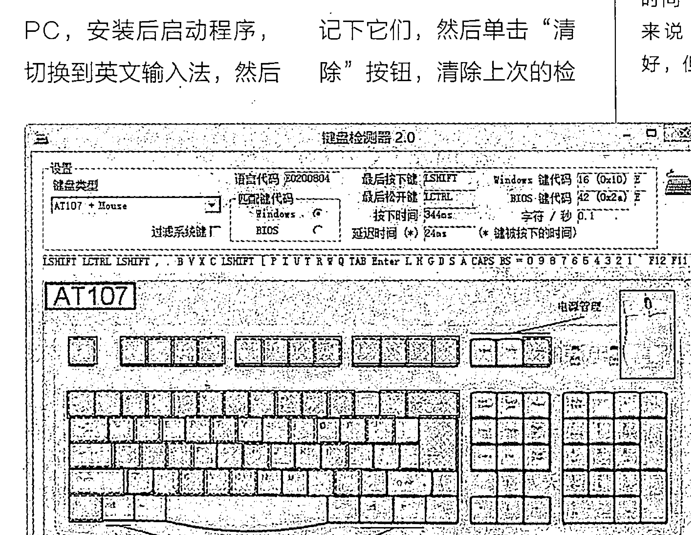

> **小提示**
>
> 键盘的延迟时间，会出现在界面上方的“延迟时间”项中，从理论上来说，该时间越小越好，但对于目前的低中档键盘来说，该数值保持在 30ms 以内即为正常。

### 量化鼠标性能优劣

鼠标检测，我们可以通过Mouse Rate Checker这款绿色工具来达到目的（下载地址：http://126.am/gSHQV1）。和专业检测工具相比，Mouse Rate Checker的特点是操作简单，我们只需凭借两个参数，就能判断出鼠标的性能优劣。

解压后双击其中的“鼠标检测软件.exe”文件运行程序，在测试区域中左右移动鼠标，移动结束后，在右侧的“当前速率”文本框中，我们会看到一些数值（图2），它们就是当前鼠标在移动过程中产生的刷新率数值，其中各数值间相差越大，说明鼠标的稳定性越差，反之越好。

而在“平均”文本框中，我们则可以看出平均刷新率，这一数字越大，说明鼠标反应速度越快，性能越好（一般来说，超过120Hz的鼠标足以满足我们的正常需要）。

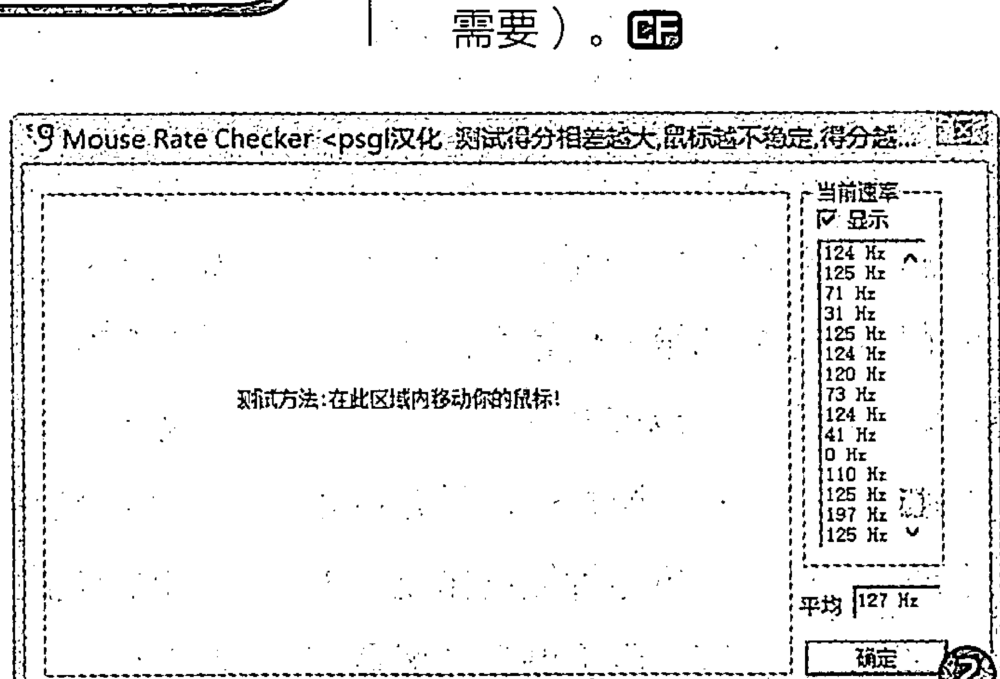

## 武装“抽风机” 主动式机箱显卡散热有新招

文 | 纯金处理器

随着夏日的临近，密闭式机箱里的高端显卡又要面临散热的压力了。如果你想在玩游戏时让显卡更“冷静”地工作，不妨考虑一下那些抽风式的辅助散热器吧。

### 老生常谈的机箱风道

在解决显卡散热之前，我们首先要了解机箱散热风道的原理。目前无论是标准机箱还是各类迷你机箱，在前后左右甚至侧板上都预留了通风孔甚至散热风扇。因这些孔隙和风扇引起气流的流动方向，就是所谓的“风道”，而“前进后出”、“下进上出”则是最理想的风道状态（图1）。

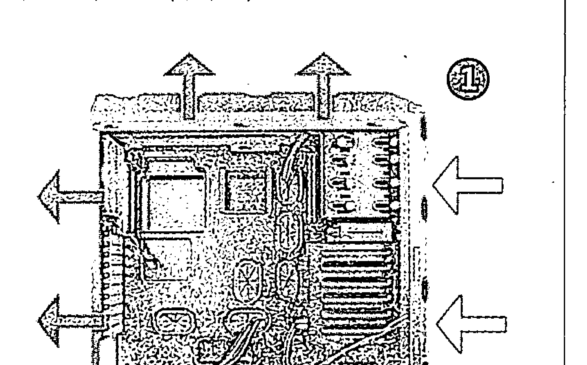

> 机箱的散热风道示意图，此外，机箱侧板的散热孔起到的也是进风效果

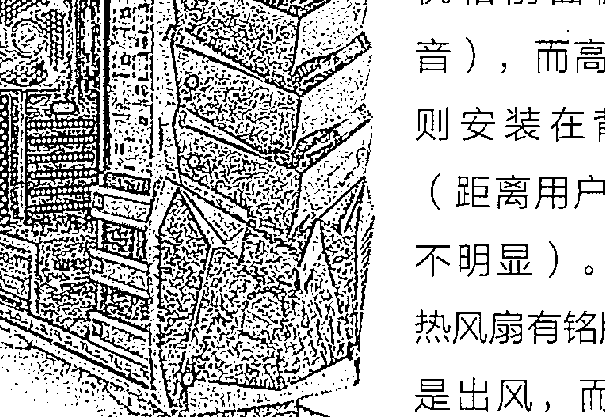

> 机箱越高端，赠送的风扇数量和安装位置越丰富

有些机箱会随机赠送几组风扇（图2），而构建一整套完整的散热风道，还需要用户自行购买更多风扇“补缺”，只是在选购和安装风扇时很容易出现一些问题。

### 常被忽略的风扇安装

比如，尽量要将低转速的风扇安装在机箱前面板（保证静音），而高转速的风扇则安装在背部和顶部（距离用户较远，噪音不明显）。此外，散热风扇有铭牌的一面是出风，而没有铭牌的一面才是进风（图3），如果买了前置风扇但却装反了，热浪会毫不留情地向你扑面而来（图4）……


### 显卡面临的困局

显卡性能往往与功耗和发热量成正比，对高端显卡而言，哪怕是配备了口碑出众的第三代鲨鱼散热器，在满负载运行下也有力不从心之感。最尴尬的是，显卡风扇的运行方向也是向外，也就是将芯片热量排出。如果机箱底部安装了用于提升进风量的散热风扇（或是下置式电源的散热风扇方向朝上），刚好会与显卡风扇所排出的热气流“碰撞”，从而影响散热效果。此时，最理想的解决方案，就是在显卡和下置风扇/电源之间的PCI板位置安装“抽风式”散热器，将热气流排出机箱（图5）。

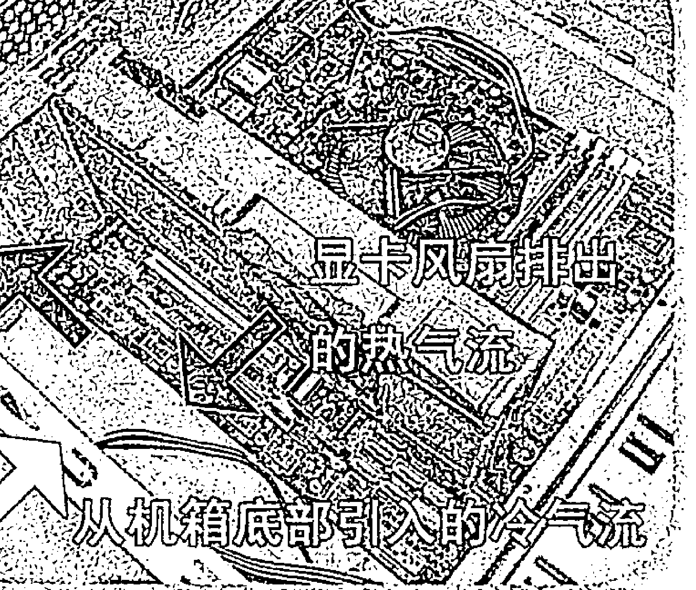

### 标准机箱用外置

以笔者的机箱为例，下置电源和显卡之间就存在四个PCI位置的扩展空间（图6），因此我选择了机箱外置式的PCI位置抽风散热器（图7）。这类设备可通过卡扣或螺丝固定，使用时只需安装在显卡下面的挡板位置（图8），就可以为那一片空白区域提供主动散热。为了考察该设备的效果，笔者还进行了实际的测试（见表），安装抽风散热器前后显卡在待机和满载时温度分别下降了5℃和4℃，效果还不错。

| 温度 | 安装前（℃） | 安装后（℃） |
| :--- | :--- | :--- |
| 待机温度 | 39 | 34 |
| 满载温度 | 86 | 82 |

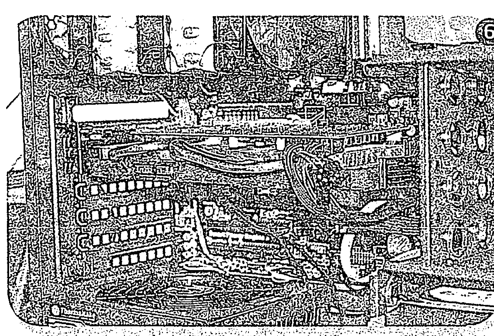

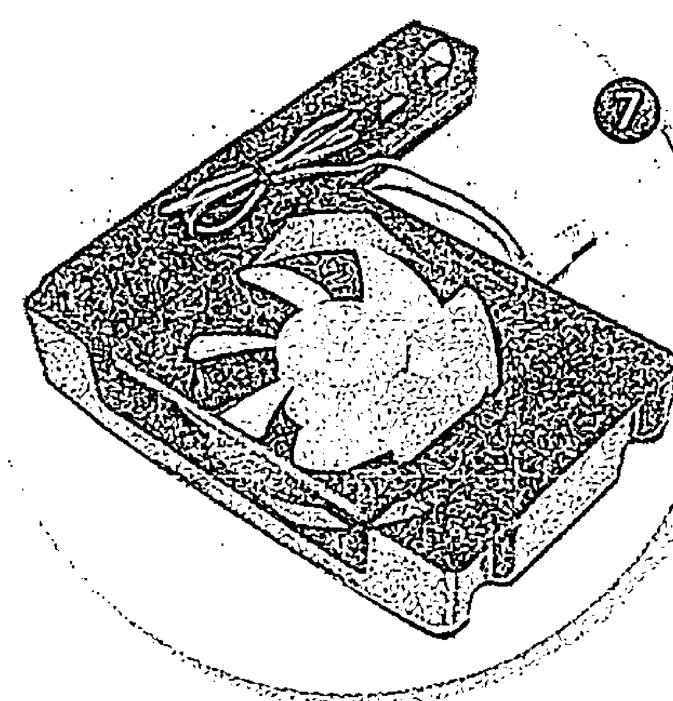

> **小提示**
>
> 很多外置式PCI位置抽风散热器都是随机箱赠送的，如果你的机箱品牌没有提供类似设备，可以考虑购买12cm标准散热器，然后固定在机箱PCI挡板的外面，同样可以起到抽风的效果。

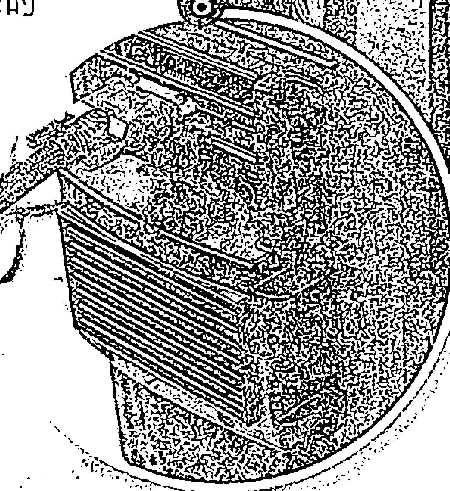

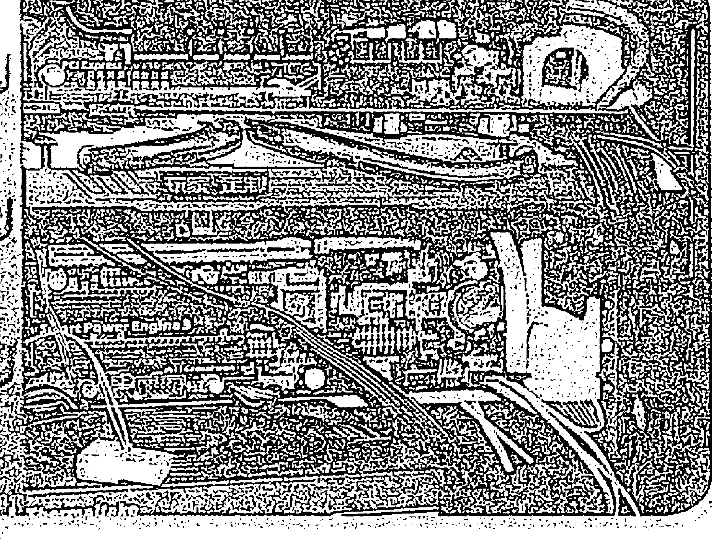

### 迷你机箱考虑内置

问题来了，现在很多DIY玩家都青睐于迷你机箱，而迷你机箱的PCI扩展位有限，无法安装外置式抽风散热器（图9）。没关系，现在我们还能买到内置式的PCI位置抽风散热器（图10），这类设备会占用一个PCI设备的空间。安装时只需将设备风扇对准显卡的风扇即可，设备会采用类似笔记本散热模块的方式，将显卡风扇吹出的热浪通过风扇侧面的散热孔排出机箱。


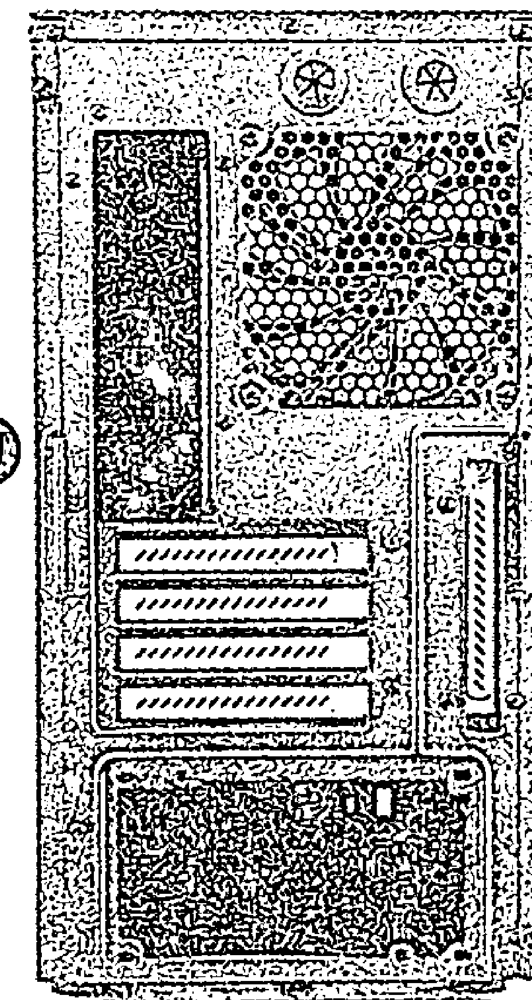

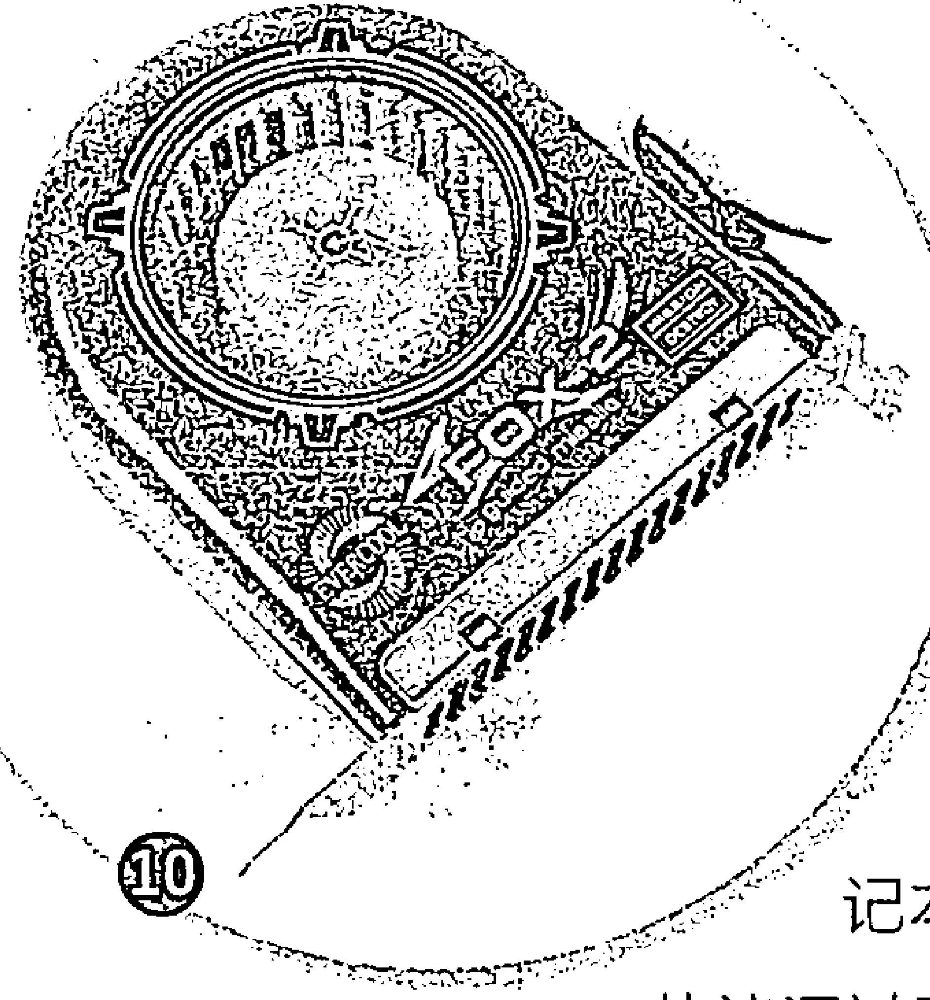

> 迷你机箱普遍只预留2～4个PCI扩展位

> **傻博士有话说**
>
> 台式机性能固然强悍，但随之而来的发热量也需要引起我们的重视。因此，采用背部走线避免机箱缠乱的线材阻碍空气流通、合理安装散热风扇以及用本文提供的思路来加装“抽油烟机”，都是可选的解决方案。

## 自己动手丰衣足食 实战智能路由器改造&加固

文 | 黄健

如今，智能路由风起云涌，如何因人而异定制最适合自己的设备？在纷乱的无线环境中又该如何更好地保护自己？本文我们就通过一番实战，来看看路由器如何量身改造和进行安全加固。

### 适合玩家的官方固件

“如意•云”采用了MT7620N Wi-Fi SoC芯片，基于OpenWRT开发的如意云官方固件很适合喜欢“折腾”的玩家们（图1）。需要注意的是，并非所有路由器都能刷入OpenWRT，OpenWRT.org维护着自己的硬件支持列表，同时也有很多网友维护的版本，建议大家在动手改造前，先登录到恩山、anywlan或OpenWRT.org.cn查看成功案例后再行动。

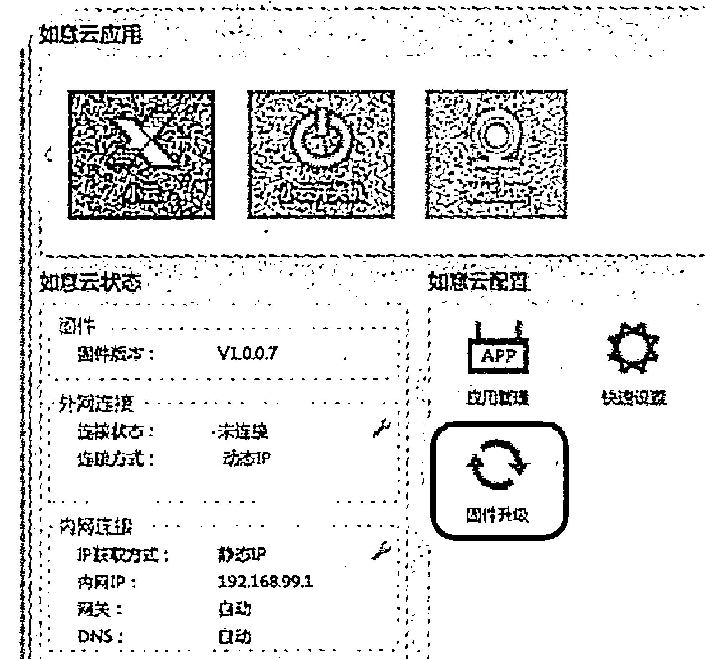

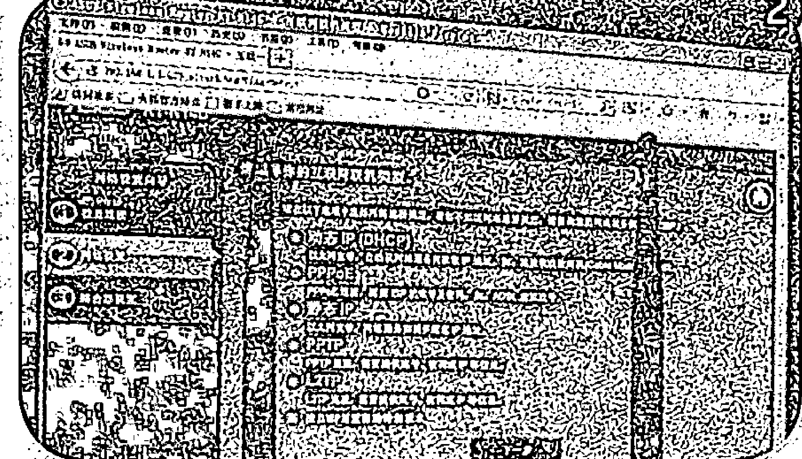

### 求稳定可用华硕N14U固件

华硕RT-N14U是口碑较好的路由器之一。由于RT-N14U也基于MT7620N芯片设计，也就让如意云路由有了升级华硕RT-N14U固件的机会（图2）。

不过，由于RT-N14U的硬件配置较高，类似水星MW300R V6、MW305R V1等同芯片路由器需要经过硬改（扩FLASH和扩RAM）方可刷新华硕固件。而如意云正式版硬件配置同RT-N14U一致，故改造最为简单。笔者就是直接通过如意云的“固件升级”配置项进行刷新，固件选用RT-N14U官方固件，成功刷新后使用正常。

#### 扩展阅读

目前智能路由器的固件多以Linux为主，往下又可细分为原厂SDK和OpenWRT及其衍生发行版，虽然它们都是Linux，但还是有区别的。如果求稳求好，原厂SDK会是一个不错的选择，不过Linux版本一般不高。而OpenWRT则相对追新，Linux内核版本较高，但硬件优化常未到位。不过对于玩家，若需要各种好玩的功能，OpenWRT则当仁不让，加之OpenWRT高度的定制性，所以市场上很多智能路由都会基于OpenWRT开发众多应用。这里包括了小米路由、极路由还有本文的如意云。

### 极客用Padavan固件

在试用了一段华硕官方固件后，笔者又发现了一款由俄罗斯人Padavan定制的N14U路由固件。

相比官方固件，它在显示上更为人性美观（图3），同时还解锁和增强了很多功能。至于刷入方法，和升级官方固件一致。

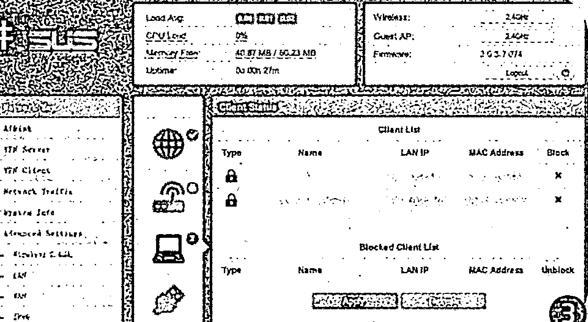

## 不可或缺的安全加固

路由的安全与否，一直是消费者关注的热点问题。在进行安全加固之前，我们不妨简单了解一下路由器是如何被蹭网和监听的。

### 网是这样被蹭的：

蹭网需要获得无线连接密码，目前无线路由破解中使用最广的方法归结为“抓包跑字典”与“破解PIN码”。

以minwep软件为例，抓包跑字典只需运行该软件扫描周边无线路由，等“鱼”上钩获得握手包（图4）。而破解PIN码只需根据字典就可获得路由WPA2登录连接密码。

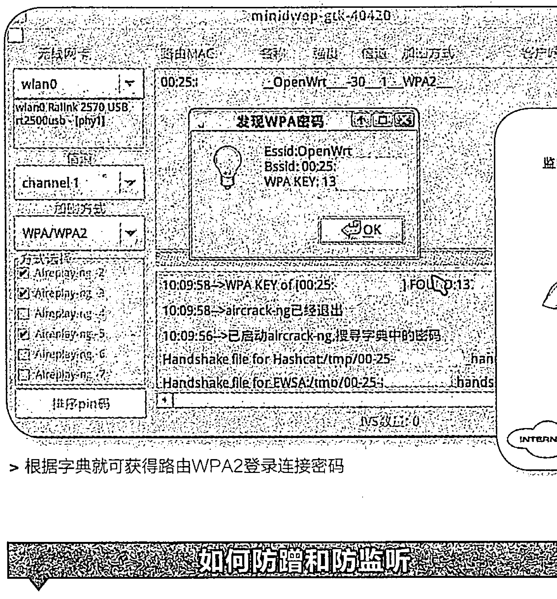

### 网是这样被监听的：

我们可模拟搭建一个监听平台（图5），所需道具如下：一部负责监听的电脑（这里以A机指代），需准备Kali Linux ISO光盘镜像（可写入U盘启动），还有用于监听的USB无线网卡；一部模拟用户上网操作的笔记本（这里以B机指代）；一台可连接外网的无线路由，本次准备的为基于OpenWRT固件的路由。

首先在A机插入USB无线网卡，并用写入KALI LINUX的U盘启动A机，进入KALI系统后，配置无线网卡并连接路由，接着打开Wireshark，注意勾选混杂模式，之后开始监听，然后使用B机连接路由上网，模拟用户操作。由Wireshark监听可实时得知B机浏览网站，所有记录都一览无余。

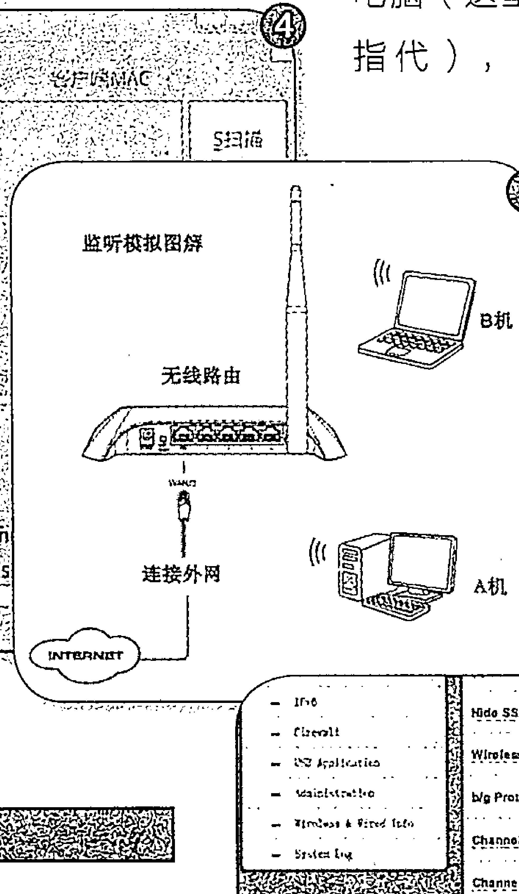

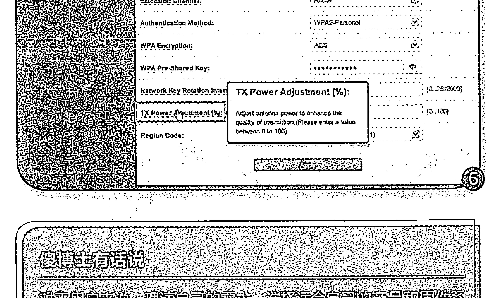

### 如何防蹭和防监听

了解了上述原理，我们就可针对性地进行防护了。其中防蹭网可以采用以下方法：

- 降低无线信号发射功率防破解，没有一个破解者对信号不良的无线连接感兴趣（图6）；
- 修改无线路由器的默认登录IP地址或端口；
- 利用SafePasswd（http://www.safepasswd.com/）生成强密码；
- 禁用UPnP；
- 关闭WAN Ping功能；
- 禁用SNMP；
- 取消远程管理；
- 修改DHCP设置；
- 启用MAC地址过滤；
- 关闭WPS。

就防监听而言，建议尽量少在公共场合连接无线。实在有需要连接，尽量少访问敏感信息，请尽量通过https加密访问或VPN服务等方式做进一步的安全保护。

## 便携上手谈

对于用户来说，把握自己的需求，选择适合自己的产品和固件系统，同时做好充分的安全防护，不仅对于无线路由器应该如此，在设备义的今天，很多产品同样应该遵循该原则。

## 打破传统思维 谁说系统SSD不能为HDD加速

文 | 盖述功

目前SSD只有两个用途：一是作为系统盘安装操作系统和应用程序；二是利用Intel的快速存储技术将其作为HDD高速缓存盘，用于提高HDD的整体运行速度。二者只能选一，无法同时兼得。我们能否让SSD既具有加速功能又能安装操作系统呢？答案是肯定的。

### 鱼和熊掌兼得

之所以要这么做，主要是考虑到那些SSD容量介于80~128GB之间的用户，既无法将虚拟机、大型游戏安装到SSD中，同时又不得不忍受SSD有一部分空间被白白浪费的苦恼。借助这种方法，我们可以将空闲空间作为调整缓存盘来使用，从而达到为HDD中的游戏、虚拟机以及其他数据提速的目的。都有哪些主板支持Intel快速存储技术呢？台式机和移动平台都是从老旧的945到目前最新的8系列芯片组全部支持。

### 安装系统到HDD

确保主板支持Raid，SSD和HDD分别接在主板的原生SATA接口上（图1）。进入主板官方网站或驱动网站下载主板对应的Raid控制器驱动到U盘，下载时请注意根据要安装的系统选择相应的版本（如32位或64位）。此外，如果下载的是压缩文件，请将其解压后保存到U盘中。

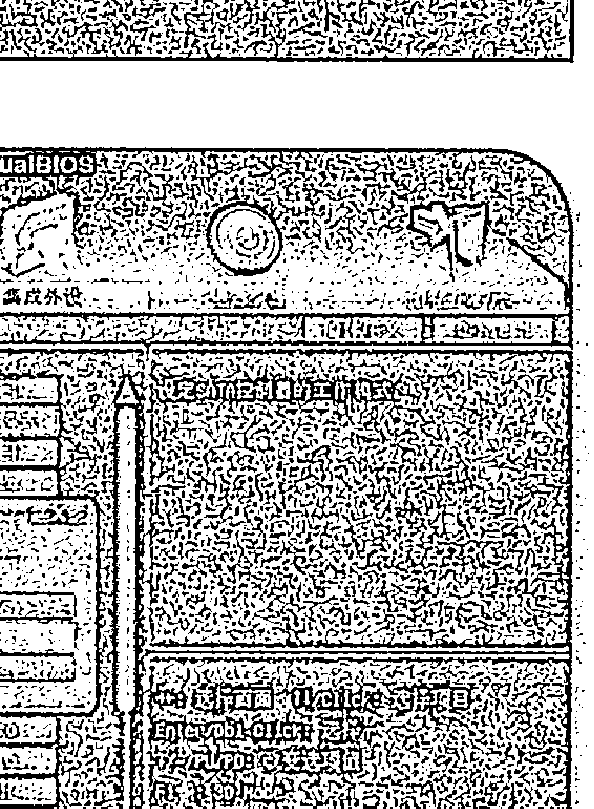

上述工作做完后，接下来，用下面介绍的方法将系统安装到HDD中。

先将系统安装光盘插入光驱，重启系统，按下F2键，进入CMOS设置界面，将SATA模式设置为Raid模式（图2），同时将引导驱动器选择为光驱，按下F10键保存设置并重启系统。

之后在安装操作进行到选择“要安装的语言”安装界面时（图3），按下“Shift+F10”组合键，打开命令提示符窗口。然后依次输入以下命令（注意：每输入一行都要回车，其中括号中的内容为命令注释无需输入，图4）：

```
Diskpart
(启动Diskpart命令。该命令可轻松对硬盘进行管理。)
List disk
(显示所有磁盘信息。)
Select disk 0
(选择磁盘0，即SSD。)
Create partition primary
(创建主分区。)
Active
(激活分区。)
Format fs=ntfs quick
(快速格式化为NTFS文件系统。)
Assign letter=C
(分配盘符C。)
Exit
(退出Diskpart命令。)
```

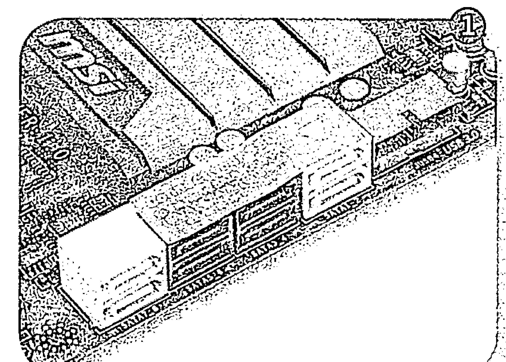

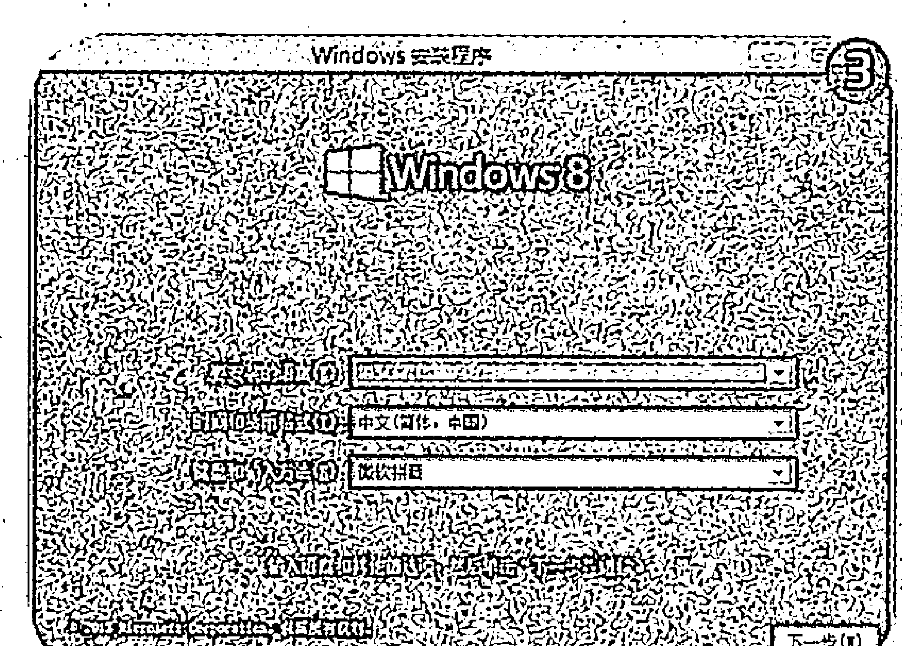

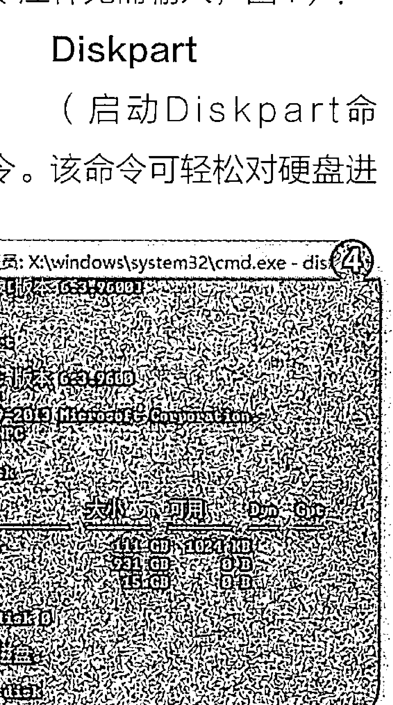

+ Lisk disk （显示当前挂载的磁盘列表。注意查看一下磁盘容量，找出SSD及其对应的磁盘序号，此例中为0，记下它）
- Select disk 0 （选择序号为0的磁盘，即SSD）
- Offline disk （令磁盘脱机。脱机的目的是为了在安装系统的过程中，不会因SSD的存在而出现Boot分区和操作系统不在一块磁盘上的情况。如果此时PC中还存在更多的磁盘，可以重复上述两个命令，将其一一卸载，最后只保留要安装操作系统的磁盘即可）

最后卸载完毕关闭命令提示符窗口，继续安装系统。在出现选择系统分区界面时（图5），选择“加载驱动程序”项，然后在出现的对话框中，选择U盘中的Raid控制器驱动文件，确认后完成驱动的安装操作，最后返回系统窗口，用常规方法完成系统的安装工作。

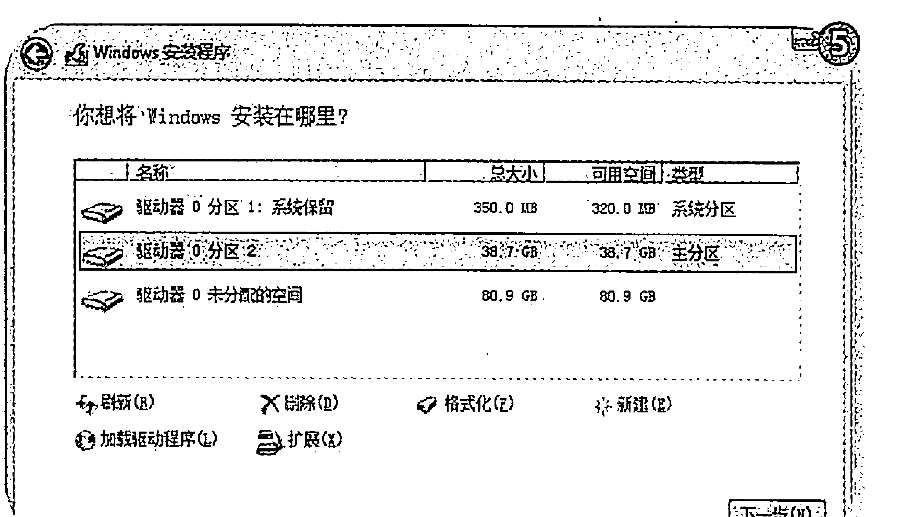

### 设置SSD为加速盘

上面在HDD中安装操作系统的目的，实际上主要是为了利用Intel快速存储技术（RST），将SSD的部分空间设置为加速盘做准备，换句话说，就是要以该系统为跳板，完成我们下面的操作。在进行下面的步骤时要注意，由于将SSD设置为加速盘后，其中的数据将被清空，所以在设置前，应做好重要数据的备份工作。先重启系统进入BIOS设置界面，将已安装操作系统的HDD设置为第一引导盘。进入桌面，设置好网络连接等项，然后进入http://126.am/EqBvd4页面，下载并安装Intel RST驱动，安装完毕。重启系统启动Intel RST，在其主界面中，切换到“状态”标签。程序会自动检测可用于加速的SSD，并将其显示在“加速”项中，单击“启用加速”文字链接（图6），打开“启用加速”对话框。

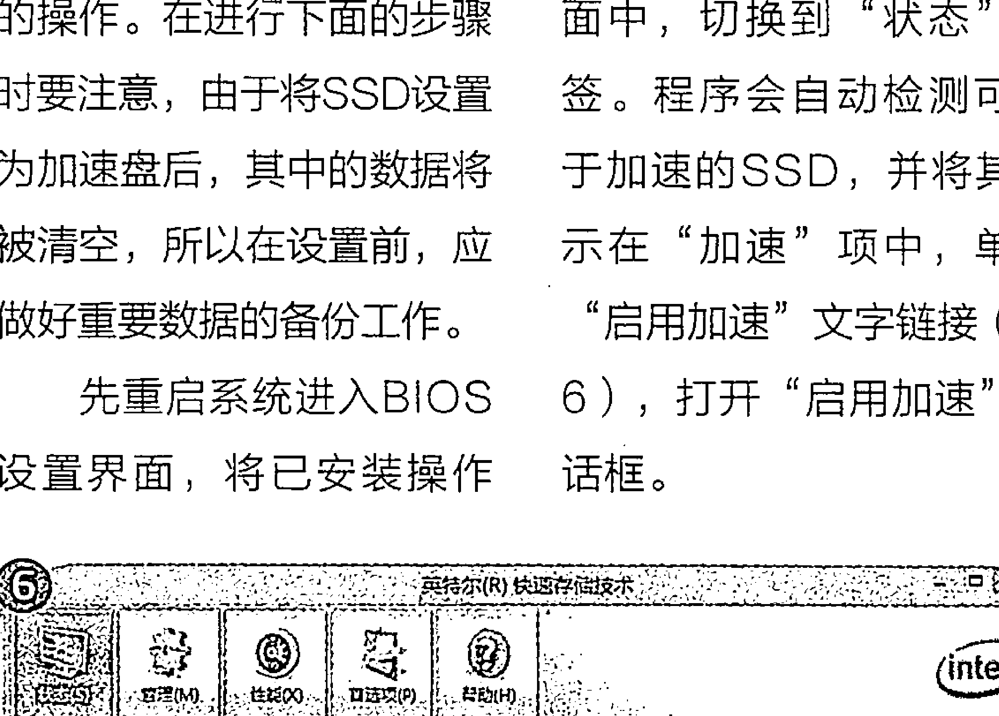

此时根据SSD可用容量的大小，对“选择为高速缓存内存的大小”项进行设置（128GB及其以上容量的SSD可选择64GB，否则可选择18.6GB）。而“选择加速模式”项可选择“最大化模式”，以获得最好的加速性能。设置完毕，单击“确定”按钮（图7）。程序会将SSD分成两个磁盘，其中一个即为加速盘。该磁盘在系统的磁盘管理界面中无法看到，而未曾分配的那部分空间，系统会以新磁盘的方式添加到磁盘管理中。至此，SSD的加速使命便已正式完成，接下来，用与上面类似的方法，在SSD中安装系统即可。系统安装完成，我们可根据需要，删除HDD中的系统，或将其保留，以便以后在必要的时候，可用它来引导PC进入桌面。

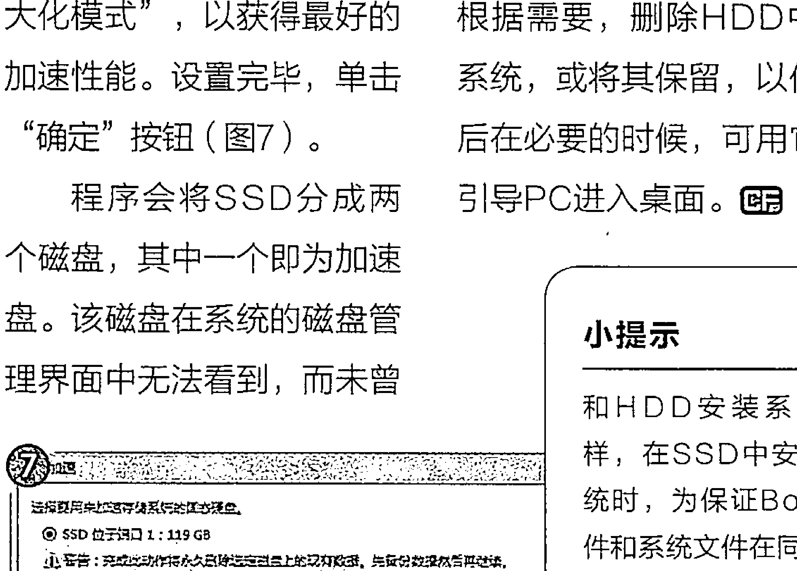

> **小提示**
>
> 和HDD安装系统一样，在SSD中安装系统时，为保证Boot文件和系统文件在同一磁盘，应在安装前，使用Offline disk命令，令HDD脱机。

## 移动硬盘的拆修“实战”

文 | 黄健

当移动硬盘外观破损，或使用中出现异常问题后，你会选择换新还是维修保养？如果你的答案是后者，那本文可就不要错过了。

### 初级篇 旧貌换新颜

重点：更换硬盘盒 难度：低

当移动硬盘的机身出现划痕或破损时，只要内部硬盘无使用问题，我们可以自行将其拆解，并更换同规格移动硬盘盒，就可让移动硬盘“旧貌换新颜”。移动硬盘通常由螺丝固定，拆装很方便（图1）。只是在新移动硬盘盒的选择上，建议购买配USB3.0接口的产品。

> 更换新硬盘盒时一定要拧紧全部的固定螺丝，保证内部硬盘的稳固

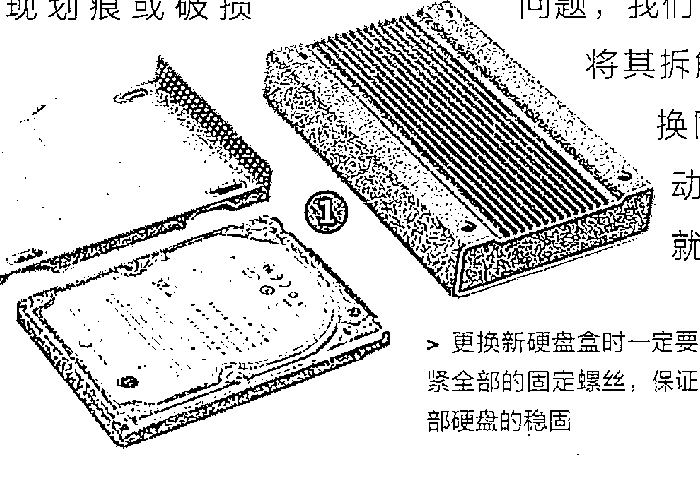

### 中级篇 故障的排查

重点：拆修检测笔记本盘 难度：中

笔者朋友的一款 freeplay 1TB移动硬盘最近使用经常出现问题，托我帮忙查看一下。移动硬盘不外2.5英寸硬盘和电路板组合而成，所以下面的排查也就从这两点入手。

首先就是拆下硬盘的操作。freeplay硬盘盒的固定螺丝在底部脚垫内，所以拆机时需要撬开脚垫再拧螺丝。在分体硬盘盒时，建议使用撬机片分拆外壳。从图2可见，该1TB硬盘明显较普通2.5英寸硬盘厚很多，原因就在于它采用了多碟片多磁头设计（对供电要求更高）。

硬盘盒电路板安装另一块2.5英寸硬盘使用正常，所以本例中最大的故障嫌疑就判定在原1TB硬盘上。使用希捷官方提供的SeaTools for Windows软件检测SMART和长检测并没出现问题（图3），同时尝试了SeaTools高级检测中的固件更新选项，联网发现无可更新固件（图4）。

鉴于硬盘主体无恙，问题应该源自USB接口的供电不稳上。因此笔者建议朋友将其接在台式机上使用，主要考虑供电充裕稳定更有利于长期使用，至此再无出现问题。


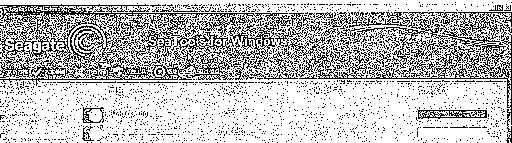

> 知子莫若父，硬盘采用原厂工具检测结果理论上最为准确，所以建议用户优选原厂检测工具检测自己的疑似故障盘

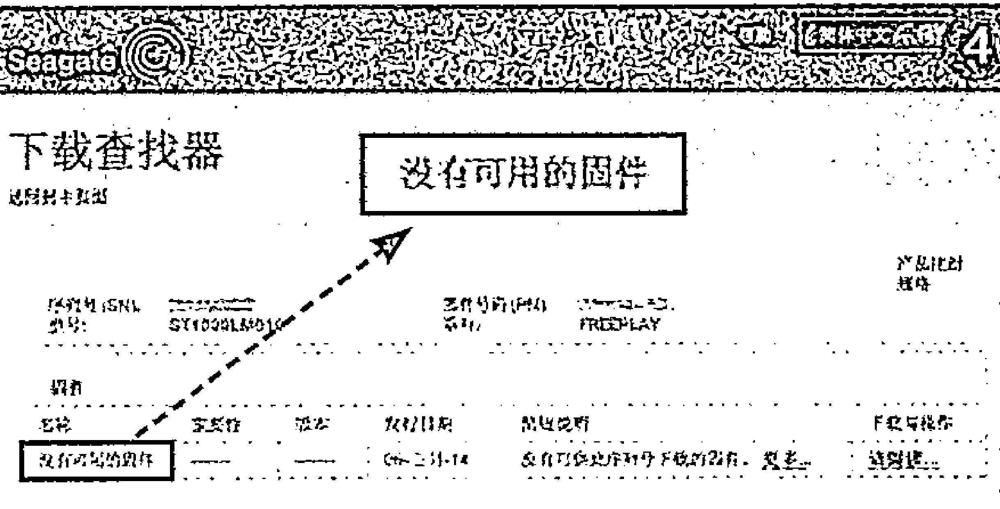

> 在可能的情况下，及时升级硬盘固件可预防故障发生## 高级篇 固件的修复

重点：修复硬盘盒固件 难度：高

移动硬盘所谓的特色功能和内置的2.5英寸硬盘无关，关键源于硬盘盒所采用的芯片和主控。比如Zalman VE200就是最具特色的移动硬盘盒代表，其在NTFS格式下可以自由选择加载多达32张光盘镜像（相当于一次随身携带了32张光盘，同时还可以依需要随时增删），为IT维护人员提供了极大的便利。不过，再好的工具也有罢工的时候。如果VE200在高强度使用下罢工。那该怎么办？朋友的一个VE200就出现了一直停留在开机画面的故障（图5），即使按RESET键也无济于事。

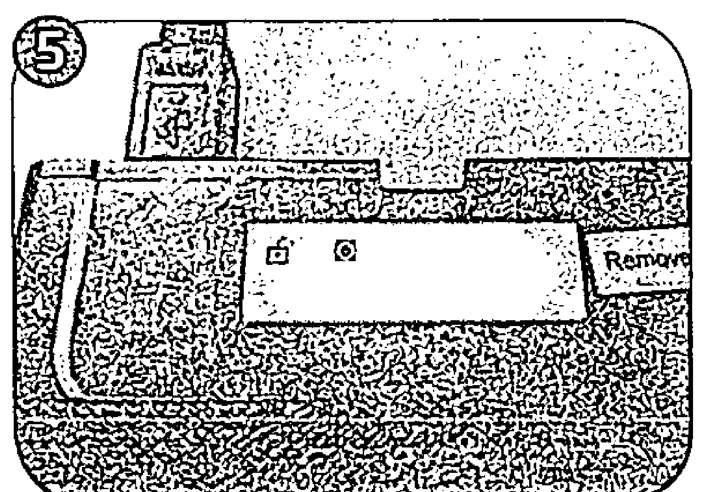

理论上，高端移动硬盘盒都可通过固件修复或升级解决疑难杂症，虽然Zalman官方提供了固件升级工具，但悲剧的是这款VE200的故障会停留在开机画面，根本就无法进入选择固件文件的界面，而官方也没有提供固件修复工具，故修复陷入僵局。所谓“山重水复疑无路，柳暗花明又一村”，一次在上网中无意发现VE200原来是OEM自韩国公司（http://i-odd.com/）的iodd2511。该公司网站不仅提供固件升级工具，同时还提供了固件修复的工具（图6），看来这下有希望了。

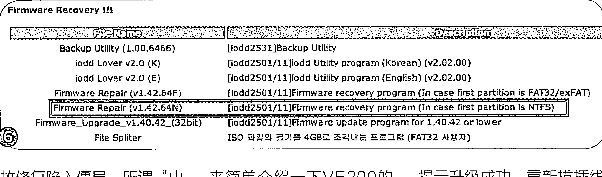

修复前须下载对应NTFS固件恢复工具，该工具需要JAVA支持。接下来简单介绍一下VE200的修复过程：首先需要长按VE200 RESET键后使用USB线接入PC（图8），在OXU931SF Cloner/flasher工具中点击Scan USB，发现设备后点击Program Devices开始上载固件（图9）。

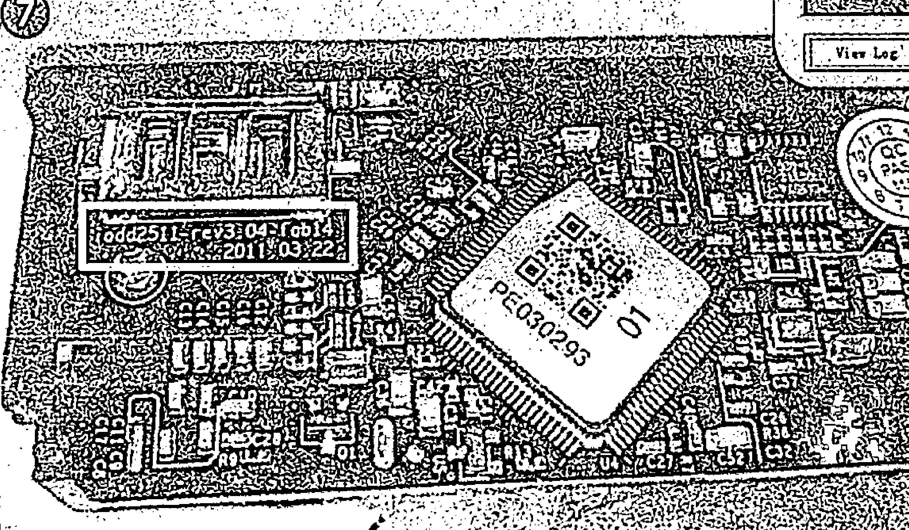

提示升级成功，重新拔插线缆后VE200就可正常工作了（图10）。至此故障硬盘盒成功恢复运作，固件修复圆满完成。

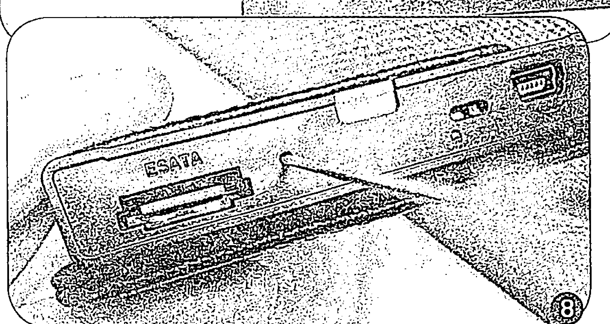

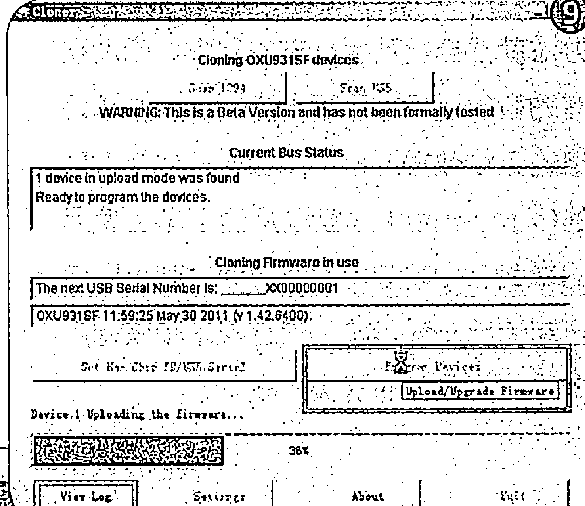

> 小提示
如果你拆解过VE200，在它的电路板上就可以看出端倪，如图7的方框处。因此当某款移动硬盘盒官方未提供固件修复程序时，我们不妨从其OEM的方向，曲线救国。

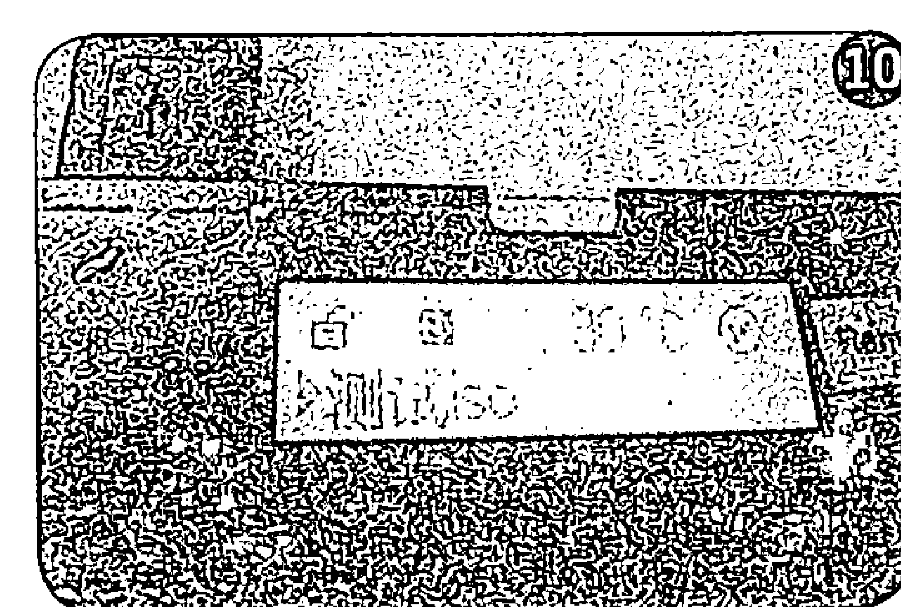

## 自己动手打造车载Android设备

文|沈建苗

我们最近听说了关于苹果车载技术计划的诸多新闻。诸多汽车厂商纷纷支持苹果即将推出的可复制应用的CarPlay仪表盘技术，比如丰田和奥迪等厂商。如果你不想等到2015年，眼下就想在现有的汽车中享受类似CarPlay的技术，该如何是好？

### 充分利用现有的设备和技术

既然苹果还要一年后才能实现，我们就看看Android系统。谷歌类似的“投射模式”（Projected Mode）汽车智能手机连接系统远未成熟，你根本没法在网上买到任何类似的设备。解决办法就是自己动手、丰衣足食，借助现有的智能手机或平板电脑，还有共享网络的无线数据连接。添加一只成本低廉的Gooseneck底座以及便于车上使用的车载启动器应用程序界面，就可以自己制造出一套导航、信息娱乐和联网汽车等功能兼备的解决方案。

### 购买和安装Gooseneck支架

外国厂商Arkon生产一款平板电脑支架，其旋转球底座可以连接到前排座位的滑轨螺栓（螺栓则将座椅滑轨固定在地板上）。这个支架花不了多少钱，原价35美元，淘宝上一般是200元到300元之间。至于购买链接，可以在淘宝网搜索Arkon+Gooseneck关键字。

由于设计合理，装起来其实一点也不棘手，只需按照Arkon随附的操作说明来安装套件。我们在安装的时候需要一把可灵活调节的扳手和十字口螺丝刀，把电源线和音频线沿底座臂收藏起来可能要费点劲，不过相信肯定难不倒熟悉电脑DIY理线的用户。最后只要将平板电脑滑到底座上，一块仪表盘上的人体工学触摸板就这样做成了。

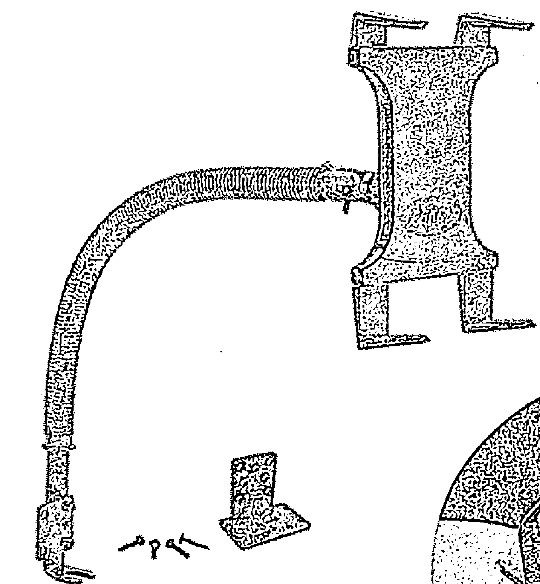

> Arkon Gooseneck设计极为简洁，售价也并非很昂贵

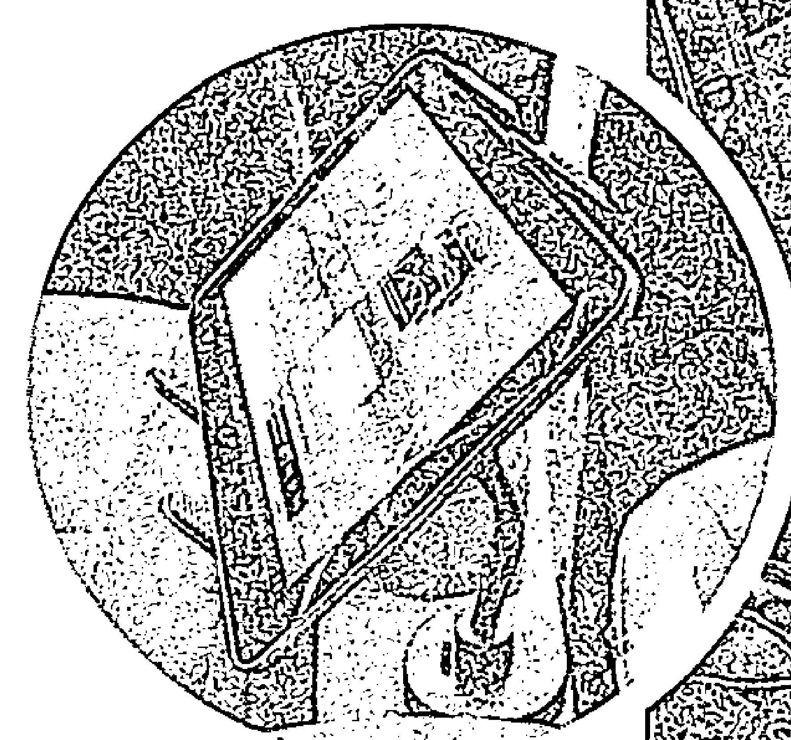

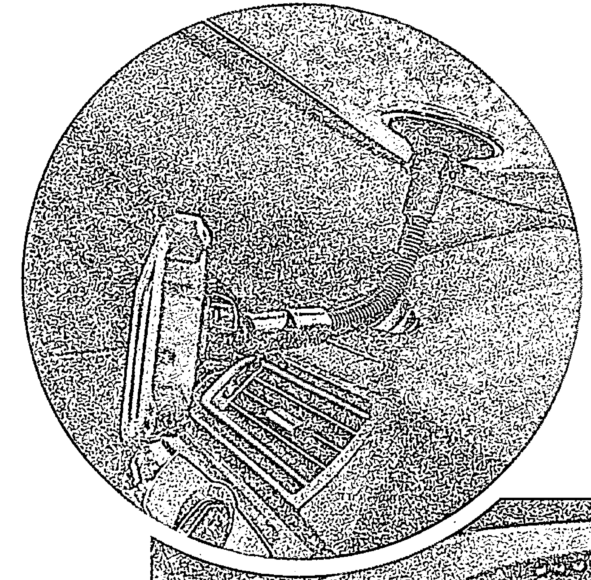

> Gooseneck可以将几乎任何平板电脑夹在任意位置

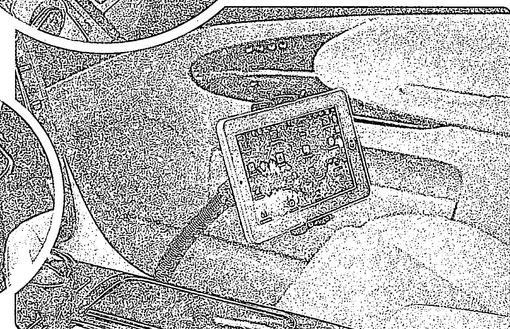

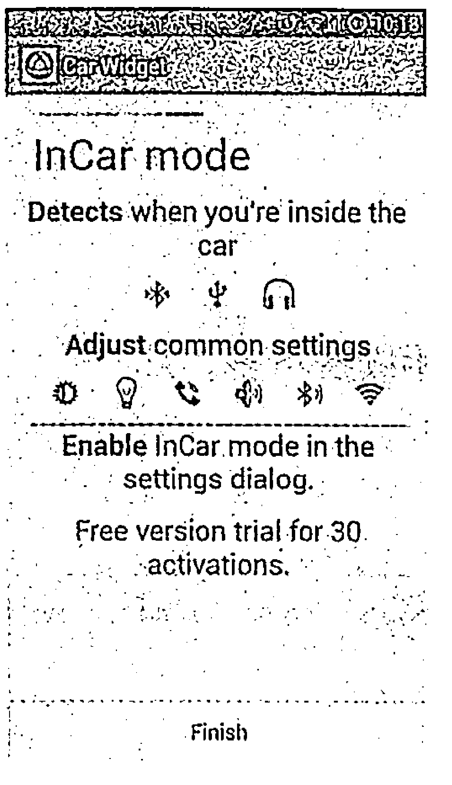

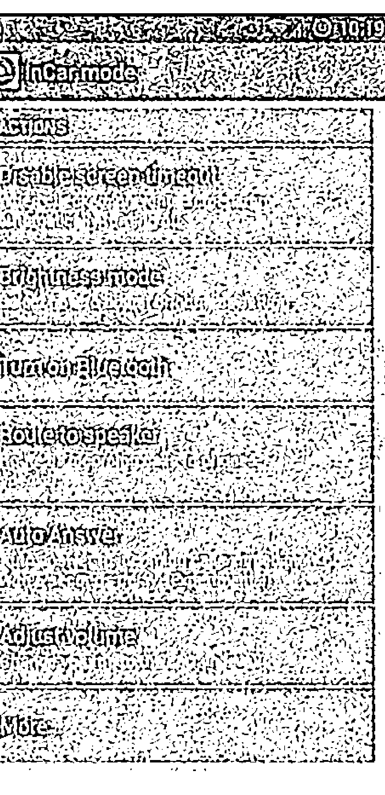

### 安装Car Widget Pro应用程序

开车时屏幕自动休眠肯定是所有人都不原意看到的，开着车还得伸手去激活屏幕并解锁实在是既不方便又很危险，这时候我们可以通过Car Widget Pro这类程序来搞定这个尴尬的问题。
在市场中搜索Car Widget Pro，使用音频输出端（比如汽车立体声音响）连接到Android设备的耳机插孔后，可以禁止屏幕超时自动关闭。通过Car Widget Pro设置区中的检测选项，执行如图中操作即可，非常简单。

> Car Widget Pro应用程序的车载模式可让屏幕保持开启状态

> Car Widget Pro有很多有助于将Android设备安装到车上的功能

### 选择平板电脑快捷方式

Car Widget Pro让你可以指定仅供汽车使用的主屏幕，并且在主屏幕上提供比正常大小要大的快捷方式，又没有让图标显得很模糊。我们可以将它连同高德地图或者其他地图应用、各类导航应用、语音线路提醒和一些带有定位功能的应用组合使用。

> 小提示
当然，始终开启的屏幕会加速耗尽平板电脑的电池电量。这时，我们不妨使用专为平板电脑设计的汽车电源适配器。现在有很多这类电源适配器产品同时带两个USB端口，那样就可以同时给手机充电了，十分方便。

### 让手机共享网络

就算平板电脑没有4G连接功能，也用不着担心，我们可以通过智能手机获得需要的网络环境。只要访问手机上的网络共享或便携式热点选项，并通过无线网络让手机连接与平板电脑进行共享。不过要留意数据使用量。
一切搞定，我们上车后只要将平板电脑开启，并将汽车立体声音响主机连接到平板电脑的耳机插孔（要是汽车上没有立体声输入插孔，就使用老式的盒式适配器），然后将USB电源线接入到平板电脑和智能手机上。

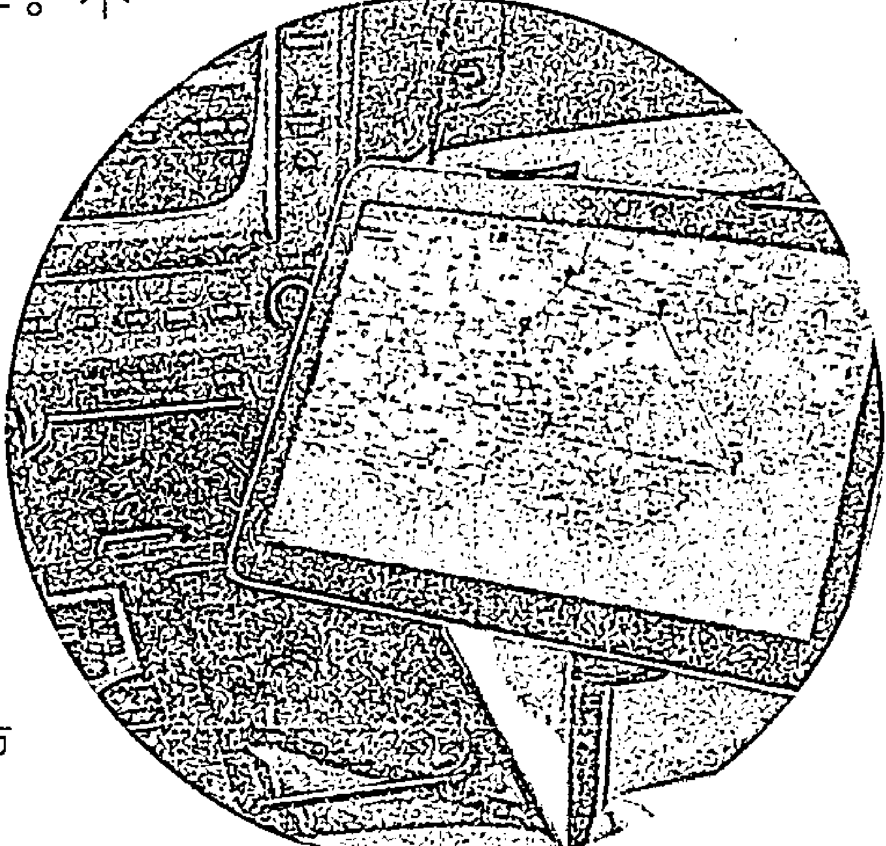

> 马上就能使用的车载平板方案，你动心了吗？

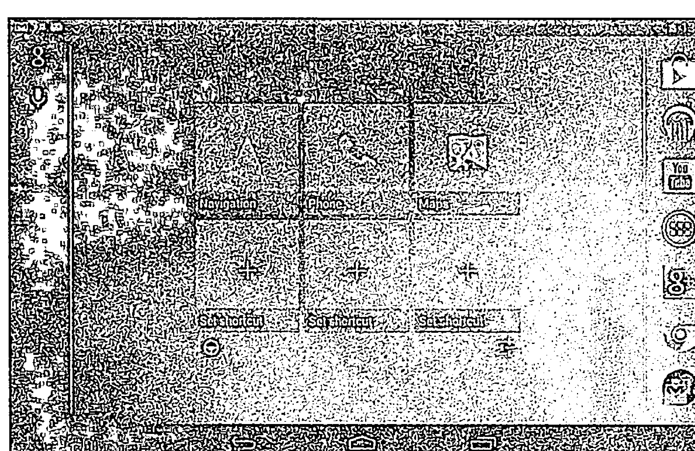

> 可以让平板电脑的主屏幕拥有便于车上使用的硕大按钮

> 编辑点评
相比官方提供的方案，这个车载方案看上去似乎不是很便利。它是自己动手的解决办法，而不是原生的、完美的内置体验。不过优点也很明显：我们可以灵活调整和配置，这是任何仪表盘内置系统所无法企及的。而且，我们现在就能使用车内服务了，而不是等到2015年。CF

## 虚拟机PK冤枉钱

## PC支付宝转账零开销

文 | 陈俊名

自从支付宝的转账功能分为PC版和手机版后，PC端每次转账都得多花费0.5元。别看手续费不多，几个月累计下来也是一笔不菲的开销。那么，如何才能在PC端也享用免费的转账大餐呢？

### “偏心眼”的客户端

目前支付宝客户端只有Android和iOS两个版本，对于使用这两个系统之外的用户来说，手续费就是必不可免的了（图1）。问题是，不是所有用户都拥有上述系统的手机，也并非所有用户都放心手机端的支付交易（怕不安全），因此坚持在PC端转账的也是大有人在。好消息是，我们只需在PC上安装Android虚拟机来虚拟出一台Android手机，在此基础上安装支付宝客户端不就可以免去手续费转账了？

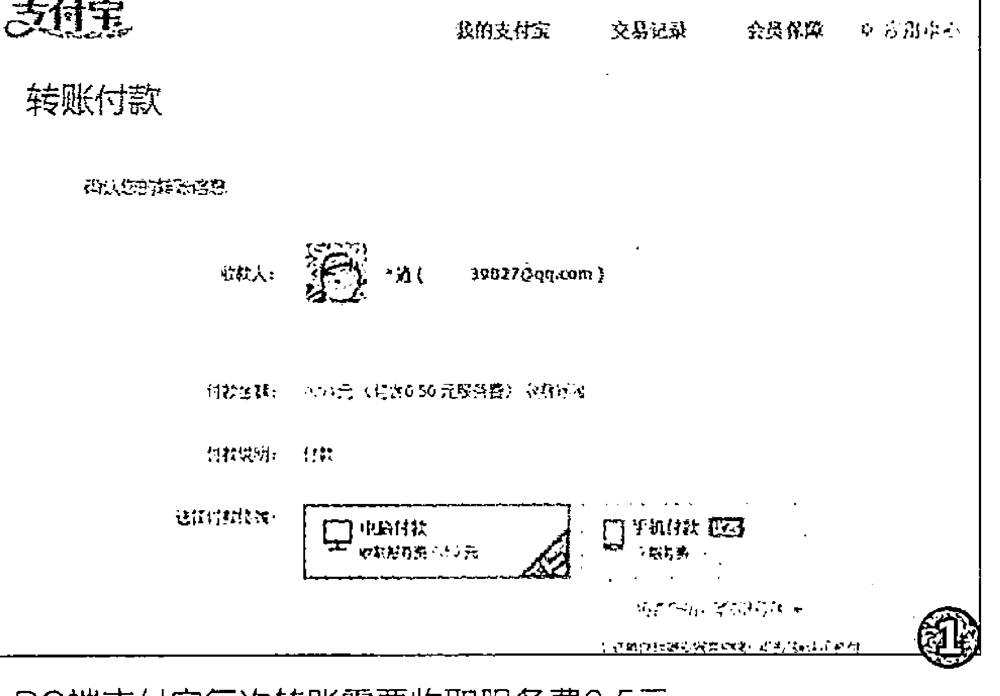

### 搭建PC端Android虚拟机

PC端的虚拟机软件有很多，在这里笔者向大家推荐一款免费的虚拟机“Windroy”（下载地址：http://www.windroy.cn/），该软件的特色是精简了内置的APP，所需的设置选项也非常少，只要安装后即可直接使用（图2）。在网络方面，Windroy可直接桥接电脑的网络：只要PC能上网，虚拟机内就能上网。需要注意的是，该虚拟机默认为英文界面，在点击安装上述软件之前，建议使用前先进入“Settings→Security”中勾选“Unknown sources”（图3），再进入“Language & input”界面将语言修改为中文（图4）。

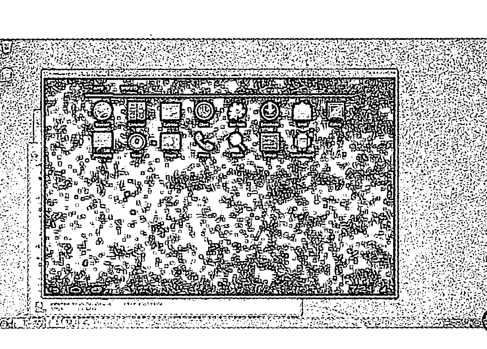

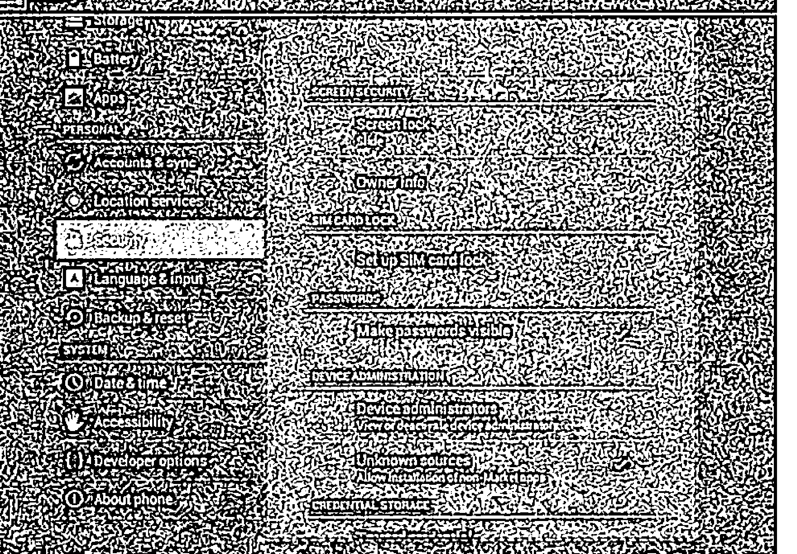

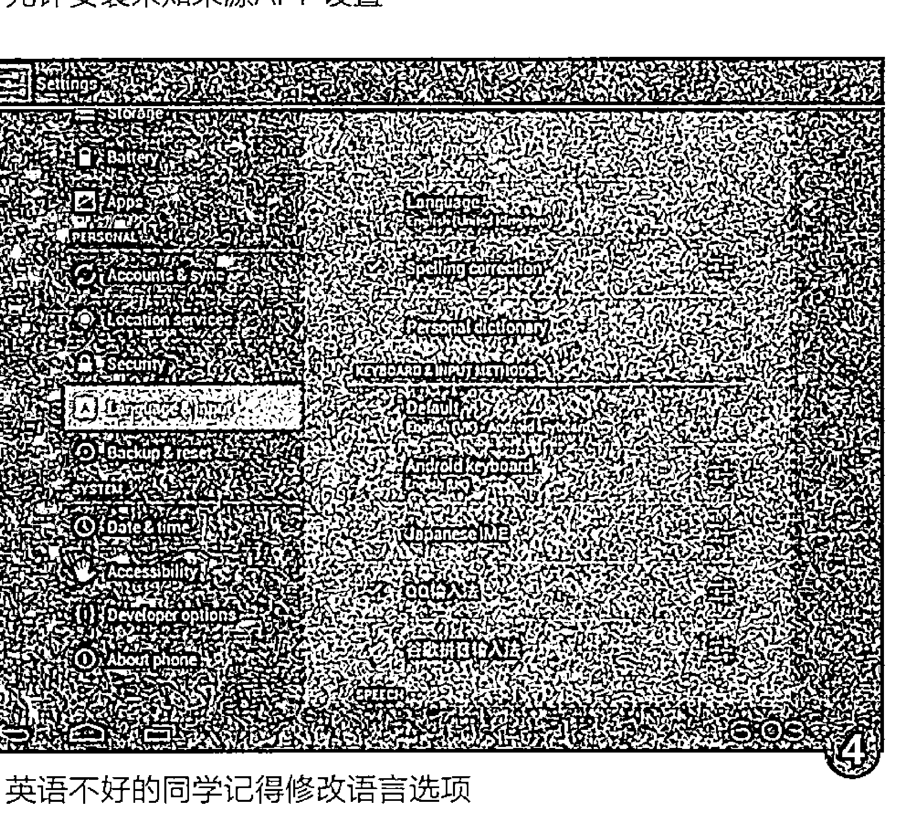

### 安装支付宝客户端

如果你觉得虚拟机内置的下载工具速度不给力，可以直接将支付宝客户端以及其他常用的APP软件（apk安装文件）复制到虚拟机文件夹的“程序根目录\windroy_root\data\app”内，然后就可以在虚拟机中的Downloads程序里找到它们了（图5）。

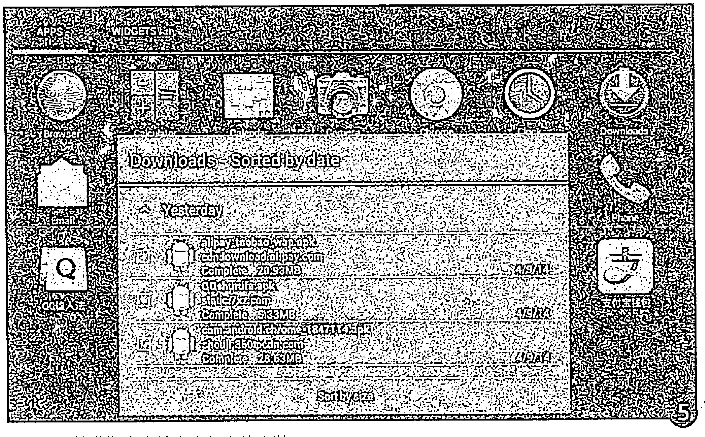

> 将APP放进指定文件夹方便查找安装

### 开启免费转账之旅

“排除万难”之后，就可以开始免费的支付宝转账旅程了。首先找到支付宝钱包，使用淘宝账户登录，找到转账选项卡后填写对方支付宝账户以及金额就可以免手续费转账了（图6~9）。

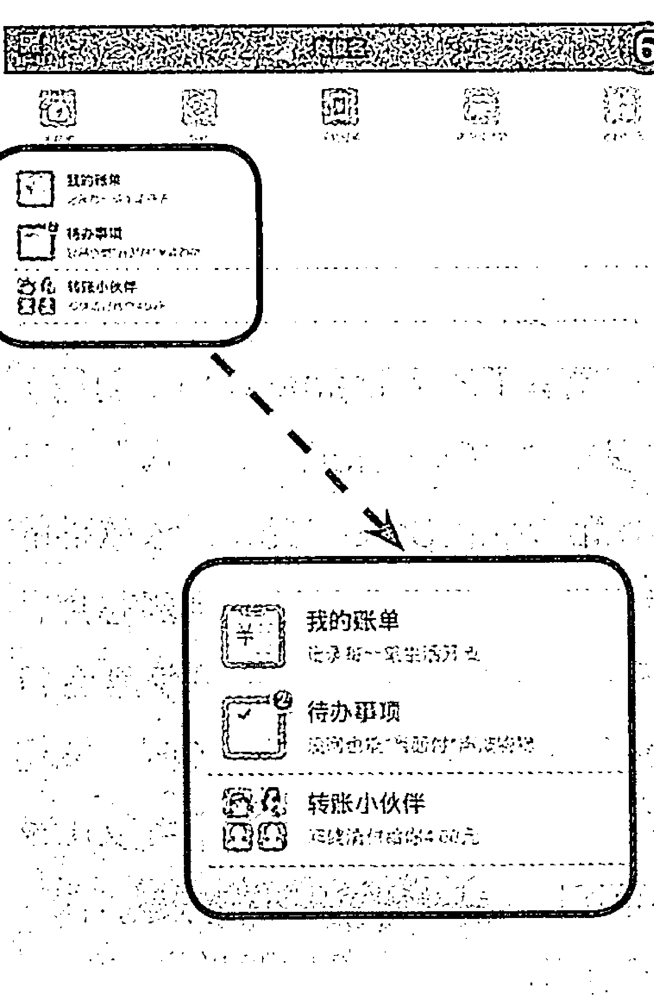


> 成功在PC上实现免费转账

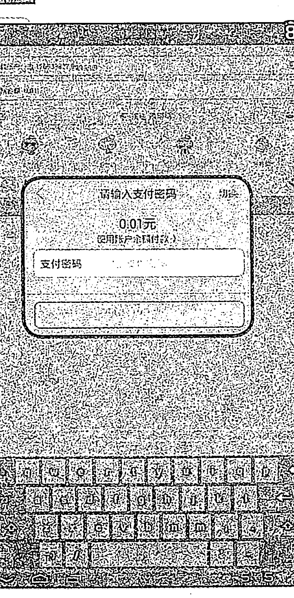

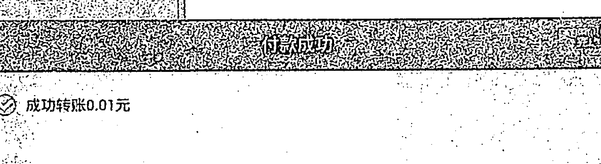

> **倒腾说两句**
在PC端通过虚拟机体验Android系统并非什么新鲜事，而本文作者的思路却是值得我们借鉴和拓展的。以往很多玩家玩Android虚拟机只是为了体验某些功能，而小陈却借助其实现了支付宝免费转账的“曲线救国”之旅。实际上，目前的网站或软件，或多或少都对移动端的APP进行了特别的优化和优惠，找到并善用这些优惠，在PC端也能获得手机上才能享有的待遇！CF

## U盘坏了别扔

### 固件修复让闪存盘重获新生

文|黄健

闪存盘虽然小巧方便，但在使用中经常会出现各种报错甚至罢工问题。此时，你会选择丢掉换新，还是想办法努力营救呢？如果你的答案是后者，相信本文一定可以帮到你。

经常和U盘打交道的用户，会常会遇到‘有剩余空间却无法写入数据’、‘U盘无法格式化’、‘闪盘在电脑中读取不到’、‘在磁盘管理器中找不到’等问题。以上这些‘假性故障’的出现可能是由于不正确的插拔或不正确的使用，导致闪存盘固件发生了问题。此时，大家就可依照本文提供的初、中级案例进行故障修复尝试。需要注意的是，本文提及的操作是为修复U盘功能而进行的操作，故请事先做好数据备份操作。

#### 初级篇 官方工具修复固件

为了方便消费者自行处理，很多闪存盘品牌大厂都针对性地推出各自的修复软件，比如PQI（劲永）的Dr. UFD、Kingmax（胜创）的UFD_Recovery tool等，消费者可以自行选择将闪存盘恢复到初始状态或进行固件的更新，减少送修的等待时间和金钱。由于各品牌修复软件的使用方法大致相同，本文仅以ADATA（威刚）为例为大家做简要讲解（图1）。‘闪存盘在线修复DIY’就是威刚提供的官方修复工具（下载地址：http://t.cn/8snnV2B），下载解压文件后插入问题闪存盘，运行修复程序，检测到闪存盘提示修复，点击修复即可。

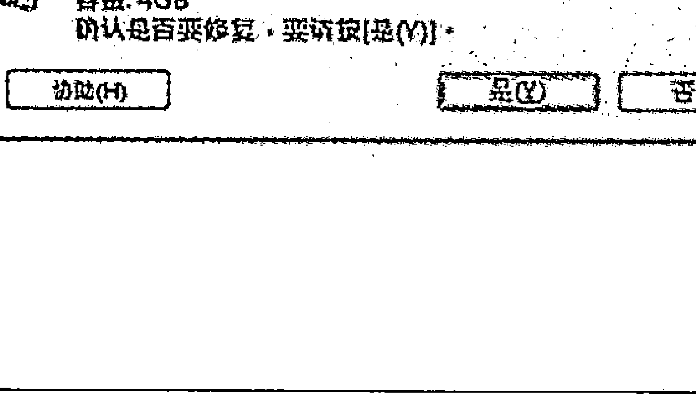

#### 中级篇 品牌工具修复山寨盘

问题来了，很多用户图一时的便宜，购买的可能是没有品牌的‘山寨闪存盘’，或是没有提供修复工具的中小品牌产品。此时，我们可以尝试‘曲线救国’的方式修复上述阵营的问题闪存盘。以笔者手头的一个‘山寨金士顿’闪存盘为例，其出现了无法格式化的情况，拆开外壳后发现它内置安国控制器芯片（图2）。于是，笔者下载了Transcend（创见）的官方修复软件‘OnLineRecovery’（下载地址：http://t.cn/8srB7Us）。该软件的支持列表中包含安国系列闪存控制器芯片，故可用于本次修复尝试。插入闪存盘运行‘OnLineRecovery’，点击‘OK’按钮等待进度条结束后，该闪存盘终于可以正常使用，甚至可以直接运行创见Elite软件用于日常备份等操作（图3）。

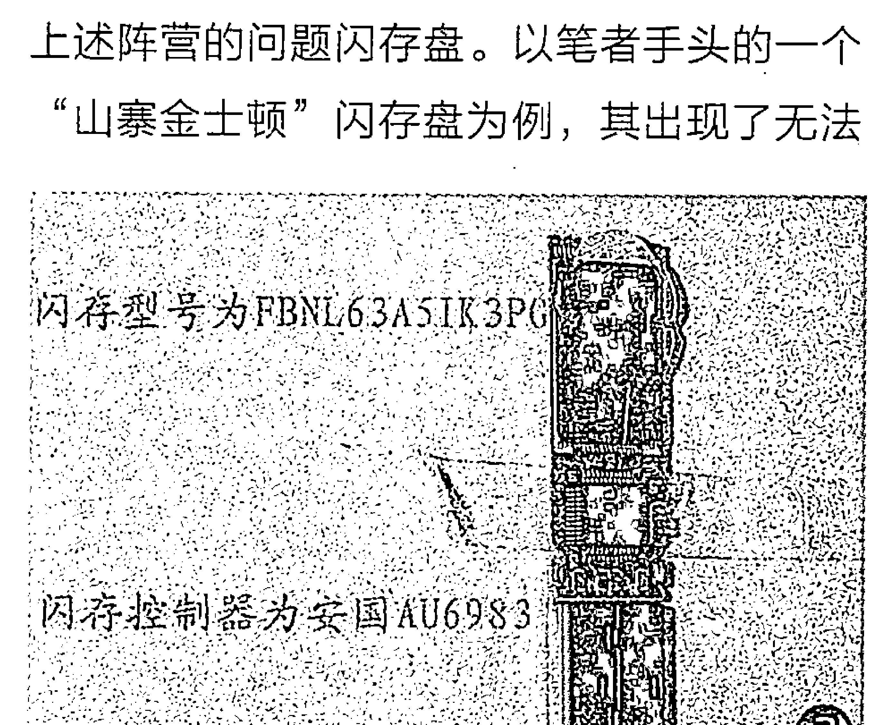

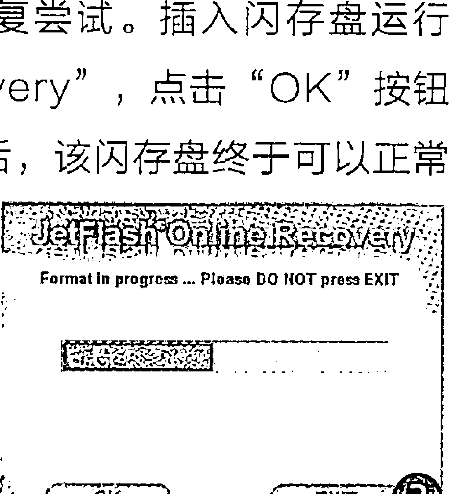

好消息是，凡是采用安国控制器芯片的闪存盘，还可以使用“Super USB”（安国加密盘制作工具，下载地址：http://t.cn/8srBzND）进行加密盘制作（图4），格式化并激活密码保护功能，让山寨闪存盘也获得大厂产品才有的特殊功能。

至此我们不难得出一个结论：闪存盘由闪存芯片（决定容量）和控制芯片（决定功能）组成，理论上控制芯片相同的A、B两款闪存盘，有机会互刷固件获得相同的使用体验。有了这个理论基础之后，我们就可以进入高级篇的修复实战了。

#### 高级篇：量产工具升级闪存盘固件

有时厂商会针对某款产品推出特定的修复版本（比如东芝TransMemory-EX 32GB），其中固件版本可能会比市面上的其他同控制芯片的闪存盘都高，但由于厂商做了限制处理，故无法直接用于其他产品。此时，有些爱好者会将这类闪存盘的特殊固件进行提取，而我们则可借用量产工具刷入其他同主控芯片的产品上。
闪存盘量产工具一般以闪存控制器来区分，在这里笔者就以博帝闪存盘为例（采用了和东芝TransMemory-EX一样的“PS2301”群联控制器，金士顿DTU 3.0 G2也是该控制器），让其“变身”东芝产品。

群联量产工具（下载地址：http://t.cn/8srBZfh）的使用很简单，识别到闪存盘后，选择提取自东芝TransMemory-EX的固件文件后，按界面提示操作即可。在烧录固件过程中千万不要拔下闪存盘，并提前备份好闪存盘中的数据！等进度条出现“PASS”提示后就可通过版本信息检查闪存盘当前的固件版本了（图6~8）。

总之，作为以电子芯片为主的闪存盘，除非进水或静电，其出现物理性故障的几率很小，绝大多数不稳定或无法使用的故障都可通过固件修复加以解决。希望通过本文，能让早已被你视为“垃圾”并躺在抽屉中的闪存盘重获新生。

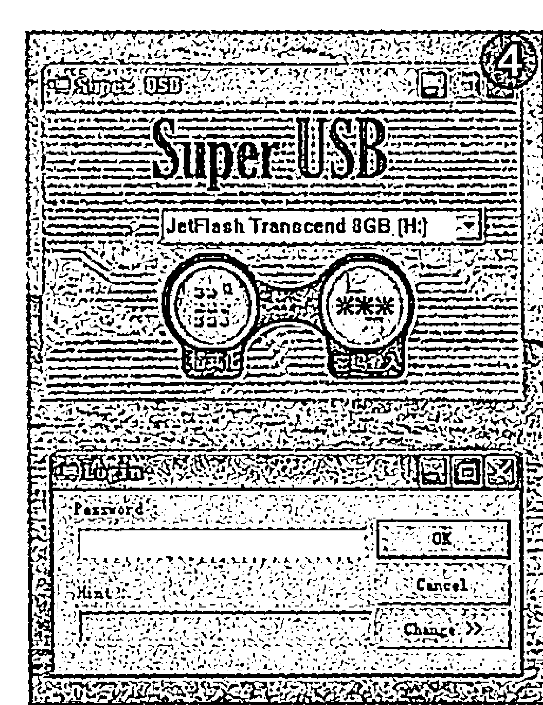

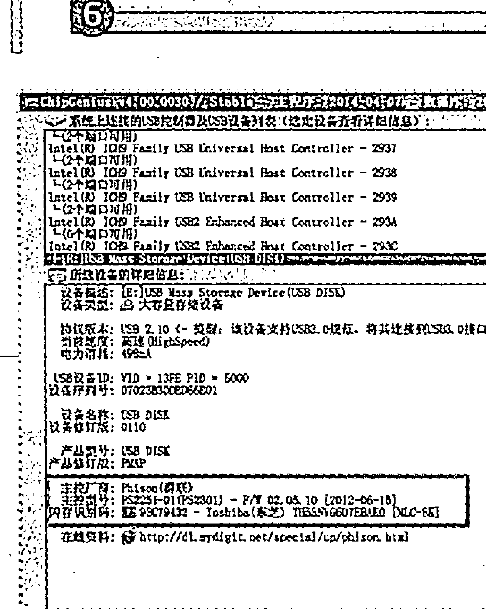

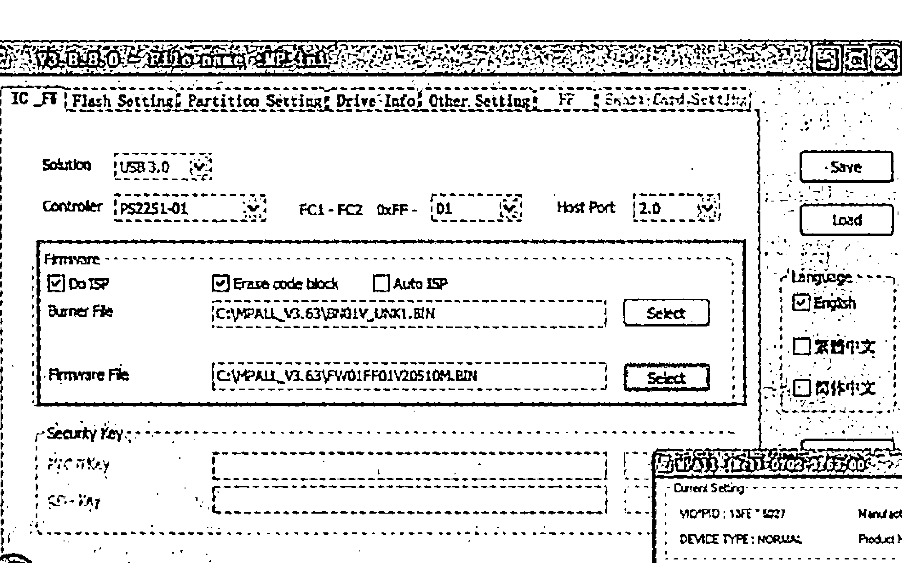

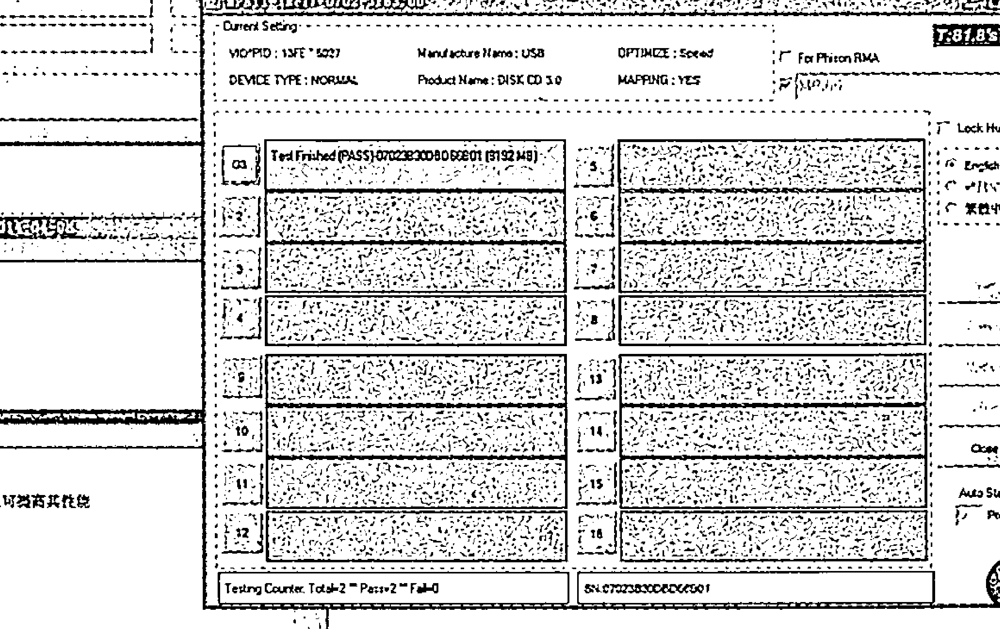

> **小提示**
想鉴别闪存盘所采用的主控芯片型号，通用软件有“ChipGenius”（图5）。当然，不同主控厂商也有专用工具，比如群联的GETINFO。以群联主控为例，多见于东芝、TDK（东京电气化学工业）、Imation（怡敏信）、Kingston（金士顿）、Silicon Power（广颖电通）、Corsair（海盗船）等品牌的闪存盘中。

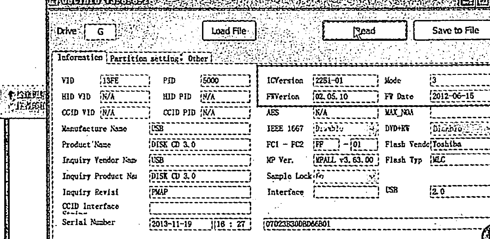

## 守护健康和安全

### 利用摄像头打造监控系统

文 | 沈建苗

家中有老人和幼儿有时候总是不放心，也有一些用户有安全方面的需求。我们使用PC内置摄像头或网络摄像头，完全可以自行搭建一套监视系统。要不要来试试？

#### 前期设备准备

首先我们需要一台笔记本电脑或台式PC，配备内置摄像头其实就可以满足需要。当然，使用USB连接的摄像头就更好。之后是软件的准备，选择一款好的软件十分重要，有些软件可以不间断录制，也可以检测到运动后录制，后者较为常见，并且也更加实用。比如iSpy Connect (http://t.cn/RvqBGL5)。

安装软件后，软件会列出一系列我们已连接的摄像头，iSpy Connect是支持多个摄像头的。我们可以配置区域，让摄像头对准画面里面的选定区域，用于检测运动后实现录制。比如我们关心的婴儿床、老人易跌倒的位置，甚至可以对准我们的停车位。不过在设置区域时，应避免录制其他的移动物体，比如树枝树叶或过往的车辆。不然可能会误录无用内容，所以说这个区域设定很有讲究。另外，iSpy经过配置后既可以对运动有所回应，也可以对声音触发条件有所回应，具体哪个适合自己需要可自行设定。

iSpy Connect专门有一个回放控制台，可以按时间表显示录制片段，那样就能迅速查看检测到运动时所录制的片段。通过发送选项还可以设置检测到运动后，发送连同JPG图像的电子邮件到我们指定的邮箱。在专门的FTP服务器上，我们可以播放录好的内容。

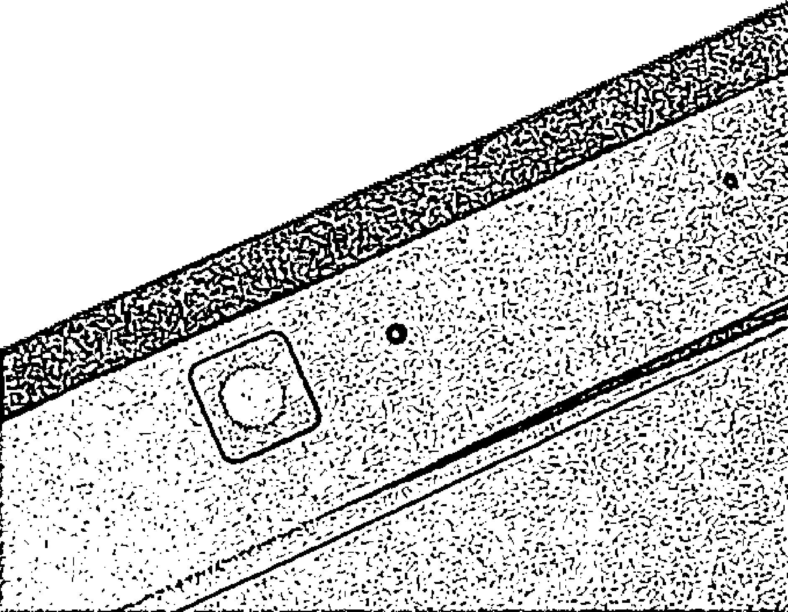

- > 笔记本电脑的摄像头就可以满足最低需要

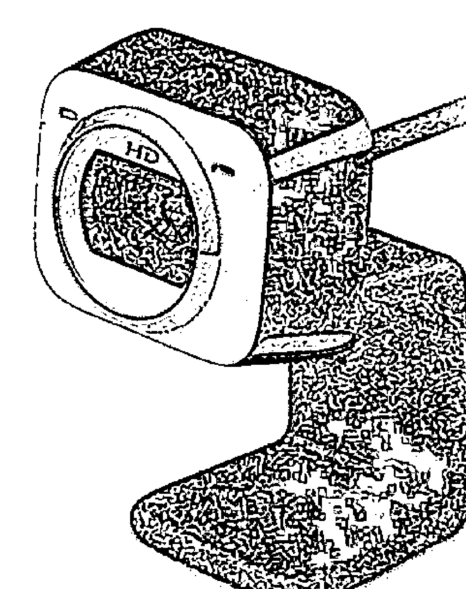

- > 这种带有USB连线的摄像头能够更好地选择方向

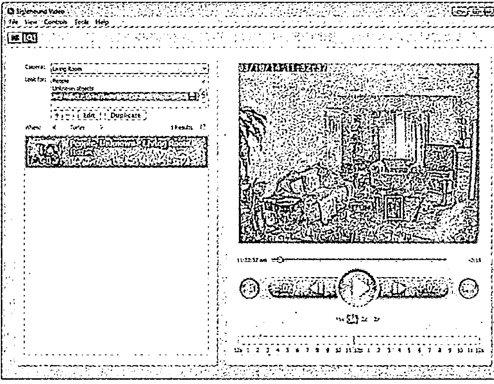

- > 很多摄像头软件都是通过检测活动后才进行录制的

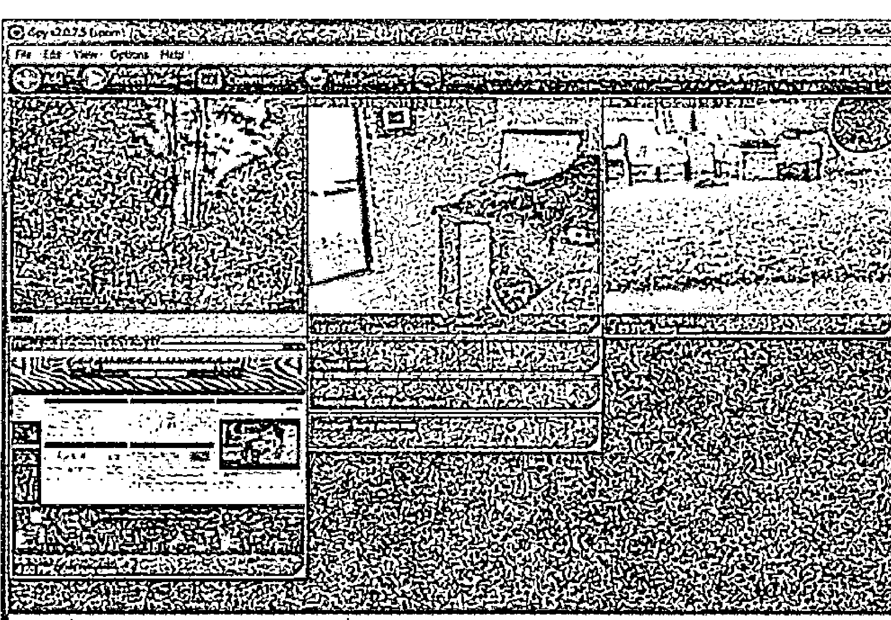

- > 我们可以逐个设置多个摄像头

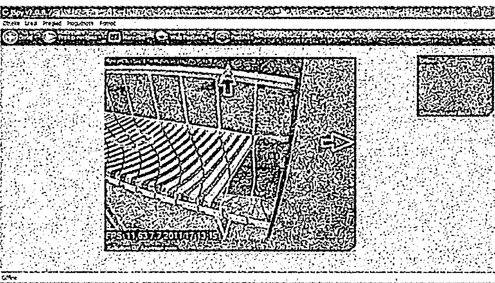

- > 设置活动区域时一定要尽量避免误录的可能

#### 扩展阅读

iSpy Connect这款产品已经进军移动设备，比如说Android平台也可以实现类似的功能，但功能并没有PC版本强大。下载地址：http://t.cn/RvqBqf7

> 使用手机也可以实现闭路电视效果

#### 摄像头选购技巧

使用电脑自带摄像头的优点显而易见：我们无需单独购买摄像头了。但也有缺点，我们得让PC随时开着，这不仅会增加电费，还有可能缩短PC的寿命。最重要的一点是，PC可能无法靠近想要监控的地方，而USB延长线的帮助也很有限。如果我们把电脑放在朝窗的地方，由于太阳位置不断变化，电脑上自带的摄像头性能不强，在不同的时间可能会有反射。电脑自带摄像头感光度略低，在晚上用处不大，除非灯照效果不错。

从家庭网络上的任何一台电脑查看实时镜头；通过专用软件也可以从智能手机或平板电脑查看实时镜头。很多IP摄像头还拥有MicroSD卡槽，拥有了自身的存储空间，可以满足一些独特的需要。

一些特殊的产品还带有红外夜视功能，这样在几乎一片漆黑的环境下，就能录制可以辨识的视频。虽然效果确实比较差，但能够满足我们的最低需要。一些摄像头还带有适应各种气候的外罩，那样要是安装在室外，不会因风吹雨打而损坏。比较高端的产品支持自动平移、倾斜和缩放镜头，我们也可以远程调整摄像头所对准的位置，放大以查看更多细节。

如果我们想克服这些问题，还是得去购买专门的IP摄像头。IP摄像头的优点在于不需要让电脑开着，它们可以连接到我们的路由器（通过无线连接），因此可以安装在无线网络覆盖范围内的任何一个地方，只要能够连接到电源就可以。IP摄像头连接到路由器后，可以

> 比较少见的带有有线网络功能的Infinova摄像头

> 带专门Wi-Fi天线和外罩的摄像头能适应户外恶劣环境

#### 编辑点评

市面上最便宜的IP摄像头可能没有高清分辨率，多花点钱购买画面质量更佳的摄像头完全值得。而且，别想当然地以为摄像头都能录制音频，很多产品都只有视频录制功能。如果需要音频功能，请一定看清楚参数再买。CF

## 莫让硬件背黑锅
### APU平台看4K 当心软件拖后腿

如今4K播放对某些平板电脑都不叫事，但为何很多高端PC在播放4K视频时却“卡壳”了？我们不妨将目光投向硬件之外的播放软件上，有时它们才是拖慢4K播放的罪魁祸首。

### 找出4K播放卡顿的原因

4K是所有影音发烧友的视觉盛宴，在DIY攒机时也会优先选择可完美驾驭4K播放的硬件平台。但是，哪怕A君和B君采用的都是硬件相同的PC，但在播放相同4K片源时往往还是会出现CPU占用率有高有低甚至卡顿的现象。此时，出现卡顿的玩家肯定会将问题归结于“这套硬件平台性能不给力”。但我们想说的是，在下此结论之前，不妨先从播放软件的角度找原因，莫让硬件平台“背黑锅”。为了印证这个观点，笔者用最新的Kaveri APU平台就4K播放问题进行了测试，重点考察Potplayer、完美解码、迅雷看看、快播、暴风影音5和QQ影音六款常见播放器在4K超高清片源下的表现。

-   测试平台：
    - 处理器：A10-7700K
    - 主板：A88芯片组
    - 内存：DDR3 1333 4GB×2
    - 硬盘：120GB SSD+2TB HDD
    - 显卡：APU集成R7
    - 片源：《吃烤鸭》

### 务必开启软件硬解码功能

为了缓解CPU的压力，如今的播放软件大都具备GPU加速（硬解码）功能，在进行测试之前自然要优先开启类似功能。其中，PotPlayer在“参数选项→视频解码”中勾选“使用硬件加速”（图1）；快播没有提供硬件解码的相关选项，所以笔者只能选择“智能”的播放模式（图2）；暴风影音5在“高级选项→高清播放设置”中可启动GPU加速（图3）；QQ影音在“播放器设置→高清加速”中选择“智能高清模式”即可（图4）；迅雷看看可以在“配置菜单→硬件加速”中尝试开启（图5）；完美解码相对繁琐一些，需要结合硬件选择对应的解码器，由于本次测试平台为Kaveri APU，所以解码器选择的是“ATI UVD(DXVA)”（图6）。

### “软实力”果然不可忽视

想考验4K超高清视频对PC的压力，我们可以从最低帧数、CPU占用率两个角度衡量。为此，笔者准备了Fraps软件用于检测不同时间点视频的帧数采集，同时考量视频中切烤鸭和龙虾细节展示时的CPU占用率情况。而六款播放软件的具体表现请见下表。

所谓“不比不知道，一比吓一跳”，原本以为只要硬件平台给力，软件都是“浮云”。但实际的情况却令人大跌眼镜，在切烤鸭和龙虾展示两个片断时使用不同播放器CPU占用率相差可达35%和29%（图7~8）！以暴风影音5为例，虽然它可流畅播放4K视频，但在此期间因CPU的高负载，将无法承担其他多任务操作。此外，QQ影音的表现比较“奇葩”，播放4K视频时CPU占用率却始终保持在30%左右，但实际表现却是卡顿异常且影音不同步（图9），失去了作为“4K播放器”的意义。

基于以上数据我们可以得出一个结论：就4K超高清视频播放而言，支持4K解码的硬件固然重要，但作为展示4K画面的播放器也绝对不可忽视！综合来看，PotPlayer、快播和完美解码都是不错的选择。

### 六款播放软件4K超高清视频测试对比

| 对比项目 | PotPlayer | 快播 | 暴风影音5 | QQ影音 | 迅雷看看 | 完美解码 |
| :--- | :--- | :--- | :--- | :--- | :--- | :--- |
| 最低帧速 | 30fps | 30fps | 30fps | 7fps | 30fps | 30fps |
| 切烤鸭 | 58% | 54% | 89% | —— | 61% | 55% |
| 龙虾展示 | 69% | 71% | 98% | —— | 98% | 72% |

> CPU占用率虽低但播放帧数却只有7fps

> 龙虾展示时CPU占用率最低的PotPlayer和占用率最高的迅雷看看对比图

### 傻博士有话说

无论是PC还是其他计算平台，“软硬结合”始终是需要我们贯彻的选购和使用准绳。当你在用新买的PC播放4K视频却被朋友嘲笑还不如他家的老PC时，换个播放器也许就能帮你找回面子。将此观点扩展到智能手机领域，当你感觉自己的八核手机还不如别人的四核手机流畅时，刷入第三方优化的ROM（固件），说不定也能重获青春呢。

## 热管DIY 缓解笔记本南桥散热压力

文 | 折翼天使

很多笔记本用户在清灰、加装散热底座等一系列措施之后，产品运行期间的发热却并没有明显的改观。实际上，平时默默无闻的南桥芯片也许就是发热源的罪魁祸首，如何才能“镇压”它的热情呢？

### 夸张的PCH发热

笔者的笔记本型号是神舟K590s（蓝天W350的原型机，雷神、神舟K650S和K660E等机型都采用此模具），配置强悍价格实惠。但是，这款机器存在一个令人头痛的问题：在长时间运行时发热量最高的并非CPU和GPU，而是PCH（南桥芯片），用AIDA64检测的实时温度最高可达98℃（图1）！

究其原因，则是K590s不太合理的结构设计引起的。K590s所采用的Intel HM77/HM87南桥芯片本身的发热量其实不高，但它却将这颗芯片设计到了硬盘下面，前后左右无散热风道，由此也就导致冷气进不来、热气出不去的尴尬（图2）。解决的方法也不是没有，那就是改用光驱位的硬盘托架，将挡住南桥芯片的硬盘位空出来即可。问题是，有谁会牺牲主硬盘位呢？

> 小提示
> 不仅仅是K590s，很多非纤薄设计的游戏笔记本南桥芯片和底盖中间都留有一定的空间，只要找到合适形状和长度的热管，都有机会DIY自行组装。比如海尔S500南桥芯片缝隙就足够高（图4），足以加装热管。

### 改造的前提条件

仔细观察K590s的内部结构，还是让笔者找到了改造的着手点。这款产品在南桥芯片和硬盘中间还预留了一定的空间，而且模具的隔断部分也采用了中部镂空的设计，这就让它们之间有机会塞进一根热管来辅助散热（图3）。既然满足了上述条件，就可以进入下一步的改造环节了。

### 免工具的热管DIY

请放心，笔者尝试的热管DIY不涉及到任何焊接操作，几乎无任何风险。具体来说，你只需在淘宝购买如下四种材料即可（图5）：

-   用于导热和粘贴的导热胶
-   确保散热效果的硅脂
-   15mm×15mm的散热铜片
-   7mm×140mm的扁平状铜质热管

> 以上材料淘宝购买加运费不到40元

购买材料之后，我们只需取下K590s的硬盘并露出南桥芯片就可以动手了。首先，在南桥芯片表面四周涂抹导热胶、中间则涂抹硅脂（图6），再贴上散热铜片并用手或其他重物按压20分钟。

> 四周白色的导热胶负责固定，中间灰色的硅脂用于散热

然后，将热管的一侧从硬盘仓隔断的缝隙穿过，用导热胶固定在南桥芯片表面的铜片上，再将热管的另一侧用导热胶固定在GPU芯片表面的热管上即可（图7）。需要注意的是，热管在“路过”CPU芯片和GPU芯片之间的障碍时要适当压弯（图8），确保整体高度不会影响笔记本底盖的加装。

> 整个热管的走势示意图，两端固定时都需长时间按压以确保稳固

> 热管不能压出死弯，略微形变不会影响导热效果

### 改造效果令人满意

至此，我们就可以装回硬盘和底盖，进行改造效果的测试了。笔者在游戏2个小时后，再用AIDA64检测南桥芯片的温度只有73℃（图9），虽然依旧谈不上“冷静”但也绝不再“奔放”，而CPU和GPU的温度也没有因这次改造而出现异常波动，改造非常成功。

总之，希望笔者的改造可以为南桥芯片发热异常的笔记本用户提供一种解决思路，整个过程无需破坏笔记本内部结构，不涉及焊接等高难度操作，值得普通DIY用户尝试。□

## 比特币 疯狂的背后

文 | 技术宅

关注经济新闻的朋友都知道，最近央行联合五部委下发《关于防范比特币风险的通知》，明确了比特币的性质，认为比特币不是由货币当局发行，不具有法偿性与强制性等货币属性，并不是真正意义的货币。一种网络世界的虚拟货币竟然会惊动央行，当然值得我们探询它背后的秘密。

### 看清它的来世和今生

喜欢玩网络游戏的朋友都知道，虚拟网络世界里有各种虚拟货币，如Q币、淘金币等，比特币实际上也是一种类似Q币的虚拟货币，只不过它并不是由某个公司发行的，而是最早由一个叫中本聪的日本人提出一个想法。因为世界各国的货币有很多，而每个国家的货币只是一个流通符号，一旦失去了国家的信用保障，它们就是一堆废纸，因此他想在网络世界推行一种世界通用的虚拟货币，比特币就是在这种情况下产生的。我们在网上看到的比特币实物实际上只是比特币爱好者自制的标本，它们并非真正的比特币（图1）。

### 怎么获得比特币——认识‘挖矿机’

因为生成比特币的是一种开源软件，任何人都可以下载并且去获取比特币。比如我们可以到http://tinyurl.com/ozdr42s下载比特币客户端，在电脑上运行后按照程序的提示去解决问题就可以获得比特币了（图2）。

不过依靠个人电脑计算获取比特币，在目前情况下基本上已经成为“不可能完成的任务”。因为生成比特币的是一种开源软件，设计者通过设置一些复杂的计算问题，然后用户通过计算机解决这些问题获得比特币。获取比特币实际上就是借助计算机运算能力去解题，这需要计算机有足够的计算能力，随着挖币用户越来越多，比特币运算难度逐渐变大，从最开始的使用CPU计算，发展到使用显卡，到现在已经需要使用专门的“挖矿机”了。

挖矿机实际上是一个网络计算机，通过网线将多台电脑的CPU和GPU整合在一起进行集群计算，以便可以更高效地完成比特币复杂的计算。大家知道原来电脑的计算都是通过CPU完成的，不过随着显卡GPU的发展，GPU也拥有强大的计算能力。比特币运算是一种Hash运算，考验的是暴力的运算能力，线程数量少、逻辑能力强的CPU在这种应用下拼不过线程数量多、逻辑能力差的GPU，因此显卡挖矿要比CPU有优势。对于类似比特币这种简单但计算量庞大的计算，GPU完全可以胜任。此外，在一台电脑上并行多个CPU运算，需要解决很多技术难题，但是通过PCI扩展外接显卡则简单多了，所以现在很多挖矿机，它的运算能力都是借助显卡完成，这就是为什么很多挖矿机外形都是多块显卡组成的（图3）。

### 为什么会疯狂——了解比特币交易

通过上述的介绍，我们知道现在挖取比特币已经非常不容易。一方面由于获取难度的增加，使得比特币具有很好的增值潜力，大家只要登录http://tinyurl.com/m6zrtjr即可查看到最新的交易行情（图4）。另一方面，比特币的总量只有2100万个。根据经济学的理论，如果一种货币总量是固定的，那么随着用户的增多，货币紧缩是必然的。由于比特币设计者使用独特算法来保证这个总量不会被改变，这样比特币就不会出现超发现象。比如在短短不到4年时间，比特币的市值3年飞涨了5100倍（图5）。由于比特币实际上只是一串加密数字，因此它的交易和我们在淘宝购买游戏点卡类似。首先在比特币官网下载获得比特币电子钱包（类似我们的游戏账户），比特币钱包安装后会有一个默认的接受地址，如果我们要用比特币支付给商家，只要获得商家的钱包地址，然后将自己账户上的比特币代码粘贴到对方地址上进行确认即可（图6）。

### 比特币想说爱你不容易

虽然比特币现在很火热，理论上在虚拟网络中，几乎全球的用户都可以自行进行兑换、交易，线下也有一些实体商店支持比特币交易。不过我们从最近央行的通知可以预期，比特币的使用有一定风险。一方面，由于比特币被虚拟网络用户认可，不管哪个国家和地区的人都可以通过它进行网络交易，尤其是在网络购物中，非常方便互相之间的结算，而且可以大大降低交易手续费（如果是隔日到账，交易手续费甚至可以低至忽略不计，而不像国际信用卡需要动辄百分之几的手续费）。此外由于比特币只是虚拟电子货币，它本身只是一串数字和字母的组合，比特币交易使用安全的私钥+公钥的认证，可以有效保护交易的安全（当然并不能排除被黑客盗窃的风险）。但另一方面，比特币目前并没有被世界上任何一个国家的货币管理机构认可，这种缺乏金融部门监管的货币在实际的使用中存在很大的风险，它不具备法定货币的法偿性与强制性等货币属性。而且目前比特币交易主要集中在洗钱、毒品等黑色交易中，一旦世界主流国家对比特币进行管制，制定法律对其进行限制，那么比特币就很有可能成为一堆没有任何价值的数字，给拥有比特币的用户带来不可估量的损失。此外，由于比特币目前数量稀少，大部分集中在个别大专家手中，所以其汇率也由小部分人操控，这也给比特币交易带来极大的风险。

## GPU 通用计算解密

文 | 技术宅

很多朋友都知道CPU是一台计算机的运算核心和控制核心，在早期的计算机中，所有的运算几乎都是通过CPU完成的。不过随着显卡GPU的发展，越来越多只需要简单、大数据量的计算，这时便主要依靠GPU了。比如我们之前介绍的比特币挖矿机，它的计算就主要通过GPU来完成。即使是现在的超级计算机也离不开GPU，比如中国的天河一号A，它就拥有7168颗Tesla M2050 GPU（图1）。下面就让我们了解一下GPU的神秘幕后。

> 天河1号里的GPU计算单元

> 小知识
> GPU英文全称Graphic Processing Unit，中文翻译为“图形处理器”，它是nVIDIA公司在1999年发布GeForce256图形处理芯片时首先提出。如果我们把CPU比作计算机的大脑，那么GPU就是显卡的大脑。原来GPU只是作为图形处理的核心，但是随着硬件的发展，计算机面临的计算量逐渐变得复杂，仅仅依靠CPU已经力不从心，GPU逐渐成为通用计算的主力。

### 从配角到通用——GPU逐渐成为通用计算主力

GPU设计主要是为显卡的图形渲染服务的，它能够从硬件上支持T&L（Transform and Lighting，多边形转换与光源处理）的显示芯片。T&L是3D渲染中的一个重要部分，其作用是计算多边形的3D位置和处理动态光线效果，一个好的T&L单元，可以提供细致的3D物体和高级的光线特效。

早期的计算机，T&L的大部分运算是通过CPU完成的（也称之为软T&L），但是随着游戏画面要求越来越精美，游戏渲染计算量越来越大，即使是性能再强劲的CPU其运算速度也远跟不上今天复杂三维游戏的要求，这就导致显卡经常需要等待CPU返回计算数据。因此显卡厂商决定在显卡上集成可以独立渲染计算的GPU（也称之为硬T&L），通过它来接管原来交给CPU的计算。随着显卡工艺的提高，现在GPU在浮点运算、并行计算等方面，可以提供数十倍乃至于上百倍于CPU的性能，也使得GPU逐渐成为通用计算的主角（图2）。

> nVIDIA显卡上的GPU处理单元

### 因为专业，所以高效——认识GPU的优越算法

如果仅从数据处理角度来说，GPU和CPU计算原理是一样的。不过相对CPU来说，GPU的计算能力要专业得多。因为一方面，GPU只是显卡专门处理数据的处理器，它的任务就是专业做好计算工作，而不像CPU那样，既需要接管其他程序递交过来的计算，同时还要做内存管理、输入响应、数据协调等诸多的工作。

另一方面，GPU拥有比CPU更多的计算内核，目前个人CPU八核都没有普及，但是GPU已经拥有数以百计的内核，在高密度并行计算方面拥有得天独厚的优势。这也使得GPU在通用计算能力方面可以比CPU做得更好。比如，美国国家癌症研究所通过GPU计算将模拟速度提升了12倍，等待结果的时间从原来的2个小时缩短到了10分钟。美国国家大气研究中心的气象研究和预报模型（WRF）尽管仅仅将1%通过CUDA来实现，但其总体速度却提升了20%，节省了一个星期的分析时间。GPU通用计算能力出色则主要归功于其并行计算技术的使用。并行计算简单地说就是可以让GPU的多个内核同时计算一组数据，以提高计算效率。举个简单的例子，比如我们要计算从1一直加到100，假设GPU有十个计算核心，那么并行计算可以将1~10的计算交给核心1完成，11~20则交给核心2完成，以此类推，这样在进行这组计算的时候，10个核心就可以同时计算，计算的效率自然很高了（图3）。

### 联合作战——GPU与CPU及操作系统的紧密结合

虽然GPU并行计算很优越，但是GPU毕竟只是计算机中的一个组件，它的计算结果、计算协调还需要CPU的协助，而CPU、GPU是运行在操作系统上，它们同样还要做好和操作系统的协调工作。

一方面，GPU要和CPU紧密结合，现在科技人员通过异构计算来协调两者之间的关系。异构计算可以使用不同类型的指令集和体系架构的计算单元组成系统的计算方式。这样在显卡进行计算的同时，处理器也不会处于闲置状态，它同时也可以参与进行计算，从而提高计算机的运算能力（图4）。

另一方面，微软也看到GPU的通用计算能力，因此在操作系统层面针对GPU和CPU进行了优化。比如微软在Windows 7中内置DirectX Compute，它将GPU作为操作系统的核心组成部分之一，让开发人员能够利用GPU的大规模并行计算能力，同时可以很好地和CPU进行协调，在系统底层方面为GPU和CPU联合计算做了很好的铺垫（图5）。

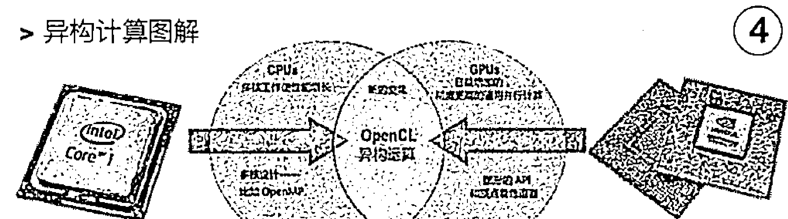

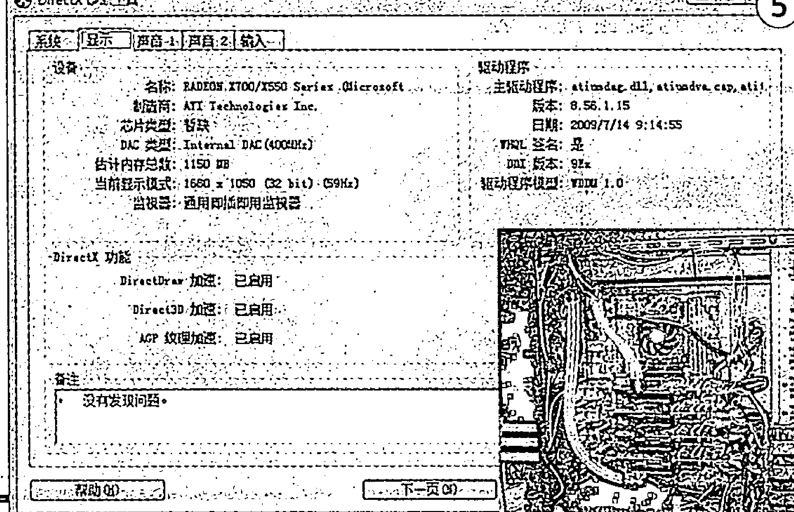

### GPU高效计算离你我并不遥远

通过上述介绍，我们知道了GPU强大的计算能力。其实GPU技术的发展已经和我们的生活息息相关。比如我们每天接触的天气预报、平时使用的各种新药、电视台舞台上光怪陆离的背景，这些都离不开背后超级计算机里GPU的计算。

此外，通过GPU自行组建具备强大计算能力的个人计算机为我们的学习生活服务，这也不是一件遥不可及的事。比如文章前面提到的比特币挖矿机，很多DIY动手能力的用户就是通过多块显卡自行组建的，随着技术的不断发展，相信不久的将来，大家也可以自行搭建一台具有多个GPU核心的个人超级计算机，为日常的视频处理、PS图片处理、CAD图形渲染带来更多的便利（图6）。

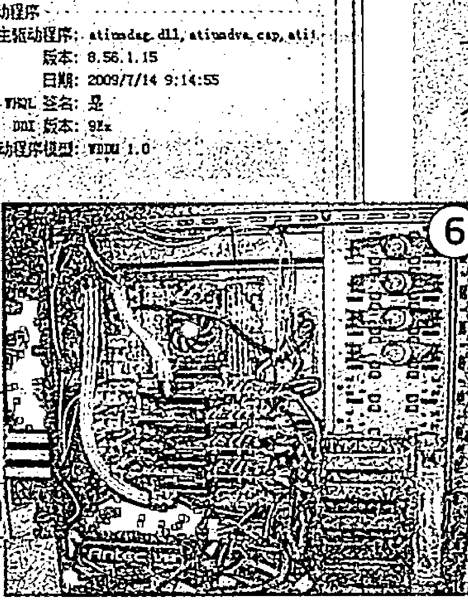

## 没有密码的安全策略

### 解密Chrome OS新安全机制

文|技术宅

为了保护自己的手机、平板或者电脑不被非授权的用户使用，我们一般都是使用登录密码来保护。不过密码设置得太简单容易被他人破解，设置得太复杂又给自己的记忆带来负担。怎么办？

### 无密码保护——比传统密码更有效的安全机制

为了保护非授权用户的使用，现在的安全机制一般只有两种（图1）。一种是软保护机制，即利用软件（如密码、证书等）来进行保护，它的弱点是容易被破解，使用起来较为复杂。另一种则是硬保护机制，它利用我们常用的硬件（如手机、U盘）或者人体生理特征（如iPhone 5s的指纹解锁）来进行保护。谷歌正在开发的无密码保护机制，使用的正是硬件保护机制。根据其开发文档的描述，Chrome OS团队正在为该操作系统打造一个名为“chrome.screenlockPrivate”的新API，该API将使我们能够选择用于控制Chrome OS锁屏的应用。你能够使用USB、NFC或蓝牙API与第二款可信赖设备进行通讯，允许这款可信赖设备成为用户认证的替代形式，比如手机、手环、手表等，从而让这些设备能够解锁被锁定的Chrome OS（图2）。另一方面这些作为解锁的设备大多是我们随身携带的私人用品，比如自己的手机，它可以很好地作为自己Chrome OS设备对应的验证设备（如不是自己的手机就无法解锁）。另一方面，这个API是将设备的硬件ID作为验证码，硬件ID的唯一性和不可复制性可以有效保障验证的合法性。显然，这种无密码保护解锁机制可以大大提高设备的安全性。

> 使用手机蓝牙解锁Chrome OS

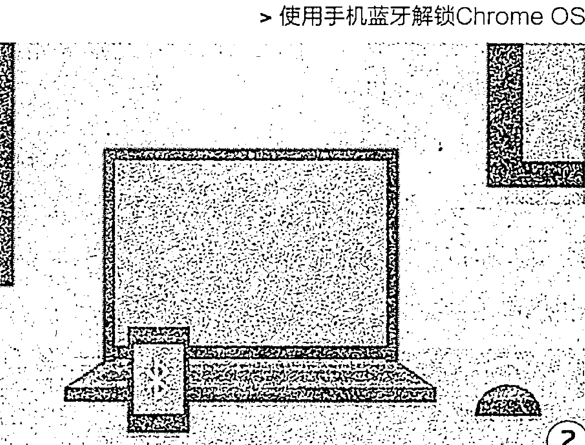

### 它是这样工作的——无密码锁定与解锁原理

Chrome OS的无密码保护机制看上去非常神奇，那么它又是怎么进行验证的？这里我们以手机蓝牙解锁为例，介绍其具体的解锁机制。当然首先要求安装Chrome OS的平板和手机都要有蓝牙设备，它的连接和验证是通过蓝牙完成的。整个连接验证过程主要由授权和确权两个部分组成（图3）。首先是授权指定的蓝牙设备作为解锁设备。我们在平板和手机中将蓝牙开启，在平板上开启蓝牙后扫描，它会自动扫描到当前蓝牙设备，在设备列表中选中自己的手机，然后点击开始连接验证。此时Chrome OS平板端会显示需要配对的蓝牙设备，同时显示认证的密钥（图4）。

单击“配对”，这样在手机端的蓝牙也会显示相对应的配对界面，按提示输入上述显示的密钥，这样就可以完成平板和手机的配对连接，这样以后手机就可以作为Chrome OS平板的验证设备，这里的授权验证通过蓝牙密钥来保证（图5）。

完成蓝牙连接的授权后，Chrome OS的API就会将授权的设备保存在系统数据库中，同时将这个指定设备作为连接验证设备进行确认。不过这里保存的并非是连接的蓝牙手机名称，而是指定蓝牙设备的ID，Chrome OS的API是将这个唯一的硬件ID作为授权和确权依据的（图6）。

这样以后如果Chrome OS平板锁定后，只要我们携带的手机开启蓝牙，在蓝牙连接有效范围内（10米内）成功连接后，我们只要输入手机上显示的配对密钥，Chrome OS平板通过API和数据库内的蓝牙ID比对，如果符合就会自动解锁平板，否则发出提示消息，提示指定设备无法解锁平板。

同样的，对于手机NFC、智能手表、智能眼镜等随身设备，Chrome OS的API也是先通过平板和这些设备的连接，将其硬件ID作为授权和确权的依据，然后即可将这些作为平板解锁硬件的“密码”。

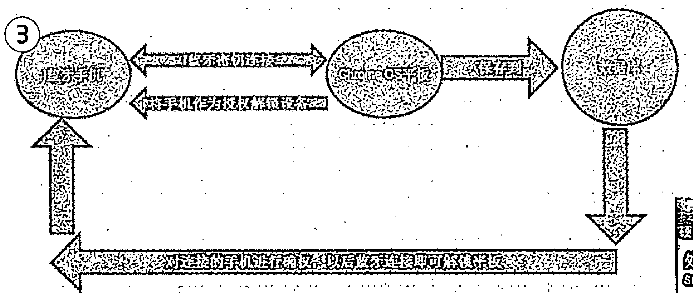

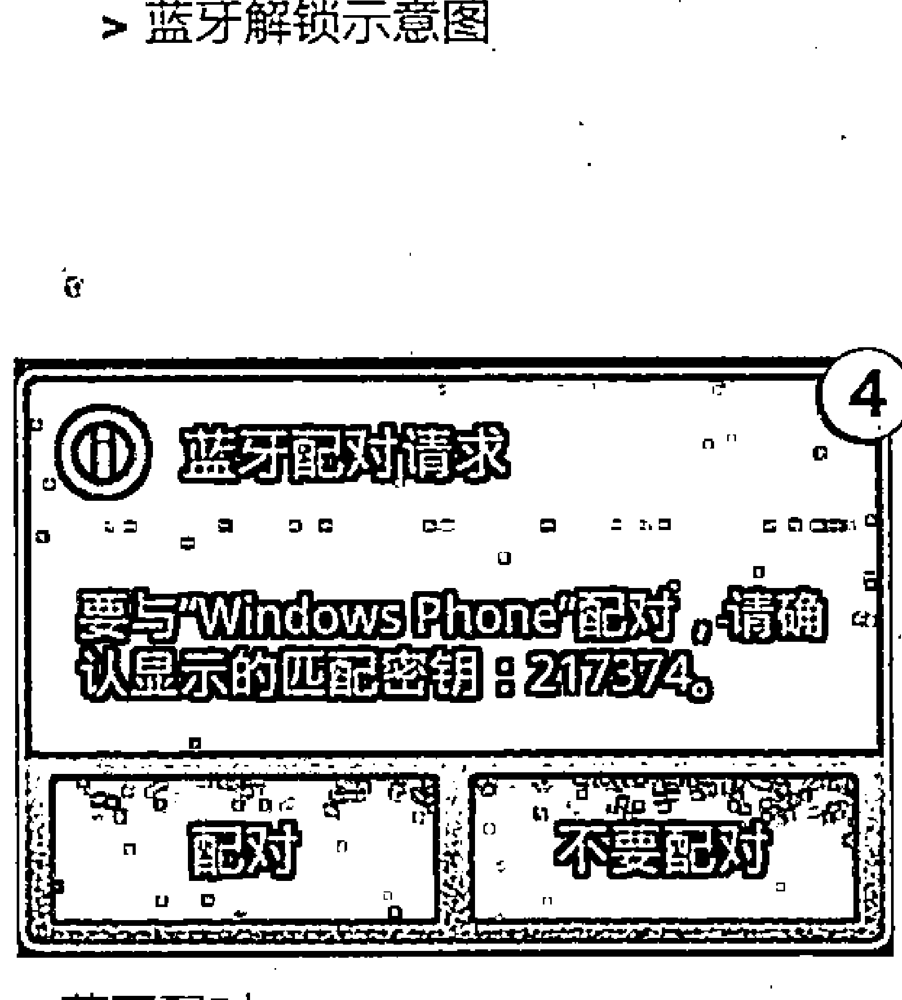

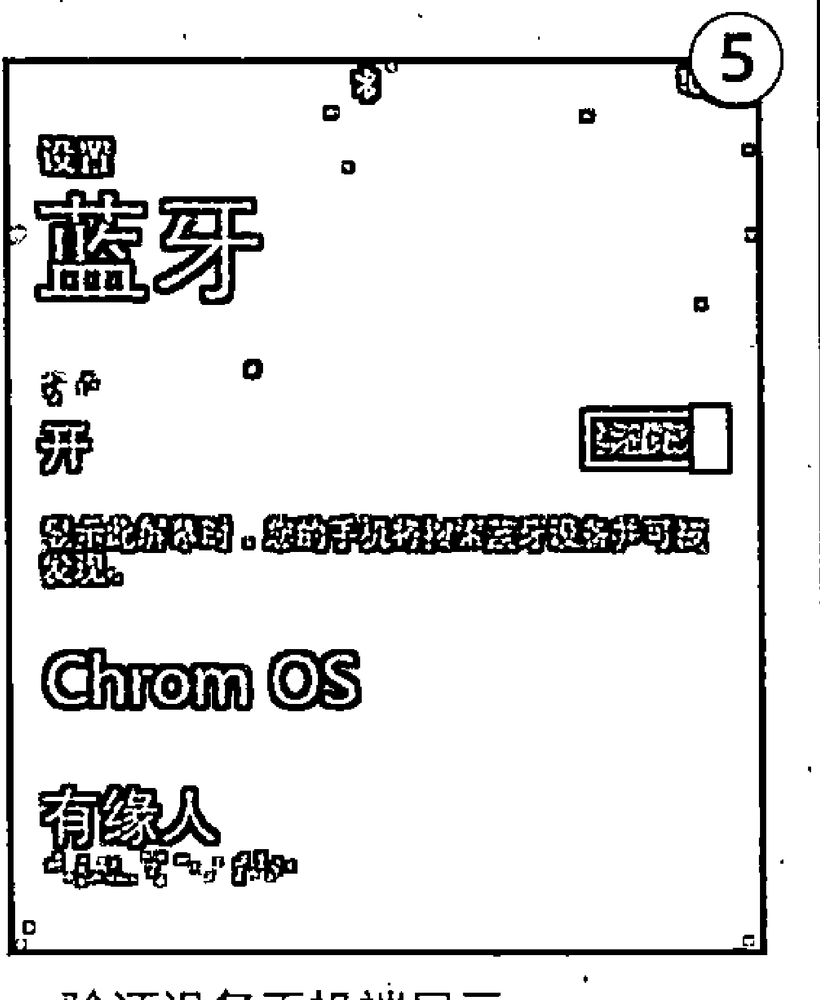

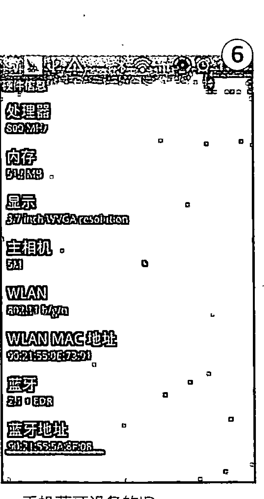

## 走进超清世界——解读4K

文 | 技术宅

CES2014电子展，索尼公司一口气展示了BRAVIA 4K液晶电视、次世代4K媒体播放器、α 5000数码相机（支持将高分辨率图片处理为4K格式），加上之前发布的VPL-VW500ES 4K家庭影院投影机、4K民用摄像机AX100，索尼4K超清全系列产品预示着2014年4K将逐步走进我们的生活。那么，什么是4K？4K又会给我们带来什么样的超清视觉享受？

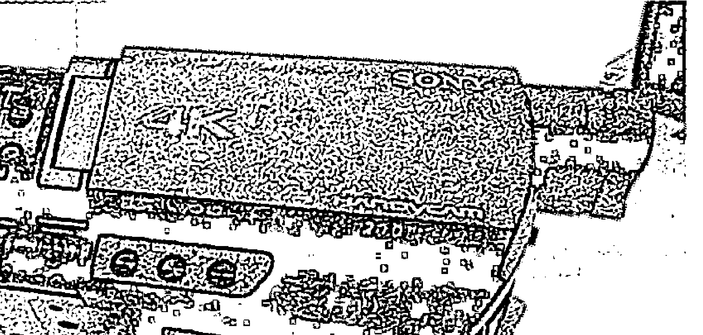

### 掀起你的盖头来——认识4K

4K其实是指4K分辨率（4K Resolution的简称），分辨率有3840×2160和4096×2160（像素）2种规格，4K的名称来自于其水平方向的像素数。与之对应的是2K，也就是上一代主流分辨率1920×1080或者1920×1200。

那么4K可以带来什么样的视觉体验？首先4K的成像视野明显地更加扩大，我们可以看到更全的景象。其次由于分辨率的提升，影片（或图片）细节也更加清晰。

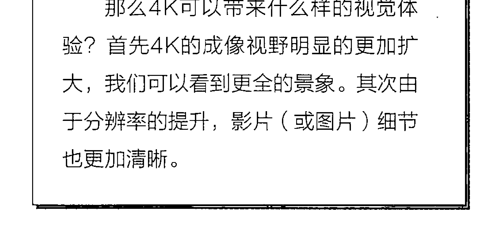

### 什么样的设备能体验4K

4K分辨率很高，在个人电脑上要实现这种分辨率，一是要显示器其本身的支持，二是要显卡的支持。此外，4K影片要在电脑上进行流畅的解码和传输，我们还需要强悍的CPU、足够的内存和支持大数据传输的接口。因此要在目前个人电脑上享受4K，我们就必须解决上述三个问题。

显示问题，借助Windows 7、Windows 8的显示器分屏技术，我们只要在显示属性中设置多屏幕显示，然后将四个支持1920×1080的显示器并列显示，即可实现4K的输出了。

显卡问题，可以购置诸如Radeon HD7900系列或GeForce GTX660Ti以上级别的显卡，它们都可以支持4K分辨率。不过目前支持4K输出的显卡都是通过两个DP接口连接到4K面板中的。

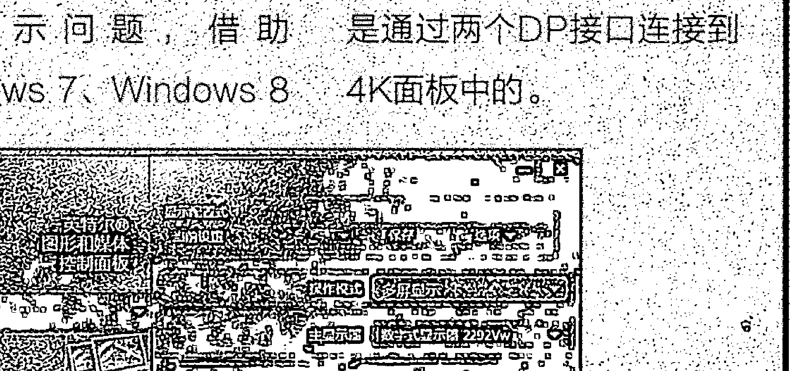

4K影片的解码和传输则要新硬件的支持。目前绝大部分液晶显示器产品主流的接口是D-Sub和DVI，由于数据传输带宽的限制，这种传统的接口已经无法胜任，因为目前4K视频所需的数据传输速率高达1Gbps，我们需要使用能够传输更高数据的接口。比如英特尔最近发布的标准Thunderbolt 2（雷电2接口），它可以达到20Gbps的双向数据传输速度，相信随着PC硬件的发展，4K很快就会成为日后的主流。

| 配件   | 品牌型号           | 参考售价 |
|--------|--------------------|----------|
| 显示器 | 戴尔UP3214Q        | 32999元  |
| 处理器 | Intel i5-4570      | 1299元   |
| 主板   | 技嘉GA-Z87X-UD3H   | 1399元   |
| 显卡   | 索泰GTX770         | 2349元   |
| 内存   | 金士顿DDR3 1600×2 | 520元    |
| 硬盘   | 希捷ST2000DM001 2TB| 520元    |
| 电源   | 航嘉MVP500         | 369元    |

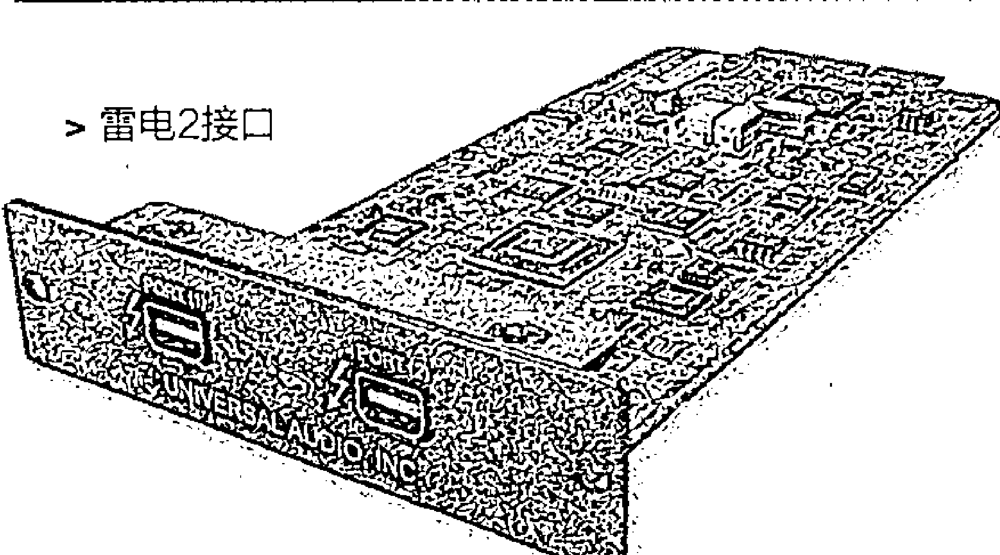

### 4K想说爱你不容易

通过上面的介绍我们知道4K具有成像视野宽阔、细节清晰的特点。不过就目前现状而言，我们要在个人电脑上享受4K还是有一定的难度。

硬件的限制，首先是支持4K的显示器售价昂贵，其次4K输出和影片解码，需要强劲的CPU和显卡支持。按照目前行情配置一台4K主机，单单戴尔32英寸4K显示器（32999元）+ 索泰Geforce GTX770显卡（2349元）就要3万多元，显然不是一般人能消费得起的。

至于4K影片本身的限制，因为现在全高清影片或者蓝光碟镜像文件的大小约在10GB ~ 50GB，但是随着分辨率的提升，一部4K电影的容量高达200GB~300GB，即使是1000GB的硬盘，也只不过能存放3~4部的影片，这也是目前很多朋友的硬盘不能承受的。此外，支持4K拍摄的摄影设备仍然十分昂贵，这也进一步限制了4K影片的普及。

网速的限制也是个大麻烦。既然本地没有足够空间存放4K影片，很多朋友可能会想使用在线观看4K电影的方法享受。不过由于4K影片体积巨大，如果要流畅地在线传输，我们至少需要1000Mbps宽带，显然在目前连10Mbps宽带都没有普及的互联网，显然无法流畅观看4K的影片了。

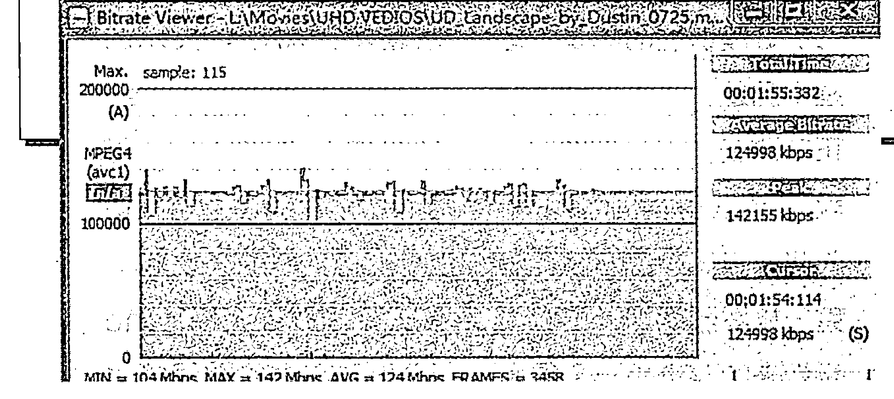

### 4K离我们并不遥远

4K，也许对很多人来说似乎还是个概念性的东西。实际上在日常的生活中，4K早已经走入我们的生活。比如2013年7月欧洲联合会杯、8月的温布尔登网球锦标赛，以及今年的巴西世界杯也开始使用索尼4K设备拍摄和记录，这些直播（录像）其实都是4K影片。只不过由于4K电视还没有普及，我们暂时无法感受到4K的魅力而已。可以预见在不久的将来，无论是在电影院、在线视频网，还是家用摄像机上，我们都可以轻松感受4K带来的超清晰的视觉享受！

## 忘记指纹：虹膜是你的新身份

文|无名

在安全领域，指纹识别有可能退到辅助地位，而虹膜识别将成为主流！比如知名的安全服务提供商赛门铁克有一处代号为“Vault”的机密大楼，它的最后一道防线就是虹膜识别系统，因为这一系统比起传统的指纹识别更加快速更加精确。当然，不只是这种安全要求高且不计成本的环境，随着价格下降、易用性增强，虹膜识别在银行、医疗等民生行业的应用也会快速普及的。

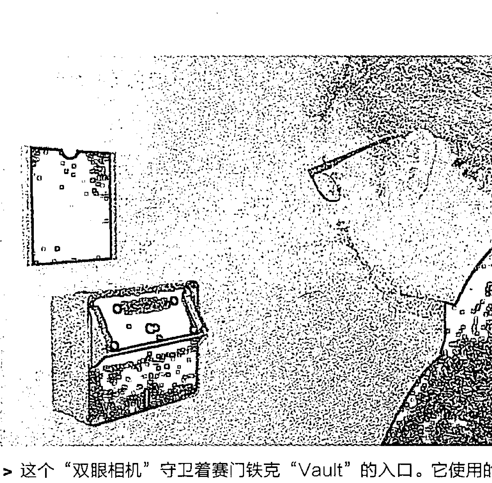

### 虹膜识别技术的背后

和电影中看到的视网膜扫描不同，亮光扫过瞳孔，采集眼球底部血管的图案。虹膜识别的摄像头拍摄的是眼睛有色的部分——虹膜。在胎儿发育时，眼睛会经过一个称为“混沌形态”的过程，使得每个人的虹膜形成独特的外观，这使得虹膜识别非常精确，它的匹配错误率仅仅是面部识别系统的十万分之一。虹膜识别技术的另一大优势，是它不会像脸部那样随着年龄的增长而改变。

NIST最近的一个主题研究表示，护照上的人脸照片一般每5年或10年换一次，而虹膜可能好几十年才换一次。每只眼睛都有一个独特的模式，而像赛门铁克“Vault”所用的虹膜识别系统，采用双眼扫描，准确性就更高了。一般来说10个指纹同时识别是非常高的标准，而一双眼睛至少相当于8到10个手指，甚至更多。

当然，精度依赖于数据的完整性，虹膜识别不需要身体接触（这是优点），但是它需要人的配合，并且对系统的要求也很高，比如使用手机摄像头，错误率会高得多。另外，虹膜识别系统还需要克服环境等问题，明亮的阳光、厚厚的眼镜、彩色隐形眼镜，甚至眼睛问题，都有可能导致虹膜变化。不过这些已有克服的方法。

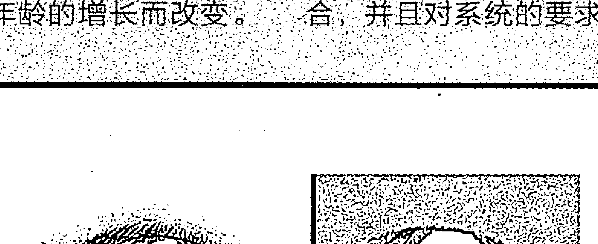

左侧图像显示摄像头捕捉到的虹膜图像，右侧则是处理后的图像

### 虹膜识别的成本

虹膜识别的成本一直是个问题，不过这种情况正在改变，因为摄像头、软件算法等等都在不断改进。美国专家帕特里克·格罗瑟认为，技术创新带来的改进是一个很大原因：制约虹膜技术发展的一项数学专利于2005年期满，从那时开始，业界制定出了开放标准。目前在消费领域，虹膜识别技术的应用越来越多。加州坎贝尔的AOptix Technologies公司最近发布了一个基于iOS系统的生物特征识别技术软件开发工具包。这一举措，以及iPhone 5S和传言中谷歌眼镜对生物识别技术的支持，都会提高大家对虹膜识别技术的兴趣。苹果、AOptix及谷歌只是一个开始，其他手机制造商很快会闻风而动的。

### 虹膜识别为何速度快

虹膜识别的另一大优势是识别速度很快。

在功能上，虹膜识别摄像头与数码单反相机并没有太大的不同，只不过虹膜识别摄像头的传感器光滤波器允许近红外光线通过，而不是可见光。

虹膜识别系统采用一种开放的标准，对整个眼睛的结构进行编码。因为这个过程不注重细节特征点，所以640×480像素的灰度图像已经足够了。这也是虹膜识别算法可以快速地处理数据和快速反应的原因之一。甚至只需要老的VGA格式即可，并不需要高分辨率，实际上高分辨率反而会让速度降下来。

### 实际应用中的虹膜识别

成本一直是制约虹膜识别技术普及的一大障碍，高端复杂的相机能够在两米外拍摄图像，价格高达3万美元以上。不过，对于适合商业用途、近距离下可以运作的其他摄像头，则只要几百美元不等。国外一家开发商新近设计了一款消费级别的虹膜识别系统，可以放到平板电脑和手机上，并且不会提高太多的成本。随着技术的发展，相信这一技术会更快地普及开来。下面介绍当下几个虹膜识别的典型应用。

- ### 1. 助力银行安全交易
开罗安曼一家银行在约旦的80家分行和100个ATM上安装了虹膜识别系统，据其负责人介绍，使用该系统后，银行交易中的欺诈行为大大下降，在最初的2009年甚至达到零欺诈。
安曼人在办理银行业务时，必须出示身份证，但是经常有人上银行时会忘记带上身份证，造成交易不便。这家银行部署虹膜识别系统后，客户可以在柜台和ATM处使用，交易速度大为提升，原先柜台每笔交易的身份验证需要4分钟，现在则仅需1分钟。

- ### 2. 加快机场安检速度
两年前，伦敦盖特威克机场开始使用虹膜识别技术，用于乘客的身份验证，速度和易用性大大提高。
现在，乘客在安检门外扫描手里的登机牌，摄像头从最远2米的地方即可拍摄到面部照片和虹膜图像，“生物特征识别杯”上的视频系统会提示乘客向哪儿看。自助服务过程完毕，安检门就会自动打开。旅行高峰时，该系统每小时最多可以处理3000人，效率非常之高。

- ### 3. 虹膜识别协助执法
密苏里州使用虹膜识别作为核心平台，用于跟踪通过整个刑事司法系统的界面。一旦有人被捕和被控，就开始全程跟踪。这项技术改变了以往的“强迫采集方法”，让执法过程更加的人性化。
那么，虹膜识别系统是否会被欺骗？在虹膜识别已普遍被认为非常安全的情况下，有学术研究人员指出，该系统同样可能被黑。不过也有专家怀疑这种情况在现实中是否能出现。

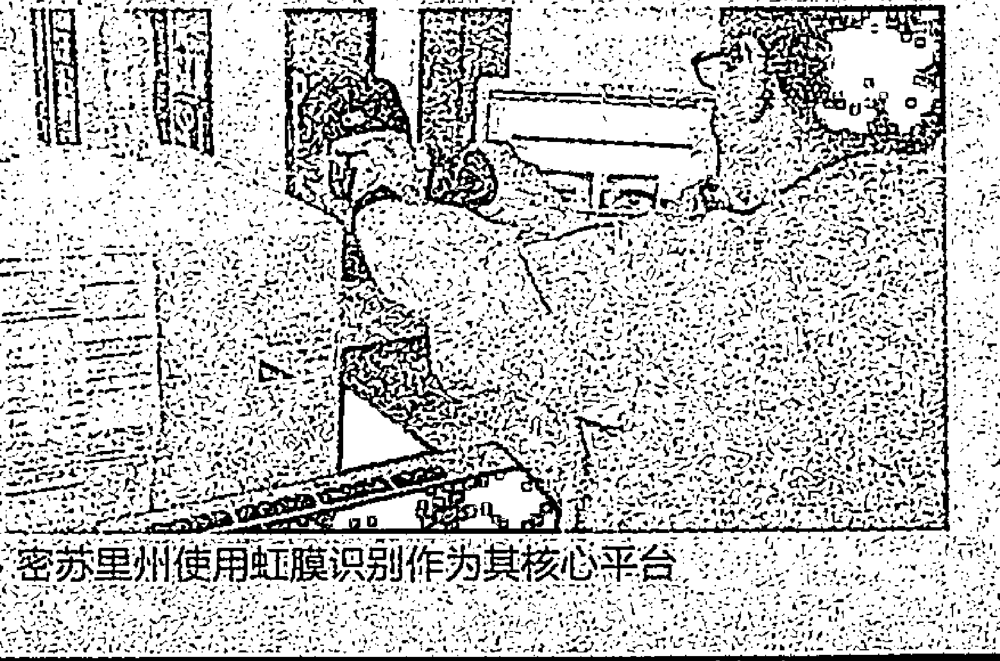## 认识网中的网——VPN解读

文 | 技术宅

VPN常用于私人与大型企业或团体之间的连接，这并不是什么新鲜事物了，不过它最近又火热起来，主要因为普通用户也开始经常用到它，比如快速浏览一些国外网站，玩网游连接国外游戏服务器等，都离不开它。并且它可以通用于台式机、笔记本、平板、手机等各种设备上，非常方便。

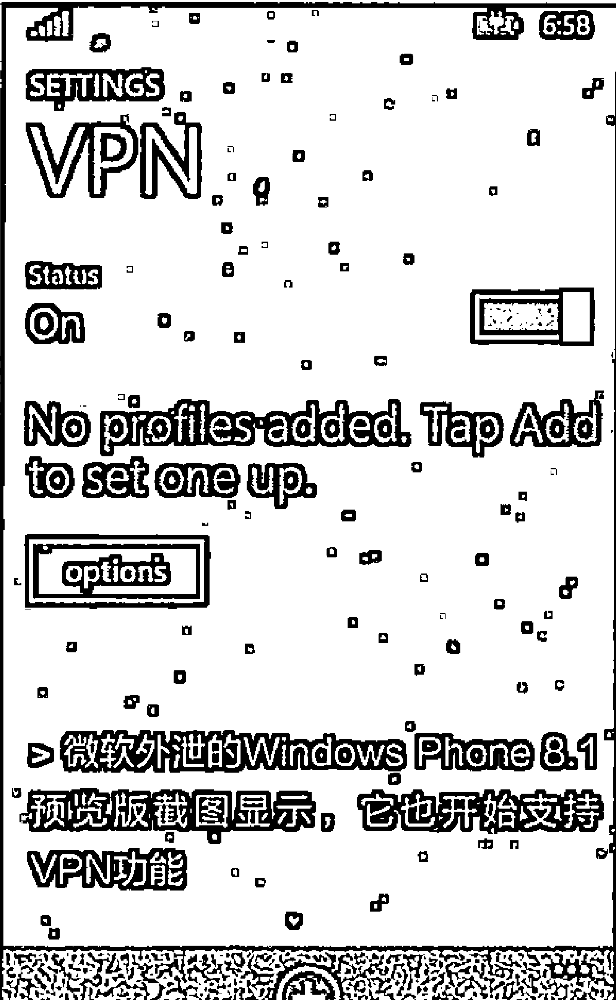

### 什么是VPN

VPN意为虚拟专用网络，它的原理与现实中的专用车道有点相像。比如国外贵宾来我国访问，首先到达首都机场（A点），现在需要将贵宾安全送达钓台国宾馆（B点），那么在A和B两点之间，我们可以修建一条专用车道，仅供外宾使用。不过国外贵宾并非天天来访，为此修建专线比较浪费（也无必要），而直接从公用车道通过，又很容易遇到堵车等意外状态，所以一个较好的办法，是在公用车道中临时划出（虚拟）一个专用车道来，并由交警维持秩序，这样就达到了既安全又快速的目的了。这个“虚拟”的专用车道还有一点优势，就是公用车道因为各种状况阻塞不通的时候，专用车道依然能够通行。VPN正是在已有的网络通路上划分出的一条“专用车道”，以确保使用VPN的人能快速安全地访问专有的网络资源。

### VPN是如何穿越的

通过上面的描述，可以发现VPN主要有两大功能：一个是“穿越”，可以到达其他人到达不了的地方；另一个是安全。这里先说说穿越，以单位的局域网为例，我们在单位的电脑上可以任意访问单位局域网中其他电脑共享的资源，因为我们自身就在这个局域网的内部。但如果我们回到家中（或出差在外），此时用家中电脑是无法进入单位局域网的，此时的单位局域网如同一个私人领地，它被一个防火墙所保护，一切外部的电脑都被挡在了墙外。

如果我们确实需要从外部（在家或出差在外）访问单位局域网，此时就得申请VPN专用通道了。首先需要单位的局域网中设置有VPN服务器，这台服务器往往有两块网卡（假设为A、B），网卡A具有公网网址（确保外网中的电脑能够访问到它），网卡B则用于局域网内的电脑连接。外部电脑通过网卡A和VPN服务器连接，再通过网卡B访问和VPN服务器连接的局域网电脑。

网游又是如何进行的呢？道理是一样的。许多游戏迷会遇到这样的情况，在家可以顺利地连接国外游戏服务器，但是在单位的时候往往因为网管封闭了网游端口而无法连接，此时便可借助各种VPN服务来穿越了。VPN服务商提供两个接口（假设为A和B），一个是正常的公网接口，也就是没有被网管封闭我们能访问的接口（A），VPN服务器通过此接口接受我们的网络请求，然后通过不受网管限制的B接口获取相应内容，再通过A接口返回给请求者。实际上它就是在我们与被屏蔽访问的内容之间建立了一个中转站而已。

### VPN的安全隧道

如上所述，VPN的另一大特点是它的安全性。通过VPN服务器，仿佛是给局域网开了一个后门，所以完善的安全保障功能不可缺少。

首先是对使用者的身份进行验证，对于单位来说是为了防止外人捣乱甚至窃取内部机密信息，而对于VPN服务提供商来说，是为了向用户收费。

对使用者身份的认证，主要有硬件和软件两种方式。硬件认证如智能卡技术，将使用者的身份信息等预先写入到智能卡中，使用时插入智能卡，由VPN客户端自动读取并配合系统服务完成认证。软件则是通过常规的用户名和密码的方式来实现（大部分在线VPN服务所采用），如果要接入VPN服务器，必须要在访问客户端建立VPN拨号接入点，它的操作方法与我们平时建立网络连接的方法相似，只是在连接类型中要选择“连接到工作区”，然后输入VPN服务器的IP地址即可。启动VPN连接，输入VPN账号和密码，VPN服务器端完成验证，即可完成连接。建立好连接，也就在服务器和客户端之间建立起一个专有的服务隧道。

从本质上来说，隧道技术就是把整个数据包放进另一个数据包中（隧道），再将“包裹”好的数据通过网络发送出去。我们平时的访问是建立在公网上的，可能遭遇黑客的拦截、入侵，导致连接数据的泄密。隧道技术则相当于在原来的互联网上开辟了一条专用的封闭通道，有效保证通讯的安全。

> 小提示
> VPN的安全保障是多方位的。比如除了账户和密码的认证方式，更高一级的如数字证书认证，防止数据包被篡改或伪造。另外VPN还包含了复杂的数据加密技术。

### VPN给我们带来什么

当下的VPN技术越来越成熟、流行，许多时候，比如浏览特定网站、玩游戏、家庭办公等，都需要用到它。对企业来说，它降低了建网的成本。对个人来说，它优化了我们上网的品质，比如大家知道国内是“南电信北网通”的格局，不同网络内的游戏互访速度极慢，而通过VPN在电信和网游服务器之间架设一条专用线路，就可以有效提高游戏的连接速度，当然访问国外网游服务器的原理类似。

VPN的相关技术比较复杂，不是两页文章所能讲清楚的，不过大概了解它的技术原理，相信对我们选择和利用VPN技术，会有所帮助。

### 如何选择VPN

| 适合用户 | 类型 | 价格 | 简介 |
| --- | --- | --- | --- |
| 大公司，用于总部和各个分公司之间的安全通讯 | MPLS VPN | 昂贵，比如河辰VG-2000售价8000元/台 | 一种基于MPLS技术的IP VPN，是在网络路由和交换设备上应用MPLS技术来构造宽带的Intranet、Extranet |
| 一般企业用户，用于自行构建VPN，方便员工在外出差时访问企业内网 | SSL VPN | 较贵，比如深信服VPN-1050售价为7600/台 | 一种在应用程序协议（如Http）和TCP/IP协议之间提供数据安全性分层的机制，主要应用于采用VPN与远程网络进行通信的Web客户 |
| 个人用户，一般网游用户使用 | IPSec | 经济实惠，一般使用专业VPN服务商提供的服务，比如173vpn是30元/月 | 一种由IETF设计的端到端的确保基于IP通讯的数据安全性的机制。IPSEC支持对数据加密，同时确保数据的完整性 |

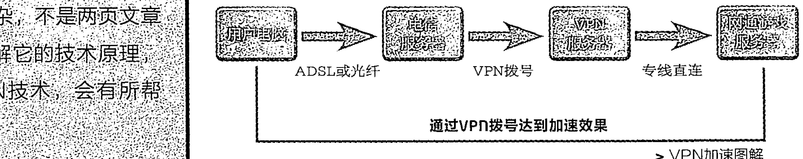

## 触摸未来——3D触摸屏解读

文 | 技术宅

3D和触控是时下流行的两种技术，在显示方面，越来越多3D显示器面世，给我们带来与众不同的3D体验，触控方面则随着Windows 8的发布，市面上也越来越多支持触控的显示器。那么“3D+触控”将会带来什么样的体验呢？

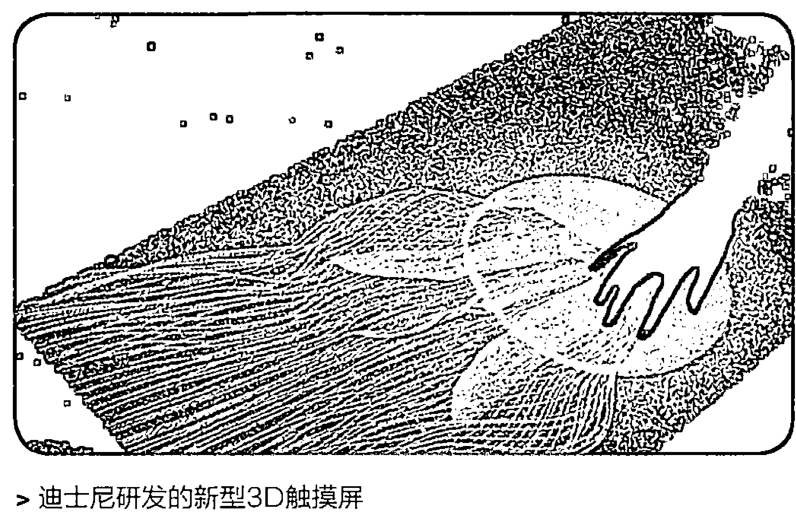

> 迪士尼研发的新型3D触摸屏

### 显示器识别触摸的原理

对于触摸屏大家已经非常熟悉了，现在各种平板电脑基本上都使用的是触摸屏。触摸屏显示器，除了更大之外，实现原理实际上是差不多了。触摸系统由可触摸设备（如显示器、平板电脑屏幕）+触摸处理单元组成，当我们的手指触摸到触摸屏时，触摸屏会感受到压力，这个压力会激活触摸屏下面的处理单元。

### 3D是怎么显示的

现在显示器的3D立体显示效果大多是通过特定的3D眼镜形成的特效，它的基本原理是利用人眼分别接收不同画面，然后大脑经过对图像信息进行叠加重生，构成一个具有3D立体方向效果的影像。这里我们以常见的左右3D为例。
首先3D图形在显示器上会分别显示左右两个画面，人的左右眼睛看到的是同一个物体的左右画面，经过3D眼镜的处理后传输到大脑，大脑会对左右眼睛看到的图像进行合成，最终形成3D效果图。


> 左右3D图形合成图解

触摸处理单元

首先它会采集手指触摸点信号（识别手指触摸区域），接着会对信号的意义进行判断，并做出“响应/不响应”的操作。比如手指点击的是可响应操作的区域，如点击在程序的“打开”菜单上，处理单元就激活“打开”操作，反之则不会响应触摸操作，这样就完成了一次触摸操作。

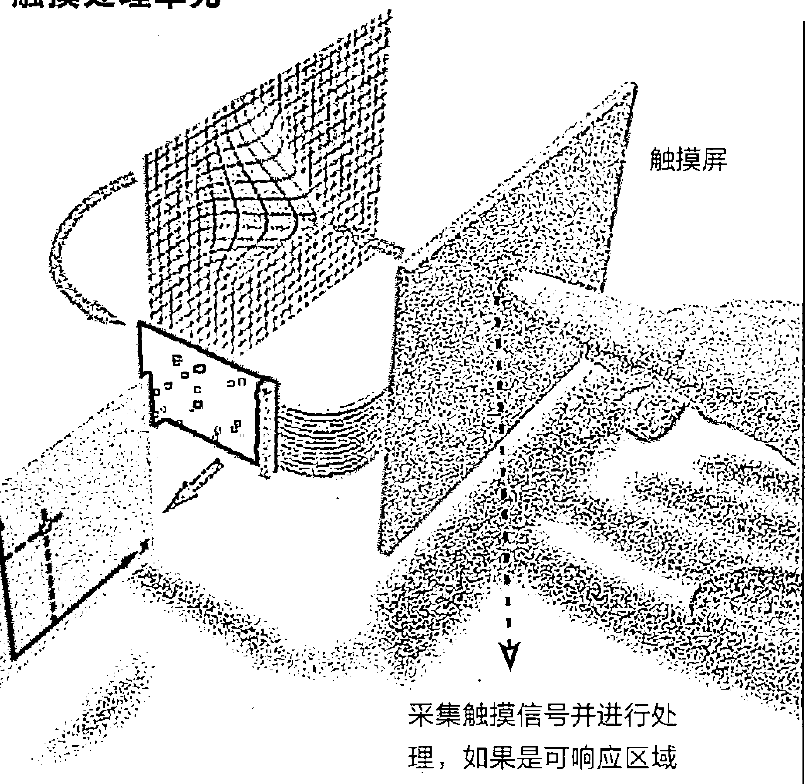

> 触摸操作原理图解

### 1+1大于2，3D的触摸+新型显示器

从上面的介绍可以知道，3D显示是通过特殊眼镜，然后通过大脑合成立体效果；实际上是一个虚拟的3D图像。触摸操作则要求我们物理接触触摸屏，是一个实际的接触操作。因此“3D+触摸”实际上是要在虚拟3D物体上进行实际的点击，因此实际操作起来有很大的难度。目前3D触摸显示仍然是一项比较前沿的科技技术，下面我们以微软正在开发具有触觉反馈的3D触屏技术为例，介绍3D触屏是如何工作的。

微软3D触控屏由液晶显示屏、力传感器以及能前后移动显示屏的机械臂组成。首先显示器会在屏幕上显示一些3D立体图形，当我们的手指点击到这些图形的时候，3D触控屏会感受到压力，这套系统的力传感器接受到压力后会对机械臂发出指令，机械臂平滑地向后移动显示屏。而当用户收回手指时，机械臂会使显示屏恢复到原来的位置。


在这个进退之间，系统根据用户触摸的区域和力度，通过屏幕表面的传感器计算出的力度数值，然后再赋予虚拟物体所产生的视觉效果。用户通过特殊的3D眼镜就可以看到整个3D的触控效果，完美实现触控+3D显示操作。

当然3D触控技术不仅在电脑上实现，它在手机、平板上的应用也有许多公司在进行研发。比如诺基亚Goldfinger、三星SCH-W960都是支持3D触屏的手机，后者更是号称世界首款裸眼3D触屏手机。

不过由于手机的屏幕较小（这样制作成本较小），而且都是随身携带，使用的频率较高。因此现在手机上大多使用的是裸眼3D技术。比如现在较为常见的裸眼3D是使用光屏障式（Barrier）技术，它通过液晶屏前面的细条栅让眼睛在观看图像时产生视差障壁。在立体显示模式下，应该由左眼看到的图像显示在液晶屏上时，不透明的条纹会遮挡右眼；同理，应该由右眼看到的图像显示在液晶屏上时，不透明的条纹会遮挡左眼。通过将左眼和右眼的可视画面分开，使我们看到3D影像。

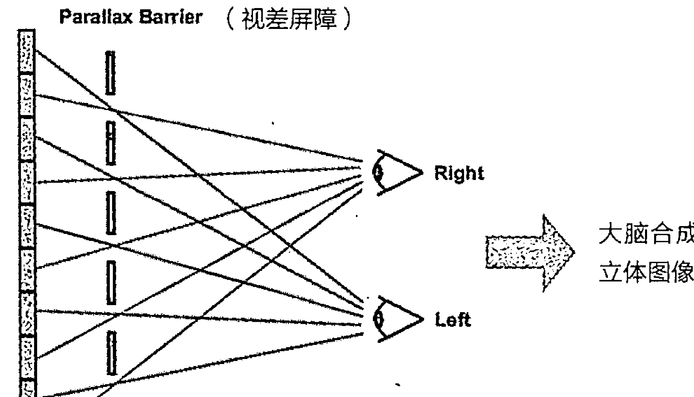


### 3D触屏 让我们生活更出彩

随着科技的发展，触屏技术现在已经非常成熟，而3D技术无论是在个人PC还是便携设备上都在如火如荼地发展。触屏让我们的操作更随意，3D则给我们带来更震撼的视觉享受。显然，这两者的结合必然会让我们的生活更出彩。

比如3D触屏技术用在游戏上，3D效果可以让我们获得更为真实的立体环境效果，即使是玩切西瓜这类简单的游戏，由于游戏里的水果都是立体展示，当我们的手指切开这些水果时，眼睛里看到的就像是现实生活中真的切开西瓜。想一想这种游戏效果是不是很酷！

## 一切尽在掌握的视频追踪

文 | 深度

今年2月底，微软研究院发布了一款视频追踪软件ZooTracer，它能对视频上的移动物体（比如蜜蜂）进行识别与追踪，并记录下它们的运动轨迹。

对于人来说，当然能轻松地认出视频中的动物，可是对于电脑来说，它们只“懂”得二进制数字。我们人类看到的是视频图像，而电脑“看”到的则是一堆乱动的0和1，那么它是如何识别这些庞杂而混乱的0和1的？究竟哪一组数字代表了蜜蜂？下面就让我们一起“追踪”其中的秘密。

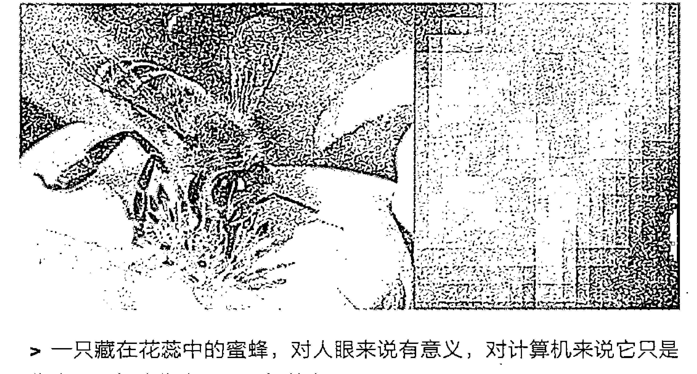

### 视频追踪有什么用

识别并追踪视频中的物体如何移动，有用吗？当然有用。比如生态学者为了研究野生动物，有时需要花很长时间在野外追踪动物的行踪，研究它们的生活规律，这是一件非常繁重而辛苦的工作。而如果有了视频追踪软件，只要在野外架一台摄影机拍摄，再通过ZooTracer之类的软件追踪动物的行踪，并自动统计位置、轨迹、瞬时速度等数据，无疑会大大节省研究人员的时间和经费。当然视频追踪的应用并不都是“高大上”，不少人平时就有过接触，比如有一种软件，只要我们对着笔记本上的摄像头打手势，就可以操作电脑。再比如有人安装的监控设备，可以远程监控，随时发现异动。另外在机器导航、运动分析、增强现实、交通管制、医疗成像、视频编辑等领域，视频追踪的应用越来越广泛。


### 视频追踪技术内幕

我们把一个动作或过程拍摄成一系列的静态图像，然后将这一系列的静态图像连续播放，就形成了动态视频。一般来说，1秒钟内能快速播放24张（即24帧）连续变化的图像，根据视觉残留原理，我们就会看到一个自然连贯的视频影像。现在假设有一个1秒钟的视频，那么所谓的视频追踪，就是我们要观察的视频中的某个物体（比如蜜蜂），从第1张直到第24张的所有静态图像上的位置变化以及将它们关联起来的移动路径等。


视频中的运动对象除了位置改变，还会因角度及光照的变化，以及遮挡、抖动、背景变换等造成变形，这给检测和追踪造成很大的困难，需要一些特殊的算法来解决。

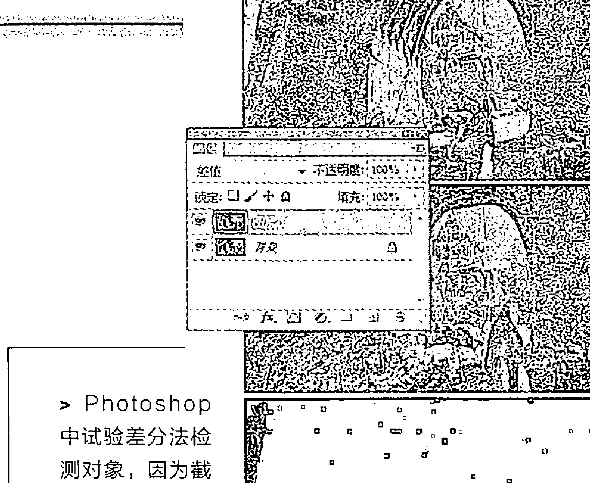

> > Photoshop中试验差分法检测对象，因为截图并非紧邻的2帧，所以轮廓不是很精确

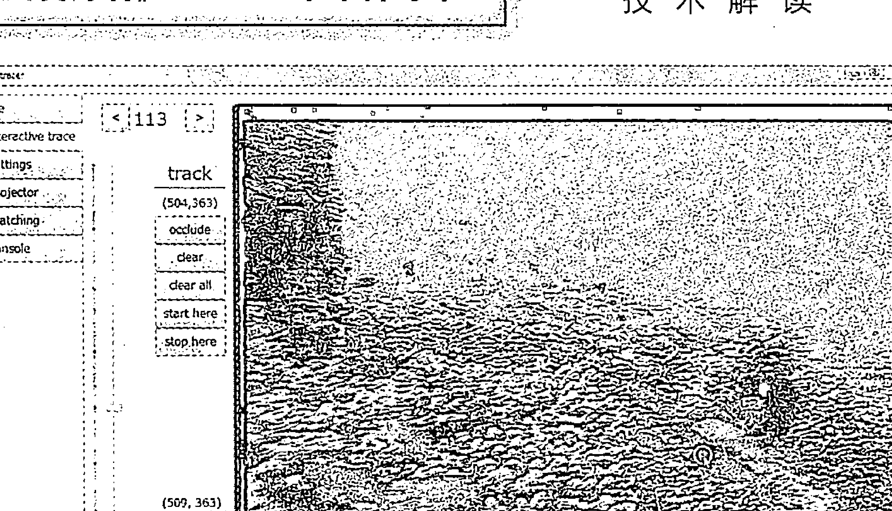

> > ZooTracer应用界面

视频追踪的算法有很多种，每一种都有各自的优缺点，选择使用哪种算法，主要根据实际用途来考虑。一般来说，视频跟踪系统有两个主要组成部分：目标表示和定位，以及滤波和数据关联。

目标表示和定位，实际就是如何把视频中要追踪的对象检测出来。这方面的工具方法有很多，常见的算法如瞬时差分、背景差分、斑点追踪、均值漂移追踪、轮廓追踪、视觉特征匹配等。

以差分法为例，比较视频中相连的前1帧和后1帧画面，如果有物体移动，两个画面之间必然会产生差异，这时将两个画面进行相减运算，它们之间相同的部分被减去，剩下的部分基本上可以确定就是移动的那个物体了。虽然大部分读者不是程序员，但我们可以借助Photoshop这款图像工具来体验差分的效果。将截取的两帧视频静态图像分别导入Photoshop的不同图层中，然后在上面图层选择图层模式“差值”，Photoshop将自动帮助我们进行差值计算。这时可以看到，图像中只有差异的部分保留了下来，正好勾画出视频中动态对象的轮廓（效果与差分算法接近）。

滤波和数据关联部分，主要是追踪对象运动过程，常见的滤波算法有卡尔曼滤波器、粒子滤波器等，它们可以准确预测运动对象的位置、方向、速度，以及解决遮挡、光照变化等影响因素。

对于以上的算法，程序开发人员可以借助OpenCV来具体实现。OpenCV是基于开源的一个计算机视觉库，现在许多人脸识别系统就是基于它开发的。OpenCV提供了一个框架，包括对运动对象的检测、追踪和轨迹生成等功能模块，开发者可以直接调用。

### 关于ZooTracer

视频追踪本质上就是基于图像处理和模式识别的技术，它随着数字视频的出现而发展，其核心竞争就是算法的演进。

视频追踪类的软件已有很多，ZooTracer的优势主要体现在它在较低质量的视频中也能很好地完成追踪任务。这就意味着，在条件不好的环境下拍摄的视频，以及低端摄影设备（如手机）拍摄的视频，同样也可以应用它，这是它高于其他软件之处。

ZooTracer现在可以免费从http://tinyurl.com/k4lcdou下载。不过要注意的是，它只能在64位版本Windows系统下运行，并且需要.NET Framework 4.5及Visual C++ 2013运行库的支持。

### 延伸阅读

### 全自动快速跟拍系统

视频追踪技术在硬件上的应用也越来越多。比如日本东京大学的科研人员，开发出一种新型云台摄像系统，它使用1000帧/秒的视觉目标锁定系统，所以号称“1毫秒自动云台系统”。这种系统的应用，在未来的全高清体育赛事转播中将会大有用武之地，比如快速追踪乒乓球的运动轨迹，就不是人工拍摄所能完成的。另外，在拍摄快速飞过的鸟类、昆虫等动态细节，对科学研究也很有帮助。

## Windows 8的ReFS去哪儿了

微软在Windows 8（及Server 2012）中开始引入一种全新的文件系统ReFS（Resilient File System）。信息时代，数据的价值越来越被重视，而磁盘存储故障经常会导致珍贵数据的丢失，ReFS文件系统正是微软在数据保护方面所做的一个努力。另外对于海量数据的优化管理，也是ReFS的一个重要目标。然而，除了个别Windows 8 RTM试用版中出现了ReFS，到了正式版中这一支持却不翼而飞了。今天我们将把它从Windows 8.1中挖出来，让有兴趣的用户能够一睹它的“芳容”，并对ReFS的改进及特色功能，也好好来解析一番。

### 挖出隐藏起来的ReFS

我们在用Windows 8.1格式化磁盘时，会发现文件系统只有NTFS一个选项。其实Windows 8.1是完全支持ReFS的，只不过暂时被系统锁定了，通过下面的操作可以将其解锁。

首先打开注册表编辑器，定位到[HKEY_LOCAL_MACHINE\SYSTEM\CurrentControlSet\Control]，在它下面新建一个名为MiniNT的子键。在MiniNT子键下新建一个DWORD类型的项，名称为AllowRefsFormatOverNonmirrorVolume，数值设置为1（图1）。重启系统，再进行格式化操作时，文件系统中就可以找到ReFS了（图2）。

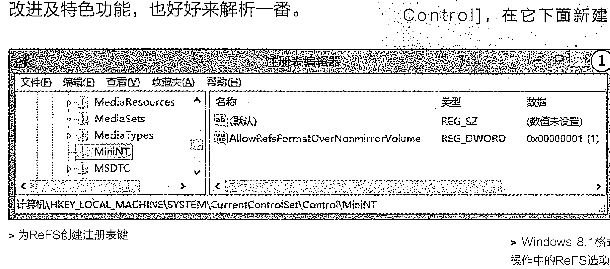

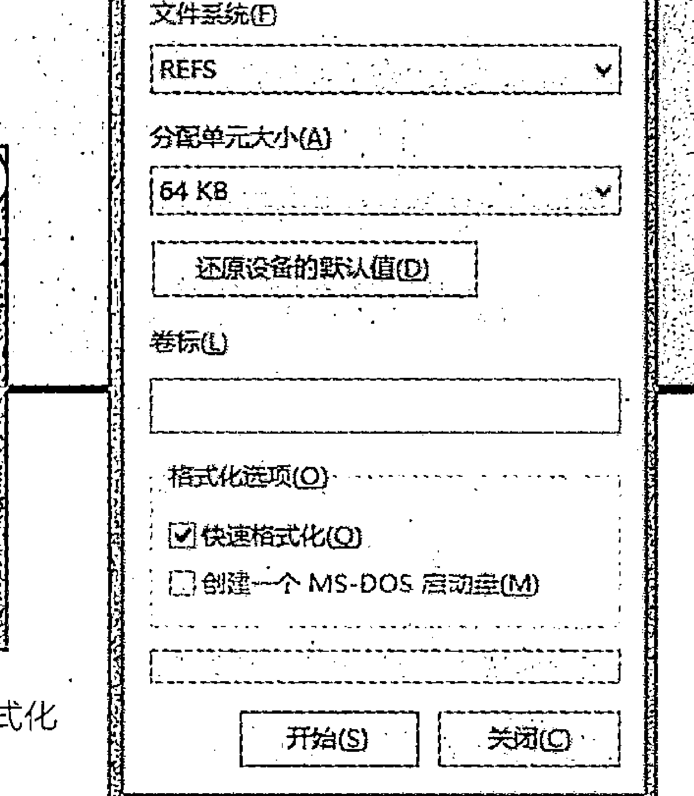

### 保数据安全 ReFS再也不怕断电了

使用电脑的时候我们常常被告诫，系统没有正常关闭之时，千万不要直接关掉电源，因为这种意外断电导致的非法关机，极有可能损坏文件造成数据丢失，甚至有可能损坏系统文件而导致开不了机。

这其中的原因何在？

这是因为，我们在改动文件时好像只是进行了一个单一的操作，但是为了完成这一操作，系统在后台却会有一连串的动作，在这个过程之中如果被突然打断（断电或系统崩溃），数据链接不上，就会像风筝断了线一样处于无效状态。

NTFS使用一种日志结构的系统来解决上述问题，当进行数据写入操作时，它会在原有文件中写入新的“元数据”（就是关于这个文件的名称、大小、位置等等的信息），同时通过日志跟踪这些变化。这样一旦出现断电或发生错误，就可以根据日志记录“回滚”到原先的状态，从而维护数据的完整一致性。

NTFS的方法大大提高了数据的安全性，但如果正在写入元数据时发生错误，还是会导致“断写”，之前的元数据有可能一并被损坏。对此，继承受NTFS的ReFS有一一个巧妙的改进，就是它根本不更新原有的元数据，而是在其他的位置写入新的元数据（再通过一种机制将零散的元数据串连成整体），这样即使出现意外也不会破坏原有的元数据。这一方法实际上类似于Linux上的“写入时复制”（Copy-on-write）技术，ReFS中有所演变。

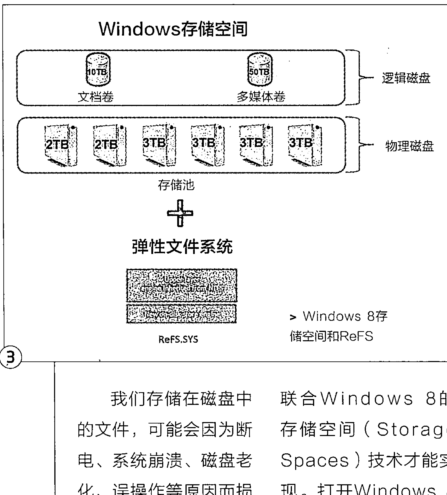

### ReFS“自疗伤”

如它的“双向镜像”模式有点像RAID1，每次写入数据都是同时写入两个副本，一旦某个副本的数据损坏，就可以用另一个副本的数据来恢复（图3）。

ReFS在写入数据的同时会自动更新“校验和”。ReFS的校验和是一个64位的数据，算法通过它可以检验数据的完整性，从而验证文件版本是否正确。当检测出数据有故障时，ReFS就会调用存储空间接口读取正确的副本进行恢复。当然这些操作都是自动完成的，不需要我们自己定期运行CHKDSK之类的错误检查工具，相当智能。

我们存储在磁盘中的文件，可能会因为断电、系统崩溃、磁盘老化、误操作等原因而损坏，对此ReFS有一个很好的策略帮助其自动恢复。它是怎么实现的呢？原理说起来很简单：对数据进行多处备份，检测出有损坏的数据时，及时通过备份的好的数据来还原。

这一功能需要联合Windows 8的存储空间（Storage Spaces）技术才能实现。打开Windows 8的控制面板，找到“存储空间”，启动它之后根据向导提示即可创建存储空间，它可以将一个或多个不同类型的磁盘整合在一个虚拟空间中。Windows 8的存储空间通过镜像副本的方式确保数据安全，比

### 容纳海量数据的“B+树”

除了数据安全，ReFS的另一大特色是对超大规模的卷、文件及目录的支持。ReFS理论上最大的分区（卷）可达到256ZB（实际只能达到16EB，1ZB等于1024EB，1EB等于1073741824GB），它的最大文件数量和最大单个文件的大小也是超乎想象。

ReFS主要通过B+树实现对海量数据的管理，元数据和文件数据被组织成类似于关系数据库的表。与二叉树不同，B+树是一种多路搜索树（多叉树），它降低了“树”的高度，这无形中也就降低了磁盘读写率，同时提高了搜索效率，非常适合作为文件的索引系统。

### 微软为何撤去ReFS

ReFS还有不少技术亮点，比如数据打捞（隔离错误找回后面的数据）、条带化增强（一种数据访问方法）等，那为什么Windows 8.1正式版中，微软要将ReFS功能隐藏呢？推测应该是为了谨慎行事，毕竟作为Windows中一个新的文件系统，它还是有不可预测之处。

ReFS直接继承自NTFS，可以兼容NTFS的大部分功能，不影响杀毒软件等对其上文件的正常检测，但是目前还不能实现将NTFS直接转换为ReFS格式。另外，ReFS现在还不能支持移动存储设备，也不能作为开机启动设备，等等。总之要安全地享用ReFS，我们尚须等待一些时日。CF

## 成也流感败也流感
——大数据还是大错误

编译 | 深度

近几年来，大数据的话题越炒越热，它的作用已被推崇到几乎无所不能的神话地位。不过在一片“点赞”声中，也有一些反对的声音。了解这些反对者的态度和反对的原因，也许能让我们能更清醒、更理智、更有度地去运用大数据，而不至于迷失在数据的海洋中。

### 一场关于流感的大数据神话

2008年9月4日的《自然》杂志“Big Data”专辑中，谷歌研究人员宣布，他们不需要任何医院的体检结果，即可快速追踪美国境内流感的传播趋势。美国疾病控制中心（CDC）至少需要一周时间才能得出一张流感传播趋势图，而谷歌仅需要一天。大数据的概念正式亮相。

几个月之后的2009年，流感病毒（H1N1）迅速传播，引起世界范围内的恐慌。因为当时新的疫苗还没有研发出来，只能以预防控制为主，流感传播趋势信息就显得尤其重要。谷歌大数据快速形成的流感传播趋势报告，一下子成为一个及时有效的参考指标。大数据一战成名，很快成为企业家、科学家、政府和媒体的痴迷对象。

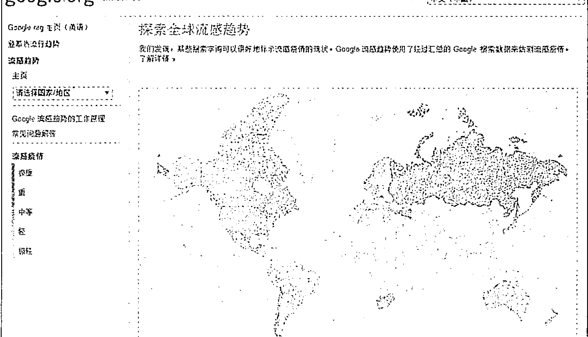

### 有点尴尬的大数据四个信条

“大数据”实际上是个很含糊的概念，不过很多营销人员喜欢将它挂在嘴边，用来强调数据规模巨大。大数据的鼓吹者有四个令他们兴奋不已的信条，而且都能从“谷歌流感趋势”的成功中得到印证：

- ★ 大数据分析出的结果惊人地准确；
- ★ 大数据搜集的是总体样本，而不是旧有的抽样样本（意为所以更精确）；
- ★ 大数据无需麻烦地追查前因后果，只需统计相关性；
- ★ 大数据是“理论终结者”，不再需要科学的或统计的模型。《连线》杂志发文称：“有足够的数据就可以了，数据可以自己发言。”

剑桥大学的 David Spiegelhalter 教授对此不以为然，他认为：“大数据中也有很多小数据问题，不会因为数据大了就消失，反而会变得更糟。”

果然在《自然》杂志发表谷歌的那篇文章4年之后，坏消息传来，“谷歌流感趋势”失灵了！在成功运行几个冬天之后，谷歌模型预测可能爆发严重的流感，但事实证明谷歌把这个结果夸大了近两倍。

问题在于谷歌根本不知道搜索关键词与流感之间有什么样的联系，谷歌的工程师只是关心统计模型得出的相关性，而不是找出因果关系（第三信条），这样得出的结果是非常脆弱的：如果不知道相关性背后的原因，也就不可能知道什么情况下相关性会消失。如果分析一下原因，2012年12月份，关于流感的可怕故事到处流传，引发很多健康的人也上网搜索相关消息，从而导致谷歌的统计模式失效。

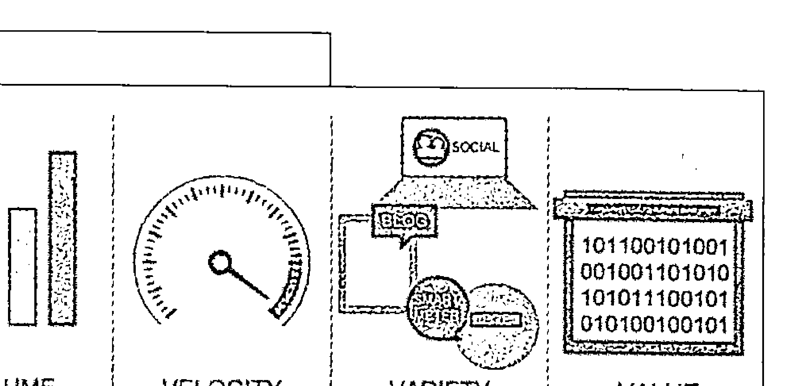

> 大数据的4V特征

还有就是当用户搜索相关病症的时候，谷歌的搜索算法会暗示一些诊断信息，这进一步影响到用户的搜索行为，加大了预测的偏差。谷歌后来对算法进行了调整，不过这个教训提醒人们，大数据使用不当很容易落入陷阱。

### 为什么大数据会出错

统计学家花了200多年的时间，试图找出存在于数据世界里的各种陷阱。虽然现在采集的数据更多、更快、更容易，但是我们不可能假装数据中的这些陷阱已经没有了，这是不可能的事情。

举例来说，1936年共和党的阿尔弗雷德·兰登和富兰克林·罗斯福竞选总统，《读者文摘》发出1000万份调查并收回240万回执，统计后得出兰登将以55:41赢得大选。但实际结果却是罗斯福以61:37的优势大胜对手。更令《读者文摘》尴尬的是，乔治·盖洛普只用了一个很小规模的调查，却得出了和实际情况接近的结果。这个例子说明的是，数据大小并不能决定一切。

民意调查涉及到大范围的人口抽样，必须要处理好两个问题：样本误差和样本偏差。样本误差是指随机选择的人（样本）并不能反映人的真正意见，但是随着样本增大，误差就变小，这对《读者文摘》来说是个优势。但是伴随样本误差还有一个更为危险的朋友——样本偏差。乔治·盖洛普的抽样数量少，所以他有更多精力去排除带有偏见的样本，而《读者文摘》的样本基数太多，所以很难避免样本偏差。大数据同样有着这一问题：搜集数据变得容易，但是在海量而混乱的数据中剔除偏差的样本，殊非易事。

大数据追求“N=所有”，也就是不需要再进行抽样，而是全部的数据，这样确实没有了样本偏差。但问题是，真正“N=所有”的数据是不可能有的，比如就算能读取推特上的所有信息，但是这些用户并不能代表世界上的所有人，并且推特上的信息也不可能代表用户的全部。“N=所有”往往是一种假设，而不是事实。所以微软研究员Kate Crawford就指出，发现数据中含有偏差就得想办法纠正，大数据集看起来全面，但“N=所有”只是一个诱人的错觉。

### 大数据时代的隐私危机

除技术上可能的种种谬误，大数据最令人诟病的是它对隐私的侵犯。前段时间，谷歌就因为侵犯数据隐私在法国被判定违法，责令整改。

大数据如同吃不饱的怪兽，所有的网上信息都尽可能吸收，如此庞杂混乱的数据如何会泄露个人隐私？喜欢看侦探电影和小说的人都知道，大侦探们总喜欢搜集一些看起来支离破碎的信息，然后神奇地拼凑出案情的全貌。大数据正是如此，我们在网上不同的地方，如发微博、浏览网站、回贴评论等，看起来很琐碎，但是大数据搜集后可以通过算法提取出你的所有信息，拼凑出你网上的轨迹。

虽然网上流传各种各样隐私保护的方法技巧，但最终还是需要通过立法才能有效保护。令人欣慰的是，许多国家开始采取积极的措施。

当然，廉价的数据和强大的分析工具终将产生大数据奇迹，谷歌翻译就是目前最接近于“无理论”以及“数据驱动算法”来完成的一个成功案例。但是几个世纪以来困扰统计学家们的事物因果联系的推断，大数据依然没有解决，这些都有待于统计方法的进一步突破。

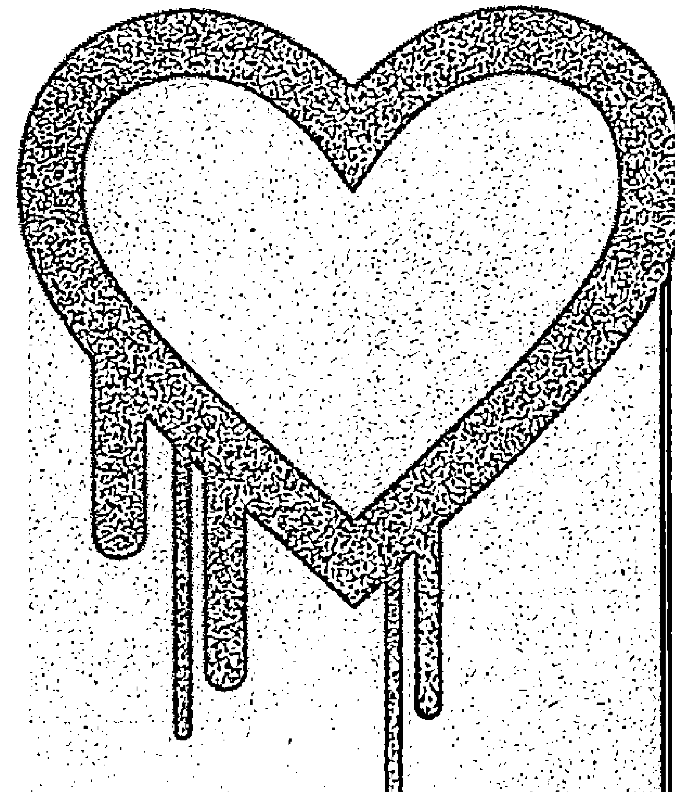

## 心脏出血——都有哪些“出血点”

文 | 深度

### 什么是心脏出血漏洞

心脏出血漏洞可以导致受影响设备中的内存数据溢出，黑客利用此漏洞便可以获取随机溢出的64KB“心跳信号”的数据，这些数据中可能包括密码、加密私钥、网站Cookie等敏感信息。虽然每次只能取得64KB数据，但是攻击者可以保持连接，这样就可以一次次取得新的数据。

心脏出血漏洞刚开始是在Web服务器上被曝光，其后波及到思科、瞻博网络，以及虚拟机VMware、私人网络软件OpenVPN等。现在还不清楚Oracle软件是否也受影响，而且可能已扩展到路由器、手机等其他设备上。

### 小知识：心跳信号

双方互联的时候，其中一方每隔一段时间就发送一个数据包给另一方，另一方收到数据包后再确定是否回复。这一机制主要是为了确认在长时间不通讯时，探测双方是否还都在线。因为发送的数据包很小，而且固定频率发送很像心脏的搏动，因此取了这么一个形象的名称。

### 反向心脏出血

心脏出血不只威胁到服务器端，同样危及到客户端程序。一家名为Meldium的账户和密码保护软件公司的负责人表示，此漏洞还可以“反向出血”，套取用户的资料。比如一些恶意网站伪装成正规网站诱骗你访问，然后在你访问时这些恶意网站有可能主动发送心跳请求，如果你使用的浏览器程序（或其他客户端）使用了有缺陷版本的OpenSSL库，那么就会反过来将你内存中溢出的数据发送到恶意网站的服务器上，从而导致信息泄露。

Meldium公司还创建了一个网站，用来在线检测用户所使用的客户端是否存在反向心脏出血漏洞。该网页上有一段说明，“许多组织机构具有发起出站SSL连接的主机（自动更新、获取图像、连接Webhook网址等），这些主机又往往位于防火墙内部，并且因为具有单独的基础架构而依赖不同的SSL，从而很容易遭受反向心脏出血的攻击。” 这家网站列出了易受攻击的客户端，包括传统客户端和开放代理。

4月3日，谷歌安全专家提交了一份针对OpenSSL漏洞的报告，随后于4月7日，OpenSSL宣布有多个版本存在严重内存处理错误，“心脏出血漏洞”浮出水面令世界哗然。据悉国内一些邮箱、社交网络、电商等网站也都受到冲击，约2亿中国网民受影响。虽然各大网站基本上已完成修复，但是这一漏洞于2011年就已渗入OpenSSL中，也就是说这几年来我们一直处于风险之中。我们一度信任的Web服务器、路由器、虚拟机、VPN，甚至客户端软件等都不安全了，即使个人系统上的安全做得再好，也难逃信息泄露的可能。

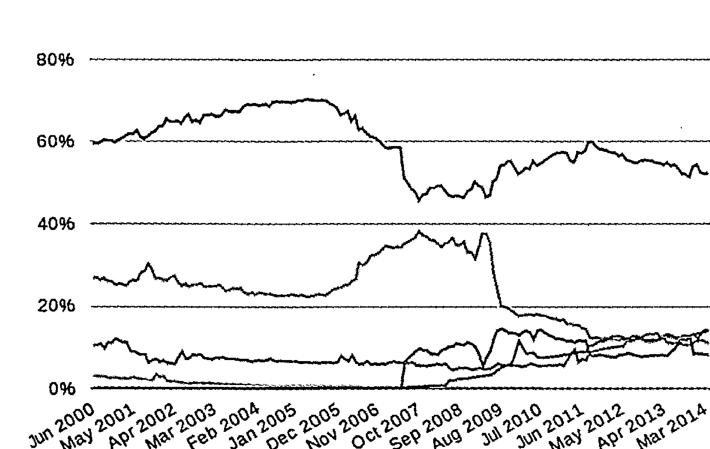

> OpenSSL主要应用于Apache和nginx服务器上，而这两个服务器的综合市场份额达66%，另外许多电子邮件服务器、聊天服务器、虚拟专用网络等也在使用OpenSSL，可见它有多普及

- ★ 传统客户端，包括浏览器，使用HTTP API的应用程序，通过DVD运行的程序（如Office办公软件），以及iOS和Android上的应用。如果还没有更新OpenSSL，它们很可能受到影响。
- ★ 开放代理，指可以被攻击者远程控制的客户端，如社交网络、Dropbox之类的网络共享应用、网页抓取程序等。

一些流行的社交网络的安全性虽然很强大，但是它们的界面却有被利用的漏洞，开放代理可以恶意地诱使你输入某个网址，这种欺骗需要一段时间才能发现。用户往往只盯着服务器的安全，对自身的安全漏洞则关注较少。

### 小心路由器漏洞

公共及私有网络中的路由器，包括家庭使用的路由器，同样容易被攻破。思科多达65种路由器产品已确认含有心脏出血漏洞，其他产品还在评估中。思科公司最受欢迎的产品，包括Webex Messenger、Jabber client、Cisco IOS XR、Telepresence System 1100、Video Surveillance Media Server Software和Unified Operations Manager，都被认为易受攻击。

思科发布警报称，“多款思科产品含有心脏出血漏洞，一些未经身份验证的远程攻击者可能会连接到客户端或服务器上，窃取内存中多段64KB的数据。”

瞻博网络也提醒相关产品的用户受到威胁，不过需要登录账户才能获取信息。

### 敞开大门的虚拟化产品

VMware列出了可能含有心脏出血漏洞的20多款产品，包括ESXi 5.5、vCloud等，涉及网络安全，以及VMware Horizon View（虚拟桌面客户端）。虽然Citrix仍在评估影响，不过他们也对用户提出了相应的警告。

### 心脏出血漏洞带来的反思

只要具有漏洞的OpenSSL版本仍在使用，它的危害就不会停止。现在修订版的OpenSSL已经发布了，但必须部署才能起作用。操作系统供应商及其分销商、家电销售商、独立软件供应商都应该采用这个修复的版本，并且及时通知到用户。

阿姆特尔公司首席执行官PJ Gupta表示，“每家相关的公司都必须修复它，并且一旦修复了代码，就需要及时更换密码。” 不过这样就足够了吗？软件开发者Dave Winer不这么认为，他在博客中写道，“很难想象还有更糟糕的事情正在发生，我觉得我们反应得太慢了。如果这是一个单一的系统受损，正确的做法应该是立即下线，直到修复并验证所有的连接点，确认安全后再重新上线。而这样一边修复一边继续使用网络，实际是很危险的事情。”

对于个人用户来对，我们无力抵挡心脏出血漏洞，现在唯一能做的，就是关注自己所使用的网站服务商是否已升级OpenSSL，然后及时修改自己的账户密码。对于还未修复的网站，最好的方法就是不要登录。

## 反盗版卫士
——互联网版权监测系统解读

文 | 技术宅

最近迅雷与首都版权产业联盟宣布在互联网版权保护领域展开技术合作，正在研发互联网视听作品版权监测系统，推动网络视听内容正版化。不过大家知道现在网络盗版很严重，盗版网站很多，被盗版的内容也很多，那么互联网视听作品版权监测系统是怎么进行甄别和监测的呢？

### 揭开面纱：了解版权监测工作流程

首先我们来了解一下版权监测系统是怎么进行盗版监测和判定的。一般来说，监测系统首先需要建立正版版权数据库。比如对于电影等视频的监测，监测系统从权利人提供的正版节目或者视频网站在播节目中提取以视频画面、声音等为特征值的“基因”，采集后将其保存在监测系统服务器作为版权比对的原始依据。接着监测系统通过网络爬虫、海量视频搜索等抓取各个电影网站播放或者保存的视频文件，提取其视频画面、声音等资源传输到检测服务器进行比对，如果抓取的资源和数据库中某个视频的指标相同（或者一定比例的相符）则判断其为盗版。然后通过抓取网站的联系邮箱向其发送侵权邮件，通知其删除或者提起诉讼，从而完成一个完整的采集、比对、确认侵权的流程（图1）。

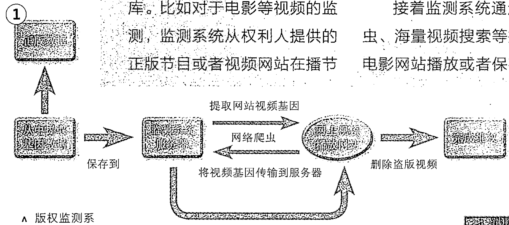

### 侵权认定原理：比对数据

从上面的描述我们知道，认定侵权的一个重要基础就是正版视频“基因”，那么一个视频文件什么元素才可以作为识别“基因”？视频主要是由音频（视频伴音）和每帧画面组成的，因此其中音频文件和图片就是一个视频的正版“基因”数据。

### 1.音频比对

对于音频数据基因的提取，主要是将一段视频伴音（可以是开头、影片高潮片断和结尾音频数据）提取出来，通过软件分析其音频信号源的信号波形，将音频波形数据作为比对源。比如Goldwave就可以轻松获取音频的波形文件，在其中打开音频文件即可知道其波形文件（图2）。这样当网络爬虫获取某个和正版数据库里波形文件相同的音频时，通过比对，如果两个波形文件类似（比如可以通过两个文件同一时间段的峰值分布比对），那么就基本可以判定这个为盗版视频了（图3）。

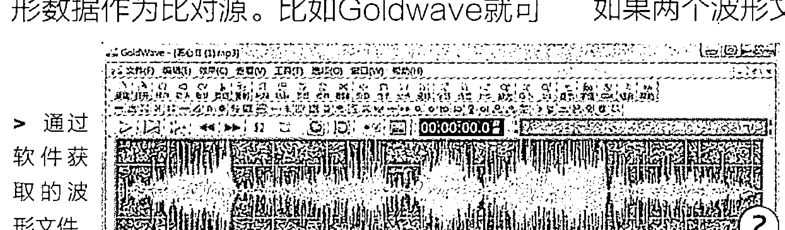


#### 小提示

对于正版视频，现在大多内置DRM（即Digital Right Management，数字版权保护）版权保护，通过颁发许可证的方式保护正版视频不被随意播放。因此如果某个网站播放的视频没有DRM，那么基本上可以判断是盗版视频（至少有嫌疑）。

不过现在很多盗版网站通过伪造许可证，或者重新压制视频方法盗播正版视频，对于这类盗版就只有通过比对视频基因的方法来确认了。

### 2.视频画面比对

对于视频画面，则主要通过提取关键情节帧画面来作为数据源。主要提取开头、影片高潮片段和结尾画面（因为任何盗版网站即使掐头去尾处理视频，也不可能将最精彩的部分去除）。很多软件都可以提取视频所有帧数画面，这样检测系统就可以提取其中特定时间单位（如1秒/帧）的画面作为比对数据库资源。

那么视频画面是怎么进行比对的呢？相信很多朋友都用过搜狗浏览器的识图搜索引擎（即“以图找图”功能），其实监测系统的图片判断功能与此类似。要判断某张图和数据库资源是否相同，首先我们要提取原图的特征数据，比如在识图中常用颜色分布法，它的原理是利用每张图片都可以生成颜色分布的直方图，然后通过直方图进行比较。如果两张图片的直方图很接近，就可以认为它们很相似。

比如我们这里截取优酷正在播放的《产科男医生》1分30秒的一帧图片，用PS打开可以看到图片红黄蓝和RGB的直方图（图4）。

假设这部视频是优酷独家买断版权的视频，现在随即在另外一个视频网站截取同样片段的图片，经过比较大家可以发现它们的直方图是非常相似的（图5）。这样结合音频和视频图片的比较，我们就可以断定某网站在侵权播放《产科男医生》这部视频。

当然上面的例子我们是以手工看图的方法进行比较，在实际操作中，监测系统一般将波形文件转化为数字信息以便于提高比对精度和效率，对于图片的直方图则转化为一个64维向量，然后借助公式快速进行比对。图片识别还会使用内容特征法、感知哈希算法等综合进行判断。另外，借助集群式、分布式服务器，监测系统可以快速处理和比对海量的搜索结果，从而更有效地对网上盗版进行打击。


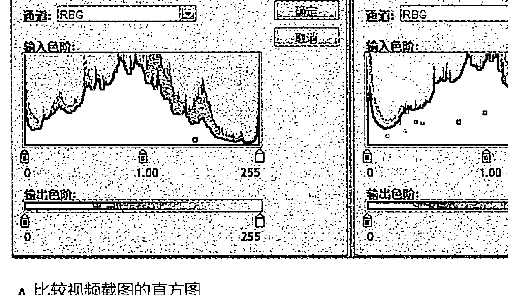

### 网络反盗版任重而道远

大家都习惯免费使用互联网上的各种资源，为了迎合大家的需要，互联网上有成千上万的网站在提供各种盗版服务。一方面，版权监测系统要完全监测出所有盗版基因并不现实，另一方面即使监测某网站侵权，很多网站也会通过“避风港”原则合理地“纵容”盗版。因此，互联网盗版与反盗版斗争仍然任重而道远。

不过，互联网版权监测系统的出现仍然可以有效遏制网上盗版，而且随着大家版权意识的提高和相关法律法规的健全，互联网上的盗版资源也会越来越少。作为用户，我们也应该养成“我用正版我光荣”的理念。

## 移动上网的那些烦心事

文 | 俞木发

现在使用手机和平板上网的用户越来越多，在日常上网的过程中总会遇到各种各样的问题。那么这些问题又是如何产生的？又该怎么去解决这些问题？这期的移动攻坚战，我们就一起来聊聊移动上网那些事。

### 小知识

### 手机是怎么上网的

大家知道，我们平时电脑上网的方式主要有两种，一种是借助调制解调器+网卡实现拨号上网，比如常见的ADSL拨号上网，另一种则是借助路由器（交换机）+网卡的方式实现。手机的上网和电脑也是类似的，它也是借助手机内置调制解调器+内置网卡实现，只不过2G、3G、4G使用不同的调制解调器，所以普通2G手机无法使用3G速率上网。手机Wi-Fi上网则是借助无线网卡+Wi-Fi热点实现。因此手机上网很多设置和电脑其实是一样的（图1）。

### 移动上网要省钱 流量节约有高招

目前大家用手机上网，主要是包流量套餐和接入WLAN上网。现在手机的网速越来越快，应用块头也越来越大，一不小心就会超出流量给我们造成不小的损失。WLAN上网则使用计时方式，如果忘记断开连接同样会造成额外网费支出。因此我们需要采取有效的方式来控制手机上网的流量和时间。

如果要节约上网流量，我们主要需要控制手机前台和后台的网络程序，前台如QQ、UC浏览器、视频播放等网络程序。由于这些网络程序开启后会联网耗费套餐流量，因此在使用完毕一定要完全退出，比如UC用户，正确退出方法是点击“菜单→常用→退出”，而不是直接按主页按钮允许其继续在后台运行（图2）。

此外，很多程序本身也提供省流量的设置，我们可以根据自己的需要进行更多省流设置。比如UC用户，进入其“设置→基本设置”，可以设置网页图片显示为“低彩”或者“无图”以节约图片造成的流量损失，进入“高级设置”，则可以勾选“仅Wi-Fi”下载，避免在3G网络下载造成的损失（图3）。

除了前台程序，很多应用还会在后台耗费流量。比如通讯录自动同步、邮件客户端自动下载邮件、输入法词库同步等。

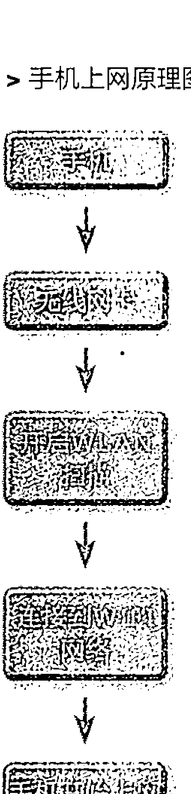


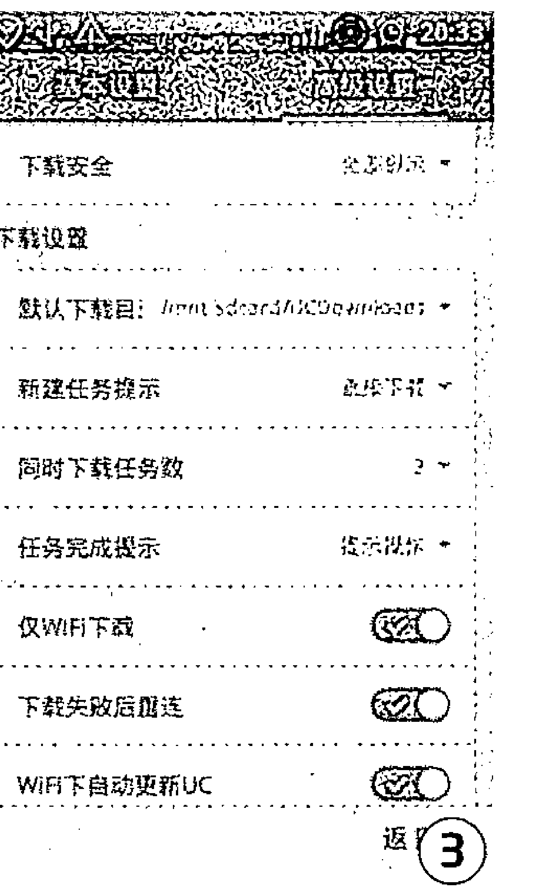

> **小提示**
应用和系统默认设置同样会耗费大量的流量，大家一定要根据自己的实际需要进行设置。比如QQ可以关闭聊天时不接收图片、屏蔽QQ群消息，搜狗输入法设置在不自动更新字库、视频播放软件设置只有在Wi-Fi下才允许在线播放，对于常见的后台服务则建议耗费流量大的全部关闭。

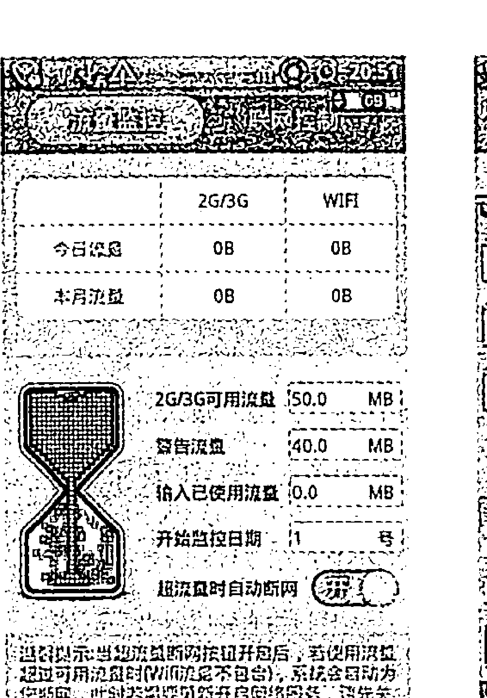

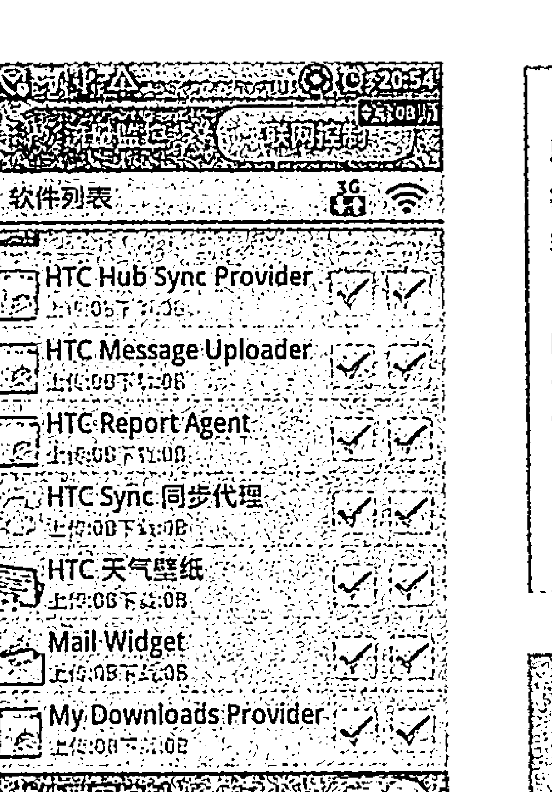

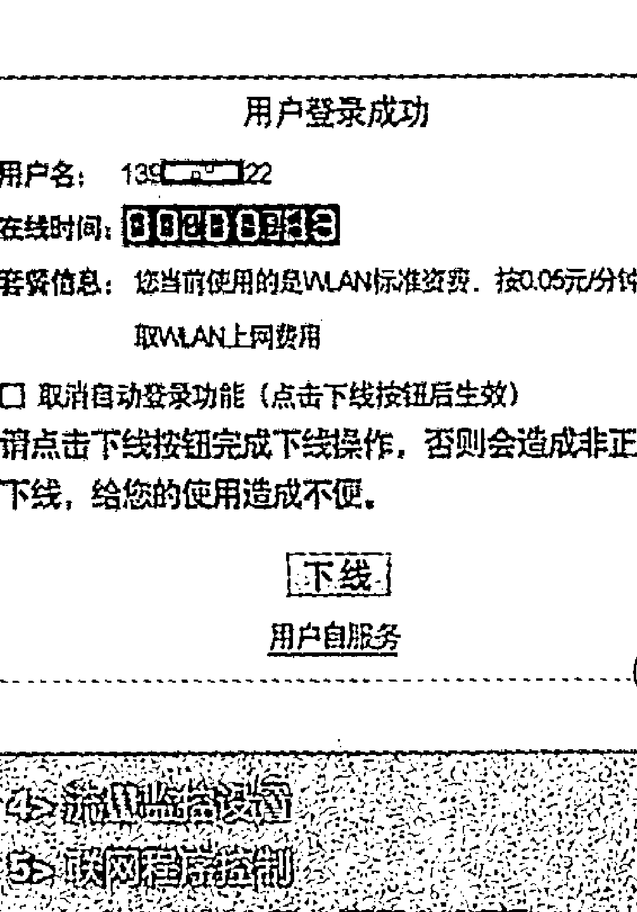

对于这些程序，我们可以借助“流量管家”进行控制。启动应用后切换到“流量监控”，根据自己实际的流量套餐进行设置，同时勾选“超流量时自动断网”（图4）。

切换到“联网控制”，根据自己的需要设置每个具体应用联网权限即可（可以设置是否使用3G和Wi-Fi）。比如HTC Sync代理，在3G情况下即可取消其联网权限（图5）。

此外，现在智能手机都支持手机模拟热点，此时共享上网的用户耗费的是手机3G流量。为了节省流量，可以进入“设置→无线和网络→便携式热点设置→管理用户”，根据实际需要将连接的上限设置为2个～3个用户，同时根据连接手机网卡，设置允许连接的MAC（图7）。

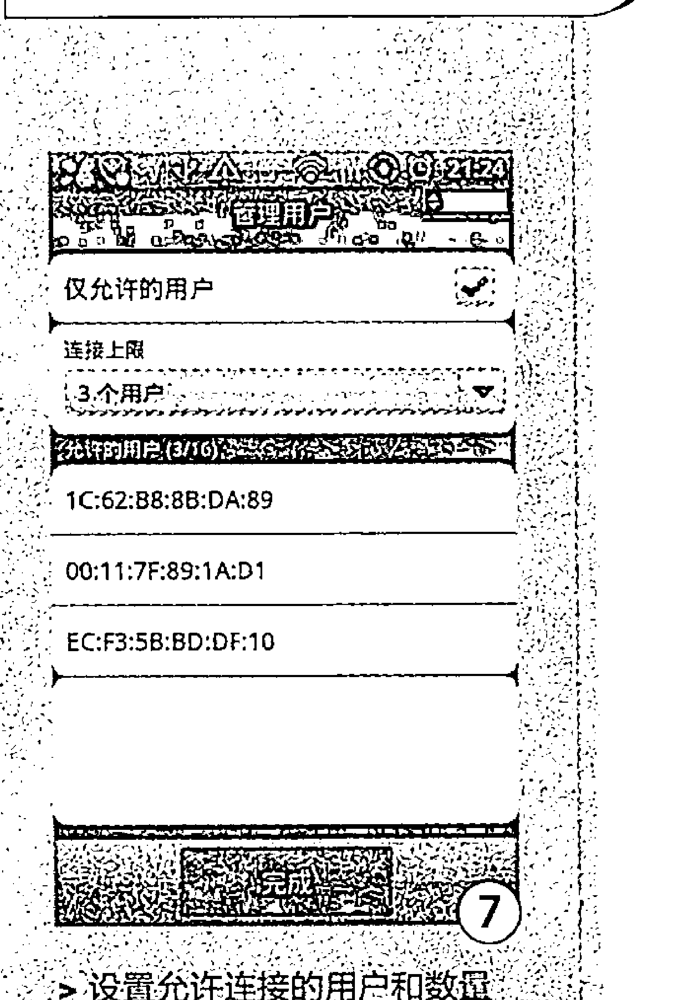

### 移动上网也要清爽 手机上网屏蔽广告

随着手机等移动设备上网的普及，越来越多的网络广告也扑面而来。由于手机等移动设备屏幕本来就较小，硬件配置也较低。网页上各种广告的出现不仅耗费手机有限资源，同时也给浏览带来诸多不便。下面我们就以火狐为例，介绍如何屏蔽移动网页的广告。

网页广告的屏蔽可以使用火狐ABP插件实现，首先在移动端启动火狐浏览器，点击“菜单→更多→附加组件→浏览全部附加组件”，然后输入ABP查找该组件并安装（图8）。

重启火狐浏览器，点击“菜单→更多→附加组件→ABP”，然后启动该组件，过滤规则订阅组选择ChinaList+EasyList，这样浏览器就可以很好地屏蔽广告了。

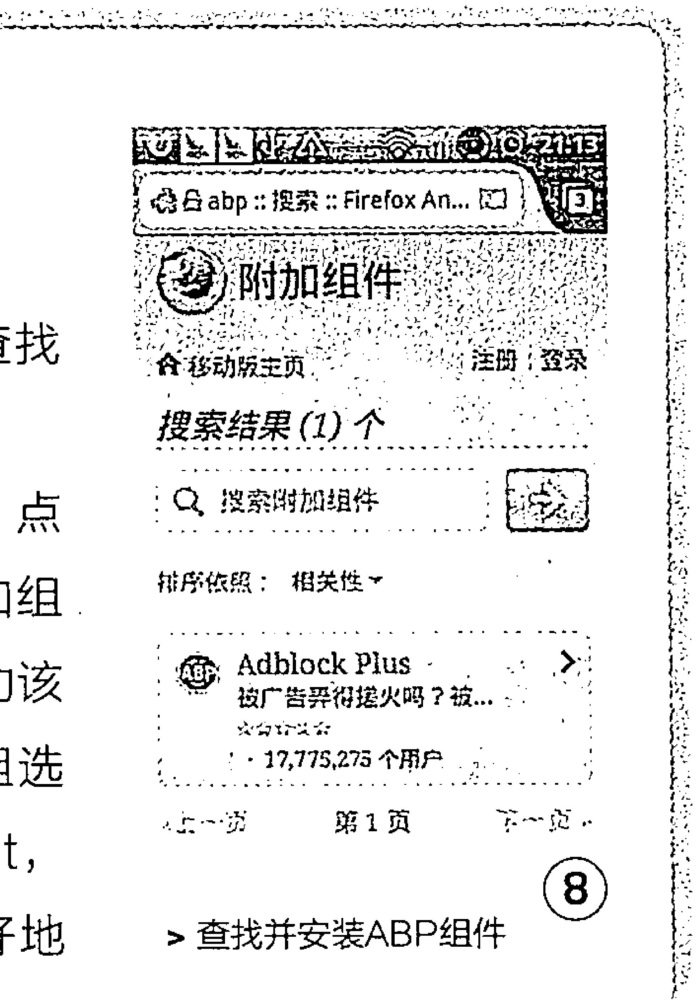

拦截广告了（图9）。现在很多人喜欢在平板上直接访问电脑版的页面，启用ABP广告拦截后，访问原来的网页，广告就全部被拦截了，大大提高了浏览速度（图10）。

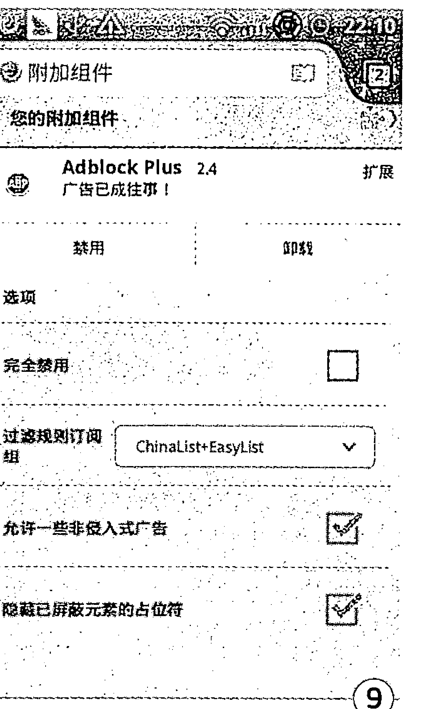

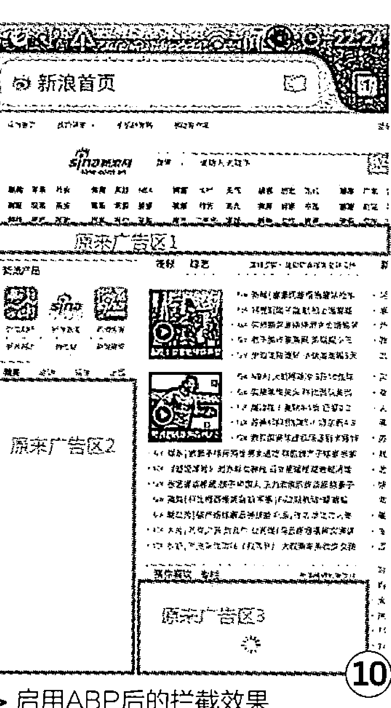

### 掌上游戏也急速 手游上网玩加速

随着手机硬件的提升，现在很多人把手机作为游戏设备，手机网游已经成为很多用户的休闲方式。不过由于手机网络限制，要想更畅快地玩游戏，还需要对网游进行加速。网游加速可以使用VPN连接，大家可以到 http://www.lindw.com/12.html 申请试用账号。依次展开“设置→无线和网络→更多→VPN→添加VPN网络”，接着在“类型”选项中选择PPTP，取消PPP加密。接着按照向导提示新建一个VPN连接（账号和密码可以使用上述试用账号），以后使用这个VPN连接就可以加速网游了（图11）。

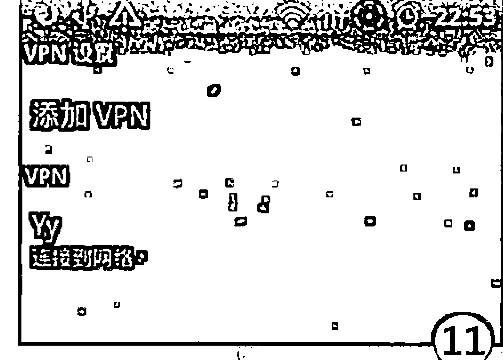

### 连接不断网——手机上网没有后遗症

在很多时候，我们需要网络一直处于连接状态，比如在后台挂QQ或者下载的时候，但是手机本身默认设置会自动断开网络。因此为了方便自己上网，我们可以设置手机网络一直连接。Android移动网络的用户，只要展开“设置→无线和网络→移动网络设置”，然后勾选“启用始终连接移动数据”即可。需要注意的是，这个设置可能会耗费你更多的电量和流量。对于WLAN连接的用户，如果离开成功连接的页面，默认也会断开当前连接。因此如果在使用WLAN连接下载应用，可以使用UC浏览器多标签浏览，保存正常连接的页面，其他下载则在新标签页中打开。对于连接电脑Wi-Fi的用户，则可以“设置→无线和网络→WLAN设置”，点击“菜单→高级”，将WLAN休眠策略设置为“从不”，这样在锁屏的时候，我们仍然可以继续Wi-Fi连接（图12），从而也能避免使用Wi-Fi下载时，因休眠产生大量3G流量的悲剧。

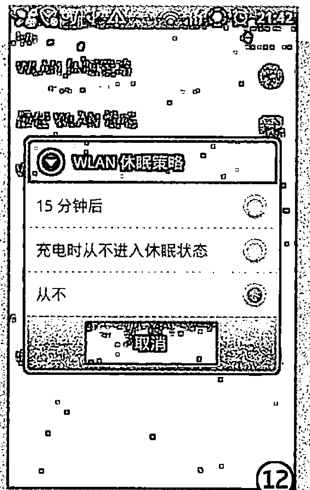

### 手机上网其他常见问题QA

-   为什么我的Android手机和平板都无法直接播放网页内嵌的Flash视频？

Flash页面的播放需要Adobe Flash Player的支持，Android用户可以到 http://www.appchina.com/app/com.adobe.flashplayer/ 下载安装，安装该插件后就可以正常观看Flash视频了（图13）。

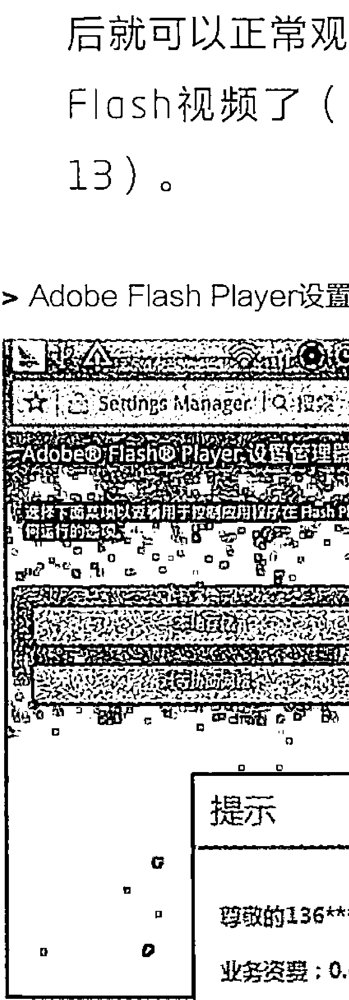

-   我的手机是给老爸老妈专用的，他们根本不会使用手机上网，如何将手机上网功能关闭？

对于没有上网需求的用户，可以手动将手机的上网功能关闭。这里以福建移动的用户为例，登录 http://www.10086.cn/fj/ 后，切换到“我的移动→上网功能”，依次将“手机互联网”和“MO上网开关”全部设置为“已关闭”即可（图14）。

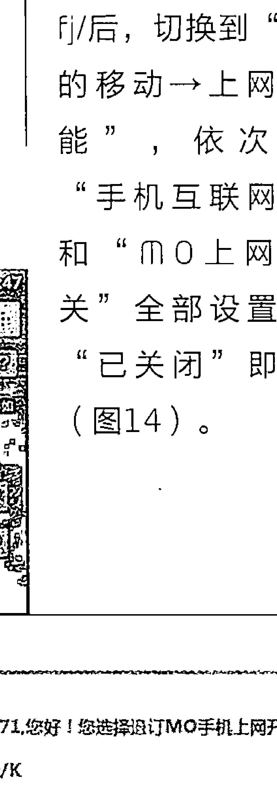

-   我的手机经常被儿子拿去玩网络游戏，一不小心就产生高额订购费用，该怎么解决？

现在很多网游是和移动运营商合作，当我们在网络游戏界面点击“购买道具”或“订购XX”，手机立刻会在后台自动发送短信完成订购。如果要规避这种额外费用的支出，大家只要拨打10086转人工服务，让运营商的客服MM将这种手机支付功能关闭即可。

-   我的手机上网套餐是每月50MB的WAP套餐，有时候不小心上了NET接入的网站，这样会产生额外上网费用，该怎么解决？

很多运营商的手机上网套餐是区分WAP和NET接入点的，一般套餐都只是WAP接入点，而手机默认出厂设置也内置这两种接入点。我们只要删除其中NET接入点即可避免额外费用的产生。Android用户依次展开“设置→无线和网络→移动网络设置→接入点”，点击“菜单→编辑”，将所有接入点全部更改为WAP即可（图15）。

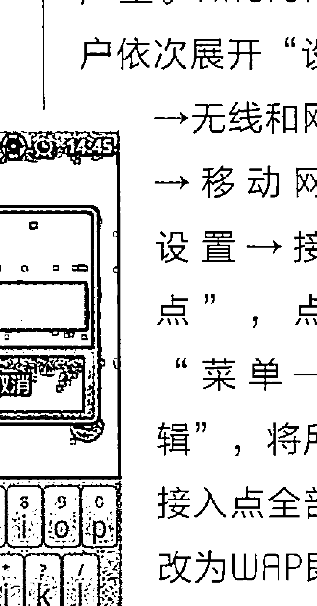

-   平常在公共汽车上使用手机上网，速度非常缓慢，打开一个网页需要半天时间，怎么加快手机上网速度？

如果你的手机网络速度较慢，可以使用“无图”模式来浏览页面。比如UC用户只要点击“菜单→设置→无图”即可切换到无图模式，这样既可以加快打开网页的速度，还可以节约手机流量（图16）。

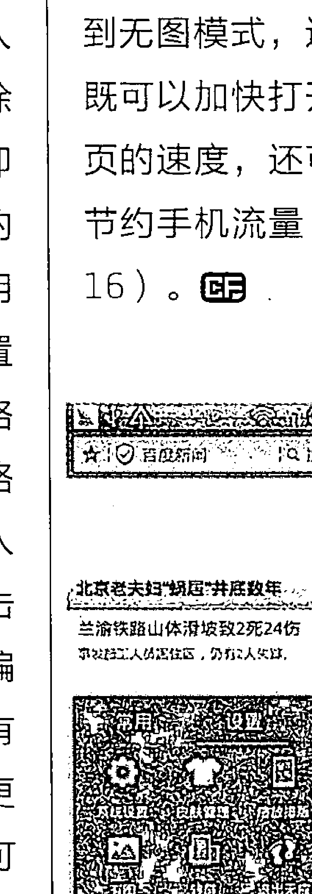

## 移动数据 交换无障碍

文 | 俞木发

在平时的操作中，我们经常要在手机/平板和电脑、手机和手机之间交换数据。由于手机和电脑使用的平台不同，因此在进行数据交换的过程中总会出现这样那样的问题。那么，移动数据交换中遇到的各种难题如何解决？

### 操作系统扫盲——各平台数据交换为什么会有难度

由于手机操作系统Android、iPhone和WP8系统核心和文件系统都不同；使用的文件系统互相并不兼容，所以默认情况下不同平台之间的设备是无法实现数据直接交换的，比如

| 系统核心 | 文件系统 | 应用格式 |
|----------|----------|----------|
| WP8      | Win8     | .xap     |
| Android  | Linux    | .apk     |
| iPhone   | iOS      | .ipa     |

解决不同平台的数据交换障碍方法主要有两种：一是在一个平台下安装另一个平台的驱动。二是利用各个平台都支持的统一协议实现彼此之间的互访。比如现在手机都有蓝牙功能，利用蓝牙协议也可以实现不同平台之间的数据交换。

### 三大手机平台和Windows间的数据交换

-   ① Android、iPhone（包括iPad）和Windows

对于使用Android、iPhone的用户，在两个平台之间安装91手机助手就可以实现彼此之间数据交换了。Android、iPhone手机操作类似，这里我们以Android平台为例。91助手是通过安装驱动的方法实现Android和Windows文件系统之间互访的。在电脑上安装91手机助手并连接手机后，会自动识别Android手机并下载安装驱动（图1、图2）。电脑端的91手机助手还会通过数据线将手机端的91助手安装到手机上。完成连接后，有无线路由器的用户就可以脱离数据线，启动手机端91助手，点击“菜单→”

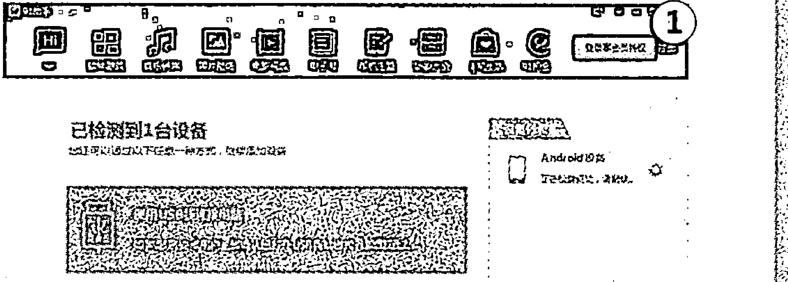

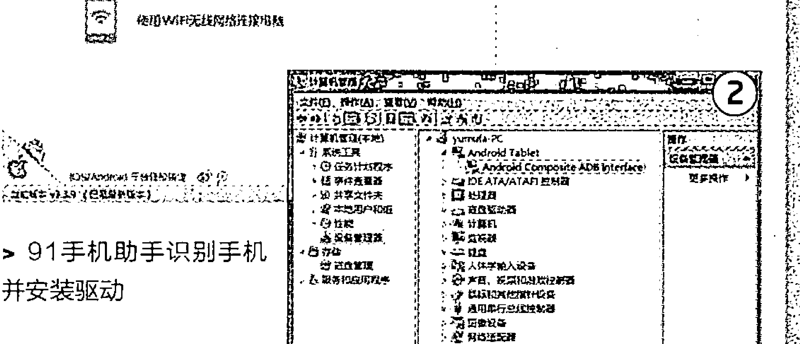

> 91手机助手识别手机并安装驱动

> 成功安装Android驱动

电脑连接”获得无线连接验证码（图3）。返回电脑端点击“连接→使用验证码进行连接”，输入手机显示的验证码就可以和手机无线连接了。成功连接后即可在电脑上安装、卸载或者升级手机应用、互相传输文件了（图4）。

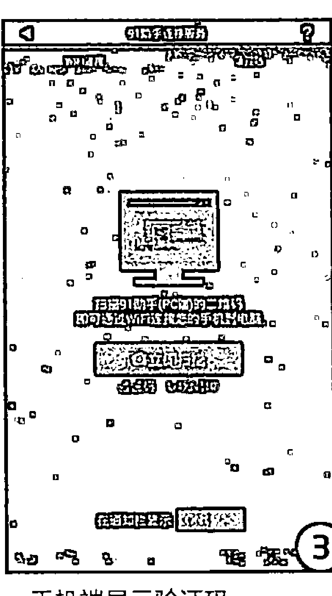

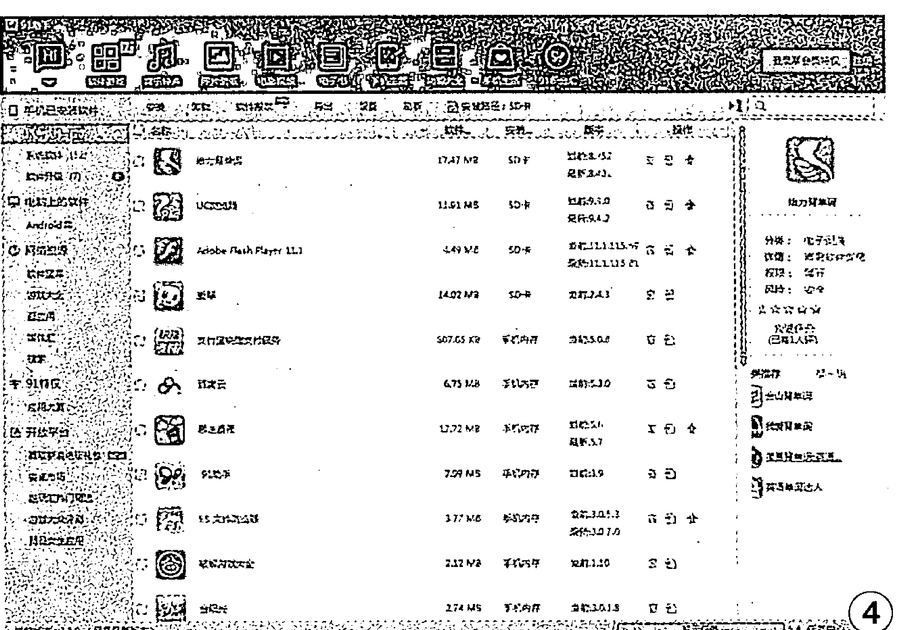

-   ② WP8手机和Windows

由于WP8也是微软开发的操作系统，因此WP8手机和Windows系统相连之后，系统会自动在后台搜索并下载最新的驱动，完成驱动的安装后打开“计算机→便携设备→Windows Phone”即可交换数据了（图5）。

> WP手机可以直接和Windows交换数据

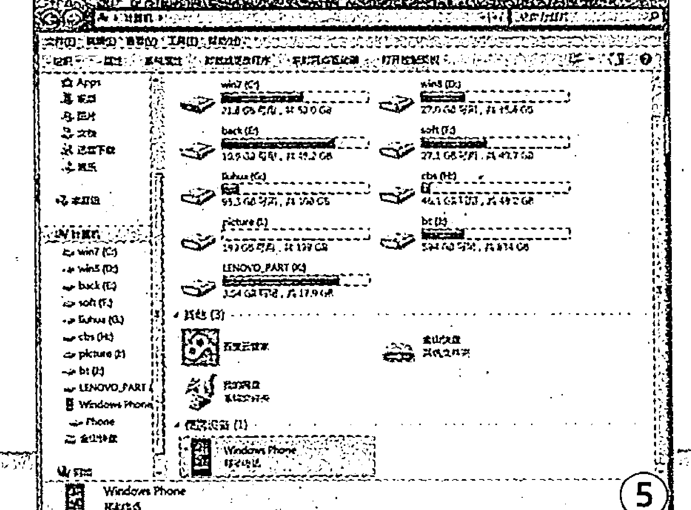

-   ③ 手机、电脑直接互访

在很多时候，我们可能并不方便在电脑上安装客户端，比如很多公司电脑上就不允许安装和工作无关的软件。这时，利用一些通用的共享协议，我们也可以实现在手机上直接访问电脑数据。比如Android和Windows都支持SMB协议，利用Samba Filesharing即可实现互访。

首先到 http://dwz.cn/cfan201401 下载Samba Filesharing（以下简称为SF）并安装到手机上。

在手机上启动SF后，在电脑上启动程序后点击“Menu→Setting”，依次点击Password、Username、Workgroup Name，分别设置从PC访问Android平板共享目录的密码、用户名和共享组名（图6）。

完成上述设置后，再次点击“Menu→Enable”，SF会自动开始设置Android平板上SD卡和内存盘的共

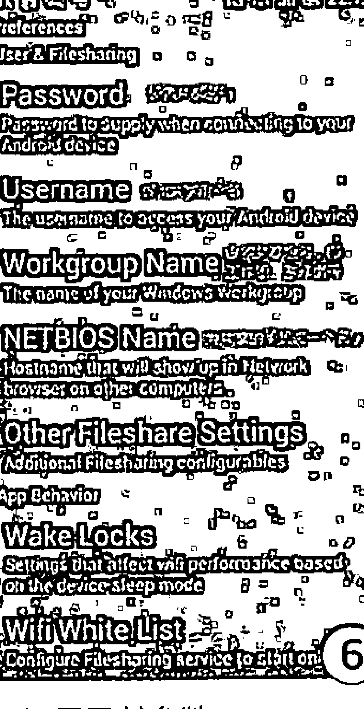

> **小知识：什么是SMB协议**
SMB（Server Message Block）通信协议是微软（Microsoft）和英特尔（Intel）在1987年制定的协议，主要是作为Microsoft网络的通讯协议。由于使用Windows的PC已经支持SMB协议，因此利用SMB协议，我们无需在Windows再安装额外软件就可以实现互访了。Android系统只要安装一款支持该协议的应用，就可以实现Android平台和Windows之间的互访。

享。此时在手机屏幕上会显示共享的IP地址，类似\192.168.0.106（图7）。

现在只要在电脑资源管理器地址栏输入“\192.168.0.106”回车，就可以看到手机上共享的内容了（图8）。

这样无需在电脑安装任何软件，就可以在电脑和手机之间直接交换数据了。如直接将手机拍摄的照片复制到电脑上，或者将下载好的APK软件直接复制到手机上，在手机上安装应用（图9）。

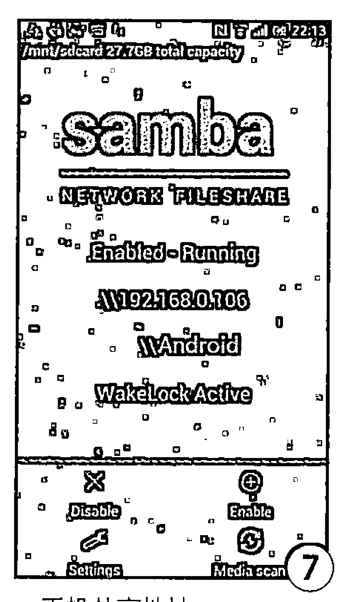

> 小技巧
WP8手机用户可以先在电脑上将需要共享的数据放置在电脑端的SkyDrive，然后利用手机内置的SkyDrive直接访问。iPhone也支持SMB协议，具体使用可以参考 http://www.52cydia.com/debs/77.html 的介绍。

> 手机共享地址

> 直接在电脑上访问手机共享内容

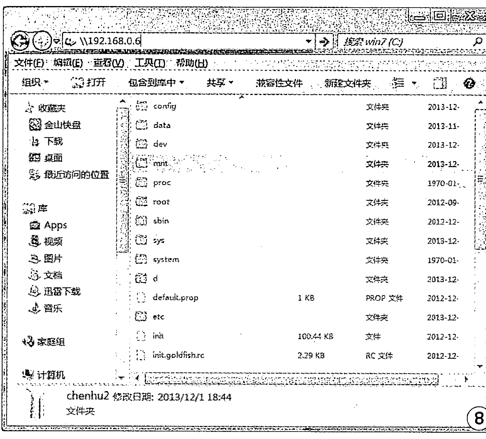

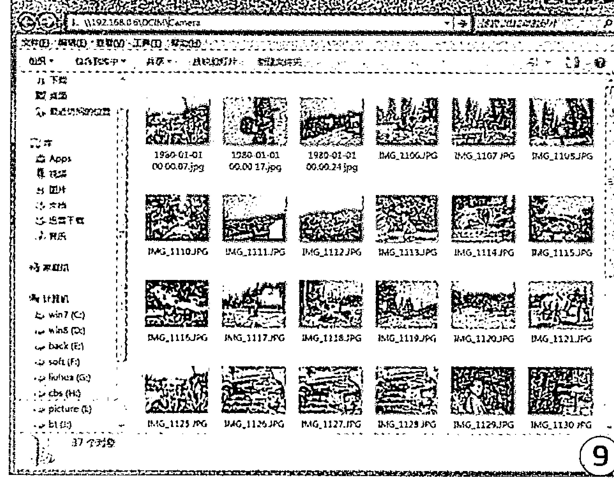

> 在资源管理器直接将手机上的照片复制到电脑上

### 手机和手机之间的数据交换

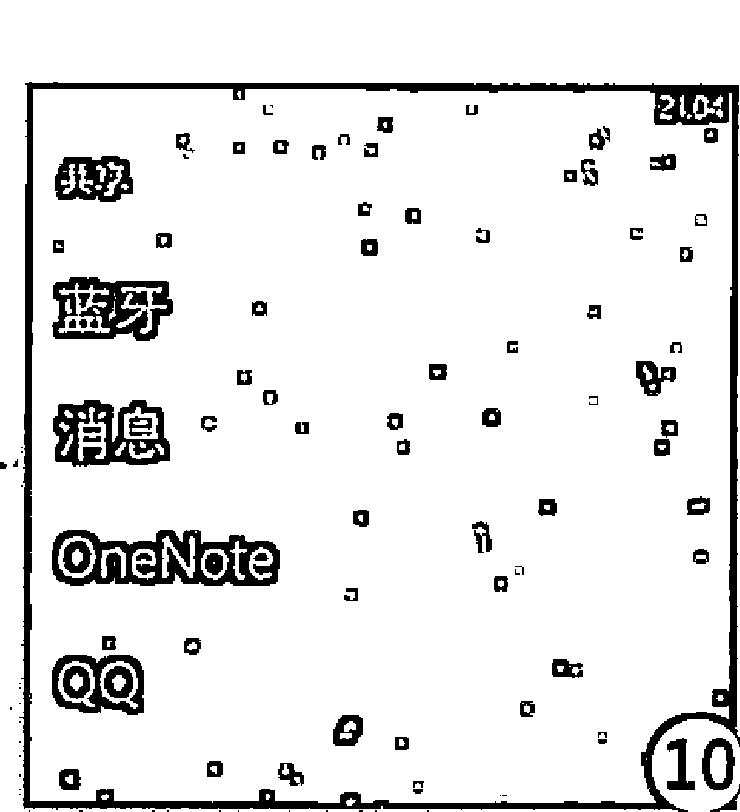

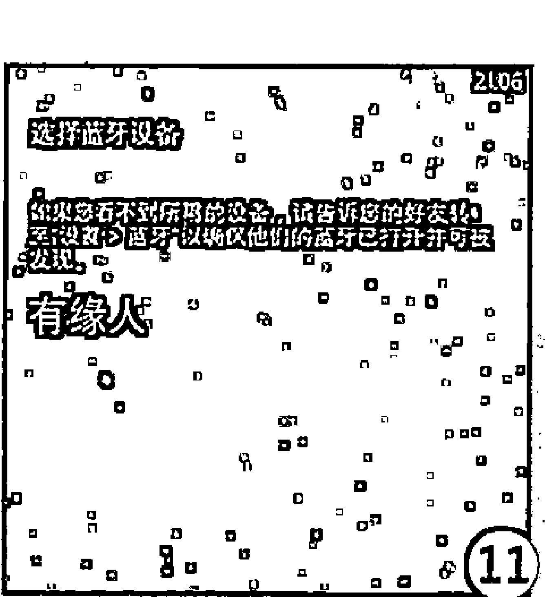

> 开启蓝牙

> 蓝牙传输数据

除了电脑和手机之间的数据交换，我们经常还要在手机和手机之间交换数据，比如将自己手机上的精彩图片传输给好友共享。

-   ① 最简单的交换方法——蓝牙交换

适用：所有带蓝牙的手机（系统平台不限）

现在的蓝牙已经成为手机的标配，手机和手机之间通过蓝牙进行数据传输是最简单的方法了。蓝牙的使用很简单，只要两部手机都开启蓝牙设置，进行蓝牙搜索，在搜索列表选中手机进行配对，配对成功后即可进行文件的传输。比如WP8手机需要传输照片，打开相册找到需要传输的照片，然后点击“菜单→共享→蓝牙”（图10）。

启动蓝牙后在传输列表选择需要传输的手机，接收方手机同意接收文件后就可以开始传输文件了（图11）。

-   ② 最快的传输方法——无线传送

适用：Android和Android、Android和iPhone、iPhone和iPhone

-   ③ 最简单的传输方法——网络传输

适用：可以接入网络的手机（手机平台不限）

蓝牙传输速度较慢，只适用于小文件的传输。现在借助“闪传”可以实现Android和iPhone两平台手机之间的数据传输。首先到 http://www.flashtransfer.cn/ 下载适合自己的客户端，在手机上启动闪传后如果想传东西给朋友，点击“创建热点”，将自己的手机变为路由器等待对方的连接（图12）。

需要接收数据的手机同样启动闪传，然后开启WLAN连接到发送数据的手机热点上，这样发送数据的朋友只要选择需要传输的文件，然后按住选择“发送”即可（图13）。

闪传可以实现Android和iPhone手机之间的数据传输，但如果我们要在Android和WP8或WP8和iPhone之间传输数据，闪传就无能为力了。不过利用网盘同样可以实现不同平台之间手机的数据传输。比如Android、iPhone、WP8都支持SkyDrive网盘，这样我们只要将需要共享的文件放置在SkyDrive，在手机上安装对应的SkyDrive客户端就可以实现共享了（图14）。

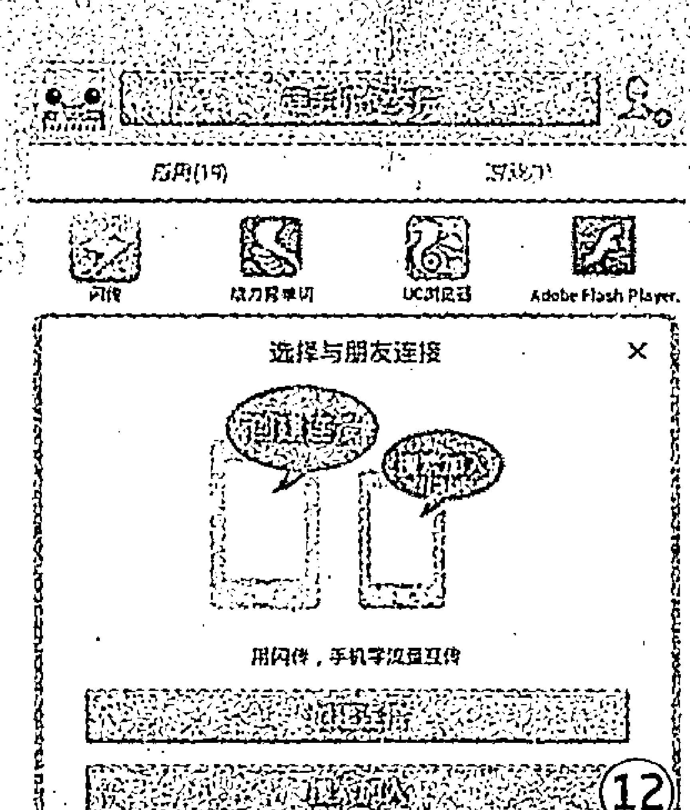

> 创建热点等待连接

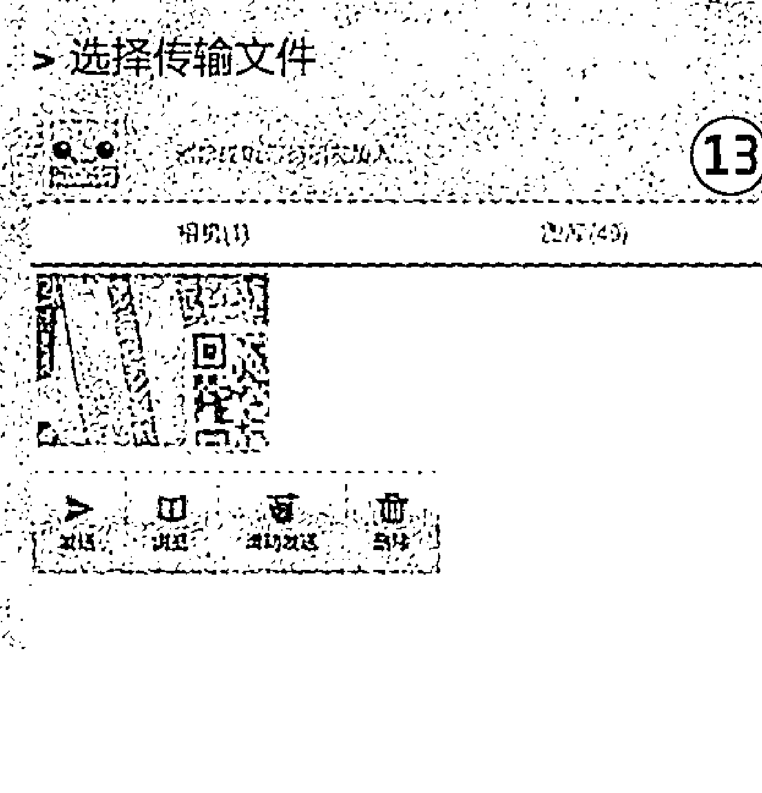

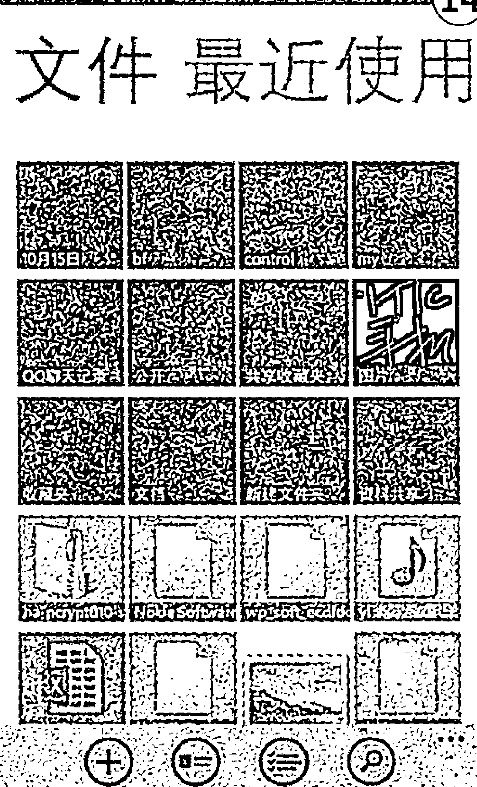

> 在手机上访问SkyDrive网盘内容

> **小知识：闪传是怎么实现手机之间数据传输的**
在使用闪传的过程中，其中一部手机要模拟为热点，然后另一部手机连接到该热点上，两部手机组成一个局域网，通过手机的无线Wi-Fi热点进行路由式的连接，实现无流量传送文件。它的原理就类似我们常见的Windows网上邻居，利用网络进行数据传输。

### 移动数据传输 有章可循

在三大手机系统中，Android最为开放，用于数据交换的应用也最多，iPhone次之，对应的应用也不少。因此对于这两大系统，我们一般到应用市场下载相应的应用则可以解决数据传输难题。相对而言，WP8则显得极为封闭，WP8平台甚至连文件管理的应用也无法开发。因此WP8手机和其他设备之间数据交换就显得比较麻烦，我们只能利用一些统一的协议来进行传输，硬件方面可以使用蓝牙/红外设备，软件方面则借助网络，如网盘、邮件、FTP服务器等来实现数据的传输。

## 旧而不废 老手机自有新用途

文 | 飞雪散花

智能手机的更新换代可谓频繁，对于淘换下来的旧手机，你会怎么处理呢？直接扔到垃圾箱里，还是到小商小贩的手里去换个不值钱的盆盆罐罐？其实老手机自有新用途，不信往下瞧！以下我们均针对Android系统手机来讲说。

### 节能低碳 打造专用磁力下载机

磁力下载费时费电，其实如果我们手头有部较老的智能手机的话，我们完全可以将其和U盘、移动硬盘等大存储移动设备结合起来，打造成一部下载专用机。这样，电量省了，而且不占用PC，可谓一举两得，何乐而不为？

要达到这个目的，我们必须具备两个条件，一是需要准备一根用于连接手机与U盘、移动硬盘的OTG线，由于移动硬盘需要额外供电，所以购买的OTG线应该自带电源接口（图1）；二是需要一款可自定义保存路径的APP磁力下载工具，以便我们能将下载的文件直接保存到U盘或移动硬盘中，如tTorrent Pro（下载地址：http://www.mumayi.com/android-104437.html）。两个条件具备，接下来，我们就可利用tTorrent Pro来进行下载了。

安装后启动tTorrent Pro，在其主界面中，点击右上角的竖条状按钮，在出现的菜单中选择Settings（设置），进入相应的界面。点击Misc. settings（杂项设置）栏中的Directories（路径）项（图2），在接下来的界面中点击Set save directory（设置保存路径）项。点击上方的路径栏，在出现的菜单中，选择路径为“/”（即根目录），进入相应界面，选择mnt文件夹（图3）。在其中找到并点击代表移动硬盘或U盘的文件夹（一般为USBDrive），然后点击界面下方的Select（选择）按钮，将U盘或移动硬盘设置为程序默认的下载保存路径。以后要下载文件时，只需在软件主界面中点击放大镜状图标，输入想要下载的文件名称，相应的种子文件就出现了（图4）。其中除了文件的版本、大小等基本信息外，还包括Seeders（种子）和Leechers（正在下载者的数量）等信息。

tTorrent Pro内置了13种搜索引擎，足以满足我们的要求。

点击要下载的种子，在出现的界面中点击Download（下载）按钮，该种子即会被下载下来，种子下载完成，程序会自动下载相应的文件，是不是非常方便？

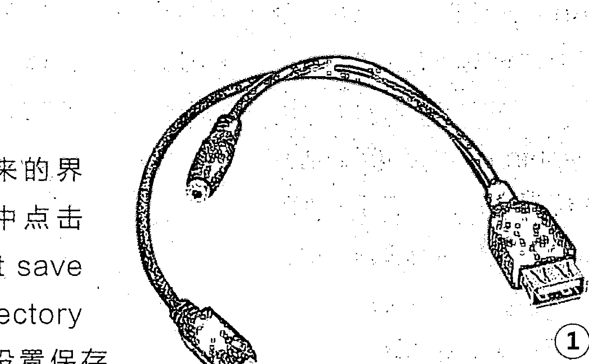

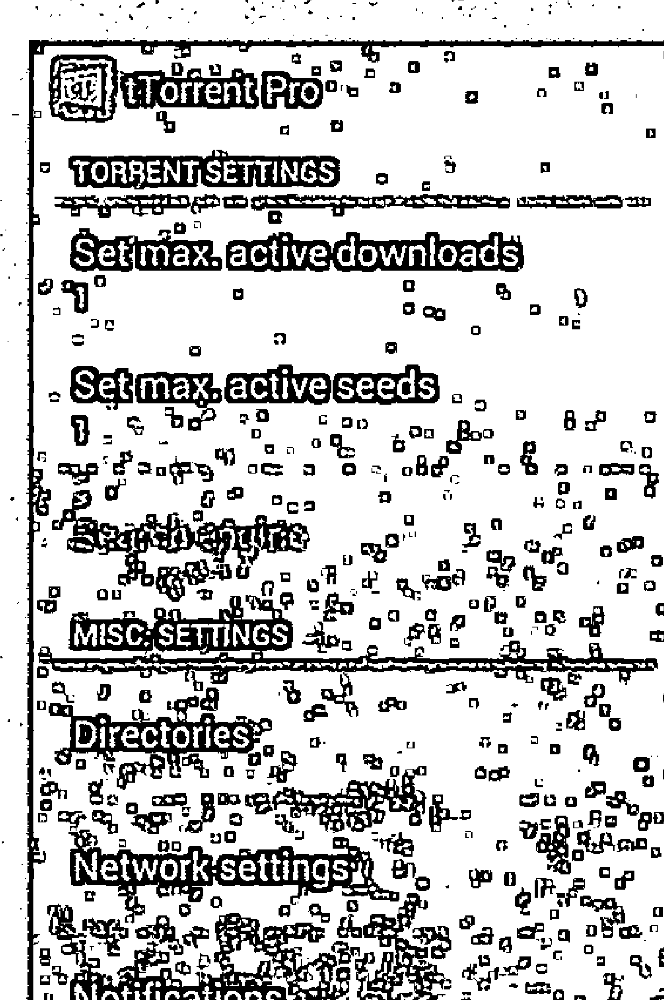

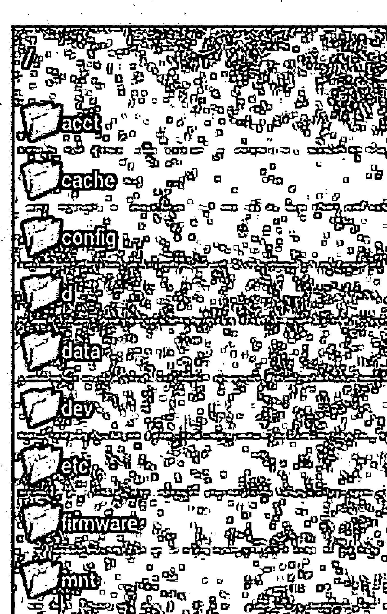

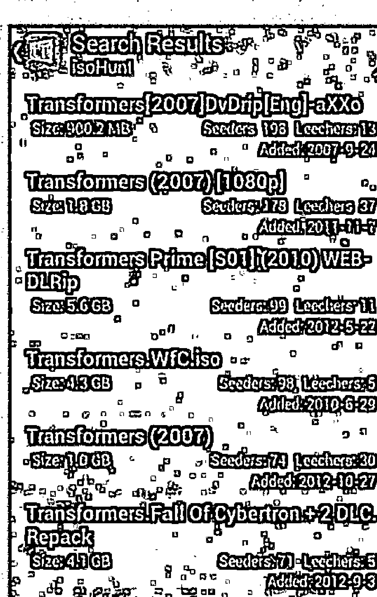

### 方便实用 打造智能遥控器

目前，许多家庭可能会同时拥有多部智能电视产品，比如智能电视和智能机顶盒等，通常要遥控这些设备，需要使用厂家专门提供的遥控器才行。这样，多台设备就需要多个遥控器来控制，操作起来非常不便。其实如果智能电视产品使用的是Android系统的话，我们完全可以通过在旧手机中安装一款名为Agile Remote的应用（下载地址：http://www.onlinedown.net/softdown/249309_2.html），将其打造成可随意控制多台智能电视的万能遥控器。

在智能电视和盒子中安装Agile remote server（服务端）并启动，启动后，在其主界面中点击Settings（设置）按钮，进入相应的界面。在这里，我们可看到程序已自动侦测到电视或盒子分配的IP地址，并将其显示在IP Address（IP地址）栏中。

在手机中安装Agile remote client（控制端），启动后，在其主界面中点击AgileRemote右侧的红色按钮，程序会自动检测当前启用了服务端的设备的IP地址，并将其显示在Select MovieBox（选择视频盒）列表中（图5）。

点击要控制的设备，待连接成功后，我们就可以通过点击主界面左上角的方块状图标，然后在出现的菜单中选择相应的命令（图6），对智能电视或机顶盒随心所欲地进行控制了。菜单中显示的命令及其作用包括：

- Video（视频）：选择该命令后，可在随后出现的界面，通过点击相应的功能，对视频进行暂停、播放、上一个节目、下一个节目及音量调整等操作（图7）；
- Navigation（导航）：与一般智能电视和盒子提供的九键遥控器类似，通过它，可对智能电视和盒子等实现遥控操作（图8）；
- Touch（触摸）：选择后，在出现的界面中，可用手指的动作来模拟鼠标操作。其中鼠标指针的快慢速度程度，可通过拉动Speed栏中的滑块自行定义；
- Gyroscope（陀螺仪）：玩体感游戏时，可通过选择该命令，将手机模拟成一款性能不错的游戏手柄；
- TextInput（文字输入）：输入文字，浏览网页输入网址或进行文档编辑等，可用到该功能。

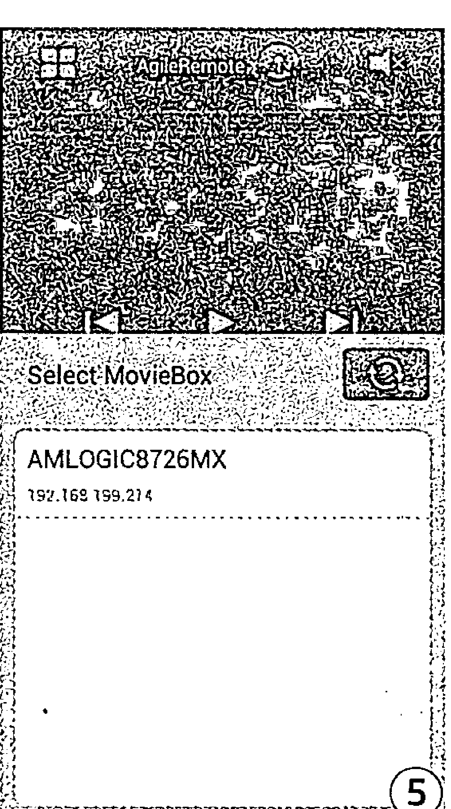

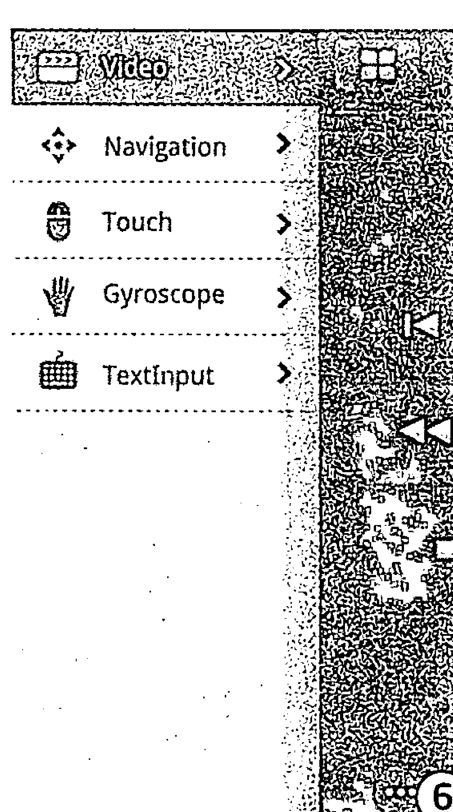

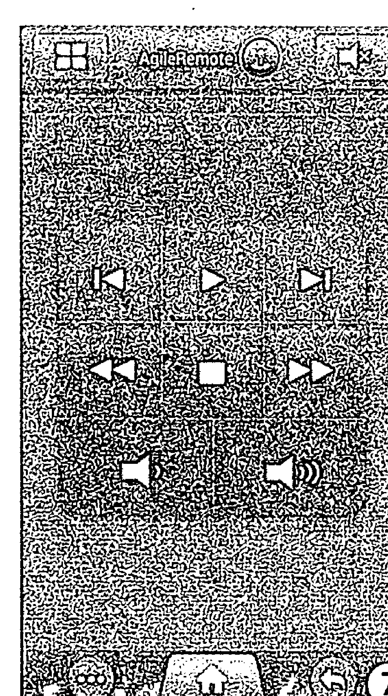

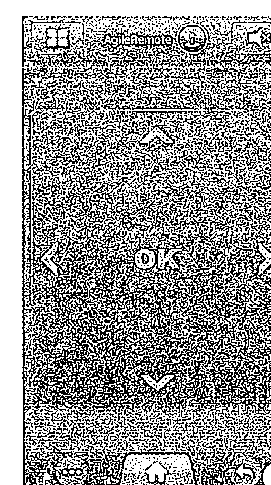

### 注重安全 打造室内监控器

上班族整天不在家，家中的安全问题就成了他们时刻惦记的大事。那么，我们是否可以利用现有的旧手机及随时带在身边的新手机，打造出一套完整的视频监控系统呢？答案是肯定的，我们可以借助“掌上管家”和“掌上看家”（两者的下载地址：http://www.ichano.cn/kanjia/download.html）两款工具来实现。

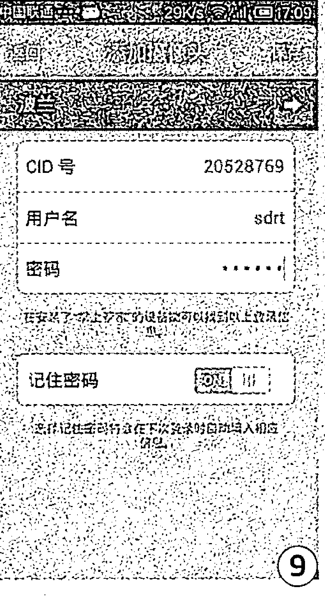

在旧手机中安装“掌上管家”并运行，单击“开始体验”按钮，进入程序主界面，在这里我们会发现系统已自动为本机分配了CID、用户名和密码等信息（图9），记下它，将手机固定，使手机镜头正好可监视到室内情况，同时，为防止手机因为没电而中断监视，使其保持充电状态。

在新手机中安装“掌上看家”，运行后，点击“注册”按钮，在出现的界面中，输入邮箱、密码等信息，注册成为其用户（图10）。

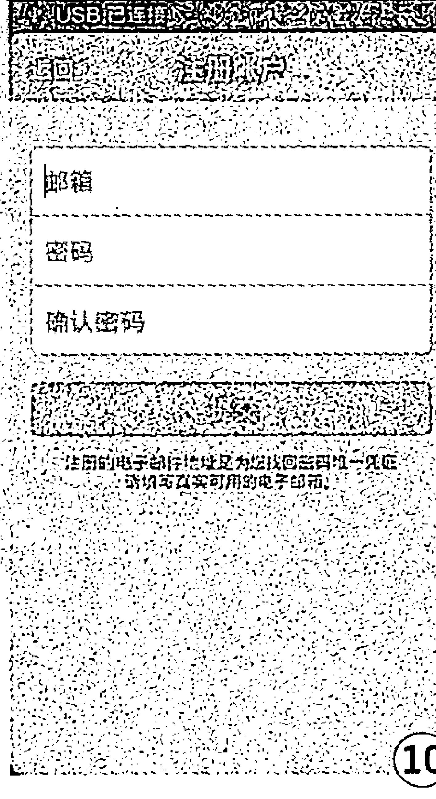

在出现的界面中点击上方的摄像头状图标，打开相应的菜单，选择“手动添加”，然后在出现的界面中，输入上面得到的CID、用户名及密码等信息，点击“保存”按钮，即可将该手机添加到“掌上看家”的监控设备列表中。当然，如果你在多部旧手机中分别安装了“掌上管家”，想将其一同添加到列表中也简单，只需在对当前的手机设置完毕，然后再点击“添加摄像头”按钮进行添加即可。

> 小提示
> “掌上看家”支持同时查看、管理多款监控设备，所以如果你有几部旧手机的话，可在这些手机分别安装“掌上管家”应用，获得不同的CID和用户名，以达到同时监控多处的目的。此外，系统默认提供的密码比较简单，为了保证安全，我们可在如图9所示的界面中，点击“菜单”按钮，选择“修改密码”项，自行设置一个安全强度较高的密码。

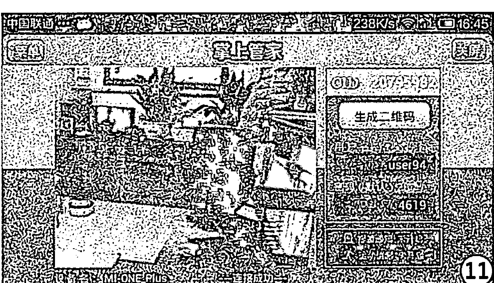

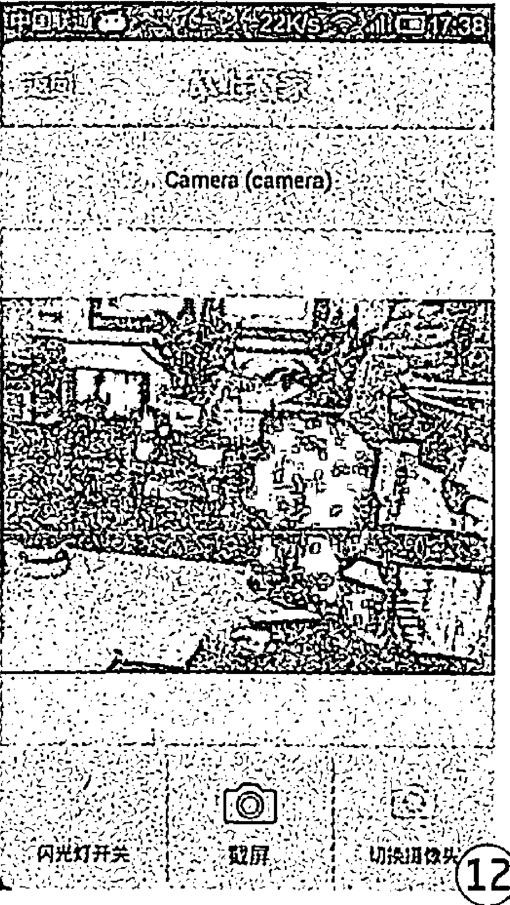

此时，相应的监控设备会出现在列表中，其中显示为“在线”的，表明该设备目前正处于监控状态。选择它，然后在出现的“摄像头列表”界面中选择摄像头，在经过短暂的缓冲过程后，家中的监控视频就出现了（图11）。在这里，我们除了可以点击“截屏”按钮，随时截下可疑的画面外，也可通过点击“切换摄像头”按钮，来选择查看其他监控设备拍下的实时影像（图12）。

### 讲求便捷 打造车载导航仪

无论是去外地还是本地，车载导航仪都会为我们的自驾车出行带来莫大方便，不过，即使是最低档的导航设备，其价格也在几百元左右。其实，如果你不讲究排场，而是一个注重实用的人，完全可以将旧手机打造成一款性能不错的专用车载导航仪。

首先精简应用，提高老手机的运行速度。由于老手机的配置通常不高，为了保证导航应用能流畅运行，我们首先应将手机安装的可有可无的应用全部删除，这其中除了后期我们自行安装的应用之外，还包括系统内置的应用。要卸载系统内置的应用，我们可以利用“360手机卫士”来达到目的。

安装后启动程序，在其主界面中，点击下方的“管理”按钮，进入相应的界面，选择“卸载预装”项，系统自带的可由用户自由卸载的应用就会出现在列表中（图13）。由于这些应用并非系统核心组件，即使卸载后也不会给系统带来影响，所以可大胆卸载。勾选所有要卸载的应用，点击“立即卸载”按钮，稍等片刻，应用的卸载工作就完成了。

安装导航工具。目前，可选择的免费导航工具很多，如百度导航和高德导航等，以使用百度导航为例。

下载安装后运行程序，按提示下载安装全国基础包及所在省市的地图包（图14）。下载完毕，将旧手机用AUX线连接到车载音响系统中，以后要导航时，只需启动百度导航，在其主界面中点击“路线规划”按钮（图15），然后按提示设置好出发地和目的地，点击“开始导航”按钮，清晰的语音导航就开始了，是不是非常方便？

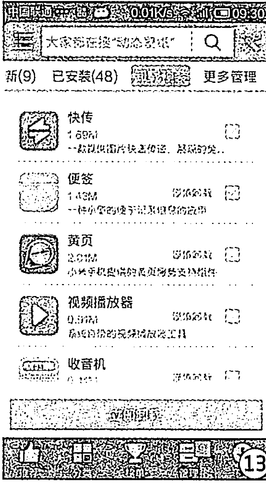

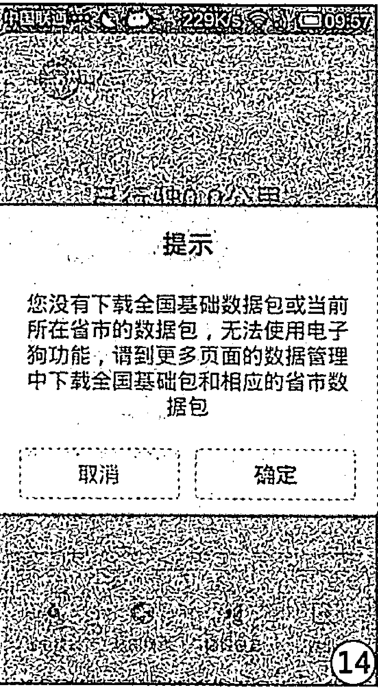


## 突破限制 手机世界玩应用

文 | 俞木发

我们经常在其他人的手机或平板上看到各种精彩的应用，但是由于各种限制，却无法在自己的手机上安装。下面就一起来学着突破各种限制，把精彩的应用安装到自己的移动设备上吧。

> **小知识**
>
> **移动设备常见限制有哪些**
>
> 根据品牌、硬件配置和操作系统的不同，移动设备常见限制有软硬两类：
>
> **硬件限制：** 如每种手机芯片规格、CPU、显卡都不同，而手机驱动是要厂商写入到ROM中的，各个手机厂商都不愿意公布手机驱动代码。因此默认情况下Android平台的手机是无法安装WP系统的。突破的方法则是利用其他高手们开发的专用驱动去解决。
>
> **软件限制：** 比如WP8系统通过微软账户和具体手机型号绑定，这样用户在搜索应用时，应用商店就只会呈现和你手机相符的应用，从而实现品牌专属应用的限制。突破方法则通过代理服务器实现品牌欺骗。

### 突破限制 品牌应用随意装

使用WP8手机的用户都知道，每个品牌的手机都有自己独享的应用，其他品牌的手机默认无法在应用商店找到这些专享的应用。借助Nokia Portal WPF可以轻松突破品牌的限制。

下面以在诺基亚520T上安装三星专属游戏为例。

首先到 `http://www.dwz.cn/cfan2014a1` 下载程序，解压后直接运行Nokia Portal WPF.application，按提示分别输入需要模拟的手机品牌和自己的品牌，依次点击Install Fiddler2和Launch Fiddler2安装并运行这个组件（图1）。

启动Fiddler2后按提示点击Tools→Fiddler Options，接着在打开的设置窗口切换到HTTPS，勾选其中的Decrypt HTTPS traffic，此时会弹出证书安装窗口，按提示安装（图2）。

继续切换到Connections，勾选其中的Allow remote computers to connect，其他选择默认设置，点击OK完成设置。

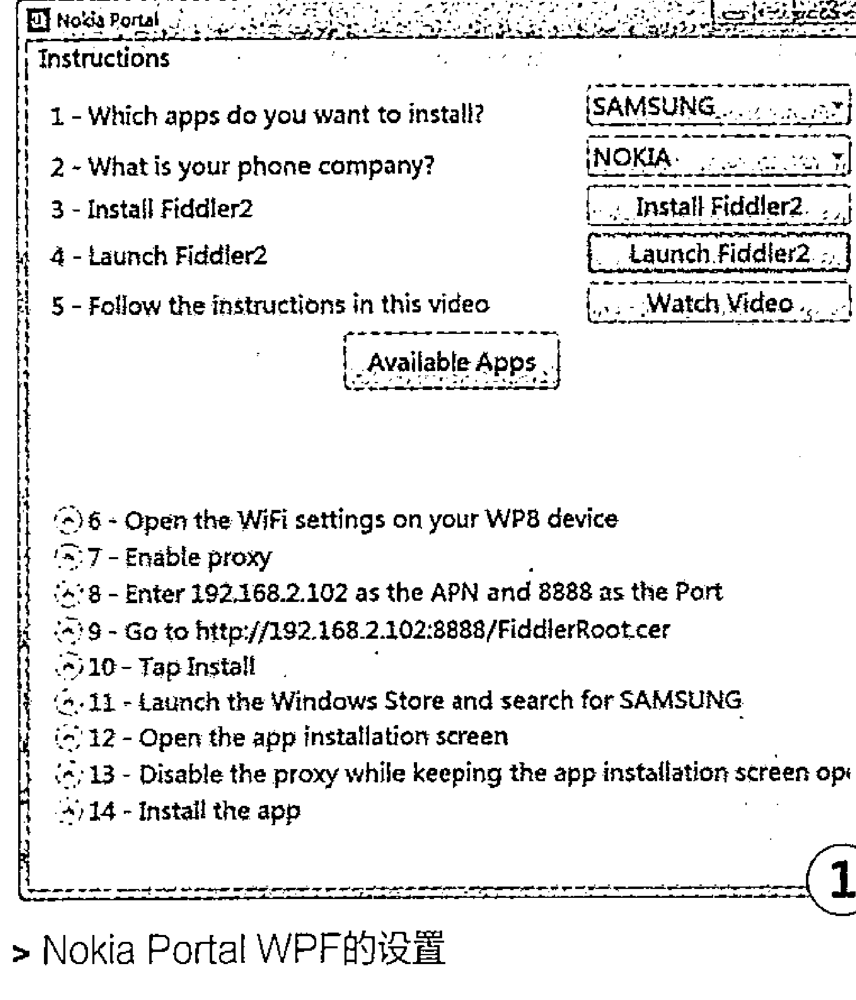

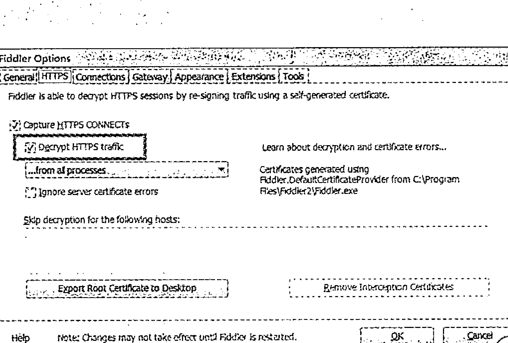

开启手机的Wi-Fi连接到和电脑同一局域网，在手机上点击“设置→Wlan→选中连接的热点”，在打开的窗口服务器网址输入192.168.2.102（即电脑局域网地址），端口为8888，并保存（图3）。

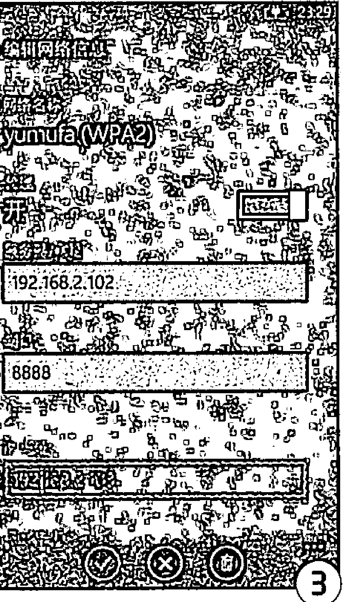

接着在手机上访问http://192.168.2.102:8888/fiddlerroot.cer，确认后在手机上会弹出一个证书安装窗口，按提示点击“安装”即可（图4）。

完成上述的设置后，在WP8手机的应用商店的搜索中，直接输入三星专属游戏应用名称，这样就可以直接搜索到专属游戏并安装了（图5）。

点击专属游戏进入下载页面，此时要重新进入Wi-Fi设置页面将代理关闭，然后返回应用商店的下载页面点击“安装”即可（图6）。


> 安装证书

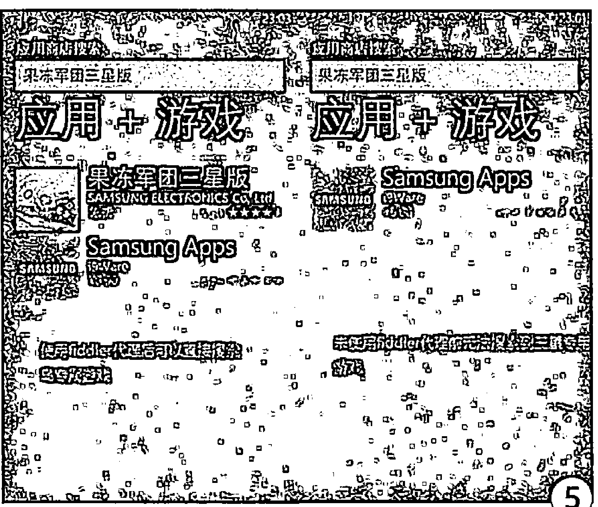

> 使用Fiddler代理前后的搜索结果


> 开始下载专属游戏

> 小技巧
> 除了专属应用的突破外，现在很多网站是通过手机浏览器的UA来识别手机型号的，因此我们也可以通过修改浏览器的UA实现突破专属设备的访问，比如使用Android手机访问专为iPad优化的视频网站。

> 小提示
> 不要安装其他品牌的设置软件，否则无法卸载。此外一些专属软件是和手机硬件关联，比如三星专用导航软件要求720×1280分辨率，这种专属软件无法在其他分辨率的手机上安装。

### 突破封闭 自己定制WP8开始菜单

WP8和iOS一样是相对封闭的系统，除了换换系统主题、锁屏界面这些简单的操作，其他关于系统深层一些的设置我们就无法完成了。借助“炫桌面”应用，可以自定义开始菜单界面和图标，尽显个性。

首先在WP8手机上将原来开始菜单的图标全部删除，安装“炫桌面”并启动应用后点击“选择主题”，然后在打开的窗口选择自己喜欢的图片（图7）。

接着返回程序主界面，点击图片上分割的图标进行设置。比如需要将电话放置在开始菜单的左上角，则点击图片左上角磁贴进入设置（图8）。

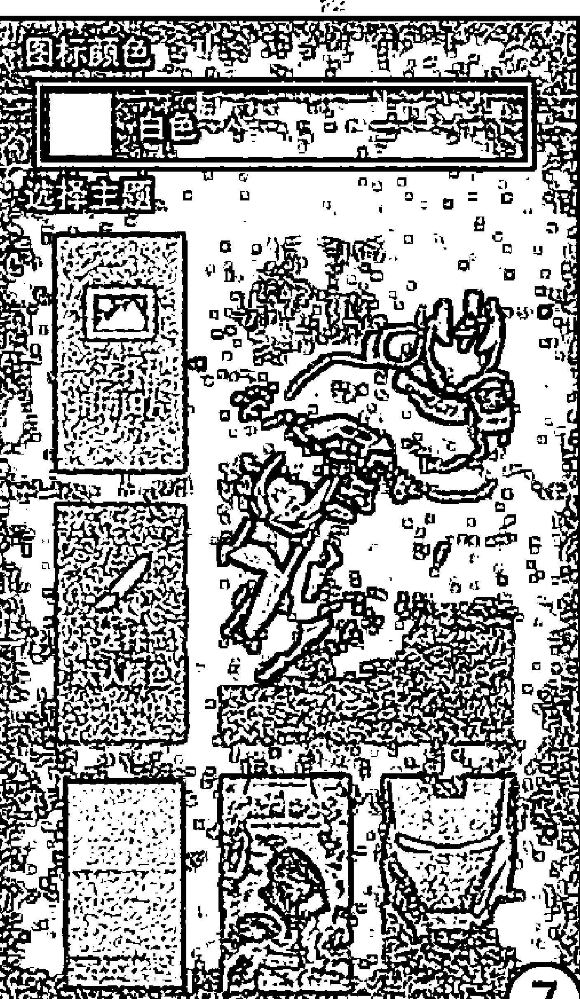

> 选择图片


> 设置开始菜单磁贴

在打开的窗口前切换到“快捷”，然后点击“电话”，在下方选择显示的尺寸（对于初次使用者，尺寸大小建议就按照上图标注的选择），点击“完成”（图9）。

操作同上，依次设置其他磁贴的设置，最后返回程序主界面，点击“完成设计”，然后点击“全部贴到桌面”。完成上述设置以后，只要点击微软按钮就可以看到自己设计的个性开始菜单了（图10）。

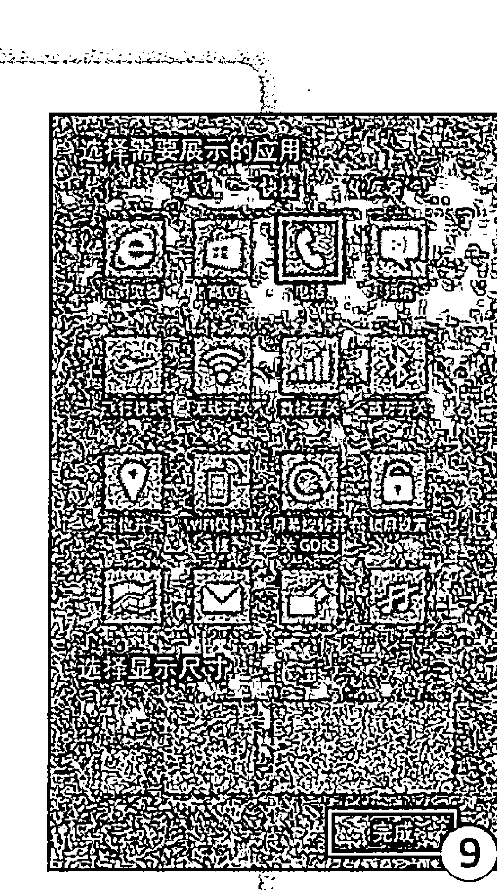


> 小提示
> 实际上炫桌面的背景是通过每个磁贴的每个小背景组合而成的，所以这里磁贴的大小和位置要和设计图中的一致。

### 突破系统内核限制 Android设备运行Windows软件

由于Android和Windows内核不同、使用的硬件也不同，默认情况下EXE程序是无法在Android设备上运行的。如果要突破这个限制，用微软免费提供的远程桌面即可实现。

在电脑端打开系统高级设置，勾选“允许运行任意版本远程桌面的计算机连接”，并设置允许连接用户。接着在Android设备上访问谷歌商店下载Microsoft Remote Desktop，启动应用后点击程序界面的“+”号添加新的连接，在PC name、USER、Password处依次填写被连接电脑的IP地址、访问电脑用户名和密码（图11）。

以后只要点击上述连接就可以直接连到电脑上了，如果是在Android盒子上使用，那么很多原来Windows上的学习软件就可以直接在电视上运行了（图12）。

> 小技巧
> 我们还可以利用远程桌面实现在iPad上运行Win8，借助Splashtop Remote Desktop远程连接到Win8电脑即可。

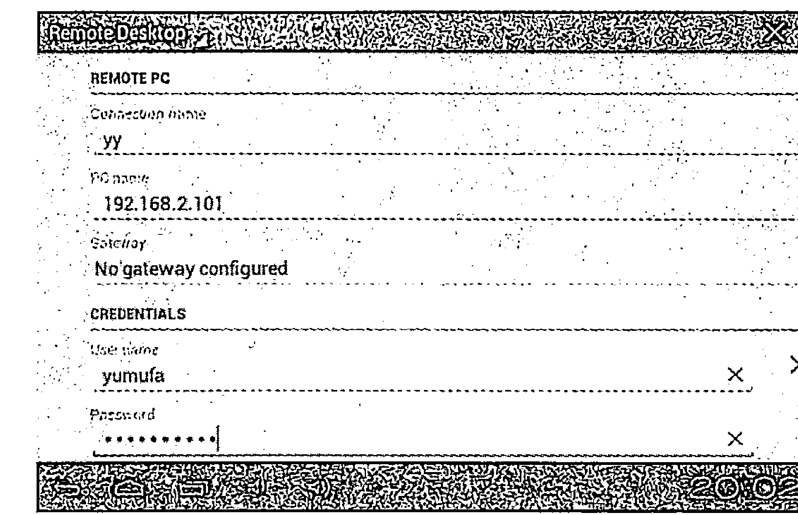

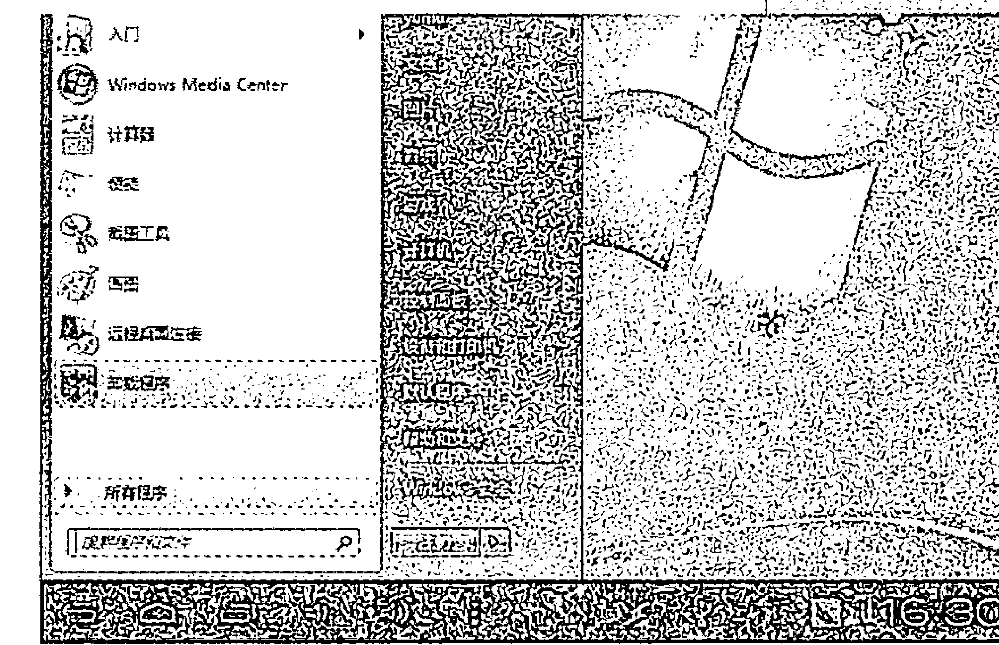

### 突破盒子品牌 Android盒子安装他方应用

使用Android电视盒的朋友都知道，每个品牌都有自己的电视直播软件，有些品牌的直播软件可以收到各地电视台的节目。不过出于对自己品牌的保护，它们并没有提供第三方下载，现在我们可以手动将其直播软件提取出来。

首先在要提取软件的盒子上安装91手机助手，然后在盒子上启动电视直播软件，在Android设备上进入“设置→应用→正在运行”，记下正在运行的直播软件的名称（图13）。

接着将盒子通过Wi-Fi的方式连接到电脑上，在电脑上启动91助手后切换到“功能大全→备份还原→本地备份”，接着勾选“应用程序”、“应用数据”开始备份，完成后点击“查看备份”，然后在打开的文件夹提取出导出的备份文件到自己盒子上安装即可（图14）。

> 小技巧
> 如果提取的应用无法在自己的盒子上安装，可打开“备份目录\applicationrecord\data”，将其中类似“com.提取程序名”的文件手动复制到自己的Android设备/data/data目录下即可。

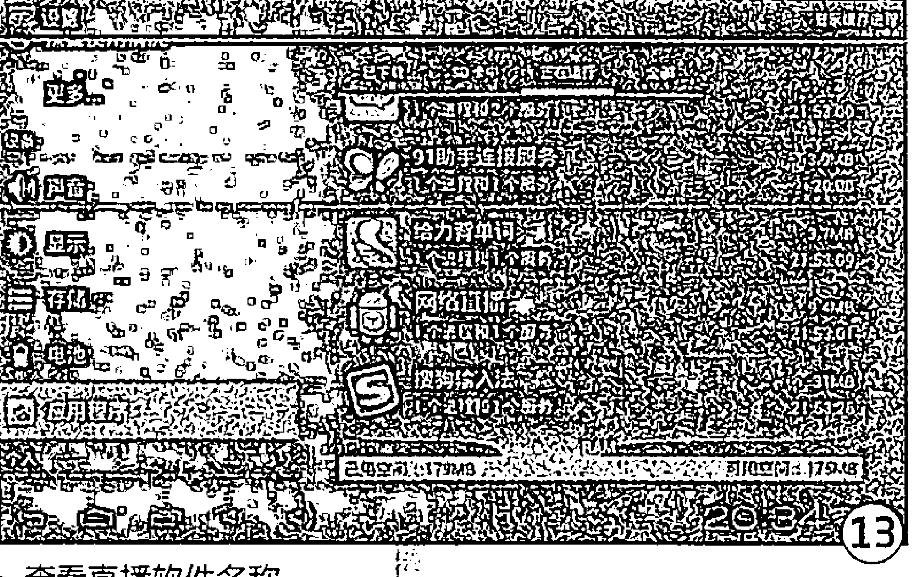

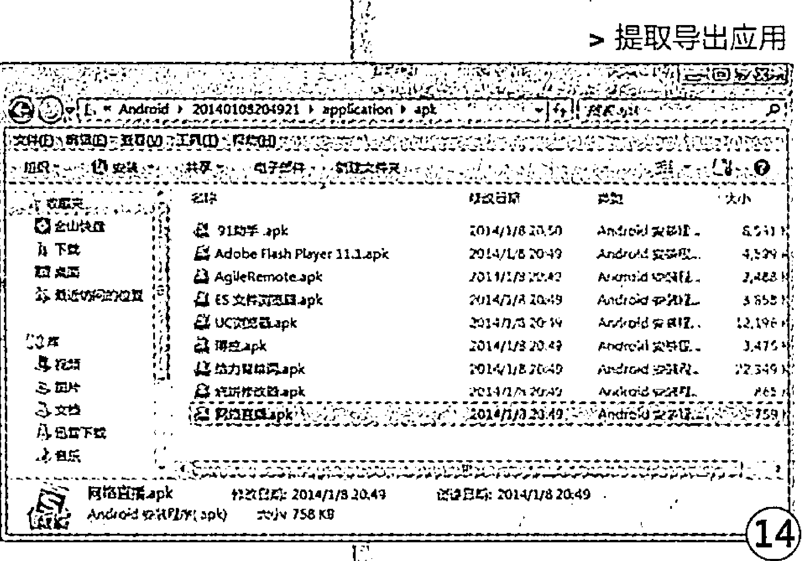

### 突破硬件限制 Android和WP互刷

默认情况下Android和WP是无法进行互刷的，主要是由于不同平台手机硬件驱动不同。现在网上已经有许多的高手为不同手机开发不同平台的刷机包，这样我们就可以进行系统互刷了。下面以中兴N880E刷入WP7为例（中兴N880E原来是Android智能机）。

首先到http://www.dwz.cn/cfan2014s下载所需的刷机工具，下载后将所需的工具软件和驱动全部安装到电脑中。然后将手机关机，在关机状态下，同时按住音量键“—”和“开机键”进入FTM模式，之后请用数据线将手机与电脑连接，此时在电脑上会自动安装手机驱动。

电脑成功识别手机后，在电脑上单击“开始→所有程序→Q PST Configuration”，启动程序后切换到Ports标签，点击Add Port，在弹出的窗口选择USB连接的端口并点击OK确认。

返回程序主界面，点击Start Clients→Software Download，接着在弹出的窗口切换到Backup，按提示备份手机的NV文件。

在备份完NV之后，同上进入DFU模式并在电脑上启动Q PST Configuration，启动程序后点击“Load XML def…”，选择刷机需要的XML文件，继续点击“Load patch def…”，选择刷机需要的patch文件，最后点击Download开始刷机。

完成刷机操作后，按提示重新安装驱动并将上述备份的NV文件恢复到手机上，以后就可以直接在中兴N880E上使用WP7系统了。

## 移动维护看我的 打造手机维护盘

文 | 俞木发

对于很多系统达人来说，帮朋友、亲戚修电脑是家常便饭的事。既然是修电脑就离不开维护盘，不过很多时候我们并不会随身携带系统维护工具，但手机却是我们随身携带的通讯工具。现在我们可以将手机变为移动维护盘，这样不管什么时候都可以轻松对系统进行维护。

### 手机变身移动维护盘 原理细细数

系统维护一般使用启动PE盘启动故障电脑，然后在PE中使用维护工具进行系统修复操作。启动方法主要有两种，一种是使用U盘（或光盘）作为启动介质来启动故障电脑；如果没有启动U盘，则可以使用PXE方法网络启动故障电脑。前者只要BIOS可以识别U盘即可启动，后者的电脑则只要支持PXE启动，然后借助DHCP、TFTP传输启动文件到电脑上即可。

因此手机要变为移动维护盘，我们只要能够实现上述启动方式即可。对于Android手机，它的Recovery模式可以将手机SD卡识别为U盘，因此只要在Android手机的SD卡上安装PE系统，就可以启动故障电脑了（图2）。

可以通过U盘启动方式变为移动维护盘了，这里的手机就相当于读卡器（图1）。对于iPhone手机，借助WiFi Booter可以实现将内部存储卡中的PE启动文件传输到电脑，这样电脑借助PXE启动就可以启动故障电脑了（图2）。了解了手机变身维护盘的启动原理，下面就一起来看看如何将Android和iPhone手机打造为移动维护盘。

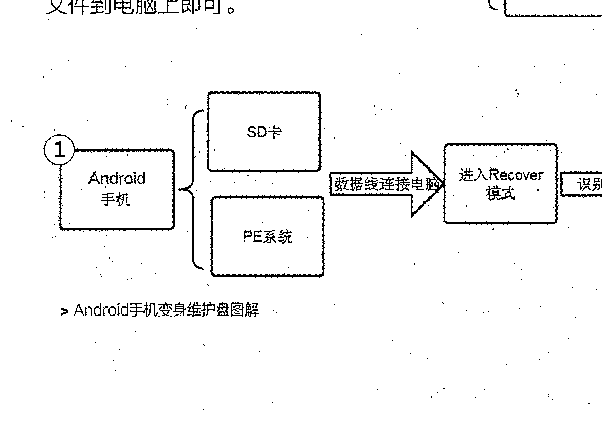

> Android手机变身维护盘图解

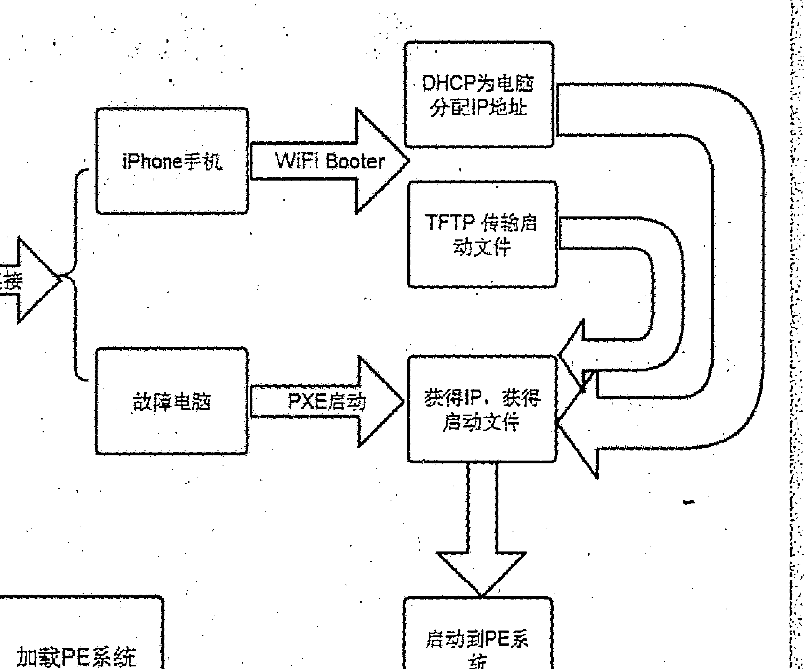

> iPhone手机变身维护盘图解

### 有线维护——Android手机变身维护盘

所需条件：Android手机需要Root+数据线（使用手机常见的充电线即可）

Android手机要变为电脑可以识别的U盘启动盘，首先要确保Recovery模式下可以加载SD卡为USB设备。重启手机进入Recovery模式，确保其中有“Mounts and Storage”（挂载和存储，即可以开启Recovery模式下的USB大容量存储功能）菜单，这样SD卡才可以被电脑BIOS识别为启动

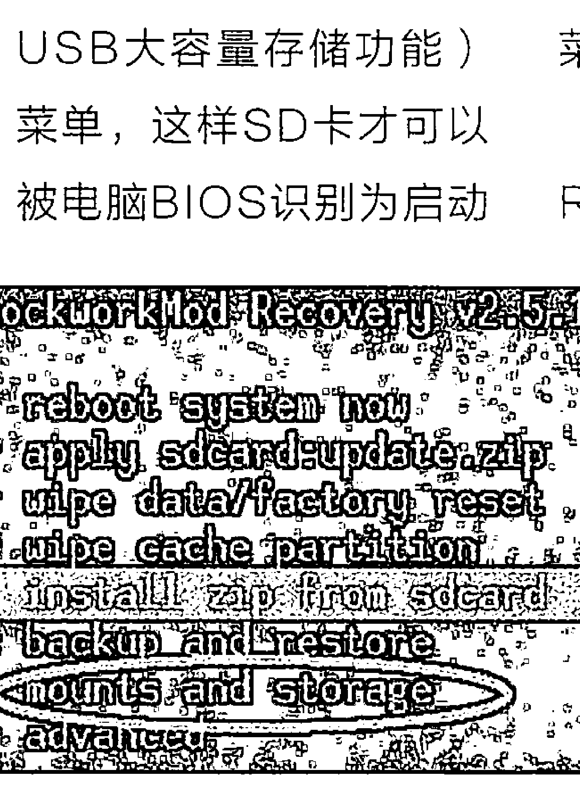

> 确保手机Recovery模式有Mounts and Storage菜单

U盘（图3）。不过，很多国产品牌Android手机都使用较为封闭的Recovery，你的手机可能没有上述菜单。解决的方法可以重新刷支持SD挂载的第三方Recovery。比如中兴ZTE90的手机，刷入第三方的Recovery后就可以使用“挂载和存储”菜单了（图4）。确保自己的手机Recovery模式有上述菜单后，接下来我们就可以在SD卡存入PE维护系统了。首先将手机用数据线和电脑连接，当手机提示USB已连接时，在

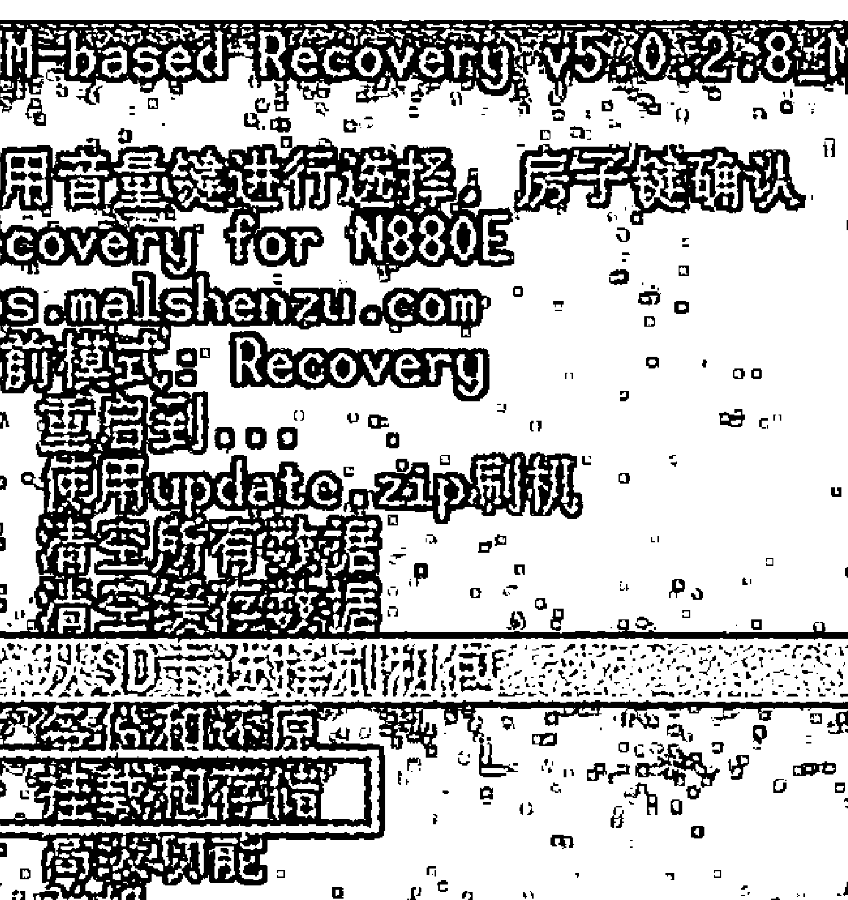

> 中兴手机刷入第三方的Recovery可以使用“挂载和存储”菜单

> 小提示：如果你原来的SD卡不是FAT32格式，则需要在DiskGenius中先将原分区删除，然后再创建为FAT格式主分区并激活。

下拉通知栏点击其中的“USB已连接”，然后在弹出的窗口点击“装载”，将SD卡装载为U盘（图5）。在资源管理器中将SD卡上的数据全部复制到电脑保存（因为下面的操作需要格式化SD卡），接着到http://www.diskgenius.cn/下载DiskGenius，启动程序后在磁盘列表选中上述加载的U盘，点击“分区→格式化”。将SD卡格式化为FAT32分区，接着右击选择“激活当前分区”，

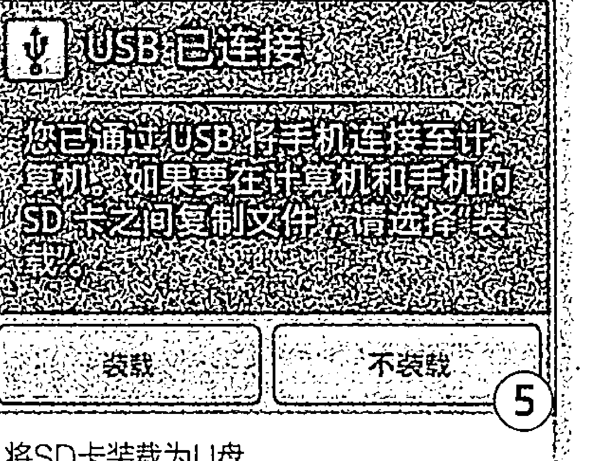

> 将SD卡装载为U盘

将SD卡主分区激活。到http://dwz.cn/cfan15下载“bootice.exe”，启动程序后在磁盘列表选中SD卡，接着依次点击“主引导记录”和“分区引导记录”，将其引导方式更改为“GRUB4DOS”格式（图6）。

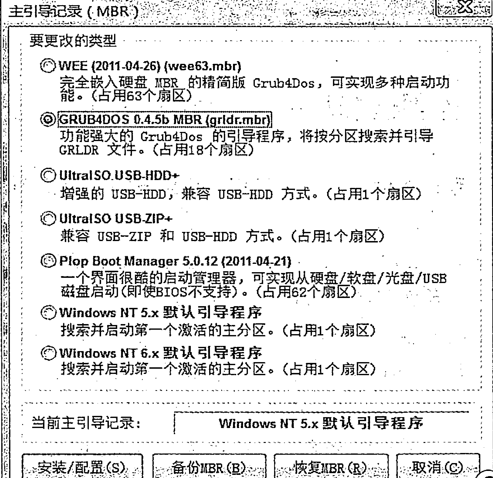

> 更改SD卡引导方式为GRUB4DOS

准备好需要作为维护系统使用的PE文件（需要为.ISO格式），假设为pe.iso，将其复制到SD卡根目录下。启动记事本新建一个menu.lst文件放置在SD卡根目录下，代码如下：

```
timeout 3
default /default

title PE ISO
find --set-root /pe.iso
map /pe.iso (0xff) || map --mem /pe.iso (0xff)
map --hook
chainloader (0xff)
savedefault --wait=2
```

> 在BIOS中使用SD卡作为第一启动

#### 代码注释：

map /pe.iso表示pe.iso维护系统将使用仿真光驱的模式加载，这种方式适用于加载体积较大的PE系统（一般大于512MB）。map --mem /pe.iso则以内存加载模式启动系统，维护系统文件会被加载到内存中启动，加载速度慢，兼容性较好。大家可以根据自己准备的维护系统选择用哪种启动方式。

到http://www.dwz.cn/cfan2004d下载grldr文件也放置在SD卡根目录下，这样我们就完成了手机维护盘的打造了。以后如果你去朋友家碰到他的电脑需要维护，只要掏出Android手机，然后使用数据线和电脑连接，启动手机后进入Recovery模式，按音量下键选择“Mounts and Storage”菜单，按下电源键确认。这样Recovery模式就会自动加载SD卡驱动，确认此时在手机界面可以识别USB设备。

启动电脑按Del键进入BIOS设置，然后将已经识别的SD卡作为第一启动设备，这样就可以使用手机将故障电脑引导到PE环境。具体的使用就像我们平时使用启动U盘一样（图7）。

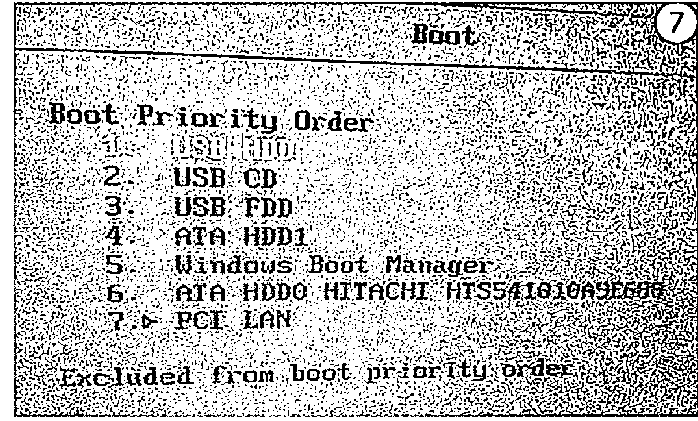

> **小提示**
如果你的SD卡容量足够大，那么可以在SD卡上存放Windows 7安装文件，或者纯净的GHO镜像，这样进入PE后，既可以在其中重新安装系统，也可以直接Ghost，实现快速重装系统。

### 无线启动——iPhone手机变身维护盘

所需条件：Wi-Fi环境，电脑支持PXE启动

上述介绍的方法需要使用数据线的方式连接，如果你用的是iPhone手机，那么利用iPhone手机的Wi-Fi连接，还可以使用无线的方式启动故障电脑，使用起来更为方便。

由于Wi-Fi方式是使用PXE启动方式，因此首先要确保故障电脑支持PXE启动。一般2005年之后购买的电脑都支持PXE启动，一般只要开机时按F12键，查看其中有类似“Network boot……”的菜单，即表示支持PXE启动（图8）。

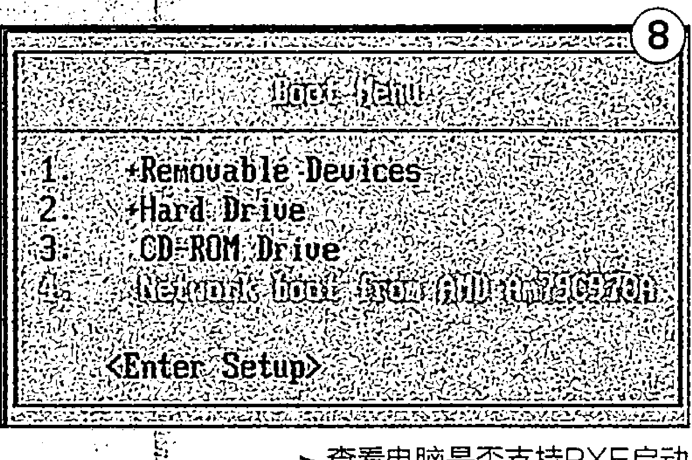

> 查看电脑是否支持PXE启动

#### 什么是PXE启动

PXE启动是指客户机利用网卡集成的PXE模块，通过网络获得服务器传输过来的启动文件，接着按照这个启动文件配置启动服务器上的启动镜像，从而实现客户端的无盘启动。这里的iPhone手机安装WiFi Booter就变为服务器了。

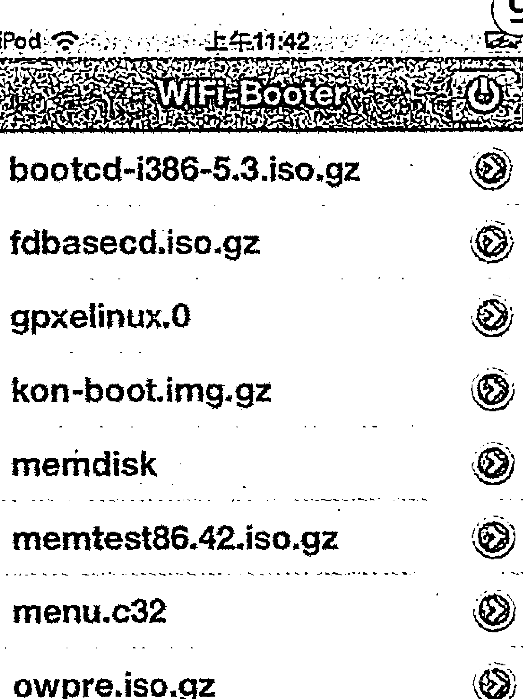

确认电脑支持PXE启动后，到苹果商店下载WiFi Booter，在iPhone上启动应用后可以看到程序本身已经自带很多免费的维护系统（图9）。

如果需要使用自己的维护系统，比如PE系统，需要先压缩为.gz格式，启动7zip后选中需要压缩的PE文件，然后再选择压缩格式为gzip并传输到手机的内置存储卡中（图10）。

接着返回程序界面，点击File导入内部存储卡中的.gz文件，将其导入到程序中并选中。继续点击Setting进入设置界面，然后按照自己的网络环境设置好各个参数，只要根据自己的实际网络环境设置下列三个地址即可（图11）。

| 项目 | 说明 |
| :--- | :--- |
| IP 1st address | 和无线路由器网址要在同一网段 |
| Router | 路由器网关地址 |
| DNS | 目前路由器局域网的起始地址 |

完成上述设置后，在iPhone单击WiFi Booter界面的电源按钮启动PXE服务，接着将iPhone连接到无线网络中。重启电脑进入BIOS设置，将PXE启动设置为第一启动，启动电脑后PC会自动获取IP地址，并从iPhone上接收启动文件（图12）。

完成启动文件的传输后，电脑就可以启动到你选定的系统了，如果你集成的是PE系统，这样就可以通过iPhone成功无线启动故障电脑进行维护操作。这里需要注意的是，由于启动文件的传输需要借助Wi-Fi，因此一定要保证Wi-Fi信号的强度，请将手机尽量靠近路由器。

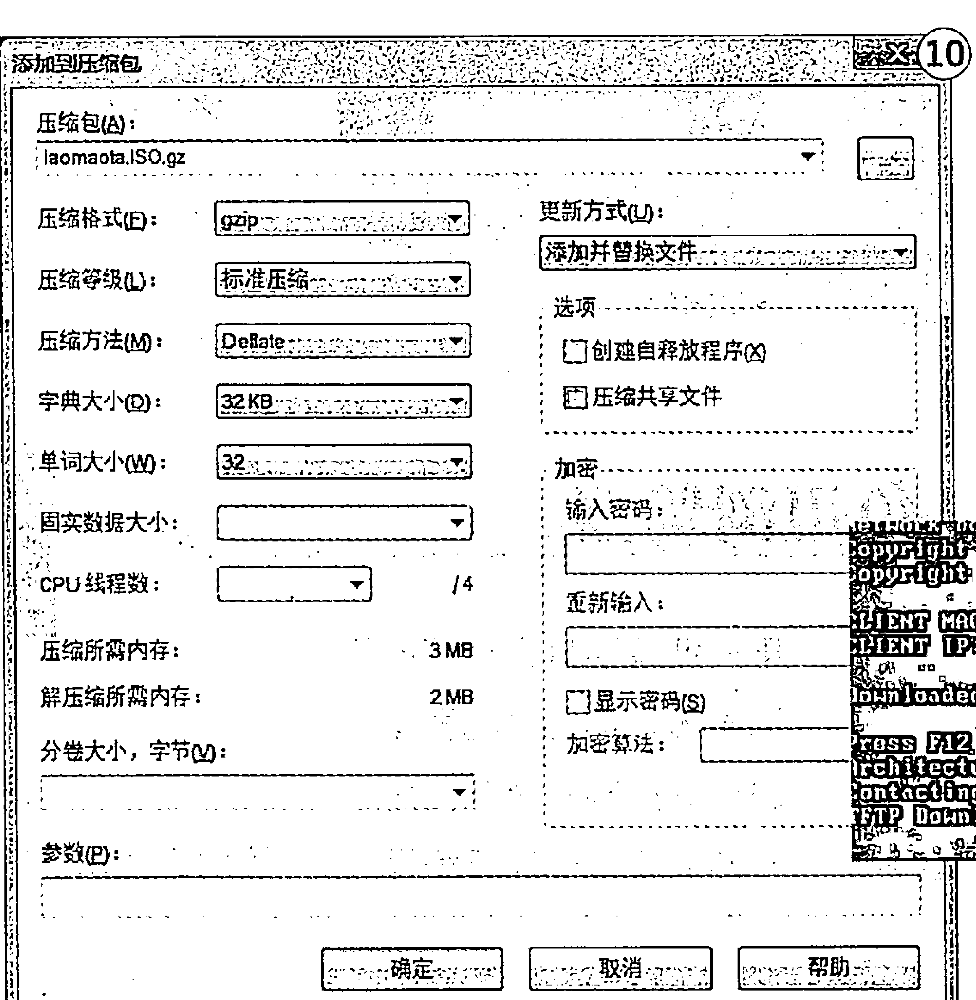

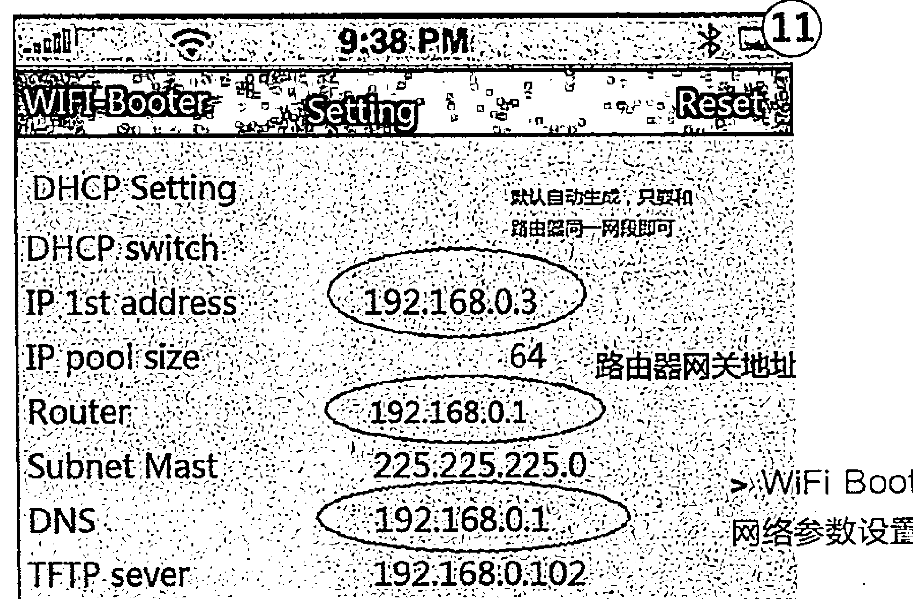

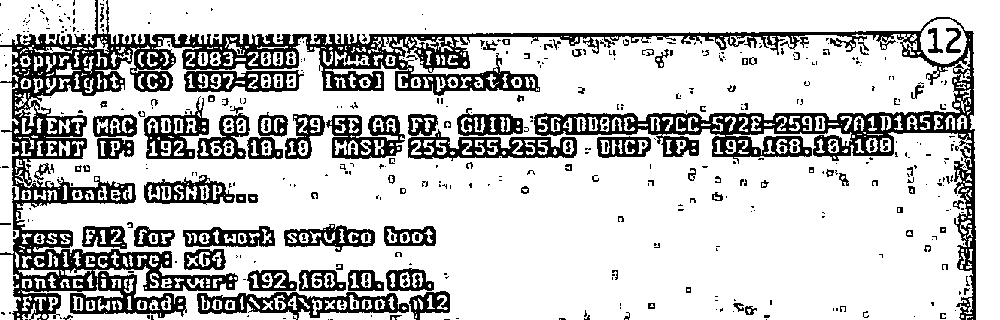

不少人手中还有几年前买的Android智能手机。由于目前APP更新日新月异，对系统的要求也越来越高，此类手机如果追逐安装潮流APP，运行起来必然会很卡，甚至会无法安装，即使勉强装上也让人无法忍受。因此，人们手中的这类手机多闲置在一旁，沦为打电话、发短信用的普通话机。其实，若能开动脑筋，努力从APP海洋中筛选老智能手机照样可以焕发“第二春”。

出于这种想法，笔者将自己的移动项目，借用长假闲暇时间，经过上百款Android同类APP的试险，“沙里淘金”，为自己的老手机“沉淀”出一些足以满足日常生活所需的实用APP，最终打造出一个可以满足基本生活需求、可流畅使用的移动环境，让老手机真正回归于“智能”流的行列。现将成果汇报与大家分享。

## APP淘金 老手机焕发“第二春”

文 | 海峰

### 1 聊天 要的就是爽

除电话短信功能外，聊天是使用智能手机的首要需求。但目前类似于QQ的主流聊天APP，对资源占用明显，老手机使用会很卡顿，根本无法完成聊天任务。我挖到了占用资源最小但并不小众化的QQ轻聊版APP作为聊天首选，用以代替普通QQ APP。

QQ轻聊版是专为低内存小屏幕手机提供的最精简QQ版本，保留核心聊天功能，超小安装包，省内存，但仍可使用语音、图片、原创表情沟通，还支持免费建百人QQ群、讨论组，进行多人聊天。同样具有通讯录功能，可方便快速添加好友。具备资料卡、照片墙可供分享生活中的点点滴滴。也有位置分享功能，能让你快速找到聚会地点。QQ邮箱提醒，促成快捷的收发邮件，还支持群助手、好友分组管理功能，支持本地搜索好友、群、讨论组。此外，同样也支持二维码扫描。如此多的功能，日常使用也足够了。

> **小提示**
轻聊版不支持联想K800、K900等X86及MIPS架构的手机机型。

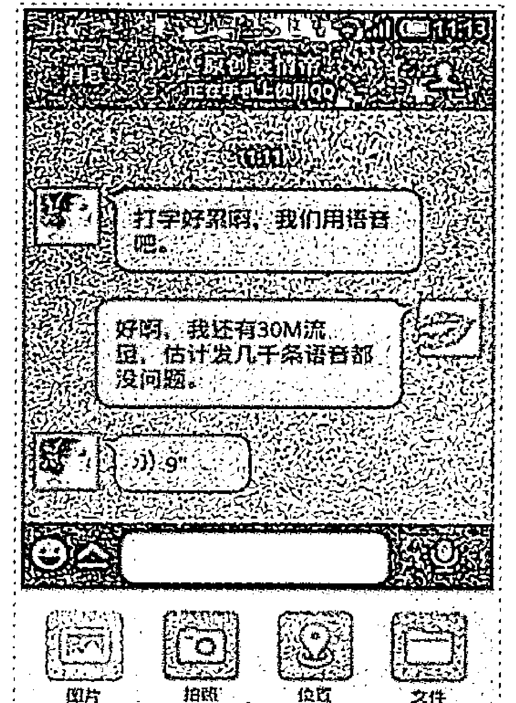

### 2 发帖 免用浏览器

百度贴吧是大家最常用的消息发布场所，而用浏览器登录百度贴吧发帖功能更为强大。但是，如果在低端手机上运行网络浏览器，再到贴吧发帖，由于浏览器的资源占用，发帖会让手机运行缓慢，无法忍受。这时，我找到了用百度贴吧简版代替浏览器直接发帖的方法。


百度贴吧简版安装文件仅有1.8MB，轻巧省流量，可节省超过90%的流量，用它来逛贴吧发信息，你会感觉更加流畅。

### 3 播放 流畅是王道

老手机播放视频，硬件解码能力本来就够差，如果再运行主流的播放器，根本不能发挥这些软件的强劲功能，反而因内存占用而拖慢播放速度。主流的播放器在老机上播放效果不理想，会严重影响观赏心情。这时，我找到一款VPlayer全格式播放器来解决内存占用和播放不流畅的问题，让我满意。

VPlayer是Android平台的一款全新的视频播放器，看似轻便但功能一点也不弱。支持的格式非常多，有Divx/Xvid、flv、rmvb、avi、mkv、wmv、mp4等常见格式，还支持外挂字幕和内嵌字幕，号称全能播放器，是低端智能手机播放视频的不二之选。

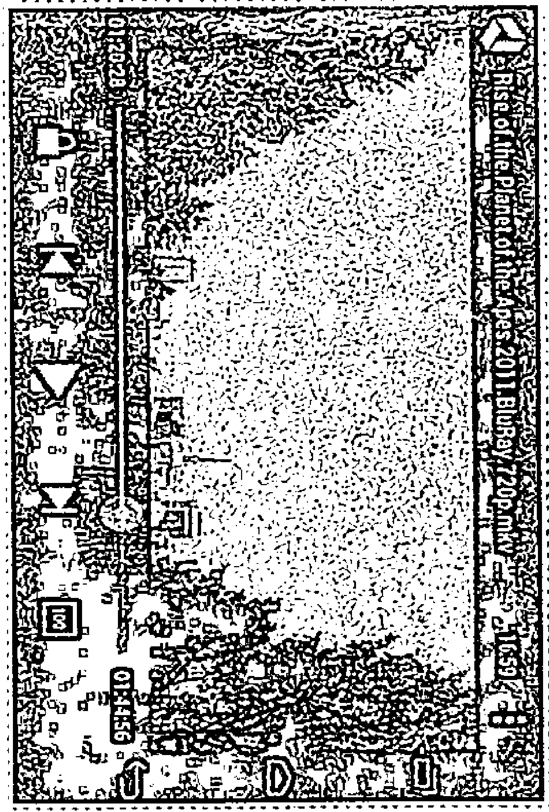


### 4 浏览 迷你是首选

上网搜索自己所需的信息，这是智能手机不能没有的功能。然而，目前市场中的移动网络浏览器，功能越来越多，软件越来越复杂，相对资源占用也越来越大。如果在老手机中运行这些主流的浏览器上网，会很卡顿。这时，就需要挖掘能够轻松应对上网搜索的浏览器。经过对一些主流浏览器的安装使用，权衡之后，我留下的是欧朋浏览器Mini版。

在对浏览器的比较使用中，发现Opera Mini浏览器的速度明显优于其他浏览器。对于低端手机来说，它堪称全世界最快的Android浏览器。这款浏览器虽小而功能强大，方便的页签设计，可一次开启多个页面，还能互相切换。可自动调整大小的网页、网址列和工具列让在线上阅读变得更轻松。采用云端压缩技术，节省流量，操作简单，可最大限度还原网页原貌。

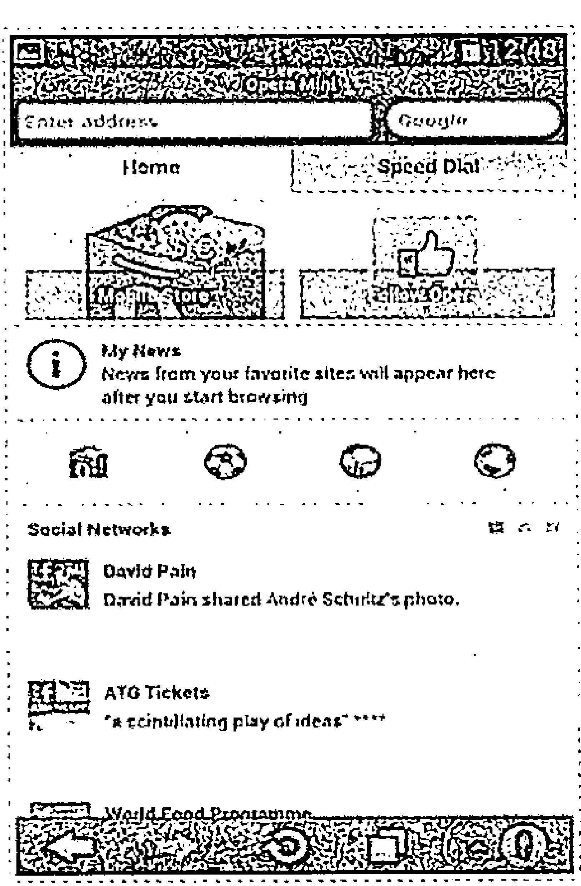


### 5 桌面 老机也能酷

原生的手机桌面一般都比较简单，功能也不够强大，因而人们更愿意安装一些桌面软件来增强视觉和功能。但是，本已不能令人满意的老手机，装上主流的桌面软件运行会很要命。也许你会说，优化还来不及，再装桌面软件，疯了吧？没有！Nova启动器使用原生的Google技术，会给你的老手机一个


### 6 便签 不止是方便

记录一些事情，这是手机代替纸条的一个很实用的功能。因此网络便签APP便出现了。但是，这类APP越做越大，功能也很强，但若用在老手机上，功能的强大反而成了累赘。老手机用便签软件，能记录事情才是王道。当然了，不光要能记事，网络同步的功能也是必需的。于是我就需要去找一款可以记事的网络便签，最后我挖到的是印象便签。

印象便签是与分享灵感的免费随身便签，极简的界面与卡片式布局，让记录与查找便签更有效率。除了快速记录，还能与Evernote同步，并可以与其他用户共享便签。可离线记录与访问，方便随时随地使用。内置启动进入编辑模式，可立即记录闪现的灵感。可以把自己的印象分享到微博、Facebook和Twitter，当然还可以分享到内置的匿名社区Mocha。还可以设置提

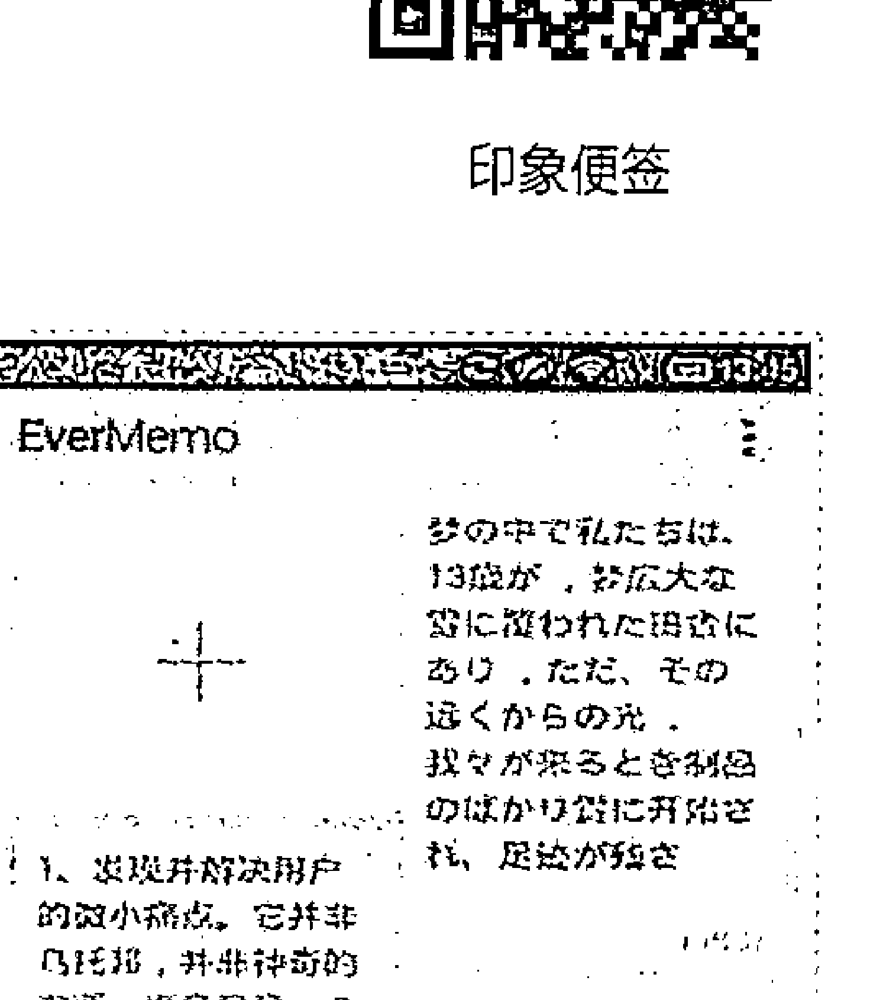

1.  找开并解决用的最小痛点。它并非把控，只让你用的快。记在脑子里的记忆快，便捷的方式。互联网本质上就是“活在人是人们所求的六大机
2.  坚持的方法。这，你帮人们节省的时间与使用的人数的乘积，就是你的价值。

### 7 输入 速度快至上

用手机，除了点击滑动外，最常进行的一项运动就是输入。国内的主流输入法APP越做越大，功能的确强大，主流机型上肯定会很爽，但在低配手机上却因资源占用，启用起来影响整体效率，劣势暴露无遗。比较后发现，谷歌拼音输入法轻而不弱，是低配手机的最佳输入选择。

作为Android自家正宗的“亲儿子”，谷歌拼音输入法与Android原生内核匹配，支持软/硬键盘输入，更能够充分发挥QWERTY全键盘的打字优势。同时，谷歌拼音输入法桌面产品中的诸多优点也在移动版中得到了完美体现。快捷的联想输入和智能组句功能似乎能理解用户的意图，让你彻底告别以单字词为基本输入单位的输入体验。用户还可以开启词典同步功能，Android谷歌拼音输入法可以将用户的个人字典和打字习惯存储在谷歌服务器上。用户本地输入词条可以快速记忆，服务器词典可以随时同步，再也没有词库丢失之苦、拷贝词库之痛。

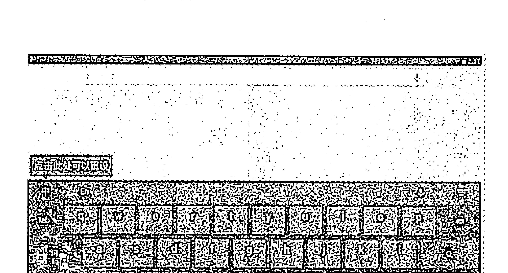


### 8 天气 要的是实用

看天气是手机必备功能。目前主流的天气APP一般都加入了图片等功能，软件越做越大，流行配置上感觉很好，但在老手机上使用和更新都很让人烦心。而我找到的一款懒人天气是真正适合于老手机的APP，极简捷的软件提供最实用的功能，这就足够了。

可以说，这是我用过的最省心的天气APP，只在


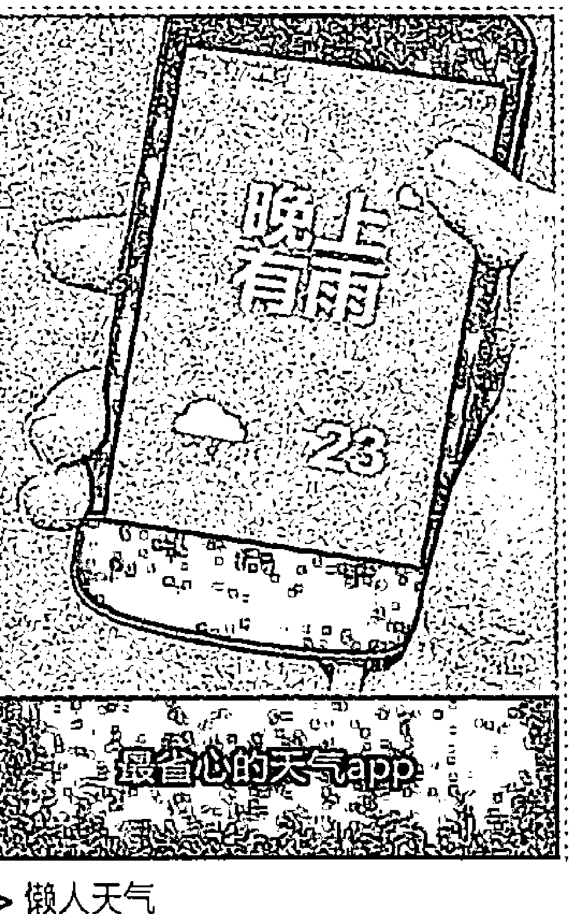

### 9 闹钟 同伴叫醒你

起床叫醒是生活必备的APP。叫自己起床，还能叫醒所有你设定的朋友起床或让他们提醒你，这个神奇的小APP不但占用内存很少，功能也不弱。它还能自动开启和关闭飞行模式，但却不影响叫你起床。

闹钟One会根据所设定的闹钟时间，自动为设定的闹钟加上标签，例如“起床闹钟”，“午休闹钟”等。

闹钟One通过与新浪微博、腾讯微博等SNS网站连接，可以让你的好友了解你的作息计划，监督你按时起床。

闹钟One还会自动记录分析每次闹钟响起时，你延迟了多少次才关闭闹钟。当记录的数据足够分析时，它会在设定新闹钟时对你的设定提供建议。

没想到这么简单的一款闹钟会有这么丰富和体贴人的功能吧？赶快一试吧！


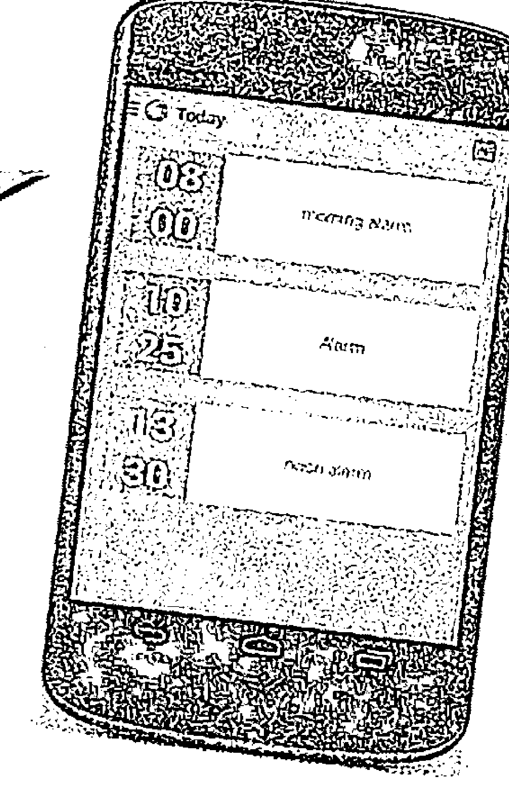

### 10 日程 办公必需设

创建日程、与朋友合作等也是我们的日常需求，我的最终选择是简单实用的Any.DO日程管理APP。

这是一款界面设计新颖清新但功能强大的社交型任务管理APP。和所有的任务管理应用一样，Any.DO也支持任务添加、标记完成、优先级设定等基本服务。除此以外，Any.DO还提供通过语音输入创建任务，通过手势进行任务管理等服务，通过拖放分配任务的优先级，通过滑动标记任务完成，通过抖动手机从屏幕上清除已完成任务等。很有趣吧！

Any.DO还支持用户与亲朋好友共同合作完成任务。新建合作任务时，APP提供联系建议，对那些非Any.DO用户成员，还支持电子邮件和短信的联系方式。


## 多方挖潜 突破小窗输入瓶颈

文 | 张惠香

用手机或平板写一篇文章，总找不到PC上那种淋漓畅快的感觉。相比PC来说，掌上设备最让人不能满意的就是信息录入的效率。然而，这不代表手机或平板就只适合阅读。通过与各种设备、软件的灵活配合使用和对手机输入法本身的挖潜，我们完全可以让手机或平板也能高效录入和处理信息。本文针对当今最流行的Android平台智能手机，探讨突破手机小窗输入瓶颈的各种方法。

### 1 外接键盘 借力快速输入

如果我们正好在桌案前工作，而要处理的事情必须在手机上完成，那么，给手机接个传统键盘，用熟悉的大键盘输入，自然就会很爽。

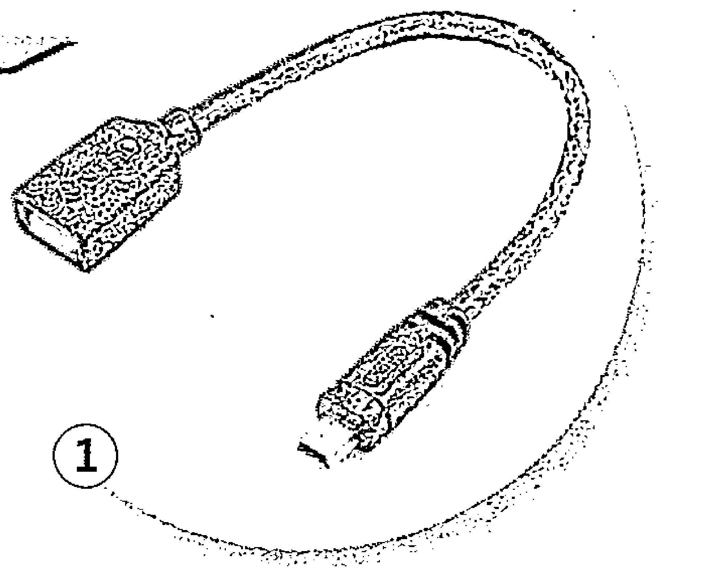

> **小提示**
> 部分屏蔽了OTG功能的手机，可以通过软硬手段找回被屏蔽的OTG功能，具体实现方法请参考本刊第4期P73文章《破解Android手机的OTG功能》。

不是每种Android手机都可以接键盘使用。Android手机外接键盘用，需要具备OTG功能。OTG是USB On-The-Go的缩写，它用于不同制式和不同接口设备之间的数据和信息交换。要判断手机或平板是否支持OTG功能，一个最简单的方法是到该设备的官方网站，查看该型号产品参数列表，看是否有支持该项功能的说明。

使用OTG功能连接USB键盘，需要具备一根OTG转接线（图1），有的手机提供这种转接线。如果没有，可到网络商城或电子店购买，价格在10元上下。将小USB口接在手机上，键盘接插OTG线的大母口，不需要安装任何驱动程序，即可实现用键盘控制手机来输入文字。

### 2 通过PC控制Android手机输入

通过AirDroid网络服务实现PC控制手机输入。

我们可以通过AirDroid网站服务，配合AirDroid手机端APP，实现PC对Android手机的控制来输入信息。

从电脑端访问http://web.airdroid.com/，创建账户并登录（也可以用Google、Facebook或Twitter账户登录），用手机扫描页面给出的二维码链接，下载安装AirDroid软件（图2）。也可通过百度移动市场直接下载AirDroid安装。

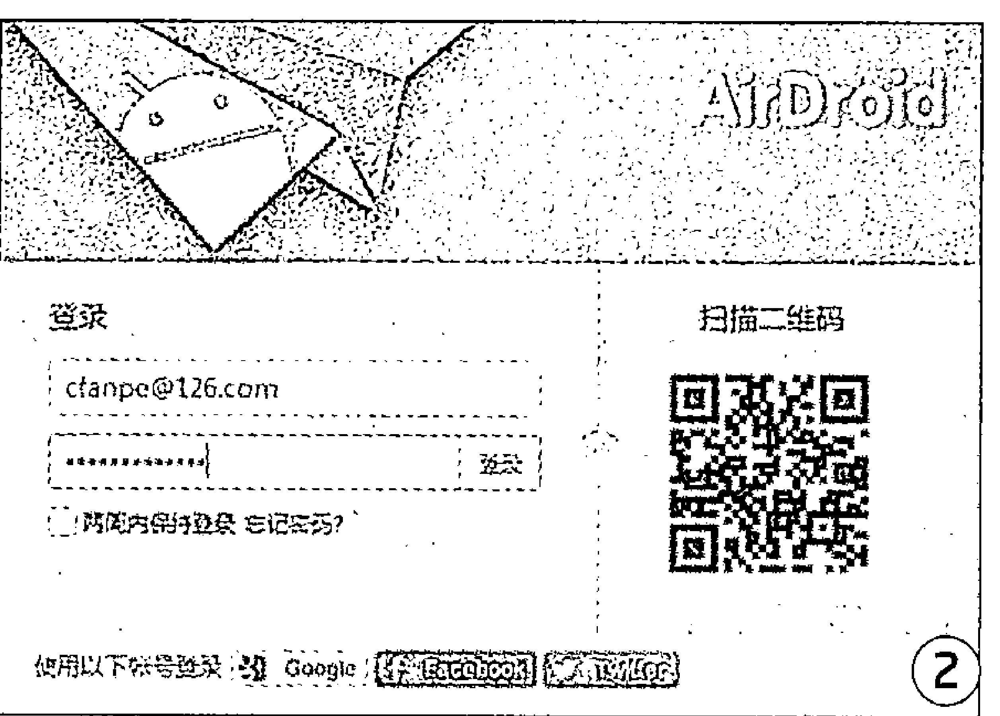

在手机端启动AirDroid，若手机已经接入局域网中，手机AirDroid界面上会出现一个类似http://192.168.1.101:8888的网址（图3）。

在PC端网络浏览器内访问这个局域网址，手机端屏幕会有所反应，点击手机屏幕上出现的“接受”按钮，即可通过PC浏览器AirDroid控制手机来操作各种软件并输入文字了（图4）。默认的界面是简版模式，可从右下角点击以账号登录，切换到完整版模式使用更多服务（图5）。

> 小提示
> PC上要使用Google内核的浏览器来访问以上页面，例如使用360安全浏览器6.0以上版本或直接用Google Chrome浏览器。

方法2：通过SRT软件来实现PC控制手机输入。

还可以使用Wi-Fi让SRT - Total Control实现手机与电脑之间的连接。

先在PC端安装SRT Total Control PC客户端（下载地址：http://www.sigma-rt.com.cn/android/totalcontrol）。注意，安装过程中需要检测并安装Java环境。再给手机端安装Android版SRT Total Control，该APP可通过百度移动市场下载。

采用USB的方式连接手机和电脑。手机“设置”中要开启“USB调试”。接上数据线，启动PC端的SRT - Total Control。软件检测到手机或移动设备后，点击“连接”，这时屏幕上会显示连接向导，软件会自动检测“USB调试”模式是否开启，若电脑上未安装当前手机驱动，则会自动查找安装。接着会自动检测手机上的SRT - Total Control版本，若版本较低会自动升级。最后连接设备并提示点击校准设备显示，之后屏幕会显示手机与电脑已经连接的画面。

点击左下角的输入法设置按钮设置手机Sigma输入法，屏幕上会出现设置确认窗口，点击“立即设置”按钮。

手机端的输入法要选择为Sigma键盘输入（图6），勾选Sigma输入法并设置为默认输入法，完成设置（图7）。

这时，就可以用PC键盘来控制手机启动需要处理文字的软件，然后用PC上的汉字输入法，将信息输入到屏幕窗口下方的文本条中，输入之后点击Send按钮，输入的信息随机会出现在上方的手机软件编辑窗口中（图8）。

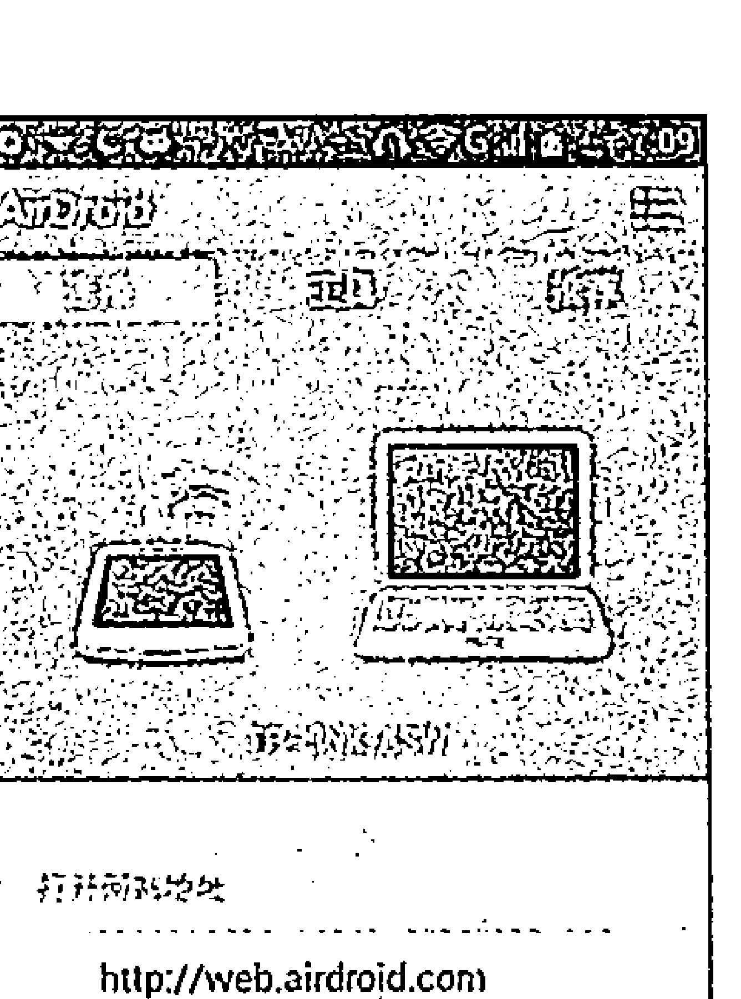

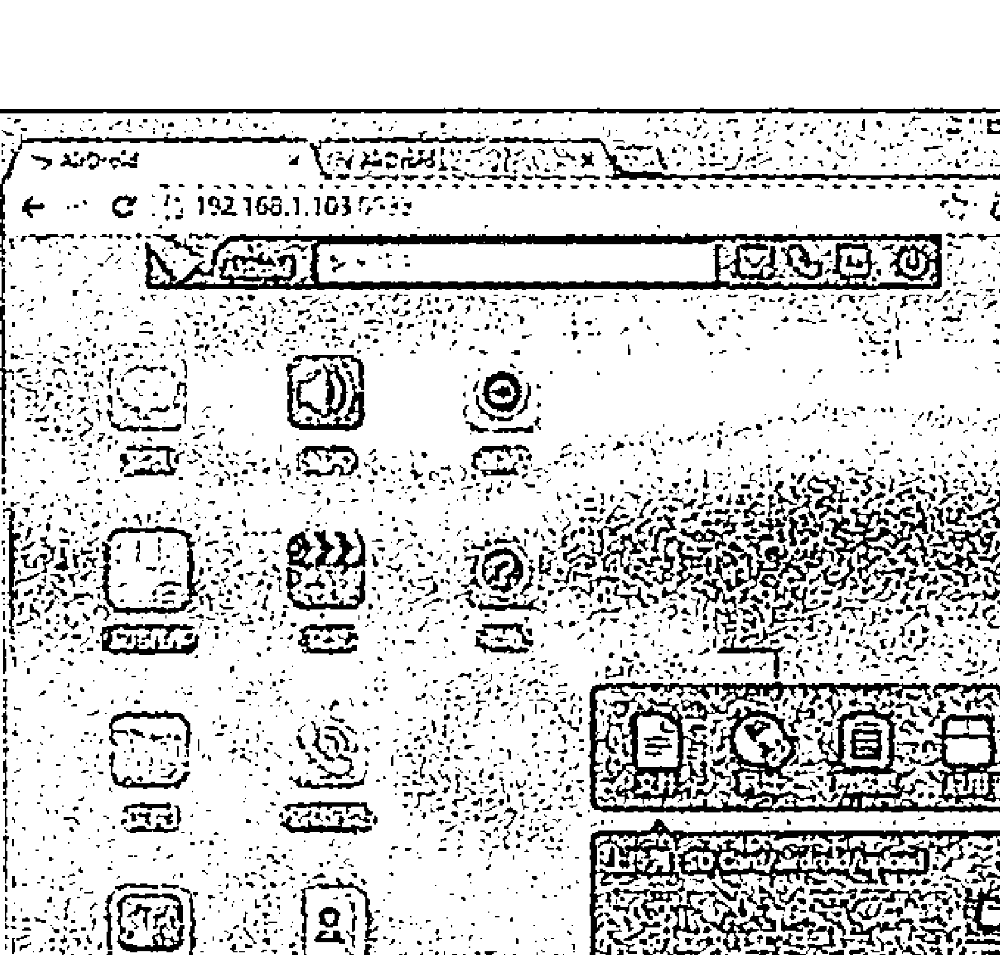

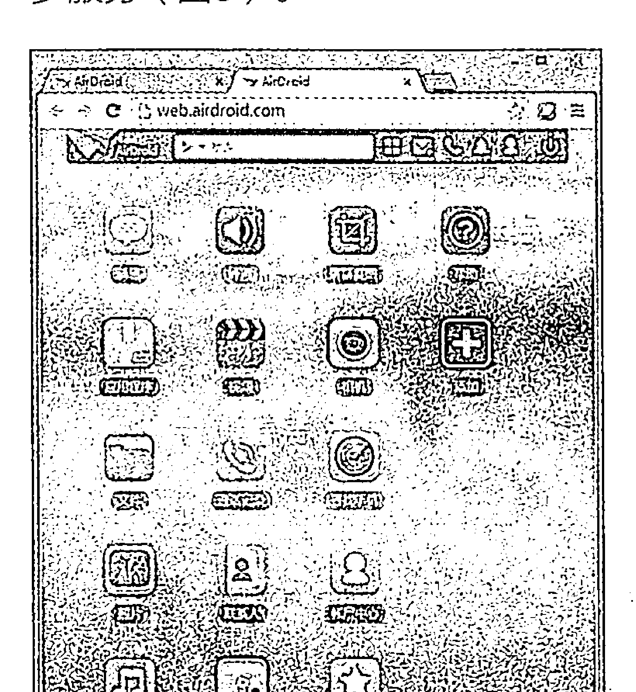

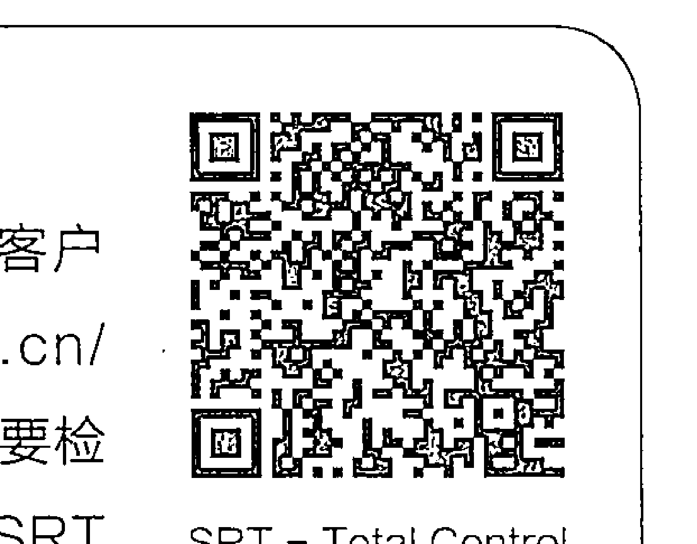

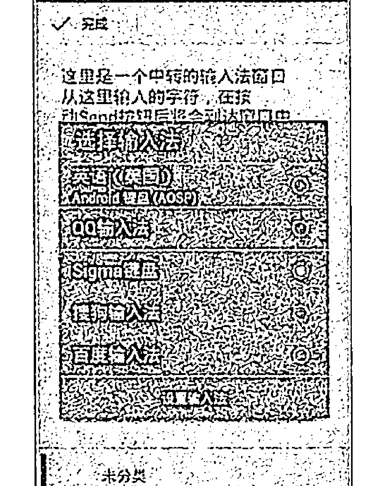

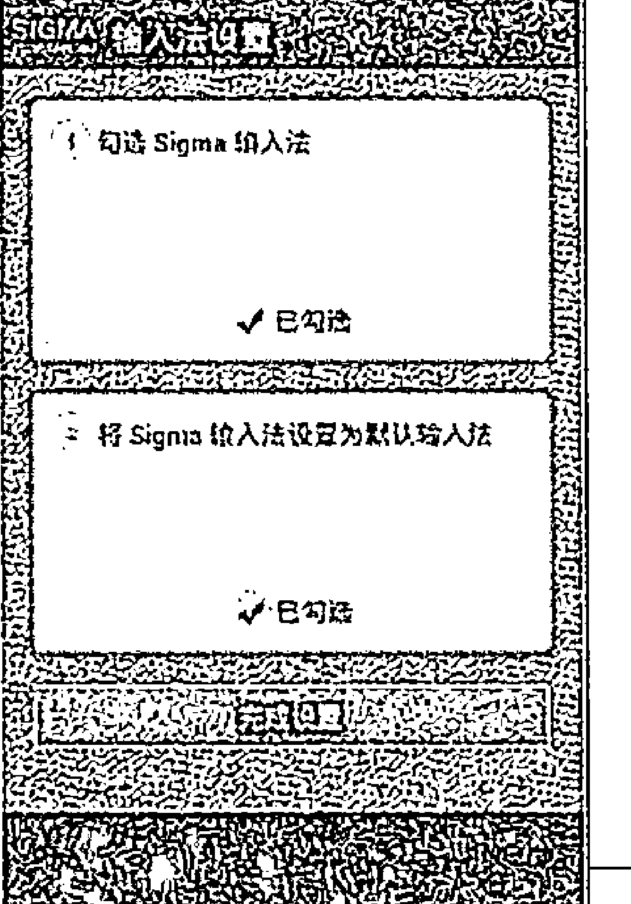

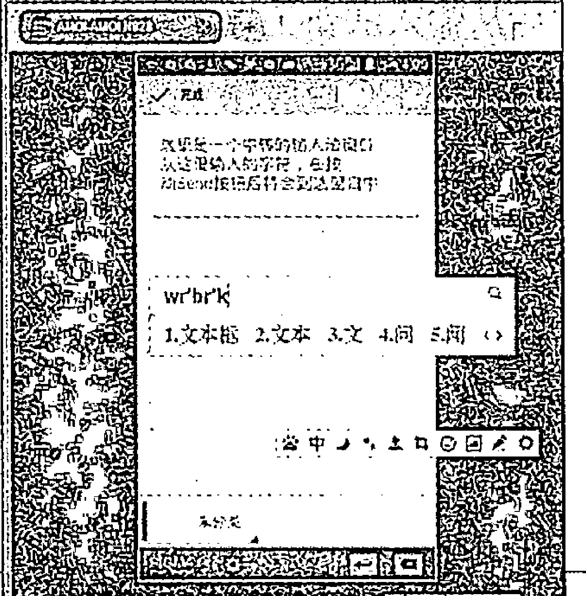

### 唱写并用 解放手指输入

小屏幕和大指头的矛盾已经成为铁的事实。再怎么想办法，用手按键盘的输入办法也赶不上在PC上输入的畅快淋漓。俗话说，君子动口不动手。那么，何不借用这一招，用口来代替手输入。

我们可以借助于讯飞语音输入法或百度输入法中的语音输入来实现不动手只动口的输入。语音输入法对输入者的发音有一定的要求，标准的发音会占有优势。但这些采用了中科讯飞语音核心技术的输入法，目前的识别率已经很高，用一下你就会知道的。而且现在已经开发出粤语、四川话、河南话、东北话等多种方言识别方案可下载挂接。语音输入不可能做到百分之百精准，但识别速度极快，对于个别有错误的地方，可以借助于手写输入或拼音输入来更正，输入总体效率会很高。

### 云端协助 为手机注入活力

既然在输入速度方面PC总是占据优势，手机不能硬拼，那么何不借力打力，借助于PC和云的力量来为手机注入活力。下面介绍4种常用方法。

### ① 借力云笔记快速注入信息

在电脑端安装有道云笔记PC客户端，同时在Android手机上安装Android版的有道云笔记APP。当手机里需要大段信息的时候，可以先在PC端有道云笔记里建立新笔记并录入信息，录入完毕后点击“同步”按钮，笔记内容就同步到网络服务器中。然后在手机端启动有道云笔记，连上网并执行一次同步操作。这样，PC端输入的内容就出现在了手机端的有道云笔记文件中了（图9），如此就可以在手机中对信息进行利用。


### ② 借力网盘共享文本数据

除了云笔记，我们还可以借助网盘，通过PC为手机注入信息。首先在PC和Android手机端分别安装相应平台的同种云盘（推介360云盘或百度云盘），然后以相同账号登录两端的云盘。在PC端用记事本录入文字后上传到云盘中，在手机端云盘文件窗口中刷新显示，即可看到刚才建立的文件，打开即可在手机中利用这些文字了。

### ③ 神码传文为手机提供信息

我们还可以用一种新玩法，通过PC为手机注入文字信息。安装最新版的百度输入法PC版，然后从输入法新工具窗口中选择安装“神码传文”小插件。之后，在PC百度输入法神码传文小窗口输入140个字以内的文字，接下来用手机扫描神马传文窗口右侧的二维码（图10），文字信息随即进入手机，即可在手机中利用这些文字了。

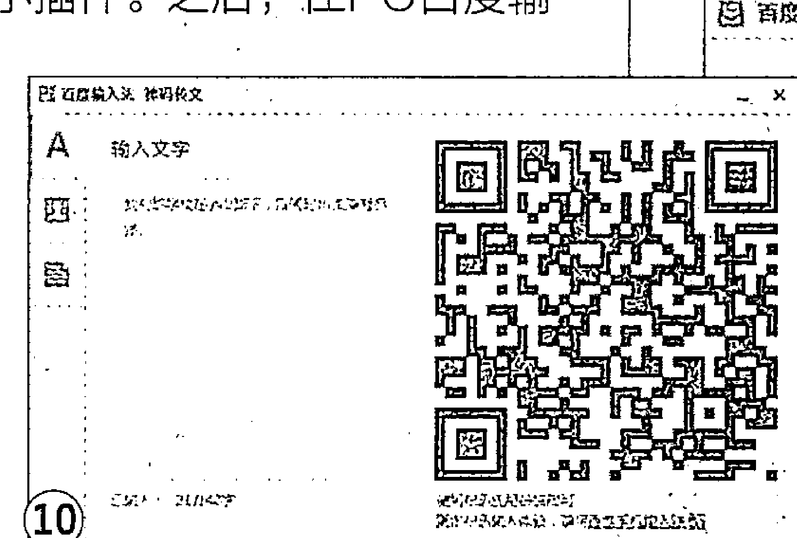

### ④ 亲笔信实现快速签名输入

有时我们需要设计手写签名，在没有手写笔的情况下，用鼠标手写汉字，很难把握。这时，我们可以发挥手机触屏人性化输入的优势，快速生成手写体样张。

PC端切换到百度拼音输入法，从输入法工具箱中启动“亲笔信”输入模块，在界面下方选择“切换为云端输入”按钮，窗口会出现二维码图片（图11）。手机扫描PC上显示的二维码，手机会自动开启百度输入法亲笔信输入页面（要求手机与PC处于联网状态）。

通过触屏手机自由手写输入签名信息或其他信息，PC窗口随即出现输入的内容。

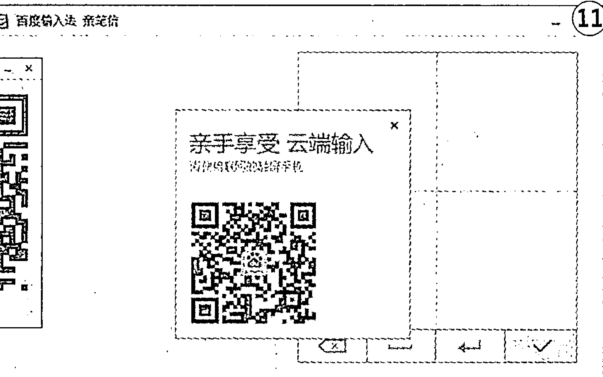

外部借力受一定的条件限制。比如人在户外处于移动状态时，外接键盘或设备就显得不方便或不可能。离开了工作台，用PC来控制手机的方法也变得不太现实。因此，我们还需要从手机输入法内在的功能上来进行挖掘，以提升输入效率。

### 1. 软件至上 选错会拖后腿

输入速度的提高与所选的输入法软件有关，更与软件中所包含的细节能有密切关系。越是对速度要求高的用户，越会对软件和输入方法有较强的依赖。初级用户，选择任何一款带有联想、模糊音、纠错功能的输入法均可满足要求，选择的范围比较宽泛。但基础好的高级拼音用户，选择就不能那么随便了。此类用户选择拼音输入法的目光就应该放在能提效的高级功能上，比如：是否有合适的双拼方案，云输入、智能记忆和调整是否丰富等（图12）。推介高级用户使用百度拼音、QQ拼音、搜狗拼音等手机输入法软件。


### 2. 键盘高度 别扭影响效率

手机输入一般用的是屏幕上模拟出来的软键盘。设备的尺寸不同，横屏竖屏显示方式不同，软键盘显示出来的实际尺寸也就自然不同，再加上用户手的大小、手指的粗细程度不同，那么屏幕上显示出来的软键盘肯定不能适合所有人使用。

在这种情况下，必须要求输入法能调整软键盘高度，才能解决这一问题。QQ拼音、百度拼音均可以对软键盘尺寸进行人性化的设置，可为舒适的输入创造有利条件（图13）。若觉得软键盘尺寸影响了我们的速度，可进入软件设置进行高度调整。


### 3. 击键次数 精减方能提效

为了减少击键次数，使用最精简的编码方案是必需的。而暗藏于拼音输入法深处的精简编码方案是双拼输入方案，通行的有六七套方案，虽然编码各不相同，但输入思路是相通的——用两个字母来输入一个汉字，不管汉字的拼音串有多长。这样，用户只要选中并记住任意一套方案，即可用近似于五笔字型的编码数来输入汉字了，效率可想而知。

双拼代码的记忆，工作量和难度很小，主要是用键盘上的某个字母代替复合的声母或韵母部分。每套方案总起来也就32个上下的代码需要记忆，比起五笔字型来要记忆的东西少得多，也容易得多（图14）。

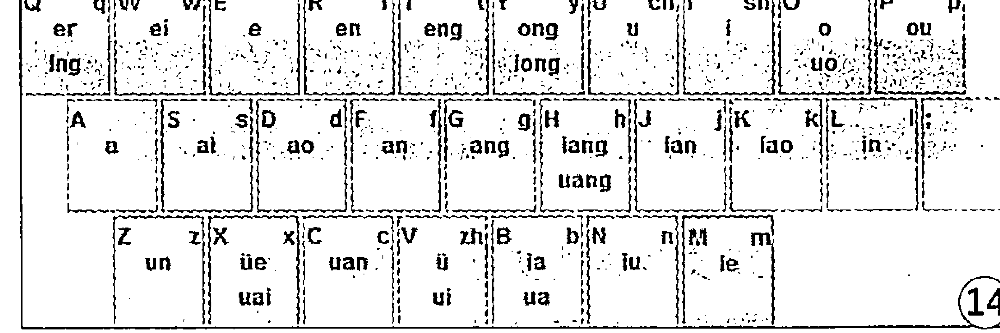

> 小提示
> 用简拼输入或用联想输入，虽然表面上看可以减少击键次数，但因为这些都是以增加选择队列的长度和选择时间为代价的，因此总起来对输入速度的后续提高不会有多大帮助。希望进阶的用户应该断然舍弃这些用法。

## PDF掌上阅读全解惑

文 | 书迷

### 1. 格式看清 再选PDF文件类别

PDF看起来只是一种文件格式，其实由于其中包含内容的不同，在手机上的阅读经历和体验效果会大不相同。比如，以纯文字构成的PDF文件，在手机中阅读一般会比较流畅；而以图文混排方式生成的PDF格式文件，在手机中阅读可能会出现版面错位、显示不全，或在缩放阅读时遇到麻烦；此外，以纯扫描方式形成的扫描版PDF或由照片转换而成的PDF相册，在手机中阅读可能会遇到流畅度、清晰度等众多问题。

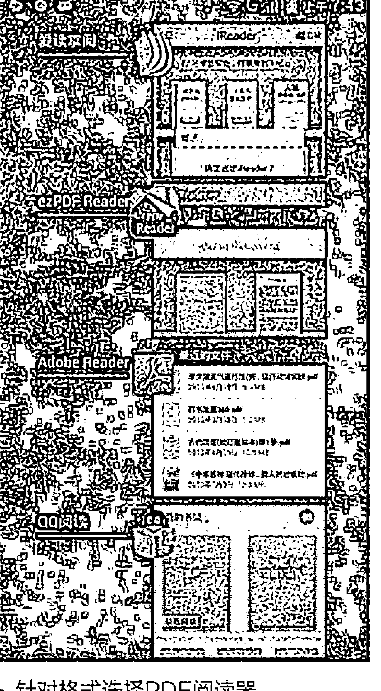

因此，在手机中阅读PDF，首先要对需要阅读的PDF类型有一个明确的认识。要根据自己的设备配置情况，搞清楚哪些PDF适合于自己的手机阅读。不分青红皂白将PDF拷入手机，发现不适合阅读的再删除掉，会招致劳而无功的结局。

> 小提示
> 对于配置比较低、屏幕尺寸比较小的手机，一般不要用来阅读体积比较大的PDF文件，尤其是图文混排或扫描版的大个头PDF文件。而对于目前流行的双核甚至多核的大屏幕手机或平板电脑，则不用考虑这个限制，运行速度一般不成问题，但也可能在幅面尺寸上遇到问题。下面我们会专门讲述。

PDF是一种通用性很强的电子书格式，然而，不同于在PC上阅读的随心所欲，受到屏幕尺寸的影响，用掌上设备阅读PDF电子书会有许多让人不如意的地方，因而许多人在阅读时会产生这样那样的困惑。

下面就以使用人数最多的Android平台移动设备（手机或平板）为例，与大家分享阅读PDF电子书过程中遇到的问题和解决办法。其中会涉及到一些PC处理工具，也会涉及到各种Android版的APP阅读工具。

### 2. 选好软件 阅读PDF要有针对性

由于PDF文件格式实际上存在上面我们说的三种情况，所以不能认为在手机中阅读PDF，只需任意选择一款阅读软件就能应对。能阅读PDF的APP有很多，但这些软件不一定能很好地支持我们手中的PDF文件，需要针对自己的PDF文件类型来选择阅读软件。

一般来说，如果阅读的PDF文件是小说类的文字为主的文档，则APP的选择应倾向于字体灵活设置和版面自适应功能强的软件。比如QQ阅读器、Adobe Reader、三星ThinkFree Office、多看阅读等阅读器。

而如果要阅读的PDF文件是扫描版的图书，因为其中的元素为图片，对字体和版面不可能重排或设置，只是限于缩放和显示清晰度、流畅度考虑，因而在软件选择上要考虑支持方便缩放、横竖屏切换、清晰度表现更佳的APP。比如Adobe Reader、ezPDF Reader、RepliGo等资深PDF阅读器。

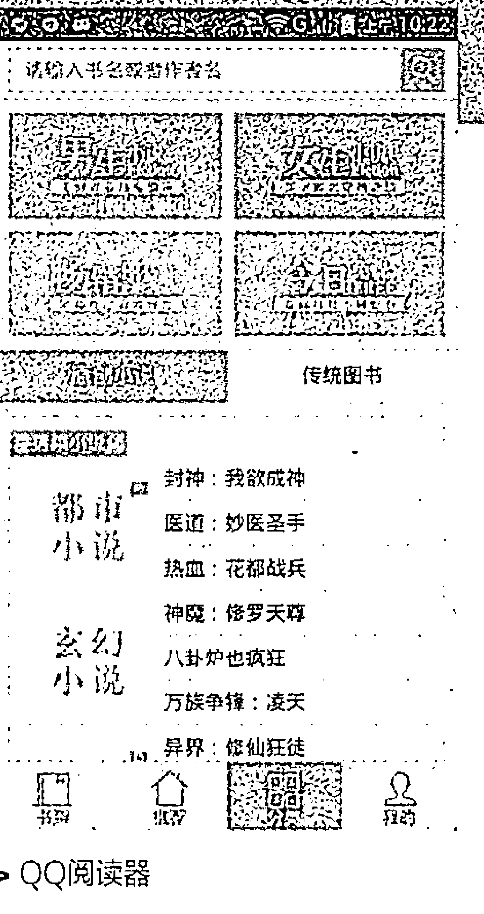

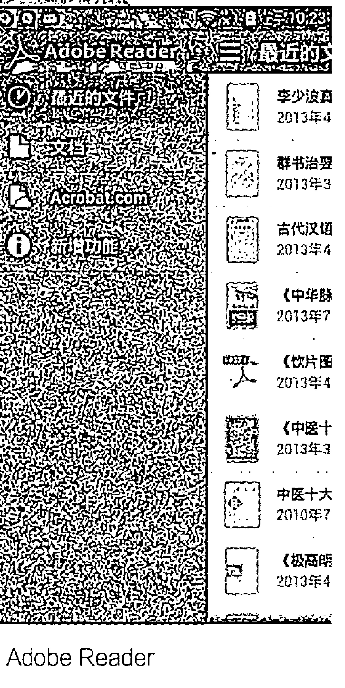

### 3. 自动重排 解决版面错乱

一些由纯文字组成的PDF文件在某些阅读器中阅读，会出现段落文字排列不整齐、换行不规则等情况，极大地影响阅读心情。在这种情况下，我们需要借助于具有版面文字重排的PDF阅读软件来解决。有的电子书阅读器本身不具有自动重排功能，比方说一些手机自带的PDF简易阅读器，这时就需要去另寻能够支持重排的APP了。

SmartQ Reader（智器阅读）等软件就能够实现自动重排版面。以ezPDF Reader软件为例，打开某电子书之后，若发现文字版面排列不符合要求，可以通过More Options选择Fitting to Text Column和Page Atuo Flipping项，即可实现版面文字自动适应和横竖屏自动显示切换效果。

再如，用三星办公软件ThinkFree Office，打开PDF后，通过特定命令也可达到重排文本效果。此外，还有“多看阅读”这款APP对PDF格式的阅读和重排支持得也比较好。

还要注意，在Android上实现PDF版面重排的基本条件是PDF要为纯文本，还有一个要求是必须有标签。所以在制作时能够加上纯文本标签最好，如果是成品但无标签的PDF，就需要手工添加。但如果书籍页面太多，工作量就会太大，这也不现实。因此多采取自动添加，但效果就难保证了，因为里边的各种逻辑或顺序都可能会出现问题。

> 虽说重排只限于文字版，但也有人尝试将专为Kindle版面重排的软件K2PDFopt移植到了Android，从而实现对扫描版PDF进行重排，让小屏幕掌上设备也能阅读大幅面的PDF扫描书。作者在Orion Viewer的基础上加入了扫描重排和OCR功能，但效果如何有待进一步检验。

### 4. 切边处理 有效利用版面

对于一些由传统书扫描而来的电子书，由于传统图书一般都留有比较宽的页眉页脚和左右空白边距，因此在手机中阅读，本来就很拘谨的小屏幕又被很大的四个白边占领，手动缩放又挺麻烦。这时如果能将白边切掉，只留下版心的文字，那么直接在手机中阅读，就会大大增加有效阅读空间。

首先，可以选择具有自动切边功能的阅读器，例如用QQ阅读器来切边。打开PDF扫描版电子书，按动手机Menu键，点击“裁边”按钮即可选择切割边缘。上面提到的SmartQ Reader软件也可以实现切边效果。

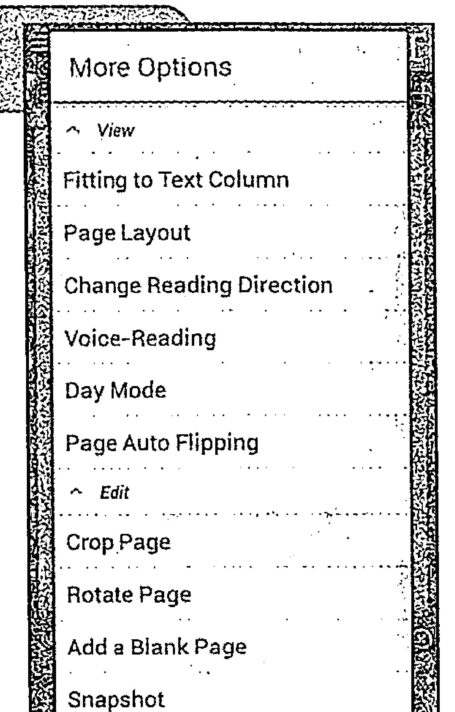

ezPDF Reader本身也有切边功能。

另一款PDF阅读器 ezPDF Reader本身也有切边功能，通过More Options选择Crop Page命令之后，屏幕上会出现黑色切边选框，通过八个选择句柄改变切边位置，设好之后点击OK按钮即可完成切边。

Mantano Reader也是一款具有PDF裁边功能的APP，它对奇偶页留白不同的文档也能很好地切去白边。而对于无法很好地切割的特殊情况，还允许通过手动选择缩放比例的方法作切边处理。有的阅读器（如RepliGo），可以通过将版面放大并移动到合适位置，把白边排除在视野之外，然后选择锁定水平位移，这样在翻页时就能达到类似切边的效果了。

有的移动设备档次较低，受处理能力的影响，因而附带的PDF软件也不支持任意缩放切边和版面连续卷动功能。这时最好的办法就是借助于切边软件，先在PC端将PDF文件的白边切割掉，再拷贝到移动端阅读。

我们可以借助于一款Briss软件，切掉PDF扫描版电子书每页的四个白边。具体的切边方法：通过文件菜单“File→Load File”打开要切边的PDF文件，接下来用鼠标左键框定要切割的版心位置，这时版心区域会以蓝色显示，可以自己调整。选择之后，点击“Action→Corp PDF”命令保存，即可获得切边后的PDF文件。将切边后的PDF电子书上传到手机或平板中阅读即可。

> 小提示
> 有的带有切边功能的阅读器，实际上是靠版面重排实现的假“切边”。对于扫描的PDF，因为是图像格式，是无能为力的。

### 5. 切分处理 解决长文档阅读

对于低档次的手机来说，要阅读大部头的PDF电子书可能是个问题。一是由于内存占用过大，打开的速度会非常缓慢（甚至造成死机）；另一个问题是，如果这本书的章节没有明显的目录索引，跳转阅读会是个问题。因此，有必要将此类书的电子档PDF文件，按照页码或章节切分为系列文件，然后拷贝到手机上阅读。

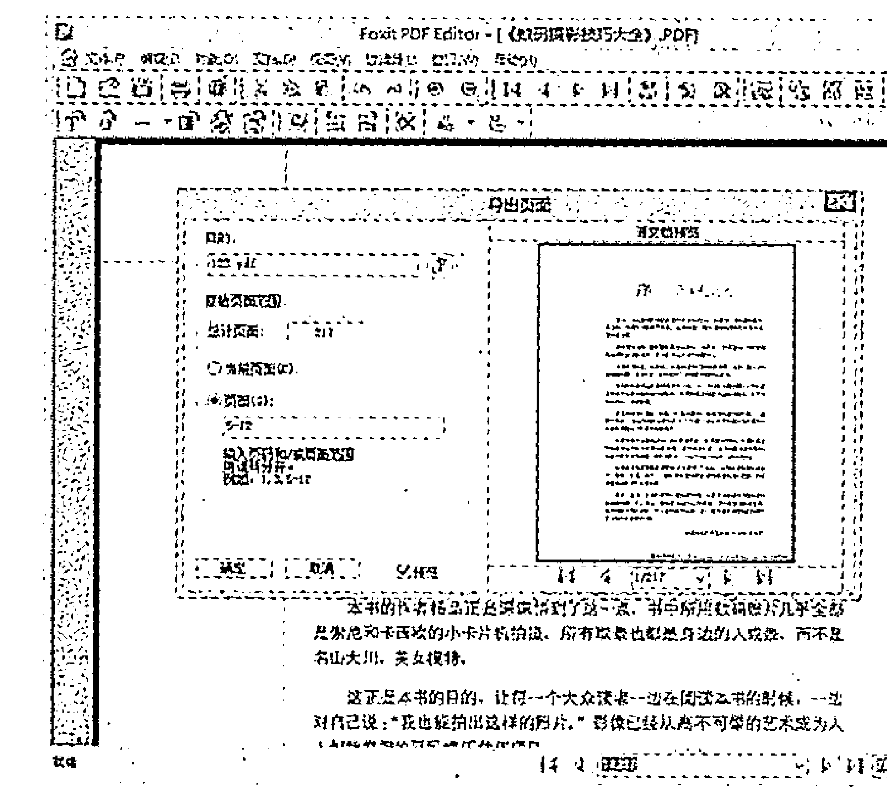## 减肥处理 搞定大文件阅读

在阅读过程中，我们可能会发现，还有一些PDF电子书，虽然页码不算多，文件体积却很大。比方说，平常一本100个页码的PDF扫描电子书的文件大小为10MB左右，但我们手中的100页PDF却有100MB开外。这一般是因为在PDF文件中夹杂了一些无用的元素，或者是因为图片庞大，没有经过压缩处理而造成的PDF文件“浮肿”。

在这种情况下，可以借助于专用软件先对PDF文件做减肥处理，去除文件中的冗余成分，在保证原有清晰度的前提下，对原始图片做压缩处理，从而获得更小体积的PDF文件。这样，将减肥后的PDF拷贝到手机里阅读，就会大大节省存储空间，一个手机存储卡也就能存储更多的电子书文件了。

中针对性地打开阅读。
可用Adobe Acrobat Professional或Foxit PDF Editor等专业PDF编辑软件来完成这项任务。读入PDF文档后，定义要切分的起始页码和终止页码，然后执行切分导出操作。切分处理后就可以有针对性地将部分页面拷贝到手机中阅读了，可以大大节省对手机内存和存储卡空间的占用。

我们可用软件组合的方式来人工来完成这项工作。首先用专业PDF编辑工具Adobe Acrobat Professional将扫描版电子书另存导出为JPG格式的图片文件，然后借助于ComicEnhancer Pro软件对图片进行压缩优化。优化之后，再用另一款软件FreePic2Pdf对优化后的图片进行组合，完成从图书拆分、优化到重组的全过程。实践证明，这种方法虽然复杂一些，但一般能达到预期效果，且比较灵活。具体过程详见本刊2012年第20期文章《PDF电子书减肥全程方案》。

若觉得以上过程太过繁琐，PDF减肥也可以借助于一款PDF-Tools专用工具软件来完成。启动软件后在主界面选择Simple Optimization of PDF(s)模块按钮，进入到优化设置窗口，选择Full Optimization可进行全盘压缩优化，而选择Custom Optimization则可以由用户灵活选择优化项目。这种方法对图文混排版的PDF比较有效，对图片扫描版的PDF不一定能达到预期效果。

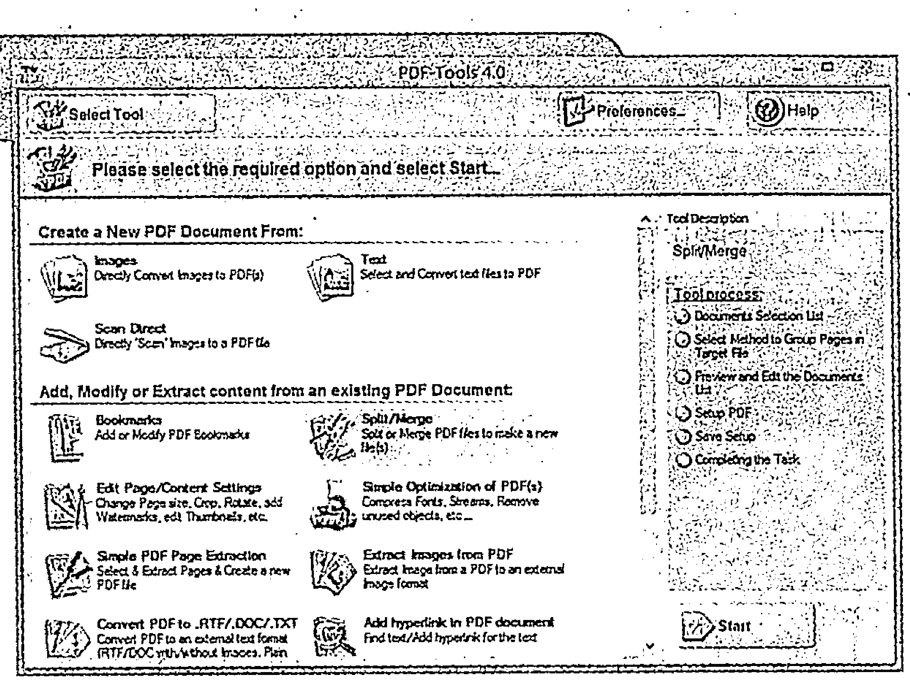

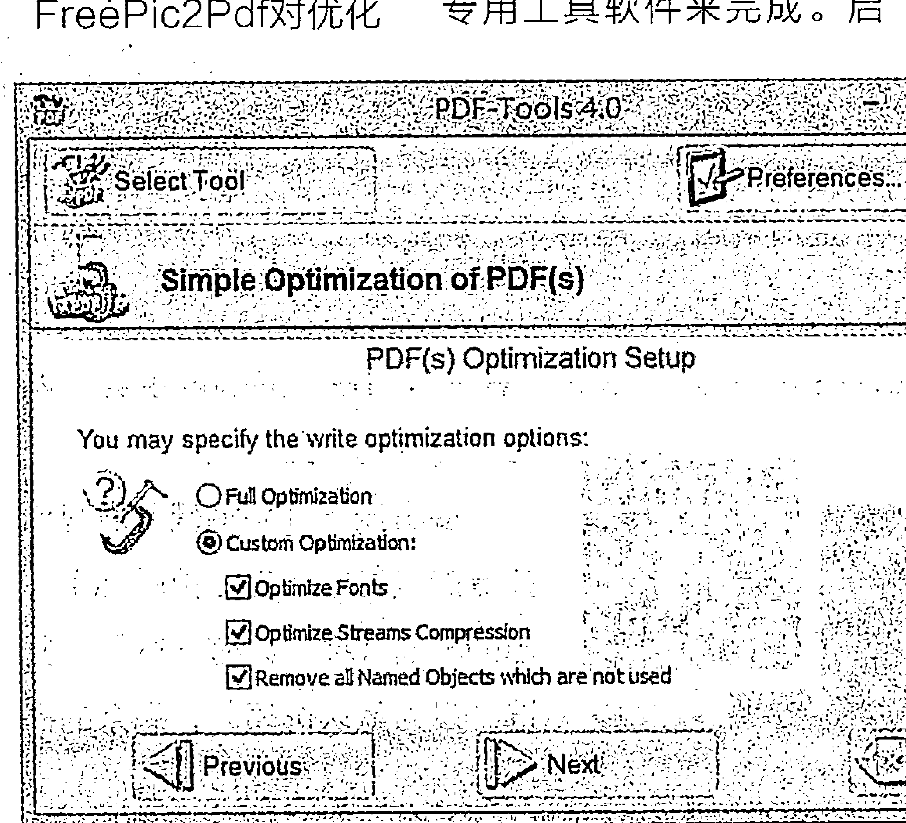

PDF压缩减肥还可以使用一款叫做PDF Shrink的软件来进行，该软件提供四种压缩优化方式。其中E-mail方式压缩后适合于发送邮件用，Print方式压缩后可保证打印效果，Web方式压缩则可以用来在网页中阅读，Smartphone方式压缩则提供给手机等移动设备阅读比较合适。本文案例我们无疑要选择Smartphone方式。

## 拒绝窥视 手机出借有保障

文 | 俞木发

手机里存储的东西越来越多，工作、私人用的很多资料可能都在里面。手机借给他人使用时当然不希望其他人访问到其中的隐私信息。那么，如何才能让出借的手机有安全保障呢？

### 就地取材 用好手机访客模式

适用：小米等有访客模式的Android手机

一些手机（如小米、联想S720）系统本身就自带“访客模式”，我们可以在手机借给他人使用之前启动该模式。以小米为例，只要进入“设置→全部设置→个人→安全和隐私”，接着选择“隐私保护”，然后将访客模式的开关设置为“开启”，并且开启“密码保护访客模式”即可（图1）。

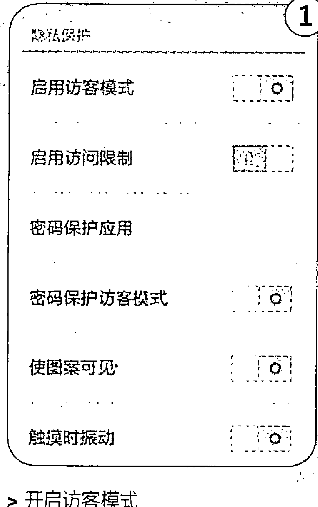

开启访客模式后，其他使用我们手机的人就只能使用该手机打电话，对于通讯录、短信、图片等隐私信息是无法查看到的。

> 小提示
对于本身没有访客模式的Android手机，可以到http://www.shenduos.com/下载适合自己手机的刷机包，刷入深度OS后即可使用其自带的访客模式。

### 因人而异 设置两套解锁密码

适用：Android 4.0以上的手机

对于没有访客模式的普通Android手机，我们可以利用“访客锁屏”来保护隐私。该应用可以为手机设置主人和客人两套密码，客人密码可以设定允许客人访问的应用，再也不怕隐私泄露。


首先下载访客锁屏应用，在手机上启动应用后先按照提示依次设置主人和客人的锁屏手势，两种手势不能相同（图2）。

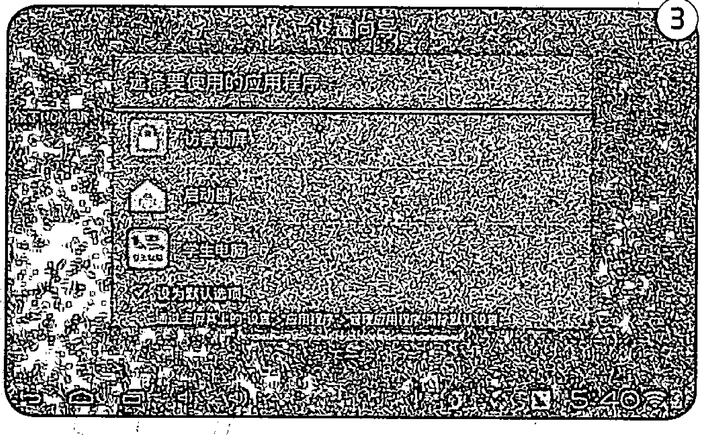

接着按下Home键（没有该物理按键的设备则点击主页图标），在弹出的界面选择“访客锁屏”，并且勾选“设为默认选项”，剩余的操作按照屏幕的提示完成设置即可（图3）。

> 小提示
上述操作是在客人模式下屏蔽手机的Home键，如果要恢复该键的功能，只要进入“设置→管理应用程序”选中“访客锁屏”，然后在打开的窗口“默认启动”下点击“清除默认设置”即可。

进入程序主界面后点击“设置”，设置应用的开机启动，并勾选“锁屏时启动访客锁屏”。

### 手机请勿用：秘密给应用加锁

适用：Android 4.0以上的手机

“访客锁屏”虽然好用，不过它要记住锁屏的手势密码，忘记密码后解锁比较麻烦。如果你是一个马大哈用户，那么利用“隐形锁”同样可以实现应用的无密码锁定。

首先到http://dwz.cn/cfanm1下载应用并且安装在手机上（注意不能安装到SD卡），应用是以窗口小部件的形式存在的。完成安装后进入窗口小部件设置，按住“Z_AIll”将其拖到桌面，接着点击桌面上的程序图标即可启动（图7）。

启动应用后，在打开的窗口就可以选择需要秘密加锁的应用了，比如手机借给他人后，不希望他们在我的手机上运行QQ，则点击应用列表的QQ图标，在弹出的窗口选择“保护”，被秘密保护的图标会显示红色“受保护”字样（图8）。

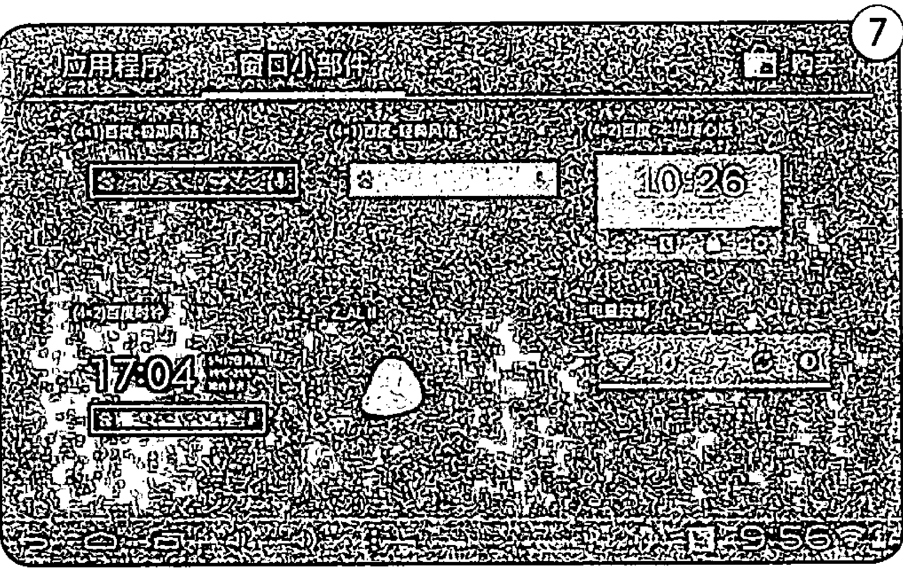

> 小提示
“隐形锁”是通过伪装加密应用运行状况出错来保护隐私应用不被他人启动，因此大家要根据隐私文件对应的打开方式进行加锁。比如，在你的手机上图片是使用系统自带的“相册”打开，则需要加锁列表中的“相册”应用。

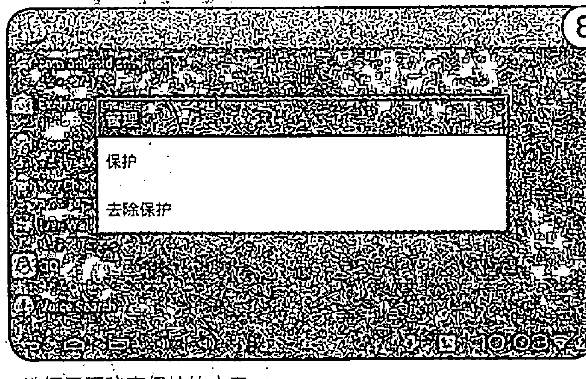

禁止下拉”。继续点击“应用选择”，然后在打开的窗口选择客人模式需要屏蔽的应用，比如只给朋友打电话，那么就只允许电话可用（允许的应用的小锁为灰色，禁止的则为黑色），然后将其他应用都设置为禁止（图4）。

当按下锁屏键返回桌面后，屏幕上就会出现上述设置的手势解码提示，我们可以按照不同的需要进行解锁。比如现在要给朋友使用手机，则用上面设置的客人手势解锁屏幕即可（图5）。

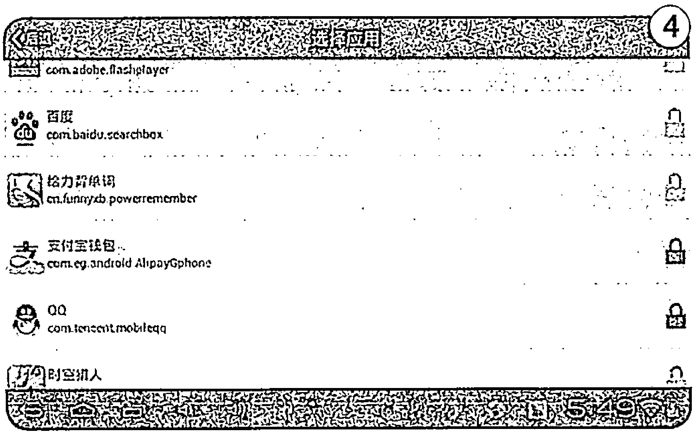

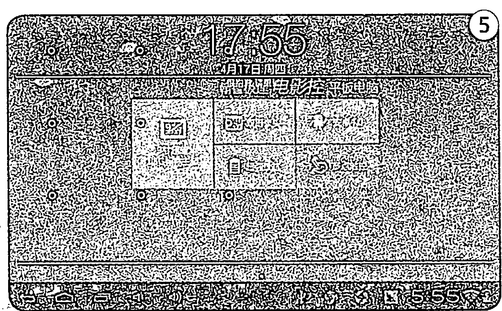

成功解锁客人密码后进入的就是访客模式，这里打开的是应用的界面，上面被屏蔽的应用都不会再显示，客人只能使用机主授权的应用，从而有效地保护了自己的隐私（图6）。

> 小技巧
如果自己忘记手势密码，只要使用数据线连接到电脑，然后在电脑上使用豌豆荚重新安装一次“访客锁屏”（手机锁定，豌豆荚仍可安装应用）即可自动解锁。重装后可以再次进入“访客锁屏”重新设置新的手势密码，或者直接卸载该应用。要注意的是，要使用豌豆荚安装应用，平时手机中“设置→开发人员选项”下的“USB调试”一定要勾选。其实类似的锁屏应用，大多可以通过豌豆荚重装的方法解决忘记密码的难题。

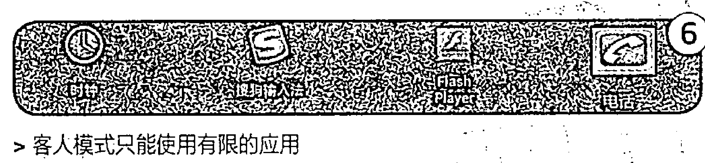

如果要进入主人模式，只要重新按一下锁屏键，然后再次输入主人手势密码即可恢复原样了。

继续点击“菜单→设置→解锁模式”，在打开的窗口选择合适的解锁方式，比如我选择的是“五连击错误消息模式”解锁（图9）。

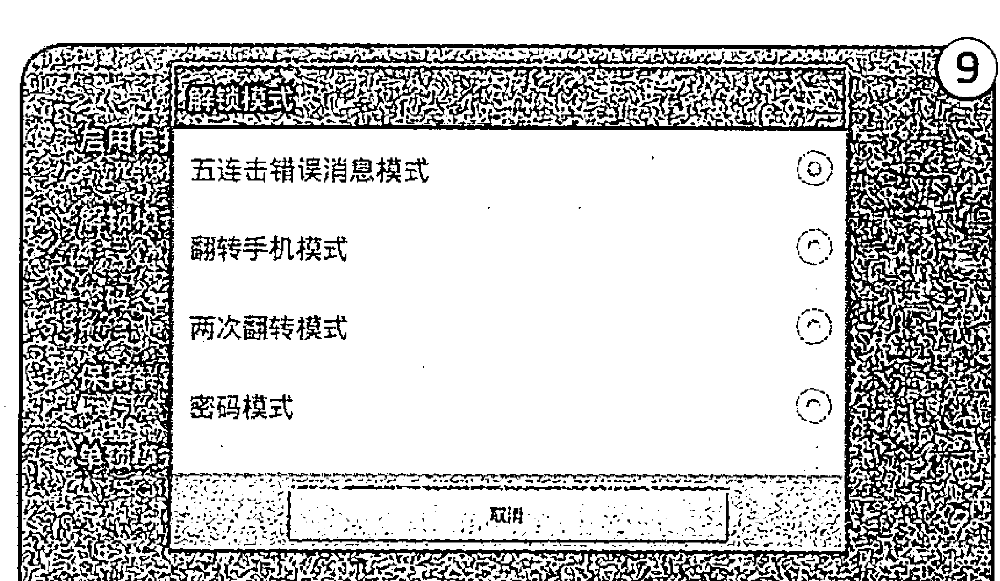

返回设置界面，勾选“单锁模式”，这样重新打开/关闭手机后受保护的应用仍然继续锁定。完成上述的设置后退出应用程序，同时将桌面应用的图标删除。由于应用是以窗口小部件的形式存在（在应用列表中不会出现），一般人根本不会发现。

(如手机QQ），屏幕上会弹出“应用程序意外停止”的提示，非常像系统出现了故障（图10）。

当然，如果自己需要使用手机QQ，只要对着中间的“应用程序QQ……”字样连续点击五次，手机QQ会自动解锁。其他加密应用的操作类似。

“隐形锁”的加密模仿了系统故障表现，相对要输入密码的解锁保护效果要好得多。这样手机借给朋友使用后，我们就可以用系统坏了的“正当理由”告诉他们不要开启隐私程序。

完成应用的加密后，现在如果点击手机中被加锁的应用

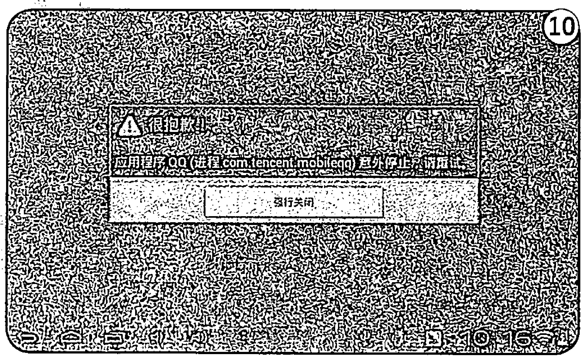

### Windows Phone 8/8.1 儿童园地保护隐私

适用：WP8/WP8.1手机

虽然Windows Phone 8/8.1是相对封闭的移动智能操作系统，但其自带的“儿童园地”组件同样可以用来保护你的隐私。儿童园地是类似Windows 8下的“来宾账户”，开启这个功能后，WP8可以切换到一个限制账户登录WP8系统，这个账户只能运行指定的应用。

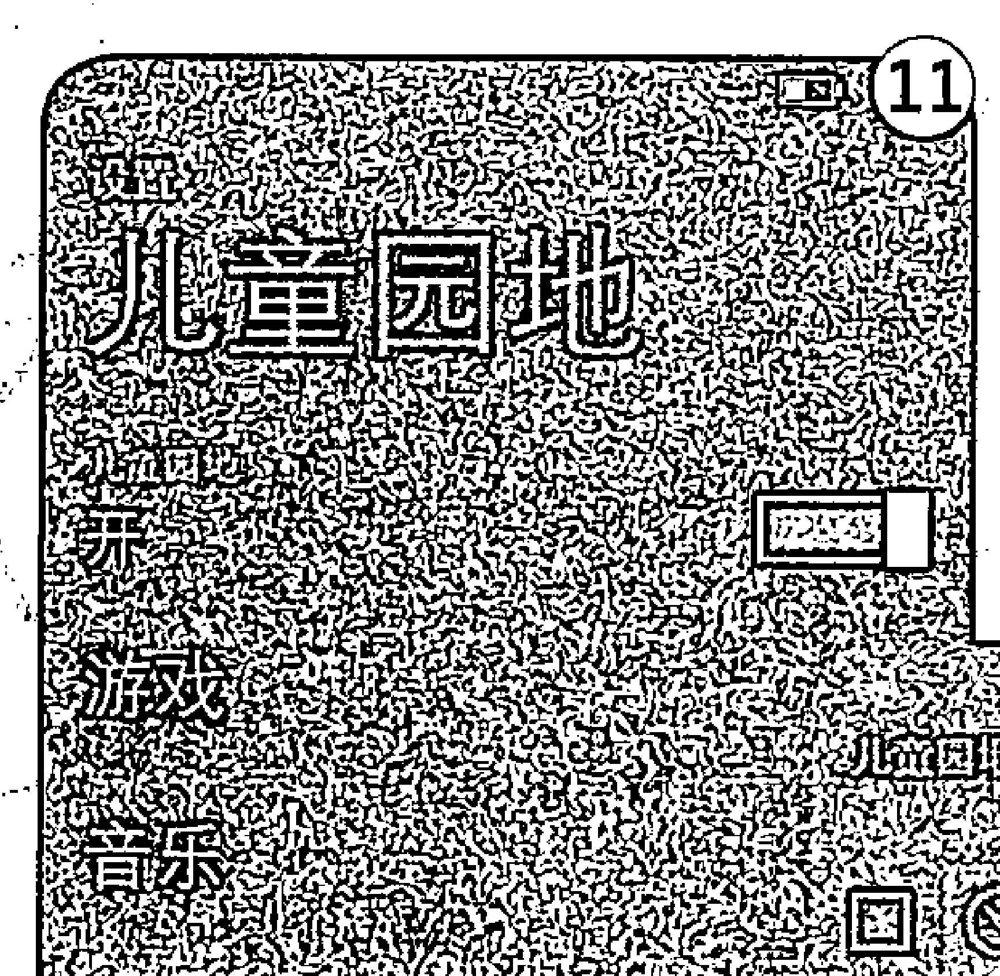

首先在开始菜单切换到“设置→系统→儿童园地”，然后开启这个组件，同时设置切换回原账户的数字密码（图11）。

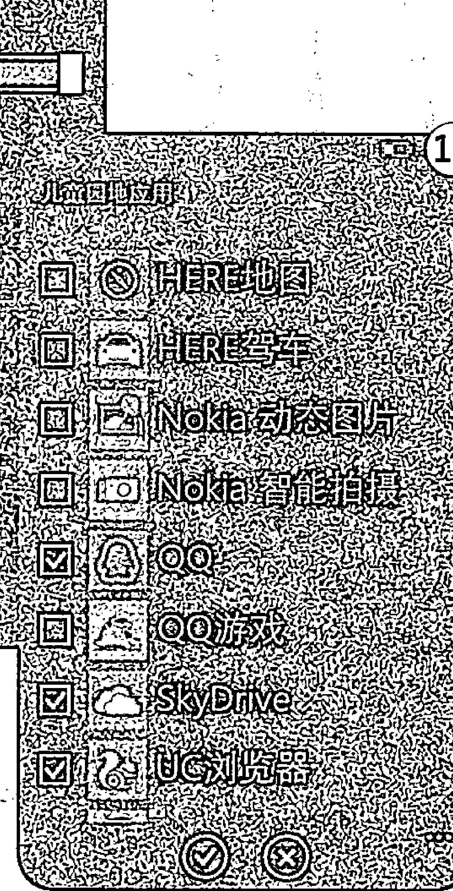

接着在打开的窗口按照自己的需要为“儿童园地”添加可以使用的游戏、音乐、视频和常见的应用。比如希望手机借给他人后只能用来上QQ，这里就只勾选“QQ”即可（图12）。

WP8的儿童园地对应用的控制非常严格，比如可能泄露隐私的应用（如电话、短信），以及涉及到手机设置的系统应用（如设置、IE）均无法直接添加到儿童园地。对于无法添加到儿童园地上的系统应用，我们可以在应用商店通过安装第三方应用来迂回实现。比如要让儿童园地用户上网，我们可以安装“UC浏览器”（替代无法添加的IE）；要开启蓝牙设置，则可以安装“快速设置”。对于自己安装的第三方应用，直接在应用列表长按，然后选择“添加到儿童园地”即可（无法添加的应用，菜单则变为灰色不可用）。

完成应用的设置后返回“儿童园地”界面，点击“启动儿童园地”，这样手机就可以切换到儿童园地账户的开始菜单，此时用户就只能使用这里列出的应用（图13）。

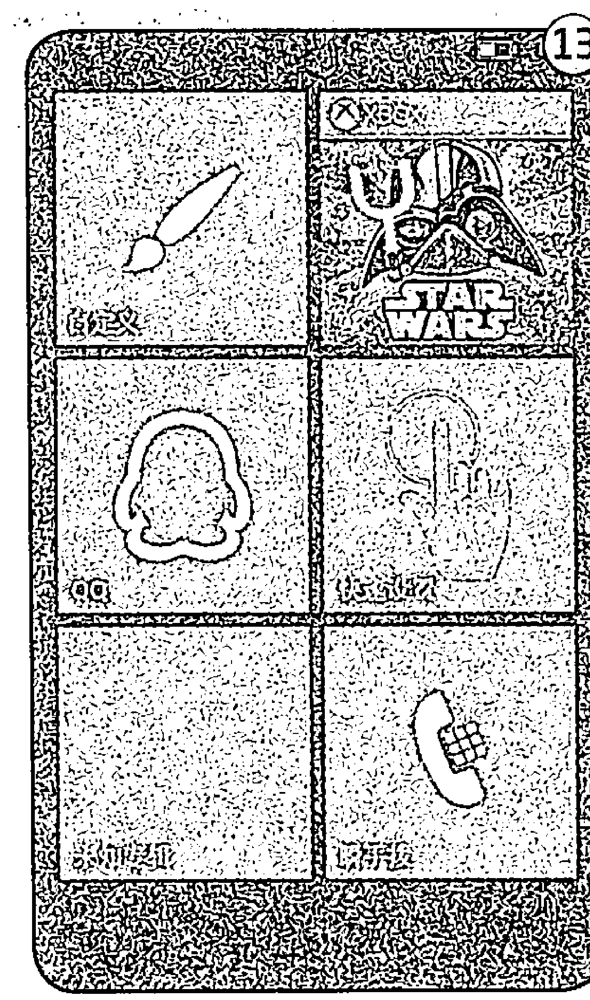

> > 儿童园地开始菜单，只能运行其中允许的应用

WP8的儿童园地对应应用的控制非常好，对于任何不允许的应用，如果用户强行使用，则会弹出“在儿童园地无法执行该操作”的提示，彻底杜绝自己手机隐私信息的泄露（图14）。

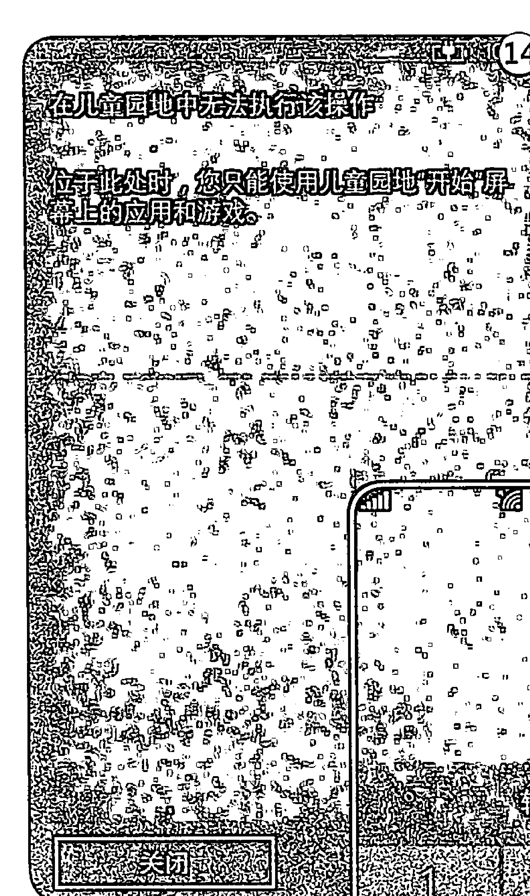

> > 在儿童园地不允许运行限制的应用

如果自己需要使用手机，只要随时按下电源键，然后在锁屏界面输入上述设置的切换密码，正确后即可返回原来的用户界面（图15）。


> > 输入切换密码后才可以返回原来界面

### iPhone用户善用“访问限制”护隐私

适用：iOS 6以上的手机

iOS同样是封闭系统，为了防止其他用户访问手机上的隐私应用，iOS自带“访问控制”组件来阻止非授权用户对应用的访问。依次进入“设置→通用→访问限制”，在这里开启应用的访问限制。比如需要限制手机用户访问手机里的图片，则只要在“隐私”下开启“照片”加锁即可（图16）。

这样手机用户就无法在iPhone上查看照片了，不过这个限制对自己也同样适用。如果需要取消限制，同上进入隐私设置下开启即可。

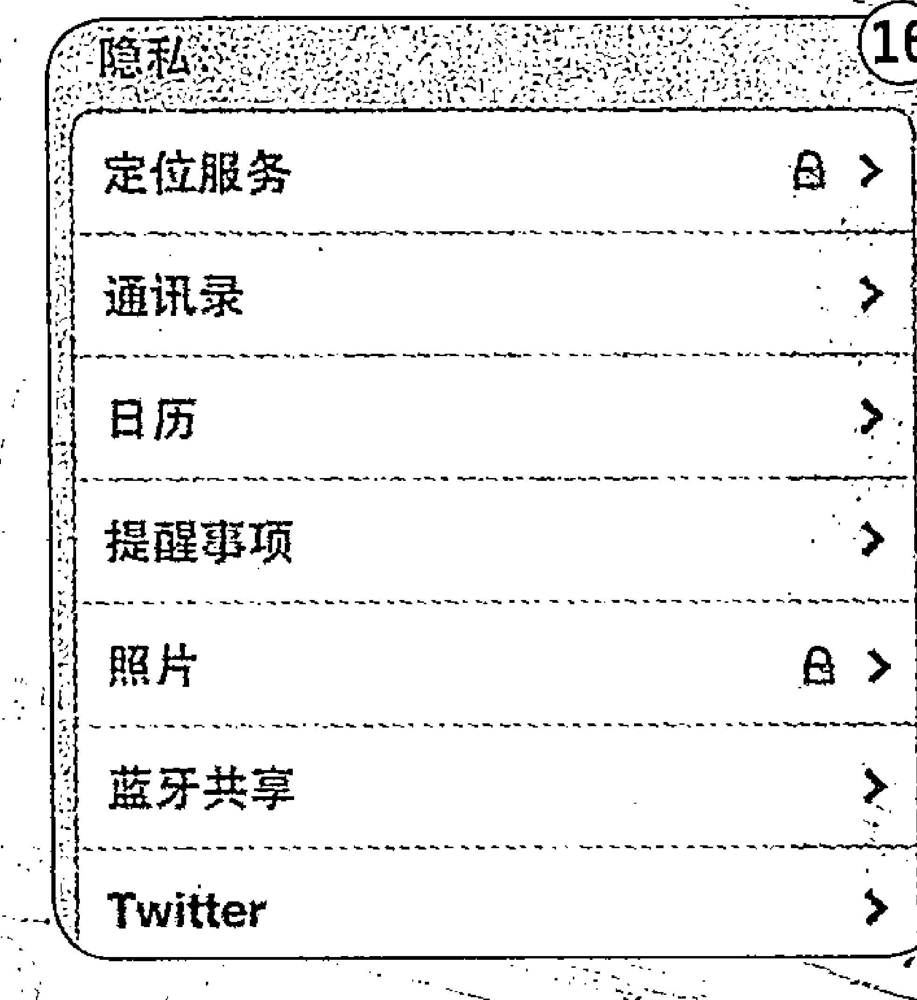

> 小提示
开启访问限制需要设置访问密码，如果你忘记了这个密码，可以参考http://t.cn/zT7qSY9一文的介绍，通过电脑重置访问密码。

> > 开启照片访问限制

## 问出Android手机使用误区

文 | 飞雪散花

所谓“熟知并非真知”，在日常使用Android手机的过程中，有些做法看上去非常正确，其实它们却是不折不扣的误区。

### 误区01 省电：要安装专门工具

误导指数：☆☆☆☆☆

误区解析 省电应用的“省电”手段，主要是通过对处理器降频、关闭蓝牙及网络功能、降低屏幕亮度等实现的。但由于此类应用会常驻内存，并会在后台频繁地激活自身，所以其本身就是一个耗电大户。用此类工具来达到省电的目的，无异于饮鸩止渴、引虎自卫。正确的做法是通过系统提供的功能，经过合理设置来达到省电的目的。

目前，为方便用户快速地开启或关闭某些功能，许多手机都提供了快捷开关菜单，我们只需用手指沿屏幕上方下滑，然后在出现的“通知”列表中选择“开关”（图1），即可打开该菜单。在这里，我们可以根据自己的需要，轻松关闭和开启包括蓝牙、Wi-Fi、数据、旋转、GPS、振动等在内的诸多功能（图2），也可以通过关闭“自动亮度”功能，然后用手指拖动下方的滑块，对屏幕亮度进行任意级别的指定。由于这些操作一触即可完成，而且要关闭的功能都是根据自己的实际需要决定的，所以无论是在操作的繁简程度上，还是灵活性上，都要远远高于省电应用。从图3中我们可以看出，在手机所有硬件当中，屏幕是耗电大户，不用时应及时关闭。

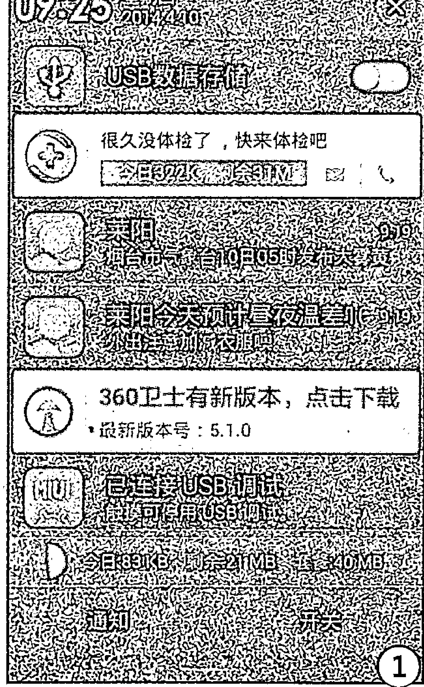

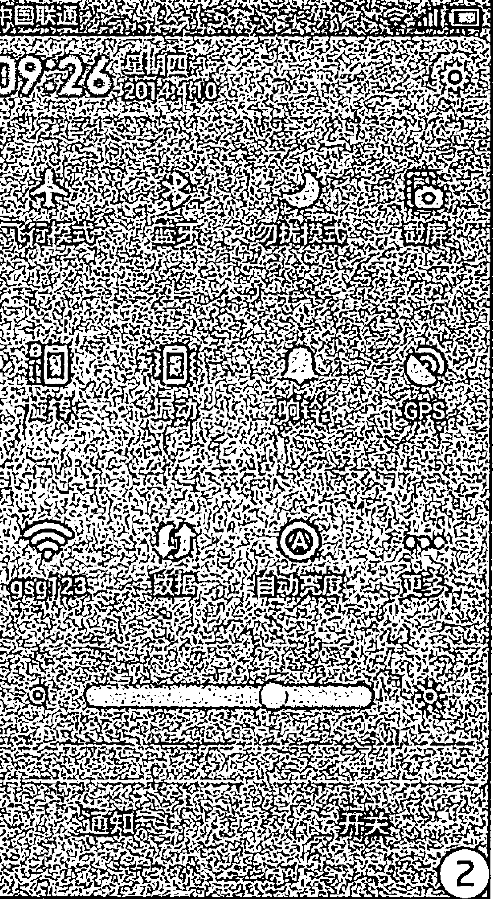

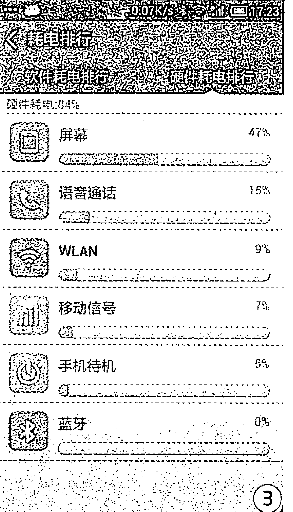

### 误区02 优化系统：惯于借助外援

误导指数：☆☆☆☆☆

误区解析 优化的目的是为了让系统运行起来更流畅，而优化工具的存在，恰恰会耗去手机较多的资源，所以求人不如求己，在感到系统运行缓慢的时候，自己动手利用系统本身提供的功能，中止那些不需要的进程才是上策。

点击屏幕左下角的菜单按钮，在出现的菜单中选择“系统设置”，进入相应的界面，切换到“全部设置”标签（图4），选择“应用”。

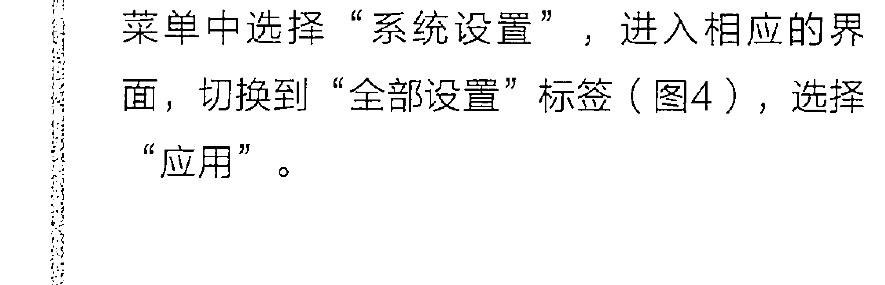

在接下来的界面中，切换到“正在运行”标签，在列表中，我们会看到当前运行的所有应用及其运行的进程、服务数量和当前占用的内存（图5）。

选择不需要的应用，进入应用详情界面，点击“结束运行”按钮，即可终止该应用。如果我们想终止的只是该应用的某个服务，只需点击对应服务下方的“停止”按钮即可。

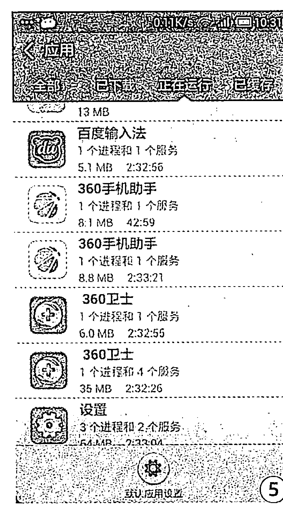

### 误区03 电池校正 常常借助软件

误导指数：☆☆☆☆☆

误区解析 手机电池用久了，很容易出现待机时间变短的情况。造成这种现象的原因固然很多，但刷新系统后，电池依然会顽固地记忆在上个系统中的电量信息，是一个重要原因。因此，我们只需将记录有电池信息的batterystats.bin文件清除，再让其重新记忆新信息即可。通常为达到这个目的，许多朋友喜欢用电池校正应用来实现，实际上，目前的此类软件多是骗人的，毫无效果，所以要校正电池，最好还是自己亲自动手。

在手机已经Root的前提下，可以这样操作：

在手机中下载并安装“RE管理器”（如果你的手机中已安装其他同类文件管理工具，可不必安装），关机后将手机充满电，在不拔下电源的情况下重新开机，进入系统启动“RE管理器”，在其主界面中，切换到“根目录”标签，点击“挂载读写”文字链接，将当前状态设置为读写（图6）。

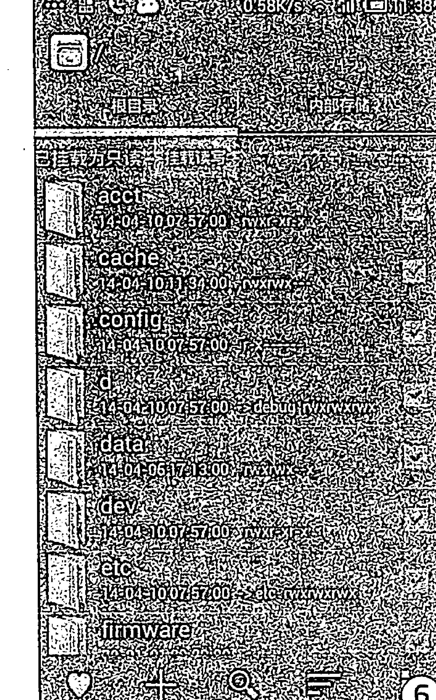

进入“/data/system”目录，找到并长按batterystats.bin文件，选择“删除”项（图7），将该文件删除。

然后拔下电源，正常使用手机，待手机没电自动关机后，等候一两分钟，再次开机，直到手机再次自动关机。此时，手机便已获得了新的电量信息，电池校正工作即告结束。现在关机充电试一下，电池的续航能力是不是有了明显提高？


> 小提示
如果你的手机并未Root，可以用下面的方法进行电池校正：在开机的情况下为手机充电，充满后，把手机拔下并关机。继续充电，待LED灯变绿后，拔下充电器，开机。进入系统后，迅速关机并再次充电，待充满后，拔下充电器正常使用即可。该方法和删除batterystats.bin文件相比，虽然在效果上稍差一点，但也能极大程度地改善待机时间变短的情况，有兴趣的朋友可以试一下。

### 误区04 提高运行速度 需要经常清理内存

误导指数: ★★★★★

误区解析 与Windows使用RAM并不一样。Android系统将一些应用保存在内存中，是为了以后再次使用时可更快地重复读取和启动。同时，为保证新运行的应用有足够的内存，Android系统会在可用内存达到一定值时，自动结束那些空闲时间最久的任务。所以，反复整理内存并不能提高系统的运行速度，恰恰相反，由于整理内存的应用本身要占用大量内存，且常用的应用会被从内存中移出，因此，往往会影响应用间的切换速度。实际上，影响系统运行性能的主要因素是CPU的占用率。

导致手机CPU占用过高的因素主要有以下几个：一是手机现有系统有缺陷，该问题只能通过重刷一个新的系统来解决；二是某个程序设计不当或兼容性有问题，导致大量CPU被占用；三是某大型应用占用了太多的CPU。对于后两个问题，我们可通过卸载该应用或终止其进程来解决。下载并安装Usage Timelines应用，启动后，在其主界面点击Show Load Timeline按钮，切换到相应列表，我们可清晰地看到当前正在运行的应用及其内存、CPU的占用情况（图8）。点击CPU占用率高的应用，在出现的菜单中，点击Details按钮，进入“应用信息”界面，在这里，我们可以轻松地通过点击“结束运行”按钮，终止该应用。而对于那些习惯性地占用CPU过高，但文件本身并不大的应用，说明程序本身的设计有问题，我们不妨点击“卸载”按钮，将其从系统中清除出去（图9）。

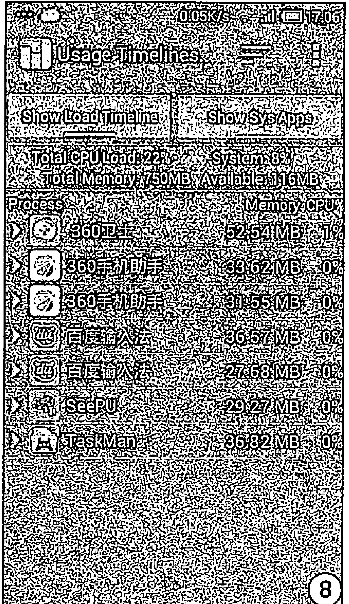

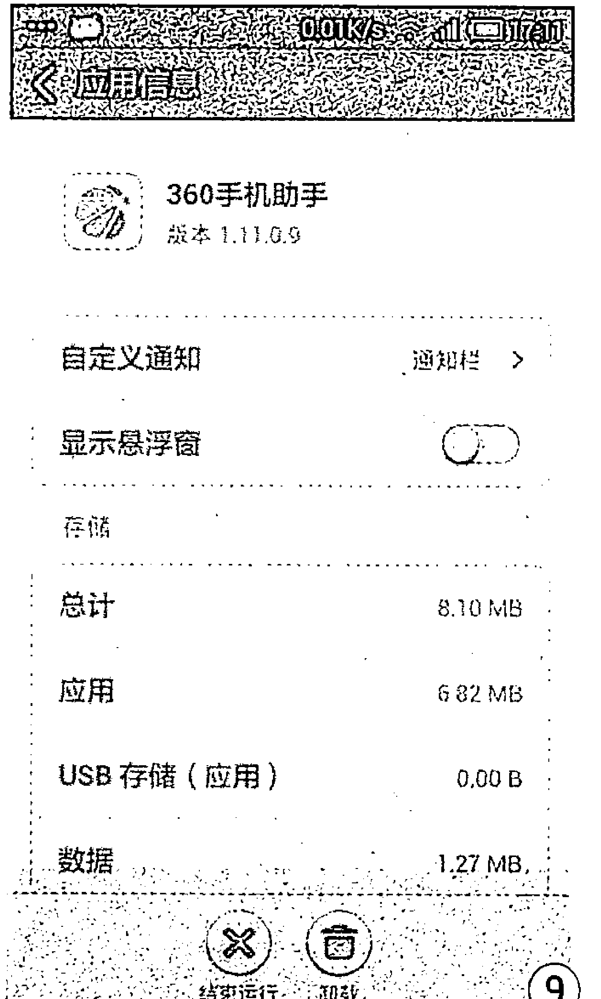

### 使用手机常见误区一览

| 错误做法 | 正确做法 |
| :--- | :--- |
| 新手机电池需要连续充电12小时才能激活 | 目前手机使用的大多是锂电池，出厂前已经激活，无需再行激活 |
| 充电次数过多会缩短电池寿命 | 电池使用寿命是按充放周期来计算的，该周期是指将电池电量用光然后再充满的过程。如果能在电池尚有电的时候及时充电，不完全充满的时候停止充电，会延长电池寿命，而非缩短 |
| 编辑长短信可省钱 | 每条短信的最高字数量为70，如果超出该数量，服务商将按70字一条来收费 |
| 像素越高拍出的照片越清晰 | 像素表示的是可拍出的照片大小，照片质量其实取决于图像传感器 |
| 手机电量越小通话时辐射越大 | 信号较弱时，手机会加强辐射强度，以便接收更多信号，所以手机辐射强度和信号强弱有关，而和电量无关 |
| 过度充电会引起手机爆炸 | 原厂电池的内部已做好了防范措施，一般不会出现爆炸的现象 |
| 晚上习惯将手机放在枕边 | 手机辐射对人的头部危害较大，长期放在枕边，会引起头痛、头昏、失眠、多梦和脱发等症状，所以应远放为好 |
| 拨号后立即将手机放在耳边 | 手机信号刚接通时功率最大，辐射最强，所以在接通瞬间要让手机远离头部 |

## 两分钟轻松搞定无线充电功能

文 | 沈建苗

智能手机用起来很过瘾，但最要命的地方就是电池不给力。现在很多手机要是能用上一天就算你幸运了。于是，我们只好给手机反复插拔充电器。这时候，无线充电技术就能帮大忙。如果你经常在同一个地方给手机插上电源，就完全可以将手机搁在一块小小的充电垫上，充电垫会给电池充满电。

### 打造无线充电Galaxy S4

虽然热门手机Galaxy S4本身并不带无线充电功能，但添加这项功能可谓小菜一碟，如果你能将后盖拆下来，就能做到这一点。我们就以Galaxy S4为例，实际动手起来甚至比你阅读本文还来得快捷，只要遵照下面这些简单的步骤。

淘宝上有针对Galaxy S4的无线充电接收器和套件，价格大概在60元到250元之间。三星支持Qi充电标准，LG、诺基亚、华硕、HTC、华为、摩托罗拉和三星等主流厂商也支持Qi，所以你的选择余地很大，所以市面上有好多兼容的充电垫，它们基本上都是相互兼容的。

不过选购时要注意所购接收器的厚度，以Qi Wireless Receiver这一款为例，因为这款接收器特别薄，安装好也不会引起Galaxy S4背面塑料壳凸起来。三星还销售一款官方升级产品Wireless Battery Cover，整合到新的GS4塑料背面中，因为有细微的厚度增加，与无线充电模块之间的兼容性更佳。

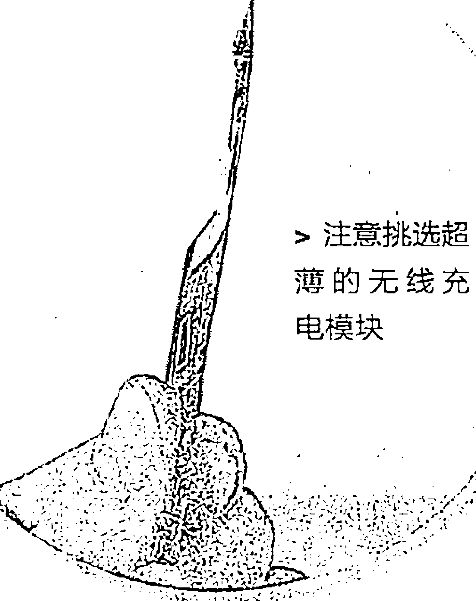

### 添加无线充电功能

关掉手机拆下后盖，你会看见在背部中上位置有两个金属小孔。在这里需要将接收器上面的小小金属插脚与手机内部的两个小孔对齐，最后等于就是把这个无线充电模块在电池上方平摊开来。合上后盖后，基本上已大功告成了。现在，你的手机搁在任何Qi无线手机充电器上，就可以无线充电了。它完全可以像最新面市的Nexus手机、HTC和LG手机以及诺基亚Lumia手机那样实现无线充电。

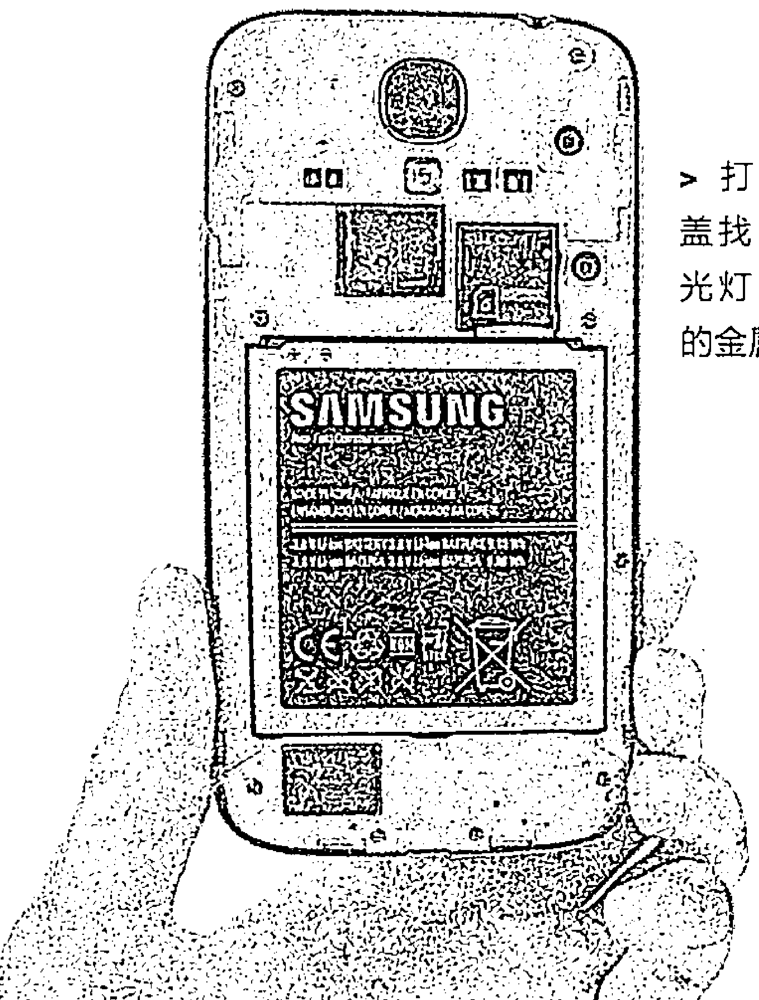

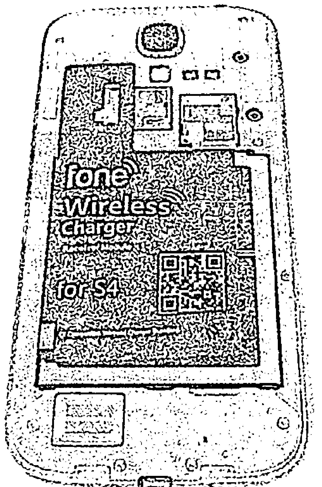

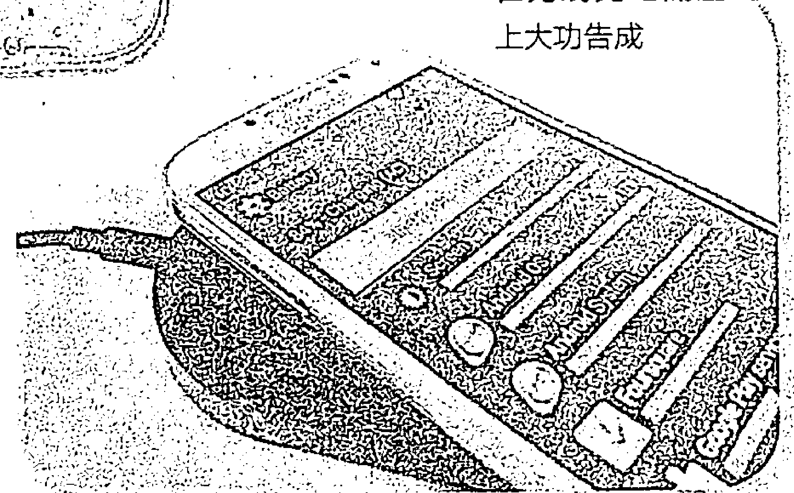

## “好声音” 掌上也能打造

文 | 刘浩然

K歌和做串烧常常是通过PC来实现的，而智能手机或平板多数人只用来听听音乐而已，用掌上设备K歌或做音乐串烧的人可能还不多。实际上，K歌和做串烧不但PC可以做到，普通的Android掌上设备也不在话下。我们既可以用手机或平板K歌，也可以利用这些智能设备轻松打造掌上歌曲串烧或做音乐变声，快速打造出便携式的“掌上好声音”。

### 掌上K歌 好声音随时带

在家用电脑上可以尽兴K歌，而移动版的酷我K歌更会随时给你带来酣畅的体验，我们可以随时随地用手中的手机或平板来实现我们的音乐梦！

从网上下载并安装Android手机版的酷我K歌软件，进入主界面后，我们可以看到上方的热门作品、K歌达人和最新作品，这些都是K友们上传到K歌广场的（图1）。

以歌曲“花海”为例，我们看看如何在手机等智能设备上K歌：

进入点歌台，搜索“花海”，点击“点歌”。再操作时我们就可以直接从已点歌曲中找到上次点的歌，在“已录歌曲”中可以快速上传歌曲（图3）。

接下来最重要的步骤：那就是用你的金嗓子对准麦克风开始K歌（图4）！

OK，唱完歌曲，接下来点击“保存”，APP会自动将刚才所录制的歌曲进行处理并保存（文件保存在kwsing/accompaniment目录中）。

小提示
如果你想急速体验一下掌上K歌，那么可直接进入点歌台，但你所录制的歌曲未经登录是不能上传的。要将自己的作品上传到广场上，需要进行免费注册再登录上传，你也可以用新浪微博和QQ账号来快速注册（图2）。


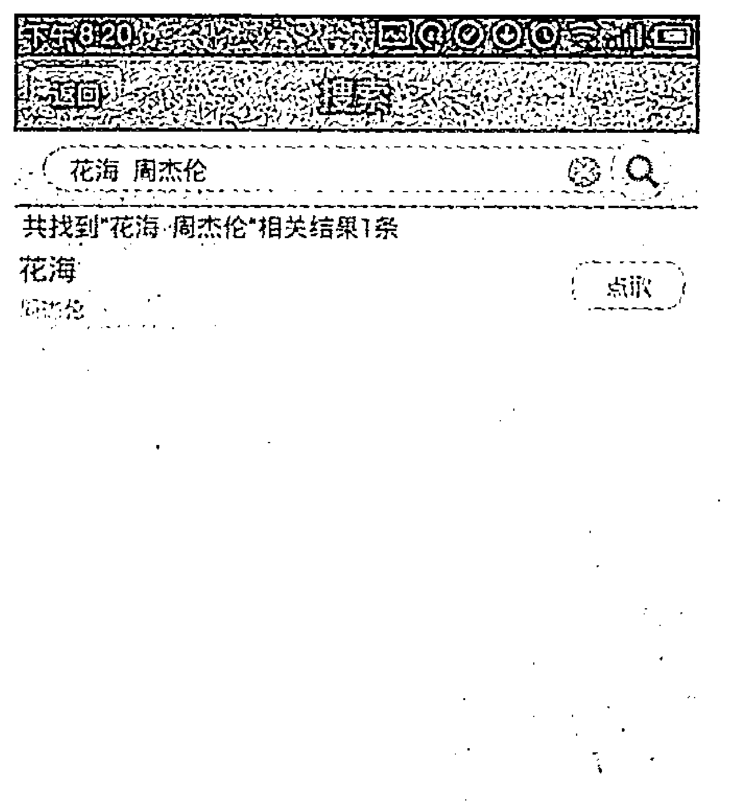

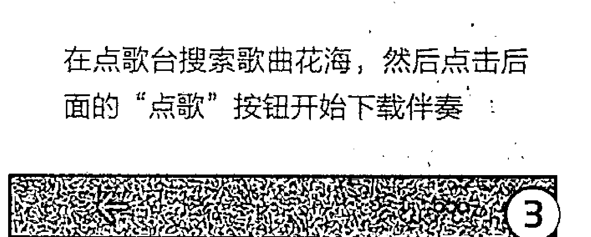

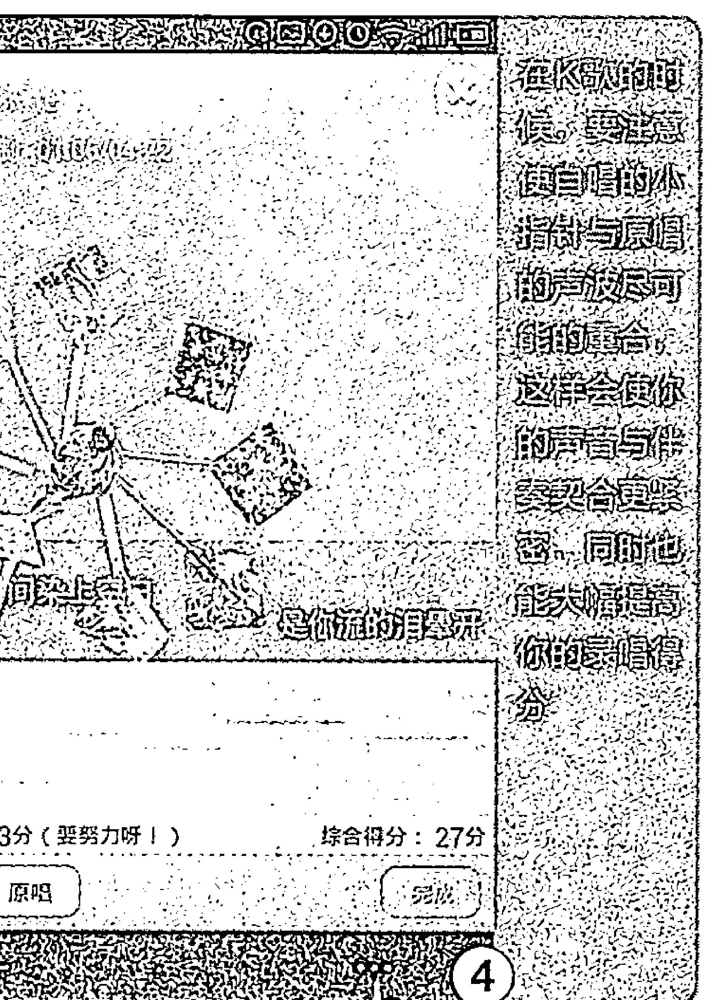

### 做串烧玩变声 平板也能玩Hi-Fi

### 掌上音乐串串烧

总有那么一类音乐是那么的贴合，前一首的曲终与后一首的前奏结合得如此融洽，如何用手机（或平板）将两首或多首完全独立的歌曲合并成适合自己的一首音乐串串烧呢？

首先，我们需要给自己的Android手机（或平板电脑）下载一款名为MP3 Merger的小软件（体积很小，才700KB）。安装完成后运行软件，进入主界面，一共有三个选项可供选择（图5）。

完成合成的音乐串烧文件将自动保存到sdcard/music/Mp3 merger目录下。

怎么样，打造一首自己的音乐串串烧是不是很简单呢？


-   1. 先点击第一个选项 Select first mp3 file（选择第一个MP3文件），根据文件目录找到所需的MP3文件
2. 点击第二个选项 Select second mp3 file（选择第二个MP3文件）步骤同上
3. 最后点击Combine（使两首歌曲组合在一起），此时弹出合成MP3的命名窗口，只需将名字输入并点击OK，最后弹出一个提示框选择Play即可

### 超级变声也好玩

音乐串烧做完了，接下来就告诉大家如何美化自己的声音吧！

有些歌曲是好听却难唱，或者说根本不能用嗓子唱出来。为什么呢？因为这类声音大都是后期合成的电子混音，简单地说就是将歌手的原声通过电脑后期合成变为更符合歌曲特色的声音，所以很多现场版的MP3中歌星们用自己的原声唱的就没有发行版的MP3好听。

其实想做到这点也很简单，这款名为超级变声器的APP就可以满足你的要求。下载安装超级变声器并运行，进入APP的主界面，先选择音效，我们就拿Alien（外星人）特效音来举例（图6）。

超级变声器主界面，最上面的REC VOL是用来调节录制音量大小的

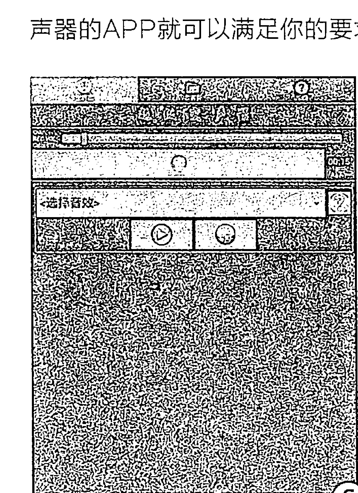

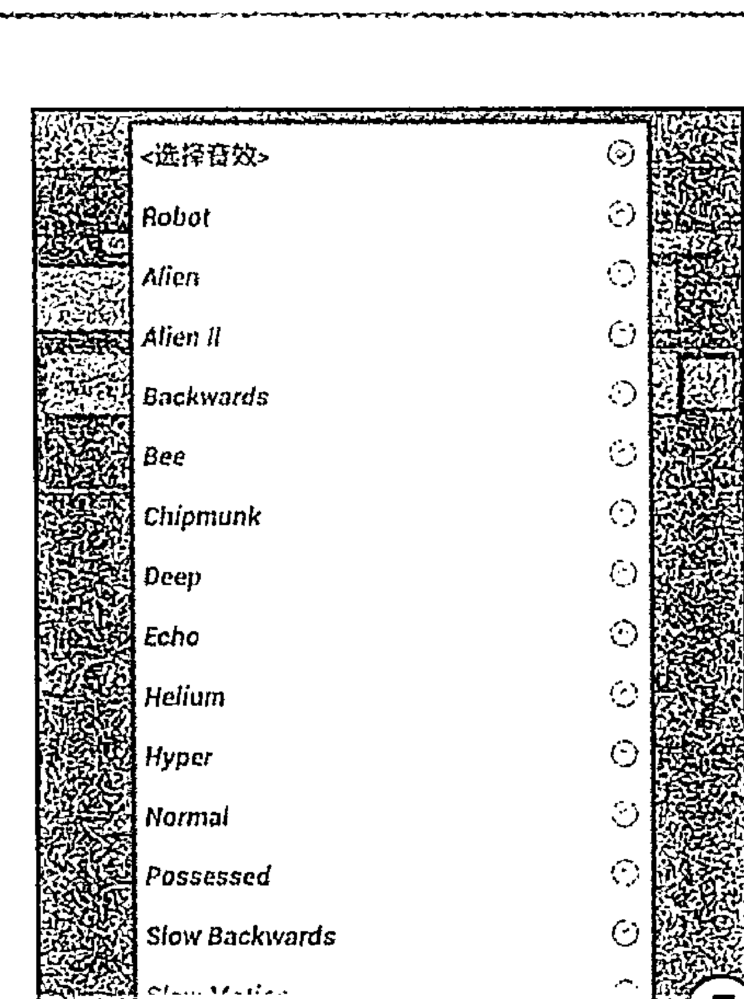

在选择音效里选Alien，这个APP可供选择的音效有很多，比如机器人、外星人、回音、蜂鸣、低音等

接下来选择我们所需要的音效（图7）。

选择完毕，可以开始录唱了（图8）。

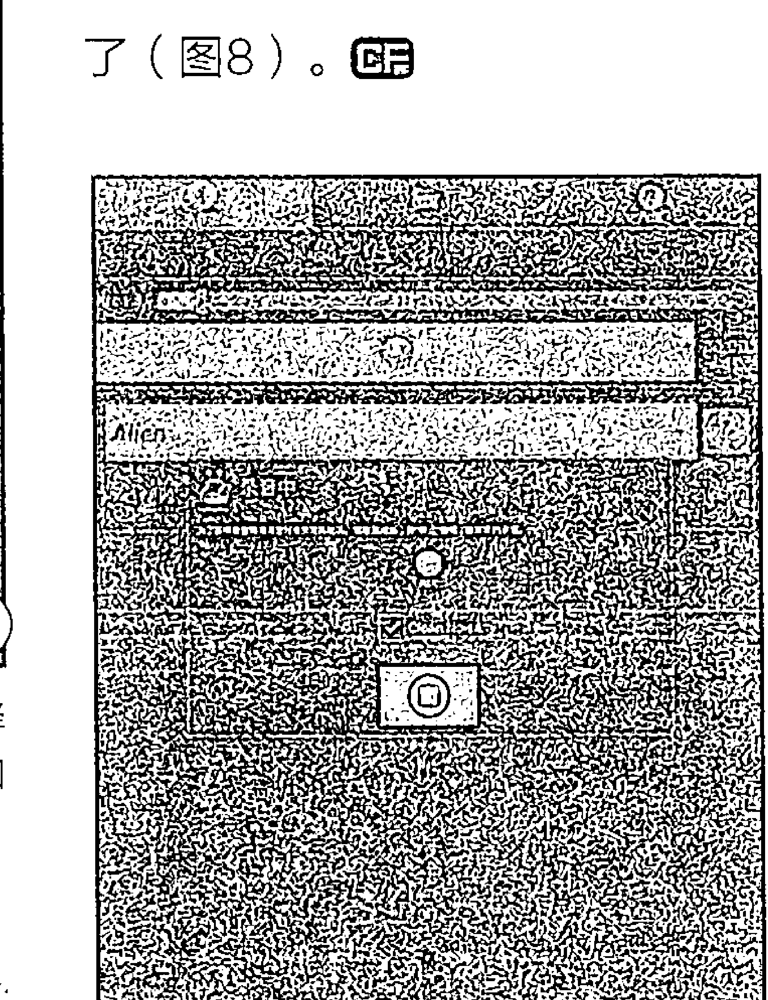

> 小提示
本文的K歌部分截图（图1～图4）使用的是魅族MX2智能手机，歌曲串烧制作部分截图（图5～图8）使用的是昂达V972平板。

-   1. 点击红色圆圈开始录音，点击红色方块停止录音
2. 如果觉得录的声音偏小，还可以点击上面一行REC VOL调整录制声音的大小
3. 录制完成后可以点击下方的绿色小三角播放录音，觉得不错就点击播放小三角旁边的保存并键入文件名称即可（默认保存在media/audio/notifications目录下）

## 系统重装 手机数据也能找回

文|王昌红

前不久，一款Android系统的手机不知什么原因，开机后没到主界面就重启，如此反复重启无法正常运行。可是手机的ROM中存有大量相片和通讯录，而手机内存又是集成在手机主板上，无法取出来恢复数据。只好拿去维修，把手机系统恢复到原始状态，可手机里面的相片和通讯录全部丢失了。经过几天反复琢磨，终于找到大部分相片和通讯录。现将恢复过程与大家分享。

### 数据恢复前期准备工作

把该手机用USB连线连接到电脑，电脑识别到手机后，自动进行驱动程序的安装。接着，打开手机屏幕的“设置”菜单（以Android 4.1系统为例），找到“系统”下面的“开发人员选项”，点击弹出新的界面。点击“USB调试”选项，连接USB后启用手机的调试模式（图1）。这时，在计算机的设备管理器中会多出两个盘符，其中的“I”盘就是手机的ROM内存。

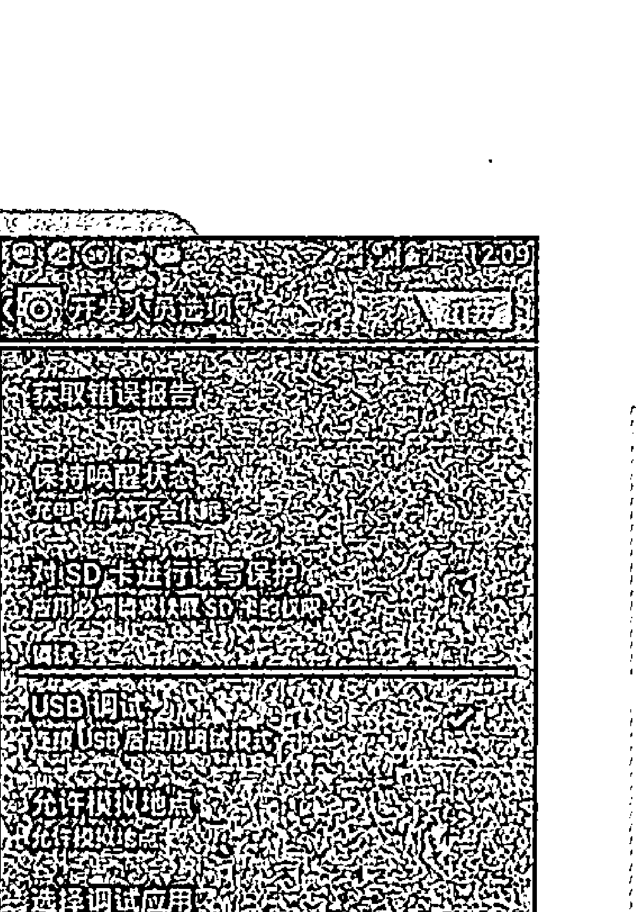

### 恢复内存卡已删除数据

运行数据恢复软件EasyRecovery，单击主界面下的“数据恢复”菜单，选择“高级恢复”选项，打开“高级恢复”界面。接着，依次单击驱动器列表下的“我的电脑→Linux(1.05GB)”（图2），找到“I”盘（即手机的ROM内存卡）。单击“高级选项”按钮，打开“高级选项”对话框。在“文件系统扫描”选项卡下，单击“高级扫描”（图3），确认后即可进行扫描操作。把扫描到的文件保存到本地磁盘下，这里就有手机系统以前删除的数据，用搜索功能即可搜索所需的文件。

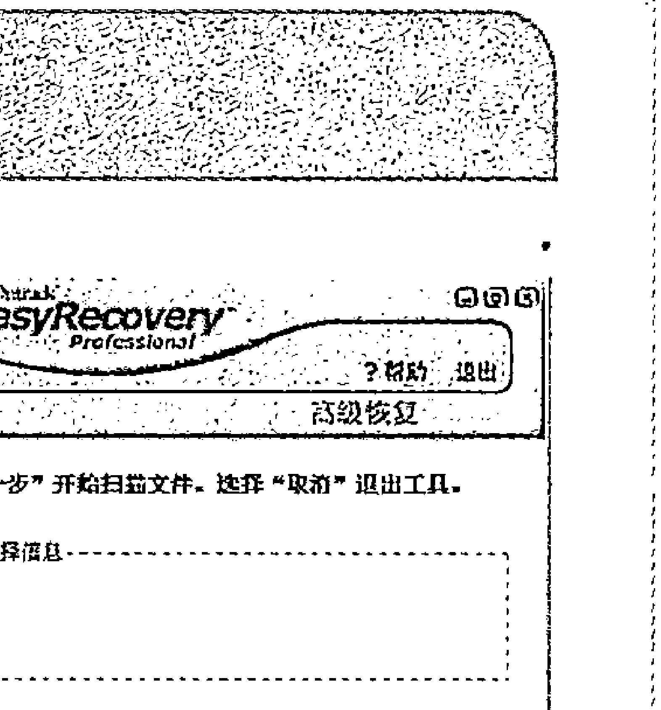

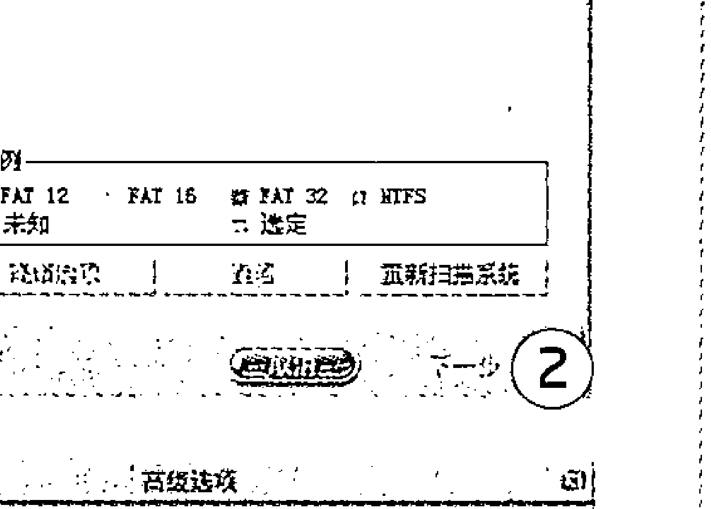

### 小技巧

有些机型会出现ROM内存打不开的情况，双击手机ROM内存所在的盘符，弹出“插入磁盘”对话框（图4），无法进行数据恢复操作，需要进行相关设置才行。该手机USB连接电脑成功后，打开手机的“设置”菜单，触摸“无线和网络”下面的“更多”，打开“USB计算机连接”界面。再触摸“USB大容量存储设备”进行当前项的选择，去掉“总是询问”前的勾选即可（图5）。如果“更多”选项下没有发现“USB计算机连接”项，可触摸手机主界面上方的“通知栏”向下移动，打开“通知栏”界面。然后，触摸“作为USB存储设备连接”项，选择“USB大容量存储设备”即可。还有一种情况是，经过上述操作还是打不开ROM内存，具体操作是：打开手机的“设置”菜单，找到“设备”下面的“存储”，触摸一下“卸载SD卡”，对手机的SD进行卸载操作，卸载操作完成后自动重启手机。

作为USB存储设备

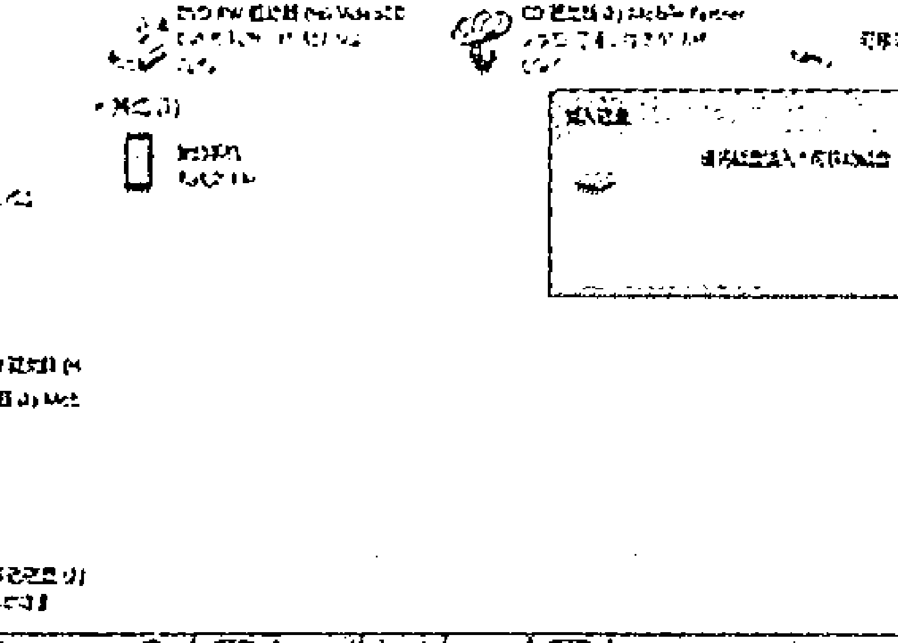

### 恢复手机中的相片和通讯录

手机用USB方式连到电脑后，运行Wonder share Dr.Fons for Android程序（下载地址：http://cli.im/5gOIP?v=1）。该软件首先会启用手机的USB调试模式，发现手机的“USB大容量存储设备”开通了，就开始手机系统的检测。检测完毕后，自动启动手机系统后进行第三阶段——恢复环节（图6）。

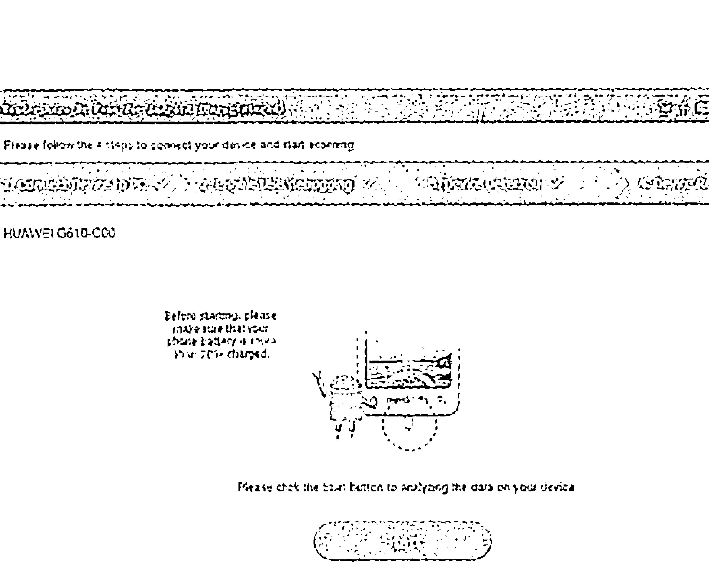

单击该界面下的Start按钮开始对手机内存进行扫描，等到任务进度条完成到100%后，窗口左侧会列出搜索到的相片和通讯录，单击其中的项目可以进行预览（图7）。然后，单击窗口下方的Recover按钮开始恢复操作。

最后，在保存对话框下，单击Browse按钮选择合适的存储路径，单击Recover按钮后开始恢复操作（图8）。恢复操作完成后，打开所保存的文件夹，发现手机进行恢复(Recovery)模式以前的相片和通讯录大部分都在。

| Name | Size | Format | Path | Created Date | Modified Date | Status |
|------|------|--------|------|--------------|---------------|--------|
| Contacts (24) | 144.0KB | ... | ... | ... | ... | Good |
| Messaging (47) | 25.5MB | ... | ... | ... | ... | Good |
| Gallery (349) | 4.17MB | ... | ... | ... | ... | Good |
| Videos (6) | ... | ... | ... | ... | ... | Good |
| Audio (1157) | ... | ... | ... | ... | ... | Good |
| Documents (28) | ... | ... | ... | ... | ... | Good |

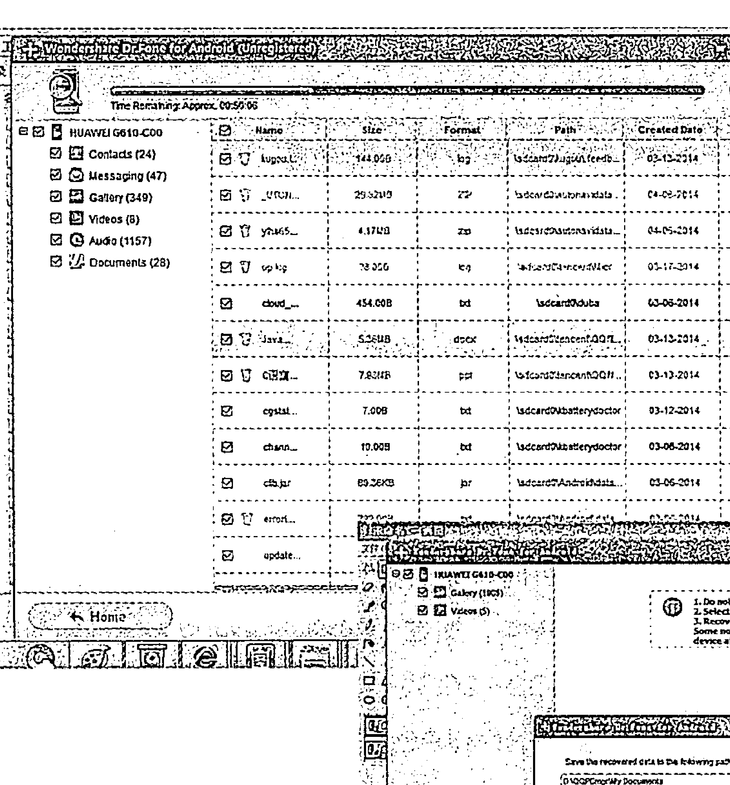

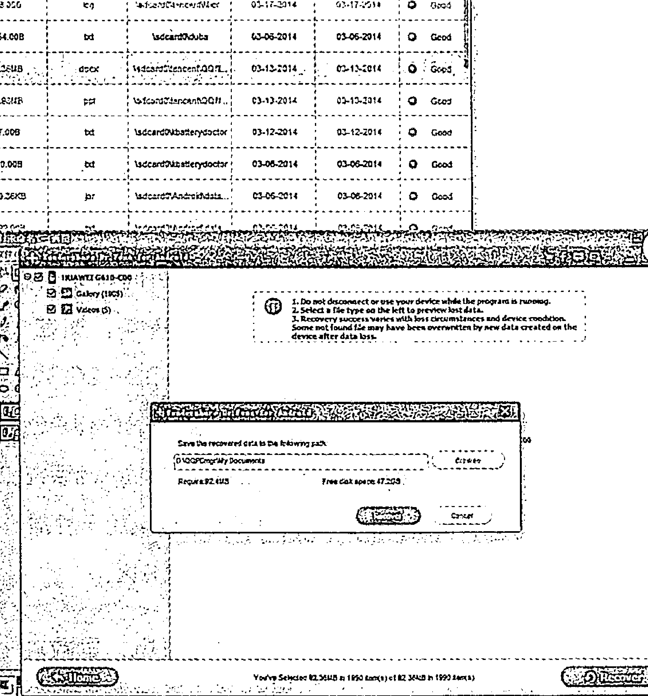

## “大胃王”是如何炼成的

### Android手机内存为何会缩水

随着央视炮轰智能手机存储容量缩水的问题后，这一老生常谈的话题再度喧嚣尘上。那么，谁才是导致手机内存缩水的“大胃王”呢？借此机会就让我们重新调查一番吧。

文 | 王健

### 央视向存储容量开炮

5月中旬，央视财经就6款16GB手机实际可用存储空间的大小进行了调查，最终发现容量最大的小米3实际只有12.38GB，而容量最小的联想K900竟然仅有7.88GB（图1）。排除二进制和十进制算法的误差，16GB换算下来的空间也应在14.88GB左右。由此，专家将问题归结于手机预装且无法卸载的第三方APP。那么，事实果真如此吗？

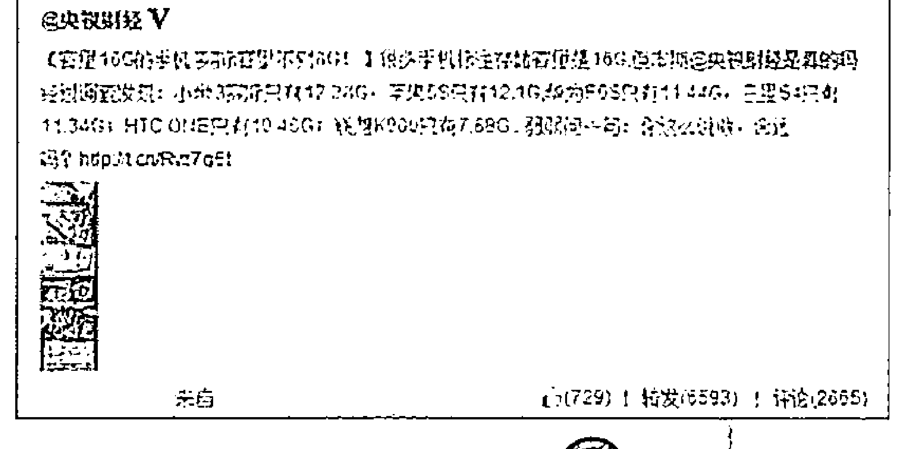

### 谁是影响手机的内存大户

首先我们需要了解智能手机参数中的“两个内存”：RAM和ROM。其中，RAM就是运行内存，就好似PC中的内存条；而ROM就是央视炮轰的存储空间，相当于PC中的硬盘。手机厂商在标注产品参数时，往往也会选择2GB RAM和16GB ROM的格式。好了，既然手机厂商在参数上明明注明内置了16GB的存储空间，为何连接电脑后（或在“系统设置→存储”选项中查看）却只能被系统识别出10GB左右的空间？缩水背后隐藏的“大胃王”到底是谁？

答案很简单。以Android手机为例，16GB的ROM空间实际上是由三大部分构成（图2），它们分别是：

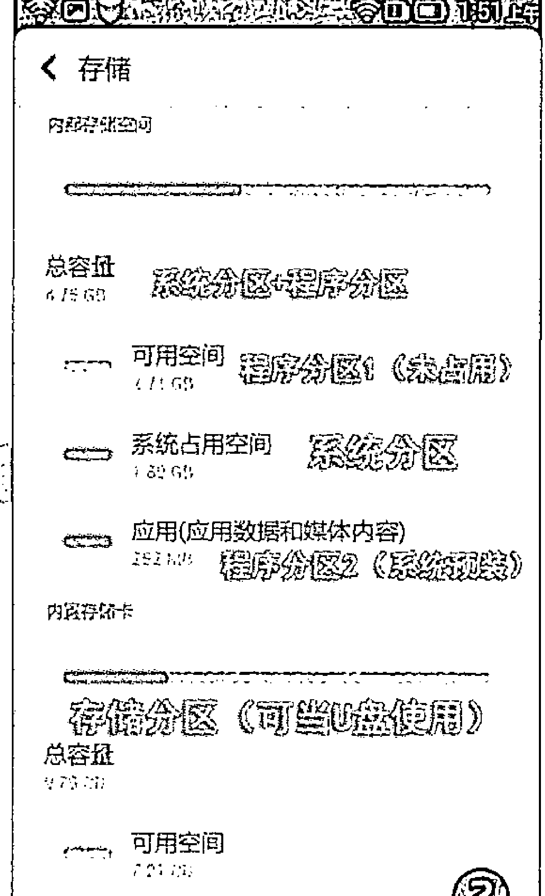

> **系统分区**
用于存放Android系统（Android 4.x版系统至少500MB以上）、还原备份（300MB左右）、刷机Recovery资源（约20MB~50MB）、系统级APP（安装在此空间的APP需要Root权限才可卸载）以及交换空间、硬件底层空间等等，加在一起约1.5GB~2GB。这部分空间就好似PC上安装在C盘中的Windows系统和硬件驱动程序，以及用于存放一键恢复镜像的隐藏分区。

> **程序分区**
用于存放随机预装的第三方APP（用户可卸载），你自己下载的所有APP主程序都会安装到这个空间内，手机厂商通常会为此分区预留1GB~3GB的存储空间。当该空间被占满后，你再安装APP时会出现无空间安装的报错提示。我们可以将其理解为PC C盘里的“Program Files”文件夹，只是你所安装的所有程序默认只能安装于此且无法修改路径。
“系统分区+程序分区”的总和就是电脑C盘的全部空间。

> **存储分区**
这才是当手机连接PC后所识别出来的“移动硬盘”，小米3的12.38GB和联想K900的7.88GB就是存储分区。这部分空间可以由用户自由支配，可存放大型游戏的数据包、音乐、图片、视频，可像U盘一样随意折腾。换做PC领域，存储分区就好似D盘、E盘、F盘等非系统分区。

由此可见，导致Android手机存储空间缩水的“大胃王”实际上就是系统分区和程序分区，虽然无法被用户直接利用，但却承担着非常重要的角色。

### “系统分区无‘理’应半”

如果按照16GB手机的存储空间就必须达到14.88GB的理论会出现什么问题？答案很简单，相当于你买了一部连DOS都没有安装的PC，而且你也无法自行安装系统，和“砖头”没啥区别。OK，那我们放宽条件，保留系统分区（安装了Android系统）并将程序分区压缩至最小可以吗？答案也是否定的，这就相当于你只给PC的C盘划分了15GB存储空间，而Windows系统和驱动就已经占用了14GB，此时你只有1GB空间来安装软件（Android的存储机制让你无法将APP安装在C盘以外的空间）。这意味着你不能安装大于1GB的程序，而且想装新软件前必须卸载老软件来释放空间。

总之，对Android手机来说系统分区是没有商量的，而程序分区容量的划分则是可选项。问题是，程序分区大了，存储分区自然就小了（图3）。因此，厂商对程序分区的态度就直接反映到了央视所报道的存储空间缩水的问题之上。

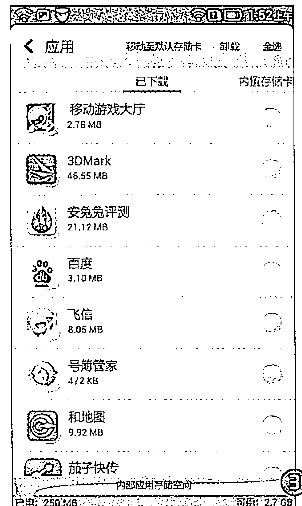

程序分区并非越小越好，太小了就没有空间安装更多的APP了

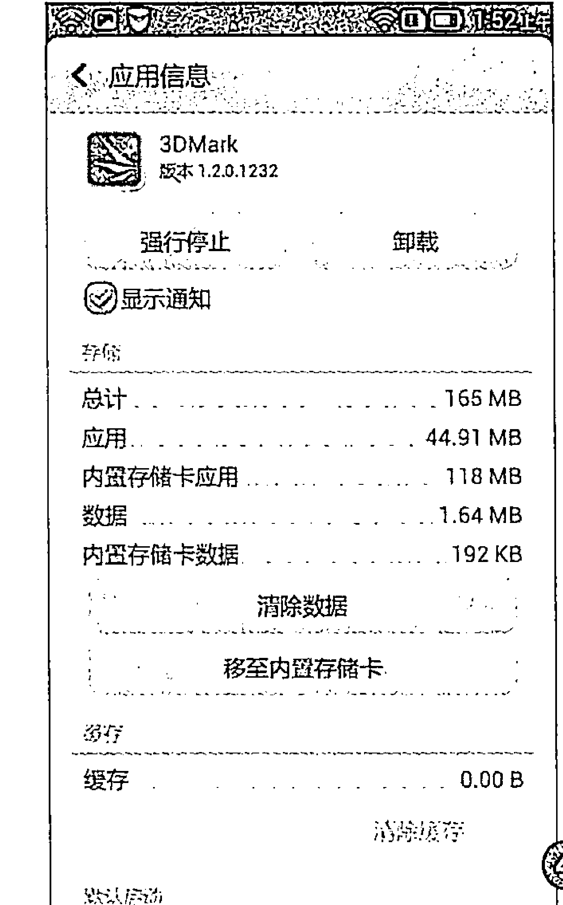

当程序分区空间不足时，我们可以将部分APP“移动到存储卡”，只是并非所有APP均支持数据转移

目前Android平台的中小型游戏大都在50MB上下，少数大型游戏（无需数据包，APK直装型）则在100MB以上。矛盾就此出现了：

-   - 如果你是游戏控，喜欢同时安装无数游戏和程序，如果程序分区空间小于2GB根本不够用（图4）；
- 如果你喜欢听音乐看视频，但手机却提供了3GB程序分区，这意味着留给你的存储分区所能保存的歌曲和视频文件数量将大幅缩水；

看似矛盾的话题，难道就没有解决方案吗？其实并不复杂，如果手机支持存储卡扩充，则可适当为程序分区加大空间保证安装更多的APP，牺牲的存储分区空间借由存储卡弥补。如果手机不支持存储卡且仅内置16GB甚至8GB存储空间，那就将程序分区设定在“够用就好”的档位（如1.5GB ~ 2GB），保证用户有足够的可支配的存储空间，或购买无线存储器，以Wi-Fi的形式无线扩容。

### 小结

> 至此，相信大家已经对Android手机存储空间缩水的问题有了较为深刻的了解。从原理来讲，手机厂商是无辜的，Android的存储机制必然导致存储空间小于实际的ROM标称容量。但是，厂商有没有在宣传上注明实际可用容量，就体现出人性化与否的态度了。
为什么PC用户从不抱怨明明500GB硬盘却只有400GB的可用空间？因为PC上我们可以随意更换系统、卸载程序、自定义不同分区的容量。Android系统的存储机制虽然照搬PC，但二者最大的差别是用户失去了自定义的权限，厂商反倒可以随意修改程序分区空间或预装很多无用的第三方APP。如果哪一天可以在首次开机的设置向导界面上，由用户自行划分不同分区的容量，也许就不会有今天的口水仗出现了！

# 更快·可换 手机如何解决‘续航危机’

更大的屏幕、更高的分辨率、更强悍的处理器……智能手机电池在上述卖点的‘压榨’下似乎只有缴械投降的份。那么，如何才能缓解‘大跃进’式的性能、屏幕飙升后所带来的续航危机呢？

文|曹操

相对于处理器、屏幕和分辨率的跨越式发展，手机电池已然成为最‘不思进取’的存在，其容量只是单纯随屏幕和机身的增大而增大。在锂电池依旧是主流技术的今天，手机江湖中逐渐衍生出了三股流派。

## 流派一：可换电池的设计

电池容量不够用，采用可更换电池结构的设计不就结了？于是，很多用户非可换电池的手机不买，更有甚至只要看到采用一体化设计（图1）的产品就盲目开骂。诚然，手机没电时换块电池就能‘原地满血复活’，但在购买第二块电池的同时，还需要我们再额外购买座充（图2），否则单靠手机给多块电池充电，耗时又耗力。此外，很多用户还喜欢给智能手机配保护套，在更换电池时需要先摘套再拆后盖换电池，好不繁琐。

> 换电池的繁琐性需要重视，而不可换电池的设计本身没有错，错在标配电池容量太小。在移动电源白菜价的今天，其通用性和易用性远比第二块电池更实际。

很多智能手机虽能拆卸后盖，但电池却无法更换

没有座充，单靠一款手机给多块电池充电是很不靠谱的

## 流派二：增大电池容量

既然硬件更耗电，那加装更大的电池不就完了？好消息是，已有产品在朝着这个方向而努力，比如华为Mate 2和nubia X6都配备了超过4000mAh的电池（图3），而更多5英寸以上旗舰手机也准备了3000mAh左右的容量，基本上满足了一天以上的中度使用待机所需。坏消息是，‘纤薄风’正在智能手机领域流行，更多产品宁愿牺牲电池容量来换取更薄的噱头，5英寸1080P屏幕才配2000mAh左右电池的手机大有人在（图4）。

综合来看，屏幕越大越有机会‘塞进’更大的电池，但随之而来的耗电则抵消了电池容量的增益。比如，4.7英寸配2000mAh电池手机的待机能力可能和5.5英寸配3000mAh电池的产品持平，大屏手机并没有因更大的电池而获得更持久的续航能力。

> 我们不在乎手机厚上几个毫米，关键是给我们配上更大的电池。

与其更薄，我们反而希望电池能更大

## 技术流说 新兴的充电技术

手机充电速度如果足够快，理论上是可以替代第二块电池或移动电源。比如当手机快没电时，只需插上电源充一会就能获得足够半天的使用时间，问题不就解决了？但是，想提升手机的充电速度，即获得“闪充”效果，并没有想象的那么简单。

### 电压电流提升有极限

锂电池充电快慢取决于输入电流和输入电压。对手机而言输入电压是恒定的5V，那就唯有提升输入电流了。因此你会发现，随着屏幕尺寸和电池容量的增大，手机充电器的规格也逐渐从5V/1A变成了5V/1.5A或5V/2A，即可在3.5小时内充满3000mAh左右的电池。如果想实现“闪充”效果，再提升1倍的输入电流可行吗？

根据“功率=电压×电流”的计算公式，在电压一定时，提升电流会导致更高的能耗，从而导致手机发热严重，出现较大的安全隐患。那么，就没有办法突破极限了吗？

### 低电压大电流的闪充

OPPO Find7是支持“闪充”（VOOC）的手机代表，其原装充电器的输出电流达到了破天荒的4.5A，是绝大多数智能手机的2倍以上（图5）。在它的帮助下，Find7可以在30分钟内将电池从0充到70%，60分钟左右充满电力！

仔细观察Find7机身和充电器的USB接口，你会发现它的针脚数量达到了7Pin，而普通USB接口则只有5Pin，这多出来的2Pin定义接地，用于原装充电器进行智能判断（图6）。拆开Find7的后盖，你会发现原装电池的金属触点也从普通电池的4个提升到了8个（图7），多出来的4个触点用于控制电路，与适配器双向应对防护措施。

此外，Find7原装充电器内加入了一枚MCU智能芯片，它会监测连接的手机是否符合条件（7Pin接口），如果是则降低输出电压（从5V降低到4.5V）同时提高输出电流（4.5A），并通过开电压环和分段恒流技术保证稳定的快速输出；如果监测非7Pin接口，则只会扮演普通充电器的角色。同理，用普通充电器给Find7充电，同样无法满足闪充的效果。

为了确保安全，Find7原装充电器、原装电池和手机内还设有安全防护机制，充电器和电池可在电压或电流失控的时候进行调节和掐断，而手机内则添加了保险丝，在充电异常时保险丝会熔断并中止充电进程。值得一提的是，Find7充电器内的智能芯片还可通过刷机的形式升级，以消除可能存在的Bug，并进一步优化充电效率。总之，Find7的闪充是一种软硬结合的充电技术，充电器、电池和手机缺一不可（图8）。

### 闪充的作用在于冲刺

对锂电池而言，“过充”（过度充电）对电芯寿命的影响非常大，因此所有智能手机在给手机充电时都会经历快速充电和涓流充电两个状态。Find7的“闪充”也遵守了这条准则。简单来说，当你将充电器与Find7相连时，充电器会判断是否满足闪充条件，满足则以4.5V/4.5A为Find7进行快速充电（图9），当电量达到85%左右时（图10），充电器会自动中断闪充并进入涓流充电过程，即以小电流的形式平稳地将电量充到100%。

我们可以用两辆赛车竞速，还原一下普通充电和闪充的差异：一款用标准5V/2A充电器的手机，就好似一辆2L排量的汽车，可以在10秒内从0加速到100km/h；而Find7就好似一辆4.5L排量的汽车，在5秒内就可从0加速到100km/h，因此跑同样的距离，显然是后者耗时更短。但是，汽车快到达终点时最忌讳的就是危险的急刹车，必须缓踩刹车直至停稳，而刹车减速的过程就是所谓的涓流充电的过程。

### 便携和成本的困扰

“闪充”看似美好，但也存在不可忽视的缺陷。首先就是5倍于传统充电单元的成本，再有就是充电器的“硕大体积”，至少是普通5V/2A充电器的2~3倍（图11），携带起来不是很方便。如果想在家里和单位同时体验闪充的极速，意味着你必须随身带着原装充电器上下班，这就与夏日里要求轻装简行背道而驰了。此外，闪充再快它也需要电源插座的支持，如果你身处户外，闪充的意义就远不如第二块电池或移动电源了。

闪充应该是一种“众乐乐”而非“独乐乐”的技术。现阶段希望厂商应该做的是如何降低购买第二套充电器的开销，或是为充电器减肥。

闪充在手机上可能属于新鲜的技术，但在笔记本领域则更为常见。比如ThinkPad早在2011年推出的X1就可在1小时内将电池充到80%。和手机闪充的原理一样，都是以更高成本的锂聚合物电芯和增大电流为基础。不过，增大电流意味着大功率，大功率意味着大适配器，还有就是更高的散热需求。高成本和便携的缺陷（图12），同样阻碍着类似的闪充技术在笔记本上普及。

因此，希望类似的“闪充”能在行业内形成标准，让相关的配置实现通用化并降低成本，它才能被更广泛的消费者所接纳。

## 人工摄影 打掉镜头外的风景

文/流言

在风景名胜中拍照，最麻烦的是人太多，来来往往，大煞风景。不过，我们虽然没有办法阻止游客抢镜，但是却有办法不让这些抢镜的路人甲乙丙留下身影。

### 神奇的Scalado Remove

一家瑞典公司推出的 Scalado Remove应用，可以在拍照时智能删除掉多余的过往行人。它的操作原理，就是在拍摄前不断检测周边环境，区分出静止和移动的事物，把过往行人这种突如其来的影像提取出来，拍摄后直接点选不需出现的人物，就可以在照片中删除了。不过这项技术主要是与设备制作商合作，没有可下载使用的APP。

### 拍摄素材照片

虽然没有现成的APP可用，其实我们也可以轻松获得纯粹的风景照。首先要获取系列的素材照片，选好想要拍摄的风景，然后在一个固定的角度和位置，拍摄多张照片。最好使用三脚架，没有条件时，可就地找一些固定的点，确保在连拍的过程中手机不会动。一般来说，可每隔10秒拍一张，连续拍摄15张左右。上期我们介绍过 Camera FV-5（谷歌市场地址http://tinyurl.com/ce2ss6g，或从联想乐商店中搜索获取），它的间隔定时器功能最适合完成本步骤了。将间隔设定为10秒，拍摄数量设定为15，再按“立即开始”，等待拍摄完成就可以了。当然，也可以不用此APP，手工一张张拍摄。

### Photoshop中制作纯粹风景照

准备好素材后，接下来就是在Photoshop中合成了。这里以Photoshop CS5为例，启动后点击菜单“文件→脚本→统计”，在打开的对话框中，将堆栈模式设定为“平均值”，如果要处理的放在同一文件夹中，可以使用“文件夹”，然后通过“浏览”选择相应的图片文件夹，可自动导入文件夹中的所有图片。或者使用“文件”，同样通过“浏览”选择所有要处理的图片导入。

如果导入有误，可通过“移去”删除或通过“添加”增加，一定要勾选“尝试自动对齐源图像”。设置完毕，点击“确定”，Photoshop便开始一系列的计算，等待一段时间，一个没有人物的纯风景照就完成啦。

> > 小提示
>
> 连拍的照片，最好进行初步的整理，能够手工去除的人物尽可能先手工处理，否则最后形成的纯风景照片会有虚影。如下图所示的效果，就是多次借助图像统计的“尝试自动对齐源图像”功能对齐图像，并辅助以手工操作，最后才完成的。之所以会留有影子，是因为原始素材中人物太多了。

## DIY趣味运动轨迹照片

文 | 流言

平时我们拍摄的照片都是静态的，而通过一些方法及工具，手机还可以拍摄出一些具有动感效果的照片。实在无法用手机来实现的，则可以先通过手机拍摄原始照片，然后再通过后期处理增加动感效果，让照片更加兴趣盎然。

### 同一张照片中的人物运动轨迹

在诺基亚Lumia 925的智能拍摄选项中，有一项“动作镜头”功能，它可以在同一张照片中记录下一个人物的一系列动作。首先要拿稳手机保持住稳定（也可以使用三脚架或其他物体稳定手机），然后在Lumia 925的相机界面设置好之后，按下拍摄按钮，大约等3秒钟左右的时间即可完成，此时已快速拍下了10张静态照片。

这10张照片是重叠在一起的，可以看出照片背景不变，而每张照片中的人物都叠印在一起。下面有10个圆点连成一条直线，其中每个圆点对应一张照片，通过这些圆点可以对叠印的人物进行取舍。右侧的方块按钮则是用来设置淡入淡出效果的，选中一个主要的照片，其余的就会淡化成半透明效果。

### 其他手机实现运动轨迹照片

那么对于其他手机来说，如何实现这样的效果呢？其实通过Photoshop这款强大软件的后期辅助，理论上所有手机都可以实现这一目的。首先要获取素材。一般来说，手机相机都有连拍功能，就以我的联想K860i来说，在它自带的超级相机应用中，点击右上角的扩展按钮（圆形中带一个下三角的图标），此时屏幕上方多出一个功能条，左侧第一个即是“急速连拍”。进入急速连拍界面后，按快门按钮就可以连拍了，一共可拍摄5张。

但如果没有别人帮忙，需要自拍的话，可以借助上期我们介绍的Camera FV-5（谷歌市场地址http://tinyurl.com/ce2ss6g，或从联想乐商店中搜索获取）。不过，Camera FV-5的最快间隔是1秒钟，所以我们做动作的时候，需要适当的慢一点。另外，对拍摄的照片进行适当筛选，去掉效果不好的照片。

准备好素材后，进入Photoshop中（这里使用的是CS5），点击菜单“文件→脚本→统计”打开图像统计窗口，点击“浏览”打开上面所拍摄的4连拍照片，勾选“尝试自动对齐源图像”项。上期中，选择堆栈模式是“平均值”，是用来去除照片中人物的，这里我们则选择的是“最小值”，要让所有人物留在照片中，显示出运动的轨迹。

通过软件自动生成的运动轨迹效果，可能会有些瑕疵（比如人物被其他物体遮挡等等），这时则可以借助Photoshop的强大功能进行一些后期修正。

### 读者互动区

前几期在实现拍摄纯风景照片及定时自拍中，我们使用的是Camera FV-5。不过有读者回馈表示，K860i同样有这些功能。仔细查看，果然如此，所以在此对前期内容做一些补充。

在K860i的相机界面中，如上所述调出扩展功能项，此时向左滚动功能条，在最右侧即可看到“定时拍照”选项，点击打开后，拍摄界面下方有三项可选，分别为3秒、5秒和10秒。不过相对Camera FV-5来说，它的灵活性要差不少。

另外在打开扩展功能项之后，点按最左侧的“扩展镜头”，会显示更多的功能，其中“路人移除”，正是上一期中我们实现纯风景照的关键，用此功能拍照后，画面中的行人或移动的物体会被自动清除。

## 浪漫视频慢镜头

经常看影视剧的，大家可能都有过这样的感觉：任何动作，只要一变成慢镜头，就一下子显得诗情画意，非常浪漫。其实，仅用我们手中小小的手机或平板，我们也能拍摄出慢镜头的视频。

### iPhone 5s中的慢镜头

苹果iPhone 5s中新增了慢镜头拍摄功能，打开相机应用后，在界面下方滑动选择“慢动作”模式（图1），接着对准要拍摄的场景，点按红色快门按钮即可，再次按快门将结束拍摄。接下来就可以在相册中欣赏所拍摄的慢镜头视频啦。

### iPad也玩慢镜头

使用iPhone 5甚至更低版本的苹果手机，以及iPad系列，能否拍摄慢镜头？这种情况，可以通过一些APP来实现，如SloPro。首次运行SloPro，首先会要求录音及相机的权限，选择“允许”。进入应用界面后，点按快门图标就可以拍摄了（图2）。再次按快门按钮结束拍摄后，点按左下角的图像略图，可进入视频管理界面（图3）。

点击打开某个视频，按中间的三角按钮可正常播放（图4）。如果想要慢镜头效果，则点按界面右上方的“EDIT”进入编辑界面。默认情况下减速到原速度的40%，如果还嫌太快，可点按“Slow 40%”，再从弹出框中点选“Slow 25%”（图5）。设置完毕，点按“Render”进行渲染（Render也有三个选项，按需要选择），最后点按右上角的对钩号，一个慢镜头视频就完成啦。

### Android手机“曲线”玩慢镜头

与苹果不同，Android手机品牌众多，有些手机就不具有慢镜头功能，这部分手机，可借助一些APP来实现，比如Fast Burst Camera（快速连拍相机）。

在Fast Burst Camera中选择Motion Trigger模式拍摄（图6），在快门按钮边上的选项按钮中，可以设置运动灵敏度以及连拍延迟时间（图7）。当按下快门按钮时它会变成红色，表示正在拍摄中，再次按下快门按钮将停止拍摄，按钮恢复成黑色，但此时还会有一个漫长时间来保存刚才连拍的照片。

#### 小提示

使用Fast Burst Camera连拍后，手机相机会非常烫，所以拍摄时间不能太长。另外，因为Fast Burst Camera存储照片的时间非常长，有时你可能无法判断它是否已停止拍摄，这种情况下你可以选择彻底退出Fast Burst Camera，并且从系统后台清理掉它。

### 慢镜头的应用场景

解决了慢镜头拍摄的设备问题，接下来要拍些什么呢？因为并不是所有的场景都适合用慢镜头来表现的。下面列举几个具有可看性的场景，也许能帮助大家举一反三。

- 自拍慢动作

架稳手机开始拍摄，然后自己进入镜头范围内表演动作，比如打一套拳，或者做一下广播体操。等结束拍摄，慢镜头回放的时候，会发现自己已然有一代“大侠”之风了。

- 水墨

首先准备一个透明的玻璃杯，装上大半杯的清水，然后架稳手机开始慢镜头拍摄。拍摄过程中，取一滴墨水滴进杯中，看它溅起的水花，以及墨水沉入杯底，慢慢散开，如烟如丝，绝对是一种美的享受。加入不同颜色的墨水，还可以得到五彩炫丽的效果。

- 飘动的长发

以长发的漂亮美眉做模特，旁边用风扇吹起美眉的秀发，然后架稳手机拍摄慢镜头，看秀发慢慢飘扬，绝对的浪漫迷人。

- 宠物

有不少人喜欢养猫、养狗，在这些宠物玩耍嬉闹的时候，为它们拍摄一组慢镜头视频，肯定别有一番情趣。

# 个性拼贴 拼出不一样的精彩

文|流言

春节期间，大家肯定拍摄了不少照片，如果只是一张一张地展示可能显得很平淡，而如果将多张照片组合在一起，那拼贴出来的效果可就大不相同了。当然，拼贴照片，不是将照片堆在一起那么简单，好看的拼贴图，还是需要下一番功夫的。

## 爱玩拼贴的必备APP

Android系统的手机上，有不少拼贴类的应用，其中拼贴范特西（PhotoFancie）别具特色，它具有很多风格的边框、格式与背景，只需拖曳操作就能制作出精彩图片。

在手机或平板中启动应用后，首先点按选项按钮（齿轮图标），设置图片存储格式（为保证画质可选PNG）、图片大小及保存位置等。设置完毕返回主界面，可以选择“格状”和“自由”两类拼贴方式。

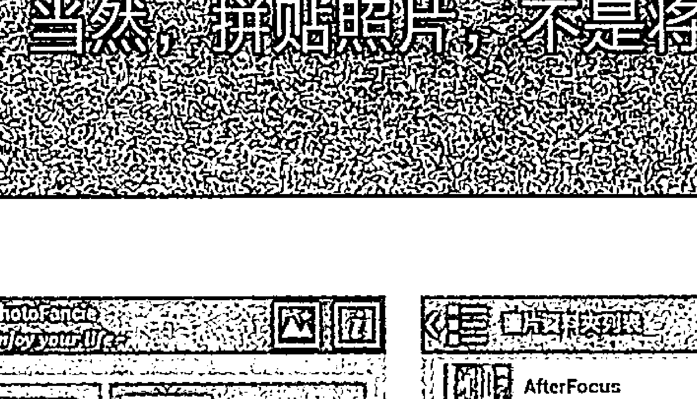

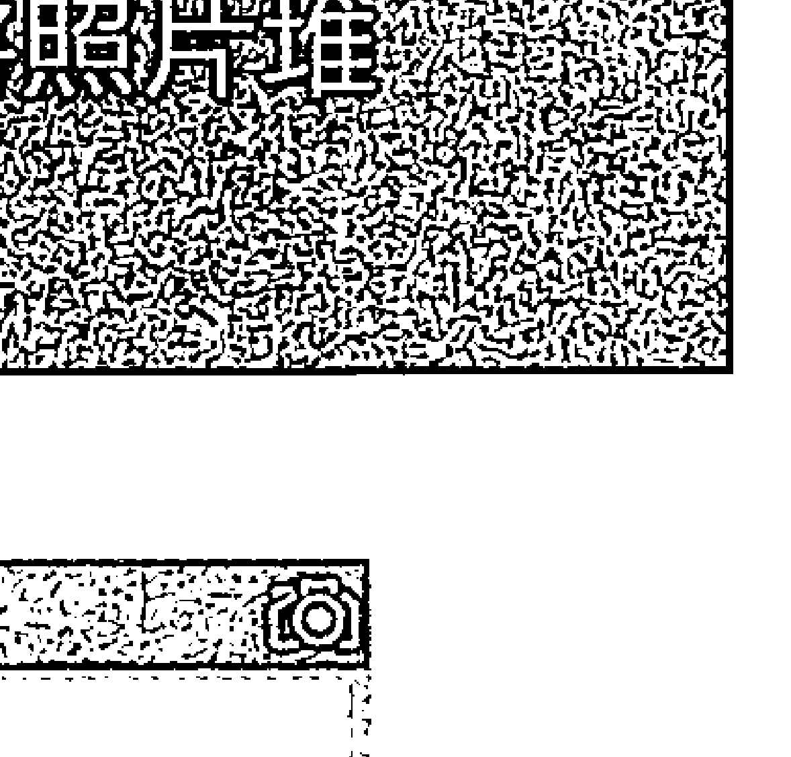

拼贴范特西的搜索功能非常强大，点按“格状”模式，进入图片文件选取界面，它已经将设备中的所有图片都搜索到了。选择进入要拼图的文件夹中，然后一一点选要拼的图片即可。如果误选了某张图片，可在下方点该图片缩略图上的红叉即可取消它。选择完毕，点按“编辑”，从弹窗中选择一种模式，如果想方便，可以选择“快速编辑”。

默认情况下自动为选取的图片添加了边框，如果不满意，可以点按下面的“布局”，有很多不同的边框供我们选择，比如这里我选择了一个斜线的边框。

每个格中的图片是可以编辑的，点选某张照片后，下面的菜单会随之改变，点选“微调”，即可对这张照片单独进行放大、缩小、移动、旋转（不同大小的角度和不同方向）等操作。除了微调，还可以翻转照片或对照片进行美化。返回到“快速编辑”界面，还可以选择交换（调换方格中的照片）和边框类型。


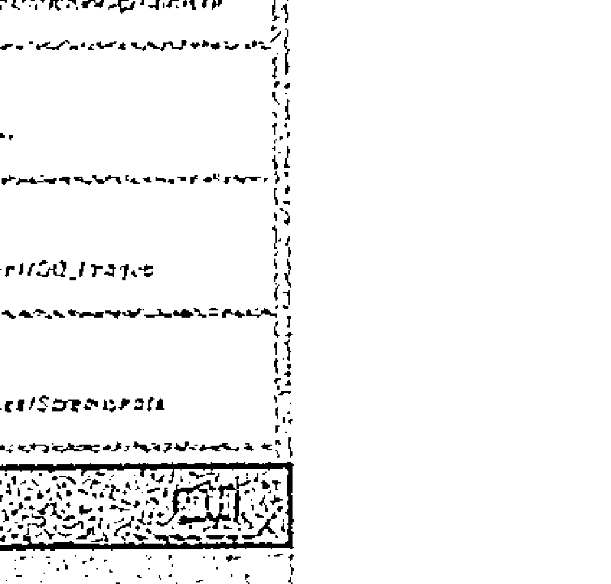

全部调整完毕，点按上方的保存按钮（磁盘图标）保存就可以了，最后的效果图，很漂亮吧。

如果时间不紧张，那么还是建议进入“完整功能”模式，这里增加了更多可操作的选项。其中的“节点”非常有意思，点选它之后，边框之间会显示多个绿色节点，拖动这些节点就可以随意调整边框的形状，非常有个性。

默认情况下，拼贴图的总体是正方形，通过“方向”可以改变这一比例，比如在“方向”中选择“直向”，再选择一种长宽比例，就可以改变它了。

进入“背景”中，除了我们已经熟悉了的基础“框型”，还可以设置边框的图样、内底、内外边框以及圆角的大小等，变化多端。设置完毕，点按OK，再保存拼贴图就可以啦。

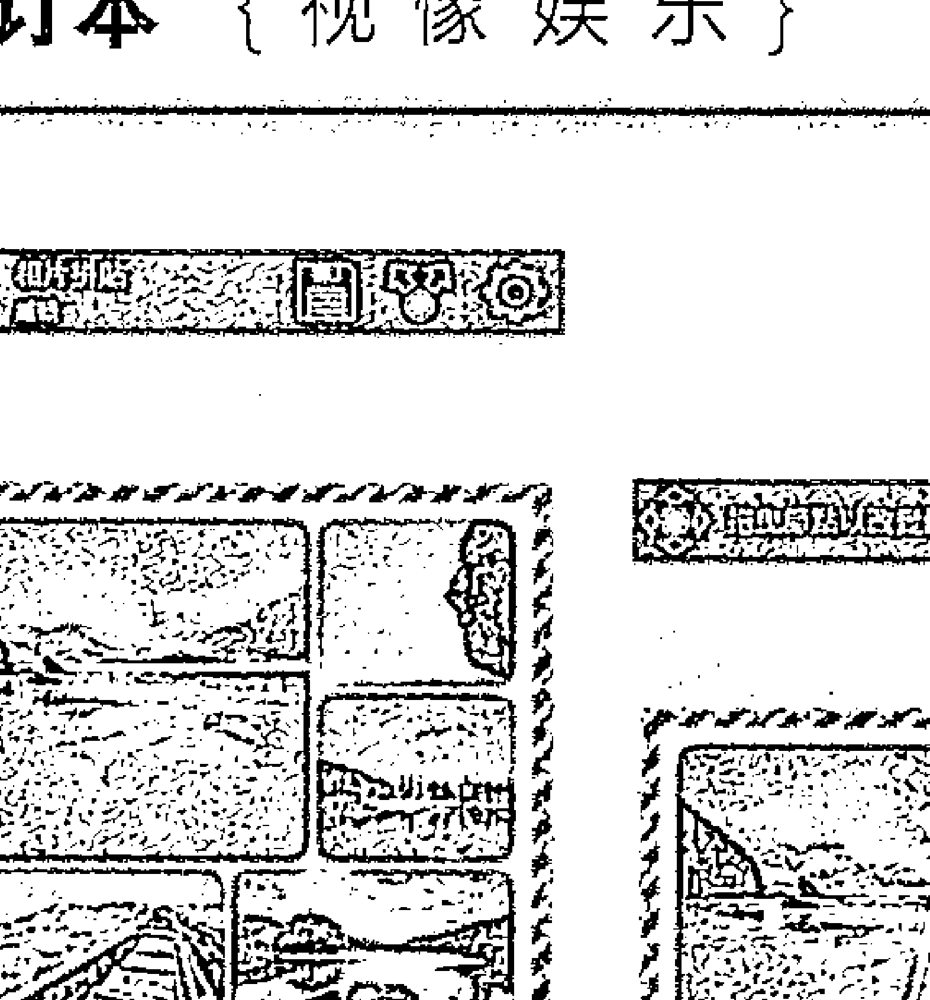

◎ 完整功能的主界面


◎ 拖动节点可随意调整边框形状

## 拼图添加趣味贴纸

拼贴范特西的拼贴功能很强大，但贴纸的素材较小，所以想给照片添加漂亮的贴纸，可以试试PicCollage拼贴趣。

安装后启动先是登录界面，可以直接点“略过”先体验一番。根据向导提示，简单点几下，从相册中选择要拼贴的图片。注意，它每次只能在同一文件夹中选图，要想加入其他文件夹中的图片，得重新点击“+”号按钮添加。

PicCollage默认是自由拼图模式，如果自己怎么也拼不漂亮，那么就点左下角的边框图标，更换相框和背景。接下来继续点按“+”号按钮，选择“加入贴纸”。有些贴纸是收费的，可以点选那些免费的贴纸，选中贴纸后，点按右上角的对钩按钮。对添加的贴纸素材，可以多点触控调整大小、位置等，非常方便。

以上应用都提供自由拼贴功能，不过大家往往发现，使用模板是更省时省力的方法。当然，你完全可以将图片导入到电脑中，通过Photoshop之类的工具来完全手工制作。

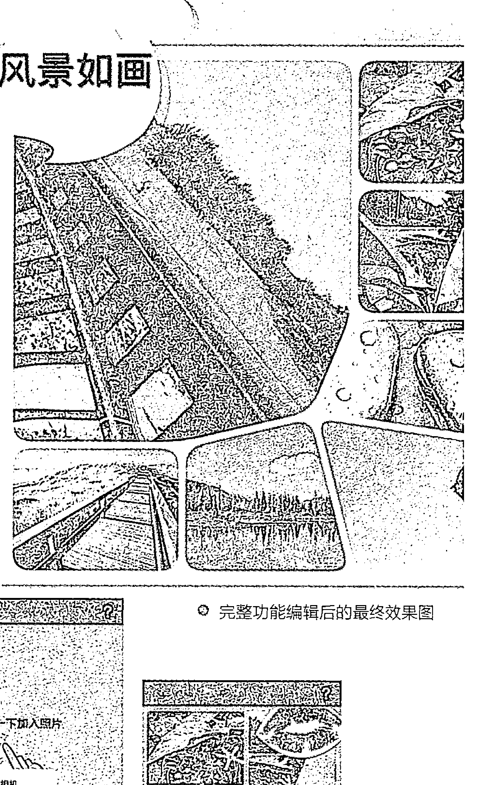

◎ 完整功能编辑后的最终效果图

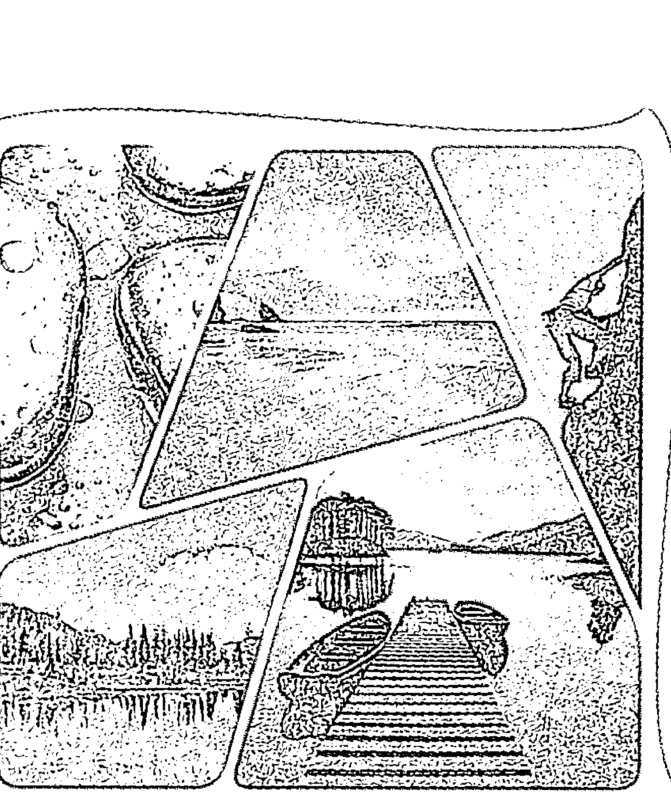

◎ 快速编辑后的最终效果图

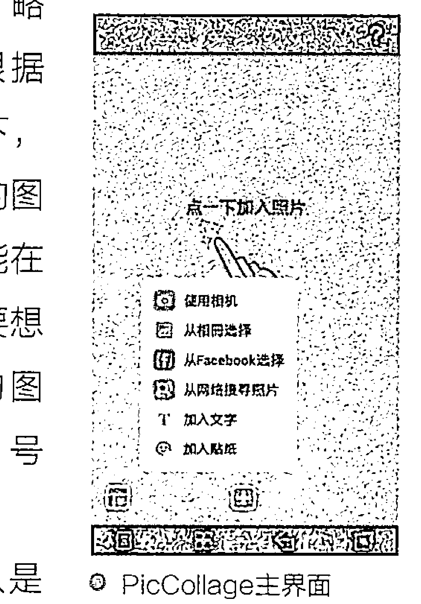

◎ PicCollage主界面

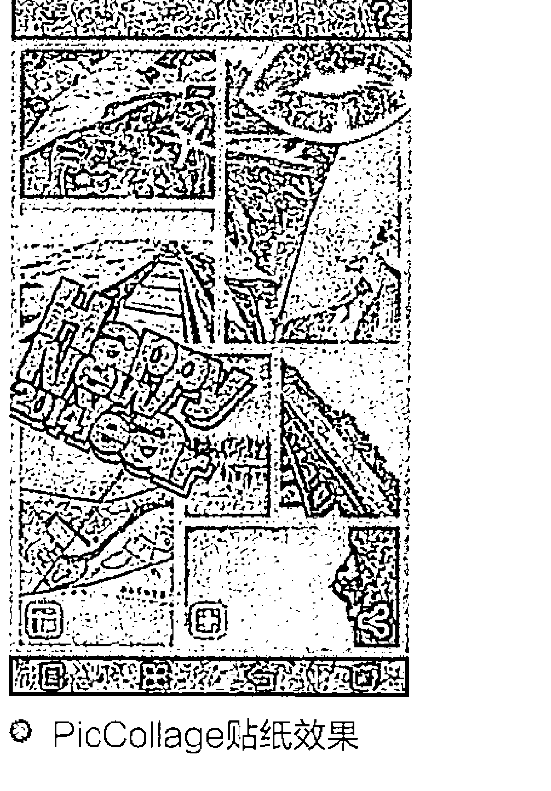

◎ PicCollage贴纸效果

在电脑中，除了一些软件外，还可以通过在线工具来完成，比如PhoToViSi（http://www.photovisi.com），它的操作与以上应用其实差不多，这里就不多介绍啦。

## 手机自拍卡通照片

制作卡通效果的照片其实非常简单，在手机上安装可以生成卡通效果的应用，就能轻松实现。

首先打开手机上的应用商店，比如我用的是小米手机，打开“应用商店”搜索“卡通相机”或“cartoon camera”（图1），可以找到多款卡通制作的应用。这里我安装的是Fingersoft出品的“卡通相机Cartoon Camera”。

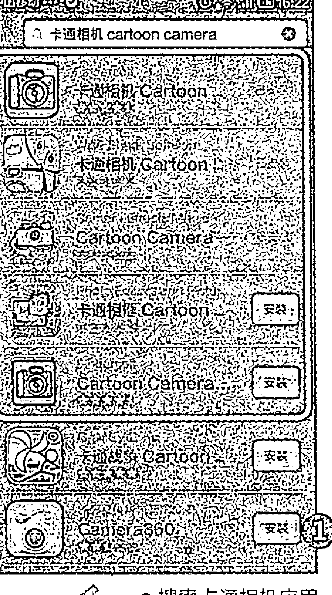

启动卡通相机后，点击“效果”可以切换不同风格，在画面预览窗口的两侧可以调节各种卡通参数（图2），效果满意后点击“拍照”，一张卡通照就完成啦。

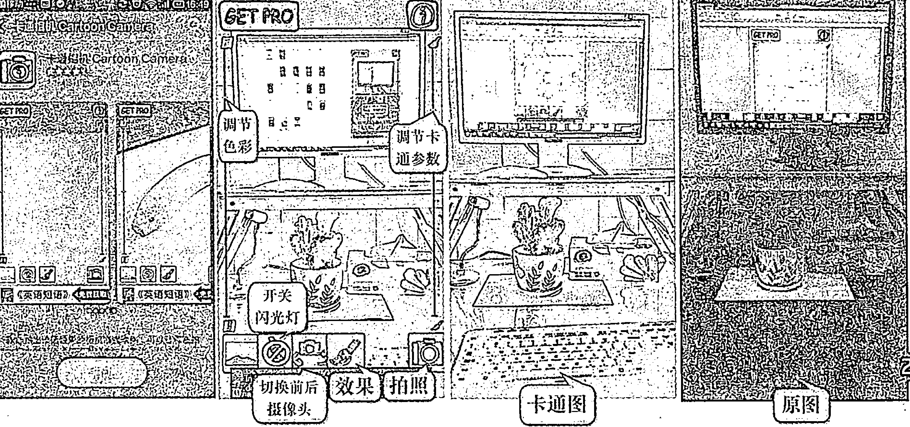

## 再现童话 自制卡通图片

经常看到一些高人手绘出卡通式自画像，让我等菜鸟极度羡慕。其实不会画画没关系，只要有能拍照的手机，我们自己也能制作卡通式自画像。

如果手机上没有安装卡通相机应用，或者以前拍摄的照片没有应用卡通模式，没关系，通过一些工具进行后期处理，同样能得到漂亮的卡通照。

这里介绍一款好用的软件Photo to Cartoon（http://www.caricaturesoft.com），通过它我们可以将Baby的照片修饰成超萌宝宝卡通照。

启动Photo to Cartoon，单击“Load Photo”打开宝宝的照片（图3）。Step1是调节图片中线条的比重；Step2是调节卡通照的颜色，数字越大颜色越丰富，取消选择Colors下的复选框则只保留线条转换成黑白图片；Step3中，“Edit Outlines”进一步编辑线条，最后的效果如图4所示。

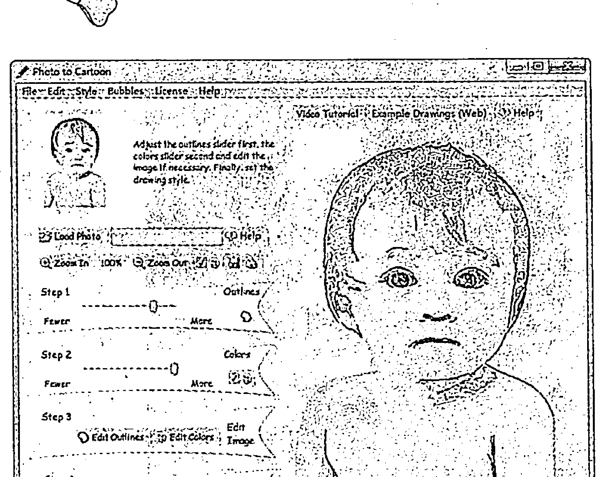

## PhotoShop 打造个性卡通照

“Outlines”可以选择绘制线条的模式，“Edit Colors”可以设置颜色的模式。

上面设置完毕，在Step4中单击“Style”按钮切换界面，这里有多种卡通模式供选择。比如，选择“Canvas”，则照片转换成油画风格的卡通图，在下方可以调节亮度（图4）。这里还可以尝试其他效果，找到需要的风格，效果满意后选择菜单“File→Save Image”保存卡通照就可以了。

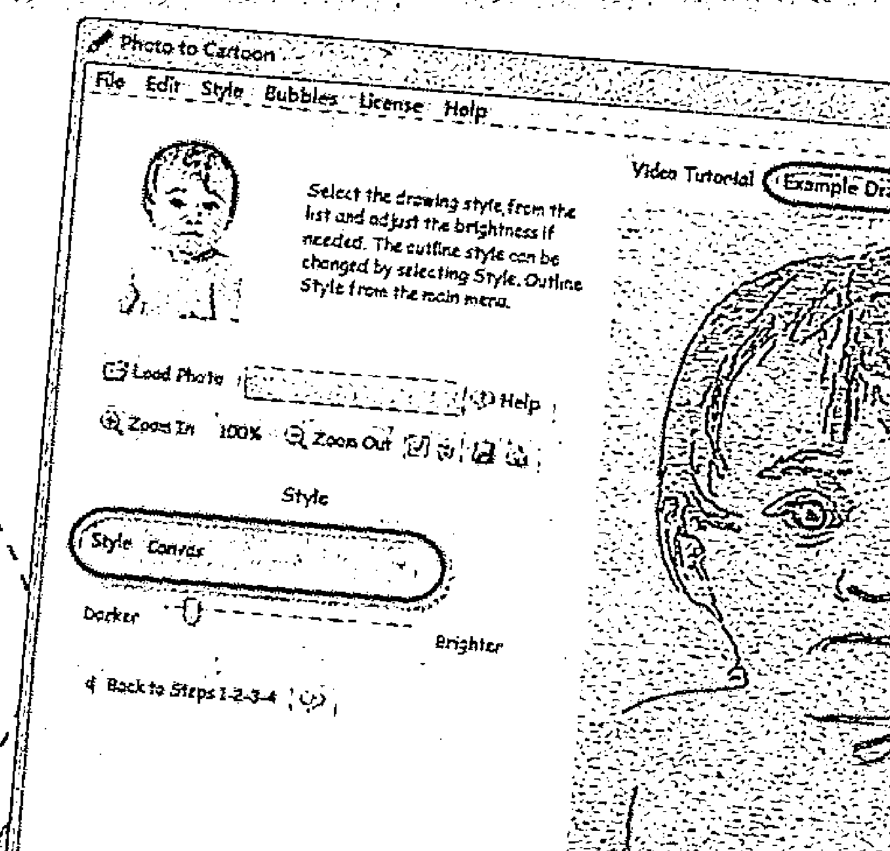

经常看到一些QQ好友使用卡通大头照，这里再推荐一款微软卡通秀（Microsoft Cartoon Maker），可以快速制作出个人大头贴，效果也很不错。

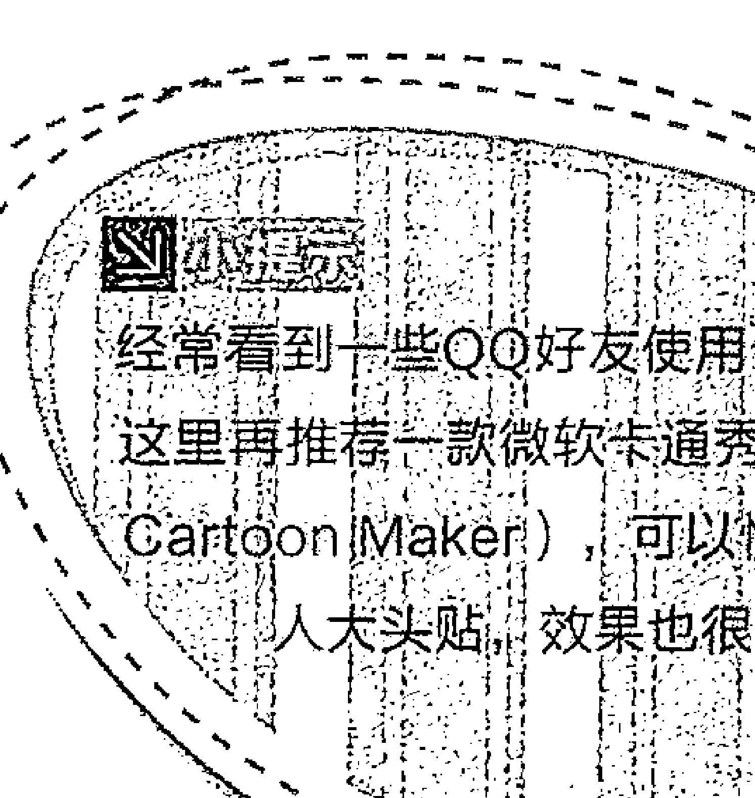

专用的卡通制作软件虽然使用方便，但是功能比较单一，而要想随心所欲创建自己独有风格的卡通照片，还是得用Photoshop。下面我只举一个简单的例子，实际上它能千变万化。

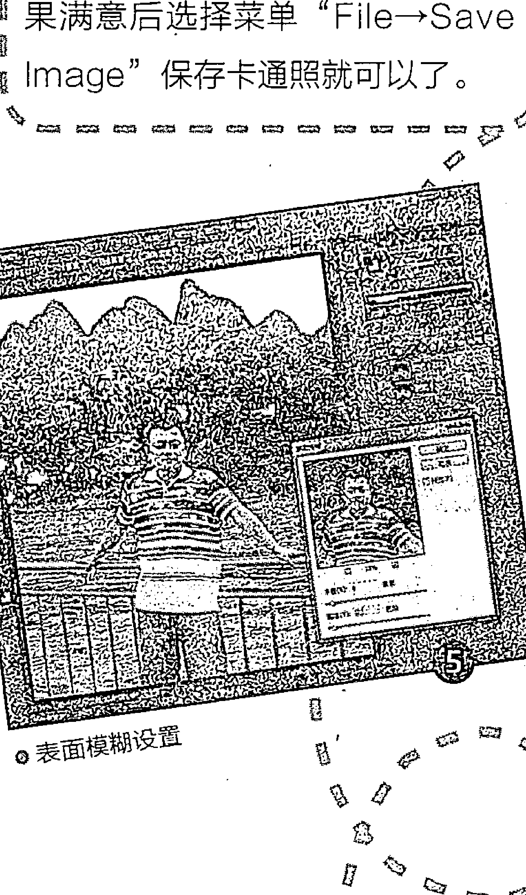

在Photoshop CS6中打开自己的照片，双击背景图层将其转换成普通图层，然后复制图层，并进行“滤镜→模糊→表面模糊”处理，半径设置为8，阈值设置为18（图5）。

将刚才模糊处理过的图层（即图层0副本）再复制一份，选择菜单“图层→调整→去色”将它转换成黑白照，然后取消显示该层（即图层0副本2）。再选择下方的模糊层，选择菜单“滤镜→滤镜库”，单击“艺术效果”下的“木刻”（图6），色阶数设置为8，边缘简化度为1，边缘逼真度为3。

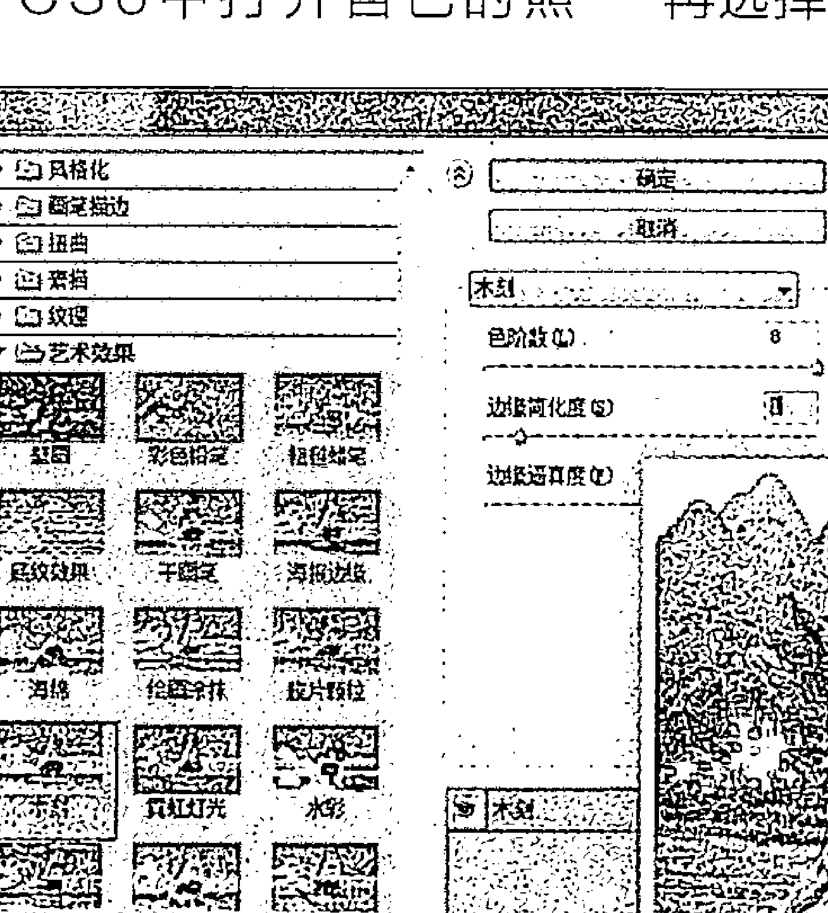

显示并选择黑白层（即图层0副本2），在滤镜库中选择“艺术效果”下的“海报边缘”，海报化数值为3，其他为默认。确认后返回，将图层模式设置为“点光”，不透明度设置为40%。

选择模糊层，将图层模式设置为“强光”，不透明度设置为58%，执行“图像→调整→色调均化”命令。最后分别选中各层适当调整亮度和对比度，如果感觉卡通色块过细，可以加重最底层（图层0）的模糊度。现在照片看起来已经很卡通了吧（图7）。

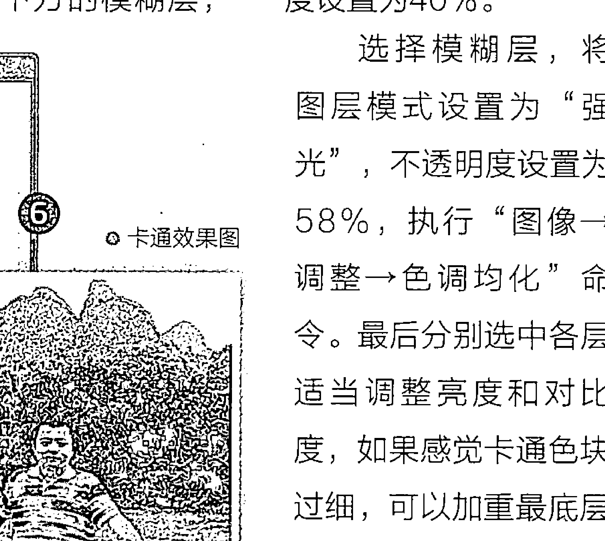

## 拍好唯美自拍照

文|小溪

拍照手机的流行让大家都喜欢上了自拍，尤其对女孩子来说。自己拍摄自己，看似容易，其实里面的“门道”可多着呢，不然为什么有些人拍出来就是好看，嘟嘟嘴就是可爱，有些拍出来怎么看怎么胖，怎么看怎么不可爱呢。今天就给大家支支招，告诉你如何拍好自拍照。

### 调节光线和模式

对摄影知识有一定了解的人都知道，光线是成像好坏的重要因素，手机摄像头和照相机一样，对光线的要求也很高，因此为了拍摄一张好的作品一定要选择良好的光线条件，尽量避免在逆光的情况下拍摄。除了通过外部条件来满足光源外，有的手机还可以通过手机内置的辅助功能来调节。

+   1. **调节亮度**：很多手机都可以调节摄像的亮度，当光线不足时可采用此项。
2. **夜间模式**：并不是只能在夜间使用的，白天光线不足时也可以用夜间模式来取得比较好的亮度。只是在打开该模式后取景的时间比较长，如果手稍有抖动，拍出的照片就会重影。
3. **闪光灯**：手机上配置的闪光灯其实是一个高亮的LED灯，打开时可以有效补充光线，不过有效距离比较短，正好适合自拍这样近距离拍摄时使用。

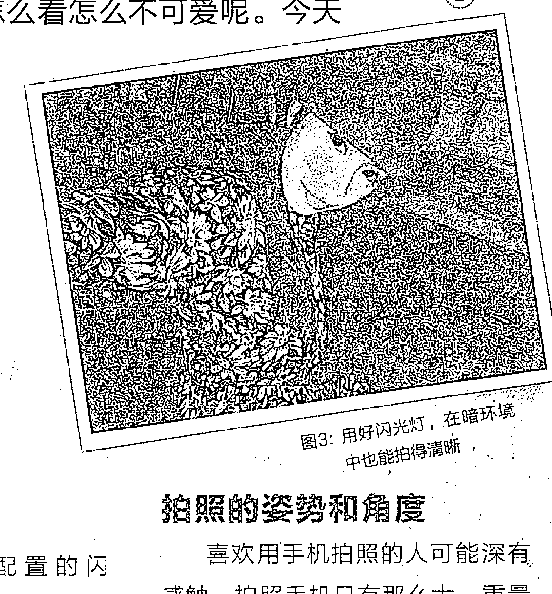

### 拍照的姿势和角度

喜欢用手机拍照的人可能深有感触，拍照手机只有那么大，重量还不到一般传统相机的一半，如果拍摄的时候手把持不稳，再好的光线拍出来也是难看之至。特别是CMOS型摄像头更为敏感，稍微的震动都会直接影响到成像的效果。所以在拍摄时，最好右手握机对准拍摄对象，然后用左手托住右手，保持平稳。

由于手机反应速度没有照相机那么快，按下拍照快门后并不是立即取景的，而是在快门声响的时候才取景，所以拍照的时候最好设置快门声，而且拍的时候手机一定要拿稳。特别是按下拍照功能键的时候，如果这时候动一下，那拍出的照片有可能会模糊了，所以一定保持稳当的姿势直到照片拍摄完成。

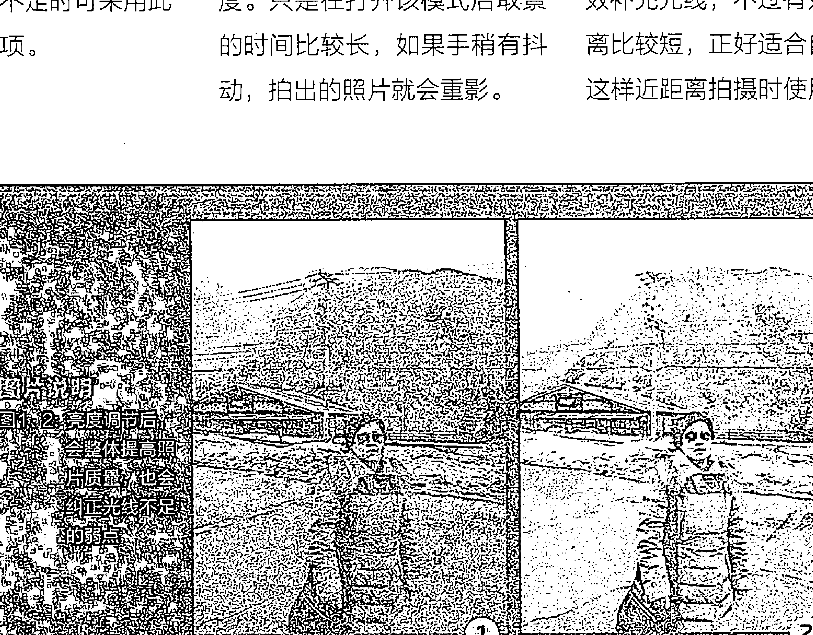

图4: 这个角度堪称完美，即使很矮的人经过此角度拍摄也会显得相当高大。图5、6、7: 45度角是手机自拍的一个黄金角度，可以让你的脸更加好看。图8: 保持平行的拍摄比较能够最真实地还原人像。


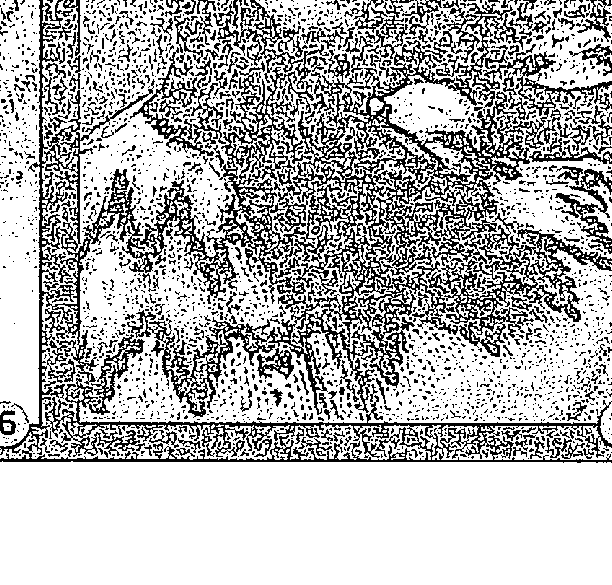


图片说明
图9、10: 灵感有时候就在一瞬间，好的灵感会给照片加分许多

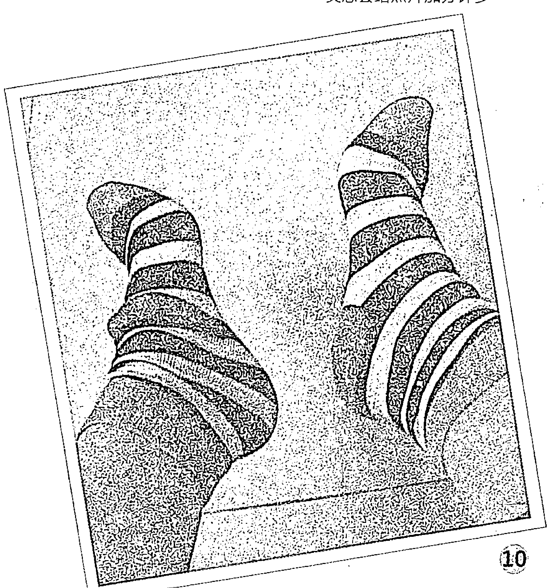

## “饭后补妆”不美也光

如果运用了各种技巧，拍出来的照片还是不满意，怎么办？没关系，吃饭后要想再光鲜亮丽地见人，补个妆总是可以的吧。拍不好，那么修图把它变好就行了。

手机上，我推荐“美图秀秀”这款应用，它不仅可以把你没用好的光线各种补足，而且还能翻着花样变换各种光线，另外人像美容里面可以把你不喜欢的形象彻底修改成高富帅或白富美，眼睛变大及瘦脸功能无限强大哦。

现在的拍照手机对于拍摄功能的运用是越来越强，有千奇百怪的相框，以及各种风格的拍摄效果等，你完全可以通过这些功能，充分发挥出你的想象力，巧妙地将它们融合起来。

用最平凡的图片表现出最真实的一面，用最简单的色彩表现出最斑斓的世界，你的生活才会更加丰富多彩。

## Android手机照片后期必杀技

对于多数人来说，手机已经从实际上淘汰了数码相机，用手机拍照极度稀松平常。那么如何让拍摄的照片更加好看，更具味道呢？这就需要对照片进行后期处理。在智能机日益普及的今天，手机上安装一些APP，就能轻松加工出美图。

文 | 周建峰

上期的文章中曾经介绍过美图秀秀，当在阴天或夜晚拍摄出黑乎乎场景的时候，通过它“智能补光”中的“调色”，可以轻松修改亮度和对比度，让黯淡的画面变得靓丽（图1）。下面我们再介绍其他一些方法技巧。

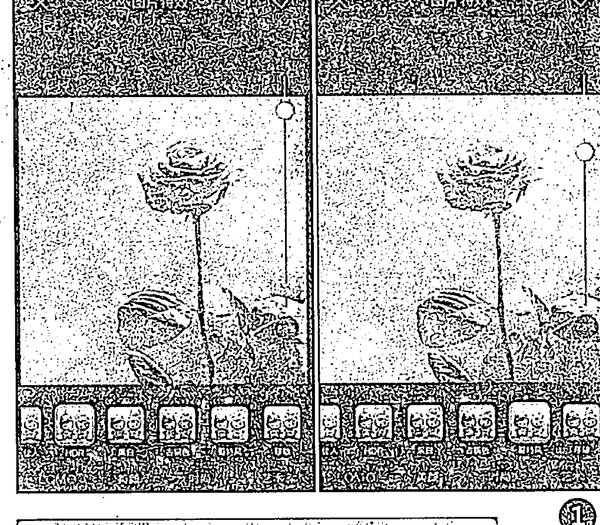

### 色调！改出韵味

照片的色调是画面中主要色彩的倾向，在一张彩色照片中，色调是由不同的色彩通过适当的搭配而形成的统一、和谐和富于变化的有机结合。大多数图像处理APP都有色调修改功能，如清晨风格、HDR、哥特风等。

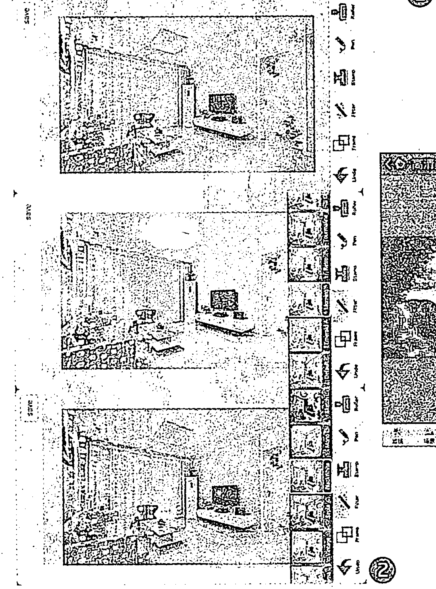

启动TOPIC，点击Deco选择Full Size，打开照片后点击Filter，这里有多种色调模式供我们选择，复古、黑白、清晨等（图2）。

而玩图则可以对高清图片进行修饰，点击“高清美化”打开图片后，点击“滤镜”给图片添加LOMO效果（图3），另外在“场景”中也可以改变图片的色调。

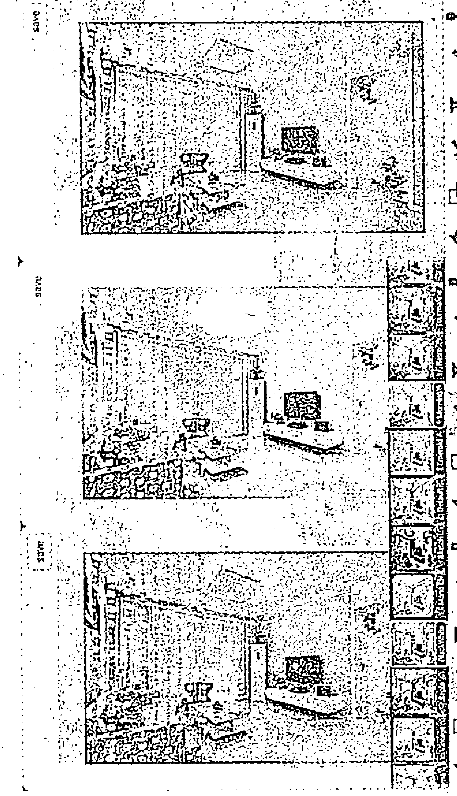

### 裁切！剪出好图

某些时候，拍摄好的照片由于取景不好、角度偏差等问题，或者为了突出图片中的主体，对图片进行裁切是很好的补救途径。

这方面，同样可以借助美图秀秀来完成，点击“美化图片”打开照片后，点击“编辑”可以对图片进行裁剪（图4），在“比例”中有自由、3:4、16:9等。

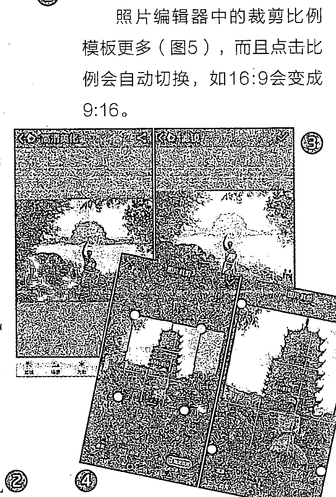

照片编辑器中的裁剪比例模板更多（图5），而且点击比例会自动切换，如16:9会变成9:16。

图片加上各种精美的边框，也是美化修饰图片的常用技法，而大多数图片软件都将边框作为必备功能，美图秀秀和玩图是其中的佼佼者。

进入美图秀秀中的“美化图片”，点击“边框”，这里有简单边框和炫彩边框供我们选用（图6），点击“更多边框”还可以联网下载更多精美的边框。

玩图中的“画中画”则更有创意（图7），它能将图片置于一个有趣的场景中，制作出另类的边框特效。

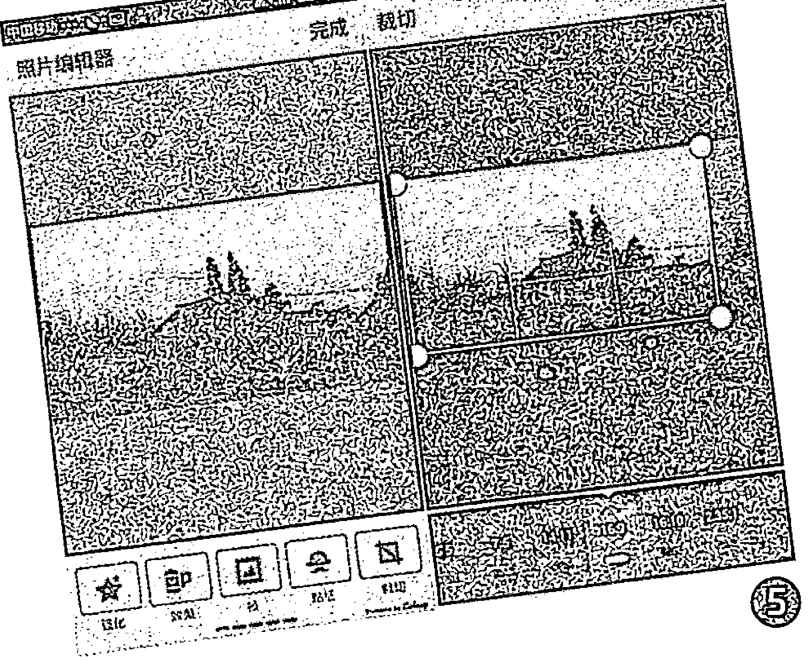

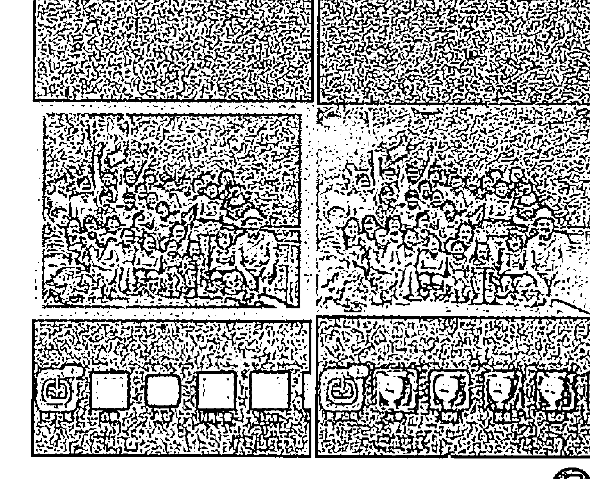

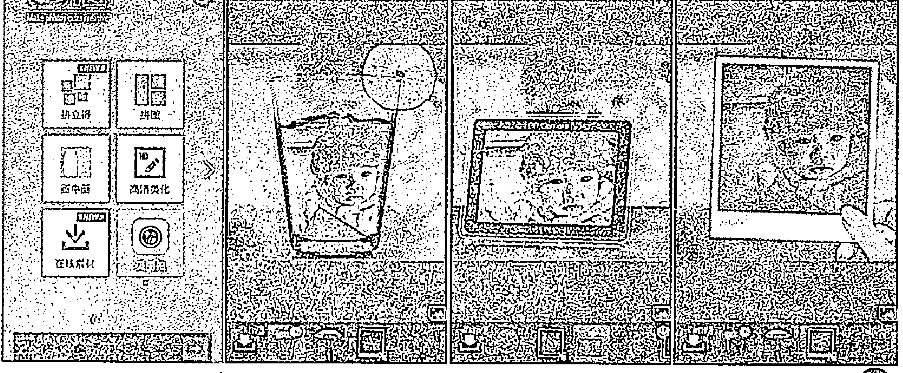

多幅图片合并在一起，得到一幅画面更丰富的图片，也就是常说的“拼图”，这在日常生活中很常见，杂志、影楼经常会使用这种技法。美图秀秀每次最多可以拼接9张图片，有模板、自由、海报、拼接四种模式（图8），并且能更换边框、背景等，还可以在线下载更多拼图模板。“拼立得”也是一款给力的拼图工具，提供了杂志风、现代风和模板三类拼图模式（图9），并且能读取照片拍摄日期、添加修改说明文字等。同样也可以在线获取更多个性化模板。

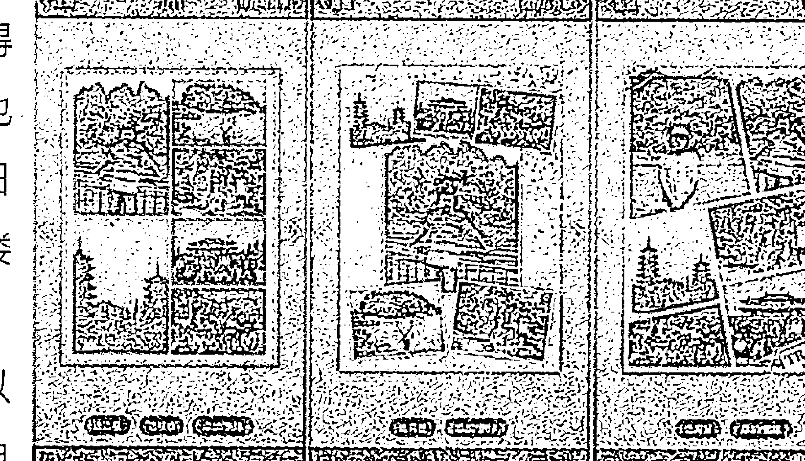

### 饰品！增加乐趣

根据需要，我们还可以给图片添加一些小饰品或小物件，从而让图片妙趣横生。在不同的APP中，该功能的名称稍有不同，如魔幻笔、印章等。美图秀秀中进入“美化图片”，打开图片后，点击“魔幻笔”，选择后在画面中点击即可添加（图10）。当然了，除了上述的图片处理技巧外，美容、变形等也比较常用，我们根据需要，搜索关键字就能找到相关的APP。本文中所涉及到的软件，只要搜索名称即可安装使用。

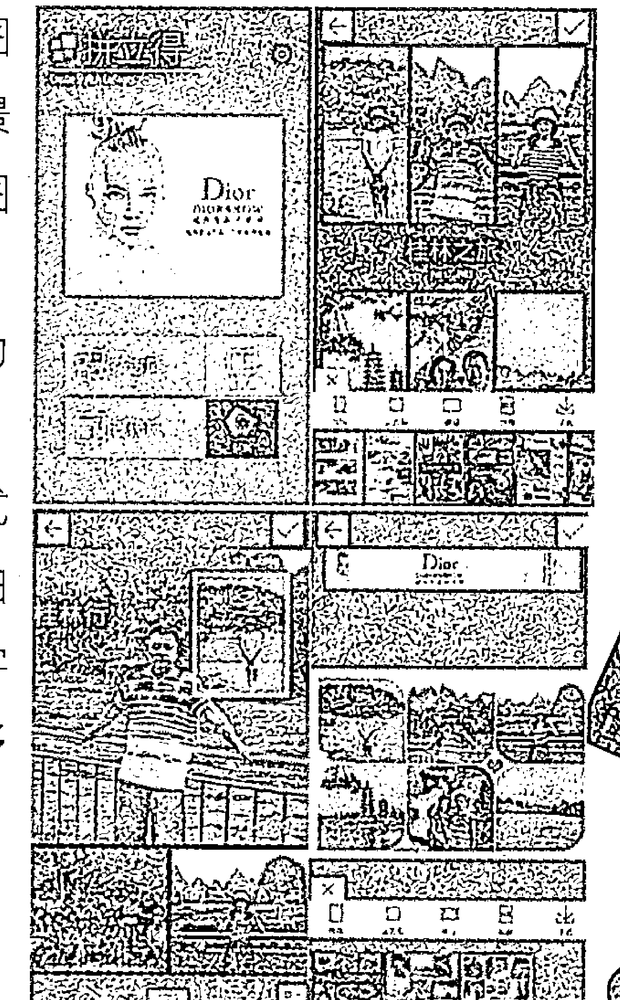

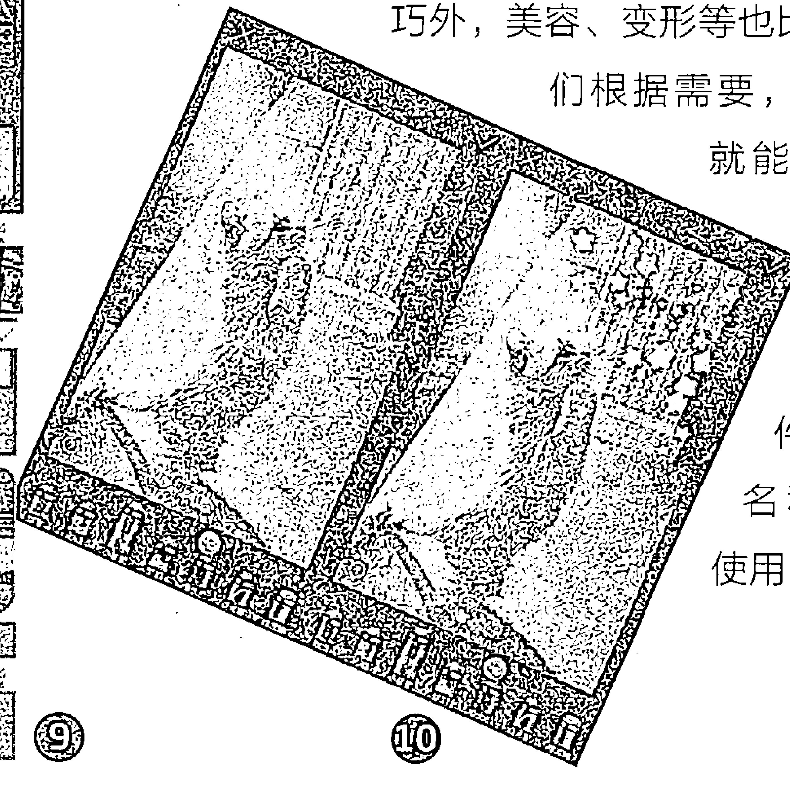

## 为照片‘人工降雨’

下大雨的时候，我们避之唯恐不及，尤其是在拿着相机、手机拍照的时候。但是你又很想要表现一种雨中的浪漫或忧伤的情怀，怎么办呢？没关系，慢慢等到雨停后拍照。至于那梦幻般的雨，就让我们自己来‘营造’吧。

文 | 梦云

为了应景，首先要有一张打着伞的照片，这个好办，在雨停的时候，我们对场景有着更多自由的选择，只要构好图，摆好造型就可以了（图1）。


启动Photoshop（以CS5为例），打开要后期处理的照片，然后在图层面板中，按Ctrl+J键，即可复制背景层成为新的图层，并自动命名为“图层1”（图2）。

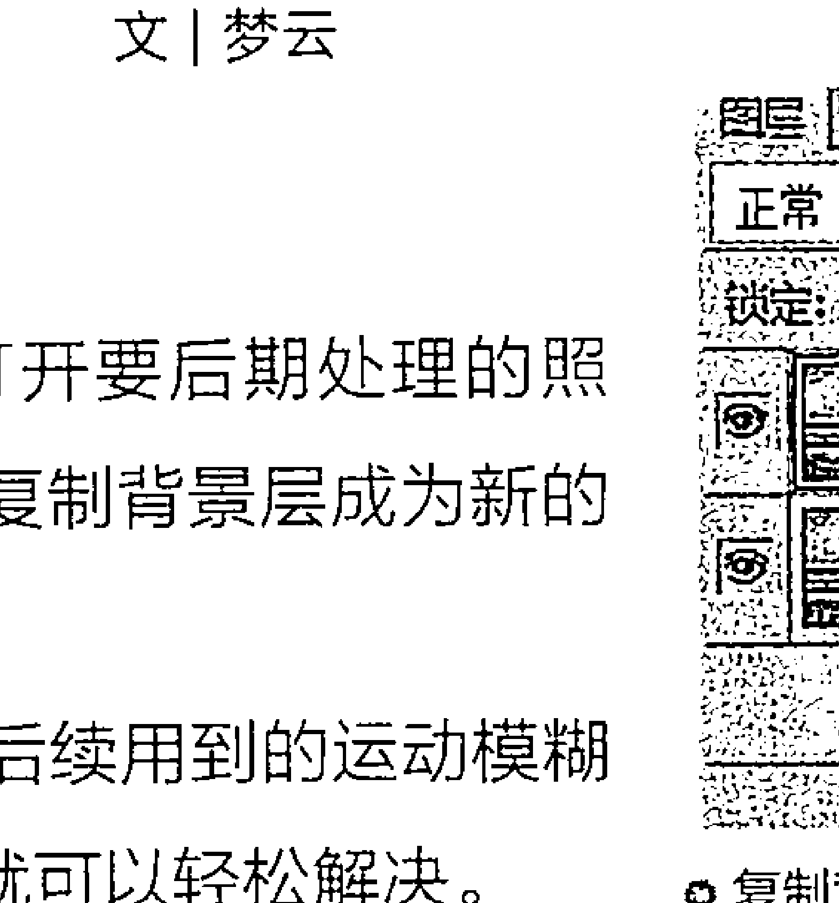

接下来要扩展一下原照片的画布，因为后续用到的运动模糊滤镜在边缘会有些不自然，通过本步的技巧就可以轻松解决。

在英文状态下按D键，设置前景黑背景白的默认色。接着选择裁剪工具，随意拖画出一个裁剪区域，然后拖动裁剪框四周的锚点，将裁剪框调整到大于原来的画面（图3）。在裁剪框内双击确定，即可扩大画布了。

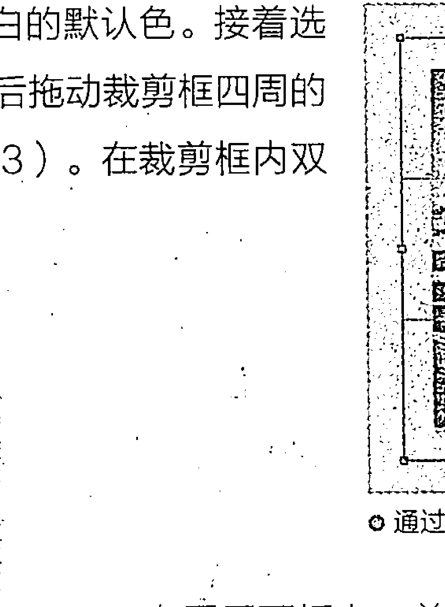

在图层面板上，单击下方“创建新图层”按钮，添加一个新图层。接着按Alt+Backspace快捷键，快速为新的图层2填充上黑色，图片暂时会被覆盖。

点击菜单“滤镜→杂色→添加杂色”调出对话框，将数量设置大一些，如160左右。选择“平均分布”，勾选“单色”，点击“确定”返回（图4）。

# 添加模糊效果

接下来点击菜单“滤镜→模糊→高斯模糊”，这次只需要很小的一点模糊效果即可，比如将模糊半径设置为0.5，确定后返回（图5）。

### 设置动感模糊

接下来“奇迹”就要开始出现啦。先选中噪点图层（即图层2），然后点击菜单“滤镜→模糊→动感模糊”，角度及距离都设置为60左右（图8）。

### 调整雨丝密度

此时图片上可能看不出什么变化。别急，在图层面板上双击刚才新建的调整层，将它打开，然后重新调整色块的位置，这次整体要向左移，很快就能看到动感模糊的效果了，根据你想要的雨的密度来设置（图9）。

上面添加的噪点太多，需要通过适当的方法减少。先是要使用调整层，点击图层面板上的调整层图标，从弹出菜单中选择“色阶”（图6）。从弹出的调整对话框中，将黑色块向右移，白色块向左移，会发现噪点明显减少（图7）。

### 创建色阶调整层

### 调整色阶

最后，选中噪点图层，将图层的混合模式改成“滤色”，再将开始时扩展出的画布裁剪掉，一个别具风情的雨景图就完成啦。如果效果不理想，可以重新微调调整层，直到满意为止（图10）。你还可以尝试其他的混合模式，会发现很多不一样的风格哦。

### 雨景效果图

## 为生活照添加温馨色调

我们在生活中可能会遇到很多温馨的场面，但是用手机或相机拍摄下来后，有时总觉得缺少一点什么。如果取景构图都没问题，那就有可能是色调方面有所偏差。往往色调只差那么一点点，就可能导致整个照片的情调改变。幸运的是，我们还可以通过后期进行调整。

文/梦寻

### 色调的冷与暖

人们在评论一幅画或照片时，常常喜欢说它的色调如何如何，这里所谓的色调，实际上就是指一幅画或照片的总体色彩倾向，以何种色彩为主体。

按照人对色彩的心理感觉，色调可以分为暖色调和冷色调两大类。黄、红、橙，容易让人想起太阳、火焰等，带来温暖的感觉，称之为暖色调。绿、蓝、紫，容易让人想起森林、大海，带来清爽安静的感觉，称之为冷色调。当然还可以再细分，同为暖色调，红色兴奋而危险，黄色温暖，粉色可爱。同为冷色调，绿色清新而活力，蓝色安静，紫色神秘。

下面这张照片，是以绿色调为主，清新可人。这张照片本身没有什么问题，但如果要把它放到某种特殊的环境中（比如要与某段文字内容匹配，或者与某本相册的整体风格统一等），需要让它体现出温馨的感觉，我们就得进行一些后期处理了。

为图层编组

色相环示意图，从黄到紫的半侧环是暖色调，从黄绿到蓝紫的半侧环为冷色调

### 未雨绸缪做准备

如果只是简单地使用一个命令或者滤镜，生成的效果会非常生硬。所以下面的操作，将会建立多个图层进行微调，让整个照片的色调富有细腻的层次感。

在Photoshop中打开照片，首先复制背景层到一个新的图层，然后在新图层上工作，这样一旦处理失败，我们可以快速恢复到原来的图像。另外，因为接下来将会创建多个图层，为了避免混乱，点击图层面板下的“创建新组”，后续添加的图层将集中在“组1”中，整个图层面板就会清爽多了。

### 为照片打上基调

要想在照片中表现出温馨的感觉，一般要铺设暖色的基调。点击图层面板下的“创建新的填充或调整层”按钮（半黑半白的圆形图标），选择“曲线”创建一个曲线调整层。然后在调整面板中，点击RGB右侧的下拉按钮，再选择红、绿、蓝三个通道分别调整曲线。大致调成几个S形，其中绿色线偏下，蓝色线偏上，红色线偏中，这样就可以调制出一层淡淡的粉红色。接着回到图层面板上，将不透明度设置为50%。接下来再创建一个“纯色”调整层，填充色选择接近于黑色的深蓝（比如R0、G10、B30）。这个层的图层混合模式选择“排除”，排除蓝色等于是增加了暖色。至此，基本色调完成。

### 增加色彩的层次

为了让照片的色彩层次丰富细腻，接下来再创建三个“渐变”调整层。第一个渐变层的样式为“径向”，角度为45度左右，缩放为150，勾选上“反向”。另外点击其上的渐变条，在弹出的设置窗口中，将渐变的左侧设置为一种桔黄色（比如R210、G130、B50），右侧为白色。确定后，再将这一调整层的图层混合模式设置为“柔光”，不透明度为50%。另外两个渐变层也都是“柔光”模式，不过颜色和方式要略作调整，不要完全一样。在三个渐变层之间还可以加一个色阶来丰富层次。

前面已丰富了色彩层次，但是色彩浓度稍弱，下面的方面对此进行增强。新建一个“色彩平衡”调整层，“中间调”的红色+5，绿色-2，蓝色-2；“高光”中的红色+2，绿色-2，蓝色-10，勾选“保留明度”。紧接其上再建一个“纯色”调整层，设置为蓝色（如R10、G60、B125），图层混合模式为“差值”，不透明度为30%。至此，一个充满温馨感的照片就制作完成了。还可以在此基础上，再添加一个曲线和渐变调整层增强效果。另外，按照上述的方法，中间过程设置不同的颜色，还会得到风格迥异的其他风格。

## 手机里那花儿的世界

春天来了，百花齐放，无论是一簇簇的桃花，还是大片的郁金香，或者是路边的野花，都独具韵味。不过因为花儿不同、环境不同，拍摄手法也有所不同，下面就来聊聊如何通过手机发现花的天地。

文/流言

### 手机微距中的世界

手机拍摄花朵，为什么要使用微距？这其中隐含着一个如何看待世界的问题。试比较下面的两幅照片（图1、图2），第一幅照片看起来没什么大问题，小花儿也很漂亮，但是却没有重点，不知道拍摄者要表达什么。而当我们将镜头拉近，在这个平凡的背景中，就会发现那些不起眼的小野花其实有着不凡的魅力，真所谓“一花一世界，一叶一菩提”。

因为手机镜头的局限性，在微距拍摄中，我们能主动控制的基本上只有有限的距离控制及光线、构图。在最小对焦距离允许的范围内，离得越近得到的微距效果就越好，这时候被拍摄主体的花儿清晰显示，而背景则变得非常模糊，立体层次感非常强。这是微距拍摄所特有的景深感。

还有就是我们对光线的控制。微距拍摄花卉的时候，常常会用到逆光（镜头对着光源的方向），这样拍摄出来的花瓣会非常的通透。另外逆光拍摄时，背景中的小亮点会被虚化成光斑，非常好看。

顺光拍摄，则可以拍出花瓣的真实质感。不过顺光拍摄时要特别注意，因为靠得很近，很容易挡着光线，导致花卉上的颜色暗淡。

### 知识拓展

镜头最小对焦距离。所谓的微距，简单来说，就是离拍摄的对象距离非常贴近，使得被拍摄对象的大小接近1:1甚至更大。不过镜头都有一个最小对焦距离（即可以对焦的最短距离），不能无限贴近，超过最小对焦距离，成像就会变得模糊。一般来说，最小对焦距离在10cm以内，就可以算是微距了，现在的手机镜头一般都可以达标，甚至可以更近（当然微距的效果也就更好）。

## 简练的背景

微距拍摄中，我们能掌握的最大主动权就是构图，以前我们介绍过不少黄金分割之类的构图技巧，这里再介绍一点如何通过背景突出主体。一般来说，背景越简单，主体就会越突出。背景的单一、规整，往往最能体现出花草的生机与色彩，所以墙面，石柱之类，往往是非常好的背景设置。

## 让图片讲故事

一张有意思的图片，往往会蕴含一点故事性，给欣赏者以想象的空间。让照片讲故事的技巧之一，就是通过背景来衬托。比如，缠绕在一个铁栅栏上的花朵，可以让我们感受到冲破禁锢的渴望。

百花齐放的春天，相信上面的方法，能帮你发现一个不一样的花的世界。

## 美丽的影子世界

摄影的本质，就是记录光、影和色彩。但是现实生活中影子是如此平凡，以至于我们很少会注意到它。但是当我们将镜头对准影子并以它为主角时，就会发现这灰黑色的世界中，其实也有很多意想不到的趣味。

文/半夏

### 分解影子因素 制造创意摄影

因为我们生活在一个有着复杂光源的世界中，所以影子并非我们想象中的那样纯黑或纯灰，仔细观察，会发现影子中间部分的黑色比较浓重，这部分即所谓本影，而四周部分略显浅淡的称之为半影。如果在一个茶杯的两侧分别点上一支蜡烛，将会形成两个影子，其中重叠的部分是全黑的即本影，非重叠部分半明半暗的即半影。随着光源增多（比如再增加几支蜡烛），本影会越来越小，半影部分也会越来越淡，但是层次同样会增多。

要想产生影子，首先要有光线（要素1），其次要有阻挡光线的不透明物（要素2），并且还要有如墙壁之类承载影子的媒介（要素3）。下面的实例正是巧妙利用了形成影子的各种要素的特点，只要我们举一反三，同样也可以拍摄出非常有创意的照片。

首先说光线，随着光线的角度变化，同一物体影子的大小、形状也会随之改变。我们知道一天当中太阳的光线角度变化非常大，一般来说早晚时光线角度很低，所以影子会被拉得很长，造成夸张和变形的效果。另外因为天气原因，光线有强有弱，当选择在光线较强的时候拍摄，这时产生的影子的效果也会比较强烈。

除了能够选择不同的时间外，对太阳光线本身是无法人为改变的，不过我们可以控制其他一些因素，从而达到一些特殊效果。首先是拍摄位置的改变，比如从一个高点位置俯拍，就会产生很特别的效果。

通过对被拍摄的人或物的位置进行特别的安排，经常能产生创意效果。比如下面的例子，将圆圈（或戒指）夹在书的交界处，都产生了将圆形转换成心形的效果，非常别致。

光线必须被物体阻拦才能产生影子，这一特型也能产生很多特效。比如，障碍物是网状的，就会产生网状的投影，有一种图案美。

除了利用障碍物，对于承载影子的媒介也可以创意地使用。下图摄影者让模特拿着一个半透明的画框，校正好光线的角度，然后人物的影子投射到画框中，形成一个剪影画面，非常的美！

## 剪影和影子的区别

最后我们说说剪影和影子的区别。有不少人将剪影归到影子中，其实两者还是有所不同的。影子是投影，而剪影实际上就是人或物的一个侧面。剪影的效果相对单一，而影子的拍摄，如上所述，只要有创意，是可以变化万千的。当然两者各有千秋，拍摄时一切根据想要表达的目的而确定。

在光线方面，剪影拍摄必须是逆光，而影子拍摄许多情况下用顺光或侧光。当然，影子也可以逆光拍摄，这时它与剪影合成到一起，会别有一番趣味。

## 最炫民族风

蒙太奇（Montage）本来是建筑学中的术语，有构成、装配之意。后来这个词被引用到电影中，成了现代影视中的一个非常重要的概念。通俗地说，蒙太奇就是把不同的镜头画面连接在一起，从而产生新的意义。比如本来是一幅面无表情的演员镜头，接上热气腾腾的热汤镜头后，演员变成了饥饿的表情。而同样的这个演员镜头接上一个正在玩耍的小女孩镜头，观众则从演员脸上看到了慈爱的表情。这就是有名的库列肖夫蒙太奇实验。

文/流言

与影视不同，摄影是静态照片，所以表现在摄影作品中的蒙太奇，一般是指多张照片组合在一起的效果。最简单的一种是拼图蒙太奇。比如把连续时间内拍摄的系列照片顺序拼合在一张图片中，就能从静态照片中体验出时间的流动。再比如将同一事物不同景别、角度的照片拼合在一起，可以对这一事物有更加整体的了解。除了连续性效果外，还可以将风格内容皆不相同的照片拼合在一起，产生强烈的对比效果。

美图秀秀之类的软件就提供拼图操作，不过它们的拼图模板虽然丰富，毕竟有限。而在Photoshop中，我们可以制作任意的拼图框架。总之，根据自己的需要选择即可。

## 创意混合蒙太奇

拼图蒙太奇比较简单，所以它的视觉冲击力远不如混合为一体的创意蒙太奇。混合蒙太奇的方法之一，是通过一些相近相似的元素，将两个或更多的照片混合在一起，如同一体。

混合蒙太奇的另一大思路，是将原有的背景或者照片中的某个局部替换成其他图片，从而混合成一体，达到惊人的效果。这种蒙太奇的效果震撼，但是实际的制作却并不复杂。一般在Photoshop中，将主要的图片放在上层，将次要照片分开放在下层，然后将主要照片中需要替换的部分选取出来并删除掉，从而露出底层照片，调整好位置和大小，再进行适当的处理（如模糊边缘），即可制作完成。

除了以上方面，利用透视原理制作的混合蒙太奇，也常常带来令人惊讶的效果。比如蚂蚁与人相比，几乎微不足道，但如果通过微距拍摄放大蚂蚁，然后再将人物照片缩小比例放置在蚂蚁的旁边，形成蚁大人小的反差效果，肯定能吸引人的注意力。

只有想不到，没有做不到。除了以上的思路，我们尽可以发挥自己的想象力，混合出更有视觉冲击力的蒙太奇照片来。

△ 唱片脸（SleeveFace），就是以人物海报中的头像与自身组合起来，产生的一种蒙太奇效果

▽ 这张照片使用了透视效果，还使用了合成效果，生成窗户镶嵌在鸭梨上的奇观

△ 借助桌布与瀑布的某些相似性连接两张图像产生奇特效果

▽通过斑马的黑白条纹与钢琴的黑白键之间的相似之处进行连接，奇妙而又自然