# 电脑爱好者2014合订本（下）第一部分

计世传媒 荣誉出品
ISSN 1005-0043
9 771005 004003
邮发代号：82-528
零售价：39.80元

《电脑爱好者》2014年13~24期精华内容原版集成 ◇超值赠送DVD《电脑爱好者》2014年13-24期完整电子版+广告设计实战视频教程

- 方法技巧
- 达人经验
- 软硬网移
- 收藏馈赠


## 电脑爱好者
### 2014年下半年合订本

电脑爱好者杂志社

## 《电脑爱好者》2014下半年合订本

主管 中国科学院
主办 北京《电脑爱好者》杂志社
中国计算机世界出版服务公司
编辑出版 《电脑爱好者》杂志编辑部
顾问 郭传杰


荣誉出品

董事长 洪京一
副董事长 熊晓鸽
董事 万鹏远 许伟明 刘学义
总裁 黎争
副总裁 梁继有 覃超
社长 葛程远
出版人 梁继有
总编辑 许伟明
副社长 西浩铭
副总编辑 张博
出版部 聂静（主任）

作者 《电脑爱好者》编辑部
发行总代理 北京爱好者文化传媒有限公司
杨波（发行总监）
办公地址 北京市海淀区翠微中里14号楼4层
通信地址 北京123信箱（《电脑爱好者》杂志社）
邮编 100036
网址 http://www.cfan.com.cn
总机 010-88230000
广告客户部 010-88230596 010-88230597
读者服务部 手机短信：13801293315 电话：010-88230549
（发行） （周一至周五 9:30～11:30 13:30～17:00）
零售 全国各地邮局（所）
国内发行 北京报刊发行局
邮发代号 82-528
中国标准连续出版物号 ISSN1005-0043
CN11-3248/TP
印刷 北京新华印刷有限公司
广告许可证 京海工商广字第0055号
出版日期 2014年12月20日
法律顾问 周涛律师
网站：www.zt148.cn 电话：13366185341

## CONTENTS 目录
## 《电脑爱好者》2014下半年合订本
### 特别话题

- 寻找软硬件的“最佳搭档”..............................8
- 窃听风云就在你我身边......................................22
- 植入也疯狂...........................................................37
- IT生活 没有远虑必有近忧................................49
- 聚焦网络小时代...................................................63
- 一天如何变成36小时.........................................87
- 破解空间密码 玩转压缩....................................100
- 只为“生产力” Windows平板电脑的逆袭............108
- “舌尖上”的论战.................................................119
- 人人均能变“极客” 让手边的设备极致起来........136
- 升级向前冲！拥抱Windows 10.......................150
- 2014年终回顾 大话IT圈..................................166

### 系统应用

- 要简约、耍个性 Windows 8.1就得这么玩儿............186
- Windows 10“毛病”知多少......................................191
- 动动手 Windows 8更好用.......................................192
- Windows 8.1还能这样用..........................................194
- 活用Windows 8.1自带屏保.......................................196
- 通过“库”实验 搞清“库”本质..................................198
- 用“策略”控制任务栏与开始菜单..............................200
- 解惑Windows 8.1桌面问题.......................................202
- 切断资源管理方便之路...........................................204
- Windows 8.1 资源管理器体贴大改造.......................206
- 搞清“潜规则” 系统再裸奔.......................................208
- 输入有道 微软拼音“继续”用..................................210
- “快捷方式”不简单..................................................212
- 广泛挖潜 用好OneDrive.........................................214
- 一左一右 搞定系统管理功能...................................216
- Windows 8.1 不离不弃............................................218
- 卸掉“累赘” 轻装前进............................................220
- 跨越版本 走进Windows 10.....................................222
- 文件搜不到 索引惹的祸.........................................224
- 两代Windows哪个更安全........................................226
- 闲置移动盘 体验Windows 10.................................228
- Windows 10扫清Windows 8的毛病.........................230
- 救急“稻草”挽救危亡系统.......................................232
- 时光倒流 超越Windows 8管理资源.........................234


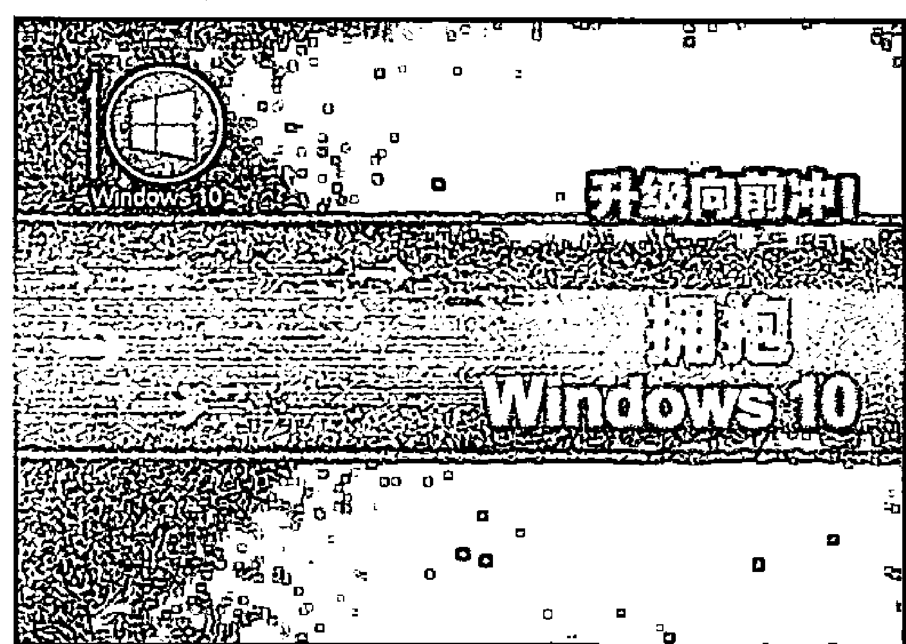

### 【目录】

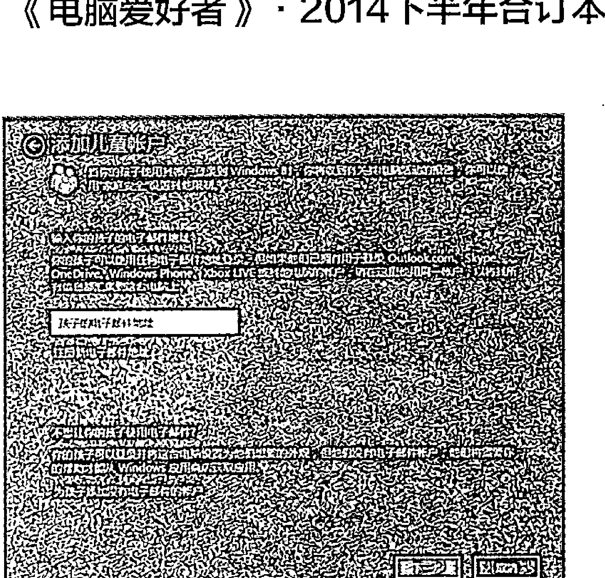

- 用好Windows 8.1/10的两种账户
- 恢复丢失的数据与分区

### 软网生活

- 疑难视频专辑下载有道
- 对特殊视频格式说不
- 垃圾清理 三大纪律要注意
- 不装必应桌面 也集必应图片
- 键盘故障 PC照样输入
- 网络收藏夹 “私通” 捷径
- 营造文件超速解压环境
- 知行合一 在线上大学
- 阅读更方便 分割合并网络小说
- 轻松管理 多网盘不再凌乱
- 晨练音乐串串烧
- 挖掘隐秘功能 网络访问快又稳
- 图片管理的好搭档
- 给网络下载雇个 “金管家”
- 传统路由器变 “智能”
- “照片” 应用不 “鸡肋”
- 巧用浏览器 无缝读文章
- 下载未动预览先行
- 超越看图 搞定照片二三事
- 暴风看片 这病那病一次除
- 打造个性化静默自动下载器
- 闲置小U盘 发挥大作用
- Everything远程搜索
- 使用Google开源字体
- 定位软件Hosts为联网提速
- 不用装软件 云端修图修视频
- 换换装 文件夹管理更方便
- 右键菜单 自做主张
- DIY自己的网页资料库
- 解除 “绑架” 还你干净的浏览器
- 用好数码照片的 “黑匣子”
- 闲置U盘变身Windows 8 “护卫”
- 禁自动同步保护云隐私
- 不用望远镜也看最圆的月亮
- 自制微信专属强迫症头像
- 别羡慕了 我也有 “iPhone 6”
- 开放桌面 如何保隐私
- 理性购买 舆情分析帮大忙

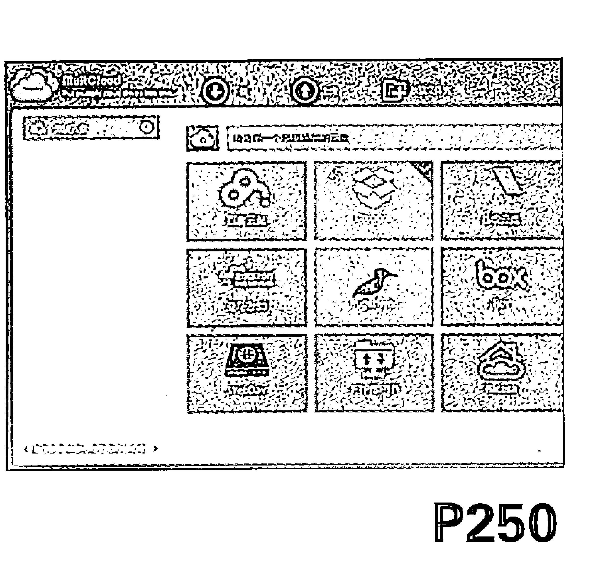

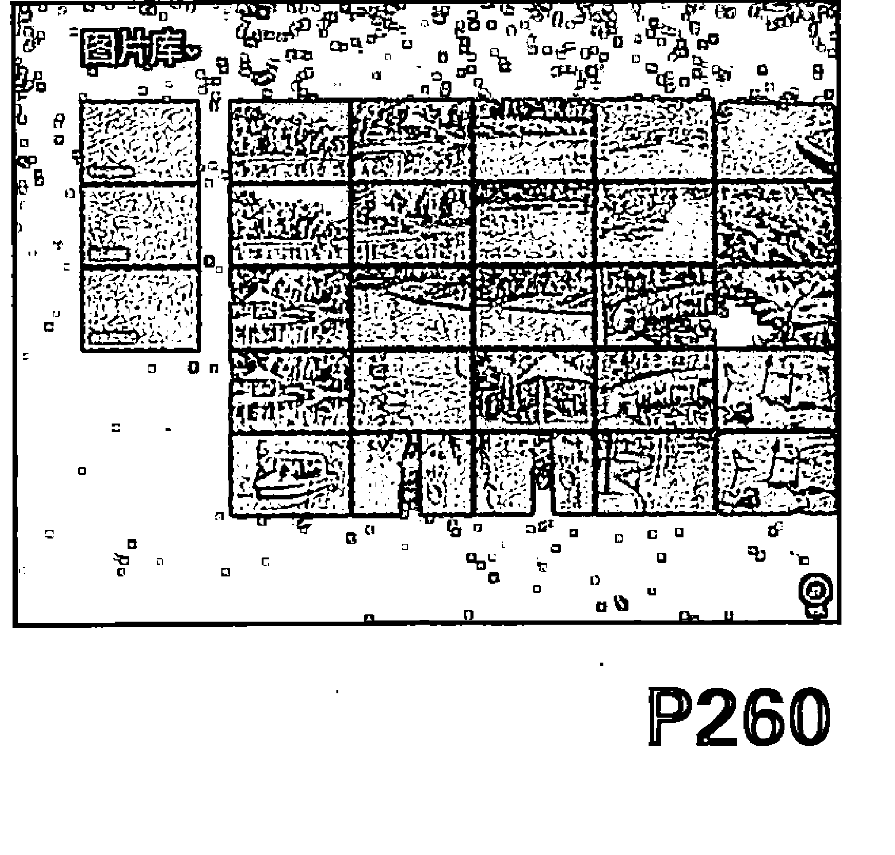

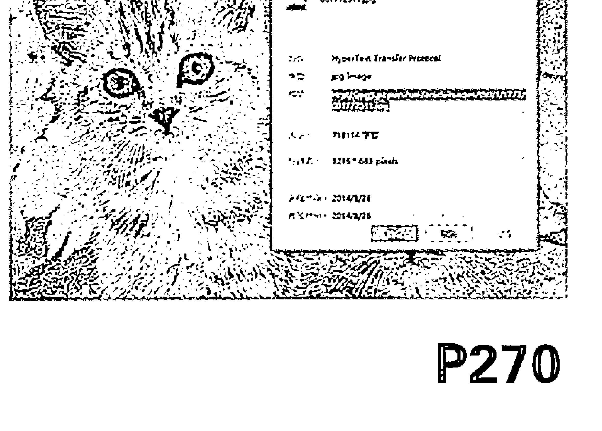

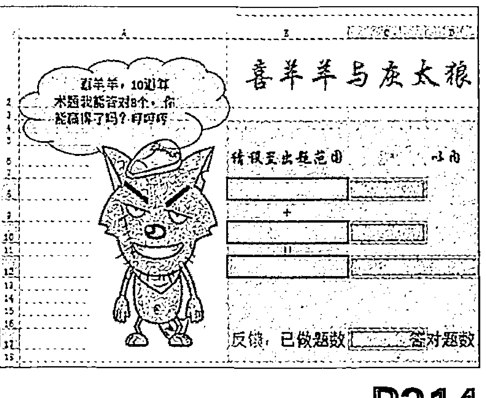

P314


P334

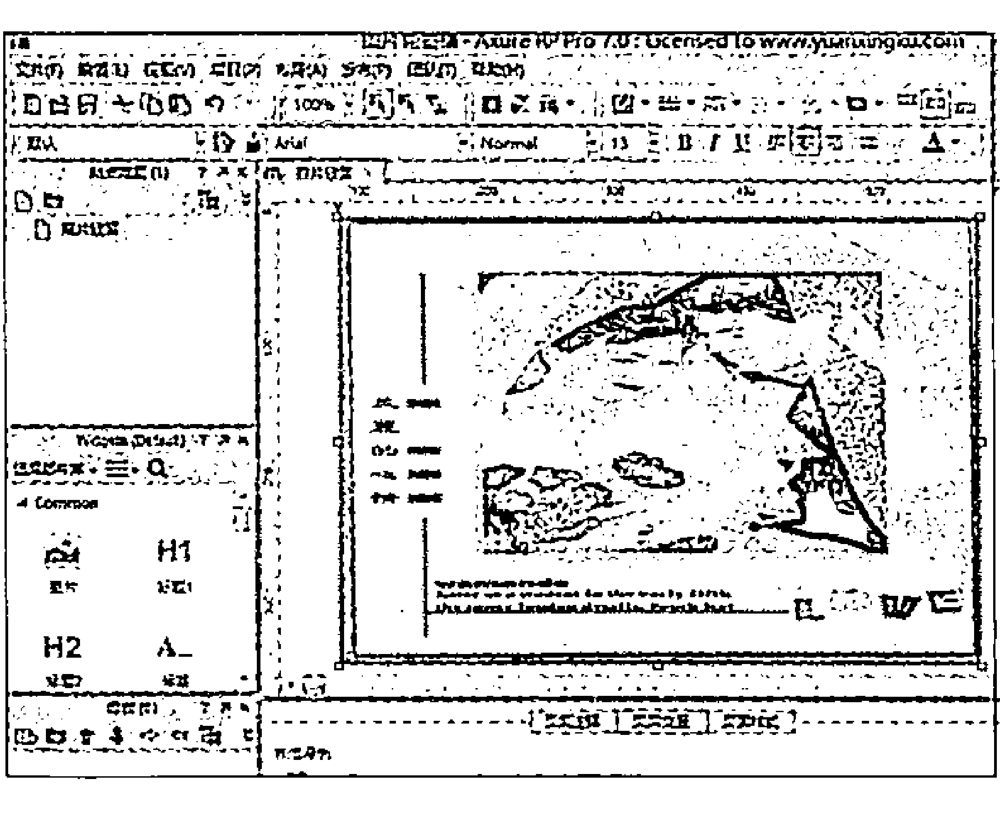

P342


P350

应用软件 隐患也莫忽视………………………………………………295

局域网也玩“云同步”…………………………………………………296

另类方法隐藏指定文件…………………………………………………297

博客文章自动转发到微博………………………………………………298

自动分离数码录像与照片………………………………………………299

“播”外之事一软搞定…………………………………………………300

为孩子构建绿色健康桌面………………………………………………302

手机变身超级数学达人………………………………………………303

平淡记事本 用法不一般………………………………………………304

快速拿下微软官方分类壁纸……………………………………………306

网银保安 借用游戏保险箱……………………………………………307

无损音乐的快速下载…………………………………………………308

时光倒流 微博还是旧的好……………………………………………309

另类重装 大型软件快速再用…………………………………………310

时日自动标 备份不难找………………………………………………312

不一样的场合选不一样的翻译…………………………………………313

### 高效办公

轻松制作儿童趣味算术软件……………………………………………314

批量资料分别归档有术…………………………………………………316

Office校园创意使用攻略………………………………………………318

一键实现Word表格自动填充……………………………………………320

忘记密码 PDF文档照样编辑…………………………………………321

巧用输入法 办公也提效………………………………………………322

PPT新视角 幻灯片新感觉……………………………………………324

轻松制作生活点滴记录册………………………………………………325

反道而行 文档快速变图片……………………………………………326

交互式动画图表轻松做…………………………………………………328

个人云办公 一软定乾坤………………………………………………330

文件批量更名 右键更省事……………………………………………332

PPT也玩旋转跟随……………………………………………………333

Excel也做交互幻灯片…………………………………………………334

何止存储? 挖潜“云”办公……………………………………………336

巧解棘手事 版面更美观………………………………………………338

高效创建花名册信息…………………………………………………340

方寸之地显示大量图片…………………………………………………342

让文档中表格听话又易改………………………………………………344

没装工具 怎能打开文件………………………………………………345

翻亮图片 幸运抽奖…………………………………………………346

探索Word 2013七种“新武器”………………………………………348

让沟通变得更有趣……………………………………………………350

让写作更专心 更安心…………………………………………………352

## 目录

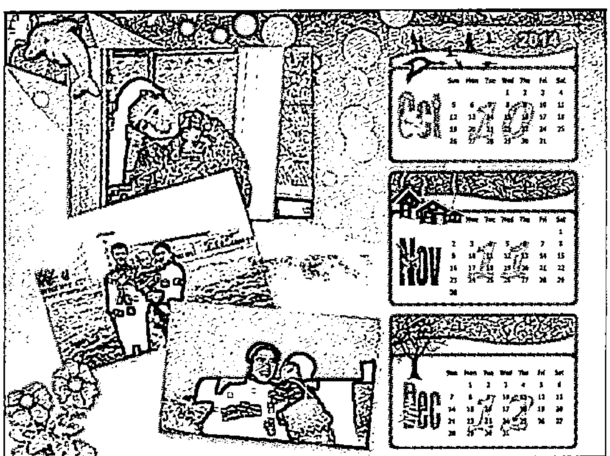

- 移动生活 多彩记录................................................353
- 拒绝慵懒 让照片走进生活 ................................................354
- 思维导图 尽在掌握................................................356
- 多Sheet表快速操作提效 ................................................357
- 流程图 结构图制作更轻松 ................................................358
- 不强拆 巧分妙合幻灯片................................................360
- 网页输文本 备份不再丢................................................361
- 表错情? Virtu MVP的真正作用及用法................................................362
- 大内存让SSD “延年益寿” ................................................365
- 数据无价 实战提升家用硬盘可靠性................................................366
- 解决Android设备变慢问题 ................................................368
- 小心闹误会 读懂手机的 “节能模式” ................................................370
- 集显还是独显 笔记本显卡无需刻意切换 ................................................372
- 你的网络安全吗 隐藏的Telnet登录方式................................................373
- 将Windows平板改造成功能完备的Windows PC ................................................374
- 无线变有线 巧为老电视升级Wi-Fi ................................................376
- 修复而不是丢弃 过保硬盘固件维修实战 ................................................377
- 修复而不是丢弃（续）过保希捷硬盘固件维修实战................................................380

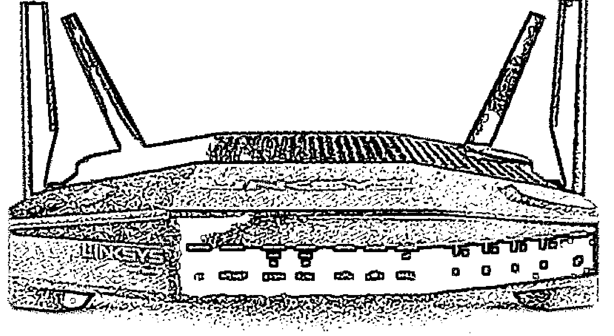

- 活用路由器的访客网络和无线隔离 ................................................382
- 让无线网络覆盖更广 ................................................383
- 20周年纪念版 新奔腾带你尝鲜超频................................................385
- 主机降噪大作战................................................386
- 舒服惬意 用你的手机遥控电脑................................................387
- 旧貌换新颜 翻新硬盘实战手记................................................388
- AMD碰上Intel 玩转英特尔集显与AMD独显................................................390
- 何需小米 打造NAS及迅雷离线下载攻略................................................392
- 莫要浪费大内存 活用 “内存硬盘” 为PC提速................................................396
- 杜绝本地设备被远程访问 ................................................398


- 显卡转向卡解决机箱空间问题................................................400
- 信号功能随你定 学会更换笔记本的无线网卡................................................401
- SOS! 自己动手解决本本键盘进水故障 ................................................404
- 速度容量要兼得 笔记本存储空间的扩容实战................................................406
- 零成本提升USB设备传输速度 ................................................408
- 低成本打造智能下载 “路由器” ................................................409
- 升级正当时 给入门超极本更换SSD................................................410
- 小线材解决大问题 自定义模块化电源线缆................................................412
- 笔记本用户必看 电源模式也会影响SSD性能 ................................................414
- 利用L Camera玩转4K视频................................................415

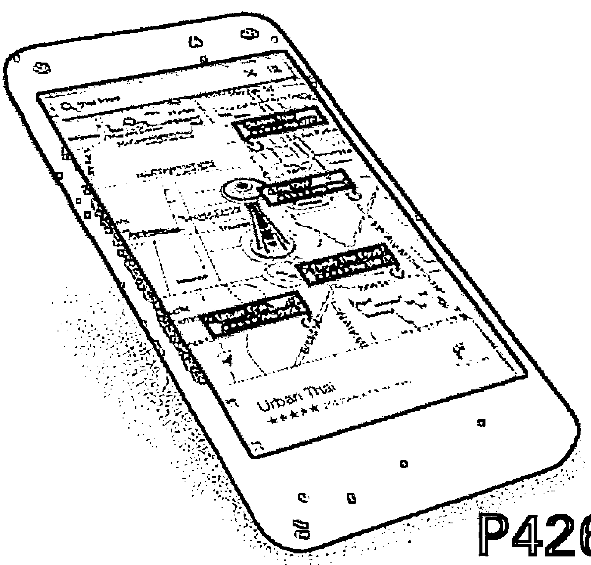

- 免费性能提升谁不爱 Maxwell移动显卡超频攻略 ................................................416
- 组建强力电脑 迎战年末游戏大作 ................................................418

### 技术解读

- 瞒天过海拯救XP？我看不行 ..................................................... 420
- 解密未来书写者“数字墨水” ..................................................... 422
- 深度搜索到底有多“深” ..................................................... 424
- 新型3D？ 解读Fire Phone的3D技术 ..................................................... 426
- 有多安全？ iPhone版移动钱包解密 ..................................................... 428
- 三面玲珑？ 三面显示屏解密 ..................................................... 430
- 传感器 智能手机的神经末梢 ..................................................... 432
- 手机里的秘密 SoC芯片解读 ..................................................... 434
- 虚拟还是现实 解读虚拟现实设备 ..................................................... 436
- 智慧插座到底有多智能 ..................................................... 438
- 通话上网两相宜 解密VoLTE技术 ..................................................... 440
- 双11背后的功臣 认识网购网站服务器 ..................................................... 442

### 移动天地

- 移动购物 省钱有道 ..................................................... 444
- 偏门而有趣的手机玩法 ..................................................... 448
- 傻瓜化开发Android小游戏 ..................................................... 451
- 手机理财 越理越有 ..................................................... 454
- 无需等待 即刻尝鲜Android L ..................................................... 458
- 谁说手机不能办公 ..................................................... 462
- 舌尖上的手机 玩转美食 ..................................................... 466
- 鱼与熊掌要兼得 玩转平板双系统 ..................................................... 470
- 手机助阵 越学越轻松 ..................................................... 474
- Android平板华丽变身“笔记本” ..................................................... 478
- Windows 8平板也玩一键恢复 ..................................................... 482
- 紧急时刻 Android手机显身手 ..................................................... 486

### 视像娱乐

- 手机中更深的风景 ..................................................... 490
- 摄影中的二次对焦魔法 ..................................................... 492
- 创意剪影拍摄 ..................................................... 494
- 大美建筑摄影 ..................................................... 496
- 手机拍照构图8大“军规” ..................................................... 498
- 宠物拍照要萌萌哒 ..................................................... 500
- 手机镜头下的秋叶 ..................................................... 502
- 色彩摄影 镜头中五彩缤纷世界 ..................................................... 504
- 雾里看花 怎样拍摄梦幻雾景 ..................................................... 506
- 发现低调的世界 ..................................................... 508
- 留心处处有“抽象” ..................................................... 510
- 手机也玩焦外光斑 ..................................................... 512


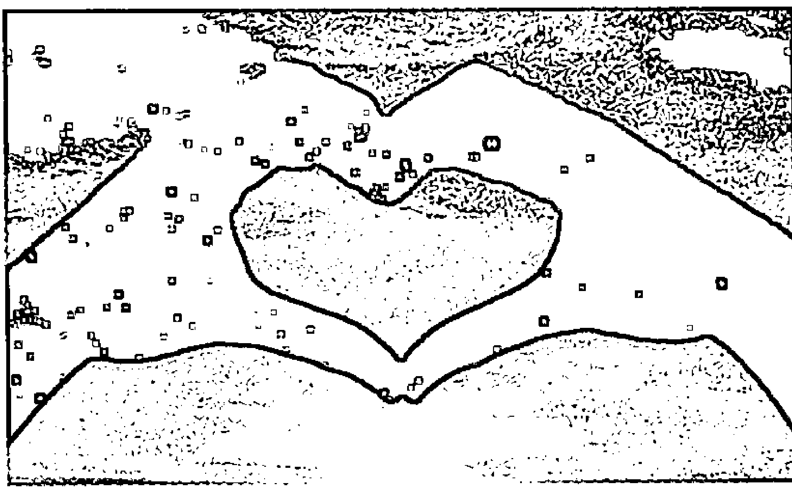


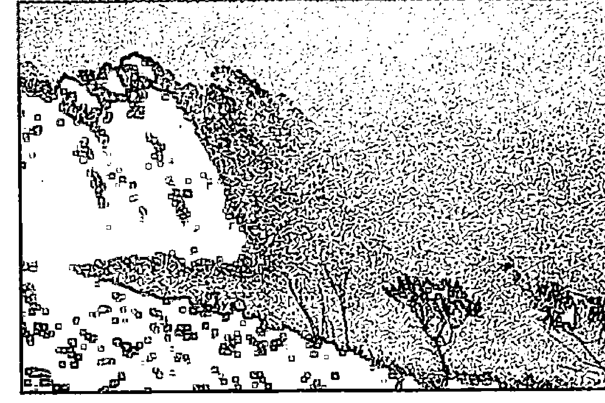

### 寻找软硬件的“最佳搭档”

继《我是歌手》和《中国最强音》之后，《最美和声》也成为了最受瞩目的音乐类选秀节目。与其他由歌手“单打独斗”的节目不同，《最美和声》讲究的是选手与偶像的“混搭同唱”。其实，不仅是音乐选秀，就我们熟悉的各种软硬件产品，同样存在着“混搭合作”的现象。正所谓“同舟共济，不进则退”，好的搭档，往往可以助你事半功倍；而不佳的搭档，往往则会导致事倍功半的效果。总之，在用PC处理日常各种琐碎的事情之余，用多款软件组合的形式也许就能帮你节省时间提高效率。在购买新硬件之后，再运用一些软件层面的优化，说不定还能挖掘出该硬件意想不到的潜力。这个夏天里，就让我们运用组合混搭的力量，改善我们的生活吧。

### 圆你导演梦 零花费打造精彩视频合集

#### 专业软件方案

- Adobe Premiere Pro CS6: 7113.60元（网上报价）
- 会声会影 X5: 899元（网上报价）

#### 傻瓜式方案

- 视频剪切合并器：免费（http://tinyurl.com/ocnffk5）
- Windows Live Movie Maker：免费（微软）
- 格式工厂：免费（http://tinyurl.com/lyj47uw）
- FFmpeg GUI：自由软件（http://dwz.cn/xfanz16）

### 视频初步剪辑

这里以婚庆视频为例。一般婚庆视频拍摄的是婚礼的整个过程，难免有些场景是不需要的，需要在后期剪裁掉。另外有些零散的视频，则又需要合并到一起。这些借助“视频剪切合并器”可以轻松完成。

启动软件后单击“+”导入需要处理的视频，然后依次选中需要保留视频的起始和结束位置，点击“剪切”（图1），接着在弹出的窗口中选择“直接剪切”，这样就完成有用视频的截取了。操作同上，再次导入视频选择需要保留的部分，完成上述操作后，切换到“视频合并”，依次导入剪切好的所有视频，点击“合并”，即可将裁剪好的视频片段合并成完整的视频（图2）。

### 精彩特效自己加

剪辑好视频后，还需要进行一番后期处理，比如加上一些专业的片头、片尾，使得整个视频看起来更为吉祥喜庆。这可以通过微软免费提供的Windows Live Movie Maker（以下简称为WLMK）来实现。


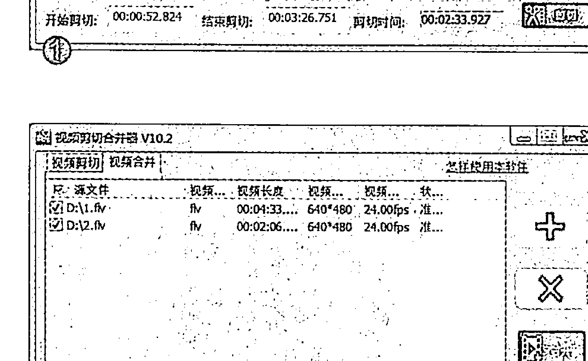

安装完WLMK之后，在C:\Program Files\Windows Live\Photo Gallery文件夹上双击Movemarker.exe运行程序，接着点击“添加视频和照片”，导入前面剪辑好的视频，此时在播放窗口可预览到效果（图3）。

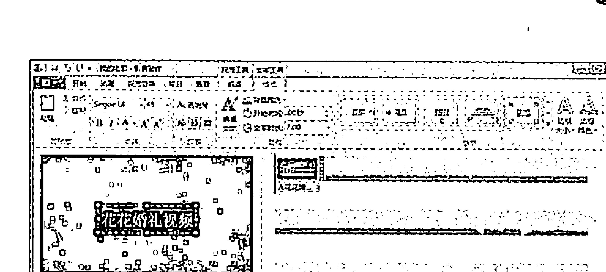

如果要添加“片头文件”，则点击“片头”，然后在打开的设置窗口中设置片头名称和显示时间，此时在右侧窗格可以看到添加的片头文件（图4）。同样的，点击“片尾”可以设置片尾文件。其实WLMK可以在任意位置添加片头/片尾，比如将视频拉到婚宴开始的时刻，加上名为“婚宴开始”字样的片头文件。

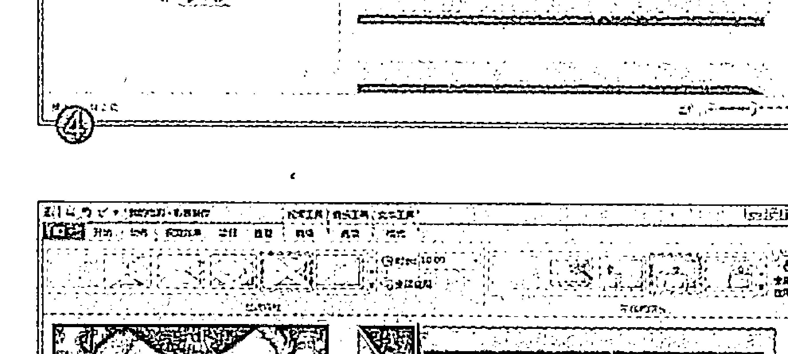

作为婚礼视频当然要加上喜庆的背景音乐，点击“音乐”，选择添加一首欢快、喜庆的MP3音乐，完成后右侧窗格的视频下方会添加一个绿色的音频条，默认情况下该音频会自动重复播放。

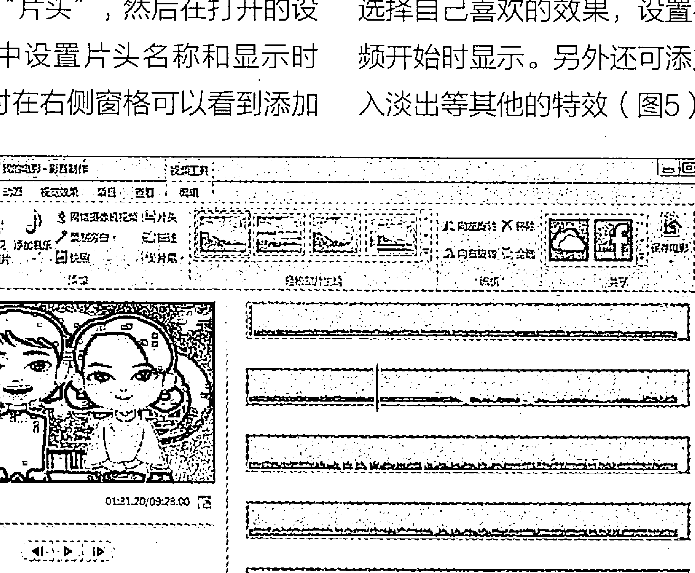

接下来还可以为视频添加各种特效，比如切换到“动画”，选择自己喜欢的效果，设置在视频开始时显示。另外还可添加淡入淡出等其他的特效（图5）。

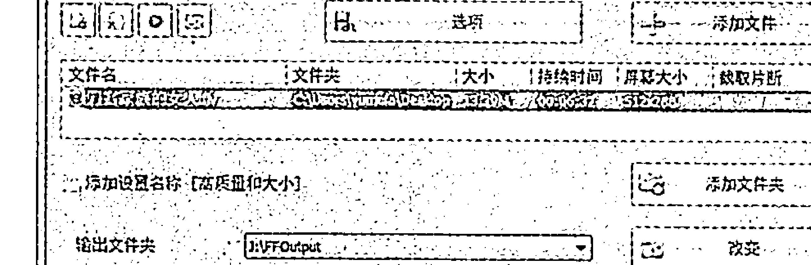

### 让视频随处播放

通过上面的操作，婚庆视频的处理就基本完成了，不过除了在电脑上播放外，我们经常还要将视频上传到网上共享，或者在随身设备上（如手机、平板）播放，因此我们还要将视频转换为相应的格式，通过“格式工厂”即可完成。

假设我们要将视频转换为平板支持的MP4格式，在启动格式工厂后，切换到“视频”，选择转换到MP4格式，再在打开的窗口中点击“添加文件”，将上述处理过的视频添加到转换列表中（图6）。点击“输出配置”，根据自己设备支持的参数进行设置，比如现在很多平板都支持1920×1080分辨率，并且支持DIVX高压缩的高清格式，这样在预设设置里就可选择转换类型为“DIVX 480P”，屏幕大小为“1920×1080”，使转换后的视频在平板上获得更好的视觉效果（图7）。完成上述设置点击“确定”，最后点击“开始”，打开输出文件夹，将转换的视频文件传输到随身设备上就可播放欣赏啦。

### 方案扩展
防盗版为视频加水印

如果你想把视频发布到网上，为了防止被别人任意传播，在完成视频剪辑后，还可以为视频加上水印，保护版权。

首先从http://tinyurl.com/onni5uk下载安装AviSynth。接着启动记事本新建一个1.avs文件放置在k:\（如果在其他盘中请注意修改下面代码中的盘符），代码如下：

```
video = DirectShowSource("k:/1.flv",15).
BilinearResize(320,240)
logo = ImageSource("k:/1.png")
logomask= ImageSource("k:/1.png")
overlay(video,logo,mask=logomask)
其中“k:/1.flv”、“k:/1.png”分别为需要添加水印的视频和自行准备的视频文件。
```

接着在下载FFmpeg后直接运行其中的Ff-prompt.bat，再在出现的命令提示符下输入下列命令添加水印（图8）：

```
ffmpeg -y -i "k:/1.avs" -ab 56 -ar 22050 -b 800000 -r 15 3.flv
命令完成后，在当前目录下即可生成带水印的“3.flv”视频文件啦。
```

文|俞木发

### 征服你的耳朵
免费打造天籁之音

音频处理的专业软件很多，如CoolEdit（现为Adobe Audition）、Goldwave等，它们的价格相当昂贵。其实对于常见的音频处理，很多免费、自由软件就可以完成，下面我们以制作手机铃声为例。

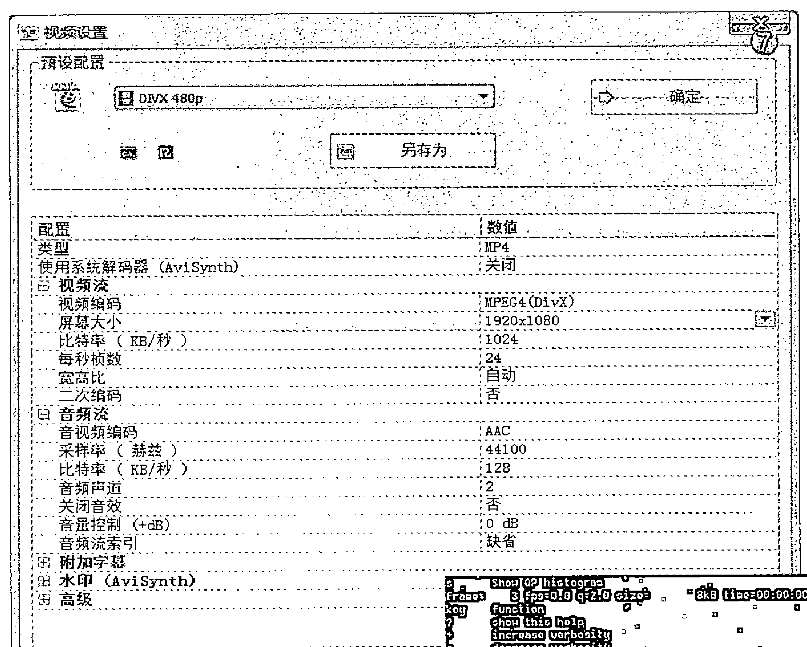

#### 专业软件方案

- Adobe Audition：3112.20元（网上报价）
- Goldwave：59元（网上报价）

#### 便捷工具方案

- Pazera Free Audio Extractor：免费（http://dwz.cn/cfan414）
- MP3分割器：免费（http://tinyurl.com/nufj3p）
- Audacity：自由软件（http://dwz.cn/cfan215）
- 格式工厂：免费

### 音频分离有妙招

很多朋友喜欢用时下流行的影视剧主题曲或MTV中的伴音作为自己的铃声，这样铃声的来源就首先要从上述视频文件中提取。利用Pazera Free Audio Extractor可以轻松将音频从常见视频中提取出来。比如想提取正在热播的《刀客家族的女人》片尾曲作为铃声，首先在优酷下载任意一集视频，然后启动软件，点击“Add file”添加下载的视频，再在右侧设置提取的音频为“.MP3格式”，码率选择“320 kbt/s”（图1）。

选中导入的视频（可以导入多个视频批量处理），点击“Convert”，在弹出的窗口中就会自动将音频提取到和视频同目录下保存（图2）。

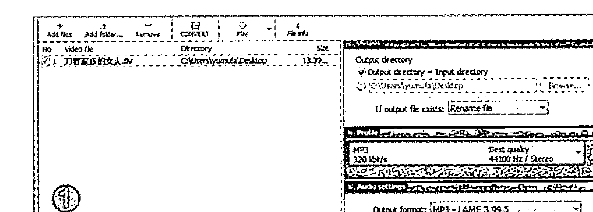

如果需要提取音频的是特殊格式视频，如一些内嵌在网页视频或者无法下载的版权视频，还可以使用一些免费音频录制软件（如“克克MP3录音软件”）直接将其音频录制下来。

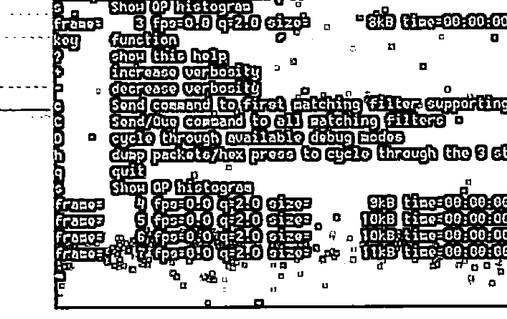

#### 取我所需的MP3分割器

上述提取的是整部电影的音频文件，制作铃声需要的只是其片尾曲。音频部分的剪辑可以借助“MP3分割器”来进行。

软件启动后点击“打开文件”，导入上述提取的音频文件，点击“播放”，记住片尾曲开始和结束的时刻，然后将其中①和②标记分别移动到开始和结束的时刻，点击“保存”，即可完成完整片尾曲的提取（图3）。

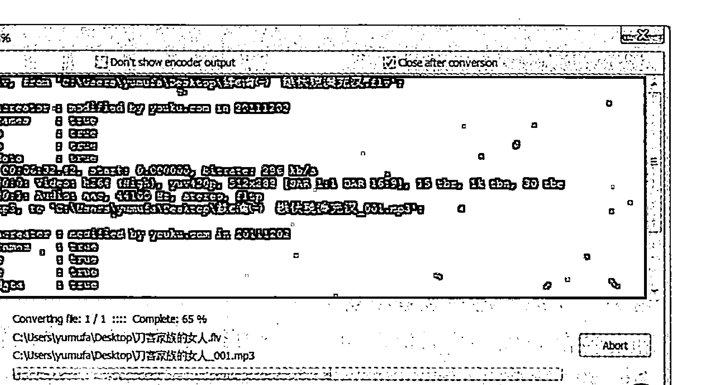

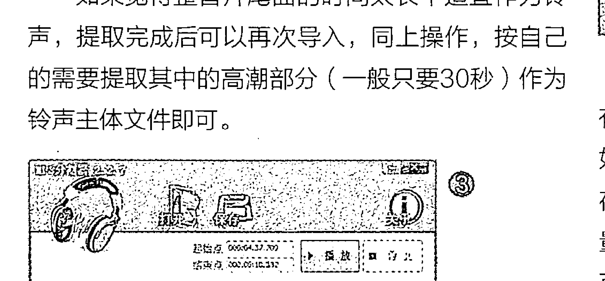

如果觉得整首片尾曲的时间太长不适宜作为铃声，提取完成后可以再次导入，同上操作，按自己的需要提取其中的高潮部分（一般只要30秒）作为铃声主体文件即可。

#### Audacity为音频加特效

想要让自己的铃声有个性，有必要对其进行一番特效处理。比如需要增加淡入淡出特效，这样深夜来电才不会让人吓一跳。增加音量，则可以让我们在嘈杂环境中也可以听到自己的铃声。

启动Audacity后点击“文件→打开”，导入上述准备好的铃声文件，使用鼠标选中要添加“淡入”效果的部分，再点击菜单栏的“效果→淡入”。方法同上，继续在音频中选择需添加“淡出”效果的部分，即可完成音频淡入淡出效果的添加（图4）。

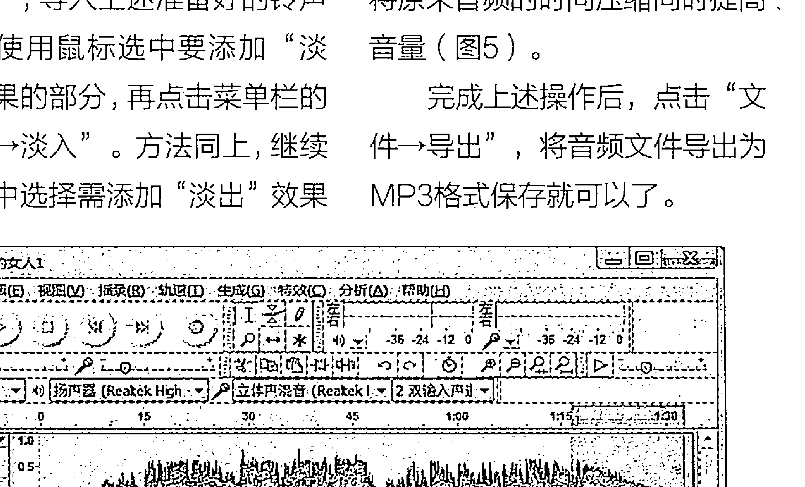

铃声制作好之后，如果想要加大音频的音量，可以点击“效果→调节时间/音高变化”，然后在打开的窗口中对时间和音高进行调整，点击“确定”后即可将原来音频的时间压缩同时提高音量（图5）。

完成上述操作后，点击“文件→导出”，将音频文件导出为MP3格式保存就可以了。

#### 音频转换也用格式工厂

前面文章中介绍的格式工厂软件，不只能转换视频格式，同样也支持音频格式的转换。一首完美的铃声文件制作完成，可能每个人的手机型号不同，支持的铃声格式也不相同，这时便可借助格式工厂来进行转换。启动软件后切换到“音频”，可以看到很多音频格式，根据自己的实际设备进行选择，比如iPhone手机则选择“M4R”（图6）。

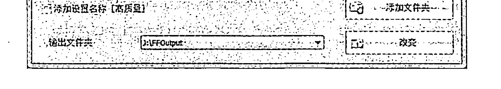

接着在弹出的窗口中，点击“添加文件”，将上述音频文件导入，点击“确定”完成转换，最后导入手机中使用即可（图7）。


### Word “联手” Excel 写报告

大家知道，在Microsoft Office的系列组件中，Word以文字处理见长，而Excel则以表格数据处理见长。虽然说Word本身也有简单的表格数据功能，而Excel单元格本身也支持文字处理，但是，如果报告本身对文字和数据处理均有特别高的要求或复杂的需求时，“联手”才是好办法。

#### 报告写作中的“必要”家婆

在制作报告时，有时会在文本中涉及到一些简单表格，我们往往顺手通过Word中的表格制作功能制作一些简单的表格（图1）。但如果表格稍微复杂，尤其是涉及到单元格之间的数据运算，我们就会觉得在Word里难以完成。于是，有人挖掘在Word中通过函数、公式甚至VBA代码来实现表格计算的功能（图2）。这些方法的确可以实现在Word中进行表格数据的计算，但普通电脑用户要掌握有一定门槛，因此不建议使用这种深挖技巧式的“死抠”法。

在MS Office软件设计之初，微软就考虑到组件间相互利用的技术问题。用户只需通过简单引用，即可将一个组件中擅长制作的内容轻松引用到另一个组件中。如用早已熟悉的Excel表格软件将需要的表格做好后在Word中引用即可。

Word中是不是一定要使用Excel表格，要看具体情况，有些特殊情况例外。比如，对于固定格式的Word表格，如果其中涉及一些简单的数据计算，且经常要大量使用同样的表格模式，那么，用Word本身构造公式制作一个模板，一劳永逸的方法也是值得的。但对于经常变化或偶尔使用Word中涉及计算内容的表格，还是利用Excel来制作比较方便。

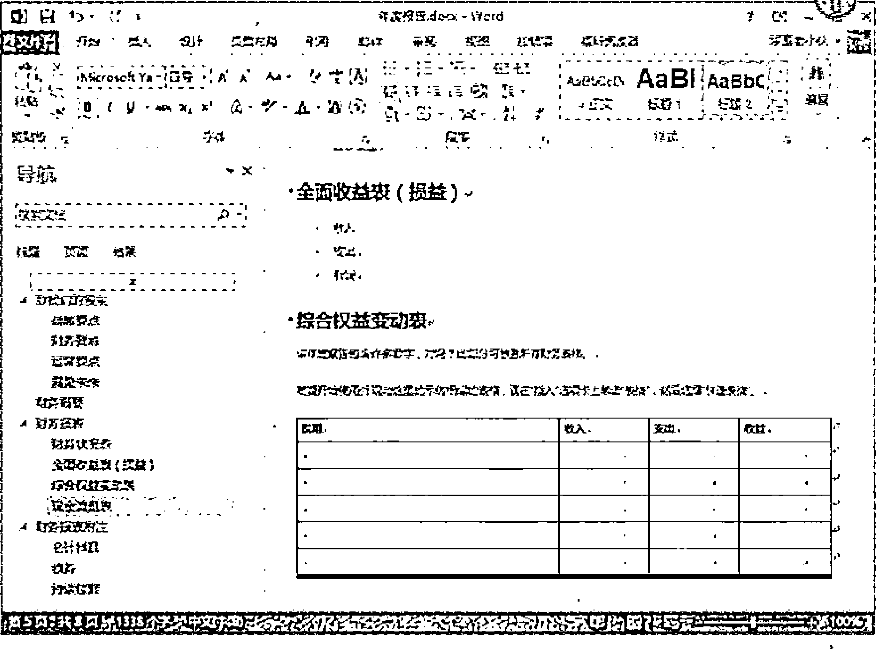

### Word “嫁娶” Excel方法多

Word与Excel的联合使用，既可以先在Excel中做好表格然后复制到Word编辑页面中，也可以直接在Word编辑页面中插入Excel新表格后填写数据，还可以以超链接的方式将表格引入到文档中。

#### 1. 同样的复制 不同的使用效果 ▽

先在Excel中制作Word报告需要的数据表格，然后全选表格并复制（图3），返回到Word报告的编辑页面中执行鼠标右键粘贴命令。这时，我们会发现，在“粘贴选项”中出现了6个粘贴按钮（图4），分别是“保留源格式”、“使用目标样式”、“链接与保留源格式”、“链接与使用目标格式”、“图片”、“只保留文本”。那么，在引用表格时到底用哪种方式最好呢？这要看表格在今后的使用情况而定。

如果确定表格的数据完全

### 方案扩展
音频编辑可做得更好

上述我们只是以铃声的制作为例，如果你还想要获得更好的声音效果，可以借助更多免费软件实现。

- * echoXPeg
为音频添加混音效果，可以把你电脑的声音调到像KTV的混音效果一样的动人。
- * 消除原声插件
可以帮助用户去除音乐中的人声，仅保留音乐的旋律，非常适合那些喜欢K歌和练歌的人，同时适用于酷我音乐和千千静听等音乐播放器。
- * 杜比音效增强软件
能够大幅度提升各种音频效果，可以让普通的家用音箱实现如电影院的震撼音效，即使是笔记本的自带喇叭也相当有效果。

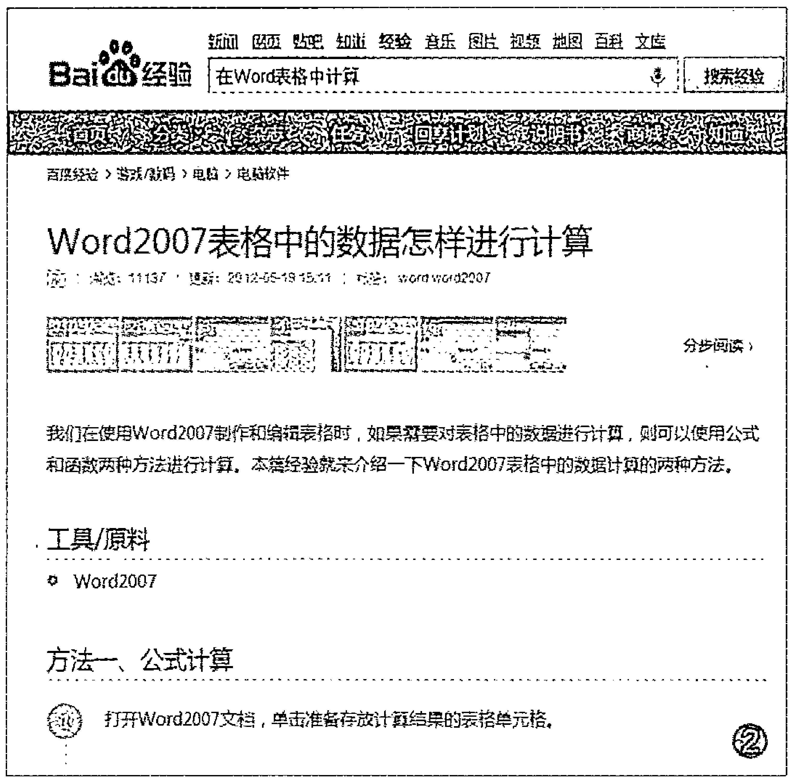正确，不会有任何变动，且希望保留Excel软件中的表格样式，那么选择“保留源格式”；如果确定不会变动，但还担心表格排版会出现兼容问题而造成版面混乱，那么可以选择“图片”模式，将表格以图片的形式插入到Word文档中；如果对表格及其中的数据是否会有所变动心里没底或难以预测，那么就选择“链接与保留源格式”，这样将来Excel表格中的数据有所更改时，Word报告中的表格会跟着变动，无需人为重新编辑。

#### 2. 不用Word直接制作Excel表格

如果在起草Word报告的过程中，需要当下建立一个新的Excel表格，而不是引用已有的现成Excel表格，那么，可以在Word中制作Excel表格，根本不用去手动启动Excel软件。将光标定位到Word报告中需要插入表格的地方，点击“插入”选项卡，依次点击“表格→Excel电子表格”（图5），这时，在Word文档中会出现一个内嵌式的Excel表格对象（图6），可在其中直接输入单元格数据。今后，如果需要对表格数据进行编辑，双击这个表格即可进入编辑环境。

> 小提示
以上6项中提到的“源格式”和“目标格式”分别是指表格所用的格式为Excel中原有格式、Word中可选的表格目标格式。采用链接与保留格式的方法粘贴来的表格使用虽然方便，但必须注意的是，在拷贝Word报告的时候，要将Excel表格也一并拷贝过来，而且存放的路径不能有变化，否则会因在Word中无法找到表格而出现出错。如果忘记或丢失了Excel表格，那么Word报告中也会出现表格空白的尴尬或麻烦。

#### 3. 只用一个链接使用现成Excel表格

如果在Word报告中引用的表格是一个已经用Excel制作成的现成表格，那么，除了用上面说的粘贴表格的办法外，还可用超链接的办法来解决问题。使用这种办法，将只在Word文档需要出现表格的地方出现一个文字链接，点击链接后会自动启动Excel表格。这样做的好处是，Word文档和Excel表格相对独立，分别编辑时不会相互影响到对方。但不方便的地方是在Word中阅读时不够直观，还需点击才能预览到表格内容。

> 小技巧
在Word中添加Excel表格超链接

### 一个好汉三个帮 Word 2013插件秀

文|技术宅

Word是大家常用的字处理软件，但是也有很多事情，它做起来很不方便。比如加注拼音、添加数理公式等。其实Word有许多插件“搭档”可以帮助你扩展Word功能，成为你学习和工作的好帮手。

#### 效率提升Word经典插件推荐

Office 2013已经自带应用商店，如果需要添加插件，只要点击Word新建一个空白文档，然后点击菜单栏的“插入→Office程序→全部程序”，接着使用自己的Windows Live ID登录，在打开的页面中就可自行下载那些免费的插件了。比如经常要在Word里浏览英文文档的用户，

## 《电脑爱好者》·2014下半年合订本 【特别话题】

可点击“Translator”（翻译插件）下的“Add”，将其添加到Word中。成功添加该插件后返回Word窗口，点击“插入→Office程序→全部程序→我的应用程序”，选中刚下载的插件，点击“插入”即可（图1）。这样下次启动“Translator”时，在窗口右侧会出现该插件的提示框，按提示在上方下拉列表中选择文本源语言，下方选择翻译语言（简体中文）。这样复制要翻译的文本后就自动翻译成中文了（图2）。当然，Office商店提供的插件可能无法满足我们的需要，我们还可以自行下载更多的第三方经典插件。

#### WORD万能百宝箱2014插件

下载地址：http://dwz.cn/cfana01
它集日常办公、财务信息处理等多功能于一身。安装后会在Word中添加“万能百宝箱”菜单，点击即可使用它提供的功能。比如在日常操作中，我们经常会由于输入法切换，在文档中混杂中英文标点符号，现在只要点击菜单中的“中/英文标点互换”，即可将文章中所有英文标点转为中文，省去一一更改的麻烦（图3）。

#### WORD必备工具箱10.10

下载地址：http://dwz.cn/cfana02
这是一款集成多个功能插件的工具箱，安装后同样会在Word中添加“工具箱”菜单，点击即可使用。比如对于会计人员，金额一般要求大写，但是大写金额比较难输入，现在我们可以只输入小写金额，完成文档编辑后只要点击“工具箱→添加大写金额”，则选中的（或者当前文档中）小写金额的数字后就会自动添加大写金额（图4）。

> 小提示：
很多Word插件都是基于Visual Studio 2010 Tools for Office Runtime编写的，如果安装的插件无法使用，到http://tinyurl.com/l3k5wr6自行下载安装。

### 各取所需行业用户专用插件推荐

上面我们只是为大家介绍了Word下的几款经典插件，为了满足不同用户的需求，这里我们再为不同行业用户介绍其他相关的插件（见表）。

行业用户插件推荐
| 适用人员 | 插件描述 | 下载地址 |
| :--- | :--- | :--- |
| 教师 | MathType，一款强大的数学公式编辑和转换插件，提供了多种专业数学符号和数学公式模板 | http://dwz.cn/cfana03 |
| | chemistry_for_word，一款化学公式输入插件，可以轻松输入各种化学公式 | http://chem4word.codeplex.com/ |
| | 音乐简谱输入器，可以实现将带有简谱的歌词在Word中编辑，方便音乐教师制作和编辑简谱 | http://dwz.cn/cfana04 |
| 学生 | NoteFirst，可以把个人文献数据库中的文献插入到Word文档中，自动形成引文标记和文后的参考文献列表，并且具有多语言方案 | http://www.notefirst.com/ |
| | 守望者朗读插件，可以实现对word文档内容的语音朗读，方便用来语音校对，语音朗读书易改英语助手插件，可以快速实现英语语法的错词、语法的修改，集成了英文纠错，润色，英语写作模板等功能 | http://dwz.cn/cfanz08 http://dwz.cn/cfana05 |
| 团队 | Redaction，可以隐藏Word文档中的敏感信息，防止在商业交往中造成泄密 | http://redaction.codeplex.com/ |
| | Mavenlink，可以非常容易在不同部门、不同人员间实现共享协作。方便实现复杂工作的跟踪，或者用于及时获得客户反馈 | http://dwz.cn/cfana06 |
| | Avery Templates,可以方便在Word中设计标签，名片，贺卡，该插件内置各种模板，任何人都可以轻松进行设计 | http://dwz.cn/cfana06 |
| 会计统计人员 | lucidchart，使用基于HTML5的协作工具，可以在Word中轻松创建和插入的流程图、结构图等其他图表，方便统计人员快速制作出图文并茂的文档 | http://dwz.cn/cfanz09 |
| | GeoGebra，一款汇集了几何、代数、表格和图形的免费动态数学统计插件，统计人员可以用它来快速创建各种统计报表 | http://dwz.cn/cfanz10 |
| | OfficeTab，让Word拥有多标签窗口浏览的插件，在制作或查看多个报表文件时非常有用 | http://dwz.cn/cfanz11 |
| 编程 | SimplyVBA Global Error Handler，能够展示每个错误VB代码的有效信息，并且高亮显示错误所在的过程和模块 | http://dwz.cn/cfann04 |
| | MZ-Tools，通过该插件可以编写质量更高的代码，并且快速找到现有代码。只需单击鼠标就能应用默认属性，向模块中插入定制标题和快速注释代码 | http://dwz.cn/cfann03 |

文|马大

#### 为网页开发者武装EmEditor

很多人都知道EmEditor是不错的文本编辑器，可以替代Windows系统的记事本程序。其实对软件开发者来说，EmEditor还是一款非常不错的开发工具。当然，要想让EmEditor变身程序员手中的利器，还得好好熟悉一下它的几个插件搭档。篇幅所限，这里介绍几个经典的，大家可以举一反三。

> 小提示
默认情况下EmEditor并没有多少插件，我们可以自己下载安装第三方插件，可以从http://tinyurl.com/md9sopp下载安装EmEditor插件包，其中包含了71个实用插件，非常全面。

#### 减少代码重复输入

程序员编写代码的过程中，实际有很多代码内容是重复的，比如声明、函数和方法定义等。如果每次按部就班地重复输入，必然大大降低效率。“代码片段”插件可以很好地解决这一问题。

点击“工具”菜单，选择“插件→代码片段”，窗口左侧将出现“代码片段”窗格，其中包括了C、Java、PHP等多种语言。假设需添加和HTML链接相关的代码，可打开代码片段中的“HTML”项，找到诸如“Link (link Tab)”的代码，双击即可自动将这段代码加入程序文档中。后面括号内的“link Tab”表示对应的输入快捷键，可以通过Tab键在不同的参数内容之间进行切换，从而方便修改（图1）。

> 小提示
如果用户经常开发网页的话，建议安装“Zen Coding”这款插件。通过它可以快速完成HTML、CSS代码的编写输入。

```html
<html>
<head>
<title>Pictures</title>
</head>
<body>
<!-- 图片 -->

</body>
</html>
```

#### 程序备忘加注释

对于任何一个开发者来说，注释是编写代码中很重要的环节，以免过后自己都不知道所写代码的目的是什么。

将光标移到需要添加注释的位置，然后点击插件中的“HTML注释”，就会自动添加“<!-- -->”这样的注释代码，并且光标自动移到注释的位置，我们只需要直接输入注释文字就可以了，非常方便（图4）。

需要注意的是，不同语言代码的注释规则是不同的，所以要根据自己所使用的编程语言安装对应的注释插件才行。

#### 自动验证代码正误

为保证代码能正常运行，需要时时进行验证。如果是开发网页，在插件中选择“HTML验证”，即可测试所写网页代码的语法是否正确，一旦发现问题可进行即时修改。

当验证网页代码没有问题时，可以点击插件中的“网页预览”，此时在代码窗口的下半部分就能实时看到网页的显示效果（图2）。不过这个预览功能是基于IE浏览器的，如果要预览它在其他浏览器中的效果，比如Opera中，则可以点击插件中的“用Opera预览”，从弹出的设置对话框中选中“指定Opera位置”项，并点击该选项下面的按钮，再在弹出的窗口中指定Opera浏览器的安装目录即可（图3）。以后点击“用Opera预览”就可以通过Opera查看了。

对于其他的浏览器，则需要安装相应的浏览器插件，之后的操作方法基本相同。

### 硬件玩家必看 依托辅助使其升华

在PC的世界中，软硬件的结合是王道之选。小到芯片组驱动，大到操作系统级别的优化，只有软硬兼施才可充分释放硬件产品的全部潜质。在本章节中，你就将看到通过软硬结合或者硬硬结合的方式，获得1+1>2的极致体验。

### SSD的TRIM 与全盘擦写

磁盘碎片整理程序是常用Windows的用户再熟悉不过的功能，它能将散落的硬盘碎片文件整合，提升磁盘效率。但在家用主硬盘从HDD过渡到SSD的过程中，Windows的磁盘碎片整理程序却难以再帮上什么忙了。这时我们应该结合操作系统本身的功能以及官方提供的软件，让SSD性能再次飞跃。

### 请勿使用磁盘碎片整理程序

SSD的存储介质与HDD完全不同，为HDD设计的Windows磁盘碎片整理程序不再适合使用NAND闪存颗粒的SSD（图1）。而且NAND闪存颗粒是有擦写寿命的，磁盘碎片整理会增加闪存颗粒的擦写损耗，得不偿失，完全没有必要。不论是什么硬盘，都会随着日积月累的使用越来越慢的。SSD不能使用Windows的磁盘管理，那我们如何维护它？

### 从Windows 7开始的TRIM

其实微软在推出Windows 7时已经对此有所考虑，微软联合各大SSD厂商开发了一种新的技术，被称为TRIM。如果操作系统是Windows 7之后的，并且SSD也支持TRIM的话，一切都会变得非常简单。可以这么理解，SSD的自我整理和修复完全是全自动并且智能化的，无需我们操心（图2）。微软的NTFS文件系统和固态硬盘主控会自己去发现需擦除的页面，并等待再次写入操作时自动擦出原本的数据。这和Windows的磁盘碎片整理那种分析-合并-整理的机制完全不同，不仅提升读写效率还减少硬盘的损耗。如果是SSD和HDD硬盘混装的电脑，推荐用户关闭或指定系统只自动整理HDD硬盘，同时在手动整理磁盘碎片时不要选中SSD盘符。

### Why Non-TRIM Drives Suffer Slow Writes

| 步骤 | FLASH | CACHE | 描述 |
|------|-------|-------|------|
| 1    | 图标   | 图标   | New data (2) needs to be written to the SSD. This memory block contains six pages (1) of valid data and two pages (2) of previously deleted data. The deleted pages must be erased to make room for the new data. |
| 2    | 图标   | 图标   | To erase the two pages with deleted content, the drive must copy the contents of the entire block to the drive's cache. The drive can read and write data at the page level, but only erase entire blocks. |
| 3    | 图标   | 图标   | In cache, the junk data is replaced with the new data. Then, the entire block on the drive is erased. |
| 4    | 图标   | 图标   | Now that the block is completely empty, the contents of the cache—the old data and the new data—are written back onto the now-empty block, on the SSD. |

### 如何判断系统开启了TRIM

一般来讲现在的SSD配合Windows 7以上操作系统，TRIM是一定会被激活的。但是如果主板驱动或者系统没有通过正常方式安装，用户不放心还是可以检查的。具体办法也比较简单，使用管理员身份运行Windows的CMD.exe，在里面输入“fsutil behavior query DisableDeleteNotify”，如果返回值为0则表示我们的系统已经开启了TRIM功能（图3），如为1则是未开启状态。

### 磁盘清理与垃圾回收

经常使用磁盘碎片整理程序的用户肯定知道有一个相邻的程序叫做磁盘清理，专门负责清理操作系统在日积月累使用下的垃圾文件（图4）。其实SSD的主控也有相应的功能，而且也是全自动的！在主控的工作下，闪存颗粒可以把那些有效无效数据并存的块合并成整体，并删除无效数据块来增加空白数量。这个操作也有一些类似碎片整理，我们无需去理解复杂的主控算法，只需知道这些功能都是SSD主控默默完成的就好。

### 各大品牌SSD软件

以上那些内容虽然适合所有品牌的SSD，但是略显不够直观。现在产品都讲究用户体验，许多品牌都随着硬件产品推出了官方优化软件。这些软件是否好用，很大程度上决定了用户的使用体验，也决定了产品的附加价值。

#### 三星SSD Magician

三星SSD从2012年开始发力，市场占有率猛增，旗下这个Samsung SSD Magician也立下了汗马功劳。Samsung SSD Magician是一款综合性的SSD管理软件，集状态监测（图5）、日常维护、固件升级、速度测试（图6）、数据安全擦除、性能优化于一身。这个软件只针对三星自家的SSD产品有效，最主要的功能就是磁盘状态监视、性能优化、固件升级和安全擦除。

##### 磁盘状态监视

Samsung SSD Magician的首页主要提供SSD的基本信息，比第三方软件更全面。总写入数据这个监视参数非常有用，可第一时间查看SSD的累积写入数据量，为评估SSD寿命提供了方便。

##### 性能优化

性能优化这个功能对于已经支持TRIM的系统是没有意义的，但对于还在坚守XP的用户来讲价值就体现出来了，Samsung官方的磁盘碎片整理十分可靠（图7）。

##### 固件升级

固件升级可帮助SSD改善兼容性和稳定性，几乎在所有品牌SSD的管理软件中，升级固件是必备的功能。升级固件操作非常简单，系统会自动联网检测是否有新固件需要更新，检测后确认直到系统重启就算升级完成了，过程完全傻瓜化（图8）。

##### 安全擦除

安全擦除可将SSD恢复到出厂状态，是在使用很久后让SSD“原地满血复活”的最佳方案。但也会永久破坏闪存颗粒中的数据，不过借此功能可放心出手不用的SSD，不必担心隐私泄露（图9）。

##### 特色功能RAPID Mode

RAPID被三星称为实时数据传输加速处理技术，就是一种利用系统内存做缓冲为SSD加速的技术。额外划拨系统内存，为SSD读写提供更大的缓冲，从而达到优化性能的目的。其实这个技术毫无新意，许多第三方软件早已实现，但RAPID来自原厂，三星结合了自家的主控算法和NAND特性专门量身定做的优化程序，效率稳定性比第三方软件强得多。开启RAPID Mode前后，几乎所有性能都提升了一倍，速度飙升让人咋舌。

#### Intel SSD Toolbox

提起SSD固态硬盘优化，英特尔官方出品的固态硬盘优化工具Intel SSD Toolbox可能是最为有名的（图10）。Intel SSD Toolbox安装好后在开始界面中会出现目前系统上所有的硬盘列表，预设是显示Intel的SSD状态，这点与三星软件类似。

注意System tuner这一项的右方是否有叹号，通常这代表了SSD或者系统状态有需要注意的地方。点击进去就会显示所有可能会存在问题的项目，根据软件进行设置即可。

Intel SSD Optimizer是根据TRIM功能优化SSD的选项，如果我们依旧在使用XP系统，或者操作系统并没有开启TRIM功能，可以使用这个功能让SSD恢复性能。值得一提的是Intel这个恢复的速度相当快，几秒钟就能完成一个完整的TRIM流程。Intel SSD Toolbox同样提供了安全擦除和固件更新等功能，用户使用起来只要根据软件提示一步步操作，就不会有问题。

#### 其他品牌专用软件

闪迪（SanDisk）最早主攻存储卡，但近几年SSD做得风生水起，从入门低端产品到顶级性能旗舰一应俱全。为了旗下SSD有更好的用户体验，闪迪也推出了专用的固态硬盘工具SSD Toolkit。基本功能大概与Intel类似，在固件更新时能详细看到固件版本及上次更新的状态，并且支持在线升级。

OCZ在国内名为饥饿鲨，旗下SSD产品众多，也有完整的专用软件OCZ Toolbox。主要功能集中在SSD状态监测、S.M.A.R.T信息监测、固件刷新、安全擦除等功能（图11）。

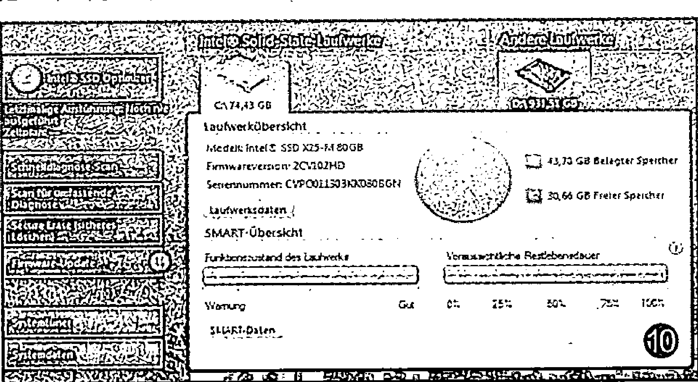

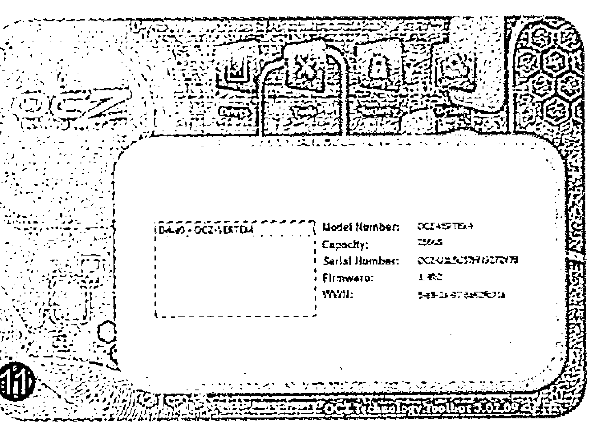

### 3A平台优化谈

AMD现在不仅拥有处理器，还包括芯片组、显卡等多个核心部件，甚至还有内存和硬盘（OEM产品）。AMD宣称处理器+芯片组+显卡均使用自家产品，用户能够得到非常可观的性能提升，真的如此吗？

#### Fusion for Gaming

Fusion for Gaming是AMD出品的一款针对3A平台的游戏优化软件，只需要简单设置，在游戏前打开运行便可以获得可观的优化效果（图1）。看上去很美，但具体怎么样呢？

AMD的3A优化选项共有无优化、基本优化、高级优化、专家优化四档，我们以魔兽世界为例，展示一下这个优化的具体效果（图2）。测试平台是A10-6800K，内存为标准4GB双通道，显卡选用HD 7750，在玩家少的位置减少网游产生的干扰。

在无优化的1440×900分辨率下，效果全开的魔兽世界帧数为38左右；基本优化同样是38fps，看起来Fusion for Gaming并没有起到什么作用；进一步到高级优化，帧数提升了1~2能达到40fps，稍微有些效果。

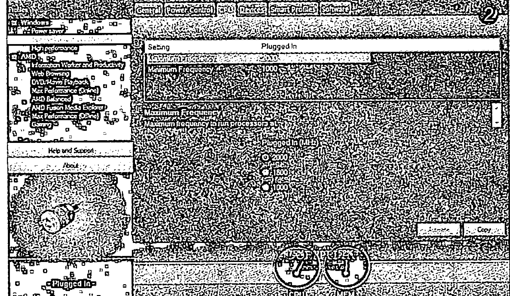

调整到最高级的专家优化，AMD Fusion for Gaming把系统当前很多其他所有程序都关闭了，至于帧数依旧保持40不动，提升非常有限。并且在关闭专家优化时，程序提示需要重启计算机恢复CPU初始频率。看来3A平台优化的噱头只是简单调用OverDrive并自动超频，但如果我们本身已经超频了，优化就会失效并且可能引起一系列的稳定性问题（图3）。

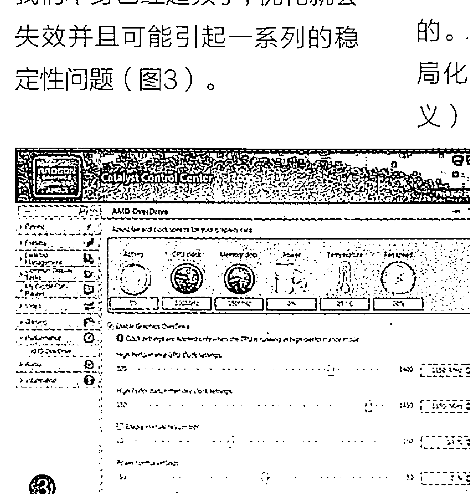

#### 统一管理的好处

不过在3A平台下还是能够得到一些好处的。比如AMD的驱动程序中我们可以进行全局化的性能控制（可能对移动平台有实际意义），通过拉动一个频率条整体调配系统的频率和省电状况。比起繁琐的手动超频和跨平台五花八门的超频软件，整合过后的一键控制总归是易于使用（图4）。

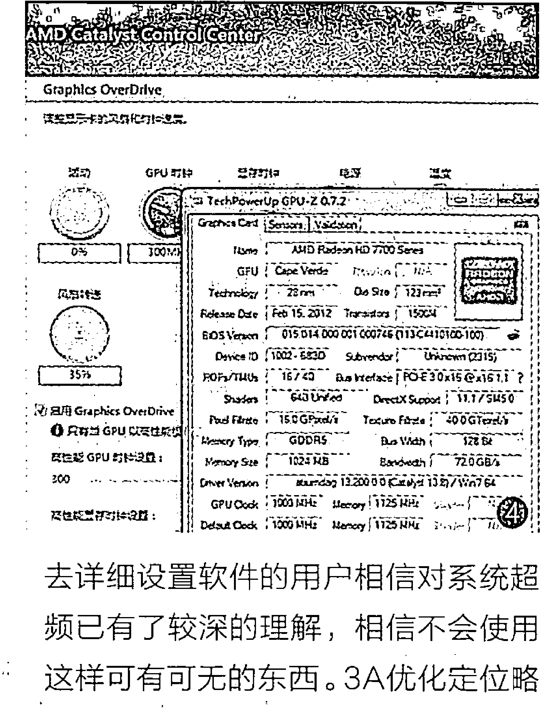

至于3A优化，目前看使用高级优化最划算，在不影响当前程序的前提下有一点优化效果。至于专家优化需要用户自行编辑设置才能发挥作用，肯定去详细设置软件的用户相信对系统超频已有了较深的理解，相信不会使用这样可有可无的东西。3A优化定位略显尴尬，较适合配置低的入门用户。

#### APU与Radeon HD交火

3A平台除了整体控制与优化，还有一个好处就是交火。AMD在宣传APU时重点强调的就是其GPU部分的图形性能，而并非CPU部分有多么强大的处理性能。AMD给同时使用APU和Radeon HD显卡的用户一个额外的礼物就是这两者可以“混合”交火，这也是3A平台最大的优势之一。问题来了，这种交火好用吗（图5）？

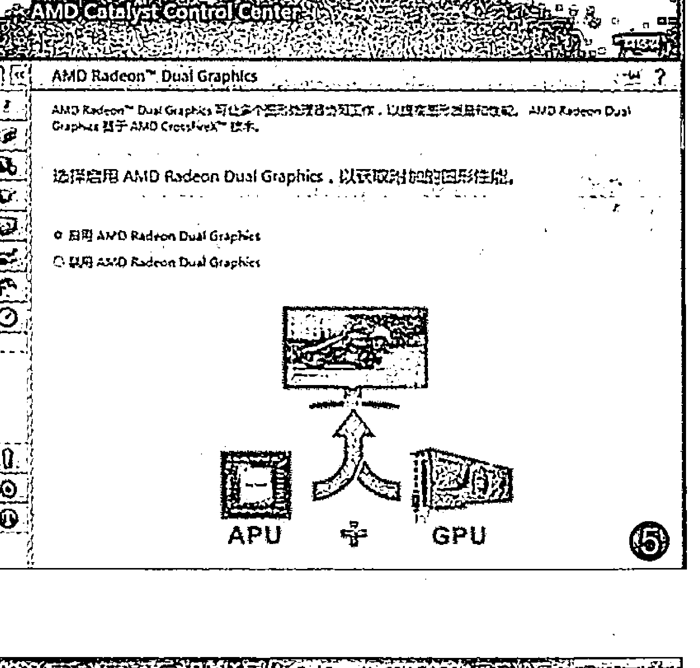

#### 开启方法

开启交火并不难，先去BIOS里设置核显为强制开启，然后进系统的AMD CCC控制面板中的性能里找到“AMD Radeon Dual Graphics”选项，选择启用即可，这就是AMD的交火选项。开启后就形成了AMD Radeon HD 8670D + 7700的双卡系统（图6），A10-6800K和HD 7750组建混交后性能如何呢？

#### 效能初探

以3DMark 11 P模式为例，测试显示了很明显的性能提升，GPU分数从3000分左右直升到4000分左右。但是在很多游戏中出现了奇怪的现象，混交后甚至要比单纯用HD 7750还低，还出现了帧数不稳定的现象。混交后功耗如何呢？不论是待机功耗还是满载情况，都比单独使用平台时高了一些，以性能和功耗的比例来看，这种交火得不偿失。

混交之后依然是可以超频的，我们知道处理器和独立显卡的频率都可以在AMD CCC面板上设置，但是核显频率却只能进入BIOS设置，不得不说是个小遗憾。如果将核显和其作为显存使用的内存频率一同提高，混合交火的效率能够继续提升（图7）。但总体来看，都只有在测试程序中有不俗表现，而到了实际游戏中的提升太小，甚至一些游戏性能反而更加低下了。

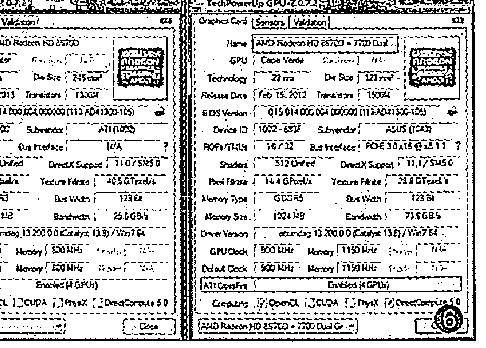

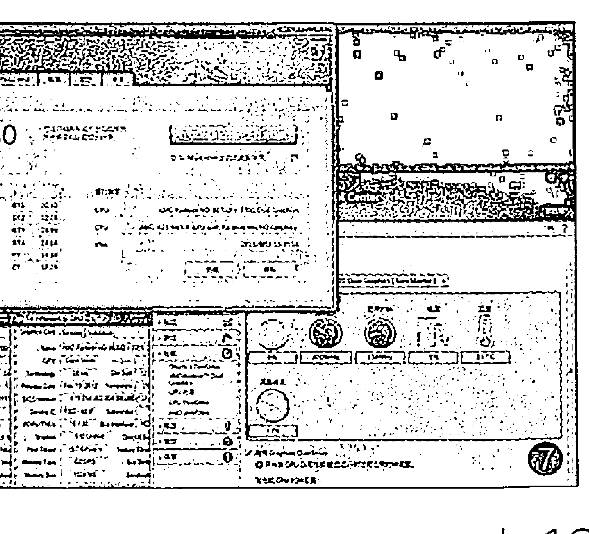

#### 混交效果不甚理想

熟悉SLI和交火的用户肯定知道只有相同架构相同型号的显卡才能顺利组成双卡系统，同时还需要有良好的驱动程序支持才能在部分游戏当中获得性能提升，这要求不可谓不苛刻。到了3A平台上，由于APU和独立显卡的核心架构不同，混合交火并不是那么容易实现的（图8），表现也确实难以令人满意。除了在基准测试中小有提升外，实际游戏表现很糟糕。能够组成这种混交的用户可以尝试，但如果长期使用还是建议老老实实去单独使用。

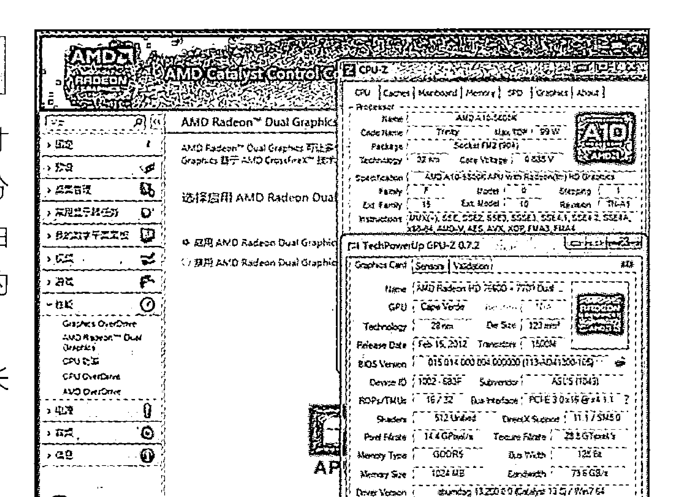

### 酷睿处理器的软件搭档

很多笔记本用户非酷睿i5不买，原因就是i5或更高级别的处理器支持睿频加速，在玩游戏时可自动超频至更高频率以保证体验的流畅。然而，在某些笔记本身上，想让睿频正常运行还需要一些软硬件的辅助，否则睿频就仅是空谈而已。

#### 睿频的软件搭档

如果你的笔记本搭载了酷睿i5或更高级别的处理器，那么笔者强烈向你推荐它的两款“软件搭档”：睿频加速技术监视器（下载地址：http://t.cn/Rv65R0u）以及ThrottleStop（下载地址：http://t.cn/Rv6583n）。前者可以帮你随时掌控睿频工作状态是否正常（图1），而后者则可以确保睿频“不偷懒”，确保处理器可100%发挥应有性能。

> 安装并运行睿频加速技术监视器后，可以透过监视窗口随时掌握CPU的实时频率

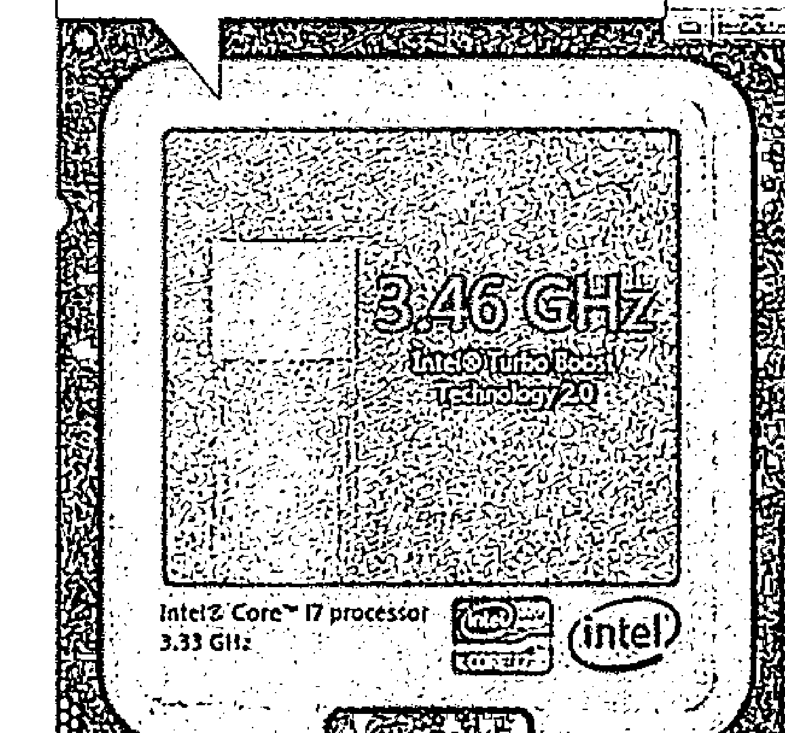

#### 睿频也会“卡壳”

酷睿i5或以上级别处理器均支持睿频加速，但你可知道，就是这种CPU的自动超频技术也有“卡壳”的时候！以神舟K590s-i7为例（K590s原型机为蓝天W350ET，存在类似问题的产品还有K650S、K660E等），其在集成显卡模式下CPU睿频一切正常，但运行在独显模式后CPU的睿频加速就会失效（图2）。究其原因，则是蓝天将W350ET定义为入门模具，考虑到其自身散热能力实属一般，很难同时应对独立显卡和CPU睿频加速后的高温，因此在BIOS层面便将独显模式下的CPU睿频技术给屏蔽了。问题来了，如果独显状态CPU无法睿频，那还不如直接购买搭载酷睿i3的低配版呢！

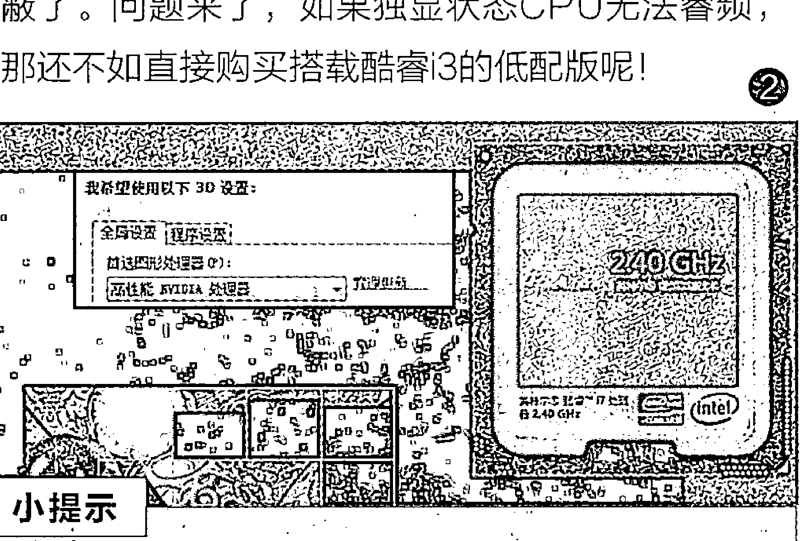

> 小提示：现在网上有强制开启W350ET模具机型独显状态睿频技术的BIOS，但更新BIOS有一定的难度和安全隐患，所以笔者推荐大家尝试后文的软件修复。

#### 软件帮你抢回睿频

无论你的笔记本品牌型号如何，只要发现睿频技术偶尔失效，都可以尝试借助ThrottleStop软件修复。下载并运行ThrottleStop，勾选Set Multiplier并将对应的倍频数值调整到最高，点击Save和Turn On按钮后就可强制启动CPU的睿频加速技术（图3），让其不再受独显或其他硬件或设置的干扰。请放心，ThrottleStop的设置默认会在电脑重启后失效，即使出现不稳定现象，只需重启或关机即可，还是很安全的。

> 小知识：既然官方屏蔽了独显模式下的睿频加速，肯定是考虑到了散热模块无法承担极限温度。因此使用ThrottleStop软件强制启动睿频，一定要建立在改善过笔记本散热条件的基础之上。比如为本本配了外置的抽风式散热器、改造了热管和风扇的效率等等。

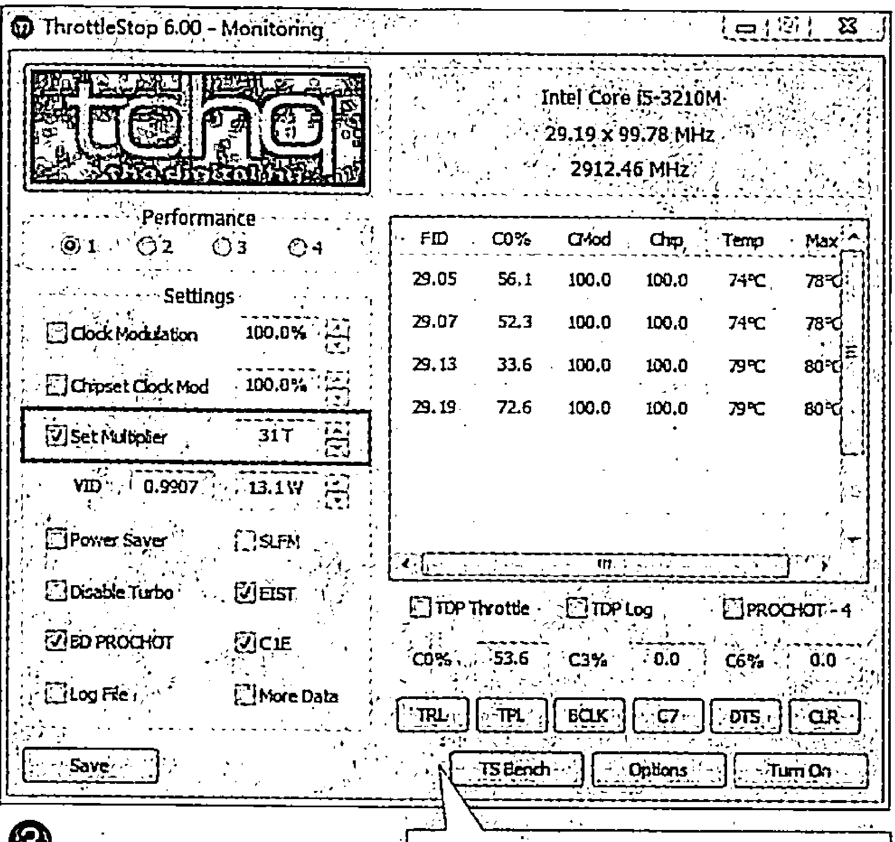

不要修改其他设置，Turn on 后将窗口最小化不要关闭

#### 比睿频失效还恼人的降频

睿频失效仅仅是让你的投资“缩水”，毕竟酷睿i5和i7的基础频率不低，即使不睿频性能也够用。但是，很多笔记本不仅会遭遇睿频失效，还会碰到CPU大幅降频导致的各种卡顿问题，而类似问题依旧可以借助ThrottleStop这款好搭档加以解决。

保洁的笔记本在长时间游戏时就会因系统过热而频繁触发BD PROCHOT阈值，导致CPU突然降频，最终出现游戏过程中频繁卡顿的现象。

如果你的笔记本在游戏过程中总是莫名的卡顿，则可尝试运行ThrottleStop软件，取消“BD PROCHOT”选项前面的勾选（图5），点击Save和Turn on按钮后即可关闭这种保护机制并锁定最大频率，保证CPU不会因系统温度和功耗的原因自动降频。需要注意的是，和强制启动睿频一样，关闭BD PROCHOT后对笔记本散热的要求也会更高。

从几年前的SNB处理器时代开始，Intel旗下产品便引入了“BD PROCHOT”的概念，该技术会全程监控CPU、GPU的温度以及功耗，当温度或功耗超过预设的阈值时会强制性地降低CPU主频来保证系统的正常运行（图4）。于是，某些散热模块设计不合理，或是长期没进行清灰

#### 学会“自我保护”方法

凡事都有两面性，很多散热设计不太合理的笔记本都惧怕夏天长时间的“游戏拷机”。在某些情况下，“睿频失效”其实也是一种自我保护机制。我们都知道，如今大型3D游戏对显卡的依赖性远远大于处理器，当你的笔记本武装GTX级别独显时，处理器是否睿频加速的意义并不大。如果你对自己笔记本的散热没有信心，希望游戏时在保证流畅运行帧数的同时尽可能降低发热量，不妨配合ThrottleStop软件进行如下设置：

勾选ThrottleStop界面上的“Disable Turbo”可关闭睿频加速功能（图6），可明显降低CPU因自动超频带来的发热和功耗。如果你觉得此时温度还是偏高，还可勾选Clock Modulation，以百分比的形式调节CPU的最高主频（部分CPU不支持该功能），只要保证基础频率在2.0GHz以上就不必担心CPU性能不够用。

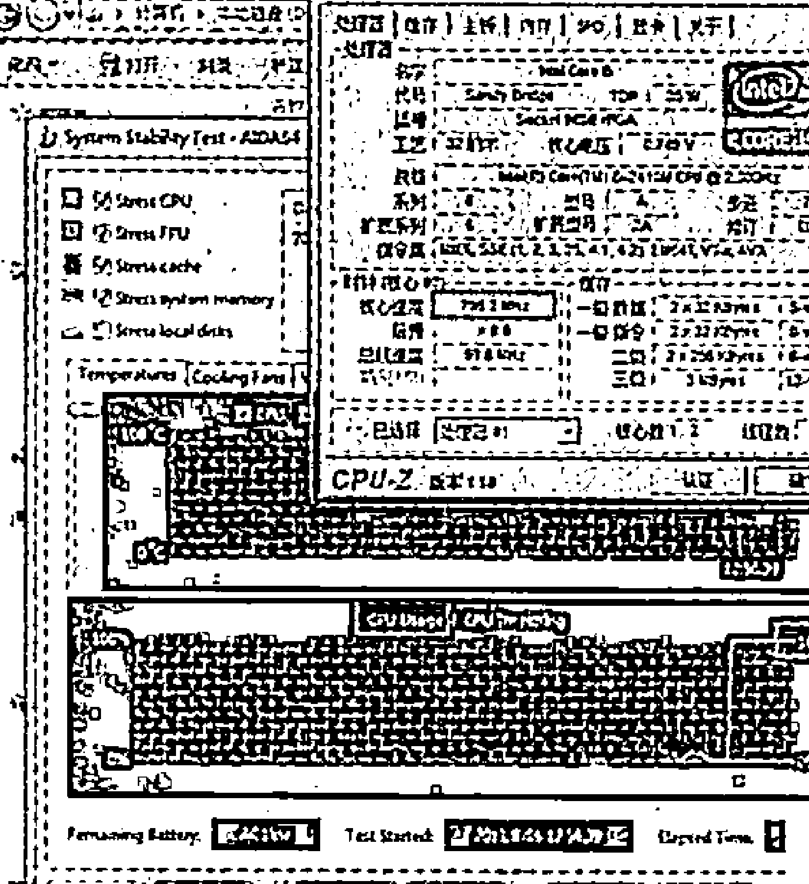

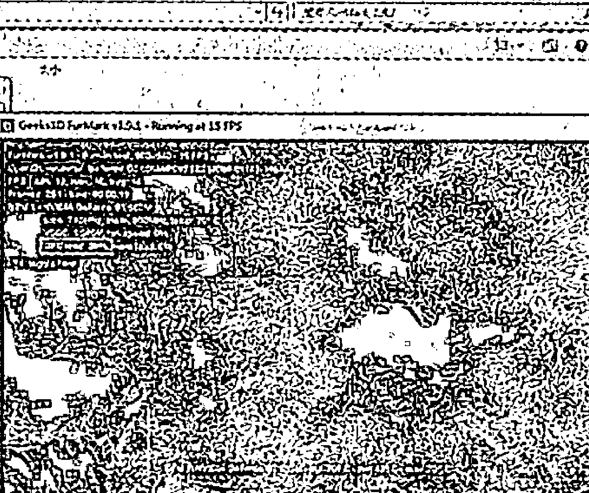

GPU占用率达99%，但此时CPU主频却仅有798MHz，这就是靠牺牲CPU主频换取温度和功耗平衡的表现

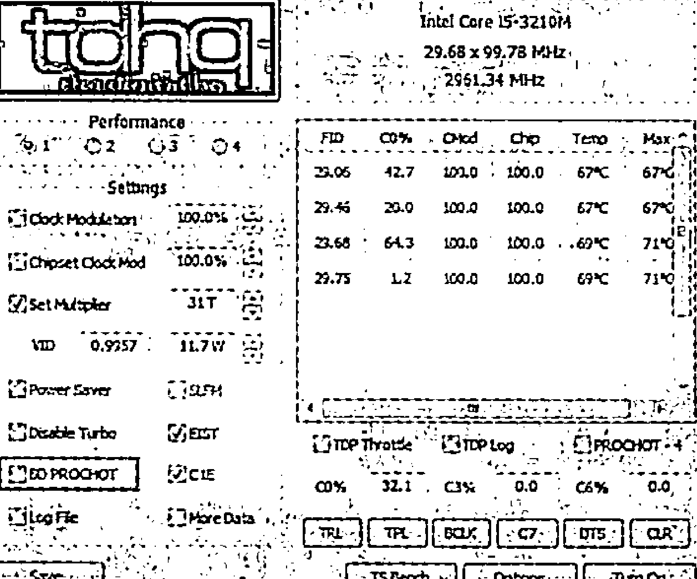

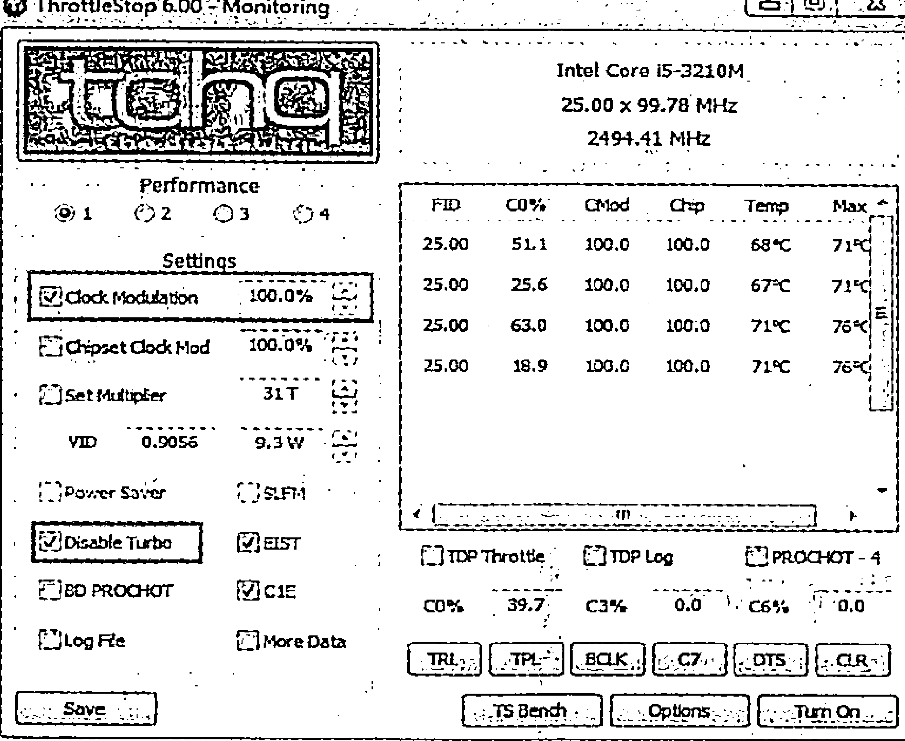

#### 小结

笔记本和台式机虽然都搭载了同一核心的处理器，但无法容纳夸张散热模块且格外注重功耗控制的笔记本必然需要更多高级的节能和控制技术，而这些隐藏的技术在不经意间就会拖累性能的发挥。有了给力的软件搭档之后，相信大家的笔记本也能更为“卖力”地贡献每一分力量。

### 窃听风云

#### 就在你我身边

由古天乐、刘青云、吴彦祖、周迅与叶璇、黄磊等主演的《窃听风云3》揭露了“地产黑幕”，其中所上演的各种窃听监控技术更是令人印象深刻，也因此让我们在欣赏电影之后再度反思起与安全相关的话题。就贯穿剧情始终的“窃听”话题，几位主演都发表了自己的观点：周迅：“还好，我从来没有在淘宝买过东西。玩手机，也是去年才开始养成的习惯，以后要少玩。”叶璇：“我好害怕，我手机里有很多裸照……小狗的裸照。”古天乐：“以后大家都别用手机了，写信吧。”刘青云：“我手机通讯录里的名字都是数字符号，所以我自己也老是忘记谁是谁。”当然，作为电影，其中的某些窃听环节可能经过夸张放大处理，但在真实的我们的身边，的确存在着类似的隐私威胁。那么，如何才能防范身边的“窃听风云”呢？这就是本期特别话题的职责所在。

### 影像的金钟罩

我们这里所谓的“影像”，指的是所有视觉可见的，比如图像、视频等等。影像是对现实生活的如实记录，最容易泄露隐私，你所在的家庭位置、你的相貌等等，一旦这方面的隐私流传到网络上可能带来隐患。不过什么东西都是双刃剑，反之它又能保护隐私。影像有着丰富的细节，如果我们将自己的敏感信息隐藏于图像中，一般人是很难发现的。

#### 谢绝窥视 管好自己的摄像头

文|俞木发

现在很多人的电脑都配置了摄像头，手机则几乎都有照相功能，如果被病毒木马或者黑客远程控制，就有可能被偷拍到敏感的影像，造成隐私泄露。所以现在要保护好隐私，一定要重视管好电脑和手机的摄像设备。

对于手机、平板的摄像设备，可通过“LBE安全大师”进行管理。在手机上启动“LBE安全大师”后切换到“主动防御→软件权限管理→隐私相关→拍照和录像”，将不需要拍照和录像权限的应用对应权限设置为“拒绝”即可（图1），防止它们偷偷开启拍摄。

对于确实需要拍照权限的应用，比如QQ视频聊天、搜狗输入法的拍照传送，我们可以将其使用拍照和录像的权限设置为“提示”，这样一旦有应用确实需要拍照，LBE安全大师就会弹出提示窗口，经过手动选择允许才可使用拍照功能（图2）。对于电脑端的摄像头，可以借助360安全卫士进行保护。安装后启动安全卫士的“360安全防护中心”，点击上方的“安全设置”按钮，在打开的窗口中切换到“安全防护中心→摄像头保护”，将其模式设置为“严格模式”（图3）。这样任何要开启摄像头的程序，比如QQ在开启视频聊天需要调用摄像头时，安全卫士就会弹出拦截提示，需要手动点击才可以开启摄像头。如果需要经常使用摄像头视频聊天，则可以试试名为“摄像头保护工具(CamBlocker)”的摄像头开关软件，启动软件之后它会自动识别当前摄像头，点击“Block/unblock”即可开启或者关闭摄像头（图4）。

由于摄像头大多数都是USB端口，因此动手能力强的用户还可通过“大势至USB端口管理软件”进行管理。启动软件后按提示按下Ctrl+Alt+U键调出程序界面，勾选“禁用图像处理设备”，这样本机就无法使用摄像头了（图5）。完成上述设置，运行摄像头程序后就会出现错误提示，任何人都无法使用摄像头了，也就彻底杜绝了摄像头泄密的安全隐患（图6）。如果自己需要使用时，临时将这一功能解禁即可。

##### 扩展阅读：用摄像头防盗

上面的方法主要介绍如何防止被恶意开启摄像头，不过在平时操作中，我们却要为了某种目的，实现摄像头的远程开启。

###### ★远程开启电脑摄像头防盗

如果你的电脑配置了摄像头，那么在上班时间还可以通过远程桌面，在公司电脑上远程开启摄像头。只要开启家里电脑的远程桌面并保持开机联网，这样在公司电脑中通过远程桌面，远程登录家里电脑后就可以开启摄像头了。当然了，这么做也有很大风险，如果保护措施不到位被黑客获取到相应权限，就会有很大风险了。

###### ★手机防盗自动拍照

在坐公交或者逛街时，手机丢失或者被盗劫，Android手机可以借助“防盗拍照”实现在手机丢失后自动激活防盗拍照服务。到http://tinyurl.com/lkx77z9下载“防盗拍照”应用，启动应用后勾选“防盗拍照服务”，然后输入自己的邮箱，这样程序将监测手机的密码错误解锁情况，当设备解锁密码输入错误次数达到用户的设定值时，程序将会通过前置摄像头抓取可疑图片并发送到用户设定的邮箱中，通过抓拍的图片就可以知道到底是谁在使用我们的手机（图7），从而发现丢失手机的线索。

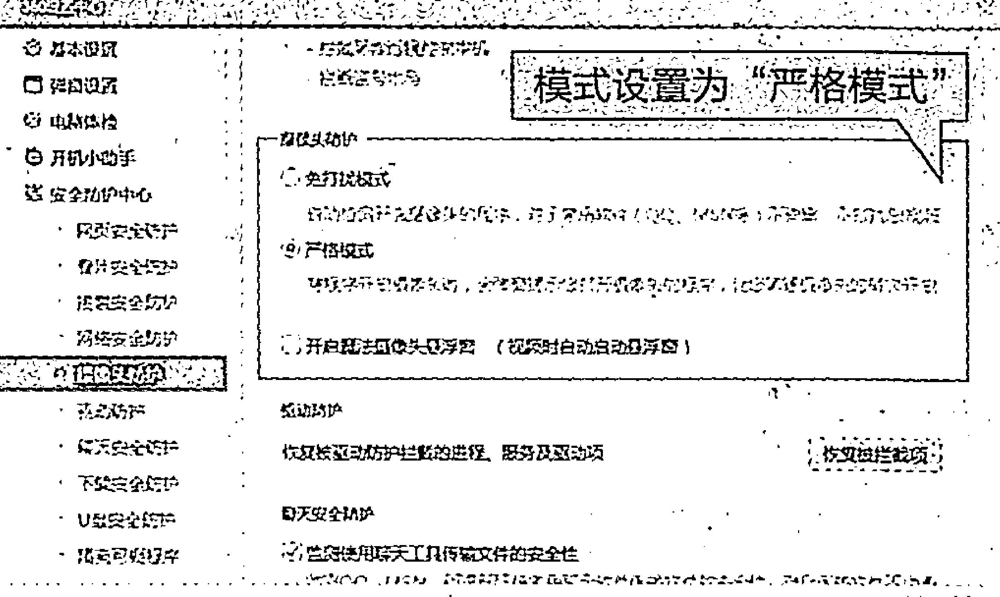

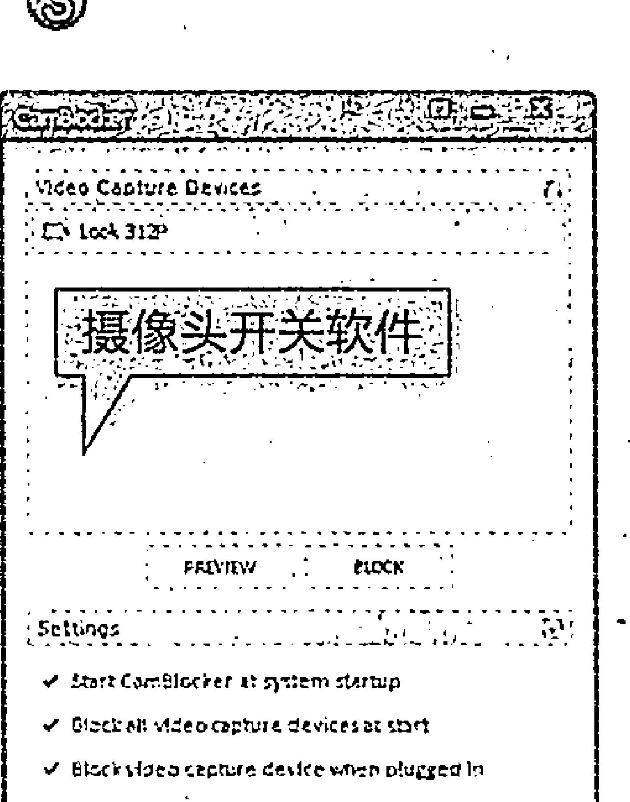

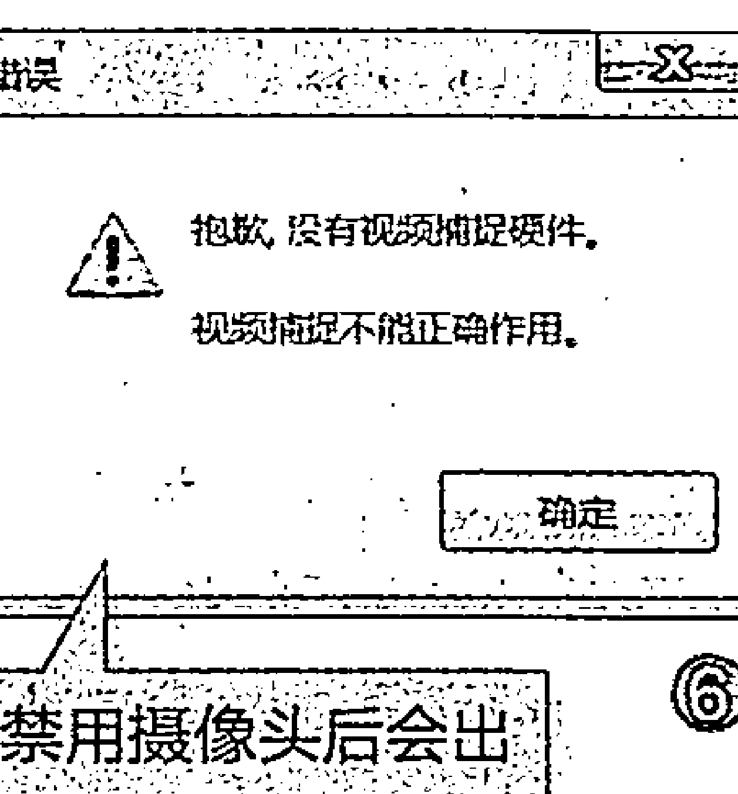

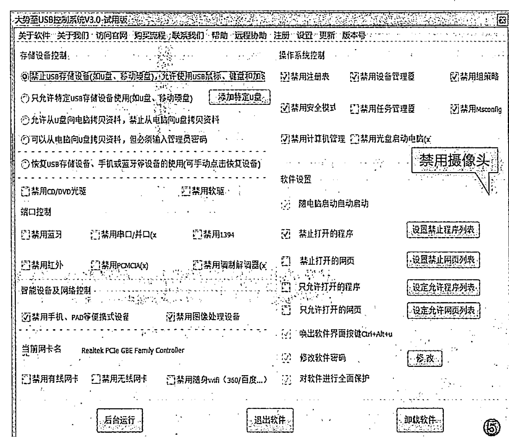

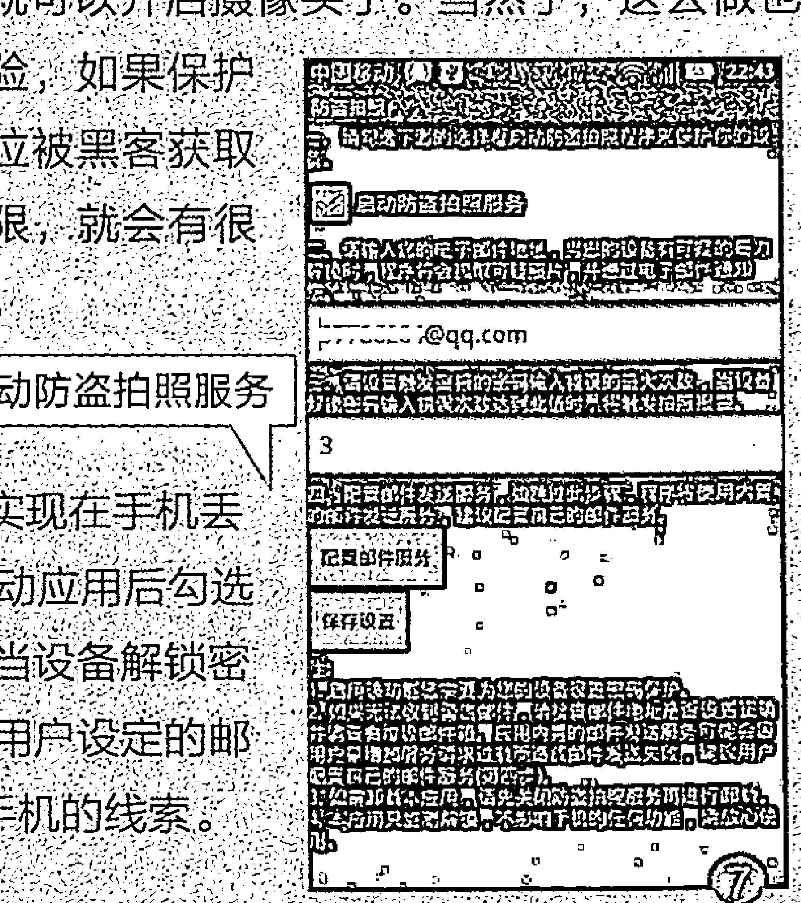

### 拒绝偷窥 拒绝监控

你的电脑安全吗？也许，在不知不觉中，你在PC屏幕上的所有操作已被人远程监控。黑客远程控制了你的电脑，随意轻松了解你在屏幕上的所有操作。那么如何才能获知自己是否被监控，又如何做到防范呢？

#### 本地监控与网络监控

监控还有本地监控与网络监控之分。本地监控一般是指在本地电脑中安装了某个软件或服务，该软件或服务可以将用户操作电脑的过程记录在屏幕截图、屏幕视频、操作日志等文件中，以达到了解用户使用电脑的目的。例如，家长监控孩子用电脑的情况就是采用这种情况。而网络监控是通过网络远程控制获取信息的方式，这种方式可能是家长对孩子使用电脑的监控，也可能是公司对员工使用电脑的监控，更可能是黑客对大众电脑用户使用电脑情况的监控。对于前者可通过文件日期搜索工具搜索最近产生的文件来判断，还可通过第三方进程查看工具检查系统常驻内存中的可疑程序。对于后者则可用系统网络查看命令、网络防火墙软件检查和堵截。

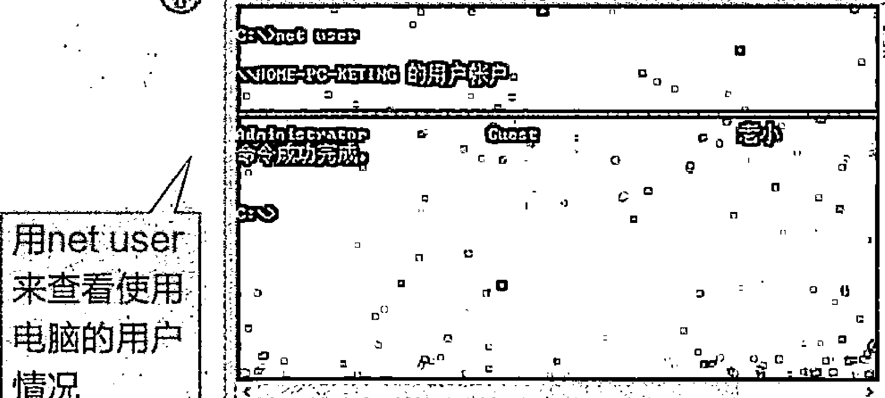

#### 通过内部命令查看不明访问

既然电脑被监控的可能存在，那么如何查明电脑是不是可能正在被监控呢？最直接的方法是通过系统自带的内部命令net user来查看。在Windows 8.1的开始按钮上单击鼠标右键，选择“命令提示符”项，在命令提示符窗口中输入`net user`并回车，随后会出现用户列表，其中有一个就是机主的账号，如果你只建立过一个账号，但此时跑出两个或多个，那就说明有别人也能控制这台电脑，可能会对电脑进行远程控制（图1）。再输入“netstat -a”命令，若窗口中有类似“TCP <本地地址>:1025 <外部地址> LISTENING”的条目，把上面“1025”那个位置的端口数字记下来，上网查寻木马常用端口有哪些。如果命令中的端口数字是木马常用端口，则可能已经中了木马。这时，把那个端口通过防火墙软件封闭就可以了。如果要判断电脑是否可能被内网监控，右击Windows 8.1开始菜单并选择“命令提示符（管理员）”，在命令提示符窗口中输入“netstat -a -b”，然后看是否有192.168.1.2或192.168.0.2等非自身IP地址不停地连接自己的电脑，如果有的话，电脑可能正在被监控。这里之所以说“可能”，是因为内网别的同事的电脑中毒后也可能会发起向你的电脑的攻击，这当然不表示同事正在监控你的电脑，但病毒或恶意程序正在攻击你的电脑却已成事实。

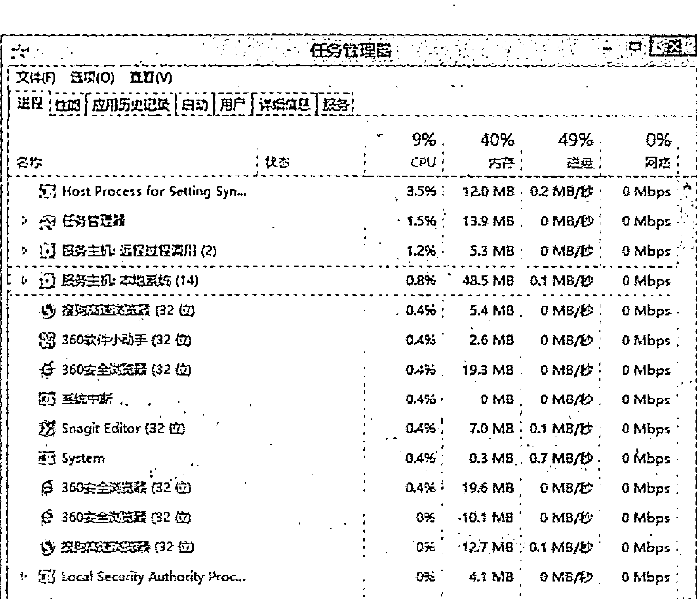

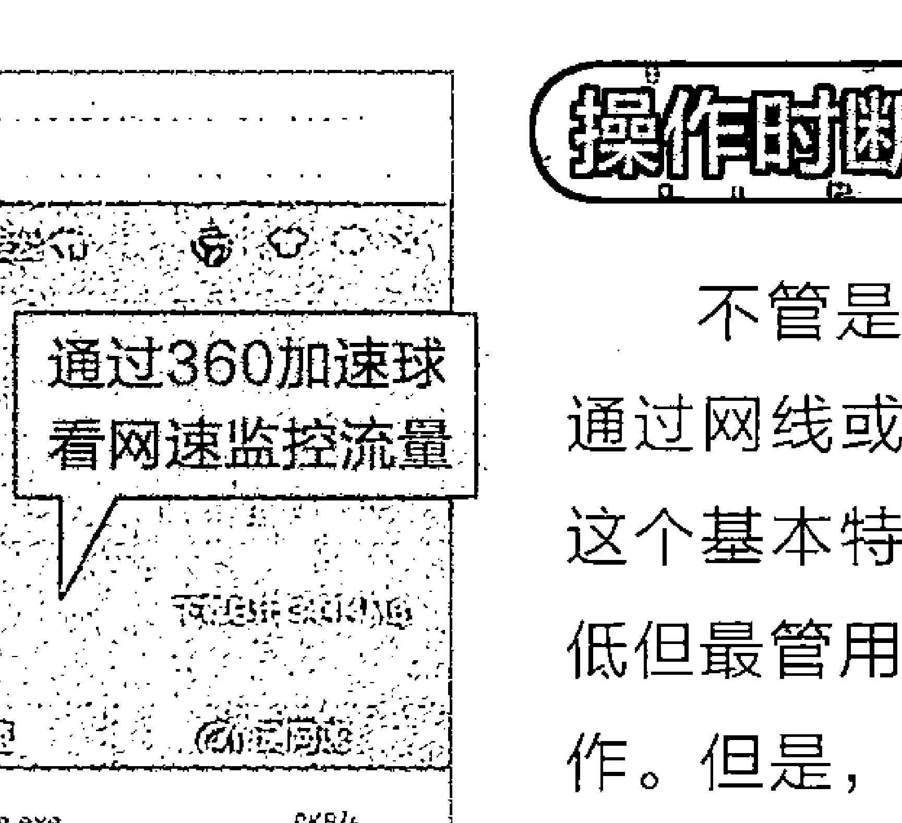

#### 操作时断网 最简便的防监控措施

不管是什么方式的网络监控，总离不开通过网线或无线网络来传输监控数据。基于这个基本特点，那么最傻瓜化、技术含量最低但最管用的应对方法就是切断网络进行操作。但是，这种方式是有条件限制的，那就是不需要上网工作时才能进行，若工作必须在联网状态下进行，则该方法无法执行。此外，虽然工作时可以上网，但当在随后又上网时还是可能被监控的，这样电脑中存放的数据依然是不安全的，除非这台电脑从不打算上网。另一种判断是否正在被监控的简易方法是，把自己所用的联网软件都关闭掉，然后打开任务管理器或360安全卫士，通过对网速使用情况进行查看判断，若还有网络流量在使用，那就有可能是被监控了。如图2、图3所示的网络流量均为0字节，则说明没有网络数据传输，起码说明当前是未被监控。

### 通过安全软件检查清除木马

一般被监控的电脑都会先被植入木马，而后才被监控的。因此，建议先用360安全卫士的木马查杀功能全面查杀，然后开启360安全卫士里的木马防火墙和流量防火墙功能，就不怕被监控了。360安全卫士的木马防火墙比较给力，它依靠抢先侦测和云端鉴别，可全面、智能地拦截各类木马，保护系统安全和用户的重要数据信息（图4）。

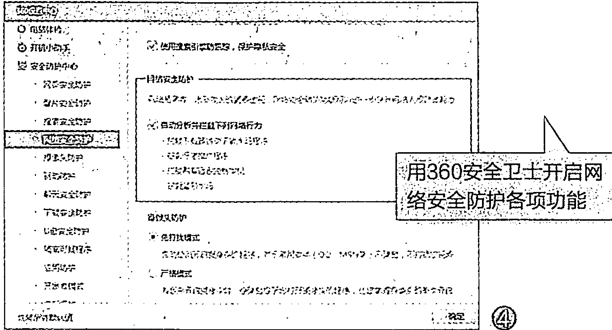

##### 小提示

如果发现鼠标莫名其妙地运动，不听自己使唤，很可能是恶意软件在你的电脑上安装了远程控制客户端程序，控制了你的电脑。这时可以用360安全卫士等系统工具，清理系统中无关的软件和启动项、服务等，将安装在本机的所有远程访问客户端清除掉。如果实在找不到相关的软件或服务，但鼠标自动游移现象还在发生，可在备份有用数据后重装系统以彻底清除隐患。

| 更改隐私选项 | |
| --- | --- |
| 允许应用访问我的姓名、图片及其他账户信息 | 开【关】 |
| 允许应用使用我的广告标识符了解对各应用的体验（关闭此功能将重置你的ID） | 开【关】 |
| 打开 SmartScreen 筛选器，以检查 Windows 应用商店应用所使用的 Web 内容（URL） | 开【关】 |
| 根据我在这台电脑上键入和书写的内容显示建议的文本（关闭此功能将重置建议） | 开【关】 |
| 允许网站通过访问我的语言列表来提供本地相关内容 | 开【关】 |
| 诊断和修复 Microsoft 广告和个性化设置问题 | 隐私声明 |

### 从系统层面关闭远程访问服务

除了用软件拦截外，通过系统的网络层面防监控，效果会更彻底一些。通过关闭系统中远程访问选项，关闭系统中远程相关服务，让任何形式的远程访问无法得逞。

#### 关闭远程访问选项

通过“这台电脑”的“属性”设置，在“系统”窗口的“远程设置→远程”选项卡下，选择“不允许远程连接到此计算机”，取消对“允许远程协助连接这台计算机”的选择。

#### 关闭远程访问服务

在“运行”窗口中输入“Services.msc”，打开服务设置窗口，通过对服务“描述”一栏的查看和设置，关闭此窗口中所有与远程控制有关的服务（图5）。

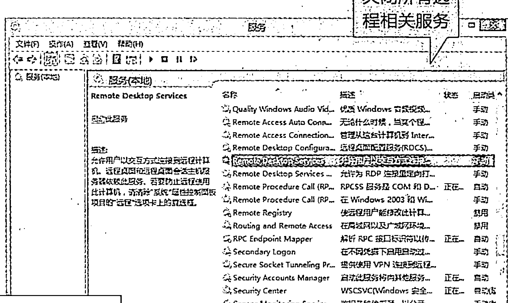

#### 关闭系统隐私相关选项

Windows 8.1的许多应用需要开启系统的基本隐私选项，开启系统的摄像头或麦克风等功能。这些都可能是用户隐私泄露和被监控的突破口。因此，如果平时没有对这些功能的需求，可以将这些功能的总开关关闭（图6）。

鼠标滑动到屏幕右上角或右下角，在浮动面板中选择“设置”并点击，然后点击“更改电脑设置”，点击“隐私”选项，按需选择“常规”选项开关，将“位置”、“摄像头”、“麦克风”等项目中的总开关均设置为关闭状态（图7、图8、图9）。

| 位置 | 关闭Windows和应用对位置的使用 |
| --- | --- |
| 允许 Windows 和应用使用我的位置 | 开【关】 |
| 允许这些应用使用我的位置 | |
| 财经 | 关【关】 |
| 地图 | 关【关】 |
| 健康 | 关【关】 |
| 旅游 | 关【关】 |
| 天气 | 关【关】 |
| 资讯 | 关【关】 |

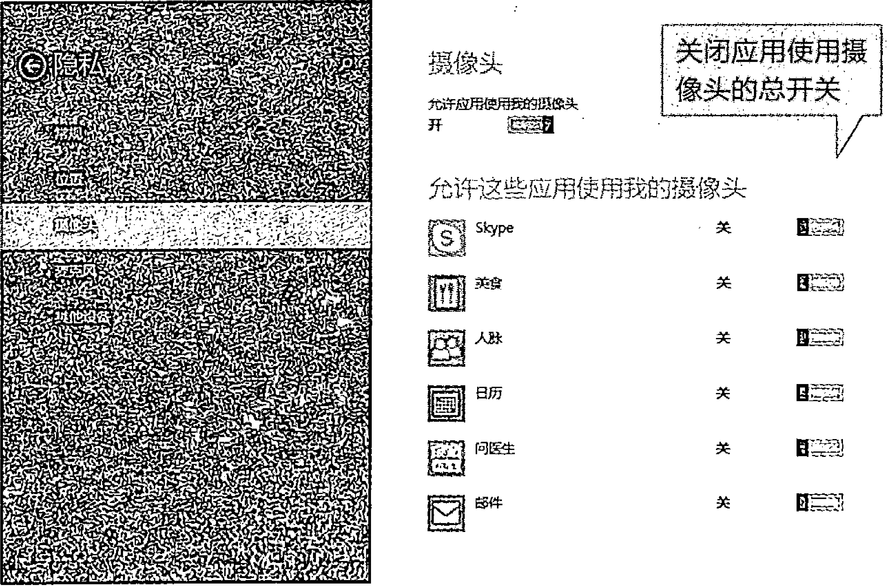

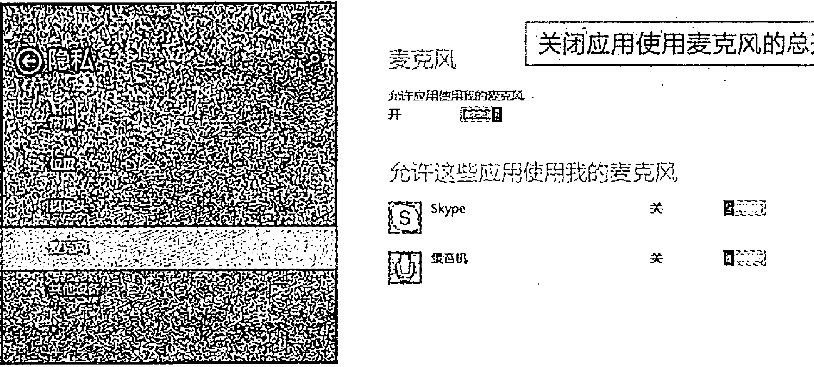

> 手机APP通过各种权限控制窃取隐私和监控用户的情况更普遍。为了防止手机隐私被窥窃和监控，可以给手机安装腾讯手机管家安全软件，进入安全防护模块的隐私空间，实现全面的隐私保护。隐私空间可用来加密手机中的隐私图片、视频、文件和短信。在开启隐私保护的过程中，还可以关联QQ号，只需绑定QQ，即可通过网页实现对手机的远程控制，定位被盗手机、清除手机上的隐私信息。


### 照片中的隐私攻防战

文|一页

#### 照片泄露隐私

带摄像头的手机已经非常普及，这就使拍照变得极其容易，许多人无论是工作、旅行、吃饭、购物，随手就拍一些照片发到网上共享。那么你是否了解，在这小小的照片之中，却可以上演一场隐私的攻防战。

网上曾经流行过一个技术贴，讲述网友如何通过某明星微博里发的家居照片，通过该明星微博上的其他描述，以及GoogleEarth定位技术，半个多小时就推断出该明星的家庭住址。所以，如果对自己的隐私很介意的话，发照片至少要注意两点：

- 最好不要发有明显建筑物背景的照片，容易被“以图搜图”功能定位；
- 尤其不要发那种“俯瞰”类型的照片，这容易在地图中被定位。

除了显性的隐私，照片文件的EXIF（图像参数）也会隐性地暴露不少信息。右击照片文件，选择“属性”，切换到“详细信息”，比如你使用的是什么设备、在什么时间，甚至在什么地点（GPS位置），都会显示得清清楚楚。如果不希望他人获取这些信息，可以点击这个对话框下方的“删除属性和个人信息”（图1），在打开的对话框中，可以勾选要去掉的隐私项，再点击“确定”即可（图2）。也可以选择“创建不包含任何可删除属性的副本”，创建一个没有任何属性的副本作为对外共享的文件。

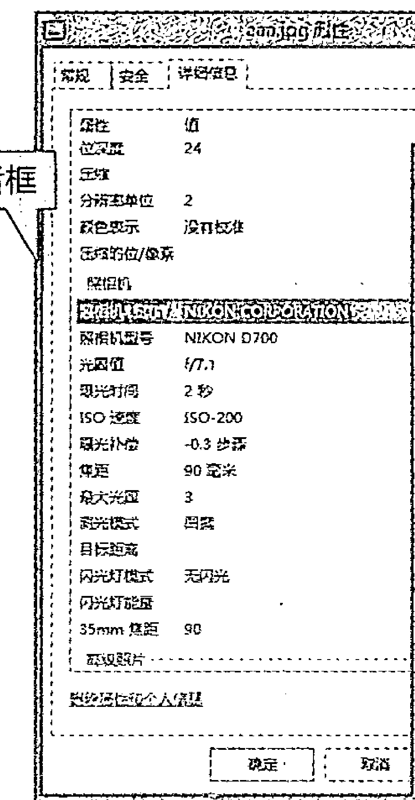

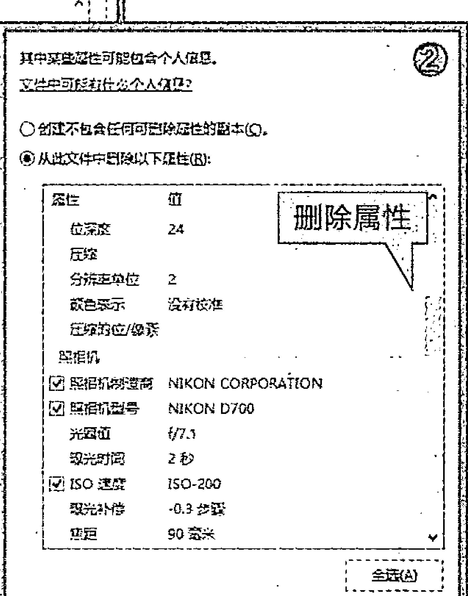

> 小提示
上面的方法是清除属性信息，其实在该对话框中，还可以手工添加更多个人信息，如名字、联系方式、版权说明等（视各人实际的需要）。另外如Office文档等，也会在文件属性中包含大量个人信息，同样可以使用上面的方法进行清除。

#### 图片中添加隐形水印

大部分人为图片添加水印，是为了保护版权，所以水印看起来很明显。但如果你想在图片中藏起一些信息，则可以制作隐形水印，将信息文字的颜色设置与背景色相似，溶入背景中，就算有人浏览了这张图片，也不一定能想到其中的玄机。下图中看起来很正常的图片（图3），如果无限放大，会发现在路的尽头已经被我植入了“林间小路”四个字（图4），不知道的人很难发现。

虽然任何图形处理软件都可以实现在图片中添加隐形水印，不过使用Photoshop会更方便。这个制作非常简单，在Photoshop中打开图片，按Ctrl+“+”键适当放大图片，寻找一个放置文件的适当位置，用吸管工具点击这一位置的颜色作为前景色，然后选择文字工具输入相应内容。注意，图片放大后，很小的字号也会显得非常大，而Photoshop默认最小的字号是6号，实际上我们可以手工输入，比如改成3，文字将变得更小。如文字不太明显，则调整文字图层的透明度，直到文字若隐若现溶入背景为止，最后保存图片就可以了（图5）。自己要查看图片中隐藏的内容时，不用再启动Photoshop，直接用系统自带的图片查看器，定位好位置后无限放大就可看到了。

> 注意：这里作为示例，所以隐藏文字选择了比较明显的位置，实际上可以设置得更隐私一些，比如一些边边角角。另外，这种方法无法排除他人偶然间会察觉你的秘密，所以植入的暗水印内容，最好转成一种自己能理解的密文，即使不小心被别人看到，他也看不懂。

#### 另类添加隐形水印

还有一种方法制作的隐形水印，平时看图片是正常的，可一旦选中图片水印就会显示出来。

这一方法的关键，首先是制作一个2像素×2像素且黑白相间的图案，在Photoshop中新建一个高和宽都是2像素的文档；再用铅笔间隔填充上黑色（图6），然后点击菜单“编辑→定义图案”，在弹出的窗口中为图案取一个名称，确定即可。接着打开要加隐形水印的图片，按Alt键不放再双击背景图层，将它变成普通图层。再添加文字图层，输入作为隐形水印的文字内容，颜色为纯白色，再将它栅格化成普通图层，放到最底层。再创建一个图层，使用填充工具，填充的是上面制作的黑白格图案；此图层位于中间，混合模式为“排除”；最后将顶层的图片透明度设置为90%，合并图层后保存图片。当这张图片处于选中状态时，就会显示出隐形水印了。


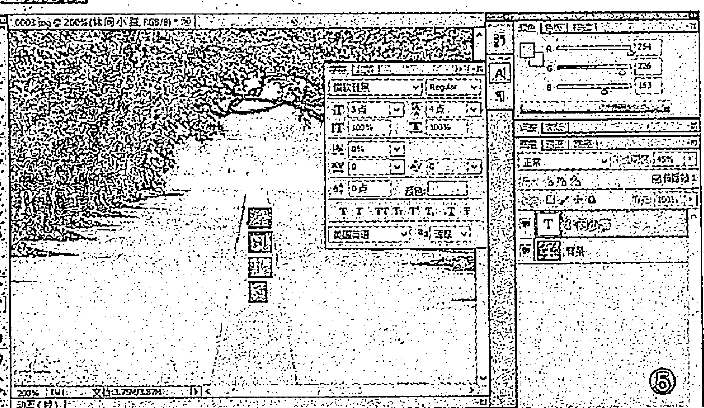

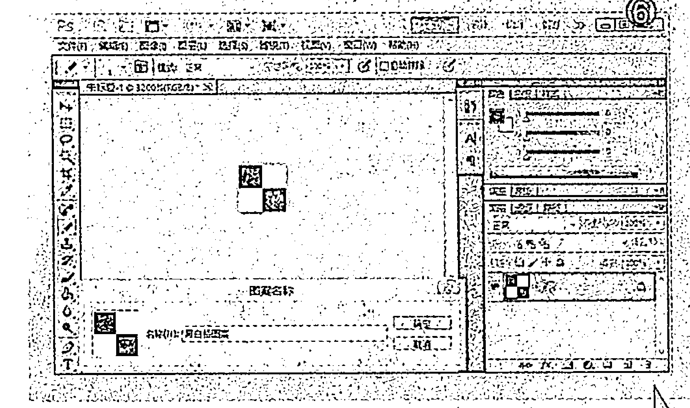

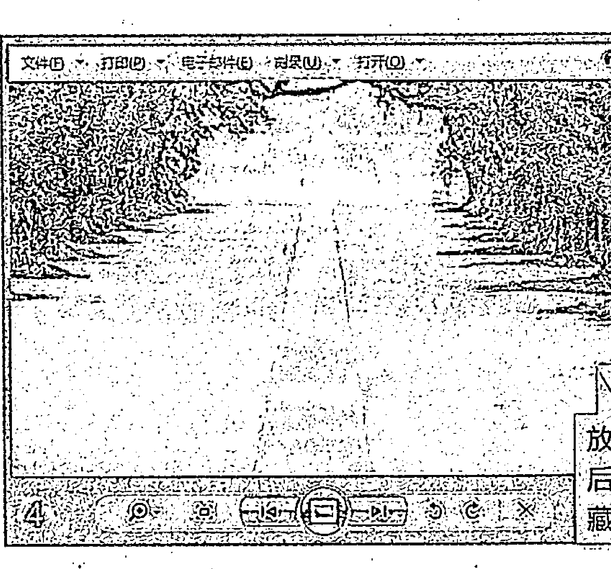

### 视频中隐藏的秘密

文|知夏

大家都知道，视频实际就是一系列连续的静态图片组合，按标准1秒24帧计算，1分钟有1440帧图片，一部120分钟的电影就有17万多帧图片。只在一张图片上隐藏的信息就已很不好找了，如果将信息分散隐藏于17万多张的图片中，那就更加安全。

首先要有一款视频编辑软件，这里以Adobe Premiere Pro CS6（以下简称Premiere）为例。新建一个项目并导入电影的视频，将视频拖放到时间线上，然后开始编辑。假设我们要隐藏的内容是“我的密码是12345678”。

按Ctrl+T键打开新建字幕对话框，输入隐私内容的第一个文字（本例为“我”），为了让文字不是太明显，可以通过右侧的Opacity、Font Size选项来降低它的透明度和字体大小。另外还可以通过Color项，为字体选择接近于背景的颜色，这样更隐蔽（图7）。设置完毕，拖动文字到画面不引人注意的位置，最后关闭此窗口回到Premiere主界面中。

刚才创建的文字，已经自动出现在项目素材窗格中。将此字幕拖放到刚才视频上方的通道中的任意位置，一边注意看预览窗口左下方的时间标志，即视频时间码（time code）。时间码的格式为“XX:XX:XX:XX”四组数字，由左至右，分别表示小时、分钟、秒钟和帧数，比如00:00:16:10表示第16秒的第10帧。起始时间确定后，将此字幕调整为只有1帧（图8，另外也可以直接在字幕编辑器中设置它在视频中的位置和长度）。以此类推，陆续在其他不同的帧中分散写入隐私的后续内容。最后将加入隐含内容视频导出保存即可。

现在将上述所有文字的所在位置时间码记录下来，去掉中间的冒号，得到形如“0000161000002509000038120001000200381210……”的一系列数字，光明正大地存放在自己的文档中，别人即使看到了也不会猜出它是什么内容。

当自己需要提取这些内容的时候，怎么办呢？使用主流播放器，比如Potplayer播放我们编辑过的那段视频，对照记录的数字码跳转到具体的位置，就可以把之前记录的内容一个个提取出来了。具体方法：在Potplayer中打开该视频，右击，选择“播放→定位→手动定位”，在打开的对话框的“时间定位”框中输入具体的时间码，点击其后的“定位”，即可直接定位到具体帧上（图9）。

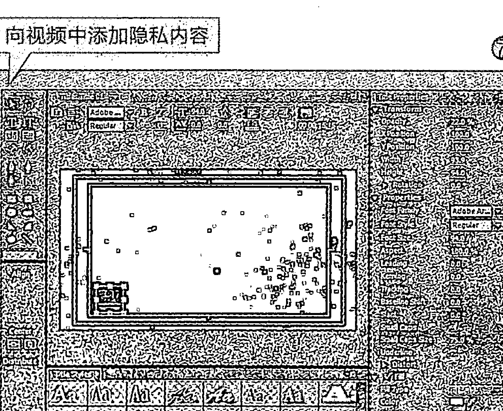

因为单帧的内容一闪而过，很难注意到。即使个别帧中的内容有可能被别人不小心看到，但是只是片断信息，他要收集齐所有信息必须从头至尾逐帧播放，工作量将是巨大的。所以这一方法相对来说，比图片隐藏信息更安全些。如果隐藏的信息预先再经过密文处理，那就更保险了。

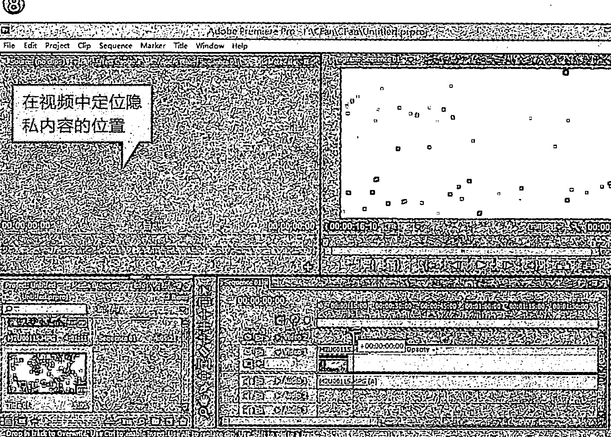

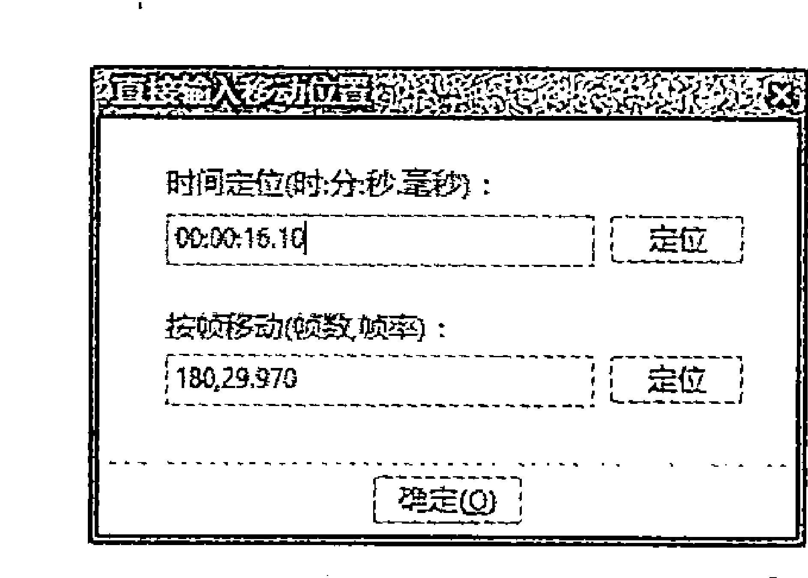

> 小提示：如果播放器不支持直接跳转，如在KMPlayer中，可通过鼠标播放到大致的时间位置，连续按F键逐帧播放，也能很快定位到隐藏了内容的那一帧中。

### 声音的防范

在日常生活中，除了看得见的，还有听得见的，声音也是与安全密切相关的存在。那么，如何避免声音被窃听，我们又该如何防止声音文件的泄密呢？

#### 严防死守 堵住声音的泄密

文|技术宅

日常使用中会导致声音泄密的设备主要是麦克风，电脑上的耳麦，手机、平板上的麦克风等。手机等移动设备上可以通过权限管理来阻止某些应用偷偷录音，同样可以借助“LBE安全大师”来实现。在手机上启动“LBE安全大师”后，点击左上角程序图标，在弹出的菜单中切换到“主动防御→软件权限管理→隐私相关-拍照和录像”，在这里可以看到本机很多应用都有“录音”的权限，这些就可能是导致声音泄密的元凶（图1）。

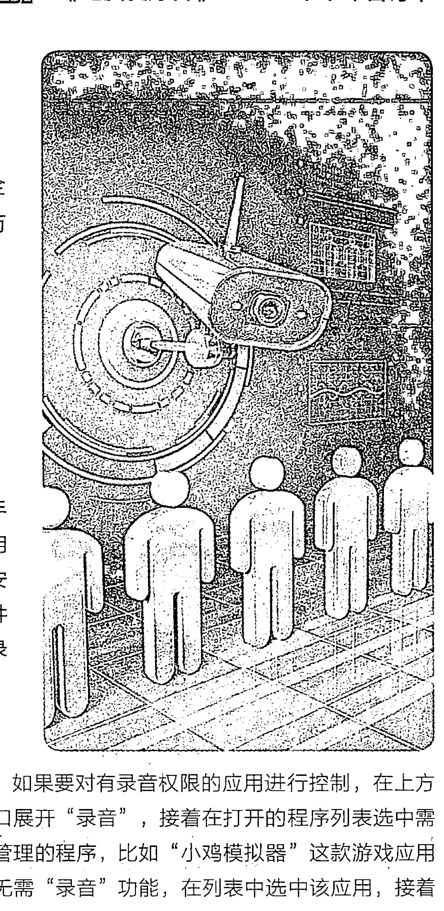

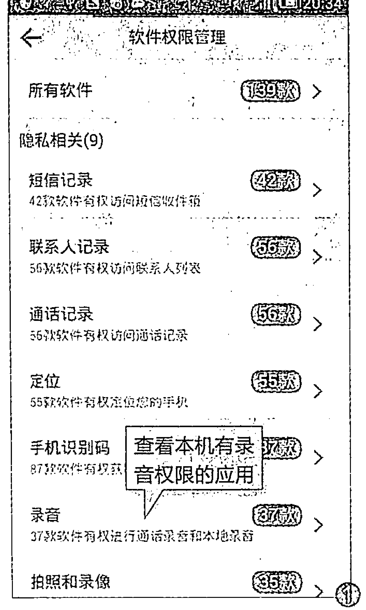

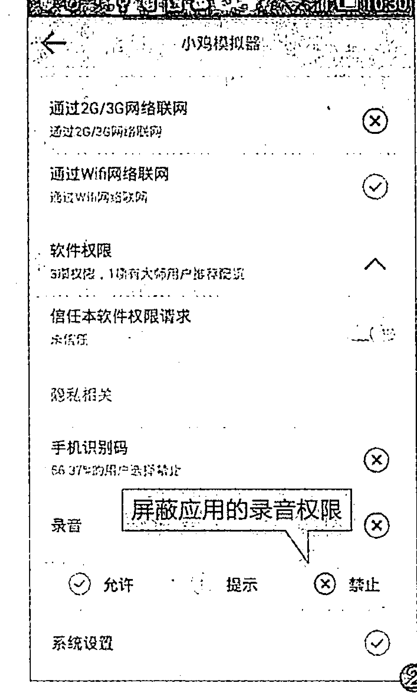

如果要对有录音权限的应用进行控制，在上方窗口展开“录音”，接着在打开的程序列表选中需要管理的程序，比如“小鸡模拟器”这款游戏应用就无需“录音”功能，在列表中选中该应用，接着在打开的窗口中展开“权限”，将其中的“录音”权限设置为“拒绝”即可。以后“小鸡模拟器”如果要录音就会被阻止。其他应用的权限设置类似（图2）。

对于电脑麦克风的管理，则可以使用系统自带的组件。比如耳麦用户，如果没有使用其中的麦克风，可以右击桌面任务托盘中的喇叭图标，选择“录音设备”，接着在打开的窗口中选中麦克风，点击“属性”，将设备用法设置为“不使用此设备（禁用）”，这样本机程序就不能使用麦克风进行录音了（图3）。

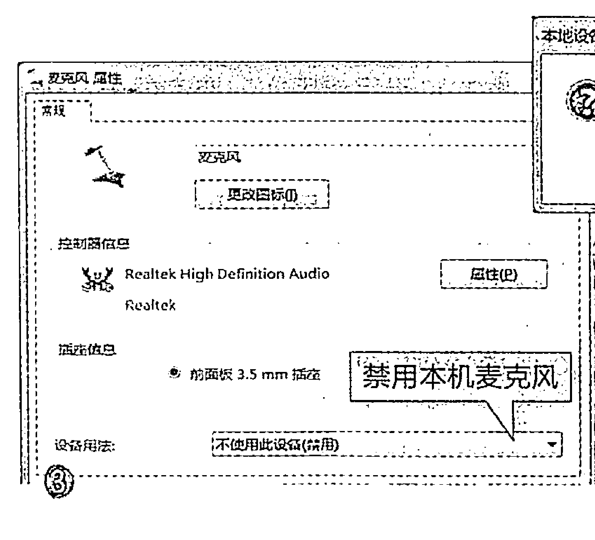

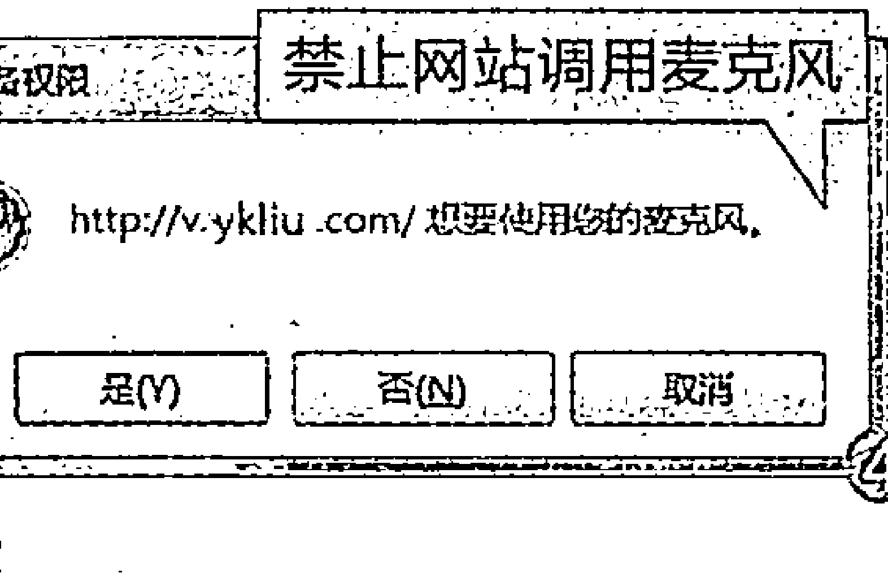

除了安装的第三方程序会调用麦克风外，现在很多支持Flash视频的内嵌网页也会自动调用。因此在一些陌生网站观看视频时，如果弹出是否启用麦克风的提示，此时就要点击“否”，禁止其调用（图4）。

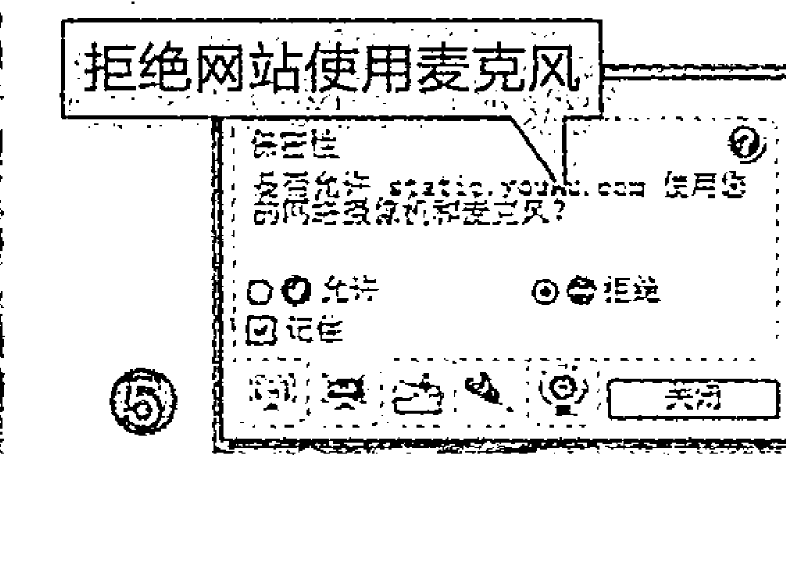

如果不确定自己的麦克风是否被调用，可以在视频播放页面右击，选择“设置”，接着在弹出的窗口中切换到“保密性”设置，将启用麦克风设置为“拒绝”即可（图5）。

#### 拒绝泄密 给声音动手术

文/技术宅

前面的操作是从硬件角度防止声音的泄密，其实除了被录音，已有的录音文件本身也可能会造成不同程度的泄密。比如手机微信上和好友的语音聊天记录，如果不慎泄露就容易造成隐私风险。这种情况下，就需要对声音“动手术”，剔除会泄露隐私的声音。

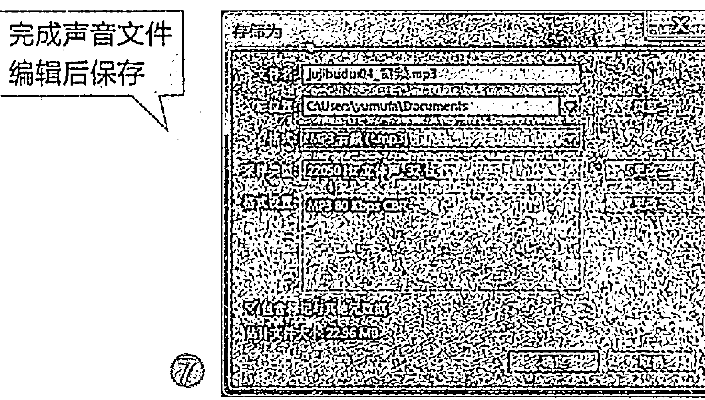

#### 混合声音不泄密：按需提取个性声音

在很多网购维权活动中，为了让网友评判公道，经常会将双方的语音对话上传到网上。不过为了保护自己的隐私，以及更凸显对方的无理，在上传之前可只保留对方的语音。对于这种对话音频处理，可以借助Adobe Audition CS6（以下简称Audition）软件来实现。

启动Audition后单击“文件→打开”，打开对话的语音文件。从声音的波形可看出，一般互相对话中，由于两个人音调不同，声音文件会依次出现大致对称的波形，只要点击“预览”，记住自己的波形图，使用鼠标依次选中并删除一方的声音即可，或者也可以不删除，而是做一些变声处理（图6）。

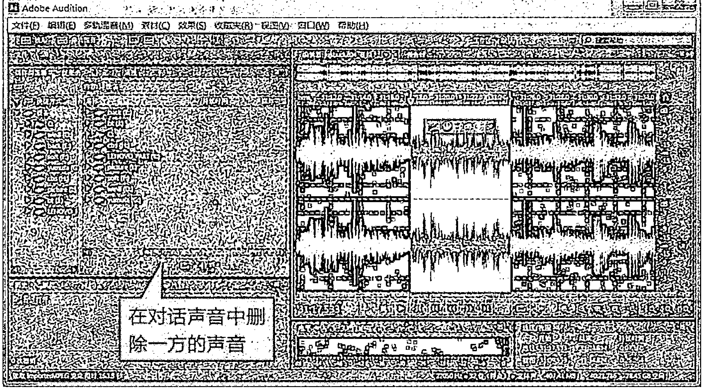

完成整段音频中一方音频的处理后，点击“文件→另存为”，保存格式选择MP3，这样保存后只是一方的音频声音，可很好地保护自己的隐私不被泄露（图7）。

#### 我的秘密你别猜：隐私藏在音乐中

每个人都有一些不为人知的秘密，比如自己录制的和朋友的QQ聊天语音、手机微信上的好友语音聊天记录等。如果已经提取出了上述的音频文件，那么任何接触我们电脑的人都可能使用播放器将其中的声音播放出来。对于此类的秘密音频，其实可以添加一些特殊效果进行保护。

比如从手机微信中提取的音频文件，为了防止他人播放，可用Audition对声音进行反向处理。同上启动程序后导入需要处理的微信音频文件，点击“效果→前后反向”，再点击播放预览，看看是否无法听清楚对话内容了（图8）。

声音处理完毕。点击“文件→导出”，将其导出保存为MP3文件。这样即使有人发现了这个音频文件并打开播放，也不知到底是什么内容。而如果是自己要播放，同上在Audition中打开该音频，然后再次实施“效果→前后反向”即可恢复原来的音频内容了。

如果你要隐藏的秘密不是音乐文件，比如是K:\Aa.txt密码文件，还可借助Copy命令将文本文件藏到MP3等音乐文件中。启动命令提示符后输入 `copy /b cfan.mp3+aa.txt/a 33.mp3`，这样就可在新生成的33.mp3音乐文件中保存Aa.txt内容。双击33.mp3播放的仍然是原来cfan.mp3音乐内容，但如果用“写字板”等字处理软件打开，按Ctrl+End定位到文件末端，最后显示的就是Aa.txt文本文件的内容了（图9）。

#### 我的性别你别猜：声音玩变性

很多朋友喜欢在一些语音聊天室里和网友交流各种问题的看法，默认情况下男女声音音调不一样，只要你一开口就很容易暴露你的性别。在一些话题聊天室里，很多朋友不想被别人识破自己的性别，借助“变身宝宝”可以轻松实现声音的变性。

软件启动后，按自己的需要在声音效果下选择变声类型，比如选择“女变男”，勾选“音效预览”，此时插入麦克风试着说话，会发现原来的女声变成了男声了（图10）。

因为软件的变声效果是通过其自带的虚拟声卡实现的，所以要在具体的应用程序里实现变声效果，还需要在声音输入和输出中选择虚拟声卡。比如QQ，打开一个好友的对话窗口，接着点击“语音聊天→设置”，在打开的窗口中，将声音输入设置为“麦克风（Vocalster Virtual Audio）”，声音输出设置为“扬声器（Vocalster Virtual Audio）”，这个就是变声宝宝的虚拟声卡，这样在QQ语音聊天中就可以使用上述变声效果了（图11）。

```
copy /b cfan.mp3+aa.txt/a 33.mp3
```

对声音文件进行处理后会留下任何痕迹，因此，一般只适合临时处理。处理后记得还要复原

声音前后反向处理

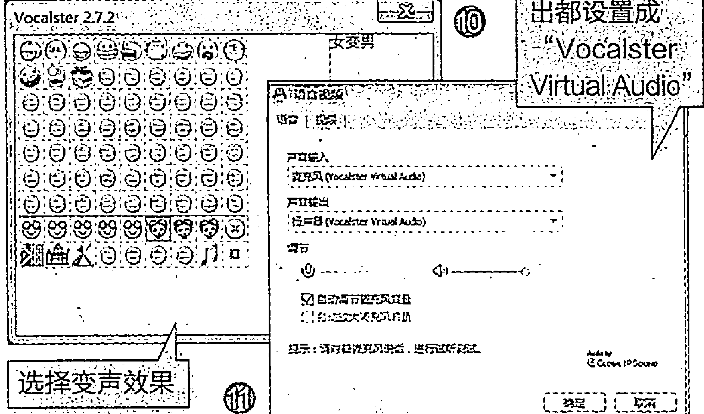

声音输入和输出都设置成 “Vocalster Virtual Audio”

选择变声效果

##### 小提示

如果要在任何聊天中使用上述变声效果，可依次进入系统“播放设备”和“录音设备”中，将其中虚拟声卡设置为默认设备即可，不过这样本机其他音频软件也会使用虚拟声卡，播放出来的都是变声后的效果（图12）。使用Android智能手机的用户，则可以试试“变声器”应用，可将自己的声音变成怪物、老人、年轻姑娘等，用它来跟朋友开个玩笑。

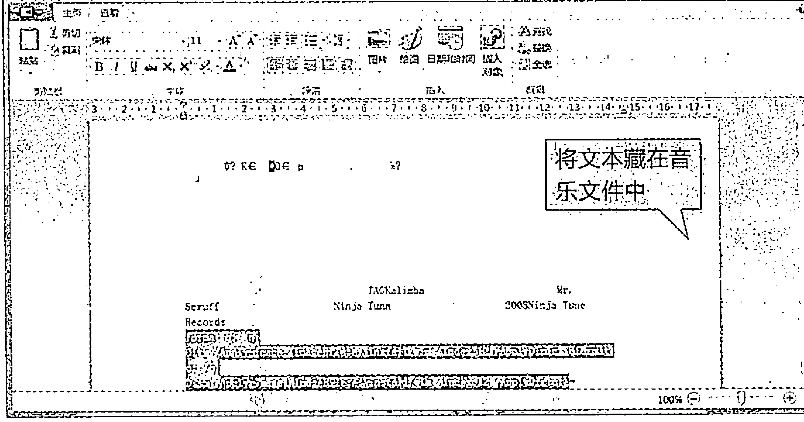

将文本藏在音乐文件中

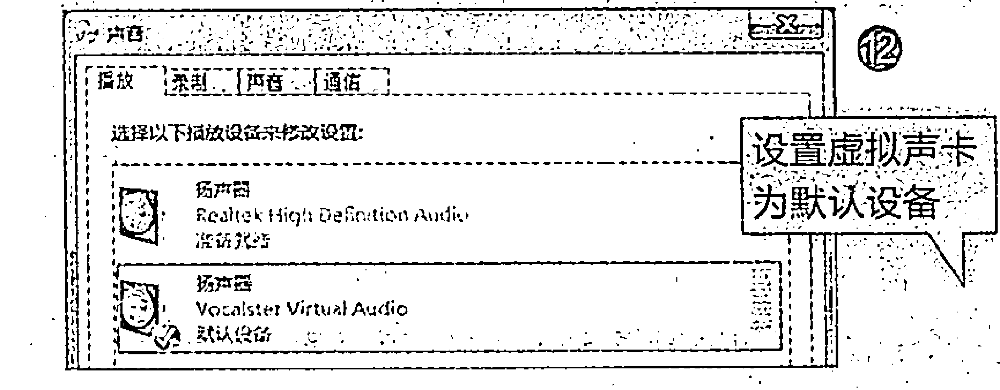

设置虚拟声卡为默认设备

### 筑起数据铜墙铁壁

文|榆林

除了图片、声音、视频外，PC中保存的其他数据也是至关重要的内容，有的往往具有价值。为保证数据不泄露和不被窃取，学会数据的加密和进阶保护手段很有必要。

#### 数据泄密我能知

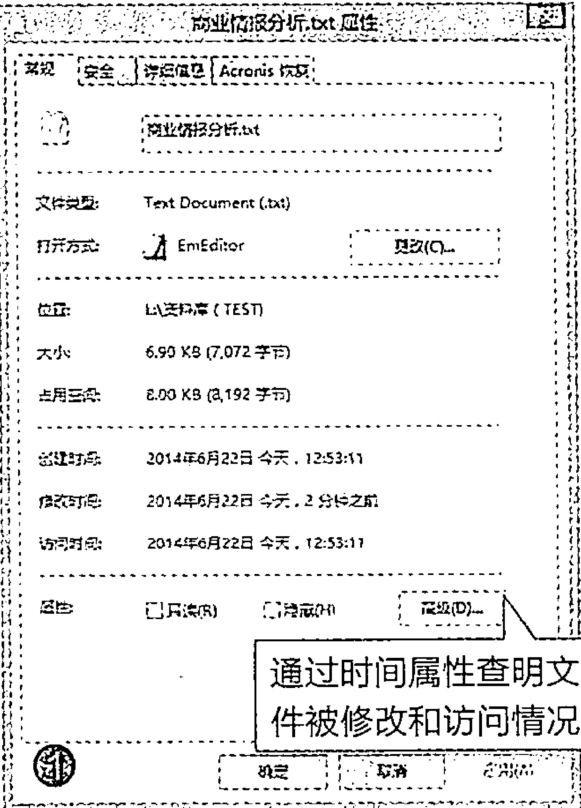

从文件时间属性看文件是否被访问

对PC的访问一般会反映在文件属性的改变上，如果文件被修改，则修改时间属性会发生变化；如果文件只被读取而未被修改，则也会有文件访问时间属性的变化。此外，访问过的程序或文件，在系统的事件记录中也会有相应的记录。可以通过这些来判断系统中的数据是否被动过。

怀疑前天自己编辑的文件被人动过吗？右键单击文件，查看一下其属性，通过“创建时间”、“修改时间”、“访问时间”等具体属性，可一目了然获知该文件被修改和访问的时间情况（图1）。

通过时间属性查明文件被修改和访问情况> **小提示**
别以为这一招是万能的，狡猾的家伙会将文件访问时间更改掉，让人以为别人没看过或改过自己的文件。如果黑客控制了我们的电脑，并访问了某些文件，在访问完毕后，如果他愿意，完全可将访问文件的时间改回到原来的时间，或改为更早期的时间。比如若电脑中有拖把更名器之类的软件，就可用它更改时间标记。对文件完成访问后，启动拖把更名器，点击工具栏上的更改文件日期按钮，在弹出的窗口中随意更改文件的三项日期，还可对成批文件一次性操作（图2）。如果看的是图片文件，可用看图软件XnView的时间戳更改功能来更改照片的拍摄日期、数字化日期、编辑日期等（图3）。

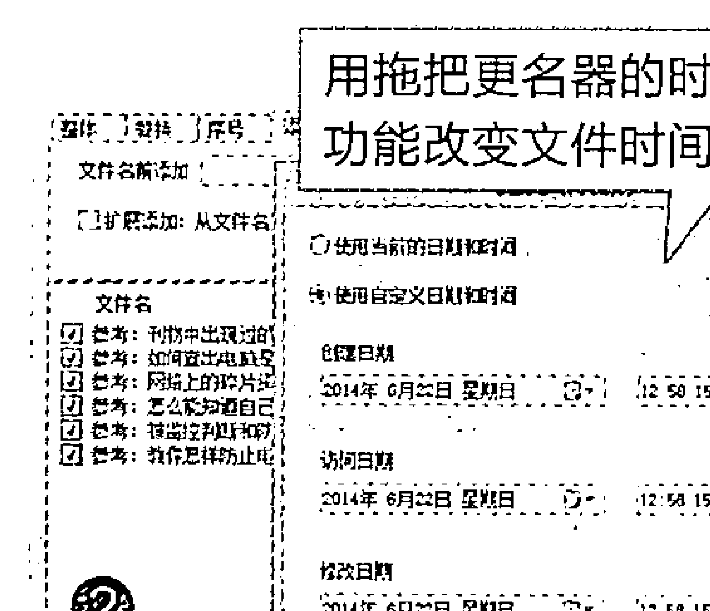

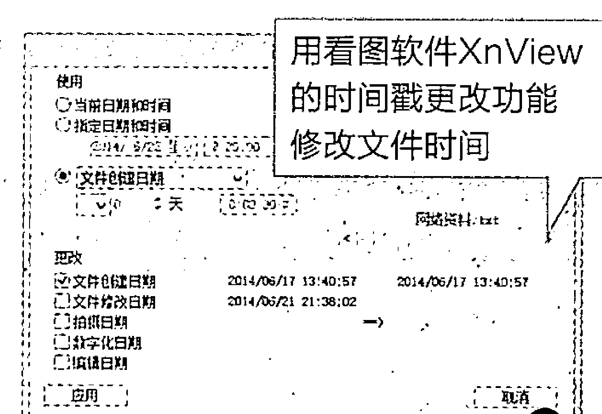

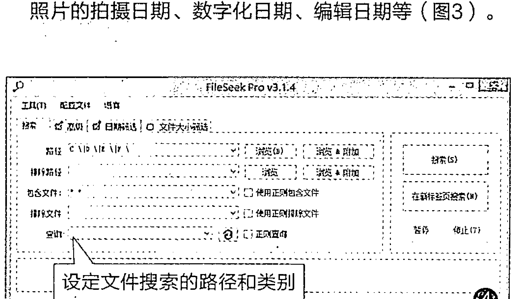

### 按系统日志时间筛选查看事件记录

除了通过文件时间来查看访问痕迹外，还有一个现成的利器是系统的事件管理器，通过它可以记录各方面的数据访问情况。

右键单击Windows 8.1开始按钮并选择“计算机管理”，然后点击“事件查看器”，选择相应的日志类别，筛选当前日志，记录时间选择为“自定义范围”，定义第一个事件和最后一个事件发生的时间（图5），确定之后会显示这一时间段内系统、应用程序、安全、设置、已转发事件等方面的详细情况，根据记录的情况判断是否有外部可疑操作。

### 用搜索软件按时间搜索被访问文件

虽然查看过的文件的日期可以更改，但只要系统在运行，难免会有系统中的日志文件、配置文件等的日期发生变化并被留存下来，哪怕是在关机的一刹那或黑客离开的一刹那。那么，如何才能找到那些在特定时间段内属性发生变化的程序或文档呢？

我们可以用FileSeek Pro软件按日期搜索筛选文件，查看被访问情况。从某些软件的配置文件、文档的日期上判断在自己未曾使用电脑的时间段内被运行的程序或文件。启动FileSeek Pro软件，设定搜索路径（将本地所有分区均添加进去），搜索文件设定为“*.*”（图4），切换到“日期筛选”选项卡，定义需要搜索的日期时间范围，点击“搜索”即可获得该日期范围发生变动的文件列表。

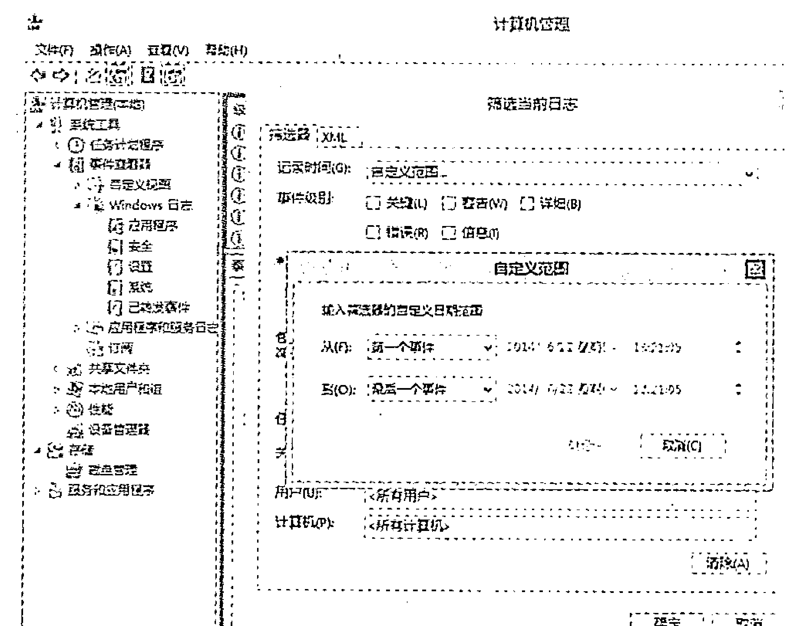

### 隐藏我的数据

俗话说，不怕贼偷，就怕贼惦记。

由于窃贼往往是在知道我们可能有什么宝贝后，才动心开始采取计划和行动的。

因此，为了防止不怀好意者偷窥自己含有隐私的文件，将分区、文件夹或文件藏起来，不让对方看到有此资源，更不让对方知道藏在哪里，从“念头”上杜绝窃密者的行动，才是最积极的办法。

#### 双系统多分区隐藏机密

在电脑中安装双系统，可以是两个不同版本的Windows组合（如Windows 7+Windows 8.1），也可以是完全相同版本的两个Windows系统（如Windows 8.1+Windows 8.1），其中自己使用的一个系统设置强力密码，自己拥有对所有磁盘和文件的控制权，将自己的保密文件资料统统放入某个专门的磁盘分区中。而给别人使用的一套系统自己也有完全的控制权，只是需要将存放自己保密资料的那个分区设置彻底隐藏，别人进入系统后根本看不到这个分区，也就无从获知资料的存放路径，因而也无法访问其中的资料。

具体方法是，进入给别人设定的系统，然后执行Win+R命令，运行REGEDIT命令（图6），启动注册表编辑器，定位到“HKEY_CURRENT_USER\Software\Microsoft\Windows\CurrentVersion\Policies\Explorer”，新建名称NoDrives，类型为REG_QWORD的键值，其数值为十进制。如果要隐藏C盘则值为4，D盘为8，E盘为16，F盘为64……以此类推，后者均为前者的2倍。

若要隐藏多个盘符，只需要将相应数据叠加，比如只隐藏驱动器E和F，则NoDrivers数据为十进制80（图7）。

#### 隐藏自己的隐私文件

如果是别人与自己使用同一个系统，也有办法可以将文件藏起来。我们可以将文件夹或文件放在某个位置，然后将其设置为隐含属性。为了防止别人通过文件夹选项打开文件的隐含属性显示功能，我们可将文件夹选项设置为灰色无效不可选，这样别人就无法获知我们哪里藏有文件了。

具体方法，用Win+R启动“运行”窗口并执行GPEDIT.MSC命令，打开“本地组策略编辑器”，依次通过“本地计算机策略→用户配置→管理模板→Windows组件→文件资源管理器”进入文件资源管理设置窗口，在右侧窗口中双击“不允许从彩带的视图选项卡上的选项按钮打开文件夹选项”（图8），然后从弹出的配置窗口中选择“已启用”并点击“应用”后确定。此后，就无法从文件资源管理器中用文件选项卡来开启隐藏文件的显示了。

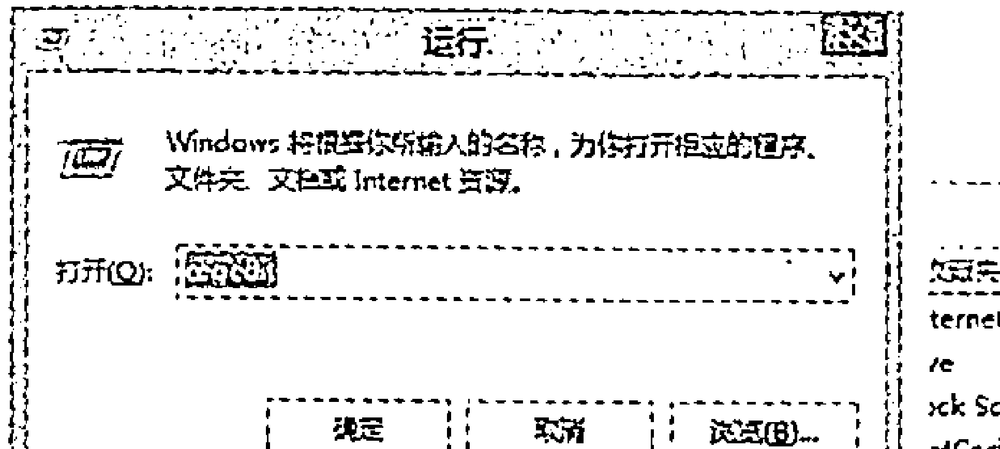

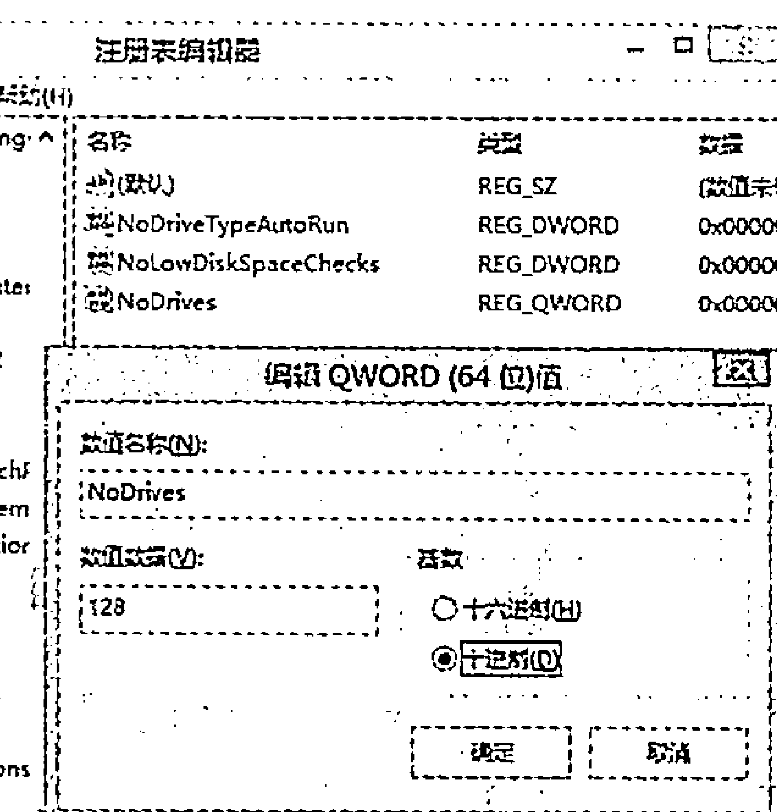

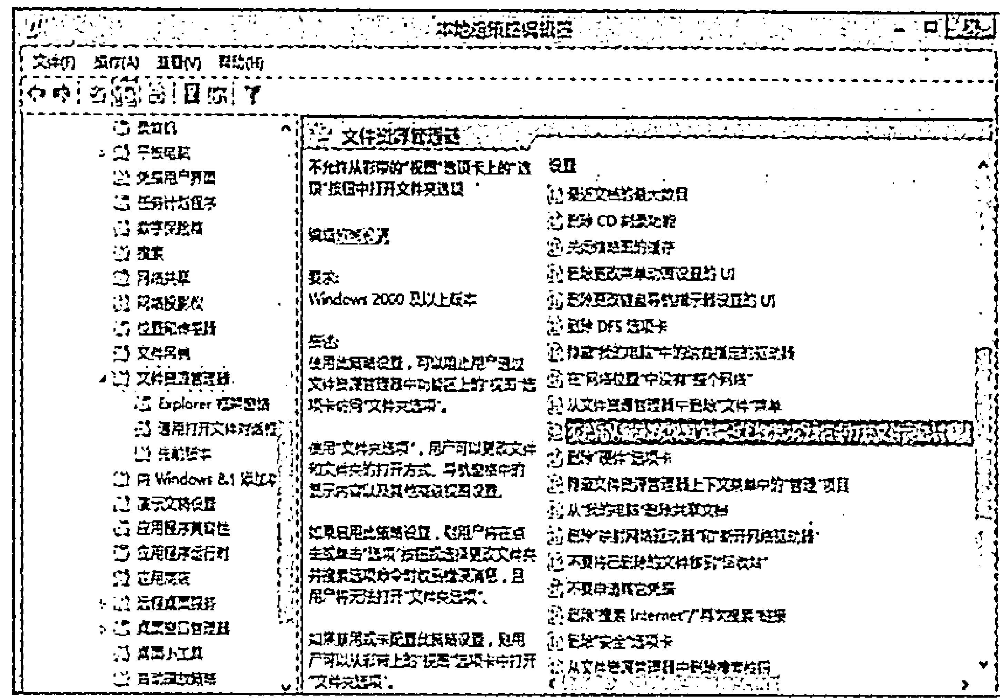

##### 小技巧

还有一个办法，可以将自己的文件放在回收站中，删除回收站图标，让别人无法访问回收站内的文件。删除回收站图标的方法是，通过“本地组策略编辑器”，依次定位到“本地计算机策略→用户配置→管理模板→桌面”，从右侧窗口选择“从桌面删除回收站”，双击该项并选择随后弹出窗口中的“已启用”选项，点击“应用”并“确定”即可。自己要访问文件时，再用此方法让回收站显示出来，恢复其中的文件就可以了。

#### 密文存储，数据更安全

隐藏文件还是不安全的。上面的办法对付普通用户也许能起作用，但对于熟悉系统的老手来说也许不够安全。俗话说，不怕一万，就怕万一。万一不经意隐藏在某分区的文件露出马脚，其中的信息自然也就无安全可言了。如果我们提前对文件进行了加密处理，将存储的明文变成密文，再隐藏就安全了。

#### 借用加密软件加密

用专用的加密软件将文件由明文模式变成密文模式，自己使用的时候，再从密文转换为明文。比如可用文件夹加密超级大师软件（下载地址：http://xiazai.zol.com.cn/detail/12/110059.shtml）来加密文件。通过该软件可以对文件和文件夹进行五种不同需求的加密，不同的方法采用了不同的加密算法，加密的文件以密文形式存在，用正常途径无法打开。解密时需要输入正确的密码才能打开，密码输入正确后处于临时解密状态，文件使用完毕后，文件和文件夹自动恢复到加密状态，不需要再度进行加密，使用非常方便（图9）。

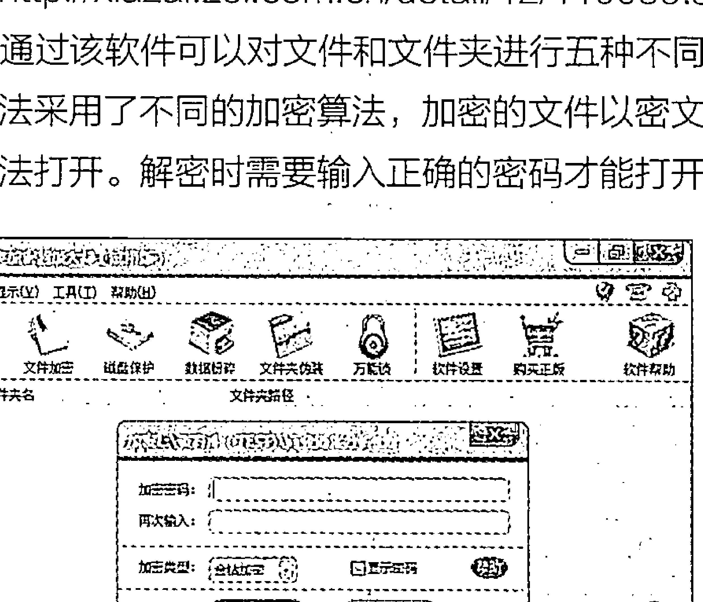

#### 伪装密文的加密法

> 除了加密文件和文件夹外，该软件还可以彻底隐藏磁盘，可禁止使用或只能以只读的方式使用USB设备，此外还具有数据粉碎性删除等功能。

还有一种瞒天过海的方法，此方法虽然不是真正的明文变密文，但往往也会给人以一种进行了密文处理的味道，实现起来非常简单。此方法菜鸟也可以轻易进行，但却很管用，甚至能很容易地欺骗电脑老手的眼睛。这种方法的具体思路是，用文件类型来伪装文件。比如，可以将自己编辑的一个Word文件“工作报告.DOC”更名为Notepadd.EXE，然后将这个文件移动到系统Windows目录下，一般谁会去系统目录下找一个这样的可执行程序呢?即便是因某种原因偶然碰上了这个文件，出于好奇，运行一下，当看到运行后的乱码或错误信息之后，也会放弃（图10）。而自己使用时，再从这里将文件拷出，改一下扩展名就可以正常用Word打开了。

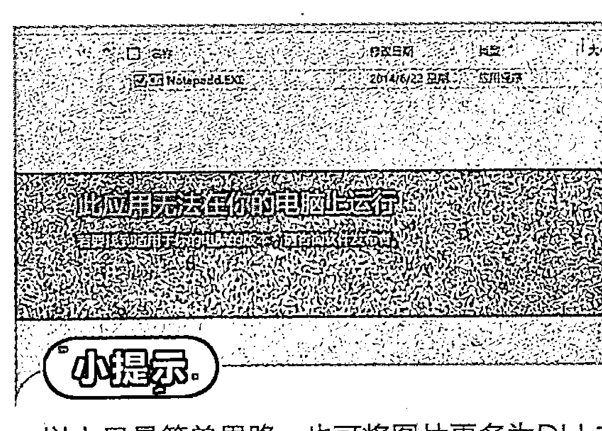

#### 二进制修改文件头

> 以上只是简单思路，也可将图片更名为DLL文件，可藏在System32目录而不是Windows目录，全由自己计划和执行，类别和位置在心中，别人谁能想到呢？

还有一种方法，不通过第三方软件，也不通过文件名伪装，靠替换文件头的方法来将自己的文件搞乱，让别人无法读取。例如我们有一个Word文件需要加密，我们用二进制编辑软件（如EmEditor）编辑该文件，打开时选择用二进制编辑，发现文件内容为一些我们根本无法认识的内容（图11）。复制其中的前若干行内容，记住精确的具体位置不能有误。将此内容保存到另一个文件中留用，然后用别的内容填充源文件中我们选择的内容。这样，因为文件头被破坏，Word文件就成了一个坏文件无法访问，别人也就无法获取其中的内容了。当自己需要使用该文件时，只需将备份出的文件头段落信息原样回填到“坏”文件中即可。

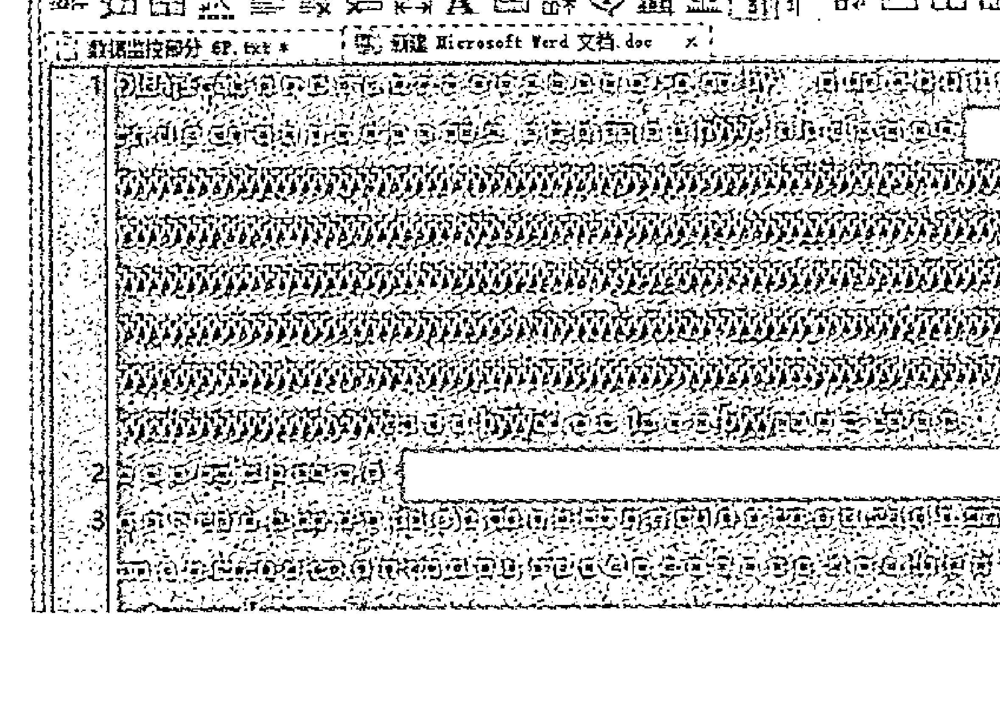

#### 文本在Word中的隐藏技巧

在Word文档中，对于需要隐藏的部分，设置相同的文字前景与背景颜色（当然设置为与版面一样的白色是最好的）是行之有效的最简单方法（图12），可实现文本在版面中的隐藏。当自己需要查看时，选择这个区域，然后设定一种不同的前景色或背景色，内容就可显示出来。如果怕这样不安全，可在其上覆盖一层不含内容且大小与版心相同的空白文本框，让空白文本框覆盖整个版心。当然如果愿意，还可在文本框中输入一些无关紧要的内容，更具迷惑性。Word中隐藏文字的另一个方法是，选择了需要隐藏的字段之后，通过在“字体”选项中勾选“隐藏文字”复选框来实现。与以上方法隐藏不同的是，此法隐藏后的文字将不占用版面位置，隐蔽性更强。当需要恢复显示的时候，需要一并选中此处段前段后的内容，然后从“字体”窗口中设置取消隐藏文字才能显示出原来的内容。此外，还可用图片覆盖文字的方法实现文字隐藏。在文字中插入一张图片，在“设置图片格式”对话框中设置“版式”为“浮于文字上方”，让图片覆盖掉文字，文字也就隐藏起来了（图13）。

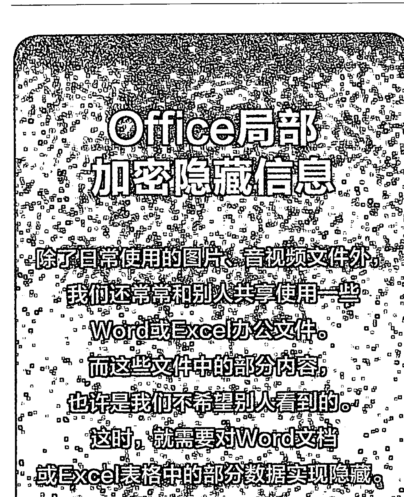

> 小技巧
通过Word本身的版本回溯功能来隐藏信息也是一种可行的办法。先用文件“版本”命令保存文件并添加注释，然后删除文件中需要隐藏的内容并保存文件，这样当人们打开该文件时就看不到删除的内容了。当自己需要显示隐藏信息时，在文件“版本”命令中，选择打开留有注释的版本打开，即可看到原来的内容。

#### 表格之中藏玄机

我们可以将工作簿中的某些工作表隐藏起来。由于Excel中默认的工作表名称为Sheet1、Sheet2之类的数字序列，如果隐藏了其中的一个，很容易因数字不连续而被发现，这时我们需要将原来的工作表名修改为不含序列号的名称，然后选择隐藏其中的某些表格。右键点击其中需要隐藏的表格，选择“隐藏”命令即可（图14）。我们不但可以隐藏整个表格，还可以根据需要隐藏某些行列或表格四周的多余行列。选择需要隐藏的行列，右键选择“隐藏行”或“隐藏列”即可实现行列的隐藏（图15）。当需要显示时选择跨越该行（列）的相邻片区，然后用右键命令选择“取消隐藏行”或“取消隐藏列”即可。不但工作表和行列可以隐藏，再小的单元格中的内容也可隐藏。选择要隐藏的单元格区域，设置单元格格式，在“类型”框中键入三个半角分号“;;;”，单击“确定”按钮（图16）。此时，这些单元格中的内容将不会显示在单元格中，但当单击单元格后，编辑栏中还会显示其内容。这时只需单击“保护”选项卡，选中“隐藏”复选框，单击“确定”按钮即可实现彻底隐藏（图17）。

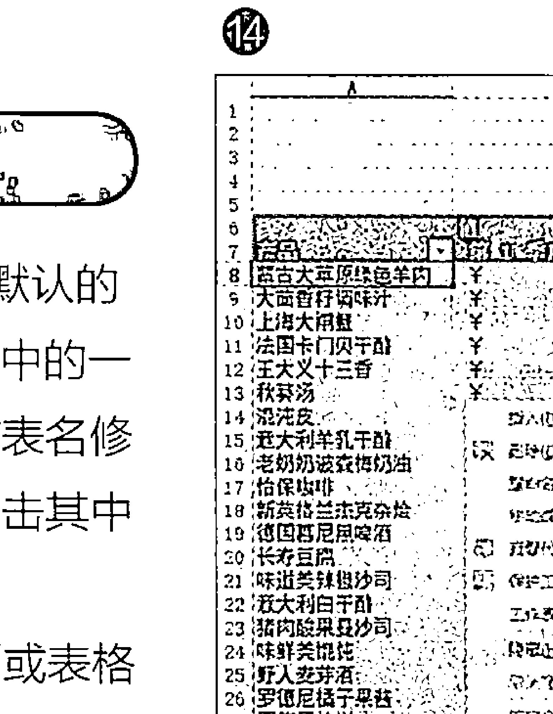

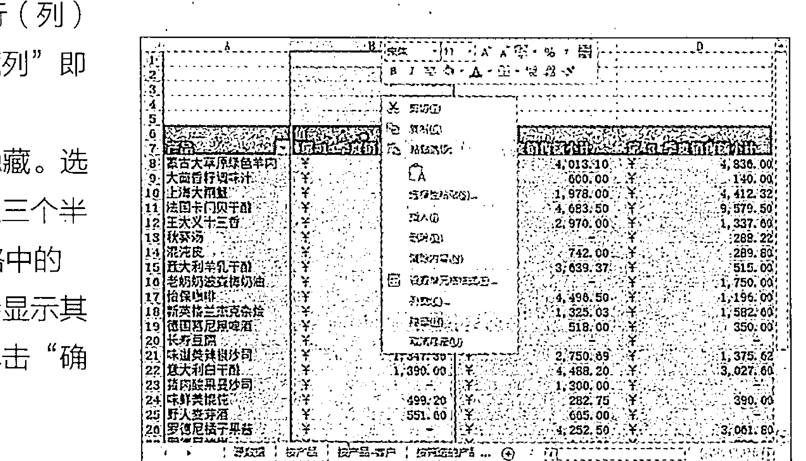

> 小技巧
为了迷惑对方，可以用反向思维的方式，给隐藏后剩余的显示表格起一些带有连续数字序号的名字，比如“材料表1”、“材料表2”、“材料表3”等。这样人们一般就不会想到其中还藏着个表2或表3了。

> 小提示
只有保护工作表后，隐藏内容才有效。要保护工作表，需在“审阅”选项卡上的“更改”组中单击“保护工作表”按钮。

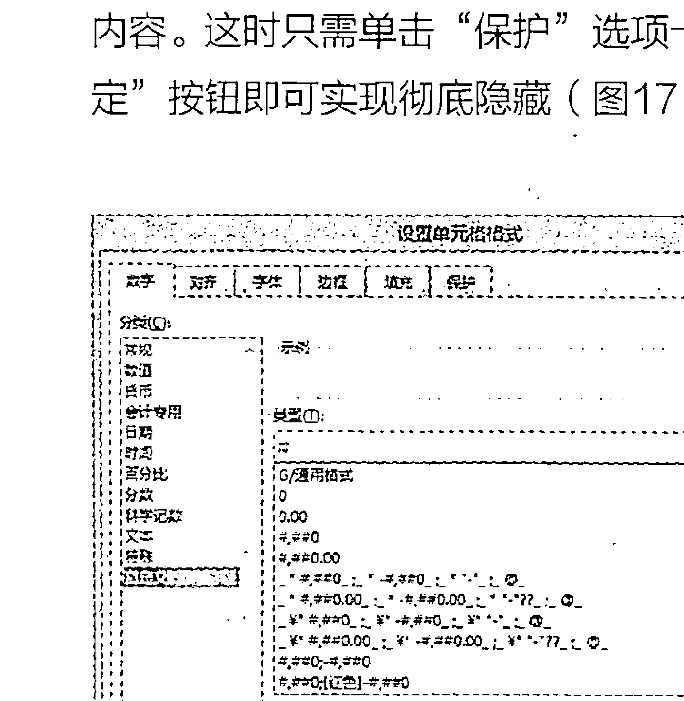

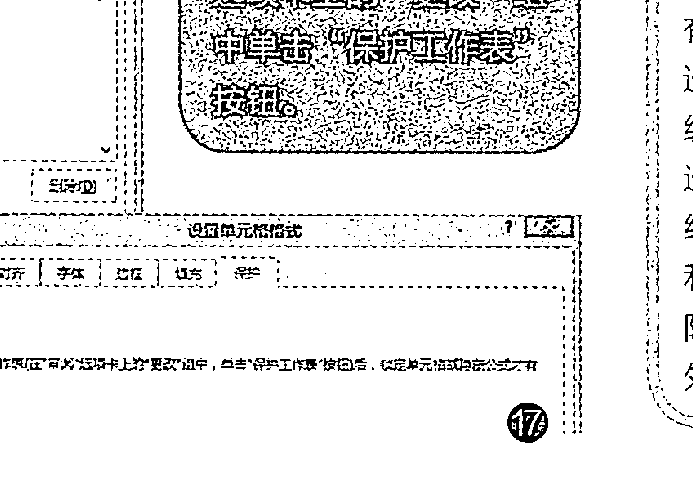

> 小技巧
隐藏表格外部多余的行列
表格总有有效的数据区域，一般在一张表的右侧或下方有许多空白，对于这些多余的空间，可将其隐藏起来。选中最后一个有效列之右的一列，按“Ctrl+Shift+→”组合键，右击鼠标，选择“隐藏”将多余的列藏起来。选择最后一个有效行之下的一行，按“Ctrl+Shift+↓”组合键，右击鼠标，选择“隐藏”将多余的行藏起来。利用这一特点，可采用如上方法，先在表格外的行列中隐藏有用内容，然后用隐藏表外行列的方法将主体表格外的区域全部隐藏起来。

#### 账号泄密最大的安全问题

如今是网络的世道，相比本地文件泄密，因账号泄露造成的网络个人资源被监听的问题可能更加普遍。

当用户的账号被别人获取后，监听往往在事主不知不觉中长期进行，直到某一天被察觉。

如何做到网络账号的安全和资料的安全？通过一个典型案例的剖析，得出我们应该做的事情。

> **案例**
A君手机某天忽然收到一条来自百度的短信，通知其修改百度通行证密保邮箱成功。又过了几分钟，A君发现正在运行中的百度网盘断线了，重新检查显示密码错误，而别的网络软件处于正常登录状态中。于是马上意识到有人窃取了自己的126邮箱账号，然后修改了自己的百度密保邮箱，进而也影响到了自己的百度网盘。这是一连串的泄密事件，那么到底是如何发生的呢？

> **分析**
原来这是一起因注册论坛不慎，126邮箱信息泄露引起的连锁泄密事件。由于A君在几小时前刚到一个私人论坛注册了一个账号，使用了自己常用的一个126邮箱，一切问题就由此而起。

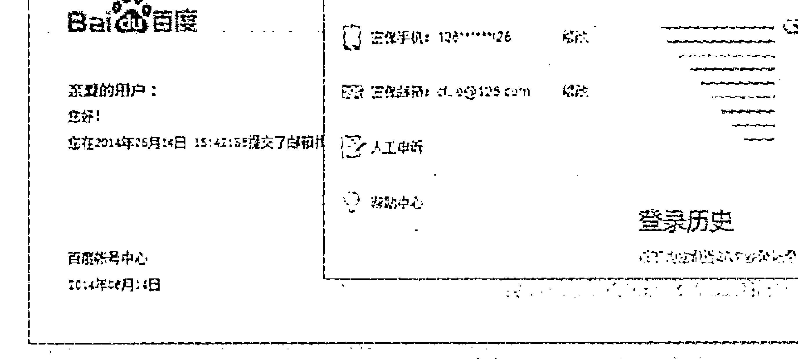

#### 邮箱被窃取

一般来说，为了记忆方便，不少人在网上注册账号喜欢使用一个固定的邮箱。A君便是如此，他用一个网易邮箱xixifa@126.com（化名虚拟），密码为654321。为了便于记忆，注册论坛时也用了这个邮箱账号，且密码同样设为654321。由于密码相对简单，论坛不法人员用解密明文的办法或常见的枚举解密法，很容易就获得了用户的论坛登录密码。通过猜测用户的邮箱可能也用了这个密码，登录了用户的126邮箱，发现邮箱中与百度账号相关的信息，从而确定A君的百度密保邮箱正是这个邮箱。于是不法者以此邮箱申请更改百度账号的密保邮箱而获得成功（图18）。

启示：邮箱和论坛账号用同一个账户名和相同的密码后果很可怕。在网上注册账号一般需要邮箱，用同一个邮箱没关系，但千万不要用邮箱的密码作为网络账号的密码。此外，密码设得过于简单，很容易被不法分子通过字典枚举或其他解密方式解密，因此要尽量设置综合性比较强的复杂密码。

#### 空间被窃听

因126邮箱账号泄露造成百度通行证密保信息泄露，随后，不法者轻易将A君的百度密保邮箱修改为不法者自己的某个邮箱，并轻松登录A君的百度账号，修改了其登录密码。万幸的是，由于A君在当初除了申请邮箱密保外，还申请了用手机号保护百度空间安全，所以才收到了百度的短信。由于手机密保的级别高于邮箱密保，A君立即用手机短信的方式改回了密保邮箱的权限，进而获得了百度通行证的权限（图19）。

启示：手机密保在关键时刻会起大作用，尽量给自己的重要网络账号申请手机密保。从本案例看出，如果只凭借一个密保邮箱，A君的账号这次恐怕很难找回了。窃密者可以取得用户的邮箱权限修改密保，但很难同时获取用户的手机使用权限，除非手机也被其盗窃。

#### 云盘内容被控制

由于许多人的百度网盘默认使用百度通行证的账号，因此，当百度通行证失窃之后，不法者可以轻松获得失窃者百度网盘的使用权限，造成百度网盘中的内容泄露，网盘无任何秘密可言。

通过以上可知，网盘密码设得再复杂也不见得管用。不管设得多么复杂，由于不法者获得了修改密码的权限，所以其不用关心原来的网盘密码是什么，即可轻松地给网盘赋予一个新的密码。既然网盘中的内容因此而没有安全可言，那么，对于存入网盘中的重要文件，先加密再存储非常重要。这样，即便是失窃了，别人看到了文件也无法解开或读取，就无形中给文件上了一道保险。

### 本地清除软件中植入广告

既然植入广告或其他强制性植入的元素“遭人恨”，那就别怪我们针对性对其进行查杀、限制或清除了。不过不同类型的文件有不同形态的植入元素，因此我们需要“对症下药”干掉各种植入广告。


### 观影无广告 干掉本地视频植入广告

文|俞木发

空闲时看看自己下载的电影，这已经成为很多人的休闲方式。不过，现在很多下载的电影都有各种各样的植入内容，

#### 批量去除片头片尾广告

在一些网站下载的电影，经常在片头带有某某网站或者制作团队的广告页面。如果下载的一批视频（比如电视连续剧）都有同一广告，那不妨借助Ffmpeg将这些广告一次性删除。

首先到http://kc.cc/WGfG下载FFmpeg，将其解压到“K:\”备用（也可放到其他盘符中，但需要适当修改下面的代码，以下不再注明）。接着准备好需要去除广告的视频，这里以从某网站下载的连续剧为例（MP4格式），下载后将所有剧集保存在“K:\”备用。

使用系统自带的Windows Media Play播放其中的视频，可以看到在每集视频前面15秒内都有该网站的植入广告，每集的42分钟后则为片尾广告，现在记住这些数值（图1）。

现在我们可以将每集15秒前的广告和42分钟后的片尾广告去掉。启动记事本新建批处理文件Video.bat，输入以下代码：

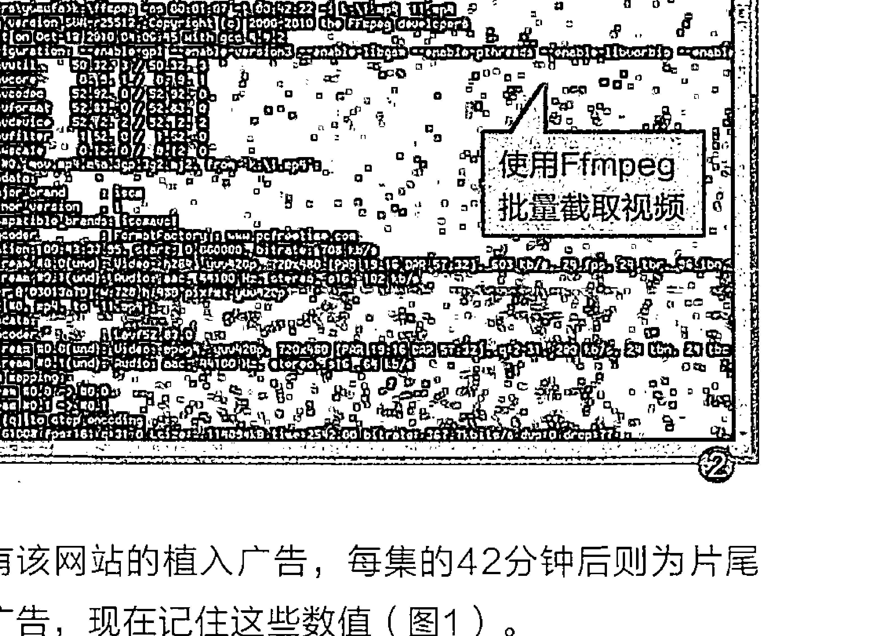

```
k:\ffmpeg -ss 00:00:15 -t 00:41:45 -i k:\1.mp4 k:\01.mp4
k:\ffmpeg -ss 00:00:15 -t 00:41:45 -i k:\2.mp4 k:\02.mp4
```

## 《电脑爱好者》·2014下半年合订本 特别话题

一集一行，要处理多少集，就输入多少行。
这里我们假设每集的名称为1.MP4、2.MP4，输出名称则对应为01.MP4、02.MP4，“-ss”为截取的起始时间（15秒处开始），“-t”为总计截取的时间（00:41:45）。为了安全，可先备份一集视频做测试。

如果准确无误，再完整执行上述批处理文件，它就会自动调用FFmpeg在命令提示符窗口批量截取视频了（图2）。
完成视频的截取后，现在再次打开处理过的视频查看，就会发现片头及片尾的广告部分已被完全剔除，既清爽又节省时间（图3）。

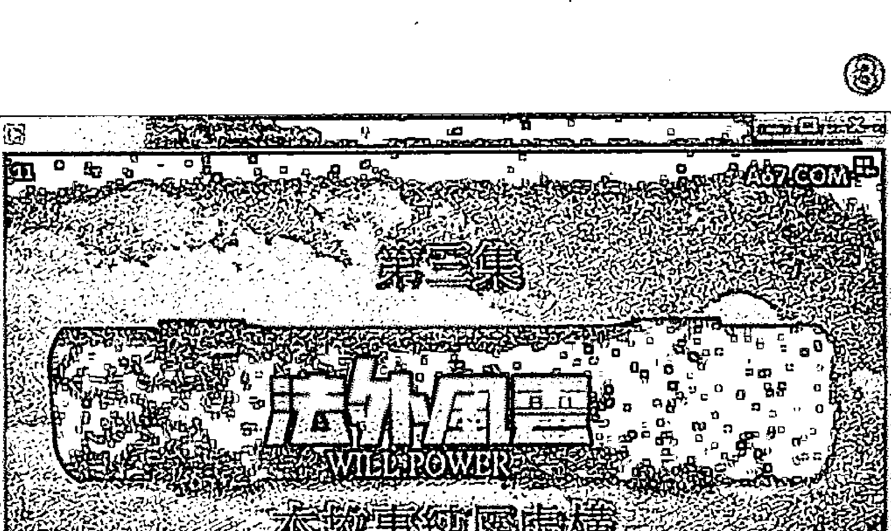

#### 屏蔽动态广告

上述方法只能对特定时间段的广告进行处理，不过现在很多视频广告采用动态插入的方法，这些广告出现的时间、位置均在动态变化，甚至一整部影片都有广告内容。比如很多从网上下载的RMVB视频，在播放一段时间后就会自动弹出某网站的广告。对于这类广告可以借助“Real媒体过滤器”来剔除。从http://tinyurl.com/nt7yamm下载安装软件，启动后点击“源文件”和“另存为”，依次找到需要去除广告的视频和转换后视频的保存位置，点击“开始过滤”即可（图4）。

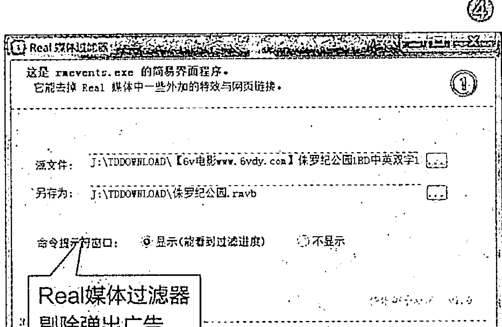

#### 裁剪去广告

对于放置在视频下方固定字幕下的广告，如果广告位置剔除后不影响视频播放，那么利用“格式工厂”重新捕捉视频大小，直接裁剪掉广告区域即可。
启动格式工厂后切换到“所有→MP4视频”，然后点击“添加文件”，将需要处理的视频导入，接着点击“选项”，在打开的窗口中勾选“画面裁剪”，使用鼠标选中没有广告的区域，点击“播放”，看看屏蔽广告区域是否会影响观看，如果不会则点击“确定”（图5）。
返回格式工厂处理窗口，开始转换，处理完毕，使用系统自带的Windows Media Player再次打开视频就不会再看到原来视频上下的广告内容了（图6）。

> 小提示
RMVB弹出广告实际上是加载在视频里的一段代码，因此，这一工具去除广告的方法就是删除视频中的代码，并将其重新编码。

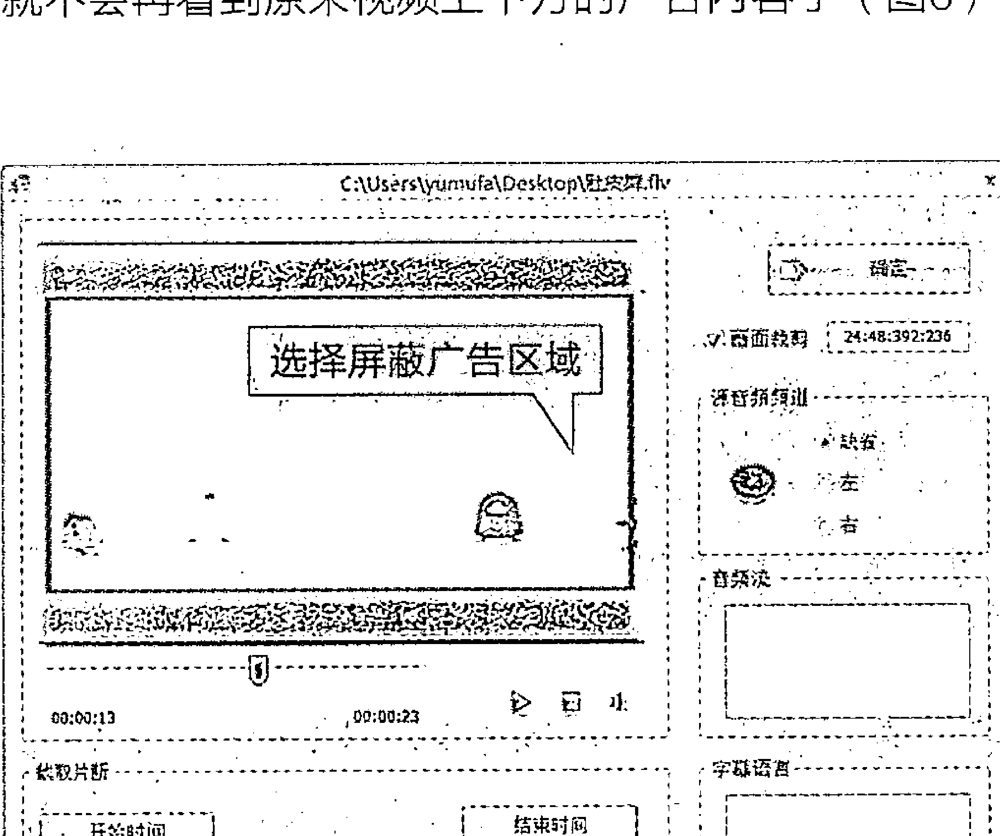

#### 扩展阅读：如何干掉在线视频内的插入元素

除了本地视频，现在很多在线视频（如优酷、爱奇艺等）在播放前也会强制插播广告，可以到http://www.ad-safe.com/?b1下载ADSafe3进行屏蔽。下载后运行，默认即开启对常见视频网站广告的屏蔽，动手能力强的用户还可利用它的自定义功能对更多的广告进行屏蔽。对于在视频网站投放的各种网页广告，则可借助解析在线视频的实际地址，使用系统自带的Windows Media Player播放，如优酷很多视频可通过http://www.flvxz.com解析，获得地址（MP4可以直接播放，FLV需下载相应插件）后点击链接即可调用Windows Media Player播放，彻底不受网站广告的骚扰（图7）。

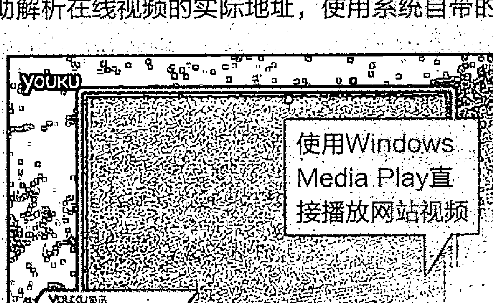

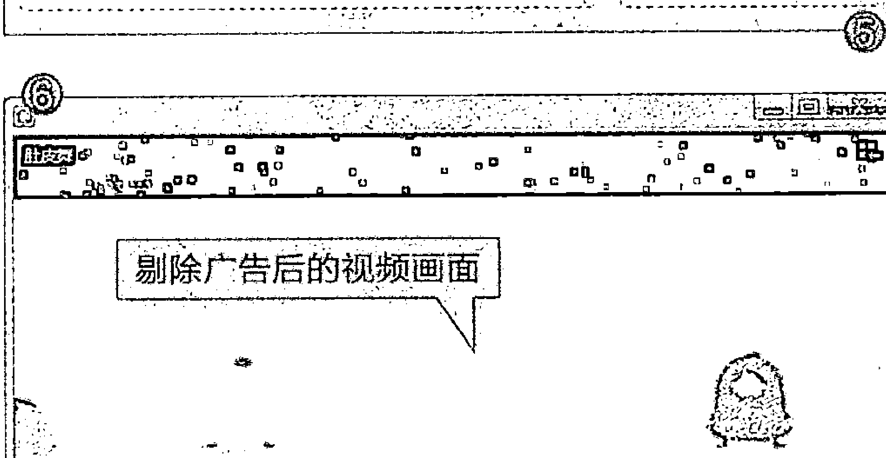

文|技术宅

#### 声音更纯净 剔除声音广告

有声读物，现在流行听书，不过很多有声资料也会植入各种不相干的元素，比如很多评书资料就包含各种广告，一些录制的语音资料则会在语音前面有静音等无效元素。此外，一些电台版抢先曝光的歌曲经常包含电台广告。这些声音中的无用元素要如何清除？

#### 静音素材我不要

对于很多录制的语音素材，由于录制不同步，在开始录制的前部区域经常会有一部分静音，白白浪费文件空间及收听的时间。如果要剔除这部分资料，借助Audacity（下载地址：http://dwz.cn/cfanz15）即可轻松实现。

软件启动后点击“文件→打开”，导入需要处理的音频资料，可看到导入的音频前部和尾部均有静音区域（图8）。使用鼠标依次选中静音区域，然后点击工具栏的“剪切”图标，将静音区域全部剪切，最后点击“文件→导出”，将其另存为音频文件即可（图9）。

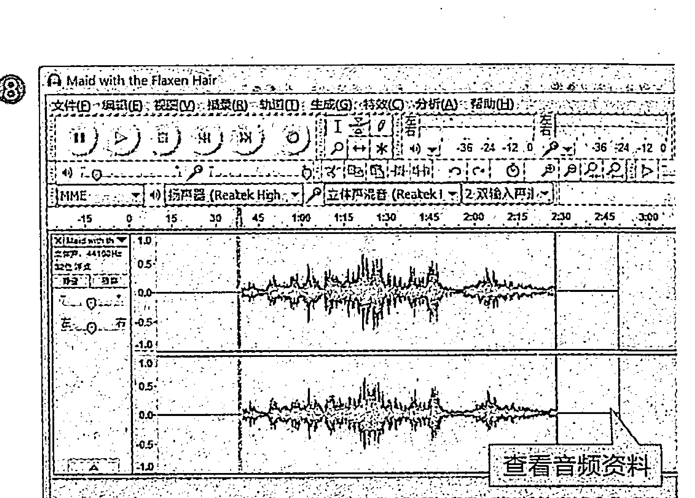

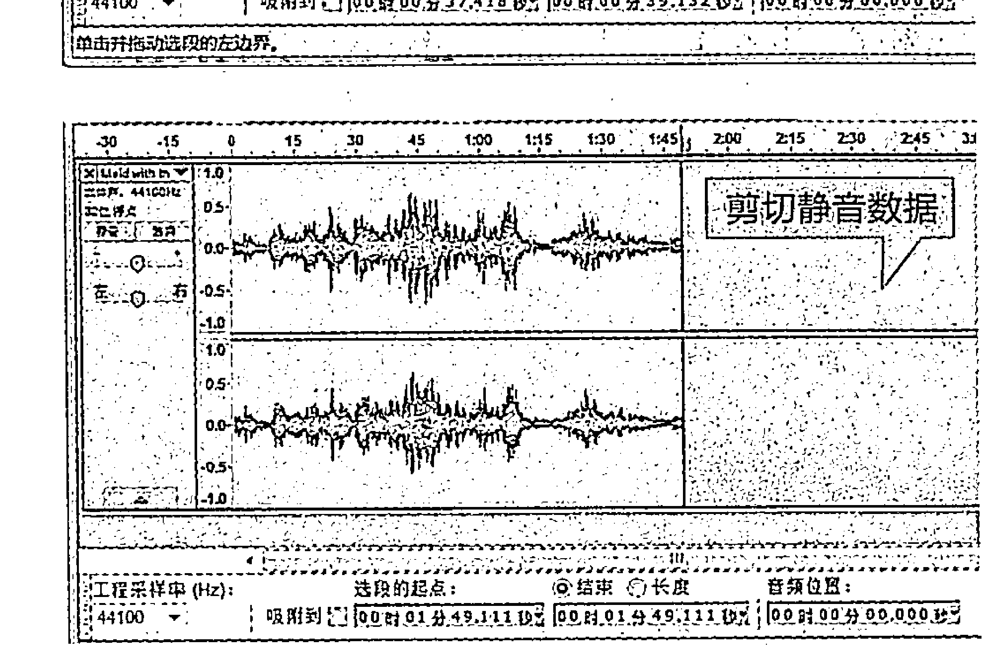

#### 骚扰广告批量去除

很多评书或者多集相声节目，制作方经常会在文件开头加入各种有声广告，比如笔者在某网站下载的相声集，每集前10秒钟都有某电台的广告推送。借助Goldwave可以快速对这些广告进行处理。

首先将所有需要处理的音频文件放在一个文件夹中，假设为“K:\gdg”，启动Goldwave之后，点击“文件→批处理”，然后点击“文件夹”，添加“K:\gdg”文件夹，同时典型过滤选择“*.MP3”，处理该目录下所有MP3文件（图10）。返回批处理窗口，切换到“处理”，点击“添加编辑”，选择“设置标记/选区”，开始时间为10秒，结束时间为“结尾之前0秒”（等同于结尾不处理），点击“添加”（图11）。返回批处理窗口，切换到“目标”。选择“在此文件夹下保存所有文件”，然后自定义保存输出目录，最后点击“开始”，这样程序会自动截取掉上述目录下所有MP3文件前10秒的广告片段了（图12）。

文|阿木

#### 变可防毒 剔除软件中的流氓植入

虽然流氓软件早已成为过街老鼠人人喊打，但是出于推广的需要，现在仍然有很多软件在进行捆绑。一些不知名网站下载的软件，甚至可能捆绑了木马、病毒等恶意软件。为了不让这些流氓软件进驻我们的电脑，可以在安装之前就将它们从正常软件中剔除掉。

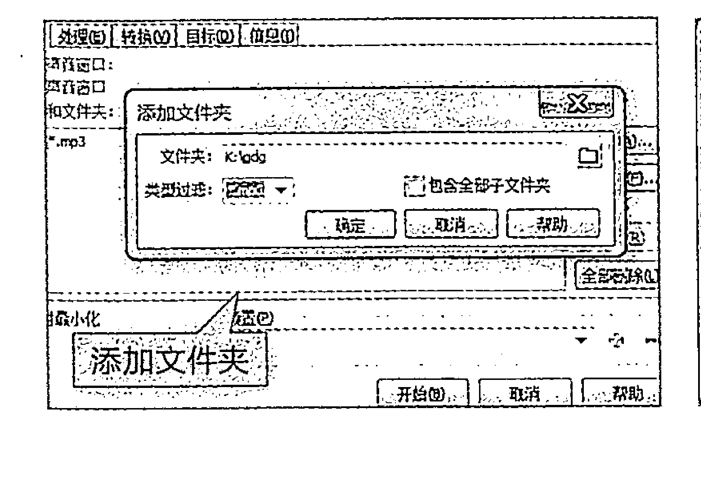

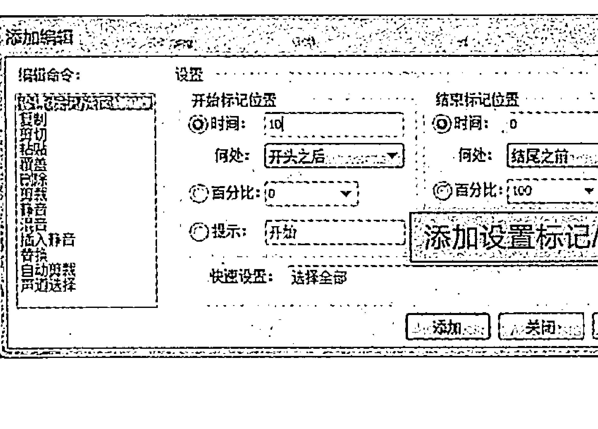

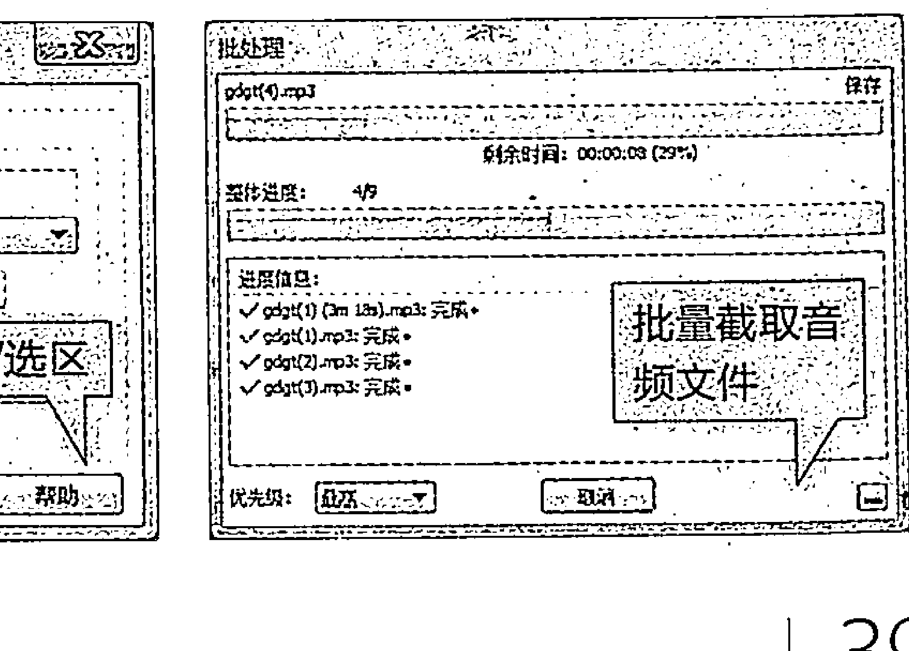

#### 直接安装在自解压包中的软件

剔除方法：打开压缩包直接剔除

很多软件使用自解压包方式安装，一些流氓软件就藏身在压缩包中，可能会在主软件安装界面添加下载安装，一不小心就会将不需要的软件额外安装到电脑中。对于这类文件，可使用7Zip直接打开剔除或直接解压使用，彻底杜绝流氓软件的隐患。比如从某网站下载的“百度音乐”，默认安装时它就会额外安装“百速启动”，同时出现安装暴风影音的勾选，并且软件会设置为自启动（图13）。

> 现在下载安装包以后不要直接安装，右键选择“7Zip→打开压缩包”，在解压包中的BaiduMusic.exe即为百度音乐的主程序，Setupad.exe则为不相关的软件安装程序，解压后删除Setupad.exe，这样再运行BaiduMusic.exe即可使用百度音乐，同时避免带来其他不需要的软件（图14）。

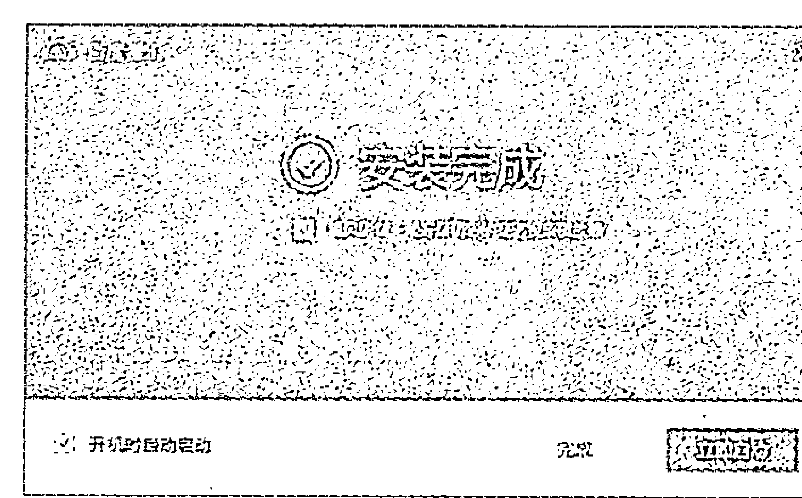

默认安装百度音乐可能带来暴风影音

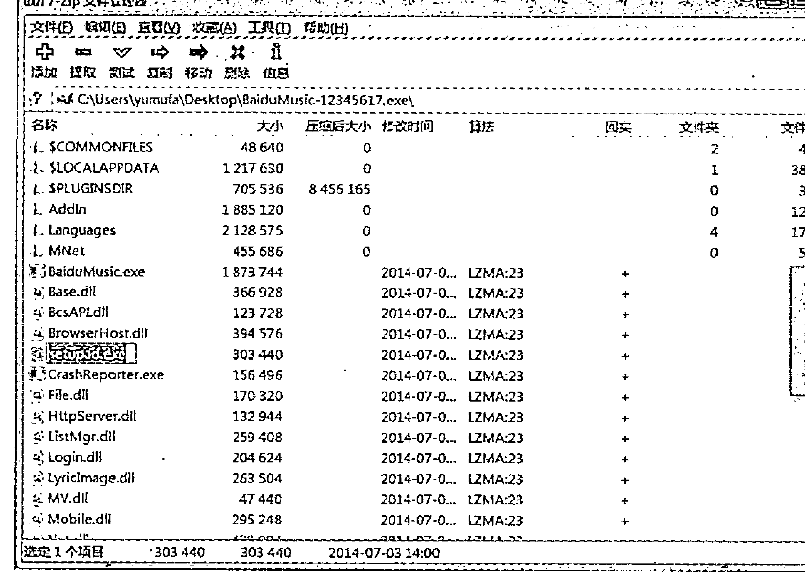

直接解压安装可以避免带来不必要的软件

#### 捆绑在安装包里的软件

剔除方法：使用专业软件监测

有不少流氓软件会在安装程序中添加自动下载代码，通过后台自动静默安装的方法进到我们的电脑。对于这类软件，新手可使用“360捆绑软件净化器”监测，此工具可到http://dwz.cn/cfann06下载，安装运行后它会自动启动监测。比如默认安装PPS后会自动在后台下载QQ游戏安装，开启360捆绑软件净化器后会自动监测到后台下载QQ游戏，此时点击“暂停”，在弹出的窗口中选择“删除”，即可屏蔽它的下载和安装了（图15）。

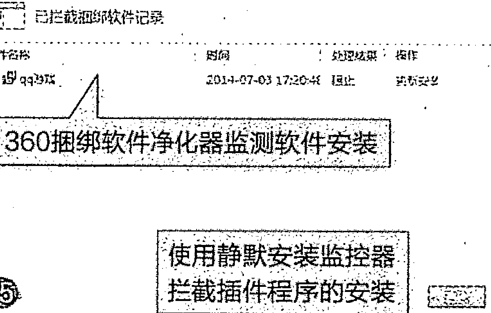

使用静默安装监控器拦截插件程序的安装

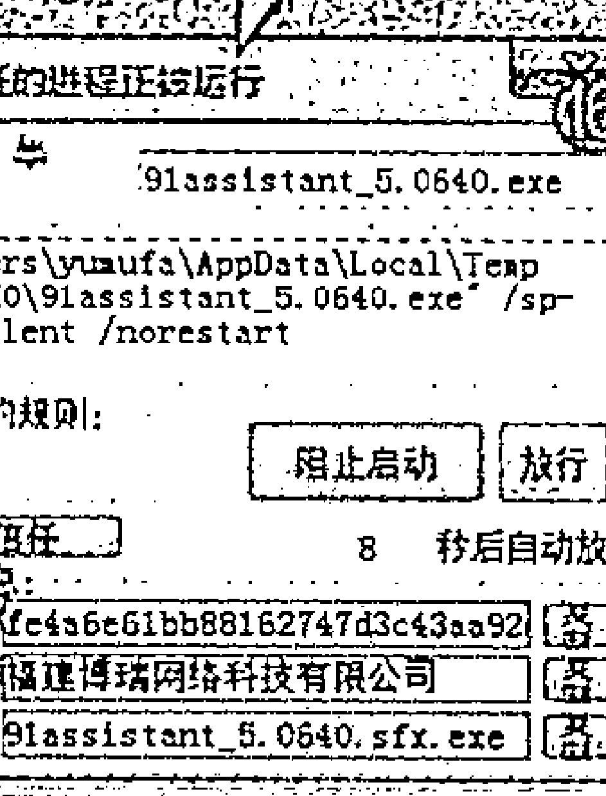

虽然上述软件的使用很简单，但监测能力仍然较弱。对于动手能力较强的用户，可到http://tinyurl.com/q4rtyn4下载“静默安装监控器”（允许用户根据自己的需要自定义监视规则），安装后以管理员身份运行，然后点击“确认并启动监控”，这样它会在后台自动监控。比如上述PPS的安装，默认安装完成后会自动下载安装91助手，启动静默安装监控器就会在后台自动阻止它的安装（图16）。

文|俞木发

#### 屏蔽网页广告

#### 剔除网络工具中的广告

对于每个网虫来说，平时总是少不了使用各种网络工具，比如网盘、在线邮箱、微信、搜索等。网络广告商自然不会放过这些网络工具，几乎每种网络工具中都充斥着各种广告。想获得更清爽的网络体验？下面就一起来看看如何屏蔽这些网络广告。

#### 邮箱登录不看广告

很多朋友在使用QQ、163等网页邮箱，这些邮箱的登录页面总是充斥着各种广告，不仅看了烦心，而且大大降低邮箱的加载速度。不过为了让用户在网速慢的情况下也能快速登录邮箱，大多数网页邮箱会提供“基本版”页面，这个页面不会加载网页广告。比如QQ邮箱，只要登录https://w.mail.qq.com并将其添加到收藏夹，以后只要打开上述网址就可以实现清爽登录了（图17）。

基本版邮箱登录后，网页邮箱的功能并没有减少，而且页面也非常简洁，比如QQ邮箱收件箱就只显示收到邮件，没有任何多余的广告（图18）。

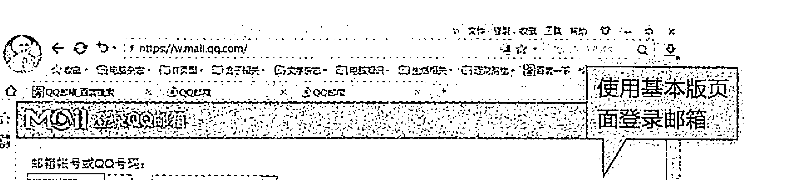

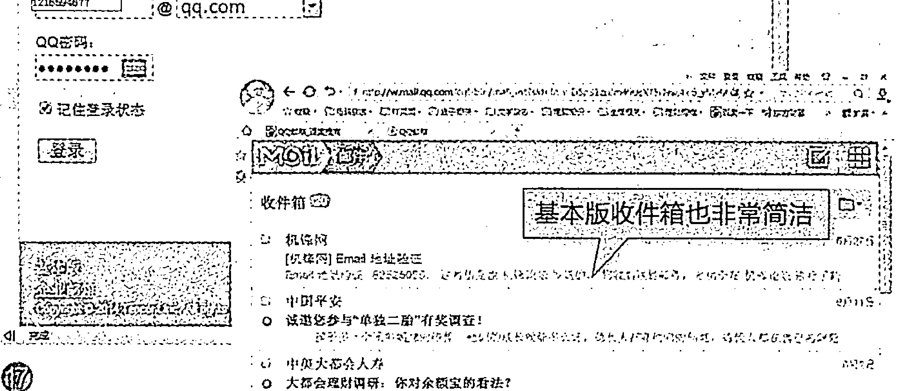

#### 网页搜索更简洁

平时上网都离不开搜索，不过无论是百度还是谷歌，在搜索页面都会包含各种广告页面，一不小心很容易误击其中的广告页面。如果在网络搜索时不想浏览这些广告页面，我们可以使用火狐浏览器。

启动火狐浏览器后点击“菜单→附加组件”，接着在打开的窗口中输入“可爱的百度”进行搜索，安装这个插件。插件安装完毕，切换到“菜单→扩展”，确保安装的“Pretty baidu”已处于“启用”状态（图19）。现在在火狐中打开百度，输入类似“电器”之类的关键词，看看启用屏蔽后的搜索页面，原来页面上方、右侧一大堆的推广链接广告是不是全部消失了呢（图20）？

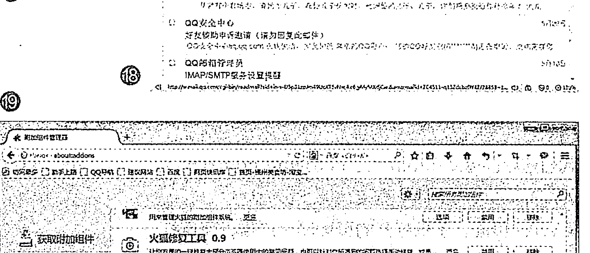

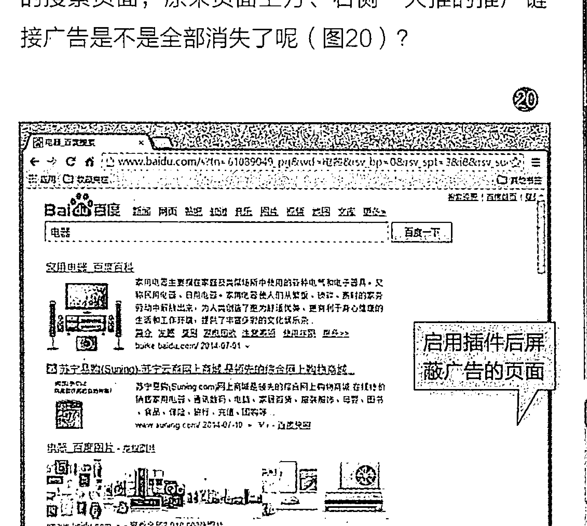

> 小提示
火狐还有各种插件支持屏蔽各种网络广告，如雅虎、Hotmail邮箱的用户，可以下载“邮局的广告拦截器”，拦截上述邮箱页面的广告。Adbplus插件则可以屏蔽常见网站的各种广告，“豆瓣电影一键播”插件可在豆瓣实现优酷土豆、爱奇艺在线放映全无广告。

#### 网盘登录玩简单

很多网民在使用各种网盘，默认情况下网盘登录页面也会植入各种各样的广告，如果使用多家网盘，更是要忍受多家网页广告的骚扰。对于经常使用网盘的用户，可以使用“网盘本地管理专家”（下载网址：http://www.aslocal.com）。这一软件支持百度、盛大、网易网盘、腾讯中转站、115网盘、SkyDrive、华为网盘、金山快盘、新浪微盘等多款流行网盘。启动软件后只要点击“新建网盘”，然后按提示添加自己使用的网盘即可（图21）。

以后只要打开“计算机→我的网盘”，即可选择需要的网盘登录，在资源管理器中对网盘文件直接进行管理，彻底告别网盘登录页面广告的骚扰（图22）。

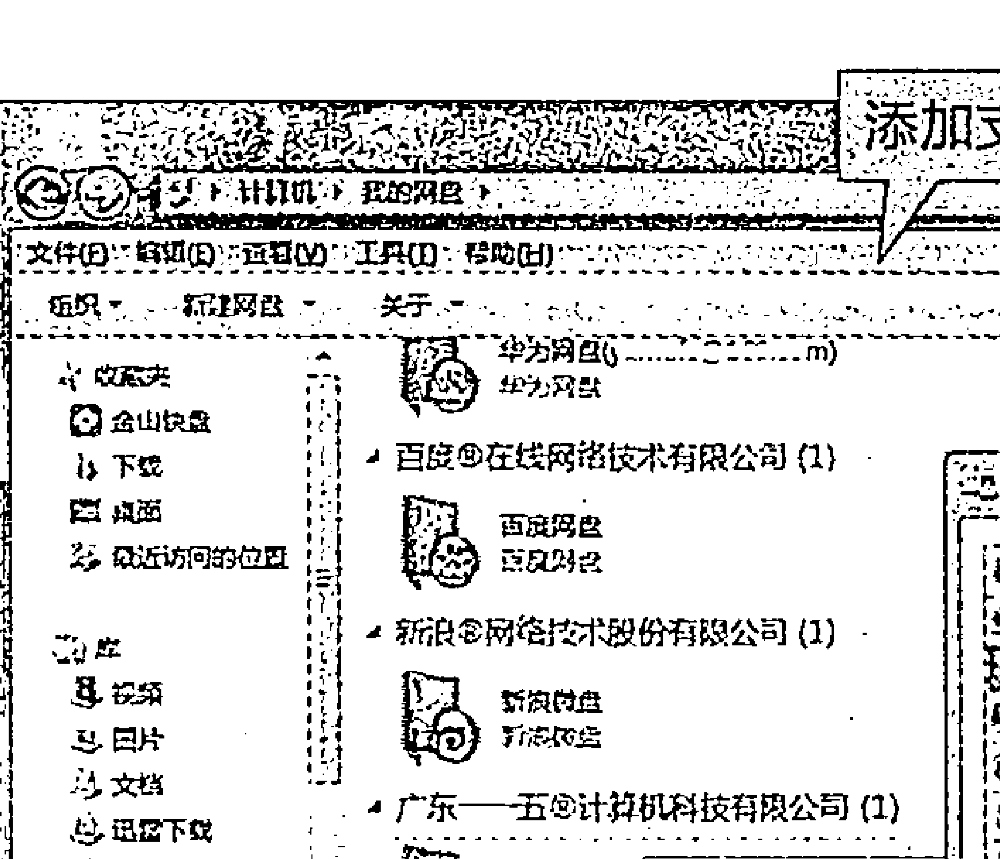

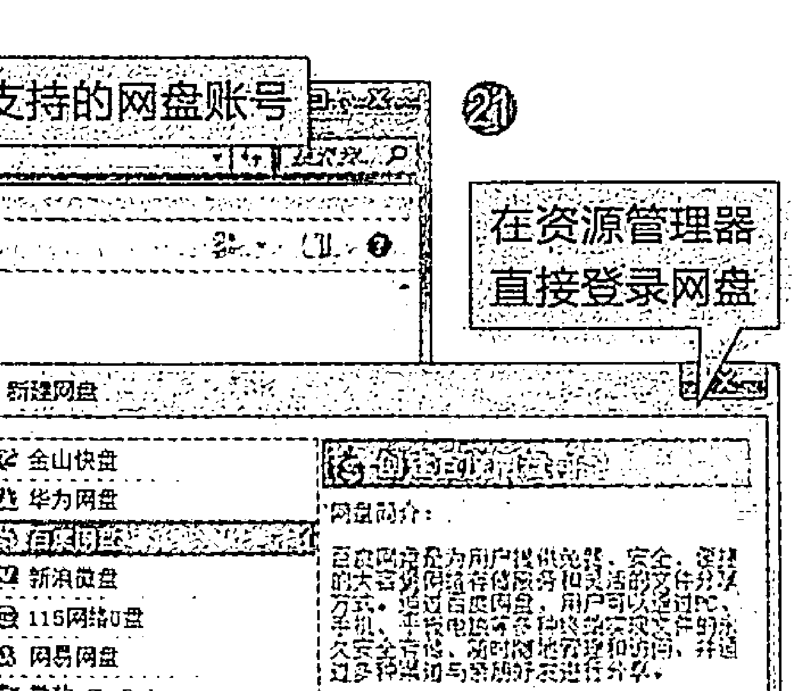

#### 新闻浏览要快捷

很多朋友喜欢每天到新浪、搜狐等门户网站看看新闻，不过对于这类大型网站，网站首页广告数不胜数，有眼花缭乱的Flash广告，有刺激各种眼球的图片广告，也有漫天乱飞的GIF广告。看个新闻其实不要遭受这么多罪，因为很多门户网站都有针对手机、平板等移动设备的专门网页，相比电脑端的页面几乎没有广告，我们可以快速打开并清爽地进行浏览。比如新浪用户，只要登录“sina.cn”即可打开专为手机设置的页面，看看这个首页是不是要比电脑端的清新得多呢（图23）？

如果不知道网站专为手机、平板推出的网址，我们还可以借助http://123.pctowap.com推出的WAP网站导航页面，直接在上述页面通过电脑访问WAP页面，不仅打开的页面没有广告，而且打开的速度也比电脑版快得多（图24）。

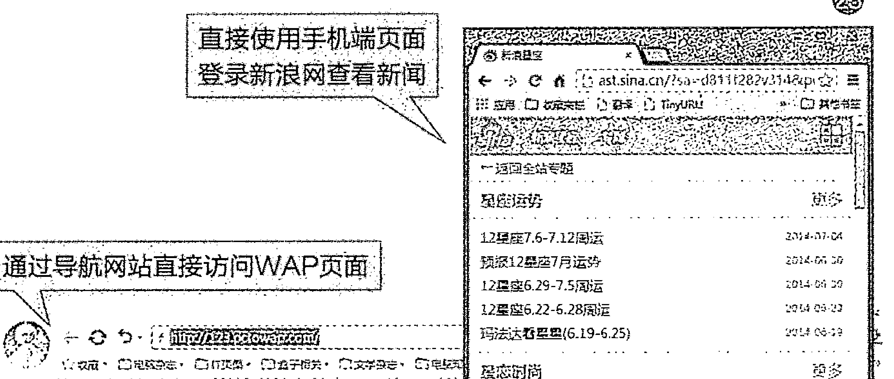

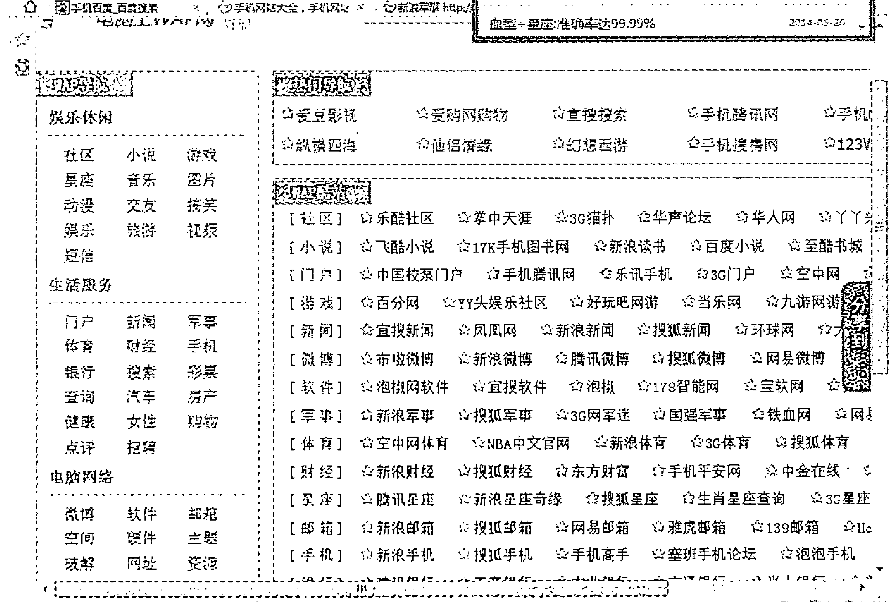

- Gmail移动版：http://m.gmail.com
- 中新网3G版：http://www.chinanews.com/xmtyw/phonenews.shtml
- 东方财富网手机版：http://wap.eastmoney.com/
- 优酷移动版：http://m.youku.com/wap/
- 百度移动版：http://m.baidu.com/

#### 在线读书无广告

现在很多爱书之人都喜欢在网站浏览在线书籍，但是出于广告赢利的需要，网站同样会在书籍页面放置很多广告，这些广告元素严重影响到我们的阅读心情。实际上看书主要是浏览网页里的文本字符，因此可以使用火狐浏览器的纯文本模式来浏览在线书籍。

启动火狐浏览器后点击“菜单→附加组件”，接着在打开的窗口输入“Web Developer”进行搜索，安装这个组件后重启火狐并启用插件，这样在浏览器上方会出现该插件工具条。比如新浪读书页面http://tinyurl.com/qda6kdq，默认打开包含图片、Flash等各种广告元素（图25）。

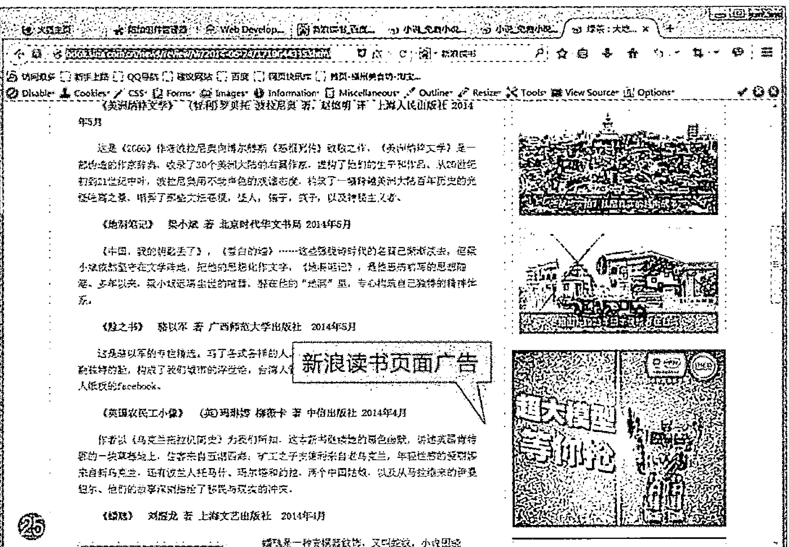

依次点击上方工具栏的“禁用JAVA”、“禁用JavaScript→所有JavaScript”，“无CSS错误→禁用样式→所有样式”，“图片→禁用图片→所有图片”，现在再看看书籍页面，是不是Flash、图片广告都全部消失了呢？只剩下清爽的文本页面供我们阅读了（图26）。

对于使用IE等非火狐的用户，如果要想使用文本模式浏览网页，还可以使用百度快照提供的文本浏览模式。比如上述新浪读书的页面，首先在百度输入上述网址作为关键字进行搜索，通过搜索找到上述链接页面，然后点击链接后面的“百度快照”，接着在打开的页面点击“快速版”，这样即可以文本模式打开读书页面了（图27）。

#### 更多网络广告的屏蔽

除了上述介绍的网络组件外，大家在日常操作中还经常使用微博、在线IM（如QQ+、旺旺）等组件，这些组件的广告一般是直接嵌入到网页中，使用常见的网页广告屏蔽插件进行拦截即可，我们在之前的刊物中做过多次介绍，比如《电脑爱好者》2011年13期《网上看视频 广告屏蔽掉》，介绍如何屏蔽在线视频的各种广告。另外有兴趣的朋友可参考以下链接。

http://cache.baiducontent.com/c?m=9d78d513d99412f405fac4690d67c0676e4381132bd6a0020ea08438e3732d40506793ac56570770a3d20d6116de3e1a1a0a72103401e3df4c095d91887ede6f5f&p=c66cc64ad49811a05abd9b7d0f14cc&newp=b965dc0c86cc42af5aa7c7710f57&user=baidu&fm=sc&query=%B0%D9%B6%C8%BF%EC%D5%C5&pos=28

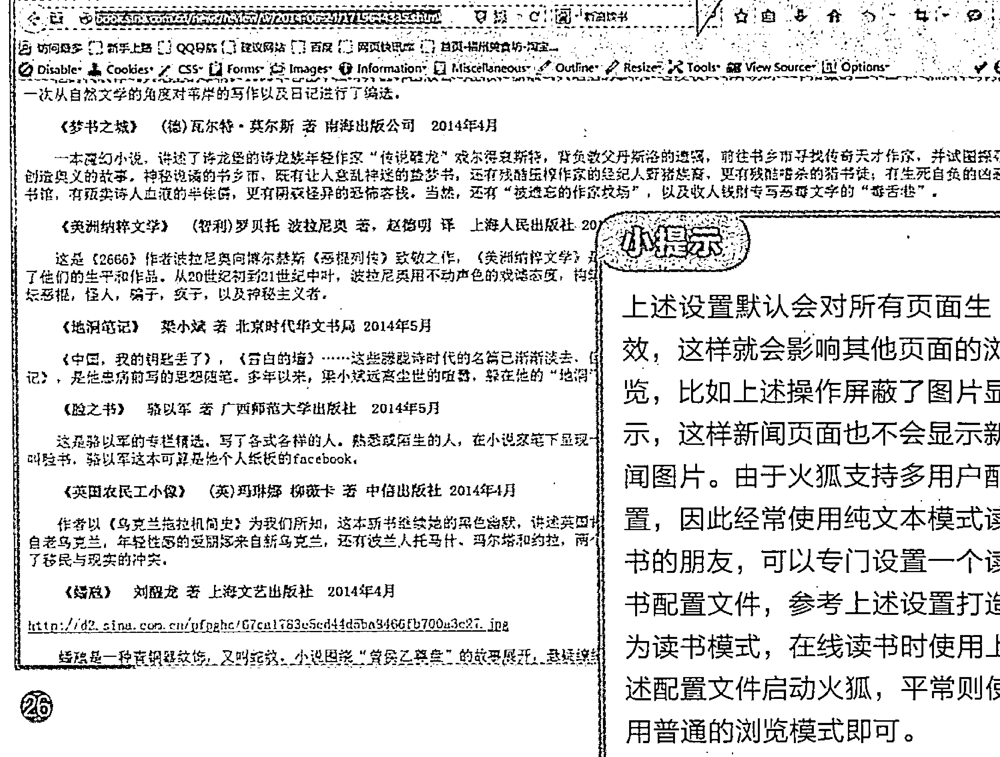

> 上述设置默认会对所有页面生效，这样就会影响其他页面的浏览，比如上述操作屏蔽了图片显示，这样新闻页面也不会显示新闻图片。由于火狐支持多用户配置，因此经常使用纯文本模式读书的朋友，可以专门设置一个读书配置文件，参考上述设置打造为读书模式，在线读书时使用上述配置文件启动火狐，平常则使用普通的浏览模式即可。

绿茶：大地上的事情
2014年06月24日17:19 新浪读书 项薇
新浪中国好书榜2014年5月文学榜榜评
《亲爱的生活》 （加拿大）门罗 南海出版公司 2014年5月
门罗说“我希望读者从《亲爱的生活》开始读我的小说，这是我最好的作品。” 2013年诺贝尔文学奖得主艾丽丝·门罗在获奖前夕的作品，也是她迄今最新作品。这部别致而富有深意的小说打动了诺奖评委会，小说讲述了别离与开始、意外与伤害、悲恸与欢欣的故事，被认为是门罗最丰富、最完美、最具个性的“集大成之作”。
《大地上的事情》 韦岸 著 广西师范大学出版社 2014年5月

除了前面的设置，我们经常还泡在各大论坛。现在大部分论坛都提供“纯文本”或“纯文本浏览”功能，点击这个功能可以以纯文字方式查看帖子内容，既过滤广告又可以加快帖子的浏览速度。

- 拓展阅读
- 就要小清新，网页漂浮广告屏蔽实战：
  网址：http://tinyurl.com/oodcthr
- 弹止神功——软件广告全面禁止：
  网址：http://tinyurl.com/gesca2m

通过百度快照提供的快速版屏蔽网页上的广告

#### 植入 有理 有据

凡事都有两面性，既然程序中可以被植入让人反感的内容，如果反过来思考，我们也希望在文件、数据中植入自己需要的内容。例如在不同的软件文件内植入自己的产品介绍或形象宣传内容，当然这些内容不一定只是文字，可能包含图文声像等多媒体信息，甚至是另一个软件或文档。


## 《电脑爱好者》·2014下半年合订本 【特别话题】

文|金峰

### 驱动程序 装入无纷争

要给一台新买的笔记本重新安装更适合于自己的系统，需要安装一系列的驱动程序，而这些驱动程序最好能够按一定的先后顺序进行安装，因为若不按一定的顺序，可能会出现一些兼容性方面的问题。如何将下载的或驱动光盘中提供的驱动程序按一定的顺序进行自动化安装，这是需要我们研究的问题。

比如，有的电脑需要按先装芯片组驱动，再装显卡、声卡、网卡等驱动，最后安装随机软件的顺序进行安装。而有的电脑则要求在安装芯片组驱动后，接着安装网卡驱动，才能再安装显卡、声卡，最后安装工具软件。当然，安装期间可能会需要人工干预（如选择稍后重启、执行下一步等），但尽可能要实现自动化安装，中间不需要用户再去定位和运行指定程序。

#### 1. 准备并规划驱动程序目录

为实现以上需求，我们可以先准备好需要的驱动程序，拷贝到U盘中，然后按基本需求，在U盘中构造一个批处理程序，当安装完系统之后，直接运行一下U盘中的驱动安装批处理程序，即可实现驱动自动安装的目的。

#### 2. 构建驱动自动安装批处理

为能达到自动安装的目的，按以上需求来构造一个自动选择式批处理文件（图2）。

嵌入了各类驱动程序的自动安装批处理文件内容如下（假设该批处理文件命名为“自动安装驱动程序.BAT”）：

```
@ECHO OFF
CLS
:MENU
ECHO. 选择自动安装的顺序
ECHO. 1 芯片组→显卡→声卡→网卡→工具
ECHO. 2 芯片组→网卡→显卡→声卡→工具
ECHO. 3 退出
ECHO.
ECHO. 按需选择输入序号，驱动会按此顺序自动安装。
SET /P ID=
IF "%ID%"=="1" GOTO CMD1
IF "%ID%"=="2" GOTO CMD2
IF "%ID%"=="3" EXIT
PAUSE

:CMD1
ECHO 按芯片组→显卡→声卡→网卡→工具顺序自动安装
\CHIPSET\SETUP.EXE
PAUSE
\SVGA\SETUP.EXE
PAUSE
\SOUND\SETUP.EXE
PAUSE
\NETWORK\SETUP.EXE
PAUSE
\Utility\CCleaner_4.5.0.4250.exe
PAUSE
\Utility\QQ5.4.exe
PAUSE
（此处省略更多的各类工具软件执行程序）
GOTO MENU

:CMD2
ECHO 按芯片组→网卡→显卡→声卡→工具顺序自动安装
\CHIPSET\SETUP.EXE
PAUSE
\NETWORK\SETUP.EXE
PAUSE
\SVGA\SETUP.EXE
PAUSE
\SOUND\SETUP.EXE
PAUSE
\Utility\CCleaner_4.5.0.4250.exe
PAUSE
\Utility\QQ5.4.exe
PAUSE
（此处省略更多的各类工具软件执行程序）
GOTO MENU
```

首先是安排驱动程序目录。将要安装的驱动程序布置在特定的文件中，假设其目录结构如图所示（图1）。其中“Chipset”文件夹中的SETUP.EXE是启动芯片组驱动的安装文件，“SVGA”文件夹中的SETUP.EXE是启动显卡驱动程序的安装文件，“Sound”文件夹中的SETUP.EXE是启动声卡驱动程序的安装文件，“Network”文件夹中的SETUP.EXE是启动网卡驱动程序的安装文件，而“Utility”文件夹中的多个EXE文件分别为实用工具软件的安装文件。

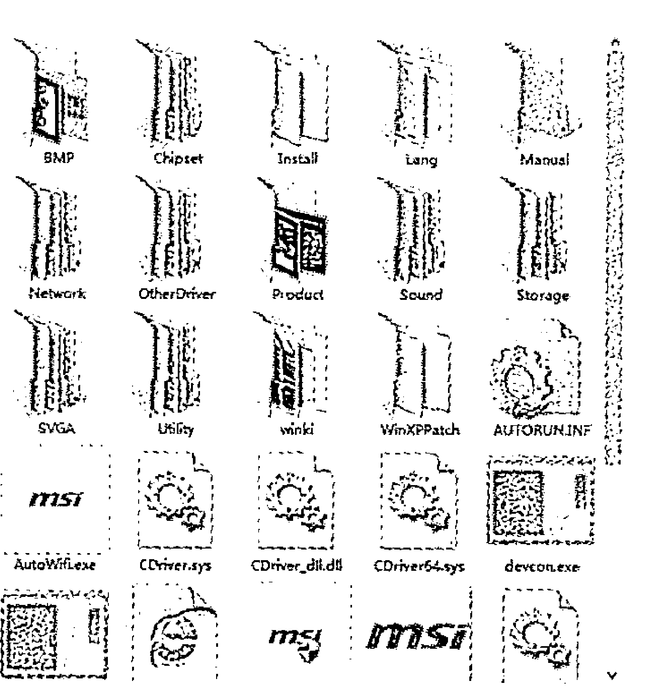

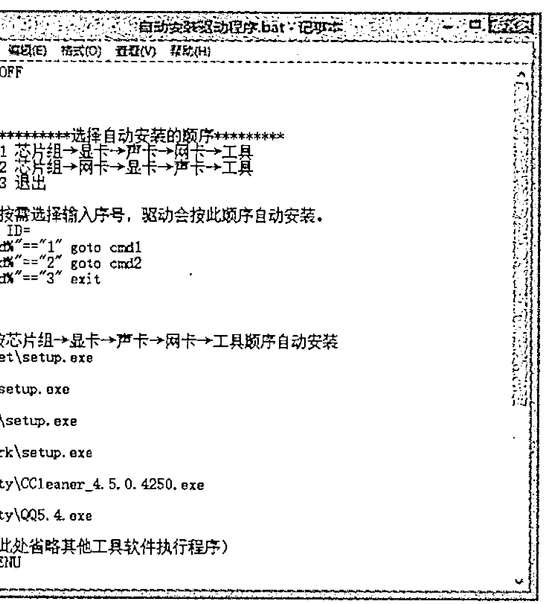

44 电脑爱好者 2014下半年合订本文/金峰

#### 分享的技巧 宣传自己

如今网盘很流行，每个人都能分享一些实用的软件、有用的文档或其他数据文件，而这些数据在上传到网盘中共享时，往往会做成压缩文件的格式。那么，既然这些可以被网友随便下载，何不利用它们顺便宣传一下自己呢？只需将宣传资料植入到压缩包中，当用户下载后安装或预览时，即可显示出相应的宣传内容。

#### 1. 压缩包植入个性宣传信息

将自己整理的好资料（如教程、电子书等）压缩好，上传到网盘分享下载，如果在压缩时将需要展示的内容添加到压缩包中，当解压缩时，软件的显示空间里会显示自己设定好的内容，比如自己的微博、微信二维码或地址链接介绍等。基于以上想法，我们用360压缩工具制作一个含有嵌入图文广告信息的ZIP压缩包。

Step1: 制作一张图片，在图片的左上端放上自己的产品介绍二维码信息图片，还可以输入微博、微信或网址等信息。

Step2: 安装360压缩软件，选择需压缩的文件或文件夹，点击鼠标右键并选择“360压缩→添加到压缩文件”，命名（图4）。

Step3: 命名压缩文件，指定压缩位置。点击“生成超级压缩包”按钮（图5）。

Step4: 在创建超级压缩包窗口中，点击“选择本地图片”按钮，选择上面已经建立好的个性化图片，在窗口右侧编辑广告内容，可设置字体的大小、颜色，可插入超级链接甚至图片。设置完毕点击“确定”（图6）。

Step5: 自动返回到压缩窗口后，点击“立即压缩”按钮，即可生成拥有广告信息的压缩包。

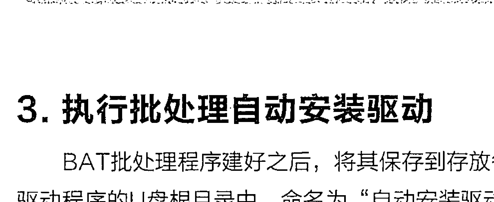

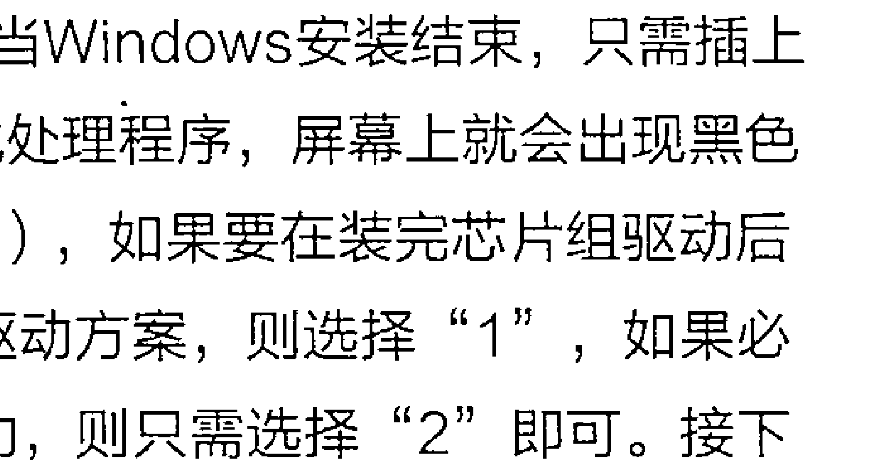

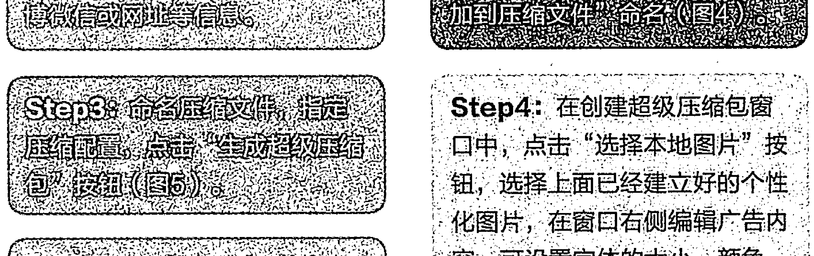

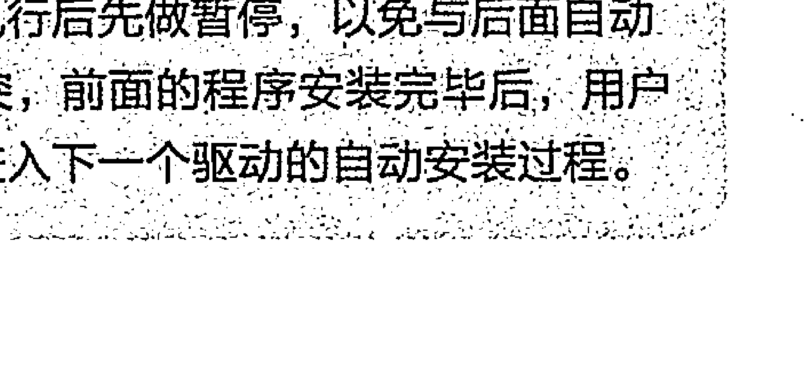

#### 批处理命令注释

该批处理程序构造了一个自动循环和可选择的菜单系统，菜单有两个主要选项，分别针对两种顺序的驱动方法，用户只要按需选择其一即可。命令开头处的@ECHO OFF表示关闭程序执行信息，这样屏幕上就不会出现与菜单选择无关的杂乱信息，而CLS命令表示清空命令窗口中以前显示的信息，类似于擦黑板的作用。“MENU”、“CMD1”、“CMD2”分别定义菜单组、第一运行模块、第二运行模块的唯一性代号，GOTO语句实现运行转向。“ECHO.”后跟信息显示菜单项目，若后面不跟任何信息则显示一个空行。“SET /P ID=”设定系统接受用户输入的一个ID序号。“IF "%ID%"=="2" GOTO CMD2”语句是根据用户输入的序号执行程序转向，确定转向到哪一个模块去处理。“IF "%ID%"=="3" EXIT”语句是选择了3后便退出批处理程序，其中EXIT是退出批处理的命令。程序中的PAUSE语句起自动暂停作用，当安装一个驱动的命令执行后先做暂停，以免与后面自动运行的程序发生冲突，前面的程序安装完毕后，用户只需按任意键即可进入下一个驱动的自动安装过程。

#### 3. 执行批处理自动安装驱动

BAT批处理程序建好之后，将其保存到存放各驱动程序的U盘根目录中，命名为“自动安装驱动程序.BAT”。之后每当Windows安装结束，只需插上U盘，执行该自动批处理程序，屏幕上就会出现黑色窗口选择菜单（图3），如果要在装完芯片组驱动后紧接着安装显卡的驱动方案，则选择“1”，如果必须先行安装网卡驱动，则只需选择“2”即可。接下来的安装过程，点击“下一步”确认或回车，一系列驱动和实用工具的安装都会自动完成。

> 小提示
> 只有用360压缩3.0以上版本打开超级压缩包，才能显示个性背景和超级注释。但如果选择了“同时生成普通注释”选项，那么广告信息同时会兼容其他常用压缩软件，用其他压缩软件打开该ZIP文件时，在注释窗口中也会显示广告注释内容。

#### 2. EXE安装包植入想要的内容

从别的地方下载的程序或自己珍藏的精品软件，经过“再次包装”后上传到网盘并分享下载，网友在安装时程序会显示你设定好的展示内容。这就是在已有的EXE安装程序中植入宣传内容的思路。
实现以上想法可以借助WinRAR来完成，只需要随便建立一个广告文本文件，将这个文本文件压缩为EXE格式的自解压文件，与此同时建立注释信息，在注释信息中也输入广告内容，同时还要给此压缩包指定一个随后自动执行的程序，而该程序正是前述已有的EXE安装程序。这样，执行自解压EXE时，先看到的是广告注释信息，而后会自动弹出并执行EXE安装程序，从而实现广告宣传和软件安装两不误的目的。

> 火速链接
> 有关在WinRAR压缩包中添加自动运行的EXE程序的具体方法，请参见本刊2013年第2期42页的文章《不编程也能制作安装文件》。

> 小提示

#### WinMount魔页广告的优势

完全免费是魔页广告的优势，用户无需担心版权纠纷问题。推广查看率高是它的第二个优势，WinMount魔页会在使用之前自动打开，推广率可达100%，只要使用该压缩包就会看到这个广告。第三个优势是长期扩散的广告效应，随着共享资源被无数次的转载，压缩包会出现很多复本，广告会与压缩包文件共存亡，广告效应会大面积长期发挥作用，这是它与其他广告相比的优势所在。第四个优势是安全无毒，魔页不支持非安全网站的script和iframe代码，将木马病毒拒之门外，这样用户也无需担心魔页广告中会带有什么恶意程序而不敢打开，信息安全得到保证。

#### 3. 用WinMount魔页定制宣传广告

WinMount是一个国产免费压缩和虚拟工具软件，它除了支持大家熟悉的ZIP等压缩格式外，还有一种独特的MOU压缩格式，而这种压缩格式可以支持“魔页”功能。WinMount魔页是集成在压缩包内部的信息资讯页面，可以显示文字、图片、广告等信息。当压缩包被使用的时候，魔页会自动显示，让用户在使用压缩包的同时，可以接收到最新的广告信息资讯，资源发布者的利益也由被动转为主动。由于WinMount公司声明授权每一个人免费使用和发布带有WinMount魔页的MOU压缩包，所以可以放心使用该功能。
创建压缩包魔页广告的方法如下：

> Step1：选中要压缩的文件或文件夹，单击鼠标右键选择“WinMount—压缩到”命令（图7），弹出“压缩设置选项”

Step2：在“常规”选项卡下，选择压缩格式为MOU，命名压缩文件，然后点击“魔页”选项卡（图8）。

> Step3：在魔页设置页面中，选择“使用自定义魔页”，然后设置广告页的宽度和高度，利用“浏览”按钮导入事先设置好的广告页面，设置之后点击“保存配置”按钮并确定（图9）。

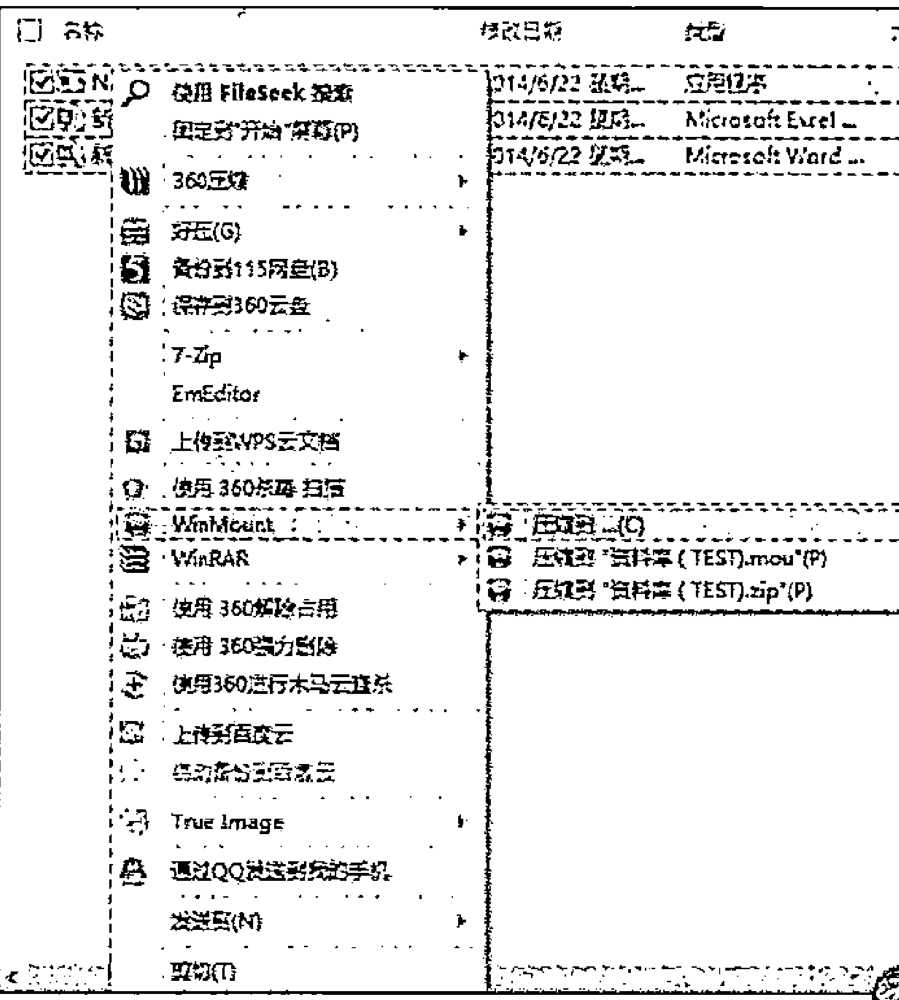

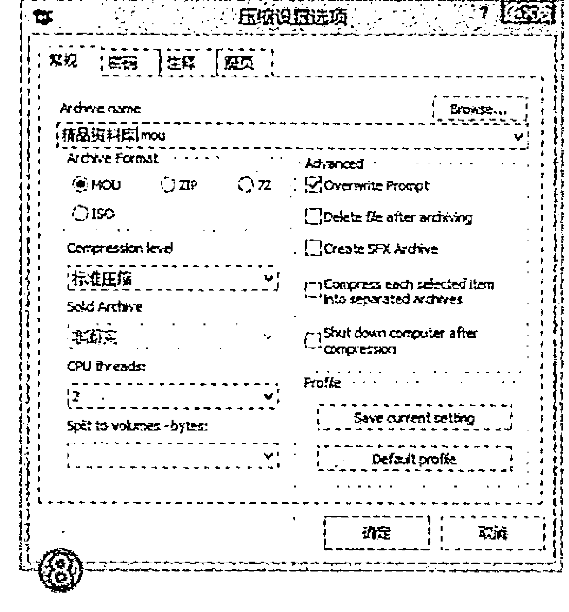

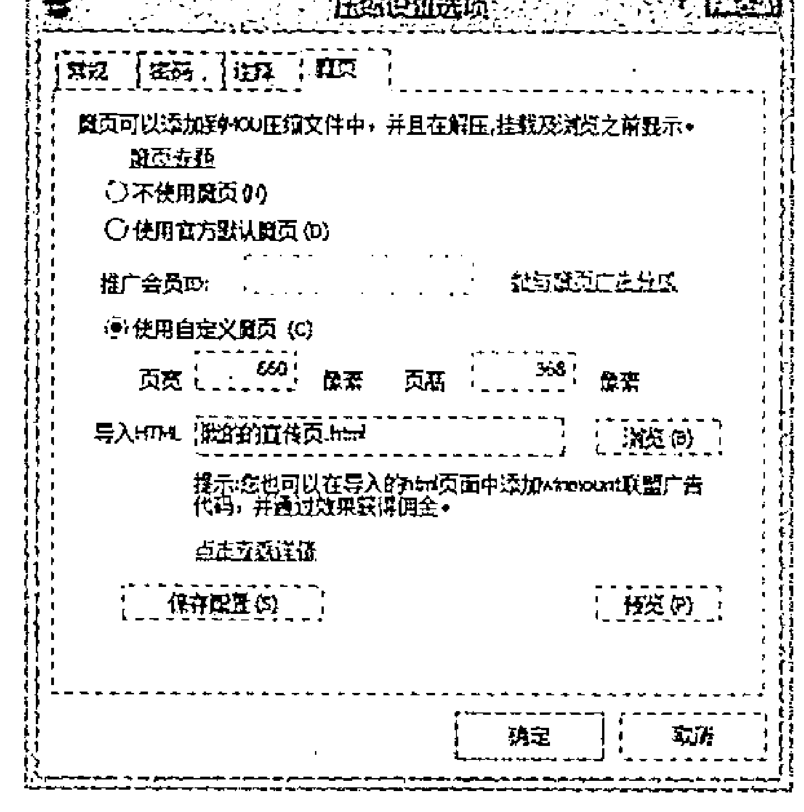

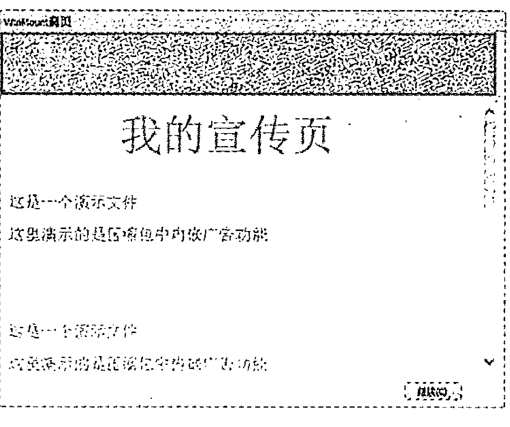

MOU文件创建好之后，上传到网盘或网站，当其他人下载了该压缩包，打开时首先弹出的将是广告宣传页的内容（图10），只有当点击右下角的“继续”按钮之后，才能进入解压软件的窗口。

#### 硬件也植入3


正如前文所述，“植入”是一种令人又爱又恨的存在。实际上，除了各种软件、APP和文件数据外，在硬件领域也不乏各种“植入内容”的身影。而在本章节内容中，你将看到各种稀奇古怪的植入方式，并感受到由用户发起的“主动植入”将会为硬件产品带来怎样的体验改善。

#### 深度改造 自己动手丰衣足食

植入并非“表面功夫”，有时候需要我们自己进行一些手动的改造才可获得最佳的植入效果、更出色的体验或更多的功能。

#### 手机孔植入红外遥控功能

华为荣耀6大受欢迎，除了其性能给力和价格实惠以外，独特的红外遥控功能也是功不可没。好消息是，没有红外模块的智能手机也能“植入”类似功能，而植入地点就是被小看了的耳机孔。

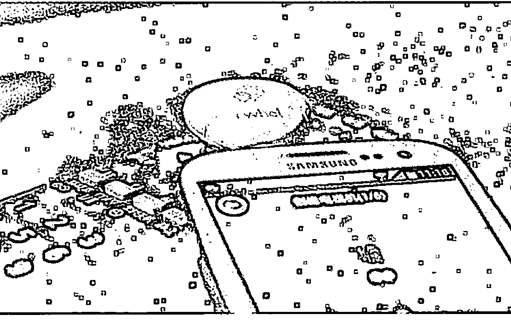

##### 耳机孔被小瞧了

在很多人的印象中，耳机孔就是用于连接耳机的存在。随着以米键、360智键为代表的产品出现，耳机孔可以充当快捷键的功能被“挖掘”了出来。实际上，借助耳机孔独特的电路原理，让普通的智能手机获得红外遥控功能已经不是梦想（图1）。

##### 超简单的改造原理

红外遥控器的工作原理是利用红外发射管发射38kHz的载波信号，该信号内含由0、1二进制数据调制而成的脉冲信号。当电视和空调接收到此信号后便会进行“翻译”，进而实现换频道或升降温度的操作。有意思的是，耳机孔的左右声道可以发出0、1的音频编码，只需借助APP对编码进行定义，再通过红外二极管将其发射出去，同样可以实现类似专业红外遥控器的功效。

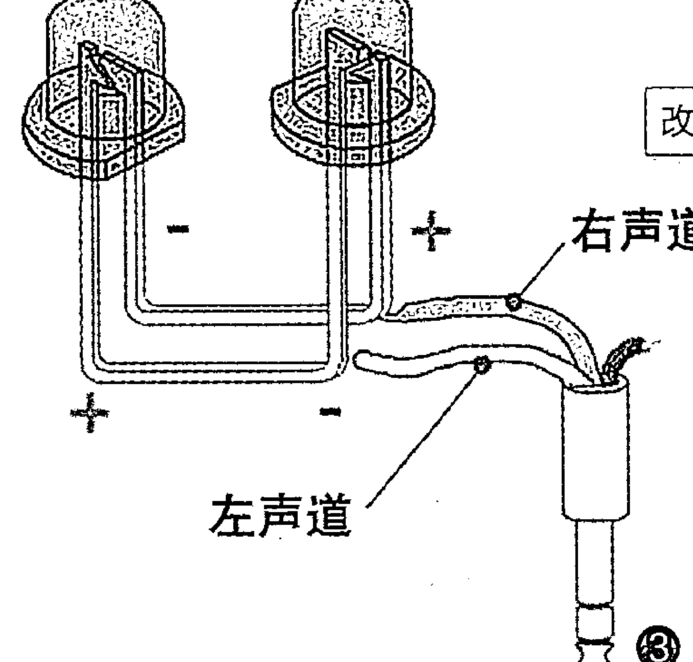

##### 改造难度并不算高

目前淘宝有卖现货版本的耳机孔用红外发射器（图2），手机用户购买并插入耳机孔后，只需借助“遥控精灵”即可对电器进行控制。当然，如果你觉得贵，不妨自己DIY一款手机用的红外发射器（图3）。

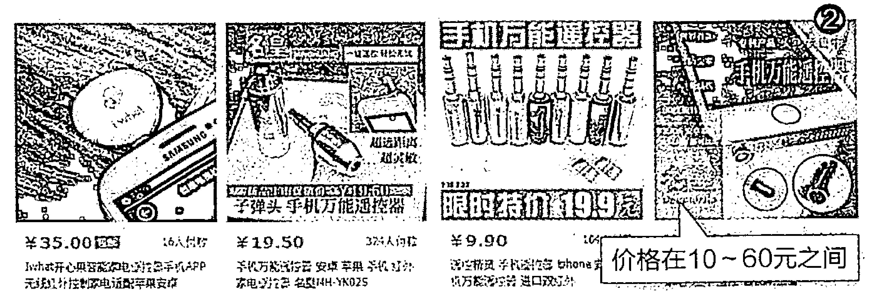

#### 将手机变万能遥控器

##### 所需材料

- 废旧的3.5mm耳机插头
- 2个红外二极管（可以购买或从废旧遥控器拆卸）

##### 改造流程

将两个二极管的正负极相连（二极管A的正极接二极管B的负极，反之亦然），用电烙铁将其焊接到3.5mm耳机插头的左声道和右声道（图4）。


接下来就用遥控精灵对电器进行遥控吧！

###### 小贴士

理论上耳机插头接一个红外二极管也可以，但由于手机音频只有20kHz，需要双二极管去叠加38kHz信号，而单二极管要么遥控的距离近，要么就是只能识别设备但却无法遥控。如果你在乎美观性，可以用读卡器帽或其他套子形状的东西将耳机插头和二极管连接的部分包裹住。

总之，支持红外的荣耀6的确令人羡慕，但通过本文方法其他智能手机也能获得类似的红外遥控能力。可惜，这种DIY的耳机红外遥控器无法实现“学习”功能，能否兼容家里的电器还得看APP端的设备支持列表。但无论如何，有了它，你的耳机孔平时也不再寂寞，家人也不必再因找不到XX遥控器而“捉急”了。

#### 无线鼠标植入锂电池

无线鼠标大都采用AA或AAA电池供电，用起来不是很环保。在手机淘汰率居高不下的今天，很多人家里都闲置着无数块锂电池，何不将它们塞入无线鼠标中发挥余热，避免频繁更换AA电池的繁琐和浪费呢？

##### 植入锂电池的思路

很多廉价无线鼠标的节能技术不过关，十几天就得更换AA电池的开销并非谁都可以接受。好消息是，只要你家里有闲置的手机电池，利用它们也可以为无线鼠标供电。只是，想将锂电池塞入无线鼠标中还有几个门槛限制：你有足够的动手能力；无线鼠标有足够安置锂电池的空间。接下来我们就来看看读者“fsice”是如何将锂电池塞入罗技K260套装中的鼠标体内的。

##### 直击改造过程

改造所需硬件：3.7V手机电池×1、剪刀/刻刀、0.5mm的电线、USB接口，以上材料都可从淘汰设备中拆卸而来，理论上做到零开销（图1~3）。

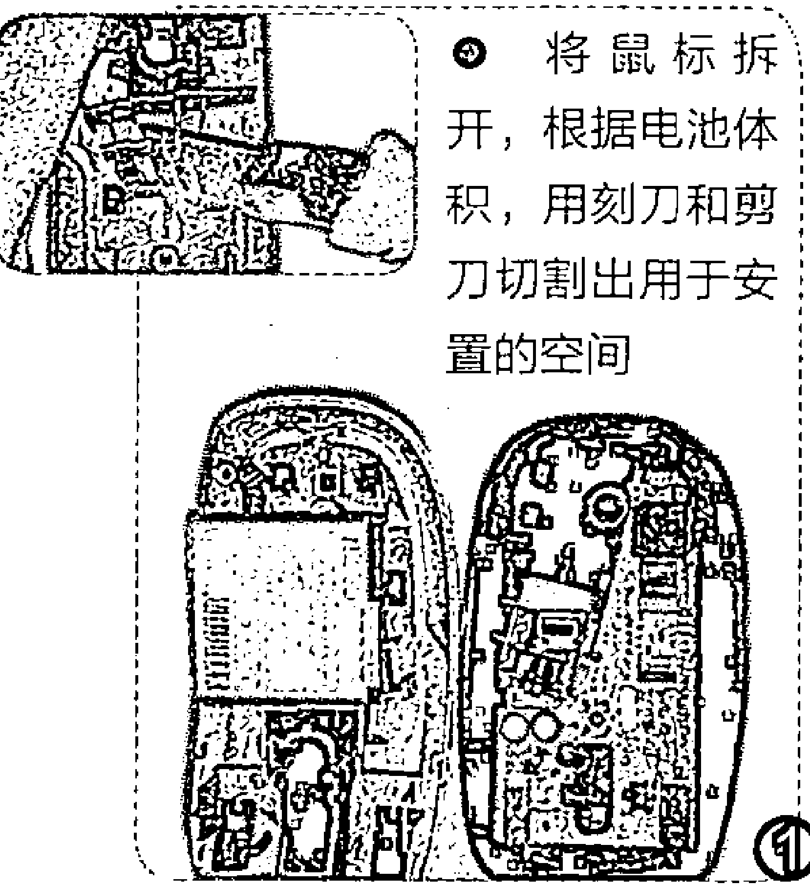

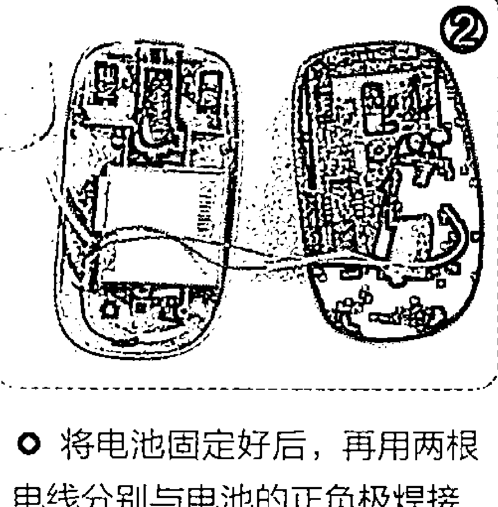

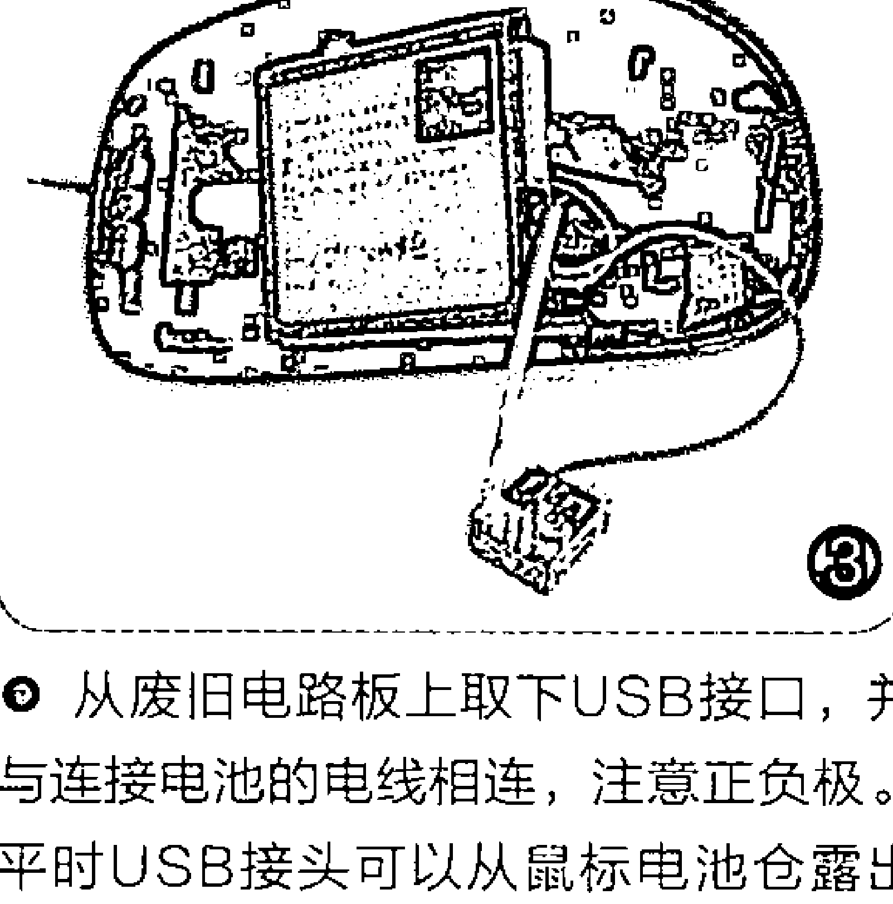

##### 扩展阅读

如果你身边没有焊接用的设备也没问题，比如读者“阿伯发嗡风”的改造方案就是将电线相互间拧在一起后用胶纸绑紧，简化了改造的步骤（图4~5）。

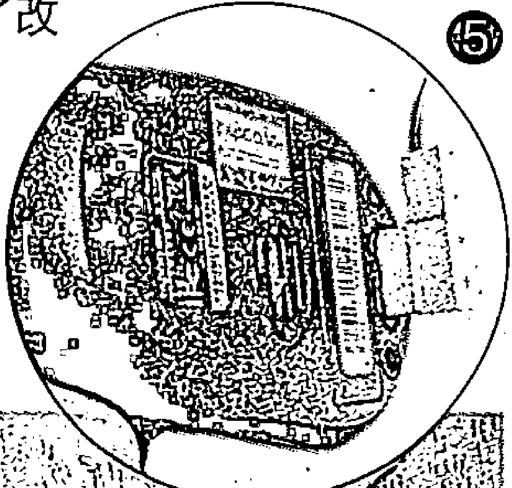

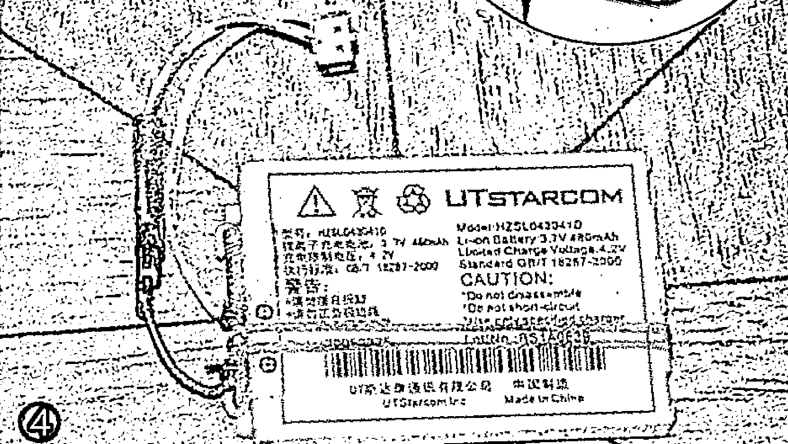

#### 小结

将锂电池直接塞入无线鼠标只是比较初级的改造方法，500mAh的锂电池大概可以供鼠标持续使用7~10天，有能力的读者可以考虑再加入可变电阻，理论上可以获得更持久的续航能力。此外，将此改造思路延伸，我们还能将无线鼠标改为有线，或将有线鼠标改为无线，更多有趣的改造形式还有待DIY玩家们挖掘。


古人云“没有远虑，必有近忧”。这句在为人处事方面的至理名言，同样在潜移默化地影响着我们的IT生活。比如，在选购DIY配件时如果仅追求眼前的利益，很可能陷入奸商的圈套；看到一篇技巧文章，在没有掌握原理的前提下盲目修改删除系统文件，很可能就会留下不容忽视的后遗症；追求一时的速度进行超频优化，可能会对设备造成无法逆转的损坏……总之，无论是面对新软件、新设备、新功能，我们都需要多思多虑“留一手”。当因没有“远虑”而出现稀奇古怪的“近忧”问题时，也要掌握“亡羊补牢”的方法。

### 系统分区不容忽视

文|亦云

无论是最新DIY的电脑还是新买的笔记本，初次使用安装系统时都会面临硬盘分区的相关问题。
对于新的品牌PC或笔记本需要注意什么？对老电脑用户而言，因之前没有从长远考虑，在使用过程中才发现分区不合适，此时又该如何寻求解决办法？

#### 未雨绸缪 做好分区计划

对于新购进的笔记本或品牌台式机来说，目前多数情况下，系统预置的Windows系统分区是按一个分区来做计划准备的，不管我们是不是喜欢这样，不管这是否符合中国用户的习惯。这个问题看似不可思议，但实际上它却符合微软对资源管理的设计和建议，因为这样做在理论上更符合Windows默认环境下对系统资源的管理方案，更便于用“用户”文件夹和“库”来管理资源。

但是，许多用户尤其是中国的普通电脑用户，对资源的管理往往更愿意采用多个分区的方式，总喜欢把资料放在C盘之外的空间。因此，这就会涉及到一个重新分配系统分区的问题。如何将笔记本或品牌台式机默认提供的一个硬盘分区，改变为按用户意图设立的多个分区，而又让磁盘空间获得有效利用呢？

#### 新品牌电脑的分区调整

- Step1: 使用快捷键组合Win+X激活系统的控制菜单，从中选择“磁盘管理”一项，启动磁盘管理器（图1）。
- Step2: 在磁盘管理窗口中，右击C盘并选择“压缩卷”（图2），
随后系统会显示正在查询可以获取的空间，之后出现压缩容量设置窗口，其中包括显示压缩前的总计大小、可用压缩空间大小、压缩后的总计大小等信息。
- **Step3** 这一步要设置拿出多少空间来压缩，作为新分区使用，输入压缩空间量（图3）。设置压缩空间并执行压缩后，管理器中显示未分配空间大小。右击未分配空间，选择“新建简单卷”，根据新建简单卷向导提示输入简单卷大小，分配驱动器号，指定文件系统格式化简单卷，随后系统显示新建简单卷向导设置清单，确认新建。
- **Step4** 之后在磁盘管理器中可见新建好的分区。如果未一次用完剩余空间，依照上面的办法通过压缩再新建更多的分区。

#### 新组或预装系统的分区规划

而对于新装PC的用户或预装了其他操作系统而不打算再用的用户来说，由于是全新空硬盘或等同于全新硬盘，Windows系统也是要全新安装，因此，分区分配只需按自己的需求执行全新划分即可。可以用两种基本思路来解决。

如果希望严格按照微软的文件管理系统和“库”的体系来管理文件资源，那么，将系统分为一个区最为方便。这时，直接通过PE启动盘或Windows 8.1安装光盘启动，运行Windows 8.1的安装程序来划分磁盘分区，将所有磁盘空间分为一个C区。之后使用时，只需将自己编辑的或应用程序产生的文档，统统按类存放到系统盘（一般为C盘）的用户目录下，自动纳入“库”的管理系统中即可（图4）。

如果希望按多分区来存放文件，则要规划好分区的划分方案。包括：安装几个系统、划分几个数据分区、每个分区划分多少容量等。具体方法我们在此前的杂志文章中有过详细介绍。

有关分区规划的具体方法，请参见本刊2013年第18期特别话题《定制自己的微型工作盘》中介绍的分区规划和划分的方法。移动盘系统分区与本地硬盘分区方法基本类似。

> **保护好隐藏分区 以备恢复系统**
> 新购电脑一般都会有隐藏分区存放系统的备份。重新调整分区，如果今后还打算从这个分区恢复系统，那么在重新分区的过程中要保护好此分区。使用分区工具时不要对该隐含分区进行删除、合并或其他任何操作，这样其中的备份数据就不会丢失。当需要恢复系统时，只需在自检时按下热键，即可进入恢复程序进行恢复。以华硕笔记本预装的Windows恢复为例，在开机出现ASUS画面时按下F9热键，显示进度条和启动画面后，进入提示页面选择语言，选择恢复的分区。此时一定要注意选对选单项，否则可能会覆盖掉后续分区中的数据。选择“恢复系统到第一个分区，其他分区不变”可有效保护数据分区的内容，若选择“将整个硬盘划分为一个分区，并恢复系统到此分区”或“将整个硬盘划分为两个分区，并将系统恢复到第一个分区”这两个选项，都可能会破坏掉后续分区中的数据。所以日后若要恢复分区，一定不能选错选项，最好先备份好数据分区中的个人数据。

> **小技巧: 建立完美的整数分区**
> 虽然多数人对磁盘分区的容量不能正好是100GB或200GB等整数感到纳闷，但很少有人会深追细究或刻意将磁盘分区分成整数GB。但这个世界总会有些完美主义者。如果希望某些分区的容量正好为整数，就必须先计算出在分区时输入的容量数值，这个数值不是简单的1024倍关系或1000倍关系，与所用分区格式有关，要用专门的公式来计算。如果要将分区分成整数容量，必须在初次分区前就要考虑清楚。对于FAT32分区格式来说，使用公式M=(N-1)×4 + 1024×N即可计算出整数分区应该输入的容量数值，其中N为整数容量的GB数，M为最后要输入的MB数值。比方说要分一个100GB的分区出来，这时M=(100-1)×4 + 1024×100=102796，分区时输入102796即可获得100GB的整数空间分区。如果分区格式为NTFS；那么用公式M=1024×N +1计算即可，如上100GB分区所得结果为102401MB。

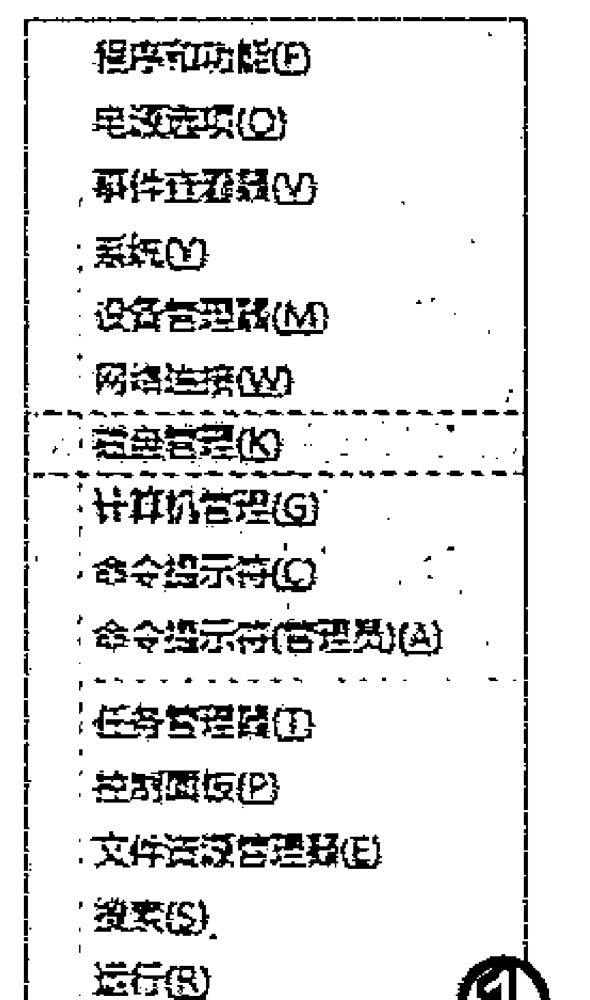

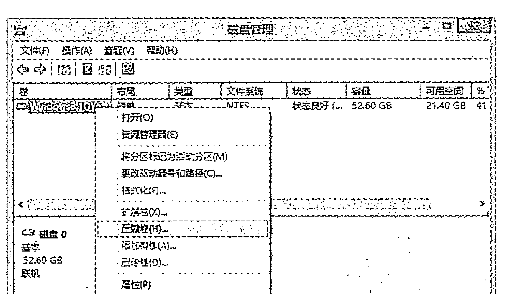

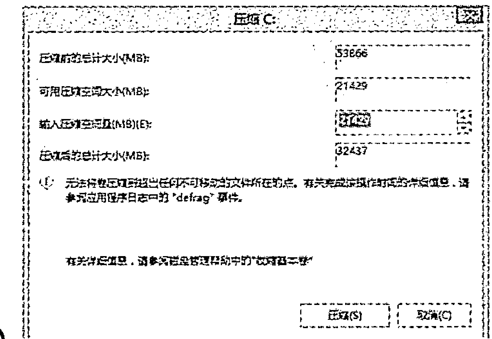

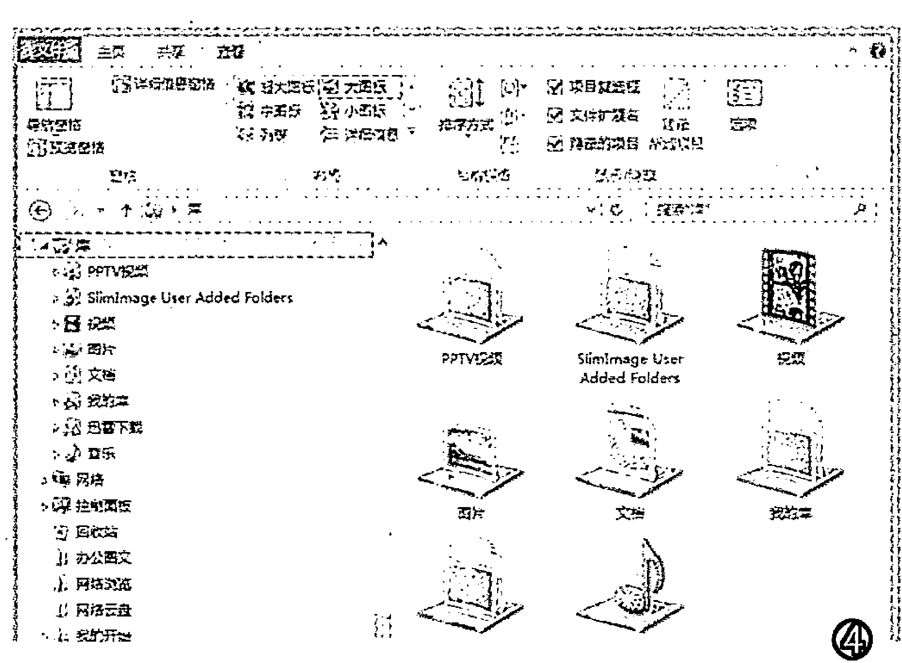

#### 亡羊补牢 按需调整分区

由于用户对电脑系统的熟悉程度不同，在使用中会发现，现有的分区空间对自己的使用可能会不尽合理，加上日后使用过程中的需求不断变化，在使用电脑硬盘过程中，可能出现希望多一个分区专门玩游戏，或因系统分区空间紧张，希望重新分配的实际需求。遇到这种情况该如何处理？

##### 继续压缩C盘制作新分区

新购置的笔记本没有多加注意，开始按向导的提示对磁盘进行了分区操作，整个分区都分配给了C盘，日后使用中越来越觉得一个分区数据掺杂在一起使用不够方便，希望能多分几个分区。或者是开始只压缩了一部分空间，扩展出一两个分区，但还有压缩的余地。那么，如何从已经分区并使用了一个时期的硬盘中，挪出空间做成更多的新分区？
这个问题其实可以归结到与上述新购置笔记本第一次用机的相同的情况，同样可以采用如上所述的方法，在Windows 8.1系统中压缩C盘空间，制作一个或更多新分区。这种方法并不会损坏C盘中的已有数据，只是划分之后C盘空间减小，后面又多出一个或几个分区而已。

##### 默认安装造成系统空间紧张

事情还有另一个极端。默认将软件统统安装在系统C盘，产生的临时文件存储在C盘，由于某些软件的设计缺陷，没有自动清理临时文件的机制，加上用户不知道清理或手懒，造成C盘临时文件急剧增多，如果不去理会，发展到最为严重的时候，垃圾充满硬盘，最后造成系统分区空间严重不足。

在这种情况下，可以用清理垃圾、转移数据、转移软件、合并分区等办法来解决问题。

首先是清理垃圾，我们可以使用系统自带的磁盘清理功能来清理磁盘，右击系统分区，点击“磁盘清理”按钮进行清理（图5）；也可以使用诸如360安全卫士的垃圾清理模块来清理系统盘（图6）。具体清理方法比较简单且此前多有讲述，此处从略。

此外，通过对系统“文档”、“视频”或“音乐”等文件夹的属性设置，改变其中的“位置”属性，重设系统默认文档文件夹、视频文件夹、音乐文件夹的位置，重设浏览器缓存文件夹位置，将较占空间的文件夹从系统C盘移动到后面的数据分区中，也能有效缓解系统空间紧张的局面。

另外，还可以使用金山电脑管家提供的软件搬家功能，将C盘中已经安装的软件搬运到其他分区中，同时不影响软件继续正常运行，以腾出更多的C盘空间。切忌用直接移动程序安装目录的方法转移应用软件，那样会造成多数软件无法运行（图7、图8）。

最后还有一个绝招，就是通过分区空间调用来扩容C盘。我们还可以采用一款名为“分区助手”的国产免费工具软件来解决问题。这是一款支持Windows 8分区的工具软件。它可以任意在C分区和后续有空余空间的分区之间动态调整空间，例如，将F盘的空间挪给C盘。操作非常简单，也不容易出错。只需两步，先将后面分区的空间分离一部分出来，然后再将分离出的空间合并到C中即可。

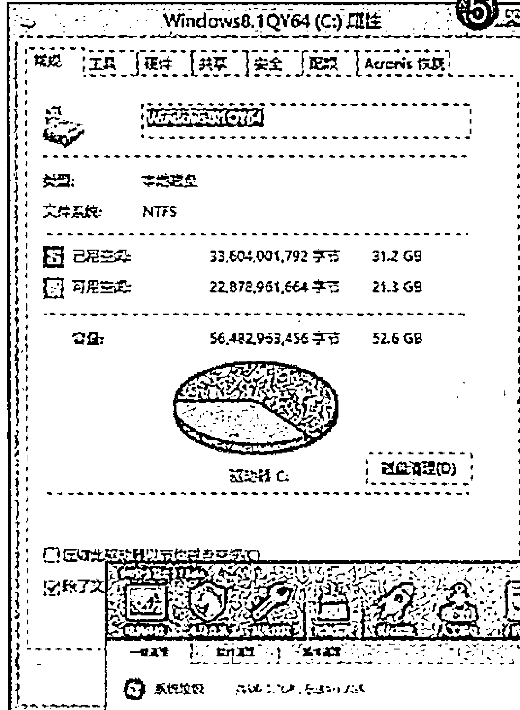

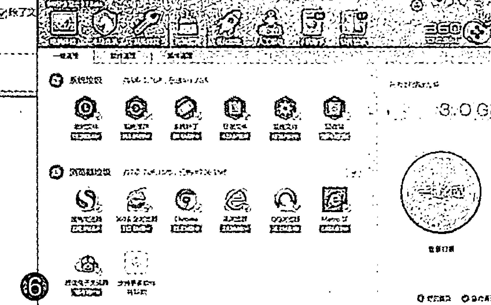

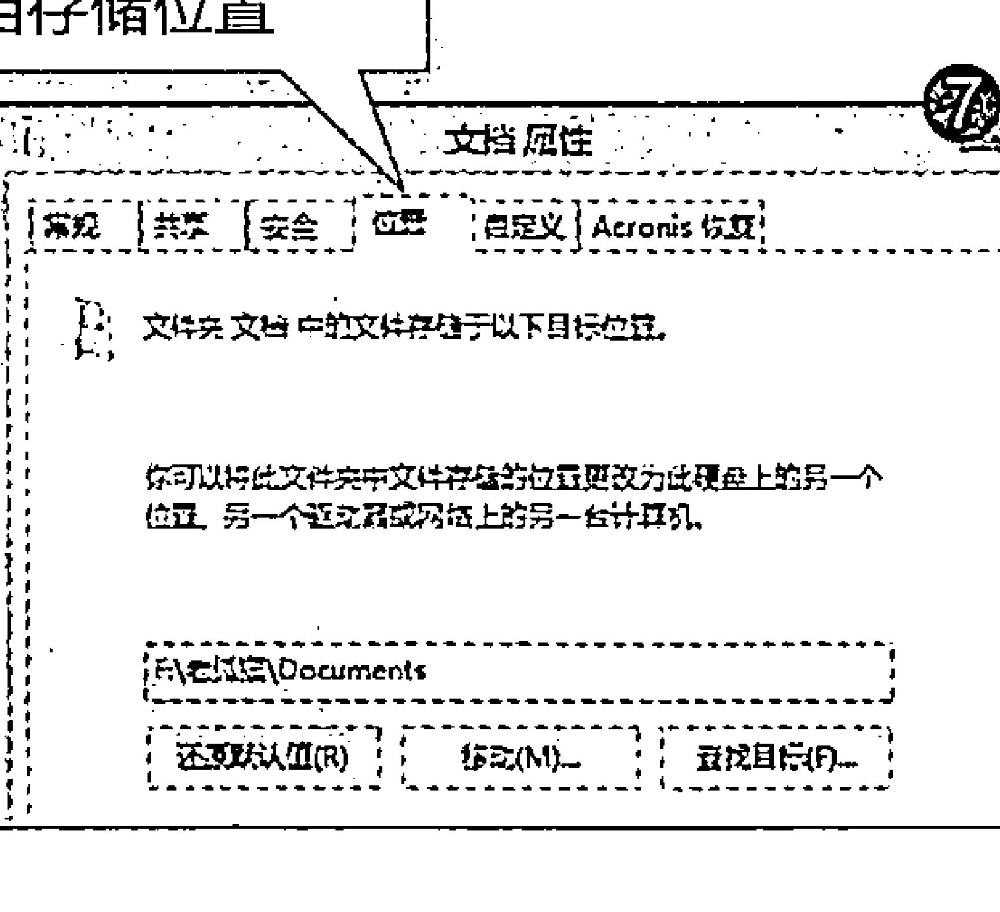

火速链接
分区空间不足，借用其他分区的多余空间重新划分分区，也可用分区专业管理软件Acronis Disk Director来完成，具体方法请参阅本刊2011年第23期文章《合并分区 数据无损有妙招》。

小提示
重设IE浏览器缓存文件夹的方法是，在IE选项窗口中点击“常规”选项卡，然后点击“浏览历史记录”一组下的“设置”按钮，在弹出的“网站数据设置”窗口中点击“移动文件夹”按钮进行设置（图9）。

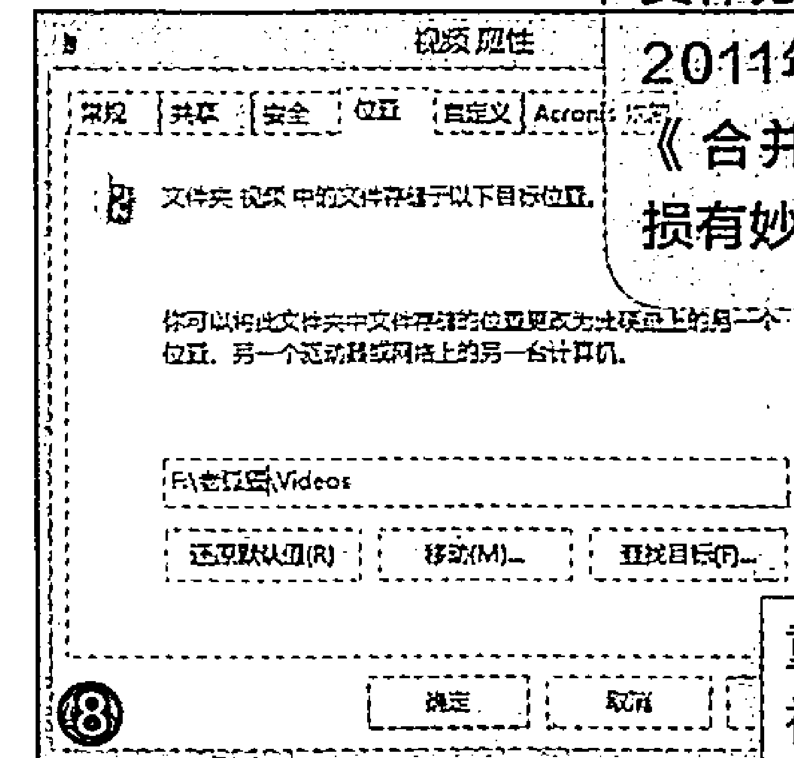

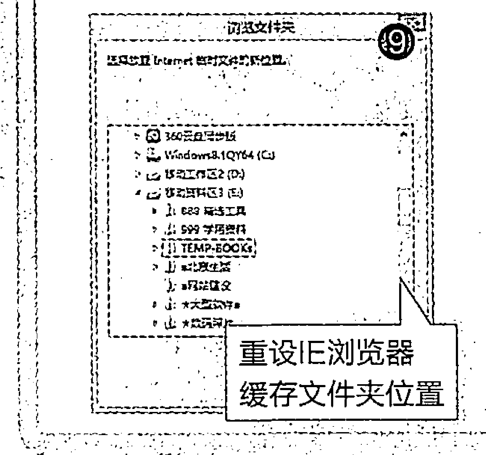


#### 小技巧：系统崩溃后如何备份有用数据

#### 空间不够如何更换大硬盘

系统不能启动后恢复系统中数据分区有用数据的方法有两种。一是用PE版启动U盘或光盘启动系统，然后拷贝内置硬盘中的有用数据到U盘或移动硬盘中。另一个方法是将硬盘拆下来，然后通过硬盘盒或硬盘底座连接的方式，将硬盘接到另一台能启动Windows的电脑上，拷贝出其中的数据。当然也可以将硬盘作为其他电脑从盘的方式，直接用电脑中多余的数据线和电源线连接硬盘来读取数据。

系统分区空间不足，除了用上面提到的方法扩展或交换空间外，也有不少用户想到能不能买个更大的硬盘换下小容量硬盘。换硬盘当然不成问题，数据转移如何进行？更换更大的硬盘时，新旧硬盘容量不同，如何实现分区的划分和数据转移？会不会浪费空间？这时可以借助于一款专业的数据备份软件ATI来解决。有两种方法：一种是自动按比例克隆数据；一种是手动调节比例克隆数据。


#### 误格式化隐藏分区的问题

有关用户整块硬盘的数据转移方法，请参见本刊2013年第13期特别话题文章《乾坤大挪移 数据打包来迁移》，以及2014年第5期特别话题文章《硬盘数据整体高效迁移》的具体介绍。

目前多数原装笔记本电脑不带系统盘，系统是备份在硬盘隐藏分区里的。但有的用户可能会因为操作不小心，误格式化掉隐藏分区。系统不能启动之后，发现隐藏分区的备份也不能使用，落到“叫天天不应，叫地地不灵”的地步。这时，如果自己的电脑仍在商家的免费服务期限内（如联想的一年免费服务期），到品牌客户服务中心，可以免费恢复出厂系统。但如果购买时间已经超过服务期，则要收取服务费用。需要注意的是，在送去恢复前，一定要将自己的有用数据备份出来，因为恢复出厂设置会清空硬盘中的所有数据。

如果已经过了服务期限，不愿意找客户服务中心花钱恢复，那么，既然系统已经完全无效，如果自己有合适的Windows版本的安装程序，就可以按照平常全新安装系统的方法来全新安装系统了。注意，千万记住要提前将自己的有用数据备份出来。

### 调校PC之虑与忧

电脑使用久了，系统就可能产生各种各样的问题，比如启动速度慢、运行过程中卡顿等，这时许多人就会采取优化措施。不过在通过工具或手工优化后，虽然解决了一些问题，却又产生了新问题，出现各种莫名其妙的优化后遗症。不只是系统优化会有这样的现象，在对常用的应用软件优化后，也可能会产生后遗症。所以，我们在进行优化之前就要考虑周全，而对于优化出现的后遗症则要“对症下药”进行处理。

#### ＜系统优化＞小心后遗症

当然，为了避免优化后出现故障，我们还可以针对不同的优化进行有针对性的考虑。

文|技术宅

#### 自动优化：优化项目了解清楚

为了方便大家的操作，现在很多优化软件都提供一键优化操作，通过简单的一键点击即可完成优化。但是在优化之前，很多朋友并不知道软件到底优化了什么项目，这样一旦出现故障也就无从下手去解决。因此对于使用自动优化的朋友，在优化之前一定要仔细查看具体的优化项目。比如我们在选择360安全卫士的一键优化时，在每个优化项目的下方都有关于优化的详细说明，此时一定要根据自己的实际需要加以选择。比如使用快盘的用户，为了保证快盘可以在每次启动后都能够自动在后台同步文件，这里就不能取消其自启动优化，千万不要盲目信赖优化软件的建议（图2）。


#### 优化之前的规划

系统优化主要有借助专业软件和手动优化两种。因为很多优化操作是针对系统组件进行的，优化不当极易导致各种故障出现。因此无论采用哪种优化方式，在优化前都建议先用系统还原做个备份。这样一旦优化后出现故障，就可用备份还原系统了。这期方面杂志有过不少介绍，只要启动系统还原组件，然后在优化前创建一个名为“优化备份”的还原点即可（图1）。

#### 手动优化 优化过程记录清楚

一些动手能力强的用户经常采用手动方法对系统进行优化，对于手动优化的用户，我们则要记住自己的优化操作，方便在出现故障时回忆是什么操作导致的。比如为了节约系统资源，很多朋友经常按照网上的建议关闭系统自动更新服务，这样在安装下载的系统补丁时，Windows 7经常会出现“安装程序遇到错误: 0x80070422”的提示，导致补丁无法安装。这其中的原因就是由于用户错误关闭自动更新服务导致的，因为在安装有些补丁时，可能会用到自动升级服务（需要连接到微软网站进行验证），Windows 7如果检测到服务关闭便会终止安装，导致上述故障的出现（图3）。
因此如果是手动优化的用户，最好记录下自己的优化项目，这样出现故障时就有迹可寻，从而能有目的地进行修复了。

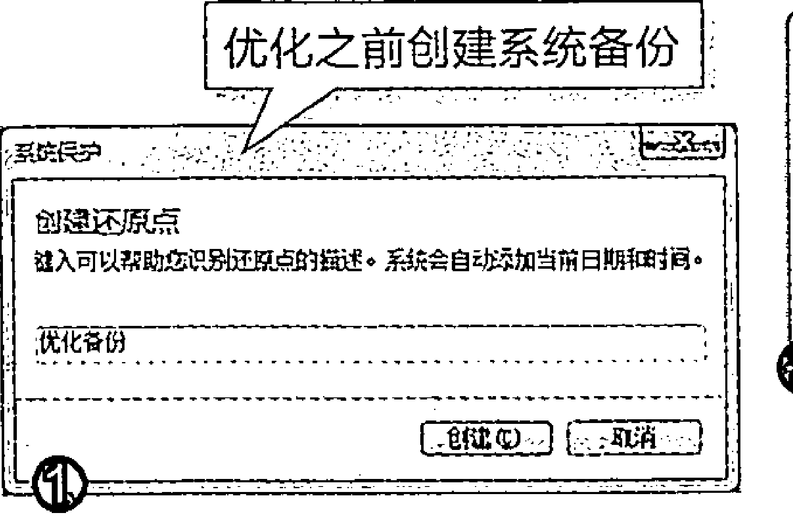

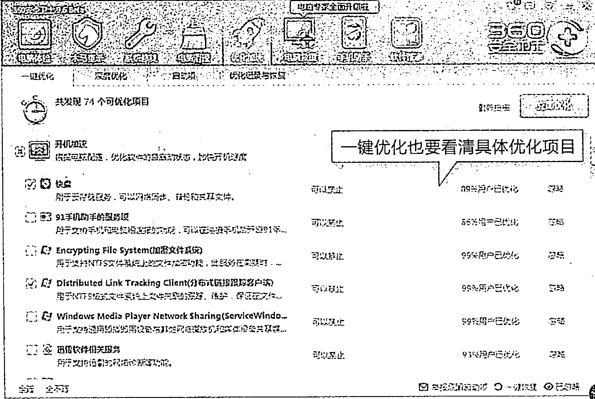

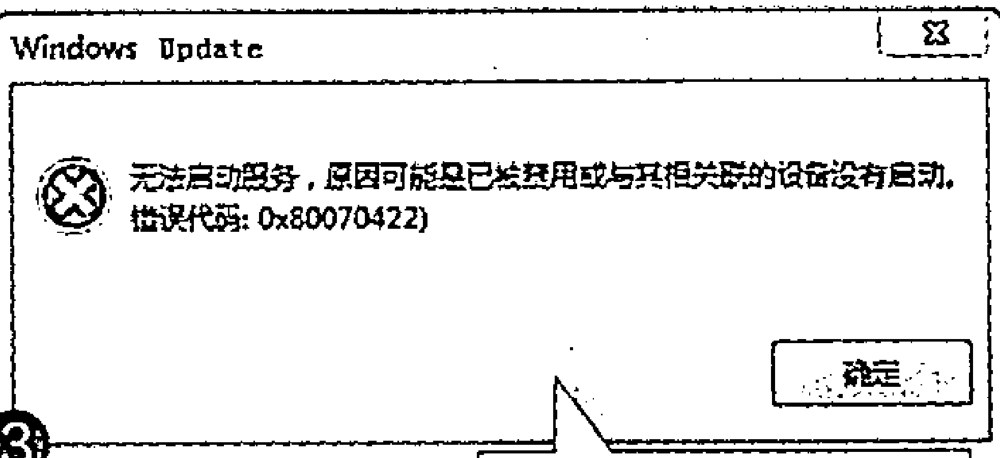

#### 对症下药解决优化后遗症

如果大家已经在优化之前对优化项目进行了周到的考虑，那么优化之后出现后遗症，就可以选择多种方法进行故障修复。

#### 系统还原解疑难

如果大家之前创建过系统备份，那么一旦发现优化以后出现严重故障，此时，利用系统自带的系统还原进行还原，启动系统还原组件后选择之前创建的“优化备份”还原点进行恢复即可（图4）。

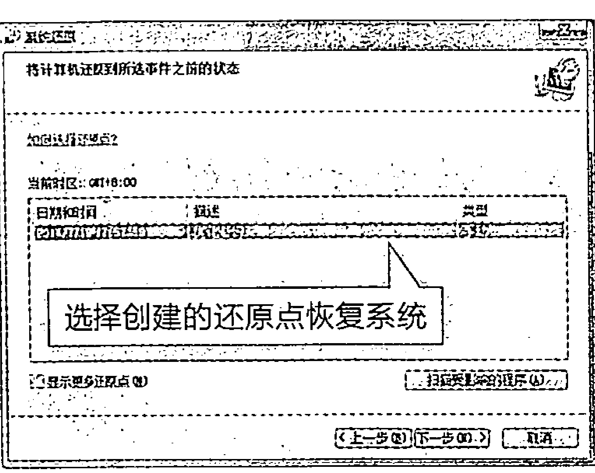

#### 用好优化软件的撤销功能

系统还原会撤销之前所做的所有优化，如果只是个别的后遗症，可利用优化软件自带的撤销功能进行恢复。比如360安全卫士，在使用其进行自动优化后如果出现故障，启动软件后切换到“优化记录与恢复”，根据故障表现，依次点击优化项目后的“恢复默认”来确定到底是什么优化项目导致的故障（图5）。

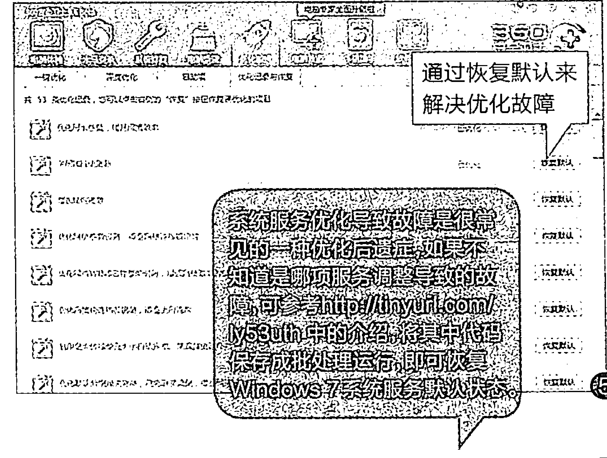

系统服务优化导致故障是很常见的一些优化后遗症。如果不知道是哪项服务调整导致的故障，可参考 http://tinyurl.com/ly58uh 中的介绍，集中把那些存疑的处理运行即可恢复Windows 7系统服务默认状态。

#### 根据症状手动修复

如果是手动优化后出现故障，我们则可以根据故障的具体表现进行修复，比如对于系统服务优化导致的故障，我们可以通过恢复服务默认状态去解决。如上述无法安装自动更新的故障，解决的方法是将服务重新手动开启，启动服务管理组件，然后在右侧窗口双击“Windows Update”服务，将其启动方式设置为“自动”，同时启动该服务即可（图6）。

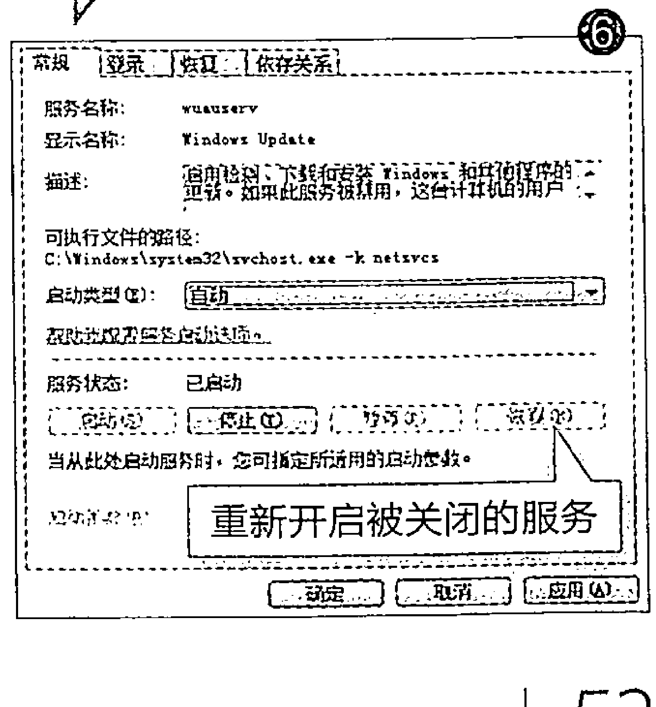

### 软件精简有度 解决精简软件后顾之忧

为了节约磁盘空间和方便使用，很多朋友都喜欢使用精简软件，但在日常使用中精简软件却会出现各种各样的故障，因此在使用精简软件（特别是常用工作软件）前，我们同样应该进行周全考虑，这样在碰到问题时才不会手忙脚乱。

#### 精简软件缺少组件

比如笔者电脑上的Office精简版，每次运行其中的Excel组件，系统都会弹出“某个对象库丢失或损坏”提示，只有点击“确定”后才能用，这是典型的缺少组件的提示（图7）。

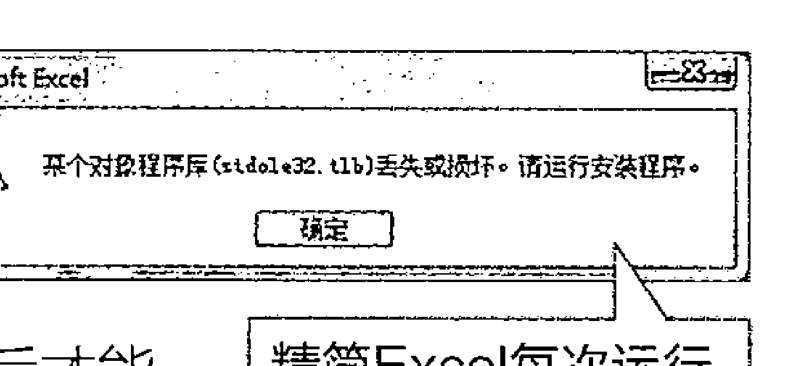

因此对于精简软件（特别是常用工作、学习软件）的使用，在安装的时候一定要进行完整性测试，确认没有缺陷后再使用。

#### 体积精简功能不简

精简软件一个重要特色就是去掉了很多不必要的组件，如果我们当初安装时没有考虑清楚，就很容易给日后的使用带来不便。

#### 精简软件功能缺失

程序本身功能缺失也是精简软件的一个典型故障。比如精简版的KMPlayer虽然号称是万能播放器，但是却无法播放FLV文件，这其中的原因就是该精简版没有集成相应的解码器（图8）。

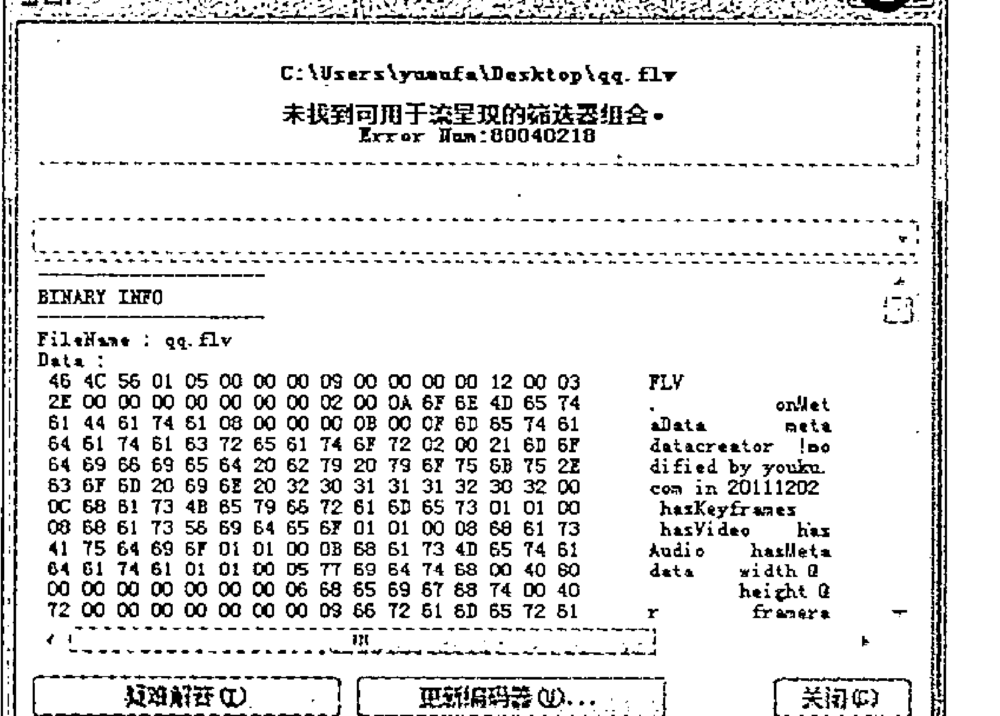

对于类似视频、音频播放精简软件，它们大多可通过扩展来弥补功能的缺失。所以在使用这些精简软件遇到问题时，我们只要准备好相应的插件即可进行弥补。

#### 精简软件 解决故障有高招

精简软件运行出现问题的原因，主要是由于软件的制作者在制作过程中将重要文件删除，或者没有集成必要的组件所致。因此解决精简软件的故障，我们可以根据软件的不同性质加以解决。

#### 手动添加组件

对于类似Office、CAD、Photoshop等大型软件，在其卸载程序里都包含修复组件，因此如果是由于精简软件缺少功能组件故障，可以启动其卸载程序，然后手动添加即可。比如对于Office软件，展开“控制面板→卸载或更改程序”，激活其卸载程序时，可选择重新安装其他组件，比如原来精简版没有PPT，在这里可将其重新添加（图9）。

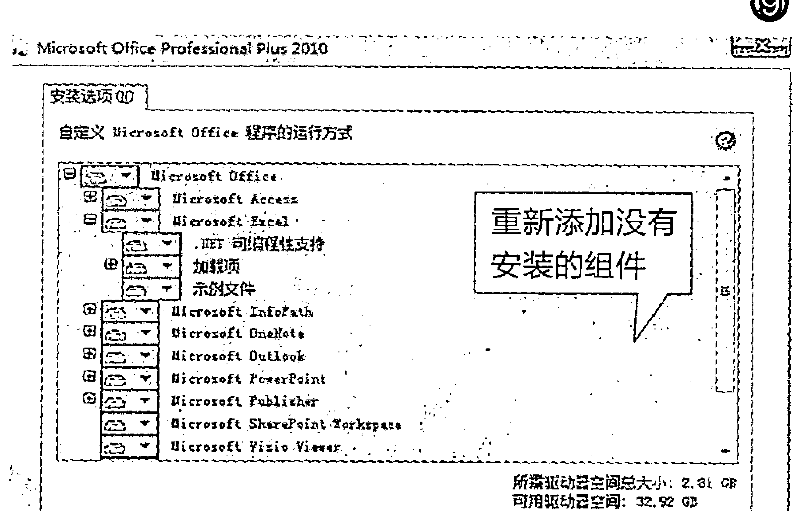

#### 自己注册组件

一些精简软件功能的缺失经常是由于缺少必要的组件导致的，比如KMPlayer精简版默认无法播放FLV文件，是由于其没有集成FLV解码插件。对于这类软件，我们可以手动注册解码插件以扩展精简软件的功能。比如可以到http://www.videohelp.com/tools/FLV_Splitter下载FLV解码器，下载后将其放置在KMPlayer的根目录下，然后启动命令提示符，输入下列的命令手动注册即可（其他解码器的注册方法类似，图10）：

```
regsvr32 "j:\KMPlayer\FLVSplitter.ax"
```

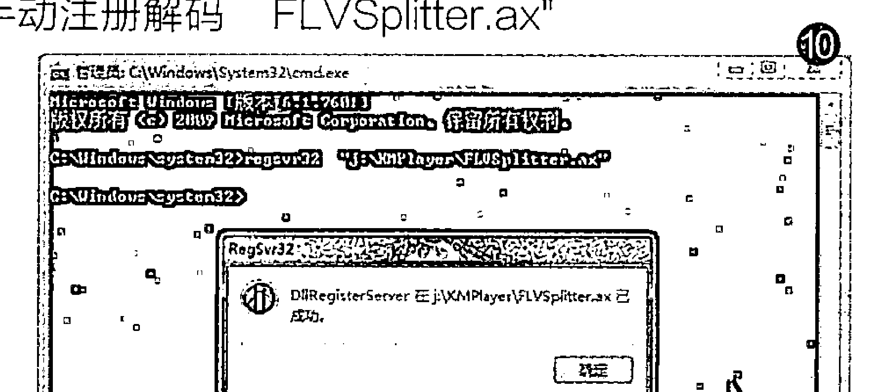

类似播放器可以通达注册组件扩展功能的软件还有很多，比如精简版ACDSee到http://dwz.cn/cfanx01下载插件，精简版Photoshop则可以到http://dwz.cn/cfanx02下载插件。

### 驱动维护要省心 解决驱动难题

大家知道驱动是硬件运行的基础，只有维护好驱动才能充分发挥好硬件的性能。不过在日常使用中由于驱动问题导致的故障并不鲜见。下面我们介绍解决驱动难题的一些方法。

文|俞木发

#### 软件替换

如果精简软件已经无法在本机使用，此时可使用同类软件替换的方法来解决问题。比如精简的Office 2010由于无法激活不能使用，此时我们就可以使用WPS、永中Office来替代。不过对于软件的替代，要注意的是尽量导出原有软件的配置、模板等参数，方便在替代软件中使用，同时确保替代软件可打开原来软件制作的文档。

比如Office 2010默认生成的都是“.docx”文件，选择替代软件时就要选择WPS2013，启动WPS后点击“文件→打开”，在文件类型中选择“.docx”即可打开它了，省去替代后无法打开原文件的不便（图11）。

WPS也同样可以直接打开Office的模板文件，比如Office默认模板文件在“C:\Users\当前用户\AppData\Roaming\Microsoft\Templates”下，在WPS中打开模板文件后将其另存为WPS模板文件，这样在WPS中就可以直接使用原来Office中的模板了（图12）。

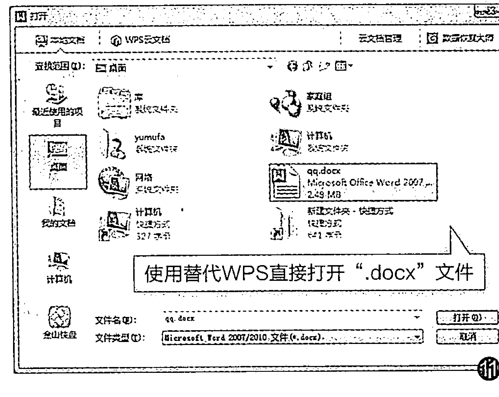

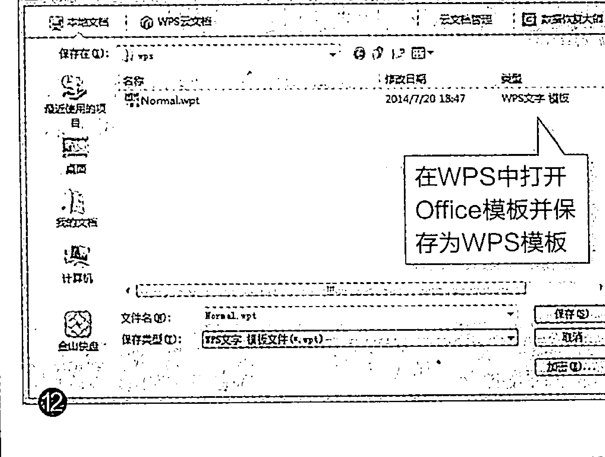

#### 不怕麻烦安装官方驱动

由于Windows已经包含大部分常见硬件的驱动，因此为了省事，很多朋友就直接使用内置驱动，这样就无法充分发挥硬件的功能。比如很多笔记本的触摸板，系统已经内置触摸板的通用驱动，这样系统安装好后触摸板即可直接使用，但是功能却很单一。如果要完整使用触摸板功能，在安装驱动时就该选择笔记本自带的官方驱动，比如Synaptics触摸板，安装官方驱动后，触摸板就拥有更加丰富的功能，可以执行更多自定义设置（图13）。

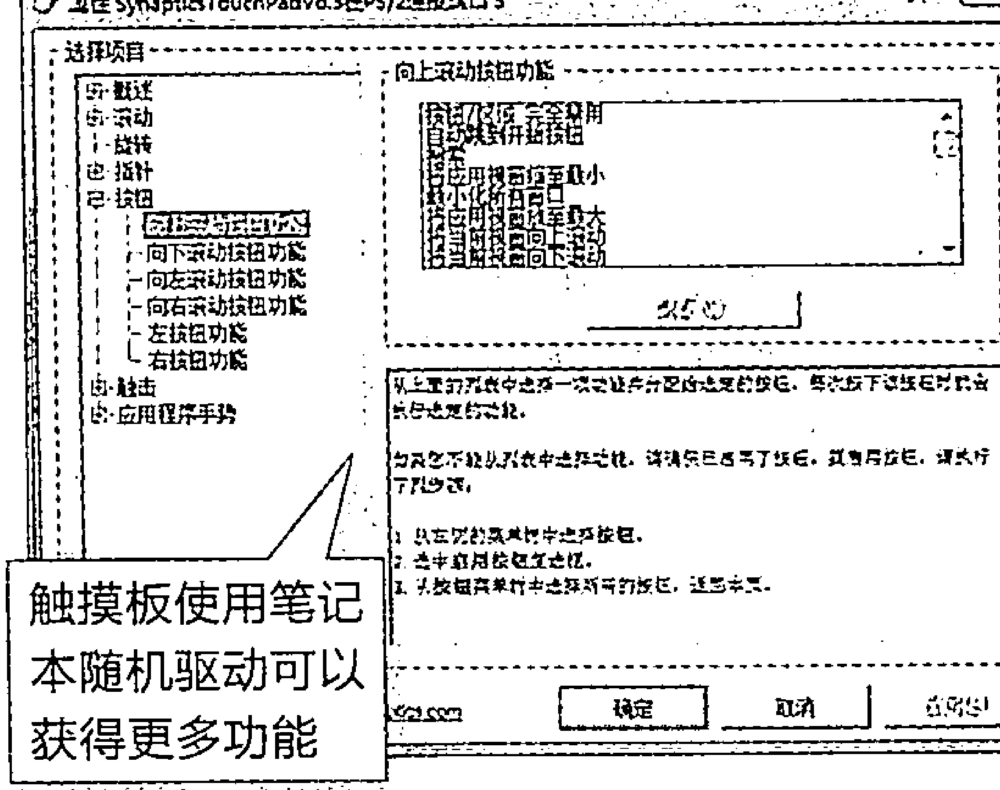

#### 不要随意精简驱动

由于系统内置驱动文件会占用大量的空间，很多朋友都认为驱动只要安装一次即可。因此为了节省C盘空间，一些朋友经常会将“C:\Windows\System32\DriverStore\FileRepository”中的驱动备份文件删除，这样重启以后经常会发现插入U盘等即插即用设备的时候却要求安装驱动的问题（图14）。这其中的原因就是由于用户将系统内置驱动删除，导致原来无需驱动的设备要重新安装驱动，给日常使用带来了不便。

#### 驱动安装要科学

日常使用中，很多朋友为了省事或者对硬件性能不满意，并没有对驱动进行正确的安装。由于考虑不同，很容易导致后续使用中出现问题。

- 正在运行的程序无法响应。
- 生成了系统无法删除的垃圾文件。
- 资源管理器经常崩溃导致桌面图标和任务栏消失。

> 触摸板使用笔记本随机驱动可以获得更多功能

##### 小提示

对于笔记本用户，如触摸板、Fn键、蓝牙、红外这些附加功能，经常需要笔记本自带的随机驱动才能充分发挥硬件的性能。

## 《电脑爱好者》·2014下半年合订本 【特别话题】

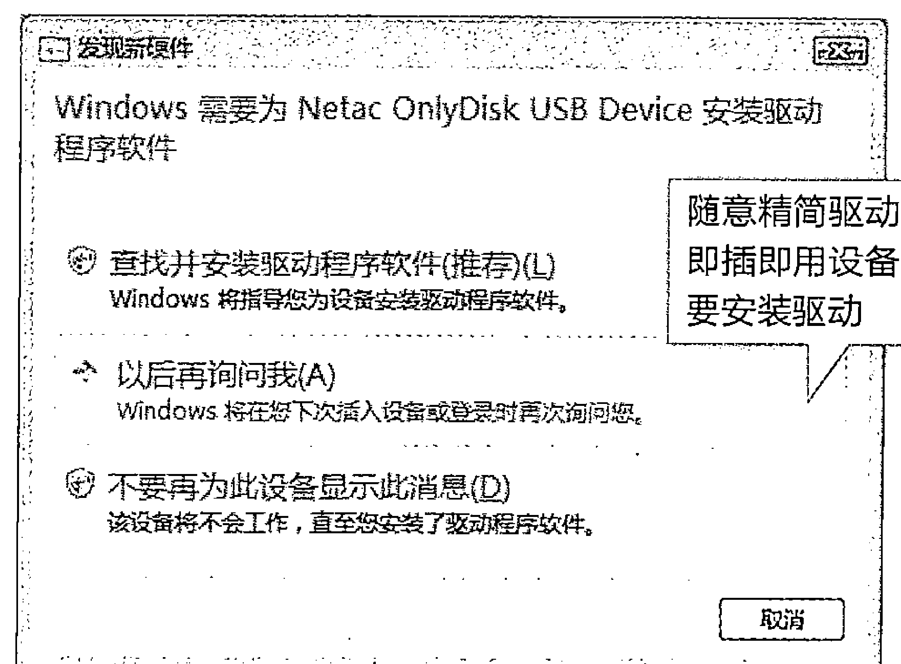

### 稳定为上 使用Windows Update升级驱动

为了保证系统运行的稳定性，微软在升级服务器上预置了大量通过WHQL认证的驱动，因此如果你的硬件出现故障，优先的解决方法是使用系统内置的升级方法。右击桌面“计算机”选择“管理”，接着打开“设备管理器”，在设备列表选中有故障的硬件，右击选择“升级驱动程序”，在窗口中选择“自动搜索更新的驱动程序软件”，这样会自动连接微软升级服务器，并下载最新的驱动程序进行安装（图15）。

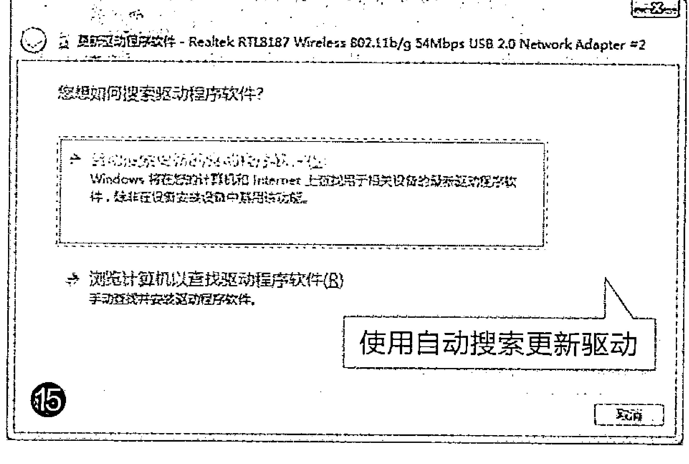

### 驱动升级解决硬件问题

由于在安装驱动时没有考虑周全，导致在日后的使用中出现故障，影响硬件性能的发挥。对于驱动问题解决的方法自然是升级驱动，为硬件安装最合适的驱动。

### 化繁为简 一键升级驱动

当然并非所有硬件都可以通过升级方式更新驱动，如果上述方法无效，可以借助“驱动精灵”实现驱动的一键安装。启动驱动精灵后切换到“驱动程序”，它会自动对本机所有硬件进行扫描并找出驱动有故障的硬件，扫描完成后只要点击“一键安装”即可完成故障硬件的驱动升级（图16）。

### 自己动手为疑难硬件安装驱动

一些较旧或者比较特殊的硬件的驱动需要手动进行驱动的安装，手动安装驱动的关键是要先找到正确的驱动文件。对于硬件的识别可以使用上述介绍的“驱动精灵”，首先将硬件连接到电脑，启动程序后切换到“硬件检测”，然后在此展开对应的硬件，确定其品牌和型号，有了这些信息后就可以到驱动之家等网站下载驱动了（图17）。
如果下载到的是包含“Setup.exe”的驱动，那么直接运行即可。如果下载到的只是单纯的驱动文件，那么就需要使用手动方法进行安装。在设备管理器选中需要安装驱动的硬件，右击选择“更新驱动程序→浏览计算机以查找驱动→定位到下载驱动目录”，剩余的操作按照提示完成即可（图18）。

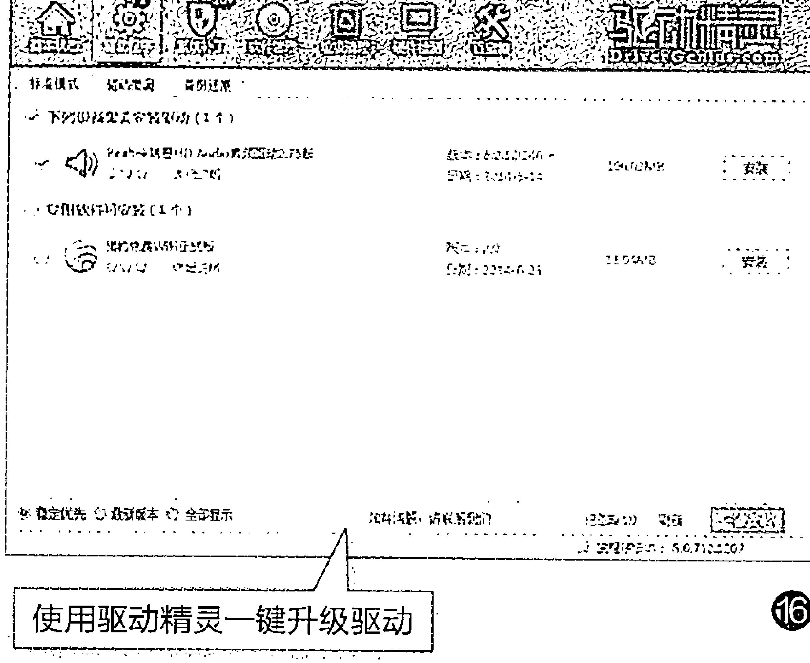

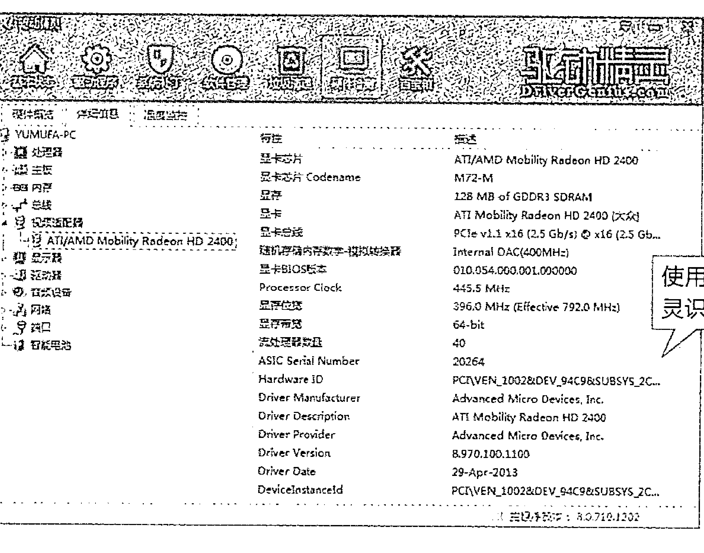

**小提示**
驱动的更新都要借助网络来完成，因此如果你的网卡有问题就无法联网升级驱动，对于这类电脑请使用包含万能网卡驱动的驱动更新软件。

**小提示**
驱动的下载首先要确定自己的系统类型（是Windows 7还是Windows 8），接着还要确定系统版本（32位还是64位），只有选择正确的驱动才能让硬件真正发挥功能。

### 《病毒清除》以后的系统修复

文/万立夫

古语说得好，常在河边走哪有不湿鞋。
在网上待久了以后，遇上电脑病毒也是正常的事。
其实我们都知道查杀病毒一般有两种方式，
而这两种方式又各有利弊，同时也会导致不同的后遗症。
这里就来说说杀毒前后的那些事。

#### [近优] 清除杀毒后遗症

不论是软件杀毒还是手工杀毒，都难免会对系统造成破坏，一旦遇到这种情况，如何进行修复呢？下面就5种最常见的杀毒后遗症给出解决方法。

##### 小提示

一些硬件驱动的升级比较特殊，比如AMD显卡、芯片驱动，为了确保新驱动性能完整，在驱动升级前一定要卸载旧驱动，而且为了保证卸载的完整，最好使用官方推出的专用程序。比如AMD用户可以到http://tinyurl.com/q5tre32下载“AMD Clean Uninstall Utility显卡驱动卸载工具1.4.0.0版”专用卸载程序。

#### [远虑] 病毒有风险 杀毒也谨慎

最常用的杀毒方法是使用专业软件，这种方法操作简单，但是也有明显的缺陷，就是杀毒软件可以清除病毒文件，但是病毒对系统的破坏不能百分之百修复，这样用户在杀完毒之后就会遇到各种各样的问题。其次还有一个问题，就是可能存在误杀的情况，这样也会造成系统或软件无法正常运行。
另一种方法是用户通过安全工具，自己手工进行病毒文件的分析和查杀。这种方法的最大问题就是难度较高，用户需要掌握一定的安全知识，比如进程、线程、启动项等等。除此以外，由于用户需要一项项地进行分析判断，因此需要花费大量的时间。当然这种方法的优点也很明显，就是可以发现杀毒软件没有检测出的其他问题，可以将病毒清除得更彻底。可以说手工杀毒的过程，也是一个对系统安全维护的过程。

#### 文件关联的修复

很多病毒为了可以让自身成功地运行，想尽了各种各样的方法，篡改一些常见文件的关联程序。比如文本文件的关联程序被修改成病毒文件，这样每次运行文本文件调用的都不是编辑器，而是病毒文件，这就相当于每次运行文本文件就激活了一次病毒。
解决这个问题其实非常简单，首先从网上下载安全工具System Repair Engineer（下载地址：http://tinyurl.com/3rfs38z，以下简称SREng），接着将主程序文件的后缀名修改为com、bat、scr等，这主要是避免EXE文件格式被病毒篡改从而无法运行正常的程序。现在在SREng主窗口点击工具栏中的“系统修复”按钮，点击右侧窗口中的“文件关联”标签。如果发现有被篡改的文件关联，就会在“状态”列表中通过错误提示显示出来（图19）。选中需要修复的文件关联项，点击下面的“修复”即可。

#### Hosts文件的恢复

病毒破坏系统的方式多种多样，修改Hosts文件的默认内容也是病毒破坏的常见手段。因为Hosts文件是一个用于将主机名和IP地址对应起来的文件，而病毒利用它不仅可阻止杀毒软件更新病毒库，还可阻止杀毒软件连接到云端服务器，甚至限制电脑系统访问某些知名的安全网站。

同样在SREng主窗口中点击工具栏中的“系统修复”按钮，这次点击右侧窗口中的“HOSTS文件”标签，在列表中就可看到当前Hosts文件中的所有内容。选中需要删除的内容后，点击“删除”即可，这种方法可以保留有用的Hosts规则（图20）。

如果Hosts文件被篡改的内容较多，那么点击“重置”按钮就可以一次性删除Hosts文件中的所有信息，当然有用的信息也将随之被删除掉。无论采用哪种方式进行操作，在操作完成以后都需要点击“保存”按钮，确认刚刚的操作。

#### 清除映像劫持

映像劫持是很多病毒都会使用的技术，它将杀毒软件等安全软件的进程劫持到病毒进程，或者某个根本不存在的进程上。其实这也是一种激活病毒的方法，目的和篡改文件关联差不多。

首先下载最新版本的PC Hunter（下载地址：http://tinyurl.com/q927yzb），运行后如果程序提示有线程插入并且询问是否杀掉这些插入线程，点击“是”即可清除，这说明系统里面还有病毒的残留。点击PC Hunter窗口的“系统杂项”标签，在“映像劫持”标签中就可以列出已经被映像劫持的内容信息。选中要清除的映像劫持内容后，点击右键菜单中的“删除IFEO（注册表和文件）”命令，不仅可以将注册表中的映像劫持项目删除，还可以将该项目指定的病毒文件一起删除（图21）。

#### 磁盘引导区修复

有时会遇到这样的情况，就是病毒明明已经被清除掉了，但是重新启动后病毒又出现了。这可能是因为病毒感染了电脑硬盘的主引导记录（MBR）所致，当电脑系统中的病毒被清除后，下次电脑启动时又会从引导区释放出病毒，从而给人造成一种“杀不完”的感觉。遇到这种情况又该如何操作呢？

在PC Hunter窗口中切换到“系统杂项”标签，在“杂项”中可以看到很多修复命令。点击窗口下方“检测MBR Rootkit”中的“检测MBR”按钮，软件开始对磁盘的引导区进行分析处理，确认里面是否有恶意代码和MBR代码被隐藏。当检测完成发现有问题的话就会提醒用户，接下来点击窗口下方的“重置MBR”按钮（图22）。这时软件会弹出一个提示窗口，点击“是”按钮就开始进行引导区的恢复，同时进行引导区病毒的清除。

> 注意：对引导区的修复，本身就存在很大的风险。为了安全起见，操作前，一定要对硬盘中的重要数据提前做好备份。

#### 其他项目的修复

对于Windows系统来说，注册表可以说是它的大脑中枢，很多系统选项的修复都是通过注册表来完成的，所以注册表也成为病毒攻击的重要对象。另外为了避免其他因素的干扰，在手工查毒的时候会在安全模式下进行，因此安全模式也常常受到病毒的破坏。

下载最新版本的AntiSpy（下载地址：http://tinyurl.com/p577p7u），在运行的窗口中选择“工具”标签后再点击“高级工具集”标签。比如要恢复注册表编辑器的正常使用，就选择“解锁注册表编辑器”选项，再点击“确定”即可。如果要恢复安全模式的正常使用，就点击“安全模式”下的“修复”按钮即可（图23）。

上面介绍的三款安全工具，在功能上有部分的重叠，用户可以根据需要来选择。比如在System Repair Engineer工具“系统修复”按钮的“高级修复”标签中，通过“自动修复”按钮就可以一键修复所有检测到的注册表错误（图24）。

### 解决历史遗留问题

文/范青

#### 虚拟硬盘存在隐患

现在还有不少电脑用户在使用32位的Windows系统，但越来越多的人使用4GB或更大容量的内存。对于32位的Windows来说，不管你使用多高的版本，Windows XP或Windows 8.1，对于3GB以外的内存，系统无法直接使用。因此，许多人利用虚拟工具软件将3GB外的内存虚拟为硬盘盘符，用它来存放系统的各种临时文件，比如页面交换文件、系统TEMP（或TMP）临时文件、IE浏览器缓存文件、其他缓存文件等，但是各种各样的问题随即也会发生（图1）。

> 创建内存虚拟盘的一种最简单的实现方法就是用超级兔子虚拟磁盘加速器。使用超级兔子虚拟磁盘加速器，可一键创建虚拟内存加速盘，并能自动将系统临时文件夹设置到虚拟盘中，用户还可以自定义虚拟盘的大小。

#### 解决虚拟内存不足问题

虚拟内存盘的空间是有一定限制的。比如，自己的系统中只有4GB内存，用多余的1GB内存虚拟了一个1GB容量的磁盘，如果将动态页面文件、系统TEMP临时目录、IE临时缓存均指向这个磁盘，那么开机之后随着使用时间的延长，该磁盘中存储的临时文件必然会急剧增加。不同于将临时文件设在系统分区或其他分区，系统可以动态调整临时文件所占磁盘空间的大小，由于这个虚拟磁盘有限的1GB容量，当磁盘快要占满1GB时系统就会发出磁盘缓存空间不足的预警。例如，在解压一个数GB的RAR压缩文件时，可能就会发生系统提示临时空间不足的问题，这就是因为WinRAR所需TEMP系统临时存储空间不够用造成的（图3）。

遇到这种情况，有两种解决办法。如果已将IE临时文件或系统临时文件指向该磁盘，那么，可以使用系统的清理功能或360安全卫士等系统工具，对临时文件进行清理，立即腾出虚拟盘空间。此外，如果手头上打开的文件不多，启动系统不费事的话，最彻底的方法是重启一次系统，这样虚拟盘中的文件会自动释放干净。

#### 解决虚拟盘符占用问题

以虚拟光盘的方式安装的套装软件，一般第一张光盘是安装盘，其余光盘是运行数据盘。比如《多媒体英语世界名著》学习软件，一共有9张光盘，第一张盘为安装盘，其余8张为数据运行盘。本来这套软件需要用光驱来安装和运行，但是现在的电脑许多都不装光驱了，如何让这套软件在电脑上运行？于是人们想到了虚拟光驱的办法，先将这9张光盘做成9个ISO光盘映像包，将这些文件统统拷贝到需要运行的电脑中，然后虚拟第一张光盘为盘符（如H:）并安装该软件。之后，点击该软件主程序图标，运行的时候要求在H:盘插入光盘，因此就要提前将某张数据盘虚拟为H:盘符才能正常进入软件学习。

在这种情况下，如果系统的虚拟加速盘正好也占用了H:盘符，那么当日后需要运行这套英语软件时，就会出现因为争盘符H:而无法找到数据文件的问题。要解决这个问题，一种方法是先用超级兔子虚拟磁盘加速器工具解除原虚拟磁盘，然后再重新设定虚拟磁盘为H:之外的盘符，这样就解除了对原有软件所用盘符的占用。另一种方法则是重新安装原有ISO安装光盘中的软件，给安装文件指定新的虚拟盘符（比如Y盘）。总之，只要错开两个软件对虚拟盘符的相同占用，改用不同的盘符即可解决问题（图2）。

#### 调整虚拟盘页面文件大小

如果有多余的多余内存（比如安装了8GB的内存条），但事先对页面文件的配置不合理，造成系统临时文件空间不足，则可以重新设定虚拟页面文件。

**Step1** 以Windows 8.1系统为例，在“这台电脑”上点击鼠标右键并选择“属性”，在“系统”窗口中点击左侧栏内的“高级系统设置”选项，在随后弹出的“系统属性”窗口中选择“高级”选项卡并点击“设置”按钮（图4）。

**Step2** 弹出“性能选项”窗口后点击“高级”选项卡，接着点击“虚拟内存”组中的“更改”按钮（图5）。

**Step3** 在弹出的“虚拟内存”页面中，取消对“自动管理所有驱动器的分页文件大小”的选择，然后选择驱动器为虚拟盘所在的盘符，接着选择“自定义大小”并设置页面文件的“初始大小”和“最大值”。例如，虚拟盘为4GB，那么可以设置页面文件的最大值为2048或3096，然后将剩下的空间留给系统临时文件夹TMP或TEMP以及IE浏览器临时文件夹使用（图6）。

### <不容忽视>的网盘问题

网盘的大容量和便于移动访问确实给用户提供了不少方便，但是，由于使用的当初考虑不周，可能会给日后使用造成种种麻烦。例如，存放重要资料的网盘忽然提示容量不足，需要升级为VIP扩大容量，除了花钱还有别的办法吗？网盘商忽然宣布要关门时，资料如何快速转移？网盘不小心分享泄露了隐私，有没有弥补方法？当网盘共享链接被屏蔽或关闭后，如何重新开启？

如果虚拟磁盘空间只作为存放系统页面交换文件的单一用途，那么，页面文件大小设置选择“系统管理的大小”比较省事，到底需要多少虚拟内存，系统会自动在有效空间范围内调整。但是，如果虚拟磁盘空间还要用作系统临时文件TMP或TEMP目录存放以及IE临时缓存，那么，就必须要用“自定义大小”选项来指定空间大小了，否则很可能会因页面交换文件占满空间而造成系统临时文件和IE临时文件存储空间不足的问题。

文/范青

#### 容量问题 未雨绸缪

目前的网盘，注册之后一般即会轻易拥有上GB的免费空间，这些空间对一般用户临时存放一些数据资料已经足够了。但是，一个现实问题是，目前常见的文件也越来越大，尤其是影视文件。如果用网盘来保存一些高清视频资料，那么几个GB根本算不了什么，马上会用完。这时，网盘会提醒升级为VIP会员，但VIP会员可不是白给的，每年都要收取一定数额的年费，而且最要命的是如果年费到期，还需继续交费才能延续空间，否则空间会被收回，这也就无形中将自己“套牢”（图1）。

| 购买空间 | 游戏下载 | 云解压 | 历史版本 | 自动备份 | 空间不足注册VIP扩充空间需要付出费用 |
| :--- | :--- | :--- | :--- | :--- | :--- |
| **15GB套餐** | **30GB套餐** | **50GB套餐** | **100GB套餐** | | |
| 月付: 7.5 元/月 | 月付: 15 元/月 | 月付: 25 元/月 | 月付: 50 元/月 | | |
| 年付: 75 元/年 | 年付: 150 元/年 | 年付: 250 元/年 | 年付: 500 元/年 | | |
| | | | | **支付金额 75元** | |

除了花钱注册VIP续空间外，实际上，在VIP年费的背后，许多网盘厂商很可能同时正在进行着一场免费的活动。如果不知道有这样的活动，或者“不差钱”，但又急需更多的空间，那么交费注册VIP是铁定的了。但如果挖掘一下这类活动，花三五分钟时间搞到几GB甚至几个TB的免费永久空间也不是不可能的（图2）。

#### 网盘关闭 数据何去

尽管网盘官方会提供非常诱人的GB甚至TB级别的“永久免费”空间，但这并不表示网盘的生命是永存的。大公司的网盘相对可靠，但也并不表示它们会百年无恙。2013年关门的迅雷随身盘和盛大网盘两家网盘就是一个很好的例证。因此对于我们网民来说，如果忽然有一天接到某网盘一周之后要关门停业的通知后，网盘中的资料该怎么办？

在这种情况下，如果家中的网络有10Mb甚至20Mb，下载网盘中的东西倒是不在话下。若只是一支慢慢流淌的“小水管”，那么恐怕其中的几十个TB的资源没等下完，人家就拉上了卷闸宣布关门停业了。这时不妨眼光向外，不要总是想着要将网盘中的资料下载回本地，而是想办法将其下载到另一块不同品牌的网盘中。具体思路和方法是，先将网盘资源生成外部链接，然后用迅雷下载该链接，在下载过程中从迅雷窗口中获得转换所得的直接下载地址（注：不要用迅雷下载，只是用它来获得真实地址），最后将获得的地址提交给另一种网盘的离线下载模块进行下载。这样，就实现了网盘资源由一种网盘向另一种网盘的快速转移，脱离了本地的网速因素，利用服务器端的高速优势，会很快实现大文件的快速转移（图3、图4）。

#### 泄露分享“关门”大吉

如果给别人分享的资料，不小心设置为无密码外链的方式，那么这个资料就可以被全网的人搜到。一旦发现这个问题，可到自己的分享窗口中，取消这个资源的分享，重新改用私密分享。这时，虽然网上仍然会搜索到这个资料的网盘链接，但别人点击之后，浏览器会提示资源已经取消共享、链接无效的提示（图5、图6）。

##### 小提示

有的人发现，自己的网盘并没有向外共享内容，但常常会收到系统发来的有网友关注自己的消息，于是担心自己网盘中的文件被别人看到。实际上，粉丝关注了你，或许是通过搜索加了好友，但看不到你未共享的文件。此时，只需保证自己的网盘密码的复杂性并保密，同时在网盘安全中心进行密保设置，就可以保证网盘资料的安全（图7）。

#### 链接屏蔽 解决有道

也有的朋友发现，自己给朋友们共享的电影或视频文件无缘无故地被取消了链接，朋友反映下载不到文件了。这个问题是如何造成的？如何解决？

大家知道，网盘共享分为外链和私密共享两种，而外链可以被所有人看到。如果共享的影视文件或其他文件涉及版权问题，那么官方的监察人员一旦发现有涉嫌版权文件存在，就会有权关掉你的外部链接，如果情况严重甚至封掉你的账号也不是不可能。在这种情况下，如果你要继续和朋友共享文件，就不能采用外链的方式。改用私密分享的方式，不会造成版权文件的大范围扩展，而作为小范围共享，只要使用作品的过程符合著作权法律关于“法定许可”和“合理使用”使用范围，还是允许适当使用的。

#### 跟上网络“小时代”

局域网是连接家庭或企业中不同PC和设备间的枢纽，相较于遍布全球的互联网，局域网有时更为重要。一个理想的局域网应具备安全、私密、快速高效等优势，而随着IT设备的日新月异，局域网技术也应该与时俱进。曾经的局域网只能够起到数据读取和拷贝的作用，现在的局域网不仅能够实现流媒体无线播放，还能实现跨平台跨设备共享。在移动智能设备时代，在智能家居的大环境下，局域网的重要性被提升到前所未有的高度。关注局域网，关注网络的“小时代”。

#### PC作为服务器的全面准备

将一台PC作为专门的文件服务器，这台PC的选购思路不能照搬普通PC，需要为长时间工作的稳定性做单独的考虑。

#### 散热与静音的平衡

公司拥有专门机房的朋友可能会对那些设备当中暴力的高转速风扇印象很深，一般专用于机房的机箱风扇都有共同的特点：转速非常高、风量大、风压强，但是完全牺牲了静音属性。这种散热虽然可靠性很高，但不见得适合所有人的需求。比如在家中或办公室使用单独的文件服务器，距离我们生活工作的位置太近，如果使用这类暴力风扇无疑就是严重的噪音污染（图1）。

使用普通的散热风扇作为服务器散热是完全可以的，不过要对风扇精挑细选。由于服务器经常需要7×24小时运转，尽可能所有散热风扇都选用寿命和可靠性较强的双滚珠轴承风扇，而远离那些油封风扇，因为服务器长时间运转和内部的高温会加速油封风扇的老化（图2）。

#### 寻找小网络的“中枢”

对网络而言，其中设备的重要性不言而喻。作为“小网络”的中枢，根据不同的预算、环境，其组成方式也是有所差别的。根据有限的预算选择更优的产品固然重要，熟悉新产品能在局域网组建时带来新思路，实现更丰富的可能性。

和油封轴承相比，双滚珠轴承的特点在于使用寿命长（大约在5万小时至10万小时），性能不会因使用时间的增长而明显下降。当然也有缺点，那就是初期噪音稍大。不过不敏感的用户几乎听不出来，而且滚珠轴承的噪音比较恒定，不像油封轴承那样初期噪音很小，后期会随着润滑油的逐渐挥发及灰尘的不断进入，变得噪音极大甚至出现因为轴承磨损造成风扇偏心而引起剧烈震动现象，后患无穷。在服务器散热风扇这部分，我们绝对不能偷工减料（图3）。

#### 开启处理器的节能选项

现在不论是Intel和AMD都提供了自家的动态超频/节能功能，这部分功能植根于硬件本身，会根据负载和用户需求动态调整处理器频率，非常适合服务器PC。但是不少用户为了达到最强性能，习惯将这些睿频功能关闭，手动锁死一个最高频率运行。在经常要打高负载游戏的家用PC中这种做法或许可取，但是在需要长时间运行的服务器当中无疑是弊大于利。首先，这样会大大增加功耗和电费，而且一直运行在高频率的电脑发热和稳定性都会较动态节能的电脑差，这是毫无疑问的（图4）。

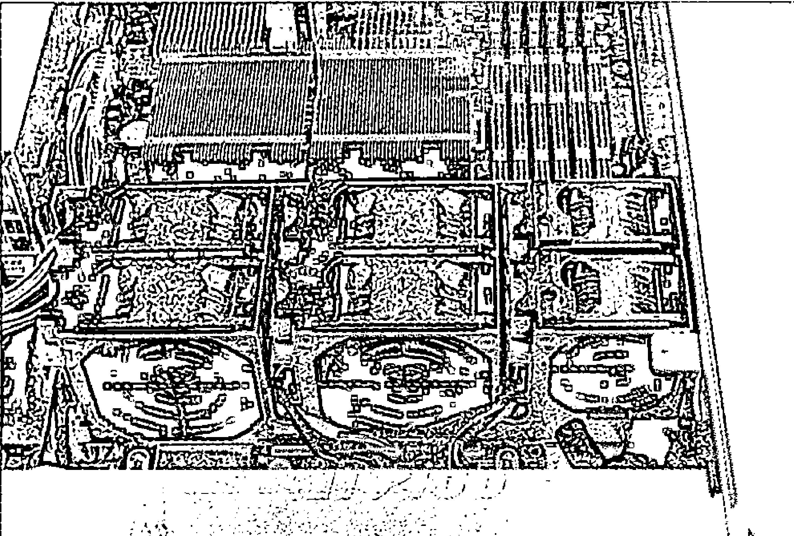

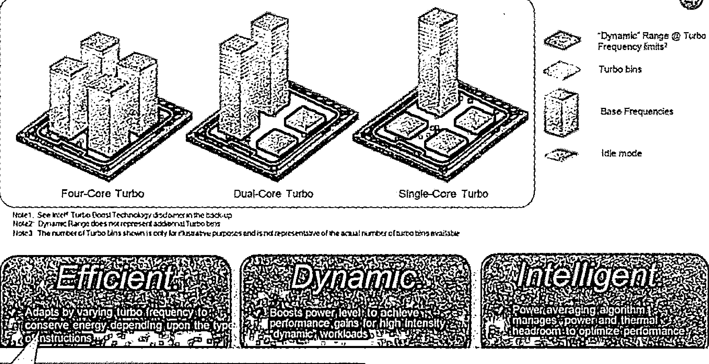

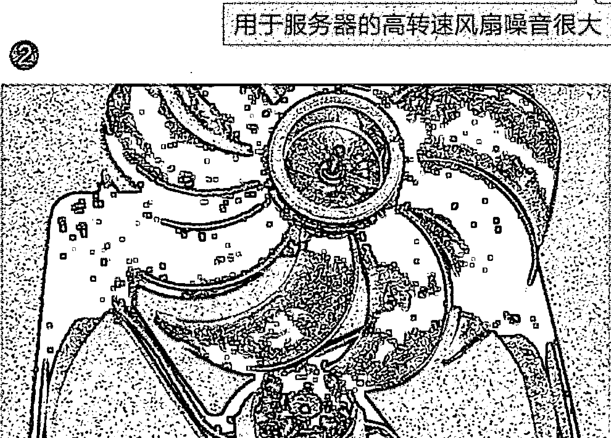

### 稳定 节能 便捷 内网共享文件的必选利器

除了用传统PC作为内容中枢之外，现在越来越强大的网络设备也能完成这个任务。网络设备作为中枢时除了要考虑到网络的稳定性外，还必须考虑到便捷及节能。而要达到这两个目的，我们可借助相应的硬件来实现。

#### 节能便捷的智能路由器

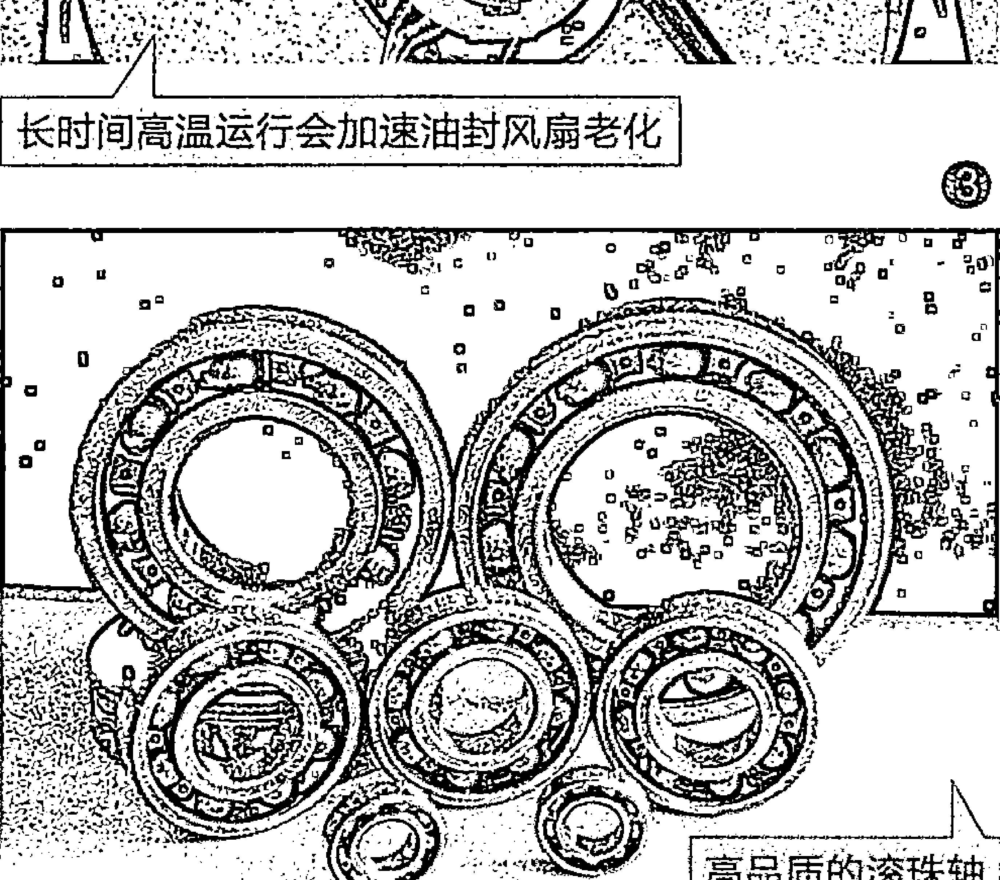

局域网各设备间共享文件，一个很大的问题就是不节能，同时操作起来也不方便。举个简单的例子，A电脑如果要共享B电脑中的资源，必须要打开B电脑才行。这样B电脑将会消耗一定的电量，同时如果局域网环境较大，它们分别处于不同地方，还需要B电脑前有人配合才行。因此，出于节能和便捷方面的考虑，现在使用了一些功能强大的智能路由器提供的相应功能来完成文件的共享操作，其实也是上上之选。

#### 选购分享型智能路由器

和一般路由器相比，智能路由器最大的特点有二：一是支持用户根据自己的需要自行安装一些必要的应用，如网络去广告、网游加速等；二是都提供了远程下载功能，允许用户通过远程控制，将喜欢的网络资源下载到U盘、移动硬盘或路由器自带的存储设备中。显然，智能路由器的后一个功能，为节能下载提供了条件。试想一下，离家在外，如果发现什么有趣的资源，只需用手机指定好相应的下载地址，家中的路由器就会自动将该资源下载回来，那感觉是不是很爽（图1）？

不过下载不等于分享，这一点我们在选择分享型智能路由器时一定要注意。尽管目前智能路由器产品很多，包括小米、360、腾讯、百度、果壳电子、迅雷和联想等企业都推出了相应的产品，但如果说起分享，其实只有小米路由器等不多的几款产品才能满足我们的要求。其原因有二：一是它本身提供了一个1TB硬盘，可满足视频、图片和音乐等大文件的存储要求；二是提供相应的客户端，利用它我们很容易将产品内置的硬盘，变成局域网各设备间可共有的磁盘，因而让分享变得简单、直接。所以在选购分享型智能路由器时，首先应考虑类似智能路由器这样的产品（图2）。

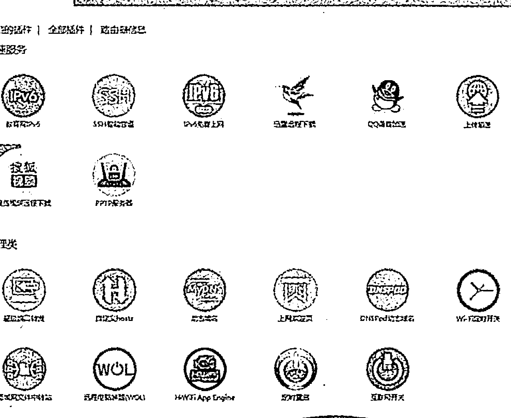

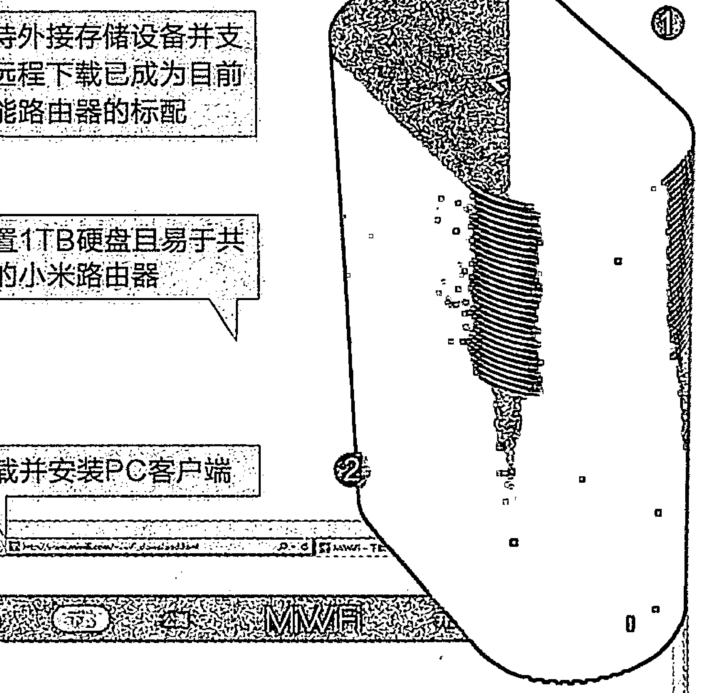

#### 用小米路由器共享文件

##### 实例1
###### 共享内置小米硬盘中的文件

由于在内网中，利用PC端和手机端共享小米内置硬盘中的文件方法类似，都可借助对应的客户端来实现，所以，此处我们仅以PC端为例简单地说一下。安装小米路由器，经过设置连接到网络以后，进入http://www.miWiFi.com/miWiFi_download.html页面，下载并安装相应的PC客户端。安装完毕，运行程序，在出现的登录界面中输入自己的小米账号和密码，单击“登录”按钮进行登录（图3）。此时在“我的电脑”列表中，会多出一个名为“Xiaomi”的网络磁盘，这就是小米内置的硬盘，以后，我们只需像使用本地硬盘一样，即可对其中的文件进行读写、编辑、删除和复制等操作了。同样地，在内网的其他PC中都安装该客户端，就可轻松地实现相应设备的文件共享（图4）。

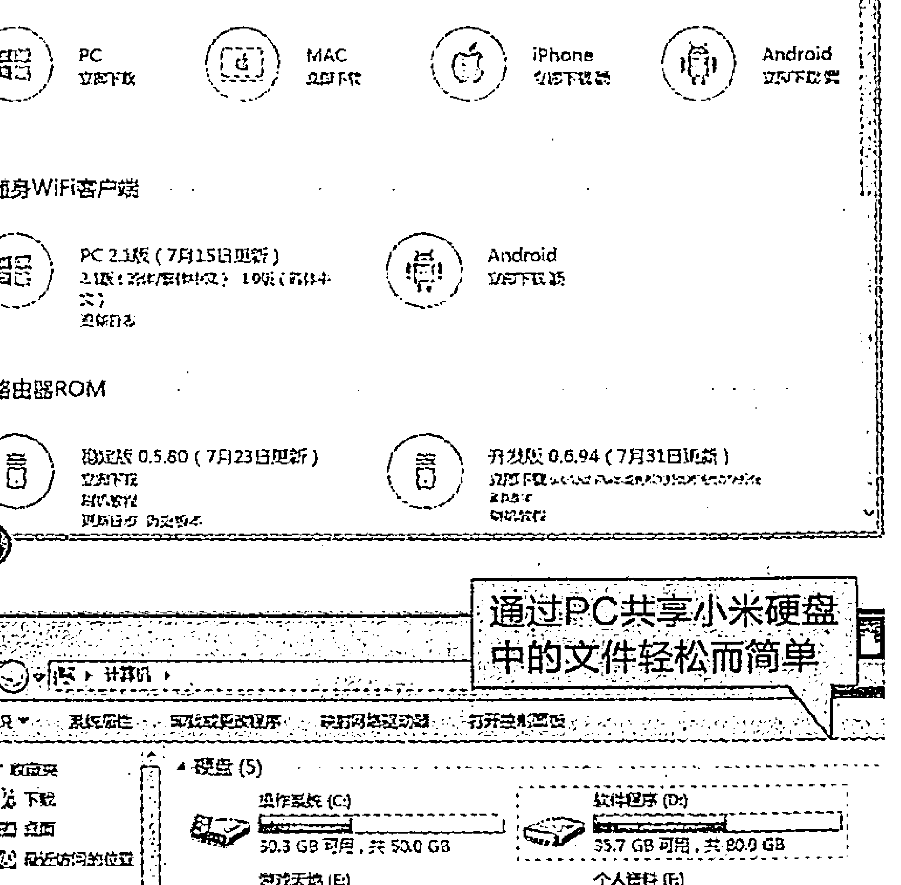

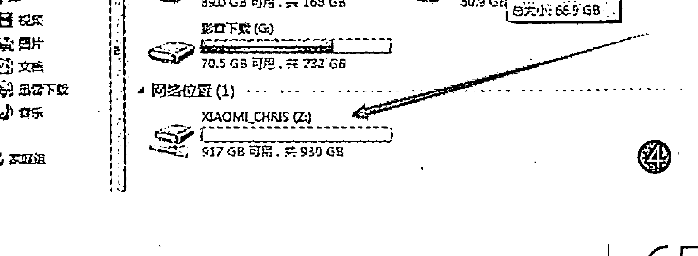

##### 实例2
###### 共享外置存储设备中的文件

除支持内置硬盘中的文件以外，小米路由器还支持共享外置存储设备，如移动硬盘、U盘中的文件，只是共享方法稍有不同。首先是在PC中共享，将外置设备插入路由器的USB接口，进入Windows资源管理器，在地址栏中输入：\\192.168.31.1\xiaomi-usb0，回车，外接存储器即会以网络文件夹的形式出现，双击访问即可（图5）。

当然，如果我们觉得每次都要在地址栏中输入相应地址才能访问很麻烦，也可右击该文件夹，在弹出的右键菜单中选择“映射网络驱动器”，打开相应的对话框，然后在其中的“驱动器”文本框中指定好盘符，在“文件夹”文本框中输入：\\192.168.31.1\xiaomi-usb0，单击“完成”按钮，将该文件夹直接映射为网络驱动器，这样以后再插入设备后就可以在Windows资源管理器的磁盘列表中直接看到并共享了（图6）。

然后在手机或其他智能操作系统中共享。和PC端相比，手机端共享外接存储设备的方法更简单。当有设备接入小米路由器后，客户端通知栏会收到提醒，点击该提醒，进入外接设备，就可查看共享其中的文件了。

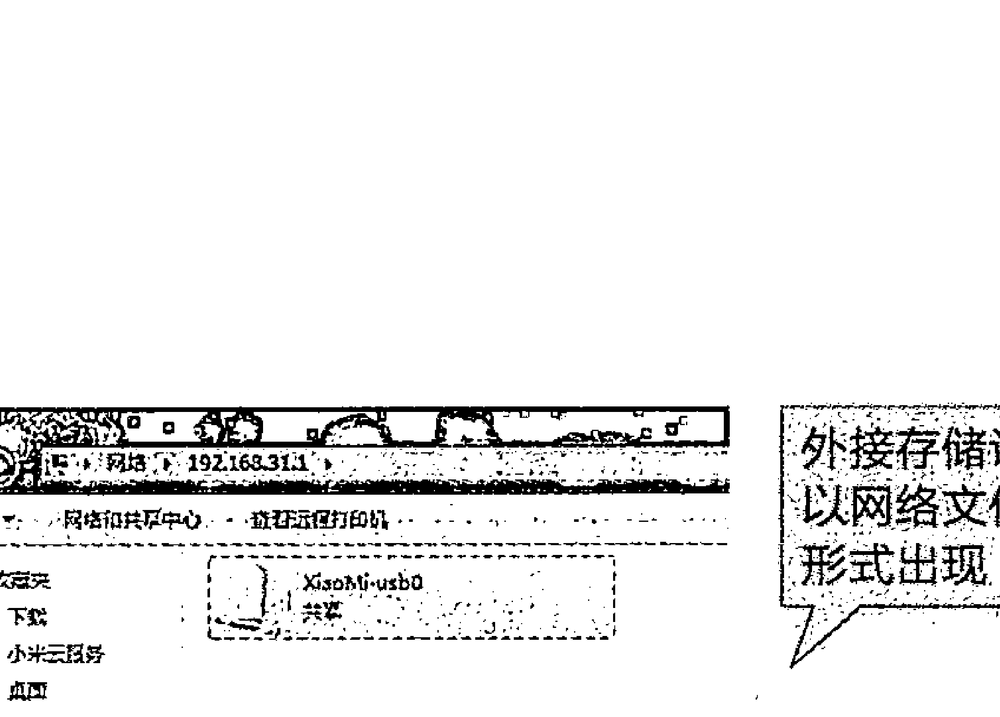

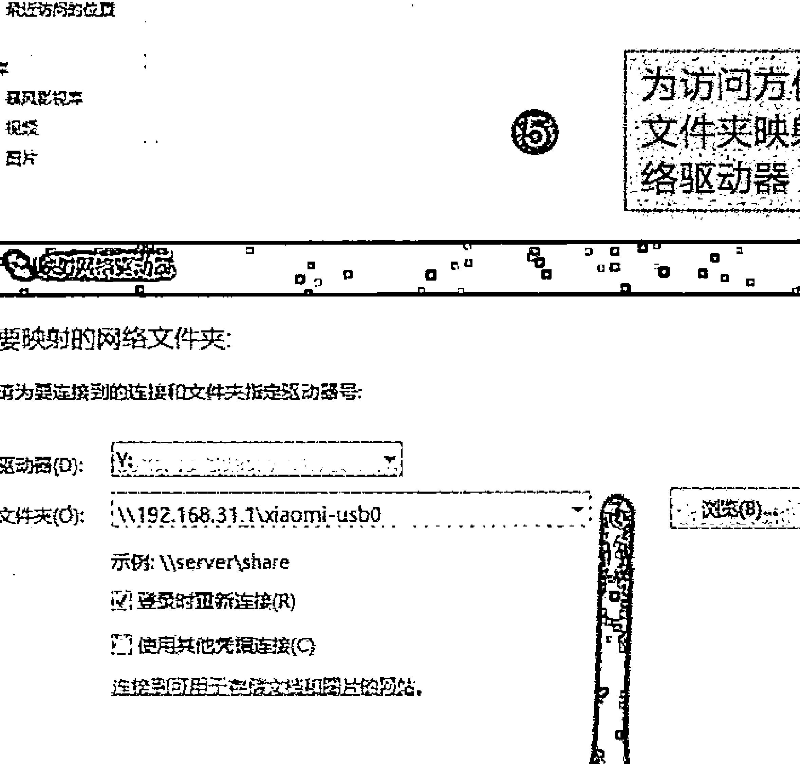

> > 主流的无线路由器天线增益均不会超过5Bi，发射功率则小于10mW

#### 搞定省事首选电力猫

拥有持续、稳定的网络，是局域网各设备共享文件的一个最基本的条件，通常情况下，我们会通过两种方法来达到目的。常见的一种是尽量以有线的方式连接设备，但连接手机、平板电脑就成了短板。通常状况下这些设备只有通过Wi-Fi网络才能实现上网，此外有线连接必须通过网线才能实现，这对于设备所处的位置没有事先布线的朋友来说非常麻烦。

或者通过强天线增益和大发射功率的无线路由器来实现。一般目前常见的路由器，天线增益多为5Bi或以下，发射功率小于10mW，这样的路由器应付一般小面积区域和承重墙较少的环境还可以，如果房间面积较大或者分上下层，由于当中承重墙较多，信号强度会受到极大削弱，最终导致网络连接不稳定，如网速缓慢或时常掉线等。而如果我们要特意为此购买一些大发射功率和强天线增益的产品，又会因辐射太大危害身体健康。

在这种情况下，一种更加便捷的连接方式就诞生了，这就是通过电力猫上网。和上述两种方式相比，使用电力猫上网具有两大优势：首先它无需专门布线，只要设备所处的位置有电源插座即可轻松上网。其次是网络稳定性极佳，无论是有线或无线，都能达到理想的上网效果（图7）。

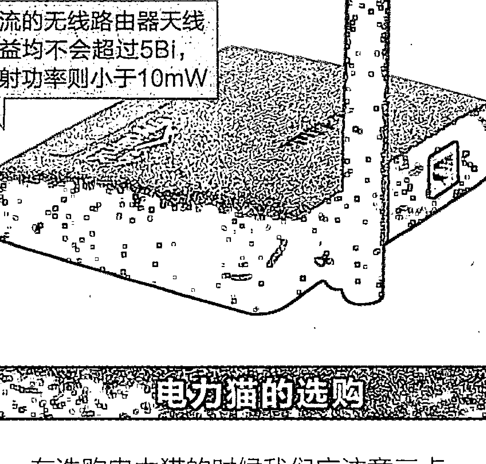

##### 电力猫的选购

- 在选购电力猫的时候我们应注意三点：
- 1. 一是电力猫要两只或两只以上才能使用，单独一只是没用的。所以选购时应尽量买配套产品或至少是同一厂家的多个产品，否则很可能会因生产厂家不同、规格不同而造成产品间无法识别，导致无法上网。
- 2. 二是购买的数量应根据具体的“上网设备数量+1”来决定。比如：我们家中有三台电脑，分别处于不同的房间，要想让它们全部通过电力猫来上网，应该购买四只电力猫才能实现。
- 3. 三是要弄清电力猫的类型。根据支持的上网方式来分，电力猫可分为有线和无线两种。其中前者需要通过网线和上网设备连接才能使用，而后者同时具有有线和无线两种方式，所以用起来更便捷。这一点，与有线和无线路由器非常相似，购买时要尽量选择后一种（图8）。

#### 电力猫的连接及设置

电力猫的连接和设置方法极其简单，下面我们不妨通过两种常见的连接环境具体地介绍一下。

##### 通过路由器实现有线上网

首先是配对。无论是有线还是无线电力猫，使用时的第一步就是让设备配对。不同的设备，其配对方法也略有不同，但都大同小异，一般的配对方法为：将第一电力猫（即直接连接Modem或路由器LAN端口的电力猫），和第二电力猫连接到电源插座上，同时按下配对按钮（电力猫只有一个按钮，即配对按钮），等到两者的指示灯由闪烁变为常亮后，说明配对成功。然后用同样的方法，完成对其他电力猫的配对。配对成功后，电力猫可随意拔插移动到其他地方，无需重新配对。

然后就是连接上网。用网线将第一电力猫的RJ45接口和路由器的任意LAN端口相连接，然后将其插到电源插座上，这时，同一电表下的电线，其实已充当了网线作用。将其他电力猫插到离要连接的电脑最近的电源插座上，用网线和电脑连接，至此网络的连接过程就完成了，所有电脑就可以通过路由器流畅上网了（图9、图10）。

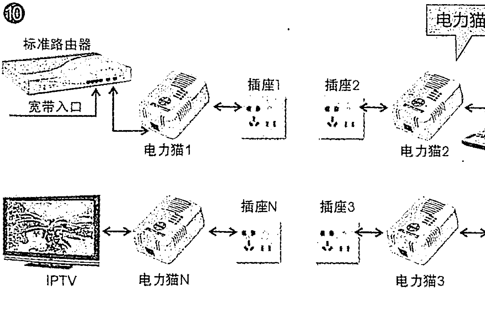

##### 不通过路由器实现无线上网

在没有路由器的情况下，第一电力猫需充当路由器角色。以WPL-203电力猫为例，先将WPL-203电力猫插到电源插座后，用网线将其和电脑连接起来。由于WPL-203电力猫的默认的IP地址为192.168.2.254，所以我们首先要进入界面将电脑的IP地址、子网掩码和默认网关分别设置为192.168.2.100、255.255.255.0、192.168.2.254并保存。

然后在浏览器地址栏中输入192.168.2.254，回车后，进入电力猫登录界面，输入账户和密码（默认都是root），登录后进入设置页面，选择左侧的“设置精灵”项，单击“下一步”，在出现的界面中，选择“运行模式设定”为“路由器”，然后在接下来的步骤中，依次选择“连接类型”为“PPPoE（ADSL）”，同时设置好宽带账号及密码；设置无线网络名称；选择“加密型态”为“WPA2-PSK”，然后设置好无线网络密码，保存并重启电力猫。至此，第一电力猫的自动拨号及无线设置工作即告完成，其他设备就可通过它进行无线上网了。
最后将其电力猫同第一电力猫进行配对，进入设置界面选择“运行模式设定”为“桥接器”，同时，设置好无线网络名称和密码等，这样，这些猫就同样具有有线上网和无线上网功能了（图11、图12）。

#### 移动设备如何变身小网络“中枢”

除了PC以外，智能手机也可作为小网络里的“中枢”，将其存储卡内的数据供其他局域网内的PC和移动设备访问。与PC相比，移动性和随意性就是移动设备作为中枢时的最大优势。

以Android手机为例，想变身小网络里的中枢只需一款“ES文件管理器”（下载地址：http://t.cn/RPp8yFt）即可搞定。只是在使用时可能存在以下两种情况：

- 1. 有无线Wi-Fi网络时
手机和PC接入同一无线网络之后，在手机端打开ES文件管理器，点击右上角菜单按钮选择“远程管理器”，然后点击此界面的打开按钮，屏幕上就会出现一个ftp地址（图1）。此时，我们只需在PC的资源管理器中输入该地址就可在PC上直接访问手机存储卡中的所有数据（图2）。

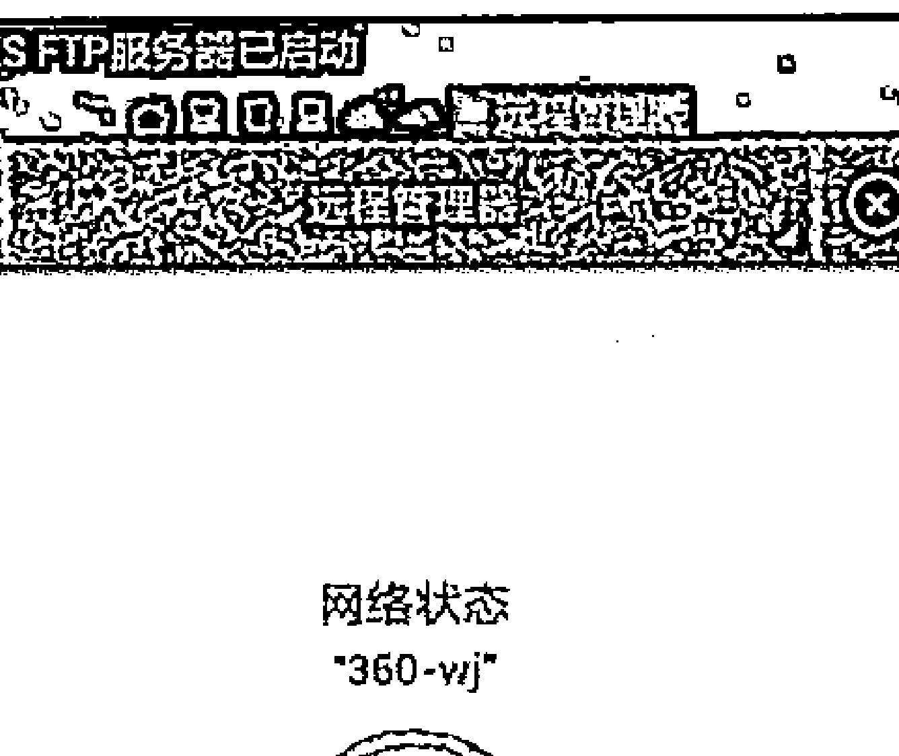

- 2. 没有无线Wi-Fi网络时
在没有Wi-Fi信号的户外，如果你想将自己的手机作为小网络中枢供朋友的手机分享，则需先进入ES文件管理器的“网络管理器”界面，选择“创建网络热点”得到新建热点的用户名和密码（图3），然后返回“远程管理器”获得ftp地址。
PC端访问和之前相同，但其他手机若想访问作为“中枢”手机里的文件，同样需要ES文件管理器的帮忙：依次进入“菜单→网络→FTP”，选择新建FTP服务器，其中服务器就是192.168.x.x，而端口则是ftp地址的后四位数字，勾选匿名点击确定后（图4），朋友的手机就会搜索到“中枢”里的文件了（图5）。手机比PC方便的是，无需下载即可直接播放“中枢”里的多媒体文件。
总之，以手机为代表的移动设备作为小网络的中枢凸显了便利性的优势，不存在对网络的依赖，只要设备之间都支持Wi-Fi即可。

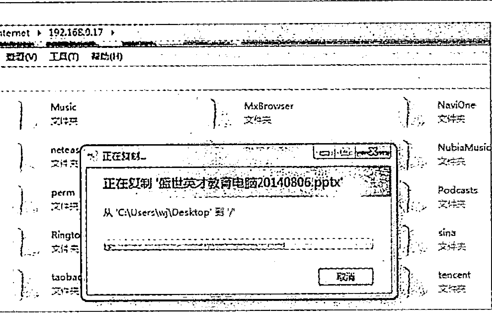

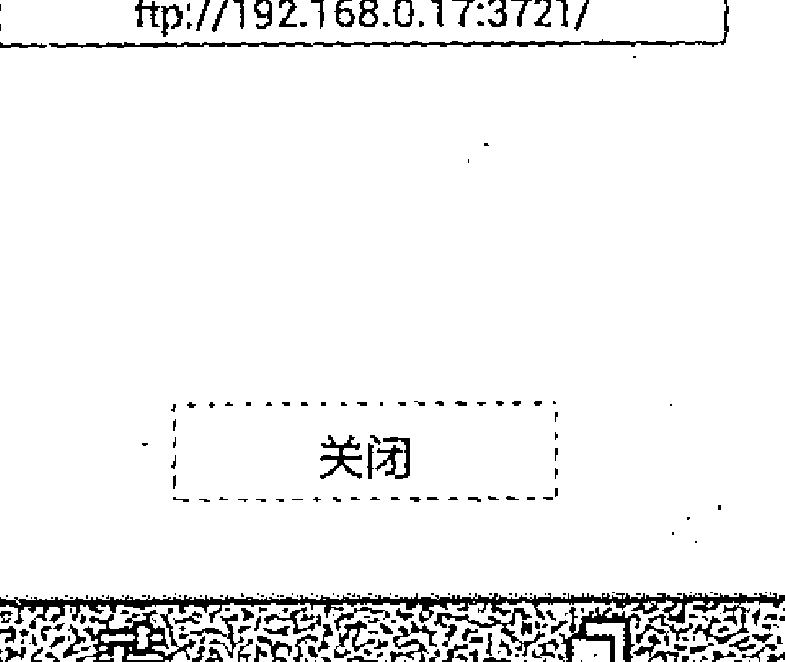


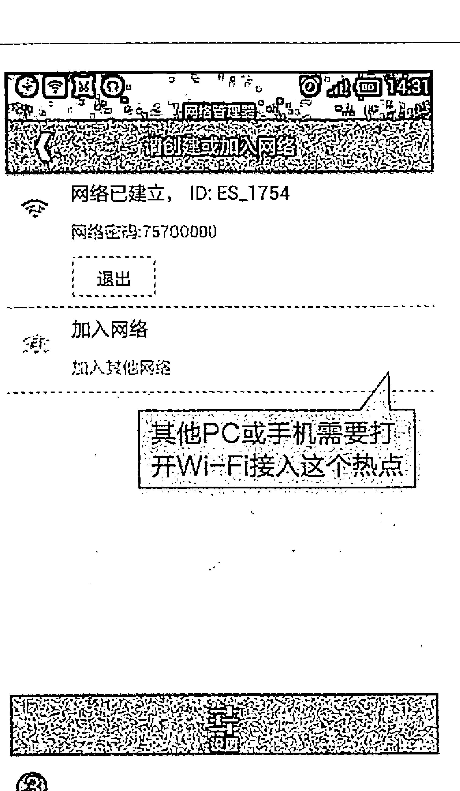

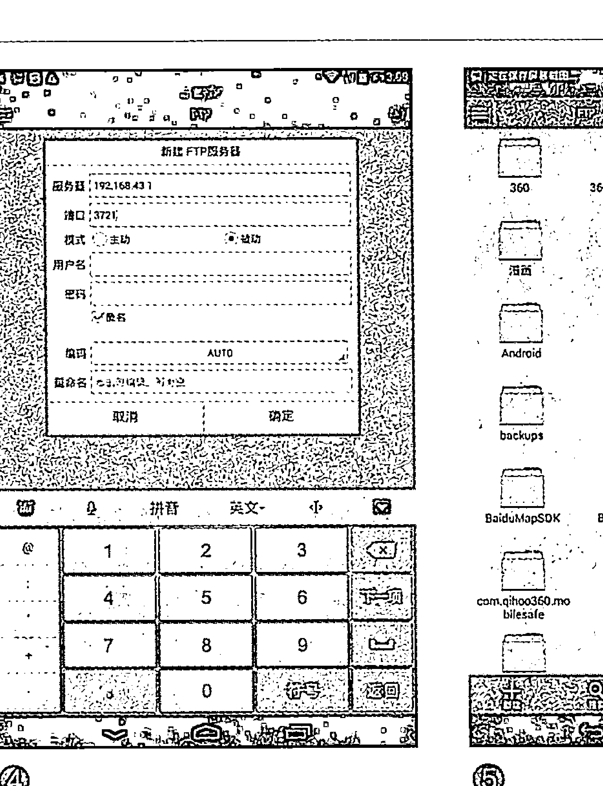

扩展阅读：无线U盘可作为临时外出时的“局域网文件服务器”，此类设备可通过内置的Wi-Fi模块共享AP热点，其他设备接入后就可利用APP客户端或浏览器访问U盘内的数据，或直接播放里面的视频，是iPhone这种不支持存储卡扩充设备的最佳助手。

#### 专业服务器打造小微企业的中枢

对家庭用户而言，将PC、路由器、NAS等设备打造为小网络的“中枢”很靠谱。但对追求更为严格的安全性和稳定性的小微企业而言，专业的需求还是交由专业的设备吧。

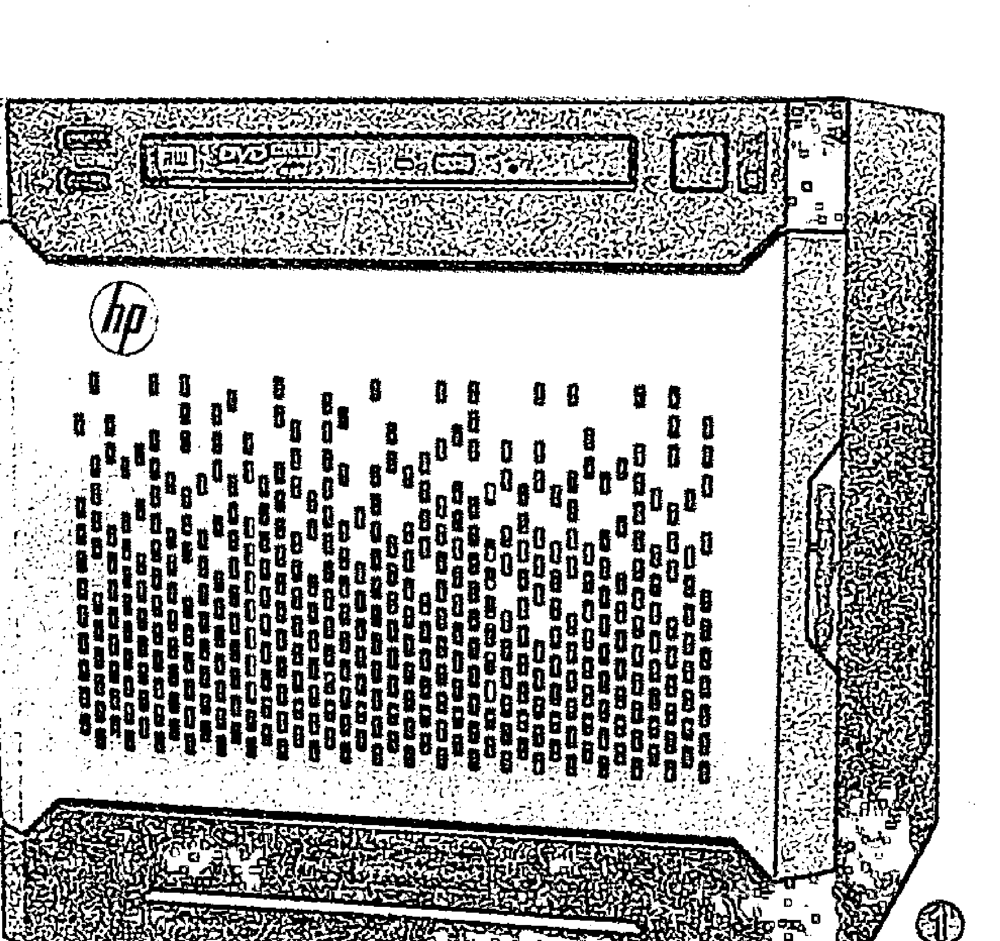

惠普MicroServer Gen8微型立式服务器（约3499元。）

##### 更靠谱的微型服务器

数据安全与维护成本是企业区别于家庭用户的差异所在，因此有必要购买专业级的服务器用于建立小网络的“中枢”，在这里我们推荐采用低噪音、低功耗的微型服务器。以惠普MicroServer Gen8微型立式服务器为例，该产品就搭载了英特尔赛扬G1610T（2.3GHz）处理器，内置2GB内存，提供4个硬盘位和双网卡等特性。此类产品在性能、功能和扩展性上远远强于4盘位的NAS，而且价格也没有超出太多（图1）。

当然，如果你的预算有限，还可考虑DIY的方式组建文件服务器。需要注意的是，文件服务器优先考虑稳定性，性能不必很强，有一定的扩展能力，一般来说赛扬/奔腾级别的处理器+2GB内存就已经足够，主板和电源尽量选择比较好的产品。主板选择带有RAID的产品，推荐使用RAID1方式（图2），这样能够降低发生硬件设备或系统故障后的恢复难度和恢复时间。

小提示：专业级服务器通常仅支持ECC校验的服务器内存，对普通PC用的内存兼容性不佳。

扩展阅读：在预算有限的情况下，为了保证数据的安全，还可以使用两台已有PC，在一台PC上存储文件，定时将数据同步到另一台PC，这样做的好处有三：

- 1. 省去了购置服务器的额外开销；
- 2. 这两台PC可以兼做其他用途，因为文件服务一般的负荷都比较低，除非在同一时间内经常很多人同时读取或写入大文件；
- 3. 定期同步的方式还有一定的防止误删除的效果。

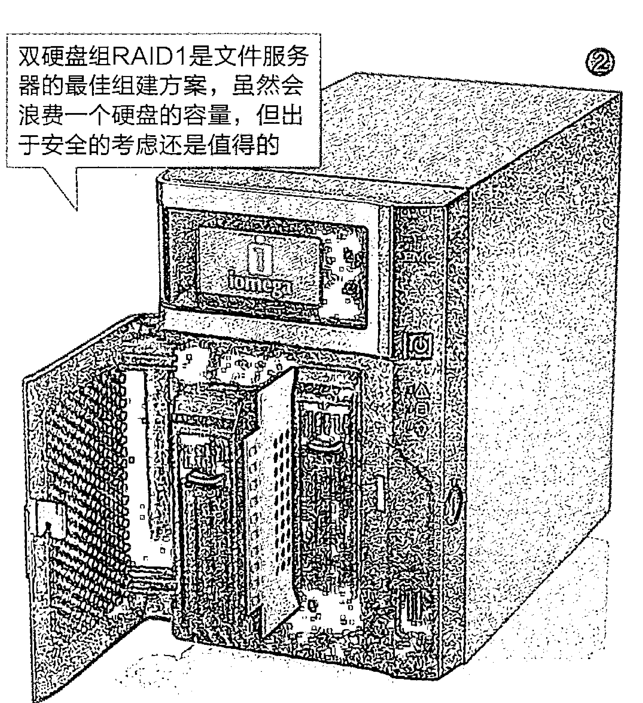

双硬盘组RAID1是文件服务器的最佳组建方案，虽然会浪费一个硬盘的容量，但出于安全的考虑还是值得的。

#### 系统和软件的搭配方案

对局域网文件服务器而言，系统和软件搭配的合理性才是决定其是否好用的关键。就小微企业而言，可选择的系统和软件可谓丰富：

##### 系统的选择

Windows（Windows XP、Windows 7、Windows 8等）：
能实现基本的文件存储和权限控制，共享方便、灵活，使用也很简单。
缺点：仅以共享功能为主，缺少高级控制功能

Windows Server：
Windows Server版能够提供文件服务器的其他管理功能（图3），如配额管理、文件屏蔽、存储报告、重复数据删除等。如果使用Windows 客户端，这种方式能够实现最大化的便利性。
缺点：Windows Server 的授权费用很高。

Linux：
相对Windows 而言更专业，但程序较少，多数情况下只能作为服务器系统使用。无GUI 版本更是需要专业人士才知道如何维护，但所需的运行内存等系统资源要求量最少，能最大程度地把资源给需要的程序使用。
缺点：配置相对Windows要复杂些。

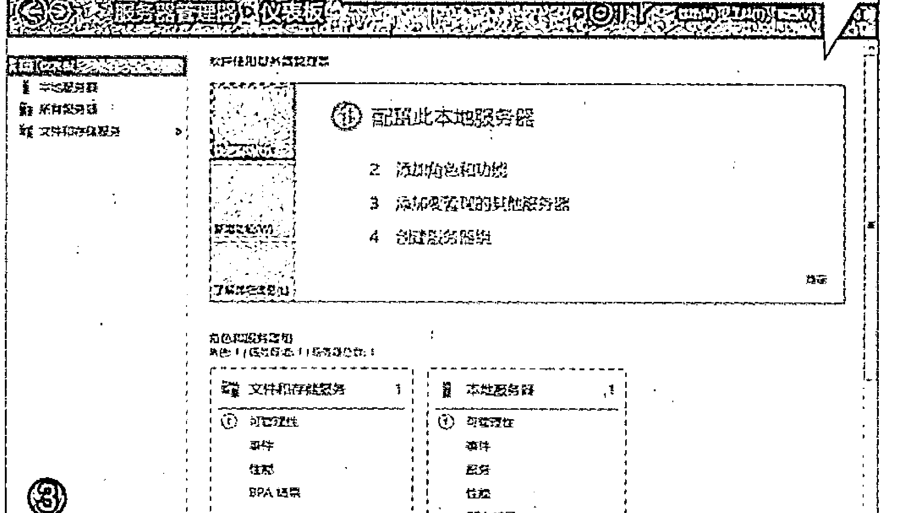

NAS：
这是一种由开源操作系统衍生出的专用系统，能提供文件存储、共享、权限控制等功能，例如：Freenas、Openfile等。这种操作系统一般采用Web方式进行管理，配置比较简单，操作系统体积很小，可以使用光盘或U盘进行启动，启动后退出光盘或U盘即可，能最大限度地避免操作系统的损坏。
缺点：专用的操作系统，实现其他的功能要麻烦些。

##### 共享方式的选择

由于我们一般会采用Windows的客户端，因此谈到的共享默认都是指Windows的共享，而Windows共享实际就是使用SAMBA协议的一种共享方式。除了这种方式，还有FTP、AFP协议等共享方式。

SAMBA协议：
SAMBA协议是使用最广泛的局域网文件传输的协议，一般使用Windows客户端都会使用这种文件共享方式，上面介绍的操作系统也都能够提供这种服务。

FTP协议：
FTP协议是一种很古老的文件传输协议，至今依然有很广泛的应用，尤其是在互联网上，在局域网我们同样也可以使用它来进行文件共享。FTP最大的优点就是支持广泛，所有的操作系统都几乎内置了对FTP的支持，上面介绍的几种操作系统也很容易建立起FTP服务器。

AFP协议：
AFP协议是苹果公司推出的协议，主要给MAC OS X用户共享文件使用，上述介绍的操作系统中，NAS能够提供这种协议的支持，Linux也可以实现，但实现的方法比较麻烦。

##### 软件的选择

针对不同的协议，我们采用不同的软件来实现。
FTP：可供我们的选择很多，在Linux系统中可以采用Vsftp、Proftp等；在Windows中免费的可以使用IIS、Filezilla，收费的软件可以使用Serv-U等。
Samba：Windows、NAS操作系统都内置了这种协议的共享，Linux需要对里面的Samba服务进行配置。
AFP：NAS可以直接提供AFP的共享，其他操作系统实现起来都比较麻烦。

#### 保证通畅的高速网络出口

PC、网络（有线/无线）、服务器、ISP，流畅的网络必须保证以上环节都畅通。其中服务器的选购建议使用支持上网行为管理的服务器。即不使用里面的上网行为功能，其他操控性都是使用代理服务器这种古老的上网方式无法比拟的。
此外还要注意参数的选择，一般是看并发数量，就是同时在网人数×每人的上网连接数。好的ISP是决定上网是否流畅的关键，有些ISP时快时慢，这种故障很难排查，必须把所有设备断开后才能检测出来，所以使用前一定要多测试。

### 小网络的大智慧

文|俞木发

如何搭建安全高效的小网络，不同设备之间的数据如何以不同的形式共享？曾经流行于小网络中以数据备份、拷贝为主的方式，借助更高速的网络也终于摆脱了中间的迁移过程，实现了直接访问、读取、播放的能力。将小网络的优势发挥到极致，接下来就是我们要探讨的主题。

#### 简单为王

##### 局域网共享玩简单

日常操作中，我们经常要在不同电脑之间交换文件，如果是局域网的电脑，利用一些工具可以简单、快速地实现。

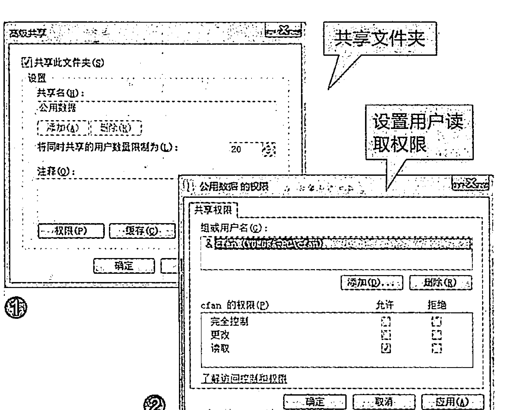

##### 就地取材用好系统自带功能

Windows本身已经自带共享组件，如果局域网内其他电脑需要共享资料，利用服务器设置共享目录即可简单实现。比如公司的生产统计数据、日销售报表等数据资料，公司其他部门经常需要查阅，现在只要将这些资料放置在服务器共享目录即可。

假设资料都保存在服务器的“K:\公用数据”，首先在服务器新建一个用户“cfan”并设置密码，用于其他用户专门访问。接着右击上述目录选择“属性→共享→高级共享”，在打开的窗口勾选“共享此文件夹”（图1）。

因为很多资料我们希望共享的用户只有读取权限，这可以通过用户权限设置来实现。点击上图所示中的“权限”选项卡，在打开的窗口中删除原来的Everyone用户，继续点击“添加”，将上述建立的cfan账户添加到用户列表，将其权限设置为“读取”（图2）。

这样局域网内的用户就只能使用“cfan”账号访问共享资源，而且只有读取的权限。在局域网电脑中打开资源管理器，点击“映射网络驱动器”，在打开的窗口设置一个驱动器，点击“浏览”选中网络内共享的目录（图3）。

这样以后如果局域网用户要访问共享目录，只要双击资源管理器中的Z驱动器，输入cfan账户和密码即可访问共享目录了（图4）。

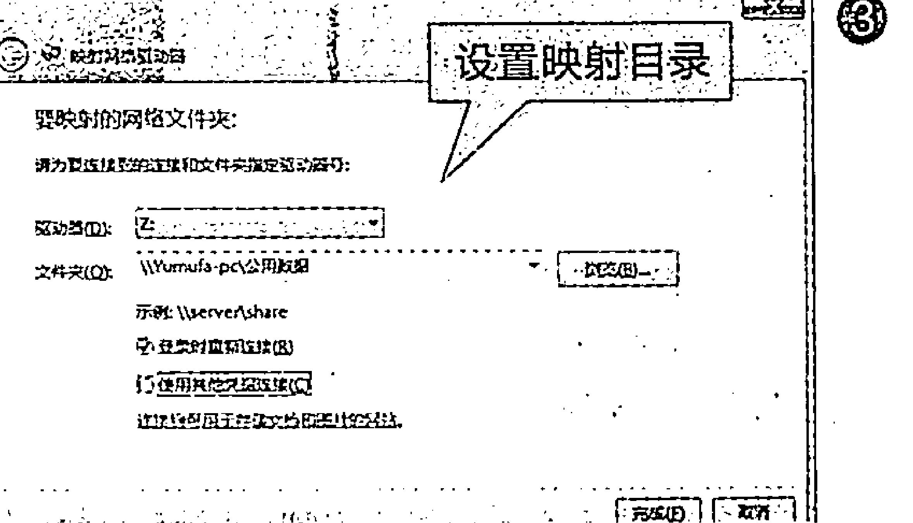

##### 简单同步打造局域网网盘

除了访问服务器上的共享目录，我们还经常需要在不同电脑之间同步文件，虽然使用快盘、云盘功能很方便，但是很多资料为了不泄密，我们并不想通过外网服务器实现。现在我们可以利用“Seafile”，将局域网里的一台电脑作为服务器，搭建一个仅局域网内部能访问的专有云存储服务。

首先到http://seafile.com/download下载“Seafile”的服务器端和客户端备用。接着到http://tinyurl.com/lecg6en下载Python并安装到服务器上，记住其安装位置（默认为C:\Python27）。右击桌面“计算机”，选择“属性→高级系统设置→高级”，点击“环境变量”，在打开的窗口中点击“系统变量”下的“新建”，新建一个名为“PATH”的项，变量值为“C:\Python27”（图5）。

将下载到的Seafile的服务器端解压到“K:\”，运行其中的Run.bat启动服务端。启动程序后按提示选择一个分区作为Seafile服务器数据的存储位置，接着会在后台自动完成配置，Seafile将会在你选择的磁盘下为你创建一个名为“seafile-server”的文件。

右击Seafile服务器的系统托盘图标，选择“添加管理员账号”选项，在弹出的对话框中配置需要的管理员用户名和密码。继续右击图标选择“打开seafile-server文件夹”，然后使用记事本打开其中的“ccnet/ccnet.conf”文件，将下面的参数按自己的实际情况设置，完成后点击选择“重启Seafile Server”：

```
NAME = my
SERVICE_URL = http://192.168.1.3:8000（其中IP为服务器的内网IP地址，后为访问端口号）
```

重启服务后打开浏览器输入http:// 127.0.0.1:8000，按回车键后使用上述添加的管理员账号和密码登录，如果可以成功登录即可看到程序管理页面，这样就完成了服务端的配置（图6）。接下来对客户端进行配置。将Seafile客户端安装到局域网电脑上，启动客户端后输入上述设置的管理员账号登录（图7）。

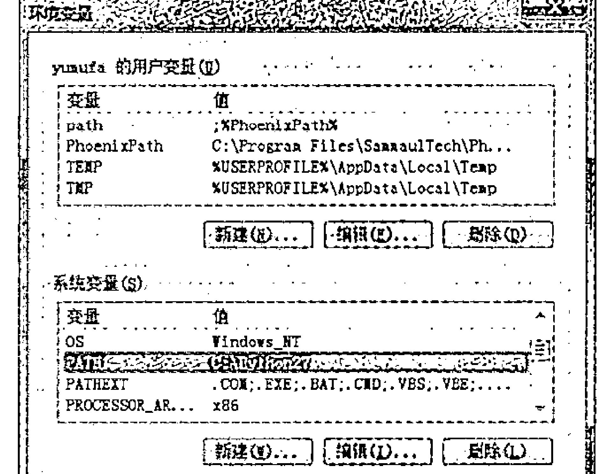

成功登录后就可以设置一个本地目录和服务器的目录自动同步了。比如需要将“K:\同步公文资料”目录和服务器同步，在客户端界面点击“选择”，然后定位到上述目录，在打开的窗口中输入新资料库的参数（图8）。

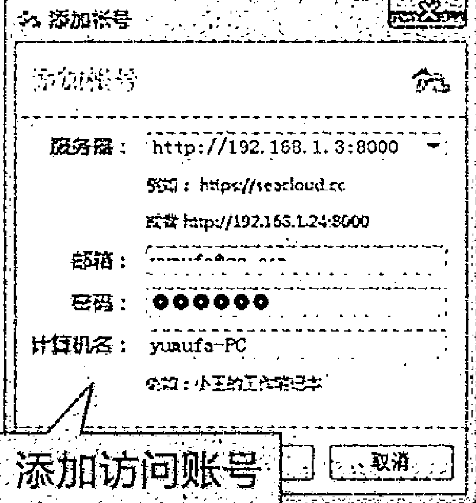

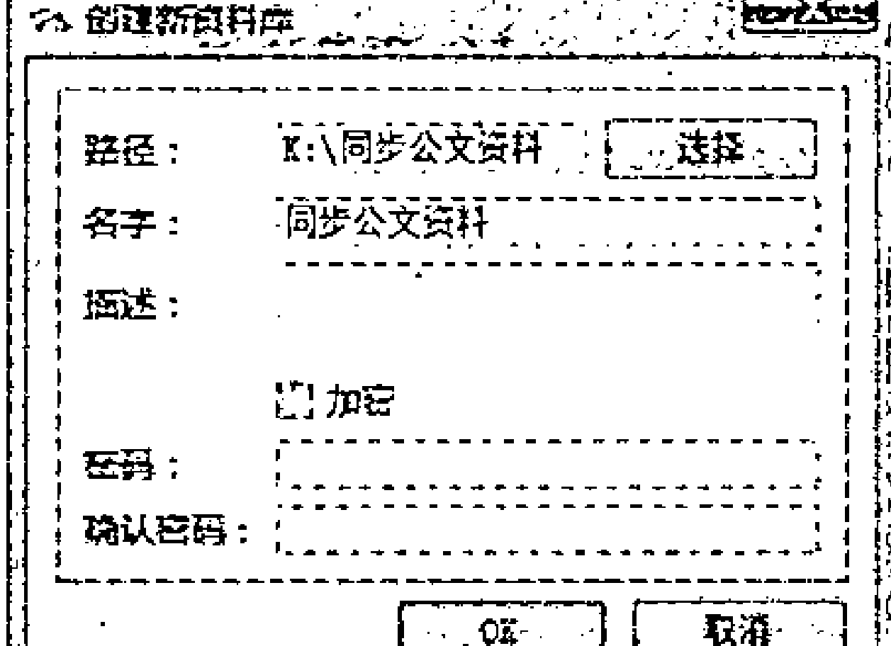

这样在客户端就会自动出现上述添加的目录，并且会在后台自动将数据同步到服务器。以后我们只要将需要同步的资料保存在“K:\同步公文资料”下即可实现文件的自动同步到局域网中的服务器上（图9），达到的效果与现在流行的网盘功能相似。

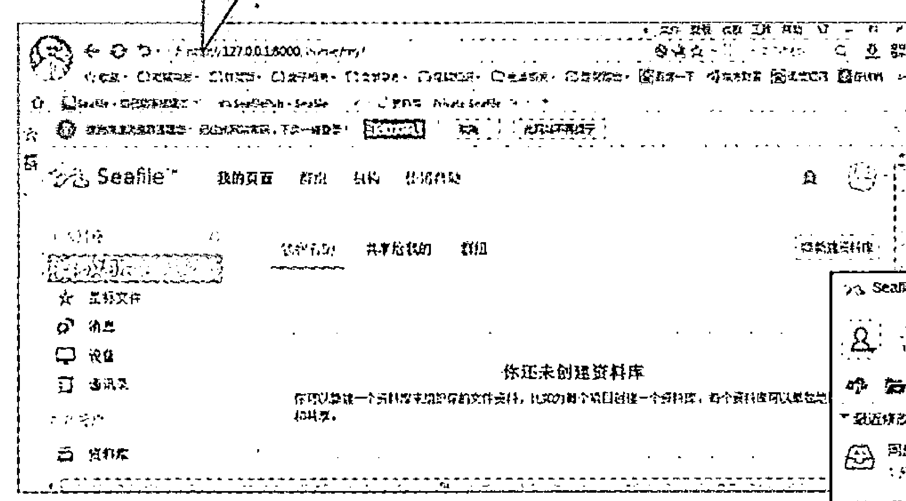

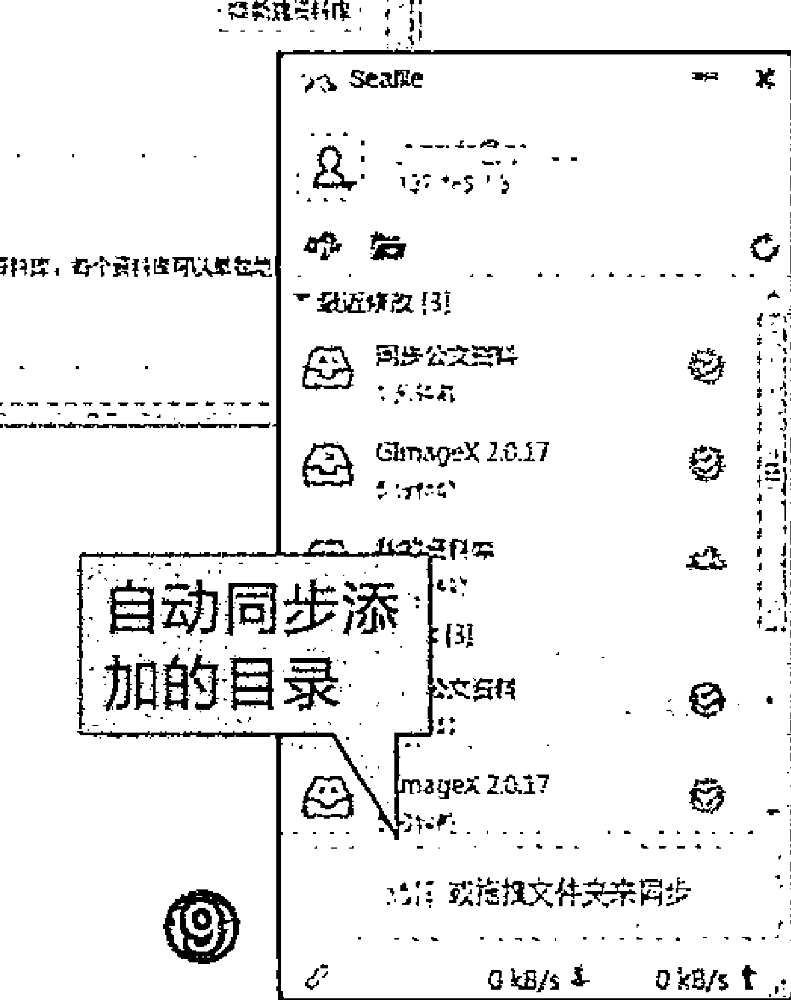

对于服务器，则可以随时右击Seafile服务器的系统托盘图标，选择“打开Seafile网站”打开本地服务器主页查看同步的文件。Seafile服务完全不需要外网的支持，因此文件也不容易泄密，只要有局域网即可实现局域网电脑和服务器之间文件的自动同步（图10）。

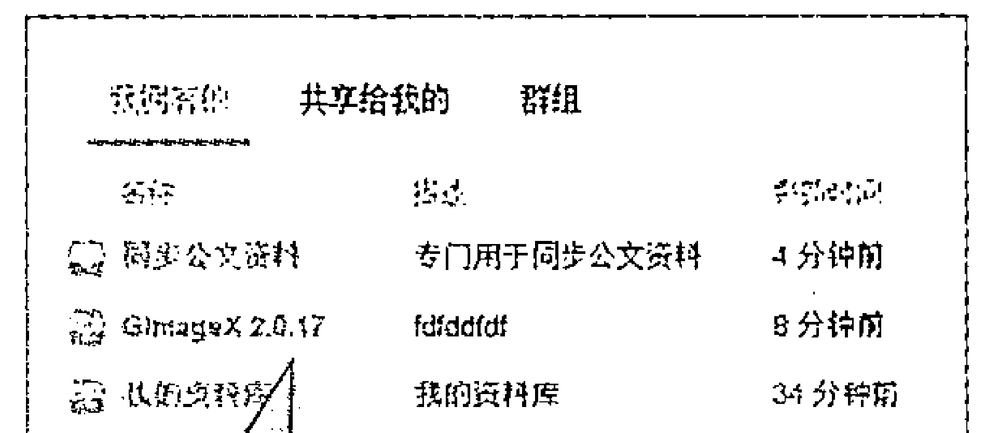

> 无盘系统的设置较为复杂，需要进行详尽设置的用户请参考http://tinyurl.com/n77bruy中的介绍。

文|技术宅

#### 化繁为简

##### 打造局域网云端软件库

由于每个人的电脑操作水平不同，作为企业的网管经常要在每台电脑上安装各种常用的软件，而且日后还得进行繁杂的维护。此外有些商业软件比较昂贵，只能将其安装在一台电脑上，其他局域网电脑怎么运行？现在我们可以通过打造局域网云端软件库来解决这些难题。

##### 打造无盘系统

对于已经组网的企业，可以借助无盘系统来实现，这样只要在一台服务器上安装软件，局域网内其他电脑就可以直接运行。无盘系统的打造可以借助免费的“深度无盘网吧系统”（下载地址：http://tinyurl.com/k18czi6）。这里的服务器系统以Windows server 2008为例。

下载深度无盘网吧系统并解压，安装DeepinServer服务端。安装之前需先固定本网卡的IP地址，点击“网络和共享中心→更改适配器的设置→选中当前网卡右击选择属性→选择Internet协议（TCP/IP）→属性”，单选“使用下面的IP地址”项，并根据自己的网络情况设定网卡IP地址（图11）。

接着在服务器上安装服务端，完成后启动服务端进入控制台，按照向导的提示创建磁盘，并且配置磁盘策略、回写地址等信息完成服务端的设置。继续在客户端安装DeepinClient（客户端），接着重启进入BIOS设置，将网卡设置为第一启动，保存设置后客户端就会从PXE启动，进入深度无盘网吧系统机器号输入界面，按提示输入86（图12）。

磁盘进行初始化。继续在客户机上运行“深度无盘系统上传器”，打开深度无盘系统上传器开始上传系统，系统上传完成后就可以关机并拔掉客户机的硬盘。返回到服务端电脑，将A086客户机启动模式设置为网络启动，这样再次从PXE启动客户机，成功启动后就可以在无盘状态下使用了。其他客户电脑的添加操作同上。由于客户机的所有程序都是安装在服务器上，因此网管们只要在服务器上进行维护即可。

##### 使用远程桌面运行云端软件

无盘系统的配置比较复杂，我们还可以借助系统自带的远程桌面实现云端软件配置。比如上述商业软件，只要将其安装在一台电脑上，其他局域网电脑通过远程桌面运行即可。

假设商业软件安装在Windows 7旗舰版上的电脑为A，由于Windows许可限制，非服务器版Windows默认在一台电脑上同一时间只允许一个用户登录（会话）。如果有第二个用户通过远程桌面服务登录本机，那么在此之前本地已登录的用户或远程已登录的用户将被踢出。因此我们首先要到http://dwz.cn/cfanm02下载“Windows 7远程桌面多用户补丁”，下载后根据自己的系统情况，以管理员身份运行对应的（32或64位）程序即可完成同时登录用户破解（图13）。

接着启动组策略编辑器，依次定位到“计算机配置→管理模板→Windows组件→远程桌面服务→远程桌面会话主机→连接”，然后双击右侧窗格的“限制连接数量”，将其设置为“已启用”，将连接数量设置为“2”（图14），这样Windows 7在当前用户已经登录系统的情况下，还允许其他用户同时连接到当前电脑上。启动命令提示符窗口。输入执行“net user yumu 123456 /add”命令，按提示建立一个名为“yumu”、登录密码为123456的新用户（名称和密码可自定），将这个用户作为其他用户远程登录的专用账户。接着右击桌面“计算机”选择“属性”，切换到“远程设置”，在打开的窗口远程桌面设置下单选“允许运行任意版本的远程桌面的计算机连接（较不安全）”，点击“选择用户”，按提示添加上述建立的“yumu”账户作为远程桌面连接账户。完成上述设置后，其他局域网内需要运行商业软件的用户，只要点击“开始→所有程序→附件→远程桌面连接”，随时启动远程桌面组件连接到A电脑上即可运行其安装的商业软件，由于Windows 7已经破解多用户登录，即使A电脑已经登录也不会影响其他电脑的远程连接使用（图15）。

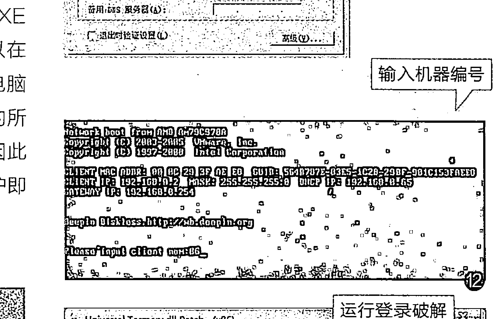

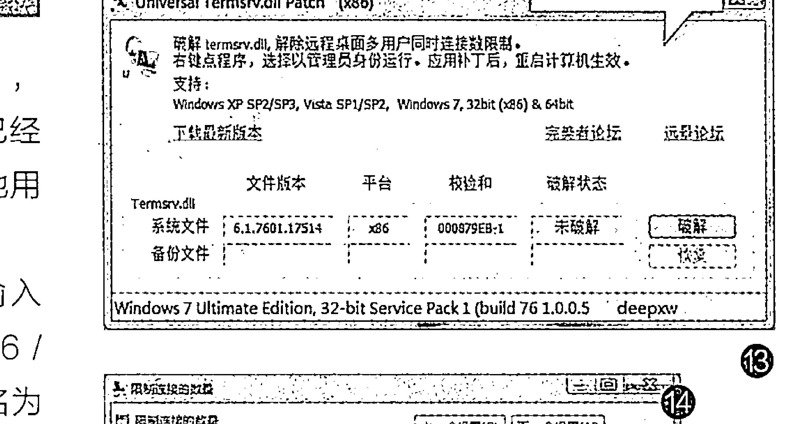

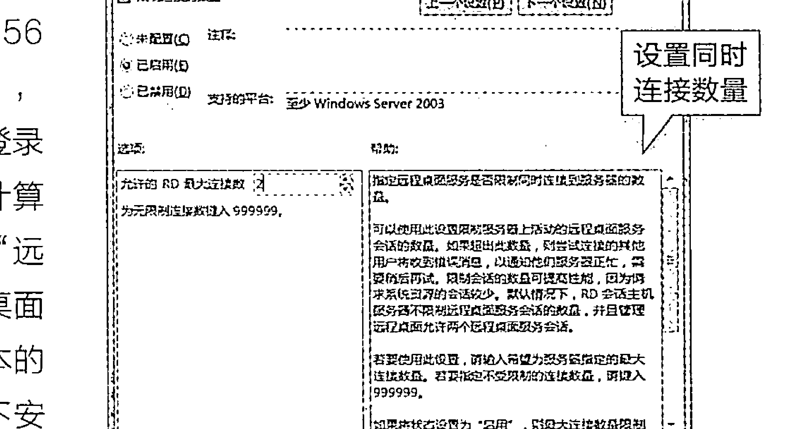

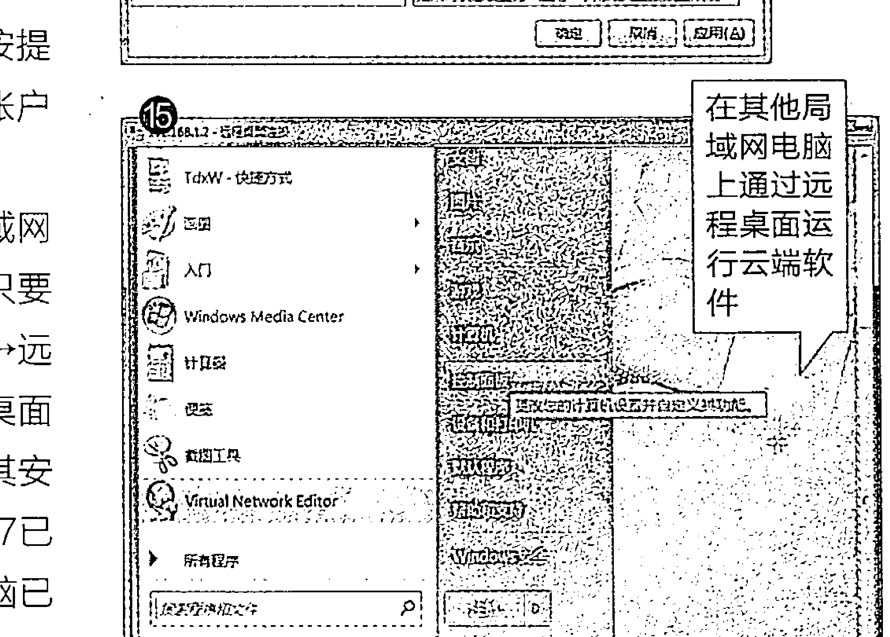

文/阿木

#### 娱乐无极限

##### 打造多媒体服务器

为了方便闲暇时的消遣，很多朋友会在自己的硬盘上下载大量电影或者游戏。不过“独乐乐不如众乐乐”，现在我们可以将自己的电脑打造为娱乐服务器，这样既可以方便舍友们点播，也可以一起对战玩局域网游戏。

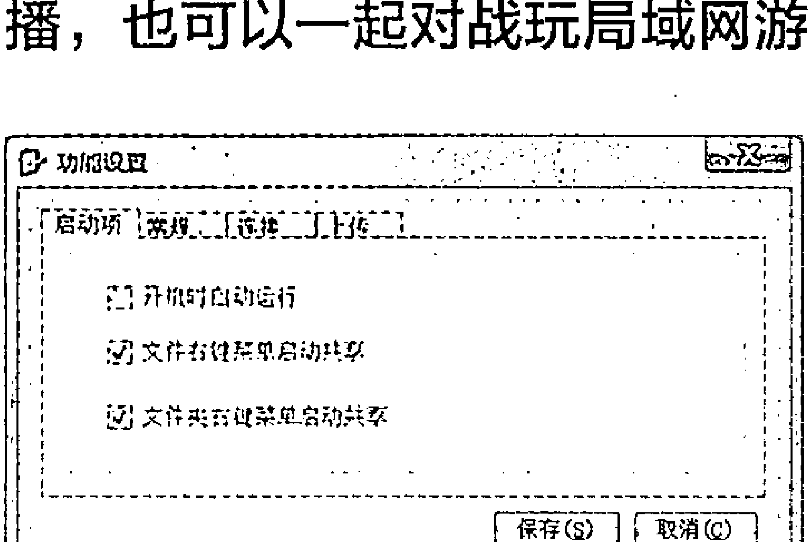

对于连接在同一个局域网的电脑（如宿舍所有连接到同一Wi-Fi的电脑），借助WEB服务器软件可将保存电影的电脑打造为点播服务器，这样宿舍每个人都可以自由地进行电影点播，服务器打造可以借助WebFileShare来实现。

##### 打造电影点播服务器

首先，到http://dwz.cn/cfank04下载软件，接着选择任意一部电脑作为服务器，在其上安装WebFileShare，以管理员身份启动WebFileShare后单击“工具→功能设置”，在打开的设置窗勾选“文件右键菜单启动共享”和“文件夹右键菜单启动共享”，这样只要在资源管理器右击文件（夹）即可快速启动共享（图16）。

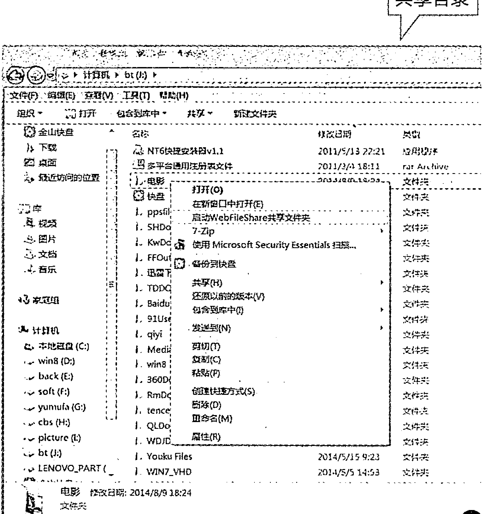

返回程序窗口，单击“文件→启动服务”，启动WebFileShare共享服务，继续切换到“工具→主页设置”，按提示选择一个临时主页。这样我们只需要将任意一个保存电影的目录共享，共享内容即可显示在主页中，比如“J:\电影”。在资源管理器中选中“电影”目录，并选择“启动WebFileShare共享文件夹”（图17）。

这样会自动启动“WEB个人共享服务器”并将资源传输到程序窗口，在程序窗口即可看到共享的电影文件，默认共享地址是“http://192.168.1.3:6666”（格式为：http://本机IP地址:6666/，图18）。

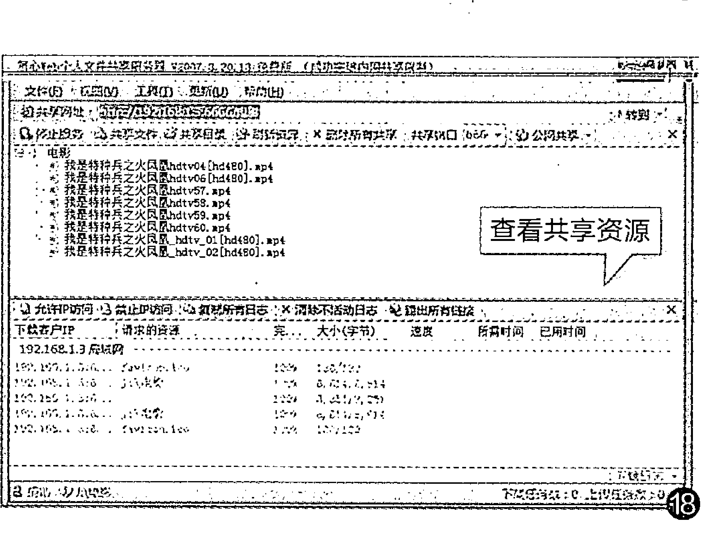

完成上述操作之后，局域网内的任意电脑打开浏览器输入“http://192.168.1.3:6666”即可访问电影资源，在打开的页面中就可以点播了（直接点击即可调用Windows Media Player播放）。当然，我们也可以右击并选择“目标另存为”，将视频下载到本地电脑上（图19）。

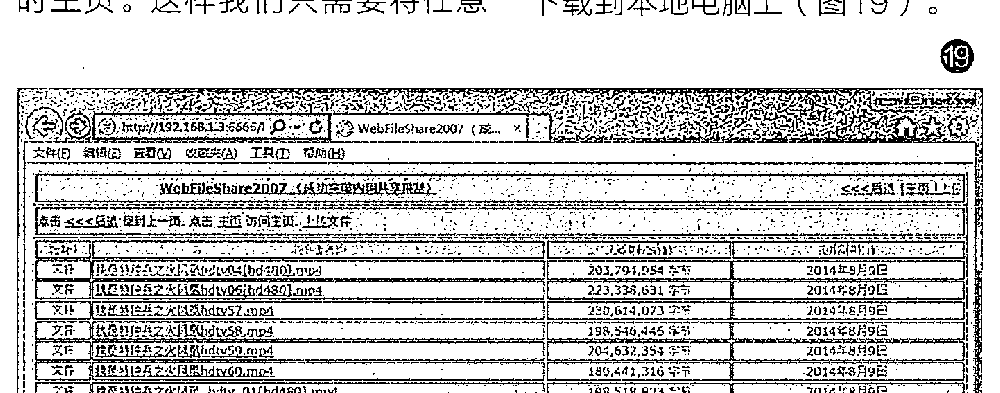

##### 打造局域网游戏服务器

现在很多游戏都支持局域网的组网对战，对于大学校园宿舍用户，只要将其中一台电脑设置为游戏服务器，并在其中安装游戏服务端，这样其他同学的电脑连接到服务器后就可以自行组网对战了。

联网对战自然需要组网，受限于宿舍条件，使用无线组网最为合适。无线组网可借助无线网卡模拟为热点，其他电脑通过无线连接到热点的电脑即可。首先挑选一部性能较好的台式机（假设为服务器A），然后配置一块USB无线网卡，这里以腾达W311为例。在服务器A上安装好无线网卡的驱动，接着启动腾达客户端切换到“AP模式”，按提示配置好热点的名称、密码等参数（图20）。

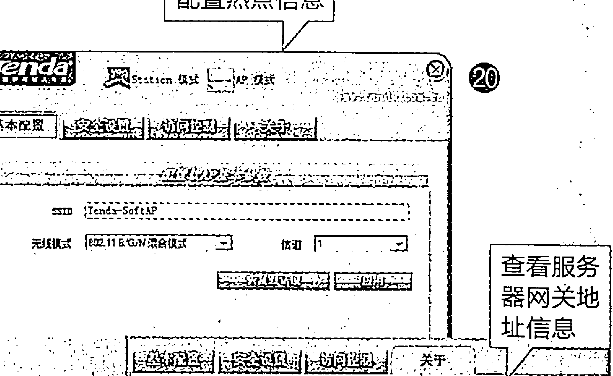

继续切换到“关于”，记住其中的IP地址，这个地址就是服务器A的网关地址，后续的服务器配置需要用到这个地址（图21）。

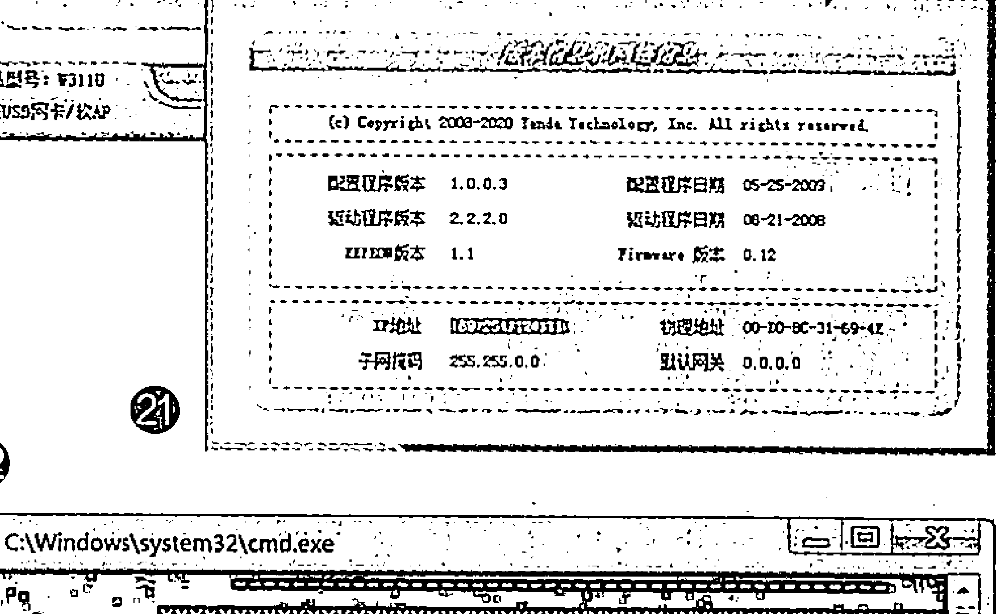

其他要联机的电脑开启无线连接，选择上述模拟热点进行连接就可安装联网游戏了，这里以CS游戏为例。首先下载好“反恐精英服务端CS1.6 NoSteam v3647专业比赛服务端”并在服务器A上安装，接着运行“C:\Program Files\CS_Server_1.6\服务器SXE开关.bat”，确保已经打开SXE服务（图22）。

在A电脑启动记事本程序，打开“C:\Program Files\CS_Server_1.6\开启HLTV-开启前请编辑.bat”文件，将其中的代码更改为下面的代码并保存：

```
start "HLTV" /MIN/HIGH hltv.exe +connect 169.254.124.111:27015 +server password 123456789 -port 27025
```

代码注释：其中的169.254.124.111即为本例的无线网关的IP地址，“password 123456789”为设置的连接密码，可根据自己的实际情况设置。

接着运行“C:\Program Files\CS_Server_1.6\hlds.exe”，然后依次进行如下设置：

- 服务器名称：8-805
- 地图：de_cbble
- 网络：局域网
- RCON密码：123456789
- 其他使用默认设置，完成设置后点击“开始服务器”，开启CS服务端（图23）。

在其他电脑上的CS客户端，启动客户端后点击程序界面的“搜索服务器”，然后切换到“局域网”，在这里选中上述建立的服务器，点击“连接”，成功连接到局域网服务器后按提示输入上述设置的密码，即可开始联机对战了。

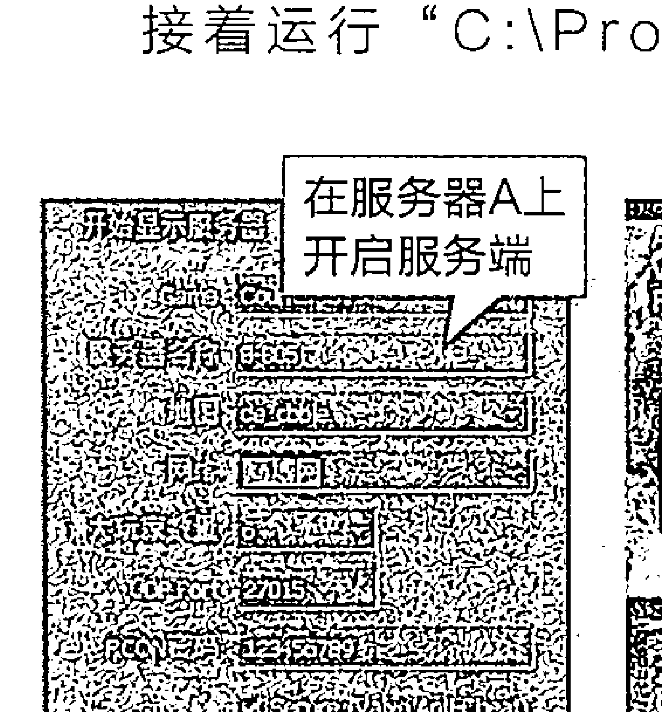

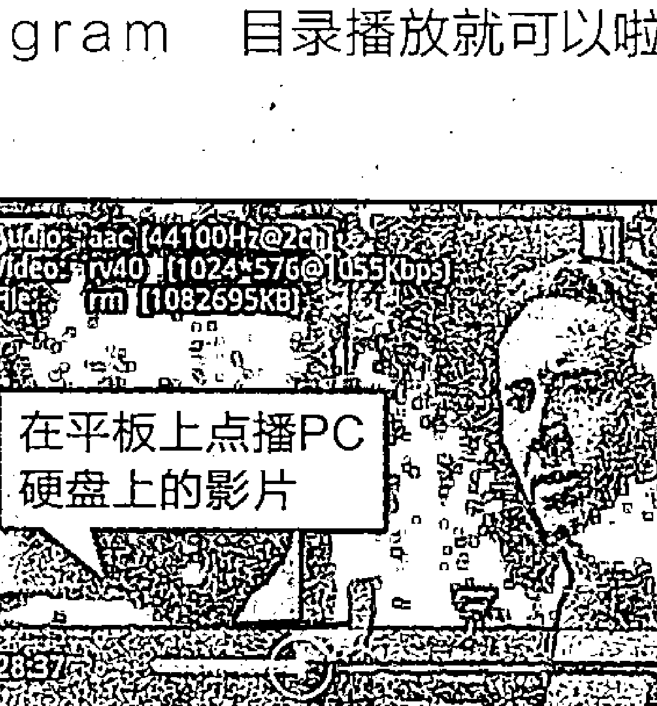

继续按提示在平板上打开PC上共享的“电影”目录，点击其中的影片文件就会弹出“选择打开”提示窗口，按提示选择平板自带的多媒体播放软件进行影片播放即可（图25）。

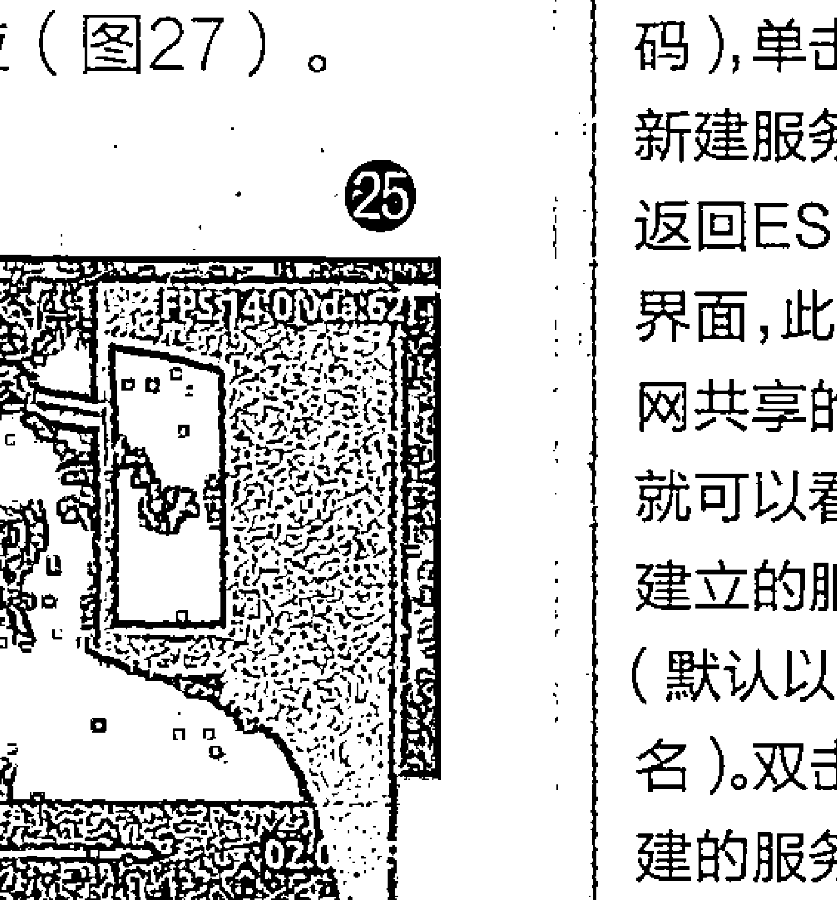

如果要在PC上访问平板上的影片，同上启动ES文件浏览器后，点击“快捷导航→工具→远程管理器→打开”，ES文件浏览器会在平板上生成FTP服务，地址类似ftp://192.168.1.2:3721/（图26）。

现在只要在电脑上的资源管理器中输入ftp://192.168.1.2，回车后即可打开平板资源管理器，按提示打开其中保存电影的目录播放就可以啦（图27）。

##### 平板+PC 组成局域点播网

我们经常要在PC和平板上互相点播其中的资源，比如电脑的存储容量大，很多朋友的电影资源都保存在PC硬盘上，但是想躺在床上用平板点播电脑上的影片。另一方面，公司的光纤网络快，将自己的平板带到公司下载好电影到平板上，这样到家后要在电脑大屏幕上点播平板里的电影。现在利用家中的无线Wi-Fi,借助“ES文件浏览器”我们就可以将PC和平板组成一个点播网。首先将PC上电影存放在目录如“D:\电影”中并设置为共享，将共享的用户设置为“Everyone”。在平板上启动ES文件浏览器，点击“快捷导航→网络→局域网”，接着单击菜单“新建→服务器”，然后在弹出的窗口中按提示输入局域网电脑的IP地址（内网地址），访问用户名和密码（即PC登录账户和密码），单击“确定”新建服务器。返回ES浏览器主界面，此时在局域网共享的列表中就可以看到上述建立的服务器了（默认以IP地址命名）。双击上述新建的服务器，按提示输入访问的用户名和密码，连接成功后就可在平板上看到电脑里的共享目录了（图24）。

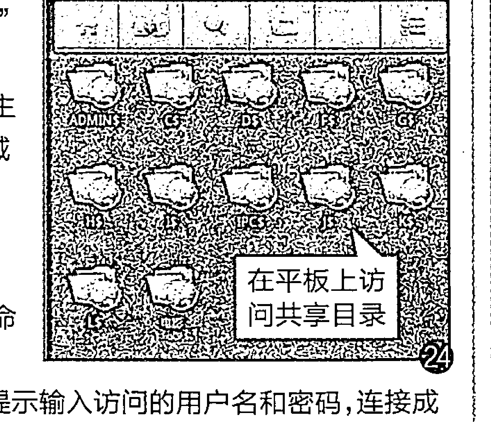

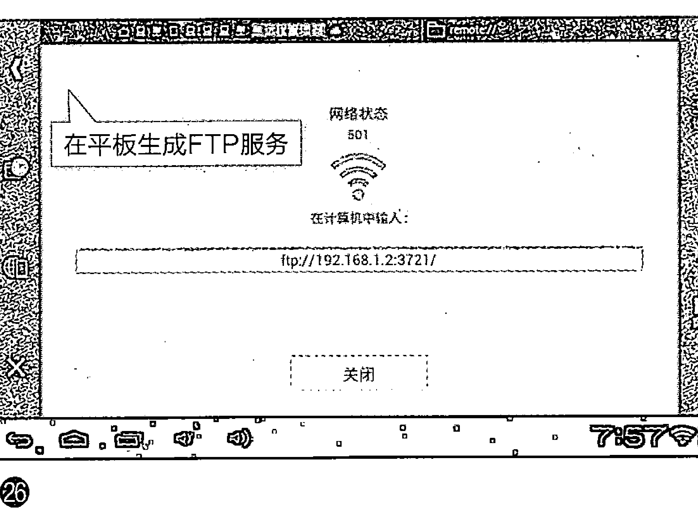

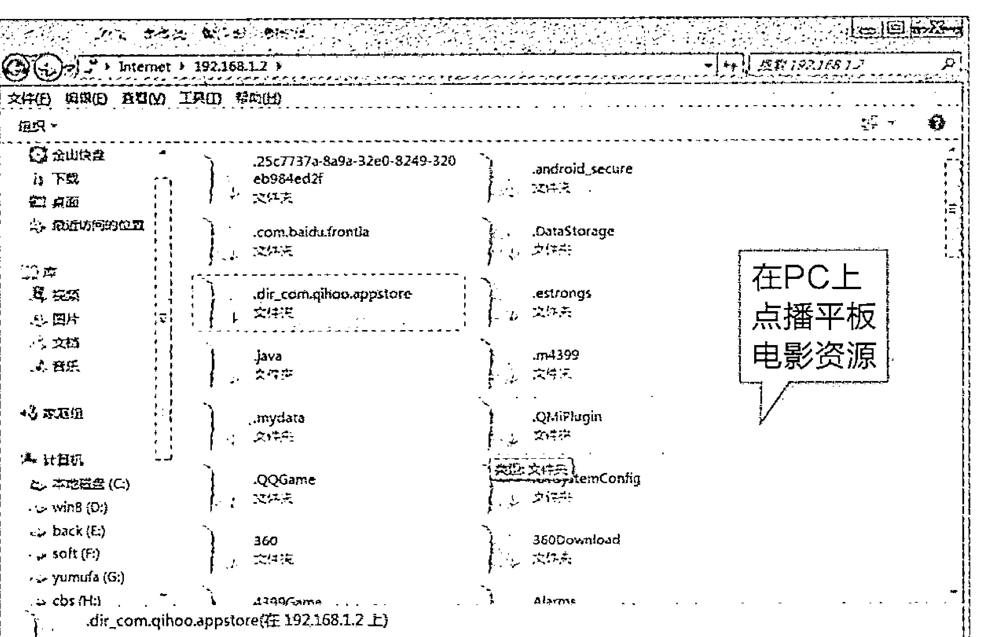

文/技术宅

#### 便携为上

##### 打造移动式服务器

前文中我们主要介绍使用PC打造服务器，PC服务器的性能强劲，应用软件也较为丰富，不过其缺点也不少，比如便携性不足，而且能耗较高（因为作为服务器的PC必须一直开着）。其实随着移动设备的普及，对于家庭、宿舍用户，还可以利用常见的平板、手机打造为移动服务器。比如，只要利用淘汰的平板将其变为服务器，这样放在家中任意位置，我们的手机、PC就可以直接访问其中的资源，轻松打造自己的家庭小局域网。下面以Android平板为例。

首先将平板通过Wi-Fi连接到互联网，接着到http://dwz.cn/cfan206下载KS WEB服务器应用。在平板上启动应用后其主界面会自动显示手机无线网卡IP地址，类似192.168.1.x形式，这样局域网设备使用浏览器打开“http://192.168.1.x:8080”就可以访问服务器的内容了（图28）。

不过由于我们还没有对初始页面进行设置，打开页面时没有资源。比如我们的平板保存很多电影资源，现在要将其打造为移动服务器供舍友们下载或点播，可以使用记事本打造一个简单的主页。主页的内容参考任意一个电影网站的内容即可，比如可以用浏览器打开http://tinyurl.com/nh2q7r4，然后点击“文件→另存为”，将当前页面以“index.html”为名，保存类型选择“网页，全部（*.htm;html）”保存在桌面备用。

##### KS WEB服务器主界面

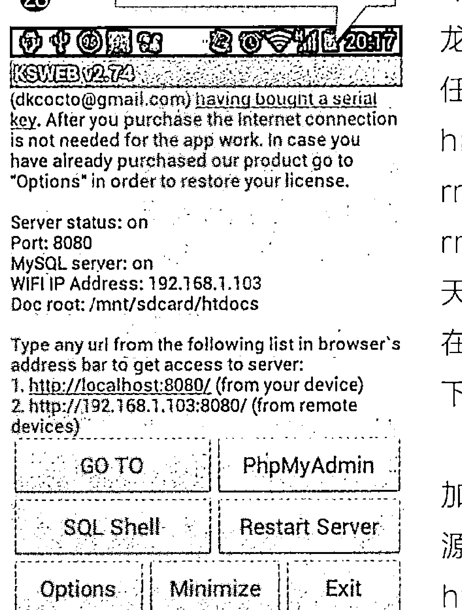

```
Server status: on
Port: 8080
MySQL server: on
WIFI IP Address: 192.168.1.103
Doc root: /mnt/sdcard/htdocs
```

Type any url from the following list in browser's address bar to get access to server:

1. http://localhost:8080/ (from your device)
2. http://192.168.1.103:8080/ (from remote devices)

使用记事本打开保存的index.html文件，然后将原来网站的链接地址指向平板本地目录影片资源即可。比如我们需要添加一部“天龙八部”影片的地址，找到原来任意一部影片名称，然后将“<a href=”后的内容更改为“/tlbb.rmvb”>天龙八部”，其中“tlbb.rmvb”是平板上电影具体名称，天龙八部为影片名，“/”表示放置在服务器根目录(sdcad\htdocs)的下面（图29）。

##### 更改影片链接到平板本地资源

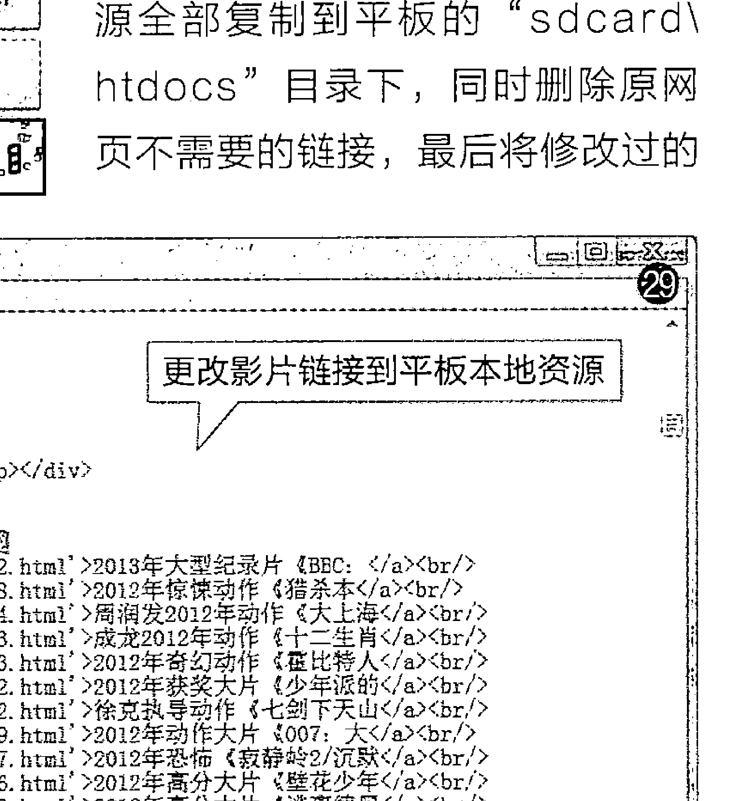

```
<!--end:本周影视下载排行-->
<!--start:最新下载排行 Top10-->
<div class="co_area">
<div class="title_all"><p>本站推荐电影</p></div>
<div class="co_content2">
<ul>
<li><a href="/html/gndy/dyzz/20130318/41702.html">2013年大型纪录片《BBC》</a></br></li>
<li><a href="/html/gndy/dyzz/20130314/41678.html">2012年惊悚动作《杀戮本性》</a></br></li>
<li><a href="/html/gndy/dyzz/20130308/41631.html">周润发2012年动作《大上海》</a></br></li>
<li><a href="/html/gndy/dyzz/20130308/41633.html">成龙2012年动作《十二生肖》</a></br></li>
<li><a href="/html/gndy/dyzz/20130301/41553.html">2012年奇幻动作《霍比特人》</a></br></li>
<li><a href="/html/gndy/dyzz/20130301/41552.html">2012年获奖大片《少年派的奇幻漂流》</a></br></li>
<li><a href="/html/gndy/jddy/20130208/41382.html">徐克执导动作《七剑下天山》</a></br></li>
<li><a href="/html/gndy/dyzz/20130202/41319.html">2012年动作大片《007：大破天幕杀机》</a></br></li>
<li><a href="/html/gndy/dyzz/20130201/41307.html">2012年恐怖《寂静岭2》</a></br></li>
<li><a href="/html/gndy/dyzz/20130201/41306.html">2012年高分大片《逃离德黑兰》</a></br></li>
<li><a href="/html/gndy/dyzz/20130131/41289.html">2012年高分大片《被解救的姜戈》</a></br></li>
<li><a href="/html/gndy/dyzz/20130126/41205.html">2012年大片《迫降航班》</a></br></li>
</ul>
</div>
</div>
```

其他影片或者共享文件的添加同上，接着将平板上电影资源全部复制到平板的“sdcard\htdocs”目录下，同时删除原网页不需要的链接，最后将修改过的

### 将所需资源全部复制到sdcard\htdocs

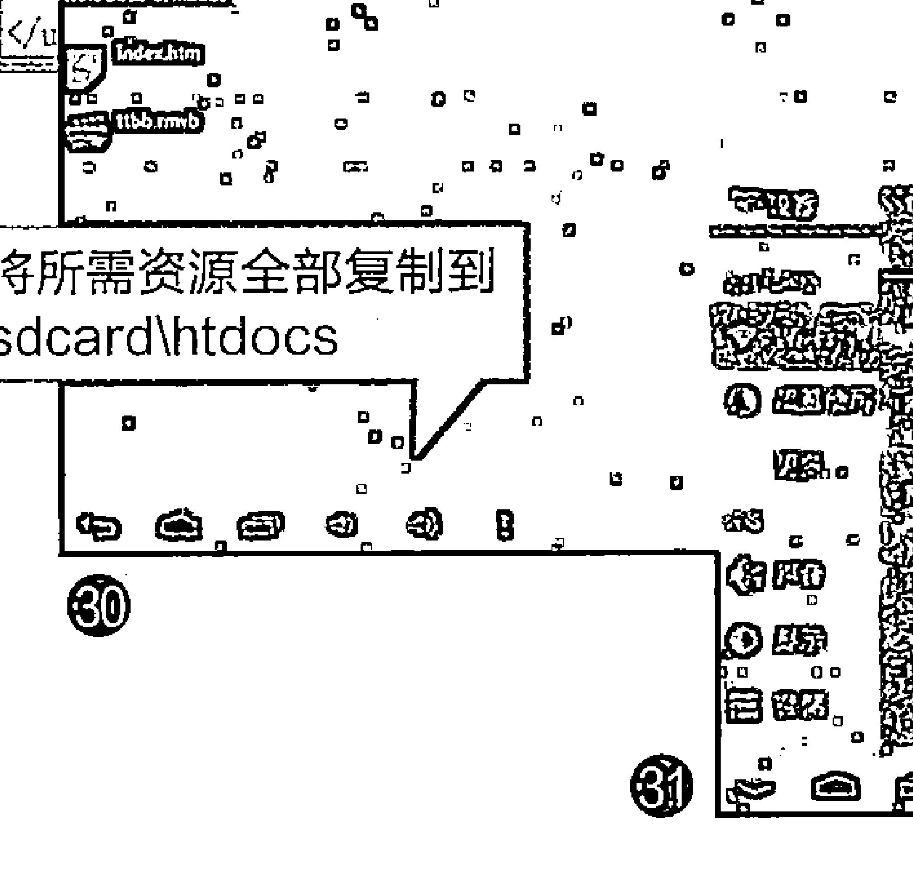

##### 固定平板连接的IP地址

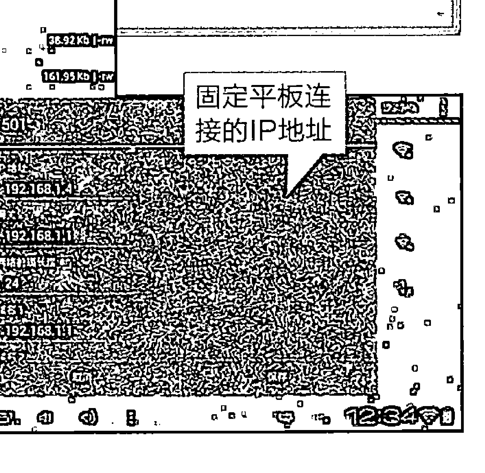

index.html也复制到上述目录，这样就完成平板服务器主页的设置（图30）。

由于平板连接Wi-Fi默认使用DHCP分配的IP地址，每次连接的地址都会发生变化，为了方便舍友们的访问，现在还需要固定平板的IP地址。在平板上依次进入“设置→无线和网络设置”，长按当前连接的“热点”选择“修改网络”。接着在弹出的窗口勾选“显示高级选项”，IP设置由“DHCP”更改为“静态”，输入一个自己需要固定的IP地址如192.168.1.4（在网关内即可），其他选择默认设置，最后点击“保存”，这样以后每次平板连接Wi-Fi后就固定使用上述IP地址了（图31）。

完成上述设置后返回平板KSWEB服务器界面，点击“Minisize”将其最小化到后台运行。这样只要是连接到同一个Wi-Fi的设备，比如舍友们可以在他们的笔记本上打开浏览器输入“http://192.168.1.4:8080”，即可打开平板服务器主页界面，点击其中的影片链接既可以下载也可以直接在线播放（图32）。对于其他平板，可以使用UC浏览器访问平板服务器资源，直接点击即可下载影片资源，由于在同一个局域网，下载其实就是局域网文件的复制，下载速度很快。

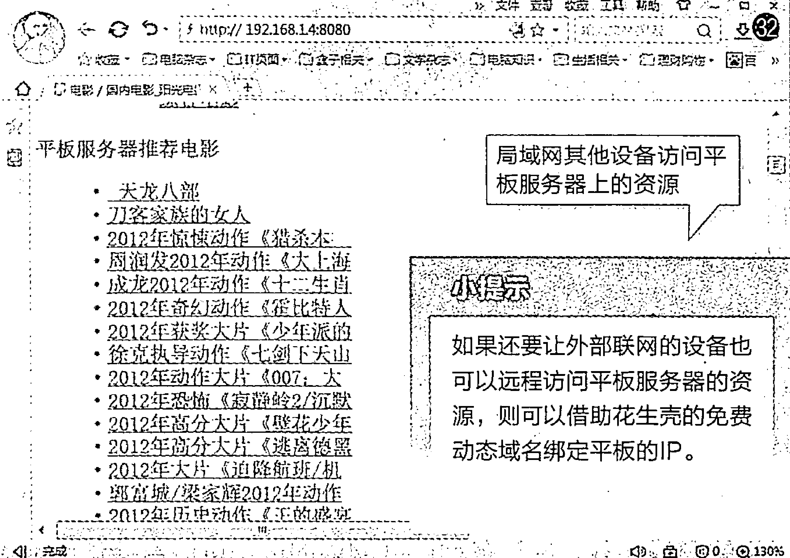

> 如果还要让外部联网的设备也可以远程访问平板服务器的资源，则可以借助花生壳的免费动态域名绑定平板的IP。

> 小提示：对于iPad、iPhone用户，可以到苹果商店下载ServersMan@iPhone，它也可以将iPad变成WEB服务器（网址：http://tinyurl.com/nh2q7r4）。

#### 当路由器碰到NAS →

路由器（带硬盘）和NAS都可作为家庭或企业的存储终端，它们存在什么差异，谁更适合你？

#### 路由器和NAS傻傻分不清楚

#### 智能路由器的模仿秀

智能路由器通常都配有USB或SATA接口，可以方便地接驳U盘或移动硬盘等存储设备（图1），在完成路由器的本职工作之余，还可实现离线下载、FTP访问磁盘文件等功能。换句话说，当路由器+U盘/硬盘的组合已经具备了NAS的雏形（图2），在一定范围内抢了NAS的“饭碗”。

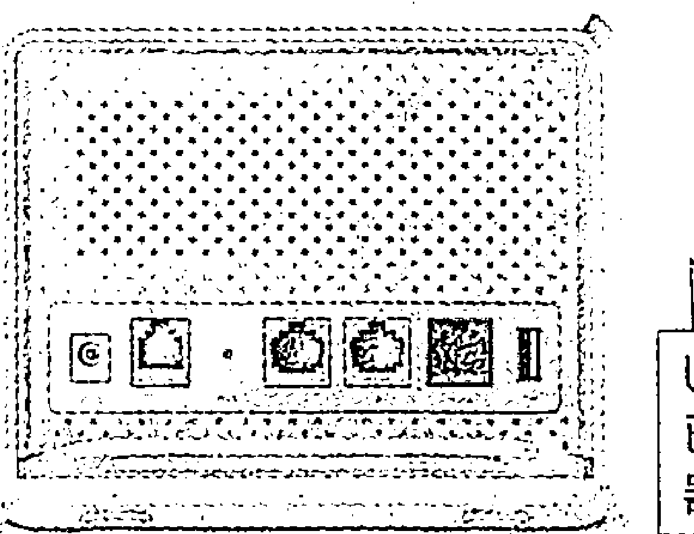

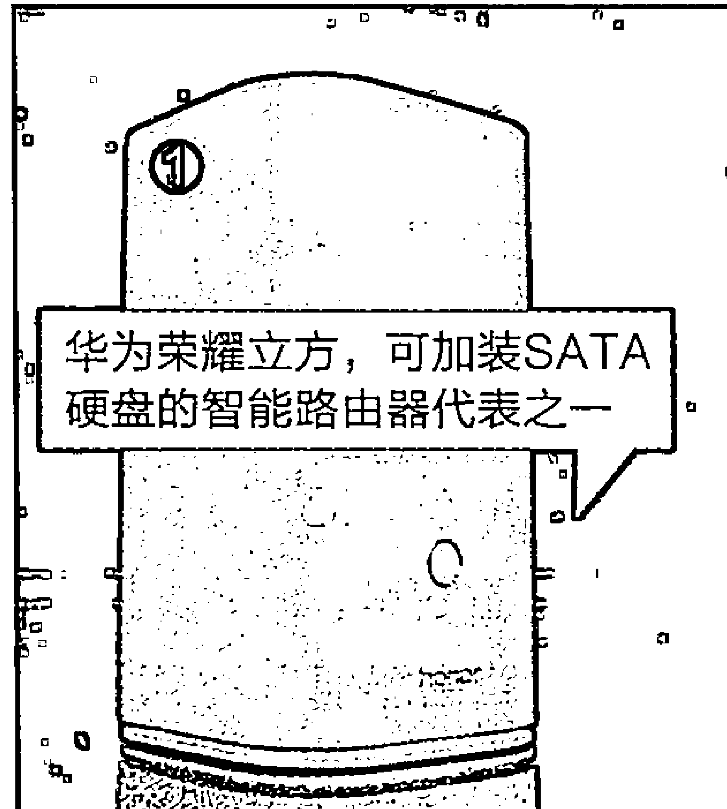

随着智能路由器（或配USB/SATA接口的路由器）的普及，路由器与NAS（Network Attached Storage，网络附存储）的界限似乎不再明显，很多用户甚至已将智能路由器与NAS划上了等号。那么NAS真的是这么容易就被“模仿”的吗？

#### NAS的独门秘籍

很多专业NAS并不支持路由功能，而且价格普遍在千元以上（不算硬盘），无论是成本还是功能似乎都远逊于实惠的智能路由器，但是其依旧是中小企业和专业用户的首选网络存储设备。究其原因，只是源于NAS的“独门秘籍”。

1. 除了USB接口外，NAS至少会配备两个SATA3.0接口（图3），可以随意搭建RAID0或RAID1磁盘阵列，无论是容量还是速度都远非路由器+硬盘的组合可比。
2. NAS的本质是一套自带处理器、内存、存储设备、网络、独立系统的“超微型计算机”，支持各种权限的管理和设置，甚至可以为NAS设定固定IP，将其打造为网盘或邮件服务器。就数据安全和硬件规格方面，智能路由器远不是NAS的对手。

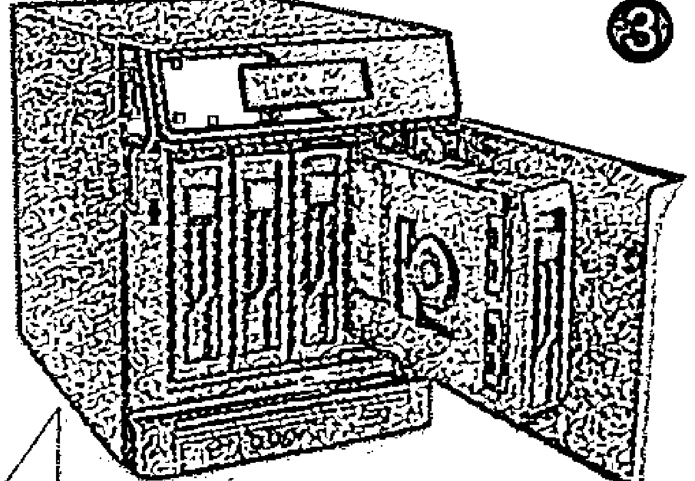

#### 锁定不同的消费人群

总之，智能路由器＋硬盘方案的成本相对低廉，可以方便地实现多媒体文件共享，还能利用APP实现很多扩展功能，适合普通用户搭建简易便捷的“家庭云”；而NAS则可借助专业级别的存储和安全设置，为企业级或发烧友保驾护航。可惜NAS最大的缺点就是售价较高，一整套设备下来至少要1500元起步（NAS＋单硬盘）。

#### 玩转智能路由器

当智能路由器作为小网络的“中枢”时，其首要任务就是如何实现便捷的离线下载，并让各种局域网内的设备可以直接访问或播放其中的多媒体文件。本章节将以小米路由器为例，简单聊聊路由器＋硬盘组合的玩法。

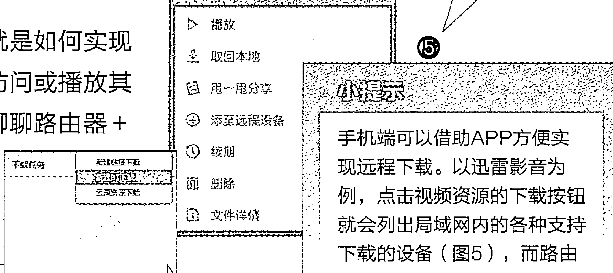

#### 将麻烦全都甩给路由器

智能路由器＋硬盘组合最显著的特征就是帮助PC减负：下载资源时不再耗费PC的CPU资源，也可避免PC中的硬盘因频繁读写而拖慢系统速度，而是将下载任务完全甩给路由器以及连接它的硬盘。以小米路由器为例，只需在PC上运行路由器客户端，就可以直接复制网址下载、添加BT或云播资源进行下载了（图4）。比如想下载百度网盘资源，只需用百度网盘下载链接获取工具获得地址，再粘贴到网址下载对话框中即可。

PC和手机端都有对应的APP实现便捷的远程下载功能

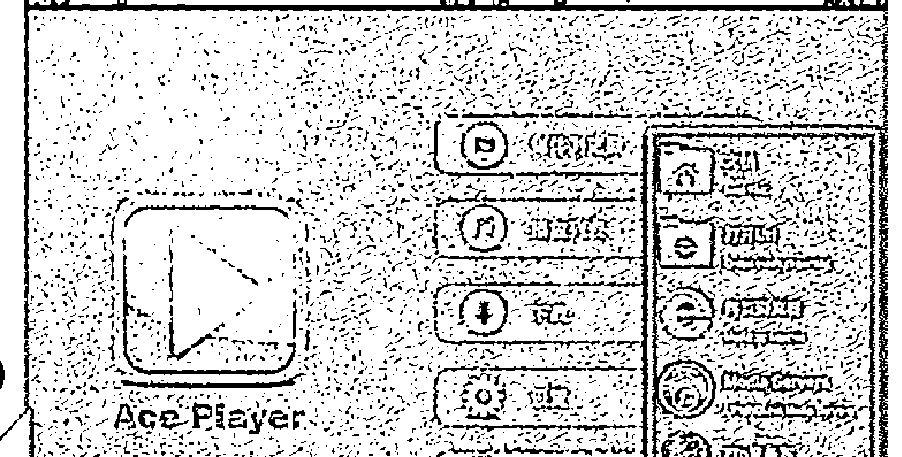

#### 第三方APP解决直播问题

很多家庭用户都喜欢直接用手机或平板上的路由APP客户端直接播放路由器硬盘中的电影，但却经常碰到“暂不支持此文件格式”的情况。实际上，这种问题都是源于手机自带视频播放器不支持某些视频格式的解码造成的。Android设备可以安装MX Player，iOS设备则可安装ACE Player解决视频播放的兼容问题。需要注意的是，iOS设备需要直接运行ACE Player，点击“媒体浏览器”选择路由器硬盘资源进行播放（图6），而不是通过路由器的APP客户端。

*   设备列表：
*   iPhone-Winsom (在线)
*   iPad-Winsom (在线)
*   Router-Hedsom (在线)
*   MI-android-Winsom (在线)
*   Dell-PC-Hedsom (在线)
*   MI-android-QiXian (在线)
(图片标注为图7)

#### 无网络也能访问路由硬盘

> 小提示：同时连接路由器并访问硬盘资源的设备越多，速度和稳定性将变得不可控起来。因此，我们要善用智能路由器防蹭网相关的设置选项（图7），禁止可疑或指定的设备接入路由器或访问硬盘数据。

在没有网络的情况下（比如小区宽带故障，或房东没有给宽带续费），我们是没办法登录路由器客户端程序的，也就是无法访问路由器硬盘内的文件。实际上，此时我们只需进入“计算机→网络”（图8），在这里就可看到路由硬盘内的文件了。在等待广域网修复的时间里，利用局域网（路由硬盘）内的资源打发时间，是不是很惬意？

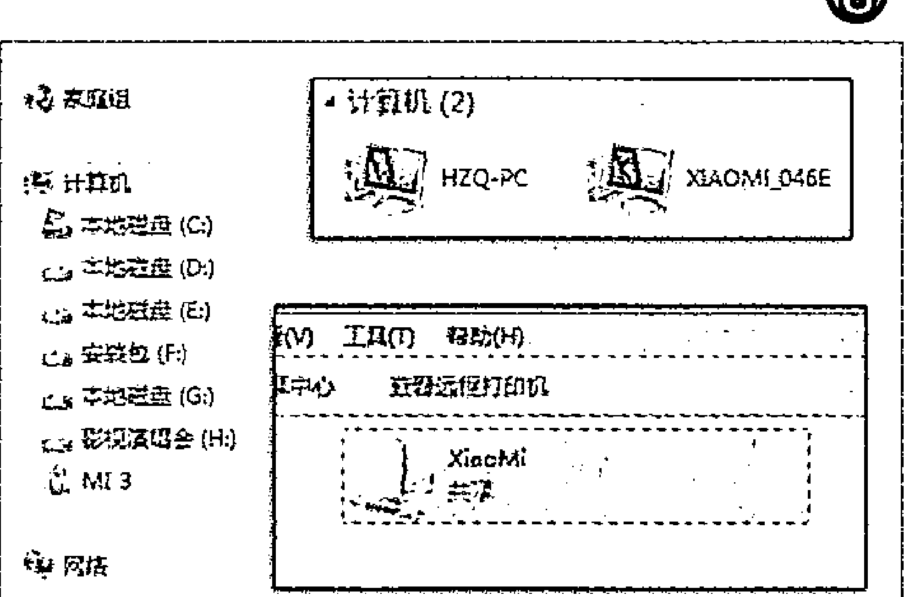

> 小提示：光纤入户的家庭建议使用七类网线连接光纤猫和路由器（或者路由器与台式机），这样可明显提升下载速度。

### 权限控制
#### 让NAS变得更强大

智能路由器+硬盘可以满足多家庭成员的网络存储共享，但其在权限控制方面却仍处于“小白”水平，比如只能允许或禁止局域网内某款设备接入网络或访问硬盘文件。而NAS，则可对硬盘内每个文件夹设定不同的用户权限，可以让共享数据变得更为安全与私密。

#### 有的放矢的权限管理

如果某个局域网内有多台PC、手机或者平板，每台设备对应一个职责各异的用户，NAS可以方便地允许/禁止指定用户对指定文件夹进行读写操作。以群晖NAS为例，通过admin登录并添加a、b、c等用户，建立文件夹时启用ACL权限设置，并赋予全部用户对该文件夹的可读写权限（图9）。然后分别建立不同用户的专属文件夹，并移除其他用户对该文件夹的管理、读取和写入权限（图10）。之后，每个用户就只能按照设置条件访问NAS中的指定目录，无法染指其他未被授权的内容了。

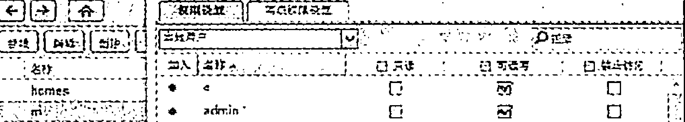

#### 移动端播放需流媒体支持

很多用户反映手机平板无法直接播放NAS中的视频文件，其实这个问题和路由器+硬盘播放视频报错的问题类似，都是源于手机播放器不支持远程路径访问造成的。以Android系统为例，利用ES文件管理器或很多第三方播放器都可直接播放无线存储设备中的流媒体文件（图11）。

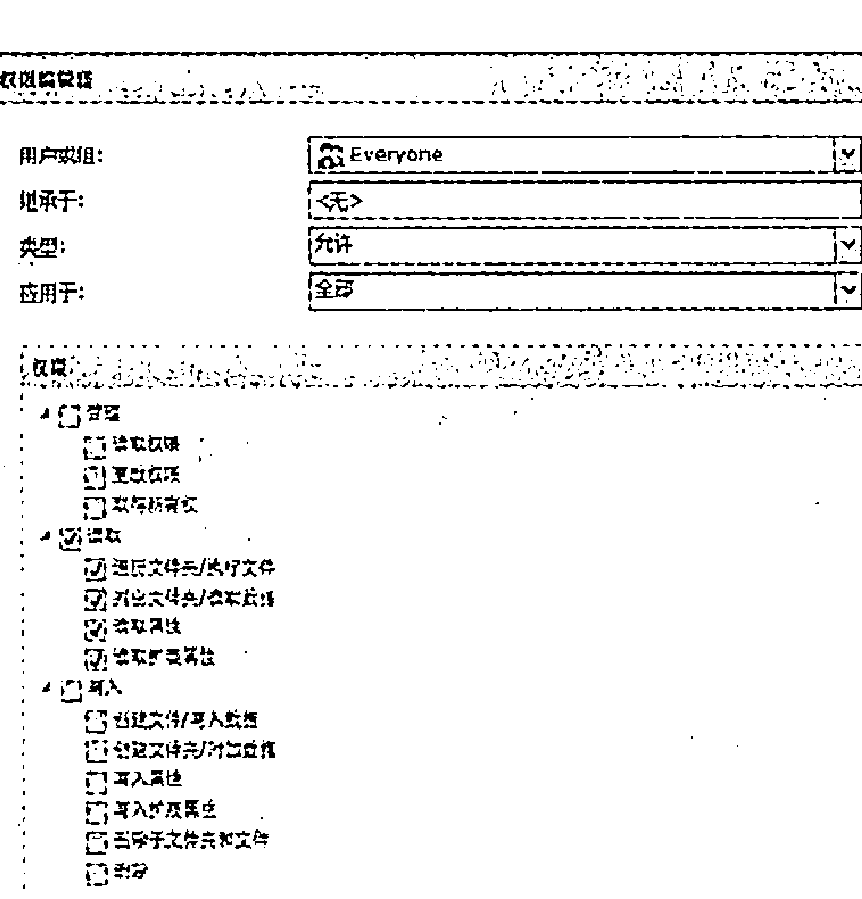

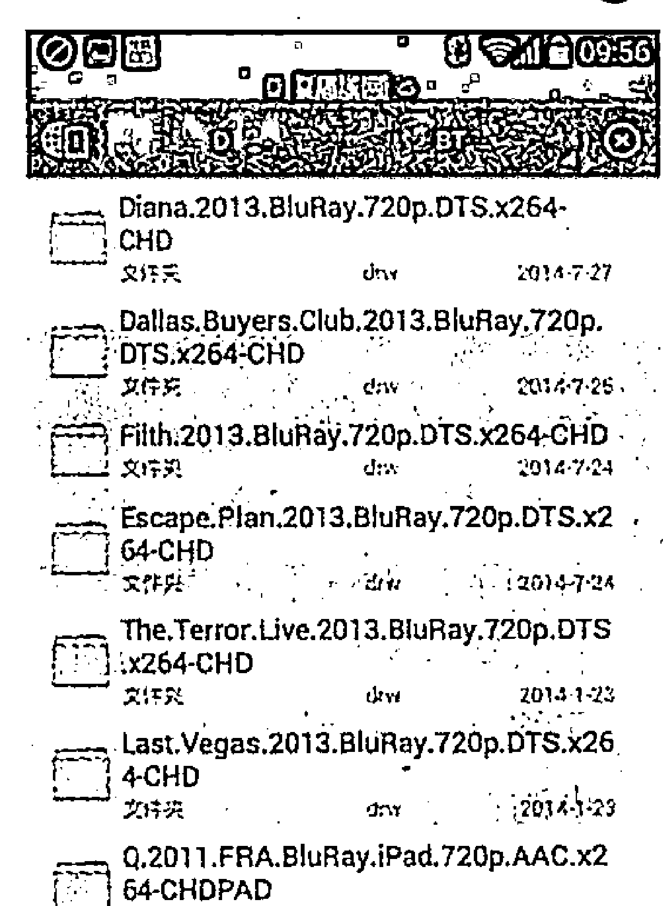

> **小提示**
> 笔者家里为10M光纤接入，无线看NAS中的1080P视频无压力。可惜，带字幕的电影需要将字幕保存在手机本地才可显示，播放前记得将字幕文件从NAS中复制过来。

#### 小心变成他人的“肉鸡”

和PC一样，NAS也容易成为黑客的目标，存在成为黑客“肉鸡”的隐患。还是以群晖NAS为例，如果我们在资源管理器中看到几个“httpd”进程占用了100%的CPU资源，或者在SSH中看到“httpd……startum…”进程后面是一个陌生的IP地址，那你的NAS十有八九已经成为“肉鸡”帮人挖矿了。
如果你的群晖NAS不幸被黑，请修改默认群晖NAS管理端口（不要使用5000端口，或在路由器端将15000端口映射到NAS的5000端口）。此外，关注NAS厂商的固件更新，也可以有效杜绝一些隐藏的安全漏洞。

##### 扩展阅读

最后还是得再强调一下NAS区别于路由器+硬盘的方案。NAS和PC间互传文件的平均速度在50MB/s ~ 100MB/s（图12）。反观路由器，哪怕是顶级的路由器用USB接口挂载硬盘做无线存储器，其速度最多勉强达到25MB/s，而市售百元级路由器扮演NAS最多只有4MB/s ~ 10MB/s，备份几个GB的文件耗时非常“可观”。

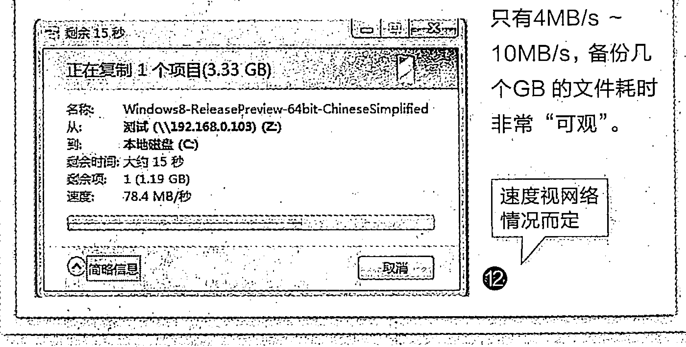

### 善用移动设备 拓宽网络服务

文|逸飞

手机、平板是应用越来越多的移动设备，虽然它们的容量相对较小，但是，它们在网络空间和功能的拓展使用上却起着举足轻重的作用。那么，如何通过这些设备来扩展我们的网络服务空间呢？

#### 移动设备网络服务拓展应用

现在的手机、平板等产品如日中天，这类产品被我们统称为移动智能终端设备。这些设备如何和我们的网络互补互助呢？

> 小提示
> 在公共场所设置这样的网络，切记要设置共享密码，有的手机默认不提醒设置密码，当设置了共享后周围的人可轻易搜到，或许还以为是政府提供的公共免费网络呢。笔者第一次用手机就在火车站吃了大亏，半小时内就被人用完了200MB流量。

#### 移动设备网络拓展应用

#### 共享热点拓展网络服务

也许你会想到在移动设备上架设Web服务器，但实际上，这样做的意义不大，虽然在理论上可行，但受制于多变的环境，不具有广泛的实用价值。但通过共享热点技术，让移动设备为其他设备提供网络共享、文件共享服务，却具有广泛的实用价值。比如在火车上旅行，只有一部手机具备上网条件，希望随身的平板也能获得更舒适的上网服务，或者为身边的旅友共享上网服务。这样就让几部移动设备变为一个小网络，大大拓展了网络的可用范围。可以说这是目前最实用和最方便的网络扩展和共享方案。因此，在Android等移动设备上，我们能很容易见到热点共享这一功能设置。

共享移动网络设置较为简单，以笔者使用的夏新828 Android手机为例，进入系统设置窗口，点击“无线和网络→更多”一项（图1），在弹出的窗口中选择“网络共享与便携式热点”（图2），接着点击“网络共享与便携式热点设置”（图3），选择网络类型为IPv4，再根据需要设置共享的密码和连接数等，即可完成网络服务拓展。如此设置之后，身边的设备开启无线网络功能，即可搜到并连接此共享网络。

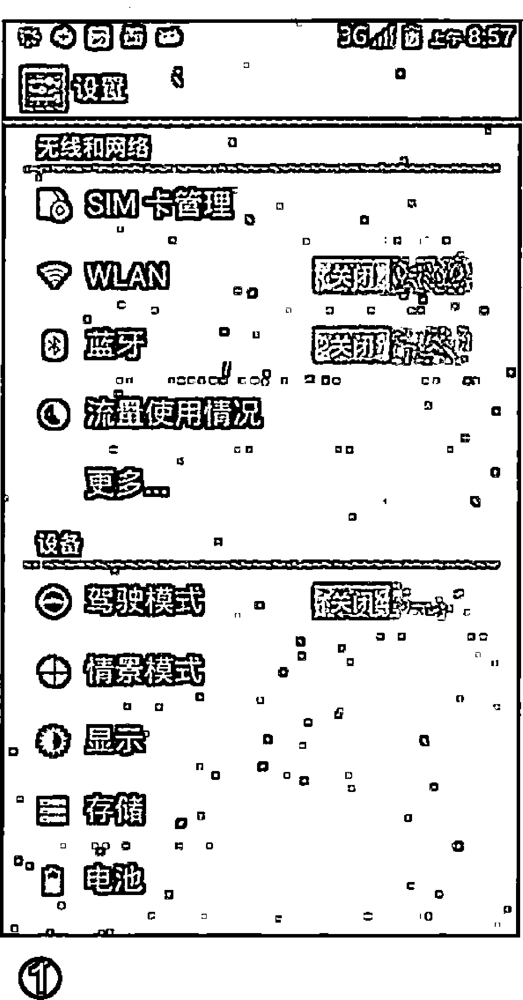

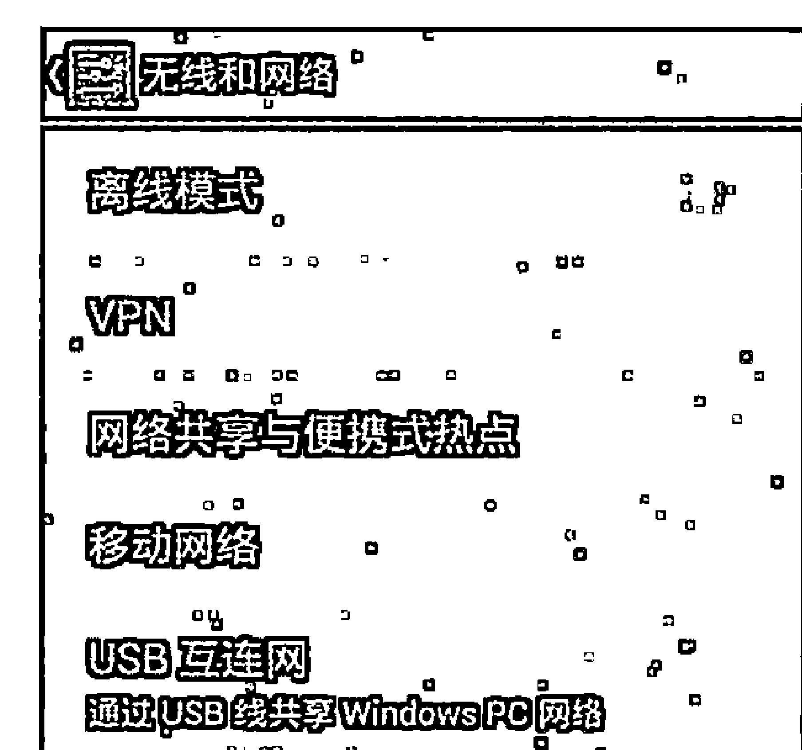

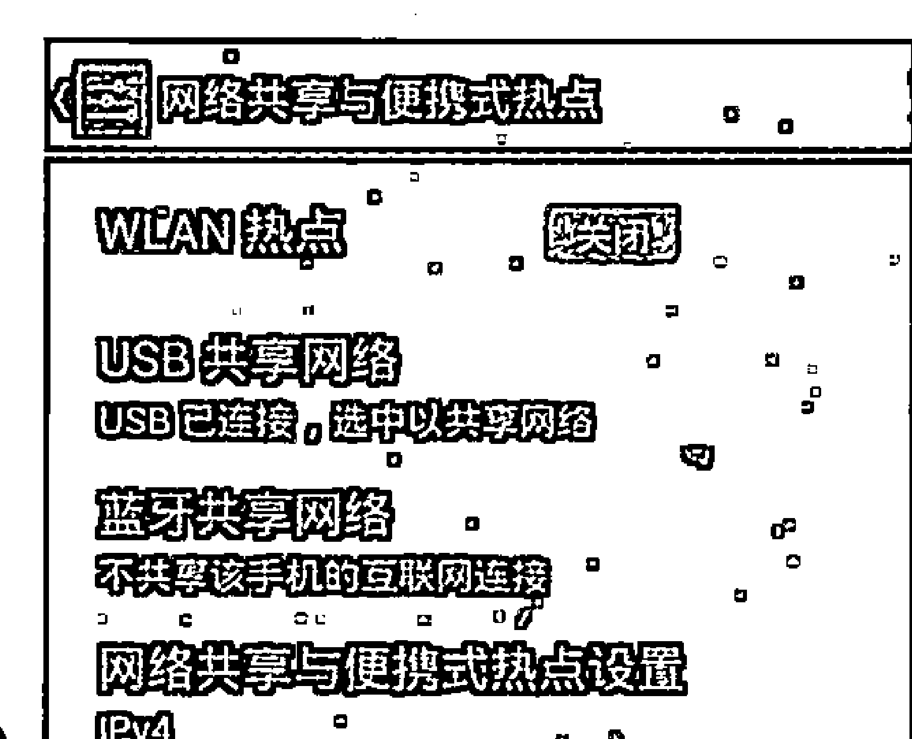

#### 搭建移动Web服务器

虽然热点共享应用更加实用，但如果手机配置较高，带宽充足，且对移动Web感兴趣，不妨也可以尝试一下用Android手机搭建Web服务器。

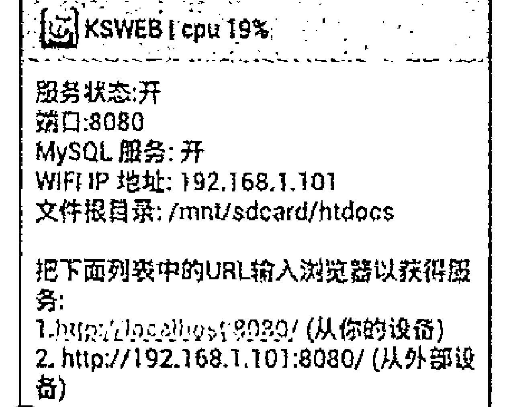

安装并下载产自俄罗斯的KSWEB开源服务器APP，运行并按提示操作即可完成服务器搭建，之后可直接在内网中输入手机给出的IP地址和端口号访问手机Web网络（图4）。软件可能需要开放80端口，手机只有经过Root之后才能访问此端口。如果要实现外网访问手机Web功能，需通过路由器用花生壳DDNS域名动态解析功能设定固定二级域名来访问。花生壳的用法本刊曾有过介绍，此处不再详述。

> **小提示**
> 除上述APP外，还可通过Google商店下载安装Bit Web Server服务器APP，搭建Android移动设备Web服务器，它支持PHP、MySQL、Lighttpd等（图5）。

#### USB连线拓展网络服务

如果随身的笔记本电脑无法收到通过手机共享的无线网络，或者笔记本的无线网卡出现问题，这时可以用另一种办法来解决，那就是使用USB数据线来共享手机网络。用USB连线连接手机与笔记本，然后选择手机网络设置“网络共享与便携式热点”窗口下的“USB共享网络”一项（图6），即可开启手机的USB网络共享服务，让笔记本通过USB线共享手机的网络。

通过PC的Wi-Fi提供上网服务是目前最常用的扩展网络的方法。但目前还有不少老用户仍然在使用老式非Wi-Fi接入设备上网，比如有线路由器，接入上网的PC可有一台或多台，但如果有移动设备需要上网，没有Wi-Fi信号的提供条件，手头又没有合适的网线可直接连接到手机上，如何解决？

这时，同样可以通过USB连线来提供移动设备上网。大家知道，USB线作为目前Android手机都具备的硬件附件，每台手机或平板肯定会带有一条这样的线缆。通过必要的设置，用USB连线的方法来扩展网络使用，具有普遍的实用价值。

在手机“无线和网络”设置窗口中选中“USB互联网”一项，这样可为通过USB线共享Windows PC网络创造条件。接下来打开PC网络，在想要分享的网络上点击右键并选择“属性”，点击“高级”选项，选择“允许其他网络用户共享此计算机的Internet来连接”（如果出现家庭网络选项，请选择新增的USB网络连接（图7）。这样就实现了用USB数据线共享PC网络的梦想。

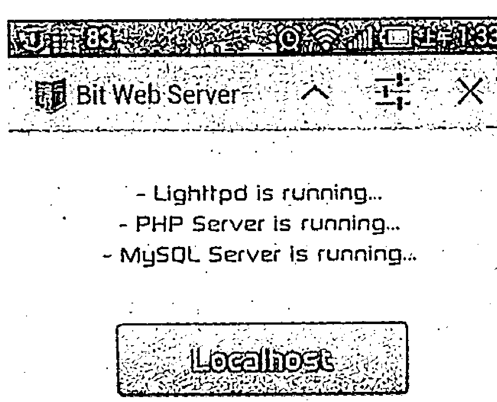

> **小提示**
> 随着物联网技术的发展，虽然目前已经有可以接受远程命令开机的主板芯片或外设问世，可实现用手机短信或远程命令的方式控制远程PC的开机，但对于目前的大多数PC来说，并没有这样的硬件设备，因此远程控制也仅能限于远程关机和远程基本操作。

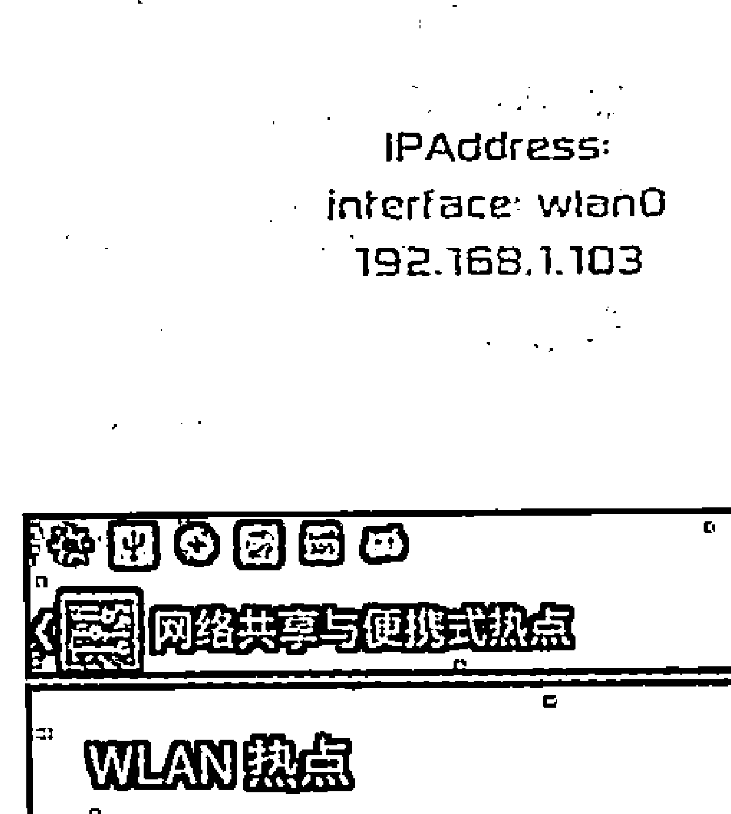

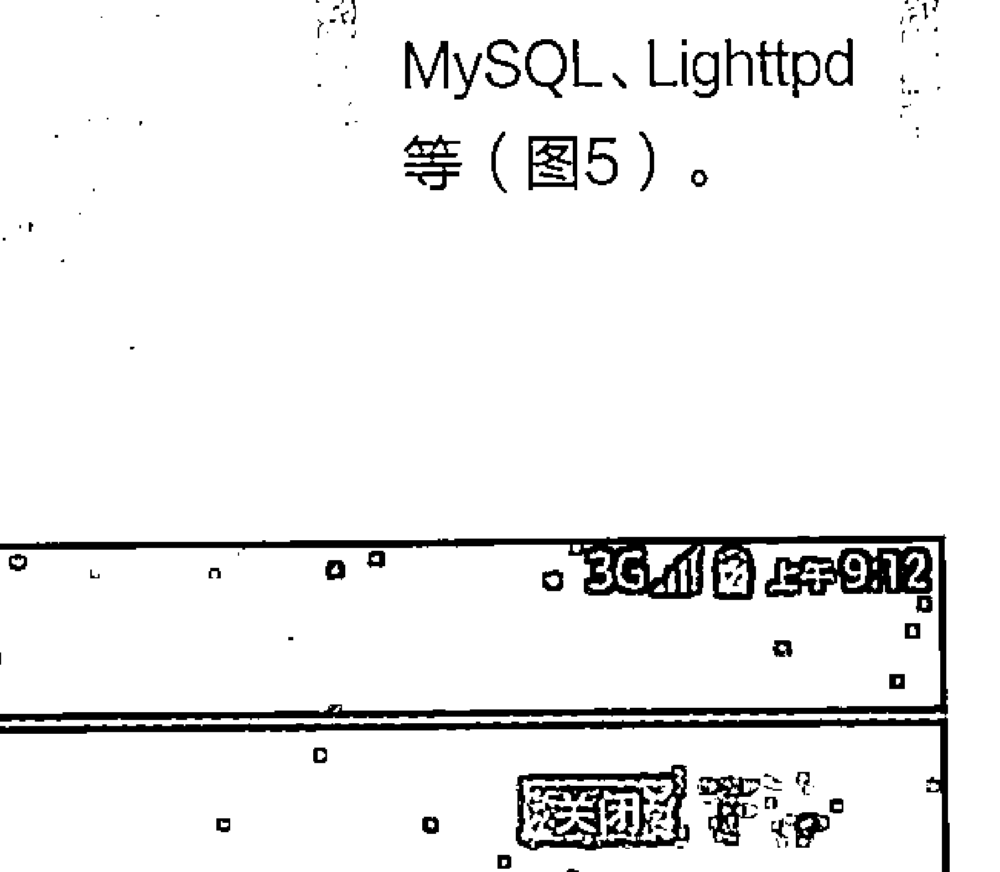

1.  打开Windows PC网络。
2.  在想要分享的网络上点击右键，选择属性。
3.  点击高级选项，选择“允许其他网络用户共享此计算机的Internet来连接”（如果出现家庭网络选项，请选择新增的USB网络连接）。

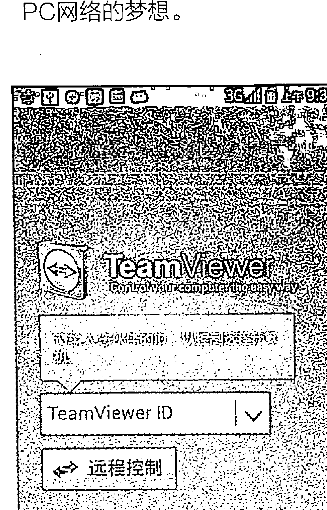

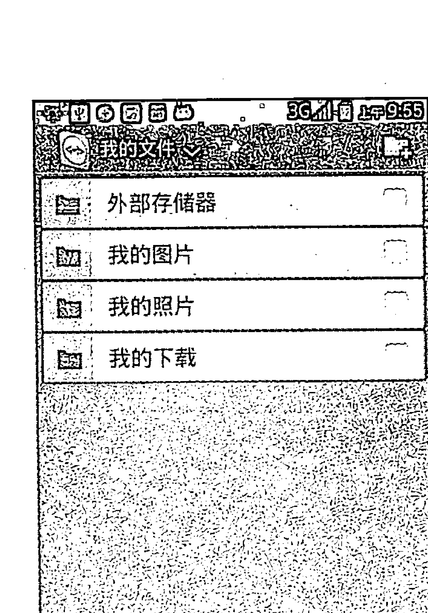

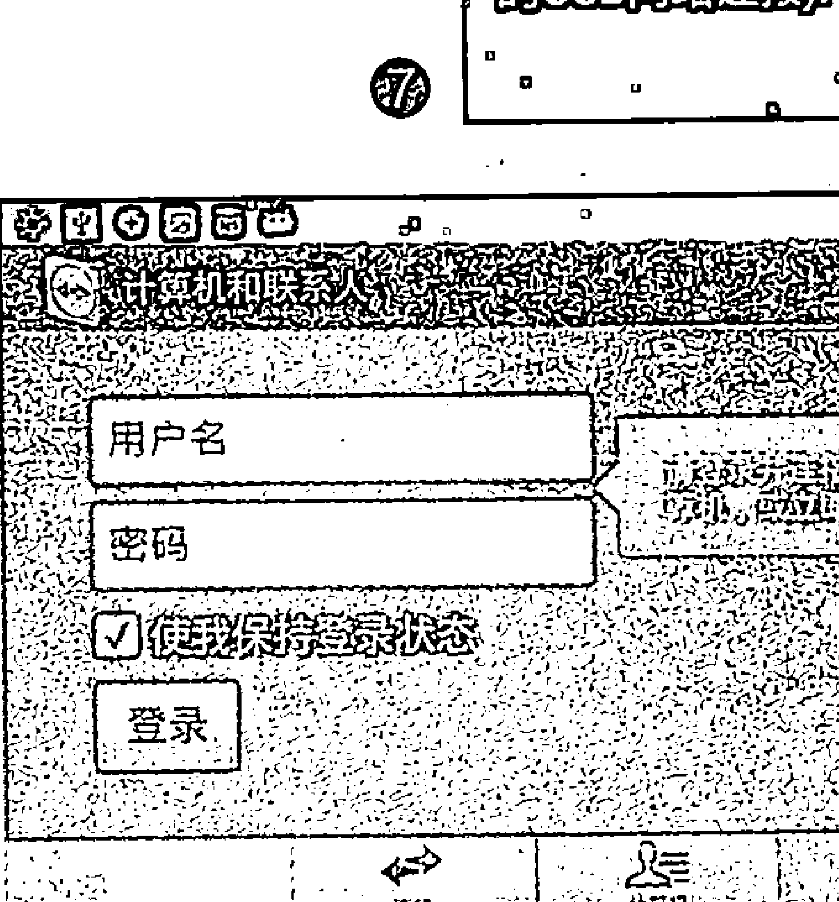

#### 移动设备的远程应用

除了使用有线或无线的方法实现网络共享外，远程控制作为拓展网络服务和功能的一种跨设备、跨平台网络应用，使用移动设备来控制远距离的家庭或办公PC，也是一项很实用的技术。通过远程控制技术，智能手机可用来执行远程关机、远程下载、远程传输文件等，这就大大拓展了网络的应用范围。

以TeamViewer为例，在PC和手机端分别安装好对应的APP。PC端首次运行时会生成一个ID号码和随机密码，再次启动后显示的密码会不同。每次都需要记忆一个不同的密码比较麻烦，因此为了让自己能容易记住密码，可以通过下方的“个人密码”窗口设置一个永久不变的访问密码。设置好之后，让此软件始终处于开启状态（系统托盘有此软件蓝色图标驻留），随时准备被远程控制。

外出需要控制远程的PC时，启动手机上的TeamViewer，输入远程PC的ID号码（图8），点击“远程控制”即可进入远程PC的桌面环境。通过PC端TeamViewer，还可将计算机以用户名和密码的方式登录到服务器计算机列表中，这样，在TeamViewer服务器中可以存入多台自己的PC的记录。需要在手机端访问时，除了可以用上面的输入ID的方法外，还可以通过点击手机端TeamViewer页面下方中间的“计算机”按钮，直接输入某台PC的用户名和密码来访问此远程PC，或者直接点击“登记簿”，从中选择要控制的远程电脑（图9）。如果要与远程电脑实现文件共享，可点击手机TeamViewer页面下方的“文件”按钮，进入到手机文件管理列表，选择文件与远程机器实现文件共享的各种基本操作。点击右下角的“远程机器”按钮可切换到远程电脑的文件列表（图10）。

> 小提示
> 移动设备当小网络服务器用，主要提供临时性的应急服务，而提供长时间稳定的服务不太现实。因为毕竟在电力续航或存储容量上不占优势。

#### 闲置移动设备的共享服务

基于以上技术，如果自己有闲置的移动设备，运行缓慢或使用效果不佳，准备遗弃，但可以提供网络服务，那么也可以通过有线或无线网络共享，将其作为网络扩展服务器来使用，充当外出的一台无线路由器来用。如果这台移动设备存储空间可观，里面也可以存放一些有价值的资料，只作为文件共享服务器来使用，以便在移动设备之间或移动设备与远程PC之间共享文件（共享文件可以用蓝牙或“数据线”等APP来实现，也可搭建FTP移动服务器）。这样也算是做到了闲置移动设备的有效利用。

### 用大网络 补充小网络

几台电脑连接而成的小网络虽然也实用，但与广阔的Internet相比，其资源和空间的局限性无疑是非常巨大的。因此探索如何通过软件工具或大网络的优势来扩充小网络的空间或应用是十分必要的。

文|晓羽

#### 无限扩充

#### 给小网装上臂膀


#### 搭建跨局域网的PC共享平台

将位于不同局域网中的PC资源连接起来，可以大大扩展网络空间。例如，一个公司有几个办公地点，距离较远，分别独立成几个小的局域网。在单一一片区内共享文件不成问题，但如果在片区之间的电脑中共享文件，就得寻求跨局域网的文件共享方案。虽然QQ等工具也能临时解决，但限于功能和服务单一，需要寻求更专业的方案。我们选用最新版的RealLink服务工具搭建跨越局域网的文件共享平台，实现文件和信息的共享。该系统诞生已有十多年，但在2014年5月推出最新简体中文5.0版，支持Windows 8系统。由于该系统较之平常所见的即时通讯系统具有更加强大、灵活的控制，因此，选它来搭建远程跨局域网的文件共享服务平台。

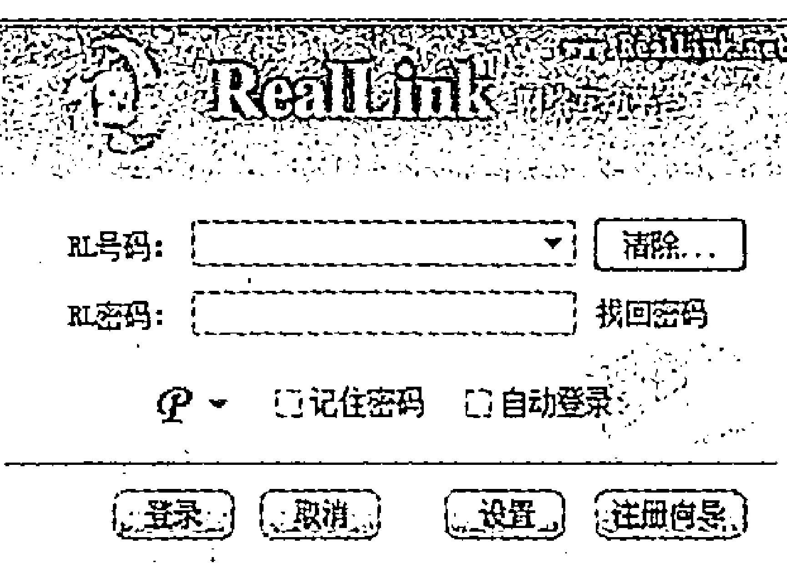

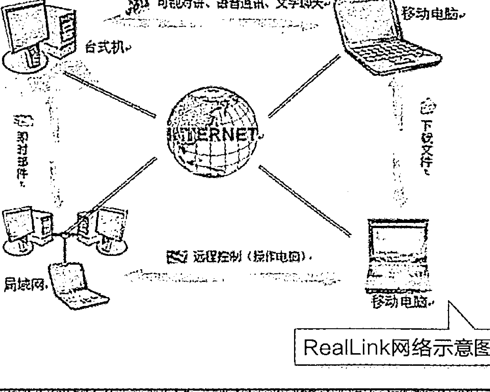

首先，在不同区域的办公PC上均安装RealLink 5.0客户端，每台电脑注册一个RL号，具体过程与QQ注册过程类似，此处不再详述（图1）。

#### 网络设置与自动登录

为了能实现顺利的网络连接，可以根据自己所用网络的实际情况，配置网络参数。点击登录页面的“设置”按钮，在弹出的“系统参数”设置窗口选择本地IP地址，可以是局域网地址或Internet动态、静态地址。如果本地局域网有特殊限制，无法检测连通，还可通过设置Sock5代理服务器实现代理上网（图2）。

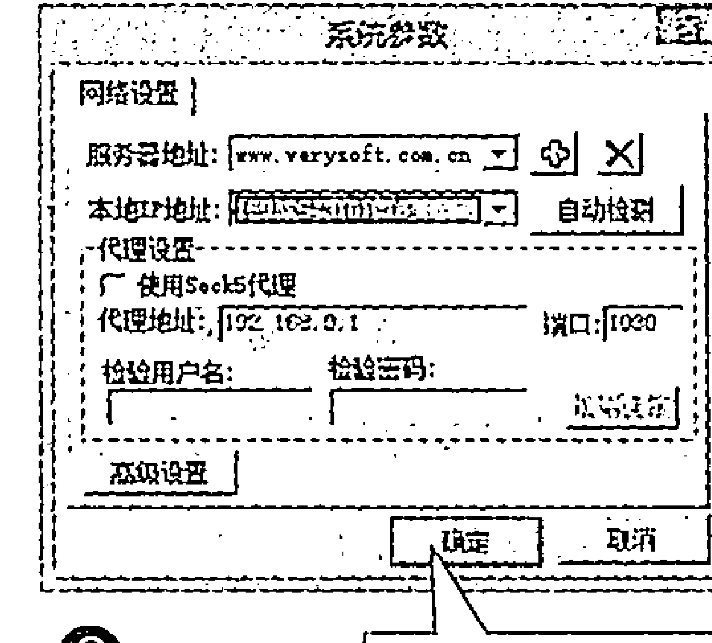

> 为了能随时实现跨局域网的联系和持续提供文件共享服务，软件安装之后，在“系统设置”窗口的“系统参数→基本设置”页面，选中“下次开机自动运行”和“运行时自动登录”两项（图3）。

#### 客户添加与业务联系

要实现资源共享，需要将同事或客户添加到联系人当中，联系人添加以RL号码为唯一依据，过程与添加QQ好友相似。联系人也可以按工作需要进行分组（图4）。

在联系人列表中，可通过右键菜单实现丰富的联系、共享功能。如：文字、语音、视频通讯，为工作交流提供全方位的途径；远程控制、传送文件、浏览共享文件，为双方共享文件提供了3种灵活选择的通道（图5）。

工作中，我们有时需要给位于不同局域网的部门中的选定人员同时发送一些资料，又有的时候需要将资料留在本地的电脑中设置为特定人群的共享，需要时让他们自己来电脑中拿。这些需求可以通过RealLink的文件传送和文件共享服务来实现。

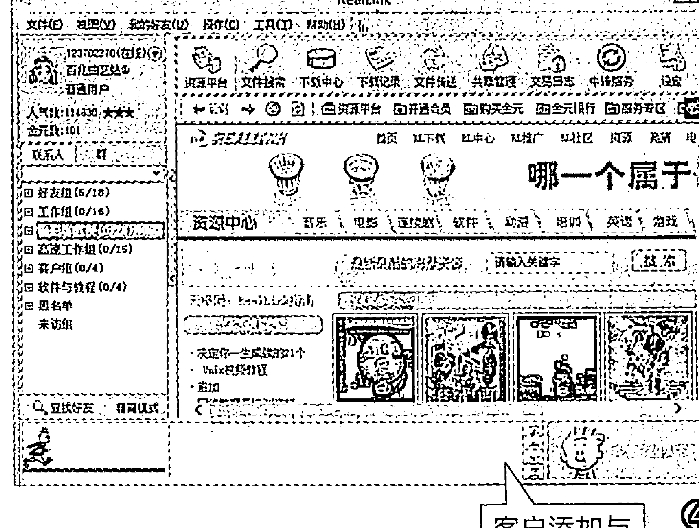

#### 文件传送与列表控制

要给不同部门的特定员工传送文件，需先点击RealLink工具栏上的“文件传送”按钮，点击“目标用户号码”后的“…”按钮，在弹出的窗口中分别选择位于不同组的符合接收条件的用户，选定目标用户群号码（图6）。

然后，从本地磁盘中选择要传送的文件列表，点击“传送文件”按钮传送。文件传送过程中，收发双方的文件列表窗口中具体显示每个文件的传输情况和进度（图7、图8）。

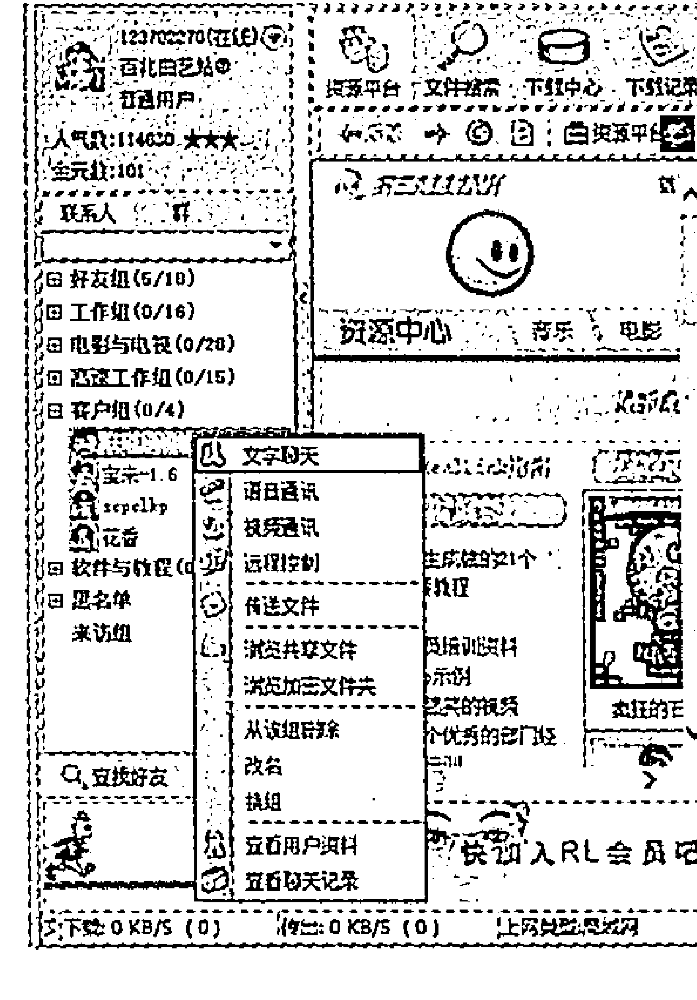

#### 文件共享与权限设置

将自己电脑中需要共享给同事的文件共享出来，设置必要的访问权限，有权访问的用户就可以像访问本地局域网“网上邻居”中的文件一样，获得远程局域网电脑中的文件了。

点击RealLink工具栏上的“共享管理”按钮，点击窗口中间工具栏上的“限定共享”按钮（金锁头按钮），设定限定共享的范围，选择“限定共享”一项，在限定方式中可选择按组限定、按用户限定或按号码段限定，这样，只有被选中组或号码段的员工才能访问共享的文件（图9）。

共享限制设定后，从上面的窗口中选择要共享的文件序列，在下方的共享文件列表左侧选择共享文件所在的文件夹，将上方的文件列表拖动到下方窗口中，即完成了文件的共享设置。授权者就可随时访问共享者电脑中的文件了。


点击RealLink工具栏上的“共享管理”按钮，点击窗口中间工具栏上的“限定共享”按钮（金锁头按钮），设定限定共享的范围，选择“限定共享”一项，在限定方式中可选择按组限定、按用户限定或按号码段限定，这样，只有被选中组或号码段的员工才能访问共享的文件（图9）。

共享限制设定后，从上面的窗口中选择要共享的文件序列，在下方的共享文件列表左侧选择共享文件所在的文件夹，将上方的文件列表拖动到下方窗口中，即完成了文件的共享设置。授权者就可随时访问共享者电脑中的文件了。


#### 文件下载与带宽控制

要从远程局域网的电脑中下载同事共享的文件，先从联系人列表中定位到同事的RL名称上，点击鼠标右键并选择“浏览共享文件”，这时在右侧窗口中会显示出同事的共享文件列表，选择要下载的文件并单击右键，从中执行或“加入下载”，即可将下载任务加入到下载窗口中（图10）。

由于这种共享是电脑对电脑之间的实时点对点共享，下载速度完全受双方所用网络的限制，因此，如果网速理想，不加限制的下载可能会拖慢共享一方的电脑速度，对工作造成影响。这时，为了不至于造成对方使用电脑的很大影响，需要控制下载的速度。在添加下载任务窗口中，通过多线程控制，减少下载的线程数来控制网速（图11）。

此外，共享一方可通过设置限速来控制外面用户的下载速度。在“系统设置→文件共享与下载→限速下载”窗口中，设定每个通道的最大速度，限制下载速度。还可以设定不受此速度限制的例外用户列表。此外，还可通过“通道管理”窗口，设置传出文件的最大通道，以及单个用户传出文件的最大通道数（图12）。


如需加速下载，除了开启更多线程外，还可通过启用高速中转通道获得更高的下载速度（类似于迅雷的高速通道），不过这项服务需虚拟货币“金元”的支持，而金元的获取可通过共享实用资源让别人下载来赚取或向软件官方购买。

#### 远程控制与权限设置

公司位于不同区域的两个部门局域网中的电脑用户，除了需要相互之间共享资料外，有时远程控制对方的电脑的需求也存在。比如对方的电脑有问题需要帮助解决，或者到达另一个业务部后需要访问远方自己办公室的电脑。远程控制可先设定权限，届时开启控制；或者用系统默认的询问设置，通过询问后才能控制。此外，如果事先能确定使用者范围，还可选择“要求输入口令”一项，将远程控制口令先设置好。然后在下方的窗口中设置权限，只开放给有权控制者。通过“添加用户”按钮，添加有远程控制权的员工作为受信用户（图13）。

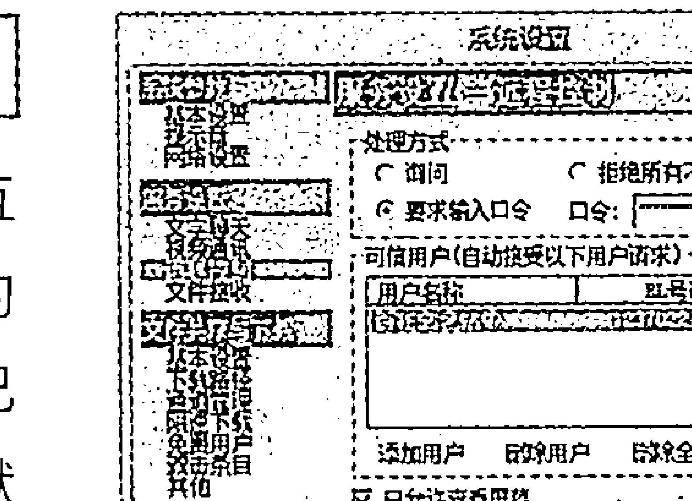

> **小提示**
如果只允许对方远程查看内容，而不许有任何修改权，则可在远程设置窗口选中“只允许查看屏幕”复选框。

#### 借“云”无限扩展小网空间

无论一个公司有多少台电脑，仅靠这些电脑自带的硬盘来存储数据，空间是非常有限的，尤其是在大数据时代的今天，情况更显突出。好在我们已进入“云”时代，在国内几家大型网络公司的雄厚技术实力和资金的支撑下，免费的大容量云空间，要比国外的免费云更具有吸引力。那么，何不利用这样良好的“云”环境，拓展自己的小网空间，让自己的PC、自己公司的PC的存储空间不再“紧张”！

如何通过“云”空间来拓展本地PC或小网络的存储空间？我们结合当今流行的网络云盘（如百度云、360云盘、华为云盘、金山快盘、酷盘等主流网盘）来说明。

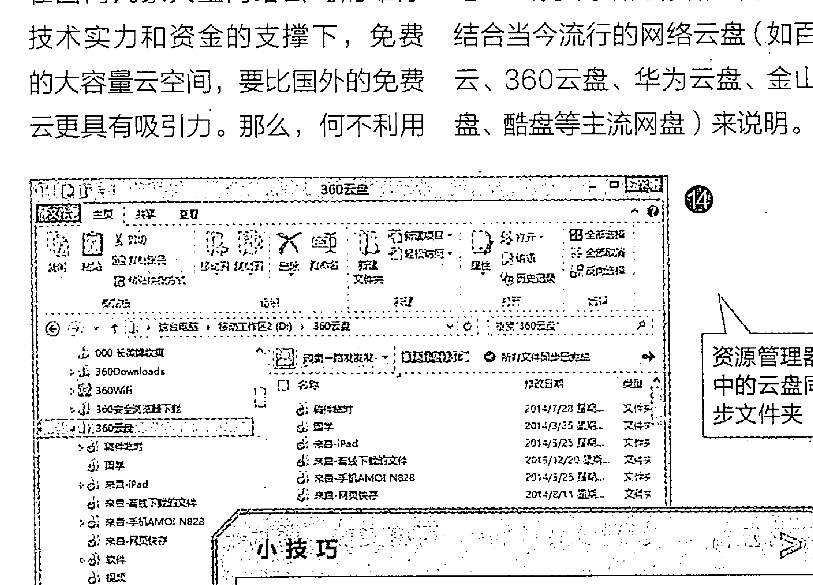

> **小技巧**
由于本地同步盘与网络服务器云空间的同步关系，用户如果删除存放在本地同步盘中的文件，那么服务器同步文件夹中的文件也会随即被删除掉。为此，如果需要腾出本地空间，而保留文件在网络云空间中，那么，需要先登录云盘Web页面，或使用非同步版的云盘客户端管理软件（如百度云管家或360云盘标准版等）登录处理，先将网盘同步文件夹中的文件统统转移到另一个网络文件夹中。然后在断网或关闭云盘客户端的情况下，将云盘本地同步文件夹（或驱动器）中的文件删掉，即可腾出本地空间占用（图15）。

#### 让出“云”空间 扩充本地盘

如果本地网络磁盘空间有限，可利用云空间进行扩展。有关网络云盘的使用方法，本刊此前做过多次介绍，此处不再详述。下面主要讲述如何巧用“同步盘”实现本地资料转移、腾出空间的方法和技巧。资料放在网上，腾出本地空间，也就扩大了本地网络的空间范围。

首先安装具有网络同步盘设置功能的云客户端软件（如百度云客户端、360云盘同步版、微云同步、华为网盘爱同步、金山快盘PC版云U盘等）。然后开启这些软件的云同步功能，之后在PC硬盘中就会出现一个虚拟的云盘符或云同步文件夹（图14）。

从图中一例可以看到，有一个同步云盘为辅助，就相当于给本地电脑或小网络添加了43.4TB的存储空间，如果每台电脑均是如此，那么若本公司的小网拥有10台电脑，每台电脑增加一个网络云盘账户，就相当于给整个网络添加了200多块2TB容量的大硬盘，容量扩展相当可观，且均为免费服务。

接下来就是保持网络的畅通和客户端开启状态，将需上传到网络中的资料不断放入这个同步文件夹中即可。但要掌握的关键技术是，在清空本地同步盘内容的情况下，保留其中的文件到网络云盘中，不能由于同步功能的作用而同步删除服务器中备份的内容。这需要巧妙利用切断同步分别处理两端资源的方法和技巧。

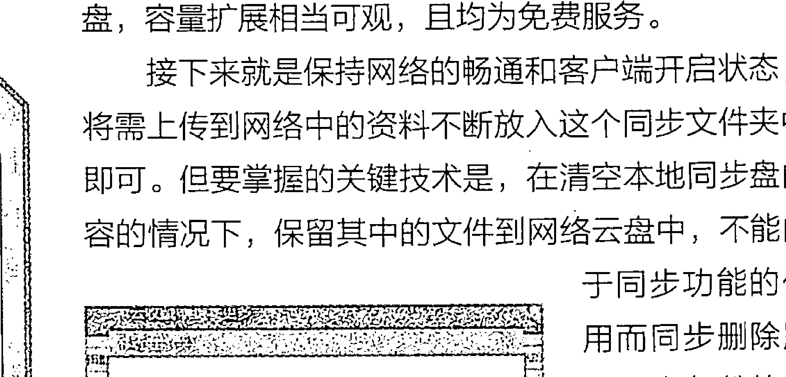

#### 默默藏于后台的“空间”扩展

上面介绍的方法虽然可行，但对于对云盘使用不太熟悉的用户来讲，一不留神往往会在删除本地文件的同时自动删除服务器中的文件，造成追悔莫及的严重后果。这时，需要寻求一种更加安全可靠的本地磁盘同步文件夹腾空的方法。

我们可利用定制本地资料自动备份到云空间的技术，实施文件从本地到云服务器的单向备份。由于文件的复制是从本地到服务器的单向操作，本地删除文件不会影响到已经传输到云服务器中的文件，因此，采用这种数据传输之后，腾空本地资料的方法就相对安全一些。

以百度云管家为例，假设需要将不断积累的精选软件和驱动程序备份到百度云盘，备份之后删除本地两个文件夹中的备份，腾出空间，那么，可以先在本地硬盘设立两个固定的文件夹（如“★精选软件□”和“★驱动备份”），切换到百度云管家设置窗口，点击自动备份后面的“管理”按钮，在弹出的窗口中点击“添加文件夹”，将上面的两个本地文件夹添加到自动备份列表中。这样，每次用户加入到这两个本地文件夹中的软件或驱动程序会自动备份到网络云盘中。此后遇到磁盘空间不足时，只需删除本地的两个文件夹中的内容，继续添加新的内容即可。如果要将其他文件资料转移到网盘中，也可“照猫画虎”，用同样的方法来执行。

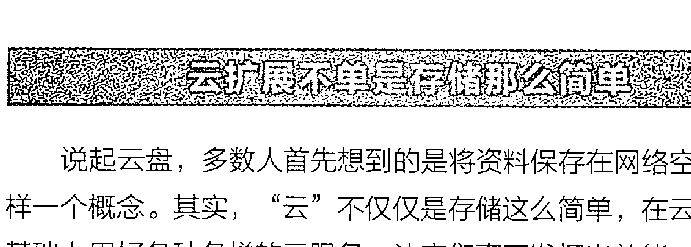

说起云盘，多数人首先想到的是将资料保存在网络空间中这样一个概念。其实，“云”不仅仅是存储这么简单，在云存储的基础上用好各种各样的云服务，让它们真正发挥出效能，这才是更重要的。

#### 用办公软件来分享、协作

在“云”的协助下，我们可以用办公软件来分享文档，或通过“云”完成文档的多人协作编写。

安装并使用最新版的国产WPS文字，编辑一份文档，先点击工具栏左侧的“登录”按钮，或点击右侧浮动面板左栏中的“发射”按钮，再点击“登录”按钮，进入WPS轻办公登录窗口。选择QQ账号、WPS账号、小米账号、新浪账号等均可以直接登录WPS轻应用。

在WPS文档编辑窗口，点击右侧浮动面板中的“发射”按钮，弹出文件发射窗口，如果文件尚未命名，输入文件名后发射，就会在WPS云端生成该文档的轻地址，与此同时，生成一个简短的HTTPS地址，还有一个二维码图片。

手机扫描此二维码，可在手机上查看此文档。如果将生成的HTTPS地址代码复制并粘贴到QQ或邮件中，也同样能分享给好友查看或编辑。将代码粘贴到微信或米聊，可让大家一同编辑。

> 单向自动备份文件的方法也不是万无一失，它同样存在风险，不过这种风险可通过谨慎观察传输进度来避免。单向自动备份文件到服务器的风险之一，就是在文件提交自动上传但未传输完毕之前，登录到网络云盘中也许可以看到文件已经存在于网盘空间中，但实际上传输过程却并没有真正结束，这时，如果关掉云盘客户端或关闭电脑，那就造成了传输过程的中断和不完整。在误以为文件已经传输完毕的情况下，删除了本地文件，就会造成本地和网盘中文件均失效的后果。其实，避免这种情况发生的方法很简单，在决定删除本地文件之前，先开启网络云盘客户端，切换到传输进度窗口，看看是不是还有未传送完成的文件，如果没有，则说明文件传输完整，那么就可放心地删除本地的备份文件了。

#### 借助云盘扩展应用空间

用系统自带的OneDrive云存储功能，可扩展本地PC网络的应用范围。在此，不要以为只能在Windows 8.1上使用OneDrive，实际上，在当今流行的主流PC或移动平台上，均可使用OneDrive云服务。这样，身边的各种设备就可连成一片。

最新版的Windows 8.1中已内置OneDrive，如果使用旧版Windows，通过下载安装OneDrive使用微软网盘（下载地址：http://go.microsoft.com/fwlink/?LinkID=392253&clcid=0x804）。苹果Mac、Android移动设备上使用OneDrive，可通过https://onedrive.live.com/about/zh-cn/下载安装。此外，还可通过此网页来直接登录OneDrive Web页面来访问微软云盘内容。

以OneDrive为目标和桥梁，可以将不同平台、不同设备的应用连接起来，实现数据共享。在Windows 8.1应用桌面环境下，可通过OneDrive应用添加文件并上传到OneDrive空间；在PC Windows 8.1传统桌面环境下，可以直接将文件复制或者移动到资源管理器的OneDrive文件中；还可以通过Windows应用或者桌面应用程序（如MS Office组件），将正在编辑的文档直接保存在OneDrive中；此外，通过设置OneDrive，可将文档、照片等内容自动保存到OneDrive中。在Windows 8.1环境下，通过选中“脱机访问所有文件”选项，还可以在断网的情况下利用本地系统随时访问OneDrive中的文件。

除了用OneDrive云扩展，还可以用国内的其他主流云盘功能实现网络扩展应用。例如，可直接用百度云或360云来充当电子书阅读器、影音播放器、生活实用轻应用等，实现以往要在系统或网页内才能完成的一些任务。所有这些，都是“云”功能对本地PC、移动设备或小网络进行功能扩展的很好例证。我们应该开拓思维，走出传统应用模式，走进云的应用当中。


许多人感叹自己总是太忙了，常说“恨不得将时间掰成两半花”，希望“要是一天能再多几个小时就好了”。虽然一天只可能有24小时，但若是通过合理安排时间、提高效率，完全能让每天似乎都是“36小时”的效果。

### 井然有序见效率

在多线程统筹部分，我们介绍了软件、硬件如何合理有序的调度。其实，生活、工作中最重要的资源，恰恰是我们自己。只有分配好自身的各种资源，把复杂的任务变得井然有序，才可能最大程度节约我们的时间和精力。在多人协作的项目中如何有效地管理，通过各种IT设备及时提醒备忘，规划好时间进程，充分利用碎片化间隙时间，以及科学的管理方法，都是节约时间的关键。

#### 省时省力 Excel让工作井井有条

文|林立

日常工作中实施一些比较复杂的项目，往往需要多个部门的协作，如果安排不当，就会延时误工。为此，许多单位引用了专业的项目管理软件，比如微软的Project。不过这一软件用起来太复杂，实际上对于个人来说，要想管理好项目，通过日常所用的Excel就足够了，它完全可以替代Project的工作，大大提高效率，节约我们的时间。

> 小知识 什么是WBS
WBS (Work Breakdown Structure，工作分解结构)，是一种项目管理术语，即W (work, 工作任务)、B (breakdown, 分解，对工作任务进行科学有效的分解)、S (structure, 结构，对整个任务按照一定结构进行组合) 三个单词字头的缩写。对于一些较为复杂的任务，通过WBS分解可以有效提高工作效率，节约整个项目完成的时间。

- 事务项目管理:每天节约时间约=1.5小时
- 移动设备提醒:每天节约时间约=0.5小时
- 时间管理规划:每天节约时间约=1.0小时
- 碎片时间利用:每天节约时间约=0.5小时
- 有效知识管理:每天节约时间约=1.5小时

比如国庆长假马上就要来临，某酒厂需要制作一个超市促销项目，这个项目涉及到生产车间、检验车间、物流部和驻商场促销部多个部门的协作。为了保证整个项目的实施，就必须制定一个详细促销计划。下面介绍如何通过Excel来制作和管理该项目规划（其他的项目任务可能不同，但是方法是通用的）。

首先要确定项目的总体规划（即Work）是进行国庆商场专柜的促销，提振公司第3、4季度的销售额。

接下来就要对项目进行分解（即breakdown），明确每个部门的分工和合作，这样才能确保项目的顺利实施。根据以往项目的实施经验，这里将其分为6个子项（即structure）。启动Excel后将A1→A3三行并一行合并居中，然后在A4开始依次输入子项目的说明，开始和截止的时间，同时在右侧使用填充的方法加入日期和星期，方便我们可以按照时间去检查项目的完成进度（图1）。

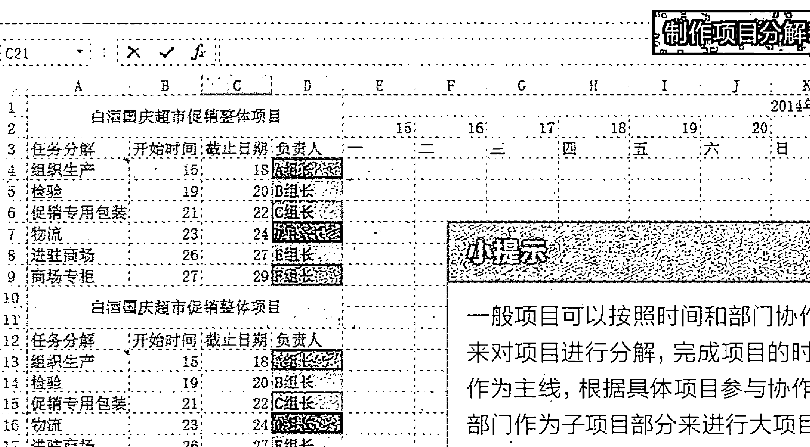

一般项目可以按照时间和部门协作来对项目进行分解，完成项目的时间作为主线，根据具体项目参与协作的部门作为子项目部分来进行大项目的分解。对于需要进行更为精细管理的项目则可以将具体工作分解到个人。

对于一个整体项目来说，很多子项目是环环相扣的，因此对于需要在指定时间内完成的项目，我们必须要确保一些关键的时间点。这些时间点称之为“关键里程碑”，它是一个阶段工作必须要保证的时间点，而这个时间点的顺利完成与否，决定了里程碑以后的各项工作能不能保证顺利进行。比如上述项目中的进驻商场和商场专柜的铺货，因为商场的国庆促销是9.29日晚7:00开始，因此必须确保上柜的商品要在9.29日晚7:00之前完成，9.29日就是关键时间点。为了确保关键里程碑的顺利完成，需要将关键里程碑标记出来。

什么是甘特图

甘特图是以科学管理运动的先驱者——亨利·劳伦斯·甘特命名的一个图表，它以图示的方式通过活动列表和时间刻度形象地表示出任何特定项目的活动顺序与持续时间，可让任何参与的用户一目了然看到项目进度。

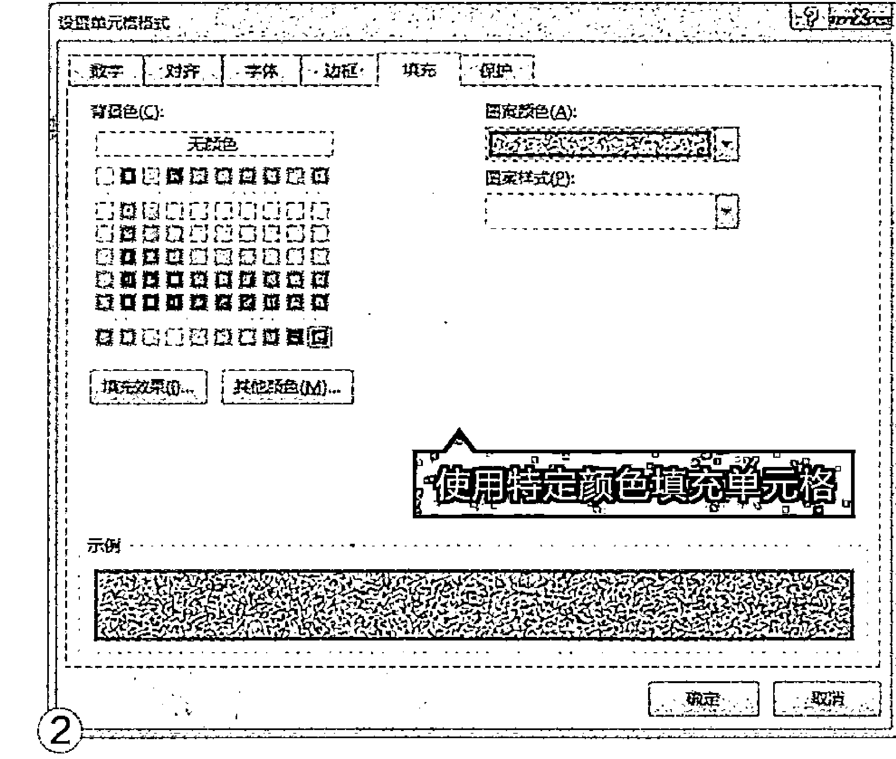

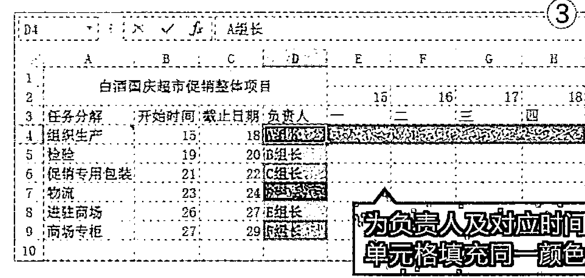

分解项目的主要目的就是节约时间，提高工作效率。因此在完成子项目的内容的建设后还可以制作甘特图，方便我们及时查看工作进度。甘特图的建立使用颜色来填充时间表格，并且颜色可以和实际负责人对应起来。比如选中D4（A组长）单元格，右击选择“设置单元格格式”，在弹出的窗口切换到“填充”，然后选择一个合适的颜色如紫色进行填充（图2）。

接着按照A组长的时间进度（9.15-9.18），在右侧时间选中对应时间段，选择其中的时间表格后同上，使用同一种颜色进行填充，这样紫色的部分就对应A组长的完成时间段（图3）。

操作同上，继续将D5→D9的单元格也填充为同一颜色，这样就完成甘特图的建设了。甘特图建设完毕，无论是项目经理还是各自的子项目负责人，通过不同颜色标注可轻松看到自己负责的项目和所需时间（图4）。

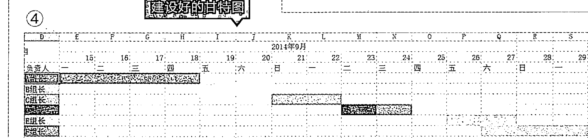

似关键时间点可以在项目管理中突出显示，这里通过插入关键里程碑的方式来实现。如果要在9.29插入关键里程碑，在项目中选中S8(9.29对应的单元格)，右击选择“插入批注”，然后输入需要提示的关键批注，并将其颜色填充为醒目的红色(图5)。

操作同上，在每个关键时间点均插入关键里程碑，这样在整个项目的管理中，我们就可以通过红色来进行醒目的提醒和区分。如果有多个里程碑时间点，为了更直观地查看，还可以通过插入图标的方式，制作一个里程碑时间图示(图6)。

完成项目管理的内容建设后，在后续的实际管理中还要及时跟进，这样才能促使项目及时完成。在上述内容建设过程中，我们使用了甘特图、里程碑等专业工具进行项目的建设，在后续的管理中同样可以利用这些来及时查看项目实施进度。比如C组长我们使用绿色标记，这样需要查看C组负责的内容时，我们只要选中D6，接着右击选择“筛选→按所选单元格颜色进行筛选”(图7)。这样本项目里所有绿色的项目都会自动归集在一起，既方便参与者查看，也方便管理者查看负责人的进度，以便更好地管理项目以节约时间(图8)。

#### 移动设备的提醒

俗话说“计划赶不上变化”。生活中总会出现需临时调整日程安排的情况。在家我们可借由PC便签进行事件提醒，外出时再用手机端APP管理行程安排。如果能将PC与手机事件提醒的通道打通，不就能做到跨平台的“任务交接”了吗？

#### 多设备同步提醒的必要性

很多用户都喜欢在PC或手机端的日历软件上设定事件提醒，确保不会忘记重要的日程安排。但是，当我们遇到突发情况需要离开电脑时，往往来不及再在手机端录入PC上的提醒内容。因此，能够支持多设备间提醒内容的同步，无疑也是一种节约手动录入时间、提高效率的有效手段。

#### 简单易用的“QQ提醒”

支持多设备提醒同步的软件有很多，在这里笔者向大家推荐“QQ提醒”(下载地址：http://tixing.qq.com/)，该软件支持Windows、iOS和Android三大主流系统，用QQ账号即可登录使用。QQ提醒的使用非常简单，在手机端运行后即可随意添加闹钟或提醒事件，使用方法与Android系统原生日历提醒很像，可以自定义事件、铃声以及重复提醒的次数等参数(图1)。此外，我们在PC上登录http://qqtx.qq.com/网页客户端，同样可以定制不同需求的提醒事件，而PC端和手机端的提醒数据会自动同步(图2)，简单便捷。

#### 干掉扰人的无效Wi-Fi网络

很多提醒功能或者我们熟悉的微博微信消息的推送都是需要联网的支持，但是，有时我们在户外却经常出现手机自动接入了无效的Wi-Fi导致2G/3G/4G网络自动断开的现象，也因此无法接收到各种推送提醒。那么，如何避免手机自动接入无效的Wi-Fi呢？

##### 优先级更高的Wi-Fi

笔者坐公交车上班时，每次经过一段特定区域就会出现无法联网的问题。原来，这个区域刚好是CMCC网络覆盖点，只要手机开着Wi-Fi就会自动接入该网络。可惜，我没有开通免费的CMCC服务，此时就等同于接入了一个无效的Wi-Fi而失去联网能力(智能手机为了节省流量，在接入Wi-Fi网络时会自动屏蔽3G/4G信号)。

##### 将CMCC扫地出门

如果你不想让手机自动接入CMCC一类的无效Wi-Fi网络而影响正常上网，可以在外出前关闭手机的Wi-Fi功能，或进入“设置→WLAN→高级设置”，选择类似“手动连接”的功能来禁止手机自动连接无线网络(图4)。需要注意的是，并非所有Android手机的系统都在WLAN高级设置里提供了手动连接功能，此类手机就需要通过修改系统配置文件将CMCC屏蔽于千里之外了。

在手机获取Root权限后，通过RE管理器删除“/etc/wifi/”目录中的“default_ap.conf”文件，然后再进入“/data/misc/wifi/”目录，选择编辑“wpa_supplicant.conf”文件，删除“network={ ssid="CMCC" key_mgmt=NOME priority=100000 credit=1 operater=1 }”内容并保存(图5)，重启手机后CMCC就再也不会自动连接了。

根据这种思路，我们还可以将那些不需要密码就会自动登录的无效Wi-Fi网络屏蔽掉，能够避免手机偶尔自动接入这些网络而失去联网能力的可能。

```
config_methods=physical_display virtual_push_button keypad
network={
    ssid="yj"
    psk="password"
    sim_slot="-1"
    ims="none"
    pcsc="none"
    priority=2
}
network={
    ssid="CUCC"
    key_mgmt=NONE
    priority=100000
    credit=1
    operater=1
}
```

#### QQ软件也能随时提醒

如果你不想安装额外的软件，使用手机QQ同样可以实现与PC间的提醒同步。最新版手机QQ加入了提醒功能，在与好友的聊天窗口中点击左下角的“+”就可添加“提醒”消息，设定好提醒内容和时间后，指定时间QQ就会以消息的形式通知。适合同时有两个QQ号的用户，分别在手机和PC端相互提醒。如果你只有一个QQ号，也可给自己发提醒消息。在与好友的对话列表中找到“提醒”项，点击界面底部的“提醒自己”即可(图3)。

#### 小结

就Android系统手机而言，谷歌日历+谷歌账号就可实现PC和手机端的各种同步提醒，可惜很多国产Android手机都屏蔽了谷歌服务，导致必须通过第三方日历、闹钟或天气软件来实现，而软件越多对系统资源的消耗也越大。因此，如果由QQ这种PC/手机必备的软件实现，自然起到事半功倍的效果。注意，多设备同步提醒消息需稳定的联网服务，而我们也务必小心手机网络被无效的Wi-Fi信号“鹊占鸠巢”。

对安装Windows系统的笔记本或平板电脑而言，可在“控制面板→网络和Internet→管理无线网络”中调整无线网络的顺序（图6），将常用或更快、更稳定的无线网络调整到最前位置，就可避免接入无效或“龟速”的网络了。

稳定的联网能力对手机这种移动设备而言至关重要，本文提到的无效Wi-Fi“鹊占鸠巢”只是不稳定因素之一。此外，智能手机在设置中都提供了当前网络的自定义功能，比如仅2G、仅4G、2G/3G/4G自动模式等选项。如果你对网络要求较高，要尽量选择自动模式，避免部分地区无信号引起的“失联”尴尬。

## # 明明白白时间去哪了

文|倚楼

和软件相似，人自身也有很多资源，其中最重要的就是时间资源。就以我的朋友老万来说，他每天的工作就是查资料、搞测试、报选题、写稿子，虽然每天都重复着这些事情，但是很多时候会觉得时间不够用，于是我向他推荐了现在比较流行的Getting Things Done (GTD) 时间管理方法。不论从事什么工作，相信对你也都会有所帮助。

#### 收集添加任务

GTD虽然是一套行之有效的管理方法，但是要想有效地执行，还是需要专业的软件支持才可以。还好，目前用于时间管理的软件比较多，比如Doit.im就是一款比较有名的时间管理软件。在进行时间管理时，第一步就是将脑子里所有的想法，无论大小都放到Doit.im软件的收集箱中。启动Doit.im后点击左侧的“收集箱”，接着点击右侧窗口下方的“添加新任务”按钮。在弹出的设置对话框里分别设置任务的标题和描述，设置完成以后点击“保存”按钮即可。除了通过添加按钮外，在窗口上方的输入框中可以输入任务名称，按下回车键后就可以快速添加任务。Doit.im还可以通过特殊字符来快速添加任务，如“@”可以为任务设置情境，“#”可以为任务选择项目，“&”可以为任务设置标签等。

#### 整理时间任务

可能很多用户会觉得上面的设置太简单，设置窗口不是还有很多的选项吗，为什么不一起进行设置并保存呢？实际上，现在的生活节奏加快，经常是计划没有变化快，一次设定所有任务的属性不仅会花掉很多的时间，而且随着时间的推移可能有的设置属性又会修改，这样无异于之前的设置时间都浪费掉了。所以当头脑中现有的想法都录入完毕后，接下来就是对当天或第二天要执行的任务进行编辑和整理。首先在执行列表中选择要处理的任务名称，点击鼠标右键选择“编辑”，接着在弹出的对话框中根据需要设定聚焦、标签、项目等属性，当编辑完成后就能一目了然地显示出来。Doit.im为了更好地管理这些任务，允许用户为其指定日期、项目、情境、优先级等内容。我们可以根据自身的需求，创建一些相关的项目。点击窗口左上角的齿轮按钮，在弹出的菜单中选择“新增”中的“新项目”，然后在“标题”栏中输入新的项目名称进行保存即可。按照同样的方法还可以新建标签、情景、目标等内容。

如果是一个团队协同完成某个任务，可利用设置窗口下方的“转发给”选项，将此任务转发给团队里的其他人，当然前提是这个人必须也是Doit.im用户。

#### 执行设定任务

前面的任务安排妥当后，剩下的就是执行了。点击软件窗口左侧的“今日待办”箱子，根据里面的记录一条条来执行。当一条任务执行后，可在名称前打对钩，此任务就在列表中被删除，由此可清晰地执行后面的任务。

#### 碎片化与突发事件

文|倚楼

当下社会，生活节奏越来越快，有时要学习或者写点什么东西，只能利用一些间隙的所谓“碎片化”时间，而各种突发事情的发生，又有可能打乱本已制作好的计划。这时我们又该如何保证流畅的工作效率呢？

##### 充分利用碎片时间

为了避免拖沓延误交稿时间，老万为自己指定了较严格的计划，并且采用“番茄工作法”进行工作。“番茄工作法”要求用户在25分钟以内专注于一件事情，25分钟后利用五分钟来休息或者临时干其他的事。而25分钟对于老万来说，足够完成一篇小的稿件。

所以当老万每天打开Doit.im客户端后，点击“今日待办”箱子后就可以看到今天要处理的所有事务。在列表中找到和稿件相关的任务名称，接着在任务名称上点击鼠标右键，选择菜单里面的“立即处理”命令，这样该任务就会和其他待办的任务区分开来。以后当这条任务执行完毕，在Doit.im客户端的对应任务上打上钩就行了。

除此之外，还可以利用好Doit.im软件的提醒功能，让软件及时提醒用户要处理的任务。同样首先找到相应的任务名称，点击鼠标右键选择“编辑”命令。在弹出的对话框中找到“提醒”选项，在弹出的窗口点击“添加提醒”并设定一个提醒时间就可以了。时间一到，软件就会弹出一个提示窗口告知用户该执行某条任务了。

##### 突发事件如何处理

虽然“番茄工作法”是一项非常不错的方法，但也给包括老万在内的很多用户的执行带来了困难，因为经常要受到电话、即时通讯软件等的打扰。这样已经安排好的任务就会受到影响，而这些任务就要重新进行调整。

老万曾经听过一个职业经理人的讲座，他将事务分成“紧急且重要的”、“紧急的”、“重要的”和“不重要的”四级，而Doit.im的优先级选项正好和这个观点类似。老万在处理“紧急且重要的”事务时，会首先创建一个新的任务，除了设置任务的名称和描述以外，点击其中的“优先级”按钮。在弹出的菜单里面选择最高的等级“高”，关闭窗口以后就可以看到一个红色的提示条。

如果有多条“紧急且重要的”事务，那么老万会创建一条任务，通过鼠标左键双击运行该任务名称。在弹出的设置窗口的“添加子任务”输入任务名称，输入一条子任务后按下回车键再输入一条子任务。设置完成后点击“转换成项目”按钮，再点击左侧列表中的“下一步行动”箱子，在里面就可看到刚刚创建的任务，然后一条条执行就可以了。

##### 时间的调整与使用

既然遇到了新的任务，那么原先的任务就要调整，老万当然也不能例外。不过老万在调整计划的时候，依然会秉承“紧急的”任务首先处理的原则，“紧急的”任务依然保留在“今日待办”箱子中，而将其他的任务通过鼠标拖拽到“明日待办”箱子里面，然后再将“紧急的”任务依次处理完就可以了。

### 知识管理井然有序

文|一江

如今的年代，获取有用知识的途径很广泛，方法和工具也多种多样。但对所获知识如何有效地管理，如何在需要时快速找到，是提高学习和工作效率应该研究的方法。现代知识的载体越来越多地体现在电脑文件中，因此知识管理工作更多地体现在对文件的管理和查询中。

> 小技巧
用Windows资源管理器建立资料管理的成批目录，可采用记事本来进行。在要创建资料库的驱动器中建立一个扩展名为BAT的文本文件，其中输入形如“MD 文件夹1 文件夹2 文件夹3”的命令，即可创建一个成批建立多个文件夹的批处理程序。一个文件中可有多行这样的命令，用“CD 文件夹名”命令进入某文件夹，配合MD命令可快速建立更多级别的文件夹。

#### 1. 资源管理器用好也贴心

最简单的知识管理方法就是用Windows自带的资源管理器来管理，顾名思义，“资源管理器”本来的职能就是用来管理资源的，所以不能让它“屈才”，我们要尽可能好好利用它，还它本来的职能。

使用资源管理器可将各种渠道获得的资料直接以文件的形式保存在本地，结合自身的搜索功能或搜索软件来管理和查询。这就要求首先做好文件夹和文件结构的规划，不能随便找个目录存放。文件夹可按资料类别建立，可分层建立，文件夹名称要能反映资料类别的大体内容，内容可以逐级递进，而文件名要更加具体地反映文件内容。例如：在规划连续剧资料的文件结构体系时，建立第一级文件夹“连续剧”，第二级文件夹“韩剧”、“日剧”、“美剧”等，文件名则命令为类似“连续剧-韩剧-大长今”的结构。这样，当需要搜索时，无论从文件夹名称，还是从文件名出发，都能很快定位到所需的文件。

#### 1. 文件命名规范化搜索资料更便捷

用如上方法建立文件结构体系后，由于文件夹和文件名实现了规范化命名，因此，只需使用系统自身的搜索功能，就可随时方便地搜索到所需的文件。以Windows 8.1为例，只需在资源管理器窗口右上角的搜索框中输入关键字或关键字组合，系统会轻松过滤出符合条件的文件。但是要注意，文件资料要先纳入到系统“库”与文件索引的范围内（图1）。

#### 2. 善用好工具高效管资源

快速搜索资料，一是依赖于资料文件本身的文件名，二是依赖于搜索软件索引功能的强弱。善于将二者结合起来使用，文件搜索效率必将会大大提高。由于系统自带的搜索功能只限于对建立了索引的库中的内容进行搜索，搜索效率也不是很高。所以为了提高效率，往往会使用第三方工具软件进行文件快速搜索。

此外，对于日常记录写作或部分复制而收集的内容，我们还可以用专门的知识管理工具来管理。传统的知识管理软件有许多，然而最近发展比较好的莫过于带有云存储功能的笔记类软件。这里向大家推介使用云笔记类软件“有道云笔记”、“印象笔记”等，这些都可作为日常的知识管理软件。

使用云笔记软件，不但可以将资料在本地系统化地管理和存储，利用云笔记软件对不同设备和平台的支持，利用各种平台上的相应客户端，可将资料通过云端同步到不同的设备上，随时随地调用。云笔记还可以实现在软件内对所管理的资料进行按关键字快速搜索，无论是管理资料还是查阅资料都非常方便（图2）。

> 有关第三方搜索工具的具体情况，请参阅本刊2014年第10期特别话题文章《寻找好用的第三方搜索工具》。

#### 3. 网海勤拾贝云端来收藏

除了下载文件的管理、知识性的笔记管理外，我们平时浏览网页时，常常会看到好的内容，其中或许是整个网页，或许是其中的文字或图片等部分内容，这时可能需要像传统的“剪报”那样把这些有用知识收集起来。在这种情况下，可通过云收藏工具来快速实现资料的收藏。

云收藏工具收集网页资料，一般是通过在浏览器中添加资料收集插件进行的。目前，许多网盘或浏览器均推出资料收集类的插件。比如，有道云笔记网页剪报、360网页快存云收藏、百度云收藏、QQ网页助手等。这些插件类的工具，都为网上搜集资料提供了极大的方便。

以使用360安全浏览器为例，只需在360应用市场搜索“有道云笔记网页剪报”应用，在扩展区添加有道云笔记网页剪报一项，之后打开要收藏的网页，点击扩展区“有道云笔记”按钮，就可以将网址、网页或网页正文，选择性地保存在自己的云盘中（图3）。

##### 小技巧

如果在看杂志、报纸或书籍时发现一些有用的消息或资料，可将它们用手机拍摄下来，作为图片甚至可转换为文字保存在云笔记中。本刊在2014年第8期APP生活汇上曾介绍过的涂书笔记APP，就能实现将图片中的文字数字化的功能。

除了可以使用有道云笔记网页剪报插件外，还可以使用“网页快存”轻应用，将网页的网址、文字、截图等内容保存到360云盘中。只需在360安全浏览器的扩展区，选择开启“网页快存”轻应用，即可随时在360安全浏览的网页内保存文字或图片（图4）。

有道云笔记使用的实际是有道云空间为中转，以及本地与云端的同步技术。若非仅保存网址，则经过同步后，保存的网页内容即便在离线后，也可以用各种设备线下查询阅读。

如果使用的是谷歌Chrome浏览器或UC浏览器，也可通过添加相对应的有道云笔记网页剪报插件，实现在不同浏览器中将网页快速向有道云的保存。

有些网页不支持内容下载，或限制网页复制，这时除了采用通过网页源码来获取内容外，也可以用上面的办法，直接将网址或网页截图收藏到“云”中保存。

#### 4. 本地知识库断网也能查

除了用上面的云笔记同步的办法建立本地知识库外，我们还可以用特种词典软件组建自己的本地知识库。比如用一个叫做MDict的词典软件来建立本地知识库。该软件支持内容扩展，只要下载相应的词典，即可扩展知识库。例如，可添加维基百科、大英百科、百度百科、各类汉语词典和英汉词典等数据库到词典中(图8)。

Mdict软件不但有PC的版本，还有面向苹果、Android、PPC等平台的版本，这些软件版本都可共享使用相同的数据库，供PC和各种移动设备同时使用。将这些数据库尽可能多地下载到本地，可保存在一张专门的SD卡中，并将软件的数据库连接指向这张专门的数据卡，这样，当在没有网络的地方需查询时，用移动设备就可访问任何数据库，就如同在网络上查询一样方便。而且因为不受带宽的限制，搜索速度会更快，使用更方便。

除了以上所述的网页插件外，还可以利用云盘与浏览器联合的“云收藏”功能来实现网页的云端保存。以使用360安全浏览器为例，安装最新版的360安全浏览器7版之后，在工具栏上会出现一个云朵图标，点击此图标即可将网页收藏到360云盘中。登录360网盘页面，点击“云收藏”按钮，可见收藏的内容，包括图片、文字、下载的文件等均可方便地收藏于其中（图5）。

如果使用百度云收藏收集网页内容，可先登录百度云账号，通过“文章”一栏进入添加百度云收藏按钮到浏览器的收藏栏，之后便可在浏览器中收藏网页内容了。百度云收藏支持目前主流的10多种浏览器。

此外，通过安装QQ网页助手，可让浏览器上的网页收藏到QQ微云中，QQ网页助手有针对不同浏览器的版本，根据自己所用的浏览器，安装对应的版本后，该浏览器就会出现相关云收藏的插件按钮，遇到要收藏的网页，只需一键点击该按钮，即可将网页收藏到自己的微云中。收藏的网页，可以在QQ中通过点击“我的收藏”按钮打开阅读（图6、图7）。

### 解放双手 以听代学

很多时候我们不方便用眼睛去阅读材料。对于职场人士，在去会见客户的路上需要预先了解客户的资料，显然走在路上并不方便用双眼查阅资料。对于备考的学生，晚上熄灯想继续背书，显然在被窝里打着手电看书也不合适。对于这类场景，我们可以将书面资料转化为音频，利用耳朵来替代眼睛学习，达到省时省力的效果。

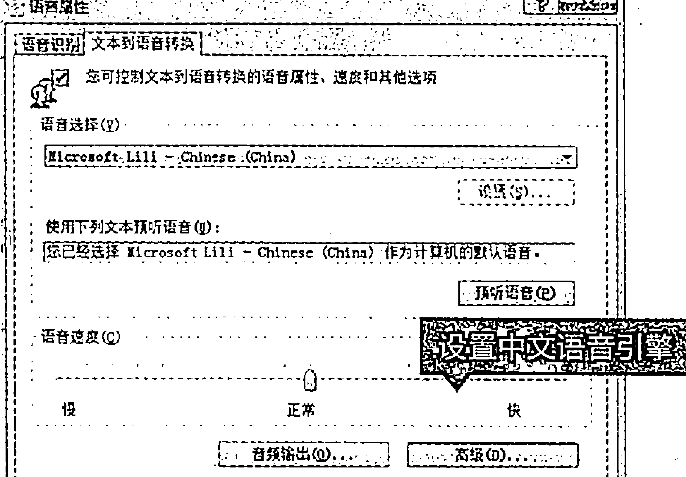

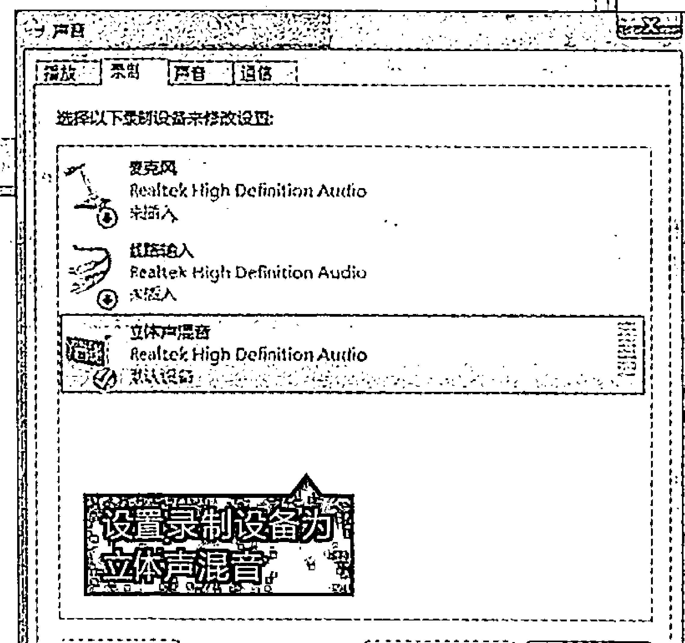

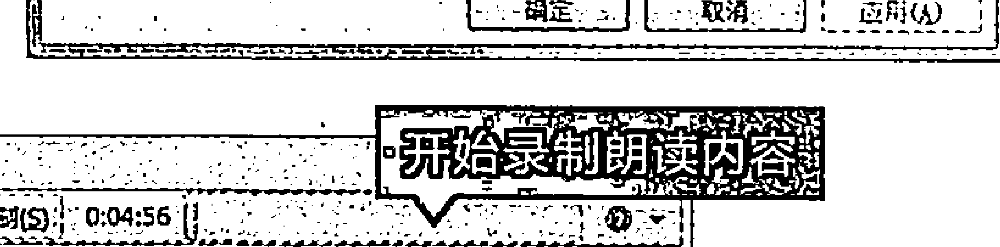

#### 音频转换 适合为上

文/技术宅

现在便于大家随身携带的设备有笔记本、平板、手机等，为了提高使用效率，我们需要根据不同的设备将书面资料转换为合适的音频格式。

##### PC设备：WMA格式

因为Windows 7系统已经自带“录音机”（默认即可录制超过1分钟以上的音频）和“文本到语音”转换功能，因此对于PC设备来说就地取材使用系统自带功能可以更省事。由于“录音机”组件默认保存为WMA格式（可以直接使用系统自带的Windows Media Player播放），因此对于PC用户音频建议使用WMA格式。

首先展开“控制面板→轻松访问→语音识别”，点击左侧窗格的“文本到语音的转换”，在打开的窗口中切换到“文本到语音转换”，选择“Microsoft LiLi—Chinese(China)”作为默认语音转换引擎，并根据实际的录制要求设置好语音速度（图1）。

右击任务托盘中的喇叭图标选择“录音设备”，在打开的窗口中切换到“录制”，将录音设备设置为“立体声混音”，这样就可以录制电脑里播放的音频数据了（图2）。

接下来可以使用Excel提供的“文本到语音”的转换来录制音频。启动Excel后在快速访问工具栏旁边，单击“自定义快速访问工具栏→其他命令→所有命令→朗读单元格”，将语音朗读命令添加到常用工具栏。准备好需要转换的文字资料，全选复制后粘贴到Excel的一个单元格中（如果文本内容较多，则可以将单元格“对齐方式”设置为“自动换行”），将鼠标定位到转换单元格，点击“朗读单元格”，电脑就会开始朗读其中的内容（图3）。

依次点击“开始→所有程序→附件→录音机”，启动录音机后点击“开始录音”，返回Excel窗口选中需要录制的内容，点击“朗读单元格”。录音机就会自动开始将朗读的内容录制为WMA格式音频，保存好音频，以后就可以直接在电脑上播放了（图4）。


华为技术有限公司是一家生产销售通信设备的民营通信科技公司，总部位于中国广东省深圳市龙岗区坂田华为基地。华为的产品主要涉及通信网络中的交换网络、传输网络、无线及有线固定接入网络和数据通信网络及无线终端产品，为世界各地通信运营商及专业网络拥有者提供硬件设备、软件、服务和解决方案。华为于1987年在中国深圳正式注册成立。2007年合同销售额160亿美元，其中海外销售额115亿美元，并且是当年中国国内电子行业营利和纳税第一。截至到2008年底，华为在国际市场上覆盖100多个国家和地区，全球排名前50名的电信运营商中，已有45家使用华为的产品和服务。华为的产品和解决方案已经应用于全球170多个国家，服务全球运营商50强中的45家及全球1/3的人口。2013年《财富》世界500强中华为排行全球第315位，与上年相比上升三十八位。2014年《财富》世界500强中华为排行全球第285位，与上年相比上升三十位。

**小提示**

由于只有Excel处于激活窗口才可以朗读当前内容，所以录制的时候一定要先启动“录音机”，接着切换到Excel窗口朗读才能成功录制音频。对于录制前的空白录音可以使用Windows Media Player播放，然后再次录制予以消除。如果要将录制的音频传输到平板、手机上播放，还可以借助“格式工厂”将音频转换为MP3格式。

##### 平板、手机设备：3GP格式

由于平板的便携性，很多朋友直接将资料保存在平板上。对于Android平板可借助“TXT听书”将文本转化为语音，由于3GP格式的压缩率较低，不会占用平板、手机太多的空间，而且大多数移动设备都支持3GP格式，因此平板设备音频建议使用3GP格式。

首先将需转换为音频的文本转换为TXT文件，假设为Huawei.txt放置在SD卡根目录下，接着到http://dwz.cn/cfanp01下载“TXT听书”，到http://dwz.cn/cfanp02下载“录音机”。在平板上启动“录音机”，点击“菜单→设置输出格式”，将输出文件格式设置为“3GP”格式（图5）。

返回“录音机”界面，点击“开始录音”，程序开始录制平板播放的声音，然后启动“TXT听书”，点击“添加书籍”，在打开的窗口中选择上述保存在SD卡下的Huawei.txt文件，返回程序界面点击导入的书籍开始浏览。在打开的书籍页面，点击“菜单→播放”，平板上就会自动开始语音播放书面资料的内容（图6）。

录制完成后返回“录音机”界面点击“停止录音”，点击“播放”可以预览录制到的音频文件，录音文件默认保存在“SD卡/AudioRecorder”下，以录制日期命名，大家也可以将该文件复制到其他移动设备上播放。


我们以丰富人们的沟通和生活为愿景，运用信息与通信领域专业经验，消除数字鸿沟，让人人享有宽带。为应对全球气候变化挑战，华为通过领先的绿色解决方案，帮助客户及其他行业降低能源消耗和二氧化碳排放，创造最佳的社会、经济和环境。

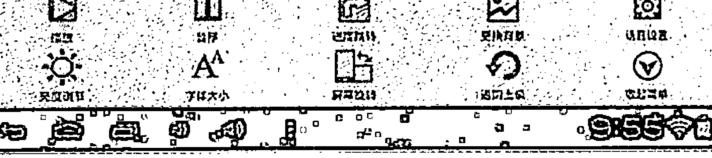

##### 扩展阅读：将语音转换为文本

有时候我们要反过来将音频转为文本，比如很多电话维修活动，打完电话后经常要整理为文本资料，此时可先使用讯飞语记的“录音笔”（下载地址：http://rec.cloud.cn）进行录音，后续操作可借助其提供的“录音到文本”功能将其整理为文稿资料以节约时间。启动语记后点击“打个电话”，开始拨打维修电话，软件会在后台自动记录语音。完成后点击录制音频播放就会同步显示文件，点击“标记-结束”将转换为文本的内容复制到记事本保存即可（图7）。如果要将实时语音转为文本，则可借助搜狗的语音输入法将语音转为文本以节约时间，比如在颠簸的车上需要输入文本，在手机上安装搜狗输入法并设置为默认输入法后，启动文本编辑器，点击输入界面的空格按钮，然后语音输入内容即可自动转换为文本（图8）。

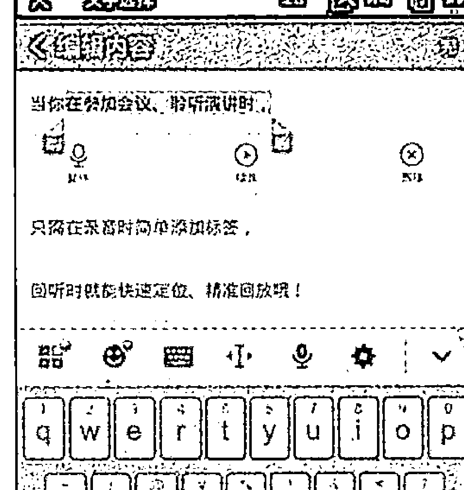


#### 听看两相宜 切换有高招

文|俞木发

在上述操作中，我们将文本转换为语音以节约时间，不过在实际使用中，对于一些重要的数据，我们在听音频时需要打开文本确认，而在进行文本校对的时候，我们则希望听听音频进行校对。怎么在文本和音频之间快速切换？大家在使用听歌软件的时候，会发现歌词可以同步显示在屏幕上。因此要实现文本和语音的转换，我们只要将文本转换为音频对应的“歌词”即可实现。

因为语音转换软件在转换时遇到句号会有一个停顿，可先将转换文本变为每句一行的“歌词”文件，再利用LRC编辑软件添加时间线，即可实现文本和音频的互相定位。首先在Word中打开要转换的文件，点击“编辑→替换”，将“。”全部替换为“。^p”（句号+回车，问号感叹号等的替换方法类似），这样文本的每句都可变为一行显示，完成替换后将其复制到记事本中并保存为Huawei.lcr放在桌面备用（图1）。

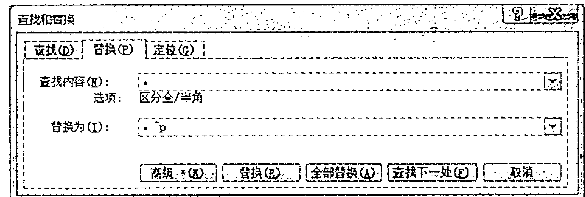

进行句号换行替换

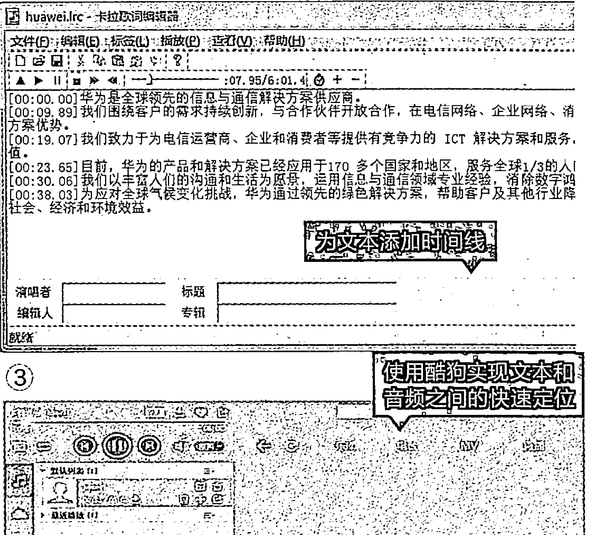

接着到http://dwz.cn/cfanp03下载LRC歌词制作软件，启动软件后依次点击“文件→打开歌词文件”/“音乐文件”，打开上述准备好的lcr文件和录制好的音频文件。开始播放音频文件后，根据实际播放内容，在开始播放每句话时依次点击程序界面的“+”，为“歌词”加上对应的时间标记，这样音频和文本内容就可以一一对应了（图2）。

完成制作后点击“文件→保存”，将歌词文件保存为和音频文件名一致的文件，同时将歌词文件和音频文件放在同一目录下，这样无论在哪里播放，都可以快速实现文本和音频的互相定位。比如可借助酷狗（支持PC、Android、iOS平台）播放录制的音频，这样在播放时可以同步显示文本内容，点击文本内容则可以快速切换到相应的音频部分。移动设备上的使用类似（图3）。

> 善用软件自动工作 每天节约时间约=1小时 善用硬件提升效率 每天节约时间约=1小时

### 善用软硬件提效率

工欲善其事，必先利其器。电脑作为当代人必备的工具，只有善加利用，充分发掘出它们的潜能，才能更好地提高效率。电脑有软件和硬件之分，我们的挖掘也从这两方面进行。软件方面，比如一些重复性的操作，我们可以通过一些专业工具，让它们自动化进行，不用人为干预，从而解放出我们的时间。而在硬件方法，深入“压榨”出硬件的性能，可以大大提供工作效率。

电脑本来就是一个高效率的机器，但不少人平时还在电脑上重复着许多不该重复的工作，因而效率大打折扣。其实，对于一些重复性的工作，完全可以通过定制批处理作业的办法，让其自动化批量完成。

文彬彬

#### 1. 文档编辑繁复过程自动化

平时处理图文表格文档时，会遇到重复执行同样步骤的操作。这些重复操作，如果能借助“宏”，或者借助于软件工具的批处理功能（如正则表达式批处理、文档外文档的批处理等），效率就会大大提高。比如，文档编辑软件Word、EmEditor就均支持宏录制功能。如果在文档编辑处理过程中遇到重复的操作需要反复进行，可以用这种方法来完成。下面以在EmEditor中将文中英文单词的开始字母变成大写为例，讲述宏的具体用法。

大家知道，虽然在EmEditor中选中单词后，通过右键菜单“转换选定内容→首字母大写”可完成将一个单词变为首字母大写（图1）。但若一篇文章中这样的情况比较多，操作起来会很费时。这时，可先选择任意单词的转换过程作为标准，启用宏录制命令，录制从选择单词到执行两级菜单命令的过程，将此过程保存为一个宏命令，还可将此命令作为一个按钮显示在工具栏上。以后凡是遇到转换首字母大写的情况，只需定位光标到单词之前，然后点击一下这个按钮就可以了。

类似的重复操作的需求非常普遍，但许多人以为“宏”高深莫测，不敢动手，因而在操作上浪费了许多时间。但实际上，“宏”是为不懂代码的操作者准备的自动化工具，“宏”操作的过程中，虽然在后台产生了难懂的程序代码（图4），但使用者完全可以不理会这一背后的隐含过程。只需像用录音机那样，按录制键录制，然后按播放键应用就可以了。

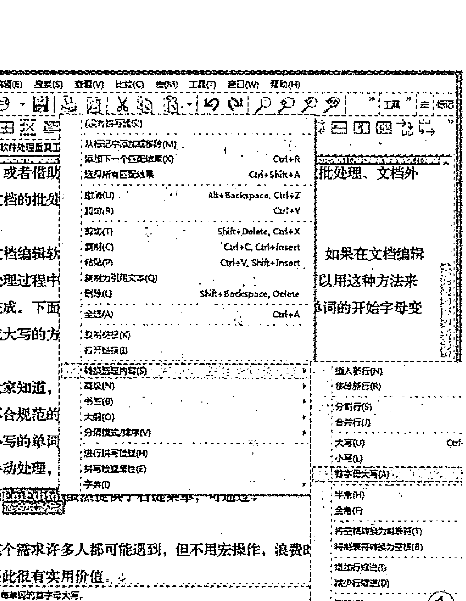

开始录制宏前，通过EmEditor的“宏”菜单的录制宏命令录制操作过程，录制时鼠标光标上出现摄像头图标，录制结束后选择停止录制命令。如果这种操作今后会频繁使用，那么可通过“宏→另存为”命令，将宏保存为扩展名为js的磁盘文件，此时，“宏”菜单的底部会出现刚才保存的宏名称。此后，遇到同样的情况时，只需在EmEditor中点击该宏名称，即可应用录制的操作（图2）。如果在软件工具栏中没有发现有录制的宏名称按钮，右击工具栏空白处，开启“宏工具栏”项目显示，便可在工具栏上看到此前录制的宏文件名了（本例中为“EmEditor首字母大写宏”）（图3）。

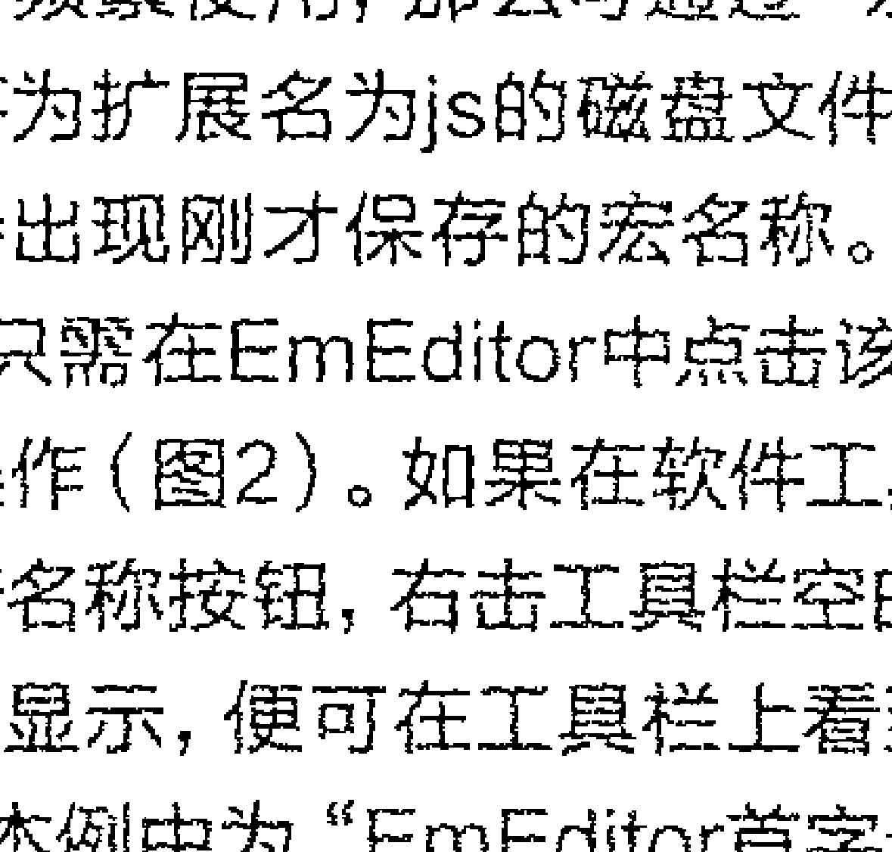

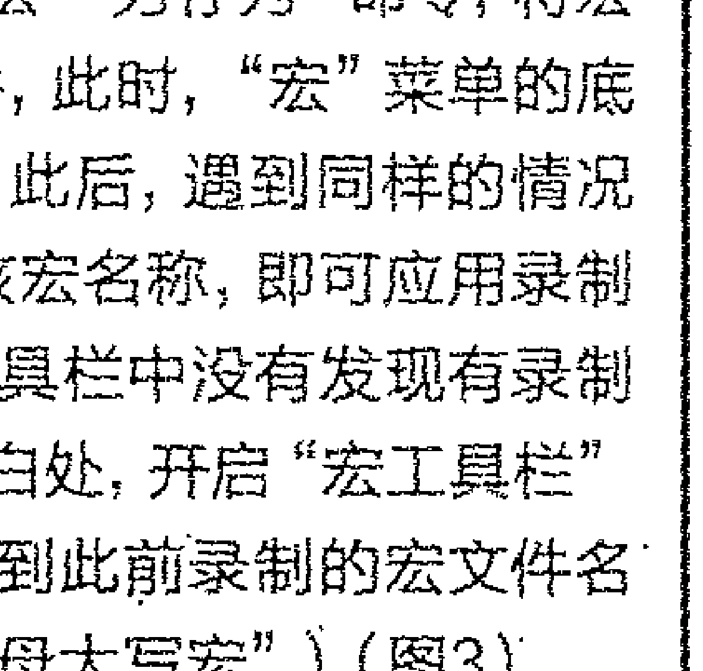

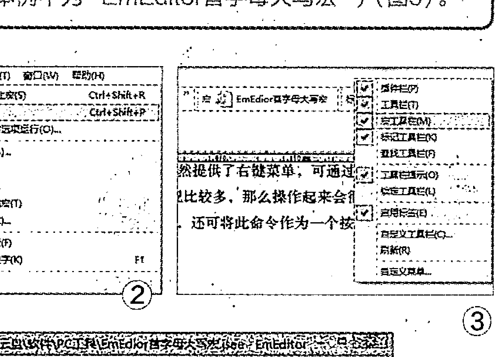

对于Word 2013、Excel 2013中宏的录制和使用，方法大同小异，要通过“开发工具”选项页进行。需注意的是，在软件默认的选项卡栏中没有“开发工具”，要通过在选项卡栏右键菜单中选择“自定义功能区”，将“开发工具”添加到选项卡栏上，这样就能在其下方看到录制宏的按钮了。

#### 2. 让工作流程自动起来

许多时候的工作需要借助两个甚至三四个软件来完成。比如某岗位的人员每天要先在本地F盘上用WPS编辑一个工作文档LiufeisWork.DOC，完成后要打包为ZIP上传到单位的云盘，同时还要备份到本地服务器目录中。这些看似简单但每天重复的操作，完全可定制自动化批处理放在桌面，只要点击就进入编辑工作，编辑结束存盘退出后，其余工作都由批处理来完成。为实现上述任务，可编制批处理文件StartWork.BAT，内容是如下10行（图5），注意实际输入时不要输入行号。

```
01 ECHO OFF
02 CLS
03 "C:\Users<用户名>\AppData\Local\Kingsoft\WPS 05 Office\9.1.0.4764\office6\wps.exe" F:\LiufeisWork.DOC
04 PAUSE
05 "C:\Program Files\WinRAR\Rar.exe" a F:\LiufeisWork.ZIP F:\LiufeisWork.DOC
06 PAUSE
07 COPY LiufeisWork.ZIP D:\360云盘
08 PAUSE
09 COPY LiufeisWork.ZIP H:\办公室\备份文件
10 Echo 任务完成!
```

将这个批处理文件StartWork.BAT放在F盘并建立桌面快捷方式，工作时执行此文件，每完成一个过程后，在黑色命令提示窗口中按一次回车，即可自动进入下一环节，完成计划设定的资料备份任务。

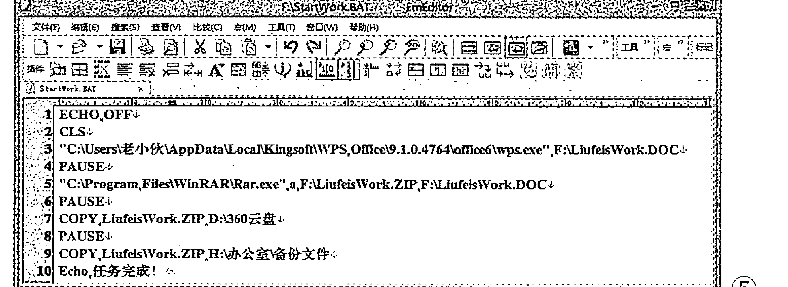

##### 批处理命令解释

ECHO OFF是关掉屏幕提示，CLS是清掉屏幕此前显示（类似于擦黑板）。中间的3个PAUSE命令是用来暂停命令执行。第03行的作用是自动启动WPS软件并打开F:\LiufeisWork.DOC文件进入编辑状态（注意更改其中的用户名字段）。第05行的作用是自动调用WinRAR的后台管理工具并将F:\LiufeisWork.DOC文件自动压缩为F:\LiufeisWork.ZIP文件。第07行的作用是将压缩包LiufeisWork.ZIP自动备份到360云盘中（需要开启360客户端和云同步功能，假设云同步文件夹为“D:\360云盘”）。而第09行的作用是将压缩文件LiufeisWork.ZIP自动备份到局域网服务器的“办公室\备份文件”文件夹中（需要事先将服务器的共享文件夹映射为本地的H盘）。

#### 3. 自动运行 一次开启多任务

越来越多的人习惯每天开启网页后先到几个固定的页面上去浏览或发布消息。那么，必须一个一个地打开网页吗？不用！通过定制自动批处理作业的办法，最多只用点一次鼠标，甚至连鼠标也不用点，就能安排好工作环境。

如果使用搜狗高速浏览器，通过“工具→搜狗高速浏览器选项”菜单命令打开选项设置窗口，在“常规→启动设置→启动时打开”下选择“我的最爱”（图6），就会在浏览器开启后自动显示最常访问的网页磁贴组合，一次最多可设置12个常用网页。可根据情况手动添加和删除需要的常用网页（图7）。

如果使用IE 11浏览器，可以通过Internet选项窗口，在“常规”选项卡下的主页设置框中一次输入若干主页地址，每行一个网址，这样就可以做到启动浏览器后，以多标签的方式自动打开这些设定好的网页（图8）。

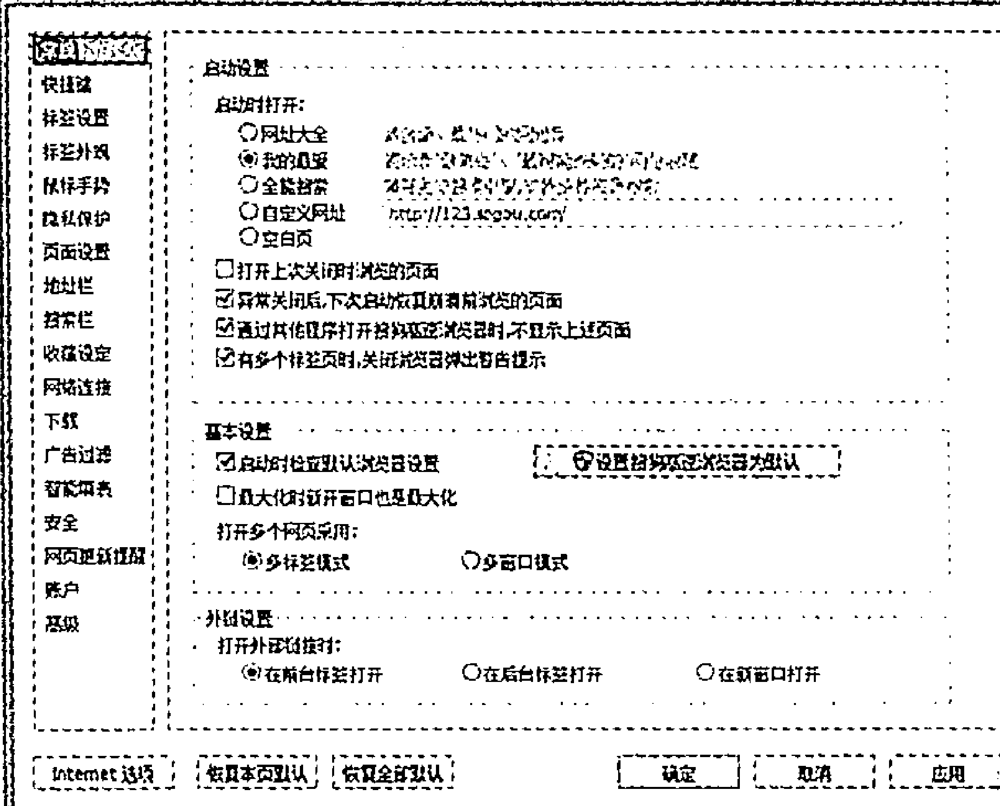

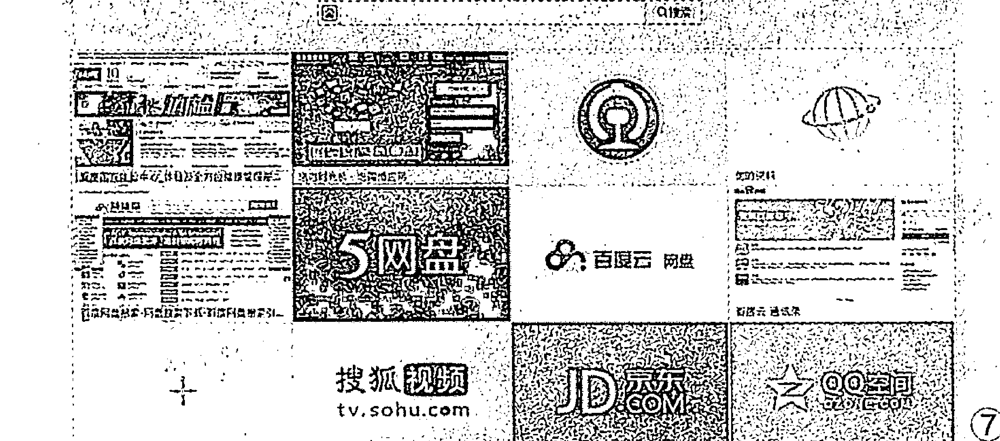

#### 4. 资料收集 归档也能自动化

将资料分门别类进行搜集当然是最好的方法，然而不少人总是先将资料下载或存放到一个文件夹中，然后想起来时才再进行整理。整理资料也是一件很费时间的事，其实，可以为资料整理定制一套规则，然后建立一个批处理文件，按这个规则自动给资料归档。这样，当想起来给资料分类归档时，只要点一个快捷键就能自动完成资料的分类归档。

比方说，将所有资料都下载到D盘的“下载资料”文件夹中，平时只需记住给每个下载的电影文件都加上文件名前缀【电影】，给软件加上文件名前缀【软件】，给音乐加上前缀【音乐】即可。

先在资料分区（如F:分区）建立【电影】、【音乐】、【软件】等文件夹。建立一个自动归档的批处理文件“资料自动归档.BAT”，内容有如下3行（图9）：

```
MOVE 【电影】*.* F:\【电影】
MOVE 【软件】*.* F:\【软件】
MOVE 【音乐】*.* F:\【音乐】
```

建好后，将该批处理文件放置在D盘“下载资料”文件夹中，并发送一个快捷方式“资料自动归档.”到桌面。当下载任务完成之后，想要整理资料时，只需点击一下桌面上的快捷方式图标，就可将资料按类归集到数据分区中。

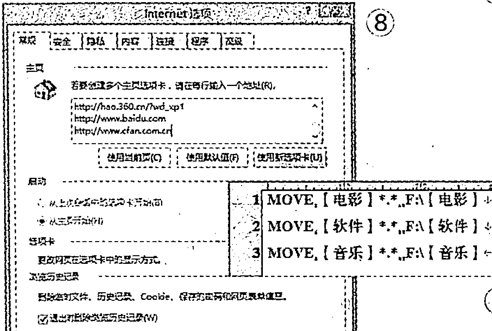

小技巧：如果希望每次启动系统后，自动打开自己设定好的几个网页，只需将所用网络浏览器的快捷方式复制到系统自启动文件夹中即可。Windows 8.1开机启动文件夹路径为C:\ProgramData\Microsoft\Windows\Start Menu\Programs\StartUp，只需进入这个文件夹，然后粘贴复制的快捷方式即可。


### 破解空间密码 玩转压缩

提到压缩，很多人首先想到的就是把文件从大变小，但除了这种最普遍的方法外，压缩还有更多的玩法。它不仅仅可以是大小的变化，还可以是使尽各种方法，“毫不妥协”地将空间、时间、效率提高到极致。不相信？那我们就来瞧一瞧。

#### 毫不妥协的压缩

随着移动设备的普及，我们经常需要在PC、手机、平板、移动硬盘、网盘等多设备间转移数据。为了提高文件转移速度（如加快上传速度），并且节约存储空间（如手机存储空间较小），我们就需要对文件进行适当的压缩并且要保持原文件的品质。因此在这一部分，我们将介绍如何实现不同多媒体文件，包括图片、视频、音乐及各种文档的压缩方法，既不影响使用，还能保证质量。

#### 美图不变色：图片压缩省空间

图片是大家经常接触到的一种媒体文件，如我们经常使用手机或数码相机拍摄照片。但是现在手机的摄像头像素和分辨率都很高，即使是选择中等质量拍摄，每张照片体积也不小。如小米2默认拍摄照片每张大小就有2MB~3MB，这样照片多了会占用手机大量存储空间，而且也不方便将照片上传到网络相册共享，因此需要对照片进行适度压缩。

##### 调整尺寸减小体积

现在拍摄设备的像素越来越高，拍摄出来的照片分辨率也越来越大，比如三星Galaxy Note3可以拍摄出分辨率高达4160×3120（单位像素）的照片，但是最终拍摄的照片都只是在平板、手机或者网络相册里欣赏。由于屏幕尺寸和网速限制，高分辨率的图片并不适合在小屏幕或者网络展示。因此我们可以对高分辨率照片进行大小调整，这样既不会降低照片的质量，又可以降低照片大小。对于JPG格式（手机或相机拍摄大多为此格式）图片大小的批量调整可以借助Resizer实现。

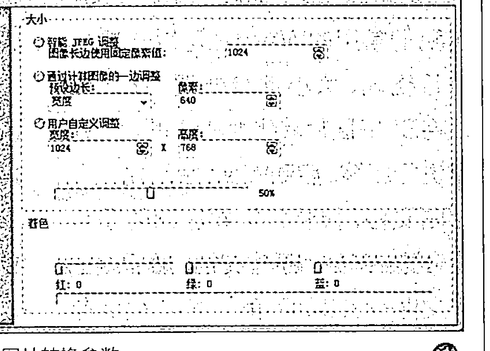

##### 批量调整图片尺寸

上述批处理是对所有照片使用同一参数进行处理，如果有多种不同分辨率的照片需要批量处理，我们可以使用文件夹查看方式对照片分辨率进行排序，将同一分辨率的照片分别导入处理，可以获得更好的调整效果。在资源管理器中打开保存照片的目录，点击“查看→选择详细信息”，然后在打开的窗口勾选其中的“尺寸”（图3）。继续点击“查看→详细信息”、“查看→排序方式→尺寸”，这样可以把同一尺寸的图片排序，按提示将同尺寸图片保存在一个目录，分别导入上述软件批处理调整即可（图4）。

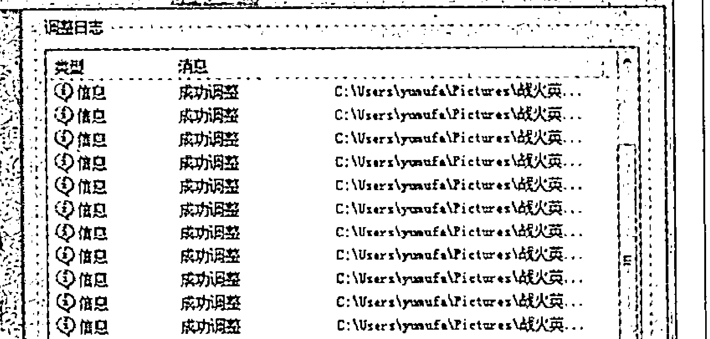

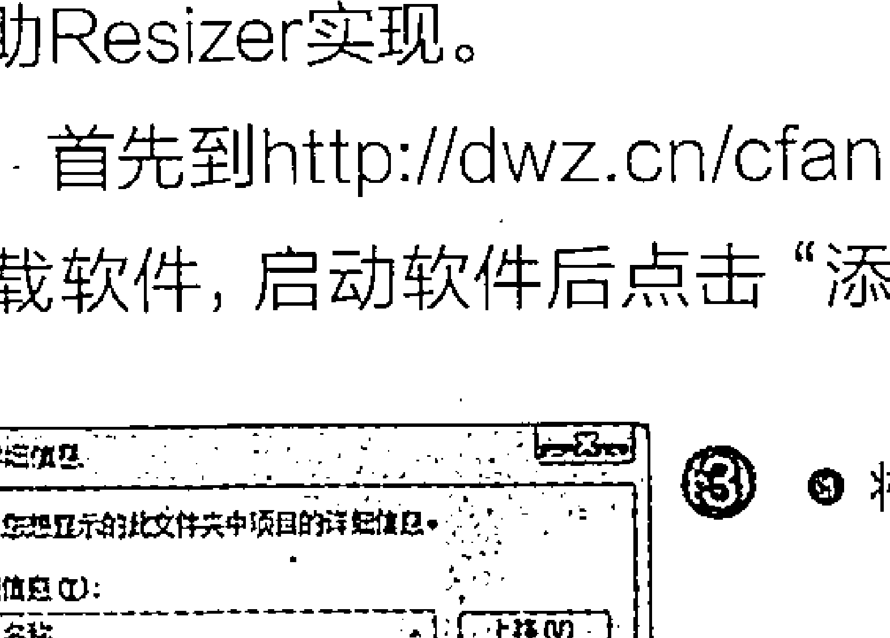

##### 无损压缩 批量压缩照片

调整图片尺寸是通过更改原来图片的大小来减小图片占用体积的，如果需要保持原来图片的大小，我们还可以借助“JPG图片压缩工具”（支持JPG和BMP）对照片进行进一步的压缩。首先到http://dwz.cn/cfans2下载软件，启动软件后按实际需要设置图片压缩比例（比例越大，图片可以被压缩得越小，但是显示质量会下降），比如只是将图片上传到网络相册浏览，建议选择默认40%压缩，可以在不影响浏览品质前提下大大节省存储空间。接着在程序左侧窗格选中保存照片的目录，在右侧窗格全选需要压缩的图片，点击“图片压缩”，选择保存压缩后图片目录，这样被选择的图片就可以进行批量压缩（图5）。通过上述方法压缩可大大减少照片体积，比如一张原来1000KB大小的照片压缩后变为180KB，而且在电脑上浏览压缩前后的照片画质损失并不明显（图6）。

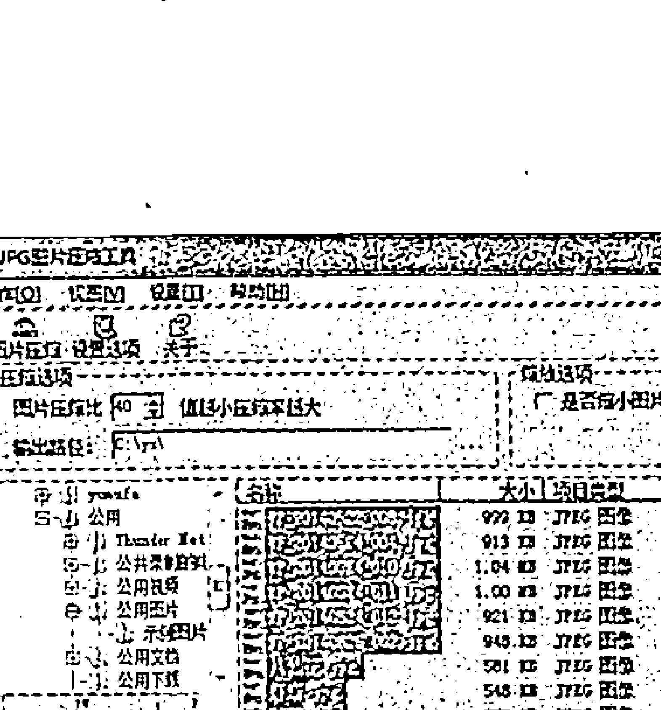

如果需要处理的照片不多，利用我们常用的Word也可以对图片进行格式、大小批量处理，比如可以将BMP图片转化为PNG图片，并且进行压缩。启动Word后新建一个空白文档，接着将需要压缩的图片全部拖入Word新建文档，然后点击“文件→另存为网页”，将文档保存为“网页（*.htm *.html）”，放置在桌面（图7）。

点击“工具→WEB选项”，勾选其中的“允许将PNG作为图片格式”，保存后只要打开和文档同名的“.files”目录，点击“查看→排序→文件类型”，然后提取其中所有.png格式的图片即可（图8）。

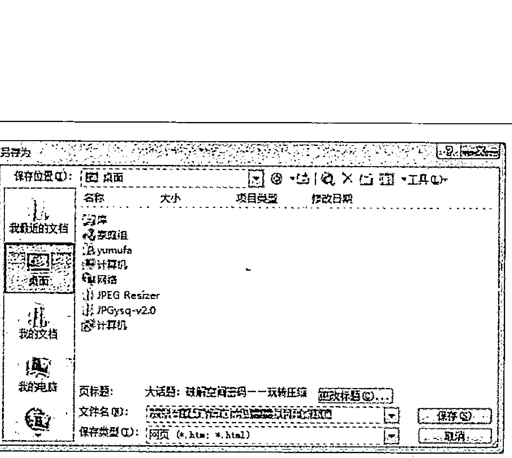

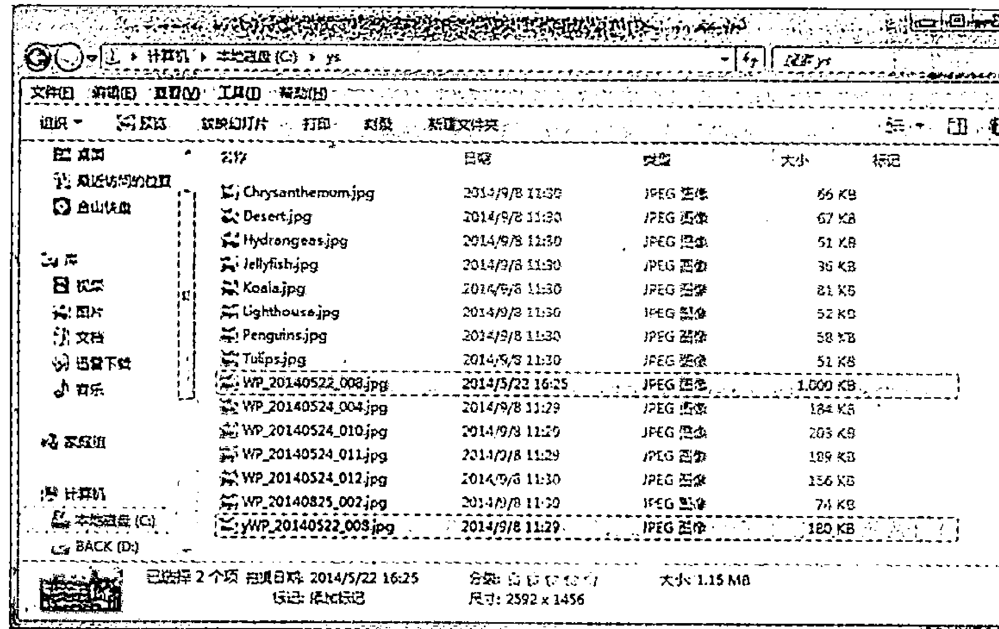

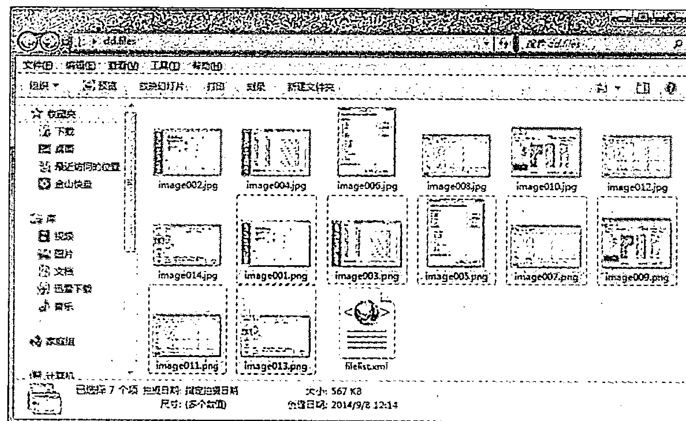

##### 瘦身不伤身

#### 视频文件的压缩

·文/技术宅·

闲暇时间在手机、平板上看看电影已经成为很多朋友的消遣方式，但是手机、平板屏幕分辨率和存储都较小，而一部高清（1920×1080）电影动辄上GB，这些高清电影不仅占用平板有限的存储空间，而且高清解码也给手机、平板带来极大的压力。因此我们需要对视频文件进行压缩，以方便在手机、平板上欣赏。

##### 压缩不盲目 了解视频清晰度标准

我们经常在优酷、爱奇艺、腾讯视频上看到同一视频有标清、高清、超清之分，这背后对应的其实就是视频清晰度。以优酷为例，不同标准的划分如下表所示（表1）。

从此表可看到，现在大部分网络视频使用的都是h.264编码格式，视频清晰度主要和分辨率、帧率、码率有关。因此要在保证画质不变的前提下对视频进行压缩，我们就要对这三个参数进行综合考虑。

对于分辨率则需要根据自己的设备进行调整，只要尽可能保证全屏播放即可，原来过高的分辨率电影在低分辨率平板上播放清晰度并不会有多大的提高。

对于帧率，由于人类眼睛的特殊生理结构，如果所看画面之帧率高于24的时候，就会认为是连贯的，因此在压缩视频的时候，我们只要保持25左右的帧率就不会对视频质量造成多大的影响。

视频中的码率是指由模拟信号转换为数字信号的采样率，数值越高传送的数据越大。但是码率超过一定数值，对图像的质量没有多大影响，一般压缩转换时保持500Kbps的码率，在一般手机、平板上观看就可以获得很好的效果了。

要想知道某个视频文件的分辨率、帧率、码率等信息，我们可以借助MediaInfo工具。到http://dwz.cn/cfans5下载软件，启动程序后按提示将语言切换为简体中文，接着勾选“资源管理器右键菜单”、“包含文件夹右键菜单”，这样查看视频信息时就可通过右键快捷菜单查看（图1）。

右击一个视频文件选择“MediaInfo”，在打开的窗口即可看到视频的分辨率、帧率、码率等信息了（图2）。

表1 常见视频及对应标准
| 视频类别 | 分辨率 | 帧率 | 码率 | 编码格式 |
| :--- | :--- | :--- | :--- | :--- |
| 标清 | 512×336 | 15fps | 0.3Mbps | h.264 |
| 高清 | 640×432 | 25fps | 0.5Mbps | h.264 |
| 超清 | 960×720 | 25fps | 1Mbps | h.264 |

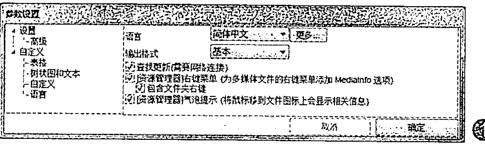

##### 适用为上 压缩视频省空间

了解上述信息后，我们就可对视频进行压缩，在保证品质不变的前提下将其压缩为更适合在平板、手机上播放的视频。视频的压缩借助“格式工厂”即可轻易完成。

到http://www.pcfreetime.com/CN/下载软件，启动视频工厂后点击“所有→移动和设备”，在打开的窗口中根据自己设备的实际分辨率选择需要转换的格式。比如目前很多Android平板都支持720P的视频播放，这里就可以选择“Android→Android 720P MPEG4”（转换后格式均建议选择转换为MP4格式，因为大部分移动设备均支持该格式，且其使用Divx压缩，压缩率较高）。

接着在右侧窗格选择匹配的参数；Android设备均支持屏幕自适应；如果不确定自己设备的分辨率；屏幕大小可以选择“自动*720”，比特率（码率）设置为“1200”即可；每秒帧数（帧率）设置为“25”即可。

点击“确定”，在打开的窗口点击“添加文件”（或“添加文件夹”），将需要压缩的视频全部导入处理列表，最后点击“确定”即可开始压缩。

转换完成后打开输出目录可以看到，原来1280×800的视频（原大小为86920KB）已经被压缩到36250KB，体积减小了一半，在移动设备上观看的视频效果并不比原文件差，而且更适合在自己的设备上播放。

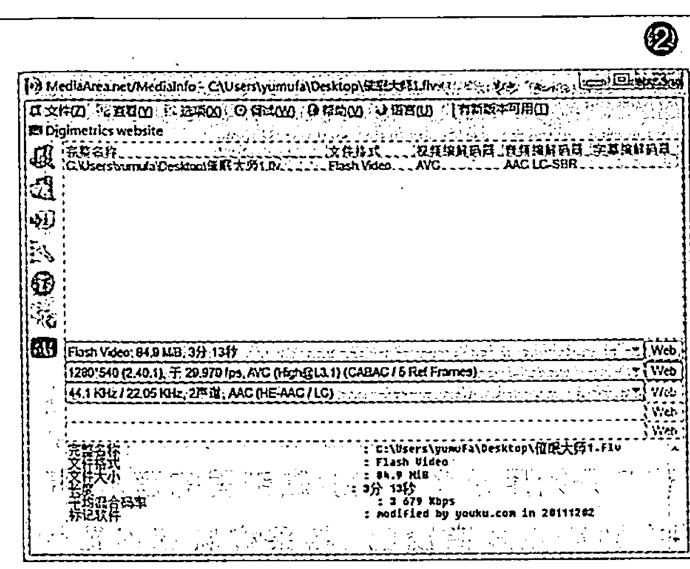

○ 查看视频文件信息

> 除了视频本身外，视频伴音也会占用大量体积，因为手机、平板的音频解码能力并不出众，在这里还可以将音频流的采样率和比特率设置得小一些，进一步减小视频占用体积。

##### 好歌不跑调

#### 音频文件的压缩

除了视频，在移动设备上听歌也是很多朋友的消遣方式。

不过和家用音频播放设备相比，目前手机、平板的音频效果要逊色得多。因此一些高品质的音乐，除了占用体积外，在移动设备上播放和高压缩的MP3相比，并不能达到多好的效果。因此喜欢听歌的朋友，同样可以对音频文件进行压缩。

为了便于大家对音乐品质有个直观的感觉，这里我们列出生活中经常接触到的音乐比特率（表1）。

显然高品质音乐会占用大量的存储空间，不过要在移动设备上获得高品质的享受，不仅设备本身音频解码能力要强大，而且还需要有高保真的耳机相助，就目前大部分朋友在使用的设备而言，基本上听不出800Kpbs的APE音乐和320Kbps的MP3之间的区别，因此对于喜欢在移动设备上听音乐的朋友，可以将APE音乐转换为320Kpbs的MP3，以节省空间。

首先到http://dwz.cn/cfans08下载转换软件，启动软件以后点击“添加文件”，然后将需要转换的APE音乐添加到处理列表中，设置声音比特率为320，点击“立即转换”。

转换完成后默认会自动打开输出目录C:\Output，可以看到压缩后的体积只有12449KB，体积大约减少了一半，但在移动设备上播放根本感觉不到音质的变化。

> 一首音乐音质的好坏主要由采样率和比特率决定，而现在大部分音乐的采样率一般是44.1kHz，所以其中的比特率就决定品质的高低，比如APE格式的音乐，压制后的比特率在800Kbps左右，一般MP3音乐则大多只有128Kbps，比特率越大，占用的空间越大。以张惠妹《听海》为例，MP3（128Kbps）只有4.2MB，APE格式则达到31.5MB（图1）。

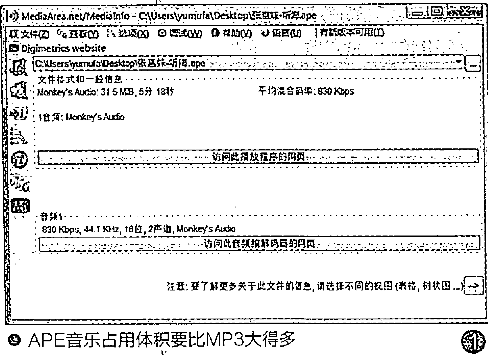

○ APE音乐占用体积要比MP3大得多

表1 常见音质标准列表
| 比特率 | 相当于生活中音乐 |
| :--- | :--- |
| 16Kbps | 电话音质 |
| 24Kbps | 短波广播音质 |
| 64Kbps | 手机铃声音质 |
| 112Kbps | FM调频立体声广播 |
| 128Kbps | 磁带音质 |
| 192Kbps | CD音质 |
| 256Kbps | 常见MP3音乐音质 |
| 320Kbps | 无损MP3音质 |
| 800Kpbs及以上 | 无损APE、Flac音乐品质 |

注意:要了解更多关于此文件的信息,请选择不同的视图(表格,树状图...)

##### 文档减肥

#### 常用文档压缩有道

由于工作的需要，我们经常要在电脑和移动设备之间交换各类文档，由于平板、手机配置都比较低，难以打开一些大型文档，这样就需要对这些文档进行压缩。

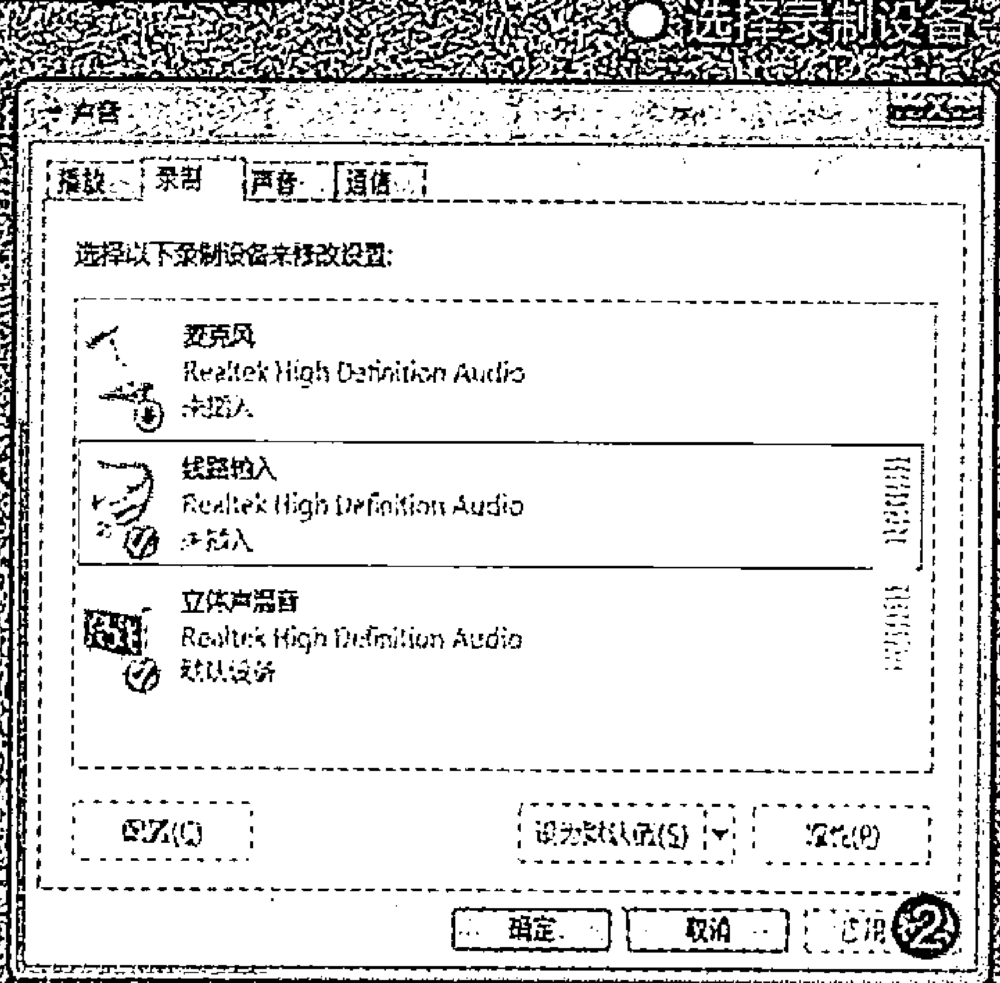

喜欢听音乐的朋友都会购买大量音乐磁带，如何将这些音乐转换为MP3在移动设备上欣赏？可以通过录制音乐的方法来实现。首先到http://dwz.cn/cfans09下载克克录音软件，然后在录音机里插入磁带，接着使用一根音频线将录音机的输出接口和电脑声卡上的输入接口连接。右击任务盘喇叭图标选择“录音设备”，在弹出的窗口选择“线路输入”，并将其设置为录制设备(图2)。

##### DOC文档的压缩

DOC是我们日常接触的文档，由于这些都是富文本格式的文档，其中包含各种格式，因此体积都比较大，为了便于在平板、手机上打开这些文档，我们可以在电脑上对其进行压缩瘦身。
对于DOC文档(包括docx)，其中图片是最占用空间的元素，比如在一个空白Word文档中插入2张总计1.85MB图片，保存后文档体积也在1.8MB左右。因此要减小文档的体积就要对其图片进行压缩。这里以Word 2010为例，打开需要压缩的文档，点击“文件→另存为”。在打开的保存对话框，点击“工具→压缩图片”，单击“选项”，在“压缩图片”对话框中选择“删除图片的剪裁区域”选项，点击“保存”后文档里的图片就会自动被压缩(图1)。
使用图片压缩后，Word文档体积就会减少很多，比如原来1905KB的文档经过压缩后体积变为254KB，对于文档的浏览却没有任何的影响。XLS、PPT文档里图片的处理类似(图2)。

现在开始用录音机播放磁带里的音乐，接着切换到克克录音窗口，将采样频率设置为44100，位数设置为“16”，点击“录音”，这样即可将磁带里的音乐录制到电脑中，完成音乐的录制后将其保存为MP3格式即可(图3)。

##### PPT文档的瘦身

对于PPT文件，由于文件里包含大量图片，并且可以包含Flash、音频等多媒体文件，因此除了使用上述方法瘦身外，我们还可以针对PPT的特性进行进一步的瘦身操作。
比如在PPT中对插入的图片完成编辑后，右击图像选择“组合”，再单击“取消组合”，然后再一次重复一次“组合”、“取消组合”的操作，这样即可删除OLE数据并仅仅留下PPT可以压缩的格式的图片(图3)。
如果需要瘦身的文档比较多，我们还可以借助“蒲公英压缩王”(也可以压缩DOC、XLS文档)实现批量处理。首先到http://dwz.cn/cfans04下载软件，启动软件以后点击“添加文件”或“添加文件夹”，依次将需要瘦身的文档添加到处理列表中，然后在“将文件优化为”中选择一种自己需要的设备，点击“优化”。
这样程序即可对导入的文档进行压缩，并且以百分比的形式对优化效果做出标示，因为软件主要是对文档图片、字体格式等进行压缩，压缩前后基本不会影响文档的浏览效果。
默认优化完毕的文档保存在和源文档相同位置，文件名会在原名后添加“(NXPowerLite)”字样，可以看到软件的压缩效果还是比较明显的，一个5319KB的PPT被压缩至1109KB，这样即使在手机上也可以轻松打开了。

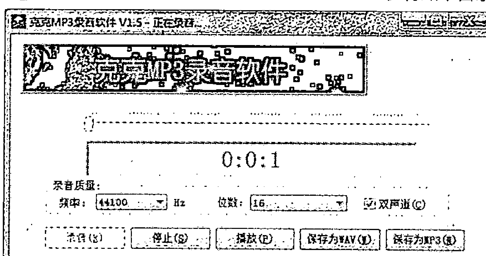

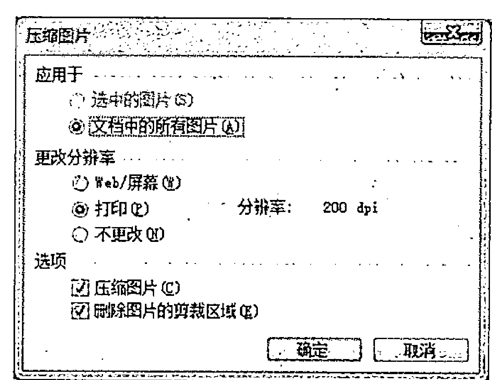

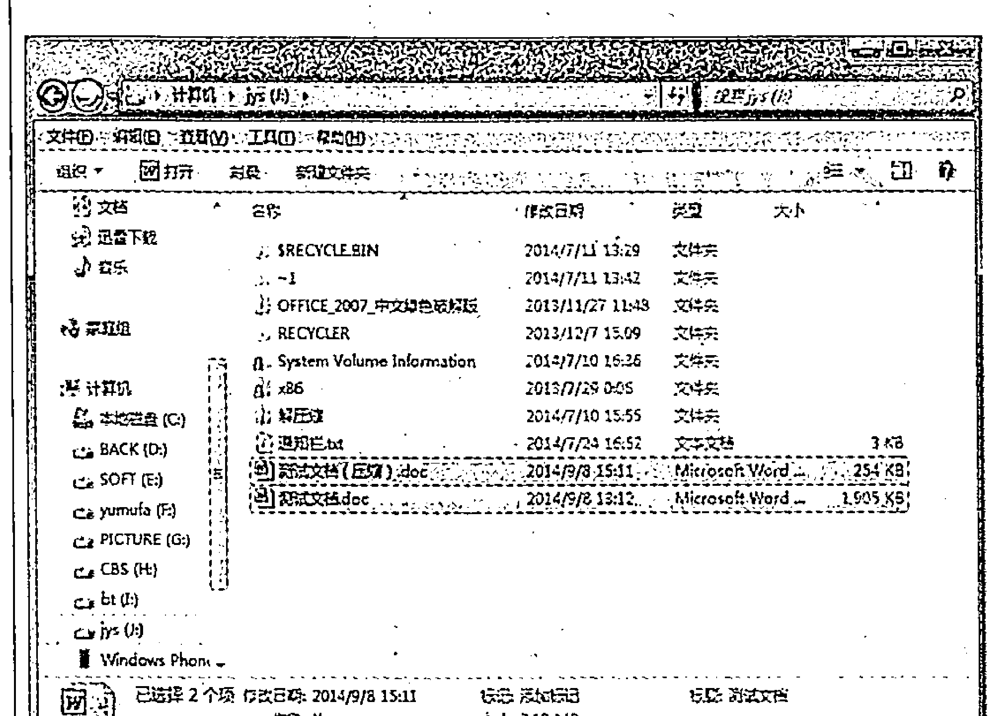

● 使用压缩图片保存后文档体积大幅减小

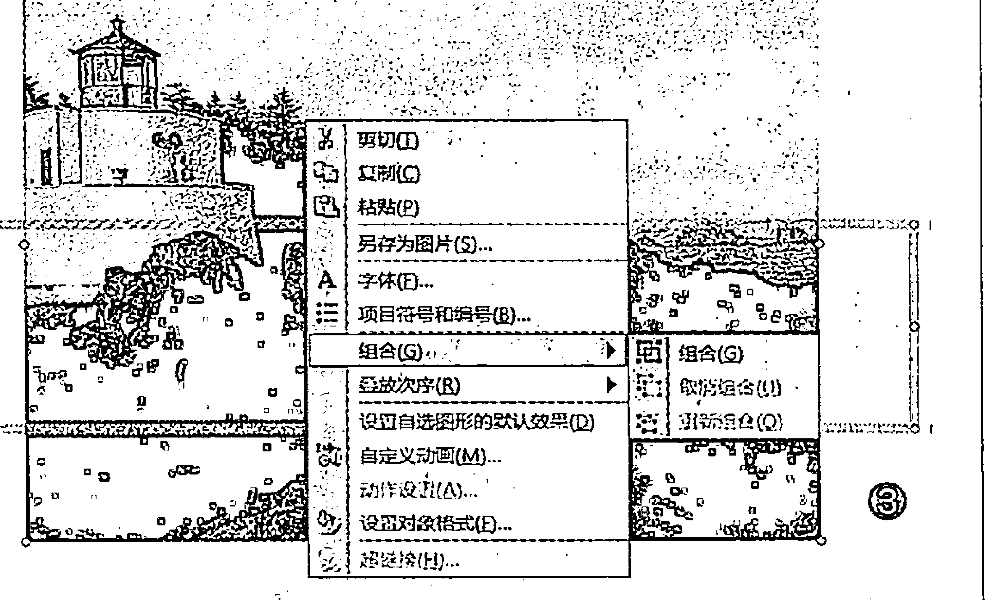

● 通过重复“组合”、“取消组合”的操作可以删除不必要的OLE数据

##### PDF文档也要瘦身

除了常见文档，大家还经常在移动设备上阅读PDF格式的电子书，PDF可以原汁原味保持原来书籍的特色。一本PDF电子书动辄百兆大小，所以为了方便在平板、手机上阅读PDF书籍，我们同样需要对其进行瘦身。

首先到http://dwz.cn/xfans5下载“ORPALIS PDF Reducer”（以下简称为OPR），启动OPR后分别点击“Source”和“Destination”，选择需要优化的PDF文件所在目录与优化后的PDF文件保存目录（图4）。

因为现在很多PDF书籍除了正文图片外，还会有书签、批注等元素，如果阅读的时候不需要这些，可以切换到“Option→Content Removal”，按提示选择需要删除的项目（图5）。

返回程序界面点击“Start batch”，OPR会扫描当前目录下所有的PDF文件并进行处理，可以看到程序瘦身效果还是不错的。一部34.6MB的图书默认设置可以瘦身到6.33MB，压缩后基本不影响阅读效果（图6）。

这样打开记事本粘贴其中的内容，然后对格式稍加整理，我们就可以把PDF转换为TXT文件，不仅体积变小，而且便于在任何设备上阅读。

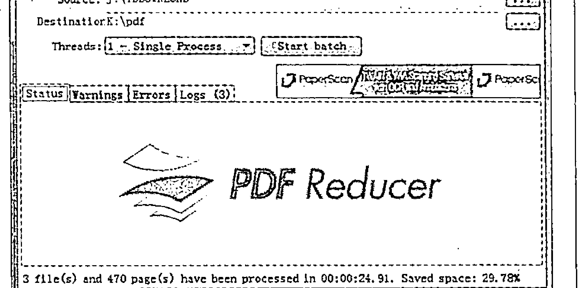

● 导入需要处理的PDF文件夹以及输出文件夹

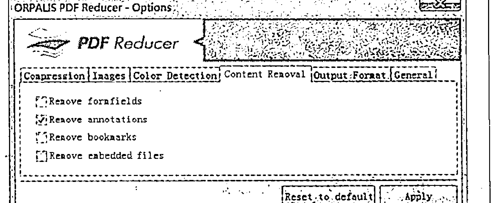

● 设置删除书签、批注等不需要的元素

> 小提示
OPR不能直接导入单个PDF文件进行压缩（只会自动扫描PDF所在整个目录），因此如果需要对本机所有PDF文件进行压缩，可以先使用系统搜索功能查找PDF文件，然后将其全部保存在一个目录并导入OPR中。如果只需要处理一个PDF文件，则将其保存在一个特定目录即可。

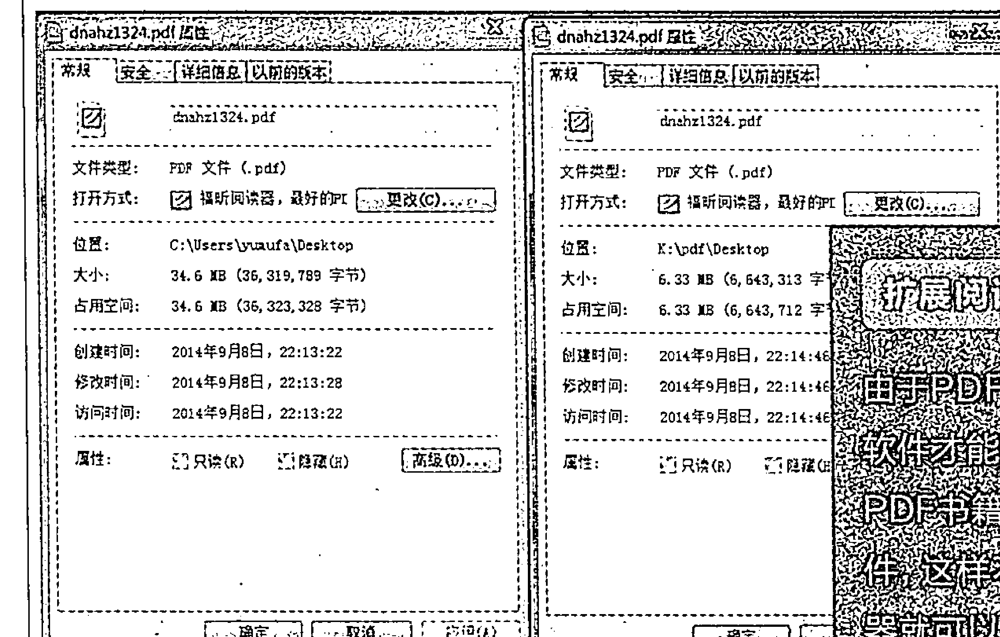

● 查看压缩前后对比

> 扩展阅读 通过转换格式减小文档体积
由于PDF本身包含了很多格式，占用的体积比较大，而且还需要专用的软件才能阅读。对于一些纯文字（比如一些文字书扫描成的电子书）PDF书籍，我们可以尝试使用编辑PDF文档的方法将其转换为TXT文件，这样不仅可以减少图书的体积，也能够方便阅读。比如福昕PDF阅读器就可以对PDF文档进行打开文档后点击“工具→文本选择工具”，然后选择需要复制的内容，右击选择“复制到剪贴板”。

##### 移动端的压缩

#### Android手机的空间压缩

压缩不仅仅是由0、1组成的代码，也不局限在传统的PC领域，无论是智能手机、产品设计还是轻装简行的过程中，都可挖掘出压缩的智慧。

智能手机和PC一样，在使用的过程中也会产生大量垃圾或缓存文件。如果你不希望宝贵的存储空间被这些内容所蚕食，那就要学会将它们扫地出门的方法。


##### 了解Android系统的目录结构

一款标称16GB存储容量的Android手机，为何实际可用的空间却仅有10GB左右？我们如何才能充分释放那些被占用的空间呢？想解决这些问题，首先就需要我们对Android系统的目录结构加以认识。

简单来说，Android系统会将一款16GB的手机自动划分为泾渭分明的两个空间：“系统空间”和“用户空间”（图1），这就好像Windows系统的C盘（系统空间）和D盘（用户空间）一样，当我们把手机与电脑连接后，能被电脑识别并可做U盘使用的空间就是“用户空间”，我们也已将其理解为手机的内置SD卡，这个空间我们可以随意“折腾”，不会影响到系统的稳定性。

在“系统空间”中，最重要的两个文件目录就是/system/app/和/data/app/，想对Android系统内置程序进行精简，将无用程序压缩到极致，就要从这两个路径下手。

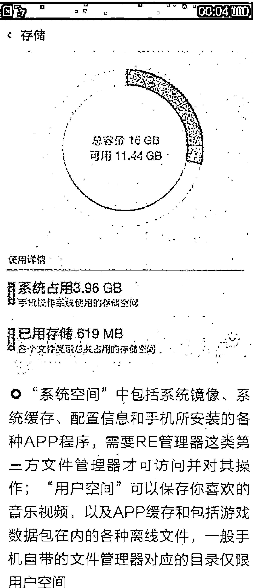

##### “狙击”压缩目标的文件目录

每款Android手机出厂时都会预装无数程序（apk格式的文件），其中有些程序可以由用户自行卸载，有些程序却无法对其进行清理（图2）。这是为什么呢？原来，那些可以卸载的程序对应的存储路径就是/data/app/（类似Windows系统的C:\Program Files文件夹），买来手机后我们自行安装的APP文件也会在/data/app/路径生成对应的apk安装包。

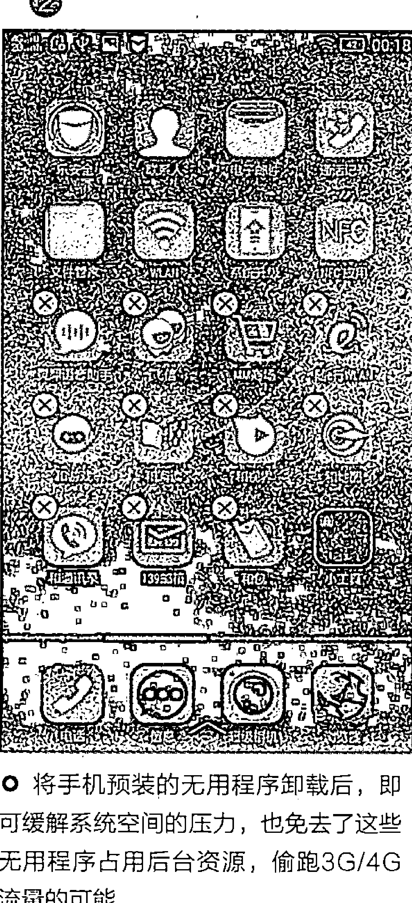

此外，那些无法卸载的程序则对应/system/app/（类似Windows系统的C:\Windows\System32文件夹）。有些厂商会恶意地将一些容易产生扣费的垃圾软件藏在这个路径下，目的就是不希望被用户自行删除。

换句话说，如果你想对“系统空间”进行压缩，实际上就是对/system/app/和/data/app/两个文件夹内的apk文件进行精简的行为。方法也很简单，只要手机获得了Root权限，利用RE管理器直接删除/system/app/和/data/app/里面的apk安装包（图3），就等同于卸载了对应的程序。此外，像360手机卫士一类的软件也支持系统软件的卸载（图4），只是同样需要ROOT权限的支持。

##### 小提示

data/app/里的文件可根据需求随意精简，但请谨慎对待/system/app/中的apk文件。如果你误删了某些关键系统级程序，会导致无法开机或者反复重启，只有重新刷机才可恢复。此外，除了/system/app/和/data/app/外，系统空间还包括fonts(字体文件)、lib(库文件)、etc(配置文件)等文件目录，但它们对空间的压缩意义不大，这里我们就不再赘述了。

##### 不要盲目使用APP的垃圾清理

很多Android手机自带的文件管理器，或是LBE安全大师、联想乐安全一类的软件都支持一键清理垃圾文件功能。需要注意的是，这种一键清理功能的范围仅限用户空间(内/外置SD卡)，而且有时也会将一些离线数据，比如导航的离线地图、模拟器的游戏镜像等大文件也列入垃圾文件的行列，在进行深度清理时记得取消此类文件的勾选(图5)。

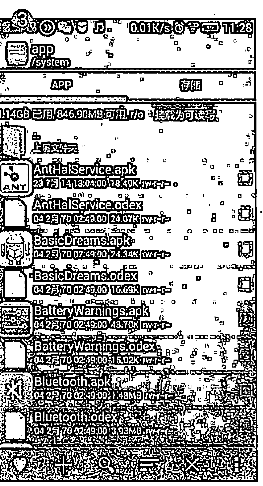

- 通过RE管理器等第三方软件才可以访问并对系统空间的文件进行操作

##### 手机玩转压缩文件

网上很多电子书资源都是压缩包格式，很多人都习惯于先在PC上解压，再将txt或者pdf一类格式的文件拷贝到手机上，好不繁琐。实际上，智能手机本身也可完成基本的压缩/解压缩工作。

##### 手机端的压缩

如果你习惯直接用手机浏览网页并下载资源，请记得安装“ES文件浏览器”(下载地址：http://www.estrongs.com/)，该软件除了具备资源管理器的功能外，可以直接压缩/解压ZIP、RAR格式的文件(图6)。如此一来，哪怕脱离了PC也可直接应付压缩文件资源了。

##### 图片压缩后再查看

很多Android手机并不支持存储卡扩展，而我们又舍不得删除相册里面拍摄的图片。实际上，我们可以先在PC或手机端将不想删除的图片文件压缩成zip或rar格式的压缩包再删除源文件。然后安装“完美漫画”(下载地址：http://t.cn/Rhtn1Ex)，此类APP可以直接读取压缩包里面的图片(图7)，从而起到压缩手机空间的功效。

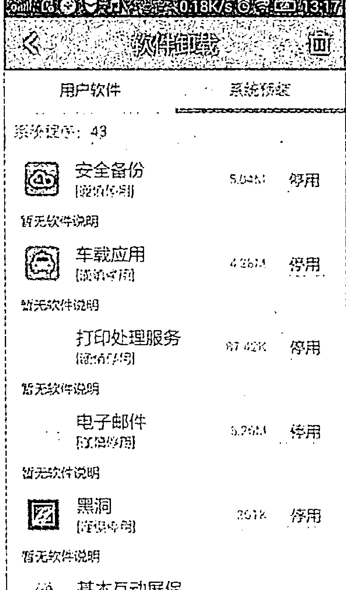

- 用第三方软件卸载系统级程序都需要ROOT权限的支持

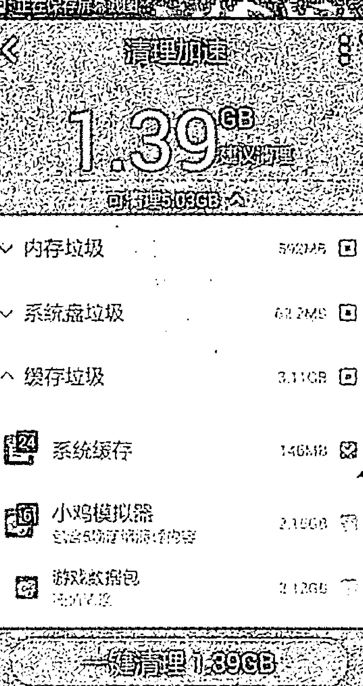

- 很多软件的清理功能会将大文件也列入清理名单，难免出现乌龙现象。所以在一键清理确认前，要检查有无重要离线数据被“冤枉”

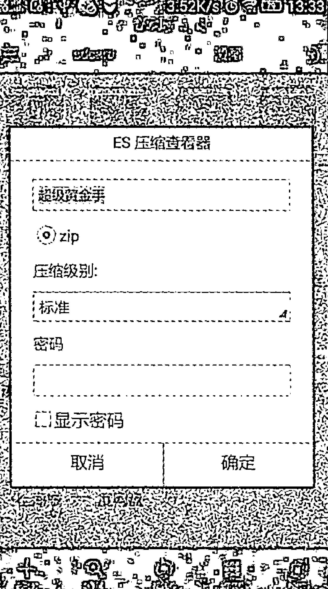

- 很多Android平台的文件管理软件都支持压缩/解压功能

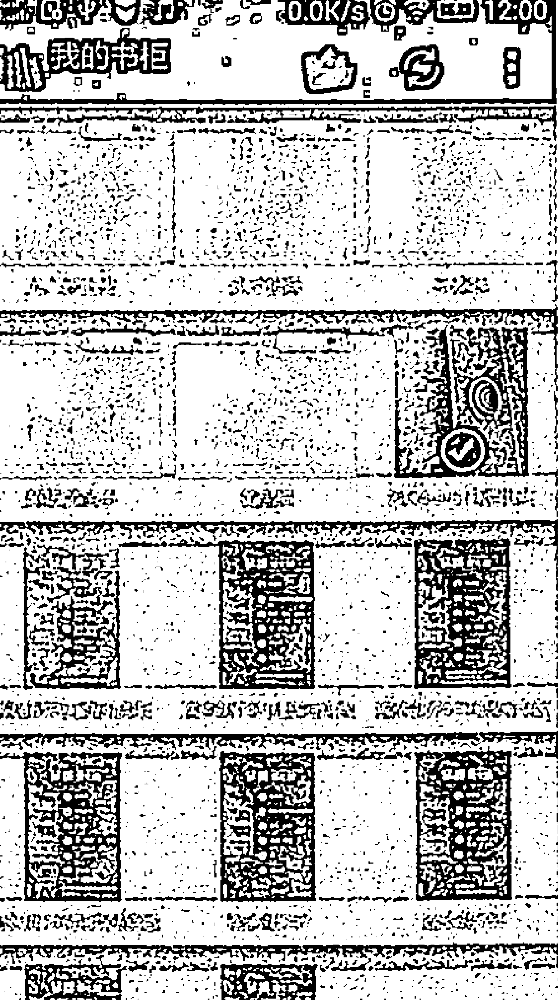

- 将图片压缩后可释放手机空间，然后再用第三方软件直接访问压缩包里面的图片，一举两得

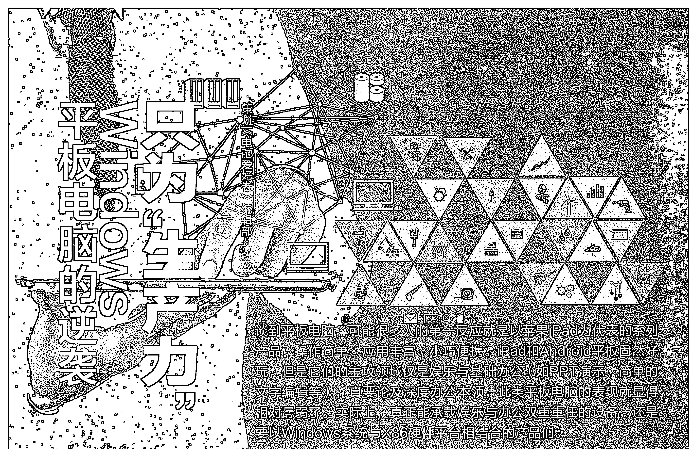

说到平板电脑，可能很多人的第一反应就是以苹果iPad为代表的系列产品。操作简单、应用丰富、小巧便携。iPad和Android平板固然好玩，但是它们的主攻领域仅是娱乐与基础办公（如PPT演示、简单的文字编辑等）。真要论及深度办公本领，此类平板电脑的表现就显得相对孱弱了。实际上，真正能承载娱乐与办公双重重任的设备，还是要以Windows系统与X86硬件平台相结合的产品为例。

好消息是，借助微软免费操作系统（Windows 8.1 with Bing）与英特尔BayTrail硬件平台的东风，Windows 8.1平板终于不再是花架子。无需风扇散热的它们可以做得更为轻巧便携，而可以运行《英雄联盟》级别3D游戏的性能，足以让2012年以前中低端笔记本汗颜。换句话说，一直期待能以低廉开销获得足够便携性 + 生产力的用户，现在终于有了比较合适的选择。

但是，现在Windows 8.1平板并非仅有BayTrail一个平台，上有更高端的酷睿系列，下有上代Clover Trail平台的产品。再加上不同尺寸、功能的组合，想以最低的开销选购最适合自己的产品尚有一定的难度。而本期特别话题的目的，不仅仅是拨云见雾让你买到称心如意的产品，还会从系统和软件优化的层面，让你在平板电脑上玩出了笔记本的感觉！

### Windows平板系统入道指南

文/西阳静

作为一个Windows的老用户，刚刚拿到Windows 8.1平板，着实被一些本该属于傻瓜化的操作弄成了“丈二和尚”。几天磨合下来，虽然头上碰起了几个小包，但是终归还是基本驯服了这头不听话的“小野猪”。为了让大家少走弯路，现在把一些过程体验和感受写出来与大家分享。

#### 触控操作的通关秘笈

要爱上微软系统的小平板，手势操作通关是第一步。刚刚接触Windows 8.1平板的操作难点在于，从PC键鼠操作过渡到触摸屏的手势操作。由于习惯大多不同，需要找出对应的操作关系，然后慢慢适应。适应只是个时间问题，而找出对应关系却是必须掌握的技巧。

> 触屏上的“左右键”操作

首先需要在平板上找到对应于PC键鼠左右键操作的手势。在桌面环境下，与鼠标左键单击对应的是用一根手指在项目上直接点击，这个操作无师自通，不用多讲。与右键单击对应的操作则是长按操作，按住目标不动，需要持续大约1秒才能看到快捷菜单。这个操作主要用来了解某个项目的有关详细信息或打开一个特定的有效菜单（图1）。

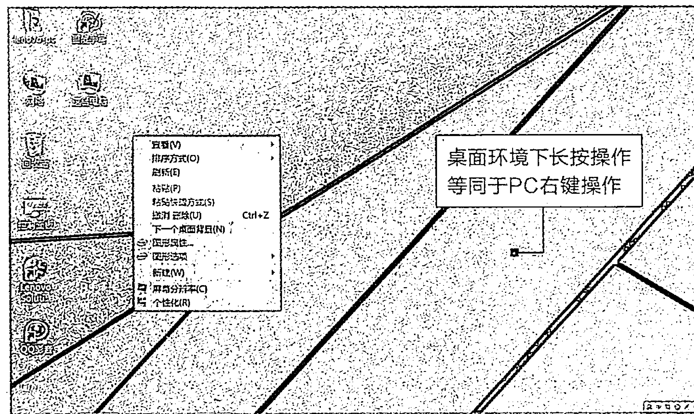

长按操作不仅只等同于右键菜单。在磁贴界面，长按操作的作用更加广泛。例如，长按“开始”屏幕上的磁贴可以将其固定在开始屏幕或从开始屏幕取消固定、固定到任务栏、重新排列、调整大小或卸载应用。长按还有开启多重选择的作用，在“开始”屏幕上长按一个项目之后，该项目被选中，之后就可以通过点击更多项目进行多选，进而可达到一次性对多个项目进行固定、卸载、调整的目的。对于已经被选中的项目，如果使用单指点击，则起到取消选择的作用，只有在选取空白处再次点击，才能全部取消选择；再次点击空白处，才能退出选择状态，回到正常的开始屏幕执行命令。可见，一个选择和取消选择的操作就与鼠标操作大不同，且难度要稍大一些，需要注意和好好练习（图2）。

#### 灵活的“拿捏”操作技巧

在PC上使用鼠标控制显示项目的大小，最常用的是Ctrl+鼠标滚轮、“查看”菜单布局项目、显示百分比滑动条等方法。在触屏Windows环境下，这些方法虽然依然有效，但操作不是最方便的。这时“拿捏”操作成为项目缩放的最方便选择。

使用两根或更多手指触摸屏幕或项目，然后所有手指都向内侧移动收缩，或者都向外侧移动拉伸，可以起到在视觉上放大或缩小的作用，这个操作在控制照片或地图显示方面有最明显和直接的用途。此外，在“开始”屏幕上，“拿捏”缩放操作也有很大的用武之地，它可以让应用磁贴集体缩身或扩大显示。

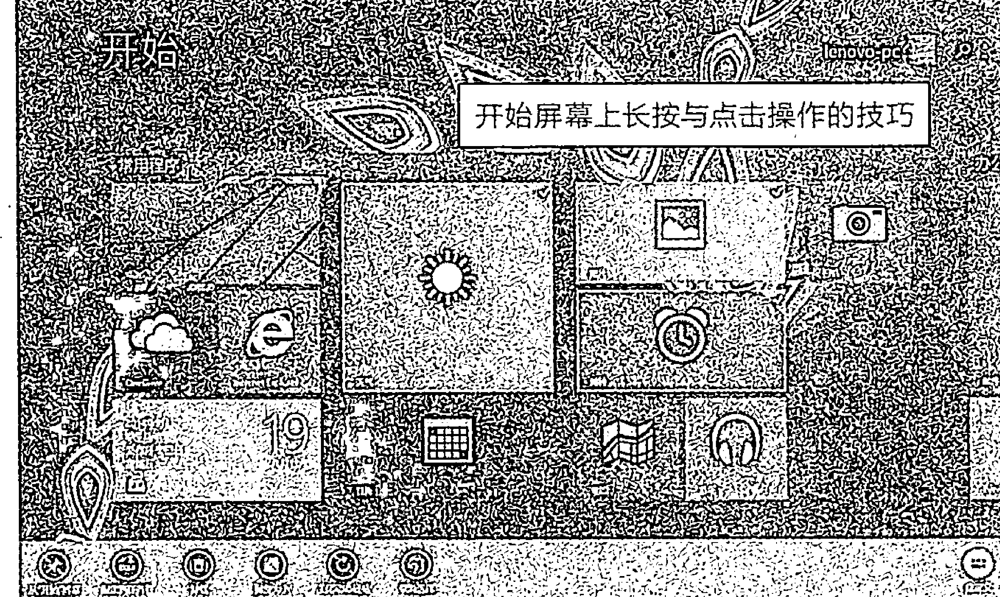

#### 不同寻常的屏幕“穿越”

在平板上启动看图程序，有几幅美女照片，看完一幅想看另一幅，可用一只手指在一个美女照片上滑动，照片随即滚动，出现另一幅照片，这就是在屏幕上“穿越”的方法，是Windows触屏操作最常用的方法之一。这种滑动切换操作可扩展到更广阔的应用与应用之间，甚至应用与桌面之间。如果已经打开多个应用，同时又打开桌面上的一些软件，也可以通过跨越屏幕左边框的由外向内的滑动，来实现应用之间或应用与桌面之间的切换（图4）。

“切换”有另外两种“反常”操作。大家知道，在PC版Windows 8.1中，当鼠标光标从屏幕中央移动到屏幕左上角时，屏幕左侧会自动浮出已经打开的应用列表；而当鼠标光标从屏幕中部移动到屏幕右上角时，屏幕右侧又会浮出超级按钮面板。触屏上的这两种面板的调出需“反常”操作才行。所谓的“反常”操作，是要从屏幕的外边向里边滑动，方向与PC正好相反（图5）。

以上所列为从屏幕左右两侧向内扫入后的效果和作用。那么如果从屏幕上下两个边框分别向内扫入，又能起到什么作用呢？在打开的应用窗口中，从屏幕上边缘或下边缘轻轻扫入，可看到该应用当前屏幕下可用的所有命令（图6）。

滑动切换的操作还被应用到如下一些经常性的操作当中，这些方面的操作技巧必须要掌握。

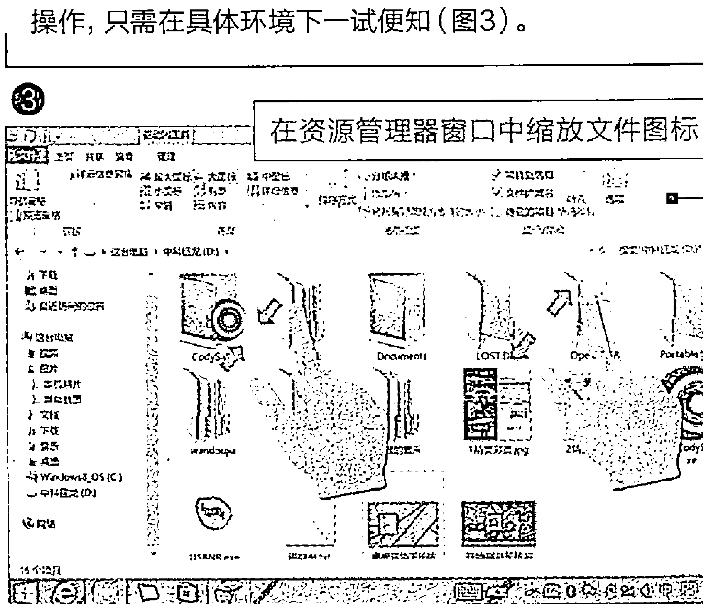

> 显示应用列表

在PC上查看最近使用的应用列表很简单，只需将鼠标指针滑向屏幕左上角即可出现应用列表。触屏上操作就稍微复杂一点：要在触屏上显示应用列表，在不抬起手指的情况下从屏幕的左边缘滑入，再将应用推回左边缘。此技巧的关键是在手指滑入后，还要推回此操作（图7）。

> 同屏开启多窗

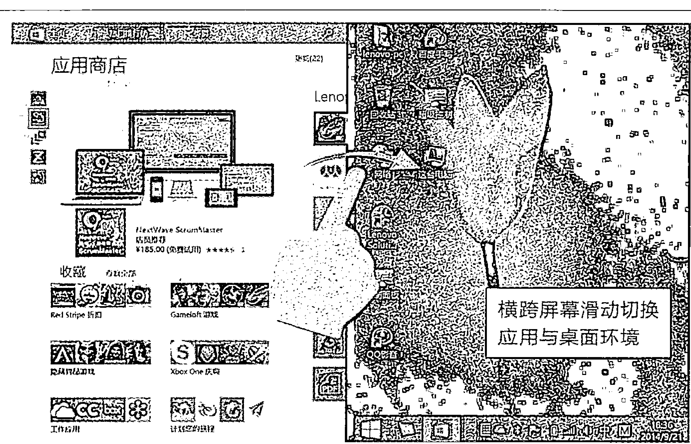

如果要在屏幕上同时排列另一个已经打开过的应用，可从屏幕的左边缘由外向内滑入切换到此应用，在不抬起手指的情况下拖动应用到屏幕中，直到屏幕上显示分隔条后，将应用移动到所需的位置。最后可用滑动分隔条来调整应用所占空间的大小。

> **小平板显示多窗口的条件**

屏幕分辨率必须至少设置为1024×768才能在屏幕上一次性显示多个窗口和应用。若不能显示多窗口，请先检查屏幕分辨率设置：从屏幕右边缘向中间轻扫，点击“设置→更改电脑设置→电脑和设备”，然后点击“显示”。

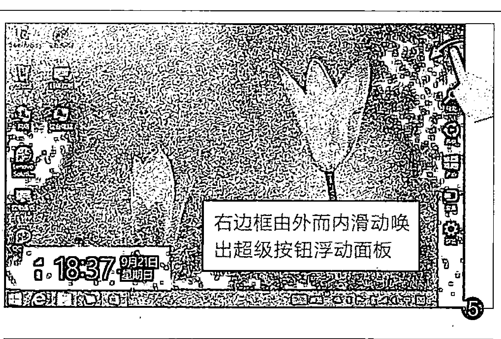

> 关闭应用窗口

假设当前屏幕是一个已经打开的应用界面，要快速关闭该应用，只需用手指从屏幕的上边缘外向下滑动，在不抬起手指的情况下，将应用拖动到屏幕底部，应用随即会关闭。

> 想要上下滚 需先左右扫

第一次用触控操作Windows 8.1，通过快捷菜单选择“重命名”给一个文件改名，由于平板的档次不高，触屏不灵敏，定位“重命名”很吃力。后来才发现“想要上下滚 需先左右扫”的要领。

由于目标是要选择菜单中的“重命名”项，当长按文件菜单弹出之后，需要在列表中先左右轻扫才能加亮菜单项目，然后再按上下方向来移动手指，就能让光标轻松到达“重命名”一项（图9）。

> 应用切换方式可由用户控制

是否允许通过轻扫操作在应用之间切换，轻扫左侧边框的效果是切换最近应用还是显示应用列表，这可由用户来自定义。具体方法是，通过在屏幕右侧边框由外向内轻扫，逐级选择“设置→更改电脑设置→电脑和设备→边角”，然后在右侧窗口的“应用切换”列表中设置切换开关的状态（图8）。

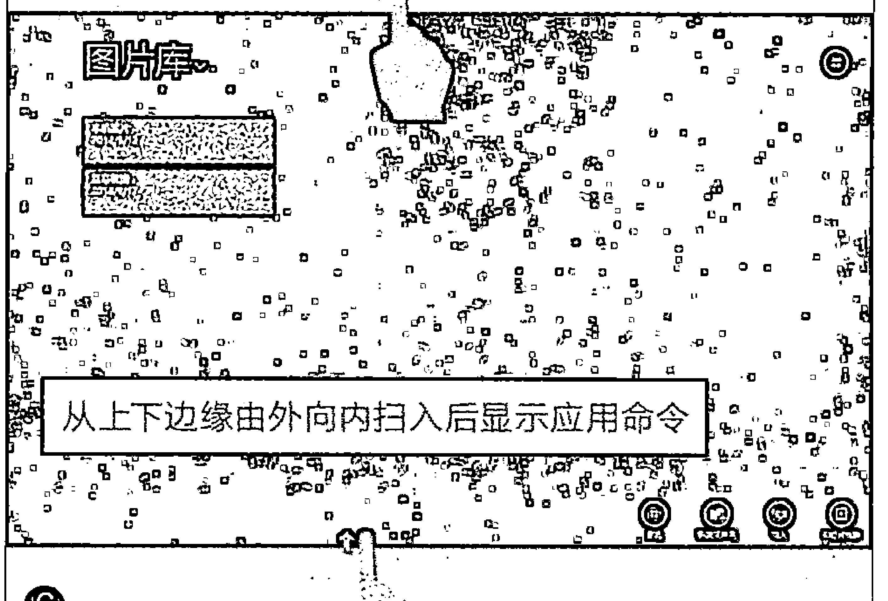

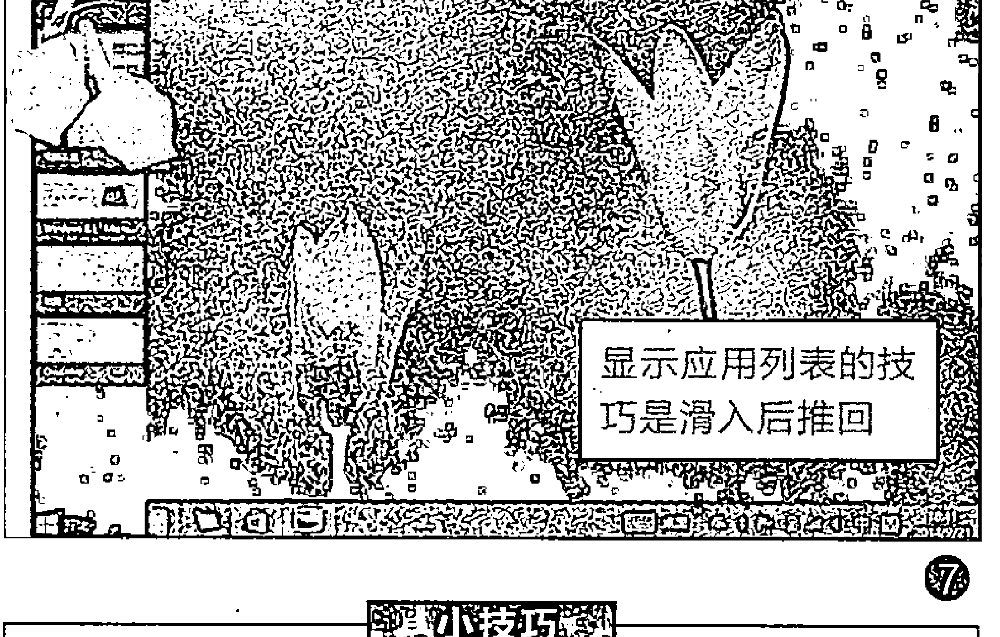

#### 灵活使用触摸键盘

在磁贴界面环境下启动触摸键盘，只需在要输入文字的位置点击即可。但在桌面环境下需点击任务栏的触摸键盘图标才能打开键盘。触摸键盘有多种形式，点击键盘布局图标，可切换各种键盘样式。双手握持操作可选择拇指键盘图，拇指键盘图的大小可调，点击空格键旁的三竖点按钮来选择大、中、小样式。此外，还可选择手写输入。对于26键键盘，可在简易26键的基础上再设置成一个26键盘全键盘（类似PC标准键盘样式）（图10、图11）。

> **找回丢失的触摸键盘**

有时可能会发现任务栏上的触摸键盘不见了，这对于触屏Windows环境操作来说相当要命。其实找回触摸键盘也不难，只需在任务栏空白处长按，选择“属性→工具栏”，然后再选择“触摸键盘”一项，就会让触摸键盘重新回到任务栏（图12）。

> **装个触摸PC标准键盘**

触屏键盘默认开启的是个简易26字母键盘，我们可给触屏添加一个类似PC的标准键盘。从屏幕右边缘向中间轻扫，依次点击“设置→更改电脑设置→电脑和设备→鼠标和触摸板”，单击“输入”，可选择是否将标准键盘布局添加为触摸键盘选项（图13）。

> **输入框也能编辑文字**

不同于在PC文字编辑器中输入内容时可用编辑器的复制、粘贴等编辑命令，触摸操作的平板编辑框中进行文件编辑很不方便。但可利用触摸键盘提供的Ctrl键开启当前文字输入框的编辑功能。按下虚拟盘的Ctrl键后，AZXCV等5个字母键的上方分别会增加“全选”、“撤销”、“剪切”、“复制”、“粘贴”等常用编辑命令，这等同于使用了PC的键盘快捷键组合。

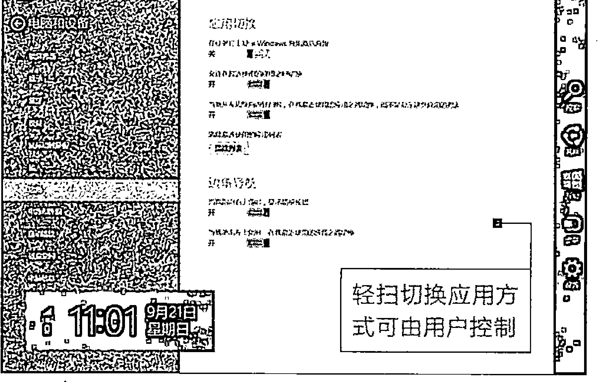

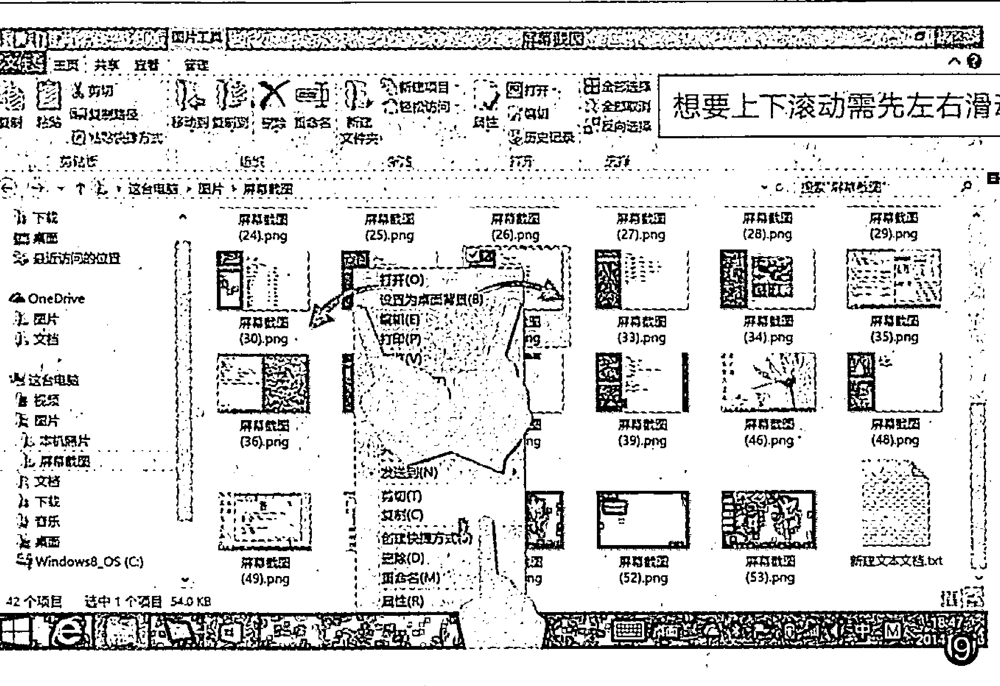

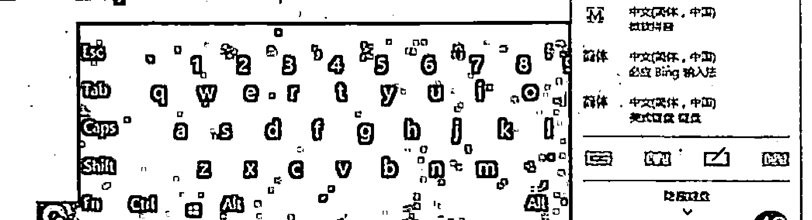

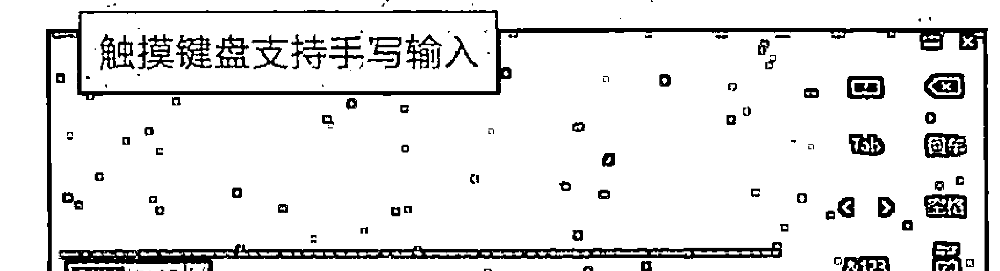

##### 小技巧

###### 触屏输入遮挡问题

在任务栏上放置一个“地址”输入栏，可直接从这里上网。方法是按住任务栏空白处，选择“工具栏→地址”添加地址栏。但当开启触摸键盘并点击地址栏输入内容时，发现触摸键盘盖住了输入框，根本看不到输入的内容，拖动标题栏却发现键盘无法被移动，直到关闭键盘才能看到输入了什么和是否正确。其实，只需先点击触摸键盘右上角的最小化按钮，这时触摸键盘并未最小化，而是变得比原来小了一圈，此时点击并拖动触摸键盘的标题栏，键盘变得可移动，将键盘向上移动，挪开覆盖着的任务栏地址框，就可看到输入的内容了。

#### 高效实用的快捷控制

不同于苹果iOS系统或者Android系统，Windows平板更强大之处在于其灵活的控制和设置功能。但问题是由于设置入口的多样性，就相应增加了Windows平板控制设置的机动性和难度。因此，了解和掌握Windows平板控制设置方法和技巧很必要。

##### 让磁贴界面显示管理工具

在Windows磁贴界面环境下，默认的“开始”屏幕和“应用”视图中没有管理工具系列图标，这对系统维护调用来说多有不便。这时，可以通过设置来扩展磁贴界面的显示内容。单指从屏幕右侧边缘向内轻扫，在“超级”按钮浮动面板上点击“设置”按钮，接下来点击“磁贴”文字按钮，随后将磁贴设置窗口中的三个选项设置滑块均设置为“是”的状态。经过如上设置之后，“开始”屏幕应用数量和“应用”视图中容纳的应用数量大大增加，与此同时，在应用列表中详细列出了系统管理工具，就可以方便地在开始屏幕调用系统管理功能了（图1）。

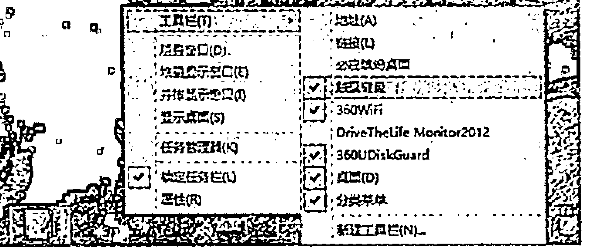

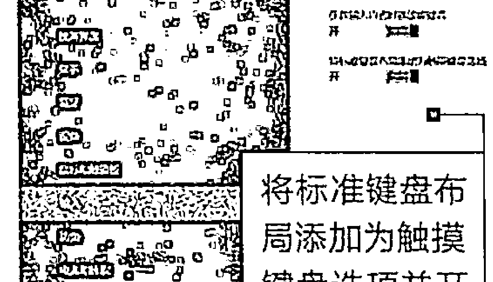

##### 让开始按钮发挥控制功能

我们已经知道，在触屏桌面环境下的“开始”按钮上点击，会切换到磁贴应用界面。有没有试过在触摸屏桌面环境下的“开始”按钮上按下并多停留一会儿的效果？我们会看到一个项目非常丰富的系统控制菜单，这个菜单等效于在PC上按下Win+X组合键或用鼠标右键单击“开始”按钮，它是系统常用功能的控制中心。学会这一招，控制系统基本不成问题（图2）。

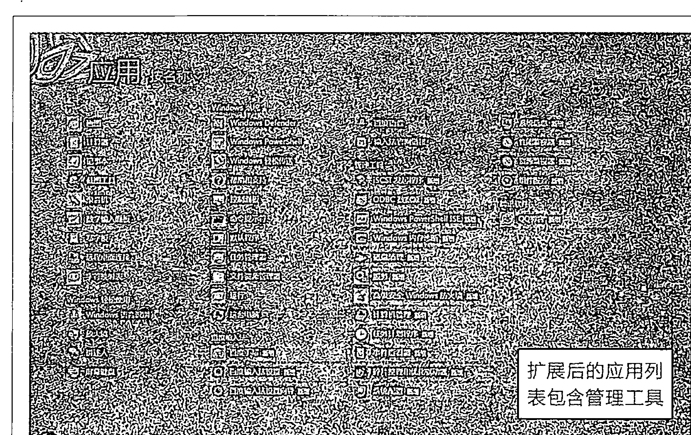

> 小技巧
善用搜索功能进行控制设置
除了用上述方法实现触控平板的系统控制外，还可以通过灵活的系统搜索功能来实现系统控制。在屏幕右侧由外向内滑入手指，在弹出的超级按钮面板中点击“搜索”按钮，将搜索项目设置为“设置”项，然后启动触控键盘输入要搜索的功能控制关键词，比如“恢复”，下面会立即显示与恢复有关的各种系统控制项，选择点击即可进入。

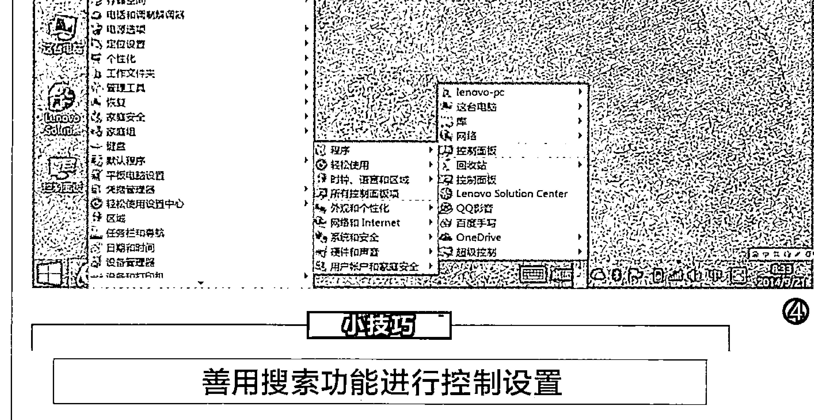

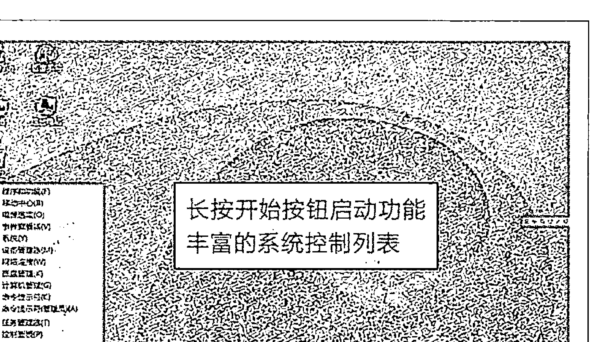

##### 装个统管资源的“层级管家”

平板软件资源不光包含文件和文件夹，还包括网络、计算机、磁盘、回收站、控制面板等资源。虽然在资源管理器中可以实现对这些资源的控制，但对触控操作来说，在资源管理器里操作显得不太方便。在这种情况下，可以给平板定制一个通过任务栏轻松访问的“资源层级大管家”。首先在桌面上长按并选择“个性化”，在个性化窗口中点击左侧的“更改桌面图标”，在弹出的窗口中将桌面图标的“计算机”、“回收站”、“用户的文件”、“控制面板”、“网络”等五个选项统统选中并确定。这样一来，对这些资源的控制可直接在桌面上点击进行，不用麻烦地开启资源管理器或通过控制菜单去选择了（图3）。

尽管如此，当正在进行一项工作时，如果需要访问这些功能，还需要切换到桌面上去进行控制，还是显得比较麻烦。为此，需要创造一个更加方便控制的层级控制菜单。在任务栏空白处长按并选择“工具栏→桌面”显示任务栏桌面按钮，我们看到在屏幕上出现一个包含所有上述资源的管家按钮菜单——“桌面”层级管理按钮菜单。通过在这里选择和逐级点击，可免去在桌面上或资源管理器内的挑挑拣拣。在运行别的软件的过程中，如果要启动另一些功能，用这种方法比较方便（图4）。

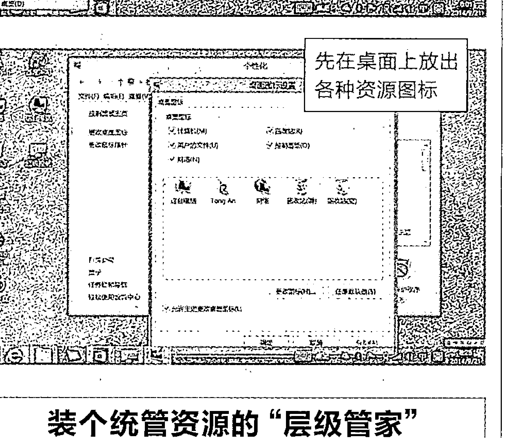

#### Windows平板的常见问题

在Windows触控平板使用过程中，会遇到一些问题。下面列举最具有普遍性的问题进行分析解决。

##### 别让“讲述人”出来作乱

“讲述人”对有生理缺陷的人来说可能会有用，但对普通电脑用户来说基本上是鸡肋。更有甚者，若一不小心触动讲述人功能，结果平板就会变成一个播报器，正常操作就不听使唤了，只能乖乖地听它的讲述来操作。许多用户因为误入“讲述人”功能而造成Windows平板或手机无法使用。笔者也是在一次截图中无意触动了“讲述人”功能，鼓捣了半天也未关闭，最后才明白原来是截图时不小心错将“Win+音量减小按钮”按为“Win+音量增加按钮”所致。殊不知，“Win+音量增加按钮”快捷组合被系统定义为平板开启和关闭讲述人功能（PC中为Win+Enter键）。知道了这点就好办了，只需要再次使用“Win+音量增加按钮”即可关闭讲述人功能。

##### 更换IE11解决上网问题

桌面版的IE11和磁贴版的IE11具有不同的界面，磁贴界面下的IE11专门针对触屏进行了优化，更适合于小尺寸的平板窗口和触控操作。如果使用平板的触摸功能上网，建议将网络连接的默认设置改为磁贴版IE11。启动桌面版IE浏览器，进入Internet选项窗口，切换到“程序”选项卡，然后选中“IE磁贴用于打开桌面上的Internet Explorer”选项，点击“应用”按钮，关闭窗口即可。桌面版的IE11和磁贴版的IE11浏览器所使用的Cookie不同，所以如果在一种界面下遇到密码输入等Cookie相关问题，可尝试切换到另一种界面，问题就可能会得到解决。

##### 视频播放不易控制的问题

由于Windows 8.1内置的视频播放器对视频格式支持有限，所以很多使用Windows平板的用户通过在Windows应用商店里下载安装第三方视频应用来观看视频。但通过应用来播放视频，不能通过双击文件来打开视频，而需要在应用里逐级选择点击才能打开，这样显得不方便。通过安装传统的桌面版视频播放软件可解决这个问题。如安装QQ影音、暴风影音来播放视频。此外，目前的一些视频PC客户端对格式的支持也越来越广泛，优酷、乐视、搜狐、风行等视频客户端，也可以播放本地存放的各种视频，而且对文件的操控也非常方便。

##### 找回丢失的显示桌面功能

在PC上使用Windows 8.1桌面，如果正处于一些开启的窗口状态下，要返回到桌面的一个快捷方法是将鼠标移动到任务条最右边的空白区域。但有的平板的任务栏很小，最右侧看不到任何空白区域，其实这个区域仍然存在并可发挥作用。如果发现手指移动到这个区域后无法显示桌面，在任务栏空白处按下后选择“属性”，在“任务栏”选项卡中选中“当你将鼠标移动到任务栏末端的显示桌面按钮时，使用Peek预览桌面”，确定即可（图5）。

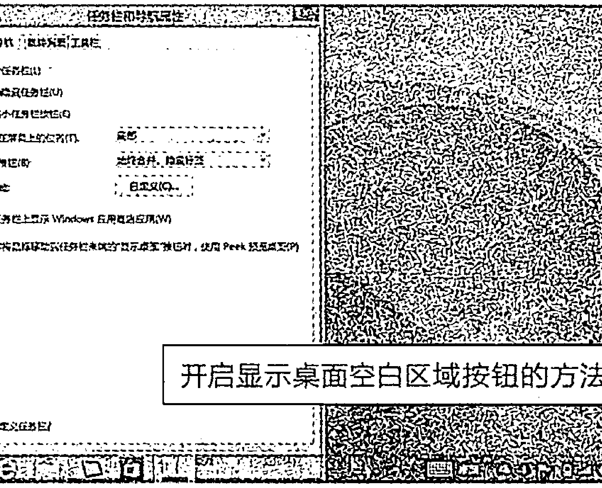

##### 无法恢复和初始化系统

有的Windows平板由于恢复分区中数据丢失，或者恢复分区被删除，造成无法恢复和初始化系统。这种情况下，可通过创建可启动的USB系统恢复驱动器来恢复系统。先准备Windows系统安装ISO文件，解压到非系统分区（比如解压到D:\win8，若无D盘可从C盘压缩出一个来）。接着以管理员身份启动命令提示符，输入 `reagentc /setosimage /path D:\win8\ sources /index 1` 命令，屏幕提示“操作成功”后即可开始创建恢复驱动器。打开“控制面板→所有控制面板项→恢复”，点击“创建恢复驱动器”，选中“将恢复分区从电脑复制到恢复驱动器”复选框。单击“下一步”后插入U盘，点击要用作恢复驱动器的U盘盘符，点击“下一步→创建”，必要的恢复工具和恢复映像将被复制到U盘。以上步骤完成后，如果希望在电脑上保留恢复文件，点击“完成”即可。如果希望从电脑中删除恢复文件并且释放磁盘空间，点击“删除恢复分区”，然后点击“删除”，即可释放用于存储恢复映像的磁盘空间。如此一来，就可以用这个制作好的U盘启动和恢复系统了。

### Windows平板应用技巧秀
文|技术宅

虽然Windows 8平板使用的系统和PC上的差不多，但和PC相比，平板的硬件配置普遍较低，屏幕较小，而且主要使用触摸操作。因此在Windows 8平板上并不能照搬PC上的经验，而是应该针对平板的特性，有针对性地安装专用的应用，从而让日常的操作更便捷。

#### 应用选择有讲究
安装Metro应用

Windows 8之前的系统如果要安装程序，一般是到网上各大软件下载站下载安装。不过Windows 8针对触摸做了大量的优化，因此如果还只是像Windows 7那样去专业下载站点下载软件，很多软件在Windows 8平板上并不好用。因此要在平板上更好地使用软件，就应该寻找专为触摸操作开发的应用。

> 程序和应用的区别
程序是用户自行下载安装的可执行文件（多为.exe文件），一般安装在“C:\Program Files”目录下，应用则是Windows 8引入的概念，它指的是用户从应用商店下载的可执行文件（大多为后缀为.appx的文件），一般安装在“C:\Program Files\Windowsapps”目录下。

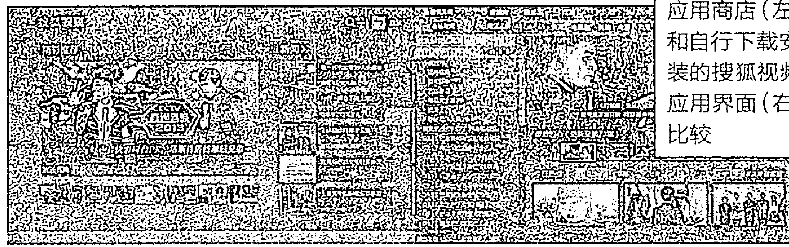

> 小提示
现在Windows 8平板使用的都是64位Windows 8专业版，为了提高应用运行效率，如果软件有X64版本的，建议尽量下载安装64位的版本。

#### 优先使用系统自带的应用商店

Windows 8集成了应用商店，而应用商店开发的软件则大多针对触摸进行了优化。比如搜狐视频是大家常用的视频播放软件，如果是在官网下载的程序，安装后的界面和普通Windows 7下的程序并无两样，很多操作都是要借助“鼠标+文字菜单”点击来完成。由于Windows 8平板的屏幕较小，我们不容易通过手指点击文字菜单进行操作，但是通过应用商店下载的搜狐视频，它的界面则铺满大量的磁贴式图标，显然更方便我们的触摸操作（图1）。

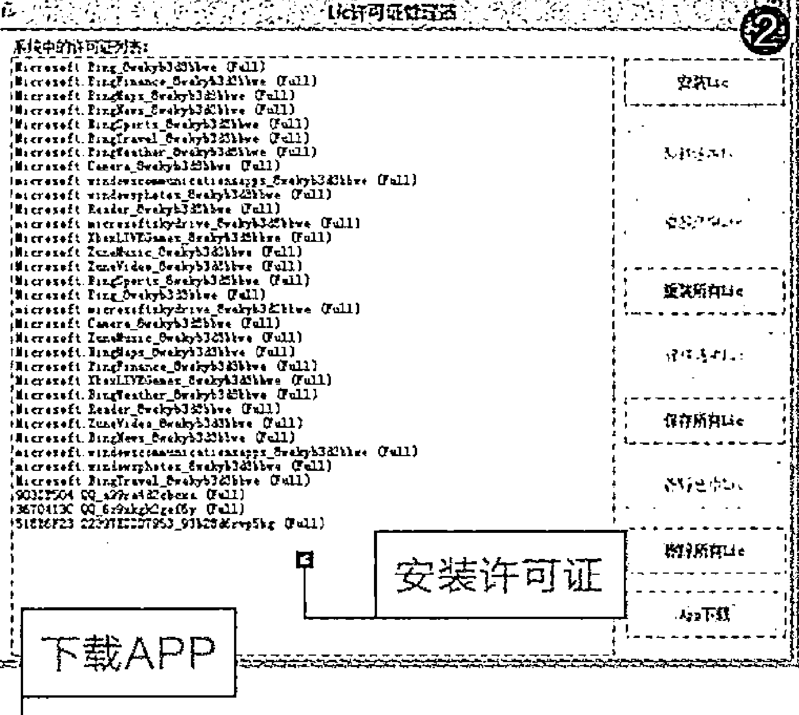

#### 绕过微软商店装Metro应用

虽然使用应用商店可以很方便地安装适合平板使用的应用，但是应用商店也有各种不足，比如由于应用商店的服务器在国外经常无法访问，以及在线下载速度慢等。通过“Windows 8.1商店应用离线包安装卸载工具”，则可以自行从不同的来源安装应用。

首先到http://pan.baidu.com/s/1mXuWa下载软件，启动软件后右击“lic许可证管理”选择“安装开发者许可证”，按提示安装许可证（图2）。

完成许可证的安装后就可自行部署下载的应用了。点击“lic许可证管理”，在打开的窗口点击“APP下载”，到应用商店下载所需的应用，在当前窗口即可看到应用的实际下载地址，按提示将其提取出来再使用迅雷等工具下载，这样可避免直接从商店下载的慢速（图3）。

当然从其他来源获取的应用安装文件也可以。最后返回程序窗口，点击“浏览”，导入下载到的appx应用文件，点击“部署”，这样即可实现应用的离线安装。

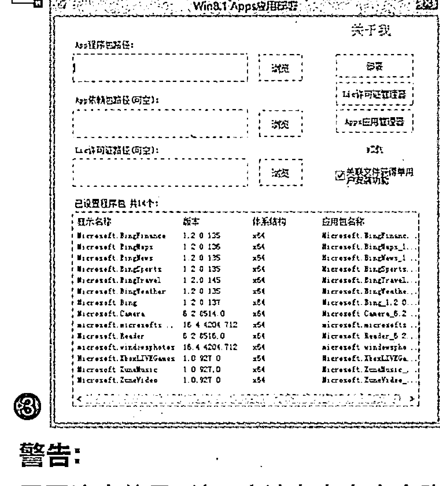

> 警告：
需要注意的是，这一方法存在有安全隐患，只有在没有办法不得不用的时候再去尝试，而且还要注意安全性测试。

#### 桌面iPad化

大家知道iPad桌面可以有效提高平板的操作效率，借助“WinLaunch”就可以让Windows 8平板拥有类似iPad的桌面。

首先到http://t.cn/RPS7KP6下载安装软件（软件的运行需要系统安装有.Net Framework 4.0）。启动软件后选择一种自己喜欢的样式，接着启动平板上的虚拟键盘程序（即osk.exe，配置实体键盘的用户直接用快捷键Shift+Tab），在虚拟键盘上点击Shift+Tab调出程序界面，长按任务栏选择“工具栏→触摸键盘”，激活触摸键盘后按F键，将程序图标拖到WinLaunch窗口即可（图1）。

WinLaunch默认以全屏方式运行，这样在平板上任何时候点击屏幕左上角激活程序界面（再次点击则隐藏程序界面），然后点击图标即可快速启动程序。WinLaunch还支持多个桌面，可以将不同功能的图标分别放置在不同桌面（如分为娱乐、办公组），具体使用时可以像在iPad中那样左右滑动手指来切换桌面，即使屏幕再小，也可以游刃有余地在桌面启动任意程序了（图2）。

#### 无惧小屏 桌面操作更高效

现在Windows 8平板的屏幕都较小，9.7英寸还是主流，市场更是充斥着7英寸、8英寸的Windows 8平板，显然这样的尺寸根本无法和PC上动辄22英寸、24英寸的显示器相比。

因此PC上大屏幕的操作并不适合在Windows 8平板上使用。

比如很多操作都是通过桌面发起和完成的，现在可利用专为触摸优化的软件帮我们在小屏幕上实现高效操作。

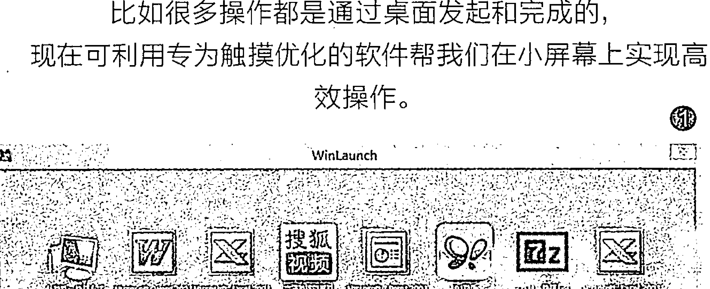

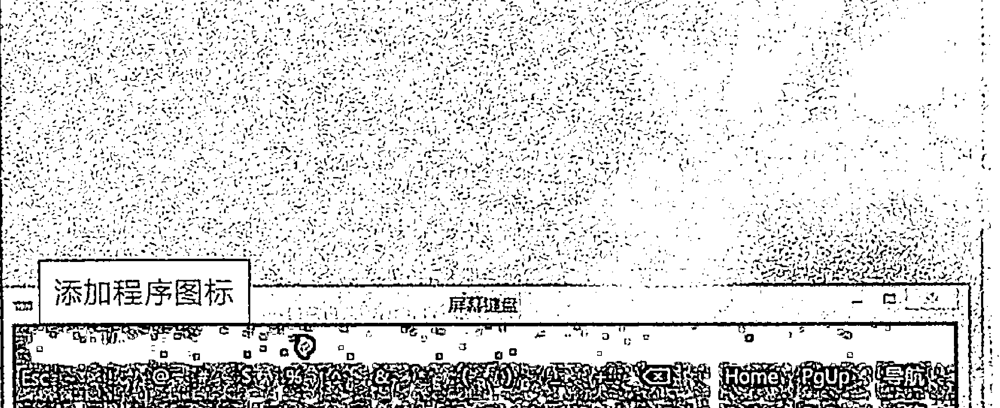

#### 提高任务栏使用效率

大家知道Windows 8任务栏会显示固定在任务栏的程序图标、最小化的程序和任务托盘图标。由于平板的屏幕较小，如果任务栏显示的内容多了以后就会显得凌乱，也不方便查看。借助“Taskbow”可以对任务栏进行更为高效的管理。

首先到http://www.taskbow.com下载安装软件，软件启动后即可看到当前任务栏图标发生了变化。现在即可将需要重叠的程序图标拖到任意一个图标上，这样任务栏的空间就腾出来了。重叠在一起的图标上会显示重叠的数字，只要我们手指移动到重叠图标上就会自动展开叠加的程序，按提示点击即可快速切换（图3）。

对于小平板用户，如果想改变任务栏图标宽度的话，长按托盘中的任意程序图标选择“Taskbow/Setting”，在打开的设置窗口中单击“Group options”右侧的“Settings”按钮，拖动“Button max width”右侧的滑块，这样就可实时看到图标大小的改变，适当地改变图标大小，也能对任务栏进行扩容（图4）。

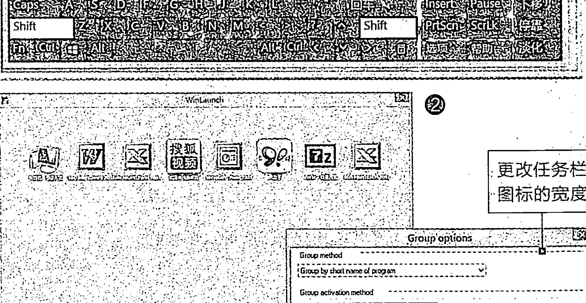

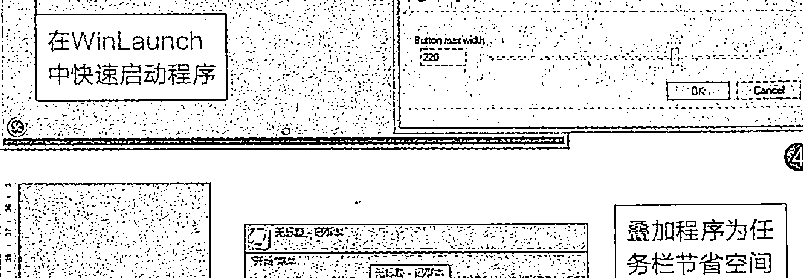

#### 化繁为简 文件管理有高招
文|榆木

文件管理是我们接触最频繁的操作，虽然Windows 8已经提供了资源管理器，但是它操作的图标都非常小，在小屏幕平板上操作仍然十分不便。Immersive Explorer则使用了大量的磁贴图标，非常方便平板上的触摸操作。

首先到http://t.cn/RhSqr6L下载安装软件，为了方便使用，可以将其固定到任务栏。启动Immersive Explorer后则可以看到Metro界面，常用的“库”和“收藏夹”在侧边栏显示，显然Metro图片式的设计更方便我们的触摸操作（图1）。同样的，打开具体文件夹后其中的文件也是使用磁贴图片标识，点击下方的“...”可以展开常用的菜单，这样在平板上选中需要操作的文件，点击下方的菜单即可完成复制、粘贴、移动等常见的操作（图2）。

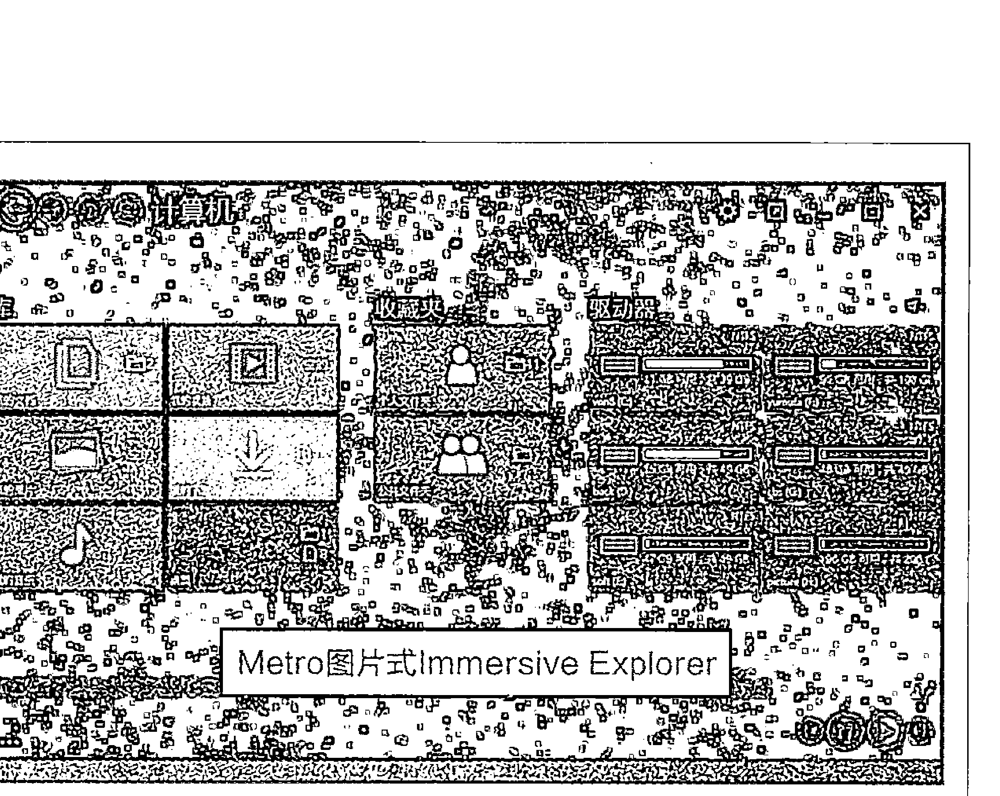

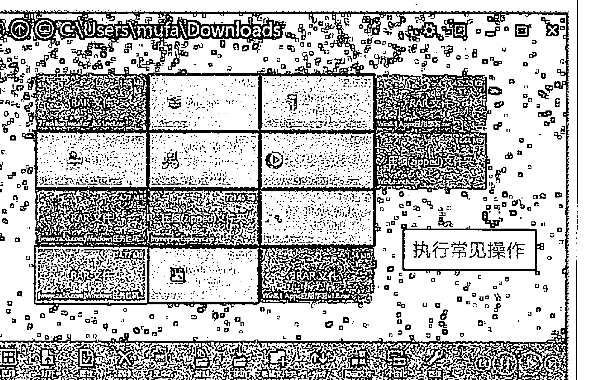

#### 简单点击 备份还原更简单
文|榆木

使用Windows，我们少不了要对系统进行备份和还原。不过Windows自带的备份工具使用并不简单，图形化的需要点击很多步才能完成操作，命令行的则要输入大量的文字命令，在平板上操作极不方便。

现在使用Metro界面“RecImg Manager”，通过简单点击即可快速备份和还原系统。首先到http://www.recimg.com/下载安装软件，RecImg Manager启动后显示的就是“备份”和“还原”两个简洁的Metro图标，按提示点击即可开始备份或者还原操作（图1）。比如点击“Backup”进入备份界面，这里备份的驱动器和操作按钮也是使用图片式的设计，只要按提示选择需要备份的驱动器，最后点击“Backup now”，剩下的操作按屏幕提示完成即可，还原操作类似（图2）。

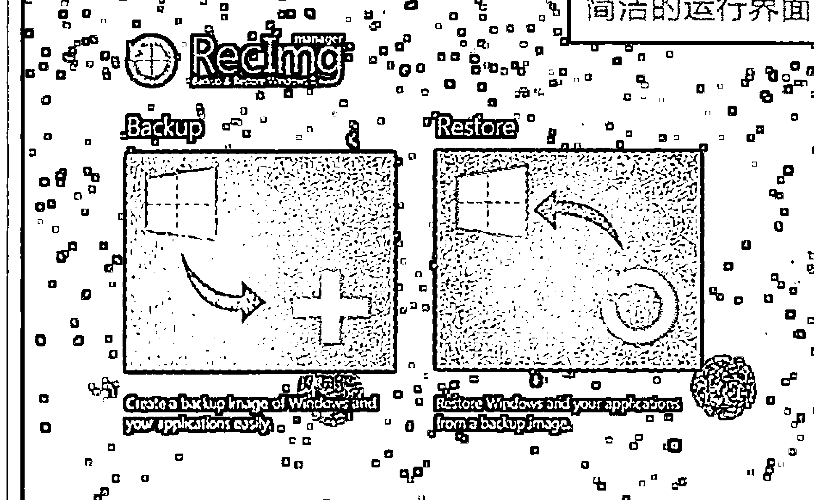

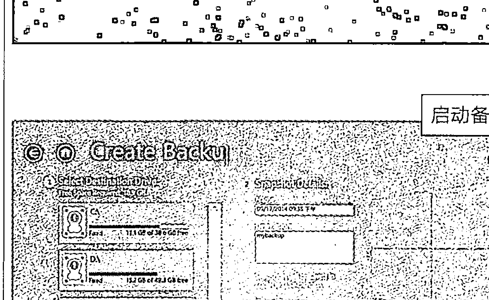

#### 指点江山
手势操作更便捷
文|俞木发

Windows 8最显著的特性就是增加了大量的手势操作，比如在屏幕上从右边缘向左轻扫，即可唤出Windows 8系统超级按钮，等于按下Win+C快捷键。显然手势操作给没有配备键盘、鼠标的平板带来了极大的便利。不过系统内置的手势有限，很多操作默认无法通过手势完成，这可以借助第三方软件来增强Windows 8手势操作。

#### 全局动起来

系统默认的手势只是在Metro界面的应用下有效，如果要实现全局手势应用，则可使用StrokesPlus，它支持Metro及桌面环境下的全局手势。
首先到 http://www.strokesplus.com 下载安装软件，StrokesPlus启动后会最小化到任务托盘，长按图标选择“Action”，在打开的窗口中点击“Add App”，在弹出的对话框中输入名称(Name)，如IE，为IE设置一个手势。接着在打开的窗口中选中新建的IE项目，在“FileName”中输入IE的进程名称(iexplore.exe)，并将其他自动填充的信息删除(图1)。
接着点击“Add Action”为IE添加一个手势，假设为关闭标签的手势，完成项目的创建后选中，在“Lua Script”代码下输入“acSendKeys("^w")”，接着在上方的Gesture下选择一个对应的手势。这样以后在使用IE时，只要在平板上画出选择的手势即可关闭标签(图2)。
其他程序的手势添加操作类似，比如为资源管理器添加一个关闭手势，这样在平板上通过手势即可关闭程序，操作更轻松了。

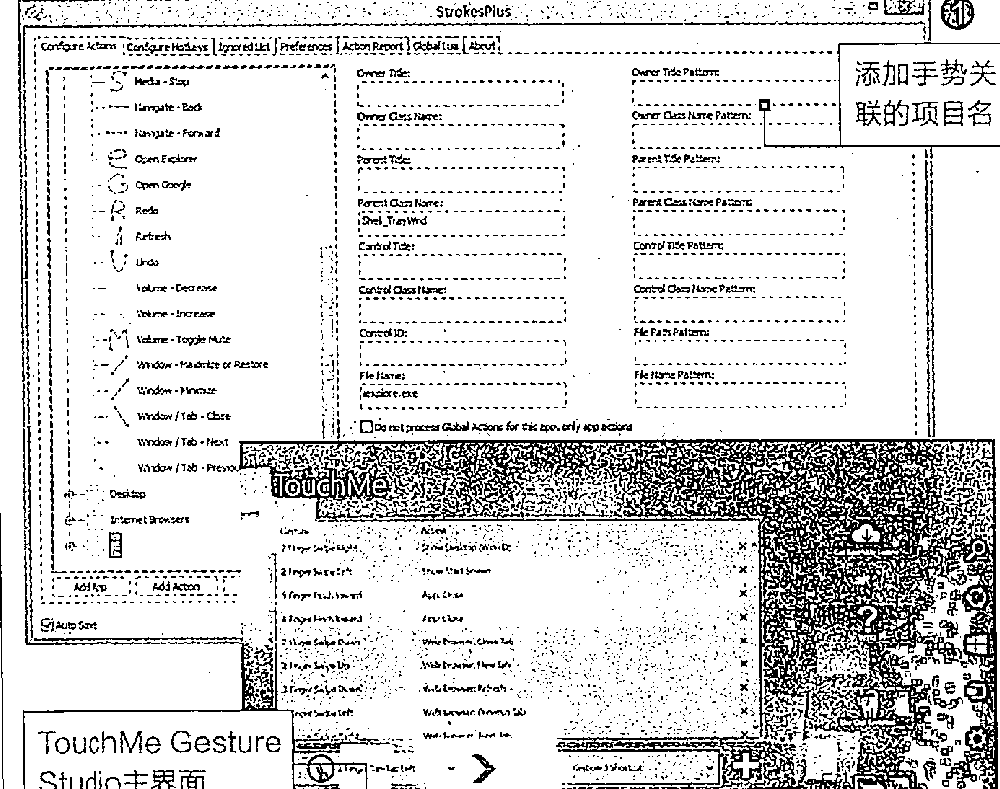

> 小提示
这里的“acSendKeys("^w")”代码是表示手势对应的快捷键是Ctrl+W（其他具体键位设置请参考软件的帮助文档）。对于每个自己创建的手势都要对应一个具体的快捷键，手势操作实际上就是使用手势来激活指定的快捷键。

#### 增强Windows 8手势

系统内置的手势一些朋友用起来可能不习惯，或者觉得手势功能不强，借助TouchMe Gesture Studio可以增强系统手势功能。
在Windows 8应用商店下载TouchMe Gesture Studio并安装，启动程序后点击右上角的“Get TouchMe Engine”，下载“InstallMe.exe”程序，安装后即可实现增强手势的引擎(图3)。
接下来就可以对手势进行编辑了，比如默认情况下在开始菜单屏启动Metro应用都是全屏显示，而且没有设置关闭按钮，这样要在平板上关闭当前应用很不方便。现在可设置一个五指收拢关闭应用的手势，在手势列表选中“Finger Pinch inward”(五指合拢)，在“Action”(动作)列表中选中“APP:Close”，这样以后只要在平板上做出五指合拢的手势，当前应用就会自动关闭了(图4)。

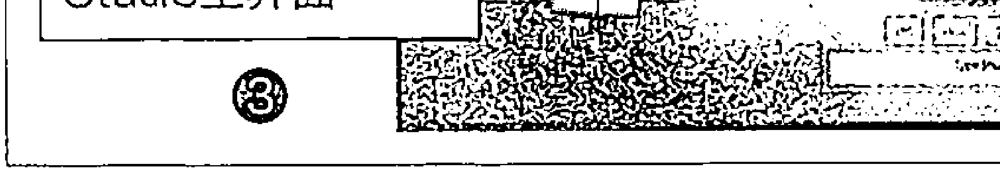

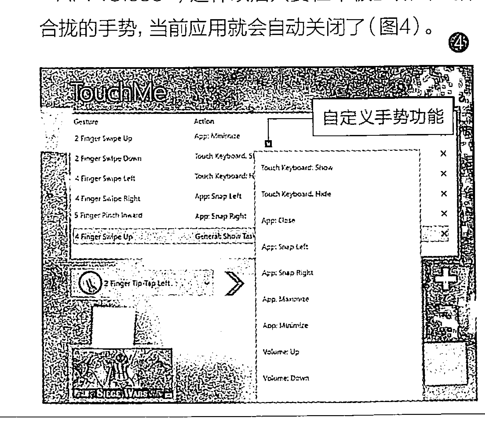

### 轻松办公
首选OneNote
文|技术宅

由于Windows 8平板可以和PC无缝兼容，
因此很多朋友还会使用平板作为办公辅助工具。
不过Office套件体积庞大，而且极占资源，
显然并不适合在Windows 8平板上使用。
微软提供的免费OneNote则是Office套件的最佳替代品，
通过它在平板上也可以轻松办公。
在应用商店中，直接搜索找到OneNote，
点击进入它的主页面后，点击“安装”就可以了
（也可以从http://www.onenote.com/download下载）。

为了避免平板在出现意外故障后，OneNote配置文件重新设置或配置文件丢失，可以定时将其配置文件导出保存。只要将下列文件和注册表文件复制到其他分区保存即可，恢复时将备份文件覆盖同名文件即可：

-   C:\Users\当前登录账户\AppData\Roaming\Microsoft\OneNote\15.0\Preferences.dat
-   C:\Users\当前登录账户\AppData\Roaming\Microsoft\OneNote\15.0\Toolbars.dat
-   C:\Users\当前登录账户\AppData\Roaming\Microsoft\Templates
-   C:\Users\当前登录账户\AppData\Local\Microsoft\Office\OneNote.officeUI
-   HKEY_CURRENT_USER\Software\Microsoft\Office\15.0\OneNote\Option

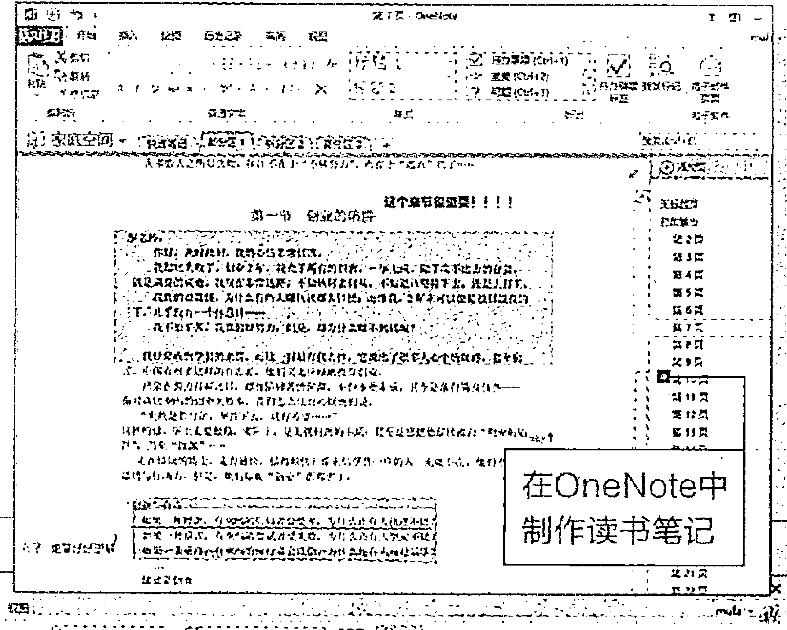

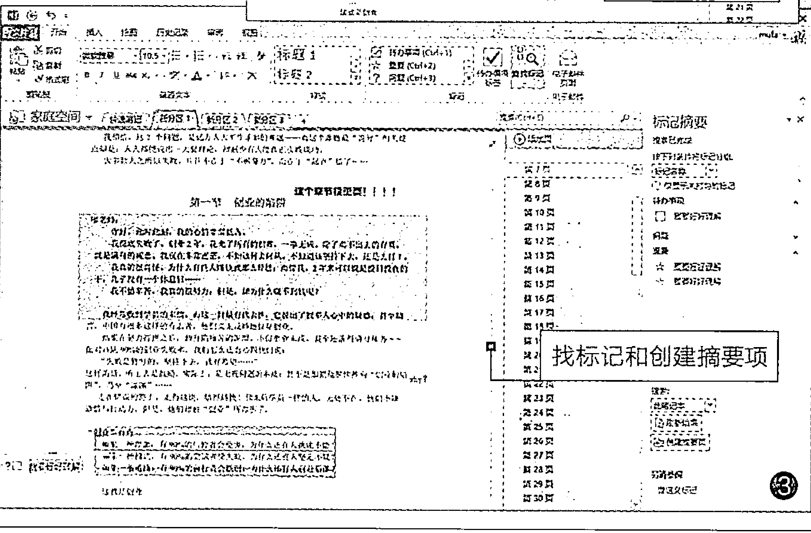

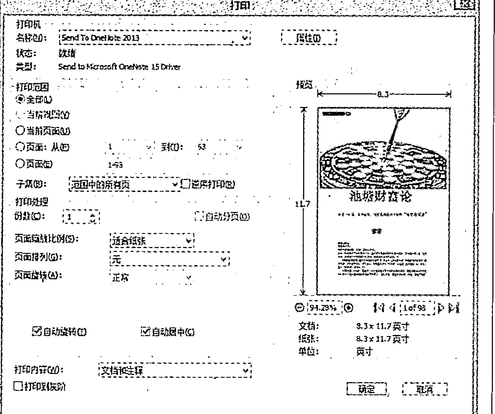

#### 读书笔记轻松做

平板的便携性和触摸操作很适合用来阅读电子书，很多朋友在阅读电子书的时候有做读书笔记的习惯。不过大多数电子书使用PDF格式，无法在其上直接进行编辑、添加标注。现在借助OneNote即可轻松制作读书笔记。

首先在平板上使用“福昕阅读器”打开需要阅读的PDF书籍（注意：由于Windows 8已经内置PDF阅读器，不要直接双击PDF文件打开），接着点击“文件→打印”，然后打印机名称选择“Send to OneNote”，点击“确定”，将其发送到OneNote（图1）。

然后在弹出的窗口中选择一个OneNote分区存放输出的PDF文件，启动OneNote后会自动打开上述导出的书籍，现在就可以在页面上任意位置插入你的读书笔记了，比如某个章节自己觉得比较重要，则切换到“开始”，然后点击右侧菜单上的“重要”按钮，添加上标记字符，切换到“绘图”，则可使用画笔任意进行标记（图2）。

完成读书笔记的制作后，切换到“开始→查找标记”，选择需要查找的，点击查找结果即可在书籍中快速定位到我们上面制作的标记，还可以点击“创建摘要项”，将标记内容制作成摘要，方便日后的管理和查看（图3）。

如果需要摘记的文字太多，可以按Win+S键把那段内容截取下来，然后再通过OCR将这段文本识别出来粘贴上，非常方便快捷。

### 舌尖上的论战

无论PC还是智能手机、平板电脑，这些由处理器、内存、系统、软件构成的“生态圈”，无疑是各种优化软件、优化技巧及观点碰撞的舞台。为什么要在电脑/手机上安装杀毒软件和优化工具？优化加速并清理垃圾文件后的速度提升是否只是心理作用？配备8GB内存的电脑要永远空着4GB正确吗？硬盘C盘安装程序越多速度就越慢有依据吗？类似的疑问和话题总会成为各大论坛和微博论战的热点。而今天，我们就要彻底剖析这些优化软件、技巧、观点的合理性，让你经历一番“舌尖上”的论战。

#### 日辩三非
文|俞木发

#### 激辩第三方软件有用无用论

关于第三方软件是否有用的争论由来已久。系统高手们认为，为了提高系统运行效率，充分挖掘系统潜能，拒装第三方软件是明智之举。与之相反的是广大初级用户，出于系统安全或者提高操作效率的考量，纷纷安装各种各样第三方安全或优化软件，不过随之而来的是，系统也会被莫名其妙地装上各种各样的附带软件。那么到底第三方软件有用还是无用？

> > CFan 观点：其实，关于第三方软件有用与否，见仁见智。对于高手们来说，如果你的技术已经足够高超，并且只是将电脑作为工作专用，那么拒装（或者尽量少装）第三方软件是正确的，当然前提是你有足够的技术实力，可以利用系统组件保证系统安全和运行效率。不过对于绝大部分普通用户来说，我们还是建议安装第三方软件，因为第三方软件和系统组件相比，使用起来更为简单而且高效。不过在实际安装和使用过程中，我们应该根据自己的实际需要加以筛选和甄别！

#### 第三方软件更会防病毒

随着网络安全形势的恶化，现在的网络到处病毒肆虐、木马横行，在“网上”行走一不小心就会中招。但是对于如何防范病毒，网上争论也非常多，有人认为系统安全性能已经足够强大，裸奔并无大碍。不过大量的安全案例告诉我们，虽然系统已经自带防火墙和杀毒软件（如Windows 8已经自带Windows Defender，即微软的杀毒软件MSE），但是仅仅依靠这些还是无法防范网上层出不穷的病毒。所以，安装第三方软件可更好地保护系统的安全。首先系统防火墙的设置极为复杂，大部分用户并不知道该怎样根据自己的实际状况进行最优化设置，在实际使用中大部分用户仍然只是在使用系统默认设置，这样系统防火墙就不能发挥充分的保护作用。比如前段时间流行的“dllhost”盗号木马，它通过劫持“dllhost.exe”进程来进行盗号。由于“dllhost.exe”是系统正常运行所必需的进程，并且它是在系统浏览器进程里面的，所以不受系统防火墙的限制。对于这类木马，系统防火墙往往无能为力了（图1）。

感染DLLhost木马后，其进程会被防火墙允许连接（对应COM Surrogate）

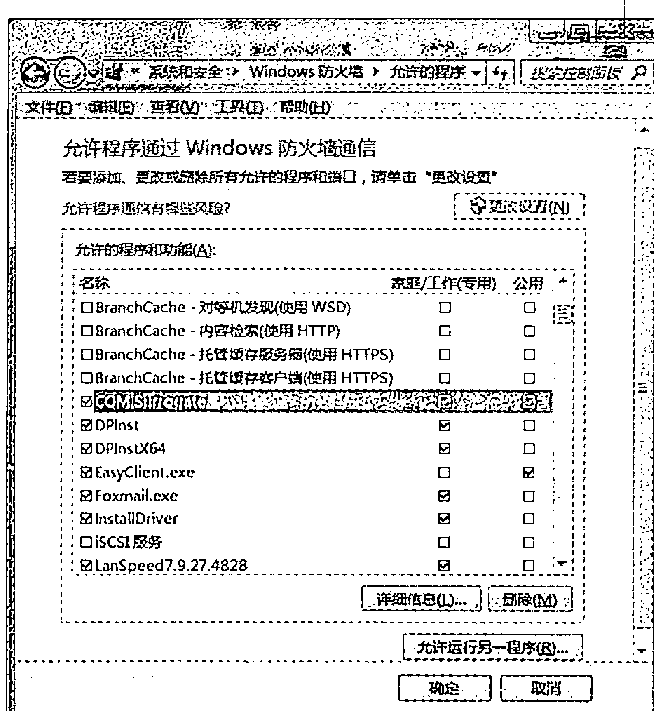

其次，系统自带的杀毒软件功能有限。MSE是针对全球市场的，对于国内出现的新病毒、木马及时反应能力要比国内杀毒软件弱得多。国内安全软件则针对国内用户量身定制很多安全服务，可以更为有效地保护系统安全。

如上所述，系统自带的安全组件有不足之处，因此我们除了用好系统自带的安全组件外，还应该安装第三方安全软件来保障系统的安全。比如金山卫士就集成了金山网盾防火墙，而且使用起来非常简单，启动程序后切换到‘查杀木马→网盾保护’，在这里即可根据自己的实际需要开启防火墙的保护。与系统防火墙不同的是，它根据用户常用的网络环境分类做出防范。

当然对于系统安全来说，防范远比中招后的查杀保护更为重要。在安全防范方面，国内杀毒软件根据实际需求量身定制了很多保护措施，这样可以有效保护系统安全。比如金山毒霸自带的猎豹浏览器就可以对访问的链接进行检测，对于安全的网页会显示绿色的标志，对于危险的钓鱼页面则以醒目的红色加以提示，这样大部分钓鱼网站就原形毕露了。对于用户的网购、在线支付页面，毒霸则会进行专门的安全扫描，正确的官方页面会被绿色框架标注，确保可以进行安全的网络支付，而这些都是系统自带的MSE杀毒软件所不具备的安全保障措施。

### 在‘安全’和‘安心’之间玩平衡

安装第三方安全软件可以有效地保护系统，不过就目前国内安全软件来说，在获得安全保障的同时并不让人省心，因为大部分安全软件都或多或少夹杂一些流氓组件，在获得安全的同时也带来很多烦扰，这也成为不少人反对安装第三方软件的原因。不过，安全毕竟是首位的，对于安全软件的‘耍流氓’行为，可以采取一些有针对性的应对措施。所以我们认为，第三方安全软件必须安装，但是要根据自己的实际需要进行防范和甄别。

现在大多数安全软件并不是单一的安全组件，往往夹带了许多功能不相干的其他组件。比如金山安全卫士就捆绑了驱动精灵，在安装时一不小心很容易就附带安装这些我们并不需要的软件（图1）。另外，安全软件在实际使用过程中点击也很容易安装不需要的组件。比如毒霸就集成了金山手机助手、加速球、密码专家、软件管理等多个组件，只要点击即可自动下载安装，所以在实际使用时很容易被强迫安装上这些组件。其次，安全软件经常会弹出一些危言耸听的界面或者提示，告诉你的系统存在极大的安全隐患等等，诱导大家安装或者执行很多不必要的操作。那么这些安全软件的流氓行为该如何禁止和甄别？

#### 拦截不必要组件的安装

对于附带组件的安装，首先在安装时要注意查看捆绑软件，安装过程中不要进行勾选，对于点击就自动下载的组件可以借助系统自带的UAC进行拦截，将UAC的级别调至最高即可拦截所有会对系统做出更改的程序，如上述毒霸界面点击

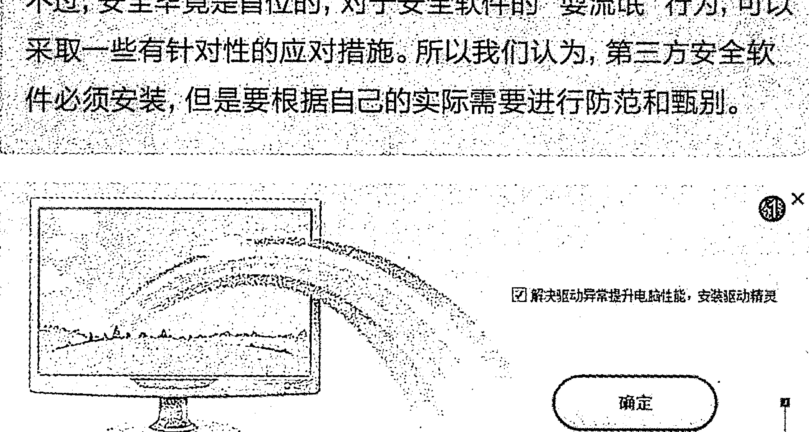

金山卫士捆绑的驱动精灵会在安装后自动弹出，点击确定就自动下载安装会自动下载安装的手机助手。

不过UAC只是拦截对系统会做出更改的程序，对于那些捆绑在安装程序里面并在后台静默安装的程序，则可以利用“静默安装拦截器”进行拦截。首先到http://suo.im/5vy2v下载软件，启动软件后可以自定义拦截规则。比如最近总是遭到百度旗下软件的“骚扰”，那么就可以添加一条“.*Baidu.*”规则（意思是所有包含“baidu”字样的程序静默安装都会被拦截），然后点击“保存规则”（图2）。

点击“确认并启动监控”，这样程序会在后台监控，现在如果有后台程序使用静默方式进行安装，程序就会自动进行拦截（不分是否会对系统做出更改），并且在拦截窗口中给出静默安装程序的详细信息，方便我们进行取舍，点击“阻止启动”即可进行拦截（图3）。

#### 高危提示的甄别

对于一些安全软件所谓的高危提示，我们应该根据实际情况进行分析。比如上述金山卫士检测到的“KB2798897”高危漏洞，经过微软网站的查询，这个实际上是Windows 8、Windows Server 2012适用的补丁（本机安装的是Windows 7系统），并不需要安装（图4）。

其实对于类似发现某某漏洞、大量垃圾文件需要清理、某某需要立即优化之类的提示（不包括发现某某病毒的提示），很多都是安全软件在故弄玄虚，大部分目的是诱导用户安装各种软件。对于这类提示，只要根据自己的实际状况进行甄别即可。比如对于系统漏洞的检测，系统自带的更新检查是最靠谱的，只要展开“控制面板→系统和安全→Windows Update→立即更新”即可。本例可以看到当前系统并不需要安装什么高危漏洞补丁（图5）。

不过系统自带的更新下载速度较慢且无法导出已安装的补丁，如果需要更新的补丁较多，还是建议安装第三方软件，比如WHDownloader，可以到http://tinyurl.com/pmxf4bd下载安装。启动后选择自己对应的操作系统，在下载列表中即可下载所有的补丁（包括已安装和未安装的），还可以将这些补丁文件导出，方便重装时使用。

#### 小知识 第三方软件如何检测系统

现在很多优化工具都有自动扫描补丁功能，它的工作原理是首先判定当前安装系统的类型，接着连接到微软的Windows Update进行查询，然后将未安装补丁推送到软件窗口供用户下载。不过由于软件设计的原因，它的检测功能并不完善，如金山卫士就在Windows 7基础上检测出Windows 8的补丁。其他诸如发现许多垃圾文件提示，则通过扫描回收站、IE临时缓冲文件夹等位置文件，然后给出存在大量垃圾文件的提示。

#### 教你一招拒绝新版只用老功能

不少安全软件都集成了很多不必要的组件，我们可以使用手动的方法取其有用的功能。如小红伞的扫描能力出色，可以只使用这个功能。

- 首先可以在安装小红伞时选择自定义安装，在“安装组件”这一步，去除“Real-time Protection”（实时保护）和“Rootkits Protection”（实时监控）的勾选，只保留所需的扫描和右键快捷菜单。
- 在完成软件的安装后启动系统配置实用程序，去除“Avira Free Antivirus”的启动，再进入服务配置实用程序，禁用“Avira Real-Time Protection”服务，取消其实时监控后台服务以节省资源（图6）。

这样就可以只使用小红伞扫描功能了，以后需要扫描病毒时，只要打开资源管理器选中需要扫描的文件夹，右击选择“使用Avira扫描所选文件”即可开始扫描。

**CFan 观点**

#### 优化还是外来的软件好念经

文/阿木

系统优化的问题是老生常谈，杂志上也介绍了很多如何利用系统自带的组件进行优化的文章。为了节约系统资源，很多人不喜欢使用第三方软件，而是通过自己的技术手动对系统进行优化。但是，一些优化项目通过手动方法无法轻易实现，比如系统优化包括磁盘缓存、注册表、文件系统、网络、开机速度、系统安全、后台服务等优化项目，而系统组件一般只能针对某一个项目进行手动优化。另外，一些项目如注册表、磁盘缓存的优化，还需要掌握一定的电脑技术，具体执行起来并不容易。相比起来，第三方优化软件就简单多了，一般只要简单点击即可完成优化。

无论是从操作效率还是优化的效果来看，第三方优化软件都有相当的优势，也更适合普通用户使用。

以“软媒魔方”为例，借助这款软件即可轻松实现系统全面优化。不过优化之前首先要制作系统备份，无论是手动还是第三方软件优化都有可能造成系统故障，因此优化之前一定要做好系统备份。

- 启动系统还原组件，然后按提示制作一个名为“优化之前备份”即可，这样如果优化后无法进入系统，就可进入PE里进行还原恢复（图1）。
- 接着就可以使用软媒魔方进行优化了。启动软件后点击“优化大师”，在打开的页面中即可对开机速度、启动项和系统服务进行一键优化。如果优化出现错误，可以切换到“优化历史”中，快速恢复优化之前的项目。
- 对于系统设置的专业优化，可以点击“设置大师”进入优化，这里提供系统设置、多媒体、网络设置等常见优化项目，操作也非常简单，只要简单勾选优化的项目即可（图2）。

此外，对于具体项目经过优化软件的优化后，优化的效果大多直接保存在系统设置中，因此为了节省系统资源，可以在优化后卸载优化软件，这样既可以节约资源，又可以达到快速优化的效果。资源紧张的用户还可以使用绿色版优化软件，在需要优化时直接使用，优化完成后即可删除。

> **小提示**
软媒魔方官方还提供完整绿色版下载，对于资源紧张的用户可以使用该绿色版，下载后解压可以按自己的需要直接使用其中的某一组件，如 lemaster.exe 是IE管理大师，运行后可直接针对IE进行优化。

#### 如何清理垃圾文件

垃圾文件过多会影响系统运行效率已经成为大家的共识，但是对于如何清理垃圾文件却让很多人纠结。反对使用第三方软件的人认为，系统垃圾无非就是回收站、IE临时缓冲文件夹、系统临时文件夹里的文件，这些文件利用磁盘清理组件就可以轻松完成，并不需要第三方垃圾清理软件来完成。不过结合目前大多数用户的使用环境来说，电脑里的垃圾文件远远不止这些，比如安装补丁后的补丁文件、视频软件的缓冲文件等，这些文件不仅占用庞大的空间，而且位于电脑的不同位置，仅仅依靠系统自带组件是很难清理的。此外，对于注册表垃圾文件、冗余DLL文件这类垃圾，通过手动方法也很难清除。所以，为了有效清除垃圾，应当安装第三方清理软件。

首先需要明白垃圾文件的定义，一般来说垃圾文件是没有用的文件，因此在使用垃圾清理软件之前，就要搞明白什么文件确实没用，这样才能借助第三方清理软件来进行操作。在实际清理过程中，还可以结合软件的特性执行更高效的清理操作。

#### 结束无关进程去除垃圾锁定

在清理前要结束不用的进程，因为被正在运行的进程占用的垃圾文件是无法删除的。进程终止可以借助“进程管理”来批量终止。到 http://suo.im/1xh2w 下载软件并启动后，在进程列表中依次选中需要终止的进程（注意：不要终止系统进程），然后点击“一键结束”即可批量终止无用进程（图1）。

完成进程终止后即可启动清理软件，这里以金山卫士为例，启动程序后切换到“垃圾清理→清理垃圾”，点击“开始扫描”，软件即可对所有位置的垃圾文件进行扫描，扫描到的垃圾文件会按照常用文件类别进行分类（图2）。

#### 根据实际情况进行清理

对于扫描到的文件可以根据自己的实际需要进行选择，比如QQ垃圾文件，点击“垃圾详情”可以打开垃圾文件，点击具体文件查看，确定是垃圾文件后再选择删除。比如需要保存QQ完整聊天记录的朋友，这里的“QQ聊天接收到的图片”就不要删除（点击忽略），否则之后查看聊天记录里就不再显示图片了（图3）。

垃圾文件并没有统一的标准，可能A认为是垃圾文件，但对于B就是有用文件，比如，回收站的文件可让我们在误删后找回，对于马大哈用户就应该保留其中的文件，但对一般用户来说就没什么用了。因此在实际清理中并不建议使用一键清理，而应该根据自己的实际需要进行处理。

#### 彻底删除垃圾文件并提取信息备用

完成文件的甄别后返回程序界面点击“一键清理”，这样选择的文件就会被自动删除。金山卫士对于扫描的结果提供详细的路径信息，因此除了用它来删除垃圾文件，我们还可以借助其提供的信息自行制作垃圾清理命令。比如使用卫士的“上网痕迹扫描”，在“Internet 历史记录”下点击“详情”，可看到IE历史记录会保存在“C:\Users\当前用户\AppData\Local\Microsoft\Windows\Temporary Internet Files\Content.IE5”目录下（图4）。

```
cd "C:\Users\当前用户\AppData\Local\Microsoft\Windows\Temporary Internet Files\Content.IE5"
del /s /q *.*
```

不过在默认情况下，上述目录在资源管理中打开后我们并不能看到其中的子目录文件，通过IE删除历史记录也无法删除其中的文件，这也是手动无法删除垃圾文件，但是通过金山卫士即可轻松访问并删除的原因。因此如果以后我们需要手动删除其中的文件，通过卫士的扫描信息可以输入下列代码自建批处理完成，这样执行这个批处理就可以快速将原来无法访问的历史记录删除（图5）。

同样，我们可以借助卫士扫描信息提取其他位置信息添加到批处理中（只要添加del /f /s /q +具体垃圾文件目录即可）。如自己只安装PPS，就提取PPS垃圾文件位置，将自己最常出现垃圾文件的目录添加后，就可以不再使用金山卫士（毕竟垃圾清理只是金山卫士的一个子功能，它的其他功能还会占用大量的系统资源），达到既利用第三方软件高效代码，又不占用资源的目的。当然，为了实现定时垃圾清理，还可以借助系统的计划任务实现定时清理，只要建立一个任务计划，然后定时运行上述批处理即可实现垃圾文件的定时清理。

> **慎用网上一键批处理清理垃圾文件**
为了省事，很多朋友喜欢直接下载网上一键批处理清理垃圾文件，它和我们上述自制的批处理不同，很多朋友并不知道代码具体含义，盲目使用后可能造成一些莫名其妙的故障。比如其中的代码：
`rd /s /q %windir%\temp & md %windir%\temp`
这一行代码的作用是清理系统临时文件夹中的临时文件，先把临时文件夹删除，然后再创建。这样的好处是可直接删除临时文件夹的所有文件，但是现在Windows 7、Windows 8系统分区都是NTFS格式，这样一删一建会造成该目录权限的紊乱，可能造成软件运行故障（因为很多软件会将临时配置文件放置在该目录）。因此在使用第三方批处理清理垃圾文件时，一定要先看懂代码的具体含义再操作（图6）。

### 第三方软件争议

在日常使用中，大家的电脑还经常安装各种第三方软件，那么这些第三方软件有没有用处？其实有用无用并没有一个明确的标准，具体来说应该因人而异，因具体操作来判定。一般来说，如果第三方软件可以有效扩展或者弥补系统组件的功能，那么即为有用。第三方软件能够在系统已有相应功能的情况下仍然有自己的市场，应该说这是第三方软件有用的最好佐证。绝大部分可以替代系统功能的第三方软件都有自己的特色功能。

即使到了Windows 8，系统自带的资源管理器仍然偏弱，对于经常要在资源管理器中进行文件操作的用户，为了提高操作效率，就可改用更为高效的文件管理器TC，它具备内置ZIP/TAR/GZ/TGZ格式的压缩/解压功能（系统资源管理器只能识别ZIP）、多标签界面（可以扩展到几十个，非常方便文件在不同目录下移动时使用）、内置同步及比较功能（可对不同文件夹内文件进行同步，比较并编辑不同文件间内容）。这些系统资源管理器不具备的功能可以让我们大大提高文件管理效率。

#### 正确对待

我们常在网上看到，一些人声称可在不装防护软件的情况下让自己的电脑安然无恙地“裸奔”多年。更有甚者，认为所有安装防护软件的人都是误入歧途或被人牵制。那么情况到底如何？既然系统“裸奔”可以平安无事，为何还有那么多人在安装第三方防护？是这些具有“裸奔”功力的大师们太高明，还是广大用户太“傻帽”，亦或第三方防护软件商太精明？对于大众的电脑用户，不装第三方防护软件是否可行？

再如磁盘管理软件DiskGenius，虽然系统已经自带磁盘管理组件，但是它的分区功能只能说基本够用。就以分区调整操作来说，系统组件需要输入数字调整，而且即时生效（很容易造成数据丢失，见图7）。
DiskGenius则支持可视化的调整，只要轻松移动滑块即可进行调整，而且可以预览到调整后的分区状态，所有调整只有在存盘后才会生效（图8）。

#### 第三方防护“火”起有缘

第三方防护软件不是凭空“火”起来的。如果不懂安全规则，对系统本身的安全设置不闻不问，对上网的各种行为不加约束，上网的安全风险加大，系统的安全就难以得到保障。我们注意到，这类用户不在少数。对于这些人，如果硬让他们去学习系统加固技术，手动操控各种系统安全“阀门”，且不说他们有没有时间、精力和兴趣，在技术上可行性方面也比较差劲。也正因如此，才有360安全类防护市场的火爆（图1、图2）。

微软的系统防护不是不安全，而是还不够人性化，有时还会把人搞晕。此外在功能设计上的确也存在一些不到位的情况。就拿弹窗这个问题来讲，如果单靠微软Windows 8.1自身的安全防护，对各类弹窗的拦截和提示都比较模糊，没有一定技术基础的用户有时会不知是否可选择放行。而类似360这样的第三方防护软件则非常详细地提供了弹窗模式、网购安全、右键安全、聊天安全、下载安全、漏洞修复、账户及任务等项目的提示选择，用户在使用时会获得很有针对性的具体提示，电脑技术一般的用户也可轻松判断和把控。也正因为如此简单易用，第三方防护工具才能有“钻空子”的商机。在使用第三方防护上，用户随波逐流者有之，但不是所有喜欢360的人都是傻子，有技术基础的、理性的人也有很多，是需求决定了市场（图3）。

事实和市场已经证明，对于大多数人来讲，安装一个做工优秀且有口皆碑的第三方防护工具，使用电脑就比较省心。虽然在一定程度上会影响系统的整体性能，但是对目前的硬件配置来说，影响很小。对这部分人来说，大可不必听别人说三道四，装了第三方安全工具也不会降低自己的身份，得到的安全保障绝对要比带来的麻烦多。

#### 裸奔须知的门道

安全“裸奔”不是每个Windows用户都能轻易做到的。如果熟悉系统的安全规则并加以很好的利用，对安全上网的规则也心知肚明，对下载和使用软件的渠道、方法都小心谨慎，则受攻击、受感染的机会就大大减少。这样一来，即便不装第三方杀毒软件，仅靠系统提供的安全机制，也完全可以安然无恙。这也是“大师”们可以让系统“裸奔”的秘诀所在。那么，系统的安全规则有哪些，我们如何去认识和利用它们？网络安全使用又有哪些规则，我们又该如何去认识和利用它们？

以Windows 8.1为例，系统在自身安全方面其实是做了充足的准备的。首先是在防护病毒、间谍软件和各类恶意软件方面，Windows 8.1自带免费的Defender防护工具，它可以随着系统的不断更新，维护系统安全。而在上网防护方面，SmartScreen筛选器可以对网上无法识别的应用和文件发出警告。对于来自外面的软件安装或程序的运行，系统提供了用户账户控制功能，会向用户发出必要的提示，供用户选择是否放行。防火墙是Windows系统一直都有的安全工具，Windows 8.1的防火墙设置更加细致和易操作。新增的文件历史记录功能可以实时备份用户文件，保护用户的文件安全。系统自动升级功能则保证了安全防护的及时更新，同时保证了系统漏洞的及时堵截和修补。此外还有一个系统操作中心，它能为用户提供实时的安全提示（图4）。

以上这些可全盘保证系统的安全运行，但作为使用者，要用好它们，需要掌握一定的安全知识和相应的技术手段。网络使用的安全规则是我们要强调的一个重要的方面，因为它往往是让系统不安全的最大隐患。要安全使用网络，需要去认识和利用这些安全规则。

> **小提示**
有关Windows 8系统“裸奔”应知的技术和规则，本刊曾有过专门讲述。请参考本刊2014年第3期文章《挖潜自保 我的Win8也“裸奔”》和2014年第17期文章《搞清“潜规则” 系统再裸奔》。

使用网络的好习惯有很多，比如搜索引擎优先使用认证的结果，使用网址导航来访问网站，到官方网站或知名软件下载网站下载文件。相对来说，对于网站链接，使用网址导航访问要比随意使用海搜的结果安全，由于网址导航页面中的分类网址经过专人编辑整理，而搜索引擎海搜的结果基本是机器给出的结果，这样虚假和恶意网址出现的几率就更大，靠用户自己去判断，很容易会误入歧途，上当受骗。

##### 网站来源要选好

首先是网站来源的真实性问题。使用网络的起点是对某个网站的访问，如果访问的网站存在潜在的威胁，那么网络安全就得不到保障。使用一些带有安全网址鉴定的浏览器和搜索引擎，对于一些正规或知名的官方网站，浏览器会给出明确的认证标志，让用户用得放心。但如果离开了这些第三方工具，单靠系统自带的浏览器，可能就不会给出那么详细而周全的网站验证标志（图5）。
要“裸奔”使用网络，除了充分开启安全验证外，还要靠培养自己的判断力以及访问网站的好习惯。

##### 下载链接莫乱点

下载链接鱼龙混杂，不能不加判断随意点击。如何判断真实的链接地址？有的网站故意将广告链接放在显眼的位置，诱导人们点击，而将软件资料的真实链接藏在不起眼的地方。这类网站还算有点良心，起码让人在冒险的同时最终能得到自己想要的软件。有的恶意网站则通篇找不到一个真实的链接地址，只要点击了便一定钻进了一个圈套，到头来一无所获却引火烧身。
在网址真假难辨的情况下，要么赶紧离开、要么就不能急于点击和提交下载，而是先通过链接属性或下载软件截获的地址判断目标链接的真实性（图6）。

> 小提示
非网页直接信息安全
除了网页上的直接链接不安全因素外，还有一些不安全因素来自间接的渠道。比如QQ好友发送的链接，需要冷静判断，不要急于点击；收到的邮件中的内容安全性问题，需要打开压缩包判断文件类型是否与自己有关，只提取有关内容。

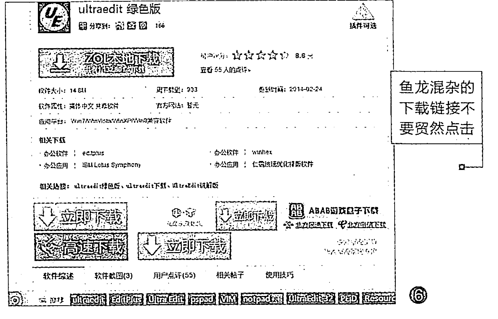

##### 页面提示要提防

弹出的广告页面屡有欺骗性的元素。比如弹出一个广告框，上面设置了关闭按钮，点击按钮本希望能关闭广告，结果却中了圈套，打开了一个广告页面或运行一段恶意代码；打开的一个页面右下角弹出病毒提示窗口，提示系统发现病毒，点确定进行处理，这时不少人会习惯性地点击“确定”，也同样会中招。此情况如果要安全“裸奔”，必须练就敏感的洞察能力，能不为弹出窗口所惑，绕过障碍，否则此处就是一个安全的坎儿。

就在本文即将结束时，又在网上看到一位“裸奔”达人这样写道：“你的电脑会中病毒，一半的原因是因为贪婪，一半的原因是因为愚蠢。贪婪是想免费，想占便宜，免费午餐里放进了鱼钩。愚蠢是不肯稍微学习一点点知识，缺乏最基本的分辨能力。”这句话虽然不无道理，但是否能激起人们学习Windows安全知识和技巧的热情，是否能医治现代人的贪婪病？恐怕不行！那些喜欢赤身上阵的大师们会依旧“裸奔”，而需要第三方防护的大批的人们依旧会人潮涌动，第三方安全防护市场会依旧火爆。情况的改观要等到微软的系统防护做得比第三方的更细致更体贴人，我们期望这一天的到来。

### 论战基础硬件

#### 内存容量与读写速度

内存容量不足在早些年几乎困扰着所有入门用户，而PC系统发展到今天，内存容量和速度都已经不再是问题。

> 一部配备8GB内存的电脑，要永远空着4GB是正确的吗？硬盘越满速度就越慢到底有没有依据？硬盘分区与是否会影响性能？这些疑问长久以来一直困扰着电脑新手，我们的电脑，究竟怎样搭配使用才能发挥最佳性能？让我们往下看。

##### 内存容量问题分析

现在还有内存容量和速度的问题其实很奇怪，PC内存毫无疑问是近年来性能最过剩的部件没有之一。流行数年的DDR3内存速度最高已达3000MHz之高，容量也能很轻易地达到8GB、16GB甚至更高容量。Windows中的计算机硬件评分，内存（RAM）也是最轻易就能达到最高分的一个项目。以老旧的Windows 7 SP1 x64为例，只要内存速度在1866MHz以上，双通道2×2GB即可达到满分7.9，而最难达到满分的处理器一项，仍然需要一颗主频在4.8GHz的最新酷睿i7-4790k才能稳定在7.9（图1）。

在研究这个问题以前，我们首先要搞明白“内存容量和电脑速度”的困扰从何而来。距现在十年以前，内存在不论速度还是容量都远未达到现在的高度，大家甚至还在用512MB甚至256MB。这么低的内存容量很容易被操作系统和各类软件装满，此时系统就会调用硬盘中的页面文件pagefile.sys，我们可以把它看成“虚拟内存”。硬盘的读写速度与内存有天壤之别，再加上硬盘本来就负担很重，一部分还被充当内存，整个系统速度骤降也就不难理解了（图2）。

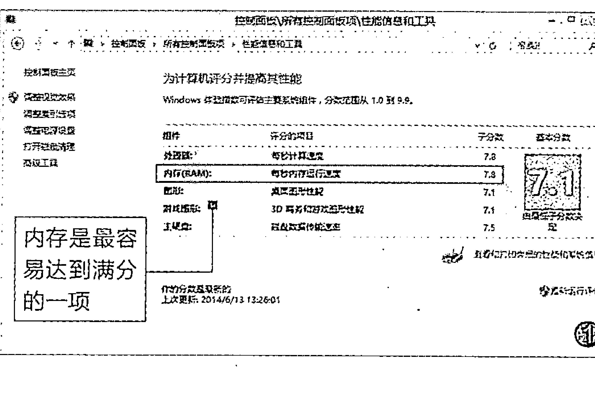

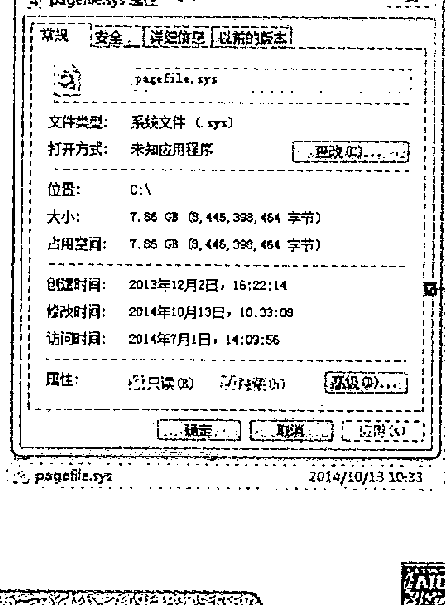

内存是最容易达到满分的一项

内存不够的话系统就会调用页面文件

系统待机时内存占用只有2GB的成绩

##### 实测内存使用环境

现在虽然内存容量和速度都“突破天际”了，但很多用户使用起来依然缩手缩脚，比如完全用不到4GB以上容量的用户去购置8GB甚至16GB；还有不管是否正确永远要系统空闲一半以上的内存空间，认为只有这样内存才能达到最佳的读写速度。这样是否正确合理？让我们来实际试一试（图3）。我们以用户量可能是最大的Windows 7 SP1 x64操作系统，硬件为一颗3.66GHz的i3-530，内存为双通道DDR3 1666MHz 2×4GB（9-9-24）。只要测试出在系统启动5分钟后的待机状态、内存占用一半、占用5GB、6GB等不同状态下内存的读取/写入/复制/潜伏速度，就能最直观地展现不同剩余容量下的内存性能差别。

下面的测试中，只有潜伏时间一项是越小越好，其余的速度是越高越好。对比后清晰可见，系统待机只占用2GB时内存的速度，与占用4GB、5GB、6GB时几乎完全一致，差距在5%以内，没有任何的性能差距可言（图4、图5）。

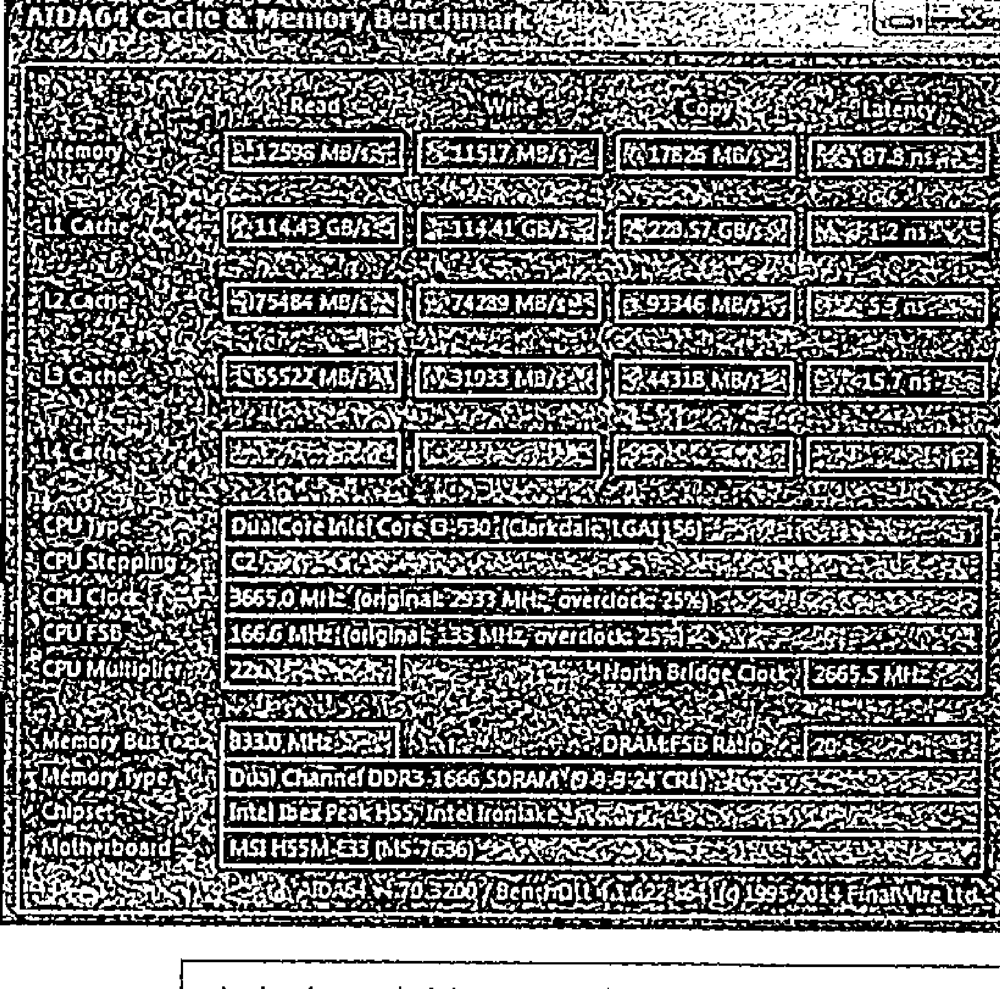

内存占用高达6GB时速度与待机几乎一致


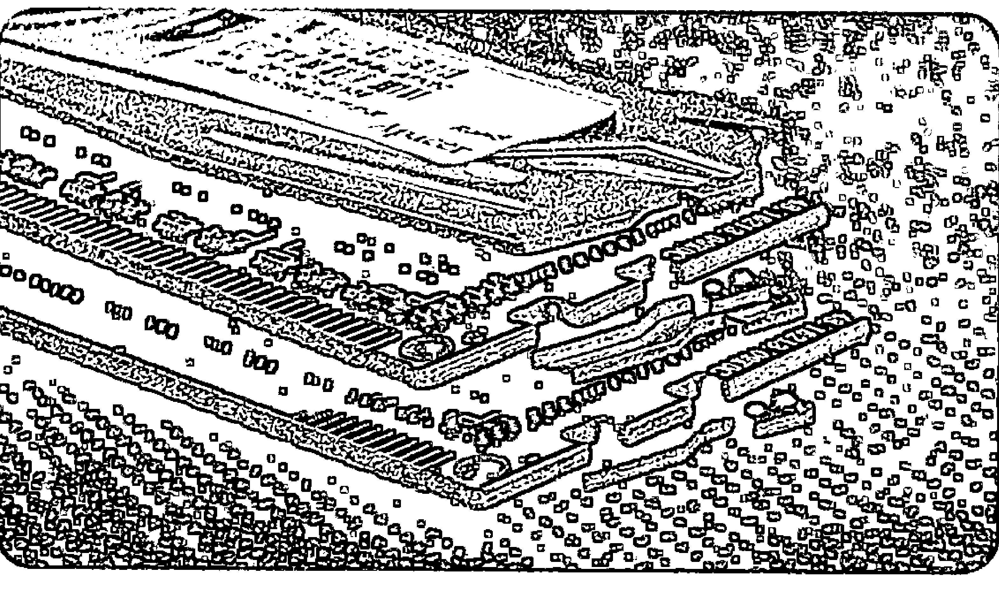

测试采用典型的双通道内存作为模板

##### 小提示

有些用户会提出质疑，因为在他们的使用场合，内存高占用时确实系统缓慢，这是因为CPU占用问题。场景是完全的内存占用，处理器占用近乎待机状态。而在实际系统的使用环境下，很多高内存占用的场景处理器也近乎满载，系统速度的变化很大。用户在分析自身电脑速度缓慢的症结时一定分清究竟是内存还是处理器占用。

| 内存占用 | 读取(MB/s) | 写入(MB/s) | 复制(MB/s) | 潜伏(ns) |
| :------- | :--------- | :--------- | :--------- | :------- |
| 2GB      | 12598      | 11517      | 17826      | 87.8     |
| 4GB      | 12680      | 11490      | 17509      | 88.5     |
| 5GB      | 12709      | 11501      | 17650      | 89.1     |
| 6GB      | 12621      | 11494      | 17661      | 88.0     |

##### 分析和内存使用建议

根据测试我们可以看出，过分追求大内存或者硬性要求电脑空闲出一半内存才能达到最佳性能是不合理的。在目前这种内存速度和容量都十分过剩的情况下，究竟应该如何使用我们的内存呢？

首先在选购时，一定要保证多通道，其次才是单条容量。目前内存价格较高，很多用户为了之后升级方便，选购了单条8GB容量内存，打算之后升级2×8GB的双通道内存。除非用户真正需要这么大的内存，其实不如直接购买2×4GB内存直接组成双通道为好。内存是否形成双通道，对速度的影响还是蛮大的。而且DRAM颗粒价格居高不下，真正等到用户要升级时，恐怕DDR4已经成为主流了(图6)。

使用其实没有太多规矩可循，如果选购的容量合适，我们如何使用内存都是可以的。现在不少整合平台中集成显卡都调用内存作为显存，在这种时候我们可以去BIOS中将显存容量调整至最大(比如2GB)。既然内存容量很大用不掉，为何不去充分利用呢？而且在这时，内存速度的提升也能直接影响图形性能(图7)。

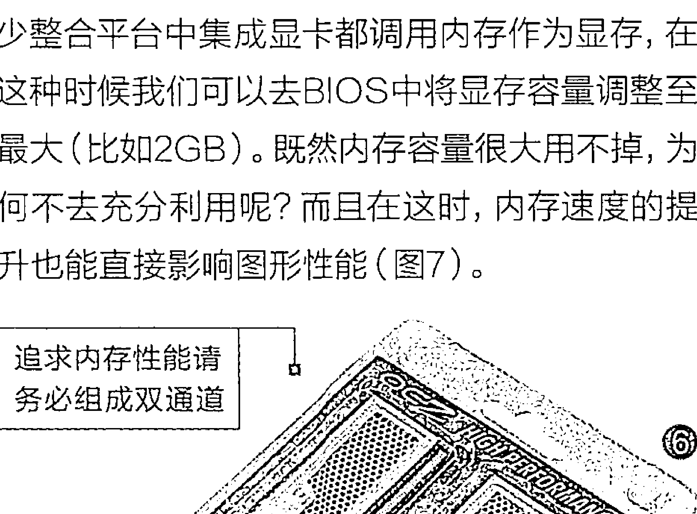

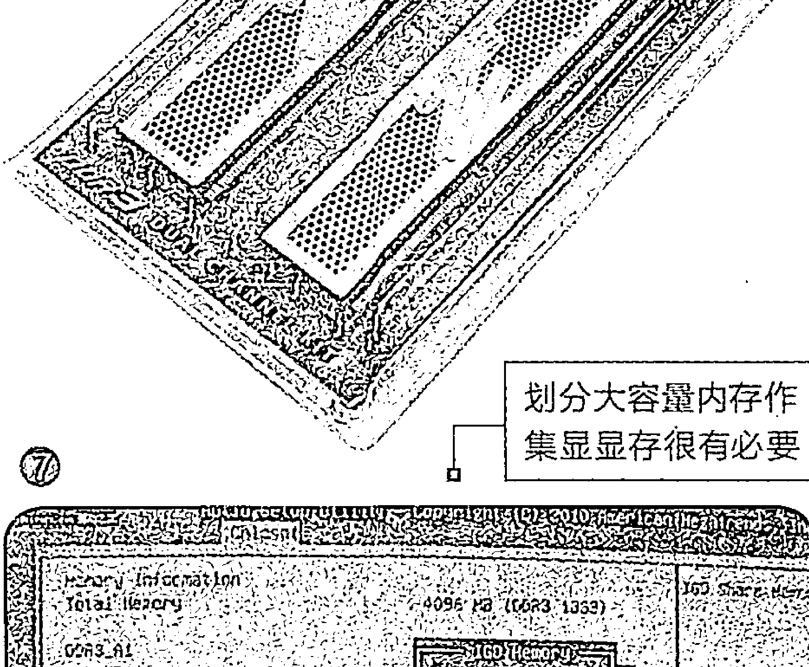

#### 硬盘的“正确使用姿势”

比起容量速度都不是问题的内存，硬盘可一直是现代PC的“老大难”问题。不仅速度低下，容量也总是难以满足用户的需要。关于硬盘，我们究竟应该怎么用？

##### 困扰用户最大的两个问题

与内存同为存储设备，但容量和速度一直捉襟见肘。HDD依靠磁头和盘片来读取写入数据的方式，注定了速度存在上限；而SSD虽然速度有了保障，但容量又成了问题。不仅如此，实际上究竟用何种“姿势”使用硬盘也一直没有定论。在这里举几个比较具代表性的例子。比如硬盘容量被系统、程序或者其他文件占用到非常满，读写速度对比空盘状态会有很大的差异(图1)？


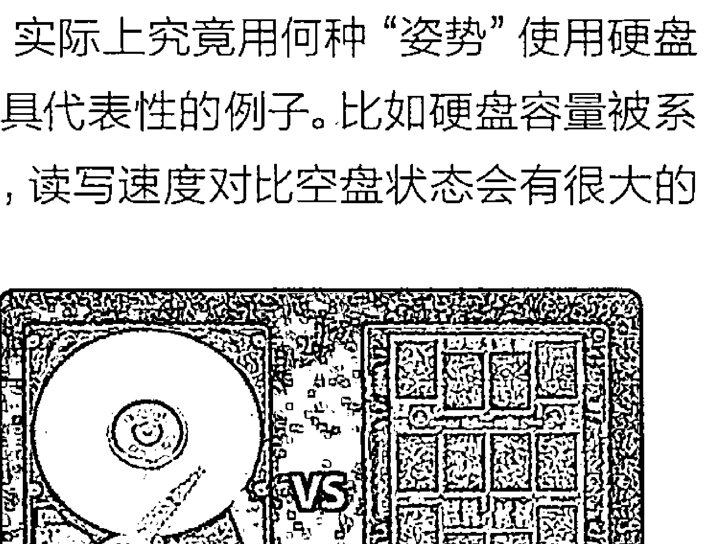

##### 硬盘占用与速度

硬盘占用问题不能单独看容量，很多时候硬盘速度变慢并非简单的容量被占满导致。硬盘在安装了操作系统、大型游戏后会产生数不清的小文件，同时在日常使用和游戏时系统和游戏程序还会不断产生新的小型碎片文件，正是这些像碎片一样的小文件在影响硬盘的速度，并非单纯的容量占用(图2)。HDD的读取方式是使用磁头在盘片上像“大海捞针”一样找寻数据的，如果碎片文件过多，硬盘速度就会变慢，而并非容量问题。一块崭新的HDD，在安装好系统作为系统盘后的速度，要比作为从盘存储电影时的速度慢10%~20%。实际上作为从盘时用于存储电影所占的空间远比一个操作系统所需的空间大，但由于文件较大，数量并不多，远没有一个操作系统带来的大量零碎文件来得夸张(图3)。

但这种情况在SSD上就有了一定的差异。首先SSD的读写方式与HDD彻底不同，利用主控来寻找闪存颗粒上内容的方式也避免了HDD磁头那样的物理运动，速度方面很有保障。不过闪存颗粒虽然带来了速度优势，但如果SSD的容量接近满负荷，闪存颗粒的性能就会下降，这也是SSD与HDD根本上的不同点之一（图4）。

总结一下，在HDD上影响硬盘速度的并非容量而是日积月累出来的碎片化小文件，而SSD虽然不怕碎片文件，但容量过满确实会影响闪存性能。

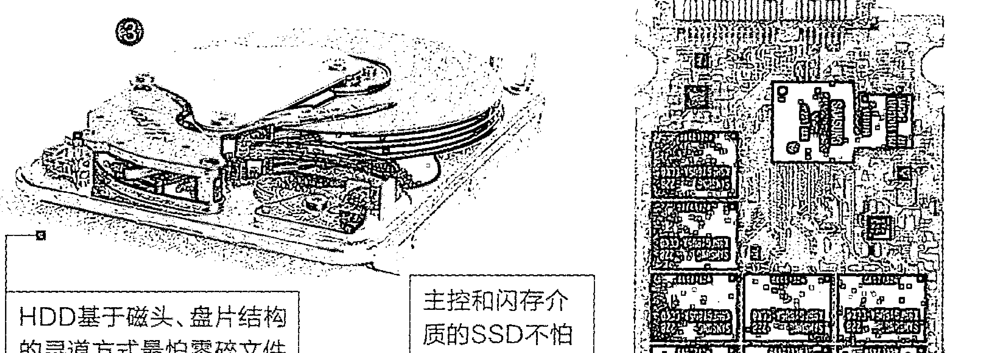

##### 扩展阅读 SSD与Trim功能

SSD之所以有远远高于传统HDD的读写性能，除了它采用了完全不同的结构外，还在于它提供了一种新型的文件删除方法，即Trim。该方式可大大地提高文件的删除速度，同时还会自动整理硬盘空块，从而保证硬盘有良好的读写性能。目前Windows 7/8操作系统已提供了对Trim的支持，不过XP或者更老版本的系统就不能自动使用Trim。那么在这些系统中我们又该如何启用Trim功能呢？答案很简单，我们可以利用TrimSSD工具来实现（下载地址：http://dl.pconline.com.cn/download/851415.html）。这是一条绿色工具，解压后双击其中的TrimSSD.exe文件即可运行（图5）。程序运行之后，在主界面中单击TRIM按钮左侧的下拉箭头，在出现的菜单中选择好SSD对应的盘符（图6），然后单击TRIM按钮，程序即会在下次系统重启后自动对SSD进行Trim操作，是不是非常方便？需要注意的是，TrimSSD仅支持NTFS文件系统，暂不支持FAT32。

##### 分区与否的争论

硬盘是否应该分区不能一概而论，而硬盘分区以后是否会造成性能下降，也需要具体情况具体分析。随着应用程序和视频文件的体积越来越大，我们硬盘的容量明显已经不够用了。很多用户电脑里都不止一块硬盘，甚至笔记本电脑用户都拥有多硬盘。比较常见的使用方式是将一块性能强的硬盘作为主硬盘，其中操作系统安装在这块硬盘上，而其余的硬盘作为大型游戏文件安装或者存储高清电影使用。在这种情况下，其实就没有分区的必要，存储和系统已经通过硬盘清晰地区分开来（图7）。

使用环境结合来分析。比如现在很多用户已经开始使用Windows 7/8这样的操作系统，此时如果没有特殊需求，整个硬盘在安装时划分成一个整体就可以了。除非用户非常频繁地使用P2P下载、或者需要经常性重装系统，否则都没必要分两个及以上的分区。现在重装系统不需要先格式化，Windows 7/8原版干净的系统自动还原和自动修复启动都是很方便的功能，像XP那种系统出问题就重装已经是历史了。

在一些小容量SSD上其实更没有分区的必要，如果分区会加剧SSD被填满的速度，直接影响SSD读写速度。

如果用户还在用单硬盘，就要和


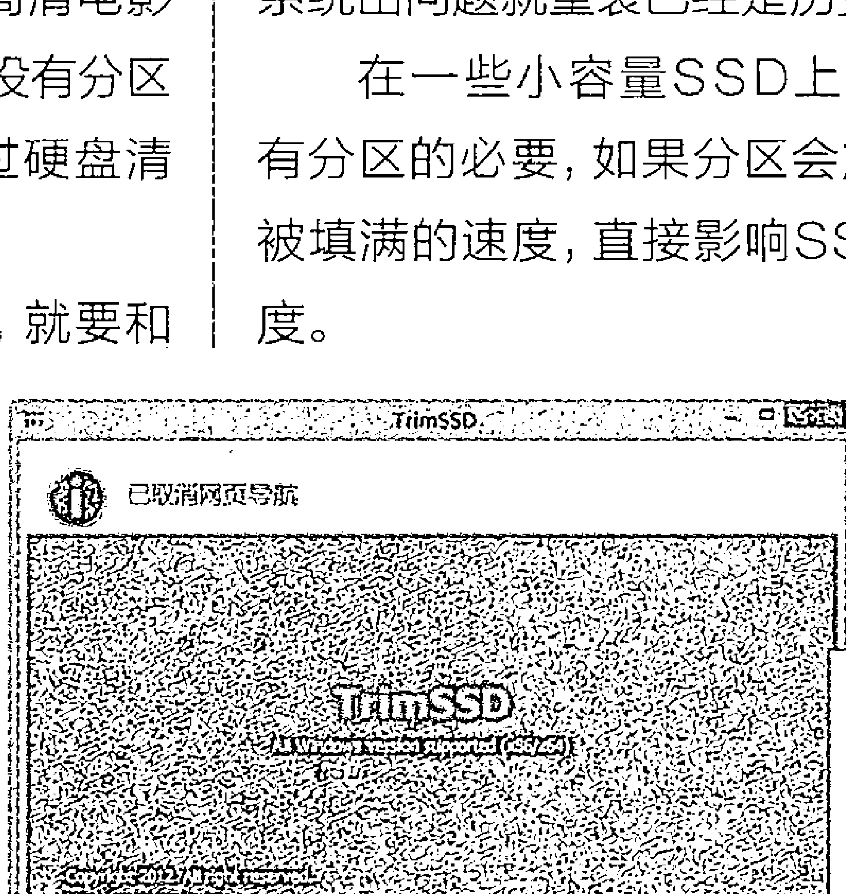


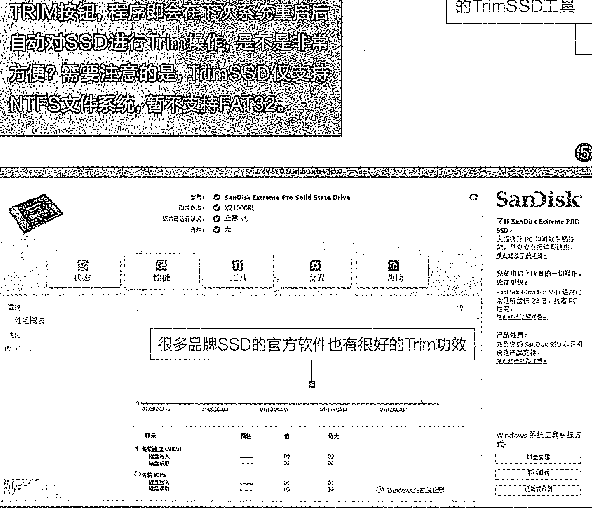

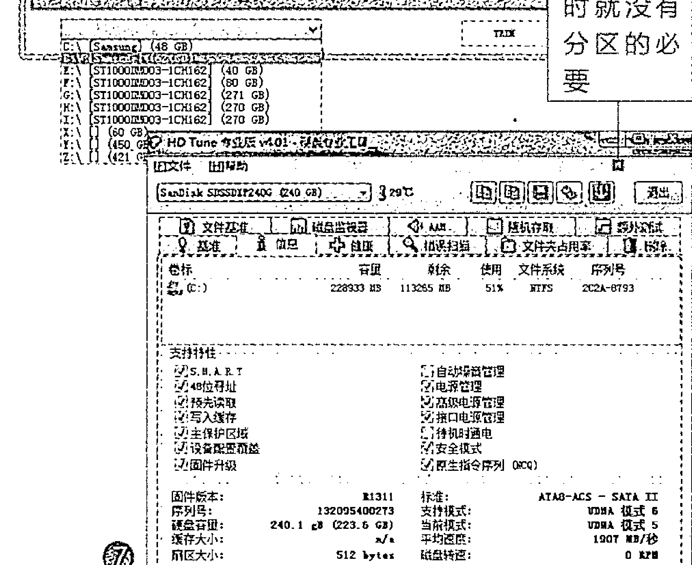

小知识
使用Windows 7原版镜像安装过系统的用户都知道，自动分区后在C盘之前会有一个100MB大小的隐藏分区，这个分区是做什么用的呢？这其实是一个引导Boot分区，用于全盘加密时引导和存储引导文件的。如果我们在安装系统之前硬盘已经分区格式化完毕的话，这部分就会出现在C盘当中。一般来说建议单独放置，不要放在C盘更为合理（图8）。

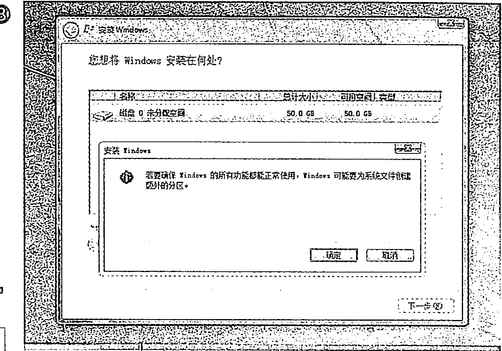

提示的“为系统文件建立的额外分区”其实就是存储引导文件用的

### 移动设备的“舌尖论战”

随着智能手机和平板电脑的普及，昔日那些在PC领域熟悉的口水论战声音，也被吸引到“移动（设备）战场”，并不时在网络上挑起玩家们的论战。这里我们就来剖析几种常见的“舌尖论战”。

#### 内存大小决定Android系统版本？

##### 系统版本与内存的“潜规则”

在很多人的印象中，Android系统版本越高也就越“吃内存”。曾经256MB内存就足以玩转的Android 1.x时代（图1），512MB就能在Android 2.x时代“横着走”，而到了Android 4.x时代后，没有1GB内存貌似就“跑不动”了。而Android系统版本与内存容量之间的“潜规则”，也成为了很多手机厂商拒绝为旗下老产品提供后续系统升级服务的理由：“因内存容量太小，所以该机型无法更新最新Android系统。”
难道，Android版本真的就是决定内存大小的“源头”吗？

随着Android系统版本的更新（从Android 1.x~4.x），Android手机的内存容量也在不断的翻番中。从最早的192MB到最新的3GB，16倍的数值变化在彰显科技的进步之余，也潜移默化地给消费者灌输了一种信息：Android系统版本与内存容量成正比。那么，这个观点正确吗？

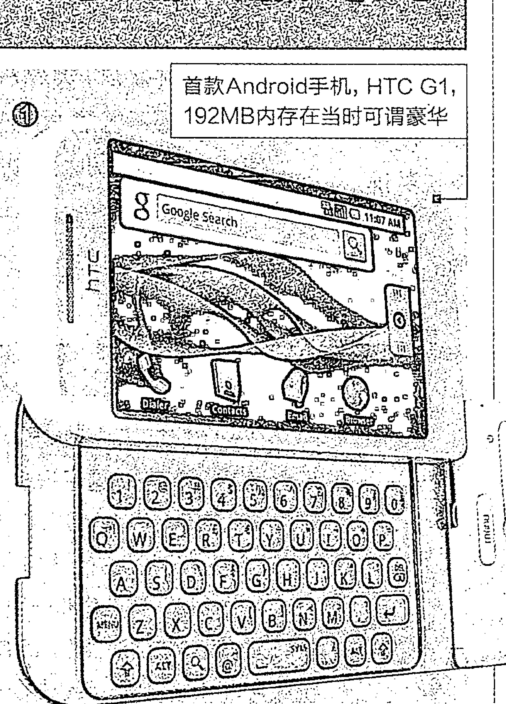

##### 抛开系统谈内存都是“耍流氓”

还记得谷歌在2013年发布Android 4.4时的最大卖点吗？引入全新ART机制的Android 4.4经过大幅优化，将最低内存的门槛降低至512MB。如果将此卖点“反推”，不难得出以下结论：“Android 4.4”以前的系统没有1GB内存根本玩不转。
很遗憾，这个观点根本就不成立！

以诺基亚旗下首款Android手机Nokia X为例（图2），该产品仅内置512MB内存，但它除了跑不动少数3D游戏以外，绝大多数APP都可运行，而且Nokia X系统反应也很流畅，丝毫没有“小牛拉大车”之感。要知道，Nokia X的系统版本仅仅是基于Android 4.1.2操作系统的开源修订版本，并非谷歌专门针对512MB小内存优化后的Android 4.4！

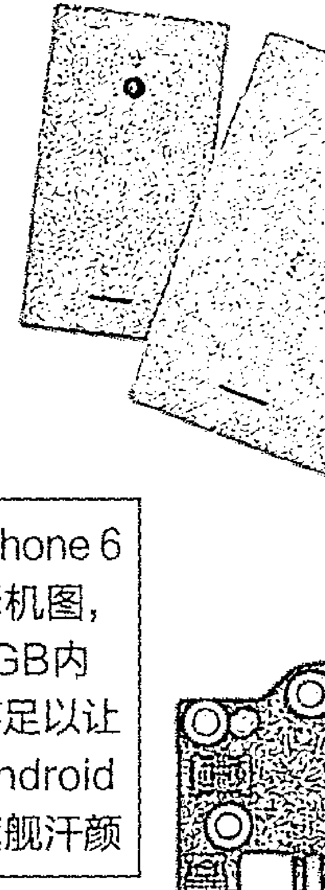

作为智能手机的标杆，苹果iPhone家族更是给系统版本与内存容量的“潜规则”扇了一个大巴掌。哪怕是最新的iPhone 6/Plus旗舰，它们的内存容量也仅有1GB（图3）！但其系统流畅度与大型游戏体验依旧可以秒杀那些武装3GB内存的Android旗舰们。这就是现实：理论上，系统版本与手机容量没有半毛钱关系！

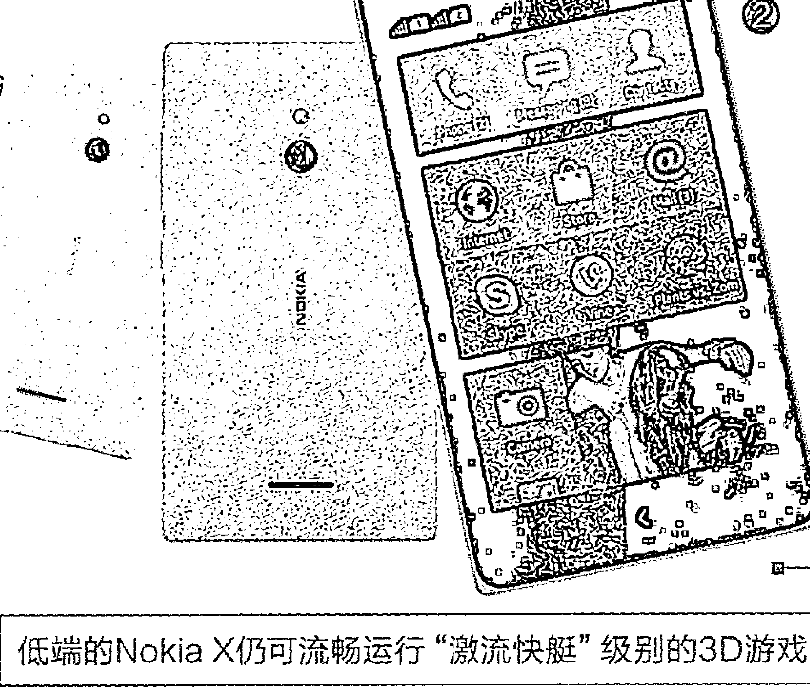

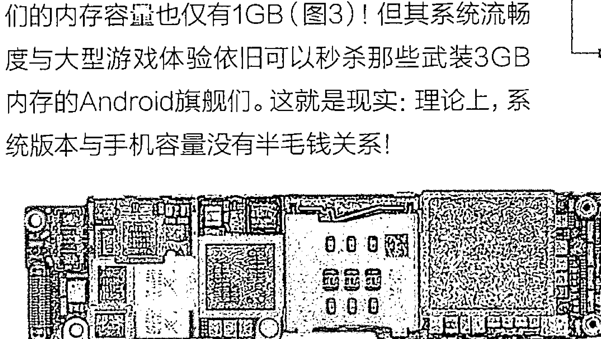

> 小结：Android系统版本和内存大小也有些关系，但还算不上“爱定”。如果你正使用那些“被手机品牌官方抛弃”的旧机型，不妨多留意一下手机对应的第三方ROM资源，说不定也能享用上最新的Android系统版本。至于内存容量可能不够的“过渡”问题，就到这后聊。

#### 取决于厂商的态度

我们不妨再回顾一下HTC G7（576MB内存，2010年上市）和摩托罗拉Defy（512MB内存，2011年上市）这两款“老产品”，它们都可以借助第三方ROM开发者，升级到最新的Android 4.3或4.4（图4）。换句话说，Android系统的新版本对“老产品”并没有关闭大门，只要肯投入时间和精力，老产品们也有机会享用最新的系统，哪怕它们的内存低至512MB。

#### 内存越大Android卡顿的几率越小？

步入2014年之后，新款Android手机要是没有配备3GB内存都不好意思叫“旗舰”。因此，很多消费者也习惯通过内存大小来判断某款手机的性能。比如，配2GB内存的手机性能就一定比1GB内存的手机强，运行也就更流畅，不易出现卡顿。事实果真如此吗？

而这也是Android老产品的悲哀。几乎所有的手机品牌，基本只能为旗下手机提供为期1年左右的系统升级服务（少数旗舰产品除外）。“想体验最新的Android系统版本？没关系，买我们刚刚推出的新品吧！”通过掐断老产品的系统更新脉络来刺激预装新版系统的新品销售，这就是手机厂商最喜闻乐见的情景。还好，我们还有一批热衷于分享精神的第三方ROM开发者和团队，比如CyanogenMod（全球最大的Android第三方编译团队），很多老产品从Android 2.x到4.x，都是依靠CM团队的支持而一路走来的。

##### 了解Android内存的机制

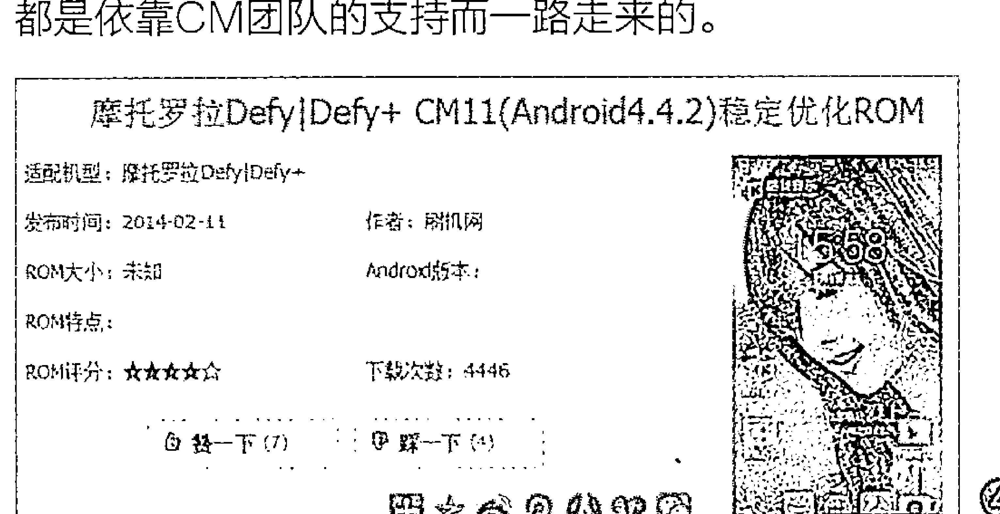

“一款配2GB内存的Android手机，当2GB内存完全占用之后就会卡死”，这是很多Android手机用户的潜在认知。于是，很多用户总认为需要不停地优化内存才不会卡顿。实际上，这个观点理论上并不严重。

Android系统自身有一套成熟的内存管理机制，我们可以将其理解为“末位淘汰”。简单来说，Android系统会将所有系统级APP（如时间、系统输入法）和第三方APP（如微信、游戏）都按照优先级分组，并放置在不同的“盒子”里。系统在运行时，会优先保证处于“前台盒子”（即你正在使用的应用）和“后台盒子”（如系统服务）的应用有足够的内存。当内存资源告急时，系统会根据优先级从低到高回收“盒子”里的应用内存，这个过程被称为“进程终止”。因此，即便2GB内存被完全占用，也并不意味着系统会立刻卡顿。系统会在需要时，自动清理掉那些暂时不用、优先级较低的应用内存，以保证当前操作流畅。所以，理论上内存越大，系统可以同时容纳的应用就越多，切换应用时重新加载的概率就越小，但这并不意味着小内存就一定会卡顿，关键还在于系统优化和应用本身的内存占用情况。

纠正明显的OCR错误，如形近字混淆、标点错误、数字/字母误判。将跨页的连续段落正确合并，不保留分页标记。根据语义和缩进/编号特征，识别标题，用## 表示一级标题，用### 表示二级标题。列表项用- 开头。恢复正常的段落缩进，用空行分隔不同段落。如果出现表格样式的文本，将其转换为Markdown表格。

戏)进行优先级排序，当剩余内存不足以满足当前启动程序的运行要求时，系统便会自动关闭优先级靠后的那些APP和相关进程。

利用一些第三方优化软件提供的“一键清理”(图5)，虽然可直接清空所有驻留后台的程序，但这样做会造成无法再接收聊天消息，并导致程序二次启动的时间延长。在“末位淘汰”机制下有些得不偿失。

##### 无需用户干预的“末位淘汰”

举个例子，你的手机正同时运行着微信、微博、QQ、美团、淘宝、京东、天气这7个APP，此时内存占用率为80%。当你想玩“真实赛车3”游戏时，在你点击该游戏图标的一瞬间，系统就会自动判断运行“真实赛车3”需要的内存资源。比如该游戏需要60%的内存，根据“末位淘汰”机制，像美团、淘宝、京东、天气这几个非即时通讯的APP就会自动被关闭，然后才会正式启动“真实赛车3”这款游戏。

因此，当我们退出某款游戏后，按Home切换到后台运行程序时(图6)，有时会还原到之前的窗口状态，但有时该程序则会重新启动。而后面的情况，就是系统为了保证游戏运行，自动关闭了后台运行的这个程序，将释放的内存用于游戏的启动上了。

换句话说，Android手机理论上是不存在“内存用完”的状况的，因为Android内存管理机制总会通过自动关闭后台的末位进程，来确保手机总有足够的内存去满足新启动程序的运行需求。更大的内存可以减少程序打开时等待的时间，提高程序间切换的效率，但对改善游戏或程序运行的流畅度意义不大。那么，Android手机在运行过程中的卡顿甚至卡死状态到底源于何处呢？

> 小提示
> 
> 笔者着重介绍了Android内存管理机制，但并非否定内存容量的重要性。由于Android手机的SoC(处理器)集成的GPU并没有独立显存，所以需要借由一定容量的内存用于虚拟GPU显存。所以，除了系统本身和APP以外，手机分辨率越高，对内存的依赖也就越大。因此，对1080P/2K手机而言，2GB/3GB内存还是很有必要的(图7)。而更大的内存意味着手机有更多的冗余，去满足同时运行更多APP的条件。

很多手机或软件都提供了一键清理内存的小插件，可自定义白名单

Android通过长按Home键可以在后台程序间切换

##### Android为什么会卡顿

在绝大多数情况下，Android手机的卡顿是和内存无关的。而卡顿现象的产生，则主要体现在“先天”与“后天”两个方面。

###### “先天”的卡顿

所谓“先天”，就是源于硬件端性能不够给力造成的。先给大家普及一个技术原理：1080P屏幕(1920×1080像素)拥有207万个像素点。理论上，每100万像素需要4GB/S的内存带宽(和内存容量无关，取决于处理器所支持的内存带宽参数)才可确保100%流畅。按照这个标准，唯有骁龙800级别的处理器(内存带宽为12.8GB/S)才可完美驱动1080P屏幕。很多搭载联发科MT6592八核处理器(内存带宽为5.3GB/S)的手机虽也配备了1080P屏幕，但由于它仅能给每100万像素分配2.56GB/S的带宽，自然怎么优化都会略有卡顿感，哪怕你给它武装4GB内存也无法弥补源于处理器的先天缺陷。

同理，2K屏幕(2560×1440像素)的像素点达到384万，现阶段只有高通骁龙801(14.9GB/S)的内存带宽才可满足流畅驱动的标准(图8)。

###### “后天”的卡顿

所谓“后天”，主要体现在系统端和第三方APP端的优化与设置上。换句话说，“后天”就是“人祸”。Android手机在使用上的卡顿则体现在两个环节：启动器(Launcher)与程序自身(APP)。

###### 启动器

小米的MIUI、魅族的FlymeOS、OPPO的Color OS、酷派的Coollife UI，这些“由Android系统深入定制的OS”，其实都算是“第三方启动器”(图9)。本来，Android在步入4.2版本之后，通过“动画过渡”和“黄油计划”，其原生启动器在流畅度上足以比肩iOS了。可惜，很多第三方启动器只顾华丽的界面和特效，最终导致了流畅度的不足，至少笔者还没遇到任何一款第三方启动器在流畅性上能超越原生启动器。

###### 程序自身

Android系统本来捆绑着日历、邮箱、地图、商店等APP，但手机厂商往往喜欢将它们“阉割”，用自主或第三方开发的类似APP替换(图10)。那么，你觉得这些替换的APP能有原生的APP优秀吗？

谷歌在Android 4.x时代推出了Holo规范，由此规范开发的APP可享受GPU加速等一系列特性，获得更佳的流畅度并降低CPU占用率。可惜，Holo规范并非强制标准，很多开发者为了确保与Android 2.x设备的兼容性，依旧沿用了Java开发规范。Java开发的APP在Android 4.x中流畅度受限，而Holo在Android 2.x中也普遍遭遇卡顿崩溃现象，这种因开发规范引起的卡顿，也是值得引起我们关注的。

最后就是“潜规则”引起的问题了。为了盈利，很多APP都开放了各种推送服务，哪怕你已关闭了某个软件，但它依旧会在后台留有进程并自己搭建推送服务，成为占用系统资源、耗费无辜电量的“蛀虫”。

> 小结：很多Android手机用户会将卡顿或不流畅问题归咎于内存，而本章的目的就是想帮大家纠正这个误会。Android的卡顿现象更多的时候还是源于系统本身的优化，以及各种后台APP对系统资源的争夺。想彻底告别卡顿，选择高性能处理器平台(如骁龙801)与合理分配屏幕分辨率的组合远比追求大内存更有意义，而对内存大于2GB的手机而言，更没必要不停地优化内存。

#### 安全、清理软件到底有没有意义

很多Android手机用户都喜欢安装类似360手机卫士、LBE安全大师一类的APP，并经常用其提供的“一键加速”优化内存，或者“一键清理”删除垃圾文件。那么，这些所谓的加速和清理到底有没有意义？

##### 理性看待一键内存优化

前文我们已经介绍过，Android系统有着成熟的内存管理机制，而APP所提供的内存优化，实际上就是强制关闭所有后台运行着的程序(白名单除外)。问题是，无论手机当前可用内存是500MB还是1GB，只要手机运行流畅，这些数字又有什么意义(图1)？反正当系统内存吃紧时，Android会根据“末位淘汰”机制自动释放内存。

此外，一款不包括推送、定时更新等功能的“绿色APP”，当它被切换至后台运行时是不会浪费电力和CPU资源的，它们只是以Process(进程)的形式保存在RAM内存存储器中(图2)。当它们被内存优化功能强制关闭后，再次开启时反而会浪费更多的电力和CPU资源。换句话说，剩余内存的数值越大，最多是让你“看着很爽”，对手机的系统流畅度的影响不大。Android内存管理是高效的，内存空着不用才是浪费。

##### 扩展阅读 一键优化内存功能的意义

当然，内存的一键优化功能并非毫无意义。有些存在Bug的APP可能存在“内存泄露”问题：APP运行时间越长，其所占用的内存会无限制地增长，最后导致系统瘫痪(卡死)。当我们不知道是哪个APP出现了问题时，用一键优化内存功能进行无差别的“全盘清理”，从而强制关闭问题APP，让系统恢复流畅。

##### 一键清理的真是“垃圾”吗

由于手机内置的存储空间有限，很多用户总喜欢用安全类APP的“一键清理”功能删除无用文件。很遗憾，Android系统自身和APP并不会产生太多的“垃圾”，充其量产生日志文件及联网缓存文件(图3)。而安全类APP为了彰显“一键清理”功能的强大，会将APK安装包、离线地图等文件也归类到“垃圾”行列。看起来能帮你清理出GB级别的空间(图4)，但真的将它们全部删除，在导航时就要重新下载地图文件，看新闻客户端时还需重新下载图片，误删APP后需重新下载APK安装包……结果往往是浪费流量。

#### 小结

总之，要理性看待安全类APP的内存优化和垃圾清理功能。比如系统明显卡顿时再优化内存，存储空间不够时再清理垃圾，不要毫无意义地频繁使用这两种功能。对安全类APP来说，联网防火墙、自启动程序管理、权限管理才是真正有意义且实用的功能。

### 让手边的设备极致起来

百科中对“极客”的解释是，这个词源自美国俚语“geek”的音译，含有智力超群和努力的语意，常被用于形容对计算机和网络技术有狂热兴趣并投入大量时间钻研的人。不过现在极客的含义已有很大的不同，它不再倾向于“钻牛角尖”的贬义，而是代指尖端时尚、敢于创新、追逐潮流的一群人。在IT业界，电子设备高度同质化后，总有用户希望自己能够独树一帜并为此花费大量心血。为什么要花时间和精力去让自己的设备与众不同？如何着手让设备更具“逼格”？最终能够实现一个什么样的效果？我们每天都在打交道的系统、软件，如何挖掘出它们的另类功能？就让我们一起来变身为“极客”，将手中的软件、硬件、移动设备的潜能发挥到极致吧！

#### 无需等待 Windows 8.1“变身”Windows 10

文 | 俞木发

大家知道，微软最近发布了Windows 10技术预览版(以下简称为Windows 10)，新系统针对Windows 8.1的不足进行了多项改进。不过这毕竟是技术预览版，贸然安装可能会带来不必要的麻烦。实际上，Windows 10的很多新特性借助第三方软件在Windows 8.1上就可轻松实现。下面看看如何将Windows 8“变为”Windows 10。

##### 外观改变 Windows 10模仿秀

要想让Windows 8看上去像新系统，外观的模仿必不可少。要模仿成新系统，我们可以对锁屏图片、主题和系统属性进行改造。

- 1. 使用Windows 10主题
  Windows 10和Windows 8使用相同的核心，只要在Windows 10电脑上导出主题，应用到Windows 8上即可。到 http://suo.im/zbpwu 下载Windows 10主题，直接运行即可看到Windows 10默认主题了，看看桌面是不是和Windows 10类似(图1)？

> 小提示
> 
> 由于Windows 8.1支持自定义锁屏图片，大家还可以自行去下载Windows 10默认锁屏图片，然后将其设置为Windows 8.1的锁屏，这样设置后看起来更像Windows 10。

- 2. 系统属性文字变身Windows 10
  很多朋友都是通过查看系统属性来了解系统版本，我们可以通过手动修改的方法将Windows 8.1改为Windows 10。
  首先到 http://suo.im/tcsql 下载ResHacker，启动程序后打开“C:\Windows\Branding\Shellbrd\shellbrd.dll”文件，接着展开“位图→050→1033”，就可以在左侧窗口看到当前系统的Logo图片。右击图片选择“保存位图资源”，将其复制到桌面备用(图2)。
  因为系统Logo图片需要添加图层才能正常显示，可以将上图导入PS，使用PS新建一个Alpha 1通道，用油漆桶工具将选择的部分涂上白色，将其中的8更改为10。返回ResHacker窗口，右击“1003”选择“替换资源”，然后将修改过的Logo替换到源文件(图3)。
  点击“文件→另存为”，将修改过的资源文件保存为“shellbrd.dll”放置在桌面备用。因为权限的限制无法直接替换系统文件。到 http://pan.baidu.com/s/1pJFOw4N 下载“取得管理员权限.reg”文件，导入注册表后打开“C:\Windows\Branding\Shellbrd”，右击“shellbrd.dll”选择“取得管理权选项”，现在就可以将桌面修改过的“shellbrd.dll”拖到上述窗口替换同名文件。
  接着修改系统版本信息，同上在Reshacker打开“C:\Windows\Branding\Basebrd\zh-CN\basebrd.dll.mui”文件(要在打开类型选择所有文件)，展开“字符串→1→2052”，按提示将右侧版本信息都改成技术预览版，2013改成2014(图4)。
  操作同上，取得“C:\Windows\Branding\Basebrd\zh-CN\basebrd.dll.mui”文件的所有权，再替换同名文件。注销后再次进入系统属性，看看现在你的Windows 8.1是不是变成Windows 10了(图5)？

#### 内在模拟“体验”Windows 10新功能

仅仅是外观的模拟当然无法真正感受到新系统的魅力，下面我们就来介绍如何通过手动设置和第三方软件体验新系统的实际功能。

##### 1. 回归的开始菜单

Windows 10的一个重要特性就是开始菜单的回归，不过Windows 8.1下早已经有许多第三方开始菜单，比如可以使用Start8(下载地址：http://www.iplaysoft.com/start8.html)，运行后即可看到经典的开始菜单(图6)。

##### 2. 任务栏添加搜索

Windows的搜索功能很强大，我们可以随时使用搜索来查找资料、启动程序。因此Windows 10在任务栏添加了搜索按钮，这样任何时候只要点击即可启动搜索。Windows 8.1的用户只要自行安装第三方搜索软件也可实现同样的功能。比如对于金山毒霸用户，启动毒霸后切换到“百宝箱”，然后点击其中的“快捷搜索”，这样即可将搜索工具下载到本地使用(图7)。
快捷搜索安装后默认会在桌面创建快捷方式，现在使用鼠标将“快捷搜索”拖到任务栏固定，这样Windows 8.1就拥有类似Windows 10的搜索功能。以后只要双击Ctrl或者点击即可调出搜索。如果要搜索本地文件，点击“切换到本地搜索”，输入关键字后即可执行本地搜索。具体使用和Windows 10的搜索并无两样(图8)。

##### 3. 窗口化运行Metro应用

在Windows 8.1中默认从开始屏幕启动Metro应用都是全屏运行，由于运行的应用没有最大化、关闭等按钮，这个设计一直让PC用户纠结不已。Windows 10针对这个做出了改进，所有从开始菜单启动的应用可以使用窗口化运行。对于Windows 8.1用户，可以使用ModernMix( http://suo.im/j3f63 )实现类似的功能。
启动ModernMix后对其进行配置，在整体设置中点击窗口化图标，勾选下方的“始终使用该应用程序的最后状态运行”(图9)。这样再从开始菜单启动Metro应用，启动应用就会像Windows 10那样以窗口化运行，拥有常见的最小化、最大化和关闭按钮(图10)。

##### 4. 轻松拥有虚拟桌面

使用Android手机的用户都知道虚拟桌面的好处，多个桌面可以让我们更合理地管理图标。为此微软在Windows 10中增加了虚拟桌面，用户只要点击任务栏的虚拟桌面按钮即可弹出虚拟桌面列表，点击“+”可以添加虚拟桌面数量，也可以在不同桌面上放置图标和运行程序。对于Windows 8.1的用户，借助Dexpot( http://dexpot.de/?id=download )同样可以拥有虚拟桌面，而且功能更强大。启动Dexpot后即可看到默认的四个虚拟桌面，同样可以将程序和图标放置在不同桌面上(图11)。Dexpot的功能更为强大，可以为不同桌面设置背景、分辨率，只要进入Dexpot的设置界面进行自定义设置即可(图12)。

#### 写在最后

从笔者实际安装体验来看，相对于Windows 8.1，Windows 10的改变并不大，而且多个新特性在Windows 8.1中都可以找到替代。由于现在Windows 10仍然是预览版，系统Bug较多，对于希望尝鲜Windows 10的朋友们不妨先利用上述方法在Windows 8.1中体验一下。

### 逆袭变身 普通软件扭转“高大上”

相信每个人的电脑中都安装了各种各样的软件，比如Office办公软件、图形图像处理软件、压缩解压缩软件等，都是平时常用的工具。对于大部分人来说，只知道让这些软件各司其职做好本职工作，却不知道深入挖掘，其实还可以让它们做一些我们意想不到的工作，从而大大发挥它们的潜能，更好地为我们的工作、生活、学习服务。下面，就让我们来看看平时常用的那些软件，还能发掘出什么样的“特异”功能。

#### 剑走偏锋 扩展压缩软件非主流功能

现在压缩软件已深入系统文件的底层，这样它们就可以执行一些常用软件无法执行的操作，比如用它们来进行文件管理，甚至可作为杀毒的利器。

##### 火眼金睛 变身文件管理利器

有些人喜欢用一些伪装系统文件夹的方法来隐藏文件，比如将某文件夹命名为“网上邻居.{208D2C60-3AEA-1069-A2D7-08002B30309D}”，这样在资源管理器中看到的就是“网络(WORKGROUP)”，我们将无法看到隐藏在其中的文件。不过这样一来，也给自己的访问带来不便（图1）。

其实这些伪装手段只能迷惑常见的文件管理器，而压缩软件已经深入系统文件的底层，通过WinRAR、7ZIP之类的压缩软件就可以让这类隐藏文件快速现身。这里以7ZIP为例，启动7ZIP后定位到上述隐藏文件夹，可以看到该文件的实际名称仍然为“网上邻居.{208D2C60-3AEA-1069-A2D7-08002B30309D}”，展开即可看到其中被隐藏的文件，在这里可以对其进行复制、粘贴等常见的操作（图2）。

同样，对于其他特殊文件，比如受保护的系统隐藏文件，默认情况下我们只有在文件夹选项中，设置显示隐藏文件和取消受保护操作系统文件前的勾选，这样才能看到隐藏的系统文件。不过这样的设置，很容易导致重要系统文件的误删。如果只是临时要查看或者编辑这些隐藏的系统文件，比如备份C:\boot\bcd文件，无需对文件夹选项进行设置，直接启动7ZIP后定位到C:\boot，选中其中的bcd文件，右击选择“复制到”，将其复制到其他位置保存即可（图3）。然后你就可以对其进行编辑操作了。

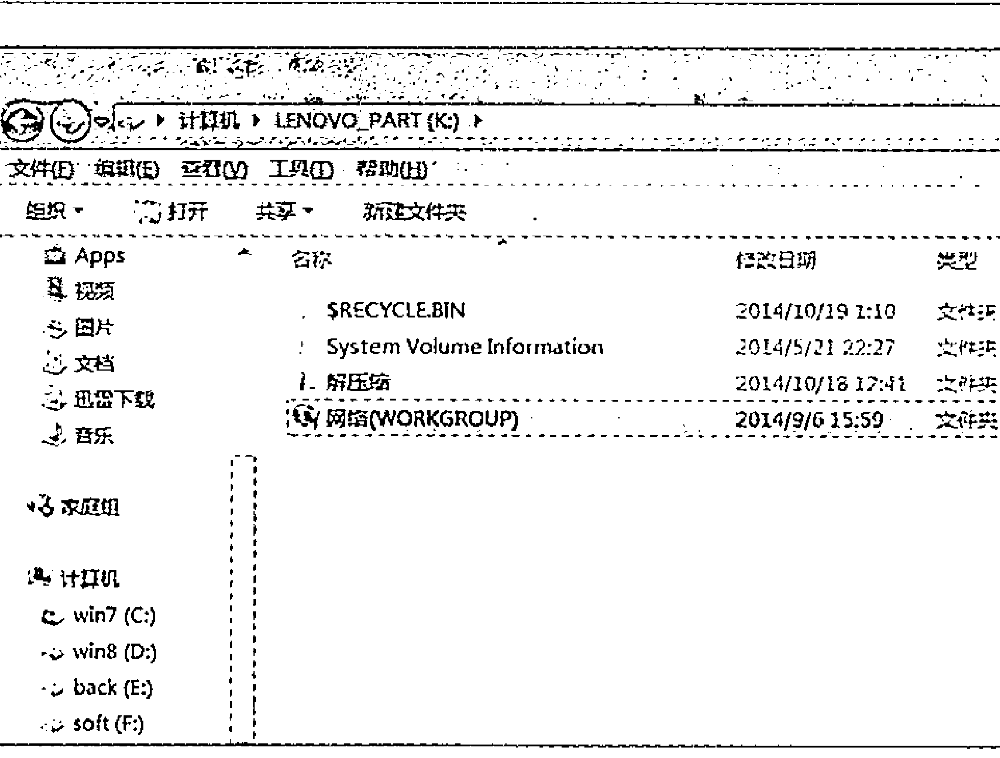

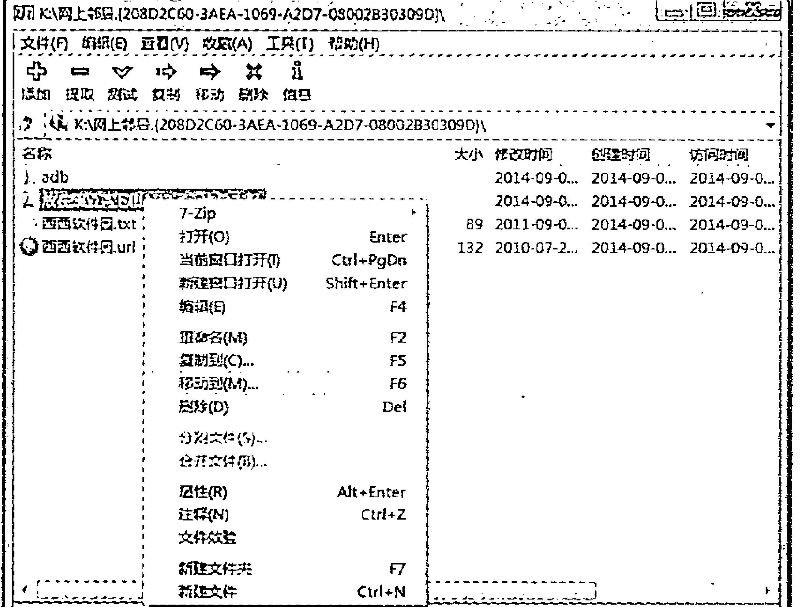

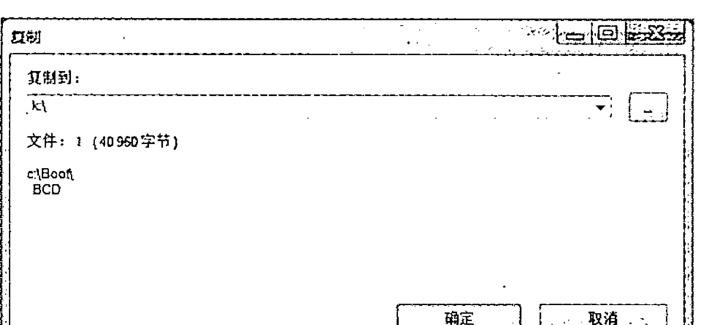

###### 小贴士

####### 更多文件管理功能

除了以上常规的文件管理功能外，还可以用压缩软件来管理回收站的文件。比如默认情况下误删文件后我们会到回收站去查找，但回收站不支持直接打开文件和被删文件夹，这样如果回收站中有类似的误删文件，就只能将其恢复后查看。7ZIP等压缩软件则可以打开回收站，并在其中直接打开误删文件（夹），省去要先恢复再查看判断的不便（图4）。

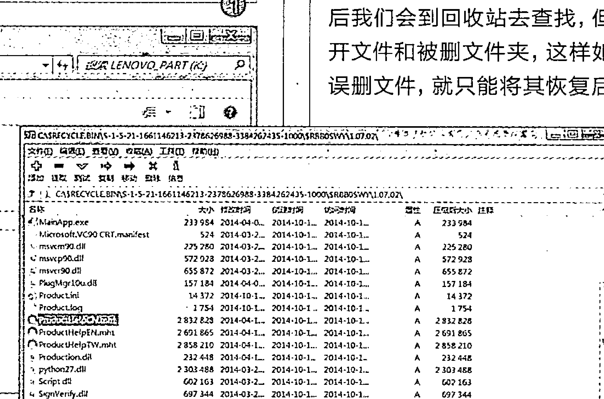

##### 查杀病毒 变身手动杀毒利器

现在一些顽固病毒为了躲避查杀，经常会将自身保存在特殊目录下，常规的杀毒软件或者文件管理器经常无法找到，或者找到后也很难删除。利用压缩软件深入系统文件底层的特点，通过它们即可删除顽固的病毒文件。

上网感染的一些病毒经常藏身在“C:\Users\当前用户\AppData\Local\Microsoft\Windows\Temporary Internet Files\Content.IE5”下的子目录中，虽然很多杀毒软件可检测到该位置的病毒，但却常提示无法删除干净。且使用资源管理器打开上述目录无法发现任何文件，给手动删除病毒带来麻烦（图5）。

对于这类特殊目录里的文件，借助压缩软件可以轻松查看，因为其中的文件只是上网缓冲文件，如果发现病毒可将文件全部删除。启动7ZIP后定位到上述目录后，可看到“Content.IE5”下还有许多类似“FWL054AS”字样的子目录，病毒就是藏身于这些子目录中，现在按提示选中这些子目录（删除前将IE等浏览器关闭），点击“删除”即可（图6）。同样的，病毒还经常藏身于“System Volume Information”、“C:\Recovery”这类特殊账户（SYSTEM）才能访问的目录中，对于这些目录也可使用压缩软件进行访问。不过由于权限的限制，我们需要让7ZIP以SYSTEM身份运行。

首先到http://suo.im/u1dln下载PsExec，下载后将其解压到系统目录备用。以系统管理员身份启动命令提示符，输入“PsExec -i -d -s "C:\Program Files\7-Zip\7zfm.exe"”（不含外侧引号），这样就会以SYSTEM身份启动7ZIP（图7）。启动7ZIP后，打开任务管理器可看到目前7ZIP运行的账户就是SYSTEM，也就是它具有了SYSTEM权限，能够直接访问原来只有SYSTEM账户才有权限访问的目录（图8）。

现在再定位到“C:\System Volume Information”，已经可以直接在7ZIP窗口中访问上述目录了，打开该目录后按提示将病毒文件删除即可（图9）。当然，使用同样的方法可以用7ZIP访问一些原本没有权限访问或者删除的文件，因为权限是可以继承的，这样启动的压缩软件具有极高的SYSTEM权限。

> 小提示

上述代码中“C:\Program Files\7-Zip\7zfm.exe”表示运行指定压缩软件，如果不知道压缩软件具体名称，只要手动启动压缩软件，然后打开任务管理器查看即可获知压缩软件进程名。

> 小技巧

在查杀病毒时还经常需要删除注册表中病毒对应的键值，因为PsExec可以让程序以SYSTEM身份运行，我们可以使用同样的方法启动注册表编辑器（输入“PsExec -i -d -s c:\windows\regedit.exe”），这样一些原本只有SYSTEM才有权限访问的键值，如[HKEY_LOCAL_MACHINE\SAM\SAM]，现在就可以直接访问，并且可以删除病毒在这些位置创建的键值了。

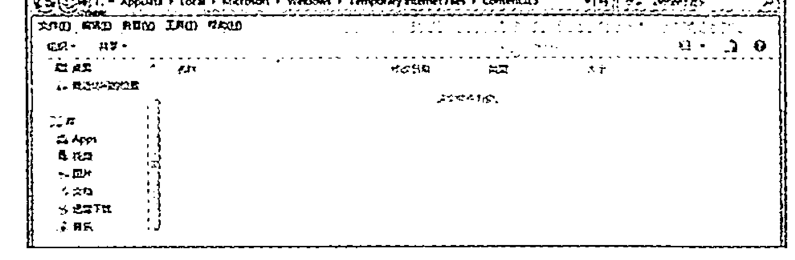

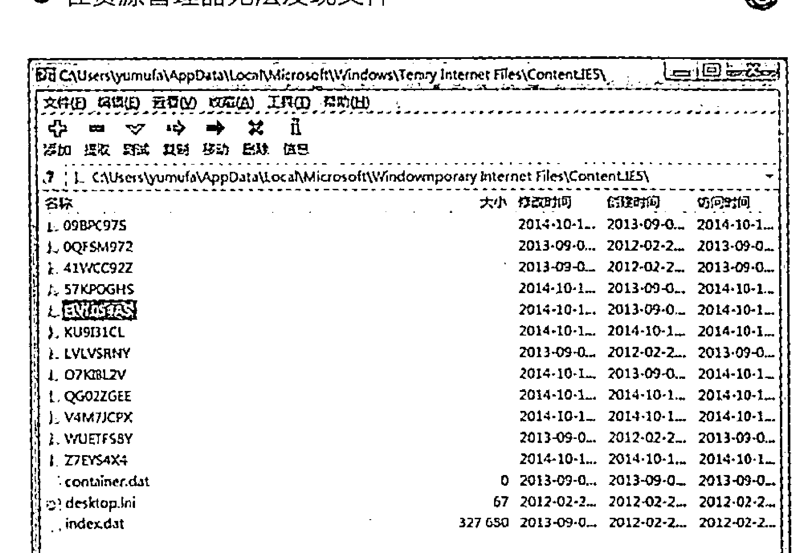

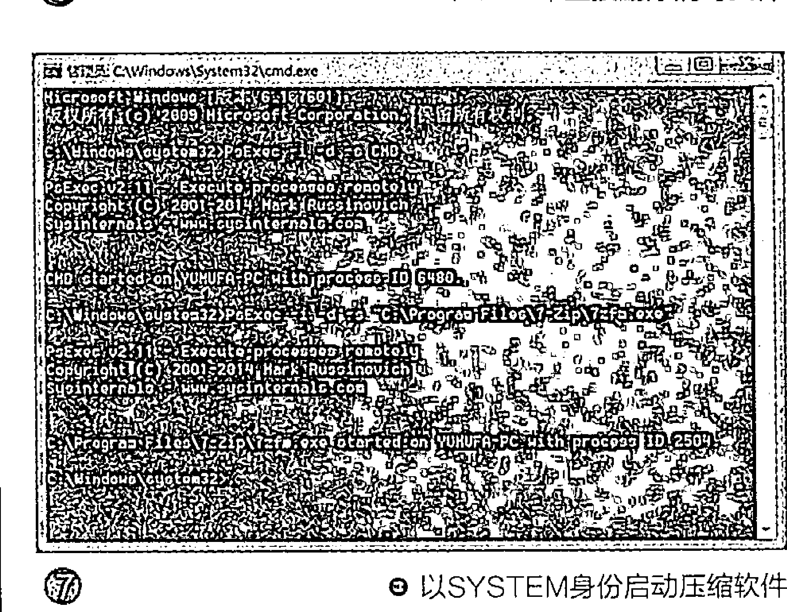

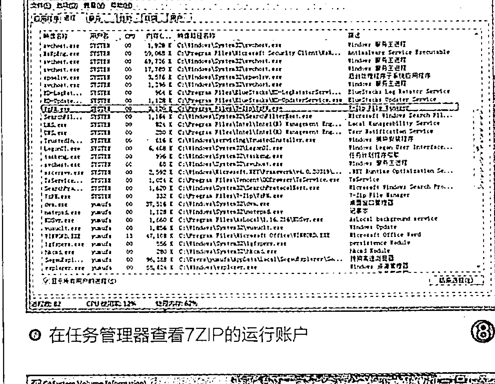

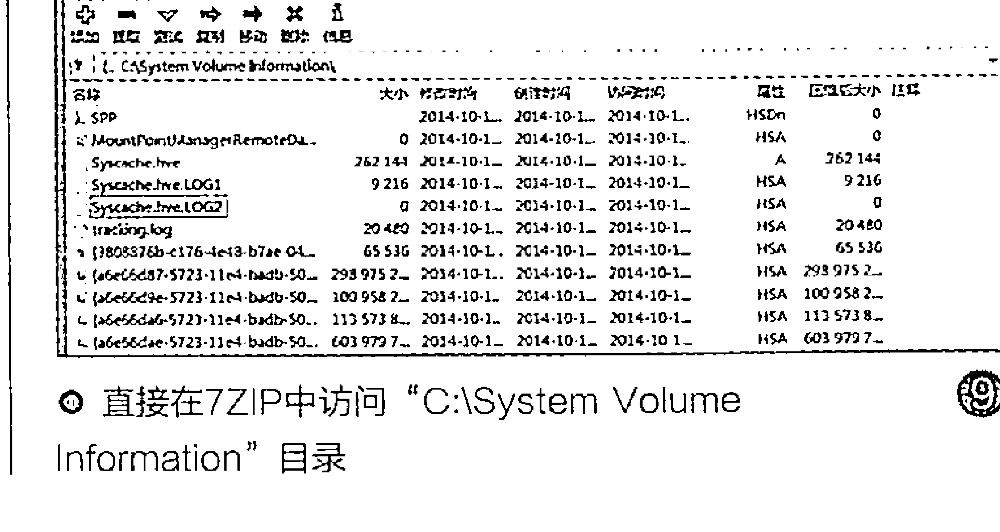

### 尖端时尚

#### 行走在DIY潮流前线

PC一直是尖端技术最先试水的平台，PC也是目前IT产品高度集成化之后仅存DIY的领域。在这里我们可以领略最新最尖端的技术，也可以打造最具“逼格”的使用体验。

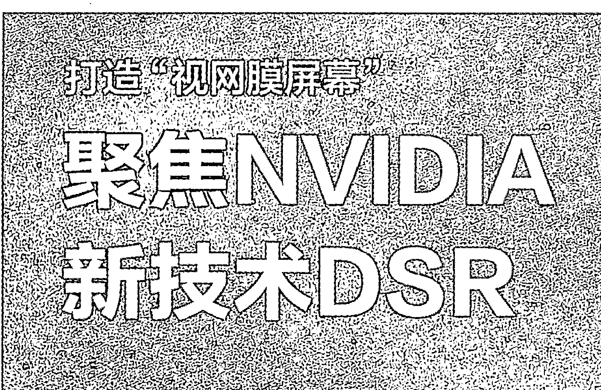

智能手机iPhone 4开始使用Retina Display“视网膜屏幕”，苹果在一块3.5英寸的小屏幕上实现了960×640的物理分辨率，每英寸像素数（PPI）高达326，在最新的iPhone 6 Plus上这一数值更达到401。与现在的手机比起来，我们的显示器实在是太落后了，有没有办法实现类似手机上那样的像素密度？NVIDIA的新技术没准可以帮到你。

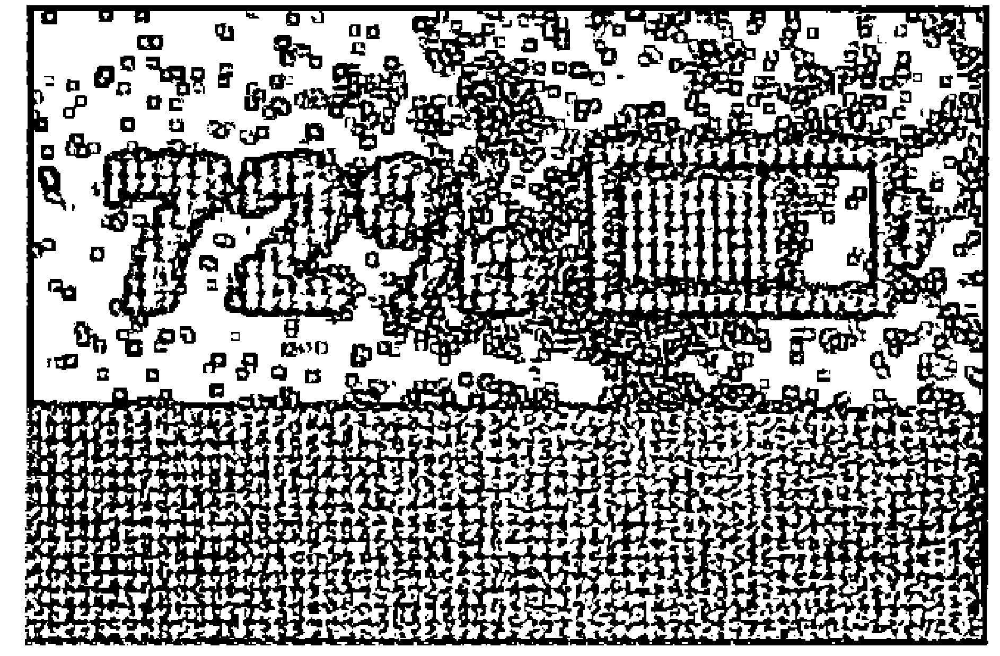

##### PPI与游戏锯齿

可能有人对目前手机过高的分辨率嗤之以鼻，对于手机来说，过高的分辨率肉眼根本无法识别，还会徒增屏幕的电量消耗，得不偿失。但对于电脑显示器来说就完全是另外的情况，以台式机为例，目前主流的尺寸是24或27英寸，主流分辨率依然是1920×1080。对比目前一些手机已经达到的2560×1440来讲实在过于落后了，肉眼很容易就能分辨出显示器屏幕上的像素点。

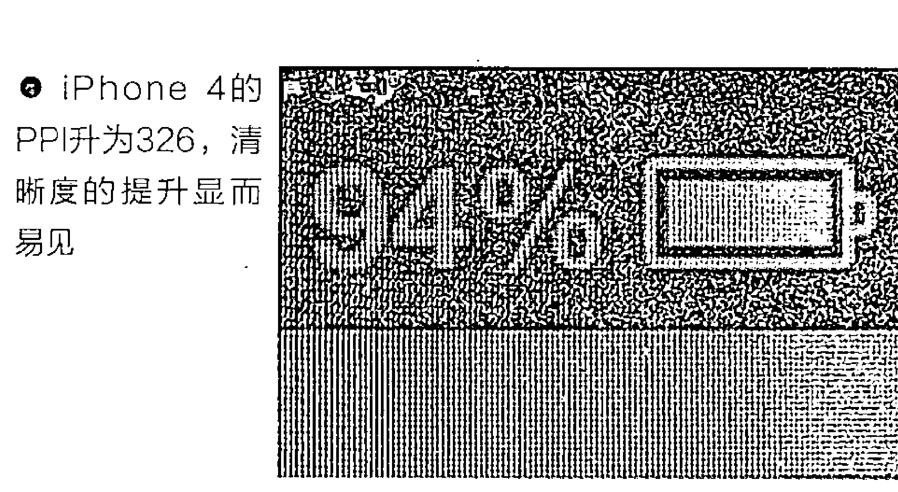

另外，自从3D游戏诞生的那一天起，3D游戏内容的锯齿就在不断困扰着玩家，如何减少锯齿也是游戏引擎与显卡不断前进的重要动力之一。但不少游戏的抗锯齿技术（xxAA）并不是很给力，效果不好而且效率低下，徒增了显卡压力却没有收到应有的效果。

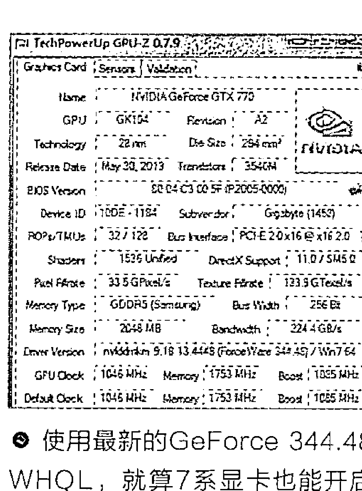

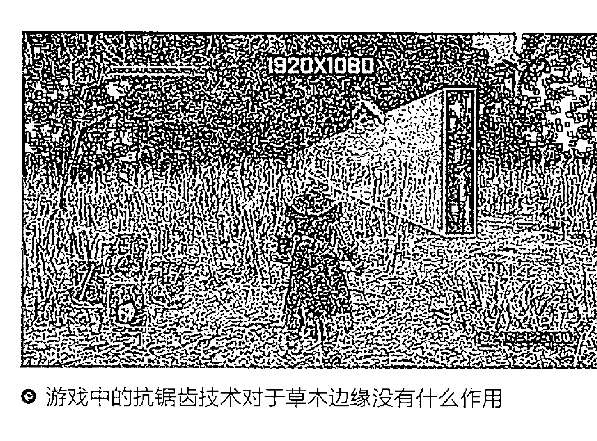

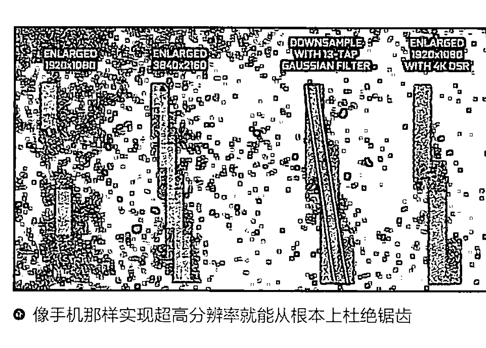

##### GTX 900和DSR

有需求就会有产品。NVIDIA在2014年下半年不仅带来最新的Maxwell架构下的GTX 900系列显卡，也带来了DSR（动态超级分辨率）技术。DSR技术简单地说，就是用更高的分辨率渲染游戏，然后再将画面呈现至显示器的原生分辨率，在任意屏幕上为玩家提供更高分辨率，提升画质。

这样做有什么意义呢？如果我们能够提升显示器物理分辨率达到一个很高的数值，那么画面无需开启任何抗锯齿技术，游戏中的锯齿就将荡然无存。举例来说，3D游戏中的草丛是锯齿最为明显的部分，而且一般的MSAA和FXAA只专攻于人物建模，对于大量树木和草丛根本无能为力。如果按照像素点来分析，草丛之所以会出现这样的问题是因为1920×1080分辨率下多边形缺少细节，根本没有足够数量的像素点来处理这些复杂的草丛。如果有足够的像素点，问题理应迎刃而解。

DSR技术其实就是将输出分辨率直接在水平和垂直两方面均最多拉升两倍。如果我们的显示器是1920×1080，那么最高能够实现的效果就是3840×2160这样的标准4K分辨率，总共有4倍的像素提升了四倍，其余分辨率以此类推。如果你的显示器已经拥有2560×1440，那么最终输出也会达到5120×2880这样的“奇葩”的分辨率，在我们的屏幕上呈现四倍细密的实际画面，一切锯齿都荡然无存。

##### 显卡支持与开启方法

最早支持DSR技术的驱动是GeForce 344.11 WHQL，不过当时只有使用最新的Maxwell架构的GTX 900系列才能够开启DSR技术。GTX 700以下的用户如果想用DSR，需要破解驱动程序的inf文件。不过从GeForce 344.48 WHQL开始，NVIDIA完全放开了硬性限制，几乎所有Kepler和Fermi架构的显卡都能开启这一功能。

一些对DSR支持较好的游戏，我们可以直接进入GeForce Experience找到对应游戏，点击修改设置即可更改分辨率。就算一些不支持高分辨率的老游戏也同样有办法，进入NVIDIA控制面板，把DSR缩放系数选择为自己想要的数值，然后选择游戏中相应的分辨率。这个比值有2、2.25、3、4等多个倍数，最高的4倍就是将水平和竖直分辨率均提高2倍，最终实现2×2的4倍效果的。

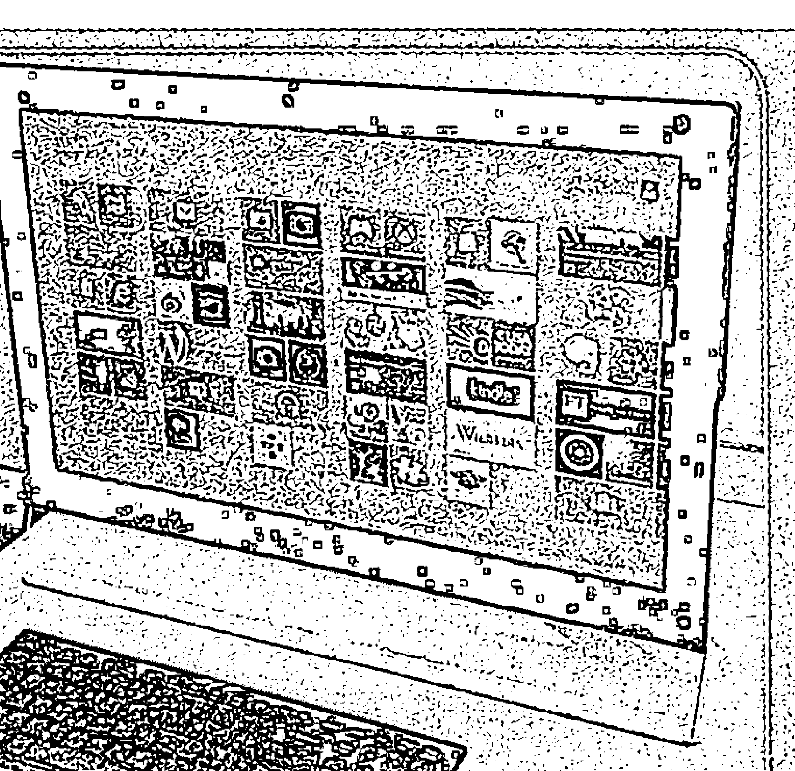

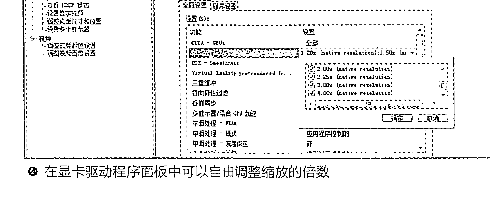

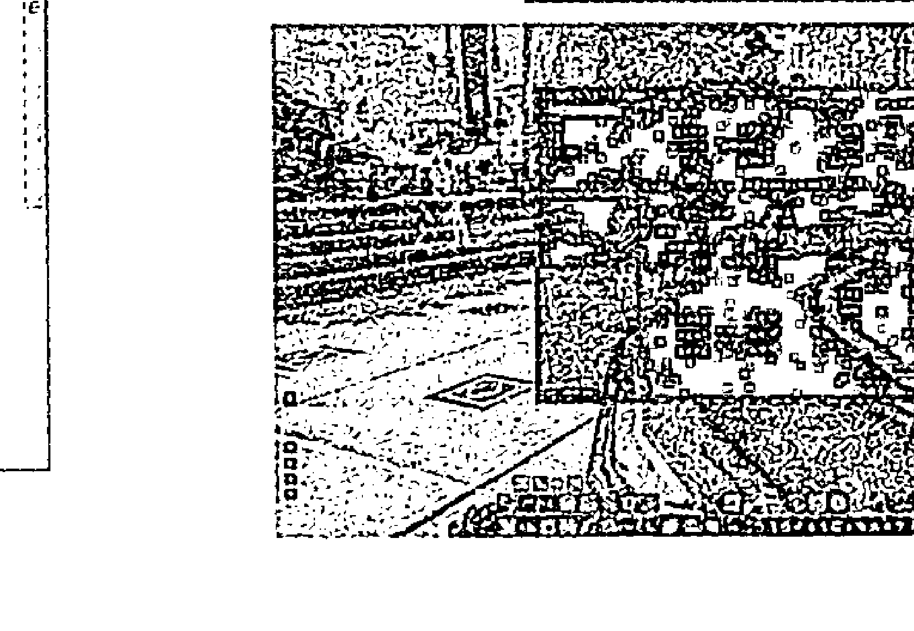

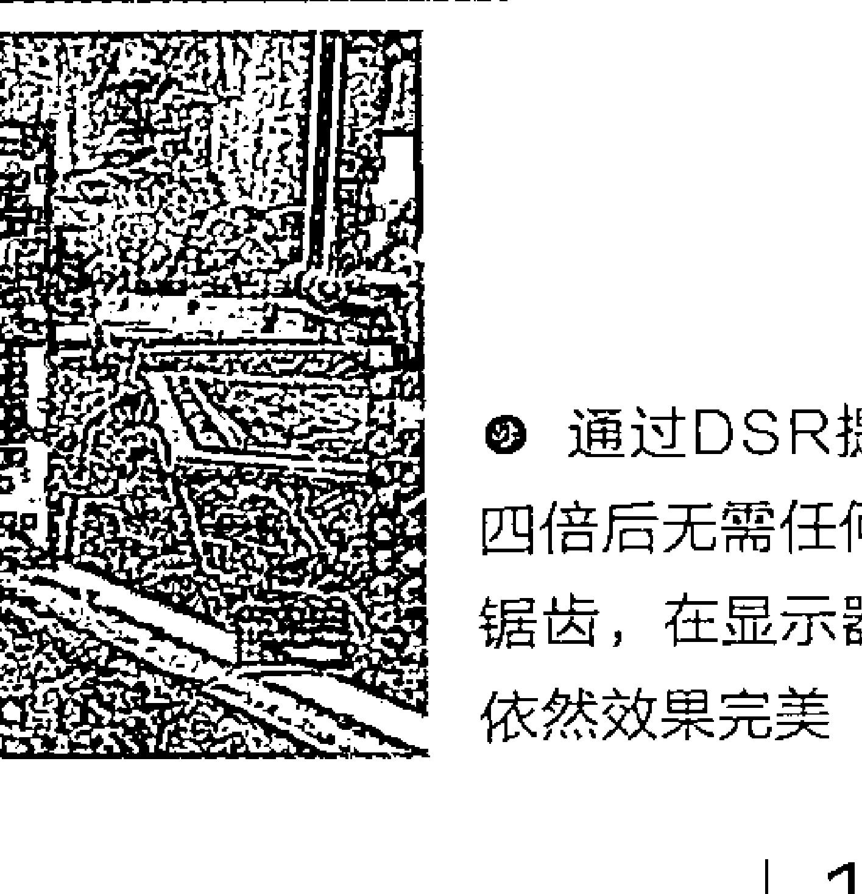

```ini
###### Graphics settings

###### The actual rendering resolutions you want to use,
###### and how many Hz you want the game to think they work
###### format: renderResolution [width]x[height]@[hz]
renderResolution 3200x1800@60
renderResolution 3840x2160@60
renderResolution 5120x2880@60
renderResolution 7680x4320@60

###### The resolution you want to downsample to,
###### should generally always be your output device pixel
###### Writing something not supported by the display here
###### 0 = main monitor resolution
presentWidth 0
presentHeight 0
presentHz 60
```

```ini
###### How many vertical traces to wait when presenting
```

##### 开启DSR后抗锯齿的取舍

其实在DSR出现之前，已经有了类似的程序实现近似的效果。在FF13（最终幻想13）PC版推出时，由于PC不支持修改分辨率在玩家当中哀鸿遍野。不少玩家将目光转向GeDoSaTo，这是一款能够强制修改游戏程序包括分辨率在内很多数值的特殊程序。PC版FF13原生分辨率仅为1280×720，通过这款软件能够将其修改成我们希望的分辨率。不过随之而来的问题就是GeDoSaTo的界面过于不友好，新手难以操控，而且通过GeDoSaTo修改后显卡的压力成倍上升，实在不是长久之计。

DSR是否也会出现同样的问题呢？

就拿比较大众的网络游戏《魔兽世界》来试一试。通过设置我们可以轻松开启DSR功能，开启后能够非常强力地解决游戏内画面锯齿的问题。不过也存在一些问题，首先是只有将游戏设置为全屏幕开启DSR才有效，窗口模式虽然也可以设置4倍分辨率但实际并没有效果；其次开启DSR时需要关闭游戏内部的垂直同步功能，如果开启会产生不同程度的卡顿；鼠标的移动速度会很成问题，我们必须要调高鼠标的DPI以跟上分辨率的倍增。另外开启DSR后，游戏内部的FXAA和CMAA等等抗锯齿功能基本就没有什么效果了，完全可以不开。

#### 小结

比起GeDoSaTo，NVIDIA的DSR技术毫无疑问更为成熟有效。除了热门游戏之外笔者还测试了一些其他游戏，总体表现都很良好，甚至连《反恐精英1.6》这样的古董老游戏也可以顺利开启DSR功能。至于显卡方面的压力其实完全不必过分担心，因为我们开启各式抗锯齿技术xxAA本身也是需要消耗GPU和显存的，直接开启DSR关闭抗锯齿，并不会比原本的游戏方式浪费多少资源。值得注意的是所需的全屏幕问题和鼠标DPI倍增问题，这两个问题确实直接影响了玩家的游戏体验，需要一定的适应时间。

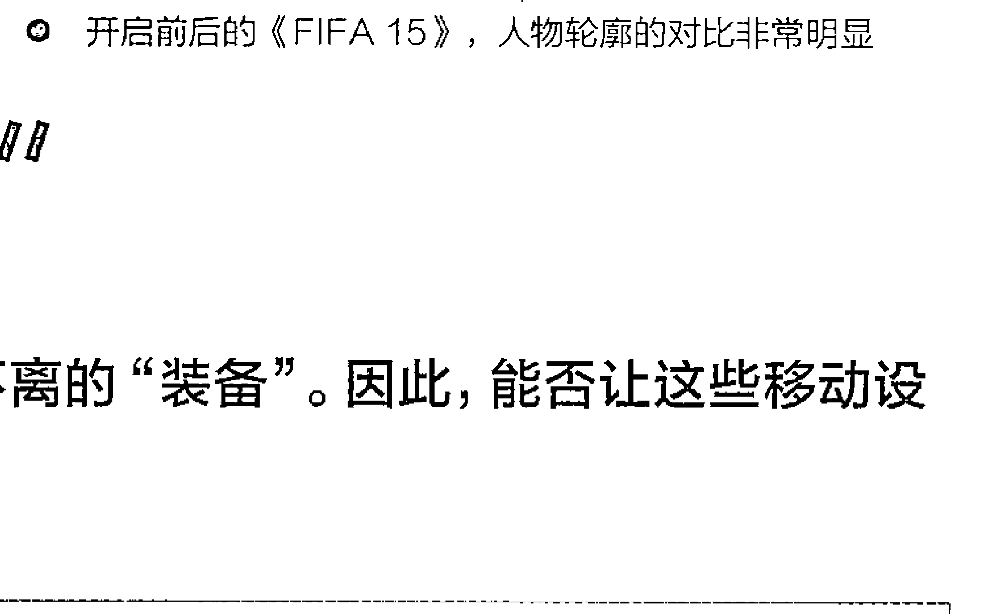

### 移动设备也“极客”

与台式PC相比，手机、平板、笔记本等移动设备才是与我们形影不离的“装备”。因此，能否让这些移动设备尽显“极客”，才是我们在朋友面前彰显“手腕儿”的舞台。

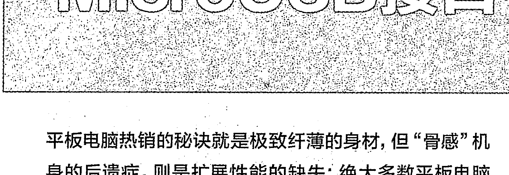

#### 最最基础的OTG功能

MicroUSB接口是非iOS系统的智能手机和平板电脑的标配，而这个接口最大的潜力就是OTG。这里向大家推荐自带MicroUSB接口并支持OTG功能的USB Hub（图1）。此类产品可直接与手机或平板的MicroUSB接口相连（图2），并同时连接U盘、键盘和鼠标，实现“一拖多”的效果。支持OTG功能的USB Hub大都提供了3~5个USB接口，理论上可同时接驳多款键鼠或移动硬盘。但仅仅依靠移动设备USB接口所提供的电力可能不足以驱动如此之多的外设。因此，如果你经常使用移动硬盘，建议选择自带外置电源功能的USB Hub（图3），通过外接电源给耗电较大的设备辅助供电。

iPhone通过转接头，也可以兼容绝大多数USB Hub实现OTG功能。

哪怕是笔记本的USB接口都无法同时驱动太多存储外设，对平板或手机一类的产品而言，能外挂电源的USB Hub自是必不可少。

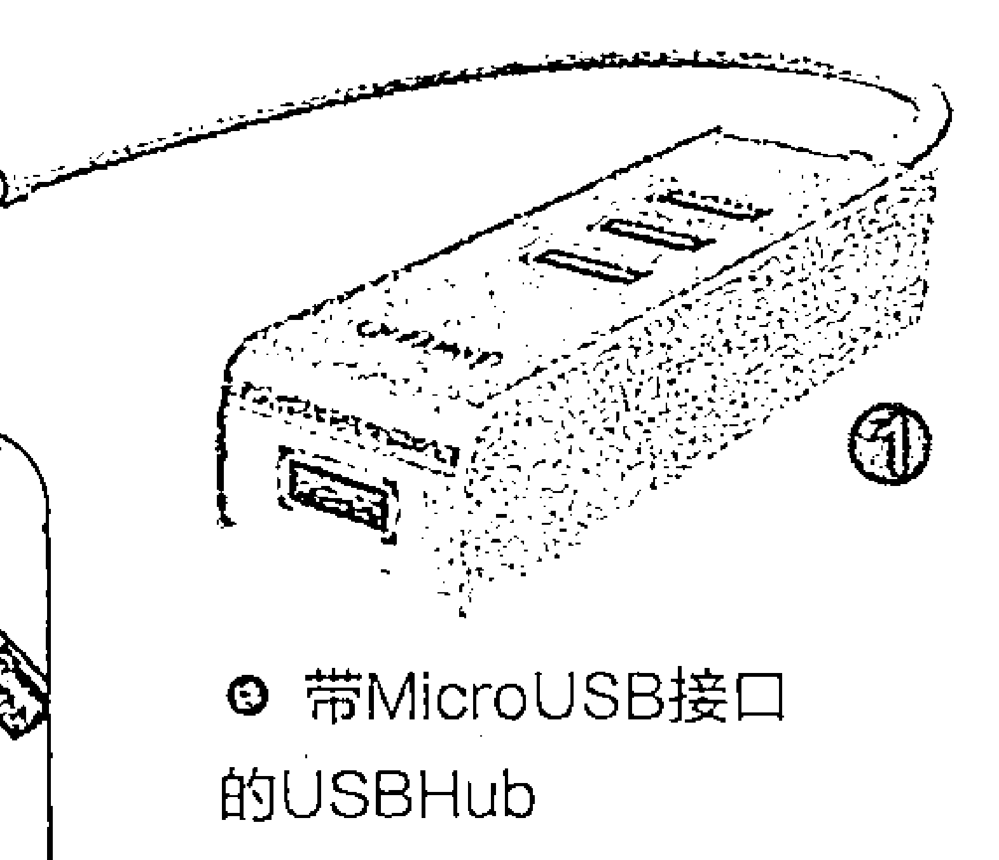

此类USB Hub的USB接口只能向外供电，无法给与其相连的移动设备充电。

此类USB Hub的外挂电源只能给与其连接的键鼠、移动硬盘等外设供电，同样无法给移动设备充电。

几乎所有Android平板的MicroUSB接口都支持OTG功能，但在Android手机中OTG功能还未普及，所以在购买OTG线之前，请先确认自己的手机是否支持该功能。

#### OTG与充电间的“矛盾”

正如前文所说，绝大多数平板电脑仅提供了一个MicroUSB，而这个接口不仅要用于充电电路、OTG等数据传输功能，还需要承担充电的责任，而这也就成为了很多Windows 8.1平板的噩梦。与Android平板不同，Windows 8.1系统在没有键盘鼠标时操作极为蹩脚，而很多千元以内的Windows 8.1平板仅内置16GB或32GB存储空间，只能将影音文件或游戏安装在U盘/移动硬盘中，通过OTG功能供平板电脑读取。换而言之，要想玩转Windows 8.1平板，必须要通过OTG连接键鼠和存储外设。对只有一个MicroUSB接口的Windows 8.1平板来说，在使用OTG功能的同时如何充电？反之，此类平板在充电时又如何连接键鼠和移动硬盘？可能有人会说了，用USB Hub与平板相连，引出一个USB线连接平板充电器（图4），或购买自带供电的USB Hub（图5），用它的充电线与平板充电器相连不就结了？很遗憾，MicroUSB共有5条引线（针脚），其中2条用于电源，2条用于传输数据，剩下的一条用来检测OTG功能，当检测到OTG正在使用时，手机就会“向外供电”并获取外部数据，此时自然无法充电。那么，如何才能让只有一个MicroUSB接口的Windows 8.1平板，在使用OTG功能的同时还能实现为自身充电呢？

如果你怕麻烦，建议选择同时提供MicroUSB以及独立供电接口的平板电脑，这样就不必担心OTG与充电的冲突了。当然，我们可以通过蓝牙键鼠以及无线存储设备绕开OTG与平板相连，但此类外设的成本却并非所有消费者都可承受的。

#### 没有统一标准的混乱之治

好消息是，目前已经有针对Windows 8.1平板定制的USB Hub出现了（下文简称“充电USB Hub”），此类产品可以同时实现“OTG+充电”功能（图6），只是价格要比同类仅支持OTG的USB Hub贵上一些，而且存在“挑硬件”的问题。理论上，Windows 8.1平板的MicroUSB接口都“有机会”同时进行OTG与充电。很可惜，“OTG+充电”这个功能在业内还没有统一的标准，不同品牌旗下产品对OTG充电模块的定义还略有不同，这就导致了充电USB Hub存在一定的局限性（兼容性），少数产品甚至仅支持单独定制的充电USB Hub。比如，在国际品牌中，ThinkPad 8的OTG定义就与东芝WT8不同，而国产的普耐尔MOMO8W和乐凡F8C等产品也是存在差异的。

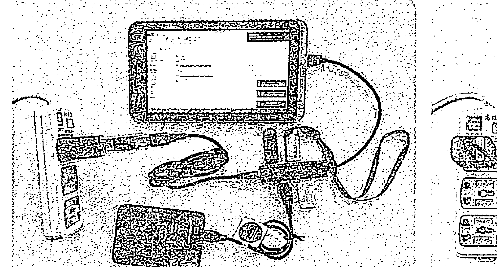

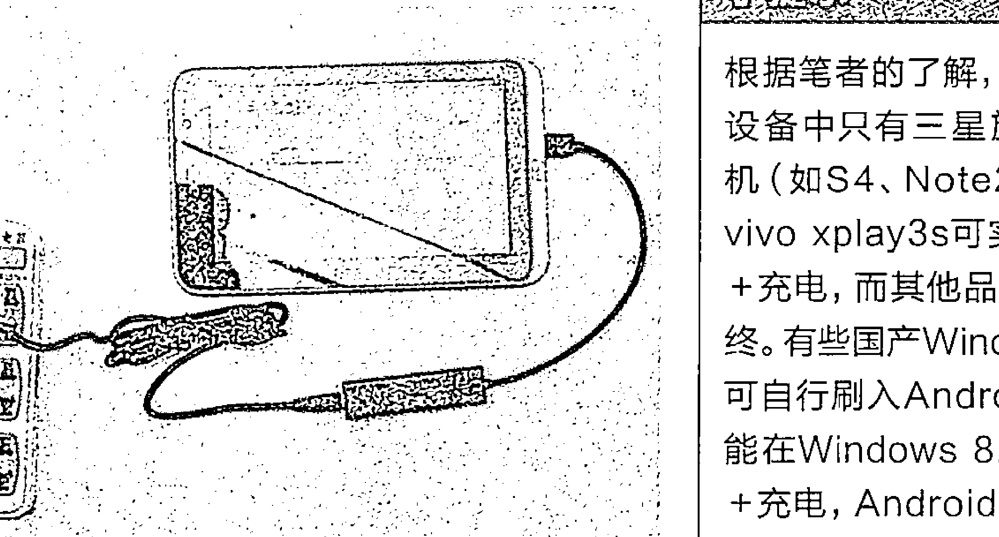

小提示
根据笔者的了解，目前Android设备中只有三星旗下的部分手机（如S4、Note2、Note3）和vivo xplay3s可实现同时OTG+充电，而其他品牌多以失败告终。有些国产Windows 8.1平板可自行刷入Android系统，但仅能在Windows 8.1系统中OTG+充电，Android系统下无法同时充电。

力盟台电X98 mli2 8 w18 v8p w1 合达V9751 OTG+USBhub
¥59.90 - 69.90
广东深圳至北京·快递+10.00
品牌 HONGDAW... 等产品描述

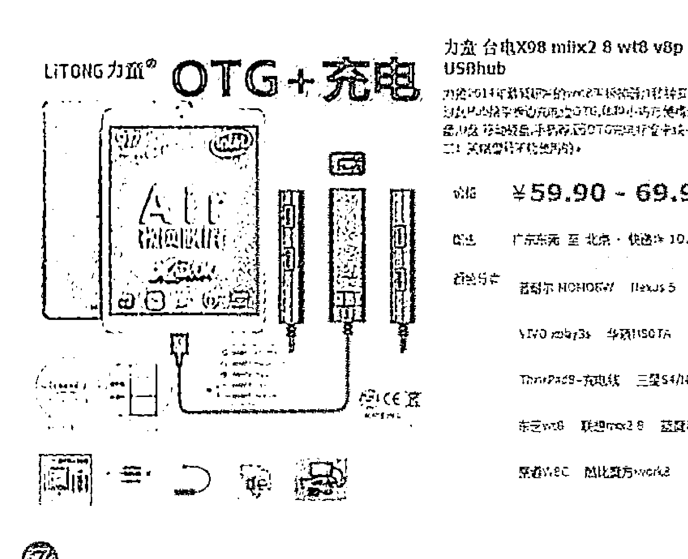

在差异（图7）。
因此，大家在选购充电USBhub时，一定要提前和商家沟通，报上Windows 8.1平板电脑的具体型号，再选择100%兼容的产品。
此外，在使用充电USBhub时，一定要用平板电脑的原装数据线充电，一些品质不佳的第三方数据线可能引起兼容性问题。
以力量充电USB3hub为例，该系列产品提供了一个充电开关，在OTG档位可以识别USB外设，而电源档位即可同时“OTG+充电”。当需要连接移动硬盘时，需要先将USBhub同时连接电源和平板，将开关切换到OTG后再切换回电源档位即可识别移动硬盘。
要注意的是，如果你手头有2TB大容量移动硬盘（3.5英寸），请单独购买一款3A的充电器（图8）。因为3.5英寸硬盘需要1A左右的工作电流，而给平板电脑充电的电流往往也在1.5A左右，再加上线路损耗，只有3A充电器才能保证这些耗电大户的正常运行。很多Windows 8.1平板标配的充电器多为5V/2A标准，在连接3.5英寸移动硬盘或多款USB外设时可能出现因输入电流不足，只能保持平板的电量不减少，却充不上电的情况。

#### MicroUSB接口的其他玩法

#### 代替HDMI的MHL功能

MHL（Mobile High-Definition Link）是MicroUSB接口的一种隐藏功能。简单来说，MHL就好似HDMI，可以将手机画面输出到电视或其他显示设备上（图9）。很可惜，如今很多显示器、电视机、投影机并未内置支持MHL功能的HDMI接口，这就导致MHL生态难以发展。因此，支持MHL功能的手机和平板仅限中高端产品。当然，如果你的手机或平板没有HDMI， MicroUSB接口也不支持MHL，也能使用DLNA、Miracast等无线显示技术，将移动设备的画面输出到大尺寸的显示设备上。

#### 让MicroUSB打造为读卡器

很多早期的DC、单反并不支持Wi-Fi功能，想将拍摄的照片与好友分享，需要先把照片导入PC，再传到手机，再分享到朋友圈。实际上，只要你的移动设备支持OTG功能，那就可直接使用OTG读卡器（图10），绕过PC直接在手机中读取SD、CF卡中的照片。

#### 用MicroUSB连接有线网

如果你家里没有无线网，或者经常入住没有Wi-Fi的酒店，那就购买一款MicroUSB转有线（RJ45）的交换器（图11）。以Android平板为例，进入以太网设置，选择DHCP动态获取后就会自动获取到IP地址并连接网络了。Windows平板则需要安装相应的驱动程序。

#### 可以正反插的MicroUSB线

很多人都在羡慕iPhone专用Lightning数据线可“正反插”的特性，如今Android手机/平板专用的MicroUSB正反插数据线也被深圳厂商研发出来了（图12）。这种数据线内藏有一颗自动感应正负极性的自适应IC，可不分正反面地插入手机/平板的MicroUSB接口工作。

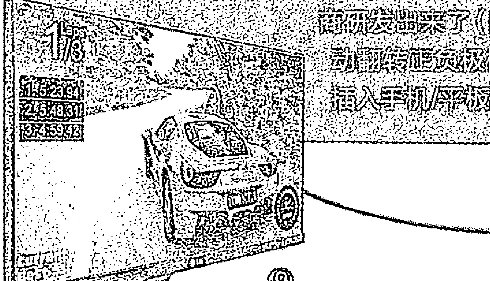

#### 塑造真正的“刀锋战士”

在14nm领先工艺的帮助下，英特尔酷睿M处理器将TDP控制到4.5W，这意味着它在全速工作时不再依赖散热风扇，哪怕是“裸奔”的状态也能确保产品稳定工作。没有了散热风扇的负担，让搭载酷睿M设备的内部结构更简单，可让厂商研发出更轻更薄的产品（图1）。以联想Yoga 3 Pro为例，这款13.3英寸的笔记本仅有12.8mm的厚度与1.2kg的重量，较上代YOGA 2 Pro薄了18%、轻了15%。要知道，联想还在YOGA 3 Pro里硬塞入一颗风扇（官方表示加入风扇是为了让用户的温度体验更好）和44Wh的超大电池（图2、图3），如果取消风扇，采用板载内存并适当缩减电池，打造出一款1kg以内的13.3英寸笔记本不是梦。


在很多玩家心中，素以纤薄见长的超极本/超薄本的身材不够“性感”，而Windows 8.1平板的性能和续航能力还是差了一点。没关系，有了英特尔最新酷睿M处理器的帮助，这两类产品都将变得更完美，让使用者更显“逼格”。

#### 超薄平板不再与性能绝缘

目前最轻薄的10.1英寸Windows 8.1平板最轻可做到500g左右（搭载BayTrail-T平台处理器，如Atom Z3735F），而酷睿M的发热量与功耗仅比BayTrail-T高了一点点，理论上也能用于极致纤薄的平板电脑体内。问题是，酷睿M的性能却足以秒杀BayTrail-T（见表）。换句话说，在酷睿M处理器的支持下，可以将Windows 8.1平板在实现不逊于同尺寸Android平板纤薄的程度外，还可获得无限接近Haswell架构酷睿i5-4200U笔记本的性能（图4）。

| 属性 | 酷睿M-5Y70 | Atom Z3735F |
| --- | --- | --- |
| 工艺/架构 | 14nm/Broadwell-Y | 22nm/BayTrail-T |
| 核心/线程 | 2/4 | 4/4 |
| 主频 | 1.1GHz~2.6GHz | 1.33GHz~1.83GHz |
| TDP/缓存 | 4.5W/4MB | 2.2W/2MB |
| 核芯显卡 | HD5300 | HD Graphics |
| 理论测试 |  |  |
| PCMark7 | 3697 | 2299 |
| 3DMark Cloud Gate | 3556 | 982 |
| 街头霸王4 | 21.12fps | 11.71fps |

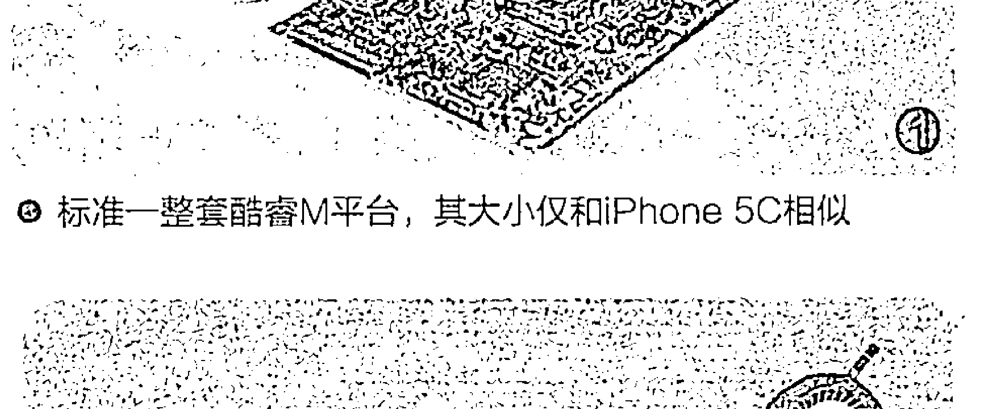


火速连接 如果你想了解有关酷睿M处理器的更详细资料，请翻阅本刊21期《工艺就是战斗力——酷睿M，平板电脑的梦想之心》这篇文章。

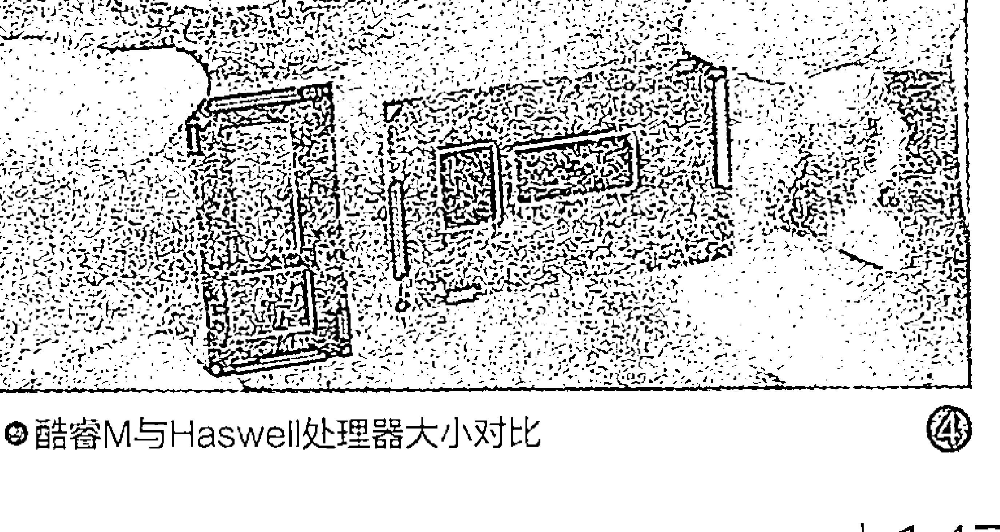

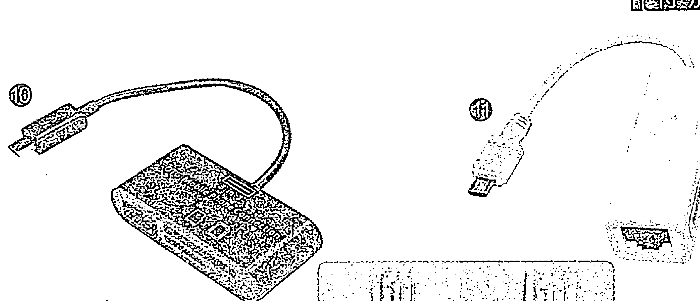

#### 有望被Android设备武装

需要注意的是，酷睿M不仅限于生产Windows设备。和BayTrail平台一样，酷睿M同样有望被Android设备所“武装”。英特尔（中国）有限公司客户端平台部总监表示，英特尔一直以来的平台策略就是公平支持各类操作系统。如果很多OEM厂商希望让这个产品可以运行在基于Android应用的环境下，英特尔也会考虑。此外，由于酷睿M平台的定位介于高性能和高便携之间，故不会和凌动（Atom）平台的产品相冲突。

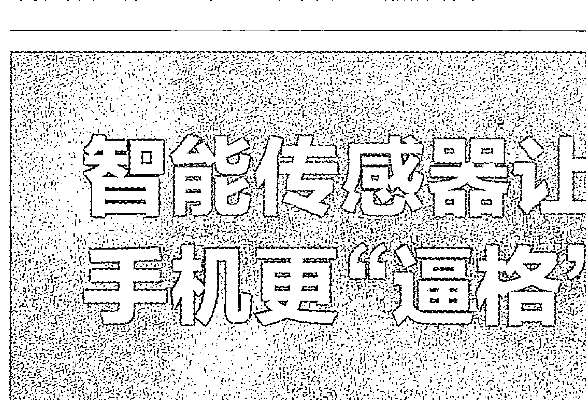

随着苹果iPhone 6、三星Note 4、华为Mate7、OPPO N3等新品的诞生，指纹识别功能成为新一代旗舰手机的标准功能。而能否挖掘指纹传感器的潜力，则是体现玩机水平的标杆。

#### 认识指纹传感器

目前智能手机所用的指纹传感器大体分为“扫描式”和“按压式”两大类。其中，“扫描式”需要用户将手指沿一个方向在传感器表面划擦才可识别，代表产品有三星S5、Note4等手机（图1）。而“按压式”则只需将手指与传感器表面接触即可识别，代表产品有iPhone 6和华为Mate7（图2）。就操作体验和识别率而言，“按压式”的表现更为优异。

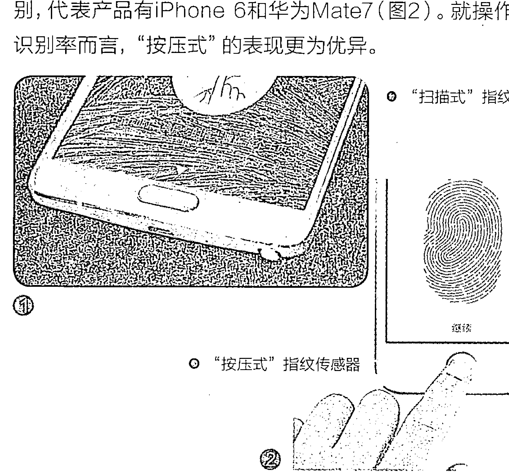

#### 支付是未来趋势

想充分挖掘指纹传感器的潜力，需要软硬件的深度结合。比如iPhone 6可以通过指纹识别完成解锁、Apple Pay支付以及应用解锁功能；三星Note 4则可实现三星账号确认和PayPal认证；而华为Mate7则额外加入了对支付宝的支持，轻触传感器即能实现转账或者购物。指纹识别最大的优势就是简单方便，即使身边有人也不会偷窥到密码数字。

总之，“硬件厂+服务商”的指纹支付方式，将成为未来指纹传感器的主要战场。要注意的是，该标准方案仅支持Android系统手机，而且还需用户安装定制版的支付宝APP。苹果设备的Touch ID由于没有对第三方开放，短期内就不要指望能在iPhone上实现指纹支付功能了。

#### 协处理器低调来袭

除了指纹传感器外，“协处理器”的概念也成为了时下智能手机领域的一大亮点。比如，苹果说iPhone 6在搭载第A8芯片内置了M8协同处理器；华为称Mate 7搭载的麒麟925芯片内也隐藏了一颗i3协处理器（图3）。那么，所谓的“协处理器”到底是干啥用的？

我们都知道，智能手机体内配备了包括重力感应、陀螺仪、罗盘、光线在内的各种传感器，每次调用时都要唤醒CPU去指挥。问题是，CPU的功耗很高，哪怕是基于big.LITTLE技术设计的“A15+A7”中的A7，频繁地工作也会让电池吃不消。而协处理器的任务就是接管处理器，去检测和收集各种传感器数据。简单来说，协处理器可帮你做到让所有传感器长开，又不怎么耗电。

需要注意的是，协处理器并非什么新事物，早在Galaxy S4， Note2和魅族MX3等早期的高端手机上，就已有了协处理器的影子。只是，当初大家管协处理器叫做“Sensor Hub”，原理就是汇集尽可能多的传感器到一个Hub（协处理器芯片）上，让它来控制所有的传感器，帮CPU减负。

总之，随着智能手机追求更强性能，以及健康运动类产品的普及，协处理器将成为延长手机续航、提高使用体验的重要“法宝”。可以预见，未来协处理器会成为越来越多手机的标配功能。

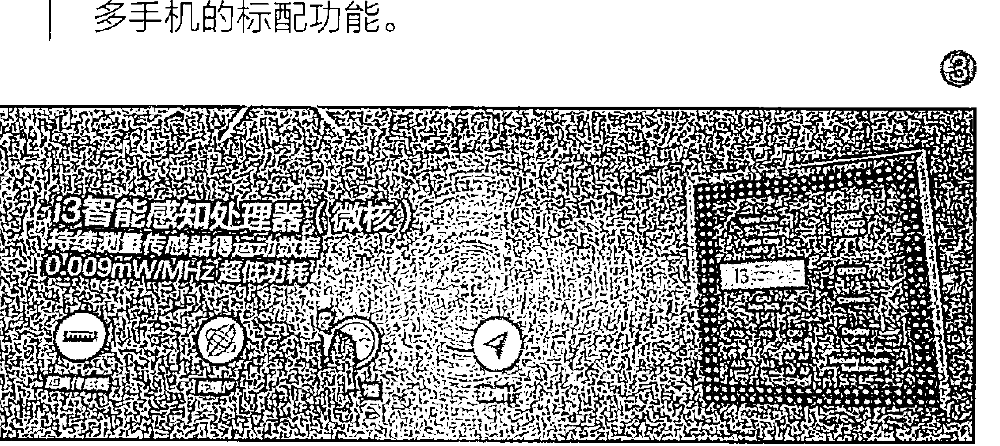

#### 扮猪吃虎老物件也能“高大上”

诚然，新技术与新产品可帮我们尽显“逼格”，但拥有这些新事物的开销却并非普通用户能承受的。因此，如果能通过手动改造、优化的手段，让身边的老物件用起来或看起来更“高大上”，相信也是让别人羡慕的事情呢。

##### 让低端手机换新颜

很多知名品牌手机都预装了主题商店，可下载替换各种风格的UI界面（图1）。如果手机没有类似功能，该如何实现主题界面的“换装”呢？答案很简单，我们只需安装第三方的启动器（Launcher）即可。比如在百度手机助手网页版（http://shouji.baidu.com/）中输入“品牌名+Launcher”，即可搜索该品牌UI风格的Launcher。以苹果iOS风格爱好者为例，只需在手机上安装“iLauncher”（下载地址：http://t.cn/R7MuPmM），然后按主页键选择“iLauncher”启动器（图2），你就会发现手机的界面已经变成了iPhone风格的主屏幕（图3）。

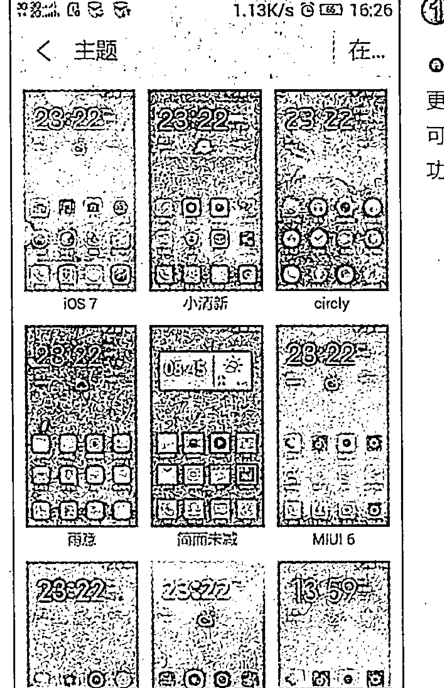

如果手机支持更换主题皮肤，可以直接通过该功能换肤

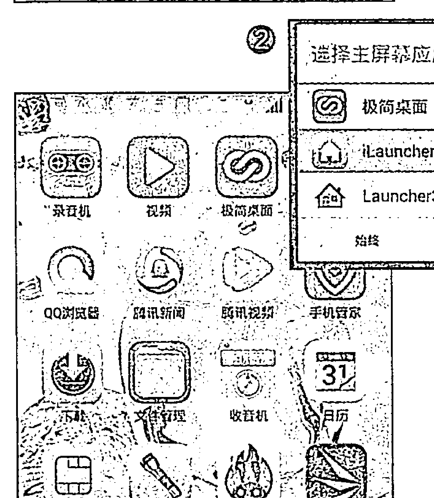

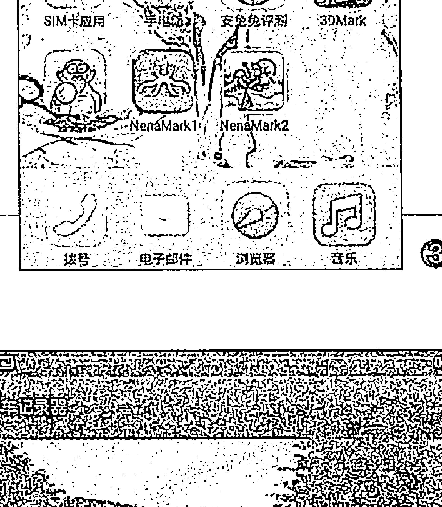

##### 老手机扮演行车记录仪

智能手机更新换代越来越快，相信很多朋友家里都有几部闲置或淘汰的手机正躺在抽屉里。对有车一族而言，如果可以利用淘汰Android手机的摄像功能将其打造为“行车记录仪”，无疑是最能发挥手机余热的解决方案。在这里笔者向大家推荐“DailyRoads”（下载地址：http://t.cn/R7MdPWr），该软件基本已涵盖高端行车记录仪的大部分功能（图4），支持无缝录影、循环录影以及强烈撞击时自动保存等功能。此外，虽然Android 4.4.2系统限定了第三方APP写入外部SD卡的权限，但DailyRoads依旧可以将视频路径设定在SD卡上，所以对支持存储卡的手机而言，存储卡容量就代表了录影时长。为了避免恶意“碰瓷”或一些突发事故的取证，行车记录仪已经成为越来越多车主的必备。通过闲置手机+APP模拟行车记录仪，自然要比购买新品划算很多。建议大家平时在车里放一根点烟器充电线（为闲置手机供电），并根据手机存储空间，设定好视频覆盖的时间间隔。

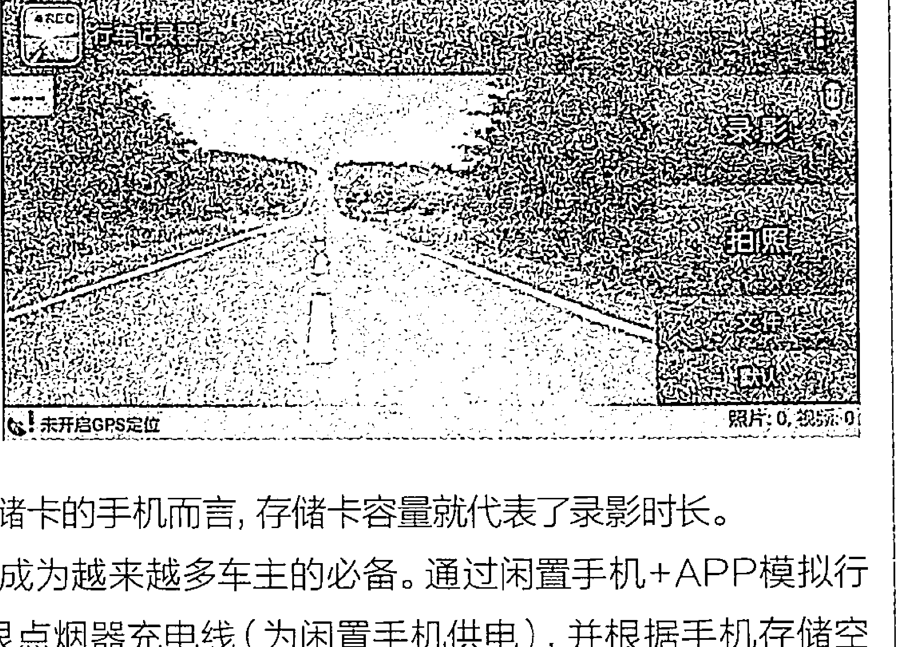

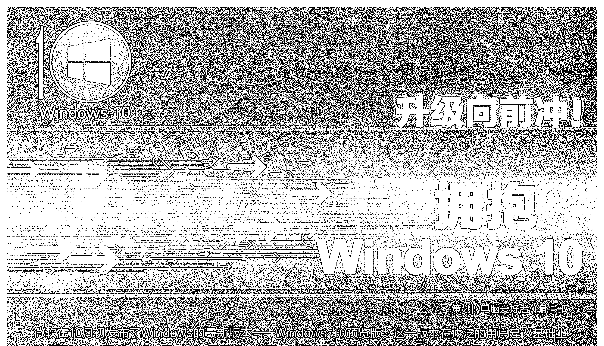

策划：《电脑爱好者》编辑部

微软在10月初发布了Windows的最新版本——Windows 10预览版。这一版本在广泛的用户建议基础上进行了改进，更符合新老用户的使用习惯。然而，由于此版本目前还处于测试阶段，问题依然很多，因此对大多数人来说，它还是一只神秘的“刺猬”。那么Windows 10为何快速到来？它到底怎么样？是传说中的Windows 9吗？新系统的使用是否能让人感觉顺手，软硬件兼容性如何？在正式版尚未发布的情况下，我们如何去安全地体验这个系统？体验过的小编又有何感受？本专题将告诉你答案。

### 救火队长？Windows 10匆忙救场！

文|平淡

#### 为什么不是Windows 9

微软发布Windows 8/8.1之后，几乎所有人都认为下一代桌面操作系统会是Windows 9。但2014年10月1日微软却在发布会上将新产品冠以Windows 10的名头，为什么微软会打破7、8、9的自然数序列，将其命名为Windows 10呢？

据微软官方说明，Windows 10切合系统的命名方式，并认为具有划时代意义的产品十全十美。此外，也有系统软件工程师认为如采用Windows 9的命名，会使底层文件与软件编辑时与Windows 9X系列操作系统混淆，所以我们见到了“跳跃”至我们面前的Windows 10。

#### PC/移动两告急

虽然现在距离Windows 8正式发布已经过去了2年的时间，但是Windows 8并没有成为市场的主流系统，无论是在桌面操作系统还是移动操作系统市场。另根据互联网市场数据供应商Net Market Share提供的2014年10月桌面操作系统市场占有数据显示，在操作系统市场占有率上，Windows 7为53.05%，Windows 8.x（包括Windows 8和Windows 8.1）则只有12.5%，老旧的Windows XP份额则为17.18%（图1）。

在日益火热的移动操作系统市场，Windows 8也没有取得什么成绩。Windows 8发布之初就雄心勃勃要成为全平台通吃的操作系统，微软不仅在操作系统本身针对移动设备做了大量的触控优化，而且针对移动市场的推广做了大量的工作。一方面针对平板市场（不包括Windows Phone）推出了可在ARM芯片上运行的Windows 8 RT，但是并没有取得什么成绩，现在Windows 8 RT已经无疾而终。另一方面则以Windows 8.1桌面专业版为基础，除了亲自上阵的Surface系列，微软还联合了华硕、联想等厂商推出Windows 8平板，不过在平板市场也未取得什么骄人的成绩。最新统计，在全球平板电脑操作系统市场，Windows 8仅仅占比7.2%，显然与其桌面操作系统市场霸主身份极不相符（图2）。

显然，作为微软寄予厚望的操作系统，Windows 8的市场表现是让人失望的，从上述简单的数据我们就可以看到Windows 8是一款并不成功的操作系统。

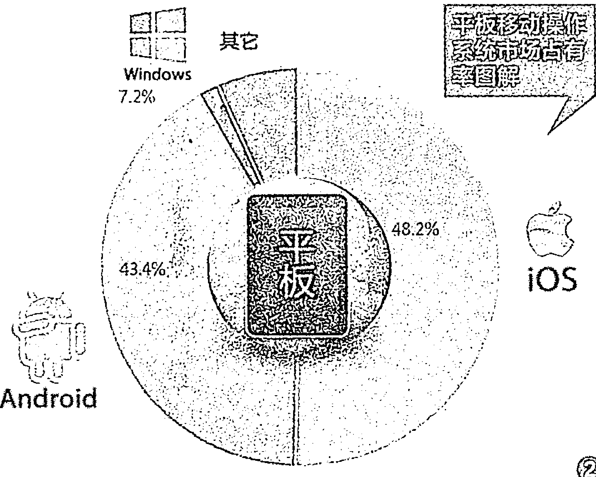

#### Windows 10上看得见的努力

由于Windows 8糟糕的设计，微软为了提升其在操作系统市场的份额便加紧开发了新的Windows 10。新系统针对用户需求新增和改进了一些系统组件，同时借鉴Android和iOS的优点进行了更优化的触控设计。

一方面新系统在广泛的用户建议基础上进行了必要的改进，以适应用户的使用习惯，回归了用户呼声最高的开始菜单，而且新的开始菜单整合了Windows 7文字式和Windows 8图片式的优点，力图让普通用户和触屏用户都可以完美使用（图3）。

另一方面，Windows 10则借鉴了Android、iOS的优点，针对触控用户增加了大量的手势操作以提升用户操作体验。在最新的9879版新增三指向下手势可以显示桌面（之前操作则要用手指费力点击任务栏托盘显示桌面图标才可以切换到桌面），三指点击则激活搜索等。将应用商店窗口的应用设置按钮的表现形式由“...”进化为“≡”（是不是和Android里的设置菜单图标很类似），手指点击即可弹出设置菜单（图4）。

此外，针对用户使用频率较高的组件做了进一步优化设计，9879版的资源管理器进行了重新布局，在左侧导航，将我们经常要访问的C盘、D盘等盘符和这台电脑并列，方便大家访问（图5）。Windows 10的其他变化，如在任务栏添加搜索、增加虚拟桌面、外观上扁平化设计、移动流量感知等，在之前的文章中已做过不少的介绍。当然Windows 10的这些变化最终目的就是要提升用户的操作体验，降低用户使用门槛，让更多人去升级使用新的系统。显然Windows 10目前的改变不仅降低了用户使用门槛，而且大大改善了用户使用体验，是一款真正迎合了用户需求、值得我们去升级体验的新系统！

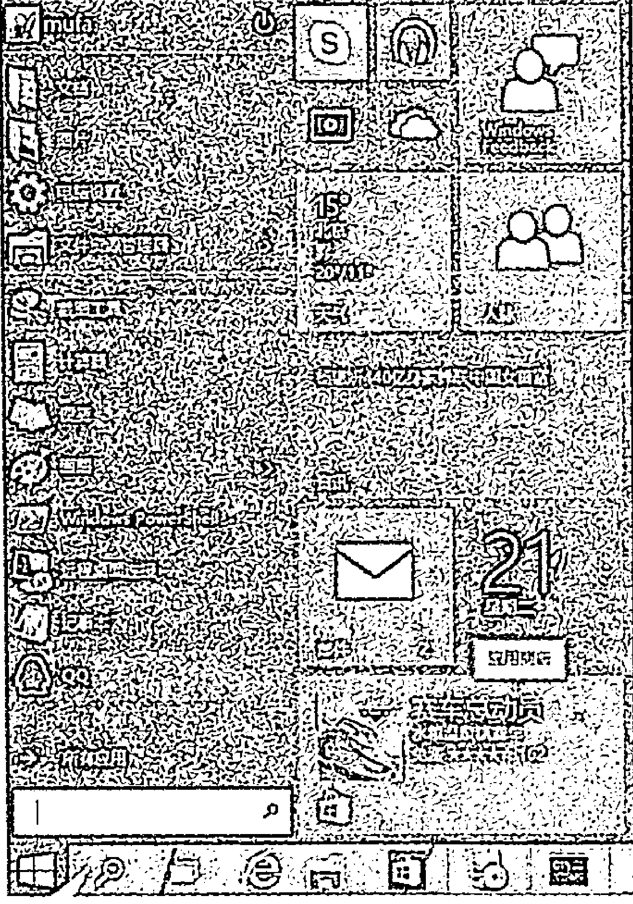

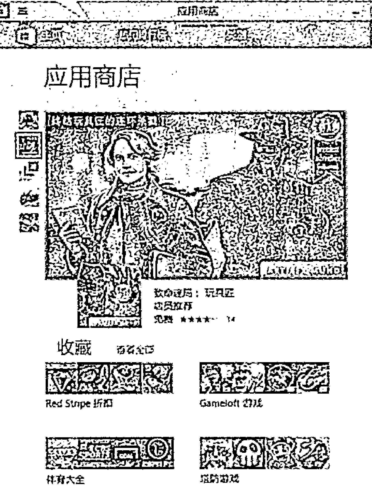

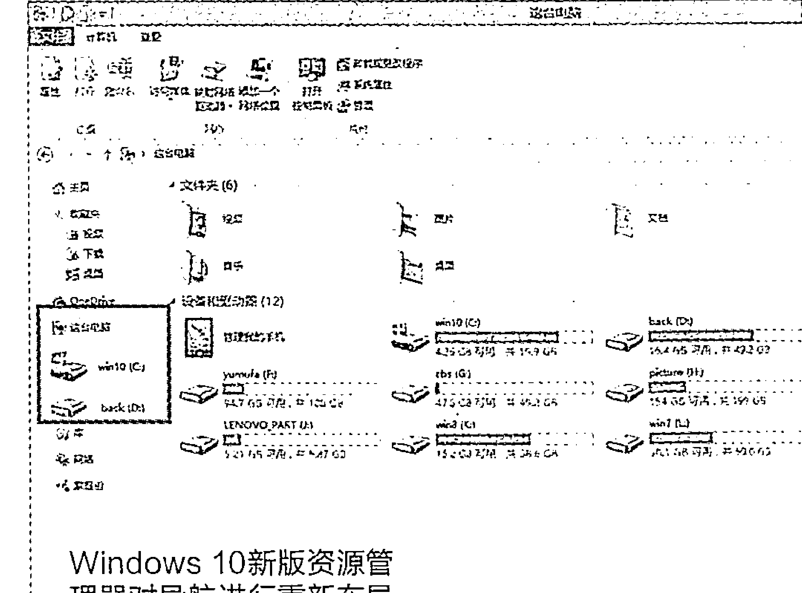

##### 小改变预示的大方向

用过Windows 7和Windows 8的人再用Windows 10，也许感觉到的最大变化只是开始菜单中多出的新成员，以及两种界面的重新组合，最新鲜的多桌面多任务管理按钮也是别人已经用过的“陈芝麻”，因此说“新鲜”很难谈得上。看看网上连篇累牍重复报道的文章，也都围绕着这几项变化在反复。然而，在简单变化的背后，所包含的绝不是简简单单的改变和重新组合，它无论对微软还是对用户，都有着非同寻常的意义。只有深入了解这些，我们才会知道，微软将其版本定义为“逆天理”的第10版的真正原因。

##### 开始不是简单的整合

开始菜单不是简单的整合，它体现的是微软的“不离不弃”精神。“不离”是不离开老用户，“不弃”则是不抛弃Windows 8/8.1。左侧的传统开始菜单列表保留了Windows XP或Windows 7用户的基本操作习惯，右侧则紧密集成了Windows 8用户熟悉的磁贴板块。

但是，左侧的列表也不完全是老内容的呈现。只要我们深入到“所有应用”菜单下查看，就可以发现这里所说的“应用”不单单包括传统的系统组件或应用程序，更包含了原本Windows 8磁贴界面应用列表中的所有应用。可见，这个传统开始菜单有了更加广泛的内含，而这个新的内含就是“移动应用大本营”。

再看右侧的磁贴板块，它也绝不仅仅是原版磁贴的贴靠，而是磁贴与开始菜单不可分割的紧密结合。虽然磁贴板块中的个体磁贴可由用户取舍或改变形状，但微软显然不希望用户将整个磁贴板块随意搬走，因此才没有设置方便的卸载入口。这看似不经意的变化，显示了微软的多平台多设备的“整合”理念。因为微软最清楚，虽然正在使用的PC可能没有触摸屏幕，你讨厌触摸为本的磁贴成分，但是，假如明天朋友送你一块触摸大屏幕，你还会讨厌Windows 10中的磁贴吗？因此，作为用户也应该用前瞻的眼光看问题，不要只停留于固有的设备或系统（图1）。

##### 小技巧：拖动的应用魅力

别以为开始菜单的右侧磁贴面板是摆设，它对我们可是方便至极的一块“宝地”。如果觉得从“所有程序”列表中打开程序或应用不太方便，而又经常需要使用它们，可在列表中将这个程序或应用一键拖放到右侧的磁贴界面中，这样访问就方便多了。当然，也可采用右键菜单命令来固定程序或应用，只不过这样的操作要多点击一次鼠标罢了（图2）。

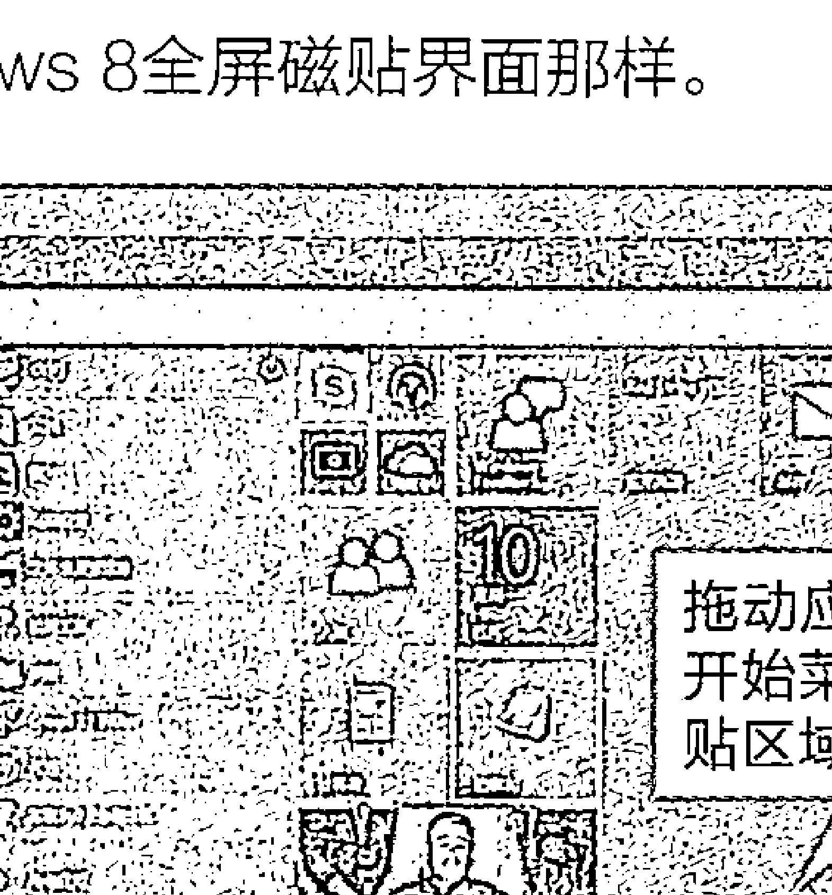

##### 小技巧

开始菜单的大小也不是一成不变的，它除了随着添加的项目多少而改变大小外，还可以由用户手动去改变。只需拖动其菜单框的边缘，即可将其扩大或缩小。此外，可通过在磁贴上单击右键来设置具体某个磁贴的大小。这对于拥有一个触摸屏幕的PC或小尺寸的平板来说，具有极其重要的意义，因为这样大大增加了可触摸的区域，会让触摸更方便，同时也可获得更好的视觉效果。除了形状外，其实开始菜单的颜色也可以随心所欲地变化。只需在开始菜单磁贴界面空白处点击鼠标右键，选择“个性化”，即可进入颜色定义窗口，这里从“自动”颜色和其他15种可选颜色中自由选择开始菜单的颜色，打造出个自己喜欢色彩的开始菜单（图3、图4、图5）。

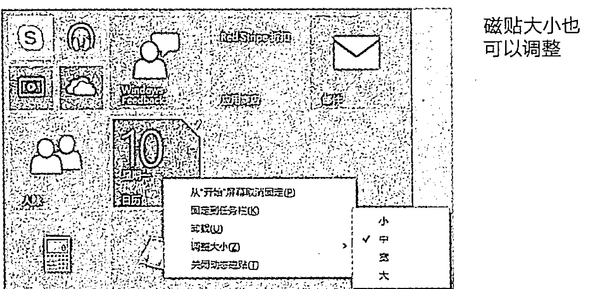

开始菜单颜色自定义 (图4)

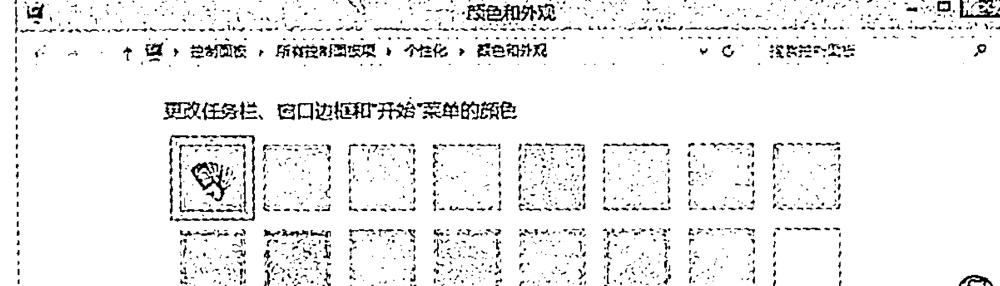

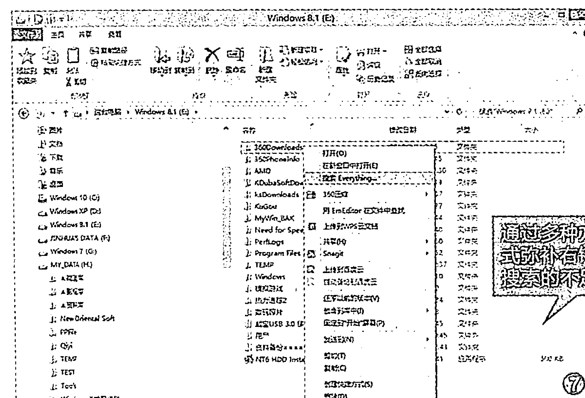

##### 来自“搜索”的双重惊喜

在Windows 8环境下，只需将屏幕光标指向右上角即可出现搜索按钮。但升级到Windows 10之后，这里无法浮出搜索按钮。搜索去哪儿了？“远在天边，近在眼前”。搜索，从藏猫猫“怕”让人知道到摆在我们面前生怕我们不知道，离我们最近，这是一个截然不同的变化。微软不但在任务栏上最靠近开始按钮的地方安排了一个搜索按钮，还在开始菜单的底部不厌其烦地重复安排了一次搜索框。由这次对搜索功能的双重重视，足见Windows 8中藏起搜索功能对用户的“伤害”之深。或许这是微软向大家鞠了两个躬一样，表示再度的歉意吧（图6）！

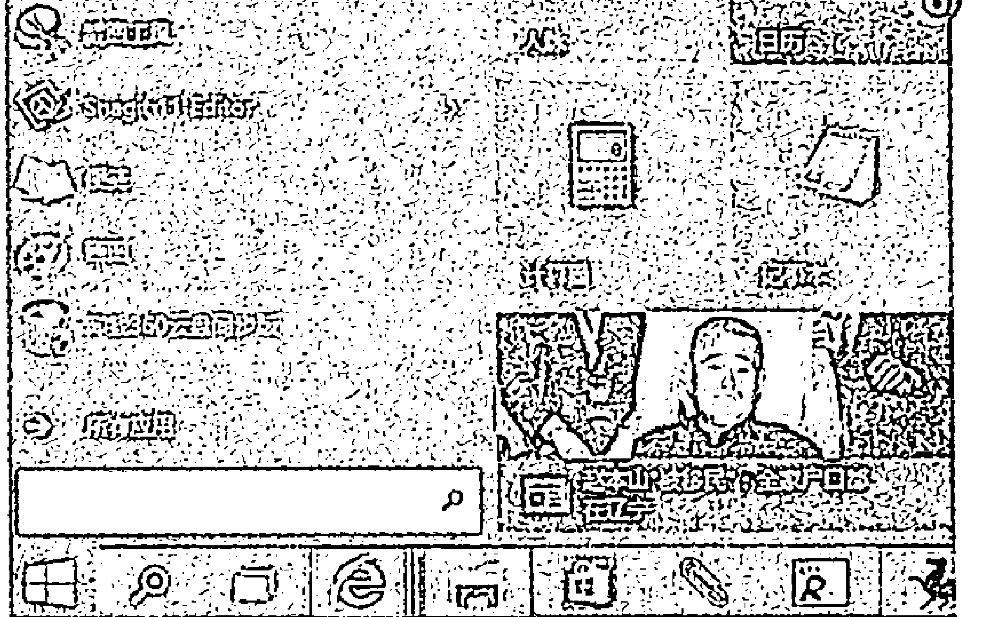

##### 小技巧

在文件夹及其子文件中搜索文件是一项很普遍的需求，单击右键并选择搜索命令是最方便不过的。然而，在Windows 10中却无法实现这样的搜索方法。文件夹右键菜单无搜索功能怎么办？可通过第三方软件实现，比如安装Everything来搜索文件名，安装EmEditor来搜索文本内容。此外，也可以通过在资源管理器中将光标定位到文件夹后，通过右上角的“搜索文本框”来实现搜索（图7）。

##### “超级按钮”整合效应的整合效应

体验过Windows 10的用户都知道微软已经取消了用鼠标在屏幕右侧边角点击浮出超级按钮面板的功能，但是，这并不表示微软将此功能取消掉了。其实，微软将原有的功能“整合”到每一个应用窗口的一个“角落”，它们成为入驻应用“耳朵眼”的重要“客人”。我们打开任意一个应用窗口（如“应用商店”），看到窗口标题栏左侧图标旁那个不起眼的“...”按钮了吗？点击它会发现，在其中有“搜索”、“共享”、“设置”等常用命令，这正是原先在超级按钮浮动面板中的命令。由于这些命令与每个应用窗口的集成，使得原先的超级按钮变得无处不在，调用更加方便。小小的改变也显示了微软对“整合”的良苦用心和不想丢弃任何方便功能的善意（图8）。

商店
常驻应用边角的“超级按钮”

> **小提示**
实际上，原先的超级按钮浮动面板也不是完全取消，而是由“暗”变得更“暗”了，原先需要鼠标触及区域后浮出，而现在只能用一个不为普通用户所晓的Win+C快捷组合键来激活。


特别推荐

| 应用名称 | 价格 | 评分 | 分类 |
| :--- | :--- | :--- | :--- |
| Doodle Creatures HD | ¥18.00 (免费试用) | ★★★★☆ 55 | 游戏 |
| 时间之旅2:远古遗迹 | 免费 | ★★★★☆ 528 | 游戏 |
| Halo: Spart Assault | ¥31.00 | ★★★★☆ 860 | 游戏 |

收藏

| 项目 | 描述 |
| :--- | :--- |
| + Red Stripe 折扣 | 体育大全、塔防游戏、Gameloft 游戏 |
| + 我查查条码比价 | 免费 ★★★★☆ 754 生活 |
| 淘宝官方客户端 | 免费 ★★★★☆ 8,060 购物 |
| Modern File Explorer | ¥21.00 (免费试用) ★★★☆☆ 40 工具 |

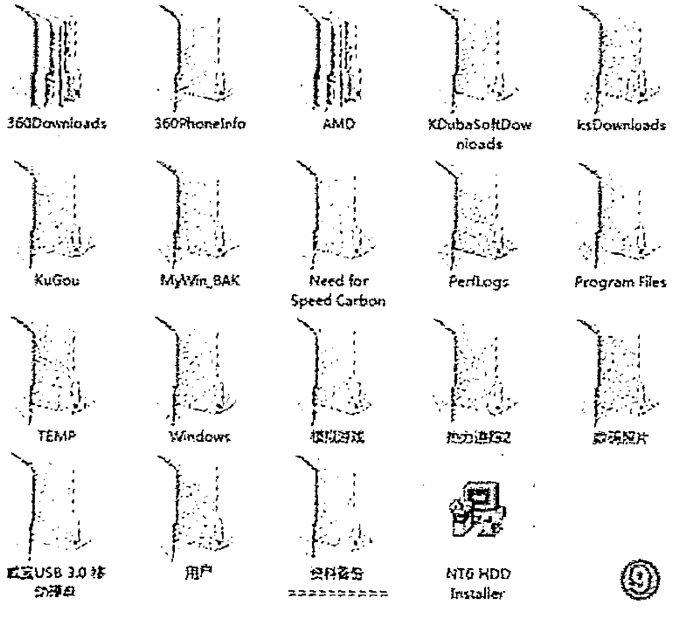

##### 一键之差显微软以人为本

与Windows 7相比，Windows 10在许多方面只有一键之差的改进，这看似小小的变动，体现了软件设计者体贴用户的理念，也可以作为让我们放弃Windows 7而转投它的微小理由。

##### 窗口“丢甩”“贴靠”的价值

按住一个窗口的标题栏将其慢慢地拖动到屏幕右侧，这与按动标题栏向屏幕右侧猛丢的结果是相同的，但视觉感受会有所不同。如果将一个窗口“捡起来”丢向屏幕右侧，该窗口会立即自动占满右半屏幕，左侧显示为其余已打开窗口的缩略图标。但如果将该窗口“捡起来”并慢慢贴靠到屏幕右侧，那么屏幕右侧会先出现阴影区域，示意该屏幕将贴靠的位置，松手后在屏幕左侧才会出现其余已打开窗口的缩略图标。后者操作可看作是前者操作的慢动作。这样的操作设计，为PC对比编辑及移动设备的应用间交换数据提供了极大的方便。尤其是对移动设备来说，由于它让两个或多个程序在一个屏幕上共存，因而较之其他平台的移动设备有突出的资源交换优势，可看作是微软移动平台在资源管理上超越对手的闪光点。

虽然我们可能对Windows 7爱得不得了，但在它的资源管理器中切换文件大图标列表和详细列表两种方式，最少也要两次点击鼠标才能完成；而在Windows 10中，我们只需一键点击鼠标即可实现这一需求。这是Windows 10比Windows 7更体贴人的一个微小理由（图9）。

如果在Windows 7中用单手操作鼠标，想在资源管理器中删除一个文件，必须通过“组织”菜单中的“删除”命令，或单击鼠标右键后再选择“删除”；而在Windows 10中，我们同样只需一键点击即可删除甚至彻底删除文件。

类似的操作还有很多很多，细微的变化最多体现在资源管理器中新出现的动态功能面板上。

##### “跨越式”切换到“一体化”管理

> **小提示**
以上特性虽然在Windows 8中就已经拥有，但由于Windows 8的“开始”风波将大量用户“刮”出门外，因此连它的这些好也被别人忽略。那么，就让我们忘掉Windows 8的存在，姑且认为这些好就是从Windows 10开始的吧。要知道，虽然是一键之差，但对于一些十分常用的操作来说，时间和次数的积累会对工作效率的提高带来不可估量的影响。每天点击300次菜单选择命令和每天点按300次按钮执行命令效率至少相差1倍。

在Windows 8时代，由于微软采用了两种思维方式的程序界面，因此在同时打开两种程序的情况下，互相切换显得很“别扭”。尽管也都是点点鼠标或使用一个快捷键的问题，但总让人有“漂洋过海”的“异国风情”之感，因而也难怪用户说这种“两张皮”的界面有点不伦不类。
这次，微软用比较好的方法解决了这个问题。一种方法是前面所说的开始界面的集成，牵线做“红娘”的正是那个传统的“开始”菜单。另一种方法就是新近引入的多桌面多任务的新视图管理方式。新的“任务视图”按钮主要有两个作用，一是便于查看和切换当前桌面上运行的程序和文档，二可以当一个桌面上运行的任务过多不便于管理时，即时新建更多的桌面来扩展管理或分类管理任务。

##### 小技巧

对任务的扩展管理可通过按下任务视图按钮后直接点击“+”号按钮添加新桌面来实现。对已有任务的分类管理，只需在桌面任务缩略图上点击鼠标右键并选择“移动到桌面n”命令，即可实现任务的重组分配，让任务出现在不同桌面（图10）。

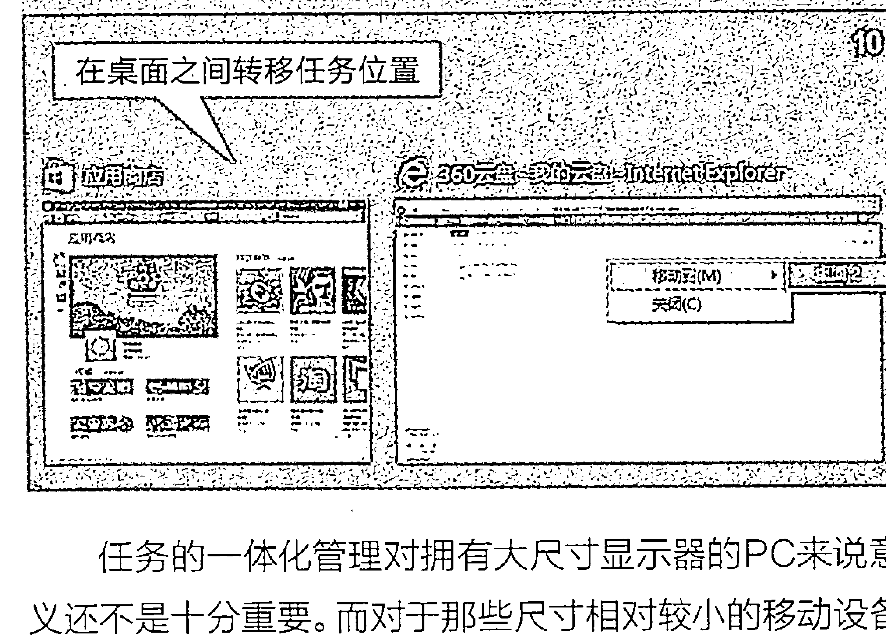

任务的一体化管理对拥有大尺寸显示器的PC来说意义还不是十分重要。而对于那些尺寸相对较小的移动设备来说，就显得非常重大了。如果在平板或手机上要打开多个任务、相互对比或交换数据，利用分组桌面管理的方式就显得非常易于管理和能够清晰显示。因此，在我们感到微软在PC上增加这个功能多少有点鸡肋的同时，应该能够想到，微软的“醉翁之意不在酒，在于移动之间也”的深层考虑。这种考虑在目前移动端体验尚未普及的情况下显得不够明显，几个月之后，当微软小尺寸的设备广泛使用了Windows 10之后，这种优越性就会大大体现出来。

##### 隐藏在‘关机’按钮背后的秘密

许多人都纳闷微软在Windows 8中将关机命令藏得那么深的原因，也有人谴责微软的“脑残”。其实这种安排很自然。微软的Windows 8当初是一门心思为移动而打造的，对移动设备来说，无论是平板还是手机，如果启用了Windows 8的自动睡眠功能，除了维持内存的微小电力外，其余诸如显示屏、CPU、存储器等的电力供应都会被切断，此时整个设备的耗电甚至会比蜂窝待机的手机还要省。因此根本不需要频繁地开关机，只需设好睡眠时间，在没有工作任务时，设备自然会进入最省电的睡眠状态。而基于这种设计理念，关机和开机就变成很少进行的工作，一周或一月关一次，甚至一直开机直到因程序出错而不得不关机或重启。由此也不难理解微软的这个隐藏开关机功能，原来是为不常关机的人准备的。但可惜的是，他们怎么没想想那些惯于上下班彻底开机关机的PC用户呢？而这次关机按钮的回归，也自然与微软进一步向PC用户倾斜不无关系。既然Windows 10也同时考虑了PC用户，那么，每天开机和关机也就变得很自然和必要。因为毕竟还有许多人习惯于在上班或下班时完全关机切掉电源。因此，微软不能不考虑这部分用户的实际情况，电源按钮的回归也就变得理所当然了（图11）。

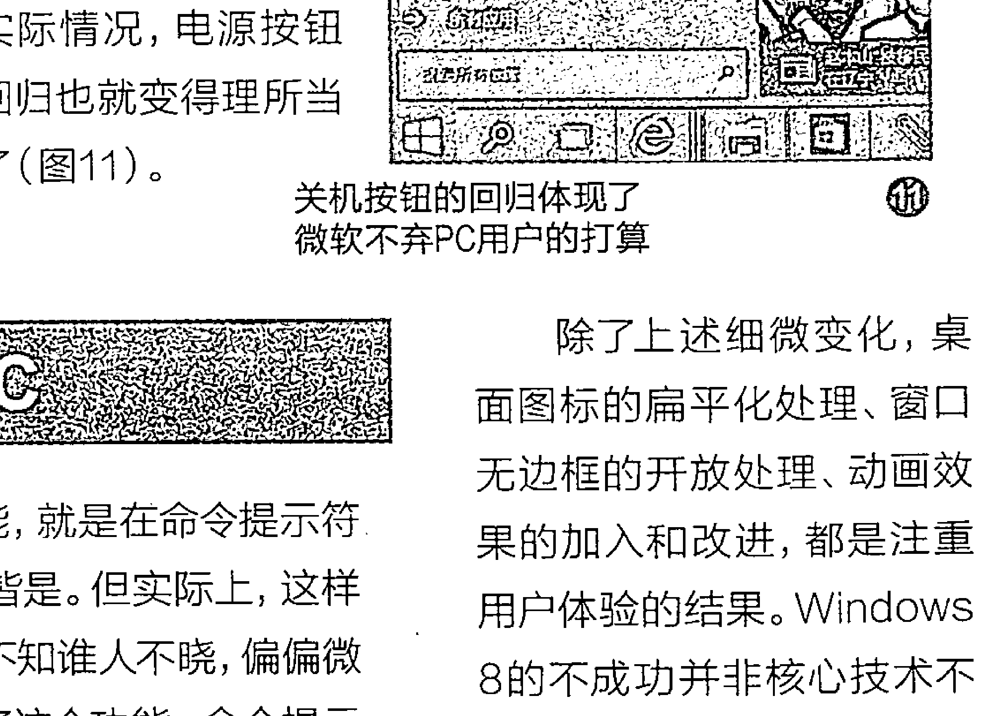

除了上述细微变化，桌面图标的扁平化处理、窗口无边框的开放处理、动画效果的加入和改进，都是注重用户体验的结果。Windows 8的不成功并非核心技术不过关，恰恰是用户体验不佳所致，微软正在努力地改变。随着Windows 10体验版不断升级，伴随数以百万计参与体验的用户不断反馈，相信Windows 10会成为PC和移动用户最贴心的朋友。

##### 并不新鲜的‘新鲜’功能Ctrl+C

Windows 10的第一次9860版本大升级中有一项引人注目的功能，就是在命令提示符窗口中加入了Ctrl+C进行命令复制的功能，一时被当作技巧炒得满网皆是。但实际上，这样的复制功能难道不应该出现在一个编辑窗口中吗？这个快捷键又谁人不知谁人不晓，偏偏微软在几代Windows中都没有加入，直到Windows 10才迟迟地加入了这个功能。命令提示符内容复制虽说是简单的改变，不过从对此功能的改进，足见微软在细节上重视用户呼声的态度。几代Windows都没有解决的细微功能，终于在Windows 10中解决了，可见微软是认真的。不过类似显而易见却视而不见的问题依然还有不少，正等待微软去倾听和解决（图12）。

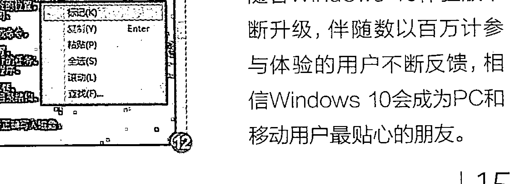

#### 安全体验Windows 10

Windows 10预览版推出后，总体反响不错。因此，也引得越来越多的人去跃跃欲试。但对于一个依然存在许多问题的预览版来说，用户去体验它会面临一定的风险。许多人担心安装会对原有系统或数据造成影响，或安装后系统不稳定影响工作，因此多持观望态度。也有勇敢者因盲目升级或安装，确实遇到了问题或受到了损失，这一点从Windows 10的网络论坛或贴吧中可看到。那么如何在不影响原有系统和数据的基础上，安全地体验Windows 10呢？由于用户现有的系统环境不同，不少用户在用Windows XP，还有的用户在使用Windows 7或Windows 8.1，因此找到一些安全可靠的安装试用方法是至关重要的。

> **小提示**
>
> 如果没有多余的硬盘或者移动硬盘，但是若在原硬盘上可以腾出一个空白分区，也可以采用安装多系统的方法来体验Windows 10。具体方法：如果当前电脑中使用的系统是Windows XP或者Windows 7，将Windows 10的ISO安装文件用WinRAR解压或用WinMount虚拟打开；如果当前使用Windows 8或8.1，则直接双击ISO打开此文件。接下来运行安装文件Setup.EXE，安装过程中选择“自定义安装”（切不可选择“升级”安装），将系统安装到腾出的空白分区中即可。安装过程中千万注意要选对分区，否则会造成已有分区数据丢失，后悔莫及。此外要注意，下载ISO安装包之前，要查看自己正在使用的系统是32位版本还是64位，下载的ISO文件版本位数要与已有系统对应，否则全新安装时安装文件将无法运行（图3、图4）。

> **火速连接**
>
> 有关在移动硬盘中安装体验Windows 10的具体方法，参见本刊2014年第22期的文章《闲置移动硬盘 体验Windows 10》。

#### 全新安装 从头体验Windows 10

最安全的体验Windows 10的方法莫过于有一台全新组装的电脑，在新硬盘上安装新系统会无所顾忌。对于一台已经用过但其硬盘中的数据完全不再有用的电脑，也可把它看作一台新电脑，这类电脑由于不用考虑用户数据的安全问题，也不用顾虑安装过程中可能出现的任何问题，所以尽可大胆尝试。

具体安装与全新安装Windows 8/8.1、Windows 7或Windows XP的方法相似。先将下载的ISO安装文件以刻录映像文件的方式刻录成启动光盘，或写入到WinPE启动U盘中，再用安装光盘或启动U盘来启动系统，执行其中的SETUP程序进行安装。安装过程中，直接用安装程序对新硬盘或旧硬盘进行分区和格式化处理（图1、图2）。

除了在电脑的内置硬盘中全新安装体验Windows 10外，如果有新移动硬盘或空间足够用的旧移动硬盘，还可以将Windows 10做成移动版的系统，直接用移动硬盘启动系统并使用，让Windows 10系统与电脑硬盘中已有的系统脱离关系（包括启动关系）。这样来体验Windows 10也是一种相对安全的办法。

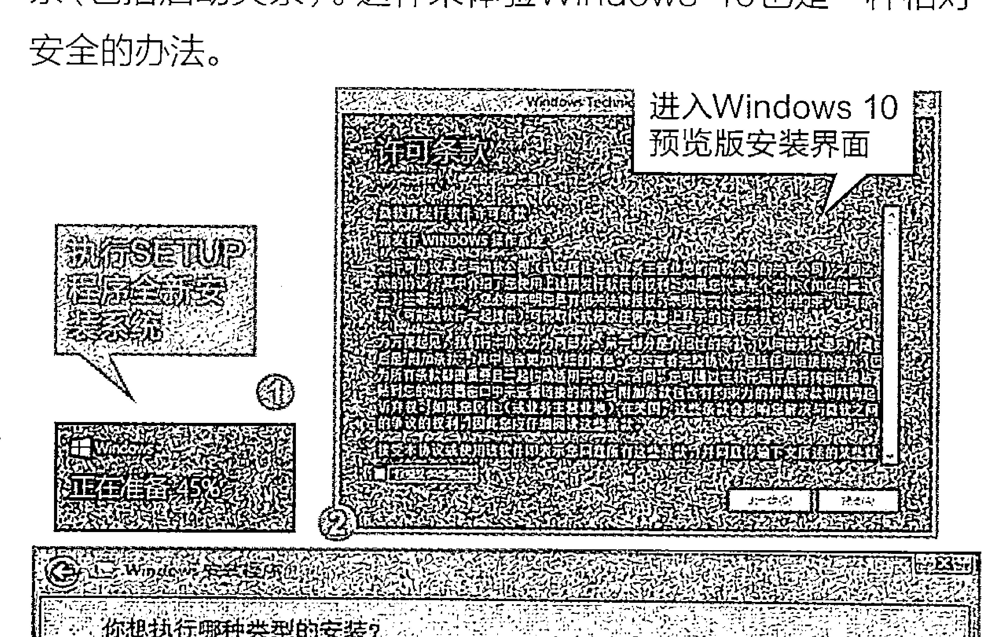

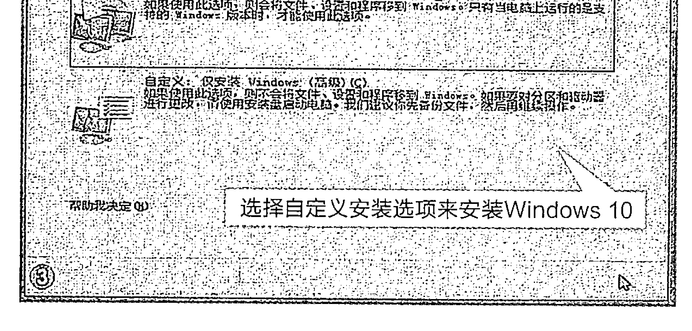

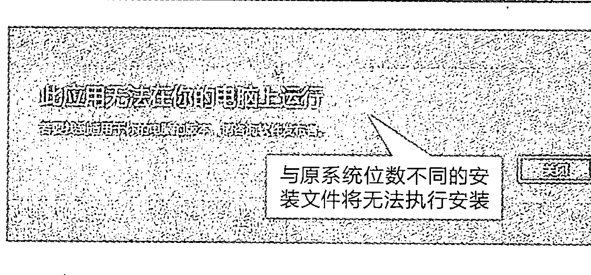

#### 资源紧张 照样用Windows 10

对于多数用户来讲，可能既不会为了体验Windows 10专门去买一块新硬盘或移动硬盘，也不一定专门能为Windows 10腾出一个空白分区来安装。那么，这部分用户难道只能与Windows 10无缘了吗？不是！

对于老电脑上无法腾出任何一分区，也不打算购买硬盘或移动盘的用户，照样可以找到体验Windows 10的办法。而且不论现有系统是32位还是64位，都可以随意选择一种来安装体验。最为关键的是，这种安装和体验过程还不会影响到已有的系统和数据。这是一种见缝插针、一举两得的安装体验方法。

首先，我们需要两样东西：一个是打算体验的Windows 10版本的ISO文件，这可通过微软网站或其他网友共享的链接下载。由于微软公开提供了测试用的密钥文件，因此任何人都有权测试这个版本而不会造成版权纠纷。要注意的是，如果你不是从微软官方网站下载的ISO文件，那么，需要验证下载的ISO文件的真实性，确保其与微软官方提供的ISO丝毫没有两样。我们需要的另一个文件是多重启动管理工具NT6 HDD Installer v3.1.4软件。此外，还要保证在希望安装Windows 10的那个分区中没有安装任何系统，也就是说它目前只是一个用户数据分区，其中没有任何系统文件，而且要保证其剩余空间至少有20GB，这样方可为顺利安装Windows 10提供保障。

在验证了ISO文件正确无误之后，要做安装文件的准备工作。先将ISO安装文件解压或虚拟为一个盘符，然后将其中的文件和文件夹全部拷入硬盘的某个分区的根目录下。注意，请记录这些文件和文件夹的名字，待系统安装完毕之后，若运行无误，可如数删除这些文件和文件夹以腾出磁盘空间。由于它们占用了3GB左右的系统空间，所以勿留着成为垃圾。

接下来在当前系统环境下运行NT6 HDD Installer v3.1.4软件，该软件能够自动检测到刚才拷贝有系统安装数据的分区，读取其中的数据，在系统中形成一个添加有两个NT6 HDD Installer启动项的多重启动菜单。这样，如果你的系统原来只有一个系统，那么当下次系统启动后会出现一个多重启动菜单，且多出两个NT6 HDD Installer菜单命令；如果原有的系统就是双系统或多系统，那么菜单中也会增加两条NT6 HDD Installer命令（图7）。

以上工作就绪之后，重新启动系统，进入多重启动菜单，选择刚才新装的两个菜单之一，会自动进入Windows 10安装程序，漆黑的屏幕背景中央出现一扇光亮的微软之窗，随着点状圆环的不停转动，安装程序引导我们进入Windows 10的安装过程。这一安装过程与全新安装没啥两样，只是需要注意，安装方式一定要选择“自定义安装”，而且目标分区一定要选对（选择需要安装Windows 10的那个已经有用户数据且空间足够的分区）。如果选错了分区，选择了一个本来已经有系统的分区，那么安装程序会将原有的系统文件移动到一个Windows.old文件夹中，造成原来的系统不能使用。所以这里再次强调，安装前看好和记住安装目前分区的卷标和剩余容量，这一点非常重要，是这种方案中首先需要重视的一个方面，如果没有把握，宁可退回去重来一次，也不要贸然前进。

##### 小技巧：验证ISO文件的真实性

对于验证下载的ISO安装文件是否与原版文件有出入，检验哈希值是件非常重要的事情。当我们进入微软Windows 10官方下载链接之后，页面会给出我们如下一些信息：

- 安装密钥：NKJFK-GPHP7-G8C3J-P6JXR-HQRJR
- 中文(简体)64位 (x64) (4.26 GB) SHA-1: 135E3193571C5AF9FBF36D24D07B2BE7EE49B2E8
- 中文(简体)32位 (x86) (3.28 GB) SHA-1: 3EE3A2033BE666BA55AFED3FCF6BB52A7C15C7CG

其中的SHA-1后面的字符串就是哈希值。此外，在网络其他共享页面中获取的ISO安装包时，一般也会给出这样的值。它是用来验证下载到的文件包是否与网站发布的原始文件包一致的字符串。具体验证方法是：打开Hash校验工具，把下载的ISO文件包拖进Hash窗口，会自动得出这个文件的SHA-1码，如果计算出的这个SHA-1码和官方下载页面中提供的原始SHA-1码不同，就说明安装包可能被动手脚，反之则说明是没问题的（图5、图6）。

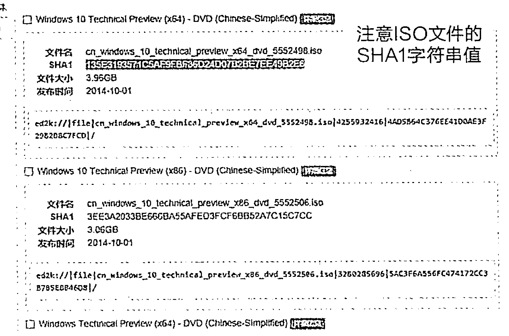

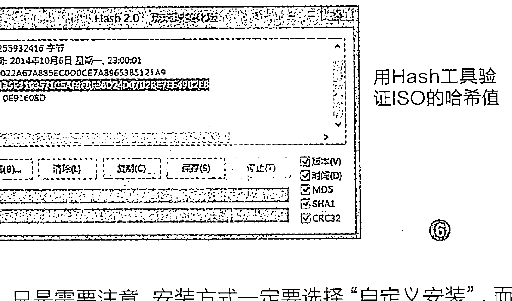## 安全体验Windows 10升级与备份

由于测试版具有无法预知的不稳定因素，那么，如果在测试过程中遇到问题，如何恢复到先前安装的Windows 10版本？这是我们有必要考虑的问题。

##### 新系统的全新升级备份机制

除了沿用原有的小补丁自动升级机制外，对于大型的版本升级，Windows 10使用了一种新的升级机制，它不再像Windows 8升级到Windows 8.1时那样彻底“摧毁”旧的系统，而是将原有系统中的配置和用户数据做了很好的保留。升级时，通过在“电脑设置”窗口中点击“升级和恢复”下的“Preview builds”一项，进入检查是否有新的预览版的界面。如果有新预览版提供（如第一次大升级的9860升级版），则会自动下载此升级版的安装文件，下载之后自动进入升级安装过程。在升级安装的过程中，系统会首先将先前的Windows 10系统文件、应用程序和用户文件转移到两个文件夹中，其中一个是位于系统分区中的Windows.old文件夹，另一个是RecoveryImage文件夹。前者保留了原先的Windows重要文件、用户文件夹、Program Files应用程序等数据，如果系统出现问题，只需用启动盘启动系统后，将此文件夹恢复为Windows文件夹，即可恢复到原来的系统；后者则是做了一个系统映像的备份，可以通过制作移动恢复启动盘的方式，在制作过程中顺便从这里提取恢复分区数据，作为系统移动恢复的原始数据之用。

可见，Windows 10提供两手准备的恢复方案，让我们在测试Windows 10预览版时，无论对系统文件还是用户数据，在安全上有了足够的保证（图11、图12、图13）。

##### 更加自由的用户备份方案

用户备份自己的系统，除了可以利用系统自带的建立系统还原点、建立恢复映像文件和恢复启动盘等方法外，还可以利用第三方工具彻底备份系统分区的方法。

我们可以在当前系统中安装最新版本的专业备份工具ATI 2015，然后在当前运行的Windows 10窗口中启动ATI 2015，对系统分区进行整体备份，将生成的TIB备份文件保存在移动硬盘或当前硬盘的数据分区中。然后再准备一个集成了ATI 2015的Windows 10 PE的ISO文件，并将此文件刻录成启动光盘或启动U盘。当系统出现问题无法启动时，用集成有ATI 2015的Windows 10 PE盘启动系统，然后启动PE环境中的ATI 2015备份工具，读取先前备份出来的Windows 10分区备份TIB文件，对系统分区实行整体还原操作。

> 这种还原方法会清除系统分区中的所有数据，自上次生成备份文件至目前所产生的所有系统或用户数据都将丢失。因此，采用这种备份还原计划，最好提前设定ATI 2015的计划备份功能，让该软件在每天空闲的时间段对系统分区实行自动备份，例如可选择在中午吃饭午休时间，或在晚上不工作的某个时段让其定时开启系统备份，这样就可以最大限度地保留最新的系统和用户数据。采用这种方案备份，也可以在每一次系统重大升级前，先进行一次系统备份，备份完成后再执行系统升级操作。这样，升级前的个人数据或系统文件都将会保留下来，测试中出现问题可随时恢复到升级之前的状态。

##### 新版本升级机制预示的新动向

Windows 10还采用了一种版本升级的新方法，那就是通过在线购买产品密钥的方式，向Windows添加新功能。我们只需通过控制面板进入“Windows更新”控制窗口，点击窗口左下角的“向Windows Technical Preview添加功能”文字链接，进入添加功能对话窗口，输入已拥有的产品密钥或点击“我要在线购买产品密钥”，获得微软授权，下载和安装自己需要的新功能。这一变化体现出微软今后对Windows系统更新的一种思维方式和动向。由此可预测，微软今后很可能不会再用以往的方式去以整版重新购买和重新升级安装的方式发行Windows版本，使用这种在线付费下载和安装功能模块的方式，无论对用户还是微软来说，都是一种极为便利的办法（图14）。

#### 安装Windows 10平板也简单

看到上面介绍的Windows 10的各种新特性，相信很多平板用户也蠢蠢欲动，想在自己的平板上安装Windows 10。在平板上安装Windows 10和在电脑上安装其实没有多大的区别，只是大家要结合一下平板的特性稍加注意即可。

##### 选择好合适的版本

首先我们要了解自己的平板启动类型，对于已经预装Windows 8.1的平板，这类设备使用的是UEFI启动模式，我们就应该选择X64位版本。对于原来是Windows 7的平板，则要查看自己的平板使用哪种方式启动，同上UEFI启动使用64位，MBR启动则建议使用32位（因为X64位系统还需要CPU的支持）。一般选择和原来平板同一类型的版本即可，而要查看自己原来的系统是什么版本，只要打开资源管理器，右击“计算机”选择“属性”，在打开的窗口中，系统类型后显示的就是当前系统位数（图15）。

##### 安装前备份必要的驱动

因为在平板上大家大多使用触摸驱动，因此安装前将必要的驱动备份可以省事很多。Windows 8.1驱动和Windows 10基本相同，安装Windows 10之前可以先使用驱动精灵等将当前系统的驱动备份好，安装完Windows 10后再恢复驱动即可正常使用（图16）。

##### 建议使用VHD方式安装

因为现在大部分平板由于存储空间的限制，一般都只有一个分区，因此建议使用VHD方式安装Windows 10，这样无需为新系统再划分专门的分区。VHD封装可以使用“VHD onekey”（下载地址：http://dl.dbank.com/c0sjbfedg）。首先将Windows 10安装镜像加载到虚拟光驱，启动程序后切换到“创建VHD”，按提示在C盘创建一个VHD文件，安装文件选择虚拟光驱中的“install.wim”，点击“确定”即可（图17）。完成VHD的灌装后切换到“挂载/卸载VHD”，点击“向BCD中添加项目”，最后再将虚拟光驱下的Bootmgr复制到C盘（UEFI启动用户则将EFI目录复制到平板ESP分区，然后再执行添加BCD项目），重启后按屏幕提示选择Windows 10启动并完成安装即可（图18）。

> 如果需要自制U盘启动来全新安装，对于UEFI启动的平板注意U盘的格式一定要格式化为FAT32，因为UEFI启动只能识别FAT分区。

#### 老系统也玩Windows 10新功能

目前发布的Windows 10还只是技术预览版，如果贸然安装肯定会遇到这样那样的麻烦。虽然前面的文章中已经介绍了不少的解决方案，不过对于很多技术小白来说，在实际操作中如果真正遇到麻烦，解决起来就没那么简单了。其实，如果只是想体验Windows 10的新功能，通过一些第三方软件，在当前系统中照样可以轻松实现。

##### 更便捷为大屏显示器添加1/4分屏

Windows 10新增或者改进组件的目的是让用户获得更好的操作体验，提高日常操作的效率。因此Windows 7模仿Windows 10目的也是如此，最终目的是提高操作效率，实现或者达到Windows 10那样的操作效果。因此在下文的模拟中，主要以提升操作效率为出发点。
首先，现在大家使用的屏幕尺寸越来越大，为了充分用好大屏幕，在Windows 10中新增了1/4分屏功能，这样在进行多个文本校对、多张图片对比等操作的时候，就可以将屏幕分为多个小屏幕，比对起来方便多了（图1）。

对于Windows 7用户，借助WindowsSpace（下载地址：http://suo.im/bk6j5）也可实现类似的分屏效果。启动Windows Space后它会自动最小化到任务托盘，右击托盘中的图标选择“设置”，在打开的设置窗口中切换到“窗口移动&改变大小”，在动作选项下可以像Windows 10那样设置四个边沿的桌面分屏，比如左边沿设置为“窗口扩展到左半个桌面”，其他边沿进行对应的设置（图2）。完成上述设置后，以后只要将程序窗口移动到对应边沿，这样程序窗口就会自动占用1/4分屏显示，在多个文件夹之间进行文件的复制、剪切，或者进行多个文本校对的时候，就可以在桌面打开程序并进行分屏显示，充分发挥大屏幕的优势（图3）。

##### 小工具自定义窗口边框

如前所述，Windows 10使用了类似Android、iOS的扁平化设计，所有程序的边框都变得极为细小。这种设计在小屏幕（如一些7英寸、8英寸屏幕）的Windows 8平板上不仅可以节约屏幕的显示空间，同时可获得更好的视觉体验。借助Tiny Windows Borders（下载地址：http://dwz.cn/vtWfn）就可以手动对程序边框进行调整，可以调成像Windows 10那样的扁平化显示。启动程序后只要将调整滑块拉到最左边，然后点击“Apply”即可（图4）。完成上述设置，现在再打开程序窗口，可以看到窗口的边框已经变得很细小。当然这种改变不能节约出多少的显示空间，但是对于小屏平板来说，如果排列多个窗口，每个窗口缩小边框后都可以节约空间，还是很有效果的。当然最主要的还是可以获得更好的显示效果（图5）。

| 名称 | 状态 | CPU | 内存 | 磁盘 |
| :--- | :--- | :--- | :--- | :--- |
| 应用 (3) | | | | |
| Tiny Windows Borders | | 0% | 3.9 MB | 0 MB/s |
| 辅助功能屏幕键盘 | | 0.9% | 3.2 MB | 0 MB/s |
| 任务管理器 | | 0.8% | 7.1 MB | 0 MB/s |
| 后台进程 (29) | | | | |
| ADSafe 32 Bit App | | 0% | 10.3 MB | 0 MB/s |
| ADSafe Service Application | | 0% | 0.2 MB | 0 MB/s |
| Classic Start Menu | | 0% | 0.7 MB | 0 MB/s |
| COM Surrogate | | 0% | 0.5 MB | 0 MB/s |

##### 程序切换不同以往 大图标预览程序

作为支持多任务的操作系统，在平时的操作中经常同时启动多个程序，并且经常要在不同程序之间切换。为了便于大家切换程序，Windows 10新增了一个Alt+Tab快捷键，按下这个热键后，任务栏的程序会自动以大缩略图的形式排列在桌面上，就可以一目了然地查看和切换了。Windows 10的这个设计非常适合触摸用户对程序的切换，因为平板的屏幕较小，很多程序最小化到任务栏后不方便点击切换，现在通过大图标来预览和切换就方便多了（图6）。通过Production_release（下载地址：http://suo.im/epmun），我们可以在Windows 7或Windows 8上实现类似的效果。为了方便使用，下载后将程序固定到任务栏，以后只要点击一下（或者按下Ctrl+TAB），任务栏的所有程序就会以大缩略图的形式展示了，可预览到窗口大概内容，点击需要切换程序的图标即可，而且同一程序，像Word那样打开多个文档的，会自动排列在一起（图7）。

##### 触控输入更顺溜 自动激活虚拟键盘

现在使用Windows平板的用户越来越多，平时的操作中少不了使用触控键盘。为了方便用户的使用，在桌面模式下输入文字时，Windows 10自带的虚拟键盘会自动出现，省去用户手动点击键盘图标的操作，大大提高了输入效率。对于Windows 8.1平板的用户，现在通过手动替换系统文件也可以实现同样的效果。

首先到http://pan.baidu.com/s/1i3iQYrz下载适合自己版本的Tiptsf.dll文件，下载后先将其中的“管理员取得所有权.reg”导入注册表。接着打开C:\Program Files\Common Files\microsoft shared\ink，找到Tiptsf.dll，右击选择“管理员取得所有权”，然后将下载到的Tiptsf.dll文件覆盖到此替换原文件（64位用户还需C:\Program Files (x86)\Common Files\microsoft shared\ink下的同名文件）。现在重启系统再次进入，这样当你打开类似记事本、IE网页地址栏等需要输入字符的程序时，系统自带的虚拟键盘就和Windows 10一样会自动弹出，大大方便我们在平板上的使用（图8）。

> 小提示：自行替换Tiptsf.dll文件后下次系统更新又会被原文件替换，因此可以将该文件在上述位置复制一份，下次系统更新后再次替换即可。

##### 搜索更高效 自行添加搜索组件

从Windows 7开始，微软就改进了系统搜索功能，可以在开始菜单、资源管理器中随时启动搜索。为了便于大家的使用，Windows 10还将搜索集成到了任务栏上，这样在桌面上就可以直接点击开始搜索。Windows 7用户现在则可以借助“光速搜索”（下载地址：http://dwz.cn/vwqDR）实现类似效果。

启动程序后其会自动最小化到任务托盘，右击托盘图标，选择“显示任务栏的搜索条”，这样在桌面任务栏即可快速启动搜索。光速搜索和系统自带搜索相比，特色是轻巧高速，查找文件速度非常快（一般在1秒内即可完成），只要在托盘搜索框中输入需要查找的字符即可立刻看到搜索结果，它可以作为系统搜索的有效补充（图9）。

如果搜索的结果很多，点击搜索框中的光速搜索图标，可以打开详细搜索结果，搜索关键字还会自动以黄色底色标注，非常方便我们查看（图10）。

#### Windows 10时代的硬件

俗话说“一朝天子一朝臣”，Windows系统的历代更新，往往也伴随着周边硬件的更新换代。有意思的是，当年从Windows 95→98→2000→XP→Vista→7，每次Windows系统的升级都需要更强大的硬件平台作支撑，否则就会出现速度慢、卡顿等严重问题。而从Windows 8到如今的Windows 10，视窗系统对硬件平台的要求却越来越亲民。原因无它，Windows想和iOS和Android抢占更多移动市场份额，就必须让低端平台也获得流畅驾驭Windows 10的能力。

可以看出目前主流的Windows 7/8与最新的Windows 10硬件需求完全一致，能运行前两代的系统运行Windows 10理应毫无问题。不过在之前操作系统当中常用的Windows系统评分在目前的开发者预览版当中消失了，我们很难再像以前那样直观判断硬件得分（图1）。

##### 硬盘占用与启动速度

很多用户不会关心操作系统安装完毕后会占用系统硬盘多少空间，但确实会有一些配置比较老的用户和使用60GB SSD的用户会很关心这个问题。在一台内存容量为4GB的平台上，一个全新安装的开发者预览版Windows 10 x64所占硬盘空间为16.1GB，这和微软给出的最低配置要求确实比较贴合。仔细看这其中有4GB为Windows在C盘创建的页面文件为Windows当做RAM使用，实际上文件大小大概为12GB左右。如果使用同样的平台安装Windows 7 x64的话，系统只会在C盘占用大概14GB。

##### 操作系统换代与硬件需求

说起操作系统的更新换代，与硬件更新换代密不可分。不过只有当年从Windows XP更替到Windows Vista时硬件需求经历过一次大升级，自从Windows 7开始，操作系统的硬件需求对比上代系统仅稍微增加，甚至完全不变。

表1: 操作系统硬件需求

| Windows | 10/8/7 | Vista | XP |
|---------|--------|-------|----|
| 处理器 | 1GHz 32位或64位处理器 | 800MHz 32或64位处理器 | 300MHz处理器 |
| 内存 | 1GB(32位)或2GB(64位) | 512MB | 128MB |
| 硬盘 | 16GB(32位)或20GB(64位) | 15GB | 1.5GB |
| 显卡 | 带有WDDM驱动程序的DX9设备 | 32MB显存的DX9设备 | 支持SVGA的设备 |
| 其他 | 互联网接入 | CD-ROM | CD-ROM |

虽然启动速度很大程度取决于是否使用SSD，但如果同样使用机械硬盘就能看出差别。Windows 7/8与最新的10的开机、重启和关机速度各有不同，操作系统在经过长期使用后哪个响应速度更快一目了然（图2、图3）。

表2：系统启动时间

| Windows | 10 | 8 | 7 |
| --- | --- | --- | --- |
| 开机(秒) | 16 | 14 | 25 |
| 关机(秒) | 13 | 9 | 16 |
| 重启(秒) | 28 | 22 | 29 |

表3：系统内存占用

| Windows | 10 | 8 | 7 |
| --- | --- | --- | --- |
| 开机占用(GB) | 1.1 | 1.0 | 0.9 |
| 闲置占用(GB) | 0.9 | 0.7 | 0.6 |

虽然内存速度和容量在近几年已经不是太成问题，但对于一些希望使用“老爷机”体验新系统的用户依然有关注的必要。另外今年席卷全球的DRAM大幅涨价，也困扰着很多新装机的用户。操作系统内存占用更低、速度更快肯定都是大家都希望看到的，那么Windows 10表现如何呢？对比Windows 7/8来看一看。

表4：系统内存速度

| Windows | 10 | 8 | 7 |
| --- | --- | --- | --- |
| 读取(MB/s) | 10400 | 10512 | 10336 |
| 延迟(ns) | 64.8 | 65 | 64.9 |

表5：游戏性能对比

| Windows | 10 | 8 | 7 |
| --- | --- | --- | --- |
| 3DMark 11 | 4104 | 4098 | 4095 |
| 3DMark FS | 3057 | 3064 | 3033 |
| CB R11.5 GPU | 61 | 65 | 65 |
| 最终幻想13 | 60 | 60 | 60 |
| 地铁2033 | 32 | 33 | 33 |
| 终极街霸4 | 121 | 120 | 119 |
| 新古墓丽影 | 50 | 49 | 49 |
| 刺客信条大革命 | 12 | 11 | 11 |

全新操作系统的游戏性能如何肯定有大批用户所关注，当初Windows Vista就曾经因为游戏性能下降比较明显在早期被大量游戏用户弃用。此外作为最新的操作系统，对目前已有的游戏兼容度如何也非常重要，如果大量游戏无法运行，也会让用户更新的热情大打折扣。首先说说兼容性，一些国外游戏厂商的大作普遍没有出现什么问题，基本能在Windows 8上运行的游戏都可以在Windows 10上面正确运行。但在一些网游常用的登陆器上Windows 10确实存在很大问题，比如大红大紫的《英雄联盟》和《穿越火线》。《英雄联盟》目前无法使用游戏的启动器进入游戏，只能通过腾讯游戏平台实现“曲线救国”，而《穿越火线》、《剑灵》等有不同程度的闪退问题，反倒是一些比较老的游戏比如《反恐精英》、《魔兽世界》等就不存在此类问题，基本都可以正常运行。不过这可能也是因为目前Windows 10还在测试中，相信正式推出时这些都不成问题（图5）。而游戏性能则给人很大的期待，本来以为预览版操作系统游戏性能会一塌糊涂，但综合看是三款操作系统中最好的。我们有理由相信在消费者预览版和最终用户版本的Windows 10游戏性能会越来越好。

### 2014年终回顾 大话IT卷

#### 2014年IT安全事件时间轴

#### 中国互联网大面积DNS故障

1月21日，全国三分之二的DNS服务器处于瘫痪状态，直接后果就是大量网站域名解析不正常，近三分之二的网站瘫痪，涉及腾讯、百度等。

##### 跳过故障DNS去上网

大家知道DNS的作用主要就是对域名解析，以123.125.114.144为例，它对应的就是baidu.com这个域名。我们平时访问百度直接输入www.baidu.com，DNS就负责将123.125.114.144解析到baidu.com这个域名。因此如果DNS出现故障，直接的后果就是无法解析域名（或者解析错误），导致无法打开所需的页面。在本次故障中，大部分域名访问请求就被跳转到几个没有响应的IP上，结果导致大部分用户遇到提示，无法解析服务器的DNS地址，从而无法上网（图1）。

当遇到DNS故障时，首先可以尝试使用其他DNS解析服务，国内阿里提供免费的DNS有223.5.5.5和223.6.6.6，国外谷歌提供有8.8.8.8和8.8.4.4。我们可以点击“网络和共享中心→更改适配器设置”，选中正在联网的网络连接，右击选择“属性”，在网络连接属性窗口中选中“Internet 协议版本 4 (TCP/IPv4)/属性”，再在打开的窗口中选择“使用下面的DNS服务器地址”，接着在DNS服务器地址中输入上述地址即可（图2）。

不过需要注意的是，由于DNS有个缓冲时间，经过上述设置后可能无法马上生效，就仍然会提示DNS解析错误。这时可以以管理员身份启动命令提示符窗口，输入执行“ipconfig /flushdns”命令，刷新一下本地DNS缓存就可以了（图3）。

```
ipconfig /flushdns
```

#### IT安全的那些大事件

又到一年辞旧迎新时。在过去一年的“IT圈”中可谓风起云涌：我们最为熟悉的Windows XP系统正式告别历史舞台；诺基亚和摩托罗拉正式“改名”微软和联想；源自iOS的iCloud泄密再度让我们重新审视移动设备的安全；Intel、AMD、NVIDIA也纷纷祭出了最新的硬件平台。作为独立的个体，也许这些事件与我们的生活并不交集，但它们对整个行业所造成的影响，却在潜移默化地影响着我们的生活。

互联网的快速发展实际上是一把双刃剑，在大家的生活、工作、学习等得到方便的同时，我们的各种安全也受到越来越多、越来越大的威胁。而随着网络技术的发展，各种破坏安全的手段也越来越高，令人防不胜防。作为《电脑爱好者》2014年的最后一期，我们就来回顾一下2014年的那些重大的IT安全事件，吃一堑长一智，以便更好地保护自己。

##### 3月

###### 敲诈者病毒兴起

3月一个名为敲诈者的病毒感染用户的商业文档、家庭照片等重要文件，文件感染后出现莫名损坏导致无法打开，同时在损坏文件目录下发现“敲诈者”病毒留下的联系文件（点我修复文件.txt）。

###### 专杀“敲诈者”

当前的网络安全形势比较严峻，几乎每个月都有新的恶性病毒或者病毒变种发生，而且病毒越来越花样翻新。像这款敲诈者病毒，它选择对用户比较看重的数据文件进行破坏，导致文件无法打开（图1），从而进行数据敲诈。如果此文件对你非常重要的话，就很容易上当了。

如果遭遇类似敲诈者的病毒，首先不要盲目地自行进行数据恢复操作，建议先将病毒库升级到最新，全盘扫描后看看能否恢复。如果无效，则建议上网查找有没有专杀工具，因为类似敲诈者的流行病毒一出来，杀毒厂商大多会在第一时间推出专杀工具。像这次事件中的敲诈者病毒，就可以到http://tinyurl.com/pbx5lv9下载金山推出的专杀工具，下载后按提示运行即可（图2）。当然，对于类似报表、统计表这类重要商务文档，平时建议做好数据备份，可使用移动硬盘、网盘（只建议单向同步，防止染毒文件同步到网盘）等多处备份，这样即使中招病毒也不会损坏数据。

> 现在很多类似敲诈者的病毒瞄上了我们的个人文件，病毒制造者通过加密、加壳或者隐藏的方式来感染文件，导致用户无法使用常规的方式打开文件。当用户在发现重要文件感染病毒后千万不要盲目操作，一定要及时查看杀毒厂商发布的病毒分析报告，确定自己中招是否是同类病毒，然后再根据杀毒厂商给出的具体解决方案去尝试杀毒还原文件。平时则建议将重要文件做安全的备份，并打开只读开关，防止病毒感染。

##### 个人如何应付“心脏出血漏洞”

文 技术宅

心脏出血漏洞（Heartbleed）震惊业界，作为服务器端的漏洞，它却使得本来无辜的个人用户也遭殃。这个漏洞从名称上看就知道对计算机来说有极大的危害，该漏洞可以帮助黑客获得打开服务器的密钥，监听服务器数据和流量。从表面上看，这个漏洞似乎和个人电脑无关，不过大家知道现在我们使用的各个网络服务，包括QQ、网盘、邮箱、博客、网银等，它们的账户信息和密码都是保存在相关的服务器上的，一旦黑客利用这个漏洞入侵服务器，可以想象它会给我们带来怎么样的麻烦。

> **火速链接 ▷**
2013年第3期的《让LastPass和支付宝和平共处》一文中，详细介绍了LastPass的使用

如果遭遇类似心脏出血的漏洞，我们该怎么办呢？对于服务器网站来说，自然是及时更新版本，尽量在短时间内完成升级。对于个人用户来说，在日常网络活动中除了为网络账户添加强健密码外，定时更换账户密码也是一个行之有效的方法。网站、系统漏洞随时都会出现，如果出现类似心脏出血这样的严重漏洞，我们的账户信息就很可能被黑客窃取。由于网站会即时更新补丁，因此如果我们养成定期更换账户密码的习惯，这样即使账户信息泄露，也可以比较有效地保护自己的账户。

当然，频繁更换密码会加重记忆负担，因此一方面更换密码后我们可以使用浏览器的Cookie自动记住密码（图2）。另一方面则可以使用类似LastPass之类的专业密码管理工具，将自己常用的网络账户密码全部归集到一起进行管理（图3）。

##### 5月

###### 山寨网银及山寨微信

5月，山寨网银和山寨微信客户端泛滥，病毒通过伪装成正常网银客户端的图标、界面，在手机软件中内嵌钓鱼网站，骗取网民提交银行卡号、身份证号、银行卡有效期等关键信息，中毒用户将面临网银资金被盗的风险。

###### 用好安全工具防‘钓鱼’

文/技术宅

山寨钓鱼网站一直在威胁着我们隐私和财产的安全，现在很多人喜欢在线转账，一些钓鱼网站就模拟工行、农行等页面，然后诱使用户输入账号、密码等信息，从而窃取用户的金融资产。

对于山寨钓鱼网站的防范，一方面要养成使用官方网站的好习惯，比如可以使用360浏览器访问，如果是正规的官方网银，在地址栏会出现绿色‘证’字。另外，可以将常用的网银官方网址添加到收藏夹中备用，下次直接通过收藏夹访问，而不是通过搜索引擎搜索（图1）。

对于网银官方提供的安全工具，我们也要善加利用。很多网银都使用U盾等硬件工具来保障支付安全。此外很多官方网银还提供客户端程序，如中信银行用户可以使用‘网银伴侣’，网银登录尽量要在客户端完成，避免钓鱼网站的威胁。对于手机网银，则一定要到官方页面下载客户端，而不是到第三方页面下载（图2）。

> **小提示**
现在网银普遍增加了手机短信动态密码验证服务，在使用时不要轻信任何人的通知，将自己的短信验证码泄露给他人。不过对于很多Android用户来说，由于Android平台病毒多，而且Android手机普遍被Root，很多病毒会在后台拦截验证短信，导致实际操作者收不到验证短信（短信被转发到制毒者手机中了）。因此喜欢在Android手机使用网银的用户，除了防范山寨网银，还要安装手机安全软件以确保交易支付环境的安全。

##### 公共Wi-Fi中的安全隐患 保护网购隐私

随着Wi-Fi热点的普及，无论是在公共汽车、火车站、购物商场等地方，我们的手机都可以轻松接入免费热点。不过很多免费热点可能暗藏陷阱，要防范这些陷阱，我们就要养成良好的使用习惯。

现在几乎每个人都有网购，网购就不可避免地会在网站留下自己的地址、姓名等隐私信息。应该如何保护快递信息不被泄露呢？

首先要优先接入官方、正规的热点。移动和电信都在全国铺设了大量的热点，移动热点名称一般为CMCC，电信则为CHINANET，正常情况下连接后都会转到移动或者电信的认证页面，需要输入手机号码验证后才能上网。当然，因为热点名称可以任意伪造，因此对于使用上述名称但无需任何验证即可连接的Wi-Fi，还是尽量不要连接（图1）。

一方面这些信息会由于网站漏洞泄露，因此平时应该尽量选择大型购物网站购物，一旦购物网站爆出用户信息泄露的新闻，我们要在第一时间更改自己的账户信息。此外为了保护自己的地址信息，在购买不需要发货的虚拟商品（如充值、游戏点卡）时，可以随意设置一个虚拟地址来收货。如淘宝用户进入收货地址管理后，点击“添加收货地址”设置一个虚拟地址即可（图1）。另一方面不要随意丢弃保存自己收货信息的快递单，快递信息的消除可以用网上介绍的花露水涂抹法，简单一点的也可以直接在地址电话名字那用小刀画上一刀，然后用记号笔涂抹即可（图2）。

其实，连接到公共热点后尽量不要在手机上进行网络购物和网银的操作，避免重要的个人敏感信息遭到泄露，甚至被黑客银行转账。因为本来手机短信验证是支付保护的最后一道手段，但是直接在手机上操作就自动忽略了短信保护。如果原来经常在家里Wi-Fi进行支付的用户，在浏览器或者其他应用中一定要设置不要让其记住密码，比如使用UC的用户，可以在弹出是否询问密码时，选择“否”，防止误连接到Wi-Fi后造成不必要的损失。

再次，对于连接过的热点，手机会自动保存在历史列表中。因此如果误接过陷阱热点，再次经过该区域的时候还会自动连接。所以要定期清除热点信息，Android用户进入Wi-Fi设置后选中不需要的热点长按，选择“取消保存网络”即可（图2）。

##### 9月

###### 诈骗短信和伪基站泛滥成灾

##### 2014年

##### IT安全事件时间轴

还详细记录着收货和发货双方的姓名、电话号码、住址等个人隐私信息。

9月17日，央视新闻频道《24小时》曝光了“花样翻新”的电信诈骗，揭秘号百变的“伪基站”。

###### 明察秋毫防诈骗

文/阿发

几乎每个手机用户都曾遭遇过诈骗短信和电话的骚扰，特别是现在伪基站的流行，更是会收到各种真假难辨的短信。那么该怎么防范诈骗短信和电话呢？

对于诈骗短信，大多提示中奖、假冒朋友借款、假冒银行提示等，如果收到这类短信，一般置之不理即可。如果确实担忧，可以进行官方电话确认（千万不要拨打骗子留下的查询电话）。比如招行的官方客服电话是95555，如果收到95555发给你的短信，说信用卡透支、银行账户被封之类的信息，这个号码可能是伪造的，可以拨打真正的95555电话转0号人工服务，一查便知（图1）。

如果经常遭遇垃圾、诈骗短信的骚扰，可以尝试360手机卫士进行屏蔽。进入360手机卫士的“垃圾短信”，点击“设置”，可以将特定号码和关键字列入屏蔽名单，完全阻止其接收即可，或者主动举报（图2）。

对于诈骗电话，同样可以使用电话求证（比如直接打电话给好友，询问是否确实需要借款）。对于陌生的来电，大家还可以通过百度手机卫士、搜索引擎进行查证，有些号码，在百度搜索后很快就可以知道这是一个骚扰电话（图3）。

此外，我们还可以在手机上安装可以显示来电区域的应用，这样如果某地我们根本没有亲朋好友，那么显示该地的来电就要注意了。Android用户借助“手机号码归属地显示和查询”即可轻松查询到来电号码的区域（图4）。

#### 2014年10月 Windows惊现零日漏洞 IT安全事件时间轴
10月24日，微软日前发布了一款临时补丁，修复了Windows系统中存在的一处‘零日漏洞’，该漏洞影响除Windows Server 2003外的所有Windows版本。

#### 先行一步快堵‘零日漏洞’
文/平谈

大家知道微软几乎每个月都会发布一些系统漏洞补丁，不过零日漏洞（图1）是其中最为危险的漏洞。因为零日漏洞是指被发现后立即被恶意利用的安全漏洞，也就是说安全补丁与瑕疵曝光的同一天内，相关的恶意程序就出现。因此这些漏洞具有极大的危害性，如果更新不及时，电脑很容易被黑客入侵。

零日漏洞


系统漏洞是Windows底层漏洞，一般安全防护软件根本无法进行防范。因此要预防类似漏洞，我们可以将系统自动更新时间设置得更为紧凑。进入‘控制面板→系统和安全→Windows Update→更改设置’，将安装更新的时间设置为每天的0:00，这样每天一旦有重要的更新，系统就会自动进行安装（图2）。

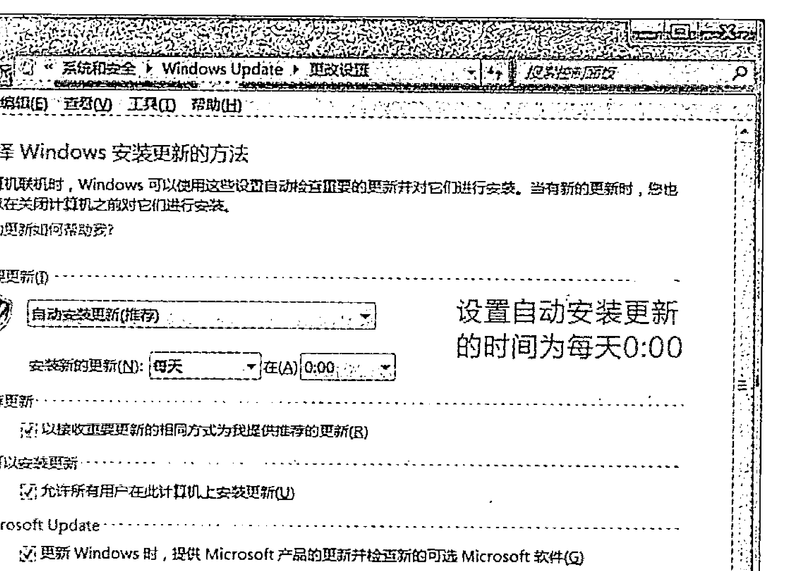

对于类似零日漏洞的更新我们要及时安装，但是由于Windows更新服务器在美国，国内在很多时候更新的速度会非常慢。对于单机用户，可以进入Microsoft安全中心（http://tinyurl.com/ozcmbzt），手动下载微软发布的补丁。对于局域网用户则可以借助360安全卫士快速分发，启动360安全卫士后切换到‘系统修复→漏洞修复’，先在服务器上下载和安装完所有的补丁（图3）。

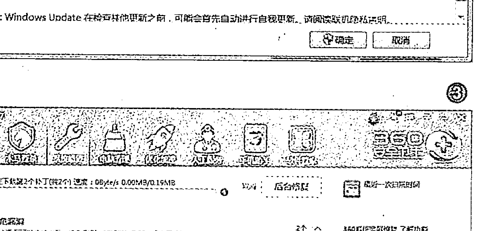

在服务器上完成漏洞的下载和安装后，打开C:\Program Files\360\360safe\hotfix，将其设置为共享目录。接着在需要的局域网其他电脑上也运行360安全卫士，先进入‘设置→漏洞修复→补丁保存位置’，勾选‘自定义网络路径或本级目录下载补丁’，这样局域网的其他电脑就可以直接下载服务器电脑已经下载好的补丁，实现在第一时间安装零日漏洞补丁，确保电脑的安全（图4）。

局域网电脑选择网络路径快速安装补丁

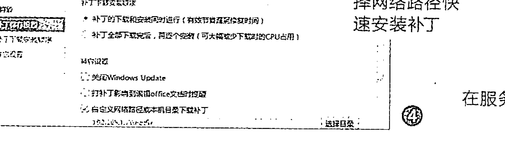

在服务器上使用360安全卫士下载补丁

#### 麦芽地iOS病毒感染iPhone手机
11月初，一款名为Wirelurker的恶意软件爆发，它感染Mac电脑之后，可通过USB接口传播到iOS设备，并且可以感染未越狱的iPhone。

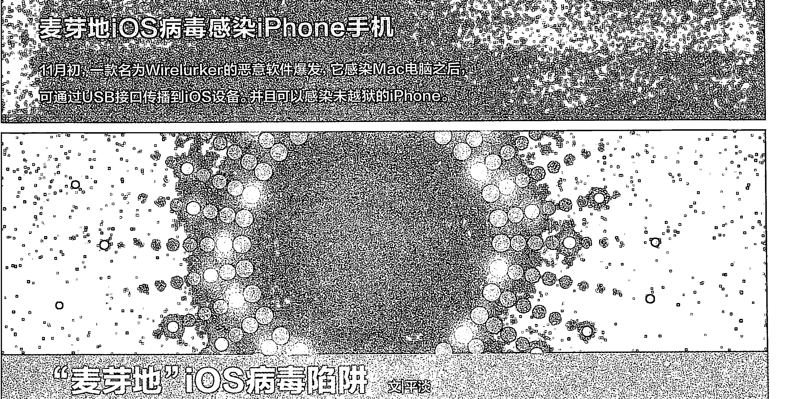

#### “麦芽地”iOS病毒陷阱 文/平淡

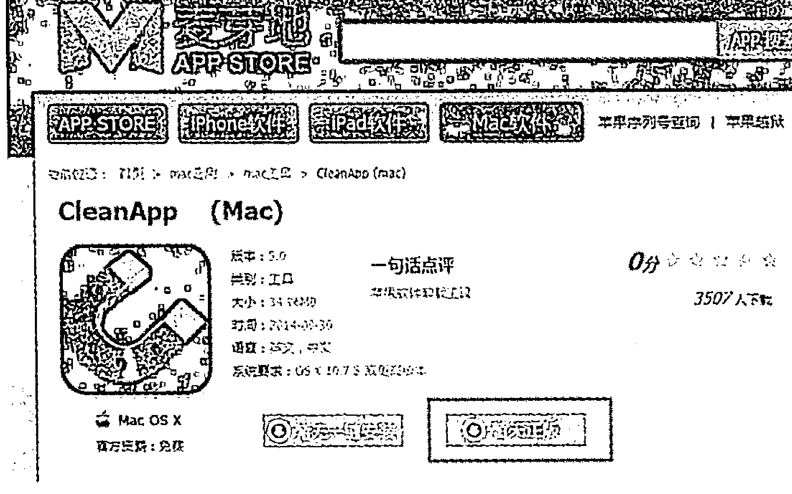

传播病毒的第三方应用商店麦芽地

iOS系统一向被认为是安全的系统，因为它使用的是相对封闭的生态系统。在默认情况下如果没有越狱，我们是无法在iOS系统上安装第三方应用的。那么Wirelurker为什么可以感染没有越狱的iOS呢？这是因为苹果为一些苹果设备相对较多的企业颁发了一种企业证书，允许企业在设备上批量地安装应用，但是这种机制在国内的第三方苹果商店被恶意使用了，导致这次Wirelurker恶意软件大面积地感染iOS设备，究其原因就是麦芽地某款应用在滥用企业技术（图1）。

那么，作为iOS的用户该怎么避免类似病毒的攻击？实际上，iOS的封闭性仍然是其安全的重要保障。因此，iOS设备首先不要去越狱，因为越狱之后就会失去封闭性的保护，而用户任意安装的第三方应用具有极大的危害性。

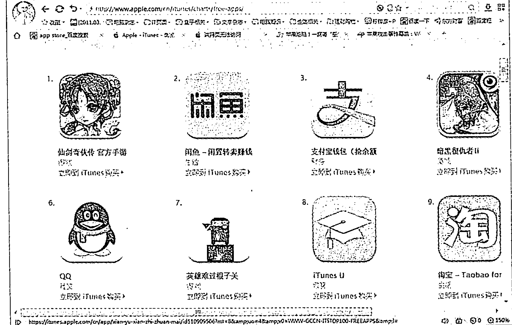

其次，养成使用正版的习惯。应用的下载都应该到官方商店去下载和购买，而不是到第三方应用商店，这次Wirelurker恶意软件正是第三方麦芽地传播的（图2）。

iOS的应用要到官方应用商店下载

### 盘点2014最火移动设备
如果问2014年最热的IT设备有哪些，智能手机无疑是上镜率最高的品类。回想往昔，无论是机场、咖啡厅，还是宿舍、会议室，笔记本PC都是扮演娱乐平台的主力军。如今，无论是上述熟悉的公共场景，还是床铺沙发等个人空间，以智能手机为代表的移动设备已然成为无可争议的主人公。

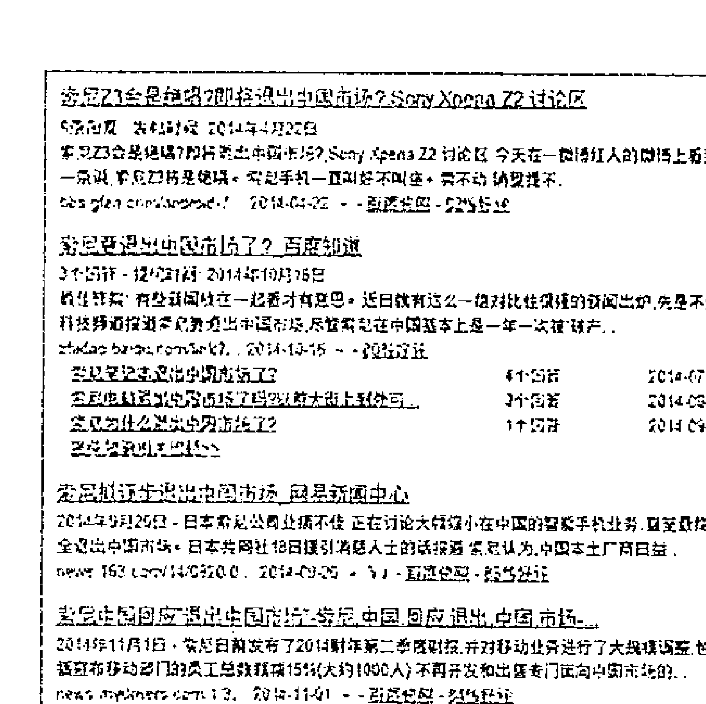

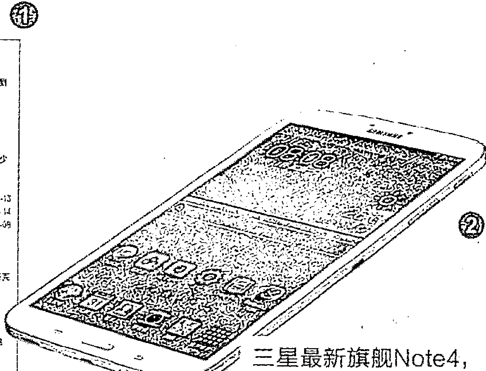

#### 国际手机品牌遭遇动荡
俗话说“外来的和尚会念经”。因此，在智能手机刚刚兴起的时间段内，以苹果、三星、索尼为代表的国际品牌把控着国内高端手机市场，分享最为诱人的利润蛋糕。很可惜，所谓“风水轮流转”，至少就智能手机这一项而言，外来的和尚们在今年已经碰上钉子了。

首先遇到麻烦的就是摩托罗拉移动。刚被谷歌收购并冷藏，便被联想以29亿美元买回了MOTO品牌和商标、2000项专利及全球50多家运营商的合作关系。就如同昔日的IBM笔记本一般，即将被烙印上China的标记。当然，这对我们来说绝对是值得骄傲的事情。

接下来就是索尼。由于第二季度财报表现糟糕，所以坊间一度有传言称索尼移动部门将退出中国市场（图1）。虽然最终的答案仅仅是索尼移动国内员工的裁员，以及停止针对中国市场特定手机型号的开发，但终归还是颓势已现，壮士断腕。

最后我们再来看看三星。曾经凭借产业链优势一度盘踞Android领域霸主地位的三星（图2），其移动业务也骤然下滑了60%。此时，三星不仅面临着大规模的内部重组，针对中国市场的手机销售渠道也在进行着调整。

好不容易凭借Milestone（里程碑，Moto首款Android手机）翻身的摩托罗拉再次折翼，有着独特三防（水）特性的索尼手机身陷险境、看似不可战胜的三星也走进了下坡路……那些曾经无比辉煌的国际手机品牌，正在国内市场遭遇着不可抗拒的寒流。曾有网友戏言：“类似的配置，国产机不到1500元，你卖个3000元，一辈子都别想东山再起！”这就是国际手机品牌所面临的尴尬境遇。

#### 联想MOTO能否成为联想助手
10月30日，联想宣布正式完成收购摩托罗拉移动的交易。今后，MOTO将以独立品牌的方式运作，并在国内主攻3000元以上的高端市场。那么，易主回归后的MOTO还能重现往日的辉煌吗？

被谷歌收购后，摩托罗拉推出过多款口碑出色的产品：比如Nexus 6、MOTO X以及MOTO G等。很遗憾，它们都不曾正式进入国内市场，绝大多数心仪它们的国内玩家只能“望洋兴叹”（图3）。易主联想之后，无论是MOTO X/G，还是最新的MOTO 360智能手表都会走到我们身边，这是联想与摩托罗拉联姻后对国内玩家的最大贡献。然而，想反攻国内手机的高端市场，仅仅依靠MOTO的品牌还是远远不够的。首先看硬件端，MOTO X和MOTO G系列在国外主打主流市场，它们的硬件规格不算很高，甚至不如联想自家Lenovo品牌旗下的中端产品。哪怕是最新Nexus 6，也很难抵御2500元级别国产手机的冲击。换句话说，无论是MOTO还是其他国际品牌，在硬件层面上很难再有所作为。

再来看看系统端，被谷歌收购后MOTO手机的取胜秘诀就在于“亲儿子”的血统：可第一时间体验最新的原生Android系统（图4）。可惜，很多Google服务在国内是无法使用的，这就导致未来在国内销售的MOTO手机很难再保持原生Android系统的味道。也许，联想会像VIBE UI（联想品牌高端机定制的系统UI）一样，为MOTO国行产品定制一套针对国内用户优化的“MOTO UI”，但没有了原生Android的血统，那些持币观望的玩家们还会为其买单吗（图5）？


原生Android系统吸引了无数发烧用户

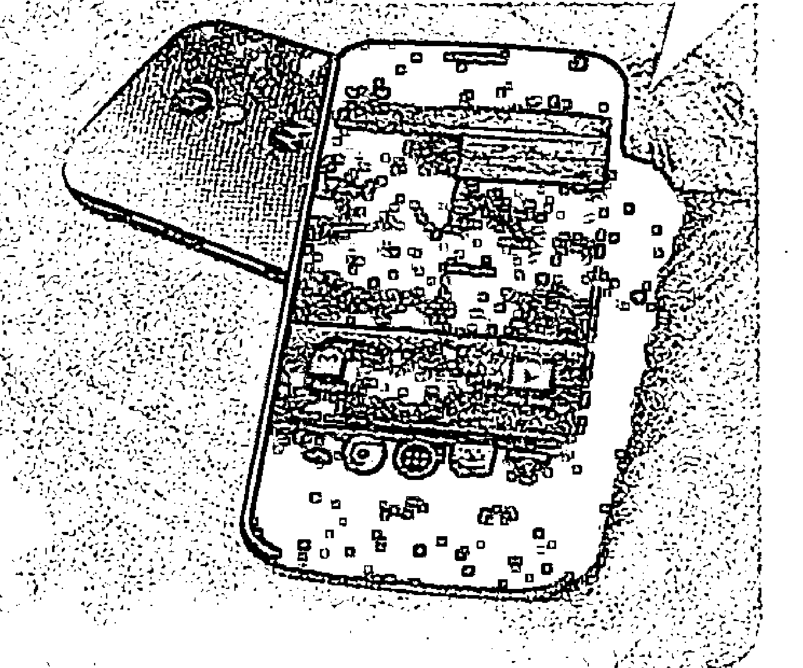

摩托罗拉MOTO X，原生Android是其一大特色

由摩托罗拉代工的Nexus 6

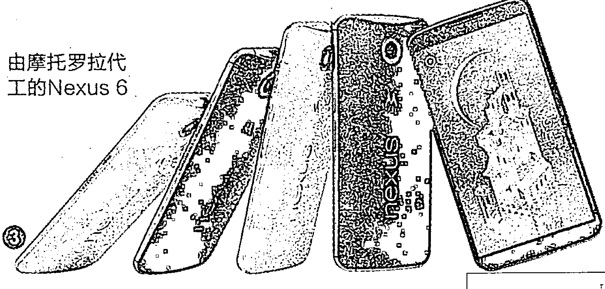

IUNI OS适配的部分热门手机

| 手机型号 | 版本信息 | 状态 |
| --- | --- | --- |
| OPPO Find 7轻装版 | 固件大小：572.4M，支持版本：4.3，适配状态：已适配 | 已适配 |
| 一加手机 | 固件大小：553M，支持版本：4.4.2，适配状态：已适配 | 已适配 |
| 三星 I9500 | 固件大小：552M，支持版本：4.3，适配状态：已适配 | 已适配 |
| 三星 N900 | 固件大小：577M，支持版本：4.3，适配状态：已适配 | 已适配 |
| 三星 N9006 | 固件大小：577M，支持版本：4.3，适配状态：已适配 | 已适配 |

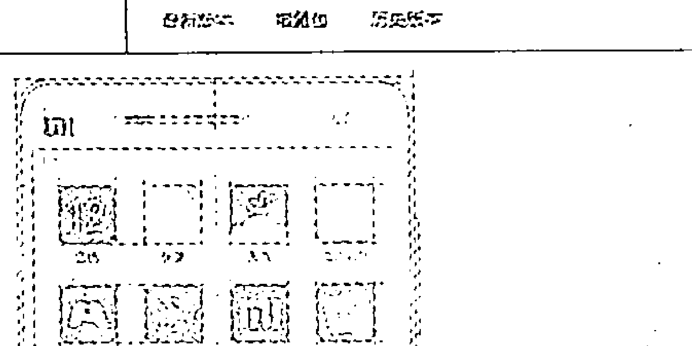

MIUI 6的设计理念

收购摩托罗拉移动，可以帮助联想拓展海外市场是毋庸置疑的，就好似当初联想收购ThinkPad，为最终问鼎“全球PC第一”奠定了基础。但是，在国际品牌手机在国内“吃不开”的背景下，MOTO品牌的价值还有多少？一方面要面临三星、LG、索尼等品牌的降价压力，一方面还要抵御“中华酷联”以及小米魅族等国产品牌的进阶挑战，其高端定位的胜率并不乐观。

#### 热门手机的系统(UI)乱象
为了彰显“软实力”，很多手机品牌都在原生Android系统UI界面的基础上，进行功能上的扩展、图标的美化以及更多细节上的调整，比如三星手机特有的TouchWiz UI、HTC的Sense UI等等。然而，随着MIUI、百度云OS、魔趣OS等第三方UI的出现，很多国际品牌的热门手机也通过刷机的方式实现了“国产化”。

曾几何时，摩托罗拉的Blur UI、HTC的Sense UI都是非原生Android系统UI中的佼佼者，并备受玩家们的青睐。很可惜，就针对国内用户优化的层面上，MIUI（小米）、Flyme（魅族）、Color OS（OPPO）、VIBE UI（联想）等定制系统在人性化、操作性和功能创新方面却走在了国际品牌的前列（图6）。很多三星、索尼、HTC等品牌手机的用户都在乐此不疲地自行刷入MIUI ROM，以获得类似小米手机的功能或体验。这不能不说是国产UI的胜利。

另一方面，很多第三方ROM团队或个人开发者，也在不断尝试将原生Android、Sense UI或TouchWiz UI等国际品牌系统适配给国内的热门手机。这意味着，只要你愿意，可以在某款国产手机上体验到谷歌Nexus、三星Note、HTC M8等国际品牌手机独有的UI界面，或是享用魅族、OPPO、INUI等新锐国产品牌的系统（图7）。而你所做的仅仅是一次刷机而已。

还好，即使被收购了，摩托罗拉还是MOTO，联想还是Lenovo。这就好像我们并没有看到沃尔沃会真的变成了吉利，也没有发现路虎降到了印度塔塔的品质。问题是，在“快餐式”的手机战场，小米证明了白手起家也能成功；INUI（金立子品牌）、nubia（中兴子品牌）等品牌的崛起也代表了老企业要忘记过去，从一个崭新的角度突破消费市场格局的潮流趋势。在这种大环境下，历史悠久的品牌就一定值得用户花大价钱购买吗？

至此我们不难理解前文中国际品牌为何举步维艰，以及摩托罗拉回归后所面临的困境问题了：硬件配置谁都“攒”得出来，标榜原生系统或特色系统的优势也能以刷机的方式替代（图8）。那么，用户为什么不去选择价格比你便宜更多的国产手机呢？

#### 重新审视自己的国际品牌们
面对竞争对手的围追堵截，哪怕你是昔日的贵族，也不得不寻求转变谋求出路。在国际手机品牌阵营中，最早做出改变的就是HTC。而其改变的方式也是极为简单，就是自降身价，通过更合理的配置和定价，彰显性价比。

HTC应该是华人的骄傲，这个来自宝岛台湾的品牌，曾一度是Android手机中的领军者，在2011年其市值曾一度高达335亿美元，一举超越诺基亚成为仅次于苹果的国际手机品牌。可惜，HTC并没有不可复制的竞争力，不具备高端市场品牌溢价的HTC犯下了一个很严重的错误：早期盲目扩张，以机海战术大杀四方；后期收缩战线，固守高端市场。很遗憾，HTC“机海”中的低端机不仅价格贵，配置还不如比其便宜一半的国产手机；HTC的高端机，在面对苹果和三星旗舰的压力下，始终处于叫好不叫座的尴尬位置。

还好，HTC终于在过去的一年中醒悟过来了。无论是2799元的HTC One时尚版（搭载骁龙801）（图9），还是1999元的HTC Desire 820（搭载高通骁龙615，配备联发科八核64位处理器的Desire 820S更是以1399元首发），以及999元的HTC Desire 610（搭载骁龙400）（图10），它们的性能价格比已经无限接近以“中华酷联”为代表的国产手机了。与此同时，HTC在2014年还格外加大了微博营销的力度，并建立了HTC官方社区。这些改变意味着，昔日高傲的HTC已经不见了，从此我们将看到一个更亲民的HTC。随着HTC重新在中低端市场投入重兵，总算是一改颓势，在2014年第二、三季度连续扭亏为盈。

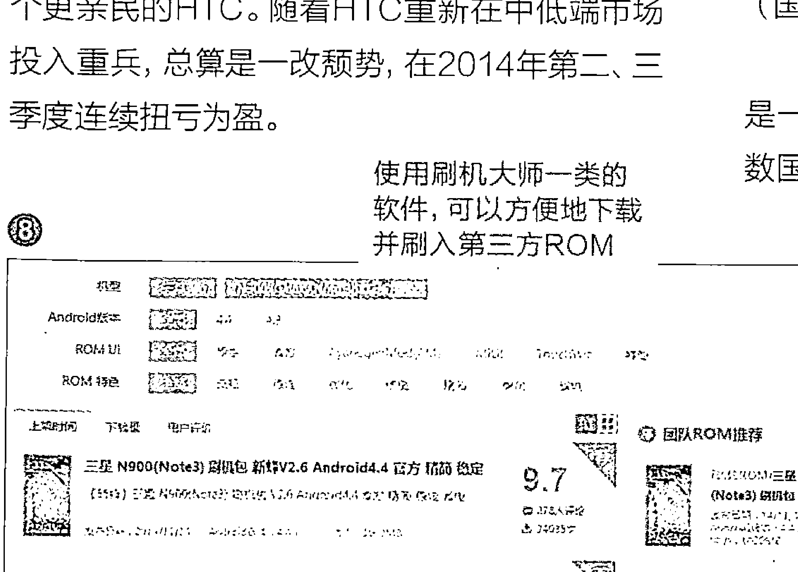

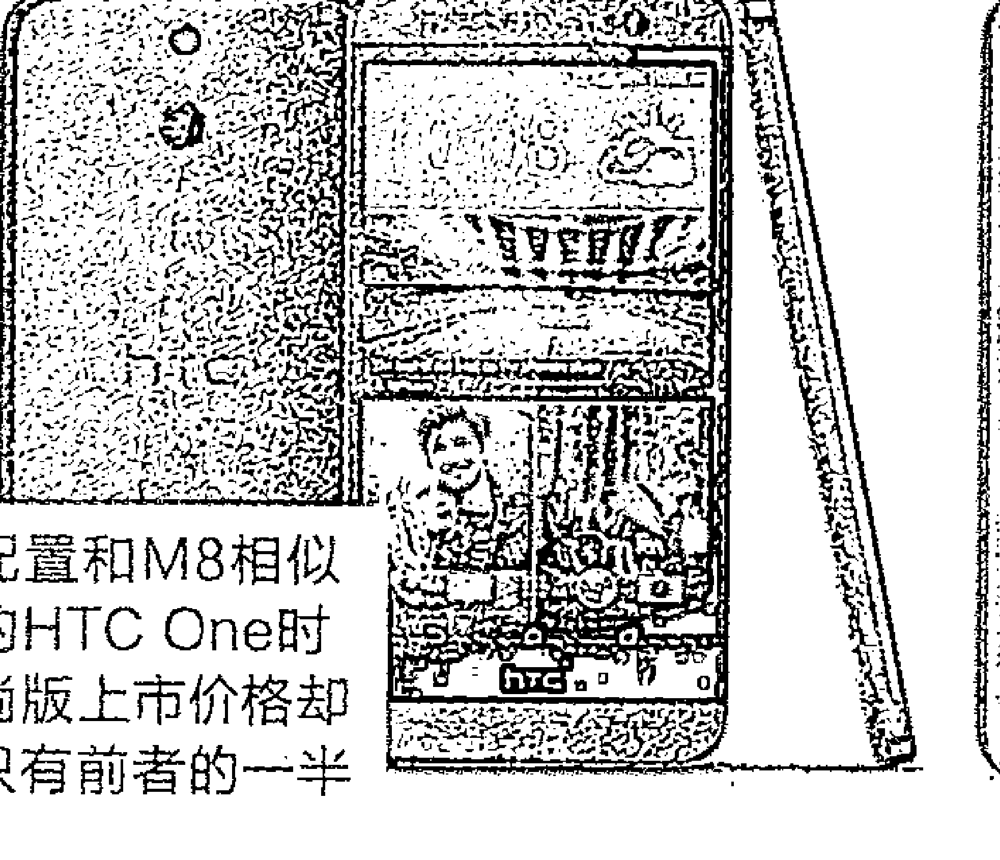

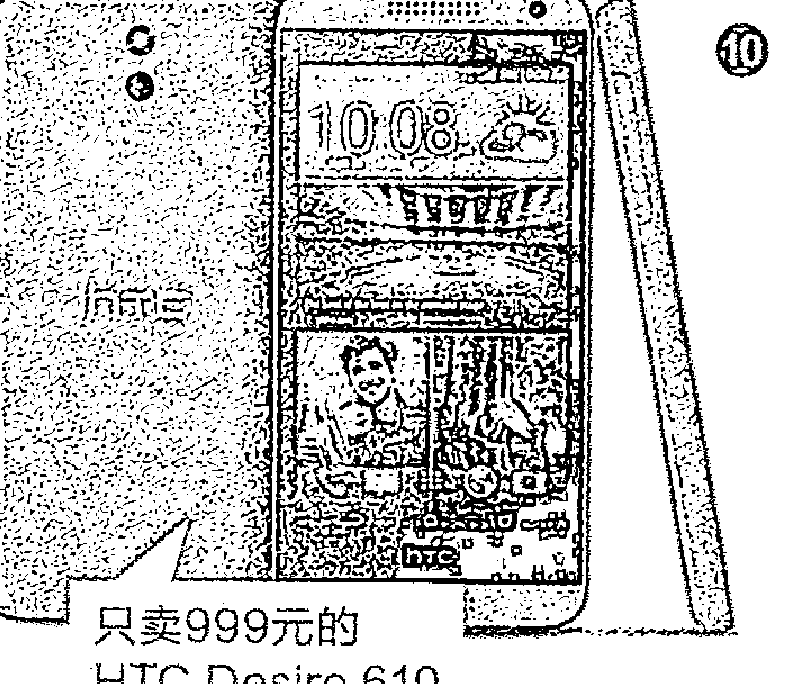

所谓“站得越高，跌得越惨”，HTC的血泪史就印证了这个道理。凭借横向一体化的硬件供应链优势独步全球的三星，似乎也难逃这个诅咒。在移动业务大幅缩水的情况下，三星的解决之道就是放弃机海战术，并着重发力中端市场。比如即将上市的Galaxy A系列，就将承担起重树辉煌的责任。以Galaxy A5为例（图11），其国行版售价约2500元左右，虽然依旧不便宜，但至少也代表着三星调整定位策略的决心。

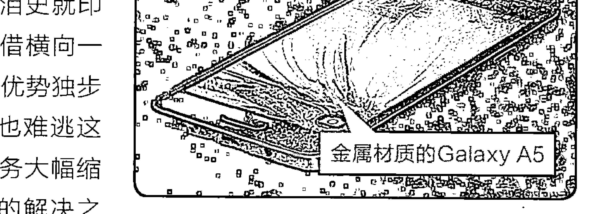

实际上，除了HTC和三星，像LG、索尼等国际品牌的旗舰产品也要比往年便宜不少。也许，2014年就是国际品牌“掉价”的元年，在来自国产品牌的竞争压力下，未来的那些大牌旗舰们只会越来越便宜。

#### 手机领域里海‘围城’
随着国际手机在华遇阻，如今能卖上5000元的手机品牌也就剩下苹果和三星了。另一方面，国产品牌也在不断进行剑指高端的尝试，比如联想旗下的VIBE Z2 Pro就以4799元的“天价”上市，OPPO最新的N3也卖出了3999元。这就好像《围城》里的描述：城里（国产）的人想出去，城外（国际）的人想进来。

就在国际品牌手机不得不依靠降价保市场之际，国产手机的价格却是一路高歌。自从小米手机将1999元作为“指导价”之后，近些年绝大多数国产旗舰都在2000元上下徘徊，最多也就是触及2999元的天花板。如今，Nubia Z7（3456元）、华为Mate7（3699元）、OPPO N3（3999元）、联想VIBE Z2 Pro（4799元）（图12）……很难想象吧，这些国产手机旗舰的价格已经足以媲美索尼Z3、三星Note4等国际旗舰，并远远突破了困扰之前国产手机多年的3000元“价格红线”。

结果还是颇为乐观的，华为Mate7不仅一机难求，甚至被黄牛炒出了5000元的天价（图13）；OPPO N3在发布的几天内预订量也突破了200万台大关（图14）。可见，国内用户对高端手机的饥渴程度要比市场预估更大，只要国内品牌可以实现媲美国际品牌的软硬件实力，通过精品策略杀出重围，立足高端市场并非不可能。

但不可否认的是，为了避免高端机定价策略的失败，现在3000元以上的国产手机都没有足够的备货量，大都以“饥饿营销”（先预定，再抢购）的形式销售，既保证了产品的稀缺和档次感，又避免了卖不出去的库存压力。

换句话说，国产手机品牌已经尝试性地“出城”了，只有走出围城才有更大的发展空间。与其对应的，则是国际品牌以降低身价的方式“入城”。这个围城的故事才刚刚开始，结局如何还得待时间证明。

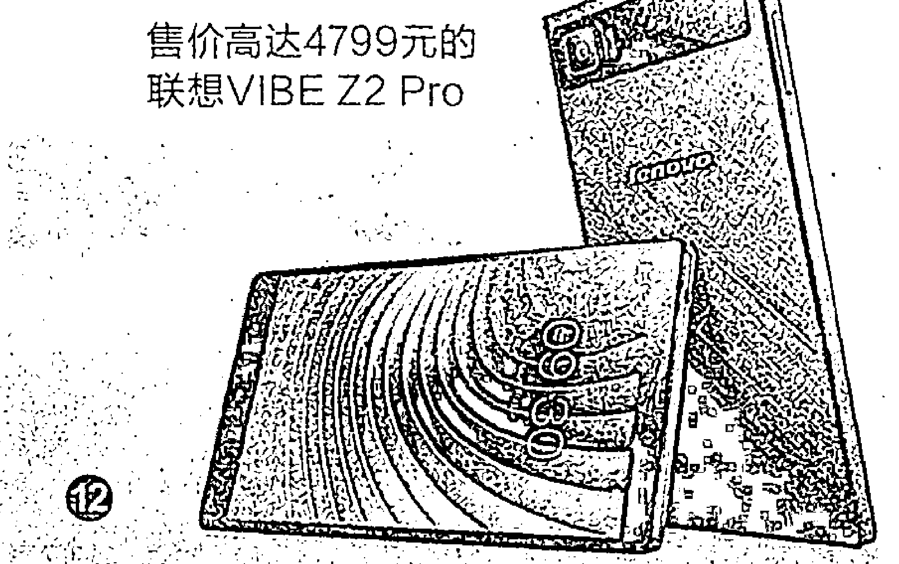

#### 营销和品质脱节的锤子
国产手机想“出城”走高端路线，并非只是将价格定高那么简单。前文提到的几款高价国产手机中，只有华为Mate7真正在某一时期做到了“一机难求”，而更多的产品却很难达到既定目标，往往是“出师未捷身先死”，最终落得个降价销售的命运。

毫无疑问，锤子手机绝对是2014年度最热的国产手机之一，罗老师（罗永浩）曾信誓旦旦地表示“开盖不能换电池很蠢”、“锤子手机绝不会超过1999”、“如果低于2500，我是你孙子”、“T2发布前T1不降价”……结果如何呢？能打开后盖的锤子T1依旧无法更换电池，上市三个月就降价1000元，从3000起的高端旗舰落入2000元级的主流价位。对此，罗老师的回应也很直接：不要轻信承诺（图15、图16），在商人的世界里，打脸是负责人的“分内工作”。

平心而论，锤子T1在软硬件上是一款很有诚意的手机，配置够用、做工上佳、系统易用（图17）。可惜，它败在“离谱”的价格定位上，3000元的起价，与同档次2000元级的国产旗舰们相比毫无优势。实际上，想真正步入高端殿堂，需要厂家拥有完善的品牌链和产品链，

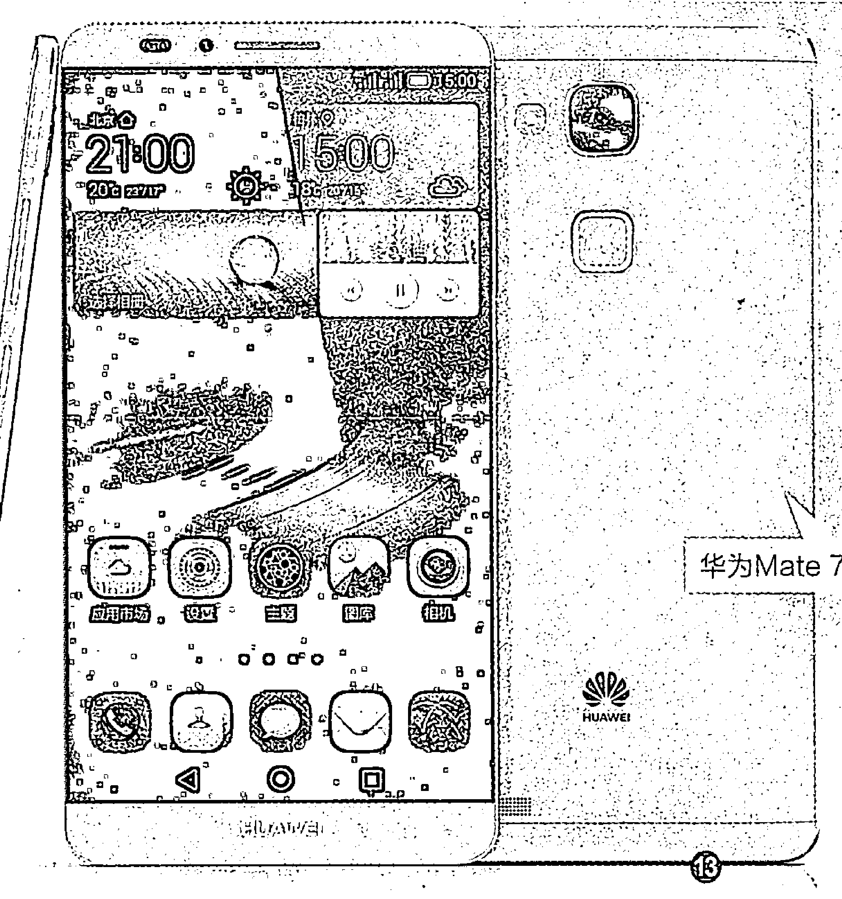

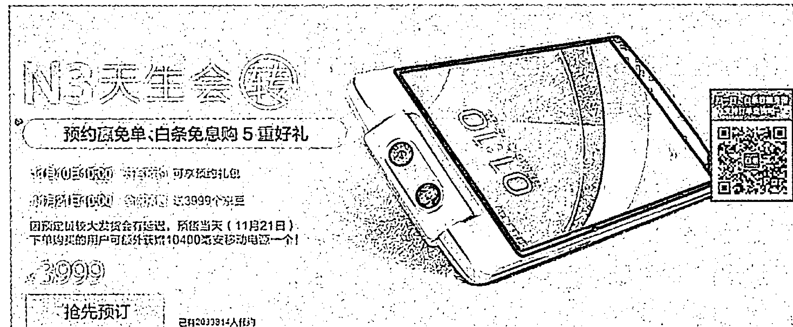

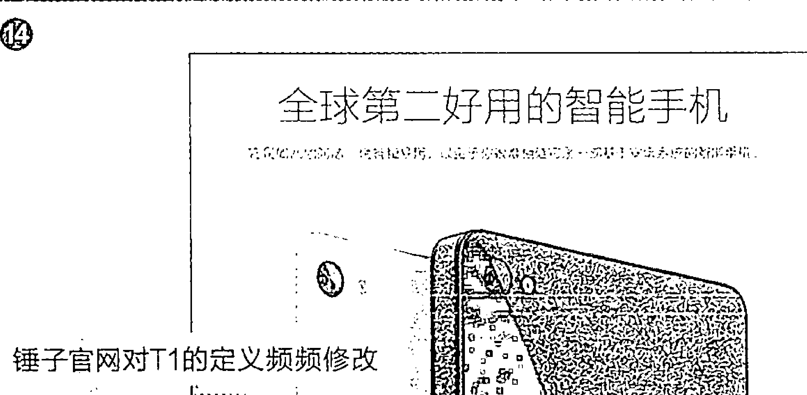

全球第二好用的智能手机

东半球最好用的智能手机

它是如此地简洁、优雅和易用，以至于你很难相信它是一部基于安卓系统的智能手机。

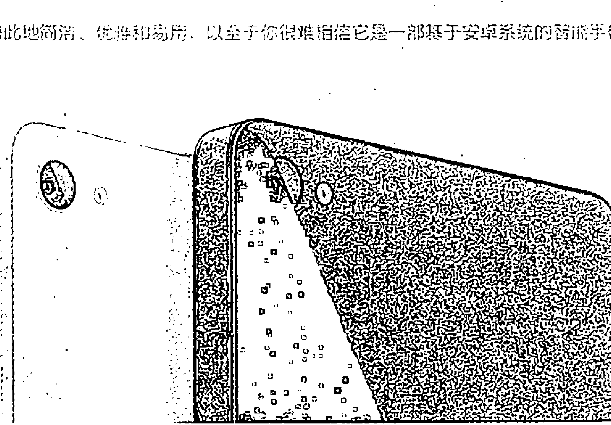

卖家信息
店铺名称：锤子科技官方旗舰店
公司名称：锤子科技(北京)有限公司
当前主营：手机
所在地区：北京

店铺服务
正品保证 现货发售 七天退货
卖家当前保证金余额 ￥150,000.00元

店铺半年内动态评分
宝贝与描述相符：4.8分 比同行平均水平高25.23%
卖家的服务态度：4.7分 比同行平均水平高25.06%
卖家发货的速度：4.6分 比同行平均水平高24.03%

店铺30天内服务情况
平均退款速度：2.00天 大于 2.68天
近30天退款率：12.03% 好于 3.57%
近30天投诉率：0.13% 大于 0.22%
近30天纠纷率：0.01 小于 1.24次

近30天退款总次数 5000次
- 退货退款问题退款 118次
- 未收到货退款 306次
- 卖家无理由退款 1025次

锤子天猫旗舰店退货率高也成为了被攻击的理由之一

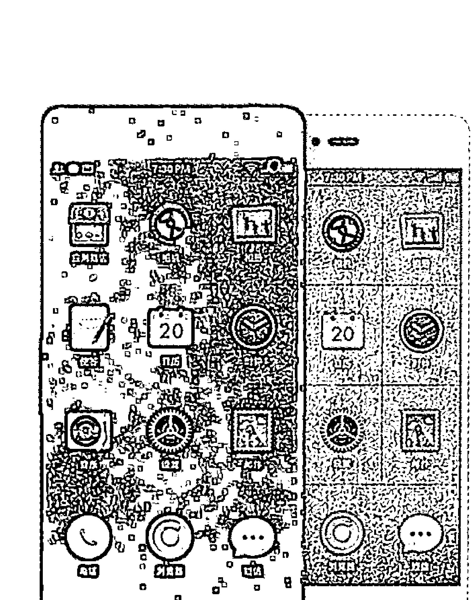

可惜满足这些条件的国产品牌凤毛麟角，这也是为什么国产手机都扎根于2000元价位的原因。

类似锤子T1这种定位虚高的“国产旗舰”还有很多，它们的共同特点就是产品自身品质并没有比其他价格低一等的国产手机更优秀（图18），而且尚未培养起足够的品牌忠诚度。一旦因销售遇阻而降价，不仅会使自身利润和品牌价值受损，还会让早前购买的消费者感到不值，最终面临“三输”的命运。

此时此刻我们不禁佩服苹果，只有新品上市之际，老型号才会出现配置缩水后小幅降价再直接退市。永远把控高端市场的顶端，如此建立的忠诚度自是牢不可破。人家不必入城，城里的人还得抢着出城去接，只因它是唯一不可替代的（iOS系统）。

反观Android领域，哪怕是三星最新旗舰Note4，现在与其配置功能相仿的产品也有数款，如果这些产品足以媲美Note4且价格足够低，你还会坚持选择三星吗？因此国产手机走向高端的战略转型目标能否实现，关键还得看产品的实力及国内用户对品牌的认可度，如果产品不过硬或品牌溢价不足以支撑较高的定价，那终归是梁柯一梦。

这个Logo画面是不是很熟悉


#### “金蝉脱壳”后的诺基亚
微软于2013年9月以71.7亿美元收购诺基亚设备与服务部门，通过一年的整合重组后，微软即将用“Lumia”取代“Nokia”和“Windows Phone”，成为其手机品牌的名称。那么，我们今后真的就要与Nokia说拜拜了吗？

对80后和90后来说，诺基亚无疑是伴随学生时代的最著名手机品牌（图19），它曾经那么强大不可战胜。然而在苹果推出iPhone、谷歌发布Android系统后，诺基亚却依旧固守“塞班”，通过对系统的缝缝补补抵御iOS和Android的冲击。此后诺基亚还试图凭借Meego东山再起，但最终却落得被微软收购的命运，品牌Logo也将被Lumia手机抹去（图20）。

诺基亚从辉煌到落幕只用了短短几年时间。实际上在手机领域，英雄的沉浮总是出人意料的，爱立信如此，摩托罗拉和诺基亚也是如此。

今后Lumia手机身上将再看不到Nokia的Logo

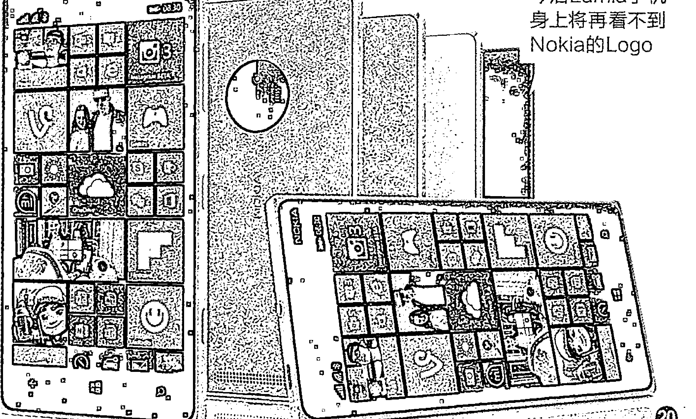

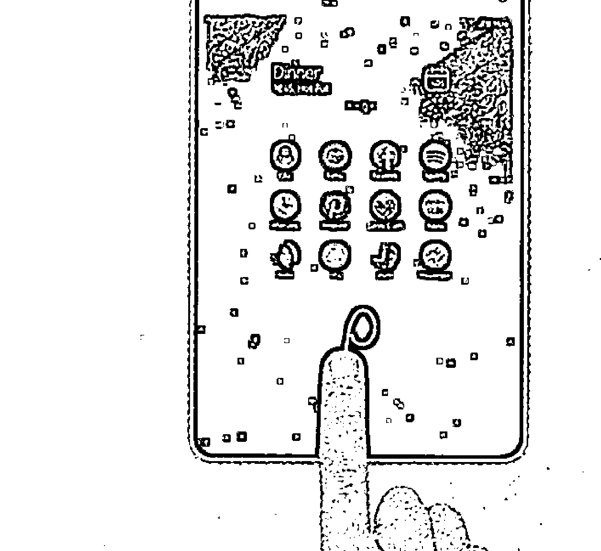软硬件越发趋于同质化的今天，消费者对手机品牌的忠诚度也越加淡薄，谁的配置高价格低，自然就会受到更多的关注，索尼、三星、HTC遇阻如此，国内品牌通过解开品牌枷锁以建立子品牌的方式突围也是如此。

然而，“Nokia”这个Logo在消费者心中的地位实在根深蒂固，如果它一改昔日之缺陷并重返手机领域又会是什么结果？这不是异想天开，根据诺基亚和微软的协议，诺基亚在2016年就可以重新使用NOKIA品牌发布智能手机了。就在2014年底，诺基亚就已经为重返消费者市场做出了尝试，推出了预装Android 5.0系统的Nokia N1平板电脑（图21），而且它的价格也极具诚意（约1500元人民币）。如果这款产品取得成功，相信会进一步激发诺基亚回归熟悉的手机战场的决心。

要知道，绝大多数消费者并非是因为Windows Phone平台而选择的Lumia手机，而是冲着Nokia的品牌和工业设计。将手机卖给微软已经让诺基亚卸下了WP平台的包袱并小赚一笔，没有了微软的束缚并全心全意投入Android阵营之后，也许这就是诺基亚翻身的历史时刻。看来北欧人并不死板，诺基亚的这招“金蝉脱壳”之计堪称老道。

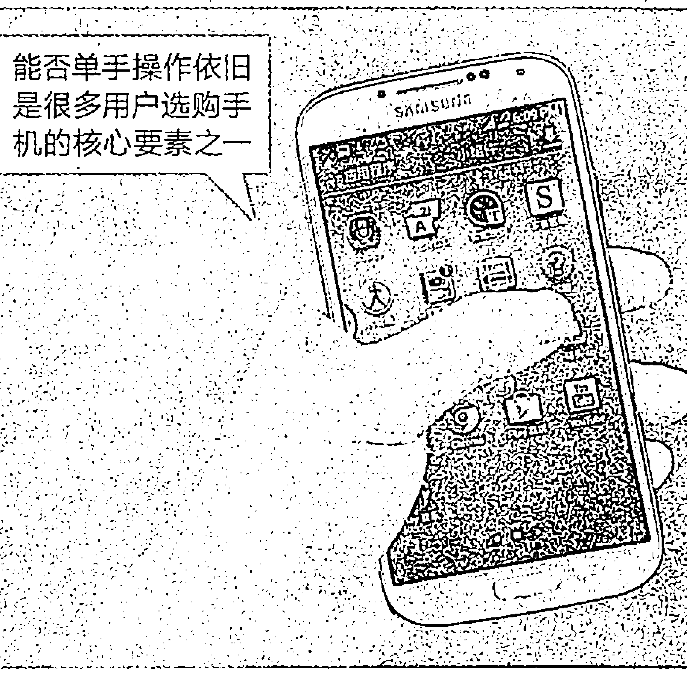

#### 让乔布斯“没面子”的新iPhone

乔布斯生前曾信誓旦旦地表示3.5英寸的iPhone才是最完美的。继iPhone 5将这个标准提高到4英寸之后，从4.7英寸起步的iPhone 6家族更是让在天堂的乔布斯“很不爽”。然而，就是这款让乔布斯没面子的新品，却成为了史上最热卖的iPhone。

乔布斯认为，3.5英寸是手机的黄金尺寸，更大的屏幕是愚蠢的。于是，在iPhone 5之前，所有的iPhone都在坚持3.5英寸不动摇，哪怕Android阵营已经逐步过渡到了4.5英寸~5.5英寸。乔布斯的坚持并非没道理，就单手操作而言，3.5英寸可以100%保证大拇指无障碍全覆盖到正面屏幕上（图22）。此外，在iPhone刚刚诞生之际，手机仅仅是一个沟通工具，讲究的是操作和沟通效率（如拨号、短信）。

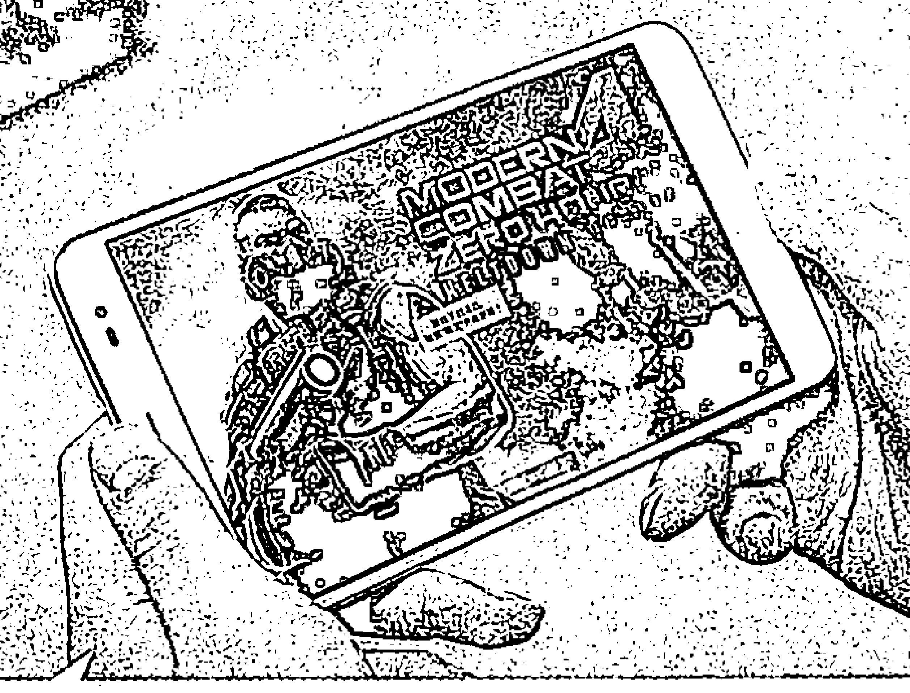

但是，乔布斯显然低估了智能手机的应用前景。当智能手机性能变强，3G/4G网络全面普及之后，手机已然成为了内容消费和娱乐的重要平台，用户也更愿意每天花更多的时间在双手上操作（图23），而传统手机功能的使用时长则仅占据了很短暂的时间。作为内容消费的窗口，屏幕面积自然是越大越好，而iPhone 6和iPhone Plus的出现（图24），则刚好符合这一潮流趋势，想不热卖都难。三星Note4之所以没有取得预定销量，除了国产品牌的冲击之外，更大的iPhone也是“功不可没”。

#### 小结

对厂商而言，2014可能是让人心惊肉跳的一年，但对消费者来说，这一年却是充满喜悦的一年。在2013年的今天，你能想到八核手机可以卖到白菜价吗？4G网络的普及和覆盖率能如此之快吗？国际品牌也能自降身价讨好我们吗？以前我们往往会努力攒钱选购心仪已久的精品手机，但今天，你会发现手握现金却不知道买哪款手机才最超值。这就是竞争的好处。

实际上，5.5英寸的iPhone 6 Plus依旧没有达到智能手机的极限，很多5.7英寸、6英寸甚至7英寸的“平板手机”销量也是令人振奋。由此可见，在手机的发展过程中同样没有绝对的事情，与时俱进是必不可少的，消费者的习惯往往会改写曾经的“铁律”。今天是“黄金尺寸”一说破灭，谁知道明天是不是“可换电池”、“可装存储卡”等颇有争议的设计或功能呢？

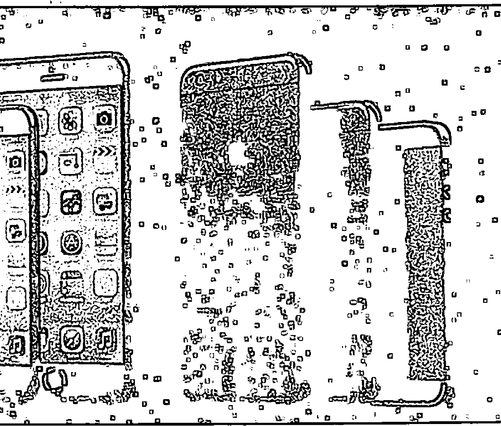

### 2014年度盘点

在2013年的今天，很多DIY玩家都在期待2014年的新技术、新平台给日渐萎靡的PC市场带来改变。一年过去了，所谓期望越大失望越大，原来很多预计的产品、技术、事件并没有依照我们设想的发生和发展。

#### 高不成低不就 内存这一年

去年的这时，Intel下一代顶级平台Haswell-E的消息已不再是坊间传闻，其中最激动人心的无疑是它是第一个搭载DDR4内存的家用平台。其实顶级平台与绝大多数家庭用户无缘，大家只不过希望DDR4尽快普及，同时促进已涨到天价的DDR3内存降价。已过了一年，实际情况不容乐观（图1、图2）。

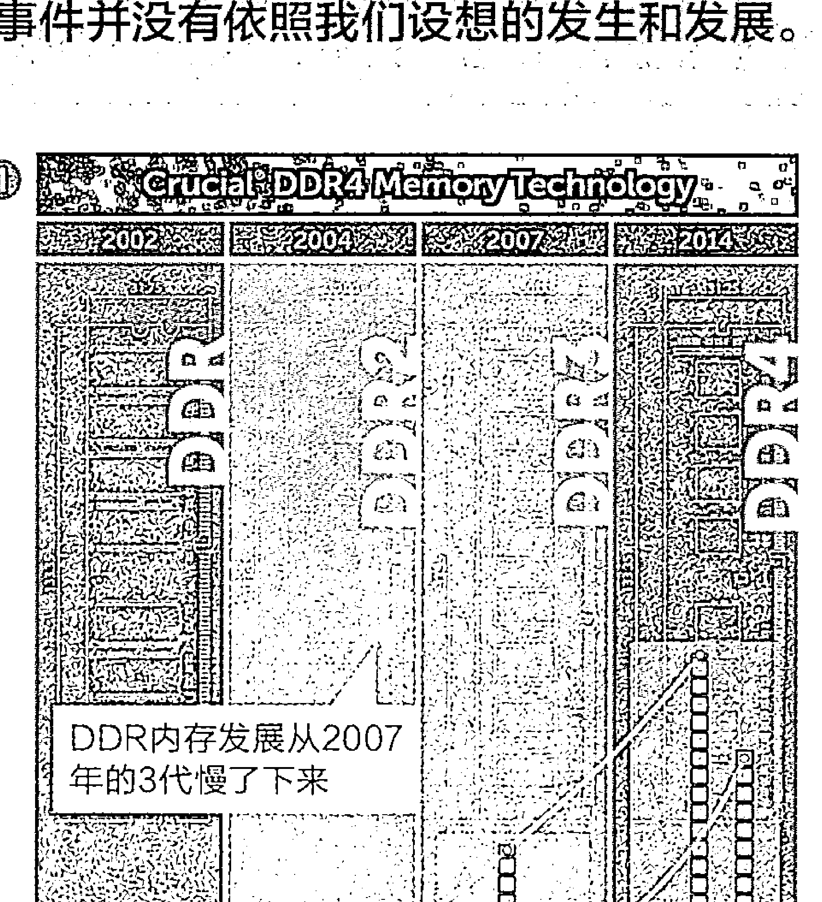

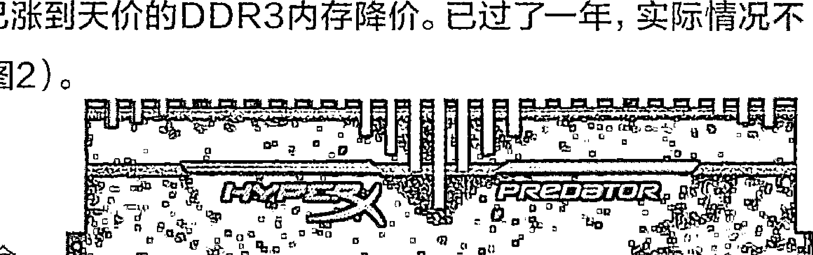

##### 天价四通道DDR4

随着Haswell-E的开卖，DDR4也如期而至，可实际情况如何呢？由于X99主板使用四通道内存，一套DDR4 4GB×4的套装也必不可少，可这类产品目前的架构普遍都在2000元左右。如果是DDR4 2400MHz以上频率的产品，价格更有可能上升到3000元以上。以往Intel的顶级平台一般处理器都在3000元、主板2000元左右，在Haswell-E平台也是如此。以往也曾经出现过内存价格涨到天价的情况，但从未对整个平台的价格造成这么负面的影响。受制于2000元以上的内存价格，不少用户的X99计划被迫暂缓（图3）。

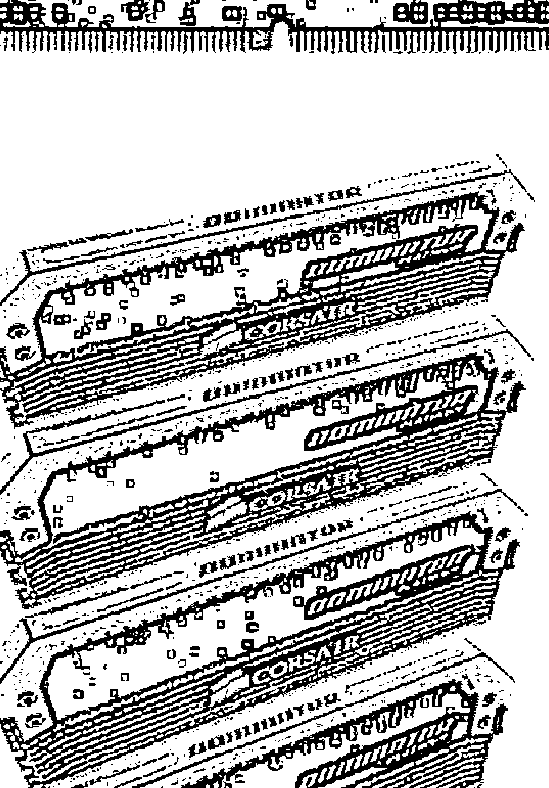

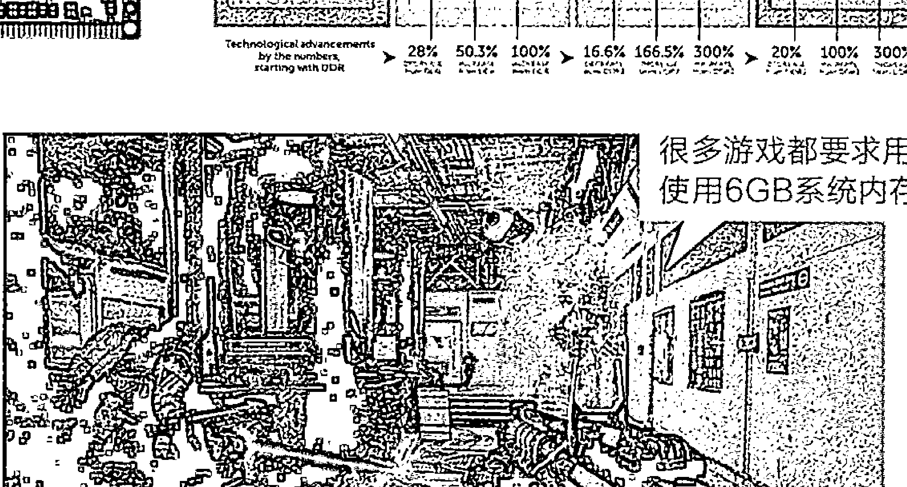

##### 内存价格居高不下

不仅DDR4内存很贵，普通的DDR3内存价格同样居高不下。最常见的4GB 1600MHz单条价格依旧在230元到300元之间，要知道，在内存价格谷底时这样的产品售价还不足百元。很多人只好在装机时只购买一条内存过渡，准备价格回落时补充一条，这一等就是一年也未见起色。目前正是2014年年底大作频发之际，《使命召唤 高级战争》、《刺客信条 大革命》等等大作接踵而至。不仅对处理器和显卡的需求提升到了很高的一个高度，甚至对于内存的需求也同样夸张。不少游戏最低系统内存需求竟然达到6GB，不安装6GB以上容量内存几乎连游戏都无法运行（图4）。

#### 毫无起色 AMD这一年

毫无疑问，AMD目前在PC领域最主要的产品就是处理器和显卡，当然也有一些同时包含两者在内的APU。不知是巧妇难为无米之炊，还是正在蓄力准备2015年祭出“杀手锏”翻盘。只看2014年AMD在CPU和GPU双方面的表现，真的可以说有些过于低调了。

##### 尴尬的FX处理器

首先我们先来看看CPU，自从竞争对手推出了酷睿2、酷睿i3/5/7系列家族之后，AMD在不知不觉当中从天下双分的两强彻底沦为配角，PC处理器领域逐渐成为独角戏。目前在台式机领域，各大电商卖场出货量惨不忍睹，笔记本电脑上面使用AMD平台的产品也逐渐凤毛麟角。

以台式机为例，目前AMD主力产品为闪龙APU、速龙APU、A系列APU和FX处理器。前两者都是25W以下的低电压处理器，A系列性能相对更强，不过也仅仅停留在集成显卡层面，对比竞争对手的产品处理器本身性能毫无优势。FX处理器本来是强调性能的传统处理器，目标只指对手的i5/i7系列，但实际情况又如何呢？

性能最强的肯定是FX 9370和9590这两款最高阶的产品，单看参数这两款处理器十分“梦幻”：4.4GHz~5.0GHz的主频，原生八核心缓存8MB，简直碾压对手的Haswell几条街。不过你注意到了没有，其热设计功耗(TDP)高达220W，这是一个什么概念(图5)？

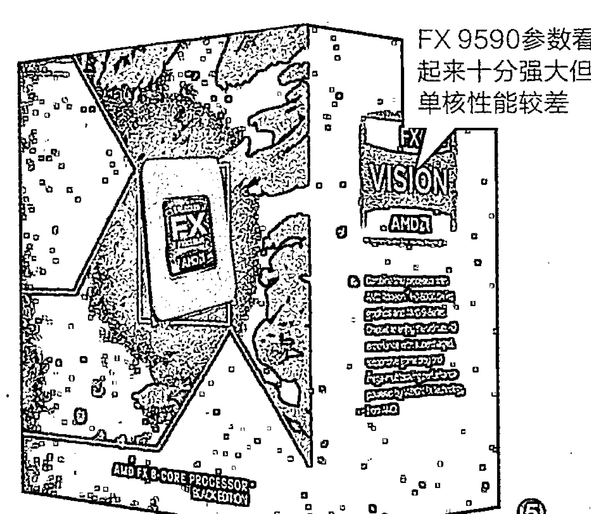

##### 与时代不符的功耗比

Intel主流平台最强的i7-4790K的TDP只有88W，而顶级平台Haswell-E的处理器也只有140W左右。当然Intel的处理器都是22nm封装，我们用32nm的AMD FX处理器去如此对比有些不公平，但市场是残酷的，用户只会挑选最合适的产品。与时代不符的过高TDP肯定会更加费电，当然有些不差钱的用户不在乎这一点，那么是否就天下太平了呢？显然不是，高功耗必然带来高发热，AMD根本没有为其搭配散热器，而是官方推荐了许多水冷散热器。这样一来，用户在机箱内部需要增加接近千元的散热成本。

性能是否真的很“梦幻”呢？尽管主频、功耗和发热如此之高，在许多测试中依旧被对手同价位的处理器比下去。AMD处理器近年来尴尬的单核性能始终没有改善，个别测试甚至会被对手i5超越，FX处理器目前选购的用户多是AMD“死忠”(图6、图7)。

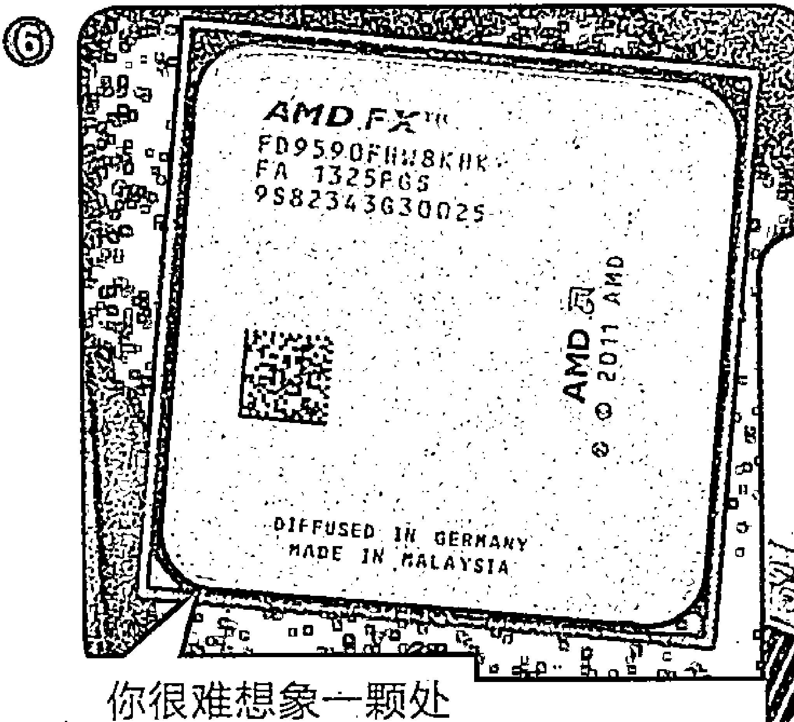

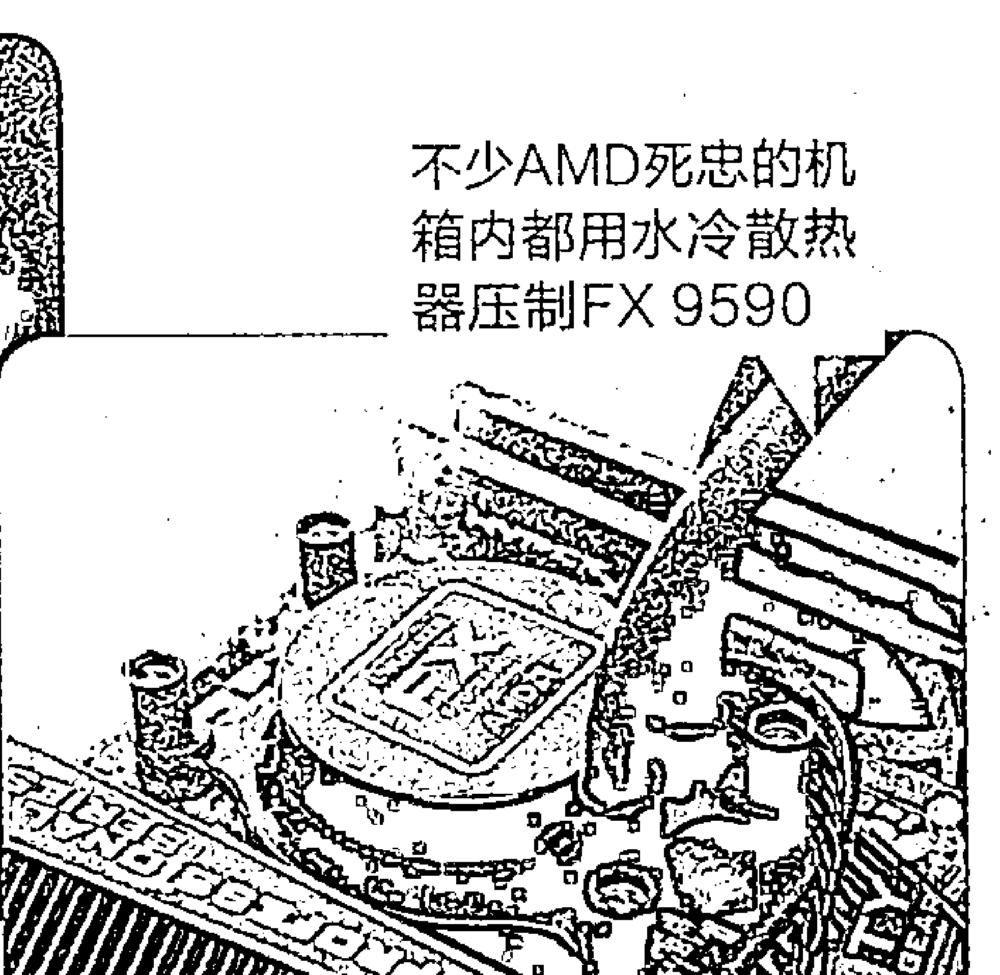

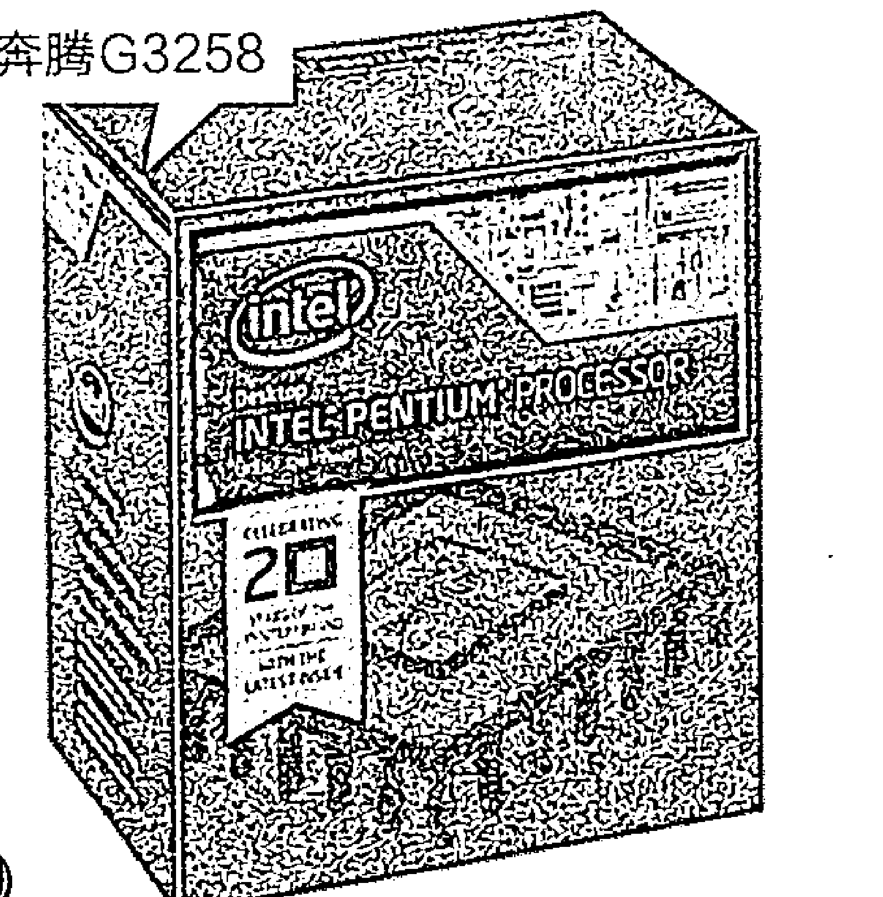

#### 显卡领域 新瓶装旧酒

虽然年初AMD将旗下显卡全部命名为R9/R7/R5系列，看起来像全新显卡，不过眼尖的朋友肯定看得出，全系列其实都是老旧的GCN架构，基本属于重新起个名字拿出来再卖的产品。最顶端的产品是R9 290和290X，与GTX 780/780ti基本打个平手。不过也和处理器类似，过高的功耗导致了显卡温度居高不下。下半年又遭遇低功耗高性能的GTX 980/970，一夜之间售价暴降40%也是不难理解的事了(图8)。

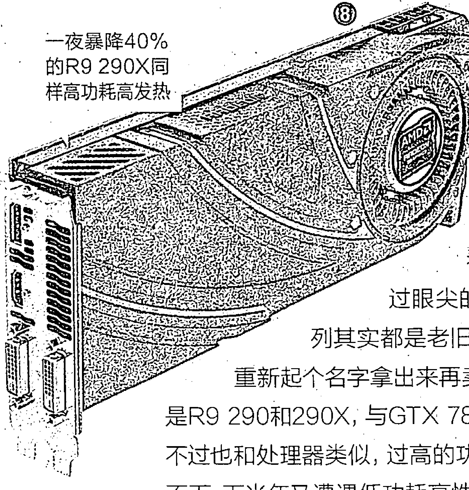

#### 平淡日子也有亮点 Intel这一年

只谈PC领域的话，由于Intel前几年积累的优势太过明显，这一年其实是毫无压力的一年。PC处理器循序渐进，不需要做太多的更新依然可以抢占绝大部分市场。由于有核芯显卡，Intel其实是在闷声赚大钱，核芯显卡已经占领了整个PC领域的半壁江山。不过在这样的平淡日子里，依然能够找出几款特别对玩家胃口的好产品。

##### 奔腾G3258

奔腾处理器的大名无人不知无人不晓，奔腾的Intel Inside (给电脑一颗奔腾的芯) 广告相信是最广为流传的IT产品广告语之一了。不过在酷睿处理器诞生之后，退居二线的奔腾处理器有些英雄老矣之感。

Intel并没有放弃奔腾处理器，今年发布的奔腾20周年纪念版G3258就着实火了一把。双核双线程主频3.2GHz，L3缓存3M，默认性能就已经不弱了，仅售400多元，性价比超高。更难能可贵的是，这颗处理器非常适合超频使用，官方并没有锁定处理器的倍频，而通过一般的风冷散热器，绝大多数G3258都可以超频至4.5GHz，个别体质好的处理器甚至可突击4.8GHz，适合很多对处理器单核能力要求高的使用场景 (图9)。

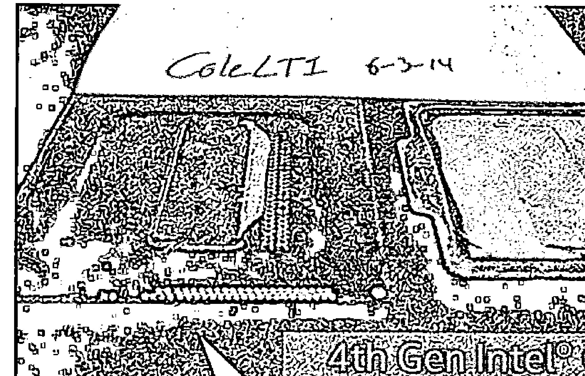

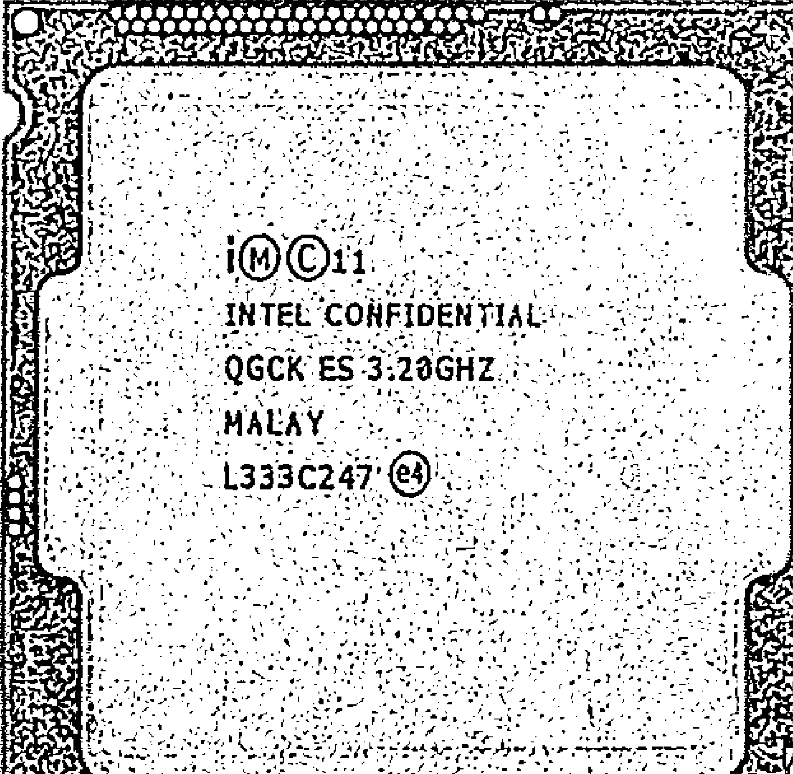

##### 酷睿i7-4790k

基本上电脑爱好者们对于带k的处理器更为钟爱，其实就是喜欢其不锁倍频的特性，通过自己搭建的合理平台超频来获得更好的性能 (图10)。不过众所周知的是，自从Ivy bridge开始由于Intel将散热金属顶盖和核心之间填充的导热物质更换为普通导热硅脂，Intel LGA 115x处理器的超频能力就始终受到温度的限制。

i7-4790k这代处理器诞生之初，Intel就信誓旦旦地宣称会更换导热材料，可实际产品出来后发烧友开盖一看还是硅脂。不过i7-4790k有一个好处就是出场就是超高频率，默认4.0GHz最高可睿频至4.4GHz，这已经是不少以前处理器的最高稳定频率了，基本没有再超频的必要，买回来就是高性能，是不会超频用户的神器 (图11、图12)。

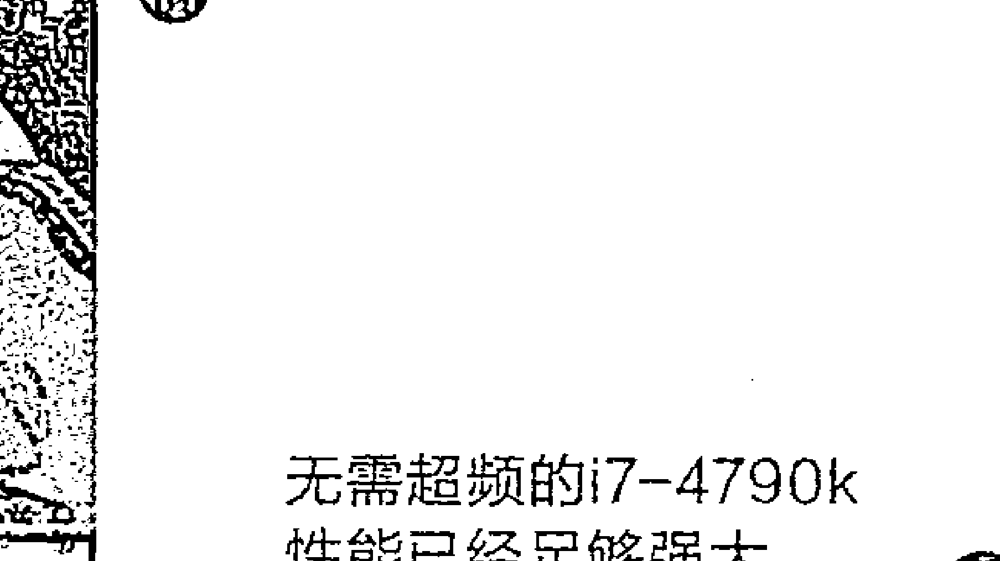

##### 酷睿i7-5820k

i7-5820k隶属于Intel新一代Haswell-E，是Intel的顶级平台X99，定位类似以前的X58、X79一类。这类平台一般都有高性能、平台可持续时间比较长的优点，但是缺点就是售价较高。在这里为什么说i7-5820k很具有性价比？让我们从i7-5820k的参数说起。

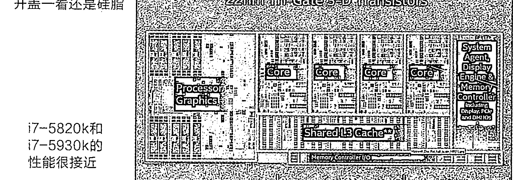

以往顶级平台中最入门的处理器，一般都会比其他处理器少两个物理核心四个线程数，同时L3缓存也会相应减少。而这代入门的i7-5820k和中档的i7-5930k都是六核十二线程，L3缓存也同为15M，两者的差异仅在于0.2GHz的主频和几条PCI-E通道数，使用单显卡的用户基本可以无视，双卡系统也不会过分影响性能。不过Intel也不傻，比起以前同类产品，这块很超值的i7-5820k提高了一些售价，不过就算这样也是近几年卖相最好的顶级平台处理器 (图13、图14)。

#### 固态硬盘的发展与无奈 SSD这一年

固态硬盘开始流行还是在两年前，当初人们顾忌的价格、容量等问题已经逐渐不是问题。SSD售价已经完全平民化，SandForce主控被希捷收购，看起来形势一片大好。此时人们对于SSD所关心的问题，已经不是两年前那么简单。

##### 大容量普及与TLC闪存

SSD最初诞生时不少用户因为价格还去购买64GB左右的产品，而用当时的价格现在已经可以购买到256GB的固态硬盘了，是不是很夸张？价格的变化在这两年就是这么快。不过随着售价的下降，目前有一种新型的闪存颗粒开始出现在SSD上，那就是TLC闪存。

TLC闪存颗粒最早使用于三星的840系列SSD上，与一般MLC颗粒具体的性能差异比较晦涩难懂，一句话解释就是TLC闪存性能稍差、寿命更低、成本也更低。继三星之后，不少SSD品牌也纷纷采用TLC作为SSD闪存，现在就连业界标杆苹果公司最新的iPhone 6也开始使用TLC闪存了，特别是在128GB版本之上。

三星最早宣称这种闪存颗粒只在极限测试中会有性能下降的可能，民用毫无问题。不过近期确实一些常规使用场景下的840 SSD出现问题。在iPhone 6的场合，很多使用TLC闪存颗粒的iPhone 6有不同程度的闪退、卡机和黑屏情况。而这些使用TLC的公司有些是因为利润，有些是产能因素（比如iPhone 6必须使用单颗闪存颗粒实现128GB，而MLC单颗128GB产能严重不足）。不过他们都有一个共同点，就是对于TLC闪存可能导致的问题总是避而不谈（图15、图16）。

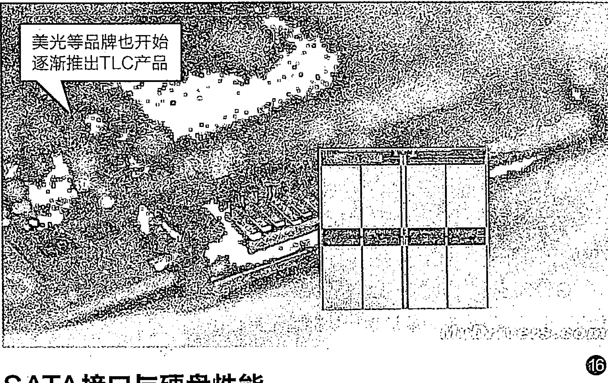

##### SATA接口与硬盘性能

现在家用存储接口依然为SATA，最新的SATA接口速率在6Gb/s左右，而一些性能超强的SSD的读写性能已经突破了这个上限。原本是木桶最短板的硬盘居然受到了接口的瓶颈影响，为了解决这个问题诞生了两个方案——SATA-Express和M.2接口。

SATA-Express是SATA接口的补充，它可以兼容现有的SATA设备，但也能通过专用设备提高数据传速度。M.2接口也称NGFF，与一些无线网卡接口很类似，但比起SATA-Express尺寸十分小巧，可以利用在很多移动设备上。

这两者均有相同的特点，就是将目光投向了PCI-E通道，借助PCI-E的带宽一举解决数据传输慢这个问题。不过目前来看，SATA-Express产品凤毛麟角，M.2接口产品售价依然居高不下。而且最关键的是很多产品由于芯片组限制只能使用PCI-E 2.0接口，就算使用了PCI-E 3.0 x4速度也远未达到厂家宣传的理想效果（图17、图18）。

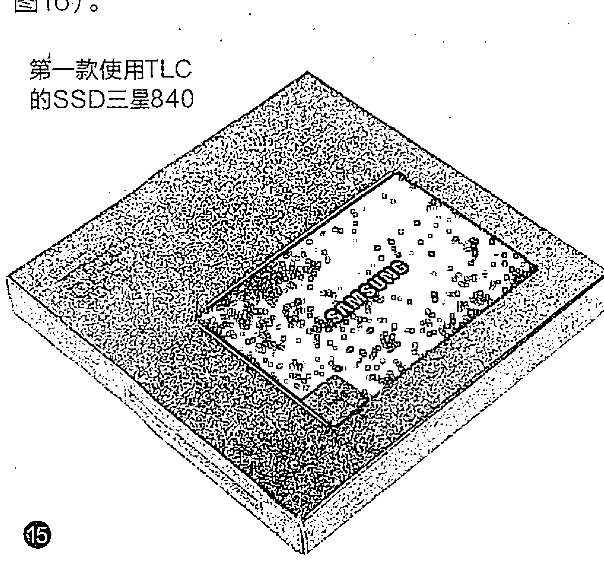

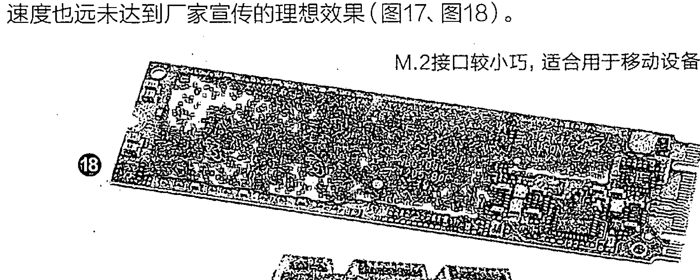

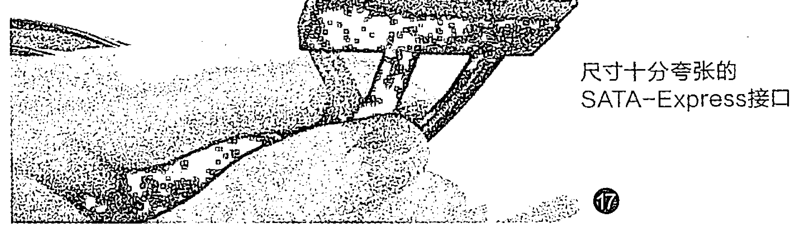

#### 有MAXWELL已经足够 NVIDIA这一年

NVIDIA虽然也有处理器（以前甚至还有芯片组）业务，不过其主攻方向毫无疑问是PC上面的GPU。比起竞争对手AMD来看NVIDIA显得更专心一些，而这份执着在今年可以说开花结果了——MAXWELL架构获得了空前的成功。

##### GTX 750/750ti

GTX 750/750ti其实于年中发布，虽然其血统是纯正的MAXWELL架构，但可能由于并非高级显卡，也可能是显卡还未脱离GTX 700系列，并未掀起太大波澜。而当GTX 750/750ti重新回到人们目光的时候，已经是GTX 980/970发布之后的事了。但其实，GTX 750/750ti所做的同样了不起。GTX 750/750ti的热设计功耗（TDP）仅为55-60W，你很难想象这是一块拥有不错性能中端显卡的功耗。由于功耗十分出色，GTX 750/750ti甚至无需外接6pin供电，只需从PCI-E接口提供的电流就能完美工作。低功耗带来的另外两个好处就是超短板型和低温，小巧的GTX 750/750ti一经推出就成为ITX用户的最爱（图19）。

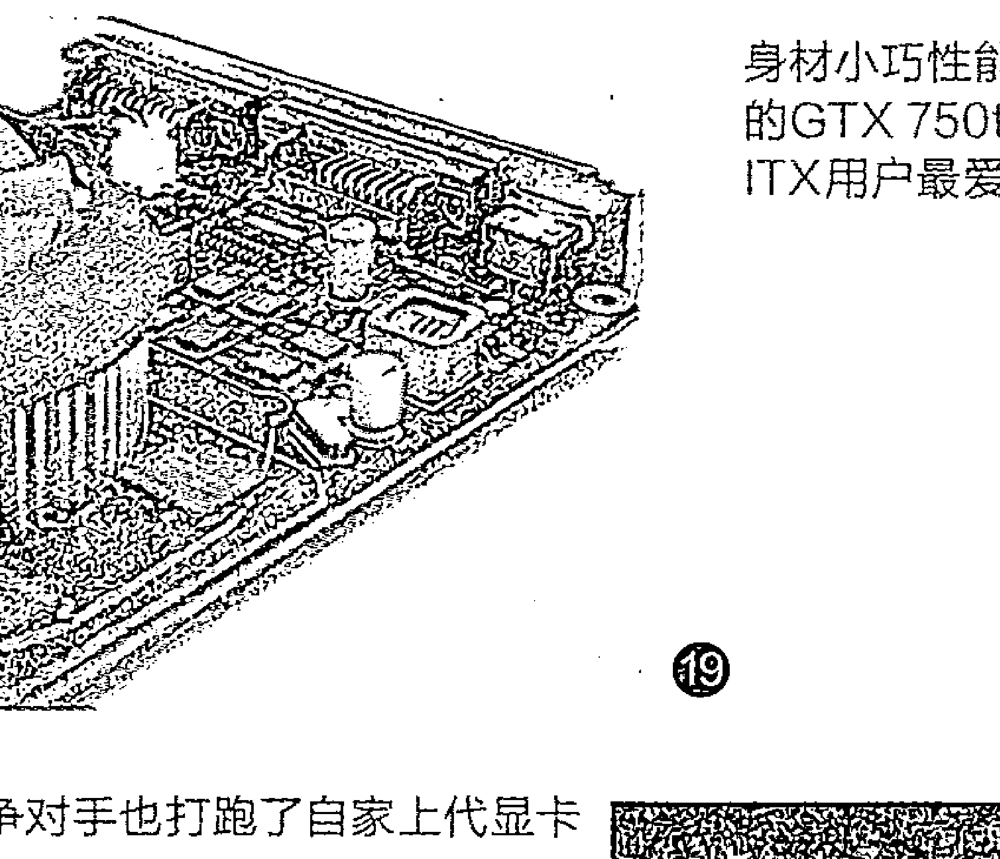

##### GTX 980/970

伴随着9月19日GTX 980/970，被爱好者寄予厚望的NVIDIA新一代架构全面面市。其实MAXWELL成不成功不必多讲，看看市场反应就知道。NVIDIA自家的GTX 780/780ti瞬间在二手货论坛上无人问津，而GTX 980/970在各大电商、各大卖场一卡难寻。京东商城甚至还办了大型的订购活动，在台式机DIY领域已有好几年没有这么火热的景象了。由于竞争对手的产品性能功耗极为出色，AMD又暂时没有新卡上市，只能用R9 290/290X硬撑，一夜暴降40%的售价也不难理解。在台式机显卡后，GTX 980M/970M又来了，这回不仅是功耗出色，性能比以往的移动显卡可谓突破天际，媒体纷纷评价为“历史上台式机与移动显卡性能最接近的一次”。由于GTX 980/970太火爆，原本计划于年底面市的GTX 960被NVIDIA暂时雪藏，如果明年初GTX 960再获成功，AMD传说中的新卡R 300系列的压力就会更大（图20）。

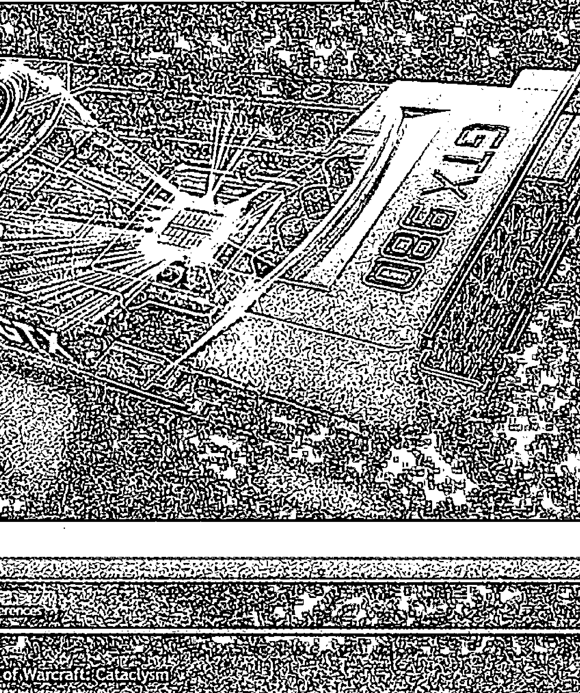

##### GeForce Experience

GeForce Experience其实并非今年的新事物，但是经过一年多的进化，NVIDIA这个集驱动更新、游戏优化、视频录制甚至远程屏幕共享的软件已经越来越好用了。NVIDIA原本在驱动方面就远比AMD要优秀，有了GeForce Experience优势是更加明显（图21）。

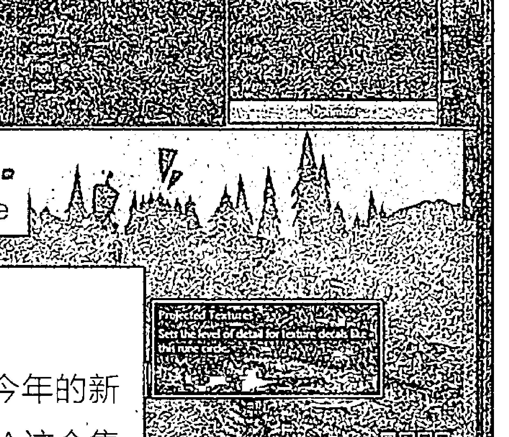

#### DIY通过游戏入围 其他配件这一年

这里说的其他配件不仅包括键鼠、机电、音频等设备，还有主板和显示器等核心配件。把核心配件合并在外设里也是无奈之举，近年来PC主板和显示器实在乏善可陈。DIY领域走到今天，还在坚持的“死忠”用户必然有很大一部分都是游戏玩家。有一个流行趋势我们必须要注意，那就是PC所有配件均朝着游戏化发展。

##### GAMER、Gaming系列主板

以主板为例，最早实现游戏化的是技嘉、微星，而业界大佬华硕当时并未有任何动作，似乎是一副“自家产品过于优秀所有型号都适合游戏”的态度。不过这一年技嘉和微星的游戏型号Gaming系列在市场大红大紫，业界老大也坐不住了，推出了GAMER系列来抢占市场。

众所周知，主板高端低端对于PC性能并没有多大影响，但如果用户超频或者对其他额外功能有所追求，主板是解决问题最佳的平台。技嘉、微星最早推出的Gaming系列除了配色严格与普通主板区分开来，最主要的区别就是使用创新声卡、杀手网卡等更为高阶的音频和网络解决方案，以突出其游戏性能。经过发展，音频和网络继续是游戏主板的标配，厂家还不断推出差异化产品来吸引不同的用户（图22）。

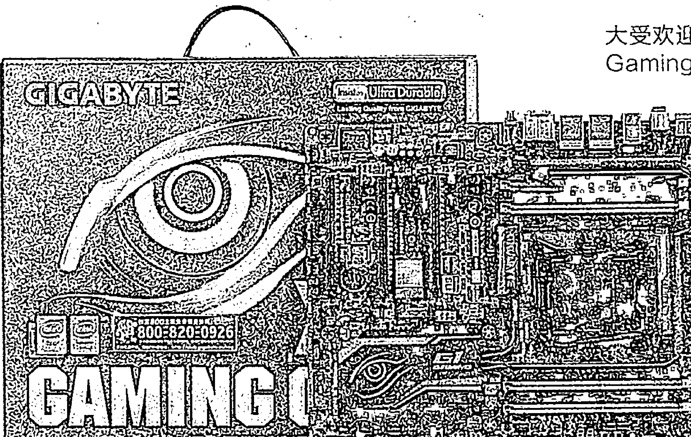

##### 其他游戏类设备

不过这个游戏类产品是否具有性价比，还需要客观对待。比如绝大多数游戏主板的价格并未比普通主板高很多，但强化了游戏玩家重视的音频和网络性能，这样的产品就很适合选择。

但在其他配件领域就不见得适合，一些游戏显示器号称搭载了超高刷新率，但不可避免需要使用TN面板，这样的产品究竟适合什么样的玩家就很值得思考。另外一些机箱电源产品也号称游戏产品，但它们究竟哪里“游戏化”了，恐怕厂家自身也说不清。键鼠外设领域比较夸张，本来的键鼠只要一被游戏化无非就两种结果：一种确实非常好但价格昂贵到十分夸张；另一种只是在键鼠上印上游戏的Logo或者人物形象就算游戏设备，有些甚至只是换了一份包装而已（图23、图24）。

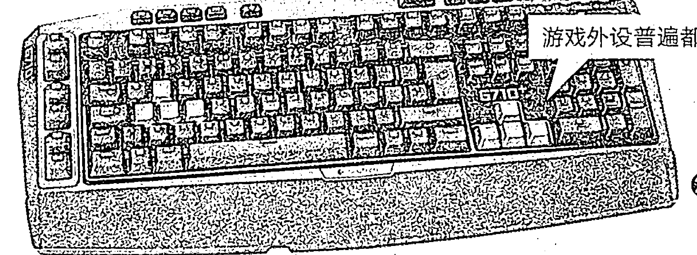

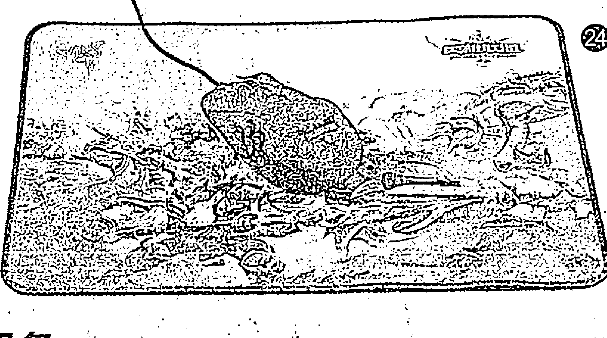

> 扩展阅读 家用游戏机解禁
提起游戏PC配件产品，就不得不提最正宗的游戏设备——家用游戏机。最新一代的家庭游戏主机PlayStation 4和Xbox ONE发售已不是新闻，但其动作之慢实在让人无奈。很早就行货上市，等了一年才只能买到Xbox ONE主机，不仅价格比国外贵不少，由于锁区问题很多国外游戏大作还买不到，只能等待游戏过审或折腾完成。不少坚定的行货游戏支持者大呼“冤”。至于PlayStation 4，索尼官方只是说预计于2015年春季上市，希望能赶上春季这个游戏小高峰。不过至于是否锁区的问题，玩家们还是不要抱太大希望了（图25）。
游戏少价格贵是目前行货的一大问题

### 要简约、要个性 Windows 8.1就得这么玩儿

策划 | 《电脑爱好者》编辑部

当人们在抱怨Windows 8/8.1改动较多，与Windows XP和Windows 7相比并不好用的时候，却已有玩家另辟蹊径，开始“优雅”地使用着Windows 8.1了。它们是如何实现华丽、简约、易用的效果呢？请让《电脑爱好者》一一给您道来，一同迎接操作系统的更替。

#### 巧设无图标桌面

文 | 丽影

最完美的桌面不是图标排布多么合理的桌面，而是没有图标的桌面，因为那样可以让桌面背景呈现出最佳视觉效果。但是，图标移走造成的直接结果就是程序资源访问的不方便。这个矛盾如何解决？

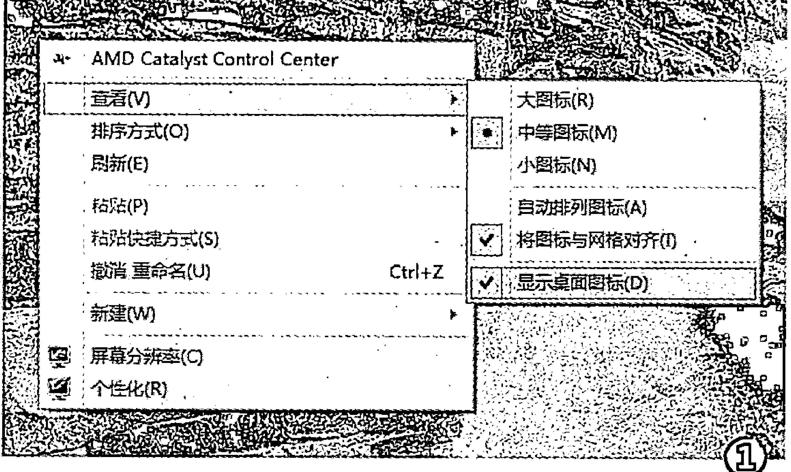

##### 1 藏起桌面图标方法多

鼠标右击桌面空白处，在弹出的菜单中选择“查看→显示桌面图标”，去掉该项前的对钩，即可藏起桌面（图1）。这是一个“乒乓”开关，藏起桌面后再度显示也要从这里设置。


还可以将桌面所有快捷方式的“属性”统统设置为“隐藏”，然后从“文件夹选项”窗口中选中“查看→不显示隐藏的文件、文件夹和驱动器”一项来藏起桌面图标。但以此法隐藏桌面图标后，可能会发现“回收站”等系统图标依然还在桌面上，这时可通过“控制面板→外观和个性化→个性化→更改桌面图标”，选择去掉桌面上显示的系统图标（图2）。

##### 2 桌面无图标程序也访问

桌面图标移走后，虽然桌面清爽了，但访问原来桌面上的图标成了问题。这时，我们可以借用任务栏的空白区域来解决问题。

在任务栏的空白处点击鼠标右键，在弹出的菜单中选择“工具栏→桌面”（图3），之后，我们看到任务栏上出现一个“桌面”文字按钮，点击该按钮可见原来桌面上的所有内容都出现在菜单中了（图4）。

小技巧

还可以用专门的桌面美化软件（如“酷点桌面”），实现图标的一键隐藏。酷点桌面支持Windows 8.1及低版本Windows，软件安装后有其自身的图标管理面板占据桌面，但可通过右键选择关闭所有面板。通过双击桌面空白处，可以方便隐藏所有桌面图标。

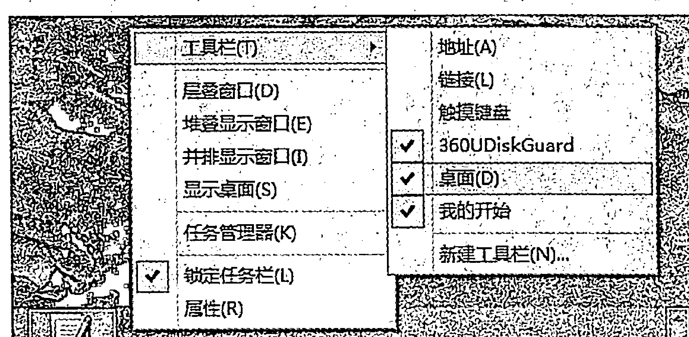

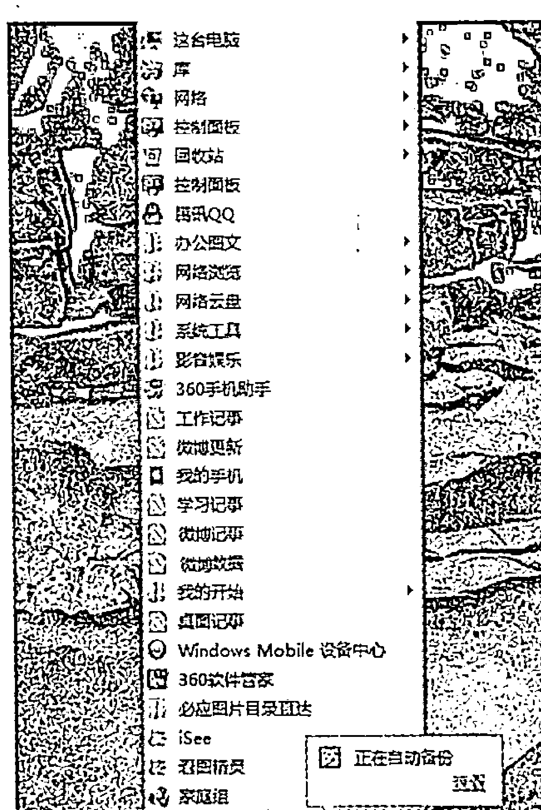

##### 3 巧解任务栏“桌面”繁乱

桌面图标以菜单方式安放到任务栏后，“桌面”菜单中的内容就会变得繁杂，尤其是当桌面图标数量比较多时更是如此。这时，可以用分组的方法来解决任务栏“桌面”图标杂乱的问题。

> 火速链接
如何将繁乱的桌面图标用分组的方式组织在系统任务栏上，详情参见本刊2014年6期P38《自建优于开始菜单的多级菜单》。

#### 创建养眼的图标桌面

文 | 丽影

不是所有的人为了追求极致而选择去掉桌面所有图标的做法。对这些人，让图标在桌面显示得更加美观，改变图标大小、重新组织图标使之更酷可能更为实用和重要。

在此，向大家介绍用一款很酷的桌面图标管理工具“酷点桌面”来美化桌面图标的方法。可通过其官方网站http://www.cooldock.com/下载最新版本，软件有安装版和绿色运行版可供选择。

软件运行后，默认在桌面上开启一个矩形工具面板、一个圆形工具面板、一个任务栏快捷图标，并开启全景桌面，原来的系统桌面被隐藏起来。

如图所示为该程序运行后替代Windows 8.1桌面的情景。上方是一个矩形工具面板，鼠标在工具面板上移动会出现类似苹果电脑的动感工具条；中间是常用的大图标；圆形版面中围绕着最常用的快捷项目，可用鼠标滚轮动态旋转操控，点击中间圆还会出现时钟显示（图1）。

> **小技巧**
最省事的添加图标的方法是，用鼠标将各种程序、文件、文件夹、快捷方式自由拖入面板中。

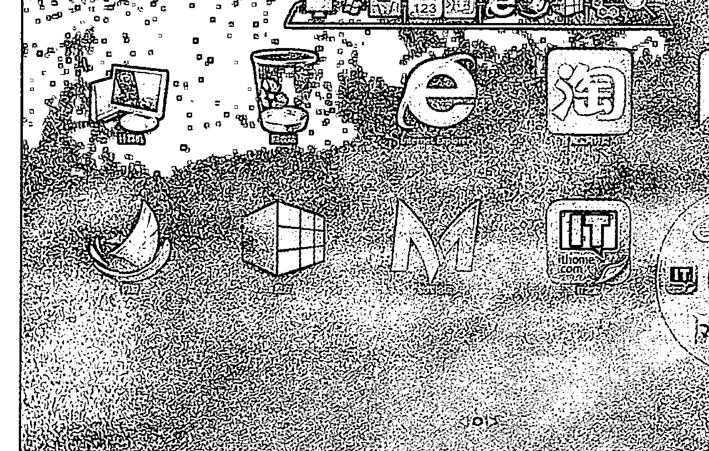

如果要添加或删除桌面大图标项目，只需在桌面空白处点击鼠标右键，然后选择“添加常用图标”或“添加图标”即可。如果要删除桌面图标，在图标上右键操作删除即可（图2）。

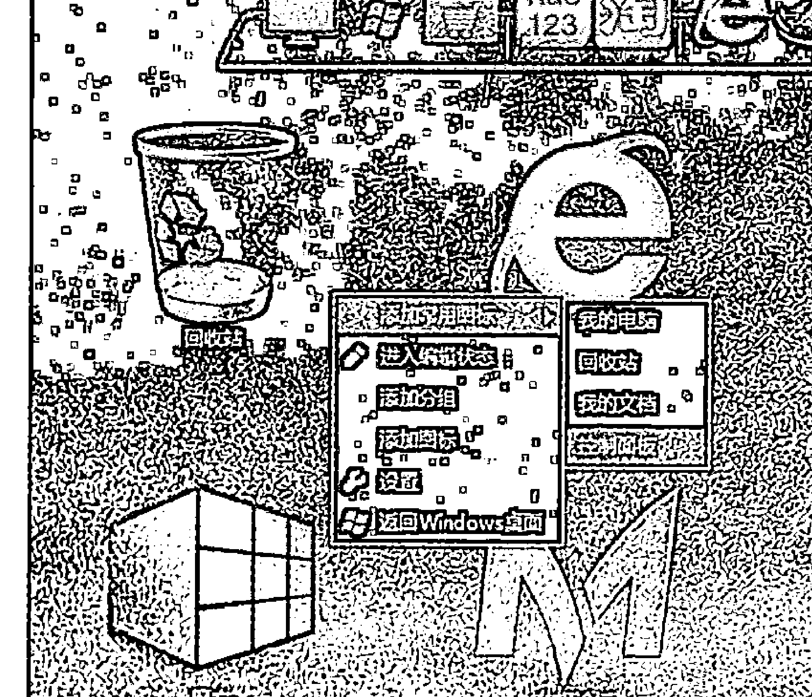

矩形面板中的图标也可以通过右键激活快捷图标管理窗口来添加、删除或编辑（图3）。

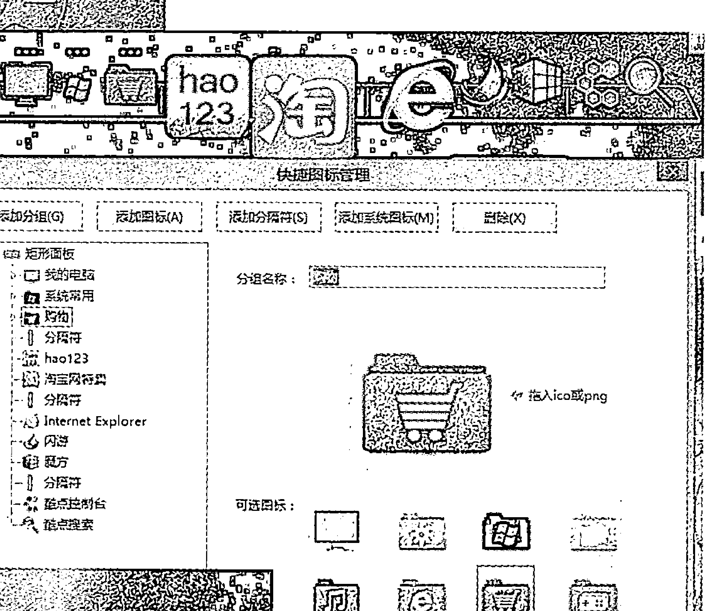

圆形面板中的图标可以通过右键菜单选择“添加常用图标”来添加。通过“圆形面板风格切换→清除所有图标”可重新定义圆环中的图标（图4）。

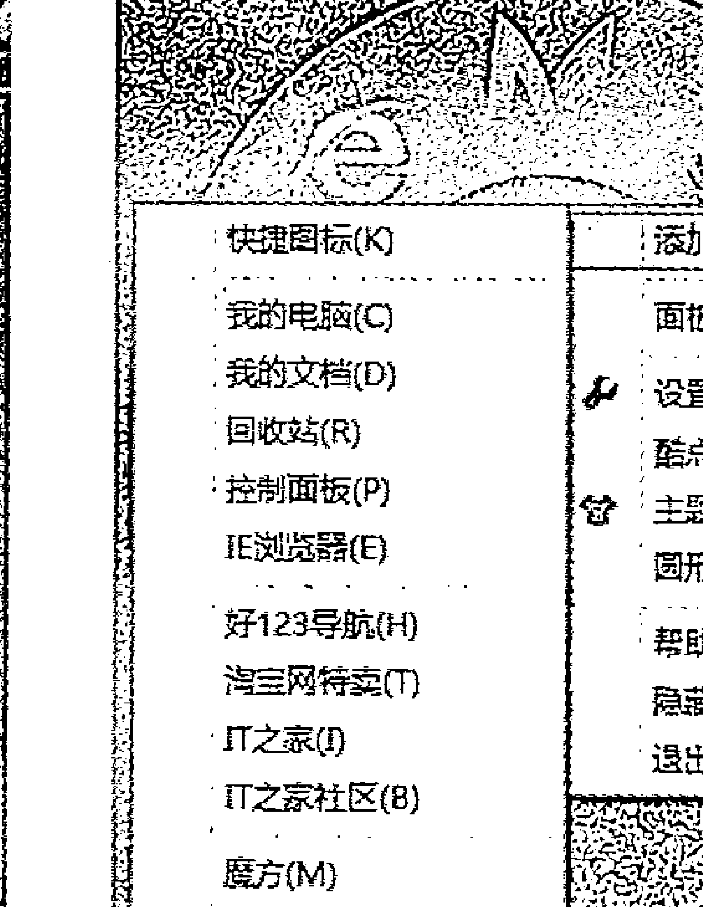

如果对软件默认提供的图标不满意，还可以自行对桌面及各面板中所用的图标进行美化，可通过选项设置窗口对各种参数进行优化设置来实现（图5）。

> **小提示**
如果对软件默认提供的图标不满意，还可以自行对桌面及各面板中所用的图标进行美化，可通过选项设置窗口对各种参数进行优化设置来实现（图5）。

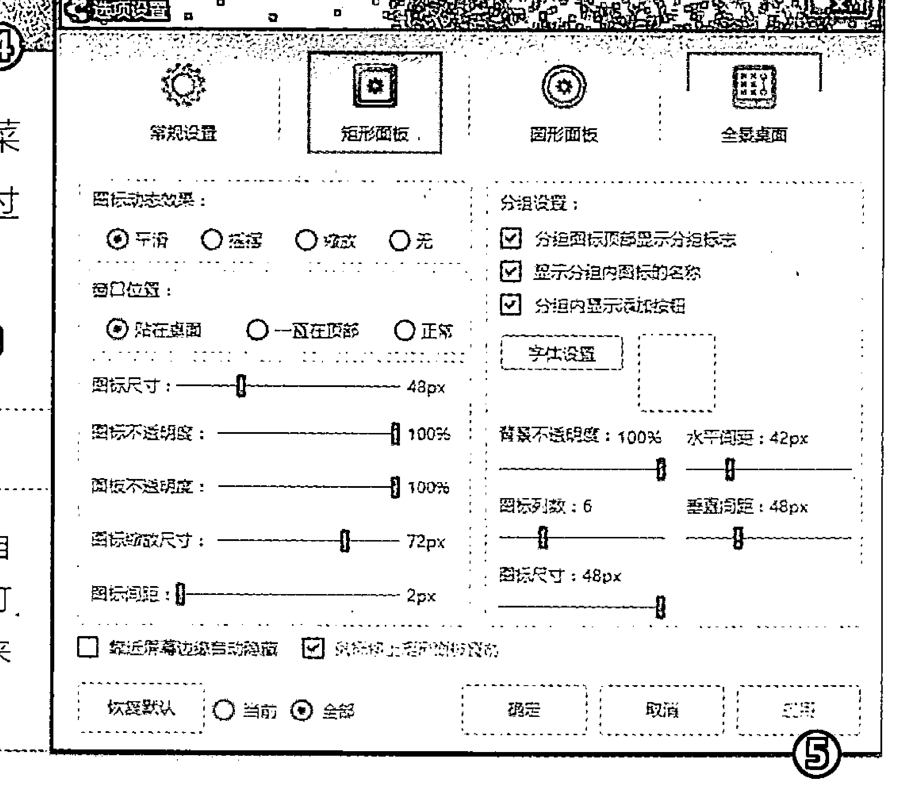

### 微软主题天天换
文 | 丽影

Windows 8的桌面主题是一个多媒体文件集合，主题可以同时更改电脑上的桌面背景、窗口边框颜色、声音及屏幕保护程序。我们可以通过两种方式更换桌面主题。

#### 1 通过官方主题美化桌面

微软网站已经提供300多个主题，如果愿意，可以每天换一个不同的主题。通过桌面右键菜单进入“个性化”页面，从“我的主题”一栏中，可看到右下角“联机获取更多主题”文字链接（图1），点击该链接进入微软主题页面（图2）。
点击微软主题页面左栏最下端的“与新的Windows兼容”项，窗口右侧会列出所有适合于Windows 8.1的主题项目。如果我们已经安装了迅雷，这时，在浏览器微软主题页面中单击右键并选择“用迅雷下载全部链接”，接着在迅雷地址选择窗口中只勾选“themenpack”和“deskthemepack”两项并提交下载，迅雷会一次性将这些主题包下载到本地（图3）。
下载之后，如果要安装多个主题，一个接一个地点比较麻烦。这时可以一次选择十个八个甚至更多的主题包，然后直接按回车，这样系统会自动一次性将选择的主题包都安装到系统中。

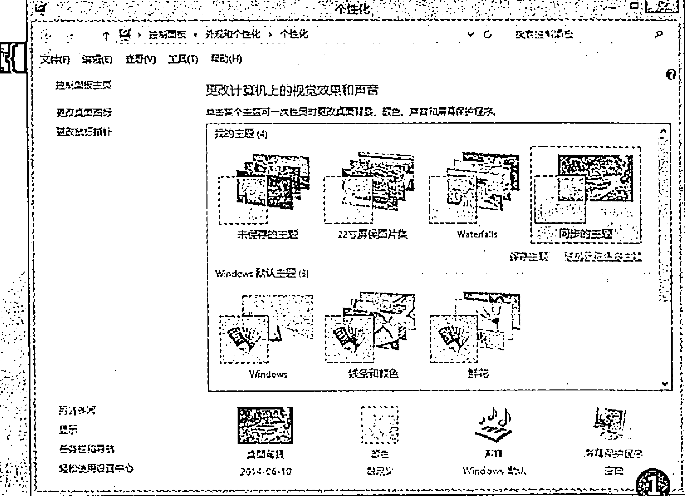

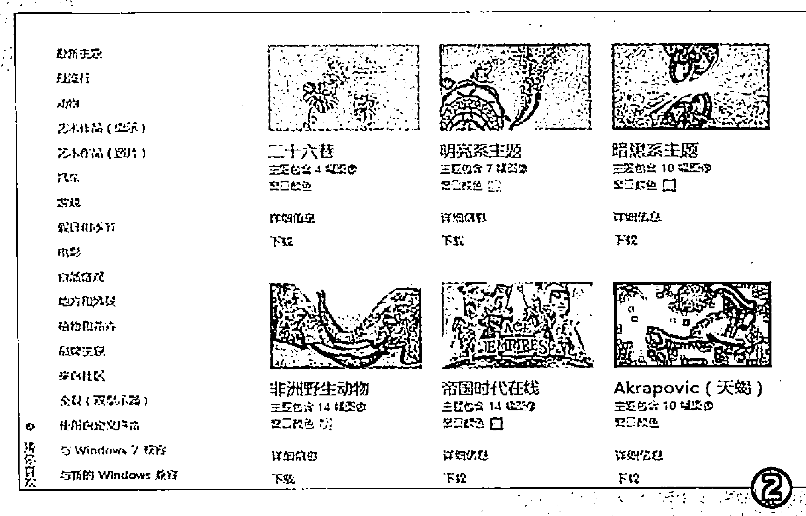

#### 2 自己动手打造个性化主题

如果需要自定义一个主题，首先需要单击任意一个已有主题，将其应用于桌面。然后更改该主题的每个部分，包括桌面背景、窗口边框颜色、声音和屏幕保护程序，将自己的数码照片、声音等信息纳入其中。所做的所有更改将作为“未保存的主题”显示在“我的主题”下，点击“保存主题”将其保存下来即可。

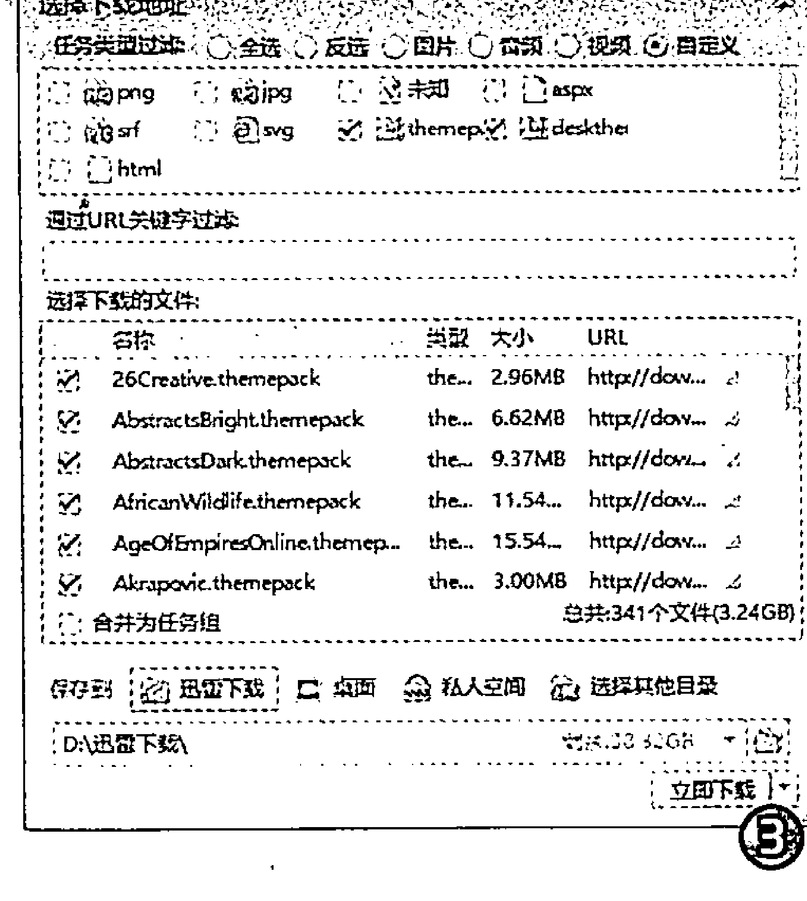

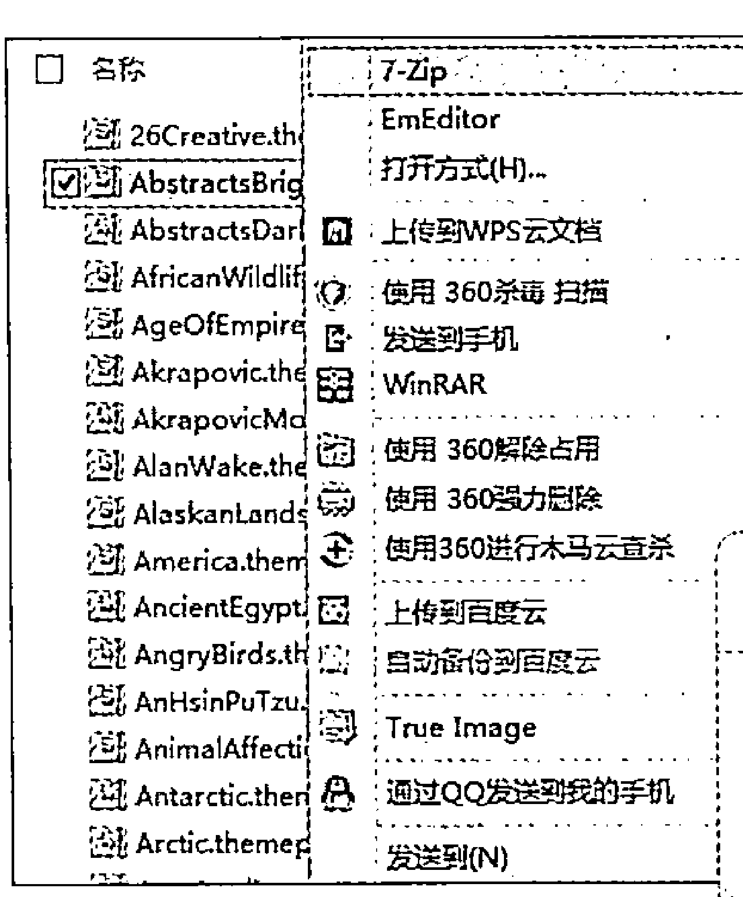

> > **小技巧**
> 如果急于想查看当前主题演示的下一张图片，可以不去理会系统设定的主题图片显示时间间隔，直接在桌面右键菜单中选择“下一个桌面背景”即可看到下一张图片。这是一种以最快速度预览主题中图片的现成方法。

> > **小技巧**
> 如果喜欢主题中的系列图片，可以安装7-Zip压缩软件，在主题包上点击右键并选择相应的提取命令，即可将主题包中的图片一次性提取出来（图4）。

### 更美丽——突破Windows 8主题限制
文 | 阿发

很多人喜欢用各种漂亮的主题装扮自己的Windows，不过Windows 8在默认情况下对某些功能进行了锁定，禁止我们直接使用第三方的主题。当然微软不能束缚我们对美的追求，只要安装一个补丁文件，即可对系统主题解禁。

- 主题资源推荐
- 系统城
  下载网址：http://tinyurl.com/pfftloh
  提供各类Windows 8精美主题下载；
- Win8主题包
  下载网址：http://tinyurl.com/qgre2hc
  提供各种特色Windows 8主题下载；
- Win8仿iOS6主题包
  下载网址：http://tinyurl.com/qgre2hc
  提供应用于Windows 8下的仿iOS6主题下载。

首先到http://tinyurl.com/ag8aw25下载“软媒魔方”，启动程序后切换到“美化大师”，然后点击上方的“系统主题定制”，继续点击“破解主题文件”，按提示重启后即可解禁（图1）。

重启后再次启动美化大师，软媒自身就内置了不少主题下载，点击上图的“更多主题下载”，然后在打开的窗口选择自己喜欢的主题下载即可（图2）。下载完毕，点击“应用”，将会自动打开Windows 8自带的“个性化”组件窗口并应用主题，返回桌面就可以看到漂亮的新主题了（图3）。

如果不是通过软媒下载的主题，可以自行将主题文件放在“C:\Windows\Resources\Themes”下，这样启动个性化组件后就可以从中选择它们了。不过对于需要更换系统图标的主题包（如Windows 8仿iOS6的主题包），一般下载到的可能是一个可执行文件，只要双击运行安装即可。

需要注意的是，更换系统图标的主题使用后可能会造成系统故障，所以强烈建议在应用主题前，先使用系统还原为系统做一个备份。另外，网上下载的可执行文件可能包含病毒，所以要先用杀毒软件进行彻底检测后再用。

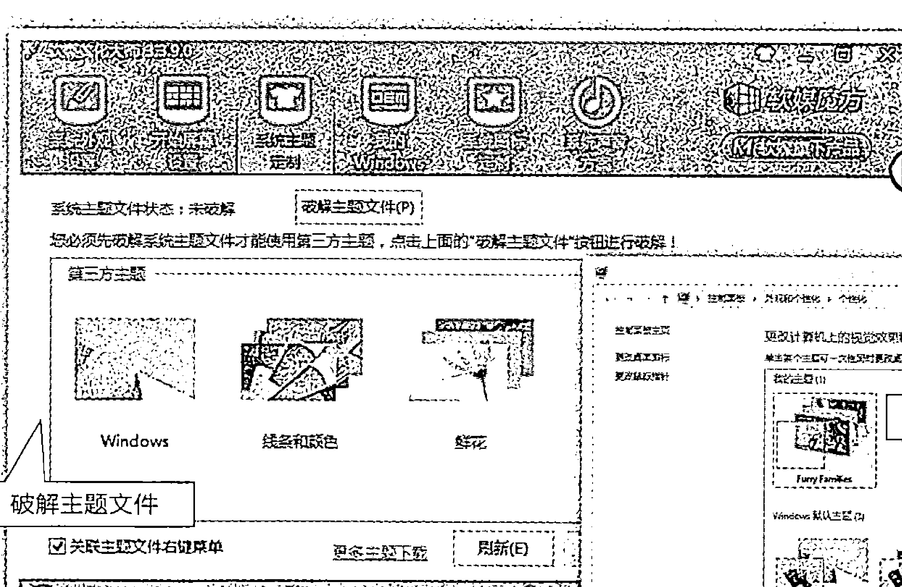

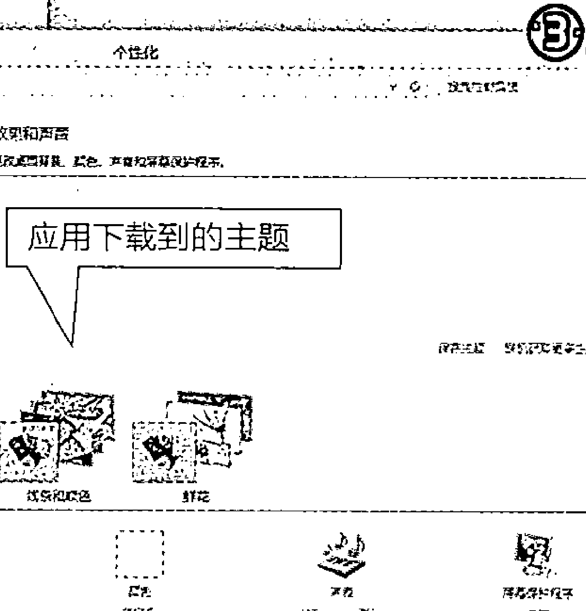

> ### 小提示
下载的主题名称可能并不好，我们可以在上述窗口中点击“保存主题”，将自己喜欢的主题另存为其他名称，并且可以将其导出与好友共享。

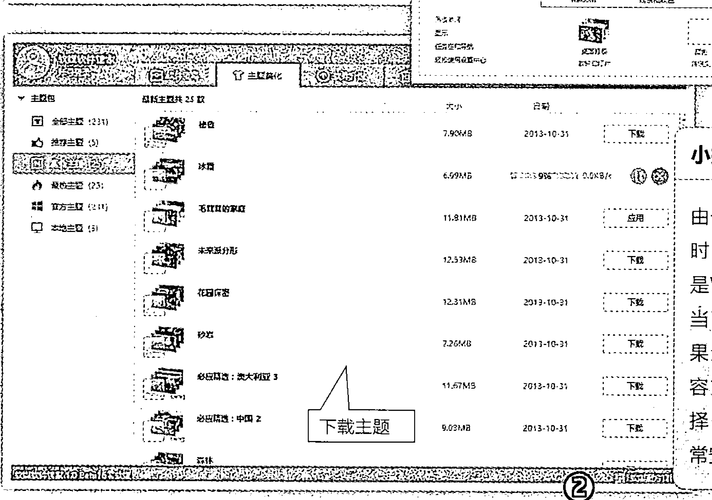

> ### 小提示
由于Windows 8.1推出的时间不长，而网上大多还是Windows 8下的主题，当下这类主题文件后如果运行出错，可以使用兼容方式试试，兼容模式选择“Windows 8”即可正常安装使用（图4）。

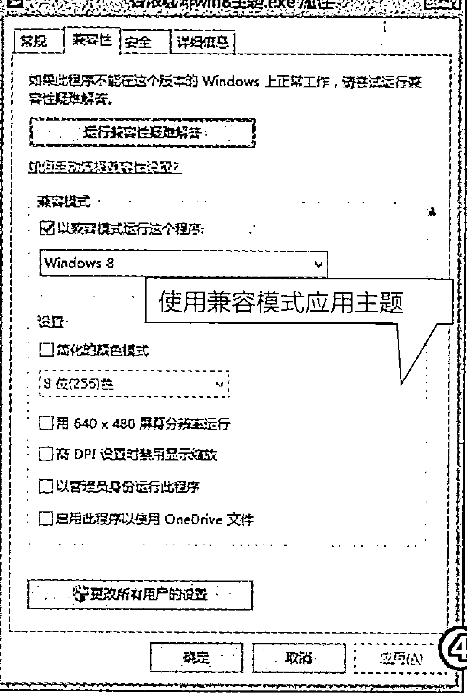

### Windows 10 “毛病”知多少

文 | 木瓜

Windows 10预览版已经发布，它不像“姐姐”Windows 8那样遭人反感。但毕竟还处于测试阶段，问题不少。笔者体验中就发现了一些问题，有的是Bug，有的则是微软“蓄谋已久”不解决的问题。在此提出，希望大家在测试过程中跳过这些“坑”，少浪费时间。

#### 1 两个无效的系统设置

虽然在“导航”页中开启了“当我指向右上角时，显示超级按钮”，但是设置之后鼠标指向桌面右上角，却无法浮出超级按钮面板。而选中“导航”页中“按下Windows徽标键时，在我正在用的显示器上显示开始屏幕”选项，应用之后，按下Windows徽标键，显示的仍然是开始菜单而非开始屏幕。

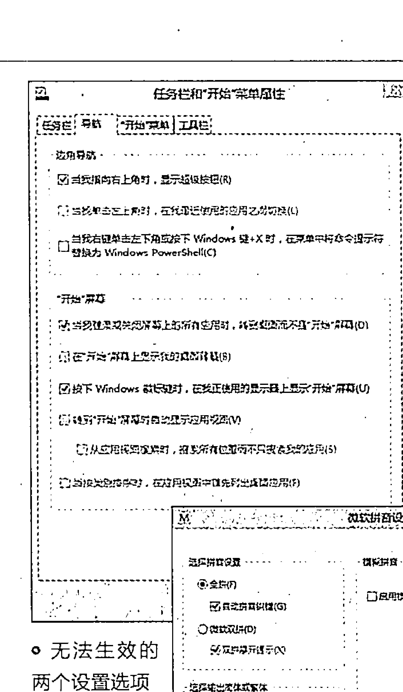

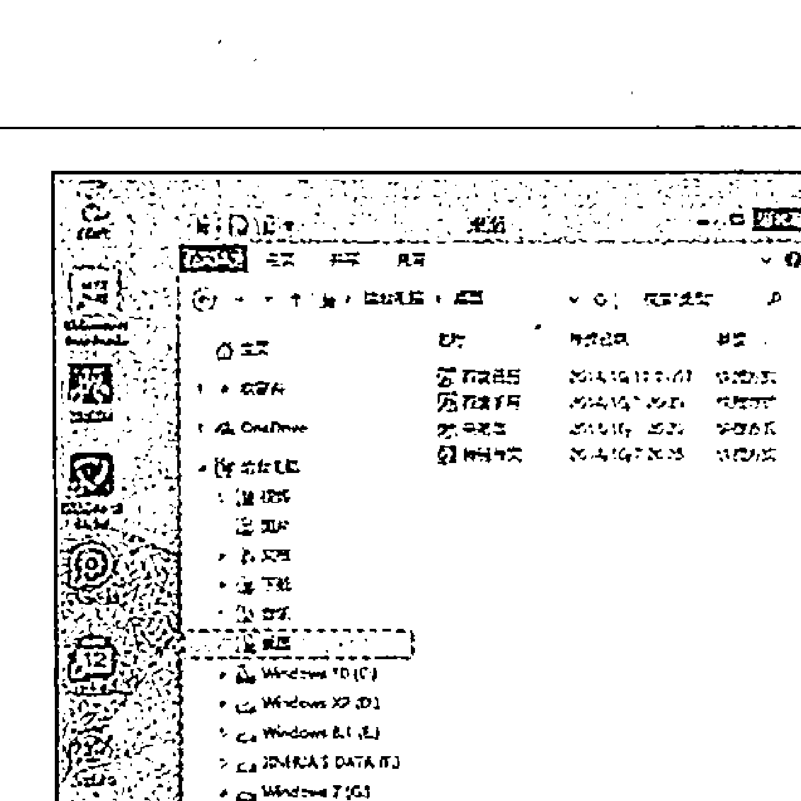

#### 2 桌面快捷方式去哪儿了

明明在桌面上安装了不少软件，却在资源管理器桌面窗口只能看到部分图标。

> 小提示
以上两个问题有待微软来解决。

#### 3 第三方拼音输入法丢失

安装了百度输入法后，第二次启动系统就没有了。
解决办法：不需要重新安装，通过在控制面板语言选项中添加就可以看到了。

#### 4 微软拼音依然没有长进

微软拼音输入法3.0中就有自定义双拼方案功能，很人性化。但Windows 10中非微软双拼方案用户依旧无法自定义方案。这是一个微软知道但迟迟不解决的问题，不知出于何故。

#### 5 记事本无法自动重排

使用微软雅黑黑体录入文字，从“格式”菜单选择“自动换行”，之后窗口改变大小之后，出现自然段内文字断行的现象，还需要手工重排才能解决问题。
解决办法：如果将文字拷贝到写字板中，则不会出现这种问题。

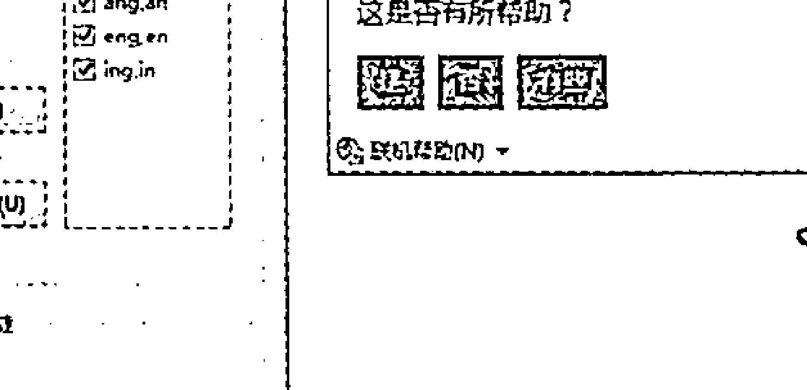

#### 6 帮助系统的软肋依旧

帮助系统没跟上，许多窗口中点击小问号后调出的帮助信息依旧是“此内容不可用”或Windows 8的帮助。如果说Windows 10还处于测试阶段犹可谅解，那么Windows 8中也是如此就不能原谅了，微软需要努力做功课。

> 小提示
这也许是微软没有精力，顾不过来。看Windows 7帮助系统让Windows 8或Windows 10汗颜。

更多问题有待探索和解决，希望Windows 10越来越好用！

### 动动手 Windows 8更好用

文 | 平淡

Windows 8相比之前的系统增加了不少新的特性，这些新特性可以让系统使用起来更顺手，也让我们的系统更有个性。

#### 锁屏 锁出精彩来

Windows 8支持自定义锁屏画面，这样在系统登录或者按Win+L键锁定系统时，就可以展示精彩的锁屏画面。

首先在应用商店搜索并下载Chameleon，启动应用后点击“设置”进入，在此可以设置多种图片作为锁屏界面，比如选择“天文每日一图”后会自动下载各种天文图片。以后如果要选择“天文每日一图”中的图片作为锁屏图，在打开图集后右击，然后在下方设置更换锁屏图片的时间间隔，点击“开始”，即可在指定时间内自动更换漂亮的锁屏图片了（图1）。

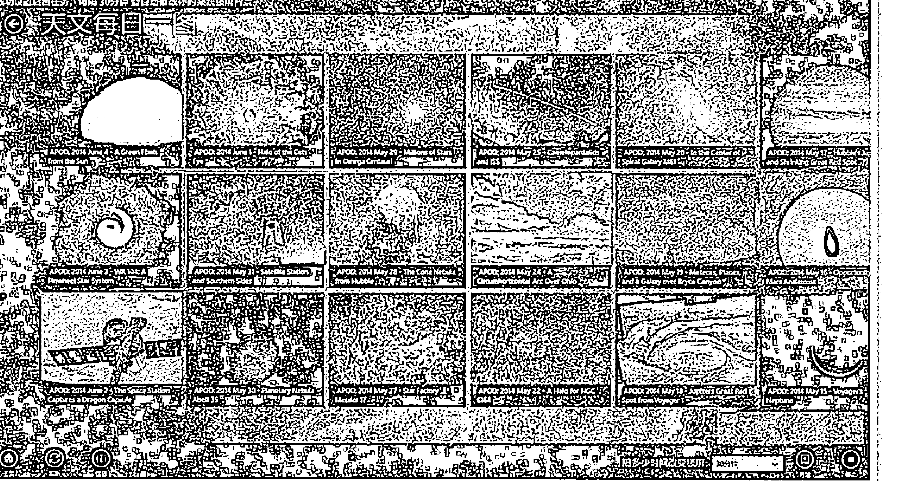

#### 登录密码的个性

Windows 8支持多种密码设置方式，方便我们在不同设备上使用不同的登录方式，从而使我们在使用不同设备时获得更好的登录体验。

首先按Win+C快捷键，然后在弹出的超级菜单中点击“设置→更改电脑设置”，接着在打开的窗口中切换到“账户→登录选项”，在这里就可以设置个性密码了（图2）。

如果是普通台式电脑，则点击“密码”下的“更改”，然后设置强健的字符密码即可。

如果是触摸型的平板或者笔记本，则可以点击“图片密码”下的“添加”，然后按提示添加一张作为密码的图片（建议选择自己OneDrive网盘中的图片），接着使用手指在图片三个不同地方“划”出密码来，以后登录时就可以直接使用这个手势进入系统了（图3）。

如果是支持3G上网的平板，我们还可以设置上网SIM卡的PIN码作为登录密码，这样可以实现PIN码多合一功能（既可以作为系统登录密码，也可作为3G上网密码）。点击“PIN”下的“更改”，然后在弹出的窗口中设置PIN码即可（图4）。

Windows 8支持同时使用上述三种密码登录系统，这样如果忘记其中一个密码，我们还可以使用其他记得住的密码登录系统。

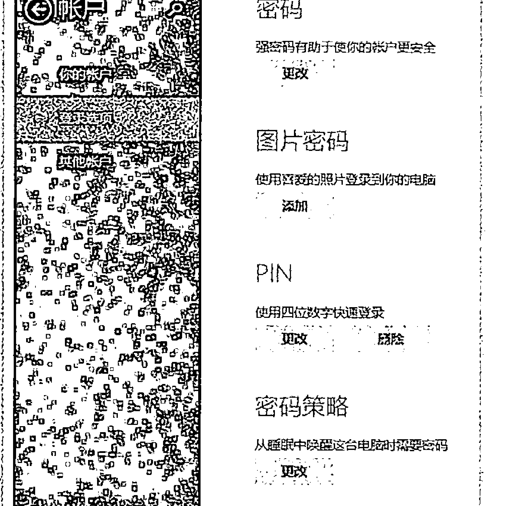

##### 在支持触摸的设备上设置手势密码

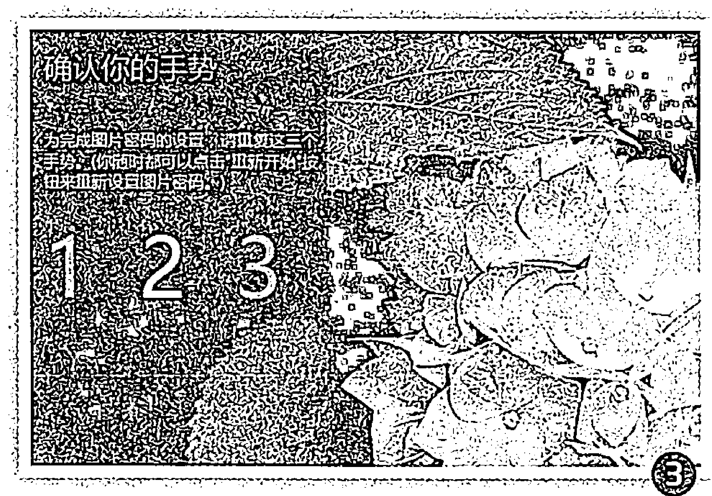

##### 设置PIN码

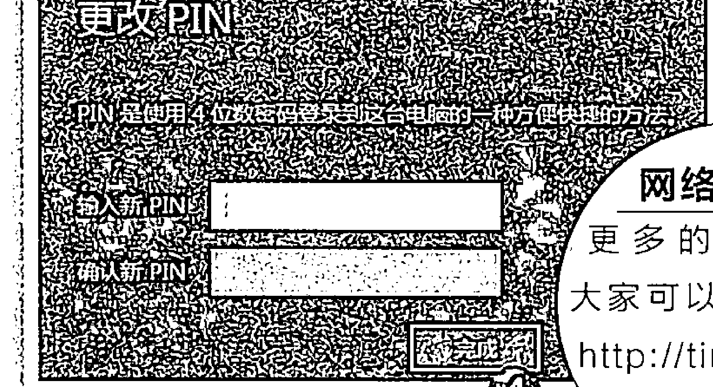

> 网络大补贴
更多的触摸操作大家可以登录查看：
http://tinyurl.com/mr2htmr

##### 添加设备

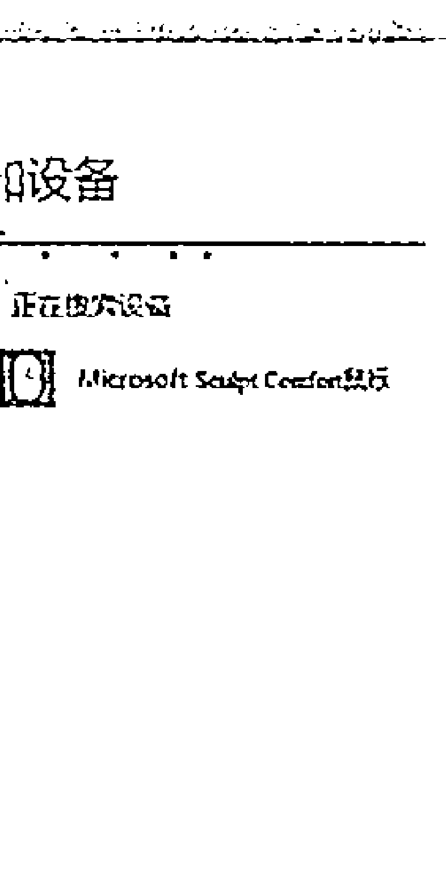

##### 成功安装触控设备驱动

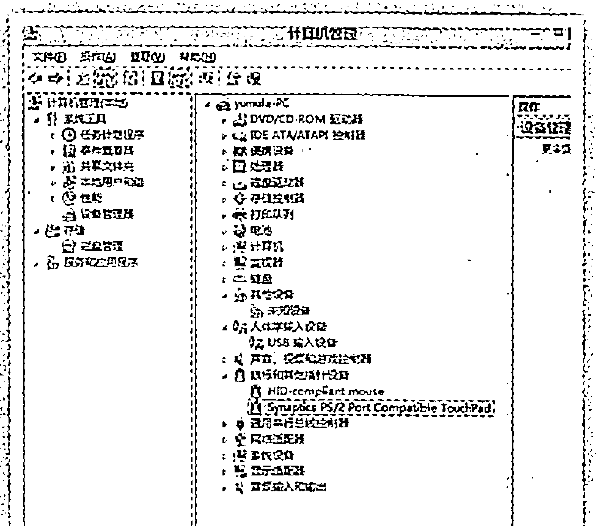

##### 自动搜索识别Sculpt Comfort鼠标

##### 蓝色区域可以实现触摸操作

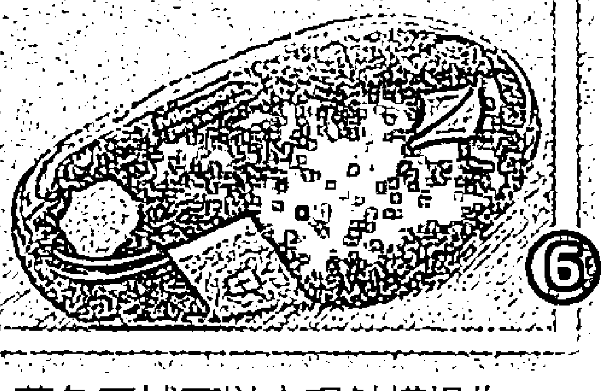

##### 程序触摸设置

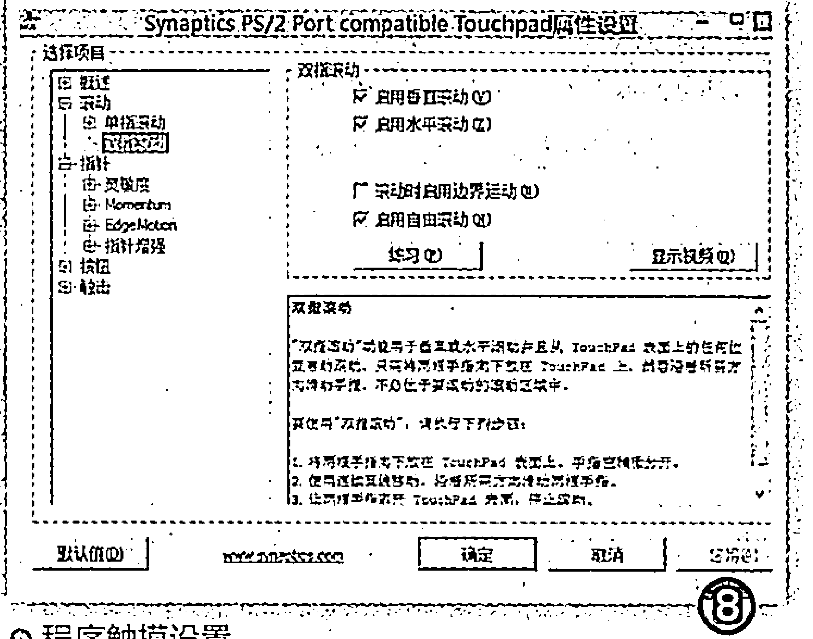

#### 触摸操作——无中生有玩触摸

Windows 8的一个重要特性就是增加了大量对于触摸显示的操作，不过目前触摸设备仍然比较昂贵，如果你没有触摸设备，可以借助其他设备实现触摸操作。

##### Sculpt Comfort鼠标替代触摸屏
适用：台式机、笔记本

Sculpt Comfort是微软专门为Windows 8设计的蓝牙鼠标，它的蓝色区域带触摸功能，这样使用它即可在Windows 8中实现触摸操作。

首先将Sculpt Comfort蓝牙适配器连接到电脑上，系统会自动安装驱动并进行搜索识别，成功识别后就可以使用了（图5）。

现在使用手指在蓝色区域滑动即可实现触摸操作，常用手势包括：按下后可唤出Windows开始屏幕，向上滑动将循环切换到打开的Windows Store应用，向下滑动显示屏幕左侧的最近应用列表。这样操作起来是不是方便多了（图6）。

##### 触摸板实现触摸操作
适用：笔记本

Sculpt Comfort的使用虽然方便，不过毕竟要另外购买一个鼠标。对于笔记本用户，借助“Synaptics Touchpad”（一款笔记本触摸板通用驱动），就可以使用本本的触摸板来体验Windows 8的触控操作。首先从http://tinyurl.com/l3fc27m下载软件，安装完成后进入“设备管理器”，展开右侧窗格的“鼠标和其他指针设备”，看看其中是否成功安装了“Synaptics PS/2 Port compatible Touchpad”设备（图7）。

接下来对程序稍加设置即可开始触摸操作了。右击任务托盘程序图标选择“定点装置属性”，打开设置窗口切换到“装置设定值”，接着点击“设定值”，打开设置窗口。在这里根据自己的需要进行设置，比如我们在浏览图片的时候想用双指滚动实现图片的移动，则可以切换到“滚动→双指滚动”，然后勾选右侧的“启用垂直滚动”、“启用水平滚动”和“启用自由滚动”即可（图8）。

完成上述设置后就可以开始在Windows 8下使用触摸操作了。比如开始菜单屏上的应用都是全屏显示的，如果启动多个应用，使用鼠标切换起来非常不方便。现在只要在触摸板的左边缘向右划或从右边缘缓慢向左划，即可实现应用的左右切换。

同样的，在触摸板上左边缘缓慢向右划，注意不能碰到边缘，此时就可以立刻弹出Charm菜单。

### Windows 8.1还能这样用

文 | 林旭璇

Windows 8.1的出现，为不同需求的人创设了更方便的条件。这不光是体现在最明显的两种用户界面上，更体现在Windows使用过程的每一个环节。看了下面的技巧，你会恍然大悟——原来Windows 8.1还可以这样用！

#### 1. 控制菜单 菜鸟大师两相宜

右键单击Windows 8.1开始按钮，你会发现，系统在弹出的快捷菜单中为用户提供了两种进入命令提示符的选项（含管理员模式和普通用户模式），这为以命令行的方式控制Windows提供了方便（图1）。但是，随着Windows技术的发展，许多Windows高手更愿意使用比命令提示符更为强大的PowerShell模式窗口来执行命令，控制Windows。那么，对于这些高级用户来说，可否将PowerShell命令添加到开始菜单的快捷项目当中呢？

鼠标右击任务栏空白处，选择快捷菜单“属性”命令，启动到“任务栏和导航属性”窗口，点击“导航”选项卡，选中“当我右键单击左下角或按下Windows键+X时，在菜单中将命令提示符替换为Windows PowerShell”复选框，确定之后，再回到开始按钮看右键菜单。是不是已经变成大师模式的选项了（图2）？

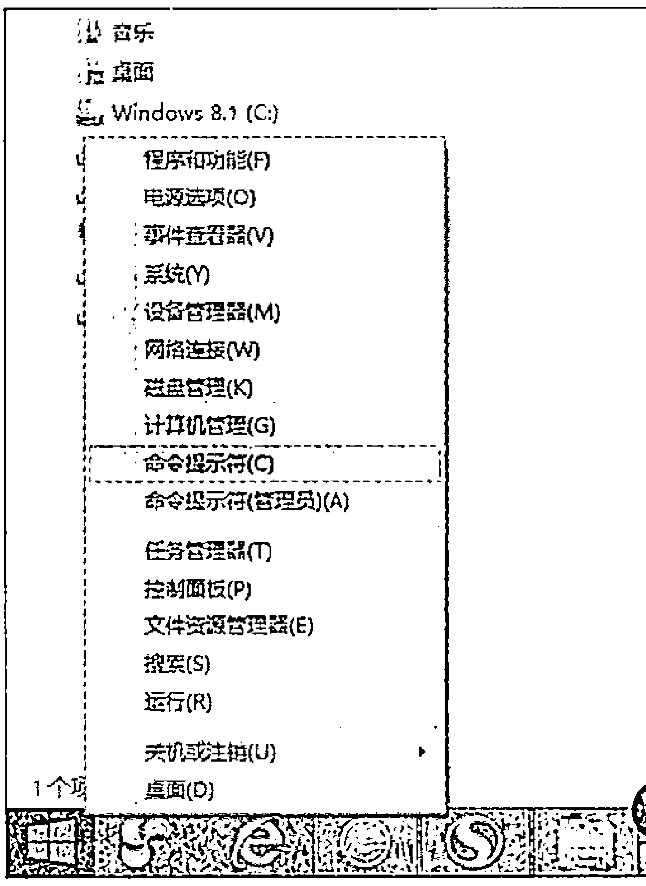

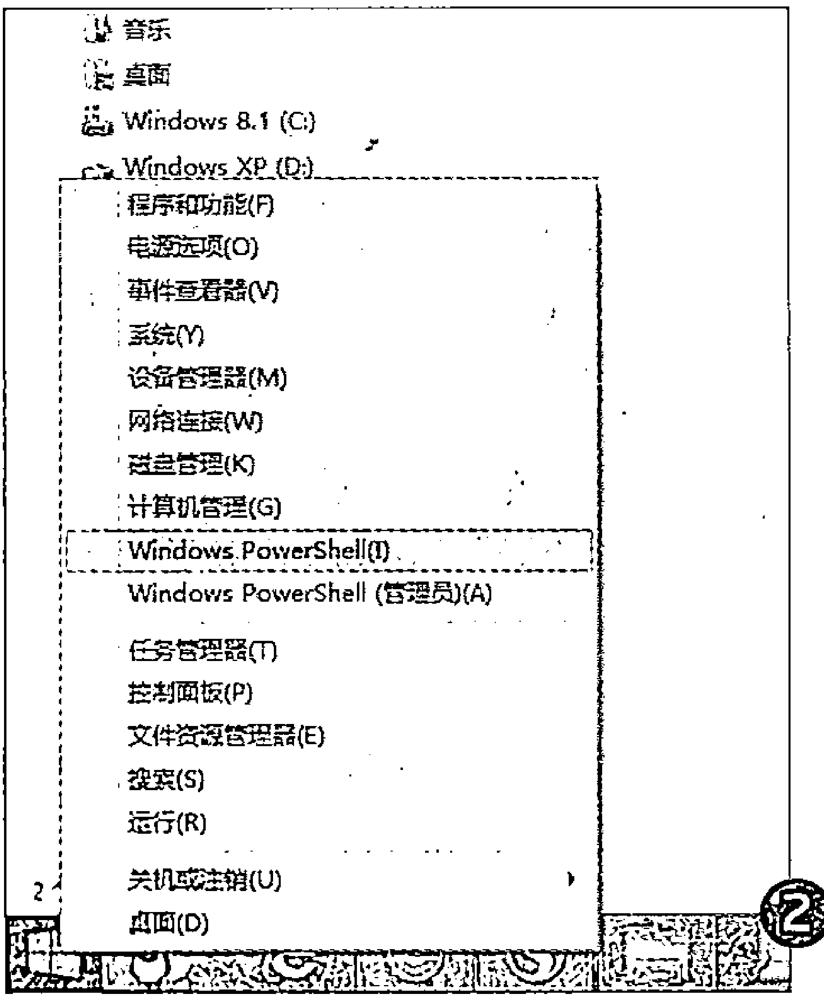

#### 2. 桌面办公 传统界面靠边站

Windows 8.1默认界面为平板娱乐用，如果用平板电脑或触摸玩具台桌电脑则比较方便。但是，不少人每天进入Windows后要在桌面办公，如何才能让办公族每天开机一步到位进入桌面，而不用执行切换操作来进入桌面呢？

我们只需在“导航”属性窗口中，选择“当我登录或关闭所有屏幕上的所有应用时，转到桌面而不是开始屏幕”复选框，然后应用并确定即可（图3）。

> 小提示：选择了该选项后，当你在桌面上需要执行一些Windows商店中的应用，应用执行完毕之后，也会自动返回到桌面环境，而不是转换到磁贴桌面。可以说这也是微软为桌面用户着想的一个具体体贴表现。

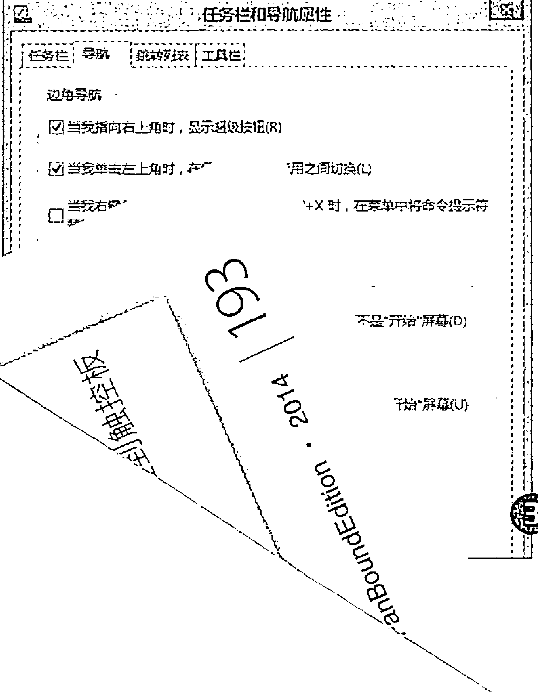

#### 3. 纯净桌面 不单是隐藏桌布

懒人总是将图标堆到桌面上顺手拈来，而有清洁嗜好者则更希望桌面只有一张唯美图片。如何打造唯美干净桌面，不光是隐藏桌面草草了事。除了将桌面图标统统搬到任务栏后隐藏桌面图标外（方法详见本刊第13期P35《巧设无图标桌面》），将任务栏隐藏起来、将系统托盘上的图标尽可能多地隐藏起来也很必要。隐藏任务栏可通过右击任务栏空白处并选择“任务栏”标签下的“自动隐藏任务栏”来完成，系统托盘图标的通知通过通知区域“自定义”按钮进入设置具体项目（图4）。

#### 7.4 隐私需求不同 因人而异

自己的电脑总是希望用过的程序或文档能留有痕迹以便下次再用时便于进入，而多人共用的电脑则不希望留有任何痕迹并能自动消除。如何因人而异进行个性设置？通过任务栏和导航属性窗口，选择“跳转列表”选项卡，在“隐私”框下，通过对两项选择的去留来满足两类用户的需求（图5）。

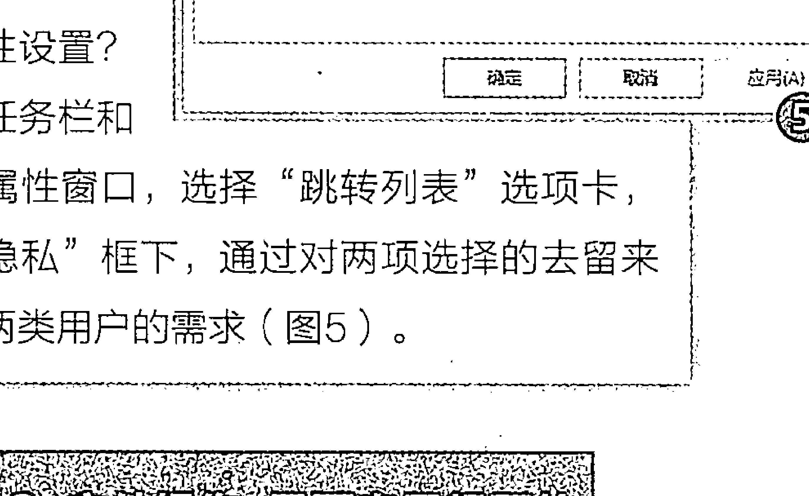

#### 7.5 资源浏览 隐藏选项卡

资源管理器上方的菜单选项卡虽然很体贴，但如果你熟悉了一系列快捷键的使用后，可能就会觉得它反而有点占地方了。虽然可以用鼠标点击菜单栏的小三角将菜单面板缩小，但如果你双手搭在键盘上懒得动鼠标或鼠标失灵了，怎么办？试试用组合键Ctrl+F1吧，可以马上解决问题。

#### 7.6 文件操作 只要自己想要的

以往，要在一个文件夹中对满足某个条件的文件进行操作，需要开启系统搜索窗口进行搜索。Windows 8.1中，只需用关键词即可在一个含有无数文件的目录中找到相关文件。

> 除了按文件名关键词外，还可以通过在“搜索”选项卡下定义文件属性（如类型、大小、日期等）的范围来筛选文件。

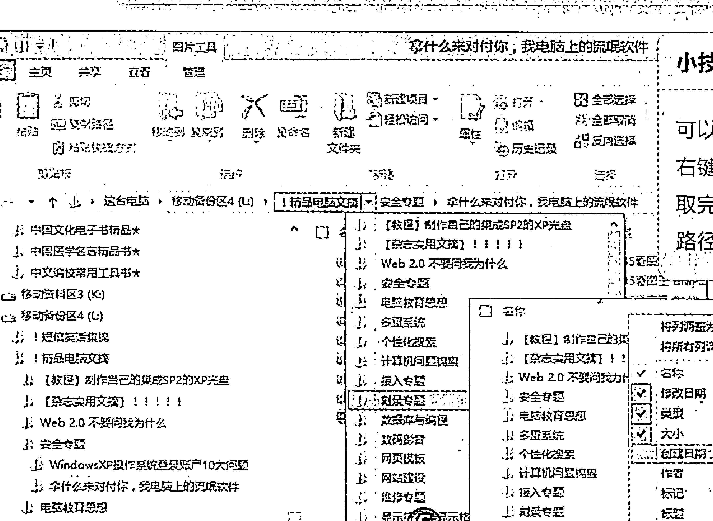

> 可以用地栏中的右键菜单命令来提取完整的多级目录路径文本。

#### 7.7 巧妙利用 地址栏中菜单

如果文件藏在一个多层的目录结构中，通过文件资源管理器地址栏的多层目录地址菜单定位，会更加快捷地到达任何一层目录（图6）。

#### 7.8 显己所需 文件列表自定义

在显示文件列表的过程中，每个人的需求有所不同，有的人可能不关心时间信息，有的人则对文件的建立、修改的时间很在乎。通过对文件属性项目的自定义，可以达到文件属性一目了然个性化。右击文件详细列表名称标题栏进行选择，如果没发现想要的，点击“其他”吧（图7）。

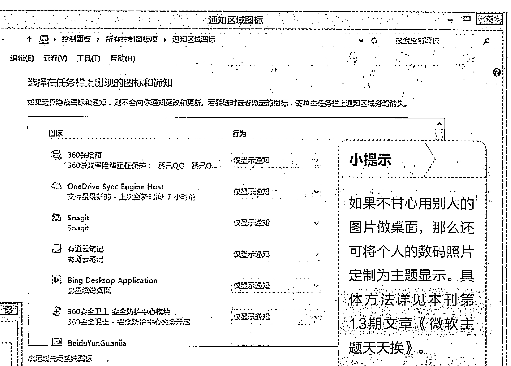

### 活用Windows 8.1自带屏保

文 | 武文元

现在的屏幕保护程序已经基本失去了屏幕保护的本来含义，转而变成养眼娱乐的作品。那么，如果在不安装来自第三方屏幕保护程序的情况下，对于新版Windows 8.1自带的屏保还能玩出哪些新花样？

#### 1 巧用加密屏保设置开机口令

大家知道，在系统的屏保设置窗口中可以设置结束屏保后返回桌面的口令。利用这个特性，如果我们能将自己指定的一个屏保程序设上只有自己知道的口令，然后将这个屏保程序通过文件拷贝或注册表添加的办法添加到系统的自启动项中，这样，在系统启动后自动调用屏幕保护程序，当用户动了鼠标后系统即要求输入口令，口令正确才能进入系统，从而实现了给系统加密的目的。

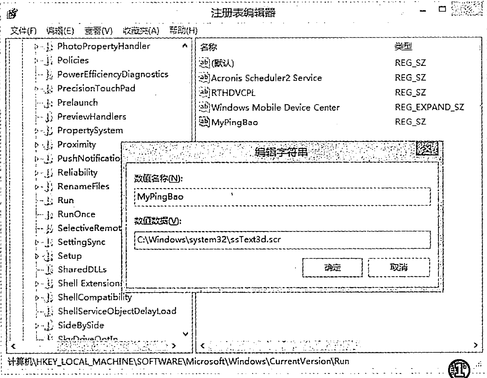

但是，Windows 8/8.1无法像Windows XP或Windows 7那样能从开始菜单中找到启动文件夹并将要启动的文件添加进去。实际上，Windows 8/8.1并未从实质上取消启动文件夹，只需将要设置为自启动的屏保程序的快捷方式拖动到以下位置之一就可以实现自启动：

C:\ProgramData\Microsoft\Windows\Start Menu\Programs\「开始」菜单

C:\Users\<用户名>\AppData\Roaming\Microsoft\Windows\Start Menu\Programs\「开始」菜单

如果担心这样设置之后，有经验的用户会通过键盘控制键跳过屏保启动，那么可以通过添加注册表项目的方法将屏保程序添加到注册表自启动项目当中。按Win+R并运行Regedit启动注册表编辑器，依次定位到 “HKEY_LOCAL_MACHINE\SOFTWARE\Microsoft\Windows\CurrentVersion\Run”，在其下建立“字符串值”，命名为一个自己容易识别的屏保名称（如MyPingBao），将值设置为带密码的系统屏保路径（如“C:\Windows\system32\ssText3d.scr”）（图1）。这样一来，即便是Windows本身没设开机密码，系统登录之后，别人也无法使用Windows了。

#### 2 三组默认屏保舞出多姿多彩

如果说3D文字和照片屏保可以由用户自由定义，那么，变幻线、气泡、彩带这3类屏保就没那么听话了。当你选择了任一种作为当前屏保时，点击“设置”按钮，弹出的却是让你失望的界面（图2）。这时我们可以深入注册表，通过修改参数来让这三种屏保舞出更多的花样。

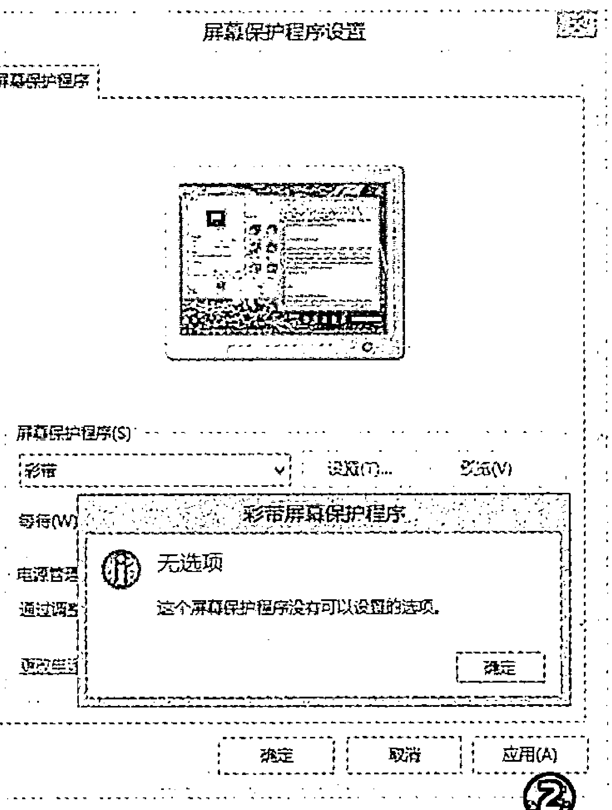

按Win+R组合键启动“运行”窗口，输入REGEDIT运行注册表编辑器，依次定位到 “HKEY_CURRENT_USER\Software\Microsoft\Windows\CurrentVersion\Screensavers”，可看到其下的三项设置，其中Bubbles表示气泡屏保控制项，Mystify表示变幻线屏保控制项，Ribbons表示彩带屏保控制项。通过添加修改这些选项下的键值，可让它们变出更多花样（图3）。

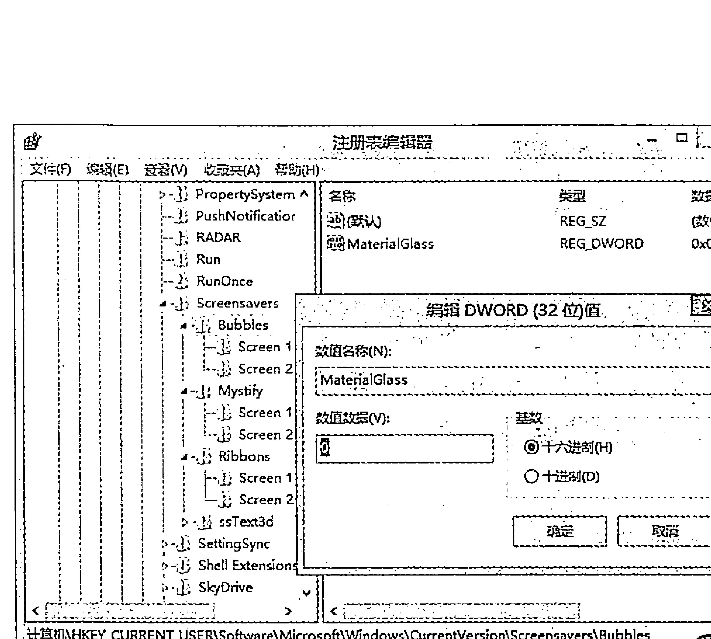

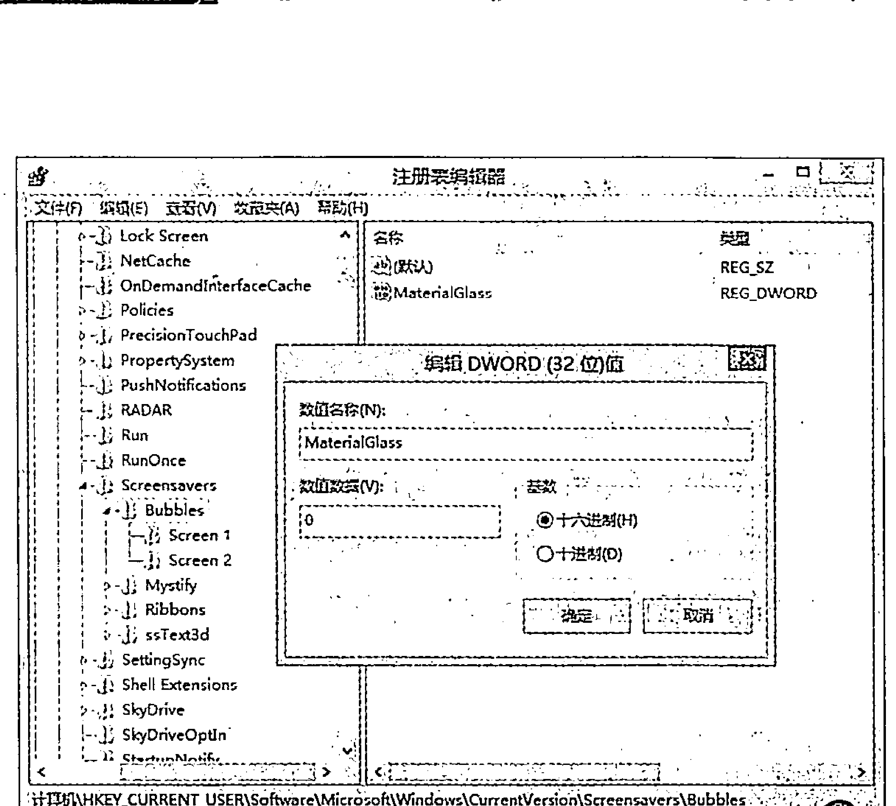

在Bubbles下新建一个DWORD（32位）类型键值，命名为MaterialGlass，双击修改其数值为0，这样可将透明气泡变成五彩气球（值为1表示默认的透明效果）（图4）。如果还想进一步控制气泡的更多属性，可通过添加更多的DWORD（32位）类型键值来实现。新建ShowShadow设置气泡阴影（值为0表示无阴影，1表示有阴影），新建ShowBubbles设置显示泡泡时屏幕是否变黑色（值为0表示当前屏幕透明，1表示背景变黑色），新建TurbulenceNumOctaves设置气泡色彩变换速度（从0到255逐渐变快），新建Radius设置气泡半径大小（从113000000到109000000依次变小），新建SphereDensity设置气泡密度（从1000000000的2100000000依次变多）。

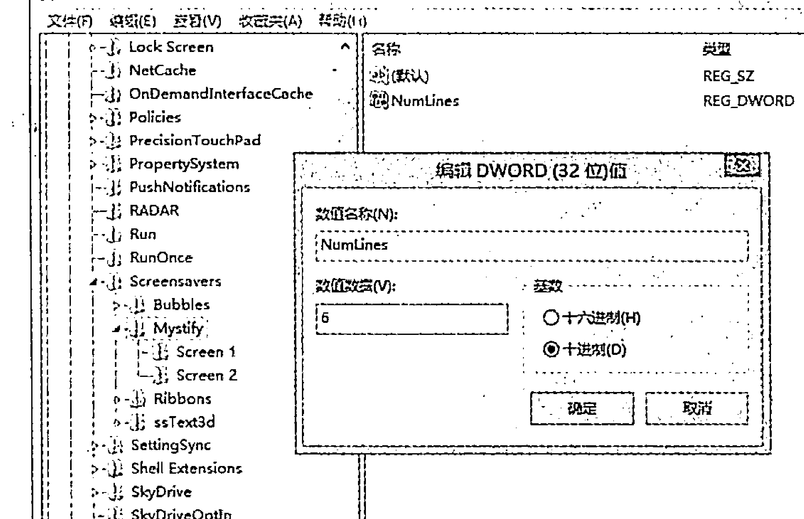

在Mystify下新建一个DWORD（32位）类型键值，命名为NumLines，双击修改其十进制数值为1~100之间的任意整数保存退出，这个数值代表变幻线的条数（图5）。此外，还可新建CameraFOV键值设置变幻线视野范围（数字任意，数值越大，视野范围越小），新建LineWidth设置变幻线条粗细（从100000000到1080000000逐渐加粗）。

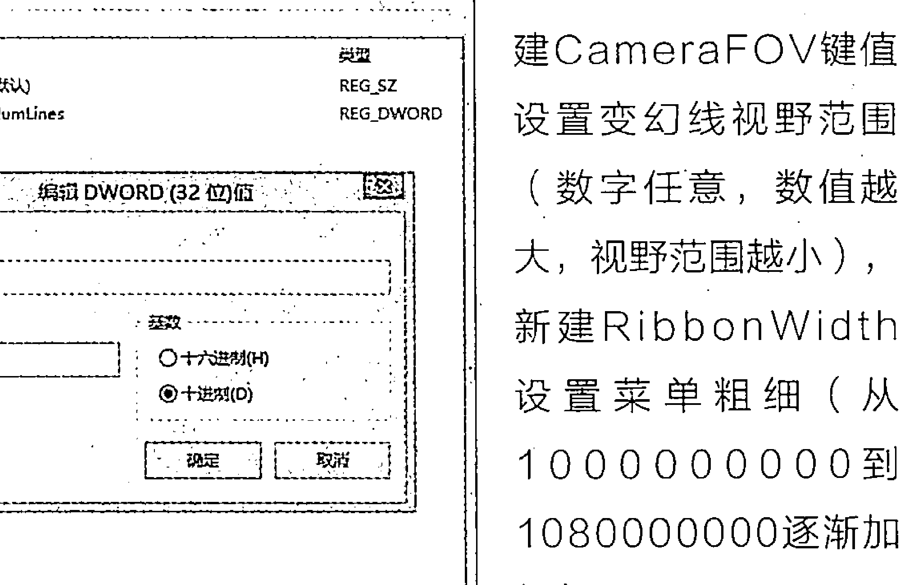

在Ribbons下新建一个DWORD（32位）类型键值，命名为NumRibbons，双击修改其十进制值为需要的数目，这个键值及其数据所表示的就是彩带及其条数，取值范围是1~100（图6）。此外，同样可新建CameraFOV键值设置变幻线视野范围（数字任意，数值越大，视野范围越小），新建RibbonWidth设置菜单粗细（从100000000到1080000000逐渐加粗）。

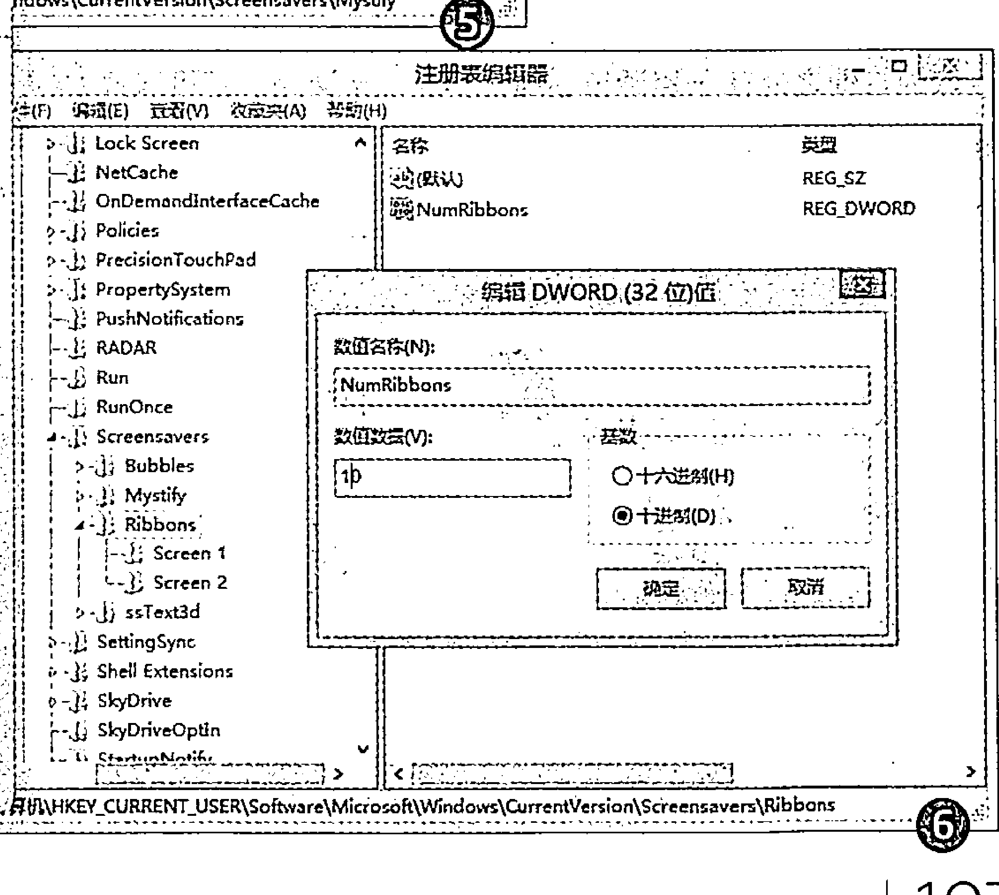

小提示：Windows 8.1的这三种内置屏幕保护程序都支持在扩展显示器上显示，如果自己的电脑上安装有两个或多个显示器，并希望屏幕保护启动后能在每个显示器上显示屏保画面，可新建一个SpanMultiMon键值，将其值设置为1，即可开启多显示器扩展显示。若将值改为0，则只支持在主显示器上显示屏保画面。

### 通过“库”实验洞悉“库”本质

文 | 云文清

Windows 8.1虽然不再强化“库”的概念，但“库”依然在文件资源管理中发挥着很重要的作用。然而，许多用户在实际应用中很少使用库。究其原因，是对库的作用认识不清。实际上，只需通过三个简单而具体的库实验，就能充分认清库的本质，从而让库在今后的电脑管理中起到应有的积极作用。

#### 1 创建新库 人人有份

也许你会以为库是Windows自带的专有项目。Windows 8.1安装之初，确实带有默认的库目录，且下有视频、图片、文档、音乐等4个库项目。但如果你安装了迅雷或PPTV等工具软件之后，你会发现库目录中会多出如“PPTV视频”、“迅雷下载”之类的项目（图1）。可见，软件有权在系统中新建库项目。

那么，自己是不是也能创建库项目？如果可以，如何创建？我们做一个尝试。在打开的库目录窗口的空白处单击鼠标右键，选择“新建→库”，创建属于自己的库项目（图2），如给自己创建起名为“我的库”。接着，再在系统分区之外找到一个属于自己的文件夹，单击右键，在菜单中选择“包含在库中→我的库”，这样，自己的文件夹就包含在自建库“我的库”中，库在自己的文件的管理中发挥了作用。

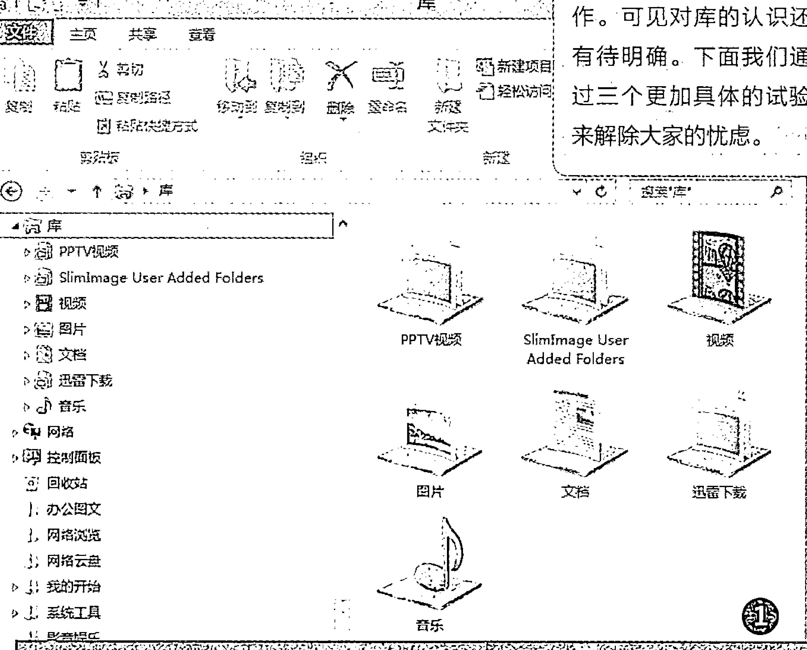

> **小提示**
> 2013年本刊17期P38《深入系统虚拟文件夹》文章中提到通过删除库试验认识库的小技巧，但有读者表示还是不敢轻易对库或库中内容轻易执行删除类的操作。可见对库的认识还有待明确。下面我们通过三个更加具体的试验来解除大家的忧虑。

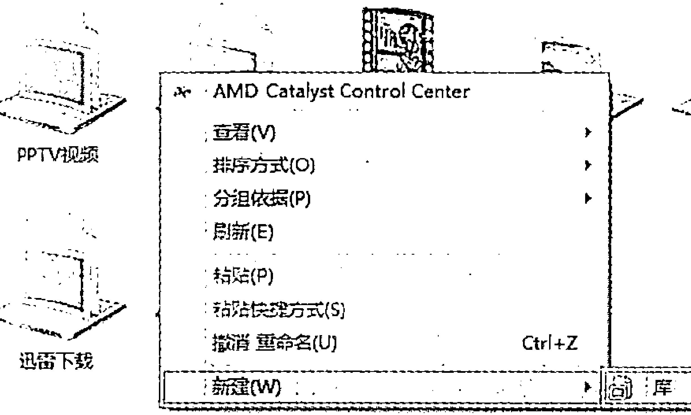

> **经验总结**
> 库的方便之处在于资源按性质分类后便于调用。它可以将位于不同物理地址的文件归拢到一处，使用时不用再关心文件存放在什么样子的盘、哪个分区、哪个文件夹下了。

#### 2 库中文件 小心删除

下面我们用具体的文件夹来做演示，看看删除文件或文件夹后，会不会影响到磁盘本地分区存放的原文件。

打开“我的库→资料库（TEST）”，将其中的两个新建Office文档删除掉（图3）。然后回到本地分区F的“资料库（TEST）”文件夹中，发现其中对应的两个Office文档也不复存在了。随后，我们删除此库中名为“1”的文件夹，然后回到F盘相应文件夹中查看，发现此文件夹也被删除掉了。

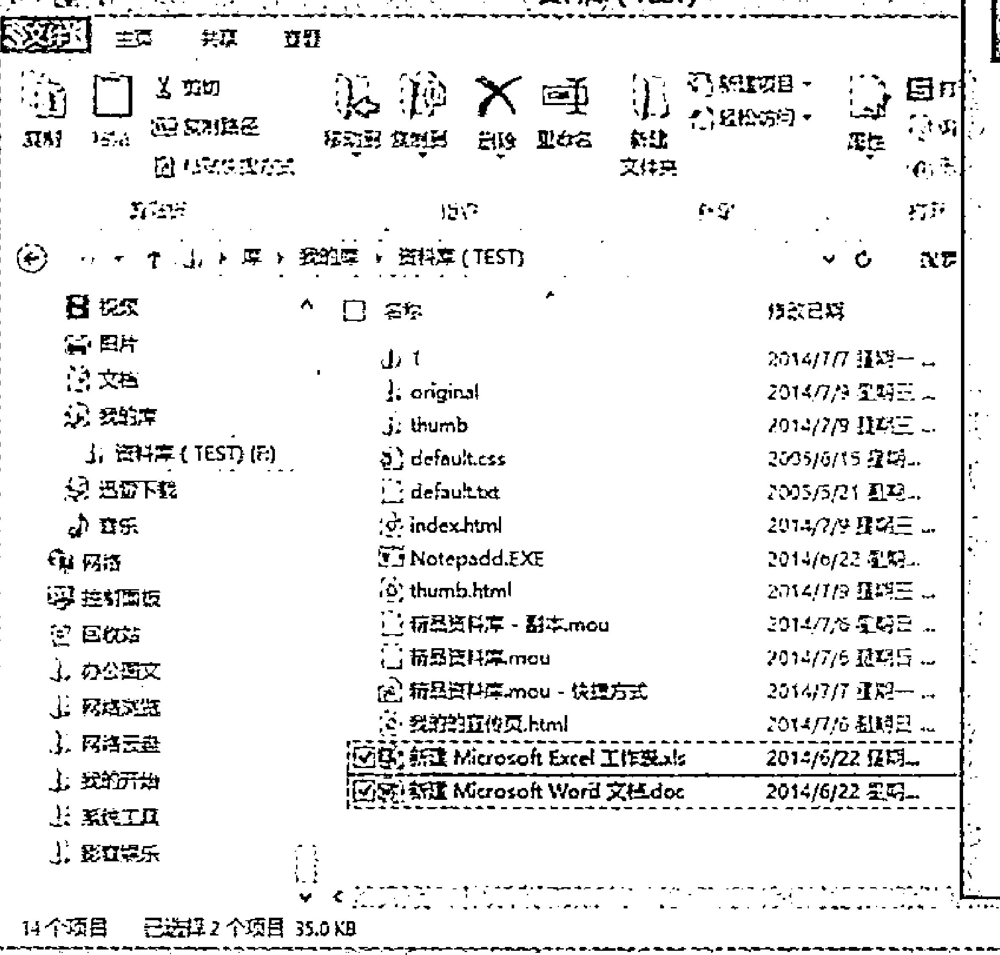

> **经验总结**
> 删除库内文件或文件夹的实验说明，对库内文件或文件夹的操作，是对文件本身的直接操作。如果错认为库内的文件或文件夹只是文件的一个快捷方式而可以随便删除，那么就会造成文件或文件夹的丢失。因此，对库内的文件夹或文件的操作，应像以往我们操作文件一样小心谨慎。

#### 库遭删除 恢复容易

既然库中的文件和文件夹不能随便删除，而库又承载着文件和文件夹，那么是不是就可以推理出，库也不能随便删除呢？我们再做一个实验。

打开系统库列表，选择“我的库”，单击鼠标右键并选择“删除”命令，将以上自定义库“我的库”删除掉。之后，再返回到本地F盘查看，发现“资料库（TEST）”文件夹依然存在，而且其中的文件和文件夹均完好无损。

> 经验总结：
> 由此可见，上面的推测是完全错误的。库的删除不会影响到其中的文件或文件夹的内容。这是一个出人意料的发现，说明库具有不同于文件夹的独有特性。可见库收集的并不是文件快捷方式，它本身也不是一个简单的文件夹快捷方式。删除库内所有文件或文件夹与直接删除该库，效果有天壤之别。对库内的文件夹或文件的操作要同样小心谨慎，但对库操作反而随便一些也无妨，不需要的库可以删除，如果后悔了，还可以再建立，因为文件还在，即便是删除了库，重建库只不过是一个命令而已。

#### 库内库外 搜索有别

库给使用者造成了一定的迷惑，难怪不少人不喜欢它。实际上，库的更大的优势在于它能在系统的背后对文件搜索提供强有力的支持。

下面我们再做一个实验。在将自定义的“我的库”删除之后，我们在F盘的“资料库（TEST）”文件夹下任意新建一个名字特殊的文件888-999-777.txt。然后，我们使用系统的搜索功能，用F3在桌面搜索这个文件，结果显示未找到任何文件（图4）。明明存在于本地硬盘中的文件，系统却说没有，这是何故？

原来，这是因为系统默认仅对包含在索引中的文件进行有效搜索，而系统库被纳入到默认的索引之中，但我们上面建立的特殊文件888-999-777.txt由于保存在系统分区之外的分区中，且未包含在系统库列表中，因此便理所当然无法被系统搜索到了。

> 小技巧：
> 文件放在库内和库外，对搜索产生的影响截然不同。系统搜索能否包含库外文件，要看具体设定。通过在文件资源管理器中点击搜索框，然后在“搜索工具”选项卡中点击“高级选项”，执行更改索引位置命令，修改添加需要建立索引的文件夹位置，可以将任何文件夹包含在索引之列。此外，如果需要搜索包含库内或库外的所有文件，除使用系统的搜索功能外，还可选择更高效的第三方搜索工具。

明白了这个道理，现在将F盘的“资料库（TEST）”文件夹再加入到系统库列表中，然后再用同样的方法进行桌面搜索。这时，在搜索结果中，就会看到有一个符合条件的文件出现，这正是此前建立的文件（图5）。

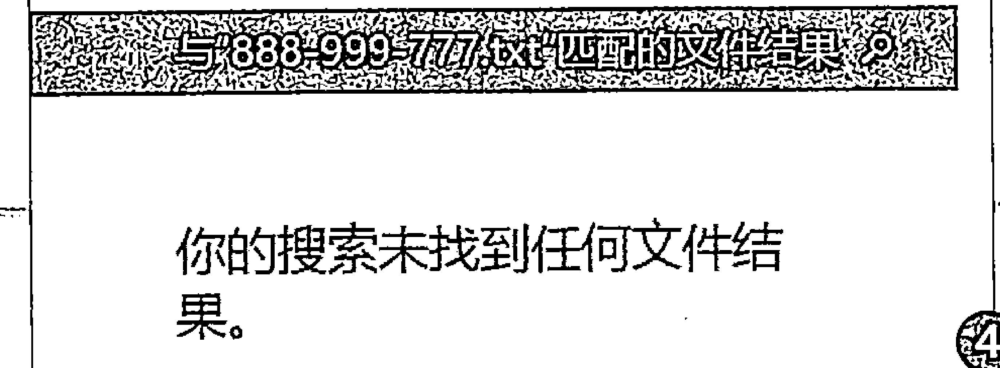

由于加入库中的文件会自动建立系统文件索引，因此，一旦文件被纳入库的管理范畴，搜索到该文件就不在话下且效率极高。索引在库这个载体的支持下，让文件搜索变得易如反掌。但可惜的是许多人撇开系统的索引功能而谈库、用库，因而库的最精华的用途没有得到发挥，对库自然也就难以建立起“感情”了。

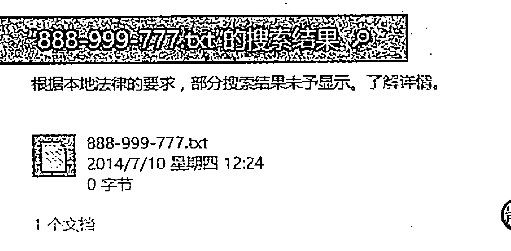

### 用“策略”控制任务栏与开始菜单

文 | 郭文昌

使用过Windows的用户都知道可以通过任务栏右键“属性”菜单定制任务栏和开始菜单项目。不过，这仅是基础层面的控制，通过组策略编辑修改，可以从更深层次上控制任务栏和开始菜单，以达到某种目的或解决出现的问题。

#### 阻止变动任务栏项目

- **1 深层锁定阻止移动任务栏**
  在自定义任务栏之后，总怕别人乱动破坏了任务栏格局，因此人们常常会通过右击任务栏并选择“锁定任务栏”的方式来锁定任务栏。但是，你可以这样轻易锁定，别人当然也可以轻易用同样的方式解锁。这时，如果让任务栏解锁失效，效果就会更好。

  在本地组策略窗口中找到“锁定任务栏”并双击（图2），设置为“已启用”（图3）。之后，再回到任务栏上，用右键菜单解锁任务栏，发现右键菜单中的“锁定任务栏”命令已经变成灰色，变得不可选了。

  为深入控制任务栏和“开始”菜单，我们需要先请出组策略编辑器。先用Win+R组合键启动“运行”窗口，然后输入GPEDIT.MSC并点击“确定”按钮。组策略对于“开始”菜单和任务栏的项目管理均在一个窗口下完成，开启组策略编辑器并依次点击“本地计算机策略→用户配置→管理模板→开始菜单和任务栏”即可开启所需的设置窗口（图1）。

  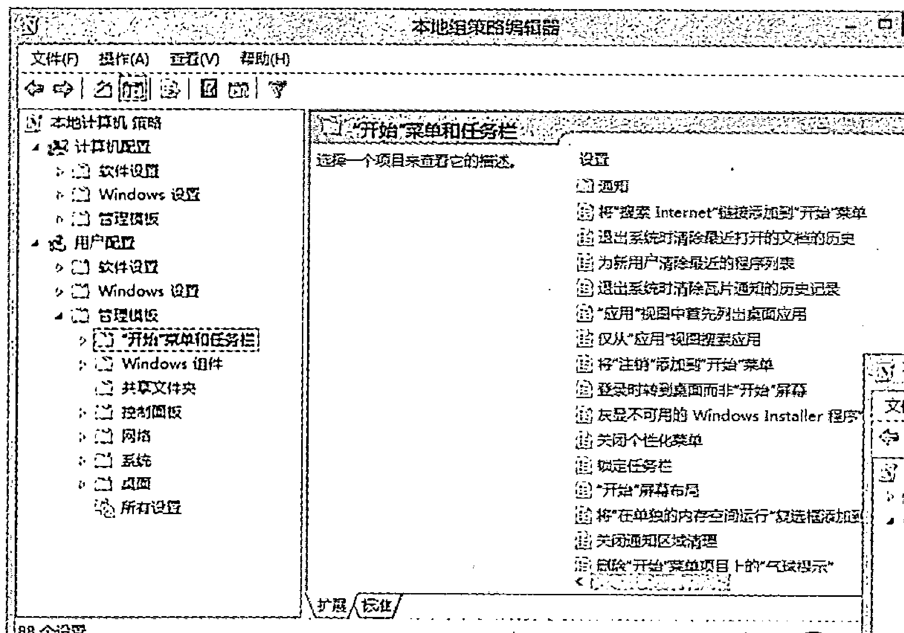

  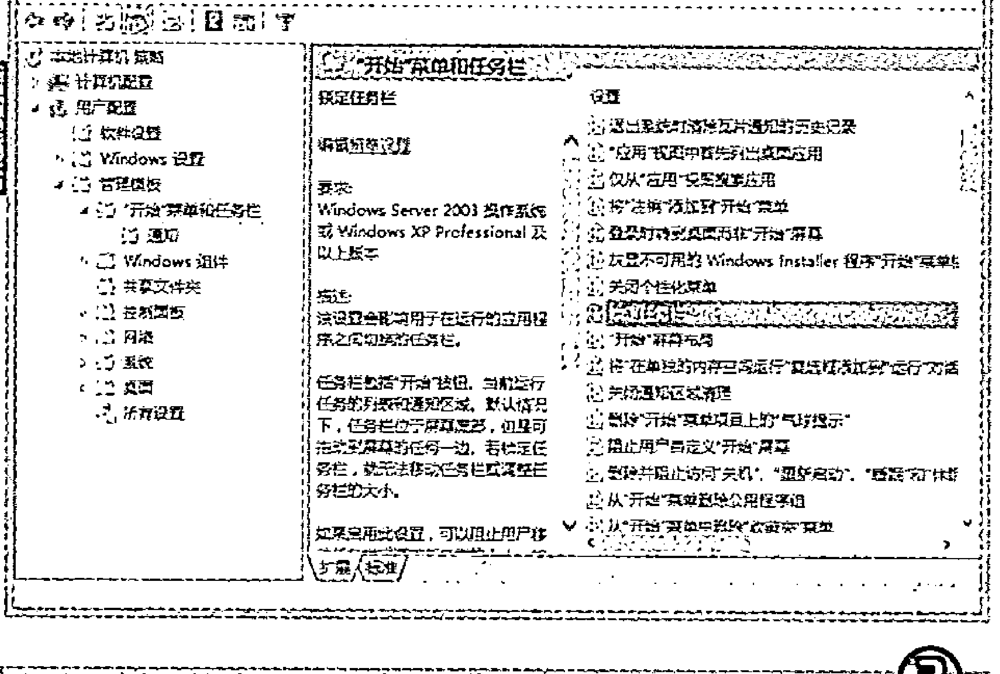

  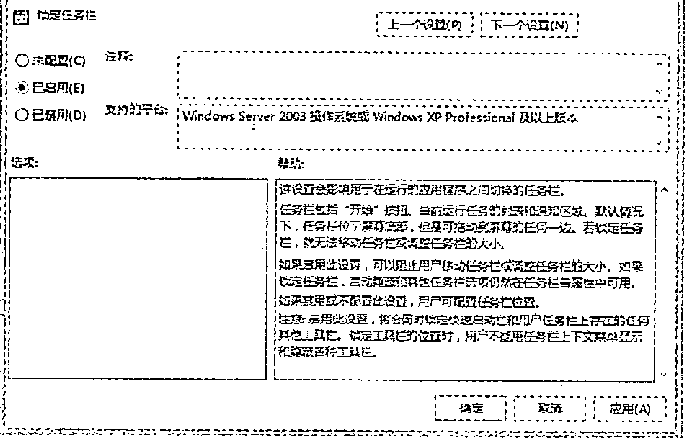

- **2 阻止在任务栏添加工具栏**
  如果不希望在任务栏上添加工具栏（包括快速启动、地址、链接、桌面和由用户或应用程序创建的自定义工具栏），只需找到组策略“不在任务栏显示任何自定义工具栏”项（图4），设置为“已启用”即可。

  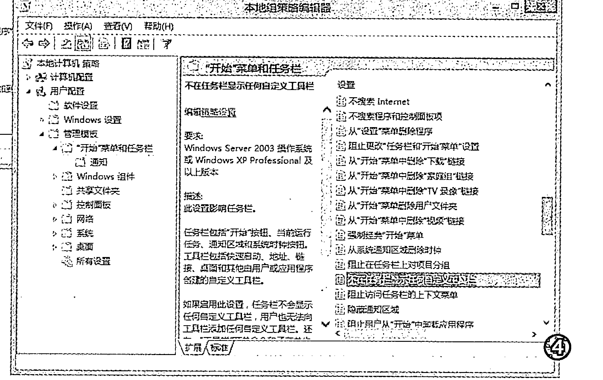

##### 小技巧

**如何快速启动组策略编辑器**

在桌面上建立一个扩展名为BAT的文本文件，在其中输入GPEDIT.MSC并存盘，以后要使用组策略编辑器，只需双击这个文件即可。

#### 阻止扩展显示器显示任务栏

在Windows 8.1中若使用多显示器进行扩展桌面显示，会发现在两个显示器上都会出现任务栏。如果只希望在主显示器上显示任务栏，只需双击“不允许任务栏多处显示”组策略项，设置为“已启用”，即可实现在扩展显示器上不显示任务栏的目的（图5）。

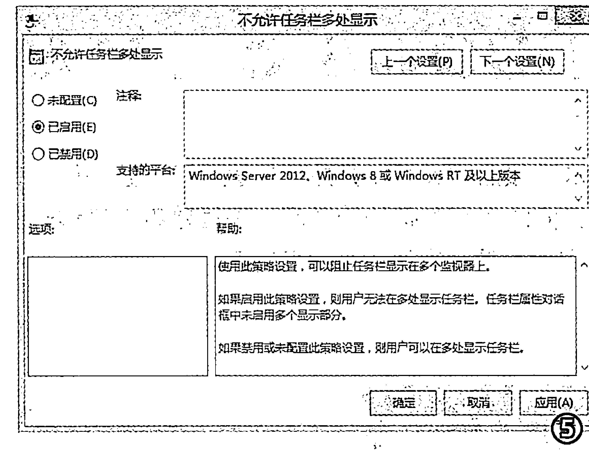

小提示：虽说系统托盘图标关闭后会带来安静，但由于所有的消息都被屏蔽，因此也难免漏掉重要的有用信息。因此，建议不要随意关闭该选项。

#### 3 彻底阻止托盘气球弹出

系统任务栏托盘有时弹出一些系统维护之类的气泡提示，但许多时候用户不希望它弹出来烦人。这时，除了在控制中心选择不弹出某些气泡外，更彻底的办法是通过组策略编辑器来彻底关闭所有气泡提示。双击“关闭所有气球通知”组策略项并设置为“已启用”即可（图6）。

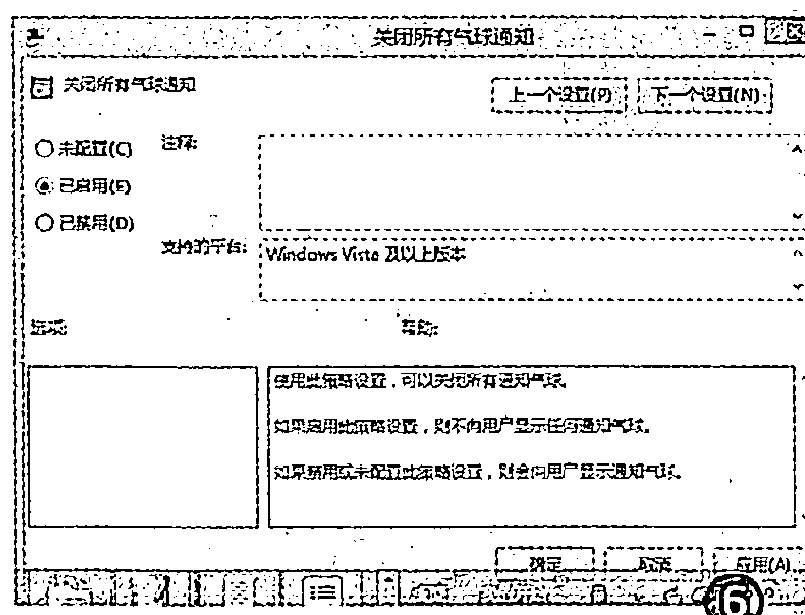

#### 4 删除任务栏和开始菜单项目

##### 1 删除任务栏上的商店应用

如果不希望Windows 8.1应用商店的图标出现在任务栏上，只需双击“在任务栏上显示Windows应用商店应用”组策略项，将其状态更改为“已禁用”并确定即可。

##### 2 删除任务栏上的附加程序

如果不希望将程序附加到任务栏上，只需把“从任务栏删除附加的程序”一项设置为“已启用”状态即可（图7）。此项适用于Windows 7以上系统。

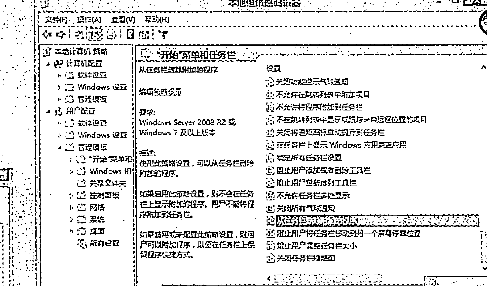

小提示：如果你仍然在使用Windows 7或Windows XP系统，通过组策略可以删除开始菜单中的更多系统自带的项目，如“游戏”、“收藏夹”等（图8）。

##### 3 自动清除文档打开的历史

如果你懒得删除系统中最近打开的文档历史，而又怕别人看到这些记录，可以将组策略中“退出系统时清除最近打开的文档的历史”一项设置为“已启用”。此项适用于Windows XP以上系统。

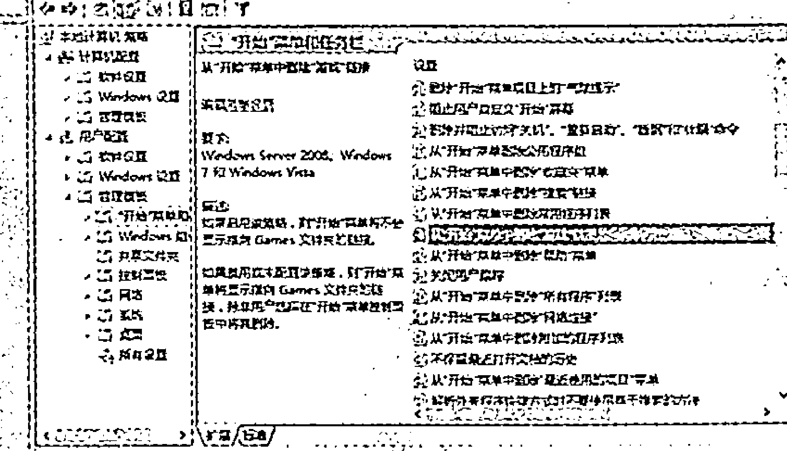

#### 总结

通过上述介绍不难看出，对于一些需要对系统进行深层控制的项目，不一定需要动用一般人难以理解的注册表编辑器来进行修改，用组策略编辑器进行修改会更加容易操作。由于组策略编辑器中显示的信息均为中文，也不涉及键值等难懂的内容，因而修改风险也较小，不合适的地方可以从原处修改恢复，适合对系统有更多需求的你们哦。

### 解惑Windows 8.1桌面问题

文 | 王俊文

尽管Windows 8在多次升级后对桌面和开始菜单进行了调整和修补，但不少用户仍然对Windows 8.1桌面的使用存有种种疑问。下面笔者就身边一些用户存有疑虑的典型问题作一总结并提出解决方法，供大家参考。

#### 1. Windows 8.1三个桌面一样吗

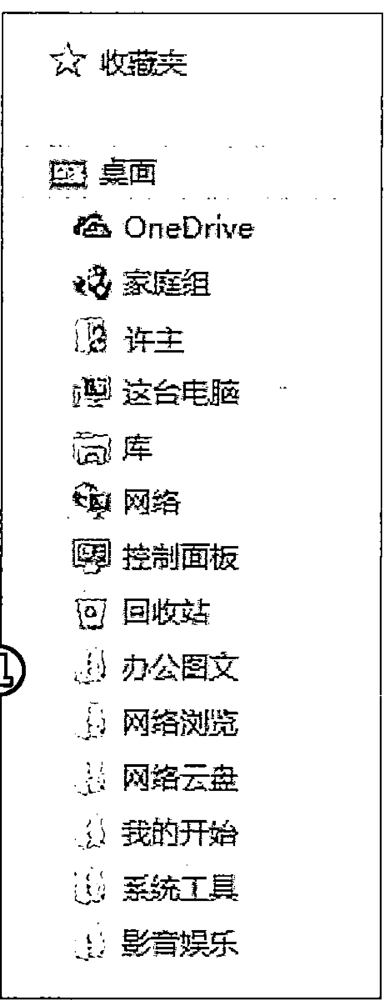

打开Windows 8.1资源管理器，我们会发现在文件资源管理器中有两个“桌面”，第一层桌面包括OneDrive网盘、家庭组、这台电脑、库、网络、控制面板、回收站、桌面文件夹等内容（图1）。在“这台电脑”中还包括一个桌面（图2）。于是不禁要问，这两个桌面一样吗？我们开机看到的桌面是哪个“桌面”？

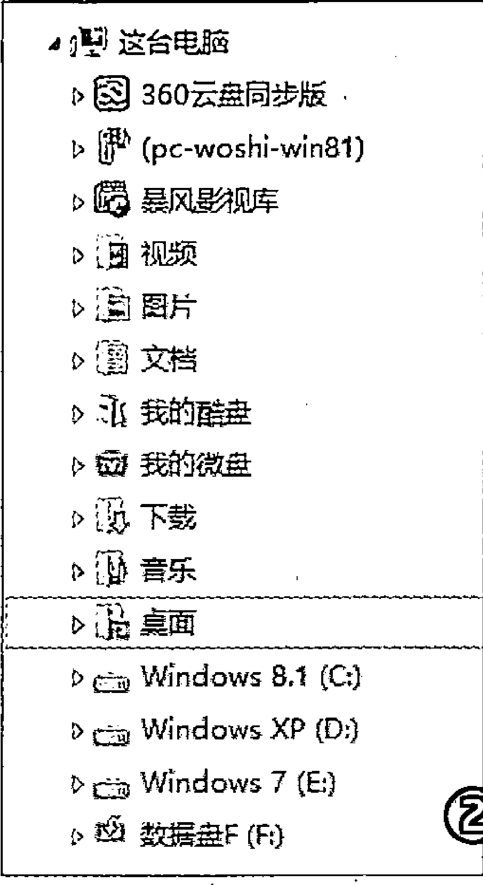

调用两个桌面的属性，顶层桌面属性进入的是“个性化”窗口。而“这台电脑”中桌面的属性进入的是“桌面”文件夹的属性设置。可见，后者仅仅是文件资源意义上的桌面，仅能看到其包含的文件夹和文件；而前者还包含系统控制的成分。其实，我们在屏幕上看到的桌面更接近于前者，之所以看不到另外一些图标，是因为那些图标被隐藏起来了，如果需要，可以找回这些图标。

> **小技巧**

在Windows 8.1桌面上用鼠标右击空白处，选择“个性化”，点击“个性化”窗口左侧的“更改桌面图标”，在随后弹出的窗口中便可选择添加那些藏起来的图标。

#### 2. 找回消失的“下一个桌面背景”

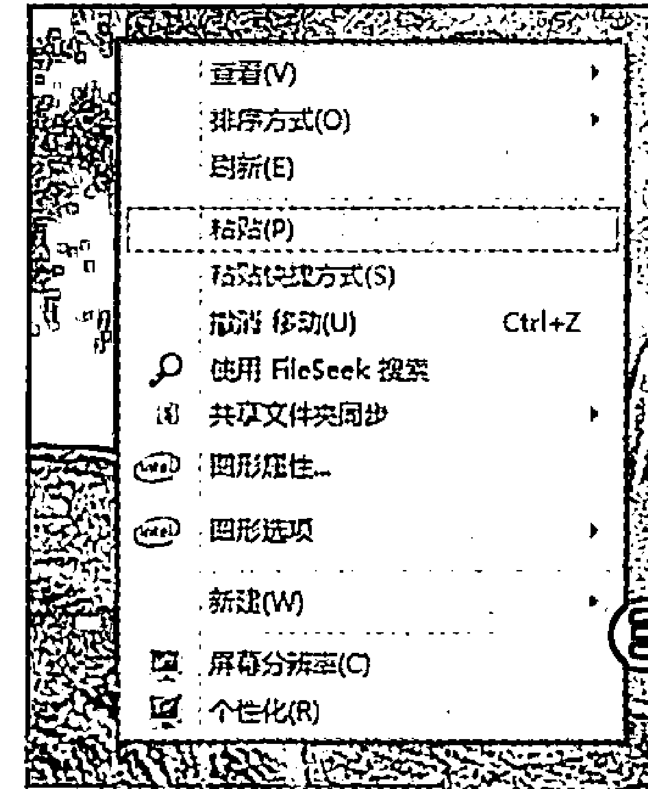

从Windows 7桌面开始，桌面右键菜单就提供了切换到“下一个桌面背景”的选择，Windows 8.1仍然在沿用这一选择。然而有时会发觉，点击桌面右键菜单，这个选项却消失了（图3）。这是怎么回事，如何找回？

发生这种情况，往往是使用了别的桌面背景工具代替了系统主题桌面造成的。例如，使用了微软必应桌面后，每天自动更换一张壁纸，这个菜单项相应也消失了。

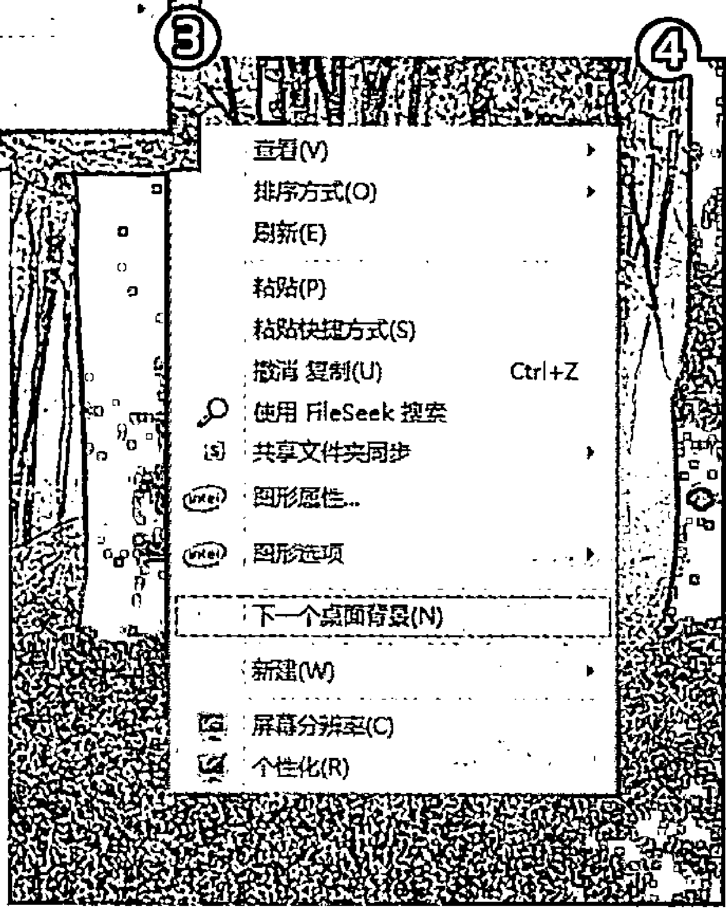

要解决这个问题，只需新装自己需要的多图片主题，同时禁用外部桌面程序即可。如果要将自己的数码照片作为桌面且希望在自动演示过程中手动跳过不喜欢的图片，只需随便找一个系统内置桌面主题，将其中的图片替换为自己的照片专辑，设置生效后，当演示到自己不喜欢的那幅图片时，选择桌面右键菜单“下一个桌面背景”，即可跳过自己不喜欢的图片（图4）。

### 分屏桌面后如何恢复原桌面

大家知道，使用Windows 8.1系统，我们可以通过灵活的抓取或移动操作，实现桌面的分摊使用。进入传统桌面，按住鼠标左键从桌面上端向下抓取，然后拖动，接着再向窗口左侧或右侧移动抓取的桌面，桌面随即变为只占据半个屏的位置。如果此时有其他的应用打开，就可以通过相同的方法，使其与传统桌面分摊桌面空间。用这种方法最多可以实现四个桌面“同台演出”。然而，如何恢复单一桌面？在帮助系统里未能给出具体方法。

其实，单一桌面恢复操作有一种最简单的方法。只需将不需要的桌面拖动到两边，然后沿着桌面分隔线，向外拖动压缩不需要的桌面窗口；直至窗口两条分隔线重合。这时，另一个桌面会自动扩大占用腾出的桌面空间，到只有最后一个窗口时，便会占满整个桌面。

### 桌面老图标太难看怎么办

Windows 8.1桌面图标更加引人注目，然而，如果使用一款比较老的应用软件，你会发现它的桌面图标可能与桌面上已有图标风格不协调。老图标太难看怎么办？重新制作一个吗？

当然可以，但有另一种省事的方法。大家知道，许多程序的EXE文件中均包含有多个备用图标，可以向其借一个合适的图标来用。右键单击需要更换图标的桌面快捷方式，选择“属性”，在属性设置窗口中点击“快捷方式”选项卡，接着点击“更改图标”按钮，“浏览”定位出借图标的程序文件，这时窗口中会显示可选图标，从中选择合适的图标，确定即可（图5）。

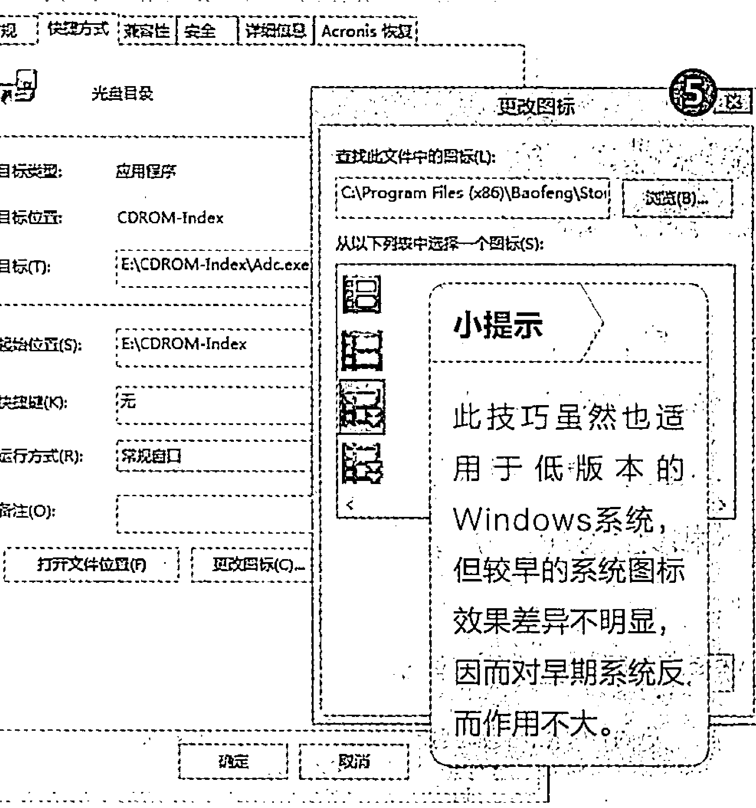

> 小提示
此技巧虽然也适用于低版本的Windows系统，但较早的系统图标效果差异不明显，因而对早期系统反而作用不大。

### 高达500%的参数有啥用

在Windows 8.1桌面“显示”属性窗口中，有一个不起眼的“自定义大小选项”选项，点击进入后，下拉菜单中包含高达500%的缩放设置项，也许当你调节到200%时就觉得桌面元素大得没法看，于是会纳闷这么高的设置有啥用（图6）。

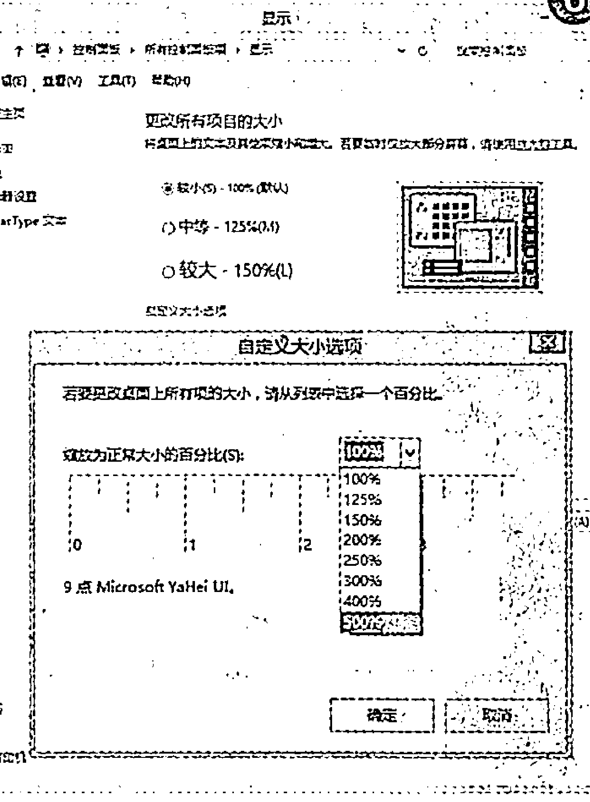

如果你有幸接上了一台超高清4K显示器，你就不再怀疑这个参数的作用了。随着显示技术的不断提高，超清分辨率的显示器也开始进入百姓家，4K屏幕也开始上市。在这样的屏幕上使用默认最佳分辨率，如果你眼神不好，上面的字也许会小到让你看不清。在这种情况下，这个参数就派上用场了。

### 桌面应用装不上怎么办

不少用户在安装了Windows 8.1之后，进入开始桌面发现应用无法运行，桌面上只有应用图标，且出现小白圈套小黑叉的小图标，点击之后又无法启动应用。在这种情况下，如何修复这些应用？

鼠标指针指向桌面右上角，在浮动面板上选择“设置”，然后点击下级面板中的“更改电脑设置”，接着选择“账户”，输入微软账户名和密码。不少用户在安装系统时因跳过在线账户的设置，只设置了本地账户，因而造成了应用商店无法登录的情况，这是造成应用无法正常安装和升级的根本原因。如果没有微软账号，需要在登录页面注册新的在线账号（用邮箱注册，切记不是指安装时的那个本地账号）。

### 切断资源管理方便之路

—— 文 | 郭文昌

Windows 8.1资源管理器的使用更加方便，然而，方便的资源管理也是一把“双刃剑”，出于安全或其他目的，某些时候我们恰恰不希望这些方便的东西出现，这时可以通过深层的系统控制来切断这些方便之路。

> **小提示**

本文的多数操作将在注册表编辑器或组策略编辑器中进行。启动注册表编辑器可通过Win+R热键启动运行窗口，然后运行REGEDIT命令来进行；组策略编辑器则通过运行GPEDIT.MSC命令来启动。本文中涉及到的组策略编辑器文件资源管理设置窗口，均需通过“本地计算机策略→用户配置→管理模板→Windows组件→文件资源管理器”路径进入。

#### 锁定控制系统的“快门”

Windows 8.1的Win+X快捷组合能开启丰富的系统控制菜单。但是，它在方便用户控制系统的同时，也给系统带来了不安全的隐患，如果自己使用的系统不希望别人通过Win+X热键来轻易进入和更改设置，那么可以用如下方法将其屏蔽。

在本地组策略“文件资源管理器”编辑窗口右侧窗格中，找到“关闭Windows+X热键”并双击，设置其状态为“已启用”，这样就可以关闭系统对此项快捷功能的调用（图1）。

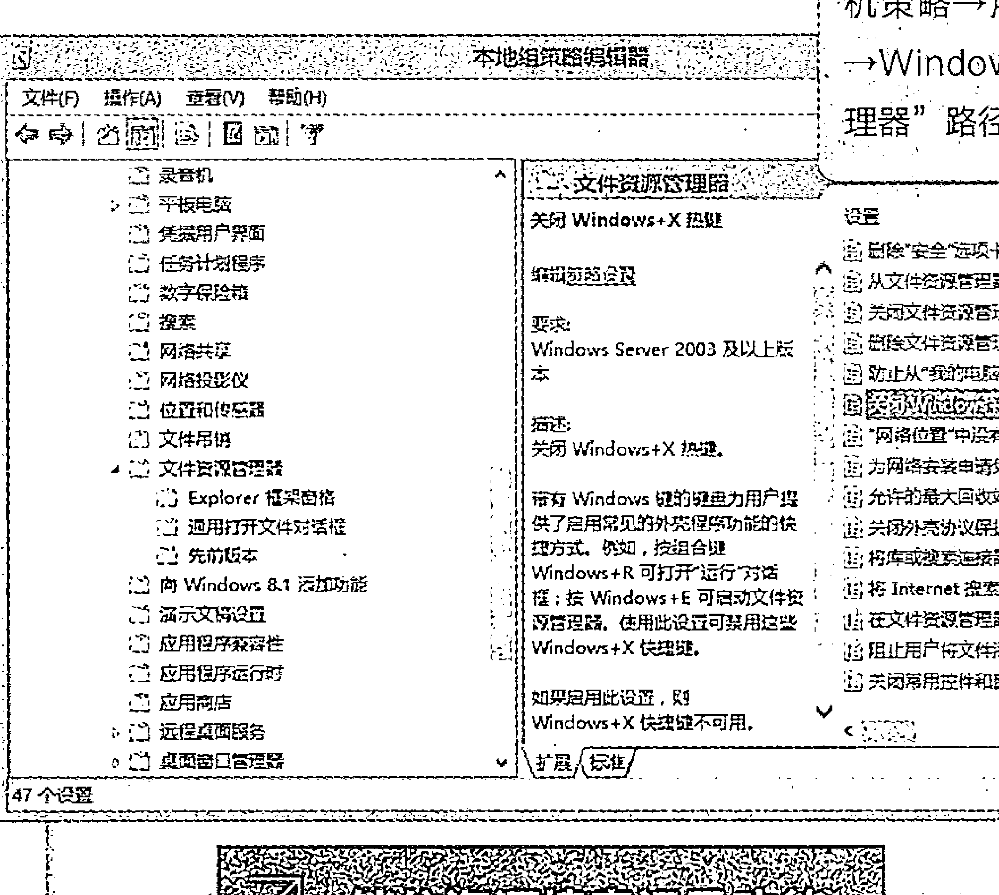

#### 锁定资源搜索记录功能

在Windows 8.1文件资源管理器右上角的搜索框键入内容时，文件资源管理器将显示建议弹出框。这些建议都是基于过去在搜索框中输入过的条目。这一服务虽然方便，但在某种场合会泄露用户的使用习惯或隐私。如果要杜绝这种情况的出现，除了清除本地搜索记录外（图3），我们可以设法从根本上关闭最近搜索条目的显示。

在本地组策略编辑器“文件资源管理器”控制窗口右侧窗格中找到“在文件资源管理器搜索框中关闭最近搜索条目的显示”，双击并启用即可。这样设置后就不会再产生搜索记录条目，当然也就不会担心因忘记删除而泄露“行踪”了。

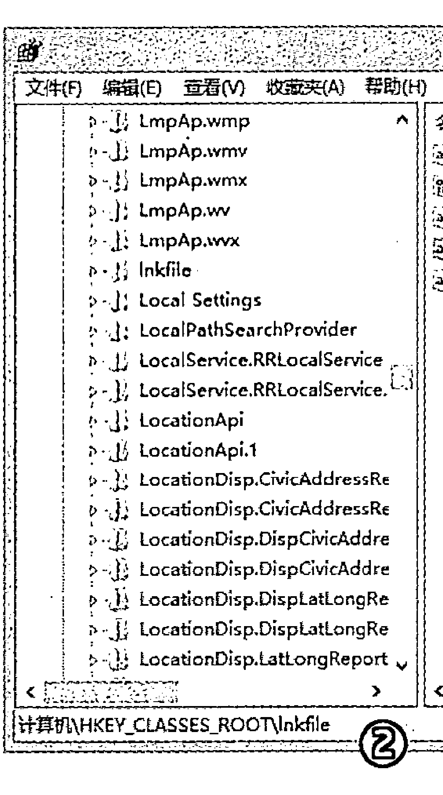

> **小技巧**

反过来思考，平时如果发现系统中的Win+X组合键失效，也可以通过这里来设置。除了在组策略编辑器中解除关闭Win+X热键功能外，还可以通过注册表编辑器来实现功能恢复。进入注册表编辑器，定位到“HKEY_CLASSES_ROOT\lnkfile”，新建一个名为IsShortcut的字符串值，退出注册表编辑器，Win+X菜单控制功能即可得到恢复（图2）。

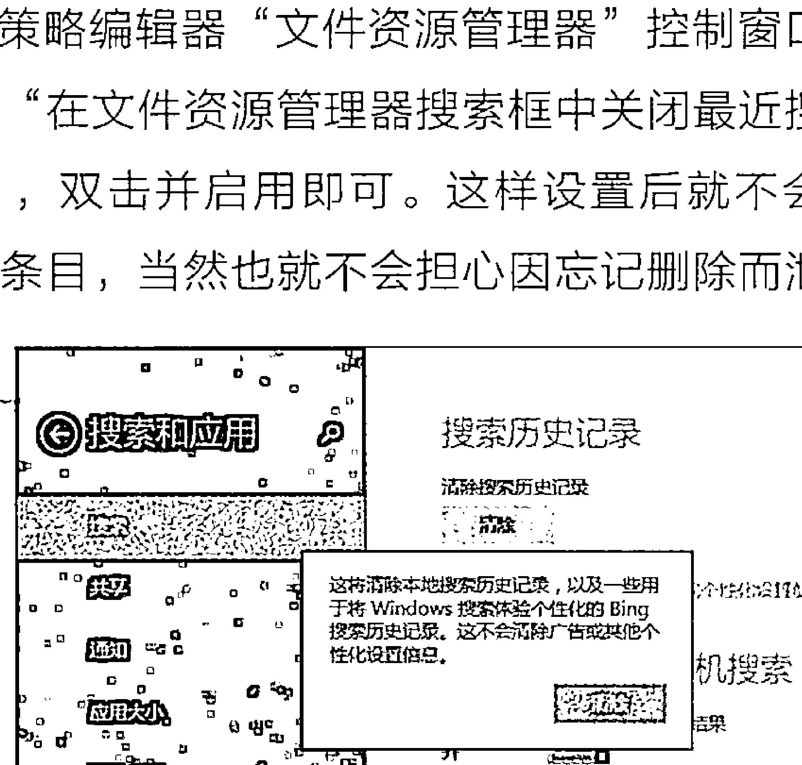

#### 开机锁定功能区最小化

每当启动Windows 8.1资源管理器时，上方的功能区就会自动地显示出来，但许多时候我们只是浏览文件，并不需要选择其中的功能，因而希望缩小功能区而增加文件列表的显示空间。如果每次都点击鼠标缩小面板显得很麻烦，这时不如索性设置一下，让资源管理器每次启动时自动将功能区最小化。在本地组策略“文件资源管理器”窗口右侧找到“以功能区最小化的显示方式启动文件资源管理器”，双击并将其设置为“已启用”即可达到目的。

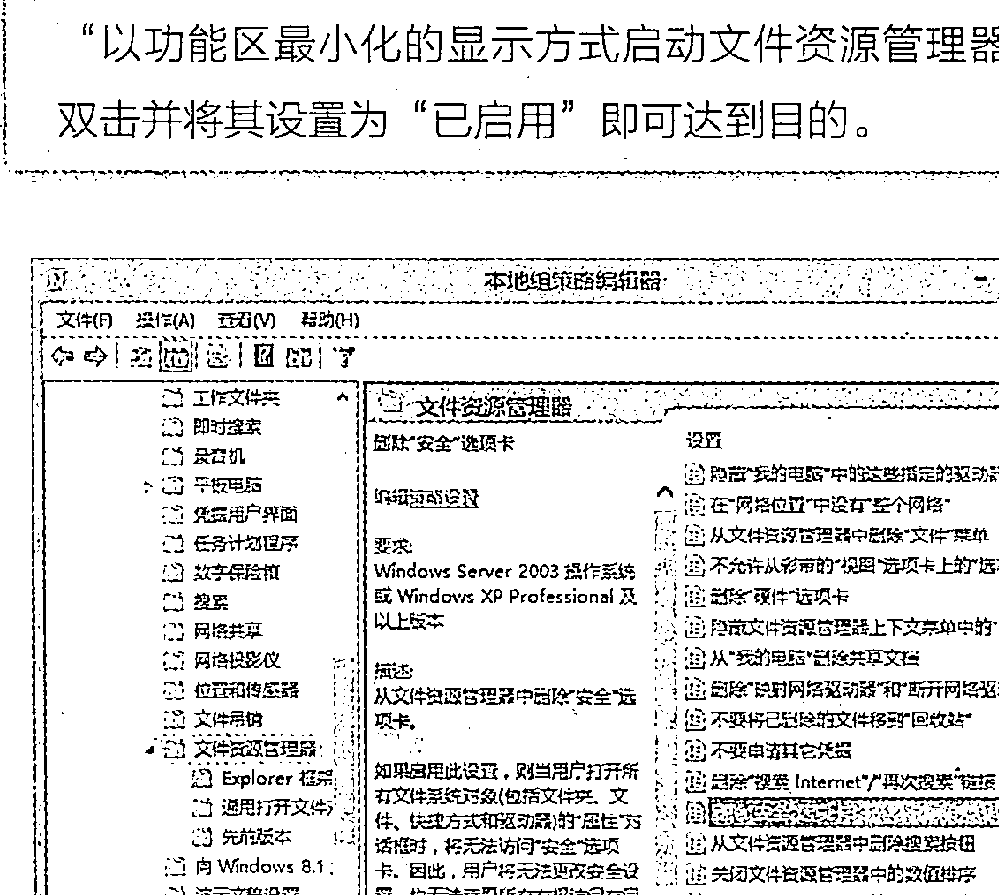

> **小技巧**
如果偶尔需要面板出现，通过热键Ctrl+F1即可让其弹出，不用时再用此快捷键再度隐藏即可。

#### 锁定个人私密资源

有时，我们希望将自己的重要文件保存在一个独立的分区中，将这个分区的盘符图标隐藏起来，这样别人就不会发现其中的文件。在本地组策略编辑窗口的“文件资源管理器”页面右侧窗中找到“隐藏我的电脑中的这些指定的驱动器”，双击后选择盘符并设成“已启用”。使用此策略后，可以从资源管理器中隐去代表所选硬盘驱动器的图标。同时，代表所选驱动器的驱动器号也不会显示在标准的“打开”对话框中，这就保证了文件路径不会被别人知道。注：本技巧也适用于Windows XP和Windows 7系统。

> **小技巧**
当自己要使用文件时，一种方法是用反向操作显示出盘符来进行文件操作。还有一种方法就是在不改变驱动器隐藏状态的前提下，通过在“映射网络驱动器”对话框、“运行”对话框或命令提示符窗口中键入驱动器上的目录路径来访问文件。

#### 锁定“安全”选项卡

大家知道，在文件“属性”窗口中有一个“安全”的选项卡，这个选项卡可以用来设置用户对文件的使用权限，可通过它来放开文件使用权限。但是，如果担心别人随便乱设文件权限，那么，可以将这个“安全”选项卡藏起来。只需在本地组策略编辑“文件资源管理器”编辑窗口中找到“删除安全选项卡”，双击设置为“已启用”即可（图4）。启用此设置后，当用户打开所有文件系统对象（包括文件夹、文件、快捷方式和驱动器）的“属性”对话框时，将无法更改安全设置，也无法查看所有有权访问有问题的资源的用户列表。本技巧也适用于Windows XP以上系统。

> **小提示**
我们需要明白的是，只有NTFS格式的磁盘文件“属性”中才会显示“安全”选项。如果磁盘格式为非NTFS格式，可通过CONVERT X: /FS:NTFS命令将其转换为NTFS格式，然后在“文件夹选项”窗口中将“使用共享向导”一项的选择去掉，即可在文件属性中出现“安全”选项。

#### 锁住“文件夹选项”

使用“文件夹选项”可以更改文件和文件夹的打开方式、导航窗格中的显示内容以及其他高级视图设置。我们常用它来设置多种系统资源的隐藏或显示，但也很容易被改回来。在这种情况下，让文件资源管理器中的“文件夹选项”按钮失效，这种隐藏就比较安全了。要锁住对“文件夹选项”的修改，只需在本地组策略“文件资源管理器”窗口中找到“不允许从彩带的视图选项卡上的选项按钮中打开文件夹选项”并双击，将其设置为“已启用”（图5）。此后，单击“选项”按钮或选择更改文件夹并搜索选项命令时都会收到错误消息，且无法打开“文件夹选项”。同样也适用于其他版本的Windows操作系统。

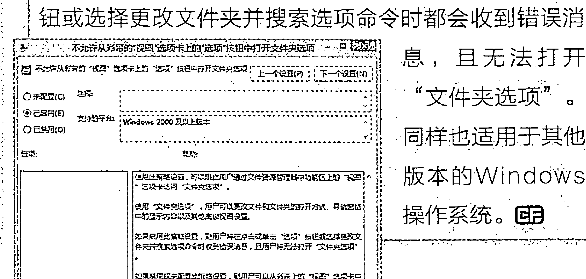

### Windows 8.1 资源管理器体贴大改造

文|汪波

Windows 8.1的资源管理器采用了新的风格，操作更加方便。然而，每个人的使用需求有所不同，有的人希望继续沿用老系统的风格，有的人则希望对新系统的界面风格作一些调整和改变。因此，在原有默认格局的基础上进行个性化定制和改造，便成了很有必要的一件事情。

#### 1. 顶层定制 腾出资源窗口空间

也许大家已经注意到，在Windows 8.1资源管理器窗口标题栏的左上角，有“属性”和“新建文件夹”两个按钮，让操作变得非常方便。实际上，我们还可以在这里安置更多的按钮。点击“自定义快速访问工具栏”小三角图标，在弹出的下拉菜单中可分别选择“重命名”、“删除”、“恢复”、“撤销”等常用文件操作命令（图1），将它们也添加到标题栏上。

但是，系统默认可选的“自定义快速访问工具栏”项目有限，如果希望添加更多的文件操作命令到标题栏，该怎么办？其实，只需在功能区面板的命令或命令组上点右键，直接选择“添加到快速访问工具栏”即可。

这样，以后我们就可以随时用Ctrl+F1快捷键藏起资源管理器工具面板，只使用标题栏上的文件操作按钮就能操作文件了。藏起一切多余的面板和组件，会给资源管理窗口留出更多的空间来显示更多的文件列表。

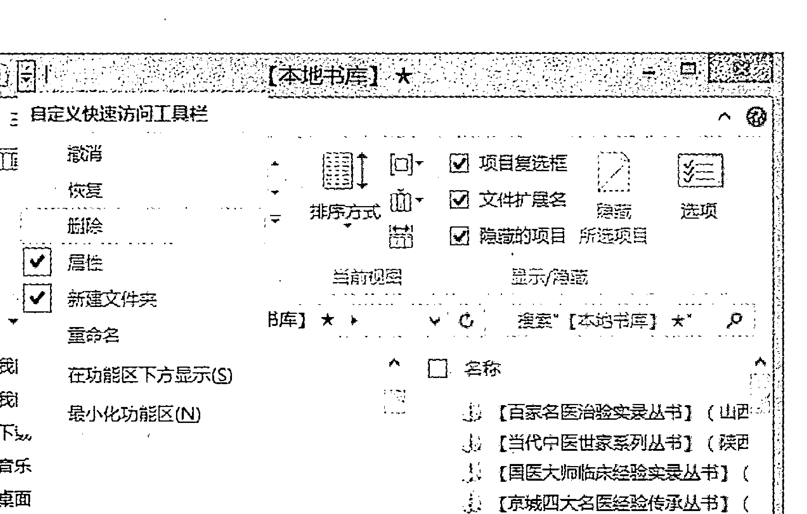

小技巧 路径也置顶 标题显示一目了然：如果我们需要明确自己正在操作的文件所处的绝对路径，这时往往需要通过文件属性窗口去查看。如果在文件资源管理器窗口中点击“查看”选项卡，接着点击“选项”，在打开的“文件夹选项”窗口中选中“在标题栏中显示完整路径”一项，之后资源管理器窗口顶端标题栏就会显示出当前文件所在的完整路径。

#### 2. 添加插件 多重标签管理文件

大家也许都知道如今流行的网络浏览器的多标签功能，比如谷歌Chrome或360安全浏览器的多标签页功能。如果在Windows资源管理器中也能使用多标签功能，文件夹之间的对比操作和切换就方便多了。实际上，早在Windows XP的年代，就早已出现过许多能够替代Windows资源管理器的多标签浏览器（如TC、MDIE等），但这些都需要脱离Windows资源管理器而独立存在。其实，只要给资源管理器添加一个类似于网页浏览器的多标签扩展程序，就可以方便地在文件组之间进行切换管理。通过http://cn.ejie.me/官方网站下载一个名叫Clover 3的资源管理器扩展程序，安装之后，在Windows 8.1的资源管理器窗口就可以显示多标签页面了（图2）。

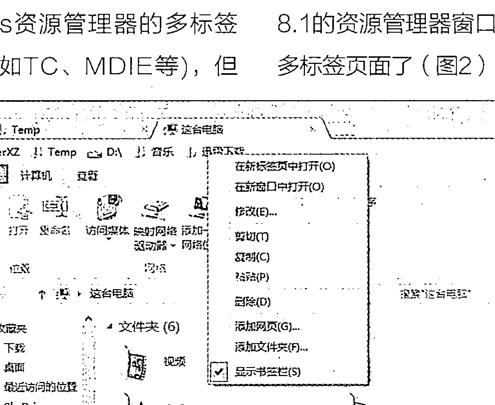

小提示：安装时，Clover会被一些杀毒软件误报。请放心使用。

#### 3 右键菜单优化规矩更显轻便

右键菜单为资源管理器中的文件操作带来方便，但是，当安装的软件多了，右键菜单也便会显示出一片混乱。比方说，当你的电脑中安装了两三个解压软件时，光是压缩和解压的命令就会有一大堆。这时，就需要对右键菜单进行规整，让它们更省空间。以电脑中同时安装了WinRAR、好压和360压缩为例，只需在WinRAR、好压的设置窗口“综合”页面下，选中“层叠右键关联菜单”（图3），在360压缩的设置窗口中的“常规”页面下，选中“层叠右键关联菜单”，即可将所有压缩软件的右键命令进行折叠，可大大腾出右键菜单的占用空间。对于一些不常使用或根本不会用到的右键菜单项目，可以用CCleaner、Glary Utilities等系统优化工具去除掉其在右键菜单中的显示。

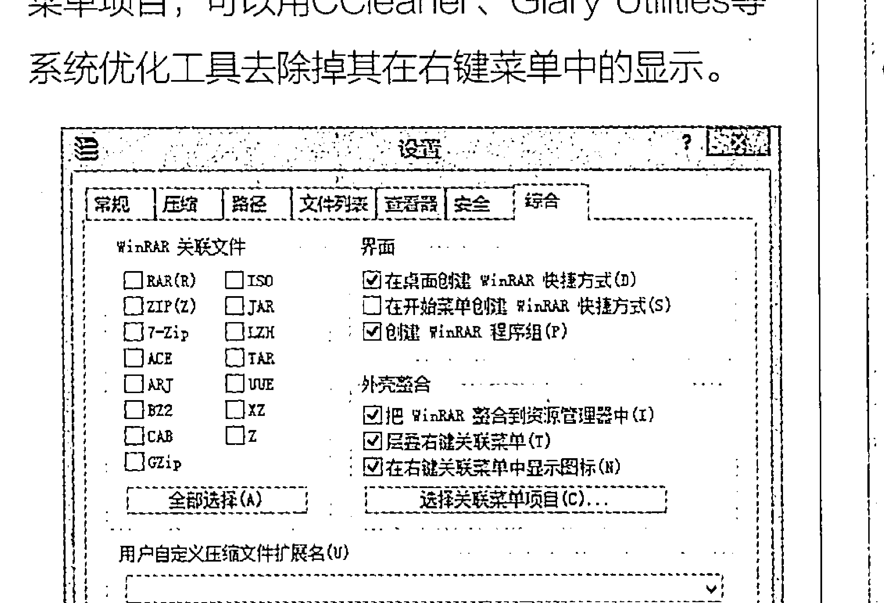

#### 4 信息增强 文件夹大小全显示

Windows 8.1的文件资源管理器文件列表中，只能显示文件的大小，如果我们要了解每个文件夹的大小，只能借助于鼠标右键属性菜单来了解，操作起来比较麻烦。这时，我们可以借助于一个小插件Folder Size（下载地址：http://foldersize.sourceforge.net/）来解决。Folder Size支持Windows 7和Windows 8/8.1操作系统（含32位和64位），软件安装之后，当我们在资源管理器中浏览文件夹的时候，会在资源管理器窗口的右侧，独立并列显示一个文件夹大小列表的窗口（图4）。

通过系统托盘程序图标右键菜单，可选择Show Folder Size popups开启资源管理器文件夹大小显示窗口，此外，由于此程序占用内存不大，如果经常要查看文件夹大小，请保留菜单中Start on Windows startup选项的选择，以便开启自动运行该功能。

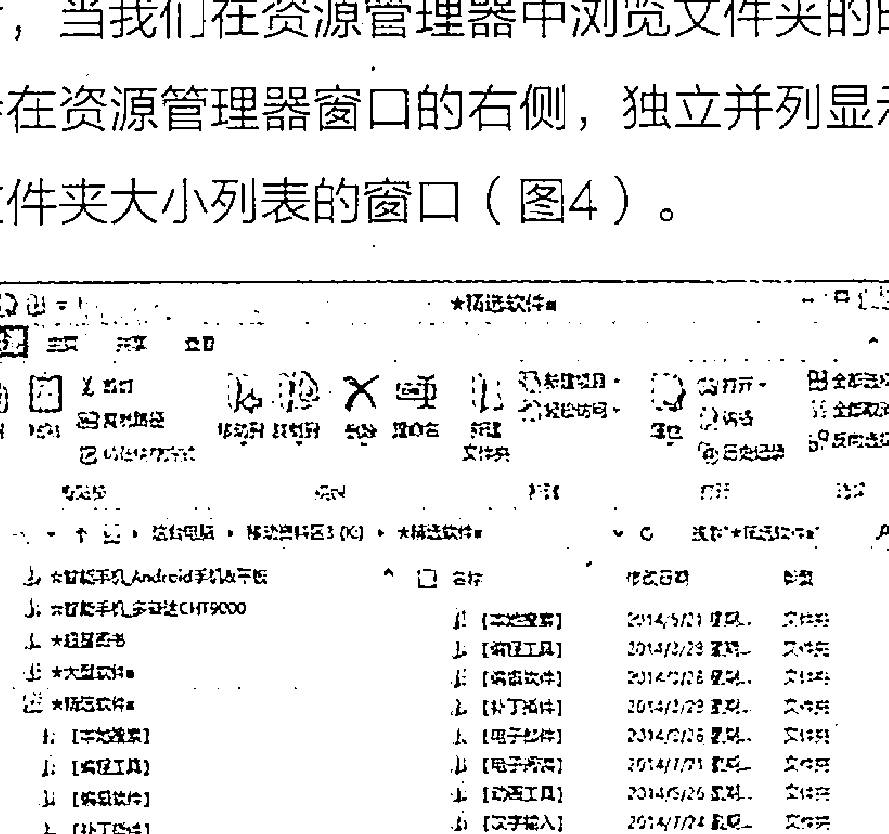

#### 5 不用降级 操作感受回到从前

习惯于使用Windows 7的用户，可能对Windows 8.1的资源管理界面不习惯，因此也有不少人因此在试用之后退回到老版本。其实，只要用一个小小的工具软件OldNewExplorer设置一下（下载地址：http://download.pchome.net/system/treak/detail-194058.html），Windows 8.1的文件资源管理界面马上会变成Windows 7的风格。运行软件，会看到4个选项，勾选这些选项，可分别实现将驱动器分组形式变为Windows 7经典模式、启用库文件夹并隐藏Windows 8.1多出的6个文件夹、藏起Windows 8.1功能区面板并用Windows 7风格命令栏代替、显示窗口下方的详细信息面板和状态栏等功能（图5）。如此一来，就可以在享受Windows 8.1新功能的同时，用自己熟悉的操作方法来操控文件资源了。

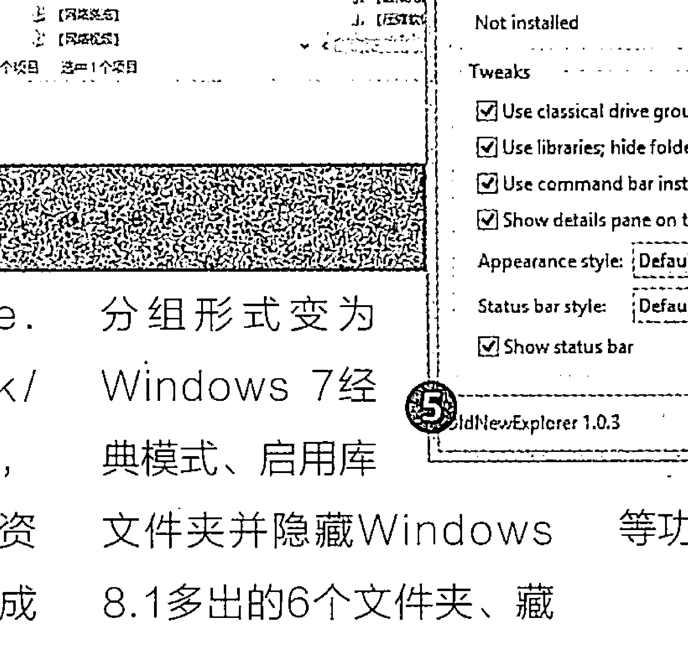

### 搞清“潜规则” 系统再裸奔

文|胡杨林

> 火速链接
关于系统自带的安全防护基本功能的介绍，参见本刊2014年第3期32页《挖潜自保 我的Win8也“裸奔”》。本文是在此文基础上对知而不行和知行不一造成的后果的反思以及经验的进一步总结。

有的高人说可以在安装完Windows操作系统后，不装任何第三方杀毒软件和防护程序就能做到系统安然无恙。果真如此吗？其实，这并非危言耸听，而是在系统“裸奔”的背后有许多不为人知的“潜规则”在发生作用。掌握了这些潜规则，每个人的系统安全“裸奔”都不成问题。否则，盲目“裸奔”等于自取灭亡！

#### 1. 微软系统并非门户大开

电脑小白对于安全“裸奔”的大师的崇拜，某种程度上来源于自身对系统的无知。有些对系统了解不深的用户可能认为，不装安全防护软件的Windows是十分危险的，这样的系统就像一个门窗大开的屋子，谁想进来就能轻易进来。此外，受传统媒体连篇累牍地对微软Windows不安全报道的影响，许多用户往往认为，微软系统似乎是一个漏洞百出、八面透风的“房子”。于是乎，安装各种各样的杀毒防护软件就成了必不可少的一环，不装杀软而能安全使用Windows的用户就成了“神人”。

#### 2. 安全裸奔还得靠自己把控

但是，切不要以为微软提供了多项安全机制，你不管不问就能保证系统安全。在系统提供安全机制的前提下，安全防范还要靠自己来把控。对于各项安全机制的合理使用，需要明白其中的含义。有些机制，因为自己不了解其中的含义，可能会出现“人为地将小偷放走”的遗憾。

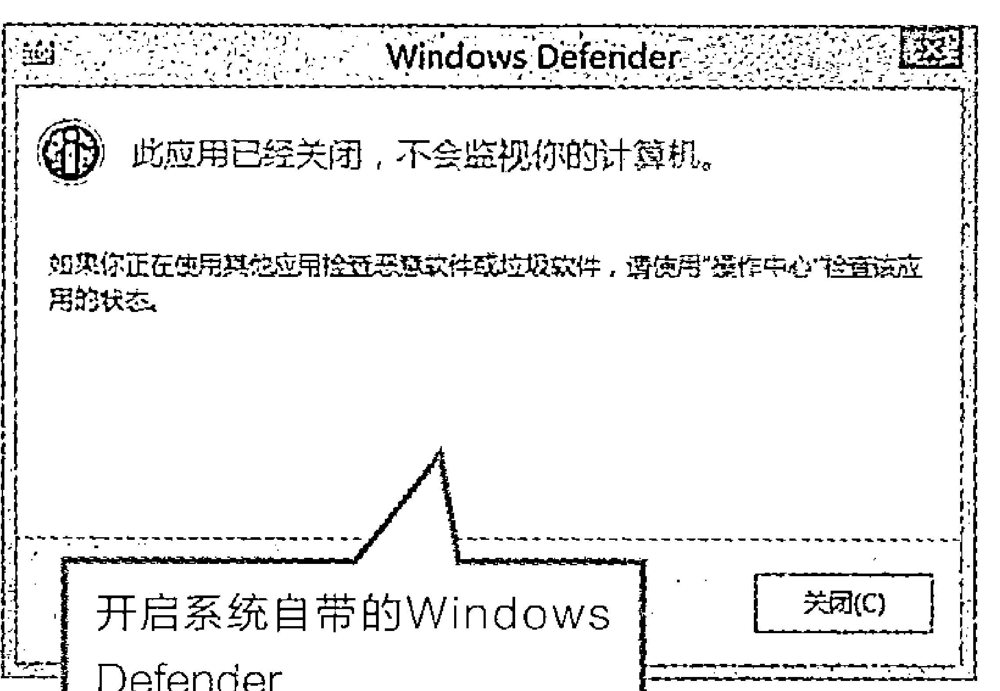

Windows的不安全因素来自多个方面：

- 传统的病毒
- 因为系统漏洞而引来的黑客或恶意软件的攻击
- 有害攻击来临前没有预警
- 下载的程序或文件中隐含着的不安全内容
- 系统无法获知未知的威胁
- 不同用户共用电脑造成信息泄露
- 用户因误操作或其他原因造成的个人数据丢失

对于这些安全问题，实际上， Windows 8.1系统已经有多种自带的机制足以保证系统安全。

下面以笔者遇到的一个真实案例，讲述一位没有掌握“潜规则”而吃亏的朋友的故事。某同事看到旁边的伙伴不装杀毒软件工作，天天安然无恙，于是自己也不服气，卸掉了使用三年的360安全套装，结果一周后系统崩溃。之后，那位“裸奔”的同事帮他分析了缘由。

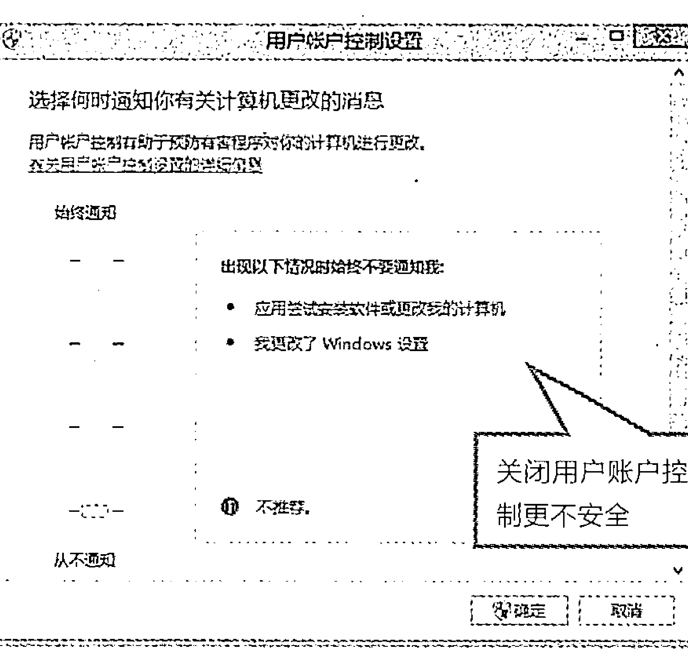

究其原因，首先由于起初安装360安全套装时，自动禁用了系统自带的Windows Defender杀毒组件，才造成在其后访问恶意网站时大量病毒和恶意软件驻入系统，而自己却全然不知。实际上，他需要在卸载第三方杀软后立即开启系统自带的杀毒软件。

此外，每当运行软件时，系统会自动弹出账户控制确认提示，这位同事以为这是系统出现的正常现象，因此不论是运行自己安装的程序，还是点击来自于网站或其他途径收到的资源，统统都确认放行，这样就造成了恶意程序对系统的控制，系统用户账户控制对他来说便形同虚设。

还有，为了消除在IE浏览网页过程中经常弹出的识别提示，该同事关闭了Windows SmartScreen筛选器设置，因此造成了在下载微软未识别的软件和文件时，系统不会给出任何提示，给网页浏览创造了一个不安全的环境，为网页恶意程序入侵提供了可乘之机。

此外，由于该同事在使用360安全组件期间，因为开启了360的系统更新功能和网络防火墙，因此关掉了Windows 8.1自带的系统更新和防火墙功能，而当卸载360后又没有主动去打开系统自带的这些功能，因此造成系统无法得到及时更新。系统漏洞的出现和网络防火墙的缺失，让恶意软件有了可乘之机，造成病毒木马乘机来袭。

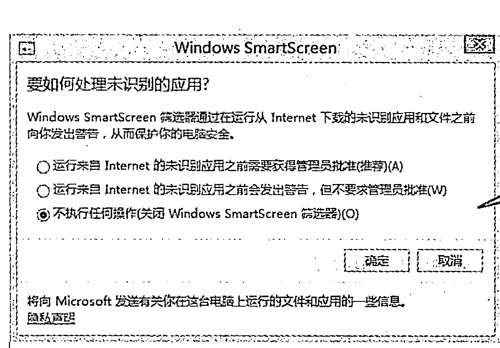

> **小技巧**
除了可通过控制面板“操作中心”下更改“Windows SmartScreen”设置外，也可以通过IE浏览器的Internet属性设置窗口，选择“安全”选项卡，并选中“启用保护模式”，点击“自定义级别”，在窗口中将“使用SmartScreen筛选器”一项设置为“启用”状态。

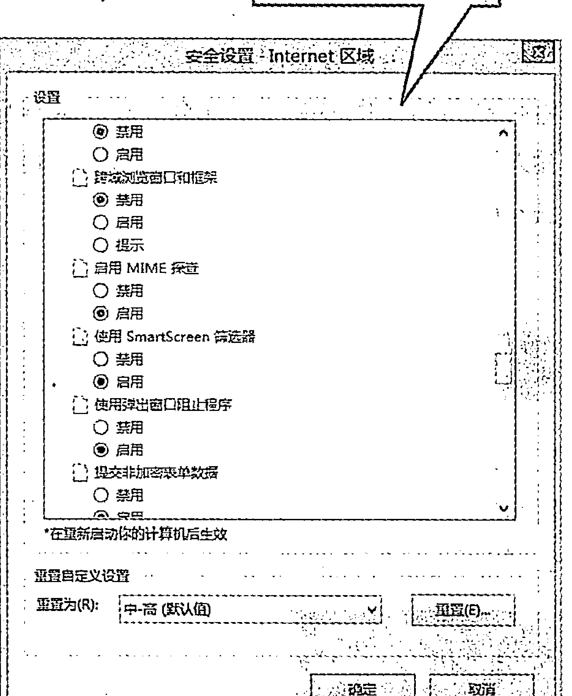

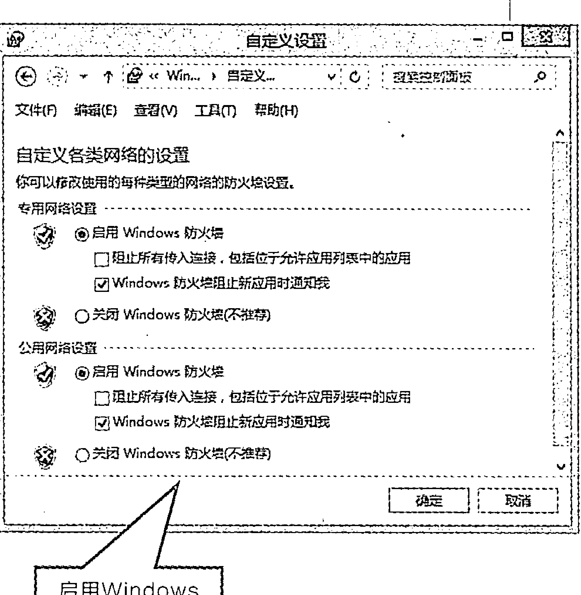

> **小技巧**
如果“裸奔”的电脑是多用户公用，那么，为了防止电脑信息泄露的问题发生，可以通过建立不同的用户账户来解决。对于担心因用户自身误操作引起的失误而造成的资料安全问题，可通过开启文件历史记录功能得到解决。

#### 3. 安全之外的不安全因素

还有一条安全之外的安全规则，也是系统安全机制或软件无法解决的问题。

比方说，某人给你发来一个链接，说这个网站上注册能换银行积分，如果你信以为真，输入了银行卡号和密码，然后网站告诉你密码不正确或者告诉你已经获得多少积分。但实际上你已经被“钓鱼”，钱款很快会落入骗子手中。在这种情况下，如果此网站是一个新生的钓鱼网站，所有杀毒软件都未曾发现和报警，那么，你招来的祸患其实与是否安装杀毒软件、系统是否“裸奔”关系不大。

再比如，自己将银行卡的卡号和密码记录在一个文本文件中，一同放在网盘或邮箱中保存，但由于邮箱密码被盗，银行账号因此而泄露，钱被别人取空。在这种情况下，能怪银行的安全技术不行吗？能怪杀毒防护软件的技术不行吗？

因此，安全裸奔的另一条“潜规则”就是提高个人安全素质，提高识别网络骗局的能力。这个问题解决不好，装不装杀毒软件、裸奔与不裸奔，效果没多大差别，该上当时照上当。有关安全上网、用网防诈骗的文章，本刊曾做过多次介绍，此处不再详述。

### 输入有道 微软拼音“继续”用

文|温志云

由于微软拼音输入法寄生于Windows有多年的历史，加之该输入法的智能学习、整句录入和其他一些可圈可点的优势，因此仍有一批用户在沿用此输入法。但非常遗憾的是，系统升级到Windows 8.1之后，许多人发现微软拼音输入法不好用了，新版输入法无论在设置还是使用上变得不太顺手，甚至原来一些好用的功能也没有了。那么，在不丢掉原来熟悉的输入习惯的情况下，有什么办法来更好地驾驭该输入法？或者有什么好的替补方案？

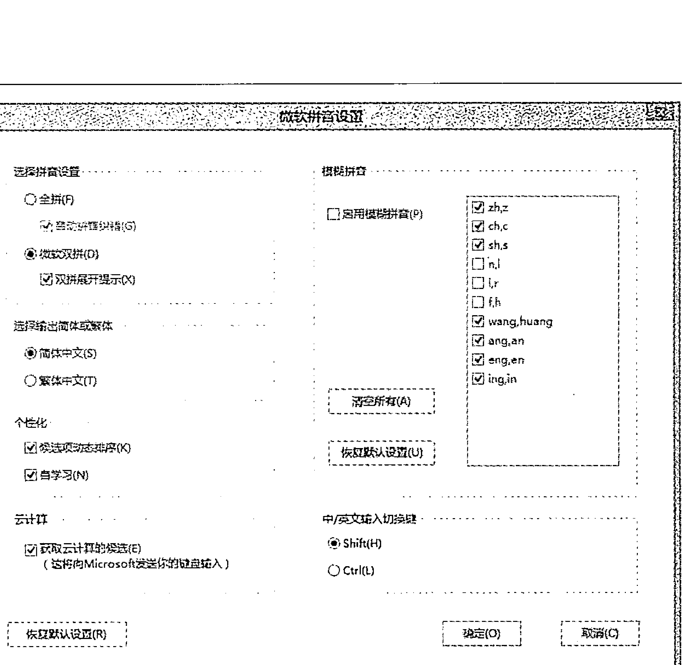

#### 1 驯服Windows 8.1微软拼音

系统升级到Windows 8.1之后，以前习惯的微软拼音发生了变化，这让不少它的老用户感到为难。那么，如何让它变得更顺手？

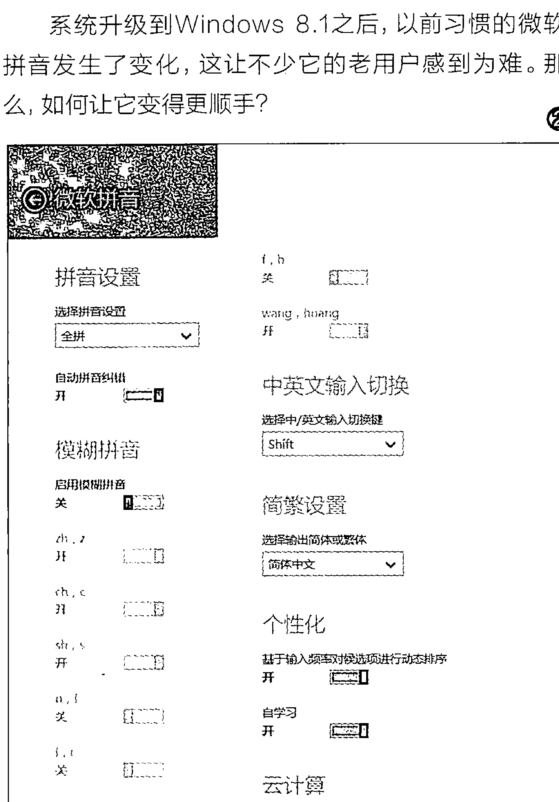

##### 状态条消失 设置有道循

进入Windows 8.1输入环境后，我们发现系统自带的输入法只有一个文字输入条，连状态条也没有，虽然输入拼音也能打出汉字，但缺了状态条后不知如何控制，会让人感觉心里没底。点击左右键，又都无法调出设置菜单，一时不知从哪里改变其设置。拼音输入设置控制藏到哪里去了呢？

> 小提示：对于一贯使用全拼输入的用户来讲，微软的这种简捷的方案倒是不影响其继续使用该输入法。只要能找到这个设置入口，从中设置比较有用的模糊音、繁简体、智能候选、云候选、自学习等实用的智能功能即可。

右击开始按钮，点选“控制面板”，进入“语言”选项，更改语言首选项，选择“中文”后的“选项”进入输入法列表窗口，点击“微软拼音”后的“选项”，这样即可进入微软拼音设置窗口。但是在设置窗口中，原本可以用来定义双拼方案的设置项没有了，只能看到一个简单的“微软双拼”选项（图1），看来对于使用双拼输入的高端用户来讲，如果使用的是另一种方案，那么升级到Windows 8.1之后，就只能放弃微软双拼，改投别的输入法的怀抱了，丢用户是必然的了。

作为双重界面的Windows 8.1，其实设置微软拼音的途径还有另一条。通过屏幕右侧的Charm浮动面板，选择“设置→更改电脑设置”，进入“时间和语言→区域和语言”页面，点击“语言→中文”下的“选项”按钮，在键盘列表中点击“微软拼音→选项”按钮，进入微软拼音设置窗口（图2）。

#### 双拼类输入 选择有歧途

不少用户习惯于使用以前的微软双拼方案，但使用Windows 8.1之后，不知从哪里切换过来。知道了上面的输入法设置入口，双拼切换自然就能解决。只需从微软拼音设置窗口中，在“选择拼音设置”下拉列表中选择“微软双拼”即可（图3）。

如果以前使用微软拼音输入法，但使用了一种自定义的双拼方案，那么，很遗憾，只得另换输入法了。从这一点上来说，微软失去用户是无疑的了。

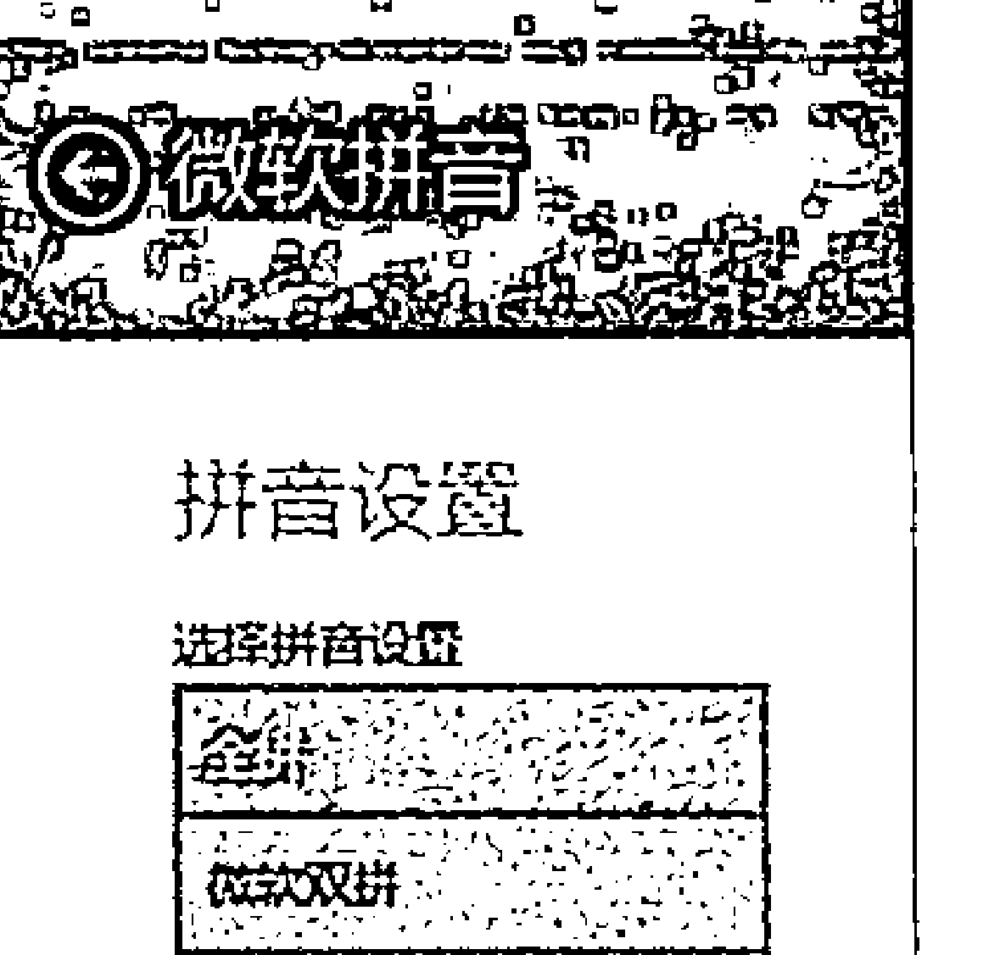

#### 输入占首位 调整借外援

如果系统有多人使用或安装了多种输入法，希望将微软拼音输入法调整到输入列表的第一个位置或某个位置，该如何处理？借助于带有输入法管理器的第三方输入法软件可进行调整。比如，使用搜狗拼音输入法的输入法管理器，在列表中选中微软拼音，然后用“上移”按钮来将微软拼音输入法提到最前面（图4）。

#### 长句继续用 一气来呵成

新的微软拼音还取消了长句输入功能，不过已经有网友编制了适合于4种Windows 8/8.1版本的长句模式恢复工具（下载地址：http://www.dwz.cn/r8H91），可选择安装使用。

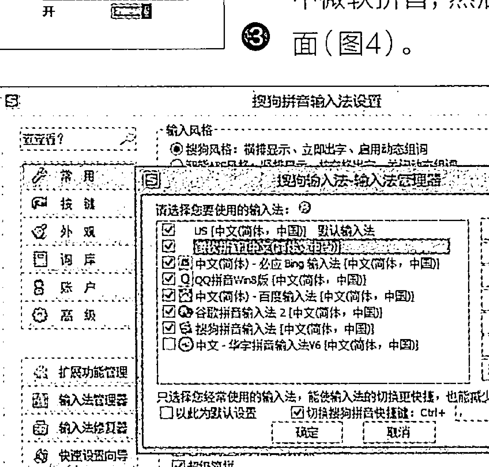

#### 2 寻找微软拼音的替补方案

如果觉得新微软拼音使用不顺手，或对于因双拼方案无法协调而不得不放弃的用户，可寻求替补方案。许多第三方拼音输入法（如QQ拼音、百度拼音、微软拼音、谷歌拼音等）对微软拼音的兼容性比较好，均可作为替补候选工具。这些输入对微软拼音输入法所具有的智能记忆、智能调整、云词库等功能，基本都具备。而对于原来习惯的整句录入或微软双拼（甚至是别的双拼方案），这几种输入法都不在话下，只需稍加设置便可上手。

##### 小技巧

对不再使用微软拼音输入法的用户来说，将此输入法留在系统中是一种累赘。这时，可通过先在应用界面的语言组删除“中文（中华人民共和国）”一项，然后再安装第三方输入法，添加新的语言组来完成输入法的添加。也可以用控制面板的语言选项，直接选择删除微软拼音，然后安装第三方输入法。

以百度拼音为例，只需通过输入法“基本设置”窗口，将拼音模式设置为“双拼→微软双拼”（图5），即可像原来使用微软双拼那样，用百度输入法来替代微软双拼进行录入了。在双拼方案选择列表中，还有另5种双拼方案可选。

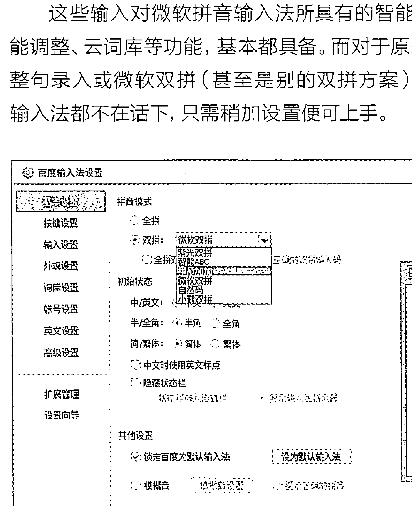

百度拼音虽已提供了6种双拼方案，可以满足大多数高级用户，但对于使用六种方案之外的用户来说无法满足要求。这时，可选用搜狗拼音输入法，该输入法除了提供7种现成的双拼方案外，还提供“新建双拼方案”的用户自定义按钮，可以随意添加任何一种双拼方案（图6）。

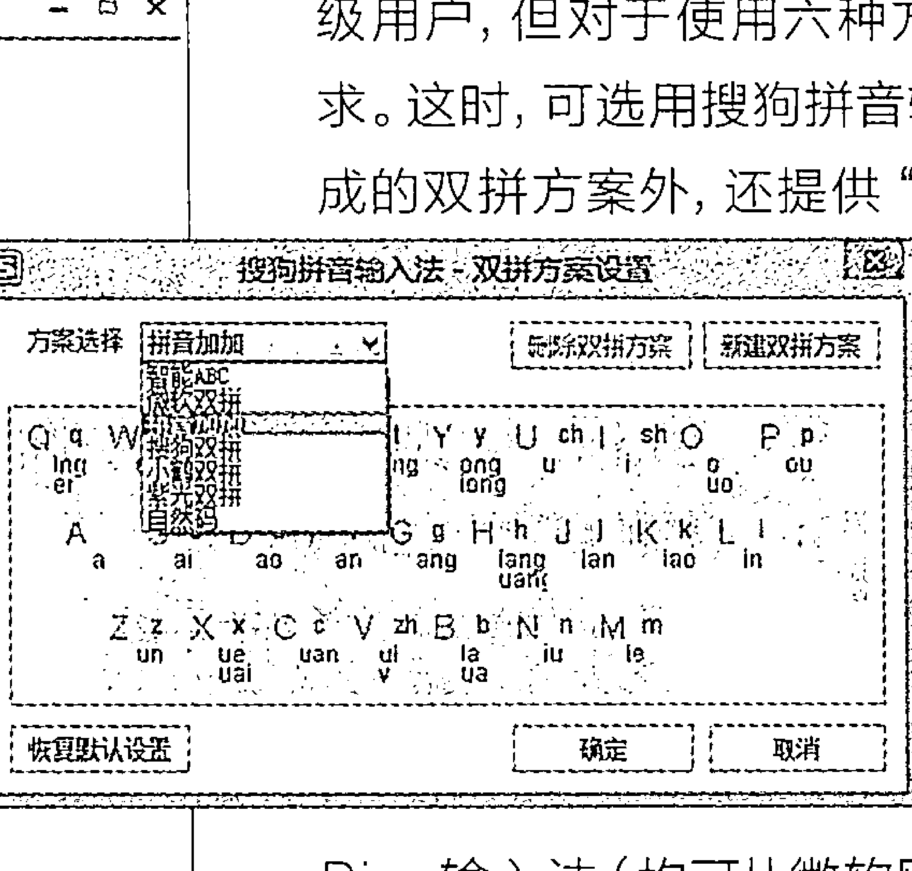

对于确实对微软情有独钟的用户来讲，还可以有两种方案选择，一是安装微软拼音2010独立版，还有一种选择是安装必应Bing输入法（均可从微软网站下载）。这两种输入法也可以通过设置选择或自定义自己的双拼方案。

### “快捷方式”不简单

文|黄勇

“快捷方式”听起来很简单，不就是桌面上的图标吗？没错，桌面图标的确是快捷方式，但我们看到的只是一个表面现象、一种典型情况。关于Windows“快捷方式”，有许多使用技巧。善于使用Windows的各种快捷方式，可以极大地提高工作效率。

#### 1 文件归档的快捷方式

如果希望将搜集的资料分别复制到某分区的“图片”、“音乐”、“视频”、“文档”等文件夹中备份，可以先给这些文件夹分别建立一个快捷方式，然后通过搜索定位到系统的SendTo文件夹，并将上面建立的这些快捷方式移动到SendTo文件夹中。

这之后，在希望归集一个文档时，通过在该文件上点击鼠标右键，按需选择“发送到→图片”、“发送到→音乐”、“发送到→视频”或“发送到→文档”命令，快速将文件复制到目的地(图1)。

> 小提示
Windows 8.1系统SendTo文件夹的路径为“C:\Users\<用户名>\AppData\Roaming\Microsoft\Windows\SendTo”。

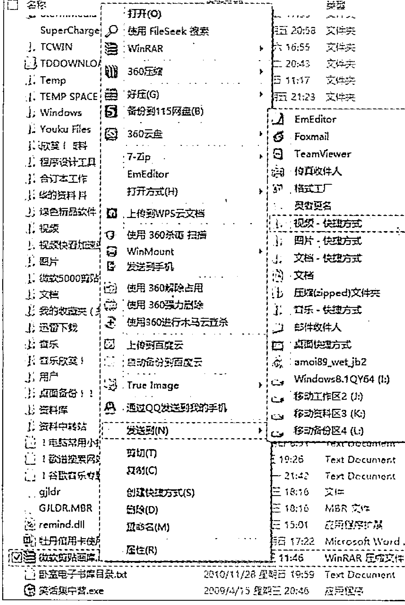

#### 2 程序自启的快捷方式

有时候我们希望能在系统启动时自动启动一个程序，有时候又希望能在系统启动以后自动打开一个文档或网页。在这种情况下，大可不必动用注册表等复杂工具，只需要创建这个程序或文件的快捷方式，然后再将此快捷方式移动到系统的启动文件夹中即可。

在Windows 8.1操作系统中，可通过将快捷方式直接拷贝到“C:\ProgramData\Microsoft\Windows\Start Menu\Programs\StartUp”文件夹中，实现程序或文档的自动快速启动。

Windows XP等具备“开始”菜单的低版本操作系统，可通过先给文件创建快捷方式并复制该快捷方式，然后通过“开始→程序→启动”，将创建的快捷方式粘贴到“启动”组中。

> 小技巧
同时按下Ctrl+Shift后用鼠标左键点击拖动文件，也可创建快捷方式。此外，按下鼠标右键拖动文件，从弹出的菜单中也可选择建立文件的快捷方式。

#### 3 快捷方式的快捷方式

桌面快捷方式虽然访问方便，但在某些情况下可能不便于切换到桌面，或者鼠标出现了问题不听使唤，只能使用键盘操作。如果提前给桌面的鼠标快捷方式建立键盘“快捷方式”，出现问题时，对快捷方式的访问就可以从鼠标转移到键盘上了。

选择桌面上的一个快捷方式图标，比如“腾讯QQ”，然后通过右键菜单访问“属性”窗口，在属性窗口的“快捷方式”选项卡下，点击“快捷键”后的框，按下一组组合键，比如Ctrl+Shift+Caps Lock，然后确定(图2)。

之后，如果键盘出现问题，无法通过点击桌面上的QQ图标启动聊天，那么可以通过按下键盘上的Ctrl+Shift+Caps Lock组合键来启动QQ。

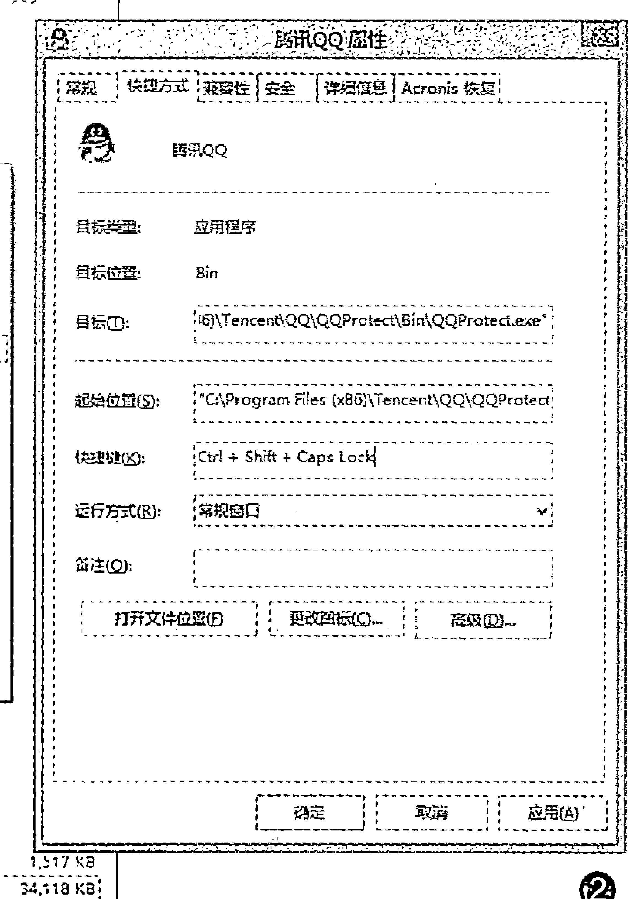

##### 控制功能的快捷方式

如果经常要用到控制面板中的某几项功能，能不能把它们以快捷方式的形式安放在桌面、任务栏或某个文件夹中呢？完全可以！

先建立控制面板的超级菜单模式，方法是建立一个新文件夹，然后更名为“总控菜单.{ED7BA470-8E54-465E-825C-99712043E01C}”，将这个快捷方式放在桌面或某个文件夹中，通过资源管理器的目录树来访问其中的250多个控制项，点击其中的某一项，通过右键菜单命令建立快捷方式（图3），将建立的快捷方式移动到任意位置，即可以专门的快捷方式访问该功能了。

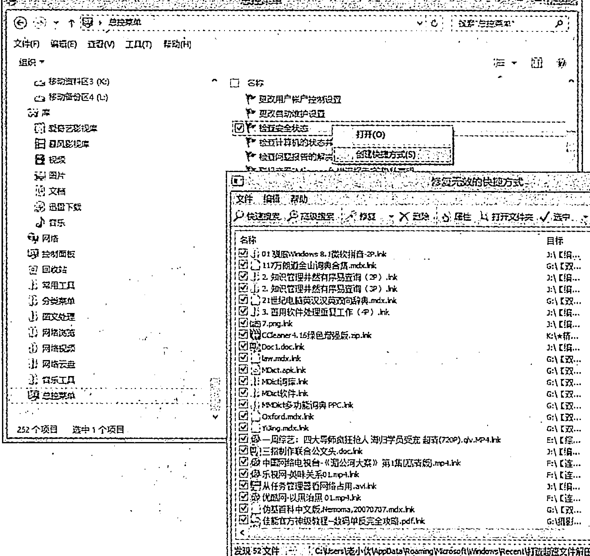

##### 屏幕保护的快捷方式

屏幕保护程序多为扩展名为scr的文件，位于系统目录中比较深的路径内。屏幕保护一般在设定的时间到达后方能自动启动。但是，有时需要马上启动屏保，比方说要离开电脑的时候。这时，如果在桌面上有一个启动屏保快捷方式就方便多了。

先利用搜索软件定位系统scr屏保程序，然后选择一个自己喜欢的屏保程序，点右键发送到“桌面快捷方式”（图4）。需要启动时双击此快捷方式即可。

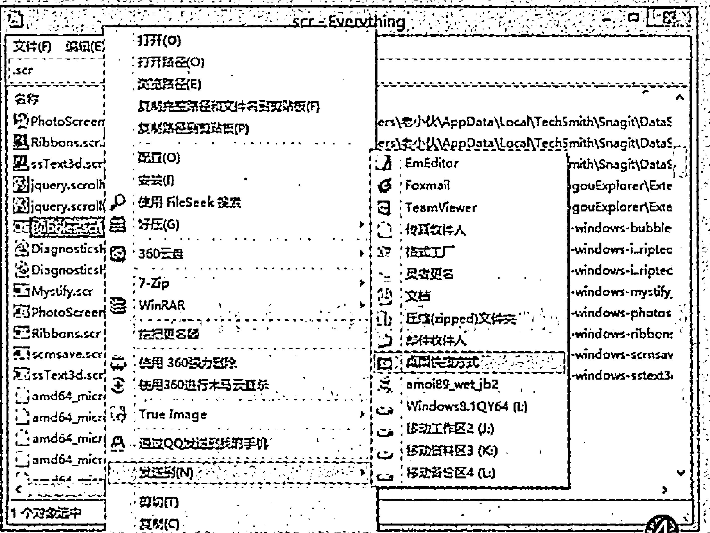

##### 清理无效的快捷方式

电脑使用时间一长，桌面、分区、各级文件夹下可能会出现许多无效的快捷方式，可能是文件的快捷方式或网址快捷方式等。这些快捷方式虽然占用的磁盘空间不多，但因为它们都是作为一个文件被存储，系统会将它们作为文件来建立索引，影响系统运行效率。

使用系统优化软件，如Glary Utilities或360安全卫士工具等，可对系统无效的快捷方式进行扫描、检查和清理（图5）。

##### 找出恶意的快捷方式

快捷方式一般总是要指向一个目标程序、网址或文档。而恶意软件往往会利用快捷方式的这一特性偷梁换柱，将目标更换为其自身。但外表上，用户却看不出任何变化。

鉴于以上情况，需要检查快捷方式指向的程序或网址，通过在快捷方式上点击右键，在“属性”窗口中即可查看指向目标是不是自己所需的目标，若有变化需及时更改，同时要删除或清理有害程序（图6）。

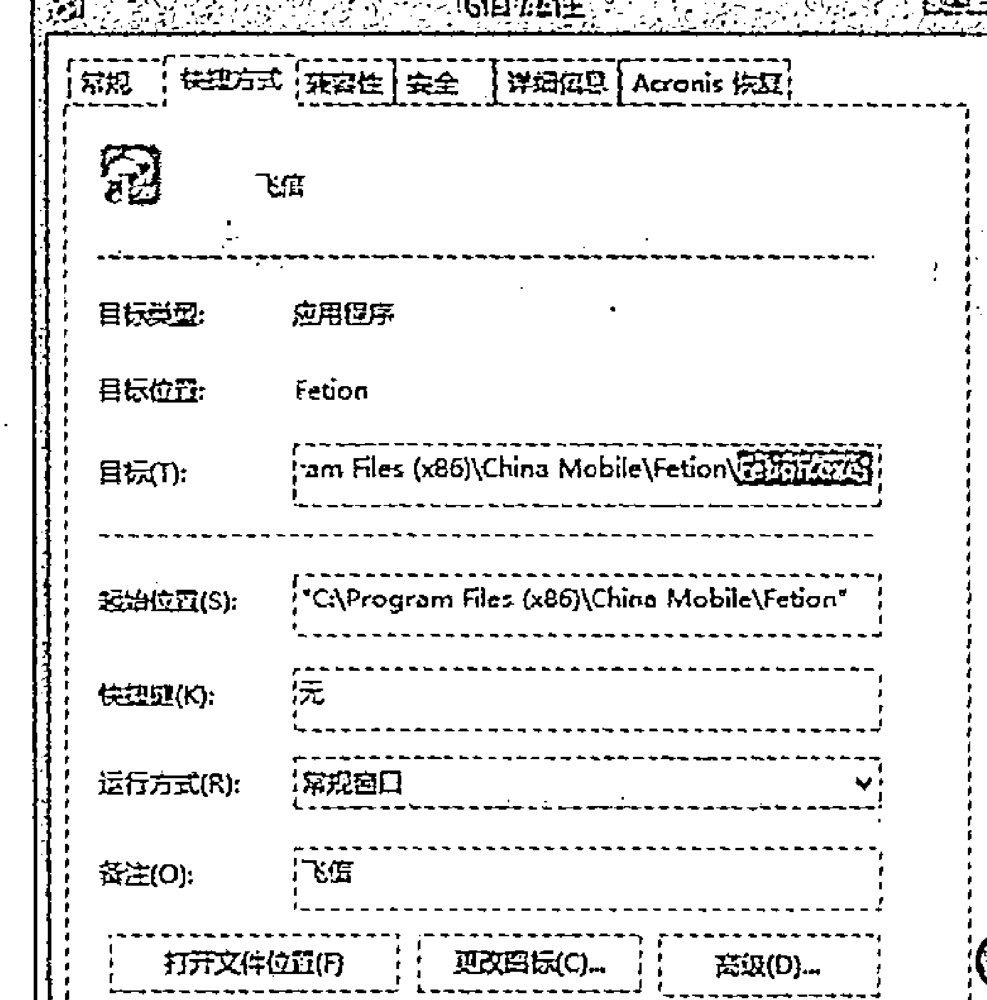

> 使用360安全卫士等系统工具，通过扫描可发现被篡改或存在问题的快捷方式，并进行自动清理。

### 广泛挖潜 用好OneDrive 文|李安居

OneDrive是Windows 8.1自带的网络云盘，也是微软目前重点发展云战略的具体体现。除了在Windows 8.1环境下自动备份一些数据和系统设置外，OneDrive云盘其实还可以发挥更加广泛的作用。

#### 1 不用Windows 空间也拥有

不要认为只有安装了Windows 8.1才能享受到OneDrive的服务。实际上，即便没有安装Windows，仍然可以使用微软提供的免费云空间。

通过 http://www.dwz.cn/s8pGv页面右下角的“立即注册”文字链接，填写必要的信息注册，即可获得属于自己的微软账号和15GB免费空间的OneDrive (图1)。

> 小提示
OneDrive账户的切换不可在Windows的OneDrive应用中进行，但可以通过OneDrive网站登录不同账号的OneDrive来实现。

#### 2 其他平台 也用OneDrive

除了可在Windows环境下使用微软OneDrive外，目前其他主流的系统平台上也可以使用微软云服务。

若使用苹果Mac平台，在http://www.dwz.cn/s8vJE下载OneDrive 17.0.4043即可享用微软云空间。而iPhone或iPad移动设备，可通过http://www.dwz.cn/s8xuO下载iOS版本的OneDrive应用，使用OneDrive云服务。Android设备用户，通过下载安装Android版本的OneDrive来实现对微软云的访问 (http://www.dwz.cn/s8xI9)。

> 小提示
Mac平台要使用OneDrive应用，需安装Mac OS X Lion。Mac OS X 10.6 Snow Leopard或更早版本的Mac OS上不支持OneDrive。

#### 3 旧版Windows 可用OneDrive

仍在使用Windows 7甚至Winodws XP的用户，其实也可以享受到OneDrive的便利。只需通过http://www.dwz.cn/s8qPB下载安装OneDrive的PC客户端，即可享受到同样的便利(图2)。

> 小技巧
OneDrive中一般存有重要信息，为了保证信息安全，可采用创建高强度的密码、向微软账户添加安全信息、使用双重验证和备份OneDrive文件等手段来提供安全保障。对于密码的设置是否足够强，可通过微软的密码检查器来验证 (地址：http://www.dwz.cn/s8Dhv)。添加安全信息主要是指个人邮箱和电话号码，这有利于找回密码。而双重验证是通过密码和附加的安全码来进行安全验证。

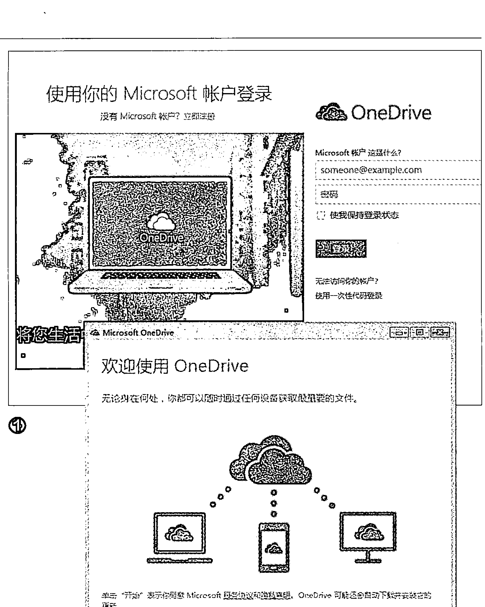# 跨越平台 分享高品质照片

对于安装有摄像头的Windows 8.1设备，拍照时可自动将照片副本保存在OneDrive。为确保照片能够自动以指定的质量上传，需要检查OneDrive设置。通过桌面右侧浮动工具面板访问“设置→更改电脑设置”，在“电脑设置”列表中选择OneDrive一项，然后点击“本机照片”，选择“以最佳质量上载照片”选项，这样，本机照片文件夹中的照片会自动上传到OneDrive（图3），可供各类平台访问。

### 邀请他人共同编辑文件

在OneDrive中，选取要共享编辑的文件，点击右键选择“共享→创建链接”按钮，软件将产生一个共享链接，将此链接通过电子邮件、博客、即时通信工具等渠道分享给其他人，获取了此链接的用户便可与你一道共同编辑这个文件了。

### 盘内创建各类Office文档

打开网上的OneDrive，点击“新建”按钮，在菜单中可以选择建立Word文档、Excel工作簿、PowerPoint演示文档、OneNote笔记本、Excel调查、纯文本文档等文件。这可以大大增强OneDrive的功能，让OneDrive不仅用于存储数据（图4）。

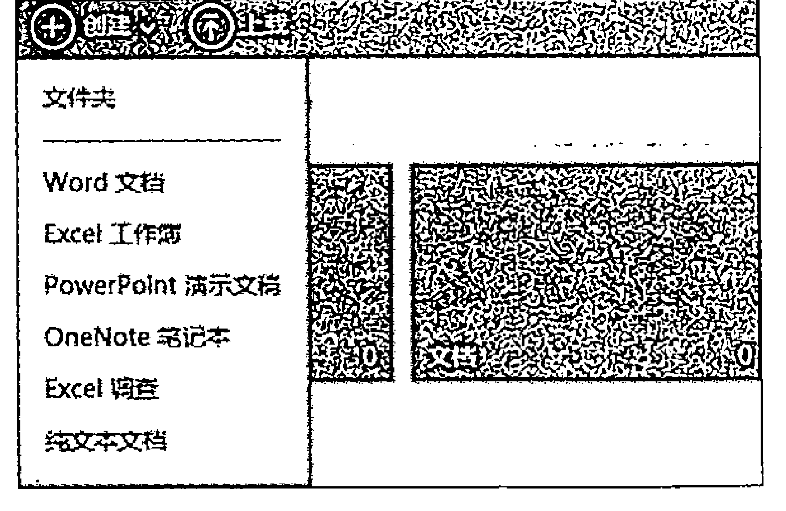

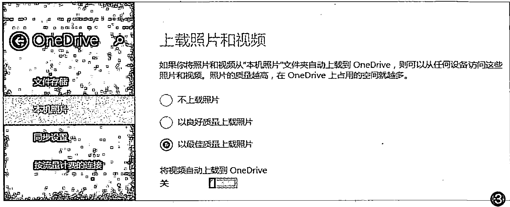

### OneDrive打不开的解决

有时你会发现在网页端，OneDrive不能正常连接登录，这是由于DNS遭受到污染造成的。DNS遭受污染，OneDrive仅从网页无法登录，但用Windows内置的OneDrive或PC客户端、手机客户端可正常使用。解决网页版问题只需下载安装专门清除DNS污染的软件即可（下载地址：http://www.dwz.cn/snnBL）（图5）。

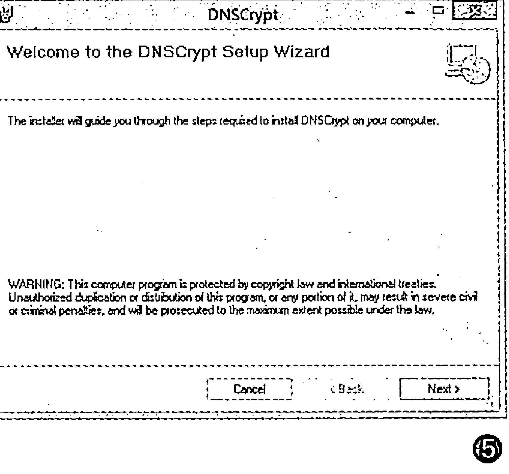

> 小提示
OneDrive本地存储空间不但可设置在硬盘的其他分区，还可以指向另一个驱动器，甚至网上的另一台计算机。

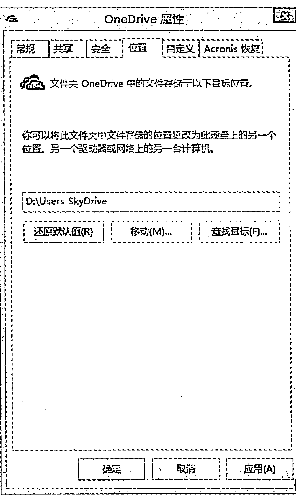

### 解决脱机使用带来的麻烦

在Windows 8.1资源管理器窗口的OneDrive文件夹下，通过文件右键菜单命令“允许脱机使用”可将微软网盘中的个人文件下载到本地，供断网离线使用。但是，这样做会遇到一个麻烦，不少用户用固体硬盘做系统盘，空间本来就不大，使用这个功能会迅速侵占系统空间。

这种情况下，只需在资源管理器OneDrive图标上单击鼠标右键，选择“属性”，然后在“位置”选项卡中重新设定云盘存储位置到C盘之外的空间即可（图6）。

### 一左一右 搞定系统管理功能

文/江亦兵

相比于早期Windows对系统资源和各项功能的管理，Windows 8.1的管理功能更多地隐含于系统背后，加上Windows 8.1开始菜单和帮助系统的薄弱，因此让许多初学者“一头雾水”。其实，Windows 8.1的管理功能更加强大，虽然变幻莫测，但却是无处不在。留意总结，可归结为“一左一右”两大操作。

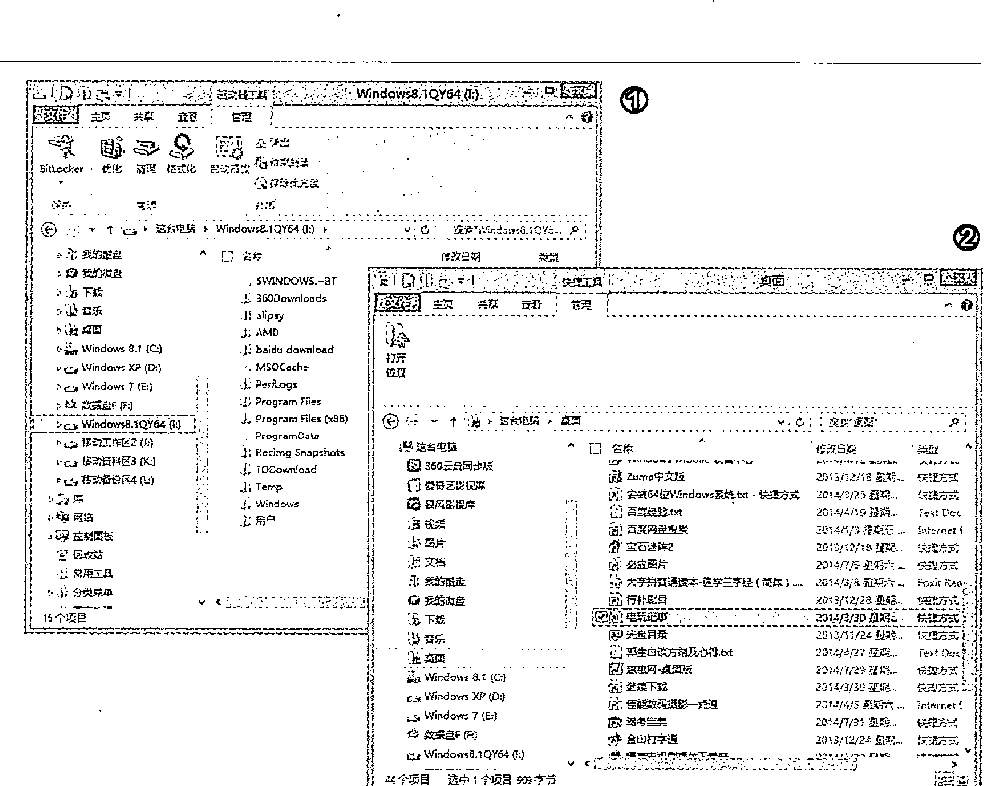

在Windows 8.1系统中，可不再通过右键属性窗口调用管理功能。系统的各项管理可以通过鼠标左键一键完成，或通过统一的右键菜单一键进入管理目标。

> > **小提示**
>
> Windows 8.1的搜索功能也为系统的各项管理提供方便的访问途径。

#### 1 驱动器的管理

在Windows 8.1中，对硬盘、光盘、U盘的操作只需左键一次点击即可完成。插入所要操作的介质，在资源管理器中会动态出现一个“驱动器工具→管理”的菜单式选项卡，在这里可以一键进行优化、清理、格式化等磁盘操作。还可以使用系统内置的BitLocker功能对硬盘和U盘进行一键加密处理。如果电脑带有刻录机，还可一键进行光盘擦除、刻录等操作（图1）。

> > **小技巧**
>
> 我们还可以用右键菜单实现驱动器的管理。在开始菜单上点击右键，从菜单中选择“磁盘管理”，可启动磁盘管理窗口，对磁盘进行分区、格式化等操作。

#### 2 快捷方式管理

快捷方式主要有程序快捷方式和文档、文件夹、网址等为目标的快捷方式。对于快捷方式的管理，在早期的Windows系统中，主要是通过在快捷图标上点击右键菜单，然后通过“属性”窗口来访问，使用起来比较繁琐。在Windows 8.1资源管理器窗口中，对这些快捷方式采用了新的动态管理方式，快捷方式可实现一键追根溯源，而且可区别对待。

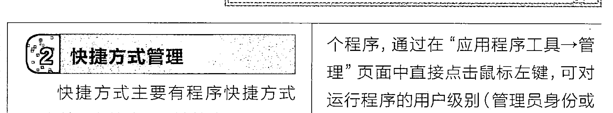

选中程序、文档或文件夹等快捷方式，鼠标左键直接点击“快捷工具→管理”页面下的“打开位置”按钮（图2），可一键到达快捷方式所在的文件夹。如果快捷方式连接的是一个程序，通过在“应用程序工具→管理”页面中直接点击鼠标左键，可对运行程序的用户级别（管理员身份或其他身份）进行一键选择，或一键点击解决程序兼容性问题，还可以一键将程序锁定在任务栏上（图3）。

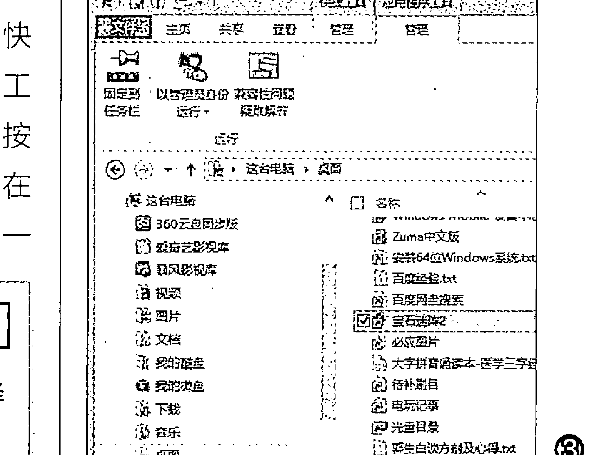

快捷方式的左键动态管理是Windows 8.1最体贴人的一种设计，虽然传统的右键菜单属性窗口也可以实现以上所述功能，但操作起来远远不如直接点击左键方便。

#### 3 图片与照片管理

看照片，你还在用右键菜单吗？你当然没错，但麻烦了点。如果你已经在用Windows 8.1系统，则完全可以用更方便的左键一键看图功能。

只需在资源管理器中点击切换到照片所在文件夹，系统会实时动态出现一个“图片工具→管理”菜单式选项卡。在该选项卡下，直接点击“向左旋转”或“向右旋转”即可转正拍摄方向颠倒的照片，还可一键播放照片幻灯，将选中的照片设置为壁纸等。如果连接了多个屏幕，还可通过选择“播放到”，将照片通过大屏幕或其他显示设备进行播放（图4）。

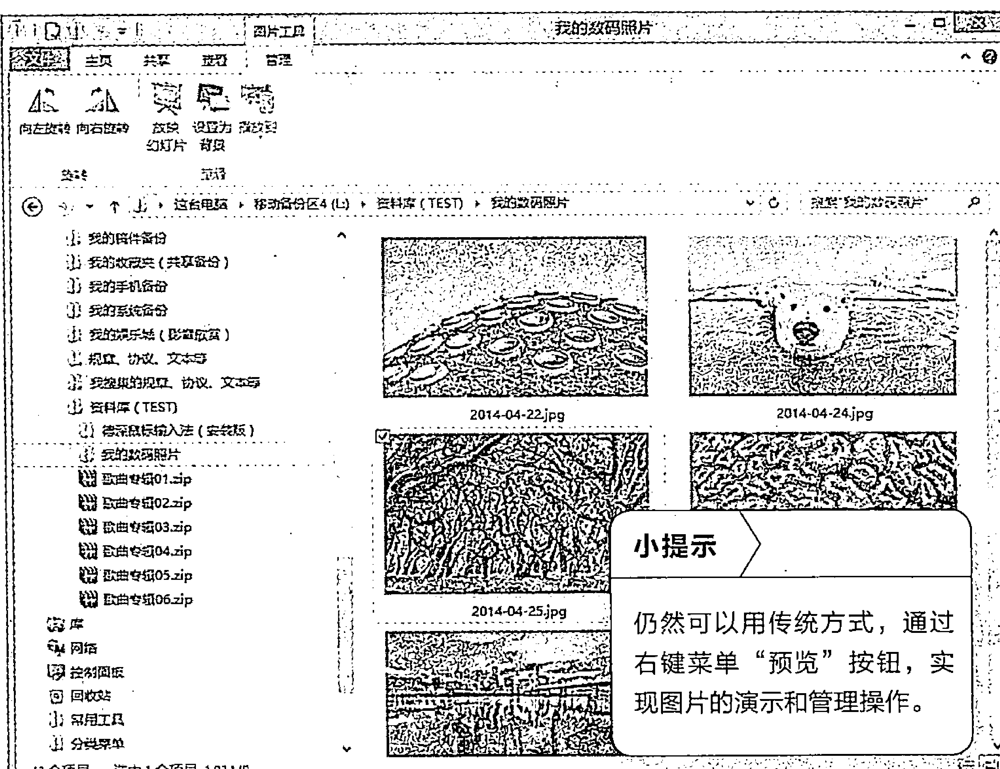

> 小提示：仍然可以用传统方式，通过右键菜单“预览”按钮，实现图片的演示和管理操作。

#### 4 音乐、视频管理

同照片类似，Windows 8.1的音乐管理也支持一键操作。对于系统自带的音乐工具支持的音乐格式（如MP3、WAV、WMA等），选中音乐文件后，系统会自动产生一个“音乐工具”选项卡，可选择一键将音乐添加到播放列表、播放单曲或全部播放本目录下的音乐，还可以一键实现在与电脑连接的外部音乐设备中选择输出设备。

视频管理与音乐管理方式类似。

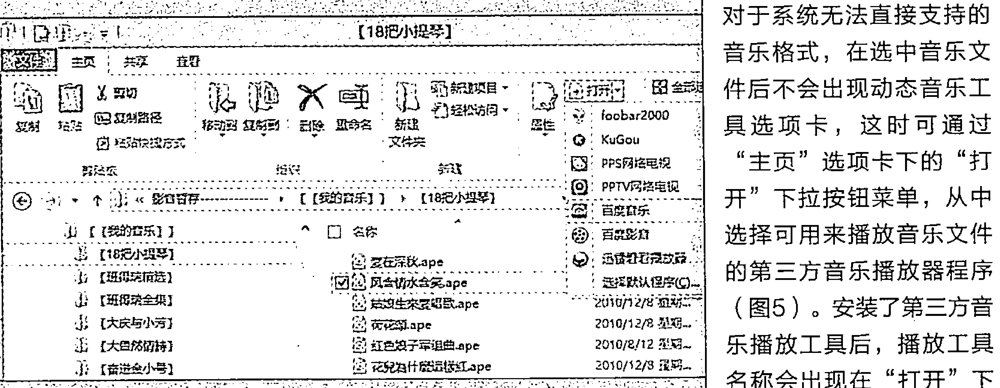

> 小提示：对于系统无法直接支持的音乐格式，在选中音乐文件后不会出现动态音乐工具选项卡，这时可通过“主页”选项卡下的“打开”下拉按钮菜单，从中选择可用来播放音乐文件的第三方音乐播放器程序（图5）。安装了第三方音乐播放工具后，播放工具名称会出现在“打开”下拉列表中。可同时安装多个音乐工具供选择使用。

> 小提示：用Win+X键盘组合命令，也可以达到唤出控制菜单的目的。

#### 5 库与回收站管理

对于图、文、声、像等常见文档，高效的管理方法应该是将它们纳入到系统的“库”管理之中。在点击了“库”中的类别文件之后，可通过动态出现的“库工具→管理”菜单式选项卡（图6），一键设置该类库文件的保存位置，还可以一键还原其默认保存位置。对于尚未包含在库中的文件，可通过“管理库”按钮，一键进入库位置设置窗口，通过“添加”按钮一键添加新的库位置。

与“库”管理一样方便，可用左键一键完成的还有“回收站”管理，试着选中“回收站”，看看系统出现的动态菜单吧！

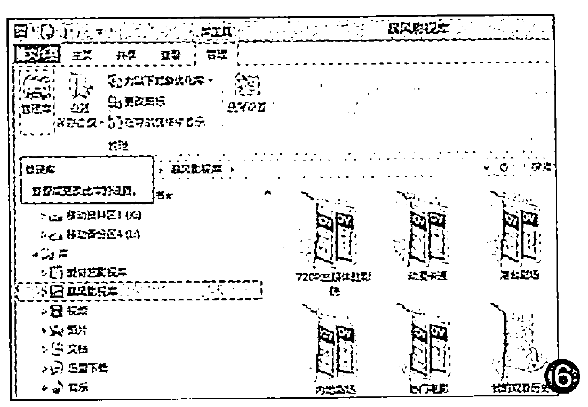

#### 6 更多管理 右键完成

除了用鼠标左键一键管理日常使用的文件资源外，还有一些我们很常用的系统功能或控制方面的管理。通过在系统开始按钮上右击鼠标，一键选择相应的功能命令，即可进行对应项目的管理。这些管理功能包括：任务管理、计算机管理、设备管理、电源管理、程序与功能管理、事件管理、网络管理、命令管理、控制项目管理、桌面管理、搜索管理、运行管理、关机方式管理等。只需一个右键操作，所有问题都能解决。

### Windows 8.1 不离不弃

文/湖月

记得当年不升级为Windows 7的理由很多，因而不少人一直固守Windows XP，但最终Windows 7的用户还是占据了上风。如今，上网搜一下，也可以发现N种不升级为Windows 8（含8.1）的理由。对于一个新版系统，尽管它有种种弊端，但技术优势还是占第一位的，即便是寄希望于即将推出的Windows 9，那也是Windows 8的继承和再优化，而不是对Windows 7的屈就。因此，熟悉Windows 8的用户肯定比Windows 7用户更容易上手Windows 9。如果你已经放弃或正打算放弃Windows 8，不妨看看下面的方法，或许它可以加速你以后的Windows之路。

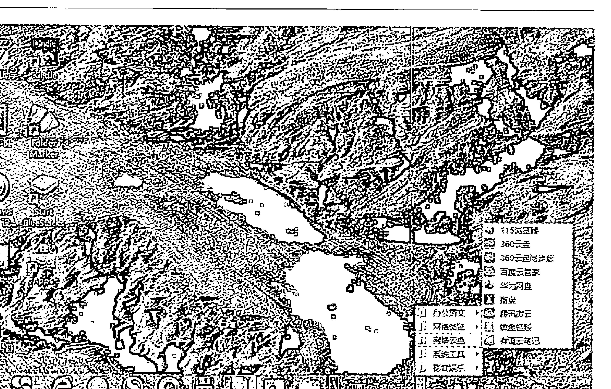

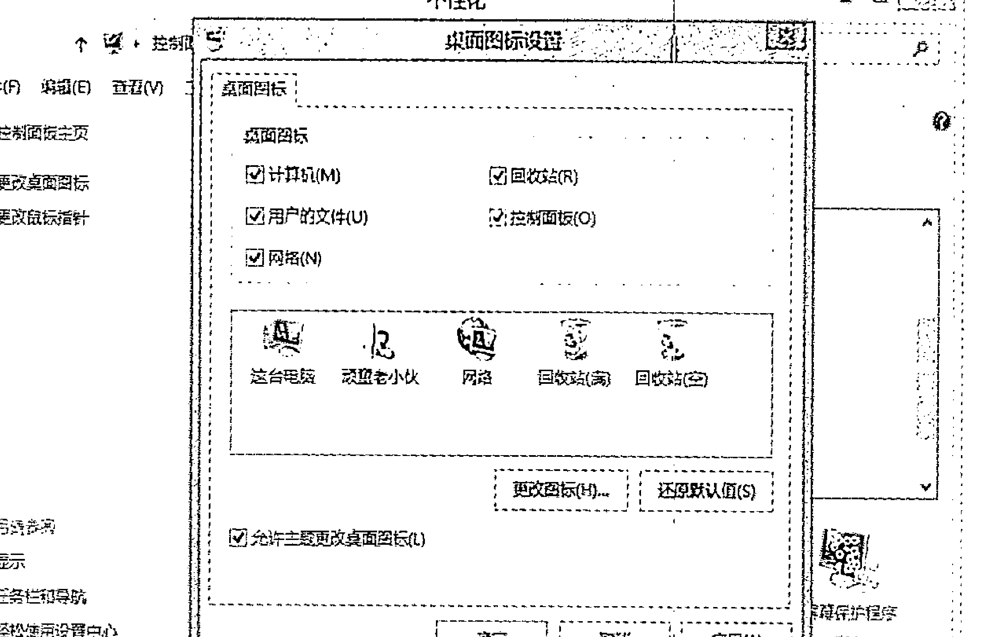

#### 1 操作习惯问题不是问题

网上资料显示，Windows 8电脑遭受降级请求的最大原因是用户难以放弃使用了10多年的操作习惯。如何在不放弃老习惯的同时用上新系统？

对于守旧者而言，只需稍动手脚，就可以让Windows 8找回老系统操作的感觉。安装360软件小助手让系统“重现”开始菜单，回到Windows 7的感觉。将自己常用的程序创建快捷方式，组织到一个“开始菜单”文件夹中，通过单击任务栏空白处和选择“工具栏→新建工具栏”，指定该文件夹，可以创建个性化的“开始菜单”。

通过“个性化→更改桌面图标”将原有的管理控制图标安排到桌面上，便可回到Windows XP桌面的使用习惯。

通过任务栏“导航”属性设置页面选择“当我登录或关闭屏幕上的所有应用时，转到桌面而不是开始屏幕”，避免一开机就见到不待见的磁贴桌面。

> **小提示**
向更新的版本过渡是不可避免的、迟早的事情，建议安装最新版系统，在打造老环境、继续使用老习惯操作的同时，不断学习Windows 8的新操作方式、新功能，这样既不影响工作也不妨碍求新。

#### 2 “开始”菜单没有也方便

“开始”菜单是人们不喜欢Windows 8的焦点之一。开始菜单的作用无非是访问程序和控制系统方便罢了。没有开始菜单，如何启动程序或实现对系统的控制呢？

不装任何开始菜单，其实从磁贴界面的应用列表中，也可分门别类地一眼饱览安装的所有传统程序，这样其实比原开始菜单程序组访问还直观和快捷方便。

虽然Windows 8.1没有开始菜单，但“开始”按钮更加实用。对于系统控制需求，只要用右键单击“开始”按钮即可启动一个比Windows XP或Windows 7功能更强大的控制菜单，这样就解决了系统控制的需求。这一点绝对优于早期版本。

#### 3 输入法不好用不是“坎儿”

Windows 8升级到Windows 8.1之后，又有部分用户退回到了Windows 7，虽有各种原因，但输入法的退步也是其中一大原因。微软拼音设置入口难找、进入繁琐，双拼方案单一且无法定义，本来在Windows 8版带的看好的必应Bing输入法，Windows 8.1又不让安装了，这些都是让用户不满意的原因。

不过问题还是有办法解决，Windows 8.1下无法安装最新版必应输入法的问题，只需通过Win+X调出“命令提示符”窗口，运行必应安装文件并后附“/i /quiet”参数（不加引号）即可正常安装。如“BingPinyinSetup /i /quiet”回车即可解决。

此外，通过设置改造或使用国产优秀拼音输入法作为替代方案，都可以很好地得到解决。有关Windows 8.1微软拼音输入法更多问题的解决和替代方法，请参阅本刊2014年第18期《输入有道 微软拼音“继续”用》。

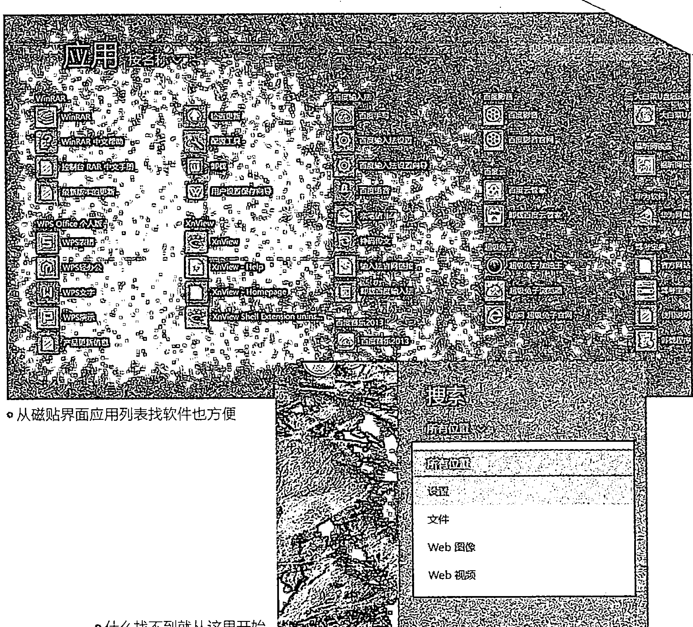

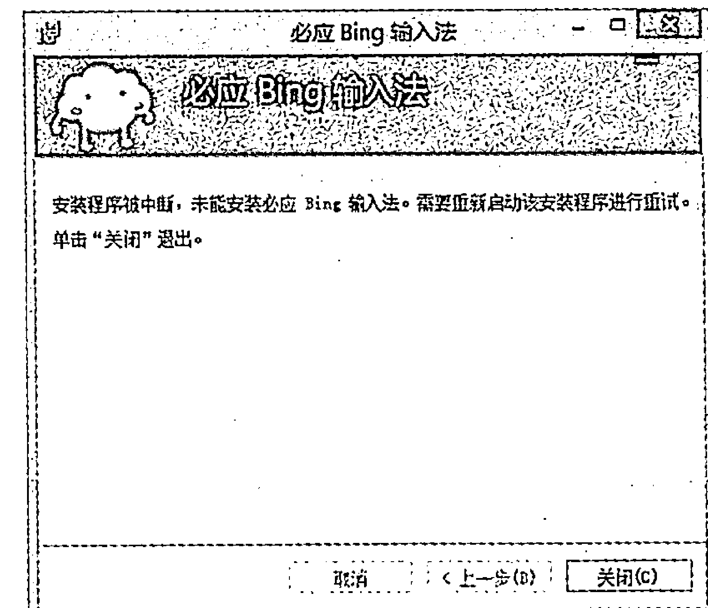

Windows 8.1无法安装必应输入法

#### 4 OneDrive不好有办法

在新版Windows的众多功能中，“云”无疑是最抢眼的，也是微软重点倚重发展的战略性功能。OneDrive的确给用户提供了不少方便，但也不是十全十美，比如速度慢、占硬盘等。

如果对OneDrive云盘不满意或根本就不想使用微软的云服务，可不用网络账号登录，只注册本地账号，用国产超大容量免费网盘（如360云盘、百度云盘）作为自己的云备份方案。

#### 5 从捉摸不定中寻找规律

人们不喜欢Windows 8.1的另一种原因是它的捉摸不定，不能通过“老地方”找到“老功能”，难以驾驭。如果能从捉摸不定中找到规律，那么，“腐朽”反而会变成“神奇”。

+   - **控制功能有钥匙**
控制Windows 8.1不知从何入手？只要掌握一个组合键Win+X就够了。这是一把系统功能控制的“钥匙”，一切控制从这里开始。

- **搜索功能有入口**
什么也找不到怎么办？只需记住将鼠标移动到屏幕右上角下滑，再看一眼就够了。“搜索”！一切从这里开始。

- **管理功能有规律**
对于各种设备、各种资源的管理，Windows 8.1似乎更加变幻莫测，其实每当你选定一个不同类别的资源或文件后，在资源管理器的顶栏会动态出现一个新菜单。把握了这一点，去那里寻找，定会有所收获。

小技巧：关闭网络登录账号后，可使用360安全卫士来更新系统补丁。
如果打算使用OneDrive但对其侵占系统盘空间表示不满，可通过在资源管理器中右键单击OneDrive图标，设置“位置”属性来移动本地存储位置。

# 【系统应用】

### 轻装前进

文/杜锦海

系统用久、C分区或用户数据分区中会充斥着许多空文件夹、无效快捷方式或重复文件，这些文件会因占用检索时间或系统空间而拖慢系统运行。以上种种冗余数据，一般会被我们所忽略，但它们的确会影响系统运行效率。如果亲手去一一查找，是件很费时的事情，怎么办？

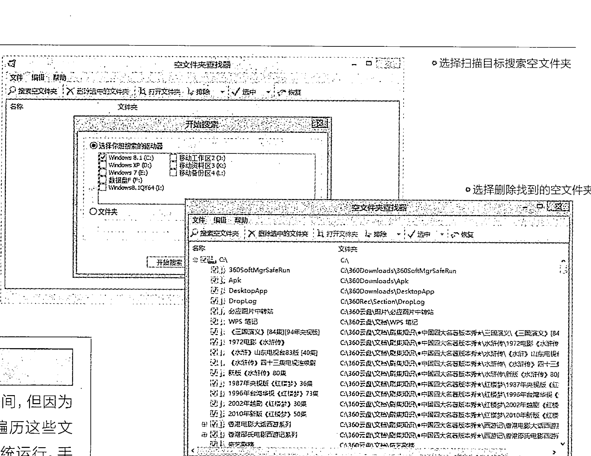

#### 1 空也累赘 清理空文件夹

空文件夹看似不占多少硬盘空间，但因为涉及到各种文件检索操作时都要遍历这些文件夹，所以会在某种程度上拖慢系统运行。手动一一找出是个大工程，需要找到一次性的清理办法。

启动Glary Utilities，切换到“高级工具”面板，选择“磁盘空间→空文件夹清理”一项，接着选择想要搜索的驱动器，选好目标之后，点击“开始搜索”即可开始空文件的查找过程。如果只是希望搜索某个文件夹下各级子文件夹中是否有空文件夹，则只需选择“文件夹”一项并指定一个文件夹即可。

搜索结束，从搜索结果窗口中全选搜索出的空文件夹，然后点击“删除选中的文件夹”按钮即可一次性清除空文件夹。

> ▶ 小技巧
也许有的空文件夹是为某项工作而预留的，但Glary Utilities并不会理解你的心思帮你留下这个文件夹。怎么办？可以随手在其中建立一个空的TXT文件，这样，Glary Utilities就不会删掉这个文件夹了。此外还有一种办法保留个别文件夹，那就是不要急于在搜索结果窗口全选删除，先通过“排除”按钮设置要排除的文件夹，然后再执行清除命令即可。

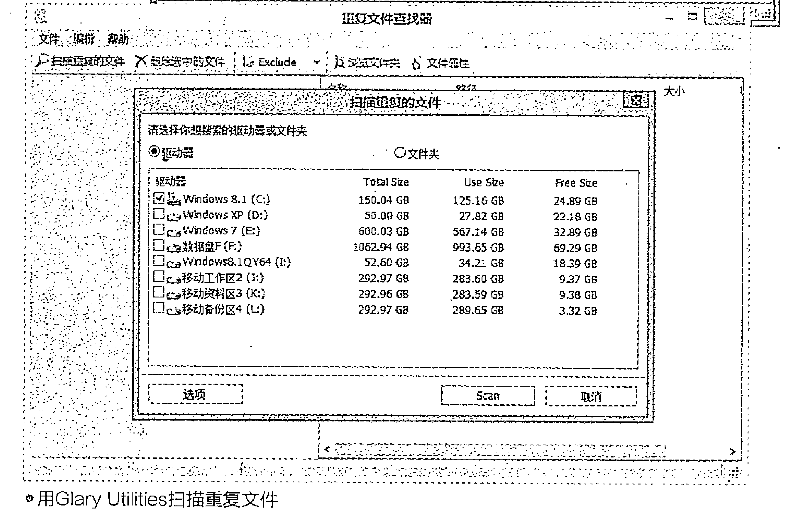

#### 2 统筹兼顾 清理重复文件

无论是系统文件还是用户文件都可能存在重复现象，相同的文件也是浪费磁盘空间的一个重要因素，这些文件需要清理，但又不能影响系统运行，怎么才能做到统筹兼顾？

用Glary Utilities清理重复文件，先选择一个或多个要清理的驱动器，然后点击Scan进行扫描。

可以用“选项”按钮进行自定义，排除一些不希望扫描的文件类型，还可以自己添加一些希望比较的其他类型。

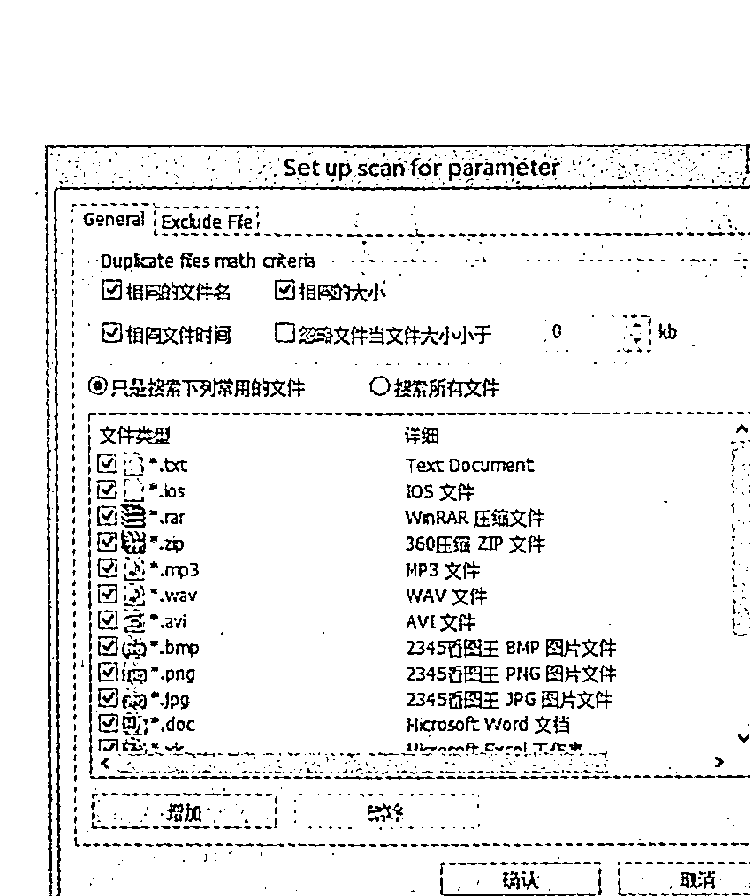

重复文件类型定义

> 对于重复的系统文件清理，如果操作不当可能会影响系统运行甚至启动，我们可借助于CCleaner系统清理软件指定对系统文件、隐藏文件的忽略，这样可以避免因重复的系统文件被误清理而造成系统不能启动或系统故障。

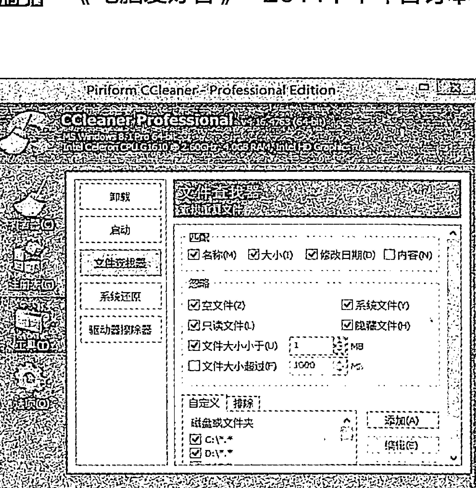

用CCleaner Professional查找重复文件

#### 提升效率 清理快捷方式

无效的快捷方式也是增加系统搜索时间的一个因素，因此要想办法扫描找到和修复这些无效的快捷方式，并尽可能进行修复。利用Glary Utilities可快速搜索出这些无用的快捷方式并进行修复。利用“高级搜索”选项，可指定只搜索开始菜单或桌面。此外也可选择对系统分区或任意的移动盘进行扫描与清理。

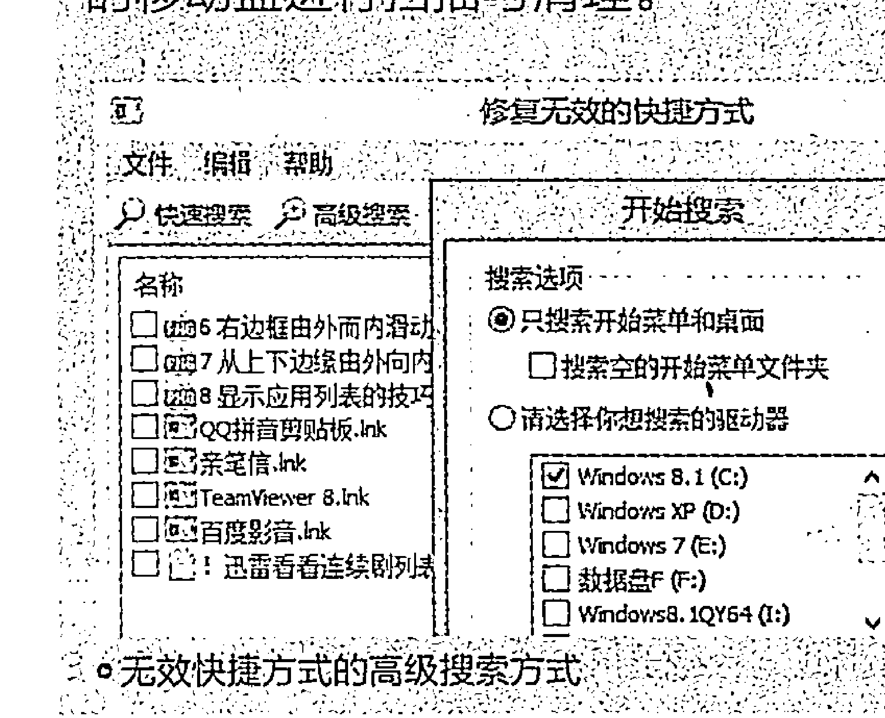

无效快捷方式的高级搜索方式

#### 找回空间 清理大个儿软件

大容量软件是增加系统负担的一个主要因素，而有些大软件安装之后我们不用或忘掉了，这些软件需要找出来并加以清理。启动“卸载管理器”，选择“占用大量空间软件”一项进行扫描，然后点击“大小”标题栏，对软件按容量进行排序，从最大的软件开始看起，不用的就单击“卸载这个程序”将其删除。注意要看清是不是的确不再用，不能盲目点击卸载。

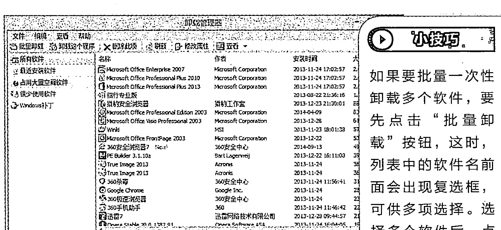

以软件容量排序查看占大空间的软件

> 如果要批量一次性卸载多个软件，要先点击“批量卸载”按钮，这时，列表中的软件名前面会出现复选框，可供多项选择。选择多个软件后，点击“卸载所有选中的程序”即可。

#### 不用就删 卸掉闲置软件

还有一些我们安装了但很少使用的软件，无论大小，这也在很大程度上浪费了系统资源。如果按使用频率查看排序，就很容易找到最不常用的那些软件。在卸载管理窗口中，点击“很少使用软件”按钮，右侧会将安装后很少使用的软件自动列出，可按大小排序，由大到小逐个选择卸载。

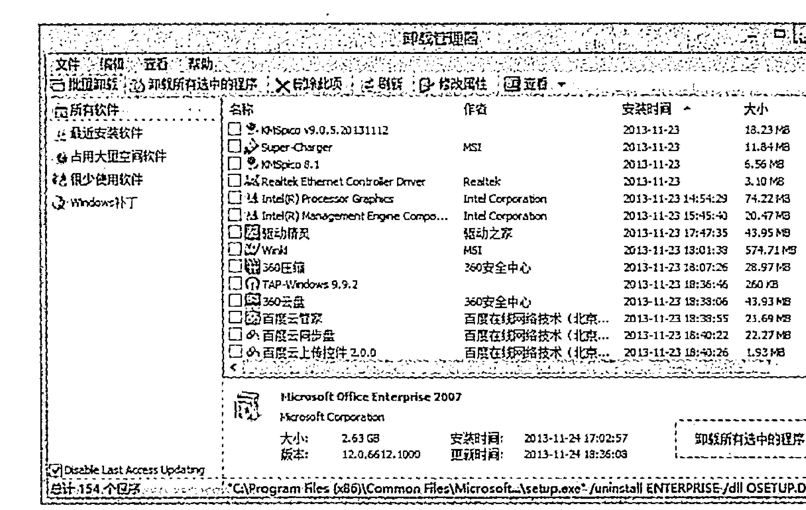

以安装时间排序查看最少使用的软件

> 通过360安全卫士的“电脑体检”也可以扫描出几乎不用的软件，可从列表中逐一判断，卸载掉确实不需要的软件。

### 跨越版本 走进Windows 10

文|榆木脑袋

Windows 8已推出两年，面对许多人的吐槽，微软火烧火燎地推出了让人出乎意料的版本Windows 10。那么，相对于之前的版本，最新版的Windows做到了哪些体贴人的改变？微软完全屈服和迁就于Windows老用户了吗？Windows 8/8.1之前的用户会有什么新惊喜？Windows 8/8.1用户有没有新的不适应？让我们一同去感受吧。

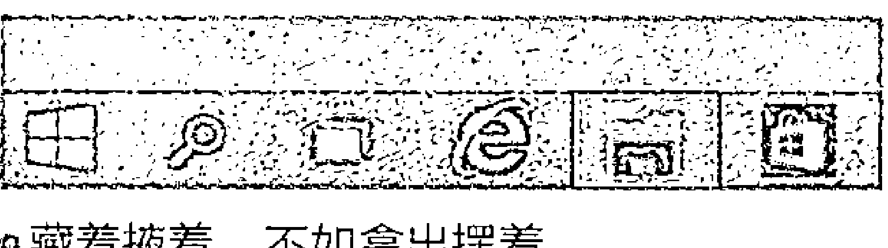

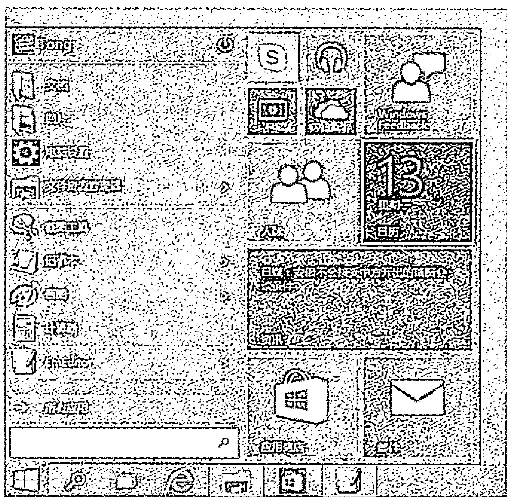

#### 1 藏着掖着 不如拿出摆着

用过Windows 8.1再用新版Windows 10之后，一个最大的体验就是藏着掖着的东西都被拿到显眼的位置摆着了。

Windows 7的开始菜单在Windows 8中被去掉，而在Windows 8.1中“假性”回归，到Windows 10不仅完全回归，而且“塞翁失马”似地召回了一个新“马驹”——磁贴开始面板。

Windows 8将搜索按钮隐藏在屏幕右上的角落里，似乎是怕人知道，这次作为一个按钮显眼地排放到任务栏的老二位置，而且还较Windows 7增强了搜索功能（可用必应技术对本地文件、系统配置、网络信息等进行联动搜索）。

应用商店在Windows 8中原本是隐藏在开始屏幕中的，Windows 8.1开始可让用户决定锁定到任务栏中，而Windows 10干脆一开始就将其排放到任务栏的显眼位置上了。

这些对于Windows 8.1用户并无新鲜感的、看似简单的重新摆放，非常具有现实意义和长远意义，因为这样一摆，就再也不会让新入道的Windows用户像两年前的Windows 8用户那样犯迷糊了，因而也极大地提高了吸引和抓住新用户的可能。

#### 2 承前启后 熟悉再加新鲜

Windows 10既没有完全屈服于Windows 7的习惯，又没有丢弃Windows 8/8.1的优秀特性，是两个版本优秀特性的完美结合。可以用一个公式来表示：“Windows 7+Windows 8.1≈Windows 10”。

对于没有用过Windows 8系统的Windows 7或Windows XP用户来讲，Windows 10是在原来人们熟悉的传统功能的基础上增加了让人耳目一新的功能，这些功能也曾是Windows 8/8.1的核心优秀功能——磁贴界面及其包含的应用商店与丰富的应用。在沿用原有操作习惯的同时，新增加的应用市场和无限扩展的应用，以及简明扼要的应用界面，无疑会给老用户耳目一新的感觉，为通过PC了解Windows移动和触摸技术提供了一个很好的学习窗口。

#### 3 迁就避让 宣传的新策略？

Windows 10技术预览版的出现虽然在很大程度倾向于Windows 7原有的界面风格和操作方式，但它并没有完全放弃应用磁贴界面内容，只是将其作为一种从属的成分挂靠到了传统桌面的开始菜单上。这与其说是微软在某种程度上的屈服，不如说是微软继续对移动市场做的一个不用花钱而效果最好的广告。因为但凡稍微希望对微软应用市场有所了解的新用户，不用离开桌面系统，不用购买平板或手机，就可以顺利地进入移动应用市场去看究竟和自由体验。这样顺理成章、顺手牵羊的宣传，微软何乐而不为？

不过，最近网上也有用户发帖称微软Windows 10开始菜单磁贴太难看，要求删除。既然是一个“广告”，而且是对潜在的新用户非常有用的广告，微软会轻易删除吗？更何况它还要服务于双栖设备，且涉及到微软的移动理想和核心利益。

#### 4 Windows 8用户 现小小不适应

但是，当系统升级到Windows 10之后，Windows 8/8.1用户多多少少可能又有了一些不适应。主要表现在：无法从右上角弹出超级按钮面板进入设置窗口；无法通过点击开始按钮切换到全屏磁贴界面。不过，稍加琢磨，问题就可以得到解决。窗口右上角找不到超级按钮，可通过Win+C组合键来找回；全屏磁贴界面找不回，有开始菜单中的磁贴面板就够了，不找也罢！更何况在开始菜单属性里设置一个开始屏幕选项也可以切换两种启动界面。

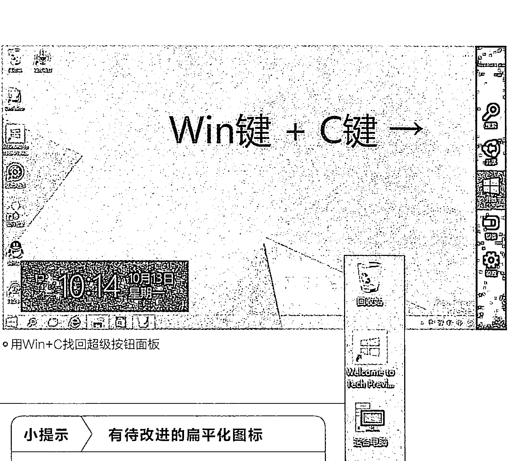

#### 5 善于学习 迎合用户需求

Windows 10除了对界面作了许多人性化的调整外，还学习别的操作系统的优秀特性，加入了对用户最有用的实用功能。多桌面早就是苹果等系统的一种标准资源排布方式，而Windows先前的版本却一直迟迟未用，因此用户不得不去寻求第三方虚拟桌面软件。这次在Windows 10中引入Task View及多桌面创建功能，这提供了一条方便的途径去分类管理和切换开启的应用程序和任务。只需在任务栏上点击Task View按钮或按下Win+Tab组合键，即可创建新桌面或切换各种任务。此外，窗口与图标的扁平化也是Windows 10的一项新改变。细心的用户会发现，Windows 10窗口已经没有了边框，图标也已经扁平化。

> 小提示 有待改进的扁平化图标 在个性化设置窗口选中系统隐藏的计算机、控制面板、网络等图标选项，这几个图标会出现在桌面上，但与原有的回收站图标不协调，前三个图标扁平设计，而回收站图标却很“立体”，扁平化风格有待统一。

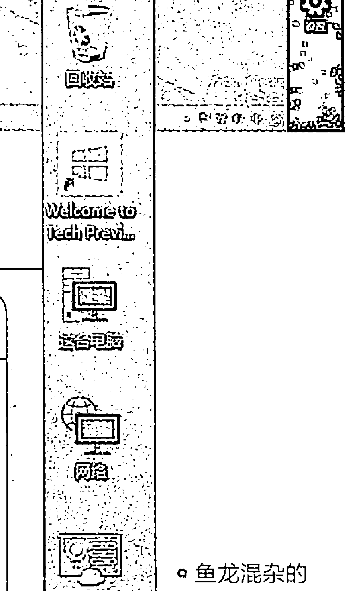

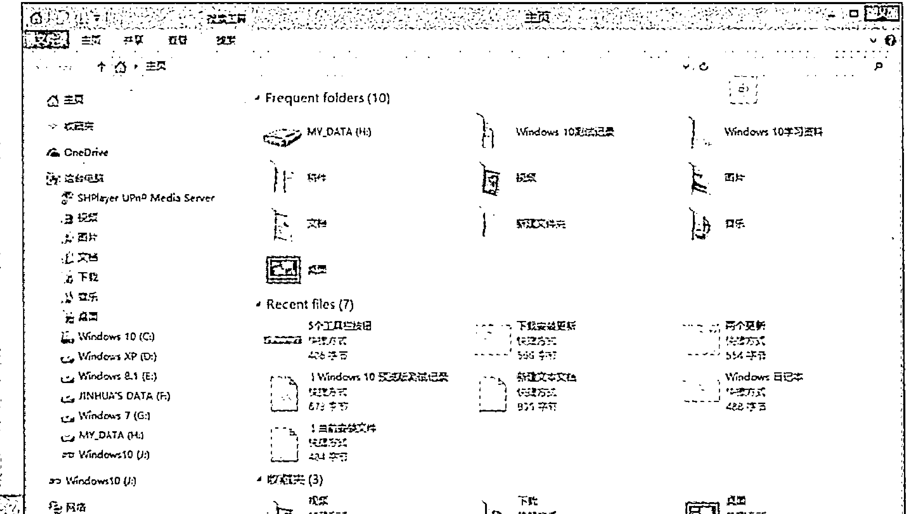

#### 6 感受主页 彰显人性回归

人们总希望一开机就见到常用的文件夹或文件。如果文章保存在磁盘的某个文件夹中没有写完，下次开启资源管理器会一眼看到。不仅文档如此，听音乐、看视频或干别的事情也均是如此。对于不是马上再用，但隔三差五可能要用的文件或文件夹，以收藏夹的方式保存，使用起来更方便。资源管理器中新增的“主页”彰显了这些人性化配置，避免了挑挑拣拣。

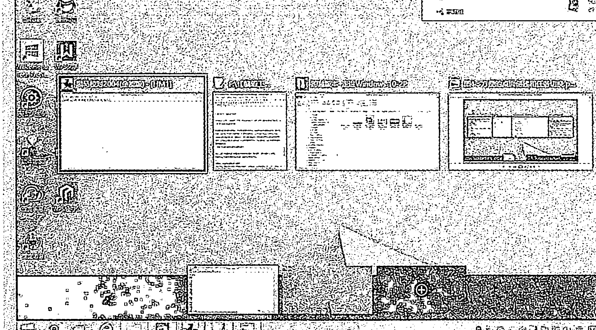

### 文件搜不到 索引惹的祸

文|李峰

大家知道，Windows 8.1系统索引服务为系统快速搜索提供了强大的技术支撑，它让我们能在很短的时间内就能快速获得自己需要的文件。但是，索引使用也不是我们想象中的那样顺当和万能。有时，我们会发现，明明存在于硬盘中的文件却无法搜索到；有时，我们又发现这件搜索神器把硬盘搞成“红灯常亮”动不得。索引使用问题多，如果我们不去了解和掌握这些问题及其处理方法，最后可能会盲目下一个“微软的索引不好用”的结论。

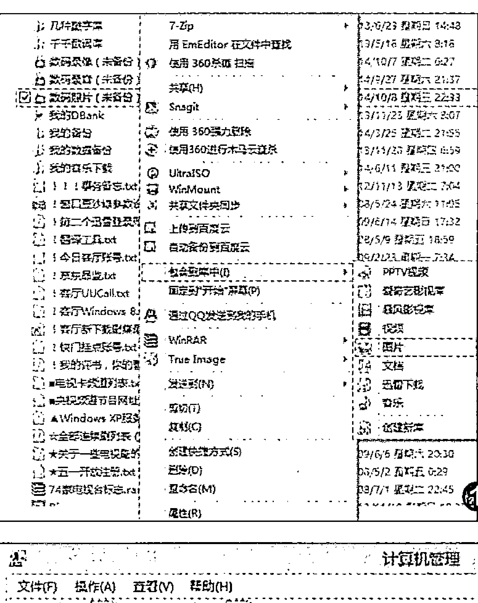

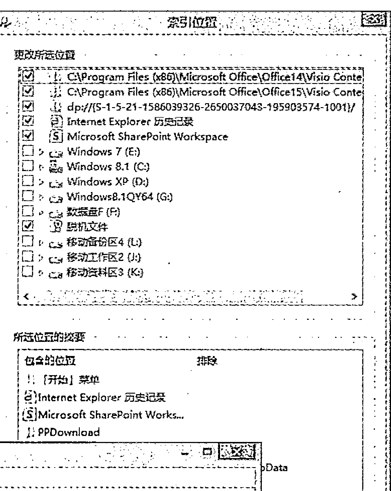

#### 受索引默认设置所限

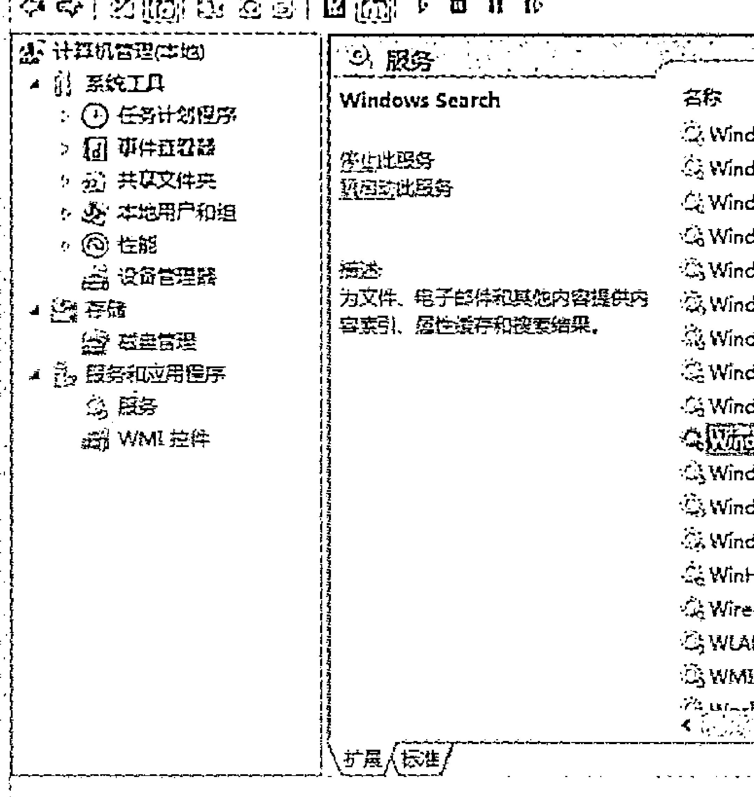

系统搜索依靠默认的索引支持，系统索引默认只建立了索引的位置，包括库中包含的所有文件。由于系统文件和程序文件是用户很少搜索的内容，因此默认未建立此方面的索引。

此外，许多用户不按微软预先设定的以用户文件夹为基础的方式保存文档，而是将文档保存在磁盘的其他分区中，这样，由于这些文件不在系统索引范畴内，因此搜索时也无法找到这些文件。

针对以上存在的问题，如果需要用系统的默认功能来搜索任何文件，可用如下三种办法解决问题。

将文件夹包含在库中。在希望参与搜索的文件夹上点击右键，选择“包含到库中”命令即可将其中的文件包含的库中（图1），文件纳入库的范畴就可被搜索到了。

手动添加索引位置。通过“控制面板→索引选项→修改”添加新的索引位置到系统索引库中（图2）。

如果希望索引包括某个文件夹但不全部包括其子文件夹，请单击该文件夹，然后清除不希望建立索引的任何子文件夹旁边的复选框。所清除的文件夹将出现在“所选位置的摘要”列表的“排除”列中。

此外，关闭系统索引功能，引入第三方索引工具，可缩短索引建立时间。如借助Everything建立索引搜索文件名，借助FileSeek软件建立索引搜索文件内容。这两个软件的具体用法本刊有过详细介绍，此处不再详述。

如果使用外部工具搜索，希望关闭系统索引而提高系统运行效率，可以通过“管理工具→服务”，找到Windows Search，将其设置为停止状态即可（图3）。

##### 小技巧

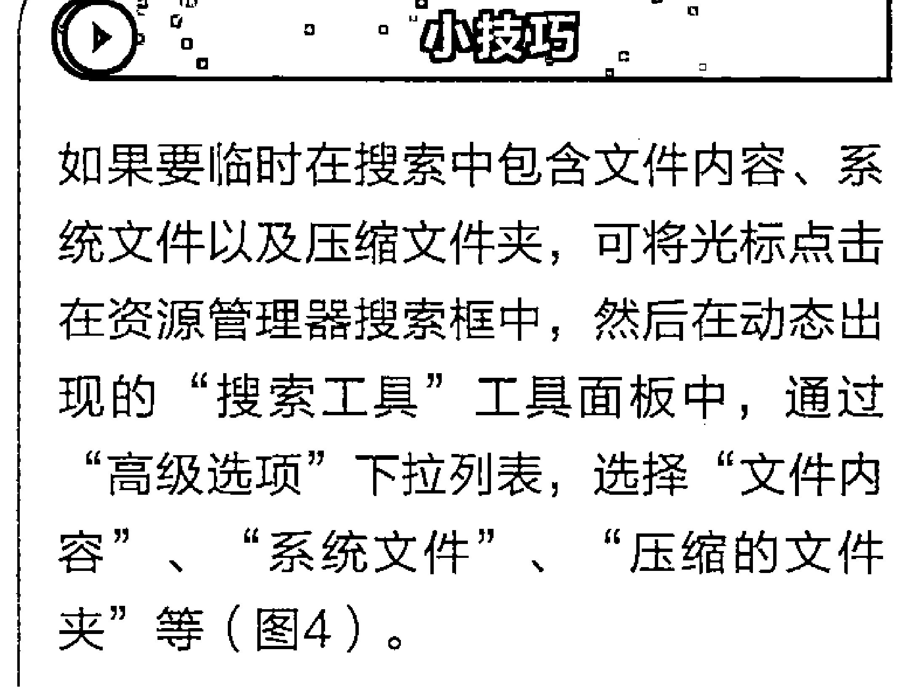

如果要临时在搜索中包含文件内容、系统文件以及压缩文件夹，可将光标点击在资源管理器搜索框中，然后在动态出现的“搜索工具”工具面板中，通过“高级选项”下拉列表，选择“文件内容”、“系统文件”、“压缩的文件夹”等（图4）。

#### 2 建立索引后搜索无果

有时我们发现，某文件夹已建立索引，但其中的文件却没有在搜索结果中显示。这可能是由于该文件夹的安全设置造成的。对于要建立索引的文件夹及其内容，必须将其配置为具有SYSTEM权限（图5）。

右击文件夹并选择“属性”，单击“安全”选项卡。如果“组或用户名”下未列出SYSTEM，请单击“编辑”。单击“添加”，在出现的框中键入SYSTEM，然后单击“检查名称”。在“匹配名称”下，单击SYSTEM，然后单击“确定”，直到所有已打开的对话框全都关闭。

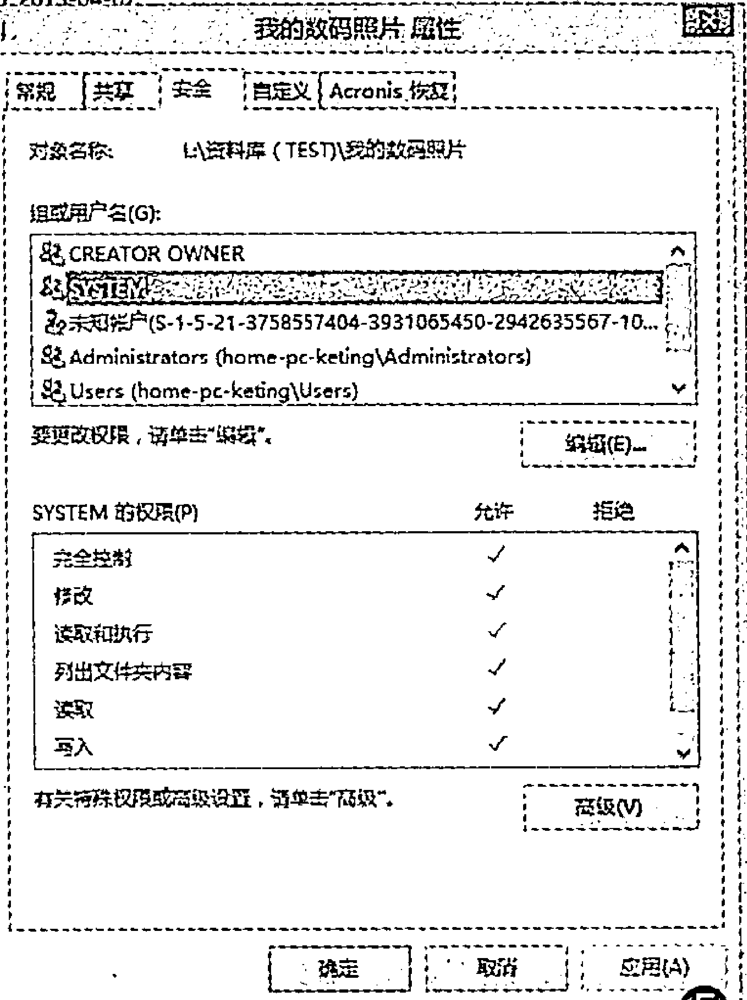

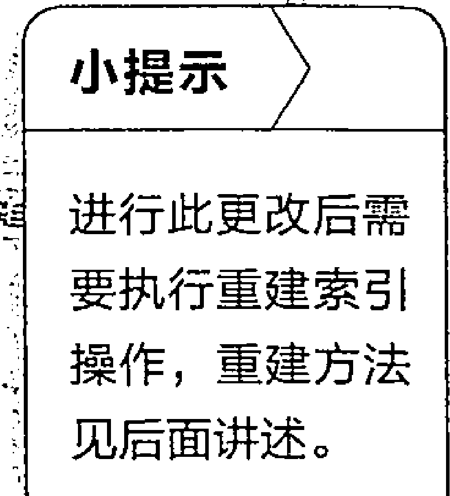

#### 3 因文件特殊而搜不到

还有一种特殊情况是，所有文件都能搜到，唯独某种文件不在搜索结果之列，这是因索引文件类型未包括引起的。解决办法是将这种特殊文件类型加入到索引列表中。

通过依次选择“控制面板→索引选项→高级→高级选项→文件类型→将新扩展名添加到列表中”，输入文件扩展名，点击“添加”。同时，可选择“仅为属性进行索引”或“为属性和文件内容添加索引”（图6）。

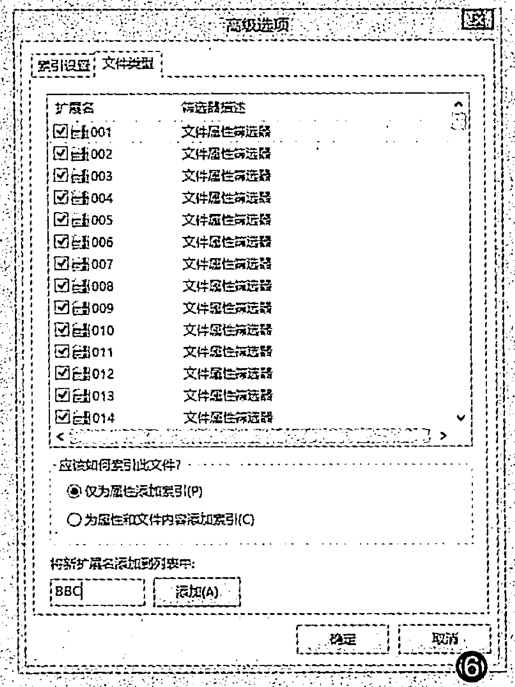

#### 4 索引失灵致搜索失败

除了人为增加或删除一些索引位置外，一般来说索引不需要主动维护。但是，我们有时可能会发现明明已经存在的文件且符合各种索引条件，但就是搜不到这个文件。在这种情况下，可以用重新建立索引的办法来解决。

在“索引选项→高级→索引设置”，点击“重建”按钮重新建立索引（图7）。

最后要提醒一点，索引虽然可以提高文件搜索效率，但如果加入的索引位置太多，索引的内容太深入，系统反而会受拖累。因此，建议只加入有用的内容，减少不必要的内容层次，如不要包含系统文件位置（如“程序文件”文件夹），在索引中仅添加经常搜索的文件夹。

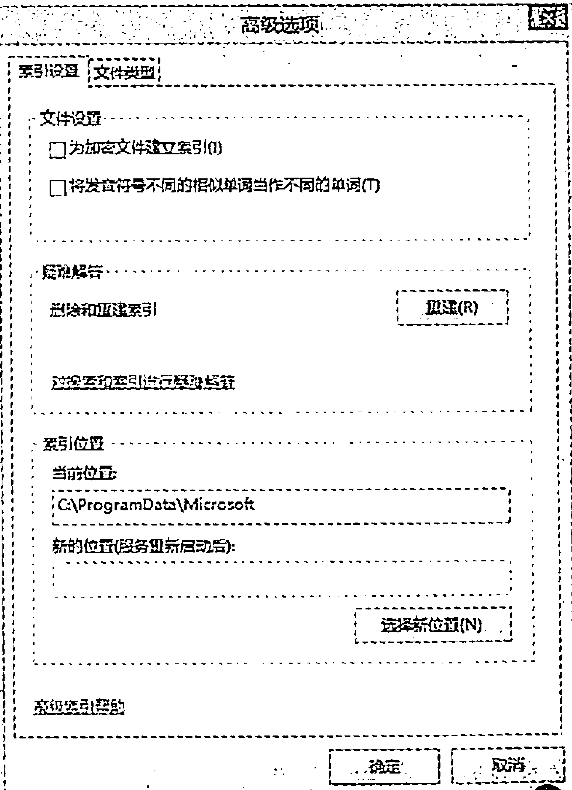

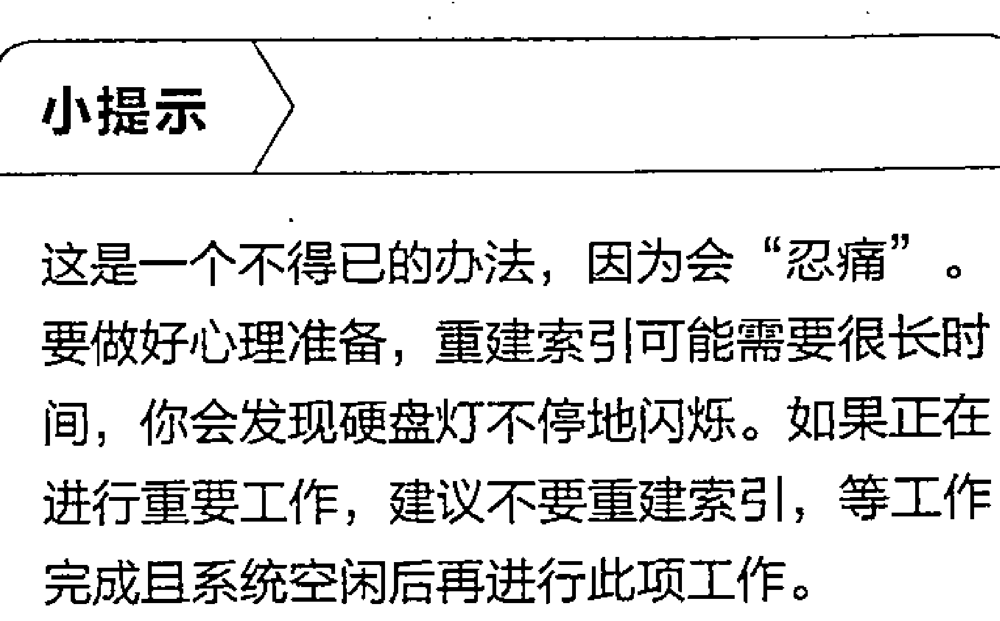

### 两代Windows哪个更安全

微软在将视窗系统升级为Windows 7或8.X版本之后，声称系统安全性更高了。然而，国内也有声音说，安全性不是更高而是更低了。情况的确如此吗？到底该信微软的还是信媒体的？是自己的问题还是微软的问题？

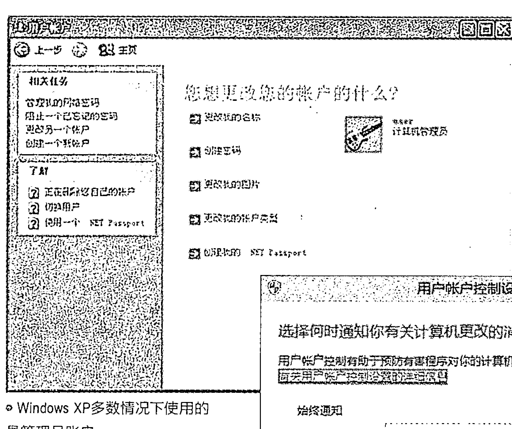

> 小提示：由于Windows XP囊括了之前单用户和多用户的不同特性，因此，前一时期我们以Windows XP为代表来讲授，而后一时期中目前最主流的是Windows 8.1系统，因此我们主要以Windows 8.1来讲授。

系统安全包括许多方面，但最根本的一个关口离不开对用户账户的控制。下面就让我们从账户安全控制的角度来一探究竟。

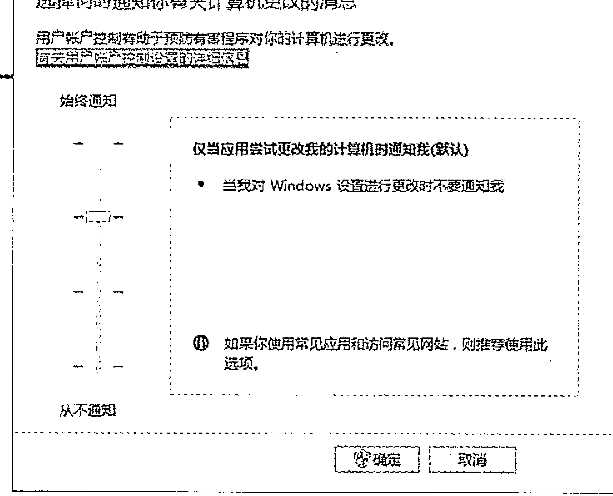

从用户账户及控制上来讲，Windows可划分为3个时期。第一个时期是Windows XP之前的单一账户与多账户并行时期，即以Windows 95/98和Windows Me为代表的单一账户和商用用途的Windows NT的多账户。第二个时期是将单一账户版本和多账户版本合二为一的时期，即Windows XP之后的时期。但是，真正在安全上有所提升的是Windows 7和Windows 8为代表的第三时期（Vista可作为前两个时期间的过渡产品）。因此，如果仅从账户安全角度来讲，我们又可将Windows系列划分为前Windows时期（Windows XP及其之前的版本）和后Windows时期（从Vista到Windows 10的时期）。本文中，我们主要讨论前后两个时期账户安全的不同。

#### 1 Windows XP为啥不安全

大家应该还记得，在Windows XP第一次安装和配置之时，系统要提示输入管理员账户和密码，然后才能创建一个或多个标准用户账户。这个管理员账户可以完全控制整个系统。虽然理论上来 说，为了系统安全，单用户账户应该只能以有限的权限控制系统，但实际上，Windows XP应用过程当中，大多数情况下创建的账户都是管理员账户，并且编写的每个应用程序都是假定运行它的每个用户都具有管理员权限。

> 小提示：为何不在安装系统的起初就给系统创建一个非管理员账户而绕过管理员账户，这样系统不就变得更安全了吗？其实系统必须要至少有一个管理特权账户，这样才能访问需要管理特权的功能和服务，否则系统就变成一个低级功能的平台。

正因为以上情况，才导致了多少年来针对Windows系统的安全工具不断出现，因为运行在Windows系统上的恶意代码具有与登录用户同样的权限，如果登录用户是管理员，那么用户能办到的事情，恶意代码也不需允许就可以完全控制系统。安全软件同样需要具备这种能力，才能更好地为系统安全保驾护航。可见，无论黑道红道，都可以具备对系统的控制权限。这样一来，系统就隐患重重。

### ## 2 Windows 7/8的“安全门”

在以Windows 7和Windows 8为代表的后Windows时期，虽然在创建账户和程序访问方式上与前Windows时期相比看似没有多大改变，但是，后Windows时期的用户账户（即便是管理员账户）已经不再是能完全控制系统的账户了，或者说至少是默认情况下不再是能完全控制系统的账户了。如果有外来的程序在运行，系统会弹出拦截提示，由用户来做出抉择是否允许程序运行。而黑客作为一种特殊身份的用户，同样也不能轻而易举地完全控制系统的账户，因此，系统账户就变得更加安全了。

在后Windows时期，Windows安装时创建的用户账户不能达到或超过5个，且第一次配置Windows时，只能创建一个用户账户，如果要创建更多的用户账户，必须在登录系统之后执行创建操作。但创建的这些用户账户默认没有管理特权，除非修改了创建配置信息。

后Windows时期的用户账户类型不像Windows XP那样复杂，它只提供管理员和标准用户两种账户类型。虽然微软极力建议用户使用标准用户账户登录系统，但为了避免使用过程中反复出现的那些麻烦和限制，我们还是建议以设置有安全密码的方式、以管理员账户来使用Windows。由于在后Windows时期，微软默认锁住了管理员账户，这样以管理员账户使用系统就比以往更加安全。

> Windows XP除了以上介绍的两种账户外，还支持高级用户（Power User）账户类型。微软本希望通常需要管理员权限的用户能够使用风险小一些的超级用户账户，但效果不理想。因而在后Windows时期，微软取消了这种账户类型。根据来自微软的数据，用户账户采取安全的改革措施后，取得的用户遭受恶意软件感染的数据来看，就要比XP用户减少60%。后Windows时期之所以安全，得益于一种叫做User Account Control（简称UAC）的用户账户控制技术。早在Vista时期，曾有业界技术权威贬低UAC技术，觉得反复跳出来的提示让人难以忍受，于是微软在Windows 7对UAC进行了改进，采用了一个“仅仅……时通知”的选项来控制提示信息的频繁弹出，允许用户执行常见配置任务，只有当在不同寻常的情况发生时，才发出提示信息（例如要改变系统重要配置的时候）。

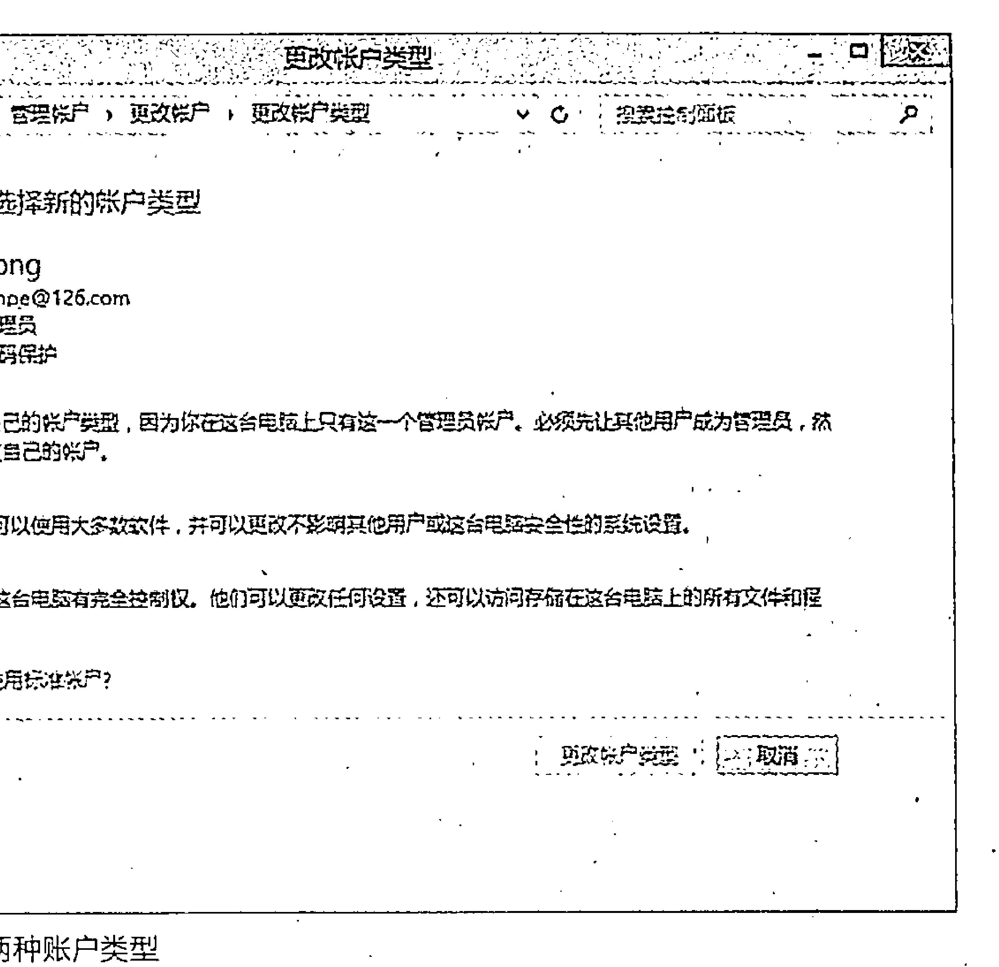

### ## 3 用好安全的视窗UAC

Windows 8.1更安全，并不表示Windows 8.1就能万无一失。Windows 8.1提供了将不安全因素阻挡于门外的技术和设置，但这并不能阻止用户打开方便之门让不安全因素进来的行为。因此，要发挥好新系统的安全特性，还需要充分用好这些安全技术和设置。要做到这一点，就需要对自己运行的程序心知肚明。如果在使用电脑或上网的过程中，莫名其妙地弹出UAC控制提示，自己无法确定是否要运行什么，那么安全的办法是选择拒绝。

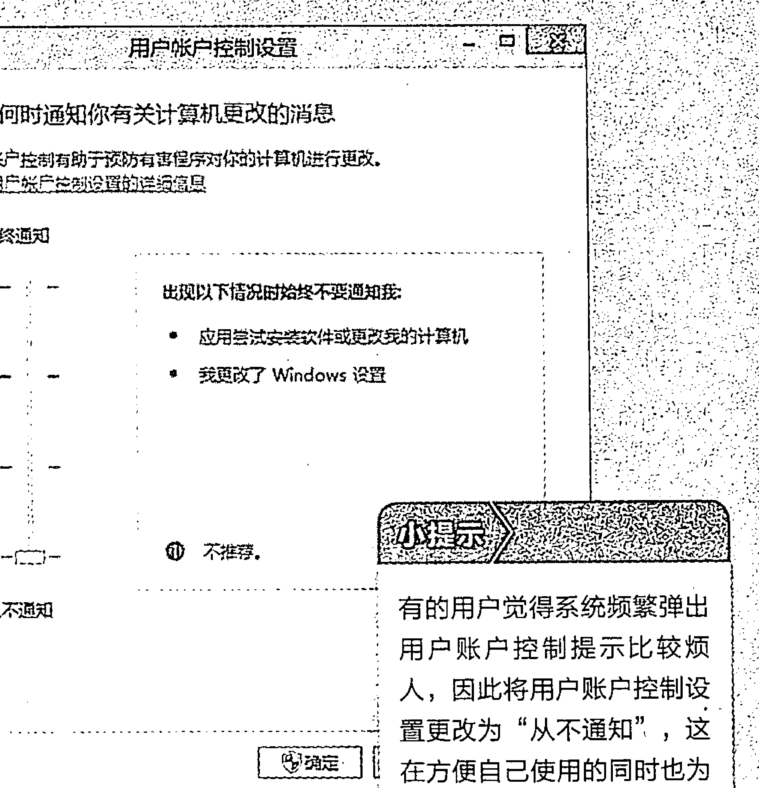

> 有的用户觉得系统频繁弹出用户账户控制提示比较烦人，因此将用户账户控制设置更改为“从不通知”，这在方便自己使用的同时也为各种恶意软件的侵入打开了方便之门。正确而安全的做法是将设置更改为最高的两个档次之一。

### 闲置移动盘 体验Windows 10

文|海风

Windows 10技术预览版已经问世，但是这个版本毕竟不是正式的发行版本，明摆着问题多多，需要大家为微软发现和解决。鉴于这种情况，我想不会有多少人愿意将自己的系统格掉装一个问题百出的评估版吧！但是，面对新事物总有跃跃欲试的冲动，这本不是什么坏事。这个矛盾如何解决？我们有两全其美的办法。你有闲置的移动硬盘吗（20GB足矣）？拿来把这个评估版装在上面，可以随意体验Windows 10的新功能！

#### 下载ISO安装包

可通过微软Windows预览计划网站（http://www.dwz.cn/uQHpU），申请加入预览版体验计划（图1）。加入时可用自己已有的微软账号登录，也可以注册一个新用户来加入体验。登录成功后，进入预览版下载页面（http://www.dwz.cn/tTJnx），可看到预览版下载步骤和注意事项（图2）。此页面中，微软提供了多国版本的下载链接（其中有我们关心的简体中文64位和32位两种版本），点击下载即可。页面同时提供产品密钥: NKJFK-GPHP7-G8C3J-P6JXR-HQRJR（图3）。

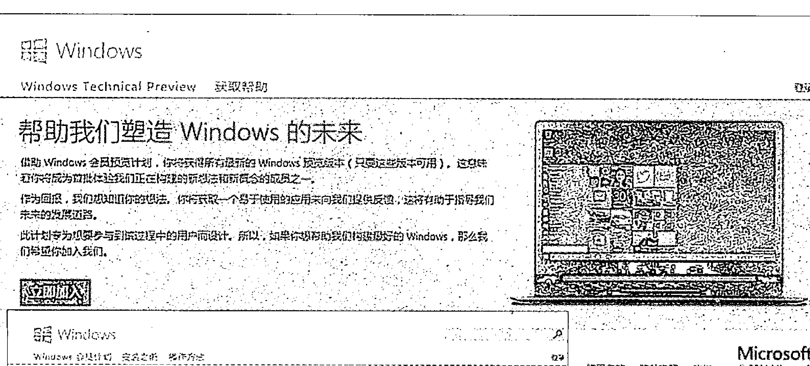

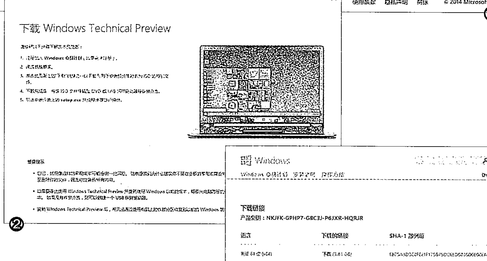

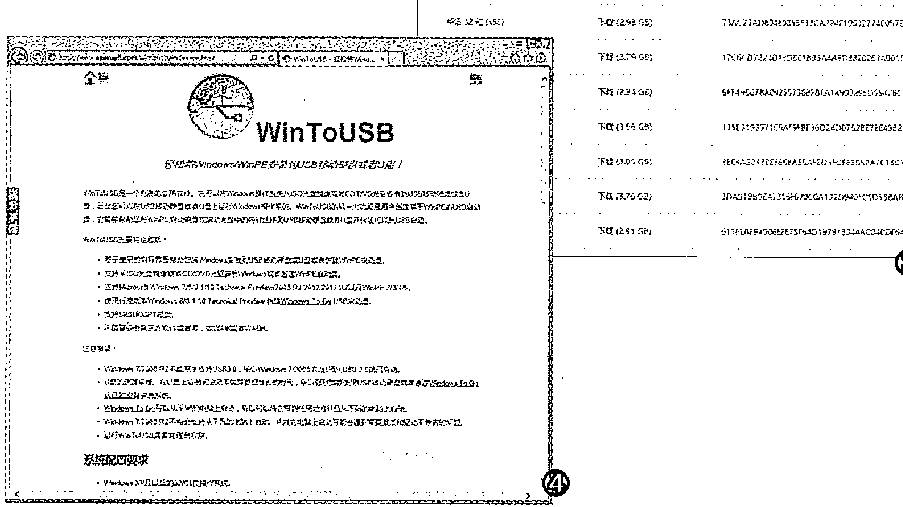

#### 准备安装工具

虽然我们可以将下载来的ISO安装包按部就班地刻成光盘或解压到Windows PE的U盘中进行硬盘全新安装，但操作不慎会破坏原有系统。我们要安装在移动硬盘上，因此需要一个得心应手的工具。

驾鼠前往WinToUSB软件的官网（http://www.dwz.cn/uQHC1），在页面下方，可以看到最新的1.6版下载链接，这个版本支持将Windows 10安装到移动硬盘中（图4），下载并安装该软件。

> 用该软件安装移动Windows系统，对当前所用的系统版本没有苛刻的要求。

#### 安装到移动硬盘

启动WinToUSB 1.6，通过“ISO文件”对话框后面的按钮浏览并加载下载的Windows 10 ISO文件，注意选对32位或64位版本号。加载之后，从窗口列表中选择安装的版本为“Windows Technical Preview”，点击“下一步”（图5）。

之后，软件要求选择移动硬盘的分区方案，因为老旧硬盘一般容量不会太大，因此选择“MBR分区方案”即可（图6）。注意移动硬盘上的所有数据将会被清除，如果其中含有用数据，现在反悔备份还不迟。确定数据无用之后点击“确定”继续。这时会显示格式化窗口，格式化完成后弹出窗口，选择系统分区和启动分区（图7）。由于我们要用移动硬盘来启动和使用Windows 10，因此这两个分区均选择为同一分区。然后点击“下一步”完成后续的系统分区数据和启动数据的写入操作。

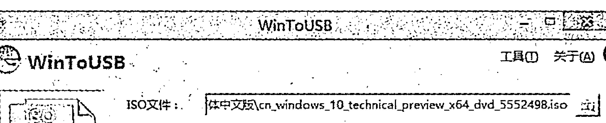

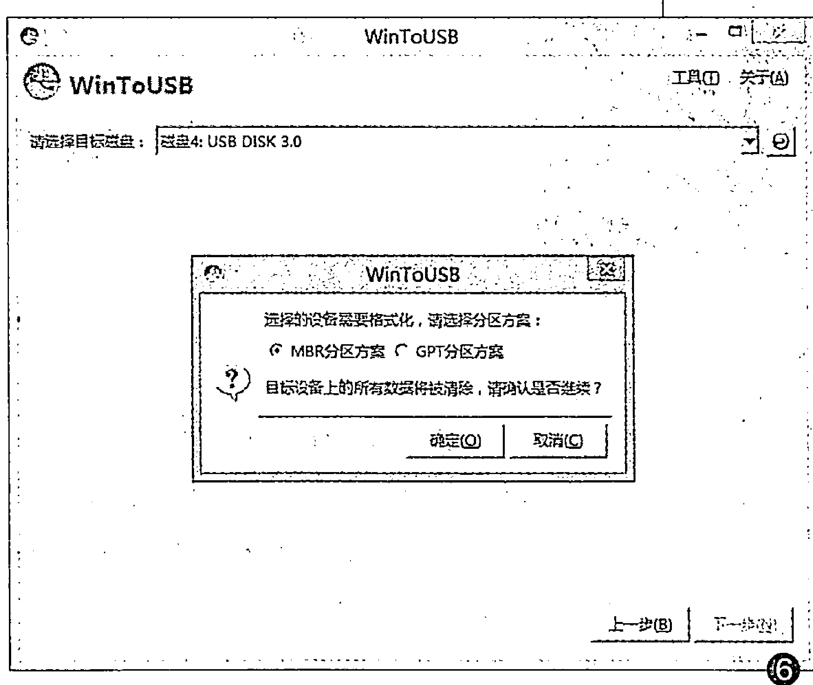

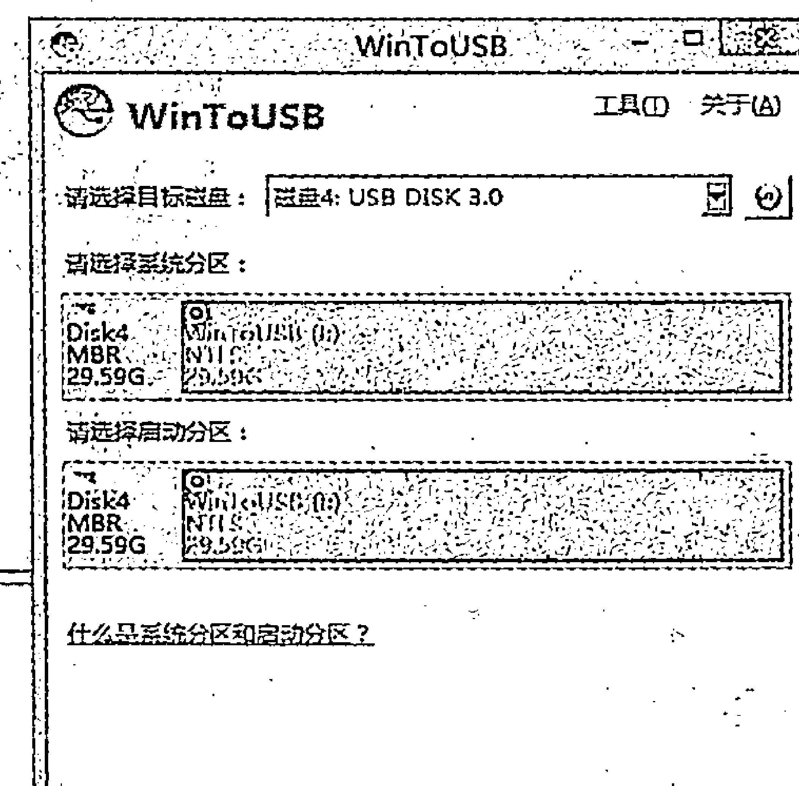

##### 扩展阅读

个别电脑用以上方法安装Windows 10可能会出现错误。如果遇到这种情况，可尝试采用另一种方法。此法与上法原理基本相同，都是从安装ISO直接释放系统文件和启动文件到移动硬盘，只不过此法为通过命令提示符窗口解决，且不受移动硬盘20GB容量的限制，如果移动硬盘容量更小，可采用这种方法。从网上下载32位或64位的映像安装工具Imagex.exe文件。从Windows 10安装ISO文件中提取install.wim文件，并与Imagex.exe一同置于Windows 8.1系统电脑下的任意分区的一个工作目录中。在管理员“命令提示符”环境下进入工作目录，执行“imagex /apply install.wim 1 F:”（若移动硬盘盘符为F），释放系统文件。然后执行“bcdboot F:\windows /s F:”释放启动文件到移动硬盘。之后用移动硬盘启动系统，经过简单配置之后，便可以用移动硬盘启动Windows 10了。

如果没有移动硬盘，而希望在不影响硬盘上已有数据的情况下，安装Windows 10来体验，可以使用NT6 HDD Installer工具安装Windows 10到非现有系统分区中，组成双系统或多系统，安装时不用选择版本和输入产品密钥，联网可自动激活Windows。

#### 使用移动盘系统

系统文件和启动文件写入到移动盘后，接上移动硬盘并重启电脑，进入电脑的BIOS设置，将第一启动设备设置为USB硬盘启动优先。

启动后就会进入蓝色Windows徽标初始窗口，之后进入系统配置过程，经过简单的提示和简单的人机交互之后，就可以体验新系统了。中间的步骤与Windows 8.1安装步骤相似，且更为简捷，此处不再详述。

自动配置并重启之后，就可以用此盘体验新系统了。

> 小提示：如果启动不成功，会直接进入电脑内置硬盘原有系统启动，这时请从BIOS设置中屏蔽内部硬盘，只设置用USB硬盘一项启动，这样免得其他盘符干扰移动硬盘的启动，会大大提高移动硬盘启动的成功率。

### Windows 10扫清Windows 8的毛病

文|倚楼

就在人们还在讨论Windows 9系统何时发布的时候，微软出乎意料地发布了全新的Windows 10系统。那么这个系统有哪些全新的功能？相比于大家诟病的Windows 8系统，又有哪些全新的改进呢？今天就和我一起来感受一下Windows 10吧。

#### 1 随心定制全新开始菜单

而Windows 10最大的亮点之一，就是让开始菜单全面回归。但是融入的Windows 8开始屏幕的磁贴，却让很多人觉得非常的不舒服。那么有没有什么方法管理好这些磁贴呢？

如果用户不喜欢某个应用图标的话，可以通过鼠标左键按住应用图标，将其拖到开始菜单中释放即可。如果用户不需要使用任何应用，那么只需要按照前面的方法将应用图标全部移动到开始菜单中，这样开始菜单的布局就和Windows 7的差不多了。

如果用户在开始菜单中有常用的命令，无论是软件程序还是应用，都可以通过鼠标左键将图标拖到开始屏幕中释放固定，这样就可以方便以后进行快速的调用。其实，开始桌面中的某些应用还是非常有用的，比如天气预报的应用。

如果用户不喜欢磁贴的方式，那么可以在开始菜单里面找到“天气”应用，接着将其拖放到系统桌面中释放，就可以创建一个应用的快捷方式。

除了开始菜单，Windows 10也保留了Win+X快捷键的设计，通过它可以快速打开一些系统里面常用的控制命令，当然也可以通过它进行系统的重新启动、关机等电源操作（图2）。

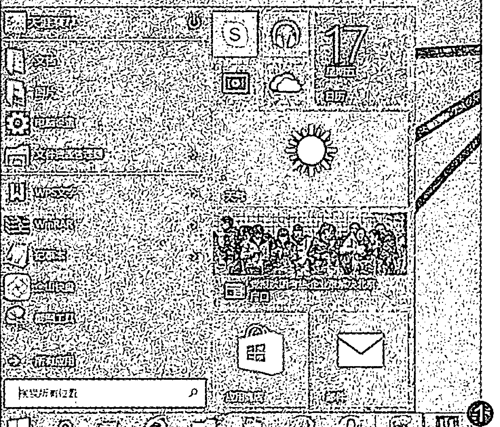

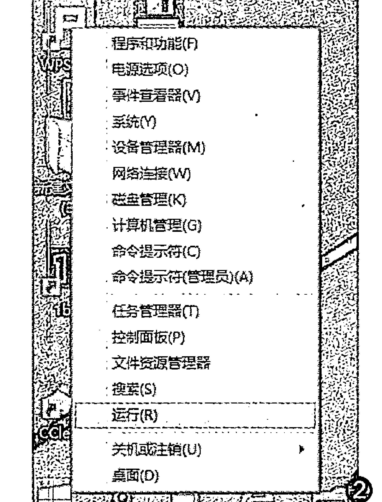

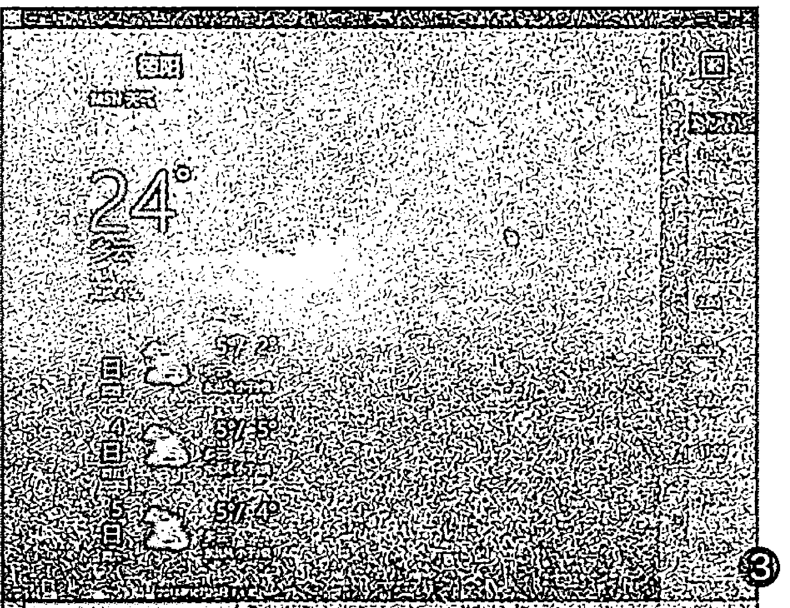

#### 2 回归窗口 操作更灵活

对Windows 8其他的诟病还包括应用的使用，因为用户需要不停地在两个桌面之间切换。虽然从Windows 8.1 Update 1开始，微软在应用的使用上已经有所改变，比如应用开始可以进行窗口化操作，但是当时的修改还是属于小打小闹。而在Windows 10系统中，应用窗口的变化是巨大的。当用户点击开始菜单中某一个应用命令后，就可以像软件程序一样启动这个应用。接下来用户可以像对普通的软件窗口那样，对应用窗口进行任意的操作，比如最大化、最小化、关闭以及窗口的任意缩放等（图3）。

另外，微软从Windows 7系统开始，便引入了“屏幕热区”这个概念，那时只需要将窗口直接拖拽到屏幕两边，窗口就可以快速缩放至屏幕1/2尺寸大小。而在Windows 10中，用户会发现这项功能被大大的加强了。除了左、右、上这三个热区外，还可以拖拽至左上、左下、右上、右下四个边角，从而实现窗口的1/4分屏操作。这个技巧无论是对什么窗口都适用，包括这次有重大改进的应用窗口。不过我们在测试的时候也发现了一个问题，那就是分屏后的窗口再拖拽回来后窗口大小无法复原，而之前的Windows系统版本都是可以的。

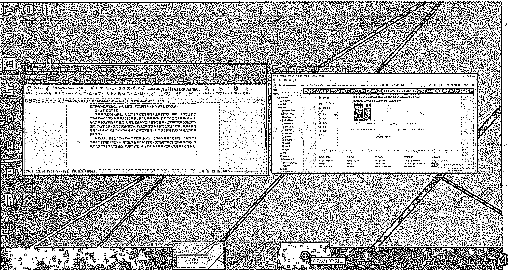

> **小提示**
> 当我们通过拖拽将一个窗口进行1/2分屏操作的时候，操作系统就会利用屏幕的另一半区域自动将其他窗口用缩略图展示出来。如果用户希望哪个窗口和当前窗口并排显示的话，那么就直接点击这个窗口的缩略图即可。

#### 3 虚拟桌面 Windows 10有了“9条命”

以前要想在多个窗口之间进行切换，需要不停地使用Alt+Tab或者Alt+Shift+Tab这样的快捷键。而在Windows 10里面点击一下快速启动栏中的“Task View”按钮，就会发现当前系统的所有任务窗口，以预览框的形式显示在窗口正中。这样我们就可以通过鼠标选择，快速在多个窗口之间进行切换，这样可比用快捷键方便多了。

除此以外，在点击“Task View”功能按钮后，还可以在屏幕下方看到一个名为“添加桌面”的按钮（图4）。当点击“添加桌面”按钮后，可以创建一个全新的系统桌面。这样无论是家人还是朋友，在使用系统的时候就不会出现互相干扰的情况了。经过测试发现，Windows 10系统可以创建最多9个虚拟桌面。当不再需要使用某个桌面的时候，点击“Task View”后，在下方的显示条中找到该桌面的缩略图，然后点击右上角的关闭按钮即可。

#### 4 搜索不分家 本地/网络一网打尽

点击快速启动栏中的“搜索”按钮，在窗口的下方输入关键词，就可以在本地磁盘与必应搜索引擎里面同时进行搜索（图5）。当点击搜索到的文件就可以马上打开运行它；在文件上单击鼠标右键，点击菜单中的“打开文件位置”命令，还可以自动跳转到文件所在地文件夹目录。不过在测试时也发现了一个相应的Bug，就是输入框和第三方输入法不兼容，哪怕是微软自己的必应输入法也不行，只能用系统自带的输入法才可以，有些不便。

除此以外，我们在搜索本地文件的时候，会发现很多文件无法搜索到。其实这和系统中索引的文件夹目录有关，我们可以自定义添加想要索引的目录。首先进入到系统的控制面板，在右上角的搜索框输入“索引”找到该功能。在打开的“索引选项”设置框中，点击“修改”按钮后在“更改所选位置”列表中，勾选需要进行文件内容索引的目录。设置完成以后点击“确定”按钮，系统就开始进行索引操作了。不过系统的索引速度比较慢，并不能马上就出结果的。

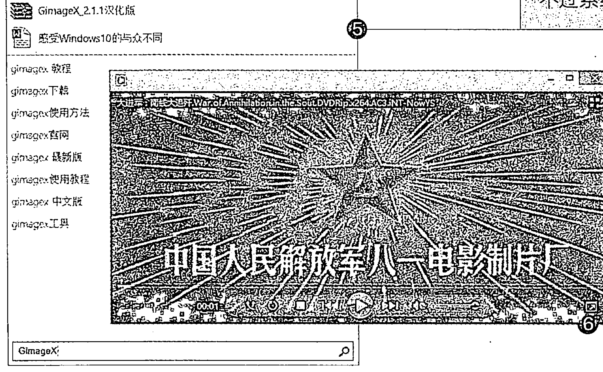

除了上面介绍的新增功能和改进外，Windows 10还有不少小的功能改进，比如在命令提示符里使用快捷键Ctrl+V，就可以进行剪贴板内容的粘贴操作，当然直接通过右键操作更加方便（图6）。另外Windows 10的Windows Media Player播放器，已经可以原生支持MKV视频的播放了。虽然播放器仍然会提示用户无法识别的扩展名，但是点击提示窗口中的“是”按钮后就可以播放了。新软件新气象，更多功能，还是让我们在使用中慢慢来摸索吧。

### 救急“稻草”挽救危亡系统

文/江浩然

系统出现问题不能启动，对于普通电脑用户来说，是件很要命的事。手头的工作无法继续进行，电脑中的资料无法取出，是否存在病毒木马弄不清楚，分区和数据情况变成“一抹黑”，也不知该如何处理……难道只有等着请来大师才能解决？不用！自己动手，未雨绸缪，准备属于自己的“救命稻草”。

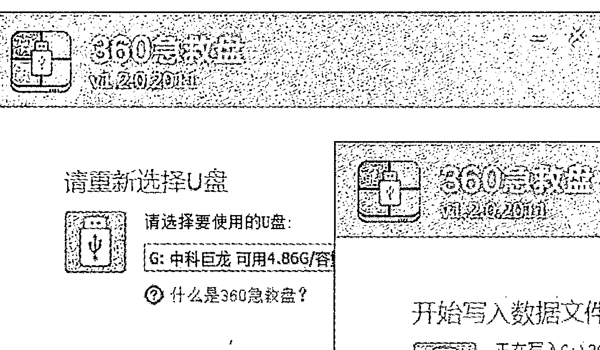

#### 1 准备工作：创建急救盘

先通过http://dwz.cn/vSPxJ下载360急救盘工具安装文件。下载后的文件为EXE文件，可直接运行该文件。插入一个空白的或里面含数据的U盘（尽管制作过程不会格式化U盘，但建议有数据的U盘需先备份一下），通过急救盘工具界面选择目标U盘盘符，点击“下一步”（图1）。

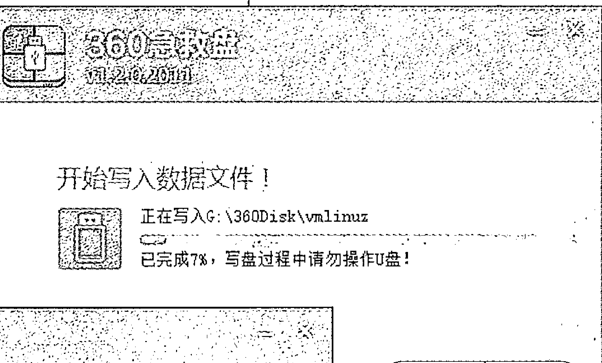

> **小提示**
> 360急救盘不依赖于硬盘中的操作系统运行，可引导UEFI之外的大多数电脑启动急救。

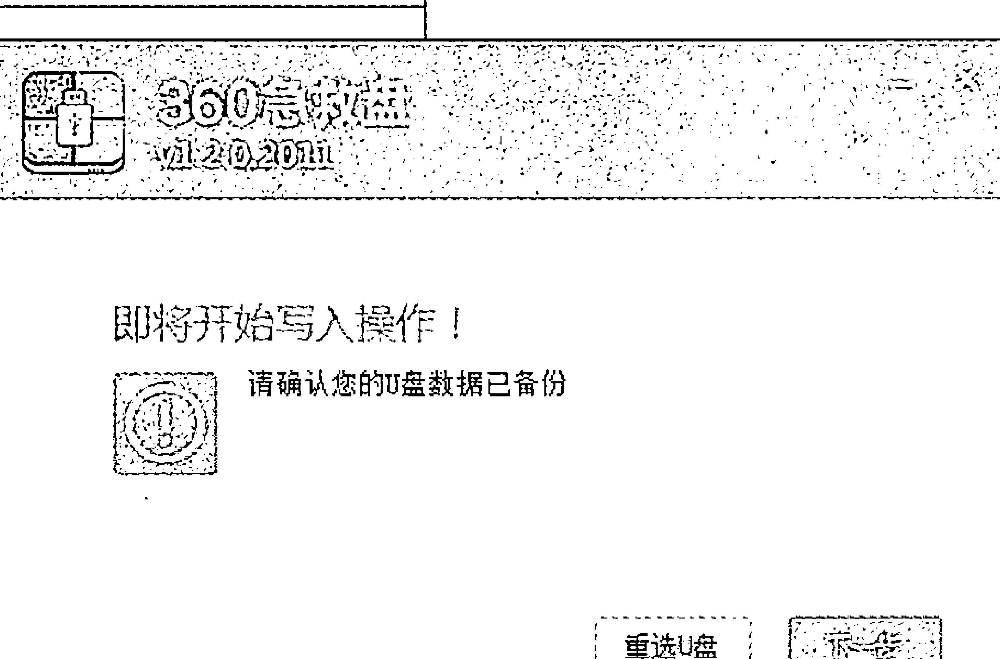

接下来软件会提示下载急救组件文件，共需要下载3个文件，点击“开始下载”按钮将组件文件下载到U盘中。屏幕会显示开始写入数据文件的画面和下载进度提示（图2）。

下载文件写入完成后，软件提示即将开始写入操作，并提醒用户确认U盘数据已经备份，否则需要点击“重选U盘”返回前面的操作重新开始。若确认U盘没有问题后，点击“下一步”继续写入（图3）。写入结束后，软件会提示U盘制作完成，之后就可以用这张盘抢救文件了。

#### 2 先行抢救重要文件

由于系统已经崩溃，无法通过机内硬盘启动，因此我们只能用上面制作的U盘来启动系统。首先设置BIOS中的引导顺序，将该U盘设置为第一引导盘，或干脆屏蔽掉此U盘之外的所有硬盘或移动启动设备。

#### 3 通盘查杀顽固木马

系统出现故障，除了硬盘或其他主要硬件损坏，以及人为破坏了系统文件外，我们一般会首先怀疑系统中是否感染了病毒或恶意软件，尤其是当前流行的顽固木马类病毒。

启动进入蓝色急救盘界面，进入桌面后点击“我的电脑”图标进入资源管理界面，在里面就会看到内置硬盘的所有盘符。这时，就可以像往常操作文件那样，将任意一个分区的数据选择拷贝到移动硬盘或U盘中了（图4）。重要文件得到抢救，系统是否能修复那就是后话了。

这时，从急救盘界面中调用“木马查杀”图标，启动系统急救箱组件，对硬盘中的各分区进行顽固木马查杀。具体操作方法同我们平时使用的杀毒软件类似。

经过以上处理之后，我们可尝试再度将内置硬盘设置为第一启动盘，然后重新启动系统，若系统可正常启动，说明病毒影响已经消除，系统恢复正常。否则，可尝试使用“引导修复”工具——MBR修复工具对硬盘主引导记录进行修复（图5）。修复完成后再尝试是否可以用硬盘启动系统。

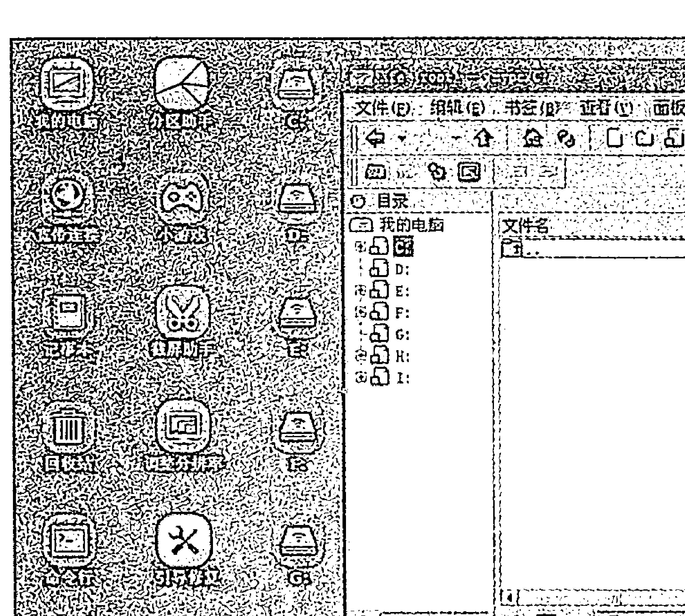

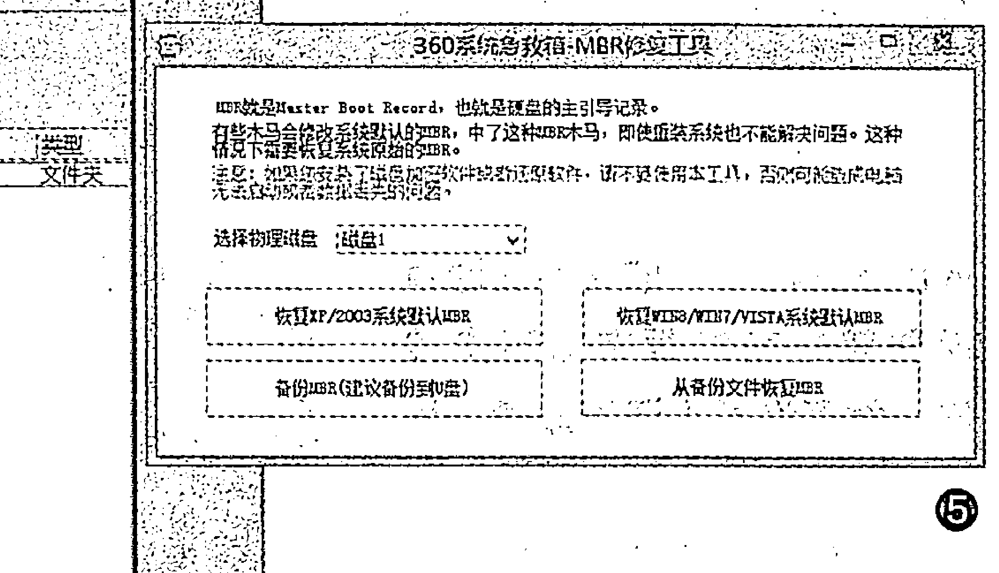

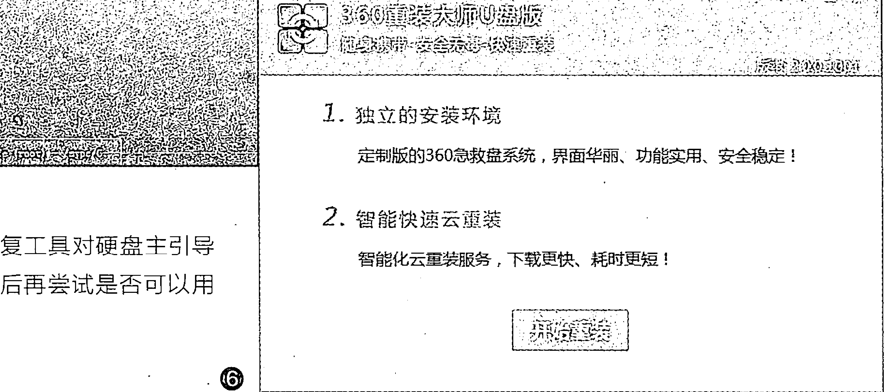

#### 4 实现系统安全重装

如果经过急救盘内置的系统急救箱工具查杀之后，系统仍然无法启动，那么，可能是系统的关键启动文件遭受破坏。这时，由于我们的用户有用文件已经取出，因此可靠的办法就是重新安装系统。在内置了360重装大师工具的急救盘界面中，点击启动360重装大师，根据提示执行重装操作。此组件由于采用了快速稳定的系统云重装技术，所以不需要安装光盘也能重新安装一个全新的系统（图6）。重装过程开始后，软件提示选择“重装后恢复资料和一键安装软件”与“纯净系统重装”两种方式。第一种会保留原有系统中的用户数据并恢复同样的软件安装，第二种则安装纯净的系统。如果觉得没啥重要资料，可选择第二种安装方式。如果觉得重新安装软件麻烦，而且对是否还有有用资料未取出没有把握，那么选择第一种安装方式。接下来，软件会根据需要下载系统文件，屏幕显示重装系统进度条。进度条走完之后，重启电脑，选择进入当前版本的操作系统，软件开始配置系统、安装驱动程序，待这些工作完成之后，显示“重装完成”。点击“开始使用全新Windows”按钮，选择需要重装的软件，点击“开始装机”按钮进行一键安装恢复软件。

360重装大师在C盘进行一个此前系统的备份，因此C盘空间会大大减小。该系统备份会保留7天，如果在7天内对360重装的系统有所反悔，可选择恢复为重装前的状态。否则，会在7天到期时，自动删除备份数据。

- 1. 独立的安装环境
   定制版的360急救盘系统，界面华丽、功能实用、安全稳定！
- 2. 智能快速云重装
   智能化云重装服务，下载更快、耗时更短！

> 小贴士
> 如果发现系统中某个分区空间紧张，而后面的分区还有许多剩余空间，可在不格式化任何分区的情况下，对系统分区进行安全快速调整，借用后面的分区空间给前面不够的分区。只需在急救盘桌面上点击“分区助手”，小心翼翼选对分区盘符，按提示操作即可。

> 小提示
> 由于系统配置、系统版本的复杂性，360急救盘也不可能是包治百病的救命盘。现已知它主要支持Windows XP和Windows 7桌面操作系统（32位与64位）。

### 时光倒流 超越Windows 8管理资源

文/杨飞宇

Windows 8.1的文件资源管理器较之前的版本有不少改进，然而许多人还不知道，早在七八年前，就有一款日本人写的文件资源管理器MDIE已经超越了微软当时的文件资源管理器，而且直到如今，Windows换了一代又一代，而这款老软件拥有的许多实用功能在微软Windows 8.1资源管理器甚至Windows 10中仍未实现。就让我们祭出这把老“剑”，挖出它优于Windows 8.1资源管理器的使用秘技。

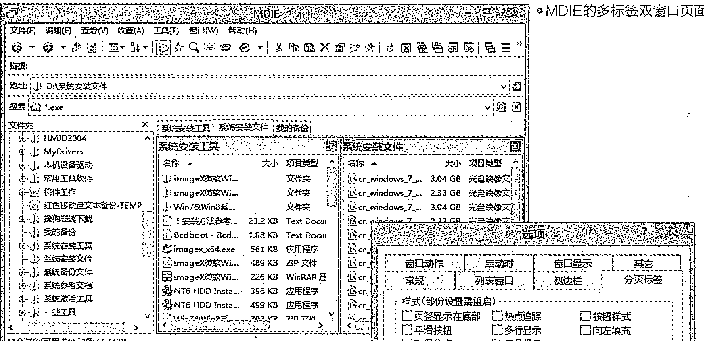

在Windows 8.1中，有许多被我们看作是非常实用且值得称道的方便“新功能”。例如通过工具栏上的相应按钮一键新建文件夹、一键显示属性、通过搜索框进行多条件文件搜索等。但实际上，早在多年前甚至在Windows 7还未诞生时，这些功能在MDIE中就已实现了。除此之外，还有许多Windows 8.1迄今未及的方面，它们仍然可对我们进行文件资源管理提供方便。

> 小技巧
> 要在MDIE中增加标签，只需在想要打开的文件夹上使用右键命令“在新分页中打开”即可。或也可通过Shift+Enter或Shift+Ctrl+Enter来实现。在选项窗口“分页标签”中可自定义鼠标操作分页标签的动作结果，通过定制可让鼠标三键单双击以及配合Ctrl、Shift等控制键点击，发挥不同的作用。

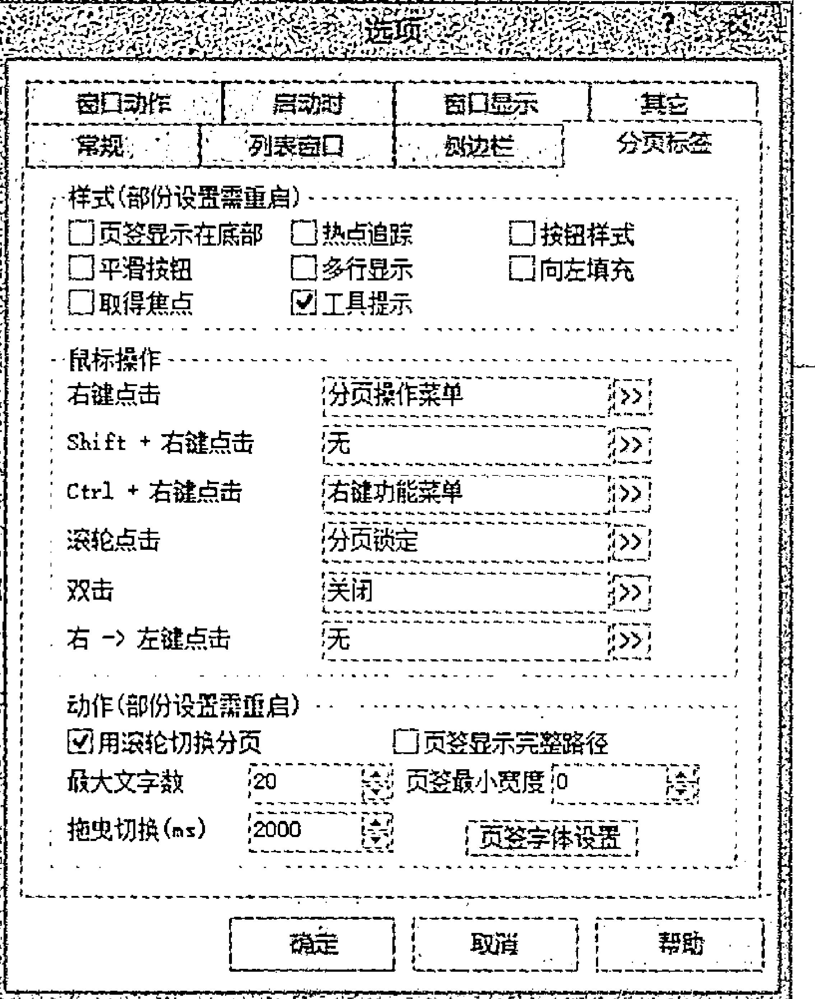

#### 方便切换 同窗口管理多目录

大家知道，目前许多网络浏览器中已经都实现了多页面标签式管理。这是一种非常人性化的资源管理方式，当需要同时对照参考多个网站或页面时，在一个窗口里使用多标签查看，要比同时打开多个窗口来回切换要方便得多。
其实在资源管理器中管理文件又何尝不是如此呢？当我们需要在两个或多个文件夹中对比操作文件时，多标签切换同样明显要比在多窗口或从Windows资源管理器目录树中切换要来得方便。假如我们要在两个分区的两个不同文件夹中多次操作文件，如果使用Windows自带的资源管理器，则在第二次定位上次使用过的文件夹时，不得不再次拖动滑块查找和点击。而若用多标签，则点一次即可来回定位。
如此方便的功能，按理说在Windows XP中实现不了也应该在Windows 8/8.1中实现，但遗憾的是，直到Windows 10出现尚未解决，还需要第三方插件来实现。

> 小提示
> MDIE资源管理器目前已经不再更新，它的最后一个版本是MDIE Ver 0.3.0.0 RC6，然而软件中的“先进功能”丝毫不妨碍我们在任何新的Windows系统中使用。

在一个资源管理器窗口中并列显示两个文件夹，这样进行文件操作也会方便很多，但Windows中却至今还不能实现。通过MDIE“窗口→窗口模式”选择“水平两个页面”或“垂直两个页面”却可以方便地实现。

234 电脑爱好者 2014下半年合订本

#### 清晰显示 有条理方能看更清

##### 更加清晰 文件列表网格显示
在Windows资源管理器窗口中，以列表方式显示文件有时会看串行了，如果能将文件列表以表格显示，那么显示出来就更加清晰易读。
通过在“选项→列表窗口”下设置“窗口样式→网格线”，可实现以带线表格显示文件列表。

##### 彩色显示 不同类文件易识别
让不同颜色代表不同类型的文件，可以做到文件类别一目了然。但是，Windows资源管理器中仅可以用蓝色显示经系统压缩过的文件。在MDIE中，通过选项窗口的“窗口显示”，也可以对文件夹、隐藏文件、只读文件、系统文件、压缩文件等各种类型的文件颜色进行自定义，用多色来显示各种文件。

#### 便于操作 省工夫才是硬道理

##### 接续工作 多个文件夹自启动
自动开启某个或多个指定的文件夹或分页，对多次接续工作来说非常必要。然而，这在Windows中无法直接实现，Windows 10刚刚引入方便人们使用的“主页”功能，早期的Windows也仅能通过设置实现开启电脑后自动打开上次使用的文件夹。
但若使用MDIE，通过“选项”窗口设置“启动时”页面，添加文件夹并勾选上面的三个复选框，启动MDIE后会自动定位到上次操作的分页，或者打开一个或多个指定的固定文件夹。

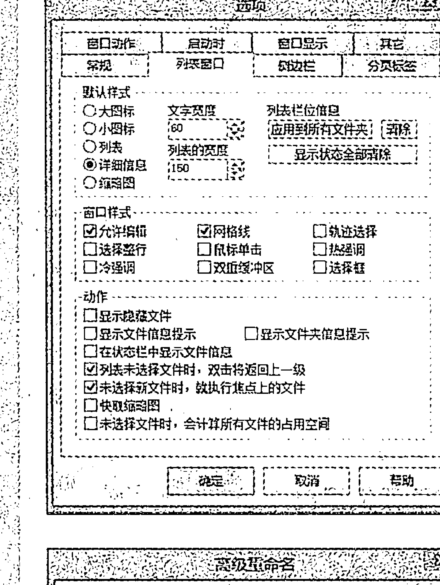

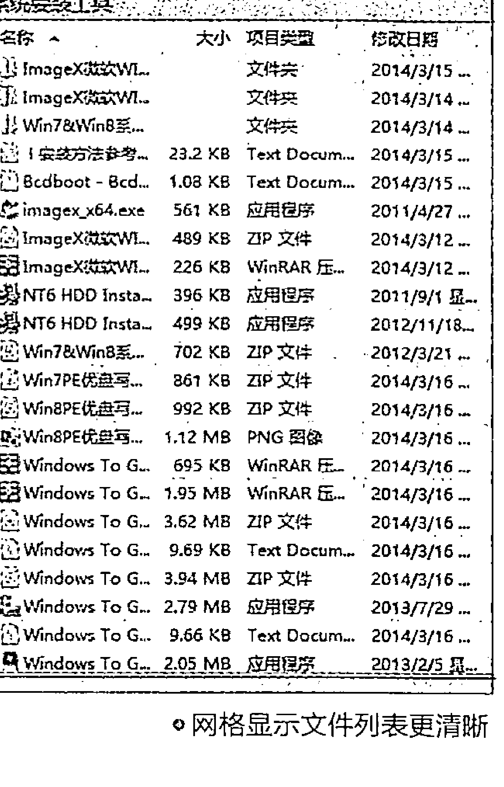

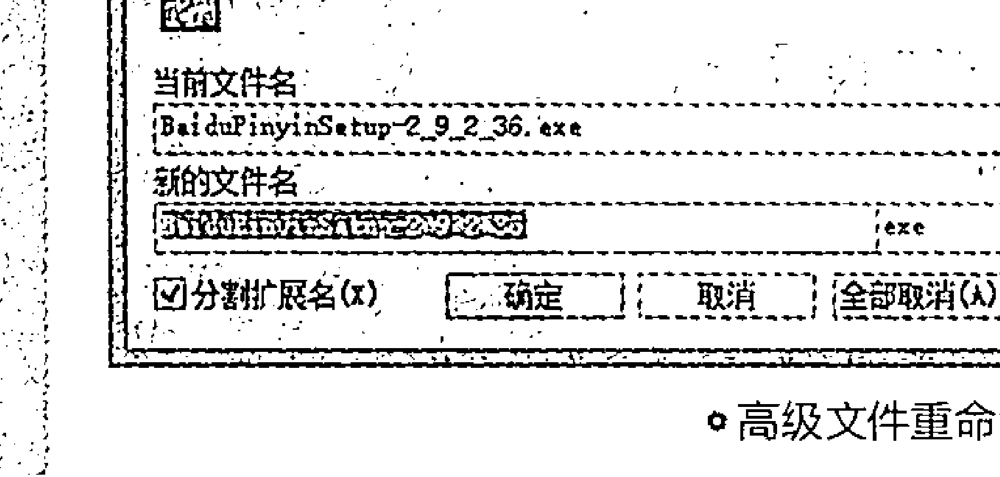

#### 高级更名 不显示隐藏扩展名

在Windows中要实现对文件的主名和扩展名分别更名，需要先设置显示出文件扩展名，然后执行更名命令方可达成。MDIE中除了传统更名外，提供了一种可以分割扩展名的高级重命名方式。
只需选中文件后执行“文件→高更名”（快捷键为Ctrl+R），而且可以支持选中多文件同时操作更名。

#### 鼠标手势 造就轻松方便操作

网页中多已引入鼠标手势操作来控制网页的进退、翻页显示等，非常方便。资源管理器中何尝不能用这种操作方式？但遗憾的是Windows中至今还没有这样的功能。
使用MDIE可通过“工具→鼠标手势”，设置鼠标三键与键盘四个方向键配合，实现各种页面进退、翻页、刷新等操作。

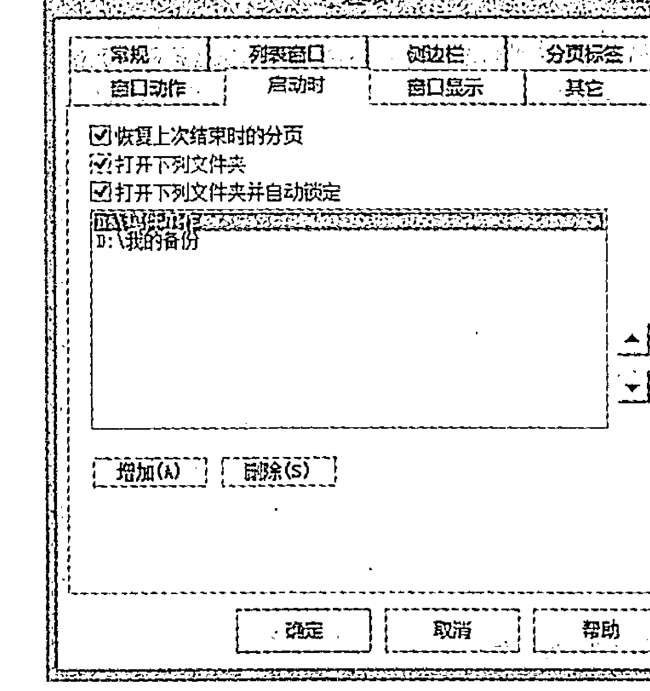

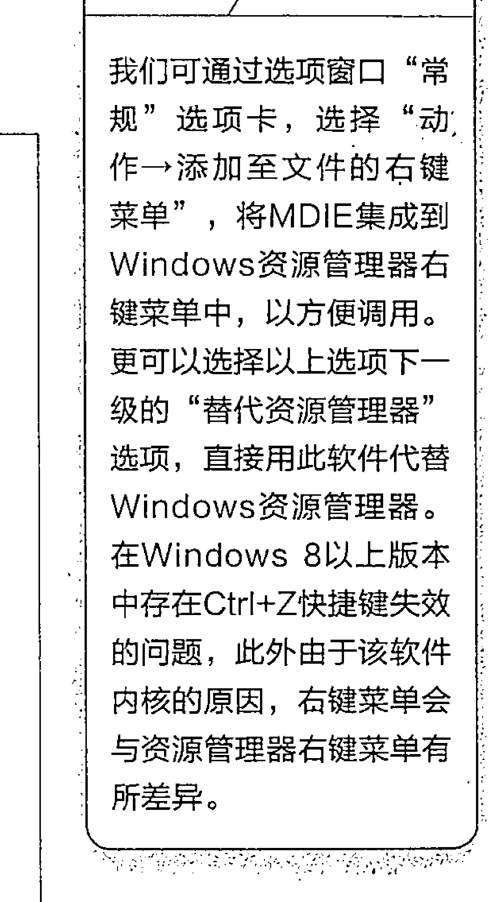

我们可通过选项窗口“常规”选项卡，选择“动作→添加至文件的右键菜单”，将MDIE集成到Windows资源管理器右键菜单中，以方便调用。更可以选择以上选项下一级的“替代资源管理器”选项，直接用此软件代替Windows资源管理器。在Windows 8以上版本中存在Ctrl+Z快捷键失效的问题，此外由于该软件内核的原因，右键菜单会与资源管理器右键菜单有所差异。

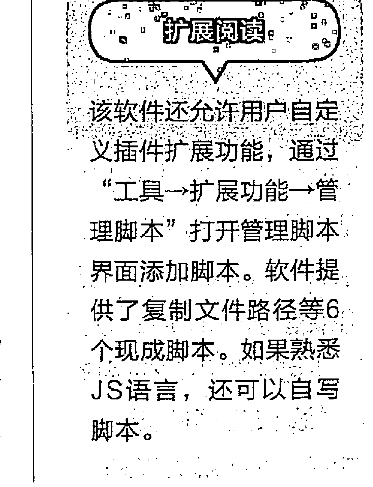

该软件还允许用户自定义插件扩展功能，通过“工具→扩展功能→管理脚本”打开管理脚本界面添加脚本。软件提供了复制文件路径等6个现成脚本。如果熟悉JS语言，还可以自写脚本。

### 用好Windows 8.1/10的两种账户

文/刘宏松

在Windows 7及其之前的操作系统中，Windows的安装和登录只有一种以用户名为标识符的账户。自从Windows版本升级为Windows 8之后，Windows的安装和使用便与网络的关系更加密切。从此，Windows便拥有了另一种账户——Microsoft网络账户。那么，对于我们早已习惯的传统账户，新型的网络账户在使用上到底有何特殊？我们在安装使用Windows 8.1或Windows 10时，到底该选择哪种类型的账户？怎样合理使用这两种账户？


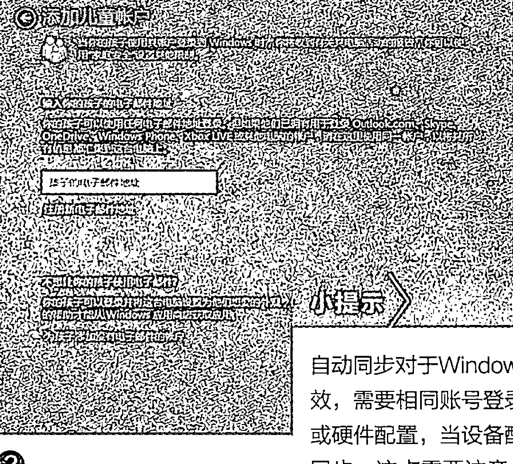

#### 1 灵活机动的网络账户

Windows 8之后，微软的发展方向已经在向云服务过渡。因此，网络账户晋升为Windows系统的默认建议账户。

在非触屏的Windows 8.1 PC环境下，用鼠标指向屏幕右侧角落，在浮出的超级按钮面板中选择“设置→更改电脑设置”，然后点击“账户→其他账户”，通过“添加账户”来创建一个新的Windows网络账户（图1）。

##### 创建网络账户方法多

此前已经拥有Windows Live ID账户的用户可以直接输入此账户作为Windows 8.1网络账户；如果没有老账户，可以用自己已经使用的任意一个邮件地址创建一个新的网络账户，账户名就是该邮箱的完全名称，密码可以现场设置；如果连现成的邮箱都没有，可点击“注册新电子邮件地址”现场申请，通过微软网站获得一个用来登录Windows的免费邮件地址，此地址还可当作平时使用的邮箱；此外，还可选择“添加儿童的账户”，创建专门属于儿童的Windows网络账户（图2）。

##### 网络账户的诸多利弊

用微软网络账户使用Windows就意味着同时开启了OneDrive云服务。对于安装系统，若不是第一次安装，会在安装结束后还原包括系统主题、语言首选项设置、浏览器收藏夹、应用等个人配置。此外，好友在Outlook.com、Facebook、Twitter等网络位置的联系信息和状态会自动保持更新到最新状态，无需登录在线存储服务OneDrive、社交网络Facebook等账户，即可进入其中并共享照片、文档及其他文件。另外，还可以从电子邮件、社交网络和其他账户联络联系人，并在“人脉”应用这个一体化的位置中查看。这些在以往的系统中需要各自启动不同的应用后方能使用。

网络账户如此方便，但也存在缺点。使用网络的一个最大隐患就是隐私泄露。如果将自己的隐私信息或文件存放在自动同步文件夹下，而自己的网络账户的登录权限一旦泄露，别人入侵你的网络空间，就可以与你一样随便查看其中保存的资料了。

小贴士：为安全起见，不建议将重要资料保存在系统默认的用户目录、系统“库”、OneDrive云盘的本地同步文件夹中。在系统盘之外的分区或移动存储介质中保存自己的隐私资料，将大大增加资料的隐私安全性。当然，如果一定要将隐私资料存入云端，要注意存入前给资料加密，并注意设置更为复杂的安全登录密码。

#### 2 安全第一的本地账户

网络账户虽然优点多多，但这些优点都有可能成为泄露隐私的缺点。其实，对于不需要网络功能，而又对数据安全比较在乎的用户来说，使用本地账户登录和使用Windows是更安全的选择。

##### 创建更安全的本地账户

在Windows 8.1 PC中，用鼠标指向屏幕左上角，在超级按钮面板中选择“设置→更改电脑设置”（平板用户通过从屏幕右边向内轻扫调出这个设置）。接下来点击“账户→其他账户→添加账户”，然后单击“不使用Microsoft账户登录（不推荐）”（图3），接着点击“本地账户”，输入新账户的用户名，若需使用密码登录，则输入并确认密码，添加密码提示，然后点击“下一步”完成本地账户设置。

##### 本地账户的不方便之处

由于本地账户的安全性也让它失去了许多方便性。由于没有网络账户，如果经常换地方工作，不得在不同的电脑上使用单独的账户，尽管账户名可以是一样的，但实际上其数据无法互通，这与不同的用户名没啥两样。你的任何设置都不会在所使用的PC之间同步，要在每一台电脑使用相同的文件、设置、应用和服务，只能重新设置或通过专用的工具来迁移。云中的资料也只能借助于浏览器登录网页端或安装云客户端来访问。同时，也无法从Windows应用商店获取丰富的应用。

> **小提示**
> 使用网络账号登录Windows，必须使用密码登录。微软网络账户密码限制为不超过16个字符长度。但使用本地账号，可选择不用密码。如果多人共用电脑，建议设置由大小写字母、数字、符号或空格等多种字符组成的强密码，且强密码不应包含一个完整的单词，也不应含有很容易被猜到的信息（如你的真实姓名、账户名和生日等）。

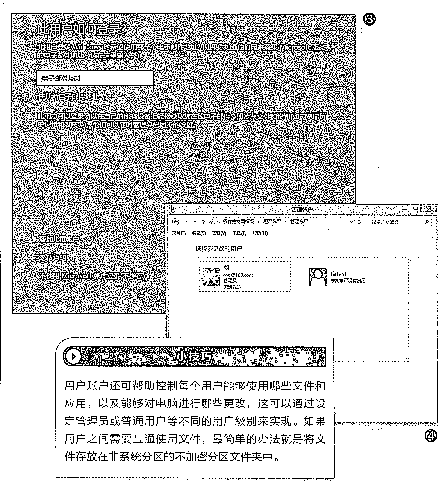

> **小技巧**
> 用户账户还可帮助控制每个用户能够使用哪些文件和应用，以及能够对电脑进行哪些更改，这可以通过设定管理员或普通用户等不同的用户级别来实现。如果用户之间需要互通使用文件，最简单的办法就是将文件存放在非系统分区的不加密分区文件夹中。

#### 3 按需选择 混搭多个账户

不论是本地账户还是网络账户，一台电脑的同一个Windows 8.1/10系统下均可以创建多个用户账户。创建不同的用户账户同样可按上述步骤，在账户添加窗口中进行；也可以通过PC控制面板，通过“用户账户→管理账户”选择“在电脑设置中添加新用户”进入添加用户页面添加（图4）。多账户允许网络和本地账户混搭使用，也可以均使用同一类型的账户。

多账户在不同情形下会有不同的用途。例如，一家人用一台电脑，不少家庭只用一个账户，久而久之，不同爱好者的文档、应用程序掺杂到一起，系统会显得非常混乱。其实，起初就应该为每个人创建属于自己的账户，这样一来，每个人都可以拥有属于自己的桌面背景、屏保，每个人可安装属于自己的程序，其他人的设置或程序毫不影响自己的使用环境。多账户的最大用途是多人使用一台电脑而互不干扰。

对于只有一个人使用的电脑来讲，使用不同的账户，可以在每个账户下安装使用不同的软件，这样就可以建立不同的测试或使用环境，可有效地防止在同一环境下软件之间的干扰。这种做法对于软件测试者来说非常有用，尤其是测试一些不稳定或存在隐患的软件时非常实用，不用另找一台电脑测试。CF

### 恢复丢失的数据与分区

文|瑶瑶

安装测试Windows 10的过程中移动硬盘数据分区出现问题，起初盘符和卷标完好，但其中的数据无法读取，显示“没有权限”，更改权限后数据出现，但插到另一台电脑又遭遇了卷标消失、权限无法更改和无法用Windows修复的更大麻烦。数据还有救吗？分区还能修复吗？

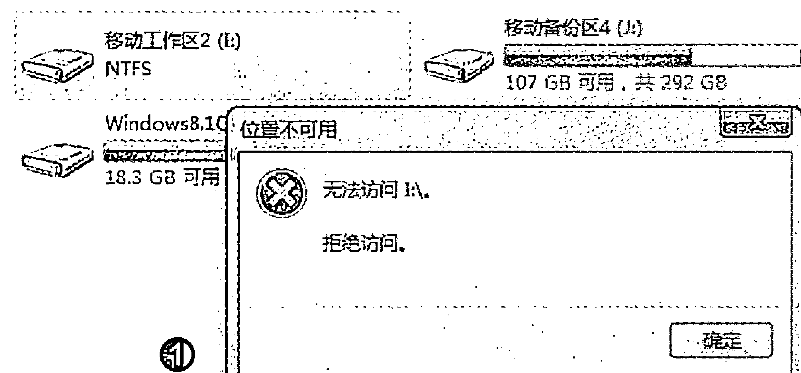

#### 1 权限丢失 分区无法访问

一块有4个分区的移动硬盘挂接在Windows 10系统下使用，其中第一个分区中安装有Windows 8.1操作系统，而其余三个分区为数据分区，卷标分别被命名为“移动工作区2”、“移动资料区3”和“移动备份区4”。工作过程中发现系统操作速度奇慢，资源管理器几乎不能操作，勉强进入后点击盘符为I:盘的“移动工作区2”，弹出“位置不可用”的提示窗口，窗口中出现警告信息“拒绝访问”（图1）。再点击后面的两个分区，结果均是如此。

分析：既然被提示拒绝访问，那么有理由怀疑因访问权限丢失或被修改所致。因此，通过修改分区访问权限或许可以解决问题。

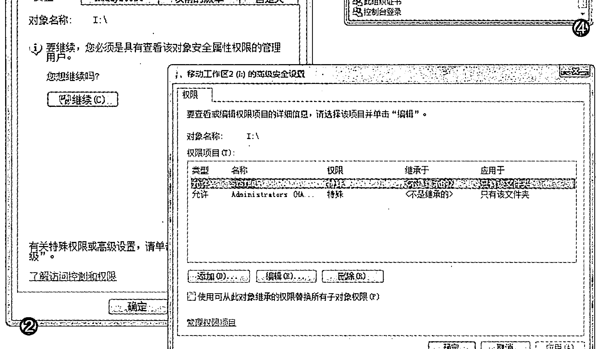

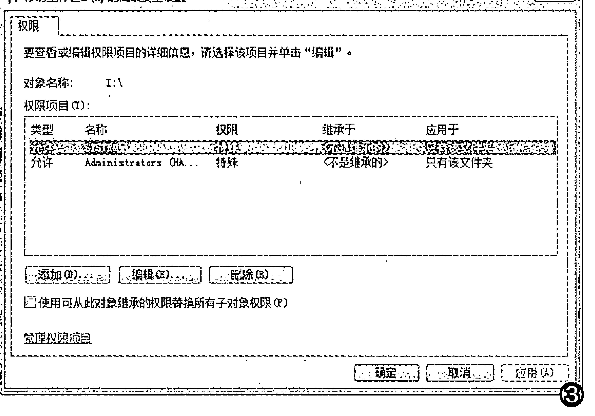

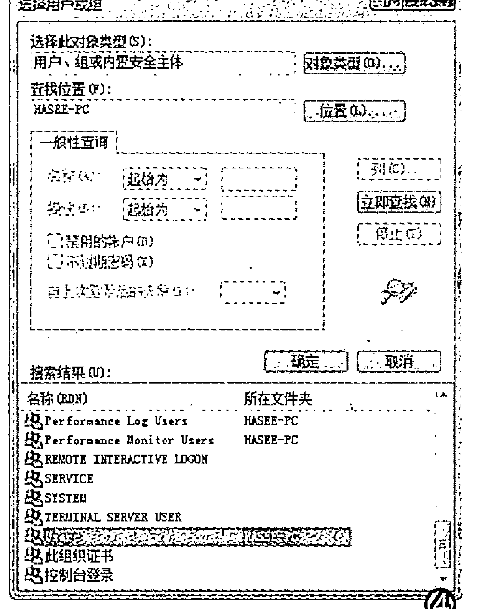

右键单击发生问题的分区I:并选择弹出菜单中的“属性”命令，在弹出的磁盘属性窗口中点击“安全”选项卡，然后点击“高级”按钮（图2）。在高级安全设置窗口的“权限”选项页中，可见没有当前登录的用户名称（图3）。

点击“添加”按钮添加当前登录的Windows用户名（图4）。随后，将该用户的权限设置为“完全控制”，应用并确认（图5）。之后进入资源管理器，发现分区I:的数据变得可以访问了。

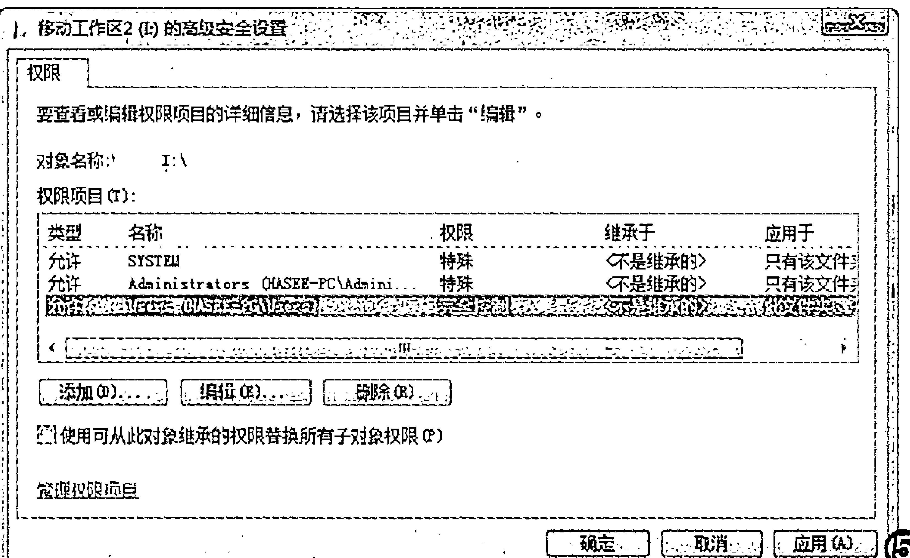

用相同的方法处理后面两个数据分区，问题得到解决。

#### 2 卷标不见 权限无法修改

但是，好景不长，将该移动盘插入另一台PC的Windows 10预览版下访问，本来已经修复好的分区，系统提示三个分区的回收站发现问题，询问是否删除回收站。想到回收站里也没啥内容，于是点击了确认。但当系统启动完成，进入资源管理器才傻了眼——更糟糕的事情发生了：此前修复好的三个数据分区的卷标都不见了，只有盘符还在，显示“本地盘符J”等图标（图6）。

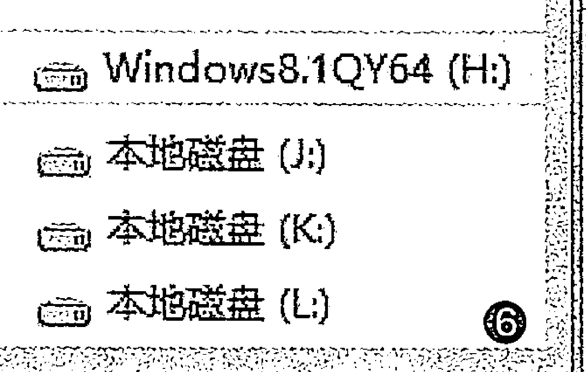

有了前述修复经验之后，觉得依然是权限的问题，于是顺理成章决定进入磁盘属性修改权限，但没想到属性根本就不再有“安全”这一项，修改权限的行动也就无从谈起。于是感觉到问题的严重性。

看来，这已经不是一个权限的问题，很可能是磁盘文件系统甚至磁盘本身出了问题。只能求助于数据恢复软件来帮忙了。由于三个数据分区中存有重要文件，因此首先尽量先将文件恢复出来，然后再考虑修复分区和盘符的问题。

> 小提示：如果出现问题的是系统分区，系统不能启动，还可以在“硬盘”菜单下执行“重建主引导记录”来修复引导功能。

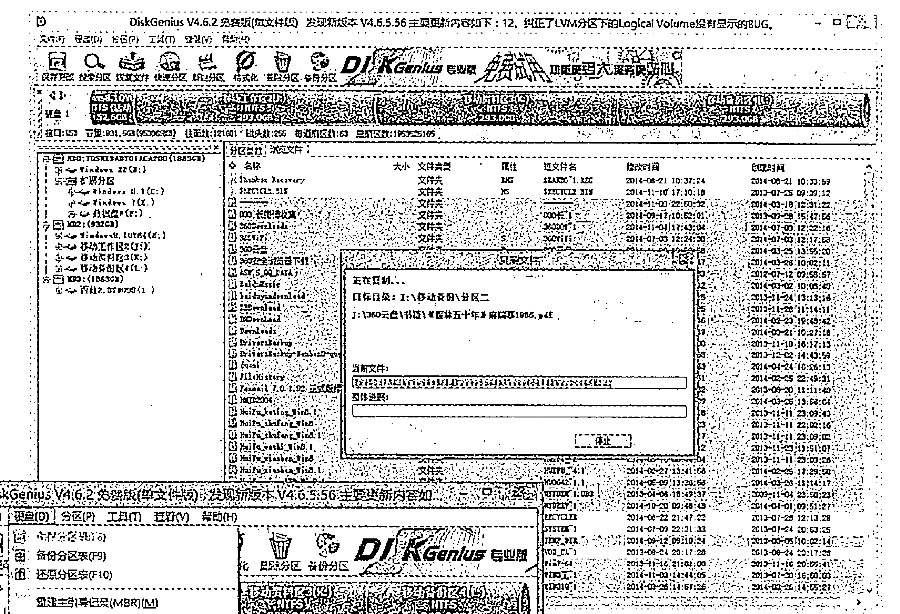

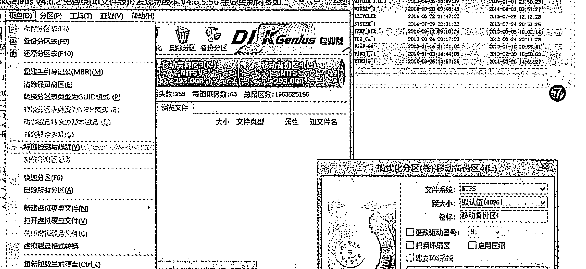

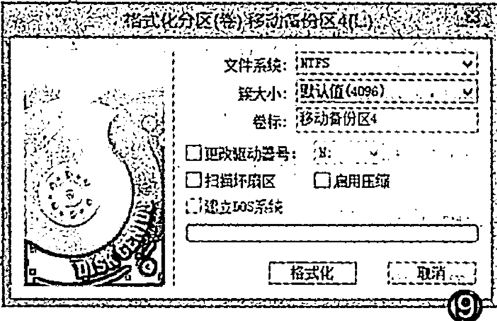

#### 3 抢救数据 原样恢复分区

启动磁盘精灵（DiskGenius）工具，在该软件自带的浏览器中，可是看到此移动硬盘的分区卷标可以正常显示，尝试点击某分区，可进入文件列表界面。多重选择文件后，可以进行文件复制，将文件从磁盘复制到电脑的其他硬盘分区中，实现数据的抢救（图7）。用同样的办法，将三个分区中的有用资料统统复制到另外的硬盘中。资料保住了，接下来就可以放心大胆地对移动硬盘分区进行修复操作了。

硬盘出现错误不能访问，可能是分区表的错误，又可能是关键位置处出现坏道。依次通过“工具→检查分区表错误”菜单命令检查分区表错误，再通过“硬盘→坏道检测与修复”菜单命令检查和修复磁盘坏道（图8）。

如果是这两方面的问题引起的，那么经过修复扫描和修复之后，磁盘分区在资源管理器中就变得可以访问了。

如果是其他方面的问题，可能上面的两种扫描和修复方法也无济于事，扫描也不出现任何错误。那么此时的万全之策就是重新格式化每个分区，这样用着也更放心。格式化操作同样可以使用DiskGenius，在其窗口中右键点击要格式化的分区，选择“格式化当前分区”命令进行格式化处理。如果对磁盘质量不放心，格式化前还可同时将“扫描坏扇区”选项选中（图9）。

分区格式化之后，再将备份出的文件恢复到原来的位置，这样就可以和原来一样，放心地使用每个分区中的文件了。

### 鼠X视频专辑下载有道

从网上搜索连续剧《战地黄花》，发现CNTV上有源可以播放，但无下载按钮（图1）。安装CNTV客户端，也没有发现下载链接入口。26集的连续剧用下载工具一集一集获取地址添加下载有些麻烦，于是顺理成章地想到了此前介绍过的硕鼠专辑下载功能。

文|阿京

#### 1 页面代码提取下载

尝试到CNTV播放页面通过右键“属性”获取专辑链接地址，将专辑地址提交给硕鼠下载，但分析结果显示下载错误，无法解析整个专辑地址（图2）。且下方又提示只能注册为会员一行一行地粘贴地址下载，又有些繁琐，怎么办？

右键单击CNTV连续剧《战地黄花》专辑页面，选择“查看源代码”命令，可见窗口中连续剧的链接地址（图3），将地址复制到TXT文件中稍加处理，便获得了连续剧的播放地址列表。

#### 2 多重地址批量解析

打开硕鼠下载工具，点击左侧“常用功能→硕鼠会员中心”，在会员中心窗口中点击“多地址解析”链接，将上面获得的播放地址列表复制到解析地址窗口，然后点击“开始解析”按钮（图4）。

> 小提示 由于硕鼠多地址解析对免费会员限制每次只能解析20个地址，因此，26集的连续剧需要分两次解析。如此，即便是40集的连续剧，解析两次也就够了，总比一集一集地添加要省事得多。

#### 3 点击黄色按钮下载

解析成功后，会生成一个黄色按钮，点击该按钮即可启动下载窗口，成批自动下载该连续剧。下载的文件格式是FLV，新型的MP4播放器均支持播放。如果机子比较老不支持播放，可以用通用格式转换器（如格式工厂）转换为播放器可支持的格式。

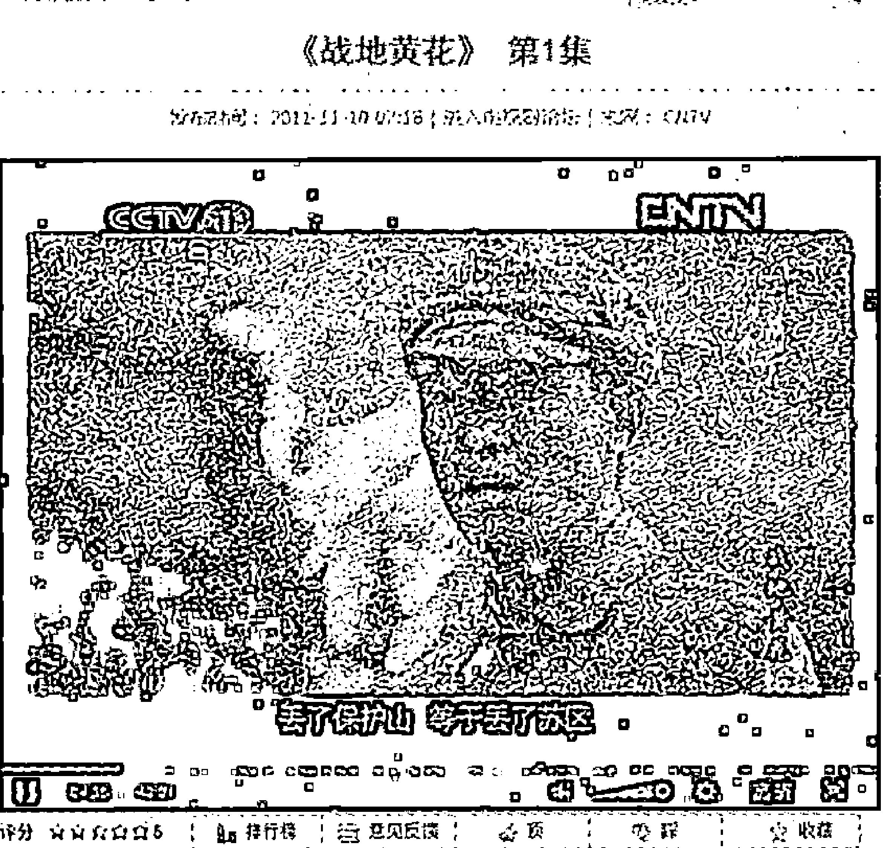

```
连续剧播放地址列表代码（图3）
```

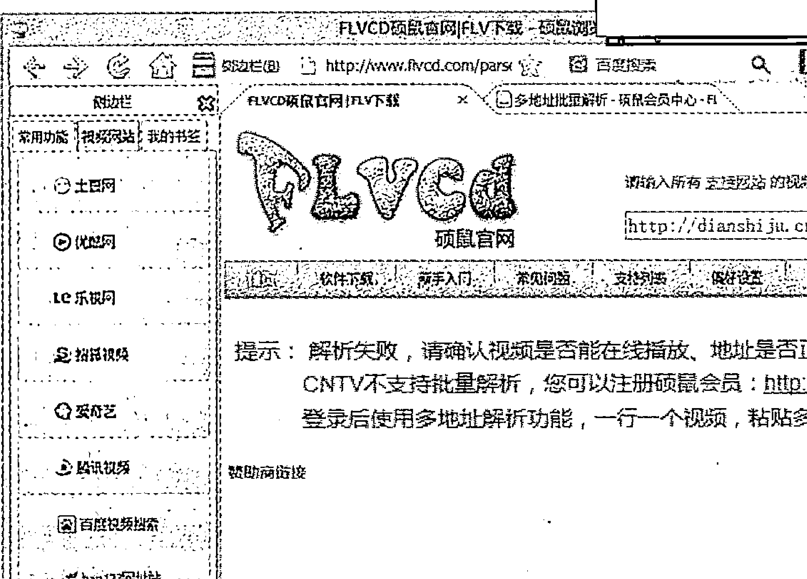

> 小提示 对于无法用通用方法或下载工具下载的任何疑难视频专辑，只要网页上能播放，都可以借鉴如上方法来实现下载。

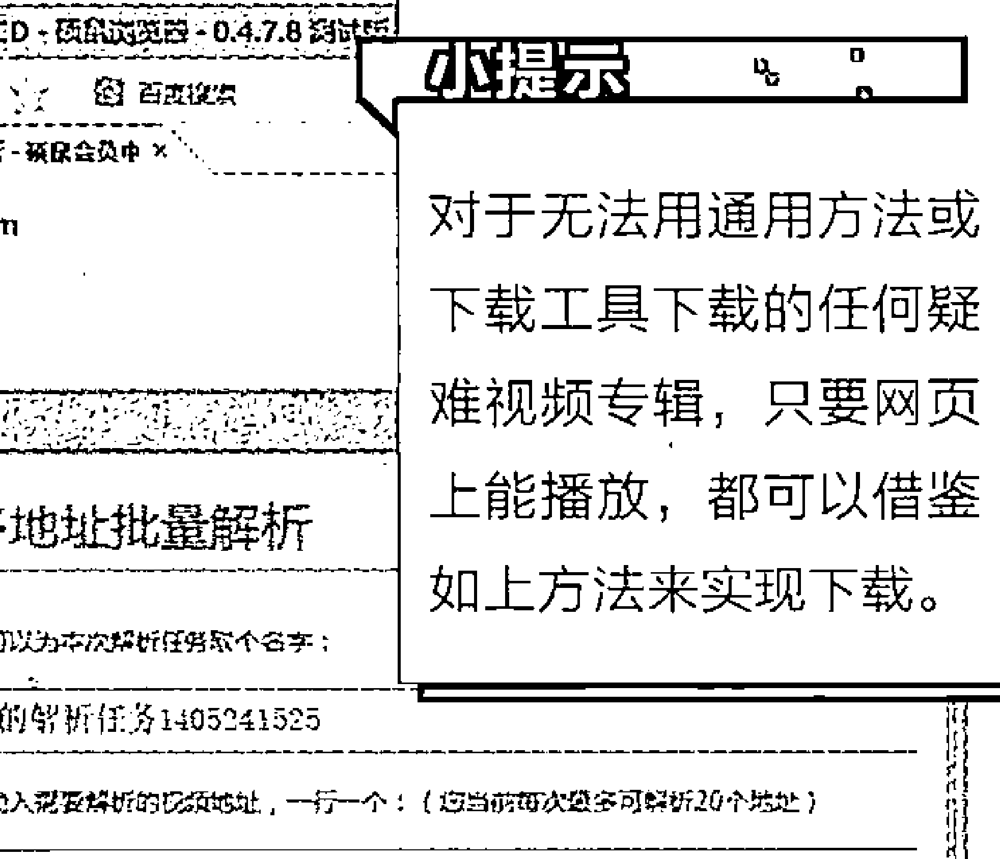

### 对特殊视频格式说不

虽然主流视频网站的桌面客户端均支持视频下载功能，但暴风影音、乐视、搜狐及爱奇艺的特殊文件格式，如不经过处理便无法应用在移动智能终端或其他桌面播放器中，着实令人头疼。对于已经花时间下载的“特殊”视频，该如何用最简单便捷的方式让其成为兼容各类平台的“万金油”呢？

文|王一

#### 1 自下自转莫须忙

出于对版权的保护意识，暴风影音不仅使用其专有的BHD视频格式，就连桌面客户端上也未像其他产品那样在明显位置上提供视频下载的按键，设置窗口中提供“缓存设置”也无法像网页文件那样直接提取利用。视频下载该如何开启呢（图1）？
其实，当我们通过暴风桌面客户端搜索视频时，只要在播放列表点击鼠标右键，便能看到“下载到本地→立即下载PC格式”的选项，解决视频下载问题。剩下的就是该如何对付BHD的视频格式了。本着“管杀也管埋”的做事心态，暴风影音其实已经在客户端集成了转码工具，但复杂的运营心态使其不得不将其隐藏在暴风影音桌面客户端的工具集中。
点击暴风影音播放器窗口左下角的提箱按钮并点选“转码”按钮，启动暴风转码工具，添加下载好的BHD文件，设置转码后文件的输出目录和所用的播放设备种类型号，才可进行转码，过多的人工干预使它显得不够人性化。

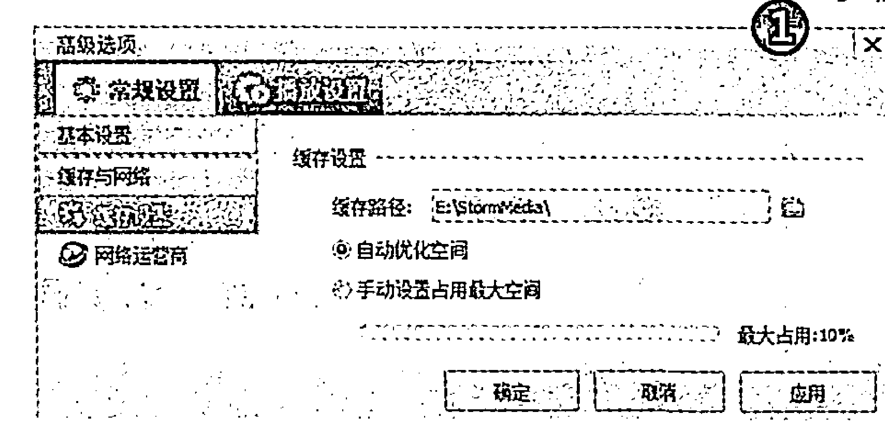

#### 2 简易更改扩展名

还有一些比较神秘的视频格式，比如乐视视频客户端或搜狐影音客户端下载的视频。其中乐视视频客户端下载的视频格式为LETV扩展名，而搜狐影音客户端下载的视频为IFOX扩展名。这些格式的文件拷贝到手机或换台PC用通用播放器播放均不能打开，不少网友试过许多转码工具都无效。
其实解决起来非常简单，只需将乐视视频的扩展名LETV改为MP4或FLV，将搜狐视频的扩展名IFOX改为MP4，即可实现在任何手机、平板或PC上播放了。MP4格式的文件对PSP游戏机和苹果设备的播放也能很好地支持。

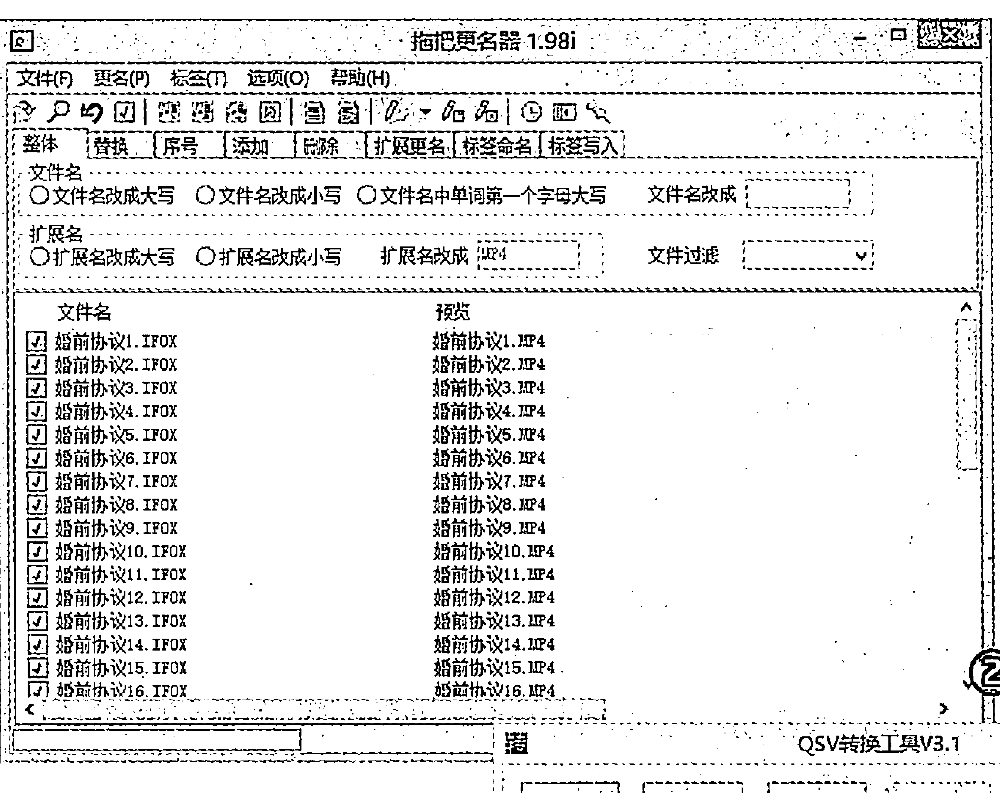

- 小提示：
对于成批视频文件扩展名的更名，可用拖把更名器等专用文件更名工具来一次实现（图2）。

#### 3 专用转换器来帮忙

对于爱奇艺视频客户端下载的QSV格式来说，则不像上面说的那么简单了。我们会发现，无论是更名还是用市面上流行的格式工厂等万能转码器，均不能实现格式转换。这时可搜索下载一款专门的QSV转码工具（http://down.tech.sina.com.cn/content/55290.html），便可将QSV转换为FLV，实现在通用视频播放器上的任意播放（图3）。

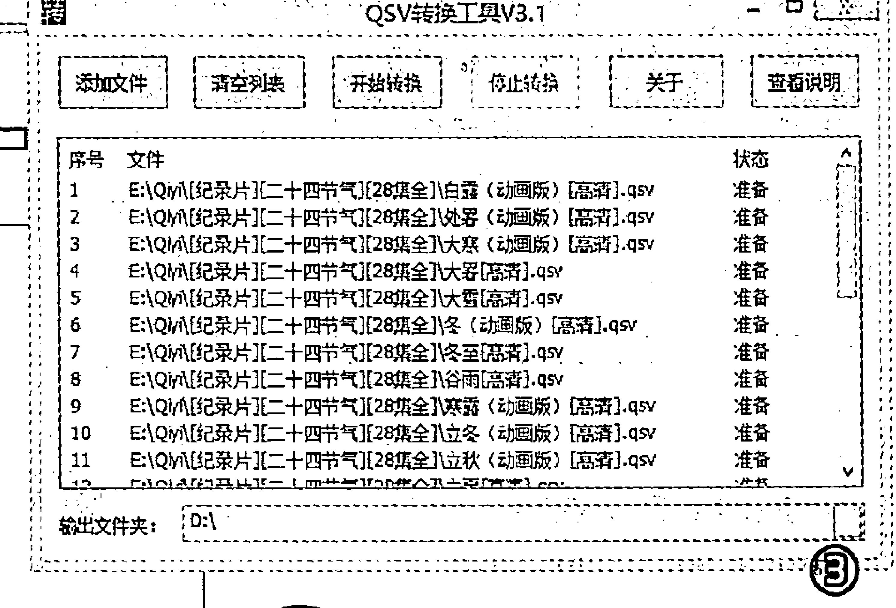

### 垃圾清理 三大纪律要注意

清理电脑中的垃圾，看起来似乎很简单，随意下载个主流维护软件一键搞定即可。但有时使用过后却发现有用或有价值的文件“莫名其妙”消失掉了。是因为信任软件的能力还是忽视了需要注意的事项？清扫系统和软件时都要关注些什么呢？
文|林涛

#### ① 全面清理 不留死角

目前系统维护软件均声称可以稳定、全面地清扫大家的电脑，但实际却没有任何一款软件能够做到不留任何死角。想要知道这个问题的答案，就需要首先了解系统垃圾产生的原因。总体来说由三个方面决定：系统本身、应用软件、用户使用习惯。

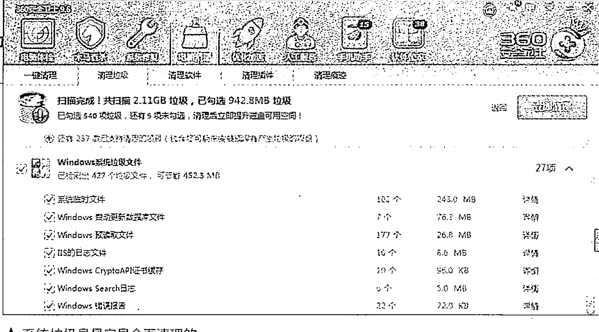

对于系统来说（比如Windows的某个版本），由于微软已发布的系统是大家都可以进行深度研究的，因此哪些位置容易产生垃圾以及产生什么样的垃圾，有迹可循。再加上各厂商系统维护工具开发者互相借鉴，做到全面清理问题不大。但对应用软件而言，由于其数量的庞大和内容的复杂，加上开发标准的不统一，产生的垃圾文件很难归档在固定的目录中，要实现对所有应用软件产生的垃圾进行不留死角地清理是不可能的。而对于用户产生的垃圾，垃圾系统维护软件更是无从判断。如一个用户经常一次性地看小说、电影或其他文档，而该用户又没有好的文件存储习惯，到处乱丢文件存放，那么，垃圾清理工具凭什么能说这个小说、那个视频是垃圾呢？

▲ 系统垃圾是最容易全面清理的

```
@echo off
echo 正在清除系统垃圾文件，请稍等……
del /f /s /q %systemdrive%\*.tmp
del /f /s /q %systemdrive%\*._mp
del /f /s /q %systemdrive%\*.log
del /f /s /q %systemdrive%\*.gid
del /f /s /q %systemdrive%\*.chk
del /f /s /q %systemdrive%\*.old
del /f /s /q %systemdrive%\recycled\*.*
del /f /s /q %windir%\*.bak
del /f /s /q %windir%\prefetch\*.*
rd /s /q %windir%\temp & md %windir%\temp
del /f /q %userprofile%\cookies\*.*
del /f /q %userprofile%\recent\*.*
del /f /s /q "%userprofile%\Local Settings\Temporary Internet Files\*.*"
del /f /s /q "%userprofile%\Local Settings\Temp\*.*"
del /f /s /q "%userprofile%\recent\*.*"
echo 清除系统LJ完成！
echo. & pause
```

▲ 垃圾清理批处理

> **小技巧**
> 系统中的死角垃圾，根据使用者的不同因人而异，因此清理工作也没有一个铁定的工具。但是，每一种垃圾肯定有固定的存放地址或文件类别，所以有一个方法可以通用，那就是自己定制死角垃圾清理批处理，将要清理的目录和文件列入其中。具体方法是，使用系统内部命令DEL和RD并结合其参数/F、/S、/Q来构造具体的批处理程序，格式为：
> DEL /F /S /Q <某目录下的某类文件>
> RD /F /Q <某文件夹>
> 如图所示即为一个垃圾清理批处理文件的内容。其中参数/F表示强制删除只读文件，/S表示删除各级子目录中的文件，/Q表示安静删除不确认提示。

要不留死角地清理系统，360安全卫士、CCleaner、系统优化大师等都可以完成这样的工作。而对于应用软件的垃圾清理，除借助于以上工具的清理外，还需要对维护工具未能涉及清理的应用软件进行手动处理，一般是进入应用软件的高级设置窗口，查看其缓存或临时文件的目录在何处，进入后删除其中的文件。而对于用户自己的垃圾文件，这是系统维护软件最无能为力的一个项目，这就要靠用户平时养成良好的文件管理习惯，最好将各类文件存放在分类固定目录中，使用完毕后，将那些不需要的文件手动选择删除，腾出硬盘空间。

#### 2 自动清理 慎重选择

由于垃圾数据的多样性，由用户自行判断不但有很大难度，即便是有技术基础的用户，寻找和处理起来也会很费时间和精力。因此，通常情况下，我们一般选择能自动扫描和分类垃圾的系统维护软件，由软件为我们自动清理垃圾。

对于系统维护软件提供的自动清理功能，在开启之前，一定要看清其中的自动清理设置，如果其中有需要保留的项目（例如“使用痕迹”的保留是有些用户很在意的），那么一定要去掉其中的勾选。否则，等自己明白过来的时候，东西就已经找不到了。

虽然有的自动清理工具会提醒我们可能会有被误删的重要信息，但是，不能因此就认为可以万事大吉。实际上，使用自动清理仍然可能暗藏着一种风险，这种风险主要体现在对用户有用数据的误删。这是我们接下来要讨论的问题。

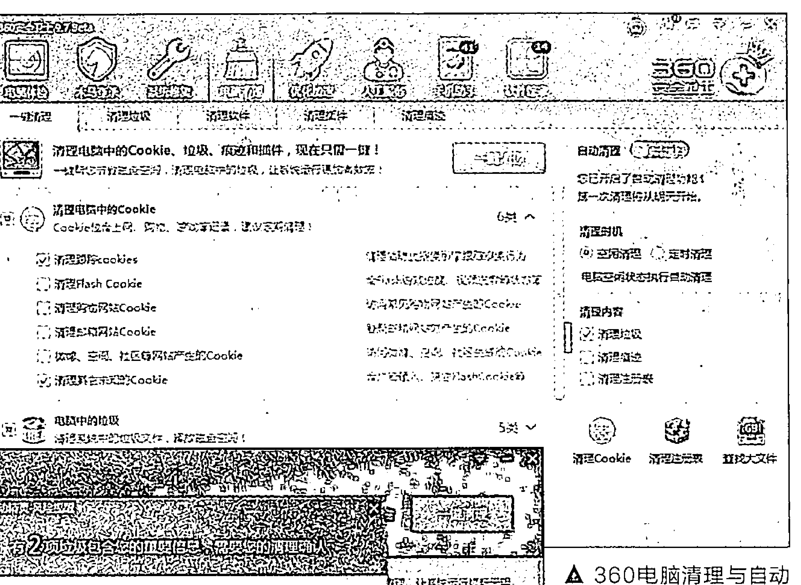

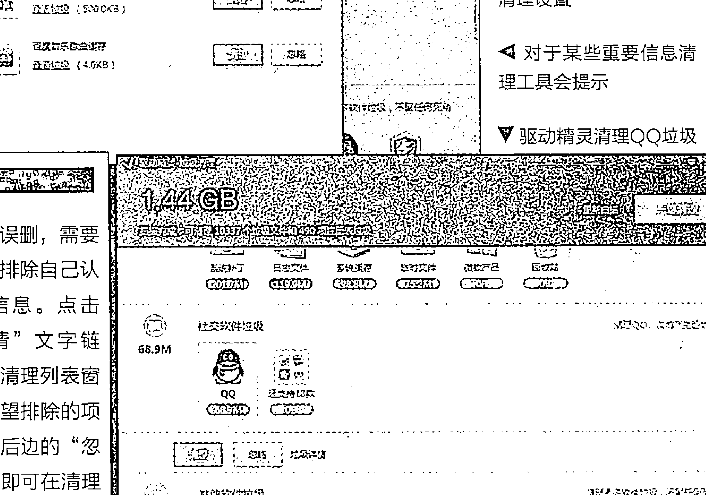

#### 3 定制清理 防止误删

不是说系统维护软件扫描出的“垃圾”数据都可以放心清理，因为用户使用习惯的不同，有些被软件认为是“垃圾”的数据，在有的用户那里却是有用的文件。例如，清理工具一般会认为TEMP或TMP文件夹的文件是临时文件，可以当垃圾文件对待，而有的搞程序的用户，或者像我这样常常爱鼓捣电脑的用户，可能会把一些实验用的程序或数据放在自己建立的TEMP文件夹中。但这并不表示这个文件夹中的东西是没用的。如果一味听信系统维护软件的自作主张，就可能丢掉自己的这些实验数据。那么，如何才能在清理垃圾和保留有用数据这两个方面达到两不误呢？这就需要使用自定义清理而不是全自动一键清理。

以用驱动精灵的垃圾清理模块清理系统为例，该软件检测出QQ软件产生了69.9MB垃圾文件，若按照自动方案，这些文件都将被清掉。但是，在这69.9MB的所谓“垃圾文件”中，就包含了QQ聊天过程中收到的动态表情图片、网友发给自己的一些有用图片等。如果用户有回看聊天记录的习惯，那么完全清理会让所有这些历史记录荡然无存，因而对于这些用户来说，有用的图片信息就被误当作垃圾给清理掉了，这时就需要提前设置保留。360软件管家等软件管理工具下载的软件也常常是容易被误删的对象，这些软件对于有的用户来说装完就没用了，而对于某些收集软件版本的用户来说，则希望这些目录中的软件永久留存。但是，电脑管家之类的垃圾清理工具往往会将能找到这些软件作为自己的“功劳”，统统将其列入可清理的默认选项之中。这时，如果选择了软件默认的一键清理选项，那么手指一落，自己辛辛苦苦积攒的所有软件就会荡然无存。这种情况下也需提前设置保留。

> > 小贴士：为了防止被误删，需要定制清理，排除自己认为有用的信息。点击“垃圾详情”文字链接，进入到清理列表窗口，对于希望排除的项目，点击其后边的“忽略”按钮，即可在清理时绕过对这项项目的清理。

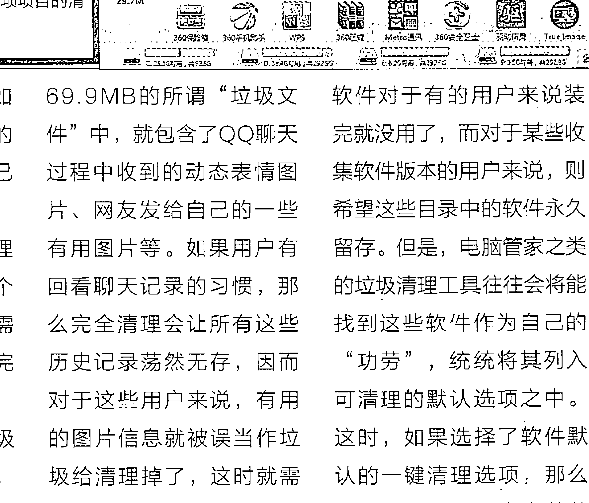

### 不装必应桌面 也集必应图片

必应桌面工具除了方便的搜索功能外，最引人注目的就是每天提供专业的重量级桌面壁纸。如果家中的电脑安装了必应桌面，想在办公室的电脑上收集必应图片，需要在办公室的电脑上安装必应桌面吗？不用！

文/张志浩

一种异地自动搜集必应壁纸的方法可以解决问题。使用这种方法，仅需点击桌面的一个快捷按钮，甚至什么也不需要做，就能让系统自动帮我们完成壁纸收集。

#### 1 账号同步登录 壁纸也能同步

首先，在办公室的电脑Windows 8.1系统中使用与家中Windows 8.1相同的账号登录，自动保持与家中系统桌面主题同步。

但是，进入办公室系统的桌面壁纸文件夹后，会发现每天同步一张必应壁纸，但旧的壁纸会自动删除。文件夹下始终只有一张壁纸，而进入文件夹需要走10层目录（C:\Users\用户名\AppData\Local\Microsoft\Windows\Themes\RoamedThemeFiles\DesktopBackground）（图1），难道为了这一张壁纸，每天都要这么繁琐地逐级打开文件夹去拷贝吗？

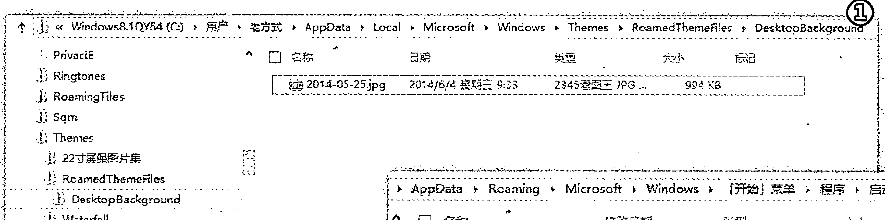

#### 2 进入藏图秘地 灵活备份壁纸

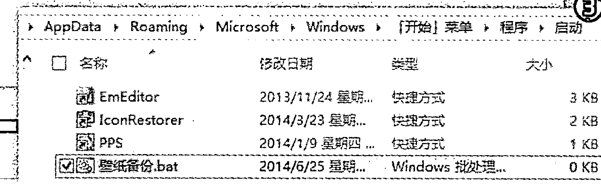

既然深入拷贝比较麻烦，而我们又想将每天的壁纸备份下来，就得想个省事的方法。

首先想到的是建立一个进入壁纸文件夹的快捷方式，一键直达。在桌面上建立一个BAT扩展名的批处理文件“壁纸备份.BAT”，先输入一行文件内容：

```
CD C:\Users\用户名\AppData\Local\Microsoft\Windows\Themes\RoamedThemeFiles\DesktopBackground
```

（其中的“用户名”要改为为自己当前登录的用户文件夹名。）

然后给文件追加如下一行内容，用来提取文件夹中的壁纸图片。

```
COPY *.* E:\壁纸图片搜集
```

（“E:\壁纸图片搜集”为提前建立的壁纸收集文件夹。）

BAT文件建好之后（图2），发送快捷方式到桌面，这样就可以在每天开机后，一键备份壁纸到“E:\壁纸图片搜集”了。

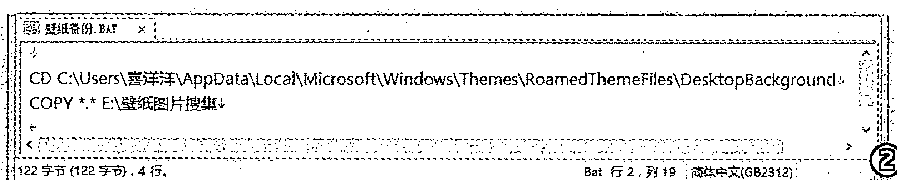

> 小技巧：将快捷方式放置在系统自启动文件夹下（默认为“C:\Users\用户名\AppData\Roaming\Microsoft\Windows\Start Menu\Programs\Startup”），可实现开启系统后自动备份壁纸（图3）。这样就不用每天点击快捷方式了。

### 键盘故障 PC照样输入

如果在Windows 8.1环境下使用PC，忽然一天键盘进水出了毛病，而手边又没有备用键盘，我们又急于在电脑上干一件事情，能有什么方法来应急呢？没错，重任落在了鼠标的身上，而鼠标又能为我们怎么做呢？文|奕牛

#### 1 “触摸键盘”来帮忙

大家知道，Windows 8.1带有触摸键盘功能，而我们现在使用的绝大多数PC屏幕都不带触摸功能，微软显然有点超前。但是，这不代表触摸键盘在传统PC上没有用武之地。如果PC键盘出现故障，我们可以用鼠标操控触摸键盘，在非触摸屏幕上实现输入应急。

不带触摸屏的PC上安装Windows 8.1后，默认不会开启触摸键盘功能，我们需要将它开启后方能使用。

在系统任务栏空白处点击鼠标右键并选择“属性”，在弹出的设置窗口中点击“工具栏”选项卡，选中其中的“触摸键盘”选项（图1）。

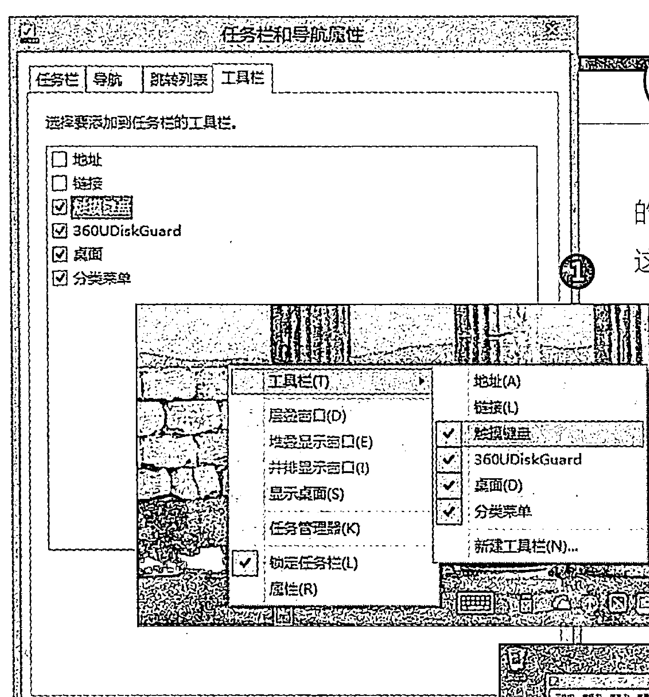

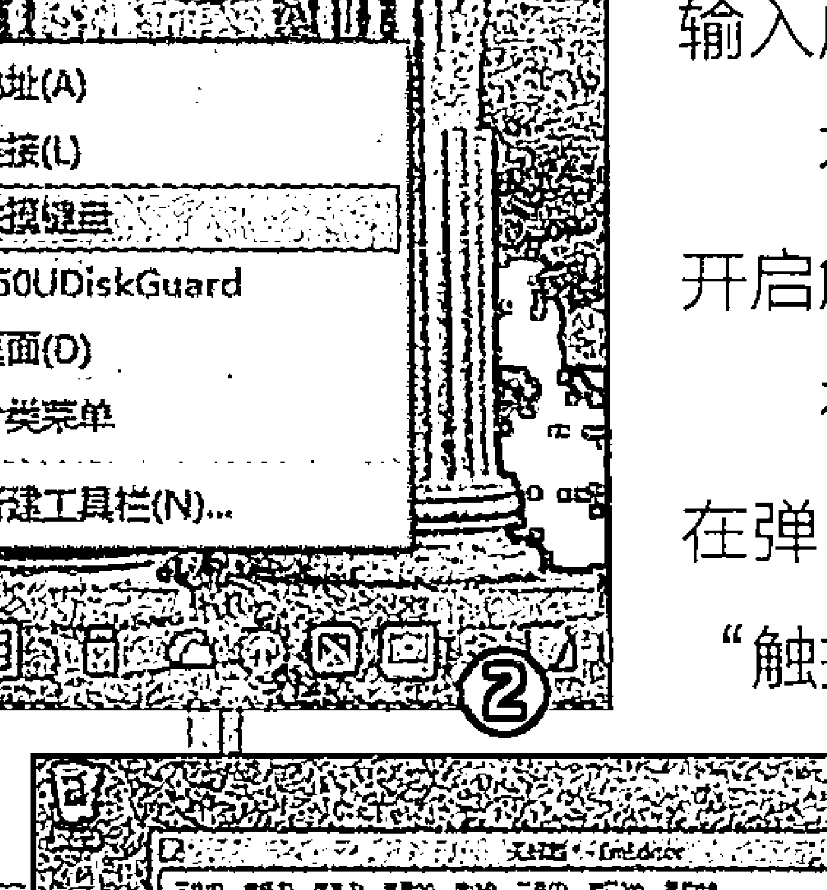

接下来，再次回到任务栏空白处点击鼠标右键，选择“工具栏→触摸键盘”命令，即可在屏幕上开启触摸键盘（图2）。

此时，我们就可以打开输入文字的软件，用鼠标调用“触摸键盘”进行输入了（图3）。

#### 2 输入法的软键盘

目前PC上的主流智能拼音输入法均带有一组软键盘，利用鼠标右键调出软键盘中的PC键盘，也可以实现中英文信息的输入。调用其他软键盘，还可实现特殊符等各类符号的输入（图4）。

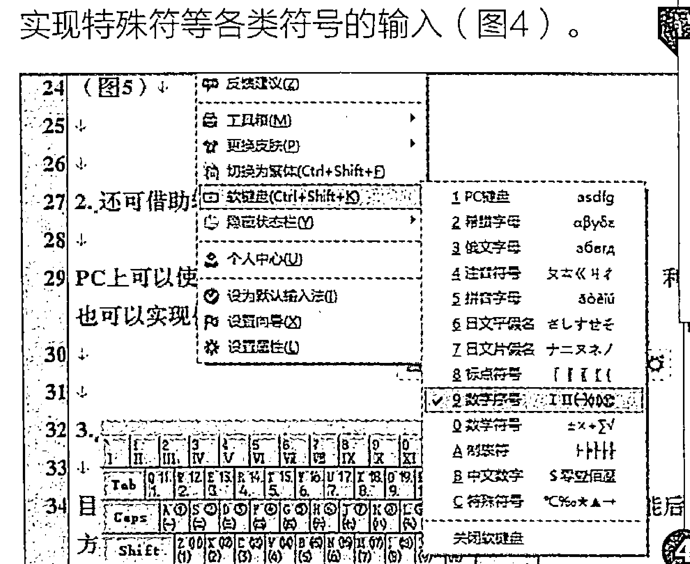

> 小提示：在触摸键盘的右下角有一个用来切换输入法的专门键位，与点击系统桌面任务栏右下角的输入法切换器的功能相同，大大方便了输入法切换。

#### 3 手写输入也方便

PC版智能拼音输入法也多带有手写功能模块，安装并激活该功能后，用按下鼠标左键比划写字的方法，就能写入需要的信息了。如百度拼音手写输入（图5）。

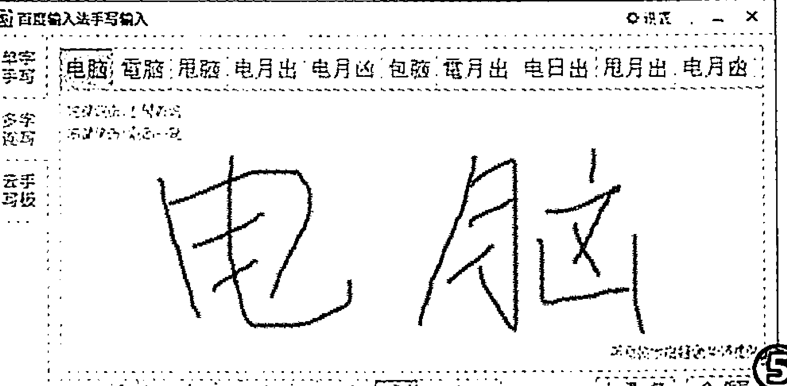

### 网络收藏夹“私通”捷径

只使用一种浏览器的用户越来越少。出于不同的需求或更换了不同的环境后，许多人都有着使用2种甚至更多浏览器的习惯。浏览器之间共享收藏夹地址有何好方法？

文|刘阳和

由于先前的浏览器中一般都保留有自己成年累月收藏的网络地址，因此，一个浏览器中的收藏地址如何成批导入到另一个浏览器中是个现实问题。但由于浏览器种类繁多，导入导出可能会存在兼容性问题。一个通吃所有网络浏览器收藏夹数据的共享管理方案可以解决问题。

首先需要在电脑中安装搜狗高速浏览器，不用它上网也没关系，我们只用它来实现网址管理。在搜狗高速浏览器中点击“收藏→导入导出收藏”命令（图1），进入收藏管理器。

#### 从任意浏览器搜集网址

如果我们的电脑中已经安装了IE之外的其他网络浏览器，在搜狗浏览器的“导入或导出收藏”窗口中，会自动检测出这些浏览器的存在，通过“从浏览器导入”选项卡，可以选择直接导入这些浏览器内收藏的网址到搜狗高速浏览器的收藏夹中。点击自己之前使用的那种浏览器的图标，然后点击“导入”按钮即可（图2）。

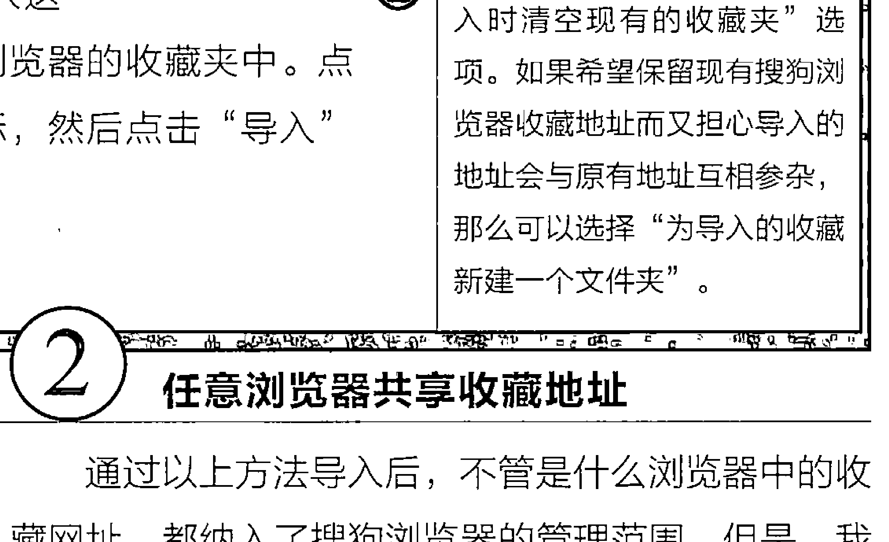

> > 如果只想复制原浏览器的收藏地址而不希望与现用的搜狗浏览器收藏地址合并，选中“导入时清空现有的收藏夹”选项。如果希望保留现有搜狗浏览器收藏地址而又担心导入的地址会与原有地址互相参杂，那么可以选择“为导入的收藏新建一个文件夹”。

#### 任意浏览器共享收藏地址

通过以上方法导入后，不管是什么浏览器中的收藏网址，都纳入了搜狗浏览器的管理范围。但是，我们所喜欢的网络浏览器不一定是搜狗浏览器或IE浏览器，如何在我们将要使用的新浏览器中使用原来浏览器中的收藏网址呢？

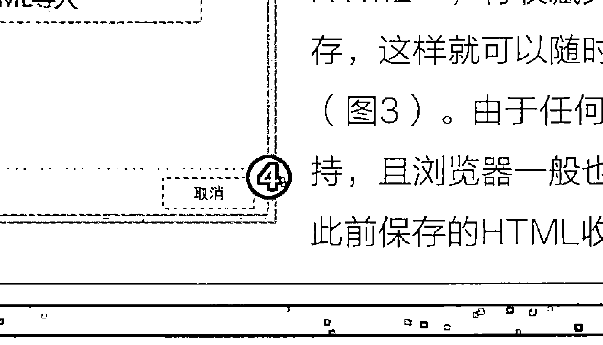

点击搜狗高速浏览器网址管理窗口中的“导出收藏”选项卡，然后选择并点击“导出收藏为HTML”，将收藏夹以一种通用的HTML文件格式保存，这样就可以随时供给任何一种网络浏览器使用了（图3）。由于任何浏览器对这种格式都能很好地支持，且浏览器一般也都有收藏地址导入功能，因此，此前保存的HTML收藏列表就能轻易地用上了。


> > 为防止不测，可将用搜狗高速浏览器备份的网址以HTML格式备份到别的分区或网盘中。如果系统出现问题进行了重装，重新安装搜狗高速浏览器后，只需将以上备份导出的HTML收藏文件，通过“从文件导入”页面导入，即可马上恢复收藏的所有网址（图4）。此外还可注册搜狗高速浏览器网络账号，自动备份收藏网址。

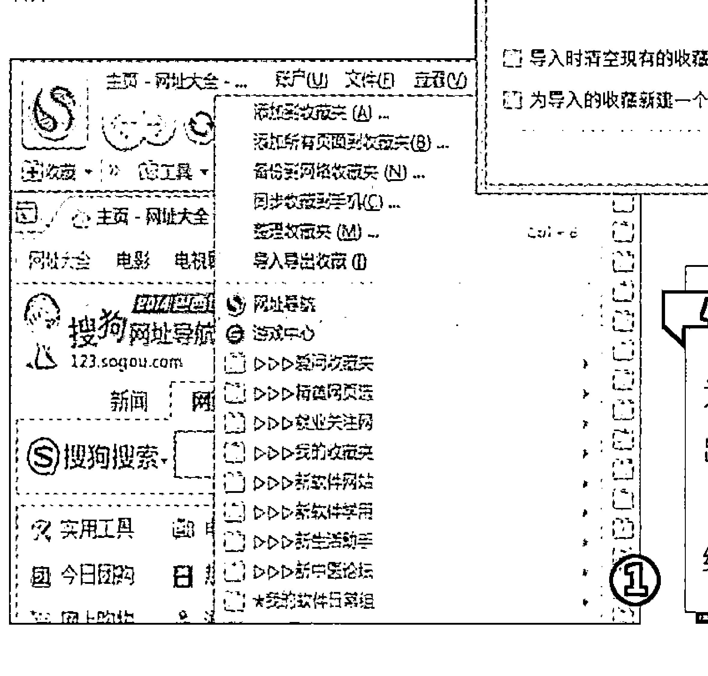

### 营造文件超速解压环境

压缩包解压，尤其是解压一个文件比较大的压缩包时，有时会占用很长时间，压缩软件会提醒我们是不是要切换到后台等待。那么，能不能提高解压速度，让解压过程在更短的时间内完成呢？

文|米莉

#### ① 改变临时目录提效

通过定制解压软件的临时文件目录，让不同磁盘或分区间的文件操作变成同一磁盘的操作，从而提高解压速度。因为在不同磁盘或分区间移动文件，速度要远远低于在同一分区内移动文件的速度。

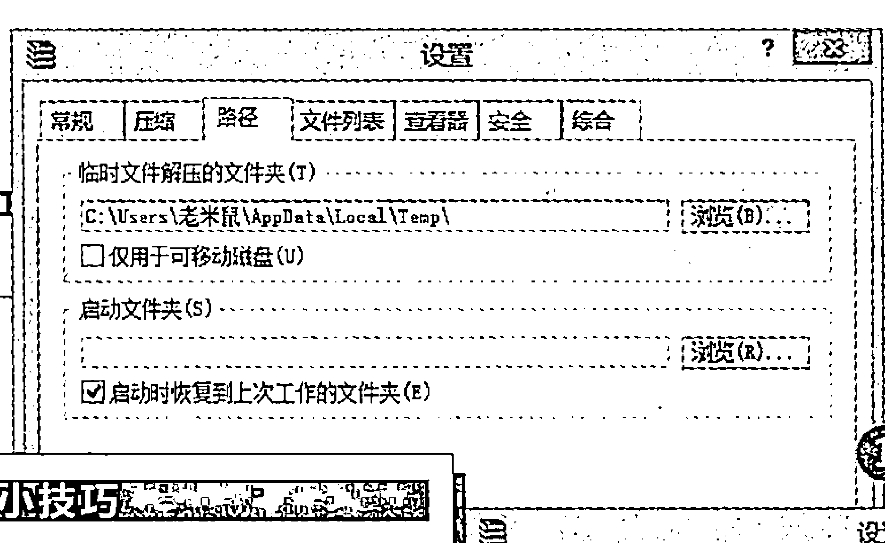

以解压RAR压缩文件为例。一般的解压方法为双击压缩文件，在WinRAR窗口中点击“解压到”按钮进行，或者直接通过右键菜单的“解压文件”命令来解压。此时，我们打开WinRAR的“选项→设置”窗口，点击“路径”选项卡看一下，在“临时文件解压的文件夹”框中，显示的是类似于“C:\Users\老米鼠\AppData\Local\Temp\”这样的路径（图1），这是系统分区中当前用户名下的一个临时文件夹，WinRAR在解压文件时就是先把文件解压到这个临时文件夹中，然后再转移到目标文件夹中的。而我们所要解压的大压缩包往往不是存储在系统C盘中，因此，解压工作完成后，从一个分区倒腾数据到另一个分区，肯定要花费比较多的时间，这也是WinRAR解压比较费时的原因所在。

还有一种方法，先用超级兔子系统工具中的内存虚拟磁盘模块，将多余的内存空间虚拟出一个盘符，然后将WinRAR的解压临时文件夹设定指向到这个虚拟盘符。这样一来，因为内存的读取速度是闪电速度，因此临时文件的转移自然要比从C盘临时空间转移快许多。

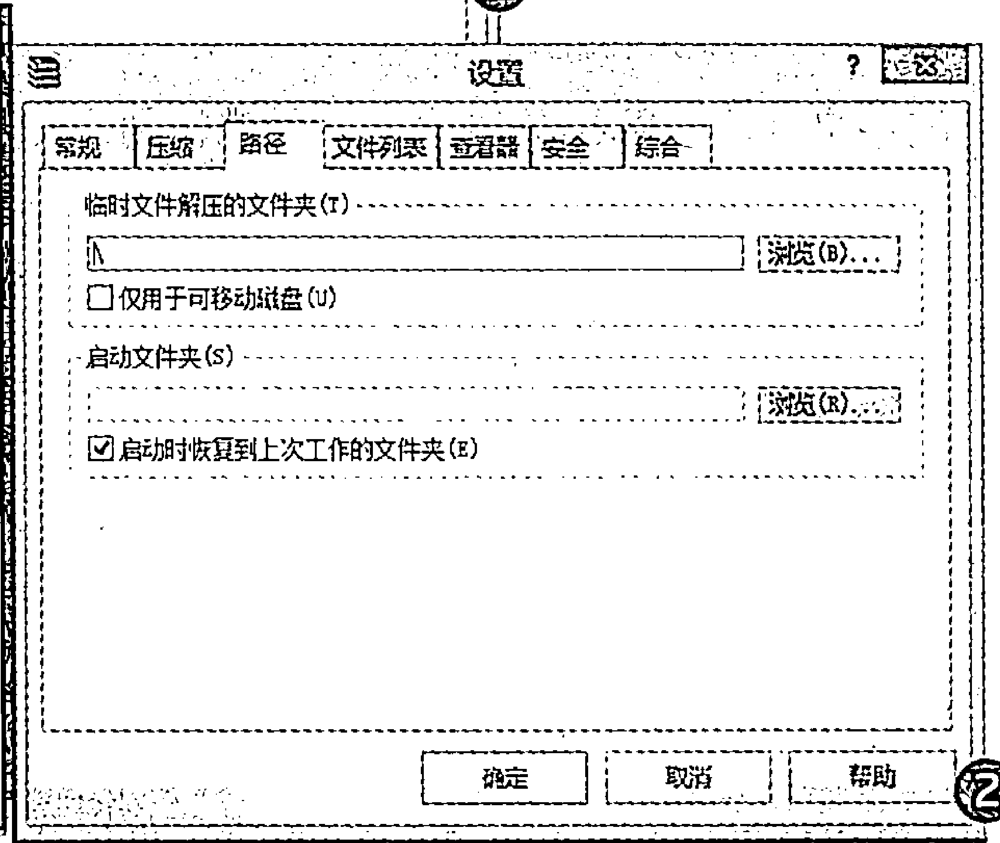

知道了这个原因，我们只需将WinRAR的这个临时文件夹设为压缩包所在分区的根目录，即在“临时文件解压的文件夹”文本框中输入一个半角反斜杠符号（表示当前盘根目录）（图2）。同时，为发挥CPU在解压中的最大性能，需从“常规”选项卡下选中“多线程”并取消对“低优先级”的选择。确定之后，再进行大文件的解压操作，发现总体速度明显要快许多。

#### ② 借用虚拟方法提取内容

除了用设置压缩软件临时目录的方法提高解压速度外，还可以使用将压缩包虚拟为盘符的办法直接提取内容，这样也可以避免解压过程中临时目录的中转过程，从而提高解压速度。

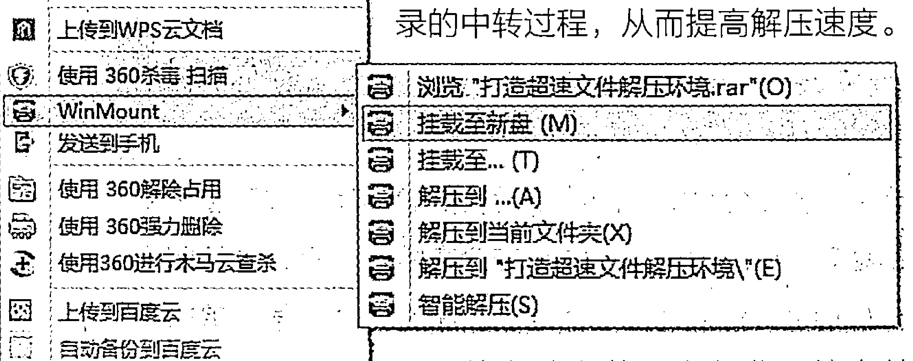

给电脑安装国产免费压缩文件管理软件WinMount，安装此软件后，在需要解压的压缩包上单击鼠标右键并选择“WinMount→挂载至新盘”命令（图3），随后，我们会看到在文件资源管理器中出现一个新的盘符。点击盘符，其中便是压缩包中的全部内容，直接可以使用其中的内容，免去了解压缩所需要的漫长等待。

### 知行合一 在线上大学

著名教育家陶行知曾强调知行合一，这在慕课中得到充分体现。慕课是国外刚刚兴起的新型教育方式，已悄然登录国内，其中大型开放式网络课程MOOC即为“知”，与之相对应的大型在线开发实验MOOE可称之为“行”。不但可以网上听课，还可以网上做实验，让我们一起来体验在线大学吧。

文|任尔东南西北风

#### ① 足不出户上国际大学

国际上知名的Coursera，其实已经和网易有了专门合作的中文学习社区（http://tinyurl.com/o55rqcf），所以国内用户想要使用它，门槛并不高。可以先通过网易合作的中文社区了解相关课程，然后跳转到Coursera（https://www.coursera.org）中学习就可以了。注册Coursera时最好填写真实的邮箱，用于接收相关邮件。注册登录后点击课程打开导航界面，在搜索框中输入你需要的课程，打开相应的课程界面，在确定需要学习之后点击右方“免费加入”，即可进入课程学习页面了（图1）。

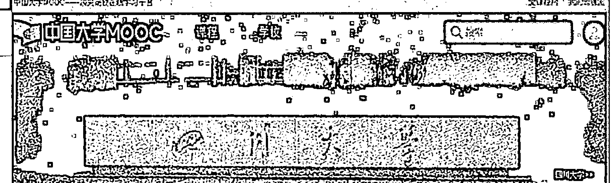

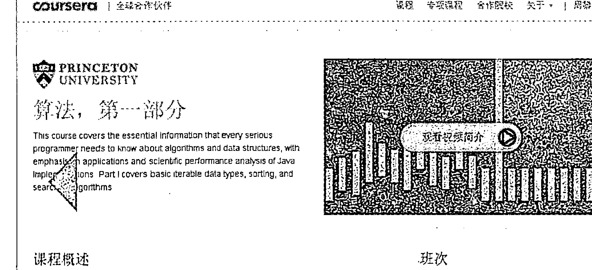

#### ② 国内慕课

国内也有不少平台开始开办MOOC，比如中国大学MOOC、过来人、清华大学学堂在线、上海交大好大学在线、超星慕课等。以中国大学MOOC为例（http://www.icourse163.org），使用网易账号或爱课程登录即可（图2）。操作方法与Courseras相似，唯一不同的是，如果你想在移动设备上离线播放视频，视频下载还需要借助其他工具。如果你安装有傲游浏览器，可以通过它的嗅探器功能来实现，通过浏览器打开待下载MOOC的视频地址，在地址框后有嗅探器工具，打开它，在弹出的对话框中选择视频选项卡，勾选需要的视频下载即可。或者直接通过视频右上角的下载按钮，单击“保存”下载。

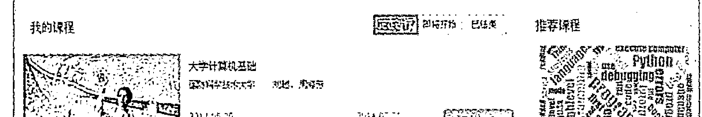

#### ③ 在线大规模网安实验室

学习信息安全可能还困惑于没有实验环境，有了合天网安的实验室，我们就可以在线做安全实验了。打开合天网安（http://erange.heetian.com），注册一个账号。单击添加课程按钮，可以免费学习一些课程，部分课程需要通过做实验等方式获得合氏币来购买学习。比如“网络安全与对抗”课程，单击“添加课程”，在实验列表中选择“创建实验机”按钮，并且勾选“我已阅读并接受合天网安实验室法律声明”，同时阅读实验说明及了解实验步骤等。实验机创建完毕，单击“进入实验机”即可开始实验。注意，在完成并得到实验报告后，别忘了结束实验机释放资源。

通过傲游下载的视频数量多了之后，就会出现一些无效视频文件和重复视频文件，建议通过文件大小的方式来区分有效视频（文件太小的一般都是无效的）。另外就是通过专业嗅探工具来下载，如影音嗅探专家等。影音嗅探专家的在线嗅探器会自动嗅探出视频访问记录，对于黄色显示的记录要重点查看，文件体积是不是很大，地址一栏是否指向对应的视频地址等，确认后右击，在弹出的菜单中选择“下载”，或者使用迅雷、快车下载即可。

[CF]

### 阅读更方便 分割合并网络小说

现在许多人喜欢在平板等移动设备上看小说，可是从网上下载的小说，有的是一部完整的小说，有的又是比较零散的章节，均有可能导致阅读不便。为了更好地进行阅读，就需要根据实际情况，对下载到的小说进行分割或者合并处理。

文/重楼

#### 长文件自由分割

如果下载的小说太长，阅读时翻页或查找会很不方便，此种情况下可按照大小或章节的方式进行分割。这可以借助“TXT杀手”软件（下载地址：http://tinyurl.com/pfqopyu）来完成。

最简单的是按大小分割。点击左上角“待分割”后的按钮，在弹出的对话框中选择要进行分割的网络小说，接着点击“保存到”后的按钮，选择分割后保存的位置。接着在“分割方式”中选择“大小”，再在“分割设置”中设置分割多少份，以及每份包括多少字节等。根据自己的需要设置完毕，点击“分割”就可以了。

更人性化的分割是按章节划分，需要设置表达式进行区分。在“分割方式”中选择“章节”，然后在“章节表达式”列表中选择一个表达式，软件已经内置有按照章、节、回、集等进行分割的表达式。比如网络小说是按照“第一章”这样的形式书写的，那么就在列表中选择“第一 二三四五六七八九十〇零百0-9 1234567890]{1,12}章”项（图1）。

设置完毕点击下方的“分析”按钮，可以在列表中看到分析出的章节名称，如果确认没有问题，在列表中勾选需要导出的章节名称，再点击“输出选中章节”就可以了（图2）。进入分割后保存的文件夹，可以看到一个以0结尾的文本文件，它保存的是网络小说的前言等内容。

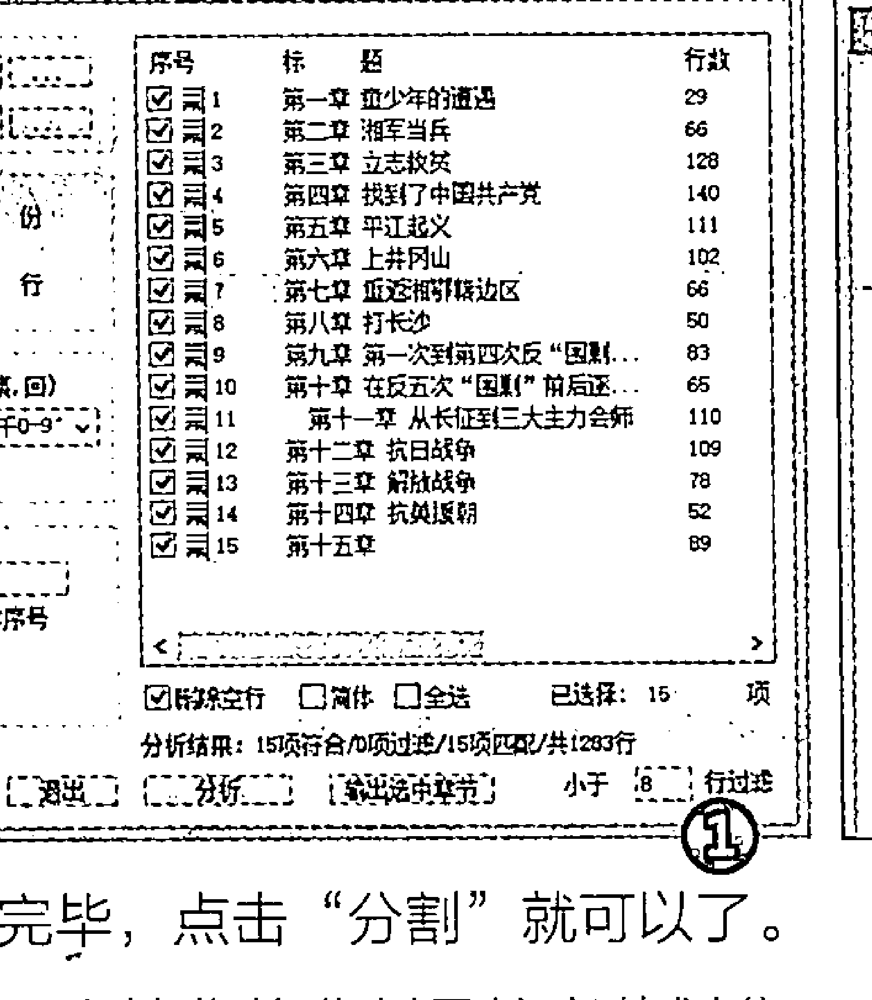

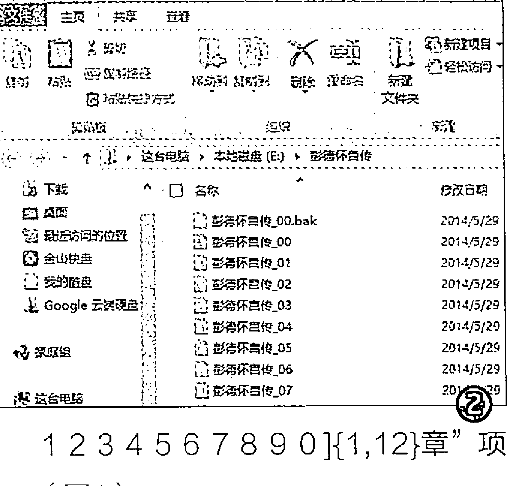

#### 合并文件方便阅读

大文件需要分割，而一些比较零散的小文件则需要合并才行，这可以通过TextForever（下载地址：http://tinyurl.com/nseppp6）来实现。软件运行后，切换到“文件合并”选项卡，在“选择需要合并的文件”部分，点击“选择”导入要合并的文件。文件添加到列表后，可以通过工具栏中的箭头按钮调整顺序，避免文件合并后出现内容颠倒的问题（图3）。

接下来点击“选择合并后的文件”后的“选择”按钮，设置合并文件的保存位置，然后在“文件间隔”中勾选“在每个文件内容后加空行”项，最后点击“开始合并”就可以了。当看到合并完成的提示，点击“选择合并后的文件”后的“查看”按钮，就可以打开合并后的文件查看和预览啦。

> > TextForever这款工具的功能很多，如下载的网络小说是网页格式的，那么可以利用“Html→Text”选项卡中的功能进行转换，然后再进行相应的操作等。

